## 求财风水秘笈
国际风水大师教你求财秘笈
慧缘◎著
团结出版社

## 作者简介
慧缘大师(教授)，现任世界堪舆家协会主席，是享誉中外的科学风水学泰斗，著名的中医和佛医学家、市政规划师。他出生于中医世家，自幼受承庭训，禅心研习歧黄医易及佛道信息学。曾就读于陕西中医学院和第二军医大学。先后受师于陈明科、陈留恩、太乙上人、青云禅师等三十多位医易名士和佛道大师，集众家之长于一身，形成了一门独特的综合学科。他创立的气功针、科学风水学、视觉美学、佛医学和人体信息预测学等，深受国内外人士推崇。

## 序言 执此之笔，与君共享
身为堪舆家，笔者曾研究过许多风水门派的各种风水旺财的方法，而如今想将这些方法汇集成书，其实此意正源于当今笔者身处的金融海啸的大背景之下。在笔者为很多朋友勘查风水堪舆或讲座答疑的时候，时常有风水爱好者向笔者求教一些旺财的法门技巧，笔者总是悉心回答大家关于财运的风水问题，加上最近经济衰落的原因，向笔者求教这类问题的朋友有增无减，因此笔者决定将其中的一些风水旺财的方法集结成书，使风水爱好者们通过阅读本书从而能够达到自己布局旺财屋的目的。其实在我看来，大家对于财运的追求并非像某些人所认为的是一种贪婪的表现。身处这个大社会之中，又有哪个人不希望自己和家人的生活过得更好一些呢？因此追求财运在笔者看来是人们最本质最纯朴的理想追求，笔者创作此书本着希望大家生活更好的目的，希望通过笔者数年来对旺财风水的一些研究使大家积极应对当前经济衰落的情况，真正地凭借风水的力量使自己和家人过上富足安逸的生活。

下面，简单向大家介绍一下本书的特点：
- 1. 实用化：在笔者有意创作此书的时候，就已经奠定了此书的写作内容务求实用化，因为笔者在许多风水专栏中回答大家有关家居风水的问题时，发现大家虽然对于风水学抱着浓厚的兴趣，但是因为平时大多时间都要面对工作生活等日常琐事，因此对于风水的认识并不是那么地系统化，因此笔者创作之初就已决定突出本书旺财风水的实用性，让读者阅读本书之后能够实际地对家居进行一些风水旺财的布局，就像一本工具书或者枕边书一样，在轻松阅读的同时又能学到很多风水旺财的方法，一举两得。
- 2. 稍带理论性：本书虽并非风水的理论研究书籍，不会特意强调一些风水门派或者风水法门，但创作本书时有些风水的理论不能完全回避，如“三元九运”、“正神零神”等，不过笔者会用最通俗易懂的语言向喜欢本书的风水爱好者们进行讲解，因此本书是一本实用性和理论性兼顾的书籍，因此即使你一点都不了解风水，阅读时也不会感到枯燥无味，而对于风水有一定研究和基础的朋友们来说，阅读此书也会让你感受到风水学的妙趣所在。
- 3. 形象化：本书与一些坊间常见的风水书的区别在于笔者会配合文字内容穿插一些更利于大家直观了解的插图，因此大家即使对于文字抱有一些困惑，但是看完插图讲解之后相信便能真正掌握旺财布局的方法了。

本书的写作从书名中便可一目了然，重点所在就是“旺财”。所谓“旺财”对于一般人来说可能只是觉得挣钱多就叫旺财。其实笔者认为旺财的含义远不止挣钱多那么简单，它包括了财运丰盛、事业有成和家人健康这三个方面。笔者在一些节目中也曾告诉过大家财运、事业、健康三者是密不可分的，事业是财运的亲兄弟，因为对于一般的朋友来说事业上的成功会使自己在财运上也有不错的表现，而健康则是财运的表兄弟，因为健康是人们最大的财富，如果健康都出现了问题，那么钱再多又有什么用呢？因此本书“旺财”的核心便是以这三项（财运、事业、健康）为主，相信读者朋友们阅读本书之后能真正明白“旺财”的法门。

执此之笔，与君共享！
慧缘
己丑年作

## 目录
## 第一部分 三元九运话财运
- 三元九运……7
- 三元九运话财运……9
## 第二部分 教你来挑旺财楼
- 独立屋旺财强……16
- 好峦头旺财运……18
- 好楼层做事旺……29
- 好屋型定成功……36
- 找财位巧利用……53
- 防破财化煞气……63
- 水法管财禄……84
- 内格局谨慎选……111
## 第三部分 飞星助君添财运
- 何为飞星……119
- 九星命理……122
- 阳宅三要……125
- 最利财运的飞星……126
- 最利财喜的飞星……128
- 小利财运最利桃花的飞星……130
- 最利偏财运的飞星……132
- 最利文运的飞星……135
- 最易退财的飞星……137
- 最易招是非退财的飞星……140
- 最易招疾病退财的飞星……142
- 最严重的破财的飞星……145
- 使用流年飞星旺财布局操作……147
## 第四部分 旺财风水多法宝
- 旺财化煞的神兽……150
- 旺财化煞的吉祥物……159
- 旺财化煞的植物……167
## 第五部分 布置旺财办公局
- 2004年、2013年、2022年旺财办公局……174
- 2005年、2014年、2023年旺财办公局……182
- 2006年、2015年旺财办公局……190
- 2007年、2016年旺财办公局……198
- 2008年、2017年旺财办公局……206
- 2009年、2018年旺财办公局……214
- 2010年、2019年旺财办公局……222
- 2011年、2020年旺财办公局……230
- 2012年、2021年旺财办公局……238
- 附录 八卦物象……246
- 后记……256

## 图书在版编目 (CIP) 数据
求财风水秘笈/慧缘著. —北京：团结出版社，2009.
ISBN 978-7-80214-738-6
- I. 求…
- II. 慧…
- III. 风水 - 中国 - 古代
- IV. B922.4
中国版本图书馆 CIP 数据核字（2009）第 078953 号
- 出版: 团结出版社
- (北京市东城区东皇城根南街84号 邮编: 100006)
- 网址: http://www.tjpress.com
- Email: 65244790@163.com(出版社) 65228880@163.com(投稿) 65133603@163.com(购书)
- 经销: 全国新华书店
- 印刷: 三河东方印刷厂
- 装订: 恒兴印装有限公司
- 开本: 170×240毫米 1/16
- 印张: 17
- 字数: 395千字
- 印数: 7000
- 版次: 2009年11月 第1版
- 印次: 2009年11月 第1次印刷
书号: ISBN 978-7-80214-738-6/B·75
定价: 30.00元
(如果有印装差错，请与本社联系)

## 第一部分 三元九运话财运
### 三元九运
对风水感兴趣的朋友们想必听说过一个风水上的名词叫“三元九运”，那么什么是“三元九运”呢？所谓“三元九运”就是在风水学上的一种划分时间的特定方法，首先“三元”是指上元、中元、下元。一元恰好60年，是一个甲子周期，因此“三元”象征着180年的时间。而“九运”是指将刚才所说的“三元”中的每一个元运再分成三个小运，即上元一运、上元二运、上元三运、中元四运、中元五运、中元六运、下元七运、下元八运和下元九运，从元运中分出的每一个小运象征着20年的时间，因此“九运”也就是九个20年的小运，组合起来也是180年。
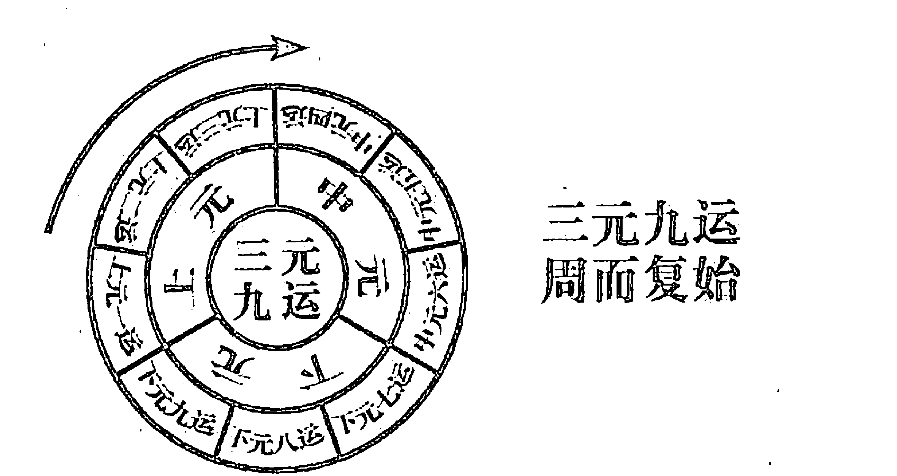
三元九运 周而复始

##### 上元运（60年）
- 上元一运：1864甲子年至1883癸未年（20年）
- 上元二运：1884甲申年至1903癸卯年（20年）
- 上元三运：1904甲辰年至1923癸亥年（20年）
- 中元四运：1924甲子年至1943癸未年（20年）
- 中元五运：1944甲申年至1963癸卯年（20年）
- 中元六运：1964甲辰年至1983癸亥年（20年）

##### 下元运（60年）
- 下元七运：1984甲子年至2003癸未年（20年）
- 下元八运：2004甲申年至2023癸卯年（20年）
- 下元九运：2024甲辰年至2043癸亥年（20年）
此后循环进行推算。
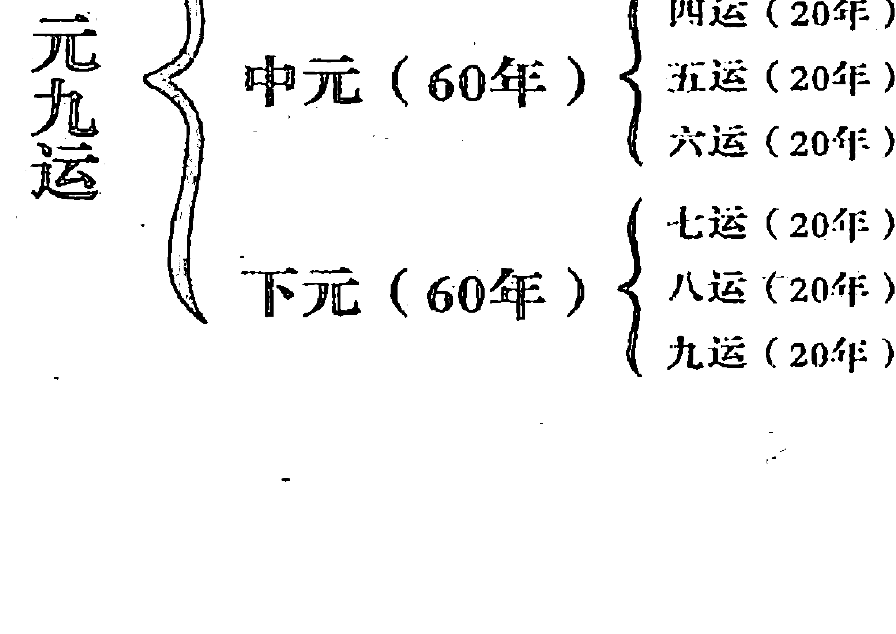

### 三元九运话财运
向大家介绍完“三元九运”之后，有的读者可能会问这样的问题：三元九运和财运有什么联系呢？
笔者认为，“三元九运”虽然是风水中界定时间的方法，看上去似乎和财运没有关系，但是笔者通过大量的资料和分析表明，风水小则会影响我们个人家庭，而大则会影响整个世界的运势发展，因此一般人常常认为风水只是看看房屋的风水吉凶而已，而忽视了风水对整个社会、世界和时代的影响功效。因为本书重点在于财运之上，因此笔者只从财运上向大家阐述元运对于世界经济财运的影响。通过笔者的分析和大量调查表明，原来当社会走到每一个不同的小20年元运时，都会有一些与元运卦象有关的行业发展得十分迅速，可以说是这些行业发展的“黄金期”或者“高速期”，因此对于想要旺财的朋友们来说，只要把握住或者从事这些我们当前所在的20年小元运所具有“发展力”的行业，那么大家的财运自然而然会有一个比较蓬勃迅速的提升效果。
下面，先让我首先以离我们最近的上一个元运进行分析，即是下元七运，时间是1984年至2003年这20年的时间：
所谓“下元七运”，在风水中也叫作“兑运”或者“破军运”，因为在七运中，八卦中的“兑卦”主管这20年的运势，因此笔者发现在1984年到2003年这20年时间内与“兑卦”物象有关的行业发展十分迅速。首先，就先让我们了解一下兑卦的物象（物象是指一个卦所表现的一些特定的事物）：

### 《梅花易数》中兑卦物象
无法识别的带框文字（第一行左框）
无法识别的带框文字（第一行右框）
无法识别的带框文字（第二行框）
无法识别的带框文字（第三行框）
五行：金。
天时：雨泽、新月、星。
地理：泽、水际、缺池、废井、山崩破裂之地，其地为刚卤。
人物：少女、妾、歌妓、伶人、译人、巫师。
人事：喜悦、口舌、谗毁、谤说、饮食、毁折、附决。
身体：舌、口、肺、痰、涎。
时序：秋八月、酉年月日时、金年月日、二四九数月日。
静物：金刃、金类、乐器、缺器、废物。
动物：羊、泽中之物。
屋舍：西向之居，近泽之居，败墙壁宅，户有损。
家宅：不安，防口舌。秋占喜悦，夏占家宅有祸。
饮食：羊肉、泽中之物、宿味、辛辣之味。
婚姻：不成，秋占可成。又喜主成婚之吉，利婚少女，夏占不利。
生产：不利，恐有损胎、或则生女。夏占不利，坐宜向西。
求名：难成，因名有损。利西之任，宜刑官、武职、伶官、译官。
求利：无利，有损财利，主口舌。秋占财有喜，夏占破财。
出行：不宜远行，防口舌或损失。宜西行，秋占宜行，有利。
交易：不利，防口舌，有争竞。夏占不利，秋占有交易之财喜。
谋望：难成，谋中有损。秋占有喜，夏占不遂。

## 兑卦物象
-   谒见：利行西方，见有咒诅。
-   疾病：口舌咽喉之疾、气逆喘疾、饮食不餐。
-   坟墓：宜西向，防穴中有水，近泽之墓。夏占不宜，或葬废穴。
-   官讼：争讼不已，曲直未决，因公有损，防刑。秋占为体得理，胜讼。
-   姓字：商音，带口字金字旁姓氏，行位四、二、九。
-   数目：四、二、九。
-   方道：西方。
-   五色：白。
-   五味：辛辣。

对这些物象，有些读者可能看得一头雾水，下面笔者就带领大家一起分析下元七运的“兑卦”物象与“热门行业”的联系。

首先，兑卦人物象征歌妓、伶人、巫师。从这个元运的热门行业中我们不难发现有很多与人物物象有关的行业发展迅速，比如“歌姬、伶人”指代的就是娱乐影视和音乐行业，我们可以发现其实影视、音乐和娱乐行业发展最红火的年份正是身处“七运”的这20年中，一批批港台、内地明星都靠着“七运”而变得大红大紫，而一家家影视经纪公司也是财运颇丰，但是随着“七运”的过去（2004年后），影视娱乐行业给大家的感觉似乎变得发展缓慢了很多，很多2004年后出道的明星们也不如2004年前出道的明星们一样大红大紫了，很多演员也都只是昙花一现，很难长期保持人气的顶峰了。而兑卦人物中“巫师”这个行业主要是指与宗教、玄学有关的行业，其实从实际情况也不难看出，宗教、玄学这些行业其实被大家逐渐认可和接受的时间也正是在1984年到2003年这20年的“高峰期”，从中国内地来说，主要表现在宗教信仰和风水文化逐渐在这个时期被大家重新接受，而从港台乃至东南亚来看，一些与玄学有关的行业发展迅速；在各种媒体上大家对于玄学的关注程度不断提高，玄学节目、培训等热度不减。

其次，从兑卦的“人事”上有喜悦、口舌、饮食等物象，其象征的当今的职业是娱乐业、律师行业、饮食行业、营销促销行业等与“口”打交道的行业，因此笔者也发现这些上述的行业发展最为迅速的时期也正是处于七运的这20年的时间中，如果大家在“七运”中从事了这些行业，想必财运上会有不错的表现。

总之，从物象上分析，笔者做了一个总结，娱乐行业、影视行业、歌厅行业、玄学行业、律师行业、交流行业、饮食行业、营销行业、保险行业等在七运中表现都十分不俗，从事这些行业的朋友们财运上表现理想。

那么，说完了离我们最近的“七运”之后，想必大家都迫切地想知道在我们现在身处的“八运”（2004年到2023年）中，从事哪些行业会使大家的财运颇丰呢？

下元八运。又称“艮运”或者“左辅运”，是由八卦中的“艮卦”主管从2004年到2023年这20年的运势，因此，首先还是让我们连接一下“艮卦”所象征的物象：

### 《梅花易数》中艮卦物象

## 艮卦物象
-   五行：土。
-   天时：云、雾、山、岚。
-   地理：山、径路、近山城、丘陵、坟墓、东北方。
-   人物：少男、闲人、山中人。
-   人事：阻滞、宁静、进退不决、反背、止住、不见。
-   身体：手、指、骨、鼻、背。
-   时序：冬春之月、十二月、丑寅年月日时、土年月日时、七五十数月日。
-   静物：土石、瓜果、黄物、土中之物。为门阙、为果蔬、干木为坚。
-   动物：虎、狗、鼠、百兽、黔喙之物。
-   家宅：安稳，诸事有阻，家人不睦。春占不安。
-   屋舍：东北方之居、山居，近石、近路之宅。
-   饮食：土中物味、诸兽之肉、墓畔竹笋之属、野味。
-   婚姻：阻隔难成，成亦迟，利少男之婚。春占不利，宜对乡里婚。
-   求名：阻隔无名，宜东北方之任，宜土官山城之职。
-   求利：求财阻隔，宜山林中取财。春占不利，有损失。
-   生产：难生，有险阻之厄。宜向东北，春占不利，有损失。
-   交易：难成，有山林田土之交易。春占有失。
-   谋望：阻隔难成，进退不决。
-   出行：不宜远行，有阻，宜近陆行。
-   谒见：不可见，有阻，宜见山林之人。
-   疾病：手指之疾、脾胃之疾。
-   官讼：贵人阻滞、未讼未解、牵连不决。
-   坟墓：东北之穴，山中之穴。春占不利，近路边有石。
-   姓字：宫音，带土字傍姓氏，行位五、七、十。
-   数目：五、七、十。
-   方道：东北方。
-   五色：黄。
-   五味：甘。

从艮卦的物象中首先我们可以看出在八运中与“五行属土”有关的行业会进入一个发展的高峰期，如建筑行业、房产行业、建材行业、农业、矿产行业、能源行业、珍贵中草药行业、丧葬行业等，大家可以回想一下这些行业是否在进入2004年之后发展十分迅速呢？比如像房地产行业，众所周 知中国内地房产发展最为迅速的期间就是进入了2004年八运之后，这一点从2004年之后大家的买房热情和飙升的房价上就可以一目了然地看出，而房产业的发展同时带动了建筑、建材行业的发展，因此这些行业进入八运之后走入了发展的“高峰期”；其次像与“土”有关的矿产、能源行业，大家只要从2004年之后矿产、石油等能源价格飙升的走势也可以看出这些行业的发展活力。从最后的“农业”来看，中国内地从2004年之后的很多支持农业的政策出台实施也可以看出农业在八运时的发展势头。

其次，八运“艮卦”的人物象征“少男”，“少男”可以理解成“小男孩”的意思，因此与这个“少男”有关的行业进入八运之后也会发展迅速，如婴幼儿行业、教育行业、母婴行业、儿童用品行业等。进入2004年之后，我们不难发现这些行业发展迅速，像当前流行的胎教、学前教育、儿童潜能开发等都属于这个范畴之内。

最后，从八运来看，创意产业的发展也进入了“黄金期”，因为正如“艮卦少男”象征着一个富有朝气活力的小男孩一样，文化创意产业正如这个“小男孩”一样会在“八运”期间展示出其迅速的发展活力，因此这20年也是其发展的“黄金期”。

因此，笔者认为这些行业会在当今我们身处的“下元八运”中发展迅速，如果大家能够积极投身到这些行业之中，相信大家在风水影响世界财运上便可抢夺先机，财运理想。

## 第二部分 教你来挑旺财楼
### 独立屋旺财强

笔者因为经常为一些朋友挑选适合他们财运的楼宇，因此对于挑到一栋旺财楼也有所研究。首先，笔者建议如果读者的经济实力不错的话，最好挑选一栋独立屋。所谓独立屋，是指一栋完全归自己所居住的房屋，比如像别墅等都是独立屋的范畴。为什么笔者建议选择独立屋居住呢？因为笔者发现如果大家选择了一栋风水好的独立屋居住的话，其风水对于全家人财运的影响是十分明显的，而这种明显程度如果换成公寓房或者单元房往往就要减少很多。大家可以试想。比如一栋房子的风水可以给你提供1000万的财运。如果这间房屋是独立屋的话，只有自己和家人居住，那么这个1000万的财运会完全收入自己囊中，但是如果这栋房屋是公寓房或者单元房的话，假定一栋房屋有10户人家居住，那么每家平均起来只有100万的财运可分，这就能明显比对出独立屋与公寓屋对财运的影响区别所在了。因此，笔者在为一些事业上较有成绩的朋友们勘察风水时，常常会建议他们在经济条件满足的情况下，选择风水好的独立屋进行居住，这样的话，独立屋对于个人财运的影响会更加明显。

写到这里，笔者想起了一个与之有关的事情。笔者曾为某客户勘察风水，因为该客户经济实力可满足购买独立屋的条件，因此笔者也是建议他买一栋藏风聚水的独立屋进行居住，这样会对财运有明显的聚集效果。该客户因为十分相信风水欣然接受了笔者的建议，但同时又有一个问题向笔者咨询：“我家几个孩子，他们长大之后肯定要与我分开居住，到那时候我和妻子再住在这么大的独立屋就不免有些寂寞了，这应该怎么办呢？”笔者听到这个问题便向这位客户解释到：“独立屋对于人丁兴旺的朋友居住确实很好，但是如果屋大人少的话确实在风水上有一些忌讳所在，因为孩子们至少还有十年才会独立，所以我建议你在现在这个阶段可以考虑居住独立屋，等十年多的时间之后，可以看实际的情况再做调整。”笔者的这番话其实意义在于独立屋非常适合人丁兴旺的家庭或者家庭主人处于事业的黄金年龄进行居住，因为这样会催旺全家人的财运，相反对对于主人处于退休状态来说，因为财运上的要求会减少很多，选择一件大小适宜的单元房或者公寓房居住也是不错的。因此独立屋虽然旺财运，但也要因人而异，最适合事业已经取得一定的成绩而想再创新高的朋友们居住，这样旺财效果最为理想。

> “我家几个孩子，他们长大之后肯定要与我分开居住，到那时候我和妻子再住在这么大的独立屋就不免有些寂寞了，这应该怎么办呢？”

> “独立屋对于人丁兴旺的朋友居住确实很好，但是如果屋大人少的话确实在风水上有一些忌讳所在，因为孩子们至少还有十年才会独立，所以我建议你在现在这个阶段可以考虑居住独立屋，等十年多的时间之后，可以看实际的情况再做调整。”

独立屋适宜人丁兴旺的家庭或处于事业黄金期的人士居住，如果人员较少，则不宜买过大的独立屋，否则会犯“屋大人少”的风水禁忌，可购买稍小些的独立屋居住。

### 好峦头旺财运

在风水学中，经常可以将风水分成峦头和理气两个部分进行综合的评判，所谓“峦头”是指我们肉眼所能看见的外围景观，而“理气”是指用肉眼不能直接看到而需要通过一些方法测算出来的数据，简单来说就是峦头直接形象，理气要间接推算。

# 风水
-   峦头：肉眼所能看见的外围景观（直接形象）
-   理气：肉眼不能直接看到，通过一些方法测算出的数据。（间接推算）

| 4 | 9 | 2 |
| 3 | 5 | 7 |
| 8 | 1 | 6 |

（理气洛书）

本节内容先从十分形象的“峦头学”开始向大家讲解，而“理气学”部分笔者将在下一部分逐一深入介绍。

在“峦头学”中，最基本的就是“左青龙、右白虎、前朱雀、后玄武”这句大家经常能在一些影视作品中听到的话语，因为古人在建筑一座房屋时，十分注重房屋前后左右的环境情况，因此分别用朱雀、玄武、青龙、白虎来指代房屋的前、后、左、右四个方位。下面笔者就来着重向大家介绍一下这四个方位对房屋及个人财运的影响。

看楼盘房屋的前后左右，应以大门朝向方为前方，背靠方为后方，楼盘左边为左方，楼盘右边为右方。

## 玄武（后方）：

玄武方是指房屋的后方所在，从风水的角度来看，玄武方要有山为佳，称之为“玄武山”或“靠山”，如果阳宅背后房有“靠山”的话，则象征宅中居住者能得到贵人的帮助，在事业上取得不小的成绩，财运上也是处于稳中有升的情况。因为房屋背有“靠山”象征着“稳而不乱”，也象征着会得到上司领导的庇护，因此对于想要在事业上得到发展的朋友们来说最为有利，正所谓“大树底下好乘凉”。

大楼背靠玄武山，事业财运均稳定。

反之如果缺乏“靠山”则容易在工作或事业中出现与领导上司人缘浅、事业财运不稳定的情况。

大楼背后无靠山，事业财运不稳定。

因此选择住宅时，“靠山”很重要。但是对于当代建筑来说，我们很难居住在一个背靠山的房屋之中，对于现在的建筑来说，背靠一栋或几栋高于自身的建筑物都可以称其为“靠山”或者“玄武山”，住在背有高大建筑的房屋之中，自身在事业的发展上会很有“底气”，因此财运上也会“底气十足”的。

A楼背后有几栋高大建筑物，可被看成是A楼的靠山。

A楼背后虽有建筑，但比A楼矮小，不可视作靠山有力。

#### 朱雀（前方）

朱雀方是指房屋的前方，也就是一栋房屋大楼主大门所朝的方向称之为“朱雀方”，朱雀方在风水中又被称为“明堂”。

楼盘前方面对区域为朱雀方，又被称为“明堂”。

不知道读者们是否留心过身边那些各种各样的写字楼或者大厦。不难发现在这些建筑的主大门门口往往都会有一块比较空旷的区域，这块区域就是“明堂”了。从风水上来说，明堂象征着发展潜力和未来，因此如果所居住的楼宇前面对着一个很好很开阔的明堂的话，则象征着个人的事业财运发展潜力巨大，并且还有聚集财运和事业运的功效。

楼宇面对开阔明堂，象征财运潜力巨大。

因此对于大家选取旺财楼时，一定要选择楼前有一个开阔明堂的楼盘。而“明堂”的表现形式有很多，比如楼盘前的广场、公园、停车场、水池、喷泉都可以称之为“明堂”。

观察明堂有两项最为重要，第一项是“阔”、第二项是“美”。所谓“阔”是指明堂要开阔，否则对于整栋楼的财运都是不利的。笔者曾经来过一个写字楼前，见写字楼大门口朝向一个封闭的实墙，而门到墙的距离只能并排走过三个人，基本属于明堂过窄的情况，于是笔者当时断言在这栋写字楼里的商铺生意上不会兴旺的。后来写字楼的物业告诉笔者，实情正如笔者预测的一样，在该写字楼里的商铺基本上盈利颇少，很多商铺空置或者退租，基本上属于不如人意的状态。

这就是明堂过窄而对财运的不利影响之所在。通过这个例子也告诉读者朋友们选择楼宇的时候一定要看看明堂是否宽阔，这样才会财运丰盛。

第二项是“美”，所谓“美”是指明堂最好景观秀丽，比如楼前面朝一个风景秀丽的公园、水池、小溪等等都是不错的选择，这一点要根据读者们对于“美”的理解来定了。

大楼前方明堂宜开阔，秀美。

#### 青龙白虎（左右方）

青龙白虎分别象征着一栋房屋楼宇的左右方，左方称之为“青龙砂”，右方称之为“白虎砂”，在笔者开办讲座向学生讲解这一部分时，发现很多朋友对于房屋的“青龙”、“白虎”这两个方位不知如何分辨，为避免读者有这样的疑虑，笔者首先向大家介绍一下究竟房屋哪边是青龙，哪边是白虎。一栋房屋不管它是独立屋还是公寓楼，都会有一个主门，我们可以站在主门的位置，背靠独立屋或者公寓楼，面朝主门所朝向的方向，我们左手的位置就是“青龙方”，而右手的位置就是“白虎方”了。

背靠大楼，左手方为青龙方，右手方为白虎方。

在我们知道了房屋的青龙白虎方之后，下面就可以介绍如何用青龙白虎方来选择旺财楼宇了。在风水中，青龙方和白虎方往往象征的意义截然相反，青龙方象征进财、贵人、当运，而白虎方象征退财、小人、失运，因此在选择楼宇时最好是选择左右对称的楼宇，因为这样选择达到了青龙白虎相互平衡的最佳效果。

选择青龙、白虎方对等的楼盘最佳。

具体来说，如果在选择一个小区中某一栋楼宇的时候，如A、B、C、D、E五栋楼，那么选择最中间的那一栋C楼就是一个青龙白虎平衡的选择了。

C楼盘青龙、白虎方平衡。

如果一栋楼房有多个单元的话，也可以按照这个方法进行选择，例如一栋楼房有A、B、C、D、E五个单元，那么C单元也属于对称的范畴之中。

一栋楼房有五个独立单元，C单元为青龙、白虎对称的选择。但是因为现代建筑造型分布多样，挑选楼盘时很多则不能达到左右平衡的原则，那么读者朋友们在选择楼盘时则要记住要选择青龙方强于白虎方的楼宇房屋，具体来说是指青龙方如果有建筑的话要比白虎方的建筑要高要长，这样便是象征青龙方有力而白虎方无力了。

住在青龙方有力的房屋中，宅主的事业运常常会遇到机遇和贵人，因此工作顺利，财运上升。

反之如果宅主住在白虎有力而青龙无力的房屋之中，即房屋的白虎方的建筑高于或长于青龙方的建筑，那么对于宅主来说工作事业上易遇到不顺心的事情较多，阻力潜藏，因此财运上也会受到负面影响。

A楼的白虎方强于青龙方的情况之一

A楼的白虎方强于青龙方的情况之二

因此从基本峦头的角度来看，在选择旺财屋的时候最好选择背靠一座高大的建筑，面朝一个开阔秀美的明堂，左右有青龙白虎相护的房屋最为理想，这样住在这种房屋的人们工作顺利，财运丰盛。

### 好楼层做事旺

当我们选择了自己心仪的楼盘之后，随之便要选择楼层了。对于楼层的选择，有些朋友认为6层、8层、9层便是好的楼层了，其实这个只是意头上的，对于房屋楼层的选择并没有什么过多的意义，因为正如每个人出生的时间存在差异性一样，对于楼层的选择也是因人而异的，就像难道所有住在8层的人都能发财吗？其实答案一眼看出就是不对的。从风水上来看，自有选择楼层的一些特定的方法，但是因为风水中各种门派之间存在一定的差异性，因此选择的具体手段也不尽相同，笔者这里向大家介绍一种根据自己的出生信息而选择楼层的方法，希望大家能真正地选出符合自己命理的有利楼层。

在风水上往往使用《河图》来分析楼层对每个人的吉凶影响。根据## 求财风水秘笈

《河图》中 “天一生水，地六成之；地二生火，天七成之；天三生木，地八成之；地四生金，天九成之；天五生土，地十成之” 的理论而测算出根据不同人士的出生时间而选取能够催旺自身的楼层。

#### 河图

具体的方法是首先找到自己出生年的地支，也就是通常我们大家常说你的生肖属相。知道了自己的出生年的地支之后，便可以为自己挑选催旺自己的楼层了。以下，笔者将这些楼层对应不同生肖的朋友逐一进行讲解。

| 楼层 | 五行属性 |
|------|----------|
| 第十层 | 五行属土 |
| 第九层 | 五行属金 |
| 第八层 | 五行属木 |
| 第七层 | 五行属火 |
| 第六层 | 五行属水 |
| 第五层 | 五行属土 |
| 第四层 | 五行属金 |
| 第三层 | 五行属木 |
| 第二层 | 五行属火 |
| 第一层 | 五行属水 |

河图配合楼层可知每层房屋的五行属性

## 出生年地支为子，生肖属鼠的人士：

- 催旺自身运势的楼层：楼层尾数有1、6，如1层、6层、11层、16层、21层、26层等。
- 运势稳中有升的楼层：楼层尾数有4、9，如4层、9层、14层、19层、24层、29层等。
- 有利于财运的楼层：楼层尾数有2、7，如2层、7层、12层、17层、22层、27层等。

## 出生年地支为丑，生肖属牛的人士：

- 催旺自身运势的楼层：楼层尾数有5、0，如5层、10层、15层、20层、25层、30层等。
- 运势稳中有升的楼层：楼层尾数有2、7，如2层、7层、12层、17层、22层、27层等。
- 有利于财运的楼层：楼层尾数有1、6，如1层、6层、11层、16层、21层、26层等。

## 出生年地支为寅，生肖属虎的人士：

- 催旺自身运势的楼层：楼层尾数有3、8，如3层、8层、13层、18层、23层、28层等。
- 运势稳中有升的楼层：楼层尾数有1、6，如1层、6层、11层、16层、21层、26层等。
- 有利于财运的楼层：楼层尾数有5、0，如5层、10层、15层、20层、25层、30层等。

## 出生年地支为卯，生肖属兔的人士：

- 催旺自身运势的楼层：楼层尾数有3、8，如3层、8层、13层、18层、23层、28层等。
- 运势稳中有升的楼层：楼层尾数有1、6，如1层、6层、11层、16层、21层、26层等。
- 有利于财运的楼层：楼层尾数有5、0，如5层、10层、15层、20层、25层、30层等。

## 出生年地支为辰，生肖属龙的人士：

- 催旺自身运势的楼层：楼层尾数有5、0，如5层、10层、15层、20层、25层、30层等。
- 运势稳中有升的楼层：楼层尾数有2、7，如2层、7层、12层、17层、22层、27层等。
- 有利于财运的楼层：楼层尾数有1、6，如1层、6层、11层、16层、21层、26层等。

## 出生年地支为巳，生肖属蛇的人士：

- 催旺自身运势的楼层：楼层尾数有2、7，如2层、7层、12层、17层、22层、27层等。
- 运势稳中有升的楼层：楼层尾数有3、8，如3层、8层、13层、18层、23层、28层等。
- 有利于财运的楼层：楼层尾数有4、9，如4层、9层、14层、19层、24层、29层等。

## 出生年地支为午，生肖属马的人士：

- 催旺自身运势的楼层：楼层尾数有2、7，如2层、7层、12层、17层、22层、27层等。
- 运势稳中有升的楼层：楼层尾数有3、8，如3层、8层、13层、18层、23层、28层等。
- 有利于财运的楼层：楼层尾数有4、9，如4层、9层、14层、19层、24层、29层等。

## 出生年地支为未，生肖属羊的人士：

- 催旺自身运势的楼层：楼层尾数有5、0，如5层、10层、15层、20层、25层、30层等。
- 运势稳中有升的楼层：楼层尾数有2、7，如2层、7层、12层、17层、22层、27层等。
- 有利于财运的楼层：楼层尾数有1、6，如1层、6层、11层、16层、21层、26层等。

## 出生年地支为申，生肖属猴的人士：

- 催旺自身运势的楼层：楼层尾数有4、9，如4层、9层、14层、19层、24层、29层等。
- 运势稳中有升的楼层：楼层尾数有5、0，如5层、10层、15层、20层、25层、30层等。
- 有利于财运的楼层：楼层尾数有3、8，如3层、8层、13层、18层、23层、28层等。

## 出生年地支为酉，生肖属鸡的人士：

- 催旺自身运势的楼层：楼层尾数有4、9，如4层、9层、14层、19层、24层、29层等。
- 运势稳中有升的楼层：楼层尾数有5、0，如5层、10层、15层、20层、25层、30层等。
- 有利于财运的楼层：楼层尾数有3、8，如3层、8层、13层、18层、23层、28层等。

## 出生年地支为戌，生肖属狗的人士：

- 催旺自身运势的楼层：楼层尾数有5、0，如5层、10层、15层、20层、25层、30层等。
- 运势稳中有升的楼层：楼层尾数有2、7，如2层、7层、12层、17层、22层、27层等。
- 有利于财运的楼层：楼层尾数有1、6，如1层、6层、11层、16层、21层、26层等。

## 出生年地支为亥，生肖属猪的人士：

- 催旺自身运势的楼层：楼层尾数有1、6，如1层、6层、11层、16层、21层、26层等。
- 运势稳中有升的楼层：楼层尾数有4、9，如4层、9层、14层、19层、24层、29层等。
- 有利于财运的楼层：楼层尾数有2、7，如2层、7层、12层、17层、22层、27层等。

笔者已将不同出生年份的人士所有有利的楼层全部写出。以前在回答朋友有关选楼层方面的问题，其中一位朋友曾问笔者“我们家有五口人，究竟选楼层要以谁作依据呢？”笔者当时回答道：“以家庭经济核心的成员作为选取楼层的标准。”在这里，笔者向大家说明在挑选旺财楼层的时候要以宅主或者家庭经济来源核心的家庭成员作为依据，因为这位成员是家中的经济主力，如果选取了能催旺他财运的楼层，那么他的收入增长自然会带动全家的整体收入增长，因此要作为选取楼层的核心点来看。

另一位朋友问笔者：“我的幸运楼层是尾数带1的楼层，能否就买一层的公寓？”笔者当时答道：“只要采光充足，通气良好便可，不过还是高一点最好。”笔者之所以这样回答这位朋友的问题是出自于在风水中如果楼层过高或过矮的话都容易犯一些煞气，如果房屋过矮再加上采光不足和房屋湿冷，在风水中便犯了“孤阴煞”，容易使住在房屋的人员产生孤独忧郁的情绪，对身体健康也有负面影响。而如果住在过高的楼层并且房屋阳光刺眼炙热的话，在风水中便犯了“独阳煞”，容易造成家庭成员心绪不宁、脾气失控的情况。此外对于心血管、血压等方面也存在破损的危机。正所谓“孤阴不生、独阳不长”，因此在选择楼层的时候最好避免选择过高或过矮的楼层居住，笔者建议可在5层到20层中选择比较妥当。

这就是从风水的角度来挑选对自己有利的楼层，大家可以根据以上的方法和两个与之相关的问答来找到最有利于自己财运的好楼层了。

## 第二部分 教你来挑旺财楼

### 好屋型定成功

屋型是什么？相信很多朋友都对这个问题有些困惑，其实屋型简单来说就是指房屋的形状。在古代的各种建筑中，笔者发现绝大多数的房屋屋型都是以方方正正为主，这也正符合了中国人对于风水“天圆地方”的思想——在地面上的建筑方方正正，除了像祭天的天坛是圆形屋型之外，其他的建筑往往都十分讲求方正建房的思想。但是随着建筑水平的不断提高，现在社会出现了很多千奇百怪的屋型，有钻石型、锯齿型等等，因此到底什么样的屋型对个人的财运帮助最大？什么样的屋型易散财？什么样的屋型财运最稳定？这些问题笔者都会在下面的内容中逐一介绍的。

#### 最有利于财运的屋型：前窄后宽

什么是前窄后宽的屋型？所谓前窄后宽的屋型主要是指大门口的位置偏窄，而进入大门之后逐渐开阔的屋型，因为对于这样的屋型来说，最为有利于个人财运的聚集，因此对于想要旺财的朋友们来说要好好挑选，根据前窄后宽的屋型形状的不同，笔者将其形象地分成两类：钱袋屋和扫把屋。

钱袋屋：钱袋想必大家都不陌生。在很多古装剧中大家都可以看见古人在购买物品消费的时候，会从一个丝绣钱袋中取出银两付费，那个丝绣钱袋的形状正像这种屋型一样属于前窄后阔的类型。钱袋屋具体的样子是这样的：进入大门之后通过一小段走廊之后进入房屋的开阔区域。因为这种屋型很像口小肚大的钱袋，因此便叫做钱袋屋了。

钱袋屋因为大门开的位置有所不同，因此又可以分为左口钱袋屋、右口钱袋屋和中口钱袋屋三种。住在钱袋屋的人士往往财运亨通，有很多赚钱的机遇等待着宅主，正像钱袋一样钱财滚滚来，因此是想要旺财人士的首选。

但是要避免在钱袋屋中出现大门直对窗或者大门对后门的情况，因为这种情况叫做钱袋破损，就像一个开了口子的破钱袋一样，财进财出，因此反之不聚财了。

## 求财风水秘笈

破口钱袋屋

大门对窗或者对后门的钱袋屋为破口钱袋屋，表示财进财出不聚财。

扫把屋：扫把屋的屋型和我们日常所用的扫把十分相似，属于一个梯形的屋型，大门开在梯形屋型的窄边上，因此也是属于整体前窄后阔的屋型，住在这种屋型的朋友们财运上往往也是属于生意兴隆财源滚滚的情况，有利于经商的朋友们居住。但是这种屋型相比上述的钱袋屋来看有些美中不足的小缺陷。“扫把屋”往往也被堪舆家叫做“棺材屋”，因为其屋型不仅像扫把同时也和棺材相似，虽然这种屋型有“升官发财”的作用，但同时对于个人身体健康亦有破损效果，因此笔者建议如果宅主处于青年时期，体质健壮方可居住此屋催旺财运。但中老年朋友或者体质偏弱的人士，最好还是选择钱袋屋来旺财，这种扫把屋便要谨慎居住了。

三种形状的扫把屋（又叫棺材屋）

说到这里，笔者回想起曾经为一位朋友勘查风水时便遇到了这种情况。这位朋友是一位风水爱好者，在他挑选房屋的时候也请教过专业人士，因为当时年轻力强，因此那位堪舆家为他挑选了这种扫把屋来催财，但是几年之后，宅主发现身体情况每况愈下，虽然财运良好但是做事总有力不从心的感觉，于是邀笔者前来勘测。笔者发现此房屋型为扫把屋，于是建议他换一套钱袋屋的房子居住，后来那位朋友打电话告诉笔者换房之后不但财运依旧良好，身体上也好好转很多。笔者通过这件事情再次告诉大家，选择扫把屋要多谨慎一些。

#### 易破财的屋型：前阔后窄

对于前阔后窄的房子正好是和上述旺财的屋型对调一番，属于大门开在屋型的宽处，进入房屋之后越来越窄，其最典型的房子屋型就是与扫把屋颠倒的倒扫把屋。

其屋型状似一个倒梯形，越进越窄，对于居住在这种屋型的人士来看，财运、事业运和健康运都会出现后退回落的情况，因此是一个非常容易丁财两败的屋型。

## 求财风水秘笈

如果再加上大门与窗户、后门相对，那么往往住在这种屋型的人士财运有所不济，因此最好重新改造屋型或者搬家居住才是上策之选。

#### 财运最稳定的屋型：方正屋

自古以来，中国的玄学家、堪舆家们一致主张房屋以方正为佳，这种方正是指屋型是正方形、长方形均可。从风水堪舆的最核心思想来看，历代堪舆家们都推崇“天圆地方”的建造模式，如果想要财运稳定的话，最佳的选择就是住在一间方方正正的屋子里。这种方正的屋型无论对于独立屋还是公寓房来说都是要遵循的风水法门。但是随着建筑水平的提高，在我们当今的房屋屋型中出现了越来越多奇形怪状的屋型，比如像钻石型、锯齿型等等，但这些房屋最大的缺陷就是不能达到接近方正的情况，因此从风水上来看便会产生不如意的情况。笔者下面列举两个勘查风水的事例，与大家一起探讨这种房子对家庭成员的影响情况。

##### 事例一：钻石型屋型

笔者曾到一位亲朋家做客并勘查风水情况，发现这位亲朋家在西方有一明显的钻石型缺角情况（缺角在下面的内容中便会介绍），由此推测自从这位亲朋家人搬进此房之后，咽喉与呼吸系统有不适的情况。后来这位亲朋告诉笔者搬来此屋居住后确实常有咽喉不适的情况，影响平时的交流和工作，于是笔者建议在钻石型缺角处悬挂7个小黄铜铃铛进行化解。

钻石型屋型，缺正西角，悬挂7个黄铜铃铛化解

##### 事例二：锯齿型屋型

笔者在宾馆中与一位朋友浅谈风水的知识，那位朋友随即拿出纸张画出家中的屋型，只见朋友家中屋型呈现锯齿状，就像两个方形图案叠加一起所组成的屋型，经笔者判断缺少房屋的东南、西北二角，于是，笔者当时推测其家中男主人和大女儿运势不理想。后来该朋友实话实说，目前他（男主人）在生意上遇到一些困阻，大女儿让父母一直感到失落和有代沟，似乎大女儿的运势不如其他孩子正常良好。于是该朋友邀笔者亲自实地考察家居风水情况并提出修改意见，希望借助风水的力量来改变男主人和大女儿的运势回落的情况。

其实通过这两个事例读者们不难发现房屋屋型方正对于全家成员运势的稳定效果，但是现在大家购买房屋的时候，很多时候不能凭借装修而使房屋屋型方正，那么怎么化解不方正的房屋对自身的不利影响呢？以下就由笔者向大家详细介绍。

首先，我们要找出导致房屋不方正的原因所在，其实无非是两种原因导致房屋变得不方正，那便是缺角与凸角。

缺角是指原本方正的房屋少了其中的一个角，而且这个缺角的大小小于该缺角处所在墙边长度的1/2，具体来说，就像我们切蛋糕一样，将一个方形的蛋糕切下一部分便成了缺角的屋型了，具体来说，通常钻石型的房屋、锯齿型的房屋都属于缺角的范畴之内。

## 第二部分 教你来挑旺财楼

房屋屋型缺角的情况

凸角是指原本方正的房屋多出了一个小角，而这个多出的小角的大小小于该角所在墙边长度的1/2。具体来说，屋型就像“凸”字型一样在方正的屋型上多出一块区域。

房屋屋型凸角的情况

其次，当我们判断完房屋是缺角还是凸角之后，便可以根据其缺角凸角方位的不同进行判断和化解了。以下，笔者列出缺角凸角方位的不利情况和化解方法：

## 正东方：

- 八卦：震卦
- 代表人物：长男（大儿子），或指31岁到45岁的男性。
- 代表疾病：居住者的手脚及肝脏易生毛病，对于长男的健康运势负面影响明显。
- 缺角影响：手脚及肝脏易出现问题，长男运势起伏回落，精神因松懈无活力。
- 化解方法：在正东方摆放富贵竹、书籍和植物。
- 凸角影响：手脚及肝脏易出现问题，长男运势起伏回落，性格易暴躁、精神易紧张。
- 化解方法：在正东方摆放鸡造型饰物。

## 求财风水秘笈

## 东南方：

- 八卦：巽卦
- 代表人物：长女（大女儿），或指31岁到45岁的女性。
- 代表疾病：居住者的肱股、神经及肝胆易生毛病，对于长女的健康运势负面影响明显。
- 缺角影响：肱股、神经及肝胆易出现问题，长女运势起伏回落，精神因松懈无活力。
- 化解方法：在东南方摆放4盆大叶植物、书籍、4支毛笔。
- 凸角影响：肱股、神经及肝胆易出现问题。长女运势起伏回落，性格易暴躁、精神易紧张。
- 化解方法：在东南方摆放龙造型饰物。

## 正南方：

- 八卦：离卦
- 代表人物：中女（中女儿），或指16岁到30岁的女性。
- 代表疾病：居住者的眼睛、心脏、血液易生毛病，对于中女的健康运势负面影响明显。
- 缺角影响：眼睛、心脏、血液易出现问题，中女运势起伏回落，精神因松懈无活力。
- 化解方法：在南方摆放红色中国结、橙色台灯、与龟造型有关的饰品。
- 凸角影响：眼睛、心脏、血液易出现问题，中女运势起伏回落，性格易暴躁、精神易紧张。

化解方法：在南方摆放猪造型饰物。

## 西南方：

八卦：坤卦

代表人物：母亲，或指46岁以上的年长女性。

代表疾病：居住者的腹部、脾胃、消化系统易生毛病，对于中女的健康运势负面影响明显。

缺角影响：腹部、脾胃、消化系统易出现问题，母亲或女主人运势起伏回落，精神因松懈无活力。

化解方法：在西南方摆放玉器、瓷器或山石饰品。

凸角影响：腹部、脾胃、消化系统易出现问题，母亲或女主人运势起伏回落，性格易暴躁、精神易紧张。

化解方法：在西南方摆放马造型饰物。

## 正西方：

八卦：兑卦

代表人物：少女（小女儿），或指15岁以下的女孩。

代表疾病：居住者的口舌、咽喉、呼吸系统易生毛病，对于少女的健康运势负面影响明显。

缺角影响：口舌、咽喉、呼吸系统易出现问题，少女运势起伏回落。精神因松懈无活力。

化解方法：在正西方摆放7个铜铃铛、八音盒、铜钟。

凸角影响：口舌、咽喉、呼吸系统易出现问题，少女运势起伏回落，性格易暴躁、精神易紧张。

化解方法：在正西方摆放狗造型饰物。

## 西北方：

八卦：乾卦

代表人物：父亲，或指46岁以上的年长男性。

代表疾病：居住者的头部、筋骨、肺部呼吸系统易生毛病，对于父亲或男主人的健康运势负面影响明显。

缺角影响：头部、筋骨、肺部呼吸系统易出现问题，父亲或男主人运势起伏回落，精神因松懈无活力。

化解方法：在西北方摆放6枚铜钱、地球仪、铜器、汽车模型。

凸角影响：头部、筋骨、肺部呼吸系统易出现问题，父亲或男主人运势起伏回落。性格易暴躁、精神易紧张。

化解方法：在西北方摆放牛造型饰物。

## 正北方：

八卦：坎卦

代表人物：中男（中儿子），或指15岁到30岁的男性。

代表疾病：居住者的肾脏、膀胱、耳朵、生殖泌尿系统易生毛病，对于中男的健康运势负面影响明显。

缺角影响：肾脏、膀胱、耳朵、生殖泌尿系统易出现问题，中男运势起伏回落。精神因松懈无活力。

化解方法：在正北方摆放蓝色饰品、一杯水。

凸角影响：肾脏、膀胱、耳朵、生殖泌尿系统易出现问题，中男运势起伏回落，性格易暴躁、精神易紧张。

化解方法：在正西方摆放凤凰造型饰物。

## 东北方：

八卦：艮卦

代表人物：少男（小儿子），或指15岁以下的小男生。

代表疾病：居住者的手指、皮肤、脾胃、消化系统易生毛病，对于少男的健康运势负面影响明显。

缺角影响：手指、皮肤、脾胃、消化系统易出现问题，少男运势起伏回落，精神因松懈无活力。

化解方法：在正北方摆放陶瓷饰品、山石饰品。

凸角影响：手指、皮肤、脾胃、消化系统易出现问题，少男运势起伏回落，性格易暴躁、精神易紧张。

化解方法：在正西方摆放羊造型饰物。

以上便是如果房屋的八个方位分别出现了缺角或者凸角情况易产生的一些不利因素和化解方法。很多读者可能有些疑惑，此书讲解财运，为什么化解方法主要以保护健康为主呢？笔者曾在序言中讲过健康和财运是表兄弟的关系，因此如果没有了健康，财运再好又有何用呢？况且，凸角、缺角化解方法本身也有起到稳定家庭某一成员财运的效果，因此，希望读者仔细阅读本篇，找到家中缺角或凸角的方位进行化解，相信会对财运起到稳定的作用。

在这里，笔者建议广大读者在寻找家中是否存在缺角和凸角时，首先排查西北、西南两方位，因为这两方位分别象征全家的核心所在，即男主人与女主人，也是家中主要的经济来源和支柱，因此做到这两个方位没有影响才是稳定全家财运的有效方法。

### 找财位巧利用

不管你听没听说过风水，但是有一个词相信读者朋友们都是耳熟能详的，这个词就是“财位”，在大家的印象中，财位可算得上房屋中最好的位置了。但是如何找到家中的财位呢？其实，根据各种风水流派的不同，寻找家居风水财位的方法也不尽相同。笔者不提门派，就仅从风水上最基本的“峦头”和“理气”来说，寻找财位的方法也不尽相同，因此笔者会在这部分内容中具体向大家介绍从“峦头”的角度寻找家中的财位方法，而在下一部分则重点从“理气”的角度介绍家居流年财位的寻找方法。读者朋友们认真阅读这两部分的内容，相信找到家居或办公室的财位对大家来说就并非难事了。

首先，这一部分，笔者先向大家介绍从“峦头”的角度寻找家中财位的方法。所谓“峦头”，说得简单一些，就是我们肉眼所能直接看到的事物或景物。既然我们能够肉眼看到，那么笔者教授大家寻找财位的方法自然也是能够凭借肉眼可以找到的，因此读者们只要仔细阅读，都是可以准确找到家中的这个“财位”的。

这个财位又被称为“明财位”或者“聚气位”、“静位”等等，称它为“明财位”大家都比较好理解，因为它是能够让我们一目了然找到的“财位”，而称它为“聚气位”或“静位”往往是根据它的寻找依据和使用方法而这样称呼了。

介绍完“明财位”的概述之后，接下来我们就要具体去寻找风水中的“明财位”了。在风水中，有一套方法叫做“动静法”，它是我们找到“明财位”的关键所在。所谓“动静法”是指在一间房间内包括了一些“动位”和“静位”，“动位”象征着气场总是处于一种变动不稳定的状态，因此在“动位”做一些机动性质的活动比较有利；而“静位”是指气场稳定并且十分聚气的位置，适宜做一些比较稳定安静的事情。而根据“动静法”寻找房屋的“动位”和“静位”主要是看该房间的“户门”所在，因为“户门”是我们人员经常走进走出流动性最强的区域，因此过去也有把“户门”称之为“气口”的说法，其寓意象征气流一进一出的地方，因此从“动静法”上来看，户门是房间中最大的“动位”。

而离户门越远，则“动位”减弱，“静位”增强，大家试想，假如户门在方形房间的某一边角的位置，那么，该房间离户门最远的位置就是与户门成对角线的位置了，因此这个与户门成对角线的位置的区域我们就称之为“静位”，也叫“聚气位”或“明财位”。

因此一个房间的财位根据户门在房间中的位置不一样，一般可分为两种：当户门在房间一角时，“明财位”在与户门对角的位置；当户门在房间某墙中间开门时，则在与户门成斜对角方向存在对称的两个“明财位”。

利用“动静法”笔者已经传授给大家如何找到房间“明财位”的方法了，读者朋友们可以首先利用这种方法找出房间或办公室的“明财位”的区域。

在找到了房间或办公室的“明财位”之后，笔者接下来教授大家如何利用“明财位”而催旺大家的财运了。“明财位”又叫做“聚气位”或“静位”，适宜做一些稳定安静的事情，从风水上来看便可达到“藏风聚水”的效果了。下面笔者总结了财位的“六吉”，逐一向大家介绍：

## 第二部分 教你来挑旺财楼

1.  明财位宜亮：因为“明财位”又称“聚气位”，是聚集气场的区域，因此在“明财位”光线充足便可多聚“阳气”与我们居住的“阳宅”相配，反之如果“明财位”昏暗，则宜聚“阴气”，致使身体易有不适，故明亮则生气勃勃，“明财位”有阳光或灯光照射，这对生旺“明财位”大有帮助。

2.  明财位宜生：所谓“生”，是指生机茂盛，故此应该在明财位摆放常绿植物，尤其是以叶大或叶厚的黄金葛、橡胶树及巴西铁树等最为适宜。但要留意，这些植物应用泥土种植，若水种植物则不宜，因为明财位又称“静位”，象征宜静不宜动，因水种植物具有“流动性”的特征，因此不符合“动静法”之基本原则，故不宜在“明财位”放置水种植物，此外“明财位”也不宜种植有刺的仙人掌类植物，否则容易弄巧成拙。

3.  明财位宜坐：“明财位”是财气所聚的区域方位，故此应该加以利用，并以“静事”为主，例如把沙发放在此明财位，当一家大小坐在那里休息谈论时，可以多沾染财气，便自然会家肥屋润。在餐厅中若把饭桌摆在“明财位”亦甚适宜。又如在办公室而言，在“明财位”的位置摆放老板桌或者办公桌（且办公桌要背后有靠方可），亦可催旺个人的事业运和财运。因此，“明财位”宜坐应用于家居办公皆可。

4.  明财位宜卧：人约三分之一的时间用在睡眠上，故在家居风水中有“阳宅三要之门、主、灶”之说。其中“主”便指睡房风水了。在睡房风水中，睡床方位的吉凶对运程有很大的影响。倘若睡床摆在睡房的“明财位”上，朝夕在那里躺卧，日积月累，自会对财运有益处。

有些人误以为睡床是沉重的家具，可能会压损“明财位”，故此不敢把床摆放在那里，其实是浪费了“明财位”。压损“明财位”往往是指有很高的立柜或者房梁压制“明财位”而造成不利，睡床摆放在这里则无碍了。

5.  明财位宜吉：“明财位”是旺气凝聚的所在地，因此又称之为“聚气位”，若在那里摆放一些寓意吉祥的物件，例如福、禄、寿三星或是文武财神的塑像，这会吉上加吉，有锦上添花的作用。经常有朋友询问笔者在家居中“财神造像”摆放在哪里会更旺财一些，笔者根据“明财位”的特点建议他们将“财神造像”背靠明财位，面朝开阔区域摆放是不错的选择。

6.  明财位宜净：此“净”非彼“静”，这里所说的“净”，是指明财位宜整洁干净。因为“明财位”又叫“聚气位”，有藏风聚气的作用，因此如果“明财位”卫生不净或杂物过多的话，便会影响全家财运和健康运势。笔者曾去一朋友家勘察风水，发现该朋友家明财位堆放多年的旧报纸和旧杂物，于是笔者建议这位朋友将“明财位”的物品进行整理清洁。保证“明财位”干净整齐，这样才避免财运和健康运势出现回落的危机。

说完了“明财位”之后，笔者已经将“明财位”的“静”的特点悉数讲解一番，相反与“明财位”（“静位”）相对的还有笔者在最初提过的户门附近的“动位”，在这里笔者也介绍一下“动位”对财运的影响。“动位”不像“静位”一样聚气聚财，如果将卧室的睡床放在靠近“动位”的地方往往睡眠质量有所欠佳，易做梦、惊醒等。

如果在办公室中将自己的办公桌或者老板台放在“动位”附近的话，那么会让自身事业和工作处于起伏不定的状态之中，作为公司职员则容易有被老板解职的风险，因此“动位”附近不宜“坐”或“卧”。

相反，“动位”宜动对于很多对外营业的店铺来说也不失为一种旺财的方法。写到这里，笔者恰有一个例子与读者分享“动位”的旺财法则。笔者居住附近有一个小吃店，专营粤式腊味菜品，虽然店铺不是很大，只能容纳 30 人左右一起进餐，但生意却是兴旺发达，不管是堂食还是外卖，每天都有许多顾客光临这个小吃店，笔者当然也经常光顾。此店历史笔者无从考证，但笔者搬来附近居住之初便光顾此店，至今已有数年的时间了，想必生意兴隆才能维持至今。

笔者发现此小吃店之所以能够顾客临门生意兴隆，从风水的角度进行分析，其中便用到了“动位”的“动”的优势。在该小吃店进门口两旁，一边是餐厅的收银台，而另一边则是食品制作区和外卖区，这种布局规划正是吻合“动位”的“动”特点。首先，收银台是钱财进出的位置，将收银台摆放在“动位”象征客人的钱财时时处于一种流动进账的过程中，而大门另一旁的透明食品制作区和外卖区选择在“动位”首先象征食品制作源源不断应接不暇，想其原因自然是光顾的人多了，财运也更兴隆了；其次该店外卖生意兴隆也和“外卖区”选择在“动位”象征外卖的客人光顾不断有关，因此这家小吃店生意兴隆的原因之一便是利用了“动位”的“动”的特性而维持发展的。

通过这一个笔者亲身观察的事例可以看出，对于“动位”来说，可以将一些具有“动相”的活动放在这个区域进行旺财，比如像小吃摊可以将收银台、食品制作区和外卖区放在“动位”上来催旺生意，一些小型超市、便利店，如7-Eleven等，可以将畅销的物品放在“动位”上以催旺生意，总之对于“动位”催财来说，只要谨记寻找“动”的事物来催旺便会有财运上升的。

### 防破财化煞气

对于想要旺财的朋友们来说，居住在当代的各种各样的建筑之中，往往都容易受到来自于屋外各种各样的煞气的威胁。这些煞气不但会对个人的健康、运程等产生不利的影响，而且对于财运上的打击也是比较严重的。对于构成威胁的煞气来说各位读者朋友们要尽量去进行化解方可保证财运上的稳定。在这里，笔者所说的“煞气”依旧属于“峦头”范畴的，“峦头”煞气能够让大家用肉眼观察出来，从而更易于找到化解煞气的方法；在风水中有“眼不见不为煞”之说，意思是我们肉眼能够见到的煞气对大家构成的威胁比较明显，因此本部分着重从“峦头”角度讲解化煞法门，至于“理气”上的化解方法，笔者将在下一部分详细介绍。

#### 1. 动土煞

说到动土煞，从字面意义上大家便能理解它的含义了，如果你所居住的房屋或者办公室面对一个正在施工的工地或者兴建的新楼盘等都是犯了动土煞。如果所住的房屋或者办公室有动土煞的话，会影响居住在房间中的成员的运势出现起伏回落的情况，因此财运也是出于一种不稳定的状态之中。而且如果动土煞离房屋的距离越近这种影响则越为明显，因此对于犯此煞的居住者们要进行化解工作。而且，从每年来看，如果房屋的太岁方和三煞方出现了这种动土煞的情况，则会加剧动土煞对房屋风水的负面影响。笔者首先把流年太岁方和三煞方以表格形式列举如下：

| 年份 | 太岁方 | 三煞方 |
|------|--------|--------|
| 鼠年 | 正北   | 正南   |
| 牛年 | 东北   | 正东   |
| 虎年 | 东北   | 正北   |
| 兔年 | 正东   | 正西   |
| 龙年 | 东南   | 正南   |
| 蛇年 | 东南   | 正东   |
| 马年 | 正南   | 正北   |
| 羊年 | 西南   | 正西   |
| 猴年 | 西南   | 正南   |
| 鸡年 | 正西   | 正东   |
| 狗年 | 西北   | 正北   |
| 猪年 | 西北   | 正西   |

对于化解动土煞，读者可以在面对动土煞的地方摆放一对麒麟瑞兽进行化解。

#### 2. 天斩煞

所谓天斩煞，是指在居住的房屋或办公室外有两栋建筑，之间形成缝隙直对着宅主所居住的建筑称之为天斩煞。形象来说就像一把天刀将房屋斩成两半后形成的煞气。对于这种天斩煞来说，根据煞气方位的不同，天斩煞又被分为“正斩”和“背斩”两种，“正斩”是指房屋正面能够看到天斩煞，这种天斩煞的效力最强，会使居住者出现血光和破财之事。

而“背斩”是指房屋背后出现“天斩煞”，这种“天斩煞”效力虽有减弱但同样容易招致是非小人而破财，因此均为不利。

对于化解天斩煞，可以在面向天斩煞的位置摆放一面黄铜凸镜或者摆放一直龙龟进行化解，效果明显。此外，如办公室遇到此煞，也可在办公室窗户上张贴反光玻璃纸将煞气遮挡在办公室之外。

#### 3. 尖角煞

所谓尖角煞，是当今建筑中最容易遇到的一种煞气了。现代建筑造型万千，因此很容易出现一个建筑的尖角部分相对另一座建筑的情况。犯了尖角煞的住宅，往往使居住在该住宅的成员身体受影响较大，此外尖角煞也属于“火型煞”的一种，因此易使居住者出现脾气暴躁、争吵是非而破财的情况，因此不管对于住宅还是公司均存在着不利的影响。笔者曾前往一位客户办公室进行风水勘测，发现其办公室窗外对应一尖角煞，笔者与该客户交谈时得知自从该客户搬入此房办公之后，身体上总出现不适情况，还因一次误碰利器而流血。由此可知尖角煞对常人影响的严重性，因此若犯此煞者，可在面对此煞的位置摆放一对狮子进行化解。

#### 4. 飞刀煞

飞刀煞也是当代建筑中比较常见的一种煞气，它与上述所讲述的尖角煞有类似的地方，也是由于建筑的墙角所造成。但是尖角煞是房屋的尖角直对房屋，而飞刀煞是房屋建筑的尖角平对建筑房屋，犹如一把飞刀一样从建筑旁边飞过。这种煞气便被称为飞刀煞了。如果房屋犯了飞刀煞，则象征宅主或成员间易出现身体病痛和流血事件，因此也会导致破财和事业受阻的情况。

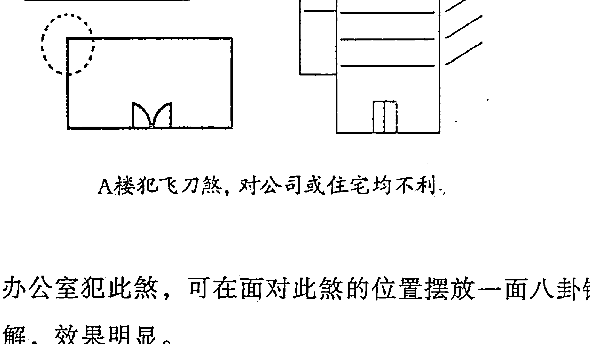

如果住宅或办公室犯此煞，可在面对此煞的位置摆放一面八卦铜镜或八卦铜葫芦进行化解，效果明显。

#### 5. 枪煞

在风水中有“一条直就是一条枪”之说，这里说的便是枪煞。所谓枪煞的“枪”并非手枪的“枪”，而是古人常用兵器中的长枪的“枪”。所谓犯了“枪煞”往往是指家居或办公室大门面对一条较长的走廊，那条走廊便是“枪煞”冲射。在风水中来看，枪煞并非都是差的，在有些时候枪煞还会起到好的风水效果，但是对于一般的朋友来说因为测定枪煞好坏往往需要堪舆家亲自测定方知结果，况且绝大多数的枪煞还是具有凶性的，因此笔者将其也划分为煞气的类别之中。

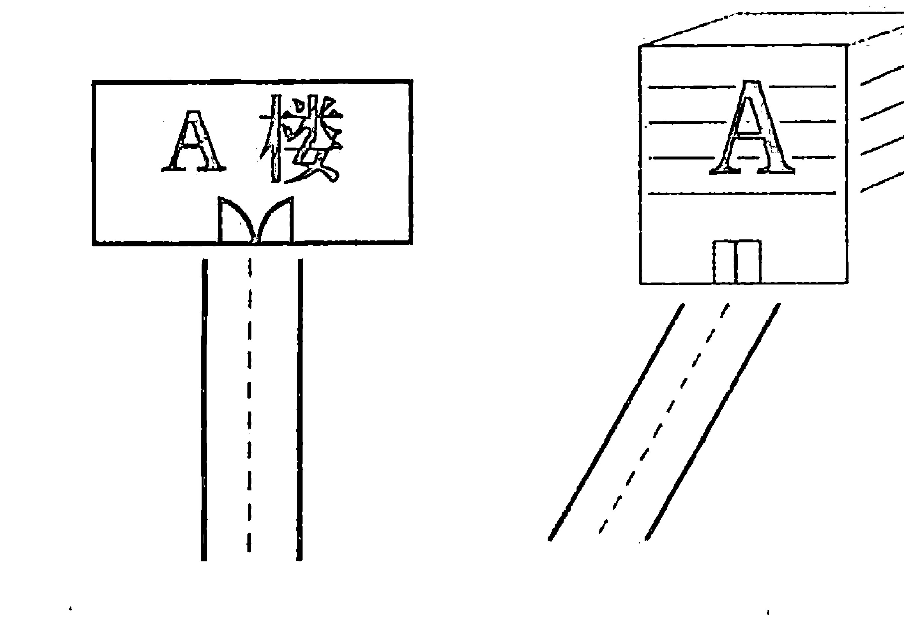

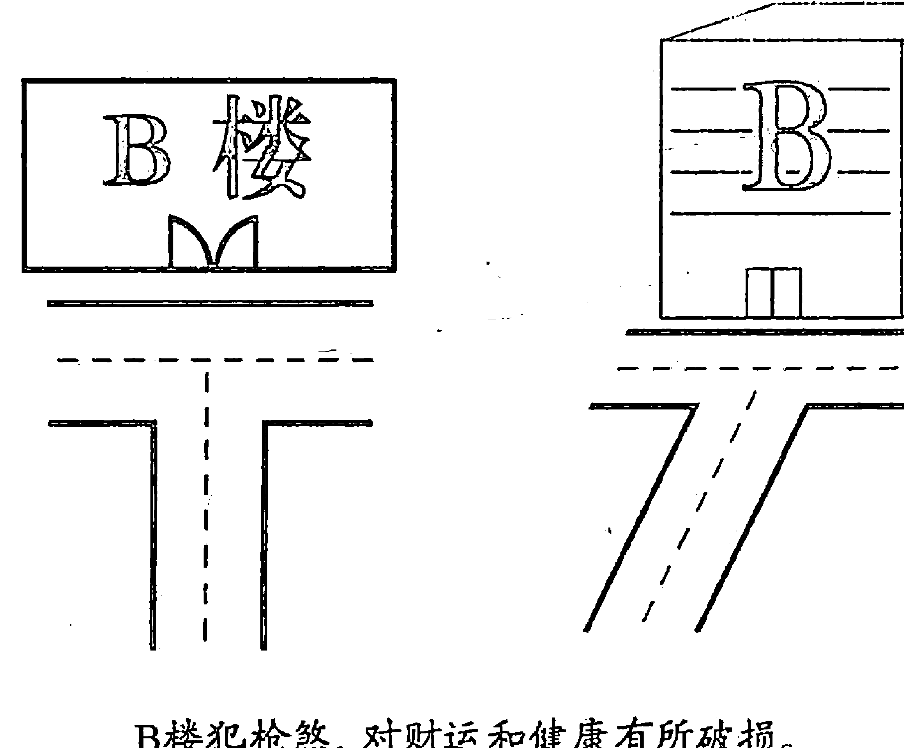

如果犯了枪煞，健康与财运方面均易出现问题，因此还应积极化煞，笔者建议可在大门两旁摆放石狮、麒麟等神兽进行化解。

#### 6. 镰刀煞

所谓镰刀煞是指离大门前很近的相对大门的电梯，因为电梯虽然本身不存在煞气，但是电梯门一开一合犹如一把铡刀一样一张一闭便形成了煞气。犯了这个煞气的住宅成员之间易出现不合争吵的情况，此外也易出现开刀动手术的流血破财的情况，对健康影响较大。笔者曾到一家公司去勘察风水，见该公司大门正对四部电梯门口，而且距离较近，于是笔者向公司经营者询问公司人员健康情况。发现在公司的几个董事搬进此房办公之后，有几位董事均身体产生不适并开刀动手术。财运情况也有所回落。可见镰刀煞对家居和办公室的人员影响之大。

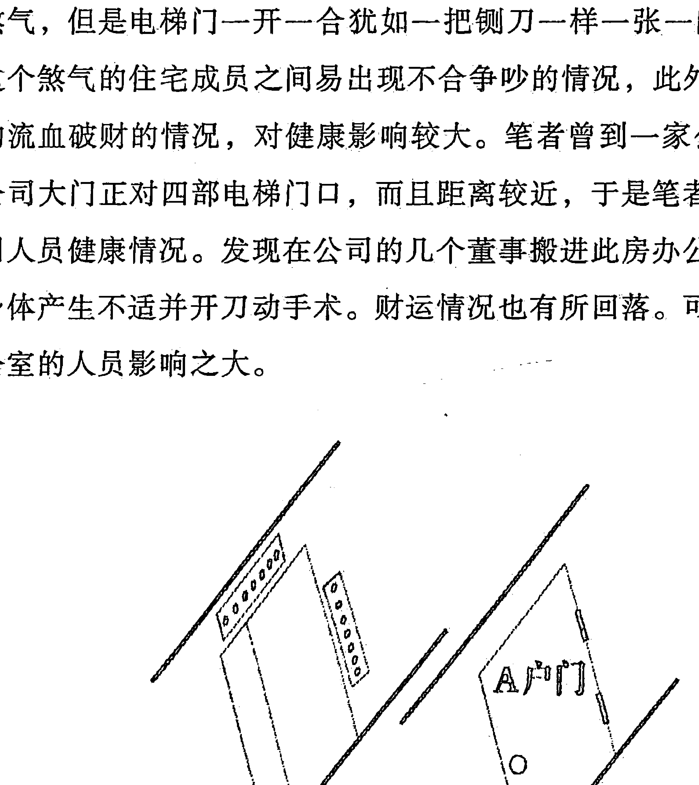

对于化解此煞，笔者建议在大门两旁摆放麒麟、狮、貔貅等神兽进行化解，效果最为明显。

#### 7. 探头煞

探头煞从古今来说，它的具体表现形式出现了一些不同的地方，在古代的风水典籍中，探头煞主要是指一座大山后面出现了一个露头的小山，犹如一个人躲在一个大山后面偷偷地露出一个小头来窥探周边的情况，这种煞气便叫做“探头煞”了。

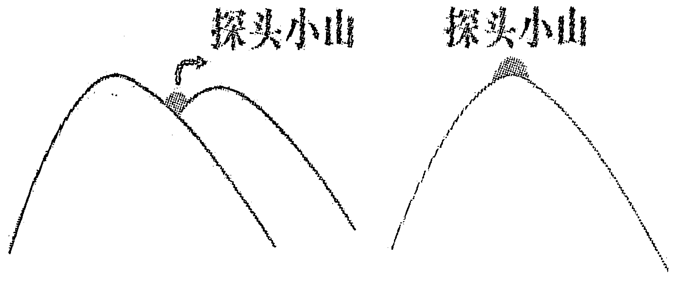

古代的探头煞，窗外、门外见此煞，易招盗抢。

但是在城市，大家见到这种山的机会不是很多，但见到有“探头煞”的建筑较多。具体来说具有“探头煞”建筑的楼型往往是指在一座高大的建筑背后有一座比它略高的建筑，从正面来看犹如建筑上面探出了一个小头一样或者一座建筑上面凸出一小部分也可称之为探头煞。

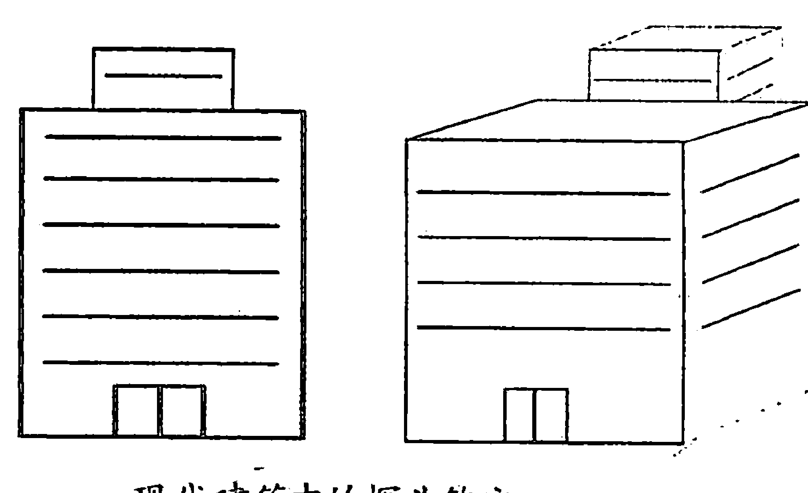

## 第二部分 教你来挑旺财楼

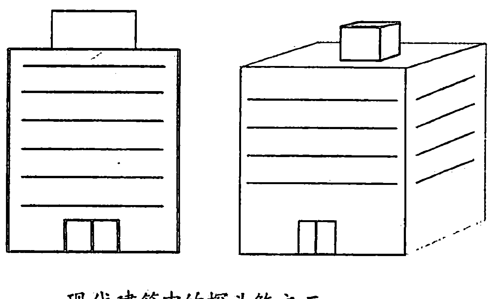

探头煞对个人财运最为严重的影响就是容易发生盗抢遗失的事件。笔者曾为一亲朋勘查风水，发现家中有阳台正好面对探头煞，于是该亲朋告诉笔者笔者在笔者到来之前家中曾被盗贼光顾过，并遗失了财物。可见探头煞的效力明显。于是笔者建议他在面对探头煞的位置悬挂一面反光凸面镜将煞气反射，这样对家中便不会产生不利的影响了。笔者希望通过这个实例告诉读者朋友们探头煞容易因盗抢而破财，因此除了犯此煞后要注意家中防盗之外，还应摆放反光凸面镜将煞气反射回去。

#### 8. 反弓煞

在风水中有“反弓无情”的话语，这说的便是“反弓煞”了。所谓反弓煞是指建筑外有河流、道路、高架桥、天桥等呈现弓形面，且面向建筑便犯了反弓煞，“反弓煞”十分形象，犹如一把弯弓对着自己所居住或者办公的楼盘。

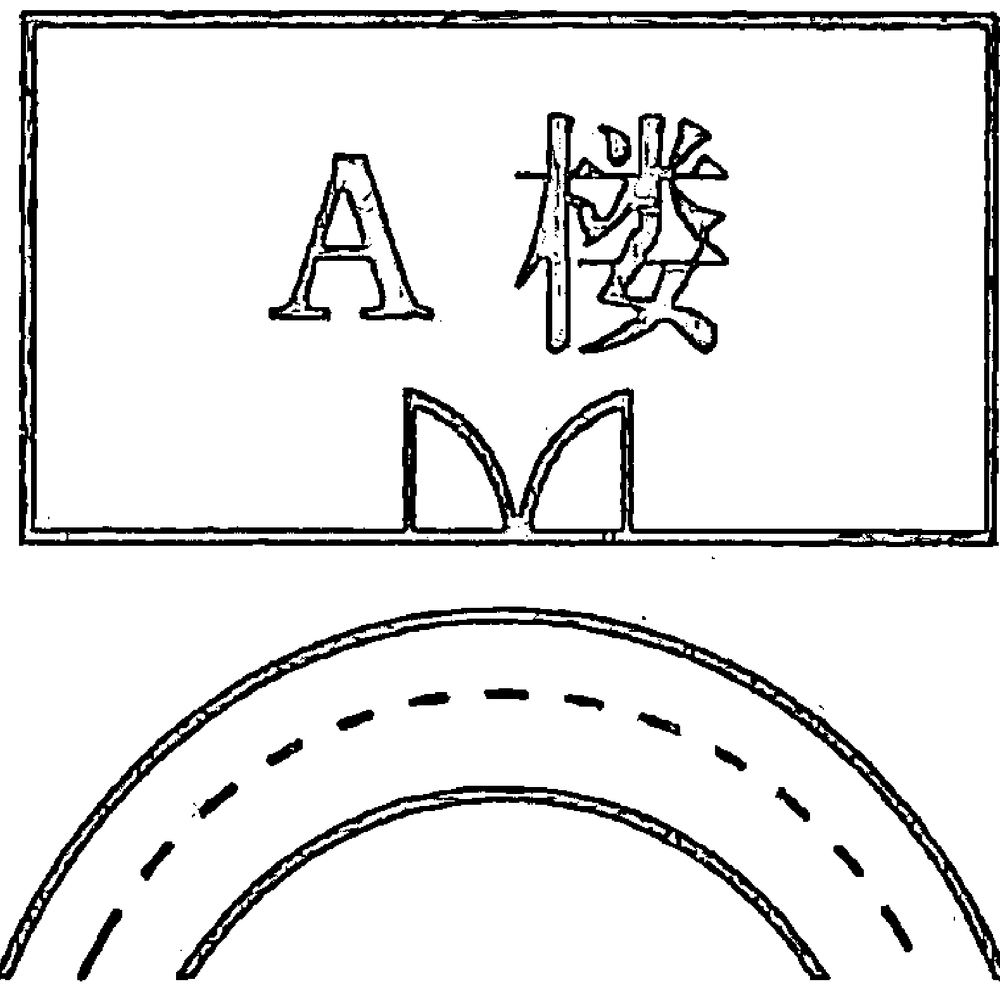

A楼如见反弓型水、路、桥等均犯反弓煞。

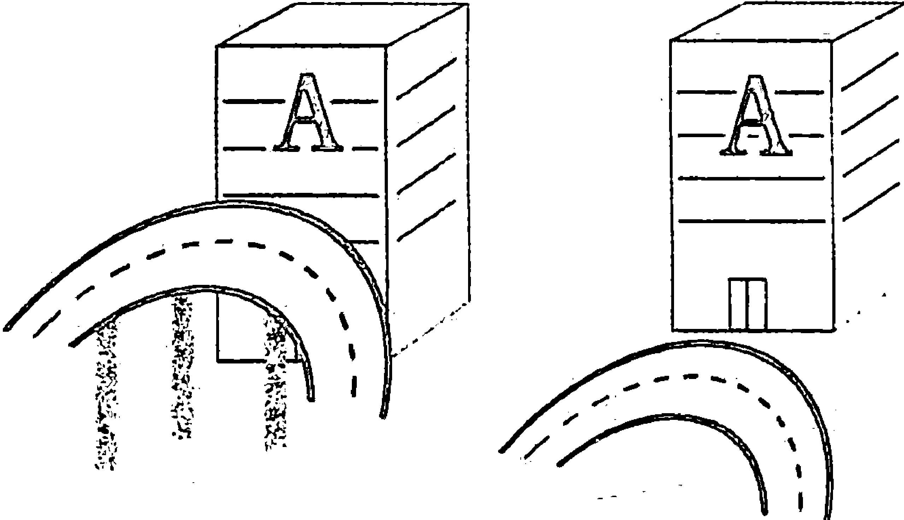

A楼如见反弓型水、路、桥等均犯反弓煞。

反弓煞又因为反弓弧度的不同可分为全反弓煞和半反弓煞。全反弓煞是指反弓的弧度完全指向建筑，居住在全反弓煞住宅的人士往往财运上会有明显的退步情况，此外，为人上也容易出现孤立的情况，因此事业运势回落较大。

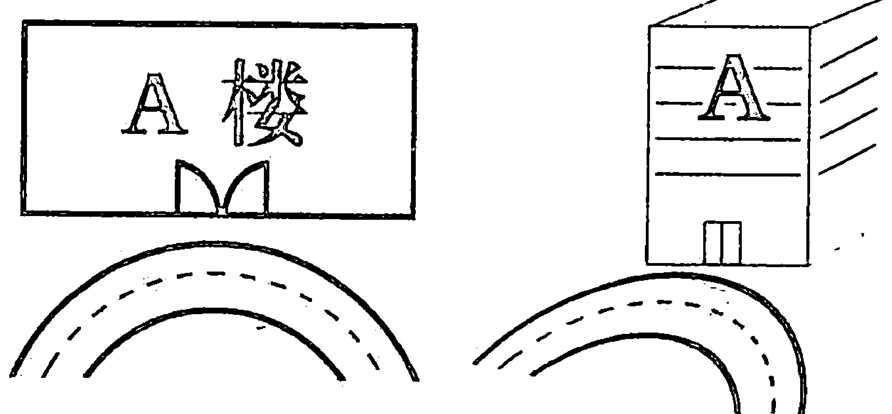

A楼犯全反弓煞

而半反弓煞虽然略弱于全反弓煞的影响，但是也代表破财和失意，因此也属煞气。

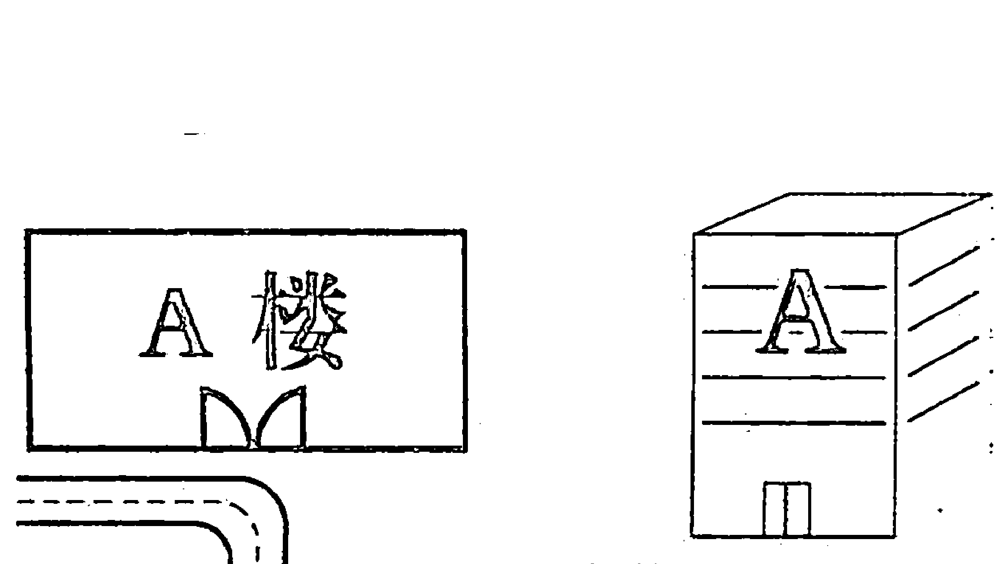

A楼犯半反弓煞

写到这里，笔者想起曾到广州勘查风水，当时正好和几位朋友开车路过一个楼盘，朋友们告诉我，原来这个楼盘售价很高，但是因为交通的缘故在楼盘的附近兴建高架桥，自从高架桥修好之后因开发商违法缘故使得楼盘价格大跌，导致购买了该楼盘的人士纷纷造成经济损失。笔者因只是路过，故不能全面分析该楼盘风水，但仅从反弓煞和朋友阐述便可得知该处楼盘业主财运受损与高架桥反弓煞一定存在必然的风水联系，因此可知反弓煞对财运的危害之严重！对于化解反弓煞，可在面对反弓煞的地方悬挂八卦饰品便可。

#### 9. 剪刀煞

剪刀煞是反弓煞的一种特例的情况，主要是指一座建筑面对两个反弓煞造型的高架桥交织在一起形成的煞气。剪刀煞因为是由两条反弓煞所组成，所以其凶性比反弓煞更为严重，但是在日常生活中，具有剪刀煞的楼盘较为少见，据笔者观察其多出现在聚居高度密集的城市，如中国香港、广州、日本等地都有犯剪刀煞的楼盘。

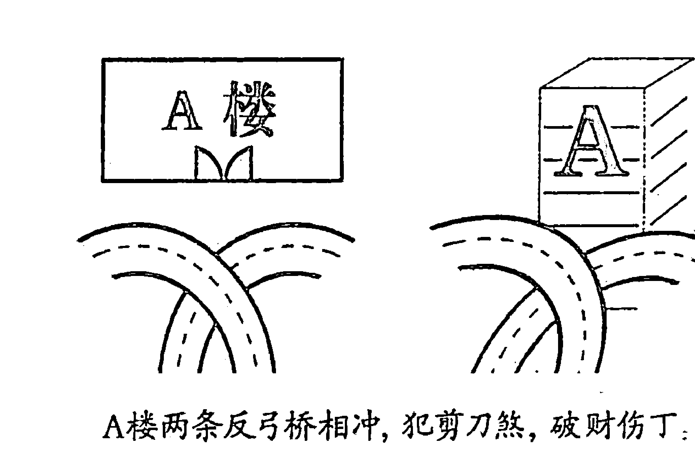

A楼两条反弓桥相冲，犯剪刀煞，破财伤丁。

如房屋犯了剪刀煞，除了财运容易出现破损之外，对于居住在该房屋的人士健康影响也是严重的，易犯血光意外等凶事，因此要格外注意。如果犯有此煞，可在面对此煞的位置摆放一对狮子饰品和一件八卦铜葫芦进行化解，方可消除煞气对家宅或办公室的影响。

#### 10. 针煞

所谓针煞是指窗外或门外见到犹如针造型的旗杆、天线等，此煞在日常的建筑中也较为常见，不过此煞只有距离该建筑越近其不利影响才越为明显，犯此煞者首先身体上易出现不适状况，其次精神状态上也有所萎靡，不利于工作的发展和积极性，因此此煞仍需化解，可在面对此煞的位置摆放一件“泰山石敢当”，其化解效果明显。

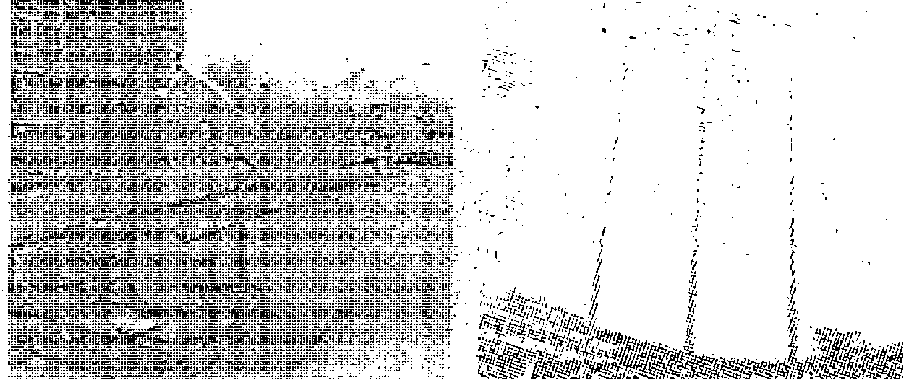

窗外见天线或屋前有旗杆均易犯针煞。

#### 11. 蜈蚣煞

所谓蜈蚣煞，其实是一种形煞，具体来说就是指房屋门前或者窗外见到弯曲的管道或者像蜈蚣造型的各种管线都可以叫做是蜈蚣煞。如犯此煞，家人的健康易出现一些莫名其妙的不适情况，容易因为健康而破财，值得大家注意。此外犯此煞者还容易被小动物所损伤，因此如果家中养宠物的朋友们更要化解此煞对自身的影响。

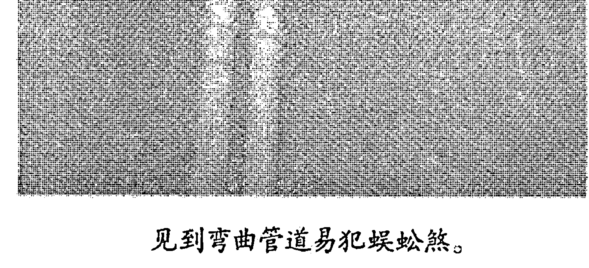

对于化解此煞的方法，可以摆放一直公鸡造型或老鹰造型的饰品，使公鸡或老鹰的头部面向蜈蚣煞，便可化解这股煞气了。

#### 12. 卷帘煞

在风水古籍《雪心赋》中有“卷帘水现，人舍填房”的描述，其实就是卷帘煞了。具体来说，对于当代的建筑而言，卷帘煞是指一出大门即刻见到一阶阶向下走的楼梯。

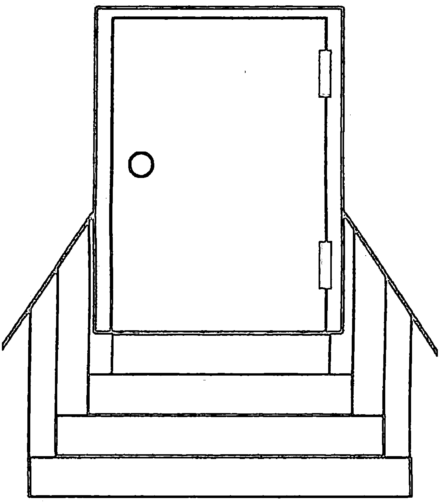

大门外见下楼梯，犯卷帘煞。

门为气口，是气流交换的场所，因此如果大门出现卷帘煞的情况，代表家中的运气随着台阶而跑出房间，因此地气也会随之溢出。如果房屋或办公室犯有此煞，往往财运上受阻停滞或出现滑落，因此不利于财运的聚集。笔者在勘查风水的时候发现，往往卷帘煞多出现在年代久远一些的老房屋的建筑中，近期兴建的房屋出现的机会并不是太高，因此对于卷帘煞而言，笔者建议如果读者身居年代稍久的房屋，要好好检查自己家中是否犯有此煞，如犯此煞者，可以在门前悬挂一面凹镜来聚气以弥补卷帘煞所带来的地气溢出的情况，或者购买一条云石压放在门前以充当门槛从而防止地气溢出的情况。

#### 13. 火煞

火煞从字面意思上来看似乎与火有关，笔者这里所写的“火煞”并非火焰的意思，而是与五行中“火”有关的煞气。往往五行为“火”或“木”的煞气对于阳宅的负面影响最大，因此笔者将其二者提出着重介绍。首先介绍火煞，火煞可以根据其颜色、型态和用途的不同，分成颜色上的火煞、尖角煞（上文已经介绍过）、路型火煞。首先颜色上的火煞是指如果房屋周围有红色的建筑或场地就是火煞了，如果家居或者办公室遇到这种火煞，表现为宅主性格急躁、脾气倔强，并且对成员的心脏、血液有所损伤，因此如果遇到的是这种火煞，可以在面对火煞的位置摆放一对麒麟和一杯清水来化解。有关路型火煞是指在建筑物周围有“V”字型路，并且道路转角处面向该建筑物或者建筑物周围有斜路穿过都属于火煞，如果房屋建筑或者办公室犯有此煞，象征宅主和成员健康运势和财运均有回落，此外还容易因争吵和是非而破财，因此较为严重。

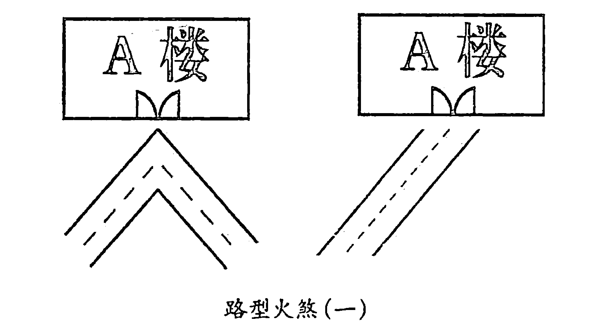

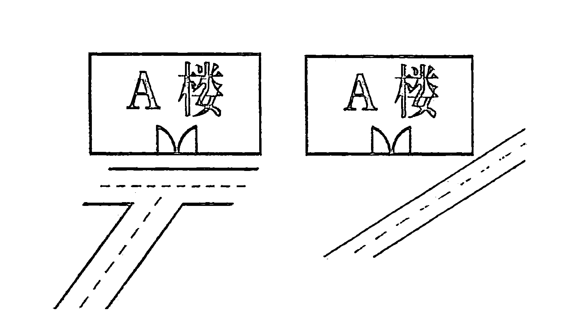

#### 14. 木煞

木煞也是指道路五行为“木”的煞气，因为五行为“木”的道路形状上是笔直的，因此木煞往往有两种形式，一种是道路与建筑物相对直冲，也就是笔者在以上介绍煞气中的“枪煞”的类型，读者可参考上文进行化解。另一种则是与建筑物平行的“木煞”，这种“木煞”在风水中往往称之为“无情”，这个“无情”读者们可以理解成不能够聚气，对于财运来说属于财来即走的情况，不能将财气聚集到建筑物附近，往往很多商业街、道路周边的店铺、大厦都存在一定的“木煞”的影响而不能聚财。

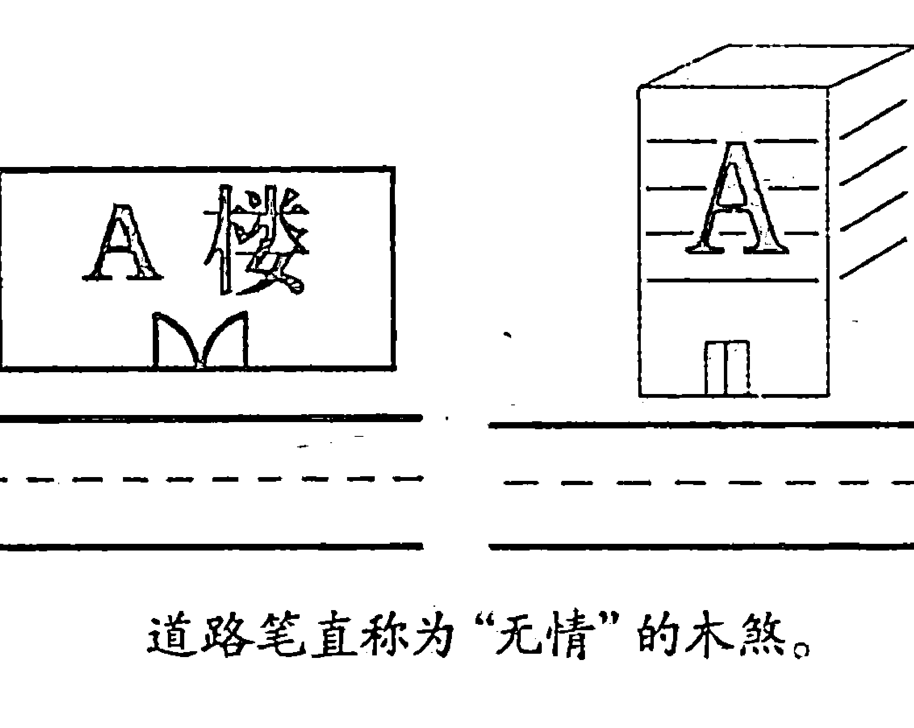

具体化解方法首先确定道路上汽车的行驶方向和自己所在这种笔直道路的哪一边，然后可以在大门旁摆放大叶植物、广告牌、灯箱等，将最靠近建筑一旁的汽车所带来的气流引进到大门附近，这样便解决了聚气的问题了。但是笔者在这里强调一下，一定要找好汽车的流向和大门在道路哪边这两个条件，将最靠近店铺或大厦的气流引进大门，不可弄巧成拙了。

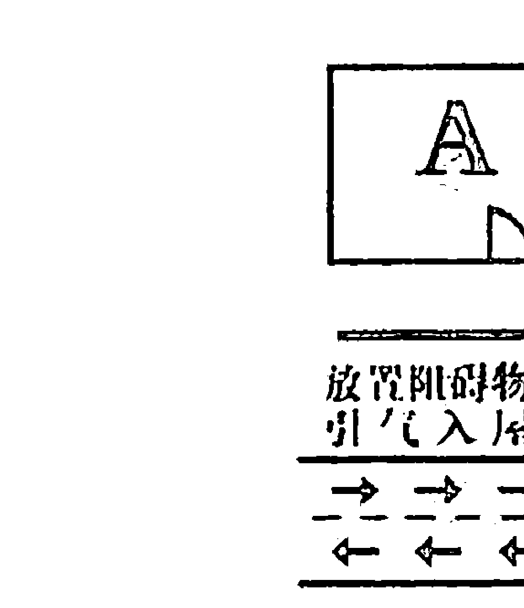

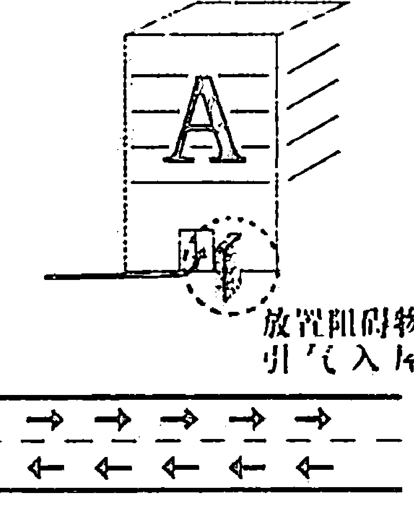

因为笔者看很多商铺或者大厦都会采用此法来催旺财气，但是一旦使用相反，便只有事倍功半的效果了。

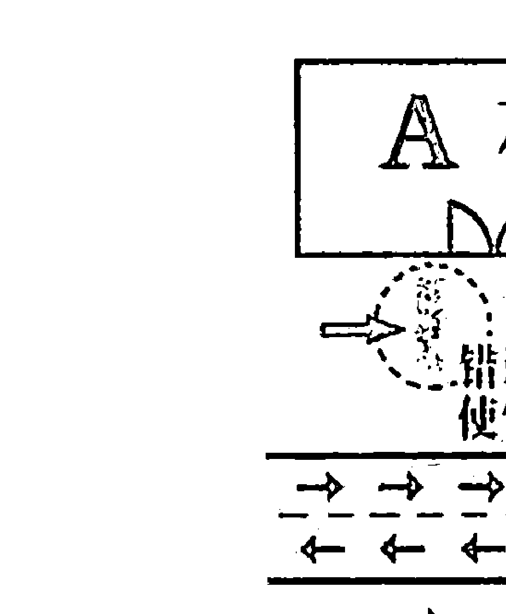

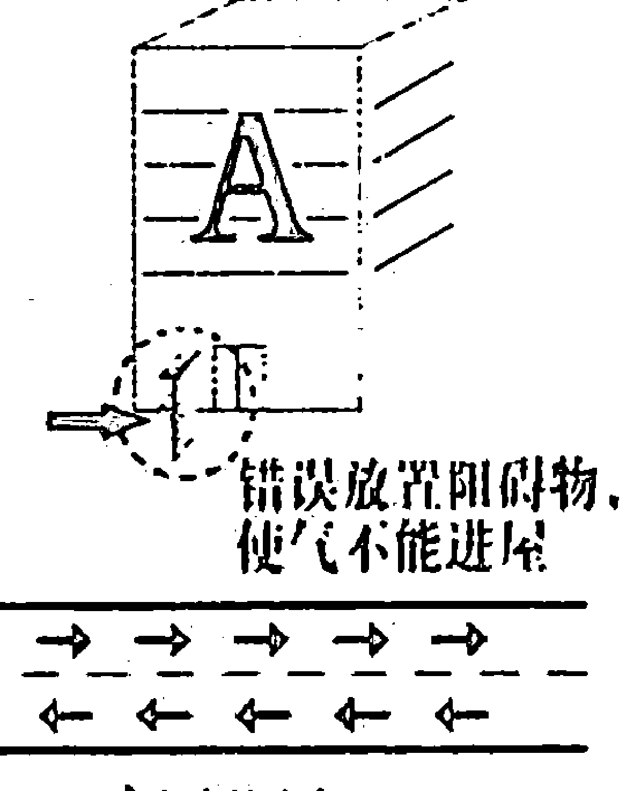

#### 15. 庙煞

所谓庙煞，是指在寺院、庙宇或者教堂附近都容易存在煞气，而这些煞气往往除了从事有关宗教的人士之外，对于一般人来说都会产生一定的不利影响。主要表现在容易出现孤僻的性格和财运阻滞的情况，因此对于居住者或者经商办公者来说，除非是宗教人士或者从事与宗教有关的行业，一般人最好减少在寺院、庙宇或者教堂附近居住。此外，对于有中国建筑特色的寺院庙宇而言，除了易犯庙煞之外，还容易犯角煞或者兽煞，因为寺院庙宇的建筑风格以中国古典为主，而对于这种建筑来说，屋顶的四个角往往不是尖角造型就是带有神兽的造型，因此对于在寺院周边的高层建筑而言，便容易犯“角煞”或“兽煞”了，这样会对居住或工作在该房间的成员身体造成一定的不利影响，容易出现一些莫名其妙的病痛，不利于工作和财运。笔者建议如遇到这种情况，最好选择搬迁，如短时间内不能搬迁，则在面对这些煞气的地方悬挂凸面反光镜或张贴反光玻璃纸来化解。

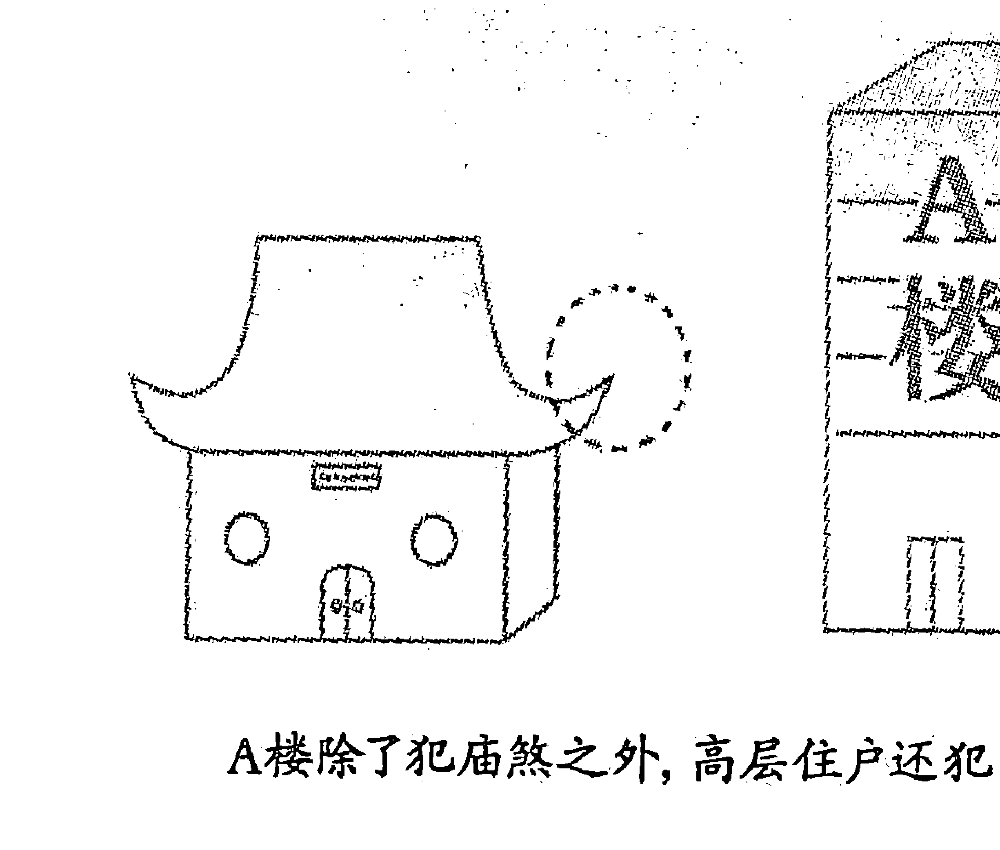

#### 16. 建筑煞

对于某些特定的建筑而言，其本身就带有一定的煞气，例如消防局、法院、检察院、医院、殡仪馆等，因此从风水的角度来看，最好避免居住或办公在过于靠近这些建筑的房屋之中，否则对财运也会有一定的打击效果，而且还易招致是非、疾病的不利事件，因此最好避免选择在这些楼盘居住、办公。

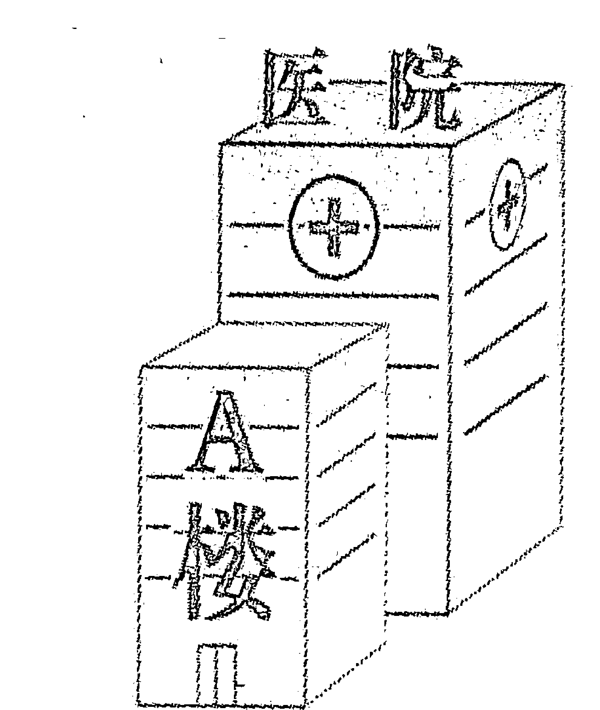

#### 17. 电磁煞

随着科学的发展，有越来越多的电磁波散布在我们身边。因为风水所强调的气场本身就是一种类似电磁波的物质，因此电磁过多便形成了煞气。而对于楼盘来说，如果楼盘附近靠近电塔、电线杆、电磁发射塔、信号发射塔等，那么往往所受到的电磁煞较为严重，对于个人的影响表现在做事容易冲动，不理智或不清醒。往往也会影响事业和财运，并且例如像电塔、电磁发射塔等其形状来看易犯“火煞”，因此还容易对个人产生性格脾气暴躁、为人多是非口舌等不利的影响，因此实为不利。

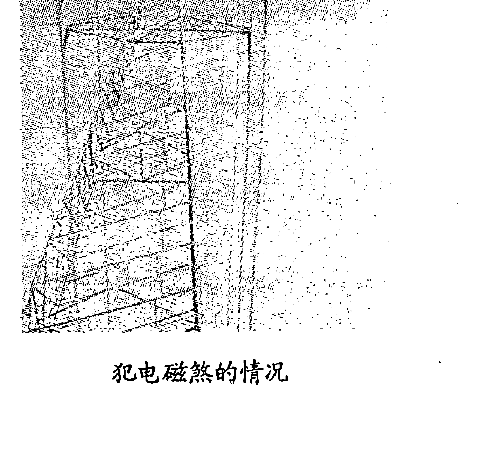

对于化解此煞，如房屋建筑只犯有电磁煞，则可以用八卦物品或凸面反光镜进行化解，如果同时又犯“火煞”则需在此方位同时放一杯清水或鱼缸进行化解。

#### 18. 光煞

随着建筑水平的不断提高，越来越多的建筑采用了纯玻璃外墙的建筑风格，但是过多地使用这种风格在风水中确实给堪舆家们造成了一个难题，那就是“光煞”。在风水中流传着“孤阴不生、独阳不长”的法门，意思是说风水要阴阳协调，不可极端。而“光煞”往往就是“独阳”的一种表现，因为光线会随着外墙玻璃反射到对面的建筑物中，使对面的建筑物阳光过于充足从而导致在这个建筑物里的人性格脾气暴躁不稳定、忍耐力差，并且人际关系处理不稳定，还会对心脑血管的身体部位产生一定的损伤，因此也是值得大家注意的一种煞气。

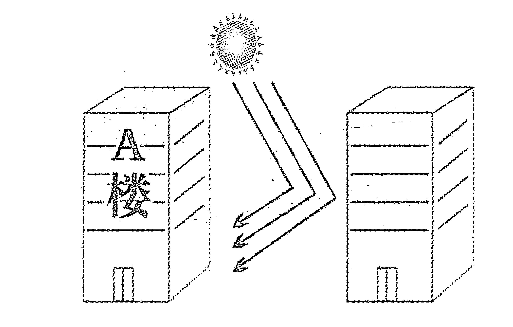

假如读者朋友们在家居或者办公室中发现了对面的建筑物有光煞反射到自己的屋宇之内，则要小心注意防范和化解了，比较有效的方法是在面对光煞的地方放置几盆大叶较高的植物来遮挡光煞，或者在窗上悬挂反光玻璃纸进行阻挡，都可以很好地化解光煞对自身的影响。

#### 19. 声煞

对于声煞来说，笔者便要因“声”而异、因人而异了。首先，从人的角度来看，因为每个人对声音的敏感程度和喜好偏见不一，就像有人对于学生的上课读书声反感，但是有人却认为这是一种美妙的声音一样，声煞对于不同的人会有不同的影响，因此笔者不好从这方面进行评判。反之倒是可以因“声”而异，对于噪声而言，笔者相信绝大多数的人都是反感的，而在我们身边最常出现的噪音往往以周边施工动土为主了。对于声煞，从化解的角度来看没有什么太好的方法，而影响往往也只是让人心情烦躁不安或做事不集中而已，但是，对于因为动土而连带产生的声煞，笔者建议首先化解“动土煞”最为要紧，因为动土煞会对个人的运势产生打压不利的影响，至于化解“动土煞”的方法，笔者已在前面的内容中涉及过了，这里就不再强调了。至于动土煞所连带的声煞，笔者认为最好的化解方法也只有戴上耳机或者加隔音墙了。

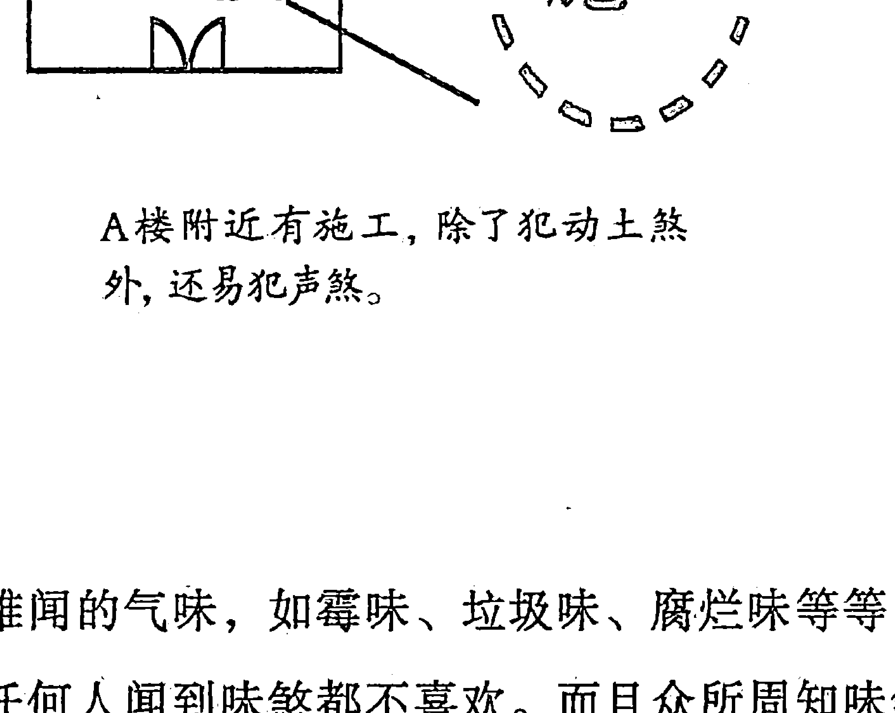

#### 20. 味煞

味煞是指一些难闻的气味，如霉味、垃圾味、腐烂味等等，其实味煞是属于常识的一种，任何人闻到味煞都不喜欢。而且众所周知味煞往往因为环境不卫生、潮湿或者在一些如垃圾处理场周围产生，味煞往往会滋生细菌的繁衍，因此对身体来说会产生一定的不利影响。笔者曾有过这方面的亲身经历，在笔者完成中学学业的时候，当时家住一个离小区垃圾场距离不远的楼宇，每到夏天总会遇到一定时间的味煞侵扰。而笔者身体上也在这段时间常有不适，主要表现在胃肠消化方面，想必与味煞有关，因此，笔者认为解决味煞最好的方法便是保持房间洁净和远离容易形成味煞的场所，这样便可有效地脱离味煞了。

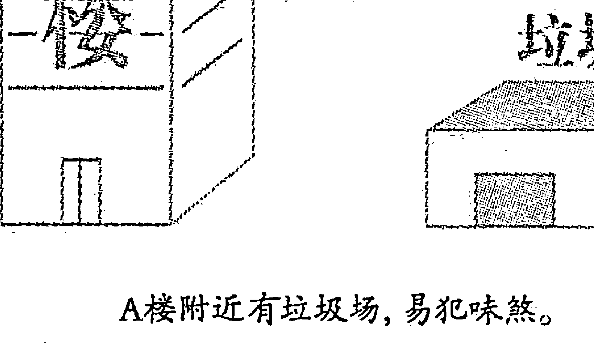

A楼附近有垃圾场，易犯味煞。

以上便是为读者朋友们总结的各种煞气以及化解的方法，笔者认为这些煞气虽然有的会对财运有直接的打压效果，有的煞气有间接的打压效果，但不管家居还是办公室存在这些峦头煞气总归是不利的，因此笔者建议还是积极地进行化解更为稳妥，就像笔者所写的标题一样“防破财化煞气”。

### 水法管财禄

在风水中一直有“山管人丁水管财”之说，意思是告诉大家人丁运势往往由高山所主管，而财禄运势往往由水所掌管。因为本书主要介绍有关财运的催旺方法，因此，笔者会着重向大家介绍有关水法的吉凶和旺财法门。

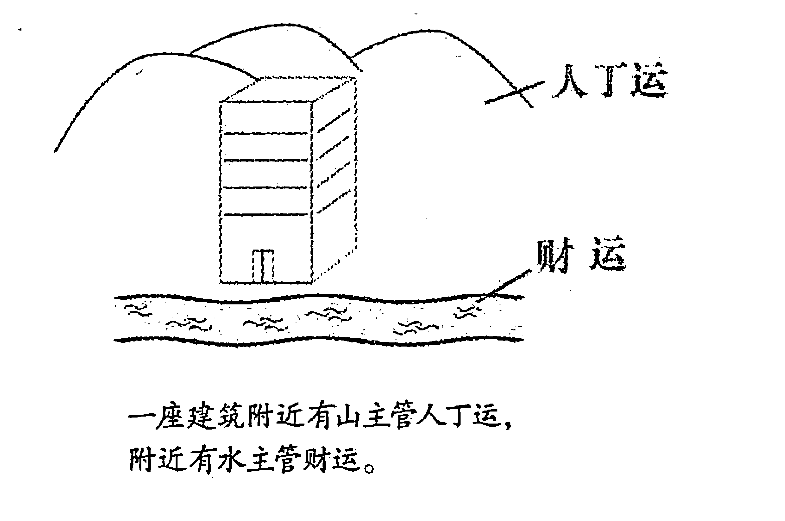

一座建筑附近有山主管人丁运，附近有水主管财运。

#### 1. 发水入零堂

在笔者介绍水法应用之初，首先向大家介绍“发水入零堂”。根据笔者长时间的实践来看，“发水入零堂”对于催旺个人的财运确实有神奇的功效。所谓“发水入零堂”，笔者用最通俗的语言向大家解释就是“能够使自己发达的水法来到了某一个特定的位置——这个特定的位置叫做零堂”。想必读者们看了笔者对“发水入零堂”的解释之后，明白了为什么笔者对这个旺财水法这么重视的原因了。

接下来笔者就要讲解如何使用这一风水旺财法门了。首先，需要向读者解释的便是什么是“零堂”？比较正式的解释就是“零神”所在的位置叫做“零堂”，那么想必有读者就会问笔者，什么叫“零神”呢？要谈到“零神”，就避免不了要谈到“正神”、“洛书”和“三元九运”这三个概念。首先，洛书是相传在洛河中出现了一只神龟，在其龟背上出现了九星之象，后人发现并对其研究，发现其中的九星图案奥妙无穷，于是便成为了洛书。对于洛书而言，有其口诀和图示供大家参考：“载九履一，左三右四，二四为肩，六八为足，以五居中”。

笔者将以上的洛书图案转化成数字之后，大家可以发现原来每一小幅图案分别对应着其中的一个数字，一共有九个数字九个格子，而这九个格子分## 求财风水秘笈

别代表东、南、西、北、东南、西南、东北、西北、中宫这九个方位。这一组分布于九个格子中的数字便可以称之为简化的洛书了。

知道洛书的意义之后，下面便是“正神”的含义了。正神的概念来自于“三元九运”。象征每一小运中主管运势的元运神位，而三元九运笔者在第一部分中已作详细介绍，这里，笔者便直接引用离我们生活最近的“三元九运”周期了：

##### 上元运（60年）
- 上元一运：1864 甲子年至 1883 癸未年（20 年）
- 上元二运：1884 甲申年至 1903 癸卯年（20 年）
- 上元三运：1904 甲辰年至 1923 癸亥年（20 年）

##### 中元运（60年）
- 中元四运：1924 甲子年至 1943 癸未年（20 年）
- 中元五运：1944 甲申年至 1963 癸卯年（20 年）
- 中元六运：1964 甲辰年至 1983 癸亥年（20 年）

##### 下元运（60年）
- 下元七运：1984 甲子年至 2003 癸未年（20 年）
- 下元八运：2004 甲申年至 2023 癸卯年（20 年）
- 下元九运：2024 甲辰年至 2043 癸亥年（20 年）

从笔者引用的“三元九运”再结合刚才所介绍的“洛书”表格一起看，我们便会找出在每一个 20 年小运中“正神”和“零神”的位置了。笔者以“上元一运”举例，大家可以知道上元一运是指 1864 年到 1883 年这段时间，而正神（主管运势的元运神位）是一运，从洛书中可以找到是数字“1”的位置，象征的方位是“正北方”。而“零神”是与正神相对的位置，在洛书中可以找到与数字“1”相对的位置是“9”，象征“正南方”，因此“正南方”便是“零神位”，也就是“发水入零堂”中的“零堂”位置了。

一运正神、零神位

举完此例之后，笔者将从离我们最近的“三元九运”的正神、零神位置一一配图列出，以方便读者自行查阅。

## 求财风水秘笈

##### 上元运（60年）
上元一运：1864甲子年至1883癸未年（20年）
正神位：正北方
零神位：正南方

一运正神、零神位

上元二运：1884甲申年至1903癸卯年（20年）
正神位：西南方
零神位：东北方

二运正神、零神位

上元三运：1904甲辰年至1923癸亥年（20年）
正神位：正东方
零神位：正西方

##### 中元运（60年）
中元四运：1924 甲子年至 1943 癸未年（20 年）
正神位：东南方
零神位：西北方

中元五运：1944 甲申年至 1963 癸卯年（20 年）

中元五运比较特殊。因为从洛书中我们也能看出象征五运的数字“5”在九格中的中心一格，没有与之相对的位置。因此五运需有一个特定的划分，在前十年（1944 年到 1953 年）中，正神在“未”、“辰”方（西南方、东南方），零神在“丑”、“戌”方（西北方、东北方）。在后十年（1954 年到 1963 年）中，正神在“丑”、“戌”方（西北方、东北方），零神在“未”、“辰”方（西南方、东南方）。

| 4 | 9 | 2 |
|---|---|---|
| 3 | (5) | 7 |
| 8 | 1 | 6 |

因为五运象征数字“5”居于中宫，所以按上文方位断定正神、零神位。

中元六运：1964 甲辰年至 1983 癸亥年（20 年）
正神位：西北方
零神位：东南方

六运正神、零神位

##### 下元运（60年）
下元七运：1984 甲子年至 2003 癸未年（20 年）
正神位：正西方
零神位：正东方

| 4 | 9 | 2 |
|---|---|---|
| 3 | 5 | 7 |
| 8 | 1 | 6 |

七运正神、零神位

下元八运：2004 甲申年至 2023 癸卯年（20年）
正神位：东北方
零神位：西南方

| 4 | 9 | 2 |
|---|---|---|
| 3 | 5 | 7 |
| 8 | 1 | 6 |

八运正神、零神位

下元九运：2024 甲辰年至 2043 癸亥年（20年）
正神位：正南方
零神位：正北方

| 4 | 9 | 2 |
|---|---|---|
| 3 | 5 | 7 |
| 8 | 1 | 6 |

九运正神、零神位

## 求财风水秘笈

笔者已将“三元九运”的正神位、零神位（零堂）悉数总结在上述内容中，方便读者查询。

介绍完了这些基本概念之后，接下来就是向大家介绍如何去使用了。大家只要记住如果正神位见到水便是“损丁水”，意思是在正神方如果看见河流、大海、湖泊、水池等，便会对人丁健康、人气和人际情感有所损伤，比如像现在我们所处的“八运”（2004年到2023年）中，如果正神东北方见到水系的话则容易“损丁”。而前面提到过的“发水入零堂”则是指如果在零神方见到水则是“旺财水”，比如零神方见到河流、大海、湖泊、水池等等都可以称之为“旺财水”，会对宅主财运有明显提升的效果，财源滚滚。比如还是以“八运”为例，如果在零神西南方见到水系的话便是“旺财水”了，主财运亨通。

八运的旺财水、损丁水

笔者将刚才所总结的最近的“三元九运”正神位、零神位再做细化，分别标出“旺财水”和“损丁水”的注释，希望读者能一目了然。

##### 上元运（60年）
- 上元一运：1864 甲子年至 1883 癸未年（20年）
- 正神位：正北方（损丁水）
- 零神位：正南方（旺财水）

## 第二部分 教你来挑旺财楼

正南方、旺财水

| 4 | 9 | 2 |
|---|---|---|
| 3 | 5 | 7 |
| 8 | 1 | 6 |

正北方、损丁水

一运的旺财水、损丁水

上元二运：1884 甲申年至 1903 癸卯年（20 年）
正神位：西南方（损丁水）
零神位：东北方（旺财水）

西南方、损丁水

| 4 | 9 | 2 |
|---|---|---|
| 3 | 5 | 7 |
| 8 | 1 | 6 |

东北方、旺财水

二运的旺财水、损丁水

上元三运：1904 甲辰年至 1923 癸亥年（20 年）
正神位：正东方（损丁水）
零神位：正西方（旺财水）

## 求财风水秘笈

##### 中元运（60年）
中元四运：1924 甲子年至 1943 癸未年（20 年）
- 正神位：东南方（损丁水）
- 零神位：西北方（旺财水）

四运的旺财水、损丁水

中元五运：1944 甲申年至 1963 癸卯年（20 年）
在前十年（1944 年到 1953 年）中，正神损丁水在“未”、“辰”方（西南方、东南方），零神旺财水在“丑”、“戌”方（西北方、东北方）。
在后十年（1954 年到 1963 年）中，正神损丁水在“丑”、“戌”方（西北方、东北方），零神旺财水在“未”、“辰”方（西南方、东南方）。

## 第二部分 教你来挑旺财楼

中元六运：1964 甲辰年至 1983 癸亥年（20 年）
正神位：西北方（损丁水）
零神位：东南方（旺财水）

六运的旺财水、损丁水

##### 下元运（60年）
下元七运：1984 甲子年至 2003 癸未年（20 年）
正神位：正西方（损丁水）
零神位：正东方（旺财水）

七运的旺财水、损丁水

下元八运：2004 甲申年至 2023 癸卯年（20 年）
正神位：东北方（损丁水）
零神位：西南方（旺财水）

## 求财风水秘笈

东北方、损丁水

| 4 | 9 | 2 |
|---|---|---|
| 3 | 5 | 7 |
| 8 | 1 | 6 |

西南方、旺财水

八运的旺财水、损丁水

下元九运：2024 甲辰年至 2043 癸亥年（20年）
正神位：正南方（损丁水）
零神位：正北方（旺财水）

正南方、损丁水

| 4 | 9 | 2 |
|---|---|---|
| 3 | 5 | 7 |
| 8 | 1 | 6 |

正北方、旺财水

九运的旺财水、损丁水

写到这里，笔者想起一个风水案例正是有关 “旺财水” 和 “损丁水” 的。笔者曾到广州某一个当地公认为是富人区的某住宅小岛上勘查风水，笔者发现此小岛位于珠江之上，全岛形状似枣核型。笔者在勘察风水的过程中发现靠近珠江一旁的一排住宅能够在东方和东北方看见连续的珠江河流通过，于是笔者向宅主询问后方知在这里居住的人士多数是在七运（1984 到 2003 年）乔迁至此，居住后财运明显提升，很多住在该岛的人士均成为了从事行业中的佼佼者，事业财运双丰收。但是很多宅主莫名其妙地在 2004 年之后（进入八运）搬出这里，以很低的价格变卖房屋，即便至今没有搬走的宅主，比如像笔者的这位朋友，在2004年之后也遇到了一些困阻的情况，而且身体亦出现了一些问题。后来笔者在勘察风水的过程中发现，原来坐落在珠江旁的这一排房屋在七运（1984年到2003年）时属于零神正东方见到了“旺财水”，因此住在这边的人士才会在事业财运上增速明显，这个小岛也由此被人称为“富人区”了。但是进入八运（2004年到2023年）之后，因为水流是连续的，在这些住宅的东北方仍能见到水流，但这个水流变成八运正神东北位的“损丁水”了，因此才会出现这些不利的事件。通过笔者所讲述的这个风水实例，想必读者朋友们已经明白了“发水入零堂”的效力所在了。

## 第二部分 教你来挑旺财楼

对于现在来说，在选择楼盘居住或办公的时候，如果能选择看到西南零神方有水流的楼盘，那么会很有利于大家的财运的。

A楼西南方看见人工流水湖，可视作A楼的“旺财水”。

但是如果在窗外没有找到这样的水系，笔者这里建议大家在家居或办公室房间屋内的西南方摆放一件与水有关的饰物，如水种植物、流水摆件等等，一样可以起到“旺财水”的效果，笔者建议读者们不妨一试。

在此房间的西南位置放置水种植物或流水摆件也可视作“旺财水”。

#### 2. 实水、虚水

在风水中，经常有阴阳虚实之分，对于水来说也有虚实之分。因为在风水典籍中有“高一寸为山，低一寸为水”之说，所以像道路、公路、天桥、街道、小巷或者比平地略下陷的地方都可以称之为“水”，但是与海、江、湖、河流等“实水”相比，虽然这些景物具有一定的流动性，比如像公路有汽车驶过具有流动性，但是少了一些“实水”的特性，因此便称之为“虚水”了。在笔者的观察和考证中，实水的效力会强于虚水的效力，比如同样是零神方见水，但是如果见到海、湖、河等实水，则“旺财水”的效力会提升，效果也明显，而如果见到道路、小巷、广场等虚水，往往效果便会削弱一些。因此，大家可以发现很多高楼大厦门口往往采用喷泉、水池、水系等进行催财，而较少使用广场、道路来催财，这便是原因所在了。因此，笔者建议读者朋友们要想在短时间内进行催财并且希望效果明显，还是多多用“实水”为好，见效会快于“虚水”的。

楼前有水池，使用“实水”催财。

#### 3. 清水、浊水

水除了分有虚实之外，对于实水来说还会有清浊之分。在笔者和大家的印象中，相信认为清水会比浊水更好。从水法旺财的角度来看，虽说清水好过浊水，但其二者也有不同的旺财领域。对于清水而言，象征着正财运，如楼盘附近能够见到清水则象征此地适宜催旺正财运，正财运简单来说就是要在财运上“多劳多得”。而与之相反的“浊水”则会对偏财、横财运有聚集效果，例如博彩行业、赌业等这些能够使自身以小博大而取得财运的行业都包含在此，因此水稍微偏浊一些会对这些行业进行财运上的催旺。

香港水清因此正财运旺

笔者曾读过某篇报道，上面记述澳门与香港虽然都是有水城市，但是香港的水质质量强于澳门的水质质量，因此可以说香港的水质偏“清水”，而澳门的水质偏“浊水”，因此就像笔者刚才所说清水旺正财、浊水利偏财，香港是以经贸金融等正财行业而取得经济上的收获。澳门是以赌业等偏财行业而取得经济上收获。因此也能够看出清浊之水对财运的不同影响。不过笔者认为，对于像我们一样以正财为生的人士来看，多用清水方是旺财之法，应减少使用浊水旺财，因为浊水中容易引发“味煞”（上述内容已经介绍），对个人的身体健康有所不利，因此还是水清一些的好。

#### 4. 水近、水远

笔者在与很多风水爱好者们交谈的时候，发现很多人对于水法旺财存在一些误解，就像有些风水爱好者们认为只要楼宇的零神“旺财水位”见水便会财运大增，而并不考虑水近水远的问题，这个观点笔者认为是不正确的。因为水对于财运的影响会因为远近的不同影响的效力也不尽相同，写到这里，笔者回想起曾为一位朋友挑选别墅而遇到水近水远的问题。

那位朋友带领笔者到他新购置的一套别墅中考查风水，笔者发现此楼盘均为别墅楼盘，属于层次排列形式，但笔者发现一个有趣的情况，此区域的别墅均按照向东北的方向层层展开排列，而东北方恰有一条大河流过，因笔者考察此地风水已属八运2004年之后，在八运时东北方见水为“损丁水”，不利人气的聚集，因此笔者将这一点也告诉了这位朋友，并且还对这位朋友说：“这个楼盘越靠近东北河流的别墅人气越差。”笔者的朋友听到笔者这样说后，连忙肯定了笔者的观点。据这位朋友说，这个楼盘已经全部售出两年多的时间了，但是最靠近河边的一排别墅至今似乎一家都没有搬进居住，因为他所购买的别墅是靠近河边第二排，也只有一两家居住，其他全部空置。而离此河越远的别墅反之人气很旺，其中离河流最远的几排别墅人丁兴旺，不仅全部有人长期居住，而且人气十分旺盛。笔者听到这种情况，便向这位朋友解释到：“虽然这个楼盘别墅都遇到了东北见到损丁水的情况，但是与水离得越远则不利影响越小，到离河最远的几排别墅已经毫无影响了。”

笔者之所以写出此例，是想让大家明白水离房屋楼宇的远近对风水的影响效果是不同的，如果楼盘与水的距离适当，则影响最为明显，但是如果楼盘与水之间距离过远或者中间间隔很多其他建筑物的话，那么这些建筑物犹如天然屏障将水对于此楼盘风水的影响几乎化为零了，因此即使建筑物在遥远的方向存在“旺财水”的话，也对于该楼盘不会起到催财的效果。

## 第二部分 教你来挑旺财楼

A楼在八运时虽然西南零神方见到了旺财水，但因距离过远且有诸多建筑物阻挡，因此旺财水对A楼不会起到旺财的效果。

相反，如果水流离楼宇距离过近，在风水中称这种水为“割脚水”，意思是说水流太近了以至于都能触及到脚面了。如果楼盘有这种“割脚水”存在，则象征宅主的财运不能长久，虽然会有一段时间的发展，但是很快便会走下坡路，财运上也会有所破损，因此不宜长期居住这种楼盘。因此，对于水的远近笔者建议适中最好，过近过远均无意义。

A楼因为离水过近，因此犯“割脚水”，代表财运不能长久。

#### 5. 五行水

对于水法而言，根据“五行”的理论，笔者将我们日常所能见到的水流分成金型水、木型水、水型水、火型水和土型水一共五种，在这五种水型中，往往火型水和木型水基本成凶水定论，其他三种形状因其细分不同各有偏重；以下，笔者会逐一介绍每种水型的吉凶情况。

金型水：金型水从形态上最大的特征是偏圆形，因此对于水池、湖泊来说，整体造型偏圆便是金型水，往往以吉论之。

而对于河流来说，金型水是指河流形状呈弧线形的水流，其吉凶不定，原因是要看河流的弧度在该楼宇的哪一旁了，如果河流弧度环抱楼宇，在风水上称这种水叫做“环抱水”，也叫“有情水”，主管财运亨通、有贵人相助，因此为旺财吉水。而如果弧度反弓楼宇，则在风水中称这种水为“反弓水”，主管财运不佳、无情无义、宅主易被他人利用陷害，因此属于凶水。因此对于“环抱水”这种吉水而言，只要水流不在“损丁水”的正神位上，便可以用凹面镜将财气吸纳入房中，这样财运便会大有起色。相反，如果对于“反弓水”而言，可以在面对反弓水的位置放置一对狮子来进行化煞。

## 第二部分 教你来挑旺财楼

土型水：对于土型水来说，从形态上来说最大的特征便是土型水偏方形或长方形，因此对于水池、湖泊来说，造型偏正方或者长方都可称之为土型水，并且从“八运”（2004年到2023年）来看，如果在零神西南方见到这种土型水的话会增加“旺财水”的效力，因此，在八运中，西南方最为适宜见到这种土型水了。

从河流的角度来说，土型水是指河流形状呈偏方的形态。从吉凶的角度来看，和金型水河流一样也要看河流与楼盘的位置而定。如果河流环抱楼宇，在风水上称这种水为“环抱水”，也叫“有情水”，主管财运亨通、有贵人相助，因此为旺财吉水。而如果弧度反弓楼宇，因为土型水只有在河流转角处才构成“反弓”，因此在风水中称这种“反弓水”为“半反弓水”，也主管财运不佳、无情无义、宅主易被他人利用陷害，因此属于凶水。因此对于“环抱水”这种吉水而言，只要水流不在“损丁水”的正神位上，便可以用凹面镜将财气吸纳入房中，这样财运便会大有起色。相反，对于“半反弓水”而言，可以在面对反弓水的位置放置一对狮子来进行化煞。

A楼为环抱有情吉水

B楼犯半反弓凶水

水型水：对于水型水来说，形态上的最大特征就是水型呈波浪流线型，也可以称之为“S”型或“之”字型。对于这种水来说，往往湖泊、水池并不常见，而河流中较为常见。对于河流的这种形态，其吉凶依然不定，需分情况而说。首先如果楼盘与河流处于水平位置，则笔者建议读者要仔细观察河流的波浪型凹凸位置与楼宇的相对位置，因为这种水型水容易形成“环抱水”与“反弓水”两种情况。因此这取决于楼盘所在水型水河流的具体位置，如果河流波浪型弧度环抱楼宇，在风水上称这种水为“环抱水”，也叫“有情水”，主管财运亨通、有贵人相助，因此为旺财吉水。而如果河流波浪型弧度反弓楼宇，则在风水中称这种水为“反弓水”，主管财运不佳、无情无义、宅主易被他人利用陷害，因此属于凶水。因此对于“环抱水”这种吉水而言，只要水流不在“损丁水”的正神位上，便可以用凹面镜将财气吸纳入房中，这样财运便会有大起色。相反，对于“反弓水”而言，可以在面对反弓水的位置放置一对狮子来进行化煞。这便是“差之分毫、谬之千里”的道理了。

A楼面朝反弓水，属凶水，而B楼面朝环抱水，属吉水。

第二种情况是如果楼盘的位置与河流呈垂直的状态，那么这种位置也要看水流的流向定吉凶了。假如水流朝楼盘方向流入，则这种水型水称之为“九曲来水”，在风水古籍《雪心赋》中有“九曲来水、当朝宰相”的介绍，意思是如果有这种水来到楼宇之前是吉水的情况，象征财运亨通、事业顺利和前途无量，因此只要“九曲来水”不在正神“损丁水”位上，便可用凹面镜朝向河水以收纳财气进入房间。

A楼楼前面对九曲来水，属吉水。
→ 水流方向

相反，如果水流背向楼宇流走，则在风水中称之为“扯水”，代表财运不聚而散，易有破财或过度花销虚耗之象，因此不利于财运，属凶水，但也可用凹面镜将流失的财运吸纳回来，以弥补此种水型的不利。

火型水：对于火型水来说，不管是湖泊、水池还是河流、小溪，往往以凶论之。从火型水的形态上来说，往往具有尖和斜的特征。

以水池或湖泊为例，往往以多边型为主。如三角形、五边形或不规则尖角图形等。而从河流上来说，往往与前面论述的“煞气”中的“火煞”形态相似。有关水型的“火煞”是指在建筑物周围有“V”字型河流并且河流尖角转角处面向该建筑物或者建筑物周围有斜水穿过。如果房屋建筑或者办公室犯有此煞，象征宅主和成员健康运势和财运均有回落，此外还容易因争吵、是非和火险而破财，因此较为严重，对于化解这种类型的火煞，可以在面对火煞的地方放置一对麒麟和一个凸面反光镜，将火型水遮挡于屋外。

木型水：对于木型水来说，其形态上的最大特点便是又长又直了，因为往往湖泊、水池等很难见到“木型”造型，反之河流容易见到此种类型，因此笔者这里着重介绍木型河流的情况。对于木型河流来说，虽然有一些不同的形态都可称之为木型河流，但是从水势吉凶的角度来看往往皆做凶论。首先，木型河流的第一种形态就是与楼盘成水平位置，这种木型河流也叫做“直水”或者“无情水”，这种河流对于楼盘的聚气来说毫无帮助，属于气来气走的“无情”情况，象征着居住在该楼盘的人士财运上也是财进财出，不能有效地聚财。因此对于这种“无情水”来说，笔者建议可在面对水流的位置悬挂一面凹面镜将财气吸纳进房间方可补救不足，但前提是要认清这种木型水的方位，避免在正神“损丁水”位吸纳，否则会对人丁产生不利。

木型水第一种形态：无情水。

其次，木型河流的第二种形态便是河流与楼盘垂直相对，往往这种形态又衍生出“枪型水”和“丁字水”两种，但是分析方法和意义相同。首先便是要看水流的流向，如果水流朝向楼宇流入，则此水往往犯了“枪煞”，容易造成全家不宁、财运退落的情况，因此最好在面向水流的位置摆放一对狮子或貔貅进行化解。

此二楼均犯枪煞木型水。

如果水流背向楼宇流出，则在风水中称之为“扯水”，代表财运不聚而散，易有破财或过度花销虚耗之象，因此不利于财运，属凶水，但也可用凹面镜将流失的财运吸纳回来，以弥补此种水型的不利，但还要注意木型水在楼宇的方位问题，如果不在正神“损丁水”位上便可收纳其中了。

此二楼均犯扯水局，即木型水。

以上便是笔者所总结的“五行”水法，在现在的居住环境中，这些水型已经比较全面了，至于一些更为特殊的水型，读者朋友们如果见到以后可通过各种形式告知笔者，笔者要具体分析方知吉凶了。

## 求财风水秘笈

### 内格局谨慎选

笔者用上述大幅篇幅已经向读者朋友们阐述了在风水峦头中的旺财法门，这些法门经过笔者考证都比较行之有效，因此正如本部分标题内容所示，希望通过笔者上述的讲解。大家能在峦头上首先找到旺财的楼盘或屋舍。但是笔者以上主要着重强调风水峦头中的外峦头（外峦头是指在楼盘外肉眼所能看见的景物）的旺财方法，而有关内峦头（居室户型内肉眼所能看到的景物，即内格局）的讲解稍少一些，因此，在本部分内容即将结束之际，笔者整理了一些在家居风水中容易招致破财的内峦头，希望读者们在挑选房屋的时候也要注意悉心观察房屋的内格局情况，如果出现笔者下述所提及的内峦头问题，便要好好化解了。

#### 1. 大门对气口

这里所说的“气口”比较广义，并非只指大门的位置，而是指能够进行气流交换的场所，如窗户、后门、侧门等都可以称之为“气口”。如果房屋的大门对向房屋的另一个气口的话，在风水中认为这是一种散财的情况。风水讲求藏风聚气，好的风水的房子是当气流从大门口进入之后，在房间中进行一定的迂回之后再离开房屋，这样的房间比较聚气而且有利于财运的聚集；而如果是大门对房屋的另外一个气口，尤其是直对的情况，那么往往气流从大门口进入之后直接从另外一个气口离开，房屋便达不到聚气的效果。因此住在这种房屋的人士，虽然财运进账还是不错的，但容易出现因破财或过度虚花而不聚财的情况。有的堪舆家也称这种房子为“财进财出房”。

这种房子对于全家的财运是不利的，要进行一些化解。具体的化解方法是让气迂回，也就是说如果出现大门面对另外一个气口的情况，可以在它们之间加放一扇屏风或摆放几棵高大的绿叶植物，人工将气流遮挡，使气流在家中迂回盘旋之后再离开，这样的话便会使房间藏风聚气了，全家人的财运情况也会随之好转。

写到这里，笔者想起曾经在勘查风水时的一个与之有关的例子。笔者有一次去刘女士家勘查风水，发现房间大门直接冲向房屋阳台的大窗，也就是笔者所写到的大门对气口的情况。后来笔者便向刘女士说：“搬进此屋居住后，财运有所不济。”刘女士听后向笔者说搬进此房之后，发现自家财运虽然进账不错，但是过度花费虚耗增多，刘女士将每月的盈利完全投入到股票之中，但是每投一次便亏损一次，结果发现家中钱财储蓄出现了问题，于是才找到笔者寻求帮助。于是笔者建议她在大门与大窗的位置增添一道屏风用来化解，相信会对家中财运大有改善的。笔者通过这个例子是想告诉大家，大门对气口的情况对于财运影响明显，希望读者朋友们对这一条引起重视。

#### 2. 房屋太极忌见厨房、卫生间

所谓房屋的太极位置，简单来说就是指整个房屋的中心区域，在风水中认为房屋的“太极”地区是主管整间宅运风水的核心所在，因此“太极”的位置为历代堪舆家所强调重视。

对于太极的位置来说，最好宽阔、明亮和洁净，这样的房屋便会有一个良好的风水宅运。相反，如果在房屋的中心“太极”区域见到一些阴暗、潮湿或不净的情况，则房屋的风水宅运便会有落较大，同时也不利于财运、健康运等。最为典型的就是房屋的中心太极位置不宜建设全屋的厨房或者卫生间这两大场所。如果房屋的中心太极位置见到厨房的话，在风水中叫做“火烧天心”，容易使家人脾气暴躁、身体破损、财运滑落，并且容易患上与心脏、血液等有关的疾病，十分不利。而如果房屋太极中心的位置见到卫生间，则容易导致家人身体患上难以痊愈或者莫名其妙的病痛，此外在财运上也容易破财、失财，因此也是房屋的一大弊病。对于这两种情况，笔者建议最好将这两个区域挪出房屋的中心区域，这种方法是最为有效也是最为根本的，至于其他的方法没有非常明显的效果，笔者也不过多介绍了。

整个房屋中心的位置为太极，忌放置厨房、卫生间。

#### 3. 水火相冲

相信对风水感兴趣的朋友一定听说过风水中的一个忌讳叫做“水火相冲”了，所谓水火相冲的意义就是与水有关的事物和与火有关的事物两者相对。比如卫生间与厨房相对、厨房中的水池与灶台相对、雪柜（冷藏柜）与微波炉相对都是属于水火相冲的情况。

对于水火相冲的情况往往会导致家庭中夫妻争吵、人际关系不和以及破财招是非等问题，因此也要进行化解。如果是卫生间与厨房相对的情况，则可以使卫生间门与厨房门错开或者在两道门之间放置屏风、植物等进行遮挡，便可化解卫生间与厨房相对的情况了。

对于灶台与水池相对的情况，首先可以调整厨房的格局，将二者错开摆放或者呈“L”型摆放，如果不便改动，则可以在二者中间的位置摆放一小盆绿色植物进行遮挡化解。

对于最后一种雪柜与微波炉相对的情况，最好的化解方法便是移出其中一件摆放在另一位置便可。

#### 4. 避免压梁

在古代的风水中，往往是利用房屋中间的一条横梁作为全屋的支柱来建造屋舍，因此“梁”在古代的建筑中有着不可替代的重要地位。在风水中一直强调不可压梁坐卧，意思是说在我们坐立或者休息的时候，不可以身上有梁压过，如果梁压在身体的某一部位，这个部位便会有所不适。从风水的角度上来说，因为在看不到梁的房屋中气流是循环流动的，分布也十分均匀。

而出现梁之后，气流便会由梁所隔开并由梁的位置向下冲射，因此形成了风水上的“气冲”，而之所以梁对应身体的某部位，这个部位便会引发不适也是由于这种“气冲”所导致的，比如梁压在头部则头部会引发不适，梁压在腹部则腹部产生不适等。

有梁的房屋容易形成气冲，对健康不利。

而当代建筑中，往往很难再找到梁的踪影，但是现代装饰中使用的天花、吊顶、吊柜、吊灯其实都可以看作是梁的化身，如果被这些物品所压迫也会产生身体不适的情况，从而破财看病。因此在家居或者办公室中，笔者建议读者避免将睡床、沙发和办公桌椅放在这些物品之下，这样便可化解压梁给自身健康、财运造成的负面影响了。

写到这里，本部分内容笔者已经向读者们悉数介绍完毕了，希望读者朋友们能够掌握这些房屋内“峦头”旺财的法门技巧，给自己从峦头上挑选一座旺财的居所或者办公室。下一部分，笔者将从风水的另一部分“理气”上向大家介绍旺财的方法。

## 第三部分 飞星助君添财运

笔者在第二部分结尾处已经向读者朋友们告知了本部分笔者要从风水中的另一个重要方面“理气”上，向大家介绍有关理气上的旺财方法。从理气上来说，从古至今中国风水学上存在的众多的风水理气门派，如八卦派、三合派、八宅派、三元派等等，各门派之间旺财的方法也不尽相同，但笔者通过研究这些门派发现，往往在这些门派中最利于应用且明显见效的非“飞星派”莫属了，而且“飞星派”对于广大读者来说也易于理解和掌握，因此，本部分笔者将着重向大家介绍“飞星派”的旺财方法，希望通过笔者本部分的介绍，读者朋友们能够进入“飞星助君添财运”的境界。

### 何为飞星

所谓“飞星”，又称为“玄空飞星”，是指通过飞星的不同变化与不同组合从而反映风水理气上面的一些特点。而“玄空飞星”来源于洛书。洛书是相传在洛河中出现了一支神龟，在其龟背上出现了九星之象，后人发现并将其录入研究，发现其中的九星图案奥妙无穷，于是这便成为了洛书。对于洛书而言，有其口诀和图示供大家参考：“载九履一，左三右四，二四为肩，六八为足，以五居中”。

洛书

简化的洛书，遵循“天南地北，左东右西”的原则。

在看洛书的时候，读者们应该注意，在风水中的方位往往和现实中我们所看到的地图的方位呈现出180度的翻转，正如看洛书一样，要遵循“天南地北、左东右西”的原则来看，即数字9标明的方位是正南方，数字1标明的方位是正北方，数字3标明的方位是正东方，而数字7标明的方位是正西方。笔者之所以将这一点向大家强调是因为笔者发现在一些风水课程之中，很多学员总是将洛书的方位和实际的方位相混，因此特意提出以强调读者们不要犯此错误。

大家看过了洛书之后，很多读者可能有些困惑，不知道“玄空飞星”与洛书有何关联，其实一语点破，在洛书中大家可以看到1到9这九个数字，其实这九个数字正是笔者要介绍的“玄空飞星”了。玄空飞星一共由九星组成，它们分别是一白星、二黑星、三碧星、四绿星、五黄星、六白星、七赤星、八白星和九紫星，对应在洛书中的数字便是1、2、3、4、5、6、7、8、9了，因此知道了洛书与飞星之间的关系之后，再看洛书，我们就可以看出飞星布局的基本形态了。

但是之所以叫做“飞星”，其特点就是“飞”，“飞”是指每年这九颗星象会根据一定的“飞行路线”坐落在不同的位置之中，正所谓人的运气每年都存在变化一样，飞星的位置每年也会有所变化。本书注重实用、简化理论，因此笔者在此不详细介绍飞星的变化过程，有兴趣的朋友可以阅读笔者的相关书籍或文章便会得知。

正是因为每年飞星会飞到不同的方位，因此每颗飞星所影响的事物、象征的意义都不尽相同，这就构成了风水理气中的“流年飞星风水”了。笔者将会在下面的内容中以大篇幅介绍每颗飞星的特点和趋吉避凶的方法，读者朋友们只要掌握这些法门和技巧，便可家肥屋润，财运亨通了。

### 九星命理

在介绍九星特性之前，笔者还要向大家介绍有关“飞星派”的一个基础知识，就是“九星命理”了。所谓九星命理是在风水中经常使用的一套命理分析方法，其用途主要是将个人的命理与风水相配，从而达到“天人合一”的境界，就好像八字、紫微斗数等是从人生进程上推算吉凶一样，九星命理是从风水上推算风水对自身的利弊，因此各有千秋。

笔者举一个事例进行说明，比如某年正南方为“五黄”凶方，本来对于所有人均会不利，但是对于“一白命”的人来说更为不利，“一白命”的人会受到凶方的影响更加严重，比如一般人可能受到凶方的影响而身体不利，但是“一白命”的人可能就会开刀做手术。这个例子就是根据风水理气和九星命理所搭配得出的结果，而例子中提到的“五黄凶方”、“一白命”等笔者马上便会向读者朋友们逐一介绍。

像上述例子中笔者所提到的一白命，便是九星命理中的一种命格。在九星命理中，将世界上的所有人分成九个不同的命格，分别是一白命、二黑命、三碧命、四绿命、五黄命、六白命、七赤命、八白命和九紫命。大家看这些命格的称呼和上述所讲的“玄空飞星”的名字很相似，因此这套命理主要也是应用于风水理气上的。知道了这九种命格，那么读者朋友们分别属于哪一种命格，如下笔者将逐一列出，方便大家查询。

- 一白命：
    - 男性：1918、1927、1936、1945、1954、1963、1972、1981、1990、1999、2008、2017 年生人
    - 女性：1914、1923、1932、1941、1950、1959、1968、1977、1986、## 二黑命：

- 男性：1917、1926、1935、1944、1953、1962、1971、1980、1989、1998、2007、2016 年生人
- 女性：1915、1924、1933、1942、1951、1960、1969、1978、1987、1996、2005、2014 年生人

## 三碧命：

- 男性：1916、1925、1934、1943、1952、1961、1970、1979、1988、1997、2006、2015 年生人
- 女性：1916、1925、1934、1943、1952、1961、1970、1979、1988、1997、2006、2015 年生人

## 四绿命：

- 男性：1915、1924、1933、1942、1951、1960、1969、1978、1987、1996、2005、2014 年生人
- 女性：1917、1926、1935、1944、1953、1962、1971、1980、1989、1998、2007、2016 年生人

## 五黄命：

- 男性：1914、1923、1932、1941、1950、1959、1968、1977、1986、1995、2004、2013 年生人
- 女性：1918、1927、1936、1945、1954、1963、1972、1981、1990、1999、2008、2017 年生人

## 六白命：

- 男性：1913、1922、1931、1940、1949、1958、1967、1976、1985、1994、2003、2012、2021 年生人
- 女性：1919、1928、1937、1946、1955、1964、1973、1982、1991、2000、2009、2018 年生人

## 七赤命：

- 男性：1912、1921、1930、1939、1948、1957、1966、1975、1984、1993、2002、2011、2020 年生人
- 女性：1911、1920、1929、1938、1947、1956、1965、1974、1983、1992、2001、2010、2019 年生人

## 八白命：

- 男性：1911、1920、1929、1938、1947、1956、1965、1974、1983、1992、2001、2010、2019 年生人
- 女性：1912、1921、1930、1939、1948、1957、1966、1975、1984、1993、2002、2011、2020 年生人

## 九紫命：

- 男性：1919、1928、1937、1946、1955、1964、1973、1982、1991、2000、2009、2018 年生人
- 女性：1913、1922、1931、1940、1949、1958、1967、1976、1985、1994、2003、2012、2021 年生人

笔者已经将近一百年内的九星命理以上述的形式呈现给读者朋友们，读者朋友可先寻找自己所对应的九星命格，再看以下的内容对号入座，便知道流年旺财的法门了。

### 阳宅三要

在风水中一般将住宅分为阳宅与阴宅，阴宅主要指墓地、陵寝这些供逝去的先人所居住的场所，而对于我们生活在当今社会上的人来说所居住或办公的房屋都可以叫做阳宅。在阳宅中，往往各种堪舆家们都十分重视“阳宅三要”，那么什么是“阳宅三要”呢？

所谓“阳宅三要”是指阳宅中三个要素的区域，分别是门、主、灶。首先“门”便是指房屋的大门或者户门，门又被称之为“气口”，是全屋的进气的关键位置，因此在风水中认为，如果大门开的位置吉祥，则象征进入房屋的气场也十分吉祥，因此大门或者户门是第一个要素的场所。其次“主”是指主人经常活动的区域，也有堪舆家认为“主”是指主人房，其实两者意思相近，因为主人往往一天三分之一的时间都在这里休息睡眠，因此也算得上是主人经常活动的区域了。对于这个区域来说，风水对宅主的影响是循序渐进的，就像宅主在主人房中待的时间越长其房间气场对宅主影响越为明显一样，“主”这个位置如果吉祥则表示主人万事兴旺，如果凶则代表主人诸事困阻，因此可算得上是第二要素了。而最后一个要素就是“灶”，具体来说就是指家中厨房的位置。笔者认为厨房是关系全家饮食健康最为明显的区域，正所谓“病从口入”，如果厨房的位置在凶位之上，则容易影响全家人的饮食健康，对身体不利。正因为这一点，笔者认为这就是厨房可以算得上是房屋的第三大要素的原因了。

结合“阳宅三要”，笔者在下面介绍每颗飞星的吉凶特点时会着重强调二者之间的配合情况，以便读者们能够清晰地找到旺财避凶的法门。从笔者多年的勘查风水的实际经验来看，对于阳宅来说，笔者总结出对于居家和办公室布局的位置重点，在这里笔者公开这个秘密，希望在布局的时候读者们能够重点关注这些位置。

## 求财风水秘笈

- (1) 家居房屋：全屋大门位置、卧室位置、厨房位置、洗手间位置、沙发位置、餐桌位置、空调位置等。
- (2) 主人房或卧室：睡床床头位置、户门位置、梳妆台位置、空调位置等。
- (3) 办公室：办公桌位置、办公室门位置、空调位置等。

### 最利财运的飞星

从流年飞星来看，当今最有利于财运的便是飞星中的“八白星”了。“八白星”又称“左辅星”，五行属土，颜色为白、浅黄色，于洛书中的东北方。因为八白星在九星的星曜中本属“三白”吉星的范畴，因此具有吉性。如果八白星在当运时主富贵功名、孝义忠良、置业福发。失运时则主破财失义、小口损生、地产破败之象。现在因为恰逢“八运”（2004年到2023年），八白星为当运旺星，因此为九星中财运最旺的一颗星，主管多劳多得的正财运势，因此凡八白星流年所飞到的方位，便属于流年财位，是一年中最好的位置了。以下，笔者采用分类的形式向读者朋友们介绍有关八白星的诸多特点。

- (1) 八白星象征意义：财运、吉庆、置业、进财、晋升、好运、稳中有升。
- (2) 八白星有利人群：所有人均有利，对于八白命、六白命、七赤命的人士更加有利。

### (3) 八白星飞临区域旺财方法：

当八白星飞临大门时，大门为财运门，象征钱财进屋，可在大门上张贴红色挥春或在门口位置放置红色地毯来生旺财星。

当八白星飞临主人房卧室区域时，主人房为流年的财运房，象征财运兴隆，可多用淡黄色的饰品装饰主人房。

当八白星飞临厨房区域时，厨房为流年的健康稳定区域，象征人财两旺，可多用淡黄色的饰品装饰厨房。

当八白星飞临到洗手间区域时，主管财运回落，易有破财；减少卫生间的使用，用瓷碗盛放一杯清水来化解。

当八白星飞临床头位置时，床头位置为财运床头，象征宅主多劳多得、财运收获，可在床头上摆放红色、橙色、紫色、黄色饰品催旺财运。

当八白星飞临沙发位置时，寓意多坐沙发便会财源滚滚，可摆放淡黄色沙发靠垫、靠枕来旺财。

当八白星飞临办公室的办公桌位置时，主管办公人员工作效率高、积极性强和财运收获旺盛，可在办公桌上摆放一件白色山石饰品和一杯清水来旺财。

当八白星飞临到空调位置时，空调吹风则启动财星送来财气，可在空调的位置摆放悬挂红色小饰品来催财。

### (4) 八白星位置的忌讳：

八白星位置忌讳五行属“木”的饰品或颜色，如绿色、青色、植物、书报、木饰品等。同时忌讳3、4两个数字，因此不要摆放3件或4件相同的饰品。

### (5) 八白星流年飞临方位（八运期间）：

| 年份 | 方位 |
| :--- | :--- |
| 2004、2013、2022 | 东北方 |
| 2005、2014、2023 | 正南方 |
| 2006、2015 | 正北方 |
| 2007、2016 | 西南方 |
| 2008、2017 | 正东方 |
| 2009、2018 | 东南方 |
| 2010、2019 | 中宫方 |
| 2011、2020 | 西北方 |
| 2012、2021 | 正西方 |

### 最利财喜的飞星

从流年飞星来看，当今最有利于财喜的便是飞星中的“九紫星”了。“九紫星”又称“右弼星”，五行属火，颜色为紫红色，于洛书中的正南方。因为九紫星在九星的星曜中本属“三白一紫”吉星的范畴，又称其为“红鸾星”，因此具有吉性。如果九紫星在当运时主财运喜事、立刻发达、人丁兴盛。失运时则主血光之灾、火险爆炸、心衰血崩、双目有损之象。现在因为恰逢“八运”（2004年到2023年），九紫星为当运生旺星，因此为九星中财运次旺的一颗星，同时又主管婚庆喜事，因此凡九紫星流年所飞到的方位，便属于流年喜庆财位，是一年中次好的位置了。以下，笔者采用分类的形式向读者朋友们介绍有关九紫星的诸多特点。

### (1) 九紫星象征意义:

- 添丁
- 财喜
- 吉庆
- 桃花
- 升职
- 婚庆

### (2) 九紫星有利人群：

所有人均有利，对于八白命、九紫命、二黑命、五黄命的人士更加有利。

### (3) 九紫星飞临区域旺财方法：

- 当九紫星飞临大门时，大门为喜庆门，象征喜事进屋，可在大门上张贴红色挥春或在门口位置放置红色地毯来生旺喜庆星。
- 当九紫星飞临主人房卧室区域时，主人房为流年的喜庆房，象征感情甜蜜、有孕育之兆，可多使用橙色、粉色的饰品装饰主人房。
- 当九紫星飞临厨房区域时，厨房之火会生旺九紫星，象征喜庆连连，可多用粉红色的饰品装饰厨房。
- 当九紫星飞临到洗手间区域时，主管财运行落，易有破财，生育受阻，减少卫生间的使用，用红色瓷碗盛放一杯清水来化解。
- 当九紫星飞临床头位置时，床头位置为喜事床头，象征宅主好运包围、感情甜蜜和有孕育之喜，可在床头上摆放红色、橙色、紫色饰品催旺财运。
- 当九紫星飞临沙发位置时，寓意多坐沙发便会添财进喜，可摆放淡绿色、红色沙发靠垫、靠枕来催旺。
- 当九紫星飞临办公室的办公桌位置时，主管办公人员工作心情愉悦、感情甜蜜、易遇机遇，可在办公桌上摆放一件红色、橙色台灯和一杯清水来催旺。
- 当九紫星飞临到空调位置时，空调吹风则启动喜庆星送来喜气，可在空调的位置摆放悬挂红色小饰品来催旺。

### (4) 九紫星位置的忌讳：

九紫星位置忌讳五行属“水”的饰品或颜色，如蓝色、大型水景等。同时忌讳7这个数字，因此不要摆放7件相同的饰品，否则易招火险。

### (5) 九紫星流年飞临方位（八运期间）：

| 年份 | 方位 |
| :--- | :--- |
| 2004、2013、2022 | 正南方 |
| 2005、2014、2023 | 正北方 |
| 2006、2015 | 西南方 |
| 2007、2016 | 正东方 |
| 2008、2017 | 东南方 |
| 2009、2018 | 中宫方 |
| 2010、2019 | 西北方 |
| 2011、2020 | 正西方 |
| 2012、2021 | 东北方 |

### 小利财运最利桃花的飞星

从流年飞星来看，当今小利财运而最有利于桃花运的便是飞星中的“一白星”了。“一白星”又称“贪狼星”，五行属水，颜色为白、蓝色，于洛书中的正北方。因为一白星在九星的星曜中本属“三白”吉星的范畴，有人又称此星为“官星”或“魁星”，因此具有吉性。如果一白星在当运时主少年科甲、名播四海、聪明智慧、名利双收。失运时则主酒色淫欲、破家损身、耳病肾病、背井离乡之象。现在因为恰逢“八运”（2004年到2023年），一白星为远生旺星，虽然也有财运官运，但不及上述介绍的两颗吉星效力明显，因此为九星中财运小旺的一颗星，同时一白星虽财运较弱，但桃花运势旺盛，因此凡一白星流年所飞到的方位，便属于流年桃花位，是一年中次好的位置了，有利于人际交往、感情聚集，因此对于经常出差、单身或者从事人际交流等工作的人士有利。以下，笔者采用分类的形式向读者朋友们介绍有关一白星的诸多特点。

### （1）一白星象征意义：

- 名利、桃花、仕途、学业、旅游、官运

### （2）一白星有利人群：

所有人均有利，对于想要摆脱单身的朋友效果明显，此外还对于一白命、三碧命、四绿命的人士更加有利。

### （3）一白星飞临区域旺财方法：

当一白星飞临大门时，大门为桃花门，象征桃花进屋，如想催旺桃花运可在门口摆放蓝色、灰色地毯一张，如想减弱桃花运，可在门口摆放植物或绿色地毯一张。

当一白星飞临主人房卧室区域时，主人房为流年的桃花房，象征感情甜蜜、人缘好，可多使用天蓝色、白色的饰品装饰主人房。

当一白星飞临厨房区域时，厨房位置小吉，象征家中人际关系良好稳定，可多用白色、米色的饰品装饰厨房。

当一白星飞临到洗手间区域时，主管偏桃花运或情色事件发生，但对于肾部有所不利，减少卫生间的使用，或摆放一盆水种植物进行化解。

当一白星飞临床头位置时，床头位置为桃花床头，象征宅主人缘好、感情甜蜜，对于单身朋友最为有利，可在床头上摆放蓝色饰品催旺桃花运。如果是已婚人士，可以在床头摆放植物来削弱桃花运。

当一白星飞临沙发位置时，寓意多坐沙发便会增旺桃花运、人缘运，可摆放淡蓝色、白色沙发靠垫、靠枕来催旺。

当一白星飞临办公室的办公桌位置时，主管办公人员工作心情愉悦、感情甜蜜、人缘运上升，可在办公桌上摆放一件蓝色饰品或一杯清水来催旺人缘。

当一白星飞临到空调位置时，空调吹风则启动桃花星送来桃花气，可在空调的位置摆放悬挂蓝色小饰品来催旺。

### (4) 一白星位置的忌讳：

一白星位置忌讳五行属“土”的饰品或颜色，如黄色、咖啡色、山石饰品、陶瓷饰品等。同时忌讳2、5这两个数字。因此不要摆放2件或5件相同的饰品，否则易招肾脏、泌尿系统损伤。

### (5) 一白星流年飞临方位（八运期间）：

| 年份 | 方位 |
| :--- | :--- |
| 2004、2013、2022 | 正北方 |
| 2005、2014、2023 | 西南方 |
| 2006、2015 | 正东方 |
| 2007、2016 | 东南方 |
| 2008、2017 | 中宫方 |
| 2009、2018 | 西北方 |
| 2010、2019 | 正西方 |
| 2011、2020 | 东北方 |
| 2012、2021 | 正南方 |

### 最利偏财运的飞星

从流年飞星来看，当今最利偏财运的飞星便是九星中的“六白星”了。“六白星”又称“武曲星”，五行属金，颜色为白色，于洛书中的西北方。因为六白星在九星的星曜中本属“三白”吉星的范畴，因此具有吉性。如果六白星在当运时主丁财两旺、权威震世、武职动贵、巨富多丁。失运时则主失财失义、血光刀险、官刑破财之象。现在因为恰逢“八运”（2004年到2023年），六白星整体来看属于吉凶参半的星曜，由于为“三白”吉星的一颗，主管偏财运，因此凡六白星流年所飞到的方位，便属于流年偏财位，是一年中一个中上的位置了，有利于以小博大的偏财运的聚集，如六合彩、赌博都属于偏财“六白星”所催旺的方面。六白星又名“武曲星”，与武职人士有关，因此对于从事军政工作或纪律性工作的人士比较有利，例如警察、法官、检察官等。以下，笔者采用分类的形式向读者朋友们介绍有关六白星的诸多特点。

### （1）六白星象征意义：
偏财、升官、贵人、求职、财富、出行

### （2）六白星有利人群：
所有人均有利，对于从事军政职业、从事纪律性职业或以偏财行业为生的人士效果明显，此外还对于一白命、六白命、七赤命的人士更加有利。

### （3）六白星飞临区域旺财方法：
当六白星飞临大门时，大门为偏财门，象征宅主今年有利于偏财运，如想催旺偏财运可在门口摆放米色地毯一张，或在大门上悬挂六枚铜钱来催旺偏财运。

当六白星飞临主人房卧室区域时，主人房为流年的偏财房，象征主人偏财运好、事业有贵人相助，可多使用白色或圆形的饰品装饰主人房。

当六白星飞临厨房区域时，厨房位置小吉，象征家中健康运势良好稳定，可多用白色、米色的饰品装饰厨房。

当六白星飞临到洗手间区域时，主管偏财运较差，不利于进行以小博大或者冒险性的投资，应减少卫生间的使用，或摆放六枚铜钱进行化解。

当六白星飞临床头位置时，床头位置为偏财运床头，象征宅主今年适宜从事一些具有风险性高回报的投资，此外对于从政的宅主们还有利于晋升，可在床头上摆放黄色饰品催旺偏财运，或者在这个方向摆放六枚铜钱来催旺偏财运。

当六白星飞临沙发位置时，寓意多坐沙发便会增旺偏财运、官运，可摆放淡米色、白色沙发靠垫、靠枕来催旺。

当六白星飞临办公室的办公桌位置时，主管办公人员今年容易得到职位上的提升，此外容易有外出的机会，可在办公桌上摆放地球仪或者金属摆件来催旺。

当六白星飞临到空调位置时，空调吹风则启动偏财星送来偏财运，可在空调的位置摆放悬挂金属小铜铃来催旺。

### (4) 六白星位置的忌讳：
六白星位置忌讳五行属“火”的饰品或颜色，如红色、紫色、橙色和带尖角利刃的物品等。同时忌讳9、7这两个数字，因此不要摆放9件或7件相同的饰品，否则会破损偏财运势。

### (5) 六白星流年飞临方位（八运期间）：

| 年份 | 方位 |
| :--- | :--- |
| 2004、2013、2022 | 西北方 |
| 2005、2014、2023 | 正西方 |
| 2006、2015 | 东北方 |
| 2007、2016 | 正南方 |
| 2008、2017 | 正北方 |
| 2009、2018 | 西南方 |
| 2010、2019 | 正东方 |
| 2011、2020 | 东南方 |
| 2012、2021 | 中宫方 |

### 最利文运的飞星

从流年飞星来看，当今最利文运的飞星便是九星中的“四绿星”了。“四绿星”又称“文曲星”，五行属木，颜色为绿色，于洛书中的东南方。因为四绿星与前面介绍的六白星本为天上“文曲星”和“武曲星”的化身，因此“文曲星”主管文运。如果四绿星在当运时主文化艺术、文章名世、科甲联芳、添财进喜。失运时则主酒色败家、漂流绝灭、自缢身亡之象。现在因为恰逢“八运”（2004年到2023年），四绿星整体来看属于吉凶参半的星曜，只对文运有利，对于财运而言基本无助。因此凡四绿星流年所飞到的方位，便属于流年文曲位，是一年中一个中等的位置了，有利于学习进修等文运的聚集，此外四绿星因为又名“文曲星”，与文职人士有关，因此对于从事文职工作或文化行业的人士比较有利，对于文职工作人士会起到一定的聚财效果，例如记者、秘书、文书、编辑、作家、教师等。以下，笔者采用分类的形式向读者朋友们介绍有关四绿星的诸多特点。

### (1) 四绿星象征意义：
文昌、考试、晋升、功名、进修

### (2) 四绿星有利人群：
因人而异，对于从事文职工作或文化工作的人士效果明显，此外还对于三碧命、四绿命、九紫命的人士更加有利。

### (3) 四绿星飞临区域催旺方法：
当四绿星飞临大门时，大门为文昌门，象征宅主今年有利于从事文化行业，如想催旺文运可在门口摆放绿色地毯一张，或在大门旁摆放植物来催旺。

## 求财风水秘笈

当四绿文曲星飞临主人房卧室区域时，主人房为流年的文运房，象征主人今年喜好文化行业或有想提升自我能力而进修，可多使用蓝色的饰品装饰主人房。

当四绿星飞临厨房区域时，厨房位置平平，象征家中健康运势比较稳定，家中易出现喜好文化的成员，可摆放一些绿叶植物装饰厨房。

当四绿星飞临到洗手间区域时，主管文运较差，宅主对文化不喜好或没有兴趣，但并无大碍，因此可摆放绿叶植物催旺文运。

当四绿星飞临床头位置时，床头位置为文运床头，象征宅主今年适宜从事一些与文化产业有关的工作，此外对于从事文职工作的宅主们还有利于晋升，可在床头上摆放绿饰品催旺文运，或者在这个方向摆放一些书籍来催旺文运。

当四绿星飞临沙发位置时，寓意多坐沙发便会增旺文运，可摆放淡蓝色、绿色沙发靠垫、靠枕来催旺。

当四绿星飞临办公室的办公桌位置时，主管从事文职工作的办公人员今年容易得到职位上的提升，此外才思敏捷，有利于创新，可在办公桌上摆放竹子或者四支毛笔来催旺。

当四绿星飞临到空调位置时，空调吹风则启动文昌星送来文运，对房屋的影响一般，因此可以不用催旺。

### （4）四绿星位置的忌讳：
四绿星位置忌讳五行属“金”的饰品或颜色，如白色、米色、金色、银色和金属的物品等。同时忌讳6、7这两个数字，因此不要摆放6件或7件相同的饰品，否则会对健康有所不利。

### （5）四绿星流年飞临方位（八运期间）：
| 年份 | 方位 |
|------|------|
| 2004、2013、2022 | 东南方 |
| 2005、2014、2023 | 中官方 |
| 2006、2015 | 西北方 |
| 2007、2016 | 正西方 |
| 2008、2017 | 东北方 |
| 2009、2018 | 正南方 |
| 2010、2019 | 正北方 |
| 2011、2020 | 西南方 |
| 2012、2021 | 正东方 |

### 最易退财的飞星
从流年飞星来看，当今最易退财的飞星便是九星中的“七赤星”了。“七赤星”又称“破军星”，五行属金，颜色为白、金色，于洛书中的正西方。七赤星从星曜本身的性质来说，在风水典籍《紫白诀》中曾记载“破军赤名，肃杀剑锋之象”，因此本身性质为凶。如果七赤星在当运时主口才非凡、通讯传播、影视演艺。失运时则主口舌是非、刀光剑影、官司刑伤之象。当“七运”（1984 年到 2003 年）时，七赤星位当旺飞星，因此吉上加吉，主管财运亨通，是七运时的当运财星，但现在因为恰逢“八运”（2004 年到 2023 年），七赤星整体来看财运已退，属于退财的星曜，对于财运而言无助反退。因此凡七赤星流年所飞到的方位，便属于流年退财位。此外七赤星因为又名“破军星”，容易因是非、情色事件而财运破损、纠缠自身。因此，七赤星综合来看对财运退运较大，不可再多加利用此星旺财，否则事与愿违。以下，笔者采用分类的形式向读者朋友们介绍有关七赤星的诸多特点。

### (1) 七赤星象征意义：
- 娟淫、贼患、官司、是非、盗抢、退财

### (2) 七赤星不利人群：
因人而异，对于从事影视音乐等娱乐行业的人士影响较小，对于除此之外的其他人士影响较大，此外还对于三碧命、四绿命的人士更加有损。

### (3) 七赤星飞临区域避凶方法：
当七赤星飞临大门时，大门为退财门，象征宅主今年有退财之象，易招惹是非情色事件，此外家宅易招惹盗抢事件发生。因此在大门区域摆放蓝色地毯化解退财。

当七赤星飞临主人房卧室区域时，主人房为流年的退财房，象征主人今年精神萎靡、力不从心且易招惹是非情色事件而退财，可多使用蓝色的饰品装饰主人房。

当七赤星飞临厨房区域时，厨房位置小凶，象征家中家人健康运势回落，容易出现火险情况，因此要小心火险，可摆放一杯清水放在厨房中。

当七赤星飞临到洗手间区域时，主管财运稳定，因七赤星象征的退财之气被洗手间常用流水带出房间，因此反之吉祥，可摆放蓝色饰品防止退财。

当七赤星飞临床头位置时，床头位置为退财床头，象征宅主今年易招惹官司是非或情色事件而有所退财，对于已婚的夫妇而言情感上容易出现出轨事件，因此可在床头的位置摆放蓝色的饰品进行化解。

当七赤星飞临沙发位置时，寓意多坐沙发便容易退财，此外经常坐此方位还容易导致精神萎靡，可摆放淡蓝色沙发靠垫、靠枕来化解。

当七赤星飞临办公室的办公桌位置时，主管财运上流年有不利的情况，此外在工作时容易因为是非口舌或官司而阻碍个人事业发展，可在办公桌上摆放一杯清水来化解。

当七赤星飞临到空调位置时，空调吹风则启动退财星，对房屋的影响不利，因此除了减少使用空调之外，可以在空调上悬挂一件蓝色的饰品进行化解。

### （4）七赤星位置的忌讳：
七赤星位置忌讳五行属“金”、“土”的饰品或颜色，如白色、米色、金色、银色、黄色、咖啡色、金属和山石物品等。同时忌讳3、6、7这几个数字，因此不要摆放3件、6件或7件相同的饰品，否则会对健康、安全和财运有所不利。

### （5）七赤星流年飞临方位（八运期间）：
| 年份 | 方位 |
| :--- | :--- |
| 2004、2013、2022 | 正西方 |
| 2005、2014、2023 | 东北方 |
| 2006、2015 | 正南方 |
| 2007、2016 | 正北方 |
| 2008、2017 | 西南方 |
| 2009、2018 | 正东方 |
| 2010、2019 | 东南方 |
| 2011、2020 | 中宫方 |
| 2012、2021 | 西北方 |

### 最易招是非退财的飞星
从流年飞星来看，当今最易招是非退财的飞星便是九星中的“三碧星”了。“三碧星”又称“禄存星”，或也叫“蚩尤星”，五行属木，颜色为青绿色，于洛书中的正东方。三碧星从星曜本身的性质来说，在风水典籍《紫白诀》中曾记载“蚩尤碧色，好勇斗狠之神”，因此本身性质为凶。如果三碧星在当运时主兴家立业、官运亨通。失运时则主小人当道、刑伤是非、遭贼劫抢之象。现在因为恰逢“八运”（2004年到2023年），三碧星整体来看属于失运的星曜，对于财运无助，为凶星范畴。因此凡三碧星流年所飞到的方位，便属于流年是非退财位，是一年中一个易招是非而退财的位置了。此外三碧星因为又名“蚩尤星”，容易因争斗暴力事件而财运破损、是非纠缠。因此，三碧星综合来看对财运退运较大，不可再多加利用此星旺财，否则事与愿违。以下，笔者采用分类的形式向读者朋友们介绍有关三碧星的诸多特点。

### (1) 三碧星象征意义：
- 是非、官司、斗争、破财、盗抢、暴力

### (2) 三碧星不利人群：
因人而异，对于从事律师、辩论等行业的人士影响较小，对于除此之外的其他人士影响较大，此外还对于二黑命、五黄命、八白命的人士更加有损。

### (3) 三碧星飞临区域避凶方法：
当三碧星飞临大门时，大门为是非退财门，象征宅主今年有是非退财之象、易招惹是非争斗事件，此外家宅易招惹盗抢事件发生。因此在大门区域摆放红色地毯化解。

当三碧星飞临主人房卧室区域时，主人房为流年的是非退财房，象征主人今年容易招惹是非、斗争和盗抢事件而退财，可多使用粉红色、橙色的饰品装饰主人房。

当三碧星飞临厨房区域时，厨房位置小凶，象征家人之间容易产生争吵失和的情况，可摆放红色饰品化解。

当三碧星飞临到洗手间区域时，主管财运稳定、是非远离，因三碧星象征的是非退财之气随洗手间常用流水带出房间，因此反之吉祥，可摆放橙色饰品防止是非退财。

当三碧星飞临床头位置时，床头位置为是非退财床头，象征宅主今年易招惹官司是非而有所退财，对于已婚的夫妇而言情感上容易出现因相互争吵而情感失和事件，因此可在床头的位置摆放红色、橙色台灯进行化解。

当三碧星飞临沙发位置时，寓意多坐沙发便容易是非退财，此外经常坐此方位还容易导致好争斗性格的形成，可摆放淡粉红色沙发靠垫、靠枕来化解。

当三碧星飞临办公室的办公桌位置时，主管财运上流年有不利的情况，此外在工作时容易因为是非口舌或同事间争斗而人际关系危机阻碍个人事业发展，可在办公桌上摆放一件红色饰品来化解。

当三碧星飞临到空调位置时，空调吹风则启动是非退财星，对房屋的影响不利，家人同事间容易争吵，因此除了减少使用空调之外，可以在空调上悬挂一件红色的饰品进行化解。

### （4）三碧星位置的忌讳：
三碧星位置忌讳五行属“水”、“木”的饰品或颜色，如蓝色、黑色、绿色、青色、植物、木制饰品等。同时忌讳2、3这两个数字，因此不要摆放2件、3件相同的饰品，否则会对健康和财运均有所不利。

### （5）三碧星流年飞临方位（八运期间）：
| 年份 | 方位 |
| :--- | :--- |
| 2004、2013、2022 | 正东方 |
| 2005、2014、2023 | 东南方 |
| 2006、2015 | 中宫方 |
| 2007、2016 | 西北方 |
| 2008、2017 | 正西方 |
| 2009、2018 | 东北方 |
| 2010、2019 | 正南方 |
| 2011、2020 | 正北方 |
| 2012、2021 | 西南方 |

### 最易招疾病退财的飞星
从流年飞星来看，当今最易招疾病退财的飞星便是九星中的“二黑星”了。“二黑星”又称“巨门星”，或也叫“病符星”，五行属土，颜色为黄、黑色，于洛书中的西南方。二黑星从星曜本身的性质来说，属于吉凶参半的情况，要配合元运而定。如果二黑星在当运时主置业兴隆、田产丰富、旺财旺丁。失运时则主孤寡无助、凶事临门、疾病破财之象。现在因为恰逢“八运”（2004年到2023年），二黑星整体来看属于失运的星曜，对于财运无助，为凶星范畴。因此凡二黑星流年所飞到的方位，便属于流年疾病退财位，是一年中一个易招病痛而退财的位置了。此外二黑星因为又名“病符星”，身体上容易出现明显的破损，主要表现在腹部、肠胃和消化系统方面。因此，二黑星综合来看对健康影响较大，不可多加利用此星旺财，避之为吉，否则事与愿违。以下，笔者采用分类的形式向读者朋友们介绍有关二黑星的诸多特点。

### (1) 二黑星象征意义：
- 疾病、血光、孤寡

### (2) 二黑星不利人群：
对于所有人士均影响较大，尤其对于女性而言要多加防范，此外还对于一白命的人士更加有损。

### (3) 二黑星飞临区域避凶方法：
当二黑星飞临大门时，大门为疾病退财门，象征宅主今年有疾病退财之象，对身体健康有损，因此在大门区域摆放黄铜薄板或六枚铜钱化解疾病退财。

当二黑星飞临主人房卧室区域时，主人房为流年的疾病退财房，象征主人今年容易因健康损伤而退财，对于女性而言更加明显，可多使用白色、米色的饰品装饰主人房。

当二黑星飞临厨房区域时，厨房位置大凶，象征家中家人之间容易因饮食不净而导致健康破损，此外对于肠胃、消化系统影响严重，可在厨房中摆放黄铜饰品化解。

当二黑星飞临到洗手间区域时，主管健康稳定，因二黑星象征的疾病退财之气随洗手间常用流水带出房间，因此反之吉祥，不过宅主应保持洗手间通风干燥洁净，避免因潮湿肮脏而滋生细菌。宜多用白色、米色饰品装饰卫生间防止疾病退财。

当二黑星飞临床头位置时，床头位置为疾病退财床头，象征宅主今年易招惹疾病退财，对于女性而言更加明显，因此可在床头的位置摆放六枚铜钱进行化解。

当二黑星飞临沙发位置时，寓意多坐沙发便容易疾病退财，对身体健康不利，可摆放白色沙发靠垫、靠枕来化解。

当二黑星飞临办公室的办公桌位置时，主管财运上流年有不利的情况，容易因为身体健康问题或孤立无援而阻碍个人事业发展，可在办公桌上摆放地球仪或金属饰品来化解。

当二黑星飞临到空调位置时，空调吹风则启动疾病退财星，对房屋的影响不利，家人同事间容易身患疾病，因此除了减少使用空调之外，可以在空调上悬挂一件黄铜铃铛进行化解。

### （4）二黑星位置的忌讳：
二黑星位置忌讳五行属“火”、“土”的饰品或颜色，如红色、紫色、橙色、黄色、咖啡色、陶瓷制品、山石饰品、电器、带尖角的饰品等。同时忌讳2、3、5、9这几个数字，因此不要摆放2件、3件、5件或9件相同的饰品，否则会对健康和财运均有所不利。

### （5）二黑星流年飞临方位（八运期间）：
| 年份 | 方位 |
| --- | --- |
| 2004、2013、2022 | 西南方 |
| 2005、2014、2023 | 正东方 |
| 2006、2015 | 东南方 |
| 2007、2016 | 中宫方 |
| 2008、2017 | 西北方 |
| 2009、2018 | 正西方 |
| 2010、2019 | 东北方 |
| 2011、2020 | 正南方 |
| 2012、2021 | 正北方 |

### 最严重的破财的飞星
从流年飞星来看，当今最易招严重破财的飞星便是九星中的“五黄星”了。“五黄星”又称“廉贞星”，或也叫“戊己都天大煞”，五行属土，颜色为黄色，于洛书中的中官方。五黄星从星曜本身的性质来说，属于威力最强的一颗星曜，因为从洛书中可以看出其居于中官方，犹如皇帝一样震慑八方，因此五黄星从威力来说是其他八颗飞星所不能比及的。如果五黄星在当运时主权力至高、威慑天下。失运时则主血光灾祸、破财损身、残暴狠毒、定主伤人之象。现在因为恰逢“八运”（2004年到2023年），五黄星整体来看属于失运的星曜，对于财运破损严重，为大凶星范畴。因此凡五黄星流年所飞到的方位，便属于流年严重破财位，是一年中一个最差的位置了。此外五黄星因为又名“戊己都天大煞”，身体上容易出现严重的破损，有危及生命之象。因此，五黄星综合来看对家人方面影响均最严重，是九星中最凶的星曜，因此避之为吉，如遇此星宜静不宜动，否则损财伤身。以下，笔者采用分类的形式向读者朋友们介绍有关五黄星的诸多特点。

### （1）五黄星象征意义：
- 灾祸、破败、损身、血光

### （2）五黄星不利人群：
对于所有人士均影响最大，有损财伤身之兆，此外还对于一白命的人士更加有损。

### （3）五黄星飞临区域避凶方法：
当五黄星飞临大门时，大门为严重破财门，象征宅主今年有严重破财之象，易招致灾祸临门，可在大门区域摆放黄铜薄板或六枚铜钱化解。

当五黄星飞临主人房卧室区域时，主人房为流年的严重破财房，象征主人今年容易招惹灾祸而大幅度破财，对个人影响极为不利，可多使用白色、米色的饰品装饰主人房。

当五黄星飞临厨房区域时，厨房位置大凶，象征家人身体健康破损严重，易招致大病或血光临门，不得不防，可在厨房中摆放黄铜饰品化解。

当五黄星飞临到洗手间区域时，主管健康稳定，因五黄星象征的严重破财之气随洗手间常用流水带出房间，因此反之吉祥，不过宅主应保持洗手间通风干燥洁净，避免因潮湿肮脏而滋生细菌。宜多用白色、米色饰品装饰卫生间防止严重破财。

当五黄星飞临床头位置时，床头位置为严重破财床头，象征宅主今年易招惹严重破财，此外身体健康也破损严重，因此可在床头的位置摆放六枚铜钱进行化解。

当五黄星飞临沙发位置时，寓意多坐沙发便容易严重破财，对身体健康也十分不利，可摆放白色沙发靠垫、靠枕来化解。

当五黄星飞临办公室的办公桌位置时，主管财运上流年有不利的情况，容易在事业上遇到失败的情况，可在办公桌上摆放地球仪或金属饰品来化解。

当五黄星飞临到空调位置时，空调吹风则启动严重破财星，对房屋的影响不利，家人同事间容易身患疾病，因此除了避免使用空调之外，做到宜静不宜动，也可以在空调上悬挂一件黄铜铃铛进行化解。

### （4）五黄星位置的忌讳：
五黄星位置忌讳五行属“火”、“土”的饰品或颜色，如红色、紫色、橙色、黄色、咖啡色、陶瓷制品、山石饰品、电器、带尖角的饰品等。同时忌讳2、3、5、9这几个数字，因此不要摆放2件、3件、5件或9件相同的饰品，否则会对健康和财运均有所不利。

### （5）五黄星流年飞临方位（八运期间）：
| 年份 | 方位 |
|------|------|
| 2004、2013、2022 | 中宫方 |
| 2005、2014、2023 | 西北方 |
| 2006、2015 | 正西方 |
| 2007、2016 | 东北方 |
| 2008、2017 | 正南方 |
| 2009、2018 | 正北方 |
| 2010、2019 | 西南方 |
| 2011、2020 | 正东方 |
| 2012、2021 | 东南方 |

### 使用流年飞星旺财布局操作
对于使用流年飞星旺财布局操作，笔者有四个字概括总结，就是“趋吉避凶”。

所谓“趋吉避凶”就是指根据流年飞星飞临到的不同方位，可以将床头、沙发、办公桌等移动到旺财的方位进行活动，或者居住在流年旺财区域房间之中；而如果这些家具或者房间区域不能够移动的话，则遇到吉位可以利用笔者在上述内容中的催旺方法进行催财，如果遇到凶位也利用笔者上述的内容中的避凶方法进行化解，这样便可达到“趋吉避凶”的效果了。

笔者试举主人房卧室一例，希望通过布局实例，让读者朋友们更加直观地明白旺财布局。假设有一主人房，其户门在西北方、床头在正南方、空调在正西方、梳妆台在东南方。通过查询2005年上述每颗飞星的特点资料，读者可以获知：

#### 主人房户门：西北方（五黄星）
当五黄星飞临大门时，大门为严重破财门，象征宅主今年有严重破财之象，易招致灾祸临门，因此在大门区域摆放黄铜薄板或六枚铜钱进行化解。

#### 床头：正南方（八白星）
当八白星飞临床头位置时，床头位置为财运床头，象征宅主多劳多得、财运收获，可在床头上摆放红色、橙色、紫色、黄色饰品催旺财运。

#### 空调：正西方（六白星）
当六白星飞临到空调位置时，空调吹风则启动偏财星送来偏财运，可在空调的位置摆放悬挂金属小铜铃来催旺。

#### 梳妆台：东南方（三碧星）
梳妆台布局虽然在上述飞星中没有过多强调，因为梳妆台的使用时间不长，对宅主的影响微弱，但如长时间使用或想进行布局的话，可参考办公室中的办公桌布局方法。以下，便是三碧星飞临办公桌的布局方法：
当三碧星飞临办公室的办公桌位置时，可在办公桌上摆放一件红色饰品来化解。

通过这样的布局，在2005年中主人房或卧室便已经达到了旺财的布局，因此可保证2005年趋吉避凶财运亨通了。

本部分到此已经悉数向读者朋友们介绍完毕了，希望通过笔者对风水理气中飞星的介绍能够使大家真正掌握家居或者办公室流年旺财布局的法门和技巧。笔者在上述内容中往往以列表归纳的形式为主，也就是希望读者们能够即查即用，至于原理方法笔者虽有所介绍但并不刻意追求，其目的也是希望本部分内容以实用为主，如读者朋友们对于飞星有所兴趣，可来信或通过其他形式联系笔者，笔者将会讲解更高层次的飞星知识。最后，笔者希望大家阅读本部分之后能够亲身应用，在这里，笔者祝愿大家财运亨通。

## 第四部分 旺财风水多法宝

笔者在前几部分的内容中，主要是对于风水中的峦头和理气上的旺财方法进行了比较详细的介绍，相信读者阅读完前几个部分之后，能够熟练掌握风水中的一些旺财法门和布局，比如像怎样找到明财位、怎么找到流年财位和怎么化解周围煞气等等。在这一部分中，笔者将从另一个角度介绍一些在风水中常见的化煞旺财的“法宝”，希望读者可以根据笔者如下的介绍，在风水上做一些这样的布局，这样便更会旺财旺丁了。以下，笔者根据这些“法宝”的分类逐一向读者进行介绍。

### 旺财化煞的神兽

### 龙和凤：

龙是集百灵于一身的神兽，相传龙可以使国家风调雨顺。不仅如此，龙在封建社会更象征着至高无上的皇权。而在风水中，龙可以祛魔化煞，保人平安。如果官员家中有摆放龙，可以大大地增强其官运，使其官运亨通。此外，龙多居住于水中，并可以施法降雨，在五行的理论当中，金可生水，所以，对于生意者来说，办公室摆放一条金黄色的龙可以增加财运，使自己财产的增长如江水一般滔滔不绝。同时龙对于化解割脚煞、火煞等效果明显。凤往往与龙一同使用，象征着龙凤呈祥。在古代，龙凤一同使用更象征着夫妻二人生活美满富贵。皇帝穿龙袍，皇后带凤冠霞帔，就是一个古代典型的对龙凤崇拜的例子。由此可知，龙和凤在风水中不仅可以增加运势，更可以增强夫妻间的恩爱。

### 麒麟：

中国古代儒家的神兽，据说能活两千年。雄的名麒，雌的名麟，合称麒麟。麒麟性情温和，不伤人畜，不践踏花草，故称为仁兽，这与儒家的“仁”的思想十分符合。麒麟的形状像鹿，尾似牛尾，麒有独角，麟无角，口能吐火，声音如雷。中国古代用麒麟象征祥瑞，龙马精神也是赞扬麒麟能给万物带来吉祥。麒麟只在太平盛世，或世有圣人时才会出现。相传，在孔子出生时，孔子家上空就出现一只背驼竹简的麒麟，所以，麒麟从此以后就象征着一个人的智慧。家中尤其是书桌上摆放麒麟可以增加孩子的考试运和智力水平，并且“麒麟送子”可以使家庭中人丁兴旺，多子多福，具有催财助学求福的功能。同时麒麟对于三煞、枪煞等都有化煞的效果。

### 蟒：

外观与龙相似，只有爪不同，古人云“五爪龙四爪蟒”，龙代表皇权，只能皇上使用，而蟒更多的代表财富和少数的一人之下万人之上的权力，只有王爷和皇上的心腹大臣才能使用。所以，对于秘书等人士来说，家中摆放蟒的饰品可以使自己与领导更加亲近，从而得到领导的赏识重用。

## 求财风水秘笈

### 龟：

龟在上古时期被尊为“神灵之精”，在古今都象征着长寿。在许多宫殿建筑中，龟与鹤往往一同连用摆放，象征着万寿无疆。在摆放铜龟时，往往摆在门口或直对门口寓意开门迎寿。龟在调节风水中可以祛病纳寿，常摆放于老人的房间中。不仅如此，龟还可以化解天斩煞、反弓煞等煞气。

### 貔貅：

又名辟邪。龙头、马身、麟脚，形状似狮子，会飞。貔貅凶猛威武，它在天上负责巡视工作，能阻止妖魔鬼怪、瘟疫疾病。并且相传貔貅有嘴无肛门，能吞万物而从不泻，尤其喜欢叼取人的钱袋来给主人以讨取主人的欢心，所以貔貅在风水中主要以聚财降妖著称。摆放貔貅时，一定要将貔貅的嘴对准门外或窗外，使它吸取世间之财归于本家之中，切勿将嘴冲向家中使家产日益减少。貔貅还可以化解尖角煞、枪煞和铡刀煞等。

### 金蟾：

传说金蟾原本为一妖为害人间，后来仙人刘海将其驯服，从此金蟾为了减轻自己所犯的罪孽就开始为人间吐财。金蟾在风水中主要起聚财的功效，对做生意、买彩票的人最有效。金蟾应该嘴向屋里摆放，这样可以肥水不流外人田，金蟾吐多少钱都归于自己所有。此外可将金蟾摆放在房屋的“明财位”上，可以起到催财的效果。

### 鳌：

鳌目前来说具有两种形象，第一种是龙首龟身（可化解三煞）。第二种是龙首鱼身。但是鳌的寓意都是一样的，都可以助莘莘学子完成学业金榜题名，古人说“独占鳌头”中的“鳌”是龙首龟身的鳌，而“鲤鱼跃龙门，一跃龙门变成龙”说的是鳌的龙首鱼身相。所以在家中摆放鳌的主要作用是提高学业。鳌最好摆放在书房中或学生屋中，鳌的脸面对学生，这样可以使学生在学习时精力集中，使学习达到事半功倍的效果。

### 天鸡：

天鸡是鸡中之神，它可以消灭五毒，威震四方。天鸡代表吉祥。在李白的《梦游天姥吟留别》中曾有“半壁见海日，空中闻天鸡”的诗句。在古代皇宫，每到小年到来时，宫中各个房间都要摆放有天鸡造型的饰物以象征来年的吉祥如意；在现代风水中，摆放鸡造型的饰物依旧可以去五毒（五毒象征人间的灾难病痛），迎娶吉祥。在摆放时要鸡头向天，最好选取公鸡的站立形象。此外，当官的人士更宜摆放公鸡。因为公鸡头顶鸡冠，象征官上加官红红火火。同时，天鸡还可以对蜈蚣煞（由于房间内有管线像虫形而导致家庭成员间多病多灾，易有口舌官司）有不可替代的破解效果，破解虫煞应使鸡头对向管线方向，达到震慑和破解消灭的作用。

### 龙生九子：

一种说法认为龙的九子有囚牛、睚眦、嘲风、蒲牢、狻猊、赑屃、狴犴、负屃、螭吻。还有一种说法认为龙的九子有赑屃、螭吻、蒲牢、狴犴、饕餮、蚣蝮、睚眦、狻猊、椒图。有人还认为螭、麒麟、犼、貔貅也是龙的孩子。总之，龙的九子相传是为了帮助帝王完成伟业才受龙的派遣下凡来的。所以，对于做大事伟业者，摆放龙的九子可以使自己在完成事业时更加顺利，并将自身所有的运势都有所提高。

### 象：

象生来以憨厚巨大著称，在家中摆放象的饰物可以使工作生活欣欣“象”融。象对于创业者十分适宜，象可以象征“万象更新”，并且因为象的体格巨大，意味着根基坚固牢靠（有靠山），这对于每一个创业者来说都是必不可少的。象在佛教中也是神兽，相传佛的母亲正是因为在睡梦中梦见一头白象进入腹中才生下了佛祖，并且象还是普贤菩萨的坐骑，所以，对于佛教信徒来说，家中摆放象的饰物可以提高自己的佛性，并保佑全家平安。此外，象这种动物喜水，因此往往催财可以摆放大象，具体来说，可以在家居或办公室的零神方（在八运时为西南方）摆放大象，可以催财。

在八运（2004-2023年），在西南方摆放大象饰品可催财。

### 猪：

猪的肥头大耳的形象十分憨态可掬。在风水中，猪代表财富，家中摆放猪的饰品可以增加财运，使家财只增不减。猪还可以调节人的心情，当人心情烦躁思维混乱时，家里摆放猪饰品可以让人心态平和，对于经商者来说，猪是一个不错的选择。从生肖角度来看，对于生肖属兔、羊和虎的朋友们摆放会更为有利，反之对于属蛇、猴的朋友们来说尽量避免摆放猪造型的饰品。

### 牛：

牛通常以坚实、吃苦耐劳著称。对于炒股者来说，家中摆放牛的饰物为最佳，因为牛象征着“牛市”，可以给股民带来财运，在挑选牛的饰品摆放在家中时，应注意挑选体格大，肌肉发达，目光凝聚的牛饰品，这样可以发挥牛在风水中最大的功效。此外，牛还可以镇宅保平安，古人建桥时常在两岸摆放铜牛以保障桥的坚实稳固，使过桥者安全，所以，牛在风水调化中有聚财、镇宅的功效。牛造型的饰品，对于生肖属鼠、蛇、鸡的朋友们非常有利，使事业运势上升明显，反之对于生肖属马、羊的朋友们来说最好避免摆放。

### 蝙蝠：

蝙蝠在调解气场中主要以五只集体出现。因为蝙蝠的“蝠”与“福”同音，而五只蝙蝠的形象也象征着“五福临门”。在摆放以五只蝙蝠为形象的饰物时，应最好将其摆放在大门后，表示“藏福”或“福不外露”。蝙蝠对改善家中不良运气上面也有一定的功效。

### 鹿：

鹿在调解风水中有增加财运的作用，因为鹿在道教中是禄星的化身（蝙蝠代表福星、仙桃代表寿星），并且鹿与“禄”同音，代表财路丰盛。不仅如此，在许多宫廷建筑中也摆放有鹿造型的铜饰，象征着“路路通达”的吉祥寓意，对于开拓海外市场的人士，家宅中或办公室中摆放鹿的饰品可以使自己在开拓海外市场中得心应手，取得不可估量的成就。

### 狗：

自古以来，狗一直被人们视为忠臣的化身，如果在家中或办公室摆放与狗有关的饰件，可以冲煞小人的侵袭。并且古书记载，狗有除魔的本领，二郎神的哮天犬就多次为主人降妖除魔，所以家中摆放狗的饰件也可以达到镇宅的功效。对于餐饮业等对公众服务的行业来说，在大门摆放狗的饰物可以使生意兴隆，因为狗的叫声“汪汪”与“旺”同音，而服务行业只有旺盛的人气才能红火。从生肖的角度来说，对于生肖属兔、马、虎的朋友们摆放有狗造型的饰品在家居或办公室中更加有利，反之对于生肖属龙、鸡的朋友们最好避免摆放狗造型的饰品。

### 鹰：

鹰是一种目光非常犀利的动物，在中国古代的社会乃至当今社会的阿拉伯国家，鹰一直被视为权利和地位的象征。对于期货证券投资者，家中放一些鹰的饰品十分适宜，它可以使期货证券者们在瞬息万变的期货市场中迅速找到致富的机会，提高自我正确的判断力和果敢性，在期货市场立于不败之地。此外，在风水中，对于蜈蚣煞来说，如果在面对蜈蚣煞的位置摆放一件与鹰造型有关的饰品，可以化解蜈蚣煞对自身的不利。

### 老虎：

老虎虽然是一种凶残的动物，但是自古以来它百兽之王的地位没有动摇。家中如摆放老虎饰品最好放在对门、对窗或保险柜上，这样不但可以镇宅使百毒不侵，更可以威震四方。对于一位高层管理者来说，办公室周边如有尖角煞、天斩煞等煞气，可以摆放老虎饰品化解煞气。此外对于生肖属马、狗和猪的朋友们摆放老虎造型的饰品也可以起到促进运势的效果，但是对于生肖属猴、蛇的朋友们来说最好避免使用老虎造型的饰品以防伤身。

### 狮子：

不论是古代的皇宫王府，还是现在的各种建筑，狮子都是最普遍的守门神兽，并且狮子在中国人的传统观念里就是消灾迎祥的神兽，从为狮子点睛到舞狮再到抢绣球，每一步都能体现出狮子迎祥的好兆头，所以，狮子对于任何人来说都是可以摆放的瑞兽造型。摆放时注意狮口冲外，起到震慑百邪的效果，尤其对于家族世代为官的人最为适合，有“太师少师（大狮小狮），官运亨通”之意，同时狮子对于化解反弓煞、尖角煞、铡刀煞等效果明显。

### 鱼：

在家居中如果能摆放九鱼图可以对财运起到增运的作用。九鱼图象征着年年有余或富贵有余，以红色九鱼最佳，适用于任何人群。如果能将红色的九鱼图摆放在流年风水的“八白星”和“九紫星”这两个流年财位的位置，会对宅主的财运起到明显的聚集效果，但切忌将红色的九鱼图摆放在流年风水的“二黑”、“五黄”两个位置之上，这样会加大凶位对自身的影响，得不偿失。

### 旺财化煞的吉祥物

### 文昌塔：

文昌塔是调节风水中常用的饰物。文昌塔是文昌星（又称文曲星）的化身，主利功名仕途和事业发展。对于学生和考生摆放效果最佳。摆放文昌塔，可以让学生才思敏捷，读书用功。对于考生更可以起到金榜题名和光宗耀祖的特殊功效。文昌对于从事文职工作的朋友们来说会起到催官催财的效果。在选择文昌塔时，应选择九层的文昌塔为佳。摆放时，可以将文昌塔摆放在流年风水的“四绿星”位置；在摆放的过程中，可以将文昌塔和一杯清水一起摆放，这样文昌运的聚集效果会更加明显。

### 聚宝盆：

聚宝盆是风水中常见的聚集财运的饰物。它的作用主要表现在招财、招贵人和防破财、防小人。在挑选聚宝盆时，应以盆口大且圆或口小肚大的聚宝盆为上等。在摆放的位置上，以明财位或者流年财位为好，摆放在这两大财场位置可以起到更加明显的聚财效果；应避免将聚宝盆摆放在冲大门或窗户的地方，以防出现散财的现象。在聚宝盆内放物品方面，可以放或者不放，如果放置一些物品（如钱或其他东西）在聚宝盆中应注意要将放置物填满并略凸出盆口，象征着年年有余，如果不放置物品也无大碍。

### 五运钱：

五运钱是由五个不同朝代的铜钱组成的饰品。现在坊间常见的五运钱主要是由顺治、康熙、雍正、乾隆和嘉庆朝代的铜钱组成。五运钱可以悬挂在卧室、书房、客厅的明财位上或者流年风水中“六白星”所代表的偏财位等地方，对于财运的聚集效果明显。五运钱主要起财运、事业运、健康运、贵人运和家运这五种好运的代代沿袭有增无减。在摆放五运钱时，应该避免将五运钱摆放在厨房尤其是灶台旁边，因为五运钱是由五枚铜钱构成，五行本性属金，而厨房为火地，在五行中“火克金”。如果将五运钱放在厨房会造成五运不佳甚至破损财运的严重后果，所以不宜将五运钱摆放在厨房。

### 葫芦：

葫芦在风水中可以起到化煞祈福和补气的功效，根据葫芦大小的不同其在风水中所起的功能也略有差异。小的葫芦因为与“福禄”同音，象征着福禄双全，对于改善运势和聚集财运都有很强的效果。大的葫芦一般在葫芦内都有很多的籽，而“多籽”与“多子”同音，象征着“多子多福”，对于欲求子孙发达的人士摆放大的葫芦比摆放小的葫芦作用要更加明显。在摆放葫芦时，应该摆放在厨房后门，这样有催气的效用，摆放在墙角有补气的作用，摆放在客厅形状不规整的房屋中还可以起到调节风水气场，避免不规整房屋对风水的破坏作用。最后，在挑选葫芦上，小型葫芦应挑选表面无裂纹无杂色的葫芦为佳，大型葫芦应挑选籽多的为佳。

### 洞箫：

洞箫的主要用途在于消灾、除煞气和催化桃花运，促进人际关系和夫妻感情的作用。在放置洞箫时，应注意不要将洞箫的口堵住，否则会没有功效。如果洞箫在房屋内（尤其是卧室）摆放，最好将洞箫插入一个花瓶之中，这样有驱邪保平安和增加夫妻感情的特殊功效。如果房屋的大门对向楼梯或电梯，可以用红绳将洞箫固定在大门门框上，这样可以避免是非和血光进人家门。对于单身人士来讲，卧室的墙面上悬挂一只洞箫还可以增加桃花运，使自己能够很快找到自己心目中理想的伴侣。

### 珠帘：

珠帘主要是用来祛挡晦气和平衡风水气场的作用，在以下的房屋结构中采用珠帘可以起到最强的调节风水的效果。
- 1. 房屋大门直对阳台、窗户等，用珠帘悬挂在门与阳台或窗之间可以起到防止散财和抵挡晦气的效果。
- 2. 卫生间门与主人房门正对，用珠帘悬挂在两门之间可以抵挡病灶之气侵害人的身体，起到保人平安健康的效果。
- 3. 厨房门与卫生间门正对，用珠帘悬挂在两门之间可以防止“水火相冲”，从而避免风水气场的失衡和个人运势的一落千丈。

### 铜铃：

铜铃在风水中主要有聚集财气和化解阴气的作用，尤其对于由主人、客人带进家门中的阴气有更加显著的化解作用。根据铜铃的这一效果，在摆放铜铃时，应将铜铃摆放在大门或后门的门口。在挑选铜铃时，如果想让铜铃发挥聚集财气的效果，应选择黄铜制、声音清脆的铜铃；如果想发挥铜铃的化解阴气的作用，应选择墨绿色或棕色等老色且声音浑厚沉闷的铜铃。此外，在流年风水中，铜铃如果摆放在“六白星”的位置可以促进偏财运的聚集，放置在“二黑星”和“五黄星”等凶位上也可以化解煞气。

### 凸面铜镜：

凸面铜镜主要用来化解一些特殊的冲煞，起到反射的作用。在摆放位置上，通常因为凸面铜镜所起的特殊的作用，摆放在大门口或窗口为主。在以下这些情况，适宜用凸面铜镜来化煞以起到良好的风水效果：
- 1. 大门口面对另外一家住户的大门、面对其他建筑物的尖角位置、面对较多的管线、面对墓地或面对临家所养的叶形细长带尖的植物，都应用凸面铜镜来化解这些会给本家带来不良风水的因素。
- 2. 窗口面对其他建筑物的尖角位置、面对墓地、面对挡住视线的叶形细长带尖的植物或面对对面住户的厨房卫生间或后门都应该在窗口悬挂一面凸面铜镜来反射抵挡这些煞气。

### 凹面铜镜：

凹面铜镜与凸面铜镜从样式上来看差别相反，在作用上也是起到相反的作用。凹面铜镜主要取吸纳的作用，摆放的位置主要以大门、窗口为主。具体来说，凹面铜镜可将楼盘外的一些财气吸纳进入房间，例如大门口面对卷帘煞、无情水、零神旺财水等，都可以将这些财运吸纳到房间之中，因此和凸面镜反射不同，凹面镜是以吸纳来化解煞气的。

### 八卦：

八卦分为单纯的八卦和八卦凸镜（八卦内有一面小圆凸镜），它们的功效都是阻挡外来的不祥煞气，以悬挂在大门口正中的位置为佳。八卦主要能够化解以下的煞气：大门口正对电线杆、正对墓地、正对野草丛、正对带尖角的建筑物、正对其他住户的后门、正对烟囱、正对刀剑等兵器，都可以将它们的煞气一一反射化解，以达到净化改善风水气场的效果。在选择八卦时，应选择铜制的八卦为上品，最好将八卦开光后使用效果最佳。

## 求财风水秘签

### 金钱剑：

金钱剑主要在风水中起到招财驱邪和化解阴气的作用。将金钱剑摆放在不同的位置起到的作用也不尽相同。如果在书房、客厅的明财位悬挂金钱剑可以起到聚财的作用；如果将金钱剑悬挂在面冲大门口或面冲窗户的位置，主要起到驱邪的作用。但是，在摆放金钱剑时，禁忌将金钱剑摆放在厨房或者面向厨房的位置，这样会造成破财和散财现象的发生。在悬挂金钱剑后，应定期用干净的潮布擦拭剑身，使剑一直光亮如新，这样金钱剑的作用才会更加明显。

### 桃木剑：

桃木剑虽然与金钱剑同属于剑类的风水饰品，但是，与金钱剑不同的是，桃木剑主要起驱邪驱鬼怪的作用，是钟馗的化身，在钟馗驱鬼时手上常拿的兵器就是桃木剑。所以在摆放桃木剑时，应将桃木剑摆放在面冲大门口或窗户口的地方来抵挡鬼怪的侵扰。如果房屋的位置接近于墓地等阴气过重的地区，家中悬挂桃木剑是最佳的选择。剑身刻有北斗七星图案的桃木剑在驱邪驱鬼怪方面的作用更为突出，剑柄最好配红色挂穗为宜。

### 金元宝：

金元宝的主要用途是吸取财气。在挑选金元宝时，可以挑选一个大金元宝，也可以挑选许多小的金元宝摆放在家中的明财位上，都可以起到聚集财气的作用。在摆放位置上，如果家中有鱼缸适宜将金元宝摆放在鱼缸的周围催财，如果家中屋型出现西北角缺失的情况，也可以在西北角缺失的位置摆放金元宝以达到补角和催财的效果。

## 第四部分 旺财风水多法宝

### 屏风：

屏风主要在家居装饰中用来分隔区域和美化家居环境。在风水中，屏风在以下几个特定的场合用来阻挡煞气以调节风水气场的良好的态势。（1）当房屋大门面对（尤其是直对）阳台或窗户时用屏风阻挡可以起到防止散财或破财的作用。（2）当房屋大门面对（尤其是直对）房屋后门时，用屏风阻挡可以起到防止家庭破财和散财，还有聚集人缘的效果。（3）大门口面冲其他建筑物的后门、带尖角的建筑、电线杆或者管线，在家居中的面冲大门的位置摆放一扇屏风可以起到化解枪煞、尖角煞等煞气的作用。在挑选屏风时，屏风的大小可以根据房屋的大小而定，没有特别的尺寸说明。

### 灵芝：

灵芝向来被人们誉为能治百病的仙草。在风水学中，灵芝的主要用途是用来破解五毒（五毒象征病祸）和保平安的作用。在摆放位置上，将灵芝摆放在卧室的床头效果最佳。在灵芝的适用人群上，灵芝主要适用于中老年人（其他年龄群也可以）。如果家中有病人最为适宜在床头摆放三头灵芝来化解病人身体内的病灶，吸取病人体内的废气，从而起到使病人身体转好的功效。除此之外，灵芝摆放在健康人家中的客厅、书房等区域还可以起到保平安的作用。

### 如意：

如意从古至今都象征着如意吉祥，是最为常见的吉祥饰品。在古代的皇宫中，如意在各个房间都有摆放，可见中国古代皇室对于如意的喜爱和重视。在如意的摆放上，适宜摆放在各个房间，但是根据不同人士的具体情况，如意的摆放也有区别：新婚人士适宜将如意摆放在卧室中以增进夫妻之间的感情；学生考生适宜将如意摆放在床头以起到促进学业的效果；经商人士和管理人士适宜将如意摆放在客厅或餐厅起到吉祥如意的效果。除此之外，根据如意的材质不同，摆放位置也有所禁忌：金属材质的如意不宜摆放在流年风水“七赤星”所飞临的方位，木质如意不宜摆放在流年风水“三碧星”所飞临的方位，石质如意不宜摆放在流年风水“二黑星”、“五黄星”所飞临的位置。

### 旺财化煞的植物

在风水中，很多堪舆家们往往会用植物来旺财化煞，因此植物也可算得上是旺财化煞的法宝之一了。笔者在这里总结了一些利用植物旺财化煞的方法，希望读者们在为家居或者办公室挑选植物时能够应用笔者列出的这些方法，这样便可以通过植物达到旺财化煞的目的了。

#### 1. 植物的叶形

绿色植物的叶形样式多种多样，但从形制上可分为薄与厚，大与小，宽与窄等，笔者下面对以上属性在风水中的作用一一介绍：

叶薄植物：叶薄植物主要指叶片厚度很薄甚至可以透光的植物。这种植物一般不适宜摆在房内（除大叶除外），非常适宜摆放在室外，尤其是大门两侧。因为在风水中，叶薄的植物叶片通常薄得像刀片，摆在室内易招致血光之灾，而摆放在室外一来可以将血光之灾挡在门外，二来可以起到震慑鬼怪邪毒的功效，对家中成员的平安有一定的功效。

叶厚植物：叶厚植物通常摆在家居中十分适宜，因为植物的叶片厚可以起到聚财的功效，不仅如此，叶片厚的植物还可以起到很强的净化空气的作用，对改善调节气场有很强的功能。

叶大植物：叶大植物在房屋内外都适宜摆放，如在室外摆放可以起到遮光和聚集好运的功效。在室内摆放可以使屋主人增强人际关系（即人缘好），并对万物都可以包容，有十分宽阔的胸怀。

叶小植物：摆放叶小植物时，应挑选枝叶集中的小叶植物（最好可以抱团），这样挑选并摆放在家中可以起到增加家庭成员间的彼此团结，对于增强和改善家庭成员关系有不凡的效果。

## 求财风水秘笈

宽叶植物：宽叶植物叶形象船一样可以起到承载万物的效果，对于领导级的人士摆放可以达到增运助事业的效果。

叶窄植物：叶窄植物（特别是叶端尖的植物）不宜摆放在家中，因为这种植物叶片尖窄既像箭又像舌，如果家中摆放会招来血光和口舌之灾，对家中各个成员的运势都会起到破坏作用。

因此，笔者认为在家居或者办公室中最适宜摆放叶厚、叶大和叶宽的植物，因为这类植物对于家居或办公室的财运会起到明显的提升效果。对于叶窄、叶薄和叶小的植物，往往适宜摆放在门外或者面对窗外一些煞气的阳台上化煞使用，例如笔者在一些已经被堪舆家调整过的房间或办公室中经常发现，在这些房间的阳台窗户上往往会摆放一些像仙人掌、仙人球一样的植物，有些朋友便问笔者有何意义，于是笔者答道：“此房窗外有某种煞气，于是有些堪舆家会用这些叶尖叶薄的植物进行化煞使用。”当笔者回答到此，相信大家已经明白了这些植物的化煞效果。

但是笔者在这里需要强调，读者朋友们在窗台用这些叶形尖薄的植物化煞时。当有流年“三碧星”、“二黑星”或“五黄星”飞临这个方位，便要移除这些叶形尖薄的植物，用其他方法进行化煞，因为这些植物会加剧流年这些凶性飞星的威力，使得事与愿违，招致灾祸，因此读者朋友们要好好留心了。

#### 2. 泥种植物与水种植物

很多风水爱好者向笔者提出有关植物泥种或水种的相关问题，笔者根据这些问题逐一做出解答和总结，在此再次用文字的形式向大家阐述泥种植物和水种植物的一些旺财法门。

首先，泥种植物和水种植物的最大区别在于泥种植物是植物的根茎在泥土中得以吸取养分而生长，而水种植物是植物的根茎在水中得以吸取养分而生长。在一般情况下，泥种植物会比水种植物更加普遍见到。

其次，说完泥种植物和水种植物的区别之后，笔者就要向大家传授这两类植物的旺财法门了。对于利用泥种植物或者水种植物旺财，要结合笔者在第二部分所写到的寻找明财位的“动静法”。对于水种植物而言，旺财法门是将水种植物摆放在家居或办公室的“动位”上，即大门口附近的区域，如大门两旁等，这样便会首先在大门口的位置吸纳财运，催财旺财了。对于泥种植物而言，催财的法门是将泥种植物摆放在家居或者办公室的“静位”的区域，也就是笔者经常所说的“明财位”的位置，因为泥种植物象征稳定，因此在这个位置摆放叶大、叶厚和叶宽的植物可以促进全屋财运的聚集，从而达到旺财的效果。笔者这里推荐大家可以在房屋或办公室的“动位”和“静位”区域分别摆放一盆水种植物和泥种植物，这样从植物上便可起到催财的效果了。

此外，从流年飞星风水的角度来看，如果有“一白星”飞临的区域可以摆放一盆水种的植物进行旺财催官。如果有“四绿星”飞临的位置可以摆放一盆水种植物进行聚集文运，对于从事文职工作或者与文化行业有关的人士可以起到促进事业的效果。如果有“九紫星”飞临的位置可以摆放一盆水种植物来旺财运。综合来看，笔者认为水种植物在家居或者办公室应用的区域会多于泥种植物，因此读者朋友们可以购买几盆水种植物来催财。

#### 3. 植物的长势情况与财运

笔者在为一些朋友勘查布局风水的时候发现了一个大家容易产生误解的情况，有时笔者建议客人或朋友购买植物进行催财，但是数月之后笔者进行回访做客的时候发现，这些植物基本属于无人料理而出现叶黄枯萎的情况，经询问原来这些朋友或者客户对笔者的布局产生了一些误解，他们认为笔者建议在某方位摆放植物催财，于是认为只要购买了植物便可催财而并不关心或照料这些植物的长势情况，因此出现了植物枯死的情况。笔者认为枯死的植物对于催财而言毫无效果，因此再摆放也无济于事。

笔者是想通过这个事例告诉读者朋友们，除了要学会用植物进行催财布局之外，植物的长势情况也十分重要。因为绿色植物的长势直接反映出家中风水的好坏和对财运的影响，长势好代表风水气场好、聚集财运的效果明显，长势欠佳代表风水气场不佳或财运欠佳，因此对于长势欠佳的植物应该精心培养。对于有些已经枯死的植物而言，笔者建议购买新植物将其取代摆放，这样的话利用植物进行催财才会起到应有的效果。因此读者们不要只记得购买植物来催财而忘记了照料植物，这样植物催财对于风水来说意义便不大了。

写到这里，本部分利用“法宝”催财的内容笔者已经向大家介绍完毕了，读者朋友们可以根据家居或者办公室的具体情况结合笔者如上介绍的内容进行催财的布局，相信只要读者们利用的催财法门和技巧得当，便会在财运上有不错的收获了。

## 第五部分 布置旺财办公局

相信很多朋友的赚钱方式都是通过自己的努力从而在财运上得到收获，因此笔者认为从风水的角度来看，对于一般职员性工作的人士，办公桌的风水旺财布局对自身财运的影响最为明显，因为像职员性工作的人士往往是通过自身的工作努力从而得到职位的提升和财运的收获，因此一个好的办公桌区域的风水会对自己的事业财运起到提升促进的效果。本部分笔者将会就绝大多数的职员性工作的人士介绍一下如何布局自己的办公桌。

在风水学中有一句被历代堪舆家所公认的话叫做“物物一太极”，这句话笔者做一下通俗的解释可以理解成每一个独立的小区域都有一套自身的风水体系。以办公区域来说，整个办公楼有一套风水体系决定办公楼的风水，办公楼中每一家公司也有一套风水体系决定公司的风水，再细化一些就是每一个办公职员的办公区域也有一套自身的风水体系决定自己的事业与财运。因此对于大家来说，布局好自己办公区域的旺财风水会对于自身的事业和财运都有很大的帮助。笔者以下便要逐年对于不同坐向的办公桌区域进行旺财的布局，因此读者们可以简单地通过查询的方式来快速查找到不同年份自己办公桌的旺财布局法门，轻松为自己布置一个旺财办公局。

在布置旺财办公局之前，有一个概念笔者需要向读者们介绍一下，这个概念就是“坐向”的问题。对于现在大多数职员的办公桌而言，往往都是以隔断式办公桌为主，这种隔断式办公桌既能将办公区域进行划分，同时也具有一定的个人办公私密性，因此对于这种具有办公隔断的办公桌来说，朝向问题往往是很多读者所困惑的问题。对于朝向判定，其实方法并不像读者朋友们想象的那么复杂，往往是以背靠座椅的方向为“坐”，头部面朝的方向为“向”。例如一个人背靠座椅的方向为南方，而头部面朝的方向为北方，那么这个坐向可以称之为“坐南向北”。

办公桌坐向的判定情况

对于办公桌的坐向而言，往往有八种，分别是“坐南向北”、“坐北向南”、“坐东向西”、“坐西向东”、“坐东南向西北”、“坐西北向东南”、“坐西南向东北”和“坐东北向西南”这八个朝向。对于这八个朝向而言，在不同的年份因为流年飞星风水的不同，它们的吉凶情况也不尽相同。笔者为了方便读者朋友们的布局，以下将风水“八运”（2004年到2023年）的流年旺财办公局逐一介绍，希望读者们可以根据自己的办公桌“坐向”自行布局。

### 2004年、2013年、2022年旺财办公局

#### 1. 坐南向北的旺财办公局

对于这一个朝向来说，在本年中因为背靠“九紫星”吉位、面朝“一白星”吉位，因此整体来看属于上等的朝向位置，在进行旺财布局时，可以做到如下几点：

- 首先，在办公座椅上选择一个红色、紫色或橙色的靠垫靠在座椅上，或者用这些颜色的外套套在座椅靠背的位置。
- 第二，在面朝办公桌正北方的位置摆放一件蓝色的饰品。
- 第三，在东北桌角的位置摆放八粒白色小石头和一杯清水。
- 第四，在办公椅下铺放一条圆形白色地毯。
- 第五，避免将纸张性文件或者垃圾桶放在办公隔断的东方位置。

#### 2. 坐北向南的旺财办公局

对于这一个朝向来说，在本年中因为背靠“一白星”吉位、面朝“九紫星”吉位，因此整体来看属于上等的朝向位置，在进行旺财布局时，可以做到如下几点：

- 首先，在办公座椅上选择一个蓝色、白色或米色的靠垫靠在座椅上，或者用这些颜色的外套套在座椅靠背的位置。
- 第二，在面朝办公桌正南方的位置摆放一件红色、紫色或橙色的饰品。
- 第三，在隔断的东北的位置悬挂一件红色如意结。
- 第四，在办公椅下铺放一条圆形白色地毯。
- 第五，避免将纸张性文件或者垃圾桶放在办公隔断的东方位置。

#### 3. 坐东向西的旺财办公局

对于这一个朝向来说。在本年中因为背靠“三碧星”凶位、面朝“七赤星”凶位，因此整体来看属于下等的朝向位置，在进行旺财布局时，可以做到如下几点：

- 首先，在办公座椅上选择一个红色、粉色的靠垫靠在座椅上，或者用这些颜色的外套套在座椅靠背的位置。
- 第二，在面朝办公桌正西方的位置摆放一杯清水，定期更换。
- 第三，在隔断的东北的位置悬挂一件红色如意结或红色的公仔玩偶。
- 第四，在办公椅下铺放一条圆形白色地毯。
- 第五，在办公桌的西北角位置摆放一个小地球仪或者“一”字摆放六枚铜钱。

#### 4. 坐西向东的旺财办公局

对于这一个朝向来说，在本年中因为背靠“七赤星”凶位、面朝“三碧星”凶位，因此整体来看属于下等的朝向位置，在进行旺财布局时，可以做到如下几点：

- 首先，在办公座椅上选择一个蓝色、黑色的靠垫靠在座椅上，或者用这些颜色的外套套在座椅靠背的位置。
- 第二，在面朝办公桌正东方的位置摆放一件红色的饰品。
- 第三，在办公桌的东北角位置摆放八粒白色小石头和一杯清水。
- 第四，在办公椅下铺放一条圆形白色地毯。
- 第五，在办公桌的东南角位置摆放一盆水种绿叶植物或者一些有关业务知识的书籍。

#### 5. 坐东南向西北的旺财办公局

对于这一个朝向来说，在本年中因为背靠“四绿星”小吉位、面朝“六白星”小吉位，因此整体来看属于中上等的朝向位置，在进行旺财布局时，可以做到如下几点：

- 首先，在办公座椅上选择一个绿色的靠垫靠在座椅上，或者用这些颜色的外套套在座椅靠背的位置。
- 第二，在面朝办公桌西北方的位置摆放一件黄铜的饰品。
- 第三，在办公桌的东北角位置摆放八粒白色小石头和一杯清水。
- 第四，在办公椅下铺放一条圆形白色地毯。
- 第五，在办公桌的正北方位置摆放一盆水种绿叶植物或者一件蓝色的饰品。

#### 6. 坐西北向东南的旺财办公局

对于这一个朝向来说，在本年中因为背靠“六白星”小吉位、面朝“四绿星”小吉位，因此整体来看属于中上等的朝向位置，在进行旺财布局时，可以做到如下几点：

- 首先，在办公座椅上选择一个白色、黄色、米色的靠垫靠在座椅上，或者用这些颜色的外套套在座椅靠背的位置。
- 第二，在面朝办公桌东南方的位置摆放一件绿色的饰品或一盆小型绿叶植物。
- 第三，在办公桌的东北角位置摆放八粒白色小石头和一杯清水。
- 第四，在办公椅下铺放一条圆形白色地毯。
- 第五，在办公桌的正南方位置摆放一盆绿叶植物或者一件红色的饰品。
- 第六，不宜在办公桌正东位置摆放纸张性文件、植物或书籍。

#### 7. 坐东北向西南的旺财办公局

对于这一个朝向来说，在本年中因为背靠“八白星”吉位、面朝“二黑星”小凶位，因此整体来看属于中上等的朝向位置，在进行旺财布局时，可以做到如下几点：

- 首先，在办公座椅上选择一个黄色、红色、紫色的靠垫靠在座椅上，或者用这些颜色的外套套在座椅靠背的位置。
- 第二，在面朝办公桌西南方的位置摆放一件黄铜或金属的饰品。
- 第三，在办公桌的西北角位置摆放一个小地球仪或者“一”字摆放六枚铜钱。
- 第四，在办公椅下铺放一条圆形白色地毯。
- 第五，在办公桌的正南方位置摆放一盆绿叶植物或者一件红色的饰品。

#### 8. 坐西南向东北的旺财办公局

对于这一个朝向来说，在本年中因为背靠“二黑星”小凶位、面朝“八白星”吉位，因此整体来看属于中上等的朝向位置，在进行旺财布局时，可以做到如下几点：

-   首先，在办公座椅上选择一个白色、米色的靠垫靠在座椅上，或者用这些颜色的外套套在座椅靠背的位置。
-   第二，在面朝办公桌东北方的位置摆放八粒白色小石子和一杯清水。
-   第三，在办公桌的西北角位置摆放一个小地球仪或者“一”字摆放六枚铜钱。
-   第四，在办公椅下铺放一条圆形白色地毯。
-   第五，在办公桌的东南方位置摆放一盆水种绿叶植物。
-   第六，不宜在办公桌的正东方摆放纸张性文件、书籍或者植物。

## 2005 年、2014 年、2023 年旺财办公局

#### 1. 坐南向北的旺财办公局

对于这一个朝向来说，在本年中因为背靠“八白星”吉位、面朝“九紫星”吉位，因此整体来看属于上等的朝向位置，在进行旺财布局时，可以做到如下几点：

1.  首先，在办公座椅上选择一个红色、紫色或橙色的靠垫靠在座椅上，或者用这些颜色的外套套在座椅靠背的位置。
2.  第二，在面朝办公桌正北方的位置摆放一件红色、橙色的饰品。
3.  第三，在东北桌角的位置摆放一杯清水或者蓝色饰品。
4.  第四，在办公桌的西北角位置摆放一件八音盒。
5.  第五，避免将垃圾桶放在办公隔断的东南方位置。

#### 2. 坐北向南的旺财办公局

对于这一个朝向来说，在本年中因为背靠“九紫星”吉位、面朝“八白星”吉位，因此整体来看属于上等的朝向位置，在进行旺财布局时，可以做到如下几点：

-   首先，在办公座椅上选择一个红色、紫色或橙色的靠垫靠在座椅上，或者用这些颜色的外套套在座椅靠背的位置。
-   第二，在面朝办公桌正南方的位置摆放八粒白色小石子和一杯清水。
-   第三，在隔断的西南的位置摆放一盆水种绿叶植物。
-   第四，在办公隔断的西北方悬挂一个小铃铛。
-   第五，避免将纸张性文件、书籍在办公桌的东南方角位置。

#### 3. 坐东向西的旺财办公局

对于这一个朝向来说，在本年中因为背靠“二黑星”凶位、面朝“六白星”小吉位，因此整体来看属于中等的朝向位置，在进行旺财布局时，可以做到如下几点：

首先，在办公座椅上选择一个白色的靠垫靠在座椅上，或者用这些颜色的外套套在座椅靠背的位置。

第二，在面朝办公桌正西方的位置“一”字摆放六枚铜钱。

第三，在办公桌的西南、西北两个角的位置各摆放一件黄铜饰品。

第四，在隔断的正北方悬挂一件红色的如意结或者红色的公仔玩偶。

第五，避免在办公隔断的东南便摆放垃圾桶。

#### 4. 坐西向东的旺财办公局

对于这一个朝向来说，在本年中因为背靠“六白星”小吉位、面朝“二黑星”凶位，因此整体来看属于中等的朝向位置，在进行旺财布局时，可以做到如下几点：

1.  首先，在办公座椅上选择一个黄色、白色、米色的靠垫靠在座椅上，或者用这些颜色的外套套在座椅靠背的位置。
2.  第二，在面朝办公桌正东方的位置摆放一件八音盒。
3.  第三，在办公桌的东南角位置摆放一件红色饰品，不宜摆放纸张性文件或书籍。
4.  第四，在办公桌的东北角摆放一杯清水，定期更换。
5.  第五，在隔断的正南方悬挂一件红色的如意结或者红色的公仔玩偶。

#### 5. 坐东南向西北的旺财办公局

对于这一个朝向来说，在本年中因为背靠“三碧星”凶位、面朝“五黄星”凶位，因此整体来看属于下等的朝向位置，在进行旺财布局时，可以做到如下几点：

-   首先，在办公座椅上选择一个红色、紫色、橙色的靠垫靠在座椅上，或者用这些颜色的外套套在座椅靠背的位置。
-   第二，在面朝办公桌西北方的位置摆放一件黄铜的饰品。
-   第三，在办公桌的正北方位置摆放一件红色的饰品。
-   第四，在办公桌西南的位置摆放一盆水种绿色植物。

#### 6. 坐西北向东南的旺财办公局

对于这一个朝向来说，在本年中因为背靠“五黄星”凶位、面朝“三碧星”凶位，因此整体来看属于下等的朝向位置，在进行旺财布局时，可以做到如下几点：

1.  首先，在办公座椅上选择一个白色、米色的靠垫靠在座椅上，或者用这些颜色的外套套在座椅靠背的位置。
2.  第二，在面朝办公桌东南方的位置摆放一件红色的饰品。
3.  第三，在办公桌的正南方位置摆放八粒白色小石头和一杯清水。
4.  第四，在办公桌的正东方位置摆放黄铜饰品或一个八音盒。
5.  第五，在办公桌的西南位置摆放一盆水种绿色植物或者一件蓝色饰品。

#### 7. 坐东北向西南的旺财办公局

对于这一个朝向来说，在本年中因为背靠“七赤星”凶位、面朝“一白星”吉位，因此整体来看属于中等的朝向位置，在进行旺财布局时，可以做到如下几点：

-   首先，在办公座椅上选择一个蓝色、黑色的靠垫靠在座椅上，或者用这些颜色的外套套在座椅靠背的位置。
-   第二，在面朝办公桌西南方的位置摆放一件黄铜或金属的饰品或者摆放一杯清水。
-   第三，在办公桌的西北角位置摆放一个黄铜饰品或者“一”字摆放六枚铜钱。
-   第四，避免在办公桌东南方摆放纸张性文件或书籍以及绿色植物。
-   第五，在办公桌的正南方位置摆放八粒小石子和一杯清水。

#### 8. 坐西南向东北的旺财办公局

对于这一个朝向来说，在本年中因为背靠“一白星”吉位、面朝“七赤星”凶位，因此整体来看属于中等的朝向位置，在进行旺财布局时，可以做到如下几点：

1.  首先，在办公座椅上选择一个白色、米色、蓝色、黑色的靠垫靠在座椅上，或者用这些颜色的外套套在座椅靠背的位置。
2.  第二，在面朝办公桌东北方的位置摆放一杯清水或者蓝色、黑色的饰品。
3.  第三，在办公桌的西北角位置摆放一个黄铜饰品或者“一”字摆放六枚铜钱。
4.  第四，在办公桌的东南方位置不宜摆放纸张性文件或书籍以及植物。
5.  第五，在办公桌的正北方摆放一件红色的饰品。

### 2006年、2015年旺财办公局

#### 1. 坐南向北的旺财办公局

对于这一个朝向来说，在本年中因为背靠“七赤星”凶位、面朝“八白星”吉位，因此整体来看属于中等的朝向位置，在进行旺财布局时，可以做到如下几点：

-   首先，在办公座椅上选择一个蓝色、黑色的靠垫靠在座椅上，或者用这些颜色的外套套在座椅靠背的位置。
-   第二，在面朝办公桌正北方的位置摆放八粒白色小石头和一杯清水。
-   第三，在东北桌角的位置摆放一件金属饰品或者“一”字摆放六枚铜钱。

#### 2. 坐北向南的旺财办公局

对于这一个朝向来说，在本年中因为背靠“八白星”吉位、面朝“七赤星”凶位，因此整体来看属于中等的朝向位置，在进行旺财布局时，可以做到如下几点：

1.  首先，在办公座椅上选择一个红色、黄色、紫色或橙色的靠垫靠在座椅上，或者用这些颜色的外套套在座椅靠背的位置。
2.  第二，在面朝办公桌正南方的位置摆放一杯清水或蓝色饰品。
3.  第三，在隔断的西南的位置摆放一盆红色花卉植物。
4.  第四，在办公桌的东南方悬挂一个小铃铛。
5.  第五，在办公椅下铺放一条红色地毯。

#### 3. 坐东向西的旺财办公局

对于这一个朝向来说，在本年中因为背靠“一白星”吉位、面朝“五黄星”凶位，因此整体来看属于中下等的朝向位置，在进行旺财布局时，可以做到如下几点：

-   首先，在办公座椅上选择一个白色、蓝色、黑色的靠垫靠在座椅上，或者用这些颜色的外套套在座椅靠背的位置。
-   第二，在面朝办公桌正西方的位置“一”字摆放六枚铜钱或者摆放八音盒一个。
-   第三，在办公桌的西南、西北两个角的位置各摆放一盆红色花卉水种植物。
-   第四，在隔断的正北方悬挂一件黄色的公仔玩偶。
-   第五，在办公椅下铺放一条红色地毯。

#### 4. 坐西向东的旺财办公局

对于这一个朝向来说，在本年中因为背靠“五黄星”凶位、面朝“一白星”吉位，因此整体来看属于中下等的朝向位置，在进行旺财布局时，可以做到如下几点：

1.  首先，在办公座椅上选择一个白色、米色的靠垫靠在座椅上，或者用这些颜色的外套套在座椅靠背的位置。
2.  第二，在面朝办公桌正东方的位置摆放一件八音盒或者蓝色的饰品。
3.  第三，在办公桌的东南角位置摆放一件黄铜饰品或者“一”字摆放六枚铜钱。
4.  第四，在办公桌的东北角摆放一个金元宝造型的饰品。
5.  第五，在办公椅下铺放一条红色地毯。

## 求财风水秘笈

#### 5. 坐东南向西北的旺财办公局

对于这一个朝向来说，在本年中因为背靠“二黑星”凶位、面朝“四绿星”小吉位，因此整体来看属于下等的朝向位置，在进行旺财布局时，可以做到如下几点：

1.  首先，在办公座椅上选择一个白色、米色的靠垫靠在座椅上，或者用这些颜色的外套套在座椅靠背的位置。
2.  第二，在面朝办公桌西北方的位置摆放一件绿色的饰品或者摆放一盆水种植物。
3.  第三，在办公桌的正北方位置摆放八粒白色小石子和一杯清水。
4.  第四，在办公桌西南的位置摆放一件红色饰品。
5.  第五，在办公椅下铺放一条红色地毯。
6.  第六，在办公桌正西方摆放一件黄铜饰品或者八音盒。

#### 6. 坐西北向东南的旺财办公局

对于这一个朝向来说，在本年中因为背靠“四绿星”小吉位、面朝“二黑星”凶位，因此整体来看属于下等的朝向位置，在进行旺财布局时，可以做到如下几点：

1.  首先，在办公座椅上选择一个绿色、蓝色、青色的靠垫靠在座椅上，或者用这些颜色的外套套在座椅靠背的位置。
2.  第二，在面朝办公桌东南方的位置摆放一件黄铜的饰品或者一个八音盒。
3.  第三，在办公桌的东北方位置“一”字摆放六枚铜钱。
4.  第四，在办公桌的西南方位置摆放一盆红色花卉植物。
5.  第五，在办公椅下铺放一条红色地毯。

#### 7. 坐东北向西南的旺财办公局

对于这一个朝向来说，在本年中因为背靠“六白星”吉位、面朝“九紫星”吉位，因此整体来看属于上等的朝向位置，在进行旺财布局时，可以做到如下几点：

首先，在办公座椅上选择一个黄色、白色的靠垫靠在座椅上，或者用这些颜色的外套套在座椅靠背的位置。

-   第二，在面朝办公桌西南方的位置摆放一件红色饰品或者红色花卉的植物。
-   第三，在办公桌的西北角位置摆放一盆水种绿叶植物。
-   第四，在办公椅下铺放一条红色地毯。
-   第五，在办公桌的东南方和正西方位置分别摆放一件黄铜饰品。

#### 8. 坐西南向东北的旺财办公局

对于这一个朝向来说，在本年中因为背靠“九紫星”吉位、面朝“六白星”吉位，因此整体来看属于上等的朝向位置，在进行旺财布局时，可以做到如下几点：

1.  首先，在办公座椅上选择一个红色、绿色、紫色、粉色的靠垫靠在座椅上，或者用这些颜色的外套套在座椅靠背的位置。
2.  第二，在面朝办公桌东北方的位置摆放一件玉石制品或黄铜饰品。
3.  第三，在办公桌的西北角位置摆放一盆水种绿叶植物。
4.  第四，在办公椅下铺放一条红色地毯。
5.  第五，在办公桌的正北方摆放八粒白色小石子和一杯清水。

### 2007年、2016年旺财办公局

#### 1. 坐南向北的旺财办公局

对于这一个朝向来说，在本年中因为背靠“六白星”吉位、面朝“七赤星”凶位，因此整体来看属于中等的朝向位置，在进行旺财布局时，可以做到如下几点：

首先，在办公座椅上选择一个黄色、白色、米色的靠垫靠在座椅上，或者用这些颜色的外套套在座椅靠背的位置。

第二，在面朝办公桌正北方的位置摆放一杯清水或蓝色饰品。

第三，在东北桌角的位置摆放一件金属饰品或者“一”字摆放六枚铜钱。

第四，在办公桌的西北角位置摆放一些红色饰品，不宜将书籍、纸张性文件摆放在此。

-   第五，在办公椅下铺放一条白色圆形地毯。
-   第六，在办公隔断的正东位置悬挂一件红色的如意结。

#### 2. 坐北向南的旺财办公局

对于这一个朝向来说，在本年中因为背靠“七赤星”凶位、面朝“六白星”吉位，因此整体来看属于中等的朝向位置，在进行旺财布局时，可以做到如下几点：

-   首先，在办公座椅上选择一个蓝色、黑色的靠垫靠在座椅上，或者用这些颜色的外套套在座椅靠背的位置。
-   第二，在面朝办公桌正南方的位置摆放与金元宝造型有关的饰品。
-   第三，在隔断的西南的位置摆放八粒白色小石子和一杯清水。
-   第四，在办公桌的东南方悬挂一个小铃铛或摆放一个八音盒。
-   第五，在办公椅下铺放一条圆形白色地毯。
-   第六，不宜在隔断的西北位置摆放垃圾桶或堆放纸张。

#### 3. 坐东向西的旺财办公局

对于这一个朝向来说，在本年中因为背靠“九紫星”吉位、面朝“四绿星”吉位，因此整体来看属于上等的朝向位置，在进行旺财布局时，可以做到如下几点：

首先，在办公座椅上选择一个绿色、红色、紫色的靠垫靠在座椅上，或者用这些颜色的外套套在座椅靠背的位置。

第二，在面朝办公桌正西方的位置摆放一盆水种绿色植物或者木器饰品。

第三，在办公桌的西南位置摆放八粒白色小石子和一杯清水。

第四，在隔断的正南方悬挂一件黄色的公仔玩偶。

第五，在办公椅下铺放一条白色圆形地毯。

第六，在办公桌西北方位置避免摆放纸张性文件和书籍植物。

#### 4. 坐西向东的旺财办公局

对于这一个朝向来说，在本年中因为背靠“四绿星”凶位、面朝“九紫星”吉位，因此整体来看属于上等的朝向位置。在进行旺财布局时，可以做到如下几点：

首先，在办公座椅上选择一个蓝色、黑色、绿色、青色的靠垫靠在座椅上，或者用这些颜色的外套套在座椅靠背的位置。

第二，在面朝办公桌正东方的位置摆放一盆红色花卉植物。

第三，在办公桌的东南角位置摆放一件黄铜饰品或者一杯清水。

第四，在办公桌的东北角摆放一件黄铜饰品。

第五，在办公椅下铺放一条白色圆形地毯。

第六，在办公桌西北位置避免摆放垃圾桶。

#### 5. 坐东南向西北的旺财办公局

对于这一个朝向来说，在本年中因为背靠“一白星”吉位、面朝“三碧星”凶位，因此整体来看属于中等的朝向位置，在进行旺财布局时，可以做到如下几点：

1.  首先，在办公座椅上选择一个白色、米色、蓝色、黑色的靠垫靠在座椅上，或者用这些颜色的外套套在座椅靠背的位置。
2.  第二，在面朝办公桌西北方位摆放一件红色的饰品。
3.  第三，在办公桌的西南角方位摆放八粒白色小石子和一杯清水。
4.  第四，在办公桌东北角的位置摆放一件黄铜饰品或者八音盒。
5.  第五，在办公椅下铺放一条白色圆形地毯。

#### 6. 坐西北向东南的旺财办公局

对于这一个朝向来说，在本年中因为背靠“三碧星”凶位、面朝“一白星”吉位，因此整体来看属于中等的朝向位置，在进行旺财布局时，可以做到如下几点：

1.  首先，在办公座椅上选择一个红色、紫色、橙色、粉色的靠垫靠在座椅上，或者用这些颜色的外套套在座椅靠背的位置。
2.  第二，在面朝办公桌东南方的位置摆放一个八音盒或者一件蓝色饰品。
3.  第三，在办公桌的东北方位置“一”字摆放六枚铜钱或者一件黄铜饰品。
4.  第四，在办公桌的西南方位置摆放八粒白色小石子和一杯清水。
5.  第五，在办公椅下铺放一条白色圆形地毯。

#### 7. 坐东北向西南的旺财办公局

对于这一个朝向来说，在本年中因为背靠“五黄星”凶位、面朝“八白星”吉位，因此整体来看属于中上等的朝向位置，在进行旺财布局时，可以做到如下几点：

-   首先，在办公座椅上选择一个米色、白色的靠垫靠在座椅上，或者用这些颜色的外套套在座椅靠背的位置。
-   第二，在面朝办公桌西南方的位置摆放八粒白色小石子和一杯清水。
-   第三，在办公桌的西北角位置避免摆放书籍、植物和纸张性的文件。
-   第四，在办公椅下铺放一条白色圆形地毯。
-   第五，在办公桌的东南方和正南方位置分别摆放一件黄铜饰品。

#### 8. 坐西南向东北的旺财办公局

对于这一个朝向来说，在本年中因为背靠“八白星”吉位、面朝“五黄星”凶位，因此整体来看属于中上等的朝向位置，在进行旺财布局时，可以做到如下几点：

1.  首先，在办公座椅上选择一个红色、黄色、紫色、粉色的靠垫靠在座椅上，或者用这些颜色的外套套在座椅靠背的位置。
2.  第二，在面朝办公桌东北方的位置摆放一件黄铜饰品。
3.  第三，在办公桌的西北角位置避免摆放植物、书籍和纸张性文件。
4.  第四，在办公椅下铺放一条白色圆形地毯。
5.  第五，在办公桌的正东方摆放一件红色饰品。

### 2008年、2017年旺财办公局

#### 1. 坐南向北的旺财办公局

对于这一个朝向来说，在本年中因为背靠“五黄星”凶位、面朝“六白星”吉位，因此整体来看属于中下等的朝向位置，在进行旺财布局时，可以做到如下几点：

- 首先，在办公座椅上选择一个白色、米色的靠垫靠在座椅上，或者用这些颜色的外套套在座椅靠背的位置。
- 第二，在面朝办公桌正北方的位置摆放一件黄铜饰品或者“一”字摆放六枚铜钱。

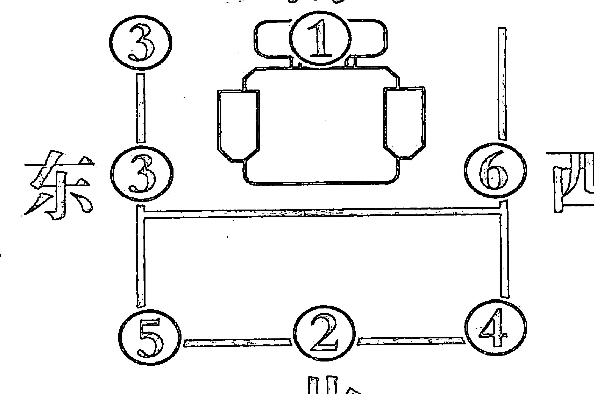

- 第三，在办公隔断的正东或东南位置悬挂一件红色如意结或红色的公仔玩偶。
- 第四，在办公桌的西北角位置悬挂一件铜铃铛或者摆放一个八音盒。
- 第五，在办公桌东北位置摆放一盆水种的绿叶植物。
- 第六，避免在正西位置摆放垃圾桶。

#### 2. 坐北向南的旺财办公局

对于这一个朝向来说，在本年中因为背靠“六白星”吉位、面朝“五黄星”凶位，因此整体来看属于中下等的朝向位置，在进行旺财布局时，可以做到如下几点：

- 首先，在办公座椅上选择一个黄色、白色、米色的靠垫靠在座椅上，或者用这些颜色的外套套在座椅靠背的位置。
- 第二，在面朝办公桌正南方的位置摆放一件黄铜饰品。
- 第三，在隔断的西南的位置摆放一杯清水或者蓝色的饰品。
- 第四，在办公桌的东南方摆放一盆红色花卉水种植物。
- 第五，在办公隔断的正东方悬挂一件红色如意结或者红色的公仔玩偶。
- 第六，避免在正西位置摆放垃圾桶。

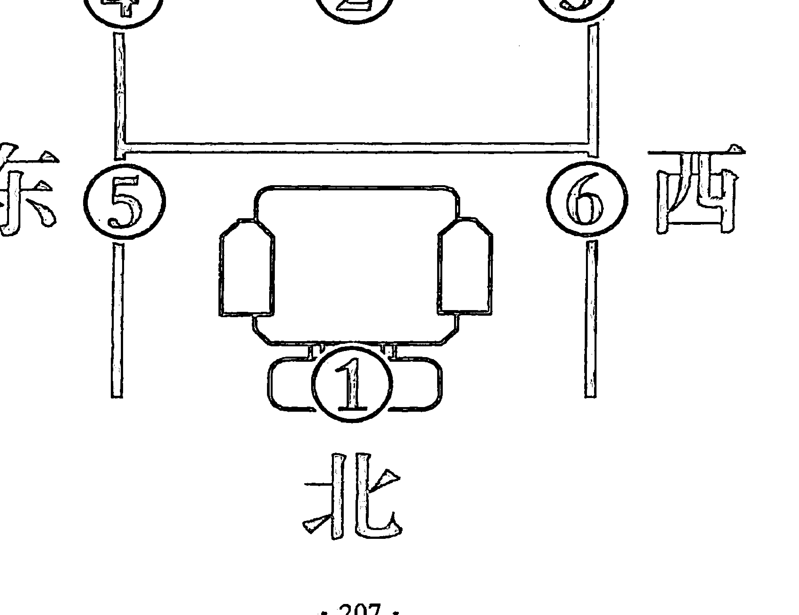

## 求财风水秘笈

#### 3. 坐东向西的旺财办公局

对于这一个朝向来说，在本年中因为背靠“八白星”吉位、面朝“三碧星”凶位，因此整体来看属于中等的朝向位置，在进行旺财布局时，可以做到如下几点：

- 首先，在办公座椅上选择一个黄色、红色、紫色的靠垫靠在座椅上，或者用这些颜色的外套套在座椅靠背的位置。
- 第二，在面朝办公桌正西方的位置摆放一件红色的饰品或一件琉璃饰品。
- 第三，在办公桌的西南位置摆放一杯清水或者蓝色的饰品。
- 第四，在隔断的正北方悬挂一个铜铃铛。
- 第五，在办公桌西北位置摆放一个八音盒或者黄铜饰品。

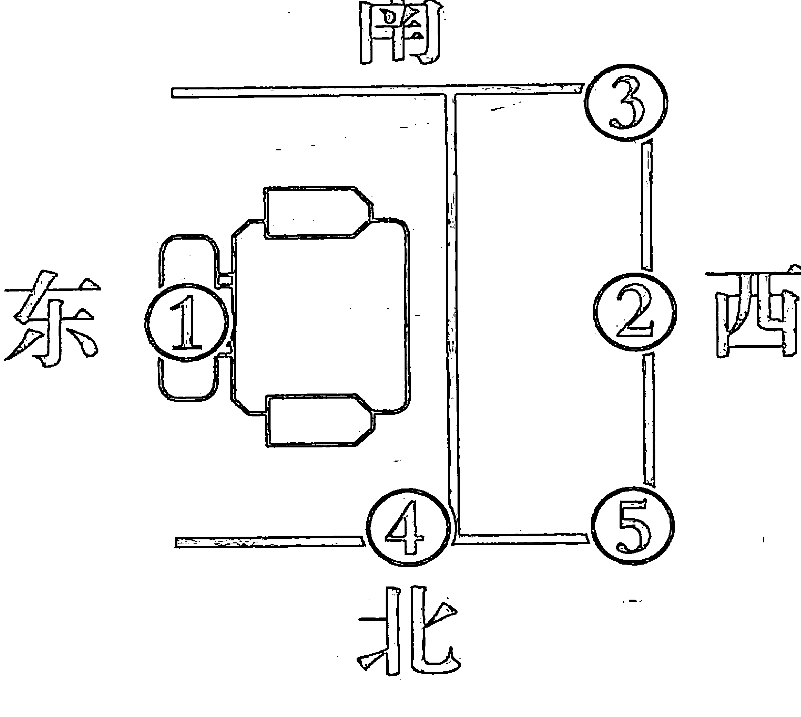

#### 4. 坐西向东的旺财办公局

对于这一个朝向来说，在本年中因为背靠“三碧星”凶位、面朝“八白星”吉位，因此整体来看属于中等的朝向位置，在进行旺财布局时，可以做到如下几点：

- 首先，在办公座椅上选择一个红色、紫色、橙色的靠垫靠在座椅上，或者用这些颜色的外套套在座椅靠背的位置。
- 第二，在面朝办公桌正东方的位置摆放八粒白色小石子和一杯清水。
- 第三，在办公桌的东南角位置摆放一件红色饰品。
- 第四，在办公桌的东北角摆放一盆水种植物。
- 第五，在办公隔断的正南方位置悬挂一个铜铃铛。

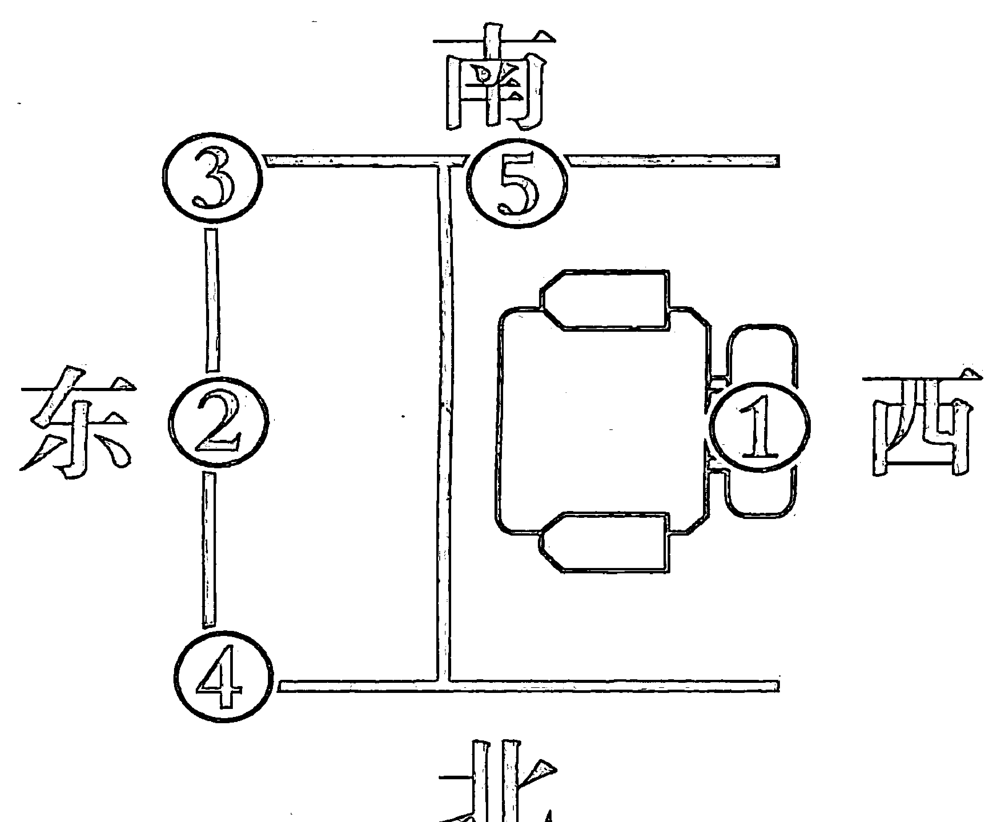

#### 5. 坐东南向西北的旺财办公局

对于这一个朝向来说，在本年中因为背靠“九紫星”吉位、面朝“二黑星”凶位，因此整体来看属于中等的朝向位置，在进行旺财布局时，可以做到如下几点：

- 首先，在办公座椅上选择一个绿色、红色、粉色、紫色的靠垫靠在座椅上，或者用这些颜色的外套套在座椅靠背的位置。
- 第二，在面朝办公桌西北方的位置摆放一件八音盒或“一”字摆放六枚铜钱。
- 第三，在办公桌的正北方位 置摆放一个金元宝造型的饰品。
- 第四，在办公桌东北角的位置摆放一盆水种绿叶植物。
- 第五，避免在办公桌正西方摆放书籍、纸张性文件和植物。

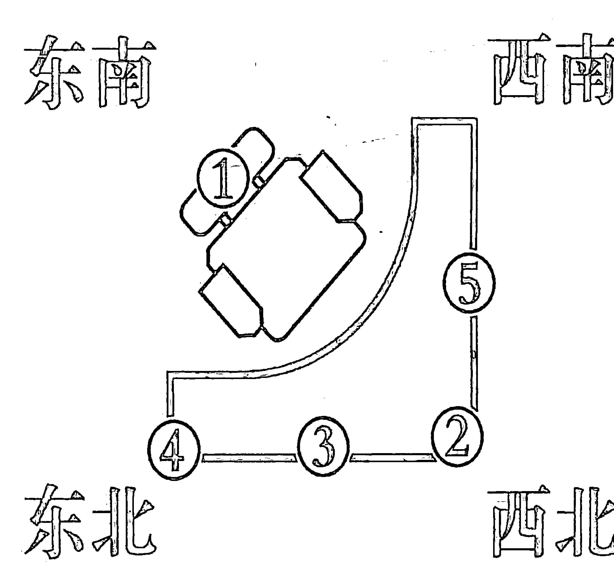

#### 6. 坐西北向东南的旺财办公局

对于这一个朝向来说，在本年中因为背靠“二黑星”凶位、面朝“九紫星”吉位，因此整体来看属于中等的朝向位置，在进行旺财布局时，可以做到如下几点：

- 首先，在办公座椅上选择一个白色、米色的靠垫靠在座椅上，或者用这些颜色的外套套在座椅靠背的位置。
- 第二，在面朝办公桌东南方的位置摆放一件红色饰品。
- 第三，在办公桌的东北方位置摆放一盆水种植物。
- 第四，在办公桌的正东方位置摆放八粒白色小石子和一杯清水。
- 第五，在办公桌的正南位置摆放一件黄铜饰品或一个八音盒。

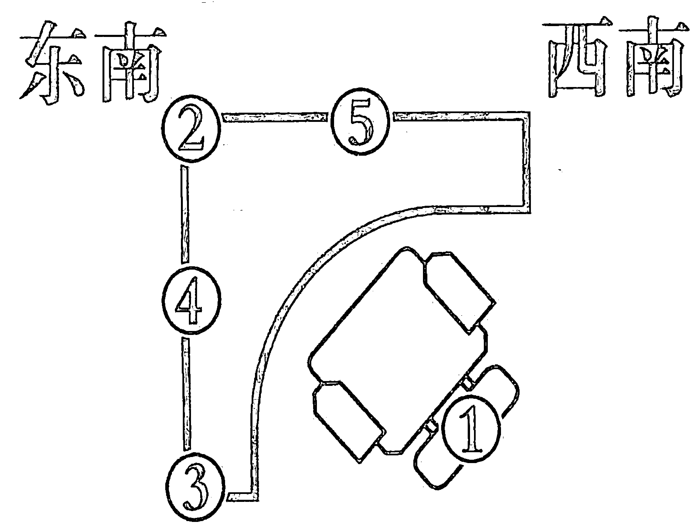

#### 7. 坐东北向西南的旺财办公局

对于这一个朝向来说，在本年中因为背靠“四绿星”吉位、面朝“七赤星”凶位，因此整体来看属于中下等的朝向位置，在进行旺财布局时，可以做到如下几点：

- 首先，在办公座椅上选择一个蓝色、绿色、黑色、青色的靠垫靠在座椅上，或者用这些颜色的外套套在座椅靠背的位置。
- 第二，在面朝办公桌西南方的位置摆放一杯清水或蓝色饰品。
- 第三，在办公桌的正西位置避免摆放书籍、植物和纸张性的文件。
- 第四，在办公桌的东南角摆放一件红色饰品。
- 第五，在办公桌的西北方和正南方位置分别摆放一件黄铜饰品。

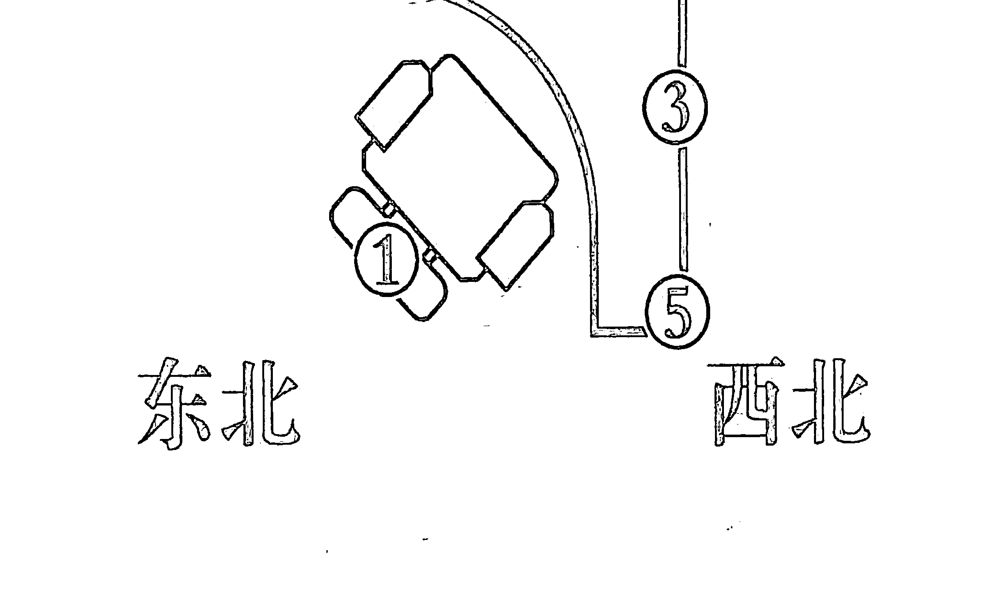

#### 8. 坐西南向东北的旺财办公局

对于这一个朝向来说，在本年中因为背靠“七赤星”凶位、面朝“四绿星”吉位，因此整体来看属于中下等的朝向位置，在进行旺财布局时，可以做到如下几点：

- 首先，在办公座椅上选择一个蓝色、黑色、灰色的靠垫靠在座椅上，或者用这些颜色的外套套在座椅靠背的位置。
- 第二，在面朝办公桌东北方的位置摆放一件木制饰品或一盆水种植物。
- 第三，在办公桌的西北角位置悬挂一个铜铃铛。
- 第四，在办公桌东南位置摆放一件红色饰品。
- 第五，在办公桌正东的位置摆放八粒白色小石子和一杯清水。

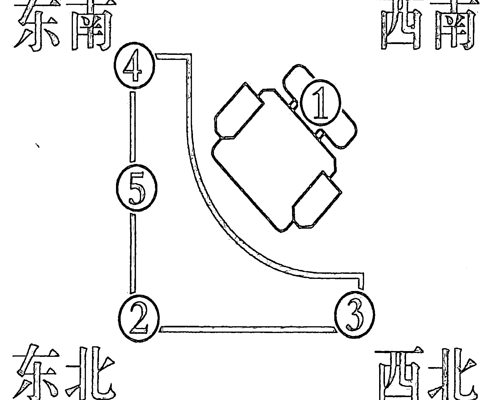

### 2009年、2018年旺财办公局

#### 1. 坐南向北的旺财办公局

对于这一个朝向来说，在本年中因为背靠“四绿星”小吉位、面朝“五黄星”凶位，因此整体来看属于中下等的朝向位置，在进行旺财布局时，可以做到如下几点：

- 首先，在办公座椅上选择一个蓝色、黑色、绿色的靠垫靠在座椅上，或者用这些颜色的外套套在座椅靠背的位置。
- 第二，在面朝办公桌正北方的位置摆放一件黄铜饰品或者“一”字摆放六枚铜钱。

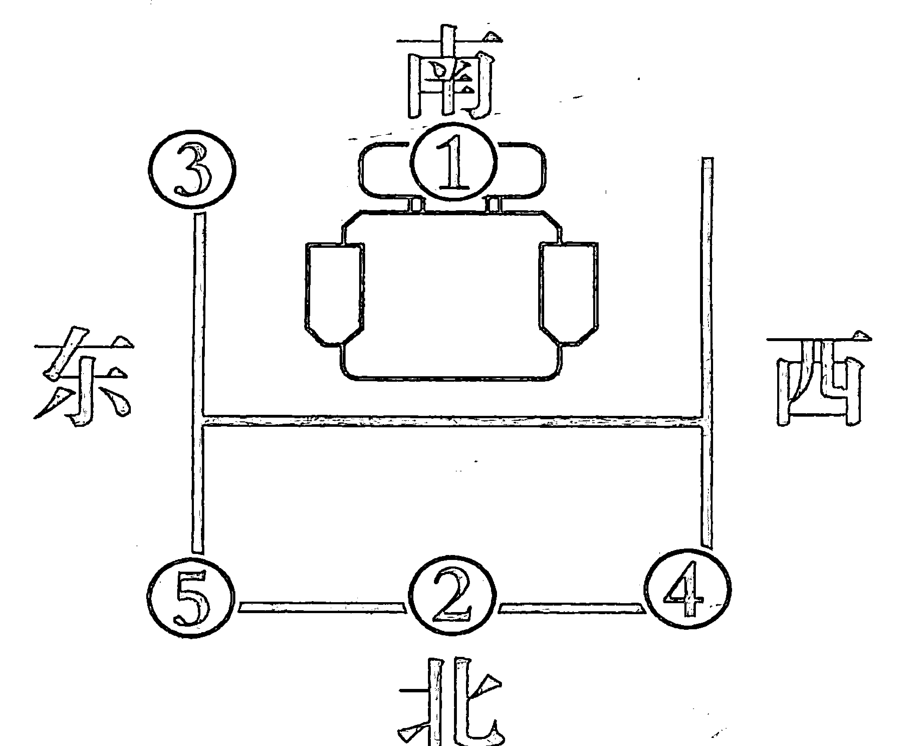

- 第三，在办公隔断的东南位置悬挂一件红色如意结或红色的公仔玩偶。
- 第四，在办公桌的西北角位置摆放一盆水种植物。
- 第五，在办公桌东北位置避免摆放植物、书籍和纸张性文件。

#### 2. 坐北向南的旺财办公局

对于这一个朝向来说，在本年中因为背靠“五黄星”凶位、面朝“四绿星”小吉位，因此整体来看属于中下等的朝向位置，在进行旺财布局时，可以做到如下几点：

- 首先，在办公座椅上选择一个白色、米色的靠垫靠在座椅上，或者用这些颜色的外套套在座椅靠背的位置。
- 第二，在面朝办公桌正南方的位置摆放一件绿色饰品或者一盆植物。
- 第三，在隔断的西南的位置“一”字摆放六枚铜钱。
- 第四，在办公桌的东南方摆放八粒白色小石子和一杯清水。
- 第五，在办公隔断的正西方悬挂一个铜铃铛。
- 第六，避免在东北位置摆放垃圾桶。

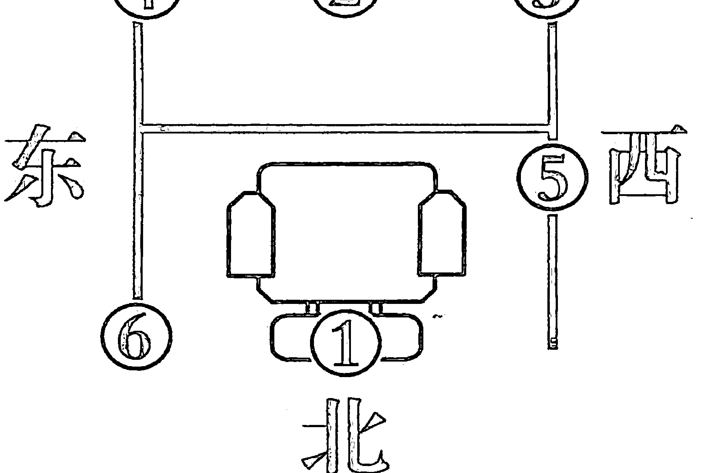

#### 3. 坐东向西的旺财办公局

对于这一个朝向来说，在本年中因为背靠“七赤星”凶位、面朝“二黑星”凶位，因此整体来看属于下等的朝向位置，在进行旺财布局时，可以做到如下几点：

- 首先，在办公座椅上选择一个蓝色、黑色、灰色的靠垫靠在座椅上，或者用这些颜色的外套套在座椅靠背的位置。
- 第二，在面朝办公桌正西方的位置摆放一件黄铜饰品或一个八音盒。
- 第三，在办公桌的西南和西北位置各摆放一件黄铜饰品。
- 第四，在隔断的正北方悬挂一个铜铃铛。
- 第五，避免在办公隔断的东北方放置垃圾桶。

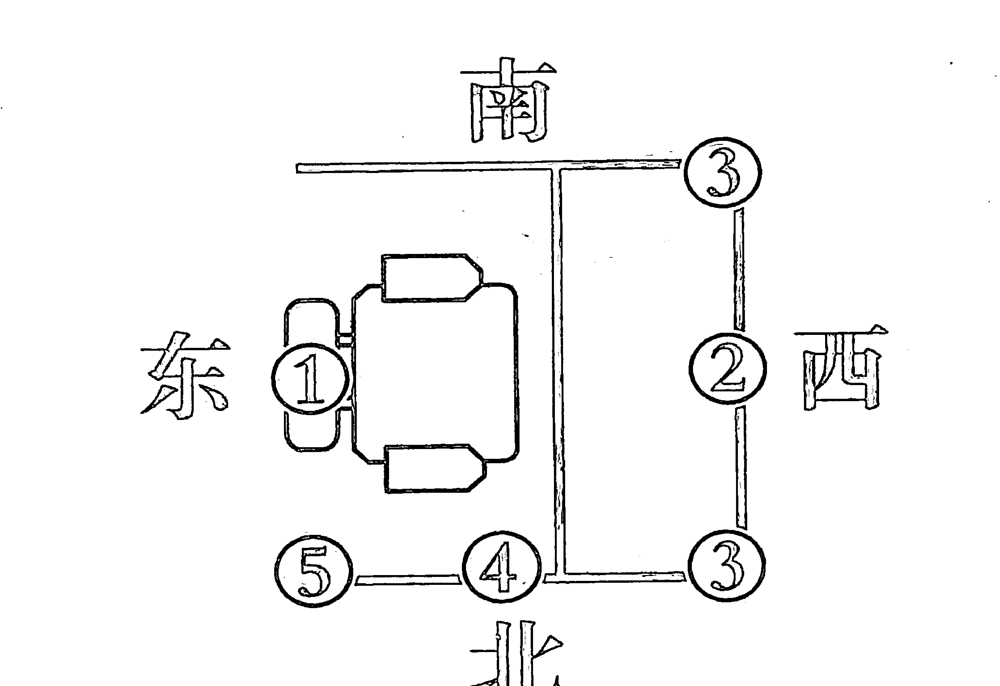

#### 4. 坐西向东的旺财办公局

对于这一个朝向来说，在本年中因为背靠“二黑星”凶位、面朝“七赤星”吉位，因此整体来看属于下等的朝向位置，在进行旺财布局时，可以做到如下几点：

- 首先，在办公座椅上选择一个白色、米色的靠垫靠在座椅上，或者用这些颜色的外套套在座椅靠背的位置。
- 第二，在面朝办公桌正东方的位置摆放一杯清水或者蓝色饰品。
- 第三，在办公桌的东南角位置摆放八粒白色的小石子和一杯清水。
- 第四，在办公桌的东北角避免摆放植物、书籍和纸张性的文件。
- 第五，在办公隔断的正北方位置悬挂一个铜铃铛。

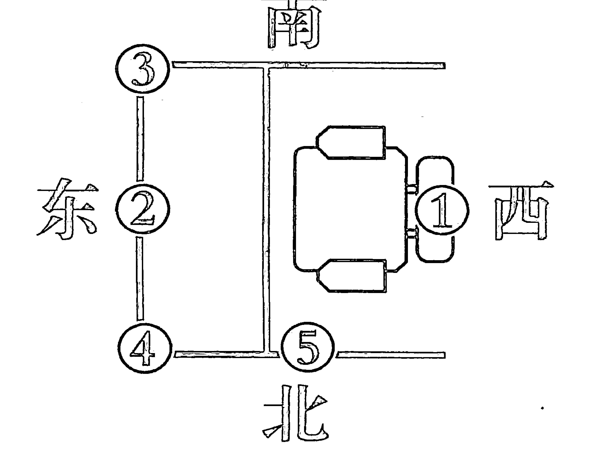

#### 5. 坐东南向西北的旺财办公局

对于这一个朝向来说，在本年中因为背靠“八白星”吉位、面朝“一白星”吉位，因此整体来看属于上等的朝向位置，在进行旺财布局时，可以做到如下几点：

- 首先，在办公座椅上选择一个黄色、红色、咖啡色、紫色的靠垫靠在座椅上，或者用这些颜色的外套套在座椅靠背的位置。
- 第二，在面朝办公桌西北的位置摆放一件八音盒或“一”字摆放六枚铜钱。
- 第三，在办公桌的正北方、正西方各自摆放一件黄铜饰品。
- 第四，在办公桌的西南角“一”字摆放六枚铜钱。
- 第五，避免在办公桌东北方摆放书籍、纸张性文件和植物。

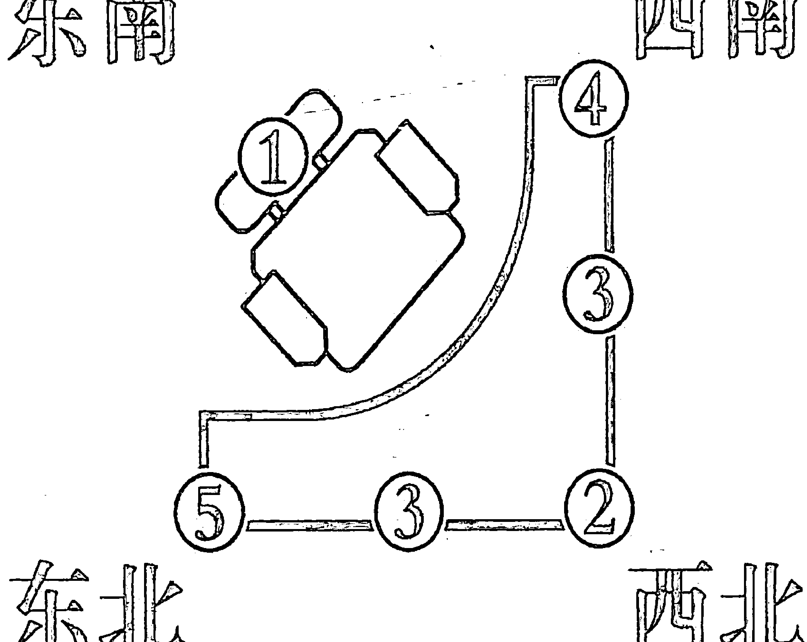

#### 6. 坐西北向东南的旺财办公局

对于这一个朝向来说，在本年中因为背靠‘一白星’吉位、面朝‘八白星’吉位，因此整体来看属于上等的朝向位置，在进行旺财布局时，可以做到如下几点：

- 首先，在办公座椅上选择一个白色、米色、蓝色、黑色的靠垫靠在座椅上，或者用这些颜色的外套套在座椅靠背的位置。
- 第二，在面朝办公桌东南方的位置摆放八粒白色小石子和一杯清水。
- 第三，避免在办公桌东北方摆放书籍、纸张性文件和植物。
- 第四，在办公桌的西南角“一”字摆放六枚铜钱。
- 第五，在办公桌的正南位置摆放一盆水种绿叶植物。

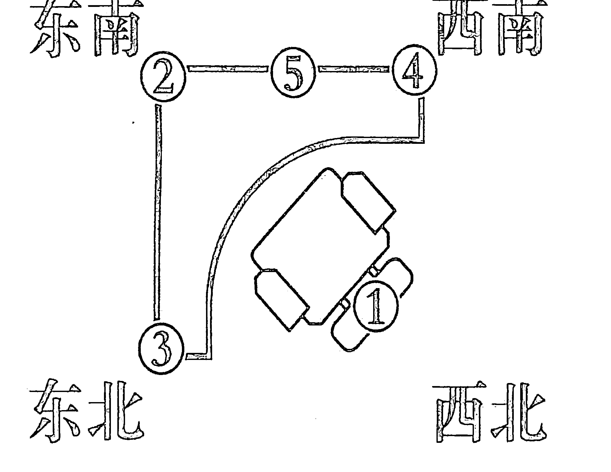

# 求财风水秘签

#### 7. 坐东北向西南的旺财办公局

对于这一个朝向来说，在本年中因为背靠 “三碧星” 凶位、面朝 “六白星” 吉位，因此整体来看属于中等的朝向位置，在进行旺财布局时，可以做到如下几点：

- 首先，在办公座椅上选择一个红色、紫色、橙色的靠垫靠在座椅上，或者用这些颜色的外套套在座椅靠背的位置。
- 第二，在面朝办公桌西南方的位置摆放一件黄铜饰品。
- 第三，在办公桌的正西位置悬挂一个铜铃铛或摆放一个八音盒。
- 第四，在办公桌的东南角摆放八粒白色小石子和一杯清水。
- 第五，在办公桌的西北方和正南方位置分别摆放一盆水种植物。

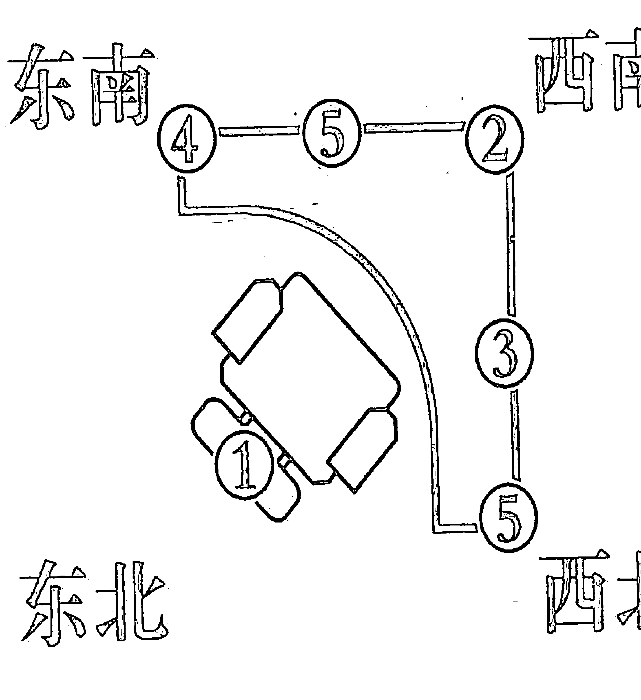

#### 8. 坐西南向东北的旺财办公局

对于这一个朝向来说，在本年中因为背靠“六白星”吉位、面朝“三碧星”凶位，因此整体来看属于中等的朝向位置，在进行旺财布局时，可以做到如下几点：

- 首先，在办公座椅上选择一个黄色、白色、米色的靠垫靠在座椅上，或者用这些颜色的外套套在座椅靠背的位置。
- 第二，在面朝办公桌东北方的位置摆放一件红色饰品。
- 第三，在办公桌的正北位置悬挂一个铜铃铛。
- 第四，在办公桌西北位置摆放一盆水种植物。
- 第五，在办公桌东南的位置摆放八粒白色小石子和一杯清水。

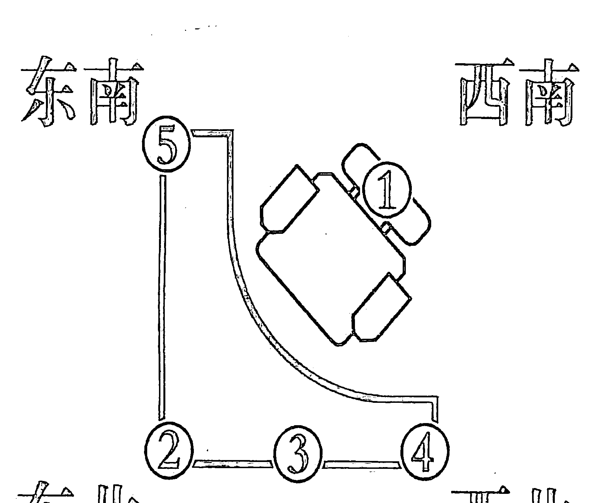

### 2010年、2019年旺财办公局

#### 1. 坐南向北的旺财办公局

对于这一个朝向来说，在本年中因为背靠“三碧星”凶位、面朝“四绿星”小吉位，因此整体来看属于中下等的朝向位置，在进行旺财布局时，可以做到如下几点：

- 首先，在办公座椅上选择一个红色、紫色、橙色的靠垫靠在座椅上，或者用这些颜色的外套套在座椅靠背的位置。
- 第二，在面朝办公桌正北方的位置摆放一件木器饰品或者一盆植物。
- 第三，在办公桌的西北角位置摆放一件红色饰品。
- 第四，在办公桌的东北角位置摆放一件黄铜饰品。

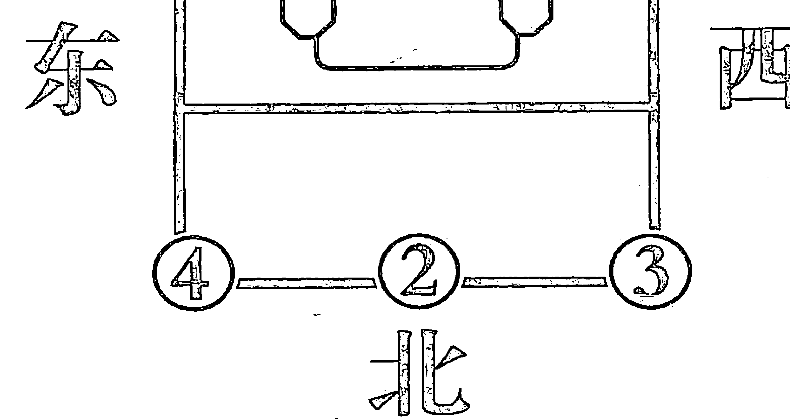

#### 2. 坐北向南的旺财办公局

对于这一个朝向来说，在本年中因为背靠“四绿星”小吉位、面朝“三碧星”凶位，因此整体来看属于中下等的朝向位置，在进行旺财布局时，可以做到如下几点：

- 首先，在办公座椅上选择一个蓝色、黑色、绿色的靠垫靠在座椅上，或者用这些颜色的外套套在座椅靠背的位置。
- 第二，在面朝办公桌正南方的位置摆放一件红色饰品或者琉璃饰品。
- 第三，在隔断的西南的位置“一”字摆放六枚铜钱或者摆放一个八音盒。
- 第四，在办公桌的东南方摆放一杯清水或蓝色的饰品。
- 第五，在办公隔断的西北方悬挂一个红色如意结或者红色的公仔玩偶。

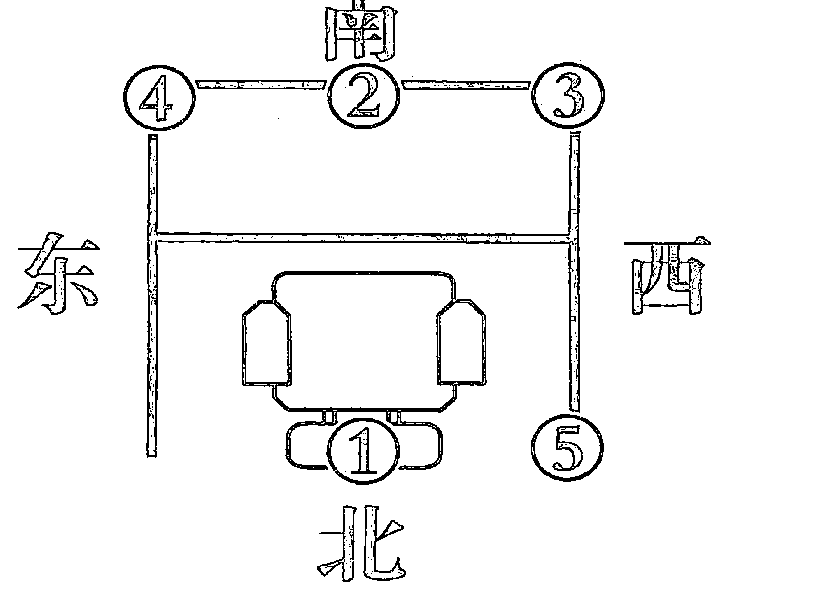

#### 3. 坐东向西的旺财办公局

对于这一个朝向来说，在本年中因为背靠“六白星”吉位、面朝“一白星”吉位，因此整体来看属于上等的朝向位置，在进行旺财布局时，可以做到如下几点：

- 首先，在办公座椅上选择一个黄色、咖啡色、白色的靠垫靠在座椅上，或者用这些颜色的外套套在座椅靠背的位置。
- 第二，在面朝办公桌正西方的位置摆放一件黄铜饰品或一个八音盒。
- 第三，在办公桌的西南位置摆放一件黄铜饰品。
- 第四，在办公桌的西北位置摆放一盆水种红色花卉植物。
- 第五，避免在办公隔断的正南方放置垃圾桶。

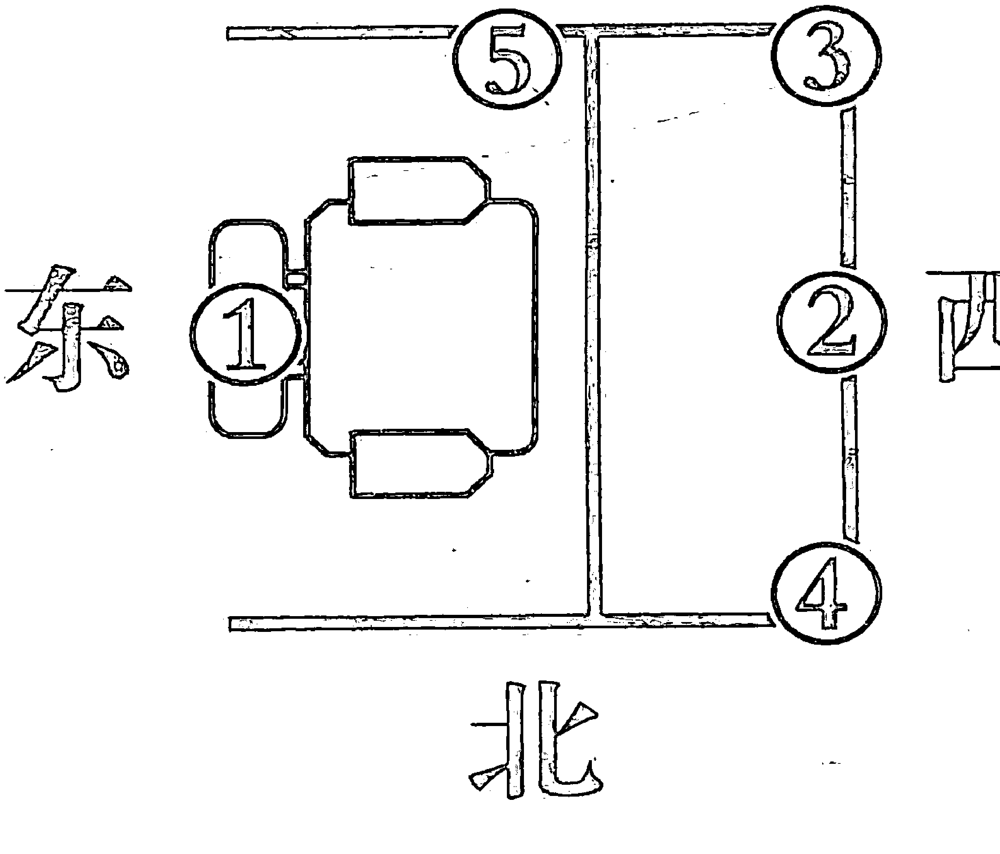

#### 4. 坐西向东的旺财办公局

对于这一个朝向来说，在本年中因为背靠“一白星”吉位、面朝“六白星”吉位，因此整体来看属于上等的朝向位置，在进行旺财布局时，可以做到如下几点：

- 首先，在办公座椅上选择一个白色、米色、蓝色、黑色的靠垫靠在座椅上，或者用这些颜色的外套套在座椅靠背的位置。
- 第二，在面朝办公桌正东方的位置“一”字摆放六枚铜钱。
- 第三，在办公桌的东南角位置摆放一杯清水或一件蓝色的饰品。
- 第四，在办公隔断的正南位置避免摆放垃圾桶。
- 第五，在办公桌的东北桌角方位悬挂一个铜铃铛。

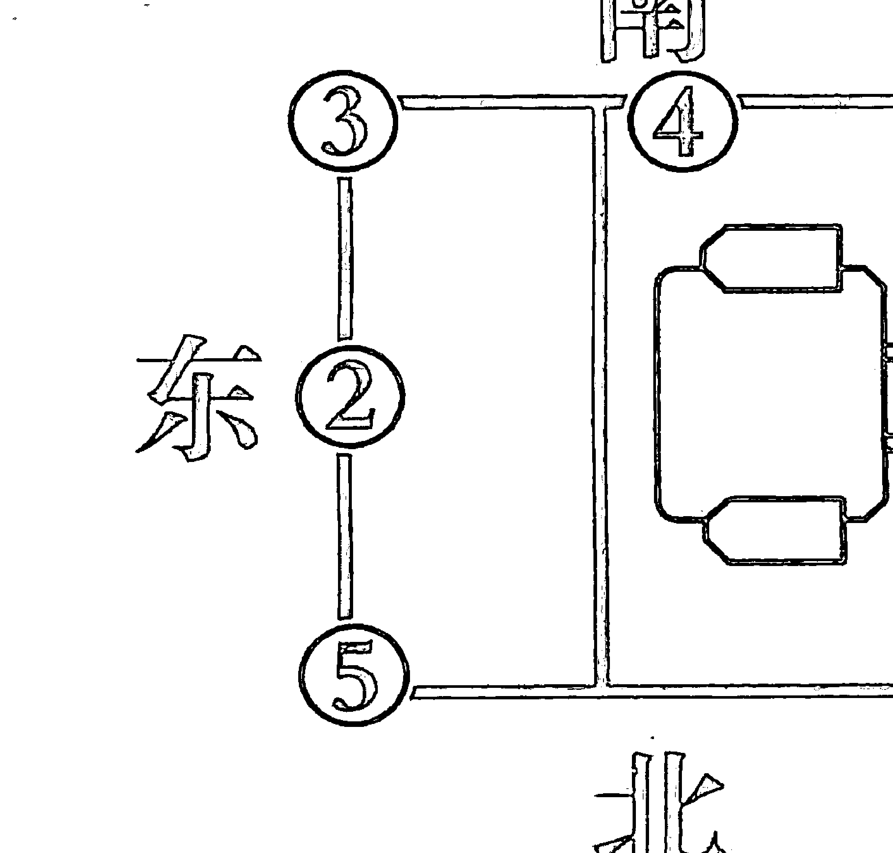

#### 5. 坐东南向西北的旺财办公局

对于这一个朝向来说，在本年中因为背靠“七赤星”凶位、面朝“九紫星”吉位，因此整体来看属于中上等的朝向位置，在进行旺财布局时，可以做到如下几点：

- 首先，在办公座椅上选择一个蓝色、黑色、灰色的靠垫靠在座椅上，或者用这些颜色的外套套在座椅靠背的位置。
- 第二，在面朝办公桌西北方的位置摆放一件红色饰品或者一盆红色花卉。
- 第三，在办公桌的正北方、正西方各自摆放一盆水种绿叶植物。
- 第四，在办公桌的西南角、东北角各自摆放一件黄铜饰品。
- 第五，避免在办公隔断正南方摆放垃圾桶。

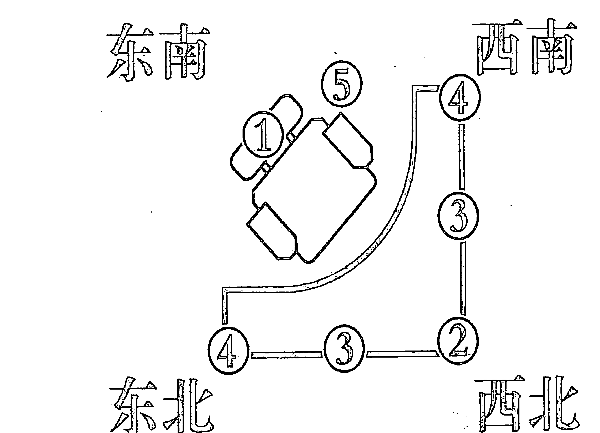

#### 6. 坐西北向东南的旺财办公局

对于这一个朝向来说，在本年中因为背靠“九紫星”吉位、面朝“七赤星”凶位，因此整体来看属于上等的朝向位置，在进行旺财布局时，可以做到如下几点：

- 首先，在办公座椅上选择一个绿色、红色、粉色、紫色的靠垫靠在座椅上，或者用这些颜色的外套套在座椅靠背的位置。
- 第二，在面朝办公桌东南方的位置摆放一杯清水或蓝色饰品。
- 第三，避免在办公桌正南方摆放书籍、纸张性文件和植物。
- 第四，在办公桌的西南角、东北角各自摆放一件黄铜饰品。
- 第五，在办公桌的正东位置“一”字摆放六枚铜钱。

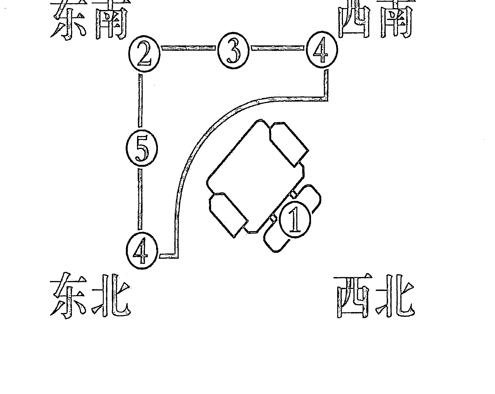

#### 7. 坐东北向西南的旺财办公局

对于这一个朝向来说，在本年中因为背靠“二黑星”凶位、面朝“五黄星”凶位，因此整体来看属于下等的朝向位置，在进行旺财布局时，可以做到如下几点：

- 首先，在办公座椅上选择一个白色、米色的靠垫靠在座椅上，或者用这些颜色的外套套在座椅靠背的位置。
- 第二，在面朝办公桌西南方的位置摆放一件黄铜饰品。
- 第三，在办公桌的正西位置悬挂一个铜铃铛或摆放一个八音盒。
- 第四，在办公桌的西北角摆放一盆红色花卉水种植物。
- 第五，在办公桌的正南方位避免摆放植物、书报和纸张性文件。

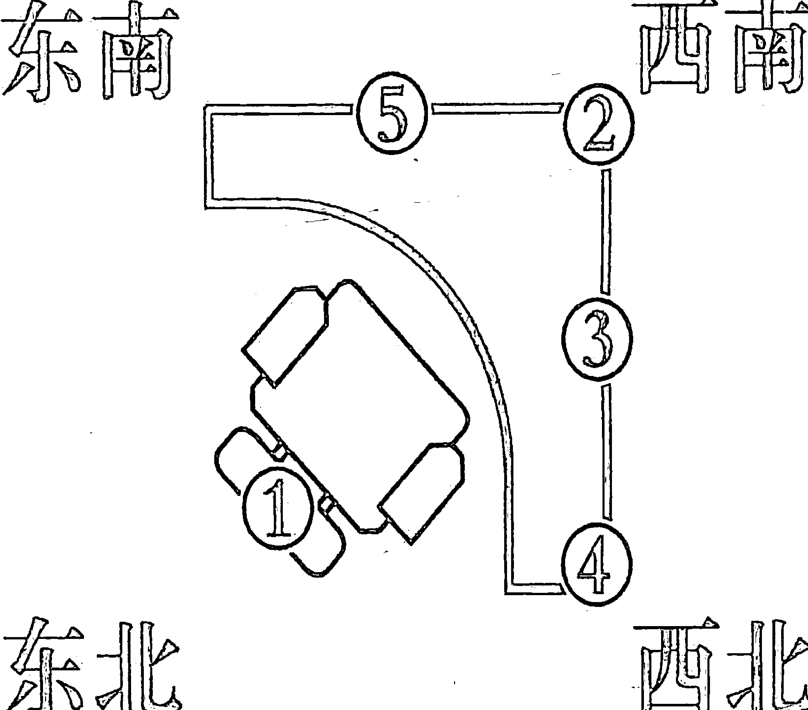

#### 8. 坐西南向东北的旺财办公局

对于这一个朝向来说，在本年中因为背靠“五黄星”凶位、面朝“二黑星”凶位，因此整体来看属于下等的朝向位置，在进行旺财布局时，可以做到如下几点：

- 首先，在办公座椅上选择一个白色、米色的靠垫靠在座椅上，或者用这些颜色的外套套在座椅靠背的位置。
- 第二，在面朝办公桌东北方的位置摆放一件黄铜饰品。
- 第三，在办公桌的正北方位置摆放一盆水种植物。
- 第四，在办公桌西北位置摆放一件红色饰品。
- 第五，避免在办公隔断的正南方放置垃圾桶。

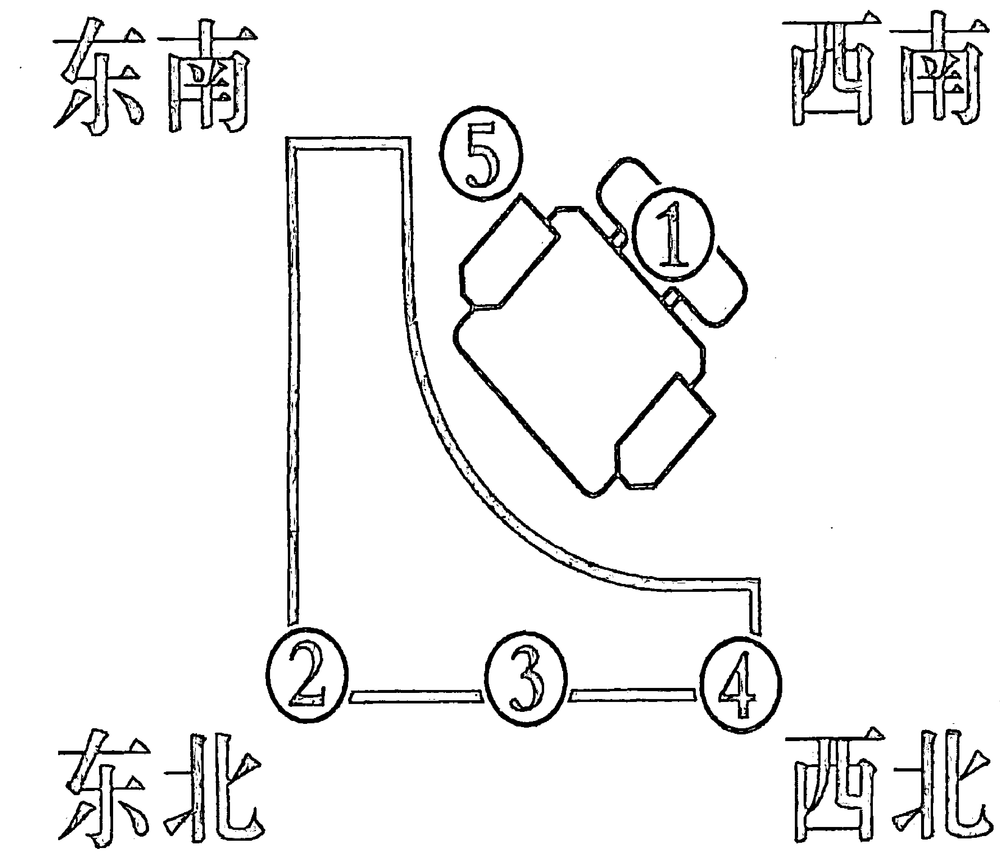

### 2011年、2020年旺财办公局

#### 1. 坐南向北的旺财办公局

对于这一个朝向来说，在本年中因为背靠“二黑星”凶位、面朝“三碧星”凶位，因此整体来看属于下等的朝向位置，在进行旺财布局时，可以做到如下几点：

- 首先，在办公座椅上选择一个白色、米色的靠垫靠在座椅上，或者用这些颜色的外套套在座椅靠背的位置。
- 第二，在面朝办公桌正北方的位置摆放一件红色饰品或者琉璃饰品。
- 第三，在办公桌的西北角位置摆放八粒白色小石子和一杯清水。
- 第四，在办公桌的东北角位置摆放一盆水种植物。
- 第五，在办公隔断的正东方悬挂一个铜铃铛。

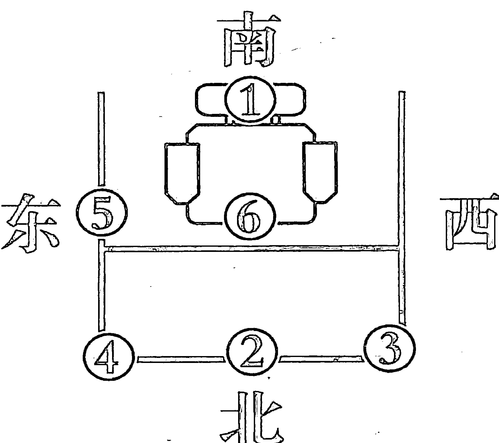

#### 2. 坐北向南的旺财办公局

对于这一个朝向来说，在本年中因为背靠“三碧星”凶位、面朝“二黑星”凶位，因此整体来看属于下等的朝向位置，在进行旺财布局时，可以做到如下几点：

- 首先，在办公座椅上选择一个红色、紫色、粉色、橙色的靠垫靠在座椅上，或者用这些颜色的外套套在座椅靠背的位置。
- 第二，在面朝办公桌正南方的位置摆放一件黄铜饰品或“一”字摆放六枚铜钱。
- 第三，在办公桌的东南位置“一”字摆放六枚铜钱或者摆放一个八音盒。
- 第四，在办公桌的西南方摆放一盆水种绿色植物。
- 第五，在办公隔断的正西方悬挂一个红色如意结或者红色的公仔玩偶。
- 第六，在办公椅下铺放蓝色地毯一张。

#### 3. 坐东向西的旺财办公局

对于这一个朝向来说，在本年中因为背靠“五黄星”凶位、面朝“九紫星”吉位，因此整体来看属于中等的朝向位置，在进行旺财布局时，可以做到如下几点：

- 首先，在办公座椅上选择一个白色、米色的靠垫靠在座椅上，或者用这些颜色的外套套在座椅靠背的位置。
- 第二，在面朝办公桌正西方的位置摆放一件红色饰品或一盆植物。
- 第三，在办公桌的西南位置摆放一盆水种绿色植物。
- 第四，在办公桌的西北位置摆放八粒白色小石子和一杯清水。
- 第五，避免在办公隔断的正北方放置垃圾桶。
- 第六，在办公椅下铺放蓝色地毯一张。

#### 4. 坐西向东的旺财办公局

对于这一个朝向来说，在本年中因为背靠“九紫星”吉位、面朝“五黄星”凶位，因此整体来看属于中等的朝向位置，在进行旺财布局时，可以做到如下几点：

首先，在办公座椅上选择一个红色、紫色、绿色、橙色的靠垫靠在座椅上，或者用这些颜色的外套套在座椅靠背的位置。

第二，在面朝办公桌正东方的位置“一”字摆放六枚铜钱或放置黄铜饰品。

第三，在办公桌的东南角位置摆放有金元宝造型的饰品。

第四，在办公隔断的正北位置避免摆放垃圾桶。

第五，在办公桌的东北桌角方位放置水种植物一盆。

第六，在办公椅下铺放蓝色地毯一张。

#### 5. 坐东南向西北的旺财办公局

对于这一个朝向来说，在本年中因为背靠“六白星”吉位、面朝“八白星”吉位，因此整体来看属于上等的朝向位置，在进行旺财布局时，可以做到如下几点：

1. 首先，在办公座椅上选择一个黄色、白色、米色的靠垫靠在座椅上，或者用这些颜色的外套套在座椅靠背的位置。
2. 第二，在面朝办公桌西北位的位置摆放八粒白色小石子和一杯清水。
3. 第三，在办公桌的正北方避免摆放植物、书籍、纸张性文件。
4. 第四，在办公桌的正西方摆放一件红色饰品。
5. 第五，在办公桌的东北、西南角各自摆放一盆水种绿色植物。
6. 第六，在办公椅下铺放蓝色地毯一张。

#### 6. 坐西北向东南的旺财办公局

对于这一个朝向来说，在本年中因为背靠“八白星”吉位、面朝“六白星”吉位，因此整体来看属于上等的朝向位置，在进行旺财布局时，可以做到如下几点：

首先，在办公座椅上选择一个黄色、红色、粉色、紫色的靠垫靠在座椅上，或者用这些颜色的外套套在座椅靠背的位置。

第二，在面朝办公桌东南方的位置“一”字摆放六枚铜钱。

第三，避免在办公隔断的正北方摆放垃圾桶。

第四，在办公桌的正东、正南位置各自摆放一件黄铜饰品。

第五，在办公桌的东北、西南角上各自摆放一盆水种绿色植物。

第六，在办公椅下铺放蓝色地毯一张。

#### 7. 坐东北向西南的旺财办公局

对于这一个朝向来说，在本年中因为背靠“一白星”吉位、面朝“四绿星”吉位，因此整体来看属于上等的朝向位置，在进行旺财布局时，可以做到如下几点：

1. 首先，在办公座椅上选择一个白色、米色、蓝色、黑色的靠垫靠在座椅上，或者用这些颜色的外套套在座椅靠背的位置。
2. 第二，在面朝办公桌西南方的位置摆放一盆绿色植物或一件木制饰品。
3. 第三，在办公桌的正西位置悬挂一个红色如意结或摆放一个红色饰品。
4. 第四，在办公桌的西北角摆放八粒白色小石子和一杯清水。
5. 第五，在办公隔断的正北位置避免摆放垃圾桶。
6. 第六，在办公桌的正南位置摆放一个八音盒。
7. 第七，在办公椅下铺放蓝色地毯一张。

#### 8. 坐西南向东北的旺财办公局

对于这一个朝向来说，在本年中因为背靠“四绿星”吉位、面朝“一白星”吉位，因此整体来看属于上等的朝向位置，在进行旺财布局时，可以做到如下几点：

1. 首先，在办公座椅上选择一个蓝色、绿色、黑色、青色的靠垫靠在座椅上，或者用这些颜色的外套套在座椅靠背的位置。
2. 第二，在面朝办公桌东北方的位置摆放一件黄铜饰品或一个八音盒。
3. 第三，在办公桌的正北位置避免摆放植物、书籍和纸张性文件。
4. 第四，在办公桌正东方悬挂一个铜铃铛。
5. 第五，在办公桌西北角摆放八粒白色小石子和一杯清水。
6. 第六，在办公椅下铺放蓝色地毯一张。

### 2012年、2021年旺财办公局

#### 1. 坐南向北的旺财办公局

对于这一个朝向来说，在本年中因为背靠“一白星”吉位、面朝“二黑星”凶位，因此整体来看属于中等的朝向位置，在进行旺财布局时，可以做到如下几点：

- 首先，在办公座椅上选择一个白色、米色、蓝色、黑色的靠垫靠在座椅上，或者用这些颜色的外套套在座椅靠背的位置。
- 第二，在面朝办公桌正北方的位置摆放一件黄铜饰品或者一个八音盒。
- 第三，在办公桌的西北角位置摆一杯清水或蓝色饰品。
- 第四，在办公桌的东北角位置摆放红色饰品一件。
- 第五，在办公隔断的东南方悬挂一个铜铃铛。
- 第六，避免在办公隔断的西南方放置垃圾桶。

#### 2. 坐北向南的旺财办公局

对于这一个朝向来说，在本年中因为背靠“二黑星”凶位、面朝“一白星”吉位，因此整体来看属于中等的朝向位置，在进行旺财布局时，可以做到如下几点：

- 首先，在办公座椅上选择一个白色、米色的靠垫靠在座椅上，或者用这些颜色的外套套在座椅靠背的位置。
- 第二，在面朝办公桌正南方的位置摆放一件黄铜饰品或“一”字摆放六枚铜钱。
- 第三，在办公桌的东南位置“一”字摆放六枚铜钱或者摆放一个八音盒。
- 第四，在办公桌的西南方避免摆放植物、书籍、纸张性文件。
- 第五，在办公隔断的正西方悬挂一个红色如意结或者红色的公仔玩偶。

#### 3. 坐东向西的旺财办公局

对于这一个朝向来说，在本年中因为背靠“四绿星”吉位、面朝“八白星”吉位，因此整体来看属于上等的朝向位置，在进行旺财布局时，可以做到如下几点：

- 首先，在办公座椅上选择一个蓝色、黑色、绿色、青色的靠垫靠在座椅上，或者用这些颜色的外套套在座椅靠背的位置。
- 第二，在面朝办公桌正西方的位置摆放八粒白色小石子和一杯清水。
- 第三，在办公桌的西南位置避免摆放植物、书籍和纸张性文件。
- 第四，在办公桌的西北位置摆放一杯清水或蓝色饰品。
- 第五，在办公隔断的正北方悬挂一个铜铃铛。

#### 4. 坐西向东的旺财办公局

对于这一个朝向来说，在本年中因为背靠“八白星”吉位、面朝“四绿星”吉位，因此整体来看属于上等的朝向位置，在进行旺财布局时，可以做到如下几点：

首先，在办公座椅上选择一个红色、紫色、黄色、橙色的靠垫靠在座椅上，或者用这些颜色的外套套在座椅靠背的位置。

第二，在面朝办公桌正东方的位置摆放木制饰品或一盆植物。

第三，在办公桌的东南角位置摆放黄铜饰品。

第四，在办公隔断的西南位置避免摆放垃圾桶。

第五，在办公桌的东北桌角方位摆放红色饰品一件。

#### 5. 坐东南向西北的旺财办公局

对于这一个朝向来说，在本年中因为背靠“五黄星”凶位、面朝“七赤星”凶位，因此整体来看属于下等的朝向位置，在进行旺财布局时，可以做到如下几点：

- 首先，在办公座椅上选择一个白色、米色的靠垫靠在座椅上，或者用这些颜色的外套套在座椅靠背的位置。
- 第二，在面朝办公桌西北位的位置摆放一杯清水或一件蓝色饰品。
- 第三，在办公桌的西南方避免摆放植物、书籍、纸张性文件。
- 第四，在办公桌的正西方摆放八粒白色小石子和一杯清水。
- 第五，在办公桌的正北位置摆放黄铜饰品一件。

#### 6. 坐西北向东南的旺财办公局

对于这一个朝向来说，在本年中因为背靠“七赤星”凶位、面朝“五黄星”凶位，因此整体来看属于下等的朝向位置，在进行旺财布局时，可以做到如下几点：

首先，在办公座椅上选择一个蓝色、黑色、灰色的靠垫靠在座椅上，或者用这些颜色的外套套在座椅靠背的位置。

第二，在面朝办公桌东南方的位置“一”字摆放六枚铜钱或摆放八音盒一件。

第三，避免在办公桌的西南方摆放植物、书籍和纸张性文件。

第四，在办公桌的正东、正南位置各自摆放一盆水种绿色植物。

第五，在办公桌的东北方摆放红色饰品一件。

#### 7. 坐东北向西南的旺财办公局

对于这一个朝向来说，在本年中因为背靠“九紫星”吉位、面朝“三碧星”吉位，因此整体来看属于中等的朝向位置，在进行旺财布局时，可以做到如下几点：

1. 首先，在办公座椅上选择一个绿色、红色、紫色、橙色的靠垫靠在座椅上，或者用这些颜色的外套套在座椅靠背的位置。
2. 第二，在面朝办公桌西南方的位置摆放一件红色饰品。
3. 第三，在办公桌的正西位置摆放八粒白色小石子和一杯清水。
4. 第四，在办公桌的西北角位置摆放一杯清水或蓝色饰品。
5. 第五，在办公桌的东南位置摆放一个八音盒。

#### 8. 坐西南向东北的旺财办公局

对于这一个朝向来说，在本年中因为背靠“三碧星”凶位、面朝“九紫星”吉位，因此整体来看属于中等的朝向位置，在进行旺财布局时，可以做到如下几点：

- 首先，在办公座椅上选择一个红色、紫色、橙色的靠垫靠在座椅上，或者用这些颜色的外套套在座椅靠背的位置。
- 第二，在面朝办公桌东北方的位置摆放一件红色饰品或琉璃饰品。
- 第三，在办公桌正北方和东南方各悬挂一个铜铃铛。
- 第四，在办公桌正东方摆放一盆水种绿色植物。

笔者已将在“八运”期间流年的办公旺财局全部罗列出来，读者们可以根据自己办公桌隔断的朝向以及不同的年份进行如上的布局，这样读者朋友们便会在工作中顺利愉悦，财运也会蒸蒸日上。

## 附录 八卦物象

本书写到这里，有关旺财风水的诸多法门已悉数向读者们介绍完毕了，相信通过阅读这本有关旺财的书籍，读者们已经对风水产生了浓厚的兴趣。有些风水爱好者们经常会问笔者这样的问题：“学习风水哪些是比较基础的知识？”笔者认为比较基础的知识莫非“八卦物象”了，就像笔者在本书分析八运经济情况、房屋屋型补角方法等等，其实都是利用了比较基础的“八卦物象”的理论，正所谓基础决定上层建筑，笔者认为八卦物象可称之为这个“基础”之一了。可能对于初学风水的朋友们来说，还不能完全理解“八卦物象”在风水中千变万化的应用，但是只要大家开始对风水产生了兴趣和认识，“八卦物象”会在读者们今后学习风水的道路上起到推波助澜的作用，这一点读者们要自己领悟其中的真谛了。

因此，笔者在本书结尾之处列出在《梅花易数》中的“八卦物象”，希望风水爱好者能够在今后的研究学习中受益。

### 《梅花易数》中坎卦物象

- 五行：水
- 天时：雨、月、霜、露。
- 地理：北方、江湖、溪涧、泉井、卑湿之地（勾渎池沼、凡有水处）。
- 人物：中男、江湖之人、舟人、盗贼。
- 人事：险陷卑下，外示以柔、内序以利，漂泊不成、随波逐流、隐伏智利。
- 身体：耳、血、肾。
- 时序：冬十一月、子年月日时、一六之月日。
- 静物：水，带子、带核之物，弓轮矫輮之物，酒器水具，于木为坚多心。
- 动物：豕、鱼、水中之物。
- 屋舍：向北之居、近水、水阁、江楼、茶酒肆、宅中湿地之处。
- 饮食：豕肉、酒、冷味、海味、羹汤、酸味、宿食、鱼、带血、淹藏、有带核之物、水中之物、多骨之物。
- 家宅：不安、暗昧、防盗。
- 婚姻：利中男之婚，宜北方之姻，不利成婚，不可婚辰戌丑未月。
- 生产：难产有险，宜次胎男，中男。辰戌丑未月有损，宜北向。
- 求名：艰难，恐有灾陷。宜北方之任，鱼盐河泊之职。
- 求利：有财失，宜水边财，恐有失陷。宜鱼盐酒货之利，防阴失，防盗。
- 交易：不利成交，恐防失陷。宜水边交易，宜鱼盐酒货之交易，或点水人之交易。
- 谋望：不宜谋望，不能成就。秋冬占可谋望。
- 出行：不宜远行，宜涉舟，宜北方之行。防盗，恐遇险阻陷溺之事。
- 谒见：难见，宜见江湖之人，或有水傍姓氏之人。
- 疾病：耳疼、心疾、感寒、肾疾、胃冷水泻、痼冷之病、血病、加忧、为血卦。
- 官讼：不利，有阴险，有失困讼，失陷。
- 坟墓：宜北向之穴、近水之墓，不利葬。
- 姓字：羽音，点水傍之姓氏，行位一、六。
- 数目：一、六。方道：北方。五味：咸、酸。五色：黑。

### 《梅花易数》中坤卦物象

- 五行：土
- 天时：云阴雾气
- 地理：田野、乡里、平地、西南方。
- 人物：老母、后母、农夫、乡人、众人、大腹人。
- 人事：吝啬、柔顺、懦弱、众多。
- 身体：腹、脾、胃、肉。
- 时序：辰戌丑未月、未申年月日时、八五十月日。
- 静物：方物、柔物、布帛、丝棉、五谷、舆、釜、瓦器。
- 动物：牛、百兽、为牡马。
- 屋舍：西南向、村居、田舍、矮屋、土阶、仓库。
- 家宅：安稳、多阴气，春占宅舍不安。
- 饮食：牛肉、土中之物、甘味、野味、五谷之味、芋笋之物、腹脏之物。
- 婚姻：利于婚姻，宜税产之家、乡村之家，或寡妇之家。春占不利。
- 生产：易产，春占难产、有损，或不利于母，坐宜西南方。
- 求名：有名，宜西南方，或教官、农官守土之职。春占虚名。
- 交易：宜利交易，宜田土交易、宜五谷、利贱货、重物、布帛，静中有财。春占不利。
- 求利：有利，宜土中之利，贱货重物之利。静中得财，春占无财，多中取利。
- 谋望：利求谋，乡里求谋、静中求谋，春占少遂。或谋于妇人。
- 出行：可行，宜西南行，宜往乡里行，宜陆行。春占不宣行。
- 谒见：可见，利见乡人，宜见亲朋或阴人。春不宜见。
- 疾病：腹疾、脾胃之病、饮食停伤、谷食不化。
- 官讼：理顺，得众情，讼当解散。
- 坟墓：宜向西南之穴、平阳之地，近田野，宜低葬。春不可葬。
- 姓字：宫音，带土姓人，行位八、五、十。
- 数目：八、五、十。方道：西南。五味：甘。五色：黄、黑。

### 《梅花易数》中震卦物象

- **五行**：木
- **天时**：雷
- **地理**：东方、树木、闹市、大途、竹木、草木茂盛之所。
- **身体**：足、肝、发、声音。
- **人事**：起动、怒、虚惊、鼓噪、多动少静。
- **人物**：长男。
- **时序**：春三月、卯年月日时、四三八月日。
- **静物**：木竹、萑苇、乐器（属竹木者）、花草繁鲜之物、苍莨竹。
- **动物**：龙、蛇。
- **屋舍**：东向之居、山林之处、楼阁。
- **家宅**：宅中不时有虚惊。春冬吉，秋占不利。
- **饮食**：蹄肉、山林野火、鲜肉、果、酸味、菜蔬。
- **婚姻**：可有成，声名之家，利长男之婚，秋占不宜婚。
- **求利**：山林竹木之财、宜东方求财，动处求财，或山林竹木茶货之利。
- **求名**：有名，宜东方之任、施号发令之职，掌刑狱之官。有茶竹木税课之任，或闹市司货之职。
- **生产**：虚惊，胎动不安，头胎必生男。坐宜东向，秋占必有损。
- **疾病**：足疾、肝经之疾、惊怖不安。
- **谋望**：可望、可求，宜动中谋。秋占不遂。
- **交易**：利于成交。秋占难成，动而可成。山林竹木茶货之利。
- **官讼**：健讼，有虚惊，行移取勘反复。
- **谒见**：可见，见山林之人，利见宜有声名之人。
- **出行**：宜向利于东方，利山林之人。秋占不宜行，但恐虚惊。
- 坟墓：利于东向，山林中穴，秋不利。
- 姓字：角音，带木姓氏，行位四、八、三。
- 数目：四、八、三。五色：青、绿、碧。

### 《梅花易数》中巽卦物象

- 五行：木
- 天时：风。
- 地理：东南方之地、草木茂秀之所、花果菜园。
- 人物：长女、秀士、寡妇之人、山林仙道之人、寡给、广颡、多白眼。
- 人事：柔和、不定、鼓舞、利市三倍、进退不果，长，高，工。
- 身体：股肱、气、风疾。
- 时序：春夏之交、三五八之月日时、三月，辰巳年月日时。
- 静物：木香、绳、直物、长物、竹木、工巧之器。
- 动物：鸡、百禽、山林中之禽虫。
- 屋舍：东南向之居、寺观楼园、山林之居。
- 家宅：安稳利市。春占吉，秋占不安。
- 饮食：鸡肉、山林之味、蔬果、酸味。
- 婚姻：可成，宜长女之婚。秋占不利。
- 生产：易生，头胎产女。秋占损胎，宜向东南坐。
- 求名：有名，宜文职，有风宪之力。宜入风宪，宜茶课竹木税货之职，宜东南之任。
- 求利：有利三倍，宜山林之利。秋占不吉，竹木茶货之利。
- 交易：可成，进退不一。交易之利，山林交易，山林茶木之类。
- 谋望：可谋望，有财，可成。秋占多谋少遂。
- 出行：可行，有出入之利。宜向东南行。秋占不利。

## 求财风水秘笈

### 《梅花易数》中乾卦物象

- **谒见**: 可见，利见山林之人，利见文人秀士。
- **疾病**: 股肱之疾、风疾、肠肌、中风、寒邪、气疾。
- **官讼**: 宜和，恐遭风宪之责。
- **坟墓**: 宜向东南方，山林之穴，多树木。秋占不利。
- **姓字**: 角音，草木傍姓氏，行位五、三、八。
- **数目**: 五、三、八。
- **方道**: 东南。
- **五味**: 酸味。
- **五色**: 青、绿、碧、洁白。

### 《梅花易数》中乾卦物象

- **五行**: 金
- **天时**: 天、水、雹、霰。
- **地理**: 西北方、京都、大郡、形胜之地、高亢之所。
- **人物**: 君父、大人、老人、长者、宦官、名人、公门人。
- **人事**: 刚健武勇、果决、多动少静、高上屈下。
- **身体**: 首、骨、肺。
- **时序**: 秋、九十月之交、成亥年月日时、五金年月日时。
- **动物**: 马、天鹅、狮、象、良马、老马、瘠马、驳马。
- **静物**: 金玉、宝珠、圆物、木果、刚物、冠、镜。
- **屋舍**: 公廨、楼台、高堂、大厦、驿舍、西北向居之。
- **家宅**: 秋占宅兴隆，夏占有祸，冬占冷落，春占吉利。
- **婚姻**: 贵官之眷，有声名之家。秋占宜成，冬夏占不利。
- **饮食**: 马肉、珍味、多骨、肝肺、干肉、水果、诸物之首、圆物、辛辣之物。
- **生产**: 易生，秋占生贵子，夏占有损，坐宜向西北。
- **求名**: 有名，宜随朝内任，刑官、武职、掌权，宜西北方之任，天使、驿。

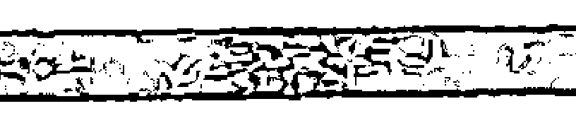

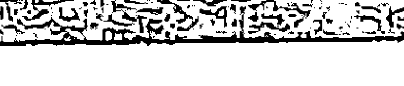

## 求财风水秘笈

官。

- 谋望: 有成，利公门，宜动中有财，夏占不成、冬占多谋少遂。
- 交易: 宜金玉、珍宝、珠、贵货，易成，夏占不利。
- 求利: 有财，金玉之利，公门中得财。秋占大利，夏占损财，冬占无财。
- 出行: 利于出行，宜人京师，利西北之行。夏占不利。
- 谒见: 利见大人、有德行之人，宜见官贵，可见。
- 疾病: 头面之疾、肺疾、筋骨疾、上焦病。夏占不安。
- 官讼: 健讼，有贵人助。秋占得胜，夏占失理。
- 坟墓: 宜向西北，宜乾山气脉，宜天穴，宜高。秋占出贵，夏占大凶。
- 方道: 西北。
- 五色: 大赤色、玄色。
- 姓字: 带金傍者，商音，行一、四、九。
- 数目: 一、四、九。
- 五味: 辛、辣。

### 《梅花易数》中兑卦物象

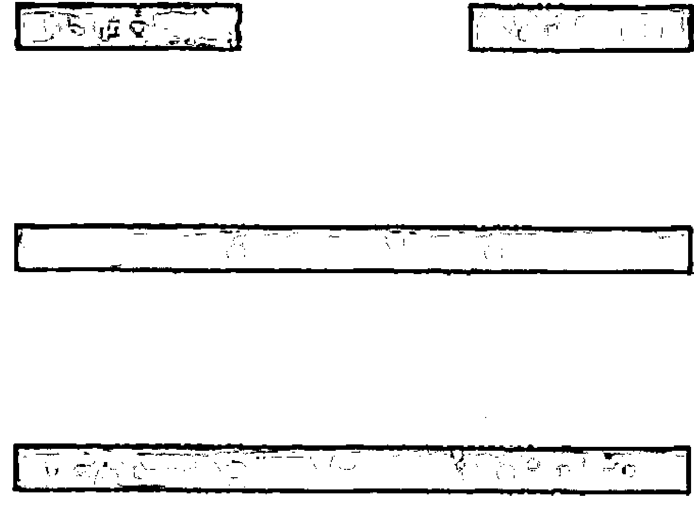

- 五行: 金
- 天时: 雨泽、新月、星。
- 地理: 泽、水际、缺池、废井、山崩破裂之地、其地为刚卤。
- 人物: 少女、妾、歌妓、伶人、译人、巫师。
- 人事: 喜悦、口舌、谗毁、谤说、饮食、毁折、附决。
- 身体: 舌、口、肺、痰、涎。
- 时序: 秋八月、酉年月日时、金年月日、二四九数月日。
- 静物: 金刃、金类、乐器、缺器、废物。
- 动物: 羊、泽中之物。
- 屋舍: 西向之居，近泽之居，败墙壁宅，户有损。
- 家宅：不安，防口舌。秋占喜悦，夏占家宅有祸。
- 饮食：羊肉、泽中之物、宿味、辛辣之味：
- 婚姻：不成，秋占可成。又喜主成婚之吉，利婚少女，夏占不利。
- 生产：不利，恐有损胎、或则生女。夏占不利，坐宜向西。
- 求名：难成，因名有损。利西之任，宜刑官、武职、伶官、译官。
- 求利：无利，有损财利，主口舌。秋占财有喜，夏占破财。
- 出行：不宜远行，防口舌或损失。宜西行，秋占宜行，有利。
- 交易：不利，防口舌，有争竞。夏占不利，秋占有交易之财喜。
- 谋望：难成，谋中有损。秋占有喜，夏占不遂。
- 谒见：利行西方，见有咒诅。
- 疾病：口舌咽喉之疾、气逆喘疾、饮食不餐。
- 坟墓：宜西向，防穴中有水，近泽之墓。夏占不宜，或葬废穴。
- 官讼：争讼不已，曲直未决，因公有损，防刑。秋占为体得理，胜讼。
- 姓字：商音，带口字金字傍姓氏，行位四、二、九。
- 数目：四、二、九。
- 方道：西方。       五色：白。       五味：辛辣。

### 《梅花易数》中艮卦物象

- 五行：土
- 天时：云、雾、山、岚
- 地理：山、径路、近山城、丘陵、坟墓、东北方。
- 人物：少男、闲人、山中人。
- 人事：阻滞、宁静、进退不决、反背、止住、不见。
- 身体：手、指、骨、鼻、背。
- 时序：冬春之月、十二月、丑寅年月日时、土年月日时、七五十数月日。
- 静物：土石、爪果、黄物、土中之物。为门阙、为果蔬、于木为坚。
- 动物：虎、狗、鼠、百兽、黔喙之物。
- 家宅：安稳，诸事有阻，家人不睦。春占不安。
- 屋舍：东北方之居、山居，近石、近路之宅。
- 饮食：土中物味、诸兽之肉、墓畔竹笋之属、野味。
- 婚姻：阻隔难成，成亦迟，利少男之婚。春占不利，宜对乡里婚。
- 求名：阻隔无名，宜东北方之任，宜土官山城之职。
- 求利：求财阻隔，宜山林中取财。春占不利，有损失。
- 生产：难生，有险阻之厄。宜向东北，春占不利，有损失。
- 交易：难成，有山林田土之交易。春占有失。
- 谋望：阻隔难成，进退不决。
- 出行：不宜远行，有阻，宜近陆行。
- 谒见：不可见，有阻，宜见山林之人。
- 疾病：手指之疾、脾胃之疾。
- 官讼：贵人阻滞、未讼未解、牵连不决。
- 坟墓：东北之穴，山中之穴。春占不利，近路边有石。
- 姓字：宫音，带土字傍姓氏，行位五、七、十。
- 数目：五、七、十。
- 方道：东北方。 五色：黄。 五味：甘。

### 求财风水秘芨

### 《梅花易数》中离卦物象

- 五行：火
- 天时：日、电、虹、霓、霞
- 地理：南方、干亢之地、窑、灶、炉冶之所、刚煤厥地、其地面阳。
- 人物：中女、文人、大腹、目疾人、介胄之士。

- 人事：文画之所、聪明才学、相见虚心、书事。
- 身体：目、心、上焦。
- 时序：夏五月，午火年月日时，三二七日。
- 静物：火、书、文、甲胄、干戈、稿衣、干燥之物、赤色之物。
- 动物：雉、龟、鳖、蟹、螺、蚌。
- 家宅：安稳、平善，冬占不安，克体主火宅。
- 屋舍：南舍之居、阳明之宅、明窗、虚室。
- 饮食：雉肉、煎炒、烧炙之物、干脯之类、热肉。
- 婚姻：不成，利中女之婚。夏占可成，冬占不利。
- 生产：易生。产中女。冬占有损，坐宜向南。
- 求名：有名，宜南方之职、文官之任，宜炉冶坑场之职。
- 求利：有财，宜南方求，有文书之财。冬占有失。
- 交易：可成，宜有文书之交易。
- 谋望：可以谋望，宜文书之事。
- 出行：可行，宜动向南方，就文书之行。冬占不宜行，不宜行舟。
- 谒见：可见南方人。冬占不顺，秋见文书、考案、才士。
- 官讼：易散，文书动，辞讼明辨。
- 疾病：目疾、心疾、上焦、热病、夏占伏暑时疫。
- 坟墓：南向之墓，无树木之所，阳穴。夏占出文人，冬占不利。
- 姓字：征音，带火及立人傍姓氏，行位三、二、七。
- 方道：南。
- 五色：赤、紫、红。
- 五味：苦。

## 后记

各位读者阅读完本书之后，对于旺财风水的基本法门应该有了一定的认识和掌握。笔者希望各位读者能够在生活中达到家肥屋润的目的。笔者研究风水堪舆多年，对很多风水门派均有所体会，但笔者不可能用一本书籍将风水堪舆涵盖齐全，不过笔者会尽力弘扬传播风水堪舆，如果对于风水堪舆有兴趣者可登陆笔者的网站与笔者一起探讨有关风水堪舆的相关话题，或者向笔者发送电子邮件一起探讨风水奥秘。笔者也会不定期推出自己的新作，希望读者朋友们留意，并给笔者提出宝贵意见。笔者在此感谢广大读者的厚爱。

总言之，正如笔者在序言中所写，“执此之笔，与君共享”，笔者将会本着这一目标不断撰写有关玄学方面的文章书籍，望读者朋友们多多关注。

我的网站是：www. masterhaizhi. com

慧缘
己丑年春