序

理氣無真書在此

全世界各大文明，唯有中國人專長風水，此是好事，抑壞事？視乎大家抱的心態而定。好的一面，以天道助人事，大智者所為；不好一面，淪為不事生產，推諉過失的藉口；事情辦不好，一聲「風水不佳」，馬上如釋重負，拍拍屁股離座，風水為禍，莫此為甚。

以我多年來（逾十八載）以來研究命運的心得，行好運的人，根本沒有風水之煩惱，福人居福地，古有明訓。用水晶學去演繹，即為「方以群分，物以類聚」。大官大富豪的家居，我看過不少，格局氣充神足，天作之合，稍加改造，不過錦上添花而已。但風水之引人入勝，以楊救貧為主，流傳了不少起死回生，徹底改變家運的事蹟，為絕望的普羅大眾增添了不少人生希望，寅葬卯發，誰不趨之若鶩？

為甚麼風水可以帶來好運？一語概之，改變氣質、改變頻律、改變事物因緣。以前我喜作如上解釋，到了今天，我會加上量子力學的不確定原理；過去現在未來，根本上為一共時共存體，改變時空，即能在法界漫遊、在富貴之門穿插。風水（包括擇日），根本就是時空轉移的大學問！

### (二)

風水不外巒頭與理氣。所謂「巒頭無偽書，理氣無真書」，表達得很清楚，山川大澤是用眼睛看的，方位星卦則用心感。風水自郭景純「葬經」以降，歷唐楊益、陳搏、吳景鸞、目講師、劉伯溫等，傳下不少寶貴經典，以後學者，各有體會，自行演繹，迄今玄學地理的門派多達百家，何者為真，何者為偽？

巒頭學問，按圖索驥，不容混亂。廉貞山就是廉貞山，武曲山就是武曲山，砂手就是砂手，案就是案，從來不存爭論。但理氣之學呢？為甚麼出現如此大的分歧？

我的看法很簡單，巒頭是用眼看的，理氣是用心感應的，沒有心感應學的靈力，理氣只淪為空泛的數理。

簡單舉一例，大廈十八樓一單位，以何者為向？大廈門？單位門？屋邨門？抑或陽光？水口？形局？標誌？

根本無定法。我摸索了多年，得出一個令自己嘆息的結論：只有用心感受無形之氣，如中醫師把脈，何去何從，才是唯一的正法。從此我不再追求所謂不傳的秘訣。所以說：「理氣無真書」，舉一可反三。

### (三)

學生問我，哪一門的風水靈驗？

我笑了笑容：「這是多重空間，多重方法的世界，任何一門都靈驗，只要你懂得真正的運用之道。」

為甚麼化煞催旺無效？在方位作動後，氣場的反應也不能辨別，怎會有效？一貫公式化下藥，照書全抄，相等一方走天涯，怎會有神效？

為甚麼睡得不好？氣分陰陽，有些影響人體督脈，有些影響任脈，有些令人氣液下流；有些令人氣液上升，你必須分辨，適當調校，才可設計出酣睡的氣場，這不是一成不變的學問，而是修養的學問。

### (四)

對一般沒有修煉的風水學者，用心感應，或用第三眼望氣，有點天方夜譚，但外國有些學問，可以讓一個初學者迅速進入無形的氣世界。

如靈擺的運用就是。

吾友徐錦城先生學貫中西，精研西方神秘學，四年前一本「水晶靈擺應用法」，風靡東南亞，現再接再厲，吸取靈擺學所長，溶入印證風水的實際應用中，對於「理氣無真書」而惆悵的學者來說，乃是指路明燈。

> 「風水的氣，不是信口開河，它確實是客觀的存在。」

願你透過本書，找到印證的一個法門。

陳浩恩

序於辛巳年中秋

## 第一章 靈擺·風水

這是一本人類自身的「靈體閉合空間」（內在靈性世界），與外部四維時空的「開放環境空間」（外在風水環境），互相聯繫「對話」的新紀元應用技藝創作，是有別於坊間的傳統風水書籍。

## 導引

這是一本人類自身的「靈體閉合空間」（內在靈性世界），與外部四維時空的「開放環境空間」（外在風水環境），互相聯繫「對話」的新紀元應用技藝創作，是有別於坊間的傳統風水書籍。

直至今天二○○一年，在中文、英文、德文、法文和日文的新紀元知識普及讀物市場上，仍未見有一本，能夠融合中國傳統理氣風水，和靈擺測度技術的應用書本出現，實在可惜。

這裏所說的「靈體閉合空間」，是指：以「您」靈體為中心的內在靈性世界，通過自身的靈量作業和生命能場，共振輻射到外部生活空間去。沒有普遍適用性的共用程式，去推算此等獨立個體的吉凶；利用各人不同的四柱八字之五行喜忌和神煞也不足夠，因為，這是一種「靜態」的符號算量。

「開放環境空間」，是指：世間萬事萬物共同寄居的生活空間，訊息大量而繁雜，但您的肉身僅是其中一物。

風水學理的基礎是源自河圖洛書、陰陽五行，玄妙之中卻帶着數理邏輯，尤以「易數論」足可比美今天的現代數學。藉此衍生各類風水程式，就是依從開放環境空間，所約定俗成下來的輸入「參數」和符號，推算人與某地生活環境的吉凶關係。

雖然我們仍可以結合人的四柱八字運算，配合理氣程式裏去，微調靠近到靈體閉合空間了。但是，我們生活在今天現代社會的開放環境空間，卻不能與千年前的環境可相比擬。一本通書不能看到老，古代沿習下來的程式，包括其「輸入參數」，是需要因應今天社會的情況，而加以改良和調整了。

當您讀畢本書，和根據書中的練習實習完後，您當會明白「靈擺風水」，和傳統理氣風水的差異在那裏。

靈擺風水，是直接通過人類本身超感直覺系統的一種新紀元科學技藝。超感直覺系統是以靈量運作方式共振於生命能場內，去獲知和製造周遭微環境，對人類自身健康和運程，有直接關連影響的靈量訊息。藉由理氣程式推算出來的客觀吉凶組合意象，倘若能夠結合靈擺測度技術，通過超感直覺系統的隔濾，真正度身定做和個體化的環境，其吉凶訊息準確性必能提高，而且，必定是「適時當地」的。

傳統的風水智慧，不應僅局限於中原地域，或者是中國領土，又或者僅是北半球地區。今天，我們是生活在一個地球村。千年前與今天的生活環境和形態，翻天覆地；先賢智慧，若不能適度因應，必縛手而終，淪為奇趣玄談。此所以，十數年來，外巒頭風水學的基礎理念，深深地影響了「生物建築環境學」的發展，她已在西方社會健康地成長；但並非是此本書要研究的課題。

靈擺測度是一種靈量作業技藝，但如何有邏輯和智慧地去運用，卻是一門科學。靈擺卜測工具，也僅是您個人的五官感覺和超感直覺系統，「互相通訊」聯繫的一件中介物理輔助裝置，而不是神仙靈物。它只將右半邊腦袋所收集回來、非五官感器所能辨識的環境訊息，通過靈量處理，以物理運動樣式，做效電腦程式作業般，按程式化了的「是」或「否」答案表示出來而已。如若採用其它視像圖表的協助，也可以藉「數碼」形式，以計量方式表示出來。而本書所使用的靈擺測度技術，大部份都是採用數字計量方式。

若果，您能夠事先閱讀本人第一本著作「水晶靈擺應用法」及陳浩恩先生的「水晶風水的秘密」，必會有助您在應用和實習本書各項技術。當然，您亦需要具備一些簡單的風水、四柱八字、五行生剋、水晶應用等基本知識。如此，可以幫助您在靈擺測度應用時，獲得較準確的訊息和答案。

如果您的腦袋意識系統，完全沒有「欲要卜測相關科目」的基礎認識，在組織和分析問題的時候，會遇上一點困難。問題若不切題和欠缺邏輯，「答案」又何來有意義和準確呢？情況就正如電腦系統作業定律：「垃圾輸入則垃圾輸出」（Rubbish in, Rubbish out）。無意識的輸入，得出來的只是一堆無意識的數據。

每一位正常健康的人，都擁有「先天性」的靈擺卜測和測度本能。至於敏銳度和領悟性，卻因人而異。但是，測度出來的「準確機率」和靈擺運用技巧。卻完全取決於靈擺使用者的後天正確訓練，和長時間實習應用所獲得的經驗而定。從來沒有一種技藝，是不需要下些苦功去練習，而能夠不勞而獲的。

在靈擺風水的靈擺測度之中，有一項您需要闖過的難關，就是要克服您的左半邊腦袋，邏輯意識系統的束縛，和不敢越雷池半步的天馬行空的想像。這類束縛多是來自那些早已被程式化了的慣性成見、資料、傳統物理學觀念、五官感覺世界的圖像和傳統的學習方法。為了使測度更精準，個人的心靈修養和愛心，也是應用靈擺風水的必須條件之一。

心中需要有著慈愛、關懷、感恩、勿惡和對地球萬物的鐘愛等等正態心境，方能獲得最準確，最近值的測度答案，也同時能使自己靈性提高。

本書所教給您的靈擺風水技術，僅鼓勵應用在您個人、家庭、居所和辦公室內。若您能將技術加以改良和調整，然後施用於他人身上，我希望您切勿以惡意心態，傷害他人身心－正術與邪術僅一線之差矣。

本書所建議使用的靈擺工具，主要仍是靈擺吊錘。

吊錘懸物是最理想的物料，當然是由天然水晶製成；不過純銅製品和實木製品，也是可以考慮的。

至於本書所介紹的靈擺風水探穴折尺，多是應用在大塊面積的地表曠野上。古代地理堪輿師，部份是懂曉此項祖傳秘技，進行尋龍點穴和測度穴場。本書會以獨立一章，公開披露此項技術。藉此，本人衷心感謝多位寄居美國、法國和中國大陸的讀者——他們可能部份是風水從業員或祖父輩是堪輿師——提供有關靈擺風水折尺的古代祖傳應用片段資料。

本書在靈擺風水理論基礎論述，和技藝舉例應用上，仍圍繞在初級階段範疇內，並不打算作進一步的深入研討。這是因為要考慮普及讀物市場的限制，以及當在推廣一門創新學科時，是需要顧及大多數普遍群的讀者，使能容易明白了解和趣味化。

本書每一章的內容都是新穎和富啟發性，您不會在任何書籍、期刊或報章內，曾經讀過的，除非是翻抄此書的內容而改頭換面。

希望您能讀畢全書。然後再翻回頭，按著書中的各項練習例子，一一順序實習，您當會發現靈擺風水的秘密和神妙在那裏了。不過，在實習過程中，您可能遇到一些難題，若是，請您詳細記錄在紙上。試想想另外的方法去解決它，假如真的找到了辦法，恭喜您。請一併將它們寄回來澳洲給我，共同切磋解決和分享研究。

「水晶靈擺應用法」自兩年多前出版後，至今已接收到百餘封，從世界各地的中文讀者寄回來澳洲給我的函件。這些函件是涉及靈擺應用心得、建議資料和難題待解；使我在進一步研究上，獲益良多，也促使成功發展了這一門創新的「靈擺風水」學。

## 第二章

## 靈擺風水是甚麼

○ ○ ○ ○ ○ ○ ○

「靈擺風水」是應用靈擺測度技藝，和超空間遙感靈量傳輸技術，以科學化作業方式，去擴闊和調節「理氣風水」的效能與內涵，達致個體微環境空間的陰陽五行平衡、身心健康、避煞旺運。

### 靈擺輻射系數

「靈擺風水」是應用靈擺測度技藝，和超空間遙感靈量傳輸技術，以科學化作業方式，去擴闊和調節「理氣風水」的效能與內涵，達致個體微環境空間的陰陽五行平衡、身心健康、避煞旺運。

靈擺卜測和理氣風水，均是有數千年歷史的「古老科學」，惟在傳統物理學圈子內，與其理論是不相容的，均不受重視和深入發展研究。

在新紀元思潮萌芽誕生的超物理學理論觀內，方能有空間進一步探究。在這本書裏，有關靈擺風水的新紀元科學基本知識，會點到即止，引領讀者進一步搜讀其它科系書籍。同時，亦可以思考為何可以將靈擺測度和理氣風水，相輔相成地糅合在一起。

今天，靈擺測度技術的眾多科學驗證，已得到了初步的成果和認許，深深地衝擊傳統物理學的僵化觀念和基礎理論。讀者若有興趣知悉這方面的理論研究，和國家級的實驗報告，可與作者聯絡。

### 氣的爭辯

靈擺風水的理論，是以「人」和「氣」為核心。不過，這裏所說的「氣」，不僅是指流動空氣、芬芳香氣、污染臭氧和人工化合氣等等以物理狀態存在的氣態之氣。因此，氣在「靈擺風水」的應用上，是需要有一個清澈的「假設定義」和「量計化」概念，來加以規範收窄、分類理解、使易於觀想和被腦袋潛識系統程式化。

風水學裏常說的氣，是一個或一組意象概念。無形無相、定義隨意；可以包括物理氣態的氣，也可以是微粒子輻射振頻，更可以是非物質空間的某種理論存在物。在普遍的描述和應用上就很易被混淆了。最常見的混淆例子，就是將物質以氣態形式存在的氣，和量粒子運動的輻射。兩類截然不同的物理狀態，全以「氣」概稱之。風水外巒頭所指稱的氣，通常大部分是指物質以氣態存在的氣，包括空氣流動的風、水流（地表和地層下）激發引起含微粒子輻射的水氣、山巒和建築物的形態所引起的氣象切風、四季氣候、地球兩極帶來的冷暖氣流變化、門窗和空調系統引入室內的空氣流動、綠樹花朵清新芬芳香氣、化合物惡臭污氣、燃燒物品的廢氣……等等。

另外，今天理氣風水所指的另一種氣，就是電磁輻射振頻，包括由地球磁場、地心重力場、地層深處的地表震動、高空電離子層、放射性礦物泥土、以及由太陽、行星、外星團、宇宙空間進入地球的高能輻射，這是自然引發的電磁氣振頻。近一百年，地球人類也製造了很多人造輻射，包括長短微波高頻通訊、高壓電塔和網絡、雷達搜尋系統、視像聲頻、地下電纜系統、核能應用、放射性廢料和人工合成的化學建材和家庭、商業用品……等等。以上所指稱的「氣」，是「硬體」性質，可以用今天的科學測量儀器測度和尋找，也是外巒頭風水和生物建築環境的結合研討對象。況且，人類的五官觸覺、風水地理堪輿師的觀察經驗，在一定程度上，可以輕易掌握這類由硬體引發的氣。

經由各理氣風水派系，各種程式所計算出來的理氣，究竟是物理學所定義的硬體輻射振頻，還是另有所指呢？這是一個直到今天仍在風水理論界爭辯的課題。

當此項核心課題仍未有科學性定義之前，在傳統學院知識界，仍將理氣風水視作虛玄且迷信的課題，沒有相關的理論和可重複驗證的支持。

### 電磁輻射

為了適應人們今天的普通科學知識水平，「靈擺風水」學暫將傳統風水「理氣」所普遍理解的「氣」，定義為陰陽雙旋運動的「能場」；並且，將其分成為兩個大系統：

- 第一類系統，稱為「電磁輻射」。
- 第二類系統，稱為「靈量輻射」。

電磁輻射是由自然界或人工造成所引起的物理量粒子運動，或地質、空間的化學蛻變效應所引起的振頻輻射，亦稱為硬體輻射。

此系統的振頻輻射，含有物理性質能量，受限於傳統學院派物理學定律的約束和解釋，可以通過今天普遍使用的電子測量儀器去測度和計量，同時亦可以在實驗室中產生。

它們由宇宙星宿、地球深處、大氣層、山巒河海等四方八面而來，包括超高頻的高能宇宙射線、加瑪射線、X射線、紫外線、可見光譜、紅外線，而至廣播通訊、聲音視像的各段波頻，以及由地球地表層引發的低頻輻射和岩土放射性物質輻射。今天人類，在理論上可知曉的傳統物理學輻射頻率，是由4,611 × 10^Hz至2^Hz之間。請參看（表2.1）。

高於八十度音階、4,620 × +15Hz的高能輻射，和低於一度音階、2Hz而至負量值的低頻幅射，不再是僅局限於傳統硬電磁頻率輻射，而已經涉及超物理學研究範圍。

它們的性質對人類心智活動的影響，在學院科研界是完全空白一片，或者僅是少數情報和軍事部門，持有少量研究資料。此類超高和超低輻射頻譜，可能就是進入了靈量場範圍，涉及超四度空間的研究圈子。請參閱（表2.2）所可能包括而仍未知曉的靈能。

| 硬輻射類別 | 八度音階 頻率 | 每秒週震幅率 HZ |
| :--- | :--- | :--- |
| 各類宇宙射線、 高能量團輻射、 | 62-80 | 4,611,686,018,427,387,904 以上 |
| 珈瑪(γ)射線、 比他(β)射線、 愛發(α)射線、 | 62+ | 4,611,686,018,427,387,904 以下，至 |
| X 射線 | 56-61 | 72,057,594,037,927,936 至 |
| 紫外線 | 51-56 | 2,251,799,813,685,248 至 |
| 化學物輻射 | 50 | 1,125,899,906,842,625 至 |
| 可見光譜 | 48-57 | 281,474,976,710,656 至 |
| 物理顏色 | 48-50 | 281,474,976,710,656 至 |
| 熱輻射 | 46-48 | 70,368,744,177,644 至 |
| 紅外線 | 38-48 | 274,877,906,944 至 |
| 微波輻射 | 28-38 | 268,435,456 至 |
| 電磁能輻射 | 25-35 | 33,554,432 至 |
| 無線電長波通訊 | 14-29 | 16,384 至 |
| 物理音響 | 4-15 | 16 至 |
| 觸感 | 2-4 | 低於4 |

表2.1 物理硬輻射頻譜表

超出 4,620 x 10+15 頻率，80 度音階的靈氣輻射，可能包括：

| 超出 4,620 x 10+15 頻率，80 度音階的靈氣輻射，可能包括： |
|---|
| • 特異功能所指稱的分子分離、物體隱沒。 |
| • 特異功能所指稱的鍊金術、分子整合、碎物還原。 |
| • 天界通靈、或稱外星生物通訊。 |
| • 透視人類生命能場不限距離。 |
| • 望視催眠。 |
| • 生物能、生物磁能。 |
| • 遙感視聽、靈擺卜測、靈擺測度。 |
| • 天眼通。 |
| • 硬氣功、踩火。 |
| • 幾何建構物所產生的能量，包括金字塔、寺廟、教堂、符籙、任何特殊幾何條組合。 |
| • 瑜珈浮懸、漂游。 |
| • 進入未來時空，返回過去時空。 |
| • 禪定、脫體、通靈、冥想。 |
| • 氣運、運程、卜測、心靈調控。 |
| • 遙感診療、想像成真……。 |

在高次一度空間，即在超四度時空裏，能量輻射的活動性質，已提昇到人的靈量精神領域，非一般光速時空的物理學可以解釋了。

在物理世界，人體僅是有形物質的一部份，可以進行各類物理和生化作業，老死蛻變。況且，人體的奇妙之處，就是全部都是由水分子構成，完完全全是一個敏銳的電磁導體。所有在前述的硬輻射頻譜內的振頻，均無時無刻地影響人體物質器官，和生化神經脈絡運作系統。

今天，人類生活在一個充斥人造電磁輻射環境裏，需要適應身邊不斷變化的環境，這就是看不見的「動」。

巒頭風水，就是看四周環境的山巒河道、有形結構物的「動」和「靜」；動可以是有形的，也可以是各種無形的硬輻射震頻。

古代人類，包括堪輿師，沒有電磁輻射這類現代化詞語，因此，可能就用氣來概稱之，或甚至提昇到使用「元氣」此詞。混淆就毫無疑問地出現了，只要後來的「跟隨者」有任何不明誤解，就會愈繪愈玄。其實就在各類古籍經典上出現了。

物理學知識出現後，部份風水愛好者，就更過猶不及，直截將氣看待成粒子輻射，甚至說是「夸克粒子」(Quark particle)。

## 灵量辐射

气，也可以是属于非物质世界的辐射。在古代各国文化里，已有不同的称谓。而气只是其中一种名称。在这里，我们可统称气为「灵量辐射」，亦可称为软体辐射。因为，能够容易看词释义，符合今天的科学常识水平。

灵量辐射是属于高次一度以上空间的能量讯息统称。讯息中所含的质和量，比物理世界的硬体辐射更多。今天的宇宙空间理论科学，已经得知宇宙非仅局限于爱因斯坦相对论所说的绝对光速时空，光速并非是宇宙绝对不可超越的速度。

「光速时空」是我们五官感觉世界的物质空间，也是人类肉身世界。但是，与人类心灵有间接关系的宇宙空间，却可以伸延至宇宙第七个意识层介面，亦即是十度次空间！（有点儿类似部份古代宗教哲学思想！）

这七个宇宙意识层介面，均在一个共同的「双旋中轴」里运动，各层介面拥有个别不同的「质」和「量」的能量讯息。按惯常数字理论来说，它们就是有个别不同的「数字模型」（Mathematical Model），如有「定律」规范，当然也是各异，河水不犯井水，各自运作。

新纪元数学理论模型观就是如此出现了。

在数学模型里，得知每一个意识层介面，均拥有其「次元空间」及速度极限。高一「次元空间」的速度极限，是等如对下一「次元空间」极限速度的自乘数。

例如，在四度空间的微粒子辐射场振频，极限速度是光速。光速以阿拉伯字母C代表之，其速度也设定是每秒 $3 \times 10^8$ 米。

与人类最接近和有关系的灵量辐射场，是位处于四度空间外高一次元的空间。因此，其速度极限是 $C^2$，即是每秒约 $9 \times 10^{16}$ 米。其余各高一「次元空间」，极限速度分别是：$C^3$，$C^4$，$C^5$，$C^6$ 及 $C^7$。

这里所使用的「光速」和「距离」观念，是以四度时空为设定基准参数；如同我们使用「地球年」去度量宇宙星团距离一样，以便容易明白。

至于，科学家为何算出十度次空间，又为何以 $C^2$、$C^3$、$C^4$、……$C^N$，设定为每一高次元空间的极限速度，则涉及深奥和复杂的数学理论，不在本书讨论范围内。

可以理解和想像，「气」在这里称「灵量辐射」，在传统物理微粒子辐射场的时空里，是「超越」该空间光速极限速度的；换句话说，根本就没有传统速度的观念，仅能描述的是「瞬即」(Instantaneous) 跟「同时」(Simultaneous) 而已。

而且，低下一個「次元空间」的「存在」和「變化」，是受限於高一「次元空間」的質與量「訊息」的約束。因此，我們五官感覺的物理世界：山巒河川、花香綠樹、方圓形態、生化衰變……等等，也受限於靈量輻射這一次高空間的「訊息」所規範。這又吻合了傳統風水對「氣」的理解和應用。

現在您應該清楚，微粒子輻射場和靈量輻射場（氣），是分別處在不同層次的空間，任何數學定律，均不能適用於靈量輻射空間。例如「熵」現象，物理能量的正常現象，是強勢能場趨向弱勢能場，直至雙方量能達致平衡。例如，一杯滾水混入一杯冷水中而變成暖水。相反，靈量輻射場卻擁有「逆熵」現象。即是強勢能場吸引弱勢能場的能量，變成強者愈強、弱者愈弱的趨勢。

一直以來，風水掌相玄學，就是如此假設，倘若您在某時段的「運氣」差勁，就不要去做一些高層次意識的思想工作，諸如，利用靈量能去判斷事物，下重要決定等。因為，您的超感直覺系統缺乏訊息攫取能量，故此，您的「決定錯誤」機會頗高，謂之運氣差嘛！除非您懂曉靈量調整技巧；或者，換另一個角度說，可以作「有效」的風水佈局，提昇些少運氣，不致於一敗塗地。

## 五行氣是甚麼

金、木、水、火、土五行理氣，也可以歸屬靈量輻射類別。

假若，它們是有可測度的振頻率度量值的存在，則其每秒週數率應該不相同的。但是，它們根本就不屬於四度次空間的硬輻射，所以沒有物理學度量衡值的概念。

它們只能「交感共振」於人類「生命能場」內，方能「設定」其存在。沒有生命能場，去討論五行氣亦變得毫無意義。在風水學理論上，有謂辨形察氣。有存在的物體是最容易辨識，何類別五行氣會引發。例如，金屬礦物共振出金氣，花草樹木共振出木氣、山石泥土共振出土氣等等。可見光的顏色反射頻率，如紅色調頻率、綠色調頻率等，當然也能聯想或引發相應的五行氣。這類察辨形式，在靈擺風水學上是成立的，也認同五行氣是人類生命能場所必需的養料元素，但必須平衡，而生命能場應是完整健康，沒有偏側和穿漏的。

不過，另外有一種約定俗成的察辨是說，在四周環境的幾何形構實物，也會是引發五行氣的主要來源；形構實物，就是各式各樣的「幾何形狀、線條」組合群。但，這不是由於人造建構物或天然形構物，形狀似火型，就能引發火氣，或者型似木者，就能引發木氣。而是要視乎該建構物的「幾何線條數學組合」，是否間接影響生命能場，交感共振地引發相應的五行氣而定。金字塔、古代教堂、寺廟等建構物，就是一個很好的幾何線條組合的例子。

任何存在於四度次空間的實物體和空間體，均有其幾何線條組合，形成各種形狀。包括可視範圍近距離的山脈、岩石、建築物、道路工程、大型基建……等等。所有這等物體，均有三度空間量度，即長、潤、高。此等線條的不同量度和位置組合，必會產生各形各類的幾何形狀物、空間或圖像。科研人員和考古學家經過長時間的研究，發現大部份建在聖地、道場、神秘地段的古老建構物，包括：金字塔、柱陣、教堂、寺廟、修院、宮殿、神秘大宅等等，都大量地使用以下五個基本幾何比率數字。

它們分別是：

-   一、 PI（π） = 3.1416
-   二、 √2 = 1.4142
-   三、 √3 = 1.7320
-   四、 √5 = 2.2360
-   五、 Phi（φ） = 1.618

古代中國的風水先賢，不懂數，也不喜去算，僅是口訣，喜愛用形象來表示一些現象，以便代代相傳，容易記憶。

今天，我們進一步地發現，以上五個基本幾何比率數值，可能就是與環境和生命能場相互交感共振，而產生或引發五類差異軟輻射（或稱氣吧！）頻率的來源，就是：

-   Pi (π) 共振成金氣，用圓型來形象之；
-   √2 共振成土氣，用方型來形象之；
-   √3 共振成火氣，用三角來形象之；
-   √5 共振成木氣，用長型來形象之；
-   Phi (φ) 共振成水氣，用波浪線來形象之。

如果，我們欲想要建築一座建構物，可共振產生強旺金氣，就需要在建築物「塊件組合」上，多些使用Pi (π) 的幾何比率數量值。奇怪的是，組合出來的建構物，其形象大多似像圓形。另一發現的是，在眾多建築在聖地、神秘地段的形構物，都很平均地有齊以上五種的幾何比率數度量衡值。

因而當人的生命能場，在近距離處在其空間裏，除了交感共振出五行氣之外，也能大大地增強和提昇人的精神修煉（但不是每一個人都愛如此），並且，也能夠抗衡可能由地層「能量線網陣」，引發出來的「地靈煞」氣。

## 靈量作業

靈量輻射不在微粒子物理空間層次內運作，它是在人類第二個身體的空間內作業。

這第二個身體，稱謂「虛體」、或「虛擬體」、或「真身」、或稱「人體氣場」、「生命氣場」。但在這裏將正名稱謂「生命能場」，是任何高次空間輻射振頻的「觸媒介體」，不僅僅是「氣場」。

靈量輻射藉著生命能場的「虛擬經絡」系統、與人體「能量集結穴」（輪旋位 - Chakra）和穴脈經絡系統連繫，在轉換成物理能光量子振頻後，間接影響人體器官的生化系統。不宜在此詳論其理論背景。

風水吉旺與凶煞的效應，很明顯是需要考慮個別生命體，其依附在宇宙意識「迴漩中軸」的「先天位置」（或稱「意外位置」）的某「X」點，加上「元運」、「時間」或「當時當刻」的身心狀態，再加上生活空間環境的其它物理硬輻射的影響。

這三項的「總和參數」，若剔除了「先天位置」的「我命」因素不論外，則「當時當刻」的物理世界四度空間環境，包括了：山巒河道、天宙射線、地層能量線網陣、巨大建構群、人造輻射場、人造生化污染……等各項因素，就是最重要的風水吉旺凶煞來源了。

古代地理堪輿師，一早就已專注此等自然地理因素了。近十餘年來，西方的風水環境學，除了考慮中國風水外巒頭學外，也極表關注今天的科技污染環境，而發展了一套「生物建築環境科學」，適當地去補充前者所沒有的。

未來新紀元的風水學，將會跨前一步，就是如何在高次一度的第五度空間（即前段所述的C²空間），配合發揮人類生命與生俱來的靈量作業功能，探索嘗試發展超空間輻射傳遞應用技術，這就是拋磚引玉式研發「靈擺風水」的初階目標。

在C²空間存在的能量、或稱靈量輻射，其中部分就是傳統理氣風水所稱謂的五行氣，彼等不能按傳統物理學理論和定律，加以詮釋和規範。例如，熱能電磁輻射有兩種耳熟能詳的特性。其一是：能量的消減與空間距離成正比例，即是距離發放能量源頭愈遠，所接收的能量就愈少。其二是：熵現象；即是高熱能流向弱勢能，最終大家能量平衡。當我們處理硬輻射、或稱硬體外巒頭氣時，這物理特性仍是普遍地認同的。靈量輻射就不同了，它們的「進行」非以光速為極限，而是按下述兩種方式達成：

-   1. 「傳送距離」是決定接收雙方的「幾何同型結構」而成正比例。即是說，假若有兩個一模一樣的「同型結構空間」，不論它們在物理世界的空間相距多遠，「傳送」均是「即時發生」的；甚至，兩個「極近相似」結構空間，也都可能發生，惟效率當然成反比例了。
-   2. 「傳送速度」是無限的。
-   二、逆熵現象。例如，若有兩個「生命能場的結構空間」，非常近似地存在，如此，一個充盈強旺的氣場，將「汲取」另一個弱勢的氣場。最後的效果可能就是衰竭，繼而轉化。

靈擺風水，亦會利用此項靈量輻射的特性，將旺氣以超空間遙距技術轉移和發放。坊間的風水物品亦能利用作為其同型結構空間的間接媒體。詳細的應用技術，將會在本書另一章討論。

## 五行氣參數界定

為了克服人類的五官感覺局限，和「騙取」左半腦去「譯讀」右半腦的潛識訊息，我會將五行氣「虛擬」代入物理世界四度空間的慣常使用振頻輻射率，來進行適應靈擺測度和計量。因此，將五行氣界定為三類「訊息來源」，它們分別是：「理氣五行」、「命主五行」和「靈擺五行」。

「理氣五行」所算出的參數，是來源於各風水派系，諸如：東西八宅、玄空飛星、大玄空易卦、三元三合……等的理氣運算程式系統。她們均是出自同一源頭——即是河圖、洛書、八卦、九星、元運等基礎風水理論。

「命主五行」所算出的參數，是源於每個生命體的出生年干和地支，作為推算時受坐標——即是宇宙意識「迴漩中軸」的「先天位置」的「X」坐標點，按此而算出的五行強弱喜忌，選配入不同的八卦方位。

「理氣五行」和「命主五行」的推算，是基於一套既定的客觀程式，以「普遍性」和「統計概念」代入任何一個生命體、或任何一個居住環境，不論對象是否住在深山野嶺、曠地平原、繁囂市集、抑或務農鄉村；當然，也不考慮到自身處於北半球、南半球、內陸、赤道，還是沿海島嶼等等。因此，也不考慮是否源自中國中原的洛陽五行。

因此，此兩類系統的「五行」是「靜態」評估，應予「恆定值」參數 (Constant) 看待之。

靈擺測度是一種動態作業。其測度算出的「答案」均是「當時當刻」、經已發生了，又與個人的生命能場和超感系統「即時」聯繫、直接交通後所輸出的訊息。

「靈擺五行」就是藉着靈擺測度技術、動態地評估出來。

「靈擺五行」是基於外部各類「媒介物」的影響，而產生不同的「動態值」參數，例如：

-   一、自身生命能場的強弱和平衡狀態；
-   二、近距離建構物的方位能量線(由幾何線條組合引起）；
-   三、地球地表層能量線網陣及其相交點能量；
-   四、附近建材物料、顏色、燈光、電線和水喉污渠管道，一切環境的硬輻射；
-   五、室內大型傢俱和家電器具的擺放位置。

## 靈擺輻射係數

當您要收看一個電視頻道時，只要將電視機調校到發訊頻段，就可以聯絡上。物理世界的一切事物，均有它們特定的振頻，充塞在偌大的空間裏。與之同時，您的身體亦不斷地發放一組組特定的振頻，如同手指模、DNA一樣，因人而異。只需要有特別的接收裝置，任何人均可以在千里外，接收到您身體無意識的靈量振頻；做如流動電話接收到您的聲頻一樣。

今天，新紀元超物理學理論的另一觀點，就是並非所有擴散在空間裏的振頻波，都可以利用今天的先進接收儀器所截獲得到。它們絕大部份都超越了物理電磁、光量子微粒輻射頻譜以外；而且亦並非全是在四維時空的數學模型裏存在。

同一原理，您的心境情緒、意欲企圖、策劃思考等等，一切靈量輻射，也有其特定頻率，這是心靈內的訊息。美國的先進情報保安系統研究小組，已開始研發利用此項理論，去設計一套靈量作業情報保安系統；即是在工作場所的任何人等，若在心裡萌生策劃「偷取」企圖，保安系統即可事先測知，鎖定此目標人物。

由於人類的超感系統，也存在著這種初級功能，所以很多長久以來的神秘特異現象，諸如能在千里外知曉親人心念等活動，均能發生。今天，靈擺測度技術，可以應用外圍的一組初級物理裝置——靈擺輻射係數分析和讀送儀系統，以數碼形式表示出來。這組數碼稱謂「靈擺輻射係數」。例如一條純金條的靈擺輻射係數是0001278800，您家居一幅大廳照片可能是0057168921，您的一撮頭髮會是0215661770，等等。藉着靈擺輻射係數為媒介，經驗的靈擺卜測師和被測度的目標（人物、植物或事件），就可以在相距數千里外，互相聯繫上了。

現在的技術問題是：不同的係數分析讀送儀，對同一個目標物的讀數是不同的，但，最終其運作效果卻是一樣！

古代的神秘巫術，可能與這種超空間靈擺遙感測度的應用有所關連。近世紀以來，靈擺遙感卜測曾被利用在地圖遙距尋覓礦物油田、越南戰場和北朝鮮地下戰道和火藥庫尋覓；以及另類醫療遙距分析和相應治療藥物遙距傳送等。

據靈擺界非官方證實的消息，自2001年美國 ” 9 · 11 ” 事件後，美國情報部門已秘密邀請了國內數位精於運用靈擺，尋找失蹤人口的靈擺師，利用「地圖遙感卜測」技術，在阿富汗山區尋找拉登 (Osama Bin Ladden) 的藏身之處，以收窄搜索範圍。

在實驗室裏，亦有少部份先進的傳統醫學專家，嘗試製造一些複雜的醫科專用「靈擺輻射係數攝錄分析儀」原型，藉着一位在千里外病人的血液樣本，通過該部靈擺輻射分析儀，找出該病人某部份身體器官的病變輻射區，去獲知其病況後，進行遙距藥物輻射診治。我們不要驚訝，此另類神秘的古老醫術，將會結合今天新紀元科學理論和「非常規」應用技術，在未來廿一世紀重新妝扮復活過來。

靈擺風水學其中一項課題，就是嘗試利用今天，已發展了初步性實驗，透過靈擺輻射係數分析讀送儀系統的協助，並結合經驗靈擺師的靈擺測度技術，進行某些風水靈量作業，諸如：

-   一、超空間遙距目標微環境 (如千里外的家宅、辦公室) 風水測度和調整。
-   二、超空間遙距風水吉旺化煞——例如借用別家好風水的吉旺輻射環境、或一組適當的風水吉旺物品輻射場 (利用水晶壓電放大特性)，轉移傳遞到某個千里外的目標微環境輻射場去 (利用瞪物技術)，營造做似吉旺的氣場。
-   三、超空間遙距增旺某個千里外目標（微環境）的風水擺設物輻射氣場。

此類靈量應用技術有分簡易和專業程序，本書將會在另章中詳細討論。

# 第三章 靈擺測度技巧

工欲善其事，必先利其器。要每一次的靈擺測度都十足準繩，就需要勤加練習，了解靈擺的操作原理，才可以將測度技術發揮得淋漓盡致。

在讀此書時，我已假設閣下已經讀過我的第一本著作「水晶靈擺卜測應用法」，並按照書中的實習方案，掌握好靈擺吊錘的基本應用和各項有關技巧，以及明白甚麼是靈擺測度的前期準備工序。在此章節裡，僅簡略覆述靈擺吊錘數種基本運動樣式和握持方法，溫故知新。

## 靈擺測度前期準備

-   1. (一) 將靈擺吊錘的垂鍊握持在右手拇指和食指之間，使靈擺吊錘平穩地垂直，不要滑溜。
-   2. (二) 垂鍊從指端伸至水晶懸椎，約長21公分，按自己感到最舒服的長度為宜。
-   （三）將右手肘擱於桌面上，不要讓右手貼近腰部，務使靈擺能自然地垂直來回擺動，其餘三指放鬆散開。
-   （四）端坐椅上，挺直身體，不可弓背，呼吸要緩慢並有節奏，進行約三分鐘的靜坐。
-   （五）雙腿平放貼在地面，不可交纏。
-   （六）左手平放在桌面上。
-   （七）您需要獨自關在房間內，或大廳中。同時避免受電視音響和其它噪音干擾；也熄掉所有近距離一切家電用品。
-   （八）若你感覺疲勞、精神不振、過度興奮、心情傷感、睡眠不足，請不要進行靈擺測度。
-   （九）不要在他人面前炫耀示範靈擺測度，也不可容許旁觀者，以注目監視著您的靈擺作業和卜詢。
-   （十）集中精神，將您要測度的目標物、事象、環境等，加以細緻的觀想；但不要先下判斷，邏輯考慮或先設定「是」或「否」、「對」或「錯」、「多與少」等答案意識思維。
-   （十一）卜測的問題，必須簡單、清楚、句子短少，而且只能有一個答案出現。需用正態邏輯問句去問：例如：「甲和乙是否一樣？」不要用負態問句，例如：「甲和乙是否不一樣？」
-   （十三）若問題複雜，應以流程圖去分析，將大問題拆散，組合成一連串有關連的小問題，最後的小問題才是真正的答案。請覆讀「水晶靈擺應用法」一書的第九章。

## 靈擺吊錘擺動樣式

在進行靈擺測度前，您是需要與靈擺「約定」，如何跟您互相「通訊」的。「通訊」當然是以「擺動樣式」來表示。這種「約定」，就是「靈擺擺動樣式程式化」作業。

在「水晶靈擺卜測應用法」一書中，已有詳細的說明和實習訓練。現在，僅列出一種最基本的擺動樣式，溫故知新。

-   （一）順時針方向繞轉和逆時針方向繞轉。（見圖3.2）。
-   * 欲要靈擺答：「是」或「+」或「陽」；則應將靈擺，設定以順時針（右轉）方向打圈子繞轉。
-   * 欲要靈擺答：「否」或「-」或「陰」；則應將靈擺，設定以逆時針（左轉）方向打圈子繞轉。
-   （二）「連結兩物」擺動和「分割兩物」擺動。（見圖3.3）。
-   * 欲要靈擺決定兩個「被測物體」，是「相配」、「合襯」、「適合」或「同等」；則應將靈擺的擺動樣式，設定在該兩物之間，以連結來回方式擺動。
-   * 欲要靈擺決定兩個「被測物體」，是「相沖」、「錯配」、「不宜」或「差異」；則應將靈擺，設定在該兩物之間，以分割來回方式擺動。

## 靈擺測度練習

## 練習（一）

-   （一）找來兩隻相同的玻璃水杯，注入自來水，容量可以不相等。
-   （二）將兩隻水杯放置在桌面上，相距十六吋。
-   （三）將靈擺吊錘放在水杯之間，靈擺處於靜止狀態。
-   （四）向靈擺測詢：「請問兩杯水的水質是否一樣？」
-   （五）由於水杯內的水是來自同一來源，靈擺應會在兩杯水中間，以連結方式來回橫擺，即表示相同。（見圖 3.4）

## 練習（二）

（一）再將靈擺吊懸在其中一杯水和您身體之間，讓靈擺處於靜止狀態。
（二）向靈擺測詢：「請問這杯水是否適合我飲？」
（三）這是一杯水喉清水，應可以飲用。因此，靈擺亦會在您和該杯水之間，以連結方式來回直擺，回答：「是」，即適合。
（四）但是，在某些情況下，水喉水也可能被污染，或有過量不適合您腸胃的化學物，靈擺則會在您和該杯水之間，以分割方式打橫擺動，表示不適合。
（五）此項練習，您可測試任何食物、維他命丸、減肥藥、化妝品、甚至風水擺設物品。

## 練習（三）

（一）將其中一杯水倒去，抹乾水杯，注入純淨礦泉水。
（二）重覆測問：「請問兩杯水的水質是否一樣？」
（三）您會發現，靈擺不再以連結方式來回橫擺，而是以斜角擺動。這是表示，該兩杯水的本質是一樣，但水質所含其它的雜質元素是不完全一樣。
（四）此種在兩物之間，以斜角線擺動式樣，其答案通常是：「未必完全相同」，或「未必完全適宜」，或「雖然合襯但不取為好」，或「吉裡藏凶」等非絕對的「是」或「否」。
（五）同樣原理，您可以用此簡單詢問方法，將你家居或辦公室，其中一件由風水店購入的一件風水擺設物品，看看是否真的絕對適合您自己，答案可能未必完全適合呢！

## 練習（四）

（一）去文具店，購入下列五種顏色紙：
- (A) 金黃色，在紙上寫上「金黃」。
- (B) 青綠色，在紙上寫上「木綠」。
- (C) 鮮紅色，在紙上寫上「火紅」。
- (D) 淺藍色，在紙上寫上「水藍」。
- (E) 咖啡色，在紙上寫上「土啡」。

（二）將其中一張五行顏色紙，例如水藍，平放在桌面上。
（三）將您的左手掌也平放在桌面上，五指散開，對著該顏色紙張，相距約十吋。（見圖3.5）
（四）將靈擺吊懸在該張顏色紙，和左手掌之中間，向靈擺測詢：「請問我的身體現在是否需要水藍色？」，或「請問我的身體現在是否需要五行水氣？」
（五）若靈擺以順時針方向打圈子繞轉，或以兩物連結方式來回前後直擺，則表示：「需要」。
（六）若靈擺以逆時針方向打圈子繞轉，或兩物之間以割開方式或打橫擺動，則表示：「不需要」。
（七）其它顏色紙，可按此法分別測詢。若全部都不需要，則表示您現在的身體狀況，是五行氣平行了。若「需要」其中一種顏色，則表示該種所屬顏色的五行氣，可能欠缺，有需要加以增強。

### 近距遙感測度

在靈擺風水學應用裡，亦會涉及應用「靈擺遙感或遙距測度技術」。
不過，遠距離的遙感測度，並非能夠一朝一夕可以熟練，且也需要個人的少許天份，方能事半功倍。
無論怎樣，您都需要去測試一下您是否有足夠的能力跟天份，運用遙感測度技術，如此，方能決定您自己是否需要接受進一步的高階訓練。
以下的「近距離」遙感練習，就是用來測試，您是否具備此項條件和天份。

## 練習（一）

（一）按照靈擺測度練習（二）的方法，以蘋果代替清水，先測詢出那一隻蘋果是適合您吃的；然後，將該隻蘋果放在十公尺以外，而您又可以能夠用眼睛看見的桌面或地板上。（見圖3.6）。
（二）用左手指著該隻遠在十公尺外的蘋果，雙眼瞪視著它，右手握持靈擺，平靜心境，緩慢呼吸十數次。
（三）遙指並向靈擺測詢：「該隻蘋果是否適合我吃？」不要瞪視靈擺，讓它自由擺動。
（四）在五分鐘內，靈擺應該會以順時針方向繞轉，或以連結兩物的方式前後來回擺動，這表示答案是一致了，即是「可以」吃。
（五）但假若超過五分鐘以上仍不擺動，您可能沒有足夠的卜測前期準備，或者，閣下不夠天份做此項練習。
（六）若然此練習成功了，恭喜您。請稍為休息一小時，然後再來嘗試進一步的練習。

## 練習（二）

（一）當練習（一）成功後，方可進行此項練習。不可速達，沒有捷徑，請按步就班。
（二）請將該隻適宜您吃的蘋果，放入一間封閉房間的桌面或地板上。請小心留意，房間內不容許有第二隻相類似的蘋果、或塑膠蘋果，或蘋果圖畫等。
（三）將房門打開，然後坐在該房間以外的近距離地方，例如在大廳裡；您的視線只要不可以直接看到該隻蘋果就可以了。（見圖 3.7）。
（四）您需要平靜心境，靜坐兩分鐘以上，閉起眼睛觀想「該隻蘋果」浮現在您腦袋裡。
（五）用左手食指遙指著該房間，向靈擺測詢：「請問在該房間內的蘋果是否適合我吃？」
（六）在五分鐘內，靈擺應會以順時針方向繞轉，表示「可以吃」的答案。
（七）若靈擺不答「是」，或絲毫不動，或僅在顫動，表示此次練習不成功。休息一小時後，再來練習，或者，您可以轉換某一種您非常愛吃的食物來作測度練習。

## 練習（三）

（一）您必須成功完成練習（二），方可以繼續此項難度更高的練習。
（二）邀請您的一位親友，將該隻適宜您吃的蘋果，放在房間內四個角落中的任何一角位，或房間中央位置。房門仍要打開。
（三）當然，您要完全不知道該隻蘋果放在哪個角位；而您的親友亦需要遠離現場，不可圍觀著您的練習，或注視著您。
（四）用一張白紙，劃出該間房的平面草圖，分別在四個角落位和中央位，以「×」符號標示。然後帶同這張草圖，到近距離以外的另一處房間或大廳裡的桌面上。如（圖 3.8），進行卜測。
（五）平靜心境，靜坐觀想至少五分鐘以上。
（六）然後，用左手中指，點著房間平面圖上，任何一個有「×」符號標示的位置，凝視此位置如同在該房間內看到該位置一樣。
（七）向靈擺測詢：「適宜我吃的蘋果是否放在此位置上？」
（八）答案若「否」，可繼續順著平面圖紙，分別寫上有「A」、「B」、「C」、「D」及「E」的「×」標示，逐一測詢同一問題，如（圖3.8），直至靈擺提供的答案：「是」。若如此，不用再繼續測詢剩下的其它位置了。
（九）然後，進入該封閉房間內，覆核靈擺給您的答案是否一致。
（十）在最初的十數次練習裡，您不要期望很容易就成功了。間中「成功」了一次或兩次，仍不算是成功。
（十一）測度成功率一定要高於平均或然率，或是，在五次轉換位置測度裡，您最少有三次是成功找出該位置了，方可言成功了此項練習。
（十二）若是如此，恭喜您！請即與我聯絡，我將安排您與另外一位練習成功的讀者，作遠距離遙感測度練習，您們可能住在不同的國家和地方呢！

## 第四章 風水靈擺探穴尺

根據考古學家，在石壁畫中，發現中國的地理堪輿師，早於夏朝時代，已懂得利用靈擺技術卜測水流。在石壁畫裏，大禹所握持的條狀物件，就是用來測度地下水流，和卜測氾濫流量的靈擺工具。

## 風水靈擺探穴尺使用法

根據考古學家，在石壁畫中，發現中國的地理堪輿師，早於夏朝時代，已懂得利用靈擺技術卜測水流。在石壁畫裹，大禹所握持的條狀物件，就是用來測度地下水流，和卜測氾濫流量的靈擺工具。然而，此項值得刻壁留念的技藝，就開始代代相傳至今。
不知在甚麼年代開始，某些地理堪輿師，也相繼學會和應用此項技術於風水堪輿尋龍點穴法。很可惜，秘技只用口傳，卻沒有紀錄在古籍之中。因此，現今大多數風水師傅，亦不知道是否有此項尋龍點穴的技術存在，更遑論其使用方法和心得了。
經過我數年研究和全球資料徵集，方能在此章節作一簡介披露，希望能夠拋磚引玉，促使散居全球各地有中國文化背景的風水從業員和學者繼續探求。
香港一位風水研究前輩，劉啟治師傅在其著作「三元地理講義」裹，就曾提及「杖法」此一古老的證穴方法。
我可以大膽地假設，「杖法」可能就是古代中國地理堪輿師，利用靈擺測度技術的一種風水證穴方法；惜「杖法」流傳久遠，也屬門派秘技一種。

除了口訣外，受授者也需要有靈擺卜測天份，否則僅能讀訣而已。
事實上，口訣充滿了靈擺測度的味道。可以看看劉師傅在「三元地理講義」一書中，列述了多句古老口訣，諸如：
> 「氣從腦入棺中正，（順杖）仙機妙入神。」
「氣從耳入微斜受，（逆杖）饒偏始有功。」
「（十字剪交）橫受脈，仙人（穿杖）有誰能。」
「（開者），龍殺直衝當頭，……」
「（沒者），本山陰來陽結，……」
劉師傅在書中亦輔以傳承下來的口語白話文注解，如：「……以石灰撒下成一直線，……地師再持手杖，在石灰畫成的十字測量，……」，「……手杖便在十字橫線上左右移動……。」當然，仍沒有真正的詳細說明如何運用「手杖」；但，當讀者在往後讀畢本章的「風水靈擺探穴尺」，如何運用之後，就會恍然明白「手杖」、「杖法」是甚麼意思了。若再加入了古老口訣的甚麼「順杖」、「逆杖」、「十字剪叉」、「穿杖」、「開者」、「沒者」等術語，就毫不懷疑，這可能就是古代中國的風水靈擺探穴方法了。

## 中國式風水折尺

不知在甚麼朝代，中國地理堪輿師所使用的極狀木條，漸漸地轉用了一對特別製造的金屬折尺，稱為「風水靈擺探穴尺」了。
該對折尺長約二十至三十公分，多是用銅打造。使用的時候，風水師雙手各握一把折尺，翻轉成直角狀，在目標地點來回踱步後，那對折尺就會自動開合擺動，點指出欲求的穴位。經過今天眾多的實驗證明，利用銅製造或天然水晶製成的靈擺工具，是最敏感的天然物料，用作接收和傳送靈量輻射能量就最好不過了。
風水靈擺探穴尺，是一對直角、仿似「L」形狀的銅金屬折尺。（見圖4.1）使用時，可以是兩把一對，或是單一把。無獨有偶，在十五、十六世紀時候，歐洲大陸的靈擺工具，也開始使用以銅製造的「L」形折尺，用來探測地下水資源和金屬礦藏。然而，很多西方考古學家，都認為這對折尺是由中國，經商人傳入歐洲大陸的。

### 準備尋穴位置

在開始進行點穴時，地理師握持探穴尺，做似西部牛仔片的槍手，手握雙槍於腰間準備發射的姿態。欲要學會風水靈擺探穴尺的運用，必須要親自嘗試實習，不能紙上談兵。所以，請您去尋找或自製一對簡單的探穴尺，然後，跟隨下面的步驟按步練習。用來練習的探穴尺，可自行用粗銅線或銅條，折成一對「L」形的銅折尺。
正確的握尺方法是：雙手的手指合攏，輕握著探穴尺的短杆部份。（見圖4.2）探穴尺的長杆，擺放在食指的第二節上，用尾指的最後一節，鎖緊著探穴尺的短杆下部。可以的話，也將中指和無名指輕輕貼著探穴尺上。
探穴尺的長桿尖端，稍微向下斜傾，與地面稍稍平行，下垂約僅十度，如此，可獲得地心引力的帶動。並將長桿直指向前方，仿如牛仔片裏的槍手。
此位置，就是風水靈擺探穴尺將要進行尋龍點穴的準備狀態位置。在以後的練習中，所稱的「探穴尺準備尋穴位置」，就是指此位置了。

### 探穴尺橫擺向外練習法

由探穴尺準備尋穴位置開始，隨後會有兩種搖擺反應產生：
- 一、是探穴尺的長桿部份，會自動橫擺向外，成一直線橫開，此為「開者」。（見圖4.3）
- 二、是探穴尺的長桿部份，會自動交叉相疊擺內，成一叉型位置，此為「沒者」。（見圖4.4）

現在，我們首先練習「橫擺向外」的反應。請跟隨下述步驟，按序實習：

### 探穴尺橫擺練習法

一、準備八至十件小型而相同的物件，例如小積木方塊。將它們排放在地面上，串列成一條虛擬直線，每件積木塊約相距三十公分。（見圖 4.5）
二、您站立在此積木塊虛擬直線的另外對開一邊，約相距十步闊，雙手握持一對探穴尺於「準備尋穴狀態」。
三、此項初步練習，是訓練您要用「心念導控」方式去「擺動」探穴尺。即是，當您緩步行近到該條有小積木塊的虛擬橫線上時，用極強的心念專注力去使另探穴尺向外作一「橫線擺動」。專注力愈強，愈容易使令探穴尺擺動，但不是用手腕或手臂力去搖動它。
四、在進行時，您需要不斷用心語，重複向探穴尺作出如下指示：「一旦當我行近該虛線旁，請向外橫擺」。同時，您要向前注視、緩慢地一步一步走向前方的虛線。
五、當探穴尺的前端接近該虛擬線時，您必須用強烈意念導控方式，命令探穴尺盡量分開橫擺向外，如能夠變成一橫線當然最好。（見圖4.3）
若遇此項練習有困難，請先依從本書第二章的吊錘靈擺重練，及詳讀「水晶靈擺應用法」一書，了解為何要如此訓練，當事半功倍。
此項訓練，是要您能夠與靈擺風水探穴尺，建立起緊密和相互合作的關係。一旦在真實環境應用裹，好讓探穴尺可以輕易能夠，自由地在您指上橫擺活動。在初期練習時，大多會遇上困難，不能夠在十數次練習就可成功，但切勿放棄，請嘗試轉換另一個方式，試試看。
當您緩步行到該目標虛擬線上時，除用強烈意念導控方式外，同時扭動您的腰部下肢多次，加強覺醒專注在動作反應上。當您利用擺腰動作練習成功後，就需要放棄此物理扭腰動作，回覆單一方式的意念導控。
大多數常人，在沒有其他人監視下，很快便能使探穴尺橫向外擺動。
雙手握持探穴尺的緊鬆程度，是需要多次練習後，方能掌握最適合您自己的握持位置。

### 探穴尺相交內擺練習

此練習與橫擺向外一樣，但此次是要著令探穴尺在虛擬目標上，兩把尺交叉相反方向內擺。（見圖4.4）
務請記著：探穴尺的擺動方向，是視乎您的意欲要求，即橫擺向外抑或是相交內擺。此兩種擺動位置的練習，是要探穴尺分辨出兩種「目標答案」。
當探穴尺橫擺向外，是指示出您開始靠近「目標虛擬線」；而相交內擺，則是在「目標虛擬線」上，已尋出了一個「目標位置」。
現在練習開始：
- 一、請在「目標虛擬線」上，事前選定一塊積木為「目標位置」。（見圖4.6）
- 二、然後，緩慢地一步一步朝著「目標」行去。同時，不斷用心語，重複地向探穴尺作出如下指示：「一旦當我行近該塊積木，請交叉內擺」。
- 三、在最初的十數次練習，您可練扭腰動作去配合，如此可加輔助強意念力集中在該對探穴尺上。

### 探穴尺三角法練習

部份古代堪輿師，可以利用單獨一把「L」形靈擺探穴尺，在荒郊野外、群山深谷處尋龍點穴。
單獨一把的使用法，與一雙兩把同時的技術是不同的。當您完成上述兩項練習後，方可以嘗試學習此法。此法特別適宜在一片大地上，尋找目標穴位的大約位置，然後才利用其它方法，縮小範圍去「點出」目標。
請按下述步驟練習：
- 一、將一塊少積木放置在地面上任何一處。
- 二、站立於該塊小積木較遠的一邊，如圖4.7的「X」位置。單手握持一把探穴尺平伸向前，彷如持槍射擊般。
- 三、集中注意力，凝視著該塊小積木，用心語重複卜詢：「請問該小積木塊在那裏？」
- 四、站立不動。不久，探穴尺會自動變向，以直線指向該塊積木；您可感覺到探穴尺的尖端，有少許震動而直擊該木塊。現在，請您小心地從您的站立位置，與該塊積木之間，虛擬劃出一條直線，如圖4.7的AB連線。
- 五、然後，沿邊往前直線越過該塊積木，站立在圖4.7的「Y」位，重覆上述的練習和卜詢。您將會取得另一條直擊該塊積木的虛擬線，如圖4.7的CD連線。
- 六、如此，在「AB」和「CD」相線相交的一點，即是該塊目標積木，就是您將來要尋找的「目標物」或「穴位」位置了。
這個方法，亦稱謂「風水探穴尺三角尋穴法」。
您可以再次握持一對探穴尺，利用您曾經已練習好了的「相交內擺法」，重覆練習一次。當您緩步行近該目標積木塊時，兩把探穴尺應該再次相交內擺，表示已尋獲此物了。
請緊記一點，前述三項「預先知道」目標物位置的練習方法，是主要訓練您，如何與靈擺探穴尺「互相合作」，好讓您熟習握持它們的鬆寬度，和擺放手指上的適當位置，使能大家成為一對好伙伴。
如果它們不能自由地在您手指上作物理活動，它們是不可能通過物理擺動動作，配合您的超感直覺傳遞來訊息，「翻譯」出適當的「答案」，此等練習，也是屬於腦訊息程式作業的一種。
最重要的一點提示，就是在後期的練習時，您可以僅需「聚精會神」地專注著手中的探穴尺，用感覺、心靈意念，像對您的孩子般，很有愛心地與它溝通；而再不需要用強烈意念專注着地上的「訓練用目標物」了。當然，也不需要去理會四周環境的形態，踢走五官感覺的干擾，讓超感直覺系統給您工作，這是靈擺測度技術中最重要的一環。

### 風水探穴大法揭秘

前文所提過的探穴法，僅是用作基本功。唯有結合中國古代風水技術，才可以精準無誤的尋龍點穴。以下將介紹兩種主要的風水探穴大法。

### 第一法：八卦游走尋穴法

此項尋穴測度技術，初期是由古代堪輿師使用於尋找陰宅穴位，其後才應用於堪定陽宅的建築中心點，即太極中心點。
在經過堪輿師的初階段地理巒頭、龍脈走勢、出水去水口的外巒頭觀察後，初步定出一個可能適宜造葬的陰穴地段，就會在該地段範圍內，測度「點出」一個可能是能量集結的中心點，繼而最後進行羅盤拉線。
就是以該能量集結中心點約五公尺放射半徑，用線劃出一個後天八卦方位（見圖 4.8）：## 4.8 後天八卦方位圖

然後進行下述步驟測度：

-   一、雙手握持一對（或僅單手握持一把）風水靈擺探穴尺，自南方的離卦位開始，按逆時鐘方向，由（圖4.8）的「A」點，緩步行至「B」點。同時，用心語卜詢風水靈擺探穴尺：「請問卦內的中心點是否適宜建造陰穴。」
-   二、在緩步行走時，該對探穴尺的前端部份，可能一齊左擺指向八卦的中心點，或右擺指出卦外，或每一把探穴尺分別各自擺向相方方向，而成一條橫線，如（圖4.3）。無論任何一項擺動模式，均需對其擺動方向記下。
-   三、續往東方的震卦位，由「C」點緩步行至「D」點，重覆上述測度，將答案記下。
-   四、再在北方坎卦位，由「E」點緩步行至「F」點；然後，在西方的兌卦位，由「G」點緩步行至「H」點，重覆上述測度，將答案一一記下。
-   五、現在，四個正卦位已測度，假設該四個答案經記錄在附表，（見表4.9）八卦游走量穴記錄表。

|      | 卦位     | 一對擺向卦內中心點(氣足夠) | 一對擺出卦外(氣混亂) | 一對相反橫擺成直線(氣不足) |
| :--- | :------- | :------------------------- | :------------------- | :------------------------- |
| 四正位 | 離（南） |                            |                      |                            |
|      | 震（東） |                            |                      |                            |
|      | 坎（北） |                            |                      |                            |
|      | 兌（西） |                            |                      |                            |
| 四偶位 | 巽（東南） |                            |                      |                            |
|      | 艮（東北） |                            |                      |                            |
|      | 乾（西北） |                            |                      |                            |
|      | 坤（西南） |                            |                      |                            |

表4.9 八卦游走量穴記錄表

-   六、稍事休息静坐一會。
-   七、然後，再次由東南方的巽卦位開始，沿「B」點緩步行至「C」點，重複上述測度，記下答案。
-   八、隨着，分別測度另外三個偶位，即艮、乾和坤，全部將答案記下。到此，您已經獲得了八個答案。
-   九、若在離、震、坎和兌四個正卦位，其中最少有兩個卦位；加上在巽、艮、乾和坤四個偶位，其中最少有兩個卦位。即合共四個卦位或以上，一對探穴尺均橫擺向卦內中心點，即表示，此範圍地段是可以考慮使用了；否則，另尋找別處適當地段。
-   十、現在假設，根據（圖4.9）的「八卦游走量穴記錄表」的測度答案，在離、坎、兌、乾和坤合共五個卦位，該對探穴尺均一齊擺向卦內中心點。如此，在該中心點的小範圍內地段是可以建造陰宅或陽宅了（視乎堪輿師的測問）。
-   十一、按此方式，堪輿師是可以利用此八卦游走法，在一塊大面積的大地段上，定出一座陽宅建造的太極中心點。不過，由於建地面積頗大，堪輿師必先會使用前節所述的「三角測量法」，大約找出一個中心地段，以便收窄測度範圍，然後進行八卦游走穴法的點穴測量。

### 第二法：「龍分兩片陰陽取」證穴法

「龍分兩片陰陽取，陽從左邊團團轉，陰從右路轉相逢。」此句風水古籍名言，就如此簡單地，用意象形式繪描出了一幅，今天量子力學的能量運動集結圖像。每一個能量集結中心點，均是一個雙旋輻射場。由碩大的宇宙黑洞，而至超微量子運動，均是如此。

古代地理堪輿師，在利用「八卦游走尋穴法」，尋出適當能量中心點的穴位後，跟隨下來的堪輿步驟，就是利用「龍分兩片陰陽取」證穴法，去向靈擺風水探穴尺反覆求證，此一穴位是否具有強烈和益旺生人的陰陽能量輻射平衡雙旋氣場。若然有的話，就可以最後定案，建造宏大的陽宅或宗教神殿了。

此法是基於河洛九宮原局，以能量中心點設為第五宮。以一、四、七宮，三角形的順旋為陽路；以三、六、九宮三角形的逆旋為陰路。按此而尋出是否存在着陰陽平行的穴場。見（圖4.10）。此兩個倒三角形，剛好形成了西方神秘學的大衛星陣。

暫時在此，打一個岔子作少許解釋。

在今天的新紀元研究圈子裏，已經發現了多個「幾何線條比率」數字，此等神秘比率數，是從古代聖地建構物中，以考古態度發現出來。

## 4.10 河洛九宫原局图

例如，若將其中一個「比率數字」，配合組成一個幾何三角形，在此三角形的「立體空間」，就會產生新奇的能量輻射場效應；我們的祖先，事實上亦早已發現了此新奇效應，泛稱之謂益旺氣場。

在真實環境裏，若果將三件「一模一樣」的物品，不論是三只盛滿了水的大水杯，抑或是三隻風水瑞獸，組成一個三角形擺放，而其三角形的三邊，是合乎 1:1.272 : 1.618，此三個比率數字；則在該三角形閉合空間場內，會產生一種與人體生命能場共振的益旺能量，或稱謂旺氣。此就是今天著名的「金三角」原理，（見圖 4.11）也是風水學上所稱的「三合局」。

## 4.11 能夠益旺生命能場的「三合局」

又當多個以「金三角」原理構成的三角形，重疊到像八卦般的八角型，則閉合空間內的能量效益達到最強。可以想像，古代中國人不喜數學，亦不喜幾何學，但卻以八卦的意象形式，表達了宇宙間最深奧的能量輻射凝聚效應！

至於在單一個三角型或多個三角型的重疊空間裏，如何「積聚」、「產生」或「轉換」，在理氣風水學上所說的金、木、水、火、土的五行氣，或稱軟輻射場，這是靈擺風水學將來要追求的研究。希望諸位讀者和風水前輩，在此方面一同加入研究，包括風水古籍的搜索推究。

香港水晶專家陳浩恩先生，在其《水晶風水的秘密》一書當中，大膽地提出了一個能量轉換物質的等號原型，就是將金、木、水、火和土的物質化為五行氣，以大衛五星板作為能量中心，置入陰陽能量雙旋的大衛星陣裡，藉此加強靈量輻射的訊息運作力量。

好了，現在又回到了證穴法的技術步驟了。

在證穴測量前，先以「穴場」設定為能量中心點，即中宮。按此點，劃出一個向外放射，約五公尺半徑的圓形路線，然後，按照下述步驟測詢。

-   1. 手持探穴尺（單一把或一雙），先從順時針方向，沿圓圈路線緩步行，用心語重覆的詢問風水靈擺探穴尺：「請問此能量中心點的能量輻射旋向何方？」
-   2. 若探穴尺的長杆部份，右橫擺指向中心點，即表示存在陽性軟輻射場，或稱陽氣場。（見圖 4.12）
-   3. 然後，再從逆反時針方向，沿着相同圓圈路線緩步行，用心語重覆卜詢：「請問此能量中心點的能量輻射旋向何方？」
-   4. 若探穴尺的長杆部份，左橫擺指向中心點，即表示存在陰性軟輻射場，或稱陰氣場。

## 4.12 雙旋輻射場的測定方法

-   五、若（三）和（四）的答案同時等於「是」或「+」的話，該穴場是一個真正具有雙旋軟輻射場的好風水穴場或地段，適宜建造陽宅或造葬穴場。
-   六、不過，在卜測的過程中，探穴尺的擺向可能是相反的，或一內一外的，或絲毫不動的，此類情況，其發生的可能性有下述數點：
    -   (a) 您事前向靈擺風水探穴尺的「程式」約定，是採用相反擺向。
    -   (b) 您本身的生命能場，並非正常地處於中央位，可能太偏向左，或太偏向右。若可能是如此，請跟從下一章的指導，加以適當的自身生命能場測度和調整工序，方可再次進行證穴測度。
    -   （c）若並非是前述兩項原因，此種陽陰混亂的能量輻射場，或者，能量不足夠的穴場，是不宜使用了。

「八卦游走尋穴法」和「龍分兩片陰陽取證穴法」，是經作者綜合研究和技術整理過。

其中部份的片斷零碎資料，幸獲寄居美國、英國和中國大陸的讀者，轉寄來澳洲靈擺研究室。他們其中一位是已去世了的風水大師傅的嫡傳弟子。謹在此致以誠懇的謝意。

## 第五章 天羅地網煞氣陣

人體生命能場和地球表層各種硬輻射電磁場，是兩類截然不同的能量系統。雖然人體生命能場仍存著微量的電磁輻射頻率，可以利用特殊氣場攝影機，將其攝錄在可見五顏六色的彩照上，但這類別的頻率僅佔極少部份。

當兩個頻率系統，交互重疊一起，就會「共振」出各類影響人類健康和心智的另類輻射頻率；在風水學上可稱之謂「氣」－ 這裡統稱為「軟輻射靈量振頻」。這類由地球表層產生的硬輻射電磁場，在某種程度上是對人體健康有損害的。在生物建築學裡，這類硬輻射，包括由地球表層結構引起的靜電、壓電效應，礦場的自然晶體、金屬礦、被電極化了的水晶礦、高能輻射、放射性礦石，以及地下水脈流引發的電離子霧……等等。

它們可以被各類光電容器、地質磁壓錶、長短波頻接收器、重力儀等電子儀器測度出來。甚至可以利用市面出售的簡單「電磁煞追跡器」，將其部份頻率顯示出來。

除了以上硬輻射場外，地質病理學家和靈擺專家，通過緊密的科研合作下，發現了自古以來一直傳說的地靈煞。它們就是有規律地，佈滿在全球地表層上的「能量線網陣」。在某種共振情況下，這類能量線網陣也會間接影響人類健康至巨。

很多時候，能量線網陣的輻射效應，間接地與人體生命能場共振而發生影響關係。由其網陣引出的共振輻射，便形成了靈量輻射場，或可稱為軟輻射場。若軟輻射場，對人體器官、心智、情緒、超感和精神領域有間接影響時的話，則吻合了風水學裡所指的「地靈煞」了。

近期一份科研報告，指出在某一片地段，或一條村莊中，有時經常出現一些傢俱、雜物、石頭亂舞和移動，此類「鬼魅」現象，可能是地靈煞和某一類人仕的生命能場，在某特殊條件之下，產生短暫共振的靈量效應所引致的。在今天的靈擺學研究裏，這類影響人類健康的能量線網陣，被統稱為「地質靈量病態區」。

今天的生物學家，發現人體數以億計的神經細胞，非僅是互相傳遞訊息，它們也會藉著電流脈衝和化學訊息，與遙遠的肌肉和其它器官繫著。

大部分的神經細胞均帶有一條幼長觸感纖維，為電離粒子，提供一條可以穿過細胞薄膜的出入口通道。此類電離粒子主要是鈉、鉀、鈣和氧原子釋放出來。科學家可藉著先進儀器，測度出其極細微的電場，並以微電極為度量單位。而電離粒子進出神經細胞，和各器官細胞之間的電壓差度，則稱為細胞膜電勢度。

任何一枚年輕、健康的細胞，其細胞膜電勢度約是＋70微毫伏特。若該枚細胞是病患和老化，就會低於＋15，甚至僅得＋10微毫伏特。

通過靈擺測度，若一個人停留於地質病態區超過兩小時，專科地質靈擺師，透過某類儀器，就可以將其電勢度測度出來。而精密的微電子測表，也同時能度量出來，並發現其神經細胞的細胞膜電勢度，確是低於＋50微毫伏特。

古代地理堪輿師其中一項任務，就是設法找出地靈煞的魔蹤並迴避之，陽宅絕不宜建於其上，這不是一塊風水吉地。

口口相傳，被渲染了頗多的「魔怪」色彩，墮入了「神秘」和「迷信」的圈套，漸漸被部份風水師忽略了。特別是在城市中從業的風水師，可能更未曾聽聞和了解，地靈煞究竟是甚麼的一回事。

地靈煞是由地球表層能量線網陣間接引發，它們的影響地段和穴位點子，可以利用靈擺卜測工具測度出來的，當中包括前章所述的古代靈擺風水探穴尺。今天極為先進的地質電子測量儀器，也可間接地通過電磁輻射頻段、重力係數等地質資料，從而判斷該地段會否引起地靈煞的。地球能量線網陣，自有地球誕生後，就存在了。它們並非全是對人類健康有損害；相反地，地球上的生物，包括人類群族，是需要它們且相依為命。它們所放射出來的4-5Hz低赫尔频率，是维持人类心绪平衡的「元素」，因此太空人升空后，太空舱内是需要制造仿效地球表层环境的辐射频率。

其中两个地球能量线网阵，是与古代中国地理堪舆学有所关连，因此，我在这本书里，将该两个网阵，命名为「地网阵」和「天罗阵」，看上来是很有「风水味道」，也与风水学惯常用语贴题。还有一样惊讶的是，此两个网阵的能量「流动」，竟然是按着阴阳八卦九宫对走。

### 地网阵地灵煞

一位著名美籍德裔医生兼医疗灵摆专技灵摆师嘉利教授，联同他的一位同僚克文医生，经过二十年的病人临床案例统计研究，于一九六九年，在传统学院派的科研圈子，正式宣布重新发现和从科学层面界定，地球表层有能量线网阵的存在，且部份是间接地影响着人类身体健康的。

此两个网阵，在西方地质病理学和灵摆学界，分别命名为「嘉利网阵」和「克文网阵」。

在古代中国的地理堪舆学里，虽然没有透过科学方法去研究和界定此类地表层的能量线，不过可能已经使用了地灵煞、五黄土煞等风水名称来形容它们的存在。

順理成章，本書會將「嘉利網陣」轉稱謂「地網陣」，將「克文網陣」轉稱謂「天羅陣」，湊合成天羅地網兩陣，體現古代先賢先知先覺的智慧。希望跟隨而來的研究者，也使用此新名詞，以避免讀者因新詞不統一而混淆。

「地網陣」的能量線走動，是由地球母體的地心重力、磁場、地球自轉、地質結構等因素所引發的。看上來，此網陣的能量線游走，仿如魚網般有規律地覆蓋在全球的陸地大洲表層上。（見圖 5.1a）。在一些孤零零地躺在大洋上的小島嶼，卻不曾發現網陣能量線的游動。它的陰極線由西南走向東北，即由八卦的坤宮走向艮宮。陽極線則由東南走向西北，即由巽宮走向乾宮。如（圖 5.1b）。

## 5.1a 「地網陣」能量線的游走模式

## 5.1b 「地網陣」的游走方向

在正常情况下，每一網陣格子，若佈在南或北迴歸線區附近，大約相距3.5至4公尺。佈在赤道附近，則相距約4.5至5公尺。而在極南半球和極北半球地區，則縮至2.5至3公尺。但這僅是一個大概間距，真正的間距仍要視乎各區的地理環境和地質結構而定。

「地網陣」的能量線振頻測度，是採用嘉利教授特別設計的測量儀器，並加上他自己天賦的靈擺測度經驗，綜合運算而成。能量線寬幅約由11公分至50公分。當陰極和陽極兩條能量線能量游動交接在一點時，就會產生雙旋微電場，以串列矩陣方式，加強並延長人體生命能場的輻頻。進而通過生命能場第一裏包層的虛擬脈絡系統，將相應部份的身體器官細胞加速擴張，減低其細胞膜電勢度，並可達致製造癌病細胞的臨界線，即就是細胞膜電勢度低於十微毫伏特。若人類長時間曝露在該相交點小範圍內，例如，睡床、辦公桌、書檯等地方，則危害身心健康的機率會是非常之高。

最易能夠危害人體免疫系統和精神心智狀態，便是那些二十一公分左右的寬輻振頻。但是，並非每個人的生命能場都不能接受，所以，利用靈擺測度技術，是可以找出個人的地靈煞氣位。這也是一種最方便、最便宜的避煞方法，因為這已經是所謂「氣」的問題了，是屬於靈量輻射的一類。

### 天羅陣地靈煞

「天羅陣」的能量線遊動格式，也是像魚網般覆蓋全球。它的網陣方格較「地網陣」為狹少些，平均約二公尺乘二公尺半之間，惟卻是最不穩定的。如（圖5.2a）。能量線能量遊動走向，是陽極線由北走向南，即八卦的坎宮走向離宮。陰極線由東走向西，即由震宮走向兌宮。如（圖5.2b）。能量線走廊約寬二十公分，其中包含有兩段不同振頻輻率。第一段頻寬是62.5至50公分之間，第二段頻寬是20至10公分，10Hz，以電離子形態出現。

## 5.2a「天羅陣」能量線的遊走模式

## 5.2b「天羅陣」的遊走方向

「天羅陣」能量線的能量游動，主要的引發來源，是由太陽黑子活動、月球圓缺、異常天氣等高空輻射，在穿越地球電離層時產生的，地球直像是一個極巨大的電容器。由於天羅陣能量線與高空電離子層有關連，因此看上來像有一堵虛擬牆壁般框架直立地矗立著。基本上，在高空灑落地球的宇宙輻射線，大部份已被多重的大氣層隔濾了。是，地球大氣層並非是完整的金剛罩，它們是有「洞」的，外太空的輻射線就會穿過此「空間通道」，進入地球地表層。

宇宙輻射線，也不是像流水般不停地灑下來，而是一節一節，有韻律地篩下來。它們像立體的圓柱體，例如，可能是十公尺高，十二公尺闊，七公分厚的一節頻波。又或者是七公尺高、十一公尺闊，五公分厚的另一節頻波。每一節均是不相同的，而每一節，可能相間距四十公尺，或甚至二百一十六公尺，方才有另一節在同一的「空間通道」出現。（見圖5.3）它們除了與地下水流系統結緣外，也與人造或天然形成的地面建構物結緣。

## 5.3 宇宙輻射線以不同的頻率向地球篩下

當宇宙輻射線，從某一角度的空間通道，轟落一個有「特別幾何結構」的建構物，就會產生「建構物方位能量效應」，出現一種以該建構物為中心外向延展的能量線網。可稱謂「建構物方位能量線網」。

建構物方位能量線網，當與人體生命能場共振時，就會產生風水學上所說的煞氣或吉氣效應。這要視乎接受者在此建構物方位能量線網於何等位置，及其本身的靈量牽引效應。古代風水師認為，建構物和天然岩石的尖角、刀邊形、反弓形等的幾何線形構，在很大程度上會引發出對人體有害的煞氣，而這確是與此類建構物方位能量線網有關連。但這僅是表面的「意象」。因為最具有影響的，是其建構物「裡面空間」的「能量分佈」效應，和其週邊近範圍的線網走勢，並加上地表層上的天羅能量線網陣的所在位置。

回頭再來看看，由天由轟灑下來的輻射線周期很短促。若每天以六小時為一週期，應分別是日出期、中午期、日落期和子夜期。每一個月，則以滿月、彎月和朔月為週期。每一年，又以四季節令為週期。然後，是每十二年、六十……等為大週期。

陰極線和陽極線的交互點，隨著周期的換轉而產生陽極立點、陰極立點和中和平衡立點。各交立點，就如風水古籍說，吉凶是與流日、流月、流年和元運時間有關了。因為，當與人體生命能場產生共振時，所形成的靈量輻射，則視乎個別人士的靈量作業效應，能量強弱和命主五行喜忌，而產生不同吉凶效果。這又需要按不同節令，利用靈擺測度方能找出了。

## 龍分兩片陰陽取

當「天羅陣」和「地網陣」此兩個能量線網陣，在某一個位置或地段，其雙方能量流動相遇在一交互點時，就會共振出另一種能量場。這是按着兩個網陣的幾何通道，像鑽石多面三角形般彎彎曲曲遊動而去。（見圖5.4）。

當在通過網陣相交點，而在地表層下卻碰上了狹窄而急速的地下水脈流，就會產生了反時針鐘方向，作立體螺旋狀向外擴散，這是「陰極狀態」輻射場。若有能量從另一個方向沿著網陣遊動過來，相遇於此相交點，則亦可能會相應地產生了順時鐘方向，作立體螺旋狀向外擴散，這是「陽極狀態」輻射場。這個「相交點」，則稱為「地質能量穴位」，是由人體的脈絡穴位概念引展出來。在風水學上稱謂「龍穴」亦無不可。

我們可嘗試改換另一角度，將這類地質或地理堪輿的能量陰陽狀態雙旋現象，以傳統風水語言去體現之：洛書數原局是戴九履一、左三右七、二四為肩、六八為足、五在中宮。

五宮是五黃土，煞多於吉，也就是地質能量雙旋的中心點。代表著天宙輻射線通過空間通道，以約四十五度斜度從天而降，貫穿「二五八宮」，進入地表層的天羅地網能量雙陣的網絡去，啟動了陰陽或純陰狀態的能量穴效應。

在風水學的三元地理派，已將「一四七宮」、「二五八宮」及「三六九宮」，分成三組宮位，「互動」影響，配合數算和巒頭環境，找出納氣吉煞位。事實上這就是完全正確的地理地質堪輿描述。

參照附(圖5.5)的洛書九宮圖，是按「一四七」順數字序，組成一個正三角形，意象「順旋」。以「三六九」順數字序，組成另一個倒三角形，意象「逆旋」。能量雙旋在此三組宮位互疊交互作用下，產生了影響生命的力量了。此種力量，沒有所謂吉凶之分，但當與人類個別天賦和此刻現況的生命能場共振時，健康疾病、旺氣凶煞、惡運好運，就此間接地發生了。

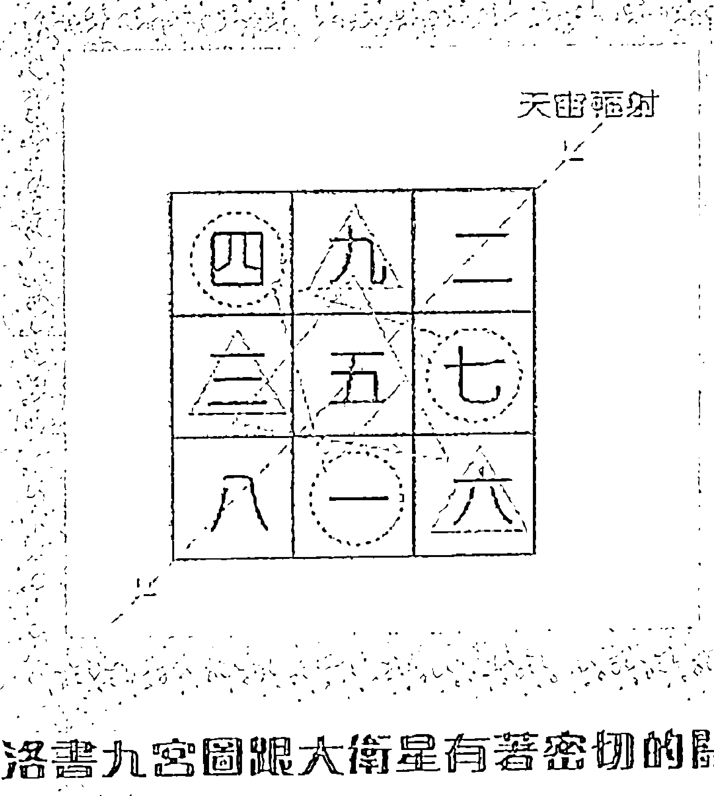

5.5 洛書九宮圖跟大衛星有著密切的關係。

風水師其中一項工序，就是在宅內或建地坪上，找出或點出一個中心立極點；亦意象是中宮位，五黃土中心點。中宮位的能量穴位，看來似乎不再僅僅是指全宅或建地上。只需憑某一個「幾何中心」點，便可以利用幾何放射線，簡單地定出一個「太極中心」來。這種方法，只是貪圖容易而已。宅內或建地坪上，可能沒有「五黃土」中心點，或可能有多過一個以上的「五黃土」中心點！這是需要豐富的觀地察氣經驗，和配合靈擺測度技術方能尋找出來。

從以上的地質病態區的科學研究分析下，我們可以聯想到古籍風水名著，「青囊經」裡面的幾句經文：

> 「龍分兩片陰陽取」，「陽從左邊團團轉、陰從右路轉相通」，「陰以含陽，陽生於陰。是故陽本陰，陰育陽，天依形，地附氣」，「天之氣，常在地中；而地之氣，皆天之氣」。這是何等科學化的意象描述！

以今天的術語說，就是地質能量交互雙旋點引展出來的輻射場。「龍穴」是「天地陰陽雙旋匯聚點也」的最佳明證。

## 迴避地靈煞

據報四川省遂寧市蓬溪縣文井鎮廣門橋村報導：該村自九十年代初發現第一宗癌症病例以來，短短幾年間，這個人口僅三十八戶共一百四十八人的小村莊中，竟發現患癌者有十七人，平均每兩戶中就一個癌症病患者。

當地的科研和衛生防疫單位雖全力探查原因，但均無結果，其飲水和泡菜均沒有超過毒理學指標和相關的物理生化指標。當地癌症肆虐之謎，仍有待研究。

以上的症狀，在世界各地均很普遍，癌魔來去無影，這明顯就是地理地質能量線，「移轉」入村內的某一片地段上，所產生的結果。

古代農村民眾，在尋找新地段建造陽宅時，常會觀察家禽，諸如：羊、牛、豬、馬的日常狀態。若牠們喜愛聚集於某一點，及其附近的地段，那麼這裡必定同樣對人類健康無害的。因為，牠們對於由地質病態區，所引起的有害輻射共振，是非常之敏銳，普通常人卻非常困難去察之，只有懂曉靈擺測度的地理堪輿師方能尋找出來。部份也可以通過豐富的地質環境和植物生長情況而得知。（見圖5.6）。

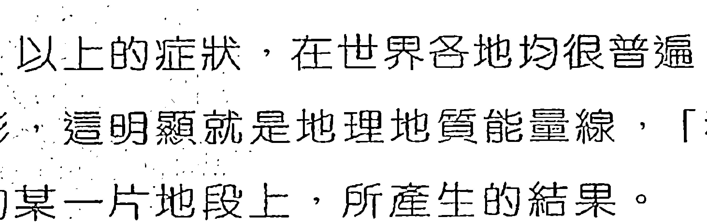

此等地段，村民們都認為是沒有地靈煞來干擾的，他們稱謂「地靈」，當然是聽從道士術家們的神鬼擬人法稱呼了。

今天的生物環境學界，已經可以利用一些特別設計的金屬銅線圈裝置，或者銅條、幼鐵枝、木樁之類等物料，放在有地靈煞出現的地段，將其「移位」或中和消除。但有時候這類裝置，僅是暫時性移位和消除，在某種情況下，地靈煞又會跑回來了，這是因為地質地層的結構問題，並非真的有隻陰靈鬼煞在作怪。

部份風水師說，若遇五黃土煞，就放一條銅條在門檻下吧。這也是代代口傳而來，部份理由同上；但，可能他們也不知道真正的出現原因和背景，乾脆用五行的土生金法，生出弱化掉去算了。惟不通過靈擺測度，是很困難將「地靈煞」計算出來的，況且，牠又有「腳」呢！

由天羅地網雙陣間接引起的地靈煞，是不能利用任何「風水物品」，包括銅尺、銅獸、銅線圈、安忍水等，將其永久消除。人類只能夠利用靈擺測度技術，或藉著一些極昂貴的實驗電子精密測量儀器的幫助，將地靈煞尋找出來，並迴避之。任何物件，包括坊間的風水化煞用品，僅能將其暫時性「改道」，或將其分段間斷減低凶煞，以適應我們狹小的居住環境。

您有否受到地靈煞的影響，是可以通過某些醫學儀器，直接測量身體某部份器官和細胞組織，而間接被測度出來。例如，血壓於不同方位位置發生變化、皮膚電阻的增減、腺體內分泌活動驟降、心臟脈動加速、細胞膜電勢度減低、腦電波異常……等等。在正常情況下，而身體健康又是正常的話，您是不會如此麻煩而花費金錢去做此類地靈煞侵擾檢查。況且絕大部份醫生亦沒有此種地質病理學的專門知識，又如何去比較測量呢？

然而這裡有一個非常簡單而便宜的方法，可以通過肌肉物理條件反射測試程序，初步尋找出您是否站立於地靈煞的「交互點」上。此項條件反射測試，最好與靈擺測度結合一起。當靈擺指示出該地段位置是地靈煞點時，您就可以邀請一位親朋與您合作測試了。

首先請您一位被測試的親友，站立在該「點」上，然後按下列步驟程序，測試和觀察其肌肉和能量輸送的反應狀態。因為天羅地網陣的交互點所引發的微輻射，共振於人體生命能場，就會產生靈量效應，間接影響腦部神經細胞的訊息傳輸，阻礙遙遠肌肉的即時物理反應。

- （一）請被測試者，首先站在一塊經靈擺測度過是沒有煞氣的健康地段上。
- （二）不可詳細告訴被測試者，您要進行甚麼樣的測試和可能發生的反應。
- （三）請被測試者伸出右手，左手抱持一包開了紙袋口的沙糖，著他開起雙眼，心裡慢慢念著數目字，由一數到十。見（圖 5.7a）。
- （四）當被測試者念數目字到中途時，您可驟然用手將其伸出的右手壓下。
- （五）此時，被測試者的左手，仍應穩妥地抱持著該包沙糖，沒有傾落，肌肉物理反射良好。
- （六）然後，再掉換第二位親友，協助您重做此項測試。
- （七）著請新一位親友，站立在可疑的地靈煞點子上約五分鐘至十分鐘時間，重覆上述測試步驟。
- （八）若真的受地靈煞氣的影響，被測試者的左手，由於與神經細胞的反應互動稍遲，其所抱持的沙糖必會掉下散落地上。如（圖 5.7b）。

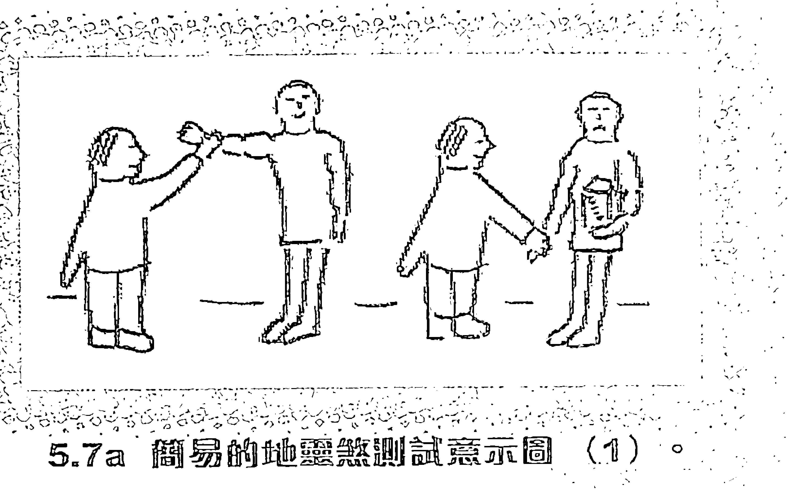

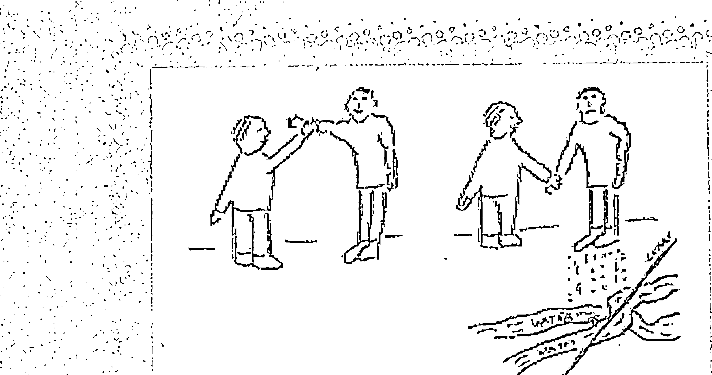

## 5.4 簡易的地靈煞測試示意圖 (2)。

如果您的超感直覺，對此類地靈煞氣有非常敏銳的反應，就會像農村家禽一樣，不需要借助靈擺工具，而只需將您的掌心，按在該煞氣點子上，屏息靜坐數分鐘。稍後，您會感覺有一點點輕微刺痛，如小針般刺在手掌心上。這種感覺，就彷如極近距離，按在天然水晶柱的尖軸上一樣。

在任何郊野的土地上興建陽宅，都應該進行靈擺測度，尋找有可能出現的地質病態，特別是欲建造睡房於其上，尤要嚴格測度。今天在都市堪輿的風水從業員，似乎不懂也不知曉此門知識了。這也不足為怪，今天在繁華的都市，高樓大廈聳立、電纜系統、移山填海工程，已經將天然而成的地表層天羅地網能量線網陣，擾亂扭曲和改道，難以測度。取而代之，是另一類由「建構物幾何線組合」任何由地質或幾何結構網陣，所引發的煞氣，不能夠將其完全消除。古代的風水師和道士們，亦只能夠利用某些「壓煞中介物」，或稱辟邪辟煞的風水物品吧！加上他們自己的強能靈量禱告或咒語之類，以靈量對靈量方法，將煞壓下、移轉、減弱和中和之。但是，經過歷代實踐經驗，風水先賢發覺，採用壓抑、移轉和中和方法，不是一種有效的手段，唯有採用靈量減弱方法或躲避不犯為佳。尤其是當它們出現在您的睡床下或辦公桌椅下面。

## 地靈煞出現在睡房

無論怎樣，以今天所獲得的研究資料來看，短暫時間停留於地靈煞上，是沒有健康大礙的。但若長時間躺睡或蜷坐休息其上，卻有可能帶來身體器官的疾病，包括癌症。這已經是今天地質病理學家的普遍認同了。一九九八年德國地質病理雜誌，其中一篇論文指出，女孩童、未婚少女和老年人是最易受地靈煞影響的一群。我們可以通過觀察大自然環境的植物生長和地形巒頭，而獲知某些地段是否常受地靈煞侵擾。例如，各種藥用草本植物是很喜歡生長其上；相反稻米和大麥卻易受害和減產。橡樹、柳樹喜長其上，枝葉豐茂；而生毛樺木、楓樹、梨樹和蘋果樹卻會減慢生長，甚至不結果實；在昆蟲觀察方面，可發現蜜蜂巢、螞蟻穴山、蒼蠅、甲蟲、蛾、蜻蜓、蟑螂、白蟻等，均喜群聚其上和附近。而貓隻則最喜歡蜷伏其上。

近十數年來，在地質病理學、地質靈學和靈擺學的研究圈子裡，對天羅地網能量線陣網所引發的地靈煞，與人體健康影響的權威研究，首推奧地利的一位數學家、教授兼靈擺專家芭娜女士。她獲得了奧地利教育部的資助和授權，獲准在任何條件下均可逗留在全國的中、小學裡，進行資料搜集、家訪和研究。她花了接近十年時間，走遍全國和其它十餘個國家觀察和研究，建立起一千一百十多個案例，和採訪過三千多個家庭和學校，最後詳盡地寫出了一份報告，和用數種文字，包括德文、法文和英文寫了一份研究報告。在報告裡，她主要的研究對象是在學兒童；因為，她認為在學兒童是最易受此類地靈煞的影響。她統計出了一個驚人的數據，有百分之九十的學習緩慢，或厭惡學習的在學兒童，在其睡房下或課室書檯下，均顯示著有天羅地網能量線的地靈煞相交點存在。當她的報告公佈後，在奧地利、瑞典和德國的教育當局，都規定某些地區的學校，所有設在地面層的課室，必須每隔一段時間，要將學生坐椅位置互相對調，或進行小組活動教學，不能長時間讓某一位學童，暴露和固定在某一桌椅上。

在芭娜女士的研究報告裡，記錄了過千個研究個案。隨手拾起第265號個案，其案例是如此敘述：

### 個案 第265號

安麗，年齡十一歲，女孩，在未曾搬屋移住新居時，她是一位頗聰明活潑的孩子。但自從遷往新居半年後，她時常都覺得頭痛、不舒服、學習精神不集中、有鼻敏感。初期，爸媽沒有十分留意她這種症狀，當老師不斷觀察和追問她時，她才對老師說，她時常很晚才睡得著，有時，她會連同毛氈一起跌落床下，卻反而可以睡至天亮，她很不喜歡她的睡床。在芭娜女士往她家探訪，通過靈擺測度後，建議她父母稍移安麗的睡床往另一邊。如（圖5.8）。兩個月再跟進此案，安麗的病狀和學習精神已明顯好轉。

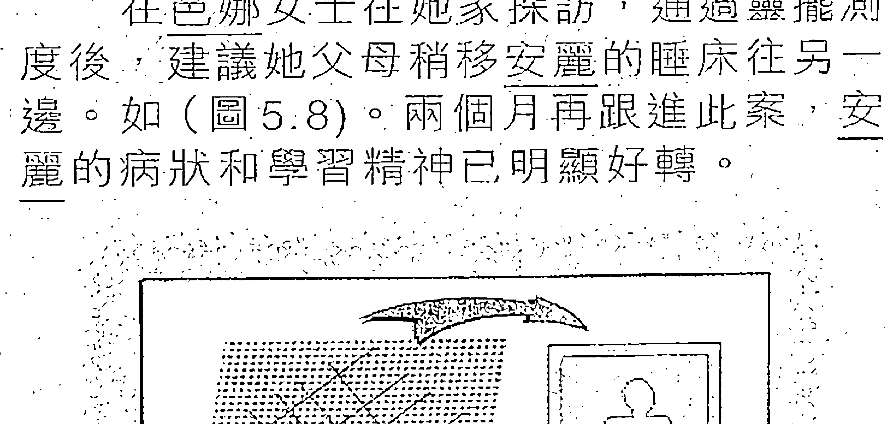

### 個案 第519號

- 在荷寧區一間公立小學，其中一位老師告訴她，自從她被分派入此課室後，當她超過兩小時坐在教書檯旁工作，時感頭痛。這種現象並非是工作過勞所致，因為她以往的工作時間和習慣也是如此。
- 奇怪是，當她離開課室返家後，頭痛就自然消失了。她懷疑自己是否開始厭倦工作。同時，她也奇怪地留意在課室最前排，某一位學生的坐檯位置，不論是誰坐上去，兩三個星期後，總就會患病發燒，時常要告假，平時也不集中精神上課。
- 在芭娜女士使用靈擺測度後，建議該老師的教學工作檯移往另一邊。並且，在課室某一些點子位置，不宜讓學生坐下去，因有地靈煞穿越課室。
- 同時，每兩個月，將所有學生的原坐位置，大掉換一次，以減低該地段地靈煞游動出現的影響。如（圖5.9）。

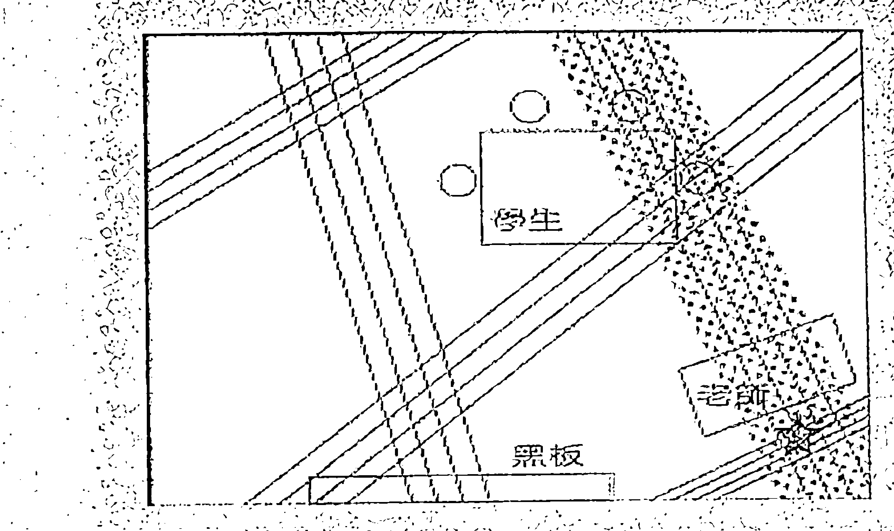

5.9 老師跟學生同時受到「地靈煞」的干擾。

## 地靈煞與真實案例

在美加、澳紐從事風水堪輿工作，除了懂得傳統風水玄學和理氣程式外，仍需要具備生物環境建築學知識，以及靈擺測度技藝。由於在彼等地區，大部份住屋均是建於地面的低層平房。由「天羅地網」的能量線網陣所引發的地質病態地段，是非常普遍地出現。反之，外巒頭的山巒河道，建築物和馬路、花園環境等，卻沒有大都市那麼複雜，總是秀麗可人呢。表面上，大多數的華裔僑民都不會花錢看風水的。西方人士慕名來看中國風水，大部份是圍繞在家人健康和環境和諧方便。

以下是本人的一個地靈煞個案，與前述芭娜女士的研究個案很類似，值得記下。

在澳洲布里斯本北區，莊頓一家大小住在一座單層的小平房，已有八年屋齡，主要建材是磚外牆和瓦頂，建在一塊有向下傾斜的六百平方公尺的地段上。後花園近車房後面，生有很多雜草，抓起泥土也很潮濕，但這裡卻沒有自動澆水系統，當然亦沒有花圃。此平房的大門，客廳落地大窗及車房門，均朝向北方，是坐午向子的離宅，屬東四宅。

男主人莊頓一九五四年生，也是東四命，坎卦。屬弱土命，喜火、土，而忌木。

女主人一九六一年生，也是東四命，震卦。屬弱火命，應納木、火五行氣。

男女主人的睡房均在屋的後方，即離宮位。以八宅理氣來論，夫婦二人宅命相配，而睡房又落在離宮吉位，應是上吉也。唯一考慮的是，因澳洲布里斯本市，位處南半球南回歸線以南，在冬季大約六至八月短暫期間，或有數天由南極吹來的寒冷南風，此必會減弱火氣，為水寒氣盛，夫婦倆雖然怕冷挺不舒服，但仍不致於時常患病。

（註：南半球澳洲地大，不能全將離宮掉轉為屬水，坎宮掉轉為屬火，端視乎某城市位置是處在何緯線而定，在極北的達爾文市和極南的阿德雷德市就不一樣了。）

至於玄空飛星派卻可能不同意，這是宅命相配，離宮也合夫婦倆的見解。因為，在飛星盤裡，離宮的睡房出現了二黑病符星，當然時常發病了；假若再遇上流年五黃或者二黑，則該年肯定是多病痛了。

看官，兩派風水理氣程式，推算出吉凶並存的結果。在此，可以利用靈擺風水學去平衡之。

這家人的背景是：

主人倆遷來此二手平房，在居住了九個月左右，莊頓開始發覺，他總是睡得不深，早上醒來仍有倦意，若當日工作壓力多些，就容易患頭痛。他未遷居來此屋前，很少發生此種精神不振情況，也埋怨運氣不佳。

女主人也有類似情況，除了有倦意外，工作提不起勁，半夜也易甦醒，然後，就想著去洗手間，不過，頭痛卻沒有男主人那樣頻密。

此案例，除了用傳統風水理氣推算方法，給住宅起命盤，觀察外內巒頭，給宅主分析八字五行定喜忌外，也必須使用生物建築環境學專用一系列電子測量儀器，探測各廳房睡房，並包括前、後花園及鄰屋週邊。經測度主人睡房後，儀表沒有危險警告訊號指示，看來是沒有「硬輻射」在周圍牆壁、建材和地表下逃逸出來了。

下一步的工序，就是進行靈擺測度。主人睡房是一個主要目標地點。

經過靈擺測度後，發現主人睡床的床頭附近位置，出現能量線網陣的陰陽互交點，房間外面的草地，也有頗多水份跡象，似乎地層下也有細幼的水脈流系統，這是最易引發地靈煞的地質環境。再經過靈擺測度是否有水脈流出現。真的發現有一條細小的水脈流從後花園，經過睡床下，按地段斜坡通出前花園去。

「天羅地網」陣能量線，在某種地質環境下，可產生極低頻的振動。根據其它實驗報告獲知，若振幅介於8Hz至10Hz之間，是最有問題。它們會影響人類生命能場，包括干擾靈量作業。部份研究員認為，當人進入深度睡覺時，頭頂的生命能量會泛現，作業和轉化為極微弱的光電。在此段關鍵時間，靈量作業除直接影響物理身體器官健康外，也影響心靈智能活動和超感直覺系統的作業功能；如此，可間接地影響人的日間決斷能力和運氣。

我向莊順夫婦建議轉房，不過，兩人面有難色，因為很喜歡住在此主人房，有景色可看，且有套間浴廁設備。追問是否「有價」可講，或其它解決辦法。

其他風水師傅，可能建議使用風水化煞物品。但在這情況下，任何普通的傳統風水擺設均不能應付地靈煞。「避」是最優先考慮的。

唯有建議夫婦倆按照下述比較麻煩，又需要跟進的方法，去「減弱」地靈煞氣的影響：

1. 將睡床移往另一邊或移開原來位置。
2. 自行往市場購備下列物品：包括一枝約三百克重的天然白水晶柱，一卷電焗爐專用的鋁紙，一塊至少1.5x2公尺與睡房地面佔同色系的小塊地毯，一條約半公尺長的直身銅條，數公尺長的幼銅線。
3. 我留下一張繪有特別幾何圖案的白紙，及手繪一幅草圖。指導夫婦倆如何將上述物料放置在睡房內和在前花園中。當一切放妥後，再搖電給我聯絡，然後會覆核是否放置正確。
4. 當核實位置後，我在靈擺研究室藉著「靈擺輻射係數發送儀」，利用超空間遙感技術，通過「幾何媒介圖像」和靈擺係數數碼，將其睡房內的地靈煞減弱，引出睡房外插在前花園的金屬銅條去。這是靈擺風水學的專業化煞方法之一。
5. 大約一個月後，我特別需要跟進此個案，故搖電莊頓夫婦，了解進度。可喜的是，兩人訴說健康和精神情況已有很大的改善了，頭痛已明顯減少。
6. 我仍忠告莊頓夫婦，地靈煞仍有可能在一二年後重回，或再次增強；除非幸運地，地層下的水脈流改道，或乾涸。

在都市的高層大廈單位，這類主要由天羅地網能量網雙陣，引發的地靈煞很是罕見，除非是在郊區地面低層的廠房和辦公室，或有可能。但是，若有一條「樁柱」，又「幸運地」建在其交互點上，有可能沿著樁柱的近距離空間，出現「幾何空間地靈煞」。所以，睡床及辦公桌最好不要靠近一條外露的圓體樁柱。

最後，地質病理學醫生忠告家長們，從觀察小孩子的睡眠慣常活動，就可能會預早發現孩子睡床下，是否有地靈煞氣的出現了：

- (一) 孩子很晚才在床上睡著，或甚至不大願意上床睡覺，寧願捲了躺在梳化椅上睡了。
- (二) 在床上輾轉反側，花了個多小時方才睡著。
- (三) 睡得不好，踢走被子，彎弓曲背而睡，間或在半夜大喊吵醒。
- (四) 揀選床上某些部位去睡，或甚至時常跌落床下，爬在地板上睡去了。
- (五) 間或發生夢遊，睡眼朦朦地走出睡房外面去，或轉去爸媽睡房。
- (六) 天氣並非寒冷，但在睡著時似發冷般，磨牙、捲曲、咬東西、打震等。
- (七) 早上睡醒，似仍未睡得飽，時打瞌。
- (八) 晨早突然喊醒，神經緊張，情緒低落，好像患了病。
- (九) 睡在床上一個小時後，心臟跳動率有提昇現象。

## 第六章

## 十二幹龍游走全球

一九八〇年，英國一位地球地質學家兼地質地理靈擺師聖米高教授，首次提出並發現了在英格蘭地表層上，有兩條地質能量流動幹線。一為順時針方向流動的陽極線，另一是逆時針方向流動的陰極線。陽極線，他命名為「米高地質能量幹線」；陰極線，他命名為「瑪珂地質能量幹線」。

米高地質能量幹線，跨越英格蘭南部，由最西端的Cornwall市，直穿出最東部的East Angelia市，然後走入大西洋。

此條躺在英格蘭南部陸地上，約長三百英里的地質能量幹線走廊上及其附近地區，擁有三百餘個歷史名勝古蹟、聖地。當中包括教堂、聖井、溫泉、修道院、僧尼庵堂、古柱圓環、石塔、古代建築標誌和殘蹟等。

在該地質能量幹線（可稱謂主幹龍脈）走廊上，再細分出二十一條小能量流動的中、小支幹龍脈。舉個例，在中國的主幹龍上，分支出默靈山脈、花屏山脈、蓮花山脈等。在中、小支幹山脈（龍脈）走廊上，也出現了很多古蹟勝地、山明水秀的福地和寺廟。隨後多年，他遠訪各國觀察研究和測度，發現該兩條主幹龍脈，是繞着地球各大洲，在地表層上游走。見（圖6.1）

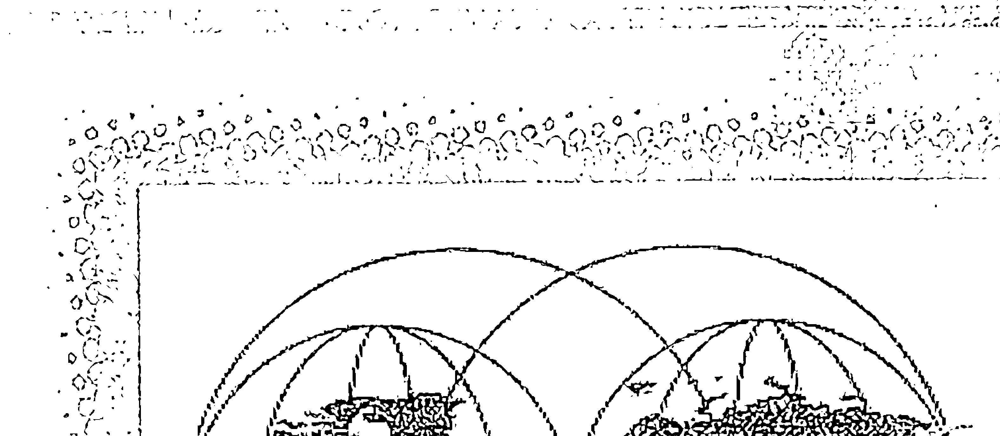

6.1 兩條地質能量幹線遊走全球。

以米高主幹龍脈為例，在離開英格蘭東部海岸線後，進入歐洲大陸瑞士南部，途經蘇聯南部、西藏高原、經崑崙山脈、唐古拉山脈，穿過四川、雲南、廣西，出南海，直落巴里、穿越澳洲中部的愛麗斯坪神石，然後再出太平洋，進入南美洲的Titicaca湖、Bolivian，才進入大西洋，環繞地球地表層一週。（註：在中國的堪輿學界，由崑崙山脈源發起的主幹龍，稱謂巽龍，她沿唐古拉山脈，經四川南部、雲南北部而去；在其走廊上，也分支出很多有氣勢中小幹龍脈）

看上來，地球表層並非僅是只有兩條地質能量線主幹龍脈，今天發現可能有十二條主幹龍脈及其分脈，游走在地球表層各大洲陸地上，只不過仍未被完全定位和给灵摆追踪测量出来而已。
据报，藉前苏联的宇航员的协助，某些科研单位，已初步绘制了覆盖在全球的能量线主干和分支龙脉的游走图。

## 主干龙脊上的龙穴

地球本身，与人类的身体是一样，就是有着她自己的“能量流动经脉系统”，就正如人体的循环系统，输送“血液”环走全球。经脉中流动的能量，主要是源自宇宙间的星团、星系、银河系、太阳、行星，以及地球地心和两极的磁场。
当主干龙脉能量线交缠在一点时，而正直又有能量流动交汇，“回旋辐射场”就会出现在该点附近地区了。此类能量回旋辐射场，不似像前章所说的“天罗地网”两阵，或地下水脉流系统共生的地灵煞；而是大部份可以增强人类生命能场的强度，若能加上适当的潜修，是能够藉其能量提升人类精神灵性，和灵量作业效率的。所以，在该十二条主干龙脉走廊上的附近地区，必定会有很多千年以上的名胜古迹、圣地古庙。因为古代的僧侣和灵修高人，大多数都懂选择此类地段盘据和立足。后来，可能因为宗教僧侣和灵修人仕的影响，地理堪舆师也学会了选择在此类所谓龙穴的地段，修建阴穴和阳宅，冀望通过灵量作业，益旺后人和居住者。

此类由主干龙脉交缠而成的“龙穴”地段，并非像是天罗地网般的“格子”交互“点位”般出现；而是在其主干龙脉上，因地型、地势、或称峦头的地理结构，河道关系，在一小片地段上，弯弯曲曲地并行互缠，才“互相交缠”而形成。见（图6.2）

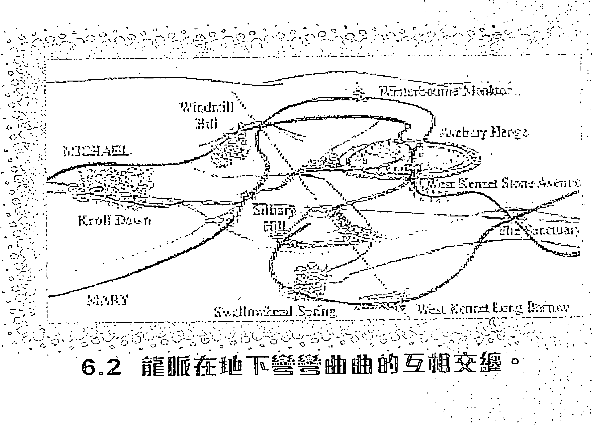

地质主干龙脉，沿着山岭、深谷游走和分出支干，均有其独特地理面貌可观察出来。她们的主干及支干，或会被地层地质结构或人造巨大建构物切断，而需要绕道而行，但仍会朝着前方环球而去。因此，古代有经验的地理勘舆师，经过寻龙训练，是有能力将地质主干和支干龙脉的行踪走势寻出来；甚至，可以觅获她们的互相交缠地段——龙穴。部份勘舆师，当然亦可通过灵摆风水探穴尺的协助，寻出她们的行龙路线和交缠地段。观察龙穴的塌舆入地眼法，就是如此配合发展出来的。

### 龙穴能量中心

位于世界各地，拥有数千年历史的巨大寺庙，圣堂，其建址并非是随意地挑选的。它们绝大部份都是经过具有灵摆天份的祭师、牧师、道士或特异能人等细心挑选适合的土地来兴建。

在当时，他们所选择的建址，往往就是能够在地层下，发射出益旺人类“生命能场”的“神赐”福地。古代中国堪舆师亦称谓“龙穴”、“太极中心点”等。

龙穴绝大部份是发现位处在龙脉能量线上，或该能量线边旁附近的地段。能量线可以是主干龙脉或其分支干龙脉。作为一位职业的风水堪舆师，是需要知道一点有关龙穴的地质知识的。

现在从美国灵摆学会会员刊物中，抽出一篇研究报告的小段，作为例子来看看今天具有灵摆测度技术的地质地理科学家，在经过细心测度和运用科学测量仪器对比分析后，如何绘画出一所建在龙穴地段上的圣地遗址，其座落地层下的地球地质能量线分布图。

附图6.3，是一所已有千年以上历史，建在玻利维亚的 Tiwanaku 庙堂遗址。
在庙堂的中宫，即太极中心点，经由灵摆测度出来的能量线分布，是异常复杂和强大。部份硬辐射也可由地质物理测量仪器测度出来。

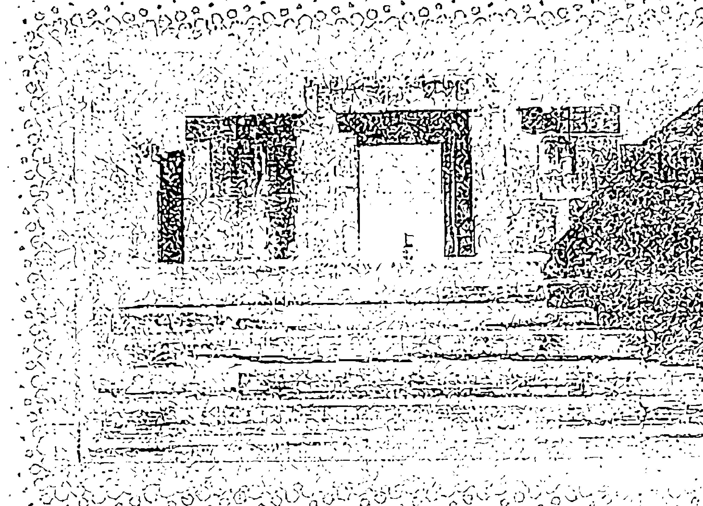

请看附图6.4，它就是中宫，龙穴中心地层下能量线游动分布。

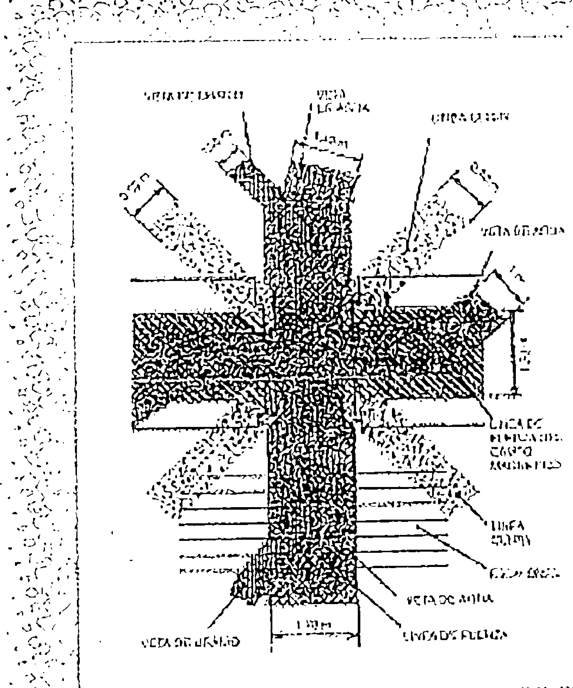

龙穴是位处在两条约宽 1.70 公尺的支干龙脉的互相交点上。叠于其上，也是“地网”能量线阵的阴极和阳极交互点，地网线各宽 0.80 公尺。也有两条流动颇急的地下水脉流，各约宽 1.40 公尺和 1.00 公尺，穿过其交互点。然后，再发现有一条含有放射性原素铀的矿物带，约宽 0.50 公尺，穿过其龙穴中心。每当晨早太阳初升时，太阳热能激发振荡起由放射性物质引脱出的某一浓度离子气。此类符合健康浓度的离子气，再加上龙穴极低震频，约 8Hz 的辐率，当与人体生命能场接触时，就共振出了自然天成的五行气，亦称谓“灵量软辐射”。

古代具有此方面知识的教士和道士，以及祭师，部份懂晓利用此类地质自然现象，去给新患病的教徒和平民，进行灵量治疗，康复病体。但病人必须躺在龙穴位上，算好天气和时辰，灵摆测度出最适当的时段，并加上祭师和道士们自己的带气发功，是可以加速治病的奇效出现；盲了眼的病人，也可视物了。

在古代的普通平民百姓，崇尚神佛，他们会觉得不用吃药，却能治好了病，是一种神迹。其后便口口相告，一传十，十传百，就愈绘愈玄了。然而，这里是教士和道士们谋生的圣地，当然会大加附和啦！。

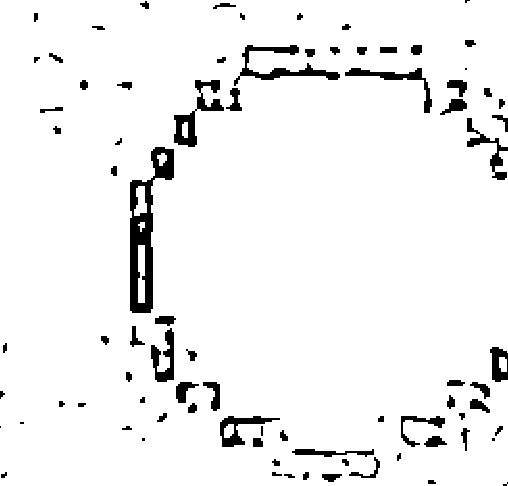

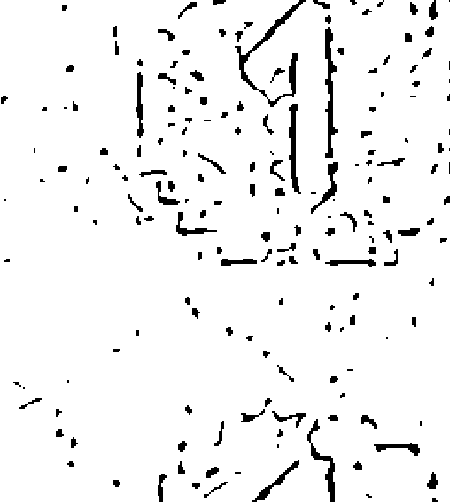

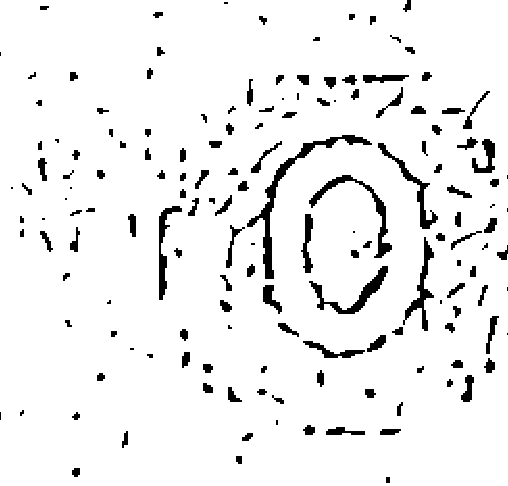

龙穴除了用作自然疗法和强旺身体外，也可以间或冥想静坐其上，进行灵量修练，去提升个人的精神灵性和开通悟道。当然，并非人人均可抵受此种“神”赐予的“龙气”，那就要看看您的“福份”如何了。

经灵摆师和地质学家联同调查研究后，发现并非所有今天仍存在的古老圣建构物，在其座落的地层下，仍然能够继续激发益旺人类心智的软辐射场。这是由于经过千年以上的自然环境变化、包括人为环境破坏、地层矿场开发、深入地层的人造打水井口、附近有人造巨大建构物、水下水源流失等等因素，很可能已经将原先龙穴附近地段的能量线网阵破坏，不复原来旧观了。

很可惜，直到今天，中国仍未出现一批富经验的中国地质地理专科灵摆师、开放思想型、非唯物论者的地质科学家和风水堪舆师，能够共同携手起来，将中国古代数千年遗留下来众多的圣遗址，包括宫殿、寺庙、道院等，进行地表层地球能量线分布的测度和统计，以确证龙穴是否在今天仍存在某一些名胜古迹的建构物上。

### 平静与和谐

“天罗”“地网”能量线网阵，主干龙脉，和无数分支小龙脉，就在地球表层上互相交缠，组成一个如蜘蛛网般的全球能量线网阵。它们仍未能利用传统地质地理测量仪器追踪出来，但其细微低频的 Paramagnetic 磁流，却可以利用灵摆测度技术，追踪出来。它们若是自然地，而没有渗杂其它散频辐射去干扰，其能量线网阵会做如“星状”几何线构般出现。根据金三角几何线条组合定理，众多的金三角若重叠组成八角八卦几何线条组合，亦即“星状”线构，则在其闭合空间内，达到最至善强旺的能量（灵量辐射）阴阳极平衡，震频辐率亦会处于8Hz之间。

8Hz，这个频辐率，就是与人类脑电波频率平行，互相衬合和谐，有利人类身心精神和灵性的健康成长。这是一个梦昧以求、完美无暇、平静和谐的绝佳风水生活环境。在这个完美环境里，如蜘蛛网般的“星状”几何线构地质能量线，使另其周遭一切物质，显现着极低微频幅的 Paramagnetic 磁流，滋润大地生物，欣欣向荣。

此类由物质核结构和电子层，引发的极低微频 Paramagnetic 磁流，是今天普通地质仪器，仍未能准确测量出来；只能在实验室环境里，以人工方法制造出来，而加以度量研究之。若将其磁流能量线，以可见光色频表现出来，则是一集以“红、黑、白、黑、红”的“双旋轴场”辐射光束。“红”线以“白”线为中轴作顺时针方向旋走；“黑”线以“白”线为中轴作反时针方向旋走。

部份经验丰富的地质灵摆师，却可以利用灵摆工具将其寻找和测度出来。古籍记载，部份古代的风水堪舆师，是可以凭入地眼功能，以超感视觉，寻觅地质阴煞，不知是否与此项论证有所关连。由天宇星空、地质异化、辐射矿脉、地层水流等等，所产生的自然硬体电磁辐射，必然会影响这个平静和谐的地质空间环境。风水学中所指称的自然煞气，大部份都跟此等“自然残障”因素有关。

各类“自然残障”因素，有可能会将恒定了的 Paramagnetic 磁流破坏，引发成做如彩虹般的纷杂频辐射集束能流，若以可见光谱分析，是顺序成：黑、红、橙、黄、绿、蓝、靛、紫和白的集束。

此等受干扰的能量线，可以沿着“天罗地网阵”，传送到数公里以外。当遇到大型天然石群、建构物、桩柱、山丘、甚至一口水井或地面河流，就会分裂破碎散开，做如一只玻璃瓶击在一片石上模样。每一单色破碎了的极微低频能量流（即电子束流），就会干扰“同类”频率的辐射，破坏了自然的能量平衡，也随着失去了8Hz自然的平静和谐频率。当人类处于此“自然残障”的环境里，其“生命能场”也能交感共振此低频能量流，即通过生命能场的“虚体层”，“虚拟脉络系统”，间接影响了人体器官和精神健康。这个过程，亦就是风水学上所称谓的自然阴煞气了，也包括了五黄煞气这一个“煞词”。

自然阴煞气很容易应付，避之则吉可也。但是，今天的人造阴煞气，却是鬼魂般四周缠着您，避也避不掉。

仅仅在过去的二百年来，我们的科技社会，人为地制造了数以千倍万倍增长率的“人造地理残障”。由矿场深掘开发、人造巨大建构物群、高压电缆系统、高频通讯网络……以至家用电器、电脑、流动电话……等等。

它们释出大量人造高密度和极阴的纷扰辐射，一旦与地层的能量线交缠，就会破坏了自然形成的几何“星状”线构的地质能量线网，形成了“人造地理残障”；儆如高空臭氧层般，穿了一个小洞。更有甚者，放近身旁和脑袋边的流动电话，所发出的高频辐射，直接影响了人体的防疫系统、神经细胞、DNA、逐渐形成慢性疾病、压力和癌症。可以想像，在今天这个科技发达的社会，能够找到一片平静和谐的地表低空环境，却是不易了。

在古代农务社会，去鉴定平静和谐的风水福地，或自然残障的凶煞阴地；风水师们可以通过，普遍地适用、程式的各派客观上堪下舆的技术，加上自然环境观察经验，是可以简略地分辨出来。这是人类五官感觉优而为之的任务。

但是，若一位优越而具天份的风水堪舆师，不能懂晓和利用人类天赋本能的灵摆测度技能，完美的风水环境——尤其是在今天的科技、人为污染的环境，会是很难寻觅出来，和作出相应的防治。

## 第七章

## 调整和测量生命能场

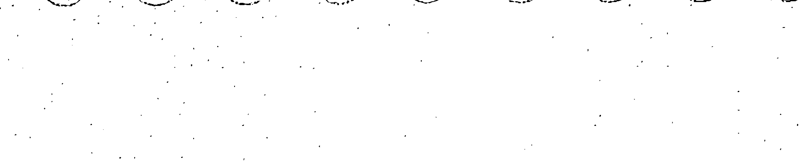

人类“生命能场”，亦称生命气场，是肉身以外的第二个“生命体”。
生命能场是以振频辐射场形式存在，蕴含“智能讯息”。生命能场非仅是一个场，而是分为数个“层次场”，并且互相重叠连系，包裹着肉身。场内的部分辐射，含有微弱的电磁辐射特性，所以今天的生命能场测量仪，可以将此类波段的辐射震频，以可见光颜色显影在菲林片里，七色彩虹，变化万千。

### 五个层次场

为了方便研究和解释，现在仅将生命能场分为“五个层次场”。（如图 7.1）

- 1. 最接近身体的一层裹包，称为“虚拟体”。
- 2. 然后，第二层是“欲念体”，或称“星光体”、“灵体”。
- 3. 跟着第三层是“智能体”。
- 4. 第四层是“灵桥体”。
- 5. 最外面一层是“灵神体”；当中再分三层。

这五层生命能场互相交错重叠，但并非很明显的层层分开，仅是“讯息”性质不同而已。
它们也有各自的“能量中心点”，与身体各“能量中心点”（或称“旋轮位”）和经脉络穴系统连系。所以，它们有“虚拟”的“通道”，与身体物理器官，包括神经系统，互相传递“讯息”。
人体肉身的经脉系统，现已证实是以光量子形式传输讯息；但是，生命能场各层次场的讯息交流，却可能超乎我们今天知识的范围。

仅仅知道，当身体各器官发生病变前期，生命能场必有一些先兆、异常及不平衡的震频预兆现象。

今天传统的西方医术概念，是视身体器官为一部机器，可割除和掉换新的。新纪元的生命能场医疗理论，是“找出”、“矫正”和“平衡”生命能场各层次场的“异常讯息”，在“虚拟体”层次场“开刀”，输入“正确讯息”，间接诊疗身体器官已初步开始的生化病变。

中国传统针灸疗法，就比靠接近此种医疗概念。但仍仅是通过皮肤穴脉输入单项讯息去激发生效应。

“虚拟体”是主体真身的“虚拟影子”，是以极微弱的辐射场存在。身体各部器官所散发的辐射，会在虚拟体层出现。虚拟体若受周围环境（风水）辐射破坏，就会共振出有害的软辐射（煞气），间接影响身体器官生化病变。

“欲念体”在虚拟体的外层。个人的情绪、欲望、喜恶、仇恨、恐惧……等心境状态和感情反应，会在此层以辐射振频形式反映出来。其振频讯息与大脑某些神经系连繋。周围硬辐射和他人的欲念体层，亦能“塑造”和“改变”其辐射场内的“讯息”。

将来极尖端的保安系统（现在已经实验室初步建立实验模型），是以测度人体欲念体层辐射为目标；如此，若“某人”出现“偷窃企图”的意念，即可在真正进行偷窃前被“识破”。

欲念体对外的一层，是“智能体”次层辐射场。此层是连系着脑袋的意识、逻辑、分析，掌管着创意、概念表达、事物分析等思维活动。此层所获得的“讯息”质量优劣，足以影响智能脑力的运用。

聪慧并不是决定于脑袋储藏的讯息有多少；而是决定于此次层辐射场与“外间”联系，是否完美和平衡。若长时间居住在有可能破坏此次层的风水环境里，智力和判断机能会大大减退，当然随来的就是不好运了。

“灵桥体”次层和“灵神体”（分三层）次层辐射场，是涉及人的高阶修练领域，以及，各类高、低灵体和事象的连繋关系。今天，对此范围研究仍是空白一片，属玄学领域。因为，其运作原理，似乎是远离尘世间的“时空概念”。

请参阅（表7.2）生命能场各层体资料简表。

| 层次 | 层体 | 向外伸延 | 颜色显现 | 统管 |
|------|------|----------|----------|------|
| 1 | 虚拟体 | 7吋 | 浅、蓝、灰 | 是一个有“清澈构造”的辐射场。与身体器官联系和成长。 |
| 2 | 欲念体(灵体) | 17吋 | 透亮白，含各类色调 | 内心情绪反应和反射，易受煞气影响。 |
| 3 | 智能体 | 20呎 | 亮丽黄 | 塑造智力、创造力、与逻辑分析综合功能。 |
| 4 | 灵桥体 | 40呎 | 清丽玖瑰红 | 心灵与外间灵体、事物、事象联系。超越一切物理世界影响。 |
| 5 (可分三次层) | 灵神体 | 70呎 | 淡柔金黄 | 进入高阶精神，直通神佛，超越四度时空领域的门槛。 |

## 表7.2 生命能阳各层体简表

### 测度和调整

您可以学习运用灵摆吊锤，给自己生命能场进行测度。步骤如下：

- 一、您必须事先向灵摆征求同意，您是否可以现在开始测度。若回答的答案是“否”，请等待隔天再来测度；因为，您今天的心境状态或所处的风水环境不宜进行生命能场灵摆测度。
- 二、手持吊锤灵摆，平静站立，缓慢呼吸，想像有一团光亮色彩的“空气”，包围着自己全身。然后，询问灵摆：“我的身体是否位于生命能场的中心点？”
- 三、若答案是：“是”，恭喜您，您不需要进一步测度了。若答案是：“否”，请继续下述第四步骤。
- 四、若您的身体不是处在生命能场的中心点，其可能性是：您有着身体健康问题，或是断肢，或是附近阴灵影响，或是近身距离微环境出现煞气，包括硬辐射场，扭曲了您的生命能场，不能保持着一个圆蛋形的气场。
- 五、利用附图 7.3a-d 的各小幅漫画的辅助，用左手指点着图表内其中一个“状态图像”，然后，询问灵摆：“我的生命能场是否如图像般偏离？”，或者是“严重偏离？”、“缺失不正常？”。
- 六、若答案是属于其中某一个不正常状态图像，用笔记下，以便数天后再向灵摆覆询。然后，请继续下述步骤的生命能场调整工序。
- 七、您仍需要征询灵摆，您是否可以现在自行给自己生命能场进行调整；若是，可继续下一步骤。
- 八、找一处宁静的室内房间，佈一个水晶小阵围绕自己身体，才好进行生命能场调整工作。如您觉得不能自己调整，请看医生作初步检查身体健康。
- 九、将灵摆垂放在“阴阳平衡灵摆量度表”见（图7.4），中心点位置。心无杂念，静坐屏息，用心灵去“想像”您自己五颜六色的生命能场，如椭圆鸡蛋般裹包着自己身体，身体也正在慢慢移入生命能场的中心位置去。
- 十、起初，灵摆会在半空左右摇摆或震动不定，继而渐渐地以斜角线摆动，直至灵摆在“平衡”格内，上下直摆，即表示，您已用心灵调控方法，将自己的生命能场“暂时”平衡了，已回复原来的鸡蛋形，您的身体亦位处在生命能场的中央。
- 十一、调整所需时间，视乎生命能场的不正常状态的严重程度，和您自己“意念力”集中与持久能力而定。普通人需时五至十分钟左右。若超过十分钟仍不能平衡调正，请看医生，作身体健康的初步检查。
- 十二、若成功调整完毕，约一个星期后，您需要重复询问灵摆，您的身体是否仍处在生命能场的中心位置，有没有再次偏离或缺失。若仍是，虽然可以再来调整一次；但同时最好找出“真正原因”，问题是否源自身体病变抑或微环境风水煞气影响。

## 第八章

## 灵摆测度五行理气

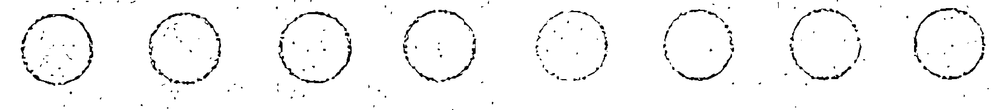

风水门派众多，各家均有自己的风水理气基础理论和推算程式，代代相传。由于地理环境关系和讯息交流不便，这是必然存在的。
经过千年以来大自然环境的转变、人类生命健康体质、智慧和精神蜕进变化、城市挤迫生活兴起、人造污染环境的剧增……等客观因素，去面对和解释：“自古以来固定化了的理气推算程式和输入参数”，肯定是有所偏差了。若再加上各门派理气程式所推算出来的不同吉凶结果，虽然可能吉凶共存，也有可能互相矛盾，变成各家各说。作为风水的理性追寻者，可谓慨嘆。玄学终归是混千辈子，也是困在玄学谈玄的笼子里，跳不出来！当然，仍有一部份传统玄学护航者，是喜爱如此的。

灵摆风水学的创立，就是希望建立另类思维的新纪元方法，应用在今天社会环境里，去补充古代留传下来风水理气程式的不足和局限，除了维护传统风水学的智慧外，亦冀能理性化和科学化地加入一些元素。

正如今天的“生物环境建筑学”，就是糅合了中国传统峦头风水学的基本理论和精神，建立起一门初阶段的风水环境生态科学。

## 推算理氣吉凶三套方法

利用五行理氣的生剋原理，去找出適合自己生命能場「現況此刻」的微環境生活空間，或者傳統風水學所說的吉旺宮位，我們是可以利用下述三套方法，綜合來判定之。

### 第一套方法：

選擇任何一門您從師的風水理氣派系推算程式，（諸如，八宅、飛星、三元、三合等等），按照固定程式客觀地推算出該微型空間方位所擁有的「理氣五行」。

然後，給其配上一組「理氣五行」的「恆定數值」，利用靈擺測度技術，度量「現況此刻」的「靈擺五行」之「動態數值」。如此，用該「動態數值」去「調節」或「調頻」、增強、減弱「理氣五行」的「恆定數值」，即可調整出一個最「適時當地」的傳統風水程式理氣五行出來。

將其原來的「固定推算」，轉化成適合自己個人化的「動態五行」，按生剋原理定吉凶，大大提高傳統程式理氣五行的準確度和可塑度。

### 第二套方法：

以自己的出生日期和時辰，按八字五行命理程式，推算出五行的用神和喜忌。然後，給它們各配上一組「命主五行」的「恆定數值」。隨着，利用靈擺測度技術，度量「現況此刻」的「靈擺五行」之「動態數值」。

如此，用該「動態數值」去調節或調頻、增強、減弱「命主五行」的「恆定數值」，即可調整出一個最「適時當地」的命主理氣五行出來。

將其原來的「固定推算」，也不理會命主是出生於中原、赤道或南北極地區，轉化成適合自己個人化的「動態五行」，按後天八卦方位、五行生剋原理定吉凶。

### 第三套方法：

可不理會各派別的風水理氣程式或命理五行程式，其所推算出來的靜態恆定「理氣五行」，抑或「命主五行」度量值。您僅是利用靈擺測度技術，找出動態量值的「靈擺五行」，如此可據該等量值以定吉凶。

這是您的超感直覺系統，直接在您的生命能場內，找出最「適時當地」和切合「現況此刻」的微環境動態五行。也藉此項技術，避去了各派系理氣程式所得出的吉凶共存量值和爭辯；不過，其缺點是，您需要每隔一段時間，（例如半年吧！），就需要重新測算量一次。

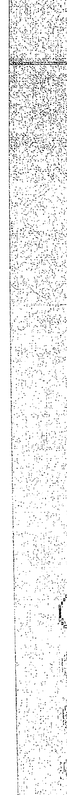

## 調整理氣五行恆定值

在各派別風水理氣程式運用裹，屋宅坐向是一個很重要的先決輸入參數，若是弄錯，吉凶結果可能完全不同。它可以是：

- 一、以陽為向；
二、以明堂為向；
三、以馬路為向；
四、以局為向；
五、以大門為向；
六、以大窗為向；
七、以車房門為向；
八、高層單位，則四樓以下可用馬路為向；四樓以上卻可用大門或大窗為向……等等，不同判定標準。

各師各法，只能跟從自己師父所教的為準則而已。

經由各傳統風水派系的理氣程式，所推算出來的理氣五行，是指固定於某一盤度或八卦方位。它們是理性客觀的，似乎也混淆於微環境、小環境、中環境和大環境的時空限制。由是之故，我們可以利用靈擺技術，將它們的「恆定量值」，再加以覆度和調整，才套用五行生剋基本原理，更接近地找出一個「目標空間」的五行氣。

這個「目標空間」的定義是：以測度者自己生命能場為中心點，向外延展輻射半徑三十公尺範圍內的微環境。

因為，從眾多的實驗研究報告得知，這個範圍裹包的微環境空間，對人類身體健康和情緒心智，是最具影響的範圍，也間接地影響了「常人」的運程。僅有少部份心靈修養高超的能人是例外的。（見圖8.1）

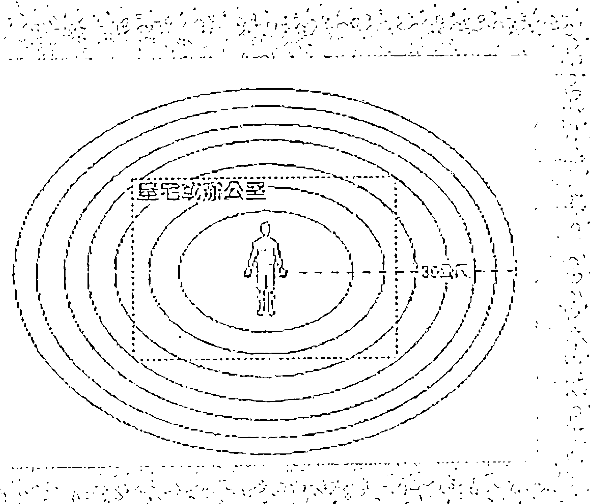

8.1 就是身體三十公尺以外的微環境 都會影響你的個人身心情緒。

如何適度調整「理氣五行」的恆定量值，可用下述步驟進行。

## 以「八宅派」為實習例

- （一）、先覆測您所身處的「現場空間」的「朝向」是否正確無誤。

用左手指着經已選出的「朝向」方，右手握持靈擺測詢；「此空間方向是否是最佳納氣方位？」若答案是：「是」，可繼續下一步驟。若答案是：「否」，需要另找出其它合宜的朝向。

（二）、按照八宅派的理氣程式，推算出離、坤、兌、乾、坎、艮、震、巽八個官位的「理氣五行」靜態分佈恆定量值。

（三）、第一步，我們已經知道後天八卦原局八宮位的主五行是：離宮屬火、坤宮屬土、兌宮屬金、乾宮屬金、坎宮屬水、艮宮屬土、震宮屬木、巽宮屬木。（見圖8.2）

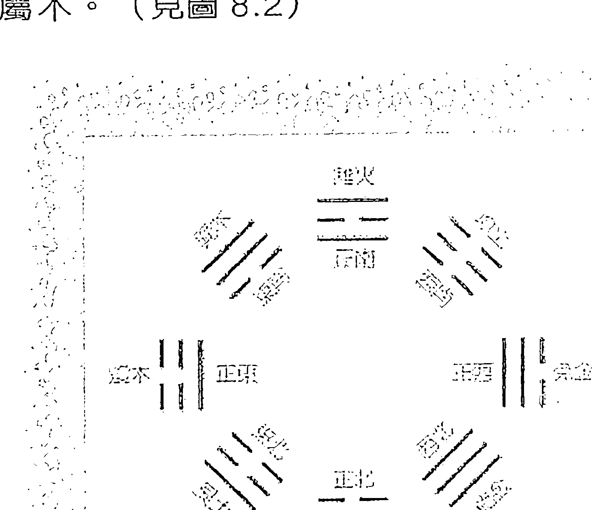

### 8.2 後天八卦原局圖。

（四）、第二步，若某宅的前门开在南方向，厅中的大窗和左边车房的车房门也面向南方，经灵摆覆测立向后，也是属意此方向的，因此，这是一所「坐坎向离」的东四卦坎宅。（见图8.3）

||
|---|---|---|
|生 四 一 六|延 八 六 二|祸 八 八 四|
|天 五 九 四|坎宅|绝 七 一 五|
|五 七 五 一|伏 一 一 三|六 二 九 五|

### 8.3 按八宅派方法计算出来的卦图。

（五）、又假若主人睡房坐落天医震宫位。从后天八卦的原局裏，震宫是属木；而游来的天医客星是属土。根据五行生剋原理，震宫木剋制天医土，将减低天医星的吉性，如此对消，可能是零吉。主人自己不知是否适宜住进此震宫主人房呢？

（六）、到此，未决定是否适宜睡入去之前，我們可客觀地將原局五行和遊來五行配上恆量值，如下：

將原局震宮五行木氣，配上+10分。
將客星天醫五行土氣，配上+10分
此+10分，是客觀的恆定量值，是由理氣程式推算出來的，是師傅教的，當然是滿分的正數+10分。

如此，在震宮裏，有「理氣五行」的木氣和土氣，各配同等量值+10分。將此量值填入（表8.4）「理氣五行覆測度量表一」的「理氣五行恆定數值」橫欄內。

表8.4 理氣五行覆測度量表一

| 理氣系統 | 金 | 木 | 水 | 火 | 土 |
| --- | --- | --- | --- | --- | --- |
| 理氣五行恆定數值（A） |  | +10 |  |  | +10 |
| 靈擺五行動態數值（B） |  | +15 |  |  | +25 |
| 五行綜合調整數值（A+B） |  | +25 |  |  | +35 |
| 理氣程式 | 八宅 |  |  |  |  |
| 方位 | 震官、東方、主人睡房 |  |  |  |  |
| 測度日期 | XXXX年XX月XX日 |  |  |  |  |

（七）、現在，可以利用靈擺技術進行調整了。
首先，您走入震宮睡房內，換句話說，將自己的「生命能場」移入睡房震宮內，以自己身體為「太極中心點」；其他人等應遠離此房間十公尺外。

然後，利用（圖8.5至8.9），該五幅「五行元素強弱測定表」的協助（讀者可自行將測定表影印放大。），通過靈擺測詢：「請問此房間的（X）五行氣的強弱數值是多少？」（註：X可以是金、木、水、火、土其中一項）

（八） 、例如，經靈擺測詢後，與自己「生命能場產生共振關係」的五行木氣是+15分；而五行土氣是+25分。

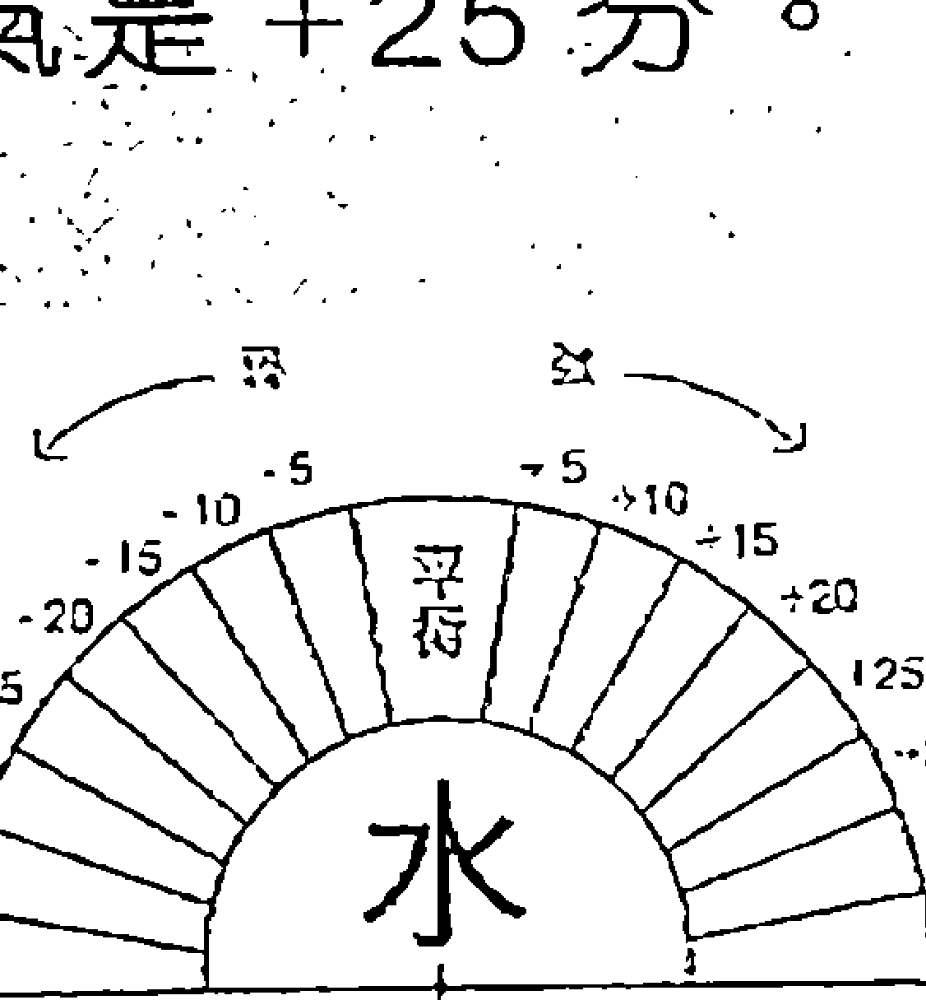

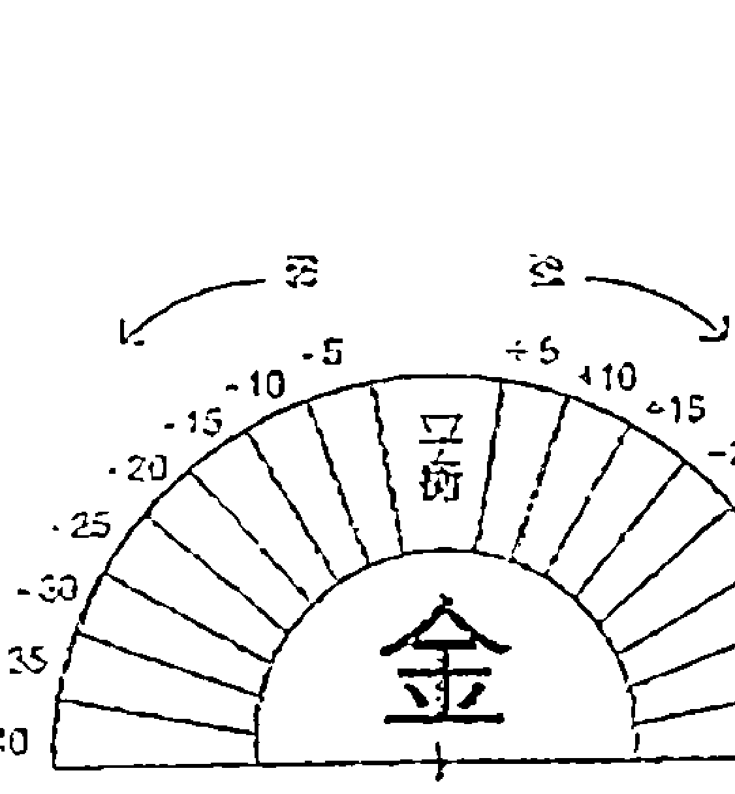

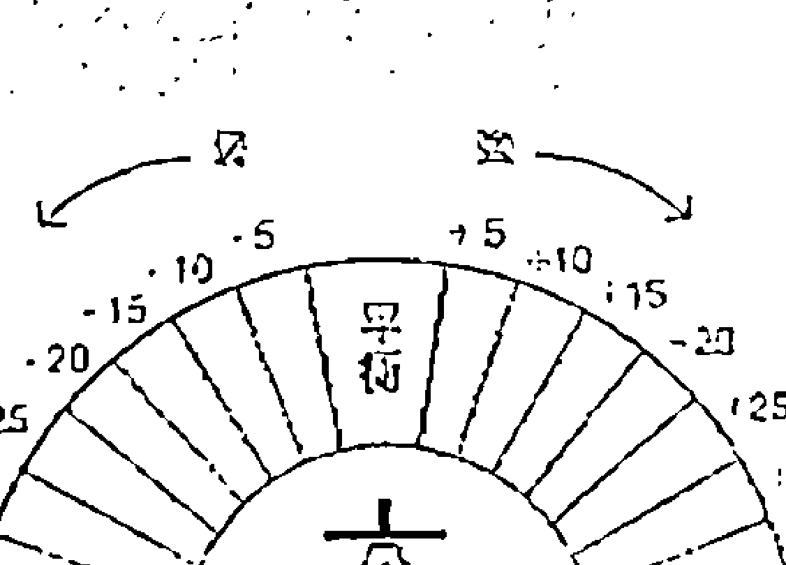

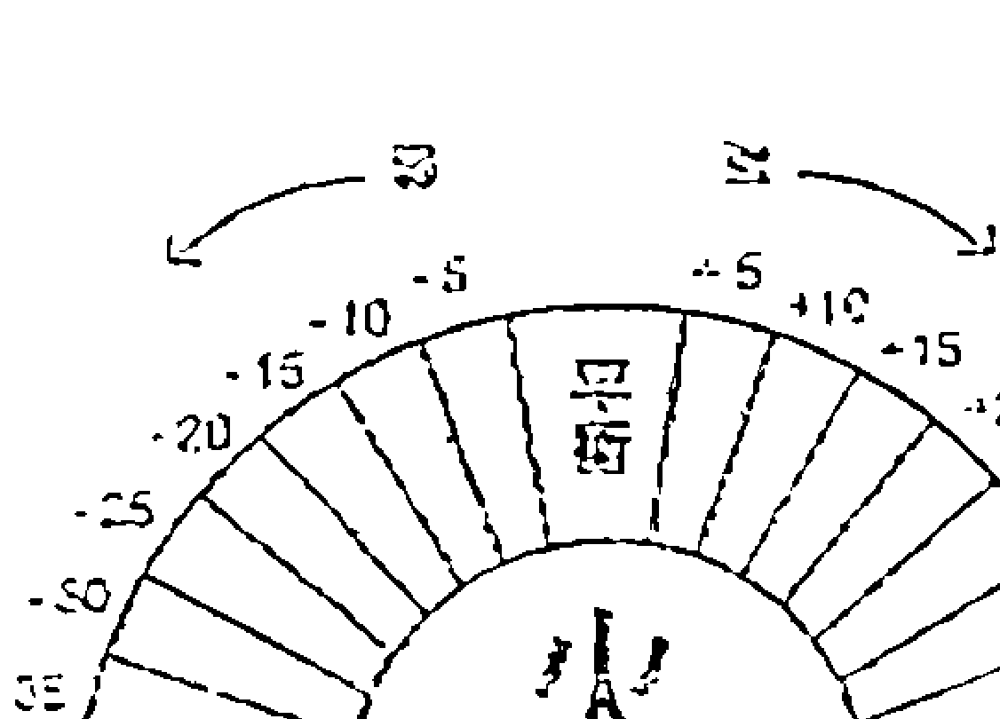

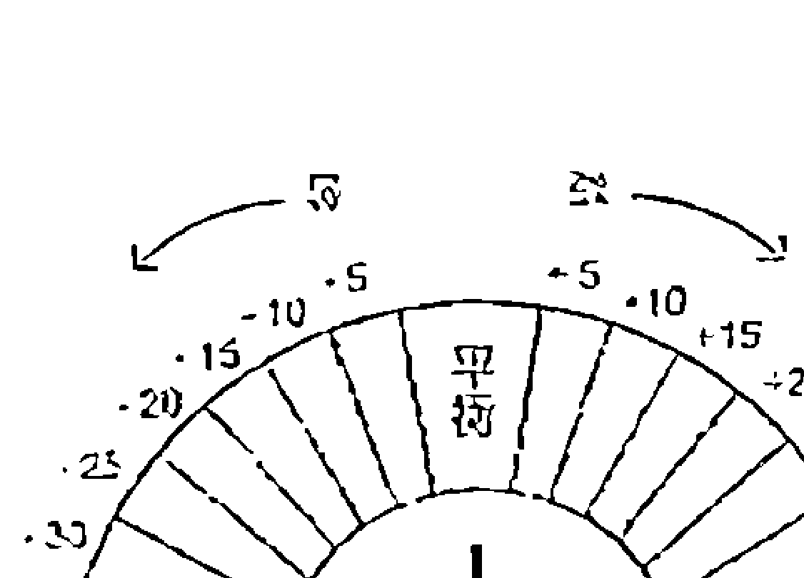

### 8.5~8.9 五行強弱測定表。

## 以「飛星派」為實習例子

您僅需要測詢木氣和土氣動態量值即可。 此木氣和土氣的動態量值，就是「靈擺五行動態量值」。將這個量值，填入（表8.4）「理氣五行覆測度量表一」的「靈擺五行動態數值」橫欄內。 這類「靈擺五行量值」，就是直接在您生命能場通過超感直覺系統獲得的。每個人不會相同，風水師傅更不能替您度量，是需要您自己學習去度量！除非風水師也是一位遙距靈擺測量師。 （九）、因此，經靈擺覆測後，五行土氣的綜合調整數值是：+10(+) +25 = +35 五行木氣的綜合調整數值是： +10(+) + 15 = +25 請參看（表8.4）的「五行綜合調整數值」橫欄。 （十）、從兩個五行調整的數值中，土氣仍是強於木氣，應可添加天醫土星的能量，以避木剋。 此睡房是可以住進去了。不過，一年後，您需要再覆測一次。若數值相等或變化不大，可以繼續住下去。 （十一）、假設仍是一所坐子向午的下元七運屋宅，主人睡房在震宮位。此房間的星數組合是五九五。為了簡便及適用全球不同經緯度的地區，僅以山星、水星、運星和原局宮位的五行設定理氣恒值標準。不考慮年星和月星的五行，是因為我們可以利用下述的靈擺五行動態數值加以「適時」調整。

（十二）、據此星數組合，山星和運星俱是五黃土，水星九紫屬火，而震宮屬木。火木相生則通明，生旺五黃土，加烈五黃雙星的凶性。由於五黃是山星，管人丁。因此，其意思是木→生火→生土，生旺疾病、禍害、於人丁不利。如此據程式推算的結果，表面看來是不宜作睡房了。

（十三）、現在，我們試試利用靈擺測度技術加以覆算，看看結果又如何呢。我們首先客觀地將原局數組和宮位，配上五行理氣的恒量值如下：

- 星數九紫，五行火氣→配上＋10分
- 星數五黃，五行土氣→配上＋10分
- 原卦震宮，五行木氣→配上＋10分

（雖然此組合有兩顆五黃土星，但仍以恒值的＋10分算，不需要加大兩倍變成＋20分。）

此睡房的星組理氣，各配上＋10分後，是客觀程式的恒定量值，不論此睡房是位處於地球的南半球或北半球，均假設是如此。請將此恒定理氣量值填入（表8.10）「理氣五行（飛星）覆測度量表二」的「理氣五行恒定數值」橫欄內。

表8.10 理氣五行（飛星）覆測度量表二

| 理氣系統 | 金 | 木 | 水 | 火 | 土 |
|---|---|---|---|---|---|
| 理氣五行恆定數值 (A) | | +10 | | +10 | +10 |
| 靈擺五行動態數值 (B) | | +15 | | -5 | +25 |
| 五行綜合調整數值 (A+B) | | +25 | | +5 | +35 |
| 理氣程式 | 飛星 | | | | |
| 方位 | 震木宮、東方、主人睡房 | | | | |
| 測度日期 | XXXX年XX月XX日 | | | | |

（十四）、按前述八宅的例子，跟從第七項和第八項的描述，利用靈擺吊錘和五幅（金木水火土）「五行元素強弱測定表」的協助，將金、木、水、火、土五行氣，逐一測詢出其「適時當地」的「靈擺五行動態數值」。然後，分別填入（表8.10）「理氣五行（飛星）覆測度量表二」的「靈擺五行動態數值」橫欄內。

（十五）、假設：靈擺五行的木氣動態數值是＋15分
靈擺五行的火氣動態數值是－5分
靈擺五行的土氣動態數值是＋25分
這就是自己「生命能場」與「目標微環境」產生共振關係後的適時當地的五行氣。

（十六）、在「五行綜合調整值」橫欄內，您可以得出：
木氣綜合調整值是：＋10(＋)＋15＝＋25

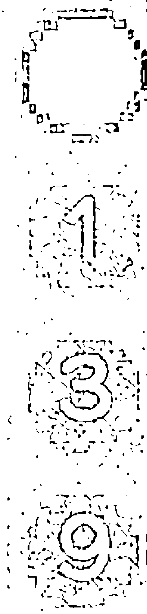

火氣綜合調整值是：+10(+) - 5= +5
土氣綜合調整值是：+10(+) + 25 = +35

（十七）、從三個五行調整數值中，火氣是弱了，沒有多大能量去生旺強土，且加上原局震木亦剋土，土雖強但不能完全發揮五黃土煞能量，故暫時亦可住進去此睡房。待半年後，再來覆測度量一次即可。

## 如何決定何時覆測

使用靈擺技術去度量調整五行理氣，除了知道甚麼是「氣」（軟輻射）的定義，和金木水火土的「有形」觀想外，也是需要做足「靈擺測度和卜測前期準備工序」的所有事前步驟。詳細工序指引，請參閱作者的「水晶靈擺應用法」一書。

對同一目標事象，例如調整理氣五行，在一小時間間距內，只能用靈擺技術測量或卜測一次。不論您所獲得的「答案」，是否是您的「理性邏輯」思維接受或不接受，必須「要接受」，不能隨意再來測量或卜測多次。

通常，覆測調整理氣五行，可在半年後才好再來測量一次，除非，遇上了下列特發事件，就需要立即重測度量：

- 一、外部巒頭環境轉變，例如：本大廈重新翻新、加建，附近加建或拆卸巨大建構物、天橋橫越、設置高壓站或電塔或轉發台等等。
- 二、内部小環境轉變，例如：重新裝修、掃漆、換牆紙等。
- 三、更換或新購大型傢具、大型家用電器、或佈置一新水晶陣等。
- 四、您曾大病一場，又痊癒了。
- 五、您新近擺放了一件以上「風水物品」，而又未經靈擺測度過是否適宜擺放。
- 六、您曾受情緒困擾了一段時間，現在又放開懷抱、無憂無慮了。

每一次覆測度量，您應填上「理氣五行覆測度量表」裏，歸檔保存。記錄愈好，效果和準確度愈佳！

## 調整「命主五行」恆定值

運用人命八字命理程式，推算出命主的五行喜用忌仇恆定量值，然後，使用靈擺測度技術去調整或調頻之。可按下述步驟進行：

- （一）、命理程式所使用的日元和時辰參數，是以中國中原時間為統計基點。至於在世界各地的不同時區出生的命主，是否需要作出適度調整，例如，將出生時辰和日期推前或拉後，則應以您所跟隨的命理師父之觀點為準。

作者的觀點是，當統計基點的參數調整過後，所得出的統計結果可能有所偏差，這是數學上的常識。

因此，使用靈擺技術將其調整，是一個可行的解決辦法，不用爭拗矣。

（二）、命主五行喜忌神的推算和判定，也是一門高深的命理學問，若經驗不足，可自行請教有豐富經驗的命理師傅。因為，一旦命主五行喜忌搞錯，隨後的靈擺覆測度量將毫無意義了。

（三）、現在此比例，假如您的出生四柱八字：

- 丁未
- 癸卯
- 甲子
- 丙寅

從八字中，您可能判定，您的

- 喜用五行是：土和火
- 忌仇五行是：木和水

至於閒神可不用理會。

（四）「命主五行」之金、土、火、木和水的喜用忌仇，由八字命理程式算出來，也可以說是命主先天的，不能改，據此配上「恆定數值」。

將喜用神五行的土和火，各配 +10 分。

將忌仇神五行的木和水，各配 -10 分。

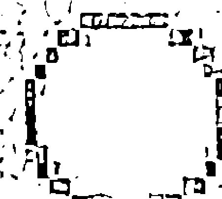

然後，將此等恆定數值，填入「命主五行覆測度量表」內的「命主五行恆定數值」的橫欄格內。(見表8.11)

表8.11 命主五行覆測度量表

| 理氣系統 | 金 | 木 | 水 | 火 | 土 |
|---|---|---|---|---|---|
| 命主五行恆定數值 (A) |  | -10 | -10 | +10 | +10 |
| 靈擺五行動態數值 (B) |  | -5 | +15 | -10 | +5 |
| 五行綜合調整數值 (A+B) |  | -15 | +5 | 0 | +15 |
| 理氣程式 | 命理八字 |  |  |  |  |
| 方位 | 覆測前未定。 |  |  |  |  |
| 測度日期 | XXXX年XX月XX日 |  |  |  |  |

(五)、按照八字命理五行程式推演法，您可以住進南方位或西南方位的房間。但若是您處在南迴歸線下的南半球，應可住進北方位或東北方位的房間。

(六)、房間內宜多粉紅、米黃、深杏色，無論您是處在南半球或北半球地區，均是如此配色。

(七)、同一理由，您是忌住和不宜住進北方位或東方位或東北方位的房間。在南半球則不宜住進南方位或東方位或西南方位。房間內應減少灰、粉藍和青綠色的佈置。

(八)、上述的分析是根據命理五行的遊戲規則建議之。這是恆定的，可適用於任何命主，只要他們的喜用忌仇五行是如此分佈。

現在，您需要使用靈擺測度技術，將該等恆定五行調整到適合您個人「當時適地」，和切合生命能場的動態五行量值。

您可以利用（圖8.5至8.9）「五行元素強弱測定表」的協助，分別將「命理五行」的木、水、火和土氣覆測度量。

其覆測度量出來的數值是動態值，稱謂「靈擺五行動態數值」。

可向靈擺測詢：「我在此房間內，請問×五行氣的強弱數值是若干？」

（九）、假設經靈擺覆測後：

- 水五行氣是：+15 分
- 木五行氣是：-5 分
- 火五行氣是：-10 分
- 土五行氣是：+5 分

然後，將該四個「動態量值」，填入「命主五行覆測度量表」（表8.11）的「靈擺五行動態數值」的欄裏。

（十）、到止，也許您會問，此等動態流動的五行氣，可以利用流年、流月、甚至流日、流時的對應五行，也可以獲得出來，何必使用靈擺測度呢。

不過，此類流年月日仍是中國中原地區為統計基準，是客觀的地理五行，不能反映在地球上任何一處的當時當地生命能場的動態五行。

（十一）、從表內的「五行綜合調整數值」一欄裹，您仍是很喜土的（有+15分），火氣則變成間（僅得+0分），而水氣則由忌仇轉為可考慮使用了（有+5分）。

假若您是處在北半球地區，第一選擇的方位應是屬土的西南方房間。南方方位房間變成次選，而屬水的北方位房間也可作考慮了。

## 「靈擺五行」動態值測度

如果您認為使用理氣程式或命理程式，是需要學習很多有關此門學問的知識，或是挺麻煩，您是可以僅僅使用靈擺測度技術，就可以尋找到您自己真正現況微環境，五行氣喜用仇忌的。

可按下列步驟進行：

- （一）、您可以首先選擇坐進自己睡房內，或私人辦公室內，因為這是您每天花最多時間，在這個微環境空間裏睡覺或工作。

- （二）、進行靈擺測度時，全屋和房間的窗戶要全部打開，讓空氣流通。宜在太陽初起的晴亮晨早，和睡醒後精神飽滿的情況下進行。靈擺測度和卜測前期準備工序當然仍要跟從。

- （三）、利用「五行元素強弱測定表」的協助，即（圖 8.5 至 8.9），分別測度「此時當刻」的微環境，與「生命能場交感共振」的五種五行氣。然後分別將金、木、水、火和土的「靈擺五行」量值，填入「靈擺五行動態量值測度表」內，(見表 8.12)。

表 8.12 靈擺五行動態量值測度表

| 理氣系統 | 金 | 木 | 水 | 火 | 土 |
|---|---|---|---|---|---|
| 靈擺五行動態數值 | +5 | +15 | +0 | -10 | -5 |
| 理氣程式 | 使用靈擺測度 | | | | |
| 方位 | 測度前未定。 | | | | |
| 測度日期 | XXXX年XX月XX日 | | | | |

（四）、您可以使用下述類似詞句，在心裏重複測詢靈擺多次：「請問在此房間的（金氣）的強弱數值是若干？」
例如，經過五類五行氣氣逐一測度後：
木五行是 +15 分，是稍強木氣。
水五行是 +0 分，相對於自己生命能場是極完美平衡了。
火五行是 -10 分，稍弱而不足了。
土五行是 -5 分，仍算平衡。
金五行是 +5 分，仍算平衡。

（五）、在一個房間內，或稱微環境空間裏，任何一種五行氣，若其「靈擺五行動態數值」，在正5分和负5分之间，可视之为「平衡」了，不需要理会其过强或过弱。

（六）、若其动态能量值，超过正10分和超过负10分，则视之为过强或过弱，可以考虑利用天然水晶阵，颜色布置和其它装饰物品，相应地加强或减弱某种五行气，务求令该个微环境空间达到与自己生命能场交流共振平衡。若数值互相差距很大，则应转换睡房了。

（七）、若果是二人住在同一睡房，或一家人住在一间约二百平方公尺的细小平房里；则二人必需一同坐在该间小房间，或一家大小必需一齐坐在平房屋的大厅内，方可进行灵摆测度。
而您向灵摆测询的问题，应改为：「请问在此房间内，我们一家人聚合所产生的（金气）强弱数值是若干？」然后是木、水、火、土逐一测询，填入表内。

八、按照（表8.12）「灵摆五行动态能量值测度表」所测量出来的五行气量值例子来分析，在该个目标房间内，金、水和土气，可算是与自己生命能场共振地平衡了，因为三个量值都在+5分至-5分之间。虽然木气是+15，稍为强了些，但火气仅是-10分，却弱了些。

当然，您可以考虑将四块天然黄晶和茶晶块，放置在房间的四个角落、添加多些土气、火气和减弱些少木气，达至水晶振频平衡调节效果。

水晶布阵详细应用方法，请参阅陈浩恩先生所著的「水晶风水的秘密」一书。

在利用灵摆技术测度五行气的动态量值之前，除了确定自己的生命能场位处中央外，也要确定目标微环境里没有任何对生命能场，有伤害的硬辐射存在。

专业化的准则是，应该应用生物环境建筑学的专门测度仪器，进行建筑物室内测量。

不过，若是居住在有严格环保条例监管建造的楼房，却是可以利用两种普通市面上可购买得到的测度仪表，自行定期测量的。该两种仪表就是「近距漏电测量器」（即坊间风水店所称谓的电磁煞追踪器），以及「电场、磁场、微辐射场频率度量仪」（Trifield meter）。

若要度量准确和有效，仪表最好是由专业环境学会所推介的。读者若需要此类仪器资料，可与作者联络。联络地址请参阅第十二章。

## 第九章
## 指南针寻觅家宅财位

在家宅内和办公室里，要找出一个适当的风水财位，可以依据各风水派别的不同风水理气程式，「客观地」推算出来。

不过，很多时候，不同派别的推算方式却不尽相同，因而得出不同方位的风水财位；甚至，按每年、每季的星运不同而有所改变，令欲求财位的信徒，无所适从。

根据全息讯息场理论来推断，若真有风水财位，它们必定是以您为目标核心，存在于四方八面的财气，以全息讯息作业方式，湧聚于您的个人生命能场里，方能产生共振。

人类是生活于，或者说习惯于，一个传统的五官感觉世界，总喜爱有一个「虚拟」的，但却可看见的实在空间，将个人的「心境」意识投入那里去，财位的小空间也是如此看待之。然后，借助可有触摸感觉的物理实物，加强营造一个可以在视觉感官上，观看起来是可以发财引富的微环境空间。例如，放置一些据说可以催财的风水摆设实物在这个财位微空间内。

在心理上，无疑是一种能够引导摆放者，激发努力赚钱的潜识暗示作用，以补信心不足，或者也可以说是增加信心吧，也是某程度上的灵量疗法。如果您喜爱这种心理引导，先决的条件是，要去选择一个「最适合」自己，又是「度身定造」的引富催财吉位了。

在传统风水的理气程式里，推算出来的「财位」不是特别给「您」的，是大众的，甲乙丙丁人人可用。

去寻找「您自己」所属的催财吉位，必须要利用灵摆测度技术。

## 寻找催财旺位法

寻找合宜自己的财位，可按下列步骤，顺序作业来进行：

- (一)、先将自己家宅或办公室，按间格比例大小，绘画一张平面图来。
- (二)、您可跟从任何一家风水派系理气程式，或综合各家理气程式，推算出一个或多个财位，也可以包括流年旺财位，这是「理气财位」。
- (三)、或者，若厌其复杂、五花八门；则干脆不用任何风水理气程式了。转而按个别家宅的所处现况环境，窗户和家具的摆设限制、自己的心境喜好，顺手在平面图上，直觉地标示出数个「虚拟财位」出来就是了。
- (四)、又或者，将某一家风水派系所推算出来的「理气财位」，加上自己心境喜好的「虚拟财位」，全部混合一起，标示在家宅平面图上。

现在，以（图9.1）为例，在这个家宅平面图上，可能出现「A」、「B」、「C」、「D」及「E」，五个标示的混合「理气财位」和「虚拟财位」。

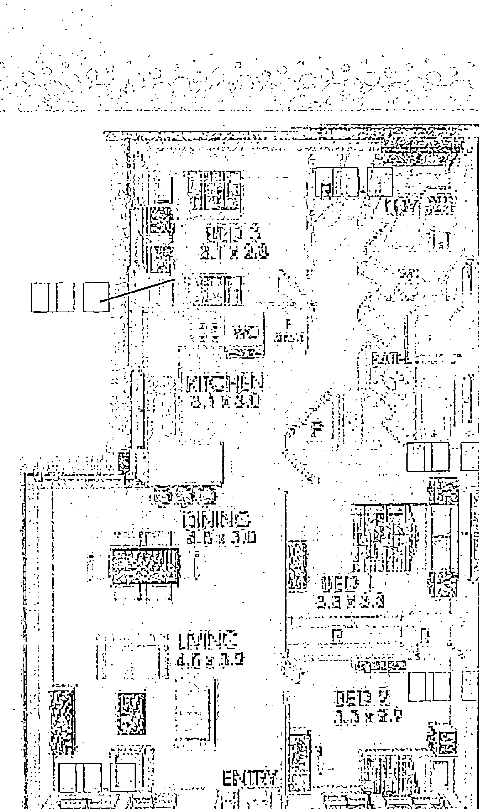

### 9.1 理气财位和虚拟财位分布图。

- (六)、在这五个财位中，您需要一个是最适宜和衬合您自己生命能场的引富催财位。这就是「自身财位」。
- (七)、选择某一天，最好是您每年生日的前后那几天；或者，是您自己生命的「幸运周期」日。「幸运周期」日是如何算出，请参阅作者的「水晶灵摆应用法」一书。（第 56 节）
- (八)、而在当天，您是心境开朗，没有雷电风暴的天气，没有不快乐或失败意识的事件给您看见或发生在您身上，以及您的生命能场是处于中央位置和健康的，您才可继续进行下述灵摆测度步骤。
- (九)、进行测度前，您要准备灵摆吊锤、一张「灵摆正负数字度量表」，如（图 9.2），和一枝竹筷子。

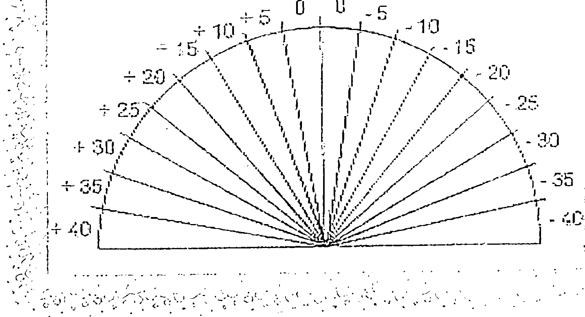

### 9.2 灵摆正负数字度量表

- (十)、您也必须要完成灵摆测度前期准备工序，包括平静心境、静坐数分钟等。
- (十一)、左手持着竹筷子，顺序「点」着家宅平面图上某一个标示财位，例如「A」位吧。右手握持灵摆，吊悬在「灵摆正负数字度量表」扇形圆底部的中心点。
- (十二)、向灵摆重复询问多遍：「此位置能够帮助我招财引富的能量度是多少？」
- (十三)、此问题的全部含义是：「在此家宅或办公室微环境里，于此时此刻及未来最近期日子里，该标示位置，通过我的生命能场共振效应，可以招引多少来自四方八面的财气能量出来呢？」在测度前，您需要观想和将此问题的全部意念烙印在心坎里。
- (十四)、向灵摆发问问题必须简单、短句子和仅得一个答案。但在测度前期准备工序中，您是需要将此简单问题的深层意念，重覆地默记在脑袋里，如此，超感直觉系统方能捕捉到您的心意。
- (十五)、在三分钟内，灵摆应会在该扇形圆的底部中心点为轴心，向外作放射线形式前后来回摆动，该摆动线可以是按任何一个角度摆出去。如此，您即可根据其摆动线位，而读出表上该一格的能量数字值，它可能是正数，也可能是负数。
- (十六)、例如，读出表上该一格的能量数字是+10吧，将此数字填入在「招财引富财位能量记录表」，其相应标示的财位栏内。（见表9.3）。

表9.3 招财引富财位能量值记录表

| 招引财气能量值数 | 室内标示位置 |
| --- | --- |
| +10 | (A) 西北乾位 |
| +25 | (B) 北方坎位 |
| 0 | (C) 东北艮位 |
| -5 | (D) 东南巽位 |
| -10 | (E) 南方离位 |

- (十七)、重覆上述测度步骤。按平面图上的其余标示财位位置，分别逐一测度，并记录起在记录表相应的栏上。
- (十八)、在所有标示财位位置测度完成后，您需要选出一个，其引富旺财的能量值是最强的。若数值是相等却出现在不同的方位位置，那么不论是两个，抑或者是三个，全部都要，一个不漏，证明您家宅的旺财气充盈和平均分布，风水旺财布局更易。

## 测度招财风水物品

当最适合自己的「自身财位」寻觅后，下一步，您可以依从习俗，按照传统风水布阵的指导，将这个财位洁净清理，和摆设旺财风水物品或灵物了。

布置天然水晶阵于这个自身财位，可加强此位的能量放大，和与您生命能场交感共鸣，是一个很值得考虑的建议。您可以参读香港水晶风水大师陈浩恩先生，所著的「水晶风水秘密」一书。

任何在市面上购入的旺财物品，或据说已开光了的风水灵物，在置放前，最好使用灵摆卜测，看看该件风水物品，是否真正「衬合」自己的生命能场。因为在市面上出售的风水物品，是为大众而生产，并非仅仅为您而「度身订造」的。况且，是否附上其它阴煞，也是需要考虑的。您可以按照本书第三章：灵摆测度练习（二）的方法，将购回来的风水物品测度一次，看看是否与您「衬合」和适宜摆放在家宅中。

假若不适合自己，又如何呢？当然最好是能够退货了。若然真的不能退货，我可建议您利用下述方法，再给一次机会该风水灵物或物品，是否可以长伴相容于自己。这个方法的运作工序是：

- (一)、将该风水灵物或物品，每天至少有二十小时，连续七天，放近在自己身边周围约一臂距离（大约一公尺内）范围内。此空间范围亦即是在您的生命能场第一层和第二层里包裹。欲获得此效果，您可以放在口袋里、手袋公文包内，和放在睡床侧（睡觉时）。
- (二) 、在七天后，利用「灵摆正负数字度量表」的协助，用灵摆去测度该风水物品，与您本身「衬合」的能量值是否有所增加，即是数值应是大于零，或甚至更高。
- (三) 、若能量数字值是大于零，则再来比较该风水物品的能量值数字，是否「相等」，或「大于」您的「自身财位」原有的能量值。
- (四) 、例如，在家宅平面图上，最大能量值的一理气财位或虚拟财位是+25吧，则此风水物品的能量值数字，也必须是相等于+25，或大于此值，方可考虑放置在此能量值最大的「自身财位」上。根据（表9.3）的结果，应该放置在「B」位上。
- (五) 、如果是使用洁净过的真正天然水晶，来作辅助布阵，则水晶是不用再测度了。因为，天然水晶与您生命能场是必然「相容」的。

## 第十章
## 超空间遥感招财旺运秘技

（业余篇）

您可以自行利用一些简单的物料和用具，尝试学习如何运用遥感灵量作业技术，给自己家居招财旺运。这是一种简单的「近距」空间遥感灵量传递作业。
若您能正确地依照本章的指导安排，它是一种很具震撼力量的新纪元灵摆风水旺运方法。它拥有近十数年的理论研究基础和众多的实验成功案例。
此项遥感灵量作业方式，虽然简单易用，人人学会；但是，其有效成功率却视乎几项因素的限制。此类外部因素，包括您所处的微环境空间，是否与您的生命能场平衡和谐、个人的心灵修炼功夫、信心接受程度和用料工序配合适当与否。
在本章，首先提供两种简单方法，作为入门学习和了解。

## 第一法：冰晶金字塔旺财法

在开始运用此法时，您要事先安排一些准备工作和物料用品：

- (一) 、选择一间门面耀眼辉煌，您自己认为是好风水、旺财旺客的金铺，拍一张已满布金器饰物的彩色照片。在照片中，一个人也没有是最好的，但若有一两个职员或客人，则可用拍摄角度尽量将他们缩小或放在照片一角。（见图10.1）

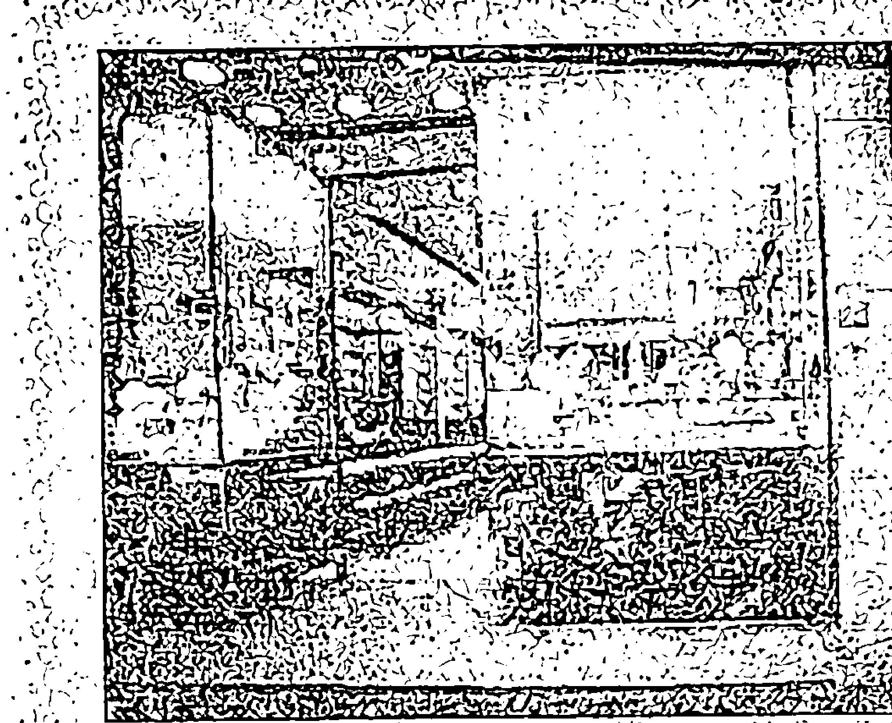

### 10.1 拍一幅金行的照片，作为遥感输送的起点。

- (二)、在您的家居大厅，自拍张半身近个人照片，背景需要单一浅色或空白。
- (三)、在您的屋宅内找出旺财位。旺财位寻找法可按前章所述进行。
- (四)、买一个或自造一个，底部约25公分乘25公分的铜条制金字塔框架。四根约四公分长的单头白水晶小柱。一根约十二公分高，底部至少有三公分乘三公分面积的白水晶柱，尖轴完整。两片约二十公分正方型的透明玻璃。十数粒如波子般大小的磁石。

以上物品买齐后，记得要将所有大、小白水晶柱洁净，然后，按下述骤放置和运作：

- (一)、将四根小型白水晶柱，用幼铜线绕在金字塔的四边支架的底部，尖轴向上，射向金字塔的尖顶。可参看（图10.2）。

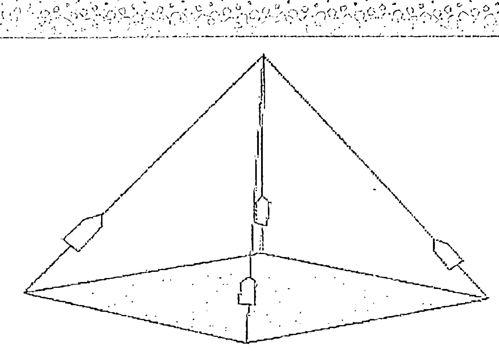

### 10.2 利用铜条制成水晶金字塔型框架。

- (二)、将「金器饰物」的照片正面朝上，将「自己半身」照片的正面，覆盖在「金器照片」上，然后，夹入两块清澈透明玻璃中间，再置放入铜制金字塔框架底部之中。可参看（图 10.3）。
- (三)、将一枝十二公分高的白水晶柱，压在玻璃片上，其尖轴要正确地指上金字塔顶的尖顶部位。白水晶柱的底部则用十数粒，如玻子般大小的磁石粒环绕。
- (四)、将此金字塔白水晶柱装置，放在您家宅内的旺财位去。
- (五)、在开始运作前，及运作后每隔一个月，您必须利用灵摆测度去复测，该两帧照片，是否仍有强旺能量。

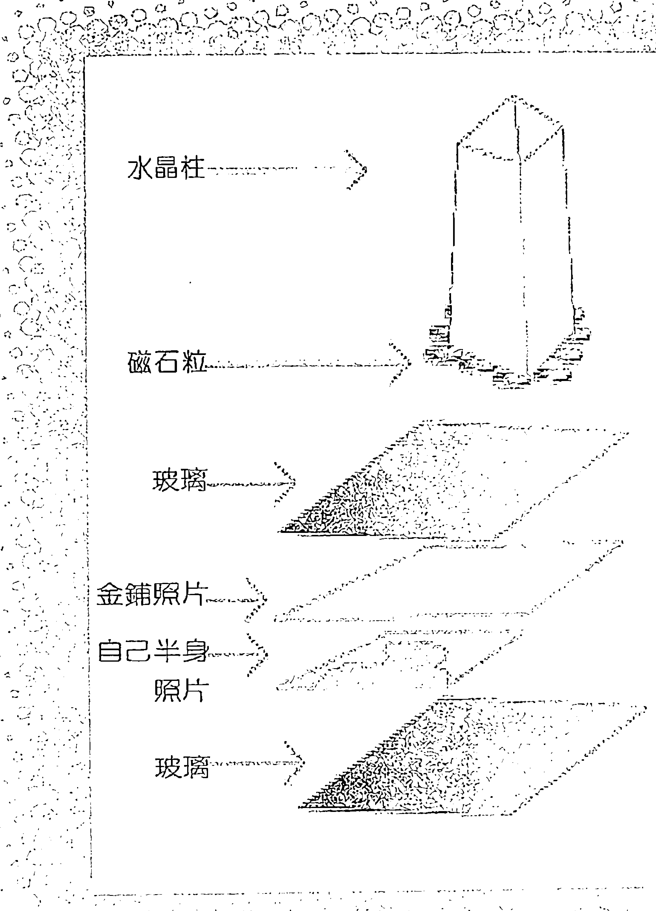

### 10.3 放入「水晶金字塔」框架内，将财气汇聚。

- (六)、若灵摆回答的答案是：「否」，则需要另拍一套新鲜照片，去更换能量已减退的一套。

每隔三个月，置在金字塔框架中间的白水晶柱，需要洁净和放在阳光下照晒三天，才好再用。

## 第二法：白光载波遥感传送

在进行此法时，您事前需要准备下述物品：

1. (一) 、寻找一所富豪大宅，或一间平日生意兴隆、客人众多的旺铺，或当旺的繁盛商场，在其室内大厅、店铺内或商场大堂，拍摄多幅彩色照片。照片中，没有任何人物或动物为最佳；即是需要在开铺前或关门后才拍摄了。
2. (二) 、照一张您自己或全家人，坐在家中大厅的照片。背景空白为最好。
3. (三) 、拔下自己数根健康的头发；若能滴上一滴您自己的血，在一张白纸上更佳。
4. (四) 、十数粒经过洁净，约二公分直径的天然白水晶粒。
5. (五) 、两个最少有二十公分直径，八公分深的玻璃碗或钵。一个注入半碗满的洁净蒸溜水。另一个放入该豪宅、或旺铺、或当旺商场的照片，其上铺满十数粒白水晶粒。
6. (六) 、三块可承一个玻璃碗的透亮玻璃，大约二十二公分乘二十二公分。
7. (七) 、一件约十二至十六安士重的马口磁铁，要有明显的南、北磁极，各处一边。
8. (八) 、一盏可具有亮度一百瓦以上的普通枱灯座，装上灯泡或聚焦水银灯泡。

此装置的详细安置摆放，可参照（图10.4）的图解指示。可以放在您家居屋宅中任何一处或旺财位，只要不妨碍日常生活即可。

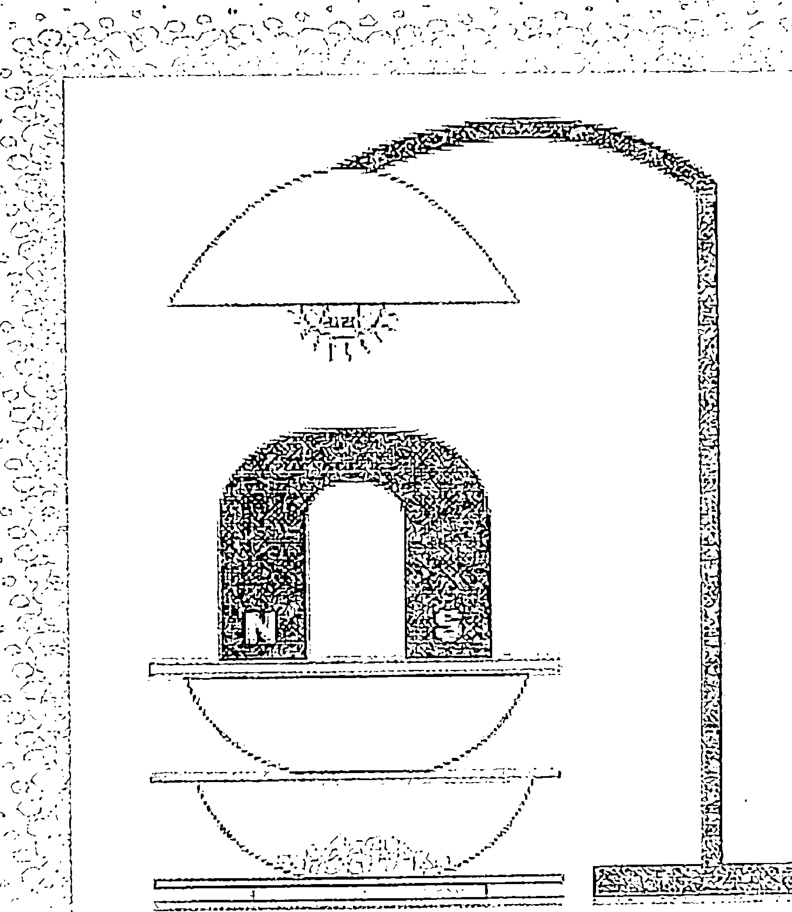

### 10.4 白光载波遥感传送装置。

在开始运作之前，您需要使用灵摆测询下述问题，在全部取得「是」的答案后，方可亮灯进行运作此项遥感传输旺运法。问题包括：

- (一) 、您本人是否现在适宜灵量输送工作？
- (二) 、两侦主客目标照片的能量强度是否仍然强旺？
- (三) 、您现在的生命能场是否平衡，没有偏离，缺失等严重情况出现？
- (四) 、您现在是否心情愉快，没有忧虑不安，情绪稳定？

### 开始运作步骤如下：

- (一) 、装置可放在家宅内任何处，或可选择放在旺财位均可。
- (二) 、然后，利用时间开关控制器，选择在深夜时份，全家经已热睡时，自动亮灯两小时，随后，自动关灯。
- (三) 、此项深夜自动亮灯熄灯两小时的作业，需要连续七晚为一个遥感输送「疗程」。
- (四) 、随后，再用灵摆测度，该两侦照片的能量是否「减弱」。若照片的能量强度仍是强旺的，可继续第二周、第三周，直至第四周的遥感输送「疗程」。
- (五) 、两侦照片的能量必会很快地减弱，否则您的装置安装有问题或不正确，又或者，是下述第六项的原因。
- (六) 、在传输过程中，不要移动您家宅内的大件家具往别处。
- (七) 、同样地假设，富豪大宅内内的大厅家具，旺铺里、大堂内（即在照片中的景物）的一切大型物件没有改变位置，及没有转换装饰和亮灯。否则，此项利用旺运遥感传输法，将旺财气传入您的家宅内和个人生命能场内，将不会成功。
- (八) 、此项远距遥感灵量作业，是基于：「几何同形结构场」和「灵量能反熵」效应原理，而达致风水旺运效果。因此，变量和环境限制较多，祝您好运。

## 第十一章
## 超空间遥感招财旺运秘技
#### (专业篇)

灵摆风水学的高阶段应用，将会在这一章里，透露多少玄机，让读者们知道灵摆风水学，在未来的应用发展里，是会有很多支干科系同时各自展开的。

今天，我们可以尝试利用「灵摆辐射频率发送仪」和「灵摆辐射频率强旺仪」实验原型仪器的协助，可将您个人有「目标性」的「欲求心愿」，转换成「灵摆辐射频率」。然后，再将该组频率增强放大，每天不断的投入您自己的生命能场里，间接促成「欲求事象」出现。频率传送没有「距离」局限，不论您是处于地球上的任何一方，均能接收得到。唯一必备的条件是，您必需随身携带一组由特别「几何线条」组成的「独一无二」的物品，或称「同型结构空间」。

此组「同型结构空间」是，分别处于「送出」和「接收」两点。在地球上任何一处，不能重复再有「第三组」一模一样的「空间」或「物品」出现。同时，亦需要配合您个人的强烈灵量潜识作业。

如此，您的目标性欲求心愿，方有可能在您生命能场共振，化成「想像成真」的「事象」。
这项灵量作业，是企图利用有系统的科学化手段，达成「风水旺运」的目的，而不仅仅是在「谈玄」。

个人「欲求心愿」，可以有着无限的想像，例如：爱情和合愿望、贵人襄助愿望、面试成功愿望、增强超感决断能力、减肥心愿、成绩优异愿望、增强客户对自己有信心的愿望、提高产品销量愿望……等等，但不能投机、炒股、赌马、六合彩此类偏财愿望。

在整个灵量心愿遥感传递过程，可以简单地用下述容易明白的视像影音传输，作大概类似的物理空间技术比喻描述：

电视直播室，将视像画面转化成视像电磁辐射频率。个人心灵愿望利用灵摆辐射频率调校仪，将心愿转换成灵摆辐射系数。

电视影像频率加以放大增强能量，通过电视发射塔放射出空间。灵摆辐射系数，亦通过灵摆辐射频率强旺仪，通过本身发送仪天线，放出空间。

电视画音讯号波频，传送到世界任何一处的远方，对方的电视接收装置，调校此波段后，即可重现画面。一组组特定的灵摆辐射系数频率，藉着千里以外的、独一无二的同型结构场空间，投放目标生命能场。由于生命能场内的能量高于自远方传来的灵摆辐射系数频率，会以灵量软辐射熵反馈原理、交感共振于目标生命能场，再通过其虚拟脉络系统，间接地由超感直觉的交感天线接收，产生灵。量潛識，化成欲求動力和機緣，促成事象成真。

> >「葬經」名句：「氣感而應，鬼福及人，是以銅山西崩，洛鐘東應。」

這就是「同型結構場」最生動易明的現代描述。

取自西蜀銅礦鑄造的銅鐘，放在數百里外的洛陽未央宮。原銅礦和鑄造銅均是同源的「同型結構場」物質。西蜀產銅的山崩了，其量子震頻發生擾亂，量微粒子的迴旋軌跡改動，與遠在洛陽的銅鐘，同時同步發生對等的連鎖反應；如此，通過超越四度空間的「溝通」，產生銅鐘也自鳴感應了。

今天量子物理學家，經已利用超高速運算的電腦系統，重覆此頂量粒子特性的同步反應的實驗室測試了。發現奇怪的現象，不論量粒子的相對距離是否數公里內，抑或是幾兆光年以外，反應也是同步一致。這就是為甚麼，礦物靈擺師可以通過某一銅鑄物件的「靈擺輻射系數」，可以找尋出千里外的原銅礦坑了。

## 超空間遙距傳遞原理

- 第一項應用原理

物理世界的電磁輻射活動和能量的增減，是服從傳統量子物理學的定律和法則。

超物理學的靈量輻射活動，則會遵從另外一套甚麼的輻射心場

## 超四度空間的數學模式作業。

在該模式裹，其中一項原理，是描述如何去定義，我們日常生活在通過五官感覺，所經驗的距離概念。

距離遠近的概念僅發生在四度時空裹，當超越光速，我們就僅能就以下「類似的描述」去理解。

這就是：「距離的差等於空間結構場的差。」

換句話說，若按四度時空的概念去描述，靈量輻射震頻的傳遞「速度」和「距離」，是視乎兩個事象，或者說，兩個「空間結構」是否有差異，方能發生「距離」的概念。絕對「一模一樣」的同型結構空間，在互相傳遞時，是不會產生時間和距離的，即是速度和距離是「零」。

「空間結構」場，或稱「空間形構」場，可以是指任何一小片「幾何線連結組合」的「物品」。

今天在靈擺遠距遙感傳輸技術應用裏，我們就是借助「兩個一模一樣」的同型結構場來完成的。

例如，在三千公里外的一條陳大文的頭髮，或者他的一滴血；又或者，僅是兩張一模一樣影印出來的，特別幾何線條圖畫。

此兩個獨一無異的同型結構場或微空間場，即可以建立起作為靈量輻射互相傳輸的媒介體，亦即收放兩點。

## 第二項應用原理

任何形構物體、事象和意念，在靈擺測度應用技術裏，均蘊含有「一組訊息」，若能將此組訊息，轉換為「數碼」形式表示出來，就像將電磁訊號波轉換為數碼波一樣。

此組靈擺數碼，則稱謂：「靈擺輻射系數」。

為了方便進行研究，今天可以在實驗室，利用特別設計的物理原型裝置，將一小片「幾何空間形構場」所蘊含的訊息，轉換為一組「靈擺輻射系數」的數字碼。

輻射系數可以由最簡單的六位數字碼組成，而估計可藉電腦協助，精算到六十四位數字碼或以上。數字碼愈精準，靈量訊息就更接近「完整」。

今天實驗用途的「靈擺輻射頻率調校儀」，可以將靈擺輻射系數增至二十四個位的數字碼。

例如：陳大文的一撮頭髮，其「靈擺輻射系數」的讀數是 060159121193。

例如：李亞珍用強力意念發出一個減肥心願，寫在一張繪有特別的幾何圖形紙上，其「靈擺輻射系數」的讀數碼，是 019554118617。

該組由左至右的序列數碼，就是靈擺頻率「波段」。

## 第三項應用原理

物理量能的轉移、傳遞、平衡等等，都是遵守物理學的熵現象原理。

例如，一杯滾水混入一杯冷水裏，該杯冷水漸漸變成暖水，因為冷水吸收滾水的熱能，直至雙方的溫度能量達致平衡。

靈擺輻射能量，則具有反熵現象，即是弱勢能場（例如物理狀態的冷水）反向強勢能場靠攏。變成強者愈強，弱者愈弱之狀態。您所認識的風水運氣，就是如此！行運時事事如己意；衰運時頭頭碰着黑！

也可以作如此的理解，假若世界上僅有兩個一模一樣的同型結構場。一個是靈量弱勢輻射場，另一個是靈量強勢輻射場；則弱勢能場會趨向強勢能場去。

例如，您的一撮頭髮和您整個身體，是獨一無異的同型結構場。您的一撮頭髮，在千里外是弱勢能場，必定趨向您的強勢生命能場去，靈量訊息就是藉此建立起一條通訊傳遞橋樑。

## 第四項應用原理

「全息訊息」，是基於「一小片」的訊息，就蘊含了「全形」的意思。

例如，利用特殊的激光攝影技術，照向一隻蘋果，獲得了一張全息訊息菲林底片後，就將它剪開一半，再一半，再一半……直至一小片。然後，再利用激光技術，將此「一小片」的全息菲林底片，再重播或投影出來，則整隻完整的蘋果影像，再會重現出來，不會因為該片底片給剪去大部份，而失掉了全部影像訊息。（見圖11.1）

基此原理，您的一撮頭髮，或一滴血，甚至一幅全身彩色照片，即可以是代表您整個的身體，或整個生命能場。

與「您」「聯絡」、複製一個「您」出來、利用靈量訊息影響您、給您「診病」、將「運氣」傳送給您，毋須要您整個身體親臨「現場」。

遙感目標給「鎖定」後，就可以進行下述的靈量作業了。

## 應用作業例（一）：招引財氣

## 準備程序：

- （一）、在您的家居大廳，或辦公室內選擇一張枱子。請記着，大廳或辦公室必須是您日常活動的微環境空間。室內任何的大件傢俱、牆壁色調和裝飾物等，也假設在往後的數個月內，是不會轉換掉或移動的。先用窗簾將室外所有景物遮掉，方可進行下一步驟。

- （二）、將簇新的現鈔，一張張鋪排放在枱面上。所有現鈔要直接在銀行提取，愈少人接觸過愈好。也將您個人的首飾、珠寶、金幣、名貴手錶等（但不要古董古玩），亦排放在枱面上。枱側旁可放一幅「財源廣進」合招財意頭的揮春。然後，照一幅以該枱面為主體的照片。此幅照片，在這裏暫稱「招財照片」，用作招財媒介。所有財物都是您的，不是借來的。

- （三）、再影一幅家居大廳或辦公室的「室內全景」照片。在照片內需要包括有一個，經由靈擺測度後，確認是適合您的生命能場之旺財位。（測度法可參考第九章所述）

在該財位，不可置放其它不潔物品或零碎雜物。此幅照片，這裏暫稱為「目標照片」，用作虛擬風水財位。

- （四）、在本章中，已附有一份「特殊幾何圖形表」。（見圖11.2）

## 11.2 特殊幾何圖形表

在表內，您可隨意揀選兩個幾何圖形，將它們影印、剪下，貼在一張信紙度大小的白紙上。

- （五）、然後，在該白紙上的任何空白位置，親手繪上一些簡單幾何圖形，例如，三角形、圆形、四方型等。在其旁寫上您的姓名，中英文皆可。

- （六）、如此，兩個特殊幾何圖形、數個簡單幾何圖形和您的姓名線條筆劃；合組成一幅獨一無異的「幾何線條圖畫」組合。

- （七）、將此幅「幾何線條圖畫」組合，用影印機縮細影印成四分之一的信紙度大小，一式四份。然後，將原圖撕碎或燒掉。如此，可確保在世間上，將沒有第五份圖畫，是與該四幅縮影圖畫是「一模一樣」的。

- （八）、將其中一幅已縮印「幾何線條圖畫」組合，不可摺折，放在您日常攜帶或貼身的手袋、手提公事包或銀包內。

- （九）、將第二幅縮印的「幾何線條圖畫」組合，置放在您的家居大廳或辦公室的「財位」上。財位位置與「目標照片」的位置是相同的。照片上可擺放一枚重約二十五克黃晶塊，加強靈量能輻射強度。

- （十）、將第三幅和第四幅縮印了的「幾何線條圖畫」組合，「招財照片」和「目標照片」，不可摺折，放入一個信封內備用。

註：此等備用照片和圖畫，將會是用來進行「超空間遙感旺財納氣」的「中介物」。它們將通過一系列特別儀器裝置，進行高技術的遙感傳輸作業。讀者若有莫大興趣來進行研究，可查詢作者代尋找購買。又或者可將上述備用材料轉寄交作者，

代轉去靈擺研究室代做。

- （十一）、現在需要進行第二階段的準備工序。用錄音機錄下您自己，容易明白又簡單的旺財心願語句。例如：「我要努力賺更多的錢。財源廣進，發財發財。」將此語句重覆又重覆地說出，至少要有十五分鐘的錄音長度；可以用錄音機聲帶過聲帶方式覆錄。

- （十二）、在旺財心願語句錄音的前段部份，約十分鐘長度，加錄進某些可以平靜心境的「特殊輕音樂聲頻」。此類聲波頻率，可以協助您將腦電波，更快地調校入「阿爾法」(Alpha)狀態，使另您在往後的十五分鐘內，更容易和有效率地，去「接收」您自己的心願語句。此類特殊輕音樂聲頻，可以自己往新紀元專門店購買，或可經由作者自靈擺研究室提供。

- （十三）、此盒由您自己錄製的聲帶使用法是：當在遙感傳輸啟動日，開始的第一晚至完成日止，通常是十四天定為一個階段。躺在床上睡覺前，將手提或微型錄音機放在床頭側，插上微型耳筒，貼在耳朵，靜心聆聽約五至八分鐘的「特殊輕音樂聲頻」，將腦波儘快調校入「阿爾法」狀態，同時不要胡思亂想。

- （十四）、在五至八分鐘後，或快要入睡時，除下貼在耳朵的耳筒，但不要拔出錄音機，僅需將耳筒放在枕頭側或床頭几旁，距離頭部約十二吋左右。旋動音量掣，直至由耳筒播放出細微的聲音，以您自己的耳朵「僅僅聽不到」為止。這樣，可以避免聲音干擾您入睡，但耳筒仍發出微弱卻聽不到的聲波，又是可以直接通過您的耳膜，進行潛識程式作業。

- （十五）、當聲帶前段的特殊輕音樂播完後，隨着您的發財心願語句，亦會繼續播放出來，進入您的腦袋裏去。錄音帶全段播完後，讓錄音機自動關掉，您可不用理會，繼續睡至天明。若您不用錄音帶，亦可用雷射光碟，如此，您的願語句，也可以延長覆錄至半小時，效果更佳。

## 超空間遙感傳輸工序

- （一）、將「招財照片」放入「靈擺輻射頻率調校儀」，小心地度量出此幀照片的「靈擺輻射系數」的十二個位數字碼，並將此組數字碼記錄下來備用。請參閱圖 11.3 的一系列儀器照片。

- （二）、根據靈擺輻射系數的數字碼，調正第一部「靈擺輻射系數發送儀」的發送頻率。將「招財照片」置放入其內部的一個，稱謂「願望井口」的空間位。

## 11.3 顯微輻射頻率調校儀的各個部件。

基座的剖視圖

- （三）、再將「目標照片」，放入「靈擺輻射頻率調校儀」，小心地度量出此楨照片的「靈擺輻射系數」的十二個位數字碼，並將此組數字碼記錄下來備用。

- （四）、根據此組「目標照片」數字碼，再去調正第二部「靈擺輻射系數發送儀」的發送頻率，將「目標照片」置放入其內部的一個「願望井口」空間位。

- （五）、將第三幅和第四幅縮印了的「幾何線條圖畫」組合，分別置放在該兩部「靈擺輻射頻率發送儀」的頂部一個空間位中。這是用來虛擬聯系着您的家居大廳和您自己的生命能場。加入您三根頭髮效率更佳。

- （六）、將該兩部「靈擺輻射頻率發送儀」，一部「靈量能模擬產生器」和一部「靈擺輻射頻率增強儀」的輸出、輸入線，串聯在一起，利用微弱交流電源啟動。此列裝置，即可自動遙感輻射您的旺財心願，傳送到千里以外您的家居和生命能場去。

- （七）、此種加了「強能量」的靈量軟輻射，您可直截簡稱為「旺財氣」，原本的「來源」就是您自己的靈量心願，百分之百是「襯合」您的生命能場，它在間接地「促成」您的求財欲念，化成真實事象。

- （八）、因此，此列替自己「製造旺財氣」的特別裝置，需要每天啟動至少兩個小時，連續運作，綿綿不絕、絮絮不休地輸送給您。通常是連續十四天，叫做「一個療程」。在啟動時，該系列儀器在該段時間內，僅能提供一個「願望」作業。

而且，您亦需要在該十四天療程裏，在晚上睡覺時，進行前述工序第十三頁至十五頁，予與配合，效果奇佳。

忠告：成效是否顯著，是視乎個別人士的正態心境，強烈盼望，盡力工作，緊握突來的機會，八字流年運程，以及您所處的大環境。沒有任何人等，可以能夠保證，若您一旦通過此項遙感旺財傳輸作業，是必發暴富的。

若您仍有興趣一嘗此項創新的，結合靈擺風水和靈量潛識作業的旺財、旺運、旺一切您欲求的心願工程，可以毋需花耗大筆金錢，去購買一系列各式儀器，和去學習如何操作該套儀器的技術。您只需要將您已準備好了的，已放入信封內的備用物品，寄來澳洲給我；然後，轉交靈擺研究室代安排此項作業，並告之您如何在彼方配合。

其程序是：

- 一、您必須仍要完成本章前述的所有準備工序。
- 二、將信封內的物料，寄來澳洲 P.O. Box
- 三、接收後，靈擺研究室將用電子郵件或信函通知您，會安排在那一段時間啟動運作。
- 四、然後，您需要按準備工序的第十三頁至十五頁，配合運作。
- 五、填妥本書後頁「讀者服務頁」。需要支付少量運作耗時費用。
- 六、請覆讀上段的忠告。

## 應用作業例二：生意興隆

## 準備工序

- (一)、第一項工序是製造個人特別的「幾何線條圖像」和心願語句的混合圖案，方法可按下列例子進行。在本章中，附有一表，內有六組幾何圖案和願望，合稱為「個人事業成功必備的六項心願」。（見圖 11.4）

- (A) 在附表裹，將寫有「創意無限」字句，此一幾何圖案，影印在一張白紙上。在其下方，用筆寫下您要祈望的貼題語句，例如：「我會有無限的創意去發展我的發達牌健康品傳銷生意。」

在祈望語句下行，再寫上您的姓名和您的八個數位年、月、日生日日期，例如：「陳大文 19750328」。此幾何線條獨一無二的組合圖案，將會通過靈擺輻射頻率調校儀，測度出特定的十二個數位系數數碼，以作遙感傳輸作業。所以，要將此組合圖案，縮影成四分之一的信度紙大小，一式兩份，然後，將原稿圖案撕碎或燒掉。

另外一份，是用來隨身攜帶在自己身旁，例如，放在銀包、手提袋等。

- (B) 按照(A)的工序，覆印有「魅力非凡」字句的幾何圖像，寫下貼題心願語句，例如：「我儀表樣貌吸引，笑口常開，人緣極佳，人人以我為榜。」在下行寫上您的姓名，和八個位數字的出生年、月、日。縮影一式兩份。

- (C) 按照(A)的工序，覆印有「辯才了得」字句的幾何圖像，寫下貼題心願語句，例如：「我口才了得，從沒投訴，辯說得體，人人信服。」在下行寫上您的姓名，和八個位數字的出生年、月、日。縮影一式兩份。

- (D) 按照（A）的工序，覆印有「領導有方」字句的幾何圖像，寫下貼題心願語句，例如：「我統領部屬，指揮自如，一呼百應，團結和諧。」在下行寫上姓名和出生日期。縮影一式兩份。

- (E) 按照（A）的工序，覆印有「超感智慧」字句的幾何圖像，寫下貼題心願語句，例如：「我能過目不忘，明察秋毫，超感分析，當機立斷。」在下行寫上姓名和出生日期。縮影一式兩份。

- (F) 按照（A）的工序，覆印有「貴人襄助」字句的幾何圖像，寫下貼題心願語句，例如：「我能招引四方貴人，伸手襄助，順渡萬難，提攜引領。」在下行寫上姓名和出生日期。縮影一式兩份。

## （二）、上述六款心願語句，您可以使用任何國家語言文字書寫，不論是中文、日文、英文、德文、法文等。總要您的潛識系統能夠容易明白即可。如何去測定呢？

方法就是：如您在半夜睡覺發夢時，是時常使用英語交談的，則可用英文書寫心願語句。

## （三）、將上述六款心願語句，按照您經已寫下的文字，用您自己的聲音，重覆又重覆地，口語化錄在聲帶。然後，可用聲帶過錄聲帶方法，將其錄音長度至少有十五分鐘以上。

- （四）之後，在六款心願語句錄音之前半段聲帶，加錄十分鐘長度的「特殊輕音樂聲頻」。此係容易使您的腦電波，更快進入「阿爾法」頻率狀態。

- （五）此盒聲帶的使用方法，請參考本章，應用法例（一）。

- （六）第二步驟，安排拍攝一幀自己的全身照片，衣服宜少，背景純白和沒有任何雜物；或者，可將自己的頭髮拔下三根和一片指甲。然後，收藏在一個信封內。此物料是用來進行超空間遙感輸送的「幾何同型結構場」的遠方目標「證物」。

- （七）您可以備齊一系列靈擺頻率傳輸儀器自行啟動遙感旺運作業。請參照前述應用法例（一）超空間傳輸工序的步驟。若是，您需要將六款幾何圖像組合，再加影印兩份備用。

- （八）或者，將全部六款自製的「心願語句」幾何圖像組合，和您的一幀全身照片或您自己三根頭髮加上一片指甲，放入信封內。填上後頁讀者服務表格，轉寄過來澳洲的靈擺研究室代做。

一旦當遙感旺運作業，完成第一個十四天「療程」，或二十八天兩個「療程」後，應將所有心願語句幾何圖像、照片、頭髮等證物燒掉。

靈擺風水的遙感旺運作業，完全是因人「度身定做」的，心願祈望可以是任何一項，天馬行空；想像力愈豐富、凝聚力愈集中，效果愈奇妙！

## 第十二章 靈擺與環境

在二十世紀完結前的十餘年裏，靈擺測度在部份半官方和傳統科學圈子的廣泛應用、討論和實驗，已經開始使頑固保守的學院派科研單位增加了壓力；需要重新而認真地，對此一門古老而神秘的學科，又能對今天有迫切感的地球環境有所改善和幫助的非邏輯可解釋的現象，進一步提高興趣和注意。

回顧過去二十年，由各先進國的科研機構和個人，主要是英、美、德、法、瑞典和前蘇聯，所發表有關的靈擺測度的研究論文、實驗報告和書刊，比過去四百年所累積發表的，還要高出數百倍，且其質素和嚴肅態度是前所未有的。

## 德國地質測量局的靈擺實驗報告

在一九九一年，靈擺測度終於獲得德國國家的地質科研機構的支持和授權，正式以實驗報告形式，公佈全球地質學界知道：

> 『靈擺測度是一種真實存在現象，並非子虛烏有或魔術；值得作進一步深入科學研究和實驗，使能更有效地應用在日趨複雜的地球表層環境裹。』

此份靈擺地球地質實驗報告於一九九一年底，以德文撰寫，旋即給世界各地地球物理科學家們搜閱一空。

後來再於一九九五年重新修訂增篇，翻譯成英文和法文，作全球民間公開發表。

此項長達十年的靈擺科研，是由德國政府資助，委任德國全國技術協作組織（簡稱 GTZ），聯合慕尼黑大學，成立專門項目小組，進行研究和科學實驗。

項目經理是 Hansjörg Elshorst 教授，GTZ 報告撰寫和首席研究員，是慕尼黑大學地質物理學教授 Hans-Dieter Betz。

GTZ 項目小組主要的靈擺測度實驗，是圍繞在水源卜測和尋找。因為，這是古代靈擺卜測的主要目標對象，也是極具影響地球人類的生存要素。

實驗研究分為三個主要部份：

**GTZ 項目經理和首席研究員的親筆簽名樣式。**

## 一、關合人造環境

建築兩層高大面積建築物，在下層鋪設了縱橫交錯、往返對流的水管、渠道、水池、乾池、清水、鹽水等等系統結構。上層空置、隔音及設立各式各樣電子測量儀器，讓一些自願參予實驗的靈擺師，在那裏進行尋找下層水源的正確位置。項目小組事前設立了各式各樣的重覆作業和雙盲實驗，給予八百多位自稱是靈擺水源測度者，進行獨立反覆測度。實驗的統計結果是，最具技巧的靈擺師，只能達到 52 % 的尋找成功率。但卻比較僅有預先設定的 1:500 成功或然率的實驗安排，看起來也是很高了。

> > （作者按：人為預先佈置的實驗或示範觀察，是會大大地減低人類的靈量作業和運作。此類設定的傳統科學實驗室作業，似乎不適合靈擺測度。）

## 二、乾旱自然環境

GTZ 項目小組選擇位在斯里蘭卡偏遠北部的乾旱地區，進行自然環境靈擺測度實驗。在該地區，能夠尋找出地下水源是很困難的，部份指定範圍，甚至滴水無望。事前已動用最先進的地質測量儀和富經驗的地質學家，大面積地尋找地下水源可能存在的地點，但經鑿穿井口後，真正有充沛水源的成功率很低，更加不知道是否可食用。

但是，在同一地區，經過眾多的水源靈擺師利用「地圖遙感」測度和「工地點子」測度，僅用一把靈擺工具握在手上，卻可以尋找出691個，有機會發現水源的井口點子位置。在進行貫穿井口工程後，證實其中有664個，湧出可食用新鮮水源，成功率高達96%。使另到先前利用地質電子測量儀器的地質科學們瞪大眼睛，不尤不信。更令他們驚訝的是，靈擺水源卜測，可以預先測知，某一口水井的穿孔深度和水源每分鐘的流量，準確率也達到80%，這是今天測量儀器也未能做到的。這項自然環境實地實驗，前後共花了約十年時間。

## 三、國外案例調查

GTZ 項目小組，也派遣了多位地質科學家，前往十個不同地理地質環境的國家去，包括：斯里蘭卡、菲律賓、也門、埃及、剛果、多明尼加等。聯同當地的打水井專家和靈擺水源測度師，採鑽了二千多口水井，作為實地統計案例和深入研究。

通過了三階段，長達十年的實驗、分析和研究，方能完成了此一份 GTZ 實驗報告。

報告的結論大意是：靈擺測度這門技術和其所關連的異常現象是真實的，尤其特顯在自然環境裏的實驗。雖然，按照傳統科學實驗室佈置的嚴謹人造實驗環境，仍未能取得相同極佳的成功率，有待進一步改良實驗方式，方下定論。不過，這可能是歸究於，今天純物理功能性質的科學實驗，仍有不足之處，沒有顧及人的精神領域因素。

在著名的「科學探索」月刊裏，指出該份 GTZ 實驗報告，彷如給今天的僵硬科研界，投下一枚挑戰炸彈。

「南德國科學」期刊的編輯，訪問了 GTZ 報告撰寫主編 Betz 教授，有如此下述的答問。

> 編輯問：我們是否已知道，靈擺師的卜測觸覺是倚靠哪一種？

> 教授答：有天份的靈擺水源測度師，往往可以在極惡劣的地質環境，包括那些岩石層地帶，附有極微弱電流的隙縫。該等裂隙通常是有細小水流存在的。他們的觸覺很有可能與電場輻射有關。

> 問：您是否認為實驗室的裝置，足可防範一切能給予靈擺師的外部暗示？

> 答：經深入研究後，此類傳統實驗方法，因為是建基於物理外圍裝置和刻意安排，如何慎密，也不足以解釋那些成功靈擺師的實驗結果。

> 問：靈擺師如何能夠在斯里蘭卡，準確地測度出一口可食用水源的小點子位置？

> 答：若水源含有大量鹽礦物質，必定輻射出高量異常的電子流。靈擺師的觸感器官就有可能藉此分辨出，此口水井的水源是否可食用了。

問：是否人人均可以運用靈擺測度，或一定要天生的？

答：優秀的靈擺師尤如藝術家，大家均需要天份、經驗和訓練。在某些情況下，並非所有自稱可以靈擺測度的人，均是水源靈擺測度師。不過，似乎每一個人都有不同程度，和不同目標物的靈擺卜測敏銳能力。個人必定需要知道，如何去正確翻譯此等自閉隱藏了的訊息。

問：為什麼靈擺師對電場的靈敏度較最高級的電子測量儀器還要好？

答：人體某部份感覺器官，確實已發展到很高級的階段，可以有能力分析和翻譯極細微量的訊息，此等訊息不僅僅是電磁場。一位音樂家可以聆聽出在不同管弦樂團中某一指定樂器的不同音色和感情表現，這是今天最先進的電腦仍未能做得到。因為，我們的數碼科技仍然是最初級，且仍是數碼概念。當水流通過管道，所散發出來的低能量高密度訊息，或者僅僅是水分子的震頻吧，某部份的生化系統有可能辨識出來。

問：仍有部份科學家對 GTZ 實驗報告存有懷疑態度，您對靈擺測度可以作科學驗證又如何看法？

答：直到今天，仍未有全部科學家都認為完美的科學實驗，可以驗證靈擺測度此現象。無論怎樣爭辯，GTZ 已經做過了無數次可以重複實驗的工序，確認靈擺師能夠在科學儀器監察下，在完全無望的地質惡劣環境裏，可以奇跡地尋找得到地下水源的精確小點子位置。此點，甚至那些持懷疑態度的科學家們，也不能夠去解釋之。GTZ 也發現，靈擺師不僅可以在現場尋找出正確的水井口鑽洞位置，也可以在遠距離，藉地圖遙感卜測法，先行大致尋找出目標現場。此點，就與今天地質物理學的假設理論相吻合：就是地層下的微量變化，不是局限和固定於某一點子位置，方能被測度出來；而是可以在遠距離的地域，也可以使用其它方法預先測量出來。毫不懷疑，地震出現前數天，部份動物在遠離地震區以外，也能卜測大禍將至，驚慌亂竄。

人類可能也不例外，對地層下的微量變化訊息，也可以是異常敏銳。我們傳統的科學實驗不能製造此類異常環境去實驗，並而解釋之。

僅摘譯以上數題答問，若讀者有進一步興趣去詳閱此份實驗報告，可來函作者代購其英文版本。

## “生命在哀求” 水源實驗

人類生命的原始和基本渴求，就是大自然的「氣」和「水」；這就是「風水」的基根和應用由來。沒有「水」，人類絕不可能生存。人體根本就是由液態水分子構成。達不到這項基本要求，甚麼去利用「風水」保障健康、增壽安寧、財源廣進，一切一切的，都是天方夜譚。

您和我幸獲恩賜，暫時沒有為了尋求「水源」而奔波勞碌，所以，可以坐下來「談」風「說」水，弄玄求玄。古籍風水名句：「水是山家血脈。」就是此意。

通過 GTZ 實驗項目工程，在斯里蘭卡偏遠北部乾旱地區，共鑽探了 691 個實驗井口，利用地質探測儀器，堪探接近不可能有水源存在的地層，但結果發現這些井口卻有高達 96% 機會尋獲水的，如此，激勵了很多慈善團體，本着拯救躲在地球上某些角落，為「水」而掙扎的苦難民眾，徵求有靈擺測度水源技能的靈擺師，深入貧窮落後，荒漠而乾旱的村落，為那些嚴重缺水的民眾打井尋水。

其中由英國靈擺學會，發起的「水是生命」援助計劃，就是針對那些散在印度荒漠乾旱，交通工具缺乏和沒有電力的窮鄉僻壤。

經數年來的展開救援，成績斐然，數以千計的村民，得脫離了缺水死亡邊緣。

前年，其中一組靈擺測度水源救援隊伍，由 James Kumpton 兩兄弟率領報告稱，他們所到達的印度嚴重乾旱村落，每四天僅能提供約一小時的公共水井用水。

試想想，我們在現代城市生活的家庭，真的是難以想像，他們是如何渡日的。他們沒有自來水管，僅有數口弱水慢流的手動抽水井。他們每天都為了全家大小的食水而憂心費神，他們不論大小，每天廿四小時，均隨身帶備有一個細小膠瓶，隨時隨地都能夠幸運，搜取到一小瓶水回家。該小組獲得了印度當地政府的許可，冀望他們為村民「變」一些「魔術」出來，在乾旱地層下搜尋到更多可食用水源。

為了節省時間，當地政府的地質部門，提供了他們缺水村落的地點和該村落附近地質資料和地圖。協助小組以科學化地圈定一小片面積，指出這「或有可能有水源出現」的土地，但卻不能以今天科學儀器「確定」點出，那一個「小點」子位置在洞穿後，是可以有足夠「流量」和可「食用水」流出。

該小組利用靈擺吊錘和探穴尺，在該片土地上，首先卜測在地層下有沒有水脈流存在。若有，則有否數條水脈流通過的交互點；該點在地層下有多深，水源是否含有重礦物質而不能食用，水源的湧出流量是否達到每分鐘50加侖以上等卜測資料。

基雲物業公司

當資料重覆卜測確定後，就指導村民在該目標點子，以六吋直徑濶度開鑿打井，裝上手動抽水裝置。

憑着該小組的靈擺水源測度經驗，他們平均可以得到95%成功率，尋找出有開鑿價值的水井，使令村民脫離絕望無水境地。

英國靈擺學會向全球善心人仕呼籲，冀請繼續提供小量金錢援助，讓各小組繼續深入各地荒漠乾旱貧窮村落，尋找救命水源，購置簡陋抽水手動器具。作者聯同學會，首次向全球華裔靈擺中文讀者呼籲，愛心援助。

善長讀者可將善款匯寄給作者，隨即由學會轉交到各「生命水源」救援小組去。您的善款，將由英國靈擺學會發回正式收據，轉寄回給您。您也可以直接寄去英國靈擺學會，地址是：BSD Office, Sycamore Bow, Tomley Lane, Ashford, Kent TN28 SHW, England.

## 安靜平衡雙旋化煞實驗

二〇〇〇年初，作者接收了兩份由英國實驗室寄來的報告。報告主要的實驗探討課題是：

- (一) 由「人造地理殘障」和「自然地理殘障」引起的煞氣、靈擺測度和防治實驗。
- (二) 由手提流動電話淺漏的輻射，如何破壞白血球和防治實驗。

今天，堪輿風水再不單是依靠外巒頭的五官辨察，和應用各派別風水環氣程式的推算演譯，就可以在被科技污染的社區，尋吉避凶了。

在都市生活，人造地理殘障所產生的陰煞，比自然地理殘障因地質環境所造成的，何止高出萬倍。

常人普遍的慣性偏見是，看不見就視之為不存在了。所以，由五官感覺可以辨識出來的，甚麼尖角煞、路衝煞、刀煞、箭煞、頂心煞、電塔煞……等等一切，固、液、氣態物理存在物所產生，意境上的、觸感上的，不平衡和欠缺景觀，是特別敏銳和情有獨鍾，務必化掉趨避而後快，心境上才安靜舒服。

至於，由物質原子微宇宙空間所產生的高、低頻，不平衡的量子輻射，卻完全沒有着意或甚至忽略之。

您會對面前的烈火、洪水、崖石、刀劍、槍枝等，產生有死亡和受傷的恐懼，但對於置於身旁的放射性物料、含微毒飲料、高頻微波發射塔、手提流動電話、而至電腦、微波爐等，卻可以是完全不着意的；雖然，彼等可能令您在十年後，患上慢性頑疾或致癌，減壽而死亡。

所以，懂曉利用各種生物環境電子測量儀器，去應付五官觸感不能覺察的硬體輻射，和運用靈擺測度技術，以協助超感系統去辨識軟體輻射；是今天生活在資訊輻射彌漫滿天，新紀元風水從業員和風水愛好者的必備知識，否則，又何以藉風水發願善心助人呢。

## 讀者服務頁

茲滿足個別讀者興趣，通過靈擺實驗儀器的協助，嘗試進行「超空間遙感靈擺風水旺運」，每時段連續二十八天，每天兩小時靈擺量傳輸服務。

旺運或願望項目，可自行任意選擇，包括旺財、人緣、愛情、事業、生意、學業、決策……以至減肥等。但不接受賭博、醫療和剋咒項目。

務請完成第十一章的準備工序，然後將資料信封套寄交作者，代轉去靈擺研究室，候覆何日開始作業和如何配合。靈擺研究室會酌收少量安排工序費用，請事前聯絡作者。

調校腦波進入 Alpha 狀態的特殊音樂聲帶亦會由靈擺研究室提供。安排給您的遙感傳輸時段，將盡可能選擇在您的「幸運周期」日前後。「幸運周期」日將由靈擺實驗室根據您的出生日期以電腦算出。但您亦可以根據自己的八字，算出流年吉日前後，通知靈擺研究室給您安排。

請記着：此項服務，如同坊間其它風水服務一樣，並不一定保證必定如願以償。因您在彼方的配合和環境變化，可能影響傳輸作業，請自行判斷。

倘遇大量讀者要求此項服務，不能適度安排，作者可自行決定暫停服務一段時間。其後再作個別通知。

## 作者聯絡地址：

□□□□□□□□□□
□□□ □□□□□□□□□□□
□□□□□□□□□□□□□□□□□□□□□□ □□
□□□□□□□□□□□ □□□□

□□□ □□□□□□□□□□□□ □□□！ □□□□□！

註：以上服務，只屬於讀者個人與作者之間的交易，跟本出版社無關，敬希垂注。