# 中国房地产丛书

# 黄一真   主编

# 陕西旅游出版社

# 风水：居住的智慧与艺术

黄一真

在一个极其重视生存智慧的国度里，中国人通过体察自然界江河竞流、山川俯仰的变化，从而格物致知，精心选择适合人类生存发展的环境，形成了专门研究居住环境与营建布局之间关系的学科，即是风水学。

风水学最初是作为帝王的御用术，应用于指导城邑、宫殿、陵址等的修建活动之中。风水学自唐宋而兴盛，并且根据周易的原理，乘四大发明之一的指南针的前身司南流行而流行，形成了以理法为主的福建派及以形法为主的江西派两大流派，逐渐导入民间，而风水理论体系也逐渐完善，在社会的文明进程中作用凸显。中国传统的各类形制的建筑都留下了风水深刻的痕迹，相关著作为《永乐大典》、《四库全书》等著名典籍收录珍藏。

一切文化都具有传承性质，但是同时也受到历史性的限制，所以它一定有缺憾。风水的研究也是如此。风水学虽然源于朴素唯物主义，但在封建时代，任何理论都脱离不了中国传统学说的桎梏和局限性。风水学自不例外：为了其生存与流行，不得不掺入了不少迷信和穿凿附会的内容，从而弱化了其唯物主义的真正实质。

如何在传统的基础上去芜存正，不断提高创新，弘扬中华民族的国粹，造福社会，这是现代风水学的任务。但由于封建思想的影响，风水学在应用的程序中，加入不少刀剑符咒的硬性方法，从而淡化了其灵活变通的真正意义。其实高明的风水是能够不着痕迹，尽得风流的，对于易理的运用更是可以得其意而忘其形，通过方位的挪移、植物的摆设、颜色的选择、家具的布局达到因地制宜、依形就势、扬长避短的效果，从而形成其独特的居住的智慧与艺术。

当代各类成功的建筑都蕴涵着风水的精神，而如何运用好风水学的原理，亦要坚持扬弃的原则，目光如炬地进行判断，就有一定的规律可循。我们会发现，现代风水其实并不神秘，它借助于精密的仪器和科学的方法，调理项目内部的资源，整合外部的形、势、声、光、电，对人类的各种居住环境进行改良。

由于工作的关系，笔者在长期研究各类建筑时真实而深切的发现，都市中虽然万家灯火，房宅林立，但是有的家庭荣华富贵，财源广进；而有的却穷困潦倒，衣食维艰。归根究底，除了个人所具智慧及工作勤奋外，无不与住宅的风水吉凶有密切关系。宅运亨通、又积善德则贫可转富，贱能显贵，正是情理之中；而宅运凶险，则富可致贫、贵亦招灾，不出意料之外。非但住宅如此，公司、厂房等亦然。因此，如何趋吉避凶，以利宅运，风水学发挥的作用甚大。

现代风水学作为一门综合性学科，与其他各门类学说均有紧密的联系，怎样与时俱进，不断完善这门学科，对现代社会的各类营建规划活动作出更大的贡献，这是一个严谨的课题。本书是中、加两国专业人士对现代风水学的重要分支：住宅风水的实践与理论经验的阶段性总结。鉴于以往不少相关书籍过于晦涩难懂，本书力图深入浅出，避开深奥诘屈，希望能对读者有所启发，并得到方家的批评指正。

# 目录

序 风水：居住的智慧与艺术……………黄一真 IX

住宅首重精、气、神…………………………………………………1

引 言 住宅格局与精神气质…………………………………………………3

住宅格局的精神……………………………………………………………3

安身立命的动与静…………………………………………………………6

住宅的气色……………………………………………………………………9

一门定吉昌……………………………………………………………………11

第一章 大门的风水………………………………………………………13

开门四主向……………………………………………………………………15

开门须配合路形………………………………………………………………16

东四宅和西四宅………………………………………………………………17

大门的坐向……………………………………………………………………18

入门宜有三见…………………………………………………………………21

入门宜有三不见………………………………………………………………22

大门两大忌讳…………………………………………………………………23

大门的颜色与尺寸……………………………………………………………24

门旁摆水可催财………………………………………………………………24

门槛的讲究……………………………………………………………………25

聚气生财在玄关……27

# 第二章 玄关风水……29

玄关的化煞防泄作用……31

玄关的遮掩作用……34

美化玄关的四项基本原则……36

影响玄关功能的八大重点……38

统揽全局的战略要地……47

# 第三章 客厅的风水……49

客厅的内部格局……51

位置……51

客厅的颜色……51

财位的布局……54

客厅安门的讲究……57

客厅天花……60

客厅尖角的化解……63

客厅梁柱的化解……64

楼梯风水……68

客厅家具置放……71

沙发……71

茶几……76

组合柜……78

客厅饰物……83

字画……83

地毯……86

鱼缸……88

植物……92

- 赏心乐事房与床 93

## 第四章 卧室与洞房风水 95

- 卧室 95

- 位置与格局 96

- 床位 98

- 卧室的颜色选择 101

- 卧室的家具 102

- 卧室的装饰与照明 103

- 卧室的植物 104

- 洞房 105

- 洞房位置与布局 107

- 婚床的布置 107

- 床上用品 108

- 床上饰物 110

- 主卧室的吉方 111

- 传承你的美好未来 127

## 第五章 儿童房与婴儿房的风水 129

- 儿童房的位置 130

- 儿童房的内部布局 130

- 儿童房的地面 131

- 儿童房的颜色 131

- 儿童房的床位 132

- 儿童房的照明 133

- 儿童房还要注意的其他事项 134

- 婴儿房 137

- 位置 137

- 床位 138

- 颜色 138

## 第六章 书房的风水 139

- 文昌位的选择 142

- 仁智之局 143

- 办公用品的摆放 145

- 灯光照明 148

## 第七章 厨房与餐厅的风水 149

- 厨房 151

- 厨房的位置选择 152

- 厨房风水的十大忌讳 153

- 厨房环境空间感的营造 154

- 厨房的色彩 155

- 创造诱导食欲的环境 156

- 厨房应避免死角 157

- 厨房空间要重视人体尺度 159

- 厨房照明 159

- 灶台与炉具的位置 160

- 厨房的家具与用品 162

- 厨房的植物 162

- 餐厅 164

- 餐厅的方位 165

- 餐桌的十大注意事项 166

# 酒柜的布置要点 171

# 餐厅的装饰四要素 174

# 餐厅的植物 176

## 第八章 卫生间的风水 177

# 厕所乾坤大 179

- 卫生间的位置 180

- 厕所和浴室的统一 184

- 卫生间的颜色 185

- 卫生间地面 186

- 马桶的方位 187

- 卫生间的植物 188

## 第九章 窗户的风水 191

# 让你家的眼睛顾盼生辉 193

- 窗户的数量 195

- 开窗的方位与形状 195

- 两面开窗不可正对 198

- 窗户大小要适中 198

- 窗户的高度 199

- 窗框的颜色 199

- 开窗的方式 200

- 窗帘的使用 201

## 第十章 阳台风水 203

# 天天与阳光亲密接触 205

### 阳台的生旺及化煞植物 206

### 阳台的吉祥饰物 208

### 阳台改建 212

### 阳台神位的摆放 213

### 住宅的十八种典型外煞 215

## 第十一章 庭院的风水 223

# 高尚生活的绿色解读 225

### 庭院的水体 225

### 池塘 226

### 泳池 228

### 喷泉 230

### 庭院植物 231

### 十三种庭院吉祥植物 233

### 八大驱邪植物 236

### 鲜花的作用 238

### 养花容器的形状与摆放方位 239

### 不宜亲近的四种花卉 240

## 第十二章 激发住宅的潜能 241

# 小物品四两拨千斤 243

### 小物品的大作用 243

### 水晶 243

### 风铃 244

### 时钟 245

### 食盐 247

### 镜中有玄机 248

镜的形状 249

平、凸、凹镜各有用处 249

镜子功用能放能收 251

家居用镜九法 251

灯火照明旺家居 253

分区照明 254

明堂灯 254

长明灯 254

日光灯 255

灯的数量 255

弥补缺陷 255

水晶吊灯增宅运 256

烛光添浪漫 257

## 第十三章 家庭办公格局 259

我和家居办公的时髦约会 261

办公室的理想位置 262

快乐办公三要素 263

家居办公室的颜色 264

办公桌的形状与质地 265

坐向要联系工作状态 266

办公桌面的布局 267

办公桌摆放方位的利弊 267

生肖与家居办公桌吉方的对应关系 270

家居办公行业与坐向法 275

附录 277

## 住宅首重精、气、神

作为一种特殊的私人生活工具，住宅的首要功能在于阻隔外界，包容自我、静默养气、安身立命，使自己的私密生活与精神气质有所依托。

住宅风水为此而讲究，住宅格局因此而兴盛。

## 住宅格局与精神气质

### 住宅格局的精神

我们居住在房子里面，消磨着生命的时光。

我们通过选择住宅，选择了自己的生活方式，而住宅本身也改变着我们的生活方式。

> 林语堂先生说过：“中国建筑的基本精神是和平与知足，其最好的体现是私人的住宅和庭院建筑。这种精神不像哥特式建筑的尖顶那样直指苍天，而是环抱大地，自得其乐，哥特式教堂暗示着精神的崇高，而中国庙宇宫殿则暗示着精神的安祥和宁静。”

这种精神上的安祥和宁静指导着中国传统的住宅风水学。住宅的本意是静默养气，安身立命，意思是指生活和精神有所依托。

> 《天隐子》里说：所谓的安处，并不是华堂深宅，重褥宽床，而是指能在南面静坐，东首安寝，阴阳适中，光线明暗相伴。屋不要太高，高则阳盛而明多；屋也不要太低，低则阴盛而暗多。因为明多就会伤魄，暗多就会伤魂。人的魂属阳，魄属阴，假如明暗不调，那么就会产生疾病。

居室四边都开设有窗户，起风就关窗，风停便开窗。静坐的地方，前面挂着帘子，后面设有屏风，光线太强，便放下帘子来调和；光线太暗，便卷起帘子以通外光。这样，便能达到内以安心，外以安目，心目两安，进而自身安定的目的。住宅作为一种生活的工具，对人的影响至大，因此，如何运用风水学的原理，经营好其中的格局，意义甚重。

例如深圳，地处亚热带，四季模糊，二十四节气不均，冬短夏长，所以选择住宅方面有许多的讲究及避讳。普遍说来，就是要因地制宜，做到防潮、防热、防风、防燥，格局要与气候相宜，日照时间、风力风向要均匀，调和四时的阴阳。

我在观察国内外不少优秀的住宅时，经常在里面的窗前伫立半个时辰，观风看云，或让阳光晒着背部，倾听四周的声音，对内部的明暗、曲折之处进行着比较，领略着养怡之福、可得永年的奥秘，预测着住宅本身将给人带来的改变。

> 再用林语堂先生的话说：“最好的建筑是这样的，我们居住其中，却感觉不到自然在哪里终了，艺术在哪里开始。”

### 安身立命的动与静

住宅的根本用意就在于静默、养气，安身立命。《易经·系辞下传》说：“上古穴居而野处，后世圣人，易之以宫室，上栋下宇，以待风雨，盖取诸大壮。”人类从群居的野外生活进化到以家庭为单位的私密生活，终于有了自己特立独行的思想，这就是文明的发端。现代人选择住宅何尝不是想要一个能够静默养气、安身立命的所在呢？

从哲学意义上来说，静是动的另一种表现形式。而人本身就是矛盾的结合体。在俗世的生活中，作为一个社会人首先必须与尘嚣共存，被动地接受喧哗，主动地制造喧哗，而在内心深处，动极而生静，渴望着在时光的流逝中静默，才能产生思想的升华，生命得到延续，人生达到极致。住宅就提供了一个阻隔外界、包容自我的空间。

人类巢居和穴居的进化历程

智者得水之空灵

什么是静默？唐朝常建的《题破山寺后禅院》诗中说：

> 清晨入古寺，初日照高林。
> 曲径通幽处，禅房花木深。
> 山光悦鸟性，潭影空人心。
> 万籁此俱寂，惟闻钟磬音。

静默的效果就是天地和自我澄明通达，俗世的烦恼杂念被涤荡一空。在动态中生活，在静态中思考，才能构成完美的人生。而其中的“曲径通幽”与风水学讲究的“喜回旋、忌直冲”原理相符，因为弯曲之妙在于藏风聚气，进而营造私密的空间，也符合中国人传统温婉中庸的文化思想。

因静默所以能养气，《黄帝内经》说：“气者，人之根本也”。在社会的生活中，气息为外界干扰，易于涣散。静默的居所则令人的精神得到凝聚而养成浩然生气，因此现代住宅的动静、功能、干湿分区都与风水息息相关。

几年前我去嵩山，曾经达摩洞，四周云淡风轻，令人心身舒畅，极有静默的效果，难怪达摩祖师能够在此安然入定，面壁数十年，延年益寿，而后悟无上之道。所以辩证住宅的优劣，必须从分辨其空间是否让人感觉安定祥和、神清气爽，达到静默养气的效果入手，看位置能否避开喧嚣，格局是否舒展，利于身心的生长，这是住宅的根本问题。

仁者取山之博大

### 细节打造住宅的气色

### 住宅的气色

传统中医诊察疾病的四大方法是望、闻、问、切，把“望”放在首位，即从人的神色、形态即气色上就可以观察其健康与否。而判断一套住宅的优劣亦要由辨别住宅的气色开始，凡是生旺之宅，必定喜气腾腾；而衰败之宅，则必定死气沉沉，这是颠扑不破的真理。

清代的学者魏青江把如何辨别住宅气色讲得极为生动传神，他在《辨宅气色》中说：“祯祥妖孽，先见乎气色。屋宇虽旧，气色光明，精彩润泽，其家必定兴发。屋宇虽新，气色暗淡，灰颓寂寞，其家必当退落。一进厅内，无人，觉闹烘气象似有多人在内喧哄一般，其家必大发旺。一进厅内，人有似无，觉得冷阴阴寒气逼人，其家必渐退败。一进门，觉红光闪烁，霭气腾腾，其家必有非常之喜，登科甲，报升迁，生贵子，发横财。若红紫火焰带烟气，又主火灾。眼中觉得黑气漫漫，如雾如烟，其家必有非灾横祸。见白气纷纷，淡烟相似，其家必有死亡孝服。喜气中又带黑气，其家旺运将衰，祸事将到。带白气者，旺盛之中有丧亡孝服之事。若黑气中微露彩色，其家祸将退散而喜气将至。白气中微露彩色，丧孝中又有喜事至也。”

现代住宅的气色好坏是如何形成的呢？住宅的装修格局、颜色搭配、家具摆放、字画照片、植物饰品等等，均对气色有巨大影响。因此，现代住宅风水学也把如何经营好住宅的气色，作为一个重要的研究课题和方向。

### 一门定吉昌

- 前门、后门、天门、地门、虎门、龙门
- 师门、掌门、朱门、豪门、国门、家门……

一套住宅的风水好坏受大门的影响至大，因为大门是住宅的气口，是连接私人空间与大千世界的咽喉，也是房主因势利导、趋吉避凶的首要屏障。

若大门的朝向正确，常年会有紫气东来，如若这大门开得不好，轻则诸事不顺，重则犯煞遭殃。

朱雀门、玄武门、青龙门、白虎门各有讲究，各有门道。

此即“门中正，家道成”“一门定吉昌”是也！

### 大门的风水

住宅大门是内外空间分隔的最外部标志，即是气口所在。阳宅之门接纳外界的气息，犹如人体之口接纳食物一样重要。好的大门能提高主人对外的运势，阳宅中的三要“门、主房、灶”及六事“门、路、灶、井、坑、厕”均把门当作第一要素。它是生气的枢纽、住宅的面子，又是划分社会与私人空间的一道屏障，陈眉公有一句话归纳得很精辟：“闭门即是深山。”

门与内、外气的流动关系非常紧密，因为内、外气不能通过住宅坚实的墙壁，但是通过门口则容易得多。外部大门影响外气进出住宅；而内部的门则对家里的内气影响甚巨。每个人每天出入自家大门的瞬间，都会受到大门风水的影响。因此，一套住宅的大门究竟如何开启，便大有讲究。

### 开门四主向

中国传统的南北东西四大方位以四种灵性动物来象征表示，分别是：孔雀、蛇龟、青龙、白虎。其方位口诀为：“前朱雀、后玄武、左青龙、右白虎。”一般的房屋开门有四个主要选择，即：开南门（朱雀门）、开左门（青龙门）、开右门（白虎门）、开北门（玄武门）。

风水学上，以门的前方有明堂为吉，如果前方有绿茵、平地、水池、停车场等，以开中门为首选。如前方无明堂，则以开左方门较佳，因为左方为青龙位，青龙为吉。而右方属白虎，一般以白虎为劣位，在右方开门就不佳。而开北门为玄武门，更是不吉，国外称之为鬼门，亦有“败北”之意，所以家居一定要慎开北门。

### 开门须配合路形

- 开朱雀门：前方有一宽敞绿茵、平地、水池、停车场，即是有明堂。这样，外气聚于前就用中门接收，门便适宜开在前方中间。
- 开青龙门：风水学里以路为水，讲究来龙去脉。地气从高而多的地方向低而少的地方流去，如果大门前方有街或走廊，右方路长为来水，左方路短为去水，则宜开左门来牵引收截地气。此法称为“青龙门收气”。
- 开白虎门：如果大门前方有街或走廊，左方路长为来水，右方路短为去水，则住宅宜开右门来牵引收截地气。此法称为“白虎门收气”。

### 东四宅和西四宅

根据周易的后天八卦原理，可将住宅根据坐向不同分成东西四宅，其中震宅、巽宅、离宅、坎宅是东四宅；坤宅、兑宅、乾宅、艮宅是西四宅。同时，也根据人的生肖与性别的不同将人分成八种命卦，分别是震命、巽命、离命、坎命、坤命、兑命、乾命、艮命。（生肖、性别与命卦的对应关系见本书附录）

命卦属震、属巽、属离、属坎的人，最适合他们的居所是东四宅；而命卦属坤、属兑、属乾、属艮的，最适合他们的居所是西四宅。

> （以上内容请参与本书有奖问答之一）

### 大门的坐向

大门的坐向是按大门所向的方位而定。我们站在屋内，面向着大门，则所面向的方位便是“向”，而与“向”相对的方位便是“坐”。

1. 震宅坐东方，大门向西。
2. 巽宅坐东南方，大门向西北。
3. 离宅坐南方，大门向北。
4. 坤宅坐西南方，大门向东北。
5. 兑宅坐西方，大门向东。
6. 乾宅坐西北方，大门向东南。
7. 坎宅坐北方，大门向南。
8. 艮宅坐东北，大门向西南。

如果命卦与宅卦不合，比如东四命的宅主居于西四宅中，则可通过改门来避免。改变门位的方法是：在门内加置屏风。屏风在家居中的重要性甚大，而在古代，更是使用极广，凡厅堂居室必设屏风。屏风有三大作用：改变门位、分隔空间、保护私隐。而根据制作材料的不同，又分成玻璃屏风、雕镂屏风、书画屏风等。屏风的特点是占地面积小又容易灵活移动，在以下的情形里，作为化解外煞的工具，屏风可以发挥重要的作用。

穿心剑：大门如果正对走廊或通道，其形如利剑穿心欲入，这样的格局叫穿心剑。如果住宅内部的进深小于走廊的长度，则为祸最大。化解的主要办法在于内部装上屏风，以收改门之效，才能避其锋芒。如果住宅在底层，大门正对大路，则可种上环形树丛花丛，以圆润来化解直冲而来的外力。

楼梯退财：如果大门正对楼梯，会形成两种不同的格局。一是正对的楼梯是向下的，则家中的财气极有可能向下流逝，因此要在门后设置屏风来阻止内财外流；另一种情形是正对向上的楼梯，则毋虑财水外流，若在门内放置大叶植物如发财树、金钱树等更可引财入室。

### 大门对长廊须防穿心剑

### 两大门神

电梯吸气：大门正对电梯，正好犯冲，本来住宅是聚气、养气之所，如今与电梯直对，宅内之气则在其开闭之间，被其尽数吸去散往他处，可谓大忌，因此要在门后设置屏风以拒内气外泄。

> (以上内容请参与本书有奖问答之二)

### 入门宜有三见：

1. 开门见红，也叫开门见喜。即一开门就见到红色的墙壁或装饰品，入屋放眼则有喜气腾腾之感，予人的精神感觉温暖振奋，心情舒畅。
2. 开门见绿。即一开门就见到绿色植物，生趣盎然，又可收养眼明目之功效。
3. 开门见画。若开门就能见到一幅雅致的小品或图画，一能体现居者的涵养，二则可缓和进门后的仓促感。

### 入门宜有三不见：

1. **开门见灶**。《阳宅集成》云：“开门见灶，钱财多耗”。即入门见到灶，火气冲人，令财气无法进入。
2. **开门见厕**。一进大门就见到厕所，则犹如秽气迎人，这里有个“晏子使楚”的典故：春秋时，齐国大夫晏平仲奉命出使楚国，楚王欺他个子矮小，存心要戏弄他，下令不让他从高大的城门通行，而在城门旁挖了个狗洞让他进入。结果极具智慧的晏子见状就说：“如果我是到人国访问，就请让我走人洞；如果我是到狗国访问，那我就走狗洞喽。”搞得楚王十分难堪。进门见厕就同此理。
3. **开门见镜**。镜子会将财气反射出去，如果不是大门直对冲煞或污秽之物等，则不宜正对大门。

## 大门两大忌讳

1. 横梁压门，如一进门即受压制，则主家中人丁无法出人头地，一世仰人鼻息、郁郁不得志，压抑终生，此乃大忌也。
2. 大门做成拱形门，则状若墓碑，类似阴宅，很不吉利，这种情况在家居装饰中时有所见，特别需要避忌。

## 大门的颜色与尺寸

大门的颜色最好与房主的五行之色匹配（房主的五行与生肖的关系见附录），这样，住宅的大门才更完美。

- 金命大门吉祥色：白、金、银、青、绿、黄、褐
- 木命大门吉祥色：青、绿、黄、啡、褐、灰、蓝
- 水命大门吉祥色：灰、蓝、红、橙、白、金、银
- 火命大门吉祥色：红、橙、白、金、银、青、绿
- 土命大门吉祥色：黄、褐、灰、蓝、红、橙、紫

大门的尺寸与房子应成比例，不可门大宅小，亦不可宅大门小。同时，大门是一家的面子，宜新不宜旧，大门如有破损，应立即更换。

## 门旁摆水可催财

利用好门的功能，可以为家中催财及招财。大门的方位可以说是掌握财运的命脉，而最简单的催财方法就是在门旁摆水，所谓“山主人丁水主财”，有水的地方便能发挥财气的作用。除了水之外，所有水种植物及插花都有催财的作用，只要放在大门口附近便能生效。

> (以上内容请参与本书有奖问答之三)

## 门槛的讲究

门槛原指门下的横木，中国传统住宅的大门入口处必有门槛，人们进出大门均要跨过门槛，起到缓冲步伐，阻挡外力的作用。古时的门槛高与膝齐，如今的门槛已没有这么高，大约只有一寸左右，除了用木材制作外，也有用窄长形石条的，固定在铁闸与大门之间的地上。

门槛还明确地将住宅与外界分隔开来，同时，门槛既可挡风防尘，又可把各类爬虫拒之门外，因而实用价值很大，对阻挡外部不利因素及防止财气外泄均有一定作用，对住宅风水颇具重要性。

安放门槛需要注意的是：门槛的颜色要与大门的颜色配合并且应谨防断裂，门槛如断裂，便如同屋中大梁断裂一样，主凶。门槛完整则宅气畅顺，断裂则运滞，因此门槛如断裂，必须及早更换。

> (以上内容请参与本书有奖问答之四)

### 聚气生财在玄关

玄关本是佛教中的“入道之门”，流入俗世则成了进入住宅后的第一道关隘，在西方，玄关更蕴涵着家庭的金钱运势。

玄关之于住宅，既对风水有决定性作用，也对美化厅屋有实用性功能。

精当设置玄关，可以化解屋外直冲大门的煞气，还会防止阳宅旺气的外泄，更能让运动的进入者静气敛神、调整气息，直接提升阳宅的吉祥运势，聚气生财。

## 玄关风水

玄关在佛教中被称为入道之门。佛经云：“玄关大启，正眼流通。”而在住宅结构中，玄关则特指居所的外门，是进出房屋的必经之地，是亚洲传统建筑的重要组成部分。

> 玄关与家庭金钱运关系密切

玄关是住宅内核最重要的组成部分之一，可说是住宅的咽喉地带，它给予进入者的感觉相当于人与人之间的第一印象。据心理学分析，第一印象通常产生于前七秒，而这与进入住宅内部审视玄关、调整气息的时间基本相同。在西方，玄关就代表家庭的金钱运，对宅运吉凶具有决定性的影响。

玄关是从大门进入客厅的缓冲区域，让运动的进入者静气敛神，同时是引气入屋的必经之道，因此它的布置好坏可直接影响住宅的风水。

中国的传统大宅院入门之处均设有大型玄关，而现代都市的住宅普遍面积狭窄，若再设置传统的大型玄关，则明显会感觉空间局促，难以腾挪。所以折衷的办法是用玻璃屏风来作间隔，这样既可防止外气从大门直冲入客厅，同时也可令狭窄的玄关不显得太逼仄。

## 玄关的化煞防泄作用

玄关最大的风水作用，是可用来化解屋外直冲大门的煞气。

风水学所说的“煞”，分“形煞”及“气煞”两种。并非是所谓怪力乱神的东西，其实就是恶型，与围棋里的恶型是同理的。住者无不希望居所双目企及是山清水秀、养眼舒适的一派美好景象。如果出现恶型，令人感觉压抑别扭，那就需要运用风水上的办法加以弥补，玄关就是住宅化解外煞的重要部位。

设立玄关可以缓冲形煞，风水学上，形煞是指有形的凶相，主要有如下几种情形：

- 刀煞，也叫尖角冲射：即门口正对附近建筑物的转角或尖角，如同一个楔子，打进住宅中心，令住户犹如为利刃直指，觉得百般难以忍受，心情极为压抑。
- 暗箭伤胸：住宅正对的大路或街巷呈一条直线，向房中冲来，则住宅向外发展的气势为其所阻断，形成路冲，也叫街巷直冲。
- 斜路直冲：住宅在低位，要承受大路从高位直扑而来的巨大压力，犹如滔滔洪水拾级而下，势大力沉，直冲入屋，令居者无法阻挡。

设立玄关还可以化解气煞，气煞是指煞星飞临的方位，因为它无形无象，不似形煞那样可用肉眼观察得到，只能根据风水数理推算。如果户主是东四命，而大门却开在正西、西北、西南或东北这西四方，大门与户主相冲，那么，对这家人来说，这便是宅带气煞。

反过来说，倘若户主是西四命，而大门却开在正东、正南、正北及东南这东四方，大门与户主相冲；对这家人来说，这也是带有气煞的住宅。如果住宅遇到这样的情况，那么设置玄关就是当务之急。玄关主要有以下两种的挡煞方法：

1. 玄关可以促使从大门进入的外气转向：外气本来从凶方直入的，改为从吉方转折而入，这便符合风水的趋吉避凶之道。
例如对西四命的人来说，大门如果开在北方凶位，是大门带煞；但若加一玄关，屋外之气本从北向南流入，现改为从西至东进入，西乃本命吉方，就可逢凶化吉。

2. 玄关除可化解形煞及气煞外，并可防止旺气外泄。
从风水的角度来看，从大门入宅的旺气与财气应尽可能在屋内回旋，为住宅充分利用后，才慢慢流出屋外。倘若大门与阳台或窗户形成一直线，则从大门流入之旺气及财气便会迅速从阳台或窗口流走，旺气直入直出，是“泄水”之局，令家中的人丁及钱财均难以积聚。而补救之法，是在其间设一玄关，设法令大门之气转向流入屋内，而不直接从阳台或窗口流走。

> (以上内容请参与本书有奖问答之五)

“前通后通，人财两空”的户型

比如上右图 A 处做了一面实墙，其用意何在？就在于挡住了进门处的视野，另外形成了一个回转的空间，风水学上讲究“喜回旋忌直冲”，道理正在于此。如果没有实墙，则在进门处即可将阳台客厅一眼望穿，即形成俗称“前通后通，人财两空”的格局，对家居不利。

倘若大门直冲房门，则房中的人丁易受干扰，这种情况，亦可用玄关来化解。

### 玄关的遮掩作用

客厅是一家大小日常安坐聚首的所在，是家庭的活动中心，所以不能太暴露。如果客厅无遮掩，缺乏私密性，家中各人的一举一动均为外人在大门外一览无余，那便缺乏安全感，从风水角度来说亦非吉兆。

而玄关即是大门与客厅的缓冲地带，基本上起到了遮掩的作用，令外人不能随便在大门外观察到屋内的活动，就可解决以上的问题。有玄关在旁护持，在客厅里会感受到安全性大增，同时也不怕私隐外露。

在美加地区，许多住宅的客厅、餐厅以及起居室均不对正大门，对门而立的不是楼梯便是墙壁，因此可免除风沙入屋的烦恼。而东方式的住宅设计，则是入门见厅，不设一玄关，则大门若被风沙吹袭，坐在客厅便会深受其扰。如果大门正好向着西北或是正北，冬天常受凛冽的寒风侵袭，那便更需要玄关来作遮挡了。

那些贴近地面的房屋，往往易被外边的强风和沙尘渗透，设玄关后就既可防风，亦可防尘，从而保持了室内的温暖和洁净。

## 美化玄关的四项基本原则

玄关除了有化煞、防泄、遮掩的风水作用之外，并且还有家居装饰上的美化作用。

设计精美的玄关，会令人一进门便感觉眼前一亮，精神为之一振，使住宅顿时焕发光彩，因此在室内设计时均应尽量设法美化玄关。美化玄关有以下四项基本原则：

1. 通透。玄关的间格应以通透为主，因此通透的磨砂玻璃较厚重的木板为佳，即使必须采用木板，也应该采用色调较明亮而非花哨的木板，色调太深便易有笨拙之感。
2. 适中。玄关的间格不宜太高或太低，而要适中。一般以两米的高度最为适宜；若是玄关的间格太高，处身其中便会有压迫感，而太低，则没有效果，无论在风水方面以及设计方面均不妥当。

影响玄关功能的八大重点

要最有效地发挥玄关的作用，必须重视玄关的组成部分在风水上的各种宜忌。这主要有以下八大重点：

### 一、天花的安置

天花板宜高不宜低：玄关顶上的天花板若是太低，具有压迫感，这在风水上属于不吉之兆，象征这家人备受压迫掣肘，难有出头。天花板高，则玄关空气流通较为舒畅，对住宅的气运也大有裨益。

天花色调宜轻不宜重：玄关顶上天花板的颜色不宜太深，如果天花板的颜色比地板深，这便形成上重下轻，天翻地覆的格局，象征这家人家长幼失序，上下不睦。而天花板的颜色较地板的颜色浅，上轻下重，这才是正常之象。

天花灯宜方圆而忌三角：玄关顶上的灯饰排列，宜圆宜方却不宜三角形。有人喜欢把数盏筒灯或射灯安装在玄关顶上来照明，这是不错的布置，但如把三盏灯布成三角形，那便会弄巧成拙，形成“三枝倒插香”的局面，对家居很不利。倘若排列成方形或圆形，则不成问题，因圆形象征团圆，而方形则象征方正平稳。

### 二、墙壁的间格

墙壁间格应下实上虚：面对大门的玄关，下半部宜以砖墙或木板作为根基，扎实稳重，而上半部则可用玻璃来装饰，以通透而不漏最理想。

玄关若不以墙来作间格，用低柜来代替也行，其上选择玻璃或通透的木架来装饰。低柜可用作鞋柜或杂物柜，上面则可镶磨砂玻璃，这样既美观实用，同时也符合下实上虚之道。必须注意的是，玻璃不同镜子，会反射的镜子通常不可面向大门，因为会将家中财气反射出去，但磨砂玻璃则无此顾虑。

墙壁颜色须深浅适中：玄关的墙壁间格无论是木板、墙砖或是石材，选用的颜色均不宜太深，以免令玄关看来暮气沉沉，没有活力。而最理想的颜色组合是，位于顶部的天花板颜色最浅，位于底部的地板颜色最深，而位于中间的墙壁颜色则介于这两者之间，作为上下的调和与过渡。

墙壁间格宜平滑：玄关是住宅进出的主要通道，墙壁及地板平滑则气流畅通无阻。如果以凸出的石块作为玄关装饰，凹凸不平，则宅运便会有诸多阻滞，必须尽量避免。

### 三、地板的布置

玄关的地板宜平整：地板平整可令宅运畅顺，而且也可避免失足摔跤。同时，玄关的地板宜尽量保持水平，不应有高低上下之分。

玄关的地板颜色宜较深沉：深色象征厚重，地板色深象征根基深厚，符合风水之道。如要求明亮一些，则可用深色石料四围包边，而中间部份采用较浅色的石材。

倘若选择在玄关铺地毯，其理亦同，宜选用四边颜色较深而中间颜色较浅的地毯。

玄关地板的图案忌有尖角冲门：玄关地板的图案花样繁多，但均应以选择寓意吉祥的内容。必须避免选用那些多尖角的图案，而尖角冲门则更绝对不宜，以免家口不宁，惹无妄之灾。

玄关地板的木纹不宜直冲大门：玄关的木地板，不论何种木料，其排列均应令木纹斜向屋内，如流水斜流入屋，但是木纹切勿直冲大门，如直冲则不吉。

玄关的地板忌太光滑：有些人家为了美化玄关，往往会把玄关的地板打磨得十分光滑，这极易弄巧成拙，单从家居安全角度来说已并不理想，因为家人或宾客均容易滑倒受伤。

地下排水管也不宜跨越大门和玄关之间，以免财水内外交流时，在玄关受污，导致家人健康不佳，财路不顺。

### 四、鞋柜的摆放

在玄关放置鞋柜，是顺理成章的事，因为无论是主客在此处更换鞋子均十分方便。而且“鞋”与“谐”同音，有和谐、好合之意，并且鞋必是成双成对，这是很有意义的，家庭最需要和谐好合，因此入门见鞋很吉利。但虽然如此，在玄关放置鞋柜仍有一些方面需要注意。

鞋柜不宜太高大：鞋柜的高度不宜超过户主身高，若是超过这尺度便不妥。鞋柜的面积宜小不宜大，宜矮不宜高。

鞋子宜藏不宜露：鞋柜宜有门，倘若鞋子乱七八糟地堆放而又无门遮掩，便十分有碍观瞻。有些在玄关布置巧妙的鞋柜很典雅自然，因为有门遮掩，所以从外边看，一点也看不出它是鞋柜，这才符合归藏于密之道。

风水重视气流，因此鞋柜必须设法减少异味，否则异味若向四周扩散，则根本无好风水可言。

鞋头宜向上而不宜向下：鞋柜内的层架大多倾斜，在摆放鞋子入内时，鞋头必须向上，这有步步高升的意味；若是鞋头向下，就意味着会走下坡路。

鞋柜宜侧不宜中：鞋柜虽然实用，但却难登大雅之堂，因此除了以上所提及的几点之外，还要注意宜侧不宜中，即指鞋柜不宜摆放在正中，最好把它向两旁移开一些，离开中心的焦点位置。

### 五、地主财神的摆法

现代有很多人在家中供奉神祇，以期祖宗庇佑，健康长寿，招财进宝。但在现代布局的房子中摆放传统的神台，会显得格格不入，若要消除这种矛盾，便要采用因地制宜的布局方法。

地主是家居最经常供奉的神祇之一，其他的神祇尚可移入屋内其他较隐蔽的角落，但地主却必须当门而立，因为地主的正名是“五方五土龙神，前后地主财神”，应该面向大门，向门外四方纳财，这样才可增强住宅的财运。地主并且还是住宅的守护神，当门而立，便可把牛鬼蛇神拒诸门外。

地主最佳的摆放方法，是把神位单独供奉在面向大门的玄关地柜中，那便既不太显眼，而又不失地主应当向门而立的原则。因为地主自古以来，长期供奉在地面，就算摆在鞋柜旁边，每日人来人往，也没有任何问题。

地柜可用作鞋柜或杂物柜，为了要与附近的环境配合，外部的颜色可以随意，但地主神柜的内部则必须采用漆上金点的红色。

至于文财神则不宜摆放在玄关向门之处。财神分文武两种，武财神如武圣关公及伏虎元帅赵公明，均宜当门而立，但福禄寿三星及财帛星君等文财神若是面向大门，便会把家中钱财向宅外布施，那就会弄巧成拙。因此文财神即使摆放在玄关，也必须面向宅内，切勿面向大门，以免钱财外泄。文财神面向宅内，是因为这样可引财入室，但必须小心切勿面向厕所或鱼缸，以免虽然引财入屋，但却往往见财化水。

（以上内容请参与本书有奖问答之六）

### 六、植物的布局

由于玄关是家庭访客进到室内后产生第一印象的地区，因此摆放的室内植物占有重要的作用。大型植物加照明、有型有款的树木及盛开的兰花盆栽组合等设计，都适用于玄关。如遇到玄关光线不佳、遭受穿堂风的吹袭、夜晚温度降低、走道狭窄或少有方形或长方形的空间，则普通的开花植物会比形态特殊的植物来得合适。另外，玄关与客厅之间可以考虑摆设同种类的植物，以便于连结这两个空间。

玄关摆放植物，绿化室内环境，增加生气，令吉者更吉，凶者反凶为吉。但是必须注意的是，摆入在玄关的植物，宜以赏叶的常绿植物为主，例如铁树、发财树、黄金葛及赏叶榕等等。而有刺的植物如仙人掌类及玫瑰、杜鹃等切勿放在玄关处，以免破坏那里的风水，而且玄关植物必须保持常青，若有枯黄，就要尽快更换。

### 七、饰物的选择

由于玄关位居冲要，对宅运大有影响，因此，摆放在此处的饰物要小心，以免无意中破坏了住宅风水。古人多摆放狮子、麒麟这些威猛而具有灵性的猛兽在门口镇守，作为住宅的守护神。

现代住宅如果摆放狮子或麒麟在屋外，往往会受到诸多限制，退而求其次，则可摆入在玄关内面向大门之处，同样也可收护宅之效。

而不少人家喜欢在玄关摆放各种动物造型的工艺品，作为饰物摆设，但应谨记不可与户主的生肖相冲，以免有入门犯冲之虞。

### 十二生肖相冲的情况如下：

| 生肖 | 忌生肖 |
| :--- | :----- |
| 鼠   | 马     |
| 马   | 鼠     |
| 牛   | 羊     |
| 羊   | 牛     |
| 虎   | 猴     |
| 猴   | 虎     |
| 兔   | 鸡     |
| 鸡   | 兔     |
| 龙   | 狗     |
| 狗   | 龙     |
| 蛇   | 猪     |
| 猪   | 蛇     |

举例来说，户主的生肖属鼠，便不宜在玄关摆放马的饰物。若户主属牛，便不宜在玄关摆放羊的饰物，如此类推。

（以上内容请参与本书有奖问答之七）

### 八、玄关镜片的安装

通常住宅在玄关安镜可作为进出时整理仪表之用，而且也可令玄关看来显得更加宽阔明亮一些。但若是镜子无端对正大门，则绝对不妥当，因为镜片有反射作用，会把从大门流入的旺气及财气反射出去，将财神拒之门外。

玄关顶上也不宜张贴镜片，玄关顶上的天花若以镜片砌成，一进门举头就可见自己的倒影，便有头下脚上，乾坤颠倒之感，这是风水上的大忌，必须尽量避免。

（以上内容请参与本书有奖问答之八）

统揽全局的战略要地

一套住宅的客厅，既是主人迎宾待客的交际场所，也是一家大小的活动中心，既是家居格局中的战略要地，又充分展现出主人的涵养与气度。

无论是色彩搭配，还是沙发、茶几的朝向与位置，无论是字画张挂，还是鱼缸、盆景的装潢摆设，无论是灯饰安装，还是地毯铺垫，无论是组合柜的排列，还是天花的装饰，无论是窗台、通道与房门的开启，还是采光、纳气，不仅每每大有讲究，而且一荣俱荣，一损俱损。

客厅的风水

客厅法文为 salon，被译为沙龙，是介于私密与公开的空间。在西方是指 17 世纪起，西欧贵族、资产阶级社会中谈论文学、艺术或政治问题的社交集会。

光厅暗房

在中国，由于南北的文化、地理差异，所以对客厅的大小要求很不同，但是不管大厅小卧或者小厅大卧，客厅都既是家中迎宾待客之所，又是一家大小的日常活动中心。客厅在家居布局中属于战略重地，从客厅的格局就可以看出主人的涵养与气度，即所谓“室雅何须大，花香不在多”，而由于客厅的范围广阔，与其他功能空间互相联系，摆设在其中的家具又很多，所以它对整个宅运的影响不可小视，不论是为了美化家居，或是为了趋吉避凶，客厅地位均非常重要，其布置装修都必须仔细考量，才能做到胸有成竹，聚气生财。

## 客厅的内部格局

### 位置

客厅是公用的场所，是住宅中所有功能区域的衔接点，所以动线宜开阔，最好设在住宅的中央位置。客厅应在房前，而不宜在房后。相对于房间，客厅采光一定要好，光线要充足，讲究“光厅暗房”。若因客厅宽敞，而隔一部分做卧房则不理想。客厅的入口处不宜看到厨房灶台和房门及后门，走道也应该避免直向或横向地贯穿全室。

### 客厅的颜色

客厅的颜色不但影响观感，也能影响情绪。客厅的颜色搭配，虽然不一定要衬户主的五行，但必须要考虑客厅的方向，而客厅的方向，主要是以客厅窗户的面向而定。窗户若向南，便是属于向南的客厅；窗户若向北，便是属于向北的客厅。正东、正南、正西及正北在方位学上被称为“四正”，而东南、西南、西北、东北则被称为“四隅”。认准方向，便可为客厅选择合适的颜色。

#### 1、四正位的客厅颜色配置。

**东向客厅—宜以黄色来作主色。**
东方五行属木，乃木气当旺之地，按照五行生克理论，木克土为财，这即是说土乃木之财，而黄色是“土”的代表色；故此客厅若是向东，在选择客厅用的油漆、墙纸、沙发时，宜选用黄色的颜色系列，深浅均可，只要采用这种颜色，可收旺财之效。

**南向客厅—宜以白色来作主色。**
南方五行属火，乃火气当旺之地，按照五行生克理论，火克金为财，故此若要生旺向南客厅的财气，选用的油漆、墙纸及沙发均宜以白色为首选，因为白色是“金”的代表色。南窗虽有南风吹拂而较清凉，但因南方始终乃火旺之地，若是采用白色这类冷色来布置，则可有效消减燥热的火气。

**西向客厅—宜以绿色来作主色。**
西方五行属金，乃金气当旺之地，金克木为财，这即是说木乃金之财，而绿色乃是木的代表色；故此向西的客厅若是用这种颜色作布置，可收旺财之效。
并且向西的客厅下午西照的阳光甚为强烈，不但酷热，而且刺眼，所以用较清淡而又可护目养眼的绿色，十分适宜。

**北向客厅—宜以红色来作为主色。**
北方五行属水，乃水气当旺之地，而水克火为财；因此若要生旺向北客厅的财气，便应选用似火的红色、紫色及粉红色；无论客厅内的墙纸、沙发椅以及地毯均以这三种颜色为首选。并且从生理角度方面来考虑，冬天北风凛冽，向北的客厅较为寒冷，故此不宜用蓝色、灰色及白色这些冷色。若是采用似火的红紫色，则可增添温暖的感觉。

#### 2、四隅位的客厅颜色配置如下：

- 东南向客厅主色 宜用黄色
- 西南向客厅主色 宜用蓝色
- 西北向客厅主色 宜用绿色
- 东北向客厅主色 宜用蓝色

### 财位的布局

客厅的最重要方位在风水中被称为财位，关系到全家的财运、事业、声誉等的兴衰，所以财位的布局及摆设是不容忽视的。财位的最佳位置是客厅进门的对角线方位，这包含以下三种情形：如果住宅门开左边时，财位就在右边对角线顶端上；如果住宅门开右边时，财位就在左边对角线顶端上；如果住宅门开中央时，财位就在左右对角线顶端上。

财位的布置有诸多讲究，具体而言有以下十大注意事项：

1.  财位忌无靠：财位背后最好是坚固的两面墙，因为象征有靠山可倚，保证无后顾之忧，这样才可藏风聚气。反过来说，倘若财位背后是透明的玻璃窗，这不但难以积聚财富，而且还因为容易泄气，会有破财之虞。
2.  财位应平整：财位处不宜是走道或开门，并且财位上不宜有开放式窗户，开窗会导致室内财气外散。若有窗户可用窗帘遮盖或者封窗，财位才不致外漏。财位要尽量避免柱子和凹处，若此处恰是通道则可放置屏风，这样既能避免穿透的尴尬，亦可形成一个良好的财位。
3.  财位忌凌乱振动：如果财位长期凌乱及受振动，则很难固守正财。所以财位上放置的物品要整齐，也不可放置经常振动的各类电视、音响等。
4.  财位忌受污受冲：财位应该保持清洁，倘若厕所浴室在财位或杂物放在财位，这就会玷污财位，令财运大打折扣，不但使财位不能招财进宝，反而会令家财损耗，财位也不宜被尖角冲射，以免影响财运。
5.  财位不可受压：财位受压会导致家财无法增长，倘若将沉重的衣柜、书柜或组合柜等等放在财位，令财位压力重重，那便会对家宅的财运有百弊无一利。
6.  财位宜亮不宜暗：财位明亮则家宅生气勃勃，因此财位如有阳光或灯光照射，对生旺财气大有帮助；如果财位昏暗，则有滞财运，需在此处安装长明灯来化解。
7.  财位宜坐宜卧：财位是一家财气所聚的方位，因此应该善加利用，除了放置生机茂盛的植物外，也可把睡床或者沙发放在财位上，在财位坐卧，日积月累，自会壮旺自身的财运。此外，如果把餐桌摆在财位也很适宜，因为餐桌是进食之所，在吸收食物能量的同时，又吸收财气，可谓一举两得。
8.  财位宜放吉祥物：财位是旺气凝聚的所在地，若在那里摆放一些寓意吉祥的招财物件，例如福、禄、寿三星或是文武财神的塑像，这会吉上加吉，有锦上添花的作用。
9.  财位忌水：财位好稳忌水，因此不宜在此处摆放水种植物，也不可以把鱼缸摆放在财位，以免见财化水。
10. 财位植物要讲究：财位宜摆放生机茂盛的植物，不断生长，可令家中财气持续旺盛，运势更佳。因此在财位摆放常绿植物，尤其是以叶大或叶厚叶圆的黄金葛、橡胶树、金钱树及巴西铁树等最为适宜，但要留意，这些植物应该用泥土来种植，不能以水培养。财位不宜种植有刺的仙人掌类植物，因为此类植物是用来化煞的，如不明就里，则弄巧成拙，反而会对财位造成伤害。而藤类植物由于形状过于曲折，最好也不放在财位上。

（以上内容请参与本书有奖问答之九）

### 客厅安门的讲究

有些客厅与卧室之间存在一条通道，从风水角度来看，如果有以下这两种情况出现，便必须在通道安门：

1.  通道尽头是厕所：有些房屋的通道尽头是厕所，不但有碍观瞻，而且在风水上也不是吉兆。而在通道安门后，坐在客厅中既不会看见他人出入厕所的尴尬情况，亦可避免厕所的秽气流入客厅。
2.  大门直冲房间：有些住宅的户型设计不当，会出现大门与房门成一直线的情况，而有些往往房中的窗也在同一直线上，这是与前文分析过的“前通后通，人财两空”性质一样的泄气漏财的格局，而改善的办法是安门，令这些旺气及财气不会直接流失。

通道安门还有以下几点好处：
-   保护私隐：客厅与卧室的开放与私密明显分区，有门阻隔，便会令客人不会干涉卧室的私人生活领域。
-   保持安宁：在通道安门以后，客厅中众人的谈话声和喧闹声便不会传入睡房，令房中的人受扰。
-   节省能源：在通道安门，当家人在客厅活动时，只要把门关上，冷气便不易进入睡房，这样便可减省不必要的能源消耗。
-   美化家居：大多人家的客厅布置得整齐华丽，但通道及睡房则容易凌乱，若是通道有门遮掩，则不会自暴其丑。
-   节省空间：现代都市寸土寸金，在通道顶上装置杂物柜，可以节省不少空间，而通道门刚好把杂物柜掩饰得天衣无缝。

在通道安门，宜下实上虚，下半是实木而上半是玻璃的门最理想，因为它既有坚固的根基，而又不失其通透。若用全木门，密不透风，令客厅减少通透感，便会流于古板。倘用全玻璃门，则令客厅太通透，而又失去私隐，因此并不理想，特别是有小孩的家庭，因玻璃门易碎，所以不宜选用。另外，通道的门框不可选择造型似墓碑的椭圆形，对家居十分不吉利。

如果有以下两种情况，则通道不宜安门：
-   1. 厅小不宜安门：面积小的客厅若不在通道安门，便可看到通道；因为加上通道的深度，所以客厅看起来便会显得深远一些。如果装门，便会有狭窄的逼仄感。
-   2. 窗少的厅不宜安门：通道装门便会令客厅的空气变得呆滞，所以客厅的窗户若是不多，屋外新鲜空气已很难进入；若再在通道装门，便会令客厅的空气无法与睡房交流，这当然不理想。

另外，近年来由于欧陆风格的流行，也有些人家把欧式的立柱用到家居的装饰中，喜欢在通道入口的两旁安装一对美观的木柱，这本来无厅大用装饰效果才好

厅中不宜梁柱多，无可厚非，但若有以下的两种情况出现，便要慎重其事。

- 1. 厅小门窄不可用木柱：倘若客厅面积小而通道口又狭窄，再在通道口加设突出的木柱，便会令客厅显得更加细小，而通道口便会显得更挤迫。
- 2. 烛形的木柱绝对不能用：有些人家喜欢选用光身的圆柱，形似蜡烛；倘若采用其它颜色尚可，但采用白色便犯了大忌。因为这便如同一双白蜡烛插在睡房进口的两端，在中国的传统习俗中，白蜡烛只用于丧事当中，所以若在客厅出现一对白蜡烛形的木柱，肯定是凶相，必须尽量避免。

## 客厅天花

客厅屋顶的天花板，高高在上，对于住宅风水来说，它是“天”的象征，因而相当重要。天花的装饰与布置有以下几个注意事项：

天花顶宜有天池：现代住宅普遍层高都在2.8米左右，相对于国人日益增加的身高，这个标准已经略有压力，如果客厅屋顶再采用假天花来装饰，设计稍有不当，便会显得相当累赘，有天塌下来的强烈压迫感，居者会压力过大。

假天花为了迁就屋顶的横梁而压得太低，无论在风水方面或设计方面均不宜。在这种情况下，可采用四边低而中间高的假天花布置，这样一来，不但视觉较为舒服，而且天花板中间的凹位便会形成聚水的“天池”，对住宅风水也会大有裨益。

### 天花颜色不宜太深

若在这聚水的“天池”中央悬挂一盏金碧辉煌的水晶灯，则会有画龙点睛之妙，但切勿在天花板上装镜，此乃风水大忌。

天花板颜色宜轻不宜重：上古天地初开只是浑沌一片，其后分化为二气，气之清者上扬而为天，而气之重浊者下沉而为地，于是才有天地之分。客厅的天花板既象征“天”，颜色当然是以浅淡为主；例如浅蓝色，象征朗朗蓝天；而白色则象征白云悠悠。天花板的颜色宜浅，而地板的颜色则宜深，以符合天轻地重之义。

昏暗的客厅宜在天花板上藏日光灯：有些缺乏阳光照射的客厅，日夜皆昏暗不明，暮气沉沉，久处其中便容易情绪低落，如有这样的情况，则最好在天花板的四边木槽中暗藏日光灯来加以弥补。光线从天花板折射出来，既不刺眼，而日光灯所发出的光线最接近太阳光，对于缺乏天然光的客厅最为适宜。并且日光灯与水晶灯可并行不悖，白昼用日光灯来照明，晚间则点亮金碧辉煌的水晶灯。

## 客厅尖角的化解

由于建筑设计方面的原因，许多现代住宅的客厅存在着尖角与梁柱，不但观感不佳，而且对居者构成压力，这对住宅风水影响甚大。并且从住宅美学的角度来看，亦要多费心思，否则便会令客厅失去和谐统一，因此必须设法加以化解。化解尖角有以下几种办法：

- 1. 用木柜来把尖角填平，高柜或低柜均可。
- 2. 把一盆高大而浓密的常绿植物摆放在尖角位，这也可有助消减尖角对客厅风水的影响。
- 3. 在客厅的尖角位摆放鱼缸亦是甚好的化煞之道，因为鱼缸的水可消减尖角的压迫，令这角位的气大有回旋余地，不但符合风水之道，而且可以美化家居景观。
- 4. 采用以木板把尖角填平的方法，仿如以木墙把尖角完全遮掩起来，然后在这堵新建的木板墙上悬挂一幅山水国画，最好是“华山日出”图，以高山来镇压这尖角位。这样一来，既美观而又可收化煞之效。
- 5. 把尖角中间的一截掏空，设置一个弧形的多层木制花台，放几盆鲜润的植物、小品并用射灯照明，这样，既避免了以尖锐示人，也使家中顿添盎然生趣，化弊为利，成为家中一个观景的亮点。

## 客厅梁柱的化解

客厅中若有梁柱出现，无论在家居设计方面或者风水方面均是需要解决的难题。

直者为柱，横者为梁，梁柱均是用来承托房屋的重量，因此均不可或缺，差别只在是否出现于显眼的位置而已。倘若出现在显眼地方，会对客厅的风水造成妨碍，便需要设法遮掩。

客厅的柱主要分为两种，一种是与墙相连的柱，称为墙柱，而另一种是孤立的柱，称为独立柱。均与建筑设计有关，在目前的建筑设计中，柱网已成为一个很受关注的问题，所以独立柱已经较少见到。

因为墙柱较易处理，但独立柱稍为处理失当，便会令客厅黯然失色，而风水亦大打折扣。一般来说，柱愈大便愈难处理，所以在选择居所时，便要看清楚屋内是否有独立柱大而多，倘若有这种情况出现，便应割爱而另择佳处置业为宜。

柱之上大多会有梁，因此坐近柱边，往往会受横梁压顶，所以应尽量避免坐近柱边。有些人喜欢在两柱之间摆放沙发，以为这是善于利用空间，其实这是错误的，原因就是柱上大多有横梁，若是贴柱而坐，则很可能有横梁压顶，横梁压顶实际上犹如如同受人胯下之辱，发展及活力受压制，在风水上是大忌。而如果是以柜来摆放在两柱之间，虽有横梁压顶，但压的是柜而并不是人，因此并无大碍。

连墙的墙柱通常用书柜、酒柜、陈列柜等便可将它遮掩得天衣无缝，与客厅的其它部分浑然一体。与墙柱相比起来，独立柱当然是难以处理得多，因为有独立柱存在，令人视野受阻，而活动空间又遇到障碍，必须巧妙布局，才可化腐朽为神奇。

如果独立柱距离墙壁不远，可采用以木板或矮柜把它与墙壁连成一体。柱壁板可以挂画或花草来作装饰，而矮柜则可令视野通透，增加景深，没有沉闷闭塞之感。

倘若不用矮柜，选用高柜亦可，但视野当然会打折扣；此外，若用高身木板来间墙，则墙上宜加装饰照明，以免太过单调。

独立柱如距离墙壁太远，不能以柜或板把它与墙壁相连，则必须以其作为中心来布置，以下是两个既美观而又符合风水之道的解决方案：

- 1. 柱位作分隔线：因为客厅中的独立柱很显眼，因此可以把它当成分界线，一边铺地毯，而一边则铺石材。此外亦可做成台阶，一边高一边低。这样看起来，仿佛原先的设计便是以独立柱作为高低级的分界线，观感便会自然得多。
- 2. 花槽绕柱：阔大的客厅中，可在独立柱的四边围上薄薄的木槽，槽里可放些易于生长的室内植物。为了节省空间，独立柱的下半部不宜设花槽，花槽应在柱的中部开始，则既美观而又不累赘，并且达到了客厅立体绿化的效果。

因为柱位遮挡了部分阳光，故此在柱壁上应该装置灯光来作辅助照明，则既可解决客厅中光线不匀的弊病，而又可增加美观。

## 楼梯风水

在传统的建筑型制里，譬如干阑式建筑、吊脚楼等，楼梯是比较重要的组成部分，有承上启下的作用。现代的住宅由于多是平面的结构，楼梯经常只是作为一种公共的设施，所以不少人对它的作用并不重视，但是随着复式、跃式、别墅、TownHouse等结构住宅的流行，家居多个层面的空间分隔就要靠楼梯来衔接。这时候，楼梯就被纳入住宅的内部空间，它的方位、形状从此就对住宅的内部布局产生了强烈的影响。

### 楼梯的位置

有人认为楼梯和房间不同，只是发挥通道的功能。其实，楼梯既是家中接气与送气的所在，也是很容易发生事故的地方，倘若弄错设置方位，就会给家中带来损害。

楼梯的理想位置是靠墙而立。当楼梯迎大门而立时，为了避免楼上的人气与财气在开门时会冲门而出，可在梯级于大门对面之处，放一面凸镜，以把气能反射回屋内。设置楼梯时绝对要避免的方位是房屋的中心，在住宅的中央穿过的楼梯等于把家一分为二，这会带来导致家中多口角，夫妻不和甚至离散，在风水中是很不利的。家居楼梯一般有三种类型，一种是螺旋梯，一种是斜梯，一种是半途有转弯平台的楼梯。相对于斜梯和半途有转弯平台的楼梯来说，楼梯的第一个台阶位置在房屋中心还无碍，如果到达楼梯尽头的平台是房屋中心，就是大凶的格局。

楼梯底下可以摆放植物，或者做储物柜，但不宜作餐厅、厨房、卧室等。

### 楼梯的形状

楼梯是快速移气的管道，能让气能自家里的一层往另一层移动，当人们在梯级上上下下，便会搅动气能，促使其沿楼梯快速地移动。为了在家居中达到藏风聚气的目的，气流必须回旋而忌直冲，因此，楼梯的坡度越陡，风水上的负面效果越强，所以楼梯的坡度应以缓和较好，在形状上，以螺旋梯和半途有转弯平台的楼梯为首选，另外要注意的是最好用接气与送气较缓的木制的梯级，少用石材与金属制成的梯级。

## 客厅家具置放

### 沙发

沙发是客厅中用来日常休息、闲谈及会客的家具，因此在住宅风水中，它占据了一个很重要的地位。沙发的置放有以下几个要求：

套数有讲究：沙发形状上分单人沙发、双人沙发、长形沙发以及曲尺形、圆形沙发等，在材料方面，亦分皮制沙发、布制沙发、藤制沙发以及传统的酸枝椅等，在颜色及造型方面，则更是花样繁多。客厅沙发的套数有讲究，最忌一套半，或是方圆两组沙发并用。

沙发须摆放在住宅的吉方：沙发因为是一家大小的日常坐卧所在，可说是家庭的焦点，若是摆放在吉利方位，则一家老少皆可沾染这方位的旺气，阖府安康。但若是错摆在不吉方位，则一家老少均会蒙受其害，家口不宁。

对东四宅而言，沙发应该摆放在客厅的正东、东南、正南及正北这四个吉利方位。对西四宅而言，沙发应该摆放在客厅的西南、正西、西北及东北这四个吉利方位。若再仔细划分，虽然同是东四宅，但因有坐东、坐东南、坐南及坐北之分；而同是西四宅，但因有坐西南、坐西、坐西北以及坐东北之分。根据易经的后天八卦卦象推断，摆放沙发的选择便会有所不同。

- 坐正东的“震”宅：首选正南，次选正北。
- 坐东南的“巽”宅：首选正北，次选正南。
- 坐正南的“离”宅：首选正东，次选东南。
- 坐正北的“坎”宅：首选正南，次选正东。
- 坐西南的“坤”宅：首选东北，次选正西。
- 坐正西的“兑”宅：首选西北，次选西南。
- 坐西北的“乾”宅：首选正西，次选东北。
- 坐东北的“艮”宅：首选西南，次选西北。

沙发背后宜有靠：所谓有靠，亦即靠山，是指沙发后有实墙可靠，无后顾之忧，这样才符合风水之道。前朝在宫廷中的用椅，均选用天然大理石为后背，而其上的花纹以隐隐有山景为佳，就是这个道理。

如果沙发背后是窗、门或通道，无实墙可靠，那便等于是背后无靠山，空荡荡一片，是散泄之局，难以旺丁旺财。

而且从心理方面来说，沙发背后空荡荡，已缺少了安全感，前人所说“眼观六路，耳听八方。”就因为后两路观察不到，若沙发背后是大门或通道，更要担心背后受袭，倒不如背靠实墙而坐来得心安理得。

退一步来说，倘若沙发背后确实没有实墙可靠，较为有效的变通方法，可把矮柜或屏风摆放在沙发背后，这可称为“人造靠山”，亦会起到补救作用。

但有一点必须注意，沙发背后不宜有水，因此把鱼缸摆放在沙发背后是风水大忌。同理，在沙发背后的矮柜上摆放鱼缸、风水轮等等有水的装饰摆设亦不适宜。当然，背后无靠的沙发，若用常绿植物来填补背后的空间则有益无害。

沙发顶须忌横梁压顶：睡床有横梁压顶，受害的只是睡在床上的一两人，但若是沙发上有横梁压顶，则受影响的却是一家大小，影响甚大，故必须尽量避免。如果确实避无可避，则可在沙发两旁的茶几上摆放两盆开运竹，以不断生长向上、步步高升的开运竹来承担横梁压顶。

沙发勿与大门对冲：沙发若是与大门成一直线，风水上称之为“对冲”，弊处颇大，会导致家人流失，财散四方。遇到这种情况，最好是把沙发移开，以免与大门相冲，倘若无处可移，那便只好在两者之间摆放屏风，这样一来，从大门流进屋内的气便不会直冲沙发，家人不会被冲散而得以聚首一堂，亦可保财气不外泄。而沙发若向房门则并无大碍，不必左闪右避，亦无须摆放屏风化解。

沙发的摆设宜弯不宜直：沙发在客厅中的重要地位，犹如国家的主耍港口，必须能尽量多纳水，才可兴旺起来。优良的港口必定两旁有伸出的弯位，形如英文字母的U字，伸出的弯位犹如两臂左右护持兜抱，而中心凹陷之处正是风水的纳气位，能藏风聚气，以达致丁财两旺。

沙发的摆设亦应如先进的港湾一样，两旁各有一臂伸出为宜。倘若沙发是一排直过，那便犹如壮士断臂，难有作为。

> “堪舆吃紧下关砂，发财旺家总是他。”

有些港口虽然缺了一臂，不能左右护持，但只要在去水之处有弯位兜抱逆水，即风水学上所称的“下关砂”，亦可添丁发财，这正如《堪舆漫兴》所云：“堪舆吃紧下关砂，发财旺家总是他。”

如果因环境所限，沙发不能左右有臂护持，那么可以退而求其次，在去水位摆设另一沙发，自制下关砂来迎纳从大门流进的来水，形成聚水之局，这也符合风水之道。有些住宅的大门与阳台的门成一对角线，除了设置玄关外，更有需要在去水处摆设下关砂以迎纳来水，免令从大门流进的水泄漏无遗。

沙发顶上不宜有灯直射：有时沙发范围的光线较弱，不少人会在沙发顶上安放灯饰，例如藏在天花板上的筒灯、或显露在外的射灯等等；因太接近沙发，往往形成从头顶直射下来，这有违风水之道，故应尽量避免。并且从环境设计而言，沙发头顶有光直射，往往会令情绪紧张，头昏目眩，坐卧不宁。如果将灯改射向墙壁，则可略为缓解。

沙发背后不宜有镜照后脑：有人为了令客厅看来显得更通透宽敞，便会在壁上挂镜。其实，在风水学来说，镜子因为有反射作用，故此不可随便乱挂。

沙发背后不宜有大镜，人坐在沙发上，旁人从镜子中可清楚看到坐者的后脑，那便大为不妙，这会导致失魂落魄，精神不宁。而若是镜子在旁而不在后，后脑不会从镜子中反照出来，那便无妨。

### 茶几

在客厅中的沙发旁边或面前，必定会有茶几的摆设来互相呼应。

茶几是用来摆放水杯及茶壶的家具，客来敬茶敬酒，倘若没有茶几来摆放，确是极不方便，所以在沙发附近摆放茶几，实在是不可或缺的。

沙发是主，茶几是宾；沙发较高是山，而茶几较矮是砂水，二者必须配合，山水有情，才符合风水之道。沙发是主宜高大，茶几是宾宜矮小，如果茶几的面积太大，就是喧宾夺主，并非吉兆，所以沙发前的茶几不宜太大。若摆在沙发前的茶几面积太大，这便是喧宾夺主的格局，可免则免，以免家口不宁。化解之法，最简单莫如更换一张面积较小的茶几，宾主配合有情，则既不会碍眼，同时又可符合风水之道。

选取茶几，宜以既低且平为原则。如果人坐在沙发中，茶几高不过膝，则合乎理想。此外，摆放在沙发前面的茶几必须有足够的空间，若是沙发与茶几的距离太近，则有诸多不便。

茶几的形状，以长方形及椭圆形最理想，圆形亦可，带尖角的棱形茶几则绝对不宜选用。倘若沙发前的空间不充裕，则可把茶几改放在沙发旁边。

在长形的客厅中，宜在沙发两旁摆放茶几，这两旁的茶几便有如青龙、白虎左右护持，令座上之人有左右手辅佐，非但善用空间，而且亦符合风水之道。

茶几上除了可摆设饰物及花卉来美化环境之外，并且也可摆设电话及台灯等，既方便而又实用，所以茶几现已变成客厅不可缺的器具。

### 组合柜

组合柜也是客厅的重要家具之一，一般的客厅布置，主要是以沙发来休息，以组合柜来摆放电视音响及各种饰物。从风水学的角度来看，组合柜的重要性虽然不及沙发，但仍有相当多的风水宜忌需要注意，以免破坏了客厅风水。

组合柜有高有矮，有长有短，很难一概而论，一般来说，大厅宜用较高较长的柜，而小厅宜用较矮较短的柜，务求大小适中。因为大厅用小柜则有虚疏空洞之感，而小厅用大柜则会有压迫挤塞之感，单从视觉而论，都会觉得不大舒服。

高的组合柜，一般都在电视音响之上摆设一些饰物；而低的组合柜，大多会在墙上挂些字画以作装饰。这些饰物及字画，在选择时必须谨慎，宜以寓意吉祥为首选。

风水学上以高者为山，而低者是水，客厅中有高有低，有山有水才可产生风水效应。

以客厅而论，低的沙发是水，而高的组合柜是山，这是理想的搭配。但倘若采用低组合柜，则沙发与组合柜均矮，这便成有水无山的格局，必须设法改善。化解之法是在低组合柜上摆放一张横放的画，令组合柜变相加高，比沙发高出一些，这样既简单易行也有效，而挂在低组合柜上的画，宜以山水作品为主。

原则上，中式布置的家庭宜选择国画，国画内容宜选择以意境深远的高山流水为题材；而西式布置的家庭则宜选择油画、水粉画等，内容则宜选择以意境闲适的森林湖泊为题材。

如果不想在低组合柜上挂画，也可以在装修时把数块层板分开钉挂在墙壁上，然后把饰物摆放在层板上，这样也可符合柜高沙发矮的风水原则。

这些摆放饰物的层板疏落有致地随意排列，无论是木板、石板或玻璃板均可，但形状则宜圆不宜尖。这是指层板宜以半圆形、椭圆形为首选，退而求其次则选长方形的层板，而那些带有尖角的层板则绝对不宜。

多宝格作柜，疏密有致

选用。

有些人喜欢把鱼缸摆在低组合柜上，若是如此，便应把鱼缸摆放在柜头靠近窗口的那一边。举例来说，倘若窗口是在组合柜的左方，则应把鱼缸相应地摆放在柜顶的左角，但倘若窗口是在组合柜的右方，便应把鱼缸相应地摆放在柜顶的右角。

摆放在低组合柜上的鱼缸，面积不宜太大，而形状则以长方为宜。倘若厅阔而柜短，形成组合柜的两旁有太多空位，太过空疏，旺气流到那里便会易泄难聚，并非佳兆。遇到这种情况，可把两盆高壮而叶大的常绿植物如铁树、发财树等等来填补空间。摆在短柜两旁的大叶植物，便等如是把两条短臂加长，而在风水学来说，它们成了这短柜的青龙白虎，对纳财纳气均有帮助。

客厅中的高组合柜与沙发，一高一矮，一实一虚，是理想的风水配合，很多家庭的客厅均摆放高身组合柜。高组合柜除了可摆放电视及音响器材之外，并且还可在上层摆放各式各样的饰物，既整齐美观而又实用。如果客厅面积细小，却摆放一个高身的组合柜在其中，便会有压迫挤塞之感。若要改善这种情况，可以改用半高身柜，让柜顶与屋顶保持两尺左右的距离，这样一来，客厅的格局便大为改观。这两尺空间在风水学来说相当重要，有了这两尺的空间作缓冲，客厅的“气”便有足够的回旋余地，可以来去自如，而不会有阻滞。在设计方面来说，有了这两尺类似国画中的“露白”，整个结构就会变得灵活起来。

倘若在小厅中必须采用到顶的高身柜，灵活变通的方法是可以改用中空的高身柜。这种柜的特点是下重上轻而中空。所谓“下重”是指组合柜的下半部较大，而“上轻”是指柜的上半部较小，“中空”则是指柜的中部留空。换句话说，这是把“露白”从柜顶向下移，移至中间部分而已。中空的高身组合柜，虽然高及屋顶，但因中间有相当大的一片空白，故此不觉挤塞，亦减少了压迫感。柜的下半部可储放书籍杂物，宜有木门遮掩；上半部的空格则可摆放古玩及各式各样的收藏品。至于沙发之上的两幅小品能呼应露白，亦可增加视觉的速度感，中空的部分，则可摆放电视机以及音响器材。

## 客厅饰物

### 字画

客厅的吉利字画，对提振家居气色，营造富贵气息，有极为重要的作用。将吉利字画作为家里的中堂，悬挂于客厅，以求锦上添花，旺上加旺，是良好家居的布局方法之一。

家居的吉利字画，是指寓意吉祥与美好祝愿的书法及象征荣华富贵的牡丹花画、象征年年有余的莲花锦鲤图、象征健康长寿的松鹤延年图、象征福份永存的流云百蝠图等等。家中挂画，应以光明正大的内容为宜，避免孤兀之物。如有山水画挂在厅堂上，要观其水势向屋内流，不可向外流，因山主人丁水管财，水流入乃进财，水流出为丧财；船画要使船头向屋内，忌向屋外，因为向外者损财丁，而向内者招财宝。

适逢马年，许多人家中喜挂奔马图，也要注意马头须向内。另外在一梯四户或以上的户型结构中，极易形成暗墙，正因其在暗处，有些缺乏阳光照射的客厅，日夜皆昏暗不明，久处其中便容易情绪低落，必须设法加以补救。在家中的暗墙上悬挂葵花图，则取其“向阳花木易为春”之意，可弥补采光上的缺陷，这也属于风水学的范畴。

沙发顶上的字画宜横不宜直，若沙发与字画形成两条平衡的横线，那便可收相辅相成之效。

有些人由于种种原因，把一些意境萧条的图画悬挂在客厅上，这从风水角度来说并不适宜。所谓意境萧条的图画，大致包括惊涛骇浪、落叶萧瑟、夕阳残照、孤身上路、隆冬荒野、恶兽相搏、孤藤老树等几类题材，中国人最讲究意头，倘若把以上几类题材的图画挂在客厅上，触目所及皆是不良景象，暮气沉沉、孤高怪僻，以此为客厅中心，艺术效果可能不错，但整屋显得无精打采，暮气沉沉，居住其中，心情自然会大受影响，因此客厅还是应以悬挂好意头的图画为宜。

### 地毯

很多人喜欢在沙发范围内摆放一块华丽缤纷的大地毯，既可增添美感，同时又可突出沙发在客厅中的主导地位。

从风水角度来说，沙发前的一块地毯，其重要性便有如屋前的一块青草地，亦有如宅前用以纳气的明堂，不可或缺。

地毯颜色宜缤纷忌单调：因为不同的人有不同的审美意识，所以有些人喜欢色彩缤纷的地毯，但也有些人却喜欢较素雅的地毯。但若从风水角度来看，还是选用色彩缤纷的地毯为宜。因为色彩太单调的地毯，非但会令客厅黯然失色，而且亦难以发挥生旺的效应。因此，客厅沙发前的地毯宜以红色或金黄色作为主色。

地毯图案寓意宜吉祥：地毯上的图案千变万化，题材包罗万有，有些是以动物为主，有些是以人物为主，有些是以风景为主，有些则纯粹以图案构成。花多眼乱，到底如何作出抉择呢？其实万变不离其宗，只要记着务必选取寓意吉祥的图案便可以。那些构图和谐，色彩鲜艳明快的地毯，令人喜气洋洋，赏心悦目，使用这类地毯便是佳选。

### 鱼缸

《易经》指出：“润万物者莫润乎水”，客厅中的鱼缸，离不了水，所以鱼缸在风水学里是“水”的同义词，除了有观赏价值之外，在风水方面亦有其接气化煞的功效，鱼与水共生，使室内更富生机，并对家居的风水产生积极的作用，因此，鱼缸的宜忌即是水的宜忌，两者大同小异。

那些生辰八字缺水的人，摆放鱼缸在客厅中便会对运程大有帮助。但那些忌水的人，若养鱼在客厅中，便绝不适宜。

如果不知自己的生辰八字是否适宜养鱼，最简单的方法便是以自己过往的经历来作验证。

若是以往在家中养鱼而家运兴隆的，便应该继续养鱼，即使搬了新屋，亦不能中断。但若以往家中养鱼而住宅不宁的，则须尽快停止养鱼，甚至连风水轮等与水有关的物件也不宜摆在客厅中。

在客厅中摆放鱼缸有以下几点需要注意：

- 鱼缸不宜过大：太大的鱼缸会储存太多的水，水太多便会有缺堤泛滥之险。从风水学的角度来说，水固然重要，但太多太深则不宜，而鱼缸高于成人站起时的眼睛位置便是过高，因此客厅中的鱼缸不宜过大过高，尤其是对面积细小的客厅更为不宜。

鱼缸不宜放在吉方：任何住宅都不可能十全十美，总有些外煞之类的存在，用鱼缸来化解外煞是其中的一个巧妙办法。风水学中有“拨水入零堂”的说法，所谓“零堂”，是指失运的衰位，其意是指把水引入失运的方位，可以转祸为祥，逢凶化吉。因此鱼缸宜摆在凶方，而不宜摆在吉方。

而我们所说的吉方及凶方，是根据住宅的坐向而推定的，东四宅及西四宅各有不同的吉凶方。具体来说，坐东、坐南、坐北及坐东南的东四宅，鱼缸不宜摆在客厅的东、东南、北及南这四个吉方。而坐西南、西北、东北及西的西四宅，鱼缸不宜摆放在客厅的西、西南、西北及东北这四个吉方。如果住房是东四宅，鱼缸应该摆放在客厅的西南、西北、东北及西方这四个凶方；而如果是西四宅，鱼缸则应该摆放在客厅的东、东南、南及北方这四个凶方，把鱼缸摆放在凶方，可收化煞之效，又可增加灵气，令家中倍添生机。

鱼缸切勿摆在沙发背后：从风水角度来看，以水来作背后的靠山是不妥当的，因为水性无常，倚之作为靠山，便难求稳定。因此把鱼缸摆在沙发背后，一家大小日常坐在那里，便会无山可靠，影响宅运的安定。而若是把鱼缸放在沙发旁边，则对住宅风水并无妨碍。

鱼缸切勿与炉灶相冲：鱼缸多水，而厨房的炉灶属火，因为“水”与“火”相冲，故此客厅的鱼缸倘若与厨房的炉灶形成一条直线，这便犯了水火相冲之忌。鱼缸与炉灶对冲，会对家人的健康有损；原因是水火相冲，水能克火，受害的是属火的炉灶，而靠这炉灶煮食的家人，也会因而连带受害。此外，因为神台也是火重的家具，所以鱼缸摆放应尽量避免与神台成一直线相冲。

鱼缸切勿摆在财神之下：正如俗语所谓“财归财位”，所以福禄寿三星这类财神便应摆放在当旺的财位，这才可锦上添花。若把财神摆放在鱼缸之上，就大错特错。因为鱼缸本应放在住宅凶方，倘若把财神摆放在鱼缸附近，这便与“财归财位”的原则矛盾，而且把财神摆放在鱼缸之上，那便犯了风水学的“正神下水”之忌，会有“钱财打水漂”的凶兆。

养鱼数目宜与户主的五行配合：到底在鱼缸中养多少条鱼才符合在风水之道，主要应根据户主的命卦五行而定。

> “河图洛书”的天地生成数口诀云：“天一生水，地六成之；地二生火，天七成之；天三生木，地八成之；地四生金，天九成之；天五生土，地十成之。”

根据以上推定，只要找出户主的命卦五行，便可查知应该养多少条鱼来配合。

举例来说，如果户主的五行属“水”，那便应养一条浅色的鱼以及六条深色的鱼，其余依此类推。而附属鱼类如“清道夫”（即垃圾鱼）等则可忽略不计。

### 家庭养鱼数理图

| 五行/属相 | 浅色（白色） | 深色（红色或黑色） |
| :--- | :---: | :---: |
| 水 子、亥 | 一 | 六 |
| 火 巳、午 | 七 | 二 |
| 木 寅、卯 | 三 | 八 |
| 金 申、酉 | 九 | 四 |
| 土 丑、辰、未、戌 | 五 | 十 |

（以上内容请参与本书有奖问答之十一）

### 植物

客厅是家庭中最常放置室内植物的空间，最有视觉效果、最昂贵的植物都应该放置于客厅，客厅植物主要用来装饰家具，以高低错落的植物自然状态来协调家具单调的直线状态，而配置植物，首先应着眼于装饰美，数量不宜多，太多不仅杂乱，而且生长不好。植物的选择须注意中、小搭配。此外应靠角放置，不妨碍人们的走动。

从客厅的植物置放也可以体现出主人的性格特征：蕨类植物的羽状叶给人亲切感；鹅绒质地则使人温柔；铁海棠展现出钢硬多刺的茎干，使人敬而远之；竹造型体现坚韧不拔的性格；兰花有居静芳香、风雅脱俗的性格，植物的气质与主人的性格和室内气氛应相协调。

客厅布局时应避免将杂乱的绿色植物或普通的观赏花卉零散地摆设在客厅的窗台、壁炉及电视机上等位置。谨慎选择植物类型就可使室内改观：如利用吊篮与蔓垂性植物，可以使过高的房间显得低些；较低矮的房间则可利用形态整齐、笔直的植物，使室内看起来高些；叶小、枝条呈拱形伸展的植物，可使窄小的房间显得比实际面积更宽。

植物比例的平衡极为重要，而对比的应用也不容忽视，客厅富丽堂皇的装潢可以用叶形大而简单的植物增强，而形态复杂、色彩多变的观叶植物可以使单调的房间变得丰富，给客厅赋予宽阔、舒畅的感觉。

不少家庭在客厅里设置壁炉，冬天在壁炉里燃烧炭火令人温暖，但在其他季节里，利用植物布置空洞的壁炉是很好的装饰，但壁炉光线通常不足，故宜选择喜阴凉的观叶植物或季节性观赏花卉。

> > （以上内容请参与本书有奖问答之十二）

赏心乐事房与床

一个人的三分之一时光是在床上度过的
一个人的绝大部分性事与肌肤之亲
也是在床上进行的

如何让自己的三分之一人生美梦甜甜
如何让自己的性事与肌肤之亲飘飘欲仙

卧室和床的位置、朝向、色彩、光线
与之息息相关
卧室、床位布局精当，讲究得法
则气能生动，“性趣”盎然，龙马神勇
所谓“卧房向吉方，享乐又健康”
布局失当，则犯冲犯忌
轻者精神不振如病猫，性生活单调乏味
重者殃及后代
或因性生活不谐而夫妻反目

## 卧室与洞房风水

### 卧室

卧室是我们度过一生三分之一时光的场所，摄气养神，均在于此。除了不能大于客厅外，卧室大小并无规范，是谓“室雅何须大，花香不在多”。但卧室的格局一定要考究，用心经营而达至一种安定静谧、温馨祥和的环境，是居住者的理想。

对于注重居家生活品质的现代人而言，卧室的布局特别应注重其安定与隐密性，所以卧房应仔细考虑其座落的位置、通风和采光、床位的摆放。卧室对成人关系有着意味深长的影响，因为性生活与肌肤之亲就是在这里进行的。如果身处大家庭里，卧室也往往是唯一的独享之所，因此要充分考虑卧室的私密性，最好不要让卧室作其他用途。

### 位置与格局

在一般情况下，最有利于成人的卧室位置是在住宅的西南方与西北方，这两个方位能够提升人的成熟度与责任感，在工作与生活中更容易得到他人的尊重。而位于住宅北方卧室性质比较平静，这对失眠者特别有用；位于住宅西部的卧室特别有利于夫妇分享，能够提高性生活的质量；而住宅的东或东南部对刚步入社会的年轻人有益。当然，如果根据东西四宅的细分，卧室的方位与户主的出生年也有一定的对应关系，具体可参照本章的第三节《卧室的吉方》。

在复式或别墅的上下层结构中，应该注意卧室不可设在厕所的下方和车库的上方，并且不可把改建后的阳台当卧室。卧室的形状最好方正，不宜狭长，这样才有利于通风，卧室门不可直对厨房门，防止其湿热之气与卧房门相对流；房门不可正对厕所，因为厕所的秽气与水气极易扩散至卧房中，而卧房中多为吸湿的棉布制品，将令环境更为潮湿；卧室门也不宜两两相对，此谓“相骂门”，易于导致家中口角。卧室里的入墙柜或横跨整幅墙壁的大柜应能够储存所有的衣物，有助室内的整齐有序，符合归藏于密的原理。

卧室最好不要含有卫生间作为套房，因为里面的潮湿及污秽之气易进入睡房，并且进出卫生间会影响人在床上的休息，在长久的家居生活中会感觉不便。遇到这种情况，则必须保持关上通往浴室之门，并且装上门帘作为进口的屏障。

### 床位

床是卧室内最重要的器具，是人们休息睡眠的场所，而且又与子孙繁衍生育息息相关。李笠翁在《闲情偶寄》里说过一段很精辟的话：“人生百年所历之时，日居其半，夜居其半。日间所处之地，或堂或庑，或舟或车，总无一定所在，而夜间所处，则止有一床。是床也者，乃我半生相共之物，较之结发糟糠犹分先后者也，人之待物其最厚者莫过于此。”现代床的种类很多，有沙发床、弹簧床、绷子床、竹床、木板床，近年来还出现了水床、消声床、气垫床、音乐床、按摩保健床、风调环境床等。床作为传统的单一型休息工具，现在已向着集休息、享受与理疗保健于一体的多功能卧具方向发展。

正由于床在人的一生中占有重要的位置，因此床位的摆放极其重要。具体来说，卧室安床有以下十大讲究。

- 1、对于床本身，要考虑的是其长度、宽度是否足够、床体是否平整，并且是否具有良好的支撑性和舒适性。至于床的高低，一般以略高于就寝者的膝盖为宜。太高则上下吃力；太低则总是弯腰不方便。切记床不可贴地，床底宜空，勿堆放杂物，否则不通风，易藏湿气，会导致腰酸背痛。
- 2、安床不管位于何处，关键在于应该让卧者可以自床上看见卧室的门与窗，并且在黎明时分，会有阳光照射到床上，有助于吸收大自然的能量。
- 3、床头不能靠门，如果迁就卧室有限的空间，而把床位放在大门口侧，就犯了卧室的大忌。
- 4、床位最好选择南北朝向，顺合地磁引力。头朝南或北睡眠，有益于健康，因为人体的血液循环系统中，主动脉和大静脉最为重要，其走向与人体的头脚方向一致。人体处于南北睡向时，主动脉和大静脉朝向、人体睡向和地球南北的磁力线方向三者一致，这时人就最容易入睡，睡眠质量也最高，因此南北睡向具有一定的防病和保健功能。床头不可朝西，因为地球由东向西自转，头若朝西，血液经常向头顶直冲、睡眠较不安稳；如果头朝东睡，就会有一种安宁的感觉。
- 5、床头宜实不宜虚，床头应该靠墙，不可靠窗，床如果不靠墙的话，床头必须有床头板，令头部不致于悬空，并且，床头后面不可是厕所或厨房。
- 6、床不可对门，以免被外人一览无遗，毫无私密性和安全感，也影响休息。如果遇房门相冲，则可以用屏风来挡门，则不仅阻隔了床门相冲，同时也维护了卧室的私密性。
- 7、不可有横梁压床，以免造成压抑感，也有损人的身心健康。此类情况还包括不可有横梁压卧室门，分体空调室内机不可悬挂于枕头位上方，卧床正上方不可悬挂吊灯，这些都属于横梁压床的范畴。
- 8、床不可对镜，因为人在半梦半醒之间，夜半起床容易被镜中影像所惊吓，精神不安宁，导致头晕目眩；其次人在入睡时，气能最弱，而镜子是反射力极强的物体，易将人体的能量反射出去，特别是年轻夫妇，如果卧室镜对床，长此以往，易患不育症。如果睡房中有镜子对床，可在晚上盖住它或把它转向墙壁，当然最好的办法是将镜子镶嵌在卧室衣柜内部，照镜时打开，平时不用时将门合上。
- 9、床头柜应高过床，有利提升睡眠者之智慧，并提高睡眠质量。
- 10、枕头位两侧，不可被柜角或橱角、书桌、化妆台冲射，易使人患偏头痛。叶子尖长的植物、方形或长方形的家具不能太靠近睡床。

### 卧室的颜色选择

卧室的墙面尽可能不用玻璃、金属与大理石等材料，而使用油漆，既避免睡卧时气能被反射，又利于墙体呼吸，并且颜色应柔和，能够令人感觉平静，有助于休息。根据五行的原理，卧室方位与选择颜色有以下的对应：

- 东与东南 - 绿、蓝色
- 南 - 淡紫色、黄色、黑色
- 西 - 粉红、白与米色、灰
- 北 - 灰白、米色、粉红与红色
- 西北 - 灰、白、粉红、黄、棕、黑
- 东北 - 淡黄、铁锈色
- 西南 - 黄、棕色## 卧室的家具

卧室的家具类型。

卧室的家具种类众多，从大的分类看，一般有单件家具、折叠式家具、组合式家具、多功能家具等。单件家具虽有很大的灵活性，但不利于室内空间的利用，放在一起也很难协调，因此近年来，更趋向于采用折叠式、组合式、多功能式家具。

家具的色彩：

家具的色彩在整个房间色调中所占的地位很重要，对卧室内装饰效果起着决定性作用，因此不能忽视。家具色彩一般既要符合个人爱好、更要注意与房间的大小、室内光线的明暗相结合，并且要与墙、地面的色彩相协调，但又不能太相近，不然没有相互衬托，也不能产生良好的效果。对于较小的、光线差的房间，不宜选择太冷的色调；大房间、朝阳的，可以有比较多的选择。另外，应考虑到不同面积不同功能的房间色彩可有不同，因而所产生的效果不同。

如浅色家具（包括浅灰、浅米黄、浅褐色等）可使房间产生宁静、典雅、清幽的气氛，且能扩大空间感，使房间明亮爽洁；而中等深色家具（包括中黄色、橙色等）色彩较鲜艳，可使房间显得活泼明快。

## 卧室的装饰与照明

卧室的装饰要避免悬挂能反射的东西，室内悬挂的装饰品如是挂毯、没装玻璃或装上不反光玻璃的画都较佳，卧室不宜摆刀剑凶器、神像、神位等。

卧室摆神像不妥

卧室光线不宜太强，因为床是静息之所，强光会使人心境不宁，所以室内最好用柔和的白炽灯来照明，而尽量少用日光灯。

## 卧室的植物

卧室追求雅洁、宁静舒适的气氛，内部放置植物，有助于提升休息与睡眠的质量。由于卧室除了放床，余下的面积往往有限，所以应以中小盆或吊盆植物为主。在宽敞的卧室里，可选用站立式的大型盆栽；小一点的卧室，则可选择吊挂式的盆栽；或将植物套上精美的套盆后摆放在窗台或化妆台上。

茉莉花、风信子或夜来香等能散发香甜气味的植物，可令人在自然的芬芳气息中酣然入睡。而摆放君子兰、黄金葛、文竹等植物，具有柔软感，能松弛神经。卧室的植物植株的培养基可用水苔取代土壤，以保持室内清洁。

## 洞房

结婚，是人生中的一件大喜事，新房自然要能够充分体现这种喜庆，中国民间传统是很讲究洞房的布置的。现代人的生活与以往相比，虽然有了很大的改变，但在新婚志喜上，依然不离传统。

作为别具内涵的卧室，洞房的布置，除了要注意卧室的相关事项外，还要特别注意以下的讲究：

首先在选择家具时，以中性色或浅色为宜，避免深色调家具进入新房，这样可增加室内亮度，给人以明快、欢乐、温暖感。

剪一个大红的“喜”字贴在窗户或墙上，表示喜庆、象征幸福美满。这种美好而纯朴的古老形式并无损于新居淡雅高洁的格调，反而在反差中可以取得突出的效果，给人造成强烈印象。

在新房拉起五颜六色的纸制花环，有条件的还可充分利用现代灯具的装饰效果，挂上五彩缤纷的彩灯，烘托室内的热烈气氛和喜庆之情。

床上用品及其它室内装饰物特别选用暖色调的、艳丽的，比如可以放置大红玫瑰等，也能衬托出新婚美景。还可以预备两座烛台和大红蜡烛，于夜深人散时点燃于卧室中，体味一下“银镜台前人似玉，金莺枕侧语如花”的美妙感受，特别能渲染新婚之气氛。

玫瑰最宜点缀新婚气氛

## 洞房位置与布局

洞房的位置最好在阳光充足的地方，并且空气畅通。洞房墙壁及家具、窗帘尽可能不要用粉红色，会使人神经衰弱、心绪不佳，而吵架之事必然常常发生。洞房色调如果太阴暗，如深蓝、深绿、深红、深灰色等，容易使夫妻心情不佳。洞房地板颜色不要太黑暗，或大红、特红、粉红色、易使人脾气暴躁，口角多。

### 婚床的布置

洞房床位的左方即青龙方如果紧靠墙壁或近墙，则易生男孩。而床位右方即白虎方不可过于逼仄，易致夫妻失和，并且床位右方不可放置有音响，以免多口舌之争。洞房的床前不可被电视机正冲，谨防脑神经衰弱。洞房的床头上方，最好不要悬挂新婚大照片，避免压迫感过重。洞房的床位脚部侧面，不可对厕所门。

白虎紧逼，主头胎生女

由于新婚，夫妇均会尽情享受鱼水之欢，那么在床位上的讲究可以参考《洞玄子》的意见：交接所向，时日吉利，益损顺时，效此大吉：春首向东，夏首向南，秋首向西，冬首向北。

### 床上用品

床单床罩应结合床的款式。席梦思床可选大尺寸的西式床单；如果两边有床头的，还是应选中式床单。床单的质地以纯棉为最好，柔软舒适，吸湿性强。不宜用太粗厚的布料，睡时既有粗糙感，洗涤也比较困难；太疏松的布料也不宜选用，尘土会通过织眼沉积在褥垫上。

床罩的款式和品种如今相当多，花色也越来越美丽，同样是罩在床上的，选购时主要应考虑它的装饰效果，并和居室的整体布置、色调一致，尽可能与家具、帐幔、窗帘、桌布等的色彩和风格相协调，在和谐中体现美。但需注意，洞房地毯、床巾、窗帘如果都是红色，则生女孩的机会较多。

被子，民间称“喜被”，一般是购买好被面、被套和被里自行缝制，但现代人大多喜欢购买现成的羽绒被和踏花被。既是新婚用的，被面自然以绸缎为好，显得富贵华丽，也更喜庆。绸缎被面品种很多，主要有提花、印花、绣花三大类，花色图案也很丰富，像“二龙戏珠”、“喜鹊登梅”、“龙凤朝阳”以及一些大花和带有“喜”字的，喜庆气氛都很浓郁。而被里应以吸湿性好的棉织品为首选。

枕头一般由枕芯和枕套组成，过去用的枕芯多是谷壳、荞麦皮、芦花芯，现在多为泡沫塑料、木棉、羽绒等。枕套的种类很多，质料上可分为的确良枕套、尼龙纱枕套、绸缎枕套、棉布枕套等，式样和花色也很多，可根据自己的喜好结合其它物品选择。不过枕套以及枕巾均以棉制品为好，这样使用起来枕巾不至于老是滑落。枕头有一对的，也有“连枕”，新婚者选购一套“连枕”较好，有永结同心的好意头。

### 床上饰物

现代人生活比较讲究系列配套，例如在床头柜上可放置夫妻双方的生肖水晶或音乐盒，有助于夫妻感情融洽，但切记，生肖不可相克。在洞房中放置成双成对的图画、蜡烛与柜灯，象征亲密；帐内悬挂葫芦、连心结等饰品，象征夫妻同心，早得贵子。在婚床上如能适当地增置小饰物，既可增加舒适感，更多了几许情趣，比如可在床上放置两个温馨典雅的靠垫、或放上一只玩具毛绒狗，都会使房间生动活泼起来，并且产生浓郁的新婚生活气氛。

## 主卧室的吉方

根据九宫飞星及紫微斗数原理，结合阴阳五行及八宅流年法，现将主卧室的八种主要方向与户主的农历出生年对照关系，及吉凶祸福的影响列出下表，读者可以按照以下表格，适当调配吉利的卧室方向，以期做到“卧室向吉方，发财又健康”。

### [甲子年]
| 方位 | 吉凶 |
| :--- | :--- |
| 东 | 子孙昌盛 |
| 南 | 先泰后否 |
| 西 | 长女运滞 |
| 北 | 家业平平 |
| 东南 | 诸事吉祥 |
| 西南 | 心胃有疾 |
| 西北 | 肺部不妥 |
| 东北 | 注意眼目 |

### [乙丑年]
| 方位 | 吉凶 |
| :--- | :--- |
| 东 | 子贵孙荣 |
| 南 | 贵人助力 |
| 西 | 不利长男 |
| 北 | 宅运无常 |
| 东南 | 四季如意 |
| 西南 | 阴盛阳衰 |
| 西北 | 不利咽喉 |
| 东北 | 是非缠身 |

### [丙寅年]
| 方位 | 吉凶 |
| :--- | :--- |
| 东 | 身心欠佳 |
| 南 | 宅运平平 |
| 西 | 女掌男权 |
| 北 | 驿马星动 |
| 东南 | 皮肤有疾 |
| 西南 | 不利母亲 |
| 西北 | 业务停滞 |
| 东北 | 胃口欠佳 |

### [丁卯年]
| 方位 | 吉凶 |
| :--- | :--- |
| 东 | 子息旺盛 |
| 南 | 不利中女 |
| 西 | 人口平安 |
| 北 | 家业凋零 |
| 东南 | 财运兴隆 |
| 西南 | 子孙外散 |
| 西北 | 子女忠孝 |
| 东北 | 注意保健 |

### [戊辰年]
| 方位 | 吉凶 |
| :--- | :--- |
| 东 | 事业兴盛 |
| 南 | 次女欠安 |
| 西 | 妇女血疾 |
| 北 | 次男不利 |
| 东南 | 人丁迁徙 |
| 西南 | 子孙兴旺 |
| 西北 | 家道中落 |
| 东北 | 人口平安 |

### [己巳年]
| 方位 | 吉凶 |
| :--- | :--- |
| 东 | 身体欠佳 |
| 南 | 家业不振 |
| 西 | 大旺女性 |
| 北 | 腹胃小疾 |
| 东南 | 财源广进 |
| 西南 | 不利父母 |
| 西北 | 生意退败 |
| 东北 | 操劳过度 |

### [庚午年]
| 方位 | 吉凶 |
| :--- | :--- |
| 东 | 妇人当家 |
| 南 | 子运不济 |
| 西 | 人口平安 |
| 北 | 事业坎坷 |
| 东南 | 肝火过旺 |
| 西南 | 财运亨通 |
| 西北 | 事业有成 |
| 东北 | 子荣孙贵 |

### [辛未年]
| 方位 | 吉凶 |
| :--- | :--- |
| 东 | 运气反复 |
| 南 | 不利宅主 |
| 西 | 贵人有力 |
| 北 | 人口迁徙 |
| 东南 | 破财免灾 |
| 西南 | 生活平淡 |
| 西北 | 男弱女强 |
| 东北 | 一帆风顺 |

### [壬申年]
| 方位 | 预示 |
| :--- | :--- |
| 东 | 身体欠佳 |
| 南 | 家业凋零 |
| 西 | 贵人有力 |
| 北 | 不利女性 |
| 东南 | 易感风寒 |
| 西南 | 母亲多病 |
| 西北 | 事业平稳 |
| 东北 | 疾病丛生 |

### [癸酉年]
| 方位 | 预示 |
| :--- | :--- |
| 东 | 子孙兴旺 |
| 南 | 易惹是非 |
| 西 | 宅运平安 |
| 北 | 家宅无主 |
| 东南 | 百事大吉 |
| 西南 | 事业稳健 |
| 西北 | 心肺衰弱 |
| 东北 | 人丁单薄 |

### [甲戌年]
| 方位 | 预示 |
| :--- | :--- |
| 东 | 人丁兴旺 |
| 南 | 祸从口出 |
| 西 | 长子不利 |
| 北 | 事业吉祥 |
| 东南 | 诸事顺利 |
| 西南 | 守成之宅 |
| 西北 | 养身有道 |
| 东北 | 安闲度日 |

### [乙亥年]
| 方位 | 预示 |
| :--- | :--- |
| 东 | 血光之灾 |
| 南 | 起落不定 |
| 西 | 平安进步 |
| 北 | 不利女性 |
| 东南 | 体弱多病 |
| 西南 | 水肿之疾 |
| 西北 | 功败垂成 |
| 东北 | 主人不利 |

### [丙子年]
| 方位 | 吉凶 |
| :--- | :--- |
| 东 | 子女吉祥 |
| 南 | 亲戚拖累 |
| 西 | 人口平安 |
| 北 | 家业渐衰 |
| 东南 | 财源广进 |
| 西南 | 人丁不旺 |
| 西北 | 万事如意 |
| 东北 | 身体欠安 |

### [丁丑年]
| 方位 | 吉凶 |
| :--- | :--- |
| 东 | 事业大盛 |
| 南 | 不利远行 |
| 西 | 女性多疾 |
| 北 | 次男不利 |
| 东南 | 人丁不旺 |
| 西南 | 子孙兴旺 |
| 西北 | 家业渐衰 |
| 东北 | 人口平安 |

### [戊寅年]
| 方位 | 吉凶 |
| :--- | :--- |
| 东 | 守成之宅 |
| 南 | 宅运无常 |
| 西 | 家业兴旺 |
| 北 | 女主有恙 |
| 东南 | 胃部之疾 |
| 西南 | 不利女性 |
| 西北 | 多子多福 |
| 东北 | 注意腹病 |

### [己卯年]
| 方位 | 吉凶 |
| :--- | :--- |
| 东 | 女掌男权 |
| 南 | 小女不利 |
| 西 | 万事如意 |
| 北 | 事业坎坷 |
| 东南 | 留意心脏 |
| 西南 | 诸事吉祥 |
| 西北 | 人丁兴旺 |
| 东北 | 岁岁平安 |

### [庚辰年]
| 方位 | 吉凶 |
| :--- | :--- |
| 东 | 宅运无常 |
| 南 | 不利主人 |
| 西 | 常有是非 |
| 北 | 事务多变 |
| 东南 | 兴旺持久 |
| 西南 | 守成之业 |
| 西北 | 女掌男权 |
| 东北 | 警惕小人 |

### [辛巳年]
| 方位 | 吉凶 |
| :--- | :--- |
| 东 | 注意饮食 |
| 南 | 小有损伤 |
| 西 | 岁岁平安 |
| 北 | 不利女性 |
| 东南 | 小病不断 |
| 西南 | 不利长子 |
| 西北 | 常守孤寂 |
| 东北 | 血光之灾 |

### [壬午年]
| 方位 | 吉凶 |
| :--- | :--- |
| 东 | 子孙兴旺 |
| 南 | 不利置业 |
| 西 | 长女欠佳 |
| 北 | 事业吉祥 |
| 东南 | 宅兴人和 |
| 西南 | 留意心胃 |
| 西北 | 眼目有疾 |
| 东北 | 事业平平 |

### [癸未年]
| 方位 | 吉凶 |
| :--- | :--- |
| 东 | 诸事顺利 |
| 南 | 祸从口出 |
| 西 | 不利次女 |
| 北 | 事事如意 |
| 东南 | 身体健康 |
| 西南 | 守成之宅 |
| 西北 | 肺目有疾 |
| 东北 | 发展欠佳 |

### [甲申年]
| 方位 | 吉凶 |
| :--- | :--- |
| 东 | 身体欠佳 |
| 南 | 居安思危 |
| 西 | 守成之宅 |
| 北 | 难成大业 |
| 东南 | 事业大吉 |
| 西南 | 不利女性 |
| 西北 | 志在四方 |
| 东北 | 家业兴旺 |

### [乙酉年]
| 方位 | 吉凶 |
| :--- | :--- |
| 东 | 不利子孙 |
| 南 | 次女运佳 |
| 西 | 人口平安 |
| 北 | 事业渐衰 |
| 东南 | 宅兴人和 |
| 西南 | 家业大吉 |
| 西北 | 事事平淡 |
| 东北 | 心胃有疾 |

### [丙戌年]
| 方位 | 吉凶 |
| :--- | :--- |
| 东 | 家业大吉 |
| 南 | 不利女性 |
| 西 | 守成之业 |
| 北 | 不利次男 |
| 东南 | 人丁外散 |
| 西南 | 万事胜意 |
| 西北 | 女性血疾 |
| 东北 | 人丁兴旺 |

### [丁亥年]
| 方位 | 吉凶 |
| :--- | :--- |
| 东 | 事业守成 |
| 南 | 横财就手 |
| 西 | 家业兴旺 |
| 北 | 破财消灾 |
| 东南 | 女人当权 |
| 西南 | 财运亨通 |
| 西北 | 事业平平 |
| 东北 | 人口平安 |

### [戊子年]
| 方位 | 吉凶 |
| :--- | :--- |
| 东 | 女掌男权 |
| 南 | 略有是非 |
| 西 | 宅运平安 |
| 北 | 不利女性 |
| 东南 | 谨防心病 |
| 西南 | 财源大旺 |
| 西北 | 事业守成 |
| 东北 | 人口平安 |

### [己丑年]
| 方位 | 吉凶 |
| :--- | :--- |
| 东 | 宅运无常 |
| 南 | 不利主人 |
| 西 | 女人当权 |
| 北 | 财源广进 |
| 东南 | 吉祥如意 |
| 西南 | 事业平安 |
| 西北 | 吉中有逆 |
| 东北 | 提防小人 |

### [庚寅年]
| 方位 | 吉凶 |
| :--- | :--- |
| 东 | 事业可守 |
| 南 | 多路求财 |
| 西 | 事业平安 |
| 北 | 时时迁徙 |
| 东南 | 注意保健 |
| 西南 | 不利女性 |
| 西北 | 平安度日 |
| 东北 | 事业平常 |

### [辛卯年]
| 方位 | 吉凶 |
| :--- | :--- |
| 东 | 人口平安 |
| 南 | 置业坎坷 |
| 西 | 家业可守 |
| 北 | 宅运无常 |
| 东南 | 诸事吉祥 |
| 西南 | 事业守成 |
| 西北 | 注意胸肺 |
| 东北 | 心胃有疾 |

### [壬辰年]
| 方位 | 预示 |
| :--- | :--- |
| 东 | 子孙吉祥 |
| 南 | 时有是非 |
| 西 | 不利长子 |
| 北 | 事业如意 |
| 东南 | 家业兴旺 |
| 西南 | 业务平稳 |
| 西北 | 筋骨之疾 |
| 东北 | 人口外散 |

### [癸巳年]
| 方位 | 预示 |
| :--- | :--- |
| 东 | 业务可守 |
| 南 | 身心康健 |
| 西 | 守成之宅 |
| 北 | 不利女性 |
| 东南 | 注意身体 |
| 西南 | 事业大吉 |
| 西北 | 子孙平安 |
| 东北 | 不利母亲 |

### [甲午年]
| 方位 | 预示 |
| :--- | :--- |
| 东 | 儿孙满堂 |
| 南 | 不利次女 |
| 西 | 人口平安 |
| 北 | 事业渐退 |
| 东南 | 财源茂盛 |
| 西南 | 宅运守成 |
| 西北 | 产业可守 |
| 东北 | 注意健康 |

### [乙未年]
| 方位 | 预示 |
| :--- | :--- |
| 东 | 事业顺利 |
| 南 | 女人当权 |
| 西 | 事业有成 |
| 北 | 家业兴旺 |
| 东南 | 人丁不旺 |
| 西南 | 宅运吉祥 |
| 西北 | 女性血疾 |
| 东北 | 诸事大吉 |

### [丙申年]

| 方位 | 描述 |
|------|------|
| 东 | 守成之业 |
| 南 | 大器晚成 |
| 西 | 家宅兴旺 |
| 北 | 人口迁徙 |
| 东南 | 脾胃之疾 |
| 西南 | 宅兴人和 |
| 西北 | 子孙不和 |
| 东北 | 幼儿不利 |

### [丁酉年]

| 方位 | 描述 |
|------|------|
| 东 | 女人当权 |
| 南 | 人口平安 |
| 西 | 合家欢乐 |
| 北 | 多路求财 |
| 东南 | 注意心脏 |
| 西南 | 财源兴旺 |
| 西北 | 事业发达 |
| 东北 | 吉祥如意 |

### [戊戌年]

| 方位 | 描述 |
|------|------|
| 东 | 宅运无常 |
| 南 | 宅主不利 |
| 西 | 警惕小人 |
| 北 | 人丁不旺 |
| 东南 | 宅兴人和 |
| 西南 | 守成之宅 |
| 西北 | 女人当权 |
| 东北 | 警惕小人 |

### [己亥年]

| 方位 | 描述 |
|------|------|
| 东 | 宅兴人和 |
| 南 | 宅运无常 |
| 西 | 事业守成 |
| 北 | 不利女性 |
| 东南 | 留意保健 |
| 西南 | 平安如意 |
| 西北 | 平平淡淡 |
| 东北 | 人口平安 |

### [庚子年]

| 方位 | 吉凶 |
| :--- | :--- |
| 东 | 人丁兴旺 |
| 南 | 宅运无常 |
| 西 | 不利宅主 |
| 北 | 事业平平 |
| 东南 | 诸事吉祥 |
| 西南 | 事业平安 |
| 西北 | 留意肺部 |
| 东北 | 近视眼疾 |

### [辛丑年]

| 方位 | 吉凶 |
| :--- | :--- |
| 东 | 产业吉祥 |
| 南 | 平安之宅 |
| 西 | 子运不济 |
| 北 | 男弱女强 |
| 东南 | 安居乐业 |
| 西南 | 人财两空 |
| 西北 | 事业平稳 |
| 东北 | 守成之业 |

### [壬寅年]

| 方位 | 吉凶 |
| :--- | :--- |
| 东 | 宅内平安 |
| 南 | 志在四方 |
| 西 | 不利经商 |
| 北 | 多有迁徙 |
| 东南 | 略带小疾 |
| 西南 | 如意平安 |
| 西北 | 艺文俱佳 |
| 东北 | 人口吉祥 |

### [癸卯年]

| 方位 | 吉凶 |
| :--- | :--- |
| 东 | 子孙有成 |
| 南 | 不利次女 |
| 西 | 平安人旺 |
| 北 | 宅运无常 |
| 东南 | 事业亨通 |
| 西南 | 宅业尚佳 |
| 西北 | 事业有成 |
| 东北 | 家境不安 |

### [甲辰年]

| 方位 | 描述 |
|------|------|
| 东 | 财运亨通 |
| 南 | 守成之宅 |
| 西 | 家业难守 |
| 北 | 红鸾星动 |
| 东南 | 人丁单薄 |
| 西南 | 守成之宅 |
| 西北 | 妇人血疾 |
| 东北 | 可守旧业 |

### [乙巳年]

| 方位 | 描述 |
|------|------|
| 东 | 家宅兴旺 |
| 南 | 宅运无常 |
| 西 | 鹏程万里 |
| 北 | 不利女性 |
| 东南 | 注意健康 |
| 西南 | 平安如意 |
| 西北 | 人丁亦佳 |
| 东北 | 守成之宅 |

### [丙午年]

| 方位 | 描述 |
|------|------|
| 东 | 事业吉祥 |
| 南 | 守成之宅 |
| 西 | 宅兴人和 |
| 北 | 女性多病 |
| 东南 | 阴盛阳衰 |
| 西南 | 鹏程万里 |
| 西北 | 人口安康 |
| 东北 | 家宅平安 |

### [丁未年]

| 方位 | 描述 |
|------|------|
| 东 | 先吉后凶 |
| 南 | 不利宅主 |
| 西 | 多有烦事 |
| 北 | 人口有疾 |
| 东南 | 家运破败 |
| 西南 | 守成之宅 |
| 西北 | 持家有道 |
| 东北 | 慎防小人 |

### [戊申年]

| 方位 | 预测 |
| :--- | :--- |
| 东 | 安祥如意 |
| 南 | 时好时坏 |
| 西 | 守成之宅 |
| 北 | 不利女性 |
| 东南 | 留意保健 |
| 西南 | 人财俱吉 |
| 西北 | 岁月安康 |
| 东北 | 诸事吉祥 |

### [己酉年]

| 方位 | 预测 |
| :--- | :--- |
| 东 | 人丁兴旺 |
| 南 | 不利次女 |
| 西 | 不利长女 |
| 北 | 日渐消退 |
| 东南 | 兴旺之宅 |
| 西南 | 事业如意 |
| 西北 | 留意眼疾 |
| 东北 | 人丁不利 |

### [庚戌年]

| 方位 | 预测 |
| :--- | :--- |
| 东 | 家业大兴 |
| 南 | 守成之宅 |
| 西 | 事业守成 |
| 北 | 财运吉祥 |
| 东南 | 兴旺之宅 |
| 西南 | 事业平淡 |
| 西北 | 留意肺部 |
| 东北 | 事业吉祥 |

### [辛亥年]

| 方位 | 预测 |
| :--- | :--- |
| 东 | 宅可守成 |
| 南 | 福禄不全 |
| 西 | 不利经商 |
| 北 | 出外求财 |
| 东南 | 留心保健 |
| 西南 | 人财两空 |
| 西北 | 艺文俱成 |
| 东北 | 安身立命 |

### [壬子年]

| 方向 | 描述 |
|------|------|
| 东 | 循序渐进 |
| 南 | 次女不利 |
| 西 | 家境平稳 |
| 北 | 事业有成 |
| 东南 | 吉庆有余 |
| 西南 | 先人余荫 |
| 西北 | 事业如意 |
| 东北 | 勖勉度日 |

### [癸丑年]

| 方向 | 描述 |
|------|------|
| 东 | 如日中天 |
| 南 | 家有贤妻 |
| 西 | 家业亨通 |
| 北 | 不利次男 |
| 东南 | 人丁渐稀 |
| 西南 | 满门吉庆 |
| 西北 | 命带桃花 |
| 东北 | 事业兴旺 |

### [甲寅年]

| 方向 | 描述 |
|------|------|
| 东 | 守业有成 |
| 南 | 次女体弱 |
| 西 | 家业兴旺 |
| 北 | 事业勉强 |
| 东南 | 脾胃有疾 |
| 西南 | 事业吉祥 |
| 西北 | 双妻之格 |
| 东北 | 人丁欠佳 |

### [乙卯年]

| 方向 | 描述 |
|------|------|
| 东 | 妇女主事 |
| 南 | 守业之宅 |
| 西 | 万事如意 |
| 北 | 是非不断 |
| 东南 | 小病常患 |
| 西南 | 横财就手 |
| 西北 | 人丁欠佳 |
| 东北 | 生活平安 |

### [丙辰年]

| 方向 | 运势 |
| --- | --- |
| 东 | 先福后祸 |
| 南 | 不利宅主 |
| 西 | 女人当权 |
| 北 | 略有是非 |
| 东南 | 出国之运 |
| 西南 | 守成之宅 |
| 西北 | 勖勉度日 |
| 东北 | 筋骨有病 |

### [丁巳年]

| 方向 | 运势 |
| --- | --- |
| 东 | 事业不前 |
| 南 | 宅运反复 |
| 西 | 守成之宅 |
| 北 | 家门不幸 |
| 东南 | 身体欠安 |
| 西南 | 事事如意 |
| 西北 | 金榜题名 |
| 东北 | 贵人相助 |

### [戊午年]

| 方向 | 运势 |
| --- | --- |
| 东 | 福星高照 |
| 南 | 先苦后甜 |
| 西 | 长子不利 |
| 北 | 盛极必衰 |
| 东南 | 多元发展 |
| 西南 | 守成之宅 |
| 西北 | 留意眼疾 |
| 东北 | 心胃之病 |

### [己未年]

| 方向 | 运势 |
| --- | --- |
| 东 | 诸事吉祥 |
| 南 | 先吉后凶 |
| 西 | 守业有成 |
| 北 | 妇人当权 |
| 东南 | 岁月安康 |
| 西南 | 碌碌无为 |
| 西北 | 勖勉度日 |
| 东北 | 身心疲惫 |

### [庚申年]

| 方位 | 描述 |
|------|------|
| 东 | 事业平凡 |
| 南 | 时好时坏 |
| 西 | 安度岁月 |
| 北 | 劳碌奔波 |
| 东南 | 双喜临门 |
| 西南 | 吉祥如意 |
| 西北 | 德才兼备 |
| 东北 | 大吉大利 |

### [辛酉年]

| 方位 | 描述 |
|------|------|
| 东 | 五子登科 |
| 南 | 次女不利 |
| 西 | 事业平常 |
| 北 | 众叛亲离 |
| 东南 | 财源茂盛 |
| 西南 | 守成之宅 |
| 西北 | 添丁旺财 |
| 东北 | 家庭平安 |

### [壬戌年]

| 方位 | 描述 |
|------|------|
| 东 | 事业大兴 |
| 南 | 阴盛阳衰 |
| 西 | 家业守成 |
| 北 | 次男不利 |
| 东南 | 家境没落 |
| 西南 | 富贵之居 |
| 西北 | 红颜薄命 |
| 东北 | 事事如意 |

### [癸亥年]

| 方位 | 描述 |
|------|------|
| 东 | 人丁稀少 |
| 南 | 家运不稳 |
| 西 | 家业兴旺 |
| 北 | 奔波劳碌 |
| 东南 | 事业有成 |
| 西南 | 心想事成 |
| 西北 | 四方大利 |
| 东北 | 财运亨通 |

## 传承你的美好未来

望子成龙，望女成凤，这是天下父母的心愿。

下一代是上一代的延续，也是上一代的希望。下一代的成长是否健康，很大程度上取决于上一代的照料是否有方。

儿童房和婴儿房的重要性，就是上一代照料有方的实质体现。为人父母者一定要细意研究。

# 儿童房与婴儿房的风水

## 儿童房

每一位父母都希望子女拥有一个舒适的空间，有利于他们的健康成长，这就是儿童房无不讲求尽善尽美的原因。

儿童房的最重要功能，是满足孩子有一个自由安全的小天地。孩子们在自己的小天地里学习、玩乐、睡眠，家长在为孩子选择和装修房间时，在风水布局上必须充分考虑儿童房的这些独特功能的要求。尤其是借助于装修的技巧，通过色彩、采光、家具、窗户窗帘和饰物饰品，寻求各种能量的支援，使孩子们学习时能借力上进，玩乐时能想象力丰富，天真活泼，睡眠时能宁静安祥，舒适柔和。

孩子成长到一定年龄，就需要相对独立，不喜欢被打扰，也就是说，儿童房需要有相对的私密性。同时，家长又不可以完全放任孩子，在尊重孩子的私密性的基础上，要尽可能不动声色地对儿童房给予关照。

### 儿童房的位置

在中国，孩子被称作是早晨七、八点钟的太阳，在黎明时能最早接受阳光能量的房间是最理想的儿童房。所以儿童房首选设在住宅的东部或东南部，选择这两个方向能刺激孩子的健康发展，能预示着儿童天天向上、活泼可爱、稳步成长；而住宅的西部五行属金，下午会接收阳光，也可以用作儿童房，但是此方位更适合于儿童睡眠，不利于儿童房的游戏功能。

### 儿童房的内部布局

儿童房因为其特殊的功能，所以在布局方面除了要避免成人卧室所遇到的问题，如床不可摆放横梁之下，不可床头靠窗等，另外儿童房亦要远厨厕，以免受油烟、污秽之气的干扰，更不应有穿堂风使孩子易于着凉感冒。儿童房需要空间，不可装潢太复杂，家具也不宜太庞大，使房间无阻塞与局促之感。

儿童房是儿童私有的空间，要令儿童健康成长且能够独立，减少依赖性，则在房间里可设有一张小桌子或小储藏柜等，让他们自由组织内部的物品，培养他们的动手能力，作家长的不要去干预，但要切记家具尽量多用圆形，忌用玻璃制品，避免尖角和降低磕碰的危险。并且教导他们玩耍后能够立即将玩具等物品自己收拾好，培养有始有终的习惯。

### 儿童房的地面

儿童房的地面以铺天然的木地板最佳，因为既安全又易清洁。避免用石材铺地，要考虑没有通过认证的石材所含有的放射性材料所带来的影响，也不宜放置地毯，虽然地毯的安全性较高，不怕小孩跌倒，但是由于容易附着太多粉尘，长期使用会致儿童患支气管炎和呼吸道疾病。

### 儿童房的颜色

儿童房内部的颜色对小孩的心态也有很重要的影响，首先色泽要淡雅，不可用太刺眼的大红大紫色，避免刺激小孩，也忌用黑色及纯白色，而用淡蓝色为底点缀一些草绿、明黄、粉红的色泽则较好，能取得和谐的效果。

儿童房里一般都会有挂画，图画对孩子成长的影响很大，首先墙壁上的图画应以自然正面的内容为主，不宜挂铁甲战士、浓妆艳抹的明星图画，也不要挂神像等。因为这样容易使孩子幼小之时耳濡目染，性格易变得过于早熟，不利其自然成长。

### 儿童房的床位

儿童床的摆放位置很重要，儿童床的位置除了要参考成人房的相关忌讳外，还有其他的注意事项：

孩子如果是家中的独生子女，儿童床的床位应与父母的床位放于同一方向，这会有助于父母与孩子感情的融洽。如果家中有两个或以上的小孩合用一个房间，将他们的床放于同一方向，也有助于减少他们之间的摩擦和矛盾。

儿童房家具忌尖锐。

儿童房的玩具应能启迪智慧。

儿童床的床头朝向以东及东南位较好。因为东及东南位五行属木，利于成长，对小孩身高和健康很有益处。但如果小孩夜间难以入眠，则可选较为平静的西部及北部。而床头朝向南部会导致儿童脾气急躁、东北会导致儿童粗心大意、西南会导致儿童胆小拘束、西北会导致儿童过于早熟，最好要谨慎选择，因为这几个位置对儿童的成长都不利。

### 儿童房的照明

儿童房的照明最好使用柔和的壁灯以代替柜灯或地灯，既温馨体贴，又能避免儿童玩耍时拖出电线及接触插头，造成危险。

倘若孩子怕黑无法入眠，或天黑就显得拘束，在儿童房里的高处放上一盏小烛灯，会有利于改善怕黑的问题。

### 儿童房还要注意的其他事项

1. 不能让成人床代替儿童床，这里既有风水上的长幼有序的讲究，亦可防止小孩睡觉时会倒卧而发生危险。
2. 儿童房的门在晚上要保持关闭，而窗户要安上窗帘，白天卷起，使窗外的新鲜空气和阳光无遮无挡；晚上则拉上帘子，这会有利于阻隔外界声光电的影响，使孩子易于入睡。
3. 为了减低电子辐射及用电危险，在儿童睡房最好不要放电视机、录影机与电脑等电器。
4. 儿童房不要放置镜子和悬挂太多风铃，避免小孩因容易分心而导致神经衰弱。
5. 儿童玩具应以钢琴、汽车或积木等有利于启迪智力的玩具为主，而洋娃娃、动物玩具等在任何情况下均不要关、锁起来，免得孩子从小身心有不良倾向。玩具的材料以木造最理想，因为是取材天然而且坚固耐用。

## 婴儿房

婴儿一出世，其实就已经与风水结下了不解之缘，因为婴儿房的位置和布局，会对婴儿的健康成长产生很大的影响。除了普通卧室的相关忌讳外，婴儿房还有诸多讲究，因此，婴儿房的选择必须慎之又慎。

### 位置

由于婴儿一出生后几乎都在睡觉，并且婴儿的身体机能均很稚嫩，因此绝对不能让婴儿住在刚刚装修好的房子里。婴儿房应尽量避免外人来往，更不要在屋里吸烟，以减少空气污染。还要避免噪音和油烟，绝不能与厨房相对，以免受冲。

婴儿的居室及周围应避免接触噪音。因为婴儿的耳膜十分脆弱，持续的噪音会破坏婴儿的听力，而且严重的还会影响婴儿的智力发育。

婴儿房内必须保持良好的光线与通风，而房间的方位在东方为好，因为光的能量能够充分进入室内，白昼与黑夜的体现较为完善。婴儿的房间向阳，阳光中的紫外线可以促进维生素 D 的形成，防止婴儿患小儿佝偻病，但应注意避免阳光直接照射婴儿脸面。

而如果在室内，则不要直接隔着玻璃晒太阳，因为玻璃能够阻挡紫外线，起不到促进钙质吸收的作用。此外，婴儿和母亲的被褥要经常在阳光下翻晒，这样可以杀菌，以防止婴儿皮肤和呼吸道发炎。

### 床位

婴儿床应该是独立的，放置在房间的中央，体现以其为尊的思想，也利于大人周围呵护，这样有利于婴儿的成长与自我意识，而且头北脚南的位置特别适合初生婴儿。

婴儿居住环境的要求不一定是高级住宅，只要用心布置，因陋就简，同样会使小宝宝有一个良好的环境。房间要保持恒定的温度和湿度，夏季室温应在24℃-28℃为宜，冬季在18℃-22℃为宜，湿度在40%-50%左右。冬天可用暖气、红外线炉取暖，但一定要经常通风，保持室内空气新鲜，通风时注意风不要直接吹着婴儿，外面风太大时应暂不开窗。为了保持居室空气新鲜，应用湿布擦桌面，用拖把拖地，不要干扫，以免尘土飞扬。

### 颜色

婴儿的房间颜色以浅淡、柔和为宜。特别是淡蓝色，对婴儿的中枢神经系统有良好的镇定作用。

## 让文曲星下凡到你家

> “一命二运三风水，四积阴德五读书”

读书对人生的重大影响，在人为要素中是最被推崇的。而作为在家中读书的主要场所，书房也就理所当然地引起人们的高度重视。

中国自古就有“文昌星”、“文曲星”之说，相传是天上的神仙世界，专门掌管天下读书人的科举考试和功名利禄的星宿。

住宅风水中的“文昌方”，就是指文昌星飞临阳宅的方位。若是家里的书桌和书房位于文昌方，无论是求学应考，还是著书立说，抑或其它事业，都会因有神助而事半功倍。

# 书房的风水

现代的家庭一般都会开辟一个独立的房间用作书房，书房在住宅的总体格局中归属于工作区域，相当于家居中的办公室，但与普通的办公室相形之下，更具私密性，是学习思考、运筹帷幄的场所。作为开启智慧、凝神静气的重要所在，必须能够占据良好的位置。许多人都深有感触，那就是某些位置读书写作，别样耳聪目明，有的位置却感觉如坐针毡，家中如有读书的小孩则特别明显，这就是家居中文昌位的作用。

书房首重文昌位。

## 文昌位的选择

“文昌”是天上二十八星宿之一，又称文曲星，与人间关系密切，专司天下读书人的功名利禄。

文昌位即是文昌星飞临入宅的方位。这个方位在每一套住宅里都存在，只要是书房或书桌设于文昌位，则对于读书考试、写作、筹划均会有所裨益。每套房子的文昌位该如何界定? 这要由住宅的坐向，亦由八宅的方向来确定。依照风水的理论，文昌位依房子坐向决定，文昌位亦会依流年而变化，但大体格局如下：

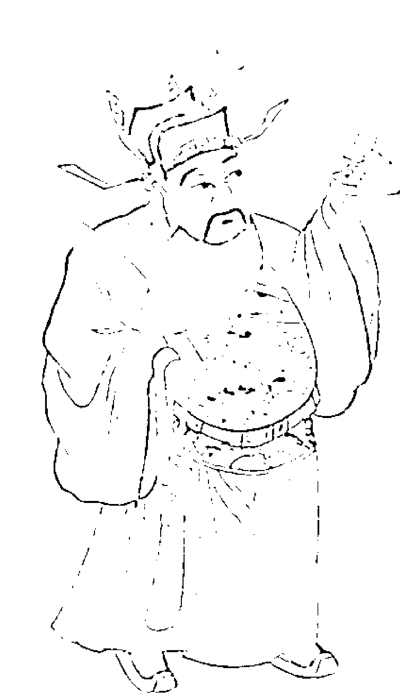

| 宅卦 | 坐向 | 文昌位方向 |
| :--- | :--- | :--- |
| 1、震宅 | 坐东朝西 | 西北位 |
| 2、巽宅 | 坐东南朝西北 | 正南位 |
| 3、离宅 | 坐南朝北 | 东南位 |
| 4、坤宅 | 坐西南朝东北 | 正西位 |
| 5、兑宅 | 坐西朝东 | 西南位 |
| 6、乾宅 | 坐西北朝东南 | 正东位 |
| 7、坎宅 | 坐北朝南 | 东北位 |
| 8、艮宅 | 坐东北朝西南 | 正北位 |

如果由于房子的先天结构问题，文昌位不能做书房，则只能退而求其次，将书桌的位置放于书房的文昌位，亦可收效。如果正好文昌位在先天格局中是厨厕位，则须在此处多放置水种植物，以化解文昌受冲。

> （以上内容请参与本书有奖问答之十四）

## 仁智之局

除了文昌位须注意确定之外，每个书房都必须布下“仁智之局”，即书房应成仁智之居。何谓仁智？即“仁者乐山，智者乐水。”书房的使用者必须后有靠山前有水，其中乐山是指书桌的座位应背后有靠，背后靠墙，既有安全感，又不易背后受扰，因为人耳能听八方，但眼只观六路，背后有靠，即谓有靠山，但凡能够成功出人头地的人士，除了自我的努力、智慧、机遇外，万万不可没有靠山。背后有靠，则读书考试、与人交往均能得贵人相助、宠爱，打工一族则更可得上级赏识提携。古代从事文书类办公工作的人员除了讲究靠山之外，为了避免终日案牍劳形而一无所获，还将座椅后背镶上天然呈群山状的大理石为靠山，以加强倚靠的效果，美其名曰：乐山。所以书桌的座位后背应以不靠窗、不靠门等虚空为要，除了风水上的讲究之外，也缘于办公桌背后有人来去走动，则坐不安稳，难以集中注意力。

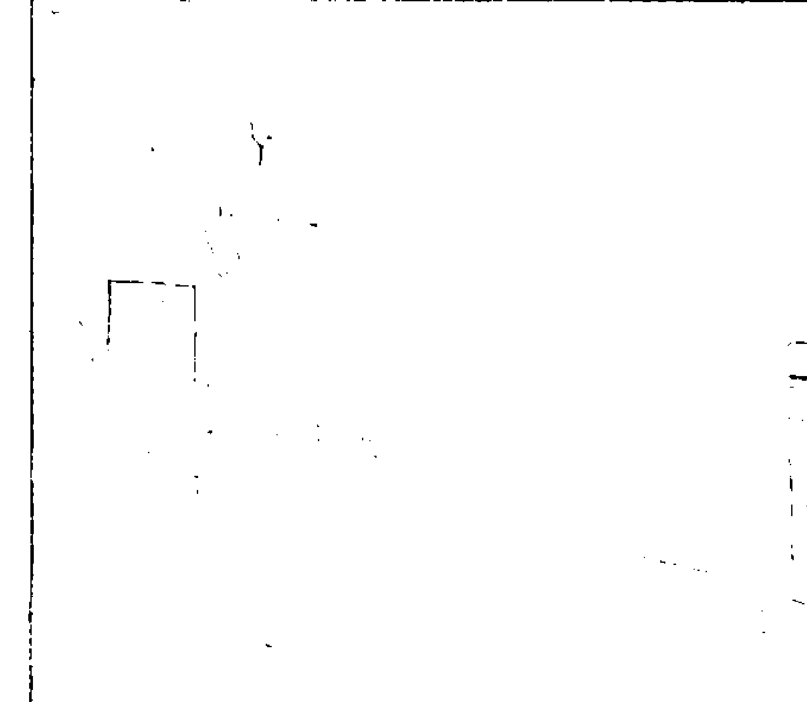

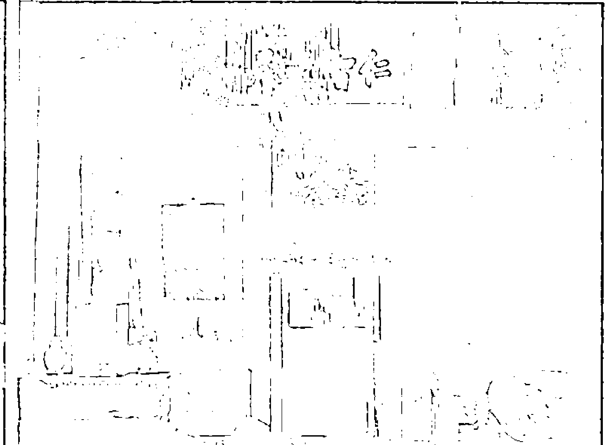

而在书房的案头前方摆上富贵竹之类的水种植物，以单支如三、五、七枝为佳，生机盎然、赏心悦目，利于启迪智慧，能起智者乐水之效。

除了以上几点，书房还有诸多的讲究，才能够壮旺文昌，并且配合文昌的力量，达到读书考试胜人一筹的效果。

首先，书桌前面应尽量有空间，面对的明堂要宽广。有人认为一般书房的位置本来就不太宽敞，如何能够有明堂？其实以门口为向，则外部就可成明堂，这样则前途宽敞，易于纳气入局，用者则头脑思路敏捷，宽阔无碍，能成大器；另外也可选面窗而坐，以窗外宽阔空间为明堂，能够观赏外部景观以养眼，也可收较好的功效。但窗外不可正对旗杆或电线杆、烟囱等，如果正好面对旗杆或电杆、烟囱等不利之物无法避免，则可在书桌上放置一块稳稳当当的镇纸来对外部的冲煞进行化解。

其次，书桌不能摆在房间正中位，因为这是四方孤立无援格，前后左右均无依无靠，主学业、事业都孤独，很难得到发展；

第三，书桌不能被门冲，因为如被门冲，读书、学习等就易受到干扰，不易集中精神，效率降低，容易犯错。

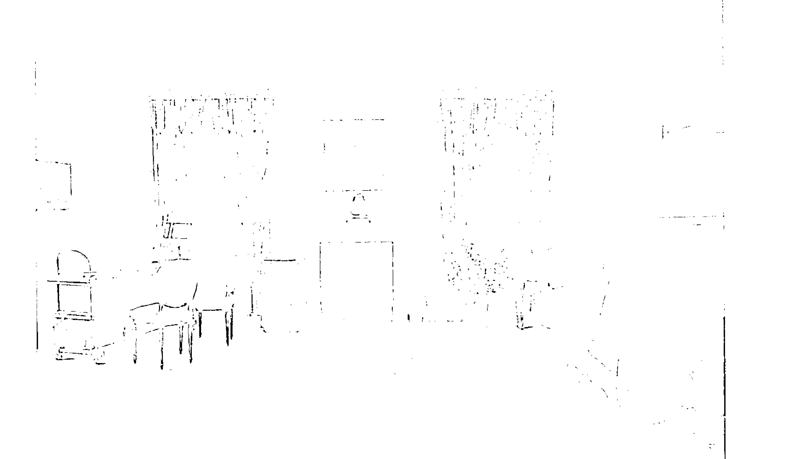

书房的门向也要注意，首先不能正对厕所、厨房，否则会令文昌受水火冲击，并引入秽气，导致精神不佳。除此之外，坐椅切记不要被横梁压顶，及类似横梁的物件如空调器、吊灯等压在头上，如有这样的情形，则易于处处受制，难以舒展。

> (以上内容请参与本书有奖问答之十五)

## 办公用品的摆放

书桌上的用品摆放也各有讲究，因为与条理思路的关系均很密切。书桌上一定要有山高水低的格局。

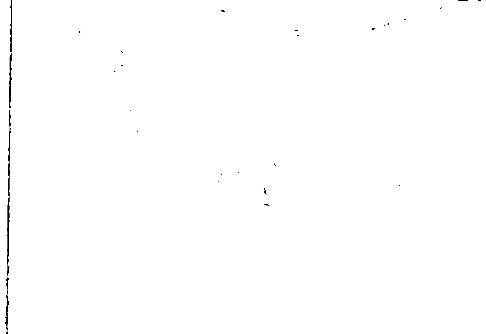

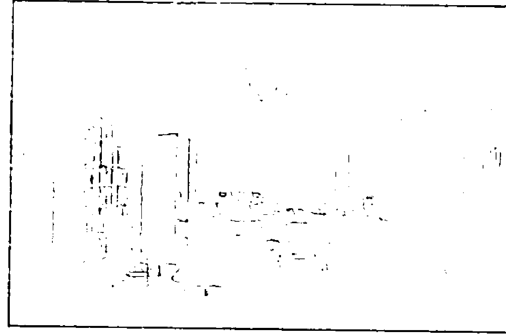

书桌两头的用品不能都摆放得高过于头，使用者不能够伸展出头，这是大忌。必须有高有低进行配制，具体来说，男性用者，左手青龙位宜高宜动，右手白虎位宜低宜静，而重要的有能量通过的物品如电话、传真机、电灯等均应放置左方，才较为有利。如是女性用者，则应加强右方白虎位，重要的物品可放置于右方。

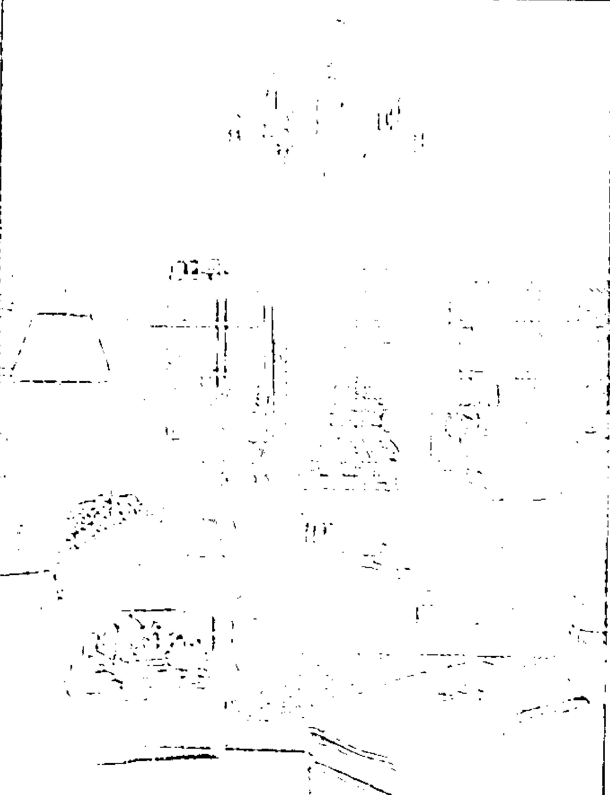

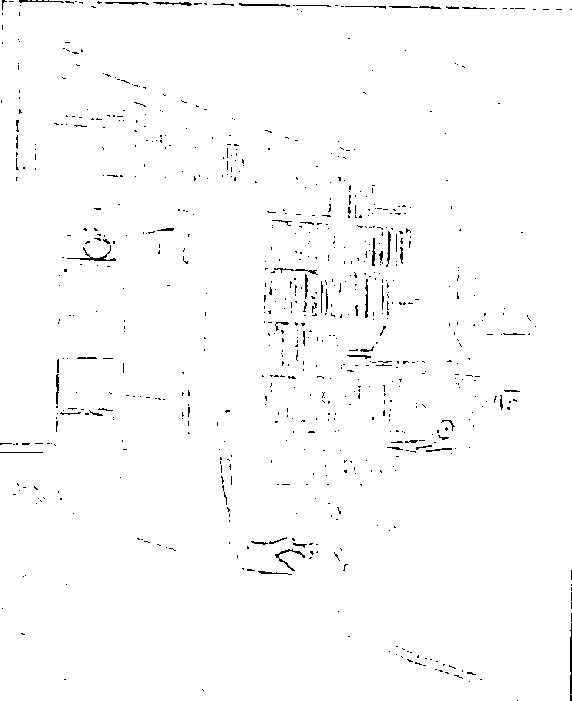

书桌宜保持整齐、清洁，每一次工作后或读书完毕即要不嫌麻烦，收拾干净整齐，尽量把垃圾清除掉。这样才有利于下次读书、学习，使其效应保持得以周而复始，每一次均由整齐开始，由整齐结束，有始有终，有益于迅速开动大脑机器及思维灵活清晰。

书房中的家具宜用深色，如栗色、深褐色、铁红色等端庄、凝练、厚重、质朴，有利于思考而不流于世俗花哨。

书房中的书桌摆放还要注意的是书桌不可面对主人房的卫生间或公共卫生间的墙壁，也不能背靠卫生间的墙壁。

书房颜色宜沉稳

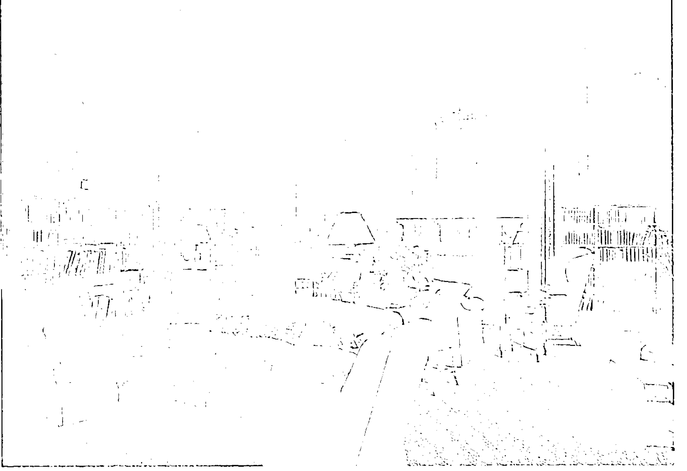

## 灯光照明

书房的灯光照明以日光灯和白炽灯交织布局为佳，可收动静自如之效，但不能用过于花哨的彩灯放置，令人眼花缭乱，顿生疲惫，并且要避免用落地大灯直照后脑勺。

(以上内容请参与本书有奖问答之十六)

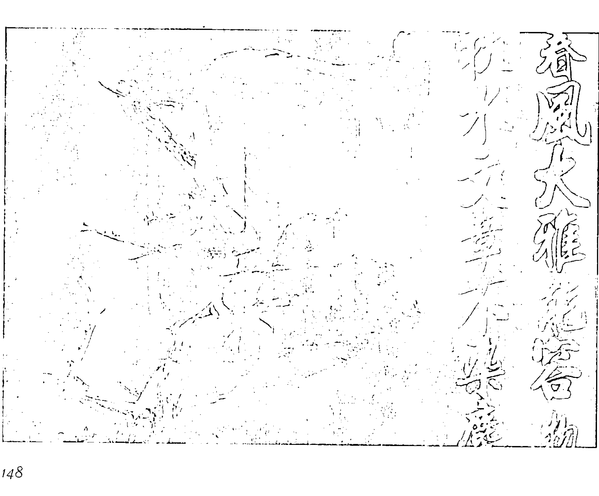

## 口福之乐的期待与寄托

进食
是人的本性
是人类赖以生存的最基本需求
也是唯一能随时与“性”
相提并论的赏心乐事

要想一家人常享口福之乐
安康永在
不仅与食品本身的色、香、味及营养有关
更取决于烹饪食品的地方
厨房和进食的场所
餐厅的风水格局
尤其是厨房的炉灶、锅台、烤箱、电饭煲
消毒碗柜、水槽、冰箱、抽油烟机、排气扇
以及餐厅的餐桌、酒柜、凳椅等
与金、木、水、火、土五行之气一一对应
也就直接关系到一家人的健康、财运、官运
堪称兹事体大

# 厨房与餐厅的风水

## 厨房

现代的厨房系统，一般由烹调、洗涤、配餐、贮藏四个基本部分组成。近年来，也有将餐桌、餐椅等组织到厨房系统中的，以构成完整的流程。

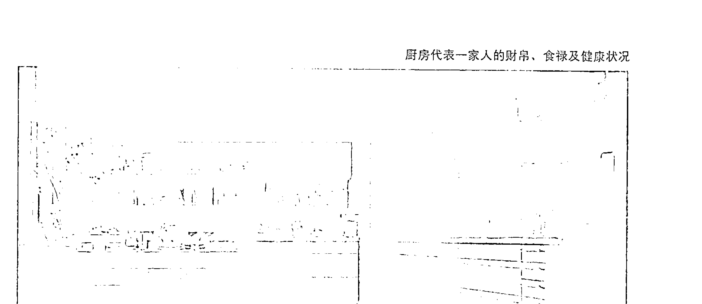

厨房代表一家人的财帛、食禄及健康状况

### 厨房的位置选择

因为厨房代表一家人的财帛、食禄及健康状况，并且把许多本不相容的器具集合在一起，所以其方位一定要仔细考量，才有益于家庭的健康与发展。

厨房不宜向南方，因为南面属火，厨房也属火，火上加火，则对居家不利，并且向南食物易腐化，所以厨房最好不要设在南向。厨房也不宜在家的中央，因为住宅的中心最忌受污，而最适合的位置为住宅的东部与东南部，东与东南的五行均属木，与水、火都能和平共处，特别适合作为厨房与吃早餐的好地方。

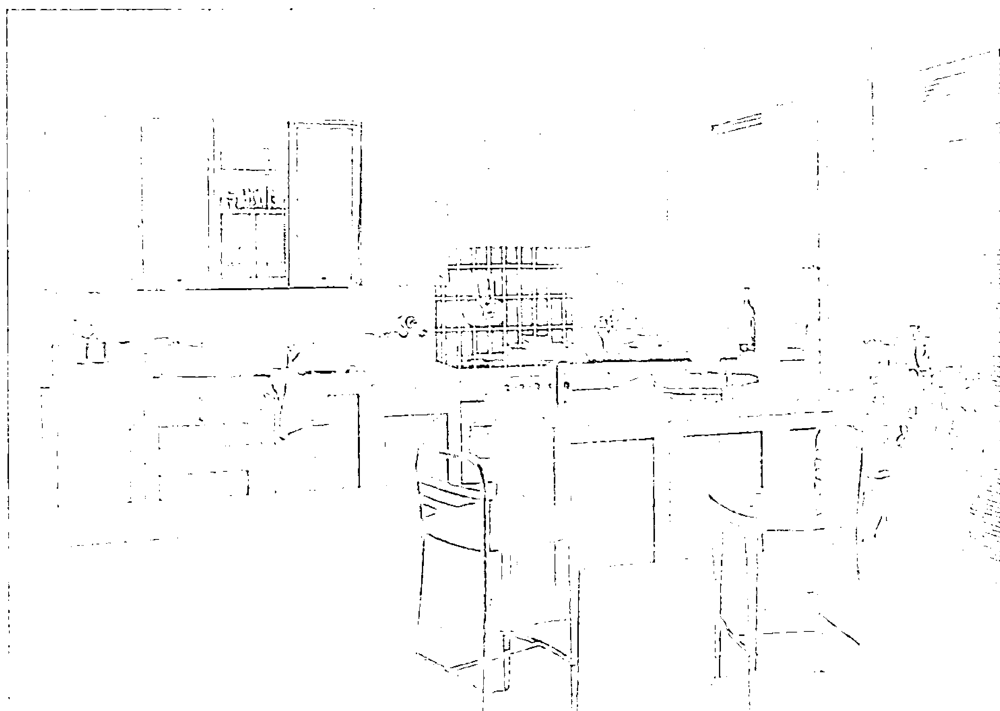

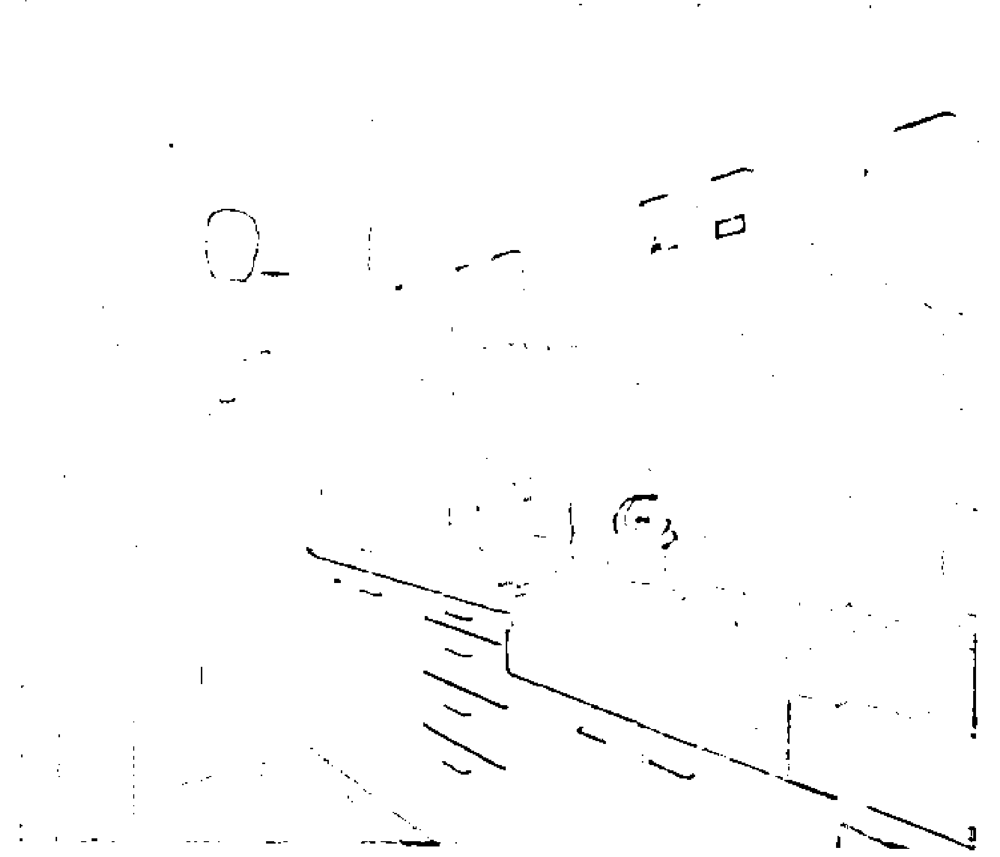

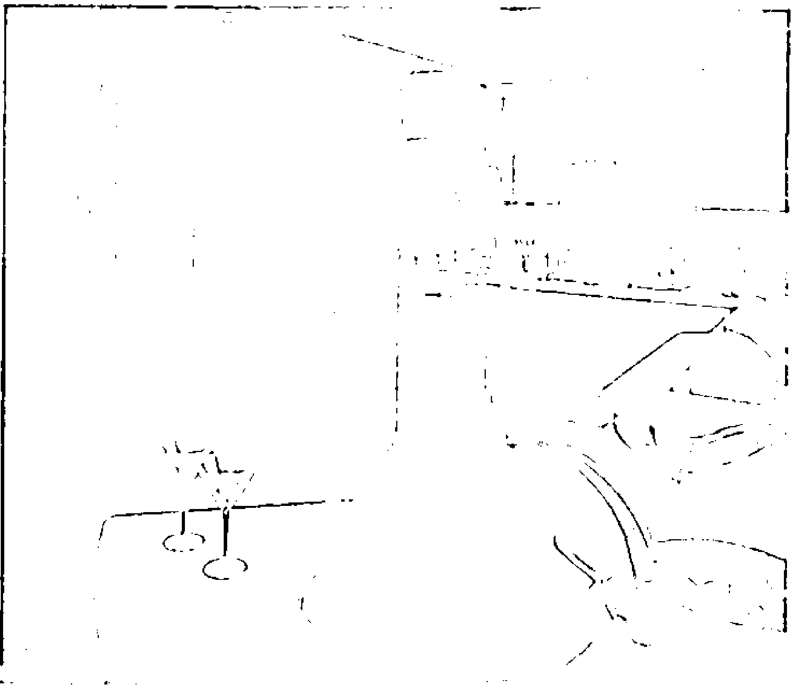

### 厨房风水的十大忌讳

- 1、厨房门不可正对大门。《阳宅三要》指出：“开门见灶，钱财多耗。”此格将使女主人健康有损并且家中难聚财，运气反复。如果遇到这样的格局，唯一的避免方法是改门。
- 2、厨房门不可正对卧室门：油烟熏冲，易致居者头昏脑涨，脾气暴躁。
- 3、厨房门不可正对厕所门：炉灶作为一家大小口腹之源，须纳吉气，厕所为不洁之地，且厨房代表火，厕所代表水，水火不容，会导致夫妻失和、家口不宁。
- 4、厨厕不可同门：有些家庭为了节省空间，令厨厕共用一门进出，令家居水火无度，很不吉利；更有甚者，先进厕所，再进厨房，则口腹之欲，绝对荡然无存！
- 5、厨房的地面不可高过厅、房等地面，这一方面是可以防止污水倒流；其次是由于主次有别，厨房不可凌驾于厅、房之上；再次，从厨房入厅奉食，应步步高升，反之则有退财之虞。
- 6、阳台走道不可正对火炉：长廊压火，主不聚财，易患高血压之类的病症。
- 7、厨房的火炉不可正对冰箱、水槽：冰箱亦代表贮藏、聚财之所，其性属水，最怕火攻，易致家人身体不顺。
- 8、灶台不可在横梁之下：凡经常进出及操作之地均不宜受压，灶台作为食物制作的平台，更是如此。
- 9、抽油烟机和炉具之间不可开窗，漏财不吉。
- 10、灶台不可背后无靠：灶主家庭健康、婚姻和功名，宜有所依靠，背后不可虚空，一定要靠实墙，如是玻璃墙都不妥。

### 厨房环境空间感的营造

现代家庭厨房因受居住空间的限制普遍偏小，所以厨房环境产生的视觉心理很重要。狭长的空间应该寻求节奏起伏的韵律感；既方又小的空间应该谋求比例尺寸的适称感；不规则的空间应该追求形态、整齐的秩序感。通过家具、地瓷砖的横线造成室内的宽度感；竖线增加室内的高度感；通过淡色调的选用扩张室内空间；通过多光源的调配增添室内的空间层次。总之，可以通过造型、材料、色彩等不同的组合方式在视觉上所呈现的多姿多彩，来弥补厨房条件的不足。

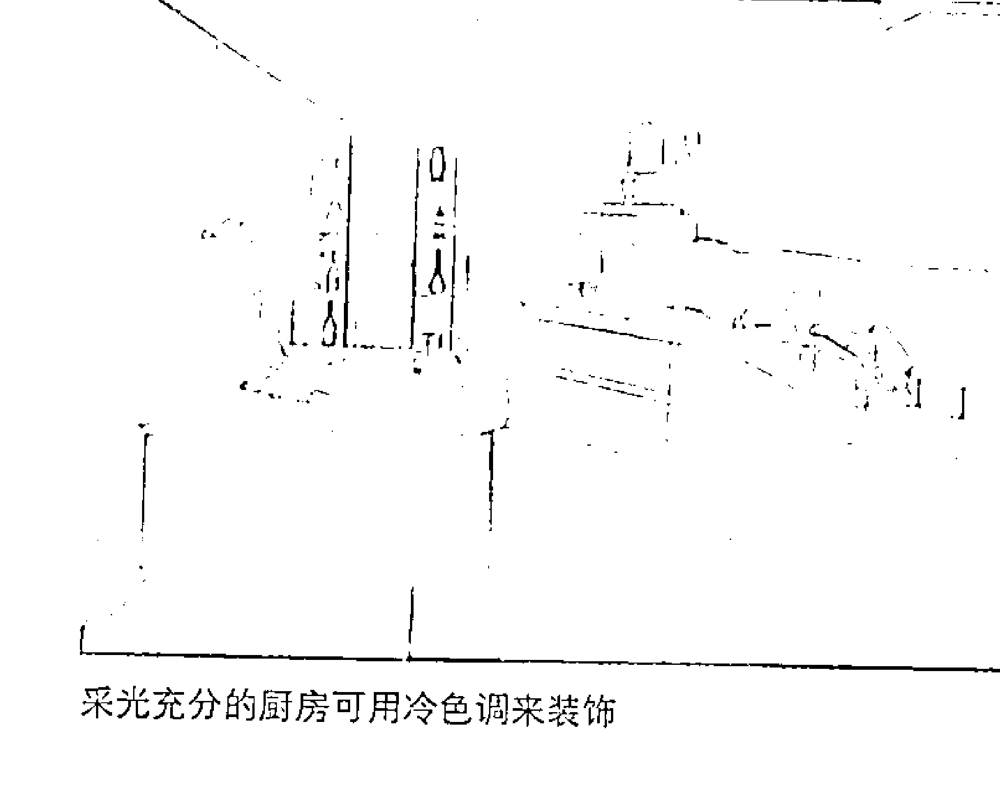

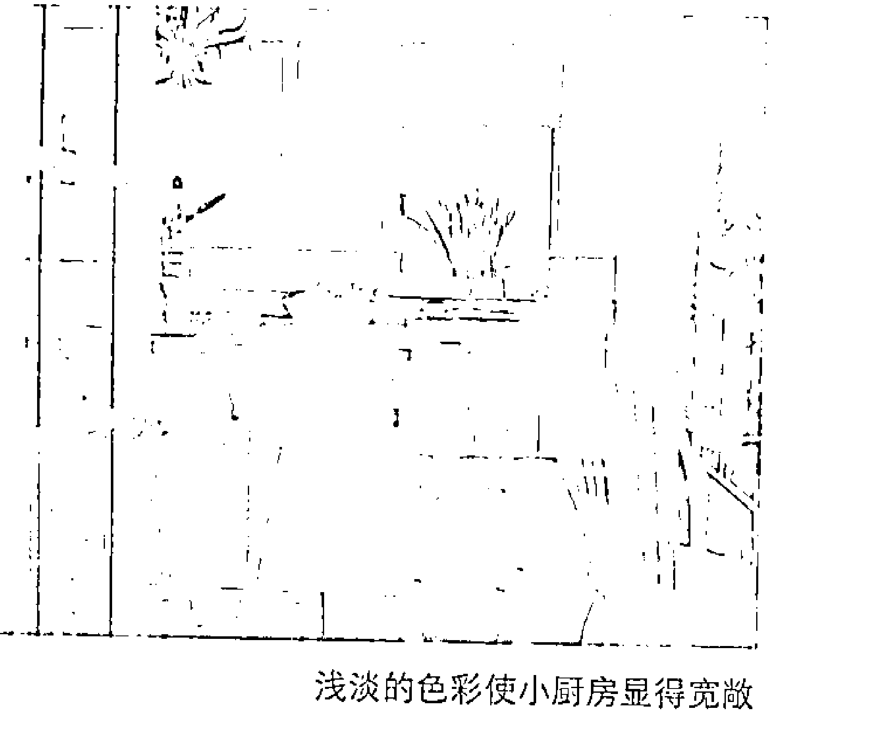

### 厨房的色彩

厨房色彩，可根据个人的兴趣爱好而定。一般来说，浅淡而明亮的色彩，使狭小的厨房显得宽敞；纯度低的色彩，使厨房温馨、亲切、和谐；色相偏暖的色彩，使厨房空间气氛显得活泼、热情，可增强食欲。

天花板、上下壁、护墙板的上部，可使用明亮色彩，而护墙板的下部、地面使用暗色，使人感到室内重心稳定。

朝北的厨房可以采用暖色来提高室温感；朝东南的房间阳光足，宜采用冷色达到降温凉爽的效果。

巧妙地利用色彩的特征，就能创造出空间的高、宽、深，作视觉上的调整。厨房空间过高，可以用凝重的深色处理，使之看起来不那么高；太小的房间，用明亮的颜色，运用淡色调，使之产生宽敞舒适感。

充分的厨房可以用冷色调来装饰，以免在夏日阳光强烈时变得更炎热。

### 创造诱导食欲的环境

如果厨房兼有餐厅功能，就应该创造一个整洁、优雅、能诱导食欲的环境。例如，在照明上选用造型雅致灯光柔和的升降式餐灯；色调上选用橘黄色、乳黄色或柠檬色；织物台布之类选用条纹或活泼的富有乡土气息的图案；装饰上挂一至三幅食品、花卉静物摄影，配上吊兰、秋海棠之类绿化以协调水火；家具选用简洁、明快、舒适的造型，如再配上音乐的烘托，更能令人食指大动。

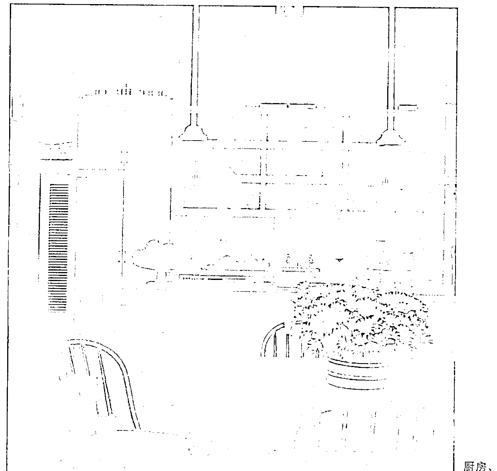

厨房、餐厅一体就必须匠心独运

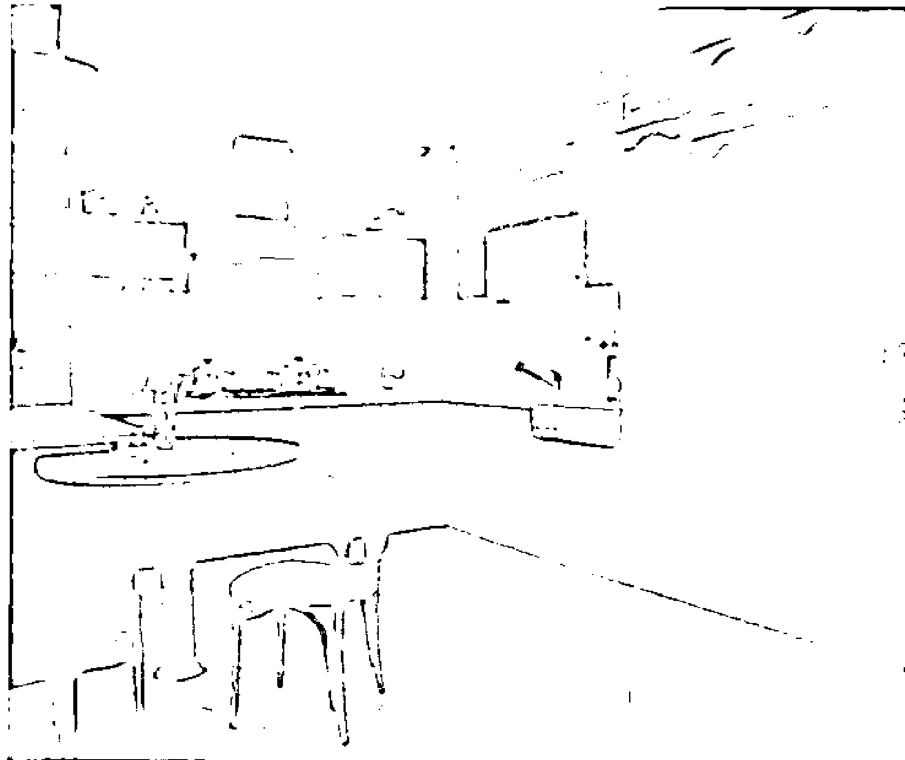

封闭式柜体设计既美观又实用

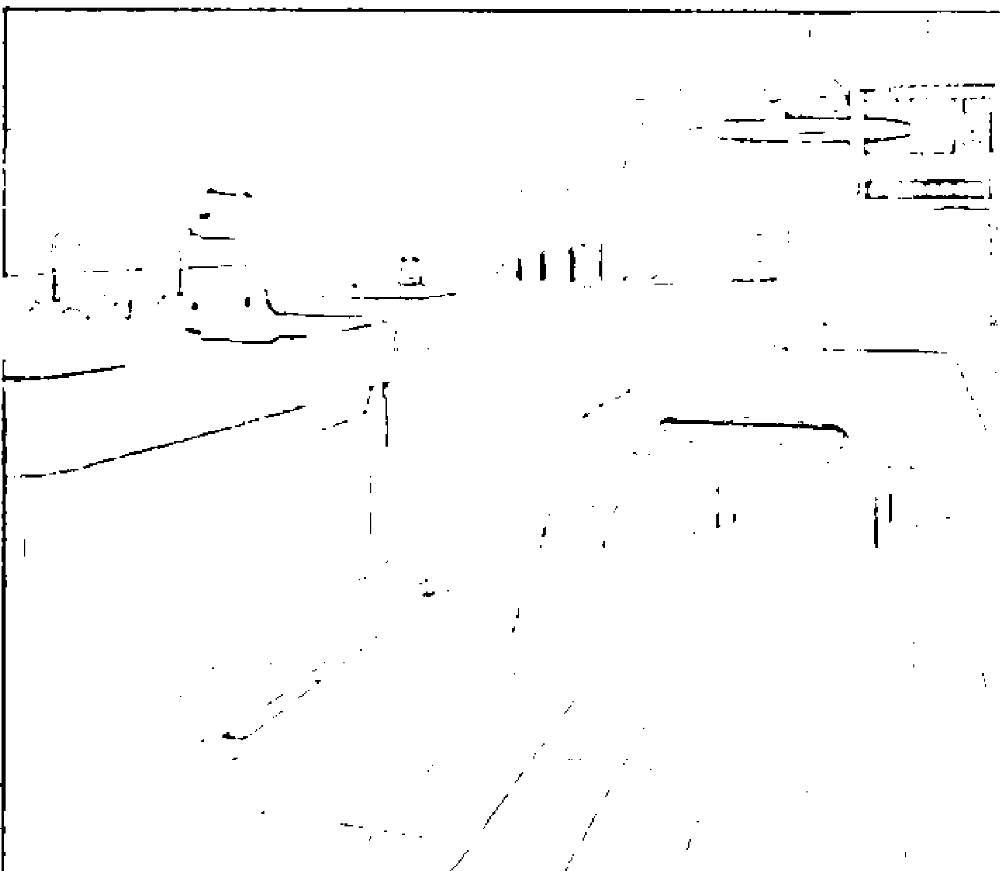

厨房空间要重视人体尺度

### 厨房应避免死角

厨房中往往有不少死角，例如：吊橱的顶部，墙的转角处，水池的下面等。由于这些是平时视力所难及的地方，也是风水上的重点，在厨房装修时，常常被忽视，不仅积灰，而且容易隐藏、滋生虫类。所以，在厨房的设计中，尽可能采用封闭式柜体设计。如吊橱封到顶，煤气柜、水池下部也最好落地封实。这样不但利用了空间，节省了材料，而且避免了死角，既不致藏污纳垢，同时也使厨房显得卫生又美观。

### 厨房空间要重视人体尺度

厨房案台的高度，柜橱或其他设备相互之间的通行间距，头顶上或案台下的贮存柜高低以及适当的光线都是要考虑的问题。这些距离尺寸必须与人体尺寸相联系，才能保证使用时操作方便。

在设计厨房时，有一个很重要的人体尺寸往往被忽视，那就是人的眼睛高度。关于这一点要注意的是，在确定炉灶面的排烟罩底边的高度时，要保证使用者能看到炉灶后部的火眼。

### 厨房照明

厨房应该保持明亮、清洁与干燥，如常年有天然光线最理想，有阳光入内照射，即使每天只有一段时间，也可清新空气并且有除菌的功效。如果厨房由于先天的格局问题而较为黑暗，则灶台须配备一个明火的炉具，来壮旺厨房的能量，而不能全用电炉、电磁炉之类。

一般家庭的厨房照明，除基本照明外，还应有局部照明。不论是工作台面，还是洗涤器、炉灶或储藏空间，都要有灯光照射，使每一工作程序都不受影响，特别是不能让操作者的身影遮住工作台面。最好是在吊柜的底部安装隐蔽灯具，且有玻璃罩住，以便照亮工作台面。墙面应安装些插座，以便工作时点亮壁灯。

由于厨房蒸汽多，较潮湿，厨房灯具的造型应该尽量简洁，以便于擦洗。另外，为了安全起见，灯具要用瓷灯头和安全插座，开关内部要防锈，灯具的皮线也不能过长，更不应有暴露的接头。

厨房里的贮物柜内也应安装小型荧光管灯或白炽泡，以便看清物品。当柜门开启时接通电源，关门时又将电源切断。

### 灶台与炉具的位置

灶台在家居风水中占有极其重要的地位，安法正确则可有利于健康、婚姻和功名。《解凶灶法》指出：“灶乃养命之原，万病皆由饮食而得，灶宜安生气、天医、延年三吉之方，不宜凶方。”在坐北朝南的住宅中，生气即指东南方，称之为上吉；天医即指东方，称之为中吉；延年即指正南方，称之为上吉；这三个方位都是吉方，故利于安置厨灶。

虽然生气、天医、延年三个方位都是吉方，但如何安灶还应该按照住宅主人的不同情况去具体实施。如功名不利，则宜安生气灶；如健康不佳，则宜安延年灶；如婚姻不顺，则宜安天医灶。

而炉具是厨房的最重要的器具，因为它代表了创造和贡献的能力，所以最好选择使用自然明火的炉具如煤气炉，尽量避免使用会释出磁力的电炉和微波炉作为主炉，炉具以放在厨房中央的灶台上最佳，而炉具的表面材料是不锈钢的较好。

炉具的使用有三不宜：

- 1. 炉具须避水，这有两层含意，首先因为炉具与洗碗池各自代表了五行中的火和水，勿把它们紧贴而放，中间要隔切菜台等缓冲带，以避免不协调。如可能，也应令其他水性的用具，如冰箱、洗碗碟机与洗衣机等不紧临炉具。其次，炉具不要坐南向北，由于北面属水，应避免水火攻心。
- 2、炉具也须避风，不宜正对门口和窗口，如在风口上，易引起火势逆流而导致家居危险。
- 3、炉灶不可设在下水道上方，排水系统要由住宅的前方排向后方，厕所污水不可从厨房下方流过。

（以上内容请参与本书有奖问答之十七）

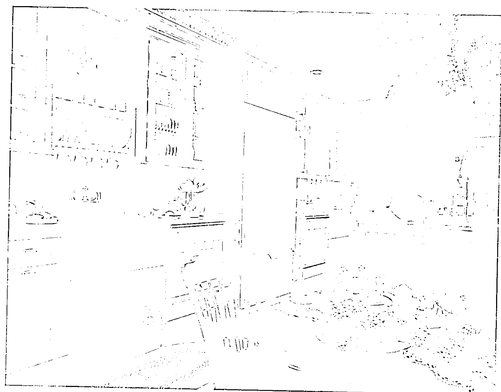

厨房是个大作坊，应该注意细枝末节

### 厨房的家具与用品

厨房里的食物柜、层架与工作桌面尽量多安装圆角与圆边的，避免尖角，以策安全。

必须安排好储物空间并保持清洁与整齐，不要让各类用具、小装置、器皿等使厨房变得杂乱无章。水龙头要维修良好，并保持下水道不堵塞。厨房井井有条则主妇持家有道，自然是顺理成章的事。

### 厨房的植物

不论空间大小，任何厨房总有空间并且应该至少摆上一盆植物。植物出现于厨房的比率仅次于客厅，这是因为家庭中有些成员每天花很多时间在厨房里，且环境湿度也非常适合大部分的植物。此外，一般家庭的厨房多采用白色或淡色装潢以及不锈钢水槽，色彩丰富的植物可以柔化硬朗的线条，为厨房注入一股生气。

通常位于窗户较少的朝北房间，用些盆栽装饰可消除寒冷感。由于阳光少，应选择喜阴的植物，如广东万年青和星点木之类。厨房是操作频繁、物品零碎的工作间，烟和温度都较大，因此不宜放大型盆栽，而吊挂盆栽则较为合适。其中以吊兰为佳，居室内摆上一盆吊兰，在24小时内可将室内的一氧化碳、二氧化碳、二氧化硫、氮氧化物等有害气体吸收干净，起到空气过滤器的作用，此外，在疾病的防治上，吊兰具行活血接骨、养阴清热、润肺止咳、消肿解毒的功能。

虽然天然气不至于伤到植物，但较娇弱的植物最好还是不要摆在厨房。厨房的门开开关关，加上厨房里到处都是散发高热的炉子、烤箱、冰箱等家电用品，容易导致植物干燥。摆些普通而富有色彩变化的植物是最好的选择，这要比放娇柔又昂贵的植物来得实际。适合的植物有秋海棠、凤仙花、绿萝、吊竹草、天竺葵及球根花卉，这些植物虽然常见，若改用较特殊的套盆如茶盆、赤陶坛、黄铜壶等，看起来就会很不一样。

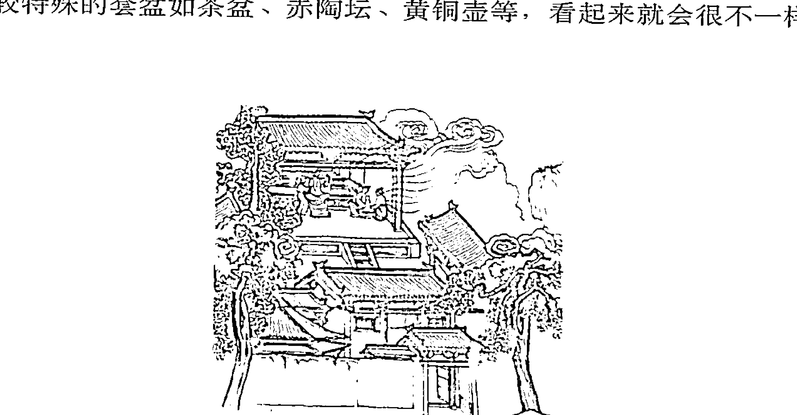

## 餐厅

“民以食为天”、“食色性也”，均说明进食的重要性，而且从风水的角度看，餐厅因是补充体能的所在，与户主的色相关系密切。布局成功的餐厅能产生愉悦的气氛，使用餐的人精神松弛、欣赏、喜爱食物并有彻底消化的时间，还会有益于用餐者的交流与家庭成员的和谐相处。

餐厅应能产生愉悦的气氛

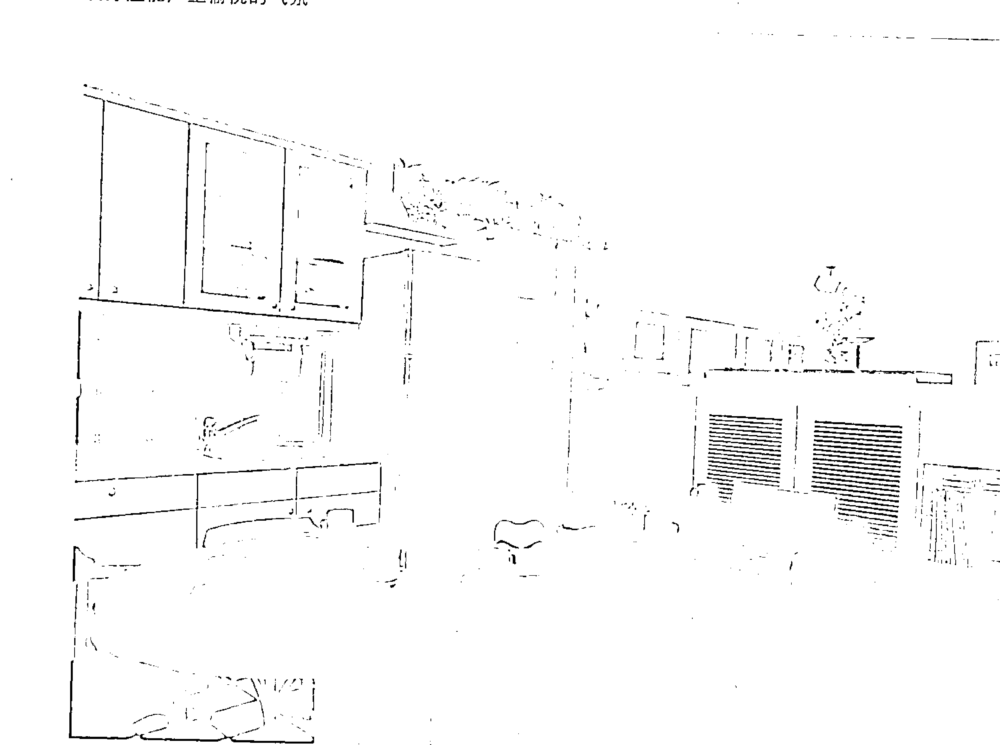

### 餐厅的方位

餐厅和厨房的位置最好相邻，避免距离过远，当然一出厨房就是餐厅更佳，动线最短。习惯中餐者的餐厅不宜设在厨房中，因油烟及热气较大，在其中无法轻松地用餐。餐厅的位置有以下几个吉方：住宅的东、东南、南与北方，餐厅的方位必须根据具体的情况进行选择，才能创造良好的用餐环境。

- 1、住宅的南部，日照光线充足，而且南面属火，可令家道如火般腾腾起，日益兴旺。
- 2、冰箱通常是摆在厨房内，不过也有摆在餐厅的。若餐厅内设置冰箱，最好是朝北不宜朝南，因为可纳北方寒气，并且可以避免水火不容，导致家中多口角。
- 3、东、东南方属木，太阳早晨自东方升起，具备浓厚的生机和活力，因此是早餐最好的位置。
- 4、春秋季的餐厅朝向以东方为好，而夏季以北方为佳。在进食区里的首要重点是保持整洁以维持食物卫生，同时也要制造轻松的进食气氛，令消化良好，而且有愉悦的环境。

餐厅的布置要简洁精雅，千万不能摆放太多物品以至过于杂乱。居住者不仅要注意餐厅的格局及摆设布置，而且更应注意保持空气的流通及清洁卫生。

### 餐桌的十大注意事项

在餐厅之中，最重要的家具当然首推餐桌，而现代的餐桌与古代相比，有了实质性的变化。在古代，大多实行分桌而食，餐桌亦称为食案，就餐者人各一案。食案大都小巧轻便，所以才会出现汉代梁鸿之妻孟光与其相敬如宾，日日为他“举案齐眉”奉食的佳话。而在现代，“举案齐眉”几乎是不可能的，因为现代的餐桌普遍体量较大而且沉重，将就餐者聚集一起，作共同进餐之用，因此餐桌的风水对家庭团圆、夫妻和睦的影响很大。关于餐桌的风水有以下十大注意事项：

- 1. 餐桌宜选圆形或方形：中国的传统宇宙观是“天圆地方”，因此日常用具大多以圆形及方形为主，传统的餐桌便是典型的例子。传统的餐桌形如满月，象征一家老少团圆，亲密无间，而且聚拢人气，能够很好地烘托进食的气氛，早已深入人心。至于方形的餐桌，小的仅可坐四人，称为四仙桌；大的可坐八人，又称八仙桌，因它象征八仙聚会，也很吉利，方正平稳，象征公平与稳重，虽然四边有角，但因不是尖角而无杀伤力，因此被人乐于采用。由于餐桌的形状会影响进膳的气氛，所以木制的圆桌或正方桌在家庭人口较少时适用，而椭圆或长方桌在人口较多时适用。

- 2. 餐桌的质地要讲究：餐桌表面以易清理为本，大理石与玻璃等桌面较为坚硬、冰冷，艺术感较强，但因其易迅速吸收人体饮食后产生的能量，不利于就餐者的坐谈交流，因此不宜全部用于正餐桌，但可以通过形状和质地进行调和，比如：圆形的大理石餐台或方形木桌等，有这些组合会带来良好的效应。

- 3. 餐桌最忌有尖角：尖角角度愈小便愈尖锐，杀伤力亦愈大，风水学视为禁忌。因为三角形餐桌会导致家口不和，家人的健康受损，而棱形餐桌则会导致钱财外泄等。至于那些波浪形水状的餐桌，虽与传统不符，但因并无尖角，因此尚可勉强选用。总之，餐桌始终以圆形及方形为宜。

#### 4. 餐桌之上宜平不宜斜：

餐桌上之屋顶宜平整无缺，若有横梁压顶，或位于楼梯下，或屋顶倾斜，这均会对家人健康有损。横梁压顶是风水的大忌，宅内不管哪个地方有横梁压顶均不吉利，而尤以压在睡床、沙发、餐桌及炉灶之上的祸害最大，必须尽量设法避免。若餐桌上面有横梁压顶，则可作吊顶进行掩盖，但最好的方法还是将餐桌移至他处。如果餐桌不能移离斜顶之下，则也可用假天花板把斜顶填平；餐桌若是处于楼梯下，则可把两盆开运竹摆放在梯底来化解，但要注意开运竹能不断向上生长，保持常青，否则便难收效。

#### 5. 餐桌不宜被大门直冲：

住宅风水学讲究“喜回旋忌直冲”，如有犯冲便会导致住宅的元气易泄，风水因而大受影响。若餐桌与大门成一直线，站在门外便可以看见一家大小在吃饭，那绝非所宜，化解之法，最好是把餐桌移开。但如果确无可移之处，那便应该放置屏风或板墙作为遮挡，这既可免除大门直冲餐桌，而且一家围炉共食也不会因被人干扰而倍感难受。

#### 6. 餐桌切忌被厕所门直冲：

厕所在风水上被视为“出秽”的不洁之处，故此愈隐蔽便愈好，如对正餐桌，往往导致家人健康不良。如果餐桌与厕门直冲，最好便是尽快把餐桌移到别的位置。若是确实无法移开，便要采用在餐桌的正中摆放一个小水盘，当中用水浸养铁树头或开运竹，以此方法进行化解。

- 7. 餐桌之上不宜用烛形吊灯：有些吊灯由几枝蜡烛形的灯管组成，虽然设计新颖，颇有观赏价值，但若把它悬挂在餐桌之上，那便似是把长短不一的白蜡烛堆放在餐桌之上，这绝非吉兆。因为白蜡烛是丧事的象征，把它放在一家大小共同进食之处，其后果可想而知，故此必须尽量设法避免，但其他颜色的蜡烛则无碍。

- 8. 餐桌不宜正对神台：神台是供奉神祇及祖先之处，严格来说，不宜与凡人进食之处太接近，毕竟始终阴阳异路，仙凡有别。倘若神台所供奉的是观音、佛祖诸神，由于他们均是戒杀生而茹素吃斋，而一般人家吃饭却有大鱼大肉，正面相对便会显得格格不入。如有可能，还是把餐桌尽量与神台保持一段距离，而最重要的是把餐桌移开，务求两者不形成一条直线。

- 9. 餐桌不宜过大：有些人喜欢豪华气派，专门选购特大餐桌，这本无可厚非，但必须注意餐桌与餐厅的大小比例。如果餐厅面积并不宽敞，却摆放大形餐桌，形成厅小台大，非但出入不便，而且会阻碍餐厅的风水。有这种情况出现，最好的办法当然是更换面积较小的餐桌，务求餐厅与餐桌的大小比例适中，这不单出入方便，而且对餐厅风水亦大有改善。

- 10. 餐桌不宜被门路直冲：餐桌是一家大小聚首吃饭的所在，必须宁静安稳，才可闲适地享用一日三餐，如有门路直冲，则不但有损风水，更令家人食不甘味，而如果餐厅多通道，则犹如置身在漩涡中，周身不畅，亦须尽量设法改善。

### 酒柜的布置要点

对不少家庭来说，酒柜也是餐厅的一道不可或缺的风景线，它陈列的不同美酒，可令餐厅平添华丽色彩。酒柜大多高而长，在风水学来说，这是山的象征；矮而平的餐桌则是砂水的象征，在餐厅中有山有水，配合得宜，对宅运大有裨益。在餐厅摆放酒柜有几点须注意，以免破坏住宅风水：

- 1. 酒柜多是既高而又晶莹通透，是一座山的象征，把它放在本命吉方，可符合吉方宜高宜大的风水要义。户主属东四命的，则酒柜宜摆放在餐厅正东、东南、正南及正北这东四方。户主属西四命的，则酒柜宜摆放在餐厅的西南、正西、西北及东北这西四方。

- 2. 酒柜中的镜片不宜过大，一般的酒柜均用镜片来作背板，这令酒柜中的美酒及水晶酒杯显得更明亮通透；但倘若镜片太大，在风水方面便会引起诸多不便。例如酒柜中的镜片若是太大，便不宜与神柜相对，因为这会把神台的香火在酒柜的镜片反照出来，而这正是风水学的大忌，应该尽量避免。万一有这种情况出现，便应把酒柜或神台移位，令两者不正面相对，便可确保无害。

- 3. 酒柜不宜摆放在鱼缸旁边：酒柜是水气重的家具，而鱼缸又多水，两者的本质相近，若是摆放在一起，便会形成水多而缺堤泛滥之虞。若是无处可移，则可在酒柜与鱼缸之间摆放一盆常绿植物，即是以一木隔在两水之间，可消除过多的水气。

在面积较大的餐厅，有些人家喜欢以吧台来代替酒柜，吧台与酒柜的本质一样，水气均重，所以两者在风水方面的讲究并无分别。吧台宜摆放在餐厅的死角，这样才符合风水之道，因吧柜属水，而水性灵活多变，不怕受压，所以摆放在楼梯底也无妨。有些不喜饮酒的家庭，在餐厅中不摆放装酒的酒柜，而以装载杯碟的杯柜代替。那么，杯柜就不宜太大，如以杯柜来填满整幅墙壁，全无空白的余地，这样就不理想。如果杯柜与墙壁等长，则可以改用矮柜，这样能够改善餐厅风水。

（以上内容请参与本书有奖问答之十八）

### 餐厅的装饰四要素

1. 墙壁的颜色：墙壁的颜色主要应以素雅为主，如灰色与白色，不能太刺眼，油漆尽量不反光，这一切都为了衬托食物的美感与增加进食消化的效果。

2. 挂画：最好选择可为轻松进食提供和谐背景的图画。赏心悦目的食品写生、欢宴场景或意境悠闲的风景画均可，而通常放在餐具柜上的真水果，鲜翠欲滴，也有着同样的效应。

3. 装饰品：镶嵌在墙上或餐具柜上反映餐桌的镜子，能够反射出食物及餐桌，还可加阔空间并增强食物的能量，是餐厅中非常好的立面装饰之一。

4. 照明：餐厅的灯光一定要较为柔和，才能增加用餐的温馨气氛，强化家庭成员之间的感情交流，餐厅的灯以白炽灯为主，并使用可调节灯光亮度的灯掣，让灯光保持弹性。吃饭时使用低亮度灯光会感觉浪漫而舒适，但是在其他时间，便可使用明亮的光线。

### 餐厅的植物

餐厅是家人团聚的地方，而且位置靠近厨房，浇水便利。配置一些开放着艳丽花朵的盆栽，如秋海棠和圣诞花之类，可以增添欢快的气氛，或将富色彩变化的吊盆植物置于木制的分隔柜上，把餐厅与其它功能区域划分开。现代人很注重用餐区的清洁，因此，餐厅植物最好用无菌的培养土来种植。此外，餐厅植物摆放时还要注意的是：植物的生长状况应良好，形状必须低矮，才不会妨碍相对而坐的人进行交流、谈话。适宜摆设的植物有：番红花、仙客来、四季秋海棠、常春藤等，但在餐厅里，要避免摆设气味过于浓烈的植物，例如风信子。

（以上内容请参与本书有奖问答之十九）

## 厕所乾坤大

即便是皇帝老儿，也不仅要吃喝，而且要拉撒，并且，那拉撒排泄的快感，也并不逊色于进食与房事，非一个“爽”字了得。作为发生与享受这种快感的场所，过去却一直被视为不雅与不洁，殊不知，这个场所其实是一种文明程度的标志，是健康家居的重要指标。从住宅风水的角度看，卫生间是住宅给排水的集中地，无论是“观瀑”还是“听雨”，无论是“排污”还是“冲凉”，在深感“爽快”的同时，还蕴涵着一家人的财运与健康，切切疏忽不得。

## 卫生间的风水

性交、进食、排泄，这是人类产生快感的三大活动，而与此对应，卧室、餐厅、卫生间则是人类产生快感的三大场所。并且，对于一个勤于思索的人来说，自古马上、枕上、厕上也是产生灵感的三大地方。因此，对于卫生间这个既能产生灵感又能产生快感之地，其重要性是绝不能忽略的。

### 卫生间的位置

判断一套住宅的优劣，作为给排水集中地和代表主人健康的元素，卫生间是极为重要的指标，因此卫生间的位置非常讲究。在八宅风水学中，根据先天八卦的组合，把八个方位排一个次序分别为：生气位，为贪狼星；延年位，为武曲星；天医位，为巨门星；伏位位，为左辅星；祸害位，为禄存星；六煞位，为文曲星；五鬼位，为廉贞星；绝命位，为破军星。卫生间本非洁净之地，所以不宜放在吉位，如生气位等，而必须放在绝命位或五鬼位、祸害位、六煞位对其压制，取以毒攻毒之效，则不凶反吉。

（以上内容请参与本书有奖问答之二十）

### 坐东向西宅

### 坐东南向西北宅

### 坐北向南宅

### 坐南向北宅

### 坐西北向东南宅

### 坐西向东宅

### 坐东北向西南宅

### 坐西南向东北宅

厨房和卫生间共同设在住宅的中央，属于双重不利，因为厨房在五行中属于“孤阳燥火”，卫生间属于“独阴浊水”，两者合为一体存在于宅心，不但不能组成阴阳和合，反而成为火水相冲的局面，便主宅运反复，钱财聚散无常。卫生间与主人健康息息相关。卫生间不宜在房屋的中心，风水口诀云：“水火不留十字线”，意即厨、厕不可置于住宅的四正线和四隅线上，特别是住宅的中部，因为房屋的中部是住宅的重心，恰如人的心脏，极为重要，中心受污，有碍观瞻，并且秽气极易对流到其他房间，居住其中，天天吸入大量秽气，易得疾病；而且位于住宅中央的卫生间，必然采光不佳，加上卫生间原本就是水多之地，潮湿的空气闷在室内，易滋生细菌，对健康当然不利。

卫生间位置应尽可能隐蔽，不能直对大门，大门对着卫生间门，主财帛不聚。卫生间不可设在室内走廊的尽头，这在风水上是大凶之兆，因为从卫生间溢出的湿气和秽气，会顺着走廊扩散到相邻的房间，自然不卫生，所以卫生间应设在走廊两旁，且卫生间内最好有窗。卫生间门与厨房门应注意门当户对，不可正对，卫生间与厨房一水一火，两门相对，是水火不容的败局。

> 北京四合院西南方向属巽卦为风，乃凶方，故在此设厕所进行压制

如果家中供有神位，则卫生间不可在神位后面，也不可以在神位的楼上房间，以免亵渎神灵。卫生间不可在房子的文昌位，会污秽文昌，并且卫生间门不可对着书桌。家中如有保险柜，则不可被卫生间门冲。

### 厕所和浴室的统一

由于在住宅的格局里，卫生间经常还有浴室的功能，因此，为了使排水与冲洗对家中其余部分的影响减至最小，应让厕具与浴室门保持恰当的距离，并且，卫生间的地面绝不可以高于其他房间的地面，令卫生间与其他的功能区域做到“干湿分区”。在使用完毕之后，应保持浴室的门关上，特别是套房的浴室。卫生间一定要保持干燥，注意除湿、通风，最好开有较高的窗户，令阳光充足，空气流通，若是密闭且通风不良，对家人健康不利。如果卫生间无窗，则一定要安装排气扇，将废气抽掉。卫生间内设按摩浴缸，其产生的气泡有两种作用，一是撞击身体产生按摩效果，可促进血液循环，帮助肌肉运动，消除疲劳；二是会产生负氧离子，可清新室内空气，有益健康。

### 卫生间的颜色

由于卫生间是属水之地，所以卫生间的颜色也大有讲究，最好能够选择属金的白色及属水的黑色和蓝色，既能刻意地突出卫生间的高雅氛围，也能产生安宁静谧的感觉，利于用厕者的思绪轻松驰骋。而如果用上诸如大红色等刺眼的色彩，则易产生水火对攻的局面，令如厕者产生烦躁的心理，十分不妥。

### 卫生间地面

如果卫生间只有少部分或根本不暴露于自然光中，大理石、花岗石的地板较好，有时为了防滑，也可覆盖一层塑胶垫，这样对浴室有益。当然，家居不同于酒店，所用的物品必须时常清洗更换，避免藏污纳垢，并且如酒店里常用的淋浴帘等，由于会产生静电，对卫生间的气能会产生负面的影响，所以应该尽量避免在家居中使用。

### 马桶的方位

据《紫禁城》杂志载：慈禧太后用的马桶，是檀香木刻制的，外雕一条大壁虎，壁虎的四爪着地，是为马桶底座的四条腿，嘴略张开，以衔手纸，壁虎的尾巴卷起成为把手，壁虎的肚子正好成为容器，里面放置了大量香木的细末，干净且蓬松，慈禧排便时，便物下坠后，立即滚入香木屑里，被香木屑包起来，根本看不见脏物，当然更不会有什么恶臭味了。现代卫生间的硬件配备，已经与古代不可同日而语，但是马桶作为如厕的器具，其位置很有讲究，如果布置不当，则易导致诸多不顺。马桶不可在四正线和四隅线上；马桶不能与大门同向，因为财秽二气共进退，这是一种典型的退财格局；也不要和卫生间门相向，亦即蹲在马桶上正好对着门，既不雅观且退财，马桶坐向最好是和卫生间门垂直或错开。马桶不可明冲床位、暗冲灶位。在方向上，最重要的一点是马桶不宜坐北朝南，避免形成水火对攻的局面。

### 卫生间的植物

由于卫生间湿气大、冷暖温差也大，选择绿色植物时一定要注意，用盆栽装饰可增添自然情趣。养植有耐湿性的观赏绿色植物，可以吸纳污气，因此适合使用蕨类植物、垂榕、黄金葛等。当然如果卫生间既宽敞又明亮且有空调的话，则可以培植观叶凤梨、竹芋、蕙兰等较艳丽的植物，把卫生间装点得如同迷你花园，让人更加肆意地享受排泄与冲洗的乐趣。

现代人最舍得花钱的建筑部位，其实就是厨房和卫生间。以卫生间的档次衡量一套住宅的档次，不失为一个简洁的好方法。现在的不少地方对卫生间命名很考究，比如男厕美其名曰“观瀑亭”，女厕叫“听雨轩”，甚至男厕以黑桃K为标志（代表king，国王），女厕以黑桃Q为标志（代表Queen，王后），或者谐称为“山水间”。这是否就代表大家对于卫生间的高度重视？但是，如果只是做表面的文字功夫，仍然一如既往，重吃喝，轻拉撒，对硬件的设施没有严加选择，格局没有细意考究，那么，重视卫生间建设只是一句空话。

> (以上内容请参与本书有奖问答之二十一)# 让你家的眼睛顾盼生辉

如果说眼睛是心灵的窗户，那么，住宅中那一扇扇明亮的窗户，就像是一户户人家的眼睛。无论是凭窗远眺，还是临窗夜读，你领略到的，不仅是阳光、明月、星空、清风、春雨，或者远山、近水，更是一种亲近自然的生活方式。

窗户是一户人家的“风水眼”，具有调节住宅气脉的重要功能。窗户的朝向、形状、大小、多少，以及窗帘的色彩、材料质地等等，也就大有说道，不可马虎。

# 窗户的风水

窗户和门一样，吸纳阳光和空气进入室内，也是私人生活与外界沟通的管道。古印度的筏蹉衍那在其《爱的格言》中说：“居室要能够愉娱人的视力。”住宅也反映了居住者的矛盾统一观念，既希望与外界保持适度的距离，获得独立性和安全感，又希望与外界联接在一起，达到和谐的统一，因此需要一条通向大自然，通向社会人群的纽带，窗户就是这独特的纽带。

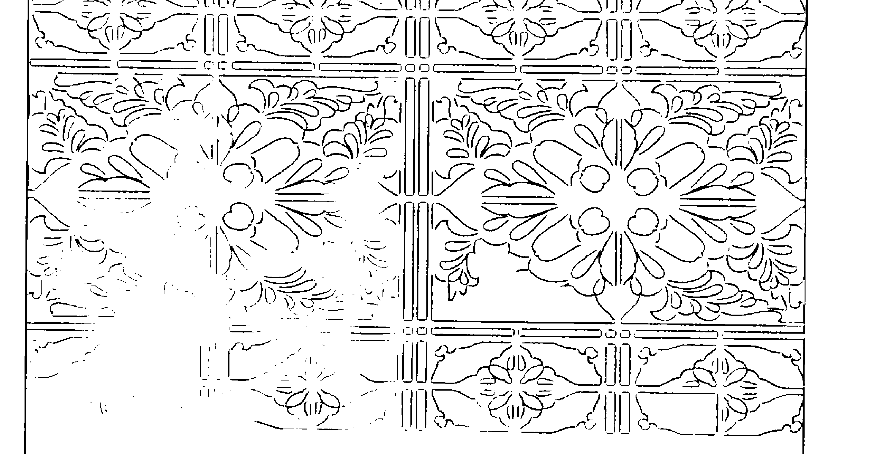

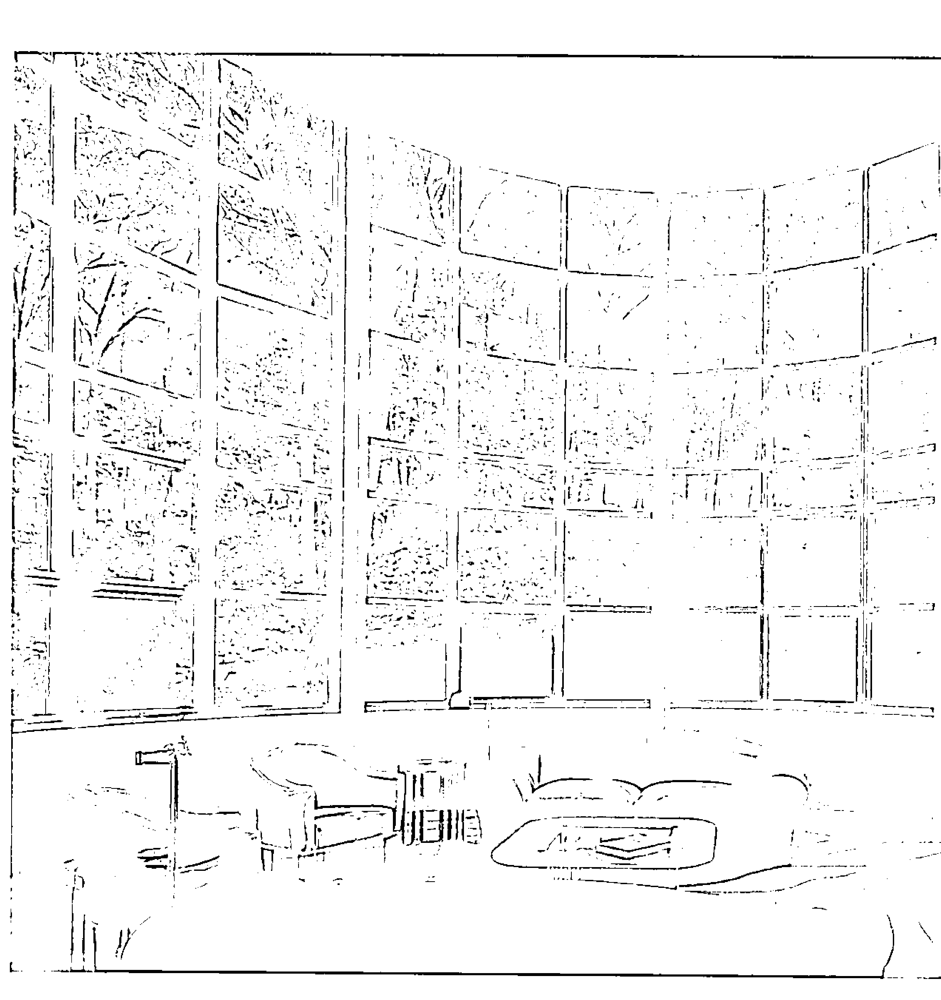

古代窗户的形式有多种多样，大都取法天然，如梅窗、扇形窗、尺幅窗等等，而现代的平窗、凸窗，斜窗等虽然取材用料有了实质性的改变，但用意相同，都是为了能更好地与自然对话。“窗含西岭千秋雪，门泊东吴万里船。”(杜甫《绝句》)，是对窗户功能的最好诠释。轩窗径尺，会心于方寸之间，在景观上有雪景配合，居住在其中，从窗里望去就能看到一幅美好的天然画图，视野舒适，一道千年形成的雪景线，赏心悦目；而大门口停泊着渡远之舟，显示了与外界的相关，既可取其动，又可取其静。窗在后靠山，门在前迎江，负阴抱阳，极有气势，进可自成一统，出可远足，融入社会，如此居所，确为佳构。

窗是房子的眼睛，开阔视野，交流内外，引日月星辰、晨曦夕晖，山光水色的光明、灵气和生机赋于房子和里面的人，因此在家居方面，窗户占了非常重要的作用，它的种类、形状、方位，对住宅的风水产生了强烈的影响。

## 窗户的数量

家居的内外之气很容易通过窗户进出，但是如果窗户太多则会促使内气难以平静，居家生活便易紧张，难以松驰。而如果窗户太少，内气抑郁其中，无法吐故纳新，便易导致居者的内脏疾病。

## 开窗的方位与形状

窗的形状、方位与五行相关，运用得当，会有助于加强家居的能量吸收和增加活力。现代的五行形状如下：

- 金形 圆
- 木形 长
- 水形 曲
- 火形 尖
- 土形 方

| 表头1 | 表头2 | 表头3 |
|-------|-------|-------|
| 内容1 | 内容2 | 内容3 |
| 内容4 | 内容5 | 内容6 |
| ...   | ...   | ...   |

直长型窗属木型窗，其最适合的方位是住宅的东、南与东南部，它能使住宅的外立面产生一种向上的速度感，亦会对家居产生进步和蓬勃发展的气氛。

正方形或横长方型窗属土型窗，其最佳的位置是住宅的南、西南、西、西北或东北部。它能使住宅的外立面产生一种较安定稳重的感觉，亦会对家居产生平稳踏实的气氛。

圆形或拱形的窗户属金型窗，在住宅的西南、西、西北、北与东北为最适用。它能使住宅的外立面产生一种凝聚的吸引力，亦会对家居产生团结的气氛。

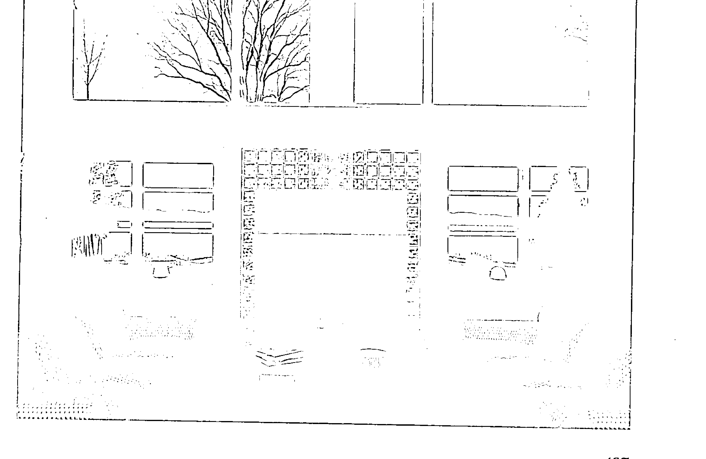

圆形或拱形的窗户给人以宁静安祥的感觉，适合装设在卧室、玄关和客厅；方形、长形窗则给人以振奋肯定的感觉，适合用在餐厅和书房。一般住家若能适度混合使用两种窗形，可获得良好的效果。

尖或三角形的窗户属火型窗，在家居建筑物比较罕见，由于过于尖锐，太具杀伤力而不利，而水型窗也不大应用于家居。

## 两面开窗不可正对

两面正对的墙壁之间同时开窗对于家居也是很不利的，因为会造成难以藏风聚气，其弊处与“前通后通，人财两空”是一样的。

## 窗户大小要适中

客厅或卧室的窗户过大或数量太多，容易导致内气外泄，家庭关系不和，如果发生这种情况，可悬挂百叶窗或窗帘来弥补这个缺陷，不过百叶窗比窗帘更易于吸纳外气，所以效果比窗帘好。家居中的大型落地窗，夏天会导致过多的阳光和热量进入室内，冬天又会使室内的热气迅速流失，都应加装窗帘。

窗户虽然不宜过大，但是也不宜过小。窗户过小或四面不开窗的房子会显得寒伦小气、暗无天日，居住者也会变得气量狭窄、萎靡退缩。

窗户的顶端高度一定要超过居住者的身高，可体现居住者的自信和气度

### 窗户的高度

窗户的顶端高度必须超过居住者的身高，这既可增加居者的自信和气度，同时居住者在眺望窗外景致时，也不用因弯腰拱背而感到吃力。

### 窗框的颜色

窗户的窗框和墙壁漆成不同颜色，则可将外部景致明显地纳入窗中，形成一幅天然的风景画，能为居住者带来活力和创造力。但选色最好要注意，若能选择与方位配合的颜色，则对宅运便会有益。

现在把八个不同方向的窗台配合色，列成简表如下：

- 向正东的窗户 宜用黄色、褐色
- 向东南的窗户 宜用黄色、褐色
- 向正南的窗户 宜用白色、银色
- 向西南的窗户 宜用蓝色、黑色
- 向正西的窗户 宜用绿色、青色
- 向西北的窗户 宜用绿色、青色
- 向正北的窗户 宜用红色、粉红
- 向东北的窗户 宜用蓝色、黑色

## 开窗的方式

窗户最好是向外或向两侧推开，以不要干扰到窗户前后的区域为原则。向内开的窗户，会使居住者变得胆小、退缩，而且向内开的窗户，经常会被窗帘或百叶窗挡到，变得很难开启。如果窗户是向内开，可在窗户下摆放盆景或音响，加强这个区域的能量。

如果住宅的窗户只能向上推开一半，无法全开，会使居住者有志难伸，工作不顺。若有这种情况，可将窗台漆上明亮的颜色，并且悬挂百叶窗遮阳，最好不要悬挂布质窗帘，窗边可摆盆景、水晶来活化内部的能量。

向东南的窗台用褐色很妥当

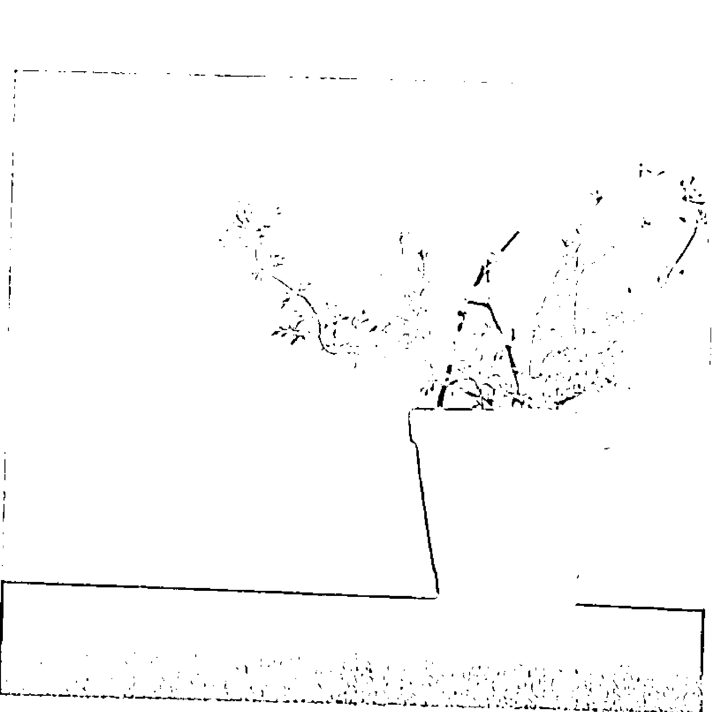

作为住宅的“风水眼”，要确保所有的窗都容易打开，家居生活中，应该保持每天最少开窗一次，让新鲜空气与光线进入家中。为了确保居住者健康，窗户如有破损一定要尽快修复，有裂缝或破了的窗格玻璃要尽快更换，因为窗户破损容易造成居住者眼部生疾。

## 窗帘的使用

不论是为了保护室内的私隐，或者是为了遮挡阳光及灰尘，又或者是为了美化窗户，窗帘都可说是不可或缺的。

窗帘以材料来划分，有布帘、纱帘、竹帘、胶帘、铝片帘以及木帘等等。

此外，又可分为向左右拉开的帘，向上下拉卷的帘，以及固定不动的木百页帘等等。

若以颜色来划分，则更是色彩缤纷，令人眼花缭乱。原则上的选择，是阳光充足的窗户，宜用质地较厚而颜色较深的帘；而阳光不足的窗户，宜用质地较薄而颜色较浅的帘。

窗户倘若对正医院或尖锐的屋角、不洁之物等，而且相距甚近，那便应在窗户安装木制百页帘，防止煞气进入，并且尽量以少打开为宜。

窗帘的类型应用正确会有助于住宅内气的新陈代谢。当白天艳阳高照时，拉开窗帘能让有益的外气进入，使居室充满温暖；而在夜间，放下窗帘，有利于给睡眠者提供完美的一帘幽梦。

在较大的房间，最好使用布窗帘；落地的长帘可营造一种恬静而温暖的气氛。但是在小房间，小窗户往往会减低房间暴露于阳光的程度，因此选择用容易让大量的光线透过的百叶帘较好。

布窗帘有助于睡眠和阻挡外界的不良影响。如果背向窗而坐或头向窗而睡，都会令人神经紧张，难以松弛，在风水上也是很不利的，但如果窗户上悬挂厚实的窗帘，可以减少不利的影响。

（以上内容请参与本书有奖问答之二十二）

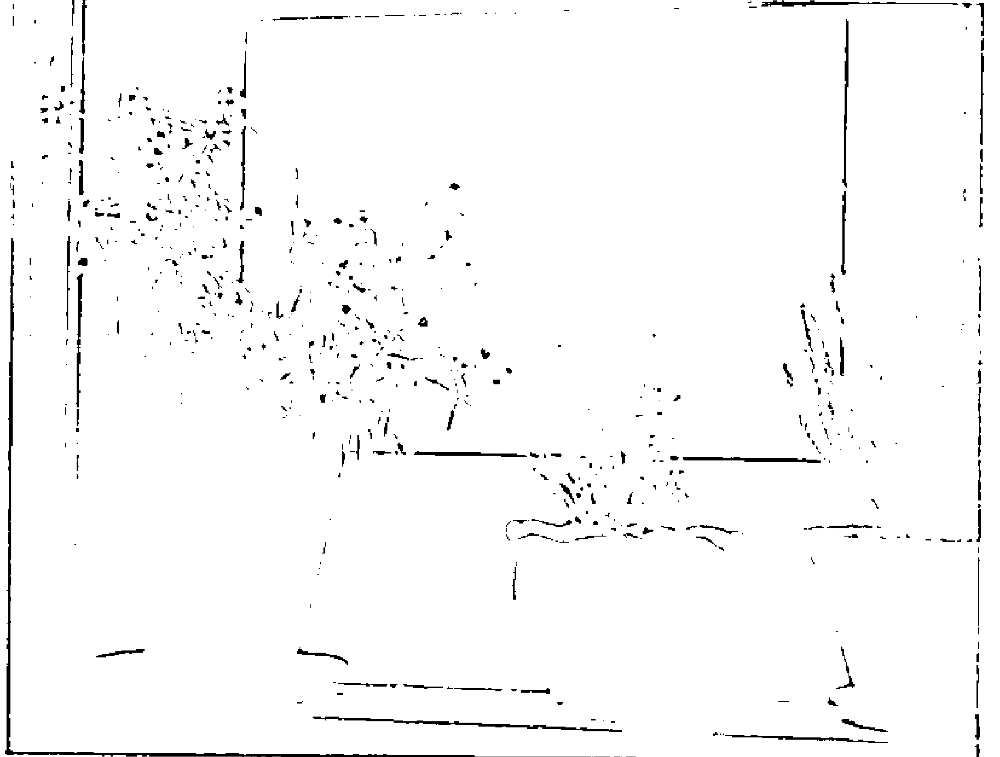

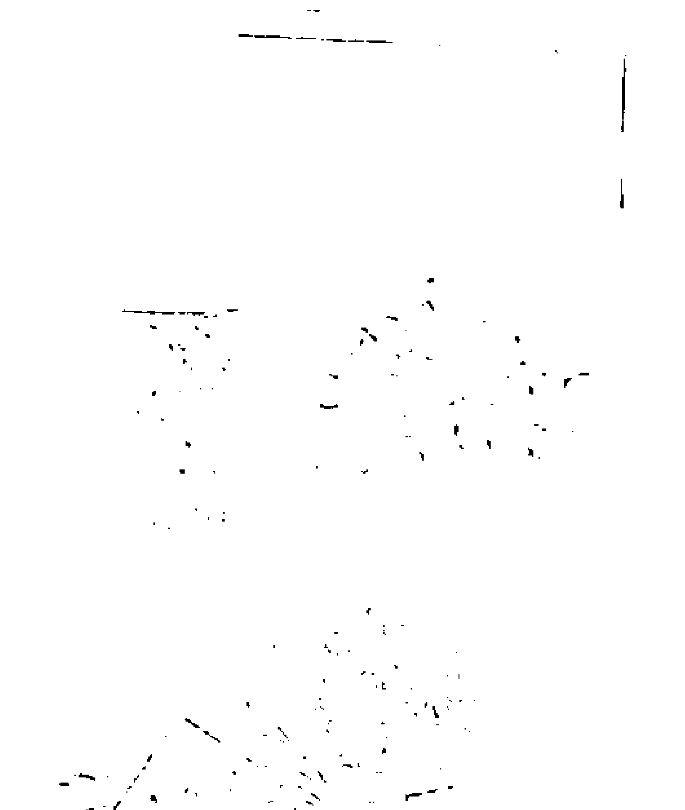

### 天天与阳光亲密接触

阳台是住宅与外界的结合部，既可为住宅饱吸屋外的阳光、空气，又是住宅化解外界煞气的第一道防线，还往往是主人供奉神位的所在，因此，阳台在住宅风水中，具有十分突出的战略要塞的意义。

无论是摆设饰物、栽种植物来化解屋外的煞气，还是供奉神位，或者是为扩大使用面积而改建阳台，只要因势利导，则可化凶趋吉，即便是在阳台上晾衣服这样司空见惯的情形，倘能谨记有关忌讳，也可立见功效。

### 阳台风水

阳台，是住宅最空旷辽阔的地方，与大自然最接近，因而饱吸宅外的阳光、空气及风雨，是家居的纳气之处，并且若要化解屋外的煞气，阳台往往是第一道防线，其重要性可想而知。

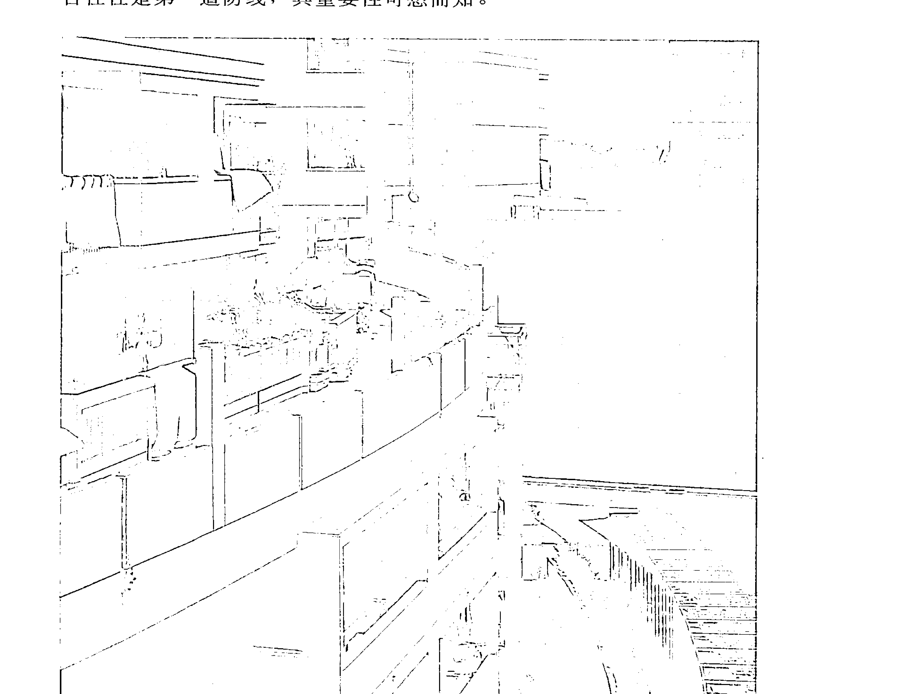

## 阳台的生旺及化煞植物

由于阳台较为空旷，日光照射充足，因此适合种植各种色彩鲜艳的花卉和常绿植物。还可采用悬挂吊盆、栏杆摆放开花植物、靠墙放观赏盆栽的组合形式来装点阳台。在阳台摆放一些花草植物，除了可美化环境之外，还有风水方面的良好效应。适宜种植在阳台的植物有很多，大致可分为生旺与化煞两大类。

如果从阳台外望，附近山明水秀，又无任何形煞出现，便应该摆放那些可收生旺之效的植物。摆放在阳台并且又有风水生旺作用的植物大致有以下几种：

- 1. 万年青：属天南星科，干茎粗壮，树叶厚大，颜色苍翠，极具强盛的生命力。大叶万年青的片片大叶伸展开来，便似一只只肥厚的手掌伸出，向外纳气接福，对家居风水有强大的壮旺作用，所以万年青的叶越大越好，并应保持长绿长青。
- 2. 金钱树：学名艳姿，叶片圆厚丰满，易于生长，生命力旺盛，吸收外界金气，极利于为家中运财。
- 3. 铁树：又名龙血树，市面上最受欢迎的是泥种的巴西铁树。铁树的叶子狭长，中央有黄斑，铁树寓意坚强，补住宅之气血，是重要的生旺植物之一。
- 4. 棕竹：其干茎较瘦，而树叶窄长；因树干似棕榈，而叶如竹而得名，棕竹种在阳台，可保住宅平安。
- 5. 橡胶树：印度橡胶树，树干伸直挺拔，叶片厚而富光泽，繁殖力强而易种植，户外户内种植均宜。
- 6. 发财树：又称花生树，它的特点是干茎粗壮，树叶尖长而苍绿，耐种而易长，充满活力朝气。
- 7. 摇钱树：叶片颀长，色泽墨绿，属阴生植物，极有富贵气息。

一般来说，风水上有生旺作用的阳台植物均高大而粗壮，叶愈厚大愈青绿则愈佳，例如以上所提及的万年青、金钱树、巴西铁树、橡胶树、棕竹以及发财树等等均是很典型的例子。

如果从阳台外望，四周环境恶劣，附近有尖角冲射，街道直冲、街道反弓、又或者面对寺庙、医院及坟场等等，便须摆放那些可以化煞的植物。化煞的植物与生旺的植物不同的是，其干茎或花叶有刺，有刺便可冲顶外煞，令其退避三舍，可起保护家居的作用。这类化煞植物，包括仙人掌、玫瑰、杜鹃等等。

- 1. 仙人掌：仙人掌茎部粗厚多肉，往往布满坚硬的茸毛和针刺，把高大的仙人掌摆放在阳台，可以化解外煞于无形。

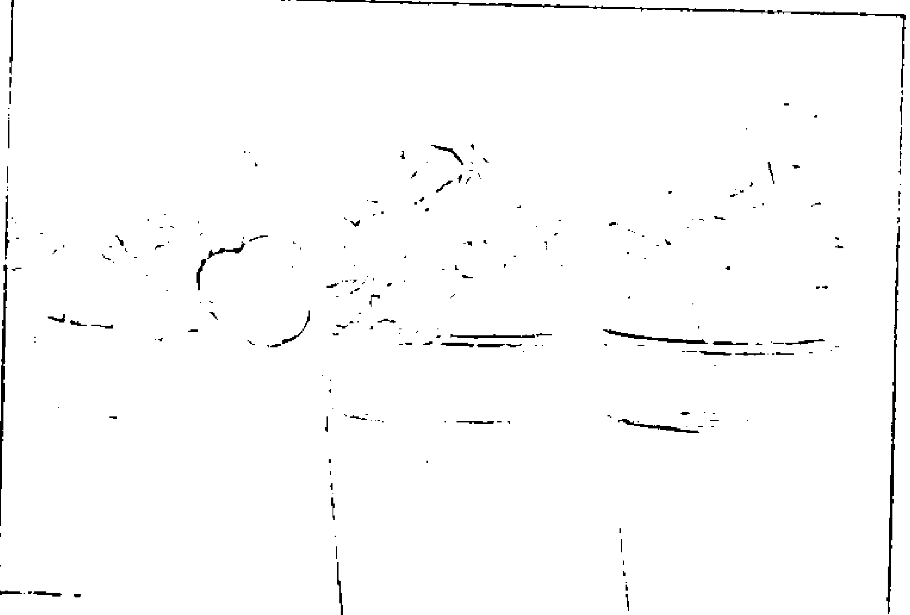

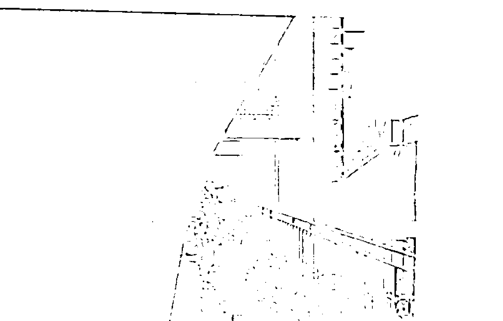

- 2. 龙骨：龙骨的外形很独特，干茎挺拔向上生长，形似直立的龙脊骨，充满力量，对外煞有强劲的抵挡作用。
- 3. 玉麒麟：龙骨向上生长，而玉麒麟则横向伸展，其形似石山，化煞稳重有力，并且有镇宅作用。
- 4. 玫瑰：玫瑰艳丽多姿，虽美但有刺，凛然不可侵犯，既可点缀装饰阳台的风景，又有化煞的功能，特别适合女性较多的家居使用。
- 5. 杜鹃：即九重葛，花色似杜鹃，花叶茂密而有尖刺，易于种植，也是上佳的化煞植物。

有些位于底楼的住户，只有花园而没有阳台，但其生旺化煞植物，与阳台并无区别，种植于园中，可收同样的生旺化煞之效。

## 阳台的吉祥饰物

现代的不少家庭除了在阳台摆放植物外，还有不少在阳台放置各类饰物，除了美化阳台外，也要达到生旺化煞的功效，这未尝不可，但一定要以利己而不伤人为原则。普遍来说，有以下几种温和的饰物对家居有益，但切记不可滥用。

石狮：石狮自有阳刚之气，可用以镇宅，摆放石狮化煞镇宅，必须狮口向外。若是阳台面对气势压过本宅的建筑物，例如大型银行、办公大楼等，则可在阳台的两旁摆放一对石狮来化解。

若阳台正对阴气较重的建筑物如庙宇、道观、医院、殡仪馆、坟场等等，以及大片阴森丛林，或形状丑恶的山岗，亦须以一对石狮来镇宅。

铜龟：龟是极阴极柔之物，擅长以柔克刚，又是逢凶化吉的象征。用来化煞，符合了风水学“凶煞宜化不宜斗”的原则。摆放铜龟或石龟来化煞，两龟的头部必须相对。

到底应该在什么情况下需要用铜龟来化煞呢？建议在以下这五种情况下，应用铜龟化煞。

- 1. 阳台面对天斩煞：所谓天斩煞，是指两幢高楼之间的一条狭窄空隙，因为仿如用刀从半空斩成两半，故此称为天斩煞。倘若房屋面对天斩煞，往往有血光之灾，遇有上述情况，可在阳台的两旁摆放一对铜龟来化解天斩煞。
- 2. 阳台面对街道直冲：倘若从阳台外望，看见前面有街道直冲，仿如猛虎迎面直扑而来，主家中破财，是风水中大凶的格局。这直冲而来的街道，短则为祸不大，但愈长愈凶；若车辆不多则无妨，但行走的车辆愈多便愈具杀伤力。倘若迎面直冲而来的是高速公路，则除了要在阳台的两旁摆放一对龟之外，并且还要悬挂一个凸镜，以策万全。
- 3. 阳台面对尖角冲射：中国的传统观念里，素来喜圆润，而对于窗外正对此类杀伤力极强的建筑物，便要格外小心，尖角特别敏感，视为避忌之一；风水学亦有“尖角冲射主不吉”之说，因为这会导致家口不安，病痛频仍。倘若阳台前面的尖角冲射，则必须设法化解。一般常见的尖角，大多是邻近楼宇的尖锐屋角，这些直冲过来的尖角，愈尖便愈凶，愈近便愈险。

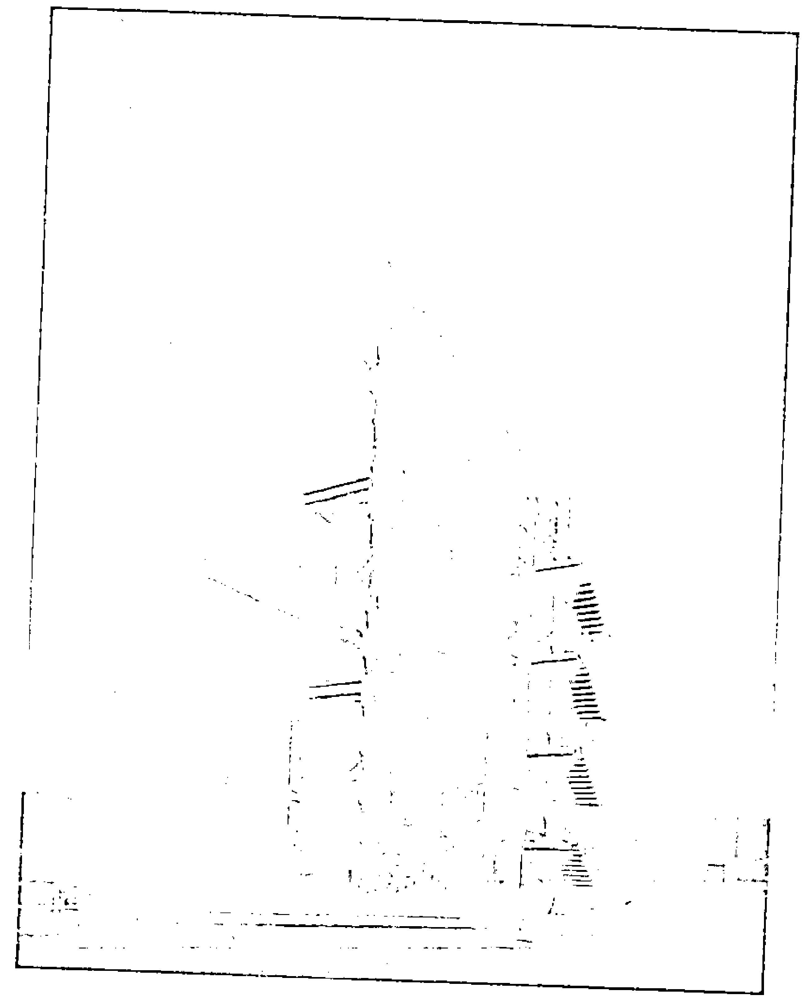

- 4. 阳台面对锯齿形建筑物：现在有些欧陆风格的住宅，为了增加室内空间和采光纳风，多加有大型凸窗，所以外墙便容易形成很多尖角，看起来便似一排尖锐的锯齿，如果阳台面对着这类锯齿形的建筑物，则必须用铜龟化解。
- 5. 阳台面对反弓路：城市的街道有弯有直，倘若从阳台外望，看见屋前的街道弯曲，而弯角直冲向阳台，类似弓弩对家宅张开欲射，这就是“街道反弓”的格局，主凶，必须用铜龟来化解。

石龟：石龟与铜龟虽然同是风水的化煞物，但各有不同的用处。倘若阳台面对属火的形煞包括高大的烟囱，红色的高楼大厦以及油库等诸如此类属火的建筑物，便宜用石龟化解。

如果这些火煞位于火旺的南方，那便犹如火上加油，为了加强化煞的功效，可在两只石龟的中间放置一瓶清水。

石龙：根据不同动物的特性，向海或向水的阳台，应该摆放一对石龙，头部必须向着前面的海或水，采其“双龙出海”之义，但如果户主的生肖属狗，便不宜在阳台摆放石龙，因为辰戌相冲，但可用龙龟或麒麟来代替，因这两种瑞兽均喜水，既能够引财入室，而且与生肖属狗的人没有冲克。

麒麟：麒麟与龙、凤及龟合称为四灵，即是四种最有灵气的动物。麒麟被视为仁兽，因为它重礼而守信，古人认为麒麟的出现，是吉利降临的先兆。麒麟外形独特，共有四种特征：鹿头、龙身、牛尾、马蹄。中国自古有“麒麟送子”的说法，因此求生贵子心切的人家，往往会在向海的阳台上摆放一对麒麟，希望能早得麟儿。

石鹰：如果周围高楼林立，而本宅如鸡立鹤群，从阳台外望似是被重重包围而不见出路，这是风水上的困局，居住在其间的人便易屈居人下、仰人鼻息，很难脱颖而出。

若想扭转形势，可在阳台的栏杆上摆放一只昂首向天，奋翅高飞的石鹰。鹰头必须向外，而双翼切勿下垂，因为这样才可收到预期功效。

但有一点必须注意，倘若户主的生肖属鸡，为避免犯冲，则不宜在阳台摆放石鹰。

（以上内容请参与本书有奖问答之二十三）

## 阳台改建

有些人家为了要把室内的实用面积扩大，往往把阳台进行改建，把客厅向外推移，使阳台成为室内的一部分，这样能使客厅变得更宽大明亮，但必须注意要保证楼宇结构安全。由于阳台是突出房外的部位，承重力有限，因此在改建时，要仔细测算，并且不要把包括大柜、沙发及假山等重物，摆放在阳台的原有位置，因为这些高大沉重的物品会让阳台负荷过重，从而威胁到楼宇结构安全。阳台改建后，把较轻的物品摆放在那里，则既不影响楼宇安全，同时还可保持阳台原来的空旷通爽。

阳台改建成客厅后，其外墙也不宜过矮，有些人喜欢用落地玻璃作为外墙，认为这样外景较佳，却不知正犯了风水学“膝下虚空”的大忌，他人在户外，可以轻易看到户内人的膝部以下，这种格局会导致钱财外泄，人丁单薄。下实上虚，这是风水学的要旨，因此若是膝下露空，便应尽量加以避免。而较为可取的办法，是下面的三分之一是实墙，而上面的三分之二是玻璃窗，这便不会有“膝下虚空”之弊。

倘若阳台本来便是以落地玻璃为外墙，难作更改，那么，最有效的弥补方法是把一个长低柜摆放在落地玻璃前，作为矮墙的替代品，低柜若是太短，可在两旁摆放植物来填补空间，这既美观，又符合风水之道。一般的房屋建筑结构，阳台与客厅之间会有一条横梁，在改建后，当两者结合为一时，这条横梁便会有碍观瞻，并且对风水有损。横梁的处理办法是用假天花填平，把它巧妙地遮掩起来。如要加强效果，可在阳台的天花板上安置射灯或光管来照明。此外，横梁底下不应摆放福禄寿三星或财帛星君等吉祥物，以免财星受损。

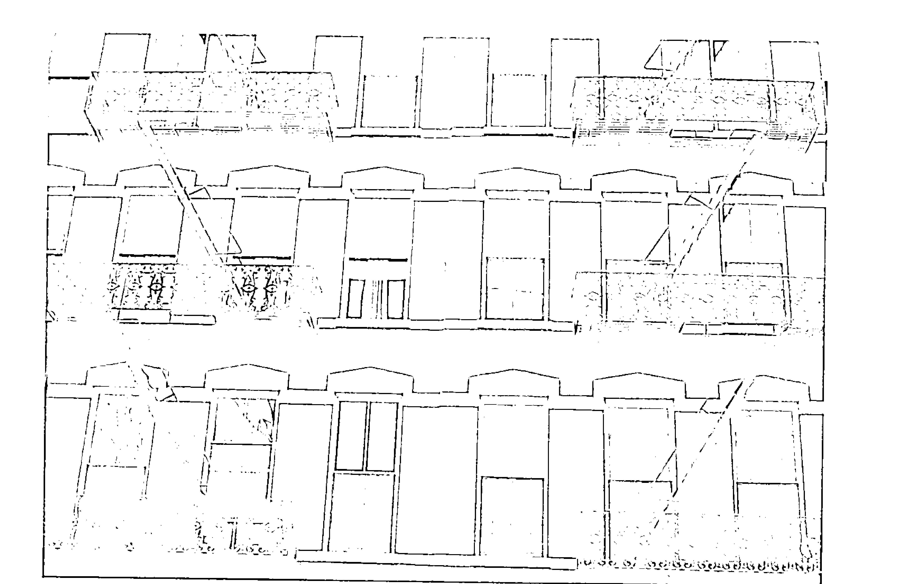

### 阳台神位的摆放

不少家庭为了避免香烛把屋内熏得烟雾弥漫，把神柜摆放在阳台上，而即使把神台摆放在屋内的，有时亦会把一部分神祇如天官等供奉在阳台，以期吸纳周围的生气。

阳台因空旷而少遮挡，因此很容易受大自然变化的影响，神柜摆放在此处，宜背风向阳，若不安排妥当，往往免不了日晒雨淋，这对被供奉的神祇当然会有影响，特别是那些面向正北或西北的阳台，因冬天西北风及北风强烈，往往会把神台的香炉灰吹得四散飞扬，所以神柜摆放在阳台要慎防风吹雨打。

除了要防风之外，神柜还要注意防雨。如果神柜经常被雨水沾湿，那亦不妥当，即使只单独把天官供奉在阳台，也须慎防风雨。

有很多家庭习惯在阳台晒晾衣服，如果又在那里摆放神柜，便很容易出现衣服高高挂在神台之上的尴尬情况，如果挂在神台之上的正好是女性内裤，那便更会亵渎神灵。因此，神台之前不能被衣服遮挡。

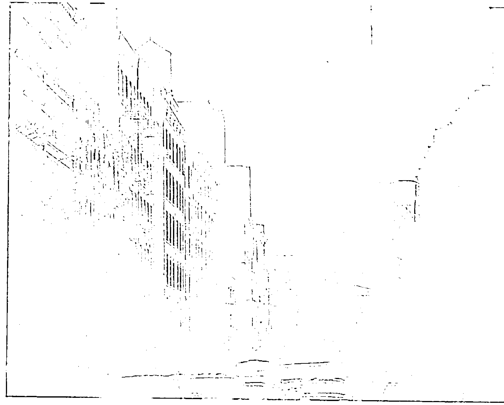世贸大厦孤峰独峙，且木形金色，形色相克，又构成天斩煞，有血光之灾不足为奇。

### 住宅的十八种典型外煞

放眼大千世界，堪称光怪陆离，住宅建筑周围潜伏着一些不如意的种种形煞，不足为奇。当然，人类认识世界的目的是为了改造世界，只要对各种煞气善加规避，即可因势利导，举重若轻，避凶趋吉。

#### 天斩巨煞

从本身居所向外望，见前方有两座大厦靠得极近，致令两座大厦中间形成一道狭长的空隙，骤眼望去，如同大厦被从天而降的利刃所破，一分为二。主有血光之灾，并易引发高危疾病等。

#### 孤峰独峙

并非“危楼高百尺，手可摘星辰”，而是指住宅所在的楼宇前后左右均无靠，成鹤立鸡群势。凡孤峰独峙将得不到朋友的扶助，而且子女不孝兼背井离乡。

#### 强光污染

住宅位于玻璃幕墙对面，阳光反射，形成光污染，令居室温度有异于常温，生活规律被打乱，对人体健康非常不利。并且每天在对面的玻璃幕墙上，见到自己被扭曲的影像，感觉十分难受，令人头脑迟钝，精神不集中，容易发生血光之灾或碰撞之伤。

#### 五花大绑

住宅所在的楼宇前后左右均被立交桥紧紧环抱，相形之下，住宅的高度被压制，周围发展的视野及气脉均被隔断。而且立交桥为交通要道，车辆往来，噪音极大，空气质量低劣，常有交通事故发生，极大地影响居住心态。凡遇五花大绑格局，主泄财，多数是财运差。

#### 镰刀拦腰

天桥状如同镰刀，拦腰反砍住宅，杀伤力极大，可招致血光之灾。

#### 长路直冲

以本身住所作为中心点，对正一条直长的道路或河流，便是犯路冲。主血光之灾、疾病及散财。

#### 白虎动土

白虎动土是指在居住的大楼右方，有楼宇兴建或拆卸。凡遇白虎动土，主家人多病。

#### 脚底穿心

一些建在地铁上盖或隧道上盖的楼宇，因行车会由楼宇的下面穿过，便属脚底穿心。此煞对较低层数的单位影响较大，易致宅运反复。

#### 尖刀劈面

住所附近有刀状物体，如大厦的尖角好似一柄尖刀劈来。尤以大厦的低层为甚，凡遇尖刀劈面，家人容易受伤。

#### 孤阳独阴

孤阳煞即住所紧邻加油站或电力房、锅炉房等，主脾气暴躁、因财失义、家口不宁。住所前面是公厕或垃圾站便犯独阴煞，主家人身体不适及因病破财。

#### 天秤冲目

住宅附近有在建之楼宇，其地盘顶楼如有类似秤之建筑机械如吊机等，尖头对正住宅门口、阳台、窗前，则主家人容易受伤或眼部有问题。

#### 火形冲射

屋外有尖锐状的物体冲射过来。如大厦的墙角、屋檐、亭角、尖锐的雕塑、烟囱等。主家人易生急性疾病，家中易患火灾。

#### 刺面破财

门、窗前正对怪石嶙峋的小山坡者为犯刺面煞，主易遭打劫失窃。

#### 山石尖射

在家中向外望，视野内看到尖石山、仙人球或仙人掌等，便是犯了尖射煞，主宅运反复无常。

#### 反弓去水

对正住宅的路形呈反弓势，是典型的退财格局，主金钱大量破耗、事业失败。

#### 后靠穷山

楼宇若能依山而建，成后方有靠之局者方合乎风水原则。但假如所靠之山并非明丽秀美，而是山石丑怪，寸草不生，则代表工作生活中上司或长辈诸般刁难，而部属多阳奉阴违。

#### 乌龙入宅

所谓乌龙即是指穿墙而进的大型黑色空调管及水管，家宅遇此情况，主是非口舌、工作不顺利。而如推开窗户即望见水管和污水渠等亦相同不利。

#### 恶物顶心

门前或窗前、阳台被灯柱或路牌、天线等物体垂直冲射过来。主家人身体不利，压力过重，脾气暴躁。

围合式结构有益藏风聚气，但须注意气口指向。
层叠退台结构如巧妙配合周边形势，则利于纳财。

## 高尚生活的绿色解读

> “不仅有家，而且有园”

曾是多少中国人的梦想。
所幸这种梦想正在变成现实。
走进一部分家庭。

对有家又有园的住宅而言，庭院的风水，与厅房厨卫的风水同等重要。尤其是庭院中的池塘、喷泉、泳池，以及花鸟虫鱼等，都或强或弱地影响着各种气能，直接关系到主人一家的健康与运道，理当引起足够重视。
用置放花卉植物来改变庭院风水，提升活力，往往能驱邪避凶，调整阴阳五行。

## 庭院的风水

### 庭院的水体

在构成庭院风水的元素中，水是最重要的环节之一。无论是滋养生命、提升活力，还是招引财气、启迪智慧，水的作用都是不可替代的。

水的力量是极为强大的，滋养生命，寓刚于柔，既有观赏价值，也有环保价值，甚至可以调控温度。《黄帝宅经》指出，“宅以泉水为血脉。”因此，完美的庭院里都必须有水体画龙点睛。

庭院里的水体有多种形式，如池塘、泳池、喷泉等，均有壮旺宅气的作用。在风水布局中，甚至是一碗清水也可为家居带来鲜明的效果。

### 池塘

现代家居庭院中有池塘则极富意义，为了让池塘充满活力，大多会在其中饲养观赏鱼、青蛙、水生植物等，以形成生态链，维持良好的生态平衡并使水质清新。池塘为住宅改造了生存环境，增加了自然的美感，为生活凭添了无限的诗意。

在池塘中游弋的鱼类，由于其外形、颜色与状态的不同，会对家居产生不同的动力。普遍来说，室外可以多饲养色彩斑斓的锦鲤，中国人养鲤已经有近2500年历史，自古有“鲤鱼跃龙门”、“鲤鱼传尺素”、“年年有鱼”之说，因此鲤鱼很有富贵意义。锦鲤在淡水中生长，属于杂食性鱼，外形养眼，生命力强，对调和阴阳有促进作用。

池塘的水体是自然而亲切的，对于家居的宅运大有裨益，池塘的形状多数是圆形或不规则圆形，但是在风水意义上说，池塘的形状最好为半圆形，形如明月半满，例如安徽黟县的月沼（奥斯卡获奖影片《卧虎藏龙》取景处）、传统客家的围屋前塘、普陀山普济禅林门前池塘，均为半圆形，取其“月盈则亏”之意，户主以此自勉，期待着不断进取，宅运不断提升，正如李鸿章中堂联云：“大海有真能容之度，明月以不常满为心。”

> 梨花院落溶溶月
> 柳絮池塘淡淡风

### 泳池

游泳是最好的健身运动之一。在风水上，常与水亲密接触，能为身心注入水的特质，有助于提高思维的柔韧性。

泳池最佳方位是在庭院的东部或东南部，但不能太靠近大门，因要防止潮气入宅。形状上以圆形和曲形为佳，设计成不规则的圆形也可，但不宜有尖角。

当然，许多泳池为了防止细菌和水藻等而加入化学清污剂，对水质会有影响，因此，维护水质清洁，应该尽量采取较为环保和安全的措施。

### 喷泉

“问渠哪得清如许，为有源头活水来。”泳池、池塘中央的喷泉，或者人工瀑布，都是家居中的活水，均有助于活跃家居气流，避免财气停滞，并且能够有效抵消住宅受路冲、反弓路的煞气影响，喷泉里如安装向上的灯光，更可强化效果。

瀑布或喷泉的活水发出的声音，亲切而自然，也能对人生产生积极的影响，“润万物者莫润乎水”，流水至柔而善，可轻易流过路径上各处的障碍，而涓涓细流的汩汩之声很具抚慰性，有助于令住户度过漫长人生路里的崎岖坎坷。

庭院里的水系在布局时，一定要注意的是应让水系以柔和的曲线朝住宅前门流来，而不是流去，可避免财水外泄。

### 庭院植物

作为庭院里的重要装饰物品之一，植物起着非常特殊的作用。植物通常都具有非常旺盛的生命力，种植大量的健康植物，会创造一个清新、充满活力的环境，有助于消减现代家居中各类用品产生的辐射和静电。植物也可通过光合作用，释放氧气，为居所提供新鲜的空气。

而许多植物因其特殊的质地和功能，更具有灵性，对家居会起着保护作用，对人类的生活细意呵护，亦可称之为住宅的守护神。因此，庭院的植物功用极大。

### 十三种庭院吉祥植物

- 1. 棕榈，又名棕树。既有观赏价值，树干又可作为亭柱等，棕毛可入药，功能为收涩止血，主治吐血、崩漏诸症，在风水上具有生财护财作用。
- 2. 橘树，即桔树。“桔”与“吉”谐音，象征吉祥，果实色泽呈红、黄，充满喜庆，盆栽柑桔是人们新春时节家庭的重要摆设，而桔叶更有疏肝解郁功能，能够为家中带来欢乐。
- 3. 竹。苏东坡云：“宁可食无肉，不可居无竹。”竹是高雅脱俗的象征，无惧东南西北风，更可以成为家居的风水防护林。
- 4. 椿树。《庄子·逍遥游》云：“上古有大椿者，以八千岁为春，八千岁为秋。”因此椿树是长寿之兆，后世又以之为父亲的代称，在风水上有护宅及祈寿功用。
- 5. 槐树。槐树木质坚硬，可为绿化树、行道树等，在风水上被认为代表‘禄’，古代朝廷种三槐九棘，公卿大夫坐于其下，面对三槐者为三公，因此槐树在众树之中品位极高，镇宅有权威性。
- 6. 桂树。相传月中有桂树，桂花又即木犀，桂枝可入药，功能为驱风邪、调和作用。宋之问词云：“桂子月中落，天香云外飘。”桂花象征着高洁，夏季桂花芳香四溢，是天然的空气清新剂。
- 7. 灵芝。灵芝性温味甘、益精气、强筋骨，有观赏作用，是长寿之兆，自古被视为祥物，鹿口或鹤嘴衔灵芝祝寿，是吉祥图的常见题材。
- 8. 梅。梅树对土壤的适应性强，花开五瓣，清高富贵，其五片花瓣有“梅开五福”之意，对于家居的福气有提升作用。
- 9. 榕树。含“有容乃大，无欲则刚”之意，居者以此自勉，有助于提高涵养。
- 10. 枣树。在庭院中植枣树，喻早得贵子，凡事快人一步。
- 11. 石榴。含有多子多福的祥兆，很有富贵气息。
- 12. 葡萄。葡萄藤缠藤，象征亲密，自古有葡萄架下七夕相会之说，而夏季在葡萄荫下纳凉消暑，亦是人生一大快事。
- 13. 海棠。花开鲜艳，令富贵满堂，而棠棣之华，象征兄弟和睦，其乐融融。

### 八大驱邪植物

- 1. 桃树。“千门万户曈曈日，总把新桃换旧符。”桃树为五行的精华，故而每逢过年总以桃符悬于门上，能制百鬼。
- 2. 柳树。柳为星名，二十八宿之一，柳树亦有驱邪作用，同桃树的作用一样，以柳条插于门户可以驱邪。
- 3. 艾。艾的颜色古时用作对老年人的尊称，而艾叶加工后可用作灸法治病燃料。端午节将艾制成“艾虎”，带在身上，能起到辟邪除秽的作用。
- 4. 银杏树。银杏树龄长达千余年，因在夜间开花，人不得见，暗藏神秘力量，因此许多镇宅的符印要用银杏木刻制。
- 5. 柏树。刚直不阿，被尊为百木之长，木材细致有芳香，气势雄伟，能驱妖孽。
- 6. 茱萸。“遥知兄弟登高处，遍插茱萸少一人。”茱萸是吉祥植物，香味浓烈，可入药。古时习俗，夏历九月九日，佩戴茱萸囊，可以去邪辟恶。
- 7. 无患子。以中日两国为多，在植物中尤为受到尊崇，因为其结实球形如枇杷，生青熟黄，内有一核如珠，就是佛教所称的“菩提子”，用以串联作念珠携带，可保平安。
- 8. 葫芦。多籽，原产印度，在风水学中葫芦是能驱邪的植物，亦有多子多福的含意，古人常种植在房前屋后。

### 鲜花的作用

鲜花也能给家居增添活力和能量，不同与植物的是，它们以特别活跃的形式给房间带来缤纷的色彩。如果得到精心的栽培和照料，鲜花具有强烈的风水效应，其色泽与外形会影响住宅的气能。当然，枯萎凋谢的花朵会有负面的影响，因此，在家居生活中，必须每天勤于换水并栽剪花茎，使其功效持久。同时要注意的是，在家居的风水布局里，最好不使用干花，因为其象征死亡与没落。

### 养花容器的形状与摆放方位

养花的容器，因其外形和质地的不同，会对住宅产生不同的效应。

| 形状/质地 | 宜用方位 |
| :--- | :--- |
| 球形花瓶 | 住宅的西或西北部 |
| 高身木瓶 | 住宅的东或东南部 |
| 锥状花瓶 | 住宅的南部 |
| 陶碗 | 西南或东北 |

### 不宜亲近的四种花卉

- 夜来香：夜来香晚间会散播大量强烈刺激嗅觉的微粒，对高血压和心脏病患者影危害很大。
- 松柏类花卉：松柏类花卉散发油香，可令人感到恶心。
- 夹竹桃：夹竹桃的花朵有毒性，花香容易使人昏睡，降低智力。
- 郁金香：郁金香的花有毒碱，过多接触毛发容易脱落。

> > （以上内容请参与本书有奖问答之二十五）

## 小物品四两拨千斤

一套住宅，往往会受到环境的诸多限制，给风水格局造成种种遗憾。
为了弥补这些缺陷和遗憾，可巧借如水晶、风铃、时钟、食盐等特别有“四两拨千斤”功效的小物件，通过光线、声音，牵引居室气流，激发室内潜能。而妙用玄机深奥的镜子，更可逢凶化吉，转危为安。

## 激发住宅的潜能

### 小物品的大作用

一些可以移动的小物件在家居中作用至大，往往起到四两拨千斤的功效，能够强有力地激活住宅的生气，达到风生水起，宅兴人和的境界，这些东西包括水晶、蜡烛、风铃、时钟与食盐等。

### 水晶

现代许多家庭都收藏水晶，这不仅仅因为水晶有美观的特点，象一件艺术品，可以美化家居，其实水晶就是石英，它汲取了岩石的精华，并且能够改变光线的方向，折射出多种颜色的气能，因此更可改善运势。不过切勿将水晶当作点石成金的工具，因为它在风水的应用上不会无中生有，只会起推波助澜的作用。

水晶在运用时，有几个特点，如黄晶球有助扩大财运，特别是在股票及地产方面；绿幽灵石则有助于积聚正财及遭遇贵人；若家中有漏财现象，如财位偏斜之类的情形，则可以摆放紫晶山，有助凝聚财气；至于玛瑙洞亦有同样的功效，只要男女双方各放一瓣在床头，则有助加深两人感情。

（以上内容请参与本书有奖问答之二十六）

### 风铃

众所周知，朗诵或歌唱均可在人体内达至激活气能的效果。在家居生活里，使用风铃，因为它悦耳的声音能够震动空气，从而活化和刺激气能，也有助于化解煞气。

当然，选择风铃必须注意方位与材质的配合，如在家里的东部和南部宜使用木制的风铃，而北部宜悬挂金属风铃，西部宜悬挂陶瓷风铃，从而调节家中五行的能量。

### 时钟

曾经登上北京天安门城楼的人，一定会对上面的落地大钟有深刻的印象，钟摆缓慢而有节奏地律动，昭示着时间、生命、运动、规律、平衡之间的关系。

在中国的传统里，钟是很有意义的，它既有八卦的功能，又有风水轮的效应，在运用时却显得极为自然和不露痕迹。时钟的摆动和打鸣声可以提振和清新家中的气能，在风水上，时钟有韵律的滴答声会给家庭的成长带来更多的规律和节奏感，因此厅及房间的挂钟是必须的，而带钟摆的钟则更佳。因为室内无人时，气是静止的，钟的摆动能令室内的气运动起来，使室内充满活力。但是，时钟的挂法若不明理气，挂在厅堂的正中就错了，因为钟的“钟”字，音象“终”，故挂在厅堂的正中，则无论何人一进门，一抬头就见钟（见终），故宜挂侧旁为吉。并且居室内的主钟只需一个，其余闹钟不要过多。

时钟的摆放位置要注意的是，与镜一样尽量不要向着任何门，因为钟状与八卦相似，会对门内的居住者产生压制的效应。在种类上，金属钟较电子钟为佳，但是钟声必须悦耳。

### 时钟、鱼缸、吊灯共同驱动家居能量

### 食盐

盐是维持人类生命中最重要的物质之一，它以钠的形式在血液里运行。在风水上，盐具有强烈的阳性，能够牵引气能，自空气中驱风祛湿，有利于净化和稳定环境。食盐内聚的气能与五行的金一脉相承，因此，在房子的东北与西南部假若有门、楼梯、浴室、厕所或厨房，食盐便会产生特别的效应，其金能有助让不稳定的气流趋于平和。

另外，在家居运财方面，亦可以食盐为引，布下“安引水”局，即在一个玻璃樽内装上三份之一瓶盐，再加入六枚铜钱，一枚银币，然后注满水盖上，放在家中财位附近，即能激发土生金、金生水、水引财的强大助力，从而驱动运财局。

> > (以上内容请参与本书有奖问答之二十七)

### 镜中有玄机

在家居风水里，镜是非常重要的物品，就象改变光波的方向一样，镜子能加速与改变气能流的方向。镜可用来引导气能与光线，达到化煞的功能，从而逢凶化吉、转危为安。

太阳形镜

星形镜

#### 镜的形状

风水里所用的镜主要有三种：平面镜与凸镜、凹镜。平面镜能使外气直线转向；凸镜则使外气朝不同方向四散，有化煞作用；而凹镜可收四方之气，有纳吉作用。凸、凹镜一般是圆形的，而平面镜则有正方形、长方形、圆形、椭圆形、六边形、八边形与不规则形等。八边形平面镜由于其八边与八卦协调，因此在风水里使用更有特殊的意义。

#### 平、凸、凹镜各有用处

大门如遇穿心剑格局，则在门内的屏风上可加装一平面镜，对于化解穿心剑格局的煞气会更加有效。

大门外或窗外如遇路冲、尖冲、烟囱、天斩煞等，则挂凸镜可以缓解诸般外煞的危害。

当住宅大门正对电梯时，由于电梯有吸气之弊，所以在大门上装凹镜，可以进行有效的补救，以免宅内之气被尽数吸去。另外，大门如正对向下的退财楼梯时，家中财气便会逸走，此时如大门有挂凹镜，可将去气有效地收回。

家中如有较长的走廊，则在走廊两侧交错挂平面镜，令家中气脉通畅，并且可以使走廊看起来比较宽敞。如果走廊较黑暗、弯曲，则于弯曲处安一面凸镜，这样便可丰富视野，把握全局，而如果日光可反射内进，就会因有镜子反射，更可令光线加强，对家居有利。

如果家中有曲尺形的不规则房间，使用大平面镜覆盖整面墙，可以造成房间的延伸感，并且把朝向镜子的空间填进凹陷处里，令空间看起来不致于过分逼仄。

家中的小房间里如果装上大平面镜，也是一种布局的巧法，可使狭小的房间看起来要宽敞些。

#### 镜子功用能放能收

虽然镜子确有功效，但不要以为家居放镜越多越好，越能增强家居的空间感，其实镜子在风水上的功用能收能放，放得其所自然可以增福，否则也有可能损福破运。

镜子运用不好则形同刀剑。其实镜子即代表虚幻和真实的矛盾，镜子的英文为mirror，其最原始的拉丁文意思是“惊讶”，由此可见镜子的力量了。古语以“镜中花，水中月”代表不可实现的理想，而在《红楼梦》里，把个单相思王熙凤的贾瑞活活折腾死的也是一面镜子，只不过美其名曰“风月宝鉴”。

#### 家居用镜九法

- 1、镜与房应成比例。家中挂镜应足以让照镜者见到整个头部，镜若是长形的，应以见到整个身体为佳。
- 2、镜不可当中堂，客厅放镜易于分心。
- 3、镜不可对窗，如窗外有人家，则对人家不利；如无人家而对空，则对已不利，并且外部如有光线进来，则观感不适。
- 4、镜子不宜照床头，有人喜在主卧装大镜子以检视自己的闺中雄姿，其实大可不必，因为人在入睡时，气能最弱，此时镜子易将人体的能量反射出去，并易头晕目眩，有时夜半起床见到镜中映象，反把自己吓一跳。
- 5、两面镜子不可正面相对而悬，因为这样会导致气能紊乱，来回往返而不能前移。
- 6、沙发后不宜放镜照后脑勺。
- 7、如果不是遭遇路冲，大门铁闸最好不要镶镜。
- 8、一般情况下，镜子不可以直照任何门，容易导致口舌及疾病，如对大门则更有机会令家中财气反射出去。
- 9、卫生间的镜子必须具备并可以稍大，既可将污气反射出去，又有梳妆敛容之用，此外亦可增大视觉面积及拓展视觉空间。

### 灯火照明旺家居

家中的灯火在夜间，可令白昼再现，其实灯光还不仅仅有照明作用，运用恰当的灯光布局，仿似日月星辰点缀于家中，可达到“日月之行，若出其中；星汉灿烂，若出其里”的效果，有提振家居生气的作用。

家居中的灯光照明，最重要的作用是为家中带来的能量，布置良好的家居照明最重要的原则是要避免家居中形成阴暗区，因此不要使用单一的中央光源，而要用多光源的组合，并且能够尽量使用可调角度的光源，按照室内的色系，选择搭配各种亮度和色泽的灯泡，当然也可以选择微调式的开关来方便调整室内照明的亮度。

#### 分区照明

书房和厨房要加强照明，而卧床则要避免灯光直接照射，以免难以入睡。

#### 明堂灯

首先，大门前的区域或公共区间是住宅的的明堂，其上安置指示灯有助于明堂后各家住宅的运势，起到共同繁荣昌盛的作用。

#### 长明灯

家居中必须安置长明灯，即彻夜点燃的灯火，在夜间家人入睡后，家中的活动能量已经降到最低点，则点燃此灯，既有夜间出入照明之用，又可补充家居中的能量，使其保持一定的水平，有利于壮旺家居。

大门口设长明灯, 可令家居日夜保持能量稳定

#### 日光灯

家居最好只在书房与厨房内使用日光灯，而在其他区域减少使用日光灯。因为家居不同于纯粹的办公场所，以日光灯来照明，会刺激人体而促使人产生兴奋感，所以宜用柔和的白炽灯以缓和身心，进而达到温馨家居的效果。家居中的墙壁尽量粉刷成淡色，让室内更为明亮。

#### 灯的数量

家中灯的数目以单数为佳，但在射灯平排照射时，应注意不要用三盏灯并列，以免形成三支香的局面。

#### 弥补缺陷

家居中如有缺角现象，则在此处放置灯具，可收补缺之功效。

家居中如有横梁无法避免，也可在其正下方放置两盏直立的壁灯，通过向上灯光的能量化解横梁的压力。

### 水晶吊灯增宅运

许多人喜欢在家中大厅悬挂大型的吊灯，其材质不尽相同，如果能够选用水晶吊灯，更能倍添宅运。因为水晶有开启宅运，逢凶化吉的功用，再加上灯光的提振可发挥双重功效。

水晶吊灯能倍添宅运

### 烛光添浪漫

在风水上，点燃的蜡烛代表着五行中火的能量，在黑暗而潮湿的室内，蜡烛能有效地改善环境，使其显得干燥与明亮，当夜间点燃蜡烛则效果更佳。

如果在冥想时凝视蜡烛，思想可以获得新的突破，智力得到提升，并且蜡烛火能够激起使用者的热情和表达能力，壮旺家中的金火能量，为家庭带来温暖和活力。

放置蜡烛的最佳位置是家的东、东南、南、西南、中与东北部。

蜡烛也是最原始、最浪漫的照明方式，往往还用来纪念特别的日子或营造浪漫气氛，它散发出最真实的火光，最易融化彼此之间的障碍。如果家中放上一对互相靠近的蜡烛，对于想增加与他人的密切关系有很大帮助，所以蜡烛对单身人士及已婚夫妇均极有作用。当然以蜡烛的灯火配上点在香炉中的檀香氤氲的气息，会更为相得益彰。

（以上内容请参与本书有奖问答之二十八）

## 我和家居办公的时髦约会

社会变革
万象更新
家居办公（SOHO）不仅时髦
而且实用
它代表着时代的进步
更体现了对人的尊重
既然是在家办公
也就必须既要注重家宅风水
又要讲究写字楼格局
方能既保事业蒸蒸日上
生意兴旺发达
又能家庭幸福安康
乐观向前

# 第十三章 家庭办公格局

随着社会的进步，有很多人已经不习惯每天朝九晚五的上班生活，而要寻求一种自我独立的办公方式，做SOHO一族，这是极好的选择。在家里办公好处不少，具有自由掌握工作的进度和对办公环境控制自如的两大优势。这样既能根据自己的喜好设计办公室，增强工作效率、提高工作效益，又享受到住家的乐趣，可谓事业家庭双丰收。

## 办公室的理想位置

家庭办公室的理想位置是住宅中央的东、东南、南与西北部。同时要注意的是，鉴于睡觉与工作不可协调的矛盾，最好把办公室和卧室彻底区分开。

而根据业务的类型和事业的发展阶段，要善于利用每一个特殊的方位，才能令事业受益。

事业初期：宜在住宅的东部或东南部办公。该方位能使人变得更忙碌、更活跃、更引人注意，更能使好主意化为现实，有助于事务的和谐有序成长。

事业发展期：宜在住宅的南部办公。该方位能帮助办公者吸引客户对其经营的业务的注意，并且令业务受到普遍的欢迎。特别对公关性质的工作有极大的助力。

事业飞跃期：宜在住宅的西北部办公。该位置有益于领导、组织与协调他人，巩固事业，并维持他人的尊敬。

### 快乐办公三要素

家居办公应该创造繁忙、生气勃勃并且愉快的气氛。因此要具备以下三个要素：

- 1、照明尽量采取天然光线，能具备开大窗的房间较好。
- 2、电器应该慎加选择，以减弱辐射的影响，并且房间里应有足够的阔叶植物，特别是百合，可有效抵消电子辐射。
- 3、办公室的工作会导致纸张、文件夹、书本等办公用品杂乱无章，因此必须要有足够的储物空间，可以使各类用品保持整齐。

### 家居办公室的颜色

在家居办公环境里，颜色的运用也会对工作的效率产生很大的影响。在工作比较忙碌紧张的办公环境里宜采用浅色调来予以缓和压力。

而在工作比较平淡的环境里宜采用强烈的色彩来刺激。具体而言，颜色应与五行协调，以促进生产力。如办公室在住宅东部及南部，宜用绿色与蓝色作为办公室的主色调。而南部的办公室宜用紫色，西北方位宜用灰色或浅啡色。

## 办公桌的形状与质地

办公桌的形状与质地对办公工作会有深刻的影响，在通常情况下，大办公桌体现着使用者的权力和地位，使用时令人极有快意，而小桌子则会令人倍感拘束和压力。

在形状上，家居办公的椭圆桌较长方形桌为佳，有利于长时间的工作，并且避免了磕磕碰碰的情况。办公桌质地方面，如短时间的工作宜用玻璃桌，可有助于刺激工作迅速完成，而如需要长时间伏案工作，则宜用木桌。

## 坐向要联系工作状态

家居办公的坐向必须要能够望见室内的门和窗户，并且不能背门而坐或与门同侧而坐，还要尽量不坐在电器之旁，否则会导致注意力下降与健康不佳。而如果是多人办公的话，则必须让所有的桌椅朝向中央，以增加向心力。

## 办公桌面的布局

办公环境不仅受桌子方位的影响，也与办公桌面上的摆设有莫大的关系。如果桌面上物品摆设正确，五行相生，会产生强烈的创造力，而如摆设错误，则会让工作陷入困境。对于一个四方形的办公桌而言，当其取基本的坐西向东方向时，其上八个方向已经形成一个八卦形状，那么如下摆设，有助于将家庭事业均可照顾得面面俱到。

- 东面：金钱
- 东南：电话
- 西面：印章
- 西南：台历
- 南面：台灯
- 正北：笔记
- 北面：植物
- 西北：笔墨

### 办公桌摆放方位的利弊

家居办公桌摆放坐向的八个方位，均有利有弊，现将其利弊分析如下，有益于读者参考权衡：

**坐西朝东**
利于进取，并且能够更加细心、自信、乐观。
弊处是会导致野心太大，好高骛远。

**坐东朝西**
利于积蓄财富，生活满足且增加浪漫感。
弊处是感觉工作平凡，易生惰性，且易招惹是非。

**坐北向南**
利于激情四溢、引人注目、社交活跃。
弊处是压力增大、感情波折、口角是非增多。

**坐南向北**
利于成熟稳重、创造潜能、独立自主。
弊处是落落寡合、提心吊胆、事业趋于平凡。

**坐西北朝东南**
利于增强领导、拓展才能与责任感，也增强尊贵与信用。
弊处是易刚愎自用，疲劳过度。

**坐东南朝西北**
利于增加领导能力、博得信任和尊敬。
弊处是我行我素、傲慢虚伪、干涉他人。

**坐西南向东北**
利于自我提升、目标明确、勤奋工作。
弊处是贪婪自私、过分紧张、鲁莽行事。

**坐东北向西南**
利于家庭和谐、节约开支、贵人相助。
弊处是依赖他人、首鼠两端、过分小气。

## 生肖与家居办公桌吉方的对应关系

为能让读者简明地找出自己的办公桌吉位，现以十二生肖分类，只要以自己的生肖，便可对照个人的家居办公桌坐向吉方。

### 生肖为鼠

- 1912年出生宜坐东南向西北
- 1924年出生宜坐东南向西北
- 1936年出生宜坐西向东
- 1948年出生宜坐北向南
- 1960年出生宜坐东向西
- 1972年出生宜坐东南向西北
- 1984年出生宜坐东南向西北

### 生肖为牛

- 1913年出生宜坐南向北
- 1925年出生宜坐东南向西北
- 1937年出生宜坐西向东
- 1949年出生宜坐北向南
- 1961年出生宜坐东北向西南
- 1973年出生宜坐南向北
- 1985年出生宜坐东南向西北

### 生肖为虎

- 1914 年出生宜坐东南向西北
- 1926 年出生宜坐西向东
- 1938 年出生宜坐东向西
- 1950 年出生宜坐东南向西北
- 1962 年出生宜坐西向东
- 1974 年出生宜坐东南向西北
- 1986 年出生宜坐西向东

### 生肖为兔

- 1915 年出生宜坐东南向西北
- 1927 年出生宜坐西南向东北
- 1939 年出生宜坐北向南
- 1951 年出生宜坐东向西
- 1963 年出生宜坐南向北
- 1975 年出生宜坐东南向西北
- 1987 年出生宜坐西南向西北

### 生肖为龙

- 1916 年出生宜坐北向南
- 1928 年出生宜坐北向南
- 1940 年出生宜坐东向西
- 1952 年出生宜坐东南向西北
- 1964 年出生宜坐东向西
- 1976 年出生宜坐北向南
- 1988 年出生宜坐北向南

### 生肖为蛇

- 1917 年出生宜坐西向东
- 1929 年出生宜坐北向南
- 1941 年出生宜坐东南向西北
- 1953 年出生宜坐南向北
- 1965 年出生宜坐东南向西北
- 1977 年出生宜坐西向东
- 1989 年出生宜坐北向南

### 生肖为马

- 1918 年出生宜坐北向南
- 1930 年出生宜坐东向西
- 1942 年出生宜坐南向北
- 1954 年出生宜坐东南向西北
- 1966 年出生宜坐西向东
- 1978 年出生宜坐北向南
- 1990 年出生宜坐东向西

### 生肖为羊

- 1919 年出生宜坐北向南
- 1931 年出生宜坐南向北
- 1943 年出生宜坐南向北
- 1955 年出生宜坐东南向西北
- 1967 年出生宜坐西北向东南
- 1979 年出生宜坐北向南
- 1991 年出生宜坐南向北

### 生肖为猴

- 1920 年出生宜坐东向西
- 1932 年出生宜坐东南向西北
- 1944 年出生宜坐东南向西北
- 1956 年出生宜坐西向东
- 1968 年出生宜坐北向南
- 1980 年出生宜坐东向西
- 1992 年出生宜坐东南向西北

### 生肖为鸡

- 1921 年出生宜坐东南向西北
- 1933 年出生宜坐南向北
- 1945 年出生宜坐东南向西北
- 1957 年出生宜坐西向东
- 1969 年出生宜坐北向南
- 1981 年出生宜坐东南向西北
- 1993 年出生宜坐南向北

### 生肖为狗

- 1922 年出生宜坐南向北
- 1934 年出生宜坐东南向西北
- 1946 年出生宜坐西向东
- 1958 年出生宜坐北向南
- 1970 年出生宜坐东南向西北
- 1982 年出生宜坐南向北
- 1994 年出生宜坐南向北

### 生肖为猪

- 1911 出生宜坐东向西
- 1923 年出生宜坐南向北
- 1935 年出生宜坐东南向西北
- 1947 年出生宜坐西北向东南
- 1959 年出生宜坐北向南
- 1971 年出生宜坐东向西
- 1983 年出生宜坐南向北
- 1995 年出生宜坐东南向西北

(以上内容请参与本书有奖问答之二十九)

## 家居办公行业与坐向法

家居办公还要注意的是，行业与坐向也有一定的联系，现特列举如下，供读者综合参考。

### 五行属金的行业：

五金首饰、珠宝金行、汽车交通，金融银行、机械挖掘、鉴定开采，司法律师、政府官员、职业经理、体育运动等。宜坐西向东、坐东南向西北、坐东向西、坐西北向东南。

### 五行属木的行业：

文化出版、报刊杂志、文学艺术，演艺事业、文体用品、辅导教育、花卉种植、蔬菜水果、木材制品，医疗用品、医务人员、宗教人士、纺织制衣、时装设计、文职会计等。宜坐西向东、坐西北向东南、坐东北向西南、坐西南向东北。

### 五行属水的行业：

保险推销、航海船务、冷冻食品，水产养殖，旅游导购、清洁卫生、马戏魔术、编辑记者、钓鱼器材、灭火消防、贸易运输、餐饮酒楼等。宜坐南向北、坐北向南。

五行属火的行业：
易燃物品、食用油类、热饮熟食、维修技术、电脑电器、电子烟花、光学眼镜、广告摄录、装饰化妆、灯饰炉具、玩具美容等。宜坐北向南、坐东向西、坐东南向西北。

五行属土的行业：
地产建筑、土产畜牧、玉石瓷器、顾问经纪、建筑材料、装饰装修、皮革制品、肉类加工、酒店经营、娱乐场所等。宜坐南向北、坐东北向西南、坐西南向东北。

（以上内容请参与本书有奖问答之三十）

### 命卦与宅卦的关系

1901年，辛丑年，男卦属离，女卦属乾。
1902年，壬寅年，男卦属艮，女卦属兑。
1903年，癸卯年，男卦属兑，女卦属艮。
1904年，甲辰年，男卦属乾，女卦属离。
1905年，乙巳年，男卦属坤，女卦属坎。
1906年，丙午年，男卦属巽，女卦属坤。
1907年，丁未年，男卦属震，女卦属震。
1908年，戊申年，男卦属坤，女卦属巽。
1909年，己酉年，男卦属坎，女卦属艮。
1910年，庚戌年，男卦属离，女卦属乾。
1911年，辛亥年，男卦属艮，女卦属兑。
1912年，壬子年，男卦属兑，女卦属艮。
1913年，癸丑年，男卦属乾，女卦属离。
1914年，甲寅年，男卦属坤，女卦属坎。
1915年，乙卯年，男卦属巽，女卦属坤。
1916年，丙辰年，男卦属震，女卦属震。
1917年，丁巳年，男卦属坤，女卦属巽。
1918年，戊午年，男卦属坎，女卦属艮。
1919年，己未年，男卦属离，女卦属乾。
1920年，庚申年，男卦属艮，女卦属兑。
1921年，辛酉年，男卦属兑，女卦属艮。
1922年，壬戌年，男卦属乾，女卦属离。
1923年，癸亥年，男卦属坤，女卦属坎。
1924年，甲子年，男卦属巽，女卦属坤。
1925年，乙丑年，男卦属震，女卦属震。
1926年，丙寅年，男卦属坤，女卦属巽。
1927年，丁卯年，男卦属坎，女卦属艮。
1928年，戊辰年，男卦属离，女卦属乾。
1929年，己巳年，男卦属艮，女卦属兑。
1930年，庚午年，男卦属兑，女卦属艮。
1931年，辛未年，男卦属乾，女卦属离。
1932年，壬申年，男卦属坤，女卦属坎。
1933年，癸酉年，男卦属巽，女卦属坤。
1934年，甲戌年，男卦属震，女卦属震。
1935年，乙亥年，男卦属坤，女卦属巽。
1936年，丙子年，男卦属坎，女卦属艮。
1937年，丁丑年，男卦属离，女卦属乾。
1938年，戊寅年，男卦属艮，女卦属兑。
1939年，己卯年，男卦属坎，女卦属艮。
1940年，庚辰年，男卦属乾，女卦属离。
1941年，辛巳年，男卦属坤，女卦属坎。
1942年，壬午年，男卦属巽，女卦属坤。
1943年，癸未年，男卦属震，女卦属震。
1944年，甲申年，男卦属坤，女卦属巽。
1945年，乙酉年，男卦属坎，女卦属艮。
1946年，丙戌年，男卦属离，女卦属乾。
1947年，丁亥年，男卦属艮，女卦属兑。
1948年，戊子年，男卦属兑，女卦属艮。
1949年，己丑年，男卦属乾，女卦属离。
1950年，庚寅年，男卦属坤，女卦属坎。
1951年，辛卯年，男卦属巽，女卦属坤。
1952年，壬辰年，男卦属震，女卦属震。
1953年，癸巳年，男卦属坤，女卦属巽。
1954年，甲午年，男卦属坎，女卦属艮。
1955年，乙未年，男卦属离，女卦属乾。
1956年，丙申年，男卦属艮，女卦属兑。
1957年，丁酉年，男卦属兑，女卦属艮。
1958年，戊戌年，男卦属乾，女卦属离。
1959年，己亥年，男卦属坤，女卦属坎。
1960年，庚子年，男卦属巽，女卦属坤。
1961年，辛丑年，男卦属震，女卦属震。
1962年，壬寅年，男卦属坤，女卦属巽。
1963年，癸卯年，男卦属坎，女卦属艮。
1964年，甲辰年，男卦属离，女卦属乾。
1965年，乙巳年，男卦属艮，女卦属兑。
1966年，丙午年，男卦属兑，女卦属艮。
1967年，丁未年，男卦属乾，女卦属离。
1968年，戊申年，男卦属坤，女卦属坎。
1969年，己酉年，男卦属巽，女卦属坤。
1970年，庚戌年，男卦属震，女卦属震。
1971年，辛亥年，男卦属坤，女卦属巽。
1972年，壬子年，男卦属坎，女卦属艮。
1973年，癸丑年，男卦属离，女卦属乾。
1974年，甲寅年，男卦属艮，女卦属乾。
1975年，乙卯年，男卦属兑，女卦属艮。
1976年，丙辰年，男卦属乾，女卦属离。
1977年，丁巳年，男卦属坤，女卦属坎。
1978年，戊午年，男卦属巽，女卦属坤。
1979年，己未年，男卦属震，女卦属震。
1980年，庚申年，男卦属坤，女卦属巽。
1981年，辛酉年，男卦属坎，女卦属艮。
1982年，壬戌年，男卦属离，女卦属乾。
1983年，癸亥年，男卦属艮，女卦属兑。
1984年，甲子年，男卦属兑，女卦属艮。
1985年，乙丑年，男卦属乾，女卦属离。
1986年，丙寅年，男卦属坤，女卦属坎。
1987年，丁卯年，男卦属巽，女卦属坤。
1988年，戊辰年，男卦属震，女卦属震。
1989年，己巳年，男卦属坤，女卦属巽。
1990年，庚午年，男卦属坎，女卦属艮。
1991年，辛未年，男卦属离，女卦属乾。
1992年，壬申年，男卦属艮，女卦属兑。
1993年，癸酉年，男卦属兑，女卦属艮。
1994年，甲戌年，男卦属乾，女卦属离。
1995年，乙亥年，男卦属坤，女卦属坎。
1996年，丙子年，男卦属巽，女卦属坤。
1997年，丁丑年，男卦属震，女卦属震。
1998年，戊寅年，男卦属坤，女卦属巽。
1999年，己卯年，男卦属坎，女卦属艮。
2000年，庚辰年，男卦属离，女卦属乾。
2001年，辛巳年，男卦属艮，女卦属兑。
2002年，壬午年，男卦属兑，女卦属艮。
2003年，癸未年，男卦属乾，女卦属离。

### 八卦与五行的关系

天地万物都是由金、木、水、火、土五种基本物质组成的，它们的运动变化构成了丰富的物质世界。五行的基本运动规律是“相生相克”。“相生”指一种物质对另一种物质具有发生促进的作用，如木能生火，火能生土；“相克”，是指一种物质对另一种物质具有克制约束的作用，如水能克火，火能克金。

- 五行相生：木生火，火生土，土生金，金生水，水生木。
- 五行相克：木克土，土克水，水克火，火克金，金克木。
- 五行相生相克的口诀是：“顺次相生，隔一相克。”
- 五行发用：金生在巳，木生在亥，水土生在申，火生在寅。

天地万物都以五行分配，颜色配五行就为五色，即青、赤、白、黄、黑等五种颜色。

- 青色，相当于温和之春，为木叶萌芽之色；
- 赤色，相当于炎热之夏，为篝火燃烧之色；
- 黄色，相当于大地之土，为地气勃发之色；
- 白色，相当于清凉之秋，为金属光泽之色；
- 黑色，相当于寒冷之冬，为深渊无垠之色。
- 简化就是，木为青色，火为赤色，土为黄色，金为白色，水为黑色。

### 五行颜色的含义

青、赤、黄、白、黑五色，在中国古代有特殊的意味：

- 青色　永远　　和平
- 赤色　幸福　　喜悦
- 黄色　力量　　富有
- 白色　悲哀　　平和
- 黑色　破坏　　沉稳

因此，中国古代的建筑对颜色的选择十分谨慎，如果是为希望富贵而设计的建筑就用赤色，为祝愿和平与永久而设计的建筑就用青色，黄色为皇帝专用，白色不常用，黑色除了用墨描绘某些建筑轮廓外，也不多用。故而，中国古代的建筑以赤色为多，在给屋内的栋梁着色时，以青、绿、蓝三色用得较多，其他颜色很少用。

### 现代五行颜色色系及形状

| 颜色 | 色系 | 形状 |
| :--- | :--- | :--- |
| 木色 | 青、绿 | 木形：长 |
| 火色 | 红、橙、紫 | 火形：尖 |
| 土色 | 黄、啡 | 土形：方 |
| 金色 | 白、金、银 | 金形：圆 |
| 水色 | 黑、灰、蓝 | 水形：曲 |

### 五行之饰

- 新历八月八日至三月五日出生之人  宜用木火之饰
- 新历五月六日至八月八日出生之人  宜用金水之饰
- 新历三月六日至五月六日出生之人  五行皆宜

### 五行与人类生活

- 金代表思想生活，人的思想像金子一样永远闪光；
- 木代表健康生活，身体如同植物一样有顽强的生命力；
- 水代表感情生活，人类感情像流水一样温柔舒畅；
- 火代表社交生活，社交有像火一样集结而热烈的特性；
- 土代表精神生活，土的平实博大符合精神生活的本意。

### 五行与方位的关系

1. 东方属震，五行属木；
2. 东南方属巽，五行属木。
3. 北方属坎，五行属水。
4. 南方属离，五行属火。
5. 东北方属艮，五行属土。
6. 西南方属坤，五行属土。
7. 西方属兑，五行属金；
8. 西北方属乾，五行属金。

### 五行的化煞运用

遇到金煞时，可用克金的火色，即红色，紫色，也可用泄金的水色，即黑色，蓝色。

遇到木煞时，可用克木的金色，即白色，杏色，也可用泄木的火色，即红色，紫色。

遇到水煞时，可用克水的土色，即黄色，棕色，也可用泄水的木色，即绿色，青色。

遇到火煞时，可用克火的水色，即蓝色，绿色，也可用泄火的土色，即黄色，棕色。

遇到土煞时，可用克土的木色，即青色，绿色，也可用泄土的金色，即白色、杏色。

### 方位、六亲与卦象

1. 乾卦，为西北方，主父亲。
2. 坤卦，为西南方，主母亲。
3. 坎卦，为北方，主中男。
4. 离卦，为南方，主中女。
5. 震卦，为东方，主长男。
6. 兑卦，为西方，主少女。
7. 巽卦，为东南方，主长女。
8. 艮卦，为东北方，主少男。

### 八宅风水的四颗吉星和四颗凶星

1、 生气，为贪狼星，乃大吉之星曜。
2、 延年，为武曲星，乃中吉之星曜。
3、 天医，为巨门星，乃次吉之星曜。
4、 伏位，为左辅星，乃小吉之星曜。
5、 祸害，为文曲星，乃小凶之星曜。
6、 六煞，为文曲星，乃次凶之星曜。
7、 五鬼，为廉贞星，乃大凶之星曜。
8、 绝命，为破军星，乃至凶之星曜。

### 命卦与八星

1、离命
生气在东方，天医在东南方，延年在北方，伏位在南方。祸害在东北方，六煞在西南方，五鬼在西方，绝命在西北方。

2、坎命
生气在东南方，天医在东方，延年在南方，伏位在北方。祸害在西方，六煞在西北方，五鬼在东北方，绝命在西南方。

3、震命
生气在南方，天医在北方，延年在东南方，伏位在东方。祸害在西南方，六煞在东北方，五鬼在西北方，绝命在西方。

4、巽命
生气在北方，天医在南方，延年在东方，伏位在东南方。祸害在西北方，六煞在西方，五鬼在西南方，绝命在东北方。

5、乾命
生气在西方，天医在东北方，延年在西南方，伏位在西北方。祸害在东南方，六煞在北方，五鬼在东方，绝命在南方。

6、坤命
生气在东北方，天医在西方，延年在西北方，伏位在西南方。祸害在东方，六煞在南方，五鬼在东南方，绝命在北方。

7、兑命
生气在东北方，天医在西南方，延年在西北方，伏位在西南方。祸害在北方，六煞在东南方，五鬼在南方，绝命在东方。

8、艮命
生气在西南方，天医在西北方，延年在西方，伏位在东北方。祸害在南方，六煞在东方，五鬼在北方，绝命在东南方。

### 属相与五行的对应关系

甲子年、丙子年、戊子年、庚子年、壬子年出世，生肖属鼠，五行属水。

乙丑年、丁丑年、己丑年、辛丑年、癸丑年出世，生肖属牛，五行属土。

甲寅年、丙寅年、戊寅年、庚寅年、壬寅年出世，生肖属虎，五行属木。

乙卯年、丁卯年、己卯年、辛卯年、癸卯年出世，生肖属兔，五行属木。

甲辰年、丙辰年、戊辰年、庚辰年、壬辰年出世，生肖属龙，五行属土。

乙巳年、丁巳年、己巳年、辛巳年、癸巳年出世，生肖属蛇，五行属火。

甲午年、丙午年、戊午年、庚午年、壬午年出世，生肖属马，五行属火。

乙未年、丁未年、己未年、辛未年、癸未年出世，生肖属羊，五行属土。

甲申年、丙申年、戊申年、庚申年、壬申年出世，生肖属猴，五行属金。

乙酉年、丁酉年、己酉年、辛酉年、癸酉年出世，生肖属鸡，五行属金。

甲戌年、丙戌年、戊戌年、庚戌年、壬戌年出世，生肖属狗，五行属土。

乙亥年、丁亥年、己亥年、辛亥年、癸亥年出世，生肖属猪，五行属水。

### 楼层与五行的关系

一楼和六楼属于北方，属水。故楼层逢一、六即属水，如十一楼、二十一楼、三十一楼等等。

二楼和七楼属于南方，属火。故楼层逢二、七即属火，如十二楼、二十二楼、三十二楼等等。

三楼和八楼属于东方，属木。故楼层逢三、八即属木，如十三楼，二十三楼、三十三楼等等。

四楼和九楼属于西方，属金。故楼层逢四、九即属金，如十四楼、二十四楼、三十四楼等等。

五楼和十楼属于中央，属土。故楼层逢五、十即属土，如十五楼、二十五楼、三十五楼等等。

### 楼层选择

五行的每一元素不是独立存在的，而是互相依赖，也是互相制约的，这就是五行相生相克的道理。

在选择楼层时应该注意的是：楼宇的五行，对居住人之命中五行，有相生或相助作用的为吉。相反，有相克作用，则不吉。如果楼宇的层数五行生主命，助主命，吉；克主命，不吉。而主命五行克层数五行，吉。

例如某人生肖属鼠，五行属水，居住在一楼或六楼，则水可助其主命水，吉；居住在四楼或九楼，则金生其主命水，吉；居住在五楼或十楼，则土克其主命水，凶；居住在三楼或八楼，则木泄其主命水，凶；居住在二楼或七楼，则火被其主命水克制，吉。

> (以上内容请参与本书有奖问答之三十一)