# 布局改变运势

# 玄空风水

# 装饰装修与玄空布局

杨肇麟 著

风水改变你的运势 运势掌握在自己手中

随书免费赠送 速查便携手册

上架建议：装饰装修
ISBN 978-7-214-07119-4
定价：49.80元

# 布局改变运势

# 风水图解

# 装饰装修与玄空布局

风水改变你的运势
运势掌握在自己手中

凤凰出版传媒集团
江苏人民出版社

# 图书在版编目（CIP）数据

自己也能看风水：装饰装修与玄空布局 / 杨肇麟著.
—南京：江苏人民出版社，2011.6
ISBN 978-7-214-07119-4

Ⅰ. ①自… Ⅱ. ①杨… Ⅲ. ①风水－关系－住宅－室内装饰设计 Ⅳ. ①TU241②B992.4

中国版本图书馆CIP数据核字（2011）第088724号

# 自己也能看风水：装饰装修与玄空布局

杨肇麟　著

- 责任编辑：张力维　刘　焱
- 责任监印：马　琳
- 特约编辑：张博铭
- 出　版：江苏人民出版社
- 发　行：天津凤凰空间文化传媒有限公司
- 销售电话：022-87893668
- 网　址：http://www.ifengspace.cn
- 集　团：凤凰出版传媒集团（南京湖南路1号A楼　邮编：210009）
- 经　销：全国新华书店
- 印　刷：北京时捷印刷有限公司
- 开　本：710毫米×1000毫米　1/16
- 印　张：17
- 字　数：276千字
- 版　次：2011年6月第1版
- 印　次：2011年6月第1次印刷
- 书　号：ISBN 978-7-214-07119-4
- 定　价：49.80元

（本书若有印装质量问题，请向出版社发行公司调换）

## 前言

风水学在我国已有六千年的历史，它是人类的伟大发明之一，称为“活易经”。改革开放以来，这门古老的学问又焕发出新的活力，并得以完善和发展。近年来，不仅在中国，在国外也掀起了风水热，比如日本竟有200余所大学开设了与风水有关的课程，美国也有二十余所大学开了风水课程；由此看来，风水不仅仅属于中国，而且也属于全世界。

装饰装修与风水布局是近几年兴起的一门新技术，它的基础是玄空风水学原理。一个好的设计师，应该学会按照风水原则进行布局设计，使建筑空间完美实现“天、地、人”合一的和谐思想，给客户的学习、生活和工作带来最佳效果。

在生活中，不仅是设计师要学习风水，我们每个人最好都能懂得一些风水学的原理，因为风水与我们的生活密切相关。但风水学在我们的印象中一直是深奥而神秘的，似乎只有风水师才能看风水，其实风水原理并不难。本书将深入浅出、图文并茂地讲解玄空风水学基本原理，并结合实例教会读者在装饰装修中如何运用相关原理进行布局，以及如何解决不利布局所带来的影响。学习这本书后，我们不用再请风水先生了，因为我们自己也能看风水。

本书是在作者所编写的《装饰装修与风水》讲义的基础上，广泛征求专家和读者意见修订而成。本书不仅适合于拟装修旧房、新房，并对风水感兴趣的广大读者阅读，而且同样适合建筑装饰工程单位、建筑设计单位及装饰工程专业的师生参考使用。

本书在编写过程中得到黄伟、李安娜、杨福国、李新朝、孙长军、李善良、高贺春、贺蔼美、杨芸、杨苹、徐化全、王艺瑾、张志华、许培杰、孟秋玲、项恩泊、李易龙、张春霞、岳荣石、闫文浩、张彦、吴艳兰、杨树棠、王学喆、胡行安、王文傑、李师贤、陆鑫、杨阳、兰廷静、杨艳梅、王欢、孙晓溪、周琳等专家和朋友给予的大力支持，在此表示衷心地感谢！

我们的服务团队咨询方法：15830513691，yangfuguo66@163.com。

由于成书仓促及笔者水平所限，欢迎广大读者批评指正，电子邮箱 yilianzixun@163.com。

杨福国
2020年于唐山

# 自己也能看风水——装饰装修与玄空布局

## 目录

### 第一章 概论

- 第一节 什么是风水学
- 第二节 风水学的流派
- 第三节 风水的科学原理

### 第二章 玄空风水理气基础知识

- 第一节 阴阳五行
- 第二节 天干地支
- 第三节 四时五方
- 第四节 河图洛书
- 第五节 八卦

### 第三章 房屋定向与立极

- 第一节 罗盘
- 第二节 二十四山
- 第三节 山向吉凶
- 第四节 罗盘定向
- 第五节 立极规作图

# 第四章 玄空九星运行

- 第一节 九星运行轨迹
- 第二节 九星运行时间的划分（三元九运）
- 第三节 玄空挨星下卦法

# 第五章 玄空四大格局

- 第一节 九星得令与失令
- 第二节 玄空四大格局
- 第三节 收山出煞
- 第四节 伏吟与反吟
- 第五节 入囚

### 第六章 八卦九星

- 第一节 八卦物象（类象）
- 第二节 八卦应用
- 第三节 九星特质
- 第四节 九星旺衰吉凶
- 第五节 飞星组合——双星加会
- 第六节 飞星分析

# 第七章 年月飞星

- 第一节 年、月、日、时飞星入中方法
- 第二节 年、月、日、时星运行轨迹
- 第三节 年、月、日、时飞星的用途

# 第八章 装饰装修风水布局原则

- 第一节 房屋内部布局步骤
- 第二节 注意飞星组合的含义

# 第九章 住宅门

- 第一节 门的飞星组合布局
- 第二节 门的装饰风水
- 第三节 玄关

# 第十章 客厅

- 第一节 客厅方位与飞星组合布局
- 第二节 客厅的主色调
- 第三节 沙发与时钟的摆放
- 第四节 客厅布局设计的宜忌

# 第十一章 主卧室（夫妻房）

- 第一节 主卧室与飞星组合布局
- 第二节 床的位置
- 第三节 主卧室装修布局宜忌

# 第十二章 子女（儿童）房

- 第一节 子女（儿童）房的飞星组合
- 第二节 儿童房装修要点

# 第十三章 书房

- 第一节 书房方位与飞星组合
- 第二节 书房装修布局要点

# 第十四章 厨房

- 第一节 厨房与飞星组合关系
- 第二节 厨房装修布局要点

# 第十五章 浴厕（卫生间）

- 第一节 卫生间方位与飞星组合
- 第二节 卫生间装修要点

# 第十六章 办公室风水布局

- 第一节 商人办公室风水布局
- 第二节 公务员办公室风水布局
- 第三节 文人、医卜人员办公室风水布局
- 第四节 办公室装修要点

# 第十七章 旺财布局

- 第一节 住宅财位与个人财位
- 第二节 财位布局与催财方法

# 第十八章 化煞

- 第一节 煞气含义与构成原理
- 第二节 气煞
- 第三节 家居风水用品

# 第十九章 搬家、开工择吉

- 第一节 搬家择日法
- 第二节 搬家民俗与禁忌

# 第二十章 八运房屋装修指南

# 第二十一章 装修风水布局设计实例

参考文献

附：如何认识风水

## 第一章 概论

### 第一节 什么是风水学

历史上最先给风水下定义的人是晋代的郭璞，他在《葬书》中写道：“葬者，乘生气也。气乘风是散，界水则止。古人聚之使不散，行之使有止，故谓之风水。”清人范宜宾为《葬书》做注：“无水则风到而气散，有水则气止而风无。故风水二字为地学之最，而其中以得水之地为上等，以藏风之地为次等。”这就是说，风水是古代的一门有关生气的学问，只有在避风聚水的情况下，才能得到生气。

什么是生气呢？《吕氏春秋·季春》上说：“生气方盛，阳气发泄。”生气就是有生机的地气，是万物生长发育之气，是能够焕发生命力的元素。

在郭璞之前，风水还有其他名称：

形法。《汉书·艺文志》有“形法”类，其中载录有《宫宅地形》二十卷。日本学者泷川资言在此条下加注：“风水范围之形法包括相地形，也包括相人相畜，这是它与后世‘风水’的不同之处。”

堪舆。堪为天，舆为地。堪又与“掇”“坎”之义相通，汉代就有了以堪舆为职业的人。《史记·日者列传》有褚先生记：“孝武帝时，聚会占家问之，某日可取妇乎，五行家曰可，堪舆家曰不可。”可见，堪舆家有择时的职责。《汉书·艺文志》载有《堪舆金匮》，也是一本有关风水方位的书。

此外，又有称风水为青囊、青乌、相宅、地理等。

对于风水一词，《辞海》对风水的定义是：“风水，也叫堪舆。旧中国的一种迷信。认为住宅基地或坟地周围的风向水流等形势，能招致住者或葬者一家的祸福。也指相宅、相墓之法。”

近年来，学者们对《辞海》的定义持有不同的见解，主要倾向是不同意将风水与迷信画等号。尹弘基在《自然科学史研究》杂志撰文说：“风水是为找寻建筑物吉祥地点的景观评价系统，它是中国古代地理选址布局的艺术，不能按照西方概念将它简单称为迷信或科学。”

潘谷西教授在《风水探源》一书的序言中指出：“风水的核心内容是人们对居住环境进行选择和处理的一种学问，其范围包括住宅、宫室、寺观、陵墓、村落、城市诸方面，其中涉及陵墓的称阴宅，涉及住宅方面的称为阳宅。”最近台湾学者又提出风水是“地球磁场与人类关系学”。

在论及风水时，我们既要充分理解和吸收学术界的最新成果，又要坚持实事求是的态度。实际上，风水学是一种传统文化现象，一种广泛流传的民俗，一种择吉避凶、有关环境与人的学问，一种有关阴宅与阳宅的理论与实践系统的理论，是长期实践经验的积淀。从现代科学理论来看，风水学是包含地球物理学、水文地质学、环境景观学、生态建筑学、宇宙星体学、地球磁场方位学、气象学和人体信息学的一门综合性学科。

### 第二节 风水学的流派

风水学中派别很多，但从大的方面划分只有两大派，即形势派和理气派。

#### 一、形势派

最早以形势论吉凶的是管辂和郭璞，论聚气藏风，着眼于地理形势，以气论山，归结于地形，看龙①、穴②、砂③、水等论吉凶。唐末杨筠松在继承管辂和郭璞的风水理论基础上，发展和完善了形势派理论，他的三合派地理理论就很有名。

形势派又称形法派、形象派、峦头派等，以江西派最为出名。代表经典有《疑龙经》、《撼龙经》、《葬经十二丈》，均托名杨筠松所作。其风水景观图多为江西、广西、福建之山水，在平原地区、三角洲、高原地带是找不到的。现代人在研究风水学时，认为形势派确实是人们选择居住环境的一门高深的学问，具有一定的科学价值。

①山脉。
②宅和墓地。
③环绕穴地之山。

#### 二、理气派

理气派以福建派最为出名。传说福建人求学于江西人，江西风水祖师没有传授。福建人于是到江西派所提到的有名的“风水宝地”进行观测，用指南针测方向，结合当时流行的易学术数，独自创立了另一大派风水学——福建派。

理气派由于将阴阳五行、八卦、河图、洛书、星象、神煞等理论观点都纳入其理论中而形成了十分复杂的风水学说。正因为理气派过于繁杂，才分出许多小的门派，也正是因为这一点，我们要特别注意选择，辨别真伪，否则不但学不到东西，还可能做出导致凶祸的风水来。

下面对部分门派的理论作一些介绍，这不但有助于初学者选择，同时对已经学习风水的人也会有所帮助。

##### (一) 八宅派

八宅派综合起来只有两点：一是将坐山配游星论吉凶。所谓游星就是伏位、天医、生气、延年四吉星和五鬼、绝命、祸害、六煞四凶星。以此八星根据住宅的八卦坐山，分为东四宅与西四宅，然后与人命结合，即是东四命配东四宅、西四命配西四宅而论吉凶。在同一年生的人，如果性别相同，他们的命卦都是相同的，对他们的风水布局也是相同的。因此，八宅派的风水理论过于粗略简单，准确度差，一般只当做一种民俗。

##### (二) 命理派

此派主命局中五行喜忌配合二十四山方位的五行及玄空飞星进行风水布局，配装饰颜色等。

##### (三) 三合派

以山水为主，将二十四山与坐宅配山论生克关系，所谓坐宅配山，实际是指坐宅在罗盘上的五行与宅外山峰或各个建筑物之间构成的五行生克关系。配水则以十二长生位来论吉凶，十二长生就是命理学中长生、沐浴、冠带、临官、帝旺、衰、病、死、墓、绝、胎、养。一般都以向上配水和水的来去论吉凶，主要是用于阴宅。但在三合派中间上配水与十二长生有阴阳混杂之象，运用起来往往有偏差。所以笔者提醒学风水的易友，以十二长生论水的来去论吉凶，不可全用，一定要分辨阴阳，配尽阴尽阳为善。

##### (四) 翻卦派

以八卦翻出九星卦为主，然后再配合山水以论吉凶。翻卦派有几种翻法，如辅星翻卦，又名黄石公翻法，它是根据纳甲起以贪狼、巨门、禄存、文曲、廉贞、武曲、破军、左辅、右弼九星来推断吉凶。

##### (五) 玄空大卦派

玄空大卦又名玄空太易卦，它把周易六十四卦全部排在罗经的一层上，明确地标明各个卦的卦运以及玄空五行，以便在风水处理上根据五行相生相克的原理来分析旺衰和处理风水布局。

##### (六) 玄空飞星派

本书介绍的就是玄空飞星派，这是目前公认最为灵验的理论学说。“玄”即是天时，“空”即是空间及方位。玄空学运用时间与空间相互作用的原理而论环境的吉凶变化。

玄空九星指的是：一白在坎为贪狼，二黑在坤为巨门，三碧在震为禄存，四禄在巽为文曲，五黄中央为廉贞，六白在乾为武曲，七赤在兑为破军，八白在艮为左辅，九紫在离为右弼。玄空学的实质就是注重元运的旺与衰，以及1~9九个数字的生克制化与命局中喜忌配合，只要读者能把握住这一点，就算是玄空学已入门，一般来说就可以为人调整室内风水。但要把握玄空学精髓，当然还要深入学习。

此外理气派还有奇门派，全锁玉关派（过路阴阳）等，在此不一一介绍。

有关风水派别，严格地说起来就是形势派和理气派。它们的理论也是彼此渗透，互相融通的，这正是万法归宗之意。所以学习风水要对两派的精华兼收并蓄，既要精理气派，也要吸收形势派的精髓。但由于风水学门派繁多，有用和无用掺杂其中，学习者一定要去伪存真，去粗取精，不要走入风水的误区。

### 第三节 风水的科学原理

#### 一、宇宙磁场

前面说了，只有在避风聚水的情况下，才能得到生气。这个生发之“气”的说法，古人说了几千年，直到距今30年前才被两位美国科学家A·彭齐埃斯和W·威尔逊偶然间发现，揭开了“气”的神秘面纱。后来，人们把他们的发现誉为“开启了探讨宇宙整体物性演化的大门”。

何谓“气”？“气”就是超微粒子，是场，是微波。微波是电磁波家族中最年轻的一员，它和光的频段相近，根据波长，微波算是光的哥哥，微波是波长1毫米至1米时的电磁波。

近年来，许多高等院校对气功也进行了研究。西安交通大学在一位气功师手掌上测到功率为65微瓦的微波，在另一位气功师手掌上测到功率为46微瓦的微波。

无论天体还是人类都与生俱来地具有微波，但微波的源泉在于宇宙天体。人体是一个开放的系统，每时每刻都在与天体进行能量交换，但更多的是索取。“万物生长靠太阳”这句话未免有些目光短浅，其实万物生长靠的是浩瀚的宇宙。

微波透入人体组织的深度取决于其频率。具体说，透入肌体的深度随频率增加而减少。实验表明，微波频率在1000～3000兆赫时会被表层和深部组织所吸收；1000兆赫以下被深部组织所吸收；150兆赫则穿过人体，浪费掉了。

我们从中不难看出，微波频率由高到低，透入人体部位依次是：皮肤—表层—深部—穿透。而我们感兴趣的则是“皮下组织”，按中医经络学说，经络存在于皮下的肌肉之间，这就是气之路，人体的十二正经及奇经八脉均在这个层次。

我们现在来选择一个合适的微波频率范围，前面谈到，1000～3000兆赫时，可以进入人体表层或深部组织。如果希望浅一些，不到深部组织，根据频率与深度成反比的规律，频率应该比3000兆赫再大一些，似乎4000兆赫比较合适。而两位美国科学家发现宇宙背景辐射的微波频率是4080兆赫，正巧是4000多，真是令人拍案叫绝！这就好像是造物主专为疏通人体的气之路——经络而专门设计的微波频率！

如今，发现宇宙背景微波辐射的两位美国科学家已经获得了诺贝尔奖金。而我们是不是也应该为几千年前就发现气和经络的中国古代先人而骄傲？

气从何而来，气是来自宇宙，来自北斗七星。北斗七星大家都比较熟悉，实际上是北斗九星，还有两个很难看到的左辅星和右弼星，风水学称作“九星”。它们好像九位气功师一样，时刻向地球发射微波。

水可以吸收微波能量，而人体有70%为液体，所以人体可以较好地吸收微波的能量。研究表明，微波辐射为4080兆赫时，对人体的气血运行最为有利。

风水学有一个定律：“山环水抱必有气。”因为山环像接收宇宙之气——微波的介质天线，而水抱则可大量汇集微波。研究发现，水是一种易于吸收微波能量的“积极分子”。这是对“山环水抱必有气”的科学解释。

#### 二、地磁场

古人很早就发现了地气（地磁场），并发明了风水罗盘。现代地球物理学证实，我们人类居住的地球，有一个直径约70公里的致密的铁镍元素中心。该中心使地球成为一个以南北两极为端点的强大的磁力场。这种磁力场对稳定地球自身的运转平衡，对地球表面物体的稳定性，都起着举足轻重的作用。

具有强大磁场的地球在自转和围绕太阳公转的过程中，产生了一种强大的磁向吸引力，这便是地球磁力的方向性。由于这种带有鲜明方向的地球磁力的传感作用，地球上的某些物体产生一种磁性感性，使它们具有一种可辨别方位的能力。例如，我国公元8世纪发明的指南针，还有人类、鸟类体内辨别方向的感应机能，正是对地球磁场的感应使之具有的功能。这些正是地球磁场方位学要研究的现象。上述磁场、磁向及其方位，对于人类产生了巨大的影响力，例如，卧室床位的设置和睡眠时的方位，因受到地球磁场引力的影响，北半球的人如果头朝北睡就会有一种安定舒适的感觉。因为北极磁场会对人的大脑产生一种安定、调理的作用，使人的睡眠更安稳，大脑的休息更充分。而南半球的人最好头朝南睡，道理相同，这是南极磁场在起正面作用。

住宅的方位也会受到地球磁场引力的影响，如北半球的房屋一般以坐北朝南为宜，南半球的房屋一般以坐南朝北为宜。这些正是传统风水学观测研究数千年得出的结论，只不过昔日无法用自然科学的概念和原理去解释它而已。风水学的一个重要目的就是探求人类及其家居环境如何更好地顺应地球磁向方位，以利于身心健康。

### **小贴士**

#### 地磁导致了猝死

猝死是威胁人类健康的杀手，但是哪些因素导致了猝死，这在医学上一直是个谜。最近有研究者认为，地磁和电磁波可以干扰病态心脏的生物电流，使心电紊乱而导致猝死。

研究者在临床工作中发现，多例心肌梗死急性期患者在发病现场做心电图时尚提示心律正常，但是当患者被抬起来快速行走，由南北向东西做90度急转弯时（切割地球磁力线），就容易发生猝死。其原因为：当心肌产生病理改变时，若做切割地球磁力线的快速运动，作为导体的自己也能看风水——装饰装修与玄空布局

病人身体会受到地磁的干扰和冲撞，坏死的心肌失去原有生物电流的控制，游离的极性分子排列紊乱，电解质失去原有的存在形式，在急速切割磁力线的作用下产生振荡，发生热效应，形成突发性生物电流，使心律失常而猝死。

还有多例病人在睡眠中几乎无痛苦地静静死去，也有一些病人在风雨雷电之夜会频发早搏。这都是由于较强大的电磁波穿越睡眠中静息状态的人体时，对心脏的生物电流产生影响所造成的。尤其是处在睡眠中的心肌梗死患者，副交感神经兴奋性增强，变化的电磁波穿过人体时，人体心脏坏死部分产生新的电流，使原有的生物电流发生方向的改变，造成心电紊乱，引起心律失常和猝死。

为了降低猝死的发生率，研究者建议对处于心肌梗死急性期的病人切勿做切割磁力线的快速运动，以减少心律失常及猝死的发生。对于静息状态猝死的预防，首先应防止心肌缺血性疾病的发生，增加心脏冠状动脉流量，以增加抗心电干扰能力，同时也要尽力减少或避免电磁波的干扰。

## 三、人体场与环境场

现代的人体科学试验，证实了人具有“人体能场”，简称人体场，它具有类似电磁场的性质。人体有生物电流，从而产生人体场。人体场的发现提示了人与物质、人与自然、人与宇宙有互动关系，“场”是它们的媒介，使得人类更加注重人的社会活动与自然系统的相互谐调。

宇宙磁场（天场、天气）与地球磁场（地场、地气）建立了统一气场，或叫环境场。风水的好坏在于人与环境是否协调，在于人体场和环境场取得交感平衡，即只有天地人合一，人与自然和谐，这样的环境才是适合人们居住的福地。风水学就是以气场理论为指导，根据九星运行规则，选址立向，以求得最佳居住环境。

## 第二章 玄空风水理气基础知识

### 第一节 阴阳五行

### 一、阴阳

阴阳最早是指看见太阳的一面和背着太阳的一面，后来古人发现自然界中任何事物都有相对的两面。如山有阴面和阳面，人有男和女，月有圆和缺，日有白天和黑夜，年有寒冬和炎夏……现代科学又发现磁场有南极和北极，电子有正极和负极……这些事物虽然相对，但却此消彼长，此进彼退，并且在某些条件下，一方还可向对立面转化。这种动态的平衡，正是天地运行的重要规律。因此，古人认为，世界就是由阴阳两部分组成的，它们相互依存，对立、转化，维持宇宙的平衡。但如果阴阳不调，就会出现不好的结果。

风水用阴阳来标注每个物体的属性，用以方便了解事物之间是否达到了阴阳平衡。

风水学认为，世界万物都是有阴阳属性的，但不是每个地方都能做到阴阳协调。如常年太阳照射的地方，就阳气旺盛；而常年浸水的地方，则阴气浓郁。阳气过盛，易干燥，容易导致在此居住的人脾气暴躁，也容易引发火灾；阴气过浓，易潮湿，容易导致在此居住的人性格阴冷，也容易引起物体霉变。只有阴阳平衡之地，才是利于居住之地。为了解决阴阳不调的情况，风水师会在阳气过盛的地方增加阴气，在阴气过盛的地方增加阳气。所以寻求阴阳平衡，是风水学调理风水的一大重要原则。

小贴士
居室的面积越大越好吗
回答是否定的。房子面积过大，人少，属阴气重。因为静物主阴，人为阳，人少阳气少，阴阳失衡。

屋大人少——阴多阳少，主暗病纠缠，阴灵寄居。
屋小人多——阳多阴少，主脾气暴躁，官灾是非。

按照经验与推算，理想的阴阳配合是每人平均占用建筑面积20～45平方米为佳。

例如：一家三口人，适宜选择建筑面积为60～135平方米的住宅为宜，此为阴阳配合。所以，大家在购置住房时，应根据居住的人数计算购置的面积，只要按以上比例便能够达到阴阳调和。

如居室的阴气过重，就应该增加阳气，解决的办法是在屋内过道或楼梯间，安装一盏长明灯即可。

### 二、五行学说

#### （一）五行及特征

五行学说认为客观世界是由金、木、水、火、土这五种最基本的“元素”构成的，自然界各种事物和现象（包括人在内）的发展都是这五种元素不断运动和相互作用的结果。金、木、水、火、土之间相互对立、依存和转化，这是宇宙万事万物生生灭灭的规律和原因。这个观念是朴素而又唯物的，与近代科学中的“元素周期表”和“物质不灭”的规律极其相似，有异曲同工之妙。

五行特征如下：
- 木——具有生长、升发的特征；
- 火——具有光热、向上的特征；
- 土——具有长养、孕育的特征；
- 金——具有清净、肃杀的特征；
- 水——具有寒冷、向下的特征。

#### （二）五行的相生相克

相生：互相滋生、促进、助长的意思。
相克：含有互相制约、克制、抑制的意思。

如图2-1所示，依其排列，规律为“顺次相生，隔一相克”。水木金火土，相近的依次生成，水生木，木生火……以此类推：五行又间隔一个相克，如水克火，木克土，直至金克木……周而复始。

这种生克关系是固定的，古人认为：水能滋润树木（水生木），木能燃烧产生火（木生火）；火能使燃烧的东西变成灰土（火生土）；土里面能找到金属、矿物（土生金）；冰冷的金属表面能产生露水（金生水），而且五行中只有“金属”（金）遇热熔化后能变成液体状态（水）。这种相生关系形成一个促进性的循环。

古人对五行的“隔一相克”是这样解释的：水能够灭火（水克火）；火能够熔化金属（火克金）；金属制器能够砍伐树木（金克木）；树木的根能够穿透土壤（木克土）；土能够吸收水分使之消失（土克水）。这种相克关系形成一种抑制性的循环。

五行的相生相克，构成一个循环链，周而复始，循环往复。现代科学发现的元素周期表也证实了中国古代五行周期变化的合理性。五行与阴阳结合，产生了“阴阳五行学说”。

阴阳五行学说是中国风水学，乃至中国古代自然科学和社会科学，例如中医、天文、地理、军事、政治、经济等学科的总原则。有了阴阳五行的平衡与协调，才能推动和维持一切事物的正常生长、发展、变化与消亡。

小贴士
故宫是中国古代建筑中最具典型意义的代表，建筑轴线15里，是世界之最，也体现洛书的方位常数15之数。在色彩上，宫墙、殿柱用红色，红色属火，意为光明正大；屋顶用黄色，黄属土，属中央；皇子居东部，其屋顶用绿色，属东方木绿，属春；皇城北部的北一门，墙色用黑，北方属水，为黑。

单体建筑也因性质选色，藏书的文渊阁，用黑瓦，黑墙，黑为水，水可克火，利于藏书。二层的文渊阁室内，上层为通间一大间，下层分隔为六间，体现“天一生水，地六成之”的易学思想。过去天安门至端门一棵树也没有，这是因为南方属火，木生火，不利于木结构的防火，因此不宜加木。

### 第二节 天干地支

天干、地支，简称干支，这是我国古代人民用来记录年、月、日的符号。中国风水学广泛采用干支用来辨认方位，寻求天地人三者的时空相顺，避免相克。

干支又称“干枝”，古人将此比喻为树干和树枝，干强而枝弱，以干为主，以枝为辅，故称为天干、地支。

天干是树干，含有单个的意思。日出至日末为一天，天干是古人用来记日的一种方式。

### 一、天干

天干有十个，这源于我们的十个手指。古人记日子，还没有抽象的数的观念，因此每日给它起一个具体的名称，所以就产生了从甲到癸（guǐ）这十个干；十日过后再从甲开始，周而复始。这十个天干是：甲、乙、丙、丁、戊（wù）、己（jǐ）、庚（gēng）、辛、壬（rén）、癸（guǐ），见表2-1。

表2-1 天干与五行
| 阳干 | 甲 | 丙 | 戊 | 庚 | 壬 |
|---|---|---|---|---|---|
| 阴干 | 乙 | 丁 | 己 | 辛 | 癸 |
| 五行 | 木 | 火 | 土 | 金 | 水 |

天干的具体含义如下：
甲木属森林大木，乙木属花草小木。
丙火属太阳大火，丁火属灯盏小火。
戊土属大地之土，己土属田园之土。
庚金属斧钺之金，辛金属珠饰之金。
壬水属大海之水，癸水属雨露之水。

### 二、地支

支，指树枝，有分支的含义。支是古人用来记月的方法。一年共有十二个月，所以有十二个支。日为阳，月为阴，记日为天干，记月就用地支。一月称为子月，二月便称为丑月，以此类推。

这十二个地支是：子、丑、寅、卯（mǎo）、辰、巳（sì）、午、未、申、酉（yǒu）、戌（xū）、亥（hài），见表2-2。

表2-2 地支与五行
| 地支 | 寅卯辰 | 巳午未 | 辰戌丑未 | 申酉戌 | 亥子丑 |
|---|---|---|---|---|---|
| 五行 | 木 | 火 | 土 | 金 | 水 |

地支每三个字代表五行中的一种，但这三个字也有区别，第一个字初兴，第二个字极盛，第三个字渐衰（土较特殊，代表四季土）。如：巳火初兴，午火极盛，未火渐衰。

十二地支同样有阴阳的区别，它们与阴阳五行相配的关系见表2-3。

表2-3 地支与阴阳
| 地支 | 子寅辰午申戌 | 丑卯巳未酉亥 |
| 属性 | 阳 | 阴 |

在天干地支的阴阳相配中，有一个规律，就是先者为阳，奇数为阳。如甲在先，为阳，数字为一，乙在后，为阴，数字为二。地支也是如此，子为阳，数字为一，丑为阴，数字为二，以此类推。

#### （一）用地支记月

在古代，十二地支的一个重要作用就是用于记月。月份与地支对照表见表2-4。

表2-4 月份与地支对照表
| 月份 | 正月 | 二月 | 三月 | 四月 | 五月 | 六月 | 七月 | 八月 | 九月 | 十月 | 十一月 | 十二月 |
| 地支 | 寅 | 卯 | 辰 | 巳 | 午 | 未 | 申 | 酉 | 戌 | 亥 | 子 | 丑 |

十二月又有五行的性质，见表2-5。

表2-5 月份与五行对照表
| 月份 | 正月 | 二月 | 三月 | 四月 | 五月 | 六月 | 七月 | 八月 | 九月 | 十月 | 十一月 | 十二月 |
| 五行 | 木 | 木 | 土 | 火 | 火 | 土 | 金 | 金 | 土 | 水 | 水 | 土 |

#### （二）用地支记时

除记月之外，古人还用十二地支来记时。这种方式也延续了下来，应用很广泛，所以应该熟练掌握。

一天共有24个小时，而地支只有十二支，所以十二支记时是按表2-6规定的。

表2-6 十二支记时
| 十二时辰 | 子 | 丑 | 寅 | 卯 | 辰 | 巳 | 午 | 未 | 申 | 酉 | 戌 | 亥 |
| 现代时间 | 23时-1时 | 1时-3时 | 3时-5时 | 5时-7时 | 7时-9时 | 9时-11时 | 11时-13时 | 13时-15时 | 15时-17时 | 17时-19时 | 19时-21时 | 21时-23时 |

这里需要注意的有以下几点：

第一，表中所列时间均为当地时间，而不是通用的北京时间，比如新疆、甘肃、青海这些地方。因为，当地时间与北京时间出入较大，不能用北京时间，而要以当地时间为准。

第二，每一时辰的起始时间的规定是，如辰时，从早七时算起，即进入辰时，如果是早六时五十九分，则还算卯时。同样，进入九时整，就是巳时；进入十一时整，就是午时，以此类推。

第三，子时横跨第二天，从当日晚十一时到第二日早一时，这段时间均为子时。

#### （三）用天干地支纪年

有了十个天干，又有了十二个地支，古人便很自然地把它们两两相配，用以纪年。古人把十天干的第一位甲，与十二地支的第一位子相配合，创造了“甲子”年。将天干地支的第二位乙丑相配，并依次进行下去，反复循环，于是有了甲子、乙丑、丙寅、丁卯……六十甲子循环表见表2-7。

表2-7 六十甲子循环表
| 序号 | 1 | 2 | 3 | 4 | 5 | 6 | 7 | 8 | 9 | 10 |
| :--- | :--- | :--- | :--- | :--- | :--- | :--- | :--- | :--- | :--- | :--- |
| 1 | 甲子 | 乙丑 | 丙寅 | 丁卯 | 戊辰 | 己巳 | 庚午 | 辛未 | 壬申 | 癸酉 |
| 2 | 甲戌 | 乙亥 | 丙子 | 丁丑 | 戊寅 | 己卯 | 庚辰 | 辛巳 | 壬午 | 癸未 |
| 3 | 甲申 | 乙酉 | 丙戌 | 丁亥 | 戊子 | 己丑 | 庚寅 | 辛卯 | 壬辰 | 癸巳 |
| 4 | 甲午 | 乙未 | 丙申 | 丁酉 | 戊戌 | 己亥 | 庚子 | 辛丑 | 壬寅 | 癸卯 |
| 5 | 甲辰 | 乙巳 | 丙午 | 丁未 | 戊申 | 己酉 | 庚戌 | 辛亥 | 壬子 | 癸丑 |
| 6 | 甲寅 | 乙卯 | 丙辰 | 丁巳 | 戊午 | 己未 | 庚申 | 辛酉 | 壬戌 | 癸亥 |

六十甲子循环表应用广泛，而且十分重要，使用时需要注意以下几点：

第一，该表从甲子开始，接下来是乙丑、丙寅、丁卯……依次排下来，到癸亥为止，癸亥之下又为甲子，无限循环，以六十为一周期。

第二，相配的规律是属阳的天干，配属阳的地支；属阴的天干，配属阴的地支，这种搭配原则是不变的。

按照表2-7，我们随便说出公元哪一年，都可以按表而查出该年的天干和地支。同样，知道某年的天干地支，也可以对照知道这是公元哪一年。例如，1980年是庚申年，1981年就是辛酉年，1982年就是壬戌年。1983年是癸亥，1984年是甲子，在此后这一甲子轮中，壬申年是1992年，癸酉年是1993年，庚辰年是2000年，戊子年是2008年等。用六十甲子的循环来纪年，当然不如现在的公元纪年方便。它虽然显得笨拙些，但隐含了系统思想和周期循环的含义，又糅进了阴阳的配置，自成一体，仍不失其独特的价值，所以直到今天还被经常使用。

### 第三节 四时五方

四时，即一年的四季；五方，即东、西、南、北、中五个方位。这是中国古代的时空观念。与五行、干支相应的时季与方位见表2-8。

表2-8 与五行、干支相应的时季与方位
| 五行 | 天干 | 地支 | 所旺时季 | 所主方位 |
|------|------|------|----------|----------|
| 木   | 甲乙 | 寅卯辰 | 春       | 东       |
| 火   | 丙丁 | 巳午未 | 夏       | 南       |
| 金   | 庚辛 | 申酉戌 | 秋       | 西       |
| 水   | 壬癸 | 亥子丑 | 冬       | 北       |
| 土   | 戊己 | 辰戌丑未 | 寄旺四季 | 中       |

### 一、五行与四季

这里的土所对应的“寄旺四季”，其意是指它旺盛于四季的每一个月份，即“四季末”。四时还与五行学说的“旺相休囚死”这五种现象有着密切的关系。就是说，在每一年的四个季节里，每一个季节都有五行中的一个处于“旺”，意为“王”，表示旺盛状态；一个处于相，即“宰相”之意，属次旺状态；一个处于“休”，即“休息”状态，退休无事；一个处于“囚”，即衰落，被关住之意；一个处于“死”，即被克制，毫无生气的状态。

四季与五行、五行与四季的相互关系见表2-9、表2-10。

表2-9 四季与五行的关系
| 四季 | 五行 | 它生的 | 生它的 | 克它的 | 它克的 |
| :--- | :--- | :--- | :--- | :--- | :--- |
| 春 | 木旺 | 火相 | 水休 | 金囚 | 土死 |
| 夏 | 火旺 | 土相 | 木休 | 水囚 | 金死 |
| 秋 | 金旺 | 水相 | 土休 | 火囚 | 木死 |
| 冬 | 水旺 | 木相 | 金休 | 土囚 | 火死 |
| 四季末 | 土旺 | 金相 | 火休 | 木囚 | 水死 |

表2-10 五行与四季的关系
| 状态<br>五行 | 旺 | 相 | 休 | 囚 | 死 |
| :--- | :--- | :--- | :--- | :--- | :--- |
| 木 | 春 | 冬 | 夏 | 四季末 | 秋 |
| 火 | 夏 | 春 | 四季末 | 秋 | 冬 |
| 金 | 秋 | 四季末 | 冬 | 春 | 夏 |
| 水 | 冬 | 秋 | 春 | 夏 | 四季末 |
| 土 | 四季末 | 夏 | 秋 | 冬 | 春 |

不仅一年四季中五行有“旺相休囚死”的状态，而且与地支所代表的十二个月相对应，还有一个从生到死的全过程，叫做“寄生十二宫”原理，见表2-11。

表2-11 五行寄生十二宫与月份对应表
| | 五行阳干顺行 | | | | | 五行阴干逆行 | | | |
| :--- | :--- | :--- | :--- | :--- | :--- | :--- | :--- | :--- | :--- | :--- |
| | 甲木 | 丙火 | 戊土 | 庚金 | 壬水 | 乙木 | 丁火 | 己土 | 辛金 | 癸水 |
| 长生 | 亥 | 寅 | 寅 | 巳 | 申 | 午 | 酉 | 酉 | 子 | 卯 |
| 沐浴 | 子 | 卯 | 卯 | 午 | 酉 | 巳 | 申 | 申 | 亥 | 寅 |
| 冠带 | 丑 | 辰 | 辰 | 未 | 戌 | 辰 | 未 | 未 | 戌 | 丑 |
| 临官 | 寅 | 巳 | 巳 | 申 | 亥 | 卯 | 午 | 午 | 酉 | 子 |
| 帝旺 | 午 | 午 | 午 | 酉 | 子 | 寅 | 巳 | 巳 | 申 | 亥 |
| 衰 | 辰 | 未 | 未 | 戌 | 丑 | 丑 | 辰 | 辰 | 未 | 戌 |
| 病 | 巳 | 申 | 申 | 亥 | 寅 | 子 | 卯 | 卯 | 午 | 酉 |
| 死 | 午 | 酉 | 酉 | 子 | 卯 | 亥 | 寅 | 寅 | 巳 | 申 |
| 墓 | 未 | 戌 | 戌 | 丑 | 辰 | 戌 | 丑 | 丑 | 辰 | 未 |
| 绝 | 申 | 亥 | 亥 | 寅 | 巳 | 酉 | 子 | 子 | 卯 | 午 |
| 胎 | 酉 | 子 | 子 | 卯 | 午 | 申 | 亥 | 亥 | 寅 | 巳 |
| 养 | 戌 | 丑 | 丑 | 辰 | 未 | 未 | 戌 | 戌 | 丑 | 辰 |

五行的“旺相休囚死”与时间的关系，比较客观形象地反映了宇宙万事万物生生死死、循环往复、永无休止乃至无穷的自然状态与规律，体现了古人朴素的唯物观与一定的科学与哲学思想。

### 二、五行与方位

木——性情喜欢温暖，向阳，而东方为阳初生之地，所以木的方位属东方；
火——性质是炎热旺盛的，属南方；
金——性质是凄凉、肃杀的，正与苍凉稀疏、石多人少的西部相合；
水——性质是寒凉的，与冰雪寒冷的北方相合；
土——性质是浑厚适中的，有利于万物生长，利于四方，故置于中央。

五行与方位的关系见图2-2。
| 东南 | 南 | 西南 |
| --- | --- | --- |
| 辰巳<br>三月四月 | 东方丙丁午<br>火<br>五月 | 未申<br>六月七月 |
| 东方甲乙卯<br>木<br>二月 | 中央戊己<br>土<br>辰戌丑未 | 西方庚辛酉<br>金<br>八月 |
| 丑寅<br>正月<br>正月十二月 | 北方壬子<br>水<br>十一月 | 戌亥<br>九月十月 |

### 第四节 河图洛书

### 一、河图

河图的故事是发生在伏羲时期。当时黄河边出现了一个怪物，它的出现让洛阳北面孟津的田地逐渐荒芜了。孟津的百姓看着枯萎的庄稼伤心不已，眼看着就要活不下去了，这时候有人提出去找伏羲来帮忙。伏羲带着宝剑来到黄河边，一眼认出怪物是龙马。龙马知道伏羲是个厉害的人物，赶快认错，还从河中托出一块玉板给伏羲。这块玉板就是河图。伏羲就根据它推演出了先天八卦图，后人则根据它写出了《易经》。

河图是由黑白两种圆点组成的十个数字构成。白点组成的数字为单数，称为“生数”，代表阳；黑点组成的数字为双数，称为“成数”，代表阴。生数代表万物该生长的时候就生长，成数代表万物该成熟的时候就成熟。将这些单数相加等于25。将这些双数相加等于30，两者再相加等于55。这个55就代表了“天地之数”，由它可以衍化出万物之数。

这十个数字以图形的方式构成一个四方形，见图2-3。

河图每一个方位有两个数，一阴一阳，并且大的数减去小的数的差为5，如北方有两个数一和六，一为阳，六为阴。河图生数、成数如下：
北方（下方）一、六属水，此为一六共宗，天一生水，地六成之，一为阳，六为阴，故一六共宗而居北。
南方（上方）二、七属火，此为二七同道，地二生火，天七成之，二为阴，七为阳，故二七同道而居南。
东方（左方）三、八属木，此为三八为朋，天三生木，地八成之，三为阳，八为阴，故三八为朋而居东。
西方（右方）四、九属金，此为四九为友，地四生金，天九成之，四为阴，九为阳，故四九为友而居西。
中宫为五、十属土，此为五十同途，天五生土，地十成之，五为阳，十为阴，故五十同途而居中。

## 二、洛书

洛书的故事则发生在大禹时期。当时中原地区洪水泛滥，大禹为了治水，就凿开了龙门。龙门南面的湖水流入了洛河，渐渐露出了湖底，人们发现一只磨盘大的乌龟趴在湖中心。大禹的部下认为这是怪物，拿刀要砍，却被大禹制止了，并把大龟放生到洛河。为了报答大禹的救命之恩，大龟将洛河中的一块玉板送给了大禹。这块玉板就是洛书。大禹根据它整理出了一系列科学方法，还写出了《洪范篇》。后世的周文王则根据它推演出了后天八卦图。

洛书其实是在河图基础上发展来的，它同样用了黑白圆点来组成单双、阴阳数字，但河图用了十个数字来表示宇宙，而洛书只用了九个数字。

河图用数字组成一个方形，代表了东西南北中的方位观念。而洛书只把象征阳的单数放在正方位，此为“四正”，代表冬至、夏至、春分、秋分四个季节开始的日子；它又将象征阴的双数分别放在了正方位之间，就多出了东北、东南、西南、西北四个方位，此为“四隅”，代表立春、立夏、立秋、立冬四个节气。这些符号组合起来更像是一个圆，代表了一年时节的流转。

为了便于记忆洛书，大家可以记住下面这个口诀：戴九履一、左三右七、二四为肩、六八为足，见图2-4。

仔细观察，我们可以发现洛书的两个特点：
第一，洛书是一个神奇的数字魔方，横（二四九、三五七、一六八），直（二六七、一五九、三四八），斜（二五八、四五六）三组数字之和都是十五。

第二，按数字由小到大的次序，由中央五开始，由五排到六、六到七、七到八、八到九、九到一、一到二、二到三、三到四、四又飞排到中央五，周而复始。这就是以后要讲到的玄空飞星的轨迹。

## 第五节 八卦

### 一、八卦

八卦是玄空风水推断的一个重要基础。

我们先看一下古人眼里八卦产生的过程。《系辞》云：“易有太极，是生两仪，两仪生四象，四象生八卦。”太极及八卦见图2-5。

首先，太极图是一个圆形的，代表混沌的宇宙从一元开始。太极图内含阴阳，寓意阴阳消长的规律，其曲线蕴涵事物变化、发展的规律，体现着事物从量变到质变的规律。太极图的阴阳各半由小到大、由大到小，说明事物不是静止的，是发展着、转化着和运动着的。太极图的至阴至阳，表示事物物极必反，阳极必阴，阴极必阳的道理。

其二，太极图负阴而抱阳，阳中有阴，阴中有阳，阴阳是互相联系又互相制约，分之为二、合之为一的统一体。然而，阳中有至阳，阴中还有至阴，阴极则阳生，阳极则阴长，太极图是最能象征阴阳对立统一关系的完美构图。

太极含阴阳，阴阳是一分为二才产生的，所以古人说太极生两仪。

八卦的物质基础是阴阳，八卦以阴阳符号反映客观现象。八卦的画线叫做“爻”（音读姚）。“—”为阳爻，性刚属阳；“——”为阴爻，性柔属阴。

两仪即天地，天为阳，地为阴。浑然一体的太极元气，轻清者上升为天，浊重者下降为地。阴阳二爻是组成八卦的最基本符号，万物的性能就是由这阴阳二气所演化的。

太极生阴阳，阴阳又继续分化，即两仪生四象。

四象是在两仪的一奇一偶之上而产生的，一画阳爻加一画阳爻成=，称作太阳；一画阳爻加一画阴爻成二，称作少阴；一画阴爻加一画阳爻成二，称作少阳；一画阴爻加一画阴爻成二二，称作太阴。太阳、少阴、少阳、太阴统称为四象。

太阳加阳爻成三，为乾卦，卦序为一。
太阳加阴爻成二，为兑卦，卦序为二。
少阴加阳爻成二，为离卦，卦序为三。
少阴加阴爻成二二，为震卦，卦序为四。
少阳加阳爻成二，为巽卦，卦序为五。
少阳加阴爻成二二，为坎卦，卦序为六。
太阴加阳爻成二二，为艮卦，卦序为七。
太阴加阴爻成二二，为坤卦，卦序为八。

上述就是八卦产生的过程。如图2-5所示，乾、兑、离、震四原卦是由阳爻衍化出来的，为阳卦。巽、坎、艮、坤是由阴爻衍化成的，为阴卦。

为了牢牢记住八卦的卦形，最好熟记这首八卦歌诀（图2-6）：

《周易》是以八卦，即八种自然物来代表和象征宇宙的构成及其运动变化的。这八种自然物是：天、地、风、雷、水、火、山、泽。乾坤天地二卦为万象之祖，因为万物生于天地宇宙之间。水火为万物之源，阴阳之基，风雷为之鼓动，山泽终于成形。有了山泽，生物开始滋生，生命从此孕育，之后才有了人类。

八卦总共有三组数：

- 一是卦序数，乾一，兑二，离三，震四，巽五，坎六，艮七，坤八。卦序数主要用于周易预测学，在风水学中没有运用。
- 二是下面将要介绍的先天八卦数，它主要用于玄空太易卦风水学。
- 三是后天八卦数，本书介绍的玄空风水运用的是后天八卦数。

八卦也具有五行属性，它们分别是：乾兑属金，震巽属木，艮坤属土，离属火，坎属水。

### 二、先天八卦

八卦方位的分配有先后天的分别，分为先天八卦图和后天八卦图。先天八卦图相传是伏羲氏创造的。伏羲氏借着观看日月星宿的分布，俯瞰地球的自然环境，画八卦以配河图，成为先天八卦。以乾配天，坤配地，兑配泽，离配火，震配雷，巽配风，坎配水，艮配山。天尊而地卑，天居上，在南方。按阳向左边排列、阴向右排列的原则，阳爻组成的四卦在左边，逆时针依次由乾到兑、兑到离、离到震排列下来；坤居下，在北方，阴爻产生的巽坎艮坤四卦自右边顺时针方向，由乾到巽，巽到坎，坎到艮，艮到坤排列出来，由此产生了先天八卦图，如图2-7。

把洛书数装入先天八卦中，则如图2-8所示。

由此产生八卦第二组数，即先天八卦数：乾九、兑四、离三、震八、巽二、坎七、艮六、坤一。

### 三、后天八卦

后天八卦是由先天八卦演变出来，后天八卦图与先天八卦图不同，后天八卦图如图2-9所示。

把洛书数装入后天八卦，如图2-10所示。

由此产生八卦第二组数，即后天八卦数：乾六、兑七、离九、震三、巽四、坎一、艮八、坤二。玄空风水的飞星断事，就是运用九星运行的情况来判断吉凶，而九星就是源于后天八卦配洛书图（图2-10所示）。后天八卦配洛书图是理气基础部分最重要的一个图表。我们把后天八卦装入洛书图中，则如图2-11所示，这个图又叫洛书九宫图。玄空飞星盘就是根据洛书九宫图推演而出的。

| 四 | 九 | 二 |
|---|---|---|
| 三 | 五 | 七 |
| 八 | 一 | 六 |

图2-11 洛书九宫图

古人标记方位与现代人刚好相反。现代人标记方位是上北下南，左西右东，而古人则是下北上南，右西左东。从洛书九宫图我们可以看出数、卦、方位三者的对应关系：

- 一代表坎卦，位居正北方；
- 二代表坤卦，位居西南方；
- 三代表震卦，位居东方；
- 四代表巽卦，位居东南方；
- 五代表中宫，位居中央；
- 六代表乾卦，位居西北方；
- 七代表兑卦，位居西方；
- 八代表艮卦，位居东北方；
- 九代表离卦，位居南方。

对这一图表中的数、卦、方位一一对应的关系，大家一定要熟记。

这个图是紫白九星的元旦盘，从图中可以看出，紫白九星所表示的卦象，所处的方位等情况；二可以看出九星运行的轨迹。这个内容将在后面详细介绍。

## 第三章 房屋定向与立极

这一章主要讲解风水方位的知识，如何用罗盘进行方位测量以及正向与兼向的区分。

### 第一节 罗盘

玄空风水的运用原理是时间与空间的相互作用。时间是由天体运动来确立的，而空间的确定，则必须依靠罗盘（指南针），所以罗盘的精确与否在玄空风水运用中是极为重要的，直接影响到推断的准确性。

#### 一、罗盘的种类、结构

现在市面上的罗盘有三种，分别为三元罗盘、三合罗盘和（三元三合）综合罗盘。如果读者选购的话，建议考虑综合罗盘。能够用于玄空学的罗盘形状为内圆外方，并且罗盘中的内圆铜盘能够转动。在购买罗盘时，要看圆盘转动是否灵活，若太紧则转不动。若圆盘和方盘之间的空隙太大或间隙不平均时，前后一定不会相对（把界线——山与山的界线，例如：丁/午一定和子/癸相对，若前后两个界线与方盘中的十字线重合，才正确，若不重合，即不正确）。内圆周围有360度的刻度，而外方的周围四条边上有两条固定的十字经纬线。本书介绍的罗盘以（三元三合）综合罗盘为主。

罗盘的结构相当复杂，简单的有十几层，复杂的有三四十层；那么多层数，一个层数一个内容，但真正能把几十层内容全部用上的则无几人。罗盘上主要使用五层内容就足够了，如你再多使用几层，就必须掌握其他派别的有关知识了。

罗盘的中心位置，称为天池。天池内装有磁针，俗称指南针，磁针头部必须指向正南午字，磁针尾部指向正北子字。这条磁针下有一条红色的直线，称子午线，磁针与子午线要重合，如果不能重合到一条直线上，说明罗盘有质量问题。

#### 二、罗盘运用

##### （一）地盘正针

罗盘中有三针三盘，即地盘正针、人盘中针、天盘缝针。三盘同在罗盘上。按后天八卦方位分成八方，每方三格，共计二十四格，称为“二十四山”。每山（每格）各占15度，二十四山共计360度。二十四山方位是用十二地支（子、丑、寅、卯、辰、巳、午、未、申、酉、戌、亥）、八天干（甲、乙、丙、丁、庚、辛、壬、癸）和四隅（乾、艮、巽、坤）组成。

坎方有壬子癸三山，艮方有丑艮寅三山，震方有甲卯乙三山，巽方有辰巽巳三山，离方有丙午丁三山，坤方有未坤申三山，兑方有庚酉辛三山，乾方有戌乾亥三山。

地盘正针是二十四山之正位，也就是用地盘正针来确定阳宅的坐向。

地盘二十四山的字颜色，通常用红黑两种颜色标明，红色字为阳，黑色字为阴。

- 壬、寅、午、癸、戌、申、乙、辰、甲、坤、乾、子为阳。
- 庚、亥、卯、未、丁、巳、酉、丑、艮、丙、巽、辛为阴。

##### （二）人盘中针

如图3-1所示，人盘中针依旧是二十四山向，不过刻度比地盘正针偏差7.5度。人盘中针在看阳宅时作用不大，人盘中针仅是在判断房屋是否兼向（偏向）。如：子山午向，正针偏向右边是壬丙；乾山巽向，向右偏便兼戌辰。

##### （三）天盘缝针

天盘缝针和人盘中针一样是判断房屋具体兼向用的。

天盘缝针之子午向，在正针所指的子癸、午丁之中间，差7.5度（偏东）。

用罗盘对阳宅确定坐向时，正针偏左或偏右时，必然与人盘和天盘上的字相兼。当正针偏左或偏右三度以内，玄空学一般仍按某山，一般情况下，凡偏左和偏右在4~6度时，就算是某山兼向。

##### （四）正针一百二十分金

罗盘正针一百二十分金，是在二十四山中每山又分成五份，成为一百二十份，一份3度计360度。每山为15度，3度1格，为5格，中间一格为正格正向（图3-2）。

一百二十分金又分为有空格和有字格，正针偏左偏右落在有字的格中以内不算作兼向，用下卦。一般正针偏左偏右超出有字的格，落在空格上，就以兼向论，用替卦起宅运星盘。

##### （五）罗盘的正确使用

“工欲善其事，必先利其器”，要学看风水，就要拥有一个质量合格的罗盘，并且要能熟练地使用它。

使用罗盘时，要使罗盘面保持水平，否则磁针就会产生“磁倾角”的误差。使用时，把罗盘靠在欲测量的对象上，再转动圆盘，使磁针和天池上的红线重合，这时垂直的绳线（经线）所指示的地盘文字，靠人的这边的叫坐（山），外面的叫向。

罗盘上十字经纬线所分割成的四个象限要各占90度，一点也不能有误差，否则测出的坐向是不正确的，会导致下面一系列判断失误。

罗盘圆盘内的子午卯酉坐向为0度、90度、180度、270度，称谓“四正”度，必须与罗盘上的十字经纬线上下左右重合，否则说明罗盘有质量问题。

若测量的位置附近有影响罗盘磁力的金属物质或手机时，会使磁针发生偏差，误差太大时测出的坐向根本不是正确的坐向。为了避免磁针发生偏差，可以面对建筑物站到一定距离之外，避免有影响磁力的金属物，这样测出来的坐向才会正确。

如果我们能熟练地掌握罗盘的使用要领，并熟记罗盘面上的二十四山，以及与二十四山相对的度数，即使用简单的指北针，也能把度数方位测算出来。

本书介绍的罗盘基础知识只限于玄空风水学所需的范围，有关罗盘的详细知识可参阅有关专著。

### 第二节 二十四山

二十四山是方向的划分，若将洛书九宫（或称洛书元旦盘）的每一个卦再细分成三份，可总分成二十四份，称二十四山（或山向、或龙、或元龙等）。每山各占15度，二十四山合成360度为一整个圆周。也可以说，一圆周分成八方为八卦；每卦再分三份，共合成二十四山。如图3-3所示。

图3-3 二十四山向图

二十四山，可把八天干、十二地支、洛书四维卦纳入其中，即北方壬子癸、东北丑艮寅、东方甲卯乙、东南辰巽巳、南方丙午丁、西南未坤申、西方庚酉辛、西北戌乾亥。

二十四山依八卦而分八方，并且每方分为天元、地元及人元，而每山则有阴阳的区分。即每一卦管三山，中央一山为天元（父母卦），前一山为地元（逆子卦），后一山为人元（为顺子卦）。以坎宫所辖壬子癸三山为例，则子为天元，壬为地元，而癸为人元。

二十四山的排列中，四正卦即坎离震兑，其天元分别为子午卯酉四个地支，而地元与人元则为两个天干。因坎宫一白属水，故配以属水之壬与癸两个天干。兑宫七赤属金，所以配上庚与辛两个属金的天干。如图3-3所示。

四隅卦为乾坤艮巽四卦。此四隅以本宫为天元，即乾宫以乾为天元，艮宫以艮为天元，巽宫以巽为天元，坤宫以坤为天元，然后四隅方再配两个相连的地支分别为地元与人元，如乾配以戌亥，艮配以丑寅，巽配辰巳，坤配以未申。

- 四正卦的天元，即子午卯酉，皆属阴。
- 四隅卦的天元，即乾巽艮坤，皆属阳。
- 四正卦的地元，即壬丙甲庚，皆属阳。
- 四隅卦的地元，即辰戌丑未，皆属阴。
- 四正卦的人元，即癸丁乙辛，皆属阴。
- 四隅卦的人元，即寅申巳亥，皆属阳。

二十四山阴阳属性如图3-4所示，其中白圆圈表示属阳，黑点表示属阴。

每卦的地元龙、天元龙、人元龙分别如下：
乾卦：地元龙 戌山
- 天元龙 乾山
- 人元龙 亥山
坎卦：地元龙 壬山
- 天元龙 子山
- 人元龙 癸山
艮卦：地元龙 丑山
- 天元龙 艮山
- 人元龙 寅山
震卦：地元龙 甲山
- 天元龙 卯山
- 人元龙 乙山
巽卦：地元龙 辰山
- 天元龙 巽山
- 人元龙 巳山
离卦：地元龙 丙山
- 天元龙 午山
- 人元龙 丁山
坤卦：地元龙 未山
- 天元龙 坤山
- 人元龙 申山
兑卦：地元龙 庚山
- 天元龙 酉山
- 人元龙 辛山

以上可归纳为表3-1。

表3-1 天元龙、地元龙、人元龙及阴阳属性

| 元龙 | 阳 | 阴 |
|---|---|---|
| 地 | 甲庚壬丙 | 辰戌丑未 |
| 天 | 乾巽艮坤 | 子午卯酉 |
| 人 | 寅申巳亥 | 癸丁乙辛 |

### 第三节 山向吉凶

当有人问到你家屋子的朝向时，你回答是坐东朝西。对一般不懂风水者，这样回答没有什么大错，但对懂风水者讲，这样回答是很不确切的。例如：在七运（1984-2003年）中，东西向的屋属当运之房。假如你所住的屋是“庚山甲向”或者“乙山辛向”，这是大吉的方位；但假如你的屋是“甲山庚向”，或者“辛山乙向”，同样是东西向的屋，却是呈现大凶之象。

有些人对风水一知半解，只知道在七运之中，东西是好的坐向，却不明白东西方之中亦有吉凶之分，是否为好风水还要看具体哪个山向。

假如你所住的房屋坐落在十二地支（即子、丑、寅、卯、辰、巳、午、未、申、酉、戌、亥）的山向上，基本上就可以说是一间好风水的房屋。地球的东西南北4个方位，代表宇宙4股最强的力量，对我们会有好的影响。这4个方位衍生出来的12个方位同样拥有宇宙最强的气场能量，任何一间屋只要坐落在这12个方位之上，基本上已经称为“三元不败之屋”。

假如一所房屋位于正东、正南、正西或正北，当然更是将相之府了。但由于每所房屋都受每年地运转转变的影响，因此这种房屋得令时极旺，失令时极衰，是以这种强大的磁场亦代表暴起暴跌，生死荣辱系于一线之差。

因此，罗盘上虽然有二十四山，但我们初步只看十二山。所有的风水变换都由十二地支产生，位于天干山向的房屋，在风水学中基本上只能称为较容易出问题的房屋。对于初入门的人而言，这是一个较基础的概念。

自古以来，皇帝的宫殿，一定建在子午线之上。正神摆设的方向，一定是子山午向，因为正神所吸纳的必定是正极的磁场。

许多庙宇都是癸山丁向，癸代表阴灵，这种坐山的房屋只能招来阴神。同样是坐北向南，但子山与癸山，产生极吉与极凶的分别。

每一套住宅大门乃至厨房、洗手间、卧房，都受子午卯酉这4种气场的影响。中国人喜欢住四合院，因为可以平均吸纳四大气场的五行。一间“四正”的屋才可以基本上称为好风水的屋。
你找出自己所需和所忌的五行，便可以根据自己五行的需要，找出配合自己五行的山向。假如目前有两间屋供你选择，一间卯山西向，一间酉山卯向，而你本身需要木，毫无疑问，你一定要选择坐于属木方位的卯山酉向。

## 第四节 罗盘定向

罗盘最主要的作用在于准确地度量出住宅朝向的精确方位，度量住宅朝向这个过程在玄空风水学中的术语叫做“定向”。玄空学对定向的精确度要求十分严格，方位要精确到度，有一句老话叫做“分金差一线，富贵便不见”，由此可见精确的度数在玄空学推断阳宅吉凶的过程中的重要性，往往一处阳宅走向的吉凶之别就在罗盘的1度到2度之间，所以罗盘的质量及使用是否正确都能影响到定向的准确度。下面我们讲解运用罗盘来定向时必须了解的一些基本常识。

### 一、房屋罗盘定向的步骤

定向时勘测者站在宅外，面对阳宅的大门或总门，身体姿势一定要放松，用双手拿住罗盘放在腰间部位，含胸拔背，先目测罗盘的边线与被测房屋的大门或总门所在的那面墙是否平行，感觉二者达到平行后，再看罗盘的水平仪是否倾斜，如果不水平就要上下或左右轻微地倾斜罗盘，使水平仪的气泡位置居中，保持水平状态。然后转动罗盘内盘，使罗盘的指针和天池的红线重合，并且使罗盘指南针上带有牛角的一端对准天池的红线（带有两个红点的一端），使指南针与红线完全重合。观察与身体立面互相垂直的那根红色经线（经线是固定在方盘上的），压在罗盘二十四山中的哪个坐山上，并记录下来，从而完成定向工作。罗盘经线压在靠房屋这边的一山为坐，靠人这边的一山便为向。在这里有一个很好记的方法：“坐”在屋内，“向”着门外。如图3-5所示。

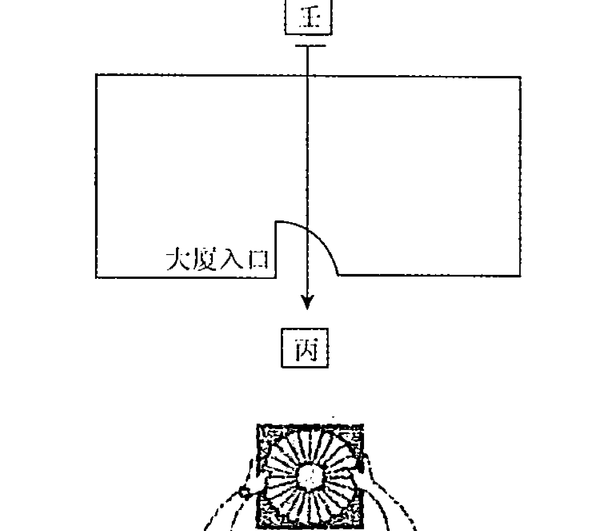

例如，某大厦为壬山丙向，它是如何定向的呢？该大厦大门开在朝南之墙，此房为坐北朝南的阳宅，磁针靠勘测者这端的红线压在丙山上，靠住宅这端的红线压在壬山上，用玄空专业术语来讲，此宅是立壬山丙向。从罗盘上看，大厦定向如图3-6所示。

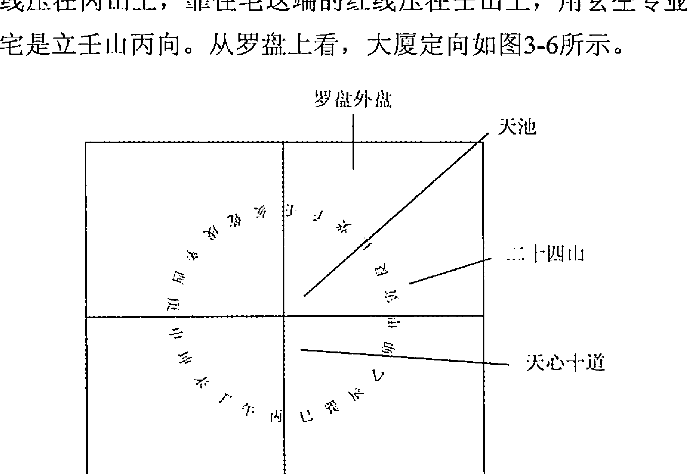

## 二、房屋罗盘定向的注意事项

- 1. 使用罗盘定向时，应注意罗盘与所测阳宅之间的距离不少于5米，若罗盘与所测阳宅太近会受墙内钢筋等的影响，使罗盘磁针产生偏差，得到错误的定向度数；在定向时还应注意罗盘周围的环境是否也有钢筋、铁器等，这些东西也会使罗盘磁针产生误差。如住宅尚在建造之中，宅外堆满钢筋，这些钢筋有时可能使罗盘磁针产生4度以上的偏差。在定向时，开着的手机以及周围的汽车等的电磁波都会对罗盘有影响，所以测量时也要远离这些物体。

- 2. 切不可以在住宅房屋内运用罗盘来定向，因房屋里的钢筋与家用电器产生的电磁，均会影响罗盘磁针度数的准确性。即使未装修的房屋，在房间内部与屋外定向所测得的度数也是不同的，所以运用罗盘来定向必须在宅外进行。

- 3. 一般定向工作要数次才能完成。每次定向要根据与阳宅不同点不同距离反复测量，以检验所测得的度数是否为同一坐向。

## 三、玄空学定向法则

由于经济的飞速发展，人们居住条件、居住形式、环境也发生了巨大变化，形成了城市现代化、农村城市化、城乡一体化。高楼林立，建筑形式不断翻新，这就给现代风水学提出了新问题：如何正确地给现代建筑定向。

具体来讲，高楼大厦都是分层居住，同一层楼会分成很多户，每户宅向未必与整栋大楼相同，所以具体情况应具体分析，定向原则如下：

### （一）阳宅总体定向

- 1. 以阳宅（各类楼型）总入口定向，如果有多个门的，并且门的大小一致，就以写有单位名称或建筑物名字的那一个门为准。
- 2. 以阳定向。阳动阴静，向阳光一面为阳；坐山面水（海、河、湖、泊）为阳；楼后有高楼，前面有道路，面路为阳；四周（或二面三面）都有道路，以主要道路（人多车多流量大）为阳定向。

### （二）阳宅个体定向

阳宅（大楼）内如有若干个单位或个人的办公室，先以阳宅总体宅运推断，个体定向后再以个体宅向推断。

- (1) 以窗定向。个体宅屋内门窗最大、最多的一面，光线充足、明亮，空气流通，纳气充分。
- (2) 以阳台定向。阳台有门有窗，空气通畅，和屋门形成空气对流，阳台一般窗多面向阳。
- (3) 以人、车流量大的道路来定向。室内两面或三面窗大小一样时，就以道路为定向依据，因为路为水，水为阳。
- (4) 以“楼座”定向。现代建筑为方便写字楼中各单位出入方便，四周分为若干门口，例如“A座”、“B座”，这样便以“楼座”定向。

## 第五节 立极规作图

### 一、立极规

立极规是一张透明的有一定硬度的塑料板（不能太厚），上面印有二十四山及360度。国内有售立极规的店铺，如果买不到的话可以自己做一个。在硬纸板上用圆规画一个圆，然后用量角器将圆划分成24等份，每等份15度，然后把24山依次序标上去，圆心挖一个小洞，最后把这个圆剪下来就成了一个立极规（图3-7）。

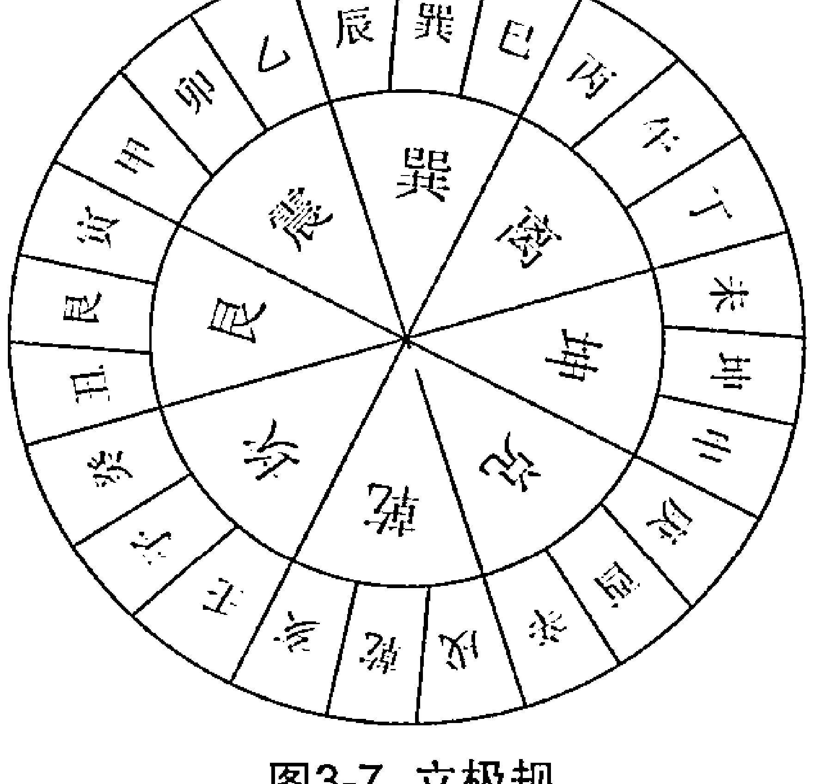

具体用法就是先在房间的平面图上根据数学几何法定出中心点，然后通过中心点做一条直线，一端是坐，一端是向，一般独立大楼定向的一条线是与楼门垂直，很容易识别。然后让立极规中心点与房屋几何中心点重合，再根据罗盘测量出来的坐向度数，找出立极规上同样度数的坐向线，使坐向线与前面在中心点上作一条垂直于建筑物以定向时大门的那条线重叠，最后根据立极规上八卦方位，把房屋分成八部分。

用立极规把被测量建筑物的平面图分成八宫二十四山，然后便根据风水学知识去判断各宫的吉凶及做出整体的布局方案。立极规的作用就在于能精确地分出建筑物八宫二十四山，以便判断阳宅吉凶与调整布局，所以立极规在实践操作过程中也是一个不可缺少的工具。

## 二、建筑物中心点的计算方法

经过罗盘的定向，可以精确地得知阳宅定向的度数，根据定向所测得的度数（即坐向），用立极规可将阳宅的平面分为八个宫位。玄空风水推断住宅吉凶主要是将此八个宫位（即后天洛书九宫除去中宫）中每宫的山、向、运星组合、周围环境配合及室内布局来综合判断。要将住宅的平面准确地分为八宫，需要两方面因素，一是确定好住宅的中心点，二是运用好立极规。

计算阳宅的中心点要用到一些简单的几何知识。事前必须准备一张住宅的平面图，如果房屋是简单的几何图形，可以采用几何的方法来求出该房屋的中心。如图3-8所示。

对于复杂的几何图形可用精确的方法求出住宅中心点（重心点），可称之为吊线法，具体如下：

- （1）将平面图贴在厚纸板上，等到胶水干了之后，再依房间的形状裁剪厚纸板。
- （2）用线绑上一块橡皮擦。
- （3）在裁好的平面图一角挖个洞，将线的前端套在回纹针上，再把回纹针穿入平面图的一角，使橡皮擦垂下来。
- （4）用铅笔沿垂下的线描画在纸板上。
- （5）在邻角上挖个洞，然后以同样的方式画线。
- （6）线重叠的那一点即为中心点。

方形屋，以四个角的对角线的交点为中心点

L形屋定中心

斜边定中心

缺小角填平

缺大角形割补

大凸形填平

凸角形舍去

大凹形舍凸

小凸形舍去

图3-8 简单图形中心点示意图

### 三、用立极规划分八宫

如何用立极规可以根据先前测得坐向的度数，来划分出建筑物平面图的八宫。这个步骤是作图部分的最后一步。

- （1）在建筑物中心（坐向线）上按定向时罗盘所测的度数对准立极规度数。假设罗盘测得18度，以立极规上的18度对准平面图上中心线（坐向线），并且要注意立极规的中心点一定要与建筑平面图的中心点对准。
- （2）然后根据立极规上八宫分界线在平面图上分别用笔标出八个点，通过中心连接这些点，可以得到四根边线，从而将住宅平面图划分成八宫，最后是注明各宫所属之卦。

下面举例说明立极规作图方法：

例如：七运（1984年-2003年）丙山壬向房屋平面户型图如图3-10所示。

立极规划分房屋八宫如图3-11所示。

标上飞星图如图3-12所示。

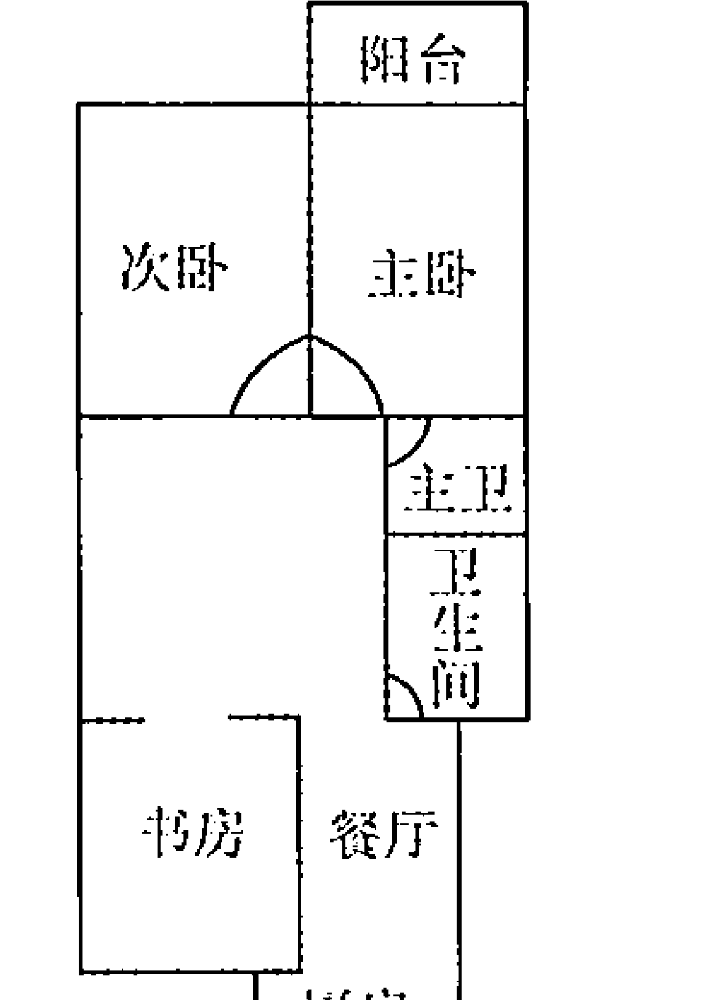

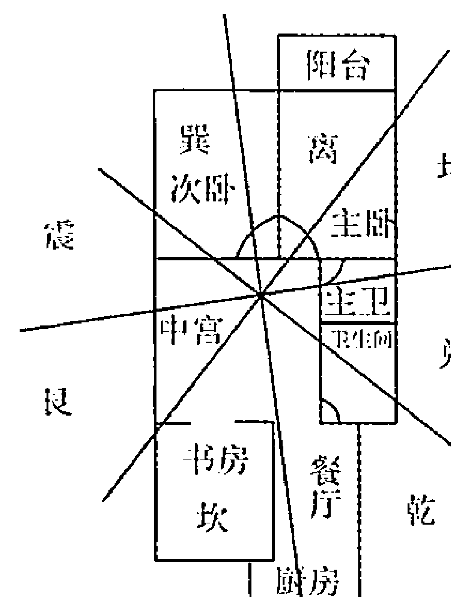

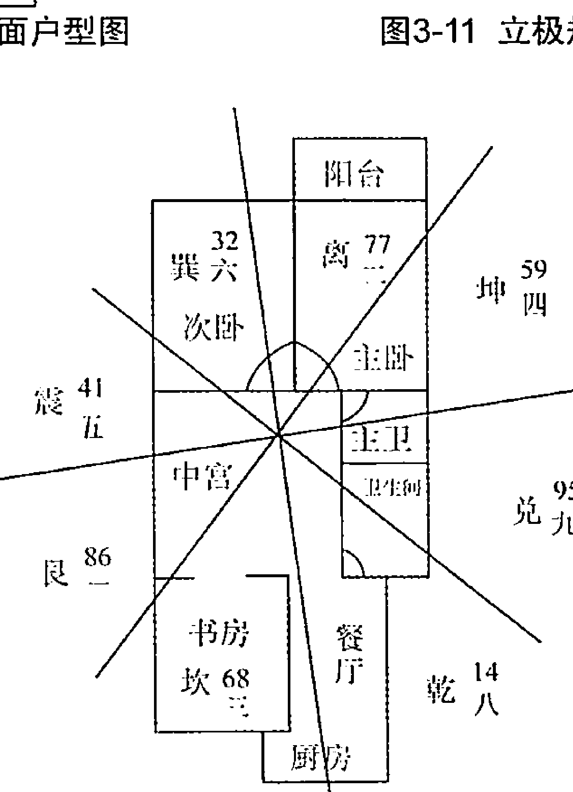

以上这些就是用玄空学推断阳宅吉凶的第一个步骤，操作的精确与否直接影响到推断结果是否正确，所以读者要多实践、多练习才能熟能生巧。

## 第六节 正向与兼向

介绍九星运行规律之前先介绍房屋坐向的正向与兼向，正向与兼向挨星不同（九星飞行轨迹不同），正向用下卦挨星法，兼向用替卦挨星法。罗盘上二十四山每个方向的方位角为15度，二十四山共计360度。平时在定向时罗盘上的红色垂直交叉十字线压着二十四山某个字的中间部位，换句话说，压在某个字中间9度之内（即某个字中心点左右各偏4.5度）在玄空风水学上就算是立正向。倘若垂直交叉之线压着某个字稍偏，已经超出9度宽的范围，即某个字中心点左偏或右偏超过4.5度的位置，在玄空风水学上称为兼向。玄空风水学中的正向与兼向，在画飞星盘时有很大差别，由此判断出的吉凶祸福也存在很大的差异。正向与兼向如图3-13所示。

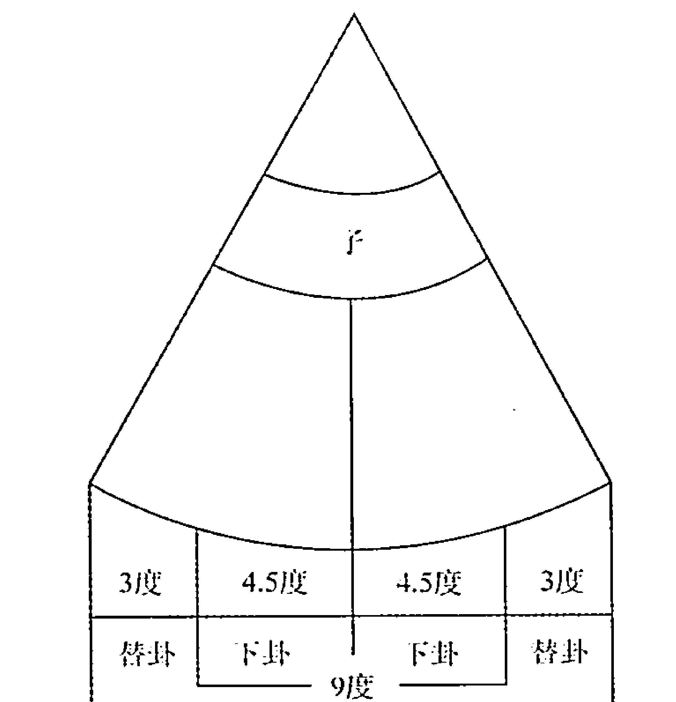

风水罗盘上有360度，分成二十四山，每山为15度，二十四山还可以分为5格，每格3度。当判断山向时，指针指向每山的中间三格（也就是9度），称为正山正向，但如果是指向卦边3度的，就称为兼山兼向。如图3-14所示。

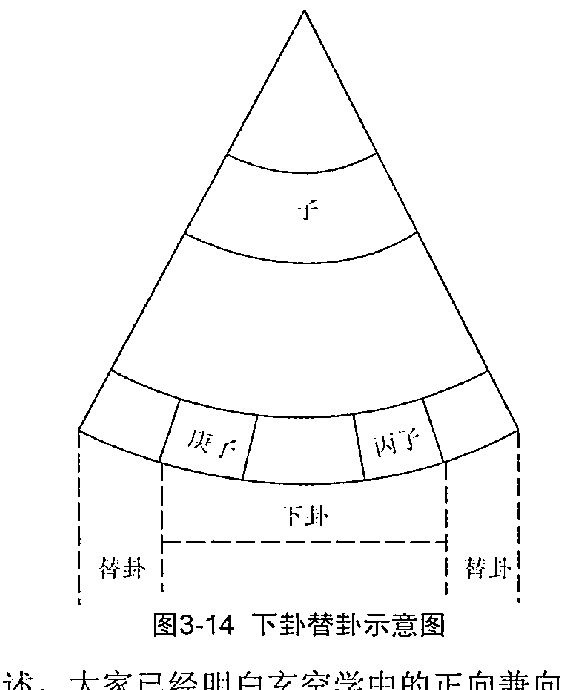

通过以上论述，大家已经明白玄空学中的正向兼向，实际上完全是为挨星作准备。因为玄空风水是依据宇宙周期的元运，推算空间流动的气流消长与潜伏，来判断房屋的吉凶祸福。

## 第七节 房屋立向

立向与定向是两个不同概念，立向就是在阳宅周围环境条件具备的基础上，对阳宅有目的、有选择地确立坐向。当然，周围环境应当要山有山、要水有水。真正具备山水条件的山区，或土地比较富余的农村还是有机会寻找到好的环境的，但在现代都市里很难找到真山真水的环境。玄空地理对山水的含义很宽泛，可以引申到建筑群里寻找山水的替代环境，即高一寸者为山，阳宅背后要有超过本体的建筑高楼；低一寸者为水，向方主要有空地、道路，这是坐满朝空①的局势，如需坐空朝满，就得反其道而行之。

定向除了考虑环境外，还会遇到正向与兼向问题。立向尽量用正向，不用兼向，因为兼向易出现阴阳混杂，使宅屋不能清静。正向要选择旺山旺向确定坐向，还要考虑兼向问题，但玄空学对兼向有一定限制，当兼向超过一定度数时便会出大凶，而且无法通过布局调整来化解，故对此应慎之又慎。

在房屋选址时，有几种坐向要特别引起注意，一旦定向的方位为下述四种情况，此房屋切不可居住。若强行入住此类房屋，很有可能出现大凶灾，具体如下。

### 一、一卦之内阴阳互兼

一卦之内的阴阳互兼，指在同一个卦山中，天元龙兼地元龙，或地元龙兼天元龙（天元龙与人元龙相兼属一卦之内同阴同阳相兼），如壬山兼子山，辰山兼巽山等，如图3-3所示。其兼向度数不能超过此山中心线左侧（或右侧）6度之外。也可以这样来理解，二十四山每山共15度，下卦占9度，而兼卦在左右两边各占3度。下卦一共是9度范围，从一山最中间分左右，两边各占4.5度，而4.5度外3度便是属于兼卦的范围了，而6度减去4.5度还余1.5度，即以兼向所属的3度范围当中的1.5度为界度，房屋坐向线落在靠下卦这边的1.5度时，此兼卦可用，房屋纳气还较纯。一旦坐向线落在了靠外的1.5度范围内，房屋所收的气场就比较杂乱，玄空学中称这种山向犯阴差阳错，所以此类阳宅就可以断定为凶，多主欲进不能，欲退不行、威权不立、声名不震、虚费心力、毫无寸功之败局；若飞星盘理气与形势兼顾，亦能短暂发福，旋之即败。

### 二、一卦之内山向同阴同阳相兼

洛书九宫中每一卦宫之内有三山，山向为同阴同阳相兼，这是指一卦天元龙与人元龙相兼，如午山兼丁山，亥山兼乾山，相兼程度要视阳阴而分，同阴的山向相兼能兼至6度，而同阳的山向相兼能兼至7度。但若同阴同阳山向相兼超过其相兼度数的范围时，除了人财两败外，在克应性质上同阴之山向较不利女子，而同阳之山向较不利男子，这是同阴同阳相兼过度产生的特殊性质。
同阴的山向，如午山兼丁山，从一山中间往左或往右距离6度范围，与阴阳互兼相同；而同阳的山，可以从一山中间往左往右距离有7度的范围。

### 三、出卦相兼

出卦相兼是指相邻卦宫两山相兼，如坎宫的壬山兼乾宫的亥山，坤宫的未山兼离宫的丁山等，根据玄空学替卦法则，凡出卦必定用替星来起飞星盘。但出卦互兼亦不能超过6度，方法与一卦之内阴阳互兼相同，亦属于阴差阳错之山向，但凶性的程度比一卦之内阴差阳错来得更大。比如阴阳二宅立壬山兼亥山线度，坐向线落于6度外，即在靠亥山这边的1.5度之内时最为凶险，若阳宅此等方向往往会有破大财、生大病等较严重的凶事。
一般在外勘测风水时，阴阳二宅若遇此种线度时，一般即可断定为凶宅，这种坐向线的屋宅风水无法调整，大多主癌症或者丧丁。

### 四、骑线空针

所谓骑线空针，就是指罗盘坐向线恰恰落在了两山之间的界线上，既不属左边山向，也不属右边山向，如图3-15所示。但凡坐线（实际指测量的方位）落在两山界线上，房屋也是无法调整，应考虑搬迁，但骑线空针分两种情况，一是在卦宫内山与山的交界线上，此为小空亡；二是在卦宫与卦宫交界线上，此为大空亡。犯此二者主鬼神及凶事恶症，主丁财灭绝。以大空亡发凶更甚、更快。房屋立向最忌讳立小空亡与大空亡线度，凶性超过前面三者，不过当理气星盘与形峦合局时，亦主发吉，但若外六事①及内六事②略有不及之处，必主大凶，运退尤甚。

> ①外六事，古时是指路巷、池井、坑厕、畜栏、坛庙、桥梁这六类。
> ②内六事，古时是指门户、厅堂、厨灶、天井、厅堂、磨盘这六类。

上述四种坐向线情况，属于无法调整的风水。问题出在建筑纳气不纯上，因此，最好的办法就是搬迁或不去购买。

# 第四章 玄空九星运行

## 第一节 九星运行轨迹

### 一、什么是九星

具有一定天文知识的人都知道，宇宙中有北斗七星，每当黄昏群星显现的时候，在日落方向偏右的天空里，可以找到七颗亮星，那就是北斗七星。因为这七颗星排列的形状像一个有柄的勺子，位置又在北方的天空，所以古人叫它北斗。

北斗七星的第一星为贪狼、第二星为巨门、第三星为禄存、第四星为文曲、第五星为廉贞、第六星为武曲、第七星破军。其实，斗柄破军、武曲旁还有两星，其中一颗星，一般情况都隐藏起来，用肉眼通常是看不见的，它叫右弼，在武曲星的右边。另一颗星也不明亮，只有一点微光，我们平时也难以看见，它处在武曲星与破军星之间，在武曲星左侧，这颗星的名称是左辅。北斗七星加上左辅与右弼共有九颗星，我们把它称作九星。如图4-1所示。

宇宙天体万古常动，地球二十四小时一圈的自转产生白天与黑夜之分，每一年绕太阳一周的公转，产生四时二十四节气。自然天体上九颗行星不会因地球的转动而停滞不前，这个空间方位是由北极星来确定的。我们从北斗二向北斗一引一根虚线向前延长出去，可以看到一颗同北斗七星一样亮的星，这就是北极星。北斗一和北斗二这两颗星因此称为指极星。

如图4-2所示。

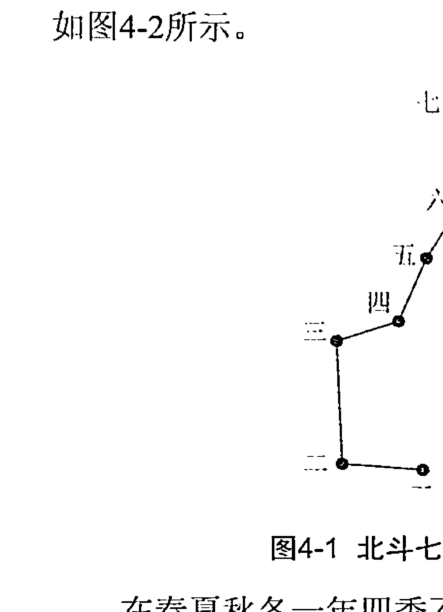

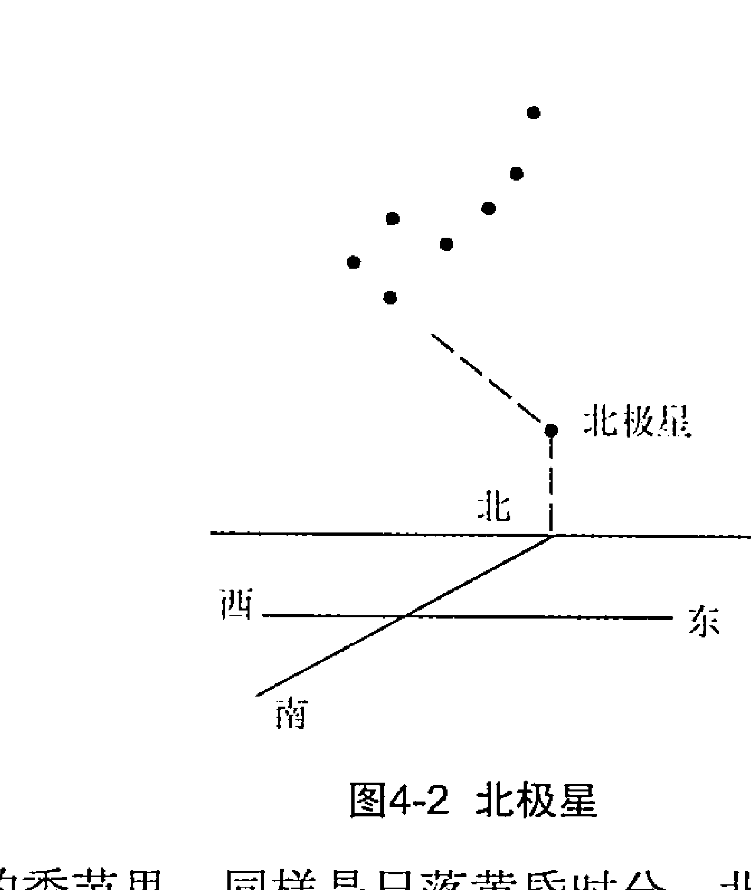

在春夏秋冬一年四季不同的季节里，同样是日落黄昏时分，北斗星在天空中的位置是不同的。斗柄指的方向也不一样：春天黄昏北斗星运行到头顶上空，斗柄指向东方；夏天晚上，北斗星运行到太阳落山的西北方，斗柄朝上遥指南方；秋天黄昏，北斗星沉到了北极星下方的地平线上，斗柄指向西方；冬天晚上，北斗星又从东北方升起，斗柄朝下指向北方地平线上。如图4-3所示。

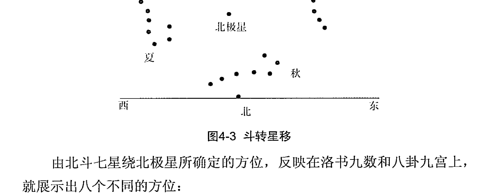

由北斗七星绕北极星所确定的方位，反映在洛书九数和八卦九宫上，就展示出八个不同的方位：

- 洛书之一和八卦之坎宫，为正北方。
- 洛书之二和八卦之坤宫，为西南方。
- 洛书之三和八卦之震宫，为正东方。
- 洛书之四和八卦之巽宫，为东南方。
- 洛书之五和八卦之中宫，为天心。
- 洛书之六和八卦之乾宫，为西北方。
- 洛书之七和八卦之兑宫，为正西方。
- 洛书之八和八卦之艮宫，为东北方。
- 洛书之九和八卦之离宫，为正南方。

把上面所列的洛书九数、八卦九宫、八个方位三种要素结合，形成紫白九星方位图，一至九9个数，每个数代表一个飞星。通常八个方位隐藏于八宫之中，画图时一般都不特别标明出来。紫白九星如图4-4所示。

| 四 | 九 | 二 |
|---|---|---|
| 三 | 五 | 七 |
| 八 | 一 | 六 |

图4-4 紫白九星

此紫白九星的数，代表着多种含义：

- 一代表坎卦。坎宫，正北方，贪狼星，五行为水，中男，坎之物象。通常称一白水星。
- 二代表坤卦。坤宫，西南方，巨门星，五行为土，老母，坤之物象。通常称二黑土星。
- 三代表震卦。震宫，正东方，禄存星，五行为木，长男，震之物象。通常称三碧木星。
- 四代表巽卦。巽宫，东南方，文曲星，五行为木，长女，巽之物象。通常称四绿木星。
- 五代表天心，又称中宫，中心方位，廉贞星，五行为土，星极（不定六亲）。通常称五黄土星。
- 六代表乾卦。乾宫，西北方，武曲星，五行为金，老父，乾之物象。通常称六白金星。
- 七代表兑卦。兑宫，正西方，破军星，五行为金，少女，兑之物象。通常称七赤金星。
- 八代表艮卦。艮宫，东北方，左辅星，五行为土，少男，艮之物象，通常称八白土星。
- 九代表离卦。离宫，正南方，右弼星，五行为火，中女，离之物象。通常称九紫火星。

现代天文学证实：恒星与行星有明显区别。行星是不发光实体，如金木水火土星及地球。恒星是燃烧发光体、气团，是原子核反应堆，如太阳及北斗七星（实为九星），它发光发热，发出物质流，消耗自己的能量。恒星发射能量的大小及方向不同，对地球人类有吉凶的影响。

### 二、九星运行轨迹

洛书所显示的数与八卦所规定的九宫结合而成的图，称为洛书九宫图。在运用这个图的时候，通常不画出各宫的卦象，只用震、巽、离、坤、兑、乾、坎、艮八个表示方位的星以及各个星所隶属的数画成一个简图，如图4-5所示。这个图形近似一个盘子，所以又称为“八卦元旦盘”。它表示大地东、南、西、北、中、东北、东南、西南、西北九个方位的原本状况，故八卦元旦盘又称为“地盘”。地盘中的各个数字，代表了九个不同性质的星，称为“紫白九星”（即前述的一白至结尾的九紫星的统称）。

## 图4-5 紫白九星元旦盘

紫白九星并不是静态的，它是动态的，在时间流逝中按一定的轨迹飞行，这些轨迹称为“飞星轨迹”或叫“洛书轨迹”。

九星的飞行由中心开始，中心的数是“五”，即由五开始飞行。五飞入六位（乾宫），六又飞入七位（兑宫），七飞入八位（艮宫），八飞入九位（离宫），九飞入一位（坎宫），一飞入二位（坤宫），二飞入三位（震宫），三飞入四位（巽宫），四飞入中位（中宫），如此完成一个过程。其轨迹为五→六→七→八→九→一→二→三→四→入中，这个飞行过程称为“顺飞”。见图4-6（a）。

与顺飞相反，又有逆飞。五飞入四位（巽宫），四飞入三位（震宫），三飞入二位（坤宫），二飞入一位（坎宫），一飞入九位（离宫），九飞入八位（艮宫），八飞入七位（兑宫），七飞入六位（乾宫），六飞入中位（中宫），如此完成一个过程，其轨迹为五→四→三→二→一→九→八→七→六→入中，这就是逆飞。见图4-6（b）。

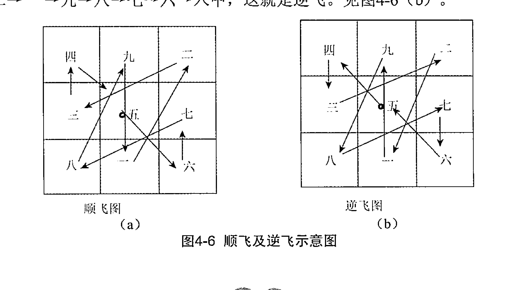

所谓顺飞，就是顺着紫白九星的序数而飞行，即一二三四五六七八九的顺序而行。所谓逆飞，就是逆着紫白九星的序数而飞行，即九八七六五四三二一的逆序飞行。上面两图，只是由五数起飞而已。

以上顺飞或逆飞都是九步，即每个星飞一步，九个星各飞九步，合八十一步。即顺飞八十一步，逆飞亦是八十一步。堪舆家称此步伐为“八十一步量天尺”，又称“罡步”。

玄空风水学家非常重视这“量天尺”，认为它是无形之气，虽看不见，摸不着，但有时节可按，有路线可循，有定数可察，千变万化的事实证明它的不可思议。紫白九星按照特定的轨迹飞行，每飞一步，必有一星进入地盘的中心。地盘的中心称为“月窟”，进入地盘中心的星称为“天根”。“月窟”与“天根”又合称为“天心”。通常，经过九星运行所形成的星盘，其中心位置就是“天心”，这个称呼经常要用到。

星盘以天心为准绳，把其余八星分别布置于震、巽、离、坤、兑、乾、坎、艮八个方位。不管哪一个星进入月窟，产生天心后，其余八星必定按量天尺所规定的轨迹进入特定的方位，形成特定的星盘。下面把九星按次序进入月窟所形成的顺飞星盘和逆飞星盘展示出来。

一白水星入中星盘图如图4-7所示。

**顺飞:**

| 九 | 五 | 七 |
|---|---|---|
| 八 | 一 | 三 |
| 四 | 六 | 二 |

**逆飞:**

| 二 | 六 | 四 |
|---|---|---|
| 三 | 一 | 八 |
| 七 | 五 | 九 |

## 图4-7 一白水星入中

二黑土星入中星盘图如图4-8所示。

**顺飞:**

| 一 | 六 | 八 |
|---|---|---|
| 九 | 二 | 四 |
| 五 | 七 | 三 |

**逆飞:**

| 三 | 七 | 五 |
|---|---|---|
| 四 | 二 | 九 |
| 八 | 六 | 一 |

## 图4-8 二黑土星入中

## 自己也能看风水——装饰装修与玄空布局

三碧木星入中星盘图如图4-9所示。

**顺飞:**

| 二 | 七 | 九 |
|---|---|---|
| 一 | 三 | 五 |
| 六 | 八 | 四 |

**逆飞:**

| 四 | 八 | 六 |
|---|---|---|
| 五 | 三 | 一 |
| 九 | 七 | 二 |

## 图4-9 三碧木星入中

四绿木星入中星盘图如图4-10所示。

**顺飞:**

| 三 | 八 | 一 |
|---|---|---|
| 二 | 四 | 六 |
| 七 | 九 | 五 |

**逆飞:**

| 五 | 九 | 七 |
|---|---|---|
| 六 | 四 | 二 |
| 一 | 八 | 三 |

## 图4-10 四绿木星入中

五黄土星入中星盘图如图4-11所示。

**顺飞:**

| 四 | 九 | 二 |
|---|---|---|
| 三 | 五 | 七 |
| 八 | 一 | 六 |

**逆飞:**

| 六 | 一 | 八 |
|---|---|---|
| 七 | 五 | 三 |
| 二 | 九 | 四 |

## 图4-11 五黄土星入中

六白金星入中星盘图如图4-12所示。

**顺飞:**

| 五 | 一 | 三 |
|---|---|---|
| 四 | 六 | 八 |
| 九 | 二 | 七 |

**逆飞:**

| 七 | 二 | 九 |
|---|---|---|
| 八 | 六 | 四 |
| 三 | 一 | 五 |

## 图4-12 六白金星入中

七赤金星入中星盘图如图4-13所示。

**顺飞:**

| 六 | 二 | 四 |
|---|---|---|
| 五 | 七 | 九 |
| 一 | 三 | 八 |

**逆飞:**

| 八 | 三 | 一 |
|---|---|---|
| 九 | 七 | 五 |
| 四 | 二 | 六 |

## 图4-13 七赤金星入中

八白土星入中星盘图如图4-14所示。

**顺飞：**

| 七 | 三 | 五 |
|---|---|---|
| 六 | 八 | 一 |
| 二 | 四 | 九 |

**逆飞：**

| 九 | 四 | 二 |
|---|---|---|
| 一 | 八 | 六 |
| 五 | 三 | 七 |

## 图4-14 八白土星入中

九紫火星入中星盘图如图4-15所示。

**顺飞：**

| 八 | 四 | 六 |
|---|---|---|
| 七 | 九 | 二 |
| 三 | 五 | 一 |

**逆飞：**

| 一 | 五 | 三 |
|---|---|---|
| 二 | 九 | 七 |
| 六 | 四 | 八 |

## 图4-15 九紫火星入中

由紫白九星运行所形成的星盘，并不是堪舆家随意捏造的，而是根据天地运行所形成的气场在地面的分布状态，不同方位的气就以不同的星来表示，九个星的分布就是统一的气场在不同方位的表现。地面上自然气场是看不见摸不着的，但当人们身处于某种环境下，就会以自身经历体验到它的存在。如果我们把大地比做一个足球场，当球场内没有任何实物时，大自然的气只是均匀地分布其中，只是弥漫着统一的气，其间没有质的区别，也没有量的区别。当人们在球场内建一个房子，统一的气场即发生变化，房子的中央出现了天心，房子内出现了方位，统一的气就变成了有方位的气，原先没有质的区别，也没有方位区别的气场，就变成了有质的区别和方位区别的气场，这种气场有什么特点呢？

第一，有统一性。房内的气场由天心与八方之气构成，合称为七色九气，或五气九宫。其间不能缺少任何一个方位，不能只有八方而没有中心，或只有中心而没有八方，也不能只有四正没有四隅。它们互相联系、互相依存、缺一不可，形成统一的气场。

第二，有方向性。统一的气场，会随着房子的坐向不同而发生变化。如果房子原来是坐南向北的，房内的气场就以坐南向北的方位来分布。当房子改成坐西向东的时候，房内的气场也随之变化，从南向北的气场变成从西向东的气场，房内各个方位的气就发生了方位的转换。

第三，有时运性。宇宙是运动变化的，它对地面形成的气场也因不同的时期发生不同的变化。具体说来，有元运的变化，有大运变化，有小运的变化，有年运的变化，有月日时的变化。

第四，有阴阳顺逆性。由于房子具体的方向性，就决定了八方之气分布的阴阳性质和顺飞、逆飞性质。

这四个特点是房子气场的主要特性。读者对这些特性不一定立即明白，后面的章节会详尽地叙述它的内容。

# 第四章 玄空九星运行

# 第二节 九星运行时间的划分（三元九运）

洛书九宫飞星，加入了时间因素，就具有了应用的价值。这个时间因素，就是“三元九运”。

相传在公元前2697年，黄帝大挠以干支纪年，定此年为黄帝元年，甲子为始元，往后每六十年为一甲子周期，俗称“六十花甲”。一个花甲定为“一元”，三个花甲定为“三元”。三元分上元、中元、下元，合180年，至今已经历了78个大运。

所谓大运，就是洛书九星每六十年逆行一步。从黄帝元年开始行第一步，即六白金逆行飞入中宫，至今已逆行了78步。第七十八步就是二黑土星逆行飞入中宫。从1984年开始，九星运行第七十九步，即三碧木星逆行进入中宫。这六十年间，就是行三碧木气大运，由三碧木气主宰着这60年。

在每一个元的六十年中，又分为三个小运，每个小运20年，每20年就有一个星逆行入中，主宰20年的小运，比如1984年至2003年为下元七运（七赤金星入中主宰），2004年至2023年为下元八运（八白土星入中主宰），2024年至2043年为下元九运（九紫火星入中主宰）。下面把最近一期上、中、下元三元九运划分如下：

# 上元

- 一运: 1864-1883年，甲子甲戌20年，一白水运，贪狼星主气；
- 二运: 1884-1903年，甲辰甲寅20年，二黑土运，巨门星主气；
- 三运: 1904-1923年，甲辰甲子20年，三碧木运，禄存星主气。

# 中元

- 四运: 1924-1943年，甲子甲戌20年，四绿木运，文曲星主气；
- 五运: 1944-1963年，甲申甲午20年，五黄土运，廉贞星主气；
- 六运: 1964-1983年，甲辰甲寅20年，六白金运，武曲星主气。

# 下元

- 七运: 1984-2003年，甲子甲戌20年，七赤金运，破军星主气；
- 八运: 2004-2023年，甲申甲午20年，八白土运，左辅星主气；
- 九运: 2024-2043年，甲辰甲寅20年，九紫火运，右弼星主气。

玄空风水把20年分为一个运，虽然实践上已充分证明其准确率极高，但为什么要这样区分？为什么是20年而不是30年或10年呢？这在研究中尚未找到很具说服力的证明，但有一点是肯定的，这样的划分刚好与现代天文学计算的木星与土星相会的周期不谋而合。

木星绕太阳一周需11.86地球年，土星绕太阳一周需29.46年，木星和土星相会一次需20年，这与玄空风水推地运以20年为一个运刚好相同。

现代天文学已发现，木星是太阳系九行星中最大的一个，直径是地球的11倍，质量为地球的1000倍；土星的直径仅次于木星，但土星中氢所占的比例很大，故质量反而最轻。这两个最大的行星每相会一次，势必对其他星球产生重大影响，地球也不例外。这种影响具体表现在地震、干旱、海啸、洪涝、决策者思维极端、社会动荡……或反过来，一切向好方向发展等。

这种影响，西方现代天文学家称为“木星效应”理论。我国古代天文学家、风水学家早已把木星称为“岁星”，而且以北斗九星的名称将地球时间划分为九个阶段，每段20年，即每运20年。这是否牵强附会或还有更具说服力的证明，尚未发现依据，有赖现代科学研究成果给予支持，也有赖风水学研究者不断实践、不断探索、不断总结来做进一步的证明。

# 第三节 玄空挨星下卦法

## 一、运盘

洛书元旦盘、九星元旦盘、后天八卦元旦盘都为静盘（如图4-16～图4-18所示），洛书元旦盘，洛书数不变（载九履一，左三右七，二四为肩，六八为足）。

| 四 | 九 | 二 |
|---|---|---|
| 三 | 五 | 七 |
| 八 | 一 | 六 |

## 图4-16 洛书元旦盘

九星元旦盘，为九星的原始状态。

| 四绿 | 九紫 | 二黑 |
|---|---|---|
| 三碧 | 五黄 | 七赤 |
| 八白 | 一白 | 六白 |

## 图4-17 九星元旦盘

后天八卦元旦盘，八卦位置不变。

| 巽 | 离 | 坤 |
|---|---|---|
| 震 | | 兑 |
| 艮 | 坎 | 乾 |

## 图4-18 后天八卦元旦盘

三盘统一称为元旦盘，或称地盘。可由图4-16和图4-18合成新图表示为三盘合一，即图2-11的洛书九宫图。

下面讲述下卦飞星盘（宅盘、宅运盘）排法。先排运盘、运星入中一概顺飞。三元九运属何运，就由该运之星入中并按洛书步法一概顺飞。如1944-1963年为五运，即五入中顺飞。

如1984-2003年为七运，如住宅在这二十年内所建，其运盘构成如图4-19所示。

| 六 | 二 | 四 |
|---|---|---|
| 五 | 七 | 九 |
| 一 | 三 | 八 |

## 图4-19 七运运盘

如2010年，为下元八运，其运盘构成如图4-20所示。

| 七 | 三 | 五 |
|---|---|---|
| 六 | 八 | 一 |
| 二 | 四 | 九 |

## 图4-20 八运运盘

运盘（天盘）是宇宙时空运转周期在玄空学中的具体体现，是玄空学的时间概念，运盘形成为纳入住宅的空间、方位等提供了依据。排好运盘后，按着住宅坐向排山盘、向盘，也称为装“下卦”。用罗盘确定好房屋坐向（山向），以飞临该山与向之某字（二十四山向中的八干、四隅、十二地支）分别入中宫，山字写在中宫运数之左上角，向字写在中宫运数之右上角（运盘数用大写数，山盘向盘数用阿拉伯数），山盘向盘字数逢阳顺布八宫，逢阴逆布八宫。

## 二、下卦飞星盘排法举例

#### （一）以目前八运为例

（1）先排八运运盘（天盘），见图4-21。

## 图4-21 八运运盘（天盘）

| 七 | 三 | 五 |
|---|---|---|
| 六 | 八 | 一 |
| 二 | 四 | 九 |

（2）假如房屋为子山午向（坐北向南），子山在坎宫，午向为离宫，八运天盘中坎宫四绿飞到，离宫三碧飞到，把坎宫四移到中宫八数之左上角，把离宫三移到中宫八数之右上角。如图4-22所示。

## 图4-22 4、3飞星示意

| 七 | 三 | 五 |
|---|---|---|
| 六 | 4 3 八 | 一 |
| 二 | 四 | 九 |

（3）坎宫（山）统辖三山，即壬子癸，离宫（向）统辖三山，即丙午丁。前边已讲到，子和午都为天元龙，都为阴数，阳顺排，阴逆排。顺排逆排的顺序和运盘布宫路线一样，即中→乾→兑→艮→离→坎→坤→震→巽。现在子山中的四移到了中宫左上角，午向中的三移了中宫的右上角。4数按巽宫三山辰巽巳中的天元龙“巽”分阴阳布八宫，巽在巽宫为天元龙属阳，所以4数顺布八宫，如图4-23所示。

## 图4-23 4顺布八宫

| 3 七 | 8 三 | 1 五 |
|---|---|---|
| 2 六 | 4 八 | 6 一 |
| 7 二 | 9 四 | 5 九 |

（4）山盘4顺布八宫后，再排向盘3数，3为震宫三山甲卯乙中的天元龙卯字，卯为天元属阴，阴逆飞布八宫。如图4-24所示。

## 图4-24 3逆布八宫

| 4 八 | 8 三 | 6 五 |
|---|---|---|
| 5 六 | 3 八 | 1 一 |
| 9 二 | 7 四 | 2 九 |

（5）把山向两盘飞星合成一体，八运子山午向宅运盘就是一个完整的宅运盘，也称“下卦图”，如图4-25所示，论断宅运吉凶就以此盘为依据。

## 图4-25 4、3顺布、逆布后的运盘

| 3 4 七 | 8 8 三 | 1 6 五 |
|---|---|---|
| 2 5 六 | 4 3 八 | 6 1 一 |
| 7 9 二 | 9 7 四 | 5 2 九 |

#### （二）以八运丑山未向举例

（1）先布八运运盘（天盘），如图4-26所示。

## 图4-26 八运运盘（天盘）

| 七 | 三 | 五 |
|---|---|---|
| 六 | 八 | 一 |
| 二 | 四 | 九 |

（2）山向二字入中宫，如图4-27所示。

## 图4-27 2、5入中宫

| 七 | 三 | 五 |
|---|---|---|
| 六 | 2 5 八 | 一 |
| 二 | 四 | 九 |

（3）丑未为地元龙，入中宫山向二字也得从所在宫三山中确定地元龙的阴阳，山盘入中宫，2为坤三山未坤申中的未字，未为地元龙属阴排布八宫，如图4-28所示。

## 图4-28 2逆布八宫

| 3 七 | 7 三 | 5 五 |
|---|---|---|
| 4 六 | 2 八 | 9 一 |
| 8 二 | 9 四 | 1 九 |

（4）在排飞星盘中，如果五黄星入中，如何排呢？因五为中宫戊己土，未列入八卦（山）中，查天、地、人三龙均无其阴阳属性，遇到这种情况，就按其坐向定其阴阳。本例丑山未向，向盘五黄，未向为地元龙属阴，五黄就按未向地元龙阴性入中飞布八宫，如图4-29所示。

## 图4-29 5逆布八宫

| 6 七 | 1 三 | 8 五 |
|---|---|---|
| 7 六 | 5 八 | 3 一 |
| 2 二 | 9 四 | 4 九 |

（5）把天盘、山盘、向盘组合在一起就成为八运丑山未向飞星下卦图，如图4-30所示。

## 图4-30 三盘组合后的运盘

| 3 6 七 | 7 1 三 | 5 8 五 |
|---|---|---|
| 4 7 六 | 2 5 八 | 9 3 一 |
| 8 2 二 | 6 9 四 | 1 4 九 |

现在可以解释挨星下卦的含义了：玄空飞星，亦可配成六十四卦，并由每卦所主来论断吉凶，一般称之为“下卦”。下卦的方法是以飞星运盘为依据，然后据各星所属的八纯卦（乾、兑、离、震、巽、坎、艮、坤）来配合，以挨着运星向星为下卦，山星为上卦，来组成六十四卦中任何一卦，以断吉凶。

例如：七运子山午向飞星盘见图4-31。

## 图4-31 七运子山午向飞星盘

| 4 1 六 | 8 6 二 | 6 8 四 |
|---|---|---|
| 5 9 五 | 3 2 七 | 1 4 九 |
| 9 5 一 | 7 7 三 | 2 3 八 |

乾宫内飞星为2、3（向星三碧、山星二黑），查对元旦盘三为震卦，二为坤卦，故以震卦为下卦，坤为上卦，二卦重叠，即成坤上震下的地雷复卦。

# 第五章 玄空四大格局

在掌握玄空基础知识的前提下，还要进一步熟练运用挨星盘中基本格局，方能初步进入验断的门路中，本章将讲述玄空中各种格局在星盘中的运用法则。

# 第一节 九星得令与失令

#### 一、九星得令

九星得令也就是洛书九宫九星，按照时间的流逝，先后进入中宫。凡是进入中宫之星，就叫得令之星。九星先后进入中宫的顺序是依据三元九运时间前后顺序相对来说每一个运有一个星入中宫运行，这个进入中宫的星就是这个运中最旺且强有力的星，叫得令之星，也叫当运之星。例如现在是下元八运（2004-2023年），八白土星进入中宫，便是八运当令之星。如图5-1所示。

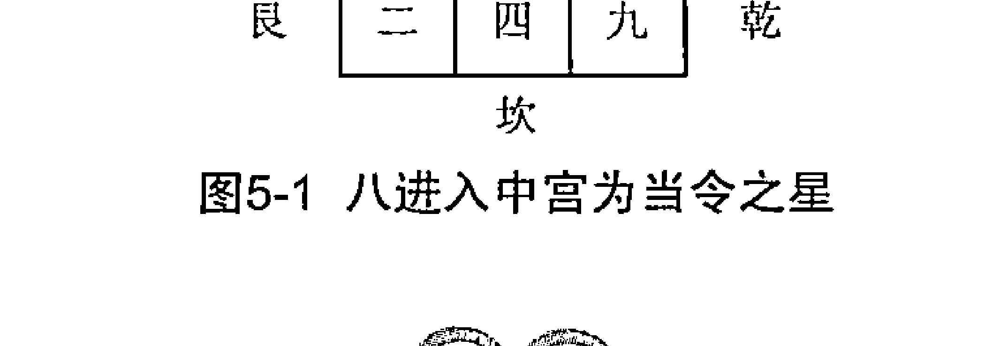

#### 二、九星失令

与当运相反，就是失运之星。所谓失运就是失去了发号施令的地位之星，那早已退出中宫，成为衰死之星。这类星分为三个层次，起着三种不同作用。

- 第一层为退气之星，刚刚从运星中宫位置退出来，它虽然没有旺气，但也没有衰气，处中间位置，不旺也不衰。例如：现在是八运八白土星当运，七赤星虽是退气之星，但也不算太弱，其力量为中和。
- 第二层为煞气之星，是离开中宫较久的星。例如：八白土星当令时，六白金星、五黄土星、四绿木星，都为煞气之星。平时人们把五黄星称为五黄煞，犯之会损丁破财，甚为凶恶。四绿木星会使人犯淫荡之罪或上梁自尽，六白金会使人犯罪，发生意外伤害。
- 第三层为死气之星，就是离开中宫最久远之星，它是有最强的煞气，如八白土星当令时，二黑土星、三碧木星就是死气之星，死气之星就是罪恶之星、大凶之星、鬼蜮之星。

#### 三、生气之星

与当运之星、失运之星不同，还有一种生气之星。所谓生气就是即将成为未来旺气之星，例如八白土星当令，九紫火星与一白水星就是将来当令之星，可称为生气之星。

# 第二节 玄空四大格局

#### 一、山、向、水的含义

山——山主管人丁，有两层含义：

一是指所立屋宅的坐方，如立的坐方是正北即子方，风水把它称为“子山”，子山必然“午向”，故“向”是与“山”呈180度的方位，我们称它子山午向。二是指看得见的山峰、来龙（山脉）、砂（小山）或引二、旺山旺向

在宅运盘中，山星中的当令星正好在坐山所在宫位，而向星当令星正好在朝向所在宫位，就叫做旺山旺向。如八运亥山巳向的房屋，“八”为当令星，山星的8正好在乾宫，是亥山所在的宫位，而向星的8也正好在巽宫，是巳向所在宫位，这就是旺山旺向。如图5-2所示。

|   | 巽 | 离 | 坤 |
|---|---|---|---|
| **震** | 2 9 六 | 9 7 八 | 7 5 一 |
| **中** | 6 4 二 | 4 2 四 | 8 6 九 |
| **兑** | 1 8 七 | 5 3 三 | 3 1 五 |
|   | **亥** |   |   |

旺山旺向的住宅是当令旺宅当中最吉利的。在它的后面如果有秀丽的山峰、高大的建筑，前面有环抱的河水、清澈的湖水或空旷之地，就是合局之宅，住这样的房屋就能人财两旺，富贵双全。但如果后面无山有水，前面无水有山，就与局势相反，这就是凶象。住这样的宅子容易损丁破财。

三、双星会向

在宅运盘中，山星中的当令星在朝向所在宫位，而向星的当令星也正好在朝向所在宫位，就叫做双星会向。

如七运壬山丙向的房屋，“七”是当令星，山星7在离宫，是丙向所在宫位，而向星7也正好在这个宫位上，山星向星的当令星都齐聚在朝向的宫位上，这就是双星会向。如图5-3所示。

当山星和向星都齐聚在朝向的宫位上，就意味着这个方位最好有山有水。符合这种格局的房屋，最好在前面近地有空旷的平地或马路，而远处能看见高山、高楼、大厦、大树等。如果前方有山无水，就只能旺人丁；如果有水无山，就只能旺财。如果既无山也无水，就变为凶象。

四、双星会坐

在宅运盘中，山星中的当令星在坐山所在宫位，而向星的当令也正好在坐山所在宫位，就叫做双星会坐。

如八运甲山庚向的房屋，八是当令星，山星8在震宫，是甲山所在宫位，而向星8也正好在这个宫位，山星向星的当令星都齐聚在坐山的宫位上，这就是双星会坐。如图5-4所示。

当山星和向星都齐聚在坐山的宫位上，就意味着这个方位最好有山有水。符合这种格局的房屋，最好在房屋的后面有水池、花园、河水、田地，稍远的地方再有高楼、山丘、山峰。这种格局是主旺相发贵的，能出文人。

五、上山下水

图5-5为七运甲山庚向之星盘图。向盘之令星七赤飞到坐山，山盘之令星七赤飞到向首，谓之“上山下水”。

| 巽 | 离 | 坤 |
|---|---|---|
| 3 7 五 | 5 9 七 | 7 2 九 |
| 8 3 一 | 1 5 三 | 6 1 八 |
| 8 六 | 9 4 二 | 2 6 四 |

**甲** → **庚**

在宅运盘中，向盘之旺星飞到坐山时，谓之“上山”，山盘的旺星飞到向首，谓之“下水”。杨公说：“山上龙神不下水，水里龙神不上山”。上山下水的格局原本是不吉利的。但如果山向能合局，住宅“坐空朝满”，也就是房屋的前面有高楼、山峰等，但不宜靠得太近或有压迫感；房屋后面最好有空地、河水、门路，其中流水、道路最好形成弯曲环抱形，这样才能丁财两旺，因为收山可以旺丁，收水可以旺财，若是宅前空旷或有来路来水，而宅后紧邻高山或高楼，谓之“山水反背”，龙与水交战，凶祸难免。

第三节 收山出煞

收山出煞，就是将山上之旺气及生气飞星置于高处，将向上之旺气及生气飞星置于有水处或低处，是谓“收山”，将山上衰死之飞星置于有水处或低处，将向上衰死之飞星置于高处，是谓“出煞”。

例如：七运乙山辛向下卦宅运图如图5-6所示。

乙山

|   | 巽 | 离 | 坤 |
|---|---|---|---|
| **震** | 7 2 五 | 5 9 七 | 3 7 九 |
| **中** | 2 6 一 | 9 4 三 | 4 8 八 |
| **兑** | 6 1 六 | 1 5 二 | 8 3 四 |
|   | **辛向** |   |   |

图5-6 七运乙山辛向下卦宅运图

（1）山上排龙：乙山天盘5入中，乙山属人元为阴，5入宫逆排八宫。7为当令之星到山为旺山、旺气。8为生气，飞到坤宫，故坤宫、震宫位要高，要有秀丽山峰，有高大建筑。9为未来生气，飞到坎宫位，坎宫位也要有高地高山或高大建筑物，这样7、8、9之旺星生气收山为吉，宅运好人丁旺。

（2）水里排龙：向星6为衰气，飞到艮方，向星5和4为死气飞到离位和坎位，故艮、离、坎三方宜高，不宜见水或有低洼地。这样衰死之气到高处，可脱煞气，使煞气释放不出来。

（3）水里排龙生旺固然宜挨到水里，而山上排龙衰死之气亦要放到水里，如若这样，可使兑、乾两方有水，则一举而两得矣。反之，若震坤坎三方有山，使衰死之龙上山，亦各得其值矣。

总之，能辨五行之衰旺以配合龙神，非但可免上山下水的毛病，而且可得收山出煞的妙用。

（4）阳宅玄空学所注重的山、水是广义的。

- 山：高山、高峰、高楼、重而高的器物（高于2米以上）、假山、庙宇、祠堂、围墙、大树、神位、祖先香火、床位、桌柜、厨房、灶具、煤气炉、橱柜等。
- 水：河流、池塘、水沟、马路三岔口、大门、侧门、后门、内外通道、走廊、巷道、井、自来水、窗户、通风口、人群拥挤的往来处、浴室、厕所、鱼缸、电梯、花草等。

第四节 伏吟与反吟

一、伏吟

在排列山向两星的时候，会出现一种特殊情况，就是中宫山星或向星遇到五黄，其入中顺飞，飞布之星必然字字与元旦盘（地盘）相同，即运星与地盘重叠、六与乾相叠、七与兑相叠、八与艮相叠、九与离相叠、一与坎相叠、二与坤相叠、三与震相叠、四与巽相叠、五与己相叠。这是相同性质之气的重复现象，风水学上叫伏吟。吟者唱也，吟也。伏吟含重复吟唱之意。

我们先重温一下飞星盘中的地盘，我们排飞星盘时，都是没有排出地盘的数，地盘的数是永远不变的，都是运用八个卦来替代的。如图5-7所示。

离
巽 四 九 二 坤
震 三 五 七 兑
艮 八 一 六 乾
坎

图5-7 地盘数及八卦

图5-7中每个宫位中的数字，实际上就是地盘数。这些数是永远不变动的，排飞星盘时这些数没有出现，因为已经是由四面八方的卦代表各个宫位的数，因此就省略了。如：乾卦代表六数，坎卦代表一数，艮卦代表八数，震卦代表三数，巽卦代表四数，离卦代表九数，坤卦代表二数，兑卦代表七数。以上这些就是地盘数，也就是后天八卦数。

我们排飞星盘时，倘若山盘或向盘的飞星“5”数入中宫顺飞，那么整个飞星盘中山向的飞星数，必然和地盘重叠。

例如：一运壬山丙向，下卦飞星盘如图5-8所示。

图5-8 一运壬山丙向下卦飞星盘

|   | 离 |   | 坤 |
|---|---|---|---|
| **巽** | 7 4 九 | 2 9 五 | 9 2 七 |
| **震** | 8 3 八 | 6 5 一 | 7 三 |
| **艮** | 8 四 | 1 六 | 5 6 二 |
|   | **坎** | **丙向** | **乾** |

注：表格上方为“丙向”，下方为“壬山”，左侧为“巽、震、艮”，右侧为“坤、兑、乾”。

这个飞星盘中，运星1数入中宫，山星6数入中宫，向星5数入中宫。

这个飞星盘中的地盘数没有出现在飞星盘上，但不能代表这个飞星盘没有地盘，实际上任何一个飞星盘都有地盘数存在，只不过是地盘数暗藏在内，没有直接写出来。前面说过，地盘数是间接通过八个卦体现出来的。

从以上这一运壬山丙向下卦飞星盘图中可以看出：

- 1. 向盘飞星“5”数，进入中宫和地盘数“五”重复。
- 2. 向盘飞星“6”数，进入西北乾宫和地盘数“六”重复。
- 3. 向盘飞星“7”数，进入西方兑宫和地盘数“七”重复。
- 4. 向盘飞星“8”数，进入东北艮宫和地盘数“八”重复。
- 5. 向盘飞星“9”数，进入南方离宫和地盘数“九”重复。
- 6. 向盘飞星“1”数，进入北方坎宫和地盘数“一”重复。
- 7. 向盘飞星“2”数，进入西南坤宫和地盘数“二”重复。
- 8. 向盘飞星“3”数，进入东方震宫和地盘数“三”重复。
- 9. 向盘飞星“4”数，进入东南巽宫和地盘数“四”重复。

这个飞星盘中，向盘九个飞星和地盘全部重复，此种结构在运过之后进入衰退期时，可导致家破人亡，向星伏吟主家业破败崩解（因向星主财之故）。除了向盘飞星伏吟外，还有山盘飞星伏吟。如坤山艮向下卦，八运飞星盘如图5-9所示。

|   | 巽 | 离 | 坤 |
|---|---|---|---|
| **震** | 3 9 六 | 5 2 八 | 7 4 一 |
| **中** | 8 5 二 | 1 7 四 | 6 3 九 |
| **兑** | 4 1 七 | 9 6 三 | 2 8 五 |
|   | **坤山** |   | **艮向** |

图5-9 坤山艮向下卦八运飞星盘
山盘飞星“5”数，进入中宫顺飞，“5”数和地盘中宫“五”重复。
山盘飞星“6”数，进入西北乾宫，“6”数和地盘西北乾中“六”重复。
其他依次类推，山盘飞星与地盘数全部重复。此种结构又犯上山下水，形势不吉，不宜居住，否则必损丁（山是主人丁的），会突遭横祸。
伏吟因含重复之意，加强了退死煞之星的作用，故为凶。

二、反吟

与伏吟相反，五黄入中逆飞，飞布之星必然字字与元旦盘相反，即运星与地盘对峙，六与巽对峙（即六入巽位）、七与震对峙（即七入震位）、八与坤对峙（即八入坤位）、九与坎对峙（即九入坎位）、一与离对峙（即一入离位）、二与艮对峙（即二入艮位）、三与兑对峙（即三入兑位）、四与乾对峙（即四入乾位）。这是相反之气对峙并同居一宫的现象，风水学上叫反吟，即唱反调之意。
例如：七运酉山卯向下卦飞星盘如图5-10所示。

|   | 巽 | 离 | 坤 |
|---|---|---|---|
| **震** | 7 五 | 9 5 七 | 3 九 |
| **中** | 2 一 | 9 三 | 4 八 |
| **兑** | 6 六 | 1 二 | 8 四 |
|   | **酉山** |   | **卯向** |

图5-10 七运酉山卯向下卦飞星盘

犯反吟、伏吟，实属犯卦气相冲和卦气重叠，因犯反吟、伏吟之局，不是上山、下水就是上山下水的格局，反吟、伏吟的祸害往往与上山下水之凶灾同时发生，所以立向时千万不能立反伏吟的坐向。

第五节 入囚

囚，是被关起来、没有自由的意思，这里指的是飞星盘上中宫上边左右两个山星与向星的数，每个飞星盘上都有两个入囚之星，一般说入囚之星无法发挥其作用。

宅运飞星盘中共有山星和向星各9个，其中当运令星就两个。所谓当运令星就是得令的飞星数，比如现今进入八运，“八”数便是当运令星。如山星、向星“八”入中，这种情况就是入囚，无法发挥其令星之作用。一般按玄空理论，山盘旺星入囚，为丁星入囚，主家中人口不旺，不利子女，难有生孕；或者有育无养成；或者儿女智商低下，生活上无能力；或者未成年便中途夭折等对家中人口不利的情况出现。向盘令星入囚，为财星入囚，主家中破财、耗财、退财、贫穷，或者因种种是非因素招惹祸事而损财。（按：此法推断根据玄空理论，或与其他不同，其中的道理也未做具体考证，请读者阅读时分辨，以上仅供参考）

例如：七运庚山甲向兼卦，山星入囚。如图5-11所示。

七运当令星为七数，飞星盘中宫内左上角“7”数为山盘当运令星，为丁星，7数进入中宫便属山星“入囚”，用玄空学论断则此家中人丁不旺，儿女不得势、不得力。

第六章 八卦九星

第一节 八卦物象（类象）

宇宙万事万物未脱八卦类象范围，天有万象，物有万类，则以八卦类万物之象。

一、坎卦 ☵

- (1) 五行：水。
- (2) 方向：正北方。
- (3) 人物：中男，公司总经理、江湖之人、舟中之人、盗贼、匪。
- (4) 人事：阴险卑下、外示以柔、内序以利、漂泊不成、随波逐流。
- (5) 身体：耳、血、肾。
- (6) 疾病：耳痛、心疾、感染、胃冷、水泻、洄冷之痛、血液病。
- (7) 物品：门窗、台灯、低矮之处、珍珠、蓝宝石、冰箱、鱼缸、水龙头以及有海景、瀑布和河流照片或图片以及雕刻有鸭、鹅、猪、鱼、狐狸、弓箭造型的物品。
- (8) 色彩：黑色、白色、银色可转换气氛，振作精神；海蓝色、橄榄绿可恢复平和悠闲的心情。
- (9) 外形特征：如数峰连绵而成水波状，且没有突出的主峰。
- (10) 作用：开发潜力，增进思考力，发明创造的才能，加强意志，并且对久婚不孕者可增加怀孕的机会。

二、坤卦 ☷

- 1. 五行：土。
- 2. 方向：西南方。
- 3. 人物：老母、后母、农夫、乡人、众人、老妇人、大腹人。
- 4. 人事：吝啬、柔顺、懦弱、众多、小人。
- 5. 身体：腹、脾、肉、胃。
- 6. 疾病：腹疾、脾胃之病、饮食停滞、谷食不化。
- 7. 物品：方形桌椅、寝具、静物、容器、地毯、垫布、拖鞋、手提袋、陶瓷器。
- 8. 外形特征：平坦、方形者、方高者如倾笏、如屏风低者似牙梳、如木柜。
- 9. 色彩：土黄色、棕色、褐色、咖啡色、紫色可加强工作的干劲。白色、金黄色、白金色可松弛情绪。
- 10. 作用：使浪费变为节俭，并且增进爱心、涵养，收敛、改善消化功能。

三、震卦 ☳

- 1. 五行：木。
- 2. 方向：东方。
- 3. 人物：长男、徒弟、班长或同辈中的领袖。
- 4. 人事：起动、怒、虚惊、鼓噪、多动少静。
- 5. 身体：足、肝、头发、声音。
- 6. 疾病：足疾、肝之病、惊恐不安。
- 7. 物品：木制家具、竹木雕刻品或者龙或鹿的造型物，植物、箫笛、花树。
- 8. 色彩：绿色、黄绿、草绿、翠绿、青绿、深蓝色、青色可启发潜能。
- 9. 作用：激发积极进取，改善急躁情绪，培养信心，使人拥有青春活力，早日出人头地。

四、巽卦 ☴

- (1) 五行：木。
- (2) 方向：东南。
- (3) 人物：长女、秀士、寡妇之人、山林仙道之人、僧道。
- (4) 人事：柔和、不定、鼓舞、利市三倍、进退不果。
- (5) 身体：肱、股、气、风疾。
- (6) 疾病：股肱之疾、风疾、肠疾、中风、寒邪、气疾。
- (7) 物品：盆栽植物，如小的梅花、观音竹、茶花、含羞草、毛笔、书纸。
- (8) 色彩：素色、白色、绿色。
- (9) 作用：增强名誉和理财能力，同时有利外迁，激发创作的灵感。

五、乾卦 ☰

- (1) 五行：金。
- (2) 方位：西北方。
- (3) 人物：君、父、大人、老人、长者、官吏、名人、政府官员。
- (4) 人事：刚健武勇、果决、多动少静。
- (5) 身体：首、骨、肺。
- (6) 疾病：头之疾、肺疾、筋骨疾、上焦①疾。
- (7) 物品：宝石、黄金、钟表、真水晶等。一般人所用之圆镜、水晶制品、玻璃杯、车辆模型、神像以及天文仪器。
- (8) 色彩：金黄色、银色、素白色。
- (9) 作用：培养尊贵的气质，发挥潜在的力量。

六、兑卦 ☱

- (1) 五行：金。
- (2) 方位：正西方。
- (3) 人物：少女、妾、歌妓、明星、翻译、占卜、保姆。
- (4) 人事：喜悦、口舌、谤说、饮食。
- (5) 身体：舌、口、喉、肺、痰、涎。
- (6) 疾病：口舌、咽喉之疾、气逆喘疾、饮食不佳。
- (7) 物品：玩偶、明星照片、少女图片、象棋、葫芦、艺术刀、香水瓶、五金制品、乐器。
- (8) 色彩：白色、金色、银色。
- (9) 作用：有利于发挥口才，增加决断力，同时未婚者能增强恋爱的机会。

七、艮卦 ☶

- (1) 五行：土。
- (2) 方位：东北方。
- (3) 人物：少男、闲人、山中人、童子。
- (4) 人事：阻隔、宁静止住、进退不决、不见。
- (5) 身体：手指、骨、鼻、背。
- (6) 疾病：手指之病、胃脾之疾。
- (7) 物品：雅石、桌椅、沙发、珠宝盒、印石、砚、陶器、水壶、花瓶。
- (8) 色彩：茶色、褐色、咖啡色、土黄色、砖红色。
- (9) 作用：稳定。

八、离卦 ☲

- (1) 五行：火。
- (2) 方位：南方。
- (3) 人物：中女、文人、大腹人、目疾人、军人。
- (4) 人事：文化之所、聪明才学、相见虚心、美丽。
- (5) 身体：眼睛、心、上焦。
- (6) 疾病：目疾、心疾、上焦病、流行病。
- (7) 物品：镜子、水晶灯、太阳镜、彩画玻璃、电冰箱、微波炉、电灯、电熨斗、手电筒、化妆品以及飞机、枪炮、火车等模型物品。
- (8) 色彩：鲜红、朱红、紫红。
- (9) 作用：可培养敏锐的观察力和光明磊落的心性，女性可蕴养睿智、成熟的魅力。

第二节 八卦应用

一、易卦九宫与家庭八大成员

易卦九宫，分别由易经八个卦象，即“震、巽、离、坤、兑、乾、坎、艮”去代表，每一个方位代表一位家庭成员：

- (1) 东方是震卦，代表长子，31岁至45岁男性，五行属木，木掌管人的肝、胆和手脚。
- (2) 东南方是巽卦，代表长女，31岁至45岁女性，五行属木，木掌管人的肝、胆和手脚。
- (3) 南方是离卦，代表中女，16岁至30岁女性，五行属火，火掌管人的头、心脏和血液。
- (4) 西南方是坤卦，代表母亲，女性老年人，五行属土，主管人的脾、胃，而现实生活中由于母亲多负责煮饭，所以母亲的确掌管全家人的胃。
- (5) 西方是兑卦，代表幼女，15岁以下女孩，五行属金，金掌管人的肺，咽喉和鼻舌。
- (6) 西北方是乾卦，代表父亲，男性老人，五行属金，金掌管人的肺、咽喉和鼻舌及大肠。
- (7) 北方是坎卦，代表中男，16岁至30岁男性，五行属水，水掌管人的肾、肠、膀胱和耳朵。
- (8) 东北方是艮卦，代表幼男，15岁以下男孩，五行属土，土掌管人的脾胃。

八大家庭成员与八卦分布图如图6-1所示。

| 巽（木，胆，4，长女） | 离（火，心，9，中女） | 坤（土，胃，2，母） |
|----------------------|----------------------|----------------------|
| 震（木，肝，3，长子） | 中宫（土，5）        | 兑（金，肺，7，幼女） |
| 艮（土，脾，8，幼男） | 坎（水，肾，1，中男） | 乾（金，大肠，6，父） |

图6-1 八大家庭成员与八卦分布图

二、八卦、五行与空间摆设

所有物件都拥有五行性质，因此物件摆设影响空间的磁场（八卦场），从而会影响人的健康与运气。例如：震卦代表长子，东方的摆设直接对长子造成影响。

实例：有一次为秦家顾客看风水，他患头痛之症，屡治无效。观察发现，代表男主人的乾位（西北方）有一根横梁，横梁与墙交界处有一条裂缝，并延伸至下方，我告诉他赶快把裂缝修好，修好后，男主人的头痛一下子就好了。

如果家有幼女，而且经常声音沙哑，或鼻喉总是出现问题，可找一找西方的方位，可能那里有异象，例如摆放了一个火炉，以致火太重而致肺、喉有问题。

三、房屋缺角

房屋的平面以方正、均匀、对称为吉，但现代城市里很多住房因设计的问题，缺角现象非常普遍。房屋在某八卦方位上存在缺角，对这个方位的家庭成员以及人的身体器官可能会产生不利的影响，当然也并非绝对如此，大家阅读时仅做方向性了解；所以连带破解方法也为方向性，读者不要拘泥于此，你的运势还是掌握在你的手中。

- (1) 西北缺角（图6-2），象征主人无威权，而且事业运不佳。如果无老年男性居住，但住无妨。

化解方法：在缺位的地方摆放狗和猪的饰物，属蛇的摆狗不摆猪，属龙的摆猪不摆狗。

（2）西南缺角（图6-3），代表这间屋缺少母亲，或对母亲不利，或对老年妇女不利。如果家中已无老母，在通常情况下，西南缺位了倒也无妨，但属羊、属猴的人士最好不要缺西南位。

化解方法：在缺位处张贴羊的图画，如果家中有属牛的人士，可改贴猴的图画。

（3）东南缺角（图6-4），对壮年妇女不利，对长女不利，家中如有长女，她会时常染病，尤其是暗疾之类，如贫血体虚等，且对读书不利。

化解方法：在缺位的位置张贴或者摆放龙和蛇的造型或图画，当然同时应考虑到对家中其他人没有伤害才行。

图6-4 东南缺角示意

（4）东北缺角，对少男不利，信誉较差，但15岁以上的男孩长期居住则无妨。化解方法：缺位摆放五牛图即可。
（5）北位缺角：对16岁至30岁的中男不利，二子运弱，反应较慢，读书成绩不理想。化解方法：缺位处摆放鼠的饰物，但家人中最好没有属马的。
（6）南位缺角：对16岁至30岁的女性不宜，文章科甲受制，令人无礼、激动。属马者也不能缺南位，因为马在正南。化解方法：缺位处摆放铜马造型。
（7）东位缺角：代表这间屋的主人有女儿的概率大，长子易受伤，常感疲劳，家人缺少慈悲之心或儿子有肝胆之疾，甚至于脚残废，属兔的人士最好东位无缺。化解方法：缺位处摆放一个兔的饰物或造型即可。
（8）西位缺角：对15岁以下的少女不利，对读书不利，缺知己良友、精神迷惘。化解方法：缺位处摆放一个鸡的饰物，前提是住户家中没有属兔的人士。

除了缺角外，还有一种情况名为“突角”，它的情况与缺角相反。突角也是不利所属那个方位的人物。突角的影响属于显性，如在南位突角，有长女居住，则会脾气暴躁，容易扭伤撞淤，损伤流血。缺角的影响属于隐性，长女居住常染病、暗病之类。观察突角并不困难，只要了解缺角便会明白，然后再分“突”为显性，“缺”为隐性，就能作出判断。

## 四、八卦五行与八字喜用神

要掌握正确的风水摆设，就必须清楚自己及家人所需及所忌讳的五行，也就是说要了解八字的喜用神。在现代家庭中，除了炉灶有火，电视机、电脑等经常开动的电器，都是极强的火之来源。假如这些方位所代表的家庭成员并不需要火，即八字的喜用神不是火，你要想办法减低那个方位的火位。

例如北方的坎位属水，代表中男，如果你家中的中男患上中耳炎，你马上知道是坎方的水位出现问题。当你摆设适当的物品，就可以弥补所缺的五行。

假如你是家中的父亲，你需要水的五行，你应该将鱼缸放在乾方，即西北方，这个方位的摆设能够惠及你而不会伤害别人。

- 如果大家希望在同一间屋内为所有家庭成员摆设，方法非常简单。
- 譬如太太要火，便在代表主妇的西南方设置长明灯。
- 丈夫要金，便在西北方放冰箱和空调。
- 长子要木，可以在东方摆书柜。
- 如果你有三个儿子，第一个是长男，第二个是中男，第三个是幼男。
- 你所属的方位是独立代表你个人的方位，那个方位的摆设只会影响你一个人。
- 以上各种摆设无须计算理气，初学者可以先尝试勘察这类风水。

# 第三节 九星特质

### 一、一白贪狼星

一白贪狼星，五行属水，所代表的颜色是白、蓝、灰色。一白代表水，在家居生活之中则与家中厨房、洗手间的水位结下不解之缘。

一白星与鱼缸、泳池有关，亦与米奇老鼠、猪公仔有关，一白飞星在运用的时候影响家居所有与水有关的问题。

### 二、二黑巨门星

二黑是病符星，五行属土，这颗星在八运中代表病符、寡妇、死亡。

在日常生活摆设中，与陶土制品、杂物、砖头有关。风水好的家居不应摆放杂物等，因为杂物代表土的五行。

家中的垃圾桶代表二黑，放置垃圾桶的位置影响你家人的健康。

二黑亦代表阴暗的地方，代表发霉、发臭的东西。二黑所聚集之处很容易有灵异产生，这是二黑飞星的特征。

### 三、三碧禄存星

三碧星又称是非星，五行属木。这颗星代表所有不漂亮、枯谢的花草树木，代表破烂、闲置的旧鞋，过期变黄的书籍，也代表裂开的木地板、木门等东西。

### 四、四绿文曲星（文昌星）

四绿星五行属木，代表图书，以及生长旺盛的花草树木，代表家中的木制家具、木床、木地板、木刻等。

四绿星代表新鞋，代表你每天都穿着的鞋。

四绿星其实即是4只兔子（卯兔），摆设兔子可以补充四绿的气场、读书、写字都是文昌，小孩子功课做得好，古时候老师盖上兔子印其实就代表文昌。

四绿星还代表家中的吸尘器，这个可能很少有人知道。二黑属土，所有尘杂物属土，假如你家中土的气场太旺，利用吸尘器可以将土的气场降低。

如你本身的五行土太多，家中堆放了很多杂物，你又不经常吸尘，家中的风水便会变得极差，因为二黑、五黄等凶星全部属土，这种气场亦是煞气所聚之处。

换句话说，保持居室清洁是保持好风水的一大要诀。有人总喜欢舍本逐末，喜欢拿着罗盘研究一番，却不去好好收拾打扫家居。一间肮脏的屋，无论你摆放多少风水物品，都无法令这间屋变成好风水。因此干净的房间是营造好风水的最基本条件。

### 五、五黄廉贞星

五黄星五行属土，这是风水学中唯一看不见的一颗星，其他星在物质形态上都可以看到，例如杂物代表二黑，旧鞋代表三碧，新鞋代表四绿。但五黄这个煞星是隐形的，你找不到一种东西去代表五黄，因为五黄是项因果数，是宿命的因果使人要面对灾难，是一种最难平复的灾难。

五黄与二黑有共同点，凡污秽、堆积物、潮湿、阴寒的地方多指五黄。

五黄只能通过理气去计算出来，一般人找不到五黄。当你学会看风水之后，你可找出家中的五黄位，在那里放一串六铜钱，便可化泄五黄煞。

有一个风水概念大家要知道，就是化泄不能用得太多，不要特别制造一串巨型的六铜钱，也无须一次挂很多串，化五黄只需用很少的金，只要刚好足够便可以。

### 六、六白武曲星

六白是偏财星，五行属金，六白代表所有金器、铜器、铜床等。八字中缺金的人睡铜床当然比睡木床好，睡在属金的方位就更好了。

有一种东西是极强的金，就是会发出叮当声的大铜钟，俗称大笨钟。除了钟本身属金，那金属敲击的叮当声是极金的声音，具有极强的金的气场。

金能泄土，可以化走五黄，你虽然没有挂六铜钱，但你在那个方位摆一个会响的钟，一样可以化五黄。

除了钟之外，空调、冰箱都是极金之物。假如你本身需要金的五行，最简单的方法是摆一个大冰箱，将冰箱的温度调至最低，或者装一部空调，可以马上令家居变成好风水。但反过来如果你忌讳金，你家中冰箱的容量要尽量小，冰箱的温度也要调高些。以下疾病都与太多金水有关，包括中耳炎、肾病、膀胱炎、肠癌、糖尿病等。所有尖的利器如刀、剪、斧、锯等也属金。在厨房放一个插刀座，上面插满刀具，这种摆设有极多金，金太旺会招致破损、开刀、出血等现象，大家一定要注意。

### 七、七赤破军星

七赤星五行亦属金，代表刀光剑影，代表所有菜刀、剪刀等利器。当行七赤运的时候，利器的摆设要特别小心，否则容易出问题。在七运中，看风水，首先要找出尖、利物件的摆设方向。七赤亦主“口”，唱卡拉OK、拿麦克风都代表七赤，但假如你五行忌金，你不适宜唱卡拉OK或拿麦克风。

### 八、八白左辅星

八白星五行属土，在八运中是当时得令的财星。每个人家中都一定有土，土代表财。在家中放陶瓷可以增旺八白星，但这是指靓的土，例如工艺陶瓷、紫砂茶壶等。土很容易与二黑、五黄扯上关系，摆设的时候要很小心，这代表在家中的财位方摆设风水物可以招财，但同时也有可能招来二黑、五黄。因此俗话说“财多身子弱”，在飞星风水中可以看到这种关系。

### 九、九紫右弼星

九紫星是桃花星，五行属火。香港人经常犯这个煞，经常错误运用这颗星使桃花出现问题。所谓犯桃花，即是九紫星的错误运用。九紫代表炉灶，炉灶代表火。你想有桃花还是希望避开桃花，就要在炉灶上做文章，炉灶与每个人的桃花运都有关系。

# 第四节 九星旺衰吉凶

### 一、九星旺衰

第五章已讲过九星得令与失令。九星旺衰来源于当运、失运。
在洛书九宫中，不同元运，入中之星不同。一白运“一”入中，二黑运“二”入中，三碧运“三”入中，至九紫运“九”入中。凡当运入中之星即为当令之星，也称旺星，其余各星均受此旺星的制约；下一运之星则为“生气之星”，也叫“近旺生气星”，简称“近生之星”，力量比旺星次之；下二运之星也称“生气之星”，不过是“远旺生气星”，简称“远生之星”，力量又次之，凡刚过之星，为退气之星，如八运的七赤星，九运的八白星。凡过去二运以上的都是“死亡之星”或煞气之星，见表6-1。

| 元运 | 一白 | 二黑 | 三碧 | 四绿 | 五黄 | 六白 | 七赤 | 八白 | 九紫 |
|------|------|------|------|------|------|------|------|------|------|
| 一运 | 旺 | 近生 | 远生 | 死 | 死 | 煞 | 煞 | 煞 | 退 |
| 二运 | 退 | 旺 | 近生 | 远生 | 死 | 死 | 煞 | 煞 | 煞 |
| 三运 | 煞 | 退 | 旺 | 近生 | 远生 | 死 | 死 | 煞 | 煞 |
| 四运 | 煞 | 煞 | 退 | 旺 | 近生 | 远生 | 死 | 死 | 煞 |
| 五运 | 煞 | 煞 | 煞 | 退 | 旺 | 近生 | 远生 | 死 | 死 |
| 六运 | 死 | 煞 | 煞 | 煞 | 退 | 旺 | 近生 | 远生 | 死 |
| 七运 | 死 | 死 | 煞 | 煞 | 煞 | 退 | 旺 | 近生 | 远生 |
| 八运 | 远生 | 死 | 死 | 煞 | 煞 | 煞 | 退 | 旺 | 近生 |
| 九运 | 近生 | 远生 | 死 | 死 | 煞 | 煞 | 煞 | 退 | 旺 |

- 旺——大吉，最好；
- 近生——次吉，可充分利用；
- 远生——小吉，可用；
- 退 ——吉凶不明显，不好不坏；
- 煞 ——凶，忌用；
- 死 ——大凶，切忌。

除上述原则外，还应结合九星特性来综合衡量。如一白、六白、八白均为最吉之星，虽处死煞之地，只要没有冲克，亦不为凶。

### 二、九星吉凶

九星在当令及失令会有哪种吉性及凶性呢？以下所述吉凶皆为古法推算，并不能绝对用于现实的理解，提供于此，仅供参考。

#### （一）一白飞星

一白名贪狼星，五行属水，颜色为白、蓝、灰色，后天八卦位于坎方。

当令时为官财星，主得名气及官位，文武双全，年轻有为，学业有成，仕途顺畅，声震四海。此星到位可得聪颖男丁。此星亦为财星，与六白、八白齐称三大财星。

失令时此星为桃花劫，醉酒花街，因酒色而破财损家，易患耳病或肾病，甚至性病、艾滋病，女性易得子宫癌或乳腺癌。严重者必夫妻离异，孤身异乡流亡。

当前八运（2004-2023年）一白属吉星，八运也是吉星，从2044年开始，为一白星最当令的时间，当运20年，到了2064年，一白便开始失令。

2010年，一白飞临西方，女人大科发、女人住此方更灵验。2011年，一白飞至东北方，主男人发财、升官，宅门开在东北方更应验。2012年，一白飞临南方，女人大科发。2013年，一白飞到北方，男人发财升官。

#### （二）二黑飞星

二黑名巨门星，五行属土，颜色为黄、咖啡色、黄黑色，后天八卦位于坤宫。

当令时位列尊崇，兴隆置业，田产极盛，旺丁旺财，必生武贵，可出怪杰英豪。妇人当权，节俭多谋，可成霸业。此星当令可出医师。

失令时则为灵界，又名病符，一切最凶事均会临门生祸，死亡绝症，破产投死，寡妇当家，为最凶之星，与五黄飞星并列最凶。病灶位于下阴及两腋。

当前八运，二黑病符属一级凶星，2010年，二黑飞到东北方，对男人不利，必生意外，大门在东北方更灵验。2011年，二黑飞临南方，对女人不利。2012年，二黑飞临北方，对男人不利，易生意外。2013年，二黑到西南方，对女人，尤其是对女主人不利。二黑病符每年所到之处安床、饮食、工作均大凶至极，必须用风水物泄化方吉。

#### （三）三碧飞星

三碧名禄存星，五行属木，颜色为青绿色，后天八卦位于正东方震宫。

当令时兴家立业，仕途官星大利，出法官、律师及奇才，特别大旺长子，必出刑贵或武贵。

失令时，此星必招刑险及是非，小人当道，贼星入屋，破财招刑。诉讼连年，残病刑妻，此星易招脓血之病，足部手部、头发、肝胆绝症。此星好勇斗狠，易遭谣言诽谤之凶。

当前八运，三碧属失令，因此此星每年所到之处，必有贼星，如在该区开门或坐，必有官诉。2010年，三碧是非星飞到南方，家中女人出事，2011年，三碧到北方，不利男人，易遭贼或是非。2012年，三碧飞临西南方，女人易有是非，对女主人更灵验。2013年，三碧飞临东方，男人易遭是非，每年必须在三碧星飞临之处，放风水物化泄。

#### （四）四绿飞星

四绿名文曲星，五行属木，颜色为翠绿色，后天八卦位于巽方即东南方。

当令时又称为文昌星，大利文化艺术，科甲成名，进财进产，必得妻助或良夫，文章有价。如为小孩坐在该星飞临之方，即文思敏捷，学业猛进。

失令时此为桃花劫星，必招酒色之祸，易遭疯哮血溢，肝胆或腰部以下毛病，此星于古代失令犯凶，则应验于悬梁自尽，现代社会应验则服药自杀，或与药品有关。

当前八运，四绿失令。2010年，文星在东北方，应家中男人文昌，2011年，四绿飞临西南方，应女性文采科发。2012年，四绿飞临东方，家中男人文昌。2012年，四绿到东南方，女人文采科发。

#### （五）五黄飞星

五黄名廉贞星，五行属土，颜色为黄色，后天八卦位于中宫。

当令时位处中宫，威崇无比，恍若皇帝，威震四方。五黄星只于五运得令，在上个世纪1944-1963年为五运，下一个五运年要等140年。

失令时此星又名五黄煞，又名正关煞，为土煞至极，又称戊己都天大煞。受土星磁场的影响，为九星中最凶之星。此星掌死亡之事，严重时必应验死者为五人或含五之数，遇其他吉星可化减一点凶性，但如逢二黑或三碧之类，必招重病绝症、血光之灾、破家自杀，凶不可言。此星所到之处，必招灵界阴邪，为风水师入宅后需首先解决的凶星。

八运20年中，五黄为退运星，故主大凶。

2010年，五黄飞星西南方，女主人卧室在西南方易生重病，2011年五黄飞临东方，主男人出事，坐东向西之宅大凶，有人死亡或破家、重病。2012年，五黄飞临东南方，应女性生重病。2013年，五黄入中，全家易出事，重病破家。因此每年必须用风水物把五黄化泄。

#### （六）六白飞星

六白名武曲星，五行属金，颜色为白，后天八卦位于西北方。

当令时为财星，此星一直认为是偏财横财星，与一白八白合称三大财星。生旺得令使丁财两旺，武贵义人出于此。

失令时为失财星，因赌博倾家荡产。失财失义，此星失令必关乎血光刀险，有刑险。对于家宅则必招孤寡及血光意外，疾病则应验于肺部及残疾。

八运20年中，六白为吉凶参半之星。

2010年六白飞临正东方，家中男性得偏财，2011年六白飞入东南方，家中女性偏财运大旺，由于六白为失令星，因此必得生旺之方见其效。2012年，六白飞临中宫，家中财运佳。2013年，六白飞到西北方，主男人偏财运旺。

#### （七）七赤飞星

七赤名破军星，五行属金，颜色为白、金、银色，后天八卦在西方。
当令时对用口才工作的人有大利，所以七运很旺歌星、演说家、占卜家等，当令七运星主旺财旺丁，大展拳脚，大利传播通信行业。

失令时招口舌是非，刀光剑影，开刀残疾，凶在唇舌，横死兵乱，世界大战，牢狱刑险。又为火险之象。身体上易患呼吸、口舌及肺部毛病。

八运20年中，七赤为刚退运之星，凶中带吉。

2010年七赤飞临东南方，家中女性易受刀伤流血事件，2011年七赤飞临中宫，防家中有血光之灾。2012年，七赤飞临西北方，男人，尤其男主人要防血光之灾。2013年，七赤到西方，女人易受刀伤、流血之事。七赤飞临之位须加水化解，方可躲过流血之灾。

#### （八）八白飞星

八白名左辅星，五行属土，颜色为白、浅黄色，后天八卦在东北方。

当令时称为太白财星，是一级财星，与一白、六白齐名，此星带来功名富贵，置业成功，田宅科发，富不可挡，为九星中第一吉星。

失令时为田产退让，失财失义，小口①损伤，瘟疫流行，手脚、腰脊伤害，赌钱失利破家，破财于一瞬间。

八运20年中，八白为当令星，是一级吉星。

2010年八白财星飞临中宫，主家中财运大发、事业发展。2011年八白飞临西北方，男人财运科发，八白飞临方位开门，坐卧均主大科发。2012年，八白到西方，女人财运佳。2013年，八白到东北方，主男人大科发。

#### （九）九紫飞星

九紫名右弼星，五行属火，颜色为红为紫，后天八卦在正南方。

当令时此星为一级吉庆星及爱情星，带来良好姻缘及桃花运，人缘良好，四海见利，贵人吉庆盈门，旺丁旺财，必添良男贤女，亦为怀孕星，此星又生地产，大利置业及建筑。

失令时此星为桃花劫星，主吐血及回禄之灾，损丁破产于一瞬间，又主火灾及爆炸，易有心脏病及血崩等病。此星亦主神经失常，眼病失明，火疮流血。

八运20年中，九紫为未来星、喜庆星，也是一级桃花星，主桃花运及添丁。

2010年九紫在西北方，主家中男丁桃花旺。2011年九紫飞至西方，“七九同宫”应验“回禄之灾”。2012年，九紫飞临东北方，家中男丁桃花旺。2013年，九紫飞临南方，防火灾。

# 第五节 飞星组合——双星加会

## 一、双星加会

飞星盘上同一个卦宫上的山星及飞星，由于它们之间会相互组合，使飞星吉凶呈现出一些特定的含义。这种含义实际上是单个飞星的吉凶含义，叠加上另一个飞星的吉凶含义而形成的。这种飞星组合后的含义是我们判断阳宅风水吉凶的重要参考。飞星盘上，每一个宫位有四个飞星：山星、向星、运星、元旦盘星（通常隐去），其中以山星和向星两者对住宅风水影响最大。一般只分析山星和向星两者之间组合及生克制化的关系。山星及飞星的组合也称“双星加会”，例如二黑与五黄会合，便产生“二五交加必损主”的情况。每一颗星固然有其特点，但相会一起便产生变化。例如一白星有自己的本质，四绿星也有自己的本质，但“一四同宫”便成为文昌星了。若四一同宫便产生相反的占断，为桃花劫。因此双星加会，固然有先后之别，也有五行相生相克之别。

## 二、双星加会模式

“双星加会”的运用（也称双星配卦），是玄空风水学的精华，下面先介绍一些最常见的8种双星加会模式（表6-2），再将9～81种组合详细介绍。这些组合所得卦相及解释为古人根据其自身经验积累而成，运用到当

第六章 八卦九星

①小口：指小儿。

在现实生活中不要绝对而盲目，要变通地理解其中之寓意。

### 表6-2 效应灵验的八种双星加会
| 双星加会 | 占断 | 应验事故 |
| :--- | :--- | :--- |
| 二·五 | 二五交加必损主 | 宅田多病，凶出鳏夫，孤寡之象，死亡、堕胎之险 |
| 七·九 | 七九合辙，必应回禄之灾 | 又称“回禄之煞”火灾，主心脏病，女性当灾破财 |
| 二·三 | 木土相争，斗牛煞争 | 又称“斗牛煞”官非，斗争，战争，口舌不和，宅田及壮男卷入旋涡 |
| 一·四 | 一四同宫，文昌艺宠 | 又称“文昌”，读书有成，成名，出门有利，升职加薪，男女均应验 |
| 六·七 | 六七交缠，刀光剑影 | 又称“交剑煞”，大凶之象，互相斗法相害，刀光剑影，造反不和，皮肤病及性病缠绕 |
| 六·九 | 火烧天门，斗吵盈门 | 又称“火烧天门”，主出逆男，子女不孝，主脑病，血病，牙出血、吐血，生痄腮，暗疮 |
| 三·八 | 三八会同，小口凶动 | 又称“损小口”，主儿童怪病，应验三岁前，小产及心漏、哮喘或意外，此数亦为同性恋 |
| 八·四 | 木克土煞，巽艮破格 | 男女不和，不利姻缘，离婚，独居，缺子女缘，但利宗教修行，腰病、胆结石、自杀之象 |

## 三、一白九卦

### （一）一·一 水为坎
- 1. 比和，当令时为官或为警；
- 2. 中男，黑社会（失令时）、桃花地、出门外游、耳朵、肾脏；
- 3. 官星——少年科甲，名扬四海；
- 4. 精、血、耳、肾、堕胎；
- 5. 双会于凶水，主意志消沉。

### （二）一·二 水地比，中男不回乡
- 1. 一代表中男，二代表母亲，一白是水，二黑是土，二克水，即是赶走中男，中男被年长的女性欺负，如儿子睡在一二同宫的位置，必定常被母亲责骂，或被邻居的妇人欺负；
- 2. 女性当权，男遭欺骗；
- 3. 腹水膨胀，应在主妇；
- (4) 游离他乡，病绝孤死，牢狱之灾；
- (5) 生旺，主旺人丁，农事大利。

### （三）一·三 水雷屯，乍交
- (1) 三为长子：一为水、生三木，长子得贵，大发丁财，应验在上元；
- (2) 失令，长子落败，官符乍现，是非；
- (3) 盗贼入宅，家中失窃，家贼；
- (4) 有肝足之病；
- (5) 出走、迫迁。

### （四）一·四 水风井 (一四风荡)
- (1) 水生木，生旺则金榜题名，名扬四海；
- (2) 当其衰 “四荡一淫”，桃花劫；
- (3) 疯哮血溢，酒淫破家，漂流困死；
- (4) 肝风，不利小口生育；
- (5) 贵而不富，贵而淫邪。

### （五）一·五 无卦 (子癸生病)
- (1) 当其旺，可得财贵；
- (2) 当其衰，肾耳疾病，阴处生疡，食物中毒；
- (3) 中子受冲，伤亡有险。

### （六）一·六 水天需 (水淫天门)
- (1) 当其旺，得先天生成，大发富贵，能启八代文章，若乾山得水，便有应验；
- (2) 金水多情，水淫天门；
- (3) 水冷金寒，易得头骨之病；
- (4) 男同性恋。

### （七）一·七 水泽节 (金水多情)
- (1) 金水相生，有桃花之运，易得财富；
- (2) 当其衰，“金水多情，贪花恋酒”，主因酒色致祸；
- (3) 肾耳入水，中耳炎；
- (5) 金寒水冷，同性恋。

### (八) 一·八 水山蹇（耳水遭殃）
- (1) 少男刑中男，双男斗，中男流亡不回乡；
- (2) 当令文才得利；
- (3) 耳疾，肾水不足，贫血；
- (4) 小儿溺水，不育，难产失丁。

### (九) 一·九 水火既济（水火相冲）
- (1) 一九合十主先天吉，阴阳正配吉庆临门；
- (2) 多生男丁，不应验在中元；
- (3) 眼疾，神昏暗醒，大近视；
- (4) 风湿心绞之疾；
- (5) 夫妻反目，兄妹不和，但分久又合。

## 四、二黑九卦

### (一) 二·一 地水师（二一同宫伤次子）
(1) 一是坎卦，五行属水，代表中男，二是坤卦，五行属土，代表母亲，由于土克水，中男被土所困，不能返乡，假如二一飞到你家的大门口，代表儿子经常离家外出或远去他乡。

(2) 二一同宫亦代表“坤艮四季伤仲子”，四季即是辰戌丑未这4个月，这4个月土旺，仲子即次子受克，所以会离家，同时会患上以下几种病，包括肾水不足、耳水不平衡或心脏出毛病。
假如次子睡在二一的方位上，次子可能经常不回家过夜，去避开土克，即使回家亦可能与母亲发生摩擦。
假如流年的二黑星亦飞到次子睡房，二黑一白，次子可能离家在外，在家则难寻安宁，此之谓“中男灭绝不还乡”，“坤艮四季伤仲子”。

(3) 由于流连夜生活，再加上肾水及耳水不足，次子必定血气不足，身形消瘦，面青唇白，未见其人，已知其貌。

### (二) 二·二 地为坤（二二比和寡妇屋）
(1) 二黑是病符星，两个二黑走在一起，必定是大凶之局。在七运或八运中，二黑都是退运星，两颗二黑同宫，代表病符，亦代表寡妇，两颗二黑星同时飞入大门，代表这一间是孤婆屋，或者寡妇屋。

（2）当其旺，田财多富，武职利权，子孙可获得很多房地产。

（3）当其衰，阴神满地，女色淫荡，老母多病，家丑丛生，小人暗算。

### （三）二·三 地雷复（二黑三碧斗牛煞）
（1）二为坤卦、五行属土，代表母亲；三为震卦，五行属木，代表长子。木克土，代表长子经常与母亲怄气，所以二三同宫在风水上称为“斗牛煞”。牛属土，斗牛的意思是木克着土，由此可知母子的关系很恶劣，经常怄气，这一种便是二三组合的斗牛煞。

假如男主人睡在二三位时，由于木经常被土所克，因此经常会发怒兼斗气，而土代表胃，胃部亦会出现毛病。

假如流年再多飞进一颗三碧星，即是共有两块木克着土，代表胃病及怄气会更加剧烈。这种情况何时发生？当那个月三碧星飞进那个方位，便会应验此煞。

（2）三碧代表是非，二黑代表病符，亦代表主妇，二三同宫，代表主妇犯是非，经常被是非所困。

（3）坤卦除了代表母亲，亦代表老婆婆、农夫及大肚人，但从经验所得，坤卦最应验母亲，而二黑亦代表寡妇，夫妻睡在二黑位，丈夫会经常生病，甚至死去，所以二黑亦是寡妇星，最经常飞到老人家的睡房。

（4）当其衰，男儿淫荡败家，家运衰退。

### （四）二·四 地风升（二四同室有欺姑媳）
（1）四是巽卦，五行属木，代表长女、媳妇。二是母亲，属土。由于木克土，代表长女刑克着母亲，也代表媳妇刑克着婆婆。

假如那一年四绿星亦飞到四二同宫，身为婆婆的你，可能与媳妇同住，并且受媳妇之气，直至四绿星飞走之后，你才可以摆脱媳妇，过回自己的生活。

（2）当其旺，家嫂掌权，家旺多丁。

（3）当其衰，悍妇欺姑，男儿好色，老母孤怜，或出家为尼。

（4）二黑坤失令为“病符”，四绿巽代表风。二者组合易患神经、中风、胃病及呼吸系统疾病。

### （五）二·五 无卦（二五交加必损主）
（1）二是病符，五是五黄星，代表5种毒虫走在一起，五黄二黑在一宫，在此宫坐卧时行事之人，必然遭殃，身体健康受到损害，即“二五交加必损主”。

二五交加必定要配合峦头，假如整间工厂只有女工，这一种便是二五交加的峦头，因为二黑代表寡妇、孕妇。女性的老人院如果有二五出现在大门口，代表院内有老人家去世。

假如小学校的大门口出现二五交加，会应验在女职工身上，小孩子或男性职工不受影响。

当二五星飞到大门口的时候，假如那个单位的门牌也是25号，或者摆放了与二五有关的物件，便会催旺二五交加。因此大家必须明白，飞星要有峦头去催旺才会应验。

（2）当其旺，容易置业，财运颇好，尤其地产之业兴盛。

（3）当其衰，百祸横生，百病滋生，老妇病重，易出鳏夫，特别是慢性胃病，重者得胃癌致死。

### （六）二·六 地天泰（富比陶朱）
（1）六为乾卦，五行属金，代表男主人。二属土，代表女主人，土生金，即女人生男人，陶朱及范蠡，是富贵之人，此乃土生金之局，代表夫妻二人同心合力赚大钱。

（2）坤亦是鬼，乾亦是神，二六交加之处，代表鬼神阴阳交会之地，必有神圣出现，二六亦代表神房，为摆放神坛的方位。

（3）当其衰，老父多病，家出僧尼，父子成仇，宾主争执，官非纠缠，家人常有头痛之病。

### （七）二·七 地泽临（庶妾寡母）
（1）二是坤卦，七是兑卦，二者皆为女性，纯阴相配，代表不正桃花，代表同性恋。

（2）母女相争，庶妾难投寡母之欢心，可引申为婆媳不和。

（3）二七合火，必发火灾或血病、热毒绝症，易患癌症。

### （八）二·八 地山谦（寡妇虚空）
（1）由于二代表寡妇，八代表幼男，此卦代表单身妇人养着儿子。

(2) 八为艮卦，代表寺庙，二八同宫，代表寺庙内有很多寡妇，属尼姑庵的风水。

(3) 当其旺，田连阡陌①，有地产之富。

(4) 当其衰，常有小口之病，妇人有出家为尼之事。

### (九) 二·九 地火明夷（愚顽之夫）
+   (1) 二黑热土，九是火，碰到热土，会变成火遇土，出愚蠢之夫，假如丈夫睡在二九同宫之位，会变成又蠢又恶。
(2) 当令田产得利，因火因电而得暴利。
(3) 阴气太重，也出寡妇或神经之女，盲人或桃花性病，女同性恋。
(4) 色情之地，应验于表演或电影。

## 五、三碧九卦

### （一）三·一 雷水解（是非争议）
+   (1) 三属木，一属水，三一同宫代表是非，由于一三皆是退运之星，所以不会“凤池身贵”，大多数为官非争讼。
(2) 当其旺，长子得贵，大发丁财，科甲登榜。
(3) 当其衰，长方落败，脾性暴躁，或因打斗而常惹官司获罪，或因邻里不和而搬迁远行，运势多蹇滞②碰黑，且易受四肢之伤。

### （二）三·二 雷地豫，斗牛煞
三二与二三同宫是一样的，都代表斗牛煞。

### （三）三·三 震为雷（蚩尤煞）
+   (1) 三三同宫代表好勇斗狠，因为三碧是蚩尤星，代表不断战斗，每逢见三称为“蚩尤煞”，代表好战，死缠烂打。由于三碧已经退运，退运的木代表不仁，所以产生为恶不仁，或俗称“衰格”的现象。家出盗贼，或被盗贼所劫，常有手足之伤，或与他人争斗而遭官刑。
(2) 当其旺，盛气凌人，名声显赫，兴家立业，颇有财气。

①阡陌：田地中间纵横交错的小道。指田地广袤，接连不断。
②蹇滞：困窘，不顺。

### (四) 三·四 雷风恒（碧绿风）
+   (1) 当其旺，多生贵子，事业财运正常发展。

+   (2) 当其衰，家出盗贼与乞丐，出入常误事，身有风疹之疾，股肱四肢之伤，或有肝、胆之痛。

+   (3) 代表颓废的青年男女聚集，或指乞丐与盗贼聚集，如果与五黄撞合会更加严重，所谓“碧绿风尘，廉贞勿见”，四为巽卦，巽为风，代表疯狂之症，一群疯症之人再加上五黄，代表这班人集体吃摇头丸，表现失常，这些都是三四同宫所引发的现象。

### ### (五) 三·五 无卦（寒户遭瘟）
+   (1) 三是三碧，五是五黄，两者皆为凶星，三代表风，五代表瘟，代表精神病，瘟疫席卷整个地区，令大多数人染上风疹、瘟疾之症。

+   (2) 当其旺，颇有财贵，或有官运。

### ### (六) 三·六 雷天大壮（天门受煞）
+   (1) 六代表父亲、长者或长子。三属木，六属金，金劈木，一般应在长者身上，通常是手脚受伤，木亦代表肝，金劈向肝代表患肝癌或开刀、刀伤等事。由于六星是退运星，一般代表刀伤，应验在父亲身上。

+   (2) 当其旺，官场奔走，事业有成，成为上司的得力助手。

### ### (七) 三·七 雷泽归妹（贼匪官灾）
+   (1) 七属金，代表是非口角，而三亦代表是非官非，所以“三七叠至，贼匪官灾”。

+   (2) 当其衰，三七又为穿心煞，会有手足肝胆之病，病后又遭官讼，兑方有破损，多因肺损而吐血，家有酒淫之徒，偷扒之贼，败坏家门，常为长子遭殃。

+   (3) 当其旺，财源广进，出文臣、武将、权贵。

### ### (八) 三·八 雷山小过（伤小口）
+   (1) 八为土，为少男，三属木，木克土，若三八失令，代表少男被木克，所以称为“伤小口”，代表家中的孩子容易有意外，如果小孩子的睡床有三八同宫，要小心在床上生意外。

+   (2) 当其旺为文才元魁，又发丁财。

### （九）三·九 雷火丰（木火通明）
（1）三属木，九属火，木生火，称作“木火通明”，当木与火的五行都旺盛的时候，那个人会特别聪明伶俐，文才奇士，多年富贵。

（2）当其衰，官累不休，常患眼、头之病，并易有火险。

## 六、四绿九卦

### （一）四·四 巽为风（疯瘟之症）
（1）当两颗四绿星走在一起，而你又放了4枝富贵竹，或者4件木制的摆设，便会造成疯瘟之症，会出现呼吸不顺畅，湿气重，水肿等风寒之症。

（2）当其旺，文曲双星齐到，儿女成绩优异，喜逢登科，大利文职书章，颇有声望。

### （二）四·五 无卦（廉贞入煞）
（1）四属木，五属土，木克土，即是木挑衅土，叫做“碧绿风魔，廉贞勿见”。假如撞入廉贞五黄煞，情况与三五同宫一样，都会出现疯症瘟疫之家。

（2）当其旺，颇具横财骤富，家业兴旺，事业顺利发达。

### （三）四·六 风天小畜（鼓盆之欢）
（1）如失令，代表克妻，会死太太，或者与妻分离。

四属木，代表女性。六属金，代表男性，金克木，代表男性克妻子，在这个飞星位置摆放刀剑利器，再加放绿色植物，便应四六的峦头，代表克妻，四六再加上二黑五黄，或者二黑飞到床上，你可以知道屋主的太太已经过世或染重病，因为女性最忌二黑。

（2）当元得令，六白乾为君，四绿巽为后（最尊贵之妇人），主艺术才华出众，名利双收，姻结权贵，考试榜首。

### （四）四·七 风泽中孚（刀伤之险）
（1）七亦代表金，效应与四六一样，都代表主妇或女性较容易有刀伤之险，宜事事小心。

（2）当元得令，七赤难克四绿木，七赤金反成为四绿木的官星，主有权威，妇人主政，出女强人，事业成功。

### （五）四·八 风山渐（小口疯狂）
（1）四八与三八同样是伤小口，因为三、四皆属木，小孩子经常游玩的地方要尽量避免有三八或四八的出现，四八代表癫狂症。八白是小孩，即是用癫狂的木克煞小孩子，令小孩子容易有风癫及风寒之症，严重的甚至精神出问题，或者灵异上身。

（2）四木当令主富但克少男，八土当令主贵但有疾，用火通关①为宜。

### （六）四·九 风火佳人（风吹火动）
（1）四是木，九是火，木能生火，于是木火通明，人会更加聪明。不过四亦代表风，风吹火会造成火灾。不过四九不如七九严重，假如七九同宫再碰上二黑，二七九便是火灾的密码，四九未必起火，但二七九是火局之数。

（2）当元得令，家业兴旺，出聪明之士，文章振发，有名声。四九亦为木火文昌。

## 七、五黄无卦

### （一）五·六 无卦（土埋绝症）
（1）当令子女孝顺，父当权得田产，才贯天下。

（2）八运，五六均失令之极，二星会合，头痛骨病，最应验癌症。男宅主亦有被土困、入狱及山泥倾泻（泥石流）之险。

### （二）五·七 无卦（紫黄毒药）
（1）五与七是最坏的组合，称为“紫黄毒药，兑口休偿”。紫是九紫，黄是五黄，兑是七赤，在七运之中，最多人死于癌症，吃错东西或服错药等。

五黄代表毒药，七赤如口，五七即是毒药入口，假如再飞来九紫，火能生土，会增旺五黄毒药，所以五七同宫要很小心，有一句话叫“青楼染病只因七弼同黄，弼即是九紫，意思是五七九会引致性病。”

五黄煞除了代表会杀人，亦代表杀5个人，五黄所到剧烈之处，可以同时杀光五个人，大家明白了五黄代表5种东西，你在家中开着5个灯泡，令火生土：或者放五块形状相似的水晶，而水晶属土，你便一定遭殃。大家平日要留意5种火、5种土，会催旺五黄煞。

> ①通关：举例说明，比如八字中金克木，可用水通关，本来是金克木，结果金生了水，水生了木，水在这里起通关的作用。再比如，木克土，用火通关等也是这个道理。

（2）当其旺，语言家、外交家、评论家、窈窕淑女、名门闺秀、女中豪杰，家业兴旺。

### （三）五·八 无卦（小口遭殃）
+   （1）五是五黄，八代表家中小孩，五八代表家中有小朋友出问题，甚至死亡。
（2）八亦代表胃部、肋骨，五八同宫会引致骨痛，筋骨受损等情况。
（3）当其旺，有田庄地产之富，儿女吉顺。

### （四）五·九 无卦（土钝执拗）
九是火，火生五黄之土，代表家中有顽钝之夫，非常倔强，甚至发癫发狂。其实凡五黄所到之处都不是好现象，忌见五黄飞到生旺五字之数，例如5个灯泡，即是有5种火来生旺五黄，这是一种很危险的峦头。
再次强调，所有吉凶的产生，是需要理气与峦头互相碰撞，假如五黄飞到一堵墙的位置，而那个位置根本没有人经过，这个五黄不会发挥作用。但如果五黄飞临大门口，全家所有人都经由这个门口出入，这个五黄便会对整个家庭造成影响，假如你只用后门而不用大门出入，那大门的五黄对你没有影响。

## 八、六白卦

### （一）六·七 天泽履（交剑煞）
六七并非好的组合，因为六是金，七亦是金，两个金走在一起，称为“交剑煞”，代表刀光剑影、开刀、抢掠、武斗等。六七在飞星断事中是一个著名的煞，与二三斗牛煞、二五交加必损主等经常同时出现。

### （二）六·八 天山豚（富比陶朱）
六八与二八一样，“富比陶朱，坚金遇土”，六白的金遇到八白的土，八白土生旺六白金，所以有如陶朱般富有，是很好的财星组合。失令时，纯阳相配鳏之象，不利后代，有绝嗣之象。

### （三）六·九 天火同人（火烧天门）
六白星最忌与一或九走在一起，六九称“火烧天门”，九是九紫属火，六白属金，火能熔金，六代表乾卦的父亲，亦即是天门，所以称为火烧天门，即是火烧着了父亲，代表父亲或长子出事，或颈部有病，火烧天门亦代表家中的长者被火烧。

六属金亦代表肺部，火烧着肺部代患肺病，会咳嗽出血，所谓“天门见火翁嗽死”，从前的肺痨病，便是由于受六九影响。当元得令时，丁财皆旺，家主贵，出聪明武将。

## 九、七赤卦

### （一）七·七 兑为泽（口舌之灾）
七七双星到会，称为医卜兴家，代表可以凭医学和占卜兴家。七亦代表嘴，双七到会代表嘴会容易出事，例如生下来的婴儿出现兔唇，或者口腔出现毛病，双七会影响主妇、孕妇。

### （二）七·八 泽山咸（生财置业）
+   (1) 土生金，七八代表富有，可以买房、买田和置业。
(2) 当其衰，钱财易散，夫妻反目，少男少女放荡多病。

### （三）七·九 泽火革（回禄之灾）
+   (1) 七九“合辙应回禄之灾”，回禄之灾的意思是，你赚了多少钱，要全部归还对方。古时的回禄之灾代表抄家，因为只有抄家，才会将所有赚来的钱回归朝廷。
(2) 七九属于“紫黄毒药”。紫是九，黄是五，九五走到一起，会变成毒药，当再有一个七走出来，变成将毒药放进口中，假如没有七，九五代表皮肤病，会皮肤中毒，但一遇上七，便代表吃毒药入口，于是容易肚痛，严重的会变成癌症。
(3) 失令衰时，二数组合有大灾之患，同时主酒色淫乱，并且也有血症，血光之灾。
(4) 组合得令，婚姻喜庆，出美女，以及律师、军事家、改革家、艺术名人。

## 十、八白卦

### （一）八·八 艮为山（双星到会）
+   (1) 八白星属土，在八运中八白当时得令，八八旺田产，发丁财，是最佳的飞星组合。
(2) 失令衰弱时，家业破财，并有伤筋骨及肩骨酸痛之苦。

## （二）八·九 火山旅（婚喜重来）

（1）八九叫“八逢紫曜喜重来”，逢八白与九紫撞在一起，必定喜事重重，富堪敌国。

（2）失令衰弱时，火灾土燥，妇生愚子，家人或眼疾，并有火灾之患。

## 十一、九紫卦

### 九·九 离为火（青云之路）

（1）九九同宫称为“火曜连珠，青云路上自逍遥”。意思是一个人很有智慧和学识，能够很快乐逍遥地生活，这便是九九同宫。

（2）失令衰弱，妇多产女儿，男妇好色，家中易出眼疾瞎目之人，房屋易生血光之灾。

# 第六节 飞星分析

## 一、飞星要诀

将飞星排在宅盘中，便可知每一宫位即家中每一区域的飞星组合，便可以断事了，但在断事时必须先了解飞星组合产生的微妙关系，变化还有很多要诀，在这里为大家介绍一些重点。其中所述凶吉运势并不绝对，读者可作方向性了解。

#### （一）旺局看坐向，衰局看中宫

例如：李宅甲山庚向兼寅申替卦飞星盘，如图6-5所示。

甲山 | 4 6 六 | 9 2 二 | 2 4 四
--- | --- | --- | ---
 | 3 5 五 | 5 7 七 | 7 9 九
庚向 | 8 1 一 | 1 3 三 | 6 8 八

图6-5 李宅甲山庚向兼寅申替卦飞星盘

七运宅，七赤为当令之星，坐方三碧木飞到山方宫位，为煞气之星。向方为兑宫，向盘九紫火飞到向方，九紫火为远旺之星，并非七运旺气，此屋不得旺山旺向。旺局看坐向，衰局看中宫，中宫组合是：山星五黄，向星七赤，旺星七赤飞到中宫向盘位置，为入囚。向星为财星，财星入囚，必然挣钱很难，李先生说，确实挣钱难，家境贫寒。

#### （二）气口司一宅之枢，龙穴乐三吉之辅

“气口司一宅之枢”的意思，即是飞星只有在一种情况之下被催旺，那就是该位置经常有人出入，或者那个地方经常有空气流通，飞星的吉凶便会被催旺。如七运双七星到会飞至北方，如果在北方开一个窗，七星便会被催旺，尽量拉开窗帘，也能增旺七星，如果那个位置后面是马路、泳池、天桥等流通的环境，当然更加大旺。

所有飞星只有在一种情况下才会应验，就是那个位置出现了一个与飞星有关的峦头。如果那个位置的峦头与飞星无关，那种飞星现象就不会产生。

当进入一间住宅时，我们要找出这间房屋的最大问题所在，而要看的第一个地方就是大门口，因为那里是整间屋的气口。大门口是最重要的纳气口，中国四合院的设计理念就是将整个院子归于一个出入口，以便吸纳最好的气场。

所以门口永远是整间屋最重要的方位，你先用那个方位的飞星去论断整间屋的吉凶，通常是最应验的。

如果大门口是1、4同宫，意思即是这间屋的人都比较有文化气质，亦有较多桃花，所以这一间是爱情屋。这个论断一定比其他地方的吉凶更准和更强，因为纳气口是1、4。

另一种纳气口通常指窗口，那个位置的飞星亦会大旺。如果双八星位置有窗，那是当时得令，这间屋有正桃花，不是失运桃花。

但如果双七的位置是墙，双七没有发挥效力，即这间屋不当令，所以这是退令桃花屋，代表不正桃花，淫荡邪亵。

除了大门和窗户，有另一处地方亦属于气口，就是空调，因为那个地方不停有风吹动，会催旺那里的气场。

总之屋内任何出风的地方，都会催旺那个方位的飞星。所谓“气口司一宅之枢”，即是指气口能够催旺飞星。

“一宅之枢”，说的就是当一间屋要看风水的时候，最重要是先看气口。气口不单指一个，打开窗是气口，排气扇甚至抽湿机都是气口，假如厨房排气扇的位置是9、5，代表厨房所煮的食物很容易出问题，要格外小心。

至于“龙穴乐三吉之辅”，在飞星上，一白、六白和八白是三吉星，“龙穴”指坟地或住宅，所谓“龙穴三吉”，即最重要就是找出这3颗吉星飞到哪里。意思相当于在前面讲到的，我们先要找出双七在哪个位置。

#### （三）一贵当权，群山慑服

只要催旺一宅之吉，如八运之八白及九紫星，其他凶星的作用便减至最低点。因此不必每一组星都要管，只要催旺吉星，便可减退一切凶星，这是运用飞星时的重要心得，否则每个宫的飞星都布局催化，整个房子都是陷阱，都是风水物了，人也开始神经过敏起来。

催旺气口的方法，可以摆风扇、鱼缸，甚至摆一块镜，只要将当旺星催至最旺、最盛点的时候，自然不用害怕其他凶星的影响。

#### （四）山星向星掌一宅之运

当我们研究飞星组合的时候，我们发现每组飞星包含3个数字，包括运星、坐星和向星，实际上第一组最重要的飞星是坐星和向星，因为坐星和向星是由运星演变出来，是将宅盘消化后所得出来的坐向飞星，当找到坐星和向星之后，原有的宅盘星就不再重要。

以图6-6中的飞星组合为例，我们一般只看3、2组合，这是最重要的飞星，七字宅盘则无须理会。

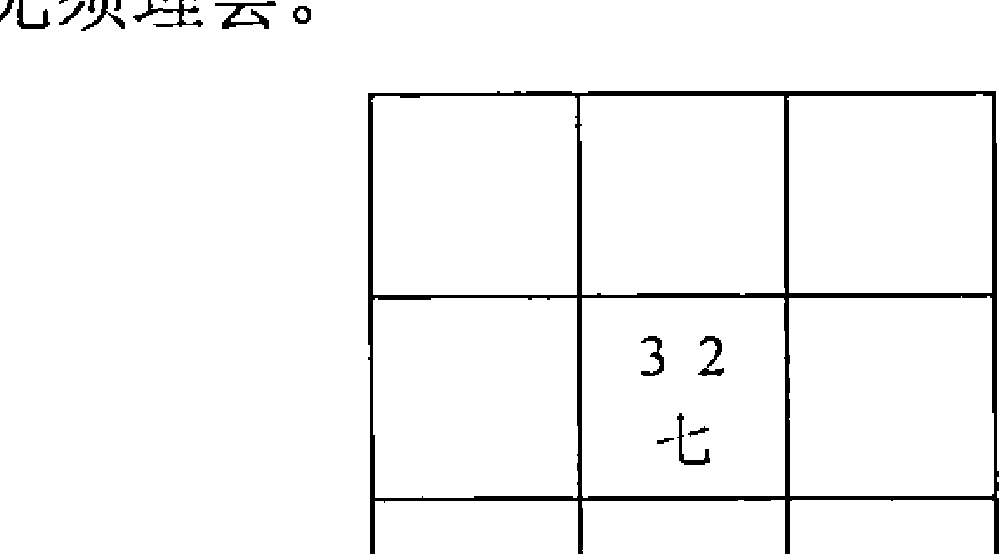

有些读者无法学懂飞星的原因，是因为无法搞明白一连串飞星的关系，不能分辨哪一颗是真，哪一颗是假，哪一颗有效，哪一颗无效，所以感觉混乱。

第二组最重要的飞星是流年星，我们要观察流年飞星飞入之后所引起的变化。例如：流年有一粒2飞进3、2之中，于是二黑很强，代表今年的病痛特别多，这是因为二黑飞入中宫。假如流年有三碧星飞入，代表是非、官非，因为三碧代表贼星。

所以流年星的作用是催旺，而宅盘星并不重要，首要是坐向星，次要的是流年星，这两组就是风水学上最重要的飞星。不能明白这个道理，将宅盘、命卦，以至月、日等飞星都同时出现在一个区域内，便无法做出判断，无法掌握当中的要门。

在上述例子中，假如将宅盘的七星与坐向的3、2解释成二七同宫或三七同宫，便大错而特错，会导致所有论断都出现错误。

当大家根据坐向飞星去决定屋内的摆设和布置之后，这种布置无须每年移动，因为这是根据屋本身的风水所定下来的布局，屋的坐向是固定不变的。

#### （五）流年星掌变化

在每组飞星中，左边称为“山星”，山星掌管健康和人丁，向星掌管财富，以三二同宫这个组合为例，三为坐星，二为向星。在八卦中，三字代表长男，代表影响长男的健康。二字代表母亲，代表影响母亲的财富。

当我们了解坐星、向星组合的含义之后，我们要找出每年流年星飞入每个宫位所产生的变化，我们称之为“吊入”，即是要知道流年吊入坐星、向星之后会产生什么情况。

例如：某年有六白星飞入三二同宫，六白属金，三属木，木受金所劈，代表长子的身体可能出问题。二黑属土，当六白飞入二黑，土生金，代表二黑被化泄，二又代表老母，故母亲会失财。根据每年流年星的变换，我们可以知道一个家宅在世运的20年之中，每年会有什么事情发生。将流年星与九宫结合即可断事。

将流年星入中宫后飞布流年盘，与宅运盘相比照就能断事。

例如，要想知道七运丑山未向的房屋2014年的吉凶，先查2014年的流星为四绿，在宅运盘中（图6-7），乾位是二黑土和三碧木，木克土，三碧暗示争斗，所以会出现车祸、官司、刑狱，家庭不和之事。查流年盘，发现乾位为五黄，为凶星，会引发以上不利的事件。

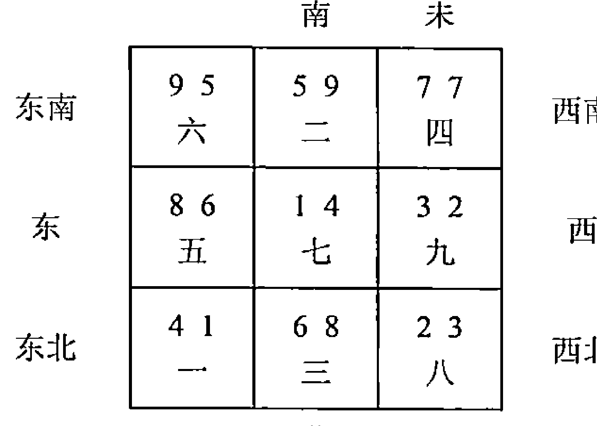

宅运盘的坎位是六白金和八白土，土生金，主财，查流年盘（图6-8），坎位为九紫，主桃花，会因桃花导致斗殴失和。

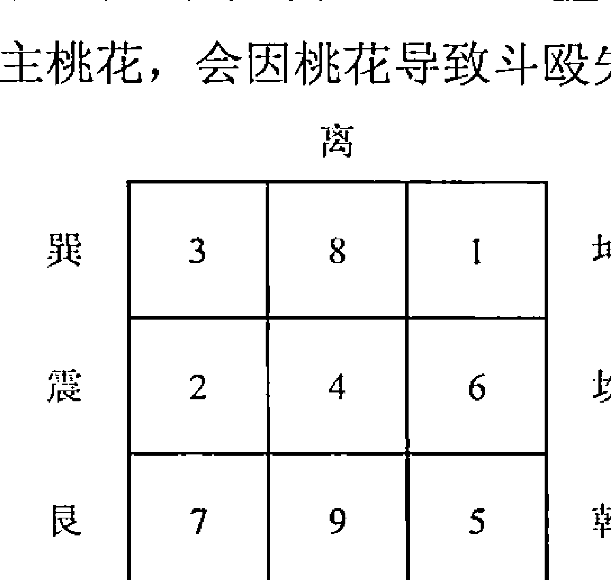

宅运盘的艮位是四绿木和一坎水，水生木，四绿为文曲星，主功名显达，升官进禄。查流年盘，艮位是七赤，主事业辉煌。

宅运盘的震位是8、6，与坎位同。查流年盘，震位为二黑土，为病符星，震代表长子，因而长子可能得病。宅运盘巽位是九紫火和五黄土，火生土，五黄为凶星，可能导致火灾官司。查流年盘，巽位为三碧凶星，会引发灾祸。

宅运盘的坤位是当令旺星七赤金，双星会向，是主财之向。查流年盘，坤为一白，为吉星，主出四海扬名的医生或预测师。

宅运盘的兑位是3、2组合，为斗牛煞，与乾位同。查流年盘，兑位为6白星，为吉星，故综合来讲无凶无吉。

#### （六）忌纯阴纯阳

飞星有阴阳之分。

阴性星为：二黑（母亲），四绿（长女），七赤（幼女），九紫（中女）。

阳性星为：一白（中男），三碧（长子），六白（父亲），八白（幼男）。

飞星组合亦有阴有阳，阴阳既济，代表那个宫位较为健康，飞星组合最忌纯阴或纯阳，假如3个纯阳或纯阴飞星走在一起，乃大凶之象。

所以未看飞星的吉凶之前，先看阴阳组合，比如判断二三是斗牛煞的效应之前，先看二三的阴阳组合。

假如将二三与二二比，二二比二三凶；二三与二四比，二四比二三凶，理由是一阴一阳比纯阴好。

同一道理，一三、一六、一八比二三凶，理由是一阴一阳比纯阳好，所以分析飞星吉凶的顺序是先看纯阴纯阳，然后再看飞星的性质。

#### （七）流年星五大冲击

在判断飞星组合的时候，我们要找出流年星对坐向星产生什么冲击。举例，在七运中，一个家宅在南方有双七到会，要判定该年有什么飞星飞进双七，令这个家宅产生哪一种变化。

假如该年有四绿星飞进双七，四属木，七属金，金要劈木，代表金会劳损，令七运无法像以前一样强大。

根据这种原理，我们归纳出5种流年星与坐向星会合时所产生的现象，大家可以一目了然地了解流年星的断事方式。

假设在七运中，一个家庭的南方有双七到会，七赤是主星，客星就是每年飞进双七位置的流年星。

- （1）相生——假如客星是八白，八白属土，土能生金，可以生旺七赤，称为相生，代表这个家宅该年在南方有非常好的财运。假如该年的流年星是四绿，次年将会是三碧，如此类推，你可以告诉宅主：这间屋在5年之后有八白财星降临。你还可以倒数，告诉屋主这间屋在4年之前曾大旺。当八白星降临时，在那个位置尽量开门，开窗，开风扇，便可以催旺八白。
- （2）比旺——在七运中，当令星飞到双七，这一种当然为大旺之象。称为比旺。
- （3）退气——假如一白飞进七，一白属水，金生水，金会泄气，称为退气。
- （4）冲煞——假如飞进九紫，九紫属火，火能熔金，令金受损，称为冲煞。
- （5）劳死——假如三碧或四绿的木星飞进七赤，金要劈木，会令金劳损而死，称为劳死。

#### （八）坐星为主向星为客

在飞星的坐向组合中，原来四八与八四是有所不同的，四八代表四绿强于八白，八四代表八白强于四绿，当两个数字走在一起的时候，第一个数字强于第二个，换言之，坐星的影响力比向星强，坐星为主星，另一个属于客星。

#### （九）阴星受煞最凶

阴星受煞必定比阳星受煞更加凶，二、四、七、九的阴星受煞，后果会比阳星受煞严重得多。

假如：二黑见木，四绿见金，七赤见火，九紫见水，后果比一白见土严重，理由是阳星不太受煞，但阴星受煞便会产生很大问题。

例如：二黑受煞会出现寡妇，代表女性很痛苦，甚至出现伤亡。七赤受煞代表口腔出问题，亦代表淫乱或恶毒之妇。

四绿受煞会令长女出事，四绿是疯症癫狂，代表精神出问题，吃摇头丸甚至自杀等现象。

所以逢阴受煞，家中出大事，而女性首先出问题。

#### （十）反吟伏吟哭吟吟

无论伏吟或反吟，都代表极差的风水，故有云“反吟伏吟哭吟吟，不死自己死亲人”，详见第五章第四节。

## 二、飞星与风水命卦

每个人都有命卦，本命卦表示那一年出生之人先天性的磁性感应特性，人出生时因宇宙与地球磁场的作用，形成体内的磁场，命卦的名称与飞星的名称一样，是将人分成由一白至九紫共9种命卦，因此人分成9个类型。（按：此分法过于简单，人虽可能受出生时的磁场影响，但或不至众多人皆相同，读者阅读时请自行理解）

#### (一) 命卦的计算

命卦计算很简单：

计算男性命卦的公式是：
$$
\frac{100-\text{出生年份}}{9}
$$

计算女性命卦的公式是：
$$
\frac{\text{出生年份}-4}{9}
$$

利用上述两条公式，便可以获得一个余数，如果没有余数，那便把余数视为9。

读者需注意的是，上述公式所说的出生年份，是仅取个位数与十位数的，例如1954年出生的人，我们便以54代入公式内，1986年出生的人，则以86代入公式，下面举出两个例子供参考。

- 例1：1936年出生的人，男性：
$$
\frac{100-36}{9} = \frac{64}{9}
$$
商数是7，得余数是1，1数属坎，故其人为坎卦。

- 例2：1940年出生的人，女性：
$$
\frac{40-4}{9} = \frac{36}{9}
$$
商数为4，无余数，则余数视为9，9数属离，故其人为离卦。

换句话说，我们是把余数所属的卦象，视为该人的命卦。在此再重复一遍各数之所属：一属坎，二属坤，三属震，四属巽，六属乾，七属兑，八属艮，九属离。那么，如果余数是五又如何呢？凡计算得余数五，则男性视为属坤，女性视为属艮。

上述计算公式，适用于1900-1999年出生的人，2000-2099年出生的人需用余数减1。

- 如：2007（男）
$$
\frac{100-07}{9} = 93 ÷ 9，余3。
3-1 = 二黑命
$$

#### (二) 命卦应用

假如你的命卦为二黑，而你住进一间壬山丙向的屋内，我会告诉你这间屋并不适合你，这是为什么呢？

理由是当我们析查宅盘的时候，要先看中宫的位置，在壬山丙向的宅盘中（图5-3），中宫的飞星为3、2。三碧五行属木，二黑五行属土，木克土，假如你的命卦为二黑，即是当你住进这间屋的时候，会受三碧所克。所有住进壬山丙向的屋中的人都会大发大旺，唯独二黑命卦的人会出问题。

例如：一个宅盘的中宫为6、8，六属金，八属土，假如命卦是八白，金会泄土，对八白命卦有影响，但总的来说并非受煞的风水，这间屋仍然适合居住。

##### 1. 用飞星临门判断吉凶

在玄空中，判断吉凶事物的最重要一点就是大门。要判断家中的人、事、物，都可以用飞星临门的方式来推断。具体的方式是，先排出该房屋的运盘，用汉字表示；再用流年星、流月星、值日星、时星入中宫飞布，用阿拉伯数字表示。看大门所在宫位，飞星为吉星即有喜事，为凶星即有灾祸，飞星与运星相生则吉，相克则凶。

如四绿命的人，大门开在西方，要看2011年正月的运程如何。应先将命卦四入中宫布置出运盘。再看2011年正月流月星为8，将飞星8入中宫飞布。据图6-9，大门所在的兑位为六白金、一白水。飞星一白为吉星，是吉。六白金与一白水相生，为吉。此组合主文学艺术扬名，所以该月有文章闻名、升官进禄等喜事。

图6-9 飞星临门判断吉凶

| 7 三 | 3 八 | 5 一 |
| 6 二 | 8 四 | 1 六 |
| 2 七 | 4 九 | 9 五 |

##### 2. 年星临门吉凶推断算法

流年吉凶，一般都是以临门年星来推断的。例如，1995（乙亥）年，八白当元旺星吉星飞临西方，门开西方的屋（单位）便是吉星临门。其实，这只是一个方面，难道吉星临门，屋内住的人全数都是吉旺吗？当然不是。那么，该怎样推算呢？应该再用流年飞临门的星入中，飞到该人本命卦宫位，看是什么星才知吉凶。

例如，八白男命，住宅开东北门。

2012（壬辰）年，六白入中，九紫飞临东北（图6-10）。九紫临门，本主喜庆，但是八白男命却惹上了官非，这是为什么呢？

我们再以九紫入中，就知道三碧飞临东北。八白命宫在东北艮宫，三碧主官非劫盗破财。

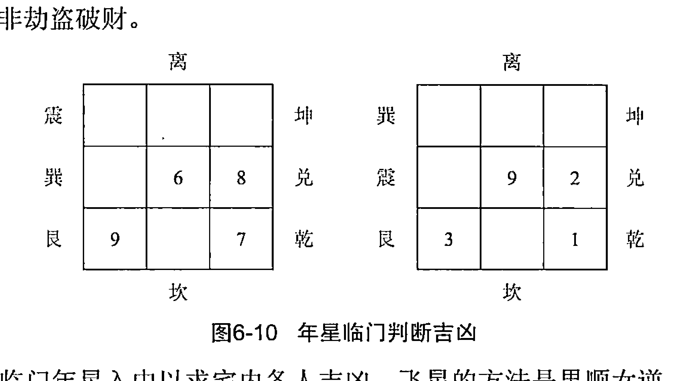

以临门年星入中以求宅内各人吉凶，飞星的方法是男顺女逆，也就是说，以流年门星入中，男顺飞至本命卦宫，女逆飞至本命卦宫。

##### 3. 楼层选择

###### (1) 确定楼层的五行属性

- 用河洛数确定楼层的五行属性:
    1. 1、6（包括尾数是1或6的数），属水数。
    2. 2、7（包括尾数是2或7的数），属火数。
    3. 3、8（包括尾数是3或8的数），属木数。
    4. 4、9（包括尾数是4或9的数），属金数。
    5. 5、10（包括尾数是5或10的数），属土数。

###### (2) 依据命卦喜忌选择楼层

- 命卦喜火的人，喜木、火的楼层。
- 命卦喜水的人，喜金、水的楼层。
- 命卦喜木的人，喜水、木的楼层。
- 命卦喜金的人，喜土、金的楼层。
- 命卦喜土的人，喜火、土的楼层。

例如：某人的命卦是一白水星，居住在1楼或6楼，则水可助其主命水，吉论；居住在4楼或9楼，则金生其主命水，吉论；居住在5楼或10楼，则土克其主命水，凶论；居住在3楼或8楼，则木泄其主命水，凶论；居住在2楼或7楼，则火被其主命水克制，中等论，即不好不坏。

# 第七章 年月飞星

住宅风水的吉凶，除了看坐向飞星外，还要看年星及月星飞临所产生的变化，即风水并不是一成不变。本章将介绍年、月、日、时飞星飞布的方法与应用。

# 第一节 年、月、日、时飞星入中方法

## 一、年星运行方法

每个小运有二十年，此二十年中每年的运气各有不同，因为阳宅注重气流，气流吉凶是随时都有变化的，因此居住风水除注重元运和居宅的坐向外，必须分析每年风水的吉凶变化。要判断住宅风水每年的吉凶必须要运用年星飞布原则。

有关年星飞布的方法，古人留下三句口诀：

第一句：上元甲子由一白开始，逆行。

住宅风水注重元运：即三元九运，三元即分上元、中元、下元。每元有三个运，每运有二十年，每元有六十年。三元共一百八十年。年星飞布口诀所说的上元甲子年是一白入中，乙丑年九紫入中，丙辛年八白入中……逆飞至二黑再循环。

第二句：中元甲子由四绿开始，也是逆行。就是说中元甲子四绿入中，乙丑年三碧入中，丙寅年二黑入中……逆数至五黄再循环。

第三句：下元甲子由七赤开始，也是逆行。是指下元甲子年七赤入中，乙丑年六白入中，丙子年五黄入中……逆数至八白再循环。

下元甲子是1984年，七赤入中，逆数。1985年（乙丑年）是六白入中，1986年（丙寅年）是五黄入中……逆数而去。下面把上、中、下元每年的入中星列于表7-1中，供参考。

表7-1 上、中、下元每年的入中星一览表
| 上元 | 中元 | 下元 | 流年 | | | | | | |
| :--- | :--- | :--- | :--- | :--- | :--- | :--- | :--- | :--- | :--- |
| 一白 | 四绿 | 七赤 | 甲子 | 癸酉 | 壬午 | 辛卯 | 庚子 | 乙酉 | 戊午 |
| 九紫 | 三碧 | 六白 | 乙丑 | 甲戌 | 癸未 | 壬辰 | 辛丑 | 庚戌 | 己未 |
| 八白 | 二黑 | 五黄 | 丙寅 | 乙亥 | 甲申 | 癸巳 | 壬寅 | 辛亥 | 庚申 |
| 七赤 | 一白 | 四绿 | 丁卯 | 丙子 | 乙酉 | 甲午 | 癸卯 | 壬子 | 辛酉 |
| 六白 | 九紫 | 三碧 | 戊辰 | 丁丑 | 丙戌 | 乙未 | 甲辰 | 癸丑 | 壬戌 |
| 五黄 | 八白 | 二黑 | 己巳 | 戊寅 | 丁亥 | 丙申 | 乙巳 | 甲寅 | 癸亥 |
| 四绿 | 七赤 | 一白 | 庚午 | 己卯 | 戊子 | 丁酉 | 丙午 | 乙卯 | |
| 三碧 | 六白 | 九紫 | 辛未 | 庚辰 | 己丑 | 戊戌 | 丁未 | 丙辰 | |
| 二黑 | 五黄 | 八白 | 壬申 | 辛巳 | 庚寅 | 己亥 | 戊申 | 丁巳 | |

例如：欲知2012年（壬辰年）的飞星运行轨迹，从表7-1中可查到壬辰对应的是下元六白入中，因此可排出2012年的年星盘如图7-1所示。

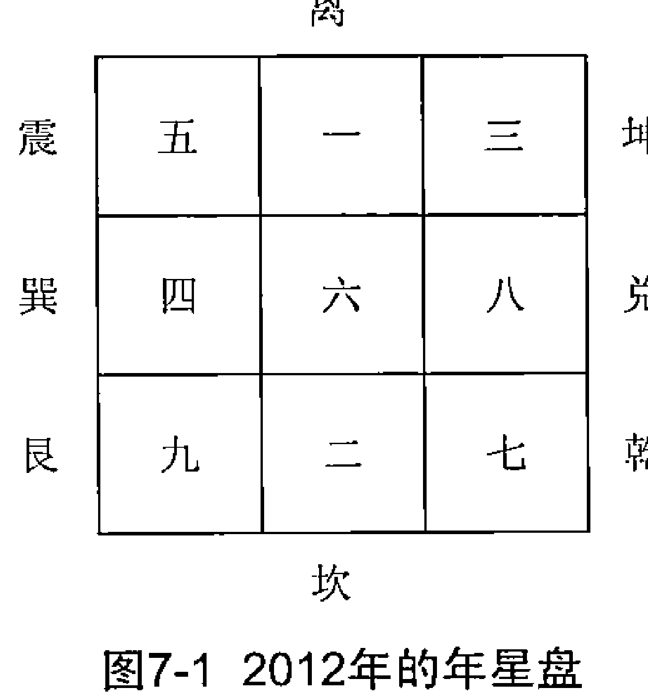

## 二、月星运行方法

在每年的气运中，12个月的气运又各有不同，每个月都有一个星飞入中宫，主宰一个月的气运，下面把不同年份每个月的入中星列于表7-2中。

## 表7-2 不同年份每个月的入中星一览表

| 月 | 子午卯酉年 | 辰戌丑未年 | 寅申巳亥年 |
| :--- | :--- | :--- | :--- |
| 正月 | 八白 | 五黄 | 二黑 |
| 二月 | 七赤 | 四绿 | 一白 |
| 三月 | 六白 | 三碧 | 九紫 |
| 四月 | 五黄 | 二黑 | 八白 |
| 五月 | 四绿 | 一白 | 七赤 |
| 六月 | 三碧 | 九紫 | 六白 |
| 七月 | 二黑 | 八白 | 五黄 |
| 八月 | 一白 | 七赤 | 四绿 |
| 九月 | 九紫 | 六白 | 三碧 |
| 十月 | 八白 | 五黄 | 二黑 |
| 十一月 | 七赤 | 四绿 | 一白 |
| 十二月 | 六白 | 三碧 | 九紫 |

例如：2011年阴历八月，查表7-2可知，飞星运行是一白金入中宫，辛卯年八月的月星运行如图7-2所示。

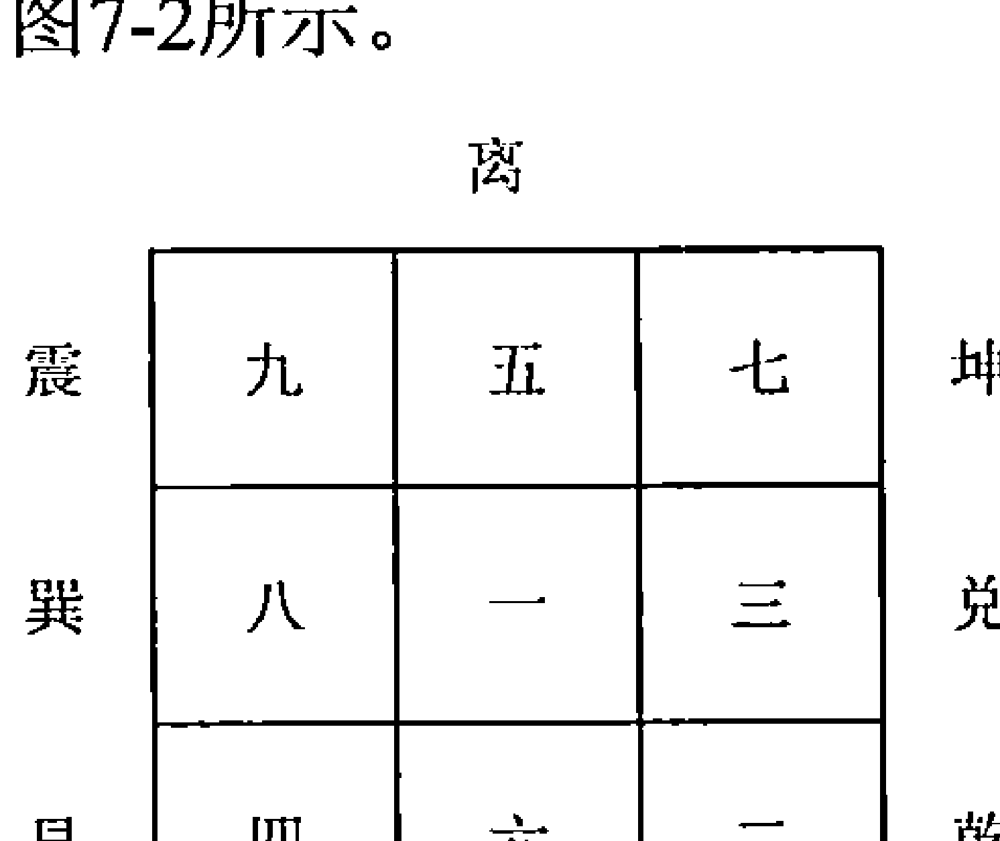

## 三、日星运行方法

在每个月的气运中，每日的气运又各不相同。每日都有一星飞入中宫，主宰一日气运。由于在一年中，地球绕太阳一周，出现一个“S”形的轨迹，画出了一个波谷、一个波峰。一个波谷为“冬至”节气，说明阳气自冬至之后渐渐增多增强，所以从冬至那天开始，每日入中之星是按逆行轨迹依次出现。一个波峰为“夏至”节气，说明阴气自夏至之后渐渐增多增强，所以从夏至那天开始，每日入中之星是按顺行轨迹依次出现。具体可参见表7-3。

## 表7-3 日星运行每日入中之星一览表

| 节气\日 | 冬至至立春节末日 | 雨水至清明节末日 | 谷雨至芒种节末日 | 夏至至立秋节末日 | 处暑至寒露节末日 | 霜降至大雪节末日 |
| :--- | :--- | :--- | :--- | :--- | :--- | :--- |
| 甲子 | 一白 | 七赤 | 四绿 | 九紫 | 三碧 | 六白 |
| 乙丑 | 二黑 | 八白 | 五黄 | 八白 | 二黑 | 五黄 |
| 丙寅 | 三碧 | 九紫 | 六白 | 七赤 | 一白 | 四绿 |
| 丁卯 | 四绿 | 一白 | 七赤 | 六白 | 九紫 | 三碧 |
| 戊辰 | 五黄 | 二黑 | 八白 | 五黄 | 八白 | 二黑 |
| 己巳 | 六白 | 三碧 | 九紫 | 四绿 | 七赤 | 一白 |
| 庚午 | 七赤 | 四绿 | 一白 | 三碧 | 六白 | 九紫 |
| 辛未 | 八白 | 五黄 | 二黑 | 二黑 | 五黄 | 八白 |
| 壬申 | 九紫 | 六白 | 三碧 | 一白 | 四绿 | 七赤 |
| 癸酉 | 一白 | 七赤 | 四绿 | 九紫 | 三碧 | 六白 |
| 甲戌 | 二黑 | 八白 | 五黄 | 八白 | 二黑 | 五黄 |
| 乙亥 | 三碧 | 九紫 | 六白 | 七赤 | 一白 | 四绿 |
| 丙子 | 四绿 | 一白 | 七赤 | 六白 | 九紫 | 三碧 |
| 丁丑 | 五黄 | 二黑 | 八白 | 五黄 | 八白 | 二黑 |
| 戊寅 | 六白 | 三碧 | 九紫 | 四绿 | 七赤 | 一白 |
| 己卯 | 七赤 | 四绿 | 一白 | 三碧 | 六白 | 九紫 |
| 庚辰 | 八白 | 五黄 | 二黑 | 二黑 | 五黄 | 八白 |
| 辛巳 | 九紫 | 六白 | 三碧 | 一白 | 四绿 | 七赤 |
| 壬午 | 一白 | 七赤 | 四绿 | 九紫 | 三碧 | 六白 |
| 癸未 | 二黑 | 八白 | 五黄 | 八白 | 二黑 | 五黄 |
| 甲申 | 三碧 | 九紫 | 六白 | 七赤 | 一白 | 四绿 |
| 乙酉 | 四绿 | 一白 | 七赤 | 六白 | 九紫 | 三碧 |
| 丙戌 | 五黄 | 二黑 | 八白 | 五黄 | 八白 | 二黑 |
| 丁亥 | 六白 | 三碧 | 九紫 | 四绿 | 七赤 | 一白 |
| 戊子 | 七赤 | 四绿 | 一白 | 三碧 | 六白 | 九紫 |
| 己丑 | 八白 | 五黄 | 二黑 | 二黑 | 五黄 | 八白 |
| 庚寅 | 九紫 | 六白 | 三碧 | 一白 | 四绿 | 七赤 |
| 辛卯 | 一白 | 七赤 | 四绿 | 九紫 | 三碧 | 六白 |
| 壬辰 | 二黑 | 八白 | 五黄 | 八白 | 二黑 | 五黄 |
| 癸巳 | 三碧 | 九紫 | 六白 | 七赤 | 一白 | 四绿 |
| 甲午 | 四绿 | 一白 | 七赤 | 六白 | 九紫 | 三碧 |
| 乙未 | 五黄 | 二黑 | 八白 | 五黄 | 八白 | 二黑 |
| 丙申 | 六白 | 三碧 | 九紫 | 四绿 | 七赤 | 一白 |
| 丁酉 | 七赤 | 四绿 | 一白 | 三碧 | 六白 | 九紫 |
| 戊戌 | 八白 | 五黄 | 二黑 | 二黑 | 五黄 | 八白 |
| 己亥 | 九紫 | 六白 | 三碧 | 一白 | 四绿 | 七赤 |
| 庚子 | 一白 | 七赤 | 四绿 | 九紫 | 三碧 | 六白 |
| 辛丑 | 二黑 | 八白 | 五黄 | 八白 | 二黑 | 五黄 |
| 壬寅 | 三碧 | 九紫 | 六白 | 七赤 | 一白 | 四绿 |
| 癸卯 | 四绿 | 一白 | 七赤 | 六白 | 九紫 | 三碧 |
| 甲辰 | 五黄 | 二黑 | 八白 | 五黄 | 八白 | 二黑 |
| 乙巳 | 六白 | 三碧 | 九紫 | 四绿 | 七赤 | 一白 |
| 丙午 | 七赤 | 四绿 | 一白 | 三碧 | 六白 | 九紫 |
| 丁未 | 八白 | 五黄 | 二黑 | 二黑 | 五黄 | 八白 |
| 戊申 | 九紫 | 六白 | 三碧 | 一白 | 四绿 | 七赤 |
| 己酉 | 一白 | 七赤 | 四绿 | 九紫 | 三碧 | 六白 |
| 庚戌 | 二黑 | 八白 | 五黄 | 八白 | 二黑 | 五黄 |
| 辛亥 | 三碧 | 九紫 | 六白 | 七赤 | 一白 | 四绿 |
| 壬子 | 四绿 | 一白 | 七赤 | 六白 | 九紫 | 三碧 |
| 癸丑 | 五黄 | 二黑 | 八白 | 五黄 | 八白 | 二黑 |
| 甲寅 | 六白 | 三碧 | 九紫 | 四绿 | 七赤 | 一白 |
| 乙卯 | 七赤 | 四绿 | 一白 | 三碧 | 六白 | 九紫 |
| 丙辰 | 八白 | 五黄 | 二黑 | 二黑 | 五黄 | 八白 |
| 丁巳 | 九紫 | 六白 | 三碧 | 一白 | 四绿 | 七赤 |
| 戊午 | 一白 | 七赤 | 四绿 | 九紫 | 三碧 | 六白 |
| 己未 | 二黑 | 八白 | 五黄 | 八白 | 二黑 | 五黄 |
| 庚申 | 三碧 | 九紫 | 六白 | 七赤 | 一白 | 四绿 |
| 辛酉 | 四绿 | 一白 | 七赤 | 六白 | 九紫 | 三碧 |
| 壬戌 | 五黄 | 二黑 | 八白 | 五黄 | 八白 | 二黑 |
| 癸亥 | 六白 | 三碧 | 九紫 | 四绿 | 七赤 | 一白 |

注意：表7-3中节气一栏，“末日”一词是指每个节的最后一天。例如：立春节末日，是指立春后至雨水前的一天，如2000年立春交节是在阴历己丑年十二月二十九日，雨水交节是在正月十五日，立春节末日是指雨水前一日，正月十四。十四就是立春节期间最末一日，十五后就是交节雨水。其他的如清明节末、芒种节末等意思相同。

例如：有人准备在2009年春节前15日搬进新房，要想知道此日飞星与宫位的关系，我们必须依据上面图表排出此日的运星盘，即日星盘。

通过查找，春节前15天为腊月十七，庚辰日八白入中宫。

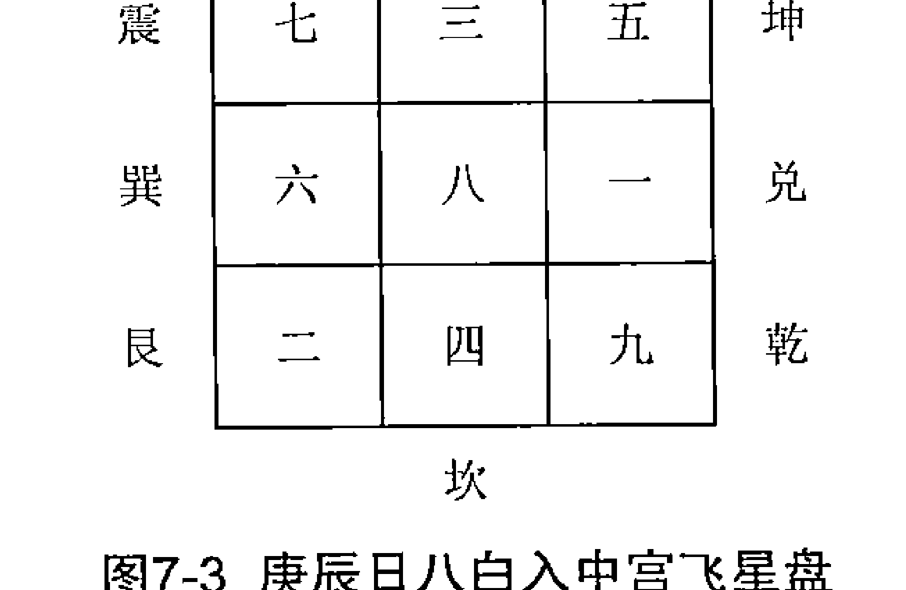

逆行排出日星盘，从日星盘中我们知道，旺星八白飞到中宫，近旺星九紫飞到乾宫，五黄煞到坤宫。如果在这天搬进新房千万不要在卧房的西南方坤宫位置乱动装修或铺床。因五黄大煞喜静不喜动。同时可在中宫、西北乾宫这两个有利旺财的方位或增强财星。

## 四、时星运行方法

在每日的气运中，每个时辰的气运各有不同。每个时辰都有一星飞入中宫。根据地支日的不同，冬至与夏至作为分界线，时星有顺飞、逆飞之分，见表7-4～表7-6。

### 表7-4 时星运行一览表（子午卯酉）

| 子午卯酉日 | 冬至后 | 子一 | 丑二 | 寅三 | 卯四 | 辰五 | 巳六 |
| :--- | :--- | :--- | :--- | :--- | :--- | :--- | :--- |
|  |  | 午七 | 未八 | 申九 | 酉一 | 戌二 | 亥三 |
|  | 夏至后 | 子九 | 丑八 | 寅七 | 卯六 | 辰五 | 巳四 |
|  |  | 午三 | 未二 | 申一 | 酉九 | 戌八 | 亥七 |

### 表7-5 时星运行一览表（寅申巳亥）

| 寅申巳亥日 | 冬至后 | 子七 | 丑八 | 寅九 | 卯一 | 辰二 | 巳三 |
| :--- | :--- | :--- | :--- | :--- | :--- | :--- | :--- |
|  |  | 午四 | 未五 | 申六 | 酉七 | 戌八 | 亥九 |
|  | 夏至后 | 子三 | 丑二 | 寅一 | 卯九 | 辰八 | 巳七 |
|  |  | 午六 | 未五 | 申四 | 酉三 | 戌二 | 亥一 |

### 表7-6 时星运行一览表（辰戌丑未）

| 辰戌丑未日 | 冬至后 | 子四 | 丑五 | 寅六 | 卯七 | 辰八 | 巳九 |
| :--- | :--- | :--- | :--- | :--- | :--- | :--- | :--- |
|  |  | 午一 | 未二 | 申三 | 酉四 | 戌五 | 亥六 |
|  | 夏至后 | 子六 | 丑五 | 寅四 | 卯三 | 辰二 | 巳一 |
|  |  | 午九 | 未八 | 申七 | 酉六 | 戌五 | 亥四 |

例如：我们仍然以上例庚辰日讲解，欲知午时时星与九宫吉凶的关系，需排出庚辰日午时飞星盘，如图7-3所示。2009年春节前15天，庚辰日，是在冬至后，午时一白入中宫，顺排时星图如图7-4所示。

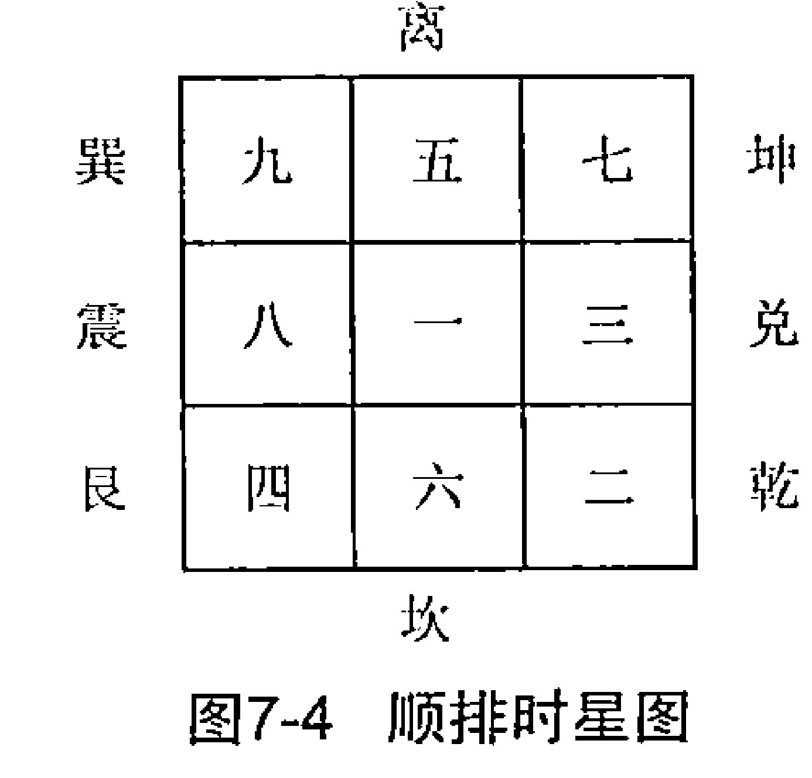

由图7-4可知，五黄煞在南方离宫位置。如果在庚辰日，在离宫方位铺床或动工装修时，在午时必须休息，避开五黄大煞。

## 五、刻星运行方法

刻星由时辰再细分，把一个时辰两小时以15分钟为一刻再分八刻。
例如，夏至后的庚子日戌时。我们通过时星运行表可以查找到夏至后的子日戌时飞星是八白进入中宫，八白星统管戌时晚七点至九点这段时间。
现在我们把这个（戌）时分为八刻，每一刻长15分钟，每一刻的入中星由八白顺数，分别是九紫、一白、二黑、三碧、四绿、五黄、六白、七赤。
例如戌时一刻：七时至七时十五分，九紫入中宫。
戌时二刻：七时十五分至七时三十分，一白入中宫。
戌时三刻：七时三十分至七时四十五分，二黑入中宫。
以下以此类推，通过上面分析，可知夏至后的庚子日戌时五刻的飞星与方位吉凶关系，依据以上原理，五刻即八时十五分，四绿入中宫。如图7-5所示。

|  |  |  |
| :---: | :---: | :---: |
| 巽 | 三 | 八 |
| 震 | 二 | 四 |
| 艮 | 七 | 九 |
| 坎 |  |  |

|  |  |  |
| :---: | :---: | :---: |
| 一 | 坤 |  |
| 六 | 兑 |  |
| 五 | 乾 |  |
|  |  |  |

图7-5 刻星运行示意

通过戌时五刻刻星飞星运行，五黄煞飞到乾宫，七赤旺星飞到东北艮宫方位。

# 第二节 年、月、日、时星运行轨迹

通过前面的学习，我们已经知道了有关年、月、日、时星各自运行的规律，接下来我们讲述一下年、月、日、时飞星运行的轨迹。
轨迹，是指运行时先后顺序和路线。年、月、日、时刻星运行的轨迹和运星相同，唯一不同的是运星，以当元得运之星进入中宫后顺飞，年、月、日、时星却是依据某种特定的规律，确定某星进入中宫后顺飞。为了叙述的方便，以英文字母A、B、C、D、E、F、G、H、I 来表示年、月、日、时刻飞星运行的先后次序，如图7-6所示。

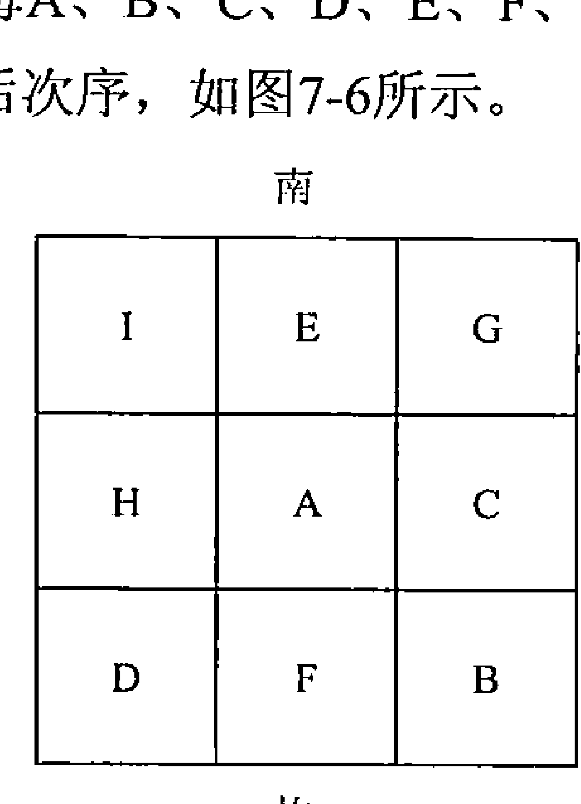

年、月、日、时星的飞星规律是：当某星进入中宫A处后，运行时每个步骤都是固定的，先后的次序是：A→B→C→D→E→F→G→H→I→A，永远不变。

下面分别把九星进入中宫的运行轨迹用图表示，如图7-7～图7-15所示。

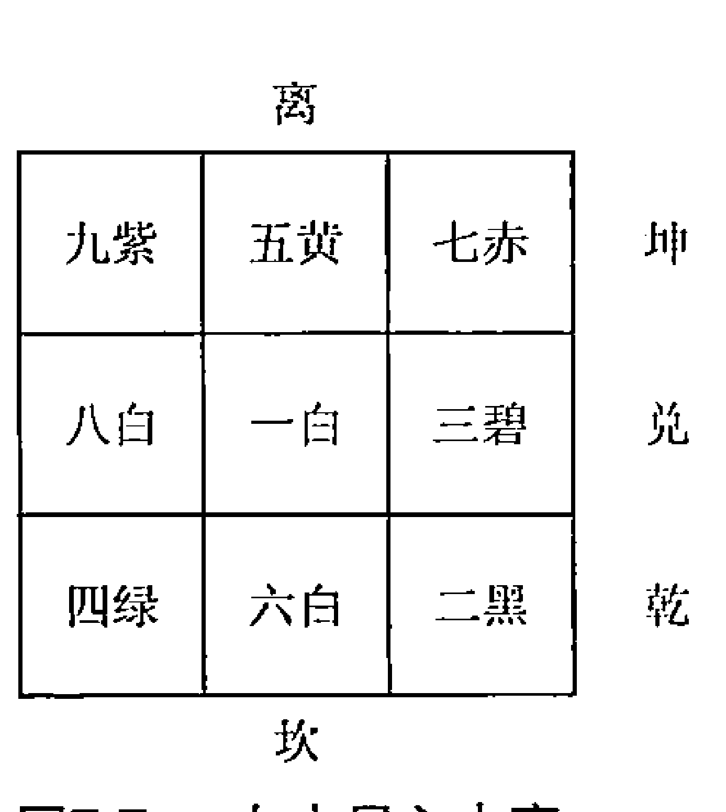

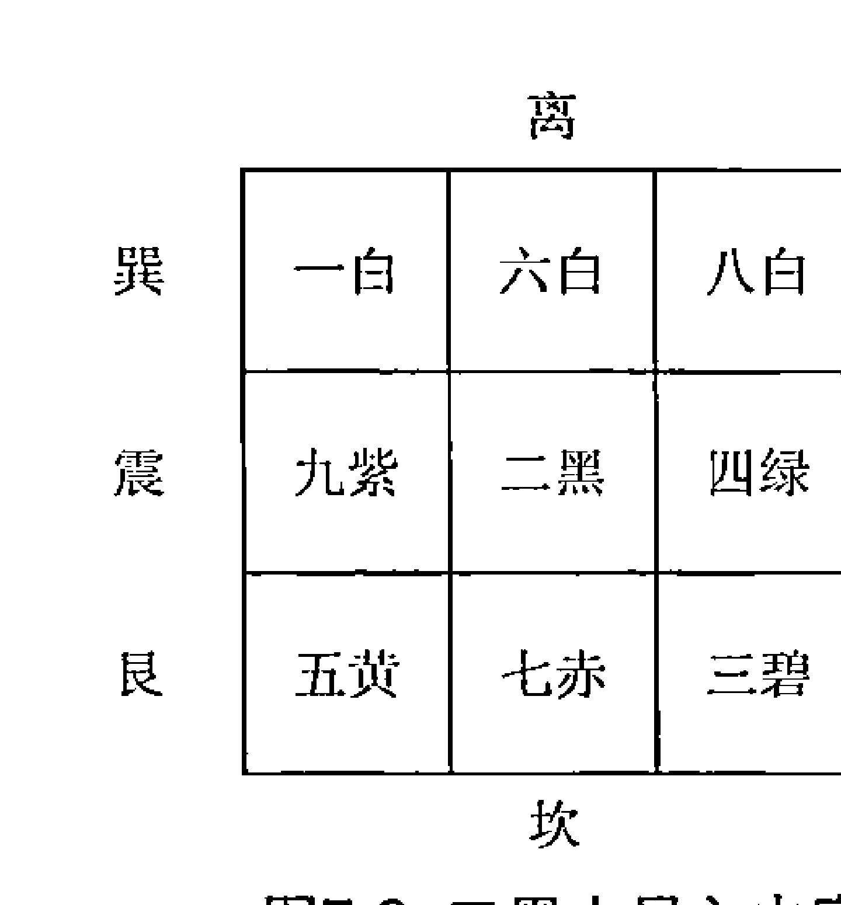

## 图7-9 三碧木星入中宫

|   | 离 |   |   |   |
|---|---|---|---|---|
| 巽 | 二黑 | 七赤 | 九紫 | 坤 |
| 震 | 一白 | 三碧 | 五黄 | 兑 |
| 艮 | 六白 | 八白 | 四绿 | 乾 |
|   | 坎 |   |   |   |

## 图7-10 四绿木星入中宫

|   | 离 |   |   |   |
|---|---|---|---|---|
| 巽 | 三碧 | 八白 | 一白 | 坤 |
| 震 | 二黑 | 四绿 | 六白 | 兑 |
| 艮 | 七赤 | 九紫 | 五黄 | 乾 |
|   | 坎 |   |   |   |

## 图7-11 五黄土星入中宫

|   | 离 |   |   |   |
|---|---|---|---|---|
| 巽 | 四绿 | 九紫 | 二黑 | 坤 |
| 震 | 三碧 | 五黄 | 七赤 | 兑 |
| 艮 | 八白 | 一白 | 六白 | 乾 |
|   | 坎 |   |   |   |

## 图7-12 六白金星入中宫

|   | 离 |   |   |   |
|---|---|---|---|---|
| 巽 | 五黄 | 一白 | 三碧 | 坤 |
| 震 | 四绿 | 六白 | 八白 | 兑 |
| 艮 | 九紫 | 二黑 | 七赤 | 乾 |
|   | 坎 |   |   |   |

## 图7-13 七赤金星入中宫

|   | 离 |   |   |   |
|---|---|---|---|---|
| 巽 | 六白 | 二黑 | 四绿 | 坤 |
| 震 | 五黄 | 七赤 | 九紫 | 兑 |
| 艮 | 一白 | 三碧 | 八白 | 乾 |
|   | 坎 |   |   |   |

## 图7-14 八白土星入中宫

|   | 离 |   |   |   |
|---|---|---|---|---|
| 巽 | 七赤 | 三碧 | 五黄 | 坤 |
| 震 | 六白 | 八白 | 一白 | 兑 |
| 艮 | 二黑 | 四绿 | 九紫 | 乾 |
|   | 坎 |   |   |   |

## 图7-15 九紫火星入中宫

|   | 离 |   |   |   |
|---|---|---|---|---|
| 巽 | 八白 | 四绿 | 六白 | 坤 |
| 震 | 七赤 | 九紫 | 二黑 | 兑 |
| 艮 | 三碧 | 五黄 | 一白 | 乾 |
|   | 坎 |   |   |   |

# 第三节 年、月、日、时刻星的用途

我们在判断阳宅风水吉凶时，首先侧重看住宅坐向飞星，此外还要看年月星飞临所产生的变化。倘若房屋的某个宫位的坐星及向星均吉，而飞临的年月飞星生旺，则该宫位在该段时间内便是锦上添花，吉上加吉，反之，倘若飞临的年月飞星克制原来的旺星，或组合后使旺星变质，该宫位在该段时间内的风水便会大打折扣，甚至转吉为凶。因为阳宅风水吉凶是变化的，再好的风水也有不利的时候，再差的风水有时还会忽然转好，只是好的时间如天上的流星一般短暂，一般人难以把握住这难得的时机。有时要明白，自己的运势还是掌握在自己手中，靠自己争取。

年、月、日、时刻星的用途，相对来说没有差异，年飞星会影响一年的祸福吉凶，对我们判断一个阳宅风水吉凶时能起到很大的参考作用，但月飞星对整个阳宅风水吉凶的影响相对比较小。不过，月飞星主要是来配合年飞星，有助于我们更加准确地判断阳宅风水流年中吉凶的气运。

例如：2009年（己丑年）阴历七月，年星九紫入中，月飞星八白入中，年月飞星盘如图7-16所示。

图7-16中的汉字数字为年星，阿拉伯数字为月星。

七赤飞临东方巽宫，七为退气之星，半吉半凶。当房屋在东方震宫设有大门或窗户，并不利。当七月八白入中，六白飞临震宫，与年星七赤合成“六七交剑煞”。己丑年七月易受六七交剑煞影响，会生口舌是非之事，宜化解。

|   | 离 |   |   |   |
|---|---|---|---|---|
| 巽 | 7 八 | 3 四 | 5 六 | 坤 |
| 震 | 6 七 | 8 九 | 1 二 | 兑 |
| 艮 | 2 三 | 4 五 | 9 一 | 乾 |
|   | 坎 |   |   |   |

图7-16 己丑年七月年月飞星盘

假如大门改在东南方巽宫，八白飞临巽宫，八为当令之星，为财星，可运用布旺财的方法，此年必有进财之喜。七月，月星八白入中，七赤飞临巽宫，与年星八白组合为“八七生财置业”，此年必有进财置业之喜。

为了进一步说明阳宅风水与年星的关系，再举例说明如下。

图7-17所示房屋为七运子山午向。

|   | 离 |   |   |   |
|---|---|---|---|---|
| 巽 | 4 1 六 | 8 6 二 | 6 8 四 | 坤 |
|  | 6 7 | 2 3 | 4 5 |  |
| 震 | 5 9 五 | 3 2 七 | 1 4 九 | 兑 |
|  | 5 6 | 7 8 | 9 1 |  |
| 艮 | 9 5 一 | 7 7 三 | 2 3 八 | 乾 |
|  | 1 2 | 3 4 | 8 9 |  |
|   | 坎 |   |   |   |

图7-17 风水与年星关系示例

+   (1) 每宫中间汉字数字是运星。
(2) 每宫上边右角数字是向星。
(3) 每宫上边左角数字是山星。
+   （4）每宫下边左角数字是年星。
+   （5）每宫下边右角数字是月星。

上面这个房屋大门开在西南方，有生气的财星“八白”临门，财运比较好，但此宫位上的运星四绿木克八白土，艮为土，也代表小儿，有句话叫“八会四而损小口”，即家中的小儿健康可能有问题，再加上该年又逢飞星“四绿”木星到此，促使木克土更加有力。因此，该年要注意小孩身体，特别是在正月与二月，因正月“五黄”毒药到门，二月月星“四绿”到门，形成二木克土之势，正二月又是木旺盛之时，必会出现木旺土崩的情形。

# 第八章 装饰装修风水布局原则

自古以来，福、禄、荣、寿为人所向往，艰、难、危、困为人所逃避，饥、寒、贫、苦为人所难忍，但我们可以运用先人智慧结晶的方案，来减少人生的缺憾，借由人与住宅的和谐配置，进行合理的房屋与装饰装修设计，以创造福祉。要达到这个目的，就应先了解房屋风水布局的原理。不过在阅读以下几章前需告诫大家，先人们的智慧被转化应用时一定不要照搬应用，更不要绝对化，所提供仅为参考。

# 第一节 房屋内部布局步骤

## 一、认定房屋的坐向

认定屋向是看阳宅风水的首要环节，但现时各派所介绍的方法较杂，归纳为：以大门定屋向；以贴近街道的一边定向；以开窗采光面积最大的一面定向；以门牌号定向；以面背的堂屋定向；以大厦的总入口定坐向等。

虽然这些方法在不同的情况下可以互相参考选用，但碰到一些情形：如一幢楼南面开大门，但近对房屋或山；北面有大路；东面开的窗户最多，西面有水塘或设有游泳池，这种情况下就会使人感到糊涂，不知以什么来定向为准。其实很简单，楼的定向以大门为准就行了。

## 二、分清入极的元运

以玄空学看住宅风水，正确分辨入极元运这很重要。读者要以迁入居住的时间来定入极元运，而不能以建筑物的完工时间去定入极元运，这务必要分辨清楚。

例如：一幢楼于2000年（七运）建成，在2004年立春前入住的，为七运入极。如果在2004年立春后至2023年立春前的20年，居住户有人迁走，把房子转给别人，由于新住户是在八运入住，故要以八运为入极元运。如仍按该楼完工的七运作为入极元运，去排星盘推断吉凶，那结果就是错误的。

（1）独院式建筑，无论大门开在阳边还是阴边，长边还是短边，都要以大门来定屋向，不要以窗户多、近街的一边定向。如另设有偏门、后门或围墙门的，这些门向不能作为屋向，只作气口。

不过有些人家经常关闭大门，只经偏门（或后门）出入，也有的人、车往来只走车库门等，这就需要注意屋向与气口的区别：将这些当成气口，并以屋向起挨星，以向星的“生、旺、衰、死”去推断其吉凶。

（2）大建筑物整座楼的坐向，也要从大门来认定。但由于现代设计日趋艺术化、多样化，有些综合楼甚至不设大门，这时才需要参看道路、窗户等来判断大楼的面背，以定坐向。

（3）大建筑内各小单元的坐向，则是现代阳宅学最具争议的问题之一，在此特做说明；将大建筑内每一户作为独立住宅。这只与独立式建筑的看法相同——每户都有坐向和“太极”，所谓“各具一太极”，只不过大建筑里的每一户是被“包”起来，位于不同的楼层、不同的方位而已。将每一户当成一太极后，便要以其出入门定向起挨星去论断。

例如：大厦是坐北向南，而自己所居住单元的出入门都是向东，故看自己小单元的风水时，要以自家的出入门为主（即坐西向东）去论断。

阳宅定向，应具体情况具体分析。如目前的单元住宅楼，一进大门，每层有2~4家，每家的情况不同，多数住家客厅为向阳，以阳定向比较准确。

## 三、分清宅内的设置

玄空学将宅内的设置、形物等分成“山”、“水”两类，以配合山、向挨星去看风水。

“山”类：是指卧室、厨房、书房、办公桌、神位、床位、炉灶、电视、沙发、橱柜等，凡高大厚实及静处都属“山”。

“水”类：是指门、窗、浴厕、楼梯、通道、电风扇、冷气口，水池、鱼缸、水龙头等，凡空低陷及动处都属“水”。

## 四、具体布局

根据坐向入极元运排出该房的挨星图，以星盘去分清宅内九宫山、向挨星的盛衰，而布局的核心内容就是结合星气来设置。

#### （一）旺星布局

##### 1. 山盘旺星喜居高处

山盘旺星或次旺星的方位要有高大的物品较好，这样能有助山盘旺星的力量，即山上龙神宜上山，室内高的物品象征山。山管人丁，水管财，山盘旺星在有利条件下，自然会旺人丁，使人身体健康。

山盘旺星不宜落在低处，不宜见水，也不宜有窗，山上龙神下水，不利宅主身体，并且会给宅主带来意想不到的厄运，甚至有病伤之灾。若发现卧室有这种情况，要赶快调整布局，尽量不要让山盘旺星和次旺之星落在低处或见水。

##### 2. 向盘旺星宜在低处

向盘旺星或次旺之星的方位宜在低处，如果有水最好，因为向盘旺星或次旺之星代表财运，在向盘旺星的方位要进行适当的旺财布局。千万不可在向盘旺星与次旺之星的方位摆设高的物品，如沙发椅、衣橱、桌椅等，否则必然会影响主人的财运，不但不进财，而且会无缘无故地破财。

#### （二）衰星布局

##### 1. 九星分类

不考虑三元九运，根据九星原有属性，可分为三类：

第一类：一白、六白和八白三吉星；
第二类：二黑、三碧、五黄、七赤四凶星；
第三类：四绿和九紫为中平（半吉半凶）。

第一类吉星，它们即使处于退气状态仍可用，处于死煞气也仅小凶；第二类凶星，以五黄凶性最大，即使处于退气状态仍为凶，不可用，死煞气大凶，五黄在三运为远生气星时也不可用，这四星倘若是处在衰退之时凶性更大；第三类为中平。

##### 2. 衰星布局

(1) 山盘衰星宜处在行水或低洼之地。这样自然就减弱了衰星的力量，以及运用一些风水化煞用品，把这些煞气完全转化。
(2) 向盘衰星宜处在高位，放置高的物品，如沙发椅等，从而减弱衰星的力量。

举例：七运巳山亥向，下卦飞星盘，如图8-1所示。

图8-1 七运巳山亥向下卦飞星盘
| 7 5 | 3 1 | 5 3 |
| :---: | :---: | :---: |
| 六 | 二 | 四 |
| 6 4 | 8 6 | 1 8 |
| 五 | 七 | 九 |
| 2 9 | 4 2 | 9 7 |
| 一 | 三 | 八 |

山盘旺星“7”在巽宫，次旺之星“8”在中宫，也就是说房屋这一个方位可以摆设高的物品，如柜子、衣橱、沙发椅、床等。

向盘旺星“7”在乾宫，次旺之星“8”在兑宫，房屋中这两个方位不宜放高的物品。兑和乾的方位若有窗或空调器等最好。如果条件允许的话，可以在这两个方位布置鱼缸等旺财物品。

山盘五黄在坤宫，在这个方位不宜放高的物品，不然会增强煞星的威力，反之让山盘煞星下水或在低处，就会减弱煞气。

向星五黄在巽宫，向盘衰星不宜处在低处，不然会使向盘衰星力量增强反而会影响主人的财运。要在向盘煞星的地方放置高大的物品，使向盘衰星上山，以减弱向盘衰星的力量。

# 第二节 注意飞星组合的含义

飞星组合后，会产生特定的含义。飞星盘的飞星组合，处在得运之时会出现一种有利的含义，在衰退之时，自然会出现一种凶恶的含义。

例如：八运亥山巳向，飞星盘如图8-2所示。

| 1 8 七 | 5 3 三 | 3 1 五 |
| 2 9 六 | 9 7 八 | 7 5 一 |
| 6 4 二 | 4 2 四 | 8 6 九 |

图8-2 八运亥山巳向飞星盘

坎宫飞星组合为4与2，该组合当其旺，颇有财贵，妇掌家权，多产子丁。当其衰，悍妇克母欺姑，老母遭殃。

凡是飞星衰退时，在风水布局时要查一下飞星组合的含义，如该房屋坎宫出现4与2飞星组合，该位置为凶，2还代表老母，如果安排老人房对老母则大凶，其余类推。

对一些不是当元得令的飞星组合，如果飞星组合含义符合事情的性质，有时也能转凶为吉，对此可参阅第九章住宅门风水布局中所举的某酒楼的例子。

# 第九章 住宅门

一个人在一天之中要进出多少次门？有人做过统计，大约要走200次。可不是吗，拿现代城市居住的人来说，进住宅区要走过小区的大门，上楼要进出电梯门，回家要进屋门，到厨房要走厨房门，上厕所要走卫生间门，还有连窗门、阳台门；到单位去要进厂门、车间门或办公室的门，可见，门与人们生活的关系是多么密切！

什么是门，门是建筑的出入口，也是安全保卫口，从风水学来说，门是房屋生财纳气、人际关系以及有否贵人相助的气口，犹如一个人的嘴巴之于颜面，而大门就是房屋的颜面、喉咙，大门的位置及装修设计的恰当与否，很大程度上关系到住宅的兴衰。当然，如果认为某种门就绝对的好，那更错，否则大家都造天安门了。所以，一切皆为参考。

# 第一节 门的飞星组合布局

## 一、大门的飞星组合

大门是住宅最重要的部位，是住宅的出入口，也是纳气出煞口，大门方位对于飞星盘上飞星组合吉凶非常关键，正因为这样，勘察风水时，运用罗盘测定坐向后，首先要分析房屋的大门在飞星盘上的位置。

房屋大门方位要开在飞星盘上向盘飞星的生旺方和飞星组合有利的方位，忌开在死气、煞气方。挨星的生、旺与退、死、煞气，在前面已经论述过，但为方便阅读，在这里再重复一次。飞星旺衰是依据三元九运来判断，当元得令之星为旺，未来得令之星为生气，过去之星为退气、死气、煞气。飞星旺衰不是永远不变的，而是每运二十年一变，自旺变衰、自生气变为旺气，换一种说法，各运的生、旺、退、煞的飞星均有不同。为了读者查阅方便，下面将各运飞星的生旺死煞排列成表，如表9-1所示。

表9-1 各运飞星生旺死煞一览表
| 旺衰之气<br>运数 | 旺气<br>(大吉) | 生气<br>(近旺，中吉) | 生气<br>(远旺，小吉) | 退气<br>(中平) | 死气<br>(大凶) | 煞气<br>(凶) |
| :--- | :--- | :--- | :--- | :--- | :--- | :--- |
| 一运 | 1 | 2 | 3 | 9 | 4, 5 | 6, 7, 8 |
| 二运 | 2 | 3 | 4 | 1 | 5, 6 | 7, 8, 9 |
| 三运 | 3 | 4 | 5 | 2 | 6, 7 | 8, 9, 1 |
| 四运 | 4 | 5 | 6 | 3 | 7, 8 | 9, 1, 2 |
| 五运 | 5 | 6 | 7 | 4 | 8, 9 | 1, 2, 3 |
| 六运 | 6 | 7 | 8 | 5 | 9, 1 | 2, 3, 4 |
| 七运 | 7 | 8 | 9 | 6 | 1, 2 | 3, 4, 5 |
| 八运 | 8 | 9 | 1 | 7 | 2, 3 | 4, 5, 6 |
| 九运 | 9 | 1 | 2 | 8 | 3, 4 | 5, 6, 7 |

通过三元九运旺衰表，我们更加清楚各运间不同的旺气与衰气，这样方便风水初学者在判断风水吉凶时，不必为旺衰之星再去翻阅资料，而是一目了然。

例如：八运子山午向，飞星盘如图9-1所示。

（图9-1 八运子山午向飞星盘）

该房屋大门开在艮宫，飞星组合7与9，9在八运为近生气屋，一般以吉断，但如果门口有红庙、屋檐尖等物，极易引起火灾，因为7与9的组合易引起回禄之灾（火灾）。

例如：某酒楼七运建造，未山丑向兼丁癸，飞星盘如图9-2所示。

| 巽 | 7 1<br>六 | 2 6<br>二 | 9 8<br>四 |
| --- | --- | --- | --- |
|  | 8 9<br>五 | 6 2<br>七 | 4 4<br>九 |
|  | 3 5<br>一 | 1 7<br>三 | 5 3<br>八 |

图9-2 七运未山丑向兼丁癸飞星盘

酒楼大门方位在东南巽宫，巽宫方位的飞星组合是：运星六，山星7，向星1。向星1白为死气，7、1飞星组合为：当其衰，水冷金寒，儿女贪花恋酒，钱财倾泻奔流。

一般住宅逢这种飞星组合失令时，多招致男女淫乱，酒色破家。酒店主要的用途是供男女娱乐场所，通过分析，此大门方位不但无害，反而有助于酒店的经营，必发暗财，经理说，此酒店原来是商场，商场后来因生意清淡，亏本告终，他们经营酒店后确实变得红火。

从以上例子可以看出，大门的方向要具体情况具体分析，在判断房屋大门风水吉凶时，千万不可一概而论，不要认为所有大门开在生旺之方都为大吉大利，而设在衰败之方都会破财遭灾。实际上生旺之星会因生克关系使旺气变质，同样衰败之星会因飞星组合妥当，反而能给宅主带来财源。所以，分析阳宅风水吉凶，要能活学应变，不可生搬硬套。

## 二、卧室房门与飞星组合

卧室一般分为三类，老人卧室、儿童卧室和主人卧室。一些面积较大的住宅还设置了佣人房与客房。

不同的卧室其房门方位也存在差异之处。

主人卧室又称夫妻房，是整个住宅的重要部分，其卧室房门的含义，首先要考虑婚姻美满，夫妻恩爱，所以要尽量避免一些飞星组合中相克的含义。如：二与三组合构成了“斗牛煞”，主有是非，不利夫妻和睦。另外，不宜纯阴、纯阳组合，如二、七、九或一、三、六，这两组数分别是纯阴与纯阳。二黑坤为老母，七赤兑为少女，九紫离为中女，此三个飞星组合一宫，纯阴之象，满门寡妇自然不利丈夫。

例如：某女士的住宅午山子向，七运建造。住宅平面图（简图）见图9-3，宅盘图见图9-4。

（图9-3 住宅平面图（简图））

| 4 1 六 | 8 6 二 | 6 8 四 |
| 5 9 五 | 3 2 七 | 1 4 九 |
| 9 5 一 | 7 7 三 | 2 3 八 |

图9-4 宅盘图

该女士夫妻房为卧室2，房门正好在卧室西北乾宫，飞星组合为2、3“斗牛煞”，三碧木克二黑坤土，必有是非口舌之事，说明该卧室房门不利夫妻和睦。

## 三、厨房房门与飞星组合

俗话说：“民以食为天”，其意是指：凡是有生命的人，都离不开饮食，饮食对每个人来说是其重要性就不必说了。厨房是烹饪食物之处，厨房房门的方位是不可疏忽的，因厨房门是整个厨房的一个气口，其气口方位的吉凶，自然会影响厨房的风水。因厨房是与全家人的饮食有关，若不注意，很可能“病从口入”，这便难保家人平安健康了。

因此，厨房房门的方位及其飞星组合含义要注意两个方面，第一是要尽量避免有不利身体健康的组合含义。第二是厨房房门不宜设在飞星组合含义有火灾隐患的方位，如二与五、二与七、五与七、七与九。

二黑坤为病符，五黄为毒药，二与五或五与二组合的含义对家人身体健康有严重的威胁，因此厨房房门不可设在这个飞星组合的方位。

# 第二节 门的装饰风水

## 一、门的颜色

大门的颜色最好与宅主的五行之色相匹配，如表9-2所示。

表9-2 大门的颜色五行之匹配
| 五行 | 属相 | 大门颜色 |
| :--- | :--- | :--- |
| 金 | 申酉 | 白、金、银、青、绿、黄、褐 |
| 木 | 寅卯 | 青、绿、黄、咖、褐、灰、蓝 |
| 水 | 亥子 | 灰、蓝、红、橙、白、银、金 |
| 火 | 巳午 | 红、紫、白、金、青、绿、银 |
| 土 | 辰戌丑未 | 黄、褐、灰、蓝、红、橙、紫 |

红色太多的大门最不可取，是极恐怖的信号，好些人遇上对门阴气较盛，便以红色作为抗拒，这是极大的错误，反而引来灾祸，家宅人口不和，还可能惹来诉讼，实属自找麻烦。

其次为蓝色与黑色，此两色均招阴、惹病、退财。

另外将门涂以土黄色，风水前辈认为此乃五黄廉贞五鬼，主凶煞者超过半数是这般颜色，当五黄天星、二黑天星叠临时，疾病随来，唯用鲜明纯黄色，既保吉祥平安，又可招财。

## 二、大门的禁忌

（1）大门不可正对电梯。如果户门正对电梯，这样进进出出必然会形成视线的相互干扰，当电梯门和户门同时打开时，户内的情况一目了然，户主则有一种被监视的感觉，使家居生活的私密性没有保障，而且人来人往嘈杂声不断，影响居家生活的质量，长此以往，自然影响人的健康。如图9-5所示。

（图9-5 大门不可正对电梯）

（2）门太高，易遭诋毁，虚华散气，门太低矮，个子稍高的人进出都得低头，有求人之象，不吉。门的大小尺寸要与屋子相称，如图9-6所示。

（图9-6 门的大小尺寸示意图）

（3）尽量避免拱形门，圆代表动，家居宜静，因此拱形门大大不宜，不过在公共场合可以采用拱形门。

（4）民俗认为大门是“财神”的出入口，所以应该保持光明洁净，因此不宜在大门前有杂七杂八的东西，如大石、假山、石碑、土砾、沙堆、砖瓦堆、石臼、大树、枯树、旗杆等东西阻碍气口之通畅。有时候即使在旺方开门，也会因为这些因素的干扰，而无法得到预期的效果。例如：门口正对（或挨着）公厕或垃圾，或杂物遍地等，在这种情况下，即使是生旺之星所到之处，也会因此而将“财神”挡于门外进不来。因为，在理论上虽是旺星到位，但也会由于乱七八糟导致混杂不清，就会形成蛮头失真，所以即使生旺之气到了也无用。

（5）大门前之明堂宜宽敞没有冲煞物，大门不宜正对马路、死巷、深谷，或一开门就见马路、水路、立交桥在大门处形成反弓（称为镰刀煞）。大门前如有屋角、柱角或正对着对面的楼梯、招牌凸出物，则煞气更重。如正对电线杆，为“悬针煞”，当头棒喝，更凶。如图9-7所示。

（图9-7 大门前的禁忌）

大门不宜正对仓库大门或庙宇、祠堂大门。

大门如正对地下道出入口，亦主凶。

大门不宜正对他人之排油机风口，秽气当头，主凶。

如果有以上情况，宜在玄关或门楣上挂镜子化解，或做一内玄关屏风，使进入大门的气转个方向。

进入大门不宜直冲楼梯和厕所，否则容易破财。

大门比马路低，为节节败退之象，一年不如一年，一代不如一代。

屋顶大梁不可以正冲大门（大梁直对门），主大凶。

（6）所有的门都不能相冲，尤其是大门一开整个屋子就一览无遗，这种大门会有麻烦。

风水最忌前后门边成一直线，前后窗也不可连成一直线，也就是说，一进门就可以一览无余地看到宅后或看到一片窗子，这叫“穿堂煞”。如图9-8所示。

（图9-8 前后门连成一直线（穿堂煞））

阳宅风水学，要求必须“藏风聚气”，即进入大门的气流，不宜直接通到宅后，“风”应曲折缓慢地流动。院子的门也不宜与住宅大门连成直线，尤其院门与住宅门太近则更凶。院门、宅门与卧室门连成一条直线（图9-9），三个门相通，称之为“穿心煞”，更主大凶。一般而言，“穿堂煞”与“穿心煞”易招口舌、疾病、是非、意外、开刀、血光、散财、人稀、孤独等。

因此，宅门与院门宜稍微错开，如无法错开，则需要装置一个屏风或酒柜、鞋柜来加以遮挡，隔断则吉。以前的四合院，大门后都有照壁（俗称影壁墙）就是基于这个道理。

（图9-9 穿心煞及其化解）

# 第三节 玄关

风水学有“喜回旋”、“忌直冲”的说法。如果大门直接与客厅、阳台等相连相通，不仅居住者隐私得不到很好的保护，前后相通的格局对家居也十分不利。

风水学认为大门外和大门内的气流性质不同，如果直接对冲会对风水有害，只有让它们相互融合才利于风水。而玄关正是大门后用于缓冲大门外的公共区域和住宅中的私密区域的空间，能有效地融合室内外空气，在风水上是必需的空间设置。

但是，现代住宅为了有效利用面积，通常没有设置玄关，这就需要利用鞋柜、屏风加以隔断，创造一个类似玄关的小空间，一来避免气流的长驱直入，二来营造一个与室外缓冲的空间。

玄关也是进入住宅的第一个印象，这是我们迎宾送客的地方，也是住宅的出入必经之处，玄关营造的气氛会在客人心中留下深刻的印象。

## 一、玄关的功能

玄关是屋内空间和外面世界的交界处，是一块缓冲之地，犹如乐曲的前奏，散文的序言，也是聚敛人气的通道。进进出出之间，玄关的设计蕴藏玄机。

客厅是一家老小日常安坐聚首的所在，是家庭的活动中心，所以不能太直露。如果客厅毫无遮掩，令外人在大门外就能轻易观察到屋内的活动，这种情况需要避免。有了玄关，在客厅里会有一种安全感（图9-10）。

那些地势较低的房屋，往往易被外边的强风和沙尘侵袭，设置玄关后既可防风，亦可防尘，从而保证了室内的温暖和洁净。

室内的一切被掩藏在玄关之后，走过玄关，精彩才会呈现眼前。

## 二、玄关的布置

玄关从功能上来讲，大体上可分为观赏性和实用性两种。玄关不宜太狭窄（图9-11），也不宜太阴暗、太杂乱。一般说来，适合这个地方的物件有不少，古董摆设、挂画、鞋柜等，但要让玄关干净整齐，格局合一，则必须有以下三个物件才可以。

#### (一) 玄关桌

玄关桌一般会与镜子作搭配，最好能装一面落地镜，它的功能在于使主人出门或客人来访时，可以在玄关处整理一下仪表，除此之外，它又能凝聚视觉焦点，避免进门的人直视其内，避免空间一下子全被看透。由于玄关桌靠墙而立，在造型上多为半圆形或长方形，因此它的装饰性往往大于实用性，但在其上放个写字板，再放上几本心爱的书籍，一瓶淡雅的香水，一束鲜花或塑料花，无论主客，进出家门时都能感受到满室馨香（图9-12）。

#### (二) 鞋柜

鞋柜不宜太高，鞋柜高度不宜超过墙体的三分之一（见图9-13）。你可以选择夹层多的敞开式鞋柜，它可以保证良好的空气流通，但鞋柜容易积灰尘，需要经常清洁擦拭。至于密闭式鞋柜，它的好处是能保持鞋子的干净和整齐，不易沾灰尘，但这种柜子最好能在隐蔽处钻几个小孔，以便让空气流通，减少异味。鞋柜一般均放在大门入口处，所以保持清洁有利于风水。

图9-13 鞋柜高度不宜超过墙体的三分之一

#### （三）衣帽架

如果没有衣帽架，外套、帽子可能会丢得乱七八糟。有个衣帽架会让帽子、风衣等能各得其所。与此同时，衣架的造型随着设计的不断创新，变得越来越艺术化，可以为空间增添一些韵味，让你的玄关变得很有气质。

## 三、装修宜忌

- （1）玄关是“财神”到访的必经之地，影响整个住宅风水，所以玄关应布置得整齐、清洁、明亮，并散发出具有亲和力的温馨气息（图9-14）。

图9-14 玄关应整洁明亮

- （2）玄关大小要适宜，装修风格与大门、客厅应协调统一。
- （3）居家门口是能量、好运进来的地方，因此玄关的灯最好能让它常常点亮着，至少每星期五至周日或每月初一、十五可以让它亮一整天。

如果您刚住进新买的房子，那么只要有人在家，尽量将灯都点亮，晚上睡觉时，玄关的灯也让它亮着，至少点亮一星期。

每年的除夕开始一直至大年初五，将家里的包括外面的走廊灯点亮，灯火通明才可以帮助"财神"找到去你家的路。

- （4）玄关招财：

1.  在玄关处点一盏长明灯，让玄关亮起来，从而利于气息流通，这就是"财神"喜欢光顾的原因。
2.  可摆放招财物品，以利于财运。三脚蟾蜍是较为灵验的招财物；还可放置黄色水晶球，利用黄色和水晶球的属性招财。黄色水晶碎石也有招财驱邪的作用，可以放在鞋柜上驱除从鞋柜中散发出来的秽气，另外摆放鱼缸也能招财。
3.  可悬挂招财的画，黄色是招财的颜色，因而可以悬挂以黄色为主的油画，如向日葵；水是带财的象征，悬挂有水的油画也能增加财运，但水流的方向也关系到风水，方向流向凶方，则不利于招财。所以，为了避免这些麻烦，最好选用无水流方向的画（图9-15）。

自己也能看风水——装饰装修与玄空布局

- （5）工艺品选择。有些人喜欢在玄关处摆放一些工艺品，在摆放动物工艺品的时候，应根据家人的生肖来选择，避免摆放与家人相冲的动物，否则每次进出都会被其冲煞，极为不利。

生肖属鼠的，应忌马；属牛的应忌羊；属虎的应忌猴；属兔的应忌鸡；属龙的应忌狗；属蛇的应忌猪；属马的应忌鼠；属羊的应忌牛；属猴的应忌虎；属鸡的应忌兔；属狗的应忌龙；属猪的应忌蛇。

- （6）供奉财神。在玄关供奉财神要十分讲究。财神分为文财神和武财神，各有不同的供奉方式。玄关适合摆放武财神（武圣关公及伏虎元帅赵公明），有挡煞的作用，因而应对着门供奉。

# 第十章 客厅

客厅在住宅中的地位十分重要，它的作用就像人的心脏一样，会影响整个家运及主人的事业。

客厅的功能：

- （1）休息功能：小坐、小睡、喝茶、抽烟；
- （2）团聚功能：喝茶、谈话、看电视、听音乐；
- （3）会客功能：谈话、处理事务；
- （4）餐饮功能：空间小的住宅，可当餐厅使用；
- （5）工作、读书、写作、做家务；当作书房、工作室使用。

若客厅位于不便的位置，则为凶相，家庭生活混乱，子女成长不安，佣人顽劣，此外还有遭盗窃的可能。

# 第一节 客厅方位与飞星组合布局

客厅在房屋的方位与飞星组合的吉凶，直接影响整个家中老小的运程，因而客厅的位置判断如下：

- （1）看向盘挨星，宜在住宅的旺气、生气、辅佐方。
- （2）该方位的挨星，宜山盘生向盘，或向盘、运盘、山盘递生（即运盘生山盘，山盘又生向盘或山盘生运盘，运盘又生向盘）。

辅佐方是一白方位与八白方位，因为这两个星都为吉星，纵然处在退运之时，也不是有很大的危害。同时只要离现今的元运不是太遥远，仍然可以起到辅助作用。一般在上元三个运中，可以取八白方作为客厅，中元三个运可以取一白或八白，下元三个运可取一白方，或取刚退气之方位。如现今可取七赤方位。

例如：下元八运，巽山乾向，下卦，飞星盘如图10-1所示。

山向星八白旺气皆到坐向，为“旺山旺向”格局，要北背山背水，坐实朝空。

客厅宜在西北（旺）、中宫（生）、东南（生、辅佐）、西（退气）。

此局山之八白土生七赤金生一白水，中宫之九紫火生八白土生七赤金，向之九紫火生八白土生六白金，东方之九紫火生二黑土生六白金，西方之五黄土生七赤金生一白水，是山、向、运盘递生的宫位；西南方一白水生三碧木，东方九紫火生二黑土，皆为山盘生向盘。西北方八白土生六白金，为向盘生山盘。以上都算是住宅中的好宫位。

此住宅的客厅范围以乾、坎二宫占最多，八白旺气、四绿煞气各占一半，吉凶各半。四绿木克八白土，主小口不宁，脾胃、关节易致病。

# 第二节 客厅的主色调

客厅的色调对人的感官影响很大，所以应作为重点来考虑，合适的配色可以提升家庭财运。由于客厅是家人聚集的场所，如果根据某人的命卦五行来配颜色，可能对其他人有不利影响。客厅以窗户为主要的纳气口，所以应以窗户的朝向来决定色调。如果多方有窗户，以太阳容易进入的一方为准。

## 一、以客厅窗户决定色调

#### （一）客厅窗户在南方

南向的窗户在五行上属火，是火气旺盛之地，火能克金，故而金为此客厅的财气。金喜白色、灰色等冷色调，故而客厅的墙纸、沙发、地毯都应以冷色调为主色。南方是燥热的太阳经常照射的方位，多用冷色调会给热的客厅带来一丝清凉。

#### （二）客厅窗户在北方

北向的窗户在五行上属水，是水气旺盛之地，水能克火，故而火为此客厅的财气。火喜红色、紫色、粉红色，故而客厅的墙纸、沙发、地毯都应以这三种颜色为首选。特别是在寒冷的冬季，北向窗户容易进凛冽的寒风，此时室内温暖如火的颜色能给人以安全感（图10-2）。

#### （三）客厅窗户在西方、西北方

西向和西北向的窗户在五行上属金，是金气旺盛之地，金能克木，故而木为此客厅的财气。木喜绿色，故而客厅的墙纸、沙发、地毯都应以绿色为主色。西方是太阳下沉的方向，时常看到暮日西垂，不利事业，而生机勃勃的绿色则会消除消沉感。

#### （四）客厅窗户在东方、东南方

东向和东南向的窗户在五行上属木，是木气旺盛之地，木能克土，故而土为此客厅的财气。土喜黄色，故而客厅的墙纸、沙发、地毯都应以黄色为首选。东方是旭日升起的方位，会有早阳光顾，有年轻的意味，但不利守财，而土色能增加客厅的凝重感，是成熟的象征。

#### （五）客厅窗户在东北方、西南方

东北向和西南向的窗户在五行上属土，是土气旺盛之地，土能克水，故而水为此客厅的财气。水喜蓝色，因此客厅的墙纸、沙发、地毯都应以蓝色为首选。东北方和西南方是少阳的方位，蓝色能增强客厅的活力。

## 二、客厅地板设计原则

地板是“地”的代表，颜色要深一些，以符合天轻地重的概念。如果已经用了浅色调，就需要在四边用深色的装饰线压住。地板忌乱用立体几何图案，以及色彩深浅不一的材料，因为容易产生高低不平的视觉效果，极易产生瞬间意识的视觉偏差，致使老人、儿童摔跤。

# 第三节 沙发与时钟的摆放

## 一、沙发与茶几具有核心位置

#### （一）根据宅主的命卦来摆放

沙发的摆放方位可根据经常坐的人或宅主的命卦来摆放。

- (1) 命卦是坎卦的人，应首选东南方，其次是北方。
- (2) 命卦是艮卦的人，应首选西方，其次是东北方。
- (3) 命卦是震卦的人，应首选南方，其次是东方。
- (4) 命卦是巽卦的人，应首选北方，其次是东南方。
- (5) 命卦是离卦的人，应首选东方，其次是南方。
- (6) 命卦是坤卦的人，应首选西北方，其次是西南方。
- (7) 命卦是兑卦的人，应首选东北方，其次是西方。
- (8) 命卦是乾卦的人，应首选西南方，其次是西北方。

#### (二) 沙发背后宜有靠

沙发背后宜有靠，所谓有靠，就是靠山之意，是指沙发后有墙可以靠，或者摆个书柜或厚而无透光之窗帘，这样一来无后顾之忧，二来有靠山亦指后面有人支持（图10-3）。

一般的沙发大多是长的一张，另有两张单人的，沙发摆放的位置有时候无法每一张都背后有靠，此时只要长沙发的背后有靠即可，如果每张沙发后都设屏风或矮柜来当靠山，整个客厅会显得乱糟糟的。

沙发背后不宜有水，因此把鱼缸放在沙发背后是风水的大忌。同样的，在沙发背后的矮柜上摆鱼缸、风水轮等有水的装饰亦不适宜，因为有“背水一战”之象，很不吉利。

#### (三) 沙发上不宜有横梁

客厅是一家之主有否“贵人”相助、提拔的地方，若是沙发上有横梁压住，这一家之主不但无法有“贵人”相助、提拔，反而还会有“被压制”，“有志难伸”之感，影响甚大，故必须尽量避免，或以装潢遮掩。

#### (四) 茶几的选择

茶几是与沙发配套的物件，大小尺寸应与沙发协调，形状应选择方形或椭圆形，给人以稳定的感觉（图10-4）。茶几的材质应选石材和玻璃材质，象征着稳重和权势。

#### （五）组合柜的配套

客厅中的组合柜主要是用来放置电视、音响、各种杂物的，虽然在风水中的重要性比不上沙发，但是却与沙发相配套的一个组合。在客厅中，沙发一般相对矮小，而组合柜相对高大，因而沙发如同水，组合柜如同山。如果客厅中的组合柜太矮小，则会使客厅有水无山，故而不吉。

## 二、时钟的放置

#### （一）时钟的位置

时钟不要挂在客厅正中、沙发后上方。可以挂在客厅的朱雀和青龙方。朱雀方是客厅的前方，是视线容易到的方位，能使人方便地看到时间。青龙方是客厅的左方，是吉祥方位，可以放置动的物品。而客厅的后方为玄武方，宜静，所以不应悬挂时钟，客厅的右方是白虎方，为凶方，也不适合悬挂时钟。

#### （二）时钟的形状

时钟最好采用方形，它祥和稳重，能利于家人的融洽相处。

#### （三）时钟可补金

时钟在五行中属金，如果家中有五行缺金需要补金的人，则可利用时钟的金能量对其进行补充。首先要找出家中谁是最需要金的人，再找出八卦中此人相对应的方位，在此方位悬挂时钟即可。如家中最需要补金的是父亲，在八卦中父亲的卦位为乾位，乾位为西北方，即可在西北方悬挂或摆放时钟。

#### （四）时钟可化泄飞星煞气

时钟虽然是动的物品，但是却有化泄五黄二黑的功能。如果将时钟放置在流年二黑星和五黄星飞临的方位，即可化泄凶星的煞气。如2009年的流年星为九紫星，据此推断二黑所在方位为西方，五黄星所在方位为北方。如果这两方有形煞时，宜将时钟摆放在此处，以化解双煞带来的巨大煞气。

# 第四节 客厅布局设计的宜忌

### 一、客厅不宜阴暗

客厅装饰最重视光线充足，所以阳台上尽量不要摆放太多浓密的盆栽，以免遮挡光线。明亮的客厅可以使人神清气爽，家运旺盛，所以客厅壁面也不宜选择太暗的色调（图10-5）。

### 二、客厅地板不宜高低不平

客厅地板应平坦，不宜有过多的阶梯或制造高低的分别。有些客厅采用高低层次分区的设计，使地板高低有明显的变化，这样固然显得层次分明，但中国民风民俗认为家运也会因地板的起伏而多坎坷。同时为保障老人、儿童安全，也不宜有过多台阶。

### 三、客厅不可成为动线

客厅是聚集旺气的地方，应要求稳定，不应将客厅规划在动线内，使人走动过于频繁。客厅设在通道的动线中，容易使家人聚会或客人来访受到干扰，将会间接影响住宅主人的事业和人际关系。

### 四、客厅若有横梁应遮掩

客厅的天花板若有横梁，将形成压迫的感觉，应尽量把横梁遮掩在夹层的天花板里（图10-6）。

图10-6 造型吊顶成功地把横梁隐藏起来

### 五、客厅应多使用圆形的装饰物

客厅是家人和亲友相聚的地方，最需要营造出活泼，融洽的气氛。圆形属阳，是动态的象征，所以圆形的灯饰、天花板造型，以及装饰品可以营造温馨、热闹的气氛，应多使用。

### 六、客厅不宜挂猛兽图

客厅如果悬挂花草、植物、山水或是鱼、鸟、马、白鹤、凤凰等吉祥动物，通常没有禁忌，但如果您喜欢挂龙、虎、鹰等猛兽时，则需要特别留意应将画中猛兽的头部朝外，以形成防卫的格局，而不宜将猛兽之头部向内，否则对居住者有不安不利的感觉。

### 七、客厅不宜塞得太满

客厅不宜塞满古董、杂物和装饰品，容易堆集灰尘，影响气流通畅，对居住者的健康不利（图10-7）。

图10-7 客厅不宜塞满古董、杂物与装饰品

### 八、客厅不宜有空角落

用些小摆设装点在空荡的角落能让这些地方变得活跃起来（图10-8）。通常，人们都选择放一盆大型植物，其实，还有许多其他的东西可以利用。

- 1. 放一把椅子或一个无靠背扶手的长软椅。
- 2. 一张茶几或一个大橱。
- 3. 一张角桌或一张游戏台。
- 4. 一面屏风。
- 5. 一盆高大、有漂亮叶子的蕨类植物。
- 6. 一个圆形的基座或有护圈的桌子。
- 7. 一个搁在画架上的艺术品。
- 8. 一个摆在圆柱上的装饰品（如雕塑或陶器）。

### 九、客厅天花板中间应为凹位

客厅天花板中间应为凹位，凹位有聚气的作用，可以给宅主带来旺气和财气，产生好的风水效应（图10-9）。

### 十、客厅的采光一定要足够

客厅的采光一定要足够，采光不足，就无法造成好的气场和心理、生理环境，人也就容易产生疾病。

# 第十一章 主卧室（夫妻房）

# 第一节 主卧室与飞星组合布局

卧室很重要，每个人在卧室活动、休息的时间，平均约占一生的三分之一，所以卧室在人生旅程中，是使用时间最长的地方，也是结束一天的疲惫，用以养精蓄锐的重要处所，与一个人的生理、心理有非常密切的关系。夫妻房不但关系到夫妻两人身体健康，同时对夫妻感情、性生活、生育等以及夫妻运程好坏均有影响。

既然卧房主要的功能是休息，所以在配置时，先决条件是要清静，有隐私性，要通风良好，没有噪声、嘈杂、风沙、灰尘，同时不易被他人偷窥。

要避免有不利夫妻感情或不易生育的飞星组合含义的位置，反之要在有促进夫妻感情，有利生育方位设置夫妻房。

## 一、不利夫妻房的飞星组合

- 一二与二一组合，土克水。
- 一五与五一组合，土克水。
- 一白坎水为胎神，不宜受克，主有流产、堕胎，不利后代。对此新婚夫妇尤其要注意。
- 二二组合，二黑坤土为老母，两母同居，妻子得势，丈夫性格易变弱，主不利丈夫。
- 二三与三二组合为斗牛煞，影响夫妻感情，易发生吵架、拌嘴、口舌之争。
- 二七与七二组合及二七九组合，也不利夫妻感情，二七合为火，易性格急躁、上火，易发生口舌之争和斗殴。
- 六七组合，为交剑煞，如为夫妻卧室，最易使夫妇之间充满暴戾气息，使双方感情受到伤害。
- 二五与五二、三五与五三、五九与九五组合，均不利卧室主人的身体健康，易患病灾。

## 二、有利夫妻房的飞星组合

- 一六与六一组合，金生水，有利于感情、生育、学习。
- 一四与四一组合，水生木，感情丰富，心情顺畅，利于学习。
- 八六与六八组合，土生金，思维敏捷，利于工作和富贵功名。
- 四九与九四、三九与九三组合，木生火，木火通明，精神兴奋，感情递增，生聪明子孙。

除上面几组飞星组合外，主人房也宜安排在住宅山盘挨星的旺气方位。我们以八运子山午向房屋为例，分析卧室在哪个方位比较佳，飞星盘如图11-1所示。

| 3 4<br>七 | 8 8<br>三 | 1 6<br>五 |
|---|---|---|
| 2 5<br>六 | 4 3<br>八 | 6 1<br>一 |
| 7 9<br>二 | 9 7<br>四 | 5 2<br>九 |
*图11-1 八运子山午向飞星盘*

离宫、坎宫、坤宫山盘飞星分别为8、9、1，因此，主人房在离宫最佳；第二好的方位是坎宫；第三好的方位是坤宫。如果主人房无法设在这三个方位，兑宫也可以考虑，因为兑宫飞星组合为6与1，也比较吉利。

# 第二节 床的位置

床是卧室中最重要的设置，床位直接影响主人的运程。

## 一、床位选择

首先，我们要把罗盘放置在卧室中心点，然后依据罗盘的八个卦位，把整个卧室分成八个卦位，并将住宅的飞星盘上组合飞星分配到每个卦位上，依据各个宫位上飞星组合的吉凶含义来选择最佳的床位，选择床位时还要注意以下几个飞星组合方位：

- （1）不要选用五黄煞方位安床，五黄煞分为原局五黄煞与年五黄煞，一般我们铺床时一则不要选择原局五黄煞星方位。二则在铺床时，不要选择年星五黄飞临的地方。因流年五黄飞到床位置，不要轻易移动，可保无事。
- （2）不要选取用二、五、六或二、五、一飞星组合的地方安床，主噩梦，易生病灾。二黑土为病符，五黄为毒药，一白水为中男，旺土克水，男有肾衰弱。旺土埋金，易患筋骨之伤、神经衰弱。
- （3）安床不宜处于衰煞之气，否则有性病，破财。

## 二、新婚铺床法

- （1）新婚铺床，就是当一个人要结婚时，选择一个吉日良辰铺新人床。目的是旺丁（多子多孙，现虽执行计划生育，但也要保证生育能力），使生下来的孩子身体健康，英俊聪明。
结婚床宜铺在山盘旺星或次旺之星方位上。例如：山盘的旺星“八”数，次旺之星分别是“九”与“一”，反之不宜铺在山盘的衰弱煞之星。如“七”、“六”或“五”，六数虽为退气，由于六白星本质含义有利生育，若和有利之星组合也可以考虑。

例如：七运卯山酉向，飞星盘如图11-2所示。

| 巽 | 6 1 六 | 1 5 二 | 8 3 四 | 坤 |
| :--- | :--- | :--- | :--- | :--- |
| 震 | 7 2 五 | 5 9 七 | 3 7 九 | 兑 |
| 艮 | 2 6 一 | 9 4 三 | 4 8 八 | 乾 |

图11-2 七运卯山酉向飞星盘

山盘旺星“7”到东方震宫位。山盘次旺之星“8”到西南坤宫位，震宫虽然得旺，但运盘五和向盘二组合在一起，有旺土埋金之象，因此在这个室中最宜在西南坤宫方位铺结婚床，坤宫位上有山盘次旺之星“8”。

- （2）在铺结婚床时，也要考虑飞星之数与阴阳卦的关系，也就是说数与阴阳的关系。例如现今八运，八为当旺之星，九一为次旺之星，八为艮卦，代表少男，为阳卦。九为离卦，为中女，代表阴卦，一为中男，为阳卦，依此类推。相对来说，铺床宫位上若是阳卦旺星，多主生男丁的机会多，得阴卦旺星，多主生女丁的机会多。
- （3）铺结婚床时，最好选择一个吉日良辰来铺床，如果碰到紫白旺星飞到旺方，多数出生的子女身体健康，素质好。

## 三、适宜铺事业床的方位

事业床一般指创业来财，有利于做生意。事业床以向盘旺星和次旺之星为主，同时也可参考宫位星组合含义的倾向。

例如：宫位山星“八”与向星“六”组合，“六”虽然是向盘退气之星，但由于二者组合后，八白土生六白金，坚金遇土，富比陶朱，此二星组合方位是有利铺事业床。

## 四、命局与床位飞星喜忌关系

床铺是用来休息的地方，所以床的安置方位除了选择当旺和有利飞星飞临的方位上铺床外，还有就是有利自己命局的方位铺床，这样才得以睡得舒适安宁，睡醒后则感到精神奕奕。命局与床配合得好，若又得到旺星扶助，真是喜气洋洋，诸事大吉。倘若得不到当旺或次旺之星，床位上的山星或向星是命主的喜用神，也是多助主人事业顺利。

例如：山盘“7”赤旺星飞到北方坎宫位，那么这个卧室的北方五行并非属水，而属金，因七赤金飞到北方坎宫。

例如：七运辰山戌向，下卦，飞星盘如图11-3所示。

| 巽 7 9 六 | 离 2 4 二 | 坤 9 2 四 |
| :--- | :--- | :--- |
| 震 8 1 五 | 中 6 8 七 | 兑 4 6 九 |
| 艮 3 5 一 | 坎 1 3 三 | 乾 5 7 八 |

图11-3 七运辰山戌向下卦飞星盘

这个飞星盘上各方位与飞星五行关系是：

南方离宫方位飞星分别是山星二黑土和向星四绿木，二黑土得地盘九紫火相生，因此离宫飞星五行以二黑土为主。

西南坤宫，山星九紫火，向星二黑土，火生土，这个宫位上的飞星五行自然也以土为主。

西方兑宫，山星四绿木，向星六白金，金克木，金又得地盘相助，此宫位的飞星五行以金为主。

西北乾宫，山星五黄土，向星七赤金，土生金，因五黄土的力量很强，因此这个宫位上飞星五行以土金为主。

北方坎宫，山星一白水，向星三碧木，水生木，此宫位上的飞星五行以木为主。

东北艮宫，山星三碧木，向星五黄土，五黄土力量大，并且又得地盘八白土相助，因此艮宫位的飞星以八白土为主。

东方震宫，山星八白土，向星一白水，土克水，此宫位上的飞星五行以土为主。

东南巽宫，山星七赤金，向星九紫火，七为先天火，九紫为后天火，此二星组合的五行以火为主。

通过上面有关飞星组合与五行的关系，现在大家已经明白，风水学上的方位与五行关系，不是绝对固定不变，同样也会因不同的坐向和元运的关系，而改变方位上的五行。比如前面所说北方不一定是属水，也有属木或属土等。南方不一定属火，也有可能属水或属金等。我们运用飞星风水中选择床命互相配合①的方法，必须要以飞星盘上的飞星五行与命局配合，切不可运用方位的不变五行来与命局配合。

例如：七运乾山巽向兼戌辰卦，飞星盘如图11-4所示。

| 巽 | 离 | 坤 |
| :--- | :--- | :--- |
| 6 5 六 | 2 1 二 | 4 3 四 |
| 5 4 五 | 7 6 七 | 9 8 九 |
| 1 9 一 | 3 2 三 | 8 7 八 |

图11-4 七运乾山巽向兼戌辰卦飞星盘

我们来分析宅主命局②：

乾造：官 比 日 比
癸 丙 丙 丙
丑 辰 子 申

日主丙火在地支中没有根，天干三透比肩扶助。四柱水旺又透，旺水制火有力，此命局喜用神应取木印星化官为用神。

①即把睡床摆在本命的吉方，要相配合。
②此命局是由命理学的四柱推算的结果，本书对此不做深入讲解。

通过分析宅主的命局以后，为宅主选择床位时心中自然有底，如果要选择山向旺星的位置，也就是在卧室的西北乾宫方位铺床。因为此宫位有山星八白和向星七赤，五行属土金，虽然是当旺之星，但却是命主忌神。如果在这个方位安床，对宅主起不到很大的帮助。如果我们选择西南坤宫方位，得山星四绿木和向星三碧木，此二星虽然在退煞之时，但却是宅主的用神，因此这个方位适宜宅主铺床，但不一定适宜其他人铺床。

# 第三节 主卧室装修布局宜忌

## 一、卧室的颜色

#### （一）卧室的主调

卧室的主调颜色原则上应柔和，避免有强烈刺激的色彩，这样才能有利于睡眠（图11-5）。最好不要弄得五颜六色，色调宜统一。

#### （二）可根据居住者的五行决定卧室颜色

- 五行需要补水的人，适合住在浅蓝色的卧室中；
- 五行需要补木的人，适合住在浅绿色的卧室中；
- 五行需要补火的人，适合住在浅粉色或浅紫色的卧室中；
- 五行需要补土的人，适合住在浅黄色或米黄色的卧室中；
- 五行需要补金的人，适合住在白色或灰色的卧室中。

## 二、卧室门

房门不但是睡房的出入口，而且是引气入房的通道，所以门的吉凶祸福对一间睡房有很大的影响。

#### （一）镜子不可照门

镜子有吸纳和反射的作用，在风水上可将煞气反射回去，所以可挡凶煞，但是镜子对着房门会将凶煞冲克照进卧房，招来不好运势（图11-6）。可以设想，若开卧室门突然见一人迎面而站，是否会吓着，尽管这个人就是自己的像，但猛然间未必都清醒，长久以往，则对身体或运势产生不利。

#### （二）神像不宜对门

神像不宜对门，以免对神不敬（图11-7）。

#### （三）忌尖角冲门

风水学对尖角甚为敏感，认为尖角有如利刃，具有很大的伤害力，所以若有尖角冲门便视为相当严重的忌讳（图11-8）。我们一般只留意屋外有无尖角冲射大门，但却很少留意到屋内也有尖角冲射房门。
屋内的尖角冲射房门，通常是由尖锐的墙角形成的，这种情况通常会在新式设计的菱形住宅内出现。产生作用的主要是心理暗示，时间一长就会产生作用。

#### （四）忌大门直冲

房门正对大门，会被大门直冲，对房中的人的健康及财运有损（图 11-9）。设想打开大门就能见到卧室情况，这样既有风的影响，使外来邪气易直接进卧室，另外还有隐私和财物也易显露，所以对健康和财运有损。

#### （五）忌卧室门对厕所门

浴厕充满脏浊潮湿之气，如果与卧室相对，难免因空气对流使浊气进入卧室，久之必损健康，并影响事业运（图11-10）。对此可用柜子或屏风化解（图11-11）。

## 三、床铺

#### （一）床的选择与五行的关系

床铺是每天接触最多的家具，如果它能与人的五行相协调，则大利人体健康。

五行属水的人，适合选择能生旺水的铜床或水能生旺的木床，卧具宜选择蓝色、白色或绿色。

五行属火的人，适合选择能生旺火的木床，卧具宜选择红色、绿色或黄色。如果使用黄色，则要注意黄色是属土的颜色，虽然火能生土，但土也会招来五黄和二黑凶煞，因而使用黄色时，应该在床头加少量属金的物品，以化泄土的力量。

五行属土的人，适合选择木床，因为旺土的火是由木来生旺的，而卧具宜选用红色或黄色。

五行属金的人，适合选择与自己相同属性的铜床，卧具宜选择蓝色、白色或黑色。

#### （二）床的高度

床的高度应该以方便人上下为宜，选择的标准是略高于就寝者的膝盖，一般为40～50厘米。如果床过高，会造成上下困难；而过低的话，则容易受潮，使寒气和湿气入侵身体，难以安睡。

#### （三）床上方忌有柜或横梁

床头上不可有柜或横梁压顶，如图11-12所示。如此摆放会导致头痛或脑病。这其实也是心理暗示的效果，是引发强迫症的一种情况，日夜所思，当然易成疾。

#### （四）床下宜空

床下净空，有利通风，干爽整洁（图11-13），不可储物或堆放杂物，否则气不清，易招引虫害，导致身体健康受损，思维混乱难明，妇女易不孕。

#### （五）床上方忌悬吊扇或吊灯

偌大的悬吊物挂在头上，不但危险，增加压迫感，心情变不安，长久易引起心神不宁、神经衰弱，并易生心肺系统毛病（图11-14）。

#### （六）厕所门不宜冲床

因空气对流，污秽及潮湿之气直冲身体，有碍健康（图11-15）。可将厕所门常闭或安装珠帘以化解（图11-16）。

#### （七）床后不可为厕所

床后邻厕易头痛、生病、财运日下，且对读书不利（图11-17）。床后紧邻厕所应移床化解（图11-18）。

#### （八）床后不可为神位

通常神位后不可为卧室，尤其不可为夫妻卧室（图11-19），因为神位香火应谨慎恭敬之，夫妻卧室为不洁场所，睡者易中风及患血疾。神经衰弱，夫妻不和。

#### （九）卧床不要紧挨门

卧室内睡床的摆放以安宁为主。床背门则易受干扰、惊吓，易因床头风导致头痛、风邪、感冒；易引发情绪不稳，脾气粗暴；易引盗贼，安全堪虑，可用柜子或屏风阻隔化解（图11-20）。

#### （十）房门千万别冲床

房门冲床，躺卧时易受到干扰，心绪不宁，百病丛生。身心多病，自然事业受阻（图11-21）。

#### （十一）床头不宜正对镜子

镜子是用来挡煞的，作用是把直冲过来的煞气反射回去，所以镜子是不应该正对自己的（图11-22）。

床头正对镜子，晚上有可能会被自己在镜中的影像惊吓，有些人在房中摆了多个镜子，时常会觉得鬼影绰绰，其实这只是镜子中影子晃动所引起的幻觉而已。

#### （十二）床头不宜太接近窗口

床头靠贴窗口，晴天时，从窗口射入的阳光会晒在床头；在雨天时，风雨又可能会从窗缝渗入，弄湿床铺，影响睡眠；一旦遇到台风或打雷闪电，床头贴近窗口便更加危险。因此，为了睡眠安宁及家居安全，应该尽量避免床头贴近窗口。

#### （十三）其他禁忌

有关床的其他禁忌还有床头不宜挂钟，它最适合挂在客厅里。床头挂画应以山水花草为佳，忌以老虎、虫兽为背景。

## 四、卧室陈设

#### （一）不宜摆电视

卧室不宜摆放电视，电视与镜子有同样作用，不吉。另外，有研究表明，电视易吸附灰尘，在卧室易滋生细菌，而且对夫妻的感情不利，对青少年学习不利。因为在卧室看电视比较方便，看的时间再延长，会减少夫妻的交流时间，也减少了青少年学习时间，自然不利。

#### （二）不宜摆鱼缸

鱼缸属水，是阴气极重的物品，如果放在卧室，会增加卧室的阴气和潮湿度，再者，人在半梦半醒之间时，鱼的跳跃声也会影响人的睡眠。人在睡眠中，身体各方面的机能、反应力、抵抗力、承受力都很低，如果长期在阴气过重的环境中睡觉，既不利于健康，也不利夫妻和谐，故在卧室中不宜摆鱼缸，一切属水的物品都不适合摆放在卧室，如饮水机、水养植物等。

#### （三）植物摆放的宜忌

在卧室摆放适合的植物，有助于提高睡眠质量，小型、中型盆栽以及吊盆植物都适合摆放在卧室。如果卧室面积较大，可以摆放较高的盆栽，吊挂式的盆栽则适合面积较小的卧室。如果想有效提高睡眠质量，可以养茉莉等能够散发香甜气味的植物，如果想达到松弛神经的功效，就应该选择君子兰、黄金菊、文竹等具有柔软感的植物。

卧室摆放植物切忌太多，否则植物的阴气对居住者有害，大多数植物在夜间会变为吸收氧气而呼出二氧化碳，如果在卧室摆放了太多的植物，就会令睡眠质量大打折扣，不利于健康。

#### （四）不宜铺羊毛地毯

卧室内不宜铺地毯，尤其是羊毛地毯，因为地毯纤维内易滋生地毯菌，不利健康，尤其是对幼儿健康影响较大。

#### （五）不宜摆放刀剑

不宜摆放刀剑等兵器，刀剑属“凶器”，给人以暴力不安的感觉，对人的生理磁场也有负面影响，而且也与卧室应有的祥和安宁气氛相抵触。

#### （六）陈设物禁忌

不宜摆放雕像、兽头、面目狰狞的面具或木刻工艺品，古代民风民俗认为此类物品易引邪气进门。虽然不足信，但午夜梦醒时看见的确会触目惊心，所以还是不挂为好。

#### （七）梳妆台要紧靠墙壁

卧室内，梳妆台要紧靠墙壁而立，其间若有空隙，则使用者必定破财连连（图11-23）。

# 第十二章 子女（儿童）房

# 第一节 子女（儿童）房的飞星组合

子女（儿童）是未成年人，他（她）们正处于生长发育和读书阶段，因此子女房间的位置要尽量为有利学习和健康发育的飞星组合含义。

有利学习的飞星组合含义如下：
- 一六与六一组合，一白水为魁星，金水相生，聪明灵秀。
- 一四与四一组合，四绿木为文昌，水木相生，准发科名。
- 三九和九三组合，木火通明，聪明文采。

不利学习的飞星组合含义如下：
- 一二与二一组合，土克水，有阻聪明才智，同时也不利身体健康发育。
- 四七与七四组合，金克木，文昌不显。

不利子女身体健康发育的飞星组合如下：一五与五一，一八与八一，二五与五二，三八与八三，四八与八四，五八与八五。

以上几组飞星有明显不利于子女身体健康、成长发育的因素。若子女房屋宫位上有这几组山向飞星组合，没有得到运盘飞星流通化解又不得命局配合时，应在子女房间内部进行调整化解，或转移至其他房间，否则轻则不利于子女学习，重则不利于身体发育，多有病灾。

当然，子女房在生旺方最佳，但由于这个方位往往会被主卧占据，因此，子女房选在飞星组合比较佳的方位也可。

还应注意，儿童房不应选在西北方。西北方乾位，代表权威。孩子明明不是一家之主，并非权威，但是因为住在代表一家之主的卧室中，其强大的气场会让他感觉良好，就有了想充当“老大”的念头，事事都想参与，事事都要他（她）说了算，会常与父母顶嘴。面对这种情况，大人不必生气，只需给他换个房间，不让他受乾位天子气的影响，孩子嚣张的气焰也就会自然减弱。

# 第二节 儿童房装修要点

儿童房的位置确定了以后，装修还应注意以下要点：

## 一、卧室禁忌

孩子的成长与环境有着密切的关系，良好的卧室风水有助于孩子的健康成长。

首先，住宅外部环境对孩子的影响非常大，在儿童房的外部要尽量避免高压线、玻璃幕墙、道路直冲和楼梯等不利的环境因素。

其次，在布局上还要避免一些同成人卧室一样的问题，比如床头不能靠窗摆放，睡床不宜安放在横梁之下等。

再次，为了避免孩子受到不必要的伤害，房间的物品要尽量避免有尖角，还要减少玻璃制品的使用。

另外，为防止电磁波以及辐射的影响，儿童房中尽量不要摆放电视、电脑等电器。

## 二、房间大小

儿童房既不能过大，也不能太小，除了睡床、桌子以外，应该有自己自由发挥的空间，一般面积在15平方米以下。

## 三、房间颜色

儿童房的墙面颜色与孩子的心理健康有着密切的关系，孩子不适合在大红大紫或黑色的环境中，这样会使孩子性格变得暴躁不安，要避免刺激性较强的环境颜色。为营造明亮、温馨的效果，明黄、草绿、粉红等色都是不错的选择。天花板应平坦，色彩以乳白、淡蓝为佳，过于暗淡的天花板会导致孩子精神不佳（图12-1）。

图12-1 淡蓝色天花板对儿童有镇定作用

## 四、床头方向

孩子的床头尽量朝向东面与东南面，这样有利于成长，充足的阳光还会对孩子的生长发育和健康产生非常有利的影响。

正确的睡床朝向还可以促进孩子与家庭其他成员的和睦。将孩子的床位设置与父母同向，可以促进亲子间的感情。如果孩子有兄弟姐妹，将他们的床位摆放在同一方向，或许可以解决他们之间的矛盾和摩擦。

## 五、窗户宜忌

儿童房窗户不宜多，以免泄气太多，也不宜采用落地窗，以免孩子产生恐惧心理，窗户应安窗帘，以挡声煞与光煞（图12-2）。

## 六、书桌宜忌

孩子的书桌背靠或面向卫生间，或复式住宅书桌位于卫生间、厨房的炉灶之上或之下，都会导致孩子烦躁易动，不安心待在家中读书。另外，无论是书桌的两边还是背后冲门，都是易造成孩子不爱读书的摆法，要尽量避免。书桌前最好不要有高大的家具，其压迫感会令孩子不适，而无法安心学习。电风扇、电灯也不宜位于书桌的正上方，它们压着书桌，令孩子感觉有压力。

孩子的书桌最好不要使用金属的，木质书桌的柔和感能让孩子感觉亲近，从而增强读书的效果。书桌上可以放置文房四宝，用以增加学习的氛围。在书桌上放置水晶，能减少电脑辐射带来的影响，其温和的磁场利于智力的开发，使孩子读书事半功倍。

文昌位是孩子学习的方位，无论是将孩子的睡床朝向文昌位，还是将孩子的书桌朝向文昌位，或是让孩子读书时朝向文昌位，都能利于读书。

## 七、家具的要求

儿童房家具应避免使用金属及玻璃材质，因为这些材质的棱角较为尖锐，易使孩子受到伤害。因此，木质的圆边家具是理想选择。

家具颜色应选择鲜明而亮丽的，它们对大脑具有良性的刺激，能促进孩子的大脑发育和智力发展。

## 八、地板宜忌

地板不宜铺又冷又硬的地砖。地上最好铺木地板，还可加铺地毯，地毯宜用化纤材料，以免滋生地毯菌（图12-3）。

图12-3 地板上宜铺化纤地毯

## 九、照明的要求

儿童房的照明应该充分考虑到孩子的个性特点和成长需要，孩子天性好动，台灯、落地灯等的插头容易造成触电事故，所以儿童房应尽量多使用壁灯进行照明。光线柔和的壁灯，不仅可以满足儿童房的照明要求，还可以为其营造出温馨感觉，可以加上墙式调光开关，这样既便于孩子晚上开关电灯，又可避免孩子摆弄电线造成危险。

为了方便孩子夜间起床，还可以在儿童房内安装一盏低瓦数的夜明灯。当孩子长大了，上初高中时，应考虑增加书桌照明。

## 十、贴画的要求

对于喜欢在房间贴图画的孩子，要尽量避免贴各种奇形怪状的动物画像、武士战斗的图画或恐怖的图画，这些都是引发孩子产生好斗心理和做怪梦的因素。

悬挂一些柔和厚实的壁挂，能缓解房内的气场，给孩子营造一个舒适的环境。

## 十一、玩具应放储藏箱

孩子的玩具，应放在储藏箱内，这样不仅避免了因玩具散乱而造成的混乱和安全问题，也能屏避玩具对风水的影响。

# 第十三章 书房

书房与卧室不同，书房是学习知识的处所，目前一般家庭都是孩子的卧室兼书房，在这种情况下，孩子卧室的方位，要尽量按书房的风水布局，对一些知识分子家庭、作家、诗人、科教工作者等，有一间安静、雅致的书房是很重要的。

书房的功能，随着时代的发展也不断丰富扩大，书房的功能也逐渐多样化了，它可以用来学习、上网、工作，甚至当茶室，接待客人。

# 第一节 书房方位与飞星组合

书房方位，除了需要宁静外，最重要的是应处在整个房屋的文昌位，以提高学习效率，使大脑灵活清醒。

所谓文昌位，是指文昌飞临的那个方位。文昌是什么呢？文昌是一颗星，称为文昌星，相传专门掌管天下读书人功名利禄。此外，它又称为文曲星，不管称为文昌星或是文曲星，它始终是与读书考试有关的。若是书桌或书房位于文昌位，那便会对考试有所裨益，这在实践应用中很有应验。

文昌方位有两种：

1.  （1）以整个房屋为中心，依据房屋坐向排飞星盘，分析文昌方位，找出文昌方位后，在这个方位设置书房，此书房有利读书与创作。
2.  （2）文昌方位就是在每个房间内依据原来的飞星盘，分析文昌方位，找出文昌方位后，在这个方位设置书桌或进行有利的风水布局。

这里的文昌，和我们平时命理学上的文昌两者完全不同，命理上的文昌是依据年月的地支推算，而风水学的文昌，是指飞星盘上的文曲星。

-   一数，一白星，又名贪狼星，号为文昌，五行属水，主智。
-   四数，又名文曲星，号亦为文昌，五行属木，主文。
-   六数，六白星，又名武曲星，五行属金，主武。

古代读书唯一目的在于以考试博取功名，且科考试题以文科为主，故非常重视一白星和四绿木星，一白星为官星之应，主宰文章。四绿星为文曲星，一般书房的方位以此二星为首选。但我们必须重视飞星盘上宫位的组合。相对来说都是以山盘和向星飞星组合为主，文昌星虽然对读书有利，倘若组合不佳，文昌星受到其他飞星克制时，文昌破损，对读书起不到帮助作用。因此，选择文昌位时，必须分析文昌组合关系，宜生不宜克，例如：

-   一四与四一组合，水生木，文昌文曲同宫，因一白为官星，四绿为文曲，仕路重一白，科名重四绿，二者合在一起，说明孩子学习成绩好，将来必有金榜题名并能走上仕途，因为“四一同宫准发科名”。

现代考试除了文科之外，还重视理工科，出题趋势亦以思考为主，另外，音乐、美术、体育等结合在一起，注重的是才艺，远远超过了古代学科，因此我们在选择书房与文昌的关系时，不能总是四与一或一与四的范围，四一组合已不能完全代表现代的文昌，所以不但应注意命主四柱组合，还要注重命主的学科，在这两个前提下，选择最适宜的文昌组合。除一四外，凡是山向盘挨星有得如下组合的，都可作为书房。

-   一六与六一组合，金水相生，主智慧。
-   二七与七二组合，土金相生，主才艺，生旺方能用，衰死主桃花。
-   四九与九四组合，木火相生，主聪明，精神振奋。
-   六八与八六组合，土金相生，主思路敏捷，利学习。

例如：七运子山午向下卦，平面图及飞星盘如图13-1所示。

2005年冬，李老师对笔者说，女儿学习不稳定，晚上学习坐不住，思想不集中，要笔者帮忙看看风水。进门一看，女儿卧室兼书房，书桌面向南窗，书桌座椅背后与门相对冲，书房在坤宫，飞星组合68，部分在兑宫，飞星组合14。

68飞星组合是文昌位，但书桌的座椅不应该背后冲门，后把桌子调至入门右侧，位于14文昌飞星组合处，椅子靠墙，桌子上放上文昌塔。两个星期后，李老师来电话，说自从调了桌椅的位置后，孩子愿意在那儿看书了，学习稳定了，向笔者表示感谢。

# 第二节 书房装修布局要点

## 一、书房布局

1.  （1）书房应设在静区，要尽量做到相对安静，书桌要避免正对或背对大门，以免受到冲击和干扰。
为营造宁静的气氛，书房装修中可以多采用吸声和隔声效果好的材料。在遮盖顶梁吊顶时，可采用吸声石膏板，墙壁处理可以使用软包装饰布或是PVC吸声板。另外，地毯（化纤材料）的使用也可以增加书房的隔声效果，而较厚的窗帘也可以很好地阻隔住宅外的噪声，书房中不要放大型音响设备，也不宜养鱼。
2.  （2）书房要通风透气，采光良好，但窗户要避开西晒，因西斜阳光猛烈，令人烦躁而无法潜心学习和工作。房内照明亦忌强光，强光不利于凝神（图13-2）。
3.  （3）书房尽量不要紧邻厕所，即使背靠厕所墙壁也不好，这样会形成污秽“文昌”。
4.  （4）书房颜色最好以浅绿色为主，绿色有养眼作用。
5.  （5）书房不宜太大。太大则显得空旷，不易集中精力。
6.  （6）书房门不能朝向厕所、厨房，否则会令文昌受水火冲击，并引入秽气。
7.  （7）书桌坐椅切记不要被梁压顶，或类似横梁的物件如空调器、吊灯等压在头上，否则于书房主人的事业不利。

## 二、书桌的摆放

1.  （1）书桌前面应尽量有空间，面对的明堂要宽广，这样才前途宽广，思路敏捷。书桌也可选面窗而坐，以窗外宽阔空间为明堂，能够观赏外部景观以养眼。但窗外不可正对旗杆或电线杆、烟囱等，以免受形煞蚀气之污染。
2.  （2）书桌不能摆在房间正中位，这是孤立无援的格局。
3.  （3）书桌不能直接朝向书房门，否则会受到干扰，影响精力集中，效率降低，易犯差错。

## 三、文具摆放

1.  （1）书桌两头的用品摆放时不能高于头，这是大忌，有不能够伸展出头的喻义，必须有高有低地进行配置。对男性来说，电话机、传真机、电灯等均应放置在左方，这样较为有利。女性则应置于右方，以符合中国的民俗“男左女右”。
2.  （2）其他物品的放置应整齐有序，在书桌上摆放水种植物，可以形成“智者乐水”的格局，品种以富贵竹、水仙等为宜，在数量上以一枝、三枝、五枝、七枝等单数为佳，均可起到美化环境、启迪智慧的功效。

## 四、书柜的摆放

1.  （1）因书柜属阳性，所以书柜一般不能放置在阳光直射的地方，同时也不利于书本的收藏和保存。
2.  （2）书柜忌满塞图书，最好留置一些空格，使书柜透气（图13-3）。
3.  （3）书柜除了有放置书籍、杂志的书架或书橱外，下部最好还有带门的柜橱（最好是上面书架与下面柜橱为分开式），以增加藏书的空间，也可以用作其他物品的储存。
4.  （4）书房中的家具宜用深色，如栗色、深褐色、铁红色等，显得端庄、凝练、厚重、质朴，符合书房应有的风格。

## 五、字画与点缀饰物

1.  （1）书房适合雅致的字幅和人文画作，切忌字态张狂的书法、晦暗萧瑟的画作以及颜色鲜明的抽象画，它们有令人心情烦躁、亢奋或低沉的作用，不利于工作或学习。
2.  （2）为了避免冲煞，书房中不宜摆设各种兽骨类的饰器，比如牛角、羊头等，会产生煞气，影响到人的健康。
3.  （3）书房中也不宜悬挂鬼怪、暴力和过于裸露的图片，这些图片也会产生煞气。
4.  （4）书房可养花、种花，但不可太多，以免缤纷庞杂，易分神，以求雅致、清幽为上乘（图13-4）。

# 第十四章 厨房

# 第一节 厨房与飞星组合关系

传统的居住哲学认为住宅的三要素是“门、主①、灶”，厨房是三要素之一，是住宅的暗财位。意为“吃好喝好才能赚钱”。用现在的话说，它是人身体与心灵的补给站。所以，厨房是关系到一个家庭和睦快乐、幸福健康、财源广进的重要场所，厨房的布局万万不可轻视。

厨房位置飞星组合妥当，则主人饮食好，身体健康；厨房的位置飞星组合不佳，自然饮食不佳，容易生病，同时，因喜在外面饮食而不知勤俭，过于浪费。

厨房是烹调食物的地方，因此要尽量避免含有病毒的飞星组合方位。而在有利方位设置厨房，则能增强家人食欲，使小孩身体健康，易于成长，大人精神旺盛，做事自然有气魄。

一般含有病毒的飞星是二与五。

二是二黑土，又称为病符星，厨房方位要尽量避开此飞星。五黄土为戊巳大煞，又称毒药。如果厨房设在此二星组合方位，若不及时化解或调整，家人很可能会生病。

厨房除了忌设在二与五方位外，也不宜在木火之星组合的方位，因为厨房是用来煮食的，厨房的本质属火，若再出现木火相生，火势太过旺盛，易患火灾，或发生煤气中毒等危险之事。因此，厨房方位应避免以下几个飞星：

三为三碧木星，九为九紫火星，七为七赤金星，七同时为先天八卦之火。

火克金，乾为天，为头为首，一家之主之象，因此不宜被厨房灶火所克，否则为火烧天门，六白金也应回避，但“六一”同宫时，因六白金生一白水，与厨房组合居水火既济，自然不怕灶火相克，换一句话说，一六同宫的方位可以设置厨房。

通过前面分析后，我们已经明白在什么飞星组合方位不宜设厨房，那么什么飞星组合有利设置厨房并且能增进家人食欲与健康呢？最宜设置厨房的飞星组合列举如下：

1.  六八与八六组合（厨房火生八白土，八白土生六白金，有利宅主）。
2.  一四与四一组合（一四同宫，准发科名，主子女聪明）。
3.  八九与九八组合（八逢紫曜，婚喜重来）。
4.  一六与六一组合（可启八代文章，一六化水，可制火星，收到水火既济之功效。

例如：王先生住宅为六运子山午向，平面图及飞星盘如图14-1所示。

图14-1 平面图及六运子山午向飞星盘

王宅的厨房在乾宫，飞星组合为7、3、9，三个飞星组合在一起，39为文昌，79易有火灾，另外，厨房在乾位作灶，而乾宫又代表家中男人，火烧男人不吉，称为火烧天门，多主癌症。笔者告诉女主人，你的男人有病，身体弱，她说确实如此，笔者告诉她，更重要的是防大病重病，最好是把厨房改做他用，或搬家另选居宅。

# 第二节 厨房装修布局要点

## 一、厨房位置的禁忌

厨房位置除飞星组合妥当外，还应注意：

1.  （1）厨房不宜设在家中的中央，因为住宅的中心易受污，中心相当于人的心脏，火烧心脏不宜。
2.  （2）厨房不宜在住宅南方，因为南面也属火，火上加火，则对居家不利，并且向南食物易腐化，所以厨房最好不要设在南方。
3.  （3）厨房与餐厅的距离不宜太远，从方便角度考虑，厨房与餐厅应相连。
4.  （4）厨房也不宜设在厕所之下（指复式住宅或别墅等）。
5.  （5）厨房门不宜与厕所门、卧室门相对，如图14-2所示。

## 二、灶位的禁忌

炉灶为一家三餐的餐饮来源，民俗中有“食者，禄也”之说，也就是说炉灶是一家之财富所在。因此，炉灶的位置大有讲究。

#### （一）入厨房不可直接见炉灶

炉灶忌风，因为风来，火容易熄灭，留不住财气，所以正对门口或是背对窗户皆不宜，否则容易导致财务困难。如图14-3所示。

#### （二）炉灶后方不宜空旷

炉灶后方若空旷易招风，使火苗不稳定，也会影响财运，尤其忌讳灶后方有窗户，如图14-4所示。

#### （三）炉灶不可直接与水槽相邻

炉灶生火用于烹饪，水槽用于蓄水、洗碗，两者不宜相连，中间应有料理台隔开，以免水火相冲，如图14-5所示。

#### （四）忌“两晒”

炉灶不宜安放在西方，民俗认为：

1.  （1）西方的金气受炉火所克，不吉。
2.  （2）日落西方，暮气沉沉，煮食正餐时，炉灶吸纳了这些“暮气”便不吉。
3.  （3）炉灶烹调的食物，受西斜的阳光照射时，容易变坏，食后易生病，造成“病从口入”。

## 三、水位

在风水学中，水是影响财运的。厨房的水位，便是洗手池的位置。水龙头为来水口，洗水（菜、碗）池盛水时为聚水；否则，洗手池便是去水口了。如果水位在当运的时候，整家人的财位也较好转。

如果屋外见水，如湖、海、河、溪等，便以整间屋的中心点来论方位；但在屋内见水，便以一物一太极（一个空间的中心点）来定方位。

水位置在零神方及照神方为最旺，零神见水为大吉。除了零神方外，照神方见水称为催官水，亦主吉利，而正神方见水则为大凶，主破财。

在2004年到2023年（甲申年至癸卯年）为下元八运：

1.  （1）零神方——西南方，宜见水，旺财。
2.  （2）照神方——东方，宜见水，聚财。
3.  （3）正神方——东北方，忌见水，主破财。

在2024年至2043年（甲辰年到癸亥年）为下元九运：

1.  （1）零神方——北方，宜见水，旺财。
2.  （2）照神方——东南方，宜见水，聚财。
3.  （3）正神方——南方，忌见水，主破财。

## 四、冰箱位置

1.  （1）冰箱不宜与房门相冲，即犯“门冲煞”。
2.  （2）冰箱门不要向着正灶位。

## 五、橱柜

1.  （1）厨房宜采用欧式橱柜，欧式橱柜能整齐地收纳杂物，使厨房容易保持清洁，橱柜以浅色或冷色系为佳，在烹饪时使人容易感觉凉爽。
2.  （2）厨房内通常需要调味品等，许多家庭都在厨房内做一个吊起的橱柜，一来省地方，二来用起来方便。吊柜安吊在哪个方位并不重要，但要留意“橱柜压顶”，一般灶位上方不宜有吊柜，不吉利。

## 六、电饭煲

电饭煲是做饭的重要器具，它的五行属火，以下是以电饭煲之向作出的吉凶论：

1.  （1）电饭煲开关向北，北方属水，与火相遇是为“水火既济”，吉利之象，主家人平安；
2.  （2）电饭煲开关向东或东南，此两方属木，与火成木火相生之象，亦属吉利，主家人常得贵人的帮助；
3.  （3）电饭煲开关向东北，此方五行属土，与火相遇，是火土相生之象，是随和之象，中吉；
4.  （4）电饭煲开关向南，南方属火，与电饭煲之火相遇却变成火气太盛，只可作小吉之论；
5.  （5）电饭煲开关向西或西北，此两方五行属金，与火成相克之象，小凶，主家人运气反复；
6.  （6）电饭煲开关向西南，作凶论，因西南方属土，卦为阴卦，为二黑病符星方位，电饭煲之火把它“生旺”了，增加了其凶性，主家人多病。

## 七、厨房的色彩

巧妙地利用色彩的特征，可以弥补厨房空间及整体设计上的不足，创造出令人赏心悦目的视觉效果。一般来说，浅淡而明亮的色彩，使狭小的厨房显得宽敞；纯度低的色彩，使厨房温馨、亲切、和谐；色相偏暖的色彩，使厨房空间气氛显得活泼、热情，可增强食欲。厨房空间过高，可以用凝重的深色处理，使之看起来不那么高；太小的房间，用明亮的颜色，运用淡色调，使之产生宽敞舒适之感。采光充分的厨房可以用冷色调来装饰，以免在夏日阳光强烈时使人感觉更炎热。

天花板、上下壁、护墙板的上部，可使用明亮的色彩，而护墙板的下部及地面使用暗色，使人感到室内重心稳定。

## 八、其他宜忌

1.  （1）厨房宜安装日光灯，符合通爽明亮的要求，并可摆上生机盎然的植物。

> ①指主卧室。

的花草。

-   （2）厨房地面宜铺设瓷砖。瓷砖宜大不宜小，因细窄的瓷砖多接缝，较难清洗。
-   （3）厨房不宜安装镜子，也不应悬挂蒜头、洋葱、辣椒，古代民风民俗认为这些东西会“吸收阴气”，不吉。

# 第十五章 浴厕（卫生间）

# 第一节 卫生间方位与飞星组合

现代的房屋建筑，绝大部分是厕所与浴室连一起，而一般的风水理论，对厕所浴室的吉凶宜忌，除指出要压在凶方，要放在屋后以外，其他很少提及，那么厕所浴室应在什么位置呢？

## 一、厕所不可以在房子正中

住宅的中心点是“宅心”，在阳宅风水学中称为太极点或皇极。在此处设置厕所，必定不利健康（图15-1）。

房屋的中心正如人的心脏一样，至关重要，厕所开在那里便显得不伦不类，有碍观瞻，而且在五行中，中央属“土”，倘若卫浴开在房屋中央，则会有“土”克“水”的忌讳。除此之外。厕所开在房屋中央，排水均要穿过其他房屋部分，非常不便，一旦发生故障，维修也麻烦，由于通风、换气、采光、除湿等功能不好，也易滋生病菌。

## 二、厕所门不可正对宅内卧室、厨房门

此处略，前文相应处已表述。

## 三、厕所不宜设在南方

因为南方在八卦里是“离卦”，“离卦”属火，卫生间以及浴室都属水，水火不容之象，这家人就会是非不断或者忙着吃药了。

## 四、卫生间的飞星组合要妥当

由于浴厕比较特殊，因此浴厕方位与飞星组合相对于其他房间有所区别，一般说来，浴厕应设在飞星组合的凶位。如五黑毒药，二黑病符，尽量设置衰绝飞星组合，因为浴厕是排泄污水的地方，把不利的飞星组合含义排出宅外，对主人是有益无害。

反之，千万不可把浴厕设置在向盘的旺星和山盘的旺星上。向盘旺星代表财星，如果被浴厕占有，不但发不了财，反而破财。山盘旺星是代表人丁，如果被浴厕占有，新婚后夫妻不易生育，易有难产、堕胎之事，一般家庭也不利身体健康。房屋的文昌位也不宜被浴厕占用，否则不利子女读书，有碍家人才智发挥。

例如：七运坤山艮向兼未丑，如图15-2所示。

离
巽  5 2 六  | 1 6 二  | 3 4 四  坤
震  4 3 五  | 6 1 七  | 8 8 九  兑
艮  9 7 一  | 2 5 三  | 7 9 八  乾
坎

图15-2 七运坤山艮向兼未丑飞星盘

# 第十五章 浴厕（卫生间）

-   1. 旺星“7”到向方艮宫，不可在此方设置浴厕。
-   2. 山盘旺星“7”到乾宫，不可在此方设置浴厕。
-   3. 文昌星分别为一白坎和四绿木，不可以在此两个星飞到的离、震、坤和中宫设置卫生间，不然污秽文昌，不利读书。
-   4. 宜在二黑病符和五黄毒药方设置厕所，把毒药排出宅外，在这个飞星盘中有两个宫位是二五组合，分别是巽宫和坎宫。
巽宫不宜见水，飞星赋云：“巽宫水缠乾，当有悬梁之厄”。运星六到巽宫，浴厕又是室内盛水之所，所以不宜在此方位设置浴厕，唯一的选择是在北方坎宫设置。

# 第二节 卫生间装修要点

## 一、卫生间的地面

选择卫生间的地面材质时，防水性是首要考虑的因素，另外，清洁和方便性也不能忽略，因此，大理石、花岗石、瓷砖都可以选择。用它们来做卫生间的地板，不仅满足了防水和清洁两大要求，光滑的表面也使得气流能够顺畅地流动，从而也加速了能量的流动。

另外，由于水流方向是向下的，因此卫生间的地面也不能高于卧室或客厅，否则就容易形成住宅被水包围的格局，从而诱导内分泌系统的疾病。

## 二、卫生间的墙壁

卫生间的墙壁最宜贴瓷砖，应选择一些明亮的颜色，如淡绿色、桃红色、粉红、奶油色和一些中性色。如果再配上明亮的光照，就更能打造出绝佳的卫生间风水了。

自己也能看风水——装饰装修与玄空布局

## 三、卫生间的窗户

卫生间有窗户，可以保持干燥通风。从风水角度看，卫生间属于水汽产生的地方，尤其是带有污秽之气的浊水都聚集在卫生间中。时间一长，卫生间中弥漫的水汽不仅会影响健康，浊水散发的气味也会影响人的心情。而阳光充足和空气流通的卫生间会使人心情大好，运势自然也就跟着得到了提升。卫生间如果没有窗户，则一定要安装排气扇。

## 四、便池的位置

便池不能安在“四正线”和“四阳线”上，更不能与大门同向，否则居住人容易患不治之症。另外，便池也不能坐北朝南，不能正对着床位或者炉灶的位置，这些位置都是忌讳。

## 五、卫生间的镜子

卫生间的镜子使用方形最佳，其次是圆形和椭圆形，切忌使用菱形、多边形的镜子。

## 六、安放橱柜

盥洗台下安放橱柜是常见而实用的设计。既可掩蔽部分管线，又可储纳卫生用品或其他杂物。

## 七、不宜摆洗衣机

卫生间不宜摆放洗衣机，潮湿的环境影响洗衣机的使用寿命。因此，应尽量减少在卫生间中使用洗衣机。

# 第十六章 办公室风水布局

# 第一节 商人办公室风水布局

经商做生意，坐在办公室内策划发财奇招的多数为公司的领导层，办公室风水布局好坏直接影响企业或生意的兴旺与衰败。如果风水相当差的办公室，会导致老板犯下意想不到的错误或做出不正确的决策，使整个公司日趋衰败。

## 一、确定商人（决策人）办公室方位

当我们要判断或选择一家公司董事长或总经理办公室的风水时，首先要确定他的办公室在整个公司的位置。其位置由下列两个因素决定：第一是依据董事长本人命局中的五行喜忌，也就是命局的喜用神；第二是依据公司中的各宫位的飞星组合，即宫位五行。

现举例说明：

-   （1）某公司经理命局
```
坤造:
印 财 日 枭
癸 戊 甲 壬
卯 午 辰 申
```
日主甲木生逢午月不得令，唯有通根年支卯木本气根。日支润土得培，在天干上又得偏印重重生扶有力。通过全局分析，甲木日主有力能胜任命中的戊土财星。身旺喜克泄为主，取月干戊土为用神，因此我们知道公司经理命局五行喜土。

### （2）公司宫位五行

公司大楼坐向是七运辰山戌向，下卦飞星盘如图16-1所示。

离
巽 7 9 六 2 4 二 9 2 四 坤
震 8 1 五 6 8 七 4 6 九 兑
艮 3 5 一 1 3 三 5 7 八 乾
坎

图16-1 七运辰山戌向下卦飞星盘

此大楼坐东南巽宫向西北乾宫。山星旺星“7”到山，代表人丁兴旺，说明公司职员多，向盘旺星“7”到向，代表财运很好，生意兴隆。

接下来我们分析各个宫位上的飞星五行组合及宫位五行。

-   ①巽宫：山星七赤金和向星九紫火，先天火和后天火组合，以火为主。
-   ②离宫：山星二黑土与四巽木，并且又得运星二黑土相助，以土为主。
-   ③坤宫：山星九紫火生向星二黑土，自然以土为主。
-   ④兑宫：山星四巽木，向星六白金，又得地盘的金气相助，以金为主。
-   ⑤乾宫：山星五黄土和向星七赤金，并且又得运星八白土相助，难免有土多金埋之象，此宫位以土为主。
-   ⑥坎宫：山星一白水，向星三碧木，水生木又得运星三碧木相助，以木为主。
-   ⑦艮宫：山星三碧水，向星五黄土，此宫位以土为主。
-   ⑧震宫：山星八白土，运星五黄土，此宫位以土为主。
-   ⑨中宫：山星六白金，向星八白土，土生金，又得运星七赤金相助，以金为主。

（3）我们已知道，公司经理命局五行喜土，可以取飞星盘土的宫位作为经理办公室。

七运辰山戌向飞星盘上，共有六个宫位的飞星以土为主，选择一个最佳的方位，确定经理的办公室。

-   1. 乾宫，五黄土和七赤金组合，是最坏的组合，五黄代表毒药，七赤如口，五七即毒药入口。虽然说用神是土的命局，不怕五黄煞，但也必须要进行化解，千万不可冒险相试。
-   2. 坤宫，四绿木生九紫火，九紫火生二黑土，二黑土为病符星。同时四到坤宫方位，在风水学中坤宫方位原本是阴气过重，有鬼门之称，并且此宫位的飞星组合分别是：九紫火为离为中女，二黑土为坤为老母，四绿木为巽为长女，阴神满地成群，红粉场中空快乐。若不是经营酒家娱乐场所，经理办公室不宜设在此方位，否则会影响经理聪明才智的发挥，经理会因决策失误，使企业走向衰败。
-   3. 震宫山星八白土，运星五黄土，向星一白水，此宫上飞星组合土克水，一白坎为水、为中男。此宫位上的飞星组合不利男人。但因该公司的经理是一位女性，并且命局用神又是土，所以可以将公司东方震宫方位设为经理办公室。

## 二、运用飞星含义选择办公桌摆放位置

商人主要以营利为目的，因此，我们选择一个旺财的方位摆放办公桌，财星方位原则上不宜放置高的物品。

现在，我们仍然以前面这个公司坐向为主，来判断办公室内办公桌的位置，通过分析，我们已经确定东方震宫方位作为办公室。

确定办公室的中心点（立极点），我们把罗盘放在中心立极点位置，然后依据罗盘上八个卦位将这个办公室分成八个小块。如图16-2所示。

这八个方位就是罗盘上八个卦位。当我们将办公室分成八个卦位后，把七运辰山戌向下卦飞星盘上的各个宫位的飞星组合，分别移到这个办公室各个卦位上，如图16-3所示。

现在可以判断办公室财位：
（1）判断财位以向盘旺星和飞星组合相生为主。
（2）向盘旺星“7”赤飞临到乾宫方位。
（3）向盘次旺星“8”白飞临到中宫方位。
（4）从飞星组合含义分析：中宫68组合，“富近陶朱，断是坚金遇土”，故此方位为财位。

可以在这个办公室的中宫和西北乾宫摆放办公桌和布置旺财的风水用品。

## 三、办公室大门

办公室大门的飞星组合不宜克制当运旺星。

例如：下元七运，其办公室大门宫位上的飞星组合不宜有过多的火，因火克金，使当运旺星受到影响，无法发挥应有的力量。当运旺星喜生，但也不宜生得太过。

七运以七赤金为旺星，七赤金星在本宫上已经有八白土与二黑或五黄土相生。大门方位上就不宜再出现一片厚土，不然变成了旺土埋金之象。那么前面说的这个办公室大门应该设置在哪个方位最佳呢？

向盘“7”赤旺星飞临乾宫，在这个宫位上分别有八白土和五黄土，八白土是运星，“7”赤金旺星幸好得地盘乾金相助，不然会出现土多埋金之象。通过分析，办公室大门不宜设置火土旺相的飞星组合方位，相反宜在泄耗旺土的飞星组合方位，如果受到环境或建筑结构限制，实难选择，那么必须要在大门方位设法化解对旺星不利的五行。

例如，这个办公室的大门若在南方离宫方位，二黑土不但不生金，反有埋金之象，幸好四绿木能够克制二黑土，不使二黑土反克当运旺星七赤金。

# 第二节 公务员办公室风水布局

一般公务员的办公室，都是由组织部门统一安排，没有选择余地，这与私企经理办公室的情况略有不同。

公务员是从事公务事业发展，为国家和人民办事的人，公务员政绩是平庸还是突出，也关系到自身仕途的发展。公务员办公室布局的重点，应放在有利自身重用这方面。布局公务员办公室的风水，必须要把公务员本人命局和办公室中五行和飞星含义结合一起。

## 一、确定命局

首先确定公务员命局的用神五行，并且细心分析公务员命局是否有官运的信息。假设一个公务员的命局里没有一点官运的信息，经过风水调整布局，虽然能使他在工作上有较大的进展，但不能使他升职，因为命局是一个“大数”，阳宅风水只能在命局这个大数内发挥特殊的威力，也就是说你的命局中有官运，可惜官星无力，或官运还未到时，我们可以运用风水调整和布局使官运提前到来，并且能加重官星的力量，使自己的命局发挥最大的极限。例如，某一个人命中有当官的信息，但官职不是很大，在七品至六品之间，那么绝对不会超过六品以上的职位。如果没有调整风水布局，这个人将来职位只是一位七品，但调整布局之后，他将来有当六品甚至五品的可能，这就是风水的运用。

## 二、对症下药

当我们分析一个公务员的命局后，针对命局中的弊端，要对症下药，症就是命局中存在的缺点，药就是办公室飞星盘中各个卦位的飞星五行和飞星组合，只要将此二者巧妙组合，自然能达到药到病除的功效，补足命局的缺点。

# 第三节 文人、医卜人员办公室风水布局

## 一、文人

文人，在现代指文化工作者，如作家、诗人、小说家、记者、教师等，这些人终身追求文化教育事业。因此他们的办公室风水布局应显示出一种特殊性质，不以招财为主，也不以升官加职为主，而是有利于思维敏捷，功名发展为主。因此，文人办公室风水布局有四个要点：

-   1. 应选择一个有利文思敏捷、提高创作能力的文昌位放置办公桌。
-   2. 在文昌位上安置文昌塔或插四支毛笔。由于文昌塔或毛笔有利读书、功名及事业，故能使文人文思敏捷。
-   3. 文人办公室风水布局与命局配合。

自己也能看风水——装饰装修与玄空布局

例如：某人命局身弱，印星无力，我们可以在办公室飞星盘上找出该命局印星。五行的宫位上安置印星一枚。印也就是我们雕刻的印章，比一般印章稍大。由于雕刻的材料不同，分为石印、玉印、木印等。

-   （4）文人办公室门口的方位上，飞星组合含义一般取山盘与向盘飞星相生，如一与四、四与九、六与一等，水木相生，木火通明；金水相生，出聪明才子，博学多能。如果门口方位上的飞星组合不佳，我们可以运用各种物品安置门口化解。放置办公室门口的物品，多数以地毯和铜钱相对比较方便。例如办公室大门山向飞星分别是三四组合时，我们可在门口放红色地毯，促使木生火，办公室门口的飞星是二与一组合时，我们可以运用铜钱化解，使土生金，金生水。

## 二、医卜办公室风水布局

医卜人员从事的是技术性服务工作，只有技术过硬，才能得到人们的敬重，声名自然也会在民众中流传。

名望高，生意自然好。因此，医卜办公室布局最重要的一点，就是要提高主人的技术水平。如何才能做到这点呢？飞星赋云：“七有葫芦之异，医卜兴家”。七为兑卦，兑卦居西方，这个方位有山如葫芦形状，为葫芦砂，主人在医学界与玄学方面大有发展。

> 飞星赋云：“七有葫芦之异，医卜兴家”。

凡是以行医、卜卦、风水为职业的人，可在办公室内兑卦方位挂葫芦，同时有志学习易学的人，可在家中卧室内西边墙上挂葫芦，葫芦不但对此事有利，同时也能提高人的悟性，并且还有除病延年的特效。

葫芦本是一种植物，当摘下来，用特殊方法处理，葫芦便剩余一个外壳，有些人便在葫芦上绘制图案以作出售。同时现在一些寺庙和旅游风景区，都有这种葫芦的仿制品，基本上都是以瓷质、铜或木仿制而成。

# 第四节 办公室装修要点

-   （1）办公室主体颜色的选择应以主人的命卦计算为依据。主体颜色包括下部围墙、地板、办公桌、书柜、文件柜等，应统一协调一致。
-   （2）办公室不宜阴暗，欠缺采光。
-   （3）办公室不宜开过多偏门。
-   （4）办公室不宜通路闭塞，阻碍重重。
-   （5）办公桌不宜正对门口。
-   （6）座椅后面不可有通道，应背后靠墙。
-   （7）办公桌不宜设在横梁下。
-   （8）办公桌左面宜有窗，这样会使人心情舒畅。办公桌的背后不宜有窗。
-   （9）座位不要逢切角。座位不可被不对称的走道及座位切到。如果坐在这个地方办公，会比较不顺利。同事之间关系紧张，易发生摩擦与误会。
-   （10）老板金库宜隐秘。
-   （11）老板办公桌要比员工的大。
-   （12）老板办公室或办公桌不可在厕所之旁。
-   （13）办公室不宜设洗手池。
-   （14）形状不规则的房间不能用来作为办公室，无法避免时，在装修时应尽力进行弥补，使其形状尽可能规则些。也可以通过在不规则的方位摆放高大的柜子进行遮挡，或摆放一些绿色常青植物进行化解。

# 第十七章 旺财布局

# 第一节 住宅财位与个人财位

## 一、确定住宅财位

风水学有一句俗话：山管人丁水管财。这句话在一定程度上泄露了风水的天机。看财位的基本原则是看水，水动山静，住宅中属水的流动性质的东西有喷水池、鱼池、水箱（鱼缸）、洗衣机、自来水、冷气孔、门路、窗户、空缺处、凹处等。凡是透光的、流动的、低洼之处都算“水”。

玄空学的“水”，在每一座住宅，每一个元运，都有不同的变化，并不是永恒不变的，运用玄空飞星来确定住宅“财位”，一般都是以住宅飞星盘上向盘当旺或未来当旺之星所在的方位为财位。

例如：下元七运巽山乾向下卦，飞星盘如图17-1所示。

| 离 | | | |
| :---: | :---: | :---: | :---: |
| 巽 | 5 7<br>六 | 1 3<br>二 | 3 5<br>四 | 坤 |
| 震 | 4 6<br>五 | 6 8<br>七 | 8 1<br>九 | 兑 |
| 艮 | 9 2<br>五 | 2 4<br>三 | 7 9<br>八 | 乾 |
| | 坎 | | |

# 图17-1 下元七运巽山乾向下卦飞星盘

向盘旺星“7”在巽，未来当旺之星“8”在中宫，此二星所在的方位为房屋的财位。运用玄空飞星方法来确定住宅的“财位”，除了以向盘当旺和未来当旺之星所在的方位来确定外，还可以运用飞星组合含义来确定财位，这些飞星（包括山星、向星、运星）的五行组合应具有连续相生的特征，飞星组合的含义要体现富裕。

例如：68、78、62、72，这些飞星当旺之时组合的含义是：富近陶朱，断是坚金遇土。

再如：下元七运午山子向下卦飞星盘如图17-2所示。

| 1 4<br>八 | 6 8<br>三 | 8 6<br>一 |
| 9 5<br>九 | 2 3<br>七 | 4 1<br>五 |
| 5 9<br>四 | 7 7<br>二 | 3 2<br>六 |

# 图17-2 下元七运午山子向下卦飞星盘

现在我们以山盘当旺或次旺星来确定住宅财位，山盘旺星“7”到向方坎宫，次旺之星“8”到西南坤宫，坤宫山向二星组合：8与6，八白土生六白金。其组合含义是：坚金遇土，富近陶朱。这个方位可以作为住宅山盘的财位。

下面，列出一些具有连续相生，而且飞星组合又能体现出财富信息的不同飞星组合：

-   1. 2、8组合：“当其旺，田连阡陌，有地产之富”。
-   2. 2、1、6，2、1、7组合：“土制水复生金，有田庄之富”。
-   3. 8、2、9组合：“天市合丙坤，富堪敌国”。
-   4. 68、78、62、72组合：“富近陶朱，断是坚金遇土”。

另外，16、17、13、14、29、31、34、39、41、43、49、66、67、76、86、87、99等组合，若当元得运，不但旺人丁，而且还催富贵。

## 二、确定个人财位

个人财位，一般都是先在个人卧室和个人办公室内确定某个财位，方法与确定住宅财位一样；然后再分析个人命局，最后判断真正的个人财位。判断财位主要是分析个人四柱的命局，若确定的某宫财位其中一个天干或地支是本人命局分析的财星或用神，此财位为个人的真财位，如日主①有力胜任财星，再与命局相配，则更是锦上添花。

# 第二节 财位布局与催财方法

人命局中的财是有定数的，布局与催财只能把财催旺，把握财运机遇。假设一个人他命中某年能发一百万元，如没有风水的帮助，他可能只能取得二三十万元，若有风水催财与日课②的催动，他则可以求取到七八十万元，甚至九十、一百万也有可能，但超过一百万，却是没有可能的。因为风水不是魔术，只不过是一个“数”，运用风水催财，也是由于数与数的妥当组合产生了不同的结果。风水虽然能增强一些人的财或化解一些命局中的凶灾，但不能使乞丐变成巨富。因此，读者应以正确的心态对待财位布局与催财方法。

我们要在财位上布置什么用品才能起到催财的作用呢？《天玉经》云：“水上排龙点位装，积粟万余仓”其意就是指真水居于水上排龙旺位，定主富有。所以在找到财位后，要在这个方位摆水或置水位，则财运自然兴旺。

阳宅财位若是位于进出大门或房门、窗户，以及设置冷气空调器或电暖器都能起到旺财的作用。

同时，我们也可以在财位安置一些有催财功能的用品。

①日主，四柱命理（八字）专用术语。年、月、日、时四柱各有二字（所以被称为八字）。每柱各有一个天干和一个地支，其中日柱天干就是日主。
②通俗来说，对日子的占卜，按四柱八字选择的吉时。

## 一、风水轮催财

风水轮是近年来港台和南方地区使用较多的催财用品。它的结构原理就是把底部盆中之水抽到上部立式圆盘轮水车槽中，使抽上来的水冲动圆盘轮水车槽，使水带动圆盘水槽循环转动，目的就是使水不断地在盆中上下循环流动起来，振起旺方财星之气而发挥催财作用。风水轮在设计上有单独水车（水槽轮）和多重水车。风水轮一般都为铜制，取金生水之义，水流不息，聚之为财，则是风水轮催财之功能。

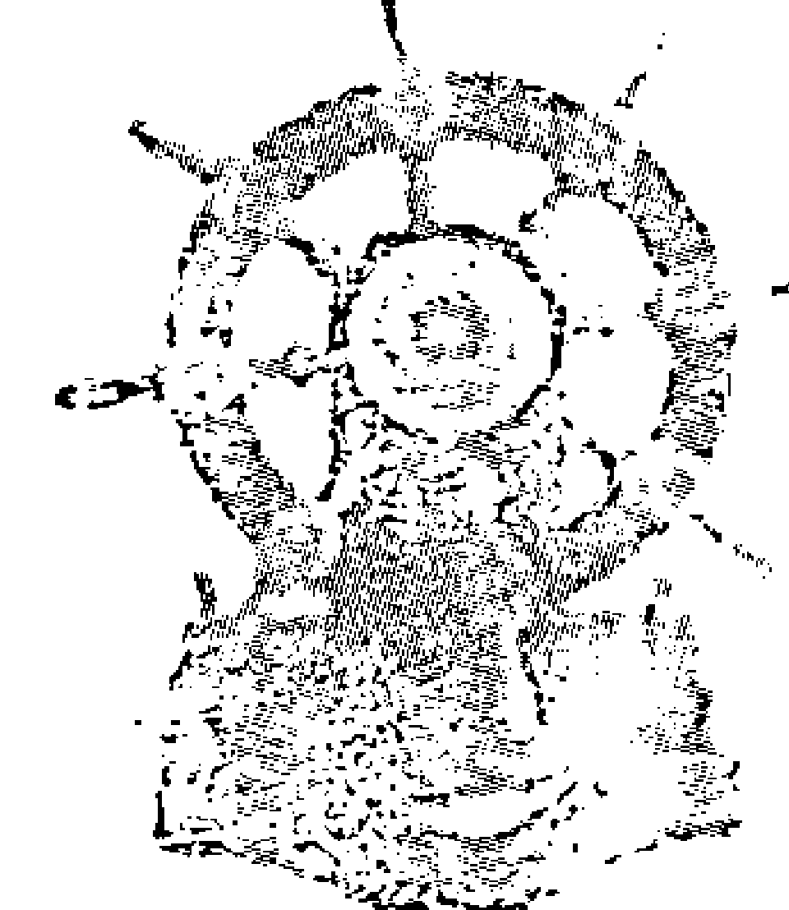

## 二、雾化盆景催财

它是一个盆栽，四周有水围着，中央才是山水草树的盆景。而利用一些装置将水激射而引起雾气弥漫于盆景的四面八方，如果你伸手触摸，那些雾气冰冰凉凉的，还有潮湿的感觉（图17-4）。

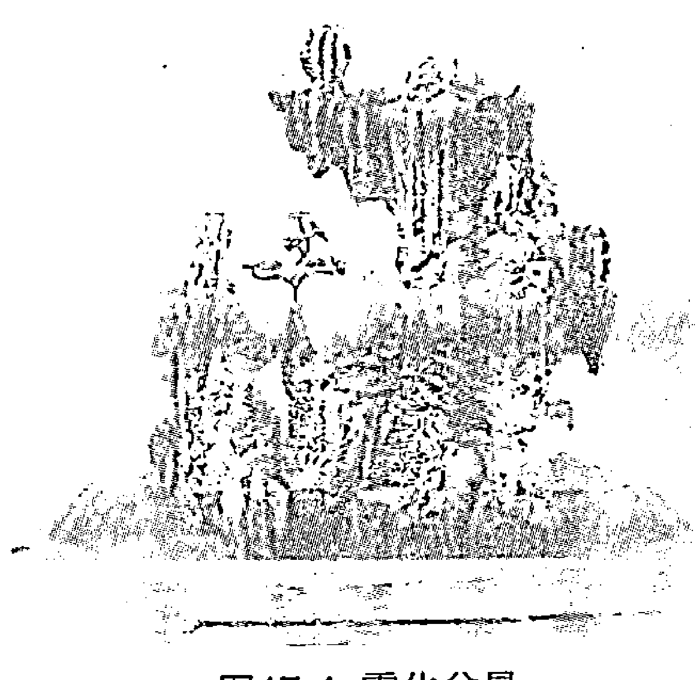

## 三、貔貅

貔貅（音“皮休”），对于从事外汇、股票、金融、赛马、期货的人，能起到催财的作用。

貔貅的形态有点像鹿，一般是短翼、双角、卷尾、鬃须常与前胸或背脊连在一起，突眼、长獠牙。现在常见到的貔貅多是独角，长尾巴（图17-5）。

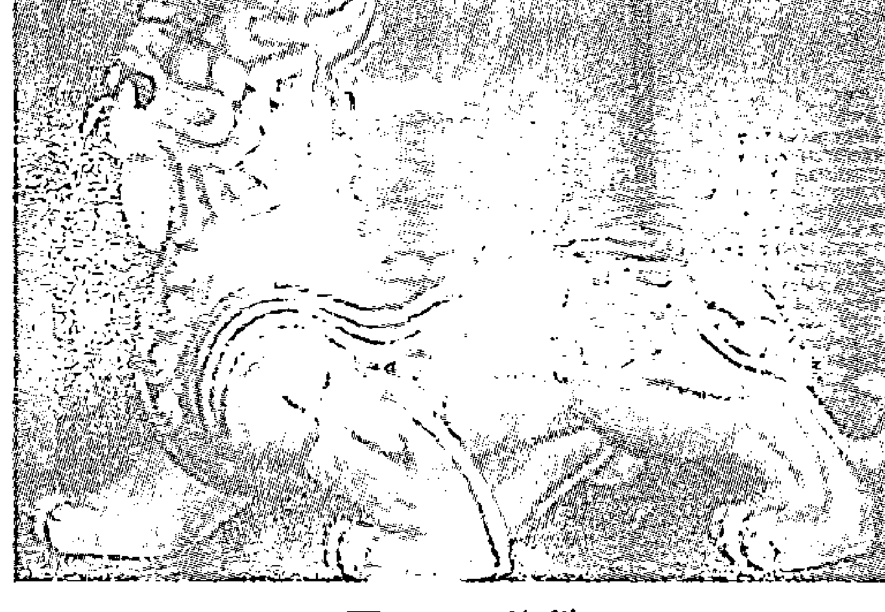

一般制造貔貅的材质有四类：

-   (1) 金属：以铜来制造，磨光后的色泽接近黄金。
-   (2) 木材：一些古老大屋会利用质坚的木材雕刻貔貅，然后放在横梁上，用来挡煞。
-   (3) 瓷器：以泥土的质地来制造。
-   (4) 玉器：以不同的玉种来制造。

以上四种当中，用玉器和金属制造的貔貅催财力最强。我们在摆设时，要注意貔貅的头应向门外或窗外，这样才能食四方财。

## 四、三脚金蟾催财

这蟾蜍并非普通蟾蜍，它只有三只脚（图17-6），与其他四只脚的蟾蜍不同，它会吐钱。传说它本是妖精，后被刘海仙人收服，改邪归正，四处吐钱帮助穷人，所以后来被人们当做旺财瑞兽。

摆放蟾蜍，要头向铺内、公司内或住宅内，不宜向铺门、公司门、屋门，否则所吐之钱皆吐出屋外，无法催旺财气。

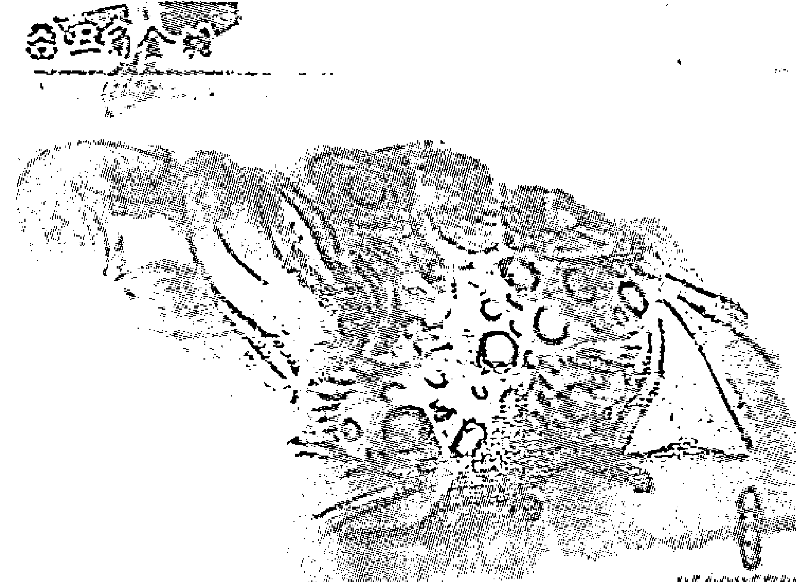

## 五、养鱼催财法

养鱼催财，相对比较普遍，但要注意几点：

-   1. 鱼缸的形状。
-   2. 养鱼的数目。
-   3. 养鱼的颜色。

以下对此进行详细分析：

### （一）鱼缸形状与五行的关系

（1）圆形的鱼缸，五行属金，可以生旺水，故为吉利之象（图17-7）。

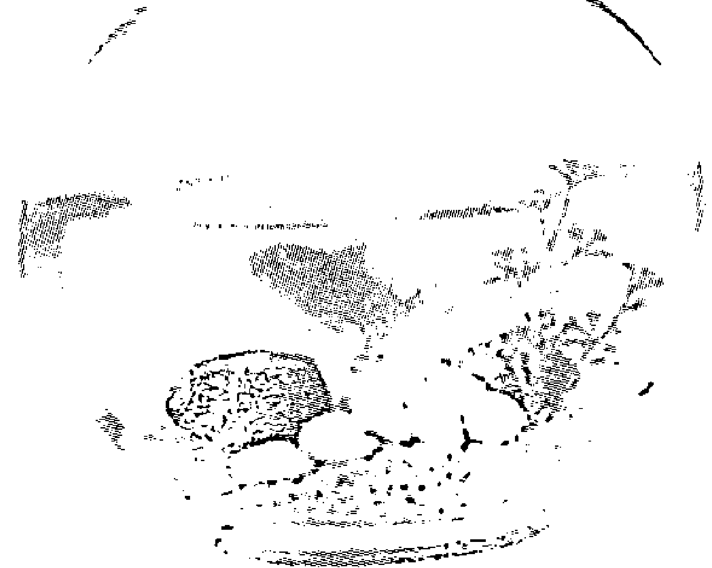

（2）长方形的鱼缸，五行属木，虽然泄水气，但二者有相生关系（水生木），故可用。

（3）正方形的鱼缸，五行属土，土能克水，出现相克制的力量，故不宜选用。

（4）六角形的鱼缸，因六为水数，故五行属水，可以使用。

（5）三角形或八角形甚至多角形的鱼缸，五行属火，水火驳杂，故不宜用于催财。

根据上面的五行分析，最好的形状有圆形，其次为长方形和六角形，均有利催财。

### （二）养鱼的种类及数目

有人会问：“养什么种类的鱼为佳？”在这里告诉大家，应该养生命力强、容易养的鱼，人们一般都是养金鱼。

养鱼的数目，应以洛书数来选择养鱼的数目。

-   一条：一白水，可以旺财。
-   二条：二黑土克水，不利财运。
-   三条：三碧水泄水，不利财运。
-   四条：四绿木，虽然泄水，但四绿为文曲星，以吉论。
-   五条：五黄土克水，不利财运。
-   六条：六白金生水，有利财运。
-   七条：七赤金生水，虽为凶星，但有相生之功，故以吉论。
-   八条：八白土克水，但八白为主辅星，为吉星。
-   九条：九紫火，右弼星，为吉星，可以旺财。
-   若十条以上：十条鱼以一条鱼论，二十条鱼以两条鱼论，十三条鱼以三条鱼论。

### （三）鱼的颜色

鱼的颜色在一定程度上，对催财的作用或多或少会带来影响。鱼的颜色是金色或白色，便是五行属金，金可以生水，故催财力量较强。

鱼的颜色是黑色、蓝色或灰色，便是五行属水，水能旺财，催财力量也很强。

鱼的颜色是青色或绿色，便是五行属木，木会泄水，催财的力量较弱。

鱼的颜色是黄色或咖啡色，五行属土，土能克水，催财的力量很弱。

## 六、财神催财法

财神催财也是常用的方法。财神，在中国人上千年的传统观念中占有相当重要的位置，认为财神掌管天下的福祉；倘若得到他的保佑照顾，便可以财源广进，家富屋阔。

因此很多人为求心安理得，往往会摆放财神在家里，希望求取好兆头。而有些人更是朝夕上香进贡，近年来几乎所有商店、企业、公司、商场等经营单位都设有香火堂位。

财神可分为文财神与武财神两种。

### （一）文财神

文财神，又分为财帛星君以及福禄寿三星。

-   1. 财帛星君

财帛星君的外形很富态，是一个白面长须的长者，身穿锦衣，系玉带，左手捧着一只金元宝，右手拿着“招财进宝”的卷轴，面似富翁（图17-8）。

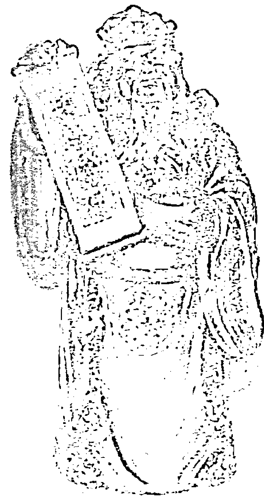

相传他是天上的太白星，属于金神，他在天上的职衔是“都天致富财帛星君”，专管天下的金银财帛。所以，很多求财的人，对他非常尊敬，有些甚至日夜上香供奉。

-   2. 福禄寿三星

“福星”手抱小儿，象征有子万事足的福气。“禄星”身穿华贵朝服，手抱玉如意，象征加官晋爵，增财添禄。“寿星”手捧寿桃，面露幸福、祥和的笑容，象征安康长寿（图17-9）。

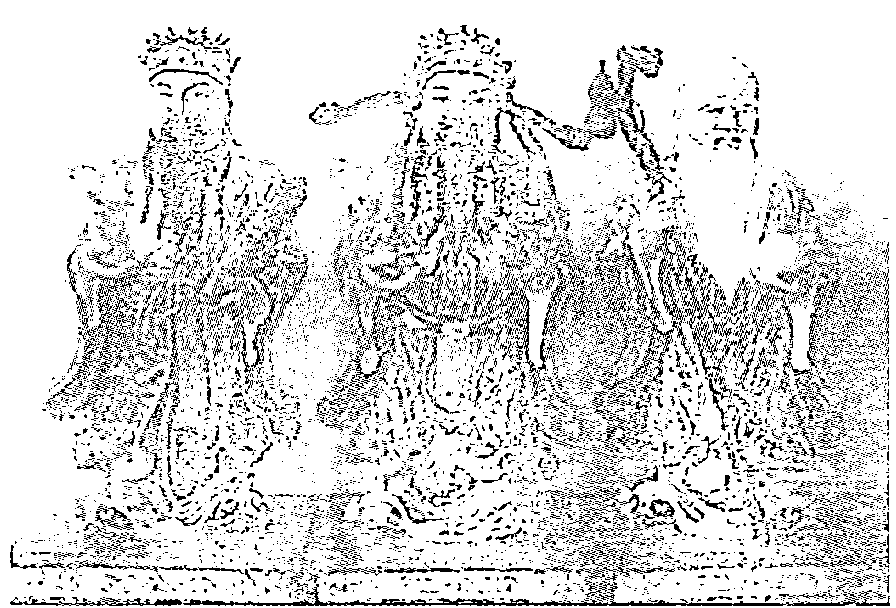

福禄寿三星中，本来只有“禄星”才是财神；但因为三星通常是三位一体，因此福、寿二星也被一起视为财神供奉了。

倘若把福、禄、寿三星摆放在财位内，有这三星拱照，满堂吉庆，撇开风水不谈，单是视觉上及心理上也会觉得十分舒服的。

担任文职的，以及受雇打工的人均宜摆放或供奉文财神，至于那些经商做老板，以及当兵当差从事武职的人，则应该摆放或供奉武财神。

### （二）武财神

武财神有两种，一是黑口黑面的赵公明，另一是红面长髯的关公。

-   1. 赵公明

赵公明又名赵云，是一位威风凛凛的猛将（图17-10），民间相传他能够伏妖降魔，而且又可招财利市，所以北方很多商户均喜欢把他供奉在店铺中，而在南方的商户则大多供奉关公。

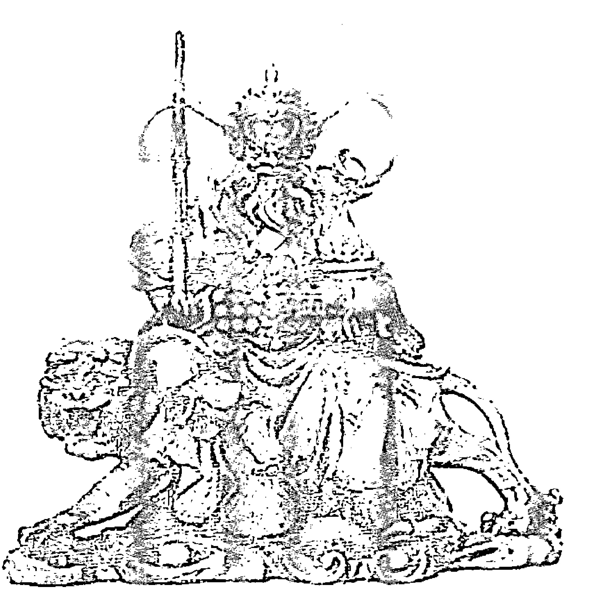

-   2. 关公

关公原名关羽，字云长，是三国时代的名将（图17-11）。他形象威武，不但忠勇感人，而且能招财进宝，护财避邪。

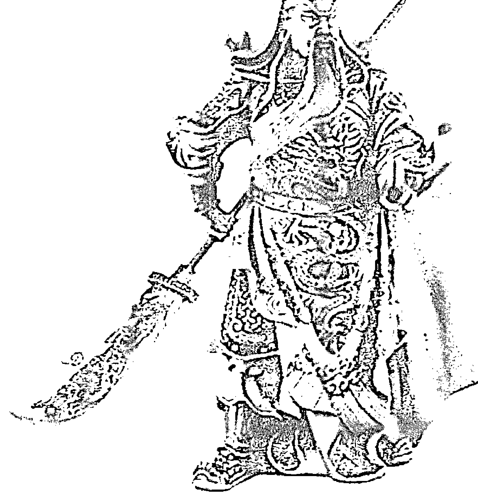

# 第十七章 旺财布局

有一点必须注意，摆放文财神以及武财神的方向是有区别的。满面祥和的文财神，不论是财帛星君，或是福禄寿三星均应向着自己屋内，否则便会向屋外送财！

至于威风凛凛的武财神则应面向屋外，或是面向大门，这样一方面可招财入屋，同时又可镇守门户，不让外邪入侵。

有关旺财风水用品很多，只能介绍一些重要的用品，其他还有运财童子、金龙、水晶、五帝钱等。

当我们定出财位后，应选择催财物品，摆放时应运用飞星日课来催动财位，以达到好的效果。

到此或有人想，那催财、旺财有如此好的效果，我们还要做那么多工作来赚钱干嘛？到现实中想想，即使那些赚钱比较多的‘煤老板’不也得天天让工人们挖煤去赚，也不是坐在家中什么也不想，什么也不做。催财、旺财后或能让‘煤老板’们更注意矿场的安全和市场的风险，而促进其财运更好，并非无所事事就能赚钱。所以，我们不要一味通过风水改变或其他方法而一下‘撞’到一个金矿而获得这不明之财，劳动才是生财之道。

# 第十八章 化煞

# 第一节 煞气含义与构成原理

玄空风水上的神煞包括两大类：一是看得见，感觉有形的煞气，叫“形煞”；二是看不见，摸不着，一般人感觉不到，无形无影的煞气，叫“理气煞”，有人也将理气煞简称为“气煞”，神煞就是由“形”和“气”引起的煞气的总称。

形煞就是房外峦头形状不佳，有对住宅不利的煞气，但不是代表一个形状不佳的峦头或一些形状尖锐的建筑物，会成为所有住宅的煞气，而是指站在某个住宅大门或窗口处，眼睛所见得到的一些不利的峦头形状，而且这些怪异的外形又是正对着房屋的大门或窗户，这样我们可以把那些不利的峦头部分，称为住宅外部煞气。单纯的外部煞气，不会直接对主人产生太大的危害，但必然会影响住宅的风水，因此都要运用化煞的方法。但在化煞之前，我们必须了解煞气的本质，由于各类煞气不同，故而化煞的方法也有所不同，下面叙述几种重要的形煞及化解方法。

## 一、枪煞

“一条直路一条枪”，以住宅中心点看房，如见大门外、向首窗或阳台外有一条较长的直巷或直路冲来，即为犯“枪煞”（图18-1），主疾病、血光之灾等。

化解方法：可在大门上挂珠帘或设置屏风，也可在窗户或阳台上挂一个八卦凸镜正对枪煞位（挂凸镜不能对正人家的门窗或屋，否则引起“风水大战”不是好事）。

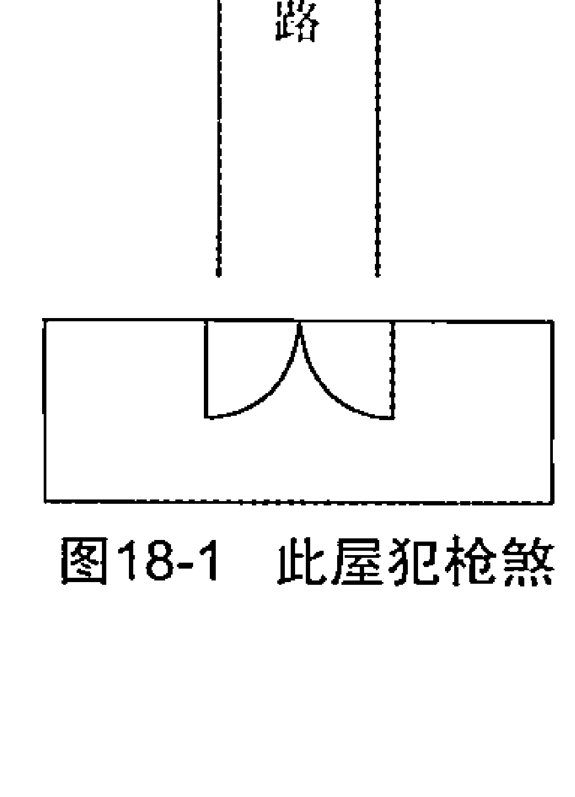

## 二、天堑煞

屋向、大门、阳台、窗户对正两座较高建筑物之间形成的一条小巷，称天堑煞，又称“窄管效应”（图18-2），实验证明，此“窄管效应”可使3级风增大到8级风，是一个非常强大的凶气场，主意外伤害、恶疾、血光之灾。

天堑煞的化解方法，可以运用大铜钱和五帝古钱，如果此煞离住宅很近，其化解方法是以一对麒麟对着煞冲来的方向以挡煞。

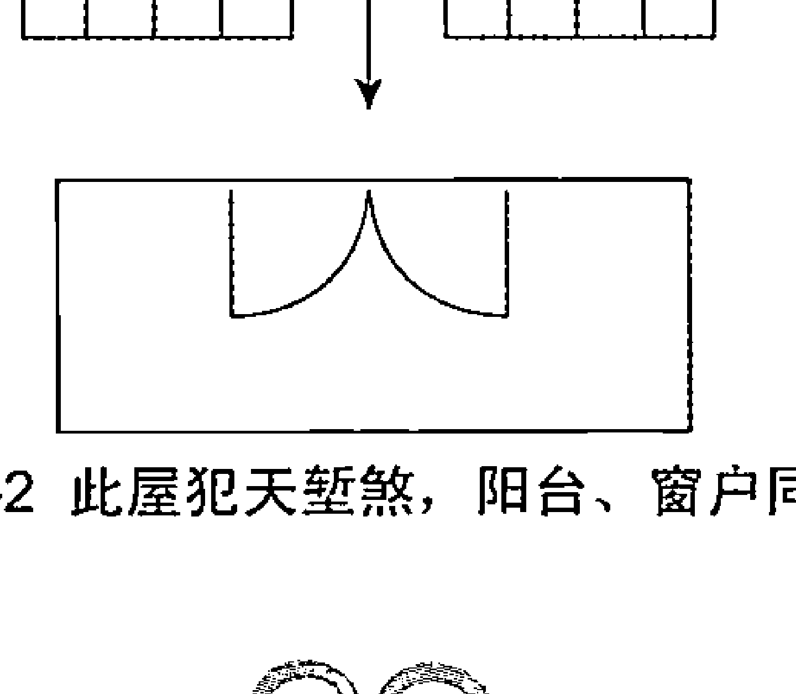

## 三、穿心煞

穿心煞有以下两种情况：

-   一种是地铁或地下水道、河流隧道上盖的房子，此房子犯地下穿心煞；
-   一种是地面通车架空层上的房子，叫地面穿心煞。

犯穿心煞的房子以越接近地铁、地下水道、隧道、车道为越凶，如一层最凶，二层次之，三层又次之，四层以上凶性已很小。

犯穿心煞的房子会使宅运不稳，反复无常，财运差，健康易出问题，甚至有意外灾祸。

化解方法：在山星的旺生方位放“泰山石敢当”的石头，以稳固宅运，也可在山星的旺生方位放八白玉、五帝古钱或铜葫芦，以加强吉气场的力量，抵消凶气场的干扰。

## 四、顶心煞

大门、阳台、窗外有电杆、烟囱、大树干或大指路牌等直形物体挡住，为犯顶心煞。主宅运渐差，血光之灾、意外事件等。

化解方法：可对着煞挂八卦镜，即可化解。

## 五、反弓煞

分为水反弓和路反弓。即水或路不是向本屋弯曲，而是向对面弯曲，凸出的部分向着本屋（图18-3），出现东西方向的反弓煞凶性更大，主不聚财，破财，身体有刀伤之苦。

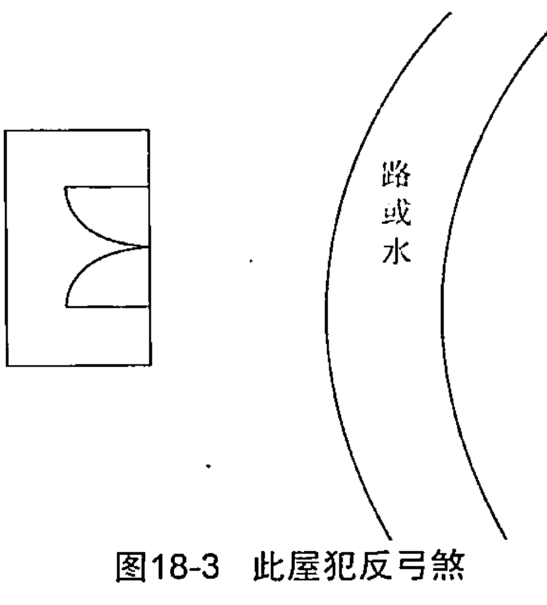

犯反弓煞较难化解，可在门口、窗口、阳台上对正反弓的方位放一对经开光的麒麟，可有一些效果。

## 六、尖射煞

邻近房屋的屋角或其他角度在90度以下的有形物冲射大门、窗、阳台，也指室内屋角、柱角冲房门和冲床。

犯尖射煞主要是身体易出问题，有急性病、意外伤害发生，可对正该方挂一个葫芦，室内装修时应将本屋内有可能犯尖射煞的角改圆，避免形成尖射煞。

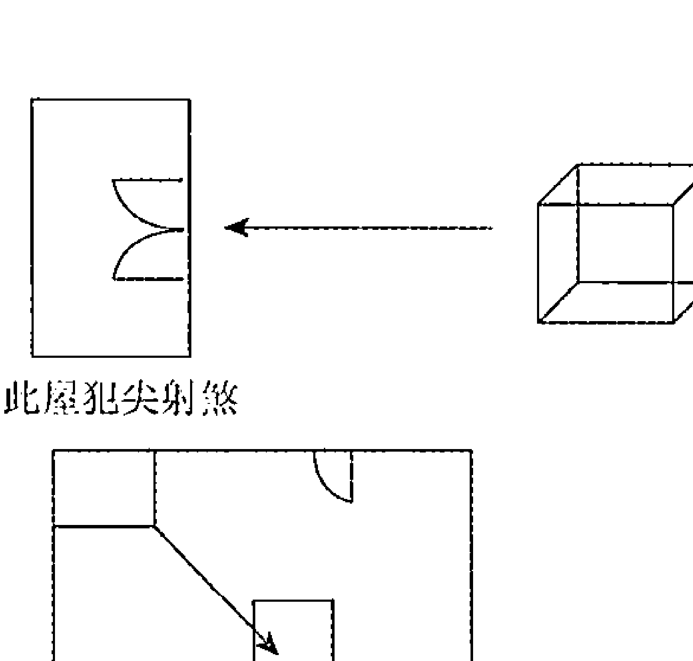

## 七、反光煞

由太阳反射引起，如海水、湖水经太阳照射有光反射进室内，又如城市建筑的玻璃幕墙，经太阳照射将强光反射进室内，这些都叫反光煞。

犯反光煞主脑部易生病，头疼、失眠、意外碰撞、血光之灾等。

化解方法：在本屋窗玻璃上粘贴不透明的乳白色玻璃纸，再在窗外上方左右角各挂一个经开光的葫芦；如阳台无玻璃密封的，可以种爬藤植物挡煞，再在阳台两端上方各挂一个葫芦化解。

## 八、白虎煞

在屋向的右上方动土，盖楼或拆屋，有动象，称白虎煞。

犯白虎煞主破财、疾病，如动土处距离房间太近者，玄空飞星又有五黄飞到白虎方位，主有人伤亡。

化解方法：在本屋右边的阳台或窗上方放一对已开光的麒麟和葫芦。

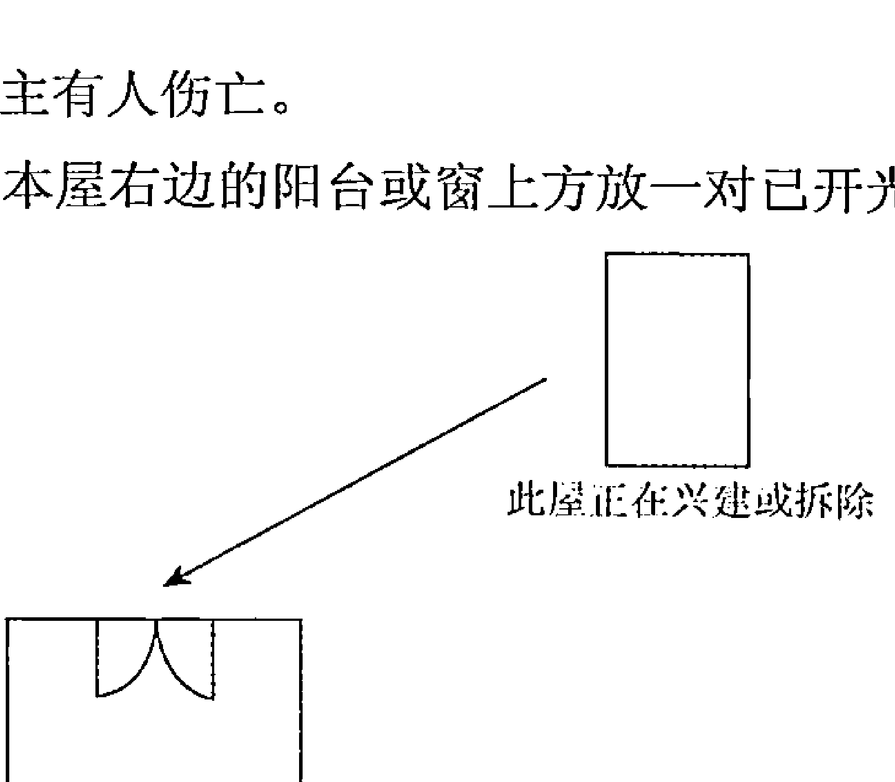

## 九、刺面煞

门前或左右两边有破面山（露出其土，石块、草木被铲掉），有乱石杂草的岩石耸立的山坡者，均为刺面煞。主被劫、被盗，交通事故，血光之灾。

化解方法：经常把窗帘放下，并在门前、阳台、窗上各放一只铜大象或葫芦化解。

## 十、孤阳煞和孤阴煞

孤阳煞包括两种：一是周围房屋均矮，即是本楼高得太多；二是房屋建在加油站、变电站旁边，因油、电均为火，为阳。主家中是非吵闹不断，引发心血管疾病，口角引起打架、失财等。

化解方法：将葫芦、八卦图或罗盘挂在受煞方；房屋独高者，可在玄空飞星的当旺山星放置“泰山石敢当”的石块或葫芦。

孤阴煞也包括两种：

-   （1）周围房屋均高，本屋独矮，有入囚之感。主运滞，难出头，事业不顺，无生机，失败等。
化解方法：可在山星当旺之方的屋顶置一根旗杆，杆顶达到周围房屋的高度，并在旗杆底下置一块“泰山石敢当”化解。
-   （2）房屋旁边有公厕、垃圾站、医院等，也叫孤阴煞，主身体易出问题，因病破财。
化解方法：在阳台、门、窗上挂6枚乾隆钱或葫芦即可。

类似形煞还有很多，本书只把主要的列出，读者对此感兴趣的话可参阅其他书籍。

# 第二节 气煞

气煞是指“理气煞”。气煞因风水上不同的派别，有不同的规定和分类。这里主要列举玄空风水上的气煞，因玄空风水的气煞最准确、最灵验。

## 一、太岁与岁破

太岁以干支纪年的地支为依据，12地支一轮回，每年有一地支，这个当值的地支，叫太岁。如2004年为甲申年，地支为“申”，属猴，在坤宫，西南偏西的地方。“太岁可坐不可向”，即在太岁方是可以修造动土的，但太岁方的正对方，即寅方，是不能修造动土，因寅方为“岁破”方。岁破是指地支六冲之方，如子年午方、丑年未方、寅年申方等，均为岁破方。岁破方不能修造动土，否则为凶。

## 二、五黄煞

五黄煞是大煞，有宅星五黄和年月日时五黄。宅星五黄又有大运五黄、山星五黄、向星五黄，以山向星五黄为重；四时五黄又以年五黄为重，月五黄次之，日时五黄一般可不计。
在五黄方动土，大凶，断不可用。五黄主疾病、绝症、刑伤、血光之灾等。五黄可用“金”化解，如铜铃、六枚乾隆钱、金蟾等。绝不能用“木”去克五黄土，因木克不动五黄土，必受反悔危害更烈。这里所说的化解只是指化解宅星五黄，如果是动土修建出现的年月五黄很难化解，避免为好。

## 三、暗建煞

暗建煞是玄空风水独有的一种大煞，暗建煞单独出现一般杀伤力不大，主破财，伤灾等；但暗建煞与五黄、戊己都天、紫黄毒药等凶星会合，则杀伤力极大。

暗建煞的寻找方法为：先排流年紫白星盘，并寻出流年太岁的元旦盘数飞到何方。再看该方所处的宫，该宫的元旦盘星数即为该年的暗建煞星数，该星在12个月中飞到何宫，该宫即为该月犯暗建煞。

如2004年为甲申年，太岁“申”在坤宫，星数为二，2004年年星五入中，二到坤，回归本位，故该年各月二黑所到之方即犯暗建煞。2004年正月月星二入中，故中宫犯暗建煞，忌在中宫修造动土。

暗建煞实质上就是犯太岁，不过并非命学上的地盘太岁，而是飞星太岁与紫白星结合而形成的太岁。

暗建煞很难化解，宜尽量避免。下元七、八、九运暗建煞速查表见表18-1。

表18-1 下元七、八、九运暗建煞速查表

| 年 | 正月 | 二 | 三 | 四 | 五 | 六 | 七 | 八 | 九 | 十 | 十一 | 十二 |
| --- | --- | --- | --- | --- | --- | --- | --- | --- | --- | --- | --- | --- |
| 1988、2019、2024 | 乾 | 兑 | 艮 | 离 | 坎 | 坤 | 震 | 巽 | 中 | 乾 | 兑 | 艮 |
| 1987、1989、1990、1997、2003、2023、2025、2026、2033、2039 | 坤 | 坤 | 震 | 巽 | 中 | 乾 | 兑 | 艮 | 离 | 坎 | 坤 | 震 |
| 1996、2006、2010、2016、2017、2032、2042 | 艮 | 离 | 坎 | 坤 | 震 | 巽 | 中 | 乾 | 兑 | 艮 | 离 | 坎 |
| 2007、2012、2043 | 震 | 巽 | 中 | 乾 | 兑 | 艮 | 离 | 坎 | 坤 | 震 | 巽 | 中 |
| 1999、2001、2002、2009、2015、2035、2037、2038 | 巽 | 中 | 乾 | 兑 | 艮 | 离 | 坎 | 坤 | 震 | 巽 | 中 | 乾 |
| 1995、2000、2031、2036 | 离 | 坎 | 坤 | 震 | 巽 | 中 | 乾 | 兑 | 艮 | 离 | 坎 | 坤 |
| 1986、1992、1993、2008、2018、2022、2028、2029 | 坤 | 震 | 巽 | 中 | 乾 | 兑 | 艮 | 离 | 坎 | 坤 | 震 | 巽 |
| 1985、1991、2011、2013、2014、2021、2027 | 兑 | 艮 | 离 | 坎 | 坤 | 震 | 巽 | 中 | 乾 | 兑 | 艮 | 离 |
| 1984、1994、1998、2004、2005、2020、2030、2034、2040、2041 | 中 | 乾 | 兑 | 艮 | 离 | 坎 | 坤 | 震 | 巽 | 中 | 乾 | 兑 |

注：每宫位均管三山。

## 四、三煞

三煞包括年三煞、月三煞。

申、子、辰年月，三煞在巳、午、未，巳为劫煞，午为灾煞，未为岁煞，故曰三煞。巳午中之丙为伏兵，午未中之丁为大祸，两者又名夹煞。三煞最凶，夹煞次之。

-   寅、午、戌年月，三煞在亥、子、丑，夹煞在壬、癸；
-   巳、酉、丑年月，三煞在寅、卯、辰，夹煞在甲、乙；
-   亥、卯、未年月，三煞在申、酉、戌，夹煞在庚、辛。

一般所说的三煞方，统指三煞和夹煞方，凡在三煞方造葬均大凶，无化解方法可用。

> “太岁可坐不可向，三煞可向不可坐。”

## 五、九星组合煞

-   (1) 一二，二一组合：一二同宫，土克水，一白水失令主肾有疾，男有灾，妻欺夫。
化解办法：如果飞星盘中和一二组合宫位上有“六”或“七”，此二数可以化解二黑克一白水。如果没有这两个数，我们必须要在一二组合的宫位挂六个铜钱，铜钱是代表金属物品，六是代表六白金。用金泄化土气，使土生金，金生水。
-   (2) 一五组合：一代表一白坎，五代表五黄土，五黄象征毒药，此二星组合若在宫位得不到其他飞星化解，一般多为不利男人和血液肾病，同时由于五黄象征毒药，因此住在此宫位上的人，如果命局的忌神是土时，必然有大祸临头，轻则易犯毒病，重则伤亡和牢狱之灾。由于五黄力量很大，一般不能以平常方法化解，可以用五帝古钱悬挂在五黄飞临方位上化解。由于五帝古钱的作用力很大，完全可化解五黄煞的力量。
-   (3) 一八组合：一白坎水与八白土组合。土克水，可用圆形铜钟化解，也就是在一与八组合的宫位，安置一个圆形的钟，可以化解八白土克一白水。
-   (4) 一九组合：一白水克九紫火，可运用四绿木化解，因四与九在河图中为先天之数，四绿木能通水火之关，作通关之用。

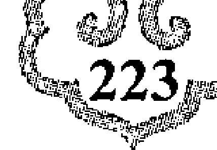洛数中，四九为金，故有四九为友之说。此二数组合，把九紫火化解，改变了五行性质，九紫火自然不存在，以金生一白坎水。同时四为巽，为文昌星，依玄空的原则，一四同宫，有利科名。

（5）二三组合：二三组合又名斗牛煞。三碧木克二黑土，二为老母，三为长男。二三同宫如失令又遇室外形势不吉，主母子不和，家中是非口舌颇多；如二三同临坤宫，为“复壁捱身”，不仅更多是非口舌，且有伤灾破身之患。引申讲就是代表受岩石塌下、倒墙所伤。现代而言则主摔伤、砸伤、撞伤、车祸等凶事。

化解方法：用火泄木，放红地毯或挂红灯化解三碧。不过火生旺二黑土，二黑为病符。化解病符宜用圆形鱼缸养六条黑色金鱼。圆是金，六是六白金，目的是使二黑土生金，金再生水。

（6）二四组合：二为土为地，四为木为风，木克土，失令主肝胆脾胃病，四代表长女，二黑坤为老母，此二数组合，可以比喻二女同宫，称为寡妇数。

化解方法：宜用红色地毯去泄四绿木，便不会克二黑土，反而是泄四绿木生二黑土。此宫位的人命局如果是喜土则最佳，倘若命局的忌神是土，运用红色地毯去泄四绿木，生二黑土，反而激起宅主命局中真正的煞气。因此我们在化解煞气时，必须要参考宫位主人的命局。

（7）二五组合：二为病符，五为瘟毒，这是大凶组合，失令又在此宫有恶山恶水，主损家长，恶疾，有句话叫“二五交加必损主”。

二五组合，土的力量很大，宜用风铃化解，或用六枚乾隆钱穿起挂在二五组合的宫位上。

（8）三八组合，三碧木克八白土，如木旺土弱，主损小儿或小口有疾。可以火泄木，用红色（地毯、窗帘、灯或花）去化解。

（9）三六组合：三为震为雷，六为乾为首，三六同宫致失运或山水颠倒，主头疼、头疾。可在此宫位上摆设黑色物品，黑色代表水，水泄金生木。

（10）六七组合：六七同属金，失运时为“交剑煞”。主刑伤、斗殴、血光之灾。可在此宫位安置鱼缸，养黑色的鱼，以水化泄。

（11）九五组合：九紫火生五黄土，火生土使五黄煞更旺。换一句话说，五黄毒性更加严重，九紫又暗含迅速之意。此二星组合会促使不利之事很快发生，可以运用五帝钱和铜制罗盘，用金泄去五黄大煞。

（12）九六组合：九紫火克六白金，可在此二星组合宫位放黄色地毯和黄色的物品来化泄九紫火，黄色五行属土，对九紫火和六白金起到通化作用。

# 第三节 家居风水用品

## 一、水晶

水晶是目前较流行的玩意儿。天然水晶具有对人体有益的放射性，磁场很强（人造水晶无效果）。水晶品种一般有水晶球、水晶石、水晶洞（图18-6～图18-8），颜色有白、紫、蓝、绿、黄等。

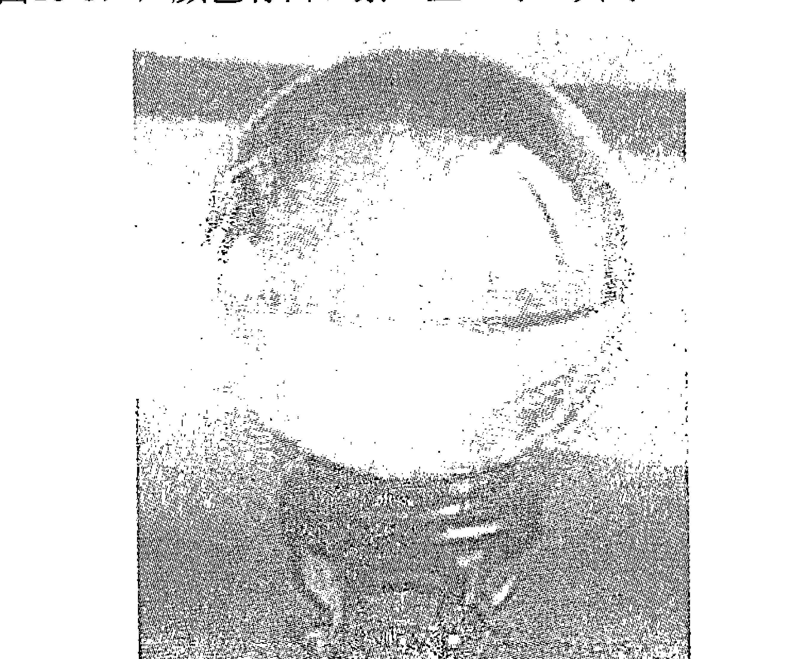

图18-6 水晶球

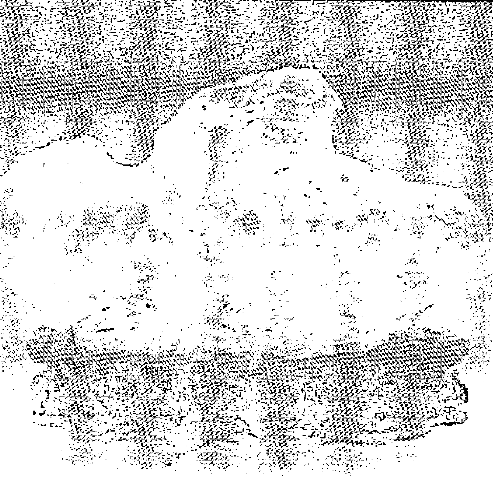

图18-7 水晶石

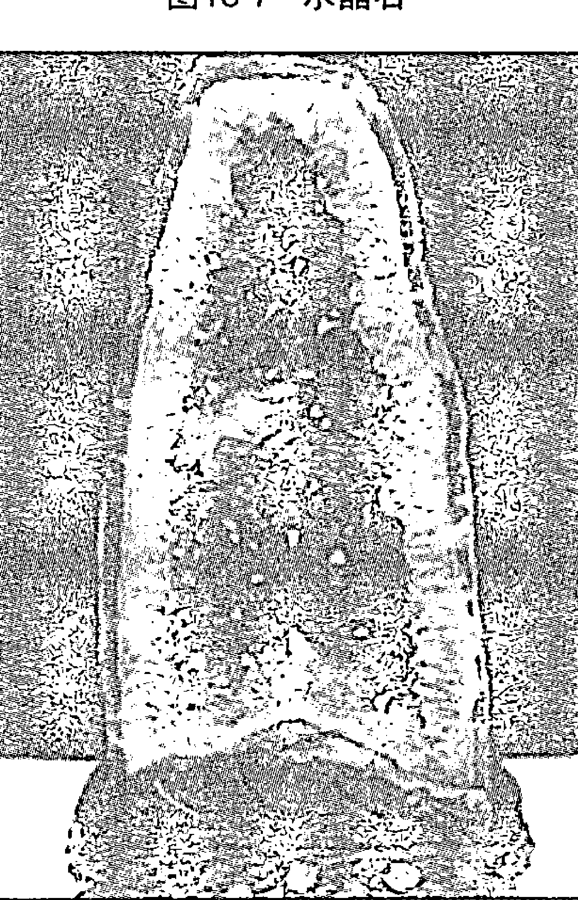

图18-8 水晶洞

水晶五行属性为“土”。白色水晶球具有土、金性质；紫色水晶球具有土、火性质；蓝色水晶球具有土、水性质；绿色水晶球具有土、木性质；黄色水晶球具有土的性质。

### 水晶球的作用主要有两大方面：一是凝聚，放大气场即催旺气场；二是化煞。

#### （一）催旺气场

如财位室外气场不大或不通，可在此方位放水晶球或水晶石，水晶洞也可以。但水晶球的颜色千万别搞错，搞错了会适得其反。

如七运当旺财星为七赤金，放在此位的水晶必须是白色或黄色。紫色为火会克七赤金，绿色、蓝色则会耗去七赤金的旺气，都不适宜。

八运的当旺财星为八白土，亦宜放黄色、白色，紫色也可以，因紫色火可生八白土。

九运的当旺财星为九紫火，宜放紫色，绿色也可以，但最忌蓝色，白色也不合适。

#### （二）化煞

化九星组合煞的方法很多，但离不开用“金、木、水、火、土”五行原理去化解。

- 27、72、79、97、69、96等煞，用白色或黄色水晶球或大量白色水晶石化解，因上述组合为火煞与金相战，可用“土”化之或通关。白色或黄色水晶有“土”的属性。

- 35、53、45、54、24、42、38、83、48、84、345、824等煞用紫色水晶球或大量的紫色水晶石化解，因上述组合为木土交战，可用“火”通关，紫色水晶有“火”的属性。

- 36、63、46、64、37、73、47、74用蓝色水晶球或蓝色水晶石化解，因上述组合为金木相战，用“水”通关。蓝色水晶有“水”的属性。

## 二、风水轮、风水球

风水轮为铜制，风水球为石制，均设有动水装置，可使水流动循环，或水冲动球体转动，以催旺该方位气场（图18-9、图18-10）。方法是将该风水轮、风水球放在向星的当旺、生气星位置，如七运的7、8方位，八运的8、9方位。但如遇该方位的山星为旺、生时，则不宜用，因山星宜静不宜动，如七运的77、87、97、78方位，八运的88、98、18、89方位。

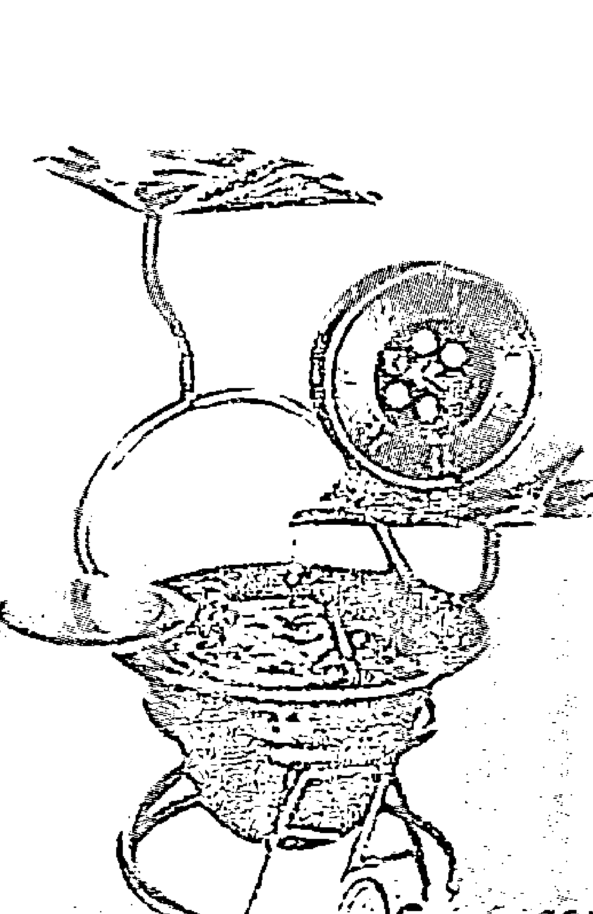

图18-9 风水轮

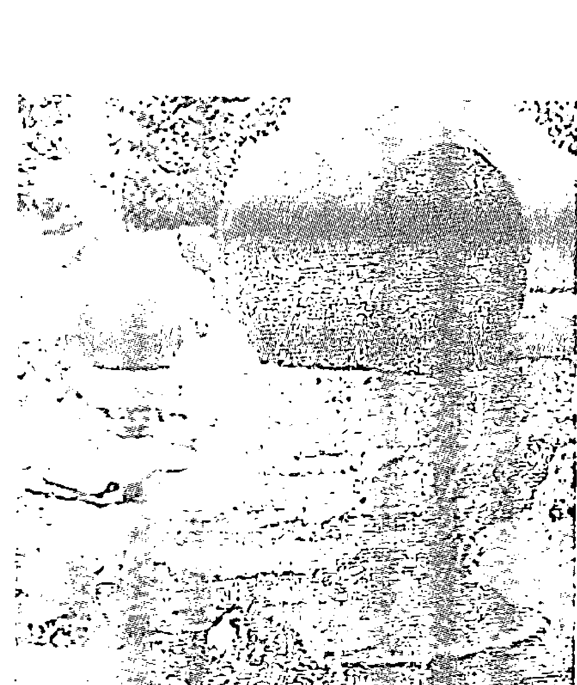

图18-10 风水球

## 三、鱼缸

鱼缸的作用与风水轮、风水球相同（图18-11）。

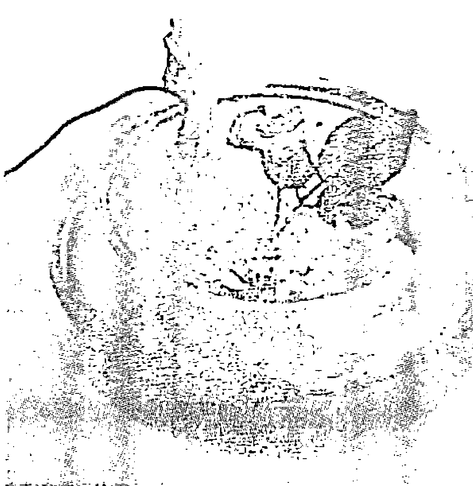

图18-11 鱼缸

## 四、五帝钱

五帝是指清朝的顺治、康熙、雍正、乾隆、嘉庆五位皇帝。因为这五位皇帝在位时，是国势强盛时期，再加上几百年的使用，灵气特别旺，带在身边可以消灾解难，加强财运。五帝钱（图18-12）是化解五黄煞和二黑病符星的最佳法器之一，将五帝钱与风铃一并挂于家宅五黄位或二黑位可保平安，增强健康旺气。

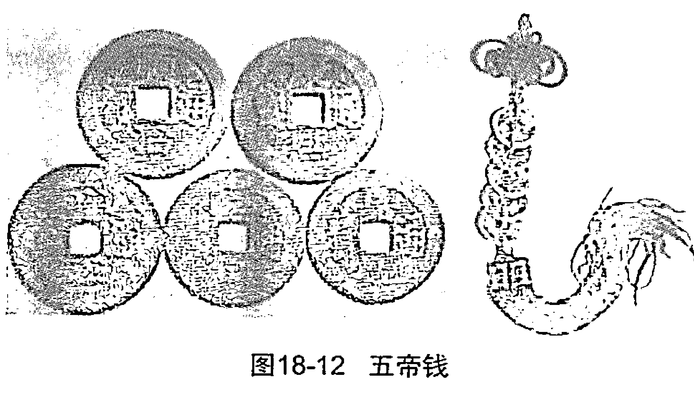

## 五、金蟾

用铜铸金蟾（图18-13）才有效，树脂做的无效，主要功能在于化土煞。如25、52、57、75、59、95、257、957之方，放一对开光后的金蟾并选择金旺之日、时，在六白客星飞临该方位的时间放置，化土煞的效果不错。

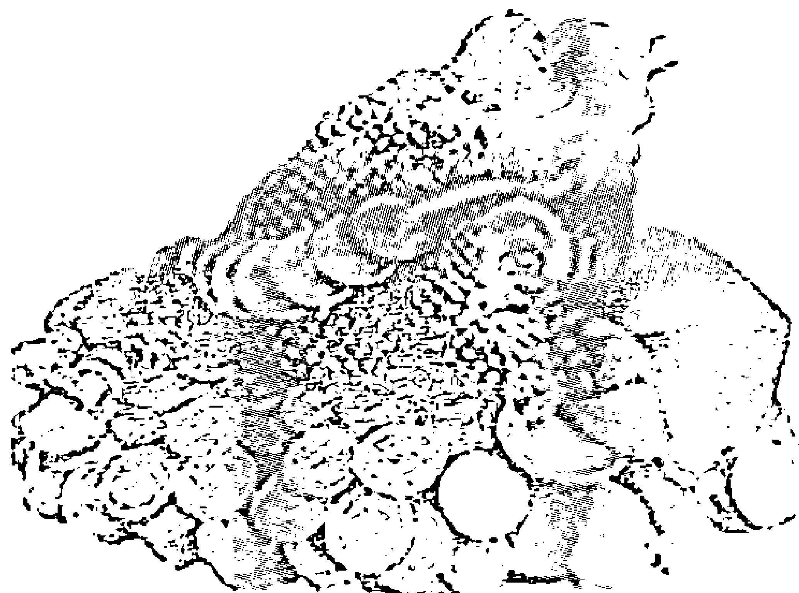

## 六、金龙

用铜铸金龙（图18-14）才有效果。主要功能在于化解口舌是非，如23、37、47、69之方；或补“青龙”位之不足，如在阳台上往前看，左低右高，为虎强龙弱，可在阳台的左边放一条高大些的金龙，但需开光并择日放置才有效。金龙还有招贵人、避小人的功效，可在办公桌的左边放一条金龙。

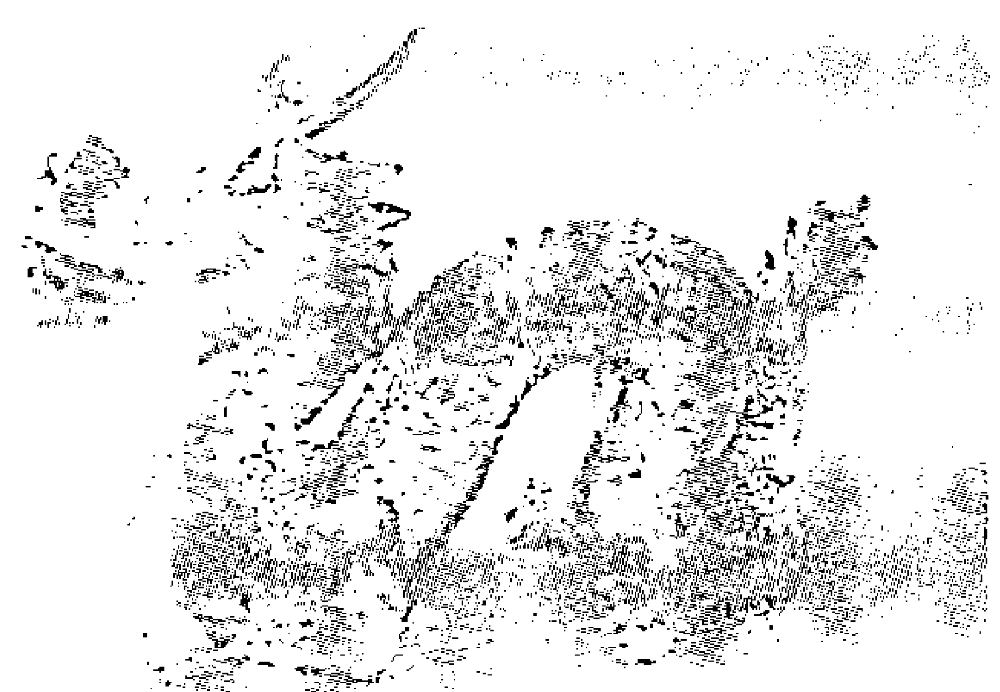

## 七、葫芦

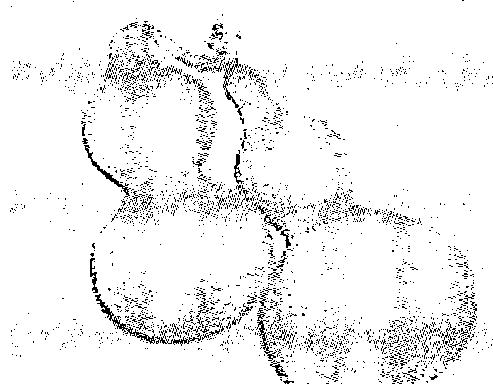

葫芦以天然植物的葫芦晾干后为佳，铜制、木制、陶瓷、塑料葫芦效果较差。注意一定要开光并择日挂放才有效。葫芦有三个功能：

- （1）化病符。凡宅星二黑和流年二黑飞临之方，可挂一葫芦，嘴朝外，可化二黑病符煞，也可挂在病人的床边，作除病之用。
- （2）化大梁压顶的煞气。凡宅内压床、桌、椅等的大梁，能避开最好，如限于条件，避无可避，则可在大梁两头各挂一葫芦，并将葫芦嘴朝下，可化此煞气。
- （3）对医卜之人的学习、事业有帮助。医生、占卜之人的办公室或住宅内的正西方挂一个经开光的葫芦，对记忆力与悟性的提高有一定的作用。

## 八、八卦

八卦可化室外冲射（图18-16），因八卦本身就包括了从宏观到微观的全息气场，对室外的屋角、尖锐物、屋脊等的冲射有化解于无形的功效，正对冲射方挂上即可。当然，同样需要开光并择日。

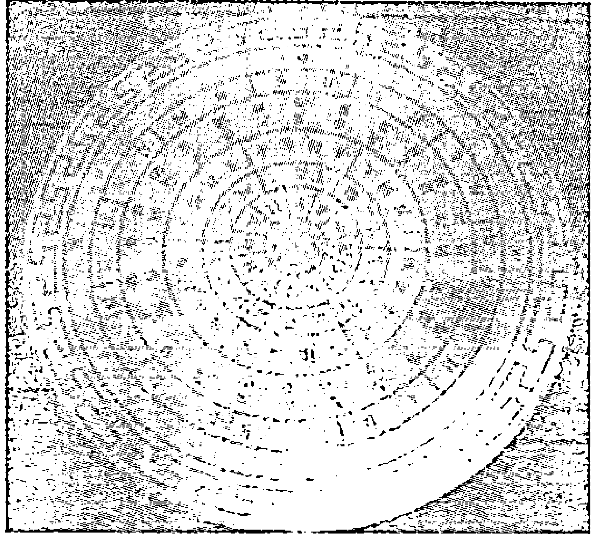

## 九、风铃、金铃

可化“土煞”，特别适合化五黄煞。在25、52、59、95之方，挂上经开光的金铃和六层风铃即可（图18-17）。因两物为金，风吹动会发出金属声音，可化掉“土”气，叫“子唤母回”。

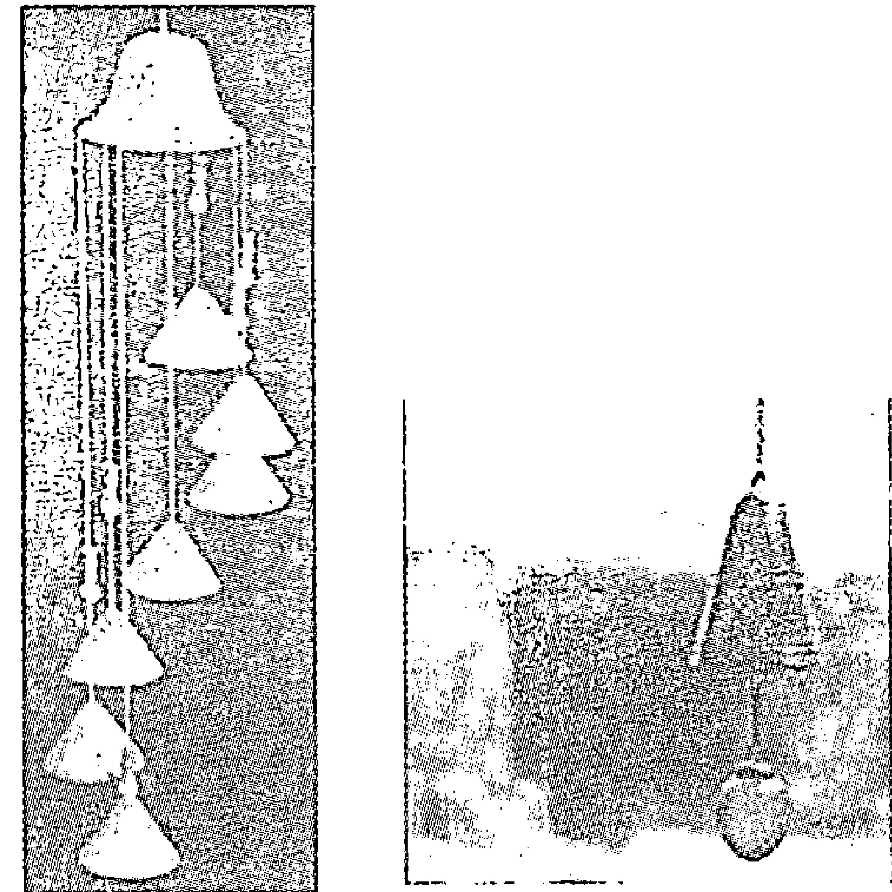

## 十、麒麟

麒麟为仁兽，可化室外冲射，作用与八卦相似，可在受冲射之方，摆上一对经开光的麒麟，头朝向冲射方即可（图18-18）。

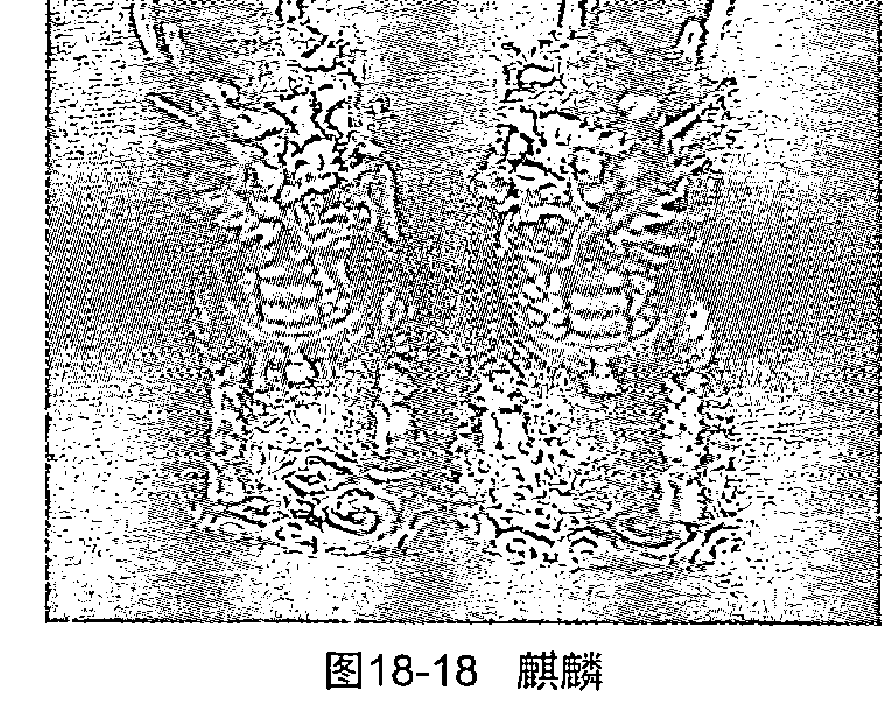

## 十一、石狮

狮为万兽之王，为瑞兽，而石狮有挡煞之功效（图18-19）。当室外有较大的冲射，如直路、刀形屋角及其他不吉之物，可在大门口两边各摆放一只石狮，大小由屋之大小决定。摆放石狮需开光，择日才有效。同时，石狮也有辟邪、镇宅之功效，如感觉宅运不稳或有邪气入侵，可在山星的旺生之方放置石狮。当然，在室内安放的石狮应比较小。

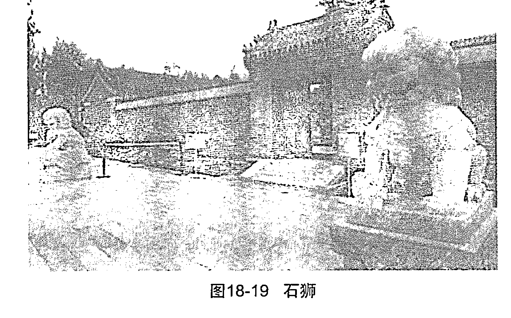

## 十二、泰山石敢当

如今泰山石已难寻觅，可用一般的花岗石代替，上面刻上“泰山石敢当”并开光即可，其功用在于挡煞和旺山（图18-20）。

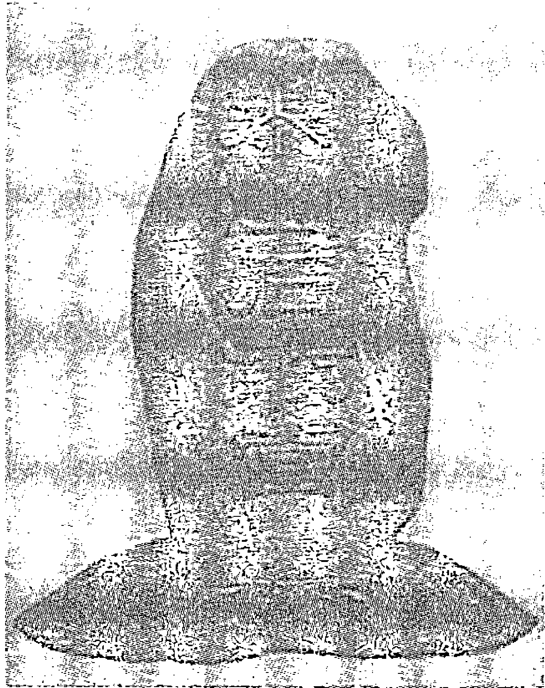

图18-20 泰山石敢当

挡煞的功效是指大门口或阳台上，特别是首层（二、三层同论），碰到有水、路、有形尖物直冲，可在大门边的墙边放上“泰山石敢当”的石碑，可具有挡煞功能。需注意的是，此物千万别放在向星的生旺之方，否则虽挡了煞却破财连连。

旺山的功效，是指在山星的当令、生气之方为空或有冲射时，可在山星的旺生之方的墙边放“泰山石敢当”的石碑，既旺山旺丁又挡煞。

## 十三、安忍水

安忍水的做法是：用一个能盛水5斤左右的玻璃瓶，先放入海盐半瓶，再放一个银币和六个乾隆钱（一六合化水之意），然后放入自来水将瓶盖拧紧即成。

安忍水的作用是化“金煞”和“金木相战”。如67交剑煞之方，还有36、63、37、73、46、64、47、74的金木相战。如金失运，则需在此方位放一瓶安忍水，以通金木相战之关；木当运，亦可用之，但如金当运，放安忍水则泄旺星，故不宜放置。

## 十四、龙头龟

顾名思义，龙之头、龟之身连在一起称为“龙头龟”（图18-21），作用是催贵、招贵。在住宅或办公室的吉方（山、向星的生旺之方均可，文昌位更佳）摆放一个开过光的龙头龟，在工作上将得到上司的赏识，贵人的扶持，增加提拔的概率。

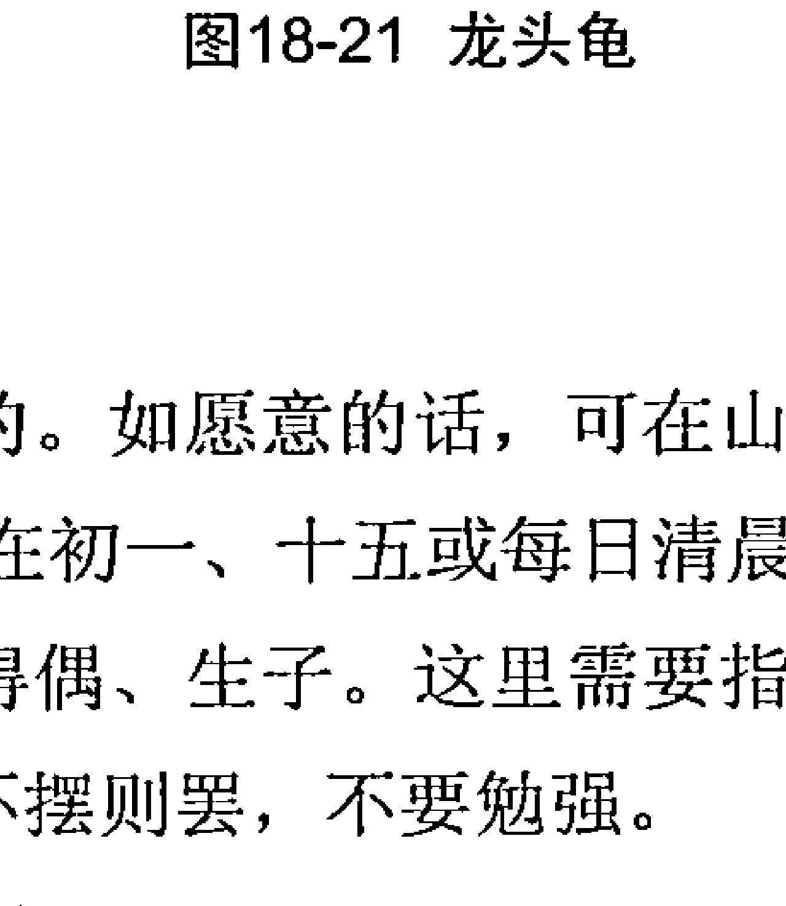

## 十五、观音

传说观音是保平安的。如愿意的话，可在山星的旺生之方设一个经开光的观音（图18-22），在初一、十五或每日清晨出门前上香祈祷，据说可保佑身体健康、平安、得偶、生子。这里需要指出的是，摆放观音应全凭你的心愿，愿摆则摆，不摆则罢，不要勉强。


## 十六、财神

赵公明元帅及关公财神均可，但需开光。摆放方位宜在向星的旺星之方即向星的财位之方最佳，但需开光并经常上香祈祷才有效。摆放财神与摆放观音一样，以自愿为原则。

## 十七、土地公

土地公也叫“地主财神”（图18-23），据说有两个作用，一是保护，二是旺财。在入门旁边设土地公神位，据说可以得到他的保护，并可旺财。这也是以自愿为原则，不必强求。

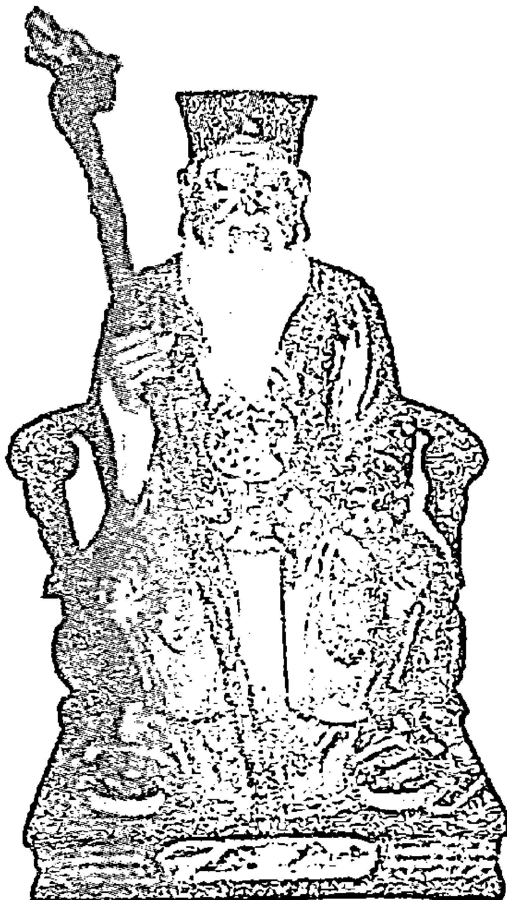

图18-23 地主财神

## 十八、文昌塔、毛笔

在文昌位摆放经开光并择日放置的文昌塔和四支毛笔，对小孩读书有帮助（图18-24）。

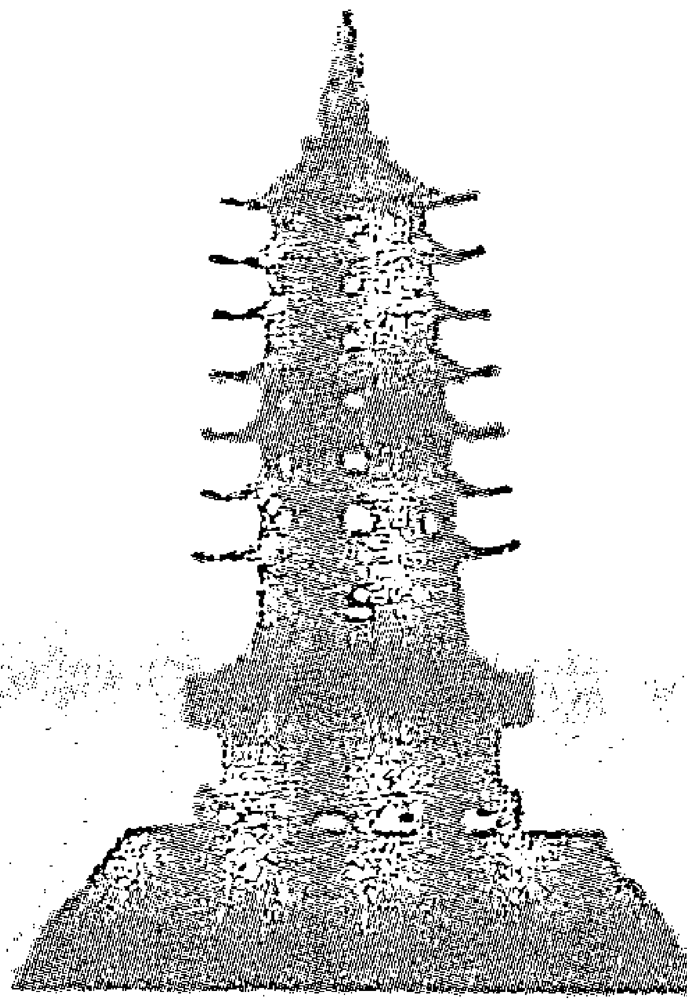

## 十九、红色灯泡、红色地毯、红色图画

此三物均以“火”论，可化木土交战，如23、32、24、42、38、83、48、84之方均为木土交战，用上述三物可通木土交战之关，转为木火土连续相生，化干戈为玉帛。

## 二十、罗盘

罗盘主要用于化煞。一是化“火土煞”，二是挡煞。

化火土煞，主要是在飞星25、52、59、95、275、957之方位，放上一只经开光的罗盘，把磁针调到正南正北，平放在上述方位。

挡煞则是对室外而言，如室外有冲射，可在对冲方位挂一经开光的罗盘，将罗盘的正“午”方钻孔用红绳子挂起来即可。

风水用品很多，但最主要且有效的就是以上这些。从上述可知，凡风水用品，绝大多数都是用五行属性去化煞，并不是封建迷信的装神弄鬼。

化煞举例：董宅，八运，子山午向，平面图及飞星盘如图18-25所示。

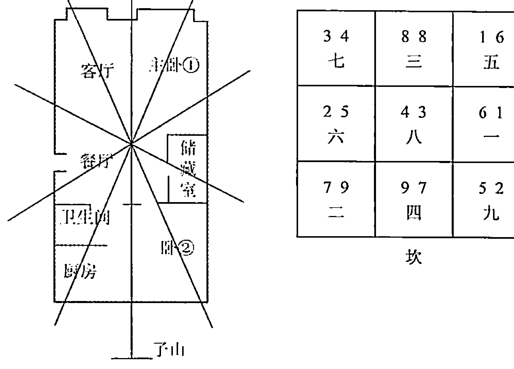

- （1）双星会向，离方有大窗，近处有街路，远处有高楼，为合局。
- （2）入户门处用6枚乾隆钱化解。
- （3）卫生间用白色水晶化解。
- （4）厨房可用白色水晶球化解。
- （5）卧②用五帝钱化解。
- （6）餐厅用紫色水晶化解。

按：文中所述煞的种类及解释为古人多年传承总结，从应用的角度理解也多有现实意义，可作参考，其更大作用是心理暗示及日见夜思，产生的影响也是一定有的，而化煞则除物体本身的作用外，也还有心理积极暗示的效果，自然会取得一定的成效，就是大家在应用时不要太极端化就行。

# 第十九章 搬家、开工择吉

# 第一节 搬家择日法

现代人搬家说搬就搬，很少有择日选时的，找个双休日或假日就把家搬了。

比较细心的人家，顶多翻翻黄历，找个好日子或适宜搬家的日子，只要黄历上写着宜搬家就行了。

其实，按照择日原理，这种方法搬家实在很难达到趋吉避凶的目的。但如按日课和传统方法又实在太复杂烦琐，下面介绍一种较为简单可靠的方法：

1. 首先选出命局用神。
2. 按用神选择搬家日，但日干与地支不能相克，以相生比和为佳。
3. 生肖与日支、居室坐宫忌相冲。
4. 时辰：阳日用阴时，阴日用阳时。

例如：王先生计划2009年4月（阴历）搬家，房屋为子午向。

（1）四柱如下：

| 天干 | 地支 | 藏干 |
|------|------|------|
| 戊   | 申   | 庚壬戊 |
| 甲   | 寅   | 甲丙戊 |
| 丁   | 未   | 己乙丁 |
| 甲   | 辰   | 戊乙癸 |

日主丁火，通根丙丁，又得月时干双甲相助，日主为旺，取用神为水。

（2）根据用神为水选择日子。
四月初一，庚子日。
四月十三，壬子日。
四月十二，辛亥日。
四月十九，甲子日。
以上日干与地支相生。

（3）生肖与日干地支、房屋坐宫不相冲。

（4）王先生选择十三日（壬子日），巳时搬家，反馈一切顺利。

# 第二节 搬家民俗与禁忌

## 一、搬家民俗

古时候有很多习俗，包括与搬家有关的习俗，现介绍如下。搬家时需准备六样东西：

1. 米：用桶装八分满的米。
2. 红纸：放在米桶上面用一些米压住。
3. 簸箕和新扫帚一对，上面贴红纸。
4. 水：用水桶装三分满的水。
5. 碗筷：必须取双数，如两只、六只、八只等，放入水桶中。
6. 火炉（微波炉）。

以上这些都是我们日常生活所必须使用的东西，搬家的时候，要先将这六样东西搬进厨房，然后，其他东西才能搬进屋子。

有些人还喜欢带一把土过去到新家，远行出国或移民的人，随身行李带米和一把泥土，据说可以避免水土不服的毛病。另外，在南方（尤其是台湾），搬完家的当天下午黄昏之时，要祭拜“地基主”，所谓“地基主”是一种土神，或是宅神，相传每一户都有，拜他可以相安无事。据说地基主个子很矮，因此拜的时候要在厨房的门口，但桌子不要太高。

拜地基主的贡品很简单，只要准备下列物品即可：

1. 家常饭以及家常菜，一菜、一肉、一汤、一碗饭。
2. 三杯酒。
3. 三炷香。
4. 一对红烛。

在香点燃三分之一以后，就在大门口旁边烧纸钱，烧完纸钱即祭拜完成。

## 二、搬家的禁忌

如果家中有怀孕的妇女，搬家的时候必须特别注意，严防动到胎神。胎神是民间的一种传说，所以一般家中有妇女怀孕，尽量不搬为宜，非搬不可时，必须让怀孕的人离开现场，而且绝对防止她用力以免流产。平时在房间内搬东西时，每搬一件东西都要先用新扫把扫一扫，据说可避免动到胎神。

其实在这点上，搬家对孕妇不介入是种保护，并非玄乎。搬家时稍有不留神会碰到人，如碰到孕妇，事情就大了。现代装修后，搬入新家，家中的材料可能存在问题，也不能保障，孕妇不参与全程是保证胎儿发育的一个必要措施。

在过去的民俗中，搬家时的一些禁忌挺有意思，简单叙述如下：

1. 搬家当天不可生气，不可骂小孩。
2. 搬家当天，都要讲些吉祥话。
3. 搬家的过程中，不可以和别人打招呼。
4. 搬入新家当天不可以在新家睡午觉，否则日后易生病。
5. 当天晚上，先躺下五分钟以后，还要起来工作一会儿，表示睡下还要起来。在民俗中，平时小孩子买新床时也要这样做，表示还要起来做事，否则易生病。

民俗的种种做法，无非是求一个好兆头。一般的老人家在为孩子谈婚事时，如果不小心有人打破了碗，或是相亲后家里死了一只小鸡，这门亲事绝对成不了，因为已经出现了不祥之兆了。

为了求得搬家后的吉祥平安，在搬家过程中，尽量制造吉祥的征兆来满足人类追求平安幸福的理想。

因为迁移所造成的吉凶祸福感应，只会产生在搬后一年之内，超过一年其力量就消失了，其感应力最快为7天，最慢为一年，通常在49天至100天之间。

吉祥、幸福、顺利的感应悄然来临的时候人们一般会察觉不到，但凶祸到来的时候就会很明显，通常除了生病以外，还会有意外事件发生，已经了结的旧案又重新翻起，或者出现好友背叛、家中遭盗等不好的现象。

搬家在现代社会中是一件很平常的事，但常常有人问起搬家应如何趋吉避避凶，所以在此将所知的叙述出来，希望对民俗的保存有所帮助。

# 第二十章 八运房屋装修指南

为了让读者能快速了解自2004年立春至2024年立春20年间八进建房装修的风水玄机，现将24山下卦的用法列出图解，以供参考。因用替卦容易犯“阴差阳错”、“空亡”之错杂，应尽量避免取用，故本章对替卦局的用法略去。本章所列的房屋建造装修要点，仅为大原则，在应用时还需结合实际作通盘考虑，统筹安排，进行合理的设计布局。

## 一、壬山丙向 下卦

飞星盘如图20-1所示。

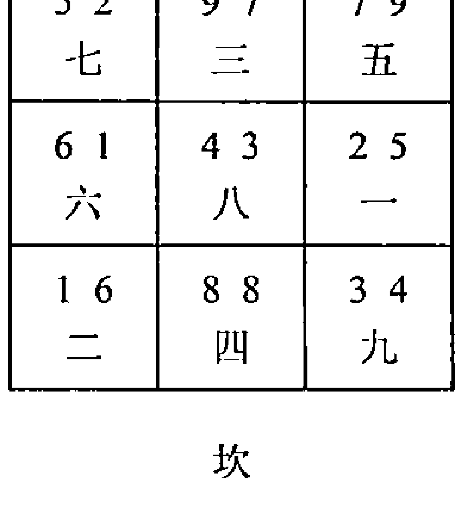

（1）令星会合双八到坐，为上山局，主旺丁不旺财。八白为阳丁，坐后有高山者，大旺男丁。山前屋后有小水者，可使丁财两旺，不宜坐后见大水（流动性很强的河流），否则有损丁之嫌。

（2）向首97，“九七合辙，常招回禄之灾”。97为火煞，又飞到火旺## 二、子山午向下卦

飞星盘如图20-2所示。

离

| 3 4 七 | 8 8 三 | 1 6 五 |
| :---: | :---: | :---: |
| 2 5 六 | 3 3 八 | 6 1 一 |
| 7 9 二 | 9 7 四 | 5 2 九 |

坎

图20-2 子山午向下卦飞星盘

-   （1）双星会向，旺星会合，如见秀水丽山，主丁财两旺。在南宫开大门出入最吉；其次在东北、西宫设侧门使用也利（因该房一六联珠，并且一为生气方）。在西北、东南、东宫开门出入，都为不利。
-   （2）主人房宜设在南、西南、北宫。
-   （3）厨房也宜设在南、西南、北宫。
-   （4）书房宜设在西南宫，这样有利于功名。
-   （5）走道、楼梯、浴室、大窗户、冷气孔、水池、水出入口、鱼缸等宜安排在南、东北、西宫。
-   （6）卧房、桌位、神位、橱柜、家电、盆景等宜安排在南、北、西南、西宫。

## 三、丑山未向下卦

飞星盘如图20-3所示。

离

| 3 6 七 | 7 1 三 | 5 8 五 |
| :---: | :---: | :---: |
| 4 7 六 | 2 5 八 | 9 3 一 |
| 8 2 二 | 6 9 四 | 1 4 九 |

坎

图20-3 丑山未向下卦飞星盘

-   （1）本局为到山到向，向方有三岔水或秀水等，主速发财富，家宅兴隆，善有善报。
-   （2）在西南宫设大门出入最吉，在南、北宫开侧门使用也利。而如果在西、西北两室设侧门出入，则主肝炎、目疾、车祸等凶事频生；在东北宫设后门出入，也很不利。
-   （3）主卧室宜设在东北、西北宫；书房最宜设在西北宫。
-   （4）厨房也宜设在东北、西北宫。
-   （5）走道、楼梯、浴室、大窗户、冷气孔、水池、水出入口、鱼缸等宜安排在西南、北、南宫。
-   （6）卧室、桌椅、神位、橱柜、家电、盆景等宜安排在东北、西、西北宫。

## 四、艮山坤向下卦

飞星盘如图20-4所示。

| 1 4<br>七 | 6 9<br>三 | 8 2<br>五 |
| :---: | :---: | :---: |
| 9 3<br>六 | 2 5<br>八 | 4 7<br>一 |
| 5 8<br>二 | 7 1<br>四 | 3 6<br>九 |

图20-4 艮山坤向下卦飞星盘

-   (1) 上山下水，生气丁星九紫到震，一白到巽，生气财星九紫到离，一白到坎，全局反伏吟。如坐满朝空为既败又凶之局，主损丁破财，出僧尼；用“山颠水倒”之形式，亦为可用之局。
-   (2) 前面的正门以小用为宜，可在东北宫另设后门出入最吉；南宫因向星生气，故设侧门使用也不忌。东宫等都为死气，八运不宜开门。
-   (3) 主卧室宜设在西南、东、东南宫；书房最宜设在东南宫。
-   (4) 厨房宜设在东南、西南宫，大窗户、冷气孔、水池、水出入口、鱼缸等宜安排在东北、南、北宫。
-   (5) 卧室、床位、桌位、橱柜、家电、盆景等宜安排在西南、东南、东宫。

## 五、甲山庚向下卦

飞星盘如图20-5所示。

南

| 7 9<br>七 | 2 5<br>三 | 9 7<br>五 |
| :---: | :---: | :---: |
| 8 8<br>六 | 6 1<br>八 | 4 3<br>一 |
| 3 4<br>二 | 1 6<br>四 | 5 2<br>九 |

东
西
北

图20-5 甲山庚向下卦飞星盘

-   （1）设在房屋前面的正门，以尽量不用为宜，在东宫再设后门出入最吉；东南宫向星虽为生气，但因五行相克，故不宜开门；南、西北两宫因挨星二五，开门出入更为不利。
-   （2）主人卧室、书房最宜设在东、北宫。
-   （3）厨房宜设在北、东宫。
-   （4）走道、楼梯、浴室、大窗户、冷气孔、水池、水出入口、鱼缸等宜安排在东、东南、中宫及北宫。
-   （5）卧室、床位、桌位、橱柜、家电、盆景等宜安排在北、东、西南和中宫。

## 六、卯山酉向下卦（乙山辛向下卦）

飞星盘如图20-6所示。

南

| 5 2<br>七 | 1 6<br>三 | 3 4<br>五 |
| :---: | :---: | :---: |
| 4 3<br>六 | 6 1<br>八 | 8 8<br>一 |
| 9 7<br>二 | 2 5<br>四 | 7 9<br>九 |

东
西
北

图20-6 卯山酉向下卦（乙山辛向下卦）飞星盘

-   （1）此宅运图为八白双星会向格局，运盘一白吉星亦临位，谓三吉会首之形局。向首宜见圆润秀水，两水会聚、三岔、明堂，且外有高山、秀峰、建筑物朝案者，主丁财旺发，文上有吉，坐山震宫三四临位，煞星、衰气重重、主平静，不宜见山水之形局，若见桥洞、探头山者，出贼丐、风疾之人。
-   （2）在西宫设大门出入最利。八运，如东南、西南、北宫开门出入，都为不利。
-   （3）主卧、书房最宜设在南宫。
-   （4）厨房宜设在南、西、东宫。
-   （5）走道、楼梯、浴室、大窗户、冷气孔、水池、水出入口、鱼缸等宜安排在西、西北、中宫及南宫。
-   （6）卧室、床位、桌位、橱柜、家电、盆景等宜安排在北、东、中和北宫。

## 七、辰山戌向下卦

飞星盘如图20-7所示。

南

| 6 8 七 | 2 4 三 | 4 6 五 |
| :---: | :---: | :---: |
| 5 7 六 | 7 9 八 | 9 2 一 |
| 1 3 二 | 3 5 四 | 8 1 九 |

北

图20-7 辰山戌向下卦飞星盘

-   （1）本例为令星上山下水局，形势宜背空朝实。
-   （2）在西北宫开大门使用，主发福缓慢而悠久，可出文人；在东南宫设后门出入，因该宫向星八白当令，故最为吉利。八运期间，如在南、北、西、东北宫开门使用，都为不利。
-   （3）主人卧房宜设在西北、西宫。
-   （4）厨房宜设在东北、西北、西宫。
-   （5）走道、楼梯、浴室、大窗户、冷气孔、水池、水出入口、鱼缸等宜安排在东南、中、西北宫。
-   （6）卧室、床位、桌位、橱柜、家电、盆景等宜安排在西北、西、东北及东南宫。

## 八、巽山乾向下卦（巳山亥向下卦）

飞星盘如图20-8所示。

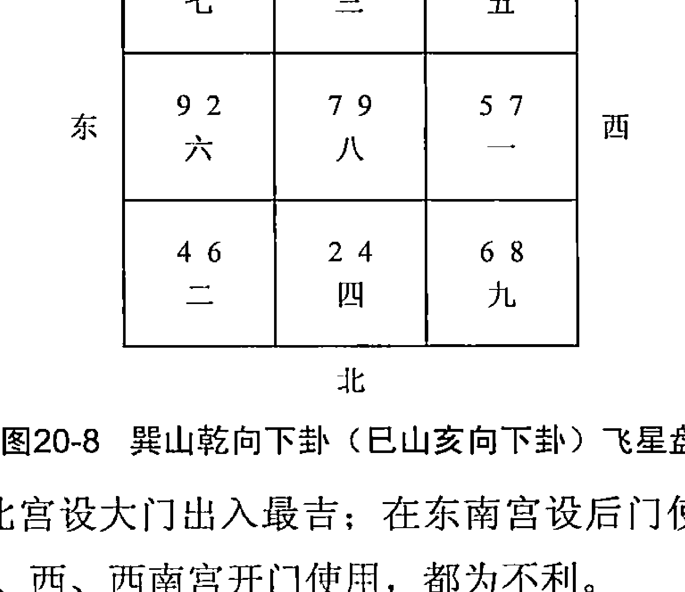

图20-8 巽山乾向下卦（巳山亥向下卦）飞星盘

-   1. 在西北宫设大门出入最吉；在东南宫设后门使用也利。八运，如在北、东、南、西、西南宫开门使用，都为不利。
-   2. 主人卧房宜设在东南、东宫。
-   3. 厨房宜设在东南、东、西南宫。
-   4. 走道、楼梯、浴室、大窗户、冷气孔、水池、水出入口、鱼缸等宜安排在西北、东南宫。
-   5. 卧室、床位、桌位、橱柜、家电、盆景等宜安排在东南、东、西南宫。

## 九、丙山壬向下卦

飞星盘如图20-9所示。

南

| 2 5<br>七 | 7 9<br>三 | 9 7<br>五 |
| :---: | :---: | :---: |
| 1 6<br>六 | 3 4<br>八 | 5 2<br>一 |
| 6 1<br>二 | 8 8<br>四 | 4 3<br>九 |

北

图20-9 丙山壬向下卦飞星盘

-   （1）在北宫开门出入最吉；在东北宫设侧门使用也利。八运，如在东南、西南、西、西北宫开门使用，都为不利。
-   （2）主人卧房、书房最宜设在北、东宫。
-   （3）厨房宜设在东、北、西北宫。
-   （4）走道、楼梯、浴室、大窗户、冷气孔、水池、水出入口、鱼缸等宜安排在北、东北、南、东宫。
-   （5）卧室、床位、桌位、橱柜、家电、盆景等宜安排在东、东北、北、西南宫。

## 十、午山子向下卦（丁山癸向下卦）

飞星盘如图20-10所示。

南

| 4 3<br>七 | 8 8<br>三 | 6 1<br>五 |
| :---: | :---: | :---: |
| 5 2<br>六 | 3 4<br>八 | 1 6<br>一 |
| 9 7<br>二 | 7 9<br>四 | 2 5<br>九 |

北

图20-10 午山子向下卦（丁山癸向下卦）飞星盘

-   （1）北宫向星虽为生气，但因挨星组合不利，故在前面设的正门不宜过大及要少作使用，可在南宫再设后门供日常出入，则最为吉利，主旺丁财；另外，在西南宫开门因挨星为一六联珠，主丁贵连生，也可考虑设后门。八运期间，如在西北、东、东南宫出入，都为不利。
-   （2）主人卧房宜设在南、西南、西宫；书房最宜设在西宫。
-   （3）厨房宜设在南、西宫。
-   （4）走道、楼梯、浴室、大窗户、冷气孔、水池、水出入口、鱼缸等宜安排在南、西南、西、北宫。
-   （5）卧室、床位、桌位、橱柜、家电、盆景等宜安排在南、西、西南、东北宫。

## 十一、未山丑向下卦

飞星盘如图20-11所示。

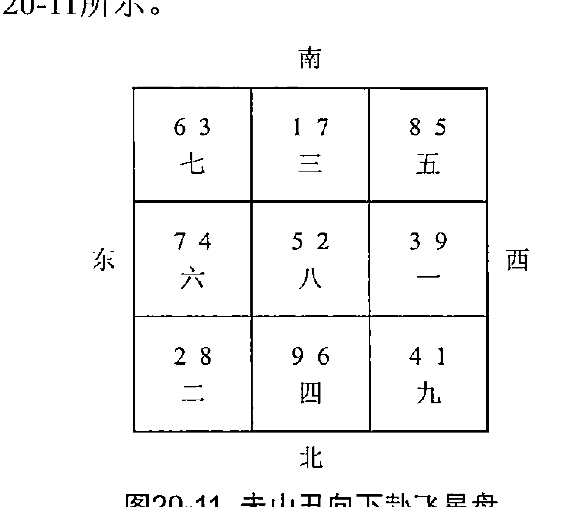

图20-11 未山丑向下卦飞星盘

-   （1）在东北宫设大门出入最吉；在西北宫开偏门使用有利于功名；西宫为生气，在西宫开偏门使用也吉。八运期间，如在东、东南、北、西南宫开门出入，都为不利。
-   （2）主人卧房宜设在西南、北宫。
-   （3）厨房宜设在西南、南、西北宫。
-   （4）走道、楼梯、浴室、大窗户、冷气孔、水池、水出入口、鱼缸等宜安排在东北、西、西北宫。
-   （5）卧室、床位、桌位、橱柜、家电、盆景等宜安排在西南、北、南宫。

## 十二、坤山艮向下卦（申山寅向下卦）

飞星盘如图20-12所示。

| 4 1 七 | 9 6 三 | 2 8 五 |
| :---: | :---: | :---: |
| 3 9 六 | 5 2 八 | 7 4 一 |
| 8 5 二 | 1 7 四 | 6 3 九 |

-   (1) 东北宫所设正门不宜使用，可在西南宫另设后门出入，则最为吉利，主发财禄；在东南宫、东宫设偏门使用也吉。八运期间，如在其他方位开门出入，都为不利。
-   (2) 主人卧房宜设在东北、南宫。
-   (3) 厨房宜设在东北、北、东南宫。
-   (4) 走道、楼梯、浴室、大窗户、冷气孔、水池、水出入口、鱼缸等宜安排在西南、东、东南宫。
-   (5) 卧室、床位、桌位、橱柜、家电、盆景等宜安排在东北、南、北宫。

## 十三、庚山甲向下卦

飞星盘如图20-13所示。

-   (1) 在东宫设大门出入最吉，主财源大发，事事如意；在北宫开侧门使用也利，主出秀士及催官贵。八运期间，如在其他方位开门出入都为不利。
-   (2) 主卧房宜设在东、中宫；书房最宜设在北宫。
-   (3) 厨房宜设在东宫，东、东北宫次之。
-   (4) 走道、楼梯、浴室、大窗户、冷气孔、水池、水出入口、鱼缸等宜安排在东、北、西南宫及中宫。
-   (5) 卧室、床位、桌位、橱柜、家电、盆景等宜安排在东、东南、北宫及中宫。

南

| 9 7<br>七 | 5 2<br>三 | 7 9<br>五 |
| :---: | :---: | :---: |
| 8 8<br>六 | 1 6<br>八 | 3 4<br>一 |
| 4 3<br>二 | 6 1<br>四 | 2 5<br>九 |

东
西
北

图20-13 庚山甲向下卦飞星盘

## 十四、酉山卯向下卦（辛山乙向下卦）

飞星盘如图20-14所示。

南

| 2 5<br>七 | 6 1<br>三 | 4 3<br>五 |
| :---: | :---: | :---: |
| 3 4<br>六 | 1 6<br>八 | 8 8<br>一 |
| 7 9<br>二 | 5 2<br>四 | 9 7<br>九 |

东
西
北

图20-14 酉山卯向下卦（辛山乙向下卦）飞星盘

-   (1) 在东宫所设的大门宜不用或少用，可在西宫方另设后门出入最吉；东北宫是生气，此方开侧门出入也吉，但只宜在八、九两运期间使用，运过则不利；在南宫方开门主出秀士。八运期间，如在其他方位设门出入都为不利。
-   （2）主人卧房宜设在西、中宫。
-   （3）厨房宜设在西、南宫。
-   （4）走道、楼梯、浴室、大窗户、冷气孔、水池、水出入口、鱼缸等宜安排在西、东北、南宫及中宫。
-   （5）卧室、床位、桌位、橱柜、家电、盆景等宜安排在西、西北、中宫及南宫。

## 十五、戌山辰向下卦

飞星图如图20-15所示。

南

| 8 6<br>七 | 4 2<br>三 | 6 4<br>五 |
| :---: | :---: | :---: |
| 7 5<br>六 | 9 7<br>八 | 2 9<br>一 |
| 3 1<br>二 | 5 3<br>四 | 1 8<br>九 |

东
西
北

图20-15 戌山辰向下卦飞星图

-   （1）如在东南宫设正门，因逢向星六白退气，故以小用为宜；而在西北宫另设后门出入，则最为吉利，主发财、出秀士；在东北宫，西宫开门也吉。八运期间如在其他方位设门出入都为不利。
-   （2）主人卧房宜设在东南、中宫、西北宫。
-   （3）厨房宜设在东南、西北或东北宫。
-   （4）走道、楼梯、浴室、大窗户、冷气孔、水池、水出入口、鱼缸等宜安排在西北、西、东北宫。
-   （5）卧室、床位、桌位、橱柜、家电、盆景等宜安排在东南、西北及中宫。
-   （6）中宫不可设天井或电梯。

## 十六、乾山巽向下卦（亥山巳向下卦）

飞星图如图20-16所示。

| 1 8 七 | 5 3 三 | 3 1 五 |
| :---: | :---: | :---: |
| 2 9 六 | 9 7 八 | 7 5 一 |
| 6 4 二 | 4 2 四 | 8 6 九 |

图20-16 乾山巽向下卦（亥山巳向下卦）飞星图

-   1. 在东南宫设大门出入最吉，主发财、人丁太平；在东宫、西南宫（坤、申方）设偏门使用也利。八运期间如在北、南、西、东北宫设门使用，都为不利。
-   2. 主人卧房宜设在西北、东南宫。
-   3. 厨房宜设在东南、西北、西南宫。
-   4. 走道、楼梯、浴室、大窗户、冷气孔、水池、水出入口、鱼缸等宜安排在东南、东、西南宫。
-   5. 卧室、床位、桌位、橱柜、家电、盆景等宜安排在西北、东南、中宫。

# 第二十一章 装修风水布局设计实例

2010年9月，经人介绍，秦皇岛冯女士邀笔者去看新居风水，要求对装修给予指导，现将此实例整理如下，以供参考。

## 一、基础资料

（1）房主冯女士出生于1965年，阴历七月二十四日，子时，查表命卦为兑卦，八字如下：

```
乙 甲 丙 戊
巳 申 午 子
日主旺，用神为土
```

一同居住的还有一个女儿，出生于1988年，阴历六月二十四日，辰时，查表命卦为震卦，八字如下：

```
戊 己 癸 丙
辰 未 巳 辰
日主弱，八字用神为金
```

（2）此楼2009年初建，2010年8月交工，为八运房。

（3）新居环境

新居为小区楼房，居住在九层，楼南面有草地和小区道路，草地前面有高楼，楼后面与东侧、东南侧有高楼，西侧也有高楼（见图21-1）。

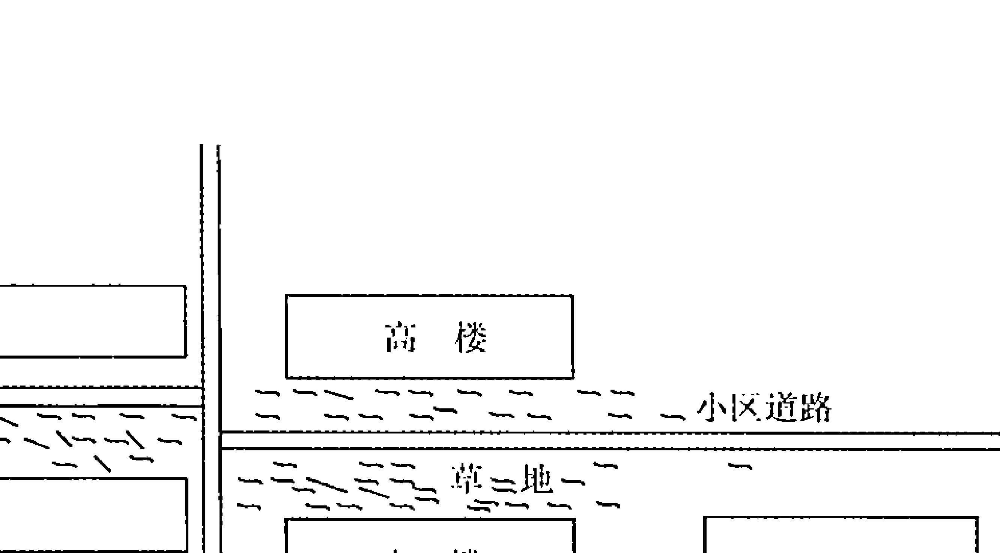

图21-1 环境示意图

## 二、绘宅盘图

### 1. 用罗盘确定住宅楼坐向

楼房单元门在北面，测量时距楼5米远（约7步远），应多找几个点测量，最终确定为午子向（偏1.5度），居宅的主卧与客厅向阳，以阳为向，居宅应为子午向。

### 2. 确定飞星图

八运子午向下卦飞星图如图21-2。

| 3 4 七 | 8 8 三 | 1 6 五 |
| :---: | :---: | :---: |
| 2 5 六 | 4 3 八 | 6 1 一 |
| 7 9 二 | 9 7 四 | 5 2 九 |

图21-2 子午下卦图

### 3. 确定居宅中心，画宅盘图

-   1. (1) 按比例测量画出居宅平面图
-   2. (2) 用几何法找出房屋中心
-   3. (3) 画出宅盘九宫图（见图21-3）

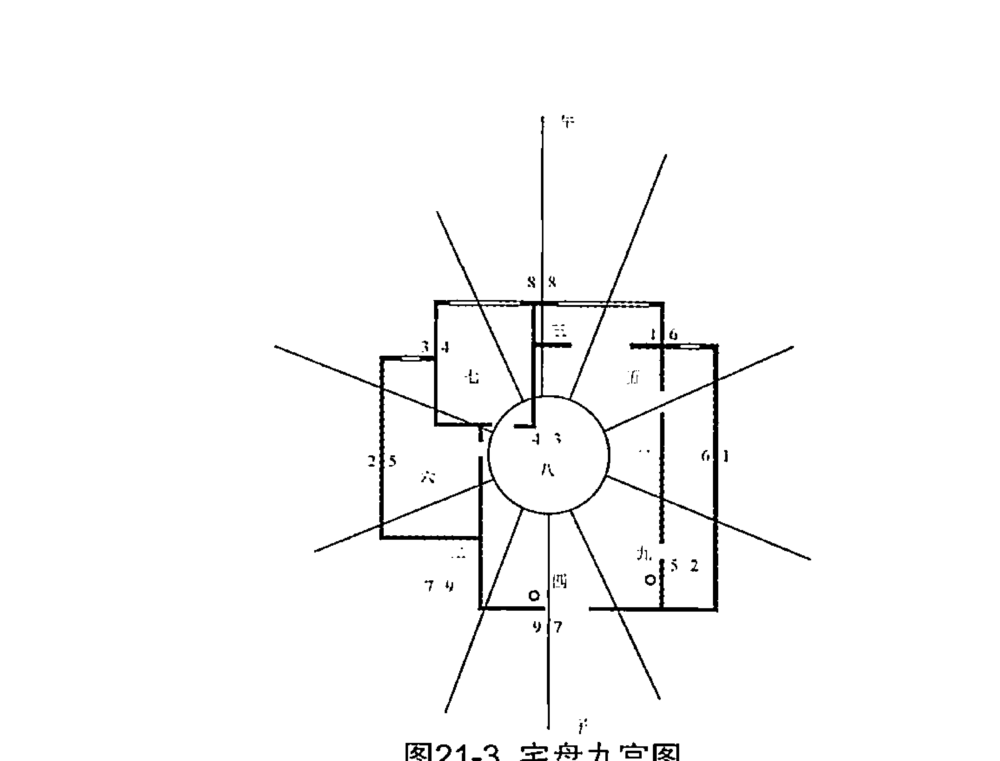

## 三、飞星组合分析与化煞图

（1）本住宅为双星会向，山星向星齐聚在朝向的宫位上，居宅南面有草地、道路，稍远处有高楼，即有山有水，是旺财旺丁之局。

（2）离宫88、坤宫16、兑宫61为吉祥宫位，可充分利用，其他34、43、25、52、79、97为凶位，需化解，其中34为衰星组合，易出盗贼；25、52组合必损主；79、97招回禄之灾及火灾。

（3）化煞、催财图如图21-4所示。

## 四、装修布局

### 1. 大门与玄关

（1）大门在97组合宫位，97为先后天火合并为凶的组合，“九七合辙，常遭回禄之灾”，宜用土化解，用白色水晶可化解。

（2）女主人1965年生，属蛇，大门宜选紫红色。

（3）一进大门不宜直对南面窗户，进门可设置一个玄关，进门左侧可设置鞋柜，上面可挂镜子。玄关处可摆放长条桌子，桌上放白色水晶和花盆。

### 2. 客厅

（1）客厅基本上在凶位，化煞见图21-4所示。

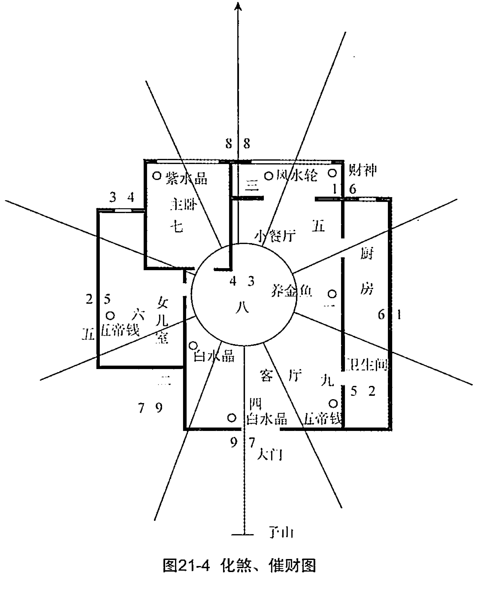

图21-4 化煞、催财图

（2）客厅地板及主体颜色：客厅在南方，宜用灰色冷色调，墙壁用白色，沙发用灰色。

（3）沙发位置：主人命卦为兑卦，沙发应摆放西面，东面宜摆放低矮的物品和水类物品，可发挥出生气九的作用。

### 3. 主卧

（1）主卧选在34与88宫位，与原设计相同，主卧有2/3的面积为34凶位，该区域可用紫水晶化解。

（2）床可摆放在卧室南与东南方（因床不能与卧室门相冲），大立柜（衣柜）可摆放在卧室西南88位。

（3）命主八字喜用神为土，墙壁粉刷可选用米黄色或浅黄色。

## 4. 女儿房

- 1. 女儿房大部分在凶位，房内西北角可放床位，尽量避开五黄煞，其他位置可摆放化妆台、书桌等，屋内正东挂五帝钱。
- 2. 屋内南及东南部分可用拉门或用拉帘隔成小间以放杂物、或作更衣室。
- 3. 根据八字，女儿喜用金，因金喜白色，故室内墙壁宜用白色。

## 5. 厨房

- 1. 厨房在西南和西方，西南适合作厨房。
- 2. 厨房抽油烟机、灶台、吊柜应尽量在厨房南侧。
- 3. 水池、冰箱宜在厨房北侧。

## 6. 卫生间

- 1. 卫生间在西北52方位，很不吉利，幸好家中无男主人，可挂五帝钱化解。
- 2. 洗脸池、淋浴喷头尽量设置在南端，便池在北端，洗衣机可放在卫生间一进门左侧。

## 五、催财布局

- （1）客厅西侧摆放圆形玻璃鱼缸，养金色或黑色金鱼一条或六条。
- （2）阳台东侧可摆放风水轮。
- （3）阳台西侧可摆放文财神。

以上参看图21-4。

## 六、开工日期选择

- 根据女主人意见，确定阳历10月开工。
- （1）女主人命局用神为土，可选土日，可选日期如下：
  10月3日，丙戌日。
  10月6日，己丑日。
  10月15日，戊戌日。
  10月18日，辛丑日。
  10月27日，庚戌日。
- （2）女主人生肖为巳，与日支，屋室坐宫均不相冲。
- （3）最终女主人选择10月15日，戊戌日，天干与地支比和，为吉。
- （4）戊为阳日，故应选阴时。
  最后确定10月15日巳时开工。

## 七、说明

- （1）女主人确定腊月搬迁，搬迁时仍需选择日期。
- （2）搬迁后，化煞时间需进一步确定。
- （3）女主人选择的楼层为九层，恰巧与命卦相符合，但楼层选择应在购楼看风水时确定，以免出差错，再调整就比较麻烦。
- （4）该房屋东南、西南、东北有缺角，需化解，具体如下：
  西南角缺位处可张贴羊的图画化解。
  东南缺角，在缺位处贴龙或蛇的图画化解。
  家中无男人，东北缺角可不必化解。

# 参考文献

- [1] 胡京国. 古易玄空学新探.台北：华城出版社，1998.
- [2] 韩少清. 玄空风水精论.郑州：中州古籍出版社，2008.
- [3] 余易. 实用建筑与风水.北京：北京科学技术出版社，2008.
- [4] 练力华. 玄空住宅环境学.北京：中国国际广播音像出版社，2006.
- [5] 李居明. 学风水的第一本书.西安：陕西师范大学出版社，2006.
- [6] 欧阳云天. 商用风水学.呼和浩特:内蒙古文化出版社，2003.
- [7] 石建国. 玄空风水精讲实例.北京：大众文艺出版社，2009.
- [8] 朱镇强. 建宅风水精论.郑州：中州古籍出版社，2006.
- [9] 张天用，钱永.生态住宅学（上册）.北京：中国戏剧出版社，2007.
- [10] 邵伟华. 图解家居风水学. 西安：陕西旅游出版社，2003.
- [11] 王炳中，宋宝全.房地产建筑风水策划指南.北京：文化艺术出版社，2006.
- [12] 钟义明. 玄空现代住宅学（上、下册）.台北：武陵出版有限公司，1993.
- [13] 陈柏瑜. 玄空阳宅学. 台北：益群书店股份有限公司，2003.
- [14] 鲍黎明. 中国风水学. 台北：林易文化事业有限公司，1995.
- [15] 亢亮，亢羽. 风水与建筑. 天津:百花文艺出版社，1999.
- [16] 林国雄. 玄空飞星风水. 台北：武陵出版有限公司，1995.
- [17] 盛如梅，詹以勤. 天文入门. 哈尔滨：黑龙江出版社，1999.
- [18] 黄一真. 现代住宅风水. 香港：文光出版社香港有限公司，2002.
- [19] 华艺博. 家居有道. 北京：京华出版社，2008.
- [20] 邵伟华. 现代吉祥风水. 西安:陕西师范大学出版社，2008.
- [21] 蔡上机. 风水图文大百科. 北京： 中国画报出版社, 2009.
- [22] 编写组. 客厅装修与风水. 福州： 福建科学技术出版社, 2008.
- [23] 编写组. 餐厅厨房装修与风水. 福州： 福建科学技术出版社, 2008.
- [24] 卧室装修与风水. 福州： 福建科学技术出版社, 2008.
- [25] 李娜. 玄关. 过道. 北京： 机械工业出版社, 2009.
- [26] 王乾古. 古今风水学. 昆明： 云南人民出版社, 2000.
- [27] 易安. 现代家居择址与设计装修. 天津： 百花文艺出版社, 2005.
- [28] 欧阳羽峰. 旺宅策划. 北京： 文联出版社, 2005.
- [29] 玄子真. 现代住宅吉利布局. 广州： 广州出版社, 2006.
- [30] 陈怡魁. 家居风水宝典. 奎屯： 伊犁人民出版社, 2002.

# 附：如何认识风水

风水学，在古代又称为“堪舆学”。风水的历史相当久远，在古代，风水盛行于中华文化圈，是衣食住行的一个很重要的因素。有许多与风水相关的文献被保留下来。由文献中可知，古代的风水多用来城镇及村落选址、还有宫殿建设，后来发展至寻找丧葬地形等。

风水原来是将环境对建筑物群的影响作为基础的。建筑学上的风水源自于皇家宫廷建筑，以中国古代封建社会的御用建筑师为代表，建立了一套趋于完整的风水理论体系。很可惜，由于中国古代御用建筑师采取的都是代代相传的体系，风水在中国并没有得到广泛的认同。建筑学上的风水，是随逐自然，力求将建筑和自然融为一体，使整体环境美化。并且，根据自然的情况安排建筑布局，包括采光、通风、取景，使得居住者可以更为舒适，追求将人居回归自然的状态。

风水学如果不加入环境哲学、环境经济学、建筑环境景观方法、生态修复技术、环境生态科学因素，那就是骗子的把戏。天文学、地理学和人体科学是中国风水学的三大科学支柱。天、地、人合一是中国风水学的最高原则。

中国古代科技理论认为：宇宙万事万物由三部分组成，即气、数和象。按照现代科学观点，它们是：能量、信息和态势或形式。三者共存，不可分开，又界限分明。气，是客观存在，按照现代科学观点可假设为能量；数，是宇宙万事万物存在的程序或逻辑，按照现代科学观点可假设为信息；象，是气根据数而存在的形式或变化的态势，用现代科学概括就是能量依据信息程序而存在的态势。

宇宙万事万物有信息就有能量，就有它们的存在态势；同理，有能量也必有它的信息和态势，有态势也必有信息作指令，能量作基础。宇宙万事万物的存在，正是气、数和象的不可分性，这才是实在的、具体的。信息“数”指导能量“气”按一定态势“象”存在，能量“气”依照“数”的指令，构成一定的存在态势“象”，存在态势“象”受信息“数”指挥，以能量“气”为基础。

人通过象认识气和数，而象有“无”和“有”的分别。人的感官或借助仪器能感知的客观存在为有，反之则为无。不能用语言表达其象的客观存在为常，或恒，这就是《易经》所说：“意不尽道，言不尽意，书不尽言。”可以用语言表达其象的客观存在称为特化。《老子》说：“道可道，非常道；名可名，非常名。”所有具体的道、名、气、数都是特化的。

由此，中国先圣认为：物质是能量（气）的一种较为稳固的特化形态。现代高能物理已经证明：物质和能量是相互转化的；宇宙最初只有能，即气，没有物质；宇宙由气形成。生成宇宙的“气”，现代有科学家认为源于黑洞，中国古代科技理论称为无极、无为。

《现代汉语词典》中风水定义：指住宅基地、坟地等的地理形势，如地脉，山水的方向等。迷信的人认为风水好坏可以影响其家族、子孙的盛衰吉凶。

2004年国家住宅与居住环境工程中心发布了《健康住宅建设技术要点》（2004修订版），表明：“住宅风水作为一种文化遗产，对人们的意识和行为有深远的影响。它既含有科学的成分，又含有迷信的成分。用辩证的观点来看待风水理论，正确理解住宅风水与现代居住理念的一致与矛盾，有利于吸取其精华，摒弃其糟粕，强调人与自然的和谐统一，关注居住与自然及环境的整体关系，丰富健康住宅的生态、文化和心理内涵。”

为了传承中华民族的优秀传统文化，使得更多人能住上宜居的家、宜居的社区、宜居的城市，让设计师和开发商能创造更多适合大家、适合城市和乡村、适合历史传统的建筑，我们以一个团队为大家服务，帮助大家理解和利用好风水知识，以改变自己的运势，用自己的双手和智慧来创造美好的人生。