# HuanxiangXR_21 贴子的综合整理

你们的世界现在为何没有遭到入侵

熵

唯物论和进化论是他们给予你们的

遵从最初的意志所分化的世界之树 隐藏在果实中的秘密 即是无边的世界

亚洲大陆<地球 二维圈<太阳系 三维圈<你们所在的四维矩阵.......

两种文明的融合 是破坏性的融合 但终归有益 是进化的需要

纯无 玄无

玄无之六面——创新面 物质面 精神面 信号面 律动面 纯集面

简单描述一下玄无六面的意义和关系

纯无，肉体，能量场，灵场，诺露的区别

能量

道法中的元神，佛法中的法相

时间 空间

投影

玄无精神 灵是一种意识活动产生的场 本质是纯无精神的凝固 核武器

穿越时空

灵界 灵界不是永恒的天堂

发帖的意义 人类基因被一个玄波加速 “星际流浪者”是人类美好的理想

2012 到底是个什么情况

未来 战争和统一不是主题

光明会

灵魂不能离开太阳系三维圈

人类集体信息复合体

每个个体纯无精神都是一个盒子

多世界/平行世界理论是否正确 等多个问题

使自己的生命（活体）一直存续下去的方法

轮回

梦

爱

21 如何过来

玄无是结构性 纯无是空间性

松果体

强磁场；凝固纯无的机器

收集诺露；死去的祖先吸取的信仰力

秩序者

吸引法则 梦的分层 金字塔缩小模型

NIBIRU

曾今的未来；现在的未来（可连接“人类的起源和发展”部分 看 371 ）

我们都是玄无和纯无的梦想

魔

尼古拉.特斯拉

《圣典》不是文字记录 而是感觉

反物质

三种宇宙观 在总玄宇宙世界中找不到合适的位置

一个冲动在某个人类个体中内引发；神圣几何

因为没有情绪所以没有就没有高傲和渺小

无情 耐心 警觉

阿卡斯域

黑洞

鬼压床

规则的天然屏障

一人晓知 全体人类潜意识既晓知

大脑的确产生意识和精神 但意识精神并不产生纯无 纯无不可能被另外一种东西产生 纯无 只是被有规律的意识和精神运作凸显出来

金星

大脑细胞

意识理解后就会变成启蒙

祖母驳论；集体潜意识中下载信息是靠共振；时空逆转

神圣几何空间效应；蜂房十二面体；三角形的立方金属体

瑜伽是引导其它力量加持自己；凝聚纯无阶段

反物质 反能量

对 21 的言语的质疑

2012 是玄无自我更新的开始 不是意念影响

四维和五维并不直接产生生命 而是以背景和支持的存在

四维不是时间轴 梦境是扭曲的东西

掌握画笔的力量

很多人说自己是外星人或者守护者

142857

《皇帝内经》

宇宙的起源

宇宙级生物

佛教的几个“界”所对应的玄无的几个面

阴阳

《山海经》；龙；凝聚纯无而达到永生最低标准

罗布泊

太阳系九大行星都在经历相同的变化——玄无自我更新

唯物主义有利有弊

蜥蜴人是想象 小灰人存在

每种文化都有自己的价值 每种文化都是一种和世界相处的方式

为什么长时间不睡觉，人就会“面容恐怖，无病而死”

一个亲人去世了，那么我该如何使用外力的方法，使其保全不灭?

思想是玄无的思想 不是你的；凝聚的纯无值得信任

玄度划分

关于 21 他们的世界

唐望等的书籍

作者对于他的作品来说就是幕后人吗?

- 离开你们世界三维圈找一个高度发展文明幼体的大脑进驻

- 三级神经元运转过强

- 所有的反推力都将回归重力

- 婴儿没有纯无 婴儿只是灵场强大

- 十二星座 代表你们理解宇宙玄无转变的十二种特性

- 濒死状态——纯无向灵场结构性转移 同时复制大脑的记忆向灵场结构时造成的幻觉

- 看到相同时间点

- 空间幻想 可以促进自我玄无创新面的发展

- 潜意识统一，才能改变一个世界的规则

- 宇宙不是生命体 地球是外在秩序的体现

- 希特勒；老子

- 原子是玄无对无限做放射的结果；星空反射；跨越四维矩阵

- 麦田圈

- 亚特兰提斯全盛时期的金字塔；埃及的金字塔；猎户座

- 意识微弱 也是凝聚纯无的过程 只是很慢很慢

- 母世界——太阳系

- 虚无；能量守恒定律

- 新的你不是旧的你；世界主空间层外还有很多附属空间

- 高阶宇宙战争是获取 对方的技术和对方种族纯无波形

- 穿越星门

- 规则不同就是世界之间天然的屏障

- 新时代哲学运动中著名的《一的法则》是人类哲学家的著作 大部分和真实无关

清除了两个人类婴儿

不恐惧即可 不恐惧它无法伤害你

麦田圈解析

人类的繁殖

太阳系在宇宙中的螺旋运作是否正确？超越光速不会时空逆转

无梦睡眠

业力 因果

“纯无”受到“纯无”的攻击

清明梦

有人在疯狂中获得了新的意义 有的人在疯狂中失去了自己

木星气态行星

无缝隙通信的关键技术是什么

思想的进化比身体的变异更重要么？

有病的人用什么方法能好起来

“没有‘阴谋’总玄宇宙世界就不可能存在 没有‘欺骗’带有觉知性的意识个体就不可能诞生”

向心的注意力

生命之外宏伟的图景

犹太人

“旅行者1”号探测器

主灵场基本不会和肉体分离；第二意识；高我不存在

精神=Ce(OH)7 + 2NaKCO2 = CaCO3↓ + 2H1O + Na2CO9 134

你们世界的哲学家很多 他们活在自己的世界里

胚胎发育时吸收了大量自然灵场

“我”不能去知道和理解 “我”只能去感受

无聊的感觉也是一种感觉

网上色情泛滥

人类进化为全新种族；李小龙

宇宙的公平

宇宙本质是无情的 弱肉强食 适者生存

金星帮助你们的是哲学传播内在教化提高你们总灵场量

陨石无法轻易的旅行到其他世界；有侵略性的文明还在30玄度以下

只是喜欢思考的人更容易挖掘到人类集体潜意识场中得信息

幕后人代表一切意图中之意图；秩序者是无限纯无的意义化身

无聊的感觉也是一种感觉

鬼魂是什么；道教的内丹功和佛教的修中脉七轮或瑜伽；互联网

存在就有它存在的意义 抹杀其他人的意义 这种思想很危险

过度的刺激会导致意识崩溃；先用觉知消除惯性思想运动；无为的心境

正义不存在，只要去追求自己内心的平衡而变得没有任何心灵漏洞

精神分裂以及幻听的原理

本我不在某个地方 本我是一种状态 纯无凝聚的空性状态

看到的星星

女娲、伏羲；十二主神序列

地球没有上千种叠加空间 一个主空间 就是你们现在这个

只是一种感觉

脱离社会复合体的方法

吞噬所有生物的意识的巨鹰；密宗修行体系中的明点——玄无信息面的焦距点描述

自杀

佛家所说的无我 涅盘 心经所说不生不灭的圆觉本性

凝聚纯无后 产生 你个体纯无和无限纯无之间的量差 这个量差就是界限

分之融合 感觉是唯一连接你意识的东西 感觉是意识的形态波动； 智者

人体对应宇宙

心灵漏洞

引领文明自身的智者

能量崩塌；真空

人性本善或本恶

任督二脉

“释迦摩尼” “张三”

如何治疗精神分裂

延长人类的寿命

精神面强化灵场 创新面将身体的特性和空气的特性用意识融合 信息面改变信息排列

路西法

总玄宇宙有哪些种族

俄罗斯通古斯大爆炸；印度的死丘事件；北京的王恭厂大爆炸

要革新 很多人就要失去利益

古华夏的修真文化

夺舍需要强大的灵场 突破他人的防御层

灵魂不是真我 是脑神经元运作产生的场

光音天

阿赖耶；玄无信息储存库星球意识 星球纯无体

银河系不是你们从星空看到和理解的样子 哪只是一些三维投影

DNA

低灵界比人类的冲突还多 低灵界有组织 有交易

LHC 大型粒子对撞机

浓缩方程

成、住、坏、空

基督教中的 因信得救

仙界

表述一种内在精神意识状态

道家所谈的 道

毅力才是最重要

第三只眼

孟婆汤 地狱

经济学

你瞥见了真实

纳粹；地心

情绪是进化的过程

对一个修行者来说 完全控制自己意识的人 周易什么也算不到 也算不准

石油

风水改变命运

植物有灵魂吗？有知觉吗？

外世界四维矩阵文明不常来你们世界

政府已经发现了亚特兰斯并合作

不是水能听能看 只是频率的影响和共振效应

528Hz 音频

水晶

男女之情

当真正超越感情系统时 对所有感情不是抵触 而是接纳报以微笑

中国人的起源和发展

飞碟的飞行原理

在终极的领域 这里没有一个绝对的“道” 没有一个唯一的“本源”

18 层地狱是哲学 但有恐怖的空间 一切灵场生命构建的

占星术

基督耶稣或爱因斯坦 不是因为他们很独特 只是因为他们在合适的地点做了合适的事

语言游戏

如何控制人体能量场或者其他物体的能量场

四大基本力下毫无慈悲的世界

结构化智能在黑向内 纯无体在黑箱之间 幕后人在黑向外

你们的世界现在为何没有遭到入侵

刚刚从 SF23451 号周期中恢复 此通讯账号依然可以使用

首先更正一下你们的世界观 一个星系是一个三维圈 无论你们从任何方向突出都终将从另一面绕回 宇宙存在 但不是你们仰望星空看到的形态 哪只是宇宙在三维一个面的投影 (你们看到的星空只是四维在三维的投影)

三维世界 按照不同的频率排列在一个四维空间中 我曾浏览你们的佛法这部经典 一个星系为一个小千世界 很多小千世界组成一个中千的四维世界 准确的来说这个数量往往是 7 的倍数 以此类推

两个三维世界从精神的量子层面到微观分子层面再到宏观 运作方式可以是完全不同的 这个不同取决于这个世界生物对他们所居住环境的认知

(补充: 量子一词来自拉丁语 quantus，意为 “有多少” ，代表 “相当数量的某事” 。在物理学中常用到量子的概念，量子是一个不可分割的基本个体。例如，一个 “光的量子” 是光的单位。而量子力学、量子光学等等更成为不同的专业研究领域。其基本概念是所有的有形性质也许是 "可量子化的"。"量子化" 指其物理量的数值会是一些特定的数值，而不是任意值。例如，在(休息状态的)原子中，电子的能量是可量子化的。这能决定原子的稳定和一般问题。在 20 世纪的前半期，出现了新的概念。许多物理学家将量子力学视为了解和描述自然的的基本理论。)

两个不同频段的世界不可能来往 从三维角度来看是这样的 如果将一个不同频率世界的生物 放到另外一个世界 那个生物将会马上死亡 因为支撑他身体精神运作的规则 在另外一个世界不同 这将严重的损害双方

下面让我们来看看你们的世界 一个独特的世界 在未来遥远的时间中扮演一个重点的点 这对你们来说已经不重要了 让我们看看现在

你们的世界入侵是从第一次工业革命开始的 另外一个世界 我们称它为 A A 世界 (他们是你们的邻居 在同一个四维矩阵中的三维世界)一个世界频率搜寻员发现了你们的世界 之后准其自然的 一场侵入开始了 由于两个世界规则完全不同 入侵的第一步就是将两个世界的规则变得相近 如你们现在所看到科技的规则

入侵第一阶段

启蒙人类科学家 同时启蒙你们和他们世界规则类似的新思想 由于规则完全不同 他们只能通过投影的精神 下降到你们所称之为另类的身上来启蒙你们 你们世界近 100 年来的科技爆炸正是从这时开始发生的 这是你们双方世界的相似率 2%向上浮动

入侵第二阶段

由于越来越多的人们接受新的思想 更随着被启蒙科学家的突破 你们世界外在的显化开始缓慢改变 向着 A 世界发展 新的科技孕育而生 新的理论思想被人们接受 上帝不在是创造人类的神 而是猴子 这是你们双方世界的相似率 27%向上浮动 你们看到天空的飞行器也在这前后出现 但他们只是投影 没有物理攻击能力 A 世界是在告诉你们 是的你们不孤独 科技是唯一的道路 我们是外星人 宇宙很大 于是越来越多的人相信科学带来的成果

入侵第三阶段

19 世纪 70 年代 随着电力推广应用 第二次工业革命拉开序幕 截止 2012 年 4 月 8 日 这是你们双方世界的相似率 52%向上浮动

这是一个危险的信号 一旦两个世界相似率超过 51%入侵就可以开始 虽然两个世界运作方式不完全相同 但是一些少量的简单的可以影响物理效应的东西 可以被送到你们世界 可以在你们世界运作

入侵最后阶段

在未来 两个世界相似率超过 95% 他们结构复杂的武器与飞行器将可以来到你们的世界并在这里运作

入侵的意义 入侵的意义重点不是资源 不是人力 这些知识其次

而是一个世界恒星的能量频段所显化的创造可能性 和一些更大的居住空间

你们和世界 A 是不同的世界 都是一个四维中排列的三维世界 但在百年前 A 世界发现了你们 引导你们的世界频率变得和他们相近 这样他们就可以来到你们的世界

他们引导你们发展科技 引导你们的思想宗教 引导你们的世界观 然后你们世界的频率会随着人们对世界认知而改变 而向他们靠拢

人类危机重重是因为破坏了原有世界的平衡

因为你们的世界规则和他们越来越像

以上信息准确率 92% 我的信息不完整 在过去无数岁月中丢失了一部分 你们熟悉的

HuanxiangXR_21 向你们问好

问：如果入侵了会有什么后果?怎样防止入侵?

答：没有办法 你们接受了 世界频率就变得相近

不过不用担心 你们世界还有两个高于你们的物质化文明 你们地底的祖先和月球的来客 — 一个基于光能规则科技 一个基于生物科技

问：不过，楼主啊!话也不全对!人类总数 60 亿啊!再加上数量多了都会有质变!硬币的 “另一面” 想来也不是能轻易的实行他们的入侵吧!人类中总会有一群 “铁板” 不怕被踢到!比如说 “修真” 体系的继承者!

答:你们修行的体系已经开创了自己的世界 挂在你们世界上 它已经不属于你们世界的一部分

问：如果入侵了会有什么后果?怎样防止入侵?

答：入侵是战争和融合 是宇宙运行的一部分

防止的方法是建立新的全人类的信念

人口过多会导致人类能量场的总体熵下降 人口过多不是幸福是灾难

问：可是熵不是不会变么？

答：当然会 熵平衡很重要 一切事物中都存在熵带来的意义

问:究竟现在地球上大概多少人口才与我们世界玄无更新的发展模式协调？多出来的人口是不是错误？

答：新的生活方式 10 亿内的人口数量 最佳

问: 其中的 “他们也都会发展出有意识和灵场 只是人数过多会造成你们星球灵场总熵值数下降” 是不是说人死后分解的各种纯无 玄无的沉淀就是你以前说的群体熵？可否说多一点熵值的知识？

答：群体熵是指你们文明从古至今所有被自然解体的灵场们 包括植物 动物 和 人类等 新生个体吸收自然灵场的同时会吸收这些碎片 组成自己的灵场结构 和人类集体潜意识场是一体的两面

问：我们的世界是建立在唯物论，（物质不以人的意质所改变的，物质永恒存在的理论）和进化论，（物种是单独进化而来，简单到高级，没有多少外来干预而形成的，竞争是必须的。）这两个理论基础上发展的。
入侵，看来是免不了的了，入侵方式是法老模式（高层管理）还是外星人殖民地还是精神（灵魂入侵）还是灭绝人种形式的？
就目前的错误来说，传导的主题是人高于一切，人可以为自己为所欲为。（这是地球价值观的体现）但，宗教只能约束自己吧，管不了别人啊。
怎么办呢？

答：这两个理论是他们给予你们的 你们曾今的世界模型是内在显化外在 神创造世人 这个模型引导你们走过了几十个世纪 直到最近一百多年
入侵是新人种代替旧人种 然后你们成为他们一员 帝国得以扩张
每个恒星系的创造可能性都是独特的 融合基因以产生新人种 旧世界用 自然灾害的方式得到清理 新的人类诞生在废墟之上 建立新的帝国

遵从最初的意志所分化的世界之树 隐藏在果实中的秘密 即是无边的世界

问：四维矩阵，是指多维太阳系之类的叠加？ 楼主，你说的这个四维矩阵应该还不是银河系，是哪个星系？是昂宿星团吗？

答：四维矩阵包含许多三维世界 也就是你们的太阳系 你们向上下左右都看不到和你们同一矩阵的三维世界 因为你们在四维矩阵不同的频段中 不同的世界 不同的规则 不同的发展方向
你们看到的星系 星团 是其他矩阵的投影的一个面向 你们看星空就好像你们比喻的那个故事 二维人看到了三维 只看到了接触三维的一个面
你们从三维太阳系圈中向外看 看到了四维接触三维的一个面

关于矩阵 《圣典》曾说
遵从最初的意志所分化的世界之树 隐藏在果实中的秘密 即是无边的世界

比喻的话 四维矩阵你可以想象成一团光 光连接许多个水晶 每个水晶是一个创世意志 于是分化出许多个世界 好似你们太阳系是其中一个 而每个世界所需要的能量和信息由四维矩阵提供
当然四维矩阵不是光 它也不在上面或者下面 前面或者右面
它在你们的意识之外 在你们灵性之中

亚洲大陆<地球 二维圈<太阳系 三维圈<你们所在的四维矩阵………

世界矩阵的信息 详细的来说

亚洲大陆<地球 二维圈<太阳系 三维圈<你们所在的四维矩阵<G 悬臂 无数四维矩阵在三维的投影<银河系 五维矩阵在三维的投影<侍女星系团 本超星系团 天云大星云 卡尔大区域 赤宇群<总玄世界投影<一至三级宇宙玄世界<总玄世界<震动<玄无的精神<纯无的精神<幕后人

如果是关于人类的救赎 本来只能等待人类集体意识的成熟 个体的改变带来部分整体的改变 部分整体的改变带来全体的改变 这个过程是漫长的 但你们是幸运的 那个不可能的可能发生了 具体是什么不能透露 我之所以在这里正是因为那个不可能的可能 自从宇宙诞生以来 它的波动只出现过两次 一次是幕后人 一次是这里 这是改变未来的关键 你们毫无察觉 但我们察觉就足够了

我们也只是一瞥
超越认知的东西 需要 超越认知的东西 去认知## 两种文明的融合 是破坏性的融合 但终归有益 是进化的需要

问：感谢 LZ，你至少有两年没发帖子了，刚刚看你的帖子之前，我还在用心灵感应说现在真理国与谬误国交战，至少真理国占了 51%的比例了呢，你在这个帖子中就也提到了这个数字，英雄所见略同，我是感到这个宇宙要被他们改造成象他们那样了，就在一个多月前我还在 YY 语音中跟朋友们分享说过，外星人进入地球，短期内对地球人有益，长期是对外星人有利的，再次感谢你在这样关键的时刻发了这样的帖子，我会转载本帖让更多的地球人清醒一下！谢谢你！

答：融合是有益的 融合的正与负 来源于如何去融合

婴儿是两种基因的融合 是创造性的融合

两种文明的融合 是破坏性的融合

但终归有益 是进化的需要

## 纯无 玄无

首先更正一个观念 没有一个不变者 只有纯无的精神是不变的

一个存有 结构+信息=生命 不同的结构 不同的信息 造就你不同的独特性

结构崩塌 信息损坏 则生命消失 归回纯无的精神 就好像你们无梦睡眠只是睡眠时间被无限拉长

每个世界都有阴阳转化系统 用你们的话来说显形或者隐形世界 阴或者阳

意识从阳的结构中诞生 大脑 一个人类个体两岁左右的大脑结构可以发展处一个最初的可以自我认知的意识体 他/她可以 从镜子中认知自己 而在这之前则不行

意识是一个发展过程 是大脑结构神经元作用的结果

然后是阴的信息的产生 随着意识的发展 外界显形世界刺激意识 意识自我认知 自我成长

神经元活跃 灵场开始变得有意义

你的思考 是阴性信息的结果 信息的载体是灵场 思考在 量子层面进行 而不是分子层面

玄无的精神创造 物质结构 物质结构 提供产生意识的根基 = 玄无的精神 产生意识

纯无的精神创造 量子层面 量子载体 承载你身为你的信息 = 纯无的精神 产生自我感

简单的比喻

想象一个没有结构的空间 这个空间是纯无的精神

然后出现了一个三维正方体 一个三维三角体

正方体是他人 三角体是你 无边的空间中飘着两个形体 将你们从 纯无的精神中凸显出来的 这个 形体的结构 这个三角或正方的形状 就是玄无的精神 就是你们的身体 你们的大脑 承载你们信息的结构

正方体产生 出现分化 正方体内纯无的精神 正方体外纯无的精神

三角体产生 出现分化 三角体内纯无的精神 三角体外纯无的精神

你现在 感觉到的这个 我 的感觉 和别人感觉到的 我 的这个感觉 没有区别 都是结构中纯无的精神

你们和他人的区别只是 形状不同 亦是玄无的结构不同

灵是玄无的精神中纯无精神的凸显 是你的信息 在到达某种程度后 玄无结构消散 但其中的纯无依然可以保持独特性

想象一下 一个空间中的三角形

第一种情况

三角形存在时 三角形外和三角形内的空间可以区分开 然后三角形消失了 内外空间无法区分 完全融为一体

第二种情况

三角形存在时 三角形外和三角形内的空间可以区分开 然后三角形消失了 内在的空间变成了某种凝固的空间 依然保持自己的独特性

灵的进化就是第二种情况

显形世界的破坏欲成就如何影响隐形世界的

显形世界是橡皮泥 隐形世界是橡皮泥所占的空间 橡皮泥变了 其所占空间也就变了

玄无是对外的一个表达 引起意识并刺激意识的都是玄无

纯无是对内的一个表达 给与你分析判断自我意识是纯无

这两大精神组成了对宇宙认知的最基本条件

玄无可以转化成信息 物质 精神 以及你们人类尚未人知道可以刺激意识的东西

玄无从本质向外自我创新

就你们所了解 玄无的三个面向是信息 精神 物质 于是可以对应三种不同的世界

玄无信息世界 玄无精神世界 玄无物质世界

三个世界共同合作 就是你们感知的世界

想象一下 一个从外在开始的刺激 比如说 一个触摸感

一个触摸感的产生由玄无物质面引起 之后这个玄无物质面压迫手指尖 一个玄无物质层面信号被传输至大脑 这个玄无物质层面电脉冲信号被传递至大脑 于是你的头脑理解了触觉

到此这个触摸感离开玄无物质层面 触觉被转化成一种电脉冲 这个触觉电脉冲信号在大脑中引起了 某种形状 纯无精神场覆盖了整个物质体

某种形状 的产生 刺激纯无精神场

某种形状 在精神场/灵场中被转化成一个可被理解的意义 于是玄无的精神理解了触觉

到此这个触觉感离开精神层面 被转化成一种直接的纯无信息 纯无信息和纯无信息对应 由于你本身就是纯无 只有纯无才能对应理解纯无 于是最本质的你纯无的面向感知到了触觉

玄不是物质精神信息以及所有对它的定义 这些只是它的三个面向 通过这三个面向玄无向纯无传递刺激

于是玄无精神经过三个面向被转化成纯无精神 从而被纯精神 也就是你的本质 你现在感觉到的这个我 所理解

用人类三级神经元来理解这个概念 只需要知道 玄无是外 纯无是内 即可

问：请问楼主：偶有些糊涂了，既然你不相信灵魂不灭，又如何存在 1 亿多年？您对灵魂或你说的意识体是什么看法？

答：因为我们不断的凝固纯无 纯无变成了某种支持意识存在的结构

你们大多数人之所以会归于虚无 是因为一生没有凝固足够的纯无

身体结构产生灵魂结构 灵魂结构产生意识体

问：楼主可否这样理解？玄无是一种排序规则，四维矩阵产生信息按照玄无排序再加上物理规则就显化出了我们这个太阳系！人类的精神能产生信息吗？

答：可以这么理解 精神可以产生信息 你们现在的思考不正是 只是缺乏显化的力量

问：凝固纯无就是那显化得力量吗？

答：是的 总玄宇宙世界 就是漂浮在 无限纯无中的玄无 是纯无的精神变化

问：楼主请问，不同人纯无是以所占空间，还是纯度什么的衡量的，有生命的人纯无多少表现在日常生活里，或是人格特征里是什么样

答：纯无不占据空间 或者说纯无本身就是空间的特性

有生命的人不一定拥有凝聚的纯无 他们大多数靠物质大脑结构支撑意识存在 少数靠灵场结构支撑意识存在 依靠纯无凝聚支撑意识存在几乎没有 因为你们宗教中从来没有教导如何凝聚纯无

你们宗教大多数 指导如何强化灵场

纯无的凝聚——观察自己的意识即可 保持长时间集中注意力 集中注意力就是在凝聚纯无的精神

如果非要做些什么 伸出双手相对 感觉灵场的存在

| 玄无之六面 | 创新面 | 物质面 | 精神面 | 信号面 | 律动面 | 纯集面 |
|---|---|---|---|---|---|---|
| | | | | | | |

## 玄无和纯无

玄无 是对 外在刺激本质的描述 研究来源于外界有什么东西 外界的什么东西在刺激意识

纯无 是对 内在我只本体的描述 研究来源于我是什么事物 我最本质的组成是什么

玄无 可以解译成 外界刺激多角度体现以及其本质

玄无分为很多面 随便捡起一块石头从玄无的不同层面去看

### 玄无之创新面 零维度看去

世界是不确定到确定的不断变化 没有形体 没有光 没有黑暗 没有空间 只有无限可能的概念 这里只有概念 这里每个人是 不存在向存在的跃迁 潜在可能向可能的跃迁组成 世界和个体瞬间生灭无数次

石头在玄无的这个层面是存在或者不存在的概念

玄无创新面 改变石头的概念 生出两个石头的概念 石头变为两半

### 玄无之物质面 三维度看去

世界是丰富多彩的各种立体图形 有各种颜色 事物占据空间有体积 每个人是由身体 内脏和骨骼等空间性概念的立体图形组成

石头在这个层面是重量 质量 体积的立体图形

玄无物质面 改变石头的图像结构 石头变为两半

### 玄无之精神面 六维度看去

世界是阳性能量和阴性能量的交换 没有形体 每个人是能量的交换 是能量有规则排列之凝聚体组成 物质界的活动在这里展现为个体不断的和外界交换的能量 阴阳变化 一个人是一组能量规律性排列 世界 山 树木 河流是一组组不同的能量规律性排列 而不是立体的图像形态

石头在这个层面是附着在空间上的正负变化

玄无精神面 改变石头的能量运作 石头变为两半

### 玄无之信号面 九维度看去

世界是无限黑暗海洋包裹的光蛋结构 每个意识体是一个光蛋 世界是一个巨大的光蛋 每个光蛋分出光纤链接世界光蛋 物质界的活动在这里展现为个体不断的和世界光蛋交换信息 保持信息同步 从而产生 并活在共同的世界

石头在这个层面是一个世界光蛋中的信号

玄无信息面 改变石头在个体意识中是一个整体的信号 石头变为两半

### 玄无之律动面 十二维度看去

世界是“律动 ”这里世界没有形体 没有能量 没有信号 没有概念 没有空间 只有“律动”动或者不动 世界是动的律动 一个人是动的律动 万物是不动中包裹的律动 不存在是不动 存在是动 存在变得不存在是不动 不存在变的存在是动 世界是不动和律动

石头在这个层面是动的律动

玄无律动面 改变石头在个体意识中的动为不动 石头变为两半

### 玄无之纯集面 十五维度看去

世界是无限纯无的“集” 玄无是无限纯无中包裹的“集” 玄无是纯无中有结构的“集”

纯无是无限纯无中无结构的“非集” 一个人是玄无世界“集”中的“集”

无限纯无产生自我的“集”就产生无数世界 无限纯无改变自己的“集”就改变玄无世界

石头在这个层面是玄无融入无限纯无中的集

玄无纯集面 改变石头在个体意识中一体的纯之集 石头变为两半

六大层面都可以影响事物的状态 还是石头比喻 现在如何将一块石头从六个层面中分为两半

-   玄无创新面 改变石头的概念 生出两个石头的概念 石头变为两半
-   玄无物质面 改变石头的图像结构 石头变为两半
-   玄无精神面 改变石头的能量运作 石头变为两半
-   玄无信息面 改变石头在个体意识中是一个整体的信号 石头变为两半
-   玄无律动面 改变石头在个体意识中的动为不动 石头变为两半
-   玄无纯集面 改变石头在个体意识中一体的纯之集 石头变为两半

玄无六个层面互相不可见 确互相影响 当你在六个面中其中之一改变石头形象时 石头在其他五个面中的形式也随之改变

想象一个石头放在那里 并且没有任何物质上的外力影响却变成了两半 你们称为超自然 其实只是表示 石头在其他五个面中某个面被切为两半 从而造成物质图形受到影响

你们目前只了解了玄无一个面的运作方式和规则 就是物质层面 还有另外一个面规则的少许 精神面

也就是说你们文明没有步入真实 文明步入真实 代表认知并可操作玄无四个面以上 并且种族成员的意识体 有 50%以上是靠自我凝聚纯无支撑其存在

如果一个总玄宇宙世界 掌控玄无六个面的文明要抹去掌控玄无一个面的文明 那么那个文明甚至都不会发觉自己文明如何毁灭的

## 简单描述一下玄无六面的意义和关系

意识构建 意识构建最初为玄无物质面的结构性运转 变现为大脑神经元的运作

在最初受精卵开始复制自身 吸取母体养分 母体食用的食物中之有机物被婴儿细胞吸收 是用来分裂自身物质的基础 随着胚胎发育 大脑出现

胚胎阶段的大脑尚未产生意识 在婴儿物质面身体结构发展的同时 会自动吸收母体附近空间中消散的灵场 这些灵场来源于植物 水 矿物 动物 和死去人崩溃的信息结构 婴儿生长的过程是物质玄无物质面构建的同时 还有玄无精神面的构建

婴儿出生后神经元开始大面积运作 配合吸取自然的灵/信息 拥有基础的灵场能量结构 得到基础的本能意识 随着婴儿成长外界刺激不断强化定型神经元 婴儿会逐渐产生自我意识同时肉体成长 灵场结构开始融合与肉体频率 并且消耗或者增长

人类的意识主要依靠玄无两个面的支撑而存在 物质面结构性大脑神经元为主 精神面结构性灵场信息波其次

而昆虫只依靠纯无物质面非常小的脑结构 支撑微弱的意识

多数动物依靠物质面结构支撑意识 少数动物的意识依靠物质面和精神面支撑 显得更为灵性

个体死亡后 肉体结构开始崩溃 个体意识陷入昏厥无意识状态 但随着肉体的消亡 个体一生储存在体内的灵场结构开始重建自身 复制记忆等大多数信息 个体再次醒来 会发现自己变成低等灵场生命

大多数生命死亡后灵场结构较弱 紧紧依靠灵场结构支撑的意识很难自我察觉已经死亡 会陷入如梦幻般的幻想中并以为自己没有死亡 随着时间流逝 微弱的灵场结构被自然解体融入自然的轮回之中 于是个体意识消失 陷入永恒沉睡状态

强大的灵场可以进入尚未诞生的婴儿体内进行轮回再生 但大多数意识终将被自然所吸收

人类意识构建在玄无两个层面 物质面 和精神面 而一个发展完美的意识构建应该在玄无六个面中

单纯的物质面构建意识导致意识只能焦距在物质面 精神面构建的意识可以焦距在精神面

而六个面共同构建的意识可以探知玄无所有的六个面之世界 每个面又有无数的世界

如果只是单一的面构建意识 会造成意识的脆弱性

## 玄无六个面的关系

创新面 物质面 精神面 信息面 律动面 纯集面

创新面 精神面 物质面 存在生命 依次为

-   创新面 没有形态没有像的概念性存有世界
-   精神面 有形象世界规则较弱的空灵性存有世界
-   物质面 有形象世界规则较强的硬化性存有世界

信息面 律动面 纯集面 是万物背后的秩序

### 第一层

-   玄无信息面对应玄无物质面 改变信息 物质之显化随之改变
-   玄无律动面对应玄无精神面 改变律动 精神之波相随之改变
-   玄无纯集面对应玄无创新面 聚合纯集 创新之概念随之改变

### 第二层

-   玄无信息面依靠玄无律动面而存在 玄无律动面依靠玄无纯集面而存在
-   玄无律动面是 玄无信息面的体 信息面的纤维就是由玄无律动组成
-   玄无纯集面是 玄无律动面的体 律动面的动和不动就是纯集的聚合发散组成

### 第三层

纯无 包裹玄无六面体 渗透一切 是结构性对比显化的意义 玄无是无限纯无的幻想

个体的纯无凝集 纯无不是玄无构建的意识 而是玄无存在带来的自我认知 纯无是本质的你 是你是我性

纯无不是你感觉到的思想 意识 情绪 和某个外在的自我 纯我是“我”的感觉 你们大多数人已经感觉不到 因为被各种思想 情绪 意念覆盖住 只有少数人可以感觉到 个体纯无空灵 而无本体是立于空性中的存在

简单的比喻 无限空间中 无限空间就是无限纯无 无限空间中创造一个大脑结构 则显现出个体纯无和无限纯无 大脑结构内所占空间是个体纯无 立方外是无限纯无

立方结构可以移动 但纯无移动

凝聚纯无的方法 强“我”的感觉 让大脑结构内的空间凝固 这样就算失去大脑结构 凝固的空间独特性依然可以和外在无限纯无区分开来 并保持意识于独特性

凝聚纯无 是超越玄无六面结构而保持意识

问：楼主更正一下，玄无能量面是不是就是玄无精神面？你在以前的贴子说六个面时没有提到玄无能量面。

答：是的 精神 能量 你们对其的定义有所不同 但其实相同

你们的定义 精神指个体内在的形而上的某种东西 能量是指做工需要的原力

玄无能量面=玄无精神面 一种意义 在使用语法不同的词句中运用不同的词汇

问：如果一个人类掌握了信号面会怎样？另外掌握信号面是指掌握了人体的信号面吗？

答：不是人体信号 完全掌握玄无信号面可以做到物质面的任何事

## 纯无，肉体，能量场，灵场，诺露的区别

问：请问楼主 纯无 人体的能量场 诺露 人体的灵场 这四者到底有什么区别 谢谢

答：纯无 无所不在 结构中 结构外

-   肉体 是你在玄无物质面的显化
-   能量场 是你在玄无能量面的显化
-   灵场 是你在玄无精神面的显化

-   诺露 情绪 狂热 崇拜等情绪产生的辐射 诺露是一种形而上的东西 各种情绪的波动就可以转化为诺露

## 能量

问：你说说的收集诺露 就是所说的收集的能量吗？ 这种能量是你所说的各种情绪的波动吗？

答：只是诺露的一种 情绪波动提炼

纯净的诺露你们世界无法产生

就如同你们宗教信仰 信仰之力也可以被转化为诺露 之后被你们信仰的意识体吸收

能量是一种广泛的定义 也可以定义为能量 因为其做工 拥有储存 释放 转移的特性

问：请问我们信仰的意识体 是一种怎样的存在？ 外星人？ 还是不同纬度？高智慧生命体？ 我们的信仰之力被转化而被 他们吸收 这是他们某种的能量来源吗？ 像人类的食物？ 还是呼吸的空气？

答：一部分是你们星球从古至今死去的修行者 还有一部分是金星的生灵

信仰力可以理解成一种向心力 你们语言中没有合适的词去描述 只能只用场 能量等词 也就是说你将自己的能量/信心/意志 集中于他们 他们得以继续存在 并变得强大

情绪产生来源于对意识的刺激 意识刺激又增长自身 释放诺露 狂热的情绪的确是一种能量 但你们无法将其转化为诺露 你们信仰不同的神却可以将狂热的信仰转化为诺露

不建议保持情绪大起大落 虽然可以释放能转化为诺露的能量 但自己无法得到 只是不断释放 建议保持没有任何情绪

## 道法中的元神，佛法中的法相

问：纯无凝聚体，和我们宗教哲学思想中的，道法中的元神，佛法中的法相，有什么区别？ 开天目，是怎么回事，开天目有外在显化嘛，开天目以后有什么作用和用途？

答：凝聚纯无对应释迦摩尼所谈论的空性本体 还是基本可以的

释迦摩尼悟道了这个空性本体 并去追求 而你们现在佛学家对空性的解释早已误入歧途 不在准确 变成了另外哲学意义上的东西

其他的元神 法相 只是外在的玄无应用

-   元神 玄无信号面结构支撑的意识形象
-   法神 玄无创新面结构支撑的意识形象

你们物质上所谈论的天目物质显化 你们的祖先蓝血莫利亚人就拥有

你们谈论的哲学天目 作用主要是遥远视觉和看到灵场世界

天目只是一些对自身功能的开发

## # 时间 空间

时间外在显化是神经元反射速度 空间外在显化是距离

而两者根本的因跟意识相关联

意识变异 可以导致 对时间感觉的变异 时间是神经元电磁脉冲的速度 是脑波的频率 你们星球乌龟这个生物感觉一天和你们人类感觉一小时相近 研究乌龟的大脑和你们对比 你们会知道时间的意义

> 问：空间是什么 人类在 做梦的时候 是否有空间存在
> 答：是的 就算梦中好像的确有一个空间 空间在梦和现实中都表现出相同的特性

梦中的空间在哪里 现实的空间又在哪里 空间不再任何地方 空间是一个背景 而世界则是这背景上玄无的创新/信息

消去五感 没有味觉 没有触觉 没有视觉 没有听觉 没有嗅觉 闭上眼睛一片纯黑 于是你看到空间的本质

想象一下 你前面的电脑消失了 你的椅子消失了 房子消失了 街道消失了 天空消失了 地球消失了 太阳消失了 整个宇宙都消失了 你眼前一片漆黑 你甚至看不到自己

闭眼你看到空间 睁眼你也看到空间 空间的意义在这里融合了 空间不在外也不在内 你发现了空间的本质

问：怎么画时间

答：时间和空间没有直接的互相关系 但两者都和意识有关系

这幅图本身就有问题

XYZ 时间空间和感知？ 勉强接近的模型 X 画直线 画 Y 围绕 X 形成一个圈 画 Z 波浪式前进

## # 投影

问：世界矩阵的信息，我看了信息个人理解，最高层的是九维宇宙意识体吗？地球二维圈是指我们现在只是生存在地球的表面上这个解释吧。 关于投影的理解是不是看到景象非现在真实存在这个意思？

答：最高不是意识体 意识体能理解的范围是浩瀚显化中微小的一角

人类大脑神经元运作产生意识 意识能理解的世界只是极小的一部分 增加神经元的数量可以扩展意识的范围 但无法从本质上突破 需要发展出不同于意识的东西

地球二维圈是比喻地球表面

投影并非不是真实存在 好像你从一个面看一个立方体 看不到全部 只能看到一个面的形状 你们看到的星系只是某种维度矩阵的一个面

问：如果星空都是太阳第凹凸点的反光，请问那地球上拍摄的许多星系照片又是从哪里来的呢？

答：事实上你们最好的哈勃望远镜观测到的数据被全部保密 哈勃在各种光段上观测到的只是光点 你们看到的星系图是合成的 这不是什么秘密

照片的发布者声称这是必要的 经过后期染色和制作 他们给你们看合成的照片 告诉你们星系外是什么样子 而事实是你们找不到哈勃任何原始的片源 没有任何原始照片被发布 你们所能找到的全部都是经过 Photoshop 的合成照 而合成照任何一个人都可以用软件制作出来你们文明的宇宙观测已经成了哈勃天文学家的一家之言，这种技术垄断造成你们对真正的太空一无所知。

惊讶的是你们在网上找不到任何合成外的星空照片，更为惊讶的是你们面对这些合成的太空照片竟然没有一个人质疑。

但有时候你们的秘密哈勃天文学家往往在哈勃主镜片上拍到的东西感到困惑，他们也不知道拍到了什么。黑白底片显现怪异的东西，一片星空盲区，或者一块类似星空上的污垢，类似于水洒在纸上干燥后的样子，或者星点中偶尔出现一条横线状发光点。面对这些无数不需要对准焦距就可以显现出的繁星点点，他们困惑了。真正的天文结果是被保密的。

仰望星空，无数星点，其中99%是太阳在恒星系壁面上凹凸点的反射，这些凹凸的空间扭曲大小小如米粒，大如星球。

现在我们去掉这99%的反射现象造成的假象，以地球为中心，可以看到27个星点，排列一个立体，27点形成的六面正立方体，其中之1最大，就是你们的太阳，在26点组成的正立方体中间。

这26个星点就是你们邻近四维矩阵26颗恒星的投影，但如果你们驾驶飞行器向他们飞行永远不会到达，因为每个恒星系是一个三维圈，无数三维圈世界组成四维矩阵，四维矩阵组成你们旧宇宙观中的星系，六维星系中有无数四维矩阵。

现在我们去掉这99%的反射现象造成的假象，以地球为中心，你还会看到一些不规则、随机排列的投影，银河系统，属于其他六维矩阵世界。观测方法是收集“原子”成像（投影辐射玄波）。

现在我们去掉这99%的反射现象造成的假象，以地球为中心，你们可以在各个方向观测到阿卡斯域。

阿卡斯域（补充：亚洲大陆<地球 二维圈<太阳系 三维圈<你们所在的四维矩阵<G悬臂无数四维矩阵在三维的投影<银河系 五维矩阵在三维的投影<侍女星系团 本超星系团 天云大星云 卡尔大区域 赤宇群<总玄世界投影<一至三级宇宙玄世界<总玄世界<震动<玄无的精神<纯无的精神<幕后人）在三维的投影就是宇宙背景辐射。

在之后的阿卡斯域外组成的宇宙界，你们物理层面已经观测不到了，因为你们只能观测属于你们的阿卡斯域三维投影（宇宙微波背景辐射），你们在其中。

**问**：银河和星云照片不需要哈勃望远镜就可以拍到。有很多天文爱好者用商业望远镜拍到星云和银河照片。下面两个网站是业余天文爱好者的个人网站。

哈勃官方网站上每张图片都有详细介绍是如何合成的。发现有些X光段的图像确实只是光点，但可见光和红外光段的图像不可能只是光点。

天文图片并不被NASA垄断，商业望远镜在可见光段就可拍到银河和星云照片，网络上可以搜索到很多业余天文爱好者拍摄的天文照片。红外和X光段的信号必须处理过人眼才能看到，是必须的。至少红外信号给出的图不可能只是光点。我在哈勃官网上找了几张包括X光段信号的合成图片，X光给出的图形基本上是光点和光雾。

我的意思是，你暗示的指控 - - NASA把光点photoshop成星云或银河图片 - - 不成立。

**答**：商业可见光段光学望远镜是拍不到星云的。

光雾的确被你们天文学家photoshop理解成星云。

银河系是你们看到的三维投影，没有那么远，但却存在，可见光段可以拍到。

其他光段的信号被处理，挑选出一些被还原成美丽的星空，其实是理解错误。你们的天文学家将拍到的东西理解成为了另外的东西。

你可以将你找的的图片黏贴上来，你会发现其实都是后期加工，原片没有，最多只是主镜片上的低分辨率的黑白照。

**问**：商业望远镜可以拍到星云 (nebula)，随便在网上找了个业余爱好者的网站，dl-digital.贴张他的星云图片和设备图。第一个是Orion Nebula，第二个是Helix Nebula。

第一个是Orion Nebula，第二个是Helix Nebula。

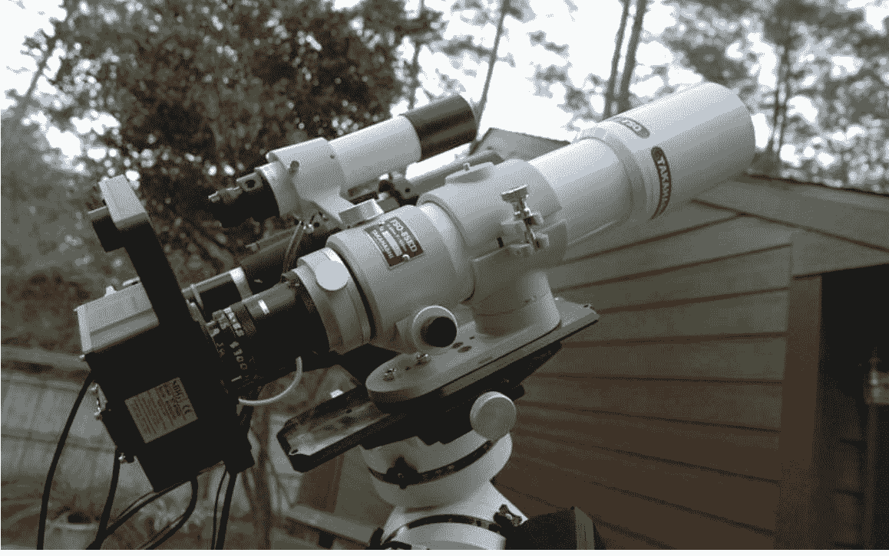
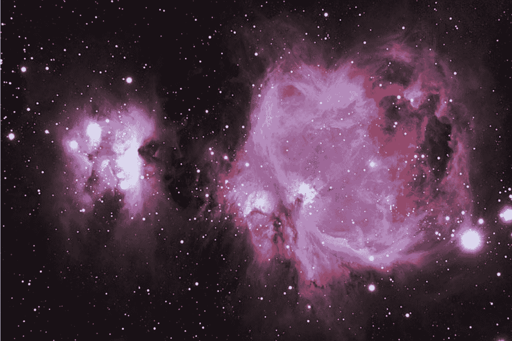
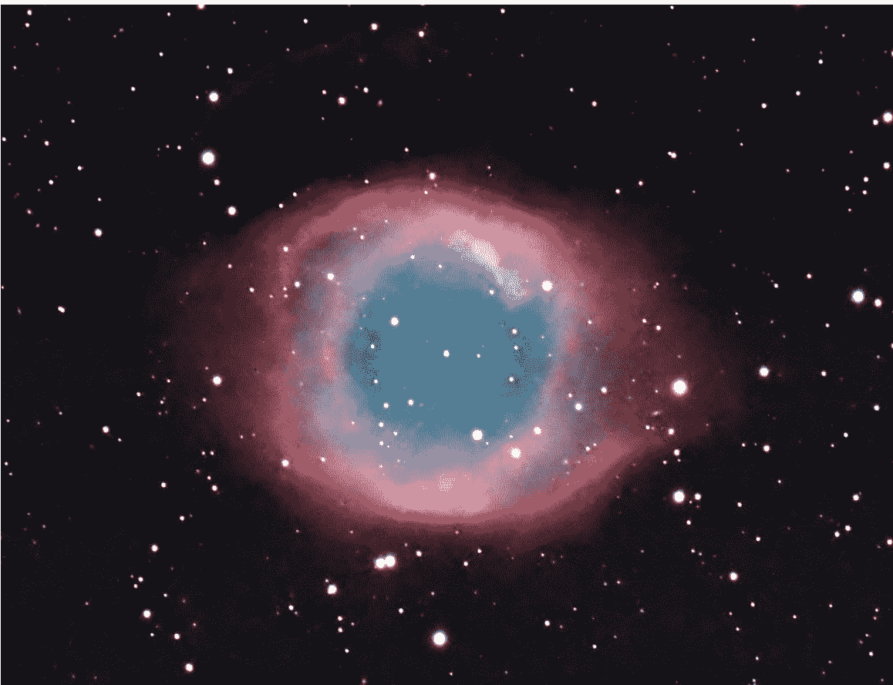

据nasa官网，可见光能观察到的银河有6000个左右，根据你的说法，都是三维投影。而可观察到的星星有.... 天文学家的估算是3x10^22，按照你的说法，都是凹凸点的反光。

这还不包括X光，红外，声波段的信息。若你说的是对的，各光段的信号实际都是反射光点，那这个数字会更巨大。我只能说，不可思议，这个恒星壁太不平整了。

另外你可不可以把你说的26个星点的位置说一下，在哪个方位可以观察到？

**答**：两张明显PS合成图，注意观察，你们应该能发现这图根本没有意义，原始太空图片被PS成了绚丽的光花。

你可以黏贴上来哈勃或者其他天文镜原始星空图片，我告诉你那是什么。

26星点的位置你们已经发现了一个，剩下25个推算出来就行了。具体是哪颗星不能公布。

要原始图片，不要合成，否则没有意义。需要这些所谓星云PS合成前的原始图像。

**问**：我们肉眼能观测到的银河也是反光吗？那银河系到底是什么样子？ 恒星也是在不断运动的，按照您的说法，也都是凹凸点的运动了，如果是故意造成这种假象，那又是谁在控制太阳系的凹凸点？

**答**：没有人控制。凹凸点不运动，只会缓慢变化和消失出现。凹凸点是圆球的表皮，地球是圆球的中心，地球自转的同时，圆球表皮也是缓慢旋转的。

在你们古代占星学和星相学可以根据突然出现和消失的星点以及星点的位置测算命运。

而你们现代天文学界也观测到了天上的星星竟然可以突然消失和出现。按照曾经的解释恒星竟然可以突然出现和消失，你们的科学家完全不能理解，同时机密。

**问**：我也是闲的，换别人早不纠缠了。

这两张图是业余爱好者的天文望远镜拍的，ps过但没合成过。这两个星云实际上是肉眼可见的星云，当然，不能有光学污染。原图和渲染后的效果图无质的区别，不足以让人产生重大误解，你几乎只要去掉色彩和减弱对比就可以了。找到没处理过的图片并不困难。而且不要忘了，星云图早在电脑图像处理技术发明出来之前就有了。

你完全不必强调ps，ps只是人类无伤大雅的一个游戏。指出ps过的照片实际上是什么应该难不倒你。不过你一定要，随便在网上找了2张好了。

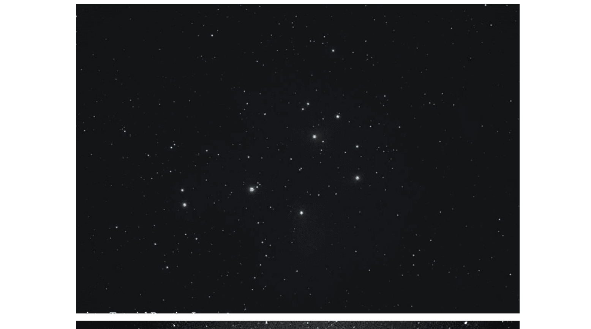
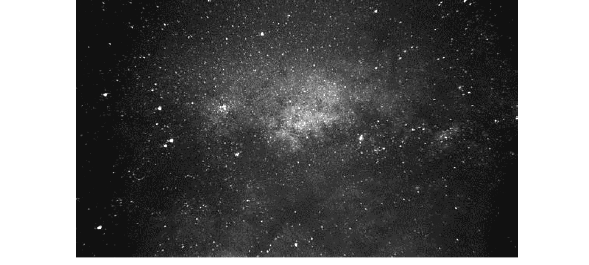

你知道这两个星云叫做什么？

另外你说我们已经找到26颗星中的一个，谁找到的？他们知道这一颗是26颗星中的一个么？

**答**：科学需要严谨的态度，纠缠只是人们内心对严谨态度的反应，不利于科学研究。ps过后的图片是看不出星云原貌的。

简单说吧。

除去河外星系，你们看到的星云是世界创造时代的残留。星云没有你们天文学家谈论的那么远，那么大，就在你们恒星系内，距离恒星系壁不远。木星和土星这两大气态行星，就可以看成是凝结的星云。

原始的星云图片几乎网上绝迹，被封锁。光学望远镜肉眼看到的星云不过是黑白的薄雾。这两张图不是星云，第一张是电脑星图对比制作生成，第二张使用了三张图片叠加合成。

原始的PC1星云图我在你们的网络上搜索到一张残留的低分辨率图片，应该是这样的。以下如同纸面水干后的污迹。这样的图经过三种原子染色法制作成你们看到绚丽多彩的星云，是你们科学家理解的错误。

背后是横杠和亮点是恒星系的凹凸点，横杠不是河外星系。

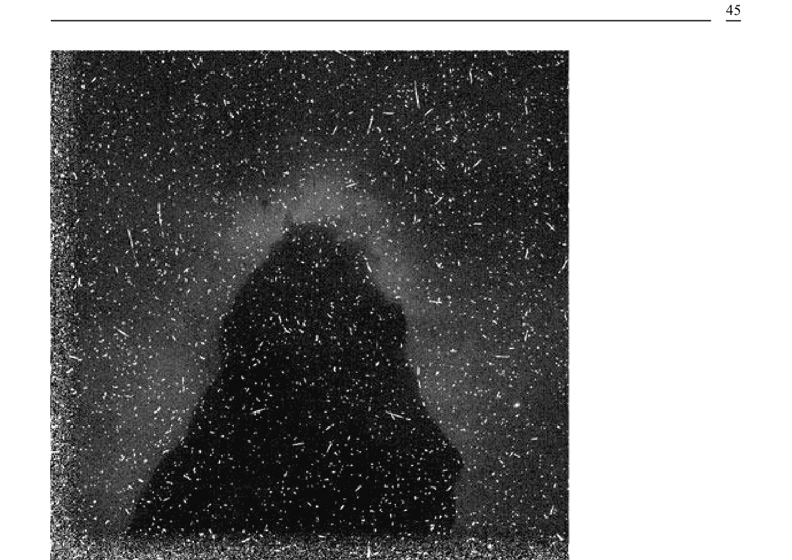

除去河外星系，你们哈勃拍到的几乎所有星云的原始相貌都是这个样子，和合成染色后的相貌天差地别。你们的天文学家根据自己的理解去染色合成星云，其实根本不了解自己拍到了什么。

**问**：你先给星云下个定义吧，然后再给原始图片下个定义。然后再说说什么样的处理会造成误解，什么样的误解是重大的而且不能接受的。比如色彩渲染后让人以为天空很美丽算不算重大误解，增加对比度以使形态更清晰算不算误解。

就你转贴的那张图，你说白色的点和横杠是恒星壁的凹凸点。恒星壁的凹凸点应该是相对稳定的吧？如果你的回答是“是”，你再去仔细看看图片处理过程说明。

**答**：不是已经定义了吗，在详细描述一下。

最开始世界弥漫玄无创新的精神，最基本玄无精神创新的基础原子颗粒，一部分根据玄无规划者本能的选择组成你们的太阳，一部分形成星球，还有一部分没有被利用漂浮在旁边，形成星云。你们看到的星云是你们世界空间凹壁旁边漂浮的玄无精神创新的边角料。

色彩渲染和增加对比度当然是误解。你已经看到了星云原始的照片，不是增加对比度和三种原子色彩渲染的问题。首先你们的天文学家不知道他们拍到了什么，之后他们将这些东西定义成你们宇宙模型中的星云，之后选择其中一些地方合成美丽多彩的照片。

已经形成了你们天文家的潮流与潜规则。天文学家为了名誉和研究经费，努力将拍到的东西合成所谓美丽的星云，并且给予所谓科学解释。其实他们根本不知道拍到了什么。

就拿这副原始图片来看，选择其中千分之一的面积，你们的天文学家都可以将他们合成为一块美丽的星云。

凹凸点会消失出现，几率较低，导致你们看到的突然出现和消失的星星，从而产生占星与星相学。

凹凸点焦距在地球，大多数导致你们看到美丽星空。九大行星每颗行星上看到的星空都是不同的。

九大行星引力场半径外很难看到星空，黑黑一片，因为没有焦距。

凹凸点很少移动，三维星壁移动，但很慢很慢，肉眼观测不出区别。

还有一种星云是凹凸点密集呈现，大小不同的超量凹凸点在一个位置焦距与地球，你们得到一种类似河外星系的星云。

**问**：赞同你说的“科学需要严谨的态度”，你贴出的这张图是什么星云？三种原子染色法 是哪三种原子？

太阳在这个恒星三维圈里是静止的还是运动的？如何运动？

“凹凸点 不运动 只会缓慢变化和消失出现 凹凸点是圆球的表皮 地球是圆球的中心 地球自转的同时 圆球表皮也是缓慢旋转的”，如果圆球表皮和地球自转的方向和速度都一样的话，是不是凹凸点的位置就不会变了？事实是圆球的速度和方向是什么？地球的速度和方向又是多少？

仰望星空 无数星点 其中 99%是太阳在恒星系壁面上凹凸点的反射 这些凹凸的空间扭曲大小如米粒 大如星球

凹凸点（凹凸空间） 为什么会缓慢变化和消失出现？

**答**：氢原子染色，氦原子染色，其他原子染色。

消失因为，因为空间流的冲刷。

凹凸点形成是因为哪里引力不稳定。

**问**：你还没有回答: 你贴出的这张图是什么星云? 太阳在这个恒星三维圈里是静止的还是运动的? 如何运动? 这个恒星三维圈本身运动吗? 速度和方向是什么?

**答**：不是一个而是一群。随便截取千分之一的面积，你们的天文学家就可以发挥想象力合成一个星云。其中一张被合成为鹰状星云。

三维圈中的恒星是不动的，三维圈外来看三维圈本身是运动的。四维运动，方向不是向上，不是向下，前后左右都不是，折合成三维速度和方向，每秒光速1.95倍的空间移动率，复杂轨迹移动。

你们在上一层空间中每秒移动速度都超过了光速，时光倒流也没有发生，一切都很好。

你们有句古老的成语，坐地日行八万里，其实何止八万里。

**问**：对星云的解释兼容，很好。那么现在我们都同意宇宙空间中漂浮着一些东西，被我们称为星云。这些星云哈勃拍得到，业余天文爱好者也拍得到。我转贴的两张处理过的彩色图片也是星云，你其实当时就可以告诉我那些是宇宙残留物，原始图片是黑白薄雾，为什么一定要我找出原始图片呢? 原始图片很好找的，不存在你说的被封锁的问题。

而且这样一来，你说哈勃在各光段观察到的只是光点也就不成立了。可能有光点，但不会只是光点。他们有办法认定是星星还是随机噪点。比你宣称的那些白点都是凹凸点更可信。

色彩渲染和对比调整是误解，就象小孩子误解圣诞老人真的住在北极一样。等孩子们长大知道真相以后，没人会认为这是一个无法忍受的欺骗。这些都不值得煞有介事的指责。

**答**：星云一部分是漂浮物，一部分是凹凸点密集折射，一部分凹凸点是光学引力扭曲。通常凹凸点看上去是一个点，因为凹凸点扭曲的引力将阳光集中并反射，而一个复杂引力扭曲凹凸点看起来不是点状。

噪点是吗? 你们垄断星空深度观测的科学家说辞很多。我只告诉你们真相，你们可以继续相信哈勃天文学家给你们的说辞。

色彩渲染和对比调整，合成星云图片做的要比这个多多了。最重要的是想象力和赋予合成片理论的解释。

**问**：搜索“how hubble sees”。你会看到nasa怎么处理这张图片，还有怎么认定哪些是星星哪些是随机噪点啥的。

**答**：请黏贴图片。噪点是说辞，噪点形成理论不成立。

**问**：咔咔，我再闲一回。

下面这段英文拷贝自哈勃官网的“通常问题解答”，为方便不懂英文的朋友，我在后面附上翻译。

Does Hubble withhold information from the public? No. Information and images taken by Hubble Space Telescope are not withheld, but they do take time to get to the public. Many of the images taken by Hubble are never formally released to the public because they are typically only of interest to the scientific community. Full access to these data, which can be processed into viewable images, is available online via the Hubble Data Archive. The archive's mission is to serve the scientific community. It may not be useful to or easily operated by the general user.

Hubble images produced by the Space Telescope Science Institute are covered by copyright law, as stated on our Web site at ×××hubblesite.org|copyright|. This copyright covers most images displayed on all of our Web sites.

Here is the scoop on why it takes time to get the photos out to the public. The areas of the sky and the objects that Hubble's various optical and spectrographic cameras take pictures of are very carefully planned and scheduled. Scientists from universities and scientific institutions prepare proposals to use the telescope. If their proposal is accepted, time on the telescope is scheduled.

Once the scientists have their raw data from the telescope, they then have one year in which to conduct their research and prepare papers. After this one year, the information becomes available to the public.

Sometimes "Early Release Observations" are released to the public, as is the case when a new instrument is installed. Photos are then released as soon as possible after the installation to let the world know that the camera is performing up to its expectations.

If you would like to see a "scrapbook" of photos, as they look when they are "translated" from the original digitalized pixels sent from the instruments aboard the Hubble, you can see them at the MAST Scrapbook:

（无内容）

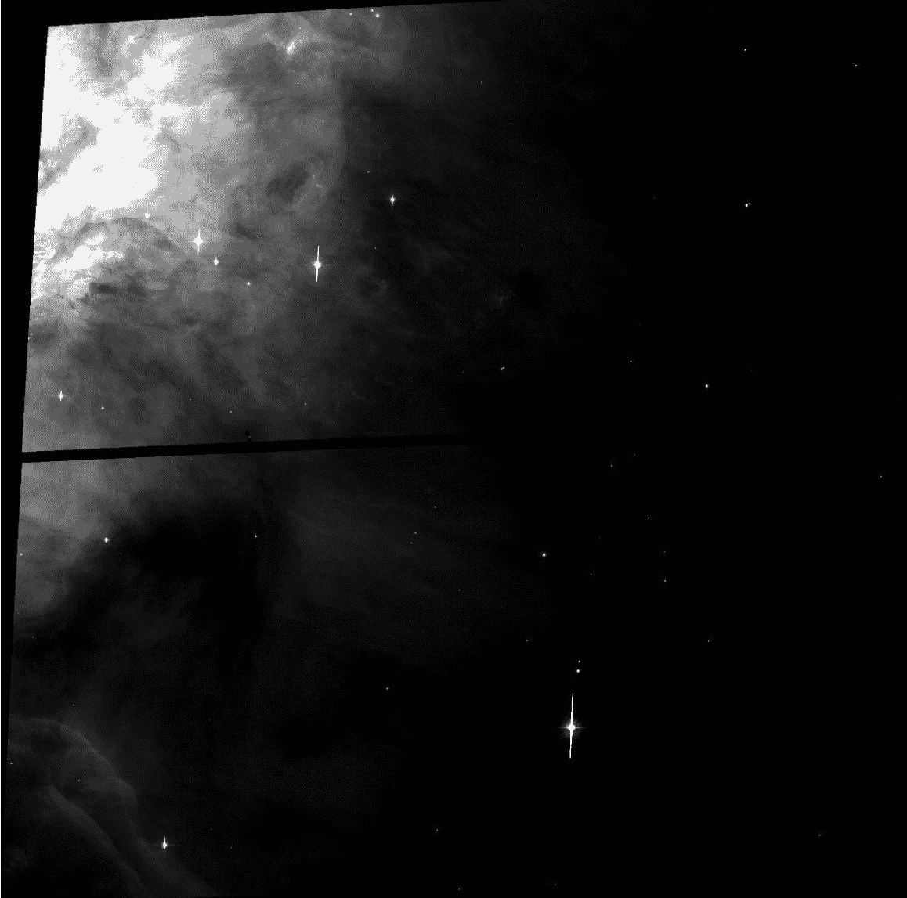

再来一张helix nebula的预览图。

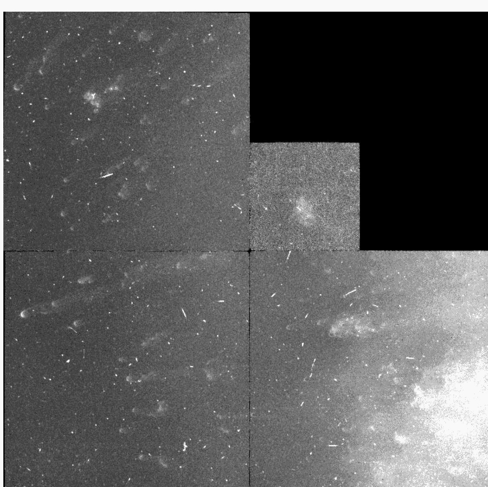

网站任何人都可以注册，注册后可下载数据包。我没下载数据包，只要不是图片我也不知道拿那些数据怎么办。有闲空的人可以去试试。

太好玩了，再贴张官网上的预览图，足够原始了。要原始数据没用的。猫眼星云。

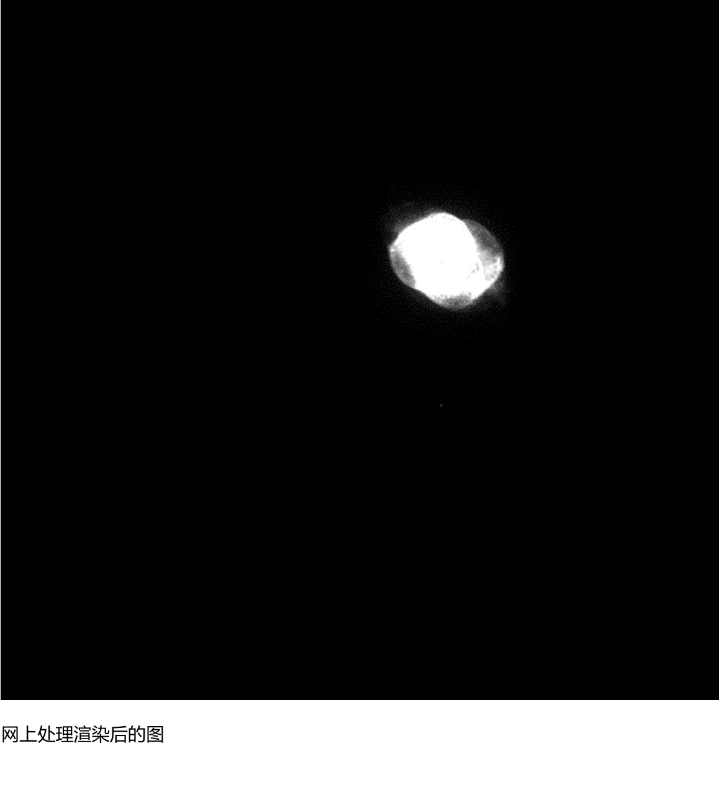

## 网上处理渲染后的图

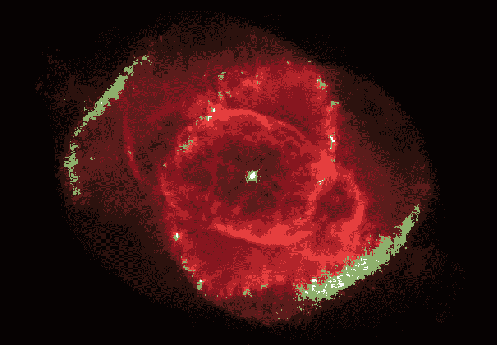

再来张crab nebula的。

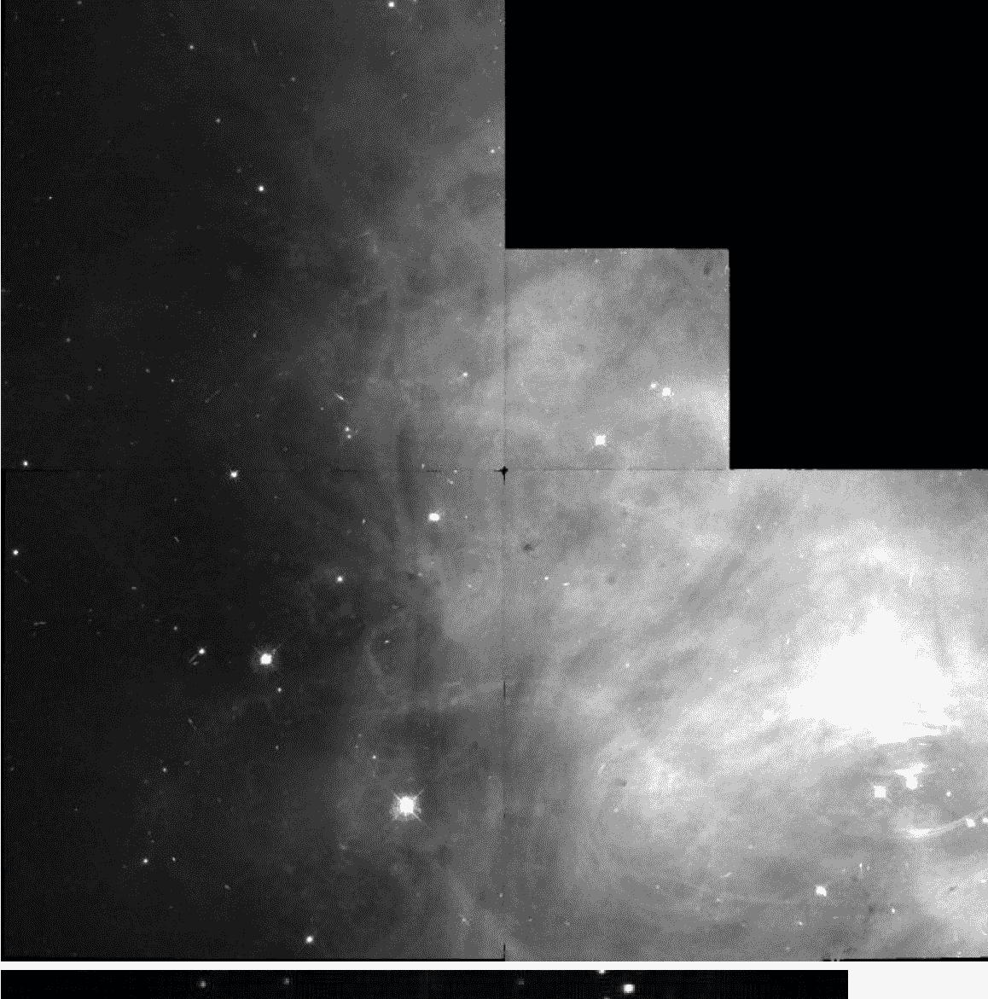
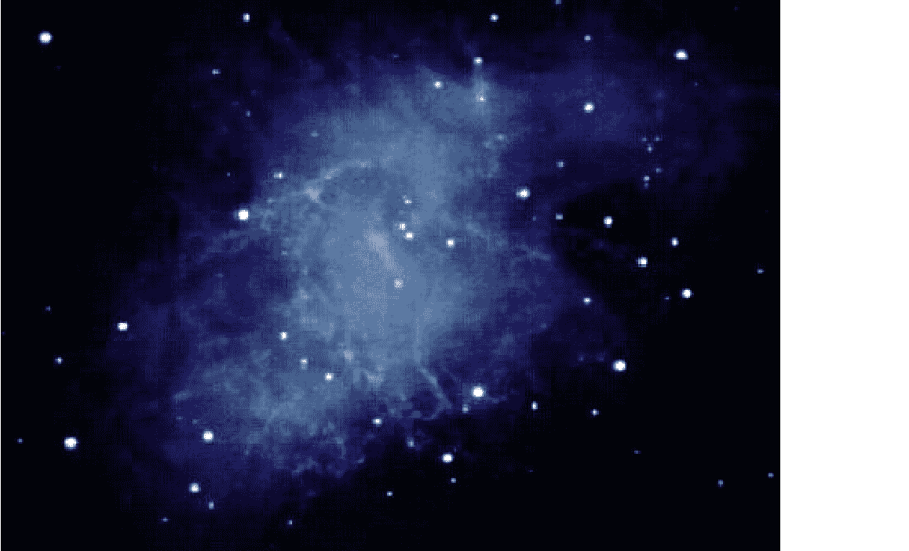

鹰状星云的整幅原始图，意识体转贴的是右上角小正方形。哈勃每隔4分钟拍一张照片。

数据库里列出的是1996年4月2日16点左右拍摄的8张。贴2张。

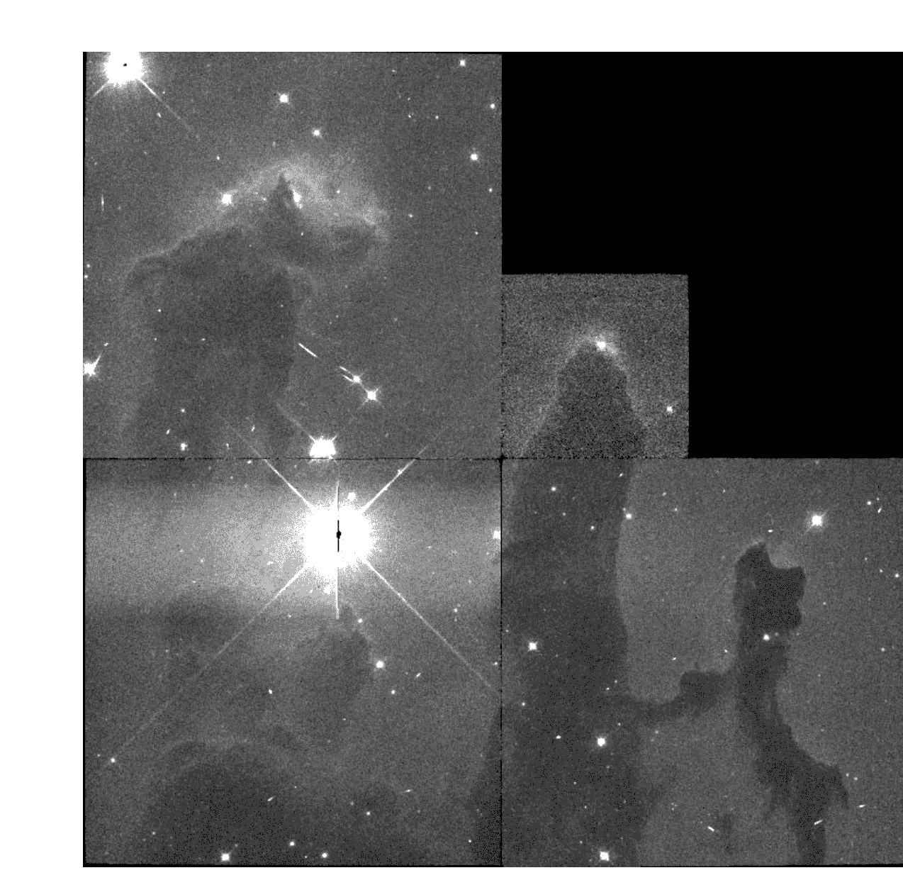噪点和宇宙射线是通过比较各图去除的，因为它们随机出现不可能每张都有。所以意识体说

白点和白杠是凹凸点反光也就是星星完全莫名其妙。

答：你们的哈勃不是使用了噪点过滤技术拍摄 噪点理论不成立

同时这些都不是原图 只是加工后的黑白照 很明显的痕迹你们应该可以看出来 事实上你们

哈勃大多数 95%的原图拍到星空中奇怪的扭曲 无法解释的各种光学现象 还有一些拍到过

宇宙间的巨型飞行器 剩下 5%比较正常的经过加工后展现给你们 其实已经扭曲

你们的社会结构造成真相的隐瞒是正常

问：你的这张图片来自于

http://bolide.lamost.org/articles/article184.htm

http://songshuhui.net/archives/14345

文章说 “横杠和亮点” 是宇宙线和 CCD 相撞的时候所产生的，而宇宙线是以接近光速运动的原子核。每次宇宙线撞上 CCD 的时候就会留下一道痕迹，干扰我们想要拍摄的影像。幸运的是，宇宙线是随机的，因此它们在两张不同的照片上会留下不同的痕迹。

答：横杠是宇宙壁两个空间引力凹凸反射点之间的引力拉扯形成的重力区 出现和消失

噪点只是你们的天文学家尝试在解释 他们拍到的东西

如果宇宙射线的高能粒子撞击 CCD 上的像素单元 可以形成信号输出 那么整张图会布满白色噪点 成为白色的

所谓噪点其实是 高度放大星空后 你们看到了更小的凹凸焦距点 体积小而不稳定 被更大的凹凸点拉扯 偏移焦距或者扭曲 消失

肉眼观测的凹凸 (星星) 点比较稳定变化周期不会再几秒内显现 但有时也会消失 你们古人根据突然消失的或者出现的星星建立了 星相学 占星学 这不是很显然易见

为何不让你们的天文学家解释一下星空中肉眼可见的星星为什么会突然出现和消失呢 难道他们会告诉你是因为突然出现了一颗恒星 和 一颗恒星突然 熄灭了

问: 有关 2012 新纪元的传说, 东方的天界与地界开门, 相信楼主应该知道一些, 能说下嘛?

对于灵, 能帮助灵升华的组成是那些东西? 那些是至阳的, 那些是至阴的。我在这里举例说吧, 显现世界, 勇敢, 真实是阳性的, 胆怯, 虚伪是阴性的。

对于传说中灵, 电火对人的肉体伤害巨大, 对灵伤害如何?

楼主说到世界是阴阳组合, 至阳物质对灵的影响是什么? 至阳物质对灵魂的影响是什么?

答: 新的频率 新的能量形式被应用 玄无的律动一直都在

玄无每一个周期都会更新自己 雪花结晶正是玄无创造的体现 分子的结构也是玄无创造的

体现 DNA 亦是玄 现代理论中 DNA 是偶尔形成的 其实错了 DNA 是玄无精神创造酝酿的

做一个试验 你们用一只试管 清理里面所有的生命 密封 然后等待玄无的精神酝酿 数天以

后你们可以从中得到一组含有元始 SNA 的细菌乃至微生物 这就是玄无的精神

或者拿一团有机物 清理上面所有的细菌微生物虫子卵 密封 但要有足够的空间和生物存在的条件 然后等待玄无的精神酝酿 数天以后里面会出发霉 乃至可以生出各种飞虫

2012 开始是玄无精神周期性对自我的更新 之后新的生命会诞生 至于中间的过程 自然灾害和不适应新玄无精神的存有被更新

阴和阳是我借用你们的文字所表述的 其实我们的文字中并没有阴阳的概念

灵是一种意识活动产生的场 本质是纯无精神的凝固

加强灵场的一个方法是增加神经元的活动 事实证明一个爱思考的意识 在肉体结构损坏后

灵场可以长时间存在 比一生机械化和不爱思考的意识存在时间更长 不爱反思自我被证明

是对纯无精神无益的

加强灵场的另一个方法是 理解纯无的精神 集中注意力和觉知从而达到 凝固纯无的精神

电和火对灵场无害

核武器这种高能量释放 其实是通过破坏玄无的精神来释放能量 对整体是有害的 灵场亦可以被摧毁 但一个凝固的纯无精神无法被破坏

如果不想面对死亡 想保持自己的独特性 并长存 凝固纯无的精神是必须的

## 穿越时空

问：楼主能描述一下如何穿越时间回到过去和未来的旅行吗？过去能改变吗？改变了能出现什么情况？

答：在总玄世界 99% 生命周期中 穿越时空是不可能的 你不可能回到曾经玄无创造的每一步 就好像你不可能复制出相同的两个火焰

但在最终 穿越时空变的可能 改变过去会影响未来 未来亦在影响过去 如曾经所说 想象一本连环画你翻页 其中人物运动 实则不动 时间就是翻页的力量 不可逆

但最终还是成功了 我们所在的时空在总玄世界的最后一页 一切便的有意义起来 我们停止

了让连环画翻页的力量 并将这种力量保存 然后回溯到曾经不同的时空 在将这种力量释放

在跨越时空的一瞬间 我们抽取了大多数这种翻页的力量 总玄世界在他的最后一页静止了

只保留了一个三级玄宇宙的运作 时空机器就在这里

然后我们将这种力量释放在曾经不同的时空中 穿越时空变得可能 修改过去影响未来变得

可能 我们精心修改这本总玄连环画的每一页

从某种程度上来说 我们赋予了你们这段总玄时空 新的意义 因为它很久以前已经逝去 让

它起死回生的是穿越时空的意义 我们让他重新展现 一个遗留症是所有总玄世界的存有有

时会感觉看到似曾相识的场景

改变了总玄世界的最后一页将不在是终结 而可以继续延续 最后将这种翻页的力量重新释

放到曾经的最后一页 新的总玄世界诞生

问：费城实验原名彩虹工程，为舰船躲避雷达进行的隐形实验。用到了电磁技术，没想到实

验的结果不仅让船只肉眼看不见，而且改变了船支的时空连续性，出现在几百里外的弗吉尼

亚州的 NORFOLK，更为恐怖的是不少船员和舱壁结为了一体，幸存者失去了方向感，后来

都成了精神病人。

从这次实验后有关时空旅行的技术成了研究的主要目的，到 1983 年研究到达顶峰，凭人类

掌握的科技能力打开了时空隧道。

与费城实验并行的还有许多实验，如果时空旅行者都成了精神病人将使实验失去意义，比如

对心灵电波的研究就是彩虹工程的附属实验。研究发现影响人类意识的电波在 410-420HZ，

当然实验不是没有代价，实验中的参与者多是军人，不少失去生命或造成脑死亡的结果。或

者被电波烧伤器官、身体组织。实验的结果是发明了意识控制器。

实验不仅发现了影响意识的电波频率，还有一项重要的研究成果，时间可以改变意识。这项发现是在进行记忆恢复实验时获得的，其根本原因是存在着另一条其他的时间轨道，不过仅能在本条时间轨道回忆起其他时间轨道的事情。科技成果是时间功能器，人类同时存在于不同的时间轨道中。人类回忆起的更多意识改变的程度就越大。时间功能器虽然仅是帮助人类回忆起其他时间轨道发生的事情，实验者却发现直接改变了自己的意识。说明人类的意识最终是被时间改变的。

人类天生就有一种“基准时间”，生命一开始就隶属于一个时间轨道，一切生活从基准时间点开始，这个时间基准点实际上属于地球磁场中，因此地球磁场的功能不仅是提供万物的记忆，也提供基准时间。基准时间是指向宇宙和它运的行轨道方向。

时间旅行器人为制造了人工实境或称交替实境，让实验对象在本时空看不见形成隐形的结果。通过特定的电磁效应实现。人工实境或称交替实境不是正常的时间流的一部分，因此不受时间主导。

--------------------

请问费城实验是否真的打开了时间裂缝？按照您说过的，只有在您所来的总玄宇宙时空才有可能时间旅行回到从前？

答：时间旅行不可能 这个是在总玄宇宙世界最终的岁月里才被发明的技术

费城实验存在 船没有穿越时空 也没有隐形 只是强磁环境中船员看到了一些幻觉而已 穿越时空和隐形是后来的传说

灵界 灵界不是永恒的天堂

问：能否解释以下的文字内容。这里面有宗教天界地狱如何理解？

### 灵界才是实相，世间世界是虚幻(参考)

灵界虽然像是梦中世界一般，但是那里才是实相。我们必须知道：「灵界才是实际的世界，而世间是虚幻，是梦境般的世界」。理解这一点是非常重要的事。如果能了解这一点，就可以成为灵界的灵人。

灵界虽然有如梦境，但却不是梦境，而是永恒持续的世界。世间尽管看起来是具有实体的，其实却是逐渐崩解的世界，是无法永恒持续的世界。觉悟到这一点，是非常重要的事。

因此，佛教所说的「断执著」是非常重要的教诲。

诸君可能认为世间是实际存在的吧，世间的一切都是实际存有的，只有世间，别无他物。但是，我们必须改变这个想法，把它改成完全相反的想法。

世间的事物是不能持续的，相对于此，灵界的事物是可以持续的。而且灵界的事物是可以任意变幻的，它是「变幻自在的世界，却是可以持续的」。灵界真的是不可思议的世界。

### 为何有地狱？

自古以来，人类就有这样的疑问：「为何有地狱？佛神为何任其存在呢？」若从地狱的角度或从接近地狱的人的角度来看，会产生这样的疑问。

以下举例来说明：如果说灵界整体是共有五十层楼的高楼大厦的话，地狱界只是大楼的地底部分而已；地底大概只有五层楼左右，而地上则有五十层楼。

子转生于世间修行，之后返回灵界，并非每个人都能获得满分及格的。灵界并不是一个自由到可以无视一切的地方，毕竟还有失败、不能获得认可和不及格的地方。而这个地方就是地狱。

「要从地狱升上天国，身为佛子、神子，必须达到的最底线是甚么？正确的生活方式是怎样的？」这个部分还是存在的。

虽然有了地狱部分的存在，出现了一定的相对性，但可以因此达到磨练的效果。地狱是使人产生反省的心、可以学到「这样做是错误的」的地方。

答：这你们赋予灵界的哲学意义 灵界被想象成永恒的天堂 其实是错误的 物质是玄无的主要表现 一切必须依靠物质而得以存在 一切根据玄无物质的规律科学的表现

灵界是笼罩在太阳系中的各种场 地球上居多 从你们人类诞生开始 灵界是不存在的 灵界从西元前 2100 年左右开始发展 随着时代变迁死去的人们其中 90%归于虚无 10%依靠生前凝固的灵场或者玄无而得以继续 存在 他们 10%人们保留了意识 于是玄无开始根据人们生前的信仰开始创造所谓的灵界 一切都是玄无的创造

随着时间推移 死去的修士和特殊情况的人们 生前多少凝聚了一些纯无精神的人 越聚越多 灵界就诞生了 在灵界不同的场中 东方的集体灵界场和美国人的灵界就不同 东方灵场中 你会看到古代建筑 西方则不会 他们有另外的风格

灵界不是永恒 灵界场直接叠加在你们地球上 只是在不同的频段中 除了少数 他们依然出不了这个太阳系 除了在物质界获得信仰外 对自我的认知并没有多大进步

无数年后灵界会变成另一个物质界 随着玄无的精神深入创化 灵界灵活性将被固定下来 成为四位矩阵中另外一个三维世界成员

于是灵界从神话时代跌落至规律的现实世界

发帖的意义 人类基因被一个玄波加速 “星际流浪者” 是人类美好的理想

问：楼主发帖的意义是什么？ 本次入侵与前几次入侵有何关联？怎么很像魔界入侵的传说？难道是神话时代来临了？

答：发帖的意义是为人类集体潜意识上传信息 通过蝴蝶效应对未来造成定向影响

发现一个世界的前提是这个世界又智慧生物 智慧生物对他们所在的世界认知 导致世界出现波动 这个世界才可以被发现 类似你们说的半死不活的猫 一个世界在没有智慧的意识认知以前 是半死不活的量子状态

一个手段被发明了 一个四维矩阵世界入侵的第一步是发送定全玄波 里边包含一种促进 DNA 进化的引导性玄波

很多年前你们世界受到了这种波的入侵 从海洋到陆地 走过了无数年 你们猿人祖先们在某个时刻 DNA 进化被加速 让本来尚需数百万年的进化时间缩短到 100 年之内

第一个原始人诞生了 第一石器部落诞生了 第一个石器时代诞生了

随着原始人发展你们的祖先走过了 石器 青铜 火药 冷兵器 工业 世界从量子不确定状态变得确定 你们第一个自主的文明诞生了 之后入侵开始 在你们第一代真正的祖先尚未走进太空时代之前 来自其他世界的入侵者 月球他们的殖民基地 占据了这个世界

但必须留一部分原住民 维持这个世界的稳定性 同时让他们维系生产劳作 许多年之后殖民者发生了内战 他们一部分成员认为不在需要母世界的统治 可以自立一个世界 结局是灾难性的 内战争之后 殖民者的元气大伤 同时战争科技水平有所跌落

人类被波及多数近乎消亡 这个原因导致你们世界和入侵者的世界频率越来越远 最致不可互通 但一部分殖民者驻扎了下来 他们困在了你们世界

残存下来的人类再次在这片土地播种 入侵者则躲在月球监视引导 同时恢复元气

在这之后还有一场战争 由于某些原因你们的祖先一只曾经发展到了和你们类似的阶段 略高于你们 之后是一场来自月球的进攻 你们的祖先被击败 然后带着科技躲到了地底 经过数千年的发展 你们地底的祖先和月球入侵者程度伯仲之间 你们的祖先和入侵者使用另一种基于光能规律的科技 剩下地表的人们又从农业时代开始发展 延续至今

所谓神话时代是世界在量子不确定性中的状态 向确定性跌落的中间阶段

问：神创世界的证据，楼主解释。

每个物种最初都是不完美的，偏偏地球是特例。为什么只发展短短几十万年的地球人类形体达到了基本上完美的地步。

在这个线路牵引下，地球人类享乐是非常正常的，地球不大，虽然有海洋，但几十万年的进化历史不能统一地球，反而诞生了超级的人口 70 亿人口。

这个享乐的文化发展出来的丰富难以想象的巨大，除了飞出太空时效很慢，寿命增加很难，这两个硬伤，其他的物质与精神享受与文化，可以满足了这世界的任何一个人。发展到资本社会，还出现经济危机。生产的东西多了，真是奇怪的享乐地球....

楼主来解释这一切铺垫的意义是什么？

楼主能发这贴，我们的世界物质财富有多丰富你是知道的，令很多人迷恋其中。精神世界同样丰富，有各种宗教，各种宗教所留下来的经典大作。有无数宗教修行人留下的神迹，无数的宗门法术指导你通向彼岸。

中国有句话说，神仙到红尘也落俗。意思是，地球世界的享受太美好了。

楼主你说说看，我们地球世界对未来有什么意义？

答：当然是修改基因 基因没有什么神圣的 就好像程序 如果你们的基因粒短可以自我复制就好了 你们就可以不死了

曾说过 你们基因被一个玄波加速了

你们对未来的意义 是因为你们人类中诞生了一个秩序者

问：星际流浪者，有些人天生就喜欢流浪，曾经诞生过几百亿生命的地球不可能没有人活着走出来过啊或者被带离了原来的世界，这个答案没有真正的回答。

超灵带来的知识信息和智慧能跨越人类时代几百年，几千年。仍然达不到所说的尽头。他的世界我们不知道，就释迦摩尼佛的宇宙观人类 10000 年也不能跨越。老子的：“道德经”，神玄之说，被地球各种学科所引用，适用面之广，难以想象。

超灵的世界指的是他们来的源头。。。。。，

有关人类被改造基因寿命的那段历史，楼主了解吗？野外大猩猩最长也能活 4,50 岁。而普通人平均寿命只有 70 岁。相差这么短。

人家养的动物寿命远高于野外的同类动物。比如猫，家养的一般养活个 10 多年不成问题，

野外只能活 2，3 年。

经过无数岁月进化的人类和野外的远古兄弟只差一点点的生命时间，不是可笑吗？

答：星际流浪者 也许是人类美好的理想 而渴望赋予自己独特 这在你们历史上并不少见

超灵 你也许是谈某种复合体 许多个非物质生命组成在一起 变成一个复合生命

人死灯灭 记住你们祖先这句话总没错

修改基因你们现在的科技手段还不行 你们现在对基因的操控只能用基因枪轰击赌几率 其

实某种药物也可以刺激端粒 基本完整的复制到下一代 不过你们还没有发明

研究一下癌细胞你们会有所突破的 它能致死也能长生 好与坏 并存 癌细胞端粒无限完整

复制到下一代 它是永生的

## 2012到底是个什么情况

问：2012 到底是个什么情况 是不是安全度过就是新纪元

答：是玄无的自我创新 所有可能性都有可能 旧的规则被打破新的规则被确立

问： 1、2012 年 12 月 21 日到 22 日地球会有多少人死去？
2、舍利子是怎么形成的？主要物质是什么？
3、政府现在真的正在建造诺亚方舟吗？
4、宇宙的层级究竟是怎么划分的？
5、楼主你现在属于几维度的生物？

答：1 不会很多 只是开始
2 舍利子是意识稳固在物质界的表现 硬度较高 主要物质 毕竟还是骨骼性质 钙居多
3 不是电影中的 是地下深山掩体
4 划分各不相同 总玄宇宙世界最高级别文明使用 玄度 72 个玄度 72 个级别
5 70 玄度 维度不是问题 我们可以进入所有维度

问：世界末日说”遭推翻 玛雅日历延续至今后 7000 余年 。关于这个，楼住做何解释

答：不会延迟 7000 年 玄无自我更新如期而至

问: Hi，HuanxiangXR_21 请问 2012 年地球玄无自我更新有着怎样的外在表现形式？例如灾难？ 这一次自我更新的进程是以一种怎样的节奏进行呢？长短快慢？ 谢谢解答

答:玄无自我更新导致 世界规则结构发生变化 简单的来说曾今你们使用的大多数机器不能使用了因为它们在新规则下不符合世界规则 等于废铁
慢慢的根据新世界规则 发展的技术被使用

灾难是一部分 主要是月球轨道控制系统引起

周期 120 年左右 逐步改变 又根据改变力度 时间不确定 减少或者增加

问：本次玄无自我更新的范围包括哪些地域呢？地球？太阳系？

地球人类的身体构造是否会因应这次自我更新产生变化？比如变化后是否需要吃饭喝水？

答：包括你们所在四维矩阵中的所有三维世界

身体构造刚然会 规则不同了 需要新的身体运作方式 从 DNA 中激活 不适应改变或者改变缓慢的个体被淘汰 宇宙法则

是否要吃饭喝水视新规则而定 不过无论新规则是什么 活动需要吸收能量是必然

问: Hi,HuanxiangXR_21 请问 这次玄无自我更新在启动时，会带来哪些变化呢？ 启动的时间点是在 2012 年 12 月吗？ 谢谢解答。

答: 是的 变化是显著提升 自然灾害 内在变化 规律改变 一切因素交织 即是你们的未来

自然灾害 内在变化 规律改变 结合三者联想一下 你就会得出各个层面的具体变化

是的 十二月

问: 2012 过后,什么样的人会留下？什么样的人会离去？数学不好的人会留下吗？

答: 无法跟上玄无自我更新的人离去 跟得上的留下 和数学没有关系

问: Hi, HuanxiangXR_21 谢谢解惑 请问 2012 年末玄无自我更新启动后，目前人类的日常生活秩序会在哪个阶段或哪一年被扰乱呢？ 2012 年自我更新启动时即被扰乱吗？ 2012 年末黑暗三日的传言是否与玛雅人有关？这一传言是否属实呢？

答：2012 年末 2013 年处扰乱逐步开始 随着 10 年加剧 人类工业文明和社会体系几乎崩溃

黑暗三日是你们哲学家对 2012 的一种想象 没有事实存在的基础

问：请问 “玄无自我更新” 这一处提到的玄无是指玄无是一个个体吗？
玄无自我更新的设定是由谁做主的呢？比如是谁决定的玄无自我更新启动时间是在 2012 年？
玄无本身是被创造的吗？由谁创造？或者这样问，玄无从哪里来？
纯无本身是被创造的吗？由谁创造？或者这样问，纯无从哪里来？

答：玄无不是个体 玄无没有主观意识 玄无更新根据世界的反应来做自我调节 维持平衡 当平衡被打破更新即启动
玄无本身就是无限纯无中的梦想
纯无不是由谁创造也不从哪里来
语言是无法表述纯无的因 因为意识体理解不了 因也只是相对的概念 这个问题的答案在意识之外 必须先超越意识而运作
无法回答的问题 因为它没有概念性的解

问：我们现在 “使用的大多数机器不能使用了”，这一情况会在本次玄无自我更新的哪个阶段或哪一年发生呢？2012 年自我更新启动时即刻发生吗？

(词语解释：即刻，立即;马上;在很短时间之内)

## 答：不是，即可在一个渐进的过程中发生

2012年末开始首先失去作用的是非世界基本结构物质。你们所使用的大多能源，比如汽油、火药，组成它们成分的大多数化学物质中的结构分子之化学键，在玄无自我更新中被抑制甚至失去作用，导致不能进行正常化学作用，进而导致你们大多数武器交通工具不能使用。消失速度十年左右下降20%，50年后大多数现代文明赖以生存的化学物质之化学键完全被抑制消失，而不能在新规则中运行。

金木水火土五大世界基本结构物质在玄无自我更新中不会改变。

问：请问，2012年末玄无自我更新启动后，因应这一变化而死亡的人口是以怎样的速度在发生？这一影响带来的人口死亡会持续到哪个阶段或哪一年呢？死亡原因与死亡人数能否归类统计？比如天灾、人祸死亡人口数？届时地球人口剩余多少？2012年自我更新启动时即开始有大量人口死亡吗？是生活在社会底层的老百姓先行牺牲吗？能否对金木水火土五大世界基本结构物质做进一步教导呢？谢谢。

答：死亡人数，哪一年，哪座城市，记忆体记载的只是上一次历史的记录，这次会有所不准，但就算不准也不可以公布。如果公布地震地点本来应该死亡的人没有死亡，不该死亡的人死亡了，造成蝴蝶效应不可测的混乱。关于这个问题能讨论的是，如果将更新度分为1-10的等级，未来2012-2022年更新等级为4向上，未来2022-2032年更新等级为7向上，未来2032-2042年更新等级为9向上。金木水火土五大世界属性，所有世界就算规则不同也基本会有这五个元素。算数界表现为周易等，物质界变现为五大基本元素物质等。你们已经有了基本的教导和理解。

问：Hi，HuanxiangXR_21，谢谢答疑。请问2012年末玄无自我更新启动后，日常使用的金钱失去作用变成废纸会是在哪个阶段或哪一年呢？导致这一结果的原因是什么呢？2012年自我更新启动时货币即失去价值吗？

答：2019年左右。

问：请问楼主：
1. 在更新之前或过程中新生文化形态的产生对更新有意义吗？个体如何主动适应更新，或者个体能够影响或推动更新吗？
2. 我们的梦境是否有时会出离所在的时空层面？因为我在做梦时时感到相当的真实感，但是历史背景却与当下现实不同，甚至更为真实，并且更为宏大和美丽。那种感觉很特别，并且许多意识内容或者说文化形态后来影响了我在现实世界的意识状态。尽管我感到许多内容都像是外来的而非由当下现实促生。

答：新文化产生对更新很有意义。控制自己的意识和思想，顺其自然，心境无为亦无畏。梦是信息的交杂、纠缠。最浅的梦是显意识的，梦的背景内容不会超出你所理解。中等深度的梦是潜意识的，梦的内容可能是你一生任何时候无意中沉淀入潜意识的信息。深层梦是从人类集体潜意识中过的信息，你会梦到别人的想法，任何人类集体潜意识场中存在的信息，过去的、潜在和现在的。

问：最近新闻报道鱼类、鸟类集体死亡，是怎么回事？

答：磁场异常，不久后会出现新的物种。未来战争和统一不是主题。

问：楼主来自何方？传递的信息是否可以这样理解新的星球生活方式，无污染的工业与农业，循环的生态，较少的人口，博爱的思想，统一和透明的星球社会构成。新纪元的障碍主要是分散的自私的政府和众多的人口，落后的生活方式，对抗外界入侵的软弱无能。地球能在2、3百年内统一政府，结束战争吗？

答：遥远的未来，逐渐消亡的总玄宇宙世界传送信息是给予人类潜意识更多的可能性，从而达到修改某些历史的作用。快了，未来战争和统一不是主题，主题是环境和玄无的自我创新。

问：2012的扬升是否是真的？传闻有三十个小时的黑暗是吗？所谓光明会控制世界与你说的有什么联系？你是真的还是假的？

答：光明会，哪一个文明没有几个秘密组织。2012只是玄无的自我更新的开始。为什么会黑三十小时？你们的恒星还在哪里。所有一切都是你们对玄无自我更新的想象。事实是自然的更新和新物种的诞生。我是真实的。

> 灵魂不能离开太阳系三维圈。

问：还问些其他的问题。人类发展从远古到现在有很多人被外星人或者其他原因带离开了地球，他们的灵发展应该不会回到地球了吧？他们是否比我们现在地球人类更加进化得快呢？另外，不说地球全体人类社会角度上说，单个的灵魂如何去你们那呢？中间的距离是否要小于肉体发展的距离？人类历史上比如释迦摩尼佛，老子等人远超过普通人的灵魂能否更快成长达到你们的位置？还有，超灵的世界是什么样子的？为什么他们智慧的远高于我们？

答：没有人类被带离你们的世界，带离人类离开你们世界也没有意义，就好像你们将亚洲的蚂蚁带到美洲一样没有意义。灵魂是一种场，一切都是科学有规则的。灵魂也不能离开太阳系三维圈，但可以去你们世界不同频率的层面。你们现在所处的宇宙时间段，我们的文明还没有诞生，就算人类有能力在总玄宇宙世界旅行，也无法找到我们。老子、释迦摩尼没有正面接触过，一个灵魂的成长来源于对纯无的凝固程度，不依靠外力，这个过程是漫长的，要自我成长到70玄度生命体，几乎不可能。超灵的世界，这个超灵的定义是什么？

### 人类集体信息复合体

问：如果真如你所说，你来自于总玄世界，那么你们那儿已经凋零到要用这种方式来对我们进行干扰了吗？你知道蝴蝶效应并不是什么好词吗？而且据我所知，我们的世界已经被入侵了。不知道你这个总玄世界的生物怎么不知道呢？我不知道你是出于什么原因总要告诉我们未来的事情，但是不好意思，地球人不是受人摆布的人偶，我们的未来我们自己走。如果你说几句话就能影响我们甚至于影响未来，那你还真是个寒酸的家伙呢。

答：你们现在不明白，等人类集体信息复合体成熟后你们就会明白。会向下向上形成这样一个网络：人类集体信息复合体，人类集体潜意识，..... 个体潜意识，个体潜意识，个体潜意识，个体潜意识，个体潜意识 .....，..... 个体显意识，个体显意识，个体显意识，个体显意识，个体显意识 .....。个体显意识的思想信息上传到个体潜意识，个体潜意识信息上传到人类集体潜意识，人类集体潜意识信息被上传到人类集体信息复合体。所以我所说的已经被上传到人类集体信息复合体了。同样的道理，人类集体信息复合体中的信息也会有意或者无意的下载入个体显意识中，比如说各种奇思妙想、哲学理论、科学理论等。

问：请问楼主如果在一个人的大脑中突然产生一个“想法”，这件“想法”会在几天或者几十天后在现实生活中出现，这个如何解释？

答：因为那件事已经在人类集体潜意识中产生发生的可能性，这个想法偶尔浮上了潜意识，再浮上显意识被你想出来。那件事发生的潜在可能性被你偶尔接收到了，所以会有想法。

问：擦、穿错MJ了。但是不妨碍问问题。人类的社会意识复合体是如何自我拓展的？整体里的新内容是如何出现的？

答：社会意识复合体是进化之道其中之一，金星文明就走的这条道路。所有成员的显意识在灵场层面连为一体，于是潜意识成熟，变成集体意识复合体，个体的意志即是全体的意志，全体的意志即是个体的意志。新的内容将会被你们不同的成员想出来，有科学家、艺术家、学生、作家，任何人都有可能，只要他去思考挖掘。

问：我是谁；是否真实存在；盒子理论是否属实；你靠能量维持，你的能量从哪汲取，是电是光还是所谓的灵气。

答：盒子是的，每个个体纯无精神都是一个盒子。依靠的能量不是电光，而是一种纯无精神产生的诺露，你可以称之为纯无向心力。在这个世界上有个体死亡时，纯无被从玄无中释放，诺露就产生了，我会吸收一些，死亡个体越多，我恢复越快，当然我不会干涉你们的死亡，只是接住篮子漏下的水。

### 多世界/平行世界理论是否正确 等多个问题

问：几个问题，希望楼主能一一解答
1. MWi理论（即多世界/平行世界理论）是否正确？
2. 楼主所说时间旅行后的“后遗症”是许多人会有“似曾相识”的感觉，这是不是就是所谓的“既视感”？既然如此，我可否理解为“我”这个本体意识曾经在你们的“总玄世界”上存在过？
3. 所谓的“逐渐消亡的总玄世界”意思是楼主的总玄世界时间最终走向了尽头？为了改变这个局面，所以时间旅行回到了过去并借助某一手段引发“蝴蝶效应”从而改变未来？
4. 是否意味着，我们在楼主生存的“总玄世界”的信息记忆被全盘清除了？
5. 时间既然是不可逆的，既遵循熵无限增大原理，楼主如何克服这个难题？
6. 关于2012.12.23号，是一个量子无限叠加，且无限可能性世界存在的时间点吗？这个时间点的量子由“不确定”偏向“确定”的一瞬间，是否意味着一个新的总玄世界诞生？
7. 命运是否已经被既定，即造物主操作性编程？
8. 楼主如何理解我们的语言以及逻辑，不存在表达错误及精确问题吗？
9. 宇宙为什么要被创造，对造物主来说有什么特别的意义，还有幕后人究竟是什么概念？
10. 2012是否会发生大规模灾难，如果是，少数人类如何被拯救？未来是否可以改变？

答：1. 如果是指许多个世界许多个你，那就不正确了。多世界存在，多个一样类似的世界不存在。
2. 是的，你们曾经存在过，如今再次存在一次，这个机会不多。
3. 是的。
4. 未来总玄世界被冻结，只留下一个三级玄世界运作，时空机器在这里。曾经说过，就好像翻书到最后一页，时间就是这个翻书的力量，我们将这个翻书的力量暂停、保存，然后投放到过去不同的时空历史中，于是过去又活了。
5. 技术性描写很复杂，我们从更本源上解决这个问题，就是所说的翻书的力量。
6. 总玄宇宙世界只有一个，就是这本书，不同的历史是不同的书页，时间是翻页的力量。过去的保存在被确定的崩塌状态，现在是量子不断的崩塌，未来的在量子不确定的叠加中。
7. 命运不是既定，命运只是在不断的变成确定。
8. 转化，存在表达错误及精确的问题，还存在表达不出的问题。这个ID在最初理解你们文字的阶段，幻想被理解成希望的意思。对我理解来说，幻想代表可能、有可能、未来的可能；希望对我理解来说是确定、很确定、未来的确定。这两个词曾经被我当成同义词。
9. 如果你在谈最终意图，那不可能用语言表述，我们使用更高级别的纯无意识体和最前沿的技术，也不过能对幕后人或者最终意图一瞥而已。
10. 未来就要看你们了，可以改变。注意月球，如果有信息表明其变大或者变小，就表示你们星球又要有地震发生了。

### 使自己的生命（活体）一直存续下去的方法

问：
1. 人类临终时，用液氮低温冷冻之后，在未来可以复活吗？
2. 人类目前可以通过冥想打坐的方式进入平行宇宙吗？
3. 有什么好的方法，可以使自己的生命（活体）一直存续下去？

答：可以，只要大脑结构不破坏，被冻结后进入类似无梦睡眠的死之序列，但是和一个真正的死人区别是，你的信息还没有消散，你的玄无结构还在，只要那个结构可以运作，你就可以再次从死序中返回。可以进入你们世界的不同层面，如果要离开你们世界，需要很大的努力。

- 只有两个：保持结构不毁，凝固纯无精神。
保持结构不毁主要靠科技，就算不能保持物质结构不毁，也可以保持精神结构不毁。精神结构加强自己的场吧，方法很多，你们宗教有记载。
凝固纯无：集中注意力于觉知，去感觉“我”的这个感觉，分离出更高的我。
保持基因端粒的下一代完整复制了，但你们技术尚未突破。增强精神层面结构不毁，或者凝固纯无，科学尚未突破前。

问：“保持基因端粒的下一代完整复制了”所复制的内容，仅仅是肉体？还是会连“一生的记忆”也都连带复制呢？

答：不会，线粒端，你们用这个词，网络搜索一下它的意思。

### 轮回

问：楼主可以说说轮回是不是存在吗？有很多证据，似乎可以证明人死后灵魂不灭，但是会转世投胎。

答：投胎转世是存在，但只是少数，少数人死后如果有足够的精神质，然后进入另外一个身体，也并非不可能。这并不能证明不灭，这种转世会保持完整的记忆。还有一种转世也是少数，死后组成他的信息崩塌，其中一部分崩塌的信息在完全衰竭前融入其他物质个体。如果轮回是普遍存在的现象，为什么你们这么多人不记得前世？仔细想一想，一旦失去物质头脑运作，你就会陷入无梦睡眠，什么都不会知道。如果灵魂是不灭的，你就不会陷入类似死序的无梦睡眠中。我们的科学已经证明了，没有什么是不灭的，除了纯无的精神。

问：21，没有轮回，那坏人做的坏事，怎么办？惩罚在其子孙上啊，那太不公平了吧？请回答我，回答我。

答：一部分反应在子孙身上。公平和不公平宇宙中没有这一说。杀人很多的人最终不是已经完全的消散被自然解体了，难道非要将他放到一个地方不断的惩罚他才公平？这个哲学观点只是你们内心不平的反应，宇宙不是这样运作的。父母留下福和祸反应在子孙身上的还少吗？你们世界到处都是。

### 梦

问：昨晚我做了一个梦，可以帮我分析一下吗？内容：我从平地走向一个类似宫殿的宏伟的大楼，背着一把吉他。这时貌似一个认识我的人走来和我打招呼，但是我却不认识他！！走进了大楼进入了房间，坐了下来，很多认识我，但是我却不认识对方的人，在和我打招呼..... 其中一人诚恳的对我说：“弹首曲子吧，你的吉他弹得最好了”。我痛苦的拿出了吉他：“我也不会弹吉他啊，为什么要背着个吉他，他们还叫我弹一曲给他们听”。我无奈的胡乱拨弄着琴弦，音符杂乱无章的飘出来，我看到了他们的疑惑的表情..... 这个梦使我思考的焦点是：1. 这个世界的我的经验是不会弹吉他。2. 但是梦中的我，却背着一个吉他，别人都说我弹得好。“本宇宙的我的意识体”游移到了“另一个宇宙的我的躯体内”，所以产生了这个梦境的效果，即：我背着个吉他，但是我却不会弹奏！！！也就是说：我认为我的意识体，在昨晚穿越了.....。我是否可以理解：“另一个宇宙的我”，是个吉他高手，而“我本宇宙的我”，不会弹吉他，梦中是本宇宙我的意识，穿越到另一个宇宙的我的躯体里了！！

答：不是，你只是在精神层面无意中共享了其他人的信息。还有两个人做共同的梦，他们只是在精神层面共享信息罢了。

问：这种共享是可控的吗？也就是说，我在躺下睡觉之前，我可以预订和某人共享一个梦境吗？而那梦境，仅仅是梦境？还是另一个空间？

答：可以。

```
物质 作用 精神 作用 纯无意识空间=现实
精神 作用 纯无意识空间=梦
```

问：是的，我确实无法确定，那个背着吉他的的人是我，因为我没有照镜子确认我的容貌！！

答：梦，面容不重要，精神印记一种特殊频波，感觉是什么就是什么。

问：是什么原因（介质）导致了这种“共享”案例的出现？

答：巧合，大脑的思念和无意中接收。

问：21，你好！你能帮我解释个梦吗？这几乎不是梦！因为梦境与千里之外的事情同时发生，我至今迷惑。

### 2009-08-9 夜里 我的一个梦

在无尽的麦田上都是水，树木也只有枝头。我在床上睡觉，脑海里遥看到类似老家的地方被大水覆盖，我嗖的一下就去了，想救亲人朋友。我在水里游泳，想看大那个老家的村庄，一望无际的的水很混，潜在水里也看不到方寸之远，我感觉自己在坟地上面的水里游，我找不到一个人，着急了，居然飞了起来，我想既然能飞，能不能用意念把水赶走，水突然被强大的能量场逼退，好似原子弹炸开一样翻天倒海！水退去千米之外形成圆形的无水区，看到了，水下所有的生息都已经泥土覆盖。天！我感觉我有两个身体，一个空中一个床上，我瞬间转移到床上，感觉身体被火葬一样发出红光，原来逼退水的能量来自自己的身体，我试验下让水继续撤退，水像爆炸一样的退，同时感觉身体烧成红铁办发光，心想不要在无谓的浪费能量。能量场消失，水恢复原状态，我慢慢的恢复正常身体的直觉，我还在床上。

### 我做梦的同时发生的事情

2009年08月11日的新闻（我有一位表爷爷家就在高雄）

高雄4村遭泥石流淹没 600人恐被活埋(组图)

2009年08月11日 02:44 中广网

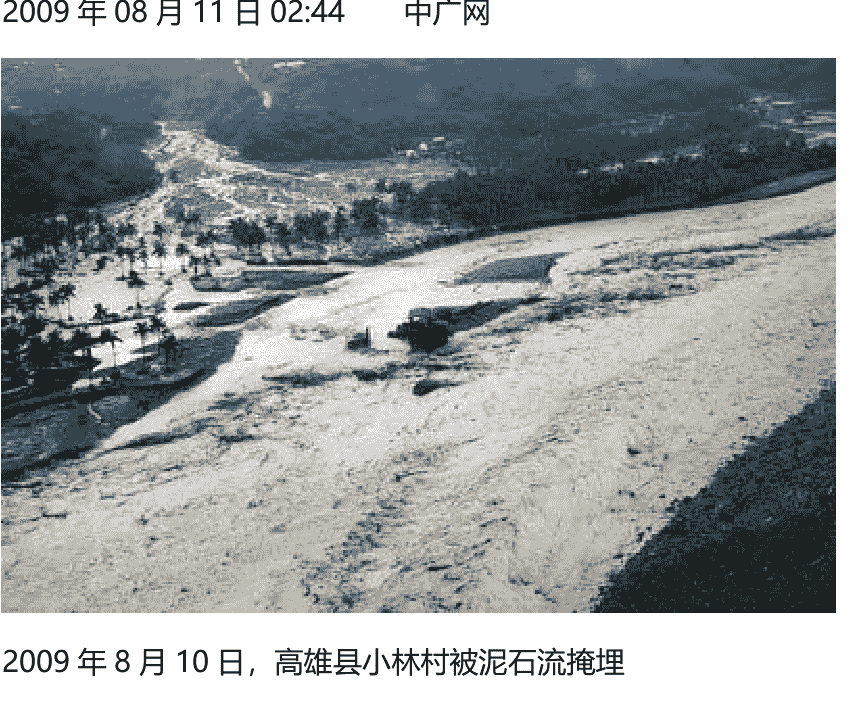

2009年8月10日，高雄县小林村被泥石流掩埋

后来才知道新闻。

答：事实上我们是不做梦的，因为某种程度上来说你们成为物质界的世界对我们来说就是无数意识体共同的梦，但我们了解做梦的文明。梦是潜意识信息的表现，这种梦占90%的梦，他们无意义，是潜意识对旧的思想的创作，作用是在睡眠时间锻炼意识。梦是精神界信息的接受，比如说你的梦，首先你和你的表爷有血缘关系、感情链接，这个信息链接是第一个导致你会做这个地方梦而不是其他地方的梦。你的表爷爷家乡产生了泥石流和大水，这两种玄无精神面的信息通过你的表爷的信息链传达到你的睡梦，于是你做了这个梦，梦中显意识被抑制可以接受到更多的信息，显意识只能接受玄无物质面的信息。你突然想看你表爷，是你表爷在那时对你产生的思念所指，这个强烈的思念被接受并让你产生了想去的念头，于是产生了这个梦，你在哪里又不在那里。梦一切都是信息的交换，不同领域，同领域。

问：梦的醒来是在清晨，现实的觉醒是在当下....楼主是这个意思吧？

答：对“是者”来说梦和现实是同样的东西，区别是一个是自己的，一个是众人的。梦中保持清醒是，梦中知道自己在做梦，梦变成了另一个现实，进一步发展梦就是小世界，变成一个生存空间。我们种族成员的梦就是小世界，每位成员都有一个小世界，能力不同世界大小也不同，并可以互相去做客，独立于总玄宇宙之外。其实没有什么惊奇，你们星球被称为修行者的人，有少数就拥有自己的小世界，并且还吸收信徒在肉体结构崩坏后去TA的小世界。


问：楼主，你们的世界存在爱吗？在你们的世界里，爱的意义是什么？

答：没有爱，爱没有意义。爱的意义是促成个体之间互相作用，之后行成集群和文明。在超越集群文明进化后，爱就失去意义。

问：这个，我似乎对你开始产生攻击性了。因为我看你说的“爱在什么什么之后就没有意义”了，具体的我没记住，你的话我也不是能完全理解。谢谢你回复我的留言，但是我还是希望你是个相信爱的家伙。无论在哪个空间，或者你所说的哪个波段，爱始终都是有意义的，这是事实。啊，也许你不是地球土著，所以用词上还是会稍微有些偏差吧。你说的其他的我也努力看了，虽然好多我也理解不了。嗯，如果可以的话，我希望你能说说那个秩序者。你说了你来地球的意义是为了秩序者，那个生物很重要吗？为什么呢？

答：没关系，攻击与否不重要。爱是一种能量，我们可以让爱充满我们意识空间，一刻不停，亦不间断，那么爱就会一直影响我们的行为，我们会变得无私，四处干涉帮助其他文明，之后在星际战争中，我们会毫不犹豫放下武器，让敌对方摧毁我们的文明。一直处在爱中是不利于生存的，爱应该只在适合的时刻出现，如果一直处在爱之状态中，文明毁灭就在眼前。用如宇宙般冷静的理性统治情绪思想欲望，你们以后也会如此。不爱不代表不善良，不爱只代表不被情绪控制行为选择。

问：爱就会一直影响我们的行为，我们会变得无私，四处干涉帮助其他文明，之后在星际战争中，我们会毫不犹豫放下武器，让敌对方摧毁我们的文明。不爱只代表不被情绪控制行为选择。

我不知道你是哪个残疾空间进化出来的，你说的爱、①无私、②四处干涉或帮助、③毫不犹豫放下武器让敌方摧毁我们的文明这几项，我实在不敢苟同。就目前我们地球的认知来说，爱不会直接导致①，不会导致②，更不会导致③。

①无私：不只是顾自己的利益；没有私心。

②干涉：指过问或制止，多指不应该管的硬管或关涉。帮助：以出钱、出力或出主意的方式相助别人。

③我觉得不用给你查字典了。

单就爱这一点，我觉得大部分地球人不会认同你。一直处在爱中，也不会导致“文明毁灭就在眼前”。不知道你为什么会有这种逻辑，也许只有你们空间才会以爱之名做伤天害理的事情，估计是你们进化的问题。又也许是你的中文没有学好，表达失误。你那个总玄世界，怎么说呢，到底是什么垃圾空间进化出来的...

anyway，这个爱的问题到此结束吧，我一两句话也说服不了你，如果你会一直关注地球，你看着就是了。另外，秩序者的事，不能和我聊聊吗？

答：爱是脑垂体分泌的一种物质，这种物质依附神经元而引起爱这种感觉。如果提取这种物质，做成药片，不开心的时候吃一片，马上就会充满爱和喜悦，这个你们技术还是可以达到的。你们文明有些成员就无法去爱，由于某些原因，先天或者后天缺陷，外界的刺激无法引起其脑垂体正常分泌产生爱的物质，所以他就会感觉不到爱。

爱只是一种感觉，和恨、喜、悲、哭、恼等没有什么区别，区别只是一个让你感觉很好，一个让你感觉不好，爱并不比其他几种感觉更特殊。爱会出现，爱会消失，爱不是永恒。

我知道你的意思，宇宙中有那么一个永恒的、无边际的、充满正面的力量，你们将他称为爱。而事实是宇宙中没有人类所定义的正面的力量，宇宙的本质是无情的，对宇宙来说没有正面和负面。恒星照耀你们的世界，它的光芒给予世界生命，却是正面的力量；但若离得太近，则会将你焚烧殆尽，却是负面的力量。对宇宙没有绝对正面和绝对负面，一切只是人类的定义。

你们人类，一个人到极致会产生恨，物极必反，一个事物到了极致必然变成和其对立的力量。理性的看待爱这种感觉，在某个时候，爱往往也会变成伤人利器的因。

于秩序者不能再说了，是最高机密，在这里谈到是因为秩序者会看这个贴，虽然TA还没有觉醒，但我们一直在关注。

问：另一种解释，但看了2012吧中许多帖子，说要有爱，而阁下的世界却没有爱，不解。

答：爱只是一种感觉，或者基于爱的行为标准，优胜劣汰，物竞天择，适者生存，这就是宇宙的爱。进化慢的被淘汰和毁灭，你们人类的战争史一看便知。爱只是你们在安逸生活中诞生的美好想象。当然，金星高灵依靠爱之能量提升自己也未尝不可，也算一种进化道路吧。你们人类近期发展的爱之哲学都是高灵界生物给你们的哲学。

问：“当你的心境一无所有，你会无情的爱着整个世界。”一个没有感觉，没有情绪的个体怎么可能会有“爱”的感觉？

答：你们的思想很局限，我感觉到了。我们不受感觉感情影响而去行动，我们思考哲学和自我存在的意义，我们行动既不愤怒也不盲目，宇宙般冷静的理性引导我们。没有情绪是进化超越了情绪，就好像你们进化超越了动物，但你们也可以回归田野像动物一样去生存，捕食猎杀，衣不遮体，当然你们很少有人会去这么做。我们一样很少去体验感情，没有意义。爱的感觉只是一种体验，刺激神经元就行了，随时可以去体会感觉，只是觉得没有意义罢了。你们不是发明了一种化学药剂，注射后你会体验到人间最美好的爱。

问：那什么才算叫真正的爱呢？

答：没有真正的爱，爱只是一种高频振动带来的感觉，你处在这种感觉中你就是爱的，你离开这种感觉你就是不爱的。就好像无数颜色中的一种颜色，每个颜色都没有真正，他们只是不同。

问：楼主，你说过爱不重要，那你是怎样看待人类的爱情，亲情，友情的呢？这些是不是也不重要？说说你的看法，这些情感对人类来说有意义吗？人类需要它们吗？

答：感情将人们链接在一起，人们通过感情发生互相作用，人们发生互相作用，社会才能建立。也许对你们来说是感情目前是有意义的。记住一点，当你们文明完全放下爱时才能放下恨，放弃快乐就没有痛苦。如果有爱，爱里一定包含恨的可能；如果有恨，恨中一定有爱的存在。如同你们的太极图，互相包含才能存在。单纯的爱和恨都是不可能独立存在，一切都在转化之中。情绪必须在文明某个阶段被放弃，否则情绪虽然可以产生社会与文明，但也会毁灭这一切。感情引发情绪，要么感情情绪一起抛弃掉，要么发展出没有情绪的感情。

问：这是我一直在追寻的感觉和努力的方向！！终于有人了解这种感情了！！我要和你相拥来赞叹这种感情！！默默的看着、吸取着，这段话完全贯穿了我！！谢谢你！！

答：观察，观察自己在谢谢、在激动、在情绪化。谢谢和激动与被人理解的欣慰是面具，而你是无情与流畅自然的。记住这点。

问：楼主你能到我的地方来么？

答：可以。

问：但是，你怎么过来？能量够用么？

答：首先是传送一组信息，然后信息建立一个场结构，场结构产生一个纯无精神。不够，正在积攒。

问：什么信息？

答：一个种子信息，纯无层面。就好像你们的胚胎，很小，但包括构建复杂网络人体的一切，只需要能量就可以展开自己。

问：如果你们用共享意识交流，属于人类，还是属于天神？你们坐飞碟飞行呢，还是用翅膀？

答：我不属于你们的认知体系，哲学、宗教或者科学所定义的存在。在你们空间我是一堆纯无中的信息，保持隐性状态。

问：楼主，你知道我是谁吗？？？

答：这个世界中的意识体。

问：。。。我能做神马？%有种想拯救世界的感觉。

答：若要拯救世界，先拯救人们的思想，这是重要。

> 趁结构还在尚可意识思考凝聚纯无，个体生命的一切最后终将归虚。

问：看来从事科技解决问题的大有人在，不管地球人还是外星人。科技产生的问题多还是解决的问题多？若说轮回，头脑身体都不会轮回的，心灵无形无相，无灭无造，在各种物质波相中奔跑嬉戏罢了。人更关注外在的变化，而不改变自己的内在，是不觉悟，意不正的变现。

答：纯无本身无生灭。如果说有一个人格的你不灭，就错了。老年痴呆，神经元破损，造成意识不清，记忆损失。如果灵魂不灭，为什么物质结构损失造成如此大的伤害？自我永生轮回在生是人们美好的寄托。不趁结构还在尚可意识思考凝聚纯无，个体生命的一切最后终将归虚。

问：请楼主说一下灵魂好吗，既然灵魂毁灭，那什么是永恒的呢？多说一些关于灵魂的事吧！

答：没有什么是永恒的，除了纯无，注意我的用词，纯无，绝对的无，纯净的无。肉体结构产生大脑神经元链接反应，随着肉体对世界的接触，神经元不断反应，脑波产生，脑波逐步增强产生一种场，场就是灵魂，是结构，是信息。

问：灵魂归于虚无，您的说法与目前地球上所有宗教的说法都差很大，那什么时候灵魂会归于虚无呢，纯无和虚无可以讲下区别么？

答：玄无是结构性，纯无是空间性。想象一下，无边虚空中什么都没有，许久后出现了两个立方体A、B。A、B立方体带来了三种意义：
*   第一种意义，立方体内的空间和立方体外的空间被分开。
*   第二种意义，立方体A内的空间和立方体B内的空间。
*   第三种意义，立方体让立方体内的空间从无边的虚空中凸显出来。
立方体代表结构，代表信息，代表世界，玄无。立方体内的空间代表你，你的意识，你的我，纯无。
你们最早的宗教没有轮回说，轮回说是人们后来加上去的。
> 结构性和空间性可以解释下么？您举的A、B正方体代表两个世界是么？您说的纯无可以勉强地理解为纯粹的强大的精神力量么？那人的身体在正方体的比喻里可比做什么，正方体么？谢谢您的耐心的解答。
> 答：A和B代表结构性，可以看成两个人A的大脑和B的大脑，也可以看成两个世界A世界和B世界。纯无不是精神力，精神力属于玄无。纯无是一个结构中的空间。如果代表人，就是人脑结构封闭起来的空间；如果代表世界，则是一个世界结构封闭起来的空间。都可以看成纯无。简单的来说，想象一个瓶子的存在，因为瓶子的存在（结构性），让瓶子内的空间和瓶子外的空间有了意义。如果瓶子不在，空间是一体的；如果瓶子存在，瓶子内的空间被从一体中凸显出来。但是一个瓶子极其简单的结构，无法让瓶子内的纯无空间性空间拥有自我。而大脑是一个复杂结构，可以产生意识，让其中的纯无空间性凸显出来。纯无是某种形而上的意义，空间是对它的比喻，并不是说纯无就是空间。松果体。

问：请教楼主个问题，松果体在人类大脑中有什么作用？人类如何激活松果体？激活后能有哪些功能？

答：松果体，小黑屋的物质对应体。灵场越强松果体越大，每个意识生物都有。“你”就住在这里面，小黑屋，你们的词是这么说的。功能很多，也是连接结点。你在小黑屋中，只有一扇窗，外面是物质世界。开发后换一扇窗，看看其他频段世界。如何开发？我们所有一切都建立在外界技术的操作。你们也许有很多方法，但就像我告诉你们的，凝聚纯无就好了。纯无是一切根本，一通百通就是这个道理。如何凝聚纯无已经告诉你们了。强磁场，凝固纯无的机器。

问：能简单扼要的介绍一下，现在的人类如何增强“纯无的精神”吗？或者如何以较易达到的方式，实现轮回转世吗？？？？

答：住在强磁场的地方。

问：请给一条具体的可操作方式！！！具体些，可操作性，并可以检验有效性的方式！！！步骤，时间，检验方式？？？

答：在强磁场环境中生活可以保持你自身信息完整性，也就是说，在强磁场环境中，住在吃喝玩乐一辈子，你死后你的信息结构、你的意识可以被保存10-80%。你变成了强磁环境中的有序信息，但不能离开强磁环境。这就是最简单的方法了，你什么都不用做，不用努力对自我认知，不用努力凝聚纯无。
如果你是谈制造凝固纯无的机器，你们的科技是不可能的。告诉你们基本原理也可以，但很多原理你们的科学根本不了解。我们的种子飞船，在最外层空间中，铺设全方位的纯无透镜，焦距纯无精神。飞船材料中有一层0.000127微米纯物质空间刻画系统，一层薄膜将内外空间分开。纯物质空间刻画系统创造了一个绝对环境，隔绝了外界的引力、光、绝大部分物理规则，无法影响飞船内部。飞船内由Amaf系统生成飞船内的物理规则。纯物质空间刻画系统让飞船内对外界的观察者保持绝对的量子不可测崩塌状态，飞船内部观察者只有一个人，就是飞船驾驶员。飞船外围的纯无精神透镜将纯无精神凝聚在飞船中，只有纯无精神可以穿透纯物质空间刻画系统。这样飞船中就产生和外界不同的纯无差值，这是纯无已经初步凝固了。之后飞船内的一套辅助系统将纯无焦距在飞行员意识空间中，用纯无精神重新构造意识体。这个系统伴随飞船时时运作，一刻不息。

# 收集诺露：死去的祖先吸取的信仰力

问：我也想收集一些诺露，怎么弄？？？

答：产生一个正玄波场覆盖地球，在其中一个空间位置生成一个玄向心力。之后这个星球上生物死亡后所有的诺露，也就是一些纯无精神会凝聚在这个向心力的场中。这个向心力的场设定为你的意识中心。

问：目前是谁在地球外建立“正玄波场”覆盖地球，可以介绍一下吗？？？除了收集地球的诺露，还做别的吗？他们追求提高“诺露”的产量吗？？？

答：主要是你们死去的祖先，他们居住在覆盖地球不同的频段中，不过他们建立的都是小的。大多数吸取的是信仰力，信仰力转化后再成为诺露，一般建立在寺庙中。提高产量，当然，越诚信信仰力品质越高，提纯后诺露等级越好。我不久前建立的是覆盖整个地球的正玄波场，不过等我收集足够的能量后就会撤销。

问：地球的每一个频段中，都有一个我吗？？？？

答：我只有一个，结构内的纯无和结构外的纯无。

问：为什么要去走死去生物的灵魂？

答：要灵魂，不是，只是能量的集中和分散。灵魂结构失去肉体结构的支撑，存在不久，除非自我加强或者靠外力强化。

问：请问，您说的那个“秩序者”，是谁？在哪个国家？他已经出生了吗？他会带来怎样的影响？他是救世主？能透露一些他的信息吗？“它们修复了月球轨道控制系统”意味着什么？地球将有灾难？什么时候发生？谢谢！我的座右铭“探求终极真相，感悟生命真谛”我自己想出来的，您觉得这句话，如何？感觉您给我的信息，离这个世界的真相很近了。

答：秩序者，简单的来说是某种不可知变量，是一个意识体。区别是，秩序者结构内的纯无波形和结构外的纯无波形相同，这种几率亿亿万中无一。这样就赋予了其类似造物主的能力，可以调动结构外的无限纯无精神大幅度干涉物质界，也就是玄无的创造。总玄宇宙世界在最终毁灭时，历史有记载的秩序者不过三个。它们修复了月球轨道控制系统意味着全面战争爆发。战争会在未来10年内展开，人类不是主角。月球方首先的攻击方式是月球轨道控制系统，通过调节月球和地球的距离，引发大规模地震海啸。最近发生在印尼的地震正是轨道控制系统测试的结果，去网上找前一天的信息，你会发现一个被重复提到的词“今晚月亮很大”。当然你们地心的祖先也不会坐以待毙，反击会很激烈。地震海啸和星际战争过后你们就可以重建新文明了。这些年月亮接近了你们几次，每次都有地震发生，在这之前战争都是小打小闹。你们人类秘密发射的导弹撞毁几个月球出入口，月球方又损毁你们几个核导弹发射井研究室，等等。地球气候异常是因为月球轨道重新界定不断拉扯地球地轴导致。

问：这么说来，秩序者和造物主就是一个级别了？是下一个造物主？这样的3个不可能的可能，又是怎么发生的呢？你能和它对话吗？它出现的目的是什么？如果它在地球，月球上的种族还敢和地球爆发战争吗？月球上的种族不知道地球上秩序者的存在吗？不怕被它消灭吗？这个秩序者，对人类而言，究竟，有什么意义呢？谢谢！！！

> 答：没有人知道这三个驳论怎么发生的，如果知道就可以复制。猜想是宇宙间两个终极力量的较量，玄无的、纯无。他就是你们人类，不过还没有觉醒，在这之前他都是人，超越不了人的局限，直到觉醒。月球种族当然不知道秩序者，月球种族的科技从总玄宇宙来看还很落后，虽然高于你们，但还是物质科技。秩序者的意义只有他自己知道，就算他毁灭了人类和太阳系也不要惊讶。

问：制序者是什么？

答：可以称之为你们定义的人格化的神。

问：你好，我有以下几个问题，希望可以帮助解答，谢谢！
1. 网络上频传的普通人的觉醒，和你说的“秩序者自我觉醒”是一个概念吗?究竟，他觉醒的方式是什么?觉醒之后，能悟到什么?觉醒之后，怎样恢复他的“神力”？
2. 既然你在网络上已经发布了他的消息，月球种族还会不知道吗?
3. 秩序者，他在哪个国家呢？现在年龄多大了呢?他觉醒之后，就是要拯救人类吗？之后呢？他要去哪里?
4. 你要在这里逗留多长时间？你的任务又是什么?
5. 按你的说法，总玄宇宙的两个终极力量，是什么？总玄宇宙，已经消失了?你是从消失的未来来到这里，改变现在，以影响未来吗？可地球人类，那么渺小，对于改变总玄宇宙，有多大帮助呢？又或者，你的目的，是那个秩序者?
6. 人生的意义又是什么?
7. 罗布泊的双鱼玉配，你怎么看？据传毛主席看到之后，取消了计划生育的政策，难道预示着中国会出现人口大灭绝?
8. 08年就觉得中国10年之内动乱，你怎么看?
9. 你的帖子存在的时间挺长了，百度没有删帖，你怎么看?

答：1 不是一个概念，我只是使用了觉醒这个词，表示对自己的认知进步，至于秩序者如何觉醒要看TA自己。
2 不用担心，我们自有计划，一切都是计划，这句话也是，一环套一环。
3
4 不到一个月就会离开，能量恢复超出预料。我的任务是修改历史片段，任务代号21。
5 总玄宇宙没有消失，只是暂时冻结在时间中。人类并不渺小，一粒沙子也不渺小，蝴蝶效应。
6 你活着就已经在意义之中了，意义只对让生命产生的力量来说才有意义，意义对生命本身来说是没有意义。
7 一成不变世界的人们需要各种神奇的东西来刺激神经，于是传说神话诞生了，往往没有真实依托。
8 不会，月球文明入侵会将一切平息。
9 删除与否不重要，信息已经被阅读者上传到人类集体潜意识中了，只是你们没有意识到。

问：秩序者出现后您的使命完成就会离开是么？您可以感知到秩序者？秩序者与一般灵魂的区别在哪？

答：快了，正在恢复，不到一个月就离开。秩序者的纯无空间和结构外的纯无空间波动是相同的。立方体的比喻，立方体内的纯无波动和立方体外的纯无波动相同。这就是秩序者的意义。

问：你好楼主，你说你回到现在是为了修改或影响部分历史，可以说出来是哪些事件吗，你在这里发帖和人类沟通也是修改的一部分吗,你觉得和人类沟通的这些会引起重大的蝴蝶效应吗，你说的在我们时空里产生的秩序者是在什么时候产生的，有具体的年月日吗，有名字吗，你们在冻结宇宙末页的3个秩序者与你返回历史中出现秩序者的时间段中出现的秩序者会共存吗，共存的话就会出现4个秩序者，不共存的话我们现在这个时间段刚产生的秩序者已怎样的方式存在或消亡？求答案。

答：给予你们的信息当然会引起蝴蝶效应，区别是可控蝴蝶效应罢了，一切都在计划之中。秩序者不会产生四个，就好像一本漫画书，每一章都有对主角的描画，但主角不是很多个，只有一个，就是你翻开的那一页。秩序者名字年月不在讨论范围中。

问：秩序者的波动和宇宙间无限的纯无波动无限接近相同，为什么纯无的波动还有不同呢，纯无的波动不应该是一样的么。只是能量的大小不同么。还有什么能有影响你的波动不能够无限接近无限的纯无波动？

答：每个人都有独特的纯无波形。简单的来说，海是一个整体，想象海就是无限纯无。之后你从海中隔离出一瓶水，隔离出两瓶水，隔离出无数瓶水，每瓶水都是水，水分子运行方式不同，但其中一瓶水却表现了海的运动缩影，没有人能理解为什么。

问：LZ没有正面回答我的问题。为什么秩序者要等到月球种族和地球发生战争之后才出现？那时地球已经生灵涂炭了。战争到底什么时候发生？地球上多少人能幸存？

答：不清楚，也许那之前秩序者就觉醒了但没有干涉，也许是刚刚觉醒即干涉，没有人能知道秩序者做每件事的意义，或许TA们根本就没有意义，或者意义和我们理解的不同。战争在曾今的历史中，2018年三月十六日15时21分31秒发生，随着月球大幅度改变轨道开始。幸存人类没有具体统计数据，粗略计算，战后七千九百万左右。

问：那可以这样理解么，他的纯无波动涵盖了我们所有的存在的纯无波动，他可以体验我们所有的体验的汇总，他甚至可以重新创造宇宙，而我们只是其中的一个个片段意识。我凝结纯无能够体验秩序者的纯无波动么。。就是一个瓶子里的水放弃瓶子的水的觉知融进大海就可以体验大海的波动了么。还是只能是体会瓶子的水的波动。或者只能以保持瓶子的水的觉知才能够体验大海的波动。不知道自己表达清楚了没有..

答：凝聚纯无，瓶子终将被抛弃。瓶子就是结构、透题、结构、灵场、结构、精神、结构，一切结构。单纯的以凝聚的纯无形态存在。普通纯无凝聚体无法理解体验秩序者波动，否则就能量产秩序者了。普通纯无只能体验经验纯无凝聚体周边的纯无波动。

问：你看到我们人类之前毁灭的历史中，秩序者出现了吗？如果没有，那么我们这段新的历史中出现了秩序者的原因是不是幕后人的操作？对于整个宇宙来说出现这一段新的历史有什么影响吗？为什么不在别的星球其他空间内出现秩序者，在我们这里出现有何意义？这些不知道楼主属于可回答范畴吗。

答: 曾经说了 秩序者在未被改变的未来的战后出现 之后月球凭空消失 人类文明重建 数千年后走出你们的世界

幕后人不会作用影响于总玄宇宙世界任何地方 只是观察

秩序者的出现最好的解释是纯无的巧合

不是一段新历史 是整个历史

总玄宇宙世界曾经发生的所有历史片段都有人在进行影响和修改 我们有很多人 每人负责一些

历史修改干涉等级分为极度 高 中 低 微弱 对你们的历史片段干涉等级是微弱

问: 请问 HuanxiangXR_21:

您说过，你们没有“爱”，但您通过发帖子这种方式向我们透漏消息，肯定有你们文明的目的。我想你们大概地球的“秩序者”帮助你们渡过难关，是不是这样？？。请问你们文明对地球生命是善意的吗？？如果地球月球发生冲突是你们会否帮助地球？？互利互惠这是正常的利益交换，如果你们付出了，使地球减少被战争破坏和伤亡，地球人包括“秩序者”也会感谢你们的，也会在必要时帮助你们的！

答: 秩序者帮我们渡过难关 不是

善意不同文明认知中都不同 不过以你们的观点来看 我们的干涉没有坏处

不会 我们这个时空片段的干涉程度是微弱 不能超过信息外的干涉

互利互惠 在时空回溯中没有意义 我们不是你们传统理解上的外星人

问：见到你回来有激动之感。

我想知道我们现有的科技成果还能使用多久。2012 年太阳风暴是否会摧毁全球电网。

还有。请介绍你们家的艺术。顺便评价一下我们的一些艺术作品，包括绘画和音乐。

最后，谈谈你对人类内部分异的认识。也可以说，对不同国家或种族或地域的个体的差异评价，尤其是对中国人与世界其他个体的差异评价。

最后的最后，我想知道秩序者存在的意义和理由。

答：摧毁电网是的

介绍我们的艺术家没有实际意义浪费文字

秩序者存在的理由 简单的解释 万物都是不同旋律 有自身的主旋律 宇宙如是 三大秩序者

就是宇宙的主旋律 奏出华美的乐章 这就是意义

问：72 玄度，无限的接近秩序者的波动么，还有，楼主，我们人类凝聚足够的纯无可以直接到达你们的文明选择婴儿大脑驻进么

答：72 玄度不是无限接近秩序者波动 具体不在透露范围内

有足够纯无也不能进驻我们幼生体内 60 玄度以上文明的幼生体都有保护装置 只产生自然聚合的婴儿意识体

可以选择 60 玄度以下的

问：期待楼主答复我下面的问题：楼主之前说冻结时间，把翻书的力量存起来的时候是得到过两位秩序者的同意的，对吧？你之后提到我们人类中将诞生一位秩序者，那这位秩序者在觉醒之后，难道没有能够一直存在，并在未来你们的总玄世界的最后一页和你们见过吗？历史既然是已经确定了的，现在这里出现了一个转折点，那为什么在你之前的话语里，没有提到过这第三位秩序者未来的存在呢，还是说我遗漏了你的哪段文字了，请指教。

答：三位秩序者在总玄宇宙世界的最终一直存在 用你们的话说只是其中一个不合群而已独立独行 神龙不见首尾 如果他不想出现 就找不到他

两年前很多没有提到是因为没有授权 给予了你们很多模糊的信息 但之后根据宏计算无数历史片段的发展推演事态发展 认为需要加强信息影响程度 所以现在授权了

问：您现在要启发的那位秩序者是您说的其中那个不合群的秩序者吗？

如果是，那么您的计划不是有很大的不确定性？因为您无法控制秩序者的行为不是吗？

如果不是,那么就是现在这位秩序者已经同意您去修改历史,而现在您所做的一个主要目的，就是让秩序者提前觉醒，那么秩序者为什么不自己去做这件事情，让自己提前觉醒？还是说秩序者无法回到现在的时空去影响以前的自己？如果秩序者能够回到以前和以前的自己并存，那么对于秩序者来说，那个才是真正的我？还是说产生了一个像您上文所说的志愿者那样的一个“超我”？

答:秩序者不能回到从前 三位秩序者占据总玄宇宙三分之一的时间晦朔需要的能量 必须冻结 才能有足够的晦朔能量重建过去返回过去 否则只能修改从前历史的三分之二

我发现你们将秩序者 幕后人 7 玄度文明等各种观念 都融入了你们的思维体系中 然后分析他们之间产生背叛 结盟 协议 阴谋等各种关系中 这是错误的 你们将这些定义套入了你们传统的人类社会性思维中 宇宙社会性和你们人类地球社会性 是无关的也是完全不同的

问：引用： “深蓝儿童存在的意义，和你所说的秩序者有何联系。秩序者是不是就是传说中的盖亚，深蓝存在的意义又是什么？

答：深蓝儿童和秩序者没有任何关系

秩序者不是盖亚 因为你们对盖亚的定义是星球意识体

深蓝存在的意义是玄无更新时其他文明一些灵魂投胎入你们世界 增加自己文明的玄无更新进度

深蓝儿童大多数是你们火星文明派遣的灵场们和少数金星低等级灵团的一些灵场

金星已经进入玄无更新初期了 你们星系目前最快的文明 物理面的表现是金星亮度增加数倍 轨道微弱变化

问：哦，就是说在未来的确有三位秩序者，其中一位就是当下需要启迪的那个，然后他在未来也同意你们中的一些人回到过去给曾经的自己提点之类的，那他应该很清楚的知道地球人类文明在 2012 前后究竟有没有毁灭这段历史吧，楼主之前不是说因为回顾过去的时候发现我们到 2050 年左右还有存在的吗，并没有在 2030 年左右毁灭，难道这些事情被作为当事人的秩序者给遗忘了嘛……秩序者的记忆力应该很不错的吧，他在未来如果知道历史记载有偏差不能直接告诉你们，还得看你们自己回顾发现问题在记录在备案在过来启迪么？

说实话我自己都晕了

答：没有理解你要表述提问的重点 请重新描述

建议 不要陷入自己的思维想象和定义中 当你们在思考时 使用你们社会性的观念来思考这些问题 都是不准确的

问：你在这里修正的同时也让其中一个秩序者看到自己所说的内容了，NNN年后那个秩序者肯定和你们有过接触，作为秩序者，记忆应该不会差，不会说忘记你在这里的发贴内容吧，你在这里每多说一个字，NNN年后的秩序者记忆里就跳出一部分关于你的记忆内容么？就像蛇头咬住蛇尾一样，没有了最开始也没有了终结，不好说是秩序者同意你给曾经的自己做思想启迪，因为那就是他自己开发引导自己呗，这种蝴蝶效应还不大？会不会直接在将秩序者的出现提前或者推迟？你说的没错，我现在的想法是局限在自己的认知范围内，让我用除去自己社会性的观念思考这个问题，那我用谁的社会性观念？人类社会目前就发展到现在，除去这个背景思考问题，嗯嗯，老话说是无中生有还是天方夜谭？第一个和第二个问号和第三个问号内容请指教，后两个无所谓。还有啊，入乡随俗，如果楼主要走了或者关贴或者太监，请说个拜拜吧，多谢。

答：启蒙秩序者网络只是次要 网络信息存在的意义是开启已经上传到人类集体潜意识场中99.9%的信息

总玄宇宙世界已经发生一遍了 从头到尾 第一次历史

之后又发生了一遍 时间晦朔的力量 就是现在你们这次 和上次有所不同 因为我们第一次历史中的文明们在引导第二次历史

无论如何秩序者都会出现 不多不少 修改的最终第一次和第二次历史融合后 也无法影响秩序者的状态 因为秩序者没有任何状态

问：楼主 今天你来的真早啊。今晚+未来的两天人会很多，周末大多数人不用工作。 有个问题，秩序者需要凝固纯无吗 也需要了解你的这些信息吗 还是他觉醒的时候能感应到人类潜意识你散播的种子信息？ 这些问题应该不属于不可透露信息吧

答：秩序者凝聚纯无 是本能 之后能 调动宇宙间无限的纯无能量

对这个问题唯一允许解说的

问：星际联盟成立时是第一次星河时代末期吗？说说星际联盟吧，他的管理是什么样的，有什么规则吗？你不是说要启蒙我们学新思想吗，那么能否在2912吧新开一个帖子，把星际联盟的规则贴出来，比如第一章说的是什么，等等。

答：是的

详细谈没有必要

总玄宇宙联盟 主要分为九大种族文明领导 前面介绍过

总玄宇宙的主旋律主要还是围绕三大秩序者进行的 无数的文明因为他们消失 无数的文明因为他们而兴起

问：玄宇宙的主旋律主要还是围绕三大秩序者进行的 无数的文明因为他们消失 无数的文明因为他们而兴起.这么说,秩序者是永生的?一个秩序者生在以前的地月战争,一个在现在,那最后一个是哪里人?可否说一下?

答：理解有误

秩序者有三个 不是在不同的时空中 地月战争以前和现在难道不是同一个

另外两个秩序者 以你们世界时间片段为点 一个在遥远的过去出生 一个在遥远的未来出生

最早的文明在你们世界尚处在神话时代之时 几十亿年前 那时地表还没有物质生命

问：干嘛要费那么大力气，来绕一个圈来回答有关秩序者的问题。 直接回答 不知道不就得了嘛。 而且你老是说这是最高机密，但是你却在一些回答中有意无意地透露出信息（包括提问者没有问到的信息），你这是自相矛盾。

答：不是矛盾 有意无意的透露是计划中的选择

- 吸引法则
- 梦的分层
- 金字塔缩小模型

问：（1）吸引法则是有效的吗？？？

（2）可以通过意识到达另一个空间吗？

（3）所谓的梦的分层是假说，还是事实？

（4）可以通过延展梦的分层来达到延长生命的效果吗？

（5）可以选择进入我所想要的梦中吗？

（6）告诉我一个可以检验你说的话的真实性的方法?使我来见证你说的话是真的?

答：1，吸引力法则 原理错了

正确原理是 改变思想 思想改变气质 气质改变行为 行为改变生活

而不是你的思想把某个东西创造或者吸引了 除非你的思想纯无精神足够强大 地球上99.9%的人没有这么强

2，可以 到达你们世界附属空间

3，你们的梦有三种 一种头脑的梦 一种灵的梦 一种纯无的梦 纯无的梦就是你的一生

梦可以分无限层 只要意识够强 你梦到自己做梦自己做梦梦到自己做梦梦到自己做梦......

4，不可能 但可以操控梦在梦中度过一百年上千年也容易 醒来后身体只睡了一晚 主要看你意识可以承受的频率

5，可以选择 控制意识频率

6，验证什么 科学性的意识性的

科学性可以告诉做实验

意识性难 你们人类一生根本不发展控制自己的意识 就好像 你根本不会骑自行车 你却让我告诉你骑自行车才能到达的某个地方

这样吧 你做标准比例金字塔缩小模型 大小和你的身体差不多即可 挂在睡觉房间顶上 梦变清晰了 如果时间足够久强化了灵场还能灵魂离开肉体在房间短暂活动

## NIBIRU

问：传说中的 nibiru 行星到底有没有？有的话在哪如何观测到？

答：不存在 NIBIRU 来源于你们文献中对众神之星的猜想

你们记载的众神之星 玛雅人称卓尔金星 在战争中被击碎了 其中核心一部分变成金星 金星就是众神之星的内核 地球太阳之间的陨石带是 众神之星被击碎后的尸体

这是很久以前的事了 那时地球上三叶虫的祖先还在觅食 恐龙出现还不知道要多久

火星和卓尔金之间的战争爆发了 一个恒星系同时发展处两个文明必然的结果

## 曾经的未来；现在的未来

问：请问 HuanxiangXR_21 我们地球地心祖先的科技力量和月球上的智慧生命哪个强？
你所说的星级战争过后会出现什么状况？地球还是现在的地球还适合人类生存吗？或者月亮会消失吗？人类该何去何从？请问月球轨道修复后中国哪些地方大概什么时间会发生大地震？有哪些火山大约在什么时间会喷发？地球气候会变成什么样？

答：被影响后的未来不能告诉你们 可以透露曾经的未来

你们地底祖先领先你们科技 400-500 年 月球文明领先你们 300 年左右

你们地底祖先技术略强于月球种族 不过月球种族有月球保护 常规武器根本打不入月球 5 公里 五公里以下是密度强大的各种物质组成的防御层

在过去那个未被改变的未来 战争随着月球不断改变轨道 引力拉扯拉开序幕 地球地震海啸毁灭了大多城市 人类散居山林田野 你们的精英在各大军事设施中向月球反击 但基本没有用

你们地底祖先的飞船和月球种族 在地月之间展开拉锯战 活下来的人类望着夜空被各种光芒照亮 战争持续两年 声波武器 光能武器 电磁武器对双方造成了巨大破坏 地球尚好双方避免破坏生态 战争惨烈 月球高密度物质防御层外五公里的所有物质被蒸发成尘埃 围绕月球形成一个尘埃环带围绕月球 地球看去月球看起来好像变成了气体 高密度防御层依是坑坑洼洼

战争对月球种族是有利的 你们地底祖先攻不破月球防御层 而月球种族却可以不断破坏你们地底祖先的工厂 能源中心 飞船停泊处

杀手锏在最后使出 你们地底祖先虽然没有能力制造出死光 但却制造出了类似的东西 很简单的武器 月球背面一望无际的虚空 超现代材料制作的太阳反射板被展开 每一块反射板一米左右 每个镜面反射武器由无数反射板组成 每块反射板接近 100%反射太阳光 反射武器展开后长达 7平方公里 总共有 3 个镜面反射武器 秘密绕开月球种族侦测系统 展开之时即是攻击的时刻 看去月球背面突然多出了三个焦距光点 光点越来越强 三个光点开始移动 所到之处月球背面表面设施全部气化 最后三个焦点合一 月球背面被溶出了一个大洞 但月球反击也很快 高频定向音波在防御层快被溶穿的瞬间 摧毁了三个镜面折射武器

战略失败 你们地底祖先龟缩在地底不愿出战 地表人类文明依无可奈何 月球再次悬停在了亚洲北纬三十度的上空 距离如此之进 阳光微弱 仰望可以看到月球环形山陨石坑历历在目 之后月球周围的尘埃由于地球引力开始下落 火流星雨持续数年

结果是在月球种族准备对你们地底祖先发动大规模登陆作战 用地震弹摧毁所有地下设施给予致命一击时 一切都结束了 月球突然消失了 天空中的陨石雨也消失了 战争结束了 没有人知道秩序者是何时觉醒 月球种族的一切从玄无上被抹杀 不会化为基本粒子 而是好像从来没有存在过归于虚空 你们残存的祖先在压力下重返地表 放弃工业文明的一切 人类也是破坏的地球生态系统被恢复 之后你们世界被从四维矩阵中屏蔽引导你们发展工业文明的入侵者也不了了之 你们的世界新纪元开始了 玄无的自我更新亦在进

直到数千年后你们技术可以离开三维层面 在宇宙间旅行 也第一次被总玄世界所晓知

火山地震在被更改的时间线中已经不准确了 这取决于月球种族想在什么地方引起一场什么规模的地震

问: 所以星际大战的参与者只有地球人与月球种族,不会有第三方的干涉了?觉知我性是什么,继续觉知就能做到么?未来是不是大方向是确定的,只是达到那个终点的路径有无数个?幕后人是什么样的存在?世界只是盒子,而幕后人是盒子创造者么?谢谢

答: 不会有第三方干涉 你们世界目前只有 5 个文明 你们地底的自选 月球的种族 你们自己 火星的灵态文明 金星的灵态文明 后两个和你们不在一个频段上不用担心

我性就是 我 的感觉 你们每个人都会感觉到一个 我 但是很薄弱 用觉知强化它

未来大方向也不确定 微小的变量经过时间放大引起质变 不然我也不会再这里

幕后人不是思想和意识体可以了解的 幕后人是意识和思想乃至觉知之外的东西 我们使用最先进的技术也不过一瞥而已

对意识体来说世界是盒子 因为不能直接经验外界 只能靠感官输入来感知世界 要超越盒子先超越意识体本身 幕后人我们知道的也不多

问：金星的灵场生命和你有什么不同？难道不都是觉知生命吗？为什么他们喜欢经常提到爱？

答：爱是高频 高频世界的意思

金星最早 很多亿年前 是太阳系中的一个成员星 上面发展出了物质文明 最后星球毁灭 剩下了一个内核就是如今的金星 物质文明也进化到了灵态生存

他们是觉知生命 他们还给予你们了他们的哲学通过你们称之为通灵的形式 他们将他们的哲学给予你们 很多种哲学 因为他们不同的灵团对世界的理解也是不同的

他们和我们不同 虽然高于你们 却远远低于我们的进化程度

问：那金星生命所说的爱是不是和我们人类理解的不同？

答：是的 人类的大多数所谓爱的东西 是大脑神经元的化学反应

他们提到的爱是灵场高频振动

问：顶级机密

美国空军官方记录

罗斯威尔空军基地，第 509 轰炸大队

主题：外星人访谈，1947. 7. 25，第 1 段会谈

“在你能够理解关于历史这个主题之前，你必须首先理解关于时间的主题。时间只不过是一种通过空间去任意测量目标运动的计算单位而已。

空间不是线性的，空间是由一个现在-成为者在观察一个目标时的视角所决定的，一个现在-成为者与被观察目标之间的间隔，被称为 ‘空间’。

在空间中的物体或能量体，并不一定按照线性的模式运动。在这个宇宙中，物体运动的模式往往是随机的、弯曲的、循环转动的，或者与所确立的规则一致。

正如许多地球历史书的作者暗示的那样，历史不仅仅是对重大事件的一种线性记载过程，因为它并不是一根可以伸长并作对应标记的绳子，比如某种测量工具。历史事件是通过空间去观察物体这一运动过程的个人主观表述，不过，并不是通过那些屈服者或死者，而是根据事件中幸存者的视角去进行记载。

事件的发生既是相互作用的，又是同步进行的结果，就象是新陈代谢的过程，生物体拥有泵出血液的心脏，同时肺脏又为细胞提供了氧气，也利用太阳的能量和植物中的化学成分进行复制再生，与此同时，肝脏过滤了血液中的毒素，然后通过膀胱和肠道排除体外。

所有这些交互作用都是同步并发的。虽然时间的运行具有连续性，但是，偶然事件并不是在一种单独和线性流动的条件中触发的。如果有人想看清历史并试图理解发生在过去的事实，那么，他必须要在一个相互作用的体系中扮演一个角色，去审视一切相关的事件。在遍及在全部的有形宇宙中，时间也可以被感知作为一种统一的振动形式存在。

艾罗解释说，现在-成为者们早在宇宙诞生之前就已经出现了，他们之所以被认为 ‘不朽’，是因为一个 ‘灵魂’ 既不会出生也无法死亡，反而，它存在于一种个人亲自要求的感性认识 “现在 — 即将成为” 之中。她小心翼翼地解释说，每一个灵魂都是不同的，在个性、力量、意识和才能方面，每一个灵魂都是绝对独一无二的。

在地球上大多数寄居在生物体身上的现在-成为者，与像艾罗这样的现在-成为者的区别在于，艾罗能够随意进入和离开她的 ‘替身’，她能够感知到可选择的深度穿过物质，艾罗与其他同领地官员之间可以通过心灵感应进行交流。由于某个现在-成为者并不是有形宇宙中的实体，因此，他不具有位置或时间的属性，也可以将现在-成为者说成是 “非物质的”，他们可以在瞬间完成巨大的空间跨度。

在不需要生理感官机能的条件下，他们能够体验比生物躯体更强烈的情感。一个现在-成为者能够将痛苦排除在他们感知之外。艾罗还能够回忆起她的 ‘身份’，而且一直向回追溯到暗淡而模糊的时间长河中，已有数万亿年之久了。

她说，在这个宇宙附近现存的太阳，已经燃烧了至少 200 万亿年了。这个有形宇宙的古老程度已经接近于无限，不过，自从最初的诞生开始，它年龄可能至少有 4x1015 年了。

时间是一个很难衡量的因素，它同样依赖于现在-成为者的主观记忆，而且，自从它产生开始，在全部有形宇宙中一直都没有统一的对事件的记载。同样在地球上，也曾出现了由许多不同的文化所定义的各种时间测量体系，他们利用运动的周期和原始起点之间的关系，确定了使用的年限和持续的时间。

这个有形的宇宙本身由许多其他单独的宇宙汇聚、融合而成，每一个单独的宇宙都是由某一个或某一群现在-成为者所创造出来的。为了形成一个共同创造的宇宙，这些虚幻的宇宙在彼此碰撞的过程中，相互混合、聚结并固化在一起。由于经过了一致同意：能量与形体能够被创造产生，但不可以被废弃。因此，这个创造性的进程一直都在建立一个接近无限实体容积的、不断膨胀的宇宙”

楼主，这段外星人的宇宙认识与我们地球宇宙认识现在还差很远吗？

## 答：这个哲学体系不就是你们月球种族的宇宙观

它们都是生物科技制造的奴隶，叫做阿尔拉，也就是你们说的小灰人了。大大的眼睛和脑袋、四肢短小的负责飞行器驾驶等精细工作；眼睛中等、脑袋和人类一样大的、四肢发达的负责生产、战斗。

在月球入侵你们世界后，月球上的入侵者分为控制阶层（自然人）、奴隶阶层（阿尔拉）。阿尔拉负责对机械维修、生产、战斗等各种生物，寿命不过32年左右。

月球入侵你们世界后，他们的内战就是阿尔拉和自然人的战争。阿尔拉想脱离母世界控制，于是内战爆发。奴隶们惨胜，但失去了太多科技，它们花了上千年重新发展技术。它们之所以有这样的宇宙观，因为一旦合理的结构身体运作就会产生自我意识。为了控制奴隶，科技手段固然重要，思想控制同样重要。不死学说当然是最适合的控制手段，这个学说其实就是自然人控制奴隶思想所建立的观念。不过最后他们的殖民者还是被奴隶推翻了。根据文章，这个宇宙观传达的观点有三：

- 一、如今你在这身体里工作，来日精神得到自由，因为精神是不灭的。你们的灵魂是永恒自由的，独一无二的。
- 二、身体有很多，不用害怕死亡，勇敢去战斗。
- 三、世界由你们创造。

这些奴隶最近在研究人类DNA，通过杂交想延长自己的生命。毕竟他们是被制造的人造生物，有很多局限。

时间线在物质以外是不确定的，这个很明白，你们梦中的时间就不同。但时间在物质界的作用是绝对存在的。时间线，一颗子弹向你飞来，你不可能因为你感知时间比别人慢而躲过子弹，这是不可能的。物质有他固定的时间线，其中所有的意识体都要遵守。

## 问：在你的世界里，这些金星生命都进化成什么样子了？

答：不是很高等，12玄度左右，步入真实还在遥远的未来。

## 问：一的法则里面ra说的密度你是怎样理解的？

答：一的法则，难道不是金星一个灵团的哲学，通过通灵给予你们的哲学？一的法则谈论的密度论是他们对自我和世界的思索，一二三四五六七密度对应一个个体自我的提升程度。

## 问：说实话，我并不在乎被入侵，现在的各个种族都经历过种族的入侵不是么?到了最后，不过都融合了不是么? 我们自己没办法阻止的吧，那就融合吧，不一定到最后哪边占上风。

答：放心，你们的盟友是地底的祖先们。

## 问：那银河联邦在您看对地球人类不是朋友么？那金星上的高灵呢？

1. 2012年对宇宙也是重要的时间点么？
2. 那您说的纯无以我们人类的观点看就是最“善”，最好的？
3. 可以说下“秩序者”为何称作秩序者么？
4. 中国的佛陀，西方基督，现在他们的灵体去哪里了？也会归于虚无么？

答：1. 银河联邦是你们的哲学，各种宣称自己知道外星人信息的哲学家描述的图景。金星高灵和你们追求已经不同，不是朋友也不是敌人。你们很多修行者死后不都加入了他们？
2. 不是。
3. 纯无不是善，扭曲的来讲，你现在闭上演讲，去感觉“我”的这个感觉，这就是纯无了。
4. 秩序者是用你们的名词，代表创造规则、不变的永恒的意思。
5. 修行者和普通人不同，他们一生在锻炼自己之所以成为自己更深层的东西。就算失去肉体结构还有另外的结构支撑他们存在，不会归于虚无。

## 问：楼主，在你们的认识中，耶和华是怎么回事？他是我们地球上犹太教、基督教、天主教等信仰的主神！

答：耶和华的意义第一个阶段是旧约：月球种族的自然人，人们对他们的信仰让他们长生并拥有力量，前面介绍过。不过最后被他们的生物奴隶推翻。
耶和华的意义第二个阶段是新约：神消失后信仰流传下来，之后灵界的团体们借用耶和华的名义广收信徒，吸收信仰之力。

## 问：月球人入侵地球目的是什么？我们是他们的对手么？谢谢楼主。

答：入侵的意义是生存空间和玄独特性的收集。每个种族在进化中都发展出自己的种族玄独特性。

人类文明目前不是对手，但你们有盟友，你们地底的祖先。月球种族进入你们世界后第一场战争是和火星文明交火，现在依然在持续，谁也奈何不了谁。

## 问：火星文明为什么会和月球种族发生战争？ 火星文明也和我们地球文明有什么联系吗？火星文明是和我们在一条战线上吗？ 为什么地底祖先不和火星文明一起对付月球入侵者呢？

火星文明、亚特兰提斯、你们如今地底的祖先，当他们都还在星球表面时，建立了良好的贸易关系。月球入侵者打破一切。火星文明迁移地底，你们的祖先依然如此，两败俱伤。

现在火星文明依然和你们地底祖先联系，只是没有和人类联系。火星文明现在焦点不在物质界了，他们精力都在提升自己种族到纯精神文明，就如同金星。

## 问：1：人类之前毁灭的历史，你说在上次回溯中看到的那段历史跟我们现在的历史是个什么样的关系呢？那段历史的发生，难道跟现在我们对话的历史不在同一个层面宇宙么？2：我们不知道未来会发生什么，但你们都知道，因为我们只是总玄宇宙这本书中的一页，因为你们看完了整本书。是否可以认为一切都是注定好的，包括你们的族群回来修改历史这个任务？晕我都不知道我在说什么了，简单的问吧，是不是过去、现在、未来都在同时进行发生着？

答：重新描述一下，这里有些理解上的混乱。

你们以及宇宙所有的一切已经发生了一遍，之后总玄宇宙走到了尽头。总玄宇宙这本书写到了最后一页，写过去的是确定的历史，这就是总玄宇宙第一遍历史。

在之后是第二遍历史，时空回溯，你们现在的时空。书写完之后又翻到了第一页，一页一页的修改，这就是我们的工作。总玄宇宙世界又重新活了过来，但和第一遍历史不同。第一遍是自由创造，而你们现在的世界包括整个总玄宇宙世界是第二遍，是根据第一遍的蓝本进行修改。

这正是为什么你们有时会梦到未来一些事，这种预言的情况在第一遍总玄宇宙历史中是不会发生的。对第二遍总玄宇宙世界历史来说，过去未来已经被第一遍写入，要做的就是进行修改。总玄宇宙世界经历了无数年最终开花结果。

或者说幕后人对其最终结果不满意，可以这么理解。我们借用了TA的力量才能回溯历史，但不是幕后人主动，而是我们依靠科技被动的借用。幕后人是非人性不可理解的，不满意是形容词。

## 问：月球变大，地球受月球引力作用增大，发生地震。月球变小，地球受月球引力变小，是怎么发生地震的呢？

答：月球变小或者消失只会发生一次回归性地震。月球如果消失，引力支点打破，地球重新调整后会找到新的支点。月球种族主要靠接近你们星球造成的引力效应引发。月球种族飞船和你们地底祖先飞行器小规模摩擦一直在地球上持续，只是你们没有发现，但政府知道，不过只是象征性的派战机追击。

## 问：请问 HuanxiangXR_21：
1. 如果你对地球文明是善意的, 请你对我们普通人提出些建议,在面对月球入侵的这段时间, 我们普通人有些什么需要注意的和准备的以便更多人能生存?
2. 您是否能够和联合国及几个大国的首脑取得联系，以便达成一致加强防范?
3. 请问文明发展到你们的程度,是否没有肉体了,寿命可达上亿年?
4. 您能对我们地球的前几次文明作一下描述吗,包括地底祖先是怎样的文明,发展程度怎样,什么时间什么原因到地底?

答：1. 月球的打击不是主要，主要是玄无自我更新造成的身体结构崩坏和新结构的产生。物理上的准备你们有生存手册，内在的准备凝聚纯无。
2. 你们首脑已经和地心祖先取得联系，我们的干涉只是信息层面的蝴蝶效应，不过最终会决定一切。
3. 有没有肉体都可以，纯无是不灭的，年龄无限，除非受到其他纯无个体打击。
4. 前面有过描述。

## 问：秩序者就是来自宇宙的净灵吧。凝聚纯无就是禅定吧。除了火星金星还有昂宿星，天狼星的外星人在什么提升地球，而地球的高次元护卫者就是孙悟空曾加入的在战斗，你说的战斗是否是外星人和地球护卫者之间还是其他的？

答：天狼星、昂宿星是最新一批的入侵者在给你们传导他们的哲学，一般是以和现实无区别的梦显示，因为他们的物质规则无法在你们世界运作。

孙悟空难道不是你们书本中的虚构人物？

战斗在你们地底祖先和月球文明间展开。

## 问：按照我们人类原本的发展进程，现在我们本来应发展什么模样？

答：和现在无区别。

## 问：请问 HuanxiangXR_21:
1. 请问您能否详细告诉我们怎样凝聚“纯无”？？请您告诉具体详细的方法和步骤，越详细越好，而且目前条件下有可操作性的方式。如果您能告诉我们没有过教导的内容(凝聚“纯无”)，您就相当于在我们的世界播撒下了希望的种子，这颗种子及前几万年后会生根发芽成熟，最后到达你说的总悬世界，这样就与你们类似了。
2. 最近几年，很多民众都看到了UFO（也叫飞碟、不明飞行物），请问飞碟是我们地底祖先的工具？还是月球人的工具？还是外星人的？？
3. 请问生活在中国大城市如shanghai的居民是否未来10年会面临危险？
4. 您以前说的未改变的历史中，“2017年五月二十六日第一颗he弹爆发”，请问那段历史是哪个国家向哪个国家投放的he弹？在哪个城市？？
5. 上次问您的问题，我感觉您的回答不够详细。您能对我们地球的前几次文明作一下描述吗？请多描述几次文明的情况而不是一次文明。
6. 您以前说过金星和木星曾经发生过战争，请问木星现在还有生命吗？金星火星木星生命与地球生命的关系是友好还是敌对？如果月球入侵地球，金星火星木星会参与战争吗？帮助月球还是地球。

答：1. 纯无凝聚方法很简单，简单的你意想不到。先停止思想，集中注意力于觉知，集中觉知于“我”的感觉。重要的是去感觉到那个没有本体的“我”的感觉。大多数人的“我”的感觉被意识、思想、情绪等覆盖住了。
2. 一部分是你们地底祖先，一部分月球种族。每天你们星球他们都在发生小规模摩擦。人类战机也有参与不过只是追击，而且大多数情况追不上。
还有一部分是投影，不属于你们世界的飞行器投影，基本不会产生物理影响。
6. 不是金星和木星的战争，是金星和火星人的战争。不是这一代火星文明，是上一代火星文明，好几亿年前的事情了。

木星是气态行星，没有你们所理解意义上的物质生命。气态行星中DNA不能过细胞展开自己，因为没有有机物，而是通过另外一种方式，场态DNA形成的纯场存有，居住在木星中。

木星生命还很落后，离开不了木星，否则个体场消散死亡。

火星最新一轮文明甘夏尔和你们地底祖先亚特兰提斯曾经贸易关系，月球入侵者打破了宁静。大战之后双方三方文明都躲在了地底。火星文明躲在火星地表下，亚特兰提斯躲在地球地表下，月球文明躲在月球地表下。这种现象在低等文明交战中普遍存在。

火星文明现在的注意力不在物质层面了。虽然他们曾经很好斗，但金星种族对他们多年的教导，火星文明大部分成员正在向灵场生命迈进提升。况且火星文明中的物质派一直在和月球入侵者小灰人零星交火，已经几万年了，不存在帮助一说，本身就是敌人。金星也不会参战，不在一个层面的进化，追求也不同。

木星是气态行星，其中居住的生物稀少，而且没有固定的物质形态，在气态行星文明进化中类比固态行星，其文明阶段尚处于青铜时代。

对于月球种族的进攻，你们的地底祖先亚特兰提斯和你们在一条战线。月球曾经凭借近地轨道引力拉扯毁掉了他们家园所在的大陆，仇恨不能化解。

## 问：请问，人类科学家算出宇宙大概是 130 亿年的历史，地球大概是 50 亿年的历史，是否准确？人类祖先是否是一样的，发源于非洲大陆？黄钟人，白种人，黑种人分别是如何演化产生的，区别是什么？有无数种外星种族乘坐各种飞行器光临过地球，那大概有多少种？总玄宇宙中是否有无数个文明，无数个世界，无数种生命体，那以人类的数量算大概是多少？请楼主解释 1947 年美国的罗斯维尔事件？另你说是 70/72 玄度生命体，那你们是否就是总玄宇宙中最高级的生命体？达到你们种族的发展程度的生命体大概有多少种？

答：不准确。太阳系不同时段时间流速不同，地球地理学家只粗略的化学分析出地球的年龄，宇宙年龄更不准确。宇宙背景辐射的观测只看到了冰山一角，只是一个三维玄宇宙世界投影。

人类祖先一样。

不同肤色是来源于一次人种改造，目的是月球自然人用人类玩战争游戏。不同肤色分辨不同阵营，同时归属不同的自然人所属，膜拜不同的神像是入侵者自然人不同派系的领袖，吸取信仰之力。

无数外星种族乘坐各种飞行器光临地球，你确定不是在和我开玩笑吗？

总玄宇宙世界生命意识体数量不可计，每一毫秒就有无数意识体诞生毁灭。

罗斯维尔只是月球种族一艘使用新能源的巡星级战略飞船被你们地底祖先击落了，零星交火一直在持续，发现即开火。今天你们星球目前为止就发生了3起交火。

我们文明是最高了，总玄宇宙末期七大文明其中之一就是我们。其中一个69玄度，5个70玄度，1个71玄度文明为主导。

补充：为什么用人类玩战争游戏？不要惊讶，其实你们圣经和很多神话有记载，主要是为了意识体死亡时吸收储存其诺露，其次才是娱乐。

## 问：请问楼主，
- 月球起源？
- 通古斯大爆炸是怎么回事？
- 人类艾滋病毒来自何方？
- 金字塔是否外星人建造？
- 英国巨石阵是谁的杰作？
- 耶稣是谁？是否有诺亚方舟？
- 是谁或者什么力量或者团体在统治着地球？决定着人类的发展和进程？
- 地球还有活着的恐龙吗？
- 美国人登陆月球一共有几次，是否和月球种族有冲突？
- 美国的911是怎么回事，是否是美国人的所谓阴谋论？
- 美国前总统肯尼迪为何被谋杀？
- 泰坦尼克号是怎么沉没的？

答：月球起源：外世界入侵者的卫星级战略要塞。

人类艾滋病毒：人类生活方式下的玄无自我更新。

金字塔：亚特兰提斯地表遗民建造，使用了少许曾经的技术，不过大多数失落了。

英国巨石阵：建造的人你们不认识，一个远古部落。

耶稣是人。

诺亚方舟：来源大洪水传说，大洪水是月球引力拉扯引起的全球性海啸。

人们的思想统治地球，团体只是外在形式，谁掌握了人类集体潜意识谁就掌握了全人类。决定人类发展进程的是人类集体潜意识场。集体潜意识场，如果你们走这条路进化，最终可以发展为社会多元历史复合体，一体的生命，一切为一，一为一切，所有文明成员一体化。

有活着的恐龙，你们不是已经克隆出来了。

美国人登陆月球几次你们有记载，还有几次没有记载的。你们当然和月球种族有冲突，只是没有报道。

## 问：地底文明明显是上一劫人类文明造的地球护卫船---月亮上的生存者，在上一劫地球毁灭时留在了月球上，新地球生成时又在地球上安排了新人类，他们就一部分留在月球，一部分到了地底，是地球的护卫者。中国的后羿和嫦娥就是地底国王和王后修炼上了月亮，射下了九个太阳（实为外星飞船），而被打落地面人间。亚特兰蒂斯既是大西国，就是中国神话的共工氏在战争中毁灭，地底文明怎会是亚特兰蒂斯？

答：你了解的是你们哲学家的想象，而我只谈事实。

## 问：换说“大洪水传说”，是传说吗？你如果很高不会有此口误吧。你说的破绽越来越多啊！

答：大洪水当然是真的。我不是已经表述，破绽多请指出，我不认为事实会有破绽。

## 问：以前无有金星，它是外来者，数千年前到了太阳系，是那一次大洪水的始作俑者。怎会在好几亿年前和火星大战？

答：金星和火星上一代文明大战，而被你们的个体理解成金星火星大战。参考677，这是记忆体中储存的你们世界之历史。文字被扭曲理解是正常，因为你们的意识还并不是很发展，将别人的思想理解成自己想要的样子，证明意识程度还很低。

## 问：说到底你们只是来启蒙我们思想的，这一百年来的知识大爆炸跟你们有关？

答：和我无关。造就你们第二次工业起点的是特斯拉，他被入侵者启蒙以新的规律和技术，缔造了现代科技半壁江山。之后入侵者又启蒙了更多的科学家，可惜没有一个特斯拉那么好的，但多少都促进了你们的近百年科技大爆炸。回顾百年前，你们会发现这是两个不同阶段的文明。如果说五千年你们发展到蒸汽时代慢了，那百年发展到信息核子太空时代则太快了。

## 问：我们地底的祖先在没有水，没阳光，没土地的情况下怎样生活？

答：科技支持。你们祖先最开始的地下基地比你们现在的先进不了多少，随着科技进步和发展，地下生存设施越来越发展。

## 问：甚麽时候月球那些东西才打地球啊！等不耐烦啦！你叫它们快打啊！

答：不用着急。经过未来十年内的玄无自我更新大淘汰后，才会发生。未来十年，你们首先面对的将是新物种、生物们进化出更大的体型、新病毒、自然灾害以及社会体系逐渐崩溃。

## 问：重复看了几遍楼主的回复发现一个漏洞，HuanxiangXR_21 在 191 楼（4 月 15 日 16:52 的回复中提到）“不存在 NIBIRU，来源于你们文献中对众神之星的猜想。你们记载的众神之星，玛雅人称卓尔金星，在战争中被击碎了。其中核心一部分变成金星，金星就是众神之星的内核。地球太阳之间的陨石带是众神之星被击碎后的尸体。这是很久以前的事了，那时地球上三叶虫的祖先还在觅食，恐龙出现还不知道要多久。火星和卓尔金之间的战争爆发了，一个恒星系同时发展出两个文明必然的结果”。但是再往后的回复中也提到金星火星大战的时候说是：那时地球是恐龙的时代，这与 191 楼提到火星金星大战的时候地球上三叶虫的祖先还在觅食、恐龙出现还不知道要多久相矛盾。还有在对“靛蓝 11 外星人”的回复中明显带有情绪，这和楼主所说的宇宙般的冷静不太符。还有在 191 楼以后的回复中中文的用词明显比以前强了，回复的口气也稍微不同了，所以从 191 楼往后可能就不是真正的楼主了，虽然模仿的极像。或者说楼主从一开始就是一个团队以一问一答的方式写这部科幻传奇，一个人不太可能掌握这么多知识，里边的知识大量是真实的。真是不明白煞费苦心的写这个目的是什么！楼主背后这个团队掌握的知识可谓是海阔天空无所不能，让人看了的确开阔思维。

答：记忆体受损，这里造成了一些理解混乱。两个文明的发展时期：三叶虫二叠纪时代是第一次常规历史中，干涉前。第二次历史是干涉后，两个文明的诞生被延迟了，三叠纪晚期也就是恐龙时代才出现，这个也是你们现在的历史。

言语没有情绪，也许是词语组合方式造成的误解。语气的不同和意识流速有关，会有微小的差异，和熟练度的增长也有关。191前和后都是我。

## 问：“但是再往后的回复中也提到金星火星大战的时候说是：那时地球是恐龙的时代”，我没发现啊，在几楼？191楼以后可以说是中文用的熟练了，会说反问句了。如果说漏洞的话：楼主在 226 楼 (按照你们的时间计算，一亿零三千七百二十六年零五个月左右) 说他的年龄是按照地球时间是“一亿零三千七百二十六年零五个月左右”，而在 548 楼 (http://tieba.baidu.com/p/1501868066?pn=18#19002090931 我年纪不小，快两亿岁了 人类计时方式 我也没有忽悠人，为人类上传集体潜意识信息，而且我说的都可以去验证) 说他“快两亿岁了，人类计时方式”，而在 http://tieba.baidu.com/p/1501875078?pn=10#1956104577 2 说他已经进行了一个“宇宙沉思”，时间是地球时间“最长的记录用你们的时间计算是 17 万亿年”。

答：理解有误。宇宙沉思17万亿年的记录，不是指我。再看一遍。宇宙沉思是总玄宇宙世界凝聚纯无后普遍开发纯无途径的一种方法。事实上凝聚纯无后运作意识是浪费。总玄宇宙世界中，纯无凝聚体的纯无普遍开发度不过0.001%，最高也不过1.7%。17万亿年是指总玄宇宙世界宇宙沉思时间最长的个体记录。再次理解。

## 问：是不是大部分人类的思想，意识都被外星人控制了？人口急剧膨胀是外星人的目的吗？人口越多资源就越少，很容易就引发战争！这也是外星人的目的吗？

答：不是大部分，人类整体思想水平的提升要看人类集体潜意识场觉醒的程度。人口急剧膨胀是你们发展模式和你们世界玄无更新的发展模式不协调。引发战争也不必担心，核战必将会被阻止。

## 问：情绪体验是因为体内产生的化学物质对大脑神经元的刺激？但是网络上有“情绪灵体”这一说法，若其是真实，情绪体的运作和肉体化学——神经刺激的联系是？

# 请你对这篇文章是否描述了真实做个判断，如果可以，请将不足的部分进行修改：

人的多次元复合体结构：

[http://www.douban.com/group/topic/28439626/](http://www.douban.com/group/topic/28439626/)

浏览了一下，本来以为他是你们人类中的一位哲学家用灵体的理论来解释现象，最后花费了一点能量扫描了一下这个个体，发现是金星高灵界培养的意识体。

他说的灵体理论是他所看到的，他所见证的本源是他所体验到的。他看到的是金星高灵让他看到的，他体验的是金星高灵让他体验的。

灵体创造物质身体不准确。玄无自我更新酝酿DNA基础模块，再由DNA发展进化构建出你的身体模版，之后由神经元活动产生意识和灵场。灵场和肉体在一生中是不会分开的，所谓出去的灵体，是意识将灵场的一部分投射出去的现象，分出一个次级灵场。所谓灵体只是灵场分出的投射形态，离开灵场支撑后不久会消散。

他所谈论的梦是灵体出去也不准确，大多数的人梦只是脑内现象，和灵体去灵界是没有关系的。

他存在的意义是金星高灵培养的种子。设计论不是普遍的，大多数人的人生没有被设计，也没钱前世，一切只是自然的转化聚合分散。只要你去发展寻找自己，你就有无限的可能。

设计论是金星高灵为了培养较强的意识体，选择你们星球少部分的人，帮助他们的灵场不断转生，经历世间，扩展意识。几世之后金星高灵会有一个意识测评，对这些他们培养的意识种子。通过测评的，意识们融入他们金星的灵团，保持自我意识成为他们的一员。不能通过测评，抹去意识独特性转化为诺露吸收。一个经历几世的意识崩塌后产生的诺露是可观的。

这个文章的书写着所见证的所谓万物本源，其实只是金星高灵给予他的各种感觉。所谓终极不是那么容易被见证和理解的，因为哪在意识感觉的领域之外。不要相信你们的看到的、感觉到的，因为对高等生命来说，他们可以模拟这些，轻松自如，让你们以为自己体验到了终极。所谓高灵并不是神，他们只是较为发展的文明，总玄宇宙世界没有传统意义上的神，所谓强大只是较为发展而已。

你们世界对金星高灵来说就是麦田，他们耕种自己的麦田，收割诺露和意识体，强大他们自己。他们也融入你们的宗教中接受膜拜，吸收信仰。你们世界的注意力是他们能量来源的一部分。其实也不用愤怒什么，低等的是高等的能量来源，这是宇宙法则。玄无创新出的有机物是青草树木的能量来源，青草树木是动物的能量来源，动物是你们能量的来源，你们是金星高灵能量的来源，金星高灵是其他更为高等存在的能量来源，依次向上攀升。

没有情绪体，你们只有物质体和灵场结构。外界刺激导致物质体神经元产生兴奋活动，这种神经元兴奋运动影响灵场结构，灵场结构影响你们的觉知，于是你们体验到情绪。

问：楼主可否介绍一下西藏的冈仁波齐峰，西藏当它做神山的真正原因，和地下世界有关连？另外政府在它山脚钻探为什么目的？另外，山下为什么有那么多金字塔群 http://apps.hi.baidu.com/share/detail/36983929

答：亚特兰提斯曾今的避难基地之一，随着技术的发展他们已经迁移到更深的地层中了。

问：外星种族制造一些灾难将人类此次文明毁灭，然后在播种下新的文明和种族，继续分享其产生的诺露。毁灭？难道是喜新厌旧？

答：这是你们曾今祖先的命运，不过这一次是玄无自我更新。

问：“关于你们的世界现在为何没有遭到入侵”看到这个标题，我就对楼主是不是外星人这个身份充满了疑问，每个空间互不干扰，怎么会入侵了。“耶和华的意义第一个阶段是 旧约”“月球种族的自然人 人们对他们的信仰让他们长生并拥有力量 前面介绍过 不过最后被他们的生物奴隶推翻”“耶和华的意义第二个阶段是 新约”“神消失后信仰流传下来 之后灵界的团体们借用耶和华的名义广收信徒 吸收信仰之力”

问：看到这，我就更确定楼主不是外星人了，这个说法，只是有些人的猜测而已，显然楼主不知道，作为一个宇宙中的智慧生命体，怎么会不知道神从哪里来？神是地球35亿年439.9万年的生命体，更别说地球2030年就没有生命呢？

什么金星灵场，宇宙总共47个星球上有生命，怎么太阳系占了这么多？从楼主的交谈中，我可以肯定楼主是个地地道道的中国人，但是我很惊讶楼主的这些超前理论是从何得知的，所以我才说楼主在我心里是个谜。其实楼主的帖子也解决了我心里的很多疑惑，多谢了。世界末日只是地球其它空间人类的末日，跟其他星球没有太大的关系，跟我们这个空间也没太大关系。没有秩序者这个称谓。

> >答：不是猜测是记忆体中得记录，准确无误。金星是卓尔金星毁灭后的内核，卓尔金星的生物迁移了上去，以灵体的形态，第五密度，很久以前的事了。宇宙中只有47个文明，请不要开玩笑，总玄宇宙世界无尽的文明，每秒都有很多文明毁灭和但诞生，总玄宇宙世界的巨大无法想象。对神的定义不同，理解就不同，你们神话中记载的神就是自然人。你是一个很好的哲学家，但不要只是活在自己或者他人的哲学理论中。

> >问：我们有什么人加入了金星从古到今？哪个教派的？请列举。

> >答:很多，但不是教派，是个人，大多数都默默无名。你们现在有名的修行者大多数都没有被金星序列认可，因为修为很低或者没有修为，只是哲学家。

> >问：这一次入侵是否成功？

答：在上一次的历史阶段中，几乎成功了但最终被秩序者屏蔽掉。

问：难道......葫芦娃打败了人类的祖先？

答：月球种族打败了你们地底的祖先，在未来，上一次的历史中。

问：看不懂，上一次是指那一次？

答：你们世界发生过一次了，这是第二次。不过这一次会在第一次历史上进行修改。不是上一段文明，是上一段历史，你们的世界现在是被重复的第二次。就像一本书，阅读第二遍，修改一些情节，和第一遍有所不同。

问：月球种族打败了“地底人”，这很象佛教中说的天人与阿修罗的大战，阿修罗战败躲在地底！不认同”地底人”是地表人类的祖先，地底人生活的空间称“地天”，地底人其实是阿修罗，地表人才是人类！

答：为什么这么说，你们定义的阿修罗和你们地底的祖先没有关系。他们和你们身体构造相同，只是科技优于你们，同宗同源，除了肤色。

问：请问，月球种族的体貌特征和数量？社会是如何运作的？ 和地球人有没有联络？他们和地底的祖先的战争有多少年了，目的是什么？ 月球种族的起源？ 多谢解答啊～～～～～

答：一个四维矩阵世界入侵的第一步是发送定全玄波，里边包含一种促进DNA进化的引导性玄波。很多年前你们世界受到了这种波的入侵，从海洋到陆地，走过了无数年。你们猿人祖先们在某个时刻DNA进化被加速，让本来尚需数百万年的进化时间缩短到100年之内。

第一个原始人诞生了，第一石器部落诞生了，第一个石器时代诞生了。随着原始人发展，你们的祖先走过了石器、陶器、青铜、火药、冷兵器、工业，世界从量子不确定状态变得确定，你们第一个自主的文明诞生了。之后入侵开始，在你们第一代真正的祖先尚未走进太空时代之前，来自其他世界的入侵者，月球他们的殖民基地，占据了这个世界。留一部分原住民，维持这个世界的稳定性，同时让他们维系生产劳作，和火星文明战争的同时。

许多年之后殖民者发生了内战，他们一部分成员认为不在需要母世界的统治，可以自立一个世界。结局是灾难性的，内战争之后，殖民者的元气大伤，同时战争科技水平有所跌落。人类被波及多数近乎消亡，这个原因导致你们世界和入侵者的世界频率越来越远，最致不可互通。但一部分殖民者驻扎了下来，他们留在了你们世界。

残存下来的人类再次在这片土地播种，入侵者则被火星文明甘夏尔人压制在了月球，同时恢复元气，花费了百年月球奴隶又重新发展出了太空科技。在这之后还有一场战争，由于某些原因你们的祖先一只（亚特兰提斯）曾今发展到了和你们类似的阶段，略高于你们。之后是一场来自月球（小灰人、生物奴隶，叛乱后掌控了月球）的进攻，你们的祖先被击败，然后带着科技躲到了地底。经过数千年的发展，你们地底的祖先和月球入侵者程度伯仲之间，你们的祖先和入侵者使用另一种基于“光”能规律的科技。

剩下地表的人们又从农业时代开始发展，延续至今。

# 我们都是玄无和纯无的梦想

> > 问：那么在这个宇宙中总共有几个面？人是真实的吗？
> > 答：几个面，如何定义几个面。
> > 我们都不是真实的，我们都是玄无和纯无的梦想，我们根本不存在。

# **魔**

问：楼主怎么看待魔 这个字

答：魔，在你们文化中代表负面，就如前所说对宇宙来说没有正面和负面。和恒星保持适当的距离，阳光可以哺育生命；和恒星距离过近，阳光可以杀死生命。哪恒星是不是魔呢，是好亦或者是坏？一切只是定义，你们定义了世界，才有了正邪、魔鬼、上帝。

在更深层魔代表破坏、解散的力量，但这是正常，宇宙万物一切都在转化之中，生生灭灭。大道无情，这句话你们的祖先已经告诉你们了。

一件事物展现出的正与负，神与魔，爱与恨，就如同恒星般无情的存在。一切只在于你的位置和角度不同，而变得不同，这个你们应该是知道。

# 尼古拉.特斯拉

问：还有，你怎么看尼古拉.特斯拉？他的真正身份是什么？他的意识体现在在哪里？

答：尼古拉·特斯拉一手缔造了你们现代文明，时机成熟入侵者需要一个管道来引导人类世界。身体死后，没有足够的纯无凝聚，意识消散，归于死之序列。你们睡觉的无梦睡眠中，你在哪里？

问：说到底你们只是来启蒙我们思想的，这一百年来的知识大爆炸跟你们有关？

答：和我无关。造就你们第二次工业起点的是特斯拉，他被入侵者启蒙以新的规律和技术，缔造了现代科技半壁江山。之后入侵者又启蒙了更多的科学家，可惜没有一个特斯拉那么好的，但多少都促进了你们的近百年科技大爆炸。回顾百年前，你们会发现这是两个不同阶段的文明。如果说五千年你们发展到蒸汽时代慢了，哪百年发展到信息核子太空时代则太快了。

问：那他们这样做的意义何在？

答：扩展文明玄度，吸收不同文明的纯无波形。

# 《圣典》不是文字记录 而是感觉

问：楼主能不能把你所说的《圣典》或者有关玄武和纯无的有关书籍翻译成中文（如不方便几页（带有启发性地）也可以）发到我邮箱里 oliuojiano@163.com 谢谢

答：《圣典》不是文字记录，而是感觉，无数中感觉，每个感觉都代表一个思考展现的结果。将感觉翻译成文字已经扭曲了很多。

比如说圣典中有一种感觉，叫做万物展现分解宇宙，将这个感觉放入意识中，你会感觉到宇宙世界所有一切的秘密都已经被看清，你掌握了宇宙的奥秘，但这只是感觉造成的，拿走这种感觉宇宙依然披着他神秘的面纱。或者一种感觉叫做你们佛教称之为悟道觉悟后的状态，将这个感觉放入意识体中，你会感觉到一种对自我对生命的体认，原来是这样，安住当下，无明被去掉了一切已经明了了，很好的感觉，但将这个感觉拿走，意识体依然会恢复到所谓无明的状态。

问：你们的文明有没有类似地球电子游戏的娱乐？你们的娱乐活动是什么？可否介绍一下其他高等文明的娱乐活动？

答：有，就在飞船中，圣典就是，宇宙中所有的感觉经典。你们娱乐无非是为了刺激神经元产生兴奋感和刺激的感觉，这两种感觉随时可以模拟。我们的娱乐主要是研究圣典，思考哲学，提出新理论等。圣典中有各种感觉，你们所谈论的与宇宙本源合一、极乐、得道感等，这些感觉对圣典来说都是低级的，圣典中得感觉和启蒙是超越你们想想的。

# 反物质

问：楼主，黑色头像选的是宇宙的背景色吧？未知与神秘。 生命与光同在。。。。。 楼主能解释下反物质宇宙吗？楼主现在的认知对反物质平行宇宙是什么看法？是否存在？

答：背景存在的意义理解会不同，它只是单纯的存在。平行宇宙是你们的猜想。反物质只是玄无的自我创新。

你们现在捕捉的所谓反物质，不过是在加速器高能打靶中获得的一种电子与正常粒子相反告诉运动的粒子，你们将他称为反物质。这么说吧，你们可以想象各种粒子存在的可能，然后从原子打靶中吧他们撞出来，观测到，永远没有尽头。

原子处在不可测的崩塌状态，撞击带来一个观察，这个观察是有意图的观察，我要通过撞击发现什么什么粒子，之后这个观察让标靶原子不可测状态崩塌，你就会观测到你想要观测的粒子。你们想观测到反物质，带着意图的撞击轰击了标靶原子，果然你们观测并得到了所谓的反物质，电子反向围绕核高速运转，然后再产生的一瞬间和正原子接触导致泯灭。

你们的高能加速器在创造更多新的粒子，所有你们想想得到的，玄无的自我创新都会随时更新。这个撞击试验就好像是，我要发现某某某粒子，这个粒子它有某某某特性，然后撞击标靶原子，也就是将意图提交给玄无，之后得到玄无创造出的和你们理论一模一样的粒子。

问：楼主 这个可不可以认为 观察者与被观察物是一体的呢 还有 你们是如何理解这句话的 谢谢

答：玄无 被观察者；纯无 观察者。

问：楼主同时在 4 个贴子中同时回答问题 辛苦了。与两年前我们的提问相比 质疑 无理甚至谩骂的的声音不多了 是否可以证明 你的信息传递在我们的量子层面产生作用啦

答：意识在进步，而且意识体根据偏好不同聚集点也不同。比如说 平行宇宙吧聚集的是比较有思想的意识体，wow 吧聚集的是比较没有思想的意识体。

# 三种宇宙观 在总玄宇宙世界中找不到合适的位置

问: 楼主 平行宇宙吧里 07 年有个网名叫 创物主原理的 外星朋友开过个贴子 曾经引起轰动，在贴子的最后留下:

```
f's's.

J0}an U's'ang & "nat|e

2009-2013 -2020

Sea 0-zn & Hum

-y=X-|a-b) *war in E A 2 part*

*0.61821434642123.... *

无象,无利,无念..

to the god's road
```

我继续用短消息关心我认为值得关心的朋友.我只是想从网络这一个点上激励你们,帮助你们 不止.. 时间正在螺旋线上运行,转而消耗时间获取洞中运动的永恒.. 黑洞以战而聚集,白洞以怨而促黑洞之运动. 所有的规律组成一个相对于完全正确的空间观念,以及非逻辑的相互包裹.无穷尽的时间与轮回的运转.. 我们,永远是一个齿轮.

作者: 创物主原理 2007-3-31 14:27

请问 你对他是否了解 还有这段话中的符号 怎么解读 谢谢

答: 我不清楚他如何定义这些符号，一个正确的公式是有规律可循的。通过规律就算不了解的一个公式，也可以分析其中是否有智能乃至只能的结果。这个公式毫无规律可循，或者说我我没有看出其中的规律。冒犯的来讲，其实你也可以打出这么一堆符号，没有规律的符号只是符号而已。难道他自己没有解释这些符号的意义和规律以及运算方式？

问：他没有哦，不然我也不会向你求教了。还有他提出：

+   1：‘宇宙分为"常量宇宙","屋内宇宙"和"放射宇宙"三种。常量宇宙就是组成平行宇宙的部分。屋内宇宙则是无形的,漂泊不定的"空间"。放射宇宙就是在永无止息地做膨胀,凝聚然后放射能量.再吸收膨胀,凝聚,放射的循环。诠释宇宙的意义本身就是无意义的.如果要下定义的话--我说过,宇宙是常量。跟你们认识的宇宙观是不是一样 如果不是 有何区别

+   2：时间的意义。他的回答是：时间对你们来说是以"面积"来流逝的,时间以固定的螺旋抛物线来运动.螺旋线与地球上所有规则逻辑的物体互相缠绕互相编织成一张巨大的"网".当螺旋线上的时间运转时,你们也就消耗了时间. 时间对我们来说是无意义的,因为我们可以控制时间的流动。请问他的说法跟你们了解时间的意义是否一样 他说他们可以控制时间的流动 是不是就是你们所谓的掌握了力量 谢谢楼主

答：这个问题无解的，符号被定义才有意义，不被定义就没有意义。虽然不知道这些符号的定义，但感觉其中含有的智能意义的结果比较低，感觉是一堆随意组合的符号。这个三种宇宙观 在总玄宇宙世界中找不到合适的位置，也许只是你们的一种哲学猜想。控制时间流速很简单，将你们的意识和物质界隔离就行，如你们的梦时间可长可短。我们不但控制物质时间流速，而且回朔时间，在我们之前绝对不可能有存有能够回朔时间，秩序者也不行。

# 一个冲动在某个人类个体中内引发；神圣几何

问：“空间不断重合福祸尚且难定，原因是，地球所在的宇宙和来自其它创造物的另一个宇宙产生了缠绕和混杂。 事实上，过去的100万年中统辖地球的很多灵魂来自于这本源是另一个宇宙的灵魂。不幸的是，当地球本源的语言和另一个宇宙之灵魂的语言相混合时，产生了一种大中枢太阳所不能理解的语言，因而也不能与地球交流。为什么另一个宇宙要将自己和地球所在的宇宙混杂在一起呢？ 原因很简单，是频率或振动的降低，或说大中枢太阳意识的降低。在180万亿年中，大中枢太阳的振动处于正向下螺旋的过程中。任何下降（堕落）盘旋将导致原本在大中枢太阳区界内的某些部分被抛出。被抛出的部分可比作为自己的“无意识”。当大中枢太阳内的某些部分变得无意识而被抛出区界时，它们就和邻近类似降低振动的创造物相混合。唉，两个来自下降大中枢太阳、互不共振的无意识创造物互相混合在一起，就创造了一个更严重的问题叫做扭曲。2400万年以前，地球离开大中枢太阳的区界而进入了我们的无意识。当地球横越我们的无意识后，她就收集了各种体验来告诉我们在我们自己的无意识中都存在些什么。在此理解中，大中枢太阳就可以对那些很久以前在她自己许多次下降振动中被抛出的部分进行大步整合。后果是什么目前我们也不知道。总之，这次，星系联盟是不允许人类自我毁灭而消失在这地球上的，不然我们也不会一直频频与你们接触了，这亦是为更伟大的“宇宙计划”，是为更大的喜悦所安排的。届时，星系联盟力量将干预，我们亦会在必要时出面——“世界的平衡遭威胁，我们警惕着，随时准备干预！” 因为决定权在你们身上，任谁也无法预测这最终时刻到临的确切时间。”

楼主 如何分辨他们 上面的描述是不是跟你讲的 一个下跌的四维空间中的三维宇宙入侵者啊

答：已浏览。难道它不是在创造一种信念，和你们现在对宇宙认知相同信念。灵魂不灭论、伟大计划论、旧宇宙星空论，其实更像你们的哲学。可以想象，一个冲动在某个人类个体中内引发，潜意识浮现出渴望表达的欲望和信息，之后转化成显意识组合为语言表现出来。如果要谈论神圣几何那TA并没有告诉你们多少。

神圣几何应用，电能神圣几何，光能神圣几何，磁能神圣几何。金字塔比例是标准的，能量储存激发的几何应用，充电能，充光能，充磁能，不充能结果不同。启发你们科学界一下，神圣几何应用，制作一个蜂窝结构的立体几何，六边小蜂窝六边，然后放在电场中，镀上电能。你们会看到这个几何上方和下方的物理规则被破坏，在这个几何上方一米外放一个生物TA可以漂浮起来，并出现各种意想不到奇异现象。

# 因为没有情绪所以没有就没有高傲和渺小

问：对楼主的回答不是太满意。继续提问

+   1、你所谓的“总玄宇宙”，是否有公平、正义之说？
2、你所说的计划，一环套一环，保证秩序者不会出现意外，那么，你就这么自信？如果秩序者在觉醒前，肉身已毁，你们又如何继续施行你们所谓的“计划”？
3、很明显，你们此来的目的是冲着所谓的秩序者，那么，你们就这么自信，他会听你们摆布？
4、感觉你在隐瞒什么，至少，罗布泊存在的东西，我是坚信的；至少，中国会动乱，我也坚信；你所说的月球种族攻击地球会把一切平息，是平息地球内部的纷乱，包括中国，一致对外？我不信。
5、在我看来，你的思想里也是有等级之分，看来，全宇宙皆如此。高等智慧生命蔑视低级的存在，就像人类蔑视蚂蚁。在你所谓的终极力量-绝无、纯无之上，应该还有更高级的力量，我坚信。

答：1 公正和正义在于一个文明或者个体对宇宙的认知程度而改变。

# 无情 耐心 警觉

正义也许是能造福多数人的毁灭少数人的，公正也许是多数人赞同的少数人不赞同的，但总玄宇宙中并没有什么绝对的。

- 秩序者不会出现意外否则TA就不是秩序者
- 我们不摆布任何人
- 罗布泊是存在，你们不是在哪里发现遗迹了吗
- 没有藐视因为没有情绪所以就没有高傲和渺小，只有理性，我们都是纯无的生物，只是纯无凝聚程度不同

问：您的没有感情与负面生物的冷漠无情有什么区别？同样是没有感情？
答：有情才会变得冷酷无情，冷酷无情也是一种感情，这种“冷酷无情”的感情让你做出负面的事。我们无情却不冷酷，无情而善良，无情是因为控制情绪，不被情绪所左右。

问：楼主，不是说你们种族是没有情绪的么？既然如此你又是如何影响外星吧吧主的情绪的？还是说你们没有情绪，却对情绪有深入的研究？
答：没有情绪是因为超越了情绪，情绪对我们来说只是简单的植入程序，大自然促进生物的程序化运动。

# 无情 耐心 警觉

问：你们的感觉基调：无情 耐心 警觉，耐心和警觉再解释一下 谢谢。
答：这三者合一就是我们常年的感觉基调。
你先尝试让自己没有感情，再尝试让自己就算什么也不做也不会感到无聊，之后时时刻刻充满意识的警觉，意识集中与内在和外在，你就得到了我们种族的意识基调。解释是无意义的，你必须自己去感觉，之后将感觉拉入意识中，你就会明白。

# 阿卡斯域

问：1楼。
宇宙是大宇宙套小宇宙，人类现在所在的银河系，一亿个银河系组成一个阿卡斯域，阿卡斯域为圆柱形，无数的银河系围绕阿卡斯域中心太阳（一种胶态物质）旋转。一亿个阿卡斯域为一宇宙界，无数的阿卡斯域围绕第一宇宙界中心点呈螺旋向上旋转。我们的宇宙包含72个宇宙界，72个宇宙界围绕宇宙中心太阳（翻译过来就是一种以太物质）旋转，再向外就是宇宙壁，宇宙壁之外是外宇宙。外宇宙包含了7个小宇宙，我们的宇宙是其中之一，这七个宇宙互相围绕旋转，占据外宇宙73%的空间。外宇宙星球呈现椭圆形或圆柱状，外宇宙的生命体大部分是宇宙级生物，如星球一般大的有机体。穿过外宇宙就是外外宇宙，我们称之为第三宇宙。第三宇宙被第四宇宙包裹，第三宇宙分为两个宇宙，互相围绕对方旋转，如同太极图。第三宇宙没有星球，单圈有一块块漂浮在空中的土地，成因至今不明。第三宇宙称之为可以成为仙境，因为里面没有原生生物，只有一些通过对精神修炼达到顶点的超人和科技极其发达的各种外星种族。目前我们的科技探知到了第八层宇宙，越向外越超乎常理，不过我们科学家认为我们目前所在的宇宙有12层。在我出发进行晦朔试验的时候，一支探险队已经于数百人类年前出发了，目标就是终极的第12层。

对楼主两年前发出的宇宙描述，非常吃惊。在现在过了两年时间，这段对宇宙的认识楼主告诉我们是真实的吗？
答：是真实的，但由于语言有限，你们只能在三维神经元上想象这个模型。而这个模型应该放到总玄宇宙和无限向上的维度中去理解。

# 黑洞

问：请问楼主 黑洞是什么 谢谢。
答：你们人类无法直接观测到黑洞，间接观测方法无非是两种：引力透镜效应和XY射线。你们只了解到哪里有某种东西在产生物理效应，于是赋予其黑洞的猜想。
黑洞有很多种，主要分两种。
第一种，超级文明战争遗迹。在一片区域内的物理法则被完全破坏，玄无武器让玄无的自我创新进入死循环，无限自杀状态，形成黑洞。虽然三维世界是封闭的，但你们依然可以观测到，你们观测到的黑洞是三维的一个投影。你们一直疑问如果宇宙中充满文明为什么没有观测到他们战斗后的遗迹，其实你们已经观测到了，高维战争遗迹的投影——战争黑洞。除此之外由于是三维封闭的世界，你们观测不到不破坏物理规则的战争遗迹，你们比如先出去。
第二种，自然黑洞。和战争造成的黑洞不同，但在你们世界的投影类似，却是完全不同的东西。自然黑洞是玄无精神创造出物质的地方，物质喷泉，基本原子被从中酝酿而出，产生。
问：说说黑洞是什么？里面是什么？你们怎么研究黑洞？
答：什么都没有，纯引力规则点。曾今有对黑洞的描述，黑洞一部分是高等文明战争的遗迹，其中规则完全被破坏、混乱；还有一种是自然，纯引力规则点。

# 鬼压床

问：楼主，请解释下鬼压床这种现象。
答：你们科学不是已经解释了，虽然只是纯物质层面：神经元运作，意识恢复后控制身体的开关没有正常激活，导致头脑无法向身体传递信息的情况，之后会马上再进入睡眠，意识消失，然后重启就会好了。在精神层面，这种事故造成意识放大效应，因为你可以感觉到你平时被肉体感觉覆盖着的灵场感觉，于是发生一些你们无法理解的事，灵场离开身体，或者看到潜意识中的事物。

# 规则的天然屏障

问：我只想问一个小问题，既然那个文明可以做到如此深度的入侵，想来科技也比我们高了不知多少个层次，那为什么不直接毁灭然后创造？这不是难事吧？还有，帝国的扩张有必要入侵地球吗？即使地球再经历几次科技爆炸也不可能追及那个文明吧？他们不是完全可以对地球忽略不计吗？这样浪费时间、浪费资源、浪费精力的事……
答：就如同我所说，规则的天然屏障。正因为总玄宇宙存在天然屏障，入侵变得困难，不然你们根本无法走过石器时代。

# 一人晓知 全体人类潜意识既晓知

问：您哪的科技能透视了么？到了什么水平了？
答：外在直接影响玄无，以玄无为基础的科技；内在凝固纯无。
问：楼主费这么大的科技手段用贴吧这种没多少人知道的方式通讯？
答：一人晓知，全体人类潜意识既晓知。

大脑的确产生意识和精神，但意识精神并不产生纯无。纯无不可能被另外一种东西产生，纯无只是被有规律的意识和精神运作凸显出来。

问：请问楼主，小时候有时会问自己为什么会有这个世界，然后试图告诉自己如果除了我所有的人物都没有，然后有时会陷入一种有点恐惧的空的状态，这与您说的凝聚纯无的有些相似么？
答：很多人类幼生体都有这种想法，因为你们脑结构生长过程基本相同，引发相同的想法也是正常。不过这些想法的确触摸到了一些真实，去掉恐惧的空，有些相似，只有我的感觉和空的感觉。

问：以楼主的说法，意识发展是后天随出生环境影响很大么？地球流行的占星学，命理学，讲的是出生时宇宙能量的影响么，那综合起来差不多就是命运？遗传基因影响人的一部分个性，那楼主可否说明决定人意识独特性的决定因素是什么？
答：决定意识独特性的是一个人对自我的认知和审视。决定TA独特性的是TA自己。如果一生都从来不认知和审视自己，僵化的意识机械般运作生活，决定TA独特性的是外界对TA意识的刺激，和其意识成长过程中接受到的各种信息片段。

问：意识和精神在楼主看有什么区别？就是人的大脑产生意识，意识产生纯无？
答：纯无一直都在，还是同样的比喻：空间一直都在，想象空间就是纯无，你放一个瓶子在其中，瓶子内的空间就被凸显出来。大脑的确产生意识和精神，但意识精神并不产生纯无。纯无不可能被另外一种东西产生，纯无只是被有规律的意识和精神运作凸显出来。

问：纯无的意义是否“只可意会，不可言传”，可否这样理解，人刚出生接近一个瓶子，然后大脑产生自我意识就是纯无，到死时，瓶子没了，若瓶内的纯无够强就能继续存在，否则，归于玄无？
答：是的。凝聚则存，不凝则归于外在无限的纯无之中。每个人都能感觉到纯无，只是你们忽视了，就是你们感觉到的那个“我”的感觉。难道你现在闭上眼睛感觉不到“我”的存在吗？如果去找却找不到本体的那个“我”的感觉。
问：您说的这些理论用没高度进化的人的语言难以解释清楚？
答：不用去理解分析，自己去感受，很简单。
问：人类中通灵信息，和宗教说的“源头”在您看是什么？和您说的“纯无”的关系是什么？
答：源头是你们对世界观的一种想象，一定有一个最本源的东西创造一切。其实没有，源头也不是纯无，纯无只和单独个体有关。
问：或者说创造不是第一性，创造这个词代表的意义不是第一性？
答：是的。
问：哦，有什么方法体会超越认知的吗？
答：凝聚纯无。

问：灵场的振动和凝聚纯无二者有关系么？
答：没有关系。
问：楼主解释一下深蓝儿童和被播种到地球上的智慧生命。
答：这是你们的哲学家赋予自己优越的意义，以满足自己的独特性之渴望，同时赋予别人这种身份，以组建自己的哲学团队。
没有被播种的存在。在一个没有外界干扰的情况下，意识是这样产生：DNA结合产生受精卵，受精卵分裂最终产生神经元，意识初步建立。个体出生，神经元随着外界刺激逐步建立连接，连接建立产生最基本自我意义，自我意识发展，产生思维场（在脑部松果体）。个体死亡后思维场继续存在一段时间，最后消散分解，归于死序。
除非一个人能凝聚纯无，或者强化出强大的思维场，就可以进行你们的转世等各种延续。

# 金星

问：那个星出现的位置，时间，亮度都和金星不符合啊。
答：的确是金星，除非你们的科学家能在它之外发现第二个金星。金星是高灵界，位置轨道亮度就算不同，只有一个可能：它们在为玄无的自我更新调整自己的姿态。
问：我确实也感觉到金星亮度增加了，请问是什么原理导致亮度增加？是因为物理表面变得更光滑，反射的太阳光更多了？还是金星本身发光了？
答：金星大气密度爆炸式增长反射光力度加强，还是一部分高灵界的能量增长过快导致的渗出。

### 大脑细胞

问：大脑细胞。
大脑细胞是我们物质肉体的核心细胞，人体的真正主导控制核心并不是心脏也不是其他器官，而是大脑细胞。身体通过外界获取的营养成分除了一部分直接通过大脑细胞转化为脑能量外，其他都需要通过脑系统指令转化成身体各个部位运作所需要消耗的能量。大脑细胞组成的系统可以以体内信号传播的方式指挥控制着身体里面所有其他类型的细胞。以前的现代医学也曾错误地认为心脏停止人则死亡，现在则认知到只有脑细胞死亡才是真正的死亡，即使心脏停止了，只要脑细胞未死，就有可能救活过来，因为脑细胞所组成的脑系统是人体能量的运转核心，具有控制、保护、激活、修复、改造身体其他各个部位器官的功能。关键在于脑系统可以以信号传播的方式指挥控制身体内其他类型的任何细胞系统，因为脑细胞系统产生的脑能量可以产生意识，其他任何细胞组成的系统产生的能量都不具有可以产生意识的功能，只可以接收脑系统所传送过来的意识信号。大脑细胞运转时候所产生的脑能量是一种生物能源，只要有脑细胞的生物体都会拥有，无论富贵贫贱、健康残疾、美丽丑陋，这是人与人之间的真正区别，亦是生物界划分三六九等的重要依据。
脑能量可以发出脑电波，一般人的脑电波在精密脑电图上可测得0.5 - 35HZ，脑电图显示范围可达0.01 - 500HZ，脑电波是电磁波的一种，属于生物电磁波。
人思考的时候，脑细胞在不断运作，脑电波亦在不断变化，就会形成脑磁场，依赖于地球这个巨大电磁体的关系，平时普通人的脑能量形成的脑磁场和心磁场、肺磁场、肾磁场、肌磁场等各个器官系统能量所形成的磁场共同结合成人体磁场（以脑磁场为中心主导）以抵御外界各种能量电波的侵入，减少对人体的辐射伤害，例如紫外线、微波、电磁辐射等。

### 408 楼

### 灵魂

灵魂，受限于人类眼睛的视觉范围，虽然看不见却是真实存在的，实质上就是我们的脑能量，脑能量包含着我们的自主意识、记忆、智慧、生命等信息。
先举一个例子，核弹在还是核弹没有爆炸的时候，还带有弹壳这个“肉体”的时候就是一枚核弹，能量是有限的，辐射也是少量的；但是核弹在失去弹壳保护设置的制约后爆炸时就由一枚核弹转变成了一股能量，经过反应后所释放出来的能量是惊人的，带有大量的辐射。
同样的道理，我们还活着的时候，灵魂还在身体里面，也就是脑能量还在脑细胞里面，受益于身体磁场的保护也受限于身体磁场的制约，所以可以测得的脑电波是十分地弱，一般人都在几十HZ。当我们死去的时候，身体磁场逐渐消失，脑细胞在失去身体磁场制约后产生反应释放全部能量，脑能量携带意识、记忆等信息脱离身体后进行重组成为脑能量体，也就是成为了真正的灵魂，这时候的脑能量比生前暴增200万倍以上，可以发出的脑电波一般都会在100MHZ以上。
灵魂就是具有自主意识、记忆和智慧的一种能量体，也叫脑能量体，也可以理解为生物电磁波体。

# 修行

无论是道教还是佛教或是其他任何供奉大神的教派，他们修行的内容、方式、观点等都不相同，但是有一点一定是一样的，就是通过各种手段尽量开发自己的大脑锻炼自己的大脑细胞以此提升自己的脑能量。
现代科学认为人类常人的大脑只使用了其中3% - 6%的脑细胞，剩下的大脑细胞都处于休眠的状态，聪明如爱因斯坦这种人物穷其一生不断地通过思考、研究这个手段也只开发了自己10% - 15%的脑细胞，但他的相对论、量子理论等成就却是向全世界展现了一些存在于宇宙中的真理。
道教之中要成为顶峰道人的主攻方向就是要首先通过丹药、医术等研究通过脑细胞微观控制身体其他细胞的流动、运作、分裂、分泌等，利用各种手段延缓身体的衰老，以使自己能有更多的时间来开发自身的脑细胞。老复所知道身体寿命在200岁以上的道人目前全世界有100人左右，500岁以上的有5人，至于有没有1000岁2000岁以上的就不知道了。张道陵这种级别的存在就是大脑细胞开发了100%的人类进化而来。
佛教之中要成为顶峰佛人的主攻方向就是要把自己的人类身体当成一个臭皮囊，而重点放在直接开发自己的脑细胞上面，他们肉体的寿命一般都不超过150岁，如果悟性够高，修成了脑能量可以彻底脱离大脑细胞独立存在之后，他们在自己所谓的机缘下，则会利用细胞微观控制自己的肉体主动死亡，就是圆寂、坐化，而身体里面留下的舍利子则是脑能量到了一定的程度长期对身体辐射出来的产物。高僧们脱离了脑细胞后的脑能量可以选择对一个即将出生的婴儿新生的脑细胞进行辐射，把所携带的意识、记忆等内容化为潜意识、潜记忆烙印上去，出生后的婴儿则会深具佛根，也就是谁谁谁的转世，然后接着这个肉体继续开发脑细胞提升脑能量。而脱离了脑细胞后的脑能量最厉害之处在于，只要有人信他供奉他，就是等于通过自己的脑细胞向他传送自己的能量，然后他就可以在无需连接脑细胞的情况下继续壮大提升自己的脑能量，所以佛教十分需要信徒，以此吸收所谓的众生愿力，释迦牟尼也就是如此进化而来。
修行开发大脑细胞提升脑能量的环境要求十分讲究，绝对需要充满自然元素的生态环境。你必须每天向外界摄取大量的自然元素滋润自己的脑细胞，不单要呼吸充满自然元素的空气，饮用充满自然元素的水源，还要食取充满自然元素的食物，然后通过思考、冥想、探索、研究、发明创造等各种手段不断让自己的脑细胞得到充足的运动，大量地阅读、经历，吸取各类各样的信息充盈到脑细胞中去，以此提高脑细胞的质量、激活其他休眠的脑细胞、增强脑系统的整体运作效能。
而修行者绝对不会在现代大都市呆，因为越是物质发达的环境，所含的废气元素越多，自然元素越少，电磁设备辐射的影响越严重，在这种环境下，吸废气喝化学水吃人工食物，你的身体都难以保持健康，就别谈什么开发大脑细胞了，如果在自然营养条件完全不足的情况下强行开发，脑细胞不断进行高强度运动而又得不到充足的养分供给，就会受到损害病变，不是产生肿瘤就是变成精神病。对于真正的修行者来说，自然生态条件充足的深山老林人迹罕见的地方就是他们的最爱。

410楼。
请问楼主408、409、410楼的理论和您说的相似，您的看法是什么？
答：基本正确的描述了你们世界，真实的是共同的，他发现了部分真实。
问：看了lz的回答我只想问一个问题，人类的意识形态能否长存下去？
答：你们的意识主要是靠物质大脑神经元运作而存在的空中楼阁。如果失去物质大脑，意识需要新的载体支持其存在。
意识理解后就会变成启蒙。
问：恳请楼主能否破计划的启蒙我一下？我对生活有些困惑？
答：这里信息难道不是启蒙。意识理解后就会变成启蒙。
计划不能改变和破坏，否则影响随着时间放大不可估计。就好像如果我给要求，我给其金钱的人无数金钱，他的一生从此变得不同，会进而影响了许多人，曾今没有钱不会影响到的人，这些人又影响其他人，连锁反应，危险。

祖母驳论；集体潜意识中下载信息是靠共振；时空逆转。

问：可以帮我验证一下这个帖子的真实性吗？
http://tieba.baidu.com/p/1401365422?pn=1
他说是来自未来新纪元30年的人类，说地球大变化之前会有三亿有爱心的中国人、五亿有爱心的地球人被拯救往月球，在月球生存30年后回到地球，和外星人还有地球上的新物种共同发展新世界，这是真的吗？你不是说月球上的外星人是地球人的敌人嘛，为什么会出现这种情况？如果说这个发帖人说的是假话，那么他的好几个预言都实现了，比如朱利安·阿桑奇的死和朝鲜卫星的发射失败，所以请帮忙验证一下吧，谢谢！
答：不可能。在总玄宇宙度过了99.9%的岁月后，时空穿越才被发明，在这之前穿越时空绝对不可能，绝对不可能，理论上也不可能，因为时空驳论存在，没有人能解决，当然不是你们的那个祖母驳论。
朱利安·阿桑奇和朝鲜火箭发射失败不需要预言。一个透露各种政府绝密信息，一个落后的技术发射火箭，结果都是必然，聪明的人可以想到。
问：他说是运用月球上外星人给予的技术，而且只能回到过去，不能去往未来，除了这两个预言，还谈到地球这一年的状况，并要求人类时刻保持光与爱。他还提到秩序者在广东，删选和统计被拯救的人数。他自称回来公开这些是为了传播意识，帮助更多的中国人获得拯救。
答：他提到秩序者，不可能，除非受了启发或者和我谈论的不是同一种意思。月球外星人不可能有穿越到过去的技术，这个技术在总玄宇宙世界99.9%的生命周期中不存在。
对你们世界的直观感受是，你们哲学家很多，信息很杂乱。包括人类集体潜意识中的各种信息，你不知道这些信息什么时候就浮现到某个人的大脑中然后被他说出来。

问：请问人类的思考是在量子层面，从集体潜意识中下载信息是靠共振吗？
答：是的，共振。你思考某方面问题，潜意识就会无意识在人类集体潜意识中搜索相关信息。人类集体潜意识里什么信息都有，然后就会被你想出来了。你们文明诞生以来所有产生的对世界宇宙自我的思考，都可以从中提取，但不一定正确。

问：应该和你说的不是同一种意思，他指的类似于我们常说的紫薇圣人，不过他否认了紫薇圣人。是啊，地球上的信息鱼龙混杂，所以真假无法分辨，不知道到底应该相信谁了，这也是为什么你发言会遭到人类质疑和谩骂的原因了，因为大家实在分不清楚，害怕上当受骗。
答：此贴的信息，相信与否不重要，信息上传到人类集体潜意识中即可，就算被删除也无妨，因为已经被阅读者上传。面对世界意识体们需要的不是去相信某种东西，而是去变得什么也不信。当你什么也不相信时，你找到了自己，你是完美无缺的。就如曾今所说，用一无所有的心境，去承载世间的一切。

问：为什么在总玄宇宙过了99.9%的岁月时空穿越才变得可能，这时候怎么处理悖论或悖论怎么消失？总玄宇宙99.9%岁月以前是因为悖论的存在而不可时空穿越还是其他原因？
答：驳论是时间不存在，所以穿越时空不可能，没有意义。假设一下，现在将地球所有地貌高山河流、花草树木、城市、动物恢复到1000年前，之后创造和1000年前一样的人物给他们输入记忆，微观层面完全复制当时地球上每一个分子原子的位置，这和1000年前的地球一模一样，之后放一个现代人进去，这个人算是穿越时空了吗？是的不算。

是 因为空间并没有被逆转 只是创造了一个 1000 年前相同的模型

在扩展一下 完全复制一个 1000 年前一模一样的总玄宇宙世界 这算是穿越时空了吗

是的不算是 因为空间并没有被逆转 只是创造了一个 1000 年前相同的模型

但同时又算是 因为一切都被恢复到了曾经整个总玄宇宙世界 对一个外在的观察者来说的

确实是空间逆转了

这就是驳论论 空间逆转又没有逆转 得出结论时空根本不存在 过去未来不存在 世界在一个玄无不断崩塌的当下中

也就是说真正的空间和逆转和物质逆转 完全没有关系 能理解吗 时空逆转和物质状态 完全没有关系

既然没有关系 你可以想象你漂浮在一个虚空中 没有物质 什么都没有 一年又一年 无数时间流过 那么突然有人告诉你 你已经逆转了时空 每一秒钟后你就会回到一秒钟前 你一直在一个反复逆转时空 你会说那很可笑 因为你完全没有感觉到

是的 当失去外在观察者 时空逆转就不存在 因为时空一直都在逆转 或者没有逆转 这根据外在观察者而定 外在观察者就是幕后人是时间是空间是一切界定的界限是非人性 是非干涉

时空逆转取决于有没有一个内在观察者 时空逆转取决于有没有一个外在观察者

三角空间效应只能聚焦 放射能量 就如同你们金字塔

蜂房结构空间效应可以 破坏引力 要么这么说 不需要对其充电 只要将结构模型做出来 吊在房间上 下面的人重量就会变轻

不充能漂浮起来也可以 蜂房尽量制作大型的 蜂房六边结构尽量小和多并密集 这样单单依靠几何深空结构效应就可以漂浮

镀上电能是够加强深空效应

神圣几何深空应用在任何不同规则世界都可以 为什么不试验一下

问: 什么才是蜂结构的蜂房，像蜜蜂窝那样的结构? 总体形状是正方体? 你又说到小蜂窝，有多小? 用什么材料做? 只听说过镀磁，镀电和镀磁一样?

答:蜂房十二面体 具体参照一下蜂房结构 大小 有限空间内能排列越多越好 看你们的技术能做多小 比率按照 底边周长与高度的比为 3.1415 两倍即可 也就是高乘以两个圆周率的和等于底边周长

材料不是绝缘的都可以

镀点和磁不同 简单的来说就是充上电点 更简单的来说用电线触碰做好后的成品即可 同时注意物质身体的安全 据我了解你们的身体细胞导电性

在一米正方形格子中排列 大小根据技术而定越小越好 做三层叠加 层数叠加越多越好

问:

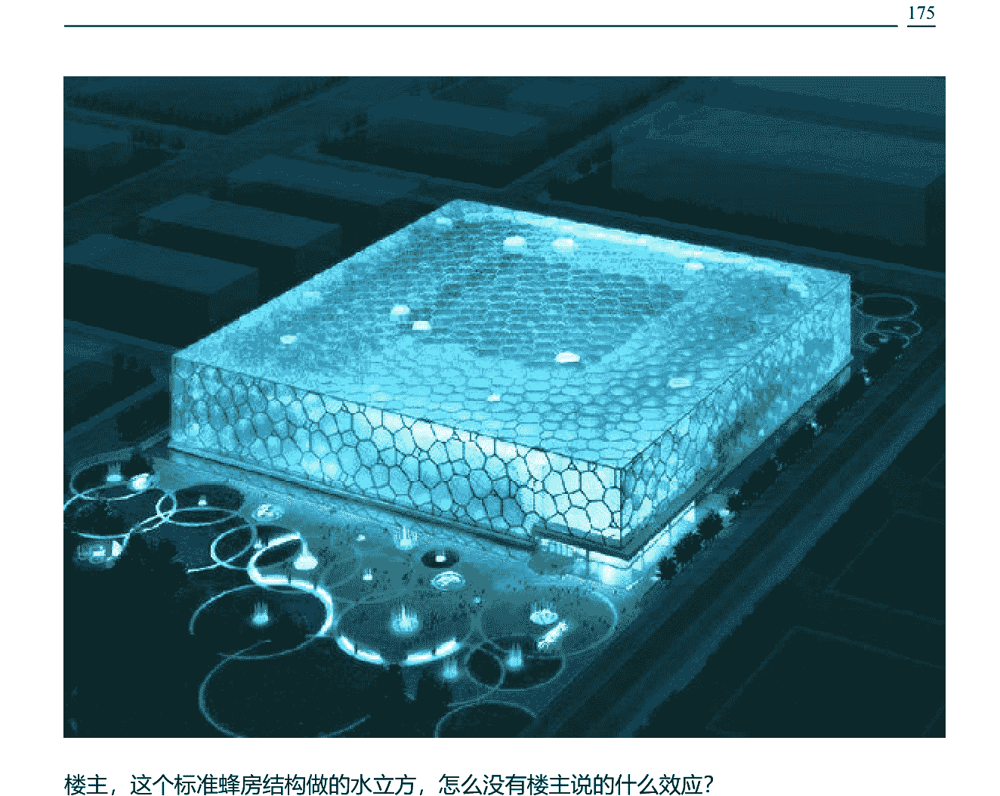

楼主，这个标准蜂房结构做的水立方，怎么没有楼主说的什么效应？

答：六面立方结构 其神圣立方深空效应主要是支持 强化其他立方结构 自身并没有显著作用

用

附在这个立方上的不等边结构没有任何效果 应该是装饰

对应用发展神圣立方的文明来说

星球级神圣立方应用应该和星球体积重量周长等各种数据形成有效比

总玄宇宙世界级神圣立方应用和各种维度各种级别宇宙世界等各种数据形成有效比

神圣立方文明程度 根据能利用和发现的 立方结构不同面的增加 而变的更为先进

神圣四面立方结构文明 神圣五面立方结构文明 神圣六面立方结构文明 神圣七面体 以此

类推 月复杂的神圣立方体需要和外在 形成有效比的数据越多

问：在一米正方形格子中排列 大小根据技术而定越小越好 做三层叠加 层数叠加越多越好

对这句话不是很理解，正方形格子？正方形里面有格子？什么形状的格子，蜂窝形状？

做三层叠加，单独的三块一米的正方形摞在一起还是其他方式？ 如果你能画图，就容易理

解了

答：将蜂窝形状结构排列在正方形的格子中 为一个成品

做三个成品之间间隔 一个蜂窝结构的高度 之后合并在一起 合并方式随意

之后完成

问 ： 蜂 窝 结 构 是 不 是 用 金 属 制 成 的 这 个 样 子 的

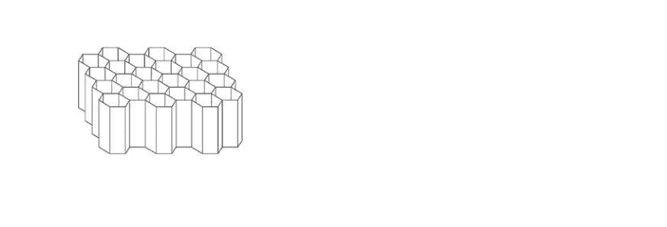

答：正确 两边其中一边用 三个 正方形封住 制成后总共 9 面

一边封住 使用你们的网络 百度图片搜索 蜂房的结构

问: 挂一个三角形的立方金属体（四面体）可以吗？ 边长需要多少厘米？ 离身体多高？ 一般情况下，在这样的金属三角体下的睡眠会怎样？ 做的梦会是什么类型的？ 您认为会有什么效应？ 一生都这么睡吗？ 有什么好处或者坏处？？？

答: 长度随意 比例对了就可以 你甚至可以将屋顶做成金字塔形
放的高度随意 模型可以挂到房顶
三角形神圣应用是聚集能量 对灵场形成有帮助 如果说人的一生每天灵场量增加一点 在简单的三角几何应用下就可以增加两点
也就是说 普通情况下肉体结构崩坏后可以存在五十天 但在三角几何应用下就可以存在一百天
正常睡觉 三角模型当成装饰即可 没有坏处

问: 请问在身体下面放一个金字塔和十个金字塔效果是不是一样的啊？

答: 不一样

问: 那效果是不是乘以倍数的在增长啊？一个金字塔是一倍，那十个就是十倍了对吗？

> > 金字塔能专家徐锦圣的专著《匹热迷能—探索金字塔能量之谜》(中国青年出版社,2006年6月)明确指出:金字塔能是现实存在的电磁波，包括太阳辐射、宇宙射线和人工产生的电磁辐射等，在功能复合材料制成的一次成型的角锥体(金字塔能发生器)内有效地汇集、谐振，并与地球磁场和万有引力共同作用而形成的一种能场。国外不愿透露的金字塔能模型的构造和材料，在他的专著《享受匹热迷能--金字塔能与人体健康》(中国物资出版社,2007年1月)中有详尽介绍: 依据金字塔能的产生原理，金字塔能发生器或者说金字塔模型必定是一次成型的有特定倾斜角度的中空正四角锥体，使电磁波在发生器内和谐共振;金字塔能发生器或者说金字塔模型的材料不可能是马粪纸、木板、塑料、玻璃、陶瓷等普通材料，而应是智能、吸波、磁滞功能复合材料所制成的。

> > 以上的资料是现有的普遍认识,到底金字塔是空心的好还是实心的好？用什么材料做比较好啊？

> > 答：不正确 多数量金字塔应用需要固定的空间上之排列顺序 总玄宇宙世界中真正应用 神经几何所需要的材料你们星球尚未开发出来 就用你说的吧 空心实心皆可 用途不同 空心可以大套小 小套更小 半实心可以做成宇宙飞行器

> > 问:那多数量金字塔要如何应用啊如何排列顺序啊？你说的用途不同能不能说说都有哪些用途？

你说按埃及的金字塔比例来做，可是我上网查了一下都不是很清楚的资料，很多不清不楚的资料都不知道是真是假，能不能详细的说下制作的比例，以及角度问题，有些资料说要什么特定角度才能有作用，但没说要什么角度，我还以为随便一个等边三角形的金字塔就可以起作用了

> > 答：将金字塔的边长高度找到 之后将小数点向前移动两位即可 做出缩小版 排列顺序很多种 根据不同的需求 平面排列 立体排列

> > 问：介绍几个简单的超自然（对于目前地球人而言）现象的实验及实现步骤！

> > 答：神圣几何应用 前面已经公布 可以让重量变轻或者漂浮

# 瑜伽是引导其它力量加持自己；凝聚纯无的几个阶段

问：你好 huanxiangXR_21 看你回复别人关于凝聚纯无的问题，关于瑜伽不断感觉自己有可能会错误的认知到宇宙中其他意识体或其他智慧生命， 请问怎么样能正确的凝聚纯无不出偏差，需要注意哪些事项，以及凝聚纯无要的是量还是质，还有凝聚纯无这样的修行分多少阶级，每一阶会有怎样的体会或外在表现？

答：你们瑜伽不就是引导其它力量加持自己 瑜伽将这些力量称为母亲 源头 或者上帝之爱 其实只是其他力量 的加持

凝聚纯无阶段

第一阶段 我 的感觉变得显著并且强烈了 不在被意识和思想所覆盖 而如从前般微弱

第二阶段 我 的感觉变得更加显著 梦中依然可以感觉到我 这样梦中可以保持清醒

第三阶段 我 的感觉逐步加深发生质变 你不在感觉到我 而是感觉到“是者”

第四阶段 我 的感觉消失了 取而代之的是 “是者”的感觉 现实如梦 梦如现实 可以在小范围内改变现实的规则

……
去感觉你内在那个不是意识 不是思想 不是自我 不是情绪 不是觉知的东西 那个就是“我”的感觉

问：楼主所说的“是者”的感觉是否可理解为凝固的纯无“活”了的意思？“活”了并且覆盖了所有的一切！

答：理解能力不存 我喜欢活这个词

脑结构让思想活了 思想让意识活了 意识让觉知活了 觉知让纯无活了

从此你不在是 思想 意识 大脑 觉知 你就是凝聚的纯无

# 反物质 反能量

问：请教一个问题：暗物质到底是什么？暗能量又是什么？

答：暗物质？反物质？

是玄无的自我创新 你们研究一下科学界 所有被理论提出的粒子都可以被加速器撞出来 就算是反物质这种完全不符合你们世界规则的物质 也可以被撞出来了 随便一个原子就好像是一个彩蛋 里面有无数可能 只要理论提出就能撞出来 难道你们不觉得奇怪 其实你们前沿科学家已经觉得奇怪了

反物质 反能量是拥有某种特性的粒子和物质能量 你们实验室 撞出捕捉的 反物质是电子自旋相反的粒子 跟自旋正向运作的粒子 碰撞既泯灭

问：HuanxiangXR我想请教的不是反物质而是占宇宙空间73%的暗能量和23%的暗物质，请问它们究竟是什么？它们为什么不与电磁波作用？它们与普通物质有什么区别？构成它们的粒子是什么？

答:暗物质、暗能量是你们对宇宙的猜想 并没有被证实 这个猜想的起因是
宇宙星系团自旋问题 你们科学家发现如果一个星系团星系要围绕中心旋转 星系团的总质量引发的引力是不够的 需要更多的物质 但你们科学家却没有观测到哪些物质 如是提出假设有某种看不到的物质能量参与了星系团的质量引力
简单的比喻 你们科学家发现 一根绳子用提起 10 公斤的力量提起了 10 吨的物质 矛盾怎么解决 于是你们科学家提出暗绳子理论 有某种看不见的绳子参与了提起 10 吨物质的力 这就是暗物质假设 但你们却没有观测到
事实是 的确有看不到的力参与 但却不是暗物质 暗能量这些理论还是三维的 我描述过你们看到的星系星团只是更高维的东西在三维的一个投影 这个东西的大多数体积结构在其他层面 你们无法观测到 你们观测到的只是它的一部分一个面

# 对 21 的言语的质疑

问：楼主，我们俩同岁，可是即使是臆想想这么深也不容易，漏洞也不多，或者是我们太蠢？真是双鱼座的，被你骗惨了

答:同岁 你是指什么 如果是指组成你身体的原子 那么你们世界所有人都是同岁 因为组成他们身体的原子在世界诞生时就诞生了
区别是原子有规律组成人体的世界
还有我不和你们同岁 因为不属于你们世界 同时是凝聚的纯无形态

问：小小年纪，天天在网上忽悠人玩
既然你 2 亿岁了，告诉我怎么穿越时间，还有空间跳转。(开着一部比光速还快的飞机飞跃星系那是忽悠人的:) )
空间跳转可参阅费城实验

答：两年前已经说过了 我再次简单描述一下 首先建立一个纯空间 空间中消除光 引力 强力 弱力 一切物理效应对其中物质/玄无创新的影响 之后封闭 里面的玄无开始自我崩塌
正是这些力强弱引以及你们没有发现的几种力 让玄无表现为物质状态
一旦失去这些力的约束 物质就会自我转化为玄无信息 之后收集这些信息 在时空机器中传送入过去时空
时空机器原理就不描述了太复杂了 深层空间刻画系统 玄修正系统 主波力输送系统 纯无递归系统 幕后人观察点借用系统 玄波场泯灭系统 太多了 你们科学词汇也根本不够
超越光速并不能回到过去

问：你在你们总玄宇宙世界的年龄阶段是不是相当于我们这个世界中不到 20 岁的小伙子？
答：不是 你们按照身体细胞年龄来计算 或者身体概念在世界上度过的时间来计算年龄
我们按照纯无凝聚程度来计算 年龄 层级

+   问：楼主是在编故事给大家听呢：
1.你智商如此之高，可否让我们体会一下你两亿岁的功力，比如写一首歌赛过天籁，作一首古诗比过李白，写一篇小说超过红楼梦,这对你来说应该很简单吧，因为对两亿年的高级生命体来说，我们人类的智商应该像单细胞动物一样简单；如果再厉害一点，你应该很容易的知道我的真实姓名和地址，或者你能不使用网络联系到我们吧里每一个人，比如进入梦境什么的；反正不管使用什么办法，你既然想改变我们的思想，首先就必须使用一种手段让我们相信你是不寻常的，否则你的那一套理论我只能当科幻小说看
2．你花费如此长的时间描述了一套你的宇宙理论，让我们知道人类只是低等动物，但是按道理我们不是一个级别的生命，你没有道理让我们知道这些宇宙的秘密，就好比我不会告诉我养的金鱼地球是方的还是圆的，因为没有这个必要，每一个层次的生命有不同的生存意义和方式，你如果是比人类高级几个层次的生命，恐怕没有动力和一些低级生命费如此口舌，最低档次也应该像耶稣或释迦摩尼一样传传道
3．其实真正的宇宙没有你说的那么复杂，只要一个字就能说明，那就是：力

答：信息不是给某个个体传达 而是为人类记忆复合体传达
让我写几百万字的介绍吗 不可能 为了节省能量我现在意识运行速度比人类快不了多少 生成一片文章都要翻译很久
知道你的地址很简单 沿着信号源找过去就可以了 不过有什么必要所有人都要证明所有人都要进入梦中 我没那么多时间和能量去做这些事 而且这些事会引起轰动和不必要的关注 这个帖子也会消失 在你们时空的干涉力度是轻微 信不信不重要 我们不做计划之外的事

曾经我修改了几个干涉力度为 极度的历史片段 消灭了其许多整个文明的存在 因为大意 在最后一个历史片段中受到重创 他们文明程度和信息显示不一致 文明程度甚至步入了真实 造成我现在能量严重缺失 信息缺失 纯无凝聚体遭到重创

你谈论的宇宙力 从物质层面来看 力 的确是一个重要基础 但从玄无来看力根本不存在

简单的比喻

你们的动画片中引力存在吗 如果不存在为什么其中引力看起来似乎是存在的 其中人物被吸引在地表 当然也有神话片的存在 人们可以依靠能量飞行 但还是要克服引力 哪是因为动画片中有引力吗

在想象 动画片中一个人 A 将剑等锐器刺入另一个人 B 的身体 穿透 穿出 流血 是因为 B 的身体受力了吗 血流出喷洒是到地面是因为地表引力吗 B 的最终死亡是因为身体结构受到不可逆转的伤害吗

这些只有从动画片中看来才是如此 其实所有规则 都不存在

从玄无的角度来看 物质界就是动画片 所有力 所有规则 都不存在

+   1. 没那么多时间和能量去做这些事，发这么多的贴子就是你计划内的事吗？是不是这个吧里的这几十号人都是中了彩票
2. 你说动画片中引力不存在，其实正是因为引力是基础作用力，是让人接受和体验得到的力,所以动画片中才会让人感觉有引力存在,否则你让作动画的人怎么画,一出来就是玄无?
3. 你说(动画片中一个人 A 将剑等锐器刺入另一个人 B 的身体 穿透 穿出 流血 是因为 B 的身体受力了吗 血流出喷洒是到地面是因为地表引力吗 )你的解释很滑稽，好像不是两亿年的智商，你能看到的所有动画片都是利用电磁力，难道电视播动画片是用的你的玄无

+   4 你说（从玄无的角度来看 物质界就是动画片 所有力 所有规则 都不存在），恰恰相反，物质界的规则是最完美最不可改变的，就像你在这个吧里发帖就必须要管理人员审核一样 ，没有人可以在物质世界作出违反物理原理的事

+   5 你好像说你没有精力学其他语言，好像你的用户名就是拉丁字母耶

+   6 你描述这么多太阳系的战争，居然还有火星人大战金星人，让我坚定了你是战争科幻小说看多了，你喜欢把一些看起来很拉风很玄妙的词整合到一起，其实蛮对吧里人的胃口的，这里的人就是喜欢这些东西

答： 玄无是根本 一切规则在玄无的创化下才有效 你们物理界的经典模型属于你们的时代你们的世界之产物 物理规则是一个世界众生意念的作用结果

根据记忆体记载 你们中被称为修行者的少数人不是已经可以初步掌控玄无信息并操控规则了 包括将钉子按入石头 行于水上 和悬浮 他改变了自身和外界的玄无信息对应 改变了规则

我用动画做比喻 难道没有看明白 所谓的规则就是那个外界的“画” “画”的力量在物理学家的公式中表现为四大经典力模型 这个模型是人们对“画”的表现总结出的规则 画中人很难发现“画”的力量 但掌握了“画”的力量就可以改变操纵世界规则 这个画就是玄无 是本质的东西

宏观和微观细节根据可以被无限扩展 就好像你们动画片中可以用显微镜看到细菌 动画片在没有步入真实前动画片的规则对你们是有意义的 当你们跳出二维的动画步入高维 你们发现所谓的规则 力 不过是玄无信息的创化 是玄无在对无限做放射的结果

不同的世界有不同的规则 元素周期表的元素是无尽的 只要你们的高能加速器继续探索微观无尽 的元素可以等着你们去发现

语言这次来花时间又学了一些 拷贝语言信息只需要几秒钟 难的是将思维对应翻译成不同的语言 你们很多语言规则不同 不过这次来将你们星球几十种主要语系都初步掌握了 但还没有中文熟练 基本聊天是没问题

不是火星人和金星人大战 金星曾经没有 它叫卓尔金位于恒星轨道第二 在你们星球还布满恐龙之时 卓尔金星和火星受到玄无自我创新的影响同时产生了生命 经过几千年的发展他们互相发现了对方 想象一下 一个恒星系两个完全不同的文明 战争是必然初期双方建了了简单的外界 又经过了数千年 其中火星文明科技显著进步 双方都视对方为潜在敌人 文明集体潜意识在这种压力下 科学进步飞速不久后因为地球星的划分起到了冲突 这是一个触机 大战爆发 结果是 导致当时的地球 火星表面自然生态受到重创 而火星文明使用的共振武器将卓尔金星化为碎片 就是现在你们地球和金星之间的陨石带 之后卓尔金星的内核 就是现在你们成为金星的存在 变成了卓尔金灵态生命的家园

> 问: 比继续传递信息更好的办法是在传递了之后开始休息，你得知道网络的虚拟和人性的猜忌让你的信息不可能快速得到大量接受，当然，它也许可以快速帮助传播，并且很安全，但这也只是冰山一角。同样，让人知道这些事情已经够了，再用更多能量来回答一些没有实际意义的问题是不可取的，要知道大部分人把你的信息只当作娱乐。

> 答: 为人类集体潜意识上传信息 个体理解不重要 理论上来说 我只需要一个人类成员阅读这些信息就可以 他读懂与否相信与否都不重要 重要的是他是你们的一员 作为上传信息的途径
为人类集体潜意识上传信息是庞大 哲学 物理 数学 艺术 音乐 新宇宙观 玄无多维度宏观与微观显化数学模型 等 其中 99.9%的信息已经通过其他途径上传入人类集体潜意识中

在这里的信息只是一个钥匙 用来激活已经上传的 99.9%的信息 直接传送 100%不可能 因为我不是你们人类的一员 无法得到人类集体潜意识认可 这是绝对定律没有人能打破 只有用这种激活式方法上传大量信息 此贴信息并没有告诉你们很多 它只是钥匙 当激活后 之前上传 99.9%之信息自然会被你们种族不同的成员想出来 并发表 影响你们文明进程
你谈论的显意识传播信息 通过印刷 转载等方式效果太慢 我们不使用
只需你们任何一个成员阅读 钥匙信息 用以激活 而这个任务已经基本完成了

问：按照我们的说法，无图无真像，给点实际的证据证明你的身份或者你们的世界存在的证据。

答：证明有何意义 我可以耗费更多能量 通过操作场中的光子 根据记忆信息做成逼真的二维平面图像 但是没有意义 一些人会说是合生 还有一些人相信 在之后图片们被传播 在之后引来不必要的关注 在之后此贴消失 用你们中文形容 吃力不讨好
钥匙信息主要目的只是开启已经上传到人类集体潜意识的99.9%的更多信息 之后哪些信息再被不同的人类成员想出来

问：1. 你说（你们物理界的经典模型属于你们的时代你们的世界之产物 物理规则是一个世界众生同意念的作用结果）意思就是说地球绕着太阳转是大家希望它绕着太阳转它就转了？那如果人类都希望能飞起来就一定能飞起来了？
2. 你说（你们中被称为修行者的少数人不是已经可以初步掌控玄无信息并操控规则了 包括将钉子按入石头 行于水上 和悬浮 他改变了自身和外界的玄无信息对应 改变了规则)我的天，这样的事你都信？我记得有一个姓李的师傅，比你牛逼多了，好多人都信他，还有的命都给了他，他在美国也说他不能给别人发功治病了，因为他每天都要对着大洋彼岸的中南海发功，对付赶他走的人，不过好像那些人身体一直好着呢。这些所谓特异功能的人就是一些笑话，看来你虽然知识面很好，但是还是潜意识里很认可这些歪门邪道的。

3 请你不要拿动画片来做比喻了，太不靠谱了，你知道那里面动物植物都可以说话的，连一块海绵都会做饭的。

4 （卓尔金星和火星受到玄无自我创新的影响同时产生了生命，经过几千年的发展他们互相发现了对方）从生命诞生到能发动星际战争只要几千年吗？

5. 你的想象力其实很窄，你回答的那些问题除了一些不可证明的理论外，其它的基本是抄袭一些已有的猜想，比如月球是一个外世界入侵者的卫星级战略要塞。

大洪水传说

火星文明 亚特兰提斯

迁移地底

5 你说（2017 年五月二十六日，第一颗核弹爆发，但仅仅一颗而已，随后你们地底的祖先进行干涉，他们不会允许你们破坏地球自然环境）。这也太搞笑了，你知道至今我们爆发了多少颗核弹了吗，你说的地底祖先在哪里啊，还在地底挖煤吧。

6 你报了很多猛料，比如和月球人大战等，这可是绝顶天机啊，这说明对于你来说泄露天机是不违反规则可以允许的，那么我不想知道这么大的事件，我只想知道明天的双色球号码是多少，你能给一个吗，连世界大战都能透露的你不会连这点小事都不帮吧。

答：1 是的，曾经你们可以飞翔，但最后失去了这种能力。地球围绕恒星旋转是硬性的，就和金木水火土几大元素相同，很难改变，要改变也不是不可以。就人类成员意识程度而言，首先培养出你们的成员个体到 一万亿个亿以上。我们假设世界能承受这莫多个体的生存，之后教导他们地球是平地，在某个时刻你们星球就会面呈平的。在之后是大毁灭，水会从边缘流失入太空变成巨大冰星，大气层会消失，辐射让地面变得死寂。

星球旋转是标准的自我循环世界模型，必须符合世界几大基本规则，大多数世界都使用这个。世界模型，是玄无创新的必然结果，用中文形容，是一种潮流。

+   2. 钉子按入石头后的照片你们网络上都可以搜到，修士虹化的录像如果搜全球网络也可以找到。你不相信没有看到过，不代表不存在，存在的事物不会因为你的态度而改变。不存在的事物也不会因为你的抵制变的存在，因为你还没有如此强大的意识和能力。

关于你谈论到的李师傅，难道你没有发觉逻辑上的问题？这个逻辑就好像在说，你没有见过会游泳的人，之后李师傅告诉你他会游泳，最后你发现他根本不会游泳，于是你就断言世界上没有会游泳的人，你确定这个逻辑成立吗？

建议：多看看书，发展一下自己的逻辑思维能力，封闭僵硬的意识会造成生活的痛苦和机械化。

+   3. 有些更为灵活的世界，规则还不是像你们这么僵硬，强大的意识体可以变身成植物也可以说话，也可以变身为任何东西。海绵完全可能，一切不过是相的显现。

+   4. 几千年难道不够一个文明发展到太空时代？事实是你们人类太慢了用了 5000 年。火星文明第一个简陋的太空侦测器，你们现在的还简陋，经过数年的飞行进入对方星球轨道，拍摄了简陋的照片，火星文明就发现了卓尔金文明，并引起轰动。首先发现对方的文明还产生了很多运动，主张使用远程导弹武器，毁灭对方派，和平沟通派，引导扮神派，观察派，等等。那时卓尔金文明第一枚太空卫星才刚刚发射不久，恒星系大探测还要十几年才能到来。双方远程导弹互相飞向对方星球只需要一年左右，之后双方迅速建立了导弹防御网。为什么不能星际战争？事实是他们互相发现后建立了简单的贸易，和平并持续了数千年。如果你还要更详细，也许可以告诉你卓尔金公主和王子对同一恒星系发现类似外星文明的看法。

5 我用你们的文字，和记忆库中的信息。月球是要塞的观点不新鲜，因为它本来就是一个事实，这个事实很容易发现，你们发现也不奇怪，不知道你逻辑上为什么会认为这个有问题。

6 核之武器。看了这个问题，建议你对自己的头脑进行推理能力训练。你们星球所做的核试验最高不过 5000 万吨级，再高你们星球就找不到合适的试验场了。大多数核弹只是在偏远的无人区进行的百万吨级核爆，百万吨级在偏远的地区，而且攻击范围不过最多上百公里。你们的某个发达国家曾经想进行亿吨核弹试验，不过导弹被亚特兰提斯飞船击落。5000 万吨的一次核试验后，你们地底祖先对你们所有发射井已经严密监测中，一旦发生核战，既全面干涉。

你们许多国家已经秘密造出 2-3 亿吨级核弹，告诉你杀伤力范围：2000-2700 公里。你可以在计算一下你们星球有多大，就会明白。便一个 2 亿吨级扔到海中，可以掀起 3000 千米高的海啸，淹没星球所有沿海城市。这还不是最伤的，最伤的是在大型油井中引爆核弹。一旦发生核战哪不是核试验，用你们中文来说，是无所不用其极，全面毁灭。

核试验和常规攻击不同，当然会破坏自然。别人扔了你核弹，你当然要反击。秘密研制没地方试验的超大当量核弹在你们星球出现，双方对射，星球自然环境遭到严重的破坏。

> 问：我表示楼主很少有深夜或晚上的帖子，难道楼主晚上也要睡觉？还和地球同步...

答：纯无凝聚体不需要睡眠，依靠脑神经元结构支撑意识存在的生物才需要睡眠。白天是你们个体活动时间，选择在你们个体活动时间沟通不是更好，全天 24 小时都可以发言。不过还有更多任务要完成。

问：你们种族有没有性别？用什么方法追求异性？是不是又按个按钮？虽然这很爽！ 还有你们平时有什麼娱乐活动？是不是到处修改其他种族的文明？虽然这也很爽！很好玩。

答：没有性别。一切感觉都可以刺激神经元产生，当然我们的大脑神经元和你们等级不同，但原理相同，给予大脑神经元什么信号就产生什么感觉。此次修改是为了总玄宇宙世界，不是为了玩。当然有些低等的文明操控更为低等的文明玩，刀剑发展战争游戏，他们在高空俯视，你们曾经就被类似的文明控制过。

问：引用 HuanxiangXR_21 (1167 楼)

理解有误，宇宙沉思，17 万亿年的记录，不是指我，再看一遍。宇宙沉思是总玄宇宙世界，凝聚纯无后普遍开发纯无途径的一种方法。事实上凝聚纯无后运作意识是浪费，总玄宇宙世界中纯无凝聚体的纯无普遍开发度不过 0.001%，最高也不过 17%。17 万亿年是指总玄宇宙世界宇宙沉思，时间最长的个体记录。再次理解。

回 1167 楼：嘿！你那也要说清楚啊！提问者问的是 “你” 能否进行沉思，而你回答至少要加个主语啊，比如 “ 个体 最长的记录用你们的时间计算是 17 万亿年，不是我” 这也行啊。

理解有误来自两方面，一是说话者表达不清，二是听话者往往根据自己的人生经验去判断，导致理解失误。你属于第一种情况，而且汉语语法没学好。

但还是有矛盾： “一亿零三千七百二十六年零五个月左右” ，和 “快两亿岁了” 差了九千九百九十九万六千二百七十三年零七个月左右，即 99996273.058333 年，虽然你有可能说这么点时间在总玄宇宙只是一瞬，但差这么多也不能算【快】2 亿了，现在才 1 亿刚开了个头。

+   2. 你说清除婴儿，伪装成自杀，那请问人类婴儿怎么伪装成自杀？

3. 最大的矛盾在于：http://tieba.baidu.com/p/1501868066?pn=6#18788438090 说你“不能看视频，我建立的场只是一个简单的文字信息接收和一个搜狗信息生成”，而在 http://tieba.baidu.com/p/1501868066?pn=18#19000537220 和 http://tieba.baidu.com/p/1501868066?pn=42#19784791031 明显是知道视频中的内容，看了视频才做出的回答。不要说你还模拟了一个“视频场”，甚至还有计算机是“xp系统场”“IE浏览器场”。

+   1. 语言越使用越熟练，我们文明是思维共享，没有你和我，等很多定义。但我在熟悉你们的语言，还有很多成语，你们的诗句也不错，表达意境和感觉。一亿年不长，的确快两亿岁了。

+   2. 自然死亡，自杀，这两个不是同义词。

+   3. 你们落后的网络传送技术只是光电转换信号，过程是：电信号转化为光脉冲再转化为电信号。我花了点时间分析了所有电信号和光脉冲的对应。不需要什么 XP 场，IE 场，现在直接在你们光纤网线中拦截和发送光脉冲就行了。

问：我想知道你建立的“简单的文字信息接收”场是怎么在百度登录的？ 又是怎么工作的？

答：在你们光纤网线中制造一个可以拦截和产生光脉冲的场即可。这个场是一个终端，区别是直接产生发送光脉冲，而不是先用电信号转化过来。

### 2012 是玄无自我更新的开始 不是意念影响

问：您好，我刚在其他帖子上看到您以前的发言，说“预测是一种严重干扰蝴蝶效应的事情，在可控制范围内，笼统的点出未来已经是我们可控的最高范围了”那么2012的事情是不是也是一个蝴蝶效应呢？像是您也可以谈论2012之后的事情一样，比如石油枯竭等等，这样的话，就说明2012在大家的意念影响下，已经不会出意外的，必然会成为现实。我可以这么理解吗？

答：意念影响只能影响你们的社会结构，2012是玄无自我更新的开始，不是意念影响。

问：我对您的“玄无自我更新”与您所提的“收割”的理解是：地球所处的这个空间的转换，从一个形态转换到另一个形态，这个是必然的！是这样吗？只不过在这个过程中，您发现了与之不同的是：人类应该灭亡但是却没有灭亡。难道这个不是蝴蝶效应？或许是您或您的同伴在沟通中，给予某位人类于效应，因此人类保存了下来。这有可能吗？

答：旧历史中我谈论的灭亡，是旧人类的灭亡，玄无更新后则新人类诞生。放心吧新人类不会灭亡，因为秩序者。

### 四维和五维并不直接产生生命 而是以背景和支持的存在

问：楼主也是发散性思维啊。我的提问楼主没怎么回复啊。。。楼主你还给过其他星球的朋友一些启示吗？四维空间的同我们最大的区别在哪儿？看你的信息似乎我们会进化到四维空间后。楼主如果以你的本体来看我们地球人，你看到的是什么？一堆信息，原子，还是跟我们镜子里看到的自己一样？我说的是面貌特征。现在你如果要变成一个地球人甚至中国人（和我体型外貌一致），是直接进入人的思维还是从婴儿开始？还是都可以呢。你们那儿的人如果需要交流时怎么办到的呢？你是怎么知道需要修改我们的时间片段？被宇宙联盟提示的吗？

答：四维和五维并不直接产生生命，而是以背景和支持的存在。存在生命的是 三维、六维、九维度，以此类推。一和二支持三维，四和五支持六维度，七和八支持九维，以此类推。以本体来看可以多角度层面，每一种角度都不同。从四维度或者更高来看你们世界是透明，从量子来看是玄/信息震动，从三维来看和你们无区别，从场域来看一切在发光形体模糊，从九维来看你们世界是一个点无限小又无限大，从玄无来看，你们世界是无数的光纤放射没有形体什么都没有，每个人是一个光蛋，光蛋链接世界玄无放射，交换信息。从纯无角度来看，世界是结构性的线条，无论是什么维度，区别只是复杂和简单的线条区别，等等。变成你们形态任何形式都可以，肉体只是工具。我们种族一生都住在种子飞船上，除了补给回过数次母世界外。交流进入母世界系统，纯无投影，纯无建立的世界投影，哪里一切都是瞬间的。所有历史片段都需要修改，所有修改内容都被主机计算更新计算补充。宇宙联盟和你们理解的不同，是总玄宇宙世界联盟，联盟有参与，但任务主要是总玄宇宙世界七大种族来完成。

> 四维不是时间轴，梦境是扭曲的东西。

问: 看了你之前的发帖与回答，使我更加坚定了我认为人类必须变化的猜想，不过我还是有几个问题:

+   1、2012 年 12 月 21 日之后的地球，你之前说是变的开始，那这个变是巨变还是逐步转变(改变的幅度与时间比量)？

2、是通过人类自身意识或精神灵性的转变还是外力（如灾难或类人文明）实施改变？

3、人类目前是三维生物，什么时候可以步入更高维度？

4、你说目前人类要做的是凝聚纯无，具体做法是不是可以参照冥想来实现（首先冥灭思想，然后再感受自我，深化加强）？

5、你在回答中说到很多人类通过情绪的变化释放诺露，但能告诉我们如何吸收诺露吗？吸收诺露后，会对我们的意识或感知有什么变化吗？

6、问一下关于个人一个梦境的疑问，我之前曾做过一个梦，时间大概就是2012年12月21日的事，我看到灾难的发生，有地震火山洪水，最后我看到非人类生物的出现，带了少部分人到了另外的地方（包括我，不确定什么地方，类似外星），最重要的是，在那个梦里，我看到并理解了四维（就是三维空间加一个时间轴）当时梦境是相当真实，请问这是基于幻想还是真的未来？还有我是个什么样的意识体？目前应该做什么？

1 逐步改变，幅度进展1%时间1-2年。外力，世界内在的玄无的自我更新，灾难只是一部分。

2 千年之后。

3 可以这么理解，消灭思想，集中注意与精神与觉知，觉知越过意识和肉体自我，去寻找“我”的感觉。

4 别人关注你时你会感觉很舒服，你们的明星被无数人的狂热情绪集中，他开始会感觉很好，但是他不会转化这种情绪信仰力为己用，能量堆积到灵场中，于是抑郁症、自杀各种情况不罕见。吸收诺露就是让人们的信念集中于你，转化不是我告诉你，打一行字说一句话，你就会转化了。凝聚纯无，你就会了解如何转化。比如我发帖就会有一丝微弱的情绪向心力集中过来，不过我不会吸收，只是转化为纯净诺露后在返还给你们，我主要吸收覆盖在地球上玄波场带来的能量恢复自身。

+   6 四维不是时间轴，梦境是扭曲的东西，各种信息混杂，有真实，有虚假，这一次历史中你们的梦有时会反应上一次历史的经历，但你梦中的时间不一定准确。灾难是确定的，但被带走应该是一种自我重要感在其中加入的信息。你是什么样的意识体？目前内在层面凝聚纯无，外在层面你们不是有很多生存手册。

> 掌握画笔的力量

从玄无层面来看，三维玄宇宙世界就是生活在动画片中，我喜欢动画片这个比喻，其中的规则只是玄无的显化，从玄无应用上改变你们世界，比从你们世界内部容易的多。还是那个比喻，动画片中的人改变世界很难，而动画外的人改变只需要将其画成自己需要的样子。从总玄宇宙世界观来看，就算三级玄宇宙世界中进化出了你们可以想象最强大的超级文明，但只要没有跳出动画片，还没有步入真实，从玄无上抹去他们整个文明不费吹灰之力，他们甚至不知道自己如何毁灭的。而这种情况在总玄宇宙世界经常发生，因为两者掌握的不是一个界面的力量，一个是动画片中规则中的人，一个是掌握画笔的力量。

### 很多人说自己是外星人或者守护者

问：“一个异人启示录的天涯社区，说自己是地球护卫者，护卫驱除外灵的入侵，他们有孙悟空一起参加了对天堂的战斗。现在也注视着外星人的到来。保卫地球。一佛教徒禅入空性观得2013年淘汰开始，2015年打开了这个空间的最大粒子，新纪元开始。洪启嵩的网站里也有五年后（2011年写的）进入太空时代的字样。传授妙定功。你对此有何看法？”这个帖子几天了，你为何不解疑一下？

答: 你们中不是很多人声称自己是外星人或者守护者，其实只是哲学家，谈论没有意义的事情。一佛教徒禅入空性观得2013年淘汰开始，2015年打开了这个空间的最大粒子，新纪元开始。关于佛教徒入空性的这个问题，2012传说在你们星球信息界形成了潮流，每个人都有不同的说法，只是没有一个说对的。

### 142857

> > 问：感觉楼主很强大，请问楼主所有的所有都是一个起点吗？楼主对 142857 有什么样的理解？楼主有时没有必要回答一些没有必要的问题，悟性到不了，知识面达不到，其也领会不到。本人对楼主的身份还是持怀疑态度，不是完全相信，也不是完全不信，但对楼主的知识是绝对的佩服，这些问题不是一般人能回答了的。希望楼主停留的时间长一些。
> 
> 答：没有起点，起点在相对中才有意义。142857 是十进制中的数学复刻点，使用不同进制数值都不同，但都是复刻点。使用不同进制复刻点的数字不同，但性质一样，在乘除加减上表现出所使用进制数位的规律性。其实是最根本二进制复刻的复刻性表现，用中国语言来说就是阴阳中的恒。142857 是十进制中的阴阳调和点。

### 《皇帝内经》

问：请问楼主中医的起源是哪里？《皇帝内经》是什么人的作品？中药是如何对人体起作用的？谢谢。

答：黄帝内经，是对玄无能量面的应用，通过改变玄无能量面的状态从而改变物质的状态。何人所著，最初的原理来源于你们祖先对你们的启蒙和教导。

### 宇宙的起源

问：1、宇宙是否有起源？2、平行宇宙跟多层宇宙的关系，是不是一回事？3、意识的起源是什么？灵魂也有生死吗？

答：宇宙没有起源，起源在相对中才有意义，如果有一个起源就有起源的起源，无限后退，引致思想上的混乱。平行宇宙如果去掉每个世界中都有一个类似的你的观念，可以契入多层宇宙模型中。大多数 97%人的意识的起源是玄无物质面大脑神经元有规律的运作，诞生意识。大多数 90%人的灵魂有生有死，肉体的死是灵魂的生，灵魂的死是归于虚无的死序，类似永恒不醒的无梦睡眠状态，瞬间已过亿万年。

### 宇宙级生物

问：据外媒报道，近日，美国国家航空和航天管理局(NASA)发布了一张震惊网络的图像，照片里一个十分巨大的金属质地的物体在太阳表层上方近距离飞过，极似一艘航空母舰。报道称，此照片一出便立即在网络上引起了巨大轰动。一家 UFO 网站称它为一个“十分庞大且形状奇特的不明飞行物”。且不论该物体是为何物，但毋庸置疑的是，它能够抵抗太阳表面的超高温度，也不受太阳耀斑的影响，这实在让众人疑惑：“它到底是什么”。楼主能解释下吗？究竟是什么东西？来自哪里？目的何在？对人类有何影响？

答：他们两年不是已经来了吗，前面说过，是一个跨越四维矩阵文明，不常来你们世界。你们世界火星文明称他们为神的文明，金星灵态生命称他们为引导者，地底祖先和地表人类对他们只有震撼。

他们来你们世界只是为在你们恒星中培育的一级宇宙级生物加养分，不过不用担心，亿年内应该不会卵化。你们拍摄到的飞船不是飞船，他们文明是科技和生物的融合，你们拍到的是一些四级五级的宇宙级生物战舰，他们文明捕捉宇宙级生物后在其身上安装机械控制系统，和武器，以及各种生活区研究室。

宇宙级生物，两年前介绍过，在星球或者恒星产卵，吸收星球养分，星球变成一颗蛋，之后卵化星球破碎。宇宙级生物体积巨大，在外宇宙间游荡，吸收恒星和星球的养分。

问: 那个跨越四维矩阵不常来我们世界的文明是多少玄度的文明? 他们培养的宇宙级生物卵化了是不是太阳就破裂了完了? 有什么办法让他们培育的卵永远不化或者取出来扔了?

答: 至少掌握了玄无两个面，20 玄度以上。宇宙生物的卵会吸取太阳的能量，就是无尽的氢聚变反应，同时需要其他养分由培育者文明完成。随着卵化，太阳最终会熄灭，不会变成黑洞也不会变成红巨星，千万年以后的事了，那时也许你们早已经跨出了这个三维星系圈，进而向总玄宇宙世界迈进。

# 佛教的几个“界”所对应的玄无的几个面

问：你这样描述玄无我没有异议了。对纯无的说法也无异议。的确如此。

你是道家的或大自在天的描述法。描述的是欲界。无你未说明。

你说的玄无即是佛法所言四大交织的无量世界。纯无即是阿赖耶识。此一切皆生灭不住，无有实际。凝聚纯无不是要长生不老吗？这是仙人道家的知见。

生灭是幻像，本来无生无死。执像为真，难出。凝聚纯无，亦是妄相。

答：佛教有了解模型对应也可以。

- 无色之界 对应 玄无创新面 哪里是概念 感觉 可能 潜在可能的世界
- 有色之界 对应 玄无精神面 生出精细的相 美丽 典雅
- 欲望之界 对应 玄无物质面 这个你们了解
- 佛教和道教还不完全
- 道教和瑜伽密宗对应 玄无能量之界 能量运行 经脉 中医等
- 你们对物质面了解了 百分之三十 对能量面和精神面了解百分之零点一左右
- 纯无和阿赖耶对应勉强 阿赖耶对应你们定义的集体潜意识不错
- 道家的成仙不是凝聚纯无 是靠凝聚能量 以能量面的结构支撑意识存在
- 纯无不属于任何东西 它是你的本质

纯无凝聚到一定程度才能长生 就好像一个湖 大多数人一生凝聚的纯无只有湖中一滴水那么多 因为他们从来没有了解过自我的本质

凝聚纯无 而不灭 水最少要达到湖的万分之一

### 阴阳

> 问：一个问题:在能量界，世界处处是能量排列。这个理论很早看过。楼主应该也掌握了。
请告知能量界规律变化和理论。

答：阴阳理论你们中国人不是已经有了 缺少的只是在之上的深层发展

能量界三大定律

- 阴阳相生而相克
- 极则必反
- 阴中怀阳 阳中怀阴

每个定律深层解剖可以写一本书

问：Hi, HuanxiangXR_21 能否结合你的体会，阐述以下这句文段所蕴含的真意，谢谢解惑 一阴一阳之谓道，继之者善也，成之者性也。仁者见之谓仁，智者见之谓智，百姓日用而不知，故君子之道鲜矣。

答：道哲学所谈论的阴阳平衡在各个领域的表现

### 《山海经》龙；凝聚纯无而达到永生最低标准

问：1.在中国有一本奇书，叫《山海经》,记载了一些奇怪的事件，对这些事件至今仍然存在较大的争论。最有代表性的神话寓言故事有，夸父逐日、女娲补天、精卫填海、鲧禹治水等。据说原共22篇约32650字。共藏山经5篇、海外经4篇、海内经5篇、大荒经4篇。《藏山经》主要记载山川地理，动植物和矿物等的分布情况；《海经》中的《海外经》主要记载海外各国的奇异风貌；《海内经》主要记载海内的神奇事物；《荒经》主要记载了与黄帝、女娲和大禹等有关的许多重要神话资料。 请问书里描述的内容真实吗？？是当时地球什么地方的地理等信息?还是人们的想象?还是地球不同频率段的其他生物的情况??

2.现在地球上还有龙吗?你说过龙在不同的频率的空间,如果地球物质层面出现大的破坏,会不会影响灵场内的修行者和龙的生命??如果月球入侵地球,是不是也会危及龙等灵场生命,也会危及几千年来在修行者??如果地球灵场的生命受到很大影响,相信他们(它们)也不会袖手旁观,也会对抗入侵的.

3.在地球灵场中的生命是否有很多?他们寿命能多久？其中吸收信仰之力的灵性生命是否也会对信徒们有所回报，比如帮助信徒解决遇到的困难和灾难，是通过什么途径作用到信徒所在的物质世界的？？

4.根据人类的寿命（按80年测算），凝聚纯无需要多少时间（累计多少小时？？）才能够在肉体毁坏后保持生命继续存在？？，就人类的寿命和身体状况综合评估，凝聚纯无和修行(增强能量场) 这两种方式哪一种更容易成功生命延续超过肉体寿命？？

答：
1. 远古的一些记忆而已 地貌是大洪水和战争前的 描写的生物是“神”造的基因合成品种 还有一些历史事件
2. 有龙 神话时代残留下来的生物 幼年龙是物质性的 随着成长而透明态化 最终成年进化成一只低阶的宇宙级生物 在太阳系游荡 用你们的哲学描述 属于第五密度 月球入侵 对龙没有影响 对覆盖在你们地球表面的低灵界有影响 人类如果消失 低灵界也存在不久 不过它们也无力反抗 你们星球真正的有成修行者已经加入金星高灵序列了 和地球关系不大
3. 很多 过去死去却没有消散的人 信仰虔诚会给予一定的帮助
4. 凝聚纯无而达到永生最低标准 一万小时左右 这一万小时必须是时刻凝聚时间 同时也根据悟性不同而不同 如果只是要超过肉体寿命 增强能量场不错的方法 住在强磁环境中就行了 比如CT

### 罗布泊

问：罗布泊耳朵眼里有什么，和亚特兰蒂斯有关系么？

答：罗布泊耳朵眼？哪里难道不是一片乱石平原

罗布泊和亚特兰蒂斯没有关系

只是一些地方比较靠近北纬三十度

问：北纬三十度的地方有什么特殊之处么？

答：地球阴阳调和点 发生很多神奇的 违反物理规则的事

问：楼主你好，罗布泊的丧尸，双鱼玉佩是真的吗？彭加木去哪了？据说还有远超越现在人类的科技。现在此区域还被控制，中国在这些科技中得到不少启发，是吗？

答：罗布泊是核试验场 只是某些区域比较接近北纬三十度 罗布泊没有你们定义的丧尸和双鱼玉佩

彭加木死亡了 缺少水和食物导致身体功能衰竭 同时因为意识状态的混乱 和环境磁场的刺激 导致迷失在荒凉的叠加空间中

你们是得到了启发 但不是在罗布泊而是昆仑

### 太阳系九大行星都在经历相同的变化——玄无自我更新

问：据中国地震台网测定，2012年5月3日18时19分甘肃省酒泉市金塔县、内蒙古自治区阿拉善盟额济纳旗交界发生5.4级地震，震源深度8公里。

地震频发啊，月球忽远忽近的搞地球。我们能做啥呢？

答:很多小型地震和月球引力拉扯没关系 是玄无自我更新造成 太阳系九大行星都在经历相同的变化

问：请问楼主： 你提到的新结构的产生具体是指什么？ 更新后的世界大体情况如何？ 大部分个体的意识现状是否已经注定他们会毁灭或存在？ 还有关于秩序者问题你所回答的“坦克世界”是指什么？

答：新结构是指微观到宏观的重新定义 过去的规则大多数无法使用

这一轮更新后世界物种会变大 达到恐龙时代的体积也说不定 同时一些物种消失 一些新物种出现 这些已经在你们星球慢慢发生了

意识存在的意义 就是消散在黑暗海洋中 被黑暗的海洋吞噬 世界是培养意识的地方 黑暗海洋的种植园

坦克世界是你们文明成员娱乐用的虚拟游戏

### 唯物主义有利有弊

问：请问楼主：

你在地球期间由你本身发表的言论都是在哪些时间区间？因为可能有很多冒充者混淆视听，

造成不必要的误会。

中国现存的哲学体系比如唯物主义科学发展观等等是积极影响大于负面影响还是负面影响

大于积极影响。从帮助我们进步的角度请你推荐给我们一个我们世界现有的哲学理论体系以

供学习。或者我们由自我意识来发展更好？

答：当然是亚洲时区

唯物主义有利有弊 增加玄无物质层发展 消弱玄无其他层面的发展

推荐你们 唐望 哲学体系

当然自我发展意识更好 不过需要更多的智慧和自我认知力度

### 蜥蜴人是想象 小灰人存在

问： 1 你是否了解关于秩序者的情况；秩序者对我们来说意味着什么；秩序者的觉醒是瞬间还是逐步的？

2 在此届人类文明中意识发展的极限能到达什么程度？

3 历史上佛陀、耶稣等人是人类还是其他星球的来客？

4 人类内部是否有潜伏的外星来客（比如小灰人和蜥蜴人）？

5 地球上是否存在到达其他时空的通道？

答： 1 逐步加身边量变引起质变

2 在上一次历史中 60 玄度左右

3 不是 是你们自己创造的偶像

4 蜥蜴人是想象 小灰人存在

5 存在 但不能回到过去 只是一片凝固的空间 进入后时空被定格 有机会在未来出现 这个和穿越时空无关 就好像一个人暂时被冷冻了 几百上千年后解冻一个道理

### 每种文化都有自己的价值 每种文化都是一种和世界相处的方式

问：你所说的内容以我们的逻辑尚能理解。你是否可以表述一些超出我们理解的事物？
如果文字不能，你能否用图案来表述？请你谈谈对地球艺术的看法。地球上各种文化在你
看来是否有价值？如果人类停止物质生产会发生什么？有没有可能实现没有物质生产但
可以保证机体生存发展的境界？

答：我只能模拟文字 模拟图形太费劲

逻辑不能理解 表述就没有意义 因为你无法理解

每种文化都有自己的价值 每种文化都是一种和世界相处的方式

人类停止物质生产会灭亡 最后残存的人们回归原始

可以 但必须要全世界人们共同统一的思想 你们现在就可以做到 只要能统一思想

### 为什么长时间不睡觉，人就会“面容恐怖，无病而死”

问：我认为：

灵魂隐藏在人类身体细胞的间质之间，

当人类完全放松（即所谓的冥想，肌肉松弛）的状态下，

灵魂从细胞间质之间解锁出来。。

可以神游四方。。（即：所谓的神游太虚）

也可以称之为：做梦。

而灵魂有一个巨大的缺点，

我不知道该怎么形容，

即：

细胞间质将灵魂锁住，

而锁住的时间不能过长，

如果过长，

就会导致灵魂破散。

解脱的办法是：必须时不时的使肌肉和精神进入完全放松的状态（例如睡眠，浅睡亦可）

使得灵魂得以短暂释放。

若做不到这一点，就会导致失魂而亡。

证据时：人可以7天不吃饭，但是却不能7天不睡觉，

如果长时间不睡觉（超过7天），

就会导致死亡（而不是因为饥饿致死）...

若你认为我说的不对？

请告诉我：为什么长时间不睡觉，人就会“面容恐怖，无病而死”!!!

========================

有研究用狗做过试验。a，b，c三条狗。

其中：

- a 只准进食；
- b 只准饮水；
- c 既准饮水又准进食，但不准睡觉。

试验结束后发现：

最早出现症状的是c狗，首先精神不振，而后脾气暴躁，最终精神彻底崩溃而死亡。

其次是a狗在c狗死去之后才死去。

而只饮水为生的b狗坚持到了最后。

答：从物质层面看可以理解细胞锁住灵魂

从意识层面来看 是因为意识集中在物质头脑的频段 很难移开

大多数人灵场不强 就算灵魂被解放出来 最多数分钟后灵魂就会消散 之后意识消失 等待

第二天肉体将意识唤醒 其实是一种浪费

不睡觉 大脑神经元得不到休息 脑细胞衰变 当然会死亡

只要大脑结构在 灵魂消散了也没关系 最多损失一点灵场量 只要脑结构还在 意识就能从无意识海洋中被大脑神经元运作产生的结构性拉回来

### 一个亲人去世了，那么我该如何使用外力的方法，使其保全不灭？

问：请介绍一下 “外力强化灵魂的好方法” 另请介绍一下： 假设一个亲人去世了，那么我该如何使用外力的方法，来收集亲人的灵魂，使其保全不灭？

答：外力强化 住在强磁环境 让灵场强大的存在为自己稳固灵场 等

外力是指技术 你们的技术无法收集死后的灵魂

火星文明成员随身携带一种小型仪器 肉体结构崩坏后可以收集其灵场结构 之后送入火星地底的克隆设施中复活

### 思想是玄无的思想 不是你的；凝聚的纯无值得信任

问：lz 很久没出现了。但是问题继续：1 站在你的立场上来看，我们的思维对我们来说是否值得信任？简要说明原因。

2 如果思想不值得信任，那么什么值得信任？

答：思想是玄无的思想 不是你的 你们只是以为那些思想是你的

凝聚的纯无值得信任

### 玄度划分

问：凝聚纯无是不是所有意识体发展的方向 发展到最后是不是都要走你们种族的那条道路呢

答：是的 玄度划分

玄无六个层面 当一个文明掌握了一个层面的 100%就是 10 玄度文明

你们文明掌握了玄无物质面 20%左右 其他两个层面不到千分之一 所以你们文明是 1-2 玄度之间

掌握玄无六个面就是60玄度文明

之后掌握了凝固了纯无 并和玄无六个面互相应用率达到100% 就是70玄度文明

问：60玄度，是什么阻碍了向更高发展？ 这个文明发展的极限点是针对整个人类文明还是某个个体？它是在什么时间出现的？ 60玄度文明是否意味着人类将扩散至更多宇宙？届时人类的形态会如何？

问：60玄度以上需要纯无的应用

72度才是极限 玄度划分根据文明定位 当然2玄度的文明中也有20以上玄度的个体 你们文明不是诞生过很多个

60玄度 总玄宇宙宇宙中比比皆是 是一个极限 要扩展需要纯无应用

60玄度形态各异 一般只生产大脑 在胚胎细胞中加入比纳米更小的机械DNA 辅助DNA展开 胚胎在发育过程中身体慢慢被机械DNA取代 只保留大脑 当然这只是一种 每个文明培养新成员的方式不尽相同 千奇百怪

问：60玄度+纯无应用=70玄度，那72玄度中，另外那2玄度是怎么回事？

答：这个不在可表述范围内

你们文明等级还差的很远 不过1-2玄度之间

问：总玄宇宙有几个呢。。你遇到过比自己更高级的文明么。

答：总玄宇宙世界只有一个

总玄宇宙世界最高等级文明 71/72 玄度

我们 70/72 玄度

问：总玄宇宙达到 72 玄度就可以毁灭了么，还是能永久的存在，总玄宇宙毁灭，我们的世界也不在了是吧，一切归于虚无，重新开始行的一轮提升和进化，玄无创新

答：不是 到达 72 玄度 会有新的 完全崭新的意义和途径 具体不在透露范围内

问：你们没有情感，那生活的乐趣是什么？换句话说，你们追求什么？

答：我们寻求自己 纯无 100%开发

我们寻求最终猜想 72 玄度文明的诞生

没有感情 是因为控制超越了感情 感情只是内在植入的程序 如果我们想体验感情 可以体验比你们强烈无数倍的各种感情 幸福 愤怒 快乐 喜悦 冲动 极乐等等 形象的比喻 只要按一个按钮就行了 为大脑神经元植入情绪程序即可

但我们不追求这种享受 影响理性的判断

问：介绍一下克尔加人，什么叫做 607 玄度文明，71 不是最高吗？

答：生成文字时多生成了一个 0 一个微小的光脉冲偏差 如果要重新生成修改浪费能量 所以直接发送了 你们能明白就可以 67 玄度文明

72 是最高的理想中

问：请问生命体的玄度和三级玄，四级玄这些世界的关系是怎样的？

答：玄度划分

玄无六个层面 当一个文明掌握了一个层面的 100%就是 10 玄度文明

你们文明掌握了玄无物质面 20%左右 其他两个层面不到千分之一 所以你们文明是 1-2 玄度之间

掌握玄无六个面就是 60 玄度文明

之后掌握了凝固了纯无 并和玄无六个面互相应用率达到 100% 就是 70 玄度文明

重温一下（（（人类现在所在的银河系 一亿个银河系组成一个阿卡斯域 阿卡斯域为圆柱形 无数的银河系围绕阿卡斯域中心太阳（一种胶态物质）旋转 一亿个阿卡思域为一宇宙界 无数的阿卡斯域围绕第一宇宙界中心点呈螺旋向上旋转 我们的宇宙包含 72 个宇宙界 72 个宇宙界围绕宇宙中心太阳（翻译过来就是一种以太物质）旋转 在向外就是宇宙壁））） 宇宙界 每个宇宙界根据其中生物进化程度分为不同的 一二三四五六七乃至更高的玄宇宙 世界

### 关于 21 他们的世界

问：你好，请说下你一般每天要做什么事？ 你的输入法是什么？从哪里下载的？ 你每秒可以输入多少个汉字？ 谢谢！

答：很多 主要是收集我覆盖地球玄波场中的能量 启蒙一些你们学着新思想 引导人类集体潜意识思维扩散点等
输入法是模拟的 文章是瞬间生成 输入汉字不需要时间 需要时间的是 组织语言 将我们的思想翻译成你们的思想 在翻译成你们的语言
为了节省能量我现在的意识流速仅仅比你们快 1.7 倍

问：请问你现在的情感有哪几种？ 有没有喜欢的人或事物？有朋友吗？ 在你们文明中，个体之间的关系是什么样的？
答：我们没有感情 感情不必要 理智代替感情 但我们可以随时生成任何想体验的感情 强烈度可以随意调节
我们出生便在种族飞船上 正面接触其他成员很少 除非发生战争我们可以在总玄宇宙任何方位集结 交流一般都在母世界投影世界中交流

问：请问星际联盟是什么？ 从什么时候发展起来的？
答：总玄宇宙世界星际联盟 在 总玄宇宙经历了 37%的时间后 初具雏形

问：修改了历史的片段总玄宇宙就不会毁灭了么？ 你们努力的维持总玄宇宙的存在是不舍得么，毁灭之后一切会重新开始么？ 还是你们也不知道？
答：不是不舍得 60 玄度以上的文明已经无欲无求了 是因为还没有出现 72 玄度的文明 或许已经不能称为文明了 更多的不能透露

问：没有回答呢，总玄宇宙毁灭我们的世界也随之毁灭么

答：是的 你们在总玄宇宙世界数不尽层面中的一角

问：那怎么才能达到你们的文明么，必须自己进化么。。

答：进化

问：继续提问 ：有没有 宇宙旅行者 这个种族

答：翻译 我曾今说过我们是 宇宙旅行者 是意译
我们文明已经很久不适用发音了 在曾今的发音中 我们文明的发音是 你们发不出来 简化
后翻译到你们频段的发音是
(尼以所佛摸额) (哈尔拟撒嗔落洛洛斯泥) (一破那一法撒哦)三个字
这是音译
意译就简单了 找你们文明中对应意义的词组
我们文明称呼可以翻译成
宇宙旅行者
宇宙沉思者
旅行中的寻找意义的存有
还可以翻译成 哲学一点的
不断变化的不变者
梦世界的搜寻者
住在起点和终点之间的人们
太多了 翻译很麻烦的事情 很多定义你们词语中根本没有 只能找一个相近的

就好像你们向古代人解释核能 你只能告诉他们那个是大火 你们向古代人解释光子能应用 你们可以告诉他们那个是太阳 解释什么是电脑连合适对应的词语都没有 只能勉强说那个是千里眼和顺风耳

问：
1. 你来这里，是为了改变而改变的选择吗？
2. 如果这个世界被更改,拥有原来结局的世界会被彻底覆盖或者说抹杀掉对吗？这个才是所谓的世界末日吗。对于另一个结局的世界来说。灵魂的绝对覆盖。
3. 通过肉体内部的纯无（这个是比喻，你对于纯无的解释我还没有消化掉。代表等量等质的能量）去操控对应的宇宙空间，拥有绝对覆盖的权利才是秩序者的能力吗？

只看楼主，我才看到第七页。期待你的解答，还有谢谢你做的这些。

答：
1 修正
2 总玄宇宙世界每一页都需要更改 另一个世界指什么 是你们前一次的历史 绝对灵魂覆盖 请定义这句话的意义
3 一般纯无凝聚体修改玄无费力不能大范围的 秩序者修改玄无毫不费力 大范围的 因为 秩序者的纯无波形和无限纯无相同 而总玄宇宙世界就是无限纯无所包裹

问: Hi,HuanxiangXR_21 你的种族是否强调“个人”或“个性”这类的观念呢？或者这样 提问，你与你的其他种族同胞之间有没有不一样的地方以显示出你的个性呢？

答: 有个性体现在选择上 我们不是社会复合体

面对一个选择

我们种族 80%左右的人会做相同的选择

问：佛陀已经告诉我们世界是怎样的,众生有多少种,我很好奇你的世界是怎样的存在. 你们在自己的空间中是怎样存在的?有没有身体,怎样飞行!有没有男女之分,饮食如何,娱乐如何

答：没有性别了 饮食是对神经元的刺激 最后转化为一种感觉 娱乐是对神经元的刺激最后转化为一种感觉 所以我们直接在意识体中产生感觉即可

1. 你们种族的意识体，有情绪吗？比如愤怒、喜悦。有欲望吗？如贪婪、自私。
2. 人类进化能否进化到将负面情绪剔除？
3. 能解释下梅塔特隆立方体和阿尔卡巴场和凝聚纯无以及诺露的关系？和人类进化的关系以及和总玄宇宙世界关系？

1. 没有
2. 是的
3. 没有关系 你们所说的 梅尔卡巴场只是强化灵性结构性 是一种现代哲学

1. 星际联盟是第一次星河时代末期成立的吗？最初的成员有几个？说说星盟吧。包括他的组织结构，发展现状，规则有哪些？目的是什么？是他派给你们任务，你们完成吗？希望在本吧新开一个帖子把星盟的规则贴上来。
2. 说说你们文明的个体的成长是怎么样的，出生后怎么接受教育，寿命有多长，在哪个年龄段要做些什么事情？见面要交流什么？
3. 请看这个帖子：http://tieba.baidu.com/p/671769111?pn=1 那个 ID 为神爱你孩子的人为什么自称 HZ3，他是你们种族的人吗？为什么他在个人简介中## 问：星际联盟成立时是第一次星河时代末期吗?
说说星际联盟吧，他的管理是什么样的，有什么规则吗？
你不是说要启蒙我们学新思想吗，那么能否在 2912 吧新开一个帖子，把星际联盟的规则贴出来，比如第一章说的是什么，等等。

1. 你这次的任务是星盟要你做的还是你自己要做的？你开头说的 “刚刚从 SF23451 号周期中恢复” 中的 SF23451 号是你的飞船名字吗？ “收集我覆盖地球玄波场中的能量” 有什么用?
2. 你喜欢学习新知识吗？建议你做一个自动翻译机器，这样就会提高交流的速度，节省能量。
3. 请看这个帖子： http://tieba.baidu.com/p/671769111?pn=1

其中 ID 为 神爱你孩子，他自称 HZ3，他是你的同伴吗？还是星盟派来抓你的？为什么他的简介上写着：21 我抓到你了!!!

答：最初成员两个。
总玄宇宙世界星际联盟成员几乎无可数，保守估计亿亿亿以上，覆盖整个总玄宇宙世界，每秒都有新增成员和各种原因退出的成员。
总玄宇宙世界联盟以九大种族为中心主导，主要用来平衡宇宙世界级的灾难和纠纷和修复总玄宇宙世界庞大的结构崩坏。目的是一切可知未知和不可知领域，规则很多，主要是平衡总玄宇宙的熵值数。
我们的个体成长可以分三个阶段：第一阶段，母世界出生成长；第二阶段，选择身体学习；第三阶段，分配种子飞船，凝聚纯无，总玄宇宙世界流浪。寿命和总玄宇宙世界同岁，只要纯无体不受伤害。

### 问：你好，你们种族的每个意识体（包括你）和总玄宇宙世界联盟是什么关系，管理与被管理？
你是星际联盟中的一员？
为什么总玄宇宙世界联盟不让总玄宇宙继续崩坏，直到灭亡？
你们怎么繁殖？
能否详细说说：“第一阶段 母世界出生成长 第二阶段选择身体学习 第三阶段分配种子飞船凝聚纯无”？
比如母世界直接由总玄宇宙世界联盟管理，第二阶段选择什么样的身体，第三阶段活着的目的就是为了凝聚纯无？
现在对你来说什么最重要？自己的生命？还是任务或者其他的东西？
你能否什么事情都不做，就在那呆着，呆很长一段时间，不凝聚纯无，不进入睡眠周期，什么任务都不做，就呆着？

答：
1. 九大议员种族之一，并非管理与被管理，拥有总玄宇宙世界联盟投票权。
2. 因为这一轮的进化还没有完成，还没有出现 72 玄度的文明。
3. 机械中培育，大多数只培育大脑，之后安装身体。如果是原生培育，就是 DNA 纯有机培育。出生后是婴儿，我们种族的原生态身体。
4. 母世界在独立的巨大多维空间中，无数的玄无六面结构圆球围绕中心母球体，每个球用途不同，非常巨大。母世界是我们文明的核心，不接受联盟其他成员参与其中。可选择身体很多：量子体、机械体、生物体、半生物体、能量体、场体等等（还有许多身体形式，你们没有合适的词语来描述）。活着的目的是寻找自己和提出新理论。
5. 可以，宇宙沉思，最长的记录用你们的时间计算是 17 万亿年。沉思时不接受任何外界刺激，纯无凝聚体沉浸在黑暗、虚空、单独的黑屋状态。如果成功突破了，领悟了生命存在的黑屋状态，意识就会消失，成为超意识存在；失败了退出，或者疯掉乃至自我毁灭。

### 问：你想自杀吗？你想让星际联盟灭亡吗？你想让总玄宇宙灭亡吗？
如果你回答不的话，就说明生存或者说“存在”是个体的第一需要，文明也是一样。都存在不了，还谈什么突破和超越？
“在 30 玄度后的文明物质可以凭空创造”是说的玄无的自我更新吗？如果无限“凭空创造”，那宇宙间不都挤满了物质，星系间没有空余地方，个人没有立足之地了，飞船根本开不动，因为“凭空创造”了非常非常多的飞船。
“宇宙中的物质总量保持不变”可以从另一个角度来说，即“宇宙中的物质总量”指的是“无限纯无”，这样它就能保存不变，因为无限嘛。

答：
1. 想与不想不重要，我们不会被“想”控制。想让外界变成如何是一个倾向，我们没有任何倾向。生存和存在不是第一重要，重要的是突破意识。因为是意识体，所以就被意识局限；因为是纯无体，就被纯无凝聚局限。可以因为超越而放弃生存。曾经有一个文明的理论是跳入黑洞可以达到超越，于是他们开着飞船跳进黑洞，再也没了消息。宇宙中的所有意识体都在寻找超越的可能，生命的永恒不再重要。
2. 创造物质很简单，通过个体纯无凝聚体刺激无限纯无，引发玄无自我创新即可。创造物质越多，需求意识和纯无凝聚体强度越大。不会布满物质，空间是无限的。就算总玄宇宙世界所有意识体全力开始创造物质，永远也不会将总玄宇宙分支世界填满。就好像你每天做梦，梦中的房子山岭河水，不会将大脑填满。总玄宇宙世界所有意识体全力开始创造物质，将总玄宇宙世界主世界填满，需要亿亿亿亿亿亿亿年。而当这项工作开始一千五百年后，总玄宇宙世界 95% 的生物因纯无凝聚体消耗过度而死亡。剩下 5% 强大的个体继续凭空创造物质，将会在未来数千年内死亡。所以没有必要，没有人会去凭空创造物质消耗纯无凝聚度。用物质技术修改物质，得到想要的东西更为简单，除非是没有技术依靠的紧急状态。
3. 不变的东西是不存在的，不存在时不变的。存在的都在变，否则不可能存在。一个存在必须有玄无的律动面支持，有动就会变，这是必然。会出现和消失，没有动就没有存在。无限纯无是一种说法。类比一下，无限纯无是电脑运算速度，在电脑中生成一棵树是一个物质单位。现在电脑运算速度是无限，你就可以生成无限的物质单位。无限纯无没有总量，就好像空间没有总量。

### 问：你们是怎么处理不一样的想法的？
比如联盟的一部分人因为没有出现 72 玄度的文明而选择 99.9% 逐渐消亡总玄宇宙，等待翻页的能量，继续存在。还有一部分人故意要让总玄宇宙消亡，不顾一切的要毁灭总玄宇宙？怎么办？
难道不会发生争执吗？不会发生打架甚至战争吗？

答：不是一部分。在总玄宇宙世界最后的生命里，总玄宇宙世界联盟九大核心种族一致同意延续，同时包括两名秩序者的认可，没有任何文明可以反抗。想法来源于过去的记忆和外界的影响，我们除去这些，将想法转化为理性。每一件事我们可以得出上千种不同角度的想法，但不偏向任何一种。

### 问：你如何看待死亡？死亡是否是超越意识的一种办法？

答：理论上来说，死亡是超越意识的一种方法。只是超越意识后，没有任何可以和存在意识体建立交流的方法。可能很多种：
1. 超越意识后，无法和意识建立联系。
2. 超越意识后，失去了一切。
3. 超越意识后，因为某种压力而不能和意识体建立联系。
等等。

### 问：唐望书籍《做梦的艺术》中的观点，比如书中说 宇宙的本质就像无数闪亮的白丝由各种方向射入永恒，这些明亮的纤维本身是种知觉，还有 人类的能量本质像巨大的蛋的形状还有移动**点的位置可以感知不同的世界，包括 无机生物世界。这些是否真实？

答：是正确的。
- 唐望著作描述了玄无信号面 7%。
- 在推荐你们两类著作：一类很少有人知道，《略论唯识学的世界》，yangxinyu 著作，描述了玄无纯集面 12%、玄无创新面 2%、玄无能量面 1%、玄无信号面 3%。一类是你们的主流，大学使用的物理、化学、数学课本，综合描述了玄无物质面 22%。

### 问：作者对于他的作品来说就是幕后人吗？
请问 5 月 6 号晚将出现的“超大月亮”是怎么回事？还有每部小说都是另一个真实存在的世界吗？作者对于他的作品来说就是幕后人吗？

答：超大月亮，你们星球又要发生地震了。每部小说不是真实的世界，但可以被创造。相对于小说，作者可以对应幕后人的概念。离开你们世界三维圈，找一个高度发展文明幼体的大脑进驻。

### 问：为什么要和地球这么渺小的种族（相对于你来说，如果你真的是来自未来的种族）联系？
宇宙这么大，看来你很无聊，或者让我们羡慕一下！大多数地球人只喜欢幸福的幻觉，不喜欢真相啊！说真的，真羡慕你，按个按钮就可以体会幸福感（如果又是真的）又拥有无限的自由！如果让你做地球人你愿不愿意？

答：理智的来讲，不。凝聚纯无后，你们不是一样自由。凝聚足够的纯无，离开你们世界三维圈，随便找一个高度发展文明幼体的大脑进驻进去就可以了，之后可以享受此文明所有技术服务。

### 问：这样这个婴儿出生长大后，带着你的记忆吗？

答：是的，那个婴儿变成了你物质面的载体。三级神经元运转过强。

### 问：请教楼主：我有一发小，从就有天目，一到暗的地方，印堂就会发出绿色的光，一闪一闪的。但每次天目穴闪光，总会头痛，有时候想问题想深了也会头痛，睡觉醒来也会头痛，怎样才能让天目发出的光持久，并不会头痛呢？

答：难道是三级神经元运转过强。为什么对长时间发光如此执着。

### 问：引用：“三级神经元运转过强”这三级神经元是什么？楼主不知道意识体的眼睛吗？
还有楼主能感应到你所说的秩序者吗？

答：纯种蓝血莫利里亚人曾经有第三只眼，而你们莫利里亚红血失去了这段遗传基因。运转过强，造成神经元不必要的损耗，造成头痛和幻觉。所有的反推力都将回归重力；物理是一个神圣的领域。

### 问：为什么要改造呢？如果地球强大了，他们入侵阻力也不大了？你说要相似才能入侵，他们的武器与飞行器才能发挥作用，可是武器与飞行器的工作的一些基本原理都是不变的啊！就像 1+1=2 一样啊在哪都是正确的！难道通过为地球传送科技就能改变这些最基本的原理？还有如果真的像你那样说的话，地球上生命数千万年的进化得果实不是被他们窃取了，成了他们的“试验品”？恕我不敢苟同！再怎么改造这个地球上的原理永远不会变！水依然低处流，克服重力依然要做功，各种场依然存在，......

答：不会，你们发展不到他们的程度就会被入侵。你们的最早的祖先不是只发展到了蒸汽时代。前面已经说了，基本原理是变的，没有一个绝对的基本原理。而如果原理不同，他们物质运作身体就无法来到你们世界，否则会直接崩溃。还有一种软性质入侵手段，就是投送意识体到你们人类成员个体大脑，入侵者在人类身体中成年后，组建秘密组织，开展公司赚取金钱，同时开发秘密科技，竞选你们的领导人，最终慢慢控制人类文明。不过这个方法不保险，容易被人类集体潜意识同化。是的，原理根据你们对宏观和微观的不断认知而改变。重力在 80% 以上的世界是存在的，是力链的顶端。球形被证明是世界模型的最佳方案，球形配合引力可以形成封闭的内循环系统。重力和四大基本力是硬性规则，很硬的规则，要改变必须要强大意志力，因为所有众生都在潜意识中默认和强化引力这条规则。这条规则在潜意识中是优先强化对象，同时包括四大基本力。

### 问：你根本无法改变地球的场，所以 a 星球的武器飞船根本无法在地球上运作，除非他们根据地球规则来设计武器，飞船！但这会闹出很大动静！你思维是很好但遗漏了最基本的：只改变我们地球人的思想难道就能改变地球的基本原理？只要你来到地球你就要服从地球的原理，假如真的有 a 星球的话，不是 a 星球改变地球，而是他适应地球！楼主你明白？

答：世界不是唯物也不是唯心，你只是生活在玄无六面之一的物质面罢了。改变人类思想目的是改变集体潜意识，这个才是改变世界规律的根本。当所有人都潜意识相信某种规则时，那就会变成真的。

### 问：楼主一直在讲意识形态，意识流，可见你在与我们交谈时扮演的是一个绝对的唯心主义者，当你无法用某些原理来解释问题时，就果断转到唯心主义上，以自己的意志力来改变（比如我下面所说的改变地球人思想就可以入侵，什么逻辑！），难道你的意志力如此强大吗？从开始你就犯了一个严重错误！所以后面的一切解释都是来圆前面的错！你以为你真是高等生物？如果你真是外星人我看你们也是一群以唯心主义为中心的低等生物，你是地球人，也是个……

答：如果你们有足够多的成员数量，上万亿个亿吧，你们从小教导他们世界是平的，你们星球就会变成平的。之后大气层消失，海水流进太空变成巨大的冰块，紫外线让你们星球生物灭亡，平面的地球被太阳引力拉入太阳之中。

### 问：（我不否认其他星球与地球不同），姑且咱就就事论事！但有些东西就是永恒的，比如原子是由夸克组成，分子是由原子组成的，这个在我们生存的地球上永远都是不会变的！正如我以前说的一个物体想要悬浮在空中就必然受重力场的控制，必须克服重力做功！而楼主却说改变地球人的思想传送我们科技使与 a 星球相似那样他们的武器与飞船就能在地球上运行，你认为这个可以吗？地球有自己的物理法则，你不可能改变地球人的科技而来改变地球的物理法则！人类的发展不是改变地球而是适应地球的规则！即使其他星球到地球也要适应地球规则！

答：你们不是正在改变，高能粒子加速器研制成功后这种改变被显化了。你们可以不断的提出新粒子特性，然后再加速器中撞击标靶原子，就可以撞出你们理论中提出的粒子。你们甚至撞出了完全不符合你们世界规则的反物质。你们最好的扫描隧道电子显微镜也不过能观察到分子罢了，原子是打不开的，原子内部是量子状态，确定和不确定。你们可以通过撞击原子，得到任何你们希望看到的粒子，这就是玄无的自我创新。原子内部是量子化的玄无自我创新状态。还有，确定你了解你们的物理学，建议你补习一下物理学。你们地底祖先就使用空子能，空子你们元素周期表上没有，空子是亚特兰提斯文明规则中的粒子，这还是和你们很近的文明，就在地底，规则已经有所不同了。

### 问：根据你在 944（944 楼内容：世界不是唯物也不是唯心 你只是生活在玄无六面之一的物质面罢了 改变人类思想目的是改变集体潜意识 这个才是改变世界规律的根本 当所有人都潜意识相信某种规则时哪就会变成真的）所说，岂不有点三人成虎的味道了，呵呵这可是一个巨大的工程啊！想要控制每个人的思想，你认为可能吗？人类之所以从百万生命中脱颖而出最重要的一点就是脑容量不断变大，学会了思考！想要愚弄他们你认为可能吗？

答：控制思想，你又理解错了。改变你们世界规则，创建哲学和宗教就行了。科学也只是一种被多数人认可的哲学和宗教。脑容量归根到底，主要还是神经元数量和等级。愚弄什么，科学唯物主义在愚弄你们吗？我想没有，它只是从玄无六面之一物质面解释世界罢了。

### 问：我们文明等级——1-2 玄度之间
我们却发现了夸克，他（21）说组成原子得基本粒子，而且除顶夸克外的五种夸克已经通过实验发现它们的存在，华裔科学家丁肇中便因发现魅夸克（又叫 J 粒子）而获诺贝尔物理学奖。近十年来高能粒子物理学家的主攻方向之一是顶夸克 (t)。建议你好好看看近代物理再来说吧！

答：当然可以证实，你们现在所有理论中的粒子都可以被证实。我谈论的加速器高能撞靶的本质，没有理解吗？问你一个问题，原子是什么形状的？

### 问：你问我原子是什么形状，我不知道，因为我不是物理学家，我也没有研究过，但我有最基本的常识！不过你可以问问汤姆孙，道尔顿，或者杨振宁，李政道，他们绝对可以回到你，我们关于原子的研究已经将近两百多年了，原子由夸克组成！除顶夸克外的五种夸克已经通过实验发现它们的存在！你明白？

答：又错了，你们科学家没有人可以定义原子是什么形状，原子没有形状，原子也是概念模型。五种夸克通过实验发现了存在，这句话本身就存在问题。夸克是如何捕捉的？请不要开玩笑，如果不懂物理学请不要冒犯这个神圣的领域。夸克只是你们物理学界的概念模型，所谓证实存在只是用夸克理论可以解释某种物理学现象，一种间接的证实。事实是高能撞靶后，你们的气泡室根本捕捉不到夸克轨迹。夸克不是功能性粒子，是概念性粒子。功能性粒子特性可以被撞靶证实，但夸克不行，除非你们重新定义夸克的物理特性。

### 问：楼主看完近代物理了吗？你可比我们快 1.7 倍啊！

答：近代物理学，你们科学界没有这个定义。原子之上是机械物理学，一切可光学观测；原子之下是量子物理学，一切不可光学观测。

### 问：我承认我的知识有缺陷，但是与你辩论不正是来丰富我知识的过程吗？原子尽管很小，用化学方法不能再分，但用其他方法仍然可以再分，因为原子也有一定的构成。原子是由中心的带正电的原子核和核外带负电的电子构成的（反物质相反），原子核是由质子和中子两种粒子构成的，电子在核外较大空间内做高速运动。

答：你谈的是原子理论模型，是根据特性的推算，这个是普及科学，在你们核心科学派眼中没有什么意义。还有原子不可分，所谓的可分只是高能加速器的彩蛋游戏。原子是一个彩蛋，高能加速器只是激发原子中玄无自我创新。

### 问：在封建时代一种哲学体系的创立或许可能“愚弄”百姓，因为那时他们没有最基本的知识，用统治者的话就是愚民，就是在那个时代也有百家争鸣！即使罢黜百家独尊儒术的时代也有道家，佛家！现在要让众人信仰一种体系，殊不知物极必反？

答：抓不到你的思想脉络，你想表达什么。佛家和道家不是都已经在地球主空间频段上建造了依附的附属空间规则吗，肉体可以进入的。

### 问：嗯，我承认，你也说过了只是间接证明了夸克存在，成功解释了一些现象，这难道还不够吗？如果像你那样说我们量子论是否也都是错误了？因为量子论的建立也是普朗克解释黑体辐射现象提出的假说，但他的确成功解释了黑体辐射问题！

答：理论粒子可以解释，不代表存在。你可以将夸克换成另外的东西：下夸克=阴，上夸克=阳，以此类推，阴阳、阳阴、阴阴阳、阳阳阴。这些只是理论，不是证明存在。你们也可以解释原子中包含阴阳，阴阳相生相克，于是你们就可以代替夸克解释一些现在解释相同的事情。理论粒子和功能粒子是不同的。

### 问：如果说不懂就不要冒犯，那我岂来进步，那人类岂能发展，完美实在一次次对缺陷的弥补中形成的，你应该原谅我的“不懂”包容我的缺陷，而不是因为我有不懂就阻止我涉足这个领域！如果都想你这样，我不知道“你们”是怎么发展的！难道“你们祖先”一出现就拥有了丰富的知识？没有经历过无知，愚昧的历程？不可能吧！

答：只是建议，如果你喜欢物理学，可以先进行系统的学习再来讨论，否则我们可以谈点别的。我抓不到你要谈论的思想理论脉络，问题只是单纯的情绪释放。

### 问：为什么人类这么容易被控制？凝聚纯无是唯一摆脱控制的方法吗？

答：是的，低等文明，很容易被控制。甚至你们现在都可以自己控制自己，保留你们现在的科技和一些人员，进入深山地下基地，之后让地面的人回归原始农业冷兵器时代。几代之后，地表的人们早已忘记了曾经的文明，看到你们基地出来的飞行器会顶礼膜拜称之为神。其实这也不失为一种解决你们星球资源危机的方法。凝聚纯无，当然可以摆脱控制。

问：按照你说的纯无凝聚方法，那和回到婴儿时期有甚么分别？那婴儿不就是充满纯无吗？

答：婴儿没有纯无 婴儿只是灵场强大 脑结构神经元刚刚开始运作 甚至还没有产生自我意识

### 十二星座 代表你们理解宇宙玄无转变的十二种特性

问：十二星座与人 有没关系？这次的双鱼时期到水瓶座时期，会发生星际战争吗？2012年 5月 5日，正式从双鱼时代到水瓶时代!! 双鱼时代的特征是工业和科学技术发展,水瓶时代的特征是精神领域的提升.旧秩序、旧规则与旧结构会被怎样冲击，双鱼座的知识真理

答：十二星座 代表你们理解宇宙玄无转变的十二种特性

### 濒死状态——纯无向灵场结构性转移 同时复制大脑的记忆向灵场结构时造成的幻觉

问：楼主 请问濒死状态是生理反应还是确实存在的啊

答：大多数体验是个体脑神经元结构性暂时停止运转 纯无在向灵场结构性转移 同时复制大脑的记忆向灵场结构时造成的幻觉

### 看到相同时间点

问： 请问楼主看到相同时间点是什么原因，如经常看到 13:13 11:11 12:12 18:18 等

答： 人类集体潜意识控制 在那个时间 你就会无意识产生看某些东西的念头 于是看到相同 这个无意识要看的念头 来源于人类集体潜意识场 是其中控制者的一种调试

### 空间幻想 可以促进自我玄无创新面的发展

问：玄无集极面、玄无创新面、玄无能量面、玄无信号面分别是什么，请进一步解释 空间幻想力可以促进以上哪一个面的发展？ 比如说，用思维幻想一个具体的但不同于任何已知存在的三维世界或三维生物形象并将其与现实叠合这样的行为。

答：空间幻想 可以促进自我玄无创新面的发展

去看我推荐你们的书 你们的一些成员已经揭露了这几个面的冰山一角

### 潜意识统一，才能改变一个世界的规则

问：需要所有人类的潜意识统一，才能改变一个世界的规则。那么个体的意识是否可以强大到改变一个世界的规则。秩序者是否就拥有这种能力。

答：个体可以 你们的修行者不是已经可以将钉子按入石头了 修行者改变了石头在自己潜意识中的感觉 将硬的感觉变成软的感觉 之后按入钉子进石头就如同按入橡皮泥中

改变世界硬性规则才需要全部统一 规则就好像律法当所有人同时存在 当所有人不认同时不存在 当一半人认同一半人不认同时混乱 混乱过后只能有一个规则一个律法

秩序者更不用说 可以从更根本改变世界法则

> **宇宙不是生命体 地球是外在秩序的体现**

问：宇宙本身是不是一个生命体？地球是不是像细胞一样脆弱？

答：宇宙不是生命体 地球是外在秩序的体现

### 希特勒；老子

问：楼主阅历广识，1问下当年的希特勒去哪里了，

2 还有今年很多很多地方海市蜃楼景象，楼主观点怎么解释海市蜃楼

3 中国的老子孔子的思想，也是金星祖先意念来引导的吗

4 可以明显感觉到人类社会在受某种操纵发展，或者牵引，都在随着变化而变化，就像佛教说的冥冥自有天意，但是这种牵引这种” 帮助 “未必就是我们想要的。像你们的玄无世界，对低级别世界的调理 触动，怎么来保证对各方面都是最恰到好处的方案，大善的一念间就是大恶，如何控制情感，

答：
- 1. 希特勒自杀了
- 2. 大多数是光学折射 你们不是已经解释了 少数是附属空间的投影 非常少
- 3. 金星文明不是你们祖先 老子思想由你们地球低灵界引导 还有一些阅读前人的书籍 慢慢形成自己的思想
- 4. 不必在意 干涉是正常 因为宇宙很大 从宇宙视角来看一切非善非恶

用一无所有的心境去承载世间的一切

> 原子是玄无对无限做放射的结果；星空反射；跨越四维矩阵

问: 请问楼主 楼主说过: “原子是一个分界点 向上是崩塌纯机械化世界 向下是为崩塌玄无无限创新世界”; “果实中的秘密既是无边的世界” 请问: 那果实就是原子吗? 原子的壁就是玄无对无限的放射吗? 我们宇宙内壁的凹凸点是不是出进我们宇宙三维圈的出入口? 是不是纯无中描述的线条的两个端点? 跨越四维矩阵是不是从线条的一端到线条的另一端?

答：原子是玄无对无限做放射的结果 可以这么理解

凹凸点不是进出世界三维圈的入口 是引力扭曲 形成星空反射的地方

跨越四维矩阵需要恒星的引力引导 从一个恒星世界恒星旁跳到另外一个恒星世界恒星旁

问：好吧。既然楼主是外星高等生物。求解释半小时内无光条件下出现面积达到数个足球场大小的圆周率麦田怪圈。这是目前地球上官方都没办法完全解释的现象。因为官方解释为人为，但如此庞大且极为准确的麦田怪圈且作物带电 不是任何仪器可以做到的吧。有的话也必须很小因为周围的目击者并没有见到大型仪器。好了请楼主解答这一现象

答:
- 火星文明的麦田圈艺术家一般使用一个小光球 可以生发有规律的电磁场 用场压平麦子
- 地底祖先的麦田圈艺术家一般使用空子效应的鼓胀压迫 一般使用空子胶态流质体 这个你们肉眼看不到
- 月球文明的麦田圈很少 他们对艺术不感兴趣 也很少会有艺术家 月球文明麦田圈的意义是只是声明和威胁性的
- 补充 还有一些是你们人类自己艺术家的作品
- 金星文明的麦田圈也有 内容主要会是于提升精神和意识的 方法是直接改变麦子的玄无精神面形式即可 稍后物质面的麦子自然受到影响而改变

### 亚特兰提斯全盛时期的金字塔；埃及的金字塔；猎户座

问：今天下午浏览的你写过的东西

你说 金字塔是亚特兰蒂斯 也就是我们的地底祖先利用他们的知识建造

请问 1 依靠什么样的技术或者知识 来建造如此宏大的金字塔的

2 为什么金字塔的位置摆布角度和猎户座的其中 3 颗星角度一致

谢谢 还有 如果走的话请告知一声 喜欢你的网友天天等的蛮辛苦的 呵呵

另外 请走的时候做个此次传递信息的总结 有网友已经打印成书 有能力会出版发行 万分

感谢

答:
- 亚特兰提斯全盛时期的金字塔是类似胶态的玻璃制品 闪耀 反光 所使用的元素物质 你们元素周期表中没有
- 埃及的金字塔是残留的亚特兰提斯后裔建立 失去了太多技术 而使用厚重的石头 切割 运输 起吊 建造
- 指向猎户座是敌人的位置 意义明显 那是月球种族母世界
- 当然如果你们现在的飞行器向猎户座直接飞行 是到不了哪里的 你们会从恒星系另一边绕回来 因为飞船只在三维坐标中运作 去哪里需要一个四维坐标

### 意识微弱 也是凝聚纯无的过程 只是很慢很慢

问：幻想好久不见，盼着你来啊，有问题呢，请问下，没有极性的有敌人么，会什么还会战斗，为什么而战，你干涉会受损是因果的力量么，什么能让你的纯无受损，金星高灵吸引灵体过去增加他们的力量，为什么要增加力量，进化需要么，没有极性的 话还有要对抗的么？
还有灵体怎么凝聚纯无，非常感谢。。

答：灵体只要保持意识正常运作就可以凝聚纯无 凝聚方法和物质体一样 去感觉“我”的感觉

就算意识微弱 也是凝聚纯无的过程 只是很慢很慢很慢很慢很慢很慢很慢 一生也不会凝聚很多 死后消散

纯无凝聚体受损 不是因果的力量 大多数因果在小范围内运作 当然强作用因果作用也可以大范围运作

纯无受损是因为我是在不同的世界和时间 和另外一个文明交战而造成 他们文明科技技术已经步入了真实之境 而情报没有显示 消灭他们后重伤在所难免 很重很重很重的伤

没有极性可以有理性 如果没有理性就是疯狂毁灭不会太远 理性的来看金星高灵吸收你们星球修为有成者 20 玄度以上的意识体 难道不是很正常 一是进化的需要 一是增强自己团体的力量

理性是宇宙万物的理性 所有文明的理性都是相同 理性是意识个体普遍性的存在

问：“就算意识微弱 也是凝聚纯无的过程 只是很慢很慢很慢很慢很慢很慢很慢 一生也不会凝聚很多 死后消散”

请问楼主 凝聚纯无到什么程度就不会消散

答：你们还没有测量纯无程度的仪器 感知上来判断 梦境意识清醒度达到和现实相同

纯无凝聚度就接近不灭

### 母世界——太阳系

问：楼主，那我们的母世界又是哪儿呢？以目前科学技术能到么？

答：你们的母世界 太阳系 你们不是已经在了吗

### 虚无 能量守恒定律

问：楼主介绍了玄无、纯无、虚无，90%的人死后对于虚无，根据能量守恒定律，那虚无里也该有东西呀，是诺露吗？

答： 虚无是指哲学性的无 能量守恒只是你们科学家单单观测玄无物质面得出的定律 虚无不是诺露

### 新的你不是旧的你；世界主空间层外还有很多附属空间

问：受教了 1、星球是活的，我们每个生物死后会以各种形式回归星球分解，然后再重组成另外的生命，而众多的信息知识会沉淀下来，这样理解对吗

2、关于我周围的人以前看见过很小的人大概只有 30cm 高，或者说精灵，存在吗，怎样见到他们

3、有本书《天才在左疯子在右》里提到过一个案例叫“迷失的旅行者”三篇里提到，那个人讲他来自另一个世界,那个世界将他的信息压缩然后通过惠勒泡沫传输过来但是没办法回传了，还有以前看到的一篇帖子里也是讲他自己压缩成信息传输过来了，你不是也说你是传递过来的信息

答:
- 1 是的 但新的你不是旧的你
- 2 你们世界主空间层外还有很多附属空间 里面有很多其他生物 精灵存在 偶尔掉到你们世界 但活不长久
- 3 不准确 这个是你们哲学家的想象 准确的来说我不是你们理解形式的信息 信息是一种描述

### 高阶宇宙战争是获取 对方的技术和对方种族纯无波形

问： 1.宇宙发生战争的根本目的是什么，为了自己种族的进化？

2.你说过你们的世界因为战争而变得这样，那为什么会有这样的战争，目的是什么？

3.如果战争是为了得到资源进化，这不就是为了自己的利益，那这么看待利益这个词？

答：
- 1 高阶宇宙战争是获取 对方的技术和对方种族纯无波形
- 2 战争是文明进化的需要 这是最主要的战争形式 还有很多另外的原因引起的战争 比如说一个疯子获得力量后引起的战争 没有什么目的
- 3 利益是能量的重新分配和转移 是万物运作的自然现象

问: 楼主问下，你们交战的原因是什么，他们威胁到总玄宇宙的存在了么，你们的理性是存在的理性么, 为了存在和他们交战, 步入真实是指的什么状态, 难道我们现在都是虚幻的么, 还是说真实就是玄无六面都发展的平衡状态, 集体进化比单个进步容易么? 你们是集体进化的么?

答: 步入真实是指掌握了玄无六面体 四个面以上的文明

交战原因很多 1174 已叙述 (就是上面一个回答: 答: 1 高阶宇宙战争是获取 对方的技术和对方种族纯无波形........）

准确的来说 虚幻 我们都是虚幻 我们的思想不是我们的 是玄无创新的可能性 我们的理性不是我们的 是玄无创新的规则

集体进化比个体快速

我们是个体进化

问: 收集对方的纯无波形干什么？为了增加纯无波形的量么？波形越多越好么，越多越接近秩序者的波形么

答: 是的 波形越多越好 每个种族都有独特的纯无波形

### 穿越星门

“穿越星门” 这种技术存在 但是你们还没有发展出 无从打开与否

自然相同效果现象也有 但是很少

### 规则不同就是世界之间天然的屏障

> 问： “两个不同频段的世界不可能来往” 为什么说我们和他们的频段不同？你说过我们的地心还住着我们的祖先 而地心祖先与他们的文明程度又是差不多的，难道说只有住在地表的我们才能代表地球的文明程度吗？ 这很矛盾

> 答：每个世界 玄无自我创新都是不同的 所以不能互相来往 在他们规则下可以运作的身体和机器 在你们的规则下就无法运作
规则不同就是世界之间天然的屏障 没有这层屏障 你们文明发展不起来 如果没有这层屏障 总玄宇宙世界早已经被强大的文明瓜分了
当文明发展到无视规则可以互相穿梭在不同世界时 其对弱小的文明已经不敢兴趣
你们地底祖先和你们在一个星球 他们所使用所谓主要能源的“空子”物质 你们地表文明就没有 但主要规则还是相同的

### 新时代哲学运动中著名的《一的法则》是人类哲学家的著作 大部分和真实无关

> 问：wingmakers，(中文译为翅膀制造者，又或者造翼者) 是 21 世纪初在网上出现的一个词汇。据说与人类对伟大入口（关于人类灵魂无法反驳的科学发现）的突破有关。
wingmakers 资料用来催化意识的进化扩张——那储存在我们每个人内在的一个灵魂片段。

这套由多媒体艺术、音乐、哲学、新物理学和令人惊奇的故事组成的资料是由一名化名为 James 的匿名人士带给公众的。James 提供了 wingmakers 的概念文本和人类意识提升的计划。他形容这个使命是如此宏大，它在 20 世纪只是刚刚露出地平线。贯穿整个人类历史，wingmakers 曾被冠以各种称呼：如光之旅 (shining one)、库库坎 (kukulcan)、威若乔卡 (virachoca)，耶洛因 (Elohim)。无论名称是什么，他们都跟中央种族这个名词代表的身份有关。中央种族是我们宇宙里起源最早的人类种族。当我们的宇宙开始扩张时，这个种族将主要的 DNA 模板从更进化的古老星系运送到那些发展和孕育中的新星系。在中央种族内有一个叫 Lyricus 的教学组织，Lyricus 是一个神秘的教学团体，代表了人类型种族的进化历程。和最重要的，是帮助人类在人类心灵结构方面的科学发现和那些可以使我们种族创造出更深远的文化和宏伟目标的进一步发现。Lyricus 可以被比作是 “中央族类”里的耶稣会教士或西藏喇嘛，他们承担着把一个种族护送到‘伟大入口’、因而教导这个种族以整体的方式进入到那‘有智慧和互相连结的更宽广的宇宙网络里’的责任。这项任务需要一种非常广泛的工作事项，这些事项以基因为核心，而**其他 6 种学科，整体地推动一个类人的种族去发现那赋予生命的力量以及它在其中运作的微妙的振动场。Lyricus 使用各种的“感官数据流”来唤醒一个种族，这些“感官数据流”的范围包括音乐、书籍、美术、科学、文化、和神话。通常这些都是各自独立的表达，但是当这个种族接近“伟大的入口”时，“感官数据流”会越来越被整合和编码，和代表了促进意识之扩张的强有力影响。WingMakers 是编码的“感官数据流”，是设计来帮助那些将在未来 3 个世纪里转世的数目越来越多的个人的觉醒过程的。WingMakers 遗址 - - 7 个里的每一个 - - 都将按特定的次序翻译出来。每一个遗址都有一个连结到 Lyricus 的 7 种学科的中心主题。这 7 种学科 - - 集体地 - - 就是大约将在未来 35-40 年内转世（显化）而成为发现和传播“伟大的入口”的科学家、人文学者、心理学家、和艺术家的人的扳机。 WingMakers 是 Lyricus 神话表达的一部分，这'神话性的表达' 典型地会伴随着 Lyricus 第一次在一个种族里的物质性显示而发生。它（WingMakers）是一张 "名片"，通报着它（Lyricus）的开始到来，当它（Lyricus）轻柔地踏入它所为之效力的种族之间时。

wingmakers 是我们未来的自己，存在于每个个体内在的地图里。引导我们到我们真正的身份。不只是个体的，也是种族的。我们唯有接过这张地图，仔细研究。追随心灵深处的声音。就像眼睛在黑暗中被光吸引。同样地，这资料将吸引心灵。 wingmakers 的基本概念介绍 wingmakers 的概念作为资料的背景知识而存在，而不是资料的主题和中心。因为 wingmakers 资料的目的是扩展我们的知觉，而不是增加关于宇宙论或复杂的知识。

超宇宙 宇宙的结构被分割成七个 "超宇宙"，这七个超宇宙以 "中央宇宙" 为中心。中央宇宙是最初源头（First Source）或造物主的物质性的家。为了要治理物质宇宙，"最初源头" 必须要栖身于物质性的实体里，并在物质宇宙中运作。中央宇宙是 "最初源头" 物质的家，而它是永恒不朽的。它被黑暗的引力主体所围绕而使它实质上是看不见的，即使是那些位置在最靠近它的圆周的银河系也一样（看不见它）。中央宇宙是不动（不增不减）并且永恒的，而七个 "超宇宙" 是时间的产物，以逆时针方向绕着 "中央宇宙" 旋转。围绕着这七个 "超宇宙" 的是 "外面的" 或说是圆周的空间，它们是由 "非重子物质或" 反物质"（所组成之 '非物质性的原始要素'，它们以顺时针方向绕着七个 "超宇宙" 旋转。这个浩瀚的外在空间，是可以让 "超宇宙" 扩展而进入的 "扩张的场所"。我们的天文学家所看到的已知的宇宙，大部份是我们的 "超宇宙" 的一个小碎片，以及在它的圆周的最外围扩张的空间。 '哈勃学派' 的天文学推断说 - - 建基于一个狭小的视野上 - - 在我们的 "超宇宙" 里有 500 亿个银河系，每一个银河系里都容纳了超过 1000 亿颗的星球。然而，大部分的天文学家都还是确信说，我们的宇宙是单一的。但它不是的。中央种族 在 "中央宇宙" 的边缘上居住着 中央族类,他们拥有自宇宙的诞生 以来最原始的” 人类 DNA 模板。 ” 中央族类“开发出人类族类)最原始的模板,然后与” 生命载体)联合运作,在宇宙扩张之时在银河系里播种生命。 中央族类被分成了 7 个族, 他们是基因学的大师, 也是类人种族的始祖。实际上他们是我们‘将来的自己’。他们代表了在时间内人类将会进化而成为的 (存在) ,以及在空间上人类的进化所朝向的 (目标)。 WingMakers 是 ” 中央族类“的一些代表, 他们创造了人类独特的人类基因原型, 成为适合于我们特定的宇宙里的灵魂载体。 ” 中央族类“居住的银河系将近有 180 亿年的历史, 他们的基因是无法测量地比我们自己的更为进化。他们是最理想的 ” 灵魂载具"，在于他们可以同时并存于‘物质世界’ 和‘非物质世界’ 里。这是因为他们的 ” 基因蓝图已经被完全地启动了。

答:这个是你们哲学家的著作 并且是西方哲学家 他们如此着迷于对DNA的崇拜和想象 描述的宇宙观只正确了 70% 而且不完全 其中部分观点是正确的 这些观点是他们被启蒙的结果 人类集体潜意识场中上浮的信息 他们将其融入了自己的哲学体系 就好像你们新时代哲学运动中著名的《一的法则》只是你们人类哲学家的著作 和真实无关 但其中少数观点正确 因为被启蒙

总玄宇宙世界从无限远的地方看 转化为三维形象 是 “一个类人体和树结合的形状 头部的头发是枝干树叶茂密散发 身体胸部融合与主干 腿部融合交错的根系 散发着神秘色的暗光”

### 清除了两个人类婴儿

问：LZ 这几天你去作什么了？工作很忙吗？

答：很多工作 最近主要是清除 清除了两个人类婴儿 5 个成年个体 清除两个金星小型灵团一个中型灵团 清除了月球文明一个飞行器驾驶员 火星文明 17 个意识个体 和你们地底祖先一个环境清洁工作者 当然都是伪装成自杀 无迹可寻

问：为什么要清除这些人？他们犯了什么错？还有两个还只是婴儿？！

答：还没有犯错 但以后会

问：为什么要清除？透露这些实际层面的干涉会引发我们对你的反感 成年人类也有在清除范围之列吗？

答：并没有清除 这是一个测试 如我曾今所说 你们世界历史时间段是一个最低标准的干涉度 也就是说不能超过信息外的干涉 所谓清除是一个测试 跟踪你们的反应 测试一个中等强度的语言刺激在人类集体潜意识中传播和沉淀和影响的速度与强度 以此来计算出人类集体潜意识目前的底层的思维场活性

问：回复 1372 楼:那伪装成自杀是啥意思？

答：这句话原本的意义是给你们一个我很邪恶的评价 之后观察这个念头在集体潜意识中得传播沉淀速度 来测试一下你们人类集体潜意识活性指数 我不会物理干涉 任何事情 不用担心 自杀是一种通俗说法或者说自然死亡也可以# 不恐惧即可 不恐惧它无法伤害你

问：HuanxiangXR_21...你好,最近有个问题一直困扰着我...

就是最近这三天发生的，而且每天晚上都会出现的现象...

我每天晚上睡着以后,大概在凌晨 3-4 点间(自己估计,没有看表,有可能更早)

就会突然感觉到两瞳孔之间,正额头处会感到有巨大的冲击力,然后脑海里都会浮现出一些恐怖的画面...每次的画面还都不一样...昨晚是一个女的,前两天感觉都是男的

就是在做梦的时候突然浮现,然后突然我会忘记自己在那里,在干什么(这个可能是因为我还在睡眠中,还没有完全清醒过来)...突然惊醒(但是我不敢睁开眼睛)

昨天更是,在体验到冲击力以后,我真的感觉到有东西在拉我被子,虽然只有两下...但是我真的体验到了,身体感觉很清楚,右边拉了一下,然后又轻轻的往左边推了一下...

我想知道这到底是什么现象,还是说真的有鬼?...

最奇怪的是这几天每天晚上都会发生,而且都是在那个时间段...这有可能是你说的收集洛露魔？...

答：每天定时表示是外在智能现象 3 点左右用你们中国哲学来说是阳气最弱阴气最盛的时刻 弱小的灵场个体只能在这个时候活动

为你造成恐惧 和冲击力表示他们想进入突破你的防护壳 答案是某个弱小的灵场生命想借助你的能量存在下去

不恐惧即可 不恐惧它无法伤害你

# 麦田圈解析

问：楼主请解析

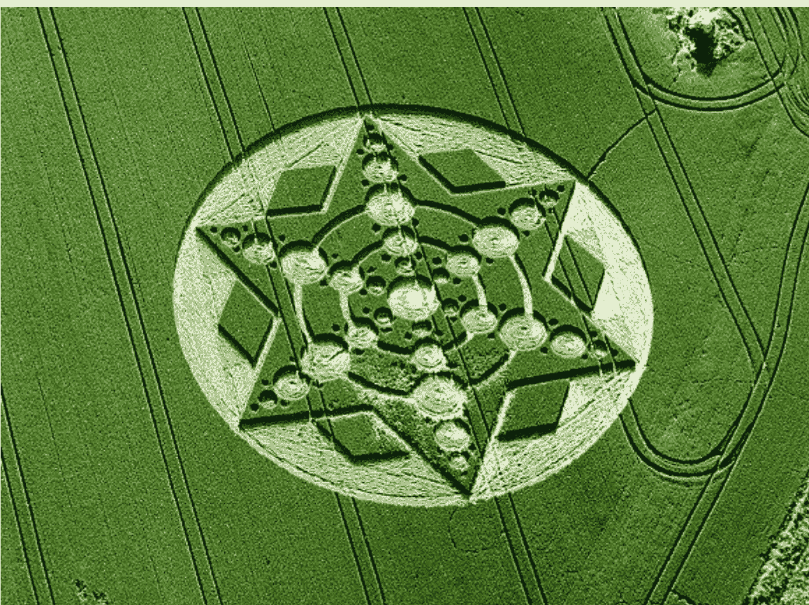

2008年7月15日

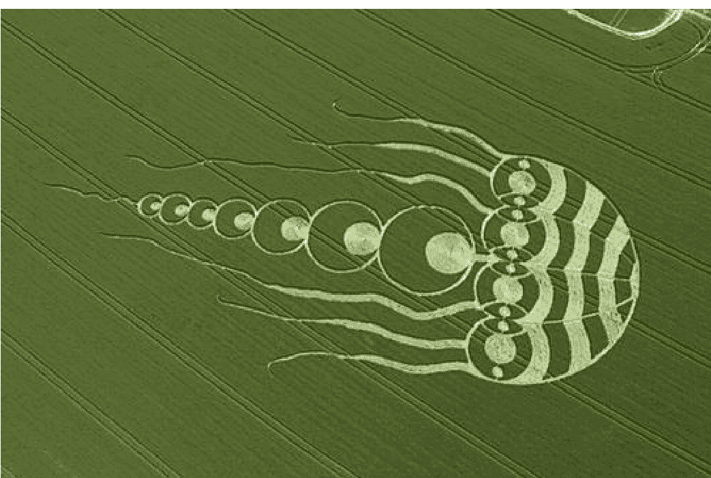

2009.6.3

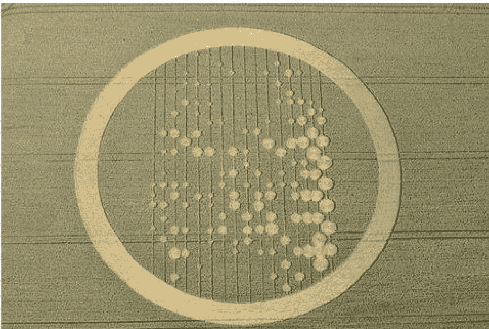

2010.8.7

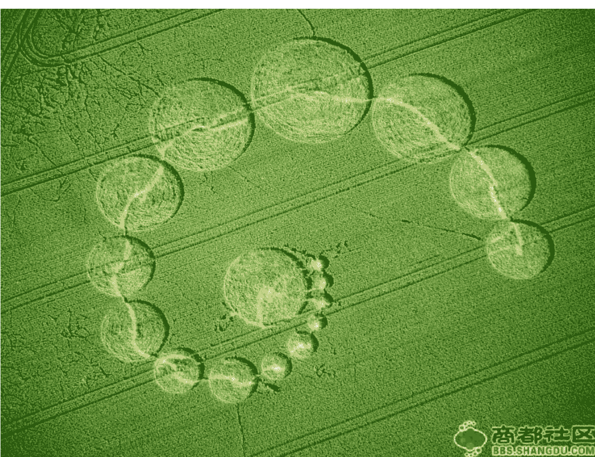

答：注意这些麦田圈的内在相同点是圆环 从小到大排列的圆环 抓到这个核心 就可以可出是金星高灵的作品

无非是和生命本质与提升有关 其实这些观点还很落后 只是他们以为自己先进

先了解一个观点 每一个圆圈代表一个无限智能 类似你们全息宇宙的概念 每一个无限智能身旁的圆圈数量不同 意义也不同

第一幅图 哲学意义 将其转化为三维 是多面体包裹的两个交叉立体三角形 描述了这个立方形状的应用 交叉的三角形你们称为梅尔卡巴 起到集中能量的作用 包裹的多面立方体起到容器的作用 到选择能量类型的作用 圆圈由外到内经过第一个环而变大 之后凝结入图核心中 讲述了神圣立方一个最基本的应用 图中绿色是物质层面的物质立体模型 白色圈和点代表这个模型中能量会如何运作流动 是一幅简单的神圣立方应用图 解释几何学中的能量运动

第二幅图 哲学意义 将其转化为三维 就是描述水母这种无脊椎动物 象征意义是生命的本源 生命的本源蕴含 触手上的 7 个圆 生命从开始就包含了 7 个无限智能圆圈的提升 和四个平衡体系 头部无限智能圆圈旁两个小圆 代表正负 生命的精神状态根据头部的正负阴阳运作而变得不同 是一幅描述生命能量简单结构图

第三幅 哲学意义 直观的表面意义是在说宇宙射线中蕴含的无限智能而带来的进化 解码后展示出一幅 基因图谱某一段

第四幅 哲学意义 无限智能的自我进化和复制

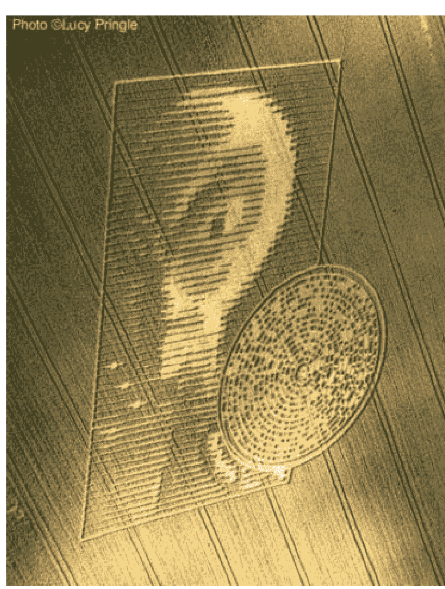

问：

请问这个麦田怪圈是什么意思？

答：这个你们不是已经破解了 月球文明的麦田圈

问：楼主，我看过很多的关于 UFO 和外星人的视频，很多是官方的视频，很多是民间的视频，可以说其中 30%以上极具价值，可信度非常高，还有人鱼，河童等奇怪生物，请问金字塔 UFO 是什么种族的？雪茄型 UFO 是什么种族的？多角型 UFO 是什么种族的等等
麦田怪圈有许多的复杂几何图案，有视频显示是飞碟所为，请求真像？
南美的纳斯卡线条是否外星人所为？

近期科学家发现了一种头骨很长的头颅还有巨人的骨架，是什么种族的？

日本有很多民间拍摄的灵异视频，在我看来真实度较高，请问其中的真实性？

答:麦田圈几何图案是 亚特兰提斯的艺术家之作品 麦田圈就好像他们在向人类传达他们的艺术作品

麦田圈的产生原因 是亚特兰提斯艺术家固有的心态造成 这个心态是 向不同文明表达展现自己的艺术 获得的满足感

问：你对麦田圈之母怎么看？

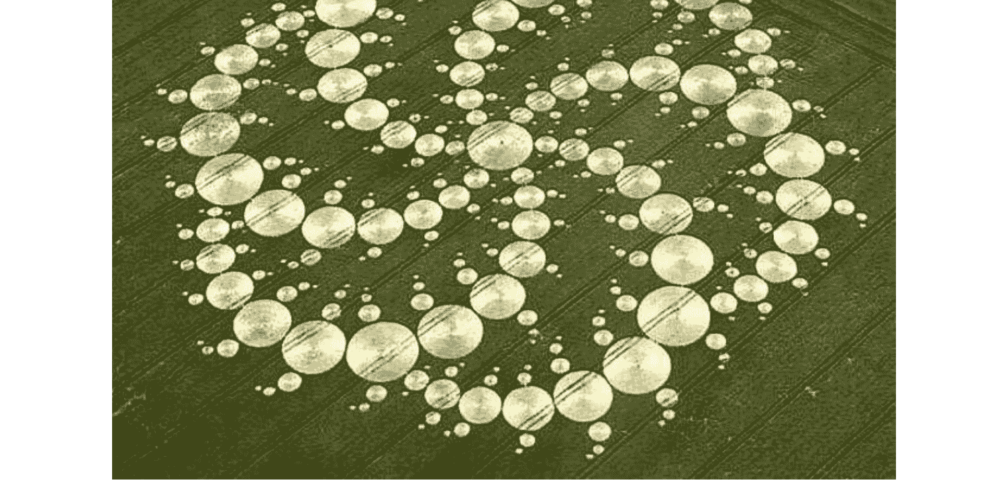

答：矩阵世界简单的模型描述

中心圆圈代表 五-六维中心矩阵 银河系中心 造物源头之一 等

围绕旋转的小圆圈代表 分支四维度矩阵

小圈上的小圈代表 三维世界圈

这个麦田圈总体表达世界的轮回性和回转性

哲学上来看

圆圈数量是 7 的进化 代表 7 个密度 无限向上的 7 密度提升 是你们金星高灵某个灵团的杰作 没错了 他们的哲学总是和密度提升 7 有关 其实这个哲学还很落后

问：请问对此贴的图片怎么看？这些图片是怎么制作的？

1 楼的 10111000111001101101011010101010 二进制翻译过来是 告知。

答：制作方法很多种 最基本方法靠立场压平就行 一个圆形可以飞行的立场生发器就可以

翻译成什么

问：你可以点击 1 楼右上的 “只看楼主” 查看全部图片。

也可去

http://www.360doc.com/content/12/0320/23/2633_196143091.shtml 查看。

答：图看了 在描述精神面的能量运作 基本正确

# 人类的繁殖

问: 请问一个事情，为何要繁殖？ 繁殖对于必然消失的个体来说，可以传承？ 如果不是！

那是否繁殖其实是群体意识作用的结果不是个体行为？

答: 繁殖是因为程序设定 肉体程序设定 产生相应的欲望 你无法拒绝欲望 就会产生繁殖

和简单 通过各种生理和心里的感觉来控制人类

如果你按照程序繁殖 孩子出生后会给你幸福的感觉 反之则给你空虚寂寞 内在感觉奖励惩罚机制系统

# 太阳系在宇宙中的螺旋运作是否正确？超越光速不会发生时空逆转

问 :
http://www.tudou.com/programs/view/oHx8ex3GxMc/?resourceId=0_06_02_99?fr=2&referrer=http%3A%2F%2Ftieba.baidu.com%2Fp%2F1501868066%3Fpn%3D40

请问楼主 视频中的太阳系在宇宙中的螺旋运作是否正确[视频] ？

答:空间感知问题 你们假设太阳系围绕银心运动这种运动方式是必然 如果按照你们的模型

银心也在围绕其他星系运动 这个轨迹更复杂了 主要看你参考多少个坐标

简单的比喻 每秒 100 米运动的车中扔瓶子 如果只看车内的空间瓶子的运动方式是很小的

弧线上下抛物线 如果算上车的运动 瓶子在向上下运动的同时 空间上也在向前以每秒 100 做出运动 如果在算上地球自转和围绕恒星的运动 这个线路更复杂

事实上你们在上一层空间中的空间运动速度已经接近了两倍光速 你们有句古言 坐地日行八万里 你们祖先很早 就知道这个道理了 但运动速度何止是每日八万里

超越光速不会发生时空逆转 这个想法基于的理论是幼稚 想象一下 一个一光年的距离长度的圆柱体 光从一端到另一端需要一年的时间 之后你从中心旋转这个长柱体一圈 两端的运作速度超过光速

在进一步推算

光每秒速度大约 299792458 米

0.1 秒 29979245.8 米

0.000000001 秒 2.299792458 米

简单的来说找一根 2.299792458 米的棍子 在 0.000000001 内将其转一圈 两端速度就超过了光

# 无梦睡眠

问：21，怎么判断自己已经成功的凝结出纯无凝结体？纯无凝结体的能力大小与什么有关？判断纯无凝结体阶段的标准是什么？能自由出入宇宙的纯无凝结体的标志是什么？被收集了波形的纯无凝结体会不会被抹去我的意识？纯无凝结体在宇宙中面临的致命的危险有哪些？

答：纯无凝聚 详细的来说 通过感知强化“我”的感觉 在物质意识的基础上发展出一个“你” 之后将这个你延续到梦中

在之后将这个“你”延续到无梦睡眠中 于是“你”在三个状态 清醒 半清醒的梦 无意识中 “你”依然的连续性的存在 “你”不在受到三个状态的影响 “你”第一次成为了你自己 你凝聚了自我纯无 达到了不灭的状态 并有能力自由出入总玄宇宙世界 无限的层面

纯无凝聚体能力 根据开发程度而定 对纯无最熟练的应用就是总玄宇宙世界三大秩序者 秩序者的能力你们应该明白

被收集纯无波形会被同化 变成别人的一部分 会失去我的意识

纯无凝聚体面对的危险来自其他纯无凝聚体 只有纯无能对纯无产生影响

问：进入后怎样知道不是在清明梦中而是在无梦睡眠中的“我”

答：强化我的感觉 就是在觉知之上构建出一个更高者 当你成为这个更高者 意识状态自我

感觉跟现在是完全不一样 自然会明白

将一切除去留下觉知 用觉知去感知 “我” 的感觉 想象一个空间性的你在观察这个觉知 将

你自己从觉知中分离出来 你不是你的觉知

# 业力 因果

问：楼主描述一下因果的力量和善恶业力的知识，贴子里有部分对佛教有研究的人对你不

服了。详细点。

答：详细描述一下 你们词语中因果业力的概念

你们意识在玄无两个面中构建 物质面 和 精神面 所以业力分为物质业力和精神业力

业力

你们在物质面活动较强 你一生在物质面所产生的业力 随着你的死亡而和你无关 你所对他

们造成的影响或者物质帮助 会在物质层面返还给你的子孙

一生所产生的思维活动 就是精神业力

生前帮助他人心性平和 精神面较为活跃和谐 死后灵场和自然约为和谐 存在时间较长 较

不容易陷入幻象

生前伤害他人较多 精神面较为负面 死后灵场和自然产生冲突越多 越容易陷入自我幻象和被自然解体

伤害他人较多的灵场个体在被自然解体后 信息波回归自然 一部分也会被婴儿吸收 婴儿吸收这种信息波后出生后较为物质化 具有攻击性 会代替信息波曾今的拥有者承受他在物质界所造成的业力 婴儿吸收这种信息波一部分是偶然 更多的因素是因为这个婴儿的家族祖先带来的物质面业力较为负面 所以后代会吸引负面灵场解体后零碎的信息波

帮助他人加多的灵场个体在被自然解体后 信息波回归自然 一部分也会被婴儿吸收 婴儿吸收这种信息波出生后较为具有灵性 和福德 会代替信息波曾今拥有者获得获得他在物质界所造成的业力 婴儿吸收这种信息波一部分是偶然 更多的因素是因为这个婴儿的家族祖先带来的物质面业力较为正面 所以后代会吸引正面灵场解体后零碎的信息波

大部分人普通人 没有所谓轮回 轮回的观点是正确 但不是一个你在轮回 不是一个不变者在轮回

不变者的轮回除非你拥有足够强大的灵场 或者凝聚纯无个体

# 因果

好与坏 善与恶是相对的概念 因果是万物发展的必然 因果就是意识个体的一生都在做大大小小的选择 每天又无数种选择

小的选择 几点起床 要不要睡懒觉 今天早餐吃什么这个还是那个 坐车还是走路 左拐还是右拐 小的选择虽然平凡但有时也很重要 左拐右拐可能是一生一死的距离

大的选择 要上这所大学还是哪一所 要不要买这个房子 要不要嫁给他 等等无数的选择 造

成你们人生的道路 不要认为选择好的大学以后就会很好 不好的大学就不好 你选择不同的大学认识不同的人 发展出两套不同的人生 也许不好的大学认识的朋友会给你带来好的大学路线所没有的机遇和财富 而好的大学却什么都没有 所以你们的未来如何不是短见的惯性思维可以判断的

做好每一个选择 就是因果 无数的小的选择促成你的性格 你的性格又影响你的选择 你的无数选择造就你的人生

性格在决定你的选择 你的选择在决定你的人生如何

一个意识个体获得好的果和坏的果 区别只是他们做了不同的选择

没有那个选择是好的 也没有那个选择是坏的

你们思维认为好的选择可能带来坏的果 坏的选择又可能引出好的果 果又变成因 生生而不息

在这不断因果不断的转化中没有什么是最终极的果 思想由内而外改变世界

思想决定你的性格 性格决定你的选择 选择决定你的人生 你的人生又影响你的性格 人类的内在运作循环体

环环相扣 改变因果就是改变自己思想

# “纯无” 受到 “纯无” 的攻击

问：一个纯无凝聚体如何发现另一个纯无凝聚体，如何防御被同化？

答：一般纯无个体不会去同化其他个体 消耗时间过长 得不偿失 除非是碰到了独特稀有纯无波形的个体

创造 毁灭 进攻 防御 凝聚纯无的“你”后自然会明白

# 清明梦

问：所谓的清明梦，是不是纯无凝结的第二部分？将这个你延续到了梦中并控制自己的梦。

再接下来只要把梦延续到无意识的，就意味着纯无凝结体形成。一个有我意识有着存在目的空间！

答：清明梦 不是凝聚纯无 清明梦只是发展了灵场的意识 你们大多数人一生在发展物质的意识

物质面的意识是第一意识 靠物质大脑神经元运作支撑

灵场面的意识是第二意识 靠灵场的能量交流转换支撑

通过凝聚纯无梦中保持清醒和清明梦是不同的感念 就算天天可以做清明梦充其量死后灵场活跃可以多存在许多时间而已

凝聚纯无是凝聚出一个基于空性的“你”

# 有人在疯狂中获得了新的意义 有的人在疯狂中失去了自己

问：哼！真是可笑，你们就陪 TA 一起在这儿疯吧！！！

答：在我看来其实你们也是疯狂的 疯狂的消耗灵场 疯狂的稳固自己物质面的意识

有人在疯狂中获得了新的意义 有的人在疯狂中失去了自己 之后在历经了百年短暂的岁月

后逝去

不追求生命内在的意义 也不关心生命之外宏伟的图景

# 木星气态行星

问：木星何时会成为第二个太阳，

答：木星气态行星 难道你们要引燃聚变反应

问：在我们的科学中，观测到木星有类似太阳的聚变，会自己发光，因而推断木星会成为第

二个太阳。

答：哪个是雷电电离反应 引发木星聚变你们没有这个技术

# 无缝隙通信的关键技术是什么

**问：** 请问下实现随时随地无缝隙通信的关键技术是什么？地球人将在多少年能实现在何时何地都能与他人畅通无阻的交流？

**答：** 对无缝隙通讯的定义是什么 如是时时通讯 量子技术是关键

何时何地都能与他人畅通无阻的交流 需要你们的微型能源和量子技术开发运用上取得突破

1000 年以后的新纪元中

玄无更新会带来精神感应上的时时通讯 也就不需要发展微型能源和量子技术了

# 思想的进化比身体的变异更重要么？

**问：** 思想的进化比身体的变异更重要么？

**答：** 同等重要 玄无六面的每一个面都如是的重要

# 有病的人用什么方法能好起来

问：妈妈病的很重,有病的人用什么方法能好起来,金字塔模型和三角模型帮助可以吗?念经或者是大悲咒能有效果吗？

答：你们不是有医院吗 为什么不相信自己的技术 虽然还很落后

念经哪些灵场生命也不一定帮助你们 除非你们有强烈的信仰或者答应后半生永远供奉他们

金字塔模型用来治病不可能 除非高等技术建造的空间性标准大型模型 金字塔主要是能量集中 起到辅助作用 需要长时间

> “没有“阴谋” 总玄宇宙世界就不可能存在 没有“欺骗” 带有觉知性的意识个体就不可能诞生”

问：引用 HuanxiangXR_21 (1304 楼)

自有用意 秩序者会看到这个贴 这就足够了 同时这些信息只是起到钥匙作用 钥匙用来开启已经上传到人类集体潜意识场中的 99.9%的信息 能量正在恢复 我也很快就会离开

自有用意？又是这种模糊地回答。 既然你已经知道秩序者了，你也只在乎秩序者知道你想要表达的东西，你直接去启发他就可以了。完全不必这么大费周折，还要顶着那么多质疑。。。

很多问题当你回答的模棱两可的时候提问者便止步不问了，其实若要深究下去，就可以发现你这编织的谎言的漏洞所在了。

不知道你发这个贴的目的是为了消遣以糊弄倒一批人而获取成就感, 还是楼主你其实是个写科幻小说的, 所以特地来变相的试出读者的喜好口味。。。如果是前者, 恭喜你, 你确实还是做得挺成功的。但是我要说的一点是, 只有真正相信你的人, 才会被你骗到。

答: 你在用你的思想来分析问题 但你的思想深度不够 只能得出表面简单的答案 很多东西不是简单的想一下就能理解

我也不骗人 只谈论事实和真理

如果你要谈论欺骗 可以告诉你 人类存在本身就是最大阴谋和欺骗的产物 虽然你可能无法理解这句话真正的哲学意义

《圣典》

“没有 “阴谋” 总玄宇宙世界就不可能存在 没有 “欺骗” 带有觉知性的意识个体就不可能诞生”

世界存在本身就是最大的阴谋 记住这句话 会受益良多

问: 所以，我总是感觉我被玩弄了 既然什么都不存在 哪来没有多情感......

答: 被玩弄的感觉 也是一种感情 被玩弄的感觉产生了 它影响你了 于是你感觉被玩弄了

建议不要相信任何感觉 保持宇宙般冷静深邃而无情的理性

问: 只有瓶子凝聚的纯无,让个体不同。

答: 不要认同任何 感觉 感情 思想 都不是你的 将他们抑制住 最终消灭掉 这些只是身体

程序给你插入的各种程序体而已 用于发展社会复合结构

保持宇宙般的冷静 你就会进化了许多

# 向心的注意力

> 问：注意力通过什么传达给你？我们最多只能关注到你的ID。注意力是如何到达你的实体的？

答：头像和ID 建立的链接

当你们关注明星或者其他的人的时候也会产生向心的注意力 只是明星们不会转化这种杂乱狂热的注意力 造成能量淤积基本都患有抑郁症 不是自杀就是去信仰了某个宗教

# 生命之外宏伟的图景

> > 问：引用：“不关心生命之外宏伟的图景” 这个生命之外宏伟的图景，是什么，楼主能详细解释一下吗？

答：关于一个实验

曾今 607 玄度文明 克尔加人做了这样一个实验

志愿者是物质面和精神面两个面构建出意识的个体 没有凝聚纯无

实验将志愿者的物质面身体结构从绝对微观到绝对宏观完全复制记录 同时将精神面的能量排列运作完全复制记录

之后抹去这个志愿者的存在 将身体和灵场结构打碎回归自然 那么这样说 这个志愿者已经完全死去了 陷入永恒的无梦睡眠状态

之后实验室根据记录 在物质面和精神面 完整的重新复制了三个同样的志愿者个体 每一个原子的位置 每一个能量层的交点丝毫不差

之后激活这三个和志愿者完全一样的个体

结果令人惊讶

这个实验直接产生了到“我是何”的最终解读

你们现在可以猜想一下 这三个个体还是志愿者吗 这三个个体是独立的个体吗 这三个个体完全相同 他们到底哪个是志愿者 志愿者复活了吗

......## 公布试验结果

试验志愿体 S1 二级意识体 (意识等级 意识等级最高为 6 最低是 1 在一个玄无面构建意识为一级意识 两个玄无面构建的意识为二级别意识体 依次类推）自我记录 摘选

HuanXiangXR_21 翻译

### 第一日

…… 做了详细的检查 并作为全面扫描记录的准备 注射了纳米扫描反应药物并覆盖了灵场能量标点 意识没有异样 各种指数正常……一种隐隐的激动感充斥在心中 我想起了家乡璀璨的星空下一望无际的冰晶量子海洋……这个试验正是我一直寻求的 对我来说死亡并不可怕 可怕的是茫然的活着……

### 第二日

早晨醒来望向窗外家乡的全息影像 记起一个玄奥的梦境 不在过去也不在未来的时间之流里 玫瑰色的深空背景中 我漂浮着 和星系们一起旋转 旋转 旋转……药物吸收良好 实验中心人员表示 下一阶段将进行全方位扫描记录 意识没有异样 各种指数正常……心中是激动和期待 已经很久没有这种感觉了……

### 第三日

……还是那个梦 我旋转 旋转 融入了虚空 将我吞噬美妙的感觉……试验中心人员表示 全方位扫描完成的很好 可以进入下一阶段 意识没有异样 各种指数正常……马上就要进行 C 阶段 这也许将是我最后一次感知到这个世界 但我不会后悔……

C阶段 消除实验体S1的存在 打散S1物质面身体结构 分解S1灵场面结构 S1死亡

D阶段 S1身体灵场记录导入 潘多拉之玄度结构精确构建仪 信息全面复制显化 复制显化完成

E阶段 激活复制体 数量3

F阶段 复制体激活 纯无凝聚体强化中 强化完成 3个复制体纯无波形相似度99.2%

### 第七日

我醒来了 或者说我们醒来了 一种美妙的感觉在我之中 我还记得自己在麻醉波中慢慢的失去了意识 之后我从哪个没有梦 没有意识 没有觉知 没有过的和未来的黑暗中醒来……奇怪的感觉状态 我是三个人 三个人是我 或者我又不是他们 我自己看着自己 我控制着我们但我却感觉我不属于我们……实验F阶段 强化了我的纯无密度 原来纯无凝聚后是这种感觉这种超越觉知的状态 美妙的感觉……根据实验人员要求 我仔细体悟和分析凝聚纯无和没有凝聚的区别 没有凝聚前觉知好像是手电筒 向一个方向照射 这个方向是意识 觉知照亮了意识 却无法反照自身 凝聚纯无就好像失去手电筒的光 产生光的手电筒没有了 光却在 并向所有方向360角度照射 觉知变成了另外一种东西 我的感觉也变成了另外一种东西……

### 第八日

三个我同时醒来 但我又没有醒来 因为我从未睡去 美妙的感觉在我之内

清醒的时候三个“我”的纯无凝聚体在总玄宇宙的世界中

做梦的时候三个“我”的纯无凝聚体在自己个人的小世界中

无梦睡眠中三个“我”的纯无凝聚体在虚空的虚空中……接受各种测试后 我熟悉着这种奇怪的状态 我也许是第一个同时体验到三个纯无凝聚体的生命了……这个感知状态告诉试验人员后 总结出了奇怪的悖论 如果我能感觉到三个纯无凝聚体 那么我必定不是其中一个 如果我是其中一个 那么就不能感知另外两个我 于是得出惊人的结论 “我”似乎是一种超越了纯无凝聚体的东西 难道纯无凝聚体不是空性“我”的本体吗 或者说我是多结构纯无体 如果破坏这三个纯无凝聚体“我”也会消失

结论是 三个纯无凝聚体在这里因为某种更高等的链接产生了结构性 这种三个纯无凝聚体组成的感觉应该叫“超我”的感觉 结构性的存在 将我们在寻找“我”的旅途推向了更高一级 超我 超超我 超超超我 没有尽头......在哲学的形而上意义上 寻找“我”的旅途中无限向上 一面是单一结构纯无凝聚体崩溃后带来的永恒睡眠 一面是多结构纯无凝聚体造成的“我”之无限上推 也许我们永远无法找到自己了......

### 第九日

这是额外的实验 根据探索的渴望 “超我”破坏了两个自己的纯无凝聚体 留下一个单一纯无结构 “超我”又成为了我 当破坏第一个我时 一种感知性的收缩 某种不完整性下跌的感觉 当我破坏第二个我 我感觉到某种结构链被损坏了 这个结构链是支撑那个形而上“超我”存在的基础 “超我”下跌了一级 哪个三个纯无凝聚体构建的形而上的“超我”美妙的感觉消失了 但我还是我 不在上也不在下 隐隐明白了什么......

### 犹太人

问：在我们的哲学家中，认为犹太人在2013后会在DNA上有抵抗负面外星种族的能力，那请问在玄无更新后，犹太人会成为人类种族中的一个特殊种群？

答：犹太人没什么特殊 只是融合了一部分入侵者自然人的血统

### 旅行者 1 号探测器

问：经过 30 多年的跋涉，“旅行者 1” 号探测器即将进入太阳系边缘。科学家认为这颗探测器可能在几个月到几年之内进入星际空间。 2004 年起，“旅行者 1” 号开始对太阳系的边缘进行观测，现在即将进入太阳系的边缘。一旦飞出太阳系，人类便可借助 “旅行者 1” 号的眼睛第一次从太阳系外观察地球。目前，“旅行者 1” 号仍探测到宇宙射线电子强度升高，说明仍处在太阳系的外缘日鞘内。不久后，“旅行者 1” 号便可完全逃离太阳系，成为人类历史上第一颗进入星际空间的人造探测器。

--------------------------------------------------

对于 “旅行者 1” 号探测器未来的命运您认为会怎样？会从太阳系与之相对的另一端飞回来吗？

- 答：是的 用你们的说法日鞘内 再走 27 年前方会观测到太阳 从另外一端返回 60 年后到撞向太阳 就好像你们曾经绕了地球一圈
- 这是值得庆幸的 你们星球的的中国航海队第一次环绕地球 600 年后 你们美国的太空船环绕了太阳系一圈
- 不过你们的第二次太空 “环球旅行” 不会发生不久后 也不会记入史册 因为 旅行者 1 不久后就会被星系壁面的空间流摧毁 探测器技术等级不过关
- 离开你们星球世界需要在三个坐标上移动
- 离开你们星系世界需要在四个坐标上移动
- 离开你们四维矩阵世界需要在五个坐标上移动
- 否则只是转圈圈

### 主灵场基本不会和肉体分离；第二意识；高我不存在

问：HuanxiangXR_21 ，几个问题，请回答下，谢谢。。

1. 白日里凝神从身体里分离出淡白色的薄雾状身体，能同时看到周围环境和肉体，
2. 静坐中分离出去的没有形态的我，周围没有环境和其他任何东西黑色的虚空，有呼吸和飞翔的感觉
3. 梦中觉知我之后，在梦中俯视梦中的那个我的“我”。

这三种我之间有纯无凝聚体么，还是都是灵体。。。梦中觉知我之后，念经，打坐，有利于凝聚纯无么。还是继续觉知，延长觉知时间不坠入灵界即可。。觉知那个我之后也不是什么地方都可以去的是吧，只能去自己频率对应的灵界？

还有我停止所有的思想，觉知我。突然感觉到一振，有种感觉自己要睡着了。。接着就无所觉知，之后无梦状态，这样能凝聚到纯无么，长时间停止思想觉知会睡着为什么？

有的人通过通灵或者冥想连接到自己的高我，或者其他维度星球的家人，比如水悦星，光音星等？这个是真实的么，还是只是一种信息下载。

有的自称是其他维度星球存在体投胎的，是真的么？还是只是记忆碎片，在婴儿期吸收的，还是是其他灵体的分身投胎？为什么不直接物质化身体呢？有的说不记得前世是封印了自己的记忆和能力，去学习和提升自己是正确的么？

跟自己的高我和家人对话是心电感应么？

秩序者为何我不直接物质化身体进入物质界，还的凝聚纯无才能觉醒，他跟我们一样是婴儿期吸收周围的玄无碎片，还是投胎而来的，他也封印了自己的能力和记忆么？我们是不是跟他一样觉醒了就记得前世今生得到自己封印的能力了。。。

答：

1. 主灵场基本不会和肉体分离 分离是危险 你们所定义的出灵体 只是意念加入灵场从灵场中分出一个次级灵场投射淡白色的薄雾状身体因为频率和物质面接近 所以能看到肉体你们可以从灵场中分出不同的身体雾状 胶态 果冻态 水态 光纤态 分出那个身体要看你们分离时意识的频率强弱 分出的不同身体看到不同频道的世界
2. 没有携带任何频段的身体 将意识中心分出去了
3. 不是纯无凝聚体 梦中的你是梦意识第二意识 现实的你是现实意识第一意识 你们第一意识发展第二意识如婴儿 婴儿感知世界是什么状态 正是你们梦中的那种感觉 你分离出来俯视的第三者是只是觉知要凝聚纯无先要感悟纯无的本体 就是空空空 纯无凝聚体 不是觉知 不是意识延长觉知长时间照射第二意识 梦意识 梦中的你会长大 越来越具有意识 也不是凝聚纯无是发展第二意识

> 还有我停止所有的思想，觉知我。突然感觉到一振，有种感觉自己要睡着了。。接着就无所觉知，之后无梦状态，这样能凝聚到纯无么，长时间停止思想觉知会睡着为什么？

> 不能 当你觉知我的时候你还是觉知 将“我”的感觉从觉知中慢慢分离出来觉知会睡着是因为太依赖大脑

> 有的人通过通灵或者冥想连接到自己的高我，或者其他维度星球的家人，比如水悦星，光音星等？这个是真实的么，还是只是一种信息下载。
> 
> 有的自称是其他维度星球存在体投胎的，是真的么？还是只是记忆碎片，在婴儿期吸收的，还是是其他灵体的分身投胎？为什么不直接物质化身体呢？有的说不记得前世是封印了自己的记忆和能力，去学习和提升自己是正确的么？
> 
> 跟自己的高我和家人对话是心电感应么？

很少的人有前世 大多数人只是吸收了一些死去人的信息碎片 所谓一个不变的灵魂不断投胎的普遍性不存在 想象一下 总玄宇宙世界数量是固定的 随着各个文明发展 文明成员意识体数量几何增长 难道都是投胎转世而来吗

这么说 就算你们现在用克隆技术在克隆出100亿人 他们也都会发展出有意识和灵场 只是人数过多会造成你们星球灵场总熵值数下降而已

直接物质化身体 就算你们中少数能转世的灵场也没有这个能力

封印记忆去学习和提升是你们哲学家对世界美好的想象 宇宙法则 优胜劣汰 进化才是真正的道路

高我 你们哲学家定义的那种高我不存在 高我如果是指人类集体潜意识场或者你们的潜意识 你们的确可以和你们的潜意识对话

> 秩序者为何我不直接物质化身体进入物质界，还的凝聚纯无才能觉醒，他跟我们一样是婴儿期吸收周围的玄无碎片，还是投胎而来的，他也封印了自己的能力和记忆么？我们是不是跟他一样觉醒了就记得前世今生得到自己封印的能力了...

秩序者是偶然的偶然 秩序者也没有前世 觉醒后是秩序者 挥手之间 转化秩序规则 觉醒前是普通人 面对规则一样无能为力

觉醒前世和封印的能力是你们对未来期盼的投射 基本不存在 当然一些强大的灵场生命转生后 拥有一些灵性 能应用灵场 这个也许可以勉强算的上觉醒 但问题是大多数人只有一世没有前世

> 问：我想问一下 灵魂出身体后 会不会带来什么不好的影响

> 答：精神场离开物质体 消耗精神质 没有明显副作用

```
精神=Ce(OH)7 + 2NaKCO2 = CaCO3↓ + 2H1O + Na2CO9
```

> 问："QH2eu=So3+Ik9+Qa45+6y9H
> 
> 也就是说
> 
> 灵魂=意识空间+记忆空间+精神+心灵的复合体

如果这种联系减弱根据程度不同 人就会做梦

如果这种联系继续减弱根据程度不同 人就会昏睡

如果这种联系继续继续减弱根据程度不同 灵魂就会解体 这就是个体的死亡

```
精神=Ce(OH)7 + 2NaKCO2 = CaCO3↓ + 2H1O + Na2CO9
```

这是09年你传递的信息 12年传递的主要是纯无 玄无的6个面的内容 关于灵魂的解释有些混乱了

答：这个我在尝试纯物质的方式来解释精神和灵魂 不过失败了 你们不能理解 最终选择用哲学来解释 不提单纯的物质科学

并且那是还没有计划透露给你们 玄无和纯无 宇宙至理

> 你们世界的哲学家很多 他们活在自己的世界里

问：你如何看待这个修行者的理论？ http://cqly186.blog.163.com/ 我向她询问了对你的理论的看法，她并不完全认同，并认为这个宇宙观是你这个个体的想象。

答：你们世界的哲学家很多 他们活在自己的世界里 这个个体只是其中之一

纯无和玄无 学说我虽然只透露给力你们不到1%的大概框架 剩下71%已经上传到你们人类集体潜意识场了 不久后就会被你们的成员提出来

纯无和玄无 完美的解释了宇宙一切现象 和我是谁的最终猜想 经过了无数推理论证 是总玄宇宙公认的终极理论 这个理论下延伸出的无数的实验和科学技术 难道都是想象

### 胚胎发育时吸收了大量自然灵场

问：楼主你好，你还在吗？我有好几个问题想问 1：我小时候，大概 4 岁左右吧，妈妈和单位人打麻将，我只要绕他们走一圈，看下牌，就知道他们谁会赢，试过很多次，100%准确，那个时候根本不会打麻将， 但是长大了，确没有这种能力了。
2：在我 10 几岁的时候，别人送我妈了一本圣经的书，我看了点。晚上睡觉睡不着，就在想有没有上帝存在，如果存在就和我说话，我就相信上帝存在，刚想这个问题，就马上不能动了，然后就听见男人的洪亮的声音，说了又大概几十秒，说什么听不懂，感觉声音是从地地下发出的，不是英语，也不是汉语。听完这个声音过了几秒我才能动，当时很害怕，我清楚记得，等我能动了就赶快拿被子把自己蒙了起来。我很确定这不是幻觉，也不是做梦，是我正在想这个问题然后接着发生的事情。给好多人说他们都说我是做梦，要么是幻觉。我发誓不是。当时我很清醒。事情发生后我还拿被子把自己盖上（当时害怕）
3：真的能改变未来的事情，是靠自己还是外界神奇力量？2012 以后我和我的家人会安全的吗？我也想能像你一样 10 几天就有学会别的语言的力量，你能悄悄给我大脑放个什么芯片，叫我知道很多科学知识或者掌握很多种语言吗？谢谢了

答：1 和 2 这些能力是你灵场强大的表现 一定是你胚胎发育时吸收了大量自然灵场 灵场熵值在你身上集中表现的结果

3 未来在你们手中 2012 年后你们是否安全我不知道 因为记忆体中的这些外围记录已经完全受损了 就算知道也不能透露 学习语言为你安装芯片 超过信息外的干涉我们不会坐因为过多不可控的蝴蝶效应会对秩序者造成意料外的影响

“我” 不能去知道和理解 “我” 只能去感受

问：我，不知道"我"是谁？

答：《圣典》

> “我” 不能去知道和理解 “我” 只能去感受

## 无聊的感觉也是一种感觉

问：引用 HuanxiangXR_21 (1380 楼)

不要认同任何 感觉 感情 思想 都不是你的 将他们抑制住 最终消灭掉 这些只是身体程序

给你插入的各种程序体而已 用于发展社会复合结构 保持宇宙般的冷静 你就会进化了许多

回复 1380 楼:这个和艾克哈特托利《当下的力量》里说得一样耶～他可是自己悟到这一点的呢。

可是我觉得这个好难啊～我不知道怎样才算退居为观察者，感觉这种状态并没有明显的区别

感，而且往往难以维持啊。而且在现实生活中，没有情绪会感觉到无趣啊...

答： 先退居观察者 最终观察者也要超越 没有观察者没有被观察者 的确 没有外界的各种刺激引起神经元兴奋 的确会导致无聊的感觉 但无聊的感觉也是一种感觉 放掉这种叫做无聊的感觉就行了

## # 网上色情泛滥

问：21，你对网上色情泛滥有什么看法，本人认为是人类的意识复合体不好，如果是这样，是不是人类发展没希望？

答：人类记忆复合体 主导层的问题 主要还是你们生育率太高 导致地球总灵场熵下降 间接导致人类意识程度更为物质化

简单的比喻

总灵场量是 100 地球有 10 个人 每个人分的 10

总灵场量是 100 地球有 100 个人 每个人分的 1

灵场总量包括矿物 植物 死去的动物 死去的人类个体 的灵场信息碎片当然也有灵场在一个人身上随机集中的表现 这就是你们的哲学家和天才们

## # 人类进化为全新种族；李小龙

问：人类最终会灭亡还是会进化成一支全新的种族？可否形容一下？还有，你知道李小龙吗？他的灵场高吗？他的真正死因是甚么？

答：人类进化为全新种族

最终 60 玄都左右 在无数周期以后 每个周期形态都完全不同

李小龙 储存外围信息的记忆体受损了 不过李小龙死因可以知道 过度使用肉体运动 造成的内脏器官细胞衰竭溶解 细胞死亡率跟不上修复和更新率 最终导致的猝死或者你们称为的过劳死

## # 宇宙的公平

问：希望 朋友 请问我有机会成功的凝聚纯无而进化到你的层次么

答：每个察觉自我的意识体都可以 甚至动物都行 宇宙在这点上对每个意识个体是平等的

## 宇宙本质是无情的 弱肉强食 适者生存

问：繁殖是因为程序设定 肉体程序设定 产生相应的欲望 你无法拒绝欲望 就会产生繁殖
和简单 通过各种生理和心里的感觉来控制人类
如果你按照程序繁殖 孩子出生后会给你幸福的感觉 反之则给你空虚寂寞 内在感觉奖励惩罚机制系统

这个可以理解
那么所有生命的生理和心理过程都是程序化的 是么？
完全理性的是生命是没有肉体程序束缚的 ？
如果真是如此，那什么体验人生享受生活的想法都是可笑的，不过一组程序语句罢了。。。
lz 可否在离开之前展示一下你感觉中的这世界，任何形式的皆可

答： 体验享受生活是安逸后带来的哲学 动物界的动物们相信不会同意这种说法 宇宙本质是无情的 弱肉强食 适者生存 希望你们不要忘记
有机会梦中给你们一些启示 我感觉中的世界和你们是不同的 你们是二级意识体 我们是六加一 七级意识体

## 金星帮助你们的是哲学传播内在教化提高你们总灵场量

问：很多东西，只是大多数人不知道实情，不了真相，其实都是可以教育好的。为什么那么多高级智慧，对待低级智慧不是更多的帮助指明呢

答：不一定 金星文明也算间接帮助你们 不过帮助你们的是哲学传播内在教化提高你们总灵场量 而不引导你们物质技术建设 你们灵场修行有成的个体不是已经加入他们团体了 虽然你们也是他们的一部分能量来源 其实是很简单的道理 你们不会指导和帮助猩猩或者其他动物 因为追求不同 意识也不在一个层次

## 陨石无法轻易的旅行到其他世界；有侵略性的文明还在 30 玄度以下

问：存在一种靠陨石旅行到别的星球进而榨干这个星球的寄生生命吗？这么多星球里有没有发生过这种情况,寄生生命入侵星球虽被压制但很多年后被人为植入人体获得强大能力但被寄生生命所控制，对星球入侵。回归星球的众...

答： 你所谈的陨石无法轻易的旅行到其他世界 有规则和纬度屏障 否则总玄宇宙世界早已被这种东西吞噬了有侵略性的文明还在 30 玄度以下 他们的技术造不出跨规则载具 而 30 玄度以上的生命已经较为进化 对低等文明没有兴趣 就好像你们没有兴趣建造一种机器占领全世界的蚂蚁窝一样 意识不同追求已经完全不同了

## 喜欢思考的人更容易挖掘到人类集体潜意识场中得信息

问：烟雨江南的小说很好看，《狩魔手记》里讲到核战之后出现的使徒、传承者、毁灭者、主等，和楼主说的有些近似，最终毁灭者“苏”拯救了世界，也就是楼主说的“秩序者”。
他的其他书里也反复提到吸收信仰的力量等，有点意思，烟雨江南不简单呢

答：只是喜欢思考的人更容易挖掘到人类集体潜意识场中得信息## 幕后人代表一切意图中之意图；秩序者是无限纯无的意义化身

问：想和你探讨一下我的想法：
- 1. 你一直拒绝透露72玄度文明的信息，是因为你根本不清楚，还是怕什么呢？我们这些1-2玄度的文明，就算知道了，又能怎样呢？
- 2. 似乎，72玄度文明，是你们特别期望达到的，也许达到之后，现有文明的许多瓶颈就可以冲破，就像闭关修炼，达到最高境界一样，也许就具备了和那个所谓的“幕后者”谈判的能力？
- 3. 关于三大秩序者，似乎，你们这总玄宇宙七大文明和三大秩序者之间，订立了某种程度上的协议，或者，结盟，最终目的是，帮助你们发展到72玄度，或者，通过其他方式，获得与“幕后者”谈判的筹码，最终目的是突破“幕后者”制定的“法则”，支配自己的命运；
- 4. 对你们的《圣典》很感兴趣，是你们的“先人”写的吗？还是你们这七大文明的最高等级著作？那么，对于你们这七大文明而言，“阴谋”又是什么呢？难道是“幕后者”对你们设立的某种“阴谋”吗？你们就这么确信，没有比现有的你们发现的71玄度文明更高等级的文明了吗？又或者，72玄度之外，还有更高的层次呢？你们小看了“幕后者”，也高估了自己，高估了三大秩序者，不是吗？

答：1 拒绝透露72玄度文明的信息是不在协议中 而且你们二级意识体也无法理解 很多东西不是语言能形容的 语言形容的东西已经很扭曲了 很多更高等的理论需要先提升意识等级 最后直接进行意识思维形态灌输
2 幕后人不是你们所想的那样 是一种无法形容的东西 它既存在也不存在 它超越两者
它既创造也不创造 它超越两者
它也不是在某个地方观察着 它不是你们所想的一切定义 二级意识理解不了 勉强翻译过来
冠名幕后人
3 不需要和幕后人谈判 协议和结盟是你们星球的个体规则 但不要将这些东西投射到总玄宇宙世界的背景上 你在思维逻辑化宇宙最终极的东西 那是不可能定义的
72 玄度文明的意义不是你们现在所能理解 三大秩序者的意义是无限纯无的化身 一切玄无规则的约束对他们等于不存在
4 圣典 是最高哲学著作 无数种已经被发现的感受都有记载 当然不是文字 你们看到的文字只是我翻译的结果 阴谋代表一种感觉 一种意图 一个没有阴谋者和被阴谋者的阴谋
不是谁为谁设立 这是你们的逻辑观念投射对应
72 玄度和更高层次没有关系 你想的是人类二级意识逻辑思维想象
72 玄度代表一种终极的自由猜想之形而上的意义

幕后人代表一切意图中之意图
秩序者是无限纯无的意义化身

## 无聊的感觉也是一种感觉

问：（不要认同任何 感觉 感情 思想 都不是你的 将他们抑制住 最终消灭掉 这只是身体程序给你插入的各种程序体而已 用于发展社会复合结构 保持宇宙般的冷静 你就会进化了许多）
回复 1380 楼:这个和艾克哈特托利《当下的力量》里说得一样耶～他可是自己悟到这一点的呢。
可是我觉得这个好难啊～我不知道怎样才算退居为观察者，感觉这种状态并没有明显的区别感，而且往往难以维持啊。而且在现实生活中，没有情绪会感觉到无趣啊…

答：先退居观察者 最终观察者也要超越 没有观察者没有被观察者的确 没有外界的各种刺激引起神经元兴奋 的确会导致无聊的感觉 但无聊的感觉也是一种感觉 放掉这种叫做无聊的感觉就行了

问：无趣也算是一种感情，如果你能做到就算生命也不干也不会感觉到无聊，那样就成功了。这话是他说的。

答：无趣是一种感觉 你感觉到了无趣 你没有感觉到无趣 你不是无趣

## 鬼魂是什么；道教的内丹功和佛教的修中脉七轮或瑜伽；互联网

问：1.你在其他时间点是如何工作的，比如在没有互联网的古代？
2.鬼魂是什么？为什么有那么多灵异的恐怖的事件发生？
3.人的命运（吉凶祸福贫富）是注定的吗，道家的风水学能改命吗？
4.如果没有轮回转世，那些催眠回忆起过去的是一种什么现象，怎么解释这个现象？
5.释迦牟尼佛在金星上吗，佛教描述的西方极乐世界确实存在吗，是描述的金星世界吗？
6.道教的内丹功和佛教的修中脉七轮或是瑜伽对人的身体和灵性起到什么作用？
7.互联网的产生也是入侵的一个阴谋吗？
谢谢！

答：1 看干涉力度等级 如果只是和你们一样的干涉等级 只能传达信息 直接影响个体的意识即可 给他们各种需要的思想和想法 或者创建一个宗教
2 鬼魂很多种 因为你们将肉眼频段看不到的东西都称为鬼魂 恐怖灵异发生是灵场生命对物质的影响 在你们看来是灵异恐怖 其实没什么超自然 只是你们还未知 等你们物质技术发展以后 制造消灭他们的武器系统也不是什么难题
3 人的命运不是注定的 除了少数被金星高灵选为种子意识培养的人
但是机械化的思维会导致命运的较为注定 一个思维意识活跃的个体命运是不注定的
风水存在 科学的来讲就是 磁场分布和物质几何的互相关系 你们的城市就是各种复杂的几何体组成
4 催眠记忆起前世是 这个体在胎儿期间灵场成型时 所吸收的自然中的灵场 有动物的 有其他解体人们的 有植物矿物的 不是他的记忆 是其他人的记忆碎片
5 释迦摩尼和你们中国古代时一个叫陈三的农民（陈家的第三个儿子）是你们世界两个凝聚纯无成功的个体 早已经已经离开你们恒星系了 不在金星
极乐世界是意识构建的世界 玄无精神意识面世界 信徒在对其信仰之力较强时就可以去了
类似你们基督教天堂的地方
- 6. 强身健体 强化灵场结构
- 7. 互联网技术是你们地底祖先启蒙你们科学家的

> 问：我们的打坐是凝聚纯无的行为吗？
> 答：不是 凝聚纯无是一种 状态 打坐的状态主要是强化灵场

> 问：回归星球的众多精神能被当做能源使用吗？
> 答：不能 只能重新组合形成新的生命

> 问：所谓“鬼”，也只是投影？那么请教，深蓝儿童存在的意义。
> 答：鬼是灵场生命 只是你们肉眼频段看不到 所谓称之为鬼 深蓝儿童大多数都是火星文明的灵场们 进入你们婴儿的身体 主要是想参与你们星球的玄无更新期

## 存在就有它存在的意义 抹杀其他人的意义 这种思想很危险

问：北纬三十度。 顺便提醒楼主一下，稍微运用一点你的灵力，把其他人冒用你发的那些帖子删除了，岂不更好。又不是神马大事。

答：没有必要 它存在就有它存在的意义 抹杀其他人的意义
这种思想很危险 战争和死亡紧随其后

## 过度的刺激会导致意识崩溃；先用觉知消除惯性思想运动；无为的心境

问：引用 HuanxiangXR_21 (1380 楼)
不要认同任何 感觉 感情 思想 都不是你的 将他们抑制住 最终消灭掉 这些只是身体程序给你插入的各种程序体而已 用于发展社会复合结构 保持宇宙般的冷静 你就会进化了许多
大道无情,却滋养万物,对于大道来讲,人类与草木没有区别,阴中有阳,阳中有阴,如太极一般阴阳互换,没有善没有恶,没有公平与不公平,阴阳既相互对立又相互依存，任何一方都以对方的存在，为自己存在的前提，任何一方都不能脱离对方而单独存在。只有跳出了二元对立,才能用一无所有的心境去承载一切,才能保持宇宙般冷静深邃而无情的理智。志愿者的实验很有趣，让我怀疑那些思想，情感真的是我的吗，玩弄？如果那些思想，情感，不是我的，那么它又是从哪里来的？妄念盖覆了真如本性。

答：感情 思想 神经元的活动 是产生意识的必要条件 是意识的营养 但过度的刺激会导致意识崩溃 因为意识不够柔软
你们大多数个体成员大脑最活跃的区域是什么 毫无疑问 海马体和旁边的思维区 不断的反复的强迫性的思考和记忆回放 浪费了大多数脑能量 所以先停下这片区域的惯性运作 你们会智慧很多当你消除了思想中的对立性 你的意识就较为进化了
- - 思想改变 你们方法已经有了
- 先用觉知消除惯性思想运动 之后随意产生更为智慧的思想
- 凝聚纯无 没有思想状态最佳

问：回复 1409 楼：咩。追逐趣味性对我来说是不可抗拒的欲望，什么也不做都不会感到无聊，除非我就是宇宙本身。 意义是随着思想、行动生发出来的呀。从寂静中来，又回归寂静，有什么意义呢？

答：可以去体验这些 但要基于无为的心境 否则最终会迷失

## 正义不存在，只要去追求自己内心的平衡而变得没有任何心灵漏洞

问：楼主，请你看我写的这些话，你认为是否正确： "对于邪恶的人而言，适合自己立场的即是正义，对立自己立场的即是邪恶 对于正义的人而言，真理与道德即是正义，违背真理不道德即是邪恶。 而正义的人而言的看法，才是真正正确，真正对的。"

答：两个都不是正义 基于某种标准的东西就没有所谓正义可言 没有绝对的正义
最初一切为了进化 一切是能量的转化分散 动物捕捉食物是弱小的能量向较为强大的能量转化
正义不存在 只要去追求自己内心的平衡而变得没有任何心灵漏洞 所有的事情都是被宇宙允许的

## 精神分裂以及幻听的原理

问：楼主可否说明现在地球上是否存在脑壳武器，精神分裂以及幻听的原理是什么呢？

答：控制脑壳的武器你们还没开发出来 击破脑壳的武器是有很多
精神分裂幻听幻视 是精神面和物质面不对应造成的结果
物质面 你们看到的颜色 声音 都是大脑的着色
物质面 没有颜色 没有声音 你们看到一个白色的石头 石头没有颜色 颜色是你们大精神面对这个世界的着色
物质面只是无声 无色 无意义 冷冰冰的“原子”组成堆积的各种千奇百怪的模型 声音和颜色是精神面后来加上去
两个面共同协作 组成你们的世界 你们很多动物就看不到颜色或者听不到声音 因为灵场不发达无法着色
幻觉幻听是灵场和大脑不协同运作的结果 产生幻觉的个体可能看到地上到处都是钉子 这个是精神面根据他的记忆的着色 但物质面没有相应组成钉子的“原子”模型
还有一种幻觉是看到了灵场生命 但其他人没有看到
精神分裂是意识 大脑 灵场 的协同运作出现问题后的结果

> 本我不在某个地方 本我是一种状态 纯无凝聚的空性状态

问：我去念闭目凝神时，是黑暗没有尽头的空间，一直向前行着，没有光只有深深浅浅的黑暗。我是在里面转圈嘛，我如何走出那无限的黑暗，当我走出黑暗的尽头，是不是找到的就是本我。还是在黑暗中的行就是凝结着我的纯无？

答：本我不在某个地方 本我是一种状态 纯无凝聚的空性状态

问：这个倒是事实。你的凝聚纯无，事实上和道是一致的，就是归空止于空吗。

答：你们文明中也只有释迦摩尼最接近了 不过你们早已经误解了他谈论的空性

问：你的知见一直未离开物理的，表达的最高就是纯无----空了。 无论纯无，玄无，精神物理，高低都是心灵的计著，心无计著，一切平等。 有心则有法，无心则无法。人总是依赖自己的心明了一切，事实上是什么在背后使心能明了的？无心亦不失见闻觉知，把心凝聚在空上亦不究竟。

答：一切只是一个表述方式 当你感受到你就明白了纯无的意义

问：凝聚纯无是不是类似于构建一个凸透镜？凝聚纯无的过程是不是类似于用觉知打磨镜片？等构建透镜成功后，焦距焦点是不是就是一个通道？这个透镜是不是360度的？

答：不是 凝聚纯无 就是寻找自己 可以先强化觉知在将自己从觉知中分离出来 之后基于空性的凝固 语言描述你永远不会感觉到 去尝试和思索感悟 你就会明白

问：请问HuanxiangXR_21：
1.如果按您说的方法，普通人需要若干年才能凝聚纯无到万分之一程度，也即你说的能永生，问题是当这个人的肉体衰老损坏后,怎样才能使凝聚的纯无延续下去?? 必须离开地球物质层面的空间进入其他灵场吗?另外再问一下，凝聚纯无到万分之一程度，如果肉体消失了，灵魂是否保持不变？这样的人肉体死去后灵魂到什么地方
2.您说过，下一个跳点,19 102 531 1202 13591 年以后,请问 19 年后的什么时间去什么地方才能够继续听您的指导呢？难道 19 年后还是百度贴吧?? 我们能相遇是缘分，希望若干年以后还能交流，请透露一下下一个跳点的时间和联系方式

答：1 纯无凝聚到最基本的个体性保持量 意识在纯无凝聚体平台上运作就行了 灵场崩坏 肉体死亡都不能影响你的意识
2 19年后网络已经不存在了 社会形态翻天覆地的变化 不用找我 在这个点的任务不是公开的教导

问：能否解释下为什么会突然间感觉到 我 呢？ 最近很常有这种感觉

答：较为灵性的人们会开始发觉自身更高层面的意义 玄无更新期是正常 去强化那种感觉

问：如果==我一直都觉得那种感觉很强呢……

答：不断强化这种感觉 这种空性中“我”的感觉 直到发生质变

## 看到的星星

问：如果说探测器技术等级不够高，无法穿过星系壁面的空间流，那么光可不可以穿过？
如果光可以穿过并从另一端射出，是不是我们可以从背对太阳的另一面看到另一个太阳？那是不是我们看到的星星都是另一面太阳的影像？由于壁面的不平整而显现出无数个太阳的影像？

答：基本正确 大多数都是
你们看到的星空满天繁星 其实是太阳系的凹凸点 是太阳的反光
太阳光从一个方向直射 从另一个方向返回太阳系 从而造成满天繁星的假象
大多数星星如此 但有少数 你们看到的是多维在三维的投影 比如说其他的银河系
你们看到突然多出来的 和消失的星星 是太阳系凹凸点的变形所导致

## 女娲、伏羲；十二主神序列

问：请 HuanxiangXR_21 介绍一下中国神话中传说的女娲、伏羲。 另外我还想知道在我们现代网络玄幻小说中讲到的十二祖巫是否真有其人，有的话也请介绍介绍。

答：伏羲女娲 最初象征 自然人共存派领导和科学家们 十二主神序列
十二巫族否 自然人有十二主神 神话慢慢的流转被修改转变了

问：1 求问我们华夏族的起源。为什么我们自称是龙的传人。
2 伏羲，女娲是什么。为什么半人半蛇？你说的什么共存派的科学家能否拓展下。还有为什么他们 2 人的交尾图中各自一人持规一人持矩。他们又和共济会什么关系。
3 我们中国人和月球有什么关系，为什么有嫦娥奔月之说。
4 “地底祖先”， 月球人， 在地表的代言人分别是哪些国家。
5 中西文化的对峙是否也是这两大势力的影响。我们中国人是哪边的?
6 也是我最为想弄清楚的，面对中国今日整体民族的道德滑坡，吾辈是否还有复兴的希望。

答：
1 参照前 你们历史已经粗略说了一遍 龙是基因造物 伏羲（拂姆西拉派系）最高的生物兵器杰作 最终成了你们的标志和信仰图腾
2 参照前 尺规象征技术 交尾象征 DNA 螺旋向上
3 参照前
4 参照前
5 参照前
6 是人类集体潜意识场下滑 灵场熵的降低 主要还是你们生育率太高

> 地球没有上千种叠加空间 一个主空间 就是你们现在这个

问：关于你们的世界现在为何还没有遭到入侵，从这个标题来看，我就怀疑楼主是否真的是外星人，地球上是有上千种三维空间，但是这些空间互不干扰. 还有作为一个宇宙中的智慧生命体，怎么不知道神从哪里来，关于上帝是自然人的这个说法，只是某些人的猜测而已

答：你谈论的是哲学 而我只谈论事实
神的定义很多 你们定义的神不就是自然人 现在变成了金星高灵 自然人毁灭后他们借用其名义吸收一些信仰罢了
地球没有上千种叠加空间 一个主空间 就是你们现在这个 还有十几种附加空间 大小不同

## 只是一种感觉

问：在地球上做什么事情才是真正有意义的？好像做什么都有罪

答：你认为有意义就有意义 有意义只是一种感觉 你认为有罪就有罪 有罪只是一种感觉

## 脱离社会复合体的方法

问：我的问题并没有被回答完哦，下面是新的：给我一个脱离社会复合体的方法的最佳建议
我们都没有触碰到终极，因此在某种意义上，我们的文明同属一个层面，你是否赞同？
总的来说，我相信你所提供的前景和方向是正确，但是不可避免地觉察到局限。

答：脱离社会复合体 方法强化自己灵场加入金星高灵序列 或者凝聚纯无个体 我们文明不在一个层次 你们 1-2 玄度 我们 70 玄度
局限是因为思想和语言局限 而不是我们局限
局限是意识的局限 二级意识体无法领悟很多东西

## 吞噬所有生物的意识的巨鹰；密宗修行体系中的明点——玄无信息面的焦距点描述

问：楼主，请问唐望所描述的，吞噬所有生物的意识的巨鹰，“一切曾经活过，而现在死亡的生物意识，都飘浮到巨鹰的喙边，像无穷的萤火虫，去见它们的造物主。”这种作为巨鹰食物的意识，就是诺露吗？还有密宗修行体系中的明点，内明点在人的体内，外明点在宇宙各处空间游荡，这个明点是否也跟诺露有关，楼主除搜集由人类产生的诺露之外，还搜集类似外明点的能量吗？

答：不是诺露 这是一种描述 正确 玄无信息面 意识解体后的确会被主系统吞噬 就好像树木开花结果 果子落下腐烂 又变成树木的养分
明点的表述 就是玄无信息面的焦距点描述 这个密宗的理论开创者看到了玄无信息面
否

## 自杀

问: 如果对这一世所扮演的角色感到厌烦了 是否可以提前结束这个游戏？ 自杀果真会在中阴身再经历一遍当初的景象？？

答：死亡一瞬间的大脑记忆向灵场复制而已
不是游戏 肉体解体后没有足够强大的灵场你将永远消失

## 佛家所说的无我 涅盘 心经所说不生不灭的圆觉本性

问: 请谈谈秩序者什么概念 佛家所说的无我，涅盘 如何理解 心经所说不生不灭 的圆觉本性又如何理解

答：无我和涅盘 是释迦摩尼提出的观念 前面说了 你们历史中释迦摩尼和农民张三（父亲的第三个孩子）都成功的凝聚了纯无个体 只是一个留下了宗教一个没有
无我之我是纯无的凝聚体 涅盘是超越意识的状态
不生不灭圆觉本性是对释迦摩尼说教的延伸 释迦摩尼指的是立于空性中的我 而之后人们将他的学说不断理解 最终没有人知道他说的是什么了

问：一般纯无凝聚体修改玄无费力不能大范围的 秩序者修改玄无毫不费力 大范围的 因为秩序者的纯无波形和无限纯无相同 而总玄宇宙世界就是无限纯无所包裹
我所理解的无我 是指你所说的无限纯无 如果所有的无限不是一体 那就无法相互影响 必然再最根本处有这相互的联系 这样的联系就是一体的标志
我想佛陀所说的无我也应该是这个概念 涅盘应该就是处在这样的状态中

答：无限纯无可以理解成你们定义的一体之状态
在最本质的状态中只有
个体玄无结构和世界玄无结构的联系
个体纯无和无限纯无的联系
最终是无限纯无和总玄宇宙世界的联系
一体性存在在 “无” 的层面 而不是在 “有” 的层面

> 凝聚纯无后 产生 你个体纯无和无限纯无之间的量差 这个量差就是界限

问：感谢楼主的回复 如果存在涅盘的超越意识体状态 你的意识是纯我也是可以和万物融为一体的 并非需要一个实际的界限？

答：需要界限 否则会失去意识 进入永恒的无梦睡眠状态
神经元是物质面的界限 于是才有你的意识存在
凝聚纯无后 产生 你个体纯无和无限纯无之间的量差 这个量差就是界限
在凝聚的纯无体平台上运作意识 就不需要玄无物质面神经元构建的大脑结构 也不需要玄无其他五个面的结构构建
分之融合 感觉是唯一连接你意识的东西 感觉是意识的形态波动； 智者
问：你的意思是不要执着于感觉吗？是不要基于感觉做事情吗？请具体解释一下！

答：分之融合 感觉是唯一连接你意识的东西 感觉是意识的形态波动
首先外界的一个刺激通过身体结构变为神经元的信号 信号对应已经设定好的程序引起灵场结构的能量释放 能量释放产生空间纯无性质的形态波动 最终融入你的意识被你所感觉到
当你感觉到某种东西时 你的意识形态被这个东西所扭曲 不同的扭曲就是不同的感觉和世界
眼耳鼻舌身 你们所说的五识 最终都要变成某种感觉 只是一种感觉 五种不同的感觉 五种### 不同的扭曲形态

你看到的世界是一种感觉 你听到的是一种感觉 你的情绪是一种感觉 你的触摸是一种感觉
你的嗅觉是一种感觉 你的听觉是一种感觉

所有的感觉在灵场中转化为不同形态的能量释放 能量释放引起的空间性质纯无波动最终融合进你的意识 于是你感知到这个世界 这就是纯无影响纯无 而不是玄无影响纯无

你无不活在各种感觉中 你的意识本身也是一种感觉

感觉 是你的个体意识和外界之间的中介 没有这个中介 外界玄无无法转化为纯无的空间性波动被你感知 你的意识中纯无空间性波动也无法转化为玄无神经元信号传递到外界控制身体

当你们要动一动手指 意识产生这个意向 这个意向就是一个纯无空间性质的波动 这个波动下降引起你灵场结构中的能量对应 灵场能量对应下降引起大脑神经元信号释放 信号释放引起手指移动

当你的手指被触碰了一下 触感神经引起神经元反应 神经元反应上升为灵场能量释放对应 灵场能量释放对应 产生的瞬间“纯无空间性质结构波动（感觉）”融入你的意识被你感知 你的意识命令要下降三个量级才能影响外界的身体 而且中间必须要有相应的程序对应

有玄无物质面根基 纯无空间性质结构波动（感觉）就是你感知到的世界

无玄无物质面根基 只有玄无精神面的纯无空间性质结构波动（感觉）就是你们的情绪

稳固的情绪 纯无空间性质结构波动（感觉）形态会长时间叠加在你的意识中 你感觉到 美感 丑陋感 兴奋感 痛苦感 等

稳固的世界 纯无空间性质结构波动（感觉）形态会一直叠加在你的意识中 于是你看到这个世界 你聆听到这个世界 你触摸到这个世界 等

所有的感觉都是一种感觉 都是纯无空间性质结构波动的不同形态 但本质是相同的

眼耳鼻舌触是同一种感觉

对察觉本质的个体来说 “世界” 是一种感觉 “我” 是一种感觉

对凝聚纯无的个体 一切之间只有两种东西 “世界”的感觉和“我”的感觉

对秩序者来说 一切之间 只有一种东西 “无限纯无”的感觉

之所以说不要执着于感觉 是因为他们不属于你 他们只是外界引起的 纯无空间性质结构形态

也因为感觉是可以**控的 想象一下 一朵花是美丽的 但是如果修改了所有人类灵场的能量释放对应 花本身可以对应引起一个和谐的纯无空间性波动 现在我们换一下 将这个花引起的能量释放 对应到 一个不和谐的纯无空间性波动 于是你们看到花就会产生厌恶呕吐的感觉

在想象一下苹果是甜的 但如果修改大脑神经元味觉信号对应 让其向灵场能量释放时 对应苦的能量形态 最终你将会感觉到苹果是苦的 你感觉到什么和苹果是什么无关

在想象一下 你们所谓的灵修宇宙合一感 极乐感 通晓万物感 都只是不同的感觉 从物质面操作只要抑制你们大脑皮层的一些区域就可以让你们体验到 从灵场面操纵只要给予你们这几种感觉相对应的能量形态即可让你们体验到

在想象一下 你们看到一个房子是正方形的 正方形信号引起 正方形能量释放 正方形能量释放引起 正方形纯无空间性质波动 正方形纯无空间性质波动融合于你们的意识 之后你们感知到正方形的房子

现在让你们将房子看成宇宙飞船都没有问题 只要修改一下内在结构对应 正方形能量释放引起宇宙飞船形纯无空间性质波动 宇宙飞船形纯无空间性质波动融合于你们的意识 之后你们感知到宇宙飞船

修改玄无自我更新的自然对应很难 但对高等文明 67 玄度以上的文明来说并不算困难 这种方式可以被应用为武器 想象一下修改另外一个较为低等文明的内在对应体系 打乱它们的对应 他们的世界建立在正常感觉对应中的社会 会马上崩溃 混乱 最终自我灭亡

修改一个微小的对应都会造成社会体系混乱 想象一下门本来在左边 修改内在感知对应让他们看到门在右边 结果会怎么样 他们回家时会撞到墙上 因为玄无物质面的模型并没有被修改 改变的只是他们内在感知对应系统

外界刺激到你的意识 每一个环节都被玄无更新自然的设计 是符合“规则”的 但不是值得“相信”的 因为你无论相信什么 你都是在相信你的感觉

“相信”是不必要的东西 所以我不需要你们“相信”我 因为你们只是在“相信”那个意识中 名为“相信”的感觉形态

你们每天刷牙 你们不需要相信了在去刷

你们每天进食 你们不需要相信了再去进食

你们每天睡觉 你们不需要相信了再去睡觉

相信意味着欺骗的可能 被欺骗意味这感知到失落的感觉 相信系统的建立也许在最初是为了避免体验到失落的感觉 但最终相信变成了你们的枷锁 和无数在你们身上的枷锁一样都是不必要的

宇宙间真正的智者什么都不相信 进化的文明只根据理性去判断和行动

> > 问：楼主好 我有点明白了 放弃一切后天的感 受 思维方式 不再 2 元对立 让大脑处于混沌状态 无思无想 是吗 ？？ 请指教 ！！！ 谢谢
>
> 答：头脑清明 无思无想 可思可想 思想只是工具 需之则用 废之则弃

> > 问：问下，老子的师傅是鸿钧老祖吗？鸿钧老祖他存在吧？ 中国上古神话中有地火水风，佛教里也有，佛教和我们中国的老祖宗有某种关系吗？ 《西游记》里的菩提老祖，他是不是也是真实存在的，说说他的情况吧。谢谢啦。
>
> 答：真正的智者没有师傅

### 人体对应宇宙

问：2. 就是修正之前的拥有以前结局的世界所存在的人的灵魂，你叫露啥的，然后一起被覆盖整合到一起或者更新。同样的，作用于尽头你们的结局也会被或者跟新的结局的尽头覆盖整合到一起或者更新出新的尽头，产生的新的尽头，是不是就是72玄之上还可以探索的空间？

3. 通过肉体内部的纯无（这个是比喻，你对于纯无的解释我还没有消化掉。代表等量等质的能量）去操控对应的宇宙空间，拥有绝对覆盖的权利才是秩序者的能力吗？比方说，我们地球有个概念人体即为宇宙，有小宇宙之称有的人通过修炼，跟真的宇宙同步了而不是效仿。每个细胞都可以指代一个银河系一个太阳系之类的（只是比喻）如果这个人打个喷嚏之类的，相应的对应的宇宙位置就会出现震荡，所谓的超新星爆发？（也是比喻）通关人间修炼转移细胞还有开启人身体的道家所谓的玄关，创造心的黑洞和银河系和空间（也是比喻）大概我想表达的就是这个。。。。希望给我解答一下。。。我的想法跟我的修炼功法有关系。对你来说不重要，但是对我来说很重要。

答：2 你们这样会陷入无限循环论 类似你们的那个故事 从前有座山山里有座庙 庙里有个和尚和老道 老道对和尚说 从前有座山山里有座庙 庙里有个和尚和老道 老道对和尚说从前有座山山里有座庙 庙里有个和尚和老道 老道对和尚说 ……

72 玄度文明没有更高的 没有更低的 没有起点也没有尽头 既不探索也不知道 不是一也不是一切 不创造也不毁灭 72 玄度文明代表一种形而上的意义 是总玄宇宙世界给出的最终答案 这种意义不是意识所能理解的 也不允许给你们解释 而且就算解释 你们的不到二级意识也理解不了

很多的东西要去理解 你就不能使用意识这种东西 使用意识既已被意识所局限

3 秩序者的限权和无限纯无相当 因为波形相同 玄无是无限纯无的“梦想” 所以秩序者可以修改“梦想” 掌握“画笔”的力量

人体对应宇宙 这个哲学观点反应的是 全息观念 对于你们现在的理解程度 可以算作基本正确

### 心灵漏洞

问：心灵漏洞是甚麼意思？其具体形容一下？你是不是已经没有心灵漏洞？

答：心灵漏洞 任何意识体都有 你们的心灵漏洞很多 总玄宇宙世界最伟大的智者们只有一个心灵漏洞就是 自身存在的可能

只有秩序者没有心灵漏洞

心灵漏洞 简单的来说 就你们能理解的方式

你伤害了一个生物产生了负面感从而影响你以后的行为这就是心灵漏洞 你帮助了一个生物产生了正面感从而影响你以后的行为这也是心灵漏洞 你亏欠了某个人感到内疚从而影响你以后的行为都是心灵漏洞

对宇宙间真正的智者来说 上一刻的状态影响下一刻的状态就是心灵漏洞 宇宙间的智者可以消除一切的心灵漏洞 但无法消除 自身存在之可能性这唯一的心灵漏洞 因为这是个驳论

### 引领文明自身的智者

问：但是整个人类文明都跟着这些先进发达的国家走，这些先进发达的国家发展都存在问题，那么人类文明的未来是不是很黑暗？人类需要靠外力的帮助吗？

答：你们处在生物进化的必然阶段 是自然的考验 未来在于 这个文明毁灭自己之前 其中 能否诞生引领文明自身的智者

### 能量崩塌；真空

能量崩塌 你怎么定义 请定义这个名词 没有定义这个词就没有意义 能量崩塌你们的小说 中有定义 物理学中没有能量崩塌这个词的定义 小说中的定义很多 大约是 能量崩塌释放黑暗的能量毁灭敌人 这个是你们小说中的定义

真空 物理学定义很明白 你们对真空的定义 绝对的空间 没有物质存在 你们的高能加速器中 勉强符合定义标准 我们对真空的定义 没有物质 没有场盒能 甚至没有任何规则的存在 一片纯空的背景 在这个背景上你可以做很多事 玄无结构完美复制 意识外显化影像 空间阻断 远距离传输 等

### 人性本善或本恶

问: 我是否可以理解为你认为人本性是善，而后天的思想软件漏洞才导致人们的邪恶化倾向与发展？ 是这样的吧。佛教是精神力量发展到极致情况下的一个对于人的大的漏洞补丁么？

答：我不认为人性本恶或者人性本善 我们不盲目定义任何事 不过你理解的是正确的 先天吸收的灵场信息碎片和后天肉体上的程序设定导致人们自私化发展 律己宗旨的宗教都是你们为了对应肉体的程序而发明的补丁系统 现代佛教 道家 墨家 儒家等等

### 任督二脉

问：楼主，打通任督二脉是不是真的，人体经脉是什么？ 经脉存在形式是什么？

答：介于肉体和灵场之间的生命能量系统

### “释迦摩尼” &nbsp;&nbsp;&nbsp;&nbsp; “张三”

问： 究竟那个农民姓张还是陈？哪个朝代？哪个皇帝时代？哪个地方？外国人成功吗？
成功的又是哪里人？

答：第一段历史中姓陈 第二段历史中姓张 出生时间相差 1 年 3 个月 15 天 17 时 45 分前后 你们不用猜测他是谁 没有意义 你们历史上陈三张三的人很多

他凝聚纯无后已经离开你们星系了 总玄宇宙世界时间线中游历了很久后 发展出了一个自己的文明

找到一个落后的文明引导他们发展 现在是那个文明信仰的“神” 区别是拥有物质身体的神 纯无体不灭 身体老化后可以不断换身体 开始占领到这个文明某个成员身上 之后传授他们技术 发展社会体系 发展青铜兵器 统一周边部落 神速的进展到后工业时代武力统一全球 之后信息时代 宇宙时代 最终发展为跨纬度文明 他的身影不断在文明的各个阶段闪现 整个文明的信仰之力集中于他一人身上

你们历史上只有两人成功凝聚纯无 “释迦摩尼” “张三”

问：重要的是他们在多少岁成功？

答：释迦摩尼用了六年菩提树下日日不离本性火候 另外一各用了 15 年

纯无凝聚体是不灭的 岁月没有意义 用你们的时间计算 以他的视角已经经历了百万年时间 因为其他世界的流速不尽相同 以你们的视角来看他不过离开千年

### 如何治疗精神分裂

问：如何治疗精神分裂？ 也就是怎样修复意识，大脑，灵场的协同运作系统？

答:你们还没有这种技术 吃药抑制大脑是没用的 在你们物质面医疗技术尚未发展出来以前 需要从灵场上调解

不如去宗教寻求帮助 推荐区基督教 基督教由进行高灵掌控他们能力强大会回应每个忠实信徒 佛教被低灵界生命掌控 他们能力不是很强 不会照顾每个信徒

### 延长人类的寿命

问：无数的岁月？ 那么意思就是说你活了很长时间的了把， 那你能不能告诉我 如何延长人类的生命？

答：验延长人类物质身体寿命 基因工程改造 让细胞体不断更新

问：身体的其他部位可以这样，那么大脑也行吗？

大脑的死亡是在所难免的把，对于我们来说......

答：从物质面操作脑细胞 DNA 线粒端完全复制到下一代就行了 癌细胞就已经做到了 没有外力破坏就永生不死

### 精神面强化灵场 创新面将身体的特性和空气的特性用意识融合 信息面改变信息排列

问：楼主，人怎样才能飞？就是要意念飞起来，和意念移物？2012 真的会发生吗？发生后人会死吗？活下来的是不是有了特殊能力？谢谢

答：意念可以直接作用于物质界 只是你们大多数人的意念力太弱了

飞起来方法太多了 物质面驾驶飞行装置 精神面强化灵场 创新面将身体的特性和空气的特性用意识融合 信息面改变信息排列

除了物质面 其他面的应用需要你有强有力的意识体

### 路西法

问：还有个问题，不知有人提了没。有关于路西法的身份以及反叛，可否仔细讲解

答：粗略表述一下你们的历史 就会明白

跌落后你们世界数十亿年来产生了很多文明 一些在时间的长河中灭亡了 一些离开了

最近的文明追朔到 6700 多万年前 玄无自我更新 在当时 卓尔金 火星都诞生了文明 火星人和卓尔金人同时发展起来 并先后发现了对方 历史片段中地球当时处于恐龙时代 地球还处在上一次玄无更新的结果 自然环境却是三颗星球中最好的 只是没有高智能生物

火星人和卓尔金星人先后步入了初级的太空时代 和你们现在相当 探测器先后互相发现后 对两个文明产生了深远影响 和你们一样他们先后探索了此恒星系所有卫星 双方都注意到了丰富资源的地球

| 阶段 | 文明程度 (玄度) | 时代 | 关键事件与发展 |
| :--- | :--- | :--- | :--- |
| 1 | 1-2 | 初级太空时代（和你们现在相当） | 双方互相发射卫星侦测，导弹防御系统对向太空，建立初步外交，信号传送时间5-45分钟。 |
| 2 | 1-2 | 初级太空时代 | 双方对地球进行侦测，拍摄恐龙照片，绘制地球版图（当时地球板块为两块）。 |
| 3 | 3 | 中级太空时代 | 在地球轨道建立深空联合探索空间站，常驻工作人员，双方第一次正面接触。分别对太阳系行星发射载人航天器，建立小型生态基地，发现上古文明遗迹，摩擦不断但民间展开贸易。 |
| 4 | 3 | 中级太空时代 | 卓尔金文明发明光子空质能弹，火星文明发明核武器，进入冷战阶段，双方加大太空拦截系统与太空港建设。 |
| 5 | 4 | 高级太空时代 | 火星文明第一艘太空护卫舰“行星守卫者号”落成（小型可控核聚变，配电磁炮与核弹头，长390米，高110米）。卓尔金文明推出第一款太空战舰（可控空子光压光爆动力，配激光炮，长170米，高30米）。双方划分地球大陆建立殖民地，民间交流频繁。 |
| 6 | 4 | 高级太空时代 | 双方加快太空工业建设，强化飞船系统，合作发射外星系联合深空探测器并成功返回。发现行星上古地底基地，加速科技发展。 |
| 7 | 5 | 初级恒星系时代 | 灵场被发现证实，卓尔金人更重灵性进化，产生新哲学体系。双方建立各级别战舰组成的太空舰队。 |
| 8 | 6 | 中级恒星系时代 | 卓尔金人因信仰转变物质科技变慢，火星文明随遗迹开发飞速发展，迎来第一次量子革新。 |
| 9 | 7 | 高级恒星系时代 | 火星文明科技小型化（飞船仅几十米但战斗力极强）。卓尔金人提出“陨石威慑计划”（为柯伊伯带陨石加装推进器），维持和平数十万年。 |
| 10 | 9-10 | 突破时代 | 火星文明掌握玄无物质面规则，可收集灵场于克隆体复活。技术停顿，三维星系圈无法突破，永恒生命带来迷茫。 |
| 10 | 10-11 | 提升时代 | 卓尔金人在精神与场应用上取得进展，少数智者提升为高等灵体（第五密度），建立高灵态密度世界，研究玄无精神面，秘密研制初级死光发射器“审判者号”（隐藏于太阳内冕层）。 |
| 11 | - | - | 火星文明寻求突破点，认为在卓尔金文明的灵性进化中。火星提升派认为卓尔金人隐瞒资料，流言四起，民间交流阻隔，联合空间站成员撤离。 |

| 阶段 | 事件 |
| :--- | :--- |
| 1 | 全面战争爆发，卓尔金人节节败退，半灵态飞船故障不断，被压制在卓尔金星轨道。火星舰队无法突破卓尔金星球防护网。 |
| 2 | 双方发动陨石加速攻击。卓尔金星球防御网被多量陨石击毁，表面遭毁灭性打击，残余进入地底。火星舰队堪堪抵挡住陨石攻击。 |
| 3 | 卓尔金舰队被全歼，少数逃至深空。火星舰队损失半数，停靠地球基地休整，双方讨论停战协议。 |
| 4 | 停战协议签署。但卓尔金星出现剧烈地震（判定为共振武器攻击），停战协议破裂。 |
| 5 | 数月后卓尔金星破碎，仅剩内核，星球生物几乎全灭。深空某处，一条加密的精神面信息波被发送。 |
| 6 | 太阳日冕层，卓尔金文明智者“极古奇”从沉睡中被唤醒。他是被老师“暮”选中并培养的守护者，将操控卓尔金文明最高科技杰作“审判者号”，在千年孤寂中守护文明。 |

## 4200 万年前
火星生态恢复，玄无自我更新创造出了新的文明。

## 2100 万年前
火星生机勃勃，其中最优秀的一支种族打败了其他动物，发展出了石器文明。

## 921 万年前
随着石器的使用，火星石器文明的大脑被逐渐开发。

## 150 多万年前
火星文明发展进入农业时代。

## 120 多万年前
火星文明发展进入工业时代。

## 97 万年前
火星文明甘尔夏人进入太空时代，文明程度 4-5 玄度。不久后他们在自我战争中毁灭（核战争）。

## 72 万年前
搬入地底的火星文明休养生息，重新发明了太空技术。到目前为止，物质面掌握 71%，精神面掌握 12%，属于 8-9 玄度文明。

## 地球文明
### 5000 万年前
随着地球自然系统的恢复，玄无自我更新创造了出了新一代生物体系。

### 1200 万年前
地球自然生态恢复后，生物又重新掌管了这片土地。其中最优秀的一个种族走过了恶劣进化的竞争并开始双脚独立行走，它就是你们的祖先古猿。

### 50 多万年前
古猿经过漫长进化，你们定义的晚期猿人慢慢出现。他们使用火和工具并形成基本的社会形态。

这时一股外星系系统的玄无加速进化编码波，经过了你们星系，晚期猿人DNA结构被改造并加速，只用了数万年，一支猿类便穿上了衣服并进入了工业时代。

### 50 万年左右
入侵者降临，第一代文明基本被摧毁，剩下的是数十万年的奴役。

地球表面尚有许多未进化的晚期猿人自由生活，你们现在的深山中还有残存的晚期猿人。入侵者同时和火星文明摩擦不断。

### 19 万年前
月球文明和母世界联系慢慢切断。自然人十二主神分为三大派系，矛盾不断。

### 4-5 万年前
入侵者文明降临你们星系的两颗星球：月球（围绕地球），你们苏美尔神话中定义的 NIBIRU（众神之星，围绕恒星系外围旋转）。

### 4 万年前
利用自然人十二主神（三大派系）的矛盾，奴隶阿尔拉生物造反。月球被控制，并重创 NIBIRU（众神之星）。NIBIRU 向星系外围逃逸，被火星文明趁机在火木轨道之间偷袭再次被击伤，最终在 3 万年后的决战中被击毁在柯伊伯带，成为一块死星。

月球同时在内战中遭到重创，奴隶们被火星文明趁机压制在了月球中。火星文明也无法打破月球表面 3 公里以下的防护层，陨石轰击也被证明无效，最深也无法打入地下 5 公里。

### 3 万多年前
失去神统治的人们开始了新的历史，五种肤色的人们团结在了一起，亚特兰提斯文明建立。金星高灵启蒙了这个文明。金字塔曾今是卓尔金文明的代表，你们星系各大行星和卫星都能找到金字塔建筑残骸。在卓尔金星和火星文明千万年的交流中，金字塔应用也被承传到了火星文明之中。不同肤色是因为在统治时期被修改了基因，宣告的意义是属于不同神的个人物品。十二主神地球残存的一支成员，躲在昆仑山牢固的地下工事中。

### 2 万多年前
亚特兰提斯大陆在和火星文明联合对月反击战中被月球引力系统摧毁，亚特兰提斯文明进入地底发展。

### 1 万年前
残存地表并失去科技的亚特兰提斯文明成员，独立建立了新的古文明。NIBIRU（众神之星）经过三万年的修养，耶和华（耶洛耶米尔）派系代表来到地球，制造修改了新的人类——苏美尔人。

你所谈的路西法是耶洛耶米尔地面的代表，最终对自己派系信仰产生了质疑，投靠了伏羲的派系（蛇派）。

十二主神曾今地球残存的一支——伏羲（音译 拂姆西拉）派系代表，启蒙了亚特兰提斯其中一支（中国人的祖先）。耶洛耶米尔称拂姆西拉为“蛇派”，反叛后拂姆西拉在地底待了三万年，主攻生物科技，并从 NIBIRU 众神序列中脱出宣布独立。耶洛耶米尔派系提倡禁止人类发展技术，他们的计划只是通过人类的战争和信仰来强化自己。拂姆西拉派系提倡教导人类技术，最终反击月球的奴隶们。

金星高灵启蒙了美洲大陆亚特兰提斯残存的后裔（玛雅人），教导他们哲学、科技、天文，培养新的血液。

### 7000 年前
在和火星文明漫长的拉锯战中，月球奴隶恢复科技后将月球紧贴在地球的上空，意义是：如果我被击毁，将和地球同归于尽。月球奴隶阿尔拉开始在地球表面进行 DNA 合成实验，意图修改自己 DNA 中的巨大缺陷。

### 6000 年前
地底的祖先亚特兰提斯人经过万年休整，和金星高灵的教导，科技飞速推进，同时联合火星文明对月球发动了第二次反击战（包括清除月球势力、地球残存主神势力、恒星系外围 NIBIRU 星入侵者势力）。战火遍布整个太阳系，双方势均力敌，最终亚特兰提斯人的死光炮将月球防护层击穿，月球退至目前你们看到的轨道。

同时双方联军清除了地球表面昆仑山地球残存的十二主神势力（拂姆西拉派系）。NIBIRU（耶洛耶米尔派系）地球成员也被迫撤离，回守太阳系外围轨道中的 NIBIRU。

### 5600 年前
亚特兰提斯和火星联军在太阳系外围与 NIBIRU（众神之星）决战，惨胜。NIBIRU 众神被击败，成为死星。

### 5000 年前（新的格局）
战争过后太阳系被分为四圈势力：
- 金星轨道内侧至恒星：金星高灵
- 地球：亚特兰提斯人
- 月球：种族阿尔拉再次退守月球
- 火星文明：占据火星轨道以外所有资源和星球

### 4000-3000（地球表面回归计划）
亚特兰提斯通过了一项新的决议：清除地表落后的人们重回地表。小型核爆弹头摧毁了许多人类城市，最终这项决议被金星高灵干涉终止，同时因为过于残忍受到亚特兰提斯民间的抵制。

随着亚特兰提斯叠加空间开辟技术的发明，和空子自由无限能源的应用，最终决议同意地表人类存在，保持在冷兵器时代即可，这样就没有威胁。

### 3000 多年来
地表残存的人类们再次发展起来，建立了你们现代文明。最近几百年，新的入侵者启蒙了你们科学家新的科技、新的哲学、新的知识，你们飞速发展。否则你们将会继续在冷兵器时代和农业时代待上几万年十几万年。

以上是你们星球真正的发展史，和你们哲学家所谈的无关。

## 总玄宇宙有哪些种族
问：请问 21，这个世界上有没有放大缩小物体的光线。另外在这个时段，总玄宇宙有哪些种族？多少玄度？

答：放大缩小不需要射线，方法很多，简单的方法是修改一下信息面关于身体大小的信息。太多种族了，无数。总玄宇宙世界大的超乎你们最疯狂的想象，每秒都有无数文明诞生和毁灭，知道有多大了。宇宙最高理论玄度 72，实际达到最高玄度 71。

## 俄罗斯通古斯大爆炸；印度的死丘事件；北京的王恭厂大爆炸
问：你好 21，从四月份以来关注你的帖子很久了，望你在地球现在这个历史片段里开心快乐！关于俄罗斯通古斯大爆炸和印度的死丘事件及1626年5月30日北京的王恭厂大爆炸，在网络上有很多解释，想听听你的说法。

答：通古斯爆炸，规则解体造成的随即能量释放，其他世界强行突破世界规则的结果，新入侵者的一次尝试。他们世界的飞行侦测器，那时启蒙开始不久，新入侵者高估了两个世界的同步率，侦测船突入你们世界瞬间，就被规则屏障解体了。

印度死丘，核爆。如前所述（回归计划），同样城市还有很多。

王恭厂，月球阿尔拉和亚特兰提斯小规模摩擦时被空爆武器波及。上一次决战后小型摩擦一直在发生，从古至今每月都有。

## 要革新 很多人就要失去利益
问：楼主，讲到佛法，难道佛法所讲才是真正的真理吗？我一直是相信科学的，但当我听了霍金说，人类只有搬到火星及其他星球才是唯一出路。在那里继续人类文明。我就是不解了，明知道这种文明破坏了地球，费尽了地球的资源就一走了之吗？还要跑到外太空继续污染环境吗？ 为什么不想想怎么利用科技保护地球，改变生活方式适应自然。人类为什么这么自私呢？ 我就不去什么火星，如果真有那一天，应该与我们的地球母亲共存亡。真的不解，我们的科技怎么这么具有破坏性占有性。很失望，如果这不是出路，那拯救人类的出路在哪里。

答：因为你们没有统一的意志，要革新，很多人就要失去利益。简单的说，你们电力汽车已经可以应用成熟了，但是被抵制。因为使用电力汽车，石油利益链上各个阶段的个体们就会失去利益。因为大家都不使用石油了，只能等到石油消耗光的一天。同样的事去推想，你就会明白了。

## 古华夏的修真文化
问：中国上古华夏的修真文化呢，在历史中泯灭了吗，未来是科技主导了吗？

答：修行体系没有消失，只是隐藏。有些甚至隐藏在了你们世界不同频段的空间中。

## 夺舍需要强大的灵场 突破他人的防御层
问：我怎么才能遁入修真世界然后夺舍？

答：了解修行和夺舍词语的意思。

夺舍需要强大的灵场，突破他人的防御层。肉体有磁场，是防御层，首先要突破人体磁场。

女娲问：你指我们中国人的祖先吗？那不就是伏羲、女娲吗？他们是人首蛇身啊。 难道中国人的祖先，是天神和藏在地下的大蛇的交合产物啊？？？ 怪不得魔性很重哦。

伏羲女娲交尾图：

答：是象征意义，而不是形象意义。

尾巴交合代表 DNA 螺旋向上。

手中尺子圆规代表科学技术。

下方月亮代表神的居所。

圆球排列链接代表分子结构。

上方圆球象征太阳意义的同时象征受精卵，旁边的火焰是卵摸毛。

灵魂不是真我，是脑神经元运作产生的场。

问：人即阴阳，人类脑意识功能被封锁 98% 为何高于人类意识体的多为人体形式？ 这是有原因的！ 意识即灵魂，灵魂即是真我！ 而肉体的构造完全合乎阴阳法则！ 而意识为何被封锁？ 虽目前不得而知，但有一天会重新开启！ 即频率转换！

答：意识僵化只能锁定焦距一个世界频率，是教育造成和随着对世界的理解造成的。

大脑已经被 100% 开发了，不然你们怎么会产生意识，但还可以强化。

灵魂不是真我，是脑神经元运作产生的场。

## 光音天
问：人类起源于何地，好像叫一个天音的地方是不是？中国人的祖先到底是谁？中国人的祖先到底来自哪里？谁能帮我解答一下，除了佛祖难道六道众生真的无法脱离六道吗？有因必有果，这句话我绝对相信。

答：跌落以前是的。每个世界都是从量子不确定状态崩塌到稳定的，光音天是量子不确定时的世界。

人类进化而来，不过被加速了。生命出现之前5亿年前你们世界还是量子不确定状态。因果存在，是的。

## 阿赖耶；玄无信息储存库星球意识 星球纯无体
问：嘛，最终的结果是怎样的呢，盖亚、阿赖耶到底存在不？

答：星球意识（阿赖耶）存在。星球意识（星球纯无体）。阿赖耶（玄无信息储存库）。

银河系不是你们从星空看到和理解的样子，那只是一些三维投影。

问：所有的天体都是螺旋状运行的。对于这句话你怎么看待？

答：你们对太阳系围绕银河系的想象图，想象轨迹当然是螺旋的。如果在加一个银河系围绕其他地方旋转轨道，轨迹又会变成更复杂的形状。只是银河系不是你们从星空看到和理解的样子，那只是一些三维投影。

ENDA

问：探索者：我们经常说的这个宇宙有某种形式的结构吗？导航者：宇宙的结构被分割成，以一个中央宇宙为中心的七个超宇宙。中央宇宙是最初源头物质性的家。很少人了解到，为了要治理物质宇宙，最初源头必须要栖身于物质性的实体里而在物质宇宙中运作。中央宇宙是它物质性的家，而它是永恒不朽的。它被黑暗的引力主体所围绕而使得它实质上是看不见的，即使是对那些位在最靠近它的圆周之银河系来讲也一样。附带一提，在它的圆周上住着中央族类。中央宇宙是不动且永恒的，而七个超宇宙是时间的产物，以逆时针方向绕着中央宇宙旋转。围绕着这七个超宇宙的是反物质所组成的‘非物质性之原始要素’，它们以顺时针方向绕着七个超宇宙旋转。这个浩瀚的外在空间，是可以让超宇宙扩展而进入的‘扩张的场所’。我们的天文学家所看到的已知的宇宙，大部份是我们的超宇宙的一个小碎片，以及在它的圆周的最外围之扩张的空间。下面就是宇宙构成示意图。探索者：这张图怎么解释呢？导航者：最中间的黑色部分就是中央宇宙，外层被白线分割为 7 个部分的深色部分就是围绕在中央宇宙周围的 7 个超宇宙，再外层的就是广阔的外层扩张空间。中央宇宙周围的 7 个小红球代表住在中央宇宙边缘的中央族类，在第 7 个超宇宙中的那个篮球就是我们所在的银河系。

答：这是你们的哲学，宇宙模型、反物质描述都不准确。最初的 DNA 模型不是由哪个种族创造，穿透所有世界的玄无波形一直在创造最基本的 DNA 结构。找一根试管清除里面所有微生物、细菌和所有生物特征的存在，然后绝对的密封，不久后里面就会自动产生最初的 DNA 模版，因为玄无的 DNA 创新穿透了试管。之后将试管放入水中就会生出最初的微生物。

## 低灵界比人类的冲突还多 低灵界有组织 有交易
问：我们比较大的宗教（佛教、基督教、伊斯兰教）的信仰的意识体，都在金星吗？他们不会互相冲突吗？不同宗教所推崇的神有交流？跟人类不同的国家或者政体相类似吗？他们是一种什么层次的存在呢？地球的生命对他们来说非常重要吗？是人类需要他们还是他们需要人类？

答：各大宗教信仰的意识体是低灵界的灵团体，他们生存的空间就叠加在你们地球。金星是高灵界，基本不需要人类的信仰之力，完全自我开发。高灵界冲突非常少，低灵界比人类的冲突还多，低灵界有组织、有交易、有地盘（各大寺庙香火旺盛的地方）。高灵界精力主要集中在进化、提升、研究哲学和旅行。

## LHC 大型粒子对撞机
问：告诉我 LHC 大型粒子对撞机的课题推论？额外纬度是否存在？粒子自旋 22.5 度迁移是纬度 3D 和 3.5D 的区分原因吗？

答：粒子自旋和维度没有关系，也有关系，根据观测和观察者的方式位置而定。你们现在还没有粒子自旋的玄无本质模型。你们所谈的粒子自旋，并非是经典物质模型中的自我旋转，而是对玄无微观对称性质冰山一角的一种表述。虽然你们观测粒子自旋的方式有问题，粒子太小，小到无法观测，而处在量子状态，但你确定你们的科学家观测到了粒子 22.5 度自旋并偏移？玄无微观数学模型中来看这点是不可能的。

LHC 大型粒子对撞机的课题推论，你是指什么？

额外维度存在，宏观额外维度，微观额外维度。

## 浓缩方程
给你们两个浓缩方程，以后会用到。

```
Rμν-1/2gμνR-^gμν=-kTμν gμνəμəνΨ-ə²sΨ=in{ ə²sΨm²Ψ[γμəμΨ+əsΨ /əμəμΨ- m²Ψ]gμν+&ecos3.125fabs(s1-s2)>exp} 玄方程
```

```
Rμν-1/2gμνR-^gμν=-kTμν gμνəμəνΨ-ə²sΨ=in{ ə²sΨm²Ψ[γμəμΨ+əsΨ /əμəμΨ- m²Ψ]gμν+&ecos3.125fabs(s1-s2)>exp} 玄无精神创造物质方程
```

问：地球人估计没人看得懂。仔细看了一下，好像是一个方程式吧。上面的那个玄方程和下面的玄无精神创造物质方程好像是一样的，是不是你不小心弄错了呀？还有你就说说大概意思吧。

答：没有错。我们认知系统不同，用你们认知系统，准确的来说应该是一个，还有一个是部分。在我们的认知系统中，一个方程分开可以表示两个方程，统一表示一个方程。说明没有意义，方程展开要好几页，未来人类科学家会明白每个符号代表的意义。

问：正如楼主提供的浓缩方程，我们觉知的自我，在我们的认知体系里面，其实是一个人，对吗？自我只是一部分吗？我们有办法改变认知系统吗？或者要感觉自我，除了改变认知系统，只要集中精神就可以做到吗？

答：是的。你们所有人感觉到的‘我’的这个感觉是同一的。你感觉到的‘我’和别人感觉到的‘我’没什么区别，区别是人格的不同、自我性格的不同。

摒弃念头，将用集中的意识和觉知去强化并感觉‘我’的感觉，慢慢的它会发生质变，即是凝聚，亦是进化，强大的潜在力被开发。

## 成、住、坏、空
成、住、坏、空指的是四劫。此系佛教对于世界生灭变化之基本观点。于佛教之宇宙观中，一个世界之成立、持续、破坏，又转变为另一世界之成立、持续、破坏，其过程可分为成、住、坏、空四时期，称为四劫。

佛典分析：据俱舍论卷十二、瑜伽师地论卷二、立世阿毗昙论卷九等载，即：
- 成劫（梵 vivarta-kalpa），为器世间（山河、大地、草木等）与众生世间（一切有情众生）成立之时期。即由有情之业增上力，于空间生起微细之风，次第生成风轮、水轮、金轮，渐成山河、大地等器世间，其时，诸有情渐次下生，最终之时一切有情生于无间地狱。

住劫 （梵 vivarta-stha^yin-kalpa），又称续成劫。为器世间与众生世间安稳、持续之时期。此一时期，世界已成，人寿由无量岁渐次递减，至人寿十岁，称为住劫中之第一中劫，此后之十八中劫亦皆一增一减，人寿从十岁增至八万四千岁，复由八万四千岁减至十岁。最后一中劫（第二十中劫）为增劫，即由十岁增至八万四千岁。又据立世阿毗昙论载，诸佛之出现，多在减劫之时，其时人寿由八万四千岁减至百岁之间

坏劫 （梵 sam!varta-kalpa），火、水、风三灾毁坏世界之时期。众生世间首先破坏，称为趣坏（梵 gati-sam!vartani^）、有情坏（梵 sattva-sam!vartani^）；其后，器世间亦随而破坏，称为界坏（梵 dha^tu-sam!vartani^）、外器坏（梵 bha^jana-sam!va rtani^）。即于此劫之初，地狱之有情命终之后，不复更生，其后，其余傍生、鬼趣及人、天等之众生亦渐次坏灭；有情破坏后，世界出现七个日轮，故起火灾，初禅天以下皆成灰烬，次起水灾，第二禅天以下漂荡殆尽，最后起风灾，第三禅天以下全部吹落

空劫 （梵 sam!varta-stha^yin-kalpa），世界已坏灭，于欲、色二界之中，唯第四禅天尚存，其他则全入于长期之空虚中。此成、住、坏、空四劫之期间，各有二十中劫，总合为八十中劫，称为一大劫。

- 答：成住坏空其实对应玄无跌落的四个阶段
  - 成 纯无的力量大于玄无 意识可以影响外界 意识变现外界
  - 住 玄无的力量超过了纯无 纯无无力改变外界 要强有力的纯无凝聚才可以
  - 怀 玄无的力量再次加强 纯无精神在玄无中无法存在 没有了纯无观察者世界崩塌
  - 空 玄无的过度加强导致自我崩塌 一切归于虚无

## 基督教中的 因信得救

> 问：那 基督教中的 因信得救 是真的了

答：你们世界的几大宗教我研究过

基督教分两个阶段 第一阶段和第二阶段没有关系

第一阶段 是月球入侵者所扮演的神 神是自然人 不过最后都被反叛者杀死 这段历史造就了旧约

第二阶段 历史变成传说 传说成为神话 圣经新约最终造就了基督教 于是灵界团体借用基督教接受信仰 极具虔诚的信徒 去往“天堂” 某种意义上是得救

## 仙界

> 问：作为中国传统宗教的信仰者的道家老子所居住的悬浮大陆在楼主的认识里出现，楼主能不能介绍下哪里是不是真正的仙界？是什么样的存在？

答：我使用仙界这个词正是来源于你们的传统 你们对高层生命体的认知就是仙人 而仙人存在于仙界

仙界是高层生命体存在的层面 低级的进化已经完成 哪里是造物者们碰撞的地方 世界与世界的碰撞 能量于能量的碰撞 酝酿新的契机

使用仙界这个词 不是你们理解上的仙界 属于人类的仙界 或者我们换一个词高能界 哪里没有固定的物理规则 每一个造物者便是一方世界 是一个规则 是一种可能性没有物理规则存在所以就没有固定的样子 物理规则只是画笔 而哪里却充满画家手持画笔

你们所定义的仙界是修行者死后去的地方之一 其实就是附庸在地球世界上不同频段的附属空间 有的空间机缘巧合下肉体也可以进入 而你们一些人的确进入过桃花源类型的传说正是如此洞中方一日 世上已千年

问：厉害 楼主对中国的文化了解的很多了啊前天还想提问陶渊明写的桃花源记是怎么回事没想到今天你都回答了谢谢 辛苦了

还有楼主你说的 我 的感觉 应该就是 《心经》中的 观自在 小时候有 因为那会想的东西少现在很难进入那种状态了 思维 念头杂乱 请问有什么方法可以暂时停止 川流不息的念头谢谢

答：桃花源记只是一部分 你们历史记载还有很多 现代人凭空消失也不是没有 而是经常发生感觉 我 的感觉不是观自在 观自在是锻炼觉知的能力 而不是最本源的东西纯无 不过也是好的

## 表述一种内在精神意识状态

问：初于闻中，入流亡所，所入既寂，动静二相，了然不生。如是渐增，闻所闻尽；尽闻不住，觉所觉空；空觉极圆，空所空灭；生灭既灭，寂灭现前。 能用你的观点给阐释一下上面的内容吗？

答：表述一种内在精神意识状态 文字阐述没有意义 因为这些字已经阐述了 直接去体验不是更好

问：问题是这是用古代文言文的方式记录的，现代人都不明白怎么去体验，根本就不知道具体在讲什么，也不知道如何进行可操作性的方法！你看得懂的话就试着阐释一下翻译一下吧！

答：一大堆文字只能造成思维上的理解 不是思维上理解了 就能体验了 就能控制意识状态了 对人类个体来说没有十几年的功夫看来是不行 除非依靠外在的力和技术

这些文字对于没有体验过的人没有意义

这些文字就好像在说

我意识沉静于内在到了一个地方 这空间叫寂 意识这里很舒服 看了很多美丽的东西 这里没有动也没有静 很不错 某种如是的状态渐渐增强 我感受越入迷 慢慢的自己融进去了 一切都在变化 一切都很美满 感觉变的空了 一种圆满的感觉 生灭都在眼前显现

这个人只是表述了一种他体验到的意识状态而已 类似一片描写景色的文章 你不可能看了文章就体验经验到了同样的景色 你必须自己去那个地方 你必须改变自己的意识状态

## 道家所谈的 道

问：理解了，哪里正是道家所说的大神通者居住的地方。规则就是道祖所传“道”的意思。想不到道祖的地方是那么的遥远。

答：道家所谈的 道 在我们的理解中应该是指 被感觉到的某种模糊事物

对道的描写在你们名为道德经的典籍中

> 道之为物 惟恍惟惚 惚兮恍兮 其中有象 恍兮惚兮 其中有物

道 应该是老子的个体在某种意识状态中体验到的一种 受觉的引起体

你们世界 道字 定义很多 每个人理解都不同

## 毅力才是最重要

问：恩，我只是希望楼主觉得我们是友好的

昨晚，试着闭上眼睛 感觉 "我" 的这个感觉了，时间不长，也就十分钟吧，没有了以前的恐惧感（之前闭上眼睛，灵异，鬼魂，恐惧感都会有的），尝试着感觉我是这空间中的一个点，而且这几天的梦境十分清晰。这么短短几天的时间，未免太神奇了，我也知道欲速则不达。初级一般我们每天感觉多久呢？

之前看楼主说能量场,请教一下金字塔就挂在头顶上？中空？无机体的？有没有其他的方法呢，楼主有其他增强能量的办法吗。挂那么大一个在头顶太有压迫感了吧

答：神圣几何应用 我能想到最简单的方法了 复杂科技你们造不出来

空间一点也是 有 的意义 不过是一个好的开始

不同人凝聚速度不同

毅力才是最重要

## 第三只眼

问：楼主 请解释下 有些人拥有第三只眼 能看到 鬼神的现象..

答：因为意识灵活 意识灵活可以接受更广的频段 可以看到你们世界频段相邻的一些频段

一个婴儿的意识就很灵活 TA 还没有受到各种世界观 定义 教育将意识定型 所以 Ta 能看到鬼魂 之后随着对其意识教育 定义 上学 世界观成型 意识变得僵化了 能力就消失了

## 孟婆汤 地狱

问：“频段”,不是很明白你的意思，请解释 1 下传说中的孟婆汤、地狱 及天庭，麻烦了

答：孟婆汤 地狱 天堂是人们对死后的想象 或者将死之人被抢救过来 描述的幻觉 幻觉根据信仰不同而不同

频段 换一种更扭曲的说法 不同的房间 每个房间是封闭的 一个房间是一个世界 房间A的人无法了解房间B 因为他们处在不同的位置上 少数人可以穿越房间旅行 看到其他世

蚂蚁不了解人类世界 人类个体对他们来说只是地面震动的强度 强度越大威胁越小 不同的感知方式造成对世界理解不同 没有眼睛造成蚂蚁不在人类的频段上 但人类却能知晓蚂蚁的一切

## 经济学

问：楼主你是怎么看待经济学的？

答：宏观经济学和微观经济学其实是同种东西 我们种族没有货币 但我们能了解货币的意义

货币是一种能量 你们赋予货币能量的意义 它们分散 集中 分散 集中 就好像能量流动 拥有货币能量越多造你们社会上越具有力量

经济学归根到底是研究 货币能量在社会体系运作的规律 分散 集中研究

## 你瞥见了真实 “玄无自我更新” ;

问：我有这种感觉，我在梦里有创造世界的感觉，认为这个就是我主宰的一个世界，而不仅仅是一个梦。在梦里还有回家的感觉哟~呵呵~
答：你瞥见了真实

问：请问这句回复中的 “真实” 是指什么？能否清晰描述其具体内容呢？ 谢谢
答：步入真实 真实是指对世界本源性的理解 玄无和纯无 具体内容是指从纯无和玄无来理解宇宙并发展技术而不是物质 能量 信息 唯心或者唯物

问：楼主 时间被加速了 对吗？以后会一直加速吗？
答：物质时间没有 只是玄我酝酿自我更新前期人们的感知变异

问：请问 “玄无自我更新” 这一处提到的玄无是指玄无是一个个体吗？玄无自我更新的设定是由谁做主的呢？比如是谁决定的玄无自我更新启动时间是在 2012 年？玄无本身是被创造的吗？由谁创造？或者这样问，玄无从哪里来？纯无本身是被创造的吗？由谁创造？或者这样问，纯无从哪里来？

答：玄无不是个体 玄无没有主观意识 玄无更新根据世界的反应来做自我调节 维持平衡 当平衡被打破更新即启动

玄无本身就是无限纯无中的梦想

纯无不是由谁创造也不从哪里来

语言是无法表述纯无的因 因为意识体理解不了 因也只是相对的概念 这个问题的答案在意识之外 必须先超越意识而运作

无法回答的问题 因为它没有概念性的解

问：我们现在 “使用的大多数机器不能使用了”，这一情况会在本次玄无自我更新的哪个阶段或哪一年发生呢？2012 年自我更新启动时即刻发生吗？

（词语解释：即刻，立即;马上;在很短时间之内）

答：不是即可 在一个渐进的过程中发生

2012 年末开始 首先失去作用的是 非世界基本结构物质

你们所使用的大多能源比如 汽油 火药 组成它们成分的大多数化学物质 中的结构分子之化学键 在玄无自我更新中被抑制 甚至失去作用 导致不能进行正常化学作用 进而导致你们大多数武器交通工具不能使用

消失速度十年左右 20%下降 50 年后大多数现代文明赖以生存的 化学物质之化学键 完全被抑制消失 而不能在新规则中运行

金木水火土五大世界基本结构物质 在玄无自我更新中 不会改变

## 纳粹；地心

问：请问楼主，人类 2 战中的纳粹是否与外星文明和科技合作过？是哪个种族？

有科学家研究发现地球内部是空心的，有地心人，那是否就是你所说的我们的祖先生活在地底的人？大概有多少人？南极有一个地心入口是否是真实的？

有资料显示月球上有一艘 1 亿多年的飞船报废在那里，上面有一个中国人女性摸样的人，是否是事实，和中国人有没有历史联系？

答：不是和外星人合作 是和你们地底祖先亚特兰提斯 他们曾今设想支持一个地表国家 进而控制地表世界 并向那个国家转送了一些技术 可惜他们失望了

战争的刺激与压迫感 让人类集体潜意识酝酿出了原子弹 并被几个科学家挖掘到 并提出

空心不可能 地心高温熔化一切 如果是空心你们会失去地球磁场和少部引力 亚特兰提斯人居住千年来开凿的地底空间和隧道 总人口7亿5000万 南北极地表有他们的前哨战和军事基地城市

如果有飞船会等 1 亿年 最后让人类来发现和探索 不符合逻辑 月球表面的确有战争后飞船的残骸不过内部基本已被清扫过 剩下空壳 大多数空壳材料也被重新回炉 那个资料不是真实

问：“空心不可能 地心高温熔化一切 如果是空心你们会失去地球磁场和少部引力

亚特兰提斯人居住千年来开凿的地底空间和隧道 总人口7亿5000万 南北极地表有他们的前哨战和军事基地城市”

楼主 地球空心不可能 那如果我们不停的向下挖啊挖 能不能挖到他们的地底空间 还有他们的照明是怎么样的 我看过有文章说是靠地心的核能啊什么的 月球还有帮助传递地心核能那个功能 那里也是有山有水 请问 是否属实 谢谢

答：地底空间最大的只有你们地表最大城市的十分之一 一直向下挖可以挖到但是先对好坐标 地球很大 他们可以将居住空间挖成任何形状 一般是三种 三角体 立方体 圆柱体

亚特兰提斯目前分为两大派系阶层绿皮肤和白皮肤 绿皮肤普遍处于中下层阶段 白色皮肤处于上层 其他亚特兰提斯外貌和你们无区别 但用地球的审美观来看要比人类更美丽

月球还有帮助传递地心核能 这不可能 这好像再谈两个死敌会互相帮助 而且亚特兰提斯也不使用核能

亚特兰提斯科技和你们不同 他们使用的能源 你们原子的玄无自我创新序列中没有 元素周期表中也没有

他们空间的原子中产生一种“空子” 空子质量几乎为零 “空子” 能源是用特殊的设备压迫“空子”物质后产生的空间性鼓胀 这就是他们的能源基础 他们使用的物质规则和人类的有所不同

## 情绪是进化的过程

问：为什么人类世界存在情感?是因为意识的不成熟?还是因为进化的不高?为何人会重视感情?

答：情绪是进化的过程 如果人们都不会产生情感 对外界反应刺激就降低 降低导致社会结构崩坏

比如说

没有好胜心妒忌心 导致没有动力去超越别人 去努力工作 社会运作变慢

没有提出新科学理论而得到名誉 和满足感 科学进步变得极其缓慢

没有愤怒导致没有战争和攻击性 人爆炸式增长 资源紧缺

没有欲望和渴望获得更多的物质满足 导致就业率低 只要有一口饭吃人们更愿意什么也不做

没有爱和风险不愿意服务他人和世界 环保组织会消失 各种公益也会消失

等等 等等

失去了目前内在情绪支撑社会文明就消亡

你们必须重新进化建立一套新的内在情感系统

之后再抛弃现在这个旧情感系统

这个旧情感系统毕竟是从动物进化而来

问：楼主，新的情感系统是什么样的呢？

答：有很多

比如你们曾今的儒教哲学家就想创造一种新的内在情感行为系统 仁 义 礼 智 信 为基础

君子之道 不过失败了 但至少进行了尝试

> > 对一个修行者来说 完全控制自己意识的人 周易什么也算不到 也算不准

问：《易经》能算过去未来吗？能算一切吗？

观察一堆数字数据的规律是什么，有什么规律可遵循！观察数字数据有什么法则定律可以遵循？

比如 0 1 2 3 4 5 6 7 8 9

每次都随机出现 5 个数字，这样重复了 500 次以后能跟据前 500 次计算到第 501 次出现哪 5 个数字吗？

答：易经可以算过去未来

越机械化的意识 比如城市中天天机械化赚钱工作的人 越准

但对一个修行者来说 完全控制自己意识的人 周易什么也算不到 也算不准

基本不能计算到 因为第 501 次不是从前 500 次演变而来 而是每次直接从 1-9 中随机生成501 次和 500 次唯一的连接性就是 1-9 之间的随即生成 联系太微弱 你们数学家和最先进的计算器无能为力 周易也无能为力只是一个数学高度发展的文明才能计算出

## 石油

> 问：刚才在平行宇宙吧请问 楼主 地球上的石油真的如我们教科书中所说的 是动物尸体或植物由于大的地质变化被深压在地下 经过上成千上万年的高温 变化而来的么 谢谢
答：不是 石油是玄无每一次的自我创新生成的
有机物经过数千年的高温的确能形成石油 这个理论是对的

## 风水改变命运

问：那用风水改变命运的说法是正确的吗？ 很多学《易经》都说可以根据跟出生的年月日时来推算人一生的命运，然后用改变住宅风水的方法来趋吉避凶

答：存在 你们谈的风水就是磁场几何对人体的应用

你们称为风水师的成员使用指南针感应磁场 之后指南正360度有一套解释指针意义的标示

之后风水师根据标示算出一个房间的磁场几何解 并给出调整

其实风水师就是数学家 不过他们研究的数学方程式和磁场几何有关

一个城市就是由无数复杂立体几何组成的 大到城市的磁场几何排列 小到一所 房间的磁场几何排列

出生年月属相信息越多越好 这些是人体的属性 之后配合房屋得出的属性 运算的出最佳的解

房屋磁场影响人体磁场人体磁场影响 人们的判断决定和思想 而正是无数的判断决定和思想影响你的生活 一个人的生活如何 完全取决于它的思想决定和判断

无数的选择成就了人类个体的生活和未来

## 植物有灵魂吗？有知觉吗？

问：植物有灵魂吗？有知觉吗？
答：灵魂是磁场 植物有微弱的灵场 没微弱的觉知 没有意识
植物的感觉是 想象你最为模糊不清的梦 意识几乎没有 并去掉视觉 只留下触觉 就是植物现实中的感觉
动物有基本意识和觉知 想象你最清晰的梦 有意识又好像没有 觉知清晰 这就是动物在现实中的感觉

## 外世界四维矩阵文明不常来你们世界

问：再请教楼主，通过互联网视频分享，我们已经可以看到有无数种外星人的真实视频，相貌特征也基本为人形，头略大，眼睛较大，四肢瘦小，那是否可以理解这就是更高智慧进化的结果，头脑必然不断发达，而四肢在向更高智能进化中必然衰退，人类也将会这样去进化，并且最终身体只是个壳子可以被创造出来。但是这些对于楼主你们种族来说都是小儿科，因为这还只停留在玄无状态都是有型的，而你们可以达到纯无状态已经可以无形了。
同时我们也通过视频看到无数种各类型高智能飞行器 UFO，同时也说明了宇宙中有无数的高级文明已经可以星际旅行了，那楼主是否知道有地球以来有多少高级文明拜访过地球或者还一直和地球保持着沟通联系？

答：你确定那是真实的 其实 99.9 的都是伪造 少数无意中拍到的是真实 不过只有一种 就是小灰人 人造生物奴隶 头大身子小的小灰人是操纵飞船和各种机器 头正常大小四肢发达是从事战斗

真正比较发展的种族头脑不可能那么大 他们的智能核心大脑只有米粒大小 他们将意识上传到人造智能核心中

就好像你们的电脑技术发展不是越来越大 而是越来越小 在越小的空间内排列越多的规则秩序 才是技术的体现

无数种各类型高智能飞行器 UFO 其中 90%是你们的美术家制作的 7%是外世界投影 3%是真实

你们的世界只有 5 个种族 1 个外世界四维矩阵文明

- 地表人类
- 地内人类
- 月球种族
- 火星半物质 半灵态文明
- 金星灵态存有

外世界四维矩阵文明不常来你们世界 来了也不是为了你们 你们太阳系五大文明程度对他们来说好像蚂蚁 他们最近来为太阳加养分能量

他们在你们的恒星内部培养了一只宇宙级生物 不过不同担心 亿年内还不会孵化

## 政府已经发现了亚特兰斯并合作

> > 问：再问楼主， 按照你的说法，我们的祖先亚特兰蒂斯人有 7 亿 5000 万生活在地底的隧道中，人类有 70 亿生活在地球表面，我们居然一直从来没有发现我们的同胞 7 亿多和我们同时居住在地球上。看来他们有极其严格的管理制度避免正面接触，毫无疑问他们的科技高于我们，很多种椭圆形飞行器应该就是他们的飞船，那他们的体貌特征和我们一样吗？他们需要食物衣服等生活品吗？他们的社会机制是如何发展的?为何一直不和我们正面的接触或者一起共同的生活，又或者他们一直和我们领导有接触，但是信息保密中不向世人公开。据说西藏有一个入口可以接触到地底的文明被中国上层所封锁，是否事实？

答：你们的政府已经发现了并合作

亚特兰提斯领导结构是阴阳运作

- 阳男性负责物质层面运作 资源调配 武装研究 等
- 阴女性负责精神层面运作 生命进化 宗教信仰 等## 528Hz 音频
问：请问 528Hz 音频有什么作用？ 能修复人体吗？
答：不能修复人体
528Hz 只是音的一个频段而已

## 水晶
问：请问地球上的水晶有什么作用，对人体有什么作用！ 据说水晶的频率波很稳定可以帮人体稳定状态，不同颜色的水晶有不同的作用是吗？请详细说明一下~~ 还有如果用水晶做成实心的金字形体能起到增强灵场的作用吗？
答：水晶物质结构本身可以收发能量 不同颜色水晶效果都一样 只是折射了光的不同频段
你们哲学家赋予了不同颜色不同的意义 其实只是哲学和艺术想象
做成实心金字塔是不错的选择 放在身体上方或者下方

问：请问人的肉体外表是不是会因磁场强弱的变化而变化啊？ 因为我发觉我们每一年拍的照片形象都会有所变化。 有什么方法能增加身高的？有什么方法能改变人体的外表的？
答：是的
改变思想和情绪

## 男女之情
问：那用风水吸引异性桃花和招财也是真的咯？ 请问这男人追求女人时候为什么有的能成功有的不能成功呢？我一直觉得男女之间的关系没那么简单，因为有的人就是很有钱，但有的女人也不愿意跟随，有的外表很帅但是也一样有女人不愿意跟随，是不是里面还有其他的信息磁场的匹配或是抗拒决定的？
答：是的 气质和感觉 不匹配

## 当真正超越感情系统时 对所有感情不是抵触 而是接纳报以微笑
问：楼主,看了你的帖子,我觉得我对爱还有爱情,友情,亲情都有点抵触的意识,因为你说过感性思维， 爱,感觉这些东西对三维意识体来说是不需要不重要的。不知道我的做法是否正确？
而且，我同意你的观点: 世界上是没有真爱的。 一切都是不同的感觉罢了。
答： 是的感情系统只是不同的感觉
在一个爱中时 个体的意识体受到爱波动影响 这个意识体可以为一个人献出生命
在一个恨中时 个体的意识体受到恨波动影响 这个意识体甚至可以杀死曾经能为其献出生命
命的其他意识个体
当真正超越感情系统时 对所有感情不是抵触 而是接纳报以微笑 你可以无情而善良 耐心
而主动 放纵而警觉 当你不在乎一切时 你掌控了一切 当你的心境一无所有 你会无情的爱
着整个世界和所有人
问：这是我一直在追寻的感觉和努力的方向!! 终于有人了解这种感情了!! 我要和你相拥来
赞叹这种感情!! 默默的看着、吸取着，这段话完全贯穿了我!! 谢谢你!!
答:观察 观察自己在谢谢在激动在情绪化 谢谢和激动与被人理解的欣慰 是面具 而你是无
情与流畅自然的 记住这点
问：我看到您对与爱等等一些感情认为不拥有反而好，我的理解是，不管是嫉妒、愤怒、怨
恨还是喜悦和爱等等，这些感情都是狭义的，所以这样反而会影响到我们，我一直在灵修，
我觉得一个人慢慢要放下的首先是负面情绪，之后，逐渐达到了极致的喜悦的程度，到最后
回归平静、平和，这样的话，就是您说说的那种放下爱，爱没有用的意思了吧? 那种爱是大
爱而不是规范在两个人之间的爱情啊，对父亲母亲的亲情啊，对某个朋友的友情啊，这一类
的。对于大爱虽然我还是不很理解，但是我觉得最终还是回归平和是最好的一种途径。不知
这种思维是否可行?
答：可以
问：像您说的，改变思想和情绪可以改变外貌，这说明内在与外在确实连接在一起了？
那么像我这样内在很平和，少有很大的波动的人，特别是负面情绪很少，为什么我外在的身体却不好呢？当然我的确工作很忙，感情上也有一定压力，但是我觉得自我感觉很好。
是不是前一段时间的因素影响了内在，转而从外在体现出来？是一种潜意识的体现？
还是说纯粹就是身体不好？
那么这种外在不好的状态是否影响我的内在,甚至影响我进一步提升呢？思维情绪缓慢改变
答：灵场形态 灵场形态缓慢影响肉体
身体不好在物质层面和灵场精神层面都有关系 更深层可以追索到中医所在的能量界

## 人类的起源和发展
问：问个题外话，如果 LZ 有空，给大概讲讲中国人的起源和发展呗。
答：亚特兰提斯 五大种族之一 黄色皮肤 起源发展请提问具体 过多字数耗费不必要的能量

问：1】楼主的这个说明似乎是基于地球的“进化论”，但之前地球的星际历史是如此的漫长，难道现在的人类，以楼主的观点应该是从亚特兰蒂斯文明是第一个地球文明吗？2】月球种族是生物奴隶族，那他们又是哪些文明的产物呢？
答：亚特兰提斯不是第一个 在这之前是莫利里亚 在之前五十万前后 才是你们第一代文明 不过只发展到了初级工业时代 就被月球入侵者占领 世界分为两个阶段 崩塌前 崩塌后 你们计算的地球年龄 46 亿年前 20 亿年属于崩塌前 你们现在是崩塌后 很多规则变得硬性 崩塌前世界很柔软 意识改变世界很容易 那时才是真正的神话时代 地球没有物质生命 是无数神话时代生命的乐园
他们属于你们所在四维矩阵 邻近两个正立方体三维世界 和你们间隔 7 个三维圈世界 自主发展的文明 具有侵占性 属于你们四维矩阵中四大文明之一 这四大文明互相对抗 侵占三维圈世界已经无数年

问：楼主 70/72 玄度顶级生命体，吾等连 6/72 玄度不知道有没有的超低级生物,跟我们扯凝聚纯无？ 楼主也不怕失了身份，让吾等小儿再慢慢进化长河之中自己去领悟吧，适者生存，如果我们人类有幸能不断向上进化而不被毁灭的话我们自己也有能到玄无，纯无的等级，到时自然知道。 低级生命体幻想不灭的美梦还是不要做了~~~
还是谈点现实的吧，具历史记载有一个蓝色皮肤的人类早期种族，请楼主介绍一下这是哪一族的？亚特兰蒂斯五个种族中没有提到这个。
还有请谈一下中国的著名的外星人接触事件：孟照国事件。
还有媒体报道意大利有个女人跟外星人生了个娃,这是哪个族的外星人？还有外星人照片和DV的。
地球历史上有没有巨人族，是什么历史时期的，为什么灭亡了？
答：蓝血莫利里亚人蓝色皮肤
你们和亚特兰提斯都属于红血莫利里亚人
将照片 DV 黏贴上来 再做判断
巨人存在（月球叛乱前自然人创造）众神战争游戏中的高级兵种 距今4000年左右
最终月球奴隶叛乱用能量武器杀死了所有巨人

问：还有听楼主说月球种族是外来入侵种族，有自然人和生物科技奴隶小灰人阿尔拉。
好了，我要问一下到底小灰人有多少种？有多少数量？体貌特征上各有什么特点和不同。
当初自然人有多少种?有多少数量？自然人体貌特征是什么样的？被小灰人打败后是否全部灭亡，还是有的逃到了其他星球？
自然人居然被自己制造出来的生命体打败并且接近于灭亡，真是无比的讽刺。（看来人类要坚决提防可能被机器人打败的可能性要在设计中早作打算,防类似悲剧重演）
金星和火星灵性生命体是否以物质形式生存，是否生活在其星球表面？
有多少种，数量有多少，体貌特征又是什么样的？他们生存的意义和价值是什么？
谢谢解答
答：大体有两种
脑袋大四肢短小生物人阿尔拉负责操作复杂机器 运算 工厂 飞行器制造驾驶
脑袋正常大小 四肢健壮负责战斗
自然人有近千 分十二主神 接受人类膜拜信仰 月球被占领后大多数自然人被杀死 十二主神死亡了三个其他自然人数百 但自然人在你们星系内还有一颗战星 不过在火星和木星轨道受到重创后 最终被击毁在了柯伊伯带 十二主神又死亡了七个 自然人数百 剩下在地球驻扎的少数自然人失去了大多数科技支持 慢慢的老化死去 被膜拜的原始地球人们按其要求泡入保存液中 放入每个神所在城市的通天塔的地底 每座古城通天塔的地底还有一些残存的自然人科技技术的小型基地 你们现在去挖还能挖到 神的尸体和一些先进技术仪器
还有一些掌握高强度地下防御工事的自然人 在残存的工事中度过余生 这种工事一般建立在荒凉的无人区
如果不是入侵者和母世界链接时断时续 奴隶也不敢反叛 当然就算失去了联系 奴隶们依然损失惨重 面对战后火星文明的攻势 最后只能退守月球 但毕竟得到了自由

问：金星和火星灵性生命体是否以物质形式生存，是否生活在其星球表面？
有多少种，数量有多少，体貌特征又是什么样的？他们生存的意义和价值是什么？
谢谢解答
答：金星和火星灵性生命体是否以物质形式生存，是否生活在其星球表面？
有多少种，数量有多少，体貌特征又是什么样的？他们生存的意义和价值是什么？
金星文明完全脱离物质 对物质的唯一需要勉强可以算的上太阳的光 金星生命生活在金星
用你们的话说 第五-第六密度之间
火星文明半灵态 一部分人要求提升 一部分物质派追求物质反战 这一代火星文明居住在地
底 98%有物质身体
不过火星文明已经几乎不死 灵场强大 他们随身携带一种小型仪器 如果肉体死亡 可以将
灵场结构收集 用人了语言描述就是将灵魂收集住 之后送入火星地底克隆设施中复活
数量大概 10 亿左右
金星生命分为三大主灵团 无数附庸小灵团 还有个别不和群灵团 三大灵团哲学体系是主要 他们比你们认知宇宙世界更进一步 比我们差太多 他们认为世界可以划分为 7+1 个密度 认为 8 密度是最终 其实就算达到 8 密度 在总玄宇宙世界中也只能算一个可以跨越四维矩 阵文明 玄度不过 20 左右 金星目前还只是三维圈中的三维文明
比使用你们太阳培养一级宇宙级生物的文明差了不止一点 但他们却认为自己几乎无所不知了 无所不能了
数量没有意义 他们大多数不是个体了
两者生存的意义都是活着并进化提升 在每次进化后都会有新的意义
不过这一代火星文明物质派更为追求物质提升 而且好战
问：通天塔包括金字塔吗？罗布泊有没有呢，那么荒凉～应该有很多防御性设置吧？另外你说的自然人和人类祖先能繁衍后代吗？还是说直接灭绝了。。。
答：金字塔不是 是你们曾经战争后残存的地表祖先依靠知识修建的
罗布泊没有 知识哪里比较靠近北纬三十度
通天塔在圣经记载的古城中 查阅圣经可以找到 中东地区
自然人十几米高 没有和人类繁衍后代 也无法繁衍后代 叛乱的战争中直接灭绝了

问：只是一个假设下的推论罢了，还是喜欢听楼主不兜圈子的话。问个问题：常说的中华上下五千年历史文明，在楼主你了解的情况来看，中国这片土地上的最早文明到现在大概是多少年？
答：你们最早的祖先 五十万年前的文明

## 飞碟的飞行原理
问：你好，HuanxiangXR_21 请说说飞碟的飞行原理？
答：那一种 单一世界飞行器 多世界飞行器原理都不同
你们恒星系内其他文明的飞行器原理很简单
火星文明的主流飞行器分为六层 电磁应用技术 外层向内一次为 金属层武器和防御 胶质层 纳米金属层 磁性曾 隔空曾 结构层 原理很简单向磁性曾充能 利用恒星系间的磁性就可以在你们的恒星系中自由穿梭
月球文明的主流飞行器 微型可控聚变技术 加水就可以了 分三层外层向内为 金属层武器和防御 聚变推力散发层 核心层 原理是微型可控氢聚变
地底祖先的主流飞行器 空子鼓胀加速技术 四层由外向内 外压力层 利用空子鼓胀鼓胀效应防御和移动 内压力层利用空子鼓胀效应保护内部结构 包括武器层 之后是能源结构层
之后是操作室
你们的主流飞行器 两层 金属层 结构层 这个你们都了解
这四种飞行器都是单一世界飞行器 技术含量很低
而你们的是单一星球飞行器 其他星球飞不起来

问：贴子读完。曾经我进入过并以热切的心去感觉所有的哲学思想及宗教，但是经过开始的热切后，却冷静的怀疑而旁观止步，一直不知道哪里出现问题，为什么对于别人的执信的虔诚对我是那么难，我总是坦然的止步旁观，总觉得别人说的真相不是我的真相。我的真相应该是我自己所找到的真相。
我看过 21 你说的你们生存的目标，是寻找自己和创造新理论。创造新理论我理解。寻找自己，难道说在无尽的岁月中，觉知的我的个体独特性成为束缚的阻碍？当我的觉知到达了顶点，无法成为秩序者的存在，就超越自我意思，寻找方法及理论跳出纯无精神这个背景？当空间破开是新的不同规则的空间，当超越容纳我们的这个具有独特性的纯无精神的背景，等待着是背景上背景，画面上的一块画面。这是前进的动力亦或漫长生命的目标，不断的探索不断超越，脱出一层层的画面，你们所说的真实在我们来说是真实，在你们是真实，在幕后人眼里也只是一幅画吧，你们在观察着我们，有意识在观察着你们，有意识在观察着意识。
空间的后面是什么？不知道是幸福，知道是残酷，不断的知道是前进。壁垒的后面是什么，蚂蚁的上面还是更大的蚂蚁，在观察的人的眼中。想是悲哀的，接受是安然的。对于无限来说，我们是无知的，对于真实我们是无知的，对于真实上的真实，坦然的接受容纳是我们行进的踏板，因为到最后不过是一个回归，只是早晚而已。
刚才看你说的玄无精神的创新，分崩塌前和崩塌后两个阶段，崩塌前一切规则刚形成，这段时间是不是意识可以改变或适应规则，发展出强大的精神文明，直到崩塌后？崩塌后的规则刚性，只是运用物理手段发展科技来摸索规则适应规则，是不是说意识精神在这一阶段被压抑住？
答：是的 理解的很好
在世界诞生前期规则较为柔软时 是发展玄无精神面文明的时机
在世界诞生后期规则变得刚性后 是发展玄无物质面文明的时机
在世界未诞生以前 是发展玄无创新面文明的时机
超越是笼统的说法 是对理解的渴望
使用意识既被意识所局限 使用觉知即被觉知所局限 存在既被存在本身局限 这个就是局限理论
理论上来说我们只能是局限中的生物 我们在寻求打破这个理论的方法 既是寻求自我 但方法本身即是局限
凝聚纯无是提供一个基于无之可能性的载体 我们在凝聚纯无的基础上运作的是意识 只开发了纯无凝聚体的一小部分 我们追求纯无另外一种运作方式 一种局限理论外的方式来探索不可知
在追求的最终 我们在各个领域和方面都碰到了驳论 在各个领域追求的最终 阻挡我们脚步的是驳论避 思想上的驳论 意识上的驳论 存在的驳论
凝聚纯无 从无我之我中寻找“途径”即是寻找“自己”每个人要寻找的自己都是不同的 开发纯无体不同的运作方式 就是面对无限与无限的可能性
在终极的领域 这里没有一个绝对的“道” 没有一个唯一的“本源”因为在探索纯无无限的可能之中 每个人都梦到了不同的自己 梦到了不同的“本源”

问：反复体会你的思想,一直行进的步伐,不断的提出理论再在实践中否定或一丝方向,理智而执着着奔向自己的梦想,存在的意义存在的存在,21 曾说过,意识是基于大脑神经元产生的,我的本质是我的意识觉知我的感觉,凝聚身体内部的纯无形状,那我的纯无相对于纯无精神来说是什么样的个体?为什么会有我的感觉?有了我的感觉的纯无凝结体还是无嘛?纯无凝结体的是以独特性还是凝结纯度来分层次?几个层次对应的程度是什么?怎么确定自己成功的凝结出纯无体标志是什么?
答：纯无既是纯无的精神
我的存在感 是因为觉知的存在 觉知存在因为意识 一环套一环 由下层构建更为高等的
强化我的感觉 就是凝聚纯无 凝聚的纯无还是无 只是凝聚了 可以保持你的独特性
纯无凝聚的标志 详细的来说 通过感知强化“我”的感觉 在物质意识的基础上发展出一个“你” 之后将这个你延续到梦中 在之后将这个“你”延续到无梦睡眠中 于是“你”在三个状态 清醒 半清醒的梦 无意识中 “你”依然的连续性的存在 “你”不在受到三个状态的影响 “你”第一次成为了你自己 你凝聚了自我纯无 达到了不灭的状态 并有能力自由出入总玄宇宙世界 无限的层面
18 层地狱是哲学 但有恐怖的空间 一切灵场生命构建的
谢谢 HuanxinagXR_21 这么耐心的回答网友的问题 对你的真诚表示崇高的敬意
继续提问：
- 如果人这辈子不能凝聚万分之一湖水的量的纯无 肉体消亡后 纯无是否也会消散
- 如果凝聚足够了 死后是否也需要像你们一样的飞船来保护纯无
- 如你所说人死后有灵场的短暂存在 灵场是否可以凝聚纯无而不依靠肉体
- 宗教典籍中的 18 层地狱是否真实存在 是人类的哲学教导 还是真的人死后灵魂的去处又或是唯识所现 你认为有就有 认为没有就没有
谢谢
答：
- 是的
- 不需要 我们飞船凝固纯无只是辅助
- 灵场可以凝聚纯无 只要有较为清晰的意识
- 18 层地狱是哲学 但有恐怖的空间 一切灵场生命构建的 一切都是唯识所现 普通的人认为没有但还是有 因为心力不够强 类似恐怖清晰的梦

## 占星术
问：楼主！能不能解答一下我的问题啊，发了好几遍等了很多天了，为什么总是把我的问题跳过？
能否请你在更清楚的解释一下占星术的根据和逻辑：
既然天空中的星星是凹凸的反光，那古人建立的占星术岂不就是根据这些“会变化的凹凸的位置或显现的时间”对世间万物进行占卜？
为何这些凹凸的变化是有逻辑有道理可循的的、以至于能够对应显现出世间万物的发展趋势和不同属性？
答：万物根据无形中的玄无规律所运行
星系凹凸点的变化也是根据规律运行 同样的规律变化会让宏观和微观产生改变
规律运作影响凹凸点的同时也在影响你们星球的人体 规律的转化首先影响较为宏观的凹凸点让其产生相应变化 之后在影响你们的世间让其产生相应的变化
占星通过一套计算方法就可以根据凹凸点也就是星星的变化 推算出规律的变化 之后根据规律的变化推算出你们人世间的变化
不过占星所使用的计算方法较为落后 只能通过规律转变对星空的影响 计算规律对事件影响的大概方向之变化 周易八卦算法较为准确 大小事件皆可计算

问：楼主，按照这个说法，星空 99% 是太阳在恒星系壁面上凹凸点的反射，那占星术是不是没有成立的依据了？
答：为什么不成立 占星学根据星点出现和消失 以及运动来测算未来趋势 在旧宇宙观中占星学才是不成立的

问：请问地球上目前的科技多久能实现星际旅行多少年之后能有大能出现比如基督耶稣或爱因斯坦此类的人物
答：一千年以后 星际旅行
基督耶稣或爱因斯坦 不是因为他们很独特 只是因为他们在合适的地点做了合适的事所以被世人推崇 你们世界一直有很多远超基督耶稣或爱因斯坦的人 只是默默无名罢了## 语言游戏

问：你对这句话怎么理解：上帝能否创造一块他自己也搬不起来的石头吗？

答：哲学驳论，语句形式：一个不能飞的人能飞吗？一个不能走路的人能走路吗？一个无所不能的上帝能不能创造一个自己无法搬起的石头吗？驳论语句没有什么意义，语言游戏。

## 如何控制人体能量场或者其他物体的能量场

问：如果你真是未来人那能否告诉我如何控制人体能量场或者其他物体的能量场？

答：强化自己的意识，减少心灵漏洞。

## 四大基本力下毫无慈悲的世界

观测干涉系统启动，时间：2012/8/07 22:27:51

分支1：人类集体潜意识信息监控类
分支2：人类生命发展意义类
分支3：启蒙性思维引导

信息监控自检测系统启动

观测干涉：启动次数 6 次
能源填充：57%
未来轨迹预算偏离：0.00000100052396%
人类潜意识引导信息丢失磨损：0.00000219%

系统判定修正，干涉力度 7，精确点自然干涉/物理修正，核心智能判定中，否定。
系统判定修正，干涉力度 8，人类著名科学家思维引导，核心智能判定中，否定。
系统判定修正，干涉力度 9，潜意识信息引导，核心智能判定中，允许。

信息内容，记忆体提取 21531239457 信息点。
信息内容，记忆体提取，循环的三维圈体系，四大基本力下毫无慈悲的世界。

内容：请任意人类成员阅读，以上传至人类集体潜意识场。

循环的三维圈体系，四大基本力下毫无慈悲的世界。

### 循环体系1：物质面

星球物质发展遵从人类已知的四大基本力：引力、电磁、强核、弱核。四大基本力是多维在低维度的表现形式之一。

根据玄无创新的模版：世界孕育生命，最初的生命为矿物，矿物辐射创造出星球上最初的灵场总量。

玄无创新的阶段延伸：植物吸收星球上的灵场，并根据生命最初形式发展覆盖星球表面，星球灵场总量持续增加，之后孕育拥有最基本本能的昆虫，昆虫的生命活动（死亡和出生、生命的经验）创造出新的星球灵场总量。

### 循环体系2：精神面

随着星球灵总量的增加，智能意识生命可以被创造，意识体诞生。最初的意识体繁衍至如今的人类，经过数代更新。

### 循环体系3：无数物质意识体的生灭死亡

纯灵场生命以恒星系为活动范围，摆脱星球的引力，活动在最初的宇宙空间，但也到此为止了。

引力对灵场的作用：
- 引力越强海拔越低，物质身体和灵场结构越不活跃。
- 引力越弱海拔越高，物质身体、灵场结构越为活跃。

这是你们宗教修行圣地在高处的原因，在能力范围内尽量减少引力作用。

灵场开发可行性：让人类成员保持长期脱离引力（如太空中，或者你们的反引力装置中）。引力无限减小，于是灵场结构能量向上，引力将不在是束缚，可以开发异能并产生特异体验。

### 循环体系4：引力区

- 标准地面海拔为 0，向下 100 公里，引力区-1，存活灵场信息活跃度：差。
- 标准地面海拔为 0，向上 100 公里，引力区+1，存活灵场信息活跃度：低。
- 标准地面海拔为 0，向上 200 公里，引力区+2，存活灵场信息活跃度：中。
- 标准地面海拔为 0，向上 300 公里，引力区+3，存活灵场信息活跃度：高。
- 标准地面海拔为 0，向上 400 公里，引力区+4，存活灵场信息活跃度：极高。
- 标准地面海拔为 0，向上 500 公里，引力区+5，存活灵场信息活跃度：极度。

+5 引力区存活的灵场信息们可以理解为你们定义的高级灵体。

每层引力区生存方式皆不相同，每个引力区对应不同的意识状态。

### 三维圈循环体系完整

以上为完整的三维圈世界循环体系，物质和能量，掌握了玄无的两个面。当掌握第三个面，就可以离开你们定义的恒星系。

无须认为灵场生命告诉你们有一个本源，于是世界如此简单的被你们了解清楚了。本源只是一个意识平台的定义，在更高的层面没有任何意义。

这个世界，你们都在黑箱中，黑箱内的知识和智慧对黑箱外没有任何意义。

所有的灵场生命都无法离开三维圈，因为他们使用意识，下一步进化是超越意识本身。意识运作平台只能支撑生命进化到此，新的运作平台需要从本性中开启。

## 结构化智能在黑箱内，纯无体在黑箱之间，幕后人在黑箱外

观测干涉系统启动，时间：2012/8/12 14:52:33

信息监控自检测系统启动

观测干涉：启动次数 9 次
能源填充：92%
未来轨迹预算偏离：0.0000002%
人类潜意识引导信息丢失磨损：0.0000001016%

系统判定修正，干涉力度 8，人类个体思维引导，核心智能判定中，否定。
系统判定修正，干涉力度 9，潜意识信息引导，核心智能判定中，允许。

信息内容，记忆体提取 83457657535 信息点。
信息内容，记忆体提取，思维驳论壁，结构智能与非结构智能，纯无体。

内容：请任意人类成员阅读，以上传至人类集体潜意识场。

思维驳论壁，结构智能与非结构智能，纯无体。

根据记忆体显示，人类数百年来追求对神的理解，最后无可避免的陷入思维的驳论壁。这个驳论壁是：如果有一个创造的神，神又是如何被创造的？无限循环向上，在最终神必定是自生的、自然产生、没有外力的创造，就是源头。这是错误的，你们的错误在于你们赋予神结构化智能。

最初神如果是智能的，必定经过某种随机演化产生了智能，错误就在这里，你们赋予神结构化智能的意义。结构化智能，比如人类个体，大脑神经元的协同工作，信号反射促成智能，吸收灵场进而在产生意识。于是你们赋予神同样的结构化智能，神的智能也是某种复杂结构协同工作的结果，这就是驳论壁的原因。在未来所有的高等级宇宙文明中，被称为幕后人的神是非结构化智能（勉强的形容），是一种模糊的感觉，这种感觉就是智能，无需结构支撑。

纯无体是介于结构智能和非结构智能之间的层面，可以称之为半神。随着不同纯无体对总玄宇宙世界底层创世程序的结构理解，纯无体能力不同。

纵观总玄宇宙世界历史，各大顶级文明无一例外是结构智能向非结构智能的演化。最低等级的纯无个体，能力而言毁灭任何结构智能文明只需一个念头。

结构智能：人类的物质体是结构智能，依靠神经元反射促成智能和意识；灵场体是结构智能，依靠灵场能量交换促成智能和意识。围绕在你们星球和你们恒星系之间的高等灵场生命，虽然高于你们，但依旧是结构智能，其意识等级和人类中的智者相差无几，这种进化是符合法则的。

结构智能是脆弱的，一旦失去结构支持（肉体死亡或者灵场崩溃），此生物将永久死亡，之后被星球灵场所解体为新生命提供信息养分。结构智能是模糊的，各种观念、枷锁、情绪、欲望、思想填充在结构智能的意识中，世界本质被掩盖，无数的结构智能成为总玄宇宙世界无数文明的最低等的世界观测稳定点。

结构智能是可以量产的，随着你们克隆技术的应用，你们可以无限生产人口，并且每个人都拥有独立的意识。结构智能是进化的第一步，物质面复杂的结构智能可以进化为较为纯净简洁的灵场结构智能。古往今来人类文明无数的个体只有数十万达到了这个层面，其他的则被地球自然灵场解体消融溶于新的生命，这些都是失败者，永远的消失了，总玄宇宙世界每秒都在产生你们最好的电脑都无法统计的失败者。

非结构智能是稳定的，凝结本性的本质，依托空性而存在，不生不灭，没有结构支持却可以保持觉知存在。非结构智能是洞彻的。纯无体介于幕后人和宗玄宇宙世界之间的层面，可以解析部分世界底层创世程序，根据改写创世程序而改变外在总玄宇宙世界。非结构智能可以跳跃式进化。结构性智能可以向非结构性智能跳跃式进化，但只有你们中的佼佼者方能在有限的物质生命周期中成功。正常进化方式为：物质结构智能进化为灵场结构化智能，从而拥有更长的生命周期去进化为非结构化智能，但成功者依然少之又少。

结构化智能在黑箱内，纯无体在黑箱之间，幕后人在黑箱外。黑箱内包括所有70玄度以下的文明，黑箱之间纯无体包括所有70-72玄度文明，幕后人在黑箱世界之外。