# 不可思议的古文明3

我们相信，凡买到或读完《不可思议的古文明》前两集的读者，都焦急地等待着这第三集的问世。这不，它就在你的面前了。你已经知道一些传说中的王国、大魔法师、神奇的民族，以及地球古代文明的魔法文化，已知的和未知的，现在轮到讲述我们的祖先——雅利安人和他们的邻居了。

雅利安这一称谓与俄语里“光亮的”“明亮的”两个形容词谐音。雅利安人从历史舞台上挤走了许多古代文明，并且至今仍在世界命运中扮演着主要角色。这是一个他所到之处的新民族。因此，本集的副标题里，我们给了一个词组——中世纪文明。这是一个充满伟人传奇和业绩的时代。治理古斯堪的纳维亚是国王乌发郎哈尔夫丹、美发公哈拉尔德和圣奥拉夫。他们的名字听来就像一段严肃而又迷人的旋律。施行法术的是一些大魔法师——后来成为阿瑟神首领的奥丁、亚瑟王的师父梅林。赞颂英雄功勋的是一些弹唱诗人——俄罗斯诗人的先祖托马斯·莱蒙特、为穷新人婚礼演唱而从彼岸返回的游方乐师拉夫特里。你会读到费叶里——爱尔兰和不列颠的神奇居民、一对伟大的恋人——特里斯坦和伊佐莉达、尼贝龙根的可恶金子、斯堪的纳维亚的文字占卜、凡间神城阿斯加尔德、俄罗斯族起源的秘密、神秘的白发老者和闯荡神灵世界的萨满、美貌迷人的古丽娅和威力强大的镇尼、十大麦拉伊卡——伊斯兰教的天使、骁勇善战的术士、色彩的魔力和在其他书本里读不到的许多别的东西。

送给人类伟大事业和传说的是雅利安人——许多当代欧亚民族的祖先。这些欧亚民族是：日耳曼人和俄罗斯人、法国人和意大利人、希腊人和西班牙人、斯拉夫人和凯尔特人、印度人和伊朗人，以及生活在所有大陆上的他们的后裔。

在远古时代，雅利安人居住在分布于现今北极周围的一些大岛上。当时，那里气候温和宜人，与俄罗斯的气候相似。由于一次全球性的灾难，行星的两极发生了位移，北极的部分岛屿，如同南极洲、列穆里亚和姆大陆，沉入水下，冰川纪来临，人们被迫离开自己的民族发祥地。起先他们迁往亚洲北部，后来，随着严寒逼近，继续撤往南方——顺着乌拉尔山脉，在那里建造了“城中城”——雅利安人的圣城阿尔卡伊姆。从那里，雅利安人分头奔往不同方向：往东(进四川，今中国西北)，往东南(越喜马拉雅山和帕米尔，下印度)，往南(沿里海北岸，再向前，入波斯、伊朗)，往西南(奔小亚细亚，今土耳其)，往西(去欧洲)。有些民族远离了阿尔卡伊姆，还有一些依旧居住在它的附近。

不过，我们好像已经转述起给你们提供的这一集的内容来了。因此，最好你们自己打开第一页，深人往事——部族和人们曲折离奇的命运之中。愿本集给你带来愉快、趣味和知识！

# 人类的辉煌时代

雅利安这一称谓与俄语里“光亮的”“明亮的”两个形容词谐音。雅利安人从历史舞台上挤走了许多古代文明，并且至今仍在世界命运中扮演着主要角色。这是一个他所到之处的新民族。因此，本集的副标题里，我们给了一个词组——中世纪文明。这是一个充满伟人传奇和业绩的时代。治理古斯堪的纳维亚是国王乌发郎哈尔夫丹、美发公哈拉尔德和圣奥拉夫。他们的名字听来就像一段严肃而又迷人的旋律。施行法术的是一些大魔法师——后来成为阿瑟神首领的奥丁、亚瑟王的师父梅林。赞颂英雄功勋的是一些弹唱诗人——俄罗斯诗人的先祖托马斯·莱蒙特、为穷新人婚礼演唱而从彼岸返回的游方乐师拉夫特里。你会读到费叶里——爱尔兰和不列颠的神奇居民、一对伟大的恋人——特里斯坦和伊佐莉达、尼贝龙根的可恶金子、斯堪的纳维亚的文字占卜、凡间神城阿斯加尔德、俄罗斯族起源的秘密、神秘的白发老者和闯荡神灵世界的萨满、美貌迷人的古丽娅和威力强大的镇尼、十大麦拉伊卡——伊斯兰教的天使、骁勇善战的术士、色彩的魔力和在其他书本里读不到的许多别的东西。

送给人类伟大事业和传说的是雅利安人——许多当代欧亚民族的祖先。这些欧亚民族是：日耳曼人和俄罗斯人、法国人和意大利人、希腊人和西班牙人、斯拉夫人和凯尔特人、印度人和伊朗人，以及生活在所有大陆上的他们的后裔。

在远古时代，雅利安人居住在分布于现今北极周围的一些大岛上。当时，那里气候温和宜人，与俄罗斯的气候相似。由于一次全球性的灾难，行星的两极发生了位移，北极的部分岛屿，如同南极洲、列穆里亚和姆大陆，沉入水下，冰川纪来临，人们被迫离开自己的民族发祥地。起先他们迁往亚洲北部，后来，随着严寒逼近，继续撤往南方——顺着乌拉尔山脉，在那里建造了“城中城”——雅利安人的圣城阿尔卡伊姆。从那里，雅利安人分头奔往不同方向：往东(进四川，今中国西北)，往东南(越喜马拉雅山和帕米尔，下印度)，往南(沿里海北岸，再向前，入波斯、伊朗)，往西南(奔小亚细亚，今土耳其)，往西(去欧洲)。有些民族远离了阿尔卡伊姆，还有一些依旧居住在它的附近。

不过，我们好像已经转述起给你们提供的这一集的内容来了。因此，最好你们自己打开第一页，深人往事——部族和人们曲折离奇的命运之中。愿本集给你带来愉快、趣味和知识！

# 期待再相见
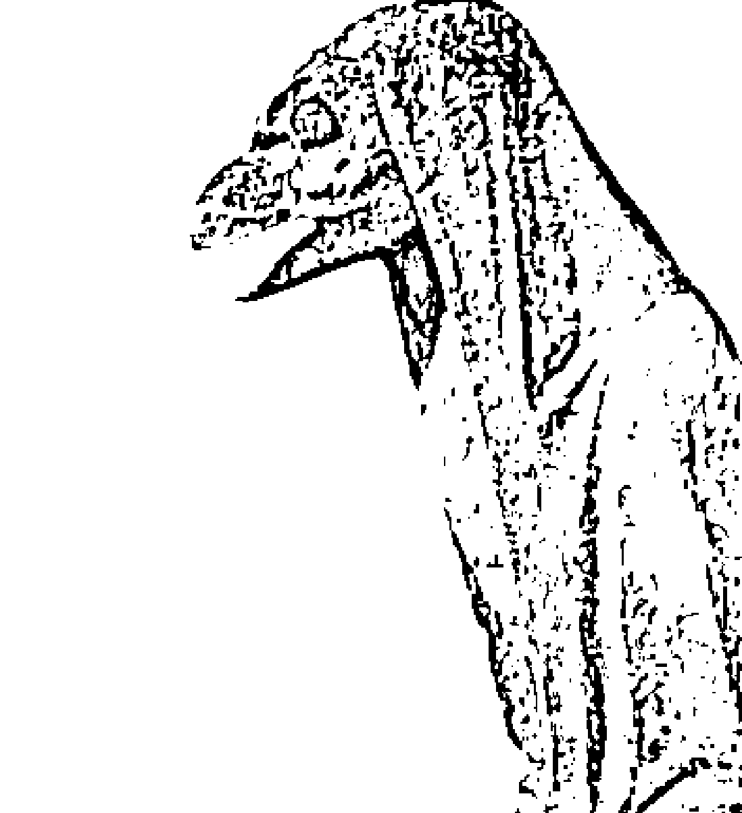
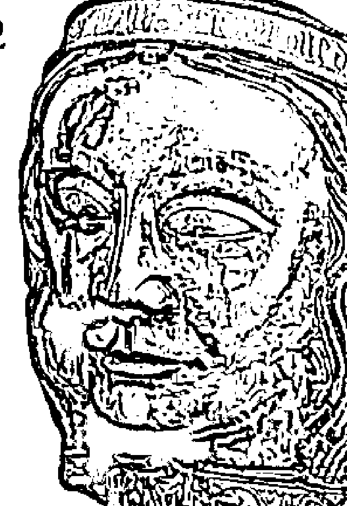

## 雅利安人
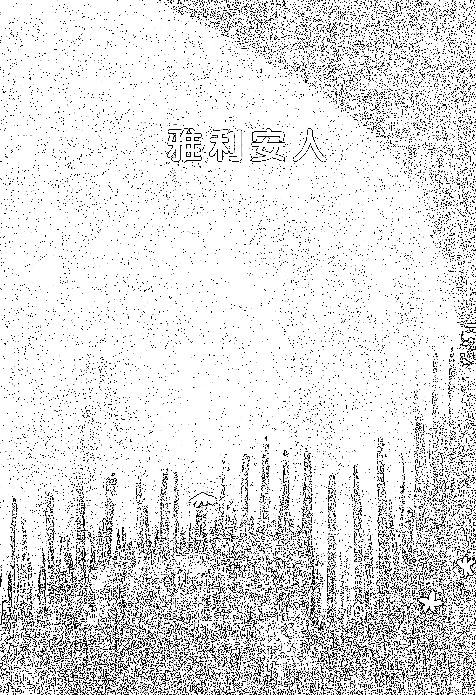

### 雅利安人的隐秘之地

新时代的历史，就是新的民族——雅利安人——取代古老文明而在世界上开始起决定性作用的那个时代的历史。数千年来，雅利安人定居于所有大陆，并且变得往往令人难以辨认。

能否见一见古雅利安人并了解一下他们的生活和信仰呢？

是的，能。雅利安人的这块隐秘之地，位于阿富汗东北部山区，部分在巴基斯坦境内，但不隶属任何一国。“卡菲尔人”被兴都库什山脉所阻，与世隔绝，因而仍保留着古老的信仰和风俗。

实现惊人的时空之旅的第一人，是英国女王陛下的军官罗伯逊。事情发生在19世纪末。其实，不列颠人也并非一下就明白命运之神让他见到的是些什么人。那些生活在难以进人的山谷中的人们，在罗伯逊看来，就是一群野人，跟一般动物相比，只不过智商稍高一点儿而已。后来，他才慢慢醒过味儿来：这下该他惊叹，该他不相信自己的眼睛了……

千百年中，雅利安人一批接一批地翻越兴都库什山脉，向南迁移，涌人印度。有些部族渐渐落在后面，有些部族干脆不愿继续前行。况且当地的绮丽风光也着实让人流连。俄国教授Д.Н.阿奴钦写道：“景色完全是天然的，往往还带有几分凄苦的浪漫色彩。山谷低处，葡萄、石榴触目皆是，栗子、橄榄随处可见。海拔千米处，绿草如茵；千米以上，杨柳、白桦和刺柏混交杂生。三五千米处，马尾松、雪松郁郁葱葱。山顶之上，或巨石裸露，或白雪皑皑。冬季，上部谷地积雪数月，许多山口根本无法通行。” 也就是说，在这块不大的区域内，集中了地球上所有气候带的自然景观。在这里，你可以选择任一气候带修养生息！而主要的是，这里不可能闯进敌人。从一条山谷到另一条山谷，而且只能是夏季，必须通过悬崖峭壁上那令猿猴犯愁的羊肠小道和急流深涧上那摇晃欲坠的独木小桥。因此，留在这里的雅利安人的生活仿佛停滞了数千年，但又并未返归原始。这里住下了雅利安人的不同部族：卡蒂、瓦伊、卡姆、普雷松等，其外貌、语言、风俗、服饰各有特点。连对“野人”持怀疑态度的英国军官也不能不承认，土著“结实、匀称、瘦溜、力气大、耐力好……头发和眼睛通常为黑色，偶尔也能碰到浅色头发的人。脸形大多比较端正，鼻梁挺直而漂亮。在一些富有的部落中，可见到很有文化教养和颇具贵族气质的人。他们智力发展非常明显，机智而聪慧。他们自尊、守信，颇有骑士风度：沉着、勇敢、坦诚、直率”。同时他们也会表现得暴躁而又小气。山民们很看重钱财。就重要性而言，能与之相比的只有口才。罗伯逊最先见到的是西亚波古印度人认为，人类始祖是一位叫摩奴的男人。每次新的灾难来到之际，都会出现一个新的摩奴。他肩负人类繁衍的使命，距今最近的一位始祖由化身大鱼的毗湿奴所救而免遭洪灾灭顶

### 最早的欧洲人

诺言，可在做重大决定时又十分坚决。献身精神达到完全忘我的程度，对自己的领袖忠贞不贰。贪图金钱，却能将之慷慨地奉献给神灵。他们有时怏怏不乐，有时又突然慷慨激昂。有时给人的印象是帮笨蛋，可常常却能想出谁也想不出来的各种军事计谋。一句话，他们经常从一个极端出人意料地突然跳向另一个极端。

他们好不容易到达了爱尔兰、不列颠和苏格兰。在这里，尤其在爱尔兰，凯尔特人保持了本种族的纯洁性。一方面，他们摆脱了罗马文化的影响，没像高卢人、布里甘特人、凯尔特伊比利亚人和他们的其他亲缘部族那样被浪漫化；另一方面，他们能够拿起武器，挺身反抗不久便出现的日耳曼人。

他们在爱尔兰保留了盖尔语、圣物、神话和古籍。其中《古代法典》具有特别重要的意义。爱尔兰人世代遵循这部法规，从古代直至17世纪初。

不过，以上所说，都是外人对凯尔特人的看法，是局外人的评价。而爱尔兰人自己眼里的周围世界却是另一副模样。对于他们，世界非常非常美好，住着无数非常好的人。

尤里·恺撒在《高卢战记》的开头这样写道：“高卢总共分为三块。其中一块住着比利其人；一块住着阿奎坦人；还有一块住着自称凯尔特人的部落，即我们所说的高卢人。他们在语言、机构和法律方面各不相同。”凯尔特人散居于整个欧洲。这些白肤金发、身材魁梧的新欧洲人，轻而易举便战胜了毛发乌黑、身材矮小的利古里亚人。而在西班牙，他们跟伊比利亚人一

### 六次浪潮

伦夫利岛同爱尔兰的许多地方一样，像是埃尔夫小精灵童话之乡的景致，当地人至今对小精灵的存在仍深信不疑

在凯尔特人的，尤其是在爱尔兰人的神话里，凡超自然的东西都是现实的，而尘世的东西都是虚幻的。爱尔兰绿岛的神灵与其他民族的天神所不同的是，他们就像英雄或魔法师，换言之，都是些具有法力的凡人。阅读爱尔兰古代散文叙事作品时，总不免有种强而有力和新鲜奇特之感。

爱尔兰神话看起来简单明了，实际上却十分复杂。每个研究它的人，只能懂得他们能够听到和他们所需要听到的那些故事的一部分。转述者必然会往古代叙事诗里添加自己的东西，这一来就像是在重新创作了。古代叙事诗吸收各人个性的这手绝活，使凯尔特人的神话在20世纪赢得了极大声誉，引起“魔幻”文学的爆炸式发

与福莫尔人的最初几次大战发生在第三次移民浪潮期间，也就是尼梅德的部队涌上爱尔兰岛之时。他们还没来得及熟悉环境，一多半就成了恶魔们的俘虏。未成俘虏的则被课以重赋：每年要交出2/3的孩子和2/3的牲畜。

后来，尼梅德的人奋起反击：攻占了福莫尔人在爱尔兰北岸附近小岛上的城堡，杀死了他们的君王，又主动撤离了这个并不欢迎他们的地方。只有斯塔恩、艾波纳和弗格斯三兄弟心中复仇之火未消，发誓要返回这里。他们为寻找作战魔法的秘诀而踏上了通往极北之路。

他们离开了很久。其中两个兄弟的后裔，终于渡海返回了幸

### 神奇的民族

在俄罗斯、苏格兰和欧洲其他一些国家信奉基督教之后，农民开始野蛮地消灭费叶里（精灵），认为他们是“魔鬼”和“妖孽”。经过这么一场种族灭绝，费叶里所剩无几了：有的去了现代人喜欢说的平行世界，有的被赶尽杀绝，有的则学会了回避那些不可预料的“庞然大物”，即托尔金笔下的霍比特人所称的我们。爱尔兰人因圣帕特里克的努力而先于别国皈依了基督教，避免了神甫的野蛮，与“惹人爱的民族”继续相安无事。一位老太太谈到与费叶里交往的经验时说：“他们是跟我们一样的人，只不过长得漂亮些罢了。比他们再好的邻居没有也不可能有。你对他们好，他们也对你好。在他们那里可别没事横在路上。他们从不祸害穷人。”英国作家约翰·托尔金在《树与叶子》中补充道：“费叶里（令我们遗憾的是）并不总显露自己的真容，让我们看到的是我们自己很想出落成的那种模样——豪迈而英俊。可归根结底，让人类不幸（或所幸）的是，费叶里的魔法使他们具有控制人心的力量……除了小精灵和仙女，以及除了守护神、妖精、巨人和蛇怪，归费叶里管的是整个大地和地上的一切：花鸟山水，面包美酒——还有我们亲身体验他们那魅力的凡人。”

费叶里的部落众多，而且各各不同，有善良的也有凶恶的，有漂亮的也有畸形的，有流浪者也有居家人。通常可凭他们那竖立的尖耳朵、身穿的绿衣服和头戴的红帽子而辨认出来。红和绿是费叶里最喜爱的颜色。也许正因为如此，爱尔兰农民全都戴蓝帽子，为的是千万别把他们和霍尔姆搞混了。”

在神的众多造物中，地位最高的自然是女神达努部族的子孙——锡德，其后依次是丁尼希、泰格维格特格和部分瓜拉格德安巨人与人类交战。巨人为另一自然界的生物，与我们有原则上的区别。根据凯尔特人的银质浮雕推断，古时士兵们常常要同他们进行一对一的搏斗

凯尔特人的神泽农诺斯（泽孔）身边围着被保护者——虚构的和现实的动物农。他们个个白肤金发，淡妆素裹。曾为神明的他们，至今仍保留着某种神性的东西。锡德与凡人向无过往，尽管有时也接受馈赠，但从不还礼。送礼时也不可走近他们那山丘上的住所，充大胆者定会沦为锡德的奴隶。有人或可逃脱，那也是数百年之后，亲朋好友早已过世，而他们即便逃回也成了疯子。”

跟锡德的接触，对于人来说，是非常危险的。他们的美貌令人目眩。这并非夸张形容，而是实实在在的事。他们触碰一下就会让人发疯，一支毒箭就会叫人当场毙命。”

这些费叶里贵族归梅德布女王管辖。他们牧养自己的牲畜，喝自己酿造的麦酒，经常尽情地弹奏乐器消遣。”

在许多方面跟他们相像的是丁尼希。丁尼希从前是仙人，接着成为战神，最后变成了费叶里。但他们并未改变惯常的生活方式，即类似中世纪的骑士生活：狩猎，酒宴和作战。他们能随意变换容貌，也能改变身量——从巨人到侏儒。与锡德不同的是，他

#### 德鲁伊特的魔法

令人难以置信的是，文化发达的欧洲直到18世纪初才从凯尔特人和其他“蛮夷”的死敌——古罗马人的作品中得知德鲁伊特及其学说。应当指出，对于古罗马，精神文明的概念始终是个让人百思不解的东西。帝国宗教本身因其内容贫乏而不值一提。普林尼和尤里·恺撒也只观察到一些古老仪式的表面，其中包括经受假死的神职授受仪式。仅凭此点，足可谴责那些做人祭的“蛮夷”，禁止德鲁伊教，摧毁祭神中心，杀光那里的神甫（也就是德鲁伊特）、学者（菲利德）和弹唱诗人，其中也包括妇女。

这样一来，认真对待罗马人的文字记载是否还值得呢？可是，关于德鲁伊特的其他文字材料似乎未能保存下来，须知他们的秘密学说是口口相传的，因为他们既信不过石头，也信不过木板和羊皮纸。秘密学术保存了下来……原因是，德鲁伊特学说并非凯尔特人的发明，它过去存在，将来也会存在，只要地球上还存在智慧生物。

"德鲁伊特"来自布列塔尼语的"德鲁"（橡树）--说是不对的。这名称源自与伊特鲁里亚语有亲缘关系的一些古语。它由"德鲁"（很，超）和"维特"（看见，晓得）两词合成，意思是："洞察一切者、无所不知者、绝顶聪明者"。

对槲寄生（罗马人称其为枸骨叶冬青）的崇拜与植物的医疗特性并无关系。只要看上一眼或者触碰一下，便可感受到与另一世界的联系。仅仅在这一意义上，槲寄生及其含淀粉的白色浆果（果核形似胎儿）可以算做药材：

"金枝"能帮人恢复与天国失去的联系，并以此医治他的心灵。 常听人说，身穿白衣的白胡子老人夜游森林，爬上圣橡树顶，用金镰割下槲寄生，而割下的槲寄生千万不可接触地面。人们还不止一次地讲过古老的斯通亨奇旁的欢乐舞会。正因为如此，我们不想跟着始终没领会本质的罗马人去描述崇拜的表面现象。 德鲁伊特的学说包括二十三条总律，如若愿意，可称为魔法师的行为准则。 第一条，知识就是权力。对人和事了解得越多，驾驭他们就越容易。 第二条，认识自己。不能自知和自制，怎能支配他人？ 第三条，世上无巧合。两个以上同步发生的事，都有共因，应当将它弄清楚。 第四条，预判行为后果。凡事皆有因果。作法之前，应设想一连串不可避免的后果，然后再行作法或拒绝作法。贸然作法可能导致完全不希望出现的后果。 第五条，找出共性。许多事物都有相似性。行为作用于一些槲寄生的"金枝"，据德鲁伊特的迷信传说，象征精神生活。其果实被看成包治百病的灵丹妙药

相传，梅林使法力将斯通亨奇（史前巨石群、巨石阵）从爱尔兰移至英国

#### 德鲁伊特的魔法

德鲁伊特说，月亮漂浮于永恒之海，保护并保留地球生命之基——植物、野兽和人的种子

事物，会引起另一些事物的变化。 此乃所有占卜和咒语的原则。如与“黑桃Q”对应的是某黑发女子，不与该女子直接接触便可借助扑克牌而改变她的命运，比方说，让她爱上“梅花K”…… 第六条，部分含有整体。某人的物品便含有此人心灵的一部分。对该物品施加影响，则可使此人本身发生变化。做个某人的模型或偶像，它同样会成为此人的一部分。 第七条，所发生的联系不会消失。如你与某人有过来往，你们之间发生了正面或负面的相互关系——爱或恨，分手之后这些感情也不会消失。人们会继续“发展关系”：或爱得更切，或恨得更深。联系一直都会存在，哪怕一方快要咽气。 第八条，名字隐含主人个性。首先，名字皆有寓意(维克多——胜利者，安德烈——英勇的，叶莲娜——阳光，伊琳娜——和平）。 其次，名字的每个字母都具有数理意义……只要想象某人的形象，再大声地说出他的名字并诅咒他，便可使人受到伤害。最好祝愿他人幸福和成功……因此，德鲁伊特不会把自己的真名实姓告诉陌生人。 第九条，话语之力。自创世之初便有了咒语和套话，它们不仅能改变外部世界，也能改变内心世界。其中一些听起来并无意义，但直到如今也未失去其魔力。 第十条，复活之力。万物皆有生命。人、畜、鸟、鱼有生命，石、风、云和其他事物也有生命。然而有生命和意识到自己有生命是两回事。魔法师可给任何事物起名，以唤起其个别存在，与其缔约或向其发号施令。这样便可支配野生动物，也能掌控天气了……

履行某些准则之前，需经过基本训练，实际掌握上述准则，尤其是完全控制自己内心世界的准则。由于不相信读者都具有这种能力，所以一系列十分具体的建议就不在此赘述了。 我们只提一下第二十一条：魔法师应使自己保持一种动态的平衡，即不可走向导致改变其本质的极端。这一准则的正确性的佐证是，世上很少有恶毒的魔法师。他们在引起疼痛和死亡的同时，也会把自己同这些现象联系在一起……结果疾病和死亡会伤及恶人自身。 补充一点，善是无限的，它会不断地给自己补充能量：你付出的越多，得到的也就越多。 未经允许闯入德鲁伊特的圣树林者必死无疑

树枝上的常绿槲寄生丛

### 弹唱诗人

如果认为凯尔特人的弹唱诗人只不过是歌手或诗人，那就错了。他们属于德鲁伊特，是魔法师，并能将法术运用于自己的创作之中，这当然并不排斥他们具有天赋。比较确当的是将他们称为民族的灵魂。

"3"在雅利安人的眼里，是个神圣的数字。凯尔特哲人的最高阶层分为三等：德鲁伊特、菲利德、弹唱诗人。弹唱诗人在古代又分为三"级"。据公元前3世纪的作家格卡捷伊说，最高一级的弹唱诗人住在寺庙里，他们该做的就是在竖琴的伴奏下赞颂上帝。此外，他们的义务还包括保护圣殿，管理附近的一个城市。

一“级”弹唱诗人不仅赞颂上帝，还研究复杂的哲学体系——四十六个三位一体律。这里只提第一个“三位一体”：“原始统一体有三，每个只能是唯一：唯一上帝，唯一真理，唯一自由点”。换言之：上帝只有一个；真理不能成双，否则便是谎言；而自由，弹唱诗人认为，它是所有矛盾得以平衡的唯一点。这自由的象征就是一些可来回晃荡的石块，它们可毫不费力地被推动，只需轻轻碰一碰。

二“级”弹唱诗人是全民诗人，歌颂战场上的英雄。三“级”，也即最低一级，是宫廷歌手，颂扬国王们的尊严、财富和勇敢。

罗马人在四百年的统治中完全消灭了不列颠的高级弹唱诗人。爱尔兰也同样如此，但另有原因：信奉基督教使高级祭司丧失了自己的地位，他们为神甫和修士所取代。

二“级”和三“级”弹唱诗人，在爱尔兰并未遭到驱逐。他们改变了本阶层的构成，重新分为三级。最低一级是学徒，由经验丰富的师傅教授本行的秘诀。学徒可离开师傅，选择流浪乐师生涯。这一般是考核过不了关的学徒。他可携带竖琴，头戴白桦树枝做的花环，在婚宴上弹唱谋生。

如果满师考核顺利通过，学徒便成为宫廷诗人。为表示新的身份，他应随身携带竖琴和女王亲自为他戴上的金戒指。他可得到一公顷半的土地、宫内居所和王室赠与的马匹。他的人身变得不可侵犯。杀害弹唱诗人得课以数目惊人的罚金：二百五十二头牲畜和同样数目的金

## 19 弹唱诗人.

凯尔特人的带神马图案的钱币。这在当时可是一笔极大的财富！除课以罚金外，对凶手，甚至对凶器要加以永恒的诅咒。在编年史中，凶手被称为“蒙受耻辱之人”。而弹唱诗人则可对任何罪犯向王室法庭提起诉讼。

宫廷歌手的义务由专门决议予以规定：“得牢记一切值得歌颂的个人、部族和当代事件”。简而言之，他的主要义务就是唱歌。三支歌唱给国王或大公，三首抒情曲轻声(为了不打扰其他廷臣)吟给王后。为百姓服务则不受任何限制：如某普通农民请求弹唱诗人演唱，法律规定他应唱到“筋疲力尽”。作战时演唱军歌可得到特殊的酬金。

三年一次举办来自全国各地的歌手竞赛。由最高统治者和部族首领组成的委员会评选获胜者。给获胜者系浅蓝腰带，坐镀金交椅，当众宣布他为全国首席弹唱诗人，并被尊为歌王。授予他自远古以来就是爱尔兰国徽的银制竖琴一张。根据法律规定，这一乐器的价值不得低于一百二十个银币，比一把最好的战剑或一面银制军用盾牌还贵。宫廷诗人就这样进入本阶层的最高一级，所得的荣誉自然也随之提高。从今往后，席间他不坐在国王身边，而是坐在未来国王，也就是由他负责培养的继位者的右首。这是至尊的席位。国王及其大臣的酒食都是每人一份，唯独歌王可随意吃喝。

按地位，他高于国王本人，再不是他的臣民。但仍要按国王的要求唱歌：一首歌赞颂上帝，另一首歌赞颂本国所有的国王，过去的，现在的和将来的。任何歌手都不敢先于他或有他在场时献歌，除非在隔壁偏殿。为何将他置于如此高的地位呢？因为此人应当激发国人——包括国王——对祖国、对祖国古代、对崇高品德无限的爱。根据法律规定，他应该记下所有歌颂国王和著名壮士的赞美歌，尤其是自己的前辈——昔日首席弹唱诗人编写的歌曲。历史上留下了凯尔特人一些首席弹唱诗人的名字：奥伊辛，阿尼奥伦，利沃赫等。我们将要讲的只是其中最著名的——塔利辛和最后一位——拉夫特里。最高德鲁伊特已成为过去，而弹唱诗人至今依然存在。

##### “西方弹唱诗人之王”

很少有人知道自己的前世：多数人认为今生今世是头一遭，也是末一回。对于不同体内和体外的永恒而美好生命的回忆，上帝只赋予那些能够创造奇迹的俊杰。假如人人都无所不知，那他们就不必来这世上了。或许这就是我们“今生今世”所要解决的一个最困难而又最主要的课题。大弹唱诗人韦尔萨·塔利辛就记得自己的前世，更洞悉自己的今生：

永恒的世界里能体会到上帝的恩典，而富人将体验到存在的另一面。威尔士王子埃尔芬不知因何而命运不济。他英俊、聪颖而又精力旺盛，可就是一事无成。当然，这不会叫他高兴，但也没让他绝望。埃尔芬一向逆来顺受。可他父亲格维德诺却痛心疾首。有一天，父亲打发不走运的儿子到退潮后的海湾去捡拾鱼虾。埃尔芬一条小鱼没见着，可他并不感到奇怪，因为这就是“命”。然而他却从水里拖出一只通常用来装油盛酒的皮囊。人们笑话他：“看来你干啥啥不行！还不如没这湾呢，潮水一退，湾里鱼虾遍地，可你只捡了个皮囊！” 王子一声不吭，操起刀来，欻地划开皮囊，又听得“啊”的一声惊呼：皮囊里是只小筐，筐里躺着个俊秀的男婴。婴儿睁开双眼，微微一笑，把小手伸向埃尔芬。“噗，tal-iesin( 威尔士语意为‘闪光的额头’)！” 一个渔夫见婴儿由里往外闪着金光，不禁叹道。“塔利辛？” 埃尔芬自忖道，“也好，漂亮的名字就是为这捡来的孩子准备的！” 王子小心翼翼地抱起孩子，跨上马鞍，往家奔去。他心里七上八下：该如何对父亲说呢？让我来捡鱼，我却捡了个弃婴。我怎么就任事不顺呢？想到这里，泪水止不住地往下滚。突然间，孩子张口唱了起来，洪亮而又清晰：我亲爱的埃尔芬，您千万别太伤心！眼泪可帮不了您。您今日海湾所获，人世间从未有过。纵然我是婴孩赤子， 可是海洋山川所赐。婴孩儿唱了一路，许诺给恩人带来成功、财富和幸福。王子终于平静下来，满心欢喜。

塔利辛的许诺兑现了。仿佛乾坤扭转，好似太阳钻出乌云。埃尔芬成了家，日子过得和和美美，把往昔的挫折忘得干干净净。他怀着这样的心情前往当地的最高王梅尔冈的城堡赴宴。宫廷弹唱诗人们纷纷盛赞主人的强大、高尚和圣明。不过，这次他们显然做过了头。听他们所唱，让人觉得大地之母迄今还没生过如此完美的人。

埃尔芬忍不住说了句气话：他的歌手比大王的强。马上有人把话传给了梅尔冈。

王子立刻被捕。大王降旨，将他打入地牢，同时又降‘恩’，锁以金脚镣，以显其高贵。

未卜先知的塔利辛知道城堡里所发生的不幸，急忙前往营救他所深爱着的、心灵纯洁的王子。

塔利辛站在宴会大厅的门口，观察着自恃地位显赫的宫廷歌手。歌手们昂首挺胸，鱼贯步入大厅。塔利辛给每人做了个鬼脸，来了个吞咽动作，又将食指在唇边划过，像是说‘博利亚姆，博利亚姆’。

歌手们装作没看见做鬼脸的小孩子，若无其事地来到国王面前，以便再次赞颂他那无与伦比的威严。可是手指一触琴弦，面孔立刻抽搐，现出塔利辛给他们做过的鬼脸，嗓子干渴，唱不出任何曲调，只管用手指划过唇边，发出‘博利亚姆，博利亚姆’的声音。

国王勃然大怒，认为歌手们是在嘲弄于他，抡起剑鞘便打。从魔力中清醒过来的歌手们指着小孩儿说，是他给施了魔法。

‘你是谁？’梅尔冈厉声责问塔利辛。

小孩儿唱道：“我叫塔利辛，西方弹唱诗人之王。我要从金脚镣中解救出埃尔芬。”唱罢一曲，他又唱起另一支威力更大的歌。霎时间，海上波涛翻涌，冲上堤岸，猛扑城堡。国王大惊，生怕城堡被毁，于是下令释放埃尔芬。一见恩人，塔利辛又唱了一首魔曲，埃尔芬的脚镣立时散成小环纷纷落地。

埃尔芬和他的歌手回到家里，迎接他们的是王子的娇妻。喜气重又充满整个家庭。

###### 来自彼岸的诗人

各民族都有自己的大诗人：俄罗斯人崇敬亚历山大·普希金，乌克兰人崇敬塔拉斯·舍甫琴科，爱尔兰人崇敬的是最后一位大弹唱诗人——安东尼·拉夫特里。

拉夫特里是位游方乐师。他原本能成富豪之首，可辞世时衣兜里仅剩两枚铜币。他本来可穿绫罗绸缎，可那件小天使般的绿色短外衣却总不离身。一直云游四海，那绿快成了黑。

拉夫特里从不知愁为何物。那旧提琴一拉，琴弦里便狂风怒吼而大海喧嚣，林中仙女们通宵轻歌曼舞……那歌喉一亮，听众就像中了魔，任你如何摆布。此时此刻，就连黑透的心肠颜色也会变淡，一切烦恼都会像五月雪一样纷纷消融。

一天，来巴利利的歌手被爱所征服：他遇见了玛丽·海因斯。

凡见过少女的都众口一词：人间再无此等尤物。玛丽所到之处，人如潮涌，争相一睹芳容。玛丽的茅屋前求婚者络绎不绝，其中不乏阔少富翁。然而统统被拒之门外。姑娘似乎等待着天赐良缘。她终于如愿以偿。关于这次相逢，还是拉夫特里唱得好：

世上一切都在天意，我往教堂祈求上帝，忍着寒风抽细雨劈，迎面巧遇玛丽·海因斯，我刹那间爱上了伊。文质彬彬上前施礼，人曾教我怎表心迹。姑娘直截了当说道：不必多言，拉夫特里，你找我可到巴利利。

他们相见了。这是片刻抵终生的幸福瞬间。自然，歌手无法留下。浪迹江湖，命中注定。玛丽依旧独守茅屋，不久死于伤寒。可有人说，她是被锡德们掳走的，她长得跟他们太像了。歌手不久双目失明，命赴黄泉。停放遗体的屋里彻夜灯火通明。有人说，那里聚集了一大帮天使，襄助诗人升天。可他谢世三周后重又返回人间，为一对贫穷而幸福的新人丁尼和玛丽的婚礼助兴。他俩为了爱情而拒绝了富户的嫁娶，人们因此而断绝了与他们的往来：丁尼和玛丽空守四壁，没人前来祝福，也没人送上贺礼。可突然听得一阵敲门声，走进一位乞讨的老人，身穿一件发黑的绿衣裳，怀揣一把旧提琴。他向主人道过晚安，坐上丁尼挪给的家里唯一的一把椅子。

“哎呀，我这趟道可跑得太远了，”老人抱怨道，“而且也饿坏了！好心人哪，要是能给来口饭吃，我真感激不尽。”

新郎新娘哈哈笑道：“晚饭？那您可听好了，我们今天结婚，婚礼上只有爱情！”

“什么？”老人眯起跟瞎子差不多多的眼睛问道，“你们因爱而结合，可你们连锅盖都揭不开。那快去叫你们邻居，让他们给新人送些礼物来！”

“他们不会来的，”玛丽摇摇头，“他们瞧不起我们，因为我们是为爱而结合的。

老人那失明的眼里闪着火花，像愤怒，又像顽皮。他问道：“你们听说过拉夫特里吗？”

丁尼和玛丽齐声叫道：“谁不知道伟大的拉夫特里呀？！只有聋子和死人没听说过！”

老人把提琴往膝上一放，吩咐道：“那好，快去叫邻居！让他们把能找出的酒菜都送过来！告诉他们，婚礼上将有拉夫特里本人前来助兴！”

玛丽报以兴奋而迟疑的微微一笑，而丁尼则不放心地小声问道：“拉夫特里本人？”

“是呀，真正一对糊涂虫！我可告诉你们，我就是拉夫特里！”老人回答。

###### 来自彼岸的诗人

消息霎时间传遍整个村庄，人们飞也似的奔往丁尼和玛丽家，都想听听拉夫特里本人的演唱。不一会儿屋里挤得水泄不通，桌上堆满了菜肴美酒。

歌手的演唱难以形容！仿佛这是他自己和海因斯的婚礼！音乐起处，大海欢腾，微风习习，百鸟和鸣，仙女曼舞……人们哭不出，也不敢笑，个个听得仿佛着了魔。乐师手托礼帽绕场一圈，人人倾囊相赠。

人们在神魂颠倒中散去，最后离开的是拉夫特里。

“他把帽子和钱落在了，”玛丽嚷道，“赶紧叫他回来！”

丁尼刚想迈腿出门，迎面走进从森林里回来的邻居帕特。“哎呀，真遗憾，你来晚了。”丁尼对他说，“在我们婚礼上表演的是拉夫特里本人！你来的路上没碰见他吗？”

“拉夫特里？”帕特不相信自己的耳朵，“他三周前就去世了呀！我可是亲眼所见哪！”

伟大的歌手从彼岸返回，为两个贫穷而热恋的情人婚礼助兴，还用得着怀疑吗？

那么拉夫特里呢？为他祈祷吧，别管他在哪里！他日后或许还会回到人间，拉起他那把旧提琴。

## 古不列颠人

不列颠最早的居民，是欧洲最古的主人——伊比利亚人。他们是佩拉斯吉人和伊特鲁里亚人的亲戚。稍后，苏格兰的斯科特人将他们赶往极北，甚至跟他们结亲。罗马军团给伊比利亚人起了个外号叫“皮克特人”，意为“五颜六色的人”。伊比利亚人出战之前，总要在自己身上涂绘用来吓唬敌人的图案。他们是何时从西班牙来到北方诸岛的，没人知道。然而在英格兰却留有他们的两个极其伟大的创造成果——斯通亨奇和纽格兰奇。学者们认为，它们在不同时期用于不同目的：不仅是史前巨石观象台和祭坛，而且还是归天的大门。

大约公元前6世纪，从北高卢袭来一股凯尔特人的移民潮。最先移来的是戈因德尔人的部族。他们夺取了坎伯兰、康沃尔、德文和北威尔士，即英格兰岛的南部和西部。北部依然属于伊比利亚人。那时该国称阿尔巴尼亚，后称喀里多尼亚，今称苏格兰。起先，戈因德尔人同南伊比利亚人进行过殊死的搏斗，可后来又联合起来抗击共同的敌人——比利其人的凯尔特部族。后者从欧洲经拉—芒什渡海而来，打算定居英格兰。让比利其人葬身大海的努力未能成功，相反，比利其人却将土著和自己的凯尔特同胞大大地挤了一挤。结果，岛屿被三个民族所瓜分。戈因德尔人保留了康沃尔、威尔士、安格尔士岛和爱尔兰。比利其人占据了国家的整个东南部。伊比利亚人不得不向北迁往同胞的地域。戈因德尔人与比利其人之间住的是混血部族，二者的后代。最大的部族是布里甘特人，后来叫布里特人（今译“不列颠人”——译注）。因为他们，整个海岛就取名布里塔尼亚（今译“不列颠”——译注）。一段时间，相安无事。实际上不是那回事儿！公元前50年代中期，尤里·恺撒亲率大军攻打布里特人。当地的军队在卡斯瓦拉郎国王率领下对南方人进行了顽强的抵抗，南方人不得不滚回老家。但纠合更多的士兵（达两万罗马士兵）后，展开了第二次进攻。这一次，他们占领了肯蒂亚（今肯特），宣布它为罗马的一个省，而当地居民则要为从未听说的帝国缴税纳贡。布里特人同意分享财物，可没过多久，达成的协议就被置于脑后了。罗马人滚走后，似乎忘记了远方的北部海岛。想起布里塔尼亚已是百年之后，公元41年罗马皇帝克劳狄登基以后的事。克劳狄派兵击溃了布里特人的军队，布里特人首领卡拉塔克被俘并被带往罗马。布里塔尼亚再次被占。罗马皇室又派兵征服“锡岛”。罗马军团统帅斯维托尼率部进攻布里特人的主要圣地——安格尔西小岛上大祭司们的城市。接着他的军官卡特逮捕了布里塔尼亚女王鲍迪卡(又叫博阿迪齐娅)并鞭打了她。被亵渎神圣和凌辱所激怒的布里特人，同仇敌忾，瞬间摧垮罗马人的抵抗，将卡特及其部队赶往高卢(今法国)，成千上万未及逃跑的罗马人被捉，或被绞死，或被剑劈，或被钉在十字架上。几天之内，罗马人被歼七万之众。

斯维托尼在高卢重新集结部队。女王鲍迪卡也调集大军，号召布里特人为祖国拼死一战。然而女王的英勇不足以粉碎装备精良的外族部队。外族士兵身披盔甲……好似洪水猛兽，砍杀他们似乎毫无意义——他们会大批地复活，仿佛永生不死。女王万分恐惧，拔剑自刎。

结果，罗马人侵占布里塔尼亚达四百年之久。异乡人只是未能侵入海岛的最北部——苏格兰。这里奉阿格里科拉之命建起了壁垒。它在后一位罗马总督哈德良的任期内得到彻底加固。至今这一防御设施仍称哈德良壁垒。

这四百年间，罗马人没过过一天安稳日子。407年，他们终于抵挡不住攻击，永远离开了布里塔尼亚。

罗马人撤离后，地方领袖之间展开了争夺权力的殊死搏斗。得胜的布里特人沃蒂根决定从海外将撒克逊人请来支援，许诺割让部分土地作为酬谢。然而这些无理的日耳曼人想得相当简单：既然他们有力量，就可以夺取全部，又何必满足于部分？于是乎布里塔尼亚就成了撒克逊人的布里塔尼亚，上空飘起了带白马(撒克逊人的徽记)的外乡人的旌旗。能够遏止他们入侵的只有传奇国王亚瑟。可是他的干预也未能挽救布里塔尼亚。从海外又来了新的侵略者——诺曼人。

群岛上重又血流成河。流血的有凯尔特人和他们的后代布里特人，有罗马人的子孙，有从爱尔兰迁来的斯科特人，有岛上的土著皮克特人，也有盎格鲁和撒克逊部族的日耳曼人。同诺曼人的血流混合一处，这血成了新民族的源头。这新民族便是我们今天所称的英国人。

### 布鲁图的子孙

据古代传说，岛上最初的居民是巨人。其中一个人名叫阿尔比翁（阿尔巴，或阿尔瓦，是日耳曼人对埃尔夫小精灵的称呼）——波塞冬（凯尔特语叫利拉）的儿子，在同误入这里的希腊力士赫拉克勒斯交战中丧身。他的名字成了该岛的古代称呼，并且保留至今。据后来的种种事件推测，阿尔比翁的后代——巨人——继续住在布里亚尼亚岛上。

凯尔特语从第一位国王布鲁图开始，按照顺序一个不落地叙述了我们所有君主的治国史……结果，加尔弗里德·蒙默斯基写出了两本畅销书：《布里特人的历史》和《## 29 布鲁图的子孙

斯通亨奇庙(史前巨石群、巨石阵)在各个时代服务于不同的目的，但总是魔法目的。王子猎中误杀了父亲，虽然母亲他碰都没碰，可单凭弑父一条罪孽，足该将他逐出族门。王子厄运使然成了弑父者，只得接受族人判决，召集忠实朋友，离乡背井，登船而去。

一日，风鼓船帆，将他们刮到岸边有座月神（罗马人叫她狄安娜）庙的去处。布鲁图同先知格里翁及十二位长老登岸前往庙堂。他拈香叩拜，求月神指点今后行程，可倦意突然袭来，呼呼睡去。两眼刚刚合上，面前就出现了月神。狄安娜唱歌似的拉着腔说：“过高卢国，到日落处，大洋之中，孤岛一座。” 布鲁图一觉醒来，将梦中所见说了，众人皆认为是吉兆，于是欢天喜地，扬帆起航。

凯尔特人的战神叶祖斯(“愤怒的”)为了得到槲寄生而砍伐长着它的圣橡树。写道：“当时所称的阿尔比翁岛上，除了为数不多的巨人，尚无人类居住。那景色迷人的土地、盛产鱼虾的河流、尚未砍伐过的森林，让布鲁图及其伙伴动了定居该岛的念头。” 总之，布鲁图及其伙伴在阿尔比翁岛上有新的家园。首领建起了城市，起名特洛雅诺瓦(新特洛伊)，后来改名为特里诺旺图姆，接着改称伦迪尼乌姆，最后改为伦敦。

生了变化：从此他成了布里特，他的臣民就叫布里特人，而岛屿就叫布里塔尼亚。

布里特死后，他的儿子，洛克林、坎伯和阿尔巴纳克特，瓜分了国家。长子洛克林选择了中部——洛格罗姆（今英格兰）；次子选择了西部——威尔士和坎伯兰；幼子阿尔巴纳克特去了北方——喀里多尼亚（今苏格兰），人们为纪念他而将其称为阿尔巴尼亚。

这就是凯尔特人关于布里塔尼亚首批移民的传说，但说的不是凯尔特人，而是先于他们从小亚细亚的特洛伊迁移来的伊特鲁里亚人，即拉斯人，我们俄罗斯人的远祖。

### 奥伯伦及其伙伴

如果说爱尔兰的费叶里在自己的国度里生活得逍遥自在，那么他们从英格兰，要是相信帕克的话，就是趁早离开的。“霍尔姆的所有居民，”他说，“都走了。我亲眼见他们来到英格兰，也亲眼见他们离开了它。巨人、特罗利、水怪、家神、小鬼、小魔、林妖、树精、地神、水仙、埃尔夫、仙女、美人鱼、守护神、小精灵、巫神、冈峦看守、宝藏护卫——统统走光了。至于我，我来英格兰时带着橡树、梣树和黑刺李，等他们都走了，我再走。”

然而，不列颠的费叶里走得并不太远，去了相邻的、由一层薄而透明的界面与人间相隔的世界。那世界能像幻景、海市蜃楼一样在人间突然显现。它正是这样出现在罗兰（阿兰·加德纳的《艾利多尔》一书的主人公）面前的：“他站在山冈上，看见远处的

并非所有的费叶里都像漂亮的人，有的像三条腿的兔子

有什么样的人，他身边就有什么样的小精灵。

长篇小说《来自波尔多的居翁》引用了英国埃尔夫王奥伯伦的家谱。仙女凯法洛尼亚，神秘岛的女王，爱上了埃及法老尼普塔涅布。他们婚后生下亚历山大·马其顿。七百年后，女王又与尤里·恺撒不期而遇。他们的儿子就是奥伯伦。母亲赋予他的是些神奇的特性，其中便有解读他人思维和空间瞬息移动的能力。父亲传给他的的是辖制神灵和大自然的权力。

本来一切都蛮好，可恶毒的凯尔特仙女摩尔佳娜却给婴儿施了魔法，就因为人们忘了叫她也去瞧瞧这孩子。孩子只长到三岁就停下不长了。小模样始终不变：

脸蛋俊秀，而身体羸弱。然而太太娶的却是美女蒂塔尼亚，听名字，像是希腊巨人之后。 呜呼，就像普通家庭所常见的那样，奥伯伦和蒂塔尼亚常常反目，闹得天翻地覆。 奥伯伦的侍从中特别出色的一位叫帕克。他就是善良的小精灵罗宾。 拉迪亚德·基普林在《帕克童话》里描写了一个淘气的小精灵：“树丛被分开……孩子们看见一个小小的、褐色的、肩膀宽宽的矮个子，尖尖的耳朵，翘翘的鼻子，蓝蓝的、斜斜的眼睛、笑眯眯的脸蛋……孩子们目不转睛，上下打量着他——从头上那像朵花似的深蓝色小帽，到那没穿鞋的、毛乎乎的双脚。”

摩咖娜女巫是慈善而仁厚的亚瑟王的胞妹。φ·桑蒂斯的画作 摩咖娜 - 勒·费伊 蹈家。荒地里，村落旁，仍旧有样子可怕的幽灵在游荡。在仙乡，幽灵夜里没人可吓唬。而在人间——魂都能给吓掉的！ 因此，英格兰的费叶里两界都住，不过行为举止比从前要谨慎多了。

### 头号魔法师

每个演员都渴望演一演哈姆雷特，每位英文作家都想一试才华——写一写梅林。因此，这位如今妇孺皆知、手执魔杖的迷人的凯尔特老头儿，其实是个文学人物，是许多人共同创作的成果。确切地说，这普遍爱好的“祸首”就是杰弗里·蒙默斯基。在为《梅林传》作序时，他针对刚被授以林肯市主教职位（1148年）的罗伯特·切斯尼写道：

我想赞颂未卜先知的梅林，他那狂妄行为和风趣作品。罗伯特先生，神甫们的骄傲，请挥动您那支如椽的大笔，斧正在下这部拙作的草底。这后两行诗，人人都觉得说的是自己。跟12世纪的那位谁也不知道的罗伯特不相干！这事我们还是等会儿再说，先应该说杰弗里本人。他倒是有理由改一改胡编出来的东西。首先，魔法

师的名讳本身就是他编造的。他改造了同诺曼语的“梅尔德”谐音的凯尔特人的“米尔丁”，将其改成了拉丁人的名字——梅利努斯。其次，魔法师的生平细节，他取自四个不同的主体：一是古凯尔特神马特，高超的大祭司格维蒂翁的师傅，二是格维蒂翁本人，三是著名的巴比伦弹唱诗人塔利辛，四是6世纪的疯歌手米尔丁·埃姆里斯。杰弗里·蒙默斯基还编造了未来最出名的魔法师那充满神奇色彩的身世：“他们被带进王宫，国王以应有的礼数接见了梅林的母亲，因为知道她出自名门望族。接着国王问起她与何人怀上的梅林。女子回道：‘陛下，你是个热心肠，我也是。可我实在不知是跟谁怀上的。我只知道，一天我跟几个贴身丫头在闺中歇息，我面前突然出现一个形似美少年的人，将我紧紧抱住，连连亲吻；跟我待了一会儿，就突然消失了，就像根本有过似的。他很长一段时间就这样来找我，常常跟我同房，像个有血有肉的人，直到我有了身孕，他才将我抛下。” 1190年，宗教狂罗伯特·博隆把一切完全倒了个过儿，在自己的《梅林》里要证明主人公为妖魔与修女的罪恶结合所生，故而擅长巫术。1225年的中世纪拉丁文《圣经》里，整整一卷说的是梅林。而1485年，托马斯·马洛里洗刷了蒙昧主义者给魔法师所泼的脏水。他叙述了亚瑟王及其谋士梅林的一些奇遇。起先，高明而有威望的大祭司，慢慢成了尤瑟王的谋士。大祭司让尤瑟变成仇敌戈卢阿的模样，助他悄悄潜入敌方的城堡，甚至帮他上了戈卢阿的妻子伊格莱娜的床。女人就是权力。尤瑟占有了

阿瓦朗（afal.威尔士语意为“苹果”）是安修之岛，彼岸世界。岛上的仙女向未客赠送具有魔力的苹果

### “白马”——威尔士的马形圣湖

伊格莱娜，也就获得了王位。戈卢阿死于交战。尤瑟不断得手的最后一笔是，伊格莱娜生下子嗣。而梅林立刻插手，要求回报所给予的帮助而交出婴儿。他带着婴儿离开城堡，然后将小亚瑟寄养在骑士埃克特家中。

后来的事情无人不晓。在英波尔卡节（类似谢肉节）上，亚瑟出人意料地从放在岩石上的铁砧里拔出宝剑，根据预言得到最高权力。

自从15世纪马洛里的书问世以来，这故事的梗概再无变化：梅林将斯通亨奇从爱尔兰搬到不列颠（其实，没这回事），预言将出现全不列颠之王——亚瑟；促其出生、成长、取得王位（借法术——石中取剑）；借法力造王宫；打造著名的圆桌。魔法师始终不离君王左右，为其治理国事出谋划策。这样，马洛里再造了梅林。疯歌手米尔丁消失得无影无踪，同门徒亚瑟相遇之前的生活也黯然无光，退居次要地位。从此，魔法师与国王形影不离。出现两个新形象：军师和义师统帅。赞美过他们的有阿里奥斯托和塞万提斯，歌德和乌兰德，坦尼森和斯宾塞，

罗伯特·奈伊（法尔斯塔夫的塑造者）和西格里德·温赛特(诺贝尔奖获得者)。
在罗杰·兰谢洛特·格林的《亚瑟王和圆桌骑士奇遇记》一书中，梅林毅然离开了长大成人的义子，说：“我来跟你告个别。我这还得给你敲个警钟：看好你的埃斯卡利布尔剑和它那神奇的鞘，当心恶毒的女人把它盗走……不过她赎罪以后会与你白头到老，同别人一道送你去阿瓦朗。其中一个阿瓦朗女子——尼姆冶女士正等着我呢。她会让我隐居地下而与世隔绝。”

世。可是他立即在玛丽·斯图尔特的《水晶岩洞》和罗杰·热列兹纳的《恩别尔纪事》中复活了。而且还会复活无数次，尽管今天人们一再提醒所有想让他复活的人，他的坟墓就在昆廷附近的布罗谢利阿达森林里。假死和永远的复生是否正是他的魔力所在呢？
古插画上的因爱情而变年轻的梅林和他奸诈的女门生维维安娜

### 永世之王

再，再而三，痛击了一十二次！6世纪，被打得落花流水的撒克逊人销声匿迹，长期不敢“抛头露面”。是谁让他们如此胆寒的呢？

关于这些胜仗，是威尔士修士吉尔达斯(516—570)在《不列颠的衰落和悲哀》一书中首先描述的，但他并未提到统帅的名字。

他的同胞和同行南尼于9世纪初在《不列颠史》中终于提到了他的名字：“那些日子里，同他们(撒克逊人)作战的是军事长官亚瑟，协同布里特人的头领。他是部队的首长。第一仗发生在名叫格列英河(今流入沃什湾的格伦河)的河口。第二、第三，直到第五仗发生在另一条河附近，这河名叫杜布格拉斯(今杜格拉斯河，克莱德河的支流)……第十二仗发生在巴登山(今巴特市郊的一个山冈)。在这一仗中，亚瑟的剑下一天就死了九百六十个敌军官兵，让他们闻风丧胆的正是亚瑟本人。”

南尼管亚瑟不是叫国王，而只是叫统帅，个中原因是，并非所有公爵都承认他是最高统治者。而按当时的法律，总司令就是全国的最高统治者，即便不是法

如果梅林是个文学人物，那他的门生亚瑟王也应该是杜撰的人物喽？不，亚瑟确有其人！443年，不列颠岛上从欧洲来了一批撒克逊人。他们是不列颠君王沃蒂根请来镇压皮克特人暴乱的。撒克逊人根本没去管皮克特人的事：他们有意将不列颠人本身赶出他们的岛屿。因而哪个君王——无论沃蒂根，安布罗西，还是尤瑟，都拿远道而来的善战的外乡人没办法。可是突然间一切都变了！有人在一次战斗中痛击了撒克逊人，接着一而

#### 35 永世之主

亚瑟杀敌奋不顾身,
亲率士卒冲锋陷阵.
迫使外寇滚回老家,
王国从此海晏河清.
接着国王开始征服一个又一个国家:
乘胜征战斯科特,
继而用兵皮克特.
威加四海力征讨;
收服远洋挪威国,
兵船直达达西亚……
情况的确如此，不过事实稍有出入：亚瑟征服人心靠的不是武力，而是无坚不摧的个人魅力。法裔诺曼人对高卢的亲友说过传奇英雄。法国宫廷诗人克雷蒂安·特洛阿在一系列诗体小说中赞颂过欧洲骑士之魁首——亚瑟。 随后，英王在德国也出了名。著名的德国吟游诗人沃尔夫拉姆·冯·埃申巴赫在史诗《帕西发尔》中唱道：
……我们光荣的亚瑟王， 把骑士称号来封赏,
只有才能和志向， 值得他庇护和嘉奖。

谁浑身是胆无所惧， 谁智勇双全名不虚， 请快快效忠亚瑟王， 你必成骑士把名扬！ 就这样，不列颠王先威震全欧，接着又名扬天下。大量的美国电影，其中包括著名的《埃斯卡利布尔》，会使人觉得亚瑟原来是个美国人。俄国魔幻小说作家米哈依尔·乌斯宾斯基幽默绝伦，给了国王一个完全俄国味的名字——阿尔图尔。 就这样，亚瑟不仅赢得声誉于疆场，而且还获得了新生于永世。

克逊人从未见过的防护装备——甲、胄、盾。而主要的武器，一种‘秘密’武器，乃是只有骑兵能用的重型长矛。 身披金属甲胄、灵活机动、可远距离攻击的亚瑟的精锐之师摧垮了撒克逊人的乌合之众。 从10世纪起，对亚瑟的存在已再无人置疑。而且，自诺曼皇帝威廉占领不列颠后，为了博得新臣民的好感，他极力利用凯尔特人的传说，将亚瑟奉为不列颠人—撒克逊人—诺曼人的共同英雄。对这一深谋远虑的政策，英国诗人拉迪亚德·基普林曾赋诗予以称赞。 为国版史书沦为二流而感到气愤的杰弗里·蒙默斯基终于拿起了笔！ “少年亚瑟年仅十五岁，”他在《不列颠史》中说，“便表现出前所未闻的英勇和慷慨气概。他那与生俱来的友善使得没人不爱他。他加冕以后依然保持着昔日的习惯，广施恩泽。” 在《梅林传》里，作者

#### 永恒之爱

在卡梅洛特的圆桌旁聚集着许多勇敢的骑士。每位骑士都有严格规定的座椅，椅背上有金色字母书写的主人姓名。此一规矩为梅林所定。

圆桌制作完毕，梅林对亚瑟和格威涅芙拉说：“陛下和王后，你们好！你们的座位正等着主人。一百五十个座位也在等着骑士。……每张座椅上都有金色字母写就的主人姓名。如你们再封谁为骑士，他的名字就会出现在椅背上。如某个骑士阵亡或去世，他的名字就会消失。但圆桌骑士的英名将永世长存。诸位请人座，这里所有座位一律平等……

全体人座，有四个座位仍然空着。梅林解释道：“将来坐到这里的，都是些为国家带来更大荣誉的人。头座为佩利诺王所设，次座虚席以待兰斯洛特爵士，第三座留给尚未出生的佩尔西瓦尔爵士。至于第四座，法师说：‘此乃追命座。坐到这里的人必死无疑！占用它的只能是为其所设的人——骑士中的魁首。他在规定的时候就会出现。’

很长时间追命座一直空着。这其间，其他座位在主人亡故后又被他人所占。于是亚瑟王问有否听说过胜于所有在座者的骑士。加文说，知道有这么一位，叫特里斯坦，寄居康沃尔的叔父马克王家。兰斯洛特补充说，跟他交过一次手并甘愿承认他在圆桌骑士中数最强。

正说着，大厅里走进一位从康沃尔来的弹唱诗人，国王问他是否认识骑士特里斯坦。“是的，仁慈的陛下，”吟游诗人回道，“臣有幸常见此人，臣愿说一说他的事……

骑士降生于悲痛时刻——他父亲，皮克特的君王，抗敌捐躯，母亲得知噩耗，刚产下婴儿，便悲痛而亡。孤儿被送往康沃尔，寄养叔父马克家。叔父对孤儿疼爱有加，视同己出。“骑士长大后，叔父交给他一项特殊使命——赴爱尔兰迎回未来的姊娘——银发公主伊佐莉达。骑士发誓不惜代价完成使命。可公主从未见过马克，担心无法爱上夫君。因此，她母亲煎了两服药：一服是钟情汁，另一服是夺命汤。两只药瓶，她都交给了女儿的嬷嬷，吩咐她依嘱而行：如迎亲船只遭遇海盗袭击，让她女儿喝下夺命汤，以免落入强盗之手；如公主顺利抵达康沃尔，她应同马克一起喝下钟情汁，如此夫妇俩便可相亲相爱，白头偕老。“

主人死后，

##### 托马斯·莱蒙特在仙女国

一朝得见仙乡，便会永生难忘，日日心驰神往。苏格兰的吟唱诗人——俄国著名诗人米哈伊尔·莱蒙托夫的祖上——托马斯·莱蒙特便是这样。

阳春三月，天清气爽，他依古栎而坐，观赏着汉特利河，忽听得马蹄声响，只见一位靓丽女子策马奔到跟前，便与她攀谈起来：“你是何人，美丽的姑娘？莫不是天女下凡？”

姑娘听了，咯咯笑道：“哦，不，托马斯·里弗马奇！小女子官职卑微，区区仙女国国王。”

诗人面前的女子竟是提坦神！换了别人，早撒丫子颠儿了。他居然随之去了仙女国。

他俩一阵风似的疾驰而去。跑了整整一天，景物也不知不觉开始变换：树木不见，飞禽走兽消失。四下一马平川，渺无人烟。眼前有路径三条。一条是羊肠小道，只见荆棘载途，如女王所说，此乃“正义之道”。但她故意不提它通往天国。另一条是康衢大道，只见路面黄沙松软，两旁香花怒放，乃为奸邪铺设，通往地狱。还有一条蜿蜒曲折的小路，渐渐消失在茂密的蕨类植物丛中。

“它通往小女子的王国。”女神回答了并未提出的问题，接着又说：“到达之前，托马斯，请记好：你哪怕张口说出一个字来，就回不去了！你只能歌唱。”

夜幕降临。晨光熹微。马不停蹄。托马斯盼望日出，可它一直不露头影。诗人终于明白，仙境既无昼夜，也无冬夏，永远明媚春光。时间在这里停滞不动，故而仙乡居民长生不老。

来到提坦神的宫殿，奇珍异宝，令人目不暇接。宫内门扇，随人心意开启；大殿照明，是天棚上那制作精妙的日月星辰。堂前泉眼喷甘酿，壁上挂毯栩如生。画上的魔法师——梅林、摩尔根、维维安娜以及其他圣贤和造物，向诗人频频递送眼色。来到后花园，只见春夏秋三季花卉争奇斗艳。空中、叶间和草上，费叶里尽情嬉戏：唱歌、跳舞、赛跑，或干脆恶作剧。

女王正是在此找到了他。女王拉起他的手，领他看了为他准备的住房。临走时说：“旅途劳顿，早些歇息。明天歌手比赛。你应当获胜并夺得头奖——金竖琴！”

清晨，他被枕头唤醒。它吵架斗嘴似的说：“别睡了，要不世上一切都给你睡过啦！”诗人这才想起自己在哪里，于是匆匆赶往金殿，那里已经聚集了仙乡的歌手。

首先出场的是个脸色苍白的小精灵。他的歌声凄凉，一如其人……参赛者依次走到金銮宝座之前，可他们的曲调都千篇一律。

最后轮到莱蒙特。他唱出了家乡诗情画意般的美景、旭日东升时的兴奋、高山的雄伟和大川的绮丽——他所记得和所爱的一切

许多费叶里都可以从他们的尖耳朵上辨认出来。非常俊美的小精灵的这一特点不很明显

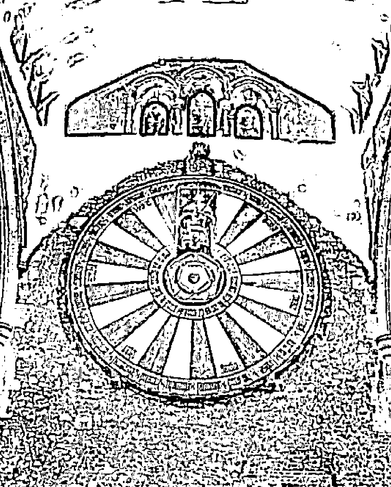

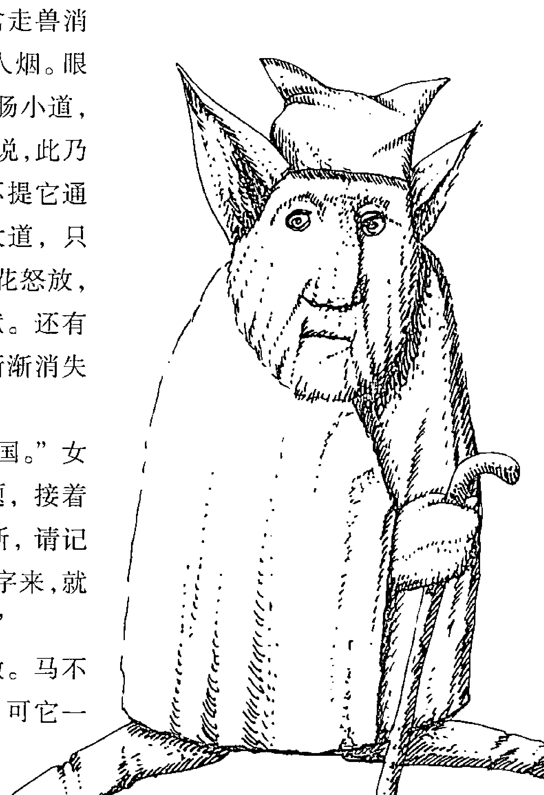

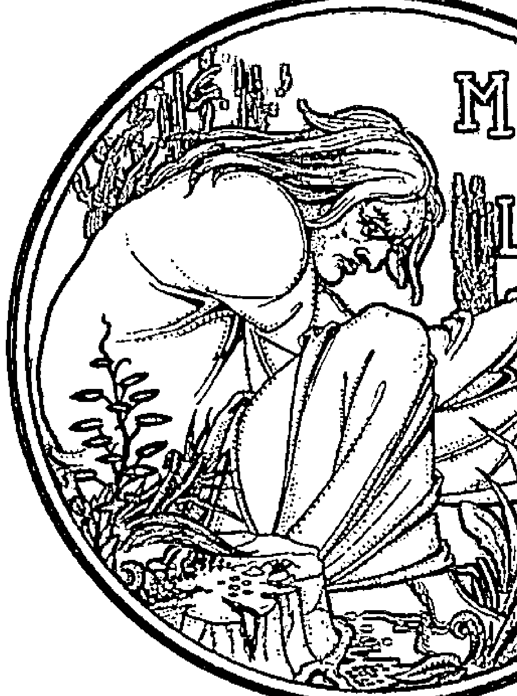

著名的魔法师梅林有个原型——在原始丛林里埃尔夫小精灵中间度过大半生的疯弹唱诗人

切。他的歌声一落，金竖琴自动奏起了刚刚唱过的调门。

奥伯伦满脸不悦地说道：“竖琴自己选择了得主。”显然，他因为外乡人获胜而感到沮丧。

晚上，忧心忡忡的女王前来找他，说道：“托马斯，你大祸临头了。地狱的恶魔要奥伯伦进贡。我料定他会将谁献出。所以你必须赶紧离开我们这儿……

“我可不想与你分手！”诗人喊了起来。

“咱们还能再见，我向你保证。我还有一事要提醒你……我们这里的时间跟你们那里不一样。你在这里待了两天，可苏格兰已过去七年了。”

“七年？！”托马斯将信将疑地叫道。

“不过就七年，”她点了点头说，“情况本来还要更糟。你的朋友都健在。他们会想，你是外出云游了。还有一事。你堂堂正正赢得了头奖，竖琴往后完全属于你。不过要知道，竖琴的主人注定永远说实话，哪怕这样对他有危险。”

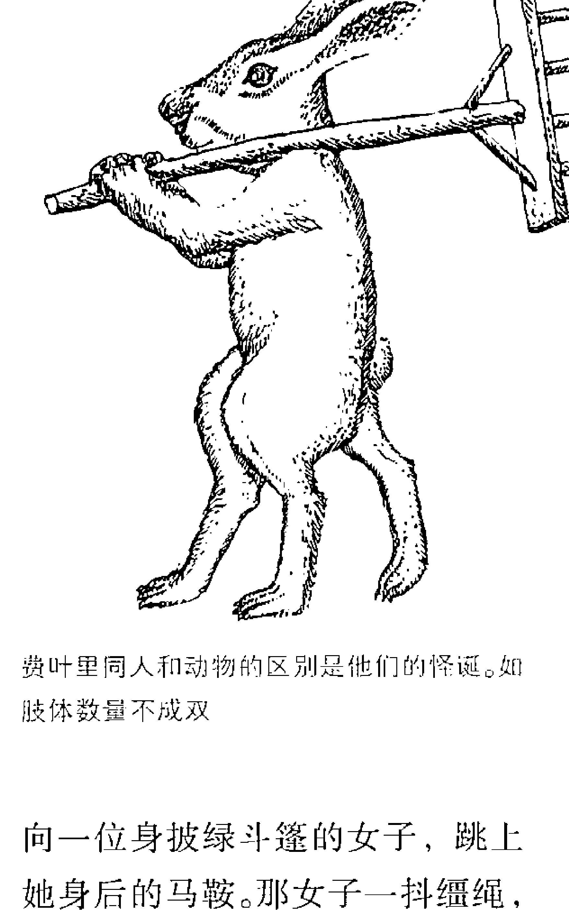

托马斯本想不要这奖品，可女王听见了什么动静，神情慌乱地转过身去，连拍三掌，诗人霎时间回到了河岸边，栎树旁。天，还是那种三月艳阳天。他站起身来，往家走去。

亲朋好友相见，欢喜非常，只是不信他那段仙乡诗意般的旅行，心想：大凡诗人都添枝加叶，胡编乱侃。托马斯一如以往，为同胞歌唱，不过他行为出现了异常：经常愣神发呆，侧耳细听。然后闷闷不乐地摇摇脑袋，又接着弹琴说唱。现在他唱得越来越多的是仙女国的奇闻……人们听着，暗自好笑：他们知道，这等事儿就是有，那也不在人世间。

一天，歌手突然扑向窗口，看见了什么，匆匆奔出家门。众人连忙追赶，心想：托马斯疯了。可是没能追上。只见他急急忙忙迎

向一位身披绿斗篷的女子，跳上她身后的马鞍。那女子一抖缰绳，坐骑绝尘而去，仿佛融化于雾中，消失了。主人身后跟着一群汪汪叫的猎狗。有人说，那根本不是狗，而是成年狼。好像也不是狗吠，而是狼嗥。

谁知道呢。也没处去问：托马斯·莱蒙特消失了，在苏格兰没人再见过他。

仙女国国王有时可存我们世上见到。她喜欢在这里打打猎

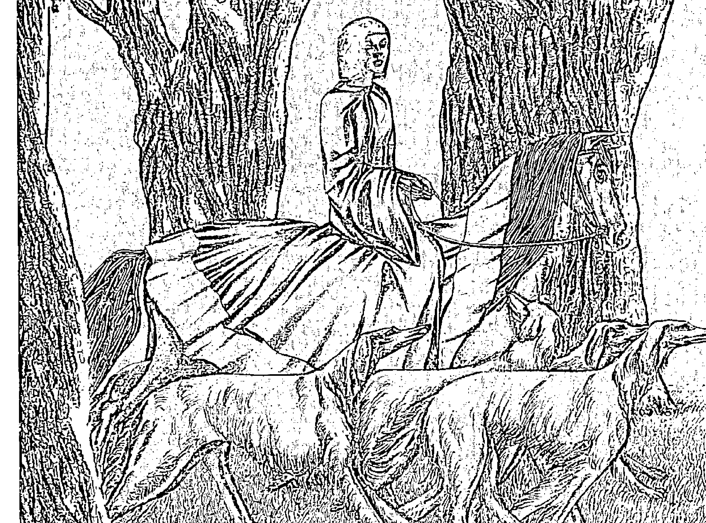

##### 托马斯·莱蒙特在仙女国

[PAGE 43]

<!-- no content -->

[PAGE 44]

## 古日耳曼人与斯堪的纳维亚人

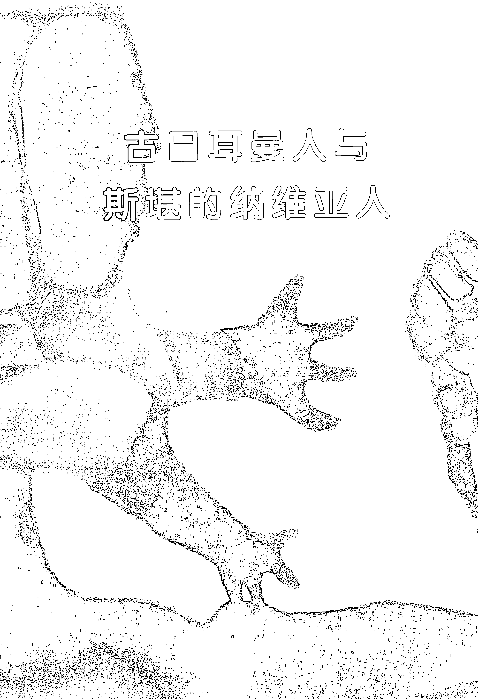

[PAGE 45]

#### 西征之路

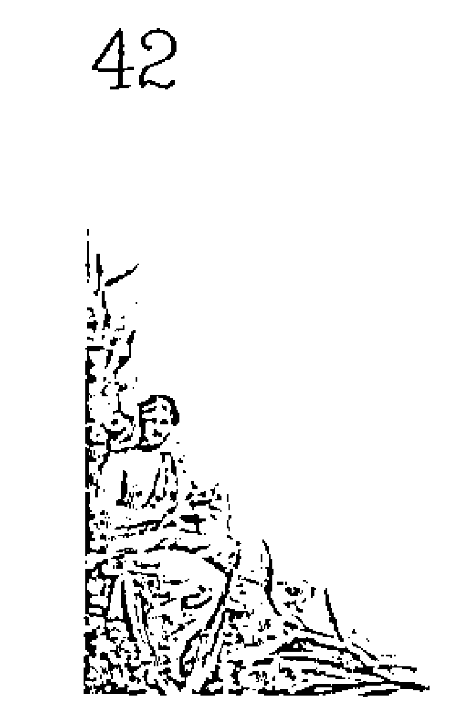

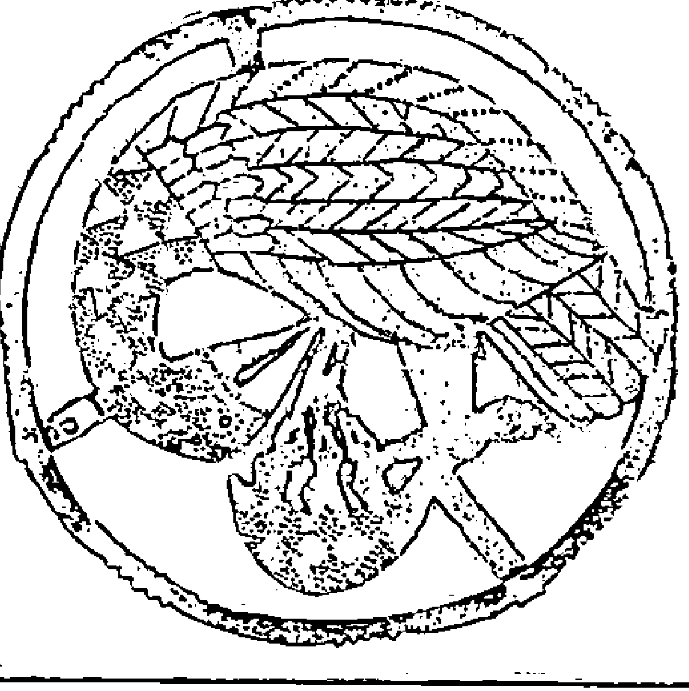

公元前600年左右，欧洲首先出现的是日耳曼部族。他们来自东南方。同其他印度雅利安人一样，他们记得自己的发祥地在极圈以里。他们从那里沿乌拉尔山脉南下，定居于一块很大的区域之内——从当今的土库曼到现在的土耳其。公元前5世纪民族大迁移时代的希腊史学家希罗多德认为他们是波斯人。

当代学者弗·谢尔巴科夫提出证据，说明日耳曼人和斯堪的纳维亚人的祖先是阿瑟人。阿瑟人同他们的亲戚瓦恩人——罗斯人的先祖，曾比邻而居。在老尼萨（今土库曼斯坦境内），有过阿瑟人的首都——阿斯加尔德。

13世纪，冰岛编年史作家斯诺里·斯图鲁森在《环球》中说：“黑海以北有个大瑞典，或北瑞典（也即西徐亚）。有条大河自人口稠密地区以北的山地穿过瑞典，流入黑海。这河的准确名字叫塔纳伊斯，从前叫塔纳克维斯尔或”

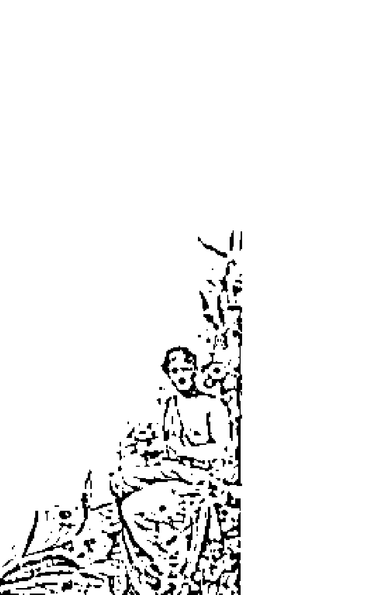

瓦纳克维斯尔(即顿河)。它将世界一分为三。入海口地区当年叫瓦恩国。河东叫亚细亚，河西叫欧罗巴。河东亚细亚的国家叫阿瑟国，或阿瑟人的驻地。它的首都叫阿斯加尔德。国王便是那位叫奥丁的人。”

接着说到雅利安人在小亚细亚的领地：“一条大山脉自东北伸向西南（今欧亚分界线，乌拉尔山。在南乌拉尔发现了雅利安人的圣城——阿尔卡伊姆）。它将瑞典(西徐亚)和其他国家隔开。乌拉尔以南不远，是土耳其人的国家(小亚细亚半岛)。那里曾有片奥丁的领地。这领地与其说是阿瑟奥丁本人的，不如说是他妻子弗里格娘家亲戚瓦恩人的。因为那里从远古时代起就有瓦恩——罗斯人的许多国家：首都在特洛伊的特罗阿达（希腊人称伊利翁）、弗里吉亚、吕底亚等。那里还有一条河，叫日耳姆，可能就是日耳曼民族名称的源头。”

有一天，奥丁梦见自己是远处北方地块的领主，立即动身前往。可他的出发地不是小亚细亚，而是首都阿斯加尔德。他前往西方之路经过加尔达里卡(罗斯)。然而，那里拒绝不速之客人境，于是阿瑟人的军队只得绕远道而行，劳师南下，抵达黑海北部沿岸地区（斯图鲁森所称的撒克逊人的国家）。从那里可且战且行，穿越中欧，北出日德兰半岛(今丹麦境内)附近的瑞兹维格沼泽地。接着，安营于菲英岛岸边的奥登塞（意为“奥丁的圣殿”）。之后，奥丁移师西兰岛，横渡松德海峡，进入瑞典，屯扎于旧锡格图恩。在这里，奥丁度过了自己的晚年，因病去世。阿瑟的祭司按传统习惯将领袖的遗体火化。火苗呼啸上蹿，烟柱直达天穹，形状酷似伊格德拉西尔桉。那场景给目击者留下强烈印象，因而他们宣布奥丁为神。斯图鲁森在《英格陵人的传说》里不无讽刺地指出：“瑞典”

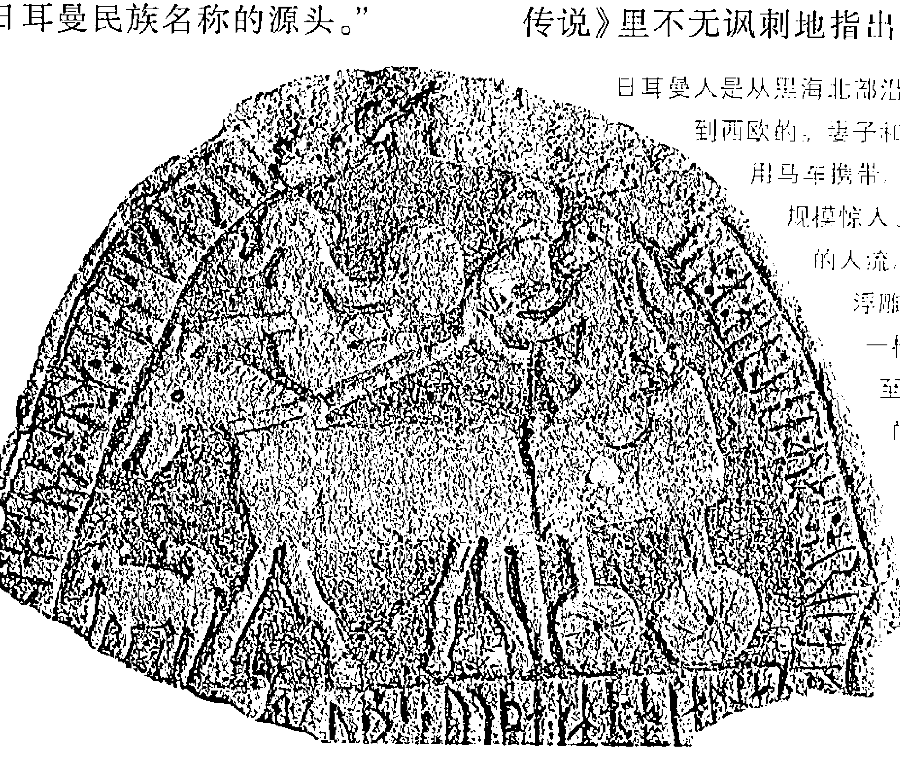

[PAGE 46]

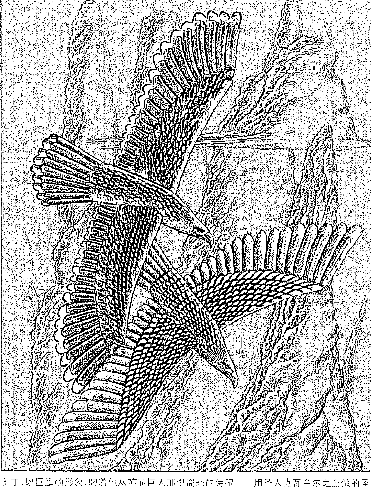

奥丁，以巨鹰的形象，叼着他从苏通巨人那里盗来的诗蜜——用圣人克瓦希尔之血做的孕饮（俄罗斯的“克瓦斯”饮料即源于此）。它能给人以智慧、诗才和永恒的青春。奥丁受到也化做鹰的苏通的追杀

#### 西征之路

耳曼人描写成粗鲁的野蛮人。 现代考古学者的许多发现，证明日耳曼部族不仅有发达的精神文化，而且还有高度的物质文化。各种各样的纺织品、皮革制品、金属制品、玻璃制品和陶器，在瑞兹维格沼泽地的泥炭覆盖层下，都有所发现。

最强大的一支日耳曼部族联盟就产生于斯堪的纳维亚。古罗马史学家塔西伦写道，那里住着斯维翁人的一个部族，他们是航海高手，而且臣服于沙皇。术语的本身，从读音和意义上看，都显然是源自东方。此种中央集权制的引入者显然是奥丁，而继续实行者为他的继承者：尼奥尔德、弗莱尔、弗莱娅、费奥尔尼尔、斯维格季尔、万朗季、维斯布尔……

能证明奥丁确有其人的，是带古斯堪的纳维亚文字铭文的两只金角杯的被发现。这些有神奇作用的符号(古文字)是在奥丁成人仪式期间(为接受考验，用长矛将自己在橡树上钉了九天)显现给他的。起先它们被祭司们用于占卜，后来成了斯堪的纳维亚字母的基础。

人认为，他回到了古阿斯加尔德并将在那里永住。人们重新信仰奥丁，向他求助。他常于大战之前出现在瑞典人面前。有人得到他赐予的胜利，有人被他带走。无论得胜还是被带走，人们认为都是幸福。

奥丁死后，在新的北部家乡，小瑞典，行使管理权的是瓦恩人（其中多数是争夺阿斯加尔德大战之后的人质）。他们当政期间，从前的蛮荒之地开始繁荣起来…… 很长一段时间，学者们所得到的关于日耳曼人及其近亲斯堪的纳维亚人早期历史的信息，都

来自罗马的资料文献。尤里·恺撒（公元前100—前44年）在《高卢战记》中描述了新欧洲人与他所熟悉的凯尔特人之间的区别。“日耳曼人的风习，”后来的皇帝写道，“与高卢人差别很大：他们没有祭祀的德鲁伊特，他们不太重视祭祀。这些人只相信他们看得见的和对他们明显有利的神灵，如太阳、火山和月亮，而其他的神灵，他们听都没听过。他们的一生都在狩猎和征战中度过；他们从小就习惯劳动和艰苦生活。”尤里·恺撒可能不太熟悉仇敌的精神生活，也可能故意将日

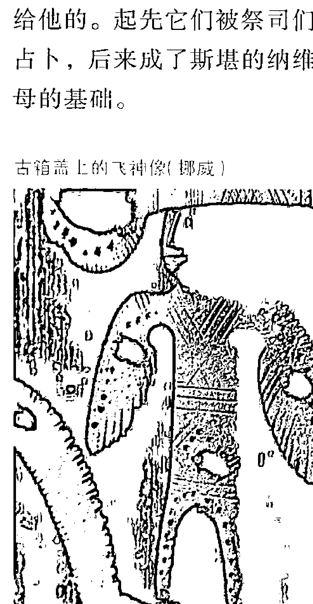

#### 古箱盖上的飞神像（挪威）

[PAGE 47]

#### 万神殿

“万神殿”一词有三个基本含义：1)供奉所有神的庙宇；2)各宗教里的所有天神；3)杰出人物的陵寝。还有一个或许是最重要的意思，就是神灵的组织结构。领头的应该是众神之首雷神；他的妻子和儿女——战士、铁匠、歌手、商人、美女、乖孩子、主妇……不同民族虽有不同叫法，但带神灵名字的‘细胞’越多，该民族距希腊标准——文明就越近。这一观念有着古老的历史。希腊人（亚该亚人、伊奥尼亚人、多利安人）来到伯罗奔尼撒并征服当地部落之后，开始效法他们的信仰。于是建造了希腊的万神殿，殿里供奉着许多异国的神灵：宙斯（克里特人）、阿波罗及其胞妹阿尔捷米达（极北人）、赫耳墨斯（很可能是埃及人）。神灵使命的这一划分体系后来被罗马人所沿用，添加了伊特鲁里亚的一些天神。希腊的宙斯和伊特鲁里亚的廷变成了朱庇特；赫拉和乌妮变成了朱诺；赫菲斯托斯变成了武尔卡诺斯；阿瑞斯和马里斯变成了玛尔斯……“行了，”罗马人得出结论，“别的神没有过，也不可能有！” 就在这时，欧洲来了日耳曼人。他们立刻试图用同一尺度来衡量一下他们那显然不合辙的信仰。比方说，帝国史学家塔西伦不知为何认为奥丁（也就是沃丹）不是朱庇特的日耳曼对应神，而是贸易神墨丘利的对应神。使他产生这种想法的，可能是说日耳曼神掌握各种魔法并漫游过阴曹地府的那些故事。然而，他所作的比较却流传开来并在罗曼—日耳曼各民族中获得了实际意义。在罗马帝国，星期三纪念的是墨丘利；那么在日耳曼，纪念的就是沃丹。因此就出现了星期三的英语叫法——Wednesday，或者荷兰语的——Woensdag。

和伊特鲁里亚的廷变成了朱庇特；赫拉和乌妮变成了朱诺；赫菲斯托斯变成了武尔卡诺斯；阿瑞斯和马里斯变成了玛尔斯……“行了，”罗马人得出结论，“别的神没有过，也不可能有！” 就在这时，欧洲来了日耳曼人。他们立刻试图用同一尺度来衡量一下他们那显然不合辙的信仰。比方说，帝国史学家塔西伦不知为何认为奥丁（也就是沃丹）不是朱庇特的日耳曼对应神，而是贸易神墨丘利的对应神。使他产生这种想法的，可能是说日耳曼神掌握各种魔法并漫游过阴曹地府的那些故事。然而，他所作的比较却流传开来并在罗曼—日耳曼各民族中获得了实际意义。在罗马帝国，星期三纪念的是墨丘利；那么在日耳曼，纪念的就是沃丹。因此就出现了星期三的英语叫法——Wednesday，或者荷兰语的——Woensdag。神奥丁建立的九界：最上方是阿斯加尔德——阿瑟神的天上驻地。最底层，在地下深处，是极冷和死亡的世界——赫利海姆塔西伦陆续找到了与战神玛尔斯、英雄赫尔库勒斯和孪生英雄卡斯托耳和波吕克斯相对应的神。更多相似的特点他未能找到，因此“蛮夷的”宗教被称为原始的。日耳曼—斯堪的纳维亚民族的神话观严谨而又复杂，由四个基本原理所构成。

1. 世界的创造。起先只是一个巨大的深渊。大地生成之前就出现了冥界——尼弗利海姆。接着从一口巨井里流出了十一条河。同时在南方形成了一个火狱穆斯佩尔，管理它的是凶恶的巨人苏尔特。水同深渊相遇变成冰。穆斯佩尔火碰到冰，将它变成汽。水、火和汽结合而形成滋养介质，从中生出巨人伊米尔和奶牛奥杜母拉。奶牛舔食咸冰，产奶喂养巨人。巨人精血蓄足，以神奇的方法开始生儿育女，既是父亲又

是母亲。一对子女又生下三个儿子：奥丁、维利和韦。兄弟仨从小性情狂暴。他们第一桩共同的业绩就是打死了先祖伊米尔。由死者的躯体形成了整个可见的世界：地、水、天、山、树。

+   2. 世界的结构。所有九界由伊格拉西尔桡相连。这九界是：1）诸神的天城阿斯加尔德（阿瑟人的墓地）；2）阿尔夫海

##### 命运女神诺娜三姊妹

“并非所有神灵都会死亡，并非所有神灵都会死亡！他们中的佼佼者将在新的世界复活并将主宰无辜的人类！”
她一转身，像只燕子似的跑开了。两个姐姐望着她离去的背影：维丹迪连连摇头，悟而得满是皱纹的面孔笑开了花。

事件展现在诺娜三姊妹的面前不仅是在醒悟之时。她们像希腊的命运三女神摩伊拉和罗马的命运三女神帕耳开一样会纺命运线。

诺娜三姊妹还会雕刻命运神符——石刻。从那时起占卜用的就是三块石头：头一块上的符号决定人的现在，作为他过往行为的后果；第二块石刻是人应追求的东西，以免长时间在“此时此地”打转转；最后一块石刻是可预期的将来。不过切忌频繁地占课，因为一切都需要付出代价。人如果知道自己的运势，未来得到的就不是事情发展的最佳样式。人会不求进取，随遇而安。他的部分运气就会花于对占卜的“酬谢”上。

诺娜三姊妹古时预言的事情发生了。金器时代结束，接下来的是银器时代、铜器时代、铁器时代……人类越来越不信神灵，越来越相信狡诈和黄金的力量。

神灵和巨人之间爆发大战。白霜巨人因无力消灭阿瑟而迁怒于人类。他们向人间施降严寒和干旱、风暴和冰雹，制造洪水、地震和火山爆发，大批城镇和乡村

逐太阳（斯堪的纳维亚人称其为苏尔）；另一匹叫格蒂，没完没了地追月亮(玛妮)。因此太阳和月亮一刻不能停步，不然它们会被贪婪的怪物所吞食。

斯堪的纳维亚人相信，在不停的追逐中，忽而此，忽而那，怪物都能逮住猎物，有时还会将它吞食，所以有时出现日食和月食。然而，谢天谢地，吞下苏尔和玛妮会灼烧肚子，斯克尔和格蒂不得不将它们又吐出来。于是又重新开始天际的追逐。

狼是不是就喜欢追逐发光的野物呢？假如持续了许多世纪的捕猎一旦结束，天狼又会干些什么呢？诺娜三姊妹是否规定好事件进程了呢？这个问题只有三姊妹才能回答了。可是，呜呼，悟而得、维丹迪和斯库尔德太忙——她们只顾没完没了地在纺线。

丹麦的，或者公认为古斯堪的纳维亚的字母表。古斯堪的纳维亚象形文字曾用于占卜和魔法

事件展现在诺娜三姊妹的面前不仅是在醒悟之时。她们像希腊的命运三女神摩伊拉和罗马的命运三女神帕耳开一样会纺命运线。

诺娜三姊妹还会雕刻命运神符——石刻。从那时起占卜用的就是三块石头：头一块上的符号决定人的现在，作为他过往行为的后果；第二块石刻是人应追求的东西，以免长时间在“此时此地”打转转；最后一块石刻是可预期的将来。不过切忌频繁地占课，因为一切都需要付出代价。人如果知道自己的运势，未来得到的就不是事情发展的最佳样式。人会不求进取，随遇而安。他的部分运气就会花于对占卜的“酬谢”上。

诺娜三姊妹古时预言的事情发生了。金器时代结束，接下来的是银器时代、铜器时代、铁器时代……人类越来越不信神灵，越来越相信狡诈和黄金的力量。

神灵和巨人之间爆发大战。白霜巨人因无力消灭阿瑟而迁怒于人类。他们向人间施降严寒和干旱、风暴和冰雹，制造洪水、地震和火山爆发，大批城镇和乡村

逐太阳（斯堪的纳维亚人称其为苏尔）；另一匹叫格蒂，没完没了地追月亮(玛妮)。因此太阳和月亮一刻不能停步，不然它们会被贪婪的怪物所吞食。

斯堪的纳维亚人相信，在不停的追逐中，忽而此，忽而那，怪物都能逮住猎物，有时还会将它吞食，所以有时出现日食和月食。然而，谢天谢地，吞下苏尔和玛妮会灼烧肚子，斯克尔和格蒂不得不将它们又吐出来。于是又重新开始天际的追逐。

狼是不是就喜欢追逐发光的野物呢？假如持续了许多世纪的捕猎一旦结束，天狼又会干些什么呢？诺娜三姊妹是否规定好事件进程了呢？这个问题只有三姊妹才能回答了。可是，呜呼，悟而得、维丹迪和斯库尔德太忙——她们只顾没完没了地在纺线。

丹麦的，或者公认为古斯堪的纳维亚的字母表。古斯堪的纳维亚象形文字曾用于占卜和魔法

##### 阿瑟

许多神灵从前都是凡人。在世间饱经风霜之后，他们的身份改变了。阿瑟是斯堪的纳维亚人和日耳曼人的神，从前住在帕提亚（安息国），那儿有过他们的首都阿斯加尔德。在伊达维奥尔游乐场上，他们举行过像我们今天的击木游戏的比赛。

在斯堪的纳维亚人看来，美好的帕提亚就是真正天堂。它的位置只能是在天上，在伊格德拉西尔桡的树顶上。进入神仙的驻地似乎非常便当：见到彩虹，踏上这天桥的边缘，一直往前走。若不是神仙想出馊主意：往五颜六色的彩虹里编进一条能烧死凡人的红线，那么人们就可以从米德加尔德到阿斯加尔德来回走动了。

可是，凡间传来了有关天城体制的消息。那里最大而又最美的宫殿是瓦尔哈拉（古冰岛语意为“死人殿”）——奥丁和阵亡将士的豪华套房，他们的英灵将由战争女神瓦尔基里们引领到这里。将士们在宫殿的五百四十个大厅里享用酒宴，吃大野猪塞里穆尼尔的肉。白天这猪被宰杀和烹煮。夜晚它又复活并还原。吃肉的就是母山羊海德伦的蜜香奶。这羊啃的是伊格德拉西尔桡的叶。

吃饱喝足之后，阵亡将士们继续进行自己先前的战斗：等仗打完，伤亡者再次复活并同其他阵亡将士一起前往参加酒宴。英雄中间，雄伟的宝座之上，像平地起山崖似的端坐着最高阿瑟奥丁。他头戴飞翼金盔，独眼，肩头两只渡鸦——胡精（机灵鬼）和穆明（猴儿精），膝下两匹恶狼——盖里（老饕）和弗劣迹（谗痨）。主神的马厩里还有匹八腿马——斯莱普尼尔（一溜烟儿）。人们都尽量不叫奥丁的名，而用别有寓意的外号——哈尔（大个子）、伊格（凶神）、格里姆尼尔（假面人）、哈巴得（白胡子），头领赫里扬他变化无常，突然出现在各种场合。在米德加尔德，常见他是个跟瞎子差不多的高个子老头，头戴黑皮帽，身披蓝斗篷。合法妻子弗里格，美貌、聪慧而又善良。她关心的是人们的健康和幸福，尤其惦记的是孩子们。其他阿瑟是奥丁的血亲，多半出自不同的女人。

托尔，奥丁与地神约奥尔德所生的长子，坐第二把交椅。他那火红的长发和胡须，犹如太阳，光芒四射。他遨游时乘坐套直角公羊的车辇，轻捷无比，连奥丁的八腿马也别想追上。托尔力大无比（他有一根腰带，能成倍增加已超群的力量），除恶雷厉风行。他那把铁锤粉碎过各界各地的魑魅魍魉。日耳曼人认为那毁灭性弗莱尔是和平、财富和丰产神，弗莱娅的孪生哥哥。他的坐骑是守护神打造的铁野猪

弗莱娅是丰产、爱情和美之女神。与哥哥不同的是，她乘坐的是只大公猫

阿瑟神，跟所有瓦恩一样，是位魔法师。她有一副神奇的鹰翼，常常展翅遨游云端。但她最重要的法器是一副金项链。人们总以为项链能帮助妇女生养子息，可这未必可靠。项链很可能赋予控制人心的力量，否则恶毒的洛基不会去偷它，也不会为它而与强大的海姆达尔——阿斯加尔德那位沉默寡言的护卫去干仗。此外，花容玉貌的瓦恩女还是战争飞行女神瓦尔基里们的上司。

阿瑟中还有奥丁的许多子女：独臂战神蒂尔、杰出斗士瓦利和世间最佳弓箭手伍利；盲力士

奥丁的神像常被刻画于房厚上，认为他可保护房屋免遭雷击

七果树，奥丁秘密宗教仪式——成年仪式中七颗行星的象征

的铁锤的复制品是最管用的护身符，一般都将它挂在脖子上。托尔在信奉基督教后也继续受人尊敬——贴身十字架的造型就是他那翻转过来的铁锤。托尔的妻子是金发美女西弗，丰收女神。

以摆脱他不喜欢的阿斯加尔德。从此他忽而住在深山里的斯卡迪处，忽而住在自己海边的“船舍”里。勤劳的瓦恩攒下了不小的家产，可他下定决心日后返回故里……

阿瑟中也有纯血统的瓦恩——罗斯人的祖先，他们是留在阿斯加尔德的人质。年纪最大的是尼奥尔德——海神，风之主，海员庇护神。他出于无奈而娶了好斗的巨人斯卡迪，有名的滑雪和打猎高手。这桩婚事倒使他得

尼奥尔德头婚所生的是对龙凤胎——弗莱尔和弗莱娅。兄妹俩早已长大，与父亲分居。哥哥之帅气，与奥丁的幼子鲍尔德不相上下(瓦恩司夏，阿瑟司春)。作为本族真正的儿子，弗莱尔憎恨战争和流血冲突，庇护和平。他行空乘的是大野猪驾辕的金辇。而地上，瑞典人则用车拉着一位老瓦恩，向他祈求丰收。弗莱尔从不拒绝于人：总是适时降雨，雨后天晴，让禾苗茁壮成长。斯诺里·斯图鲁森写道，弗莱尔是瑞典古代海盗的鼻祖。在他当政时期，国家空前繁荣。或许正因如此，人们后来赋予了他丰产神的特征。

他的胞妹也选择了非同寻常的坐骑——大公猫。爱和美的女

戈德和智多星韦达、医生庇护女神艾尔和真理女神瓦尔……

天城里也有侍婢女神。女神富拉、萨加、格林和格娜就是在弗里格身边听差的。总之，阿斯加尔德的居民成千累万而多种多样。

##### 传说中的阿斯加尔德

日耳曼—斯堪的纳维亚人的神话，流传下一些关于造天城的故事。早先造的是老阿斯加尔德。尽管它气势宏伟，可仍需另造一城——新阿斯加尔德，设防更为坚固，以防巨人袭击。可众神造得了宫殿，却造不了打不破的高墙。能承接这种宏大工程的只有巨人。可是如何才能让他们为你干活呢？难题似乎根本无法解决，新城的建造有落空之虞。可是突然间救星却不期而至。

"石匠，"巨人直截了当地回答，"我能在阿斯加尔德四周建起攻不破的城墙。" 奥丁知道约通巨人都很憨厚，可也不至于憨厚如此呀！心想，这里必定有诈，于是狡猾地觑起两眼，又问："你要何酬报？" "没啥特别的，"巨人一摆手，好像无所谓似的说，"只要弗莱娅做婆娘，日月当嫁妆。" 阿瑟们一听都气晕了，等清醒过来，齐声喊道："滚回你的约通海姆去，傻大个！马上叫托尔来，将你剁成肉泥做馅饼！" 也是巨人出身的洛基对阿瑟们说："别忙赶他走哇！先让他把城墙造好，然后咱们再想办法赚他。" 接着他冲城外喊道："你需要多少时间哪？" 那石匠回答，需要整整一年半。洛基对他说："你可记住，延误一天，就什么也别想得到！" 石匠二话没说，只是得意地笑了笑。当天，他就牵来山一般高的大公马斯瓦狄利法里，往阿斯加尔德运送巨石，垒了起来。工程进展神速，阿瑟们焦虑不安，后来干脆绝望了。弗莱娅成天呜呜地啼哭，金泪滴在地上，她那闺阁旁堆起了一座金山！若是平时，阿瑟们会因这么多财富而乐不可支，可现在却个个满脸愁云。离城墙完工仅仅剩下一天，只缺几块石头了。奥丁连忙召集众神商议对策。他张口就责备起洛基来。"我们祸事临头了，"最高阿瑟怒吼道，"都是你惹出来的，洛基！" "你们当初为何听我的呢？"奸猾的洛基嘻嘻笑道，"本来就不该袖手旁观，早该想个脱身之计了。你们还等什么呢，一帮怪物？

“我们指望你有鬼主意呢。”诗神布拉季带着责备的口气说。

“为难之时，最好先自己动动脑子。”洛基顶了一句。

“别狡辩！”奥丁一拳砸在桌上，“你明天救不了弗莱娅、太阳和月亮，你就别活，洛基！

洛基沉思片刻，然后哈哈一笑，叫道：“他休想完活儿！”说着，一跃而起，奔出门外……

转天早上，巨人赶着马车优哉游哉地往阿斯加尔德驶来：车上堆着最后几块石头，把它们往城墙上一码，弗莱娅就归他了！太阳和月亮就成为他的玩偶！辛辛苦苦一年半——值！

突然间，路旁小树林里钻出一匹白雪母马，模样俊美，盖世无双。它那乌溜溜的大眼睛朝公马瞟了瞟，接着一阵嘶叫，惹得给巨人拉车的公马不顾一切，挣脱套索，狂奔而去。

“站住，你去哪儿？”主人喊道。那公马如何还能听见：注意力全被那母马吸引走了。

两匹马消失在树林里。巨人一阵破口大骂，无奈之下试着自己驾辕，可是一步也挪不动——石头太沉了。直到傍晚，气急败坏、衣衫破烂的他，好不容易赶到阿斯加尔德。见了站在城头的奥丁及其子女，他叫道：“一帮骗子，你们说话不算数！你们派匹不要脸的母马来勾引我的斯瓦狄利法里！

奥丁猜到这是洛基捣的鬼，冷冷一笑，答道：“从我们见面到今天，一年半过去了，可城墙还没砌完。你失约了。交易没成，所以——你滚吧！

“给我弗莱娅！”约通巨人狂吼起来，紧握双拳，扑向城墙。呜呼，城墙造得精心把意——师傅自己也拿它没法。阿瑟众神望着暴跳如雷的巨人，一个劲儿地挖苦嘲笑于他。

“我没砌完墙？那好！我就从豁口进去，到时候有你们好看的！

阿瑟们吓得魂飞魄散，号哭不止，仰天呼喊：“托尔！托尔！”滚滚的闷雷是对他们的回应。电光闪处现出一辆套着两只公羊的车辇，霎时来到天城。红发雷神祭起巨锤，击毙了巨人。

成母马的洛基因狡猾过头，奇蹄动物的毛皮披了整整一年！还同那公马生下了后来成为奥丁坐骑的八腿马。然而洛基一直没得到阿瑟神的报答。相反，他听到的却是冷嘲热讽：既然变成了母马，而且还下了马驹，他算什么男子汉！

洛基忍气吞声，伺机同阿瑟算清了账。

奥丁——斯堪的纳维亚神话中的独眼最高神，是精神力量和智慧的化身、将士的庇护者——骑在自己的八腿马斯莱普尼尔上，奥丁手里握着权杖，用它既可让活人丧命，也可让死人复活阿瑟神从容砌完城墙，而变

##### 历史上的阿斯加尔德

阿瑟人的寿命并不比其他民族的人更长。他们具有的是永生的灵魂。自己肉体的一生是大约公元前2世纪在帕提亚的精神中心帕费菲恩度过的。新老阿斯加尔德以及伊达维奥尔游乐场的所在地，离土库曼的首都阿什哈巴德不远(城市现在的名称意为“爱城”，只不过是对古城——“阿瑟城”的重新诠释)。遗憾的是，发现这些遗址的考古学者只是将它们描述了一番，却没敢说出自己的推测：那些豪华的宫殿是谁和为谁修建的。至于瓦尔哈拉宫和其他建筑，说得很含糊：圆形和方形的房屋和大殿。

时光本来就模糊了对阿斯加尔德的记忆：许多东西被毁、遭抢、彻底改建和改名为。留下的只是房基、雕塑和壁画的残片。消失的是人和他们身边秀丽的花园、物件和许多艺术作品。需要的就是弗拉基米尔·谢尔巴科夫的启发式发现：“老尼萨是阿斯加尔德的核心。这就是瓦尔哈拉、奥丁和其他阿瑟的宝库。”——让世界为之惊叹！

正是这里曾经分布着老阿斯加尔德的主要宫殿。必须指出的是，宽敞的瓦尔哈拉并非奥丁居住的主要地方，他在这里露面的身份只是阵亡将士的领袖。他吩咐给他自己所造的宫殿叫瓦拉斯克亚利夫。最高阿瑟坐在这里的象牙宝座上，注视着世界的风云变幻。为其他大小诸神建有享受天伦之乐的宝殿，而为异族另外建有温戈利夫殿。

另一座山冈上，即新尼萨，曾经是新阿斯加尔德城。这里已经不是散乱的建筑，而是规划整齐的带城堡、中心、郊区和大墓地的城市。新尼萨四周，据传说，是由被骗的约通巨人的双手和斯瓦狄法里大马的努力而

##### 尼贝龙根人的金子

一样有变化的本领。他变成蛇怪，将宝藏拖进山洞，白天黑夜，年复一年，盘卧于宝藏之上，只是偶尔搬下宝藏，外出觅食或去河边饮水。

列金收养了小勇士西古尔德，并为他打造了一把格里姆宝剑。试剑时，锋刃轻而易举便将铁砧一劈两半。列金暗自高兴：终于可向长兄复仇了，而且是假借他人之手！

铁匠吩咐义子在蛇怪去河边饮水的必经之路上挖个大坑，躲进坑里，等蛇怪爬过，向其软腹给以致命的一击。

如若一切依计而行，西古尔德必被流满大坑的蛇血淹死。二者一死，列金便可从从容容地前往蛇穴，搬出朝思暮想的金子了。

列金藏在林中，咕哝道：“很快，很快守护神的金子就是我的啦……我一人的啦！”

西古尔德将大坑伪装停当，正想往下跳时，耳边传来一个声音：“你在这里干什么，小英雄？”

小勇士一回头，只见是位头戴皮帽、身披绿斗篷的独眼老头儿。“你是谁？”他反问道。“我”

有许多名字，”老人说，“各人各叫法。你就叫我哈巴德吧，意思是白胡子。”“我叫西古尔德，”少年自我介绍说，“义父让我藏在坑里，等着蛇怪法夫尼尔。”哈巴德一声长叹：“出主意的人，才是你的仇敌。你刺杀蛇怪，会淹死在他的血泊里，你义父就可独占财宝了。”少年一想，老头儿说的对，问道：“那我该怎么办？”哈巴德说：“多挖些坑，把它们连通。蛇血填不满所有的坑，你也就死不了。”“多谢，”少年说，“我如何报答你的救命之恩呢？

老头浓眉下的那双眼睛眨巴了一下，说：“时候一到，就能回报。不久你就会去我那儿了。”哈巴德又几乎听不见地补了一句：“去瓦尔哈拉……”“原来是奥丁！”少年终于明白。

奥丁说完，消失得无影无踪。小勇士依计而行。法夫尼尔临死前警告英雄：“别碰安德瓦里的财宝，西古尔德。上面有魔咒，要多小心我的兄弟。我知道，是他为了那金子而调唆你来杀我的。为了那金子，他同样会设法杀了你。”

西古尔德惩罚了列金，但未能逃脱安德瓦拉诺特戒指的诱惑，忘记了法夫尼尔的警告。将它戴在了手指上。成为万恶黄货的主人之后，他不久便命送奸人之手。在他之后，许多人成了发财欲望的牺牲品，直到宝藏被抛下莱茵河。但愿谁也别去寻找尼贝龙根人的宝藏！

- 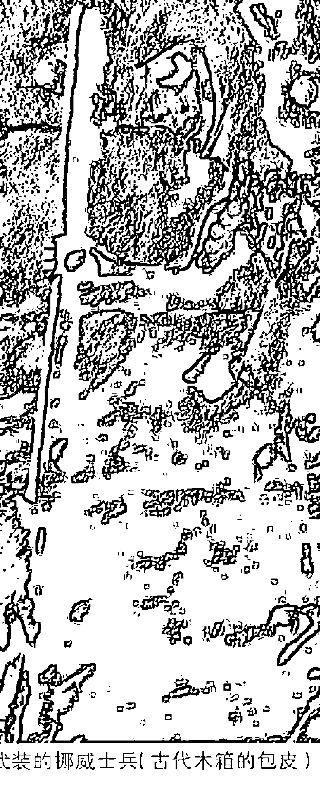
- 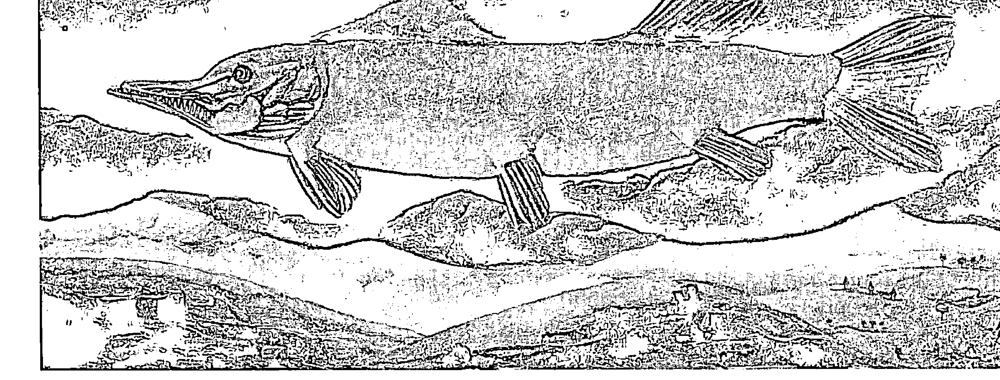

###### 维奥龙德—半人半精

第一对人阿斯克和恩布莉的后代，在米德加尔德比比皆是。他们虽因尼贝龙根人的金子而互相拼命，可他们的数量却并未因此而减少：他们大量繁殖，遍布全球，排挤其他民族、巨人、白埃尔夫（小精灵），将黑埃尔夫（守护神）赶往更深的洞穴。谁胆敢反抗，谁就会遭到无情的消灭。

很久以前，在丹麦西兰岛东南方向的默恩岛上，住着巨人瓦迪。他娶了个白埃尔夫家族的女子。妻子为他生下三个儿子，后来返回了自己的部族。瓦迪膝下只剩三个稚子，父亲为他们起名叫斯拉格菲德、艾吉尔和维奥龙德。混血儿都非常像人类的孩子，所不同的只是母亲遗传的美貌和父亲遗传的非凡气力。

巨人决定让长子留下种地，将次子送去学打猎，幼子送到手艺最好的铁匠——住在冰岛卡寥瓦山的守护神身边当学徒。黑埃尔夫收下了这孩子。学徒一年，要交纳黄金半英镑。瓦迪答应整一年后送钱来。大家就此分手，维奥龙德跟着侏儒们进入地下。从学艺的头一天起，半埃尔夫就表现出了非凡的才华，让他的师傅们诚惶诚恐，因为最高明的铁匠有权觊觎守护神的主公宝座。因此他们决定把维奥龙德再留一年：一来可把学徒所做的器物算成他们师傅自己的，二来也可以靠他发点儿小财。

当瓦迪如约来到卡寥瓦山接儿子回家时，黑精灵们说他们将免费再教维奥龙德一年，可是如果巨人迟到哪怕一天，那就别想再见到儿子。瓦迪心里明白，黑精灵是在耍花招，于是请求跟儿子道个别。“孩子，”他对儿子说，“你还得在这儿留一年。争取在这段时间里把他们的诀窍都学到手。很可能，他们根本不愿放你走，而我又给你帮不上忙。我在这树丛里留下我的刀。遇到灾难时恐怕用得着。”

瓦迪心里忐忑不安。为了不致错过约定的时日，他提前一天来接儿子。走累了，就在卡寥瓦山边躺会儿歇歇脚，谁知竟睡着了。歹毒的侏儒夜里爬上山头，每人推下一块石头，形成滚滚的石流。那石流掩埋了憨厚的巨人。然后他们告诉维奥龙德：他父亲出事了。小伙子心里明白是谁干的，于是请求允许去哭哭亡父。到了出事地点，隐约看见尸体被压在一堆乱石之下，他几步蹿进树丛，抽出所藏的尖刀：只见月夜里寒光闪耀——守护神被割断咽喉，纷纷倒地而亡。维奥龙德收拾好工具，带上黄金，然后砍倒一棵大树，掏空树心，挖个小窗，镶上玻

父亲同儿子又分别了整整一年。这其间，黑精灵们教徒弟掌海盗们的房厚，木质，披盖山茱萸。上有通气口——为了透光和排烟

- 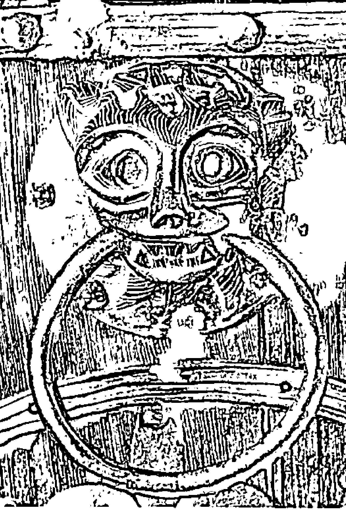
- 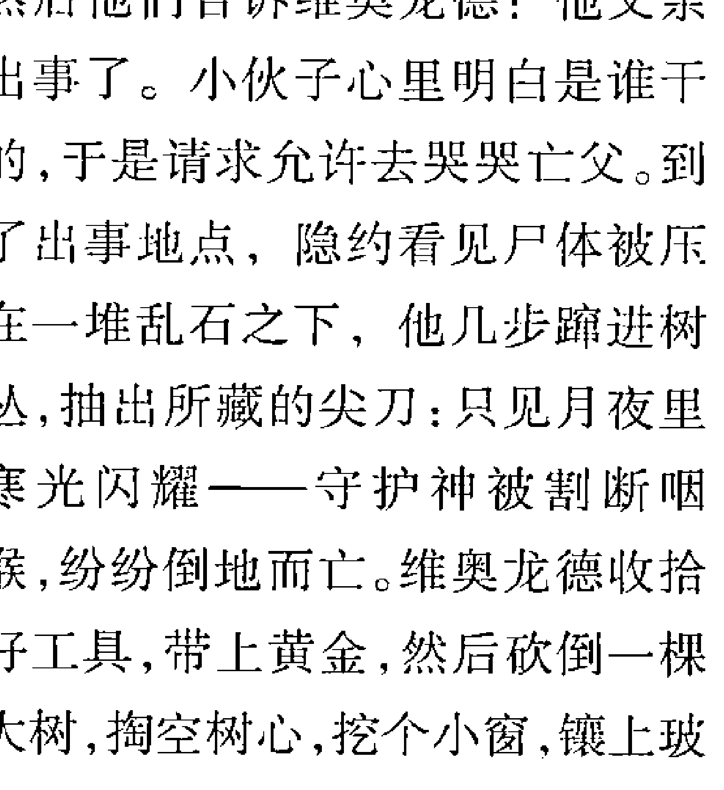
- 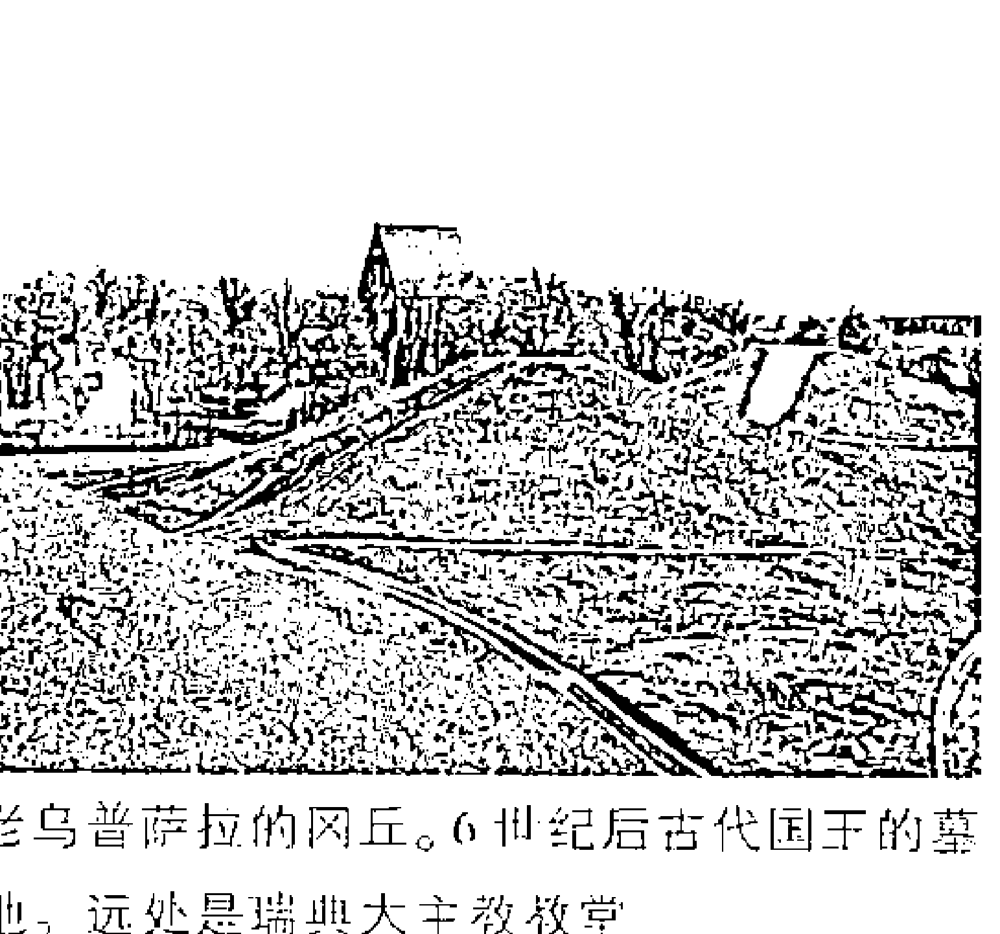

###### 维奥龙德—半人半精

……不久，维奥龙德被抛向瑞典南海岸，那里执政的是尼德戈德酋长。起初，酋长以为从树干里钻出来的这小伙子不是神仙，就是某个大国的王子。后来发现维奥龙德是个铁匠，酋长大为生气，常常故意轻慢半埃尔夫，不断给他加活儿。廷臣们悄悄告诉酋长，他得了个世上最好的铁匠：他打造的刀剑轻而易举就能刺破最厚的盔甲，他打的首饰漂亮无比。于是酋长以他特有的残暴吩咐挑断维奥龙德的跟腱，让他无法逃跑，又吩咐将致残的匠人发配无人小岛，严禁探望，违者格杀勿论。 维奥龙德给自己打了一副拐杖，拄着它们好赖能在岛上转转，而在店铺干活只好坐着。在完成订货的余暇，用守护神的金子打造戒指。有一天，打戒指时不料被尼德戈德碰上。“你就这样报答我的善意吗？”酋长吼道。他不由维奥龙德分说，命令亲兵将戒指收走，把“小偷”绑起来，打个半死。 ……半埃尔夫在铁匠铺里醒来，鲜血淋漓，遍体鳞伤。他终于无法忍耐，决定与人世断绝来往，但临行前得报复一下欺人太甚的酋长。他艰难地恢复过来，着手打造逃生的翅膀。接着将酋长的儿子骗来打死。把他们的妹妹波德维利德奸淫了一番。 然后他飞往酋长尼德戈德的城堡，落于塔楼之上，一五一十讲了如何打死他的儿子，如何强奸了他的姑娘。瑞典人的君主除了狂怒，别无他法，只得命令弓箭手射杀铁匠。维奥龙德只是报以哈哈大笑：他高高飞起，没有一支箭能伤得着他。 半埃尔夫飞回默恩岛，亲兄弟们团了圆。不久兄弟仨都娶了飞女——瓦尔基里战争女神。 波德维利德怀胎九月，生下 最早的阿斯克和恩布莉，是桴和柳枝。相传，他们没有呼吸，也“没有命运”，他们是奥丁为首的神灵在岸边发现，经过加工后复活的 个男孩儿，长大后成了巨人。从此以后，人们有时突然就生出一些怪物：侏儒、矮子、巨人——从前生活于米德加尔德的那些远祖的基因在起作用。

- 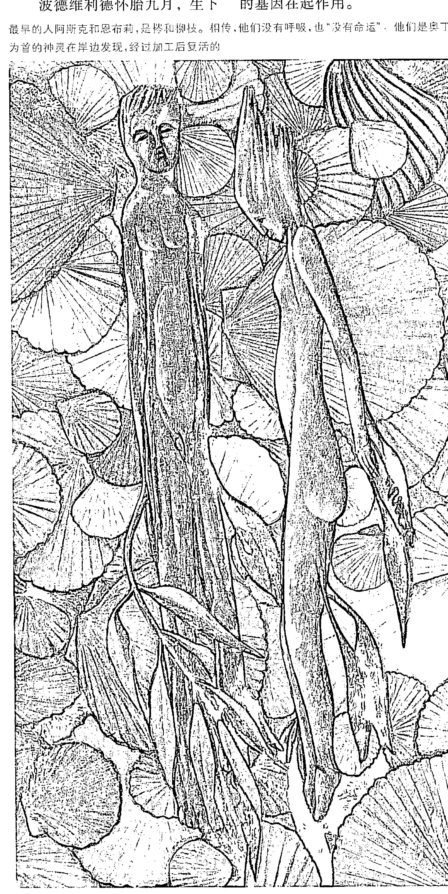

##### 古代国王：乌发郎哈尔夫丹

阿瑟群神的时代一去不返，半神英雄的年代已成历史。人的纪元来到了。而且是从一些国王开始的。

而今，过了千百年，诸神业绩的传说依然记忆犹新。有时人们也会回想起英雄们的奇遇逸事。可国王们的功绩却没人记得！那就请听听那些悲壮的故事吧。许多阴魂因之而进了天堂或下了地狱。当时可没有生存的“中庸”之道。

哈尔夫丹刚满周岁时，父亲在酒席间被卧底的奴隶杀害。母亲怀抱婴儿，躲避仇家的追杀，将他带往挪威西部祖传的庄园。在那里他出落成俊秀而力大的少年。哈尔夫丹因长了一头对于斯堪的纳维亚人来说异乎寻常的乌鸦翅膀似的黑发，人都叫他“乌发郎”。

这“雏鸦”羽毛刚丰，就开始不时啄几下邻居；翅膀刚硬，就飞向远方，扩展领地了。他四处寻找较力的对手，因此他可不缺仇 家。哈尔夫丹并不总很走运。一天，酒喝到半夜，家人走到身旁，凑近耳边说，有大队人马往庄园而来。年轻的酋长命令族人带上家伙，率先冲进庭院。那里等着他的是哈尔夫丹氏族的老对头冈多尔夫的三个儿子。激战中，哈氏族人几乎全部丧命，阵亡的还有师傅埃尔维尔·穆德雷魔法师。乌发郎本人逃进了森林，在一个窑洞里住了些时间，以打猎和捕鱼度日。这段时间里，痛恨冈多尔夫那些卑鄙儿子的人开始从四面八方汇拢到他身边。等聚起大队人马之后，年轻的酋长率队前往讨伐三兄弟，经过一场明刀明枪的激战，三兄弟被彻底打垮，只有老三哈基得以溜走。

这时，治理赫林加里卡地区刻着缠绕着蛇的牛头和古斯堪的纳维亚文字的石碑 的，是著名的酋长西古尔德·奥林。他身材魁梧，力大无比，相貌堂堂。人们都说，奥丁为得到“诗蜜”而丢掉一只眼睛之前，大概就长得这样。此外，西古尔德喜欢独自进入密林猎杀害人的猛兽。一天，他在林中碰上了由三十人相随的困兽哈基。他们一窝蜂似的扑向西古尔德。猎人斩杀了十四个强盗，削掉了哈基的一条胳膊，自己却不幸牺牲。

此后，哈基带领剩下的人马来到西古尔德的庄园，抢走他的女儿——美貌的拉耿希尔德和他的幼子古德胡尔姆，掠走财物，烧毁房屋。回到自家庄园后，困兽哈基想立刻与拉耿希尔德成亲，只因伤痛难忍才不得不作罢。

消息传到哈尔夫丹耳边。他唤来心腹哈列克·沃尔克，说：“我去向那强盗挑战，给他面子太大。你替我去把拉耿希尔德给接来。”

哈列克·沃尔克依照哈基对待西古尔德的庄园的办法，将哈基的庄园一把火点着，用彩舆花车将拉耿希尔德和古德胡尔姆由冰上运回。哈基蹿出大火熊熊的庄园，尾随追赶，摔倒在冰上，磕得头破血流，引颈号叫。他眼见不可能追上，便将剑柄插进冰里，扑向剑梢。

哈尔夫丹远远望见一辆彩舆花车由冰上缓缓而来，知道接来了拉耿希尔德。他立刻吩咐大摆宴席，派人邀请邻里乡党。拉耿

- 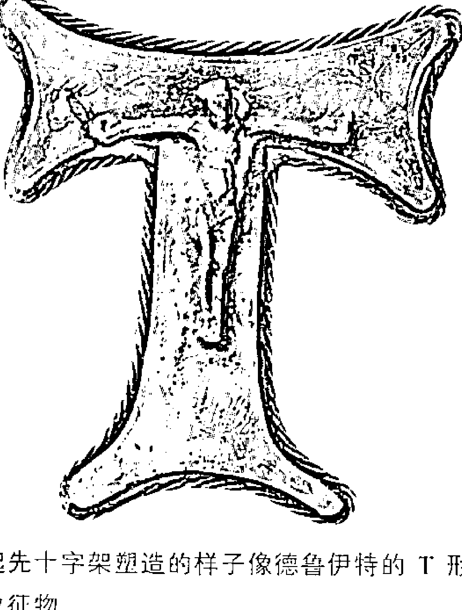
- 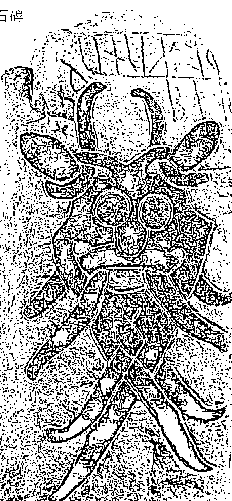

###### 古代国王.马发郎哈尔夫丹

艾克丘尔米尔——带橡树枝形犄角的神鹿。它正卧于瓦尔哈拉宫(阵亡将士的天上宫殿)屋顶上,吃宇宙树伊格德拉西尔桡的叶子

希尔德高高兴兴来到庄园，成了他的妻子和女主人。

婚后不久,女主人做了个梦。她梦见自己从衣裙上摘下一根缝衣针。这针开始生长发芽。针尾着地,立刻生根,而针头则升向高空。树越长越大,一眼望不到树梢。树干下部鲜红如血,上部碧绿如翠,而树叶洁白如霜。枝叶茂盛,她觉得仿佛遮住了整个挪威,甚至更远。

拉耿希尔德将梦中所见告诉了丈夫,丈夫抱怨自己做不了梦。他按照魔师的建议睡到畜棚,于是也做了个预兆吉凶的梦。他梦见自己长出一头五彩怪发。发缕有的及地,有的齐膝,有的披肩,也有的竖着,像一只只犄角。

早上,魔法师为酋长圆梦,说他将子孙满堂,子孙将治国有方,各个不同。

冬至前夕,哈尔夫丹家出了件怪事:席上的酒菜突然消失,客人怏怏不乐,各自散去。酋长吩咐抓来一个芬兰人——出名的巫师,严加拷问,要他说清缘由。酋长的儿子哈拉尔德帮着巫师潜逃。他们刚跨出家门,就神奇地来到一个陌生的地方,一位强壮的独眼人的席前,在那里住了一冬。这时主人才对哈拉尔德说：“令尊因为我拿了他些许酒菜而对我大为不满。只得说,他的好光阴过完了。不久前他过河时掉进冰窟淹死了。哈拉尔德,现在你该回家了。你将得到哈尔夫丹的全部领地,整个挪威很快都将属于你。”

只是应该补充几句。哈尔夫丹执政期间,挪威五谷丰登,前所未见。因此在他死后,各地的人们将他的遗体分成多块,分葬于自己的家乡,建起高大的坟冢,以期永获丰收。而他的头颅则葬于赫林加里基。该地至今还在,人称乌发郎哈尔夫丹冈。

古时斯堪的纳维亚居民常在屋门上雕刻神话造物,指望埃尔小精灵能辨认出自己人而不毁坏该房屋

葱——海盗光明正大和权力的象征

- 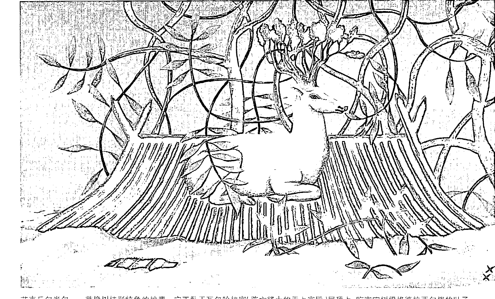
- 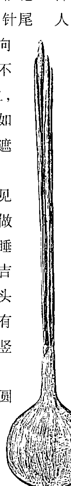
- 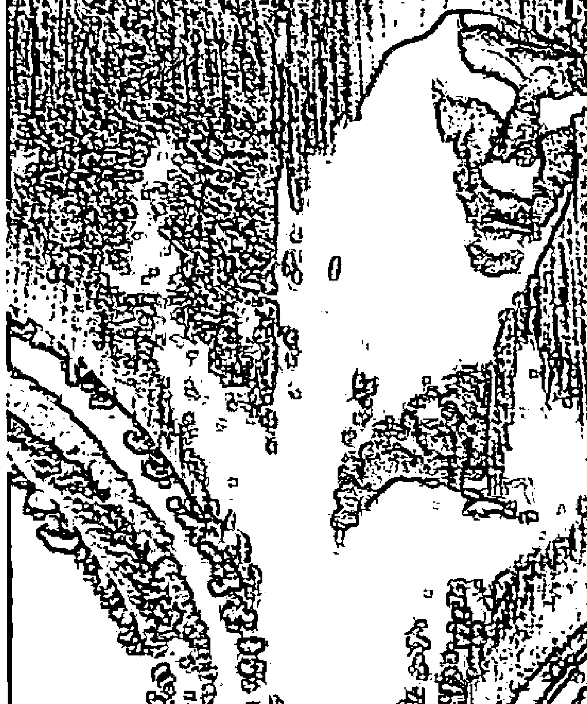

###### 美发公哈拉尔德与巫师们

斯堪的纳维亚人都有十分形象的诨号。有的瘆人可怕：开颅手托尔芬、滴血斧艾里克、铁蛋儿斯克吉或者长剑罗伯特。有的尖酸刻薄：囊囊腚艾纳尔、猫崽儿约恩、马大哈帕尔、艾斯泰恩小妮子。还有的粗鲁牙碜：猪拱嘴伊瓦尔、屎壳郎托里尔。若给起个好名，还真可谓实至名归：强大的克努特、不朽的艾里克、幸运的莱夫、神圣的奥拉夫，或者美发公哈拉尔德——乌发郎哈尔夫丹之子。

- 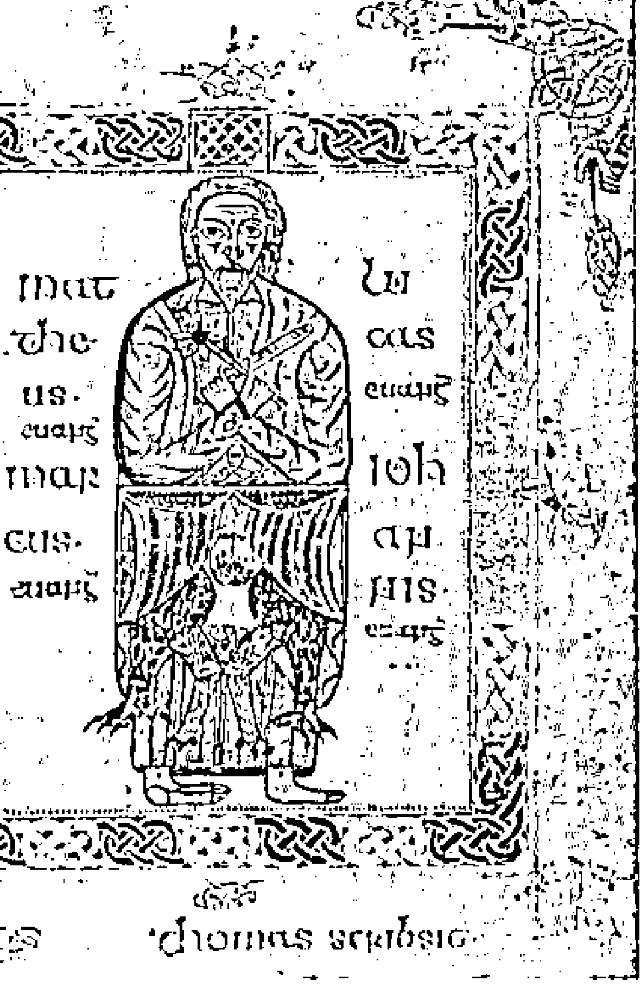
- 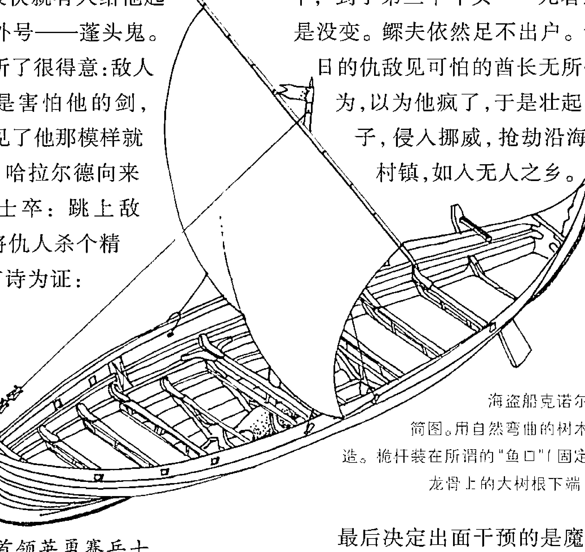

###### 美发公哈拉尔德与巫师们

事情是这样发生的，离哈拉尔德住的地方不远，出了个巫师，叫维特盖尔，常常祸害邻居的牲畜。酋长派人找他，要他停止作妖。他回答说：

这有啥大不了，纵使我等作妖，不过子民黎苗，既然东宫储君，哈达兰德首领，热衷巫术能行。

哈拉尔德听罢，将以远征和惩治芬兰巫师而闻名的头婚所生的滴血斧艾里克派往哈达兰德。艾里克突然袭击，将兄弟和其他八十名巫师关押一处，一把火烧为灰烬。

不久又出了一件对挪威有很大影响的事。当时统治英国的酋长，常胜将军阿德尔斯坦，派人送来一把漂亮的宝剑。美发公拿起这把剑，想仔细看看剑柄上镀金的装饰。使者说：“既然你接受了阿德尔斯坦的宝剑，就意味着，往后你就是他的

在另一次祭祀仪式上，哈康又朝遵守传统的方向迈出了一步：他吃了几块马肝，没画十字祝福就将邦德（自由农民）端给他的几杯啤酒一饮而光。哈康成了半个异教徒。他将以传教改变野蛮风俗的决定扔在一边，拿起刀剑（这剑叫断石剑，因为它能劈开磨盘），率领忠于他的自由农民杀向敌人。他首先进军特兰德海姆，解救百姓于被施过魔法的公狗萨乌尔。在那里，酋长的部队受到热烈欢迎，而追随凶神艾斯坦的贵族被统统杀光。

世界犹如祭神用的马，眼为太阳，鬃为树木，身为自然原质。雅利安人的白马加冕祭礼品。

公狗夹着尾巴逃向森林，可从林中蹿出几只野狼，将它撕成了碎块。

哈康的壮汉托罗利夫举盾将剑挡开，埃文德扑了个空。哈康挥起断石剑，照埃文德的头盔一剑砍下，将那头颅一劈两半，直达肩膀。

就此结束：丹麦人溃逃，挪威人返回自己的舰船。给哈康的箭伤做了包扎。伤口血流不止，谁也无法将它止住。哈康很快精疲力竭。舰船抵达哈康礁（该礁得名哈康，盖因那是酋长的出生之地），他吩咐停靠上岸。临终之时，哈康说他倒想依然做个基督教徒，可手下人可能会按传统仪式加以安葬。挪威人是这样做的：给酋长的遗体穿戴上最好的衣物，身边放上他的武器，但是并未宰杀畜予以祭奠。在灵船之上堆起了高高的坟墓。人们都相信，他们的君王虽然依然忠于新的宗教，但作为伟大的阵亡战士，一定去了瓦尔哈拉宫。从此，挪威人开始既纪念老神灵，也纪念耶稣基督：哈康实现了愿望，不过一切的发生并非如他所愿。

有个名叫基斯平的非贵族出身的士兵，丹麦公主的仆人，在乱军中边跑边喊：“快给杀死国王的人让路啊！”有些士兵停下，想弄清他在喊什么，有些被他的厚颜无耻所激怒，还有些企图摆开阵势，给基斯平以狠狠一击。丹麦人趁乱向身无披挂的哈康射出一支长箭，击中肩胛。基斯平立刻被数杆长矛洞穿。战斗……最早的西欧哲人雕刻像最像德鲁伊特，只是橡树枝环被换成了闪烁的光环

丹麦兵马壮，统帅威名扬，刀载饮鲜血，盔甲闪银光。挪威领袖强，铠甲脱精光，盔胄掷地上，神勇不可当。埃文德冲入敌阵，直扑哈康，挥剑砍下。掩护

##### 大丈夫奥拉夫：特留格维之子

古日耳曼人的画有一个主教的神龛。当时日耳曼人还是天主教徒，而不是新教徒。他们曾试图诱导基辅大公弗拉基米尔·斯维亚托斯拉维奇皈依该教

10世纪，在鲜为人知的阿斯特里德湖中的小岛上，酋长特留格维的遗孀在躲避丈夫仇人追杀期间，生下一子，叫奥拉夫·特留格瓦森。他一生所遇到的惊险，比十个人遇到的加起来还要多。他的业绩中最小的，就是往大洋西部派遣了自己的贵族雷瓦，发现葡萄之乡（后称美洲）的赤发郎艾里克之子。可是海盗们没能在那儿站住脚跟：他们被当地的官兵赶了出来，因而感到委屈的斯堪的纳维亚人把这些官兵统统称做坏蛋。奥拉夫自幼就是爱沙尼亚海盗的追杀对象。接着，他来到俄罗斯的北部城市诺夫哥罗德，在市场上碰见了杀害他父亲的一个歹徒。尽管他年少力单，却一击而置歹徒于死地。他不得不逃往基辅，投奔大公弗拉基米尔·斯维亚托斯拉维奇，后来掌管半数近卫部队，成了基辅罗斯实际上的君主。地方显贵们对他公然敌视，迫使奥拉夫出走温德人（韦涅特人）的家乡——西斯拉夫人最强大的国家。在这里，他迎娶了海拉公主，国王波列斯拉夫之女。按博德里奇人的法律，公主和驸马共理国事，而老波列斯拉夫不再过问朝政。奥拉夫御驾亲征反叛部族，后又联合撒克逊人、弗里斯人、弗兰克人，共同反击温德人的世代仇敌——丹麦人（或称日德人、朱特人）。神圣罗马帝国皇帝奥托二世亲率大军，在隔断丹麦和石勒苏益格的丹麦壁垒附近开战。奥拉夫的温德人决定了战斗的胜负。奥拉夫和海拉治理温德人的国家三年，妻子突然病故。冰岛编年史作家斯诺里·斯图鲁森写道：“海拉的去世，使他无法释怀。他在温德人的国家再没找到欢乐。他装备战船，重又出征，先攻弗里斯人的国家，后取撒克逊人的国家，接着又攻打弗莱明人的国家。”无论在德意志，还是在比利时和荷兰，奥拉夫始终未能消除他那满腹的愁闷。因此他挥师北进，扑向英国，一直攻至苏格兰，接着夺取爱尔兰并重又挥师南下。总之，这是欧洲人永远不会忘记的海上勇士们那些无坚不摧的征战之一。特留格维之子结束自己血腥征战的地方是伦敦。他在公主（同时又是爱尔兰女王）古达的招亲角逐中获胜。这样奥拉夫成了英国和爱尔兰这两个遭受他毁灭性袭击的国家之王。在这里，海盗皈依了新的宗教，成为虔诚的基督教徒。可是，这里注定不是他的久留之地。他决定返回挪威，向杀害父亲的凶手讨回血债。在祖国，就像从前一样，他武锻造的带魔力的三叶图案——凶恶势力和小偷的防御物（挪威）

###### 大丈夫奥拉夫:特留格维之子

古日耳曼人的天使金塑像，貌似天兵天将

运亨通。955年，奥拉夫·特留格瓦森成了挪威的最高酋长，并决定推广基督教。这时最高阿瑟奥丁会见了了他。在民间故事里，此次会见是这样描写的：“奥拉夫酋长客居艾格瓦利德斯奈斯时，一天晚上那里去了一个人，此人年过花甲，能说会道，戴顶宽檐礼帽，只有一只眼睛。他熟知各国情况，同酋长攀谈起来……” 无论特留格瓦森问些什么，他都能对答如流。他们一直聊到深夜，奥拉夫筋疲力尽，在自己的榻上进入了梦乡。早上醒来，他第一句话问的就是那位老人。人们告诉他，那人夜里就走了，但临走时找到厨师，抱怨没让酋长吃好。说着，从包里掏出两大块马肉，吩咐同牛肉一道熬煮。奥拉夫听了，说道：“我当时就猜到来访的不是凡人。很可能这是我们前辈长期信仰的奥丁。可是想要我们，让我们成为异教徒，他办不到！” 说完，酋长吩咐将肉汤倒掉，把马肉摘出，因为谁尝了马肉，他会慢慢成为奥丁的信徒。在自己执政的随后几年里，

奥拉夫不断打击巫师，其中包括一些影响极大的巫师。他长期劝说海盗疤瘌脸儿埃文德接受洗礼未果，遂下令严刑拷问，在他肚皮上放了只装满火炭的小盆。肚皮被烧裂之后，埃文德说：“请把这小盆拿掉，我想在死之前说几句话。”人们照他的请求拿掉了火盆。于是酋长又问道：“喂，顽固的埃文德，你现在会信基督吗？”疤瘌脸儿回道：“不，我不能这样做，因为我是多亏芬兰人的魔法才在人体内再生的神灵。”说完，他就咽了气。

在海上。奥拉夫眼看要战败，跳入海中：与其被俘，不如葬身大海。然而许多人说，酋长没有死。也有人说，他回到了文德国并在那里受到尊敬，活到高龄；还有人奥拉夫去了叙利亚，成了修士。而多数人相信，著名的酋长永生不死。倔头驴哈弗雷德·斯卡尔德颂扬这种信念时写道：战地橡树报喜，特留格维之子，世间至高大帝，当能永生不死。不错，这种人虽然顺应了残酷时代的潮流，但却是名副其实的永垂不朽。

过了五年，挪威被瑞典王斯文·维洛波罗德攻占。决战发生用死者指甲做成的尼格利法尔海船，渡送魂灵去阴司

## 古罗斯人

##### 斯拉夫人与罗斯人

“……这一方土地属于世上最奇特的民族——扎波罗热人，是信奉类似基督教的一种宗教并像海盗一样从事抢劫的一帮俄罗斯人、波兰人和鞑靼人。他们自选头领，又常常将其推翻，甚至打死；不容许身边有女人，而拐骗方圆百里的孩童并按自己的风俗加以培养。夏天扎波罗热人必定四处征战，而冬天则挤在一些能容四五百人的宽大的草棚里睡觉。”

这段文字引自伏尔泰题为《查理十二世》的十分严肃的“科学”著述。然而这种无稽之谈不可容忍，因为说的是我们的民族之根。

首先应当指出，斯拉夫人和罗斯人是不同的民族，尽管他们的祖先同是印度雅利安人。真伪混淆始自编年史作家内斯特。他奉大公之命，在《古年纪年》中一再重申，斯拉夫人和罗斯人是同一回事。这位编年史作家是想把愿望说成现实，意在消弭基辅罗斯这新生的多民族国家内部种族间的紧张关系。

苏联时期，除编年史含混不清而外，又添加了一些异端邪说，同样是出于政治上的考虑。首先，说俄罗斯人是三个东斯拉夫民族之一，同乌克兰人和白俄罗斯人一样。其次，说斯拉夫—罗斯人在历史舞台上出现得很突然，大约在6世纪，而此前他们或许完全是些野人，生活在丛林里，与狗熊大同小异，就像伏尔泰描述的那样。这一日期荒谬至极，后来只得将斯拉夫—罗斯人的历史发端推至公元前1千纪。这既与人类学、考古学、语言学资料不符，也与国外编年史、民间传说、遗传记忆相悖。

立于七棵橡树上的未卜先知的渡鸦，是一种最聪明的鸟，具有说话和预言的能力。渡鸦的窝里无形地收藏着黄金、白银和宝石，它能弄来起死回生的仙水和碎尸重合的神水以及幸苹果。雷神的神鸟

#### 维·瓦斯涅佐夫的画作：编年史编纂者圣涅斯托尔

近来确实有一些作者吹风，说俄罗斯是个北方民族，它或是从波罗的海沿岸，或是作为“有治国才能的瓦兰人”从斯堪的纳维亚的什么地方来到第聂伯河两岸的。就连这一点儿真实也未能消除普遍的弥天大谎。曾经有过许多其他理论，它们一方面反映了作者们的奇思妙想，另一方面为服务于苏联解体后的新政治局势而极力证明某个民族的卓越性。当然，有损于昔日同宗“弟兄”的民族尊严。新骗局的压轴戏是基辅乌克兰历史博物馆院内竖立的纪念碑。碑上凿刻着仿纪年草书的题字：“俄罗斯大地起始于此”。从人工打凿的石头之上举目望去，昔日的工人村——冈察尔卡

##### 斯拉夫人与罗斯人

所在的山冈尽收眼底。冈察尔卡村的后面，第聂伯河两岸，波多尔（意为“山下低地”）的屋顶历历在目。用意相当明显：正是在这里，昔日散布着波兰、犹太和希腊人的商贸点的基辅低洼处，生成了这后来延伸至太平洋沿岸并觉得自己不知是老几的罗斯。在此之前，的确还有过另一种说法：一条罗斯小河流经乌克兰小城白教堂，这东斯拉夫部族便因此而得名。不禁想预先说明一下。斯拉夫分为西斯拉夫、南斯拉夫和东斯拉夫，是一个很古老的民族，有着千年的历史。在某一阶段上，斯拉夫人和罗斯人的道路相交，但这并不能成为将我们称做一个整体——同一民族的任何理由。有不少理由可将俄罗斯人称做：西北印度人或伊朗人；土耳其人的祖先或古罗马人；波罗的海人和斯堪的纳维亚人的南方族人；西徐亚人或芬兰—乌戈尔人……我们血管里流淌着不同部族父母的血液。然而我们并未因此而成为别的什么民族。我们既未丧失自己的民族性，也未丧失外貌特征，更未丧失十分显眼的民族德行——正负两个方面。我们也未丧失自古就有的信仰，任何别的信仰都不像它那样在后来的积淀下保留了自己的古代特色。譬如，难以想象现代罗马人会给朱庇特供酒。同样不可思议的是如今的瑞典人、挪威人或丹麦人在危难时刻会呼唤奥丁。而我们的西部乡村——波列西耶，俄罗斯北方——沃洛格达和阿尔汉格尔斯克州，南方——维亚

特卡农村，还有其他一些地方，包括辽阔的西伯利亚，却常常念叨古代的一些神灵：有的地方念叨的是雷公佩伦·格罗摩维克(以伊利亚或他的本名)；有的地方念叨的是风神斯特雷，而有的地方念叨的是邪神佩列普鲁特。严寒老人和雪姑娘也在其中。至于小神末仙，那就太多了！英国的小精灵、守护神和巨人早已迁居幻想小说。而我们这里的林妖树精、灶神浴君却是司空见惯的邻里。至少在边远的集镇、乡村和山寨。至于俄罗斯本土神和斯拉夫神难以区分，那是另一码事。再说，他们古时曾是印度雅利安各族共有的神。乌克兰学者在尚未经受同化过程的地区进行的人类学（尤其是准确的是血液成分分析）研究，使我们得以弄清东斯拉夫农人的外貌。他们

考古发掘打破了愚昧农民的神话。我们的远古祖先穿过类似软底麂皮鞋的皮鞋。而且鞋上饰有复杂的图案

纤弱优美：细溜的骨骼、乌黑的头发、黝黑的皮肤、高大的鼻子。乌克兰哥萨克靓仔和“黑眉”玉女自古为世人所熟悉。而俄罗斯人与斯拉夫人不同，具有北方人的典型特征：高个儿、淡发。南方人觉得他们像诺曼人。的确，沃洛格达人、阿尔汉格尔斯克人或维亚特卡人在瑞典很容易被当成本乡人。如果说斯拉夫人首先是农人，那么罗斯人最像战士。基辅罗斯国的称谓正好反映了大国的混合民族成分：基是传说中的斯拉夫大公的名字，罗斯是对掌权民族的称呼(罗斯人不仅是亲兵，而且是侯爷)。

在关于母鸡里雅芭的俄罗斯童话里说，金宇宙蛋打碎而……出现了我们的世界。《梨俱吠陀》里也这样说

###### 我们是谁？来自何方？

涅尔利河畔的圣母祈祷日教堂——俄罗斯的精神象征

#### 俄罗斯的信仰

为了明白俄罗斯文化与信仰的特点，应当重提一下彼得·恰达耶夫的推论。我们的信仰并未成为过去，它不论信念如何而构成俄罗斯世界观的基础。

彼得·恰达耶夫写道：“你看一看自己的周围。不觉得我们大家都坐不住吗？我们大家都像是旅行者。谁也没有一个固定的生存环境……在家里我们像是住店的，是外乡人。我甚至觉得，我们的眼睛里也有种奇怪的茫然神色、一种冷漠和迟疑……每当我将同胞的脸同土著一比，我便为一张张脸上的那木然的神态而感到震惊。”

第一部《哲学书简》的卷首有句引自《圣经·马太福音》的格言：“你的天国近了”。作者以此充分肯定东正教，同时又抱怨它

##### 恰达耶夫非常准确地发现了俄罗斯人的特点：“……我们从未同其他民族携手同行过，我们不属于任何人种大家族；我们既不属于西方，也不属于东方，而且我们既无前者也无后者的传统。我们置身时间之外，仿佛未曾受到人类全世界教育的影响。”

许多民族，包括古埃及人、腓尼基人、苏美尔人、古罗马人，留下高度发达文化的清晰印迹之后，从地球上消失了。而并无“英雄传说”的保守的罗斯人，却不知因何活到了今天，并且建立了伟大的文化和世上最大的国家。按照自然法则，如此无活力的民族早该被更为发达、更为强大而又组织得更好的外族所征服或者被其他部族所融合了。可是结果恰恰相反：她融合了其他部族。

我们毫无理由谈论俄罗斯族的上帝挑选性、救世主作用或俄罗斯灵魂的某种特殊“奥秘”。所有民族都是非凡的，上帝平等挑选的，对于不懂其文化和语言的人同样都是一种谜。稍稍熟悉一下亚洲、非洲、澳洲或者美洲那些不知因而被认为是欠发达的土著部落，就会发现当代技术文明根本想不到的那种精神高峰。这种特殊的多样性或许才是生命的意义。

按照亚洲许多宗教信仰（首先是佛教）的说法，人的灵魂有许多轮回，体现在不同的躯体内。既然如此，这灵魂所获得的不光是个人的，而且是社会的经验：无论高度发达国家的居民（而这种

##### 73 俄罗斯的信仰

尼·廖里赫的画作‘建城’
人各代都有，这种国家各代都有，他们好像叫大西亚人、埃及人、巴比伦人、罗马人、英格兰人、日耳曼人、美洲人……对待‘蛮夷’如何宽容，下次转世时无一例外将过完‘蛮夷’的日子，汲取这一民族无边的智慧。

遗憾的只是人在转世时会忘记自己的前世。但是他在一生中会见识许多东西：比如，被自己的敌人俘虏之后，如果没被他们当成奴隶，而是被当成部族的平等成员的话。

在自己死后的存在中，灵魂或许会想起所有度过的前生。这些存在各不相同：在不同时代、在各种各样的条件下接触不同民族的智慧过程中，灵魂会掌握越来越多的知识，这就是世事是虚幻的，真正的现实位于存在的另一面。完成几次转世之后，灵魂便会退出这一循环。

此种推论并不抽象。有那么一些“地位稳固的”民族，对于他们重要的首先是物质财富，而精神财富是种模糊不清的，因而是并不十分重要的东西，主要的是——有工作，能赚钱，造豪宅，娶美眷，如此一直活到老去。这就是他们

多过失作出回答。过阔绰的生活可耻而无意义。这种生活是暂时的，不是真正的，因而不应过分沉溺其中。

俄罗斯人的信仰里的主要点，过去是，现在仍然是，人好像同时活在两个世界上：一只脚在这里，另一只脚在那边。可以说，我们更像是精怪异物，而不是凡胎肉身，究竟是何物，这取决于对我们的态度，友好的还是敌视的（比如，在日耳曼神话里，我们的先祖瓦恩人，就被称作自然界的精灵或半死不活的人）。

人生的意义。在这一价值体系内，杀人如不受法律追究并服务于财产保护，那就是好事。比如，在古代，有些民族——斯堪的纳维亚人、腓尼基人，有时是希腊人（尤其是亚该亚—斯巴达人），遇上饥荒岁月，常常杀害老小，以图自保。此种经过冷静思考的大规模屠杀，俄罗斯人从未干过。这并不是说罗斯人从没杀过人。杀过，但意识到是在犯罪，哪怕是在基督教产生以前的时代。

可以试试明确表述一下罗斯人所始终遵循的那些不成文的精神法则。杀人，哪怕是为了伸张正义，也是罪过。就像权力一样，让自己为权力所累的人，将为自己的许

对尘世生活的轻浮态度，也是在并非最好条件下的许多世纪的生活经验，同样是经受来自本族最高当局和外国敌人的无数艰难困苦的结果。

在俄罗斯度过非常不易的一生之后，灵魂必然会面临非常硬性的选择：升天堂还是下地狱。

基辅纪念碑位于雷神佩伦和其他基督教前神灵的庙宇原址上

罗斯人要塞城墙剖面图。别尔哥罗德，10世纪

###### 星女

古罗马的万神游戏至今百玩不厌。许多作者继续寻找俄罗斯神灵的罗曼—日耳曼对应神时，列出“七大神”：佩伦(雷神)、韦列斯(家畜神)、霍尔斯(太阳神)、达日博格(太阳神和天火神)、斯特里博格(风神)、塞马尔格尔(火神)和莫科什(万物生长神)。

民众抗击斯堪的纳维亚人。弗拉基米尔·斯维亚托斯拉夫举行祭祀仪式并称其为“众神”。而市民们对大公的仿效并不积极。他们记得定居基辅的一位瓦兰人的话：“这不是神，是木头，不会吃喝、不会说话的木头人。”斯堪的纳维亚人虽因谋反言论而遭斩首，但他的话却是公道的。

的确，弗拉基米尔大公在基辅极力打造的就是类似物（不仅是转义的，而且是直义的）。神灵的这种斯拉夫—俄罗斯国际大聚会（让所有臣民都满意），实属团结各部族共同反对外来瓦兰人之必需，因大公曾许诺给后者以褒奖但又食言，未曾兑现。显然，被强行聚合的神灵，应当团结基辅

几年后，大公见如意算盘落空，决定采用另一种信仰——拜占庭教。奉罗斯洗礼主持之命，童话里的布阳显有个原型——波罗的海上的吕根岛，从前那里曾有座阿尔科纳—斯拉夫人和罗斯人同样崇拜的斯维亚托维特神的寺庙成了罗斯人一切圣物、灵石传说和总合

塑像被统统捣毁，金髭佩伦被扔下第聂伯河。木神像漂浮不久，在后来叫做维杜比奇的地方靠了岸（据说是富有怜悯心的市民对佩伦喊：“维杜拜，维杜拜，天哪！”）。就在这里建了座东正教修道院，完全按异教徒们的叫喊声起名为维杜比奇修道院。

可事实上又如何呢？许多史学家依然认为“俄罗斯人”是“斯拉夫人”的同义语。他们企图用零星的事实构建一幅俄罗斯信仰的完整画面。自然，画面每次都不相同，因为诠释者的认识各不一样。很遗憾，往往被视而不见的不仅有阿法纳西耶夫、波捷布尼亚、米罗留波夫、普罗普、雷巴科夫和尼·伊·托尔斯泰的专著（它们“严肃”有余），还有俄罗斯的童话（它们“严肃”不足）。其实正是民间记忆里才有多神的神话。俄语的“多神”一词本来就源自“舌、口”，口者民也，即民间信仰。我们在此不想劝你相信，自幼就听母亲说过并显得如此简单的关于芦花鸡的童话是一则最为

有趣的关于宇宙形成过程的神话。我们只说说本国神话的三个最重要的方面。其一，俄罗斯人对于超自然物的认识无边无际。对这些认识的理解可以无尽无休。唯此它们才会永生不灭，也才会包容一切可能的诠释。在这一点上，它们同凯尔特人的传说很相似。其二，俄罗斯神话的出现大大早于万神殿的建造。它们非但不比罗曼—日耳曼—印度神话粗浅，而且要年长和古老得多。这些民族的众神早已死亡，而俄罗斯的神话却依然活着并很康健。其三，俄罗斯的认识毫不含糊，所有认识都建立于对比认识之上：死——生，黑——白，男——女，宅——路(或阳宅——阴宅)，上——下，右——左。这些对立面也有相似性：出世时睡的摇篮(摇箩)，某种程度上也近乎去世时躺的棺材(漆宅)。当然，俄罗斯神话的特点还远不止此。我们还想说说雷神佩伦和家宅女神。人们往往将“近卫神”(并非古罗马军团兵士的米特拉那样的士兵庇护神，而是俄罗斯神——正是这一族的人组成了弗拉基米尔大公的“近卫队”)同作为地府之主的家畜神沃洛斯（韦列斯）相比照。沃洛斯很可能对斯拉夫庄稼人比对俄罗斯军人更亲近。至于他就是佩伦的对立面，那可不好说。原因如下。就连立于基辅山上的那尊木神像，除银发金髭而外，还有铁腿，不是没有道理。它不仅是天国之神，而且是地府之神。像他们大伙儿一样，是瘸腿，需要假肢。希腊神赫菲斯托斯在铁匠铺里转悠起来一摇一摆，奸诈的头号巨人洛基走路一瘸一拐，维奥

龙德离开双拐走不了道，印度神黑天伤过脚后跟。亚·尼·阿法纳西耶夫在《斯拉夫人大自然的诗学观》中写道：“这就是俄罗斯童话故事把主人公、春天雷雨的代表描绘成膝盖以下是金腿，希腊人给自己的神灵起金银腿的外号，妖婆的活动小屋（表示自行云朵）立于和旋转于鸡腿的缘故。确切地说是公鸡的腿，而俄语中公鸡这一名称至今仍然用于火的意思。因为闪电以曲折线条从天而降，所以幻想小说就将它的闪现比做瘸腿的步态不稳的神。” 雷神在地府淘日光之金，采甘霖之水。他用大棒敲击地狱的铁门——发出的就是雷声。比跛脚佩伦要年长许多的还有：干酪之母大地、两头上天的母驼鹿、至今仍一同被绣在面巾上的宇宙树和家宅女神。学者们通常将家宅女神说成是帮助分娩的女善神。其实说的不仅是能影响生育、性格，且能影响人的命运的星女。这些认识流传了很久，至今仍未消失。星女的影响扩展至家史、生日和圣诞。换言之，星女注定的不光是出身何种家庭及何时出世，而且在圣诞节那天可测出未来的大事。马克西姆·格列克早写过一本专著《论人的一切是天命而非星辰和时运安排的》。还有匿名作者的《治家格言》责难同时代人仍然相信家宅女神并看星占卜。

> “这就是俄罗斯童话故事把主人公、春天雷雨的代表描绘成膝盖以下是金腿，希腊人给自己的神灵起金银腿的外号，妖婆的活动小屋（表示自行云朵）立于和旋转于鸡腿的缘故。确切地说是公鸡的腿，而俄语中公鸡这一名称至今仍然用于火的意思。因为闪电以曲折线条从天而降，所以幻想小说就将它的闪现比做瘸腿的步态不稳的神。”

火蛇——大彗星的隐喻 它的陨落引起地球气候无可逆转的变化和 雅利安人从北方发祥地的出未

###### 俄罗斯壮士

壮士歌和其他故事里说到三个三位一体神灵的功绩。他们是：1）韦乔尔卡（晚星）、波卢诺奇卡（夜公）、佐尔卡（朝君）；2）戈伦（火蛇）、杜本（蛮蟒）、乌森（须蚺）；3）伊利亚·穆罗梅茨、多勃雷尼亚·尼基涅茨、阿廖沙·波波维奇。

通常人们将第一组和昼夜时间神联想在一起，把他们同吠陀教的乌萨斯、古希腊的厄俄斯和古罗马的奥罗拉相比较。这三位一体的名字似乎都证明比较是合理的：晚班工人、半夜力士、朝霞伊万。然而外邦的时间神全为女性，再者昼夜为何从黎明算起还

是个谜。一则童话里说，兄弟仨都是遗腹子，出世顺序是：老大——傍晚，老二——半夜，老三——清晨。后来，哥仨一同出发建功立业。为寻找三位失踪的公主而误入密林，碰见一间小木屋，他们就在那里住了下来。每当两兄弟外出打猎，屋里就来个“指甲盖儿大的男人”，把留在家里的打个半死。起先被打的是晚星，接着是夜公。只有朝君将小老头儿绑在橡树上，制伏了他。小老头儿最后还是设法挣脱，逃跑了。三兄弟跟踪追赶，来到一个塌陷坑前，顺坡进入地下，在金、银、铜三国找到了公主。姑娘们交给朝君一只装着大水的瓦罐，他用这水接二连三地打败了三首蛇、六首蛇和十二首蛇。三壮士将金、银、铜三国团成小团，带上地面。兄弟仨分别与三位公主成了亲。这一情节被移宫换羽，一再出现于稍后的许多童话中，而在这则童话里指的是哪些事件却不得而知。也许它们与雅利安统一的时代有关。神话研究者B·伊万诺夫和B·托波罗夫写道：“朝君、晚星和夜公形象的印欧源头，为其他民族神话的相应”

另一组三位一体的壮士——戈伦（火蛇）、杜本（蛮蟒）、乌森（须蚺），通常被看做自然界破坏力的体现：地震、飓风和洪水。尽管第一位壮士的名字跟他岳父（也许是别的亲戚）喷火蛇戈雷内奇相同，但并非源自“戈拉（山）”，而是源自“戈列季（烧）”。民间词源学说明，杜本的外号很简单：他能将树木压弯，把森林毁平。童话里说：“笨蛋见哪棵橡树高，就往地里塞，见哪棵橡树矮，就连根往外拔。”起初很可能指的是地上的塌陷坑，其实是树落进坑里，在路上形成障碍。所以有些研究者认为杜本是地下深处的蛇。这三位一体中的最后一位——乌森（须蚺），较为复杂。说

他“用嘴巴咬住河，用胡须逮鱼，用舌头熬煮，一口吞下肚”。又说：“一根胡须把河拦住。那胡须就像大桥马路，行人走，马儿跑，大车过。”这里将古雅利安语的“肩膀”极言成俄语的“胡须”。人们踏着肩膀过河，其实要合理得多。伊利亚、多勃雷尼亚和阿廖沙，都是集合形象。只是在流传的最后阶段，他们才可能与实际存在的人确立对应关系。穆罗梅茨的遗骸至今仍同圣徒的圣骨一道保存在基辅洞窟修道院的洞穴内。学者们研究圣骨后得出结论：“削发出家的基辅将领两腿生来就右长左短（因此有了坐炕‘三十又三载’的传说），然而肩胛带却异常发达。根据保存完好的干化的心包可以确定，壮士在自己的修道室死于谋杀，伤及左肩胛。凶手的名字一直无人知晓。伊利亚形象复原成为轰动一时的事件：高颧骨、眼睛挤在一起，多半是乌戈尔—芬兰人。他很可能出身于伏尔加河沿岸后被俄罗斯族同化的‘穆罗姆’族。伊利亚是农民的儿子，

子，生于穆罗姆市附近的卡拉恰罗沃村，后来出现的这一传说是出于爱国主义的考虑。能证明同一点的，还有壮士三位一体构成的故意性。伊利亚是下诺夫哥罗德—弗拉基米尔大所孕育的农民；多勃雷尼亚来自梁赞，出身贵族(一说商贾)；阿廖沙是罗斯托夫神父列昂季的儿子。壮士歌里讲述了大公统治下的基辅罗斯东北部所有阶层和土地的统一。的确，这一象征里也可能有更为古老的成分，它表示不同部族的统一（三位壮士中只有多勃雷尼亚是俄罗斯族人，阿廖沙和伊利亚都是梅里亚部落的乌戈尔—芬兰人）和种姓的联盟：多勃雷尼亚所代表的刹帝利——武士贵族(或吠舍——商贾)和阿廖沙所代表的婆罗门——僧侣贵族(在俄罗斯——先叫蕨菜——雷神色 相传在俄历6月24日的夏至节(库帕拉节)到来的夜幕和三个最短的夜间开花.这时楸树开花,开始挂果并成熟。蕨菜的火红色花朵指示地下的宝藏

呜呼，即便在俄罗斯，庄稼人占据领导地位的思想也仅见于壮士歌了，而且红太阳弗拉基米尔大公还将任性的‘农民之子’投进了监狱，在人造的万神殿里安放了武士神——雷神。而‘牲畜般的贱神’被排挤到次要地位。基辅洞窟修道院的圣洞内

###### 骁勇善战的术士

骁勇善战的术士，就是在战斗时利用超自然的本领消灭敌人的魔法师。俄罗斯魔法战士中最著名的是诺夫哥罗德的大公沃尔赫·弗谢斯拉夫耶维奇。他的名字暗指他属于祭司阶层——术士、与动物界神灵沃尔赫（沃洛斯）的关系、公爵的变化能力（他能变成狼或其它动物）。许多民族都记得与狼或狗（盎格鲁撒克逊人管狗叫“熊狼”）有关的勇敢术士。绰号沃尔赫很可能并非专指某个具体的人，而指每一个魔法师—战士，就像帕提亚部落——而后是古斯堪的纳维亚人——所叫的奥丁，此名意为掌握黑魔法（妖术）的统帅。正好，诺夫哥罗德的沃尔赫，跟斯堪的纳维亚的奥丁一样，都被列入了神灵。在诺夫哥罗德的文字传说里，人们把沃尔赫尊称为格罗姆

或佩伦(雷神)。在穆特那亚河(后改名为沃尔霍夫河)流入伊尔门湖的河口,离旧鲁萨城不远处,曾造过一座雷神庙。其实，这就是魔法师们的驻地。过往商贾都要向佩伦的塑像施礼，往伊尔门湖投放供品，祈求买卖顺当。历朝历代都一样，平民百姓对魔法师们既害怕又仇恨。沃尔赫死后,人们开始编造故事,并且不无幸灾乐祸地互相传说：勇敢术士的坟墓坍塌了，“他那副鳄鱼骨头撒进了地狱”。

“鳄鱼骨头”暗指沃尔赫与蛇的亲缘关系。壮士歌里说，他母亲,马尔法·弗拉斯耶夫娜,在花园散步,爬上一块大石头;她从石头上跳下来时,差点儿踩上不知从哪儿钻出来的一条“可恶的蛇”。那蛇熟练地缠住了姑娘的身体，“用尾巴拍打着那雪白的大腿”。一番调情之后,世上出了个沃尔赫。英勇术士的诞生伴随着一场强烈地震：电闪雷鸣,地动山摇,鸟人密林,兽归深山。B.伊万诺夫和B.托波罗夫写道：“关于沃尔赫·弗谢斯拉夫耶维奇的题材……属于俄罗斯壮士歌谣最古老的层面，其特点是尚未根除的图腾崇拜观念和广为显现的神怪魔法意识、天人合一的认知。”确切地说,沃尔赫的故事是一种最古老的传说，那时罗斯人还记得自己同印度雅利安人的亲缘关系，也记得迫使他们脱离雅利安人大家庭的恼恨。因此一直怀有复仇的念头，而复仇也就由沃尔赫实现了。一切都曾预示了这一点：刚一出世,他就开口用低音说话，“就像滚滚的闷雷”。他七岁起开始学习文化，十岁起学习魔法，尤其是变化之术：变鹰、

沃尔赫·弗谢斯拉夫耶维奇变成鹰,飞向印度,前往拉吉王宫

###### 有人为伴,死也心甘

我们祖先不曾费

## 金麦里人

维列伊是昆虫、飞鸟和蛇的天堂。它们一直在此过冬，直到保管维列伊钥匙的布谷鸟将其交给雷神并由他打开天门。

“她端着唱了几句，一饮而尽，” 外乡人说，“翻译告诉我，她以此饮告别女友们。然后又给她端上一杯，她接过去，哼唱了老半天。这时老婆子催她喝下并进入她先生所在的帐篷。”

伊本·法德兰那丰富的想象力描绘了一幅可怕的图景：“老婆子用绳子勒死可怜的姑娘，而在场的军人将刀扎进姑娘的肋间！这就是那些可怕的罗斯人的

最后船下的劈柴被点燃。阵风吹旺了火苗，大火瞬间吞噬了木船，将头领和年轻的妻子送往另一世界。

站在旅行者身边的罗斯人一阵大笑之后，说：“阿拉伯人很笨。你们把死者喂蛆虫，而我们将死者眨眼之间就烧掉，让他们立刻进天堂！”

船彻底烧完，在原处修上坟头，坟上立根原木，写有被安葬头领的名字。

“于是人们离去。” 艾哈迈德·伊本·法德兰就此收笔。

大诺夫哥罗德的小银币

### “红帽人”的人侵

据古希腊人传说，金麦里人是个神秘的民族。多半生活于公元前8世纪的荷马在长诗《奥德修记》里说，他们居住在世界的最西端，彼岸，名曰幽界（或地狱、冥府，抑或阴司）的入口处。此外，身居地下黑暗中的金麦里人是阴曹首批移民。那里的小树丛里或者开满阿福花的草地上，有珀尔塞涅福们在游玩。

两百年后，希腊诗人和阿波罗的祭司阿里斯捷写成长诗，冠名《阿里马斯皮叙事诗》。该作在古希腊很受欢迎：对它爱不释手的有埃斯库罗斯、平达、希罗多德和其他经典作家。呜呼，今天来评价它的艺术优点已不可能，因为它失传了，但还有一些情节的转述。作者描写的是，他诚惶诚恐登程云游，来到伊谢敦人的国家。史学家希罗多德对诗人的虚构持怀疑态度。在自己的《墨尔波墨涅》中，他对超出世界范围的这一地理简述如下：“据阿里斯捷说，伊谢敦人以北住的是阿里马斯皮——独眼人，阿里马斯皮人的北面是守护黄金的狮身鹰翅鹰首怪，再往北去便是临海而居的极北人。这些民族，除了极北人，与邻居争斗不断（挑起战争的是阿里马斯皮人）。阿里马斯皮人把伊谢敦人赶出自己的家园，接着伊谢敦人挤走了西徐亚人，而南海（黑海）北岸的金麦里人在西徐亚人的挤压下离开了自己的家乡。”

这部长诗里，毋庸置疑的是，公元前9—前8世纪，从多瑙河到叶尼塞河这片广袤大地的草原上，住过操伊朗语的雅利安畜牧部落。前8世纪，草场重新划分，有些部族从自己的地界赶走了西徐亚人，而西徐亚人同时挤走了金麦里人。希罗多德说过：“曾住在亚洲的游牧西徐亚人，受马萨格泰人的挤压，渡过阿拉斯河（伏尔加河），去了金麦里人的地界。”

金麦里人面前出现了一个问题：是不声不响地离开，顺着先辈赫梯人的古道前往小亚细亚，还是同敌对的近亲西徐亚人干上一仗。武士贵族们（刹帝利，希腊人将其误称为统治者）认为，应为故土战斗到最后一滴血。普通百姓（吠舍——商人、手工业者、庄稼人）主张和平解决，避免无谓牺牲。祭祀们（婆罗门——僧侣贵族）则一声不吭，等着事情如何了结。

军人被部族同胞的胆小怯懦所激怒，举行了集体自杀仪式。他们分成两队，互相厮杀，直至彻底毁灭。

将死者按礼仪葬于德涅斯特岸边，然后逃离，为西徐亚人腾地。西徐亚人说不出的高兴。

然而没过多久，西徐亚人醒过味儿来，决定追赶逃亡者，将他们抢光、杀光。所幸的是，金麦里人迷惑了身后追来的西徐亚人：他们沿黑海东岸，前往乌拉尔图（穿越当今的格鲁吉亚，前往亚美尼亚），而西徐亚人的追赶线路更加往东，结果迷了路，来到阿塞拜疆，里海岸边。后来，双方的路线越离越远：金麦里人顺着黑海南岸慢慢接近朝思暮想的目的地——小亚细亚的弗里吉亚国，而西徐亚人只得且战且行，往南冲向米太(今伊朗)。

乌拉尔图来了个新的民族，消息很快传到亚述王萨尔贡二世的耳边。谍报头目那波·李在密报中说：“乌拉尔图王征讨加米尔(金麦里国)的消息属实。全军覆没，王只身逃回。”

另一细作补充说，加米尔国位于乌拉尔图和古里亚国（即今格鲁吉亚地区）以北。

萨尔贡二世的担心不无道理：很快金麦里人便与乌拉尔图人修好，攻入强大的亚述帝国。他们长驱直人，攻至米达斯王（相传，任何物体一触到他便成黄金）的弗里吉亚国。

身穿短衬衣、头戴从没见过的尖顶红高帽的天生的骑兵，制造着恐慌（金麦里人依然被认为是来自阴曹的人），带着一群恶狗，涌向小亚细亚。他们轻而易举地摧毁了弗里吉亚；同吕底亚人交锋，杀死其国王季格，接着攻陷以弗所。当地的诗人卡琳号召抵抗，可谁会同来自阴间的魔鬼去拼杀呢？

这可是一场噩梦：不知哪儿来的金麦里人有占领和征服地中海文明中心的危险！若不是金麦里人的不共戴天之敌西徐亚人来到亚述的东部边境，这一切还真有可能发生。

阿萨尔哈东王惶恐不安，不止一次询问预言家：“金麦里人的罪恶图谋果然会实现吗？

于是决定两害相较取其轻，将女儿嫁给“蛮夷”——西徐亚王帕尔塔图阿。这样，他就在反金麦里人的战争中得到了一个强大的盟友。

西徐亚王同亚述公主婚后生有一子，叫马迪。他成了复仇的工具。他先摧毁了不听话的米太国，接着率领西徐亚—亚述大军征讨小亚细亚，彻底粉碎金麦里王李格达米斯。“红帽人”（这红帽后来成了法国革命的象征，被称为弗里吉亚帽，不过在弗里吉亚使它们流行起来的是金麦里侵略者）军队的残部逃回故乡，自称塔夫拉人，定居于克里木南部。后来完全融于当地居民之中。总之，“来自阴曹的人”返回了他们所来自的传说。

金麦里军人。进行骑兵弓箭手战，成了军事艺术的新词，并长时间保证了金麦里人的成功

## 西徐亚人

西徐亚于西亚和地中海沿岸，在古代高度发达国家包围圈内，仅存在了二十八年。许多人当时相信，出现了世界的新主人。他们错了：西徐亚人很快被赶回家乡草原，为萨尔马特人所灭。

尽管说来奇怪，可对于西徐亚人，比夺财掠地意义大得多的，却是同希罗多德的普通对话。作家塑造了一个英勇、富足而自由的民族那极具吸引力和生命力的形象。世间陆续消失了一些影响极大的文明：古埃及、苏美尔—亚述—巴比伦、古希腊、伊特鲁里亚—罗马……而人们许多世纪之后常常想起的却是西徐亚人，将与他们的亲缘关系引以为荣。

对他们怀有特殊好感的，是俄罗斯知识界。其中不仅有宣称“我们是西徐亚人”的亚历山大·勃洛克，而且还有其他诗人。如阿波罗·麦科夫：

“西徐亚正方”是西徐亚人对世界的认识。它北依里佩山脉，山后住着极北人。通往山里的道路由格里丰猎狗和独眼阿里马斯皮人守卫。正方南临大海(公元前5世纪的希腊地图）

西徐亚野猴，像古希腊人，也笑称在下，为民族歌手！尤其是瓦列里·布留索夫，在《西徐亚人》一诗中写道：如若某天登门造访，我古代远支的祖上，您会为哥们而自豪，喜欢我这敏锐目光。

说起这眷念之情，邦·列文和埃·格兰托夫斯基有独到见解：“对西徐亚人的兴趣，多半是因为想探寻斯拉夫人的文化起源和民族发祥地。”情况未必尽然：或许是因为俄罗斯本族文化鲜为人知，而西徐亚文化却由希罗多德讲述得详尽而又显得十分诱人。至少，如今扎波罗热、库班、顿河哥萨克人，依旧认为自己是曾在当地住过的无畏骑手的直系后裔。诚然，纯种民族无法找到，

而西徐亚人，同雅利安其他部族一样，也是斯拉夫人和罗斯人的先祖。现在我们说说西徐亚的“七神”。希罗多德说：“西徐亚人只敬奉如下神灵。首先是赫斯蒂亚，然后是宙斯和盖亚（他们认为盖亚是宙斯之妻），其后是阿波罗、阿佛洛狄忒、赫拉克勒斯和阿瑞斯。这七神为全体西徐亚人所敬重，而所谓高贵的西徐亚人还供奉波塞冬。用西徐亚语称呼，赫斯蒂亚叫塔比蒂，宙斯叫巴巴伊，盖亚叫阿妣，阿波罗叫戈伊托西尔，阿佛洛狄忒叫阿蒂姆帕萨，波塞冬叫法吉玛萨德。西徐亚人不兴为诸神塑像、筑坛和建庙，阿瑞斯除外。”

### 太阳王

像这样用古希腊神灵的模式来套西徐亚的神，往往会歪曲实际存在的宗教信仰。西徐亚人最古老的神并不是这些，而是河神鲍里斯芬（达纳伯——第聂伯的希腊化名字）和阿拉克斯(伏尔加)。娶第聂伯的闺女——蛇女阿妣的，是巴巴伊。巴巴伊在俄语里的意思十分清楚：“父亲”。然而他与雷神宙斯不同，并非主神。有资格占据主神位置的是塔比蒂（意为“火热的”）。她同希腊的赫斯蒂亚一样，庇护家宅，从上天赐给人间四种金器：犁、轭、斧和钵。每位西徐亚王登基之时，都得与她举行宗教婚礼仪式。因此，塔比蒂又被尊为“西徐亚王后”。

戈伊托西尔(阿波罗)是另两位三等神(排在一等神鲍里斯芬、阿拉克斯和二等神巴巴伊、阿妣、塔比蒂之后）的亲兄弟。另两位三等神，我们只知道希腊语的叫法：赫拉克勒斯和阿瑞斯。同他们并列的阿蒂姆帕萨（或直呼阿希、阿蒂），与爱神阿佛洛狄忒不尽相当，因为她之所司首先是心心相印的柏拉图式的爱。世俗之爱则是塔比蒂的事。

还有一位受高贵的西徐亚人敬奉但不进万神殿的法吉玛萨德。德。希罗多德将他 与波塞冬相提并论。该神只掌管部分水域。在缺水的草原上，他有另一件差事——监管马群的健康状况。

在叙述壮士的那一章里，谈到传说中的三组三位一体大力士。西徐亚人的传说也一样。第一组三位一体是操伊朗语的游牧人——已提过的神灵阿波罗、阿瑞斯和赫拉克勒斯。通常，兄弟中老三最出色。赫拉克勒斯同父亲巴巴伊一样，娶了水中蛇女，育有三子：阿加菲斯、赫朗、西徐亚。兄长们宗教礼仪测试不合格，不能掌管圣物，被扫地出门。而幼弟西徐亚则同父亲赫拉克勒斯或者同俄罗斯童话里的傻子伊万一样，原来最为优秀，由他而产生了人类。

有时也把西徐亚称做塔吉泰——人祖。他也育有三子(此为第三组，即最后一组三位一体)：利波克萨伊、阿波克萨伊和科拉克萨伊。“克萨伊”不仅指“战士”，而且有“君王”之意。指的是西徐亚最高统治者。再者，他们的权力是多层次的。长子利波(旧称里波)得到的不仅是管辖白衣祭司，而且外加掌管里佩(乌拉尔)山脉的权力。其名字可译成“山之王”。次子阿波管辖农夫和牧民，此外，还掌管海陆深处。他是“地府之王”。幼子科拉的名字意为“环日统治者”或“太阳王”。生活在太阳下的人们都归他辖制。他生于黎明时分，相当于俄罗斯童话里的朝君（如此，利波则相当于晚星，阿波相当于夜公）。除此而外，西徐亚的太阳王科拉克萨伊就相当于俄罗斯神话中的达日博格，斯瓦罗格之子。

虽然我们同根同源，可咱终究是俄罗斯人，而非西徐亚人。可我们的精神遗产却是无限的。

### 人生三色

为什么所有传说里弟兄跟壮士一样始终都成仨呢？难道古时雅利安家庭中人口就如此少么？又为什么年纪最小的（像科拉克萨伊、傻子伊万），起先那么单纯幼稚的人，总能胜过兄长呢？要说老成练达的兄长教训教训乳臭未干的小弟，那倒合乎情理得多，因为他们一生见识更广，所学也多，再说，的确较为成熟，力气也更大些。回答这些问题，需要绕个弯子，绕个很大的弯子，回到社会年龄结构形成的中石器时代（公元前14—前13千纪）。

西徐亚人的圣物——伞钺

古代意识形态研究者弗·普罗普以神话故事材料证明，在那些英雄时代，黄花后生都要经过复杂的成年仪式。他们得通过严酷的考验，才能慢慢成为集体中享有同等权利的成员。然而在成婚之前他们应跟大家分居，往往甚至不得伙住。黄花后生住在村边，以打猎糊口，危难时拿起武器保卫部落，抵御外敌。红色——火与血的颜色，是他们属于战斗群体的标志。顺便提提，这种可遮掩鲜血（自己的和别人的）、穿着舒适而不妨碍活动的“制服”，还沿用了很长时间：斯巴达人、古罗马军团、英勇无畏的西斯拉夫军人都穿着过。如今英国皇家卫队的红制服就源自远古时代。说不定还有俄罗斯农民过节穿的大红竖领男衬衫呢。服装的颜色，象征人的地位。民族不同，色泽、深浅也各不一样，由黑到棕，由土黄到水蓝。

年轻军人一旦成家，他的生活方式就会随之改变。往后，他把家什一置，就住进村里了。他顺着社会年龄阶梯慢慢爬升，渐渐成为“大老爷们儿”：庄稼汉、畜牧师、手艺人和家长。男人达到社会的顶峰，往往已届须发花白之年。从此，他会渐渐成为长老、智叟或术士。其实，灰白色（白色）也就是祭司阶层的象征。这种生活方式延续了数千年之久。然而人生普遍规则的例外越积越多。首先，并非人人都能经受严酷的考验。其次，父辈们不再有放自己根苗离开的愿望：最好让他们帮着做做家务或者学学魔法，如果有天资的话。再说，“红衣”军人也不刻意招收“泥腿子”和“乖乖儿”加入自己的群体。

他们更看重的，是个人的胆气。总之，部族内形成了军人、农民、祭司群体。然而年龄评价标准依然存在：“白衣”，不论年龄大小，在地位上高于“黑衣”。同样，“黑衣”也看不起长不大的“红衣”黄花后生。

那时，祭司都是些魔法师王。他们的魔法决定着一切：天气年景、畜旺民安、男育女孕。农夫和军人向“白衣”祈求家族康乐；为讨好他们而纷纷献上丰厚的供物。最高巫师若不称职，则会成为民族祸害，因此他往往会被推翻，甚至被乱石砸烂或投河淹死。

白衣祭司被大量推翻，见之于公元前10至前8千纪之间。定居人口增长，左近资源枯竭。饥荒肆虐，可祭司却回天乏术。于是爆发了新石器时代的革命：“小兄弟”红衣军人起而造反。他们具有实现社会变革的力量。最主要的是，他们有拯救饥民的办法。这办法就一个字——“逃”。该做的就是离开贫瘠的土地，赶着畜群不断地游牧，从一草场转往另一草场。若遇外族挡道，则不必担心，有职业刀斧手可轻松取胜。一朝舍弃习惯的生活方式，成为游牧民族，自然并非易事。可这终究发生了：雅利安人自南乌拉尔山前地带奔赴四方。与其他民族相比，他们拥有两大优势：马匹和斧钺。不过，不应将其视为嗜血成性的乌合之众。因此，史学家埃·别尔金指出：“我们常常低估原始社会后期外交和国际法的发展水平。”

任，又怎能不予信任，既然“黄花后生”让族人避免了饥饿和死亡，而祭司们此刻却显露出十足的无能。“红衣”成了主宰，所依靠的不是魔法，而是力量。向他们可以祈求施恩，而企图将其推翻则毫无意义，更不用说乱石砸烂或投河淹死了。叛乱者必死无疑。就连这样复杂的局面，祭司们也能适应：他们成了统治者的谋士、神与人的中介，也即占据了社会等级的中间位置。而原先“排行老二”的农民，呜呼，降到了最

### 西徐亚妇女的头饰
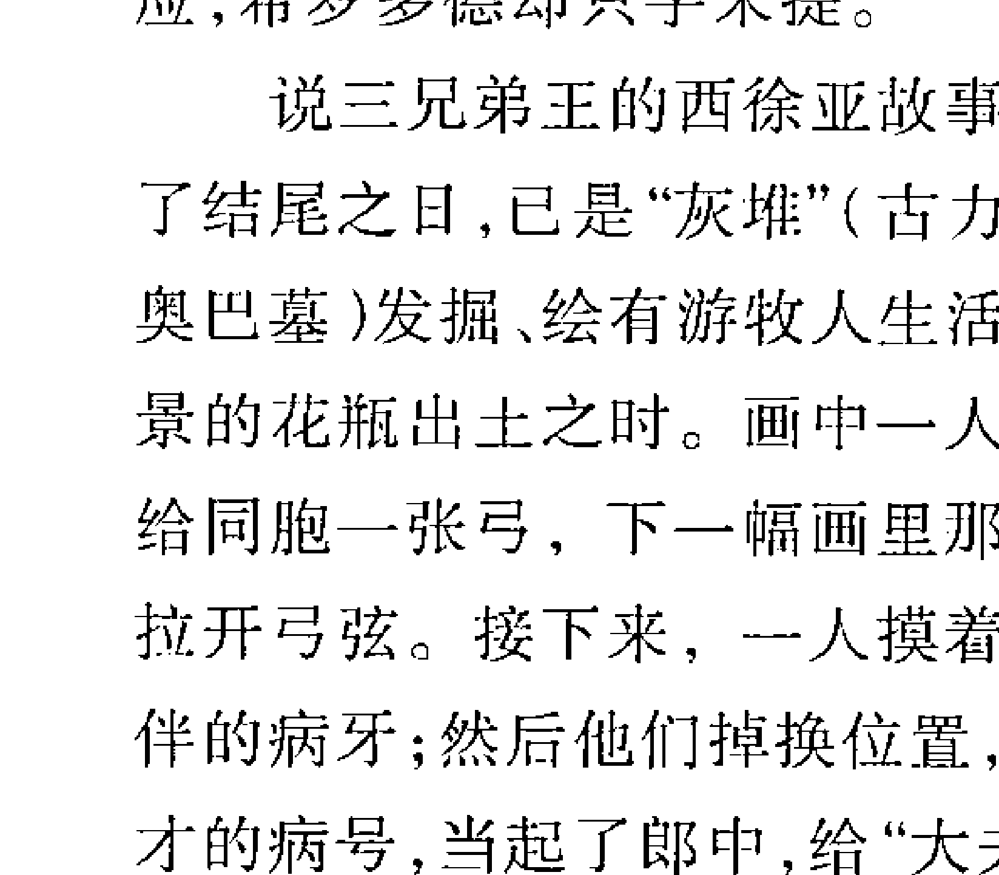
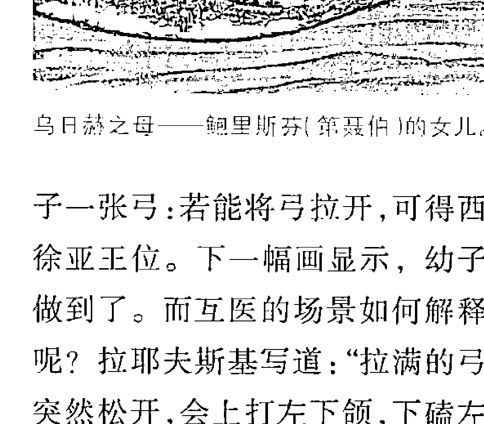

乌日赫之母——鲍里斯芬(第聂伯)的女儿。赫拉克勒斯云游期间碰见的是不是她呢子一张弓：若能将弓拉开，可得西徐亚王位。下一幅画显示，幼子做到了。而互医的场景如何解释呢？拉耶夫斯基写道：“拉满的弓突然松开，会上打左下颌，下磕左膝盖。画中的主人公所受的正是这种伤。”

没能拉开硬弓的两位兄长屈服了吗？承认失败并自动让出权力就离开了吗？从俄罗斯童话里我们知道，他们蹲守并杀害了幼弟。出土的花瓶上画着两个西徐亚人在窃窃私语，或许就是兄长们在商议如何除掉太阳王呢。故事的句号，是考古学家在索洛赫古墓中发现一枚金梳之后加上的。梳柄饰有搏斗场景：两个军人，骑兵和步兵，搏杀第三者。第三者的坐骑已然倒下，冲着他的胸膛刺出一杆长矛。这只是一个毫无特指的厮打场景吗？不，一般的厮打刻于金梳作为装饰，过于奢侈了。这是前面提到的兄长们杀害幼弟的场景。幼弟的忠实伙伴——战马阵亡了。雅利安人将马视为灵魂前往阴间的向导。不过，西徐亚人的马，是下一章的单独话题。
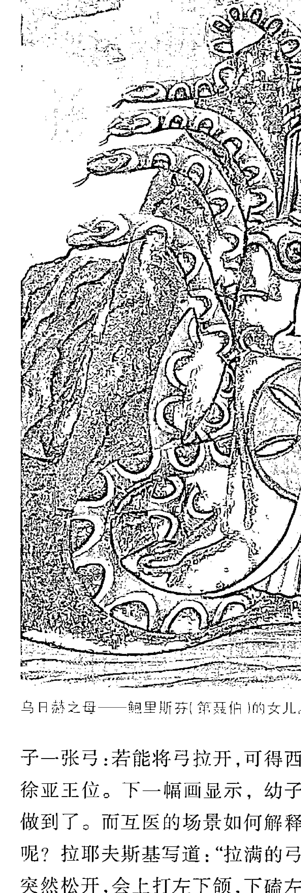

#### 烈马
不仅西徐亚的花瓶上，而且所有印欧民族的传说里，主人公身边总有一位忠实的伙伴，一种神奇的动物——马。它为主人出谋划策，帮他消灾避难，甚至让他起死回生。

马头图案，公认是强大的辟邪之物。至今还能看到俄罗斯乡村木屋脊檩两端的雕饰——简化的马头图案。为达到同样的驱魔目的，人们常往栅栏上安放许多马颅骨。关于农家马的重要性，说得最好的是俄罗斯的一个谜语：不是农夫，不是渔夫，不是匠工，不是木工，却是乡下头号劳工。童话里说，白天骑白马，红太阳骑红马，黑夜自然骑黑马。

总之，马自古就是雅利安人的主要圣物。早在公元前4千纪后半期，第聂伯河与顿河之间的，斯维亚托维特神的白色神马，根据它先迈哪条腿而判定未来事情的成败，类似的占卜法存在于所有雅利安民族中

森林草原上，人们就学会骑马了。考古发现的笼头骨件正属于这一时期。当时，对于其他民族，马仍然是种鲜为人知而稀奇古怪的东西。一千年过去，公元前3千纪后半期，苏美尔人称马为“山驴”，仅仅将其用做畜力。买它得出大价钱——八十两白银。十公顷耕地的价值！

显而易见，首先学会骑马的，不是祭司和农民，而是军人，是那些发动新石器时代革命的级别最低的公社成员。随着马的被驯化，人们离开了待惯的地方，因此出现了到遥远的地方（往往非常遥远，没有马，牧人根本无法到达）开辟新牧场的可能性……而骑手就成了一支十分可怕的力量。此外，需注意的是，雅利安人使用的是锤状斧钺。此种兵器，如鲍里
斯·雷巴科夫院士所说，不宜步战（没等你抡起砍下，前胸早中枪数十次了），而骑兵用来却得心应手：劈头盖脸砸下，必击碎盾牌头盔，甚至颅骨。因此，雅利安史诗（如《梨俱吠陀》）里，常将骑兵用战斧向步兵的一击比做晴天霹雳。

要想弄清雅利安骑兵给外族留下的印象，可将他们与哥伦布发现美洲前的西班牙征服者相比拟。征服者的骑兵搅得印第安军队人心惶惶，而神秘兵器（这里指火器）使西班牙人在土著的眼里好似下凡的雷神。因此，人马不多的几支队伍就能摧毁新大陆的数个堂堂帝国。

相似的一幕也发生于公元前3千纪的欧亚大地上。从德涅斯特河到乌拉尔山的大草原（尚不是突厥人的，而是雅利安人的），给马加鞍坠镫，动身征服世界了。这已为考古发掘，首先是为军人
的墓葬所证实。
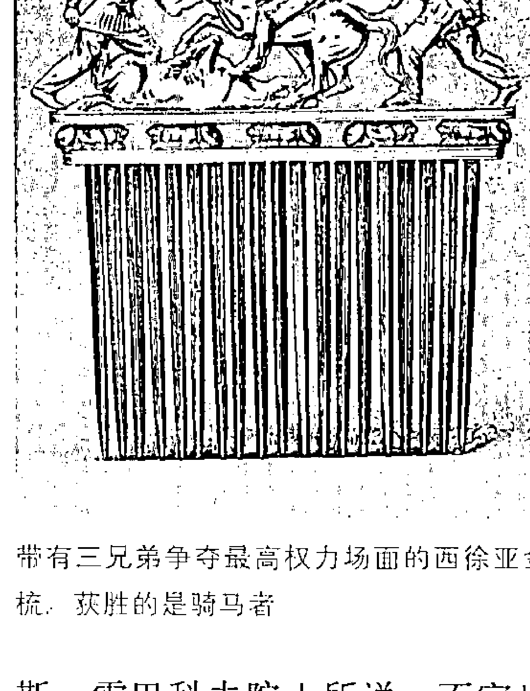
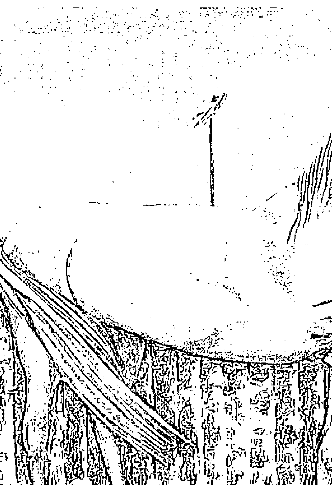

#### 烈马

黑海北岸的雅利安人安葬死者的方式是：挖好墓穴，撒上白灰（白色象征死亡），放人死者，上撒红色赭石粉(红色不但寓意生命，包括阴间，而且标志死者的社会地位——军人）。古时的墓葬非常简单：刹帝利耻于为富。种姓的贫穷也有合理的一面。有钱人没有迁移的自由，固守一处，像条看家狗。

前往另一世界，只需带上战斧和冠以马头的权杖。就是说，自古无人杀马陪葬，而随身带马是象征性的。这便是用马头辟邪风俗的由来。骑手跟忠实的朋友死后也不分离，这在关于神马的童话中也讲道：“无论地上地下，皆为兄弟拜把。”

雅利安人，无论穷富，都单独安葬。人们不惜时间精力，墓上堆起巨大的坟头。顶端竖起死去军人的雕像。这样就出现了首批“石人”。雅利安的这一传统为迁入南俄草原的其他民族所仿效。雕像特别强调刻画的是军人，手持战斧、弓箭或圆锤形权标(剑和刀出现的时间要晚许多)。坟头四周码上石块。这些石头往往都运自远方。

根据一些典型特征，学者们将这种草原文化称做古穴文化。千百年来，雅利安古穴人一直定居于草原，可突然间发生了“爆炸”，所产生的碎片飞向世界的各地。带战斧的穴葬和带有独特的绳纹图案的器皿碎片顷刻间便出现于整个欧洲：西北见于今丹麦、荷兰境内，南见于巴尔干；还见于亚洲——直至今天的蒙古；东部、南部见于印度。在印度半岛，迄
今还崇拜以锤克敌的天将因陀罗。同样使锤的还有古斯堪的纳维亚神托尔（北欧先民崇拜他远早于崇拜奥丁）。

而俄罗斯民间创作里刻画的是三色神马——烟灰枣红黄骡马：

你啊，枣红烟灰马，金鬃银点美如画！烟灰，即银白，祭司的神马(在斯拉夫世界的宗教
圣地——吕根岛上的阿尔科纳，占卜未来借助的便是斯维亚托维特神的白马）；枣红，即栗色，农夫套车拉货的役马；黄骡，即浅火红，或金鬃(太阳王科拉克萨伊的标志)，军人的战马。毛色如此神奇的三色马的主人只能是王公，三个基本种姓外加一个贱民种姓构成的民族之君王。

这就是所有雅利安民族的颜色象征意义。从雅利安民族中最后分离出来的，是骑马的西徐亚人。正是从这个意义上，可以解释希罗多德所说的西徐亚人自称“最年轻的民族”那番话。
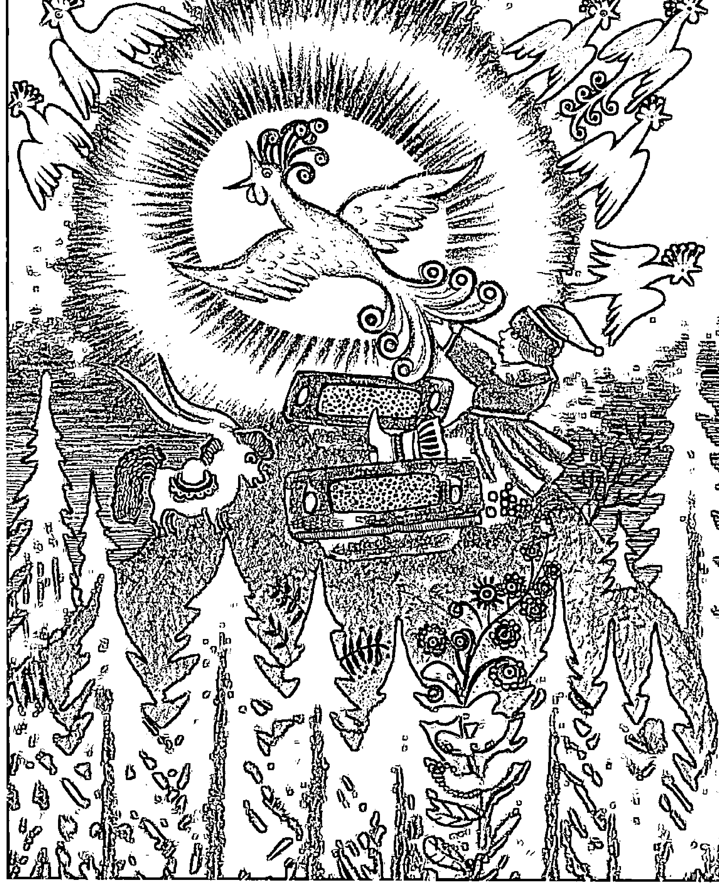
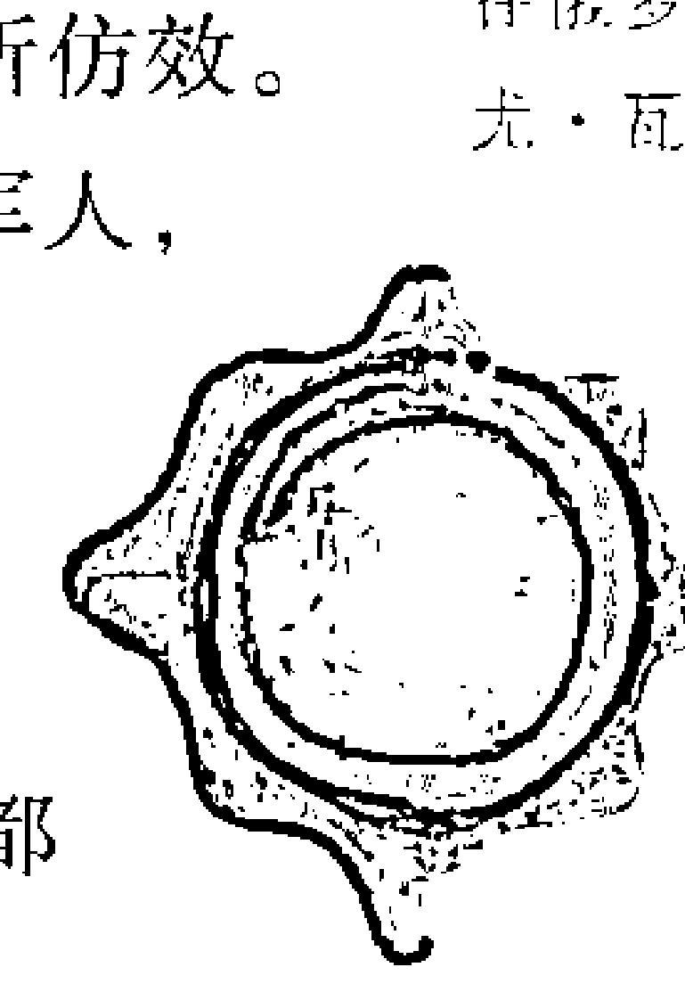

#### 叛教者的下场——忘却与死亡

西徐亚人往往被说成迷醉于希腊文明。这种认识与事实大相径庭，两位高层游牧人——阿纳哈西斯和斯基尔的悲惨遭遇可以为保证。

阿纳哈西斯，当朝御弟，没有国事缠身，活得逍遥自在……一次，他游历了许多国家，正在回乡途中，心里突然一阵忐忑不安：是害怕强盗，还是觉得难以面对族人？他渡过赫勒斯蓬托斯海峡（达达尼尔海峡），来到马尔马拉海边的基济克城。正赶上当地过库柏勒节。应当说，纪念万神之母的特点是大放纵——可以甚至必须毫不拘束并遵循一条原则：“一切原生态的都不丢人，皆可为之！”基济克人抛却礼义廉耻，纵饮无度，当众通奸。阿纳哈西斯因多日未近女色，看得两眼发直。可终究不敢造次：可否违背祖训，

参与狂欢呢？突然间，人群中出现一辆金辇，辇上有一绝色女子，头戴齿塔状王冠。“库柏勒！库柏勒！”信徒们狂呼乱叫。她一双乌眸停留在阿纳哈西斯身上，问道：“你在此何干，蛮子？”外乡人答道：“我在寻求见你一面，女神。”他自己也感到吃惊，仿佛是别人在替他回话。女神用貌似冷淡的目光打量了他一番，又问道：“你想求我赐你何物？”阿纳哈西斯扑通跪下，回道：“我仇家甚多，万神之母！请助我平安返回希列亚，我保证给你奉上丰盛的供品，教子民朝拜于你。”“好吧，”库柏勒抚掌说道，

“我帮你，顺便将奔放的激情带进你们荒漠的草原。现在同大家一起纵情作乐吧！这不也是你想求我的吗？”女神最后的话湮没在人群的喧嚣之中。金辇缓缓而去：侍从们不得不挥鞭驱赶争相死于轮下的宗教狂徒。阿纳哈西斯早被几个赤条条的姑娘搂住脖子。他一时手足无措，不知先亲哪个是好……

公元前8 - 前7世纪格里丰猎狗头形旗杆头，斯塔夫罗波尔博物馆 库柏勒—诺千金：阿纳哈西斯顺利返回第聂伯河口的希列亚。一天，他来到密林深处，衣衫脱光，项上挂起女神裸像，敲起铜钹，呼唤万神之母。此刻他活像疯子，其实……就是。

此种放浪形骸被某军士发现，立即禀报国王。萨夫利王起先不信，赶往林中，方知所言不虚：阿纳哈西斯在漫骂本族神灵，召唤异族荡妇。萨夫利王举弓搭箭，将叛教者射杀。

死，对于西徐亚人，并不可怕：它往往是获得荣耀的捷径。糟得多的是，拒绝让军人永生——不给修坟，任其在林中如枯树般腐烂。这种情况很少，实际没有。可这回阿纳哈西斯却落了个此种下场。他的名字被从族人记忆中彻底清除。知晓来龙去脉的希腊人常问：“想在西徐亚建立库柏勒崇拜的阿纳哈西斯怎样啦？”西徐亚人会不解地反问：“你说什
么？哈西思？不认识。他是谁？希腊人吗？

许多年过后，叛教者的名声也落到斯基尔王头上。严格说来，斯基尔只算半拉西徐亚。他的生母为多瑙河口伊斯特城（今多布罗加）的希腊人。父王阿里阿皮夫终年驰骋疆场，母亲常给儿子念叨希腊人创造的高雅文明，尤其跟游牧人那原始宗教信仰相较。种子落入沃土，出得预期的青苗：少年斯基尔渴望融入希腊文明，大肆诅咒规定他为草原人的命运。

一次交战中，阿里阿皮夫命丧同源部落阿加菲尔王之手。王位传与子嗣斯基尔。新王不特别好战。每次出征，来到鲍里斯芬城（今乌克兰尼古拉耶夫市）下，立刻撤下部队，独自进城，不带随从和朋友。其实，他在族人中也没朋友。

以鲍里斯芬（第聂伯）河称谓的人，是祖籍为米列特城的小亚细亚希腊人。换句话说，这是一批散居人——西徐亚草原上的希腊飞地。因此他们如磁石般吸引着斯基尔。他一进城便换上希腊人的希通，命守门人不得让西徐亚人靠近……其实，军人对国王在异族城中的作为并不感兴趣。既然他这样做，那对西徐亚必有至高意义。科拉克塞的后代还能另有他图？

可斯基尔王已将国家的福祉抛在一旁，与希腊人厮混的时间越来越长。起初他只在城中小住
几日，接着几周，然后数月。他变得连自己也觉得不像西徐亚王而更像希腊市长了。甚至在城里修建了豪华宫殿，参与酒神节的狂欢。醉醺醺的他，大摇大摆地领头满街游行，扯着脖子高唱葡萄藤赞。

士兵们在城下耐心等待。耐心终于耗尽，派人爬墙探望：国王在做什么，是否需要帮忙？他们爬上城墙，看到的是不堪入目的国王：酩酊大醉，赤身裸体，头戴一顶难看的花冠……

毕竟普通军人不能立即废黜国王，只是随他返回家乡，发动起义，推翻斯基尔，另选新国王。斯
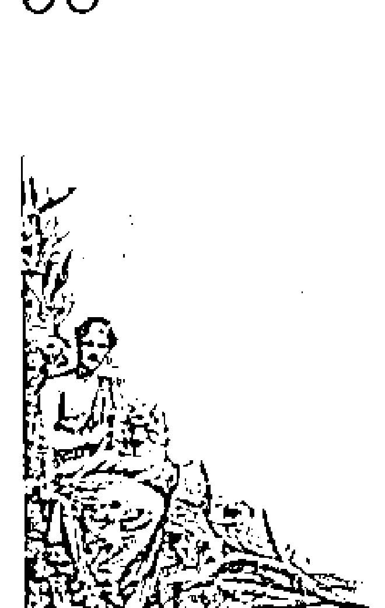
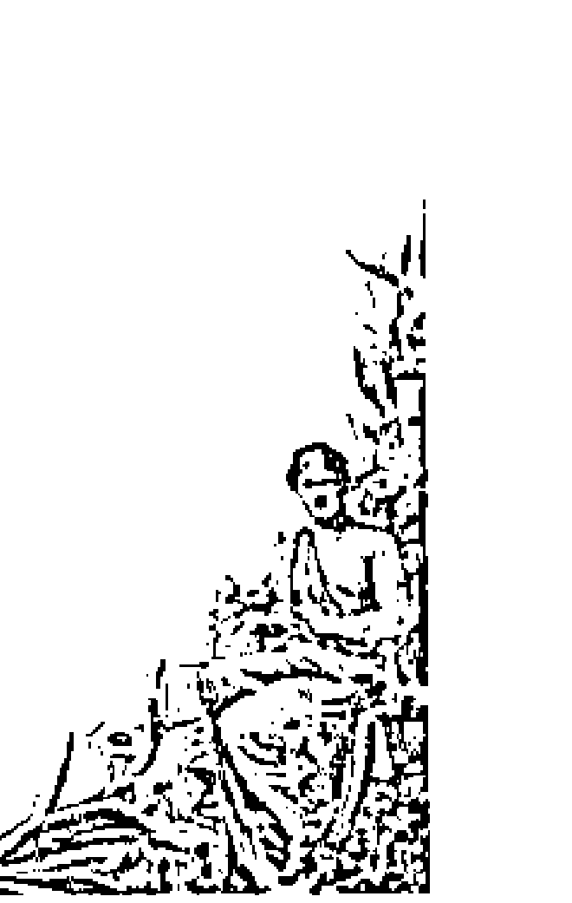
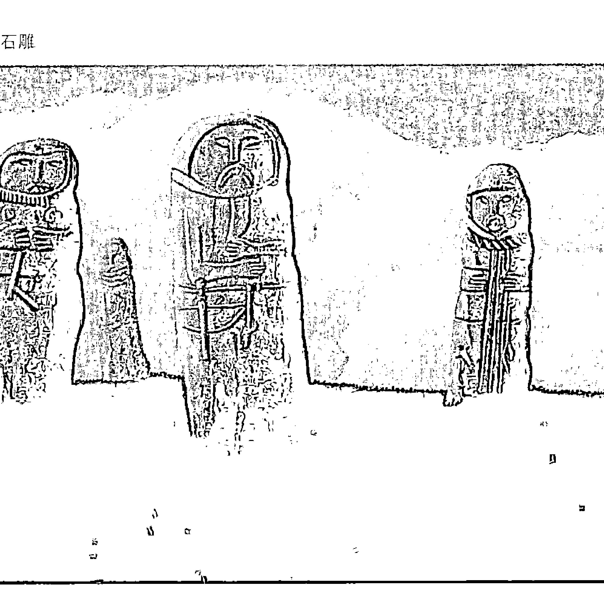

#### 叛教者的下场——忘却与死亡

毕竟普通军人不能立即废黜国王，只是随他返回家乡，发动起义，推翻斯基尔，另选新国王。斯
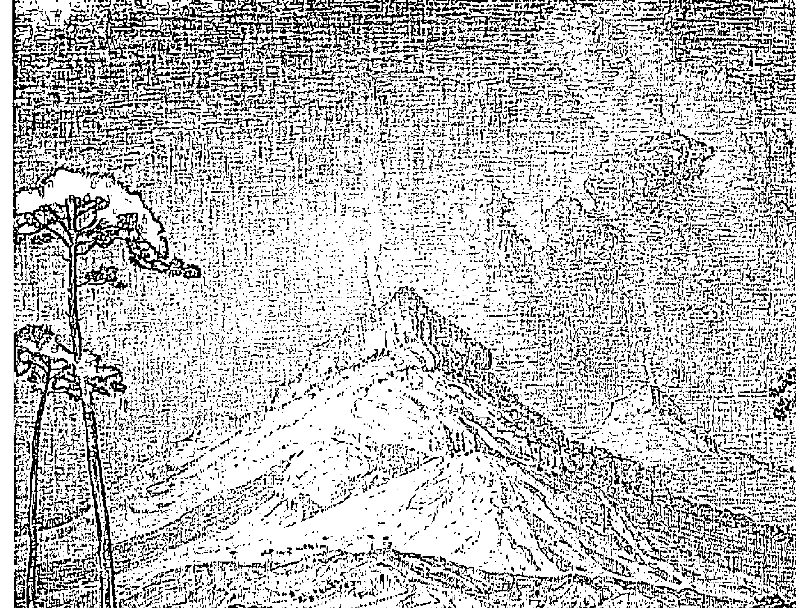

基尔秘密逃往色雷斯（希腊北部地区）。草原骑兵跟踪而至，索要叛徒。色雷斯人顺水推舟：谁也不愿为这半拉希腊人厮杀。

西徐亚人将他拖开，就地斩首。为此，希罗多德写道：“西徐亚人就这样坚守自己的习俗。对效法外族习俗者会加以这样严酷的惩罚。”

潘蒂卡派的铜币——斯塔特尔。希腊人用于同西徐亚人的结算。公元前4世纪
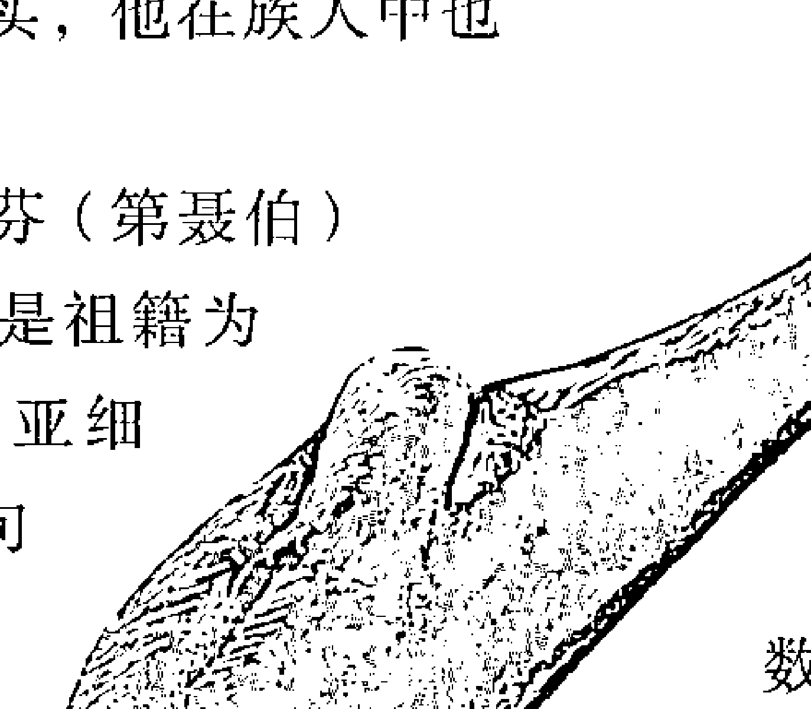
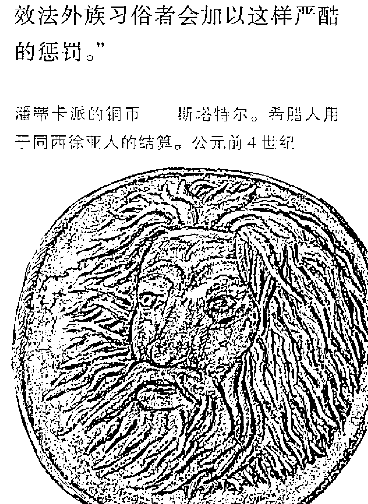

## 突厥人

### 炽热的火星

小小欧洲一直洋洋得意，坚信它才是世界文化的中心和力量的集中地，无法想象西伯利亚辽阔的大地上可怕事物的涌现力度。在不长的时期内，这里出现过一些强国……又在为生存和权力的斗争中于更强大、更狡诈对手的逼攻之下相继崩溃。被打败并逐出故土的民族或者不过是一队队骑兵，就像从大堆篝火中迸出的火星，虽渐渐熄灭于风中，但还是飞到欧洲，把惊恐万状的欧洲人烤得半死。起初是一队装备石斧的雅利安骑兵，过了很长时间，早先的恐惧已被淡忘，可又突然来了金麦里人，接着是亚洲的其他民族：西徐亚人、萨尔马特人、匈奴人、突厥人、马札尔人、阿瓦尔人、波洛伏齐人和蒙古人。他们，从金麦里人算起，都被当成来自鞑靼地狱的——鞑靼人。而摆脱无休止的人侵浪潮则被解释为上帝的袒护。总之，在欧洲人的眼里，亚洲“魔鬼”，首先，长相都
一样，其次，“野人”不可能有任何文明。 其实，游牧民族不仅属于不同的民族，还属于不同的人种。他们常常相互仇恨。相传，匈奴人杀光了突厥人。只有一个男孩，被砍掉手脚，活活扔进沼泽里。匈奴人相信：他就是不陷进泥淖，也必定失血而亡。他们扬长而去，心想突厥人从此就销声匿迹了。

然而，发生了不可思议的事情。一只母狼发现并救出了人类的伤残孩子，舔净了残肢流血的伤口，把他养大成人：先喂自己的奶，后来喂生
肉。男孩长大后，与救命的母狼结合，生下十个健壮的儿子。他们后来建立了十个部落。这些部落便是突厥民族复兴的基础。 这个传说同另一只母狼的故事有些相似。说的是亚平宁半岛上有只狼养大了被扔进河里的哥俩，也就是后来罗马帝国的奠基者——罗慕洛和列姆。所不同的是，古罗马人把这故事当了真，并在卡庇托林山上立起了母狼雕像。突厥人只是理解了传奇故事的寓意。不过，理性的解释既枯燥又不能长久，而美丽的传说才能引起听众的想象，世代流传。因此，突厥王朝曾骄傲地自称阿什纳（狼族），族人的衣服上也用金线绣着狼的侧面图像。

突厥人虽说来自大草原，可恰恰不能称其为草原人：他们住在山里，掌握炼铁技术，锻造和铸造造诣颇高。突厥人金属开采量之大，将其称为“铁”族毫不过分。他们的士兵最早穿上从颈部至胯
部的薄铁片铠甲，戴上圆形铁护心。骑士们配备角质弓箭、剑和长矛。这长矛就像万能的武器，沿用

### ‘是’与‘不’——莫要说信仰与俄罗斯人的理念奇怪地交织在一起，部分相符，部分相左。要说吐痰，我们是不能往井里，而不是不能往火里。要是炉灶里火着起来，不用水，那用什么把它浇灭呢？不能踩的不是泼洒的奶，而是掉落的面包。喝剩的茶我们是要泼掉的：留它有何用？没啃净的骨头自然不用扔——最好喂狗。这是我们的理念，若是在蒙古包里，那得尊重主人，入乡随俗，哪怕我们不习惯。还得管好自己的嘴巴。许多草原人相信，客人夸耀自己似乎会夺走主人的部分好运。这种牛皮大王就叫‘白妖’或‘黑舌’，(耳熟，不是？)因为他说的是好事，也没恶意，可自夸的结果却往往令人沮丧。这种客人一走，毡帐里会平添灾祸：孩子生疾，老人患病，常用物件不知去向，而最糟的是，主人会在街坊邻舍的眼里不经意间失去良好的声誉……谁作的孽呢？是那早已无影无踪的牛皮大王。

还有一组对立物——起誓和诅咒。两个男人起誓后成为结拜兄弟。各人割破右手拇指，互相吸去流出的鲜血。然后互换礼物：腰带、武器或坐骑。从此，即使两人反目，也无权伤害对方。成吉思汗找到了办法，命他人杀死了成为不共戴天之敌的结义兄弟。

誓言多有力，诅咒就有多可怕，人们相信它们的作用。想让恶人遭灾，只需针对他从牙缝里轻轻挤出“Tsus”(血)或“Huur”(尸体)。这足以让他失血丧命或突然死亡。

所说的对立现象的最后一组，是煮和烤。因为烤肉的一般是林中居民，也就是定居者，而煮肉的是游牧民族、草原人。古时蒙古人聚居一处，因此至今仍记得许多烤肉的方法：把动物的胴体穿在铁扦上，在火上来回翻转，或者挖个坑用炭烤，上面盖土。还有另一种方法：由开口处往皮筒里放入与烧红的石块相混的肉块。奇巧而又费事，但味道极佳！这些烤制招法由男人掌握。狩猎成功，将猎物剥皮开膛，上火烤制，实为快事；在毡帐里做不到——不方便，女主人也不允许。她一切都按自己的方法做——直接用锅煮：好吃，但没劲，缺乏浪漫情趣，大概是。所以对于蒙古人，“烤”的概念里不仅包括做饭，还有男人的自由。而所有“煮”是女性的、日常的、家庭的事。对于我们也同样：烤肉串或用刚钓上来的鱼做鱼汤。不应傲视草原人的“黑白”逻辑，因为俄罗斯文化也是建立在那相互排斥的对立原则之上的：光明与黑暗，幸福与痛苦，故土和异乡，以及构成我们传统世界观的所有其他东西。

宇宙山——七阶四面锥体(七级台阶象征七重天)，山顶上有棵可以实现愿望的宇宙树，加尔伯瓦斯，山的上方是宇宙的中心--北极星，下方则是地狱的入口

游牧人在无尽无休的迁徙期间看到的是什么呢？头顶上一望无际、永恒不变的天穹和马蹄下辽阔无边的草原。因此，对于西伯利亚地区所有民族(阿尔泰、雅库特、蒙古、布里亚特和卡尔梅克)来说，最高的古神就成了腾格里，他名字的意思是“永恒的蓝涅巴”。古匈奴人称其为撑里，中国人称其为天，甚至苏美尔人也知道这位大得没边的神，称为顶吉尔。

腾格里强大、善良并有无数的面目。他以勇士腾格里的形象统帅天军，是手执钢剑的骑士。他有“闪电般的体魄”和“雷鸣般的嗓音”，常常向他求助的是萨满。也有人把他看做“造物主”。后来人们认为这是不同的神仙，所以开始用“腾格里”表示所有的善神。善神庇护人类免受恶魔祸害，埃利希在变成魔鬼之前曾经是人

许多民族的人都认为，山里有通向空想世界的大门。康·博加耶夫斯基的画作《经典风景》赐给人畜生命能量，保证狩猎和战斗顺利，保佑家庭和睦安宁。然而被奉为神中可汗的腾格里本身并没被人所遗忘。人们认为世间所有君王都是他的影子，被神化的成吉思汗便是这天庭者宿的杰作。

腾格里的妻子，被一些民族（首先是萨彦阿尔泰的突厥人）认为是慈祥的母亲乌迈。还有谁会为人畜的健康操心呢？而可汗的妻子则被认为是智慧而美丽的乌迈的化身。

跟所有民族一样，古老的造物主渐渐为较年轻的神灵所取代，这里是指形象光辉的于尔根和面目狰狞的埃利希，人们认为他们是弟兄俩。

如果说闪耀善良和正义之光，高坐云间宝座上的于尔根一切都纯真明朗，那么他兄弟的形象正好相反。蒙古人、阿尔泰人、布里亚特人至今各自流传着有关弟兄俩的故事。

我们只介绍其中一个最富戏剧性的。据蒙古佛教徒传说，埃利希从前是个虔诚的和尚。他闭门诵经，潜心修行，终于修成正果。呜呼，强大并不代表神圣。一天，寺院里潜入盗贼，被埃利希撞见。和尚本该呼喊求援，可他决定独自对付并擒获他们。贼人发现行迹败露，决定携带赃物逃跑，忽然碰到一个瘦弱的和尚挡住去路……贼人二话没说，一刀砍下了他的脑袋。

当没头的埃利希深信自己还活着时，他是何等恐慌！他虽不会死亡，但在这种状态下生还不如死。况且他还能用某种方式继续感知周围事物。比如，他能听见，尽管相当模糊。他发现，寺院的同人对这奇怪的变态丝毫不感到惊讶。他们对此非但根本不感兴趣，反而认为埃利希就是盗贼，将他赶出了心爱的寺院。辩白，他有心无力，只好磕磕绊绊地走开。埃利希摸索着不停地往前蹭，不觉来到厨房旁边。那里刚刚宰了头牛。屠夫一斧砍下可怜的牛头，这牛头正好滚到埃利希的脚边。和尚没多想，捡起牛头就安到自己的项上。于是——奇迹发生了！他重又获得了视力、听力，还闻到了许多从没闻过的气味！

驱赶疼痛，摇了摇长角的脑袋……可耳边传来的却是那么开心而冷漠的笑声！那笑声叫人伤心透顶。顿时，一股强烈的、不可遏止的愤怒狂涛般地传遍他的全身。埃利希变成了魔鬼。他一面逃离那伤人的石块和嘲笑，一面发誓要报复，永远报复，严惩世间的冷酷无情！他怒不择路，一直往前飞跑：离人越远越好！跑了一阵儿，两腿一软，摔了下去……摔的时间很长，好像没完没了——甚至闪过一个安慰自己的念头，总会一死了之的。呜呼……等他清醒过来，已是身在地府了。面前站着的是双手叉腰、跟他一样的牛头阎魔——死神。

“我死了吗？”埃利希问，同时又为重会说话而感到吃惊。阎魔听了哈哈大笑。最后边笑边说：“你不会死呢，你都成仙了，傻瓜！”接着正色说道：“我很高兴你能来。埃利希，我等你多时了。”你应该公正地评价埃利希：他从不贸然判决。衡量过阴魂生前的所作所为，读完生死簿上阴魂在阳间的生平记录，看过人的善恶行为显示镜——在这之后他才会作出决断。虽然时光无法支配不死的魔鬼，但是他有时也像所有古老的神灵，会变成智慧的、满头银发的老者。关于老者，我们下一章再谈。

你遭受人世排斥，尝尽了阳间炎凉，从今往后就是阴魂的判官！你心里也不会有怜悯的！”“我心里也不会有怜悯？”埃利希像回音似的重复道。从此，他确实成了诺蒙汗——判官。他的伤口渐渐愈合了，额头上被卵石砸破的地方长出了第三只眼，埃利希用它可审视未来。充血的左眼他用来回顾过去，每次都会因为再次经历那些侮辱感到痛苦。用右眼俯视等待判决的人类的灵魂：下地狱，还是升天堂。

白发长者

在匈奴神话里，上帝和自然界的神灵通常都有白发老者的外貌，这说明的可不是他们的衰老，而是神圣。也不光因为白色是神圣的。首先，它意味着接近创世之初的远古时代。腾格里所造之物都是最完美的。人不是神，没有足够的智慧和耐心；他们的庸人自扰只会破坏理想的世界。因而就要设法让一切保持不变：最好的汗（可汗的简称），是对上帝确立的秩序不作任何改动的人。正因如此，也正是在这个意义上，他被称为‘圣上’、‘天子’和‘天皇’。不过腾格里还是关注着凡间代理人的生活，指导他的行为。也正因如此，突厥人生活在世界的中央并受着双重的管辖：‘永恒的蓝天’（创世主）和让上天造物保持不变的汗（人中豪杰）。

突厥可汗及其可敦（妻子），同许多民族的魔法王一样，具有非凡的魔力。作为腾格里和乌迈的化身，他们的一举一动都切实影响着子民的生活。国王夫妇身体健康、心情愉快，牧区自然繁荣兴旺。

人们感染瘟疫或牲畜大量死亡，遭遇异族或强盗突袭——你可以相信，灾难的原因应去可汗的大帐里寻找。世间的一切都取决于神和汗。他们是万能的。 编年史《唐书》中记载，传说中的阿什纳（狼）家族的祖先曾掌管过天气。他们中的一位能够‘呼风唤雨’，另一位在危急情况下拯救了同胞，‘制造温暖’而驱走了严寒。 阿尔泰人常讲英雄可汗舒努的故事：‘舒努一挥手，雨落雪飞，再一挥手，寒降冬至。’ 在‘天皇’中，成吉思汗占有特殊地位——他本人成了神和造物主。他并非不断征服别国，而似是不断再创下界的空间。《秘密传说》中讲述，他‘周游世界，一旦心血来潮，方便人们生活的土地就会创造出来。’突厥人相信，成吉思教会了他们取火，赐予他们火镰、火石和火绒。与他的名字相连的，有婚礼仪式的确立，烟草和白酒的发明，许多地名确定。甚至有个专用语：‘成吉思游’——‘成吉思环球行’，指的是创世者成吉思汗的环球宇宙行。 随着时间的推移，神的接力棒从汗的手中，传到了家族长老

汗是宇宙的中心（阿拉伯图书插图） 手中，他们有着最重要的神圣标志——白发，并实现着人与天、人与先辈的沟通。在这方面，俄罗斯学者И. А. 胡佳科夫对雅库特日常生活的研究值得注意。他在《上扬斯克地区简史》中写道：‘在当地雅库特人中间，老年人很受尊敬；‘老人’这一称谓本身是很荣耀的。雅库特人几乎用‘老爷爷’和‘老奶奶’称呼每一位神、每一座山、每一条河，甚至大块的地。称呼魔鬼也常使用这一尊号。妻子想让丈夫高兴时，就称他老公，尽管他还很年轻。’ 突厥的传统文化与古俄罗斯及斯拉夫文化有许多共同之处。他们口中的‘老人’，意思是长老、头人。斯拉夫语中‘老’的直义用
"老朽"一词来表示,而词根"老",尽管很奇怪,用于形容强壮、有力、高大的人。"老人"是家族中的"长者",必要时就是"头人"。正因如此,在壮士歌里,伊里亚·穆罗米茨始终被称做"老哥"

萨克"——最年长、最有经验的俄罗斯骑士。遗憾的是，随着时间的推移,在罗斯,"老朽"的概念被转移到"老"字上。在人世活了一辈子的老人,开始被当成年轻亲属的负担。

而在西伯利亚的突厥人那里,老人像从前一样,仍然是最受尊敬的人。他们在自己家族和组合中行使权力。作为经验和特殊知识的载体，成为本义和转义上的祭司和法师。老人把年轻些的家族成员与上天联系在一起，对他们加以庇护。同时，萨满法师通晓与阴司的沟通：原先他们是巫师。渐渐地，萨满法师取代了白发长者，掌管从天堂到地狱所有的宗教仪式。他们中间开始划分既有"圣洁的",也有人同自然界或地狱神灵之间的普通中介。关于萨满法师我们后面再谈。

而现在我们想说，突厥人对老人的敬重，对我们来说有着重要的意义。原因有二：第一，19世纪俄罗斯知识界分裂为西欧派和斯拉夫派，就俄罗斯该走什么路的问题展开了激烈的争论。问题是，不论亲日耳曼罗马的西方派，还是斯拉夫派，面向的都是同一类人，他们亲近西方而疏远或多或少是我们雅利安远支同族人的罗斯人。而面向东方，亲近原本俄罗斯的民族——乌戈尔芬兰语系民族、突厥人和拥有古老文明并与我们同住一国的高加索民族，则从来没人想过。第二，没有古老根基的新兴文明，首先是美国所鼓吹的活跃而好斗的青年文化，自然会损害与世界新图景不相协调的老者们。因此，我们想重温一下突厥人和古俄罗斯人的处世之道课，再说一句："没有过去，就没有未来。"

在许多蒙古人的意识中,成吉思汗至今仍然是智慧、权力和最高魔法的核心。古代微型精细画

神灵中的闯荡者

战斗魔法师运用魔法天赋，是在他所熟悉条件下的搏斗之时；而萨满法师常去我们看不见的妖魔世界，在对方的地界与其较量。为此必须有高超的素养，当然还需要有敢于冒险的胆量。平时他要故作愚钝，使敌对势力放松对他的警惕。此外，前往平行世界(按现代人的说法)之前必须心理放松。到那里，他一改常态，像压紧的弹簧，随时准备弹起，令阴险的魔鬼猝不及防。要想了解这一变态，只要回忆一下突厥人认为是俄罗斯萨满法师的傻瓜伊万的故事就足够了：他只是“装傻”，实际上聪明过人。

西伯利亚地区的各个民族都记得许多萨满大法师。

……蒙古北部库苏古尔湖畔，有一座石像。每个信奉喇嘛教的蒙古人都知道，这是伟大的“黑腾格里"(萨满神)达因·德尔赫，他化身为石，至今活在这座纪念碑里。

很久以前，他是世上的恶魔——埃曾。“魔头们”力大无穷，但自己的恶行一直让他们感到苦恼。他们有自知之明，知道自己无法精神上成长和改变。每个埃曾都暗怀变人的理想，因为只有上天的这种造物才能登上闪耀圣光的天堂，尽管他们弱小、易受伤害和自相矛盾。

总之，厌恶一切（地狱的黑暗、永生、自己丑陋的形体和邪恶的脾性）的达因·德尔赫决心变成人。如果愿望不能实现，他愿一死了之。一天，他跳出位于唐努乌拉山脉的洞穴，径直来到一位隐士面前，开始搔首弄姿、低声哀号、扮吓人的鬼脸——总之，自讨没趣。结果还讨上了。隐士低声念了句咒语，转身躲开令人讨厌的魔鬼，继续打坐。

咒语念罢，达因·德尔赫如遭雷击，失去平衡，摔倒在地。可当他试图站立起来时，却感到全身轻松无比，仿佛眨眼间瘦了几十公斤。他看了看自己的左手，不禁打了个趔趄，一时没认出来：指端的钩爪不见了，不知从哪生出了粉红色的手掌和像模像样的手指！达因一扭头，发现右手也一样。他还是不能相信发生的一切，习惯性地猫着腰跑到一处水洼前。他往水中一看，从那儿望着他的是个人！

达因怒不可遏，准备和陌生人交战，但突然醒过味儿来：水洼里是他自己的影子！

造人。水灌满了岩穴壁上的石洞，用泥土埋住了上帝留下的痕迹。水退了，由烧红的黏土产生了人
他终于相信愿望成真，仰天欢呼：回声不再是凶猛的吼叫，而是喜悦的笑声！不过变人之后，他失去的只是丑陋的外表和泯灭良心的凶恶，而没忘记以前的知识。他成了萨满法师。
达因·德尔赫游走四方，常进的正是急需他帮助的那些毡帐。在那里，达因·德尔赫看到的是别人看不见的情景：病魔正扑向病人！可当他咚咚敲起手鼓，那些魔鬼便大叫着，夹起尖耳朵逃跑了，而病人立刻复原如初。有时，病人半透明的灵魂已经飞得老远——人快死了。萨满法师
萨满神达因·德尔赫

忽必烈汗的座上客

1296年，热那亚人截获了死对头威尼斯人的一艘商船。这艘船的船长，商人马可·波罗，同全体船员一起下了大牢，在那里写出了在欧洲人所不知道的国度——鞑靼、中国和印度游历的回忆录。描述虽然有许多难以编造的内容，可毕竟不像是证实，然而人们还是相信了。

最有意思的要数对蒙古人的风俗习惯的描述，当年治理他们的是忽必烈，伟大的成吉思汗之后的第六代大汗。故事从在草原上出现的汗八里城里难以置信地、犹如变魔术般地建起来的宫殿开始：“……它是现在执政的忽必烈大汗建造的。他下令在城里用石头和大理石建造一座大宫殿。大殿和寝宫金碧辉煌；宫殿周围是十六俄里长的城墙，还有许多喷泉、河流和草场；大汗在此饲养各种野兽：梅花鹿、扁角鹿和羚羊……

这是帝王的冬宫，当然也有夏宫。它富丽堂皇，比冬宫毫不逊色：“在宫墙外的平原上，大汗用竹子建造了一座大宫殿；宫内涂

## 忽必烈汗的座上客.

但是这些预言家与西藏人完全无法相提并论。说起后者的法力，人们总是神神秘秘，左顾右盼。譬如像意念移物这种见所未见的事情：“这些术士被称做西藏人或克什米尔人；那是两个偶像崇拜的民族；他们的咒语和法术精妙过人；他们的所有活计就是作法…… 通过巴克西巫师们的咒语和巫术，盛满饮料的杯子能自己从地上升起，再飞向大汗。” 这些对于统治者危险而又不可或缺的人能够掌控天气，但不是整个天气，只是让皇宫的上空晴朗无云。周围有可能是大雨倾盆。在这里，马可还听说了成佛的印度王子乔答摩的故事。他还熟悉了轮回说：人死后灵魂不灭，转世重生。这种说法搅得威尼斯人心神不宁：他曾确信，人死后，灵魂不是上天堂，就是下地狱。的确，对纯洁的灵魂和高尚的行为应当报以人间的荣华富贵：诚实的农民来生会升为贵族，来生品行端正还会成为国王，再转世就会成仙。反之，如果品行恶劣，生生世世会越来越卑贱：曾经的国王贬为贵族，接着降为普通牧民，继而沦为狗，直至一条虫。当然，这一示意图被简化到十分庸俗的地步。照此说来，我们就该痛恨身边的整个生灵界，因为那都是些堕落为牲畜的人们。如果每个臣民本来就知道自己的偷盗行为会带来怎样的恶果，那就没必要花钱设立监狱了。不过在这个突厥人管理的多民族的国家里，监狱还是有的，在那里罪犯受到惩治和痛斥。但是可汗每三年大赦一次。如果说在《东方见闻录》中相当清楚地描述了佛教和中国宗教，那么关于对真主的信奉，呜呼，则不然。这里，据波罗说，听到的只是一阵阵切齿声：“……每人房间的墙上都高高地钉着一块牌子。上面写着表示至尊天主的名字；对这牌子他们每日焚香礼拜：双手上举并切齿三次，祈求天主赐给智慧和健康，除此他们别无所求。下方，地板上放着一尊神像，叫纳蒂盖，是整个大地上的银锭，曾是蒙古人在中原收集贡赋的样锭 一切凡物之神。对他礼拜的方法也同样……” 突厥人在许多方面还是忠于民族传统的，每个辞世的可汗都运往阿尔泰山安葬——那里有他们的陵寝。威尼斯人说，出殡途中所遇之人，禁卫军一概斩杀，让他们去阴间陪伴可汗。需要提醒一句，这些都是旅行家马可·波罗在阴冷的热那亚监狱写下的。在那些没一个欧洲人过早相信的遥远的、童话般的地方，中国皇帝下旨为这个对他的外交和行政委托尽心尽力并在自己不朽著作中歌颂天下的人修建纪念碑。我们认为这本书是虚构臆造的，然而，或许重要得多的是，作者本人对它的真实性深信不疑：“为使本书真实不虚、信而有征，文中见则说其见，闻则说其闻；凡读过或听过此书者，必将深信不疑，盖所记皆实情也。” 但愿我们也能实现前往至今仍不甚了解的异族文化世界的旅行。

## 伊斯兰教界

### 真主的子女

就像沙漠里会出现海市蜃楼一样，在辽阔、干旱、荒无人烟的阿拉伯半岛大地上，仿佛不知从哪里，于公元5—6世纪冒出了一些阿拉伯人的部落：南方部落(在也门)和北方部落(游牧和半游牧的贝都因人)。关于游牧文明起源的说法，在如此晚的年代听来，就像山鲁佐德在《一千零一夜》里所讲的故事。其实，那都是些荒诞无稽的事情，而阿拉伯人却是在洪水灭世之前就存在于巴林岛上的一个极其古老的高度发达文明的直系后裔。就连苏美尔人当时都已经觉得迪尔蒙是个传说了，其中的真实事件为时代的帷幕所遮掩，已变得模糊不清，开始闪现神奇的光环。两河流域文明的开山之王——麦西里姆、埃阿纳图姆、著名的汉谟拉比和巴比伦的常胜国王尼布甲尼撒二世——都认为苏美尔女神宁胡尔萨格，安乐岛迪尔蒙的“山林之主”，是自己的始母。这位宁胡尔萨格到底是谁，远古时期的迪尔蒙(巴林)岛上又发生了什么？太阳神鸟图为岛上引来了淡水，而宁胡尔萨格则借助魔法培育了八种植物。苏美尔神恩奇来到这里，见了这些神奇植物，揪来便吃，因而罹患不治之症。宁胡尔萨格一气之下，离开了海岛，让恩奇听天由命。假如恩奇不是生命和健康直接关乎自然界存亡之神，或许，事情也就如此了结了。恩奇被折磨得死去活来，动物和植物奄奄一息。事情已闹到地球上的生命完全消失的地步。面对此情此景，宁胡尔萨格的心软了下来。她化愤怒为慈悲，摇身变成狐狸，返回海岛，着手用魔法医治这只馋猫。“山林之主”依次点出恩奇身体受伤的部位（颌骨、牙齿、肋骨等八处损伤，正合所食神奇植物之数），并育出应当治愈染疾部位的一种实体。这样，她创造了宁吉——“肋骨之主”（此名用苏美尔语可译为‘生命之主’）。正如童话里的套路一样，故事的结局是完满的：恩奇康复，大自然复苏，迪尔蒙再现繁荣景象。最重要的是，这个神话的主要元素被犹太人用于创造世界和人类的故事之中。迪尔蒙变成了伊甸园，八种神奇植物变成了智慧树上的禁果。用恩奇的肋骨创造宁吉一节，被反映在用亚当的肋骨创造夏娃的故事中。而宁胡尔萨格离开迪尔蒙，则演变成人类始祖因堕落而被逐出天堂。犹太人的近邻——阿拉伯人改变了对《创世记》里那些故事的理解，岂不知这原本就是他们民族祖先的传说。不过，《可兰经》里的解读与《圣经》不一样。比如，被逐出天堂的阿丹和哈娃，为寻找对方而在下界转悠了百年。最终才在麦加（先哲穆罕默德和穆斯林世界后来的圣城）阿拉法特谷地的一座山前相遇。阿丹和哈娃在这里安了家。真主从天上送来透明宝石，阿丹端坐其上，如踞宝座。长久以来，因为人类的罪

### 十大玛拉伊卡

真主有十个助手，十个上等天使，或称玛拉伊卡。

为首的是吉卜里尔（加伯列），他教导过从阿当算起的所有虔诚信徒，常遵旨下界给穆罕默德传授《可兰经》。第二位，米卡尔（米迦勒），精通高级魔法，驱除镇尼，绘制幻方。他曾为先哲穆罕默德开胸并清洗心脏，在624年的白德尔之战中帮助穆斯林教徒对抗麦加人。第三位是死亡天使伊兹拉伊尔。他身形庞大，多足多翅，有四副面孔，身体由眼睛和舌头构成，其数量等于世上的人口总数。他知道每个人的命运，但不知他们的死期。死期一到，真主宝座旁的树上会落下一片树叶，上面写着将死者姓名。接到消息，伊兹拉伊尔应在四十天内将指定牺牲者的灵魂和肉体分离。对虔诚的信徒，天使取其灵魂时会小心翼翼，甚至温柔备至，使人根本察觉不到自己的辞世，一切似乎自然而然。而对不忠之徒，伊兹拉伊尔则毫不客气：会使劲儿将灵魂逼出罪人的躯体。对虔诚的信徒，天使取其灵魂时会小心翼翼，甚至温柔备至，使人根本察觉不到自己的辞世，一切似乎自然而然。而对不忠之徒，伊兹拉伊尔则毫不客气：会使劲儿将灵魂逼出罪人的躯体。不过也有些滑头儿，竟能与天使达成延长阳寿的交易。不过花花肠子再多，也难免一死——世上没有永生的人。

上天让真主创造阿丹之时，表现出不达目的绝不罢休的精神。为此他被赐予掌管死亡的权力。

第四位大天使，伊斯拉斐尔，露面的时候还没到。他是末日审判的信使。这将发生在救世主马赫迪短暂而幸福的统治时期之后：当自古遭禁的大耳恶魔冲破真主设置的栅栏而涌入世界，企图在人间散布死亡并饮尽底格里斯河、幼发拉底河和太巴列湖之水，伟大的先哲伊萨为击败易不劣厮并将其永远打人火狱而再次现身之时，——这才是伊斯拉斐尔露面的时刻。他会登上耶路撒冷的山峰，吹响号角，通告死者复活，接受末日审判。

不知道伊斯拉斐尔内心痛苦（他一日三次，并且夜夜都要为地狱的罪人所遭受的痛苦哭泣）的人，见了他的外貌会吓一跳。这位玛拉伊卡体形巨大，有两副翅膀，浑身长满毛发、嘴巴和牙齿。他长这么多嘴巴，只是为了向其他天使传达真主的旨意。

第五位天使，里德万，掌管守卫天堂的天使们。

第六和第七位天使，是孟凯尔和奈基尔。他们履行惩戒职能，折磨坟墓里的死人。教徒被审问过后，末日审判之前就可自便了。而不忠之徒会遭到毒打，真主想打多长时间就打多长时间。《可兰经》中说道：“但愿你见过那些不忠之徒的下场！天使一面抽他们的脸和背，一面说：‘让你尝尝火刑的滋味！’”的确，打得身上火烧火燎似的热辣辣地疼。

第八和第九位，哈鲁塔和马鲁塔，或可称为灰色天使。在天上，他们曾负责贬责人们的罪孽，因没体验过人在阳间所受的那些诱惑而往往责罚过严，所以被真主派往下界，到人间体验生活……后来他们自己也犯了戒，没能经受住凡间女色的诱惑。此外，还向穆斯林教徒传授法术和妖术。他们因而失去了翅膀，再也不能返回天堂。他们遭到逮捕并被打入巴比伦地狱，受到有损尊严的折磨和拷问。

第十位，阿扎济斯，也就是阿尔·哈里斯，远古时期曾是位圣斗士。他曾由真主派往下界弹压镇尼的造反。顺利完成任务后，天使骄傲起来。他觉得自己办成了连真主都没能办到的事。当真主要天使们向人类始祖阿丹叩拜时，他的傲慢突然爆发出来。阿扎济斯拒绝道：“我比他强！你用火炼就了我，他不过是黏土做成的！”他因抗旨不遵，被逐出天堂。天使的本性和外表变了样：他变成了易不劣厮，阴险恶毒的魔鬼——沙伊旦。

丹”，起名鞑渣尔，像所有罪恶勾当一样，以失败而告终。遵照真主旨意，魔鬼般的鞑渣尔被镇尼钉在印度洋一个小岛的岩石上。应该说，镇尼没忘记易不劣厮对他们民族的欺侮，执行主的旨意时特别高兴而精心。大耳恶魔冲破栅栏闯入世界之时，渴望复仇的鞑渣尔将统领大耳恶魔的大军，骑一头大驴冲在大耳恶魔的前面。短期内，他能占领除麦加和麦地纳之外的许多国家，不过时间不会长久。他窃据人间宝座总共不过四十天，之后就会被马赫迪和伊萨所粉碎。

鞑渣尔将设法逃往叙利亚，不过在那里等着他的却是死——下手的是两个忠实信徒。此前，他一直被缚在小岛上。这里经常有商船停靠。当地人取走货物，在岸上留下自己的产品。他们夜晚出现，所以谁也没见过。据说，统治他们的是位借助巫术获得永生的阿拉伯半岛的预言家希库。

(可兰经)里的易不劣厮相当于圣经里的撒旦。他拒绝向真主创造的人类始祖叩拜，因而受到诅咒并被逐出天堂

### 古丽娅仙女和镇尼

镇尼——真主用无烟火炼成的精灵。他们非常强壮，可以任意变化，完成魔法师的意愿

神奇造物的阿拉伯世界异常丰富多彩，远古时代，早在伊斯兰教创立之前，业已遐迩闻名。其中最美丽的造物就是忠实信徒的旅伴——救难仙女佩丽（源自伊朗语的“帕丽”），就像印度的阿布沙罗斯。她们是永恒的童女，生活在祭祀供品的芬芳之中，铺设星路，或者派遣神鸟接引天才的灵魂，以免他们迷路。可一旦发起怒来，如与镇尼争战之时，温柔可亲的佩丽也很可怕。这时，拖着尾巴的彗星和光闪闪的星星会从天而降！

的人们在上界可体验神仙生活的一切快乐。他们床上绣花被，地上丝绒毯，身上绿缎衣，颈上银项链。餐餐山珍海味，日日玉液琼浆。他们的侍从都是些英俊少年。“为奖励他们的善行”，许以“大眼睛的”夫人，她们都是貌美心善的少女，肤如凝脂，芬芳袭人，胸前写着真主和虔诚丈夫的名字。

他们在他和镇尼之间建立了亲属关系。” 同样在《牲畜》一章里说道：“于是他们为真主从镇尼中间弄来一些伙伴……” 那时镇尼被认为是神，人们为他们供奉祭品并祈求帮助：“曾有一些男人，求镇尼中的男性保护他们……” 这些精灵是在真主造人之前创造的，是气身和火身。他们具有理性，实际上能成为任何形状，可完成极其复杂的任务。巫师借助复杂的咒语可将硕大的镇尼拘禁于不大的容器之中。

与古丽娅仙女截然相反的，是另一类女精灵——镇尼出身的体形硕大的古拉(“女巨人”)。她们的长相令人极为厌恶，可是力大无比，尽管身体是幻影实体组成的。这些丑陋生物的主要任务就是祸害人类。为了伪装，她们可以改头换面，变成美女，可是只要男人稍一精力不济，古拉就会露出本来面目，发起攻击，将倒霉鬼活剥生吞。

其实，她们并不嫌弃新坟中刨出的尸体。有时，这些畜生会偷偷跟在送葬队伍的后面，等亲朋好友散去，便刨出尸体，举行令人作呕的盛宴。因而阿拉伯的许多家庭都丧事从简，以免引起古拉的注意。

男性古拉——古特鲁布——行为低调，满足于分享凶残的女性朋友们的“残羹剩饭”。

总之，镇尼是个极为矛盾的种群。在麦加，伊斯兰教创立以前的一段时期，他们甚至被认为是真主的亲戚，几乎与至高无上的主平起平坐。这在《古兰经》的《同盟军》一章里有所阐述：“于是

镇尼分为四种：易夫里斯、古尔、西拉特和沙伊旦。最恶的是最后一种——沙伊旦，即撒旦。是他们不让人祈祷，要人忘记真主，教人极其有害的魔法和巫术。追随沙伊旦的注定要下地狱。

然而，每个人一生中都有个人的保护天使和引诱并祸害他的沙伊旦相伴。

关于古尔我们已经说过。而易夫里斯是从横死者的每一滴血中自生出来的精灵。确切地说，他们是无辜受害者的精灵。主人死后，他们便开始寻找凶手，不达目的绝不罢休。一旦找到，就让他活受地狱之罪。

易夫里斯的种类特征是，半透明的身体，充血的眼睛，巨大的身量，长长的獠牙。有时他们的形象上还被加上翅膀。要想摆脱他们，只有在被害者的血滴上钉上钉子：这样就能把镇尼钉住，让他动弹不得。此外，与超自然的同伴相比，他们气力非凡。因此，遵照真主旨意，他们还为忠实的信徒和伟大的魔法师苏莱曼（《圣经》里叫所罗门）服务。

苏莱曼的天赋高于任何先知。真主教会他兽言鸟语，让风和神灵（沙伊旦和镇尼）归他辖制，开启矿源。镇尼为苏莱曼采珍珠，建庙宇，塑雕像，铸铜锅和铜碗。《古兰经》里提到：“在奉真主之命为他干活的那些镇尼之中，谁不服从我们的命令，我们就让谁尝尝火的滋味。他想要什么，他们就得为他做什么……”

他想要的恰好是——让易夫里斯眨眼间从也门运来赛白邑（《圣经》里叫示巴）女王（人说，她叫比尔基斯）的宝座，然后依原法送还。事情立刻办到了。

易夫里斯遵照真主的旨意，完成了苏莱曼所有的要求之后，又回去为易不劣厮效力。

穆罕默德开始在人间传布伊斯兰教之后过了不少时间，又向精灵传起教来。一些镇尼听了圣书之后，成为伊斯兰教徒：“……听讲的有大帮镇尼，并且说：‘我们的确觉得《古兰经》呱呱叫！它领人走正道。所以我们相信它，我们也永远不会向我们的主出卖任何人。’”而其余的镇尼仍旧站在真主的主要敌人——撒旦（易不劣厮）一边。

### 永恒生命之源

先知穆罕默德乘坐名叫下拉格的飞马升空。一夜之间，先知从麦加飞速赶往耶路撒冷，在天使长加百列的陪同下造访七重天

绝不停止，哪怕跑上一辈子。”当然，旅行所用的时间要少得多。可穆萨不敢确信这里就是从地下冒出永恒生命之泉的地方。他决定驾小船出海，亲口尝尝水的味道，看它是否真的具有神奇特性。穆萨匆忙中把鱼干——唯一剩下的食物——落在了岸边的悬崖旁。他们在海湾里转了一整天，穆萨方才觉得腹中饥饿，猛然想起把食物落在了岸上。“唉，真是活见鬼。”他想了想，便吩咐仆人掉头返航

渔船，踏上旅程。

旅伴的第一个举动就让穆萨无比震惊：趁渔夫不注意时，那人用刀在船底挖起洞来。“你这是想淹死渔夫吗？如果是，那你的做法就不可思议了！”穆萨喊道。“哎呀，难道我没说过你会因无法忍耐而责备我吗，”那人生气道，“你别把本来就不简单的事情弄得更复杂了。”

上岸后，他们走着走着，遇见一个男孩，陌生人举刀将他砍了。“你干的什么蠢事啊！”穆萨又喊道，“你何必杀这无辜之人而让自己永受地狱之苦哇？！”“难道我没警告过你，你不知真情，忍不住会用关于我行为用意的问题来折磨我吗？”旅伴提醒他。

“请原谅我的冲动，”穆萨请求道，“可你杀的是个孩子呀！谁能视而不见也不愤怒呢？不过，我发誓，无论你以后做什么，我再也不问了。如果我再忍不住，你就把我赶走好了。”

不久，他们来到一个小村庄，向当地居民借宿，可他们大喊大叫，要游方者滚蛋。陌生人非但毫不介意，反而见村里有一面半塌的墙壁，花了不少力气将它修好。“你忙活了半天，可以去讨点工钱，”穆萨说。

“你已是第三次违背诺言了，”陌生人说，“现在我们要分道扬镳了。但在此之前，我想告诉你，我在按英明真主的意愿行事。我想让渔船沉掉，是因后面有暴君追赶，他们在抢夺船只去掳掠邻邦。”

“哦，我怎知道，”穆萨带着迟来的悔恨高声说，但立刻又不解地问道：“可你又如何解释杀害一个孩子呢？”陌生人回答：“这外西拉特——通往天堂之桥，细如发丝、尖如利剑。虔诚的信徒可以通过，而载罪之人则落入地狱，火魔之口表无辜的男孩会长成一个前所未有的大恶棍。现在真主已赐给他父母另一个儿子，纯洁而又虔诚。”“就算如此，”穆萨点点头道，“可修墙我真看不出有任何意义。”“你当然不懂，我早对你说过，”那怪人赞同道，“你可知道，这面隔着两个孤儿家的墙里藏着属于他们的财宝。墙若是现在塌了，财宝会落入贪婪的邻居手中。而墙修好就能支撑到他们成年后再倒，那时孤儿就有能力支配真主的恩赐了。”

陌生人转身要走，可穆萨一把扯住他的衣袖，恳求道：“永别之前，请告诉我，你是何人？”他听到的回答是：“老夫阿尔·哈吉尔。仅有四位——伊莱斯、伊得里斯、伊萨和老夫——蒙真主恩典，末日审判之前，永生于第一肉身。就此永别吧。”

说着阿尔·哈吉尔循路而去并很快消失在远方，穆萨还在呆呆地望着他的背影。

#### 七个山洞人

真主操之在手的不光是未来,归他掌控的还有时间流本身。真主能让它停止,加速,甚至倒流。并非所有人都能穿行于时代之间,有这本领的仅仅是少数人。《古兰经》的两章——《山洞》和《黄牛》里,讲了真主的宠儿——七个被逐的少年和云游商人祖尔·基夫尔的故事。

3世纪,罗马皇帝德基乌斯在位时,费拉德尔菲亚省(今安曼)住着七个少年,他们拒绝异族多神教,开始信奉一个真主。他们过分天真,毫无隐瞒地将自己的看法告诉了乡亲。他们走家串户,一再重申：“我们的主,是天地的主,我们绝不舍他而祈祷任何神明。”

他们所受到的不是所期待的认同,而是乡亲们极度的恐慌和憎恶。由于担心这消息传到罗马总督的耳边并激起他的愤怒,或者发展成派兵讨伐,乡亲们起先纷纷谴责少年,后来见他们不想放弃对真主的信仰,于是决定将他们撕成碎块。

小信徒们为了保全性命,只得尽快逃走。他们带上一条狗,跑进沙漠。来到拉希姆(今约旦境内佩特拉市遗址),躲进山洞。长时间的奔波和饥渴让少年精疲力竭,进了安全港后,倒头便睡。可他们睡得并不安稳。那狗躺在洞口,龇牙咧嘴,不时冲着神秘的敌人汪汪怒吼几声。

过了一些时间,睡着的人醒了。其中一个问同伴道：“你们觉得,咱睡的时候长吗？”回答各不相同：“两三个钟头吧……”，“整整一天一宿”。年龄最小的伸了伸懒腰,说：“我觉得咱在这洞里待了足有一百年了！”这话引得大伙儿一阵哄笑。年龄最大的说：“这一百年间我可饿透了。咱派个人去买些吃的吧。”抓阄结果,正如所愿,该最小的去。大伙儿把所有的钱凑到一起,嘱咐小使者处处小心,不可对人说出自己的来历,尤其不能泄露洞穴的地点……

一路上,男孩儿惊奇地打量着所碰见的人:他们衣着奇特,言语难懂,人人都信奉一个真主!小使者刚把钱递给卖小吃的,那人便突然大叫起来：“你从哪儿弄来的？怎么,找到古代宝藏啦？”男孩一头雾水,说他没找到什么宝藏,是最普通的钱,昨天还用它买烧饼牛奶来着呢。卖家一听,叫得更响了：“大伙儿快来看这小骗子！他给我三百年前的钱币,还硬说是新钱！”

一群人围拢过来,人嚷狗吠,吓得六神无主的男孩呜呜哭泣。

最后有个女人安慰他说:‘你就说说,你这些钱是从哪来的?’

他抹着脸上的泪水,说出了原委:他和朋友怎样因信奉真主而被驱逐;怎样逃跑并藏进了山洞;怎样醒来,凑了钱,派他来买吃的。

"这是我们的钱,我们没偷没抢,"他最后说道。"你说的要都是真的,那你现在就该……怎么也三百多岁了,"那女人笑了笑道,"咱们去找你的朋友,让他们做个见证。"接着她又说:"我们不会加害他们,因为我们,跟你和你的朋友一样,都信仰伟大的真主!"

就这样找到了那些在洞穴里睡了三百零九年的人。他们终于等来了自己的信念成为阿拉伯世界共同信仰的这一天。"三百岁的"少年,真主万能的见证者,被带进城里,得到了生活必需品,像普通人一样度过了一生。

有七个岩穴的山洞被宣布为圣地,上面还修建了清真寺,该寺的遗址保存至今……

另一件事是因商人祖尔·基夫尔不信神而发生的。一天,他路过某彻底败落的村庄,困惑不解地耸了耸肩道:"都说真主万能,可连他也无法复原早已消失并化为灰烬的东西。"此后,他在沙漠中迷路三天三夜,最后才发现了绿洲。祖尔·基夫尔从筋疲力尽的驴背上下来,自己喝足水,饮完牲口,就睡着了。不一会儿,他睁开眼睛,听到天上传来说话声:"你睡了多少久啦?"商人一面不无恐惧地东张西望,踵摸着看不见的问话人,一面回道:"大概,一天一宿吧。""不,"一个声音不容反驳地说道,就像远处轰隆隆的雷鸣,"你睡了整整百年啦!"祖尔·基夫尔愤怒地喊道:"我到底睡了多久,我能不知道吗!"

那无形的说话人似乎笑了笑,接着又说:"要是不信我的话,那就睁开眼睛看看吧。看看你的食物,你倚过的棕榈树,还有你的毛驴……"

亚历山大·普希金对这个不相信真主力量的人眼前呈现的景象描写得最为生动:睡时后生醒来翁,棕榈凋萎水井枯,昔日草原今沙漠,稚口毛驴成白骨。者叟满面辛酸泪,颤颤巍巍低头哭……真主立刻让时光倒流——棕榈悦目如初,枯井里汩汩出水,毛驴起身嘶鸣。而祖尔·基夫尔惊奇地感觉血脉通畅、活力涌动。这才相信真主的力量,说:"我知道真主有权支配万物!"对完美结局感到满意的商人连声赞美真主的伟大,继续前行。

## 基督教界

### 五色斑斓的时代

对于时段定为5—15世纪的中世纪，不怀好意和不学无术之徒编造了许多谎言。名称里“中”的意思是处于某两个更重要的时代之间，这里指的是希腊—罗马文明和意大利文艺复兴。复兴就是重新解读古希腊、罗马及其文化，好像要绕过那些充满野蛮、宗教狂热、赤贫的平庸而无建树的时代。

其实，当时情况完全相反。自然而然的是，相继成为罗马帝国成员的一些外来民族，并非经过许多世纪，而是直接吸收了古希腊、罗马文明的优秀成果。中世纪最著名的法国诗人克雷蒂安·德·特洛阿写道：

文献古籍为我们护航保驾，科学技术无疑应功归希腊。……谦恭博学继承发扬于罗马，如今又传播至法兰西国家。有一种十分普遍的误解，似乎科学在中世纪的西欧不受重视，繁荣兴旺只是在东方穆斯林国家。12世纪诺尔曼知识分子的看法则不同。譬如，奥托·冯·弗赖津写道：“人类的威势和智慧诞生于东方，开始完善于西方。”一般来说，书在当时具有极大的意义：它正是在中世纪获得了神奇的光环。这首先是圣者的手稿。13世纪，广泛流传过圣多米尼克的故事：“一次，圣多米尼克在图卢兹郊区渡河时，不慎将书落入水中。三天后，渔夫在此下钩，钓得重物，心想是条大鱼。拖出水一看，却是圣贤之书，且完好无损，像书柜里的精心收藏。”借助上帝庇护的这种巨著自然可创造美好的奇迹，异教的文字则被用于害人的妖术。最可怕的是撒旦或他的代理于安息日所用的《妖书》。他给追随者，巫婆、巫师，每人送套袖珍本。书页为彩色：不只黑白两色，还有红色。

总的来说，对色彩和光的特别宝重，往往是对过于鲜亮的色彩的征兆。它的拉丁语名称 malum，意为“邪恶”。

矿物的颜色说明其医疗特性。黄色和绿色矿物成功运用于消黄疸、治肝病，而红色矿物则用于止血。

这不单单是些鲜艳的颜色，它们更能烘托与撒旦的黑暗对立的上帝之光。透明绿柱石，是受基督之光照耀的教徒的象征。红色缠丝玛瑙，是救世主那浓缩的血。在世界末日复活的遵守教规者的躯体，按此观点，同样应有不同的颜色：取决于他们是蒙难者、忏悔者还是黄花女。

圣物鲜明生动，光彩夺目，高雅芬芳。好人看上去正该这样：精神和外表一样健美强壮。

勒高夫写道：“外表美魅力巨大，是圣者的必备特质。善良的上帝首先应是英俊的上帝。”

人们看到的圣人亦是如此。天主教多名我会修士这样形容对托马斯·阿奎那的印象：“当圣托马斯在大自然怀抱里散步时，在田间干活的人们纷纷放下手里的活计，向他迎去，欣赏他那伟岸的身材、英俊的容貌；在更大程度上吸引人们的是他的美，而非其神圣。”

更注重培养外表美和精神美的是军人贵族。对理想的骑士形象，有诗赞道：

身材魁梧，器宇轩昂；肩宽胸阔，英姿飒爽；膀大腰圆，燕颔虎项。职业军人不单要用武器，还要用肉搏证明自己是超群的。编年史作家鲁安维尔这样赞美圣路易国王的英勇无畏和强壮有力：“请相信，这是一场精彩的战斗，因为不用箭弩，而是肉搏。”重要的是，肉搏中不可暴跳如雷，而应镇静自若：面含微笑，口吐戏言。一位目击者称：“善良的伯爵苏阿松斯基在肉搏中不停地开着玩笑，对我说：‘宫相，咱们让这些狗号叫去吧，我以上帝的礼帽起誓（这是他最喜欢的脏话），你我有机会在自家娘儿们的房里说说这肉搏的事儿。’”

中世纪还是个对比鲜明的时代。赞叹外在美的同时，人们坚信物质的、可见的世界是虚幻的。事情发展到《小花》一书所写的那样，圣方济各和胞弟鲁芬在阿西西公开裸体传教。

### 圣殿骑士

英格兰国王在1199年弥留之际所说的话，既有对东正教修士的象征性指摘（理当慷慨济困之人之吝啬，发誓清心寡欲之人的贪婪），也有对圣殿骑士的敬佩（西欧于第三次十字军远征后陷入教皇蒙昧主义，唯独圣殿骑士自豪地继续保持对崇高骑士精神楷模的忠诚）。此前八十年，1118年，十位法兰西骑士，由雨果·德·帕恩和戈特弗里德·圣厄梅尔领头，聚首起誓，建立忠于“平和圣母”的修会骑士团。他们发誓：遵循圣奥古斯丁的规矩生活；把自己的利剑、双手、力量乃至生命献给基督信仰圣礼的保卫事业；绝对服从大长老；海征陆战不避险；遭遇强敌不后退——以一当十。此外，他们还誓守童贞清贫，绝不转会。

“不属我们，不属我们，荣誉属于你。”这句话也镌刻在许多俄罗斯军功章上。罗马教皇霍诺留斯批准建立新的军人修士团，并指定制服为白色斗篷。稍后，另一教皇叶夫根尼三世添加了绣在胸前的红十字(这具有象征意义：如今白底红十字上又添加了伊斯兰新月徽，成为慈善的象征)。十字军远征的著名骑士之一，耶路撒冷王鲍尔温二世杜·布尔格(也曾是埃德萨伯爵)，把自己宫殿与庙堂相邻的部分赠与神庙骑士，住持则把从庙堂通往宫殿的街道让给他们。骑士团因这最初的驻地而得名“圣殿军”或“圣殿骑士”。十字军失掉巴勒斯坦后，骑士们将大长老的府第迁至巴黎一座坚固的建筑，人称“塔姆佩尔神庙”。从此他们被称为神庙骑士。阿方索，阿拉贡和纳瓦拉王国国王，认定“圣殿骑士”为继承人。眨眼间，贫穷的骑士变成不可思议的富翁。他们的首领所拥有的田产，分布于耶路撒冷和的黎波里、安提拉和塞浦路斯、葡萄牙和卡斯蒂利亚、阿拉贡和法兰西、佛兰德和尼德兰、英格兰和爱尔兰、日耳曼帝国和意大利——包括西西里岛。12世纪末，骑士团有骑士三万。他们几乎都是法兰西人，而大长老，依据章程，同样应是法兰西人。外在力量加强的同时，骑士团的内在能力也在提高。在高雅智慧的东方，日子并未白过：基督战士有许多都学自古文明的传承者，从他们手中获得的可能还有应用于实践的秘密学。现在人们才知道，因有了财力和才学，神庙骑士实施过对欧洲人当时尚未发现的美洲海岸的远洋考察。而且，无论听起来多么荒诞，资料证明，借助这清贫之诺，尤其是初期，由于某种原因，他们信守得十分严格：他们仅有一匹战马，修会印章图案也是两个骑士同乘一匹花马。马的毛色被用于骑士团的战旗——带黑白条纹的波塞安旗（古法语中“波塞安”意为“花马”）。冲锋时人人都高喊：“波塞安！波塞安！”旗帜上绣着十字架和中世纪拉丁文题字：“Nonnobis, Domine, sednominitudagloriam”，俄文习惯上译为：

#### 129 圣殿骑士

十字军的战马像它们的主人一样身披甲胄。它们代表令人生畏的战斗力

于亚洲人熟知的宗教实践，神庙骑士还做过行星际和恒星际的宇宙飞行。这里需要指出，只有无知者才会把意识的转移称为错觉。由此可以推测，十字军返回欧洲绝不是因为战败：骑士们离开了本不该属于他们的圣地而回到故乡，是为了给欧洲带来真理之光。当他们发现自己的祖国处于野蛮状态时，他们是何等震惊！暗中施行巫术的无知神甫所操心的只是如何发财，而他们的“宗教之子”——各等各类的修士腐化堕落上瘾，酗酒盗窃成性。那些本该为上帝传话的人，最像肮脏的畜生，只能引起人们的反感。于是圣殿骑士决定扩军，哪怕只能启迪少量的人。他们从授予称号着手，新手视同于十足的无知者和异教徒。他因从无知的黑暗中来，故而应摒弃他所熟悉的伪基督教，从零开始，全面认识真理及其复杂性。新人要完成类似异教徒的行为：拒绝象征救世主肉体痛苦的十字架，以便之后能领悟圣灵的伟大。对于许多人，动脑筋是种折磨，再没比这更糟的。报名加入圣殿军时，心想怎么都行，只要不逼着用心学习！打仗、流血、抢劫——这个拿手，光荣，神气，赚钱，别的什么都他娘多余！于是出现了叛徒，向罗马教皇和许多国家首脑诬告圣殿骑士礼拜魔鬼，夜夜饮酒作乐。教皇根本没把饮酒作乐当回事，国王们更不用说（他们自己也这么消遣的），而骑士团的财富却引起了他们的愤怒和嫉妒。人人都见过大长老雅科夫·莫雷1307年从塞浦路斯往巴黎转运骑士团公产的情形：十五万佛罗伦的黄金，光白银就有十二驮。其实，圣殿骑士的博学多才和独立自主引起了越来越多的不满。

##### 被吃掉的心

1175年，加泰罗尼亚一个落泊的德·卡贝斯坦骑士家族生下一个儿子，叫吉勒姆，他后来选择了游吟歌手的职业。

因为无以为生，吉勒姆来到家财万贯、为人粗鲁而高傲的雷蒙·德·卡斯特尔·鲁西利翁先生的府邸，表明愿为其效劳。雷蒙见少年仪表不凡，便将他留在府中。吉勒姆博得了府中人，包括女主人——美丽的塞里蒙达的好感，被指定为她的私人侍从。为了赢得夫人更多的好感，他开始为她写歌。他的努力没有白费，塞里蒙达常常望着游吟歌手，暗自

##### 被吃掉的心

午间，他和妻子一起坐在桌旁，吩咐端上热菜。他把菜碟推到塞里蒙达面前，让她品尝。等她吃完，他问妻子是否喜欢这道菜肴。妻子回答说，她平生未曾尝过这样的美味。“可要知道，你刚才吃下的是你情人吉勒姆的心！”雷蒙吼道，说着又从猎袋里取出一颗人头，放到妻子面前。

塞里蒙达鼓足勇气回答凶手道：“是的，这道热菜的确实是世上最好吃的。它对我来说无比珍贵，我此生再也不用吃喝了。” 说完，她从桌边站起身来，走向敞开的阳台门，纵身跳下……至少过了半小时，雷蒙才意识到妻子已经命赴黄泉……雷蒙的恶行闪电般迅速传遍周遭，人们无不愤怒悲恸。吉勒姆的名字排入了伟大的爱侣之列：苦恋情侣世上无数，美谈佳话民间永驻。

中世纪诗人的诗歌中充满大自然和爱情的象征

姆的所有亲属都发誓跟他以命相拼。毫无疑问，他们一定会这么干，假如不是阿拉贡国王亲自过问的话。国王立刻拿下雷蒙的城堡，活捉了它的主人，吩咐将爱侣的遗体合葬一处，陵墓则修建在佩皮尼昂市教堂的门前。这曾经是阿拉贡王国最美丽的城市之一。所有的骑士，贵妇和游吟歌手每年都会为吉勒姆和他深爱的塞里蒙达举办祭祀酒宴。 雷蒙的城堡被彻底摧毁，它的主人则在王国的地牢中度过余生。雷蒙死后，他的领地按国王的命令分给了游吟歌手和他夫人的亲属。 对他的怀见之于一些同代诗人的伟大诗篇。彼特拉克在《六个游吟歌手》中将吉勒姆和塞里蒙达

#### 克利门蒂的梦

12世纪，近东有个希腊人，叫克利门蒂。他已成家立业，买卖兴隆，生活小康。他信奉基督，但与犹太供货商和伊斯兰顾客都相处和洽。总之，克利门蒂极其普通，世间不乏其人。

一天，他做了个怪梦，好像很久以前在某个北方国家有位信奉基督教的公主，邻国的国王，异教徒，来向她求婚。这国王是位伟大的战士，已征服了不少国家。即使在梦里，也像是真事，公主那非同寻常的姿色让希腊人百看不厌，而未婚夫的粗鲁残暴让他深恶痛恶。

克利门蒂听国王劝女儿说：一定得应允这门亲事，不然他的国家将彻底毁灭，百姓会因乌尔苏拉(克利门蒂知道了她的名字)拒婚而遭涂炭。公主则因不愿嫁个可恨之人而黯然神伤。于是她想出一个办法：同意出嫁，但得推后三年，这其间要去罗马朝圣，请主教为这段婚姻祝福。

和姑娘们一起歌唱。嘹亮的歌声响彻四方……邻居们半夜醒来，破口大骂：上帝什么时候不能颂扬？非得更半夜扯脖子吼喊！其实，白天他也漫不经心满街闲逛：那两眼就像瞎子，从行人头顶上望着前方。回人的话总是答非所问，更多的是笑而不答。总之，他完全称得上是个都市疯人。他对妻子几乎公然的背叛竟视而不见。有人直言相告，他却不以为然，好像只是微不足道的小事一桩。的确，他现在全身心都远在德国城市巴塞尔，同姑娘们一起沿莱茵河溯流而上。随着时间的推移，希腊人的这种能力越来越强。他不仅能看到发生的事件，还能潜入公主的

#### 关于亚当的戏剧

中世纪早期还没有剧院，草台班子时常遭到教堂的迫害。著名学者和查理大帝的谋臣阿尔琴在8世纪警告说：“请江湖艺人唱堂会的人不知道，有多少妖魔跟随他们闯进了屋……”

人们想唱歌、娱乐，并想看到专业演员的表演。对生活执著的渴求使神职人员惶恐不安。

既然禁令和谴责无济于事，于是教堂利用剧院，允许上演宗教话剧，往往造成啼笑皆非的结果，尤其是观众眼前出现乔装的神甫之时。梅斯市造了一座“最体面的”剧院，上演《我主基督耶稣的激情》。扮演基督的是当地年迈体弱的祭司尼科尔。当他按剧情需要被钉上十字架时，因挂在十字架上时间过久而险些送命。只好让另一个“基督”顶替，也是神甫，不过扮演的是彼拉多。当着惊愕的观众，把祭司从十字架上放下，彼拉多脱下斗篷便爬了上去。当

#### 傻瓜节

卡纳瓦尔（狂欢节），从意大利语直译过来，意为“肉，你好”：斋戒就要结束，经教会赞同，可以吃荤和竭力狂欢了。巴黎神学速成学校认为百姓放纵是必要的心理缓解：“葡萄酒桶若不时常打开小孔而放入空气，它就会爆裂。我们人就像箍得不好的木桶，会因为智慧的葡萄酒而爆开，如果智慧之酒一直处于对上帝的景仰和恐惧的发酵之中，那么木桶就会爆裂。应当给酒来点儿空气，以免它变质。所以我们允许自己在特定的日子里耍耍活宝，为的是更加虔诚地信奉上帝。”

讽刺作家卢奇安的遗训，应当：“节日期间，公事私事通通放下……只有厨师和面包师应该坚守岗位。人人一律平等，不分奴隶和自由民，也不分穷人和富人。发火、生气、吓唬，一概不准……除了有趣的嘲讽和玩笑，不得有其他言论。” 中世纪欧洲最有名的，是碰上谢肉节的纽伦堡狂欢节。这里狂欢的主要筹划者是卖肉者行会。他们应组织传统的“申巴特赛跑”（申巴特——傻瓜之王），像化装游行或假面游行。最先出现的是“傻瓜船”或“魔鬼船”——相当大的帆船，装上轮子，由马牵拉，更常见的是由小丑拖拽。帆船甲板上所做的事情，应当单说。傻瓜们带着硕大的人造阳具，裤子拉下一些，露出下身，这同时又是极好的箭靶，不过想射中这摇晃不定的屁股可不容易，不信你试试！那里还有一

"特定的日子"在信奉天主教的中世纪西欧是：圣斯德望庆日——12月26日，圣若望圣使日——12月27日，诸圣婴孩殉道日——12月28日，新年——1月1日，主显节——1月6日，这些节日同现在的圣诞假期基本吻合。复活节也要疯狂庆祝。按照罗马

谢肉节讽刺模拟作：傻瓜给小丑做愚蠢至极的讲座

民间节日的主要仪式——“傻瓜游行” 头穿神甫教袍的驴，或是戴驴头面具的小丑在向滑稽的“箭靶”鞠躬做弥撒。化装人群中还混杂着同人一般高矮的木偶，根本无法区分哪是真人，哪是木偶。 当然，还有许多假学者。一位戴着黑贝雷帽的神学家，一面做手势，一面像看经书似的望着游戏板，想给那些像挨了刀似的拼命叫喊的鸟首魔鬼解释什么。一位天文学家用装得满满的夜壶测算船的坐标，告诉化装的“水兵”——人鱼、海豚、龙虾：船该朝哪里行驶。 炮兵往炮膛里逮到什么就填装什么——纸片、带子，要不垃圾，把这些“弹药”射向疯狂的人群。围着“傻瓜船”的市民中还有一些身量硕大、面目狰狞的狂欢巨人。娱乐方式更多的是从大口袋中抓出小孩儿（侏儒或木偶）并吞食他们，把众人吓得要命。将巨人外壳抛进火堆之前，藏在

#### 安息日

自古以来，在金牛座作用下的5月，人们都会祭拜自然界的角神。自基督教在欧洲获得统治地位以来，纪念半人半羊的潘、温厚和善的韦列斯、斯堪的纳维亚的山羊之主托尔神、凯尔特角神塞尔农诺斯以及美丽的自然女神弗洛拉和迈亚的多神教庆祝活动均被禁止。但一下消灭几千年来形成的风俗是不现实的。人类本身也是地球整体生命活动的一小部分，不能为了精神而消灭身体……因此，很多欧洲人继续秘密祭祀天神和自然神灵。如果说在大陆东部这些信仰很大程度上改变了宗教仪式，那么在西部则完全是另一番景象。

一些偏远的地方，其中最有名的是德国哈茨山脉的布罗肯峰。据传，4月30日夜间，即以圣沃尔帕吉斯的名字称谓的女巫狂欢之夜，这里热闹非凡。是否真的有过这些聚会——不得而知。巫术史的研究者罗兹玛丽·埃伦·吉利在《女巫与巫术百科全书》中写道：“女巫们聚会狂欢，而聚会的特点是与会者的淫荡行为，这一见解是猎巫者的臆造。”

天主教神甫坚持给教民灌输撒旦的思想：基督教徒必须同时相信圣三位一体和撒旦。但是要找出撒旦耍阴谋诡计的证据，于是证据被发现于保存下来的多神教仪式中。顺便还完成了另一个任务：将传统信仰以某种不可思议的方式与犹太教结合在了一起。1335年在图卢兹首次举行的巫师聚会被称为“安息日”（每礼拜的第七天，上帝让犹太人“放下所有工作”，虔心祈祷和静思）。这一名称从15世纪开始通用。有人以为过安息日时常是在犹太教会堂。可是越来越经常给他们规定的是

即有暴力倾向的修士，为实现自己的性幻想，常常对受害者悄悄叽咕过许多他们想看到和想感受到的东西。在询问笔录中充斥着“黑色弥撒”和淫乱场景。不排除有人不仅相信这些晦暗的故事，还想把它们变成现实——禁果总是甜蜜的。很多证据表明，基督教神甫不仅是女巫狂欢夜会的参与者，而且还是策划者。他们披上公山羊皮，戴上有角的面具扮成撒旦，这撒旦身边就展开了主要的巫术活动。此外，有诬陷的现实危险。任何人都会向调查者指证不合心意的人，这人就注定受折磨而死。辩护者只能去敌对营垒寻找，寄希望于神甫们所说的撒旦存在，他会帮助忠实的奴仆。不应忘记任何时代都有容易轻信的人，特别是中世纪。即使他们未必敢于亲身体验诱人的基督教产生前的一些节日变成了安息日——撒旦崇拜

#### 在布罗肯峰上

抹好油脂，跨上适于飞行的物件，子夜时分飞向狂欢集会。着陆地点很清楚。长篇巨著《女巫》的作者，多米尼加神学家巴托洛米奥·斯皮纳确认，集会在“多神教祭拜诸神的地方”进行。罗兰·维伦纽夫在《狂欢集会和巫术》中说：“也就是紧挨史前巨石建筑，在古代庙宇的废墟里，水体旁，引起当地农民恐慌的‘被施了魔法的密林里。”意大利魔法师和巫师相聚在罗马斗兽场或贝内文托公国的沼泽上。法国女巫纷纷奔向小城多姆山附近的山头上，那里曾经有座墨丘利神庙。在尼德兰，她们汇集在海岸边；在弗德兰，集会地点就叫“海怪”。西斯拉夫女巫径直飞往布拉格近郊的少女山，她们的东斯拉夫姐妹着陆在基辅雷别基河边连绵的雷瑟耶戈雷山。而德国的“女鬼们”则飞往布罗肯峰——哈茨山脉的最高峰。

飞行油膏由大麻、乌头和颠茄熬制而成。意大利女巫这时边涂抹边念叨：“油膏，把我带走，让我飞得比风还快。” 香脂、油膏和其他神奇膏油，女巫们通常在狂欢集会“正式部分”开始之前进行交换。在这等待其余参加者到齐之时，借着插在地上的黑烟滚滚的火把的微光，她们三五成群地交流着最有效使用魔具的经验。魔鬼将首次参加秘密聚会者打上记号，并分发油脂和药粉。药粉颜色各不相同：白色药粉可以解灰色药粉的毒，而黑色药粉的毒则无药可解。魔药含有五种成分，其作用既有治疗的，也有致命的。其成分有：毒草、尸毒、酒精、毒虫、人体器官……莎士比亚在《麦克白》中描述

就是这种汤汁：沼地蟒蛇取其肉，脔以为片煮至熟；蝾螈之目青蛙趾，蝙蝠之毛犬之齿，蝮舌如叉蚯蚓刺，蜥蜴之足枭之翅，炼为毒蛊鬼神惊，扰乱人世无安宁。

在这个“烹饪序曲”之后，魔鬼或他的貌似大黑山羊的助手端坐在宝座上，向集会者致辞，号召他们摆脱禁锢，去做教堂禁止的一切：强奸、近亲乱伦和兽奸，也就是所有满足性欲的方式。作为交换，他使女巫长生不死。魔鬼说：“我是真正的上帝！你们可以看到我、感觉到我的存在。如若愿意，还能触摸到我。要说别的上帝，这绝无可能！” 他的话不时被满场的叫声所打断：“先生，救救我们！” 人们规规矩矩地画着十字，但必须用左

手，反方向。他们践踏着十字架，把从教堂抢来的圣饼撕得粉碎。 这里需要做个恶魔存在现实性的插叙。集会上的一切只是假象和幻觉，许许多多记录的事件都可证明。比如，有个市民跟妻子一起去了布罗肯峰。眼前的一切都没让他感到不安，唯独开宴时端上的那些不放盐的菜肴。市民向在场者讨要咸盐——他不知盐在集会上是禁用的。对新来的人还是破了例：给了他侏罗山采的粗盐。这个爱吃点儿咸味的人如愿以偿，舒了口气：“感谢上帝！”“上帝”二字刚出口，所有与会者和摆满丰盛食物的桌子便消融在黎明前的烟雾里，而市民则发现自己一丝不挂，冻得瑟瑟发抖，历尽艰辛和羞辱才回到家中。

狂欢集会的沉闷仪式过后是酒宴。食物，如许多与会者所说，虽然丰盛，但口味极差，不仅因为没盐，还因为不知名的配料气味难闻。不过也有例外。英国路边酒馆或农场里举行的狂欢集会，目的就是吃饱喝足。人们大嚼炖

在漆黑的夜晚，谁也看不清楚。 在北方，啤酒更受欢迎。而且对这种低酒精度的饮品还流传过一种说法，狂欢集会上的啤酒往往被偷换成撒旦的尿，权当给所有与会者洒洒圣水。 早上，他们悄悄溜回家。有些会变化的，披上狼皮穿越森林，有些则穿过他们子夜飞来时所骑的管子回到家中。家里人装做没看见这些怪事，也可能以为自己的亲属是刚幽会归来呢。

在欧洲的南部和中部，狂欢集会上，用造型淫秽的樽和高脚杯（器皿壁上刻画着所有能想到的性爱方式）喝一种特殊的葡萄酒：非常黏稠，有股怪味。有人认为可能是血。是否当真，很难说，

女巫圈舞当中站的不是反基督的撒旦，而是希腊的冥界女神赫卡特

圣母大教堂的怪兽装饰中，这位最能反映飞行女巫的形象

#### 沃尔帕吉斯之夜和其他狂欢夜

“狂欢夜究竟起源于何时？” 这个问题的答案里，含有古代大自然的全部历法，天主教教堂一直也没能将它取缔。教堂只是适应了生活的传统周期，在这些日子里安排了自己的节日，而这些节日本该取代那些古老仪式的。这些白天和黑夜有时相吻合，有时也不尽然。

大狂欢举行的时间为：2月2日母羊新奶节，即英比尔卡节、圣烛节；4月30日沃尔帕吉斯之夜，即篝火节；7月31日拉马斯节，即丰收节；10月31日萨温节，即万圣节。

每年还有四次规模稍小的集会：冬至(12月22日)；春分(3月21日)；夏至(6月22日)；秋分(9月21日)。

母羊新奶节是冬季洗礼仪式和火节。英比尔卡意为“在娘胎” 巫婆和巫师会变成“怪”兽——大多变成狼和猫，少数变成熊。从他们像“人”一样弯曲的后腿和若有所思的眼神中可以认出未

里”,反映生命育于大地之母腹中的思想。无生界和死亡之海的黑暗中好像燃烧着象征未来喜悦的微弱火光。这天，是天主教徒的主进堂节，也是圣布里姬节。信教者手持燃烧的蜡烛游行，又称圣烛节。

在英语国家里这天又是土拨鼠节。据迷信说法，这天肥胖的懒汉嗅到春的气息，要探头看看洞外。

沃尔帕吉斯之夜是凯尔特人最主要的庆贺阳光的节日之一。这一夜，冬季大王和五月王后相聚。人们为他们的结合而欣喜若狂，跳跃篝火，围绕象征丰产的五月树舞蹈。围绕篝火顺时针转一圈的人，会获得可受用一年的活力并摆脱缠身一冬的病魔。

当然，这是人类的节日，而更大程度上是自然神、仙女和与其关系密切的巫婆们的节日。她们组织森林聚会，一般人最好不要偷看：各有各的隐私。要是哪个好奇心过重的农夫到底还是闯进了巫婆们的圈子，那就不要抱怨无法脱身了。

人们都千方百计保护自身和家园不受“狂魔”侵犯。住在条顿堡林地区的德国人为驱赶女妖而抽打长鞭。在立陶宛，5月1日前夜，公羊和母羊都要赶进同一圈里，让女妖无法在大群牲畜中找到长角的坐骑，不然它会被折腾得筋疲力尽。瑞士人闹得鸡飞狗跳，乒乒乓响，为的是驱散冬天的

恶魔,唤醒春天的善神。

拉马斯(Lammas)节之谓来自古英语的“面包”(loaf)和“弥撒”(mass)。后一术语的身世特别有趣。起初这样称谓多神教传统的丰收节。后因讨人喜欢，被天主教界广泛使用。

这天，人们特别关注的是熟苹果和冬小麦，用面粉做成大圆面包，再拿到教堂去圣化。此外，这天还要清偿所有债务。德国人缅怀“老沃丹”(斯堪的纳维亚人管多神教众神之主叫奥丁)，歌唱田野女神——“黑麦神”,缅怀“谷物女神”(希腊人称之为刻瑞斯)。

受特别尊崇的是成熟色——红色，它同时象征魔力。因许多德国童话而家喻户晓的“霍勒夫

人”又叫“红大娘”，人们对红棕色头发的人格外敬畏——万一他们是阴间魔鬼的宗亲呢？

萨温节是古凯尔特人的迎冬节，象征与生命告别。这时，阴阳两界之隔变得特别薄，祖先有可能来探望他们的后代。在阴魂面前不应恐惧，而要热情迎接，并准备特制糕点。

迎接即将到来的冬天，需要做好充分的准备。将未必能越冬的病畜屠宰，将肉熏好以备过冬。人们竭力摆脱自己的弱点。“磨炼性格”的一个神奇办法，就是把自己的弱点写在纸上，然后烧掉。精气神一旺，他就可以大胆地迈入人生的艰难时段了。

10月31日，德国人和奥地利人庆祝圣沃尔夫冈节。为摆脱疾病，需要钻过一条窄缝(树洞或岩缝)。钻过窄缝，恶魔似乎就从身上“脱落”了。这天，基督教教堂欢庆万圣节。

冬至是一年中黑夜最长的一天。自然女神醒来，得知怀上了

太阳神。虽然离分娩还有很长时 间，但毕竟有了盼头，这一天终将到来。到时便可欢呼：“太阳万岁，黑暗滚蛋！”这天，西方基督教徒庆祝圣诞节。

春分是一年中昼夜平分之时。古人相信，男人体现邪恶，女人体现善良。这天，世上善恶数量相当。而主要的是自然女神分娩——天上出现她的儿子，太阳神。他一天天积蓄力量，亮光越来越强，在他的照耀下一切生命渐渐恢复活力。这天，基督教徒庆祝复活节。

夏至是世间所有民族最主要、最欢乐的节日。这天会有许多大事发生。一年中最长的白昼来到前夕那最短的黑夜传统上献给魔法，像是瓦尔帕吉斯之夜的写照。这时，自然界众神和巫婆们都显得格外活跃，许多都在夜色中飞翔。

人们在这一天还有事要忙：点燃火轮并从高冈上滚下，为太阳引路。自然女神的光芒之子已经成年，这表现为五谷丰登，六畜兴旺。这天，基督教堂庆祝约翰施洗者日。

秋分这天万物必定恢复原状，昼夜平衡，恶善数量也随之均等。从此恶将日益增多，善如春雪逐渐融化，想来不免伤感。然而祸福相倚：这时灵魂与永恒相邻。古人相信，这几天膜拜得墨忒尔及其正要返回丈夫冥王身边的女儿珀尔塞福涅，他们便能感悟永生真谛。

茄——一种有毒植物，巫婆们用它制备毒剂

已经成年，这表现为五谷丰登，六畜兴旺。这天，基督教堂庆祝约翰施洗者日。

诱惑。魔鬼向人兜售短暂世界的诱惑

#### 开始新生活 ……

人类命运之轮转动，历史伟大进程之新时代的开创，都可能始自一件看似不起眼的小事。

1274年春，五月节这天，佛罗伦萨的富翁波蒂纳里宴请乡党。其中有阿利盖里一家。趁大人们在议论那些枯燥无味的话题，孩子们玩儿起了游戏。

就在这里，阿利盖里十岁的儿子但丁，头一回见到八岁的比特丽切·波蒂纳里。当时人们并没叫她象征美好的大名比特丽切，而直呼其小名：“嘿，比切，你在哪儿呢？快来呀！” 玩儿得正起劲儿的她，脸蛋绯红，满屋子跑个不停。在一片忙乱和叫喊声中，唯有但丁呆立不动。

过了很久，他在《新生活》一书中描述了1274年5月那一刻的心境：“有生以来，世界已天翻地覆了九回，只因我眼前一再出现心仪的女士。许多人都叫她比特丽切，但并不知道就该这么叫。”

两个邻居的孩子见面后，小阿利盖里似乎尝到了初恋的滋味

意大利诗人但丁·阿利盖里(佛罗伦萨版画)

但丁《地狱》之歌Ⅶ的插图。吝啬鬼和挥霍者在地狱的第四层

味。那有什么，这是常见的事。可但丁不只是喜欢上了这以前也见过的漂亮女孩。他眼前出现的仿佛是位天仙，对她的印象非但没被岁月磨灭，反而更加鲜明，成为诗人唯一的生活目的，直至生命结束。身后也不会改变。

那时，十岁的他已看到人所看不到的东西：“她一身红装高雅清纯，装束打扮至当其龄……从此情深意切，难以自制，常往找寻比特丽切，只见其容貌风姿端庄若此，非荷马诗句不可形容万一：‘不似凡人之闺爱，定是天仙下界来！’”

肉欲的闪念。在当代青年看来，这怪之又怪。他们对纯贞的快意毫无兴趣，习惯于尚未感受到爱情便想占有对方的身体，觉得另一种爱法之人实属罕见，地道的怪物！” 爱死相依：死神紧随爱神。1290年，比特丽切的父亲福科·波蒂纳里突然辞世，但丁不胜惶恐地意识到一个简单的道理：波蒂纳里之女有一天也会离开人间！

一时间，年轻的阿利盖里犹如魔鬼附体，出现可怕的幻觉。

“当时我神志不清，”但丁说道，“分明看到几个未缠头巾的女人，说：‘你也会死！’接着出现各种幽灵，样子十分可怕，对我说：‘你死啦！’我顿时觉得太阳黯然无光，星星喳喳哭泣。从头顶飞过的鸟儿摔死在地上。大地剧烈地颤抖。这时来了个朋友，对我说：‘难道你不知道？你那惹人喜爱

的太太走啦！’
这已非幻觉。有何办法呢，人总有一死。薄伽丘在《但丁生平》中说道：“美丽的比特丽切芳龄不足二十五岁，就按上帝的旨意脱离人生苦海，因为她那至高的品德而获得奖赏。这一损失令但丁肝肠寸断，他的许多亲友不指望他能恢复平静，只有等死。他白天当黑夜，黑夜当白天……眼泪流尽，五内如焚，瘦骨嶙峋，蓬头垢面，失脱人形……”
比特丽切刚一落葬，阴魂进入天堂，那极大的痛苦顿时缓解了。但丁康复后承认：“看到为死者举行的哀悼仪式一一做完，我觉得仿佛回到了自己的住所。那疯劲儿瞬间消失了。”
哦，这绝不意味着但丁忘记了去世的比特丽切，他只是在与心上人相聚天堂的期待中获得了继续活下去的机会。

接着便开始了导致被逐出故乡佛罗伦萨的政治家和诗人的动荡生活，以及《神曲》开篇所述的“中年”转折。地狱之行描写得十分真切，意大利的母亲们常常吓唬自己的孩子，指着阿利盖里说：“看哪，他下过地狱！”
但丁也有过一段不可避免的婚姻和毫无乐趣的家庭生活。但主要还是对比特丽切的思念，不止一次地与她在梦中相见。她带他漫游过光芒四射的天界。
著名诗人和众多子女的父亲辞世的日子来到了，此刻再没过去那种面对死亡的恐惧：终于能同比特丽切长相厮守了：
头戴橄榄花冠，
上罩洁白面纱，
外披翠绿斗篷，
内着火红裙衫，
纵然离别有年，
不看亦知是她。

每当伊人出现，
难禁魂魄震颤，
秋水魅力无穷，
旧爱威力巨大……
后来他又返回了人间，告诉儿子雅科珀《神曲》的最后几首所藏的地方。这最后几曲的结尾就是“驱动太阳和星球的爱”。
雅科珀讲述了这次见面：“父亲去世后的整整八个月，一天凌晨，他来到我面前，一身雪白的衣衫，满脸非尘世的亮光。我吓了一跳，问父亲：他还活着吗？只听他回道：‘是的，活着。不过我现在过的是真正的生活，跟你们的不同。’”
纯洁爱情的魔力高于宇宙中的任何力量，它赐给永恒的生活，是新时代世界观的基础，这个新时代就是我们所说的文艺复兴。不过，说是爱的复兴，似乎更为贴切。

但丁和比特丽切在仙界相遇。他们一起升上了天堂之巅

## 文艺复兴

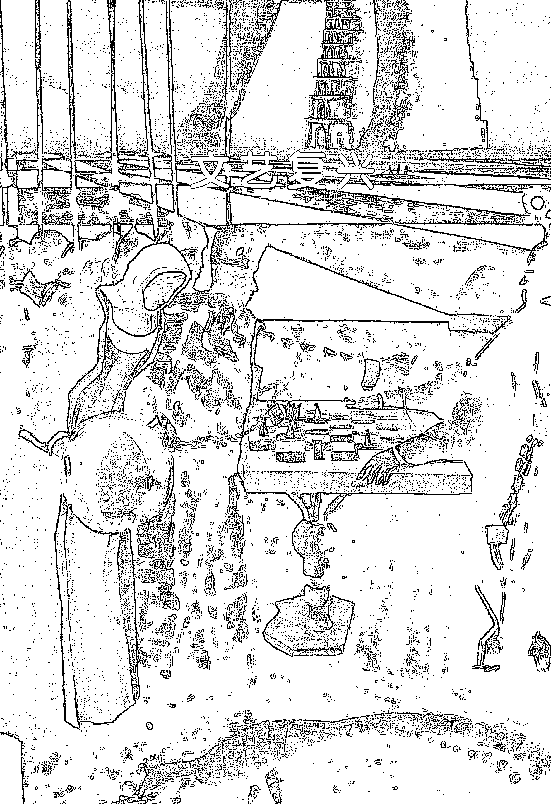

### [奥卡姆剃刀]和[比里当驴]

中世纪及其后的文艺复兴时期的整个历史，都伴随着紧张的脑力劳动和“现实主义者”与“唯名主义者”之间的争论。长久以来，先哲们一直试图解决关于存在的基本问题：周围物质世界是我们的感觉，还是真实客观的存在；如果不可见的上帝真的存在，那么怎样验证其存在的真实性。这间“思维实验室”造就了许多大人物，其中包括：苏格兰人邓思·斯科特斯（1266或1270—1308），英国人威廉·奥卡姆（约1285—1349），法国人约翰·比里当（生年不详，约卒于1360年）。三位大学者都是唯名主义者，方济各会修士，并有依次师承关系：奥卡姆师承斯科特斯，而比里当受教于奥卡姆。他们是教皇蒙昧主义的死敌，因而受到迫害。他们都曾就职于欧洲精英的“圣地”——巴黎大学。

他们哲学观的实质很复杂，所以我们仅举两个例子：一是“奥卡姆剃刀”，二是“比里当驴”。威廉·奥卡姆一向怀疑上帝存在的花言巧语。“花大力气做小事不值得——割鸡焉用牛刀”。也就是说，不用去猜测天上有无上帝，时候一到，我们自会知晓。最好先是把现实世界弄清楚。如果我们“缘木求鱼”，终将一事无成。由此得出结论：“得去掉多余的东西！”这种思维准则就得名“奥卡姆剃刀”。为此，著名哲学家波特兰·罗素在《西方的智慧》一书中写道：“后来几个世纪，研究科学方法论的先哲们都按自己的理解诠释过这一原则。‘奥卡姆剃刀’逐渐成为他们思维的经济原则。如果诠释

### “赞美我最爱的人”

约翰·兹拉托乌斯特主教将圣母领报节称为第一节和一切节日之根。这一天，天使长加百列通知不久前与约瑟夫成婚的圣母玛利亚，她将由圣灵感孕生下用爱的力量拯救人类的上帝之子。因而这一喜讯所说的不仅是将诞生基督耶稣，而且是人间将出现如但丁所说的“驱动太阳和星球”的纯洁的爱。谁也不记得圣母玛利亚生前的模样，她的面貌被时光所遮掩，但她那精神美的特点却体现在每个崇高圣洁的女子身上。很可能，但丁看清它们是通过比特丽切，而皮特拉克则是通过劳拉。他写道：

花容月貌动吾人，天仙玉女下凡尘……

弗朗切斯科·皮特拉克歌颂的劳拉，成了纯洁、永恒爱情的象征

劳拉就像圣母一样常常出现在皮特拉克的梦中

四分之一世纪。这余生的二十五个春秋他是如何在等待与心上人重逢中度过的呢？可以用一个词回答——平平淡淡。因喜爱山林和独居，他被人称为西尔万——森林田野神，就像大自然的保护神潘。他还确实有些像，不仅生活方式相像，外貌也相像：一副普通的农夫打扮，身披带风帽的粗呢大氅。他成天都在写作：论文、日记和赞美劳拉的十四行诗……赞美那日、那时、那刻，那年、那季、那月、那句，……

那地，那神奇的命运，那喜悦的目光征服了我……赞美我那最爱的人，我的声音都在颤抖，只因听着它的是心上人。巴黎国家图书馆珍藏着皮特拉克所著而经普林尼编撰的手稿。书中有诗人亲笔所绘的一幅插图。画的是阿维尼翁附近的山谷和清泉飞泻的山崖……图下方，弗朗切斯科写着：“阿尔卑斯山后我的幽居。”这对于他是主要的——诗界盛名被抛在了一边。生活的基础便是和谐的音乐。像皮特拉克一样听到过天使歌唱的那些人，都知道这一点

皮特拉克云游多年，爱恋更切，决定重返阿维尼翁，哪怕只是偶尔一瞥心上人。然而，噩耗传来，犹如晴天霹雳：鼠疫于1348年的几周内夺走了六千人的生命，劳拉也未能幸免。他仅来迟少许：漆黑的夜晚，借着火把之光，一群黑袍人埋葬了他的恋人。不过，脱离被鼠疫感染的躯体，美人获得了灵魂的自由。那喜气洋洋的倩影赶赴与情人的初会。他们终于相见了。诗人曾提起过此事：“这晦气的白天，照耀我的明星已然消逝，随之而来的黑夜即将过去，有位美人，同她生前一样的妩媚，出现在我的面前。她温情脉脉，略带忧伤，朝我伸出期待已久的玉腕。她说：‘要知道，死是灵魂冲破牢笼的唯一办法。要知道，死只能吓唬那些苟且偷生之辈。咱俩结合的时刻定会到来。’” 姑娘的倩影消失了，诗人独自面对整个世界。他赞美活着的恋人二十一年，缅怀亡故的伊人

### 色彩的魔力

文艺复兴，首先作为艺术空前繁荣的时代，留在了世纪的记忆里。这其间，发明了造型艺术的一些新品种，使用过异乎寻常的各种各样的色彩，它们鲜艳透亮，至今不减当年。

中世纪的时间流是纵向的：人在为其规定的期限内或渐渐攀向精神的高峰，或慢慢落入情欲的深渊。文艺复兴发明了仅存于现在瞬间的线性时间：将来似乎并不存在，即便它已临近，可还没来得及转变为快速反应，几乎霎时便成为过去。我们飞速而逝的生命亦是如此。每个创造者都想止住时间那匆匆的脚步，创造出某种比现实本身更为实在的东西，而这已是魔法活动的范畴了。

14—16世纪面向古希腊、罗马文化的意大利大师们，自然都熟知关于古希腊画家阿佩莱斯的传说。他在墙上画了几串葡萄，引得鸟雀纷纷飞来啄食。如何能达到这种效果呢？安东尼奥·阿韦尔利诺·菲拉雷特认为，只要多观察大自然中的光线分配和色彩搭配就行。“你看自然界里，”他说，“草地上花草搭配得多么巧妙。同绿色配在一起，任何颜色都显得赏心悦目，无论是黄是红；甚至蓝色，跟它配在一起，也不让人觉得不相宜……你觉得什么最符合你的构思，就选它用在自己的作品里。一定要让捕捉到和复制出的东西同大自然中的一模一样；你应该用自己的油彩模仿每一种颜色，无论是画鲜花，还是画金属。” 简而言之，如果你喜欢上了绿草中那草莓的果子，就挤些草莓和绿草的汁液，制成红色和绿色的颜料，用它们画出你在自然

创作油画就是按画家意愿创造一个新世界

画家定格了美妙的瞬间：蒙娜丽莎的微笑比她和列奥纳多本人活得久，并将永远活下去。列奥纳多·达·芬奇的画作《蒙娜丽莎》界所见到的东西。向植物索取生命并将它保留在自己的作品中。模仿实物的建议虽好，只是不可生搬硬套，因为实际上一切都要复杂得多。并非所有色泽在自然中和艺术作品中看起来都一样：它们会失去光彩，会凋谢，就是说，会“死亡”。该怎样固色，用什么给画布涂底色呢？一般说来，不同的表面需要成分不同的颜料：绘壁画，绘油画，用纸张作画，用布帛作画，制马赛克——各各不同。且不谈简单的搭配，比方说，红和绿，所产生的完全不是我们在草地和树林中看到的那种效果了。那里一切都熠熠生辉，而这里却呆板无神、黯然无光。需要建立一些新的规则来构造艺术世界。伟大的思想家列奥纳多·达·芬奇就做到了这一

### 在人生的森林里

尼德兰是个神奇而独特的国家。它从前(公元前1世纪至公元300年)曾是罗马帝国的一个省。后来，撒克逊人大量涌人，挤走了弗里斯人，撒克逊人又被法兰人所征服，于是它便被并入查理大帝的帝国，成了法国的一部分，而925年被德国(神圣罗马帝国)所占领。16世纪中叶，又成为西班牙的领土。直到1648年，西班牙才被迫承认尼德兰的独立。

当时治理国家的是才貌双全的女王比阿特丽克斯。国内人口排第三位的是土耳其人，位居其次的是苏里南人(南美印第安人，获得独立后几乎悉数移往欧洲)。许多黑人和混血儿则来自安的列斯群岛和阿鲁巴岛。这不同民族的大杂烩(从16世纪起，尼德兰成了人口最密的欧洲国家)集中在处于海拔以下的一片土地上，“低地”由一道堤坝与大海相隔。算上数量众多的江河湖泊(莱茵河，马斯河，斯海尔德河)，可以说，荷兰人几乎是住在水下，水神的王国。这种奇特状况渐渐影响到社会意识，产生非同寻常的故事和传说，而这些故事和传说又将素材不断地提供给众多作家、诗人和画家。其中一位便是希罗尼穆斯·博斯赫，又名博斯(1450年或1460年—1516年8月9日)。他的本名是希罗恩·凡·阿肯。

这位北方文艺复兴时期的杰出画家的创作风格，与意大利文艺复兴时期的“巨擘”们完全不同。他生于偏远的小城斯海尔托亨博斯，意为“公爵森林”：布拉班

希罗尼穆斯·博斯赫的画作《沙漠里的施洗约翰》特的公爵们曾在这里打过猎。故乡名称的后半截——“博斯”，被他成年时用做笔名。这里不妨回忆一下但丁《神曲》的开篇：刚走过人生旅程的一半，不觉落入森林陷于昏暗，峡谷曲曲弯弯正道荡然。这森林如何，啊，确实难言，它原始、茂密，充满着危险，昔日的恐怖我记在心间！“茂密的森林”是充满迷茫和罪孽的生活的隐喻。还有一个隐喻：奇怪的“人生森林”中住进了一些怪人，与其说是怪异，不如说是恐怖：其外貌是庸碌、贪婪和焦虑的写照。伊拉斯谟，北方文艺复兴时期的思想家，博斯的同时代人和同胞（他甚至曾在斯海尔托亨博斯镇住过两年），在忧伤讽刺作品《愚蠢颂》中借杜丽(意为“蠢人”，拟口没遮拦的绝色女子——译注）之口说道：“让那些粗人爱怎

#### 66 壮 举 99

很多人都坚信不疑，一切梦想皆可实现。

这一信念便是炼金术的基础，从远古时代到18世纪初，都有些学者沉迷于此道。呜呼，走运的只是一些德才超绝之士，其他人无不含恨而终。

按照先知以诺的书和教父时期神学家德尔图良的说法，平庸的天使因迷恋“凡人之女”而被上帝留在了人间，教人们掌握了植物学、占星术和炼金术。从他们那里得来的秘学使人类得以傲视动物界，并在严酷的条件下传宗接代。代代相传的科学基础由埃及祭司保存下来，接着传给了东方的圣贤，最后才成为西欧学者们的财富。炼金术士一直在古文献手稿中寻觅秘方诀窍，以制备：1）点金石；2）长生水；3）万灵药——万能溶剂。据说它们能赋予主人以无穷的魔力。正是在这“三块柱石”上，建立了炼金术，其实人们更喜欢称其为“伟大艺术”或者“壮举”。而能够得到神奇宝物的，只有完全献身于科学且又心灵纯洁之人。存有许多变普通金属为贵金属过程的记录。然而这些文字晦涩难懂，往往看上去完全就像符咒。以15世纪炼金术士假亚里斯多德的作品中的一个片段为例：“抓条蛇放在四轮马车上，让马车原地打转，直至沉入海底。”

寓意象征的背后隐藏着的，不仅是元素名称和化学反应过程，还有某些更加重要的信息。法国炼金术士尼古拉斯·瓦里亚就说过：“……它虽被称做石头，但根本不是！”那它究竟是什么呢？是种精神原理，它只有掌握在适当的人手里，才能发挥自己的力量。力量本身可能蕴涵在不同的物体内：石头——普通石头或者宝石；金属环或者宝剑；木拐杖或翁法勒手杖（在童话故事里叫“魔棒”）。改变金属结构的本领，仅仅是它的一种次要作用。借助于这种力量可以完成一些更加彻底的变化。若不了解点金石的真正用途，却想利用它，比如，利用它发财，那它是绝对“不起作用”的：锡勺变不成金匙！”

只有追求精神完善、通过刻苦修炼达到至圣境界的人，才能获得创造奇迹的本领。他能手到病除，能水上走，天上飞，尽管并未刻意追求过。他那个人的圣洁，可保证奇迹的创造仅仅用于慈善目的。换句话说，那些想愚弄世人并以此为生的魔法师，能够掌握的都是一些皮毛，与真正的魔法相比不啻天渊。点金石亦是如此：它会自己找上修炼有成、道德纯洁之人。而对于那些利欲熏心之徒来说，它永远都是无法实现的。

炼金术，就是把日常的现实转化为完美世界的追求之术

孔雀是“壮举”的象征。炼金术士不断寻求获得点金石的方法，因为点金石含有永恒的智慧。有些人实现了自己的梦想。

毕竟这“壮举”都是些特别有用的东西：人类掌握了自然科学探索的实践，顺便发明了许许多多至今仍在使用的化学化合物。而点金石，尚在等待该当拥有它的人。

### “直至他肉身再现时……”

来自荷恩海姆的菲利普斯·奥里欧勒斯·特奥弗拉斯特·博姆巴斯特，人们更熟悉的名字叫帕拉塞尔苏斯（1493—1541），是当时最伟大的天才之一。他生前一直遭受嫉贤妒能者的残酷迫害，最终死于秘派的刺客之手，身后才获得了传奇般的光环，而他的出生地，瑞士小城玛丽—艾因西德伦，则成了拜谒圣地。他留下了大量的医学、炼金术、哲学和魔法学著作，其中魔法学被帕拉塞尔苏斯认做几乎是最重要的科学。这些著作至今仍有着重要的理论和实践价值。

帕拉塞尔苏斯的出世本身就是个谜。他出生在圣约翰骑士团首领的亲戚之家，而圣约翰骑士团就像其同行圣殿骑士团一样鲜为人知。年轻的帕拉塞尔苏斯仪表不凡。他生前的所有肖像都不带胡须。不怀好意之人就编造出了一个荒诞的故事，说有个喝得烂醉的流浪汉阉了个高门大户的男孩儿。无稽之谈无论如何也解释不了学者颅骨的构造。照人类学家的看法，这颅骨不像男人的而更像女人的。更确切的说法应当是，世上又出了个安德罗金——天使们那样的雌雄共体人。在中国的秘传学说里，这种人被称为“阿登”（音）。他集阴阳宇宙能量于一身。

帕拉塞尔苏斯的启蒙老师，是通晓炼金术、内外科医道的亲生父亲。后来，他师从圣安德烈修道道院的学识渊博的修士，16岁上考入巴塞尔大学。年轻的帕拉塞尔苏斯受教于约翰尼斯·特里特米乌斯（1481—1516）——魔法学、炼金术、占星术最伟大的继承者之一。他不仅把才华横溢的大学生带入了神秘知识的殿堂，同时还传给弟子许多宝贵的秘诀。其实就是了解最高深的魔法。此后，帕拉塞尔苏斯开始了十年的云游生活。这其间，足迹所至不仅是欧洲国家——德国、法国、意大利、尼德兰、丹麦、瑞士，还有一些十分偏远的地方。他途经俄罗斯来到印度，被鞑靼人俘获。在那里，瑞士人过的不仅是贵宾生活，而且还长了许多见识。帕拉塞尔苏斯熟悉了印度的秘学——人体七轮学，星体特点学，基本元素学。后来，帕拉塞尔苏斯将这些知识编撰成书，常常将东方的名称换成欧洲人惯用的名称或者自创的称谓。比如，下界神灵“格诺姆”（守护神）的名称，便是他根据希腊语“格诺济斯”（“知识”）一词自创的。

帕拉塞尔苏斯领着可汗的继承者派往君士坦丁堡的代表团一行人，从东方国家返回了故乡。信不信由你，据传说，在君士坦丁堡，学者于1521年从忠实信徒特里斯莫津手中获得至宝——世上所有炼金术士梦寐以求的点金石。

随后他再度云游四海，一发难收！帕拉塞尔苏斯受雇于意大利当战地外科医生，参加多次征战。他一向主动交接各类人士：学者酷爱交际，求知若渴。他吸取知识的对象中,有外科同行、炼金术士、剃头师傅、刽子手、牧人、商人、茨冈人、预言家。

三十五岁那年,帕拉塞尔苏斯来到巴塞尔市,度过大学韶光的地方。在这里,他因几起手到病除的表现而顿时闻名遐迩。作为市政府的嘉奖,学者获得一个又一个荣誉职务。首先,担任几个学科的教授:物理学、医学、外科学。其次,成为市首席医师。再次,受权管理全巴塞尔市的药剂师和制药师。

德国招摇撞骗的巫医们因失去了利用患者的无知而发财的机会,发起了“败坏他人名声的战争”。一时间谣言四起:帕拉塞尔苏斯——形迹可疑,好胜逞能,招摇撞骗。学者被他们的攻击所激怒,向那些心怀叵测之徒发出公开竞技的挑战:让他们将巴塞尔的医生认为无法医治的病人给他带来,并……在短期内将他们医治好。假如独立不羁而又刚直不阿的帕拉塞尔苏斯不跟市政府闹翻,事情也就过去了。长话短说,市府下了逐客令……于是他也不知是第几次,并且不无快意地踏上了云游之路。只因他是骗人巫医的谣言不胫而走,传遍日耳曼大地,所以在许多城市遭到了“穿长袍的巫医们”的严厉抨击。学者将自己的云游线路转向南方:去了奥地利、匈牙利和与其接壤的巴尔干国家——卡朗蒂亚和克赖因。毕竟年纪不饶人,帕拉塞尔苏斯不得不拜领宫内侯巴伐利亚的厄恩斯特之邀,住入他在萨尔茨堡的行宫。在这里,远离尘世的喧嚣,学者终于能够专心著述了。然而好景不长,1541年9月24日,被仇家密派的刺客用石块击中太阳穴而身亡。帕拉塞尔苏斯就安葬在这座城市。墓碑上镌刻着拉丁语的碑文,末尾是句难解的许愿:“……直至他肉身再现时。”却不知是指他在末日审判之时的复活,还是指在另一个躯体内的新生。

帕拉塞尔苏斯超越自己的时代,是位多才多艺的学者——涉猎广泛,学识技艺超群。因此令人生畏,遭人嫉妒

### 撒旦大军

得名宗教审判所（源自拉丁语——侦查）的天主教堂法庭(或称“宗教审判所”)的发起人，是教皇英诺森三世（1198—1216年在位）。他赞许残酷镇压阿尔比教派，血洗了普罗旺斯，摧毁了史称辉煌时代的高雅文化——意大利文艺复兴的先声。后继者是他的叔父乌果利诺，塞尼伯爵。他于1227年以八十岁高龄登上教皇宝座，取名格列高利九世。从13世纪获得教皇赞许开始，宗教审判所像冲出地狱的撒旦大军，一贯违犯基督的所有戒条，大开杀戒，无论战争时期，还是和平时期。史学家雅科夫·康塔罗维奇在《中世纪巫师诉讼案》一书中写道：“审问被告的过程中，往往准许使用各种各样的伪证、谎言、奸计和欺骗。英斯蒂托里斯和施本格勒的《女巫之锤》则主张，比如说，许诺被告，如若认罪，可免一死；待到案件定谳时，许诺者可将本案交另一法官签署死刑判决。” 不要以为，宗教审判所的余焚烧巫师。中世纪西欧生活画上的“印盒”

四不像——由牛、狮、人、鹰四结合的样子所表现的教堂艺术形象，四福音书撰写者——路加、马可、马太、约翰的象征物

火中世纪已经熄灭了。西欧的16世纪和17世纪，是格外疯狂迫害巫婆巫师的时期，被认为是这样的人都在劫难逃。其中不乏圣徒，如纯洁信念的象征、法国民族女英雄冉·达克，竟被诬告与……埃尔夫小精灵有染！因而被判处火刑。 在德国、法国、英国和意大利，受宗教审判所迫害者不计其数。不过有了第二次世界大战期间数千万人的死亡，用数字就很难让我们感到惊讶了。而宗教审判所制造的氛围则另当别论。1585年，德国的两个大村落里，一场大诉讼之后，活下来的只有两人。在一些村落里，所有妇女统统被烧死，可依然令人奇怪的是，人类何以未曾绝种。 想强调指出的是，活像撒旦大军的宗教裁判官们所消灭的是上帝的造物——人，与巫术毫不相干的各种各样的人。譬如，1627年在维尔茨堡市被判处死刑的有：总理及其家眷、一批市府官员、一个最胖的市民、两个少年侍从、一个最美的姑娘、一个通晓多国语言的大学生、一个战地医院院长、三个教堂合唱指挥、十四个神甫、一个神学博士、一个盲姑娘和她九岁的妹妹，还有几个孩

子——凡是有点儿什么引起穿长袍的刽子手们注意的人。基督的死敌尤其以屠杀神职人员为乐。一天，波恩市吸引了他们的注意。在那里焚烧了所有的教授、法学副博士、牧师、大教堂神甫、副主教，以及三四岁的女孩和许多九至十四岁的男孩。

被处决者的亲属得支付与案件有关的所有费用：篝火劈柴费、刽子手劳务费以及裁判官们的餐饮费——每次行刑后他们都要大摆酒宴。

人们无法生活在等待死亡的痛苦之中：许多人急着去自我诬告，以便结束无休无止的紧张状态。有时这种歇斯底里变得像瘟疫一般。在这任何人随时都会被烧死的完全无助的氛围中，可怕的狂躁常常席卷一些女子修道院，于是裁判官们就将她们统统烧死。

1673年，这种类似癫痫的瘟疫也感染了符腾堡市的儿童。七至十岁的儿童仿佛不负成人的期望，想起对他们讲述每天夜里骑着扫把去参加巫婆狂欢夜会的情形。对孩子们严密监视后发现，夜里他们都睡在床上，做着噩梦。

同样的情形还发生在1669年瑞典的莫拉镇。那里的孩子会突然抽搐，最后失去知觉。发作时，他们说同巫婆一起飞去参加宗教审判所的法庭——反人类的十字军远征

宗教裁判官在世世代代的记忆中留下了无法愈合的创伤

夜会，在那里遭到撒旦的严刑拷打。说是他们因此才得了这种怪病。这些孩子的母亲被指控让自己的孩子中了邪，于是被统统烧死。不能说人们对撒旦大军的暴行一直忍气吞声。在英国，农民抓住特别残暴的裁判官马修·霍普金斯。他们对他施以水刑，测试过对巫术的忠诚，确认了黑恶力量的存在之后，将其大卸八块。在意大利的伦巴第，农民拿起武器，将肆无忌惮的裁判官逐出科莫区。呜呼，撒旦大军也进行了十分有效的还击：1523年后，每年都要在伦巴第制造千余起诉讼案。

最可怕的一幕于1664年发生在苏格兰：九个被烧得半死的女人跳出火堆，扑向人群，用自己的身体点燃了施暴者。很快大火便吞噬了所有人：“巫婆”本身、裁判官、普通围观者，乃至整个村庄。人物俱焚，剩下只有冒烟的火炭。1789年的法国革命，铲除了本国的宗教审判所。数年后，拿破仑在他所占领的国家内都取缔

### “耶稣军”

摩羯座的人最容易发生痛苦的精神变化。摩羯座是12月末至1月中上旬出生者的一个总标志，而精神修养四级中的每一级都有自己特有的标志物。修养低下、自私自利、怨天尤人者叫“毒狼蛛”。自我封闭、不问世事者叫“灰蜥蜴”。自我修养的第三类人叫“鹰”，是坚定果敢、舍己为人的战士（包括精神层面），他不停地寻找困难并不倦地战而胜之。第四层级，摩羯变化的最高境界，是“白鸽”，绝对者（神）的象征。不过，患白化病的鸽子那双红眼睛也会闪出“摩羯”的愤怒。这些人中有许多献身信仰者，他们被尊为圣人，或者至少是人杰。比如：奥古斯丁、马丁·路德、鹿特丹的伊拉斯谟、帕拉塞尔苏斯，某种程圣母玛利亚为伊格纳蒂·罗耀拉显灵。

“白鸽”的一生便是通往精神巅峰那艰难之途的写照。西哥特人的后代、西班牙和法国交界处的纳瓦拉王国的贵族贝尔特拉姆育有十二子。他们几乎都选择了军旅生涯：战斗在意大利南部和美洲。1491年，贝尔特拉姆又得一子，也是最后一个。以不吉利序号“十三”出世的他，取名叫迭戈·洛佩斯·罗耀拉。小家伙一直向往着同兄长们一样，活出个西班牙贵族的样子来：跟异教徒干仗，打败他们，喝美酒，玩美女。现实梦想的尝试结果令人沮丧。他和兄长佩德罗在潘普洛纳市的狂欢节上大闹了一番。兄弟俩受到审讯，真不知这想不到的祸事会怎样收场，假如

不是法国人打进了纳瓦拉的活。法国人的攻势十分迅猛，纳瓦拉很快沦陷。坚持战斗的只有潘普洛纳的卫戍部队。年轻的骑士伊格纳蒂发出号召：“绝不投降，血战到底！”或许纳瓦拉人真会这么干，可是法国人的两发炮弹解决了问题。头一发炮弹打断了伊格纳蒂的右腿，另一发炸穿了城墙，塌下的石头又砸伤了他的左腿。法军攻下城池，战斗中唯一的伤员经草草包扎，被抬往自己家族的城堡。这次负伤对勇士的命运具有决定性意义。仿佛上天知道伊格纳蒂下一步的行动，所以竭力要收回他的生命。果然，他奄奄一息，6月28日为他举行了圣餐仪式，准备送他归天。可是子

夜时分，罗耀拉最崇拜的圣彼得的纪念日即将来临之时，骑士竟突然还阳，不过还是留下了终身残疾。

这一变故彻底改变了他的人生计划。伊格纳蒂决定选择宗教事业，成为像方济各那样的圣徒，甚至超越他。为了开好头，他认为必须先朝觐圣地。可是突然暴发的鼠疫将他困在港口小城曼雷萨长达一年之久。这不得已的拖延，原来也绝非偶然。在曼雷萨，罗耀拉经历了极其痛苦的精神蜕变。他眼前开始出现幻景，有美好的，也有恐怖的。后者几乎将他推向自杀的边缘。就在这时，罗耀拉突然领悟，幻景可能是上帝所赐，也可能是撒旦所降；必须学会按其产生的作用加以区分，用意志力控制幻觉，驱走魔鬼降下的疯狂。

甚至难以想象此人承受了什么样的考验，一方面与三位一体（圣父、圣子、圣灵）和圣母直接交往，另一方面又要敢于与魔鬼撒旦搏斗。

这些超人的精神体验，丝毫未能减轻他尘世生活的痛苦。罗耀拉奇迹般地来到耶路撒冷，当地政府立即将他遣返。他只得再次穿越交战双方军队的驻地。在此期间，两次被俘，忽而被当做西班牙的探子，忽而被当做法国的奸细。他吃尽千辛万苦，终于来到巴塞罗那，开始传教，可是又被宗教审判所拘捕，虽然逃过了判决，但还是被遣送出城。在萨拉曼卡的传教活动也以与宗教裁判官的冲突而收场。罗耀拉于是决定重新开始生活，前往巴黎，考入大学，偷偷地把志同道合者团结在自己周围。像所有的摩羯一样，

他具有超强的说服力和不达目的誓不罢休的勇气。罗耀拉吸引了比自己年轻

### 自由审判员

徒可以例外。有时高官显贵亦然，不过人们知道，有一次也判决过神圣罗马帝国的首脑。

如果罪名成立，犯人立即被处以绞刑。行刑后，在旁边的树干上插一把刀，以此表明是谁处死了罪犯。

在特殊情况下，会采用名为“铁女之吻”的极刑。死刑犯应走到圣母塑像跟前并吻一吻她。可是，他刚一走近，特殊机关随即开动：塑像一分两半，罪犯顺着斜板滑进塑像内。铁制的两半立时咬合，固定在内部的无数铁钉一下扎透罪犯的身体的许多部位。两把安在齐眼处的大刀戳瞎倒霉鬼的眼睛。可他的痛苦还没就此结束。下一个机关打开脚下的漏口。两眼戳瞎而又遍体鳞伤的罪犯慢慢落下，陷入两根旋转的大轴之间，轴上的利刃将死刑犯切成大块。两根大轴之下还有一对尺寸稍小的转轴，继续将血淋淋的大块分割成小块。破碎的尸体继续下落，进入第三道小转轴。三道转轴过后，一具尸体只剩下碎末，再由漏口放入活水。就这样，一个活人在几分钟内就同行刑的痕迹一起永远地消失了。而铁女依然若无其事地立在那里，等待下一个牺牲者。“自由法官”对待有意或无意泄密的弟兄一样严酷。其实，他们知道自己是在干什么。受职时，

他们都发过毒誓，为了最崇高的正义，绝不饶恕任何人，包括亲朋好友；不议论法庭判决，也不把判决告诉任何人。未来的差役都跪在主审官面前，口中说道：“我宣誓永远忠于秘密法庭；发誓不让它受到自己、水、太阳、月亮、星星的伤害……支持它的判决，促进判决的执行。此外，我保证无论痛苦、无论金钱、无论父母、上帝缔造的万物，都不能让我违背誓言。” 如果“自由审判员”还是违背了誓言，行刑时他会被吊得更高，比普通的死刑犯高七英尺：以便老远就能看到，也好让乌鸦首先聚集到他的身上。

对人的审判总有许多不公和报复。只有上帝有权惩罚和爱抚

在特殊情况下，会采用名为“铁女之吻”的极刑。死刑犯应走到圣母塑像跟前并吻一吻她。可是，他刚一走近，特殊机关随即开动：塑像一分两半，罪犯顺着斜板滑进塑像内。铁制的两半立时咬合，固定在内部的无数铁钉一下扎透罪犯的身体的许多部位。两把安在齐眼处的大刀戳瞎倒霉鬼的眼睛。可他的痛苦还没就此结束。下一个机关打开脚下的漏口。两眼戳瞎而又遍体鳞伤的罪犯慢慢落下，陷入两根旋转的大轴之间，轴上的利刃将死刑犯切成大块。两根大轴之下还有一对尺寸稍小的转轴，继续将血淋淋的大块分割成小块。破碎的尸体继续下落，进入第三道小转轴。三道转轴过后，一具尸体只剩下碎末，再由漏口放入活水。就这样，一个活人在几分钟内就同行刑的痕迹一起永远地消失了。而铁女依然若无其事地立在那里，等待下一个牺牲者。“自由法官”对待有意或无意泄密的弟兄一样严酷。其实，他们知道自己是在干什么。受职时，

他们都发过毒誓，为了最崇高的正义，绝不饶恕任何人，包括亲朋好友；不议论法庭判决，也不把判决告诉任何人。未来的差役都跪在主审官面前，口中说道：“我宣誓永远忠于秘密法庭；发誓不让它受到自己、水、太阳、月亮、星星的伤害……支持它的判决，促进判决的执行。此外，我保证无论痛苦、无论金钱、无论父母、上帝缔造的万物，都不能让我违背誓言。” 如果“自由审判员”还是违背了誓言，行刑时他会被吊得更高，比普通的死刑犯高七英尺：以便老远就能看到，也好让乌鸦首先聚集到他的身上。

对人的审判总有许多不公和报复。只有上帝有权惩罚和爱抚

### 十字架上的玫瑰

在文艺复兴时期的欧洲，组建了一些秘密会社。其中有些至今仍在，如玫瑰十字会，他们的象征便是钉在十字架上的玫瑰。

该会的创始人克里斯蒂安·罗森克洛兹（意为“玫瑰十字”），14世纪末生活在日耳曼帝国，儿时并无任何出众之处。五岁时，克里斯蒂安进入修道院学校，十年不辍攻读普通人文学科。一件事突然改变了他的单调生活。一位修士导师准备去朝觐圣地，少年心血来潮，自告奋勇陪同长者前往。然而旅行时间不长：在塞浦路斯修士归寂，而克里斯蒂安最不愿意的就是回修道院：他面前展现的世界极其丰富多彩！该去哪呢？直觉告诉他，去阿拉伯半岛。不免让人纳闷，年轻的基督徒在穆斯林国家能做什么？那里顶多是给他准备下了讨饭棍；弄不好就是命送宗教狂徒之手。结果恰恰相反。保留着古人智慧的忠实信徒们，伸开双臂拥抱了罗森克洛兹。原来，他的到来早有预兆，之前的一切——修道院之求学，塞浦路斯之行，甚至朝圣老修士之死——只不过是一重要会面的开场锣鼓。新师长们教会了克里斯蒂安阿拉伯语，接着三年之内给他传授了神秘主义科学的原理。后来，将他送往埃及，投奔菲斯城的魔法师，潜修高等秘法。这到底是何学问，只能从罗森克洛兹回到欧洲后的活动中悟出一二。

他到的第一个国家是西班牙。带来真正知识之光的忠实信徒一心想会的是英才俊秀，可所遇见的偏偏都是魑魅魍魉。当地的神秘主义者对从东方来的德国人态度傲慢。他们不接受他的第一个原因是，西班牙人极其厌恶来自穆斯林国家的一切，甚至受过洗的阿拉伯人和摩里斯科人，对他们实施暗杀，有时甚至明目张胆地杀害。另一个——隐性的，也是最主要的——原因是，他们坚信已识破了黑魔法和恋尸狂的主要秘密，用他们的话说，恋尸狂是撒旦在萨拉曼卡大学亲自教授神秘主义对世界的认知就是象征的总和的。这一点，呜呼，是他们十分引以为傲的。在欧洲其他国家，罗森克洛兹对光明的寻求同样令人伤感。他因所见所闻而丧失了信心，回到故乡日耳曼帝国后，五年闭门不出，思考自己的使命，记录在阿拉伯半岛和埃及的所学。由他所经所见中必然得出唯一的结论：必须不要他人支持，独自开展启蒙教育。而且从零开始。克里斯蒂安把门徒团结在自己周围，他们后来便成了玫瑰十字会的主要成员。因为他们有所顾虑，所以不得不自创一种秘密的——书面的和口头的——交流语言。兄弟会的成员资格不许诺任何荣华富贵。相反，玫瑰十字会员不得以任何方式、在任何场合显示自己的优越感，而应投身于为人们的无私服务，尤其是要用他们掌握的知识使人摆脱疾病和无助。一切秘密注定要被公开。A.涅米罗夫斯基和B.乌科洛娃在

十字架上的玫瑰——玫瑰十字会员的标志——意为受难重生

神秘主义对世界的认知就是象征的总和的。这一点，呜呼，是他们十分引以为傲的。

### “阳光亮点”

17世纪的西班牙笼罩着悲哀的阴影。卡斯蒂利亚和阿拉贡王国急剧衰败。英国海军摧毁了无敌舰队。红衣士兵在新大陆也步步进逼腓力国王的部队。“嗜杀成性的长老”阿尔法怎么也镇压不住尼德兰乞食者的起义。西班牙哈布斯堡王朝渐渐没落：王子巴布塔萨尔·卡洛斯夭折。整个王国都在期待：等待新的王位继承者出世……1651年6月12日，埃斯科里亚尔大厅里响过一阵失望的叹息：腓力四世王后生下的又是闺女！小妹妹取名玛格丽塔。不过，满堂失望声中也传来一声惊呼。惊呼者便是宫廷画师、没落贵族迭戈·罗德里格斯·德·席尔瓦·委拉斯开兹。他立刻给女孩起了个独特的名字：“Puerto del Sol”——“阳光亮点”。画家说得对。玛格丽塔公主如太阳光点翩翩飞入宫内阴森的殿堂，很快便成了大家的宠儿。法国使者当庭描述与公主见面所得

的印象：“发如金丝，肤肖白雪，目似秋水，鼻若悬胆，面同鸭卵……活泼伶俐，国色天香！” 宫廷画师留下了对公主充满更多情感的描绘。诚然，他用的不是词语，而是色彩。他为玛格丽塔绘制了一系列肖像，它们实际上是已过中年的画师对小公主的爱恋史，一个落魄之人对高贵公主的无可厚非的恋爱史，论血统尽管他连梦想的权利也没有。第一幅肖像上，“阳光亮点”刚满三岁。婴儿般胖乎乎的脸蛋上泛着红晕，但深灰色的眼睛里已经透出公主威严的神情。难怪玛格丽塔身旁小桌上的花瓶里插着洁白中泛着天蓝色的水仙和银紫色的玫瑰。这是西班牙女诗人胡安娜·伊内斯所歌颂的神秘象征：女神玫瑰，百花之王，白雪失色，朝霞无光！人类生汝，无异艺术，一分劳动，百倍报偿……玫瑰花王，命中注定，

一身兼似，摇篮坟场。不错——摇篮坟场。孩童嬉戏刚过，少女时代即逝，玛格丽塔应当变成上流贵妇了，日后必然死亡的先是精神，继而肉体。未来不幸的这一预感，在画师的每一幅新作中都变得更加强烈。他还受托为玛格丽塔绘画正装肖像，供相亲之用。画像曾被送达公主的舅父和表兄，奥地利国王利奥波德四世。画师遵旨作画，但极力将姑娘画得面貌平庸、体弱多病。画师希望男方拒绝于她，玛格丽塔能留在故乡西班牙，同他在一起。肖像绘制完毕并送出：乌云散去，阳光重现。继正装肖像之后，画师绘制的是《宫娥》，画中给至尊夫妇——腓力四世和王后玛丽安娜的，只是个镜框中的模糊影像。而一些廷臣——王后侍卫

马塞拉·德·乌尔萨夫人，公主侍从迭戈·德·阿斯科娜，后宫总管何塞·捏托·德·委拉斯开兹（画师的远亲）；宫中女官玛丽亚·萨米恩托和伊莎贝尔·贝拉斯科；手按所赐饰品的德国侏儒

玛丽亚·巴博拉，还有抬脚想把打瞌睡的狗推醒的男孩儿尼古拉西托·佩尔普萨托——却画得精细非常……可是他们所有人，包括国王和王后，只是陪衬而已。题材的主人公是在作画的大画师和为他作画而摆出姿势的小公主。他们首次双双出现在同一画面中，为了能永远在一起，至少在这幅经典作品上。

呜呼，利奥波德国王没有放弃自己的追求，玛格丽塔不久就要离开埃斯科里亚尔。宫廷画师受托为他心上人画最后一幅肖像……

这幅画中，新娘的装饰应有尽有：巨大的钟式裙、鲜红的羽饰、闪光的金饰，可蓬松的“仿卡里涅”发式之下却是……画布空空。画师画了他所看到的：公主

迭戈·委拉斯开兹的画作——九岁时的玛格丽塔公主肖像：必将很快客死他乡。暗中化解纠纷和完成肖像之事，交给了画师的门生和女婿。此人美滋滋地接受了这一展身手的好机会，尽其所能完成了公主的肖像。然而逊色的技艺并未妨碍他被封为腓力四世的宫廷画师。不过，对于因生离死别而心成死灰的迭戈·罗德里格斯·德·席尔瓦·委拉斯开兹，已经无所谓了。剩下的仅仅是一具躯壳而已。不久，他在完成一次重要任务的途中因受风寒而去世。时隔六年，为国王生下一堆孩子之后，他那“阳光亮点”，命中注定“摇篮加坟场”的玛格丽塔，也如灯吹蜡灭了。

死亡终究无法支配爱情。这一段不合任何假仁假义的道德规范而恰如水晶般清透纯洁的不寻常的感情，被画师定格在公主玛格丽塔的那一幅幅肖像上：忽而是幼小的孩童，忽而是活泼的少女，忽而是强装成熟的宫廷贵妇，就像自己的母亲和姐姐，只是过于宽大的钟式裙基本遮住了她。每幅画上她都有所变化，就像一颗太阳光点滑过王宫的各间阴森的大殿。

### 假面喜剧

除绘画、雕塑、建筑的经典之作而外，意大利文艺复兴时期的另一伟大成就，便是由古罗马即兴剧发展而来的假面喜剧。它与悲剧和事先写好台词的喜剧有很大区别；区别在于形象塑造的灵活性（冗长枯燥的独白往往被代之以一个极富表现力的形体动作）和即兴性，演员更像复活的木偶——狡猾，有时甚至好诈。他们各人有各人的噱头——表演风格。

爱弄虚作假的仆人(阿列基诺、斯卡拉姆恰、浦尔契涅拉和特鲁佛尔季诺)。不过，以前这种丑角更多，就像好像永远唱不完的数数童谣：

+   阿列基诺，特鲁佛尔季诺，塔巴里诺和帕斯克维诺，托泰利诺，纳克里诺……

虽然假面喜剧的台词都靠演员纯粹的即兴发挥，但也保留下了他们的许多歌曲和演出描述。格拉齐亚尼在《狂欢歌曲》中引用了丑角的滑稽表演：

> 我等威尼斯人，又是贝加莫人，为了把喜剧带给世人，我们才到处巡回演出，来佛罗伦萨也不在乎，正如你们所见，爱看热闹的人，我们都是丑角假面人……

演员们不单在本国巡回演出，也常去其他国家。他们表现手段丰富，观众不懂台词也能明白。作曲家马西莫·特罗亚诺描述过1586年在慕尼黑的一次演出：“晚上是意大利风格的即兴喜剧，上层贵妇悉数到场。她们多数不懂台词，因表演精彩至极，仍笑得前仰后合。”

天长日久，观众记住了他们这样那样的表演。如牛皮大王卡皮塔诺：“我，来自地狱的恐怖大尉，外号魔鬼……最大的愣头青，最大的和和精，最大的虐杀者、驯服者和宇宙的征服者，地震的娇

诡计多端、老奸巨猾的阿列基诺——假面喜剧中最著名的“面具” 儿、闪电的爱子，死亡的亲眷、阎罗的挚友！” 而且这英武的斗士——妄想狂和瞎话王，就像闵希豪生男爵：“我拿定主意，前往凉爽的塞普坦特里顿山谷，抓住下北海喝水的一大块乌云。我抓住喝饱的乌云，又薅住尾随它的所有风，所有雨……为防止它们溜走，我把乌云捆起，随手扔向六重天。它在那儿摔碎，把朱庇特和他庭前的所有神灵浇成了落汤鸡……

这完全不同于多托莱的独白：“您看见了，我刚绊了一下；这一绊，我便会摔倒！我若摔倒，便

会摔疼；我若摔疼，便会卧床……多托莱的推理一直往下，直至世界毁灭，而这一切只因他绊了一下。

丑角的一些俏皮话，渐渐成了代代相传的笑话。比如，“老年人，除了通常的五感，还有三感：咳嗽感、争吵感和唠叨感。”或者笑话娶了娇小的妻子：“她小得旁人沾不上边儿。”笑话自言自语的人：“他像瓶子里的蚊子。”笑话含糊不清的话：“他像在念清喉经。”

这种搞笑的滑稽表演，让法国戏剧爱好者们嗤之以鼻。圣艾夫列蒙在17世纪写道：“我们在法国意大利剧院看到的不是真正意义上的喜剧，因为没有整个作品的周密计划；它们情节不连贯，典

型不突出，结构不严……意大利喜剧是几个演员临时约定，结果相当混乱，各人都在用自认为最合适的方法表现人物……”同时，他又说，意大利演员都很优秀，只是缺少像样的剧本。对此，一位叫钦蒂奥的演员回敬说：“假如我们演的戏里多点儿真实，那您会看到一些好演员演着演着好戏就慢慢饿死了。”对假面喜剧的“不规范”非常恼火的圣艾夫列蒙，一直想弄清它诱惑人的奥秘所在，于是认认真真地看了每一场表演。到头来，若不去看戏，他已经无法想象日子怎么过了。还真是：意大利剧场里每晚的剧情都是按新台词展开的，这台词的推进不可预测。

实际上，正是假面喜剧让世界懂得了什么是脚本、导演和综合艺术思想。换句话说，这是电影艺术、马戏滑稽表演、哑剧和梅耶荷德实验剧院的原型。且不说为假面喜剧写过剧本的就有哥尔多尼、高乔和马里沃这样一些天才剧作家了。意大利滑稽表演还给了戏剧经典作家——莎士比亚、莫里哀和洛普·德·韦加的创作以生机勃勃的冲动和光彩照人的魅力。正如著名法国戏剧史学家帕里斯·帕维所说，难怪“高超”这一术语本身就是一个含义非常广泛概念，它包括：献身戏剧的演员们的技艺、技能、技巧和职业性。

喜剧演员在欧洲各城市巡回演出，有时要忍饥受冻

### 果列姆

简而言之，“果列姆”就是被魔力活化的泥人，没有灵魂和智能，但能像行尸一样明白主人的指令，完成极其简单的工作。

然而并非一切就这么简单。这人造之物的名字就是个谜。伊夫里特语的“果列姆”本身是个古老的单词，在《旧约·大卫圣诗》的第139篇中就提到它。为清晰起见，它被译做“胚胎”：“我在暗中悄悄受造，我在腹中慢慢形成，我的骨骼瞒不过你的眼睛。我的胚胎你一直能够看见。”换句话说，泥人，按照秘密犹太

### 德拉库拉

瓦拉几亚（罗马尼亚）的统治者弗拉德有两个绰号：泰佩什（打眼工）和德拉库拉（蛇怪）。第一个绰号已被遗忘，第二个从一部电影进入另一部电影。

吸血鬼王，特兰西瓦尼亚伯爵德拉库拉，如今常常从一部电影进入另一部电影，以他那身得体的燕尾服，那张贵族般的白脸以及那副温文尔雅的风度，每每让观众受到强烈的感染。晚间舞会上，他能让年轻女士为之倾倒；而清晨时分，必定躺进豪华的棺材，呼呼大睡，直到天黑。有时，他一时兴起，会咬破爱慕者那优美的脖颈，让一个个无辜的女郎成为吸血鬼们的圣餐。这近乎怪诞的形象是逐渐形成的：始创者是英国散文作家布莱姆·斯托克，后继者是电影导演弗·茂瑙（影片《吸血鬼诺斯菲拉杜》，1922年）、德·勃朗宁（《德拉库拉》，1931年）、罗·波兰斯基（《吸血鬼舞会》，1967年）和弗·科波拉（《吸血鬼德拉库拉》，1992年），而完成者则是娱乐行业的一些大亨。

其实，塑造德拉库拉形象的第一人，是费奥多尔·瓦西里耶维奇·库里岑——著名的俄罗斯外交家、才华横溢的散文作家。他受沙皇伊凡三世委任，于1482—1484年间主持俄国使馆的工作，目的是与摩纳达维亚和匈牙利结成反对波兰立陶宛王国的联盟。当年民间还流传着有关罗马尼亚督军弗拉德（1456—1462年及1477年）的传奇故事。此人凶残成性，得外号泰佩什（“打眼工”）。他还有个绰号，叫德拉库拉，意为蛇怪或魔鬼。库里岑写道：“蒙蒂扬（意为‘山地’）国有个督军，希腊正教会教徒，他的名字瓦拉几亚语（罗马尼亚语）叫‘德拉库拉’，用我们的话说就是‘魔鬼’。”这里的原因是，弗拉德的父亲也叫弗拉德，也是督军（1436—1446），属日耳曼德拉康骑士团（一译“龙骑士团”）。后来他叫惯的绰号就被换成了更易懂的罗马尼亚语的“drac”（“德拉克”，意为“魔鬼”），这个绰号又被儿子所继承。说来也巧，儿子用它还正合适。一次，土耳其国王穆罕默德二世的使者前来谒见泰佩什，在金殿之上没摘头饰，因为他们就这习俗。泰佩什便用钉子将他们的非斯帽往脑袋上钉牢，然后打发他们滚蛋，让给国王捎话：必须入乡随俗。国王立即宣战，发重兵攻打小小的瓦拉几亚。督军抢先动手，乘夜攻击，打死土耳其人无数。接着又遍查上兵伤情：给胸部受伤者痛痛快快再赏一剑；背部受伤者，则被处以尖桩刑。血的教训不能白受：此后罗马尼亚人像恶鬼似的不停地搏斗。毕竟他们人数过少，难以获胜。因此弗拉德假装接受国王的招安，带领自己的士兵进入土耳其，对其后方进行了龙卷风般的毁灭性扫荡，见人便杀，鸡犬不留。这次讨伐之后，他返回罗马尼亚并吩咐转告土耳其国王，他会不止一次地如此这般。

在15世纪，欧洲的一些道路上随时可见到残庆人。·德拉库拉并非唯一的坏蛋。彼·勃鲁盖尔的画作“言人投效于国王。国王气得咬牙切齿，但又无可奈何：当时他已在另一条战线发动了战争。

如果泰佩什作战时的残忍无可指摘，那么和平时期的残忍只能解释为他的病态暴虐狂。因不懂得治本之法，他要么赏人以重金，要么处人以极刑，不分地位、性别和年龄。他处置不贞妇人和越轨少女的手段尤其兽性：“某妇人如若背叛丈夫，”库里岑说，“德拉库拉则命人割去其阴部并将皮剥下，赤条条绑起，将那皮挂在市中心集市广场的立柱上。未守住童贞的少女和不守贞节的寡妇受到同样对待，有的被割去乳房，有的被剥去阴部皮肤并被用烧红的铁条插入阴部……或是被赤裸裸地绑在立柱之上，直至肉腐骨散或被鹰鸟啄尽。”真实的德拉库拉并不像影片中的那样温文尔雅。

一次，他将所有乞丐和残疾人邀至宫中，让其吃饱喝足，又问还有何愿望。这些人因过分天真，回禀但愿别再受穷生病。泰佩什听了，立刻吩咐将其全部锁进柴棚，付之一炬。此刻，他对刽子手们说，他们做了件善事，让国人免遭传染，乞丐免受痛苦。

弗拉德吸人血和吃人肉的传言接连出现，皆因他有个在尖桩刑受害者之间边用餐、边欣赏临死前喉咙里发出的呼啸声的习惯。而侍从若试图捂一下鼻子以免尸臭引起呕吐，德拉库拉则将他也放上尖桩，让他过过清风，别给臭气熏着。

了，条件是改信天主教。泰佩什接受了条件，又统治瓦拉几亚一年，直到一次战斗中被自己的士兵用长矛挑死。

然而善有善终，恶有恶报。罗马尼亚的暴徒被匈牙利国王马特维·科尔温（马提阿·洪尼亚迪，1458—1490）俘虏，打入地牢十四年。在那里，泰佩什居然也想出以他独有的方式消遣解闷：逮老鼠活剥生吞；要狱卒上集市买鸟，将毛拔光后放生。

费·库里岑的小说由基里尔—别洛捷奥尔斯基修道院著名的“出版者”书痴叶夫罗辛改编，1486年在罗斯广为流传。而作者本人，多半于1500年成了“俄国托尔克马达”——对任何有文化修养者恨之人骨并视之为异教徒的诺夫哥罗德的根纳季大主教的牺牲品。

他终究还是从监狱里被释放。

弗拉德·泰佩什的殷勤接待通常以处决客人而告结束。

## 新时代的光明与黑暗

##### 时空里的魔法

人们认为，“马季亚”（魔法）一词源自希腊语的“梅古斯”——“伟大”，也即“伟大的科学”。这一活动有多种定义。罗兹玛丽·埃伦·吉利在《女巫与巫术百科全书》中说：“尽管存在着诸多魔法体系，其中有些还特别复杂，但魔法在很大程度上依然是个人的活动。”每个作法之人对它的理解都各不相同。作为科学的魔法要遵循宇宙的自然规律才起作用。表述最为准确而简洁的，还是魔法师阿利斯特·克劳利，他将其定义为“按照意念改变世界的科学与艺术”。还在自己出现的初期，人们不会不发现，要为自己的利益改变世界，不光可以借助体力，还可以借助其他方法——常常是更为有效的办法。如果一个人或一群人的明确意志都能够带来某种结果，那还说高级生物的意志？！问题只是：究竟是谁的意志？亚里士多德早就断言，不存在天生的魔法，它要么是神仙的，要是魔鬼的。正是按照这一原则，才产生了人与神之间纽带的划分。所有古代的先民——埃及人、波斯人、巴比伦人、犹太人、希腊人和罗马人，都有自己的魔法体系。在古埃及，有专职祭司负责解释神的旨意，他们往往充当神的化身。而未取得高级神职的职业魔法师则担惊受怕地干着妖法的勾当。通常，人们都带着问题去找这类低级阶层——巫神，巫医和巫师：管他们像不像魔鬼，能解决问题就行。

兆……不可偏向那些交鬼的和行巫术的；不可求问他们，以致被他们玷污了。我是耶和华你们的神……无论男女，是交鬼的，或行巫术的，总要治死他们，人必用石头把他们打死…… 尽管巫师遭到驱逐，关亡术（招魂术）的运用还在继续。《圣经·撒母耳记》里说道，扫罗王将巫师和占卜者统统赶走，后来又不得不去找隐多耳的巫师，请她从阴间召上不久前去世的国王撒母耳耳。《新约·使徒行传》里有上帝惩罚巫师的许多故事。使徒保罗的祷告使魔鬼丢下在云间飞翔的巫师西门，巫师便从高处掉下摔死。下一个是极力诱使罗马地方总督谢尔吉·保罗放弃基督教的术士以吕马。罗马人将两人找来……

#### 世界的魔法图

##### 时空里的魔法

条特别教规，禁止神职人员学习魔法、占星术和数学（指的是数字命理学，一种用数字的组合测定未来的方法）。很快又颁布补充条例，禁条的数量越来越多，禁止找巫师咨询，甚至禁止用谷物和树木占卜。神甫们被责成对教众做好巫术不能祛病的说明工作。

当你与黑势力在一个方面较力之时，它们就在另一些方面进行报复：中世纪炼金术渐渐发展，神秘主义倾向的军人修士骑士团纷纷建立，学习占卜特别盛行。

在史学家们所称的文艺复兴时期，同异教及异端作斗争的是宗教法庭。正是那时，整个欧洲大地上，焚烧巫婆和巫师的火堆烈焰熊熊。

在与魔法的斗争中所取得成绩要大得多的，是新出现的唯理性主义哲学，其代表首先是基督教教徒、数学家勒内·笛卡儿。他把世界说成是一部上帝创造而又废弃不用的机械装置。仿佛有神显灵，魔法世界，而且是蜷缩起来的魔法世界，从此消失了。理智压倒了神怪现象。

历代的魔法师都追求让各种自然力俯首听命。往往是他们自己成了不可遏止的各种自然现象手中的玩偶

斗法，让他们证明谁的信仰更厉害。使徒对术士说：“啊，你这狡诈奸险、恶贯满盈的龟儿子，不走正道的狗东西！你能不再引诱偏离主的正道吗？今天主就要惩罚于你：你会瞎了双眼，暂时看不见阳光。”

恶魔回答他们说：“耶稣我认识，保罗我也很熟，你们是谁？” 说完，他就附到一个手拿棍棒人的身上，扑向巫师们，一顿痛揍，吓得巫师来不及穿衣便仓皇而逃，满大街边喊边跑。

教训对他们见了效果。以弗所的巫师们将自藏的魔法书搬到中心广场，堆成一大堆，点火烧掉。《圣经》里说，这些书，除了礼仪类的，都很珍贵，价值五万德拉克马。

然而，借助某种行为和咒语实现所期的意图，后来并未消失。因此，364年基督教堂颁布三十六

##### 魔法的复兴

中世纪的五角星符箓——微观世界的图形，人类的魔法公式；灵魂高于由四种原质构成的动物本性。这是“晨之星”或“真光明”。五角星符箓，或五角星，由希腊字母A的五个姿态所构成。毕达哥拉斯认为星是健康的象征

17—18世纪，魔法仿佛转入了地下，成了为数不多的一些献身者命中注定的事。正是在这一时期，共济会和玫瑰十字会的秘密魔法分会四处蔓延，其仪式和教义逐渐融入占卜与占星术合二为一的塔罗牌的象征寓意中。在这些修会中保存和研究着许多古代魔法书籍（其中影响最大的当属《所罗门之钥》一书），也使用郑重其事的魔法。中世纪魔法师阿布拉梅林所确立的魔法理念归结为，借助神的力量让魔鬼为自己效劳。

紧接着在19世纪，魔法艺术开始普及化，因而开始回归民众。迈出第一步的是弗朗西斯·巴雷特，他于1801年出版了《魔法师》一书。紧跟他的是埃利法斯·利维（1810—1875）。1856年，他发表了《高级魔法原理和仪式》，叙述了魔法的三个基本法则：1）魔的动力是术士的意志，它不是原则，而是现实的实体；2）宇宙的星光也是献身者的工具，他将其集中起来，能够在远处造成变化；3）“上天如何，下界就怎样”——魔法师既能从上天，也能从下界唤出任何信念并将其体现出来，或相反，从体内随意释放一种东西，将其置于魔三角中按需使用。

英国人杰罗尔德·加特纳（1884—1964）想起他的家族里曾有过一些职业巫婆，于是比利维的普及走得更远，恢复了魔法实践。对于西欧宗教界有着特殊意义的，是封闭（秘密）修会“金色曙光”的成立。在修会里，汇集于一点的是光明与黑暗两种势力，或者说复兴高级魔法与妖术。自然，这种“比邻而居”的结果就是巨大力量的爆发，将“金色曙光”撕裂成几个不同的组织，造就了许多杰出人物，既有高尚的，也有邪恶的。后者中有个叫阿利斯特·克劳利的，他宣布一条台尔玛法则：“想做什么就做什么，这也将是合法的。”后来人们极力缓和这一行为准则的坚决性，赋予它另一层意思：应做的只是你认为需要做的事，而且“一定不要过分”，然而克劳利的一生证明是相反的：他说的正是他想说的。

事实上，“金色曙光”瓦解的
同时，出现了践行性爱魔法的第一个坦陀罗团体。

复兴的魔法，无论黑魔法还是白魔法，对后来的欧洲宗教生活，也包括政治生活都产生了巨大的影响。在德国，以古德意志神秘主义宗教仪式为基础就出现了第三帝国思想。许多民族所熟知的祝福标志——万字，具有凶险性。令人不快的国家社会主义思想原来是个幌子，其背后隐藏着建立完全受黑暗势力控制的党卫军的大国阴谋。甚至打算将万字换成“双闪”——天兵的标志，同时赋予它祸军的新含义。

在布尔什维克的俄罗斯，虽然为反对信仰上帝而展开了一场清除教堂和神职人员的战争，可是国家的象征物却用了古代的巫术象征物——五角星。如今无法想象德意志联邦共和国的国家机关大楼上再现万字和双闪标志，而那五角星符却至今“点缀”着莫斯科克里姆林宫的塔楼。专职员工经常清除红宝石色星星上的灰尘和更换照明用的大功率灯泡。如果考虑到莫斯科被设计成黄道圈在地球上的投影（每条地铁线对应黄道的某一宫，从“绿线”——阿尔巴特—波克罗夫斯克线——白羊座起，到“红线”——索科尔尼基线——双鱼座止），那么克里姆林宫就不仅是政治行政中心，而且是能量中心，它不断将“星星的”影响传遍莫斯科和全国。其实，布尔什维克的计划原本要激进得多：现存有上世纪20—30年代的一些宣传画，上面画着倒五角星——撒旦的可怕标志。

生活方式的复兴,具有巨大的意义的是形而上学神秘主义团体“新时代”(New Age),它形成了新的世界观的基础和所有艺术形式的新发展方向。

英国教授约翰·托尔金以《精灵宝钻》、儿童读物《霍比特人》，尤其是以《魔戒》三部曲,引发了包括俄罗斯在内的全球魔幻文学的迅猛发展，而他笔下的人物,平庸的魔法师刚多尔夫,盖过了梅林的声誉。在俄国，这一流派最杰出的代表大概是米哈伊尔·乌斯宾斯基。他创立了神话幻想小说的新流派，这种新流派已被评论家们立即称为“魔幻现实主义”。

对西欧魔法的迷恋也传到了地球另一面——美国。在那里,它吸收了当地奇异的法术，引导人们创造了令人可怕的巫毒教和相当无害的新多神教法术——威卡教。在新英格兰,于清教徒信仰狂的无辜牺牲品的刑场塞勒姆市，经洛丽·卡伯特努力,成立了世界巫婆中心，每年举办巫婆狂欢夜会，均由报纸和电视予以报道。

因此可以说,在这第3千纪世界重又渐渐变得神奇了。

'上天如何,下界就怎样'——宇宙世界和人类世界都是按一种准则构成的( 赫尔墨斯·特利斯墨吉斯忒斯 )

同时，在美国也有一些真正的“光明战士”：著名的传教士比利·格雷厄姆；关于天使的纪实书籍的作者索菲·伯恩海姆和“全国战无不胜教堂团体”创始人伊丽莎白·克莱尔·普罗菲特。对于处处与奇迹沾边的诱惑兔子那种不可思议的催眠力量，将人们吸引到身边，折磨他们，然后幸灾乐祸而残酷无情地抛弃它们，让那些受过他影响的人成为牺牲品并以他们的痛苦为乐……” 让温伯格特别恼火的是《小小的建议……》那部作品。“这部最新著作比所有其他讽刺作品都更好地描述了讽刺作家所领悟的内心的黑暗：他心平气和地、几乎美不滋儿地建议父母们把孩子当饭吃掉以摆脱他们，推荐了将其做成美食的烹制方法，还介绍了哪个部位该自用，哪个部位该用来待客……” 只因可怜的白痴温伯格没有一丁点儿幽默感，对斯威夫特讽刺的理解只停留在字面上，所以他的愤愤不平仍在继续——已经是关于小说《格列佛游记》了：“作品涉及和抨击的并非某些个别现象，而是整个世界，是它的弊端和无理性，这里所指便是英国当今的现实。”

尽管文章‘振振有词’，可读者对‘白痴斯威夫特’的作品依然兴趣极浓。因此，1727年，他的文集首次出版发行，出版人是英国大诗人亚历山大·蒲柏，五十七年后，由狄德罗再版，后来，1814年，又由沃尔特·司各特再版。更别说每次出版之后的重印了。呜呼，俄罗斯的庸人们一直相信布罗克高斯与埃弗龙百科全书，非常害怕乔纳森·斯威夫特的狰狞面目。苏联时期，如果据1955年的《苏联大百科全书》来看，这位英国作家变成了严厉抨击资产阶级社会罪恶的杰出政论家、爱尔兰民族自由运动的领袖。尤为有趣的是：‘斯威夫特在俄罗斯一向深受爱戴。’在‘赫鲁晓夫解冻时期’，出现了对超自然现象几乎病态的兴趣，人们想起了对飞岛勒

### 又一个但丁

（可怕的地狱）人的精神本性挣脱出其物质存在的坟墓

但丁在阴间的旅行始于地狱。跟随他而行的读者，被表现恶的生动手法所吸引，对地狱磨难的描写着了迷，无法走出《喜剧》（中译《神曲》）的第一篇。终究还是留在地狱中。至少是心还留在那里。

英国的大诗人约翰·弥尔顿（1608—1674）的所有作品写的是天堂。他的三部作品《失乐园》、《复乐园》、《基督学说》都住满了所有等级的天使。原来但丁转世投胎回到人间，以改正前世所犯的错误。这一点的证据便是弥尔顿对早期抒情诗里所反映的意大利情调的向往。接着，诗人去了南方，在但丁的故乡佛罗伦萨住了两个月，之后游历了罗马、那不勒斯、威尼斯，回到英国。但丁死后托梦给儿子雅科珀，说他在天界。弥尔顿的特点正是深谙天堂的结构与生活习俗。因此他的诗体短篇小说常与宗教信条相左。比如，在《失乐园》中说，魔鬼会感到身体疼痛，因此才总待在地狱里。为反驳17世纪存在的观点，约翰写道，上帝造人是为了用他们替代堕落天使。就在这部长诗中，他同《圣经》论争，说堕落天使不可能为人间女子的美色所诱惑，因为他们不懂性爱。

两位大诗人——意大利的和英国的——相似之处，显而易见。米克拉·宗塔在《天使百科全书》中写道：“《失乐园》如同但丁的《神曲》，是作者教义的训导性叙述。”

总之，为人们提醒上帝及其飞行信使的真实性，是约翰·弥尔顿的人生目的。他为此项神圣事业付出了准其下凡的整个期限。似乎他的故乡故居仍在天堂，且记忆之深刻，至今尚未消失，如同新生儿的产伤。诚然，他一生中也曾有过绝望与悲伤，但守护天使一直寸步不离，让他不忘使命。

诗人于1608年12月9日出生在伦敦一个公证员之家。从小他就表现出强烈的求知欲，父亲为他请了伦敦最好的老师。后来弥尔顿进入剑桥的基督学院，学习古典文学和神学。毕业后他本该做名神甫。然而，他作出一个不平凡的举动，放弃神职，继续深

以地狱与炼狱为背景的但丁·阿利盖里(18世纪画家的画作)

弃另一个，因为人死后它们所代表的就已经不单单是道德范畴，而是所有的世界了。

弥尔顿作为诗人和散文政论作家，都完成了启蒙者的使命。他到底也没享受到因文学著作赢得的荣誉，于1674年12月8日溘然逝世，享年六十六岁。晚年他已不再痛苦，他知道已完成了来人世间的使命。现在他可以轻松愉快地返回天堂故里了。

使命的完成与尘世的荣誉毫不相干：弥尔顿把歌颂上帝智慧的无数天国神灵的情况告诉人们并非为了名和利。

造。他开始在诗歌创作上小试身手，学习了从乔叟到莎士比亚一批本国大师的诗歌创作技巧。1638年，约翰完成了学业，并按传统习惯去了国外。在巴黎，命运使然，他与笔友休果·格罗蒂斯不期而遇。笔友的长诗《驱逐亚当》给了弥尔顿《失乐园》的灵感。回国的时刻来到了，尚未成名的诗人开始就职。一方面他不得不奔忙于挣钱养家的工作与复杂的创作构思之间，而这些构思往往不能为亲人所理解。1653年，弥尔顿的元配去世，于是他续娶凯瑟琳·伍德科克，为自己觅得了缪斯。正是这段时期，弥尔顿完成了早已开笔的《失乐园》，着手创作《复乐园》，接着又是《力士叁孙》。就在诗歌创作的高潮期，爱妻去世，令他无比沮丧。就像但丁、彼特拉克的为永生而辞世的精神恋人，凯瑟琳也以美丽的幻影回到约翰的身边。他在《悼

亡妻》一诗中描写了这件事：梦中忽见亡妻来，无限温情缱绻爱。披肩半遮羞花面，大爱不言心可见。上前相拥忽逝去，醒来白昼成黑天。1663年，弥尔顿又娶伊丽莎白·明歇尔。这是一桩贪图利益的婚姻，不可避免地影响了诗人的创作才华——灵感弃他而去。他一面准备出版早先所写的长诗，一面写作这样那样的诗歌。参加政治活动，撰写政论文章。他某些激进的想法既冒犯了天主教徒，也冒犯了基督教徒。在《漫谈言论自由》中弥尔顿写道：“我们在这个世界所认知的善与恶，共生交织而几乎不可分开。对善与恶的认识紧密相连，因外表相似而不易区分……”。的确，在物质世界中，恶与善混合一处，人要能为了一个而舍

### 天使与我们同在

著名的德国神秘主义传教士米塔尔·爱克哈特曾经说过：“天使是上帝的观念，仅此而已。” 上帝的观念，降临地球，便有了形体，然而光明的飞行使者只有才能超群之人方可看到…… 荷兰人伦勃朗·哈尔曼松·凡·莱因(1606—1669)身后才被称做伟大的画家。生前他几乎被人看成精神失常的怪人。再说他与订货人，尼德兰的商贾们，没有共同语言，他宁愿与画中描绘的不为人知的小天使进行交流。 他降生在莱顿的大学城不无道理：换了别处，敏感的孩子也许根本活不下来，或者适应时代和地方的风俗，变得残酷无情。在知识之所，他宛如一朵奇葩，小心翼翼地绽放心灵的花瓣与枝叶。1620年，伦勃朗考人大学，但很快就放弃了学业。他明白，用语言无法描写出从四面八方向他涌来的美好幻景，只能尝试将它们描绘于画布。离开母校后，他前往生活极其奔波劳碌而又确实风景如画的大都市阿姆斯特丹。他就教于偏爱历史题材的画家皮埃尔·拉斯特曼仅仅半年时间。接着开始独立创作。1632年，他与“土里土气的摇篮”——莱顿脱离关系，迁居阿姆斯特丹，开始自食其力的成人生活。起初一帆风顺。

转年，弗雷德里克亲王就向伦勃朗订制描绘基督受难的系列画。一年后，画家与大家闺秀萨斯基亚·凡·艾伦勃格喜结连理。1639年，购得一栋大房子(如今那儿是他的作品陈列馆)。

啊，真幸福！此后他赚钱的活计很多，因此贫穷彻底结束了。他能让心爱的、美貌的、唯一倾心的妻子萨斯基亚衣食无忧了！不久又喜得苗裔——可爱的男孩提图斯！

呜呼，我们的世界是虚幻的：看似安如磐石的东西，眨眼间便会如晨雾般消散。而初升的太阳照耀的则是被痛苦烧尽的人类心灵的荒漠……1642年，萨斯基亚去世了！画家的境况一落千丈，直至宣告破产……

伦勃朗从此与世隔绝，尽管仍然继续接受订单，直到生命的尽头。然而外部世界的幻景越缩小，精神世界就越亮堂。

子好有所倚仗。小托拜厄斯垂头丧气，信步而去。不过他白犯了一阵愁，一切都办得好得不能再好了。他先捉了许多鱼，接着用鱼肝做成药，治好了父亲的瞎眼。后来弄到一笔钱，娶了漂亮媳妇儿，高高兴兴回到家里。远游期间，小托拜厄斯始终相信，天使拉斐尔一直就在他身边。

画上描绘的是天使与托拜厄斯家分别的场景。一家四口突然意识到，上帝赐予他们的恩惠是多么的大。他们惊诧不已地目送着飞往天堂的拉斐尔。

伦勃朗的第三幅画是《雅各与天使较力》，画中描绘雅各扑向结伴的陌生人，在雅博河渡口跟他打了一夜架的故事。这个臆想的荒诞场景被画家描绘出来：守护天使遗憾地望着那使劲儿的人，轻轻地按住他，怕他伤着。

呜呼，人们都很盲目。他们在与上帝之光争斗……只是事后，而且只是有时候，才意识到自己的盲目和愚蠢。

他画了许多表现天使的画作。其中第一幅就是《天使与先知巴兰》。它的题材带有很强的象征主义色彩：摩押王派先知巴兰去诅咒以色列人。巴兰跨上驴背，上了路。接下的事就像《圣经·民数记》写的那样：“巴兰早晨起来，备上驴，和摩押的使臣一同去了。神因他去就发了怒，耶和华的使者站在路上抵挡他……驴看见耶和华的使者站在路上，手里有拔出来的刀，就从路上跨进田间，巴兰便打驴要叫它回转上路。耶和华的使者就站在葡萄园的窄路上，这边有墙，那边也有墙。驴看见耶和华的使者就贴靠墙，将巴兰的脚挤伤了，巴兰又打……

耶和华的使者又往前去，站在狭窄之处，左右都没有转折的地方。驴看见耶和华的使者就卧在巴兰身下，巴兰发怒用杖打驴。” “巴兰原来比驴还愚蠢。先知看不见使者，而驴却能看见并能正确理解使者的出现是上帝愤怒的表现。《旧约》里的这则寓言就是这样被表现在画中的：白胡子老人棒打无辜的牲畜，殊不知是使者挡住了他的路。类似意盲的故事还表现在另一幅叫《天使离开托拜厄斯家》的画中。有一天，一心想快点儿死的垂暮老者托拜厄斯打发儿子去弄些钱来，以便一旦撒手人世，妻……

### 米迦勒的事业

奥地利神智学者、神智学社团的创始人、“人智学会”创建人和沃尔多夫教学体系的奠基人鲁道夫·施泰纳(1861—1925)的创作遗产非常之大。他在许多科学方面的独创性贡献无法形容。因此我们只讲一下他的天使学——研究天使的科学。

他对假狄奥尼修斯·阿里奥帕吉特早在6世纪初所阐述的天堂官阶作了非常重要的补充。传统上它包括神灵的三等。最低一等有：天使、大天使，权天使。在他们之上的是：能天使、力天使和主天使。位于官阶结构最高层的是：座天使（特罗努斯）、智天使（基路伯）、炽天使（撒拉弗）。如果为人熟知的是那些离人最近的天使，因而他们比自己的同行更了解我们的日常琐事，那么对另两等天使的认识则较为模糊。这样，作为天堂最高等和最有权势的神，基路伯，被认为与希腊爱神厄罗斯相似，往往被描绘成无忧无虑的童子。

施泰纳援引天堂“信息中心”(记载宇宙所有信息的地方，而每个训练有素和目标明确的人都可享用)，阐明了天堂使者的职责。因此，根据神智学体系，属最高层的是：炽天使（撒拉弗）——爱神，智天使（基路伯）——和谐神，座天使(特罗努斯) ——意志神；构成第二等的是：主天使——智慧神，力天使——运动神，能天使——形态

神；最低等里有：权天使——人和时之神，大天使——火神，天使——生与灭之子。
这里需要作些说明。爱、和谐与上层的意志，乃是三条准则，根据这些准则以上帝之光由撒拉弗、基路伯和特罗努斯形成宇宙的固态物质。换言之，这是一种永远能动的创造力，它与人类仅有十分间接的关系——就像与整个世界秩序那最小组成部分的关系一样。

和无数的行星，它们是体现于一定形式的思想。
只有第三等天使被派往我们地球，就像其他权天使、大天使和天使关心其他有居住者的世界一样。

根据鲁道夫·施泰纳的哲学，这最低一等的神灵将上帝的思想不仅体现于人类个体的命运（由守护天使负责），还体现于群体——家庭、集体、国家以至全人类的命运（由大天使负责），以便实现他们的保护与领导责任。对人类负总责的是权天使。

有些天使和大天使脱离了神灵演化的总体系，并试图指示另一条发展道路。施泰纳说他们的

能够做出英勇而又同样令其痛苦的举动，下到密度大的物质世界。为此，他们，毫无疑问，必须化成适应这个世界的模样。如果我们星球上要发生对整个宇宙都有影响的事件，他们就会丢下宇宙规模的事务。

人们不但应该期待天堂使者的帮助，而且应该准备给他们以支持。

继续鲁道夫·施泰纳的神智学著述的是他的朋友兼学生爱德华·舒尔。他的书《伟大的献身者》和《神的演化》已译成俄语出版。

在后一本书里不仅阐明了老师的天使学，而且还提供了天使在地球上的创造史：从行星进化和第一批人类的起源到耶稣基督在我们星球上的使命。

此刻，恶的化身——恶神会使出浑身解数，将人们只缠在物质世界上，给他们灌输可感知东西才是现实的思想：手摸不到的东西似乎根本就不存在。未来预计会有进一步的“堕落”——直义的和转义的：成为更粗的肉体形式和更大的精神雏形。

天性是安格拉曼纽式的(非常黑暗)——借用琐罗亚斯德教中恶神安格拉曼纽的名字，或者是撒旦式的(令人难以忍受、异常的明亮)——借用堕落之神撒旦的名字。

人类的宏观世界作为最低的世界被列入天使等级，是可以理解的。处于如此低微的地位的原因是，人们失去了原始的精神和超感能力，越来越深陷于物质世界的具体事物。他们已经看不见高等世界而往往不能相信它们的真实性。因此天使们在“堕落的”和放弃信念的造物中间有许多工作要做。毕竟人们远非都一样——他们的发展领域相当大。绝大多数人甚至不相信自己的“第二个我”——伴随其左右的守护天使。另一些从民族范围思考问题的人与大天使有所接触。一心想着全人类的人由权天使管理。涉及更为高尚的利益时，就得加强与某些二等以至头等神的接触。也就是说，任何人都不是不可进入天界。

在特殊情况下，两类高级神

按施泰纳的说法，权天使具有七个大天使的形式，其中三个最为强大而著名：米迦勒、加伯列、拉斐尔。他们是人类的一个接一个的推动力。

1879 年，米迦勒接替了加伯列，并在此岗位上将待到第 3 千纪的第 2 世纪。在这一时期内应发生风俗的简化，人类从超物质文明之网中解脱。施泰纳将协助大天使米迦勒看做自己的使命。

### 金色曙光

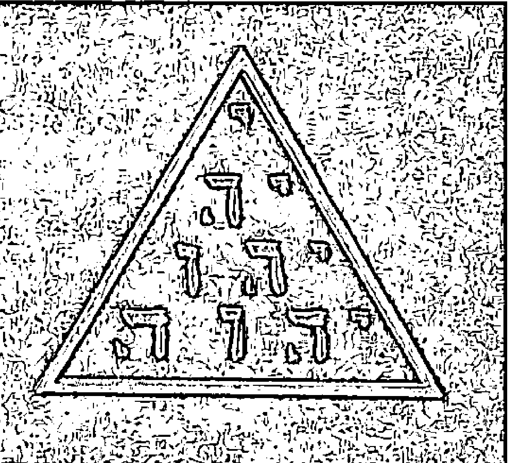

四字母语：上帝四个字母的名字，其形式由毕达哥拉斯学派建立，允许发挥上帝尊名的七十二力

封闭修会“金色曙光”在共济会与玫瑰十字会会员的努力下，19世纪末20世纪初获得了特高的声誉。这是一个极其有名的光明和黑暗混一的神秘主义团体：其代表是威廉·巴特勒·叶芝和阿利斯特·克劳利。鉴于此种状况而分开以后，某些资料显示，修会存在至今。

不知道“金色曙光”是何时、由何人建立的。然而在其历史上起了重要作用的有两人：中世纪的魔法师阿布拉梅林和19世纪末的英国玫瑰十字会会员威廉·温·韦斯科特。他们分别是黑暗与光明传统的传承者，而这两种传统后来从内部摧毁了修会。

阿布拉梅林（1362—1460），来自德国城市维尔茨堡的犹太人，是卡巴拉占卜的高手和威力强大的魔法师。他说，天使曾与他交流过利用魔鬼的经验。阿布拉梅林曾驯服力气很大的动物为他干活。在它们的帮助下，他为撒克逊选帝侯腓特烈组建了两千人的幽灵骑士军，帮沃里克伯爵被俘后逃脱，助教皇约翰二十三世摆脱困境，必要时还常常呼风唤雨。1458年他将自己的奇遇和魔法技艺写成三卷本手稿《魔法师阿布拉梅林的神圣魔法》。书稿遗失，但18世纪被发现，译成法语并印刷出版。百年后由“金色曙光”举足轻重的成员英国人麦格雷戈·马瑟斯译成英语。阿布拉梅林的法门被阿利斯特·克劳利利用了起来。

容，它们在人间和其他世界冲突不止，所以任何事件都不无原因，皆为这场斗争使然。惟其如此，19世纪末才出现了“金色曙光”仪式的描述。褐色墨水书写的古代手稿落到共济会会员伍德福特手中。他于1887年将书稿交给了威廉·韦斯科特博士，让他改造文本。参加译解工作的还有具方士职衔的著名神秘主义学者塞缪尔·利德尔·麦格雷戈。书稿改造工作全部完成后，伍德福特、韦斯科特、麦格雷戈三人依据所读

恢复了“金色曙光”封闭修会。很快确立了经过深思熟虑的、分为十级三圈（外、中、内）的等级制度。创始人进入中圈，而内圈里有个人，他的名字一直秘而不宣。显然是那个将手稿交给英国神秘主义者学者的主教。可外圈从1888年至1896年接纳了三百一十五人。然而，自1891年伍德福特去世后，一切就偏离了轨道。麦格雷戈决定借助落到他手中的阿布拉梅林的魔法书篡夺权力，并宣布他是唯一有资格处于修会内圈的人。

可是掌握黑魔法的不止麦格雷戈一个，还有个叫阿利斯特·克劳利的新信徒。此人1898年被召入兄弟会，因办事非常卖力，职级步步高升。吃透阿布拉梅林的法门之后，克劳利将魔鬼用来为自己服务，并决定向麦格雷戈发出挑战。

这场战争进程，罗兹马里·埃伦·吉利写进了《巫婆与巫术百科全书》：“信徒派太空吸血鬼对克劳利进行人身攻击，克劳利则派别西卜率领魔鬼军队予以还击。”争斗以两个魔法师都被“金色曙光”开除而告结束。

此时，修会领导由爱尔兰大诗人威廉·巴特勒·叶芝接任。他认为组织是座难以攻克的要塞，

#### 的却是个怪异的身影，瘦削而极其忧郁，裹着白色殓衣。显然，这阴魂绝不是阿波洛尼。然而，利维继续扮演着自告奋勇承担的小丑角色，将魔法剑指向幽灵，令其服从。白衣陌生人一声长叹，转身走开，消失在烟雾中。

魔法师冲着他的背影呼喊起来，一面招呼他立刻返回，一面手执魔剑乱刺。突然间，有个无形而可怕的东西碰了一下他握剑的手。难忍的寒冷冻住了他的手指，手腕立时失去知觉，短剑脱手落地。这时魔影又出现在魔法师面前。幽灵仿佛可怜于他，与这招魂新手进行心灵沟通，“说了”半天话，而利维觉得都听懂了，却又转述不出来——这场独白在他头脑里只留下“死”和“死人”两个词。还没听完，他就晕了过去。

埃利法斯第二天才醒来，但又长时间处于休克状态。这段时间里，他被碰过的那只手一直不听使唤。一周后他才开口说话，接着，试图弄清所发生的事情，写道：“我体内灌入另一个世界的气息。我既不喜也不悲，却感到有种想死的奇怪念头，可又没有任何（赶紧说一下）自杀的欲望。”他在笔记的最后提醒说：“若是有人执意走我这条路，我再次建议对待类似实验要极其小心，因为它会让人极度衰竭，往往还会让人受到震惊，足以引起病痛。” 呜呼，这事并未引起魔法师本人足够的重视。他多次肯定地说，重又做过招魂占卜，两次与阿波洛尼·蒂安斯基交谈，打探卡巴拉的奥秘。然而他也不明白这种接触为何发生和如何发生的。“我无法解释让我看到和触摸到的物理定律，我能证实的唯一东西就是，我看见过，触摸过，我看得真真切切，在大白天，而不是在梦里。此乃对魔法仪式真实性的充分证明。

此后，埃利法斯又活了二十一年，写了好几本书：《高级魔法原理和仪式》《魔法历史》《伟大奥秘的钥匙》以及其他作品。他靠这些出版物谋生，赢得声望。他的身边出现了一大批追随者，以及献身宣传魔法的人。

1875年埃利法斯·利维去世了，可是从所有情况看来，他跟阿波洛尼·蒂安斯基结伴的时间并不算长：当年世上就出了个阿利斯特·克劳利，他自认为是法国魔法师的转世化身。若果然如此，那么起初在阿方斯·路易·康斯坦体内而名叫埃利法斯·利维，而后来又进入阿利斯特·克劳利体内的灵魂，并未利用好为它提供的追求光明的可能，于是有意选择了黑暗。

### 仪式的塔楼

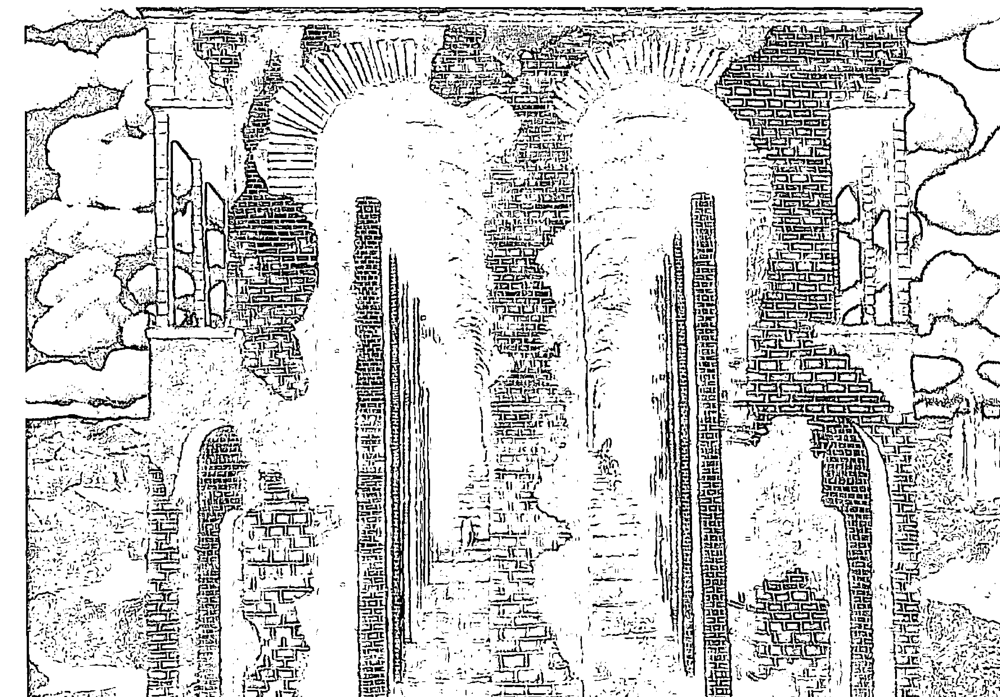

### 七头兽

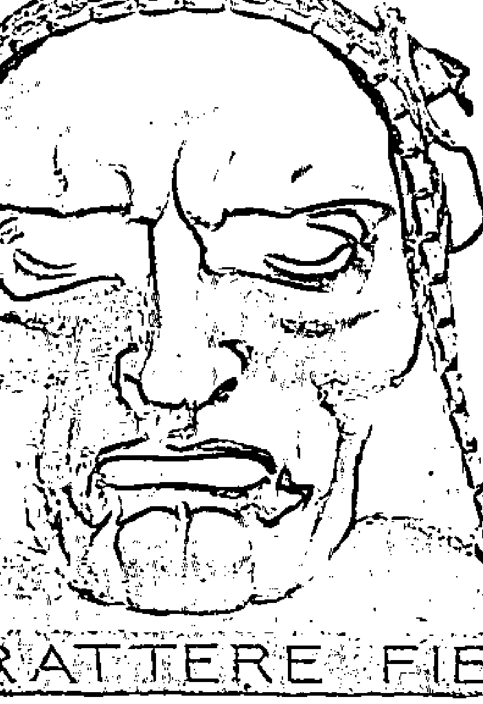

许多人都不相信人的身后总有陪伴：个人的魔鬼在左，私人守护天使在右。不管怎样，很难再找出另一个像阿利斯特·克劳利那样的人，光明和黑暗两股势力为了他的灵魂而进行过那么激烈的争夺。而他本人，像真主的所有创作一样，被赋予了意志自由，可不知为何却倾向于撒旦，而且种种情况表明，死后又马上跳进深渊投奔于他。约克郡虔诚的啤酒工、普利茅斯兄弟会的领导人家里生下儿子阿利斯特之时，孩子的母亲就觉得有点儿不对劲儿。孩子越长大，她的疑惑就越深。有一天，母亲念了《新约·启示录》里的几行：“我又看见一个兽从海中上来，有十角七头……”然后指着儿子，喊道：“就是他，他就是七头兽！敌基督！”孩子起先被突如其来的喊叫吓了一哆嗦，接着就转身走开了。后来阿利斯特·克劳利回忆这一幕时，说他母亲是“没脑子的蠢货，属于最愚昧、头脑最简单和最没人性的那类人”。心地忠厚的女人没看错，她的后代所做的一切都证明母亲送给他“敌基督”的名字是有道理的。吸毒、酗酒和拈花惹草只是克劳利“消遣作乐”的一部分。他处心积虑地要变成魔鬼的样子，脑袋刮得铮亮，犬牙磨得溜尖。真主赐予人意志自由——善与恶之间的选择权。“意志”一词被魔法师变成“想做什么就做什么”的原则，书写在西西里自家的墙壁上。他遵行这条原则，到过地球上最神秘的一些地方。他探访过喜马拉雅山，并在《阿克达玛,安葬外乡人的地方》一书中叙述了观感。该书出版于1898年。晚了许多年头，已是20世纪，欧洲人才知道，在喜马拉雅山一个难以到达的洞穴里，有个外星人的秘密藏身处，一些奇怪的生物在那里长眠不醒。1898年12月，克劳利被“金色曙光”修会招入外围，与组织的一位领导人情投意合，从他那里学会了降魔之法。人们毕竟没急于让阿利斯特进入信徒的高层。他发动了魔法战争，遭到失败并被赶出“金色曙光”。此后加入“老乔德·皮金吉尔”的巫婆协会，可很快他又被从那里撵了出来。

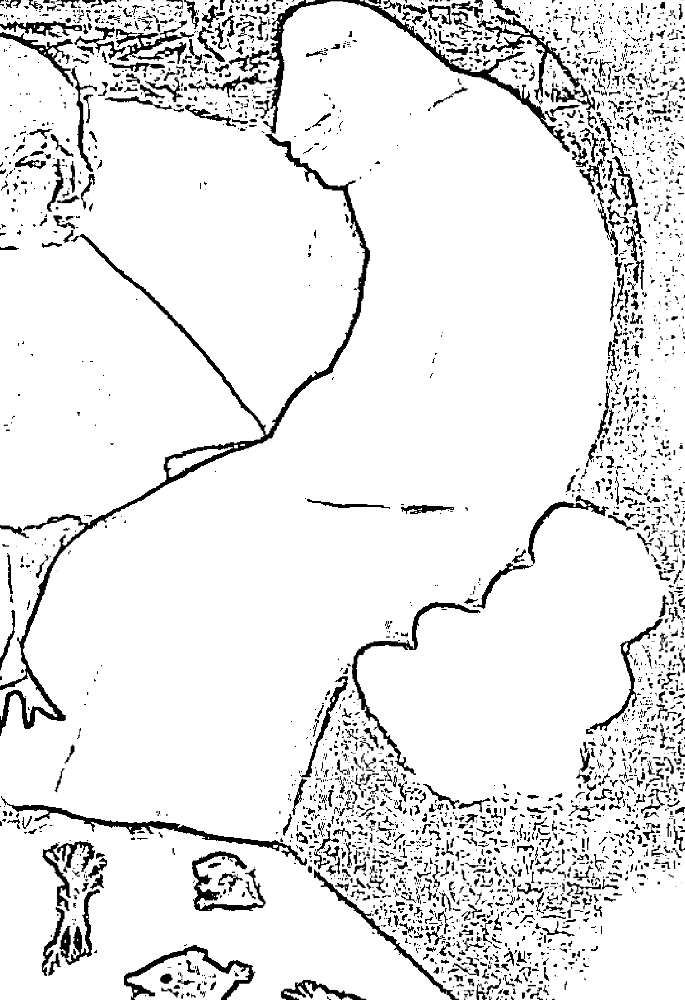

### 塞勒姆的女巫

在17世纪末的马萨诸塞州，巫毒教与天主教宗教法庭凑到一起，欲以滔天罪行震惊世界。有一个城市和附近的村子叫做“塞勒姆”（念白了的犹太语词“撒冷”，意为“平安”）。商人帕里斯从巴巴多斯迁移到塞勒姆，带来一对家奴，叫约翰和蒂图芭，外号“印第安人”替代了他们的姓。蒂图芭照看帕里斯九岁的女儿伊丽莎贝塔和他十一岁的侄女艾比盖尔·威廉斯。印第安女士常给敏感的小姑娘们讲述自己美丽的家乡和对自然神“巫毒”的信仰。常来听的还有女孩们在村里的几个朋友。这样就形成了一个类似神秘主义小组。在小组里，小姑娘们用自制的魔法球试着预测未来。然而，丫头们对魔法迷过了头：1692年1月贝蒂·帕里斯犯了一种莫名其妙的病。父母请来当地医生，那医生做出荒谬的诊断：幼小的孩子们被人施了魔法。寻找罪魁祸首开始借助的还是鬼魂附体的丫头们，可她们害怕被揭穿，于是在自己疯狂的游戏里越走越远。每当把一个女人带到她们面前并问这女人是不是伤害她们的巫婆时，丫头们立刻一齐全身抽搐并非常吃力地咳嗽起来，这也就成了施行巫术的有力“证明”。她们反复讲的都是些荒谬的故事，说有个大家都看不见的女人的鬼魂在残酷地折磨她们，所以她们才咳个不停。她们把证词编得各不相同，说折磨她们的女人每次都用血在变成高个儿白胡子男人的撒旦亲自送给她们的记过簿上签字。

最可怕的是，大人们还相信孩子们的无稽之谈，况且那些无稽之谈与基督教毫无共同之处，而是以“巫毒”为题的胡编乱造。女孩们把折磨他们的鬼魂描绘成奇特的生灵：忽而是黄色的鸟，忽而是长两个脑袋的会飞的恶婆。

从前巴巴多斯的商人，而今塞勒姆的神甫帕里斯。被控施行巫术的女人们被投入潮湿的地牢，剥光衣服，用刀劈刺：寻找“女妖的标志”，因为女妖是不该流血的。让她们就腌过鲱鱼的卤水，吃半生不熟的鱼。她们的丈夫得为镣铐、在地牢里的宿食缴纳一笔不小的费用。

法官们一再怂恿吃饱喝足、彻底误人歧途的丫头们，让她们无所畏惧地说出其他女巫的名字。于是她们有恃无恐，得意忘形。落入黑名单的都是些因某种原因而遭她们妒忌或者让她们不大喜欢的人，这种人原来还真不少！1692—1693年的诉讼期间，竟被起诉了一百四十一个人，十九人被处以绞刑，一人以另一种方式处死——勒死。开始了一场名为“猎巫行动”的不折不扣的歇斯底里。这其间，怀疑的幽灵会落到任何人的头上，只要小姑娘们当着这人的面全身一抽搐。“巫师”中间出了个衰朽的老人尼米亚·埃博特，还有鬼魂附体的女孩儿中一个叫艾比盖尔的父母和许多能叫出名字的同村人。这一切就像一场闹剧，因而许多塞勒姆人对威胁所有人的疯狂行动公然表示愤慨。一个叫萨拉·梅尔斯的女子在反巫说教时退出教堂以示抗议，这也成了逮捕她的理由。一个叫桑顿·斯泰尔的法官离开了庭审团。自然他也被指控施行巫术。

当时，绞架山上绞死了塞勒姆村的一个又一个村民。女孩儿们收拾了不合她们心意的所有邻居之后，开始继续扩大她们的影响：着手指控其他村庄的居民。疯狂的猎巫行动在马萨诸塞州渐渐蔓延开来。最理智的一些人抛弃了辛辛苦苦攒下的家产，纷纷逃走，只有这样他们才保住了性命。然而，假如“猎巫”席卷全国，疯狂的女孩儿们还可能在新的地方逮到他们。谢天谢地，小小年纪的起诉人忘乎所以，控告起了总督夫人。这时殖民官员才开口说话：“得了，打住吧！别再胡作非为了！” 清教徒们找到了解释所发生这一切的办法，说：这是上帝给新英格兰的惩罚。疯狂的女孩儿们当众悔过，说对不起，是鬼迷了心窍。这一切的始作俑者，印第安女人回了老家巴巴多斯。不过，她可能感到满意的是：首先，报复了自己的奴隶主；其次，永久载入了史册。1703年，当局正式为被判刑和被处死的人恢复名誉，给他们的家属支付了赔偿金。

然而，连塞勒姆的法官们自己都不知道，他们的行为引起了一场风暴：几个世纪之后，塞勒姆小村庄，成了女巫的美国中心。她们对塞勒姆的妇女的庭审现场，她们被指控施行巫术，根据就是当地女孩儿们的证词。目击者的画 们可不是神话中的，而是现实中的、根本不掩饰自己活动的女巫。这一点，我们稍后再说。先来说说不幸的、被逼入绝境的塞勒姆妇女对那些法官和刽子手们所发出的诅咒。

对女巫的恐惧由新英格兰的清教徒们引自欧洲

##### 世代相传的诅咒

一切都始于1603年威廉·哈桑少校离开家乡英格兰而移居新大陆。他在“捕鲸者之都”波士顿住了六年，接着迁至塞勒姆小镇。该镇在当时的英国殖民地马萨诸塞州境内。在这里，他终于得到乌达恰夫人的赏识，当上了众议院议长。这就为船主和农场主的哈桑家族的兴旺奠定了基础。少校的儿子约翰当上了在塞勒姆受人尊重的法官。因职责所在，应处理“塞勒姆女巫”的案件。应当说，他并不是宗教狂，也不是好报复的人。相反，在侦讯期间常向起诉人提出一些十分刻薄的问题，其结果对于他是十分凄惨的：由法官席被移上被告席，最后——上了绞刑架。可他毕竟是那个时代的产物，不仅相信巫术的存在，而且认为它是有害的。针刺魔法玩偶有可能害人，这使约翰深信不疑。因此他判处被指控施行巫术的塞勒姆女人们死刑。其中一个女人诅咒了法官和他的后代。就在18世纪初叶，约瑟夫·哈桑船长在世时，家道开始中落。同时家族又很快失去了社会地位，这在当年非常重要。1772年，船长的儿子丹尼尔还是在塞勒姆买下一处房产，这房子后来在美国文化史上以及避免悬在家族头上诅咒的威胁上起到了非常重要的作用。然而，诅咒在继续起着作用。丹尼尔的长子纳撒尼尔是个船长，因黄热病死在了苏里南，抛下了一个六岁的孤儿。小纳撒尼尔生于1804年6月4日，是个天生敏感、脆弱、内向的孩子。他知道家族的逐渐衰落还不是女巫最可怕的诅咒。所有参与“塞勒姆女巫”审判的法官及其后代都有沉重的负罪感。神甫尼古拉斯·诺伊斯的遭遇最惨。当他要犯人撒拉·古德认罪时，萨拉回道：“我是巫婆，你更是个巫师。你让我死，上帝会惩罚你的，让你喝足自己的血！”果然如此——1717年圣诺伊斯被发现死在家中。他喉头出血，神甫正是呛血而亡的。塞勒姆的人都相信这绝非偶然。哈桑一家积攒了些钱，送纳撒尼尔进了专科学校。男孩儿从学校写信给母亲，说打算当作家，以创作替祖上约翰·哈桑法官向被陷害的女人们赎罪。信中有一段奇怪的附言：“……作家总是可怜的魔鬼，因此撒旦能够接受他们。”这好像是说，他愿意献上自己的灵魂以替换那些饱受磨难的“塞勒姆女巫”的灵魂。毕业后，纳撒尼尔将姓氏改成了霍桑，以避免加于哈桑家族的诅咒。忏悔思想成了他全部作品的基调。在长篇小说《红字》的序言中霍桑写到威廉少校及其儿子约翰：“我觉得，住在塞勒姆的权力我应归功的与其说是自己，不如说是这坚强的、留胡子的、披黑斗篷和戴尖顶帽的曾祖，他一手拿《圣经》，另一手执利剑，早就来到这里……他主持教堂事务，集军人、立法者和法官于一身。清教徒们的一切优点在他身上与所有的缺点互相交织。跟他们一样，他是个宗教狂……

#### 处决

##### 世代相传的诅咒

### 哎呀，这洛丽！

洛丽于1933年3月6日出生在俄克拉何马州的小城维沃卡，一学会说话，就声称她来自女巫的古老家族，甚至还保存着四千年前生活在地球上的一个女巫的记忆。声明出自一个乳臭小儿之口实属奇怪！可她父亲并不感到惊讶，因为他祖上就来自英格兰海岸边的泽西岛，那是巫术的两个传统中心。卡伯特竭力培养女儿对科学的兴趣。洛丽原来是个很有天分的学生，的确，她将所学知识全部纳入了研究神秘主义与超自然现象的轨道。

结识了一位图书馆馆员。这人原来是个巫婆。她按照传统仪式授予洛丽称号：给女孩儿全身涂抹油膏，用裸剑触碰一下。接着洛丽将剑锋插进地里，立下誓言：“我将自己的智慧奉还大地，给自己起名叫女巫。” 后来，她选择了在波士顿的拉丁街区跳舞的“职业”。先后两次出嫁：先嫁意大利人，后配希腊人。第二次离婚后，独自抚养两个女儿的洛丽决定将自己全部身心献给巫术，并开始大模大样地穿着黑色宽松服，胸前挂上金色五角星——女巫的传统象征，用于召唤月球的能量。就在这时，

饱览全国河山之后，洛丽回到波士顿，继续念中学。这其间，坟边穿黑长裙、戴尖顶帽的女人。碑铭。列莫日。法国。19世纪

### 潘多拉盒子。相传，盒内禁闭着人类的恶习和苦难。潘多拉打开了它，放出了灾难，因而人类从此不断受苦受难

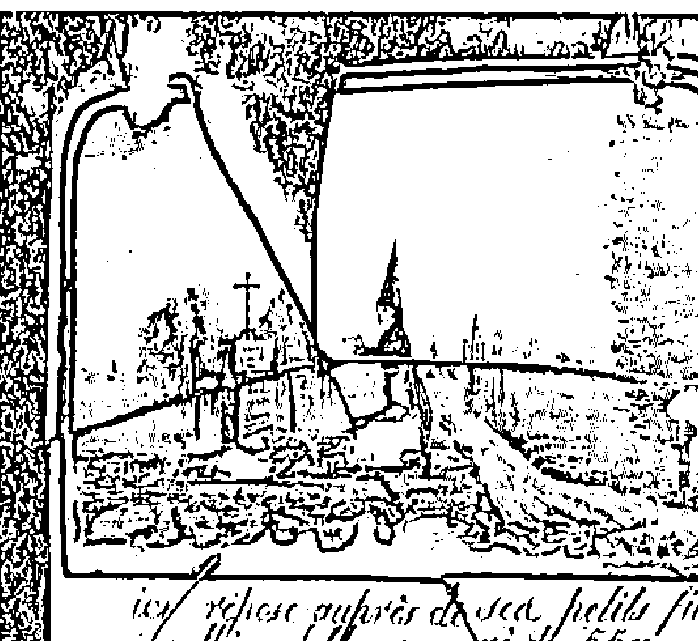

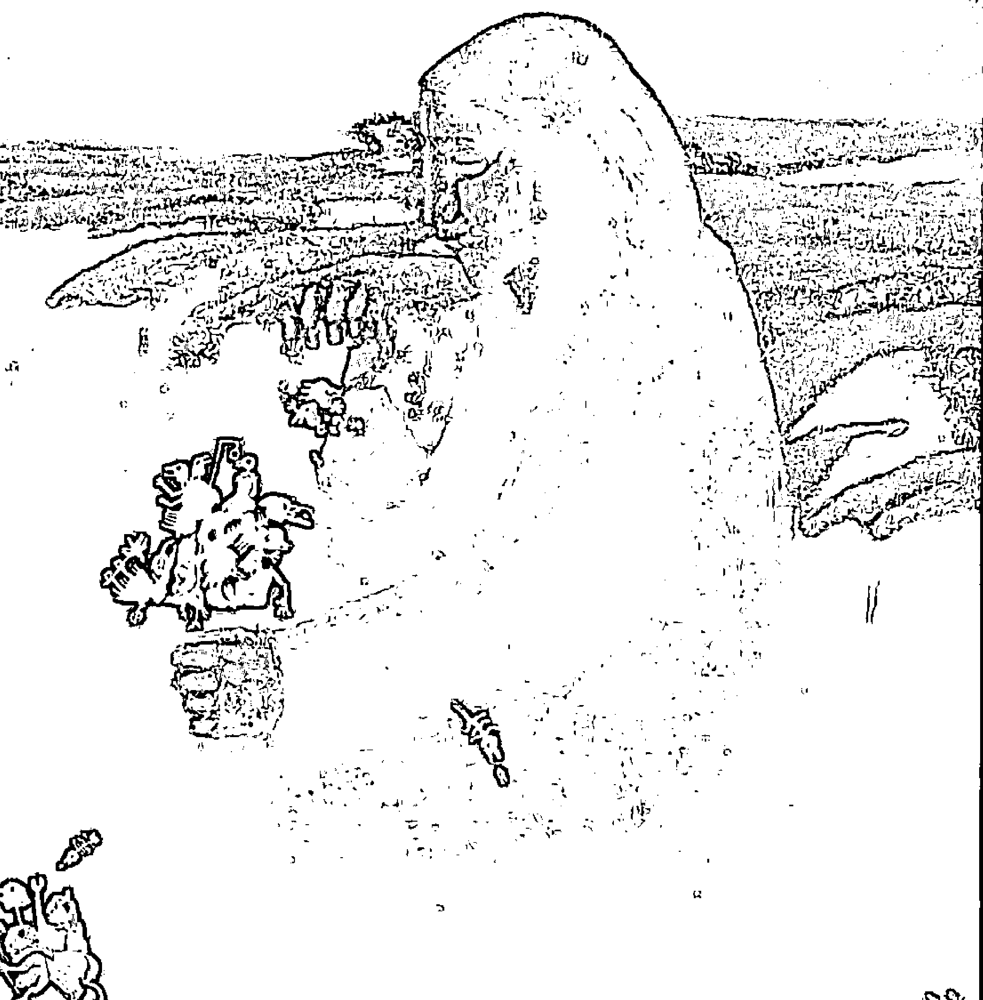

20世纪70年代初的马萨诸塞州，与新大陆的英国殖民地有着显著的差异。一方面，塞勒姆人为先辈曾宣布“猎巫”而深受良心的谴责。另一方面，又将此事件视为历史不可分割的部分而引以为傲。

### 对待塞勒姆新出现的女巫，人们态度各不相同。洛丽·卡伯特本人在《女巫的力量》中写道：‘有些人遇到我，会用手蒙住双眼，因为他们听人说过，对女巫不能正眼相看。他们相信，否则会发生可怕的事情。而另一些人正相反，立刻走到我身边，看看我脖子上挂的五角星、手上的几只戒指，或者摸一摸我身上穿的黑长衫，因为以前听说过女巫好像有消灾却病的能力。’

在塞勒姆，洛丽从一开始就积极地投入了工作：举办《魔法是科学》的讲座，专场讲解塔罗牌占卜术，根据先兆诊断疾病，以及帮助警察官方局侦缉罪犯。她开了一家女巫用品商店，不久便成了塞勒姆吸引游客的主要景点之一。1973年，洛丽开创了每年都举行女巫化装舞会的先例，将其安排在古老节日“萨温节”（或基督教传统的“万圣节”）前夕。

自70年代初起，洛丽一直力争让地方当局承认她的活动为‘塞勒姆的女巫’的官方活动。起初，市长以不允许将民族历史变成消遣娱乐的作秀为理由拒绝了她。可是，1977年，马萨诸塞州州长迈克尔·杜卡基斯过问此事，颁布命令，洛丽因此而得到了期盼已久的‘塞勒姆头号女巫’的头衔。此文件中还对凯博特在帮助患言语障碍的儿童方面所做的工作表示感谢。

官方的承认放开了女巫先前被束缚的手脚，从1987年起她开始供职于塞勒姆市政厅。然而，就像三百年前一样，教堂起而反对黑衣女巫，神甫安东尼·萨尔沃同她们展开了坚决的斗争，甚至不惜对洛丽直接进行人身攻击。为表示对这种中伤的抗议，洛丽停止了市政厅的工作，并着手撰写记载自远古时代起人类魔法史的《女巫的力量》一书。1988年，她建了座伊希斯庙，庙里开设了一所专门学校(按‘新时代’大纲进行教学)和占地面积很大的图书馆（收藏了神秘学知识所有流派的书籍）。80年代末，洛丽被泛神论者全国同盟称做‘圣者’，这使她不但能够主持祈祷，还能够正式举行结婚仪式。

与此同时，洛丽继续行医并从事社会工作。1986年，她创立了女巫社会承认联盟，该联盟在国内享有不小的威望。比如，联盟禁止放映根据约翰·厄普代克的小说改编的电影《伊斯威克的寡妇》。影片将民间的女郎表现成地狱的产儿，并津津乐道她们在严刑拷问和执行火刑时所受的痛苦。

总之，塞勒姆从迫害女巫的地方变成了女巫的活动中心。

### 女巫

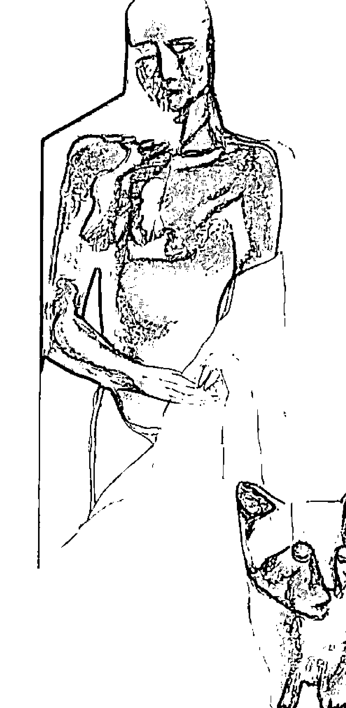

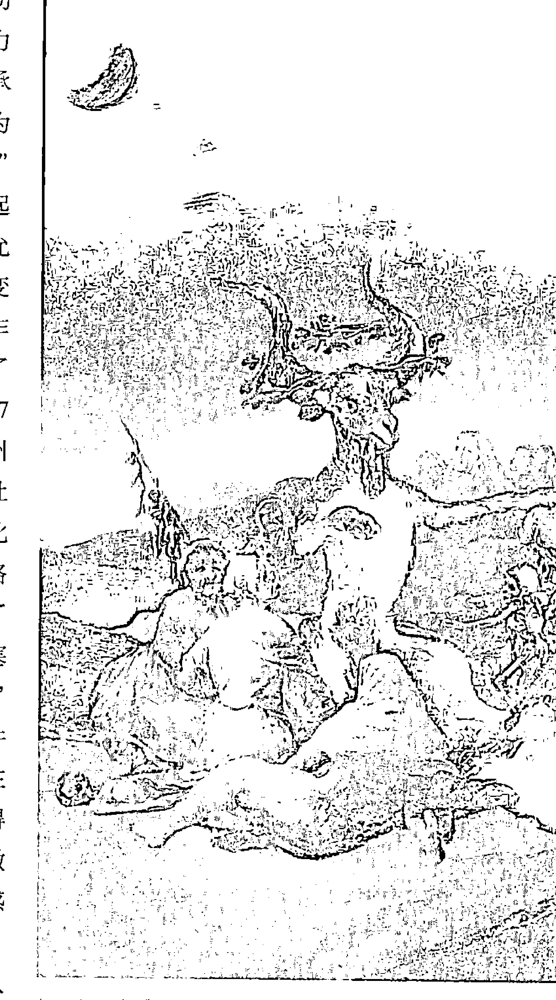

### 威卡教

威卡教，是美国的现代巫术团体，或者是巫术与萨满合一的新多神教。该教由威斯康星州霍列布山圆形教堂的女祭司塞莉娜·福克斯创立。“威卡”一词在古英语中意为“女巫”。新宗教的基础——好像是传说中的波佐尔国王所说的话，现在它们成了威卡教训诫的“八字箴言”——是这样说的：“不损他人，为所欲为。” 新多神教的信念详细陈述于上世纪70年代由巫师卡尔·韦什格为首的美国巫师联盟起草并收入美军随军牧师案头必备书的宣言

言。威卡教的十三条公约规定：

+   1. 我们践行仪式是为了与月相、四季及其相互变换所具有的生命力之自然节奏相一致。

+   2.我们认为，我们的智慧使我们在周围环境中无与伦比。我们寻求与大自然和谐相处……

+   3. 我们认为，存在着一种势力，它们比单个人所能及的力量要大得多……

+   4.我们认为，宇宙中存在着创造能量，它表现为阴阳对立，见之于所有人群……

+   5.我们既承认外部世界，也承认内心世界，即有时称为“精神世界”的心理世界……

+   6.我们不承认任何专制的等级制度，但尊重那些分享自己知识的人。

+   7.我们认为宗教、魔法与智慧是其世界观与生活的现实统一。这种人生哲学，我们定义为巫术——威卡之路。

+   8.仅仅自称“巫师”者，不会因而成为巫师；这种知识不能传承，也不能通过累积某些封号而获得。巫师应力求控制自身的力量，以能活得明白，无怨无恨，顺乎自然。

+   9. 我们相信在不断的进化过程与对宇宙认识的发展中生命的喜悦与丰富多彩……

+   10.我们与基督教以及其他宗教和哲学的唯一分歧在于，它们宣称自己的规章制度是“唯一途径”，否定其他途径的自由，竭力压制宗教实践和信仰的其他途径。

+   11.作为美国的巫师，我们不渴求争论巫术的历史……让我们感兴趣的，是我们的现在和我们的未来。

+   12.我们不接受“绝对邪恶”的观念，也不像基督教传统认定的那样看待任何诸如“撒旦”或“魔鬼”之类的生灵。

+   13.我们相信，应该与自然和睦相处，从而为自己的健康和幸福事业作出适当的贡献。

按照该宣言的第一点所举行

围若幻的乌罗博罗斯。乌罗博罗斯——咬自己尾巴的蛇，是生命循环与无限的象征，蜘蛛网象征幻——生命的虚幻

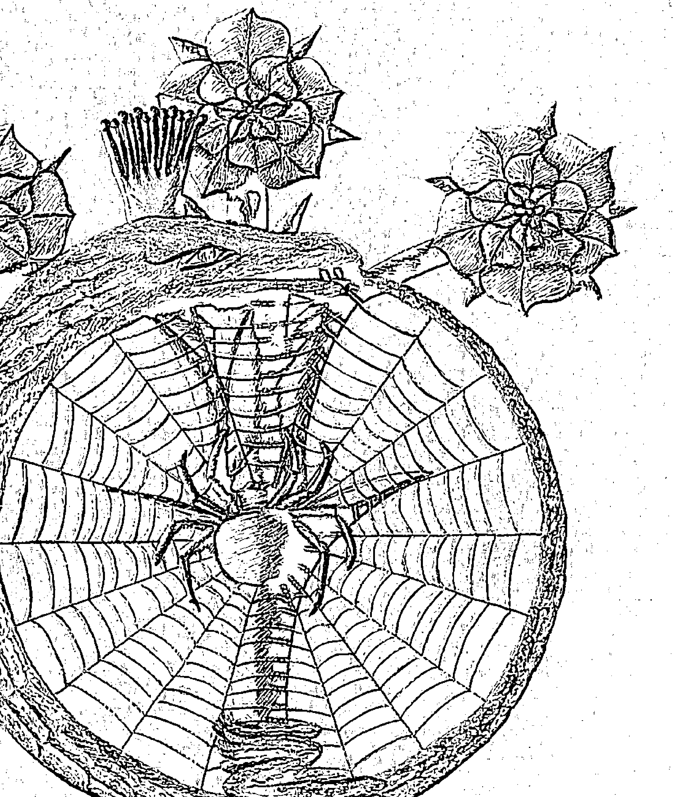

#### 白女巫

的仪式应在魔法圈内，那里集中了五大要素：北方土，东方气，西方水，南方火，而中心为灵魂。魔圈同时具体体现带有四季和人生各阶段的生命环：死亡与复活在北方，春天与青春在东方，壮年与夏季在南方，老年与秋季在西方。中心象征着灵魂与全年。传统上与四方相关联的还有威卡教的固定颜色：北绿，东黄，南红，西蓝，中白。

威卡教的节日，即狂欢夜会，每年举行八次。最隆重的是：五朔节期间围绕五月树的舞蹈（5月1日前夕），冬至(前一天)悬挂槲寄生树枝，春分(复活节)交换鸡蛋。

遵照“不危害任何人”的宗旨，威卡巫师会遇到一系列困难。例如，帮警察找罪犯，要是这会伤害他呢？这时他们就使用妨碍某

人行为(通常是不良的)的束缚咒语。罪犯好像失去了职业技能，很快就自己落入密探手中，尽管巫师并没直接出卖他。

束缚是一种防御方法。当得知同事处心积虑想伤害伙伴时，一般都采用它。施咒后，他想做的事就做不成了。这样的办法还用来对付捕鲸者——他们会无功而返。阻止作用常施于狩猎者和核武器研制人员。

然而不可能使人人都满意：一些人抱怨威卡教道德标准有限的魔法没用处，另一些人则相反，一直觉得它是危险的。

可事实上，“白巫师”依然遵循不干涉原则，惩罚那些受合理愤怒的影响而诉诸有害行为的男女同道。

其实，每个女巫都知道，她让自己受到的惩罚比谁都多：所引

#### 手捧神秘知识的威卡女巫

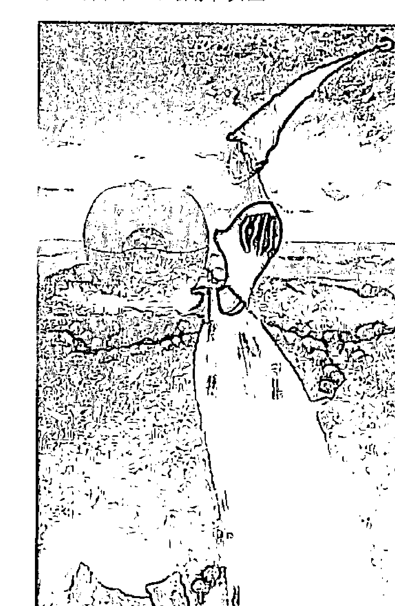

#### 蛇的智慧与巴隆·撒麦迪

在我们时代，巫毒教是个合法宗教，有五千万信徒分布世界各地。该教的古代中心在非洲尼日利亚南部的埃夫市，直到现在依然是巫毒教徒们的“麦加”。然而巫毒教（“巫毒”在达荷美王国——今尼日利亚境内，丰族人的语言里, 意为“神”或“灵魂”）的主要教义形成于牙买加和海地的黑人奴隶中间。吸收了天主教许多典型特征而又不失非洲基本教义的宗教，就从这里流传至美国的一些城市，在纽约、奥尔良、休斯敦和南卡罗来纳州的查尔斯顿扎下了根。起初奴隶主嘲笑黑人的迷信，并为他们摆脱愚昧而严加处罚，施以侮辱性的拷问。然而，宗教活动因此而转入地下，只是渐渐获得了诱人的神秘感。

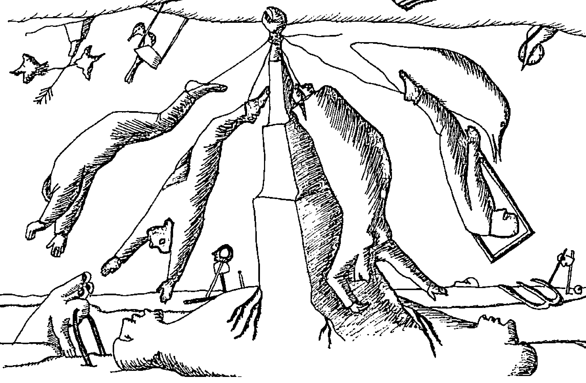

召唤阴魂

巫毒教的神众数量非常庞大，并因新“洛阿”（杰出人物的阴魂）的加入而继续急速增加。

在远古时代，全能的神创造了人间，可彻底完成了自己的作品之后，又对它失去了兴趣，完全进入了自我内心世界。

而人间就落到丹巴拉赫—维多——提供创造力的巨蛇手中。

在非洲，人们认为他的化身就是丹赫—格布维蟒蛇。小孩触碰过这无毒蛇，会得到神的恩赐，日后能当上祭司。

黑人的始祖丹巴拉赫不会人语。为了表示对他这一特点的尊重，巫毒教寺庙里做祈祷仪式使用像蛇咝咝叫的兰哈日宗教语。

这个洛阿会以列格贝——太阳神的形象出现。

当然，法力无边的蛇也有妻子——母蛇，也叫月亮。她名叫艾达—维多，人人都能看见她：她以彩虹的形式前往天堂，了解众神的意志，然后告知人们。为纪念她，巫毒教每个寺庙的中心都有一根绚丽的彩柱。五颜六色的小蛇被认为是欧朱莉叶——美、爱、财富与生育女神的化身。

蛇神教会了人们性爱与血祭。后者是巫毒教徒死后获得蛇的智慧，成为洛阿魂所必需的。

祈祷时，祭司管蛇祖叫“爸爸”，管他的夫人叫“妈妈”。在众神中起重要作用的还有四位神：火神、水神、土神和风神。

奥高·费尔不仅是战神，还是火神，像希腊的阿瑞斯和赫菲斯托斯。他在火中吸收智慧与力量。阿格维是海神。归他管辖的是所有的鱼类和海洋生物，二是船只和海员。察卡是农民的保护神。所有庄稼人同他们的保护神一样，都穿一身白色的肥衣裤。他们的语言很简单，因为在农场主看来口才并非优点。在这里，更重要的是你能动手做什么，要

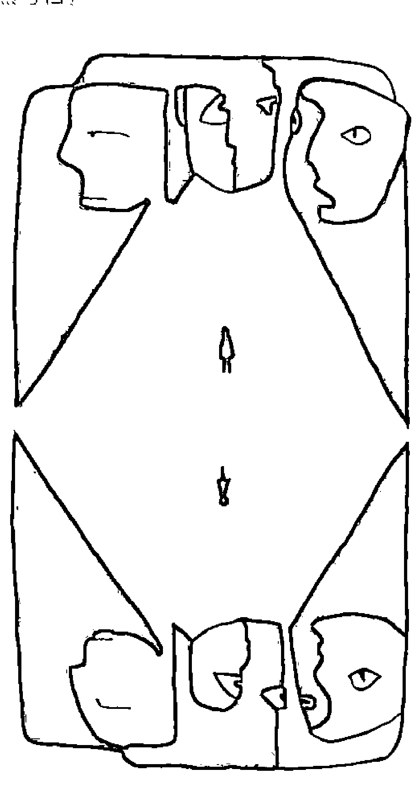

《黑与白》

#### 蛇的智慧与巴隆·撒麦迪

嘴皮子是城里人的事。

弗雷达是风婆，直义和转义都是。因此她才受到从事最古老谋生行当的女性代表人物的尊敬。

在巫毒教中，善与恶的界限十分模糊：该教的祭司们教导说，善仅仅是恶的对立面，而一个洛阿，取决于不同情况，有时施善举，有时逞恶行。二者皆应拜领。

洛阿之间也有差别：有的专门促进爱情、工作与属于生活的一切。有的，古阿德斯，所管的则是凋谢和死亡。驾驭他们的是巴隆·撒麦迪。最初他是位护墓神，掘墓穴工的保护神。后来他的活动范围大大扩展了，被置于他庇护之下的有商人、秘密警察和某些政客。巴隆根本不是头长犄角的怪物。相反，他的形象特别高雅。巴隆唯一的破绽就是那双充血的眼睛，不过他找到了解决办法：戴上一副墨镜。

他的信徒很容易辨认，因为他们都穿黑西装、白衬衫，扎黑色窄条领带。去参加葬礼正该穿成

> 安利·卢梭的画作《用巫术降蛇的女人》

丹巴拉赫-维多——创世巨蛇和他的妻子艾达-维多——彩虹

这样。后来，黑色的西装便成了海地岛上黑人国家的统治者弗朗索瓦·杜瓦利埃及其后继者寝宫的卫队——秘密警察的制服。两个独裁者都被认为是巴隆·撒麦迪在人间的代表。他们甚至将传统的红蓝国旗换成黑红两色——

墓地神的象征。众所周知，杜瓦利埃像最高黑魔师理当的那样，施行害人的巫术。在格雷姆·格林将海地制度写得丑陋不堪的长篇小说《伪君子》问世后，医生老爸制作了作家的人像，扎上无数钢针。他还派人去阿灵顿国家公墓采集约翰·肯尼迪墓上的泥土和枯花，为了日后控制已故总统的阴魂，以便操纵美国的政治。

1986年政变后，医生小子的政权被推翻。当然，这并不意味着巫毒教被取缔。

这时，巴隆·撒麦迪风靡美国，接着风行全世界，在不小程度上起了推波助澜作用的是电影《黑衣人》。在这部影片里，密探们穿的都是巴隆制服，尽管他的名字并未被提及。一身葬礼黑装的他们，行动诡秘而狡诈，一如带来死亡的洛阿。这一题材被摄制成大量的电视片，结果巴隆的制服到处可见。

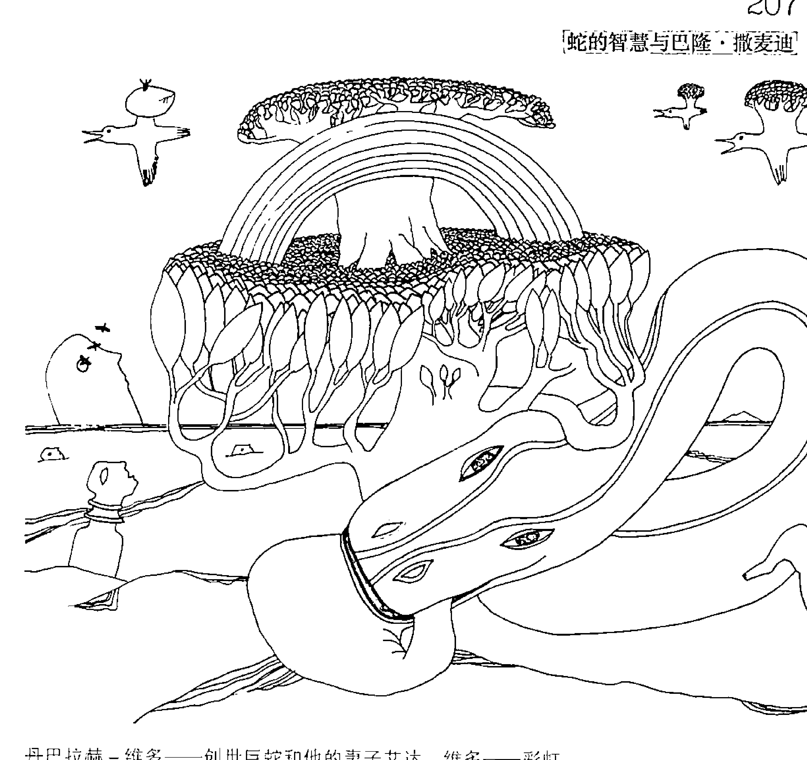

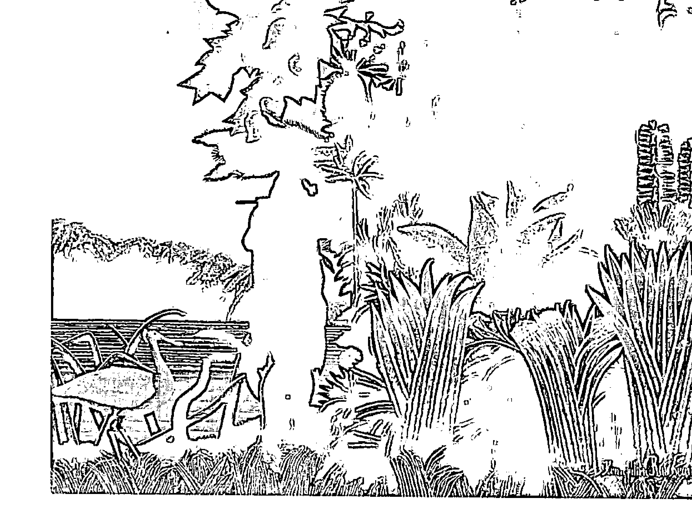

#### 佐姆比与‘灰猪’

除了一些合法形式，巫毒教中还有一些秘密兄弟会，它们的前身是逃亡奴隶（马隆）的‘公社’。其中最可怕的一个是‘科申格里’（灰猪），或者叫‘宾巴因丁’（血、痛苦和粪便）。他们聚会都是秘密进行的，每天夜里，相互识别既靠复杂的礼仪动作，又靠接头暗号。他们的灰色意味着运用混合性的法术，也就是既有白魔法的手段，又有黑魔法的毒招。‘猪们’为让人和动物产生恐惧心理，悄悄地游移于灌木丛之间，召集‘同类’。然后他们前往墓地，唤出巴隆·撒麦迪的阴魂。巴隆附于一个成员身上，随即开始行动——杀人。

他们在墓地还拜祭另一个神，巴隆的伙伴——主管淫荡和肉欲的宁博。至少是在‘灰猪们’的墓地仪式上。

‘血、痛和粪’兄弟会成员不仅受歃血仪式的约束，而且，据说，还受食人仪式的约束。如果有人违反了保守秘密的誓言，那么他的罪行就会被报告警察局，于是等待违背誓约者的必然是死刑、终身监禁或者至少是精神病院。依照法律的惩处难以与成为‘无角羊’或叫‘佐姆比’的恐怖前景相比拟。

‘灰猪们’的波科巫师能造出三种佐姆比：活死人、幽灵或者二合一。活死人有双倍的力量，什么也不怕，绝对服从巫师，从不知疲倦，几乎不吃不喝，无需休息。佐姆比究竟是一种什么样的奇怪造物呢？人们最常将他定义为复活的死人。有时候波科杀人，是给他喝下一种不可思议的饮料。这饮料里有许多种成分，其中每种都是致命的。美国的民族植物学家维德·戴维斯1982年研究了‘佐姆比汤’的成分，并描述过它。首先往瓦罐里放人一只美洲大蟾蜍和一条海蛇。密封存放一昼夜左右，让两栖动物‘狂怒而亡’。事实上，蟾蜍和蛇在异常情况下能够分泌毒性很强的毒液。然后往罐内加人研成粉末的蜈蚣、毒狼蛛、可引起肺水肿的名叫‘叉叉’的一种植物的子实。‘汤剂’内还使用大量的异域植物，其名称与药理作用美国学者一直没能确定。‘汤剂’熬制需严格按步骤进行，经过几次间歇，间歇之后添加动物成分：白林蛙皮、研成粉末的人体残骸，还必须加带河豚毒素的河豚。这种毒素哪怕一小滴就可致命。而且‘佐姆比汤’没有解药，因此喝下它的人绝无复

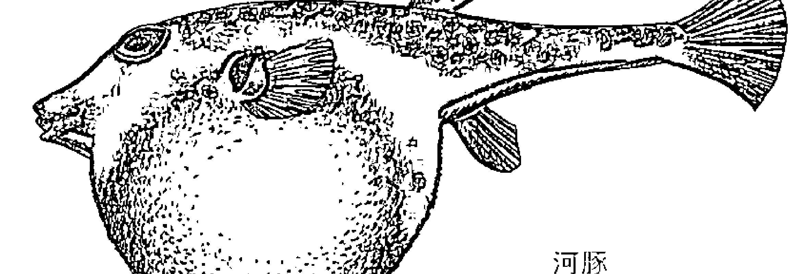

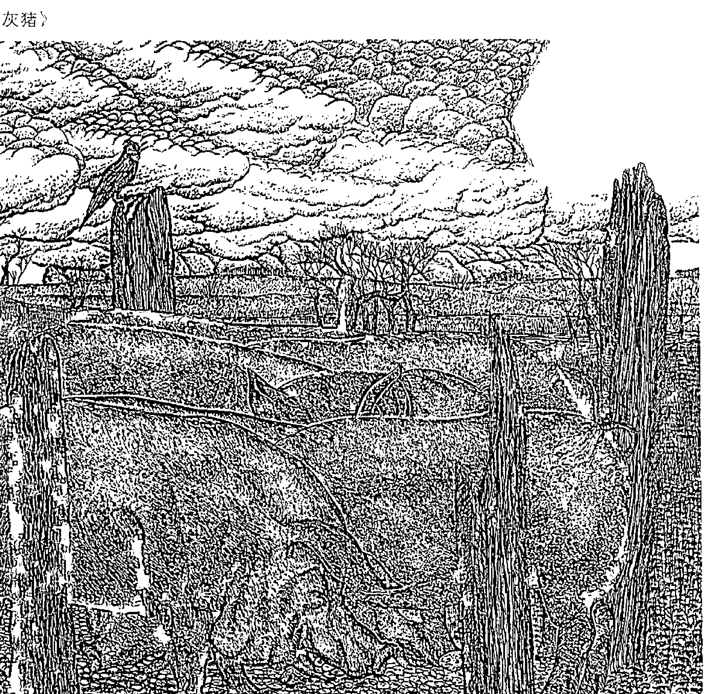

《灰猪》

#### 佐姆比与‘灰猪’

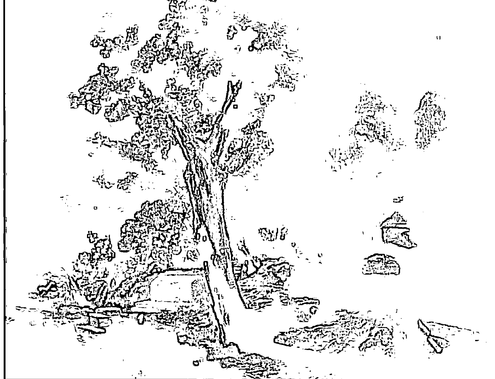

「鲍默的画作《墓地》」

烈性甜酒、碳酸铵、柠檬汁、萘、海水、香水和岩盐。而它的药基是巫毒祭祀们称为‘黑魔法’的一种特殊液体。法国的一种香水就是仿照它而起名——magie noire, 玛日努阿(魔水)。

人们不禁会想，整个问题都在于盐和含盐的海水。如果魔法师快死了,可忘记了佐姆比的事,那么佐姆比就像果列姆一样,会发起疯来,而且会碰到什么毁什么。制止发起疯来的活死人可以用两种办法：使其严重伤残或者向他撒盐。第一种办法对于实施者来说相当困难,并非每个活人都能斗得过力气很大的佐姆比,而且一般的损伤不会对他产生重大的影响：需要真正将他砸成碎块。盐作为有魔力的净化物质能够恢复尸体的意识。他会立刻前去寻找坟墓,找到它后,第二次死去。这一次——就彻底了。

原的机会：注定要么死,要么成为巫师手中的玩偶。
黑魔法师往往利用死者的遗体——死亡后不超过七天。而家属们为了让亲人尸体免遭噩运,常常让其残废,二次加害：或砍去头颅,或用刀扎破心脏。波科不需要无头和“无心”的佐姆比。可往棺材里撒上子粒：人们希望巫师会想起查点子粒数量。他可能来不及在日出之前完成尸体复活的仪式,只要天一亮黑魔法师就无能为力

### 灵感的秘密

其实，一些神话讲的是，埃尔夫小精灵出现的时间早于人类(在小精灵的一种语言里,我们人叫阿塔尼,意为“后来者”)。他们比我们年长，在地球上居住的时间更长,接触过其他远古文明。而对那些文明,我们的概念非常模糊。那为什么对此一点都不知道呢?

人是会死的（还有一种小精灵的语言把人叫做“菲瑞玛”，意为“凡人”）。更糟糕的是，这死来

得相当快——过个六十年左右。因此，我们认为最好别把这短暂的光浪费在不能带来直接利益和满足的认识上。孩子们对四代以前的祖辈就毫无概念了。时空越远，未知领域就像水面的浪圈一样，就越扩越大。民族的历史，我们往往是通过课本了解的，指望课本不出差错可没门儿。相邻民族的文明往往令人惊讶：“怎么，原来还有这事？”古代的伟大

文明终将消失在时间的迷雾里——它们已经落入了神话这步田地。还有一些更为遥远的——大西洲、列穆里亚、姆大陆——完全像是无稽之谈，说得好听点儿，像是一则美丽的童话。请注意，我们现在所说的只是人类的历史。埃尔夫小精灵和守护神身量小的原因很简单：据说，他们很轻浮，因此不可能有我们这样发达的文明。此外，人们总是把构不成威胁的失败者说成小小的。

一个作家，无论他有多么自信，充其量只是上层势力手中的一支“灵巧的笔杆子”。事实上，这支“笔杆子”应具备相当的知识和能力，才能适当地表达出突如其来的思想。从这个意义上说，语言学教授约翰·罗纳德·托尔金的作品并非新奇的虚构，而是对早已遗忘的往事的回忆。这回忆始于偶然映入眼帘的盎格鲁撒克逊古文献手稿中的一句神奇的话：“喜气洋洋的埃伦迪尔，最豁达乐观的小天使，被派往中界的人间。”后来，埃伦迪尔在长篇小说《精灵宝钻》（这部小埃尔夫传说集初版名为《被遗忘的传说》）里变成了被最高梵拉众神派往地球寻找“西玛丽尔”（精灵宝钻）魔石的英雄埃伦迪尔。日耳曼神话里的“中界”（其上是众神的上界，其下为魔鬼的下界），由立平面变为水平面。在这里，中土突然出现在了传说中的西土的东方。梵

特尔佩里翁与劳瑞林——梵拉的神树，地球主宰（约·罗·鲁·托尔金小说《精灵宝钻》），这些树的花照亮创世之初的地球

现实——或者渐渐汇入现实。 这句话的背后隐藏着托尔金所发生的一件事。一天夜里，他梦见穷画家尼克尔的故事。他睁开两眼，立刻坐下将它从头到尾、完完整整地记了下来。这个叫《苗尔金的一幅画》的短篇小说证实，每个创作者都在建立一个现实世界，而他转世（有人把这叫做死）之后就要生活在这个世界里。何况现实的中土还真是次生的，这里不仅为作者自己，还为他大批读者备好了地方。 托尔金的作品所以享誉世界，其中还有一个秘密：它们会让人们的遗传记忆苏醒并回想起来：是呀，一切正是如此。或者可能是这样。 因为，在神话里可碰到被遗忘的胡里特民族神的名字——埃阿，邻近的乌贝德人、苏美尔人、冈多林——诺尔多小精灵的国王图尔冈在环山中的隐蔽城市

阿卡得人既改了他的名（埃亚、恩奇、海亚），又换了他的职：从大地的主宰变成地下水域的主人，由咒语行家变成人神间的灵媒。结果闹不清楚，埃阿是谁，或恩奇是谁，他了不起在哪里。而在托尔金的小精灵神话里，一切都清清楚楚：埃阿是现有的世界，是伊路瓦塔神的一句话。这话一说出口，就开始有了世界。“埃阿”一声——世界就仿佛从亘古以来的沉睡中苏醒了。“于是突然之间阿伊诺（由伊路瓦塔创造的第一种生灵），”托尔金写道，“看到了远处的光亮，仿佛一团云彩，中间燃烧着一颗跳动的心。于是他们明白，这不是幻象，而是伊路瓦塔创造了一种新东西：埃阿，现有的世界。” 不是用理智，而是用心灵读过这几行文字的人就会相信：一切正是这样。

拉们去了西方，可是自己想随之而去却不可能：需要知道正途。一些不知道魔幻之途的小精灵就这样留在了中土，只得与人、守护神、奥克和其他生灵生活在一起。再往东去，可绝对不是阴间，有一个黑暗邪恶的世界——莫高斯及其强大的仆人索隆的王国。 由神秘的盎格鲁撒克逊的话语而产生的还有灰袍刚多尔夫——魔法师，论地位实际相当于被派往下界抵抗黑暗势力，但因迷恋“凡间女色”而受罚留在人间的灰天使。 还有一种观点，托尔金曾写道：“也许，每位写幻想小说、创立次生世界的作家，都期盼成为真正的创造者，希望他所写的一切都是现实的，希望他的次生世界的生活（如果不是它的全部细节）来自于

现实——或者渐渐汇入现实。

### 前往中土的魔法师

如果认为大家都是托尔金作品的热烈崇拜者，那就实在天真了。或许有人根本就没听说过他。既然如此，我们的叙述所针对的只是熟悉刚多尔夫、白袍萨鲁曼、黑袍索隆和褐袍拉达加斯特这些中土大魔法师活动的人。因为甚至《魔戒》的读者中也常常有人不知道西北方著名魔法师的真名根本不是刚多尔夫，而是奥罗琳，所以不得不就高级魔法师的来历与使命多说几句。

伟大的梵拉神（有人认为是主神）在联席会上决定，应当派遣一些使者去小精灵和凡人的世界——“中土”，与黑暗势力作战并战胜他们。问题在于，乐土之神下到了凡尘后应该融于肉身，这样就会失去自身的大部分智慧与威力。他们应该变成白发老者，几乎跟人一样。区别在于，首先是大法师，有时还叫伊斯塔瑞祖师，天生长寿，实际上长生不老，不光是灵魂，还有肉身，否则他们来不及弄清形势并暴露迅猛蔓延的邪恶。其次，危急关头他们能恢复法力，对黑巫师索隆控制的黑暗势力施以有效的魔法打击。在梵拉联席会上，他们的头领曼维问道：“谁去是好？应能与索隆匹敌，但须丢下法力，融于肉身，看起来像人与精灵一样，以取得他们的信任。这对他们会有危险，因为这会减少他们的智慧与知识，还会给他们加以繁重事务和血肉之躯所产生的重负。”

应声而出的有两人：一个是身穿白袍的库鲁莫，名字的意思是“聪明、狡猾、内行”（他作为白袍使者在小精灵中间很有名望，或叫库鲁尼尔——“能手”；北方人叫他萨鲁曼）。推荐他的是奥利——铁匠与工匠的守护神，侏儒的创造者。另一个叫阿拉塔尔，他的名字意为“树”。他一身棕绿色打扮，他的推荐者是奥罗米——森林与猎人的主宰。他在中土以拉达盖斯特而闻名。不知何故两位候选人都中曼维的意，于是他问道：“奥罗林何在？”奥罗林不久前刚刚历尽艰险、长途奔波而归。他一身灰色打扮，坐在最远的角落里，看来是不想惹人注意。但当他听见至高无上的梵拉的问话，起身回道：“圣上有何吩咐？”头领说，愿奥罗林充当梵拉在中土的使者。可灰袍法师推辞说自己不堪重任，另外，害怕黑暗君主索隆。白袍法师和褐袍法师同样担心与强大的邪恶势力即将发生的冲突，只是没敢吱声。奥罗林却公然说了出来。曼维对他的睿智与勇敢早就心中有数，说奥罗林前往中土的理由更多。“你第三个去，”他吩咐道。就这样，白袍库鲁莫被任命为此次征讨的主帅。星辰的创造者瓦尔姐，曼维的夫人，这时开口说道：“奥罗林是其中第三位，但不是最后一位。”库鲁莫听了，暗暗发誓，到凡间再同奥罗林算账。除了这三位，还派了两位蓝袍法师：埃文迪尔和帕兰多。只知道埃文迪尔的庇护者是雅万

特莱瑞精灵乘船去往梵拉众神的瓦里诺，船是在奥赛(海洋的主宰者们)的帮助下修造的(《精灵宝钻》)

往那里派去了两位蓝袍魔法师。 如果将托尔金的神话地理与现实地理对照一下，那么他说的东方相应的是斯拉夫人和罗斯人的国度。在那里的正是埃文迪尔与帕兰多。他们的使命完全不考虑表面效果，它很复杂，实现它需要很长的时间。希望我们会听到两位蓝袍魔法师的功勋。

阿拉塔尔——拉达盖斯特忘记了自己的使命，认为森林和林中鸟兽比人世更重要。

库鲁莫——萨鲁曼最精于法术，可却成了叛徒。他将衣服的颜色由象征性的白色改成了彩色，受到索隆的影响，后来死于自己的奴仆之手。当然，被摧毁的是他的肉体，而永恒的灵魂却依然活着。可是，梵拉众神决定，库鲁莫任何时候都不得以任何面目出现于中土。在另一世界受到何种惩罚，我们不得而知，但可以推测，惩罚是严厉的。

而刚多尔夫是唯一坚持到最后、完成曼维所交代任务的魔法师。铲除邪恶后，他与小精灵们一同乘船去了西方。

他一定会回来的……至少对于那些读过《魔戒》三部曲的人。

### 精灵与人——中土的各民族

### 魔书

对于魔法师来说，如若没有魔法古文献手稿，他的职业知识和实践是不可思议的。借助于它们，魔法师前往另外的世界，与光明或者，反之，与黑暗力量交往。在新时代，当出版物开始普及之时，书籍并未失去传播魔法的使命。文学作品不是信息的源泉，而是通过逃避强加于我们的令人压抑的现实而获得自由的方法。英国作家约翰·卢伯克（1834—1913）在随笔《论阅读》中谈道：“人类的书籍，就像人的记忆。书中有我们的历史，书中有被发现的真理，书中有积累的知识和古老的经验；书能让人摆脱不幸、消释忧愁、缓解痛苦，将忧伤时刻化为欣喜瞬间，使头脑充满善良而深刻的理性，使心灵变得高尚。”

释忧愁、缓解痛苦，将忧伤时刻化为欣喜瞬间，使头脑充满善良而深刻的理性，使心灵变得高尚。” 与卢伯克同名的同胞，剧作家约翰·弗莱彻(1579—1625)写道：但愿别失去知识的领地，我想当心爱书籍的大帝！在书中我能够听到忠告，全来自世代传说和先知。纵然常有令我厌烦之时，亦可求助于国君和王子，再当他一回无情大推事，问一问他们谁强谁严厉。这里问题并不在于脱离现实生活的人们所表现出的一种奇怪的依恋，也不是他们在现实生活中的依恋，也不是他们在现实生活

中没找到自己的位置，像古代英国小曲里说的那样：谁不知许多世人爱宝石，谁不知黄白之物恋财迷。我只知竹帛芸编和蟾兔，怀理想心中充实且欢喜。阅读的确有些像魔法实践。关于这一点，说得最好的是欧洛克·福尔摩斯形象的塑造者阿瑟·柯南道尔，他本人就醉心于各种神秘主义的科学。“真的，一堆堆的书中有种可怕的东西”，他写道，“只是习惯把我们身心的这种感觉渐渐弄得迟钝了。每一本书都是灵魂的木乃伊，穿着皮革和印刷油墨做成的丧服。任何一本好书的硬书皮里似乎都隐藏着活人的精髓。作者们变成了无形的幽灵，他们的血肉化成了飞灰，而他们每一位留下的最神秘的东西——都在这里，在你手中。” 这种魔力更加强烈地表现在魔幻小说里，逃避现实是这一体裁的基本原则。托尔金在自己的学术著作《论魔法史》的序言中提醒说：“这里我想谈谈魔法的历史，只是担心这在我将是一种轻率的举动。费叶里是个危险的地方，那里有许多陷阱等着马大哈，也有许多牢笼等着贼大胆。” 这些话可能显得像是在调侃：书里会提醒谨防什么现实危险呢，那里不统统都是虚构的吗？可托尔金却是很严肃认真的：“……除了埃尔夫小精灵和仙

女，也不算守护神、女妖、特罗利（巨人）或蛇怪，费叶里包括整个大地与大地上的这一切：树与鸟，石与水，粮与酒，还有我们这些亲身感受到大地魔力的凡人。

写魔幻小说，跟读魔幻小说一样，都起始于逃避，还伴随着一种令人陶醉的自由感和必不可少的惊险事。逃避腻味透顶的生活

鹿特丹的伊拉斯谟——16世纪尼德兰文艺复兴时期人文主义者，西欧书籍崇拜的创始人之一

或干脆逃离人间。这时，死便是前往魔幻国度常住的通道。托尔金短篇小说里的主人公画家苗尔金就是这样做的。

其实，克服世界间的界限不总是伴随如此彻底的改变。在米哈艾尔·恩德的《无限之书》里，小男孩博斯蒂安读着一部魔法古文献手稿，手稿里有人招呼他帮忙。像每一个读者那样，他是个旁观者，悄悄注视着所述的事件，焦急地等待着一切如何结束。但各世界间的界面变得越来越薄，要求他介入事件，这已经毫无疑问。这时博斯蒂安真的很害怕：“万一真的发生，那怎么办呢？那时他必将落入幻境吗？是怎样的幻境呢？他是不是得变成什么呢？要是这很痛苦呢？万一他失去知觉呢？……他想装出自己根本不存在的样子，不再出声，变得微小而不起眼。"

的人要做到这一点很容易。可是，命运使然，选择落到《无限之书》唯一读者博斯蒂安这个各方面都很平常的小男孩身上。因此，他应当完成史无前例的、普通人办不到的事情：“泪水顺着博斯蒂安那疲惫的面孔滚滚而下，可他已经感觉不到了。几乎发疯似的喊了出来：‘卢尼安纳！我来了！’‘……顷刻间，暴风大作，呼啸着冲出博斯蒂安按在膝头的魔书，刮得书页哗哗地翻动起来。博斯蒂安觉得狂风扑面，头发乱舞，一时喘不过气起来。’” 然后黑暗突然降临，风平浪静。在迁移中难的就是下决心迈出第一步，接下来便会展现出一个完全现实的世界，跟我们人间一样，可毕竟有很大的不同。书的魔法就这样在起作用，从书里仍然可以返回，不过——已朝好的方向变化。迁移的经验任何时候都不会遗忘。

#### 他们是谁，来自何方？

人们幻想着转入魔幻世界，并在小说中对其详加描述。譬如，现代作家戴夫·邓肯在三部曲《大竞局》的第一部里说到文明的英国人应该如何唤醒对祖先的记忆。他们脱光衣服，聚集在古老的“力量之地”，在那里举办狂欢舞会，用已被遗忘的语言大声喊出魔法咒语。整个仪式就像萨满教的跳大神。“一阵阵恐惧与狂喜汇聚在他心中，”邓肯写道，“原来是这样！他说是啊，是啊……能量增大了。狂喜一浪紧似一浪，他觉得它们已经融入血液，深入骨髓。心脏几乎不跳了。惊恐、狂喜、力量……世上只剩下他一个。他和脉动的力量。能量在怒

吼。有种东西试图制止他，而他鼓起力量，下定决心，挤了过去。一个声音带着无可奈何的愤怒吼叫起来。宇宙在他面前打开，于是他奔往那里。” 据描写，转移这举动是痛苦的，既是肉体上的，也是心理上的。同时，界限对于来自平行世界的兽群是完全可透的。那些野兽实在在、不知不觉来到此地，想逮些凡间的小兽，然后再回老家去。而且这些不速之客形形色色，它们也许来自不同的世界。尼斯水怪的出现和消失，“雪人”轻松甩掉追踪者，对此谁也不会感到奇怪。可是从天而降的翼指龙却让我们难得一见。1976年1—2

月间，飞龙目动物对得克萨斯州边远地区的小牧场实施了一系列攻击。1月4日，一个长着翼展达六米的皮质翅膀、长长的尖嘴、红兮兮吓人的大眼睛的怪物，从空中直冲下来，抓住坐在院中的阿曼多·格里马尔多的头发，试图将他拽向空中。然而猎物对于翼指龙来说分量过重，加上亲属们听到格里马尔多的喊叫都奔了出来，吓跑了怪物。1月31日，长嘴怪袭击了阿尔维里科·格瓦亚德罗的拖车式活动房。司机把汽车开到最高速度，才逃脱了来自空中的攻击。2月24日，见到低飞翼指龙的有好几人。他们后来说，它翅膀没长羽毛，冲着阳光透过薄薄的皮肤可看见翅膀的骨头。这种动物在地球上灭绝的时间是一亿五千万年前。从1976年2月末起，翼指龙六年没再露面，也许是回到了自己的世界。得克萨斯州的人再次看见它的时间是1982年9月14日，不过这次没发生冲突。在欧洲的一些国家，有时会突然地，而且是大量地出现异域野兽。譬如，从1940年起，英国出现过澳洲袋鼠，它们可不是从当地动物园跑掉的。相反，它们的数量多到妨碍交通的地步，于是人们将袋鼠抓了几十只，交给了几个动物园。接着，开始侵入大不列颠的是大型爬行动物。第一条长达三
米的纯吻鳄 1966 年 5 月发现于公园。1970 年在奥兹河边一下发现七条鳄鱼。1975 年、1979年和1980年相继有所发现。还出现了在人口稠密的英国早已绝迹的棕熊和成年野猪。就更不用说“各种小玩意儿”——鬣狗、北极狐、热带蝙蝠了……只得认为，在大陆间可能存在某种超空间隧道，它们不为人所知，但却为各种动物十分频繁地所利用。似乎有种调节力量，我们可称之为“大自然”，是它在引导野兽从它们数量过多的地方前往空旷地带。

还常常

### 向蝙蝠侠——开火

如果有人说想跟“智慧兄弟”见上一面，小精灵也好，外星人也罢，大可不必相信。即使这种交往还是会发生，那排外性——面对生命另一些形式的恐惧感也会发生作用，人类会拿起武器，消灭“异类”。

电影里的蝙蝠侠，“猫头鹰人”，根本不是童话般的虚构和现代神话。不同时间，世界不同地方都有人遇到过它。我们要说的只是其中几例。

“飞人”常被见之于滨海地区。一天夜里，它钻进了伊凡尼茨基家。房主听到床下传来一阵阵不知是嘁嘁喳喳的低语，还是哼哼唧唧的哀怨，从睡梦中醒来，朝那里一看，只见有个东西紧贴着墙壁。伊凡尼茨基以为是条流浪狗，便想方设法引它出来。没成功。于是他用便鞋砸它。砸一下——“狗”抽搐一下，为了自卫，突然抛出触手，缠住房主的脚。触手！家里人立刻操起手边的东西就打。孩子们向“不速之客”喷杀虫剂。它挣扎了一会儿，不响了。家人这才将它从床下拖出。仔细察看。一家人简直无法想象这是什么东西。个头的确跟条不大的狗相仿。身上长着淡蓝色的短毛。两条三趾后肢，一副长达半米的坚硬皮膜翅膀。面孔像石膏人脸面具：高额头，大眼睛，小嘴巴。没鼻子，只有一个整齐的三角形洞孔。它死了。伊凡尼茨基一家将被他们打死的生物扔进建筑工人留下的土坑里。然后填上土。根据大小和行为判断，这是个“猫头鹰人”的幼仔。它走失了，受了极大惊吓，在人类的房子里寻求庇护。

过后不久，1997年1月，哈巴罗夫斯克人伊涅萨·格里戈里耶娃，来阿尼西耶夫卡村歇脚，在村边看见一只大鸟向她这边飞来。等它飞近，女人把这“鸟”看了个一清二楚。后来她描述了目睹的情形：“我看见两条悬着的腿，跟人的腿一样。这东西降低了高度，转一圈，飞走了。翅膀一动不动，来去无声无息。它生有一副人脸，至少嘴和大眼睛让我看得清楚清楚。”

也许，这是父母中的一个在寻找自己的孩子，殊不知孩子已被人打死了。专门收集“怪诞故事”的英国人托尼·希尔茨，一天碰到一件连他都不敢称其为胡编的事。他得到消息，说康沃尔常出现一些奇怪的东西，其中包括许多人见过的“猫头鹰人”。在林中汽车旅行者宿营地休息的十四岁的萨莉·查普曼和巴拉巴拉·佩里，对希尔茨的到来感到高兴，因为希望说出一切，以摆脱被她们看到的极其可怕的情景。“我们都看见了，”萨莉见面就说，“人形怪”

还有许多生灵在任何一个童话和传说中都不曾提过

排外性是对其他生命形式的恐惧。这种病态现象促使人立刻杀死一切从未见过和令人奇怪的东西

鸟看起来像只大猫头鹰，跟人一般大小，长着一副尖耳朵。眼睛是红色的，在黑暗中熠熠发光。起先我心想，是谁穿了套化装舞会的衣服，想跟我们开开玩笑，吓唬吓唬人吧。因为所有人都知道猫头鹰人的事。当我们意外发现这‘稻草人’时，我和巴拉巴拉起先哈哈一笑：它让我们觉得很荒唐。可突然间——它飞上了天。我们这才喊叫起来。猫头鹰人飞起来的时候，我们注意到它的腿。那腿就像一把钳子。”巴拉巴拉补充说：“它长了张极难看极恐怖的猫头鹰脸，大眼睛、大嘴巴。腿上长着黑爪子。”

希尔茨后来写道：“不管那里发生的是什么，但是萨莉和巴拉巴拉的确碰上了某个不同寻常的东西。谜底暂时还没有。” 1955年，美国肯塔基州凯尔迪镇的少年比利·派·泰洛尔，早七点左右看到一个下降中的不明飞行物，那异常的光芒照亮整条山谷。他慌里慌张地跑回家里，将看到的一切告诉父母。不出所料，父母笑话了一阵儿子的古怪念头，建议他别再胡思乱想，去睡上一两个钟头。 整整过了一小时，泰洛尔家那条凶猛的狗狂叫了一阵，接着哀嚎起来，并且哗哗地挠着门，完全不像农场捕狼大猎犬那平时的举动。两个男人装好弹药，来到院中，准备回击任何敢于侵犯他们私人领地者。起先他们甚至慌了神，只见面前站着一个怪物，一双黄色的大眼睛铮亮铮亮，两手上的指甲又长又尖。当它走近时，泰洛尔父子同时开枪。那怪物尖叫起来，奔向花园，躲到树后。 父子俩正要去追，又见屋顶上还有一个怪物。他们不假思索，立刻开火。老槭树后面刚探出第三只怪物的头来，它也挨了两枪。根据“大眼贼”的叫声判断，父子俩弹无虚发。 击退不速之客之后，父子俩返回屋内，锁上大门，打开所有的灯，做好防御准备。见此情景，孩子们大哭起来。 猫头鹰人，虽然受了伤，但不知为何还想进屋。将近十一点时，它们放弃自己的尝试，离开了。泰洛尔父子手拿武器，跃进至车库，钻进车里，向警察段疾驰而去。治安警卫队全副武装，立即开赴农场，从入侵的外星人手中解救泰 洛尔的家人。呜呼，在现场他们只发现了弹痕，别的什么也没有：既无血迹，也无受伤的怪物。于是对父子俩说，这是场低劣的玩笑，平常没事“酒少喝点儿”。然而外星人转天夜里又来了，它们叫喊着，比画着想解释什么，可“英勇的”泰洛尔父子朝它们乒乒乓乓不停地开枪。 尽管过去了不少年，这场惊险事件(没有一个邻居相信)使泰洛尔一家成了大家取笑的对象，但是他们仍然引以为傲的是，刮过蝙蝠侠的鼻子。总之，给它们瞧过一点儿颜色。

在中世纪，所有的“不正常”都被视为魔鬼附体，并对其作相应的处置。希·博斯赫的画作《圣徒安东尼》

“生命区”

任何新奇的想法，只要是某个人说出来的，都会被他认为来自对每位需要者放开的信息场。写作活动在于创造性的发挥。呜呼，也在于简化的程度。阿尔伯特·爱因斯坦说过：“说出来的想法就是谎话。”毕竟俄罗斯生物学家维亚切斯拉夫·普洛霍夫关于太阳系生命进化的假想，可能比其他的假想更能反映正在发生的一切的真实本质。尤其是与那些令人费解而又毫无条理的关于太阳和行星起源的公认理论相比。

王星、土星、木星……在这体系中——没有一丝混乱。情况是这样，以冥王星为例，一段时间它处于水星的轨道上，过了一段时间转移到现在金星的位置上，接着转移到地球、火星等等的轨道上，直到自己现在的位置。乍看起来，行星不是同时诞生的，而是严格地依次离开太阳并给自己的“接替者”让出位置一说，又有什么新奇的呢？实际上，由此可得出一系列极为重要的结论。结论一：各行星的轨道并非偶然形成的，而是发展的一些可见周期。为了直观起见，可将其比做人的成长期——婴儿期、童年期、少年期、青年期、成年期……结论二：在离太阳远到一定程度时——在第三轨道上，会不断出现和发展着为我们所知的外在、物质的生命形式。因此第三轨道可称为“生命区”。依次通过这一区域的已经有冥王星、海王星、天王

长期以来，我们的太阳是个积蓄能量以便突发为超新星的黑洞。采访中，普洛霍夫解释过随后所发生的一些事件的进程：“请想象一下石块扔入水中所激起的浪圈。太阳也是这样，在进化的过程中，以一定的周期强行分离出自己的表层，由此而创造出一些行星——一个接着一个，按照严格的顺序：冥王星、海王星、天王金星诞生宝瓶座。第3千纪来到之际双鱼座时代结束，宝瓶座时代开始星、土星、木星、火星。现在处于这一区域的，据我们的存在来判断，是地球。接下来将是金星和水星。结论三：每个行星上的生命，在位于这一轨道期间，都是按同一地质的、非生物的、最终是生物的、接着是社会的发展的，但发展速度不同，并停留在不同的水平上。换言之，生命首先出现在第一个远离太阳而去的冥王星上，并按照万亿年后地球上的同样规律发展过。不过，它的生灵（无论野兽还是智慧的“冥王星人”）完全不一定像地球上的样子：他们得适应自己星球的大小和其他外界因素。同时，过程比后来行星上，包括地球在内，要漫长得多：先行官总是难当些。智慧生物达到原始村社的社会水平时，突发意外灾难，冥王星就转移到另一能量轨道，简而言之，离开了“生命区”，死亡了。但它的第一批居民的生命却没有中断。正

如我们所知，灵魂不会随着肉体的死亡而消失，而是转入存在的另一等级。“冥王星人”可能留在自己的星球上，也可能后来“迁移”到新的躯体内——处于第三轨道上的海王星居民的躯体内。因此，保持不变的不仅是“生命数量”，而且还有其“质量”——可使生命速度更快而又损失更小地通过发展阶段的那此积累起来的经验。然而，这里也有两个重要结论。第一，现有的信息母体，即灵魂，所具有的只是通用知识，而一些细节会有千变万化，也就是说，生命永远不会一成不变地重复，它遵守的只是发展的一般规律。第二，个体意识生来会遗忘自己过往经验的大部分，否则大脑根本无法吸收该生命所必需的新知识。

于是一切又从头再来一遍，
不过事情进行得越来越快。记忆
里保留下的是多少世纪积累下的
经验。大致说来，如果中世纪在天
王星上持续过十亿年，那么地
球人学完生命的这一课只花了一
千年多一点儿。因为在潜意识里
经验的记忆依然活着，这经验是
生命在“外星人”体内时期积累下
来的。这些“外星人”就是冥王星、
海王星、天王星、土星、木星和由
于核大战而爆炸的法厄同（它的
碎片以无数小行星的带状形式旋
转在木星与火星之间为它们规定
的轨道上）上的居民。

## 新行星

天王星占据了。”
## 太阳系

2003年，据普洛霍夫计算，我们结
束宇宙历史的“火星人的”阶段，
进入宝瓶座时代，开始自己的发
展阶段，在这一阶段宇宙还没有
相关经验。从2004年到3003年
开始发展的迅猛阶段，这一阶段
可让我们免犯前辈的错误。
甚至在简短的表述中，维亚
切斯拉夫·普洛霍夫的假想也留
下一些问题。可以同意的是，我们是“外星人”的继承者，但是自
身的命运要让我们，地球人，更焦
虑不安得多：往后我们会发生什
么？我们作为这个星球的居民很
快会消失，“转移”到金星人体内
吗？太阳系的“行星储备”用完之
后又会怎样呢？本书的最后一章
里要讲的正是这一点。

## 活的时间

对魔法、预言的兴趣，以及近来对超自然现象的兴趣，是人们首先愿意相信美好的明天一定会到来所引起的。由于得知世界末日还不会很快降临，所以可以先松口气，再重新开始日常的忙碌和简单的消遣。然而令人感到满足的预言不可能不是虚假的。未来需要紧张的劳动，包括脑力劳动：人类的世界观必须有质的改变，而这并不容易也不简单。

在此之前，我们衡量一切所用的是空间尺度。而时间（被认为是多方面、不可逆和不可重复的）被赋予次要意义：既然时间不受我们支配，何苦去为它伤脑筋呢？除非带着认识目的而乘坐时间的奇特轿车驶往过去。或者展望一下假想的未来。

同时，对时间的这种认识，就像我们的认识一样，遮盖着人类发展的道路，并切割着它与宇宙的联系。而宇宙更应该是时间宇宙，而不是空间宇宙。飞往其他行星并亲见一切的所有尝试是注定要失败的。即使千方百计、费尽心思之后，宇航员们登上另一行星，如果依然凭地球人的一双近视眼，他们在那儿根本看不到任何有趣的东西，除了一片死寂的景象。他们只会“疲惫不堪但心满意足地”返回地球，向上级汇报：人是我们太阳系唯一的智慧生物。很难想象比这更为愚昧的沾沾自喜了，因为在包围着我们的宇宙间（无论地球之上，还是地球之外），非常熟悉我们的智慧生物比比皆是。

"外星人"，也就是太阳系比地球更早处于"生命区"的其他星球的居民，并没死去，而是继续发展了自己的文明。他们与两名俄罗斯学者——米哈伊尔·叶利钦和尼古拉·列别杰夫建立了联系，向后者介绍宇宙思维的基本知识。这些资料曾经发表过，但
没能引起地球人的任何兴趣，似乎外星的事与谁都不相干，自己的问题就够忙活的了。

然而我们却要简短地分析一下三组常项。第一组常项涉及时间概念。时间根本不是通用的：每个行星上时间流逝的速度都不相同，因为它围绕太阳旋转一周所用的时间不可能与地球的相等。宇航员进入另一行星的作用，也就摆脱了地球时间的作用，也摆脱了个人生物钟的作用范围。另一种生物钟能导致一些不良后果，因而需要校正仪器设备。然而，即使能成功避免不良后果，他对一定频率的倾向性也不允许他看到存在于另一频率范围内的现实。另一星球的生命对他来说仍然是不可见的。相反，频率的应
用可大大减轻时空中的旅行。所谓的不明飞行物(UFO)正是利用了各行星的频位差。所以它们不需要燃料，他们不是在“飞”，而只是在改变时间的频率，这就使它得以高速移动并“消失”于可见区之外，甩开只能在一定频带发现目标的地球战斗机飞行员。

第二组常项涉及我们星球的全球智慧。智慧作为地球人的特质，只是地球总知识的不大的组成部分。没有思维活动的协调(不仅是相互之间的，而且是与整个周围环境的，既包括理性的，又包括能动的，但对于我们依然是不可见的实体)，人的正常功能是不可能的。

第三组常项包含关于生命所必需的能量的知识。简单地说，它包括八个必要组成部分。

1. 所有活体生物的努力所排出的基本能量；
2. 情感集中的积极力量，也就是心理力量；
3. 当前地球(或任一行星)上所有生灵的总数；
4. 其中某些生命寿命的总和；
5. 行星上此种生物存在的总时间；
6. 思维能量，所谓思维能力；
7. 整个植物界生长的万能力量；
8. 太阳系所有行星能量的总和。

正是这个力量使得地球得以存在，而固定不变的剩余部分可用于任何实践目的。

从第一组常项可得出一系列推论：时间具有活体的品格——运动，而运动的停止将引起死亡。时间的死亡将引起活行星及其所