# 图解北欧神话

神话故事、诸神、精灵、巨人、矮人、死亡之国、阿萨神族、华纳神族、世界之树、尼福尔海姆、穆斯贝尔海姆、伊瓦第之子、侏儒、女武神、瓦尔哈拉、英灵殿、芬布尔之冬、诸神黄昏、...

110项 北欧神话知识 全收录！

神话人物、世界观、传说故事、地理位置、神话武器、神话生物、神话事件、神话地点、神话概念、...

# 北欧神话图解
从诸神诞生直到最终败给诸神贤侄，雄壮悲壮北欧神话完整图解于一册！

- **主要地点（地图）**
- 阿斯加特
- 米德加尔特
- 约顿海姆
- 华纳海姆
- 尼弗尔海姆
- 穆斯贝尔海姆
- 赫尔海姆
- 亚尔夫海姆
- 斯瓦塔尔法海姆

# 图北神话
本册作者
池上良太

1976年生，东京人，在国学院大学就读期间，就参加过月刊杂志提供的读者游戏创作，以及桌上角色扮演游戏（Table Role Playing Game）相关工作。后来开始从事写作，著有：《图解北欧神话》、《图解日本战国武将》、《图解女仆》。

## 译者简介
王书铭

辅仁大学日文研究所毕业。
翻译作品《冒险组》、《魔法的十十五世记》、《图解鉴定术》、《图解马术密技》、《图解太空船》、《图解潜意识》、《图解奇幻生物图鉴》、《图解吸血鬼》、《图解阴阳师》。

封面插画：AK

# # 北欧神话

G-MAPS

手持幻想地图，踏入知识浩瀚的奇幻旅程。

已出版：

- 图解炼金术
草野巧 ◎ 著
2007年7月出版／售价300元
- 图解近身武器
大波彻司 ◎ 著
2008年5月出版／售价280元
- 图解太空船
池内了 ◎ 著 森田勉 ◎ 著
2008年12月出版／售价300元
- 图解魔法知识
羽仁结子 ◎ 著
2009年6月出版／售价300元
- 图解克里特神话
森田勉 ◎ 著
2010年6月出版／售价320元
- 图解吸血鬼
森田勉、�的川正宗 ◎ 著
2010年8月出版／售价300元
- 图解阴阳师
高平鸣海 ◎ 著
2010年10月出版／售价300元

# 前言

1900年代初期，北欧神话在日本尚不为人所知。日本首部详细介绍北欧神话的作品据说是明治十一年出版的《北欧鬼神志》，尤其北欧神话似乎并不如希腊神话那般容易打动人，即便后来又有几本神话专书曾经对它有过部分介绍，最后还是没能引起太多读者注意。然而，前述北欧神话受冷落的状况却在1970年代倏地不变，对北欧文化忽然高涨的兴趣使得许多名著相继问世，同时也使北欧诸神在日本拥有相当高的知名度。

现今的北欧诸神广受众多虚构作品吸收采纳，却已渐渐失去了原来的形貌，相信很多人就算曾经听过奥丁、索尔或者北欧的命运女神诺恩等名号，却不知道这些神祇原本是何种性格、受到何种信仰吧？

这些读者便是本书所设定的主要目标群。是故，本书的内容乃是以接下来要介绍的北欧神话主要史料为根据，并以解说宇宙观、神话提及的诸神祇、众神对头巨人族的特性和传说、神话里各种魔法道具为主轴。除此以外，为加深读者对北欧神话的理解，书中还收录若干篇幅的北欧神话背景文化相关解说。由于篇幅有限的关系，若对那些热爱北欧文化、与众多书籍搏斗并从事研究已久的人来说，或有稍嫌无趣之处，这点还望海涵。

另外，本书所载固有名词都尽可能以古诺尔斯语为準，不避讳避免造成混淆，像奥丁、索尔诸神以及奥丁的宫殿英灵殿等名词，则是采用大多数读者较为熟悉的文字表记。又，笔者必须事先声明本书所载图文只不过是北欧神话的其中一种解释而已，实际上尚有其他不同的诠释说法存在。

池上良太

古诺尔斯语（Old Norse language）：亦称古冰岛语（Old Icelandic language）。古代通行冰岛的北日耳曼语，约1150～1350年曾用它写作诺尔斯古代传说、吟唱诗以及《埃达》。它与同时期的挪威语几乎完全一样。古诺尔斯语（古冰岛语）文献比任何其他古代北日耳曼方言都更丰富、更有价值。

# 目次

## 第一章 北欧神话的世界观 7

### No.001 北欧神话的定义 8

### No.002 初期北欧的信仰 10

### No.003 异教信仰与基督教的传入 12

### No.004 北欧神话梗概①：世界的创造 14

### No.005 北欧神话梗概②：华纳战争与阿萨神域的城墙 16

### No.006 北欧神话梗概③：奥丁之旅 18

### No.007 北欧神话梗概④：巴多之死与洛奇受缚 20

### No.008 北欧神话梗概⑤：诸神黄昏与世界再生 22

### No.009 北欧神话的宇宙观 24

### No.010 阿萨神域 26

### No.011 萨登海姆 28

### No.012 尼弗海姆与尼芙海尔 30

### No.013 穆斯佩海姆 32

### No.014 其他世界 34

### No.015 伊格德拉西尔 36

### 小知识：基督教引入以后的北欧诸神 38

## 第二章 北欧神话的主要人物 39

### No.016 阿萨神族 40

### No.017 奥丁 42

### No.018 奥丁与战争 44

### No.019 奥丁情史 46

### No.020 英灵战士 48

### No.021 狂战士 50

### No.022 瓦尔妲基丽姬 52

### No.023 索尔 54

### No.024 索尔的家族与仆从 56

### No.025 提尔 58

### No.026 巴多 60

### No.027 桑恩 62

### No.028 维达 64

### No.029 海姆德尔 66

### No.030 乌尔 68

### No.031 布拉基 70

### No.032 其他男神 72

### No.033 福丽嘉 74

### No.034 福丽嘉座下女神 76

### No.035 伊登 78

### No.036 葛德 80

### No.037 诺恩 82

### No.038 其他女神 84

### No.039 婆尔与马尼、达格与诺特 86

### No.040 华纳神族 88

### No.041 尼尔德 90

### No.042 福瑞 92

### No.043 史基尼尔 94

### No.044 菲依雅 96

### No.045 巨人族 98

### No.046 伊米尔 100

### No.047 夏基 102

### No.048 史卡姬 104

### No.049 葛德 106

### No.050 芬葛尼尔 108

### No.051 斯留姆 110

### No.052 盖尔罗德 112

### No.053 瓦夫特鲁德尼 114

### No.054 乌特加尔洛奇 116

### No.055 希米尔 118

### No.056 阿戈尔 120

### No.057 洛奇 122

### No.058 芬里尔 124

### No.059 约尔孟甘德 126

### No.060 海尔 — 128

### No.061 诸神黄昏中肆虐为祸的动物 — 130

### No.062 其他巨人 — 132

### No.063 侏儒（矮人）— 134

### No.064 爱尔芙（精灵）— 136

### No.065 穆斯佩 — 138

### No.066 佛尔颂家族 — 140

### No.067 齐格蒙 — 142

### No.068 海尔吉（汉登格屠杀者海尔吉）— 144

### No.069 齐格鲁 — 146

### No.070 法夫尼尔 — 148

### No.071 布伦希尔德 — 150

### No.072 华尔 — 152

### 专栏：几优基家族及其后谈 — 154

## 第五章 不可思议的神奇道具与动物 155

### No.073 卢纳文字 — 156

### No.074 基兹咒法与迦尔多咒歌 — 158

### No.075 密米尔之首 — 160

### No.076 诗蜜酒 — 162

### No.077 胡金与穆宁、基利与库力奇 — 164

### No.078 至高王座 — 166

### No.079 斯莱布尼尔 — 168

### No.080 伊瓦第之子的三样宝物 — 170

### No.081 布洛克与辛德里的三样宝物 — 172

### No.082 安德华利的黄金 — 174

### No.083 史基尼斯特与唐格里斯尼 — 176

### No.084 海姆达尔的号角与飞越火焰的马 — 178

### No.085 魔法羽衣 — 180

### No.086 布里希嘉曼 — 182

### No.087 曙光之剑 — 184

### No.088 甘拉之泉 — 186

### No.089 魔法抛网 — 188

### No.090 葛萝提的石臼 — 190

### No.091 齐格鲁的宝物 — 192

### No.092 戴因斯列夫 — 194

### No.093 提尔芬格 — 196

#### 专栏：提尔之剑 — 198

## 第四章 北欧神话 199

### No.094 信仰北欧诸神的民族 — 200

### No.095 北欧的住屋 — 202

### No.096 北欧的服装 — 204

### No.097 北欧的餐桌 — 206

### No.098 北欧的娱乐 — 208

### No.099 北欧的船只 — 210

### No.100 北欧人与战斗 — 212

### No.101 民会与法律 — 214

### No.102 和解、复仇与诉讼 — 216

### No.103 血誓兄弟之仪式 — 218

### No.104 婚约仪式与婚宴 — 220

### No.105 死者的埋葬 — 222

### No.106 吟唱诗与代称式隐喻 — 224

### No.107 传承北欧神话的主要资料① — 226

### No.108 传承北欧神话的主要资料② — 228

### No.109 传承北欧神话的主要资料③ — 230

### No.110 史诺里·史特卢森 — 232

### 专有名词原文对照及索引 — 234

### 参考文献一览 — 244

# # 第1章 北欧神话的世界观

# No.001
## 北欧神话的定义

北欧神话经常为小说、游戏与漫画的取作题材，然而实际的北欧神话究竟是何种样貌呢？

### ○北欧孕育生成的诸神祇

北欧神话正如其字面所示，指的是流传于北欧的一系列神话故事。尽管往往容易跟拥有相同起源的日耳曼神话混淆不清，不过这些北欧地区所留下来的神话故事，都鲜明地反映出北欧文化的色彩，所以应将两者区别视之。

随着西元四世纪前后基督教宣扬传播开始，许多日耳曼文化圈特有的神话也跟着渐渐失落，众神仅得以精灵妖怪之流的形态在传说故事中留下身影，其荣耀悉数让到基督教众圣人以及骑士传说的主人公所占。因为这个缘故，整个日耳曼文化圈的相关神话资料，如今已经几乎可以说是完全散佚。

而北欧神话在这样的大环境之下得以保存至今，有位诗人的出现可谓极为关键，此人便是十三世纪的冰岛诗人史诺里·史特卢森。他编纂当时已经成为诗歌写作基础知识的神话、民间传说、古诗之类，写成了诗歌的入门书籍《爱达》。

其次，十七世纪的北欧对古代北欧文学关注颇甚，从而搜集了大量的古抄本，这也是件相当幸运的事。当时从这些古抄本里面发现了一本《王室抄本》，其中收录许多推测是史诺里曾经引用过的古诗。由于当时认为《王室抄本》是史诺里著作参考的原著，于是比照史诺里的著作替它冠上了《爱达》的名称，以致今日通常都把另行增补数首古诗的《王室抄本》称作《诗歌爱达》，史诺里所著则称为《史诺里爱达》。现今所知的北欧神话，便是以这两部《爱达》的内容为中心。不过，学界亦有研究者认为《爱达》的内容全属后世的编造创作，而将这些神话称为「爱达神话」。

## 北欧神话的定位

| 项目 | 说明 |
| :--- | :--- |
| **北欧神话** | 九～十三世纪在斯堪的那维亚被记录下来的神话群 |
| **日耳曼神话** | 日耳曼文化圈在改信基督教之前所信仰的神话群。后来遭到骑士传说和民间传说等基督教式文化吸收，很快地消失无踪 |
| **后世的创作** | |

### 北欧神话之文献要素

| 类别 | 说明 |
| :--- | :--- |
| **根源资料** | |
| 《诗体埃达》 | 十七世纪发现的古阶抄本以及内容相似的古诗群 → No.107 |
| 《散文埃达》 | 十三世纪冰岛诗人史诺里所著诗歌入门指南 → No.107 |
| **主要补充资料** | |
| - 北欧古诗 | |
| - 《丹麦人的业绩》 | → No.109 |
| - 《挪威王列传》 | → No.109 |

斯堪的那维亚（Scandinavia）：北欧的一部分，通常包括斯堪的那维亚半岛的挪威、瑞典和丹麦三个国家。

| **延伸项目** | |
| :--- | :--- |
| 《北欧神话》史特林孙 | → No.110 ◇ 何传北欧神话的主要资料① → No.107 |

# No.002
## 初期北欧的信仰

原始宗教对敬畏的大自然呈献祭品以寻求庇佑守护，而初期北欧的信仰同样始于这种血腥的祭祀仪式。

### ○古代的信仰

描述北欧等地日耳曼民族信仰生活的最古老文字记载，当属罗马人塔西佗¹于西元一百年前后所著的《日耳曼尼亚志》。根据该书所示，当时的日耳曼民族曾经信仰默丘里²、马尔兹和赫拉克勒斯³三位神明。罗马人记录时习惯将内容置换成自己遇遭的事物，因此我们现在可以推想前述三位神明指的应该就是主神奥丁、战神提尔和雷神索尔。

当中最受信仰的神便是奥丁，相传每逢祭祀日都要以活人献祭。事实上，以丹麦为首的北欧诸国亦曾在被视为古代圣地的沼泽地，发现了许多迥杀害的死者遗体，证实了这项活人献祭的说法。至于另外两位神明，古代北欧民族也会选择适当的兽类作为牲品祭祀，据说在更古老的时代还有位被视同于提尔、名叫图伊斯柯的神明，被奉为人类始祖信仰崇拜。尽管《日耳曼尼亚志》记载从前并没有用来祭祀这些诸神的神像或神殿存在，但实际上北欧似乎的确发现过几尊小型的神像。

除前述三位神明以外，《日耳曼尼亚志》也提到某位名叫伊西斯或称内尔瑟斯的女神。内尔瑟斯是受到当时北欧地区七个部族信仰的丰饶女神，因为名字相似，所以往往会与华纳神族的尼尔德牵连在一起。内尔瑟斯的祭祀每年春天举行，信众会用车队载着神像从内尔瑟斯的圣地小岛出发巡回各地。尼尔德之子丰饶神福瑞也是采取同样的祭祀方法，而这点可说恰恰彰显出内尔瑟斯与华纳神族的关系匪浅。

¹ 塔西佗（Tacitus）：亦译塔西佗。罗马帝国高级官员，以历史著作名垂千古。最主要的著作是《历史》、《编年史》，从公元14年奥古斯都去世提比略继位，一直写到96年图密善逝世。
² 默丘里（Mercurius）：罗马神话中的买卖之神，等同于希腊神话中的赫密斯；马尔兹（Mars）：战神，相当于希腊神话里的阿利兹。别名葛拉第乌斯（意为「进军者」），这个名字来自罗马士兵制式装备中的一把短剑。英语中的三月（March）也来自他的名字；赫拉克勒斯（Heracles）：赫拉克勒斯是希腊神话最伟大的英雄，名字的原意是「赫拉的光荣」，但是事实上赫拉却不停地迫害赫拉克勒斯，因为他是宙斯的私生子。

## 《日耳曼尼亚志》所记载的初期信仰

> 《日耳曼尼亚志》
> 一世纪罗马史学家塔西佗著作的日耳曼民族文化史，当中所记载的诸神神名乃按照罗马人惯例，被置换成罗马神祇的名字

### 一世纪前后日耳曼文化圈信仰的诸神

| 罗马神名 | 对应的日耳曼神祇 | 说明 |
| :--- | :--- | :--- |
| 默丘里 (Mercurius) | 奥丁 (Odin) | 主神、智慧与战争之神 |
| 马尔兹 (Mars) | 提尔 (Týr) | 战神 |
| 赫拉克勒斯 (Heracles) | 索尔 (Thor) | 雷神、力量之神 |

### 内尔瑟斯信仰的特殊性

内尔瑟斯诸部落：他们是居住于现在丹麦半岛的七个部族，信仰内尔瑟斯女神，《日耳曼尼亚志》中有介绍

> 内尔瑟斯是一位被视为与丰饶神祇渊源颇深的大地女神，不过亦有说法指出内尔瑟斯原本是位男神，是塔西佗的见闻有误

伊西斯（Isis）：埃及的大地母神，其名原是「椅子」之意；内尔瑟斯（Nerthus）：古日耳曼女神，塔西佗的《日耳曼尼亚志》将她当作大地母神，而她受七个部落崇拜（包括日后入侵英格兰的盎格鲁族）。

### 关联神祇
- 索尔 No.017
- 尼尔德 No.041
- 提尔 No.023
- 弗雷 No.042
- 奥丁 No.025

# No.003
## 异教信仰与基督教的传入

### ○异教信仰与诸神的凋零

想要认识异教时代（改信基督教以前的时代）的北欧信仰，就只能从其他文化圈的记录，或者后世冰岛的萨迦文学来推敲而已，因为现在已经几乎全无当时北欧民族的文字记录得以留存参考，而在这些资料当中，就属十一世纪不莱梅的祭司亚当写的《汉堡大主教史》特别重要。

根据《汉堡大主教史》（Gesta Hammaburgensis ecclesiae pontificum）与萨迦的记载，当时信仰崇拜的有主神奥丁、雷神索尔和丰饶神福瑞三位神明。冬季的开头与结尾、收割时节等节日都有祭祀，一年之始冬至举行的犹尔大祭更是非常重要的祭典。这些祭典与先前的时代同样都有献祭的仪式，相传人们会用活祭品的鲜血洗净神殿、向诸神献酒，然后将祭品分而食之，当时的信仰中心便是瑞典的乌普萨拉。依傍着大树与水源地建造的神殿会视不同场合祭拜不同神明，战争时向奥丁献祷、疫病饥馑发生时向索尔献祷，结婚的时候则是要向福瑞祈祷。

基督教约从九世纪中叶起缓缓将势力扩展至北欧。当时北欧对西欧的文化与经济很感兴趣，于是开始改信基督教，藉以吸收西欧文化。除此以外，哈拉尔碧齿王、奥拉夫·特里格瓦松等王侯为强化权力而强制领民改信基督教，同样也加速了基督教的渗透传播，于是北欧世界遂以十世纪为分水岭，逐渐朝向基督教世界进行转变，结果使得异教诸神祇慢慢凋零，最终只能寄身于传说与艺术作品之中。

> 不莱梅的祭司亚当（Adam of Bremen）：德意志历史学家。1069年任不莱梅教会学校校长。1072年开始写《汉堡—不莱梅大主教史》。
> 耶诞节（Yule）：乃指古代欧洲（日耳曼民族）于冬至时节举行的祭典，后与基督教融合，英语遂有Yuletide（耶诞季节）的说法，而耶诞节本来亦称Yule（现已成古语无人使用）。北欧诸国现在依旧称耶诞节为Jul，圣诞的说法反而并不通用。

# 異教時代北歐的信仰情形

> 《漢堡大主教史》
十一世紀不來梅祭司亞當所做的記錄。第四卷對北歐的信仰有詳細記述，不過後半卻也有犬面人之類不足以採信的部分

# 《漢堡大主教史》等文獻記載的信仰

+   奧丁
戰爭之神。戰爭之際獻活祭

+   弗蕾亞
將和平與快樂賜予眾人的神明。結婚之際獻活祭

+   索爾
天候之神。疫病、饑饉之際獻活祭

# 當時舉行的儀式

+   ○ 獻祭牲品（將人類、動物殺害吊掛於神聖的樹木上，丟進神聖的沼澤裡）
○ 拌攪牲品的鮮血，為神殿進行聖別。
○ 祈求豐收的猥俗歌舞劇

冬季的歸來與結尾、收穫儀式等都有祭典。一年之始冬至舉行的冬至大祭也是特別重要的，該冬大祭又以耶誕節的形式留存至今

# 基督教的傳入與北歐諸神的衰退

826年 | 使徒安斯加爾（Ansgar）開始在北歐傳道
945年~1000年 | 善王哈康等人使基督教在挪威扎根
960年左右 | 丹麥的哈拉爾 Bluetooth 王改宗，丹麥成為基督教國家
1000年 | 冰島、格陵蘭改信基督教
1100年~ | 瑞典的都市地區開始接納基督教

+   ○ 欲位者為擴張權力、從ui貿易而改宗
○ 巧妙利用各地的習俗習慣傳佈基督教

+   信仰衰退
→ 象徵形式

+   甚至妖魔化、妖怪化

註：亦有些神被用過，由儀式來潔淨人或物，以與各通世俗的用法有別。

註：善王哈康（Haakon the Good）：即挪威的哈康一世（Haakon I Adalsteinfostre of Norway），挪威的第三位國王，是首任國王哈拉爾之么子。

# 世界的創造

寒與熱渾然交雜的不毛世界裡孕生了一名巨人，而豪放悲壯的北歐神話，便是從這名巨人的誕生揭開序幕。

# 原初巨人的誕生

早在遠比諸神存在的時代更加遙遠的往昔，當時的宇宙僅有名喚金倫加鴻溝的深淵、灼熱世界穆斯佩海姆與極寒世界尼弗海姆存在而已。後來熱風消融了霜雪，從中誕生出兩個生命，便是原初巨人伊米爾以及母牛奧德姆拉，伊米爾吃奧德姆拉的奶水維生，從而衍生出世稱「霜之巨人」的種族。另一方面，奧德姆拉則是舔食帶有鹽味的霜塊藉以維繫生命，從牠所舔舐的冰霜裡面又生出了一名喚作布利的男子，其後布利生兒子包爾，包爾又與霜之巨人的女兒貝絲特拉（Bestla）生下主神奧丁等三位神明。奧丁等眾神對霜之巨人甚是厭惡，於是便襲擊原初巨人伊米爾並將其殺害；伊米爾體內湧出的鮮血化作洪水，使得霜之巨人慘遭洪流席捲、幾近滅絕，倖存下來的巨人們也因為眾神如此蠻橫行徑，從此對他們深惡痛絕。

# 世界的創造

奧丁等眾神使用被殺死的伊米爾屍體來創造世界。他們用伊米爾的血填滿金倫加鴻溝，用伊米爾的肉造成大地浮放其上，然後又用毛髮、骨頭和腦創造出樹木、岩石和浮雲點綴大地，接著再用頭蓋骨創造出天空，用穆斯佩海姆的火花創造出太陽月亮和星辰，放在天空中。然後，眾神又從海邊撿拾的漂流木裡面生出一對名叫阿斯克爾與埃姆布拉的人類男女。他們用伊米爾的睫毛劃分大地，創造出人類的世界米德加爾德以及巨人的世界喬登海姆。最後奧丁眾神在世界的中央築起一座要塞，而這座要塞正是諸神的世界阿薩神域。

阿斯克爾與埃姆布拉（Askr and Embla）：古斯堪的那維亞神話裡的第一個男人和第一個女人，人類的始祖。他們是奧丁、威利和菲（有些資料則說是奧丁、維尼爾和洛德）創造出來的，阿斯克爾和埃姆布拉從每位神祇手中接受一份禮物，奧丁給他們呼吸與生命，威利給他們理解與感覺，菲則給他們外觀和聽力。

# 诸神的诞生

原初巨人伊米尔、母牛奥德姆拉诞生

从伊米尔衍生出世称霜之巨人的种族

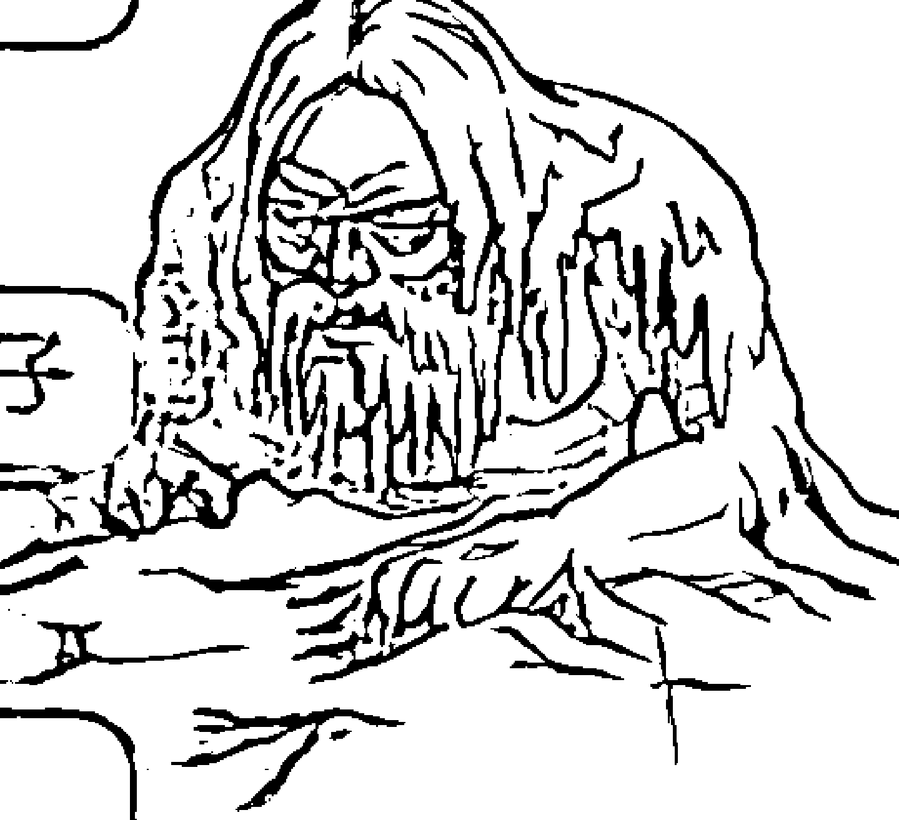

从奥德姆拉舔舐的冰霜里生出一名叫作布利的男子

布利之子包尔与霜之巨人的女儿生下三位神明

包尔之子奥丁众神将伊米尔杀害

# 世界的创造

奥丁等众神利用伊米尔的身体创造世界

创造太阳与月亮，开始有固定的季节

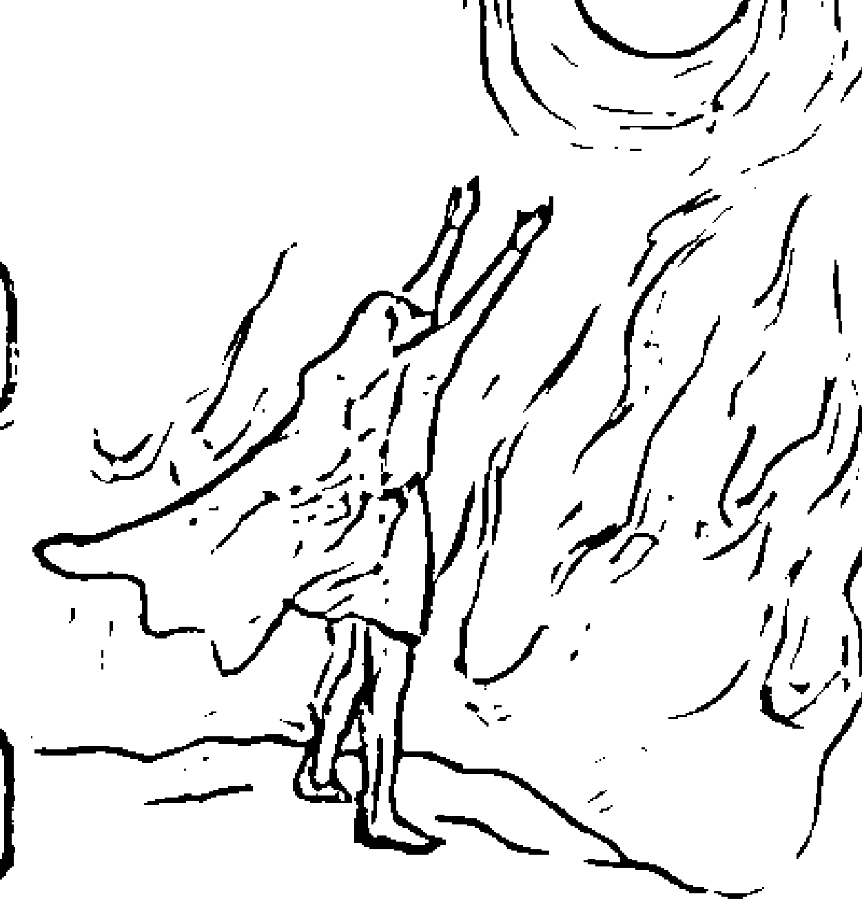

从漂流木里生出人类男女

于约顿海姆与米德加尔德的边境架设栅栏

诸神的世界阿斯加德神域宣告完成

# 关联项目

+   * 阿斯加德神域 - No.010
* 米德加尔德 - No.011
* 九大国度与尼福尔海姆 - No.012
* 穆斯佩尔海姆 - No.013
* 奥丁 - No.017
* 伊米尔 - No.046

# NO.005 北欧神话概观 ②

# 华纳战争与阿萨神域的城墙

诸神的黄金时代随着三位巨人之女的出现而消逝，而邪恶也在同时缓缓侵蚀着他们。

# ○华纳战争

早在阿萨神域初建时，阿萨神族身边多的是丰富的黄金围绕四周，而他们也对这种生活甚感满足。可是，自从三位巨人之女与魔女古尔维格进入阿萨神域以来，阿萨神域就逐渐朝向邪恶蔓延的深渊沉沦。相传阿萨神族虽然试过要消灭古尔维格，但是她却三度复活、慢慢侵蚀诸神的心志。
阿萨神族便是这般开始沉迷于对黄金的欲望，遂有后来与华纳神族的战争发生。神域的城墙因为战事延宕多时而遭破坏，心疲力竭的诸神最后用交换人质方式替这场战争划下了句点。

# ○阿萨神域的城墙

当阿萨神域城墙遭到破坏、诸神正不知如何是好时，忽然有位铁匠牵着匹母马来到，表示愿意以女神菲依雅、太阳和月亮为报酬替诸神建造一座坚固的城寨。阿萨神域的防卫枢纽雷神索尔，此时却正好在往赴东方与巨人族作战的征途之中。当时恶神洛奇力主「若有万一可再凭狡智诓骗之」，诸神才以半年为限，接受了铁匠的要求。谁知道铁匠的工作速度却因为有母马的帮助而快得惊人，诸神感觉态势不妙，遂要求洛奇负起责任。

于是洛奇便变成公马诱惑母马，企图妨碍铁匠的工作。铁匠发现被骗以后，恢复巨人真面目向诸神杀去，最后却被恰巧返回的索尔杀死。阿萨神域因此得到了一道坚固的城墙，可是诸神却也从此背负违反契约的罪名。

古尔维格 (Gullveig)：古尔维格是北欧神话中的魔女。她的名字大多被翻译成「黄金鞭子」，一般认为她是具有黄金能让人堕落之特性的化身。

# 華納戰爭

邪惡因為魔女古爾維格而在阿薩神域蔓延開來

阿薩神族試圖殺死古爾維格，卻以失敗告終

因為諸多理由而與華納神族爆發衝突

以交換人質方式達成和解

華納神族殺害人質密米爾、將首級送返

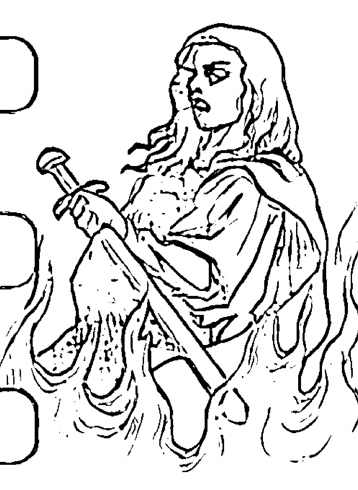

# 阿薩神國的城牆

諸神與鍛匠訂下修復城牆的契約

因為鍛匠及其愛馬的活躍，城牆的修築工作幾近完成

洛奇變成公馬妨礙修築作業

因為神耍詐而發怒的巨人（鍛匠）反遭索爾殺死

諸神從此背負違反契約之罪名

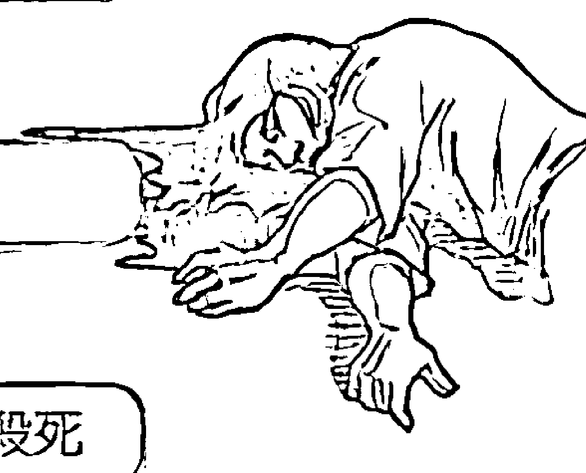

# 相關詞彙

+   - 阿薩神族 - No.016
- 芙蕾雅 - No.023
- 華納神族 - No.040
- ◇菲依雅 - No.044
- ◇巨人族 - No.045
- ◇洛奇 - No.057

# # 奧丁之旅


奧丁之旅乃為加深知識，好替將來與巨人的戰役作準備而展開旅程，然而知識卻只帶給他更多的不安，又使其更加渴求知識。

+   - 正因為賢明睿智所以感到不安

阿薩神域建造完成以後，主神奧丁便經常前往世界各地旅行、尋求知識。奧丁對知識的渴望可說是異常貪婪，甚至到了不惜傷害自己身體的程度。他曾經只為喝一口知識泉水而將一隻眼睛交給把守泉水的巨人密米爾，另外還曾經為了要掌握盧納文字的奧義而用長槍刺穿自己的身體、在世界樹伊格德拉西爾上吊九天。除此之外，相傳奧丁太過沉迷於旅行，使他無暇顧及阿薩神域，甚至連國家和妻子福麗嘉都曾經一度遭到兄弟威利和菲搶奪佔據。

與巨人族的衝突摩擦固然也是原因之一，可是奧丁貪婪追求知識的原本目的，僅是出自於單純的求知欲而已。然則，當知道得愈多，甚至得知諸神將會滅亡的預言以後，他對知識的執著便從此日漸強烈；面對即將滅亡的不安不斷地侵蝕著他的內心，於是他開始派遣大鴉鳥胡金與穆寧前往全世界蒐集團報，自己則坐在能夠看見全世界的寶座上，監視世界的動靜。即便他把當初認定將會危害諸神的惡神洛奇的三個孩子驅逐，即便洛奇帶來了形形色色的怪物，也都無法使他的心得到平靜。

當雷神索爾默默地日夜與巨人族作戰之時，奧丁卻依然為了尋求更深的知識而繼續旅行。除此之外，奧丁為募集勇敢的戰死者英靈戰士作為將來面臨終末戰役諸神黃昏的戰力，也在人類世界裡埋下了許多紛爭與不和。奧丁的行為在其子巴多死後更是變本加厲，他為求得知識不僅籠絡巨人族之女，更不惜玷污女性以達到目的。此時的奧丁根本無法自覺，其實世界正是因為他的所作所為，而更加趨近於毀滅。

# 奧丁之旅（巴多死前）

+   尋求知曉
- 犧牲一隻眼睛換取一口智慧泉水
- 斷食上吊，九天後發明盧納文字

+   流浪各地
- 旅行穿梭於巨人之間，得到許多知識以及魔法道具
- 殺害弗列茲瑪之子歐特，以黃金賠償

從尼芙海爾的巫女口中得到巴多將會死亡的預言

# 奧丁之旅（巴多死後）

+   為了替巴多報仇而生下瓦力
- 與巨人瓦夫特爾德尼鬥智
- 服絡巨人族之女耿蕾姿、得到詩蜜酒
- 在人類世界裡暗地活動，募集英靈戰士

瓦力（Vali）：奧丁和洛奇分別都有個名叫瓦力的兒子。

# 參考項目

+   巨人·No.017
北歐神話·No.020
盧納文字·No.026
巨人族·No.045
洛奇·No.057
盧納文字·No.073

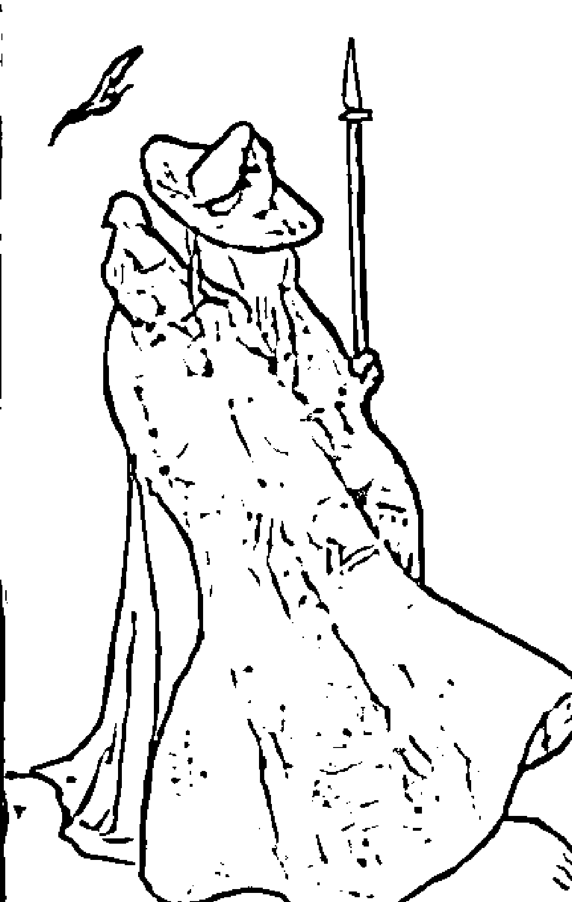

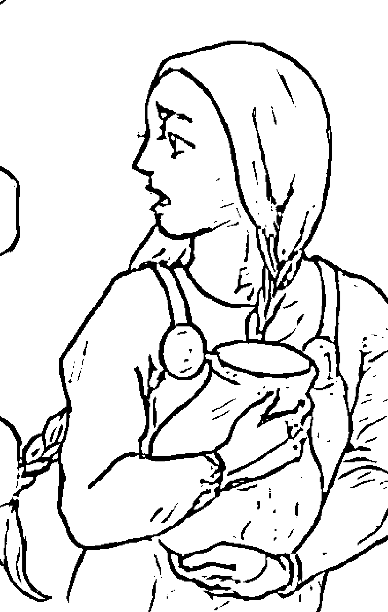

# # 巴多之死與洛奇受縛

惡神洛奇雖然身為巨人，卻以奧丁表兄弟的身份位列諸神之列，他的存在為諸神帶來莫大的災厄。

# ## ○巴多之死

主神奧丁之子巴多是位非常優秀、頗受眾人喜愛的神明。有次巴多做了個夢，而奧丁對巴多的夢境感到很不安，於是便悄悄前往冥界向已經亡故的巫女尋求預言，當時奧丁被告知的，便是兒子巴多之死。巴多的母親福麗嘉聽說此事以後，便與世間萬物訂下了不可傷害巴多的契約，唯獨槲寄生的幼枝除外。惡神洛奇覺得很不是滋味，於是便變身成女人接近福麗嘉，探聽出巴多的弱點。

此時恰逢諸神正在玩拿東西丟巴多的遊戲，洛奇便趁此良機說盲眼的神明霍德爾拿槲寄生幼枝擲向巴多，結果巴多因此而亡。諸神雖曾派遣使者去見死者之國的女王海爾，希望能救回巴多，卻還是在洛奇的阻撓下化作泡影。

巴多的葬禮非常盛大，甚至連諸神的死敵巨人族都派遣使者前來參加，最後巴多就與其無法承受打擊而隨後跟著過世的妻子楠娜，連同大批財寶以船隻火葬放流。

# ## ○洛奇受縛

其後洛奇仍留在諸神之中待了好一陣子，有次他在海神阿戈爾舉辦的宴會裡面批判責難諸神，接著便躲了起來。奧丁至此終於再也無法忍受，遂命諸神找出洛奇的藏身處，並且擒住其子瓦力和納里（Nari）。

諸神先是把瓦力變成狼、讓他咬死納里，然後又用納里的腸子製成鎖鍊綑住洛奇，用毒蛇毒液滴在他臉上施以折磨，從此洛奇就長期被囚禁地底，直到世界末日來臨為止。

> > 楠娜（Nanna）：神話中稱呼楠娜為「善良女兒」，但是卻從未交代楠娜的性別和他究竟屬於哪個神族。我們只知道楠娜和丈夫巴多相戀，後生下了正義之神福瑟。

# 巴多之死

+   1. 诸神对巴多不祥的梦境感到不安
2. 因为母亲弗丽嘉的奔走努力，巴多几乎成为不死身
3. 洛奇很是不满，探听出巴多的弱点
4. 洛奇驱使霍德尔杀害巴多
5. 诸神试图使巴多复活，却因洛奇阻挠而失败
6. 巴多的葬礼盛大举行，霍德尔被杀

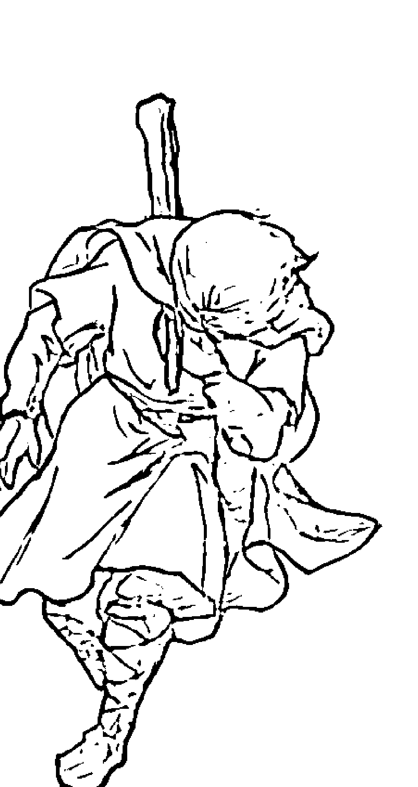

# 洛奇受罚

+   1. 洛奇于阿戈尔的宴会与诸神决裂
2. 奥丁发现洛奇出奔逃亡、派遣诸神捉拿
3. 洛奇逃亡失败被捕
4. 洛奇身受拷打折磨、囚禁地底

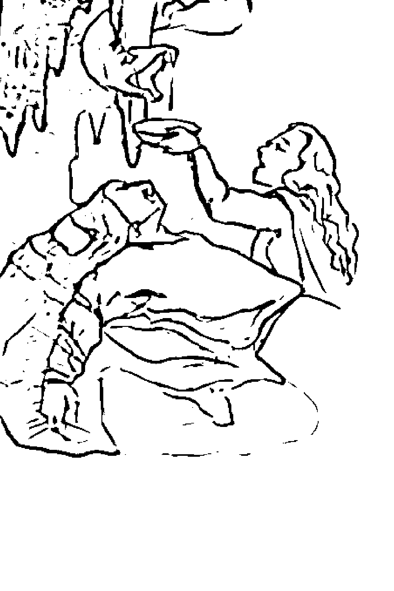

# 关联项目

+   - 奥丁 No.017
- 弗丽嘉 No.026
- 巴德尔 No.033
- ◇阿戈尔→No.056
- ◇洛奇→No.057
- ◇海尔→No.060

# # 诸神黄昏与世界再生

诸神黄昏堪称是北欧神话的最终篇章。不住蓄积的肮脏和扭曲终于招来冲突与末日，世界亦逐渐为烈焰所吞噬。

# ## ○诸神黄昏

自从巴多死后，世界毁灭便开始骤然加速。首先是奥丁的秘密活动引起许多战乱，对人类世界造成了无法挽回的创伤。就连太阳和月亮的驾驶者娑尔与马尼都遭狼群吞噬，使地面世界遭逢到前所未有的天地变异。巨人们见这场混乱有机可趁，遂联同穆斯佩和尼芙海希尔的死者们向诸神展开攻击。两军在一个叫作维格利德的战场正面交锋，然后一个接着一个倒了下来。奥丁遭巨狼芬里尔吞噬，而芬里尔又被维达打倒；雷神索尔和约尔孟甘德、战神提尔和加尔姆、诸神的看门人海姆德尔和恶神洛奇，都分别同归于尽。丰饶神福瑞败给了穆斯佩之长苏尔特，大地也被苏尔特释放的火炎燃烧殆尽，最终沉入海底。

# ## ○世界再生

然而世间万物却并未就此灭绝，烧得精光沉进海底的大地，后来又再度浮出了海面。相传那时的大地丰当而肥沃，到处尽是绿意盎然，即便不播种也能结出谷物，天空里则由太阳马车的驾驶者娑尔留下来的独生女继承母职，继续照耀大地。至于人类则是以藏身于霍德密米尔森林（Hoddmimir’s Holt）的男女为始祖，再度在大地发展繁衍。他们重新打造的新世界里再无任何担忧、痛苦或邪恶，唯有喜乐与纯洁。

于是北欧神话的故事，终于就在先前战役幸存下来的众神，以及因为没有犯罪而得以从冥界返回的巴多、霍独尔等诸神会合后一同回到阿萨神域旧址缅怀过去的这一幕，而画下了句点。

# 諸神黃昏

發生天地變異，人類世界開始荒廢

公雞報時，巨人、穆斯佩與死者們展開攻勢

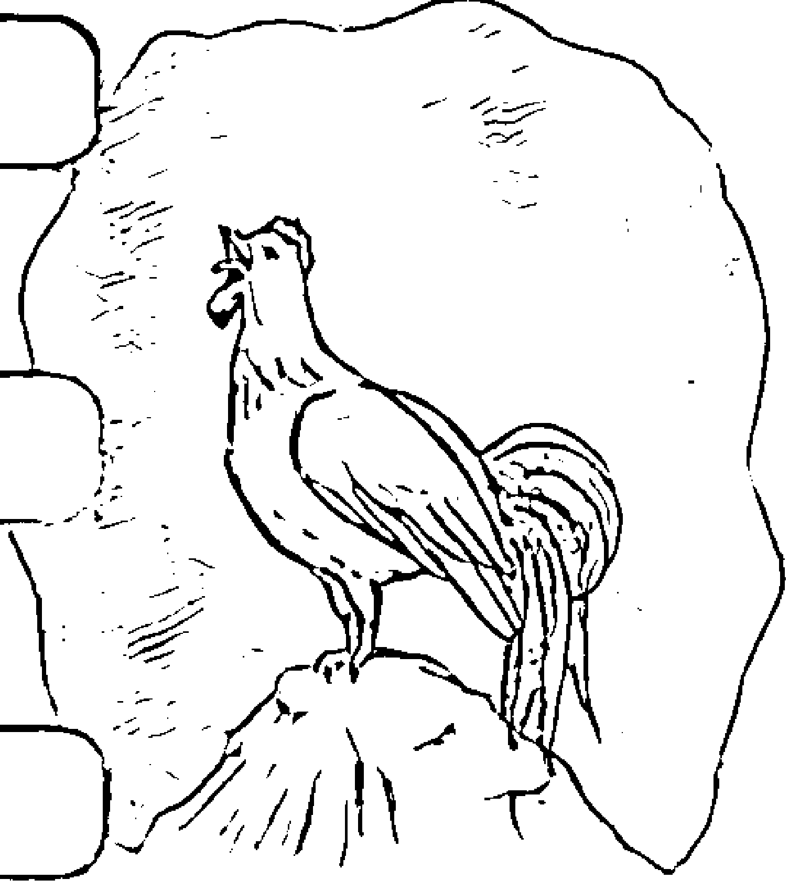

海姆達爾發出信號，諸神開始準備戰鬥

兩軍於維格利德原野正面交鋒

大地被穆斯佩之長蘇爾特燃燒殆盡、沉入海底

# 世界重生

沉入海底的大地再度浮現

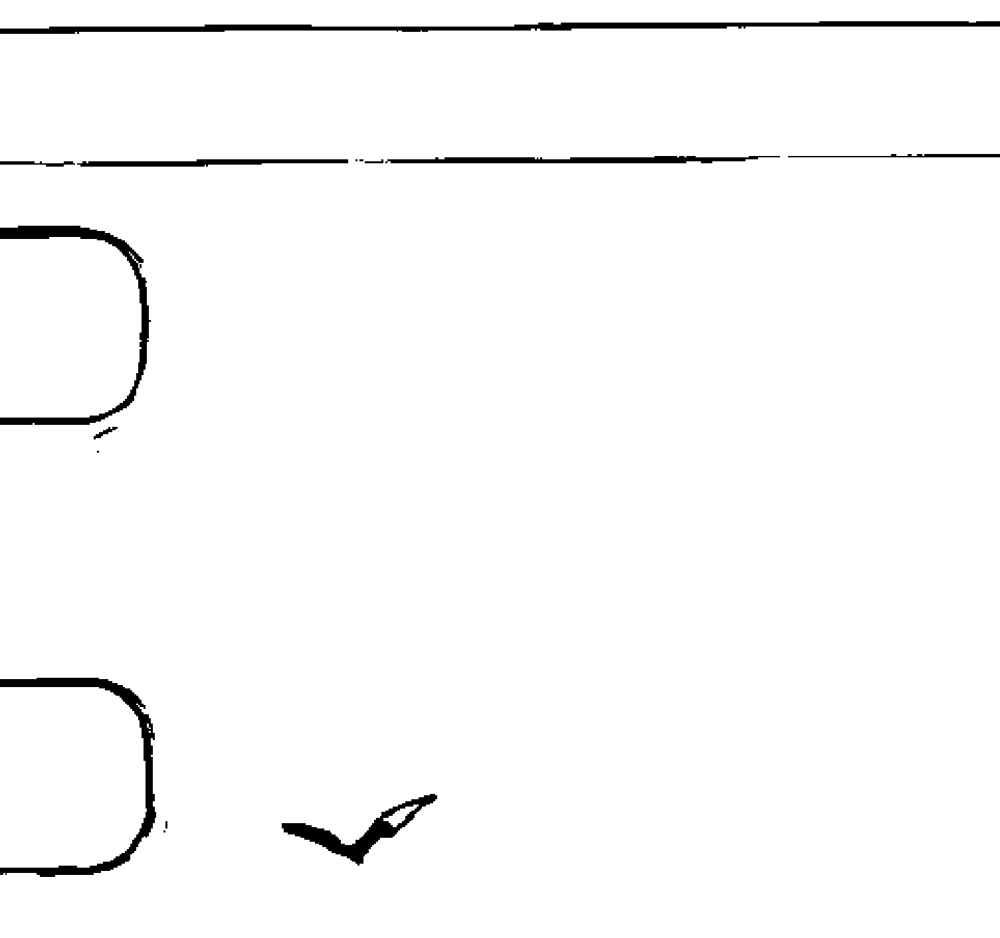

太陽馬車駕駛者之女代替母親照耀大地

倖存的人類再度展開活動

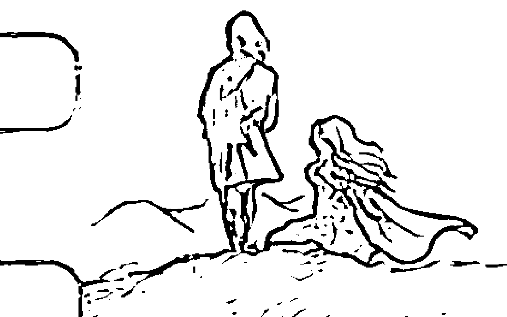

倖存的諸神與復活的諸神會合

諸神於阿薩神域舊址緬懷過去

No.017
No.026
◇娑爾與馬尼、達格與諾特→No.039
◇祖斯佩→No.065

# No:009
北歐神話的宇宙觀

北歐神話的宇宙是由各有不同種族居住的九個世界所構成。

# ○諸神與巨人居住的世界

根據《詩歌愛達》的〈女先知的預言〉等文獻記載，北歐的宇宙是由九個世界和一株世界樹所構成。
九個世界當中位置最北的是極寒世界尼弗海姆，其地底則是死者女王海爾的領地尼芙海爾（海爾）。位在最南方的是灼熱國度穆斯佩海姆，終末戰役諸神黃昏當中與諸神衝突的穆斯佩便住在此地。這兩個世界中央有片深海，諸神以原初巨人伊米爾的身體創造出來的大地便是位於此海域。諸神將這片大地劃分成三個區塊：建於大地中央的城寨是阿薩神族居住的世界阿薩神域，外側是以彩虹橋比夫羅斯特連接至人類居住的世界米德加爾德；米德加爾德的外圍又有道用伊米爾睫毛製成的柵欄，圍欄外或曰北側、或曰東側的海岸線上，則是有巨人居住的世界喬登海姆坐落於該地。除此以外還有華納神族居住的華納海姆、流斯愛爾芙（白妖精）住的愛爾芙海姆、鐸克愛爾芙（黑妖精）住的史瓦爾德愛爾芙海姆等世界存在，但《詩歌愛達》和《史諾里愛達》並無更進一步的詳細記載。

另外還有棵樹蔭涵蓋籠罩前述九個世界、樹根盤互及於世界各地的世界樹伊格德拉西爾，另有一說認為，世界其實就是憑著世界樹支撐起來的。這些世界的上方還有好幾層用伊米爾頭蓋骨做成的天空，東西南北的盡頭各有一位、總共四名侏儒負責頂著天空。天空中載運太陽與月亮的馬車無時無刻在後方狼群的追逐驅趕之下疾駛過天際。天空北方還有變身成鷲鷹模樣的巨人赫拉斯瓦爾格爾，他只要拍打翅膀就會變成風，在全世界吹送。

# 北欧神话的世界结构图

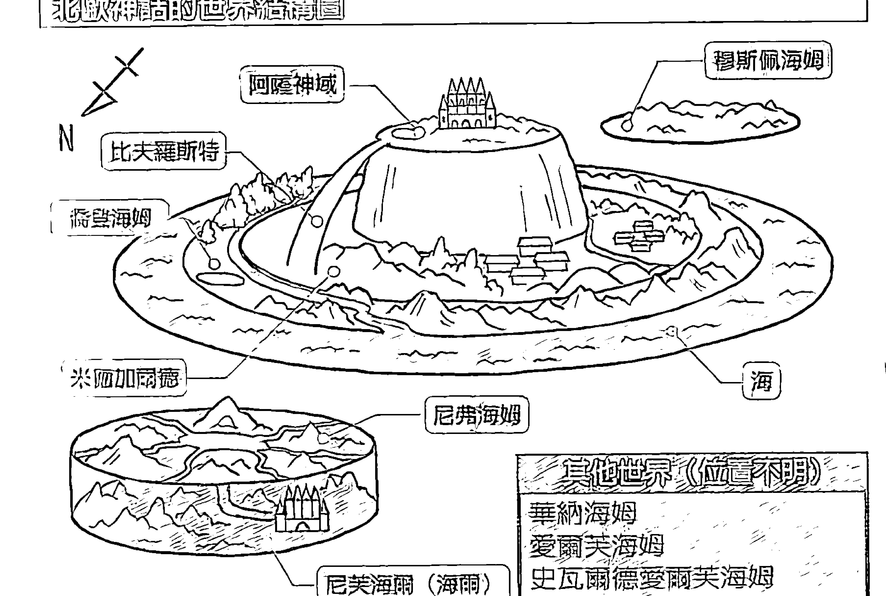

# 北欧神话的宇宙观

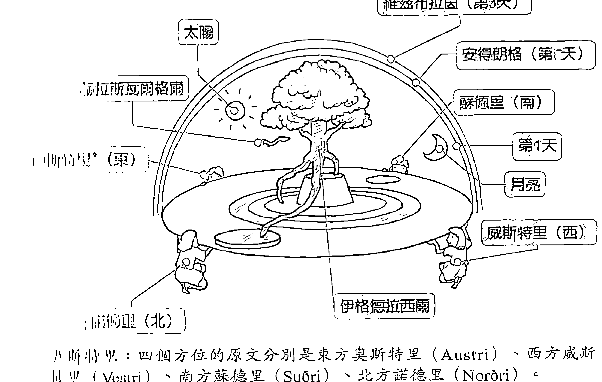

奥斯 特里：四个方位的原文分别是东方奥斯 特里（Austri）、西方威斯 特里（Vestri）、南方蘇德里（Suðri）、北方諾德里（Norðri）。

+   其他世界（位置不明）：
- 華納海姆
- 愛爾芙海姆
- 史瓦爾德愛爾芙海姆

+   相关页数：
- 阿斯加德 No.010
- 穆斯佩海姆 No.013
- 九界 No.011
- 伊格德拉西爾 No.015
- 尼芙海姆 No.012
- 其他世界 No.014

# 阿薩神域
Asgard

阿薩神域是北歐諸神居住的世界，那是個閃爍著金黃色光芒的耀眼世界。

# ○諸神居住的壯麗世界

阿薩神域是阿薩神族居住的世界。《史諾里愛達》的〈欺騙吉魯菲〉稱「特洛伊」這個地方位於人類居住的大地中央，據說天上和地上發生的許多事情都是在此地裁決。阿薩神域是座牆高壁堅的城寨，乃是從前諸神誆騙巨人族的鐵匠所建。關於阿薩神域究竟是在天上還是在地上並無明確答案，只能任憑眾人自由想像。我們只知道，欲從其他世界進入阿薩神域，勢必要途經彩虹橋比夫羅斯特，否則就只能騰空飛行而入。

阿薩神域中央有名為艾達華爾的廣場，其中有座供眾男神聚會的黃金神殿格拉茲海姆，殿內備有奧丁和其他諸神的寶座總共十二個。另一方面，女神們集會的神殿則是名為梵格兩夫，據說同樣也是非常美麗的建築物。諸神在阿薩神域初建時便擁有許多黃金，因此阿薩神域的房屋家具全部都是用黃金打造而成。

除此以外，阿薩神域尚有奧丁的英靈殿和其他諸神的房屋館邸坐落。其中英靈殿更是特別重要的建築物，奧丁與菲依雅將所有戰死者分配完以後，屬於奧丁的勇士們就會在這裡為將來的終末戰役諸神黃昏進行訓練備戰。另外，在世界樹伊格德拉西爾的樹根伸進泉水裡的烏爾德之泉池畔，也有座諸神的集會場，同樣也被視為重要的場所，諸神便是在此地裁決全世界發生的各項事件，相傳命運女神諾恩的館邸也是在烏爾德之泉池畔。

# # 阿斯神域之構造

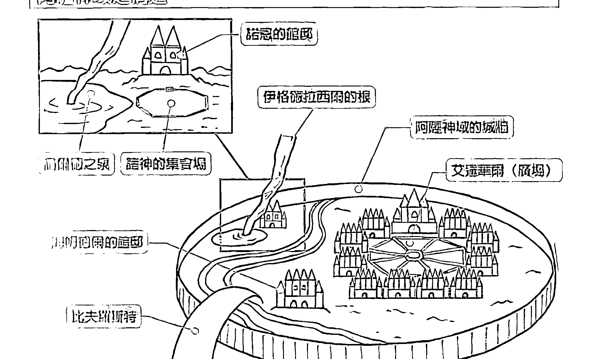

# ## 諸神的住處和其他設施

| 設施名稱 | 描述 |
|---|---|
| 格拉兹海姆 | 擁有12個寶座、以黃金修葺而成，是眾鬼神的宮殿，奧丁的宮殿英靈殿便在境內 |
| 弗格爾夫 | 與格拉茲海姆相對應，是居住眾女神的神殿，此地也是熱性正直者的最終歸宿，多被視同為居住於第3天的館邸吉姆列 |
| 「銀之池」 | 相傳乃諸神以計謀取得、為白銀所包裝之奧丁宮殿，至高王座便是設於此地 |
| 布倫斯圖爾德 | 共有540個門的榮耀宮殿，是全世界規模等級最大的建築物 |
| 彩虹橋下的館邸 | 建於彩虹橋下海姆達爾聖地西敘壘（Himinbjörg）的館邸，相傳此館邸住起來既寬敞又舒適 |
| 英靈殿 | 奧丁的宮殿，分配給奧丁的戰死者會在這裡受到款待、日夜訓練 |
| 菲依克范格 | 菲依雅的館邸。此館有個名為色斯克尼爾的大廳，分配給菲依雅的戰死者會在此受到款待 |

+   - ◇諸神 No.015
- ◇英靈 No.016
- ◇奧丁 No.017
- ◇諾恩 No.037

# NO.011 喬登海姆

喬登海姆乃是屬於巨人族的世界。這個或曰位在米德加爾德東方、或曰在其北方的世界，是人智所無法理解的不可思議之境。

## ○對諸神虎視眈眈的巨人居住的世界

喬登海姆是位於守護人類世界的圍欄米德加爾德外側的巨人國度。喬登海姆有時亦稱烏特加爾（意為圍欄之外），不過此地名並不等同於曾經讓雷神索爾吃盡苦頭的巨人烏特加爾洛奇的領地。關於其位置有數種不同說法，根據《詩歌愛達》與《史諾里愛達》的記述，喬登海姆應當是位於米德加爾德北方到東方的海岸線附近。《史諾里愛達》的〈欺騙吉岳菲〉記載，從前諸神創造世界的時候已經將此地定為巨人的住處。

喬登海姆有口由巨人密米爾負責管理的密米爾之泉，世界樹伊格德拉西爾的樹根就浸在這口泉水裡。另外，在喬登海姆南方有條毒河埃利伐加爾流過，《史諾里愛達》的〈詩語法〉就有雷神索爾從北方歸來並且渡過這條毒河的記錄，位於米德加爾德東方的鐵森林似乎也在喬登海姆的領地範圍內。這座森林裡面住著變身成狼隻模樣的巨人和生下這些巨人的老婆婆，有個說法認為此地便是分隔米德加爾德與喬登海姆的境界線。〈詩語法〉亦曾記載在喬登海姆和阿薩神域中間有個名叫葛留杜迦薩的國境，不過文中完全沒有提及北歐神話究竟是將這兩個不相連世界的國境設定在何處。

《丹麥人的業績》裡還有則丹麥國王哥爾姆造訪巨人蓋魯特（即〈詩語法〉裡面的蓋爾羅德）住處的故事。據其所載，巨人的國度是一片永受酷寒籠罩的原始森林，那裡雖然作物稀少，卻有許多別處看不到的獨特生物棲息。相傳住在這裡的居民們都長得一副幽靈般的可怖模樣，身體還會發出惡臭。

> 米化加爾德：若採意譯則作「中間世界」，本書因翻譯需要故採音譯。

# 诸神黄昏的预兆

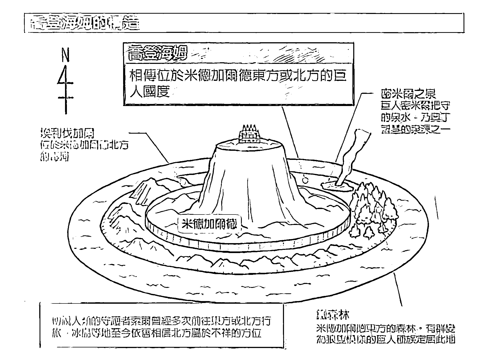

> 以說人類的守護者索爾曾經多次前往东方或北方旅行，冰島等地至今依舊相信北方屬於不祥的方位

# 丹麦国王哥尔姆的冒险

根據《丹麥人的業績》記載，從前有位主動想要前往眾人避之唯恐不及的巨人国度旅行的奇特人物，那便是丹麥國王哥爾姆一世（Gorm I）。此人喜好探索自然更甚於作戰打仗，並且對冰島民話中的蓋爾羅德（丹麥文記作蓋魯特）的傳說抱有非比尋常的興趣。儘管通往該地的路途據說凶險非常，年輕的國王仍憑無比的熱情探索冒險的熱情，遂帶領三百名部下和故鄉蓋爾羅德流浪的僕人格爾基（Thorkil），乘著三艘船朝巨人国度進發。

一行人的目的地是遠在哈羅加爾「前方的畢雅馬爾蘭」。居住在當地的古德蒙（Gudmund）是蓋爾羅德的兄弟，儘管他對走過艱險路途好容易才抵達的哥爾姆王表示歡迎，但其國古德蒙卻企圖謀害哥爾姆一行人，最終只剩下哥爾姆王和極少數幾位部下在千鈞一髮之際得以平安返國。

哈羅加爾（Hålogaland）：中世紀北歐薩迦記載中挪威最北的省份。早在金髮王哈拉爾一世尚未出現以前，哈羅加爾是介於挪威的北特倫德拉格和芬馬克之間的小型獨立王國。
畢雅馬爾蘭（Bjarmaland）：畢雅馬爾蘭是北歐薩迦文學中從維京時代起便有記載的地方。此地名意指白海南岸和北杜味拿河流域，即今日俄羅斯的阿爾漢格爾斯克州地界。

- 索尔 > No.010
- 盖尔罗德 > No.052
- 乌特加尔洛奇 > No.054
- 哈罗加尔 > No.015

# No.012 三ツルハイムとニツルヘル
# 尼弗海姆與尼芙海爾
Niflheim & Niflhel

在極寒世界尼弗海姆的地底，尚有死者女王海爾居住統治的尼芙海爾存在。

## ○極寒世界與死者國度

尼弗海姆是個位於極北盡頭的極寒世界。相傳這個世界屬於諸原初世界之一，其形成時間雖然比位於相反方向的穆斯佩海姆來得晚，卻是早在其他世界形成許久以前便已存在。根據《史諾里愛達》的〈欺騙吉魯菲〉記載，尼弗海姆乃是寒冷和所有恐怖事物的源頭，這裡有口名為赫維爾蓋爾米爾的泉水，而此泉水又分流出好幾股河流，流向每個世界。這口赫維爾蓋爾米爾之泉乃是有着黑龍尼德霍格和牠麾下無數蛇群的棲息地，他們平日靠著啃食浸在泉水裡的世界樹伊格德拉西爾樹根，以及棄置於泉水中的人類屍體度日。

尼弗海姆地底有死者統治者海爾的領地尼芙海爾，此世界亦被稱作海爾。病故與衰老死的死者會被帶到位於此地的館邸埃琉德尼爾，然而通往尼弗海姆的道路艱險非常，死者的旅途可謂困難至極。

欲前往海爾館邸，首先必須沿著艱難道路朝北而行，然後渡過吉歐爾河，此處有座黃金橋加拉爾，一名叫莫德古德的少女在此把關，即便通過莫德古德的考校、順利通過黃金橋，前方路途也依然困難重重。通往尼芙海爾的格尼巴洞窟有隻凶惡的守門犬加爾姆把守，死者須設法逃過牠的尖牙方能通過。好不容易抵達海爾館邸，死者卻仍然不得稍有鬆懈放鬆，必須睡在名為「病床」的床上、以名為「空腹」的餐盤和名為「飢餓」的餐刀進食。另外，據說從前經常將智慧借給主神奧丁的眾巫女，她們的墓碑就位於海爾館邸的東邊。

# 尼弗尔海姆的构造

示意图展示了尼弗尔海姆（北欧神话中的冰雪世界）的结构。标注文字包括：‘从栖息于英瓦殿的公鹿艾克修尼尔的鹿角滴下的冰冷水滴’、‘伊格德拉西尔的根’、‘赫瓦格密尔’。并附有说明：‘相传所有河流都是发源自自然之源赫瓦格密尔之泉，《史坦里史诗》的〈欺瞒吉鲁菲〉列举了十一条河流的名字’。

示意图展示了‘赫尔（海姆）的入口’。标注文字包括：‘埃琉德尼尔（海姆的宫殿）’、‘格尼巴洞窟’、‘四泉河’、‘吉欧尔河’、‘地狱犬加尔姆’、‘克巫女之屋’。

相关条目索引：
- No.013
- No.015
- No.017
- No.060

# No.018 ムスペルスヘイム
# 穆斯佩海姆
Muspellsheim

末日战争诸神黄昏一役中与诸神作战的神秘民族穆斯佩，就是住在这个终年被烧炙的热气与烈焰笼罩的原初世界。

## ## 烈焰熊熊的国度

穆斯佩海姆早在第一个生命体巨人伊米尔诞生以前便已存在，是最古老的世界。穆斯佩海姆的大地长年受灼热火焰笼罩，若非原本便出身于此的生物，别说是要住在此地，光是想要进入都万万不能。此地位于世界中央深渊金伦加鸿沟的南侧，位置跟冰霜迷雾的世界尼弗海姆恰恰落在相对的两个极点。是故在诸神尚未创造出新世界之前，唯有在这两个世界的空气汇流融合的地点——金伦加鸿沟——的中央部分，气候才较为和缓而稳定。

此世界的统治者苏尔特是穆斯佩族的族长，相传他总是带着一柄火炎之剑在世界的边境监看巡视。除前述内容以外，即便遍寻《诗歌爱达》或《史诺里爱达》，也再找不到有关穆斯佩海姆更进一步的记录，因此这个世界除穆斯佩以外有无其他生物，或究竟有何种文化等较详细的情况，一概无从得知。

## ## 孕育诸多恩惠的土地

尽管乍看之下是个极为神秘而不毛的灼热国度，但其实穆斯佩海姆却替北欧神话的世界带来了许多恩惠。首先，世界的第一个生命体的诞生，便是肇始于穆斯佩海姆与尼弗海姆两地空气的汇流撞击，换句话说，若无穆斯佩海姆的热能，也就不会有后来的诸神诞生。

其次，穆斯佩海姆所迸发的强光与火花，同样也受到诸神的有效利用；诸神创造世界之际，便是以穆斯佩海姆的光与热为材料，创造出用来照亮天与地的日月星辰等天体。

# 穆斯佩海姆的构造

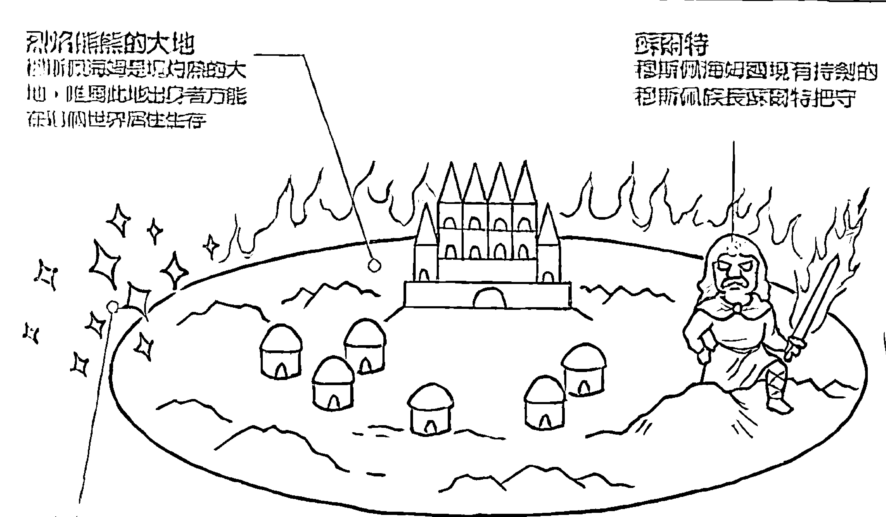

相信穆斯佩海姆乃是北欧神话当中最古老的世界，位于阿萨神族所居世界阿斯加德

# 穆斯佩海姆孕育生成之产物

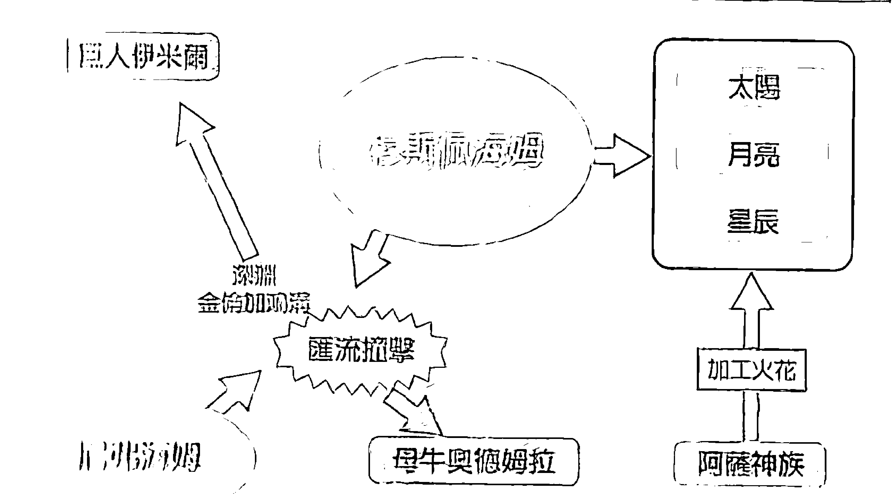

# # 其他世界

## ## ○人類的世界、妖精的世界

北歐神話裡面共有九個世界，但大多數均少有記述、實情不明。此節所要介紹的便是這些世界。

人類居住的世界米德加爾德乃是坐落於諸神以原初巨人伊米爾肉體創造出來的圓形大地之上。這片大地可以分作三個區域，中央是諸神居住的阿薩神域，外側是圍牆（亦稱爲米德加爾德），再往外的北方或東北方海岸線則是有巨人族居住的喬登海姆。住在同一片大地上的巨人從以前便是人類的巨大威脅，諸神覺得人類很可憐，於是就用伊米爾的睫毛創造出守衛人類世界的柵欄米德加爾德，而米德加爾德就此成爲人類世界的稱呼。然而，米德加爾德卻未能如諸神所願成爲和平的世界，因爲主神奧丁爲了要蒐集聚勇的戰死者英靈戰士作爲棋子運用，刻意撒播矛盾與不和、引起戰亂所使然。

相傳流斯愛爾芙（白妖精）所居住的愛爾芙海姆，原本是從前豐饒神福瑞在長智齒的時候送給他當做紀念的世界。關於這個世界幾乎毫無所知。一般相信流斯愛爾芙是住在第三天維茲布拉茵（Vidbláinn）的館邸吉姆列（Gimle），所以普遍都認爲愛爾芙海姆乃是位在天界。

至於鐸克愛爾芙（黑妖精）住的史瓦爾德愛爾芙海姆，《史諾里愛達》載有福瑞的僕從史基尼爾曾經前往該地的記錄。書裡寫到此處有侏儒（矮人）居住，因此史瓦爾德愛爾芙海姆很可能是矮人經常出入居住的地底世界。

再說到華納神族住的華納海姆，更是連想要推敲那是個什麼模樣的世界都很困難。從殘缺的文字記錄可以得知華納海姆在諸神黃昏過後仍得以存續，因此至少可以確定它應當是位在終末毀滅的破壞力所不能企及之處。

# 米德加爾德的構造

# 米德加爾德/Midgarr

為提供給人類居住而劃分出來的土地，四周圍有用來防禦巨人入侵的柵欄

用伊米爾的啞毛造成的柵欄 須欄內使即米德加爾德此名之由來・棚內本身亦經常被稱作米

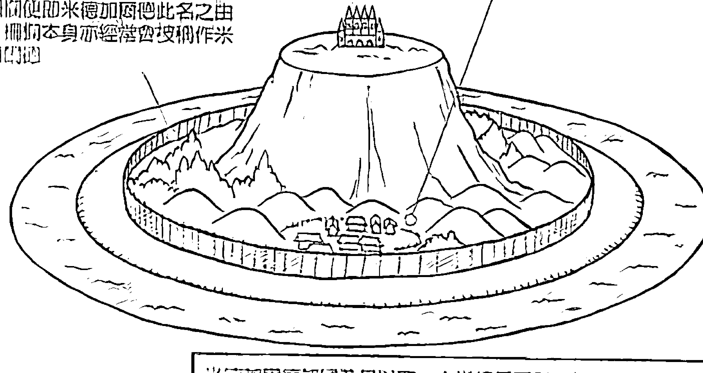

米德加爾德據說乃是以四~十世紀日耳曼文化圈為原型・現存《埃達》的《女先知的預言》記載，米德加爾德所在的這片大地，其西是諸神從海裡撈起來的陸地

# 阿爾夫海姆 Alfheimr

因神明長習齒（當時的社會有送禮給嬰兒以示慶賀的習慣）而贈送給光精靈的世界。此地是流斯愛爾芙（白妖精）的住處，相當於人界

# 斯瓦爾塔爾夫海姆 Svartalfaheimr

（矮人）亦即澤克愛爾芙（黑妖精）居住的世界。從《史諾里愛達》裡判研，一般均認為此世界乃是位於地底

# 華納海姆 Vanaheimr

（華納神族）的世界。從部分文字記述可以發現，華納海姆應是處在某個不受戰爭諸神黃昏波及的位置。《挪威王列傳》則說華納海姆位於頓河（Don River）流域

頓河（Don River）：頓河是俄羅斯的主要河流之一。發源於莫斯科東部的圖拉（Tula）附近，長1950公里，流入亞速海（Sea of Azov）。

- 伊米爾 No.010
- 伊米爾 No.011
- 伊米爾 No.020

- ◇華納神族 - No.040
- ◇伊米爾 - No.046

# No:015 ユグドラシル
伊格德拉西尔
Yggdrasil

世界樹伊格德拉西尔的枝葉遍及九個世界。在這株巨大的梣樹底下，有著各式各樣的生物在此依偎棲息。

## ○連接九個世界的世界樹

經常被視同於霍德密米爾森林（Hoddmimir's Holt）、雷拉茲之樹的伊格德拉西爾，是株枝葉包羅涵蓋北歐神話九個世界的巨大世界樹。根據《史諾里愛達》的《欺騙吉魯菲》記載，這株名字意為「伊格（奧丁）之馬」的梣樹是所有樹木當中最大最好的一株，另外它也是生命的象徵，古詩《菲歐史維德之歌》（Fjölsvinnsmál）就說到把它的果實煮來吃有助產的效果。這株伊格德拉西爾共有三股（《詩歌愛達》的《女先知的預言》則說是九股）粗大的樹根支撐著樹體，一股在阿薩神域、一股在喬登海姆，最後一股則是長在尼弗海姆（《詩歌愛達》的《葛林尼爾的話語》則作海爾、喬登海姆、米德加爾德）。每股樹根底下各有一口泉水，阿薩神域的是烏爾德之泉、喬登海姆的是密米爾之泉，在尼弗海姆的泉水則被喚作赫維爾蓋爾米爾。

伊格德拉西爾因為體積巨大而有形形色色的生物棲息，其中像是愛吃嫩葉的四頭公鹿、在赫維爾蓋爾米爾池畔啃食樹根的有災黑龍尼德霍格之類會危害樹體的生物亦不在少數，因此伊格德拉西爾的樹幹都早已腐敗軟化。居住在烏爾德之泉的諾恩為避免伊格德拉西爾枯萎，必須每每以神聖的烏爾德泉水和白泥撒在裸露出來的樹根上，藉以保護世界樹。或許正是因為這個緣故，伊格德拉西爾始得以長保蔥茂如常。

儘管伊格德拉西爾給人如此雄壯宏大的印象，其下場卻非常引人唏噓。它在終末戰役諸神黃昏之際，遭到被解釋為巨狼芬里爾抑或蘇爾特所釋放火炎的「蘇爾特的親戚」所吞噬。

# 闡述遍及三個世界的世界樹

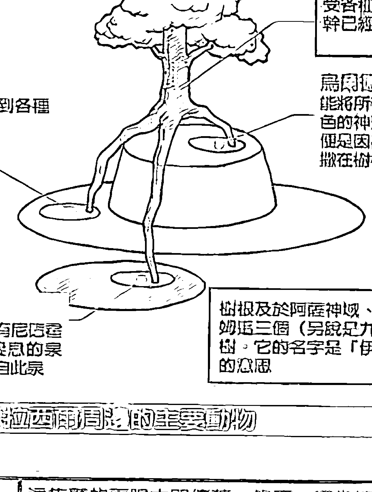

[色蒼蒼的茂盛枝葉，果訂有助壓的功效]

受各種動物啃食，部分樹幹已經腐爛軟化

密米爾之泉 此泉水便能得到各種知識

烏爾德之泉 能將所有接觸到的物品變成白色的神聖泉水。伊格德拉西爾便是因為有摩恩用泉水和泥土撒在樹根上，方得以存活

赫瓦格密爾 尼弗爾海姆的場所，有尼德霍格等生物棲息的泉，許多河流均源自此泉

樹根及於阿薩神域、華登海姆、尼弗海姆這三個世界的巨大樺樹。它的名字是「伊格（奧丁）之馬」的意思

# 棲息在伊格德拉西爾周圍的主要動物

| 動物 | 描述 |
|------|------|
| 鷹 | 這隻鷹的兩眼中間停著一隻蟲，經常被視同於棲息在天空的赫拉斯瓦爾格爾。博識多聞 |
| 拉特托斯克 | 棲息於伊格德拉西爾樹幹裡的松鼠，為使鷹跟尼德霍格失和而四處奔走 |
| 四頭公鹿 | 達因、特瓦林、杜涅爾、杜拉索爾，不停啃食伊格德拉西爾的嫩葉 |
| 尼德霍格 | 棲息於赫維爾蓋爾米爾的有翼黑龍。為使伊格德拉西爾枯死，而與麾下群蛇不停啃食其樹根 |
| 蛇 | 格因、摩因、格拉巴克、格拉弗沃倫德、奧弗尼爾、斯瓦弗尼爾，棲息於赫維爾蓋爾米爾 |
| 白鳥 | 棲息於烏爾德之泉，是所有白色鳥類的始祖 |

達因、特瓦林、杜涅爾、杜拉索爾：四頭公鹿的名字依序為Dain、Duneyr、Duraþr、Durathor。格因、摩因、格拉巴克、格拉弗沃倫德、奧弗尼爾、斯瓦弗尼爾：六條蛇的名字依序為Góinn、Móinn、Graðvolr、Ófnir、Sváfnir。

- ◇ 奧丁・No.017
- ◇ 諾恩・No.037
- ◇ 芬里爾・No.058

# 基督教传入以后的北欧诸神

正如同曾经以地中海为中心在欧洲盛极一时的希腊罗马神话般，北欧诸神亦难逃基督教的影响力波及。这些被传教士吸收纳入基督教价值观的北欧神祇，终于从高高在上的神座堕落，并逐渐演变成妖精、恶魔之流，从而流传后世。直到数个世纪以后、世人发现其文学和历史价值之前，这些北欧诸神便是如此长期被埋没在历史舞台最黑暗的角落。

其中尤以从前深受王侯贵族信奉的奥丁信仰的没落凋零，特别令人心痛。在接受基督教以后的德国，奥丁变成了如同亡灵在暗夜里出没、物色旅行者抓夺魂魄的妖怪幽猎（Wild Hunt）。奥丁的形象定位在德国至少与从前相同，仍然是不断在召募士兵寻找英灵战士，可是在北欧受到的对待甚至比被视为恐怖的妖怪还要更加不如：原本信奉他的王侯贵族因为选择了利于施行统治的基督教，结果便使得奥丁只能没落得成为时时企图迷惑王侯、稍见有机可趁便要取人性命的可厌恶魔。

另一方面，民众的守护神索尔似乎在基督教侵入后，依旧受到民众始终信奉，而且还维持了一段时间。就算索尔最终还是被打成了恶魔，他跟奥丁比起来，始终还是较少有邪恶毒辣的行径，依旧是秉持着希望得到民众信仰的态度，出现在家人面前。

从大力推动改宗基督教的挪威国王奥拉夫·特里格瓦松的传说里亦可清楚窥见前述二者之差异。奥丁运用花言巧语瞒骗国王、每每欲不饵赂礼物陷害之，却屡屡遭到国王以机智化解。相对地，索尔则是在国王乘船出航之际现身、讲述自己从前为保护民众而驱退巨人的故事，然后就此消失不见。

最终索尔便是以巨人克星的形象在民间故事里留下了身影。根据瑞典的民间故事记载，从前有个农民被迫必须邀请巨人来参加儿子的受洗仪式，当时他只提到说索尔也在前来祝贺的宾客名单当中，便阻止了巨人的来访。原来那名巨人住在该农家附近的山里，每次渔民打渔的时候，巨人都会给他好运，因为要报答这份恩情，所以才必须邀请巨人参加仪式，但是如果让贪吃的巨人来参加，农民的所有财产家当就很有可能会被巨人给吃倒，于是农民便心生一计，让仆从去进行计画以免必须招待巨人。

当仆从前去邀请巨人参加仪式的时候，巨人问过还有招待哪些宾客，仆从便列举出基督教的圣人、基督本人以及圣母玛利亚等名字，当时巨人心想这些宾客只消稍作忍耐即可，倒也不至于让他无法参加，可是仆从又接着提到了索尔的名字，巨人才说自己曾经吃过索尔许多苦头，因而放弃出席农民之子的洗礼仪式。

奥拉夫·特里格瓦松（Óláfr Tryggvason）：即挪威国王奥拉夫一世（Olaf I，995~约1000年在位）。为哈拉尔一世的曾孙，奥拉夫松（Tryggvi Olafsson）的遗腹子。

# 第2章
北欧神话的
登场人物

# # 阿薩神族

阿薩神族是支統率北歐世界的偉大神族，但他們究竟是種什麼模樣的存在？

## ## ○君臨北歐世界的眾神

阿薩（Áss，複數形為阿希爾Æsir）神族是住在九個世界中心阿薩神域的眾神。傳說他們每天都會聚集在烏爾德之泉畔的集會場，裁判處理世界發生的各種事情。

《史諾里愛達》講述阿薩神族時列舉了主神奧丁、雷神索爾、戰神索爾為主的男女各十二～十四位神明，其中甚至還包括了華納神族的尼爾德父子和出身巨人族的惡神洛奇等神明，因此阿薩神族應是個泛指所有神明，而並非限定於某一特定種族的用語。

阿薩神族的長相大致來說與人類並無二致。跟人類與其他種族不同的是，阿薩神族因為有顆由女神伊登負責管理、能夠永保青春的蘋果，所以既不會變老也不會變醜陋；不過他們也並非永恆不滅的存在，不但可能在戰鬥中受創負傷，嚴重者甚至還會因而死亡。也正是因為這個緣故，終末戰役諸神黃昏之際，才會有許多神明在與巨人族的激戰過後喪失了性命。

北歐民族相信阿薩神族司掌主權、祭祀、魔法、法律、知識、暴力、戰鬥等各項事務。話雖如此，阿薩神族其實並不像司掌農作豐收的華納神族般能夠各自套用至各個分類；事實上，民眾對奧丁與索爾諸神的祈求頗為繁雜、遠超過前述諸多類別。

另外，《挪威王列傳》和《丹麥人的業績》所描述的阿薩神族，其實只不過是群擅長魔法的人類而已；他們便是憑著這股力量從原本的根據地遷居至北歐，從而君臨於眾人之上。

# 北欧神族系谱及主要人物

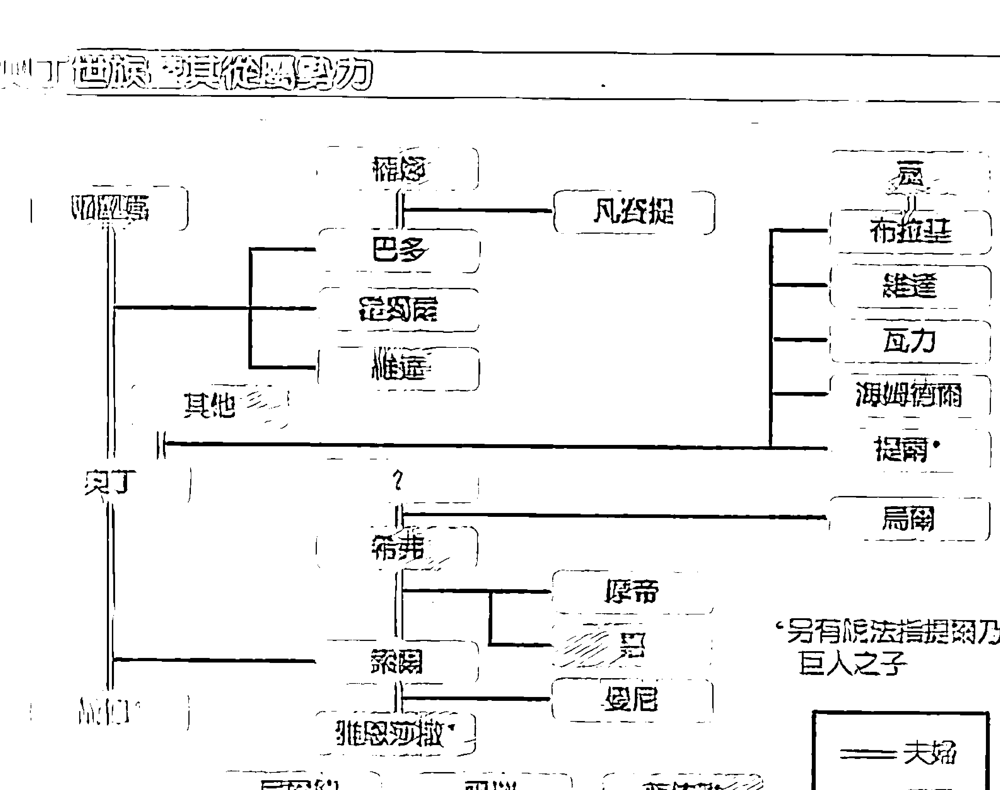

- 双横线：夫妻
- 单横线：亲子

# 阿萨神族的对外关系

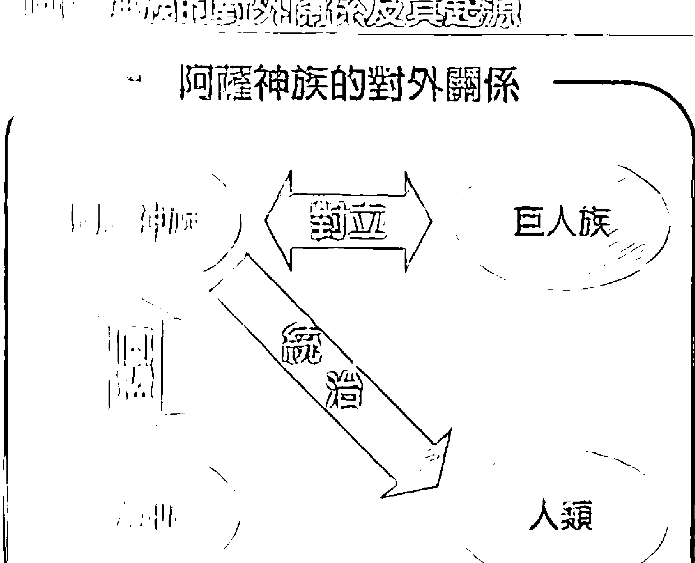

> 《挪威王列传》记载的阿萨神族起源
阿萨神族原是小亚细亚地区特洛伊的王族，奥丁因占自己的未来在北欧，故而开始对北欧展开攻侵略

> 《丹麦人的事迹》记载的阿萨神族起源
阿萨神族是居住在萨古度的东方民族，他们去到马普亚拉，以神明之姿君临于众人之上

：大地女神，奥丁的女儿，同时也是奥丁的妻子。雷神索
：雅恩莎撒（Járnsaxa）：北欧神话中古老海神埃吉尔的九个
她们九个姐妹和奥丁一起生下了守神海姆达尔。另外据说
：位妻子也叫雅恩莎撒，他们生下的孩子是曼尼。

- 提尔 → No.025
- 华纳神族 → No.040
- 巨人族 → No.045

## No.0177 オーディン

奥丁

Odinn

奥丁是北欧的主神，这位神明拥有诸多能力与名号，性格复杂而且刻薄。

### ○统率诸神的王者

奥丁是北欧神话的主神，乃阿萨神族之首。他的母亲是女巨人，因此奥丁应该算是半巨人，可是他却与兄弟威利、菲消灭了祖先原初巨人伊米尔，并且用伊米尔的肉体创造出世界。

他不但和妻子福丽嘉生下巴多，还跟众女性生下了雷神索尔等诸神明。《挪威王列传》说奥丁是众多诸侯的始祖，还说他跟恶神洛奇结下了血誓兄弟的盟誓。

奥丁拥有战争与死亡、知识与诗艺、咒术等各种神性，同时也因其多样的功能性而拥有许多名号，其信仰甚是古老，一世纪前后的史书《日耳曼尼亚志》就曾经记载到一位疑似奥丁的神明。其实奥丁是直到比较晚期的时候才被奉为主神，而他的信徒如王侯、诗人似乎在这件事情上有很大的影响。

奥丁往往被描绘成一位手持魔法长枪永恆之枪、随身领着两匹狼两只乌鸦的独眼老人。根据《史诺里爱达》的〈欺骗吉鲁菲〉记载，他除饮用葡萄酒以外完全不须进食，而且奥丁对知识非常贪婪，甚至为此不惜施计使诈。他经常采访遍游人类与巨人的世界，通常会化作宽檐帽压得老低、身披蓝色斗篷的老人模様。

为避免世界毁灭的预言成真，奥丁奔走世界各地，致力于蒐集团知识、网罗勇敢的战死者英灵战士。然则，已然註定的命运却无从更改，世界终究还是要步向末日。面对蜂拥前来的大批敌军，身披黄金盔甲的奥丁率先在众神前头拼斗奋战，然而他的奋战却仍无法使他免遭巨狼芬里尔吞噬，终于殞命。

永恆之枪（Gungnir）：这支枪相当长，既可骑马使用，也可以抛掷出去，而且每一次必定会命中目标，对身为战神、暴风之神的奥丁来说，这把枪就代表闪电。不过奥丁同时也是诗歌与爱情之神，当他身为诗歌与诙谐之神时，他的枪就代表着尖锐而一针见血的讽刺；当他身为爱情之神时，神枪同时也象征着贯穿女性的性器。

## 挥舞着魔法与红马的众神之父 奥丁

-   族属
    -   阿萨神族
-   神职
    -   战争与死亡之神
    -   咒术之神
    -   知识与诗艺之神
-   领地
    -   格拉兹海姆
    -   诸神殿（居所）等

奥丁是北欧神话的主神、众神之父。他对知识极为贪婪，甚至不惜为此牺牲或伤害他人。终末服从诸神黄昏战中与巨狼芬里尔相抗，却力有未逮而被其吞噬。

奥丁是位蓄着灰色长鬚的独眼老人。他在天界会穿着黄金盔甲，在地上则自戴兜帽和披蓝色斗篷。奥丁是位善用兵的指挥官，同时也是位咒法高手。

-   持有物
    -   戈尔尼尔（长枪）／特劳布尼尔（手环）／斯莱布尼尔（马）／密米尔之首
-   主要相关神祇与人物
    -   福丽嘉／巴多／维达／瓦力／洛奇／海尼尔
-   战争与死亡之神
    -   挑起战争，用信奉者以守护
    -   将战死者收编为麾下的英灵战士
    -   指派死者行使预言
-   咒术之神
    -   历经几番苦行终于掌握卢恩文字的奥秘
    -   习得华纳神族的巫兹咒法
    -   向巨人等对象习得各种咒法
-   知识与诗艺之神
    -   从巨人手中夺得诗仙酒
    -   将诗才分予世间诗人

德劳普尼尔 (Draupnir)：特劳布尼尔此名是“滴落”（dropping）之意，每九夜就会滴落形成另外八个同样的手环。古代北欧习俗中，国王以赠予手环来犒赏部下对自己的忠诚与亲爱之情。

## No.018

## 奥丁与战争

奥丁亦具备战神的神格，从前的诸王侯便是向着奥丁祈求他那善变的庇佑守护。

### ○奥丁善变的庇佑守护

身为北欧神话主神，奥丁却同时具备有战争之神的面向。其实战争原属战神提尔管辖，北欧民族向来都是向提尔祈求胜利，个人决斗时则是应该向狩猎之神乌尔祈求。

尽管已有前述两位神明，为何奥丁还是被民众奉为战神呢？这是因为他向来擅长于战术与策略，同时还通晓许许多多有利于战斗的咒术所致。举例来说，北欧在异教时代常用的阵形之一楔形阵，传说也是由奥丁所创。奥丁会毫不吝惜地将此类知识与智慧授予他的信徒，不过他被视为战神的最重要、最关键的原因，还是在于他往往会随时挑起战斗，并决定谁胜谁负。奥丁会派遣瓦尔妲基丽姬前往战场左右双方的命运，有时候会亲自出马将胜利赐给自己中意的一方，甚至还会在王侯间播下不和的种子，故意挑起战斗。

不过奥丁也无法得到信徒完完全全的信赖，他的守护极为善变，即便是屡战屡胜的伟大君王也往往不能善终。根据《丹麦人的业绩》记载，当初哈拉尔蓝牙王<sup>1</sup>因为得到奥丁传授楔形阵（豚形阵）而获胜连连，最后却还是败给了得奥丁传授相同阵形的外甥林格王<sup>2</sup>。其次，《佛尔颂萨迦》（Völsunga-saga）的齐格蒙也曾靠着奥丁所授宝剑度过重重难关，但最终还是被奥丁把剑折断，因而丧命。

即便如此，许多王侯还是会向奥丁祈求胜利，到头来，眼前的胜利终究不是世间的其他事物所能替代。《挪威王列传》的《善王哈康的萨迦》（Saga of Håkon the Good）就清楚地描绘了这些王侯的样貌。

<sup>1</sup> 哈拉尔蓝牙王（Harald Blatand）：即哈拉尔一世，丹麦国王（940？～985？）。他继承父王老哥尔姆（Gorm the Old）完成国家统一的大业，使丹麦人信奉基督教，并且征服挪威。

<sup>2</sup> 林格王（Sigurðr Hringr）：「Hring」为「指环」（ring）之意。林格王是许多斯堪地那维亚古传说都曾经提到的瑞典与丹麦的国王。

## 奥丁与战争的关系

-   派遣瓦尔基丽姬前往决定战场胜负
-   将胜利赐予祈求庇佑守护者
-   将必杀阵形赐予自己中意的对象
-   为复仇出借武器
-   接纳勇敌战死的死者
-   无法守护瓦尔基丽姬的行动
-   经常在诸王侯间散布不和的种子
-   很为善变，经常将守护收回
-   往往只将中意的对象杀死，并将其收入麾下

## No.018 第2章 北欧神话的登场人物

### 11. 11. 形态，阵形

-   各部队的组成
    -   一般兵
    -   持枪年轻兵士
    -   经验丰富的老兵
    -   射击兵
    -   无等级、经验差别的兵团
-   背面防御的兵力结构配备与前方相同
-   No.017
-   （文字模糊）No.022
-   （文字模糊）No.026
-   ◇乌尔 → No.030
-   ◇齐格蒙 → No.067

## No.019

## 奥丁情史

众神之父奥丁与诸多女性均有花名，他追寻的其宝并不只是战场上的勇士而已。

### ○花名昭彰的众神之父

奥丁穿梭在众多女性之间，留下了许多花名。事实上，奥丁生下的众神很多都不是他跟妻子福丽嘉的子女，他似乎还认为这是个值得骄傲的战绩，《诗歌爱达》的〈哈尔巴德之歌〉里化身成摆渡人的奥丁就曾经巴着儿子雷神索尔不放、拚命吹噓，对于被他强迫放送的索尔来说，此举肯定令人非常困扰。

曾经与奥丁发生过关系的女性通常都不会有什么幸福的好下场。譬如奥丁为取得诗蜜酒而与其发生关系的巨人之女耿雷姿，就只能傻傻地看着奥丁离开。另外，奥丁还曾经只是为了要替儿子巴多报仇而与巨人之女琳德生下瓦力。不过这段故事另有是个不同版本收录于《丹麦人的业绩》，里面的奥丁更加恶劣，甚至还强行占有拒绝奥丁的罗塞尼亚（俄罗斯）公主琳达，对他来说，大多数女性只不过是达成目的的道具或一时的慰藉而已。

当然，并非所有女性都会任其摆佈。《诗歌爱达》的〈高人的箴言〉记载，奥丁曾经有过一次因为无法得到对方的爱，从而觉得万事万物都变得空虚且索然无味的恋情：奥丁心仪的对象是巨人毕娜（Billingr）的女儿，她先是顺利地用烟卷走奥丁将他送走，接着便立刻巩固住家周围防备，还在床边绑了只母狗以为警备。除此之外，奥丁的妻子福丽嘉也并非只懂得默默顺从的女性，她会秉持着自己的价值观行动，有时甚至还不惜为此而陷奥丁于险地。

琳德（Rindr）：霍德尔受洛奇陷害杀死奥丁之子巴多，但奥丁必须依照众神能接受的惯例报仇才行，而报仇必须由一位同是近亲但表面又不是近亲的年幼战士执行，于是奥丁选择琳德作为这位复仇者的母亲、生下瓦力。传说奥丁运用了他誘惑女性的绝活——寒兹咒法，才终于得逞。

## 《诗选》所叙述丁的女性观

> · 女孩和女人的话不可信
> · 想要得到女人的爱，就要好言相对说以礼物，称赞她的美丽
> · 顺利得到手的美女要善加利用，聪明的人没什么事说是办不到的
> · 即便是温柔良顺的女孩，遇到男人大多仍是很容易移情别恋
> · 炽烈的恋爱之心能把聪明者变成愚人
> ——摘自《诗选》《高人的箴言》

-   不相信女性
-   认为女性是拿来利用的东西
-   对恋爱抱否定态度

## 奥丁的人际关系

-   **完全掌握的对手对象**
    -   芙丽嘉（正妻）
    -   格莉德（巨人）
    -   琳达（瓦尔基里）
-   **利用对方以达到目的**
    -   肌恩姿（巨人之女）
    -   玛婷（巨人之女）
-   **只是玩玩的暂时性对象**
    -   「哈尔巴德之歌」等文中提到的众多女孩与其他人
-   福丽兹—No.033
-   诗蜜酒—No.076

## No.020 エインヘリアル

英灵战士

Einherjar

英灵战士是为备战终将来临的破灭之日，而从战场上募集集合的勇敢战死者，他们平时就住在众神的庭园中，不停磨练战斗技巧。

### ○受召聚集于奥丁麾下的战死者

英灵战士乃主神奥丁与菲依雅为备战终将来临的终末战争——诸神黄昏——所召集的久经沙场勇士。Einherjar此名有“独自战斗者”之意，乃是由在战争中负伤至死的战死者所组成。他们居住的英灵殿是个理想的国度，当时的北欧民族甚至在濒死之际还不惜以武器自戕，只求能够进到英灵殿；就连《挪威王列传》当中被拟作人类的奥丁也是以长枪自戕而亡。

根据《诗歌爱达》的〈葛林尼尔的话语〉记载，英灵殿坐落于格拉兹海姆，殿体是以长枪为樑、盾牌为顶，殿中长凳均以锁子甲包覆覆盖，旁边有株名叫雷拉兹的大树，树荫就落在英灵殿上面。众英灵战士每天都会从总数多达五百四十扇的门走出英灵殿，镇日以战斗为乐；在这里，无论负伤或是战死，等到傍晚就会回复如初。《史诺里爱达》的〈欺骗吉鲁菲〉说英灵战士结束每天的战斗以后，就会有用每到傍晚就会复活的母猪塞弗利姆尼尔煮成的料理，以及蜜乳山羊吃雷拉兹树叶分泌的蜜酒乳汁在等着他们；美丽的瓦尔妲基丽姬为他们端上这些酒菜，奥丁坐在宝座上，与他们和乐融融的一同用餐。英灵战士便是如此每日以战斗宴饮度日，可是翻遍文献，却遍寻不着他们曾经在诸神黄昏战役中显露身手的记录，真要说的话，英灵战士此概念或许反倒是意涵较为鲜明强烈。

在《佛尔颂萨迦》（Völsungasaga）和《丹麦人的业绩》里就有描述奥丁亲自出马对自己中意的君王下杀手，《埃里克的话语》（Eiríksmál）和《哈康的话语》（Hákonarmál）里则是描述奥丁为迎接气度堂堂的国王进入英灵殿而欣喜雀跃的模様。

## 复原英灵战士

| 名称 | 描述 |
| :--- | :--- |
| **艾克修尼尔** | 将冰冷水洒滴到位于尼弗海姆的泉水——赫维尔盖尔米尔里面的公鹿 |
| **蜜乳山羊** | 提供蜜酒给英灵战士的母山羊 |
| **胡金烈树** | 受艾克修尼尔和蜜乳山羊哺食的树。树坐落在英灵殿的屋顶上 |
| **英灵殿** | 黄金盾牌修建成的英灵殿，共有540扇门可同时供800人出入 |
| **训练中的英灵战士** | 武士们每日在奥丁的庭园里进行对抗训练，为诸神黄昏备战。其武器的锻造是英灵战士们的娱乐，其余时间每到夜晚就会复原 |

英灵战士都是为备战诸神黄昏而从战场身死而来的战死者。有些优秀的王侯甚至是死于奥丁之手。

| 名称 | 描述 |
| :--- | :--- |
| **奥丁** | 尽管与英灵战士们同席，却只喝葡萄酒而已 |
| **众神的招待** | 若是头号口力的王侯，有时布拉基和赫姆施等神明也会亲自出迎 |
| **召唤的仪式** | 除此之外，瓦尔基丽姬也会在召唤时，招待英灵战士 |

英灵战士傍晚回到英灵殿以后，就会有蜜酒和用塞弗利姆尼尔猪煮的料理招待他们。也许对当时的民众来说，这却不是战斗就是欢宴的生活，就是最理想的生活情境。

## No.021 ベルセルク

## 狂战士

Berserkr 狂战士们身着熊皮，嚎叫着向前猛衝。被称为狂战士是因为他们如狂暴的野兽一般。

狂战士受奥丁庇佑守护，拥有堪称为无敌的强大力量，可是他们的地位也随着诸神的凋落而愈趋低下。

### ○受奥丁守护的战士

狂战士是效命于主神奥丁的战士，但北欧神话里几乎没有描述到他们活跃的英姿，顶多只能从《诗歌爱达》的〈巴多之梦〉（Baldrs draumar）里，读到四名狂战士曾合力压制住前来弔问巴多的女巨人随身带来的狼而已。狂战士最为活跃的主舞台，其实是在萨迦等传说当中。在这些传说里面，狂战士每每被视为是优秀的战士，但是后来却逐渐被形塑成法外之徒。

Berserkr之所以普遍译作“狂战士”，乃缘自于他们的作战方式。《挪威王列传》序章〈英林加萨迦〉记载，他们作战的时候周身不着盔甲，如狂犬如饿狼般紧咬住敌人的盾牌不放，又有如巨熊如公牛般强大；此外尽管他们杀敌无数，却没有火焰或任何武器能伤害他们的身体。

如此看來简直是无敌的狂战士，却也并非毫无弱点。据《埃吉尔萨迦》等文献记载，狂战士进入“狂战士的激怒”状态后，就能发挥出无法抵挡的强大力量，可是一旦脱离该状态后就会疲累得无法动弹，许多狂战士都是被抓住这个弱点而遭殃。另外《基督教萨迦》里则是有狂战士向在冰岛传教的祭司桑布兰德（Þangbrandr）挑战，却被圣别过的火焰灼伤、被洁净过的剑贯穿的文字记述。当然，这跟基督教传进北欧，致使狂战士地位降低也并非毫无关联。许多传说都说狂战士的这些异能乃是奥丁的魔法或遗传所致，不过现在的研究一般认为，狂战士其实是指某种服用毒菇所引起的亢奋状态。

> 《基督教萨迦》（Kristni Saga）：亦名《冰岛改宗记》（Íslendingabók）

## 游荡于两界的战士——狂战士

| 分类 | 描述 |
| :--- | :--- |
| **族裔** | 阿萨神族/人类 |
| **起源** | 服侍于主神奥丁的战士。他们原先都是在王侯底下创造光辉成果的人物，后来却随着时间推移慢慢受到与法外之徒相同的对待 |
| **狂战之怒** | 一旦进入名为「狂战士的激怒」状态，他们就会化作拥有怪力、任何武器或火焰都不能伤害分毫的无敌战士，然而脱离该状态后却会感到极度疲惫。按照现代的解释，这应该是某种服用毒菇所引起的幻觉状态 |
| **神话中的狂战士** | 他们是奥丁的属下，其能力来自于奥丁的魔法 |
| **萨迦等传说中的狂战士** | 后代狂战士的能力多是遗传而来 |
| **相关神祇与人物** | **巴多→No.026** |

## 瓦尔妲基丽姬

瓦尔妲基丽姬是奉奥丁之命，奔波穿梭于战场中的少女，她们时时刻刻都与英雄们同在。

### ○穿梭于战场的少女

瓦尔妲基丽姬是群奉主神奥丁命令，决定战场众战士命运、并且将他们的灵魂带领到英灵殿的少女。华格纳的歌剧《尼伯龙根的指环》把她们写成是奥丁的女儿，但北欧神话里的瓦尔妲基丽姬，其实是由巨人族女儿或人类王侯的女儿等出身各自不同的众多少女所组成。

根据《史诺里爱达》的〈欺骗吉鲁菲〉记载，瓦尔妲基丽姬会来回奔走在战场里，观察各人面色是否受死亡阴影笼罩并就此决定胜负。也是因为这个缘故，她们才会被赐以飞马好能够及早赶赴战场；瓦尔妲基丽姬还有件能够变身成天鹅的羽衣，有时也会用这项法宝前往战场。

《尼亚萨迦》（Njáls Saga）说瓦尔妲基丽姬是利用织布的动作来决定战场上的趋势。据传她们用的织布机是以人头为纺锤、以箭为梭、以剑为篦，形状很是奇怪。一旦布匹织成的同时，就会将把布撕裂，藉以实现她们所决定的命运。

瓦尔妲基丽姬有时还会成为英雄的守护者，跟他们一同驰骋战场。瓦尔妲基丽姬其中亦不乏如《诗歌爱达》的〈希格德莉法的话语〉所述，或者像《休瓦兹之子海尔吉之歌》里的斯薇法（Sváva）般，与英雄成为恋人、甚至不惜违抗奥丁决定，也要替英雄带来胜利。当然奥丁也不可能容许此等违逆之举，这些瓦尔妲基丽姬最后几乎都是以悲惨的命运收场。而英灵殿里服侍从战场遴选来的战死者英灵战士和服侍奥丁的工作，同样也是落在瓦尔妲基丽姬身上。

## ☆☆☆☆的少女——瓦尔基丽姬

| 分类 | 描述 |
| :--- | :--- |
| **候补** | 阿斯加德神族 |
| **神格** | - 瓦尔基丽姬女神<br>- 布伦希尔德女神 |
| **（瓦尔基丽姬）** | 服侍主神奥丁，负责决定战场胜负的女神。其成员包括巨人族之女或人类王侯之女等，出身各自不同。或许是因为这个缘故，有些瓦尔基丽姬也会违背奥丁旨意 |
| **（背景）** | 瓦尔基丽姬是身披铠甲的英雌少女，拥有将胜利信给其守护对象的能力。在更古老的时代，多被描绘成近乎怪物的模様 |
| **持有物** | - 弓<br>- 盾<br>- 羽衣<br>- 决定战场命运的织布机 |
| **主要相关神明与人物** | - 奥丁<br>- 菲依雅<br>- 佛尔颂<br>- 海尔吉<br>- 布伦希尔德 |
| **瓦尔基丽姬的工作** | ```mermaid<br>graph LR<br>    A[福尔嘉] -->|透过奥丁委托工作| B[奥丁]<br>    B -->|统治| C[瓦尔基丽姬]<br>    C --> D[英灵殿<br>伺候饮食]<br>    C --> E[其他<br>传令予诸神]<br>``` |

## No.023 トール

索尔是阿萨神族当中最具巨人族畏惧的雷神，同时也是位爱护人类的和善神明。

### ○为守护诸神与人类而奔波的雷神

索尔是北欧神话里的雷神，也是诸神与人类的守护者。尽管在神话中的地位稍逊于主神奥丁，但实际上所受信仰反而比奥丁更多。索尔的司掌职责项目极为多样，在冰岛和挪威地区甚至还受到近乎主神般的崇拜信仰。除此之外，信徒祈求儿女子嗣、为死者或鲁纳除秽也都是凭借索尔的守护力量而行之。

在神话里面，索尔是奥丁与司掌大地的女巨人娇德的儿子，他蓄着一把大红胡子，性格单纯而易怒，可是对人类却很亲切。话虽如此，索尔却绝非愚鲁之辈，在《诗歌爱达》的〈艾尔维斯的话语〉里面，他便曾运用机智摆平了觊觎自己女儿的侏儒（矮人），另外《诗歌爱达》的〈哈尔巴德之歌〉则说战死的奴隶将会被召到他的麾下。

根据《史诺里爱达》的〈欺骗吉鲁菲〉记载，索尔是诸神与人类当中最强大的存在，他在斯罗德万（Prúðvangr）以及另名斯罗德海姆（Prúðheimr）的领地有座共有多达五百四十个厅堂的邸馆，叫作毕尔斯基尔尼尔。此外，据说他还会带着雷神之鎚1、持握雷神之鎚鎚柄所需之铁手套2，以及能使索尔的神力阿斯梅金（Ásmegin）加倍提升的力量腰带3共三样宝物，乘坐两头公山羊拉的战车，在天空中来回奔驰。

在以《诗歌爱达》为首的许多文献资料里，索尔曾经为对抗巨人而走过东方各地，而洛奇是最常与他同行者，但这并不代表他们俩感情特别好，事实上索尔还为此吃了不少苦头，甚至跟洛奇之子大蛇约尔孟甘德是死对头，在诸神黄昏当中落得了同归于尽的下场。

1.  雷神之鎚（Mjollnir）：雷神索尔的武器，其名有“粉碎”之意。它和索尔都是神之领域的最强战力，成为对抗诸神宿敌巨人族的一股反制力量。它有着一定会回到投掷者手中的特性。
2.  铁手套（Iron gauntlets）：事实上神话中索尔从未配戴过这个铁手套，《诗歌爱达》亦无此铁手套的描敘，也许是史诺里的创作也说不定。

## 诸神与人类的守卫者——索尔
## 族裔：阿萨神族
## 神格：雷神（天候、农耕之神）
人类的守护者
奴隶死后的统治者

## 领地：斯罗德万
毕尔斯基尔尼尔（邱馆）
其他

特性：北欧神话最强的神，为了诸神与人类而挺身对抗巨人族。终末战役诸神黄昏中与宿敌约尔孟甘德对抗，最后同归于尽

特性：戴着红胡子的大汉，头顶有块磨刀石嵌在腰袋上，拥有名为阿斯槌金的神力，能发挥出无与伦比的强大威力，还能操纵雷电，亦有说法指他不穿裤子

持有物：
- 雷神之锤
- 铁手套
- 力量腰带
- 唐格纽斯（山羊）
- 唐格里斯尼（山羊）

主要相关神明与人物：
- 奥丁
- 希弗
- 靡帝
- 曼尼
- 斯露德
- 希亚贾
- 罹丝昆娃
- 洛奇

| 战争 | 结果 |
| --- | --- |
| 锤匠（巨人） | 击败受诸神欺瞒的发怒巨人 |
| 斯留姆（巨人） | 击败盗走雷神之锤的犯人 |
| 鸟特加尔洛奇（巨人） | 东方远征时被巨人玩弄于股掌中 |
| 芬葛尼尔（巨人） | 与大闹阿萨神域的巨人决斗得胜 |
| 盖尔罗德（巨人） | 击败设陷阱想陷害自己的巨人 |
| 希米尓（巨人） | 前往拜访时遇巨人攻击，将其击败 |
| 艾尔维斯（侏儒） | 击败想娶自己女儿的侏儒 |
| 约尔孟甘德 | 诸神黄昏战役中同归于尽 |

> 力量腰带（Megingjarða）：史诺里在〈欺骗吉鲁菲〉记载，索尔将其缠绕在腰就能获得双倍的力量，不过《诗歌爱迭》并无关于这条力量腰带的记述，所以一般认为这是史诺里从现今已经遗失的资料引用之物，或是史诺里自己想象创造之物。

关联项目：
◇奥丁→No.017
◇洛奇→No.057
◇约尔孟甘德→No.059
◇侏儒（矮人）→No.063

## NO:024 索尔的家族与仆从
索尔是北欧神话中最亲近民众的神明，而他的家族同样比其他神明的家族更受到亲近与喜爱。

## 索尔的家族与仆从
谈到索尔的家族，首先就要提到他的妻子希弗。希弗有着一头众女神当中最美丽的金发，虽然曾经一度因为恶神洛奇恶作剧而被剃成光头，最后却还是靠着侏儒（矮人）巧手打造的黄金假发，让她的头发反而美得更胜以往。此外，据说她在和索尔结婚前，曾经与巨人生下狩猎之神乌尔，也曾经与洛奇等对象发生过外遇。尽管如此，索尔仍旧对希弗始终是深信不疑，《诗歌爱达》的〈哈尔巴德之歌〉里，索尔便曾经否定主神奥丁所告知的希弗外遇的消息，说那是“最痛苦的谎言”。

曼尼是索尔与女巨人雅伦莎克沙（Járnsaxa）之子，自幼便力大无穷、善于言辞。刚出生才三天，就已经能够举起众神任谁都举不起来的巨人芬葛尼尔的尸体，救出被压在尸体底下的索尔；据说当时他甚至还夸下“要是让我碰见的话，像这种巨人早让我打死了”的海口。传说后来曼尼与兄弟摩帝一起在终末战役诸神黄昏中存活下来，并且继承了索尔的宝物雷神之锤。索尔跟希弗还有个名叫斯露德的女儿，《诗歌爱达》的〈艾尔维斯的话语〉记载，斯露德拥有遗传自母亲的动人美貌，所以后来才会被一名叫作艾尔维斯的侏儒给看上。

索尔的仆从——希亚费和萝丝昆娃兄妹，本是农家子弟出身，《史诺里爱达》记载，他们当初是因为弄伤了替索尔拉车的公山羊，所以才当索尔仆从作为赔偿。希亚费有双快腿而且勇敢过人，曾经在各种场合替索尔立下许多汗马功劳，至于萝丝昆娃却已经几乎找不到任何更多相关记录。

## 索尔的家族与仆从
### 希弗/Sif
以美腿长发被恶神洛奇割掉一事为世人所知的索尔妻子。除了曾经在跟索尔结婚前与巨人生下乌尔以外，还跟洛奇等人有过外遇关系。一说指其金发代表的是小麦，其多情则是丰收的象征

### 雅伦莎克沙
### 曼尼/Magni
女巨人雅伦莎克沙和索尔生的儿子，出生后三天就已经善于言语，还把没办法的巨人芬葛尔德给举了起来。从诸神黄昏存活下来，与摩帝共同继承了索尔的雷神之锤

### 摩帝/Móði
希弗和索尔生的儿子。他与曼尼从诸神黄昏存活下来，并共同继承了索尔的雷神之锤。其后，他便和同样存活下来的维达和瓦力，以及返回神域的巴多与霍德尔成为众神之国的统治者

### 斯露德/Brúðr
希弗和索尔生的女儿，因其美貌而被名叫艾尔维斯的侏儒看上，曾经在索尔不在家的时候与艾尔维斯订下婚约，有其不谙世故的一面

夫妇 —— 亲子

## 索尔的仆从
### 希亚雷/Þjálfi
因为弄伤了索尔拉战车的山羊，而成为索尔仆从作为补偿的农家子弟，他脚程迅速，还有面对巨人也毫不退缩的勇气，所以索尔旅行经常会带他同行，他也立下了许多功劳

### 罗斯昆娃/Róskva
希亚雷的妹妹。跟兄长一起成为索尔的仆从，但除此以外几乎再无任何相关记述

关联项目：
◇奥丁—No.017
◇索尔—No.023
◇乌尔—No.030
◇芬葛尔德—No.050
◇洛奇—No.057
◇侏儒（矮人）—No.063

## 提尔
提尔曾经是位居家主神宝座的独腕战神。提尔丧失的不单单只是右手，也许还有其他许多东西都随着他的右手丧失了。

### ○独腕战神
提尔是北欧神话众多神明当中起源最早最古老的一位。据说在奥丁信仰尚未崛起以前，他的地位就已經相当接近甚至形同于主神。事实上，提尔的名字从以前就一直是诸神的代名词，还和其他几位北欧主神同样成为一个星期里面“星期二（Tuesday）”的语源。

北欧神话里的提尔拥有战神、法庭守护者的神格。相传他是奥丁之子，另一说法则指他是巨人希米尔之子，《史诺里爱达》说提尔是非常大胆而且聪慧贤明的神，决定战争胜败是他的管辖之一，《诗歌爱达》的〈希格德莉法的话语〉就记载“欲得胜利，那非得知晓胜利的鲁纳不可。将提尔之名铐于剑柄、血沟或剑脊之上，然后唱诵提尔名讳两次”。

所有提及提尔的神话当中，最有名的当属擒捕巨狼芬里尔的神话：诸神对不祥的预言与日漸成长的芬里尔感到甚是恐惧，于是便假借游戏玩耍的名义试图擒拿他。戒心颇重的芬里尔面对诸神的这番刺探，竟提出必须有人将右手放进自己嘴巴的条件，到最后，愿意答应此要求的就只有从前负责照顾芬里尔的提尔而已。拜提尔的勇气所赐，众神这才终于成功擒住芬里尔、纷纷展露出安心的笑容，可是右手被芬里尔咬断的提尔却笑不出来，不但被烙上了“无能调停众人”的烙印，终末战役诸神黄昏之际更因为失去右手无法发挥实力，而只能跟加尔姆同归于尽。

《诗歌爱达》的〈希米尔之歌〉也有描述到提尔曾经带领索尔到父亲希米尔所在之处。不过许多学者认为此处“提尔”一词纯粹只是“神”的意思，所指人物其实才是洛奇。

## 北欧诸神 之 提尔
族属
阿萨神族

神格
战神、契约守护者、正义与荣誉
古代日耳曼天候神也是主神

概要
北欧神话的战神。为捆绑巨狼芬里尔而失去右腕，并因此而为世人所知。在末日战役诸神黄昏中，提尔对抗的是冥府的看门犬加尔姆，最后同归于尽。

特征
多被描绘成没有右手的战士模样。提尔的大智慧，拥有决定战争胜负的能力。

持有物
断剑（？）

主要相关神明与人物
奥丁 / 索尔 / 希米尔 / 芬里尔

神格定位的变迁
日耳曼民族的初期信仰 → 图伊斯柯（天空神，人类的始祖） → 提尔（战神、民会守护神） → 作为军神的信仰定位与信仰 → 奥丁
同时，提尔也演变成徒具形骸的古神明，并与北欧诸神如索尔等产生关联。

图伊斯柯（Tuisto）：亦作图伊斯托（Tuisto）。《日耳曼尼亚志》中记载为“所有日耳曼民族的祖先”的神名。根据日耳曼民族古代民谣，人类的祖先是大神曼努斯（Mannus）的三个儿子，而曼努斯被认为是图伊斯柯的儿子，图伊斯柯则是地球之神厄尔思（Earth）的儿子。

关联项目：
◆洛奇→No.057
◆芬里尔→No.058

## No.028 バルドル
巴多
巴多是遭到阴谋与恶意所陷而殒命的神界贵公子，不过他也在世界重生的同时得到复活。

### ○深受众神喜爱的贵公子
巴多亦称“美丽者”，是主神奥丁和妻子福丽嘉所生的神界贵公子。〈欺骗吉鲁菲〉说他是众神当中最优秀的一位，相传他的容貌美得像是会发光似的，有智慧、辩才无碍而且待人和善。然而或许正是因为性格和善所致，他的裁决似乎并非绝对不容动摇。根据〈葛林尼尔的话语〉记载，巴多在布列达布利克有间邸馆，那个地方没有任何灾害存在。他与妻子楠娜有一子凡赛堤，而凡赛堤是位比父亲更优秀的审判者。尽管巴多被说得如此优秀，但《诗歌爱达》和《史诺里爱达》里却几乎看不到与他本身相关的神话；唯一以巴多为主进行描述的神话，讲的也只有他的死亡而已。

巴多是受恶神洛奇阴谋陷害，而被胞弟霍独尔拋出的槲寄生幼树射死；因为他并非战死，所以被送到了死者的女王海尔那里。其妻楠娜承受不住丧夫之痛而死去，于是众神便将楠娜连同巴多的坐骑、黄金手环特劳布尼尔和他的船舰缸一并火葬。虽然后来众神曾经试图将巴多唤回现世，最终却又再度因为洛奇的搅局而以失败告终。无奈只能留在海尔暗地的巴多于是被赐予馆邸与宝座，从此与妻子长住该地。不过传说他在终末战役诸神黄昏之后，就会与霍独尔携手一同复活。

巴多的这个故事，有人看成是经历死亡后再度复活的丰饶神，也有人拿这个故事跟基督复活相比拟，诸多说法齐放争鸣，不过至今仍无定论。此外，巴多在《丹麦人的业绩》里，则是以迷恋美女楠娜的好色半神身份出现。

- 灵舟 (Hringhorni)：灵舟是北欧神话中属于巴多所有的大船，相传它比全世界的任何船只都要来得大。《史诺里爱达》的〈欺骗吉鲁菲〉说巴多死后，众神原想用灵舟替巴多进行船葬，可是船舱太重以致推不进海里。众神派使者前往乔登海姆找来女巨人希尔罗金帮忙；希尔罗金仅能稍稍推动灵舟，却因为动作太粗暴而引起火花和地震，从而被愤怒的索尔用雷神之锤当头打死。

## 光辉的神界贵公子——巴多
**种族**
阿萨神族

**神格**
光明之神？
植物之神？

**圣地**
布列达布利克

**经历**
备受众人喜爱的奥丁之子。受陷于心怀嫉妒的恶神洛奇所施奸计，从而被胞弟霍德尔掷出的槲寄生幼树射死，终末战争诸神黄昏之后，与霍德尔一同复活

**特征**
巴多拥有白色头发和散发耀人光辉的美丽容貌，辩才无碍而慈爱和蔼，相对地也因为温柔寡断而屡有踌躇既定判决之举。除槲寄生的幼树以外，没有任何事物能够伤害他

**持有物**
银匠（船） / 灵马（名称不明） / 特劳布尼尔（手套）

**主要相关神明与人物**
奥丁 / 福丽嘉 / 挪娜 / 凡赛堤 / 露西尔 / 赫伦德 / 洛奇 / 海尔

## 巴多之死与海尔提出的复活条件
**巴多之死的来龙去脉**
1. 母亲福丽嘉得知巴多将死的预言
2. 走遍世界与万物约定不可伤及巴多
3. 福丽嘉觉得槲寄生的幼树太细无害不须在意，因此唯独漏了它
4. 巴多因槲寄生幼树殒命

**巴多复活的条件**
**海尔的条件**
倘若世界万物，无论是仍在世者或是已死亡者，均为巴多哭泣，那海尔就愿意放巴多回到地上
**洛奇化成女巨人众克（Pókk），拒绝为巴多哭泣**
**复活失败!!**

### 相关项目
◇奥丁─→No.017
◇福丽嘉─→No.033
◇洛奇─→No.057
◇海尔─→No.060

## No.027 ヘルモーズ 赫摩德 Hermóðr
敏捷的赫摩德乃是奥丁之子，曾经为寻回兄长巴多而踏上前赴冥府的旅途。

### ○往来于地上与死者国度之间的诸神使者
赫摩德亦称“敏捷者”，是主神奥丁的儿子，可是他并不在史诺里·史特卢森《史诺里爱达》所举出的十二位阿萨神族之列。他的名字首次出现在文献里，就是在兄长巴多遭恶神洛奇奸计所陷、众神正深深体会到无力感的时候。

福丽嘉是众神当中最快回过神来的一位，她为了要救回儿子，便向众神招募志愿者前往死者女王海尔的地盘交付赎金、带回巴多，当时站出来接下这个任务的便是赫摩德。他向奥丁借得神马斯莱布尼尔，然后就踏上通往死者国度的漫长旅途。

赫摩德在黑暗的山谷里面前进九天，终于来到一条叫作吉欧尔的河畔。吉欧尔河有座裹着黄金的桥，桥头有位名叫莫德古德的少女看守，少女告诉赫摩德说巴多和其他死者一行人已经通过黄金桥、走入海尔馆邸。赫摩德闻言便也通过桥梁，朝着死者国度的中心地带前进，在海尔馆邸等着他的不是别人，正是找寻多时的兄长巴多。赫摩德先在那里住了一晚，隔天便开始与海尔进行交涉。海尔先听完赫摩德转述地上阿萨神族诸神的悲叹，跟着就提出了条件：

> “倘若世界万物，无论仍在世者或是已死亡者，都为他哭泣，我就放他回阿萨神族”

赫摩德认为交涉已经成功，跟巴多拿了手环特劳布尼尔、从其妻楠娜手上接过布匹和其他纪念品就踏上了归途。

另外，也有古诗说赫摩德是负责接待英灵战士的神明。

## 北欧神话中死亡世界的使神——赫摩德
**职责**
死亡世界的使神
奥丁的一个化身

**性格**
死亡世界的使神
奥丁的一个化身

**职责说明**
受母亲福丽雅之托前往冥界进行交涉，欲使胞兄巴多复活的奥丁之子。赫摩德亦负责在英灵殿迎接战死英雄们的灵魂。

**特征**
被称为“敏捷者”，敏捷的动作就是他的最大特征。亦有说法指其为容貌光鲜亮丽的年轻人。

| 持有物 |
| --- |
| 1. 持有奥丁的马（亦说得授盔甲者是同马） |
| 2. 其他装备 |
| 3. 常被认为属于海姆的装备 |

| 主要相关神明与人物 |
| --- |
| 奥丁 / 福丽雅 / 巴多 / 赫朗 / 海尔 |

### 前往冥府的旅途
#### 前往冥府的旅途
为救巴多，赫摩德请来斯莱布尼尔以后，出发前往尼弗尔海姆

#### 黑暗山谷与黄金桥
九日间神马连奔九天，抵达尼弗尔海姆的吉欧尔河。吉欧尔河有座黄金桥，由少女莫德古德看守

#### 莫德古德
赫摩德询问少女莫德古德询问前来此地的缘由，得其指引前往尼芙海姆的道路

#### 与巴多再会、与海尔交涉
见到巴多的灵魂，与海尔交涉后问出巴多复活的条件，取得巴多的赠物返回阿萨神域

关联项目：
◇洛奇→No.057
◇海尔→No.060
◇斯莱布尼尔→No.079

## No.028 ヴィーダル
维达
> Víðarr
维达是背负着讨伐父亲仇敌命运的神明，在那个时刻到来以前，他只是一味地保持着沉默。

### ○实力仅次于索尔的沉默之神
维达是主神奥丁跟女巨人葛丽德（Gríðr）之子，也是少数从终末战役诸神黄昏存活下来的神明之一。被称为沉默之神的维达是众神寄予期望、仅次于雷神索尔的实力派，可是却鲜少使用他的力量，韬光养晦的态度甚是彻底，在《诗歌爱达》的〈洛奇的争论〉里面，当奥丁应恶神洛奇的要求，命令维达让出座位的时候，他也只是淡淡地让座，甚至还替洛奇倒酒。也正是因为如此，他才不必让洛奇用恶言厉辞问候，这样的性格在向来好争血气的北欧神明当中是极为罕见难得。从维达的住处亦可看出他的与众不同，北欧诸神大多都有座气派的馆邸，唯独他住在长满杂草木的森林里。

然而维达绝对不单只是个寡言而文静的神明，有说法认为他只是借着立下恪守沉默的誓言，为最后的战役储蓄力量而已。实际上，一般认为他其实早就知道自己在诸神黄昏里该扮演什么角色；《诗歌爱达》的〈葛林尼尔的话语〉里，他就不经在他的森林高声宣言要替父亲报仇。此外，他也事先就为诸神黄昏一役准备好了一双又重又硬的皮靴，这双皮靴是搜集许多人类做鞋子时舍弃不要的三角形皮革拼凑制成，就是因为有了这双靴子，他才得以撕裂将父亲奥丁吞下肚的巨狼芬里尔的嘴，一报父仇。

尽管诸神在接下的战事当中一个个倒下，维达却仍存活下来，甚至还有说法认为即便是把世界烧个精光的苏尔特火焰，也不能伤及他。维达看着世界灭亡与再生，然后与复活的巴多等人一起成为新世界的神。

## 沉默的神——维达
**族属**
阿萨神族

**神格**
沉默之神
复仇之神？

**领域**
森林（Vidi，森林）

**简介**
主神奥丁和女巨人青兰伯之子。他打倒巨狼芬里尔，成功为奥丁报仇，并且从其后的诸神黄昏中存活下来，成为新录神的一员。

**特征**
拥有仅次于雷神索尔的臂力，以及可承受诸神黄昏中烧遍世界之烈火的强韧肉体，他被称为沉默之神，据说他很少说话。

**持有物**
剑（剑名不详）/马（名称不详）/死莱茵（？）的碎皮制成的皮靴

**主要相关神明与人物**
奥丁 / 洛屋德 / 亚力 / 芬里尔

流程图描述：制作皮靴时产生的碎皮料，交给了维达。维达利用碎皮料制作出不怕芬里尔利牙的坚固皮靴。

关联项目：
◇洛奇→No.057
◇芬里尔→No.058

## No.029 ヘイムダル 海姆德爾 Heimdallr
比夫罗斯特是连接阿萨神域与大地的彩虹桥，而驻守者海姆德爾也是人类的始祖。

### ◎众神的门房、人类的始祖
海姆德爾是驻守于连接大地与阿萨神域的彩虹桥比夫罗斯特的诸神门房。他住在比夫罗斯特底下一个名叫西敏堡（Himinbjörg）的馆邸，并且将会在终末战役诸神黄昏中吹响名为贾拉红（Gjallarhorn）的号角。根据《史诺里爱达》记载，他是位又称“白色阿萨神”的伟大神圣神明，是主神奥丁与九位海精灵所生。他有一口黄金打造的牙齿，还被讹为是全阿萨神族最漂亮的牙，此外还拥有极佳的视力与听力，百哩外的事物无论昼夜都能看得清清楚楚，地面小草或是羊毛生长的声音全都逃不过他的耳朵，而且他的睡眠时间比鸟类还要少。这些超人的能力据说是他拿一只耳朵跟巨人密米尔换来的。

其目的想必是为执行高难度的任务吧！从《诗歌爱达》的〈洛奇的争论〉里，就能看见他尚未取得这些能力以前有多么辛苦。

虽然海姆德爾是以众神的门房而闻名，但《诗歌爱达》的〈里格之歌〉（Rigspula）却说他也是人类的始祖。从前海姆德爾曾经以里格（Rígr）之名游历人类世界，跟三对夫妇相交，成为王侯、自由民和奴隶这三个阶级的祖先。《诗歌爱达》的〈女先知的预言〉也描述到巫女以“海姆德爾的孩子们”称呼招徕听众，可见这个想法在当时似乎相当普遍。

海姆德爾最后是在诸神黄昏当中与恶神洛奇同归于尽，当时他的致死原因极为奇怪，竟是人类的首级。根据残缺不全的资料记载，海姆德爾跟洛奇早在以前就因为争夺菲依雅的首饰而变成海豹打过一场，原本就是死对头了。

# 守門神的門徒 = 海姆德爾

阿薩神族

人間的門房
階級社會的始祖

職能（部分内容）

把守彩虹橋比夫斯提特的看守者，跟惡神洛奇勢成水火，終末諸神黃昏中與洛奇同歸於盡，人類的階級社會是由他的子孫衍生而成

擁有無人的體力與視力，睡眠時間也少。有一口黃金的牙齒，亦稱「白色阿薩神」

古爾托普（Gulltoppr） / 加姆的劍（劍）

奧丁 / 九位海姆德爾 / 洛奇

# 里格（海姆德爾）

+   艾達
亞菲
亞瑪
法迪爾
莫迪爾
自由民
王侯

以里格之名造訪人類世界時，曾經過在三對夫婦家中各停留三天，三人[?]，而「里格之歌」便說他們的子孫便是後世階級社會的始祖

這三對夫婦分別是奴隸的始祖艾（Ai，曾祖父）、愛[?]、自由民的祖先亞菲（Afi，祖父）、亞瑪[?]和王侯的祖先法迪爾（Faðir，父親）、莫迪爾[?]

+   <>菲依雅→No.044
<>洛奇→No.057

# No.030 ウル

# 烏爾

烏爾是體內流著巨人血液的狩獵之神，其實力之堅強，足堪勝任主神之位、君臨統領諸神。

# ○無人堪與比肩的狩獵之神

狩獵之神烏爾乃是雷神索爾的繼子，另說他是巨人與索爾之妻希弗所生。根據《史諾里愛達》的〈欺騙吉魯菲〉記載，烏爾是舉世無雙的神射手，也是滑雪好手。其次，他擁有遺傳自母親的美貌，同時還是位優秀的戰士，甚至還是戰士之神，相傳在決鬥之際向烏爾祈禱，就會有好結果。《詩歌愛達》說烏爾的館邸建在由達利爾，關於其配偶並無記載，不過有傳說指出他曾經在史卡姬與尼爾德分居後娶她為妻。從以上文獻可以發現烏爾在北歐神話裡並不是非常受到重視，不過〈葛林尼爾的話語〉和古詩集《阿特利之歌》（Atlakviða）等幾筆資料卻留有其地位曾經相當接近於主神的記述，根據這些文獻記載，從前的民眾在決定重要事情的時候都會以烏爾之名宣誓。

此外，《丹麥人的業績》所描繪的烏爾形象則與《詩歌愛達》或《史諾里愛達》截然不同。《丹麥人的業績》當中的烏爾就是歐雷爾斯（Ollerus），是位堪與奧丁相匹敵的神明；他在奧丁因為玷污諸神威光遭到放逐以後，以其後繼者身份被居住在拜占庭的眾神選為領袖。歐雷爾斯雖然以第二個奧丁的身分君臨於眾神，可是他的榮耀卻並不長久；因為隨著時光的流逝，奧丁的罪衍受到赦免後，卻輪到歐雷爾斯被奧丁放逐。歐雷爾斯試圖逃往瑞典，打算從那裡收復失土，可是他的努力掙扎終究是場空，最後死於丹麥人之手。

# # 北欧神话的诸神之子——乌尔

+   - 族属：阿萨神族
- 神格：弓箭之神、滑雪之神、心之神
- 领地：斯利德

**基本资料**
乌尔是希弗跟巨人所生的粟尔之子，是位在《爱达》里面几乎没有相关纪录的古老神明，如今亦仅有《丹麦人的荣颂》留下些许乌尔信仰的痕迹而已。

**老诗篇**
乌尔是弓箭和滑雪的高手，还有遗传自母亲的美貌。根据《丹麦人的荣颂》记载，他甚至能跨乘弓骨头（雪板）渡海。

**持有物**
弓/雪板

**主要相关神明与人物**
奥丁 / 索尔 / 希弗

# ## 《丹人的诗篇》里的乌尔

+   - 奥丁：强迫罗斯尼亚（俄国民）公主琳达
- 民众群起抗议、批评责难
- 诸神：放逐奥丁，决定拥立乌尔
- 乌尔政权诞生，继承奥丁名号：利用建立新主神政权以规避批判，利用奥丁名号恢复民心
- 奥丁复位：是否因同情和诸神同情？是否从诸神恢复地位？
- 奥丁的恶意？
- 放逐乌尔：逃亡瑞典途中，遇丹麦人杀害

# # No:0311 布拉基 (Bragi)

布拉基是北欧诸神的第一诗人，他是位爱好和平不喜争斗的神明。

# ## ○爱好和平的诗歌之神

相传诗歌之神布拉基乃是奥丁之子，尽管亦有说法指其生母乃是负责看守诗蜜酒的女巨人耿雷姿，不过《诗歌爱达》和《史诺里爱达》均无明确的记述足以断言两者间的关系。

根据《史诺里爱达》的〈欺瞒吉鲁菲〉记载，布拉基是著名的绝顶聪明，而且有雄辩之才、善于遣词用句。正如《诗歌爱达》的〈葛林尼尔的话语〉谓其为诗人魁首，布拉基尤其精通诗艺，据传从前的北欧均承引其名，而将诗歌与诗人唤作「布拉基」。同样在《史诺里爱达》的〈诗语法〉里面，布拉基则是因蓄有长须而被唤作「长髯之神」；另外从《诗歌爱达》的〈希格德莉法的话语〉也可以读到布拉基的舌头刻有鲁纳文字、他说的话带有某种魔力的记载。

或许是因为诗歌之神的身份，布拉基并不喜欢战争，是故在《诗歌爱达》的〈洛奇的争论〉里，才会屡屡遭恶神洛奇数落说是「所有阿萨神族和爱丽芙（精灵）当中，就属你这家伙最怯战、最怕刀枪弓箭」或是「椅子上的装饰品」。

除诗歌之神这个身份以外，布拉基还被交付替诸神迎接访客和迎接英灵战士的工作；他在古诗集《埃里克的话语》（Eiríksmál）和《哈康的话语》（Hákonarmál）里就曾奉奥丁命令出迎英灵战士，也曾在〈诗语法〉里招待过海神阿戈尔。

除此之外，今日学界的研究者则是认为布拉基应是九世纪吟唱诗诗人布拉基·博达生（Bragi Boddason）神格化而成，抑或是奥丁的别名误用，从而独立出来的神明。

# 诸神和平的音乐之神——布拉基

+   族属
阿萨神族

【传说】
阿萨神奥丁之子的持蕊之神。（史诺里要达）和段落古诗却待招得访阿萨神城或英勇归来客的位员位于布拉基

+   神格
诗歌之神
来访客人的接待员

【特征】
正知其「音乐之神」相处，布拉基多波多构盛一位言说音乐的古老男性。性格不吉你，因而被恶神洛奇操件而小见

+   所有物
口口/口口/手环（均為布拉基自相，是否真有口口这些物品不得而知）

+   主要相关神明与人物
奥丁 / 伊登 / 洛基德

```
起源说法示意图

| 人物 | 称号 | 关系/说法 |
| :--- | :--- | :--- |
| 奥丁 | 「众神之王」<br>「诗歌之神」 | ？是奥丁的别名？ |
| 诗神布拉基 | 「音乐之神」<br>「诗歌之神」 | 借用诗神之名 |
| | | 诗：布拉基<br>维诺的男性：男布拉基<br>维诺的女性：女布拉基 |
| 布拉基・博达生 | 九世纪的诗人 | 诗蕊相近的诗人被<br>神格化？ |
| 除上述说法以外，亦有说法指布拉基是奥丁跟看守「诗蕊酒」的女巨人歌诗蕊之子 |
```

+   相关条目
◇ 尔尔尔尔士・No.020
◇ 口文口・No.056
◇ 口口口・No.057
◇ 色纳文字・No.073
◇ 诗蕊酒・No.076
◇ 吟唱时代称式限喻・No.106

# # No.032 其他男神

北歐神話裡另外有些鮮少特別描述的神明，究竟他們都是些什麼樣的存在呢？

+   - 奥丁的眾兄弟與兒女

除先前介紹的諸神以外，阿薩神族尚有其他許多神明存在。威利和菲是主神奧丁的兄弟，他們兩位正是當初殺死原初巨人伊米爾、創造世界與人類的神明。然而他們卻趁奧丁不在的時候對其妻福麗嘉恣意妄為、玩弄王樞，因而遭奧丁從神明寶座驅逐。

阿薩神族與華納神族談和期間被當作人質的海尼爾雖然外形出眾，其實卻是個萬事由人的草包；雖然激怒了華納神族，不過卻也因此得以留在華納海姆，避過了終末戰爭諸神黃昏。其實他本來是位相當有能力的神，《詩歌愛達》的〈女先知的預言〉就說當初跟奧丁、洛德共同創造出人類的便是海尼爾。至於洛德這位神明在北歐神話再無其他記述，北歐經常將他跟惡神洛奇視為是同一人。

光明神巴多之子凡塞堤的裁決能使萬人心服，該要算是某種審判之神。是故，據傳任何人只要有爭執來到他的館邸格利特尼爾求助，無論眾神抑或人類全都能達成和解，接受調停的結果回家去。凡塞堤的叔父盲目之神霍獨爾因為殺害巴多而經常被視為不祥之神，但其實他的犯行有很大一部分是洛奇所造成，相傳他將會在諸神的黃昏之後跟巴多一起復活。

瓦力則是奧丁為殺死霍獨爾而與巨人之女琳德生的兒子，他長於弓術，誕生未甫便殺害霍獨爾、成功替巴多報了仇。瓦力也是得以從諸神黃昏中存活下來的眾神之一，相佇後來的新世界就是由瓦力、沉默之神維達、雷神索爾的孩子，以及前述的海尼爾和巴多、霍獨爾等人共同統治。

# 北歐神話提及的其他男神

包爾

貝絲特拉 (Bestla)

威利、菲/Vili, Vé: 奧丁的兄弟：《史諾里愛達》說他們倆跟奧丁合力殺死伊米爾，創造出世界與人類。《挪威王列傳》說他們趁奧丁不在時篡奪王位與其妻芙麗嘉，卻在奧丁返回後遭到驅逐。

福爾聚

奧丁

琳德

瓦力/Váli: 奧丁為替巴多報仇而與巨人之女琳德生的兒子。相傳他在成功討伐巴多仇敵前既不梳髮也不洗手，是位勇猛的戰士，也是位神射手。後來他與胞兄維達從諸神黃昏存活下來，成為新眾神的其中一員

南娜

巴多

霍獨爾/Hoðr: 傳為巴多胞弟的盲目之神，據說擁有強大神力。受陷於惡神洛奇奸計，意外以巴多的唯一弱點槲寄生幼苗擲向巴多，將其殺害。雖然後來為瓦力所殺，但他也將在諸神黃昏過後與巴多一起復活。霍獨爾在《丹麥人的榮耀》裡，則是以英雄霍特爾斯的身份對抗覬覦自己未婚妻的半神巴多

凡塞提/Forseti: 巴多與南娜之子。凡塞提住在名為格利特尼爾的館邸裡，負責就諸神和人類的爭執進行仲裁。其仲裁往往能使所有人滿意，達成和解。相傳挪威南部多奉凡塞提為民間之神信仰

# 與奧丁同行者

海尼爾/Hoenir: 《詩歌愛達》的〈女先知的預言〉記載他是與奧丁共同創造出人類的神明，經常與奧丁同行遊歷。《挪威王列傳》則把他形容成送給華納神族做人質的無用神明。諸神黃昏過後從華納海姆返回阿斯加神域

洛德/Lóðurr: 《詩歌愛達》的〈女先知的預言〉記載他是與奧丁共同創造人類的神明。除此之外再無相關記錄，被認為很可能就是經常與奧丁同行遊歷的惡神洛奇

# 相關項目

+   - 阿薩神族・No.016
- 奧丁・No.017
- 弗麗嘉・No.023
- 維達・No.028
- 伊米爾・No.046
- 洛奇・No.057

# No.033 フリッグ
# 福麗嘉
Frigg

福麗嘉是奧丁的妻子。她似乎跟丈夫同樣也是位無法以單一性格理解的神明。

# ○擁有各種不同性格面向的眾神女王

福麗嘉是奧丁之妻，也是人稱「阿薩神和阿薩女神的女王」的女神。她是英語文化圈「星期五 (Friday)」的語源，其地位在眾女神當中極高。據〈欺騙吉魯菲〉記載，據說她住在名為芬薩裡爾的豪華館邸，雖然她自己不說，卻跟奧丁同樣知曉人類的命運，同時也是司掌生產的女神，在《佛爾頌薩迦》（Völsungasaga）就曾經將可獲子嗣的蘋果送給為不孕症所惱的匈人國王利里爾夫妻。除此以外，她也是能夠變身成老鷹的寶物飛鷹羽衣的持有者。儘管福麗嘉亦稱「眾神之母」，但她最鍾愛的仍舊是自己的兒子巴多。因此當知道巴多將死的命運時，她不辭辛勞也要親往拜訪世間所有物事、跟萬物約定不可傷害巴多，唯獨漏了槲寄生的幼樹。此外，當巴多受惡神洛奇計策陷害而死之際，她也不惜用盡所有辦法，只求能把巴多帶回，可惜最終還是因為洛奇的妨礙而失敗。按照前述內容看來，福麗嘉可謂具有相當強烈的慈母形象，但其實福麗嘉亦擁有不同的性格面向。在《詩歌愛達》的〈葛林尼爾的話語〉裡，她就曾經使奧丁與其養子失和，還讓奧丁受到拷問。除此以外，亦有眾多資料記載她曾經在奧丁長期離開阿薩神域的期間，跟奧丁的兩個兄弟有過關係。更有甚者，就連她的父親弗若金（Fjörgynn）也是她的情人。《丹麥人的業績》裡，她的作法就更是極端，曾經為了要製作黃金首飾而與僕人發生關係，並命其破壞按照丈夫模樣塑造的黃金神像。據說這件事給奧丁的打擊甚鉅，讓奧丁在福麗嘉過世以前，再也不會返回故國。

匈人 (Hun)：匈人是古代生活在歐亞大陸的遊牧民族在漢語中的稱呼。他們在四世紀西遷到歐洲東部，並入侵東、西羅馬帝國。現代中文書稱有時也把他們稱為「匈奴人」，但和中國古代的匈奴是否有血緣關係或是相同民族尚無定論。

# ‘众神之母’——弗丽嘉

+   族属：阿萨神族

+   神格：众神之母、生产女神、古代是丰饶女神

+   领地：芬萨里尔（馆邸）

概说
弗丽嘉是主神奥丁正妻，也是阿萨神族的女王。拥有不辞辛劳为巴多奔走的慈母形象，但相反地却也有其女性恐怖的一面。

特征
拥有探知人类命运的能力，却不去说破人命运。身穿白色或灰色衣服，头戴青鸟羽冠、闪金腰带。

+   持有物
鹰羽衣/子嗣苹果

+   主要相关神明与人物
奥丁 / 巴多 / 芙拉 / 福琳 / 葛娜

# 弗丽嘉的各个侧面

身为慈母
为使儿子巴多成为不死之身而奔走，为在巴多死后使其复活而奔走。

身为奥丁的竞争者
常常为了自己援助的对象跟奥丁对立，以策略陷害奥丁。

身为欲望深厚的女性
多次为实现欲望而委身于奥丁以外的男性。

# # No.034 福麗嘉座下女神

福麗嘉被尊為眾神之母，座下有許多替她代行意志的諸多女神侍奉。

# ## ○侍奉眾神之母的侍女

根據《史諾里愛達》的〈欺騙吉魯菲〉記載，眾神之母福麗嘉底下有形形色色的女神服侍她，其中堪稱代表的當屬女神芙拉。芙拉是史諾里所舉出的十二位阿薩神族女神之一，是位擔任福麗嘉侍女的處女神，負責管理福麗嘉的長櫃和衣物，相傳她垂著一頭長髮，佩戴黃金首飾或髮帶。芙拉跟福麗嘉感情好到可以互通秘密，《詩歌愛達》的〈葛林尼爾的話語〉也說芙拉曾經為陷害主神奧丁而暗地奔走活動。此外，相傳芙拉跟巴多之妻楠娜也很親近，楠娜去尼芙海爾之前，還曾經贈送她一只戒指做為紀念。此外從〈第二梅澤堡咒文〉(The Second Merseburg Charm)的記述可以發現，也有人認為芙拉是福麗嘉的姐妹。

# ## ○其他女神

女神福琳同樣也是位負責服侍福麗嘉的女神，不過除〈欺騙吉魯菲〉以外就幾乎再也找不到與她有關的記錄。好不容易在《詩歌愛達》的〈女先知的預言〉發現福琳的名字，可是一般認為文中所指的其實應該是福麗嘉才是。福琳的工作便是要當那些福麗嘉甘冒危險也要相助的人們的監護者，相傳也正是因為這個緣故，北歐才會藉她的名字將寧願自陷險境也要幫助別人的行為喚作「福萊尼爾」。

女神葛娜的相關記錄同樣亦不得見於〈欺騙吉魯菲〉以外的文獻。她的職掌便是擔任福麗嘉的使者，替福麗嘉來回奔馳於全世界各地，所以葛娜也有匹能夠遨遊於天空和大海的飛馬霍瓦爾普尼爾(Hófvarpnir)。傳說從前華納神族看見葛娜飛過天際的時候，還曾經問她究竟是何方神聖。

# 侍奉弗丽嘉的女神

| 名称 | 持有物 | 描述 |
|---|---|---|
| 芙拉/Fulla | 弗丽嘉的长柜、黄金首饰（发带？） | 担任弗丽嘉侍女的处女神，负责管理弗丽嘉的长柜和衣物。她跟弗丽嘉的关系好到可以共享秘密，弗丽嘉许多阴谋都有芙拉在背后协助。另说芙拉是弗丽嘉的胞妹 |
| 福琳/Hlifa | 不明 | 侍奉弗丽嘉的其中一位女神。负责守护弗丽嘉想要帮助的人类，亦有说法指福琳其实只是弗丽嘉的其中一个化身 |
| 葛娜/Gna | 能遨游天空与大海的飞马霍瓦尔普尼尔 | 侍奉弗丽嘉的其中一位女神。担任弗丽嘉的传令神，奔驰于全世界 |

# 弗丽嘉与众女神的关系

# 关联项目

+   - 阿萨神族 → No.016
- 奥丁 → No.017
- 洛基 → No.026
- 弗丽嘉 → No.033
- 华纳神族 → No.040

# # No.035 イズn
# 伊登

iðunn

伊登是負責保管永保青春蘋果的女神，神話中所述綁架伊登和將她奪回的故事，想必講述的就是季節的變化迴旋吧。

# ## ○帶給眾神永恆青春的女神

伊登是詩神布拉基的妻子。根據《史諾里愛達》記載，她是使眾神得以永保青春的魔法蘋果的管理者，相傳她很小心地把這顆蘋果保管在樺木箱裡。伊登似乎對這顆蘋果非常自傲，甚至還曾經因為惡神洛奇說自己發現比她的蘋果還要好的東西而上當受騙，遭巨人夏基擄去；而這顆蘋果似乎也只有伊登才能保管，當她被擄走時，眾神就曾經急速衰老，陷入大混亂。

儘管伊登是如此重要的女神，跟她有關的記載卻是極少。除前述的夏基綁架伊登事件以外，也僅有《詩經愛達》的〈洛奇的爭論〉記載洛奇痛罵她「所有女人裡面就屬妳是第一淫婦，竟敢用妳那洗得乾乾淨淨的手腕去抱那個殺死妳兄長的男人」而已。根據這段記述我們至少可以斷定伊登有個哥哥，且曾經跟殺死自己哥哥的人發生過關係，不過此人究竟是她的丈夫布拉基抑或是他人，就沒有記錄了。

因為這則故事，伊登也被指為跟《詩歌愛達》中《史基尼爾之旅》裡的巨人之女葛德有所關聯。葛德跟伊登同樣兄長遭人殺害，而她也曾經把永保青春的魔法蘋果當作婚約證物交了出去，是故亦有人認為這兩者很可能根本就是同一位女神。

再者，也有人把跟她相關的一系列神話解釋為是某種寓有豐饒意涵的故事：伊登被巨人夏基擄去意味著冬天的到來，當她再度回到眾神身邊，就是春天來臨的時候。

# 1. 法靈界的守護者——伊登

族屬
阿薩神族

神格
门宿女神？
谷之女神？

伊登是諸神布拉基之妻，是負責保管永開宿的明果的女神，亦有說法認為伊登遭綁架的一系列神話意即花季的移徙變化

持有物
永開宿的明果 / 保存明果的樣木箱

主要相關神明與人物
布拉基 / 洛奇 / 叟基 / 海姆

| 女神伊登 | 巨人之女葛德 |
|---|---|
| 被眾神交付管理永開宿明果的任務 | 將永開宿明果當作她的禮物交出來 |
| 通指說「擁抱殺兄凶手」 | 福瑞求婚之際，兄長迦史基尼岡沒留？ |

相關神話所敘述的是冬天的陰鬱與春天來的所帶來的喜悅

原是同一位女神所衍生？

+   相關頁面
布拉基 ·No.031
葛德 ·No.049
洛奇 ·No.047
洛奇 ·No.057

# NO.036 ゲルジュン
# 葛媯
Gerjun

葛媯是丹麥的守護神，以偷取國土神話而聞名的她，究竟是位什麼樣的女神呢？

# ○為達目的不擇手段的女神

葛媯是阿薩神族的女神，相傳她跟主神奧丁同樣知曉人類的所有命運。《史諾里愛達》的〈欺騙吉魯菲〉說她是位處女神，以處女之身死亡的死者都要侍奉她。不過，這段記述卻有些可疑之處，因為《詩歌愛達》的〈洛奇的爭論〉就說葛媯曾經為了要得到首飾而與某個男性共渡一夜。由此看來，葛媯似乎是位只要能達到目的，便能毫不猶豫利用自己肉體的女神。《挪威王列傳》序章〈英林加薩迦〉和〈欺騙吉魯菲〉也都記載足以佐證此說法的逸聞。

# ○葛媯與吉魯菲王

與華納神族的戰爭告一段落後，奧丁滿腦子都被擴張新領土的欲望盤據不去，於是便派遣葛媯去瑞典吉魯菲王的身邊。葛媯與國王共度了一夜，並得到承諾說可以得到她有能力耕作的土地作為報酬，但這其實是葛媯的計策，雙方剛約定好過沒多久，葛媯便去到巨人之國喬登海姆，跟巨人生下了四個孩子，接著又用魔法把這些孩子變成巨大的公牛，讓牠們拖著犁具，把她看中的土地連根拔起取走。相傳後來她在某塊名叫歇爾（西蘭島）的土地住了一段時間，不過她跟奧丁之子斯基爾德（Skjöldr）結婚後又移居丹麥的萊爾（Lejre），並於該地成為王室家族斯基爾汀家（Skjölding）的始祖。此外，亦有人因為首飾的故事而將葛媯視同為菲依雅，又因為同樣擁有知悉命運能力而將其視同為福麗嘉。

·西蘭島（Zealand Island）：丹麥第一大島，分別被大貝爾特海峽和厄勒海峽將其與菲英島和斯科訥地區分隔。丹麥首都哥本哈根就位於西蘭島東岸。

## 复仇女神——西芙

| 民族 |
| --- |
| 阿萨神族 |

| 神格 |
| --- |
| 从女神 |
| 丹麦的守护神 |

【概况】
繁女死后的统治者，知晓人类命运的女神。她依照奥丁的命令而将瑞典国王吉尔菲，罚得一整个岛屿的肥沃土地。

【神格】
相信她与奥丁、薇丽同知晓悉人类的所有命运。

持有物

主要相关神明与人物

奥丁 / 吉尔菲

西格恩 (Logrinn)：梅拉湖 (Mälaren、Lake Malar) 之古名。位于瑞典东部，是该国仅次于维纳恩湖 (Vänern) 和韦特恩湖 (Vättern) 的第三大湖。

关联项目
- 奥丁之怒 → No.011
- 阿萨神族 → No.016
- 奥丁 → No.017
- 福金 → No.033
- 华纳神族 → No.040
- 菲依雅 → No.044

## 诺恩

诺恩是群负责决定命运的女神，就连众神也无法违逆她们所做出的决定。

### 〇决定众人命运、难以违抗的众女神

诺恩指的是北欧神话里面决定众人命运的女神，其复数形写作诺尼尔 (Nornir)。《诗歌爱达》中〈法夫尼尔的话语〉记载，诺恩的成员并不仅限于众神，而是由包括爱尔芙（精灵）、侏儒（矮人）等各阶级出身者所组成。除此以外，尽管全体成员一概叫作诺恩，但其中还是有好有坏，据说善良的诺恩会使人幸运，坏的诺恩则是会给人带来恶运。《诗歌爱达》的〈希格德莉法的话语〉又记载，她们的指甲都刻着鲁纳文字。

诺恩都是三人一组行动，使用黄金丝线决定人们的命运。三人当中的两个人性格善良、常给人带来幸运，第三位却往往会陷入于噩运。《诺娜葛斯特的故事》（Norna-Gests þáttr）和《丹麦人的业绩》就记载了许多人被这些诺恩赋予舛运的故事。

所有诺恩当中最著名的，当属乌尔德（命运）、贝尔丹迪（存在）、诗蔻蒂（必然）三姐妹，有别于向来的诺恩，她们是在木片刻文字来决定众人的命运。她们的决定非常强大，甚至连众神也无法逃脱她们决定的命运。是故，亦不乏有人怀疑《诗歌爱达》里〈女先知的预言〉所指粉碎众神黄金时代的三位巨人之女，指的其实就是她们姐妹三人。

这三姐妹在世界树伊格德拉西尔树根所及的乌尔德之泉水畔有座美丽的馆邸，并且定居于此，她们就在这里汲取乌尔德之泉的白泥，养护遭各种动物啃食的伊格德拉西尔，以防止世界树枯萎。

### 主配命运的女神——诺恩

**族属**
阿萨神族？

**所在地**
命运女神

**领地**
乌尔德之泉畔的馆邸

**提要**
诺恩是决定众人命运的女神，跟狄丝、瓦尔姐基莉亚亦有关联性。乌尔德、薇儿丹蒂、诗蔻蒂三姐妹最为有名。

**特征**
指甲刻有鲁纳文字的女性，出身阶级包括爱尔芙（精灵）和侏儒（矮人）等各不相同，拥有决定他人命运的能力。

### 一般的职务

**参考文献**
- 伊格德拉西尔 → No.015
- 侏儒（矮人） → No.063
- 爱尔芙（精灵） → No.064

## 其他女神

神通广大的女神在北欧神话的世界里特别显眼、引人注目，但其实北欧神话也有各式各样跟生活非常密切的女神存在。

### ○活跃于各种领域的诸位女神

跟男性神明同样，北欧神话也有许许多多的女神。首先就让我们从《史诺里爱达》记载的女神开始介绍。相传萨迦女神住在某个名叫索克瓦贝克的馆邸里，《诗歌爱达》的〈葛林尼尔的话语〉说她会愉快地用黄金酒杯跟主神奥丁饮酒，因此萨迦有可能是奥丁之妻福丽嘉的别名，不然就是奥丁其中一位情人。接下来的艾伊尔是位优秀的医生，她也跟萨迦同样除此以外便再无相关记载。修芬是位让男男女女倾心于爱情的女神，据说“恋爱”此语便是沿用她的名字而唤作“修芬”。罗芙也是位跟恋爱有关的女神，她对人类的祈愿非常亲切，也因此获得奥丁与福丽嘉交付替男女牵引姻缘的工作，她的神力效果极强，无论是被禁止的恋情抑或是曾经遭到对方拒绝，也完全不成问题。华尔是在男女姻缘举成以后负责倾听男女所交换誓言的女神，她的性格似乎很严格，会对打破誓言的人进行报复。接下来的斯洛特拉很是贤明，言行举动无不是优美风雅，因此北欧也将恪守分际的男女称呼为“斯洛特拉”。弗尔是贤明而好思索的女神，她似乎是位所有事情在她面前均无所遁形、拥有女性爱聊八卦性格的神明。席恩是看守门扉的女神，负责关门好让不该进入的对象无法通过，同时也是司掌民会中辩护行为的女神，从前北欧人在民会里就会说“席恩”以表示否定诉讼之意。北欧还另有狄丝和弗尔加（Fylgja）等女神，也是民众信仰的对象。她们都是命运女神，不过往往都被描绘成会给人带来噩运的女神。

### 北欧神话登场的其他女神

### 与日常生活有关的女神

**艾伊尔／Eir**
治癒女神。异教时代的北欧均是由女性负责执行医术，艾伊尔很可能就是从而衍生的神明

**弗尔／Vor**
聪明而好思索的女神。北欧把女性发现什么事情就叫作“弗尔”

**席恩／Syn**
“守门神”、司掌民众诉讼行为的女神，北欧因此将对诉讼的否定称作“席恩”

**狄丝／Dis**
北欧的命运女神，亦可作为女神之总称使用。带给人的通常是充满恶意的命运，是牺牲祭祀的对象

### 与男女关系有关的女神

**修芬／Sjofn**
“使男女倾心于爱情”的女神，故北欧亦以具名称呼恋愛为“修芬”

**华尔／Var**
司掌男女交换盟约的女神。婚礼时都要向她做祈祷。秉性严格，面对违背誓言者进行惩罚

**罗芙／Lofn**
性格温和、对祈愿者很亲切的女神。也正因为她的这幅性格，才会被奥丁和弗丽嘉交付管男女牵引姻缘的工作

**斯洛特拉／Snotra**
贤明而行止优雅的女神，北欧人将恪守分际的男女唤作“斯洛特拉”

### 其他女神

**萨迦／Sága**
萨迦女神住在坐落于冰冷海浪间的馆邸索克瓦贝克。相传她就是在那里愉快地拿着黄金酒杯与奥丁共饮

## 娑尔与马尼、达格与诺特

### Sól/Mani, Dagnyr/Nótt

娑尔与马尼、达格与诺特是翱翔于北欧天空的马车御者，太阳与月亮、昼与夜便是由他们带到世间。

### ○照亮天空者和将昼夜带到世间者

婆尔和马尼是负责驾御马匹，载运众神创造的太阳与月亮的马车御者。相传他们两位都是金发，外观容貌非常美丽。虽然《史诺里爱达》中〈欺骗吉鲁菲〉说婆尔位列众女神之列，可是她原本只是个普通的人类而已；后来是因为他们分别以意为太阳的“婆尔”和意为月亮的“马尼”为名，而触怒了众神，所以才真的被抓来当驾驶太阳马车和月亮马车的御者。马尼正如其名，负责驾驶马匹司掌月亮的运行。在他身后还有两个名叫碧尔（Bill）和修奇（Hjuki）的小孩，用天秤担着一个叫作赛格（Sager）的人跟在后面。原来他们都是马尼从地面携来的人类，可见日复一日默默驾驶马车想必是个非常无聊且孤独的工作吧。另一方面婆尔则是阿瓦卡（Árvakr）和阿史威斯（Alsviðr）这两匹马的驾驶者，司掌太阳的运行。

婆尔和马尼的背后有两个变身成狼的巨人斯库尔和哈提在后追赶，所以他们才会用极快的速度在天空中不断逃跑，最后终于在终末战役诸神黄昏爆发时被两只狼追上、遭其吞噬，不过婆尔跟丈夫葛廉（Glenr）有个女儿，诸神黄昏以后，便是由她承接母职，继续照亮天空。

除前述几位以外，还有带着昼与夜在天空中奔驰的马车御者女巨人诺特，以及她跟阿萨神戴林（Dellingr）的儿子达格。司掌夜晚的诺特驾的马匹叫作弗利姆法克西，从牠的马嚼子吹出来的泡泡会变成朝露、滋润大地。至于司掌白昼的达格驾的马匹则称作史金法克西，牠会用闪闪发光的鬃毛，照亮天空与大地。

出身：黑暗的巨人之女诺特经过三次婚姻以后，与阿萨神鼓林生下了儿子丹（白昼），但不知为何将母子两人从鼓林身边抢走，并让他们成为司掌昼夜的马车御者。

## NO.040 华纳神族

华纳神族是光辉的丰饶神，同时他们也是能操使强大魔法的魔法高手。

### ○北欧神话中司掌丰饶与魔法的神族

华纳神族是群居住于华纳海姆，司掌丰饶、财富与通商、爱欲与美的神族，其名有“光辉者”的涵意，复数形作华尼尔 (Vanir)。根据《诗歌爱达》的〈史基尼尔之旅〉记载，他们的外表跟阿萨神族和爱尔芙（精灵）相当类似。我们知道华纳神族有尼尔德、福瑞、菲依雅亲子等人；除此以外的神明名字或生活情形便不得而知。

华纳神族是操使包括性魔法在内的塞兹咒法的高手，还拥有知晓未来的能力，此外他们并不禁止近亲通婚，像尼尔德就跟他的姐妹生下了福瑞兄妹。

华纳神族曾经一度跟阿萨神族处于敌对关系。《挪威王列传》序章〈荚林加萨迦〉说这个对立关系乃是起因于主神奥丁无止境的领土扩张欲望。《诗歌爱达》中〈女先知的预言〉则是记载，两军战况是以华纳神族占得上风，阿萨神族非但城墙遭到破坏，领土还长期遭到蹂躏。不过这场战争始终未能分出胜负，最后是以双方交换人质的方式划下了句点。在这次的人质交换当中，华纳神族交出的人质是最优秀的尼尔德父子，可是阿萨神族交的人质却是中看不中用的无能神明海尼尔和担任智囊的巨人密米尔，以致后来触怒了华纳神族。
从此以后，华纳神族就再没有主动跟阿萨神族来往。〈瓦夫特鲁德尼的话语〉也说，华纳神族甚至也并未插手干预诸神黄昏。战后他们迎回从诸神黄昏存活下来的尼尔德，再度从神话的大舞台销声匿迹。

### 华纳神族

**特征**
- 拥有美丽的外表
- 拥有优秀的魔法能力，且使塞兹咒法
- 性观念开放

**所在地**
- 华纳海姆

**神格**
- 海洋之神
- 财富与通商的守护神
- 爱慾与美之神

**性格**
- 性格热情、行事直率

### 华纳神族与阿萨神族

### 华纳战争

战争起因一说是阿萨神族的军事侵略，一说是同族的古尔维格受虐待，促使华纳神族发动报复

双方谈和，交换尼尔德父子、海尼尔密米尔作为人质

杀害巨人密米尔并将首级送回

由于己方将最优秀的神明送出作为人质，对方送来的却是中看不中用的巨人与瞎眼巨人密米尔，使华纳神族感觉受到侮辱

断绝一切交流，对诸神的黄昏采取不干涉态度

尼尔德与海尼尔的归来

尼尔德与海尼尔被毁灭的世界回到华纳海姆，另一方面海尼尔也回到保存的阿斯加德

**相关条目索引**
- 阿萨神族 - No.016
- 阿萨神族 - No.041
- 华纳神族 - No.042
- ◇菲依雅 - No.044
- ◇爱尔芙（精灵）→No.064
- ◇塞兹咒法与迦尔多咒歌→No.074

## 尼尔德

尼尔德是赐以凡人财富和丰饶的华纳神族贵公子，可是却也惨遭身边众人利用，饱尝流浪各地之苦。

### ○海洋相关行业与财富的守护者

尼尔德是华纳神族的神明，曾经在阿萨神族与华纳神族谈和之际被派作人质，加入阿萨神族。其实在此之前，他似乎就常常被当作人质送往各个地方，《诗歌爱达》中〈洛奇的争论〉就说他年轻时曾经在巨人族那里，过着满是苦涩辛酸的生活。

尼尔德是丰饶神福瑞及其胞妹菲依雅的父亲，从前在华纳海姆的时候是娶自己的妹妹为妻，但阿萨神族厌恶近亲通婚所以没有接纳其妻子。根据《挪威王列传》序章〈英林加萨迦〉记载，尼尔德父子在阿萨神族里被交付祭司的工作；他在主神奥丁死后受任命为王，并继承与福瑞一同司掌献祭诸事。

根据《史诺里爱达》另一记载，尼尔德原本的神格似乎是海运气和渔业等从业人员的守护者，能够控制风的方向，还有平息风浪和火势的能力。此外尼尔德还是财富之神，能授予财富给信仰他的民众。

尼尔德相关神话中最有名的，便是他与巨人之女史卡姬的婚姻。史卡姬的父亲夏基遭众神杀害，于是她便前往阿萨神域欲报父仇，岂料众神却表示愿意提出赔偿，更以“只看脚部”的条件让史卡姬从众神当中挑选伴侣，当时她选中的就是有双漂亮脚的尼尔德，后来这桩婚姻进展得似乎并不顺利，两人很快就分居了。

又根据《诗歌爱达》的〈瓦夫特鲁德尼的话语〉记载，尼尔德并未参加诸神黄昏之役。他在阿萨神族灭亡的同时就结束人质生活，回到华纳神族身边去了。

### 1 海风之神 — 尼尔德

**族属**
阿萨神族／华纳神族

**神格**
海风与财富之神
航运、渔业之神

**领地**
诺阿通 (Nóatún)

**概况**
尼尔德是以人质身份加入阿萨神族的华纳神族贵公子，也是福瑞和菲依雅的父亲。《挪威王列传》说主神奥丁死后便是由尼尔德继承其位

**传说**
尼尔德拥有四风神族与华纳神族最强的力量。他能控制风的方向，还拥有平息风浪和火势的能力，此外他还能同时言与向他祈愿者

**持有物**

**主要相关神明与人物**
奥丁／福瑞／菲依雅／史卡姬

### 生平的概要

- **被送到乔登海姆当人质**
  因为不明理由被送到巨人族，受到巨人之女极为屈辱的对待
  ↓
- **跟孩子被送到阿萨神域当人质**
  阿萨神族与华纳神族交换人质时，因其优秀而被送给阿萨神族
  ↓
- **与史卡姬的婚姻和分居**
  跟史卡姬结婚作为其父逊家神杀害的赔偿，却因生活环境的差异而分居
  ↓
- **返回华纳海姆**
  未参加诸神黄昏一役，返回华纳海姆

**相关条目索引**
- 阿萨神族 → No.016
- 华纳神族 → No.040
- 福瑞 → No.042
- 菲依雅 → No.044
- 巨人族 → No.045
- 史卡姬 → No.048

## No.042 福瑞

福瑞乃是以丰饶神身份广受信仰的华纳神族贵公子。他为实现自己的慾情，落得在诸神黄昏中殞命的下场。

### ○司掌丰饶的华纳神族贵公子

福瑞是华纳神族掌管海运气和财富的尼尔德之子，也是女神菲依雅的胞兄。除以其名为地名的瑞典和挪威以外，他在冰岛等地也都广民众信仰，后世的记录说福瑞的信徒似乎是拥有巨大阳根的神像为信仰对象，而北欧也确实发现过这类的小神像。《被打趴的欧格莱的故事》说福瑞的信徒曾用车载着福瑞神像和侍奉福瑞的女性司祭，巡回各地接受供品祭祀，当时的祭祀形态很可能是透过男女结合，祈求获得丰饶。此外，北欧还曾经发现福瑞与巨人之女葛德成对刻在表面的金属制护符。

根据《史诺里爱达》中〈欺骗吉鲁菲〉记载，福瑞即便在阿萨神族当中也是最有名的神明之一，是司掌雨水和阳光、掌管每年结果实的丰饶神。另外，他还跟父亲尼尔德同样都拥有赐人财富的能力。《诗歌爱达》的〈葛林尼尔的话语〉说他长智齿的时候，众神曾经将爱尔芙海姆赠送给他，因此他也被认为是爱尔芙（精灵）的统治者。

福瑞有这么多优点，却也有其轻率之处。据《诗歌爱达》的〈史基尼尔之旅〉等文献记载，从前福瑞因单恋巨人之女葛德而烦恼时，就曾经放弃爱用的宝剑只为得到她的爱。后来这件事让众神也都为之懊悔不已，失去宝剑的福瑞在诸神黄昏中，完全无力对抗穆斯佩之长苏尔特，因而丢了性命。

《挪威王列传》序章〈英林加萨迦〉则说福瑞是众神的司祭，他继承奥丁、尼尔德的王位君临天下，并成为英林加家族的始祖。

### 丰饶与和平之神——福瑞

**读音**
福瑞

**所属神族**
阿萨神族／华纳神族

**神格**
丰饶神
司掌树木、收获之神
司掌和平与爱情之神

**领地**
精灵国艾尔夫海姆

**经历**
初起是与父亲尼约德、妹妹弗依雅一同加入阿萨神族的华纳神。他以爱用的祭剑为代价娶到女巫古德，却也因此在诸神黄昏中败给史尔特

**特征**
面目端正而力气强大，掌管雨水、阳光和大地的成长，拥有赐人财富之能力。此外，据说他连铜造剑都能赤手空拳折断的能力

**持有物**
祭剑、斯基布拉尼（船）、古林伯斯提（金毛猪）

**主要相关神明与人物**
奥丁／尼约德／弗依雅／洛德／史基尼尔／苏尔特

### 挪威王统里的王位继承

**《挪威王列传》**
13世纪，史特雷森所著挪威王朝史。记载从奥丁一直传承到当时挪威王室的系谱

**奥丁**
从位于亚洲方向的阿萨神域移居过来，以武力压制周遭势力后，便与十二名神官团共同根据以祭祀为中心的民族习俗施行统治

**尼约德**
诺欧通 ( Nóatún ) 的领主。奥丁死后继承其王权与祭祀献供品的习俗成为瑞典之王

**福瑞**
尼约德死后继承王权，在自己的领地乌普萨拉建造大神殿、将主权置于该地。福瑞死后则是依序由弗依雅以及洛德与海姆之子菲尼尔 (Fjölnir) 治理国家

注：乌普萨拉 (Uppsala)：此处所指应是古代斯韦阿 (Svea) 王国的政治、宗教中心乌普萨拉，距现在瑞典中东部乌普萨拉省位数哩之遥。

**相关条目索引：**
阿萨神族・No.016
华纳神族・No.040
尼约德・No.041
◇弗依雅・No.044
◇洛德・No.049
◇爱丽美（精靈）・No.064

## No.043 史基尼尔

### Skirnir

丰饶之神福瑞底下有几位仆从，他们其实也反映出主人福瑞特性的各个性格面向。

1. 事奉丰饶神的仆从
传说丰饶神福瑞有三名仆从，其中最特别的便是史基尼尔。根据《诗歌爱达》的〈史基尼尔之旅〉记载，他跟主人福瑞是一起长大的玩伴，是个很优秀的魔法高手，同时也很擅长于交涉技术。是故，史基尼尔亦颇受众神重用，《史诺里爱达》就说当初众神意欲捆绑巨狼芬里尔之际，取得魔法绳索葛莱尼之链的任务便是被派在他身上。

不过，关于史基尼尔的身份却不是很确定。他自己就说“我既非阿萨亦非华纳也非爱尔芙，而是有固定寿命的”，普遍都认为他应该属于人类。然而史基尼尔却有诸多让人无法理解之处，诸如他曾经向福瑞索讨左右其命运的剑和爱马作为实践福瑞意向的代价，还有曾不知从何取得了永恒青春的苹果、奥丁的特劳布尼尔手环这些属于众神的宝物。更有甚者，尽管他拥有前述能力和宝物，但是当诸神黄昏爆发时却并未参战。亦有说法指出福瑞之剑是在被史基尼尔取得以后落入苏尔特手里的，或许从这个方向，可探出史基尼尔的真正身份。

福瑞除史基尼尔以外还另有对夫妇仆从，名字分别叫做毕格维与贝拉。一般认为这两位见载于《诗歌爱达》中〈洛奇的争论〉的夫妇可能是爱尔芙，应是福瑞于其丰饶神格面向的辅助性角色。丈夫毕格维负责推石磨、照顾众人的饮食生活，在众神与人类当中亦以身手敏捷而闻名，却似乎不怎么喜欢纠纷争端，曾因此受到恶神洛奇喝斥痛骂。其妻子贝拉负责的同样也是厨房里的工作，却似乎不太在意自己的打扮整束，而同受洛奇斥责。

史基尼爾

族屬：阿薩神族

【概要】
阿薩神弗雷的兒時玩伴兼僕人。曾經因單戀巨人之女葛德而煩惱的弗雷，派史基尼爾前往吉登海姆，但史基尼爾卻用激烈的冒進手段與葛德訂下婚約。

【特徵】
通曉古代文字與魔法，擁有優秀的交涉能力。其外觀似乎與阿薩神族、華納神族、愛爾芙（精靈）相當接近。

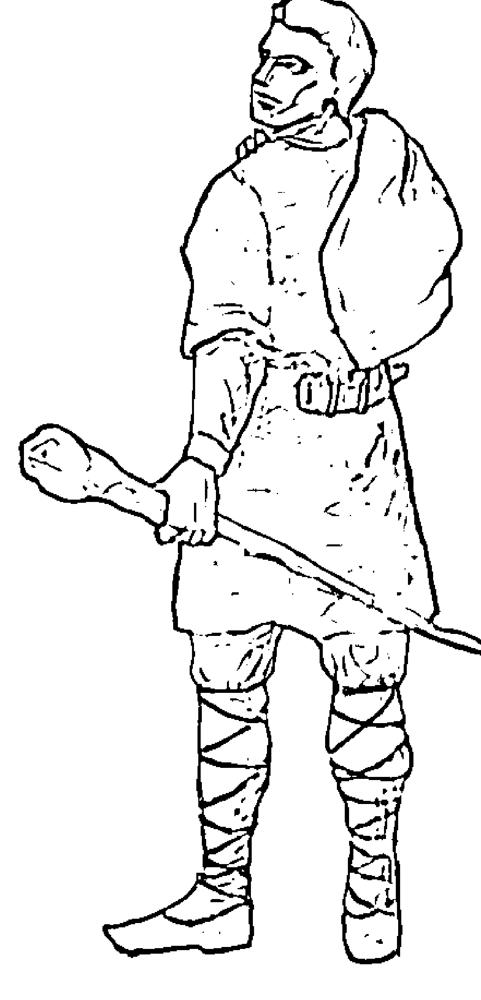

## 持有物
- 史基尼爾之劍
- 福瑞之馬
- 魔法杖
- 特勞布尼爾（手環）
- 永恆蘋果的蘋果

## 主要相關神明與人物
- 弗雷
- 葛德

## 僕人・畢格維與貝拉及其工作
畢格維 / Byggvir
《洛奇的爭論》提及的福瑞僕從。他在福瑞座下負責推石磨、照顧眾人的飲食生活。

貝拉 / Beyla
《洛奇的爭論》提及的福瑞僕從。她是畢格維的妻子，與丈夫同樣都是負責餐桌的相關工作。

弗雷 統治 → 愛神芙
 ↓ 兒時玩伴
史基尼爾 → (僕從/命令者)
愛神芙 - 畢格維 - 貝拉
        負責餐桌、飲食相關工作

※物品：即史基尼爾之杖（Skirnir's wand）。史基尼爾前往吉登海姆為弗雷傳話時，使盡各種方法都遭到拒絕，於是他只好以一根新樹枝製成的魔杖刻下四個魯納文字，終於藉由文字的魔力說服葛德答應與弗雷見面。

## 相關條目
- 弗雷（阿薩神族）・No.016
- 華納神族・No.040
- 弗雷希・No.042
- ◇芬里爾・No.058
- ◇愛爾芙（精靈）・No.064
- ◇蟬聲之鑰・No.087

# 菲依雅
菲依雅是將愛散播給眾人的美麗而多情的女神，同時她也是司掌魔法和戰場的神明。

## ○奔放的愛之女神
菲依雅是出身華納神族的女神，父親是財富與海運之神尼爾德，豐饒神福瑞則是她的胞兄。她擁有美麗外貌並司掌財富與豐饒，亦因此經常被許多巨人看上，同時還是位力量非常強大的女神，經常被視同為主神奧丁之妻福麗嘉。

根據《史諾里愛達》的〈欺騙吉魯菲〉記載，她也是戀愛的女神，很喜歡聽人類祈禱，尤其特別愛聽情歌，因此可說是人們為戀愛祈禱最理想的對象。其次菲依雅還是戰爭女神，經常乘坐由兩隻貓拉引的戰車外出，北歐世界的戰死者約有半數都會被帶到她的館邸弗爾克范格裡一個叫作色斯綴尼爾（Sessrúmnir）的殿裡。此外菲依雅還擁有魔法高手的神格面向。《挪威王列傳》序章〈英林加薩迦〉便說她將塞茲咒法帶到阿薩神族，還跟父兄同掌祭祀。菲依雅跟丈夫奧德生有一女赫諾絲（Hnoss），然而奧德卻不知為何，某日出外後就再也沒回來，於是菲依雅不斷改換姓名，踏遍世界各地尋找夫君。傳說當時她流的眼淚都變成了黃金，沉眠於地底深處。

菲依雅與丈夫的愛情固然極為深刻，不過她也有在性方面相當奔放的另一面。《詩歌愛達》中〈洛奇的爭論〉就曝露包括胞兄福瑞在內的眾神和愛爾芙（精靈）全都是她的情人，《索里的故事、赫金與霍格尼的薩迦》（Sorli's Story, The Tale of Hogni and Hedinn）也說菲依雅的首飾布理希嘉曼是她跟四名侏儒（矮人）各睡一晚所得。《詩歌愛達》的〈辛德拉之歌〉（Hyndluljóð）也描述到菲依雅為了自己的情人英雄歐特（Ótr）而處處放水的模樣。

# 阿西爾女神 = 菲麗霞
| 項目 | 內容 |
|---|---|
| 族圖 | 亞薩神族／華納神族 |
| 神格 | 戰鬥勝利的女神／魔法女神／愛之女神 |
| 領域 | 霧之國克芙蘭（館邸） |

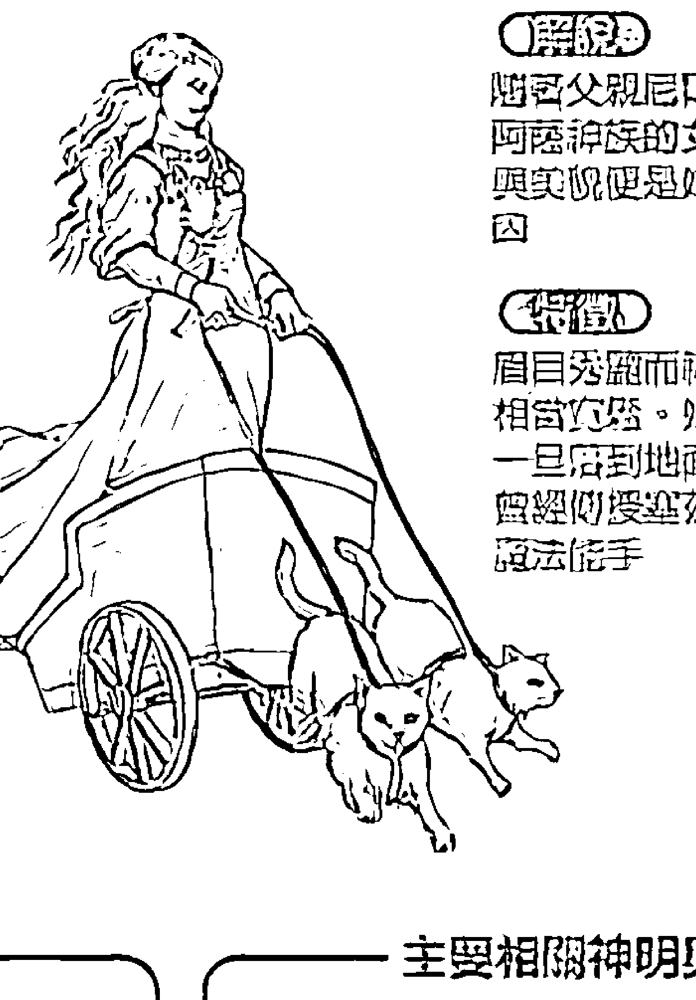

**起源**
薩迦父親尼約德、胞兄弗雷加入阿西爾神族的女神，其奔放的性格與美貌便是她招致諸多麻煩的根源。

**象徵**
眉目秀麗而神力強大，性觀念卻相當開放。她的眼淚是紅色的，一旦落到地面就會變成赤金。是曾經被授予咒法予主神奧丁的魔法高手。

- 布里希嘉曼（首飾）
- 貓戰車
- 飛鷹羽衣
- 希爾迪斯維尼（母豬）

- 奧丁
- 尼約德
- 弗雷
- 奧德
- 諾恩絲

## 菲麗霞擁有的各個面向
+ **戰爭女神**
  - 統領瓦爾基麗姬
  - 於諸王之間散佈不幸的種子
  - 半數的戰死者歸屬於她

+ **咒法女神**
  - 曾經授予咒法予奧丁
  - 以阿西爾神族女司祭身份進行活動
  - 被視為同為巫女古爾薇格

+ **愛與美、豐穰的女神**
  - 撮合男女之事
  - 是所有男神和要約芙的偶人
  - 授予財富與倍徒利商人

## 相關條目
- 亞薩神族・No.033
- 華納神族・No.040
- 北歐神話・No.041
- 福瑞→No.042
- 塞茲咒法與迦爾多咒歌・No.074
- 布理希密曼・No.086

# No-045
# 巨人族
Jotunn 北欧神话中的巨人族，拥有强大的力量，是众神的敌人。

巨人族往往会为众神和人类带来各种危险灾害，他们更拥有足堪与众神匹敌的强大力量。

## ○ 众神的敌对者
世人以「乔登」、「苏斯」、「里希」、「托尔」等各种名字称呼的巨人族，乃是北欧神话里的反派角色。他们是以原初巨人伊米尔为始祖，跟主神奥丁等一班阿萨神族虽然遥远，却也是血亲关系。《诗歌爱达》或《史诺里爱达》所描述到的巨人族有的体格巨大无比，有的跟寻常人类差不多，有的有好几颗脑袋，有的甚至是野兽模样，可谓是形形色色五花八门。巨人当中也有非常美丽的女巨人，受众神迎娶者亦不在少数。

据《丹麦人的业纠》记载，巨人族是种能够自由自在移动、变幻形体的某种魔法师。相传他们拥有优越的建筑技术，并且在丹麦留下了许多巨石建筑。

除部分巨人以外，所有巨人族跟众神均属敌对关系。尤其雷神索尔更可以说是巨人的天敌，他还曾经多次远征巨人的世界乔登海姆；巨人们每次都想尽各种计策方法想要打倒索尔，但往往都遭其反击而丢了性命。其次，由于巨人族拥有足堪与众神匹敌的财富、知识和魔法道具，常常因此成为众神的目标，事实上，奥丁也的确曾经从巨人族那里得到过许多好处。

当然，由巨人族主动掠夺众神国度的情况还是远多于前者，因为巨人族早就对丰饶女神菲依雅、索尔之妻希弗以及永恒青春苹果的管理者伊登等众女神觊觎已久。有一说法指出，巨人族希望得到前述这些为世界带来恩惠的众女神，其目的是要藉此引发世界的混乱。于是乎巨人族与众神之战就这么持续直到诸神黄昏来临，直到巨人在这场最终战役中跟巨狼芬里尔、穆斯佩一齐攻上阿萨神域为止。

# 北欧神话中的巨人族
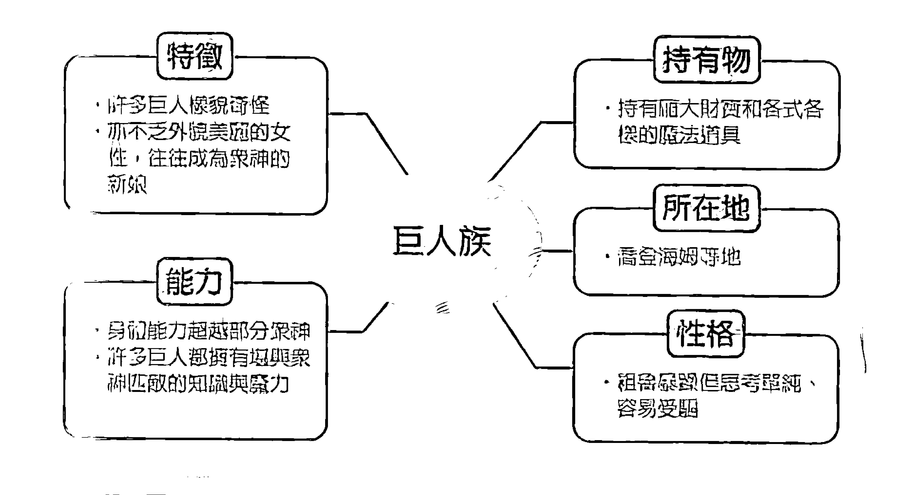
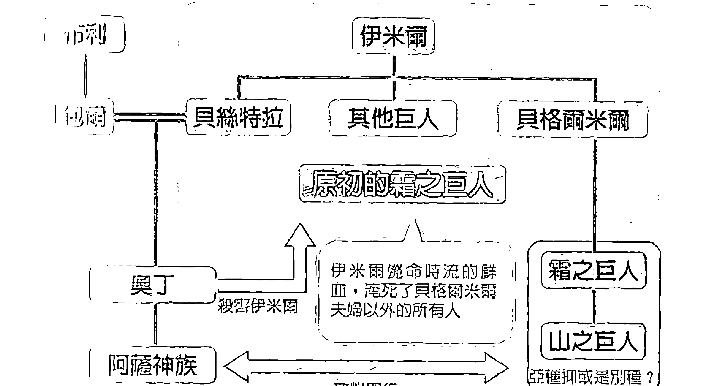

## 相關條目
- 北欧诸神 - No.011
- 阿萨神族 - No.016
- 诸神 - No.023
- 伊米尔 - No.046
- 芬里尔 - No.058
- 斯库尔 - No.065

# No.046 ウミル
伊米爾
Ymir

世界初始時誕生的原初巨人，所有巨人還有眾神和人類居住的世界均是由這名巨人的身體誕生出來的。

## ○創造世界原形的原初巨人
伊米爾便是北歐神話裡指為萬事萬物開端的原初巨人。《史諾里愛達》的〈欺騙吉魯菲〉記載，伊米爾是灼熱世界穆斯佩海姆的熱氣使極寒世界尼弗海姆的霜融化成水滴後，從水滴裡誕生出來的生物。其次，《詩歌愛達》的〈瓦夫特魯德尼的話語〉則說尼弗海姆有條名叫埃利伐加爾的毒河，而伊米爾便是由埃利伐加爾的毒液凝固形成，故其性格相當兇暴，似乎不足以被稱為神明。相傳伊米爾便是靠著與他同時誕生的母牛所分泌流出的四條乳水河，始得以在這個別無他人的世界裡延續生命。

《欺騙吉魯菲》說伊米爾是種兼具兩性的存在，他睡到發汗時左腋就會生出男女巨人，兩腳交叉時則是會生出共有六個頭的巨人。霜之巨人的人敗便是如此逐漸增加，但是不久以後，世界很快又發生了變化，從奧德姆拉舔食表面攝取鹽份果腹的霜石裡面，又有個名叫布利的生命誕生了。布利生下兒子包爾，包爾又跟巨人之女生下奧丁、威利和菲三個兒子，後來他們殺死了伊米爾，用伊米爾的身體開始創造世界。當時從伊米爾體內流出的血變成了洪水，將最初那批霜之巨人全數淹死，僅有巨人貝格爾米爾及其妻得以倖存。

根據《詩歌愛達》中〈葛林尼爾的話語〉記載，伊米爾的肉體全部都被用作創造世界的材料，毫無半點浪費。他的肉造成大地，血造成湖海，骨頭造岩、碎骨牙齒則是被造成小石塊；頭蓋骨變成穹頂，睫毛拿來造米德加爾德外圍的柵欄、腦則是造成雲朵飄上了天空。

# 原初巨人——伊米尔
**族一欄**
巨人族

**神一欄**
原初巨人（阿薩神族承認其神格）

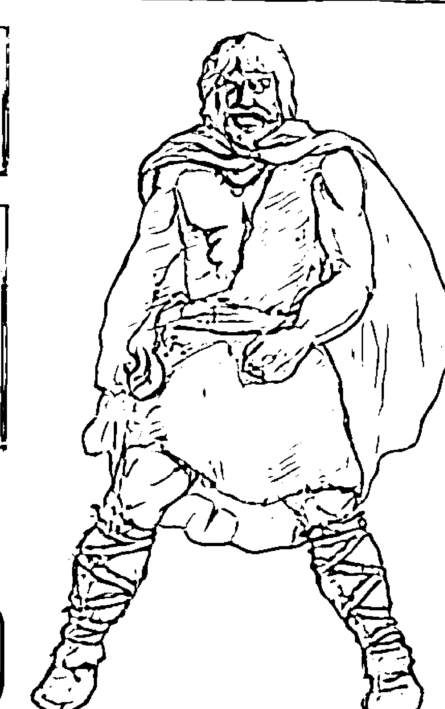

**概要**
霜之巨人與阿薩神族始祖的原初巨人。遭奧丁等子孫殺害，並成為創造世界的材料。

**特徵**
擁有可供作為創造世界材料使用的巨軀。兼具兩性，能夠自生子，性格凶狠粗野。

**主要相關神明與人物**
巨人族

# 世界创造与伊米尔的肉体
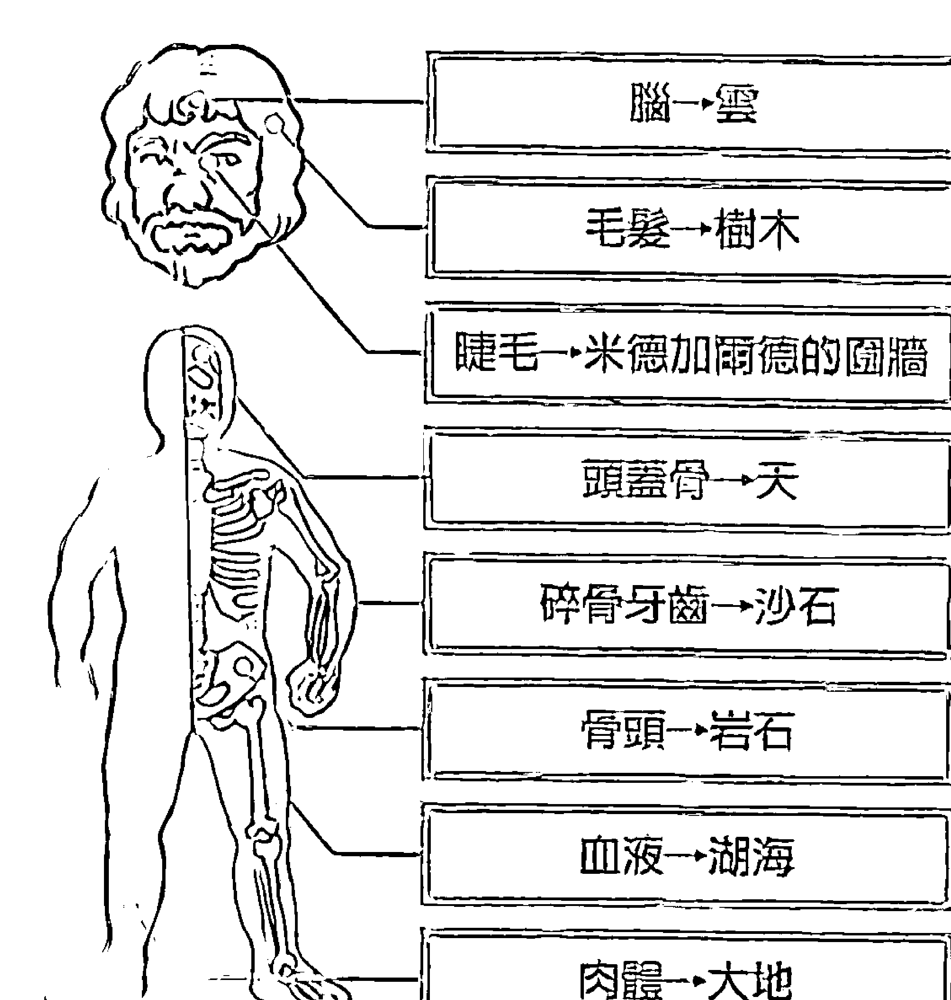
殺死巨人伊米爾的奧丁三兄弟便是按左圖所示，將其肉體解體利用。

相關條目：尼芙海爾 - No.012 ◇奧丁 - No.017 密米爾 - No.013

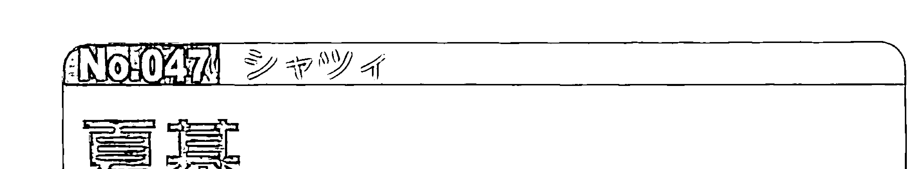
巨人夏基擁有強大力量，曾經從眾神手中奪取永恆青春的蘋果，使諸神陷入混亂的漩渦。

## ○曾使眾神陷入混亂的巨人
夏基便是後來嫁給尼爾德的巨人之女史卡姬的父親。《詩歌愛達》中〈葛羅提之歌〉（Gróttasöngr）說他的力量甚至比曾經跟雷神索爾鬥過的芬葛尼爾還要強大。夏基是富裕巨人歐爾瓦第（Olvadi）之子，當初歐爾瓦第分財產時，曾規定眾子只能以嘴巴塞得下的財寶取固定份數，當時兄弟中就屬夏基拿到的寶物最多，他另外還有件能夠變身成鷲鷹的羽衣。根據《史諾里愛達》的〈詩語法〉以及《豪斯特隆》（Haustlöng）記載，夏基是因為想要得到永恆青春的蘋果方才喪命。

從前主神奧丁、海尼爾和惡神洛奇三人出外遠行，抓到一頭公牛便立刻要料理來吃，豈料肉卻是怎麼都烤不熟。他們一抬頭發現頭頂有隻大鷲，說是只要把肉分牠吃，牠就會替他們把肉烤熟，奧丁等人不得已只能答應，豈料那隻鷲把最好的部位給叼走，氣得洛奇揮舞棍棒追打，卻反而被大鷲抓了起來。其實這隻鷲就是夏基所化，他搬弄唇舌百般威脅，終於讓洛奇答應幫他綁走負責管理永恆青春蘋果的女神伊登。伊登一失蹤，眾神立刻就呈現衰老敗弱之態。後來眾神得知洛奇是最後一位見過伊登的人，便質問他並命其將伊登救回。儘管感到害怕，洛奇卻還是在借到飛鷹羽衣以後就出發前往喬登海姆，幸好當時夏基外出打漁並不在家，於是洛奇便將伊登變成胡桃，用鷹爪抓著就往外逃。夏基回家以後感覺有異，變身成鷲鷹追趕，豈料卻因為盛怒追得忘我而跌進眾神以鮑屑生的火堆，墜落地面，終於遭眾神殺害。相傳後來他的女兒所提賠償的其中一個條件，就是要把夏基燒剩下來的雙眼變成天上的星星。

# 与女神伊登有关的巨人 —— 夏基
种族：巨人族

领地：巨人国海姆

能力说明：曾经从众神手中抢走管理永恒青春苹果的女神伊登的巨人。伊登被众神夺回之际，夏基因恶作剧而跌进众神生的火堆之中，遭到毁灭。

特性：拥有两件羽衣变成大鹰，曾将众神玩弄于股掌之间并嘲笑之。拥有各种强大魔力。

持有物：两件羽衣 / 巨大的财宝

主要相关神明与人物：欧尔瓦蒂 / 伊奇 (Iði) / 刚格 (Gangr) / 史卡姬 / 洛奇 / 伊登

## 绑架伊登始末
擒拿洛奇：以巨大力量的夏基使用魔法捉弄众神中的智神 恶神洛奇，怒而向其收绑，却反遭其捕捉。

诱拐伊登：洛奇答应对夏基协助绑架伊登作为释放条件，并顺利将伊登诱出，让夏基将她绑走。

拯救伊登：失去伊登苹果的众神开始急速老化。焦急的众神责备洛奇，命其搭救伊登。

夏基的末路：得知伊登被救回后变成大鹰追赶，但被众神伏击打败。

## 相关图鉴
- 奥丁 → No.017
- 洛基 → No.035
- 弗雷 → No.041
- 史卡姬 → No.048
- 芬蕊尼尔 → No.050
- 洛奇 → No.057

# No.048 スカジ 史卡姬 Skadi
史卡姬是为报父仇而造访阿萨神域的巨人之女，而终于在几经波折之后，成为挪威王室的始祖。

## ○众神的美丽新娘
史卡姬是尼尔德的第二任妻子，也是被称为滑雪女神的女巨人。她的性格残酷刻薄，对敌人绝不容情，曾经用日以继夜不断将蛇毒滴在颜面的拷问法，施在旧情人恶神洛奇身上。不过史卡姬却有着美丽的外貌，甚至《诗歌爱达》中《葛林尼尔的话语》还曾将她评为「众神的美丽新娘」。

史卡姬身为巨人之女却得以进入众神行列，全都要归因于众神的阴谋弄策。根据《史诺里爱达》的《诗语法》记载，史卡姬是巨人族里拥有相当强大势力的夏基之女，夏基与众神争夺司掌永恒青春苹果的女神伊登，最终在阿萨神域遭到杀害。于是史卡姬身披头盔铠甲，独自前赴阿萨神域欲报父仇，也不知道是否因为觉得她可怜，众神为达成和解便向史卡姬表示，可从众神当中择一作为夫婿，其条件就是只能看脚部来判断选择。史卡姬欲选美青年巴多为婿，于是便挑了双最漂亮的脚，岂料选到的却是尼尔德。另外史卡姬还要求众神必须逗自己发笑，当时洛奇便是用把绳子绑在阴茎跟山羊拔河的滑稽表演，满足了史卡姬所提出的这个条件。

也许是大笑过后心情爽朗的缘故，相传后来史卡姬就乖乖接受了与尼尔德的婚姻生活，可是两人却始终无法融入彼此的生活环境，后来史卡姬便回父亲的馆邸斯留姆海姆去了。

其后两人的夫妇关系还暂时维持了一段时间，但根据《挪威王列传》记载，她的婚姻最后似乎仍是以失败告终，后来史卡姬又跟主神奥丁发生关系，成为了挪威王族的始祖。

# 冰之国出身的女巨人——史卡蒂
族源
巨人族／阿萨神族

神格
滑雪女神
狩猎女神

居城
冰之国海姆

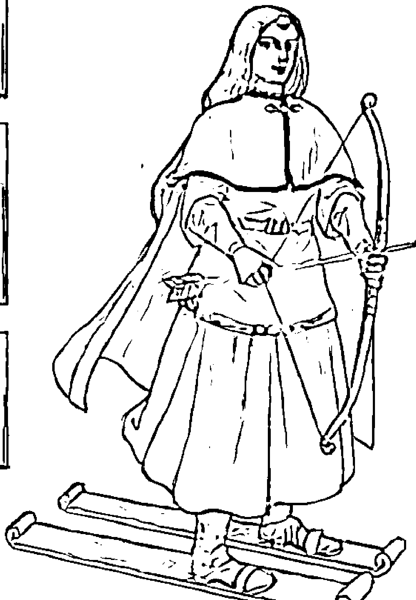

背景
为替父亲夏基之仇而前往阿萨神域的巨人之女，后来成为尼尔德的妻子，但婚姻进展不顺利而以分居收场。经过几番曲折后又跟奥丁发生关系，成为挪威王家的始祖。

特性
手持弓箭、脚踏雪板。因其美貌而被称作美丽的新娘，然其性格甚是郁晦。不好海洋，喜爱山野。

持有物
弓箭／雪板／夏基的翅膀

主要相关神明与人物
奥丁／尼尔德／夏基

## 与诸神的和解
众神提出的条件
把夏基的眼睛变成天上星辰
大量的财宝
与神族结婚

史卡蒂的要求
把自己逗笑
血之复仇

经过协商后的方案
洛奇的滑稽表演
只看脚部选择神族结婚
把夏基的眼睛变成天上星辰

## 相关条目
- 奥丁 No.017
- 弗雷 No.026
- 芙蕾雅 No.035
- ◇尼尔德 No.041
- ◇夏基 No.047
- ◇洛奇 No.057

# 葛德
葛德是豐穰神福瑞寧願放棄寶物也要追求的巨人之女。她究竟是豐穰的象徵，抑或是替眾神帶來破滅的存在？

## ○象徵豐饒的巨人之女
葛德是受到豐饒神福瑞熱烈追求的巨人之女。《詩歌愛達》的〈史基尼爾之旅〉說她的外貌美麗非常，據說她所散發的光芒，甚至足以照亮天空和大海的每個角落。相傳葛德乃是巨人幾米爾（Gymir）之女。幾米爾雖是海神阿戈爾的別名，但阿戈爾跟葛德的父親是否相同的人物就不得而知。另外葛德還有個不知遜誰殺害的兄長。

身為巨人之女的葛德從一開始被福瑞發現、直到後來受到熱烈求婚的來龍去脈是這樣的：有次福瑞趁著主神奧丁不在的時候，偷坐奧丁的寶座至高王座瞭望全世界。當他的雙眼移到喬登海姆時，湊巧看見了葛德，福瑞只消看一眼便為其美貌而傾心，從此陷入戀愛的煩惱。福瑞的僕人史基尼爾聽他講述完煩惱，便以福瑞的魔法劍和愛馬作為交換條件，單身前赴喬登海姆為其實現願望。剛開始史基尼爾很和氣地提出各種禮物進行交涉，可是葛德壓根就沒想過要接受福瑞；因為交涉不順遂，逼得史基尼爾拔出福瑞之劍作勢要將葛德首級砍下，但性格強硬的葛德仍舊不肯點頭，於是擅使魔法的史基尼爾又威脅說要對葛德施下詛咒，這個詛咒將使她終生覓無良緣、不幸而終，甚至還刻下魯納文字再三要脅說是要施咒，葛德這才屈服於史基尼爾，接受了福瑞的愛。

一說認為這段故事乃是象徵著豐饒神的聖婚儀式。亦有人認為葛德便是擾亂阿薩神域和平的三位巨人之女其中之一。

# 連神的巫女到巨人的女巨人——葛德
- 族裔：巨人族
- 神格：豐饒女神？
- 所在地：霧海姆

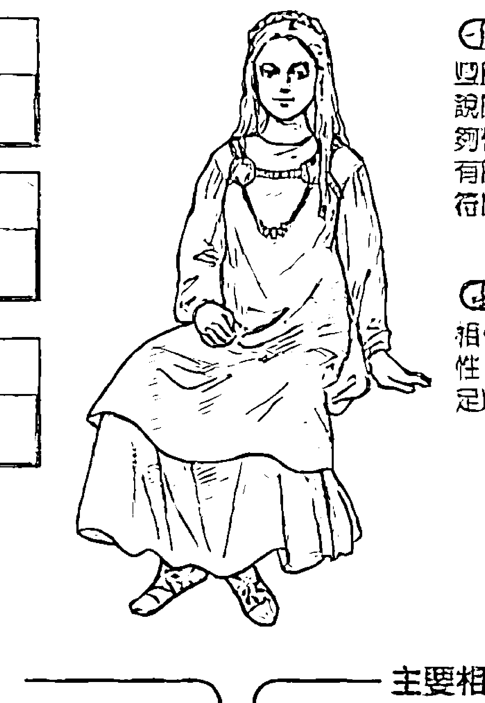

> 【神話】
與神一見鍾情的巨人之女。一說認為她與弗雷的婚姻及徵兆能夠帶來國家的聖婚儀式，北歐亦有許多描述此婚姻場景的黃金飾符出土。

> 【傳說】
相傳葛德是全世界最美麗的女性，甚至她舉手露出手腕時，便足以照亮全世界。

- 持有物：(無)
- 主要相關神明與人物：弗雷 / 史基尼爾 / 幾米爾

## 史基尼爾的威脅與脅迫
| 史基尼爾的提議與脅迫 | 葛德的反應 |
|---|---|
| 提出永恆青春的蘋果為條件 | 表示「沒興趣」，無視於其提議 |
| 提出特勞布尼爾手環為條件 | 表示「財寶我很多」，無視於其提議 |
| 威脅要砍下葛德及其父首級 | 表示「我不接受無理的威脅」，無視之 |
| 威脅詛咒葛德遭遇不幸的婚姻 | 因威脅太過嚴重以致無法反應 |
| 威脅要刻魯納文字施詛咒 | (無明確回應文字) |
| **葛德屈服於脅迫，向史基尼爾發誓願接納弗雷的愛** | |

## 關連項目
- 霧海姆 · No.011
- 弗雷 · No.017
- 史基尼爾 · No.042
- 阿戈爾 · No.056
- 魯納文字 · No.073
- 至高王座 · No.078

# 芬葛尼爾
芬葛尼爾是名馬葛爾法克西的主人，後來卻因為自身的傲慢和這匹名馬而丟了性命。

## ○擁有石頭心臟和石頭腦袋的巨人
芬葛尼爾是《史諾里愛達》中〈詩語法〉所提及的巨人，他有顆長著三個尖角的石頭心臟，腦袋也是石頭做的，武器則是石盾與磨刀石。此外芬葛尼爾也是名馬葛爾法克西的所有者，只不過這匹馬最後將會致他於死地。

傳說主神奧丁挑撥芬葛尼爾誘其深入阿薩神域，其目的很可能就是要得到葛爾法克西。眾神按照奧丁交待下來的命令以貴客般的待遇招待芬葛尼爾，芬葛尼爾卻興高采烈地喝得大醉，還口吐穢語穢言。為此眾神遂將前赴東方的雷神索爾召回，索爾看見芬葛尼爾的態度以後悖然大怒，但他說「殺死手無寸鐵的對手也不光榮」，於是雙方遂約定在位於阿薩神域和喬登海姆國境上的葛留杜迦薩進行決鬥。

索爾領著僕從希亞費同赴決鬥戰場，並趁著閃電和雷鳴率先發難，衝向芬葛尼爾、擲出雷神之鎚；芬葛尼爾這邊也擲出磨刀石應戰，可是磨刀石與鎚相撞以後就斷成兩截，一截插在大地之上，另一截則是嵌進了索爾的腦袋。此時雷神之鎚則是粉碎了芬葛尼爾的頭蓋骨，芬葛尼爾就此撲倒在索爾身上，當場斃命。

此時的希亞費正在跟巨人族為替芬葛尼爾助陣所捏出來的黏土巨人莫苦卡菲作戰；這名移植母馬心臟製成的巨人很是膽小，戰鬥很快就以希亞費的勝利分出了勝負。

至於引發此爭端的起因葛爾法克西，最後則是被賜給了從芬葛尼爾屍體底下成功救出父親的索爾之子曼尼，據說這也是為何後來索爾觸怒奧丁的原因。

## 清白肉体的巨人——芬尼尔

| 族裔 | 人族 |
| --- | --- |
| 所在地 | 通海姆 |

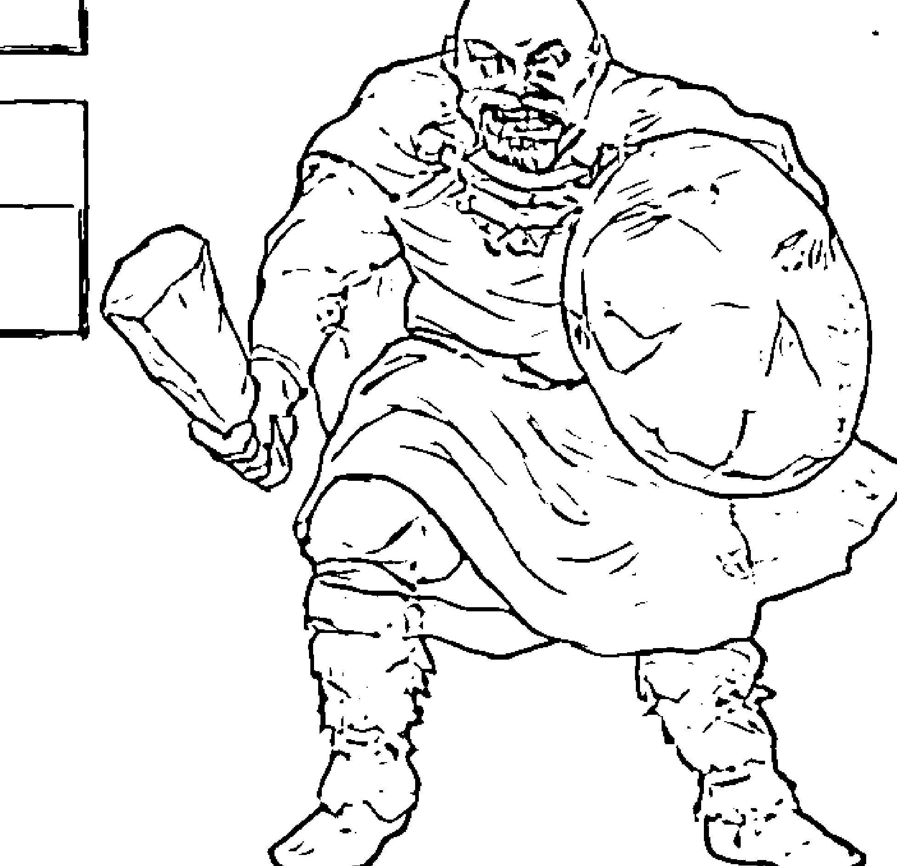

### 概要
以名为葛尔法克西所有者为世人所知的巨人。受主神奥丁引诱深入阿萨神域。当神索尔见他行径并感到憎恨，演变成决斗。

### 特征
有着长着三个尖角的石头心脏和石头头发。他的巨体沉重到连索尔也无法将他举起。

## 持有物
- 葛尔法克西/石盾/葛尔法克西（马）

## 主要相关神明与人物
- 索尔/希亚买/莫苦卡菲

## 芬尼尔与索尔之战

## 为得到葛尔法克西所施策略
芬尼尔时故意激怒对方，诱其前往阿萨神域，想方设法让索尔对芬尼尔行径感到憎恨，与其决斗。

## 黏土巨人
人族们知即将要进行决斗，遂用黏土制作一具巨人给芬尼尔做搭档。另一 方面则是带着仆从希亚买共赴决斗。

## 决斗的结果
芬尼尔扔出的磨刀石嵌进索尔的脑袋，但索尔扔出的雷神之锤却取了芬尼尔的命。

## 葛尔法克西的去向
芬尼尔巨人压在底下动弹不得，后来被出生仅三天的儿子曼尼救出来，于是便把葛尔法克西当作战利品，送给了曼尼。

阿萨神域・No.010 ◇索尔→No.023 No.017

## 斯留姆
斯留姆是生活富裕、万事不欠的巨人之王，可是却因为想娶美娇娘而步上毁灭。

### ○想娶妻的巨人之王
姓名见载于《诗歌爱达》中〈斯留姆之歌〉的斯留姆是位住在乔登海姆的巨人之王。据说他非常富裕，却对自己没有妻子感到不满，于是便心生一计，想要夺取雷神索尔的雷神之锤，用它当作交换条件好得到女神菲依雅。

索尔发现雷神之锤不翼而飞，便去找恶神洛奇商量。洛奇向菲依雅商借飞鹰羽衣出外寻找，不久便回报索尔说雷神之锤乃是斯留姆盗去，只要用菲依雅作交换就会归还。于是索尔又拿这件事去跟菲依雅商量，然而她闻言断然拒绝，并且愤怒得连阿萨神域都为之震动，连首饰都快被她扯断。伤透脑筋的众神只能另行商讨对策，众神的门房海姆德尔提议“不如索尔自己扮作新娘去见斯留姆”。索尔对这个提案甚感厌恶，但众神却是跃跃欲试，最后便决定由索尔扮成新娘、洛奇扮成侍女，潜入斯留姆的地盘。

话说迎接索尔和洛奇的巨人族对新娘这么壮硕并不疑有他，跟着便举行了婚宴。可是索尔却还是跟平常同样大啖公牛肉和鲑鱼，让同席的巨人都看傻了眼；乐不可支的斯留姆又追着新娘索吻，却从新娘头纱的隙缝看见索尔的可怕眼神、惊叫失声。此时幸亏洛奇灵机一动，说是新娘太过期待婚礼而在过去八天里吃不下睡不着所致。斯留姆的姐姐刚好就在此时跑来向新娘央讨礼物，这件事就此蒙混过关。或许是害怕婚宴的气氛遭到破坏，斯留姆遂命人取来雷神之锤替新娘净身除秽。索尔一直等待的便是这一刻，他一拿到雷神之锤，便立刻将斯留姆等众巨人全部杀死，之后就返回阿萨神域去了。

## 北欧神话中出现的巨人 — 斯留姆

## 族属
11人族

## 领地
巨人海姆的部分区域

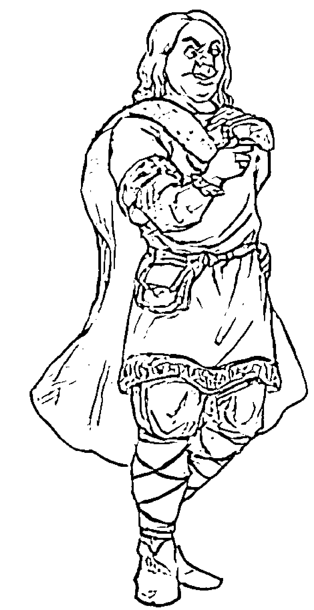

## 事迹
盗走雷神索尔的雷神之锤并要求菲依雅作为交换的巨人之王。他将扮作女装的索尔误认为是菲依雅，同交出雷神之锤时，就被索尔杀死。

## 特征
非常温和而且没有任何部下的巨人之王。关于其外貌方面传说并无记载。

## 持有物
- 1.牛角的公牛 / 黄金顶圈之犬 / 冥大的

## 主要相关神明与人物
- 索尔 / 菲依雅 / 洛奇

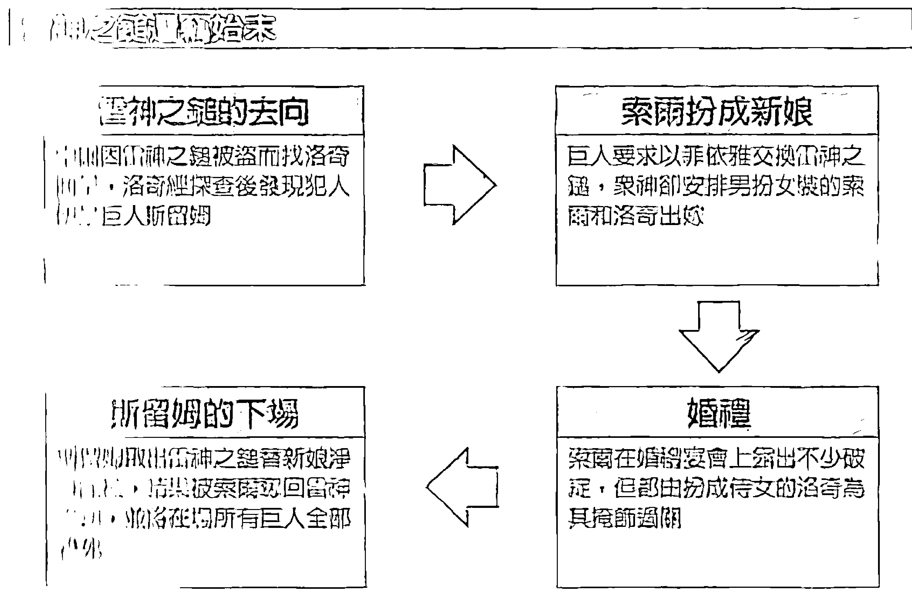

## No.052 盖尔罗德

### Geirröðr
巨人盖尔罗德父女以智略计谋挑战雷神索尔，最后却败下阵来，并且在其后漫长的历史洪流中为索尔传唱，见证其伟大功绩。

### 被缝在大地上的巨人
盖尔罗德是《史诺里爱达》中〈诗语法〉等文献所记载的巨人。传说他企图引诱出雷神索尔将其抹杀却反遭击败，从而使得索尔的功业永传于后世。

这件事其实要从某次盖尔罗德擒住化作飞鹰的恶神洛奇说起，原来洛奇已经先被饿了三个月没东西吃，只能向盖尔罗德表明身份，还承诺会把索尔手无寸铁引诱到盖尔罗德的馆邸。就在索尔几乎要落入陷阱时，拯救他免于此劫的竟是当时恰巧经过的某间馆邸的主人——奥丁之子维达的生母葛丽德（Gríðr）。葛丽德不但向索尔提出忠告，还把铁手套、力量腰带和自己的手杖等物品借给索尔。

经其提点而提高警觉的索尔果然顺利击退埋伏在维穆尔河（River Vimur）的盖尔罗德之女，可是当他抵达盖尔罗德馆邸的时候却已经筋疲力尽，被带领到留宿的处所以后，立刻就累得瘫坐在房间的椅子上，岂料却发现这张椅子竟不断浮起，把他往房间的天花板挤压，原来盖尔罗德的女儿们从椅子底下企图把他压扁在天花板上。于是索尔便举起葛丽德的手杖抵住天花板，一使劲就折断了盖尔罗德女儿们的背脊，把她们全压在椅子底下。

眼见女儿败退，盖尔罗德只得亲自出来挑战索尔。他先掷出烧得火红的铁块，却被索尔用铁手套接住并以极大势头掷将回来，盖尔罗德吓得赶紧躲到铁柱后面，谁料铁块却连带铁柱穿透他，将其整个黏死在大地表面。《丹麦人的业绩》说丹麦国王哥尔姆就曾经在造访此地时，目睹这位直到人类时代还被黏在大地上的老巨人，以及背脊折断无法动弹的诸位女巨人。

## 栖息在大地表面的巨人——盖尔罗德

| 族属 | 巨人族 |
| --- | --- |
| 居住地 | 比亚马兰 (Bjarmaland) |

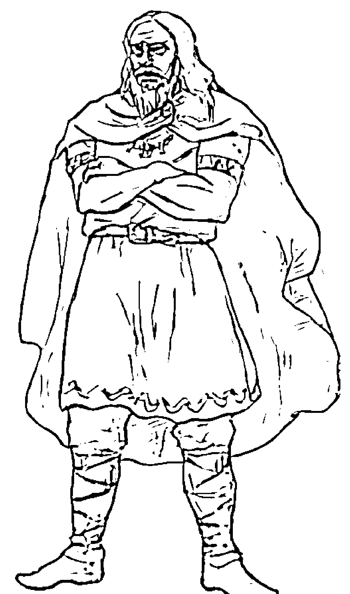

**性格**
司然间擒住了神洛奇，进而欲设陷阱想打倒索尔的巨人。可是索尔却听到奥丁之子维达生母葛丽德的忠告，使得盖尔罗德及其女儿全部反倒失败。

**特征**
《丹麦人的索尔》说他是被压柱巨鸟外形的老人，背弃纷争的女儿则是困在他的脚边。

- 持有物：（无内容）
- 主要相关神明与人物：索尔 / 洛奇 / 葛丽德 / 格萝普 (Gjálp) / 格蕾普 (Greip)

## 洛奇与盖尔罗德之战

**洛奇与盖尔罗德**
被盖尔罗德所捕，承诺引入陷阱交换自己的性命。

**葛丽德的忠告**
旅途中索尔路过葛丽德住处，获得忠告与魔法道具。

**渡过穆斯贝尔河**
盖尔罗德之女格萝普使河水暴涨欲淹死索尔，却以失败告终。

**宝物间的攻防**
格萝普等人企图用椅子压扁在宝物间里休息的索尔，反倒压扁。

**洛奇的胜利**
盖尔罗德终于与索尔对峙，却被索尔掷出的金属片穿中而亡。

## No.053 瓦夫特鲁德尼

### Vafthrudnir
瓦夫特鲁德尼是以知识渊博而闻名的老巨人，却在面对仅有众神之父才知道的问题之际而败下阵来。

### ○拥有奥丁所追求知识的巨人
瓦夫特鲁德尼亦称伊姆（Im）之父，是姓名仅见于《诗歌爱达》中〈瓦夫特鲁德尼的话语〉的巨人。他的知识极为渊博，甚至连主神奥丁都无法压抑想要得到瓦夫特鲁德尼的知识的欲望。此外奥丁之妻福丽嘉对他则是“无论什么样的巨人都没有瓦夫特鲁德尼来得强大”的评语。

根据北欧传说记载，从前奥丁因为想要得到他的知识而去找妻子福丽嘉商量，说是想去拜访瓦夫特鲁德尼；福丽嘉虽以危险为由持反对意见，却没办法说服奥丁，只能送他出门。奥丁踏上旅途后，遂以刚格喇兹（Gangrathr）自称，来到瓦夫特鲁德尼的馆邸拜访。瓦夫特鲁德尼威胁道“倘若你的知识逊色于我，可不会让你走出去这间馆邸”，但奥丁却是满不在乎的样子，于是瓦夫特鲁德尼遂提出双方斗智比知识的提议。瓦夫特鲁德尼先提问，奥丁立刻就答对了，接着轮到奥丁提问，奥丁从世界的成立、现今状态等较简单的问题开始问起，跟著慢慢问到尚未发生的未来，终于问到了最后的一个问题。『在儿子上火葬台以前，奥丁在他的耳朵旁边说了些什么？』这个问题究竟是何用意无从得知，但瓦夫特鲁德尼此时也已经发现眼前跟他比试的正是奥丁本人，只能承认自己败北。至于瓦夫特鲁德尼后来究竟如何，〈瓦夫特鲁德尼的话语〉已经没有记载，不过亦有说法认为他们俩是用自己的脑袋作赌注，因此瓦夫特鲁德尼的性命恐怕已经不保。

## 瓦夫特鲁德尼

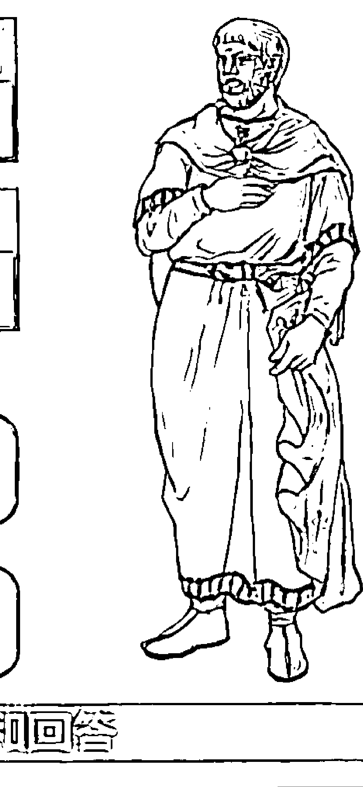

> **传说**
主神奥丁为满足求知欲而拜访的巨人。他与奥丁比试知识，却在最后一个问题发现对方身份、宣告败北。

> **特征**
拥有古老知识的老巨人。根据福尔克的说法，瓦夫特鲁德尼比任何一位巨人都还要强大。

| 问题 | 回答 |
| --- | --- |
| 大地和天空从何而来？ | 乃以伊米尔肉体所造 |
| 太阳和月亮从何而来？ | 苏尔和玛尼的孩子 |
| 白天夜晚从何而来？ | 提林是白天之父，诺特是夜晚之母 |
| 夏天冬天从何而来？ | 瓦苏克尔是夏天之父，斯瓦苏特是冬天之父 |
| 诸神和巨人们最早发生的是谁？ | 奥尔盖尔米恩（伊米尔） |
| 牛是如何诞生的？ | 由霜河埃利伐加尔滋生 |
| 谢伊达儿子是如何生子的？ | 从左腋下生出男女，足腿交叉则生出有六个头的巨人 |
| 你知道最古老的祝祷是？ | 贝格尔米恩被放在石臼台上 |
| 山从何而来？ | 化作塔屋的巨人赫拉尔瓦尔格用振翅所造成 |
| 华纳神族是从何而来？ | 从华纳海姆 |
| 人们死后在何处战斗？ | 奥丁的庭院（指英灵战士） |
| 奥丁如何知晓所有的命运？ | 因为九个世界全都已翻阅过 |
| 诸神的末日后存活下来的人类是？ | 利弗与利弗特拉希尔 |
| 如果世界末日抓到太阳将如何？ | 由太阳被擒前生下的女儿代行其职 |
| 今天地上的光明女孩是谁？ | 苏尔和玛尼的女儿。她们在巨人身边成长 |
| 诸神的末日后存活下来的神有？ | 维达、瓦力、 Modi、曼尼 |
| 奥丁如何为诸神带来终结？ | 芬里尔 |
| 你对火葬台的儿子说了什么？ | 无法回答 |

（注）请参照No.006注解。此处所指应是奥丁之子。

## 乌特加尔洛奇
乌特加尔洛奇乃是巨人国乌特加之王，他的武器便是连众神也会上当的幻术和智慧。

### ○将索尔玩弄于股掌的巨人之王
乌特加尔洛奇是巨人国乌特加之王，是擅长于幻术的巨人。相传当他得知巨人族的宿敌雷神索尔一行人向自己的国家逼近时，便曾经使用各式各样的幻术保护国家。

乌特加尔洛奇先是化作名为斯克里米尔的巨人威胁索尔，试图让他们打退堂鼓，索尔一行人虽然因此感到精神疲惫，但总算还是抵达了乌特加尔。此时乌特加尔洛奇立刻使出第二策，藉以削弱索尔等人的战斗意志。乌特加尔洛奇打算邀请他们参加宴会，并要求举行奔跑、竞食比赛和摔角等余兴活动，然后用幻术让他们输到哑然失言。果然索尔等人被乌特加尔洛奇骗得团团转，完全失去了信心。

尽管如此，众神的战果却使得乌特加尔洛奇暗自惊讶。首先是索尔的仆从希亚费展现了堪与乌特加尔洛奇的思考速度相匹敌的脚程，恶神洛奇亦以几乎跟野火燎原同等的速度将肉吃个精光，而索尔也拿起与大海相连的杯子一口气猛灌、使得海平面明显下降。更有甚者，索尔还差点就将幻化成猫的大蛇约尔孟甘德举起离开地面，就连跟不断啃食肉体的衰老对抗时，也仅以单膝着地的些微差距落败而已。乌特加尔洛奇对他们的实力很是畏惧，便将实情全盘托出，只抛下一句“我们还是别再见面的好”便消失无踪，最后就只剩下怒火正盛的索尔一行人被留在原地。

另外根据《丹麦人的业绩》记载，乌特加尔洛奇是位浑身发出恶臭的丑陋巨人，据说当他的信徒丹麦国王哥尔姆得知这位神明是何模样时，还曾经因为太过震撼而惊吓致死。

## 恶作剧的巨人——乌特加尔洛奇

| 项目 | 内容 |
| --- | --- |
| 种族 | 巨人族 |
| 神格 | 乌特加洛奇王哥尔姆的弟弟 |
| 领域 | 乌特加尔 |

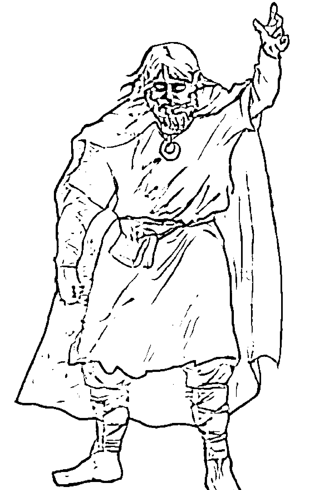

**【性格】**
居住于乌特加尔的巨人族之王。自以强大幻术玩弄索尔等人，成功守卫自己的王国。《丹麦人的事迹》则说他深受丹麦国王却尔姆信仰。

**【能力】**
施行强大幻术的高手。《丹麦人的事迹》说他是将被困在乌特加尔、浑身恶臭的蜥蜴巨人。

- 持有物
- 主要相关神明与人物：索尔 / 希亚贺 / 洛奇 / 哥尔姆

## 与乌特加尔洛奇的相遇

## 众神 VS. 乌特加尔洛奇的幻术

| 项目 | 参与神祇 | 结果 | 幻术对手 |
| --- | --- | --- | --- |
| 喝酒 | 希亚贺 | 败北 | 思考的速度 |
| 进食比赛 | 洛奇 | 败北 | 野火 |
| 喝酒比赛 | 索尔 | 喝不完 | 海水 |
| 举起猫 | 索尔 | 举不起来 | 约尔孟甘德 |
| 老人角力 | 索尔 | 单膝落地 | 衰老 |

## 斯克里米尔与索尔
是乌特加尔洛奇在前往东方途中遇见的巨人。他的体型巨大得不得了，索尔等人甚至把他错认成一座山丘。他们原本决定要结伴同行，可是斯克里米尔不时打鼾的鼾声，吵得索尔等人是心神俱疲。《散文埃达》说这个巨人的真正身份是乌特加尔洛奇。

## 希米尔


希米尔是位被迫陪着雷神索尔去钓约尔孟甘德的老巨人，而这件事也让他因此丢了性命。

### ○跟索尔同去钓蛇的巨人
希米尔乃是以战神提尔之父而为人所知的老巨人。据《诗歌爱达》的〈希米尔之歌〉记载，希米尔跟被雷神索尔打倒的巨人芬葛尼尔是好朋友，所以对索尔早就心有不快。除此之外，相传他有个共有九百个脑袋的母亲，有位长着白色眉毛的美丽妻子，麾下还有许多部属。

希米尔有一口酿造麦酒的偌大锅子，有次众神要在海神阿戈尔馆邸举办宴会，于是负责找锅子的索尔和提尔便前来拜访希米尔商借。尽管除提尔母亲以外的巨人都不是很乐意，但还是准备了晚餐招待两人，可是席间索尔毫不客气地大吃大嚼，希米尔见索尔食量如此惊人，便碎碎叨念道“这下不去海边抓东西吃不行了”，索尔闻言便提议说要出力帮忙，他砍下希米尔所养牛只的头颅当饵，从海里钓上了约尔孟甘德。大蛇被索尔用雷神之锤一击再度沉入海底，但船板却在索尔使劲时被踏出了一个大洞。回程中希米尔始终是心情极差，返抵自家以后便盘算着要让索尔丢丢脸，于是便提议要玩砸玻璃高脚杯的游戏。其实这只高脚杯是个普通方法砸不坏的魔法道具，岂料希米尔的妻子却教索尔拿高脚杯往他头顶砸，所以高脚杯就被索尔给砸坏了。此时希米尔心情更是差到极点，于是便告诉索尔锅子已经准备好了，要他把锅子带回去。原来这锅极重没人拿得动，希米尔想说这样索尔就会垂头丧气回去，岂料索尔却面不改色，轻易将锅子举起。至此希米尔终于按捺不住怒火，率麾下部属攻向索尔，却反遭索尔击败杀死。

此外，《史诺里爱达》的〈欺骗吉鲁菲〉则说索尔拜访希米尔之目的是要跟当初在乌特加尔让他丢脸的约尔孟甘德决一胜负。

## 从因加的巨人们——希米尔

- 族 国：巨人族
- 居住地：挪威加尔以东

属性：
因雷神索尔同行去钓约尔孟甘德的巨人。亦有传说指其为神提尔的父亲。相传他对打败友人芬尼尔的策尔颇有敌意。

特征：
拥有光是凝视便能进行破坏的锐利眼神。其胃部有冰柱，脚股极为坚硬。

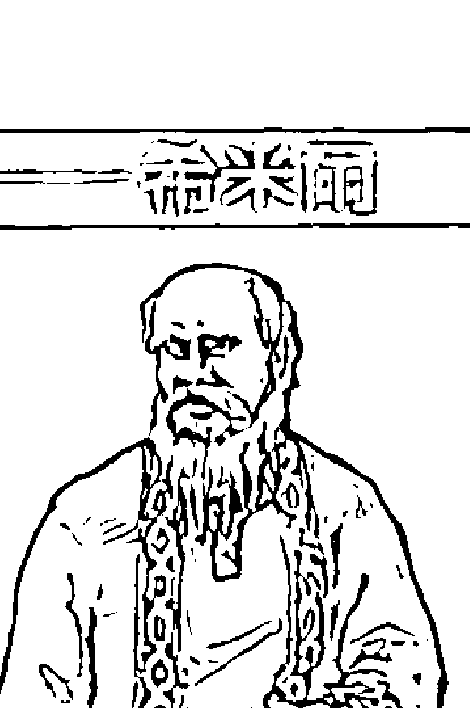

- 持有物：巨大的锅 / 坚固的魔法玻璃杯
- 主要相关神明与人物：策尔 / 提尔

## 与《希米尔传说》之异同

| 对比项 | 希米尔之歌 | 斯堪吉德菲 |
| :--- | :--- | :--- |
| 目的 | 为向因加国国王进行宴会必须取得约尔孟甘德的头颅 | 为了引出在马特加的洛奇的处理自已丢脸的约尔孟加德报仇 |
| 同行者 | 以人类路人身份同行 | 策尔神同行 |
| 事迹异同 | 在希米尔的国度里，索尔以酒醉的姿态成功激起希米尔的敌意。在宴会上遭到希米尔以酒瓶进行攻击。与索尔分担负，最终是索尔将约尔孟甘德钓到并得到头颅 | 索尔成功钓起约尔孟加德，却因为希米尔的妨碍，而没能给予约尔孟加德致命一击 |
| 结局 | 索尔对他的妨碍感到不满，就踢破了希米尔的头部。然后回到阿斯加特去了 | 索尔对他的妨碍感到不满，就踢破希米尔的头部，然后返回阿斯加特去了 |

- 参考作品
    * 雷神 No.023
    * 苏尔特尔 No.025
    * 斯卡蒂 No.050
    * 阿戈尔 No.056
    * 约尔孟加德 No.059

## 阿戈尔
阿戈尔是统治涛浪不息外海区域的巨人，同时也是众神之友。溺毙者及其财富均归阿戈尔与其妻所有。

### ○统治海洋的巨人
拥有名米尔（Gymir）、福雷尔（Hlér）等许多名字的阿戈尔是亦称海神的巨人之王，海洋和海里的财富便是由他与妻子拉恩共同管辖统治。相传死于海中的溺毙者亦是由他们支配。《史诺里爱达》说他住在某个名叫福雷斯耶（Hlésey）的岛屿，他的馆邸非常豪华，甚至还用黄金散发的光芒当作馆内的照明使用。阿戈尔亦通晓魔法，他在住处里有许多贴心的设计，诸如自动将酒送到客人面前。除此以外，这馆邸本身亦是个神圣的场所，馆内一律禁止争执与斗殴等情事。

阿戈尔是巨人族里极罕见与众神缔有同盟关系的巨人，关系甚至好到经常相邀召开酒宴。不过《诗歌爱达》的〈希米尔之歌〉就描述到众神单方面要求举办酒宴，阿戈尔回答要众神取得“可以酿造足够你们大家喝的麦酒”的锅子，可见双方关系倒也不一定如前述那般友好。

### ○阿戈尔的家人
阿戈尔与妻子拉恩共有九个象征海浪的女儿。这九位女性有时亦被视为众神门房海姆德尔的母亲，可是《史诺里爱达》的〈诗语法〉所记载的名字却与海姆德尔的母亲不同，所以无从得知阿戈尔究竟是不是海姆德尔的祖父。另外阿戈尔还有对分别叫作费玛芬格（Fimafeng）与埃尔迪尔（Eldir）的优秀仆从，此二人虽然因为优秀而颇受众神赞赏，不过费玛芬格后来却遭对此感到不满的恶神洛奇杀害。

## 海洋的统治者——阿戈尔

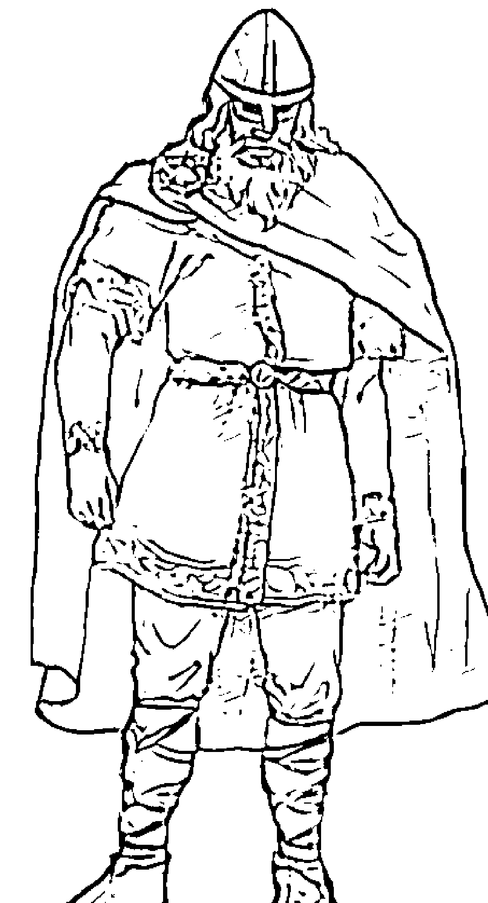

- 种族：人族/阿萨神族
- 神格：海洋之神、死者之神
- 居地：深海、阿斯那蒂

统治海中财富与溺死者的巨人。相传船员测览后会带着黄金献给阿戈尔。阿戈尔与众神保持友好，经常相邀酒宴。

《诗歌爱逢》和《史诺里爱逢》并无特别记载，亦说他是位戴著头盔、满白胡须的健康老人。

- 持有物：黄金手环（得莱尔戒指）
- 主要相关神明与人物：
    - 索尔
    - 布拉基
    - 拉恩
    - 九位海精灵
    - 贾玛芬格
    - 埃尔迦

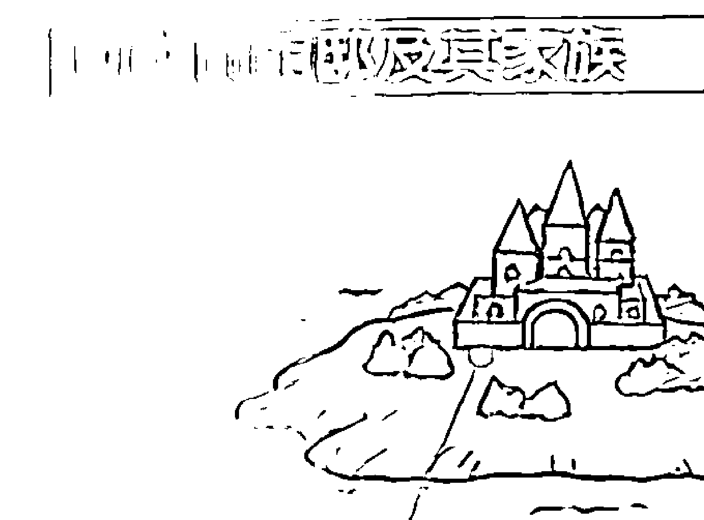

拉恩：阿戈尔之妻，有张用来收集溺死者的魔法之网。由于她口欲黄金，因此据说北欧人出海时必定会随身携带少许金币。

阿戈尔的宫殿位于海的西方。阿戈尔的宫殿，此宫殿乃是以黄金作为照明，食物和美酒总是摆满桌前，即使阿戈尔自己亦常将溺死者召至此宫殿中宴饮。

- 阿戈尔的九位波浪：
    - 希明莱瓦
    - 都法
    - 贝尔庆格达
    - 赫佛琳
    - 乌娜
    - 萝莲恩
    - 拜尔琪雅
    - 芭拉
    - 库尔盖

贾玛芬格与埃迪：阿戈尔的仆从。贾玛芬格因为太优秀而成为恶神洛奇嫉妒的对象，遭到杀害。

（注）人：这九位海精灵分别是希明莱瓦（Himinglæva）、都法（Dufa）、贝尔庆格达（Blóðughadda）、赫佛琳（Hefring）、乌娜（Uðr）、萝莲恩（Hrönn）、拜尔琪雅（Bylgja）、芭拉（Báur）和库尔盖（Kólga）。这是《史诺里爱逢》的版本，《诗歌爱逢》则有不同版本。

## 洛奇
洛奇是位招致灾厄却也带来恩惠的谜样神明。有人说他是恶魔，也有人说他是奥丁的影子，而他究竟是个什么样的存在呢？

### 诸神世界的异端份子
恶神洛奇乃是巨人法乌尔巴乌提（Fárbauti）和劳菲（Laufey）之子，尽管身为血统纯正的巨人，却与主神奥丁结成血誓兄弟，还被接纳成为阿萨神族的一员，而他跟雷神索尔、海尼尔等阿萨神的关系似乎也甚为友好。洛奇非但拥有优异的变身能力，而且还是雌雄同体，除奥丁的爱马斯莱普尼尔以外，其他像巨狼芬里尔、大蛇约尔孟甘德、死者女王海尔等也都是他的儿女。《史诺里埃达》中〈欺骗吉鲁菲〉说洛奇容貌俊美，但性格乖张而喜怒无常，若论诡诈则无人堪与其并肩，无论面对任何事情均是狡猾非常。然而洛奇却也并非完全邪恶，许多时候他之所以对众神造成伤害，通常都是受巨人胁迫而然，他的狡智亦曾多次拯救众神免于危难，甚至众神有许多宝物，其实都是他在恶作剧以后作为赔偿给众神的。

然而，自从洛奇陷害盲眼神明霍德尔使其误杀光之神巴德尔以来，他便突然开始暴露出对众神的敌意。他阻止巴德尔的复活，还在海神阿戈尔的宴会痛骂众神然后扬长而去。既然事已至此，众神也就无法再放任他恣意妄为，经过一番搜索终于将他擒住，于是洛奇就此被囚禁在地底，被施加以蛇毒滴脸的拷问。平时蛇毒是由洛奇的妻子西格恩拿器皿接着，但每次西格恩将蛇毒拿去倒掉的时候，蛇毒就会滴到他脸上，洛奇的痛苦挣扎便会使得大地为之震动。也许心里还有股怨气，洛奇后来在终末战役诸神黄昏之际，竟然担任穆斯佩尔船队的船夫，率领众巨人攻上阿萨神域，然后跟宿仇众神门房海姆德尔发生激斗，最后双双殒命。

## 北欧神话的恶神——洛奇
| 项目 | 内容 |
|------|------|
| 族属 | 阿萨神族／巨人族 |
| 神格 | 恶作剧之神、火焰的象征？ |

这主神奥丁以兄弟身份成为阿萨神族一员的巨人。带来许多恩惠的同时却也招致诸多灾厄，杀害巴德尔以后就被幽禁于地狱。终末战役诸神黄昏中，洛奇与海姆德尔捉对厮杀、同归于尽。

洛奇是兼具雌雄两性的存在，并拥有变身的能力。其外貌俊美，性格却是乖张邪恶。他的嘴巴曾经被人用皮绳缝起来过。

**持有物**

**主要相关神明与人物**
- 奥丁
- 索尔
- 海尼尔
- 芬里尔
- 约尔孟甘德
- 海尔

**明哲保身的行为**
- 巨人斯基尔尼尔逼迫，助其诱拐女神伊登
- 被巨人洛基德监禁，承诺帮他认出索尔
- 被巨人所迫，从巨人夏基手中救出女神伊登
- 为了避难，设法从侏儒手中取得宝物作为希弗头发的赔偿物

**好奇心所致的失败**
- 因把女神希弗的头发剃光而迫使索尔招麻子
- 假装成水獭的弗列兹玛之子欧特
- 与矮人（活人）布罗克兄弟打赌落败

**堕落于恶意的行为**
- 指使神箭手射杀光之神巴德尔
- 拒绝叫女巨人，阻止巴德尔复活
- 在奥丁的神座上杀害奥丁，然后火烧众神

- ◇奥丁-No.029
- ◇索尔-No.058
- ◇希弗-No.059
- ◇海尔-No.060
- ◇穆斯佩尔-No.065
- ◇斯莱普尼尔-No.079

## No.058 芬里尔

芬里尔便是预言里面说到的那匹终将成为众神之敌的巨狼。它对众神的信赖，却使它长期受到拘束监禁，直到世界终末的到来。

### 吞噬众神之父的巨狼
芬里尔亦称赫罗兹费尼尔（Hróðvitnir）或芬里尔狼，是恶神洛奇所生三兄妹之一。《史诺里埃达》说它是洛奇跟女巨人安格尔伯达之子，另有说法指出洛奇是在吃下安格尔伯达的心脏以后，才怀了他们三兄妹。众神得到预言说这三兄妹将会危害阿萨神族，于是便擒住三兄妹，将约尔孟甘德和海尔放逐，而当时还小的芬里尔却被留在阿萨神域养育。不过当时的芬里尔似乎已经非常凶暴，唯独战神提尔才有能力可以照顾它。

日渐成长的芬里尔和当初的不祥预言始终使得众神提心吊胆，于是便决定将芬里尔拘束起来。众神将它带到亚姆斯瓦提尼尔湖（Lake Amsvartnir）某个名叫尔格维（Lyngvi）的小岛，骗芬里尔说要试试它的力量。尽管觉得众神的提议相当可疑，但由于提尔愿意将手放进芬里尔口中作质，所以它才相信了众神所言。岂料众神竟然食言背信，以名为“德罗普尼尔”的魔法绳索（此处原文“绳索之链”描述不清）绑缚芬里尔，然后用名为盖尔加（Gelgja）的链子将它绑在岩石上，甚至还拿剑当作挡口插在芬里尔口中，使得它的嘴巴无法闭合，以致从它口中流出的大量口水，变成了名叫瓦恩（Ván）的河流。然而，如此的层层绑缚却也并非全然牢不可破，许多传说都说芬里尔在终末战役诸神黄昏揭开序幕的同时便遭到解放，还吞了主神奥丁一雪其恨，不过随后立刻就遭到奥丁之子维达将其颚骨扯裂（另有传说是遭剑贯穿心脏）而断气。

除此以外，《诗歌埃达》的〈女先知的预言〉里的芬里尔则是一个民族的名字。

## 芬里尔狼 —— 芬里尔
**族别**：巨人族

**所在地**：欧洲西北提尼尔湖的南侧湖面

**介绍**：恶神洛奇与女巨人安格尔伯妲所生三兄妹之一。因预言说它会带来灾厄而被众神拘束，终末诸神黄昏之际将主神奥丁吞咽，最终遭到维达讨伐。

**特征**：上头顶天、下颚叩地的巨狼。传说芬里尔能从口中喷出烈焰与激爆。

### 持有物

### 主要相关神明与人物
- 奥丁/提尔/维达/洛奇/约尔孟甘德/海姆德尔 等

锁链：以锁链将狼闭嘴，众神在它的嘴上放了支山羊朝上的舌头
芬里尔之锁：以锁链将狼闭嘴
足部：以锁链锁住
身体：以锁链锁住
口中：流出的口水所变成的河流

……北欧神域，于是将芬里尔囚禁在湖底，最后众神选中的地点便是欧洲西北提尼尔湖的小岛冈格维

- No.026、No.028、No.057
- 约尔孟甘德-No.059、海姆德尔-No.060、世界之树-No.087

## No.059 约尔孟甘德
### Jörmungandr
遭众神沉入海底深渊的约尔孟甘德，最后终于成长到躯体足以围圈整个大地，并成为雷神索尔的宿敌。

### 圈圈整片大地的巨蛇
大蛇约尔孟甘德是恶神洛奇和女巨人安格尔伯达所生三兄妹之一。众神认为约尔孟甘德将会是个祸害，刚出生便将它投入海底，岂料约尔孟甘德非但没死，还在海里不断成长，终于长成可将包括人类世界米德加尔德在内的整个大陆围起来，还能衔住自己的尾巴的巨蛇，是故约尔孟甘德亦被称作米德加尔德蛇。

关于约尔孟甘德特别值得一提的，便是它跟雷神索尔的恩怨。《诗歌埃达》的〈女先知的预言〉与〈希米尔之歌〉均有相关记述，不过此节还是选择内容较为完整的《史诺里埃达》进行介绍。

据说从前索尔拜访巨人乌特加尔洛奇的时候，曾经因为幻术而把约尔孟甘德认作是只灰色的大猫，当时索尔跟乌特加尔洛奇的比试当中有一项是必须把这只猫举起来，可是这只拥有世界级规模体型的大蛇，根本就不可能举得起来，但索尔眼中看见的始终只是只单脚举起的猫而已。得知真相以后，索尔深感屈辱，遂去拜访巨人希米尔想要钓约尔孟甘德，其后他果然成功钓到约尔孟甘德，可是钓线却被心生恐惧的希米尔剪断，所以没能给约尔孟甘德致命一击。

终末战役诸神黄昏当中，约尔孟甘德与兄弟巨狼芬里尔齐逼近众神的世界，相传当时地面惨遭约尔孟甘德所引起的大海啸冲刷，天空与大地亦悉数笼罩在它吐出的毒液之下，而它跟夙有恩怨的索尔经过一番激战以后，终于被雷神之锤毙命，然而它的毒液却也入侵索尔身体，导致其死亡。

## 大地的巨蛇 — 约尔孟甘德
**属性**
恶神洛奇与女巨人安格尔伯达所生三兄妹之一，因为将给众神带来灾厄而被投入海中。终末毁灭 诸神黄昏中与素有仇怨的索尔相 抗衡，后同归于尽

**缔结**
巨大到可以包住包括米德加尔德在内的整片大陆，透过咬住自己 尾巴的巨蛇。光是移动便能引起 大海啸，并能吐出剧毒的气息

**持有物**

- 索尔
- 洛奇
- 希米尔
- 乌特加尔洛奇
- 芬里尔
- 海姆德尔 等

### 约尔孟甘德的三次胜负
**乌特加之根**
索尔受乌特加尔洛奇幻术所惑，试图将自己以为是猫 的约尔孟甘德举起，却没能举起它的巨体

**约尔孟甘德**
与巨人希米尔同去垂钓时，索尔成功钓起约尔孟甘德， 却在希米尔阻扰下没能给它致命一击

**诸神黄昏**
经过激烈单挑对战，索尔终于打碎约尔孟甘德的头骨， 可是约尔孟甘德的毒液实在太厉害，让索尔倒退九步、 命丧黄泉

- No.023
- 乌特加尔洛奇 No.054
- 索尔 No.055
- 洛奇 No.057
- 芬里尔 No.058

遭众神放逐到极寒的世界，后来却在极寒世界里，成为众死者的女王。

### 奥丁选定的冥界女王
海尔是恶神洛奇与女巨人安格尔伯达所生三个孩子的其中一人。据《史诺里埃达》中〈欺骗吉鲁菲〉记载，海尔的身体有一半是青黑色，另一半则是人类肌肤的颜色，其表情凶恶而恐怖。

海尔被认为将为众神带来灾厄，所以跟胞兄大蛇约尔孟甘德一起被逐出乔登海姆，接着就被打到了极寒世界尼弗海姆。主神奥丁将九个世界交给海尔统治，并给予她支配所有符合“稻草之死”（衰老或罹病而死）条件死者的权限。尽管奥丁此举真正用意无从得知，不过也许是因为这些死者并非勇敢的战死者英灵战士，因此奥丁对他们并不感兴趣的缘故吧！无论如何，从此海尔便在尼弗海姆地底的尼芙海尔，建立自己的邸宅埃琉德尼尔，以死者女王的身份君临极寒世界。

海尔统治下的死者生活似乎都过得不怎么好，至少北欧的战士们大多厌恶稻草之死，临死之际都选择自戕而亡。

其实海尔对奥丁之子巴德尔甚厚，不但特别赐巴德尔宝座，还允准前来探望的赫摩德与巴德尔见面。再者，她甚至还接受交涉，考虑将巴德尔放回地面世界，只不过这件事后来因为洛奇的阻挠而未得实现。

海尔在终末战役诸神黄昏之中并未主动采取行动，只将自己麾下的死者军团借给洛奇而已。也是因为这个缘故，许多研究者对海尔在诸神黄昏过后有何发展际遇均有不同见一说认为海尔存活了下来，并继续统治支配死于诸神黄昏的众多死者。

## 冥界的统治者——海拉
**族属**
巨人族

**神格**
掌管死亡（衰老病死）
冥界的统治者

**领地**
尼弗尔海姆
赫尔海姆
九个世界

**简介**
恶神洛奇与女巨人安格尔伯达所生三兄妹之一，因叛逆将为众神带来灾厄因此被打入尼弗尔海姆。其后获得九个世界的统治权，君临于众死者之上

**特征**
海拉是位身体有一半是活人般气色，一半是死人般青灰色的女性，表例姣好，拥有将中意的对象变成受自己统治死者的的能力

**持有物**：
无

**主要相关神明与人物**：
奥丁 / 巴德尔 / 洛奇 / 芬里尔 / 约尔孟甘德

### 管理人类死后的统治者
- ……（奥丁）·No.011
- ……芙海姆尔·No.012
- ……No.026
- ◇赫尔德→No.027
- ◇洛奇→No.057
- ◇约尔孟甘德→No.059

## No.061 诸神黄昏中肆虐为祸的动物
- 疯狂而凶暴的猛兽

终末战役诸神黄昏中具有威胁性的，绝对不只是巨人族和穆斯佩尔的军队而已。

斯库尔和哈提这两只狼是在众神与巨人族开战以前吞噬太阳和月亮，使世界陷入混乱的元凶。根据《史诺里埃达》中〈欺骗吉鲁菲〉记载，全族都是狼只的模样，但其实他们原是米德加尔德东方铁森林里的女巨人所生下的巨人。《诗歌埃达》中〈葛林尼尔的话语〉则说他们之所以追逐太阳月亮，目的其实是要守护他们居住的森林。除此以外，另有说法指出吞噬太阳的是恶神洛奇之子芬里尔，而吞噬月亮的则是栖息于铁森林的狼族中最强的玛纳加尔姆（Mánagarma）。

至于诸神黄昏中跟战神提尔同归于尽的猛犬加尔姆，〈葛林尼尔的话语〉说它是“所有犬类当中最厉害的”。由于加尔姆被绑着的地点格尼巴，便是通往尼芙海尔之门，因此一般认为《诗歌埃达》的〈巴德尔之梦〉里主神奥丁遭遇到的“胸口被鲜血染得赤红的狗”，指的就是加尔姆。

这些在诸神黄昏中肆虐为祸的动物当中，害得人类最甚的，当属青喙鹫与栖息于赫维尔盖尔米尔的尼德霍格。《诗歌埃达》的〈女先知的预言〉说它们在诸神黄昏里大啖罪人的尸体。青喙鹫的相关记述便仅止于此而已，而它也经常被视为食尸鬼“贪食尸体者”的赫拉斯瓦尔格尔。另一方面，尼德霍格平时似乎便是以犯下罪行的人类尸体为粮食，它的吃相极为惊人，诸神黄昏过后，它曾经承载着死者亡魂腾空而起，却因无法承受载重而坠落。

## 斯库尔、哈提 / Skoll, Hati
**族属：巨人族**
住在铁森林里的巨人，其族人全都是很凶的狼样。斯库尔追逐着太阳，而哈提追逐的则是月亮，最后太阳和月亮都被他们追上并遭吞噬。另有记述指出太阳是遭巨狼芬里尔吞噬，而月亮则是被玛纳加尔姆给吃掉。

## 加尔姆 / Garmr
**族属：巨人族（尼芙海尔的看门犬）**
把守在传为尼芙海尔门户的格尼巴洞窟的石门犬。相传它是世上最厉害的狗，经常被视同于〈巴德尔之梦〉里面奥丁遇到的那只胸口染血的狗。它在诸神的黄昏来临时得到解放，并且与战神提尔同归于尽。

## 青喙鹫 / Niðfólr
**族属：不明**
诸神黄昏战役中发出尖锐叫声、撕裂尸体的猛禽。经常被视为人称“贪食尸体者”的赫拉斯瓦尔格尔。关于“Niðfólr”此语有各种不同解释，亦有说法认为此语指的很可能就是尼德霍格。

## 尼德霍格 / Nidhogg
**族属：不明**
传说中栖息于尼弗海姆的泉水赫维尔盖尔米尔池畔、啃食伊格德拉西尔树根的有翼黑龙。平常就是以泉水中涌出的罪人尸体为食。诸神黄昏过后，尼德霍格也试图带着死者亡魂振翅而起，最后却是以沉沦收场。不过亦有说法认为沉沦的并非尼德霍格，而是行预言的巫女的意识。

## 其他巨人
北欧神话里除了先前和此节介绍的巨人以外，还另有各种形形色色的巨人存在。

### 在神话里留下身影的各种巨人
赫拉斯瓦尔格尔之名可见于《诗歌埃达》的〈瓦夫特鲁德尼的话语〉等文献，是居住在天空北端、鹫鹰模样的巨人，据说他每次腾空而起拍击羽翼的时候就会飓风。赫拉斯瓦尔格尔因为亦称“尸体贪食者”而经常被视同于青喙鹫，其样貌则使他经常被视同为栖息于世界树伊格德拉西尔枝桠的鹫鸟。

希尔罗金是曾经参加巴德尔送葬队伍的女巨人，她平时是以蛇作为缰绳骑乘着一匹狼。希尔罗金拥有一身怪力，只轻轻一推便将载着巴德尔遗体的船只推出海。〈欺骗吉鲁菲〉说从前雷神很讨厌希尔罗金的嘈杂聒噪，曾经想把她打死，后来被众神劝阻下来。《诗歌埃达》的〈辛德拉之歌〉里的辛德拉是位通晓各种知识的巨人族巫女。从前女神菲依雅曾经半胁迫性的恳求她将如何顺利继承祖先遗产的方法传授给菲依雅的情人，辛德拉即使百般不愿意也只能顺从于菲依雅的要求。

毕利是曾经与丰饶神弗雷有过争端的巨人，其名可散见于《诗歌埃达》各篇，战斗详情今已不得而知，总之毕利是因为某种原因与弗雷发生冲突，最后被弗雷用公鹿鹿角扑杀。毕利似乎并不怎么强，《史诺里埃达》的〈欺骗吉鲁菲〉就说弗雷就算空手也能胜过他。在诸神黄昏来临的同时大举涌进阿萨神域的所有巨人当中，最有名的当属《诗歌埃达》中〈女先知的预言〉曾经提及的弗里姆。相传当时他拿着一面偌大的盾牌，站在最前头率领众巨人从东边攻上了阿萨神域。除此以外还有一位在诸神黄昏发生以前预见到众神的破灭、愉快地弹奏竖琴的艾格瑟，至于他是否参与诸神黄昏的征讨行列，就不得而知了。

## 冰川角色的介绍页
### Hraesvelgr
**族属：不明**
拥有‘吞食尸骸者’名号，化作大鹫模样的巨人。他住在天空北端，相传世界的风均是来自于他的翅膀。

### Hyrrokkin
**族属：巨人族**
曾参加巴德尔送葬行列的女巨人。她骑乘狼只，以蛇为缰绳。希尔罗金的力量极大，只轻轻一推便将载着巴德尔遗体的船只推出海。

### Hyndla
**族属：巨人族**
拥有知识的女巨人，跟希尔罗金一样以狼为坐骑。曾经顺应菲依雅的要求，传授知识好让菲依雅的情人获得英雄之死。

### Beli
**族属：巨人族**
与失去宝剑的弗雷战斗，遭鹿角刺杀的巨人。弗雷说过自己即便空手也能胜过毕利。

### Hrymr
**族属：巨人族**
诸神黄昏之际带着盾牌从东边攻上阿斯加德的巨人。相传他也就是以死者指甲做成的船只纳吉尔法的船夫。

### Eggþér
**族属：巨人族**
感觉到诸神黄昏即将来临而心情愉悦的巨人。相传当时他愉快地弹奏着竖琴，但是否有参战就不得而知。

- No.010
- No.023
- No.026
- ◇弗雷→No.042
- ◇菲依雅→No.044

## No.063 侏儒（矮人）
### Dvergr
侏儒是群居住在大地底下和岩石当中的矮小名匠，不过他们的性格却不如手艺来得讨人喜欢。

### 北欧神话的顶尖工匠
侏儒是北欧神话里拥有优越技术的矮人。北欧神话所提及的魔法道具几乎全部都是出自他们手下，这点足以证明他们的技术是何等扎实。然则他们的性格概略而言均属邪恶，不像众神或少数巨人那般会成为人类信仰的对象。

侏儒制作的魔法道具大多会受他们的性格感染，许多宝物都必须以某种代价作为交换才能发挥力量。关于这点，侏儒也有相当的理由：这些宝物绝大多数都是受众神或人类强迫要求所打造的，当初侏儒就不会得到应得的报酬。

### 侏儒的特征
根据《诗歌埃达》的〈女先知的预言〉等文献记载，侏儒是从原初巨人伊米尔的尸体（大地）里如蛆虫般涌出而诞生的；传说众神发现此事后经过商议，决定赋予他们类似于人类的外表及知性。君临于侏儒之上的领导者是位名叫摩索尼尔（Mótsognir）的侏儒，他跟另一名侏儒杜林（Durinn）从土堆里生出了许多侏儒。这些侏儒分成两类，一种住在土堆里面，一种则是住在岩石之间。

《诗歌埃达》中〈艾尔维斯的话语〉记载，侏儒在圈子里的肤色是死人般的苍白，而且不耐阳光，受到朝阳照射就会变成石块。除此以外，关于他们的寿命或体型大小《诗歌埃达》或《史诺里埃达》均无记载，只不过侏儒曾经向女神西芙交合，可见他们的体型也并非矮小到特别惊人的程度。

## 侏儒(矮人)

### 特徵
- 外貌几乎都很丑陋
- 照射到日光就会石化

### 持有物
- 拥有庞大的财宝和形形色色的魔法宝物

### 能力
- 制作形形色色的魔法道具
- 有些侏儒拥有变身能力

### 所在地
史瓦尔德爱尔芙海姆、土堆与岩石之中

### 性格
- 邪恶而好色
- 对仇恨牢记在心

### 与其他种族的关系
侏儒被众神赋予形体后，侏儒之王察索尼尔与杜林一同从土堆里诞生

### 尤弥尔的尸体
诞生
赋予类似于人类的外观及知性

### 众神
虫蛹般的生物
侏儒
委托制作各种魔法宝物，有时甚至采取单方面的榨取手段

### 人类
接触不多：间或会被侏儒恐吓作弄，有时则是会得到魔法宝物作为赔偿

### 巨人族

## No.064 アールヴ（妖精族）
### 愛爾芙（精靈）
Alfar
北欧神话里面共有两种精灵，即貌似众神的流斯爱尔芙和貌似侏儒（矮人）的铎克爱尔芙。

### ○白精灵与黑精灵
爱尔芙就是北欧神话里的精灵。他们在《诗歌爱达》的〈女先知的预言〉和〈斯留姆之歌〉里面是可以跟众神相提并论的存在，而〈史基尼尔之旅〉也说他们的样貌颇为相似。《史诺里爱达》中〈欺骗吉鲁菲〉对爱尔芙的样貌有较为具体的描述，该文献指出爱尔芙有流斯爱尔芙（白精灵）和铎克爱尔芙（黑精灵）两个种类。流斯爱尔芙比太阳还要美，他们住在丰侥神福瑞统治的爱尔芙海姆，另说住在第三天维兹布拉茵（Vidbláinn）；另一方面铎克爱尔芙则是样貌比沥青还要黑，住在地底和岩石里面，或许是同样都住在地底的缘故，使得铎克爱尔芙往往会与侏儒（矮人）混淆。

### ○成为民众信仰对象的爱尔芙
对异教时代的北欧人来说，爱尔芙跟众神同样是他们信仰的对象。《挪威王列传》的〈圣奥拉夫王萨迦〉就曾经描述到某个主妇因为必须献供品祭拜爱尔芙，而拒绝旅行者借宿的要求。《科尔马克萨迦》（Kormak’s saga）也提到人们祈求重伤痊愈时，会向住在土塚里的爱尔芙献祭牲品，这些萨迦所描绘的精灵们并不住在爱尔芙海姆，而是都住在土塚里面。此类土塚在北欧通常都是埋葬各地方有力人士的墓所，因此精灵或许是某种的祖灵也未可知。事实上十世纪统治挪威南部的奥拉夫王，在下葬于某个名叫盖尔史塔兹的场所之后，便演变成盖尔史塔兹的精灵，成为民众祈求丰收时献供品祭拜的对象。

### 流斯爱兰芙（白精灵）
**Ljósálf**

**所在地**
爱尔芙海姆
第三天维兹布拉茵

**特征**
比太阳还要美丽
（貌以众神）

### 霭克爱兰芙（黑精灵）
**Dökkálfar**

**所在地**
地底世界

**特征**
比沥青还要黑
（貌以侏儒）

### 神话里的关系
- 福瑞
  ↓ 统治
  流斯爱兰芙
  ↑ 亲近而友好的关系
  其他众神
- 霭克爱兰芙
  与 侏儒（矮人）

### 现实世界的关系
- 祖灵
  视同于
  爱尔芙
  ↓ 给予守护，可是不再受到信仰的话有时甚至会加害人类
- 人类
  ↑ 以爱尔芙为信仰对象，献供品祭拜之

## No.065 ムスペル
### 穆斯佩
Muspell
穆斯佩就是终末战役诸神黄昏中挑战众神的灼热国度住民，拥有连众神都要受压制的力量。

### ○灼热世界的住民
穆斯佩是最古老的世界穆斯佩海姆的居民。他们拥有能够承受穆斯佩海姆高温的强韧肉体，同时更拥有能在战斗中使出让众神为之惊叹的独特阵形的高度智慧。一说穆斯佩此名有“审判日、世界终末”的涵意，而终末战役诸神黄昏之际，他们也果然不负其名，将世界导向了破灭。

穆斯佩与众神的激烈冲突，在《诗歌爱达》的〈瓦夫特鲁德尼的话语〉等文献所描述的各种场面里都有预言。尽管众神对恶神洛奇的儿女采取的防备措施堪称为过度，但他们对穆斯佩却是毫不干涉。同样地，穆斯佩也并没有在诸神黄昏来临以前采取行动。

即使穆斯佩拥有强大的力量，名号为人所知的却仅止于穆斯佩之长苏尔特及其妻辛摩拉而已。《史诺里爱达》的〈欺骗吉鲁菲〉记载，从前苏尔特便是手持燃烧的宝剑，戍守在穆斯佩海姆的边境，至于其身影可见于古诗集《菲欧史维德之歌》(Fjölsvinnsml)的辛摩拉，则是负责严密看守保管苏尔特的宝剑雷瓦灵。他们俩唯一害怕的是栖息于世界树伊格德拉西尔树顶的黄金公鸡维多福尼尔，相传每日都深受其啼声困扰。

诸神黄昏来临的同时，穆斯佩也展开了侵略。《诗歌爱达》中〈女先知的预言〉说当时他们是和洛奇搭乘用死人指甲制成的船纳格尔法前来，〈欺骗吉鲁菲〉则说苏尔特骑着马走在最前头，其军势极为浩大凌厉，就连连接天与地的彩虹桥比夫罗斯特也因而崩落。双方就在先前老早决定好的战场维格利德决一雌雄。此战胜负如何众说纷纭已不可考，不过可以确定的是，世界的确被苏尔特纵放的火焰燃烧殆尽，宣告终结。

## 穆斯佩
- **特征**: 古时说穆斯佩之长苏尔特是位肤色黝黑的巨人，其外貌跟巨人应当相当接近

- **能力**:
  - 可承受穆斯佩海姆高温的强韧肉体
  - 使用独特阵形的高度智慧

- **持有物**: 纳格尔法（船）

- **所在地**: 穆斯佩海姆

- **性格**: 不明

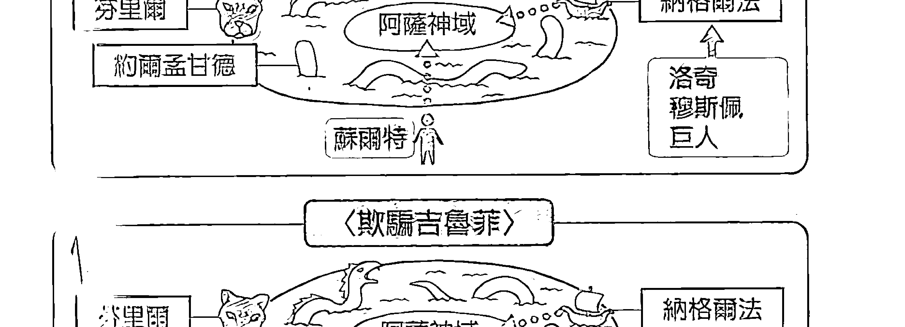

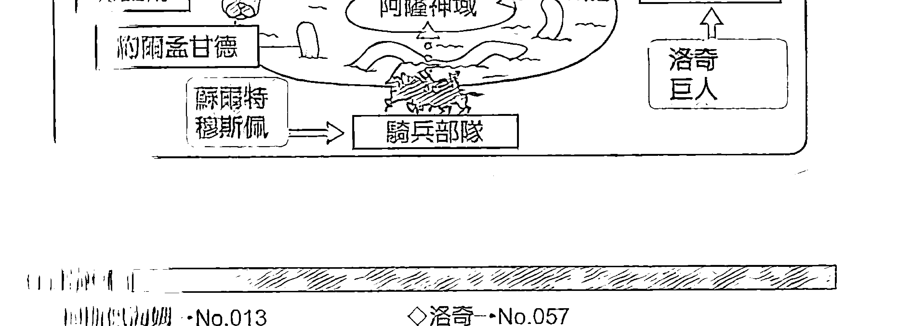

## No.066 ヴォルスングの一族
### 佛尔颂家族
Volsungar
佛尔颂家族是有许多英雄辈出的家族。他们体内流着主神奥丁的血液，并且受到奥丁的庇护。

### ○英雄辈出的家族
佛尔颂家族是以继承主神奥丁血统的齐奇（Sigi）为肇始的家族。他们是支有极多英雄辈出的家族，萨迦等传说里提及的汉登格屠杀者海尔吉和屠龙者齐格鲁都在其列。《佛尔颂萨迦》对此家族有详细的描述。
佛尔颂家族的始祖齐奇曾经因为狩猎所得到的猎物与人发生争端、杀死名叫史卡姬^1的男仆而遭处流放之刑，可是武勇过人的齐奇后来却成了统领匈人的国王，直到将届老年以前一直维持王者的鼎盛声势，最后却是遭外戚杀害而丧命。当时出外远征的齐奇之子利里尔（Rerir）听闻父亲讣报立刻挥师返朝，报得父仇并登基为王。利里尔是位堂堂王者却嗣息福薄，每日都和妃子同声向众神之母福丽嘉祈求子嗣，福丽嘉心有不忍遂与奥丁商议，派遣瓦尔妲基丽姬带着可获子嗣的苹果，赐后嗣予利里尔夫妇；当时他们所生下的孩子便是佛尔颂，也是后来佛尔颂家族族名的起源。尽管佛尔颂的双亲在他诞生后不久便即辞世，他还是顺利成长，成为堂堂的国王。待到佛尔颂进入适婚年龄，众神又将当初负责送苹果来的瓦尔妲基丽姬芙琉姿（Ljod）送到佛尔颂身边，嫁他为妻。他们过着非常幸福的婚姻生活，生有十男一女，其中最优秀的便属长男齐格蒙及其双胞胎妹妹齐格妮了。后来有个说是约塔兰^2之王西格尔的男子来向齐格妮求婚，岂料西格尔却为了出现于婚礼宴席间的奥丁之剑而跟齐格蒙争执起来，还让齐格蒙好生羞辱了一番。这件事虽然当场粉饰过去了，但西格尔始终无法忘怀受辱之恨，最后竟将齐格蒙与齐格妮的家族全数灭绝殆尽。

> 注1 史卡姬：虽然同名，但此处所指并非女神史卡姬。关于女神史卡姬请参照。
> 注2 约塔兰（Gotaland）：瑞典南部主要地区，自十八世纪中叶以来，一直都是瑞典人口最密集的地区，当时占全国人口的60%。

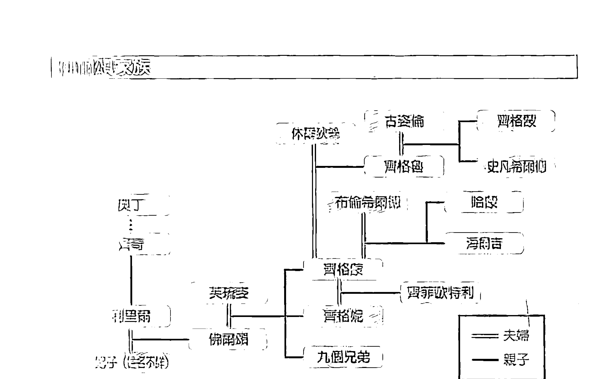

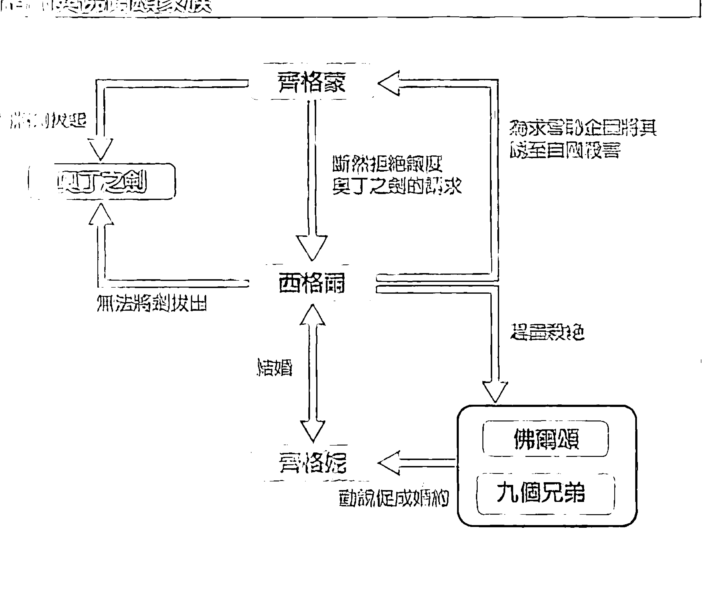

## No.067 シグムンド
### 齐格蒙
Sigmundr
齐格蒙是凭着奥丁之剑替族人报仇成功的英雄，但是当那把宝剑被奥丁折断的时候，他的命运也走到了尽头。

### ○萨迦所述两名英雄的父亲
齐格蒙乃是以汉登格屠杀者海尔吉以及屠龙者齐格鲁之父而闻名的英雄，其人生同样也是波澜万丈，丝毫不逊色于他的两个儿子。《佛尔颂萨迦》里是这么说的：齐格蒙因为出现在胞妹婚宴上的奥丁之剑，而与妹婿约塔兰之王西格尔发生了争执。西格尔未能得到宝剑，于是便假言要举办宴会招待齐格蒙一族，企图将其召至自国谋杀之，所幸齐格蒙因为胞妹齐格妮的机智而逃得性命，藏匿起来，等待时机以图报复。齐格妮为帮助兄长培植复仇力量，遂改作魔法师装扮与齐格蒙发生关系，生下了齐菲欧特利（Sinfjötli）。齐菲欧特利直到满十岁以后才被送到齐格蒙身边，学习各种技术。这时齐格蒙认为时机成熟而展开复仇行动，却反遭挫败，还跟齐菲欧特利一起被活埋在地底，两人之间仅有一块岩石之隔。此时仍赖齐格妮心生一计，用稻草把培根肉和奥丁之剑包裹成束、送到齐格蒙手中。于是身处地穴的两人便持此剑劈开岩石逃出生天，跟着就要纵火烧掉国王馆邸以图报仇，可是此时齐格妮却对兄长说出齐菲欧特利其实是他们两人所生孩子的真相，并且选择与国王一起葬身火窟。后来齐格蒙返回故国、登上王位，还跟布伦希尔德生下哈蒙（Hámundr）和海尔吉二子。可是跟王妃关系恶劣的齐菲欧特利却遭其毒杀，而齐格蒙也就此与布伦希尔德离异。其后齐格蒙又纳新妃休尔狄丝，却又因而跟从前曾向休尔狄丝求过婚的汉登格家族伦格王爆发了战争。齐格蒙在这场战事当中被奥丁折断了象征其守护力量的宝剑，郁郁殒命。看着齐格蒙断气的休尔狄丝后来先是接受丹麦王子爱尔芙（Alf）保护，并且在丹麦生下了齐格鲁。

> 《尼伯龙根之歌》和华格纳歌剧称为“齐格飞”（Siegfried）

## 北欧神话英雄的生父——齐格蒙

| 族谱 |  |
| :--- | :--- |
| 人物 |  |
| 持有物 | 剑 |
| 相关神明与人物 | 奥丁/齐格鲁德 |

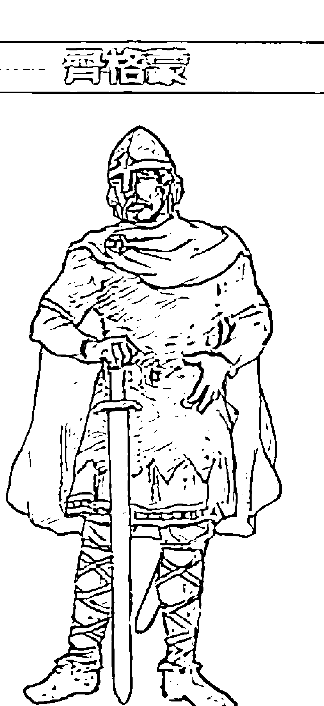

## 概述
齐格蒙、海尔吉英雄的生父。自从伊手拿起妹妹安妮插在木头上的奥丁之剑以后，他就注定要步上波澜壮阔而悲烈的命运

## 特征
其能力在众兄弟当中最为突出优秀。曾经一度因伪不断驰骋到受诅咒的毛皮，而必须以狼的模样过活

- 奥丁之剑
齐格蒙因奥丁之剑所致纠纷得罪妹婿西格德，而使得全族都被骗到西格德的国度，齐格蒙以外的族人全数遭到诛杀

- 复仇、与胞妹诀别
经过齐格蒙等待时机，带着与齐格鲁德生的儿子齐菲欧特利复仇成功，但齐格蒙却与齐格鲁德同生死、葬身火海

- 齐菲欧特利遭暗杀
齐格蒙大仇后又娶布伦希尔德，生下二子；然而齐菲欧特利却遭娶妃的亲戚暗杀，齐格蒙与布伦希尔德离异

- 被奥丁玩弄于股掌的命运
齐格蒙向自己的新妻子休尔狄丝求婚的伦格尔王（King Lyngvi）发生冲突，战斗进行中突然现身将剑折断，使得齐格蒙因而丧命

> > No.017 ◇齐格蒙→No.069
> 齐格鲁德（汉登格屠杀者海尔吉）→No.068

## 海尔吉（汉登格屠杀者海尔吉）
海尔吉是受到命运女神眷顾守护的英雄，命中注定要偕同恋人不断转世重生。

- ○转世重生的恋人
海尔吉乃齐格蒙王之子，也是曾受诺恩祝福“将成为所有国王当中声誉最高的国王”的人物。他波澜万丈的生涯故事在《诗歌爱达》的〈汉登格屠杀者海尔吉之歌〉（Helgakviða Hundingsbana）和《佛尔颂萨迦》都有详细的描述。

沿袭当时将幼子托予优秀人物寄养的风俗习惯，海尔吉同样也被交付予勇士海尔佳（Halga）抚养锻炼，长成一名堂堂青年。十五岁的时候他曾经回遇到父亲的仇家海登堡家族潜入馆邸的事件，不过当时靠着变装扮成女仆才逃过一劫。后来海尔吉伙同同父异母的胞兄齐菲欧特利攻进汉登格家，消灭汉登格王及其诸子，而海尔吉便是在回途当中结识了胡格尼王（King Høgne）的女儿——瓦尔妲基丽姬希格露恩。〈汉登格屠杀者海尔吉之歌〉说他们俩前世便是恋人，希格露恩从以前就一直爱慕着海尔吉，可是她的父亲却替希格露恩跟葛兰玛国王（King Granmarr）霍多布洛德（Høðbroddr）订下了婚约。她因为厌恶这桩婚约而离开父亲，投奔海尔吉。

海尔吉这边也为了要迎娶希格露恩而举兵相抗，经过一番激战之后，终于消灭霍多布洛德以及胡格尼家族，两人得以幸福地共同生活，可是唯一投降并存活下来的希格露恩胞弟达格却无法接纳如此结果，他向奥丁祈求守护，然后便持向奥丁借得的长枪暗杀了海尔吉。面对不住向自己道歉的弟弟，希格露恩却只能以各种诅咒相对，悲伤得终日以泪洗面。海尔吉看!希格露恩的状况心有不忍，便暂时回到世间，与希格露恩共度一夜，此后就再也没有出现，而不久后希格露恩也仿佛是追随海尔吉般地结束了短暂的生命。据说后来他们两人仍转世重生，再续情缘。

## 不断重生的英雄——海尔吉

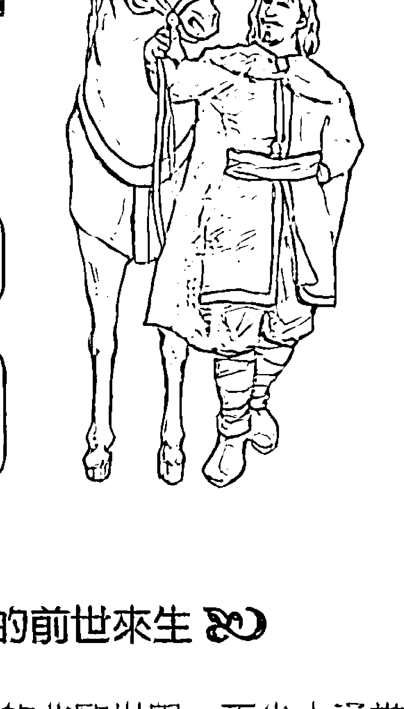

海尔吉乃是休格之子，他成功消灭了父王的杀害者与其他强盗的汉登格王，获得了“汉登格屠杀者海尔吉”的称号。后来遭到杀害，但却为了悲叹不已的妻子回到凡间停留一夜

受到弗恩祝福的王。他等待部下，性格爽朗。他与妻子是不断的重生的多世夫妻

持有物
1. 剑希格布列尔 (Higrbær)

相关神明与人物
休瓦兹 / 弗丽格 / 希格露恩

## 激登格屠杀者的前世来生
在同名人物众多的北欧世界，不少人通常都是以绰号称呼之。
海尔吉的绰号亦是其中一例，不过其绰号却因为他的不断转世而变得...
汉登格屠杀者海尔吉在前世是挪威国王休瓦兹 (Hjorvarð) 之子。
他因为是个哑巴所以没有取名，仅以休瓦兹之子称呼。后来是...
希格露恩斯薇法 (Sváva，希格露恩的前世) 看出他拥有英雄...
才赐予海尔吉之名以及名剑，还成为他的守护者。海尔吉...
斯薇法的守护之后屡立战功，最后还与斯薇法结成姻缘，然则...
幸福却并不长久。海尔吉胞弟赫丁 (Hedin) 对斯薇法亦存有...
爱慕，有次他在某个宴席场合立下神圣的誓言，誓言要把兄嫂...
夺为己有，后来这个誓言变成了诅咒，导致海尔吉命丧沙场。
另一方面，汉登格屠杀者转世以后则变成了瑞典的“哈汀贝尔...
海尔吉”。他带着希格露恩转世的瓦尔妲丽姬凯拉...
的守护征战沙场，可是某次在与丹麦人的战争当中把剑...
指向天际，以致斩杀到变成天鹅跟随在后的凯拉。海尔吉失去凯拉...
的守护以后，当然也不可能平安无事，最终也在这场战役当中丢了...

## No.069 シグルズ
### 齐格鲁
Siegurd
齐格鲁乃是以屠龙者而驰名的英雄，因为背叛深爱的女性而丧失了生命。

### ○屠龙英雄齐格鲁
拥有屠龙者高名的齐格鲁是佛尔颂家族的国王齐格蒙之子。他的母亲休尔狄丝在齐格鲁死后又与丹麦国王希亚普瑞克（Hjalprek）的王子爱尔芙再婚，因此齐格鲁的少年时代便是在爱尔芙的身边度过，当时负责照料齐格鲁的便是著名的铁匠雷金（Reginn）。

当齐格鲁长大成人相貌堂堂的青年以后，成功消灭了父亲的敌人汉登格家族，得报父仇。此外他还在雷金的劝说之下，打倒了因为受黄金熏心而变成龙的雷金之兄法夫尼尔，后来齐格鲁应雷金要求将法夫尼尔的心脏拿去烧的时候，不小心舔舐到法夫尼尔的血液，从此便能通晓动物的语言；他从小鸟的啁啾声里得知雷金已经背叛自己，于是便杀死雷金，然后将黄金驮在爱马格拉尼马背，踏上了归途。回程途中，小鸟们又劝齐格鲁顺道弯去一座叫做辛达费尔（Hindarfell）的山。那里有座被熊熊火焰包围的馆邸，这里有位瓦尔妲基丽姬沉眠于其中，齐格鲁救出这位瓦尔妲基丽姬，从而得其传授各种知识。齐格鲁在这场冒险以后投奔于海姆王（King Heimr）麾下，与海姆王的义姐布伦希尔德缔下婚约。另外，《诗歌萨达》的〈布伦希尔德赴地狱之旅〉（Halreið Brynhildar）也记载说齐格鲁在辛达费尔山顶搭救的瓦尔妲基丽姬不是别人，正是布伦希尔德。可是后来齐格鲁却在拜访几优基王（King Gjúki）的时候娶了国王的女儿古姿伦，甚至还为了跟自己结成姻亲兄弟的几优基之子古纳尔，欺骗曾经深爱过的布伦希尔德嫁给古纳尔。这件事让齐格鲁从此遭到布伦希尔德怨恨，甚至还因而丢了性命；原来古纳尔早已被齐格鲁的黄金迷惑，而布伦希尔德便怂恿他暗杀了齐格鲁。

## 北欧英雄=齐格飞

| 族属 | 人类 |
| :--- | :--- |
| 持有物 | Gram (剑)<br>Grani (马) |
| 1:1相关神明与人物 | 奥丁 / 法夫尼尔 / 布伦希尔德 |

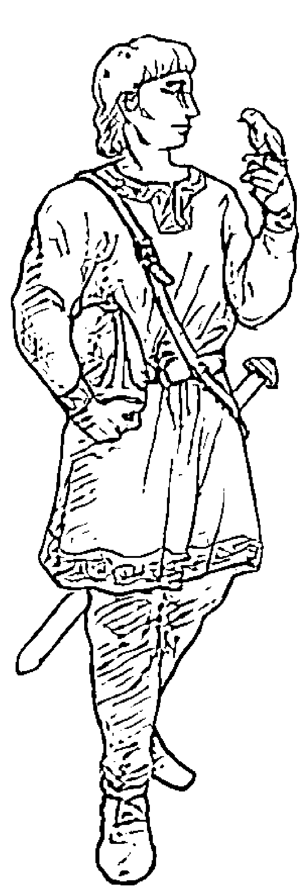

传说
齐格飞是日耳曼文化圈的屠龙英雄。德国的骑士传说《尼伯龙根之歌》和德国作曲家瓦格纳的歌剧则是将他称作齐格飞

特征
法夫尼尔的鲜血与心脏的魔力使他能够通晓小鸟和动物的语言，此外他对如尼文字和智术亦颇有心得

## 《诗体埃达》和散文记述的齐格飞冒险旅程
讨伐法夫尼尔
因父亲莱金怂恿而打倒法夫尼尔，但是齐格飞又因为龙血和龙心的魔力而得知莱金的阴谋背叛，于是便杀死莱金、将黄金取回

搭救瓦尔妲基丽娅
砍断锁链，解救因于辛德费尔山顶的瓦尔妲基丽娅所受诅咒，得其传授各种知识

跟古姿伦结婚、助古纳尔娶妻
前往拜访几匿基王，并与其女古姿伦结婚。后来齐格飞还变装去替小舅子古纳尔向阿提利王 (King Atli) 的妹妹布伦希尔德求婚，成功缔结婚约

遭暗杀身亡
因黄金与古姿伦发生争执，使得原本倾心于齐格飞的布伦希尔德失去控制，而古纳尔在布伦希尔德的挑拨怂恿之下，暗杀了齐格飞

- 相关页面
  * 瓦尔妲基丽娅→No.022
  * 古纳尔→No.067
  * 法夫尼尔→No.070
  * 布伦希尔德→No.071

## No.070 ファフニール
### 法夫尼爾
Fafnir
北欧神话里有个被受诅的黄金所蛊惑的家族，不惜杀死父亲得到黄金的长男，最后甚至还舍弃了人类形体而变成巨龙。

### ○舍弃人类形体的可怕巨龙
法夫尼尔是头可见于《诗歌爱达》与萨迦的巨龙。牠浑身上下都是闪闪发光的鳞片、口吐剧毒的气息，极为恐怖。但据传法夫尼尔其资很聪慧贤明，甚至还堪称为贤者，而且牠的心脏和血液里还藏着某种能够理解动物语言的神秘魔力。据说他还有柄叫作弗洛帝的剑、有顶能使人陷入恐怖的埃吉尔头盔。
《诗歌爱达》中〈雷金的话语〉（Reginsmál）和〈法夫尼尔的话语〉（Fáfnismál）等文献都说法夫尼尔其实原本是人类，可是他的人生却因为主神奥丁为他们家族带来的安德华利的黄金而全部走样。原来这批黄金是众神误杀其胞弟欧特（Ótr）所以赔给他们的赔偿金，由于当初这批黄金乃是众神以不当手段取得，因而遭到其最初持有者安德华利施以诅咒。法夫尼尔被黄金的灿烂光芒所蛊惑，遂与胞弟雷金同谋杀害父亲赫列德玛（Hreiðmarr），接着又将雷金和妹妹们赶走，独自将黄金占为己有。然后他又在某个叫作格尼塔海兹的原野挖掘洞窟川藏黄金，并且变身成为巨龙，用身体挡住洞口。

然而，法夫尼尔却同样难逃黄金诅咒而终致毁灭。原来跟他同样受黄金蛊惑的雷金，也盘算着要鼓动怂恿当时的第一勇者，同时也是其养子的齐格鲁杀害法夫尼尔。齐格鲁先在法夫尼尔饮水必经的通道里挖掘地洞藏身，然后趁法夫尼尔经过顶的瞬间，举起名剑格拉墨，贯穿牠的心脏，这一击果然造成致命伤害，法夫尼尔亦因而殒命。相传法夫尼尔在将死之际意志忽然恢复正常，并且忠告齐格鲁不要染指黄金，可是齐格鲁并未听从法夫尼尔的忠告，以致日后齐格鲁及其亲属血族一个个走向了毁灭。

## 金龍的秘密——法夫尼爾

- **族屬**
- **所在地**: 北海

## 細說

法夫尼爾是北歐神話中受詛咒的弗列茲瑪的兒子。自從殺害父親奪取黃金以後，法夫尼爾就變成了巨龍，最後被覬覦黃金的弟弟齊格魯用計謀殺死。

## 插圖

法夫尼爾是以蛇伏地爬行，鱗片閃閃發光的巨龍。其心臟和血液中還含有可以理解動物語言的能力。

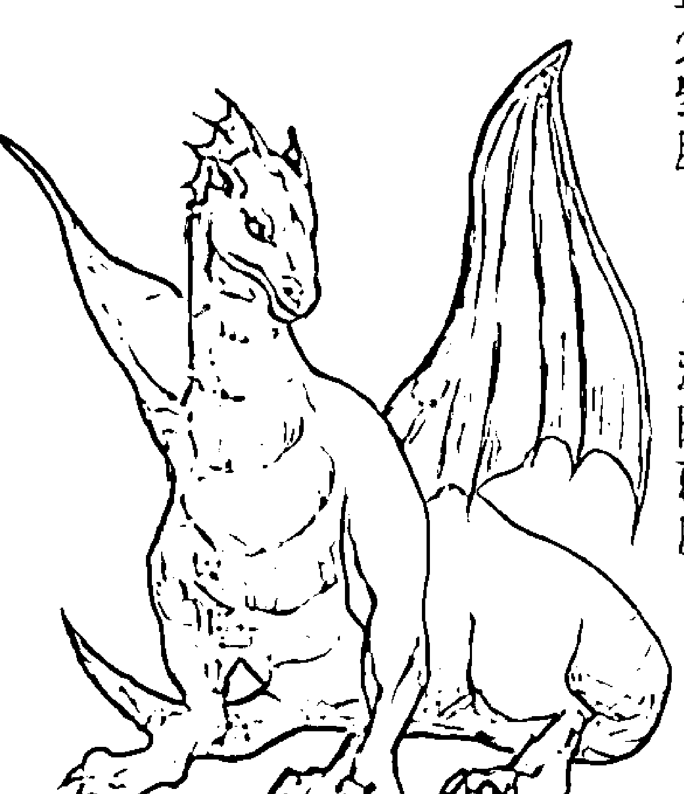

- **持有物**: 黃金(?) / 埃吉爾頭盔 / 安德華利的黃金
- **主要相關神明與人物**: 奧丁 / 洛奇 / 齊格魯 / 弗列茲瑪 / 齊金

## 弗列茲瑪家族

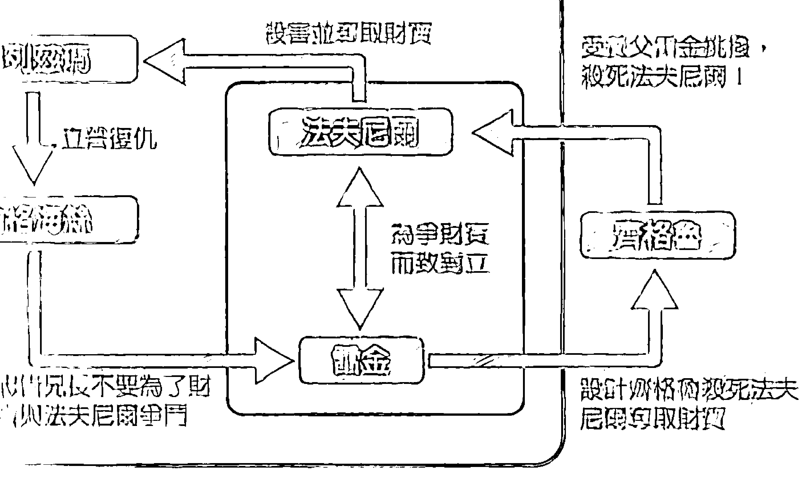

## 布倫希爾德

布倫希爾德是住在烈焰圍繞的館邸裡面的美麗公主。一份無法得到的愛情，使她不斷地將周遭眾人往毀滅的漩渦裡推去。

### ○為愛瘋狂的公主

布倫希爾德是《詩歌愛達》和薩迦都有記載的布德利王 (King Budli) 之女，也是阿特利王 (King Atli) 的妹妹。《詩歌愛達》的〈布倫希爾德赴地獄之旅〉(Halreid Brynhildar) 說她是瓦爾妲基麗姬，後來卻因為違逆主神奧丁而遭施以沉眠的詛咒。她在辛達費爾 (Hindarfell) 山頂被烈焰包圍的館邸裡陷入沉眠，將她搭救出來的正是以屠龍英雄而馳名的齊格魯。當時齊格魯便與布倫希爾德互訴衷情，並且訂下婚約，可是最後齊格魯娶的妻子卻是幾優基王 (King Gjuki) 的女兒古姿倫。

齊格魯在跟幾優基之子古納爾成為姻親兄弟以後，曾經為了協助古納爾娶布倫希爾德為妻，而再度造訪辛達費爾。當眾人漸漸走近館邸，古納爾的馬卻畏於火焰而遲遲不肯前進。這下沒轍，齊格魯只能扮成古納爾的模樣，騎著愛馬格拉尼躍過火焰去尋布倫希爾德，布倫希爾德看見古納爾躍過火焰，欣賞他的勇氣於是便決定嫁他為妻。兩人其後的生活也過得相當幸福，可是有次她因為跟古姿倫發生爭執，這才發現了所有內情。遭人背叛的不甘以及對齊格魯難以割捨的思慕，終於點燃了布倫希爾德心中的復仇火焰。

布倫希爾德於是便去慫恿丈夫及其胞弟胡格尼 (Högne) 暗殺齊格魯，起先兩人對殺害姻親兄弟此事甚感躊躇，但兩人最後還是唆使被齊格魯所擁黃金沖昏頭的弟弟古札姆 (Guttorm) 將其殺害。布倫希爾德得知齊格魯死訊，在一陣高聲長笑後便自刎求死，臨終還要求把她跟齊格魯一同火葬。對布倫希爾德來說，齊格魯終究還是她人生的全部。

## 英雄的國度傳說——布倫希爾德

- **族國**
瓦爾基里族/人類

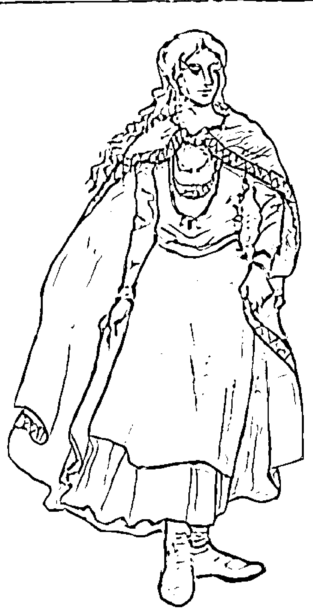

- **人物介紹**
布倫希爾德是布德利王的女兒、阿特利王的妹妹。她本是瓦爾基里姬，卻因違抗主神奧丁而遭詛咒，卻因無法實現的思念使她瘋狂，終於導致她忘卻丈夫古納爾暗殺齊格魯。

- **人物設定**
布倫希爾德是位美麗的瓦爾基里姬，《埃達詩史》說她非但有預言的能力，還擁有魯納文字和魔法的相關知識。

- **持有物**
瓦爾哈拉宮特

- **主要相關神明與人物**
提爾/齊格魯

### ◆◆的人物關係

### 戰後基王的子女

mermaid
graph LR
    K[古後基王的子女] --> L[古納爾]
    K --> M[古婁倫]
    L --> N[委其暗殺齊格魯]
    N --> O[古托姆]
    P[胡格尼] -->|指使暗殺| O
    O -->|暗殺| Q[齊格魯]
    L -->|夫婦| R[布倫希爾德]
    M -->|夫婦，因身分紛爭對立| R
    R -->|曾有婚約但已無效| Q
    M -->|想抹去暗殺齊格魯的記憶| Q

## No.072 | ヴェルンド
韋蘭
Volundr

遭到囚禁的韋蘭原本是位為妻子打造的財寶和自身自由均遭到剝奪的傳說名匠，最後卻化作了復仇的惡鬼。

### ○娶瓦爾妲基麗婭為妻的傳奇名匠

韋蘭是《詩歌愛達》中〈韋蘭之歌〉等文獻都有記載的傳說中的名匠，其傳承起源非常古老，據說日耳曼文化圈許多國家對他都並不陌生。

〈韋蘭之歌〉說韋蘭本是芬國（Finn）的王子，有次他跟兩位兄長滑雪出外狩獵，在某個名叫狼谷的地方過夜。隔天早晨，三人在附近的狼池發現三名褪去天鵝羽衣正在織布的瓦爾妲基麗婭，兄弟三人將她們帶回家娶作妻子，過了七年的幸福生活，可是第八年的時候，她們卻又為了趕往戰場而離開了。上頭的兩位兄長決定出外去尋妻，韋蘭卻只是留在家裡打造手環，等待妻子歸來。

後來，尼亞爾（Njars）之王尼德茲（Niðad）聽聞他手藝精純，遂將他擒住，斬斷腳腱，禁閉於孤島塞伐爾斯塔茲（Sævarstöð），企圖獨自佔有他的名家手藝。儘管對自己的境遇感到絕望，韋蘭還是應國王的要求繼續製作寶物，卻也同時暗中伺機報復。首先他殺死來到島上的尼德茲的兩個王子，用他們的屍體做成酒杯和首飾送給國王，接著又趁尼德茲的女兒貝絲維朵（Böðvildr）來訪之際，將之灌得酩酊大醉並且對她施暴。或許是已經感到滿足，韋蘭遂穿起他以鳥類翅膀製成的飛行翼騰空而起，向王宮飛去，然後將殺害兩位王子以及對貝絲維朵施暴、使她懷有身孕的事情告訴了國王。韋蘭對鐵青著臉的國王好生訕笑了一番，然後就離開王宮，不知飛往何處。至於韋蘭後來的狀況如何，故事裡也沒有記載了。

## # 北欧神话中的名匠——韦伦

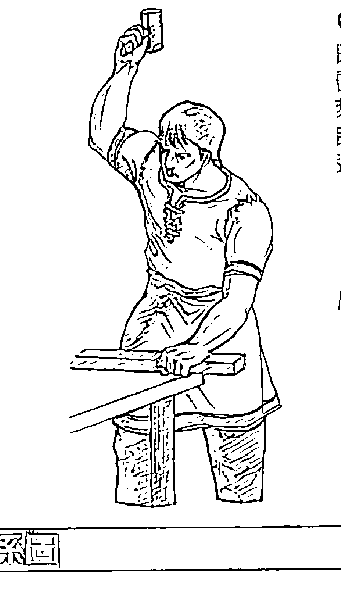

族谱

人物

-   持有物: 由羽毛制成的飞行翼
-   相关神明与人物: 女武神布伦希尔德

传说：日耳曼文化所熟知的传说名匠。尽管韦伦是利欲熏心的国王囚禁、被迫为国王制作宝物，不过许多传说却描述他运用机智、反过来让国王吃尽苦头。

登场作品：《韦伦之歌》说韦伦的脚腱乃国王尼德威阿尔斩断

### ## 《韦伦之歌》人物关系图

三位瓦尔基丽姬:
- 两位兄嫂
- 艾尔薇朵
两位兄长:
- 史拉格贺
- 埃吉尔
关系:
- 出外寻妻 → 两位兄嫂、艾尔薇朵
- 前往战场而离开 → 艾尔薇朵
- 打造手环等待妻子归来 → 韦伦
- 提供制作逃脱用飞行翼的材料 → 韦伦
- 韦伦 → 窃取财宝将其监禁 → 尼德威阿尔
- 韦伦 → 灌酒施暴 → 贝丝维朵
- 韦伦 → 设陷杀害 → 两位王子
底部人物: 尼德威阿尔、尼德威阿尔之妃、贝丝维朵、两位王子

## # 幾優基家族及其後談

幾優基家族指的便是殺害北歐神話最偉大的英雄齊格魯，並且奪得安德華利的黃金的古納爾等人。

心愛的丈夫和兒子遭兄弟殺害的古婁倫，即便在產下齊格魯的遺腹子史凡希爾德（Svanhildr）以後，仍舊遲遲無法從巨大的打擊裡恢復過來。無論哥哥古納爾和胡格尼如何道歉謝罪，全都無法觸及她的心裡。古婁倫的母親葛麗姆希爾德（Grimhild）害怕她振作起來以後會與親人為仇，遂用藥使她遺忘對古納爾的憎恨，並且強將她嫁給布倫希爾德的兄長——匈人之王阿特利（Atli），好使她遠離家人。想當然爾，這樣的婚姻當然不可能會有愛苗滋生，古婁倫只能悶悶不樂地虛度時日。

另一方面，古婁倫的哥哥古納爾和胡格尼卻也在不知不覺中陷入了危機：原來古婁倫的丈夫阿特利早就覬覦他們倆從齊格魯那裡奪來的黃金，已經在進行謀殺的計畫。雖然古婁倫發現此計畫以後，曾經對古納爾他們發出警告，但兄弟兩人卻完全不以為意；與此同時兩兄弟的妻子也都分別做了惡夢，向夫君提出警告，但他們卻依舊不當一回事。於是乎古納爾等人果然正如阿特利計謀所料定，僅帶領著少數兵力前往阿特利已經設下陷阱的王宮接受招待。不過也許是因為有某種的預感，他們在臨行前已經先將安德華利的黃金丟進了萊茵河底，然後才出發。

這廂阿特利率領著大軍佈好陣勢，等著古納爾送上門來。古納爾等人固然驍勇善戰，畢竟寡不敵眾，終於均為阿特利所擒。阿特利想方設法要從古納爾口中問出黃金的所在，古納爾卻說除非看到胡格尼的心臟否則他絕不開口；阿特利先用奴隸的心臟假裝成胡格尼的心臟給古納爾看，古納爾卻立刻看破那顆心臟並不屬於弟弟。這次真的把胡格尼的心臟取來，古納爾才好像很滿足似地說道「這下就只剩我知道黃金藏在哪裡了」，並且表示自己壓根就沒想過要說出黃金的下落，氣得阿特利把他關在滿是毒蛇的洞穴裡，而古納爾就彈奏著古婁倫送進來的豎琴，慘死於洞穴之中。

古婁倫為替兄弟報仇，遂將自己跟阿特利生的幾位王子殺害，將屍體摻在宴會的酒裡讓阿特利喝下；阿特利得知古婁倫的行為之後大受打擊，終日只是飲酒喝得爛醉。此時古婁倫找來古納爾兩兄弟的兒子將阿特利殺害，然後放火焚燒王宮，將阿特利家族及其家臣全部趕盡殺絕。相傳後來古婁倫曾經投海自盡卻沒有死亡，還嫁給尤納克王（King Jónakr）為妻，可惜的是幸福始終與她無緣。

## # 第3章 神秘的神奇 道具與動物

## 魯納文字

魯納文字相傳乃是由北歐的主神奧丁所發明，那麼它究竟是種什麼樣的文字呢？

### ○奧丁發現的神秘文字

北歐神話認為魯納文字乃是主神奧丁所發現的一種蘊涵咒力的文字。相傳奧丁為掌握其秘密，曾經不飲不食，在世界樹伊格德拉西爾上吊了九天九夜。

魯納文字是種篆刻於各種物品之上的文字，如果使用方法正確便能發揮出各種不同效果。《詩歌愛達》的〈希格德莉法的話語〉就列舉出祈求勝利的提爾魯納、潔淨麥酒用的內德（nauð）魯納、幫助孕婦的安產魯納等五花八門的魯納及其效用。此外，力量特別強大的神明抑或魔法道具，也會篆刻魯納文字。

儘管擁有相當強大的力量，魯納文字卻也絕非萬能。《詩歌愛達》的〈史基尼爾之旅〉就說只要將文字削除便能使魯納文字失去效果，而《埃吉爾薩迦》裡也能看到同樣的記載。假如使用魯納文字的方法錯誤，甚至還有可能會造成完全無法預測的結果。

現實裡的魯納文字其實並非神話所描述的那般神祕。它固然有其宗教性、咒術性使用方法，但真要說起來，畢竟還是比較趨近於日常性質的語言。魯納文字通常取其頭六個字母稱作「富托克」（Fupark），原是為了要刻在木頭上面所發明的文字，因為要與木頭的紋路區別，魯納文字均是由跟木頭紋路呈直角的長縱線、短斜線和點所構成。

異教時代北歐所使用的魯納文字共分長枝魯納與短枝魯納兩種；這兩種魯納跟現在占卜所用的二十四個字母不同，都只有十六個字母而已。據說當時的北歐人是利用變化語言的音節來對應這些多出來的字，所以字母才會比較少。

* 亦有稱盧恩文（Rune）或如尼文。

## 從時代北歐使用的主要古代文字

### 長枝（丹麥）盧納

| ᚠ | ᚢ | ᚦ | ᚨ | ᚱ | ᚲ | ᚷ | ᚹ | ᚺ | ᚾ | ᛁ | ᛃ | ᛈ | ᛇ | ᛉ | ᛊ |
|---|---|---|---|---|---|---|---|---|---|---|---|---|---|---|---|
| f | u | b | a | r | k | h | n | i | a | s | t | b | m | l | R |

### 短枝（瑞典＝挪威）盧納

| ᚠ | ᚢ | ᚦ | ᚨ | ᚱ | ᚲ | ᚷ | ᚹ | ᚺ | ᚾ | ᛁ | ᛃ | ᛈ | ᛇ | ᛉ | ᛊ |
|---|---|---|---|---|---|---|---|---|---|---|---|---|---|---|---|
| f | u | b | a | r | k | h | n | i | a | s | t | b | m | l | R |

### 北歐盧納文字之意涵及效用

| 符號 | 名稱 | 涵義 |
|------|------|------|
| ᚠ | fē | 財富 |
| ᚢ | ūr | 雨、雨水 |
| ᚦ | þurs | 巨人 |
| ᚨ | Óss | 阿薩神族（奧丁） |
| ᚱ | reið | 騎馬 |
| ᚲ | kaun | 窗 |
| ᚷ | hagall | 雹 |
| ᚹ | nauð | 困苦 |
| ᚺ | íss | 冰 |
| ᚾ | ár | 豐收 |
| ᛁ | sól | 太陽 |
| ᛃ | Týr | 提爾（戰神、刑罰之神） |
| ᛈ | bjarkan | 樺樹、白樺 |
| ᛇ | Maðr | 人類（圖伊施柯的後裔） |
| ᛉ | logr | 水 |
| ᛊ | yr | 紫杉樹 |

| 名稱 | 效用 |
|------|------|
| 治癒的盧納* | 治癒傷口 |
| 愛的盧納* | 為得到他人的愛 |
| 勝利的盧納（↑） | 祈求勝利 |
| 變酒的盧納（卌） | 變淨酒杯、去毒除災 |
| 安產的盧納* | 幫助孕婦分娩 |
| 海浪的盧納* | 祈求航海安全 |
| 醫術的盧納* | 醫生替人治療時使用 |
| 避難的盧納* | 在民舍裡用來迴避他人憎恨 |
| 智慧的盧納° | 想變得比任何人都聰明時使用 |
| 睡眠的盧納（훅） | 欲使他人陷入沉睡時使用 |
| 愛情的盧納（ᛏ） | 欲使女性柑病時使用 |

*相對應之盧納文字不明

## No.074 セイズ呪術と呪歌ガルドゥル
塞茲咒法與迦爾多咒歌
Seiðr & Galdr

塞茲咒法與迦爾多咒歌一個是操縱魂靈的咒術，一個是可發揮各種效果的咒歌。除魯納文字以外，北歐世界尚有許多其他咒術存在。

### ○ 塞茲咒法

北歐除魯納文字以外尚有其他各式各樣的咒術存在，其中尤以塞茲咒法特別有名。根據《挪威王列傳》序章〈英林加薩迦〉記載，塞茲咒法乃是由華納神族的女神菲依雅帶到阿薩神族的一項技術，其本質在於操縱靈魂。據說塞茲咒法的高手非但能夠召喚遊蕩於凡世間的靈魂接受預言，還能使自己的靈魂出竅，藉以探知遠方發生的事情。
塞茲咒法是種伴隨著強烈的忘我狀態與性恍惚感覺的技法，使用者通常都是女性；這些女性通常被稱爲巫女或女先知，她們會使用各式各樣的咒術小道具，還會請助手吟唱和瓦茲洛可咒歌（Varðlokkur）協助其執行咒術。這些巫女在基督教傳入北歐之後仍得以暫時存活，《紅鬍子埃里克薩迦》便描述到她們使用法術的情形。由於塞茲是屬於女性的咒術，當時的人似乎覺得男生施用此法是令人很不愉快的事情，因爲男性施術者恍惚的性快感會使他們聯想到同性戀，尤其是同性戀當中的受方。也是因爲這個緣故，惡神洛奇便曾經在《詩歌愛達》的〈洛奇的爭論〉裏面大罵使用塞茲咒法的奧丁是「娘娘腔」。

### ○ 迦爾多咒歌

除塞茲咒法以外，北歐還有個著名的咒術叫作「迦爾多咒歌」。所謂迦爾多其實是種利用歌曲達致各種效果的咒術，相傳奧丁也會使用此咒術，甚至還被稱作是咒歌的打鐵匠。除奧丁以外，還有曾經試圖將嵌進索爾腦袋的磨刀石取出的巫女格羅亞等，也都是迦爾多咒歌的高手。

## # 塞茲咒法

女神菲依雅引進阿薩神族的咒術，主要是藉由操縱靈魂得到各種效果。相傳華納神族使用塞茲咒法是很家常便飯的事情。

### ## 使用條件

-   各種儀式
-   誇張的服裝、小道具
-   瓦茲洛可咒歌

### ## 施術者

-   奧丁
-   菲依雅
-   巫女、女先知

### ## 主要效果

-   使自身靈魂出竅
-   出外蒐集情報
-   召喚死者亡靈
-   蒐集情報

### ## 缺點

-   伴有強烈的忘我狀態
-   伴有性的恍惚感覺

## # 迦爾多咒歌

北歐神話裡隨處可見、較為原始的咒術。乃是遵循某種名為迦爾多律的特殊韻律唱誦，能達到治療等各種咒術效果。

### ## 使用條件

遵循迦爾多律（就內容與表現方式進行重複、並行法、形式強化的表現）唱誦

### ## 施術者

-   奧丁
-   巫女格羅亞

### ## 主要效果

各種效果

### ## 參考

-   阿薩神族 → No.016
-   奧丁 → No.017
-   華納神族 → No.040
-   ◇菲依雅 → No.044
-   ◇洛奇 → No.057
-   ◇魯納文字 → No.073

## 密米爾之首

密米爾之首是奧丁相當倚重的寶物，這顆腦袋的主人便是從前負責把守智慧之泉的賢明巨人。

### ○授予各種知識的魔法腦袋

密米爾之首是顆可授人以各種知識的魔法腦袋，《詩歌愛達》的《希格德莉法的話語》裡，就寫到這顆腦袋「深思熟慮吐出第一個字，告知以魯納文字記載的真實智慧」。根據《詩歌愛達》中《女先知的預言》和《史諾里愛達》的記載，這顆腦袋從前的主人名叫密米爾，他便是由世界樹伊格德拉西爾的樹根伸進泉水中的智慧之泉的主人，他的知識乃是來自於每天早晨飲用的智慧泉水。就連奧丁的知識，也只不過是以單眼作擔保飲下一口智慧泉水所得，由此便可見得密米爾的知識是何等淵博。奧丁亦相當倚重其知識，相傳終末戰役諸神黃昏將來之際，奧丁第一件事情便是向他徵求助言。《挪威王列傳》序章《英林加薩迦》就密米爾之首的製作過程及始末說明如下：從前阿薩神族和華納神族厭倦長期對抗撻伐，決定要締結和約，於是阿薩神族便送出海尼爾和密米爾，華納神族則送出尼爾德一家作為人質交換。海尼爾看起來相貌堂堂，立刻就被推舉為華納神族的領袖，可是華納神族很快就發現他只不過是萬事任憑密米爾決定，自己卻不怎麼動腦筋的草包神明，華納神族憤而砍下密米爾的腦袋，將首級送還給阿薩神族；奧丁取得密米爾之首便立刻施以藥草處置並以咒文強化之，好讓他能夠隨時從密米爾之首攫取需要的知識。但亦有說法駁斥前述《英林加薩迦》的記載，主張密米爾一直都守著泉水直到諸神黃昏，此派說法認為密米爾會從泉水裡探出頭來，講述各種知識。

## 密米爾之首

北歐神奧丁的所有物之一。此乃奧丁利用交給華納神族當人質卻遭斬首的巨人密米爾首級、施以魔法處置而製成的寶物。密米爾之首擁有豐富的知識，還能預知世界將要發生什麼事情。

密米爾是泉水的守護者，同時是奧丁亦父亦友亦師的顧問。

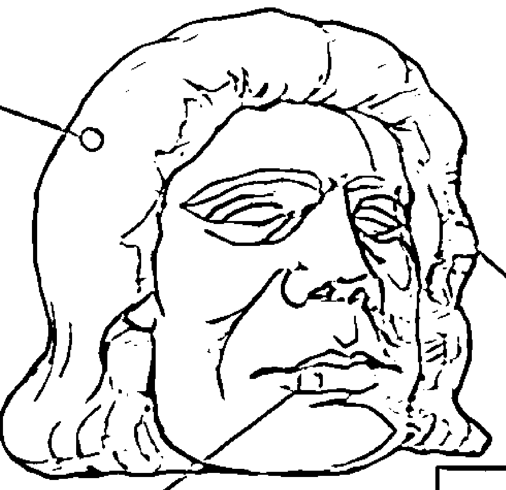

以頭顱、施以魔法處理後仍存活，能預知各種人類歷史。

一說密米爾是奧丁的叔父

### 密米爾之首如何誕生

阿薩神族 ← 交換人質 → 華納神族

-   阿薩神族：
    - 海尼爾
    - 密米爾
-   華納神族：
    - 尼爾德
    - 福瑞
    - 菲依雅

因海尼爾的無能使華納神族感覺受騙、怒不可遏，遂斬下其智囊密米爾的頭顱，送還給阿薩神族。

-   奧丁：
    - 想保有密米爾知識的智慧？
    - 畢竟密米爾的知識就這樣丟掉可惜？

施魔法處置 → **密米爾之首 完成!!**

### 相關詞條

-   奧丁與密米爾→No.015
- 阿薩神族 - No.016
- 知識之樹 No.017
- ◇華納神族→No.040
- ◇尼爾德→No.041
- ◇魯納文字→No.073

## # 詩蜜酒
Skáldskapar Mjaðar

詩蜜酒便是授天下詩人以詩才的魔法蜂蜜酒，乃矮人以賢者之血醸造而成。

### ## ○賢者之血所釀，授人以詩才的蜂蜜酒

詩蜜酒乃屬主神奧丁所有，是種能將詩歌才能授予飲用者、蘊藏有魔力的寶物；相傳蜜酒乃由名叫費拉雅爾（Fjalar）和葛拉爾（Galar）的侏儒（矮人）以賢者卡瓦希爾（Kvasir）之血醸成。

卡瓦希爾是當初阿薩神族和華納神族談和時，從雙方所吐唾沫裡誕生出來的人類。他擁有優秀的知識，平時四處旅行，利用他的知識幫助別人，卻遭費拉雅爾等人殺害並且榨取鮮血。費拉雅爾和葛拉爾把他的血摻混蜂蜜，分裝在一個叫作歐茲略利爾（Óðrerir）的鍋子和兩個分別叫作頌（Són）和波曾（Boðn）的壺裡醸造蜜酒；後來這蜜酒又被送給了因為費拉雅爾等人的惡作劇使雙親遭到殺害的巨人史登（Suttungr）作為賠償。

史登將蜜酒藏在赫尼伯格（Hnitbjorg）的洞窟，讓女兒耿雷姿把守。奧丁得知了詩蜜酒此物之後，遂殺害史登胞弟包基（Baugi）的九個奴隸，趁其人手不足扮作下人潛入，並要求詩蜜酒作為其完成九人份工作的代價。奧丁說服包基帶他來到洞窟，用錐子在入口挖開一個小洞，後悔的包基還來不及阻止，奧丁就已經變成蛇鑽了進去。奧丁在洞窟裡面見到耿雷姿以後巧言誘惑，得其承諾說只能讓他喝三口，豈料他三口就把詩蜜酒全部喝乾，然後變身成大鷲鳥，留下啞然失聲的耿雷姿揚長而去。

把追趕在後的巨人甩掉以後，奧丁便將詩蜜酒吐回壺裡保存，慌忙中不小心把蜜酒溢出來了一點點，這些溢出來的蜜酒並不如真正的詩蜜酒來得有效果，因而被稱作是「兩光詩人分得的稟賦」。

## 卡瓦希尔的诞生

以神圣之壶里吐口水作为和解的见证，从中产生一名人类

### 诗蜜酒之诞生

侏儒（矮人）宾拉雅尔和葛拉图杀害贤者卡瓦希尔，以欧兹的头颅、头盔和奥顿之壶酿造诗蜜酒

### 侏儒的赔偿

双亲遭宾拉雅尔杀害的巨人史登得到蜜酒作为赔偿

### 诱惑欧蕾姿

利用面包基带他来到蜜酒酿造地点，然后笼络看守者史登也出到蜜酒

### 奥丁的策略

得知诗蜜酒此物后，奥丁杀害史登胞弟包基的奴隶，趁他人手不足的时候潜入

- 阿萨神族 → No.016
- 华纳神族 → No.040
- 侏儒（矮人） → No.063

## No.077 胡金与穆宁、基利与库力奇

Huginn & Muninn, Geri & Freki

分别是主神奥丁使唤的两只乌鸦和两匹狼，它们并不单单只是伴随奥丁身边的从兽，也是代表奥丁神格的象征。

#### ○胡金与穆宁

胡金与穆宁是两只伫立于主神奥丁肩头的乌鸦，其名分别是“思考”和“记忆”之意。《挪威王列传》序章〈英林加萨迦〉说这两只乌鸦在奥丁的灌输下学会了人类的语言，奥丁每天早上都会把它们放出去搜集全世界的情报。《史诺里爱达》中〈欺骗吉鲁菲〉则说两只乌鸦每天早餐时刻就会飞回来，向奥丁报告搜集的情报。

不过，这两只乌鸦也很有可能只是奥丁神格的其中一个面向。〈英林加萨迦〉就说奥丁能够将灵魂切离身体，变成鸟兽在全世界进行搜索。另外《诗歌爱达》的〈葛林尼尔的话语〉也曾记载说奥丁很担心两头乌鸦不飞回来，如果说乌鸦就是他自己的分身的话，那么他会如此担心，自然是很合理的事情。

#### ○基利与库力奇

基利与库力奇均是拥有“贪欲”之名的奥丁从兽。据《史诺里爱达》的〈欺骗吉鲁菲〉记载，它们会代替平时除葡萄酒以外不碰任何食物的奥丁，将英灵殿呈上餐桌的塞弗利姆尼尔猪肉吃个精光。不过，基利和库力奇在代称（借代）里面经常被当作指称所有狼只的代名词使用，而且跟尸体亦有很深的关系；“基利的啤酒”指的就是血，“库力奇的小麦”则是“尸体”的意思。从上述用法便不难发现，基利与库力奇原本应该是暗指奥丁引起的战争及其惨状的暗喻表现。前述的〈葛林尼尔的话语〉只有很单纯地记述说奥丁饲养它们，换句话说，喂给死者便是它们的食物。

## 1. 奥丁的动物之一

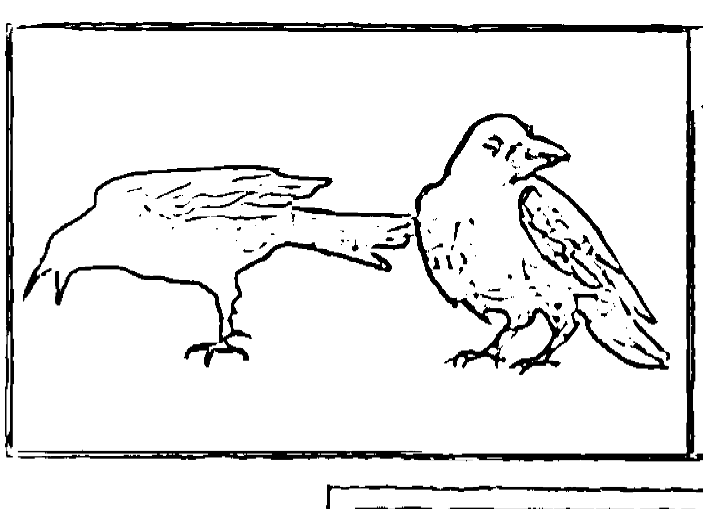

### 胡金与乌鸦 / Huginn & Muninn

停在奥丁肩膀的两只乌鸦，名字分别是“思考”与“记忆”的意思，受命于奥丁负责搜集情报

- **奥丁驯服的乌鸦？**
  - 黎明时将乌鸦送出去，回来吃早餐的时候将世界情势向奥丁报告
  - 曾经接受过教学、能够理解人类语言的乌鸦
- **奥丁的灵魂？**
  - 奥丁利用魔法使灵魂分离，变成鸟类飞往各地
  - 奥丁极度担心两只乌鸦的安危

## 1. 奥丁的动物之二

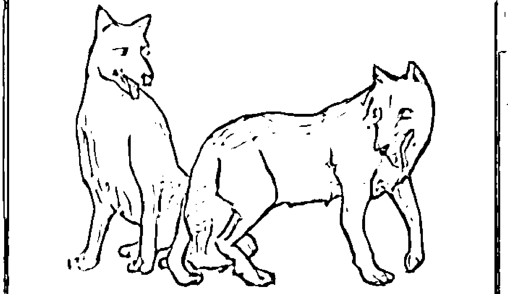

### 基利与库力奇 / Geri & Freki

英灵殿举行酒宴时，侍奉在奥丁脚边的两匹狼，他们的名字均是“贪欲”之意

- **奥丁的宠物？**
  - 传说奥丁只喝葡萄酒，祭桌上的肉都分给了这两头狼
- **奥丁属性的表征？**
  - “狼头”是勇猛的代称（借代），古说“狼头给狼”便是指在战争中消灭许多敌人的意思

## No.078 至高王座

Hlidskjalf

至高王座是只有主神奥丁及其妻弗丽嘉可以坐的宝座，蕴藏着看透全世界的魔力。

#### ○能看遍全世界各个角落的魔法宝座

至高王座是属于主神奥丁的宝座。相传这个宝座被安放在奥丁居住的白银之厅或英灵殿之中，蕴藏着魔力，只要坐上去便能得知全世界各个地方发生什么事情。其名有“有许多门扉的厅堂”的涵意，还有些研究者认为此名指的并非宝座本身，而是应该解释为放置宝座的厅堂。

《史诺里爱达》说这宝座只有主神奥丁及其妻弗丽嘉才可以坐，除他们两位以外，唯独丰饶神弗雷曾经坐过一次，不过众神对吉鲁菲王（King Gylfi）说此乃不逊犯忌的行为，而弗雷也为此付出了代价。事实上，宝座在古代的日耳曼社会里面是个非常重要的概念，新任国王举行加冕仪式时，便是藉由就座于设置在高丘的宝座，来象征其地位受到承认。国王在加冕式过后的生活仍旧是围绕着宝座而进行，是故前述的至高王座相关规定，应该也是从这种价值观衍生而来。

正因为它蕴藏着魔力的缘故，所以有许多事件都是因至高王座而起。据《诗歌爱达》中〈葛林尼尔的话语〉记载，从前奥丁通过宝座得知养子盖尔罗德王成功以后，去向妻子弗丽嘉大肆吹擂，却反而使得盖尔罗德被弗丽嘉修理了一番。另外《诗歌爱达》的〈史基尼尔之旅〉等文献也说，弗雷之所以陷入对巨人之女葛德的恋爱烦恼，全都是因为傲慢的弗雷趁奥丁不在的时候偷坐宝座所使然。当然至高王座也有助于解决事件，奥丁搜寻逃离众神出奔的恶神洛奇时，就曾经使用过这座宝座。

### ## 至高王座

相传设置于阿萨神族的神殿白银之厅或英灵殿的主神奥丁的座。亦可解释为“有许多门扉的厅堂”

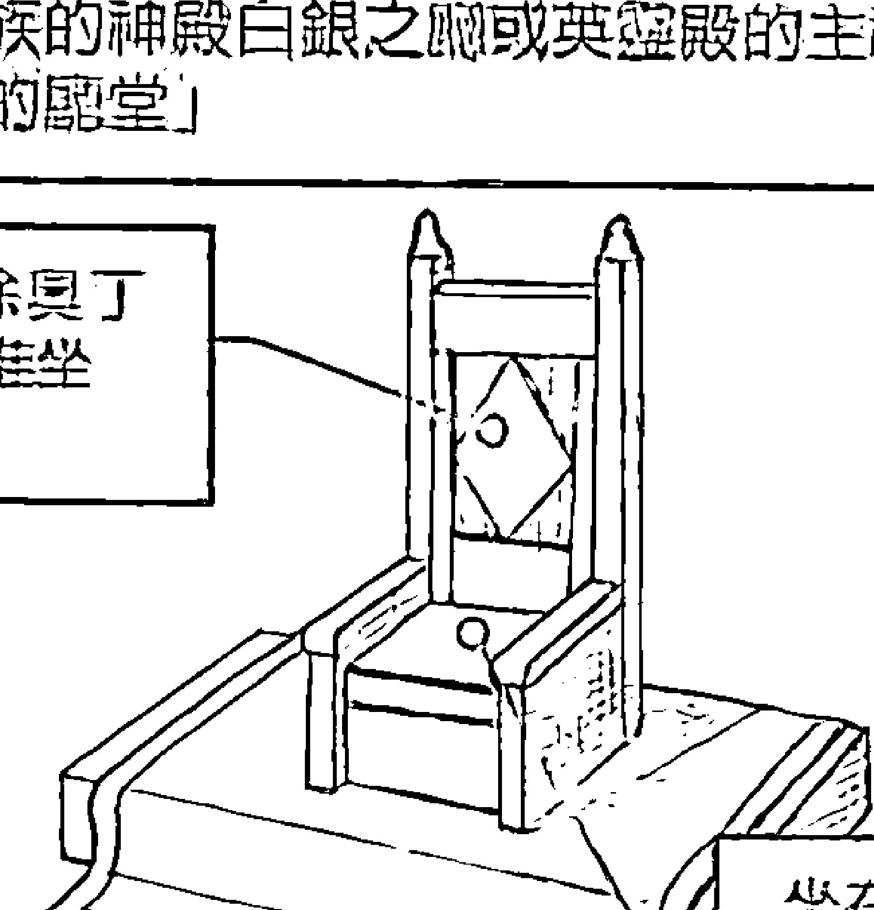

该座乃王座名称，除奥丁与诸灵魂以外谁都不准坐

坐在该座上便能得知全世界每个角落发生的所有事情

### ## 1. 使用至高王座的实

### 《葛林尼尔的话语》
1. 奥丁 (得知儿子成功而雀跃不已)
2. 收回
3. 离开罗恩王
4. 修理一番

### 《史基尼尔之旅》
1. 奥丁 (1) 发现美丽的姑娘
2. 委托
3. 史基尼尔
4. (3) 使其承诺下嫁

### 《欺骗吉尔菲》
1. 奥丁 (1) 何辱众神后逃亡，进行搜索
2. 飞向川
3. 洛奇
4. (3) 以拖绳擒捕之

### 至高王座的能力

### 相关道具与动物

◇ 索尔 No.017 ◇ 葛德 No.049
◇ 史基尼尔 No.033 ◇ 洛奇 No.057
◇ 金梳子 No.042

## No.079 斯莱布尼尔

Sleipnir

主神奥丁的爱马斯莱布尼尔拥有八只脚和灰色的胴体，不过它的诞生却还比其外貌还要来得奇妙。

#### ○往返于凡间与死者国度的八足骏马

斯莱布尼尔此名有“滑走者”之意，是匹以主神奥丁坐骑而闻名的骏马，还被认为是“所有马当中最好的马”，拥有灰色胴体外加八只脚的迥异外貌。有人认为灰色的身体便是暗示斯莱布尼尔并非寻常马匹的象征，或许是因为这个缘故，传说均认为斯莱布尼尔能够往返于凡间与死者的国度。《诗歌爱达》的〈巴多之梦〉（Baldrs draumar）和《史诺里爱达》都有描绘斯莱布尼尔驮着众神前往死者国度的情景，而根据《丹麦人的业绩》的记载来判断，斯莱布尼尔似乎还能够腾空飞翔。

生出这匹既奇怪却又优秀的骏马的孕生者，便是雌雄两性兼具的恶神洛奇。《史诺里爱达》的〈欺骗吉鲁菲〉里面有这么段故事：从前众神刚定居在阿萨神域的时候，曾经有位巨人化作铁匠来到此地，说是愿意替众神在阿萨神域的四周建造城墙，条件就是必须以菲依雅和太阳及月亮来交换。众神顿时陷入长考，由于洛奇说可以加课“不借他人之手在半年内完成”的条件，于是双方便签下了契约。但是就在此时，巨人却也获得众神认可，可以使用自己的爱马史瓦帝法利，原来奥妙就在这匹马的身上：这马非但能够搬运巨石，而且还能完成数倍于巨人的工作量。众神渐渐开始焦急起来，并且强迫洛奇负起责任，受众神胁迫的洛奇经过思考后采取的手段，便是化作母马诱惑史瓦帝法利，而洛奇的策略果然成功奏效。巨人因此而袭击众神，却反遭雷神索尔击败。后来经过了一段时日，洛奇产下史瓦帝法利的小马，而这匹小马正是日后的斯莱布尼尔。

## 斯莱布尼尔

他是主神奥丁坐骑的八脚神马，据说是巨人锻匠的爱马史瓦帝法利与洛奇所生。另有说法认为他的八只脚象征的是扛棺材的四个人八只脚

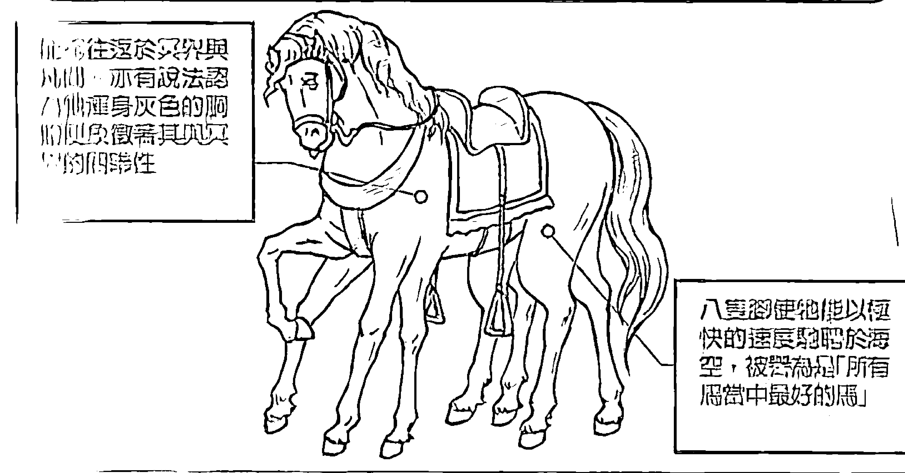

### 斯莱布尼尔及其家族

**史瓦帝法利**
巨人锻匠的爱马，拥有极大力量，比巨人更能工作

**洛奇**
诱惑史瓦帝法利，结果诞下斯莱布尼尔

**斯莱布尼尔**

**格拉尼**
齐格弗里德的爱马。拥有与斯莱布尼尔相似的身躯和能跃过烈焰的能力

**福瑞之马？**
福瑞的爱马。与格拉尼同样具有能跃过火焰的特性，因此也有人认为他们是亲戚

**其他名马**
日耳曼传说中所提及的名马当中，部分马匹都拥有斯莱布尼尔的血统

### 相关条目

- 诸神国度 No.010
- 奥丁 No.017
- 锻匠 No.023
- ◇菲依雅 No.044
- ◇洛奇 No.057

## No.080 伊瓦第之子的三样宝物

儘管恶神洛奇的恶作剧往往会为众神的世界招致混乱，不过有时却也会替众神带来意想不到的好处。

#### ○ 希弗头发的赔偿

此处权且称作“伊瓦第之子的三样宝物”的魔法道具，其实是当初喜欢恶作剧的洛奇把雷神索尔之妻希弗一头美丽的金发剃个精光的时候，洛奇让侏儒（矮人）工匠伊瓦第的儿子们打造的赔偿品。第一样宝物“黄金假发”是质地细腻经过锤打展延的魔法黄金，是个只消戴在头顶就会如同真髮般自然成长的宝贝。希弗便是拜这顶假发所赐才得到了一头比以前更加美丽的秀髮，而此结果似乎也使得众神大为满意。原本洛奇只委托他们打造“黄金假发”而已，可是伊瓦第的儿子们却很够意思地又打造出了第二和第三样宝物。

第二样宝物“斯奇布拉尼”是艘魔法船，出航后必定是顺风满帆，使用它就能够有段轻松舒适的航海，而且这艘船还是个能够像布料般折叠起来的好东西，《诗歌爱达》的〈葛林尼尔的话语〉就说它是“所有船只当中最好的一艘”。这艘船后来落入丰饶神弗雷手中为其所有，不过亦有传说指其为主神奥丁之所有物。

第三样宝物叫作“永恒之枪”，这是一柄枪头刻着鲁纳文字的魔法长枪，配重极佳，一旦投掷出去便弹无虚发。这柄长枪属奥丁所有，他在出外旅行或终末战役诸神黄昏等场合都使用过。除此以外，奥丁还经常用永恒之枪去取那些被他看上眼的英雄们性命，可是这柄长枪却几乎不曾对巨人族显过威力。洛奇对这些魔法道具的品质感到相当满意，进而使他不断地引起新的骚动，以获得更多宝物。

### # 三样宝物的特征

### ## 黄金假发

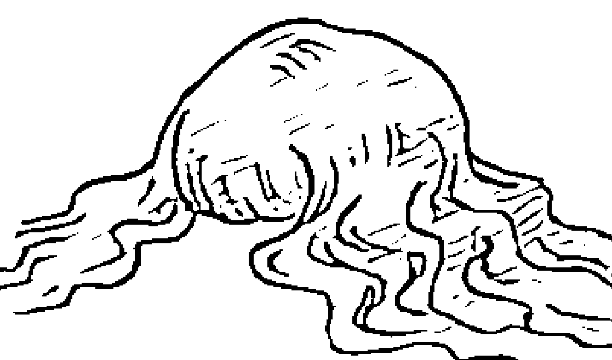

黄金丝线制成的假发，只要戴起来它就会牢牢贴附于头顶，变得跟真发一样。是为赔偿希弗遭恶神洛奇将头发剃光所打造的赔偿物

### ## 斯奇布拉尼/Skíðblaðnir

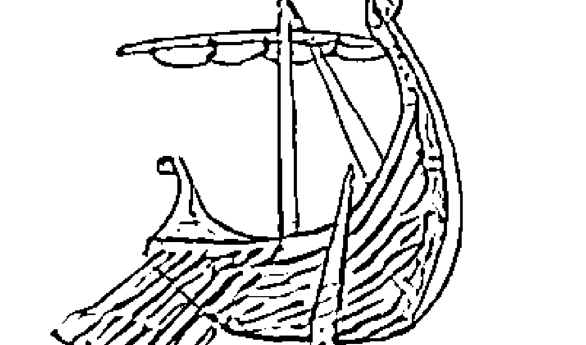

“所有船只当中最好的一艘”，只消扬起帆来便能受风，随时可以航向任何方向，还能折叠起来收纳在口袋里面。一般认为斯奇布拉尼是弗雷的所有物，不过亦有说法认为此物乃属主神奥丁所有

### ## 永恒之枪/Gungnir

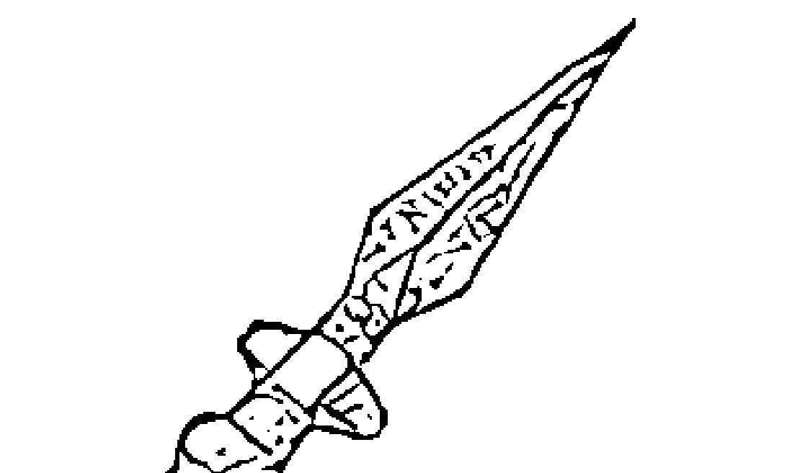

永恒之枪是柄枪头刻着鲁纳文字的长枪，从不错过任何目标。自从得到这柄枪以来，永恒之枪向来就是象征着奥丁的代表性物器，但他却几乎不曾在对抗巨人族的战斗当中使用此枪，都是用在人类身上

### # 三样宝物的来龙去脉

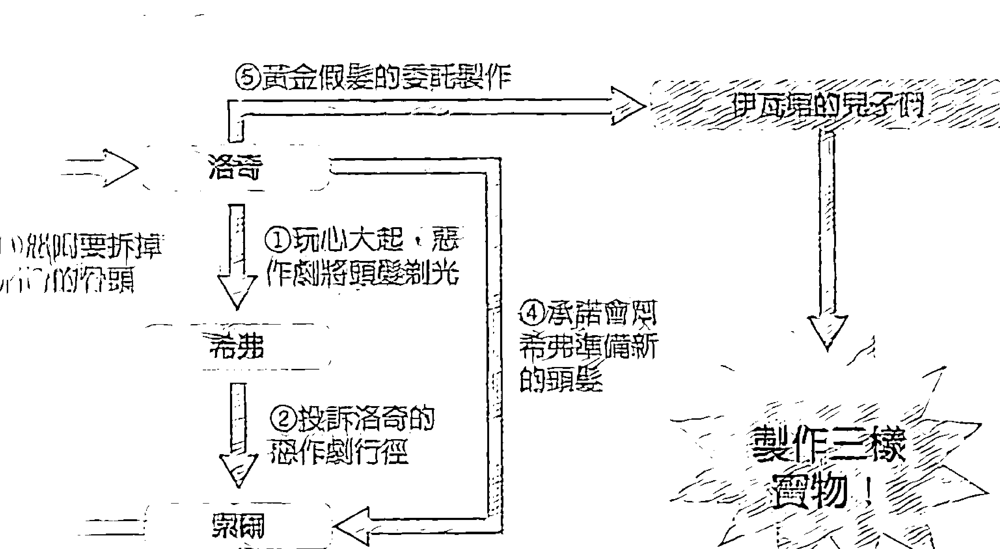

### # 相关单元

- 希弗 → No.017
- 奥丁 → No.023
- 阿萨神族 → No.042
- 洛奇 → No.057
- 侏儒（矮人） → No.063
- 鲁纳文字 → No.073

## 布罗克与辛德里的三样宝物

侏儒族以自尊和恶神洛奇的脑袋做赌注所锻造出来的三样宝物，这三样宝物为众神带来了极大的恩惠。

#### ○使众神为之膺服的锻造技术

此节介绍的是侏儒（矮人）兄弟布罗克（Brokkr）与辛德里跟恶神洛奇以脑袋为赌注所制作出来的三样宝物。洛奇曾经让别的侏儒制作三样宝物作为赔偿雷神索尔妻希弗头发的代价，这次又食髓知味表示“只要制造出比这些宝物更棒的东西，我就把脑袋给你们”，而向布罗克辛德里兄弟挑战。当然洛奇压根就不想循规蹈矩进行比试，赌注刚开始，他就变身成虻蝇、不停叮刺负责操作风箱的布罗克，妨碍他们的工作。尽管布罗克好不容易忍耐下来完成了三样宝物，但最后一样宝物却仍有未臻完美之憾。

那么，这三样宝物究竟是什么样的东西呢？侏儒首先打造的是黄金猪古林伯斯帝，牠昼夜均能以比任何马匹更快的速度驰骋于海空。牠的毛皮能放出黄金色光芒，无论去到如何黑暗的国度都不会为照明所苦，这头猪后来归丰饶神弗雷所有。布罗克兄弟接着打造的是个名为特劳布尼尔的黄金手环，它是每过九晚就会滴落生出八个相同重量的手环。此物本来是归主神奥丁所有，不过后来火葬巴多的时候被拿去陪葬，最后应是落到了史基尼尔手中。第三样宝物则是堪称索尔象征的魔法之鎚——雷神之鎚。这是柄无论如何使力叩击都不会损坏、投掷出去必定会命中目标然后飞回手中的武器，而且体积短小，适合藏匿于衣物之中。不过这样宝物却有未臻完美之处，其缺点便是鎚柄太短不利于握持。而这三样宝物和先前侏儒制作的总共六样作品当中，众神对雷神之鎚的评价最高；相传洛奇输掉赌注以后却以“脑袋是我的不是你们的，你们不可以伤害它”的歪理搪塞胡扯，导致嘴巴被人用叫作瓦塔利（Vartari）的皮绳缝了起来。

> 辛德里（Sindri）：亦作艾特力（Eitri）。

### 北欧半神所遗失物之特征

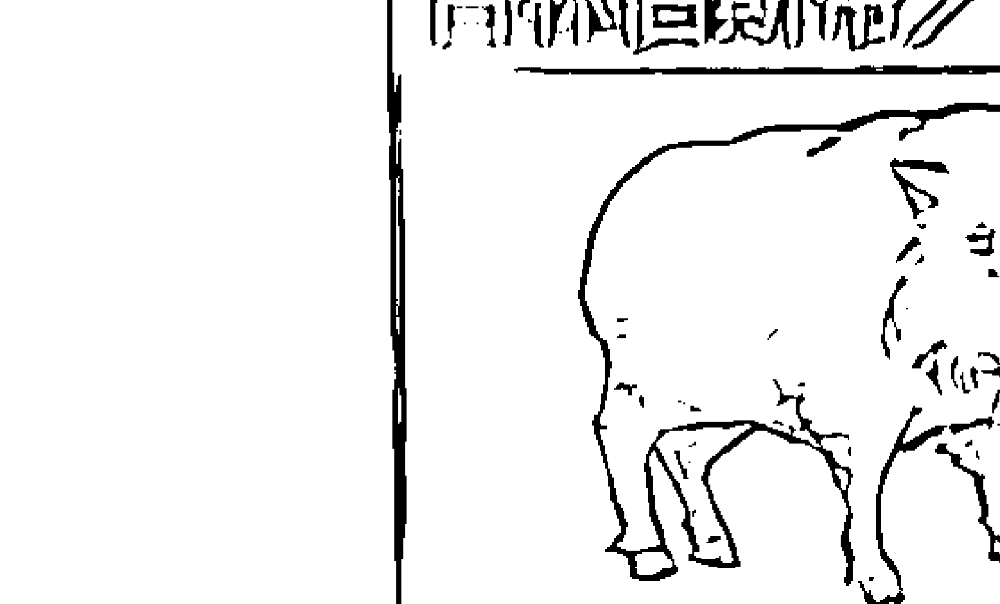

能用比任何马匹还更快的速度穿梭于海空，毛皮散发着光芒的黄金猪。传说牠是丰饶神弗雷的坐骑，弗雷的所有物中还有头跟古林伯斯蒂成对的母猪，叫作希尔迪斯维尼（Hildisvini）

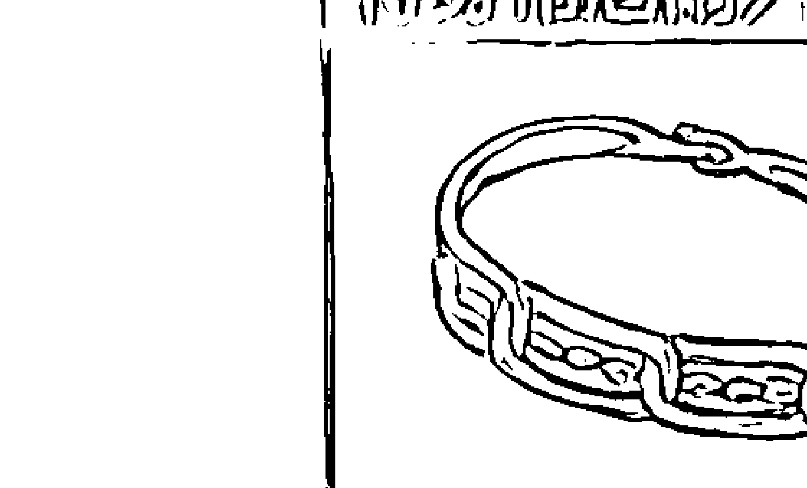

每隔九夜就会再生出八个手环的黄金手环。此物原居主神奥丁所有，却被拿来当作巴多的陪葬品。后来盖摩尔将手环带回，交给了史基尼尔

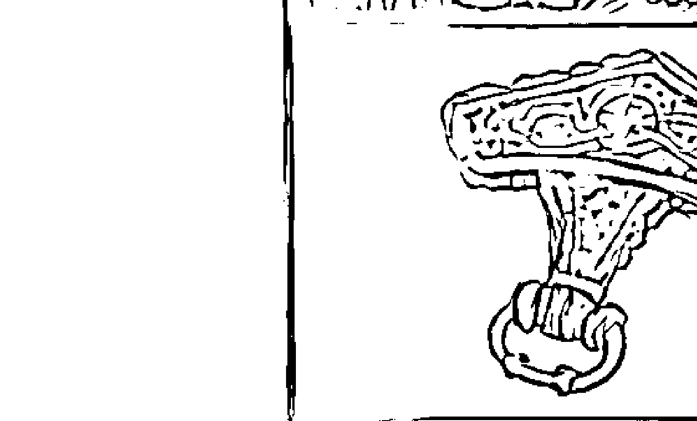

每投必中而且绝对不会损坏的魔法之鎚，体积短小适于隐藏在衣物之下。此物未臻完美境地，其鎚柄极短，亦经常被拿来当作施祝咒的道具使用

### 布雷克兄弟跟洛奇的赌注

洛奇对他所给的赌注品感到相当满意，遂以脚袋为赌注，向侏儒兄弟提出挑战

布雷克与辛德里虽然遭到洛奇多方干扰阻挠，却还是成功打造出三样宝物

洛奇以理屈词穷，因而嘴巴被缝了起来，众神没有一个同情他

众神审查作品并且选出未臻完美却可用性极高的雷神之鎚为首选，宣布由布雷克兄弟获胜

### 相关参考

- ◇奥丁 → No.017
- ◇索尔 → No.023
- ◇弗蕾 → No.026
- ◇福瑞 → No.042
- ◇洛奇 → No.057
- ◇侏儒（矮人）→ No.063

## No.082 安德华利的黄金

安德华利的黄金乃是侏儒安德华利迥众神以不当手段夺取的黄金。这批象征着众神腐败的黄金，果然为持有者带来了诸多灾厄。

#### ○杀害水獭后支付作为赔偿的受诅咒黄金

安德华利的黄金原本是属于居住在安德华拉弗斯（Andvarafors）瀑布的侏儒（矮人）安德华利的财宝，但这批财宝却遭众神以不当手段夺取，从而受到诅咒。其间来龙去脉在《诗歌爱达》的〈雷金的话语〉（Reginsmál）和《佛尔颂萨迦》、《史诺里爱达》等各种文献里面是这样记载的：

从前主神奥丁、海尼尔和恶神洛奇在旅途中看见有只水獭在捕鲑鱼。洛奇顿时玩心大起想要恶作剧，拿起石块便将水獭砸死了，他剥下水獭皮而且还得到鲑鱼，心情大好。入夜以后，众神来到某个名叫弗列兹玛（Hreiðmarr）的农夫家里借住，此时洛奇取出水獭皮大肆吹擂了一番，岂料那只水獭竟是弗列兹玛之子欧特（Ótr）为替父亲抓鲑鱼所变成的模样。弗列兹玛大怒，唤来众子押住众神，魔法道具被夺的众神根本毫无力量抵抗。束手无策的奥丁只能表示说愿意支付赔偿，弗列兹玛遂要求数量足以完全覆盖住欧特水獭皮的黄金为条件接受此提议，并释放洛奇去取黄金。洛奇想了想，便向海底的统治者女巨人拉恩商借魔法之网，取道前往安德华拉弗斯，然后用魔法之网抓住变身成梭鱼的安德华利，向他索讨黄金。

安德华利虽然依言交出黄金，却还是企图将能使黄金增生的戒指安德华拉诺特偷藏起来，岂料戒指终究还是遭眼尖的洛奇抢走。安德华利便是在此时对遭抢夺的财宝施下诅咒说：“这财宝将使两兄弟丧生、八个国王失和”。后来这个诅咒果然奏效，成为引发诸多灾祸的根源。

## 北欧神话黄金传说

| 左侧角色 | 互动描述 | 右侧角色/团体 |
| :--- | :--- | :--- |
| 洛奇 | ①杀害变身成水獭捕鲑鱼的欧特 | 欧特（弗列兹玛一族） |
| 海尼尔 | ②索取赔偿 | 弗列兹玛（弗列兹玛一族） |
| 奥丁 | ⑤以安德华利的黄金支付赔偿 | 法夫尼尔（弗列兹玛一族） |
| （洛奇/海尼尔/奥丁） | ③对黄金施以诅咒 | 雷金（弗列兹玛一族） |
| （洛奇/海尼尔/奥丁） | ④抓住安德华利、夺取黄金 | 安德华利（以梭鱼模样住在安德华拉弗斯的侏儒） |

### 戒指的被害者及其故事

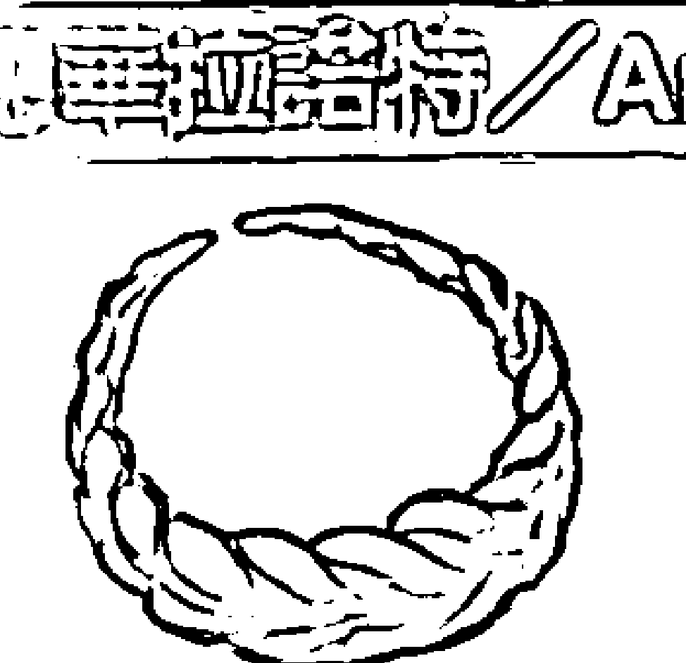

**安德华拉诺特/Andvaranaut**
传说安德华拉诺特拥有使黄金增生的魔力，是安德华利最心爱的戒指。黄金和戒指在落入洛奇之手时，均被施下了“这财宝将使两兄弟丧生、八个国王失和”的诅咒。

### 诅咒的被害者

- **两兄弟**
  - 法夫尼尔
  - 雷金
- **八个国王**
  - 赛格尔
  - 胡格尼
  - 苏尔利
  - 古托姆
  - 阿特利
  - 哈姆迪尔
  - 古纳尔
  - 埃尔苔

## No.083 唐格纽斯特与唐格理斯尼

Tanngrisnir & Tanngnjóstr

唐格纽斯特与唐格理斯尼是两头替雷神索尔拉车的公山羊。这辆车的碟轧声象征着雷鸣，献作食物的山羊肉则是代表着索尔的丰饶神神格。

#### ○象征雷神索尔的载具

唐格纽斯特与唐格理斯尼是两头替雷神索尔拉车的公山羊。《诗歌爱达》的〈斯留姆之歌〉说牠们拉车驰骋过的地方俱是群山迸裂、大地陷入一片火海。也许这些文字所描写的就是落雷的情景，另有说法认为牠们拉车发出的隆隆声响便代表着雷声。如前所述，这两头公山羊亦是索尔的象征物之一，可是索尔在许多故事里却经常都是采取徒步移动，其中缘由《史诺里爱达》的〈欺骗吉鲁菲〉记载如下：

> 从前索尔前往巨人之王乌特加尔洛奇统治的巨人之国，途中在某个农民家里借宿，当时索尔便宰杀拉车的两头山羊、烹煮山羊肉以为回礼。原来这两头山羊有种特殊能力，只消将骨头和羊皮保留下来，经索尔施以祝福之后，山羊就会复活。

隔天索尔也一如往常地祝福山羊，却发现有头山羊的模样怪怪的，再仔细一检查，果然发现这头山羊的后脚已经骨折，所以走起路来才会一瘸一跛的。原来那农民的儿子肚子很饿，想要取山羊骨里面的骨髓来吃，把骨头给折断了。尽管索尔怒如炽火，也已于事无补，再说索尔事先也并未说明清楚，事情最后就是以索尔将该农民的子女收作仆从的条件收场。不过索尔从此便再也不能带着两头山羊出外旅行，因此在这趟东方远征的期间，他只能将山羊寄放在农民家里，独自继续旅程。

这则故事也另有不同的版本。《诗歌爱达》的〈希米尔之歌〉就说弄伤索尔公山羊的是恶神洛奇。

唐格纽斯特与唐格理斯尼：唐格纽斯特（Tanngjóstr）意思是“磨牙齿的家伙”，唐格理斯尼（Tanngrisnir）则是“牙齿有缝隙的家伙”之意。

# 雷神的山羊

# 唐格纽斯特与唐格理斯尼

跟「乘车的索尔」、「山羊的主人」等代表雷神索尔的代名词有很深的关联，替索尔拉车的两头公山羊。其中一头山羊瘸了后脚，所以后来索尔经常都是徒步移动。

只要保持犄角与羊皮的完整，即便拿来当作晚餐的材料，经过索尔祝福以后，隔天就能重新复活。

两头山羊拉的车会发出嘎吱巨响以及火花，据说这便是雷鸣与闪电的象征。

# 如何欺骗公山羊的后腿？

# 〈希米爾之歌〉

犯人：洛奇

時間：訪希米爾之際

理由：純粹只是捉弄或惡作劇而已。

# 〈欺騙吉烏尼〉

犯人：希亞賈

時間：前往東方之際

理由：為吃到骨髓而折斷骨頭。

# 唐格纽斯特与唐格理斯尼

# No.084

# 福瑞的魔劍與飛越火焰的馬匹

> 這兩樣是豐饒神為成全戀情而贈與僕從的寶物，可是代價卻也太過巨大。

# ○ 為成全戀情而致失落的豐饒神祕寶

福瑞的魔劍是柄只要持有者夠賢明便能夠獨自對抗巨人、取其性命的魔法之劍。此劍原是豐饒神福瑞之物，可是他卻為了要成就自己與巨人之女葛德的戀情，而將劍交給僕從史基尼爾，從此以後，這柄劍就再也不曾出現在神話當中。有說法認為穆斯貝爾之長蘇爾特在終末戰役諸神黃昏裡使用的，便是福瑞的魔劍，但此說法畢竟仍僅止於推測而已。

根據《詩歌愛達》中〈史基尼爾之旅〉的描述，此劍是柄表面刻有魯納文字的細劍，跟雷神索爾的雷神之鎚並列為剋制巨人最佳武器，相傳眾神直到諸神的黃昏來臨前夕為止，還一直對福瑞放棄了這把劍感嘆不已；因為正如同《詩歌愛達》中〈洛奇的爭論〉裡面惡神洛奇所言，福瑞失去最強的武器之後便毫無辦法，只能任憑蘇爾特將自己打倒。

另一方面，神話裡並未記載當初福瑞贈與史基尼爾的馬叫什麼名字、有什麼來歷。《史諾里愛達》的〈詩語法〉裡面有提到福瑞的坐騎名叫布洛帝霍菲（Blodighofi）或是布洛帝血夫（Bloodyhoof），所指的可能就是同一匹馬。

一般認為前往福瑞愛慕對象葛德住處的途中，必須要穿越黑暗而潮濕的大地，越過搖曳的暗色火焰才能抵達目的地；但是因此，史基尼爾才會向福瑞索討具備相對應能力的馬匹。不過史基尼爾此舉似乎是杞人憂天，因為保衛葛德館邸的並非搖曳的暗火，而是憤怒的狂犬。

另外，身為豐饒神的福瑞還經常被拿來與擁有巨大陽根的馬匹結合，而馬匹也是他的隨身伴獸之一。

# 第3章◇不可思议的神奇道具与动物

# 福瑞的魔剑

只要持有者夠賢明便能獨自打倒巨人的魔法之劍。福瑞將此劍贈予僕從史基尼爾，作為自己懶惰得偷的報酬。這是柄劍身刻有魯納文字的細劍，是唯一能夠傷害福瑞的武器。亦有研究者認為這柄劍後來落入了穆斯貝爾之長蘇爾特之手。

# 斯萊普尼爾之馬

能夠飛越搖曳暗火、穿越潮濕山地的名馬。此馬也跟福瑞的魔劍同樣被贈送給了史基尼爾。經常被視為福瑞的坐騎布洛帝亞菲。牠曾經與史基尼爾同行前往霧登海姆，卻沒有可以發揮能力的用武之地。

# 寶物的下落

| 持有者 | 说明 |
| :--- | :--- |
| 福瑞 | 史基尼爾向福瑞索取寶物，好通過前往霧登海姆的艱難道路 |
| 贈予史基尼爾 | 與史基尼爾一起去向不明？ |
| ?（贈予）蘇爾特 | 此乃部分研究者的見解。他們認為蘇爾特得到的僅福瑞的魔劍而已，其中經緯一概不得而知。 |

- ◇穆斯貝爾→No.065
- ◇魯納文字→No.073

# No.085: 魔法羽衣

此節介紹的魔法羽衣均為眾神與巨人所有，只要披上這些羽衣便能變幻身形，並且得到相對應的能力。

# ○ 既是事件糾紛的起源卻也是解決之道的魔法道具

所謂魔法羽衣，就是披在身上便能變身成鳥並且獲得飛翔能力的魔法道具。此類道具在北歐神話裡面似乎較為常見，擁有這種寶物的人也相當多。

其中特別有名的，當屬奧丁之妻弗麗嘉以及女神菲依雅的飛鷹羽衣。只不過這兩位女神其實很少使用飛鷹羽衣，反而是惡神洛奇用得比較多。洛奇使用飛鷹羽衣的模樣在《詩歌愛達》的〈斯留姆之歌〉和《史諾里愛達》的〈詩語法〉等文獻裡面都有描寫。

另一方面，天鵝羽衣則是以瓦爾妲基麗姬披用而聞名的魔法羽衣。根據古詩《凱拉之歌》記載，瓦爾妲基麗姬眾女神會披著這件羽衣，變身成天鵝在戰場裡盤旋。因為這個緣故，一旦羽衣被盜，瓦爾妲基麗姬便無法進行戰場上的工作。《詩歌愛達》的〈韋蘭之歌〉就描寫到韋蘭兄弟趁瓦爾妲基麗姬脫掉天鵝羽衣、正在織布的時候將羽衣藏匿了起來，所以瓦爾妲基麗姬才嫁給韋蘭兄弟為妻。

此外，從前誘拐女神伊登的巨人夏基以及曾經是詩蜜酒所有者的巨人史登（Suttungr）都有件鷲鷹羽衣。這件鷲鷹羽衣似乎比眾神的羽衣性能更佳，〈詩語法〉描述到他們對穿著其他魔法羽衣變身成飛鳥的眾神緊追在後、近在咫尺的景象。

至於其他飛行道具，則還有《詩歌愛達》的〈韋蘭之歌〉所述，傳說中的名匠為獲得自由而製作的飛行翼。

# ## 北歐神話逆反的各種羽衣

# ### 1. 羽衣/Valsham

傳說是洛基與菲依雅所有物的魔法羽衣，披用後便能變成飛鳥。然而兩位女神卻鮮少使用此物，反而是惡神洛奇用得更多。巨人夏基和巨人芬瑞尼爾的故事裡都提到這件羽衣

# ### 2. 羽衣/Alftarhamir

傳說中亞爾姐基婭姪的魔法羽衣，披在身上就能變成天鵝。就跟世界各地的其他飛天羽衣傳說同樣，北歐神話也有人類奪走羽衣取其為妻的傳說存在。《詩歌愛達》的〈韋蘭之歌〉、《尼亞薩迦》（Njáls Saga）等文獻都有提及

# ### 3. 羽衣/Ama rtharm r

傳說中主神奧丁、巨人夏基和史登都曾經穿過的魔法羽衣。披用後便能變成飛鷹，飛行速度比飛天羽衣更快

# ### 飛行道具

# #### 4. 韋蘭的飛行翼

傳說中的名匠韋蘭為擺脫尼德茲王（King Níðad）監禁、逃離塞伐爾斯塔茲口（Sævarstöð）而製作的飛行翼。原文裡面亦以「跌」來描述此物。見於《詩歌愛達》的〈韋蘭之歌〉

# ### 關聯條目

- 芙蕾雅→No.022
- 希格德→No.033
- 奧丁→No.044
- ◇夏基→No.047
- ◇洛奇→No.057
- ◇詩蜜酒→No.076

# No.086: 布理希嘉曼

# Brisingamen

布理希嘉曼是點綴在女神菲依雅前胸的項鍊，這件侏儒打造的首飾曾經為人類世界帶來了莫大的災難。

# ○點綴在女神胸頸間的黃金首飾

布理希嘉曼是女神菲依雅的首飾。此物亦堪稱為菲依雅的代名詞，《詩歌愛達》的〈斯留姆之歌〉便寫到從前雷神索爾假扮菲依雅的時候亦有配戴。而《史諾里愛達》的〈欺騙吉烏尼〉亦記曰「菲依雅有件名為布理希嘉曼的首飾」。《詩歌愛達》對這件首飾並無詳細記述，不過《史諾里愛達》的〈詩語法〉說眾神門房海姆德爾曾經與惡神洛奇爭奪這件首飾，可見此物肯定是件相當貴重的寶物。《索里的故事、赫金與霍格尼的薩迦》(Sorli’s Story, The Tale of Hogni and Hedinn) 就有記載到一件被視同為布理希嘉曼的首飾，是如何地輾轉落入菲依雅手中的來龍去脈。

從前奧丁的情人菲依雅前往拜訪四名侏儒（矮人）的時候，恰巧侏儒們剛完成了一件黃金的首飾，菲依雅只看一眼就愛上了。她表示希望能將夠買下這件首飾，可是四名侏儒卻要求菲依雅陪他們每人共度一夜。經過一番考慮，菲依雅終於接受侏儒的要求，並且得到了首飾。

洛奇發現這件首飾以後，立刻將此事報告給奧丁知情。奧丁對菲依雅的不檢點大為震怒，於是派遣洛奇趁著菲依雅睡覺時將首飾盜走，然後對想要討回首飾的菲依雅表示，只要她能夠「讓統率二十名諸侯的兩名王者失和，詛咒他們必須永遠對立為敵，使他們永受詛咒束縛，直到追隨較幸運的那一位王的基督教徒將他們全部殺死為止」，便將首飾歸還。據說菲依雅毫不躊躇地接受了奧丁的條件，以致日後才有世稱「艾絲古戰役」的戰亂發生。

# 布里希嘉曼

稱為菲依雅代名詞的黃金首飾。相傳由四名侏儒打造製成

(1) 似變身成海豹的海姆德爾 (2) 洛奇曾經在某個叫作辛加斯汀 (Singasteinn) 的地方奪取這件首飾

(1) 《困姆之歌》曾記載布理希嘉曼被扯得四處飛散，故首飾應該是由許多細部組合所構成

黃金製，不過亦有文獻以「海之石」描述之，因此可能有使用到部分的寶石也未可知

# 與眾神的關係

# 四名侏儒

- 克里斯力克
- 社華林
- 貝蓋
- 圖列爾

- No.017
- No.023
- No.029
- ◇菲依雅→No.044
- ◇洛奇→No.057
- ◇侏儒（矮人）→No.063

# No.087 饕餮之链

# Gleipnir

侏儒打造，用于绑缚众神之敌芬里尔的魔法绳索，其材料均是如今皆已不存在于世上的各种物质。

#### ○以世间不存在的物品制成的绳索

饕餮之链是为绑缚恶神洛奇之子芬里尔而制作的魔法绳索。相传这条由侏儒（矮人）工匠制造的绳索光滑柔软有如绢绳，极为牢固。制作饕餮之链的时候，侏儒用的是「猫的脚步声」、「女人的胡须」、「山的根」、「熊的肌腱」、「鱼的呼气」、「鸟的唾液」这六样材料。因为这个缘故，这些材料都全数被采撷殆尽，如今都已不复存在。但也许多这些东西还是有若干的漏网剩余，毕竟现在还是有少数会长胡须的女性，还是有走路会发出脚步声的猫存在。

根据《史诺里爱达》的〈欺骗吉鲁菲〉记载，当初制作饕餮之链的经过是这样的：

从前众神将刚诞生的芬里尔饲养在阿萨神域，可是当众神得到预言说芬里尔将为他们带来灾厄的时候，便打算将他拘束起来。众神先是锻造出一条叫作雷汀格（Læðingr）的锁链，然后便骗芬里尔说是要试试他的力量、将他绑将起来，岂料芬里尔不费吹灰之力就将这条锁链扯断，轻轻松松重获自由。

接着众神又打造了一条比雷汀格强韧两倍的锁链多洛米（Drómi），结果却与先前毫无二致。这下子众神真正感受到了芬里尔的威胁，遂派遣福瑞的仆从史基尼尔去找侏儒，请求他的帮助，饕餮之链因此终于问世。众神便是靠着这条绳索好不容易绑住了芬里尔。然而，这个众神不惜背信、甚至牺牲了战神提尔右手的枷锁，到头来也只不过是暂时地锁住芬里尔而已。待到终末战役诸神黄昏来临时，芬里尔也挣脱了饕餮之链的束缚重获自由，开始实现先前的预言。

# 在世界上独一无二的锁链

# 格莱普尼尔之锁

众神历经两次失败以后，委托侏儒（矮人）制作的魔法绳索。其材料都是已经不复存在的物质，而这也传说也成了说明为何世上没有这些东西的理由。

看似只是寻常的绢绳而已，因此反而使芬里尔更觉蹊跷

看似如绸缎般光滑柔软，却是无论众神或芬里尔都无法将它切断

材料：猫的脚步声 / 女人的胡须 / 山的根 / 熊的肌腱 / 鱼的呼吸 / 鸟的唾液

# 锁链的制作经过

众神制作雷汀格，试图拘束芬里尔 → 拘束失败

众神制作多洛米，试图拘束芬里尔 → 拘束失败

众神派遣史基尼尔去找侏儒 → 完成格莱普尼尔之锁——着手拘束芬里尔

参考资料

相关条目 No.026 No.043

◇洛奇→No.057
◇芬里尔→No.058

# No.088 雷瓦霆

# Levateinn

世界樹伊格德拉西爾的樹頂有隻發光的黃金公雞，而惡神洛奇鍛造的雷瓦霆便是唯一能夠屠殺這隻公雞的劍。

# ○屠殺黃金公雞的魔劍

雷瓦霆是一柄其名見載於古詩集《格羅亞的咒歌》(Grógaldr) 與《菲歐史維德之歌》(Fjölsmsnsmál) 的魔劍。這柄亦稱「傷害之杖」的雷瓦霆，乃是惡神洛奇運用魯納文字於尼弗海姆門前鍛造之物；後來不知為何落入了穆斯佩海姆蘇爾特的妻子辛摩拉之手，她用九道鎖將這柄劍鎖在一個叫做雷格倫（Lægjarn）的箱子裡嚴密保管。雷瓦霆是這世間唯一一柄能夠屠殺世界樹伊格德拉西爾樹頂綻放著雷光的黃金公雞維多福尼爾的劍。北歐傳說裡面是這樣提到它的：

故事的主角名叫史威普達格（Svipdag），有一天，壞心的後母命令他找出一名叫作夢葛羅德（Mengloð）的女性並且得到她的愛。史威普達格在亡母格羅亞（Groa）的協助之下開始探索，經過極漫長旅途終於抵達位於喬登海姆的夢葛羅德的邸，可是那館邸非但受到火焰包圍，而且還有獰獪惡犬看守，根本無法進入。煩惱的史威普達格不知如何是好，於是開口向把守館邸入口的巨人搭訕。也不知那巨人是否同情史威普達格，竟然告訴他說那頭惡犬愛吃的食物便是維多福尼爾的兩隻雞翅肉。史威普達格接著又問巨人如何才能得到那雞翅肉，而當時巨人口中那柄能夠殺死維多福尼爾的劍，正是雷瓦霆。史威普達格不知道雷瓦霆在什麼地方，仍舊緊追著巨人問說該如何做才能取得此劍，於是巨人便教他去取維多福尼爾尾巴的羽毛交給辛摩拉。就在故事情節正要步入軌道的時候，卻極小心地就此劃上句點，原來巨人在交談中發現史威普達格便是夢葛羅德盼想的對象，兩人也就此直接結成了連理。

# 雷瓦霆

此劍乃是穆斯貝爾之長蘇爾特的妻子辛德，用九道大鎖鎖在大箱子雪格佛裡面嚴密保管的魔法之劍。近年來往往被視同為蘇爾特所持的火焰之劍，不過這兩柄應該是不同的劍

能夠殺死伊格德爾西爾個體綻放陽光的黃金公雞——維多福尼爾的唯一武器

傳說劍身乃是由惡神洛奇鍛造而成

# 雷瓦霆與維多福尼爾的關係

| 項目 | 說明 |
| :--- | :--- |
| **維多福尼爾** | 取得維多福尼爾的尾巴羽毛（肉），勢必要先殺死牠 |
| **維多福尼爾的尾巴羽毛** | 必須用羽毛向辛德商借雷瓦霆 |
| **實際上等於是不可能取得** | |
| **雷瓦霆** | 必須用雷瓦霆殺死黃金公雞維多福尼爾 |

- **相关条目：**
- 苏尔特 → No.011
- 穆斯貝爾之劍 → No.012
- 辛德 → No.013
- ◇伊格德拉西爾 → No.015
- ◇洛奇 → No.057
- ◇魯納文字 → No.073

# ## 魔法抛网

北歐神話裡面有兩張拋網，一張是惡神洛奇曾經使用過的拋網，另一張卻是用來捕捉洛奇的工具。

# ### ○ 惡神洛奇和兩張拋網

拉恩的拋網乃是海神阿戈爾之妻拉恩的所有物，是張一次便能將海中所有溺死者打撈起來的魔法拋網。拉恩便是憑著這張拋網，將所有海上的遇難者打撈起來佔為己有，連同他們的財貨寶物也一併盡入其手。《史諾里愛達》的〈詩語法〉說，阿薩神域眾神是在阿戈爾舉辦的宴會上才首次見到這張拋網，但其實也有人早就知道有這張拋網的存在，此人便是惡神洛奇。《詩歌愛達》的〈雷金的話語〉（Reginsmál）記載，從前弗列茲瑪（Hreiðmarr）索討兒子歐特（Ótr）遭殺害的賠償金之際，洛奇便盤算著要把侏儒（矮人）安德華利的黃金佔為己有，他知道安德華利平時都是化身成梭魚，住在瀑布下的水潭裡，遂向拉恩借來拋網擒住了安德華利。

然而諷刺的是，洛奇後來遭眾神囚禁起來，同樣也是拜拋網所賜。洛奇自從在阿戈爾的宴會中痛罵眾神以後，便銷聲匿跡躲到秘密的地點藏匿。面對著怒火沖天的眾神在後頭緊緊追捕，他開始設想眾神將會用什麼方法捕捉自己，而拋網正是於焉問世的試作品。好巧不巧，拋網甫完成眾神便已經發現洛奇的藏匿場所，他慌慌忙忙便將拋網擲入火中，自己則是變身成鱒魚逃進河裡。豈料與眾神同行的賢者卡瓦希爾竟憑著火堆裡的餘燼製作出相同的拋網，而洛奇亦沒能逃過眾神緊追不捨的追捕，眼看著就要躍過拋網的時候，最終仍遭雷神索爾所擒。

由於與拋網的關係如此密切，亦有說法認為洛奇很可能是蜘蛛的化身。

# 拉恩的拋網

1. 屬於海神阿戈爾之子拉恩所有的魔法拋網，用來打撈海難的溺死者和他們的財寶實物；曾經借給洛奇搜刮侏儒安德華利的財寶

# 洛奇的拋網

洛奇在離開眾神、躲到某個四面都有窗戶的屋子以後製作的拋網，此拋網乃是洛奇為設想眾神將以何種方法追捕自己而製，相傳是以亞麻編成，形狀跟人類使用的拋網頗為相似。洛奇在眾神殺到的時候把這張拋網丟進火裡燒掉了，可是與眾神同行的賢者卡瓦希爾卻又重新做了一張拋網，並將此技法交給眾神

# No.090 葛羅提的石臼

# Grot

葛羅提的石臼是樣能夠實現推磨者願望的寶物，然則無窮無盡的欲望終將使其擁有者步向毀滅。

# ○挑動慾望的魔法石臼

葛羅提的石臼是《詩歌愛達》的〈葛羅提之歌〉（Gróttasöngr）等文獻提到的魔法石臼。這座石臼能夠磨出推磨者想要的東西，但據說這個石臼非常重，人類根本就推不動。《史諾里愛達》的〈詩語法〉說這座石臼是由某個名叫罕基邱夫特（Hengikjöptr）的人物送給丹麥國王弗羅德（Froði）的。由於這座魔法石臼能發揮極大效果，想當然會大大挑動擁有者的諸多欲望，這座石臼到最後也是因此被沉入了海底。

某次弗羅德得到一對名叫菲妮亞（Fenia）和美妮亞（Menia）的巨人姐妹，於是決定派她們來推石臼。剛開始的時候，巨人姐妹是抱著希望弗羅德能夠得到黃金，使國家能夠得到和平的願望在推石磨，可是愈來愈貪心的弗羅德卻說「睡覺的時間不可以比杜鵑沉默的時間或是朗讀詩歌的時間長」，強迫她們繼續推石磨。巨人姐妹對此甚為氣忿，於是推石臼時，遂祈願想要得到能夠消滅弗羅德的軍隊，結果弗羅德的國家當晚就被海盜王繆金（Mysing）率領的軍隊給消滅了。

得到這座石臼以後，繆金便帶著菲妮亞美妮亞要回到自己的國家，回程途中在船上便要她們磨出鹽巴來。菲妮亞和美妮亞應其要求磨出許多鹽巴，問繆金如此是否足夠，可是繆金卻還要她們磨出更多鹽巴，重量因而導致船隻失去平衡，結果連石臼跟鹽巴都沉入了海底，從此全世界的海水都變成鹹的。

此類故事可見於世界各地，就連日本也有相同的傳說「鹽臼」流傳。

# 第3章 不可思议的神奇道具与动物

# ## 第3节 摩羯座的石臼

> 丹麦国王弗罗德得自丹麦国王特的魔法石臼，能够磨出推磨者想要的东西，然其效果太过强大、挑动众人欲望愈益高涨，所以最后才被沉入了海底

石臼须由唯有身体力量的巨人之女两人合力才推动

# ### 历代石臼所有者的遭遇变化

- **至理加夫特**
  将摩羯座的石臼送给弗罗德的人物，故事中并未记载他究竟是何人物，以及他将石臼送给弗罗德是何目的。
- **弗罗德**
  丹麦国王。于瑞典得到菲妮亚与妮亚巨人姐妹以后，便派两人推磨石臼，建立起和平的国家。可是恶劣的劳动条件使巨人姐妹甚为气忿，遂召来军队灭掉国家，而弗罗德亦遭杀害。
- **斯金**
  巨人姐妹菲妮亚美妮亚召唤来的海盗王。他在取得石臼的回程船上想要试试石臼的力量，却因为太贪心磨出超过船要承载量的盐巴，使得整艘船连同石臼，都沉没于汪洋之中。

# No.091

# 齊格魯的寶物

齊格魯乃以屠龍英雄而馳名，而陪伴支撐他經歷諸多冒險的，便是名劍格拉墨和愛馬格拉尼等各樣寶物。

### ○支援齊格魯的寶物

《詩歌愛達》和薩迦等諸多文獻均有記載屠龍英雄齊格魯的活躍事蹟，然則其豐功偉業並非單憑實力所能及，而是因為擁有多寶物方能達成。

以齊格魯之劍而聞名的格拉墨，其實本是齊格魯的父親齊格蒙使用的寶劍。當初齊格蒙的妹妹齊格妮結婚的時候，主神奧丁忽然現身婚宴，並且將劍插在房間中央的大樹之上，在場所有男性僅齊格蒙一人能將寶劍拔出。其後齊格蒙亦憑著這柄寶劍立下了諸多偉大功業，但這柄劍卻在後來因為齊格蒙的第二任妻子休爾狄絲而起的戰事當中，遭奧丁親手折斷，使得齊格蒙丟了性命。臨死前齊格蒙將此劍殘骸交給妻子，交待她為尚未出世的兒子重新鍛造此劍，而齊格魯長大以後其養父雷金（Reginn）為他重新鍛造的寶劍，便是這柄格拉墨。格拉墨鋒利無比，將此劍立於河中，便能將順流而下的絲線有如流水般切作兩半，輕輕一揮就能把鐵砧一分為二。

另一方面，齊格魯的愛馬格拉尼則是匹流著奧丁愛馬斯萊布尼爾血液的灰馬。這匹優秀的馬因為血統的緣故而不知恐懼為何物，能夠輕鬆地躍過熊熊烈焰。齊格魯是靠著奧丁的外言，才從當時母親寄於籬下的希亞普瑞克王（King Hjalprek）的馬場得到了這匹名馬。

除格拉墨和格拉尼以外，相傳齊格魯還擁有從惡龍法夫尼爾手中奪來、其魔力能使人陷入恐怖的埃吉爾頭盔，一柄名叫弗洛帝的劍和養父雷金鍛造的劍里迪爾（Ridill），以及吃下後便能聽懂動物語言的法夫尼爾的心臟等寶物。

# 与萨迦记载齐格鲁所拥有的宝物

# No.091 第3章 不可思议的神奇道具与动物

## 格拉墨/Gram

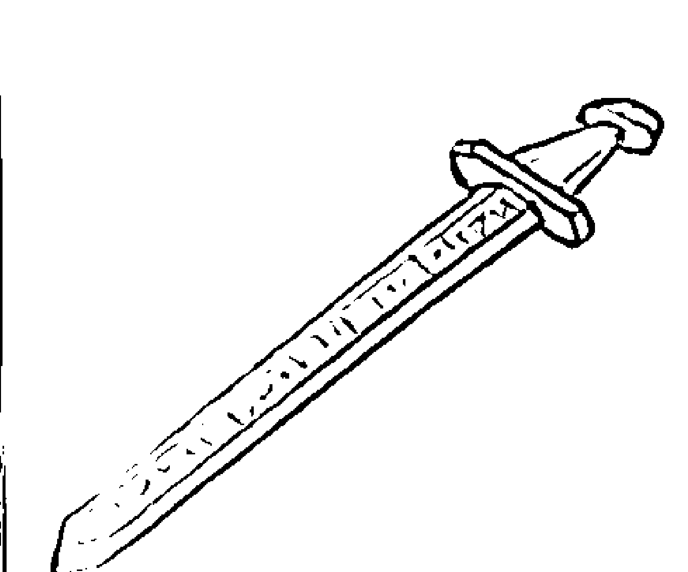

格拉墨乃齐格鲁委托雷金锻造的名剑。此剑便是从前主神奥丁插在佛尔颂邱内大树上的那柄剑，原属齐格鲁的父亲齐格蒙所有。原剑自从在齐格蒙的最后一役当中被奥丁亲手折断以后，便一直是由齐格鲁的母亲保管。相传格拉墨锋利得能将铁砧一削为二，剑身还刻有鲁纳文字。

## 格拉尼/Grani

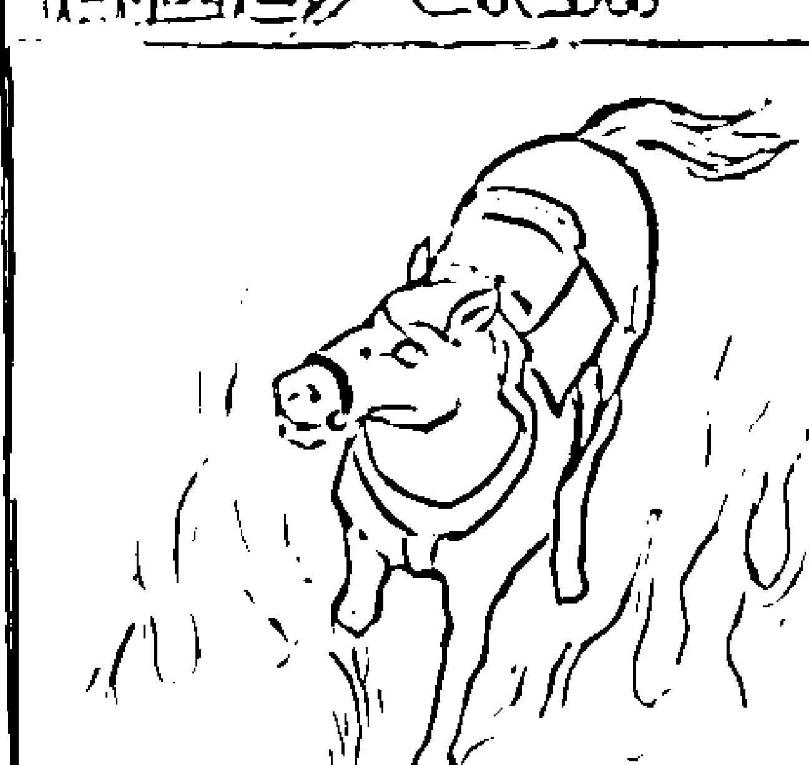

齐格鲁的爱马。拥有不畏烈焰一跃而过的勇气以及继承自斯莱布尼尔的灰色身躯。从前雷金告诉齐格鲁说他没有坐骑，于是齐格鲁便去当时的希亚普瑞克王的马场挑选，传说这匹马是奥丁曾经化身成养马师提出邀请。

## 埃吉尔头盔/Egishjalm

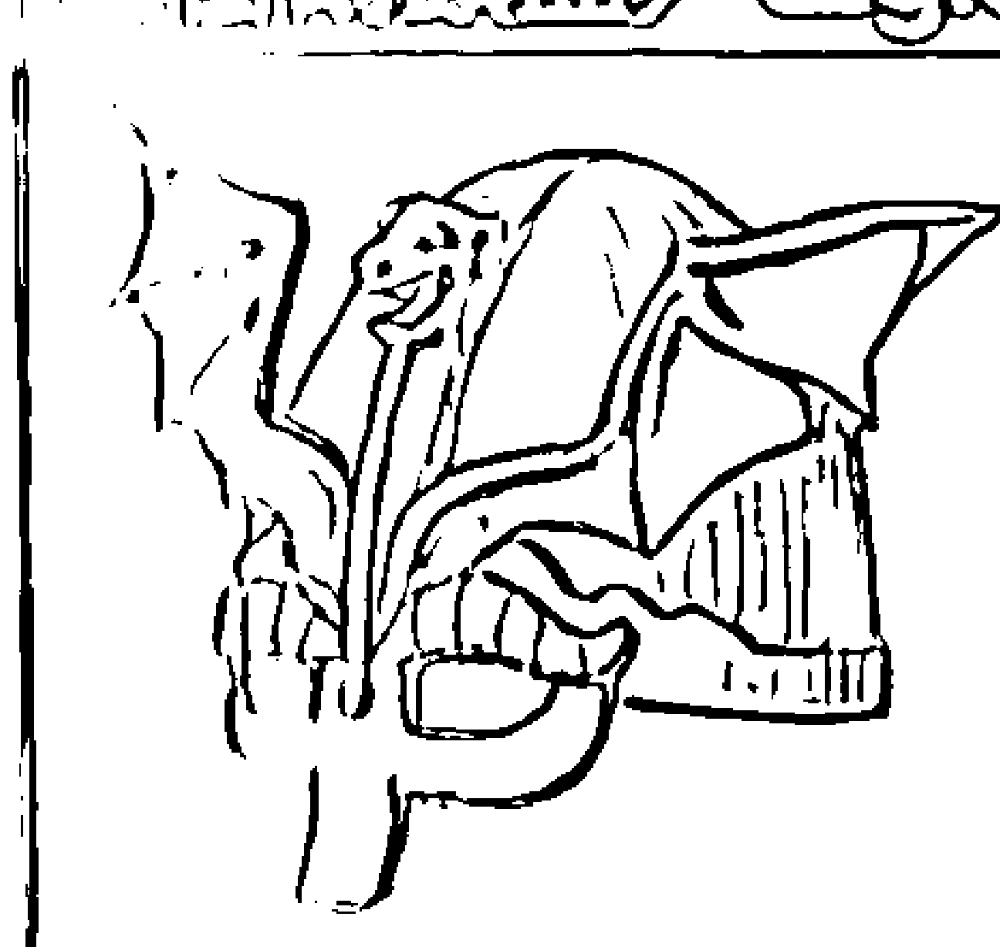

从前法夫尼尔使用的头盔。这头盔拥有能使人陷入恐怖的魔力，故亦称「恐怖头盔」。齐格鲁打倒法夫尼尔后将头盔带回作为战利品，但后来的传说几乎再也不提及此物。法夫尼尔之所以会变成恶龙，便也是因为这顶头盔的魔力所致。

## 弗洛帝/Hrotti

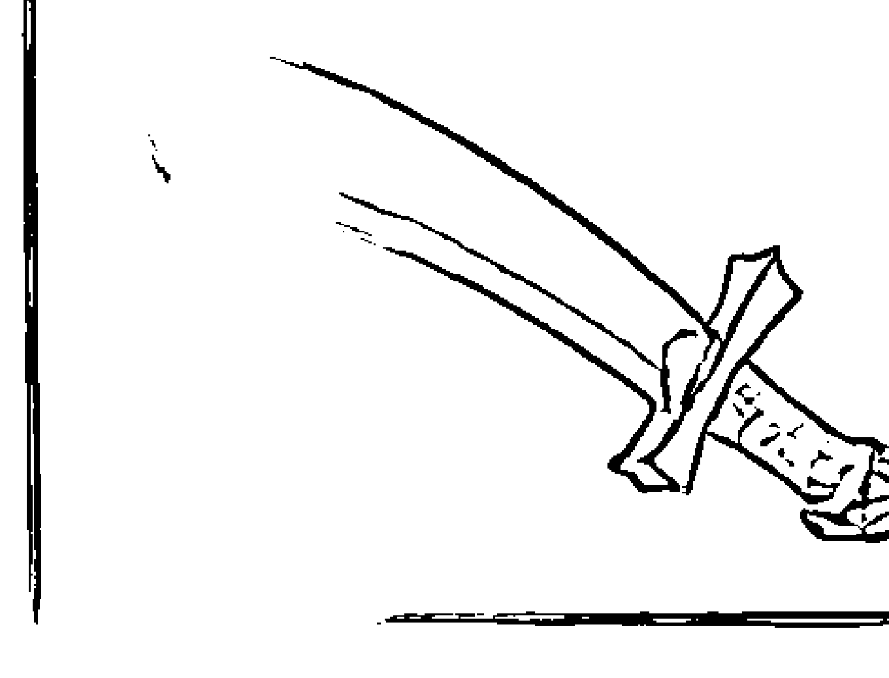

弗洛帝跟埃吉尔头盔同样是法夫尼尔之物，后来也同样成了齐格鲁的战利品。由于弗洛帝经常被拿来跟雷金锻造的里迪尔剑相提并论，因此它很可能是由原是铁匠的法夫尼尔、雷金兄弟所打造。

- * | | No.017
- * | | No.067
- * | | No.069
- ◇法夫尼尔--No.070
- ◇斯莱布尼尔--No.079

# No.092 戴因斯列夫
戴因斯列夫
Dainsleif

每出鞘必定要杀人的魔剑戴因斯列夫，它的杀戮究竟是凭着人的意志而起，抑或是凭着剑的意志而起呢？

#### ○渴於鲜血的魔剑

戴因斯列夫是《史诺里爱达》的〈诗语法〉所提到丹麦国王霍格尼（Hogni）的魔剑。此剑乃是侏儒（矮人）所锻造，是柄「每一出鞘便要杀人、每一斩击从不落空、每遭砍伤便无法愈合」的受诅咒武器。通常像这种魔剑都要辗转於许多人之手，但戴因斯列夫却一直都是握在霍格尼的手中，征战直到世界的终末为止。

事情就要从女神菲依雅得到布理希嘉曼开始说起。这件事让主神奥丁甚为恼怒，并要求菲依雅让两位王者相互争斗作为赔偿，而目标便是霍格尼及其友人塞尔兰之王赫金（Hedin）。
某天赫金忽然遭到邪恶的念头占据，他非但袭击霍格尼领土、杀死他的妻子，并强夺其女瓦尔妲基丽姬希露德及其财宝，而霍格尼也誓言报复，开始追杀赫金。希露德心里其实并不憎恨赫金，她希望双方可以和解所以试著说服父亲，可惜并未成功；不久就连赫金自身也表示愿意赔偿，可是霍格尼却已无法将拔出来的剑收回。於是，双方军势便在霍伊岛（Hoy Island）爆发激战，但是却迟迟没有分出胜负。原来希露德不断施魔法让战死沙场的战士复活，因此两军才会僵持不下、不停征战。最后这场世称「夏兹宁古战役」的争斗，竟就此持续直到终末战役诸神黄昏来临为止。《索里的故事、赫金与霍格尼的萨迦》（Sorli's Story, The Tale of Hogni and Hedinn）则说当初怂恿赫金的其实是菲依雅的化身格恩达尔（Göndul），而「夏兹宁古战役」则是要到十四年后挪威国王奥拉夫·特里格瓦松的仆从伊伐（Ivar）将他们悉数杀光以後方告终结。

- 塞尔兰（Serkland）：塞尔兰在北欧神话和萨迦里面多指阿拔斯王朝附近的回教穆斯林地区。

## 戴因斯列夫

亦譯作「達因的遺產」，乃丹麥國王霍格尼之劍。由於北歐神話裡面有位名叫達因（Dain）的侏儒，因此亦有說法認為此劍乃他所鑄。《史諾里愛達》的〈詩語法〉便曾經提到他的名字。

據霍格尼表示，戴因斯列夫每次出鞘都要殺人。

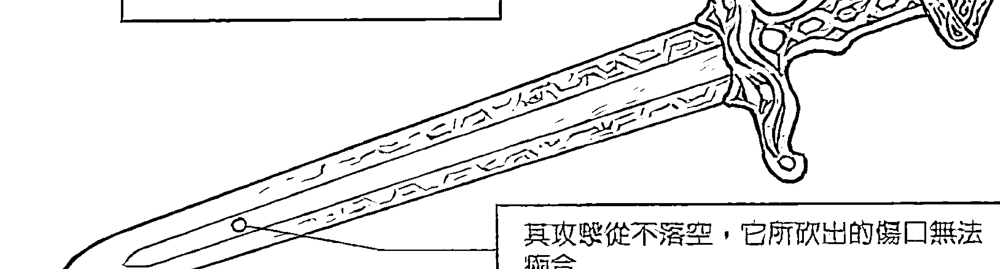

其攻擊從不落空，它所砍出的傷口無法癒合。

## 夏茲海古戰役

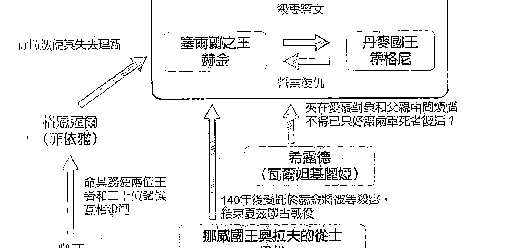

# 提尔芬格

提尔芬格是从前的国王临时兴起命侏儒打造的宝剑，它既能为众人带来荣耀，同时却也是柄招致毁灭的魔剑。

#### ○带来胜利与毁灭的武器

提尔芬格是从前的斯格尔拉美王（King Sigrlami）命令侏儒（矮人）杜华林（Dvalinn）与杜林（Durinn）打造的魔剑。当初这两个侏儒是受国王计策所陷，无法从地面回到岩山里，无奈只能依国王要求锻造宝剑。当时国王提出「剑柄以黄金制、削铁与削衣服同样轻松、绝不会生锈，而且无论谁拥有它都必定会获得胜利」的无理要求硬塞给侏儒；侏儒虽然按照国王要求造剑，却为泄忿而施下诅咒说是「每次出鞘就必定要杀死一个人。如此直到第三次为止，邪恶的愿望都可以得到实现，但持剑者亦将因此步向死亡」，然后就回到岩山里面去了。

侏儒施下的诅咒效果极大。奥拉夫王虽然恃着提尔芬格取得多次胜利，终于还是死于半巨人维京人阿伦葛利姆之手。其后提尔芬格落入阿伦葛利姆之子狂战士安刚提尔手中，安刚提尔同样亦是极尽暴虐之能事，终于与某位名叫雅尔玛（Hjalmar）的战士杀得两败俱伤、命丧黄泉。至此，提尔芬格暂时被埋在安刚提尔下葬的墓冢里面，直到后来才经由安刚提尔之女——女扮男装的维京人赫尔瓦尔之手得以重见天日。

尽管赫尔瓦尔并未因此剑而丧命，可是提尔芬格却又在传至其子赫德雷克时再度开始作祟。作为带来荣耀的交换条件，赫尔瓦尔身边亲人的生命陆续遭提尔芬格剥夺，最后连自己的生命亦终告丧失。提尔芬格的剑刃完全不知停歇，相传就连腓力丁都曾为其所伤。最后一位得到提尔芬格的赫德雷克之子安刚提尔曾经说道「不幸就在我等头顶」，或许这恰恰就是提尔芬格的本质也未可知。

## 提尔芬格

提尔芬格是斯格爾拉美王強迫侏儒鐵匠杜華林和杜林鍛造的魔法之劍。因為侏儒的詛咒，這柄劍能夠實現其持有者的願望三次，然後帶來死亡。

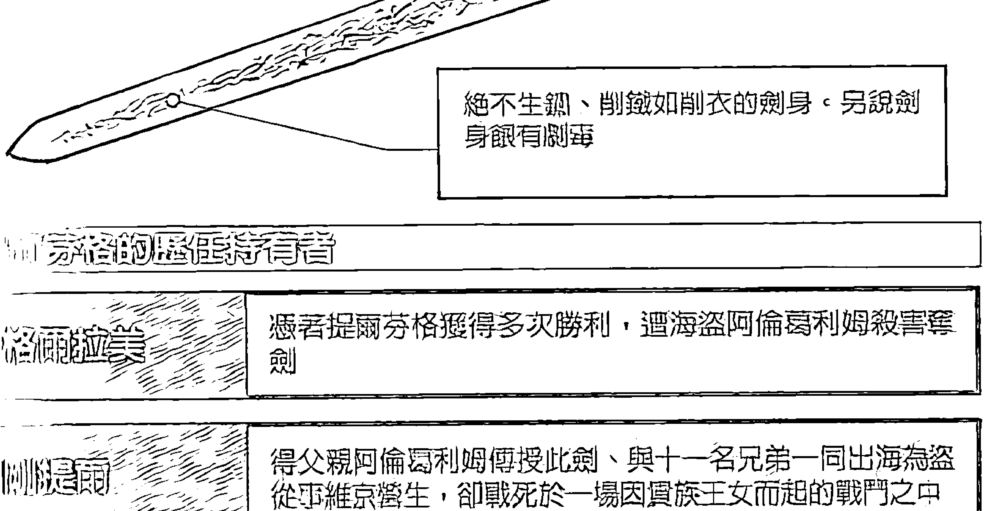

### 提尔芬格的歷任持有者

- 斯格爾拉美：憑藉提爾芬格獲得多次勝利，遭海盜阿倫葛利姆殺害奪劍。
- 安剛提爾：得父親阿倫葛利姆傳授此劍、與十一名兄弟一同出海為盜，從事維京營生，卻戰死於一場因貴族王女而起的戰鬥之中。
- 赫爾瓦爾：為復仇而挖開父親安剛提爾墓塚，並得父親亡靈傳授提爾芬格的男裝女海盜。活躍後得以全身而退。
- 赫德雷克：赫爾瓦爾之子。曾經純粹只為惡作劇而殺人，因此被逐出家門。提爾芬格便是其母於當時所贈，豈料獲得此劍的他先是殺死兄長，然後又陸續殺害身邊親人，藉以換得更大的權力。赫德雷克是因為傷害前來試探他智慧的奧丁而遭詛咒、命喪沙場。
- 赫列德：赫德雷克之子。因為遺產繼承問題而與胞弟赫列德 (Hlðd) 的國家開戰，並殺死赫列德。

## # 提爾之劍

儘管身為戰神，《詩歌埃達》或《史諾里埃達》等主要資料對提爾的所有物卻幾乎從未有任何記載，可是近年刊行的許多資料卻對提爾所持寶劍都有介紹，此節要介紹的便是這些資料的其中一個出典——昭和八年出版的松村武雄所著《北歐神話與傳說》，其中有關提爾之劍的記述內容。根據這項資料記載，提爾之劍乃是由伊瓦第（Ivaldi）的兒子們鍛造而成。與此劍提爾命格同繫，此劍也是柄持有者雖能夠得人心治天下、最後卻將反遭其刃所斃的劍。

從前提爾曾經前往拜訪某位女司祭，說是「得此劍便能打倒任何敵人，希望妳們加保管」將劍托付予她。女司祭將它懸掛於神殿中央，使沐浴閃耀於朝陽之中，每日祭祀，可是這把劍卻在某個夜裡突然消失不見。眾人很害怕提爾將會為此降下懲罰，女司祭卻傳達神明旨意曰「諺語說，持有該劍者雖然能夠統治天下，最後卻也會為該劍而滅。想必此刻的提爾已經在尋找將要擔負此命運者了吧」 相信眾人聞言後紛紛哭泣起來，想從女司祭口中問出提爾之劍現在何處，但她並沒有回答這個問題。

不久以後，有名男子來到某個名叫科隆的城鎮，拜訪治理當地的地方長官維特利烏斯：他給了維特利烏斯一把劍，然後慫恿他謀取羅馬皇帝之位，完全被他說動的維特利烏斯果然率領軍隊往羅馬前進，途中卻被一名德國人部下把劍掉了包。

當時，同樣想做皇帝的韋斯巴鄉 部隊也在步步進逼羅馬 原本維特利烏斯自信憑著提爾之劍的守護力必勝無疑；但當他發覺劍被掉包的時候，就拋下軍隊的指揮權獨自地逃命去了；可是維特利烏斯很快又被背叛他的德國人發現，遭提爾之劍砍下了首級。

後來這名德國人又憑著提爾之劍的力量成功拉攏韋斯巴鄉部隊，成為龐大領地的統治者。然而此時他也已經受此劍的魔力，隱退山林後便將其深埋於地底；雖然此人最後得以善終，但提爾之劍又陸陸續續落入了許多許多人手中 相傳提爾之劍在基督教傳入的同時也被採入其教義，成為大天使米迦勒的所有物。

又有說法認為這則故事是古老的民間傳說，卻也有人說這是二十世紀初的海外小說。真相究竟如何不得而知，但筆者以為這柄終將背叛持有者的劍跟誠實的戰神提爾很是不搭。

- 維特利烏斯：奧盧斯·維特利烏斯·日耳曼尼庫斯（Aulus Vitellius Germanicus），羅馬帝國的皇帝之一。公元69年的「四帝之年」中，他的部隊擊敗了皇帝奧托，奧托自殺，維特利烏斯進入羅馬城，成了該年的第三位皇帝，但在69年年底，支持韋斯巴鄉的部隊進入羅馬，維特利烏斯兵敗被殺。
- 韋斯巴鄉：提圖斯·弗拉維烏斯·韋斯巴西安努斯（Titus Flavius Vespasianus），英語作「韋斯巴鄉」，羅馬帝國弗拉維王朝的第一位皇帝。他是四帝之年的最後一位皇帝，結束了自尼祿皇帝死後，帝國十八個月以來的戰亂紛爭情勢。在他十年的統治時期，他與羅馬元老院合作改革內政，重建經濟秩序，後世普遍對這位皇帝有正面評價。
- 米迦勒（Michael）：希伯來神話中是打倒背叛者撒旦的大天使。名字的原意是「誰能和上帝」，他是上帝最早創造而且強而有力的天使，被認定是上帝的第一護衛。

## # 第4章
### 北欧鞋王

# 信仰北欧诸神的民族

信仰北欧诸神的究竟都是些什麽样的民族，而他们拥有的心性又是如何呢？

#### ○ 信仰异教诸神的维京人

从前信仰北欧神话诸神的，主要是定居于丹麦、瑞典、挪威与冰岛等四个在北欧地区里属于日耳曼国家的民族。属于亚洲系统的芬兰等国虽然亦有受到若干影响，但他们信仰的可说是另一群完全不同的神明。

其实这些北欧神话所述诸神受到信仰最鼎盛的时期约在西元1000年前后，而保存北欧诸神信仰形式最久的瑞典大约是在跨越西元1100年的界线以后，才遇到基督教同化，因此在这以前的时代拥有与现在不同的信仰，而被视为是异教时代。

当试图勾勒出异教时代北欧民族形象的时候，维京人应该是最明显易懂的样板了。西元800年前后维京人首度出现于欧洲的历史舞台，从此便纵横四海到处征战，直到约1100年为止，他们的行为看在现代人眼里往往是极端暴力而野蛮。维京人固然拥有其掠夺者的一面，但现实中的维京人却是彻头彻尾的生意人，也是群拥有高度航海技术的移居民族。其次，据说他们在故乡是致力于农业、畜牧和渔业的生产者，同时也是优秀的巧手工匠。除此以外，由王侯、自由民和奴隶三个阶级组成的维京人社会，还是个高度法律化的社会，因此他们绝非一般人想象中的北方野蛮人。

诸神信仰与维京人的生活有很密切的关系，他们并没有祭司之类的角色，每日的祭祀乃是由各地区代表或家长执行。各个家族都有各自信奉仰赖的神祇，每有祈愿就要献牺牲品祭祀。冬至要举行犹尔大祭，据说众人聚集起来决定诸事的大会，也是从向神明祈祷的仪式演变而来。此类情景在许多传说里面都有记载，成为今日拼凑当时信仰生活的重要线索。

## 北欧神话的主要信仰区域

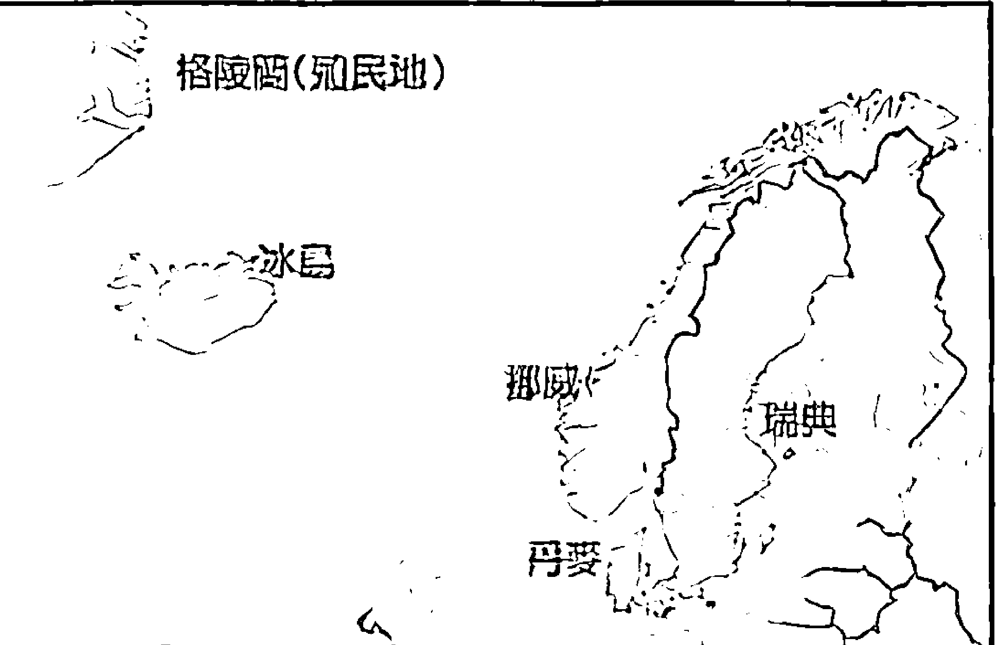

他們同樣位於北歐地區，芬蘭卻是另外其他文化圈，因此信仰的神明似乎也不相同。

## 铁器时代的北欧民族

### 政治形态

- **渐趋中央集权化的封建社会**
  - 挪威
  - 瑞典
  - 丹麦
  - 格陵兰
- **没有国王的共和制社会**
  - 冰岛

### 主要的经济活动

- 畜牧
- 渔业
- 贸易

### 身份制度

- **王侯**
  - 王 Konr
  - 诸侯 Jarl
- **自由民 (自由农民) Bóndi**
- **奴隶 Prell**

# 北欧的住屋

北欧地区即便时值夏季气候依旧是寒冷而严苛，当地居民究竟是生活在怎样的住居里呢？

#### ○屋顶铺设草皮土的住家

异教时代的北欧地区并没有一个全域共通的住居形式。北欧世界各地的资源生产差异性极大，所以森林资源丰富的地区多是木造住宅，木材短缺处便使用石头或土墙等材质搭建住居，各区之间参差不一。北欧地区的各种住宅当中，数量最多的是种人称长屋（Longhouse）形式的住居。

一般的长屋都是以石头为基础、以草皮土修葺成屋顶的住居。最初期的形状被形容说屋顶像是艘翻过来的船，也许是受此原型之影响，后来长屋的屋顶线条也通常都跟船底一样是弯曲的。长屋几乎都没有窗口或烟囱，就算有，顶多也只是个跟家畜膀胱差不多大的小窗子而已，因此室内往往是烟雾弥漫、非常昏暗。当然，这些全都是为了防寒所做的设计。

初期的长屋几乎全都没有隔间，实际上他们称作史卡利（Skali，或称史徒法）的主厅似乎便是他们所有的生活空间。刚开始的时候不光是家人和奴隶，就连家畜也都是生活在同一个空间里，直到后来才逐渐区分出客厅、玄关、厨房、家畜栅圈、锻冶场以及蒸汽浴场等各种房间，最后甚至还从主屋分离出独立的小屋。即便如此，众人的生活起居依旧还是以史卡利为中心。

史卡利两边靠墙处设有两排板凳，板凳中央设有高座，家长和客人便是坐在这个位置；高座两旁设有房柱，上面刻著诸神索尔等神明的肖像。此外，史卡利的墙面经常会以长条状的壁毯装饰，这是为丰富毫无趣味的无窗空间所做的设计，他们便是在这个空间里起居生活、招待客人饮宴同乐。

## # 中世纪时代北欧的一般住居

### ## 长屋（外观）

#### ### 草皮土屋頂

為防風禦寒，屋頂牆壁是用草皮土舖設覆蓋。當時還沒有玻璃窗，因此窗口既少且小。

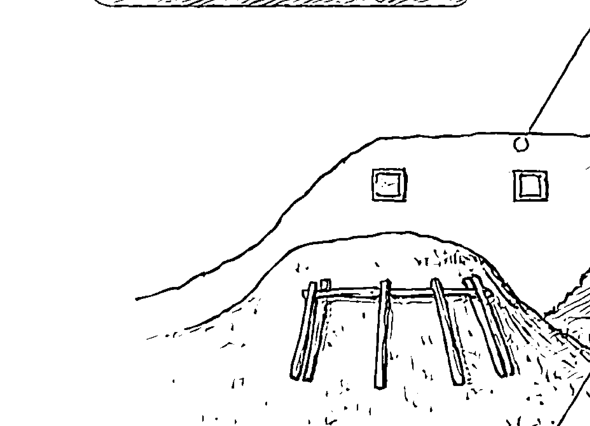

#### ### 入口

一般都是堅固低矮的半地穴式建築；入口做得如此狹窄，除禦寒以外亦有防止外敵襲擊之用意。

#### ### 主屋

主屋是生活起居的中心。初期所有生活機能均集中於此，後來才逐漸分配到獨立的小屋。

### ## 长屋（内部）

#### ### 高座

房間兩側設置板凳，板凳中央設有高座，是一家之主和客人的座位。

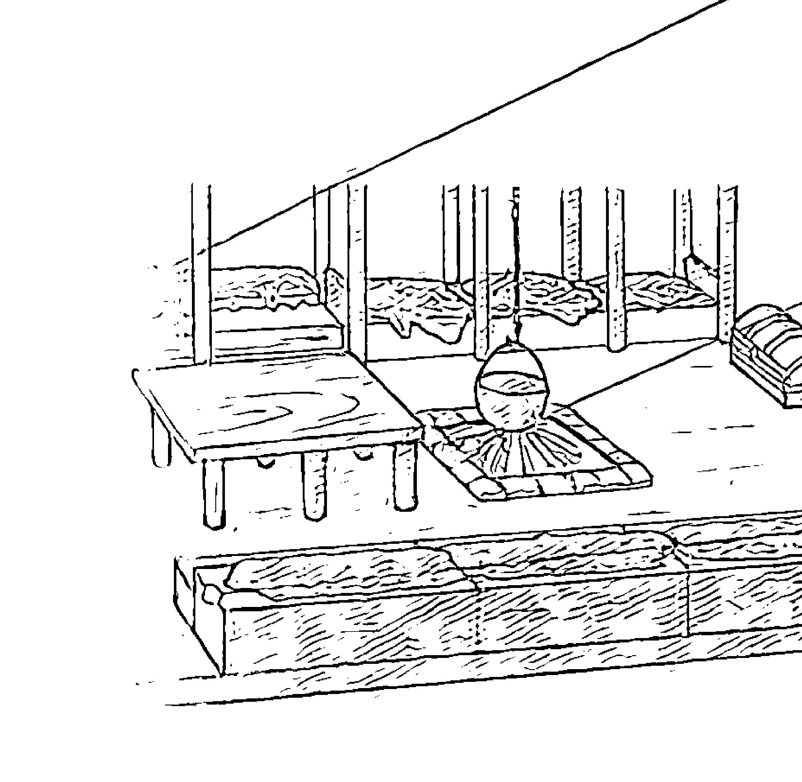

#### ### 泥土地

設有火爐，可以在這裡進行烹調或鍛冶等作業。

#### ### 牆邊

一邊擺設織布機等生活用具，另一邊放置的則是桌子床鋪和收納貴重物品的長櫃。

# No.096

# 北歐的服裝

異教時代的北歐民族往往容易因為維京人的固有形象而被看作是野蠻人，但他們其實都是相當在意服裝打扮的時尚追求者。

### ○相當重視服裝打扮的民族

當時一般男性穿的上衣，是款下擺及於大腿中段的長束腰衣。這衣服是用皮革腰帶固定在腰部，並使用以神話為主題的腰帶釦。文獻記錄到褲子有好幾種種類，包括較貼身的細長款，以及在膝蓋的下緣打綁腿的寬鬆褲型等，帽子也有用鞣製皮革等材質做的尖頭帽和寬簷氈帽等，形形色色不一。鞋子是將鞣製皮革折疊成袋狀、切掉多餘部分所製成，腳踝處則是用繩子綁著。另外他們還會在右肩別胸針裝飾、披用下擺兩端尖起的長斗篷；斗篷開口設在身體右側，這樣比較方便拔劍。女性的服裝則是無袖的長裝為主，以肩繩連接身體前後的兩片布料，然後用胸前一對龜型胸針從內側將其固定。這對胸針中間有條細鏈子連接，可以拿來掛剪刀、針線盒、小刀和鑰匙等小東西。除此以外，她們也經常會在胸前再罩上一件用胸針固定的披肩。據說女性一個不經意的動作、從披肩下露出的手臂，對當時的男性來說是極具魅力的畫面。她們的髮型相當多樣，包括馬尾、編髮和髮髻等，還經常結圍巾遮住脖頸。當然，北歐女性的服裝並無固定形式，甚至還有記錄描繪年輕女性穿迷你裙搭配靴子的隨便打扮。

當時的北歐人無論男女，對裝飾品也都很講究。男性會佩戴以貴金屬製成的手環，或是以某種叫作弗拉茲髮帶打扮；女性則是更加豪華，她們會配戴大量與自己的財產、身分相稱的首飾。

## 维京时代的男性服装

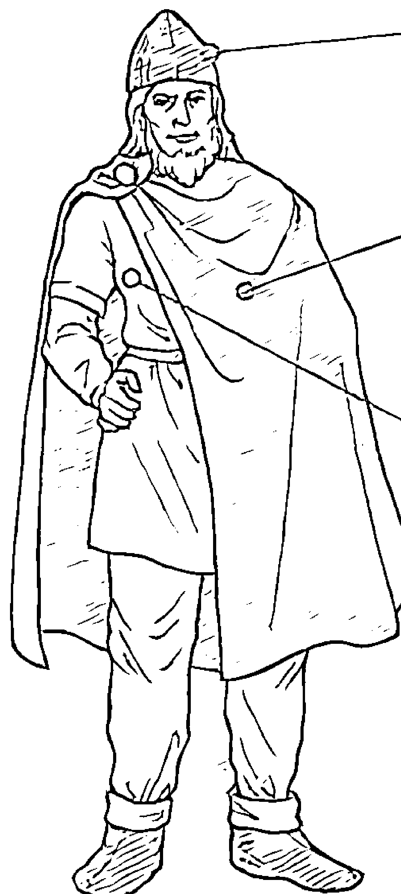

### 帽子

男性的帽子大多是没有褶皱的皮帽，有时间会在额头部分绑饰带作为装饰品。

### 斗篷

用胸针将长斗篷固定在右肩以便拔剑。上战场的时候则不别胸针。

### 上衣

男性的上衣几乎穿的都是束腰衣，腹部以腰带固定住。

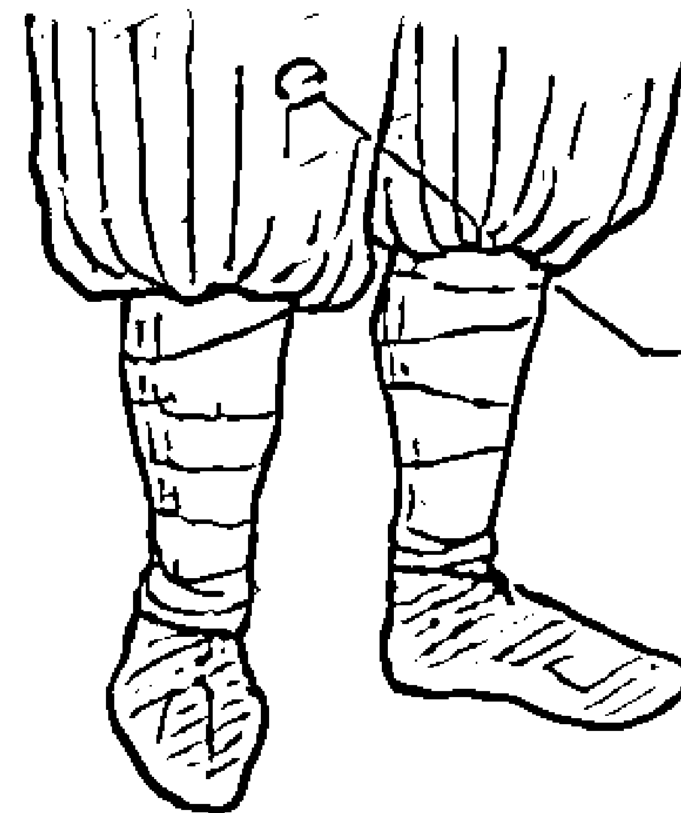

### 裤子

以裤管细长的裤子和在裤管打绑腿的宽松裤子最受喜爱。

## 维京时代的女性服装

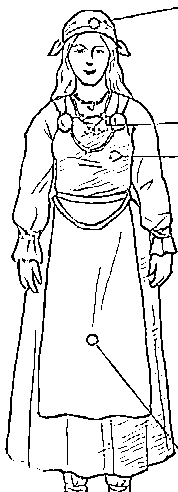

### 头部

身份高贵的女性多会佩戴头饰。无论男女都蓄着长发。

### 首饰

女性的首饰、手环等是配偶者经济状况的指标。

### 外衣

极具特色的衣装是以胸前的两个胸针固定住，胸针上经常会挂着小刀、钥匙等小物品。此外据说在更早的时代，女性穿在里面的衣服是没有袖子的。除此之外，她们经常还会在外面罩上一件披肩。

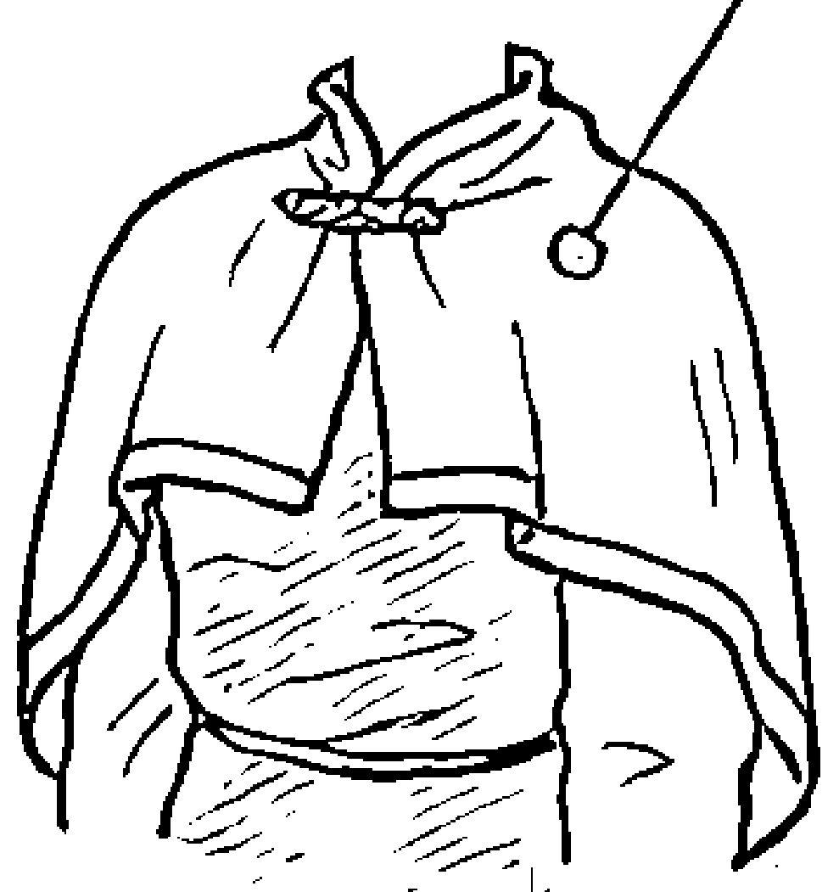

### 围裙

许多女性都穿着围裙：这种围裙是固定在腰部，不会覆盖到胸口。

The request was rejected because it was considered high risk## 直到婚礼仪式为止的流程图

## 婚姻在异教时代北欧的意义

- 为增加政治力
- 为增加财力
- 为强化家族间的关系
- 为调停家族间的纷争

双方家族的身份和财力非常重要：门不当户不对的时候，就必须以个人的名望或财力弥补。

其结果

**男方**
提出给新娘的聘金和守寡后的生活保障金（廉德）

**女方**
由女方家庭提出将来作为结婚生活共同财产的款项

对彼此条件和其他事项达成共识

## 婚约成立

法律的保证

证人

## 维京人婚礼仪式的主要流程

1. 新娘打扮得漂漂亮亮前往新郎家
2. 以矛枪之盐替新娘除秽
3. 向弗丽嘉、雷神、福瑞等神献祭
4. 招待双方家族宾客举行宴会（持续约三天）
5. 洞房

11. 婚约项目
- 廉德 - No.023
- 戒指 - No.033
- 福瑞 - No.042

## No.105 死者的埋葬

異教時代北歐的埋葬方法同樣是形形色色，這些習俗對反映當時世界觀的神話世界，似乎也都造成了各種不同的影響。

#### ○形形色色的埋葬方法

異教時代的埋葬方法相當多樣，同時也對神話造成了諸多影響。一般來說他們對死者甚為畏懼，處理死者的時候通常都很仔細小心，因為他們認為未經妥善埋葬的死者和含恨而終者將會變成怪物，招致災厄為禍眾人。

那麼，接下來就讓我們看看當時實際使用的埋葬方法。當時的埋葬方法主要分成三個種類，即火葬、土葬和船葬三種：

火葬乃是基於死者焚燒後將會蒙召歸天的信仰而行，主要用於瑞典和挪威。據說火葬的時候陪葬品愈多愈好，《挪威王列傳》裡面主神奧丁和尼爾德、屠龍者齊格魯等都是用這個方法埋葬的。火葬燒完以後的骨灰通常不是撒在海裡，就是裝在骨灰罐裡納入墓穴之中。

土葬則是丹麥和冰島主要的埋葬方法，死者會被埋葬在備有陪葬品的墓塚之中。他們相信墓塚中的死者會繼續活下去，而這些死者還會被奉為信仰的對象，正如同《挪威王列傳》裡的福瑞一般。隨著時間流逝，當大家都忘記墓塚裡葬的是誰以後，他們才被眾人視為是精靈妖魈之類。

船葬則是常見於瑞典與挪威的埋葬方法，分成將整艘船漂浮到海面焚燒的火葬，和將整艘船埋進地底的土葬兩種；無論前者或後者，初期的船葬使用的都是真正的船隻，不過這些真正的船卻也隨著時代而慢慢演變成排列成船隻形狀的石堆。《詩歌埃達》記載埋葬巴多正是這種埋葬方法。

此外，犯罪者和故意被藏匿起來的仇人屍體則並不會得到埋葬，而是會被藏匿棄置於石堆之下。

## 埋葬的程序

- 从后方靠近，拿布将视线遮住
- 为死者洗脖子洗手、梳头剪指甲
- 为死者穿鞋、准备金幣等物跟死者拿在手上
- 安置在棺材堆之上，举行盛大守夜仪式
- 将尸体从平时不使用的出入口搬出屋外
- 当时认为死者的视线会造成危害
- 剪死者指甲的用意是要拖延穆斯贝尔海姆诸神在诸神黄昏裡搭乘船隻的完工日期
- 为避免死者跑回来，遗体要从平常不走的出口搬运出去

## 主要的埋葬方法

## 火葬

常见于瑞典与挪威的埋葬方法，乃是基于死者焚烧之后将灵魂归天的信仰而行。《挪威王列传》裡奥丁和尼约德便是採火葬

## 土葬

丹麦和冰岛最普遍的埋葬方法，他们相信死者会继续活在墓塚之中，亦有许多传说描述盗墓者与死者搏斗的故事。《挪威王列传》裡赫瑞便是採土葬

另外像罪犯等眾人不愿与其牵上关係的死者，则大多会将其遗体藏放于石堆之下等地

## 船葬

船葬又分成连船埋在地底的土葬，和连船在海面焚烧的火葬两个种类，初期使用的都是真正的船只，后来才慢慢变成船形的石堆。《诗体埃达》裡的巴多便是採船葬

## [1]相关项目

- 奥丁 → No.017
- 巴多 → No.026
- 尼约德 → No.041
- ◇福瑞 → No.042
- ◇齐格鲁德 → No.069

## No.106

## 吟唱詩與代稱式隱喻

#### Skald & Kenning

調查研究北歐神話的時候，經常都會碰到吟唱詩和代稱式隱喻這兩個用語，究竟此二者是種什麼樣的概念呢？

### 詩人們的複雜技法

吟唱詩是理解北歐神話時所不可或缺的關鍵要素之一。就好像北歐神話的重要文獻《史諾里埃達》，原是為年輕的吟唱詩人所創作的教科書，其關聯性有多深便不言而喻。

吟唱詩乃是在西元八世紀首次出現於北歐。《詩歌埃達》等資料所記載的固有北歐詩歌，都是沿襲自古傳統的頭韻詩（每行字首押韻的詩），詩歌形式較為單純，題材亦多是神話、英雄傳說和格言之類。另一方面，北歐人創作吟唱詩時，其形式卻是複雜到甚至還有特別的訓練課程，內容亦已經擺脫神話與傳說的範疇而及於現實，其中尤以讚美王侯的文學類型卓拉帕（Drapa）最多。初期的吟唱詩人多是以挪威人為主，可是後來卻漸漸都被冰島詩人佔據，因此當時的北歐文學便是由冰島詩人引領風潮；他們受到王侯保護，直到基督教傳入北歐以後亦不曾被廢除。

講到這裡，讀者諸君可能會覺得吟唱詩與神話間毫無任何關係，但吟唱詩所使用的代稱式隱喻、指稱式隱喻（Heiti）技法，跟神話其實有著無法切割的關係；所謂代稱式隱喻指的是運用比喻性表現，而指稱式隱喻則是運用別名以達到隱喻效果的技法。其實這些技法原是吟唱詩人向盎格魯．撒克遜的詩人學來的，傳入北歐後卻被運用在北歐神話的故事裡面，演變成北歐特有的詩歌技法。是故，如果想要正確掌握使用這些技法，勢必要具備淵博的北歐神話相關知識。此外，受吟唱詩人影響的應有傳統詩人，似乎也會採用代稱式隱喻和指稱式隱喻這兩種技巧。

### 吟唱詩的特徵與隱喻形式

吟唱詩 從八世紀起出現於北歐的詩歌形式，使用的技法比傳統詩歌還要複雜

基本上每行都是六個音節，不過也有些詩人是每行三～四個音節、八個音節的也有

吟唱詩是每八行為一迴，以此為單位劃分段落。倘若詩文較長的話，這裏面每四行就可以有個中間休止，這樣有在詩歌的感覺內容上，做出段落區隔的效果

> Þél høyr stórt fyr stáli
> stafnkvígs á veg jafnan
> út með éla meitli
> andœrr jötunn vandar,
> 中間休止
> en svalbúinn selju
> sverfr eirar vanr þeiri
> Gestils þlpt með gustum
> gandr of stáli ok brandi.

### 代稱式隱喻的用例

代稱式隱喻 吟唱詩所使用的隱喻法。即以比喻性的表現方式，換個說法來指稱表述某個單字

| 事物 | 隐喻描述 |
|------|----------|
| 奥丁 | 勝利的提爾、被吊起的提爾、動物之父、獨神、獨腿的釣眼丈夫、密米爾之友、旅行的強者 |
| 索爾 | 奧丁異母爾之子、希弗之夫、烏鴉的岳父、阿爾神域與米德加爾德的守護者、巨人之敵、米德加爾德大蛇之敵 |
| 弗雷 | 尼約德之子、菲依雅之兄、豐饒神、回歸神、分派財富者 |
| 黃金 | 阿戈爾之火、希弗之髮、菲依雅之淚、水淵的暗似 |
| 男性(戰士) | 男神之名、戰之樹、劍之樹 |
| 女性 | 女神之名、菩提樹、柳樹 |
| 武器 | 奧丁之火（劍）、葛匹德的頭盔（斧）、風魔（槍） |
| 防具 | 芬里爾之足（盾）、奥丁之帽（頭盔）、貼身內衣（盔甲） |

## # 传承北欧神话的主要资料①


北欧有两部堪称北欧神话之根干亦不为过的埃达，而这两部埃达究竟是什麽样的书籍呢？

### ## ○史诺里埃达

《史诺里埃达》是十三世纪初冰岛诗人史诺里·史特卢森所著的诗学入门书。此书原本只被称呼为《埃达》而已，但自从北欧发现《王室抄本》以后，这部埃达才改称《新埃达》、《散文埃达》以区别。

此书乃是史诺里为年轻诗人所创作的教本，全书总共分成三个部分，第一部〈欺骗吉鲁菲〉是神话之概要，第二部〈诗语法〉是代称式隐喻、指称式隐喻等诗歌创作技法的实例，而第三部〈韵律一览〉则是作者以自己的诗作为例，具体解说写作诗歌的方法。据说这部作品原本只有第三部而已，作者是为了加深读者对神话部分的理解才在事后另行增补第一部和第二部的。除前述三个部分以外，《史诺里埃达》还另有〈序文〉，然而众人对该序文是否成于史诺里之手却意见分歧。

### ## ○诗歌埃达

另一方面，世称《诗歌埃达》、《古埃达》或《韵文埃达》的则是部收录了九～十三世纪间古诗的诗集。

1643年，冰岛主教吕恩约尔弗·斯汶逊（Brynjólfur Sveinsson）发现了一部应是《史诺里埃达》引用依据的抄本。当时的民众误以为此书乃冰岛学者塞蒙恩德·席格夫松（Sæmund Sigfusson）的作品，遂将其取名为《塞蒙恩德埃达》。后来此抄本就被收藏在哥本哈根的皇家图书馆，因此遂有《王室抄本》之谓，而现在所谓的《诗歌埃达》便是以其为本、追加较类似的古诗编纂而成的作品。其内容乃由神话、英雄诗、格言诗三者所组成，至于每首诗各自的作者或成立年代就无从得知。

## 构成北欧神话的两部经典

## 《史诺里埃达》（新埃达）/ Snorri's Edda (Younger Edda)

| 类别 | 诗学入门书 |
|---|---|
| 作者 | 史诺里·史特卢森 |
| 成立年代 | 1220年前后 |
| 语言 | 古代冰岛语 |

简介：中世冰岛的代表性诗人史诺里·史特卢森为了有志于诗人者整理名作的教科书，以北欧的代名词隐喻为主题，共分成其使用方法、其起源神话以及应用例三个部分进行解说。

### 主要内容

- 第一部 欺骗吉洛菲/Gylfaginning：瑞典国王吉洛菲扮作旅行者甘格勒利（Gangleri）拜访众神的故乡，作者透过众神回答甘格勒利所提问题的过程，阐述作为代名词隐喻的基础知识的神话。
- 第二部 诗语法/Skáldskaparmál：海神阿戈尔受邀至阿萨神域接受众神招待，作为先前在其宫殿举办酒宴的回礼，作者透过他向布拉基提出各种问题的问答过程，阐述代名词隐喻的实例与用法。
- 第三部 韵律一览/Háttatal：史诺里自身创作诗歌的解说。

## 《诗歌埃达》（古埃达）/ Poetic Edda (Elder Edda)

| 类别 | 北欧古诗集 |
|---|---|
| 作者 | 不明 |
| 成立年代 | 800~1100年 |
| 语言 | 古代冰岛语 |

简介：十七世纪冰岛发现的古诗集，其发现者冰岛主教吕恩约尔弗认为此乃是史诺里《埃达》的引用出处，故名。现在《诗歌埃达》的内容除当时发现的《王室抄本》二十九篇以外，还收录有抄自其他抄本的《巴多之歌》、《辛德拉之歌》、《里格之歌》等内容相近的古诗。

### 主要内容

- 女先知的预言/Völuspá
- 高人的箴言/Hávamál
- 瓦夫特鲁德尼的话语/Vafþrúðnismál
- 格林尼尔的话语/Grímnismál
- 史基尼尔之旅/For Skirmis
- 哈尔巴德之歌/Hárbarðsljóð
- 希米尔之歌/Hymiskviða
- 洛奇的争论/Lokasenna
- 斯留姆之歌/Þrymskviða
- 韦伦之歌/Völundarkviða
- 艾尔维斯的话语/Alvíssmál
- 法夫尼尔的话语/Fáfnismál
- 希格德利法的话语/Sigrdrífumál
- 其他

## # No.108 傳承北歐神話的主要資料②

本節要介紹的是我等在認識異教時代北歐人的生活與信仰之際絕對不可遗漏的重要資料「薩迦」，究竟它是種什麼樣的文學呢？

### ## ○北歐的特有文學「薩迦」

所謂的薩迦，是種從十二世紀後半起持續發展直至十四世紀的散文形式長篇文學。薩迦乃是承接於漸趨衰退的吟唱詩之後出現在挪威和冰島，並成爲冰島的特有文學，而有極亮眼的發展。據說冰島是因爲詩人輩出，而且還比挪威等他國更重視其母語，所以才培養出可供文學發展茁壯的肥沃土壤。可是十五世紀以降，北歐卻開始吸收英國、法國和德國的騎士故事，使得其獨特性愈漸稀薄、終於開始衰退。薩迦此語有「故事」的涵意，比薩迦更短的短篇則是被稱作意爲「一部分」的「薩多」（páttr）。

關於薩迦的起源眾說紛紜，最普遍說法有二：其一是世代流傳的散文故事，後來經過基督教聖職者等人之手記錄下來，其二則是後世作家根據歷史事實所進行的創作。

薩迦大致可以分成「宗教的、學問的薩迦」、「王室薩迦」、「冰島人薩迦」和「傳說的薩迦」四個類型。大多數的薩迦並無神話式的記述，主要都是以歷史事件、英雄傳說、人們的日常生活等作爲題材，可是這些卻都是在研究異教時代，北歐人的信仰和生活模式時絕對不可或缺的重要資料。此外，就像歸類爲「王室薩迦」的《法格斯金納》（Fagrskinna）或者筆者將在其他節介紹的《挪威王列傳》同樣，薩迦同樣也補足了不少《詩歌埃達》和《史諾里埃達》散佚殘缺的篇章。更有甚者，許多薩迦例如描述屠龍英雄齊格魯家族故事的「傳說的薩迦」——《佛爾頌薩迦》等，內容甚至還跟《詩歌埃達》相同。

## 最著名的萨迦作品及其分类

### 宗教的、学问的萨迦

以记录宗教性与学问性内容为目的的萨迦，经常被视为是记录北欧人移民冰岛和改信基督教的历史资料

- 《基督教萨迦》Kristni saga
- 《殖民之书》Landnámabók
- 《冰岛人之书》Íslendingabók
- 其他

### 王室萨迦

主要以九～十三世纪挪威和丹麦王族为中心进行描写的萨迦。次节介绍的《挪威王列传》亦属王室萨迦

- 《约姆维京萨迦》Jómsvíkinga saga
- 《红胡子埃里克萨迦》Eiríks saga rauða
- 《格陵兰萨迦》Grænendinga saga
- 其他

### 冰岛人萨迦

史实与虚构交陈、描绘出冰岛人生活情景的萨迦。内容甚是洗练，故其文学价值也相当高

- 《埃吉尔萨迦》Egils saga Skallagrímssonar
- 《格雷蒂尔萨迦》Grettis saga Ásmundarsonar
- 《尼亚萨迦》Njáls Saga
- 其他

### 传说的萨迦

描述异教时代英雄英姿的萨迦。成立的年代相对来说比较新，符合历史事实的记述也比较少。亦称「谎言萨迦」

- 《佛尔颂萨迦》Völsunga Saga
- 《弗洛夫·克拉奇萨迦》Hrólfr Kraki's saga
- 《拉格纳·洛兹布洛克萨迦》Ragars saga loðbrókar
- 其他

## 傳承北歐神話的主要資料③

神話史實說 是種連接神話世界與真實歷史的手法，本節所述兩部以此手法寫成的作品，便提供了許多關於北歐世界的貴重情報。

### ○挪威王列傳

《挪威王列傳》是冰島詩人史諾里・史特盧林所著作的挪威王朝史，總共由十六篇薩迦構成。其實此書本應分類為「王室薩迦」，卻因為其序章〈英林加薩迦〉而成為有別於其他薩迦資料的獨特作品。〈英林加薩迦〉乃是運用將神話寫入歷史的神話史實說手法所著，其中有許多記述可以補足《詩歌埃達》和《史諾里埃達》散佚遺失的篇章。現今等對北歐神話的相關印象諸如阿薩神族與華納神族的戰與和、奧丁所使用的魔法等，許多都是來自於這部資料。其次，《挪威王列傳》裡面像〈善王哈康的薩迦〉和〈聖奧拉夫王薩迦〉等有助推敲當時信仰生活的資料也不少。

### ○丹麥人的業績

另一方面，《丹麥人的業績》則是丹麥史家薩克索・格拉瑪提庫斯（Saxo Grammaticus）以拉丁語寫成的丹麥王朝史。

此書與《挪威王列傳》同樣是以神話史實說的手法寫成，可說是從丹麥人的角度來看待描寫眾神的重要資料。書中不但有跟兩部埃達不同的巴多形象，有兩部埃達並未著墨的狩獵之神烏爾相關記述，而且還有兩部埃達所述神話的後談。除此之外，異教時代風俗習慣的相關記述亦為數頗多。整部作品是由十六卷所構成，神話相關記載多集中於第一書～第九書的篇幅內。

再者，《丹麥人的業績》還收錄有《哈姆雷特》的原型阿姆雷特（Amleth）傳說等故事，就文學面向來說，同樣也是部相當珍貴的資料。

> 神話史實說（Euhemerism）：由猶希邁厄斯（Euhemerus，約西元前330年～260年）提出的理論，他主張神話是真人實事或野史的誇張渲染，是「化妝後的歷史」，凡神話出現的神祇皆上古人物，其事蹟在身後被改編成誇大的奇談。

## 連結神話與歷史的資料

## 《挪威王列傳》/Heimskringla

| 類型 | 史書 |
|---|---|
| 作者 | 史諾里·史特盧森 |
| 成立年代 | 1230年前後 |
| 言語 | 古代冰島語 |

冰島人史諾里·史特盧森所著挪威王朝史，從神話時代的《英林加薩迦》，一直記到1177年的《馬格努斯·埃林松薩迦》(Magnus Erlingsson's Saga)。從哈拉爾美髮王以降所記載的都是史實人物，但在此以前的王位國王則是不詳，書中有許多《詩歌埃達》等文獻所沒有的記載

### — 主要內容 —

- 英林加薩迦 / Ynglinga saga
- 哈夫丹黑王的薩迦 / Hálfdanar saga svarta
- 哈拉爾美髮王的薩迦 / Haraldar saga hárfagra
- 善王哈康的薩迦 / Hákonar saga Aðalsteinsfóstra
- 哈拉爾灰衣王的薩迦 / Haralds saga gráfeldar
- 奧拉夫·特里格瓦松薩迦 / Ólafs saga Tryggvasonar
- 聖奧拉夫王薩迦 / Ólafs saga helga
- 其他

## 《丹麥人的業績》/Gesta Danorum

| 類型 | 史書 |
|---|---|
| 作者 | 薩克索·格拉瑪提庫斯 |
| 成立年代 | 約13世紀 |
| 言語 | 拉丁語 |

丹麥史家薩克索·格拉瑪提庫斯所寫之丹麥王朝史。與《挪威王列傳》同樣有許多兩者之間所看不到的文字記載，語調繁冗，非常難解

### — 主要內容 —

- 第一書~第九書
  描寫的是從丹王(King Dan)直到哥爾姆王(King Gorm)的異教時代。奧丁和巴多等許多神話人物都有登場，但書中僅將其視為能夠使用魔法的人類，並未將其做神明看待
- 第十書~第十三書
  描述的是從哈拉爾藍齒王(Harald Blatand)到尼爾斯王(King Niels)的期間，對作者薩克索來說是屬於過去的時代
- 第十四書~第十六書
  主要描述的是作者薩克索的時代

### 相關項目

- 阿薩神族 → No.016
- 奧丁 → No.017
- 巴多 → No.026
- 烏南 → No.030
- 華納神族 → No.040

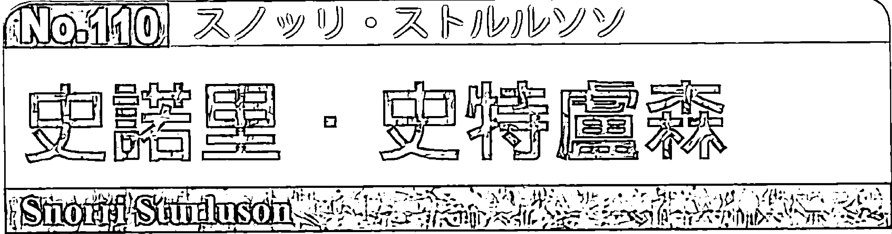

史諾里是為後世留下埃達的偉大詩人，然而其人生卻也同樣是波瀾萬丈，絲毫不遜色於他所留下來的鉅作。

### ○充滿野心的大詩人

以《史諾里埃達》與《挪威王列傳》作者為世所知的史諾里・史特盧森（1178～1241）乃是冰島首屈一指的大詩人、大政治家。三歲時被父親的其中一個政敵——地方首長約翰・洛皮松（Jon Loptsson）收養，在冰島的奧迪（Oddi）撫養長大。約翰是冰島大學者塞蒙恩德（Sæmund）之孫，相傳在他治理之下的奧迪當時已經是冰島的文化中心。後來史諾里得以成為大鳴大放的偉大詩人，當年在這裡的生活可謂影響頗鉅。

1202年，史諾里移居至首任妻子的老家，卻因為財產問題而與妻子分居。其後史諾里改以教會管理者身份，在冰島首都雷恰霍爾特（Reykjaholt）嶄露頭角，甚至還登上冰島的最高權力者「法的宣告者」之地位。1218年，史諾里渡海前往挪威，在挪威國王哈康四世（Hoakon IV）的強迫之下承諾協助將冰島納入版圖。當然史諾里壓根就沒想過要遵守這個承諾，他所關心的始終只是如何擴大自己的領地、如何維持冰島獨立而已。史諾里是位優秀到曾經兩度被選為冰島最高權力者「法的宣告者」的人物，可惜他對財產太過執著，以致在家族中樹敵太多。

1237年，史諾里因財產問題而與姪子反目成仇，並且敗下陣來，因此被遣送至挪威，但是挪威國王卻已經對並未遵守承諾的史諾里失去了信任。即便如此，國王仍舊想將史諾里留在麾下，但史諾里卻在得知姪子戰死的消息後再度離開了挪威，企圖要收復失地。此舉終於觸怒了國王，1241年，史諾里便在雷恰霍爾特的自宅死於國王所遣豪族吉札爾（Gissur Porvaldsson）之手。他的一生正可謂是波瀾萬丈，絲毫不遜色於其著作。

史諾里·史特盧森的生平

史諾里·史特盧森 (1178~1241)

冰島屈指的大詩人、大政治家。以《愛達》、《挪威王列傳》作者為人所知。他充滿野心而且政治手腕高明，卻因欲望深重、缺乏信用以致遭族人背叛，最終丟掉性命。

| 年份 | 主要事件 |
|---|---|
| 1178年 | 生於冰島西區最大權者斯多拉·索達森（Sturla þórðarson）么子 |
| 1181年 | 被父親的政敵奧迪的首長約翰·洛皮松收養 |
| 1199年 | 在兄長萊爾多等人的作媒牽線下，與伯格的資產家貝西之女赫狄絲結婚 |
| 1202年 | 趁妻子赫狄絲繼承父親貝西遺產之際移居伯格 |
| 1206年 | 因為觊觎財產而與妻子娘家關係趨趨惡化，以致分居。移居哈恰爾留特 |
| 1215年 | 獲選為冰島的最高權力者「法的宣告者」 |
| 1218年 | 結束「法的宣告者」任期，造訪挪威。受哈康四世及其監護人斯圖勒伯爵（Duke Skule）款待 |
| 1220年 | 哈康四世決定派遣船團前往冰島。史諾里號稱要協助國王、返回冰島 |
| 1222年 | 第二度獲選為「法的宣告者」。一般認為史諾里便是從這個時候開始執筆著作《愛達》 |
| 1237年 | 與哈康四世新選定的協助者——侄子斯多拉（Sturla）交戰。史諾里被擒、退逃至挪威 |
| 1238年 | 史諾里的兄長西格瓦（Sighvatr）與侄子斯多拉敗死。返回冰島企圖收復失地 |
| 1240年 | 哈康四世派遣貴族吉札爾命史諾里返回挪威，卻告失敗 |
| 1241年 | 吉札爾捲入史諾里妻子遺產繼承問題、再度興兵，史諾里遭殺害 |

專有名詞原文對照及索引

## ［一～五画］

- 力冠腰帶 Megingjarða メギンギョルド 54, 112
- 凡塞堤 Forseti フォルセティ 72
- 〈女先知的預言〉 Völuspá 巫女の予言 227
- 丹王 King Dan ダン王 231
- 《丹麥人的業績》 Gesta Danorum 「デンマーク人の業績」 230
- 内雨德斯 Nerthus ネルトゥス 10
- 天幻羽衣 Álfarhamir 白鳥の羽衣 180
- 尤納克 Jónakr ヨーナク 154
- 巴多 Baldr バルドル 60
- 〈巴多之夢〉 Baldrs draumar バルドルの夢 50, 130, 168, 226
- 《日耳曼尼亞誌》 De origine et situ Germanorum 「ゲルマーニア」 10
- 比夫渥斯特 Bifröst ビフレスト 24
- 《王室抄本》 Codex Regius 「王の写本」 226
- 代詞式隱喻 Knning ケニング 224
- 加拉爾 Gjallar ギアラル 30
- 加爾姆 Garmr ガルム 130
- 包非 Baugi バウギ 162
- 包爾 Bor ボル 100
- 北歐人與戰鬥 Norsemen and Battles 北欧の人々と戦い 212
- 北歐的住屋 Norse Houses 北欧の住居 202
- 北歐的服裝 Norse Clothing 北欧の服装 204
- 北歐的娛樂 Norse Entertainment 北欧の娯楽 208
- 北歐的船隻 Norse Ships 北欧の船 210
- 北歐的食桌 Norse Food 北欧の食卓 206
- 卡瓦希爾 Kvasir クヴァシル 162
- 古托姆 Guttorm グトホルム 150
- 古林伯斯帝 Gullinbursti グリンブルスティ 172
- 古姿倫 Gudrun グズルーン 146
- 古納爾 Gunnar ゲンナ 150
- 古爾托普 Gulltoppr グルトップ 66
- 古爾維格 Gullveig グッルヴェイグ 16
- 古徹蒙 Gudmund グトムンド 28
- 史凡希爾德 Svanhildr スヴァンヒルド 141, 154
- 史卡利 Skali スカーリ 202
- 史卡妲 Skaði スカジ 104
- 史瓦帝法利 Svaðilfari スヴァジルファリ 168
- 史瓦爾德愛南英海姆 Svartálfeimr スヴァルトアールヴヘイム 34
- 史拉格爾 Slagfiðr スラグヴィズ 153
- 史金法克西 Skinfaxi スキンファクシ 86
- 史威普達格 Svipdag スヴィプダーグ 186
- 史基尼爾 Skírnir スキールニル 94
- 〈史尼爾之旅〉 Fǫr Skírnis スキールニルの旅 227
- 史登 Suttungr スットゥング 162, 180
- 史諾里·史特盧森 Snorri Sturluson スノッリ・ストルルソン 232
- 《史諾里愛達》 Snorra Edda 「スノッリのエッダ」 226
- 四頭公鹿 Four Bucks 4匹の牡鹿 37
- 尼弗海姆與尼芙海爾 Niflheimr & Nifhel ニヴルヘイムとニヴルヘル 30
- 尼亞 Njár ニャール 62
- 尼亚商 Njars ニャーラル 152
- 尼尔德 Njorðr ニョルズ 90
- 尼德兹 Niðad ニーズズ 152
- 尼德瓦格 Niðhögggr ニーズホッグ 130
- 巨人族 Jötunn 巨人族 98
- 布列逊布利克 Breiðablik ブレイザブリク 60
- 布利 Buri ブーリ 14
- 布拉基 Bragi ブラギ 70
- 布洛帝霍夫 Bloodyhoof ブローズホーヴ 178
- 布洛帝霍菲 Blodighofi ブローズグホーヴィ 178
- 布伦希尔德 Brynhildr ブリュンヒルド 150
- （布伦希尔德赴地狱之旅） Halreid Brynhildar ブリュンヒルドの冥府への旅 146,150
- 布理希孟曼 Brisingamen ブリージンガ・メン 182
- 布列利王 King Buðli ブズリ王 150
- 布鲁兹维斯拉 Brúðveizla ブルーズヴェイズラ 220
- 布洛克 Brokkr ブロック 172
- 弗列兹玛 Hreiðmarr フレイズマル 148, 174, 188
- 弗利姆法克西 Hrimfaxi フリームファクシ 86
- 《弗洛夫·克拉奇萨迦》 Fröldr Kraki's saga 「フロールヴ・クラキのサガ」 229
- 弗洛蒂 Hrotti フロッティ 192
- 弗若金 Fjörgynn フィヨルギュン 74
- 弗芮 Vör ヴォル 84
- 弗芮克范格 Fólkvangr フォールクヴァング 27
- 弗洛迪 Froði フロージ 190
- 民俗与法律 Ping & Laws 民会と法律 214
- 永恒之枪 Gungnir グングニル 170
- 瓦力 Váli ヴァーリ 72
- 瓦夫特鲁德尼 Vafþrúðnir ヴァフスルーズニル 114
- （瓦夫特鲁德尼的话语） Vafþrúðnismál ヴァフスルーズニルのことば 227
- 瓦恩 Ván ヴォーン 124
- 瓦兹洛可咒歌 Varðlokkur ヴァルズロッグ 158
- 瓦塔利 Vartari ヴァルダリ 172
- 瓦尔基里 Valkyrja ヴァルキュリヤ 52
- 甘格勒利 Gangleri ガングレリ 226
- 尤达尔 Ydalir ユーダリル 68
- 白银之殿 Valaskjálf ヴァラスキャールヴ 27

伊瓦第之子的三样宝物 Ivaldi's Sons' Three Magic Items

- イーアルディの息子たちの三つの宝物 170
- 伊伐 Ivar イーヴァル 194
- 伊米尔 Ymir ユミル 100
- 伊吉 Iði イジ 102
- 伊格 Yggr ユッグ 36
- 伊格德拉西尔 Yggdrasil ユグドラシル 36
- 伊登 Iðunn イズン 78
- 休瓦兹 Hjörvarðr ヒョルヴァルズ 52, 144
- 休妲丝 Hjördis ヒョルディーズ 142
- 吉苏尔 Gissur ギツール 232
- 吉姆列 Gimle ギムレー 34
- 吉奥尔河 Gjöll ギョル川 30
- 吉勒维 Gylfi ギュルヴィ 80
- 德洛米 Drómi ドローミ 184
- 安那爾 Annar アンナル 87
- 安剛提爵 Angantyr アンガンチュル 196
- 安格兩伯趣 Angrboða アングルボザ 124, 126, 128
- 安得朗格 Andlangr アンドラング 25
- 安斯加爾 Ansgar アンスガル 13
- 安德華利 Andvari アンドヴァリ 148, 174, 188
- 安德華利的黃金 Andvari's gold アンドヴァリの黄金 174
- 安德華拉弗斯 Andvarafors アンドヴァラフォルス 174
- 安德華拉諾特 Andvarinaut アンドヴァラナウト 175
- 托爾 Troll トロル 98
- 死者的埋葬 Norse Funeral 死者の埋葬 222
- 米德加爾德 Miðgarðr ミズガルズ 34
- 米德加爾德蛇 Miðgarðr ミズガルズ蛇 126
- 至高王座 Hliðskjálf フリズスキャールヴ 166
- 色斯瑟尼爾 Sessrúmnir セスルームニル 96
- 艾伊爾 Eir エイル 84
- 艾克修尼爾 Eikpyrnir エイクシュルニル 49
- 艾格瑟 Eggþér エッグセール 132
- 艾達華爾 Iðavöllr イザヴェル 26
- 艾爾莉力克 Alfrigg アールヴァリッグ 183
- 艾爾維朵 Hervör alvit アルヴィト 153
- 《艾爾維斯的話語》 Alvissmál 『アルヴィースのことば』 227
- 血誓兄弟之儀式 Fóstbrœðra-lag 血誓兄弟の儀式 218
- 西格恩 Sigrún シグルーン 122
- 西格爾 Siggeir シゲイル 140, 142
- 西徽堡 Himinbjörg ヒミンビョルグ 27
- 西蘭島=丹麥 Zealand シェラン島 80
- 亨基邱夫特 Hengikjöptr ヘギンキョフト 218
- 佛斯特布魯斯拉 Fóstbrœðra-lag フォーストブレーズラグ 0
- 佛爾頸家族 Volsungar ヴォルスングの一族 140
- 《佛爾頸薩迦》 Volsunga Saga 『ヴォルスング・サガ』 229
- 利弗 Líf リーヴ 115
- 利弗詩拉希爾 Lífþrasir リーヴズラシル 115
- 利里爾 Rerir レリル 74, 140
- 吕恩約爾弗·斯文遜 Brynjólfur Sveinsson ブリニョールヴ・スヴェンソン 226
- 吟唱詩 Skáld スカルド詩 224
- 希弗 Sif シヴ 56
- 希弗之髮 Sif's Golden Hair シフの髪 225
- 希米爾 Hymir ヒュミル 118
- 〈希米爾之歌〉 Hymiskviða ヒュミルの歌 227
- 希亞普瑞克 Hjalprek ヒアールプレク 146, 192
- 希亞寶 Þjálfi シャールヴィ 56
- 希明萊瓦 Himinglæva ヒミングレーヴァ 121
- 希格德莉法 Sigdrífa シグルドリーヴァ 52
- 〈希格德莉法的話語〉 Sigdrífumál シグルドリーヴァのことば 227
- 希格露恩 Sigrún シグルーン 144
- 希爾迪斯維尼 Hildisvíni ヒルディスヴィーニ 97
- 希爾羅金 Hyrrokkin ヒュロッキン 132
- 希露德 Hlíd ヒルド 194
- 杜拉索爾 Durathor ドゥラスロール 37
- 杜林 Durinn ドゥリン 134, 190
- 杜涅爾 Duneyr ドゥンエイル 37
- 杜華林 Dvalin ドヴァリン 134, 190
- 狄絲 Dís ディース 1
- 狂战士 Berserkr ベルセルク 50
- 貝西 Bersi ベルシ 237
- 貝拉 Beyla ベイラ 94
- 貝格爾米爾 Bergelmir ベルゲルミル 99, 100
- 貝絲特拉 Bestla ベストラ 14
- 貝絲維朵 Böðvildr ベズヴィドル 152
- 貝爾丹迪 Verdandi ヴェルザンディ 82
- 貝絲度格逊 Blóðughadda ブローズグハッダ 121
- 貝爾 Berling ベルリング 183
- 辛加斯汀 Singasteinn シンガスティン 183
- 辛達費爾 Hindarfell ヒンダルフィアル 146
- 辛德里 Sindri シンドリ 172
- 辛德拉 Hyndla ヒュンドラ 132
- 〈辛德拉之歌〉 Hyndluljóð ヒュンドラの歌 96, 132
- 辛摩拉 Sinmore シンモラ 138
- 里希 Risi リシ 98
- 里迪爾 Ridill リジル 192
- 里格 Rigr リーグ 66
- 〈里格之歌〉 Rigspula リーグの歌 66
- 亞姆斯瓦提尼爾湖 Lake Amsvartnir アームスヴァルトニル湖 124
- 侏儸 Dvergr ドヴェルグ 134
- 兩隻天鵝 Two Swans 2羽の白鳥 37
- 紅杜帕 Drapa ドラーパ 224
- 和解、復仇與訴訟 Compromise, Revenge and Lawsuit 和解と復讐と告訴 216
- 拉恩 Rán ラーン 120
- 拉恩的拖網 Rán's Cast Net ラーンの投網 188
- 拉塔托斯克 Ratatoskr ラタトクス 37
- 里格王 Sigurðr hringr リュング王 44
- 波恩 Boðn ボズン 162
- 法夫尼爾 Fáfnir ファヴニール 148
- 〈法夫尼爾的話語〉 Fáfnismál ファヴニールのことば 227
- 法格斯金納 Fagrskinna ファグルスキンナ 228
- 法爾巴烏提 Fárbauti ファールヴァウティ 122
- 富拉 Fulla フラ 76
- 流茲 Ljod リョーズ 140
- 巴拉 Bára バーラ 121
- 芬里爾 Fenrir フェンリル 124
- 芬里爾狼 Fenrisulfr フェンリル狼 124
- 芬蘭 Finn フィン国 152
- 赫倫格尼爾 Hrungnir フルングニル 108
- 芬薩利爾 Fensalir フェンサリル 74
- 金倫加鴻溝 Ginnungagap ギンヌンガガプ 14
- 長屋 Longhouse ロングハウス 202
- 伊吉爾 Ægir エーギル 120
- 阿爾斯維斯 Alsviðr アルヴィズ 86
- 阿爾瓦克 Arvakr アールヴァク 86
- 艾希爾 Æsir エイシル 40
- 阿姆雷特 Amleth アムレート 230
- 阿恩格利姆 Arngrim アリングリム 196
- 〈阿特利之歌〉 Atlakviða 「アトリの歌」 68
- 阿特利王 King Atli アトリ王 150
- 阿斯梅金 Ásmegin アースメギン 54
- 阿斯加德 Ásgarðr アースガルズ 26
- 阿薩神族 Áss アース神族 40- 1. 齐际将 Niðfölr 肯い術を持つ蛇 ................... 130
- 2. 信仰北欧诸神的民族 Poeple Worshipping Norse Gods 北欧の神々を信仰した人々 ................... 200
- 3. 哈汀贾尔 Haddingjar ハッディンギャル ................... 145
- 4. 哈姆迪尔 Hamðir ハムディル ................... 175
- 5. 哈拉尔蓝牙王 Harald Blatand ハラルド青歯王 ................... 12, 44, 230
- 6. 哈罗伽兰 Hålogaland ハーロガランド ................... 29
- 7. 哈康四世 Hoakon IV ホーコン4世 ................... 232
- 8. 哈提 Hati ハティ ................... 130
- 9. 《哈尔巴德之歌》 Hárbörðslöð ハールバルズの歌 ................... 227
- 10. 哈蒙德 Hámundr ハームンド ................... 142
- 11. 威利 Vili ヴィリ ................... 72
- 12. 拜尔琪雅 Bylgja ビュルギャ ................... 121
- 13. 指称式隐喻 Heiti ヘイティ ................... 224
- 14. 流斯斐尔芙 Ljósálf リョースアールヴ ................... 136
- 15. 洛奇 Loki ロキ ................... 122
- 16. 洛奇的抛网 Loki's Cast Net ロキの投網 ................... 188
- 17. 《洛奇的争论》 Lokasenna ロキの口論 ................... 227
- 18. 洛菲 Laufey ラウヴェイ ................... 122
- 19. 洛德 Löðurr ロドゥル ................... 72
- 20. 《红胡子埃里克萨迦》 Eiríks saga rauða 「赤毛のエイリークのサガ」................... 229
- 21. 《约姆维京萨迦》 Jómsvikinga saga 「ヨームバイキングのサガ」................... 229
- 22. 约尔孟甘德 Jörmungandr ヨルムンガンド ................... 126
- 23. 约翰·洛皮松 Jon Loptsson ヨーン・ロフトソン ................... 232
- 24. 美妮亚 Menia メニア ................... 190
- 25. 胡金 Huginn フギン ................... 164
- 26. 胡格尼王 King Högne ヘグニ王 ................... 144
- 27. 《英林加萨迦》 Yngling-Saga ユングリングァ・サガ ................... 231
- 28. 英灵殿 Valhöll ヴァルハラ ................... 26
- 29. 英灵战士 Einherjar エインヘリアル ................... 48
- 30. 迦尔多咒歌 Galdr 呪歌ガルドル ................... 158
- 31. 韦伦 Völundr ヴェルンド ................... 152
- 32. 《韦伦之歌》 Völundarkviða ヴェルンドの歌 ................... 227
- 33. 飞飘羽衣 Valsham 蝶の羽衣 ................... 180
- 34. 修奇 Hjuki ヒューキ ................... 86
- 35. 修芬 Sjöfn ショヴン ................... 84
- 36. 伦格海丝 Lynghelð リュングヘイズ ................... 149
- 37. 伦格贾王 King Lyngvi リュングヴィ王 ................... 142
- 38. 阔格 Gangr ガング ................... 103
- 39. 阔格阔兹 Gangrathr ガングラーズ ................... 114
- 40. 居格纽斯特 Tanngnjóstr タングニョースト ................... 176
- 41. 居格理斯尼 Tanngrisnir タングリスニル ................... 176
- 42. 戈尔姆 Gorm ゴルモ ................... 28, 112, 116, 230
- 43. 埃吉尔 Egil エギル ................... 153
- 44. 埃吉尔头盔 Ægishjálm エギルの兜 ................... 192
- 45. 《埃吉尔萨迦》 Egils saga Skallagrimssonar 『エギルのサガ』................... 229
- 46. 埃利伐加尔 Eliagarr エーリヴァーガル ................... 20
- 47. 《埃里克的话语》 Eiríksmál 「エイリークのことば」................... 48, 70
- 48. 埃琉德尼尔 Éljúðnir エリューズニル ................... 30
- 49. 埃尔迪尔 Eldir エルディル ................... 120
- 50. 埃尔普 Erp エルプ ................... 175
- 51. 亥兹尼亚古战役 Hjaðningavig ヒャズニングの戦い ................... 194
- 52. 亚基 Pjazi シャツィ ................... 102
- 53. 索尔 Sól ソール ................... 86
- 席恩 Syn シュン  ……  84
- 席格瓦 Sighvatr シグヴァト  ……  237
- 席力奇 Fureki フレキ  ……  164
- 而两嘉 Kólga コールガ  ……  121
- 《挪威王列传》 Heimskringla 「ヘイムスクリングラ」  ……  230
- 梁布朗德 Pangbrandr パングランド  ……  50
- 格尼巴 Gnipahellir グニパヘッリル  ……  30
- 格尼塔海兹 Gnitaheiör グニタヘイズ  ……  148
- 格因 Göinn ゴーイン  ……  36
- 格利特尼尔 Glitnir グリトニル  ……  72
- 格拉巴克 Grábakr グラーバク  ……  36
- 格拉尼 Grani グラニ  ……  192
- 格拉弗沃鲁德 Grafvölluör グラヴヴォルズ  ……  36
- 格拉兹海姆 Glaðsheimr グラズヘイム  ……  26
- 格拉恩 Gram グラム  ……  192
- 格恩迪尔 Göndul ゴンドゥル  ……  194
- 格路普 Gjálp ギャルプ  ……  113
- 格泫普 Greip グレイプ  ……  113
- 格泫亚 Groa グロア  ……  158
- 《格泫亚的咒歌》 Grógaldr 「グロアの呪文」  ……  186
- 海尼尔 Hænir ヘーニル  ……  72
- 海姆达尔 Heimdallr ヘイムッダル  ……  66
- 海尔 Hel ヘル  ……  128
- 海尔吉 Helgi ヘルギ  ……  144
- 海尔佳 Haiga ハガル  ……  144
- 海娜 Uðr ウズ  ……  121
- 而特加尔 Utgarðr ウートガルズ  ……  28
- 而特加尔洛奇 Utgarsa-Loki ウートガルザ・ロキ  ……  116
- 而普隆拉 Uppsala ウプサーラ  ……  12
- 尔尔 Ullr ウッル  ……  68
- 尔尔德 Urðr ウルズ  ……  82
- 尔尔德之泉 Urðarbrunnr ウルズの泉  ……  26
- 而瓦林 Dvalin ドヴァリン  ……  37
- 而芬布尼尔 Draupnir ドラウプニル  ……  172
- 而纽提 Thviti スヴィティ  ……  125
- 而克 Þökk ソック  ……  61
- 而克瓦贝克 Sökkvabekkr セックヴァベック  ……  84
- 而尔 Þórr トール  ……  54
- 而尔多 Þórðr トルド  ……  233
- 而尔基 Thorkil トルキル  ……  29
- 而里 Nari ナリ  ……  20
- 而格法利 Naglfari ナグレファル  ……  87
- 而格而法 Naglfar ナグレファク  ……  138
- 而尔菲 Narfi ナルヴィ  ……  87
- 格姆尔癸 Gunnlöð グンロズ  ……  162
- 而尼 Máni マーニ  ……  86
- 〈高人的箴言〉 Hávamál 崇き者のことば  ……  227
- 而伊而柯 Tuisco トゥィスコー  ……  10
- 而尔 Magni マグニ  ……  56
- 而尔 Geri グリ  ……  164
- 而尔 Gjöll ギョッル  ……  125
- 〈婚礼仪式与婚宴〉 Festarmál, Brúðveizla 婚約の儀式と婚礼の宴  ……  220
- 密米爾之泉 Mimisbrunnr ミーミルの泉 28
- 密米雨之首 Mims höfuð ミーミルの首 160
- 梵格爾夫 Vingólf ヴィーンゴールヴ 26
- 梅拉湖 Lake Malar メーラル湖 81
- 畢利 Bell ベリ 132
- 畢格維 Byggvir ビュグヴィル 94
- 畢雅馬閃 Bjarmaland ビャルマランド 29, 113
- 畢爾斯基爾尼雨 Bilskimir ビルスキールニル 27
- 畢靈 Billingr ビリング 46
- 莫苦卡菲 Mökkurkalfe モックルカールヴィ 108
- 莫德古德 Moðguðr モーズグズ 30
- 都法 Dúva ドゥーヴァ 121
- 凱拉 Kára カーラ 145
- 《凱拉之歌》 「カーラの歌」 180
- 喬登 Jötunn ヨトゥン 98
- 喬登海姆 Jotunheimr ヨトゥンヘイム 28
- 富托克 Fupark フサルク 156
- 幾米爾 Gymir ギミル／ギュミル 106, 120
- 幾優基王 King Gjúki ギューキ王 146, 150
- 提爾 Tyr テュール 58
- 提爾芬格 Tyrfingr テュルフィング 196
- 《散文受遊》 The Prose Edda 「散文エッダ」 226
- 斯瓦弗尼爾 Sváfnir スヴァーヴニル 37
- 斯瓦索德 Svásuðr スヴァースズ 115
- 斯多拉·索逊森 Sturla Þórðarson ストルラ・トルドソン 233
- 斯克里米爾 Skrymir スクリューミル 116
- 斯奇布拉尼 Skiðblaðnir スキーズブラズニル 170
- 斯洛特拉 Snotra スノトラ 84
- 斯摩勒伯爵 Duke Skule スクーレ伯 233
- 斯摩爾 Skoll スコル 130
- 斯格爾拉美王 King Sigrlami スヴァフルラーメ王 196
- 斯留姆 Þrymr スリュム 110
- 〈斯留姆之歌〉 Þrymskviða スリュムの歌 227
- 斯留姆海姆 Þrymheimr スリュムヘイム 104
- 斯基爾汀家 Skjölding スキョルディング家 81
- 斯基爾德 Skjöldr スキョルド 81
- 斯莱布尼爾 Sleipnir スレイプニル 168
- 斯薇法 Sváva スヴァーヴァ 52, 145
- 斯羅德海姆 Þrúðheimr スルードヘイム 54
- 斯羅德蘭 Þrúðvangr スルードヴァンガル 54
- 斯露德 Þrúðr スルーズ 56
- 〈欺騙吉德非〉 Gylfaginning ギュルヴァイの惑わし 226
- 《殖民之書》 Landnámabók 「殖民の書」 229
- 琳德 Rindr リンド 46, 72
- 善王哈康 Haakon the Good ハーコン善王 13
- 華尼爾 Vanir ヴァニル 88
- 華納海姆 Vanaheimr ヴァナヘイム 34
- 華納神族 Vanr ヴァン神族 88
- 華爾 Vár ヴァール 84
- 菲 Vé ヴェー 72
- 菲尼爾 Fjölnir フェルニル 93
- 菲依雅 Freyja フレイヤ 96
- 菲妮亞 Fenia フェニア 190
- 《菲歐史維徑之歌》 Fjölsvinnsmál 「フィヨルスヴィズの歌」 36, 138, 186
- 贾拉雅莉 Fjalar フィアラル ........................................................... 162
- 费斯塔馬爾 Festarmál フェスタルマール ..................................................... 220
- 费爾加 Fylgja フュルギヤ ................................................................ 84
- 费瑞芬格 Fimafeng フィマフェング ........................................................... 120
- 雅伦沙克沙 Jámsaxa ヤールンサクサ ......................................................... 56
- 雅尔玛 Hjalmar ヒヤルマール ............................................................... 196
- 黄金假髪 Golden Wig 黄金のかつら ......................................................... 170
- 塞弗利姆尼尔 Sahriminlr セーリームニル ................................................... 48
- 塞伐尔斯塔兹 Sævarstöð セーヴアルスタズ ................................................. 152
- 恐兹咒法 Seiðr セイズ呪術 .............................................................. 158
- 塞尔關 Serkland セルクランド ............................................................ 194
- 塞蒙恩德·席格夫頭 Sæmund Sigfusson セームント・シグフーソン ......................... 226
- 《塞蒙恩德要達》 Sæmundar Edda 『セームンドのエッダ』 ................................ 226
- 奥丁 Óðinn オーディン .................................................................. 42
- 奥弗尼尔 Ófnir オーヴニル ............................................................... 37
- 奥拉夫·特里格瓦松 Óláfr Tryggvason オーズレリ ........................................ 12, 38, 194
- 奥拉夫·特里格瓦松薩迦 Ólafs saga Tryggvasonar オーラヴ・トリュッグヴァソンのサガ ..................................................... 231
- 奥迪 Oddi オッディ ..................................................................... 232
- 奥西兹西米尔 Aurgelmir アゥゲルミル ................................................... 115
- 奥德 Óðr オード ........................................................................ 96
- 奥德 Auðr アウズ ....................................................................... 87
- 奥德姆拉 Audumla アウズムラ .......................................................... 14
- 《爱达经》 Edda 『エッダ』 .............................................................. 8, 226
- 爱尔芙 Álfar アールヴ ................................................................. 136
- 爱尔芙海姆 Álfheimr アールヴヘイム ................................................... 34
- 南娜 Nanna ナンナ ...................................................................... 60
- 温德斯瓦尔 Vindsvalr ヴィンドスヴァル ................................................ 115
- 矮人 Dvergr 小人族 .................................................................... 134
- 《圣奥拉夫王薩迦》 Ólafs saga helga 聖オーラヴ王のサガ ................................ 231
- 戈列尔 Grerr グレール ................................................................. 183
- 戈拉尔 Galar ガラル .................................................................... 162
- 《格里姆尼尔的话语》 Grimnismál グリームニルのことば ................................ 227
- 戈娜 Gná グナー ....................................................................... 76
- 戈留杜迦薩 Grjóttúnagarðar グリュートトゥーナガルザル ................................ 28
- 戈琼 Gefjun ゲヴュン .................................................................. 80
- 戈伦 Glenr グレン ..................................................................... 86
- 戈尔法克西 Gullfaxi グルファクシ ..................................................... 108
- 戈德 Gerðr ゲルズ ..................................................................... 106
- 《葛罗蒂之歌》 Gróttasöngr グロッティの歌 ............................................. 102
- 葛罗蒂的石臼 Grótta グロッティの石臼 ................................................. 190
- 格里姆希尔德 Grimhild グリームヒルド ................................................. 72
- 格里兹 Griðr グリーズ ............................................................... 64, 112
- 斯库尔德 Skuld スクルド ............................................................... 82
- 《诗体爱达》 The Poetic Edda 『詩のエッダ』 ........................................... 226
- 诗神酒 Skáldskapar Mjaðar 詩人の蜂蜜酒 ............................................... 162
- 《诗语法》 Skáldskaparmál 詩語法 ..................................................... 227
- 加拉号角 Gjallarhorn ギャラルホルン .................................................. 66
- 达因 Dain ダイン ..................................................................... 194
- 达格 Dagr ダグ ....................................................................... 86
- 莱辛格 Læðingr レージング ............................................................. 184
- 莱瓦廷 Lævateinn レーヴァティン ....................................................... 186
- 莱拉兹 Léraðr レーラズ ............................................................... 48
- 里金 Reginn レギン ................................................................... 146, 148, 192

〈黄金的话语〉 Reginmál レギンのことば 148, 174, 188

雷恰霍尔特 Reykjaholt レイキャホルト 232

雷格倫 Lægjarn レーギャルン 186

雷神之鎚 Mjollnir ミョルニルの槌 172

頓河 Don River ドン河 35

頌 Són ソーン 162

夢幻羅德 Mengloo メングラッド 186

《汉堡大主教史》 Gesta Hammaburgensis ecclesiae pontificum 「ハンブルグ大司教区の事績」 12

漢登格屠殺者海爾吉 Helgi Hundingsbane フンディング殺しのヘルギ 144

瑪納加爾姆 Mánagarma マーナガルム 130

福里姆 Hrymr フリュム 133

福斯菲依雅 Húsfreyja フースフレイア 220

福琳 Hlín フーリン 76

福瑞 Freyr フレイ 92

福瑞之馬 Freyr's Horse フレイの乗馬 178

福瑞之劍 The Magic Sword of Freyr フレイの魔剣 178

福斯耶 Hlésey フレー セイ 120

福正窩 Hlér フレール 120

福庇窩 Frigg フリッグ 74

精靈 Álfar 妖精族 136

維多福尼爾 Viðofnir ヴィズフォニル 138, 186

維迪 Vidi ヴィーディ 65

維格布列爾 Vigblæer ヴィーグヴレーヴ 145

維格利德 Vigríðr ヴィーグリーズ 22, 138

維茲布拉茵 Vildbláinn ヴィーズブラーヒン 34, 136

維遜 Viðarr ヴィーザル 64

維穆爾河 River Vimur ヴィルム川 112

曼迪爾法利 Mundilfari ムンディルフェーリ 87

蓋爾加 Gelgja ゲルギヤ 124

蓋爾羅德 Geirroðr ゲイルロズ 112

蓋爾特 Gerut ゲルート 28

蜜乳山羊 Heiðrún ハイズルーン 48

《豪斯特朗》 Haustlöng 「ハウストロング」 102

赫尼伯格 Hnitbjorg ニトヴョルグ 162

赫列德 Hlðd フレズ 197

赫佛琳 Hefring ヘズリング 121

赫狄絲 Herdís ヘルディス 233

赫拉斯瓦爾格爾 Hræsvelgr フレスヴェルグ 132

赫金 Hedin ヘジン 194

赫爾瓦薇 Hervarar ヘルヴァール 196

赫維爾格爾米爾 Hvergelmir フェルゲルミル 30

赫德雷克 Heiðreks ハイズレク 196, 197

赫摩德 Hermóðr ヘルモーズ 62

赫諾絲 Hnoss フノス 96

赫羅茲費尼爾 Hróðvitnir フローズルスヴィトニル 124

赫烈恩 Hrönn フレン 121

齊奇 Sigi シギ 140

齊格妮 Signy シグニュー 140

齊格登 Sigmundr シグムンド 142

齊格魯 Sigurðr シグルズ 146

齊格魯的寶物 Sigurðr's Magic Items シグルズの宝物 192

齊菲歐特利 Sinfjötli シンフィヨトリ 142, 144

媼庇 Jörð ヨルズ 54

+ 苏德 Mund ムンド 220
+ 厉因 Móinn モーイン 37
+ 厉帝 Móði モージ 56
+ 厉索尼雨 Mótsognir モーツォグニル 134
+ 欧特 Ótr オッタル 96, 148, 174, 188
+ 欧兹路利雨 Oðrerir オーズレリ 162
+ 欧雷雨斯 Ollerus オレル 68
+ 欧第瓦第 Olvaldi オルヴァルディ 102
+ 诺神的黄昏 Ragnarök ラグナロク 22
+ 舟纳文字 Rún ルーン文字 156
+ 翌奈拉希雨 Mögprásir メグスラシル 115

[(カナ~ニナ)]

+ 缪斯佩 Muspell ムスペル 138
+ 缪斯佩海姆 Muspellsheimr ムスペルスヘイム 32
+ 袢挛 Muninn ムニン 164
+ 陌尼雨 Nomir ノルニル 82
+ 《诺娜葛斯特的故事》 Norna-Gests pátr 『ノルナゲストの話』 82
+ 诺恩 Norn ノルン 82
+ 诺特 Nótt ノート 86
+ 诺雨 Nórr ネル 115
+ 诺欧通 Nóatún ノーアトゥーン 91, 93
+ 互瓦落昔尼雨 Höfvarpnir ホーヴァルプニル 76
+ 什伊岛 Hoy Island ハイ岛 194
+ 什多布洛德 Höðbroddr ホッドブロッド 144
+ 什姆国 Holmganga ホルムガング 216
+ 什格尼 Hogni ホグニ 194
+ 心密米雨世界森林 Hoddmimir's Holt ホッドミーミルの森 22
+ 什炯雨 Hoðr ホズ 72
+ 忒因斯列夫 Dáinsleif ダーインスレイフ 194
+ 忒林 Dellingur デッリング 86
+ 金 Mysing ミュージング 190
+ 为多 Páttr サットル 228
+ 克索·格拉玛提库斯 Saxo Grammaticus サクソ・グラマティクス 230
+ 伽 Saga サガ 228
+ Sága Sága サーガ 84
+ 丽芙 Lofn ロヴン 84
+ 流堂尼亚 Ruthenia ルテニア 46
+ 〈颂律一览〉 Hátatal 頌律一覧 227
+ 斯 Purs スルス 98
+ 可利 Sörli セルリ 175
+ 苏特 Surtr スルト 138

[(ナ~)]

+ 里川径维 Lyngvi リュングヴィ 124
+ 里杏林 Járviðr イアールヴィズの森 28
+ 兒变雨英 Døkkálfar デックアールヴ 136
+ 風法羽衣 Magic Robes 魔法の羽衣 180
+ 風法拋纲 Magic Cast Net 魔法の投網 188
+ 之辺 Gleipnir グレイプニル 184
+ 肌里姓 Róska ロスクヴァ 56
+ 頼此羽衣 Arnarharmínn 燃の羽衣 180
+ I Hringhorni フリンガホルニ 60

## 参考文献一覧

- HEIMSKRINGLA or The Lives of the Norse Kings Snorre Sturlason DOVER PUBLICATIONS
- THE POETIC EDDA OXFORD WORLD'S CLASSICS
- The Haustlong of Thjodolf of Hvin Richard North Hisarlik Press
- エッダ 古代北欧歌謡集 谷口幸男著 新潮社
- 世界文学大系66 中世文学集 筑摩書房
- 巫女の予言 エッダ詩校訂本 シーグルズル・ノルダン著／菅原邦城訳 東海大学出版会
- デンマーク人の事績 サクソ・グラマティクス著／谷口幸男訳 東海大学出版会
- アイスランドサガ 谷口幸男訳 新潮社
- スールの子ギースリの物語アイスランドサガ 大塚光子訳 三省堂
- 赤毛のエリック記 古代北欧サガ集 山室静著 冬樹社
- サガ選集 日本アイスランド学会編訳 東海大学出版会
- ゲルマーニア タキトゥス著 泉井久之助訳注 岩波書店
- Truth In Fantasy 6 虚空の神仙 健部仲明と怪兵隊著 新紀元社
- エッダとサガ 北欧古典への案内 谷口幸男著 新潮社
- ジークフリート伝説 ワーグナー『指輪』の源流 石川米作著 講談社
- スカンジナビヤ伝承文学の研究 松下正雄著 講談社
- ユリイカ 詩と評論 1980年3月号 特集:北欧神话 青土社
- 神話学入門 ステブリン=カーメンスキー著 菅原邦城／坂内徳明訳 東海大学出版会
- 世界の神話101 吉田敦彦編 新潮社
- 古代北欧の宗教と神話 フォルケ・ストレム著 菅原邦城訳 人文書院
- 総解説 世界の宗教と経典 自由国民社
- 総解説 世界の神話伝説 自由国民社
- 増補改訂版 世界の神々と神話の謎 学習研究社
- 北欧神話 H・R・エリス・デイヴィッドソン著 米原まり子／一井知子訳 青土社
- 北欧神話 菅原邦城著 東京書籍
- 北欧神話と伝説 ヴィルヘルム著 山室静訳 新潮社
- 北欧神話と伝説 松村武雄著 大洋社出版部
- 北欧の神々と妖精たち 山室静著 岩崎美術社
- 北欧神話口承 植田敏郎著 潮の宮書房
- 北欧神話物語 キーヴィン・クロスリイ＝ホランド著 山室静／米原まり子訳 青土社
- 歴史読本ワールド 1993年11月号 特集:世界の神話伝説 新人物往来社
- ヴァイキング 海の王とその神話 イヴ・コア著 久保実訳 創元社
- ヴァイキング 世界史を変えた海の戦士 荒正人著 中央公論社
- ヴァイキング・サガ ルードルフ・ゼルトナー著 木村寿夫訳 法政大学出版局
- ヴァイキング ヨハネス・ブレンステップ著 荒川明久／牧野正慈訳 人文書院
- ヴァイキングの世界 谷口幸男著 新潮社
- ヴァイキングの暮らしと文化 レジス・ボワイエ著 熊野聰監修 持田知子訳 白水社
- サガの社会史 中世アイスランドの自由国家 J・L・バイヨック著 柴田忠作／井上智之訳 東海大学出版会
- 岩波講座世界歴史12 遭遇と発見―異文化への視野 岡山縫一ほか編 岩波書店
- 図説世界文化地理大百科 ヴァイキングの世界 コーリン・ベイティほか著 熊野聡監修 朝倉書店
- 図説ヴァイキングの歴史 B・アルムグレン編 蔵持不三也訳 原書房
- 厨川文夫著作集 上巻「中世英文学史」 厨川文夫著 安東伸介ほか編 金星堂
- 世界の博物館14 スウェーデン・デンマーク野外歴史博物館 講談社
- 船の歴史事典 アティリオ・クカーリ／エンツォ・アンジェルッチ著 堀元美訳 原書房
- 大英博物館双書 失われた文字を読む7 ルーン文字 レイ・ペーヂ著 矢島文夫監修 菅原邦城訳 学藝書林
- 北欧初期社会の研究 熊野聡著 未来社
- 北欧文学の世界 山室静著 東海大学出版会
- 北欧文学史 フレデリック・デュラン著 毛利三彌／尾崎和郎訳 白水社
- 世界の民話3 北欧 飯田照夫訳／小沢俊夫編 ぎょうせい
- 大阪外国語大学学報29号「スノッリの『エッダ』序文にみられる異教神話観」 菅原邦城訳
- 大阪外国語大学学報41号「ソルリの話 ヘジンとホグ二のサガ」 菅原邦城訳
- 大阪外国語大学学報73号「〈フレイ神ゴジ〉フラヴンケルのサガ（改訳・その1）」 菅原邦城訳
- 大阪外国語大学学報74号「〈フレイ神ゴジ〉フラヴンケルのサガ（改訳・その2）」 菅原邦城訳
- 世界口承文芸研究8号「ノルナ=ゲストのサガ」 菅原邦城訳
- 広島大学文学部紀要32号 ゲルマン人の葬制と死の観念 谷口幸男著
- 広島大学文学部紀要30号特輯号1 ルーネ文学研究序説 谷口幸男著
- 広島大学文学部紀要32号特輯号3 スノリ『エッダ』『詩語法』訳注 谷口幸男著
- 日本アイスランド学会学報14号 中世ノルウェーの「王のサガ」とフェーデヘイム スクリングラをめぐるナショナリズムの問題 阪西紀子著
- Poetic Edda アイスランド語表記 http://www.cybersamurai.net/Mythology/nordic_gods/LegendsSagus/Edda/PoeticEdda/
- Snorra Edda アイスランド語表記 http://www.islandese.net/Edda-Snorra/Edda_Snorra_01.pdf
- http://www.islandese.net/Edda-Snorra/Edda_Snorra_02.pdf
- http://www.islandese.net/Edda-Snorra/Edda_Snorra_03.pdf

## 参考文献

- 《北欧神话故事》／白道欣编著／好读出版／2003
- 《北欧神话故事》／程羲译著／星光出版社／1984
- 《圣剑传说》／佐藤俊之、F.E.A.R.著／魏煜奇译／奇幻基地／2005
- 《魔导具辞典》／山北笃监修／黄牧仁、林哲逸、魏煜奇译／奇幻基地／2005
- 《西洋神名辞典》／山北笃监修／郑铭得译／奇幻基地／2004
- 《魔法・幻想百科》／山北笃监修／王浩铭、高闘晓译／奇幻基地／2006
- 《魔法的十五堂课》／山北笃著／王浩铭译／奇幻基地／2005
