# 图解天国与地狱

> 收录101则不同地区、民族、传说、神话中的天国地狱知识！

- 阿兹特克马兹达
- 奥西里斯的法庭
- 黑帝斯
- 恒星天
- 英雄殿
- 无间地狱
- 海尔
- 塔尔塔罗斯
- 高天原
- 昆仑山
- 最净天
- 炼狱
- 千年王国
- 天道
- 筱河原
- 十六小地狱
- 火狱
- 希巴尔巴

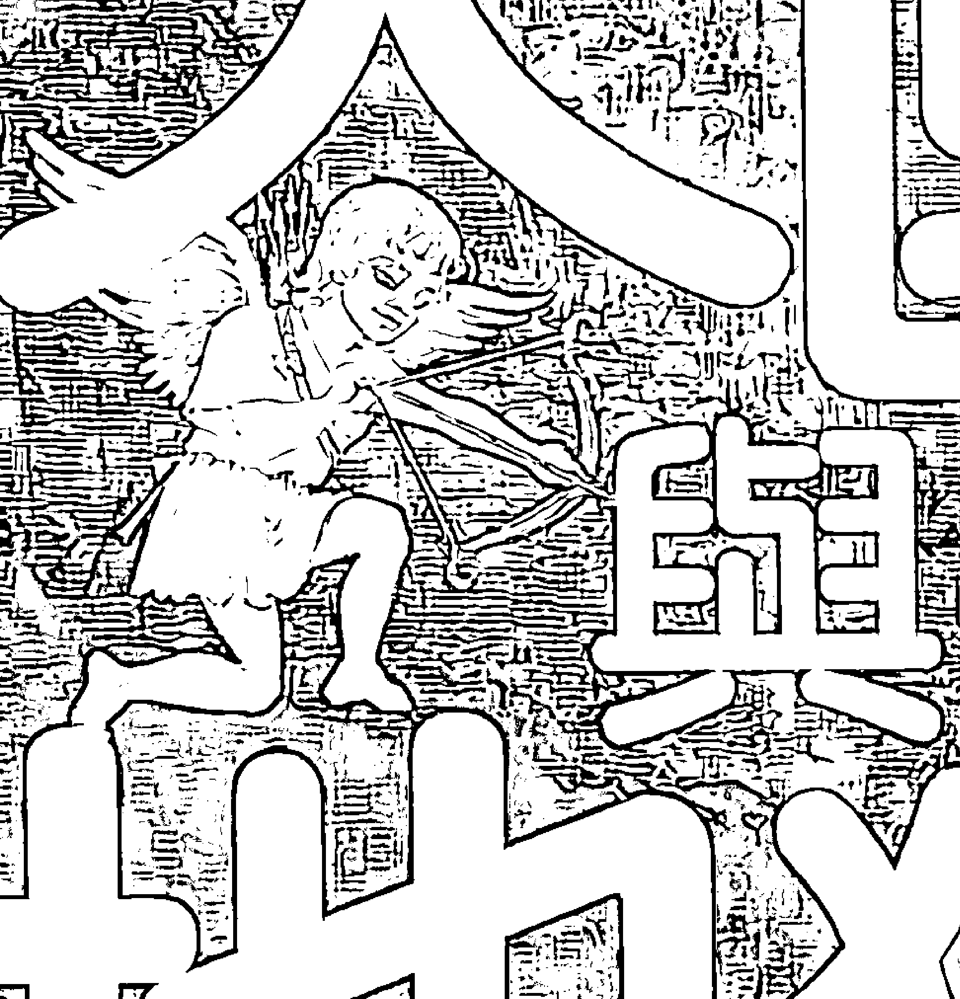

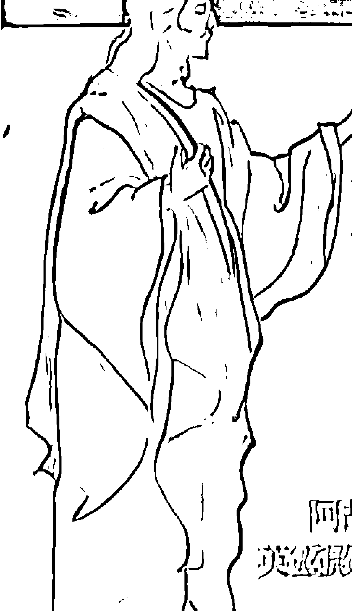

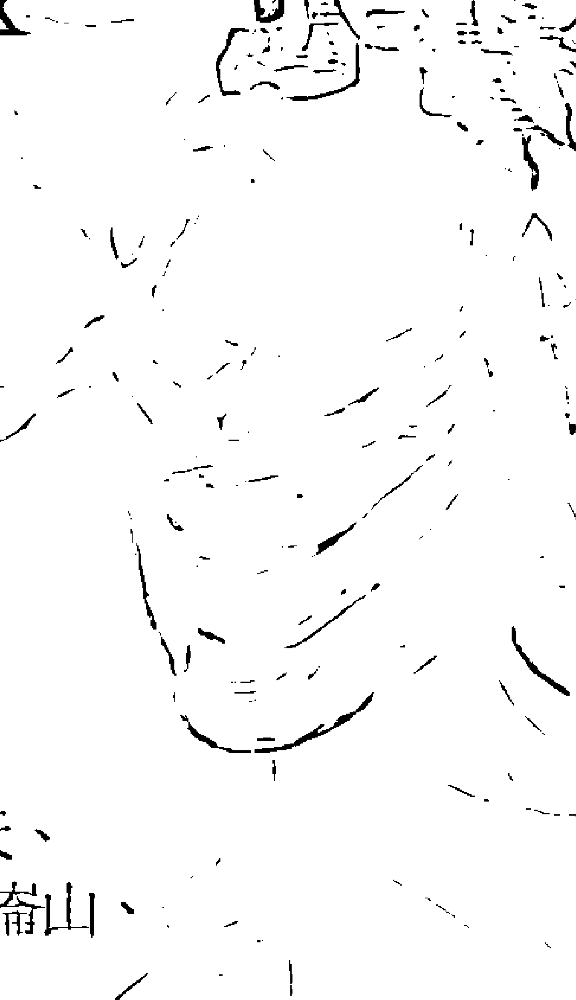

# 解天与地狱

将复杂的六道轮回、十八层地狱，以及各宗教中的天国地狱概念集于一册，手持本书，打开截然不同的天国地狱观光之门！

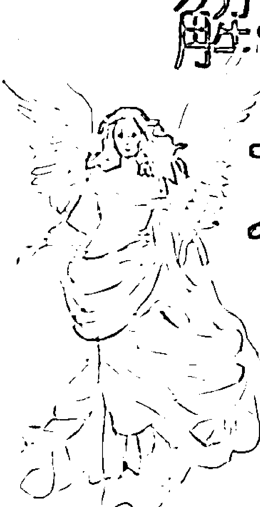

无间地狱的成因与特征

| 类别 | 内容 |
| :--- | :--- |
| 罪因 | 杀生罪 + 盗窃罪 + 邪淫罪 + 邪见罪 + 偷盗罪 + 邪见罪 + 犯持戎人 + 杀害父母、杀害阿罗汉之罪 |
| 特征 | -> 无间地狱 (指向一个高塔状建筑图示) |
| 酷刑 | · 施以八大地狱中最高最大的痛苦 · 强迫罪人攀登烦恼山 · 拖出舌头打上100支铁钉 |
| 期间 | 1中劫 ※劫(中劫)……是比四百年还长的时间，约每1年由正方的巨石一次、需历时百万年般的长久。 |

无间地狱的十六小地狱

| 上方 | 右方 | 下方 | 左方 |
| :--- | :--- | :--- | :--- |
| 陌口处 | 一切向地处 | 无彼受足处 | 好干噁处 |
| 十三退处 | (中心) 无间地狱 | 四天处 | |
| 阎罗处 | (中心) 无间地狱 | 常处 | |
| 受苦处 | (中心) 无间地狱 | 支处 | |
| 吾处处 | (中心) 无间地狱 | 汝处处 | |
| 逼苦处 | 43. 乐处处处 | 53. 山处处处 | 43. 40处处处处 |

本章作者

草野巧

1956年出生于栃木县。毕业于早稻田大学文学系文学专科。在担任杂志、书籍的编辑后，成为自由作者。著作有《世界妖怪事典》、《幻兽事典》、《外道传一百零八将的简介》、《图说怪谈天地》、《妖怪画谈》《地狱事典》等。

译者简介

王书铭

辅仁大学日文研究所毕业。

现任教师《名侦探》、《魔法的日本传说》、《妖怪日本全书》、《图解日本武艺》、《图解大百科》、《图解忍术全书》、《图说世界秘术大全》、《图解剑术大全》、《图说忍者世界》

# F-MAPS

手持幻想地图。踏入知识地狱的奇幻旅程。

已出版：

图解近身武器
大越克司◎著
2008年9月出版／NT$280元

图解太空船
依各宇通生·小林茂◎著
2008年12月出版／NT$300元

图解魔法知识
秋仁熙◎著
2009年6月出版／NT$300元

图解北欧神话
秋山洋◎著
2010年6月出版／NT$320元

图解吸血鬼
大越克司·村川宗宗◎著
2010年8月出版／NT$300元

图解阴阳师
藤井惠理◎著
2010年10月出版／NT$300元

图解北欧神话
池上良火◎著
2011年2月出版／NT$330元

# 前言

此书是笔者尽可能以简洁易懂的方式介绍死后世界的作品。

提到死后的世界，恐怕没有人完全不感兴趣吧？不管是谁，肯定都曾经思索过“人死之后将会如何”的问题。

人死了以后究竟会到哪里呢？肉体在火化成灰或腐化成土以后，或许会以分子和原子的形式回归于物质世界，可是我们常说的心性、精神，或者灵魂等等部分，又将何去何从？

曾经听过这样的说法：所谓的心性、精神或灵魂的概念，只是一种透过大脑始得成立的活动，一旦大脑停止机能后，这些灵魂之类的也会随之消逝……可是无论这种思想如何盛行，人类对死后世界的兴趣却从来不曾减少。

虽然很少有人能够亲眼目睹死后的世界，可是有过这种经历的人却是真实存在。只不过他们所描述的死后世界，亦仅止于该经历者本身所见到的死后世界，绝非死后世界的全貌。

只消翻开此书便能发现，死后世界会随着时代与文化的不同，有各式各样天与地的差别。反过来说，死后的世界是个非常容易受到现今社会时代、文化等因素影响的场所。

我们固然可以说死后世界只存在于人类的想象当中，同时却也可以推导归纳出其他结论；也就是说，正因为死后的世界会随着时代、文化而变迁，人类才会相信有死后世界。再换个说法，哪怕是现代的社会，同样也需要有个合适的死后世界存在。

无论如何，相信此书读者将会受到来自全世界、各式各样的死后世界刺激思维。身爲这本书的作者，自然希望此书能够帮助读者对死后的世界有更深入的思考与体认。

草野 巧

# 目次

## 第一章 古代世界的天国与地狱

- No.001 为何会有死后的世界 — 8
- No.002 死后世界的基本型 — 10
- No.003 死后世界的类型 — 12
- No.004 古代美索不达米亚的冥界 — 14
- No.005 古代美索不达米亚的“伊甸园”迦勒底 — 16
- No.006 古代埃及的冥界 — 18
- No.007 古代埃及的地底冥界杜亚特 — 20
- No.008 古代埃及的乐园 阿鲁地 — 22
- No.009 奥西利斯的审判 — 24
- No.010 玛雅神话的死后审判 — 26
- No.011 玛雅神话的冥界 — 28
- No.012 玛雅神话的永恒天国 — 30
- No.013 希腊神话的冥界黑帝斯 — 32
- No.014 希腊神话的地狱塔尔塔罗斯 — 34
- No.015 希腊神话的乐园埃律西昂原野 / 至福者之乡 — 36
- No.016 俄耳甫斯秘教的冥界 — 38
- No.017 柏拉图学派的轮回转世 — 40
- No.018 柏拉图学派的冥界 — 42
- No.019 维吉尔的冥界 — 44
- No.020 密特拉教的冥界 — 46
- No.021 北欧神话的天国英灵殿 — 48
- No.022 北欧神话的冥界 海尔 / 尼弗海姆 — 50
- No.023 塞尔特神话的冥界 — 52
- No.024 马尔敦的航海 — 54
- No.025 日本神话的冥界 — 56
- No.026 日本神话的天界 高天原 — 58
- No.027 日本神话的冥界 黄泉国 — 60
- No.028 日本神话的异界 常世国 — 62
- No.029 古代中国的冥界 — 64
- No.030 不死的乐园 昆仑山 — 66
- No.031 古代印度的冥界 — 68
- No.032 《奥义书》的轮回转世 — 70
- No.033 印度教的地狱 — 72
- No.034 耆那教的天国与地狱 — 74
- 番外篇：冥界的概要与萨满信仰 — 76

## 第二章 亚伯拉罕宗教的天国与地狱

- No.035 古代犹太人的冥界阴间 — 78
- No.036 启示录时代的天国与地狱 — 80
- No.037 基督教的冥界 — 82
- No.038 死后审判与最后的审判 — 84
- No.039 基督教的天国 — 86
- No.040 伊甸园 — 88
- No.041 新耶路撒冷 — 90
- No.042 最高天 — 92
- No.043 基督教的地狱 — 94
- No.044 三层狱（炼狱） — 96
- No.045 炼狱 — 98
- No.046 千年王国 — 100
- No.047 《衣索比亚语以诺书》的天国与地狱 — 102
- No.048 《斯拉夫语以诺书》的天国与地狱 — 104
- No.049 《彼得启示录》的地狱 — 106
- No.050 《保罗启示录》的天国与地狱 — 108
- No.051 《神曲》的冥界 — 110
- No.052 《神曲》的地狱 — 112
- No.053 《神曲》的炼狱 — 114
- No.054 《神曲》的天国 — 116
- No.055 《失乐园》的天国与地狱 — 118
- No.056 斯维登堡的灵界 — 120
- No.057 耶稣基督末世圣徒教会的灵界 — 122
- 附：圣奥古斯丁的复活论 — 124

# 第三章 佛教的世界

- No.058 佛教的死后世界 — 126
- No.059 六道与须弥山世界 — 128
- No.060 阎魔王的审判 — 130
- No.061 《十王经》记载的死后之旅 — 132
- No.062 天道 — 134
- No.063 阿修罗道 — 136
- No.064 人道 — 138
- No.065 畜生道 — 140
- No.066 饿鬼道 — 142
- No.067 地狱道 — 144
- No.068 八热地狱 — 146
- No.069 八寒地狱 — 148
- No.070 近边地狱 — 150
- No.071 孤独地狱 — 152
- No.072 根本地狱 — 154
- No.073 无间地狱 — 156
- No.074 无救地狱 — 158
- No.075 《阿含经》的地狱 — 160
- No.076 大焦热地狱 — 162
- No.077 《摩诃僧祇律》的冥界 — 164
- No.078 日莲的地狱 — 166
- No.079 《佛说观佛三昧海经》的地狱 — 168
- 附：《弥兰陀王问经》的非想非非想天 — 170

## 第四章 其他天国与地狱

- No.080 诺斯替教的天国与地狱 — 172
- No.081 《智慧信仰》记载的地狱 — 174
- No.082 伊斯兰教的冥界 — 176
- No.083 伊斯兰教的地狱 火狱 — 178
- No.084 伊斯兰教的天国 天园 — 180
- No.085 伊斯兰教的最终审判 — 182
- No.086 玛雅神话的冥界西巴尔巴 — 184
- No.087 阿兹特克神话的冥界密克特兰 — 186
- No.088 阿兹特克的天国 — 188
- No.089 道教的天国与地狱 — 190
- No.090 道教的地狱 泰山地狱 — 192
- No.091 道教的冥界 酆都山 — 194
- No.092 斐济的冥界 布雷 — 196
- No.093 毛利族的冥界 波 — 198
- No.094 夏威夷的冥界 密尔 — 200
- No.095 西伯利亚通古斯人的冥界 — 202
- No.096 西伯利亚奥斯加克人的冥界 — 204
- No.097 平田笃胤的“幽冥界” — 206
- No.098 亚伦·卡尔迪克的灵界 — 208
- No.099 “道尔斯通伯”所游灵界 — 210
- No.100 神智学的灵界 — 212
- No.101 鲁道夫·史丹勒的灵界 — 214
- 索引 — 216
- 佛教八大地狱中十六小地狱的罪与罚 — 227
- 参考文献 — 241

## 第一章 古代世界的天国与地狱

- （内容模糊，无法准确提取）
- （内容模糊，无法准确提取）
- （内容模糊，无法准确提取）
- （内容模糊，无法准确提取）

## No.001 为何会有死后的世界？

Why there are afterlives?

一旦建立起确信死后世界存在的文化，人类便能战胜充满绝望的悲剧性死亡现实，生存下去。

### 为了接受无可避免的死亡而形成的文化

相信死后世界存在，乃是人类普遍信仰。从原始时代直至现代，历史上的每个阶段、每个民族都相信死后世界的存在。

此现象可以用几个方式加以说明，其一就是人类能够意识到，死亡是种绝对无法逃脱的宿命；以及死亡在某种层面上，对人类而言是种绝望、悲惨的状况。如果我们假设人类死后将成为虚无，势必会遇到“究竟为何而活”的问题。相信有死后世界存在，便是人类透过思考解决这问题的其中一种方法。古人早在原始社会中、泛灵信仰的阶段就已经相信人类除了肉体以外尚有灵魂，而灵魂在人死后依旧会继续存在，所以人类会相信世界上有死后灵魂居住的世界——死后世界存在，也是理所当然的事情。

类似这种想要相信有死后世界存在的心情，绝非古代或中世纪等等过去的人们独有。十八世纪的哲学家康德之所以相信“灵魂必须是不死的”，乃是出于以下理由：康德相信人类的启蒙在于出自理智的主体性行动，而人类又因为本性使然，无法不去追求理性的完成，可是每个人都有固定寿命是显而易见的事实，所以为求理性达到完美，人类的灵魂就必须不死不灭。

虽然无法通过科学来证明死后世界存在，但是只要从这个角度观察，就可以理解为什么死后世界即便是在科学蓬勃发展的现代，仍然是个难以忽视的概念。

## 死后世界存在的理由

### 对悲剧性绝望事实的适应行为

1. 悲剧性的绝望事实 = 人类难逃死亡的命运
2. 文化层次的解决方法
3. 确定死后世界存在 = 即便死亡，人生亦不会终结

### 死后灵魂继续生存的证据

1. 人类除肉体外尚有灵魂
2. 灵魂在肉体死后，仍然会继续生存下去
3. 势必要有死后世界存在

### 达到理性的完善

1. 人类的尊严在于理性生活
2. 追求理性的完善乃是人类的本性
3. 有限、仅只一次的人生根本不可能使理性达到完善
4. 为使理性能够达致完成，灵魂势必要在死后继续存在

（注）泛灵论：相信除了人类之外，就连动物、植物和自然现象当中也有灵魂存在。
（康德）1724年—1804年 西欧近代哲学的代表性德国学者，著有《纯粹理性批判》、《实践理性批判》等作品，对后世有很大影响。

## No.002 死后世界的基本型

Primitive afterlife

最原始的死后世界与人间完全没有差异，而且就位于距离生前居处不远的地方。

### 与生前世界全无二致的死后世界

从远古时期到现代，历史中的每个阶段、每个民族都相信有死后世界存在。正因为这个缘故，死后世界的形象自然也会随着时代、文化和社会等等背景的不同而有极大差异。以未开化民族为例，死后世界在许多不同文化中，多半颇有歧异。

不过很多未开化民族的原始死后世界形象，却有着共通特征，这些特征可以说是死后的基本。首先，原始的死后世界往往都跟凡间一样，死者会在那里过着跟生前完全相同的生活，死者继续狩猎、采集果实，有吃有喝。这便是为何早从太古时代以来，在世者埋葬死者时，都必须供奉各种道具和食物饮料等生活物品的原因。

除了与人世类似之外，许多死后世界都在死者生前生活处附近。最常见的死后世界便是坟墓、自宅或是由坟墓联想延伸出来的地底世界。即便某些民族相信死者世界位于难以接近的远方，但通常也是在高山山顶、深谷或海岛等等从人世延伸出来、可以想像得到的地方。

然而，死者灵魂从某个层面来看，对在世者是种负面存在，往往还会招致灾厄；只要是“已经死亡”的状态，便能使死者对仍在世者感到憎恨和嫉妒，尤其含恨而终者更是如此。所以在世者便通过敬奉死者、供奉和举行各种仪式，使死者的灵魂从死灵的阶段渐渐失去本身个性、变化为祖灵。所谓的祖灵其实就是一种同血族的集团性守护灵；但即便已晋升为祖灵，人们还是相信倘若对祖先的祭祀不够隆重，会受到惩罚。

## 原始死后的形象

### 原始（未开化）社会的死后世界与凡世极为类似。

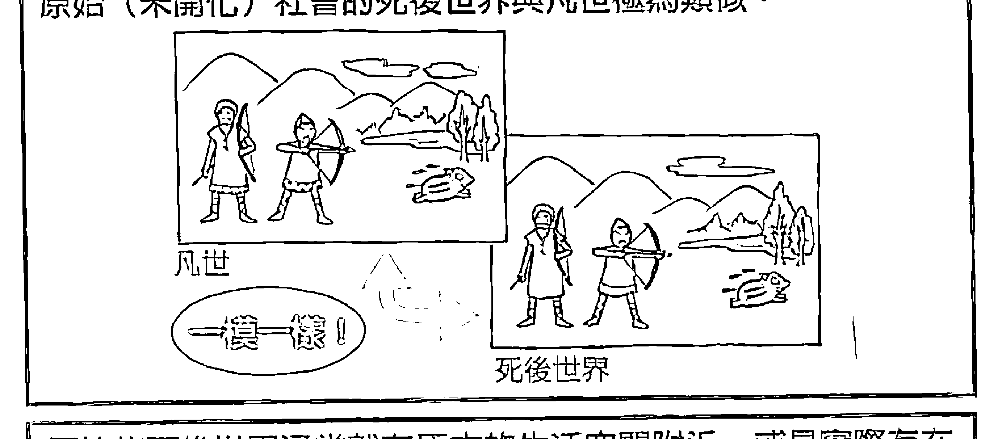

### 原始的死后世界通常就在原本的生活空间附近，或是实际存在的遥远场所。

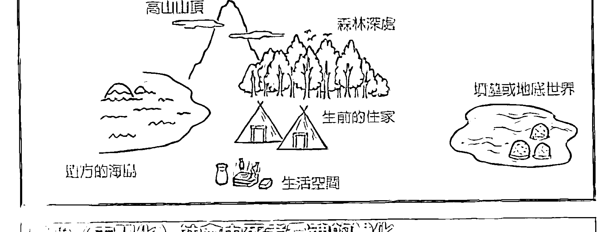

### 原始（未开化）社会中死后灵魂的变化

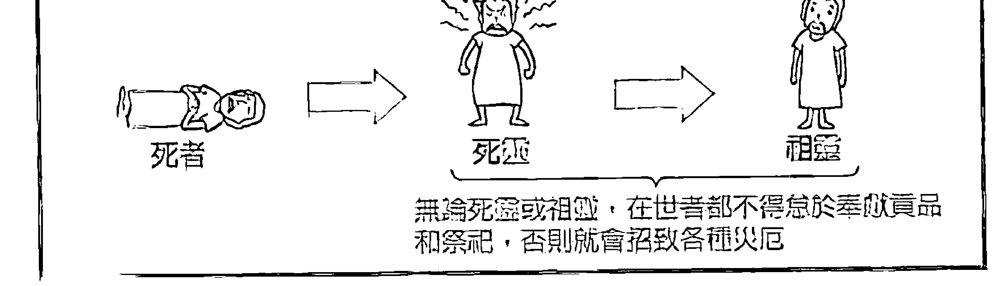

无论死灵或祖灵，在世者都不得怠于奉献贡品和祭祀，否则就会招致各种灾厄

#### 死灵与祖灵

1.  死灵：死者的灵魂，因为成为灵体的时间还不够，所以尚未摆脱死亡的恐惧。
2.  祖灵：祖先的灵魂，死者会先变成死灵，经过一定期间的供养后，灵魂将失去个性与记忆，逐渐变成祖灵的一部分。

## No.003 死后世界的类型

The typical afterlives

死后世界可以分成悲观的冥界、乐观的冥界、有天国与地狱之分的冥界、灵魂育成型冥界等等几个主要类型。

### 经过发展后的特征

未开化社会里的死后世界形象，就是人类在远古时代中，最早发想出的原始死后世界概念。后世各式各样对死后的幻想，便是从死演变、发展而成，而这些死后世界的形象又有几个类型特别值得我们注意。

这些类型当中，最单纯的便属乐观与悲观两种；认为死后世界是个黑暗而寂寥之处的便是悲观的冥界，而相信死后世界是光明而快乐的，自然就是乐观的冥界。举例来说，古代美索不达米亚的冥界、希腊神话的黑帝斯、古犹大的谢屋尔等等都是悲观的冥界；而古埃及、古代塞尔特人相信的就是乐观的冥界。

死后世界还有种天国地狱型，也就是拥有天国与地狱概念的死后世界，此类型又可分成两种：第一种是根据死者的死法决定该何去何从，通常都是意外死于非命的人会前往天国，像北欧神话和西伯利亚的奥斯加克人便属此类。第二种则是根据伦理道德标准来决定死者去处，而这也是佛教和基督教等等，有组织教团的特征。只不过基督教的思想是人格、历史的，他们认为人生只有一次，且人格在死后仍得以存续维持；至于佛教的思想则是非人格、非历史的，他们相信人生会不断重复，而人类甚至可以转世变成动物。两个宗教间有极大的差异。

死后世界的另一个重要类型，便是古希腊哲学家毕达哥拉斯和柏拉图所说的灵魂育成型。此派说法认为灵魂乃是被禁锢于肉体牢笼之中，必须通过真正的知识才能使灵魂获得解放、趋于完成。

奥斯加克人 (Ostyak) ：即汉特人 (Khanty) 。为西伯利亚西部民族，主要居住在俄罗斯中部鄂毕河流域。

### 死後世界的主要分類

### 樂觀・悲觀型

#### 悲觀的冥界
-   黑暗陰鬱的死後世界
    - 古代美索不達米亞的冥界 (→No.004)
    - 希臘神話的冥界黑帝斯 (→No.013)
    - 古代猶太人的冥界陰間 (→No.035)

#### 樂觀的冥界
-   明亮富活力的死後世界
    - 古埃及的冥界 (→No.006)
    - 凱爾特神話的冥界 (→No.023)

### 天國・地獄型

#### 倫理標準型
-   佛教 (→第3章)
    按倫理標準決定死者該前往天堂或地獄等地，其思想是非人格、非歷史的。
-   基督教、伊斯蘭教 (→第2章)
    按倫理標準決定死者該前往天堂或地獄，其思想是人格、歷史的。

#### 死法重視型
-   死於非命者便能到達天國
    - 北歐神話的天國英靈殿 (→No.021)
    - 西伯利亞奧斯基人的冥界 (→No.096)

### （其他類型）
-   藉由真正的知識使靈魂趨於完成
    - 畢達哥拉斯教的冥界 (→No.016)
    - 柏拉圖闡述的冥界 (→No.018)

畢達哥拉斯 (西元前582年～西元前496年)：以「畢達哥拉斯定律」聞名的古希臘哲學家、數學家。

柏拉圖 (西元前427年～西元前347年)：以《蘇格拉底的申辯》、《國家》等著作聞名的古希臘哲學家。柏拉圖是蘇格拉底的學生，是亞里斯多德的老師。

### 古代美索不達米亞的冥界
### Mesopotamian Underworld

女王艾瑞基西格統治的「不歸之國」是陰暗寂寥的地底冥界，眾死者便是在這裡以塵土為食度日。

### ○世界最古老文明所信仰的冥界

蘇美人和阿卡德人居住的古代美索不達米亞，早在西元前3500年左右便已建立起全世界最古老的文明，當時相信死者的世界是個位於地底的幽暗陰鬱之處。蘇美語將其喚作庫爾・努・吉，阿卡德語則是稱為埃爾塞特，也就是「不歸之國」。

同樣的冥界在北部的亞述則是被稱作阿拉魯。根據美索不達米亞的神話記載，原始神明阿部蘇是淡水的集合體，位於大地底下，而不歸之國則在阿部蘇的下方。因此，阿部蘇的流水也是隔開地面與不歸之國的冥河，別名是胡布爾河。根據《依南娜地獄行》和《吉爾伽美什敘事詩》等神話記載，通往不歸之國的途中必須通過七道門，每道門都有個可怕的看守者。第一道門叫做甘澤爾門，守門的是涅蒂。冥界的死者和冥界諸神就住在這七道門的裡面。冥界的統治者是女王艾瑞基西格及其丈夫尼格，他們住在如青金石般光輝燦爛的宮殿裡面。除此之外還有負責記錄的書記伯勒特塞里、服侍女王的精靈納姆塔爾和惡靈伽拉等人物存在。

來到冥界的死者首先根據伯勒特塞里的紀錄接受審判，然後才會獲准定居。但那裡的生活是一片悲慘，非但是個無光的黑暗國度，而且只能吃塵土當食物。不過死者生前的人生會對冥界的生活造成影響。舉例來說，據說膝下少子女的死者只能吃麵包喝清水度日，有五個子女則可以擁有書記等級的生活，有七個子女就能與眾神同席，聆聽音樂享受娛樂。

-   艾瑞基西格（Ereshkigal）：蘇美神話女神依南娜（Inanna）的姐姐，負責掌管地府，又名「死亡女主人」。
-   阿部蘇（Apsu）：巴比倫神話中象徵男性的神明，是深淵裡的淡水，中心有片開闊大地。這股淡水湧出地面後形成了許多泉水與河川。
-   尼格（Nergal）：巴比倫神話的「死國之神」，極受人畏懼。因為和「死亡女主人」艾瑞基西格結婚，名正言順地取得了掌管地府的權柄。
-   伽拉（Galla）：害蘇美植物神杜木基（Dumzi）死亡的蘇美地底惡魔。阿卡德語作「伽盧（Gallu）」。

### 『不歸之國』的特徵
-   黑暗陰鬱的場所
-   死者以塵土為食

### 『不歸之國』的位置

（插圖：img/42c7711c3b349c57df6d4cf010a30d24_21_0.png）

### 『不歸之國』的程途

（插圖：img/42c7711c3b349c57df6d4cf010a30d24_21_1.png）

不歸之國的程途必須渡過阿部蘇匯流成的胡布爾河，然後穿過各有守門者把守的七道門，艾瑞基西格宮殿所在的不歸之國就在前方。

### 美索不達米亞
-   古代蘇美人於美索不達米亞（現在的伊拉克）南部地區，是建立起全世界最早文字與文明的民族，後有巴比倫帝國於此地崛起。
-   美索不達米亞也是古代東方的第一個世界性帝國——亞述帝國的所在地，即美索不達米亞文明的發展地區。

### 古代美索不達米亞的「伊甸園」迪爾穆恩
### Dilmun: "Garden of Eden" in Mesopotamia

以聖經聞名於世的「伊甸園」，其實便是源自於《吉爾伽美什敘事詩》所述位於世界盡頭之外的樂園迪爾穆恩。

### ◎幸運的不死者居住的樂園

根據古代美索不達米亞的神話記載，除地底有個冥界「不歸之國」以外，在世界盡頭的外側還另有個不死者居住的樂園迪爾穆恩；亦有說法認為，聖經所載的天國原型伊甸園便是此處，是「清淨光輝之地」。

在《吉爾伽美什敘事詩》中，記有烏魯克之王吉爾伽美什為求不死而前往此地的故事。根據這個故事的描述，欲前往迪爾穆恩，必須通過位於世界盡頭馬什山下的漫長地底通道。吉爾伽美什經過漫漫旅途後終於來到這裡，可是地下道入口卻有個蠍子人把守，據說他從來不會讓任何人通過。即便如此，吉爾伽美什還是通過了地下道，來到一片會結出寶石果實的土地；前方的建築物中住著一位年輕的女性席杜莉，她還替吉爾伽美什指引方向。再往前走便是死海，那裡有個擔任冥河渡船人的烏尚納比。來到此地的吉爾伽美什必須準備一百二十支撐船竿才能繼續前進，因為船竿只要在死海裡面撐一次就會壞掉，而且這裡的海水不能用雙手碰觸。除此以外，渡過這片死海通常須要一個半月的時間。

豈料吉爾伽美什只用了短短三天就完成這段旅程，來到了兩條河流的交匯處，烏納比士庭及其妻就住在此地。烏納比士庭便是當初逃過眾神所興的大洪水得以倖存、並且得到不死身的男子。儘管好不容易抵達迪爾穆恩，吉爾伽美什卻沒能得到不死之身，因為烏納比士庭無論如何都不願意傳授不死之法，吉爾伽美什最後苦無辦法、只能返回烏魯克去。

1 迪爾穆恩：《西洋神名事典》譯作「地樂園」。
2 烏納比士庭 (Utnapishtim)：原是巴比倫神話中的西巴爾國王，只是「榮耀神明」，沒有任何工作。烏納比士庭意為「看見永生的人」。

## 吉爾伽美什前往迪爾穆恩的路徑

（插圖：img/42c7711c3b349c57df6d4cf010a30d24_23_0.png）

位於美索不達米亞的樂園迪爾穆恩位於世界盡頭之外，死海彼岸兩條河流交匯處。

## 實際存在的古代文明迪爾穆恩

古代美索不達米亞的樂園迪爾穆恩是個實際存在的地方，據說...西元前3000年至西元前2000年之間，美索不達米亞和印度（古印度文明）等等文明的貿易活動相當頻繁，迪爾穆恩便是以中繼站的角色興起繁榮，也有人認為傳說中吉爾伽美什正在找的長生不老藥，其實就是當時的重要貿易品——珍貴的藥草。迪爾穆恩在古代往往被認為是擁有特殊魔力的藥，所以這傳說可能有所依據。

## 吉爾伽美什史詩

《吉爾伽美什史詩》被認為全世界最古老文學作品的敘事詩。記載了與聖經相似的故事，只有聽從神明警告的烏納比士庫夫婦在災難中倖存。吉爾伽美什乃烏魯克之王，是確實存在於西元前2700年左右的人物。

## 古埃及的冥界
### The Egyptian afterlife

從前古埃及死者的亡魂都要經過地底冥界杜亞特，然後朝太陽神拉的天國佩特和奧西里斯的天國蘆葦地（和平之地）前進。

### ○分屬拉與奧西里斯管轄的兩個天國

古埃及人認為現世是幸福的，他們相信人死後靈魂會在天國復活，而且還能過著跟現世同樣幸福的生活；欲達到與現世相同的生活，務必要有肉體，因此埃及人製作木乃伊的技術也就特別發達。

他們的天國共有兩個種類，從前太陽神拉信仰盛行的古王國時代，埃及人相信天空（奴特¹）上方有個拉的天國（佩特）存在；起初他們相信唯有法老能夠進到這個天國，不過等到古王國時代末期，連貴族也同樣能進入佩特。中王國時代冥界神奧西里斯的信仰興起，其天國位於西方，稱作蘆葦地、和平之地。奧西里斯信仰的鼎盛可謂是冥界的民主化運動，這個時代就連一般庶民亦有資格進入天國，只不過每個人都必須在死後接受奧西里斯的審判，方能前往奧西里斯的天國。除此以外，古埃及還相信遙遠的西方另外有個名叫阿蒙提²的樂園。

古埃及人相信在西方或原初之水（努³）的下方有個叫做杜亞特的冥界，這是個通往天國必經的危險冥界。死者會讓自己的護衛靈與身魂⁴搭乘太陽神拉的船，白晝沿著天界的尼羅河西渡，夜裡則是沿著杜亞特的尼羅河順流而下。欲克服杜亞特艱險危險的旅程需要使用到各式各樣的咒文與護符，因此死者都要攜帶記載咒文的《死者之書》和必須的護符；他們相信只有如此，平安通過杜亞特的死者才能到達太陽神拉的天國和奧西里斯的天國。

-   奴特（Nut）：古埃及世界裡支撐天空或者象徵天空的女神。
-   阿蒙提（Amenti）：埃及神話中人死後首先要去的第一個地方。
-   努（Nun）：埃及人稱作「原初之水」、作為世界起源的神明。
-   護衛靈與身魂：請參照No.007用語解說。

## 古埃及人的來世觀
-   死後在天國生活
-   可以過著與生前同樣的生活

### 天國的種類
-   **古王國時代** → 拉的天國。
    - 最早僅限法老
    - 後來連貴族也能進入拉的天國
-   **中王國時代** → 奧西里斯的天國（適意地／和平之地）。
    - 庶民亦可在符合條件時進入天國。
    - 條件→在冥界杜亞特接受奧西里斯的審判。

### 插圖：天國與奧西里斯的天國

（插圖：img/42c7711c3b349c57df6d4cf010a30d24_25_0.png）

> **圖注**
-   拉（Ra）：希利奧波利斯的太陽信仰中的最高神祇，是位人身鷹頭的神明。
-   奧西里斯（Osiris）：古埃及的農耕神。奧西里斯雖然遭到胞弟塞特殺害，但被妻子伊西斯以魔法救活，此後便成為冥界神，獲得廣大民眾信仰。
-   蓋布（Geb）：希利奧波利斯的大地之神。他是天空女神努特的丈夫。
-   希利奧波利斯（Heliopolis）：古埃及語作尤努（Iunu）或埃努（On）。埃及最古老城市之一，太陽神拉的信仰中心。

## 古埃及的地底冥界 杜亞特
### Duat - Egyptian underworld

為了要在天國得到復活升生，古埃及死者的亡魂必須攜帶記載咒文的《死者之書》和形形色色的護符穿過危險的冥界杜亞特。

### ○ 阻礙死者通往天國道路的險境杜亞特

杜亞特是古埃及死者欲前往天國時必定要經過的冥界。死者的護衛靈與身魂要搭上拉的船，白天沿著天空的尼羅河西渡，夜裡則是航行深入杜亞特。船上除太陽神拉和死者以外，還另有負責掌舵和監視的眾神搭乘。埃及人相信杜亞特位於西方某地或者原初之水底下，不過到了奧西里斯信仰漸漸流傳的時代，埃及人開始認為其入口乃是位於古代都市阿比多斯附近。他們相信杜亞特的入口，就在太陽西沉的西方被稱為「馬努山」的群峰山谷之間，杜亞特便是座落在以此地為起點、向北方延伸的大地之上。杜亞特整體呈現U形，境內有條南北向的溪谷，尼羅河貫流於其中，是太陽神拉座船的航道。

杜亞特共分十二州，分別對應夜間的十二個小時。第一州如同日落時分般，仍帶點微明，尼羅河兩岸有九隻猿猴和十二位女神前來迎接拉的座船。第二州、第三州屬死神肯提・阿蒙提姆管轄，第四州、第五州屬死神塞克管轄，第六州至第九州則是奧西里斯的王國。船隻駛到這裡，奧西里斯的信徒就必須下船接受審判，通過者就能前往蘆葦地。拉的信徒則是繼續航行，前進到凱布利管轄的第十、十一州。第十二州便是杜亞特的出口，此時黎明前的光暈已經包圍了這裡，太陽神拉來到這裡也已經完全恢復活力，準備出發展開新的一天白晝的旅程，而那些與拉同行、得以順利通過杜亞特的死者也能夠到達拉的天國。

可是杜亞特境內有各種怪物惡靈棲息，躲在河岸兩側覬覦著死者的靈魂與心臟。各州州境均設有關卡把守，須唱誦咒文始能通過；因為這個緣故，古埃及的死者在踏上這趟旅途時，都會攜帶著記載咒文的《死者之書》以及各種護符。

-   肯提・阿蒙提姆 (Kenti Amentium)：阿比多斯信仰的冥界神。
-   塞克 (Seker)：即蘇卡 (Sokar)，孟菲斯的冥界之神。
-   凱布利 (Khepri)：埃及眾多太陽神之一，多做聖甲蟲頭人身。

## 第一章 古代世界的天国与地狱

（插圖：img/42c7711c3b349c57df6d4cf010a30d24_27_0.png）

死者在死神阿努比斯以外还有好几位男女神祇搭乘，分别负责掌舵和监视死者的工作。此外，亡者通常会随身携带记载咒文的《死者之书》和各种护符，好在通过州境时确保自己能够免受恶魔怪物的攻击。

（插圖：img/42c7711c3b349c57df6d4cf010a30d24_27_1.png）

### 小知识
-   **巴 (Ba)**: 人死后灵魂的其中一种形态，概念相当近似人类与生俱来的个性。
-   **卡 (Ka)**: 人死后的灵魂，古埃及经常将其描绘成人头鸟身的模样。
-   **阿比多斯 (Abydos)**: 位于埃及中部的古代都市，是奥西里斯遭胞弟塞特杀害后复活之地，被视为死者的归宿。

## 古埃及的乐园 蘆葦地
### Sekhet-Aaru - Egyptian Heaven

奥西里斯的天國蘆葦地（和平之地）是片盛產大麥小麥的豐饒沃土，同時也是個景致與人間凡世全無二致的理想鄉。

### ○ 盛產大麥小麥的理想鄉

蘆葦地（Sekhet-Aaru）別名亦稱和平之地（Sekhet-Hetep），是古埃及冥神奧西里斯的天國。

和平之地起初其實並不全然是個天國，只是個可將蘆葦地涵蓋在內的巨大冥界。和平之地是個沿著尼羅河從底比斯¹近郊橫亙直至赫利奧波利斯的冥界，總共分成十四個區域。這十四個區域當中，第一區是盛產各種果實與麥酒之地，第二區便是蘆葦地。不過第五區是衰弱靈魂之地，第七區是火焰之地，第八區則是激流之地，可見這十四個區域並非全都是天國。

然而隨著奧西里斯信仰的愈發興盛，和平之地似乎漸漸等同蘆葦地了。蘆葦地是盛產大麥小麥的理想鄉，有涓涓清流與水池，甚至還有太陽鳥（不死鳥）棲息。這裡的生活以農耕為主，基本上跟人間大略相同。古埃及人認為生活在人世間是件幸福的事，因此死後自然也想要繼續相同的生活。事實上，《阿尼的莎草紙》等文獻也有描繪死者向眾神行禮、收割麥子、嚞麥打穗以及牽牛耕田的情景。

不過就算農業是種理想的生活型態，古埃及還是有王侯貴族或富豪等等不好勞動者。這些人過世的時候會以名叫巫沙布提俑²的人偶陪葬；這些人偶是服侍死者的奴隸，傳說死者抵達蘆葦地後他們就會代替死者勞動，照顧死者的生活起居。

¹ 底比斯（Thebes）：古埃及帝國全盛時期的都城，位於尼羅河畔。
² 巫沙布提俑（Ushabti）：埃及古墓中大量發現的俑。它們的用途是代替死者支應諸神的役使。

## 《阿尼的莎草纸》里的乐土

（插圖：img/42c7711c3b349c57df6d4cf010a30d24_29_0.png）

为了到达天国，古埃及人会在木乃伊藏棺室的顶部、棺材底部及外侧等地方写上祈祷文（象形文字），这便是所谓的「死者之书」。西元前十六世纪后改写在纸莎草纸上，存放于墓穴之中。

其中最有名的一部，是西元前十五世纪第十八王朝时代担任书记官的阿尼所制作的死者之书。

赫利奥波利斯崇拜信仰的神鸟，即古希腊不死凤凰。

## 奧西里斯的法庭
### The Judgment Hall of Osiris

「真理之秤」一邊放著死者的心臟，另一邊則是女神瑪亞特的羽毛，而通往天國的門唯有在天秤兩邊得到平衡時才會開啟。

### ○決定死者能否前往天國的「真理之秤」

古埃及的奧西里斯信仰在中王國時期達到鼎盛，當時認為人類死後必須接受奧西里斯審判的概念相當普遍，唯有通過審判，才能前往奧西里斯所轄天國——蘆葦地。冥界杜亞特的第六州到第九州便是奧西里斯的王國，而其法庭同樣座落此地。奧西里斯的審判是在名叫「兩個真理之廳」的龐大廳堂中進行：除寶座上的奧西里斯以外，廳內還有其妻子伊西斯、胞妹奈弗台斯以及在此負責看守、收納死者內臟卡諾卜罐的霍露斯的四個兒子，廳邊則是擔任死者審判官的四十二位神明。死者必須在門口親吻門框，然後入內接受審判。

漫長的審判首先由死者向眾神聲稱自己從未做過任何壞事的「否定的告白」揭開序幕；緊接著則是要利用廳堂中央天秤狀的「真理之秤」進行心臟稱量，此時透特神、阿努比斯神和怪物阿米特也會在旁陪審。先在一邊秤皿裡放置象徵真理的女神瑪亞特的羽毛，接著阿努比斯會把死者心臟放進另一邊秤皿裡，因為心臟乃是死者智慧匯集之所在。死者心臟和真理羽毛的重量達成平衡是進入天國的必要條件；倘若天秤傾向任一邊，旁邊的怪物阿米特就會立刻吞噬死者的心臟，如此一來死者就會再度死亡，從冥界消滅。清白得到證明者則會在霍露斯的帶領之下來到奧西里斯面前，由其賦予前往天國的權利。但死者能否在天國復活，似乎並非純粹由客觀決定，古埃及相信死者能利用各種咒文和護符的力量博得奧西里斯的好感。

-   伊西斯 (Isis)：冥神奧西里斯之妻，天空神霍露斯之母。
-   奈弗台斯 (Nephthys)：被隼頭塞特之妻的女神。
-   卡諾卜罐 (Canopic Jar)：古埃及葬儀用具。以木或石製成，用於放置木乃伊內臟。
-   霍露斯 (Horus)：古埃及中最偉大的神明，天空之神、法老的化身。
-   阿米特 (Ammit)：女惡魔，亦稱「阿米馬特」、「吞噬亡靈者」。

## 座上的奧西里斯

（插圖：img/42c7711c3b349c57df6d4cf010a30d24_31_0.png）

奧西里斯坐在法庭最後方的寶座上，頭戴象徵統合南北埃及的阿特夫頭冠（飾有羽毛的白色王冠），手持和平的象徵以及代表統治權的笏。

## 「真理之秤」替心臟稱重

（插圖：img/42c7711c3b349c57df6d4cf010a30d24_31_1.png）

心臟與女神瑪亞特的羽毛達成平衡是前往天國的條件。若無法達成平衡，怪物阿米特將吞噬死者的心臟。

-   透特：朱鷺頭的智慧之神，所有文明相關事項均是來自於透特。
-   阿努比斯神：胡狼頭的古埃及冥界之神，是製作木乃伊的專家。
-   瑪亞特：正義、真理、善良、公正的女神。瑪亞特的羽毛被視為真理的象徵。

## 瑣羅亞斯德教的死後審判
### The after-death judgment in Zoroastrianism

奇瓦橋連接位於世界中心的厄爾布爾士山以及天國，每當惡人的靈魂通過時，這座橋樑就會變得像根棒般細窄，使惡人紛紛墜入地獄。

### ○厄爾布爾士山與奇瓦橋的判決

瑣羅亞斯德教（祆教）從西元前十五世紀開始（亦有從西元前七世紀開始之說法）至西元七世紀左右，都一直是現今位於伊朗地區的古波斯國教，他們相信每位死者的亡靈在前往天國或地獄前都必須接受審判。嚴格來說，瑣羅亞斯德教的死後審判，是全世界第一個根據道德標準進行的審判。根據瑣羅亞斯德教的教義，人類的靈魂在死後三天內會不斷在屍體四周徘徊，回想生前行為的善惡；在這三天裡，正直的靈魂會嘗到幸福的感覺，污穢的靈魂則會為不安所苦。當第四天的早晨來臨時，正直的靈魂將會在美得像是會發光似的少女們迎接之下，伴著芳香的南風將自己送到厄爾布爾士山的山頂；污穢的靈魂則是由醜陋有如巫婆的醜女來迎，乘著散發惡臭的北風，同樣送到厄爾布爾士山。據說此時前來迎接靈魂的女性，其實正是死者自己的良心。

厄爾布爾士山此地有米斯拉、斯拉翁加與雷斯紐三位神明負責秤量死者生前的善行與惡行。瑣羅亞斯德教將人類的行為分為「意」、「言」、「行」三者，此時便要就此三者進行嚴密的秤量。古埃及奧西里斯法庭的審判結果會受咒文或護符左右，但瑣羅亞斯德教並非如此。倘若秤量的結果發現善惡完全等量，可兩相抵銷，死者便會前往中間冥界哈密斯塔坎；若非等量，就要在審判後前往連接厄爾布爾士山與天界的奇瓦橋。奇瓦橋本身存在的意義便是向亡魂宣告審判結果，因為奇瓦橋在正直靈魂的面前會變得寬闊好走，可是在污穢靈魂眼前卻細得像根棒子。於是正直的靈魂輕輕鬆鬆進入天國，而污穢的靈魂將跌落橋底、讓地獄深淵吞噬。

> 米斯拉、斯拉翁加與雷斯紐（Mithra, Sraosha & Rashnu）：米斯拉是牲畜之神、契約之神、亡者的審判者，後以密特拉之名受羅馬人信仰。斯拉翁加與雷斯紐則是米斯拉的助手，手持天秤協助審判亡者。

## 琐罗亚斯德教的冥界
The afterlife in Zoroastrianism

- 供死者暂时寄身以等待最后的审判的天国与地狱

琐罗亚斯德教相信死后审判将决定死者亡魂会被送往天国、地狱或是中间界。中间界亦称哈密斯塔坎，乃生前善行恶行两相抵销者居住的世界。此地既无奖赏亦无惩罚，最令人痛苦的部分也仅在于这里跟现实世界同样有寒暑之分而已。

正直灵魂居住的天国位于天界，共分四层。琐罗亚斯德教将人类的行为分类为「意」、「言」、「行」，而天国的构造便是直接援用此概念。换句话说，最底层的星辰界便是给拥有良善思想者的住所——善思界，其次位于月界的，则是拥有良善言语者居住的善语界，上方的太阳界，也就是善行界，则是款待忠实执行自身使命者灵魂的地方。然而，真正的天国还在更高处，即善神阿胡拉·马兹达所在的格罗·德马纳（颂歌之家），这里住的都是达到琐罗亚斯德教所有要求的信仰正确之徒。灵魂在这里穿得是金银打造的衣服，过得是万事圆满俱足的安乐生活。琐罗亚斯德教的地狱也跟天国同样分四层构造。地狱位于大地之下，穿过恶思界、恶语界、恶行界后，抵达最底层、最险恶的地狱德鲁鸠·德马纳（谎言之家），而此地亦是恶神阿里曼的住处。德鲁鸠·德马纳与其他宗教的地狱最大区别在于没有火焰焚身之苦；这是因为琐罗亚斯德教相信火焰可以净化罪恶，而地狱并非为净化罪恶而存在。所以死者在这个地狱中所受待遇，净是恶虫叮咬、恶兽啮咬、吃灰吃粪等等，比较类似于病态拷问的惩罚。

然而琐罗亚斯德教却认为天国、地狱或中间界都不是灵魂永居之地，这些地方只是等待最后的审判来临前的暂时居所。

## 波斯拜火教的世界觀 這天堂與地獄

- 格羅·德馬納（頌歌之家）：信仰正確者的住處
- 善行界（太陽界）：行為正當者的住處
- 善語界（月界）：語言正確者的住處
- 善思界（星辰界）：思想正確者的住處

中間界（哈密斯各次）：生前善惡兩相抵銷者的住處

- 惡思界：思想不當者的住處
- 惡語界：語言不當者的住處
- 惡行界：行為不當者的住處
- 達賴·埃馬納（惡意之家）：惡人的住處

## 波斯拜火教 天堂與地獄的樣態

> > **格羅·德馬納**
> 靈魂身穿金銀打造的衣服，過著安樂的生活

> > **哈密斯各次**
> 無賞亦無罰

> > **達賴·埃馬納**
> 雖有各種責罰但獨缺烈焰焚身

阿胡拉·馬茲達：瑣羅亞斯德教的最高神祇，其名有「英智（馬茲達）之主」之意。
安格拉·曼紐：瑣羅亞斯德教當中代表惡勢力的絕對惡神，與主神阿胡拉·馬茲達對立。其名有「惡靈」之意。又稱阿里曼。

## No.012
## 瑣羅亞斯德教的永恆天國
The eternal Paradise in Zoroastrianism

傳說世界將在瑣羅亞斯德誕生三千年後迎向終末，然後萬物重生，唯有善之力得以行其道的永恆天國將會實現。

- 終將消滅的死後世界

瑣羅亞斯德教的天國、地獄和中間界這三個冥界，都只是靈魂在最後的審判來臨前暫時的住處，不會永遠存在，所有事物都將在最後的審判過後一夕不變。
瑣羅亞斯德教認為，世界乃是源於善與惡相互鬥爭的過程，而這段歷史將會持續一萬兩千年。不過最後救世主梭新亞終將到來，屆時善的力量將會得勝，據說那將發生在瑣羅亞斯德誕生之後三千年。根據其中一說，瑣羅亞斯德乃是西元前七世紀前後的人物，如此計算下來，直到目前為止已經過兩千七百年了。當善的力量獲勝的時候，所有死者都會獲得完全的肉體，並在當初死亡的地方得到復活；骨頭來自大地、血液來自水、毛髮來自植物，而生命則將從風動裡獲得。眾人復活後將會聚集到進行最後的審判的場所，經過審判，善人將前往天國、罪人墮入地獄。不過在天國或地獄受到的賞與罰，都只有短短的三天時間，一到第四天，世界就開始進行大改造。四處亂流的炙熱熔岩將大地夷平、將善人與罪人一併吞噬，使善人與罪人都能得到熔岩的淨化；這股熔岩也會流入地獄，將所有事物燃燒殆盡。

就這樣等到善的力量得到完全勝利以後，世界就會回復到理想的形態，一切生命重新開始、進入唯有良善得行其道的時代。這是個理想世界，也可以說是個永恆的天國。只是這個時代裡的所有人類都是完全善良並且不會死亡，除天國以外早已沒有地獄或中間界存在了。

## 世界的起始

根源性的善與惡的鬥爭過程

> 瑣羅亞斯德誕生

一萬四千年

三千年

## 救世主梭新亞的到來

> 這部分的世界與邪惡戰鬥者，將大地燬平，淨化一切

## 無限新世界、天國的完成

> 世界回歸到理想形態，所有生命重獲新生，並有良善得以存在

救世主梭新亞，他將在世界終末之際降臨，一掃邪惡、使萬事萬物重獲新生

## 希臘神話的冥界 黑帝斯
The Kingdom of Hades = The underworld in Greek myth

黑帝斯之國位於奧克安諾斯水流盡頭的遙遠西方地底，是個幽暗而寂寥，毫無任何趣味，彷彿牢獄的冥界。

### ○冥界之王黑帝斯的王國

說到希臘神話的冥界、死者之國，必定是指黑帝斯之國。黑帝斯是希臘神話裡冥界之王的名字、有時神話也會僅以「黑帝斯」稱呼冥界。基本上黑帝斯之國是位於遙遠西方的地底，荷馬的史詩《奧德賽》提到，英雄奧德修斯曾經航行到環繞整片大地的奧克安諾斯（大洋）盡頭、一個終年沒有陽光的地方召喚亡靈。此外，負責替死者靈魂帶路的赫密斯會領著亡靈走向通往冥界的道路，沿著奧克安諾斯的水流前進，通過白色的岩石（萊夫卡斯）、跨過太陽出入的門，然後穿過夢鄉來到黑帝斯之國的阿斯波得羅斯原野。另外像赫拉克勒斯、忒修斯、奧菲斯等英雄的傳說，均有描繪他們曾經從拉科尼亞南端，塔納倫的洞窟往下進入黑帝斯之國。

黑帝斯之國共有五條冥界之河將黑帝斯的宅邸圍繞在中央，這五條河流分別是亞開龍河（悲嘆）、斯提斯克河（憎惡）、普勒格頓河或譯作邱里普勒格頓河（火炎）、勒忒河（遺忘）、克丘特斯河（號泣）。其中斯提克斯河畔有位擺渡人加龍，他負責收取零錢幫亡者渡過冥河。等到跨過冥界之河以後，就會遭遇到共有三個頭顱的冥界看門犬塞伯拉斯在此把守黑帝斯宅邸門戶。

黑帝斯宅邸雖非地獄，但是個牢獄般的場所。大多數普通人的亡靈都住在阿斯波得羅斯原野，那裡相當陰暗，眾亡靈都像是青白色的影子，毫無生氣。館內除黑帝斯與其妃泊瑟芬以外，還有米諾斯、拉達曼提斯、埃阿科斯三位判官；被他們三位挑中的幸運者可以前往天國埃律西昂原野或至福者之島，負罪者則會被送到地獄塔爾塔羅斯去。

## 黑帝斯之國的構造

## 希臘神話裡的冥界諸神

| 角色 | 神名 |
|---|---|
| 冥界之王 | 黑帝斯 |
| 王妃 | 泊瑟芬 |
| 冥界排名第三的統治者女神 | 赫卡蒂 |
| 判官 | 米諾斯、拉達曼提斯、埃阿科斯 |
| 附身並將人殺死的死神 | 凱爾 |
| 死亡之神 | 坦納托斯 |
| 復仇眾女神 | 埃理尼斯 |

## 補充說明

荷馬是西元前八世紀的古希臘傳奇詩人，代表作有《伊里亞德》、《奧德賽》。

奧克安諾斯：神話時代的希臘相信大地是圓盤形狀，四周有大洋環繞。奧克安諾斯代表的大洋的流動，而河流與地下水的流動也被認為是奧克安諾斯的一部分。

加能（Charon）：衣著污穢襤褸的擺渡人，會要求一塊金幣酬勞。

塞伯拉斯（Cerberus，希臘語：Κέρβερος）：希臘宗教故事中看守冥界入口的一隻三頭惡犬，曾被赫拉克勒斯拖至地面。

泊瑟芬（Persephone）：泊瑟芬是希臘神話中的冥界女王。

## No.014
## 希臘神話的地獄 塔爾塔羅斯
Tartarus – The Hell in Greek myth

希臘神話裡負罪者要被打入地底深處、最恐怖地獄塔爾塔羅斯，忍受永無止境的折磨與苦難。

### ○ 地底深處最可怕的地獄

希臘神話裡面提到，若是犯了冒瀆奧林帕斯諸神之類的重罪，就會被打入名為塔爾塔羅斯的恐怖地獄。塔爾塔羅斯就在黑帝斯的國度當中最深暗的地方。根據赫西奧德¹的《神譜》記載，塔爾塔羅斯位於大地最深處，大地到塔爾塔羅斯的距離就等於天空與大地之間的距離，若從地面朝裡丟個鐵砧，要墜落整整九天九夜、直到第十天才能抵達塔爾塔羅斯。塔爾塔羅斯周圍有道青銅圍籬，再往外還有尼克斯²（夜）籬成三層將其圈住；這片青銅圍籬有道門，門口有三名百腕巨人黑卡蒂³把守，任誰也無法從此逃離。圍籬內部有個巨大深穴，深到整整一年也無法從門口走到最底部。羅馬時代的詩人維吉爾認為廣大無垠的塔爾塔羅斯被圍繞在三層牆壁中央，且普勒格頓河（邱里普勒格頓）環繞其外。塔爾塔羅斯的主要功能大致有兩個。在希臘神話最初期眾神的時代，塔爾塔羅斯被賦予的是一種牢獄功能。舊神族與新神族交戰的時代，新時代的最高神祇宙斯便會將與其敵對者如克羅諾斯、泰坦族諸神和巨人吉格斯⁴都關進塔爾塔羅斯。而諸神時代結束、進入英雄時代以後，塔爾塔羅斯的定位就變成對罪人施以刑罰的地獄了。阿伽門農氏族的祖先坦塔羅斯、欺騙黑帝斯的西西弗斯⁵、誘惑赫拉的伊克西翁、達那俄斯的女兒達那伊得斯、雙胞胎巨人奧圖斯與厄菲阿爾特等等，全都在塔爾塔羅斯承受著永遠的磨難。

¹ 赫西奧德（Hesiod）：希臘最早的史詩詩人之一。
² 尼克斯（Nyx）：夜之女神，是位連宙斯都怕的強勢神明，但是她極少出現在神話中，而且幾乎找不到她的信徒。
³ 黑卡蒂（Hecatoncheir）：烏拉諾斯與蓋亞所生的兒子，宙斯忠實的朋友。曾聽從忒修斯之言，在赫拉、雅典娜、波塞頓背叛時保護宙斯。
⁴ 吉格斯（Gigas）：巨人族，個個驍勇善戰，他們曾經對奧林帕斯眾神發動戰爭，也就是著名的巨人戰爭。

## 在塔尔塔罗斯的位置与情况

## 塔尔塔罗斯主要居民的罪与刑

| 居民 | 罪 | 永恒刑罚 |
| :--- | :--- | :--- |
| 坦塔罗斯 | 试探众神的智慧 | 站在果实累累树木下的水池中，不准喝水也不准吃果实 |
| 西西弗斯 | 欺骗黑帝斯 | 不断地推一到山顶就会滚落的巨石往山坡上推 |
| 伊克西翁 | 诱惑女神妮拉 | 被绑在车轮上旋转 |
| 珀耳塞福涅斯 | 杀死五十名丈夫 | 用没有底的木杓不停汲水 |

> 【补充说明】
- 奥林匹斯诸神 → 指希腊神话中以最高神祇宙斯为首的一群主要神祇。
- 阿伽门农 → 古希腊的英雄，迈锡尼国王。特洛伊战争中担任统领希腊军的统帅。
- 妮拉 → 希腊神话中神祇宙斯的妻子，最高女神。

西西弗斯（Sisyphus）：希腊神话中的科林斯国王，被罚在冥府把一个不断落下的巨石推回山上，永无终止。

## 希臘神話的樂園 埃律西昂原野／至福者之島
Elysian fields & Islands of the blessed (makaon nesoi)

唯有受挑選的英雄才能來到位於奧克安諾斯盡頭的天國，荷馬稱呼它為「埃律西昂原野」，赫西奧德則是喚作「至福者之島」。

### ## ○ 奧克安諾斯盡頭幸福快樂的理想鄉

希臘神話裡面記載，特別偉大的人物和英雄死後會被送到名為埃律西昂原野或者至福者之島（馬加龍涅梭）的天國去。雖然埃律西昂原野跟至福者之島是兩個不同的地方，但描述內容卻大致雷同。

荷馬的《奧德賽》裡面講到，海神普羅透斯¹ 曾對宙斯的女婿斯巴達王墨涅拉俄斯預言，他將來會被送往埃律西昂原野，還對那裡多有描述；根據他的描述，埃律西昂原野位於在圍繞著世界的奧克安諾斯（海洋）盡頭，是個靠海的安樂國度，那裡既無冰雪亦無大雨，就連冬季的暴風雨也甚是溫和，是個終年有西風（澤費羅斯²）從奧克安諾斯不停吹送、能使人恢復生氣的場所。相傳此地是歸克里特島國王，也就是米諾斯的胞弟——金髮的拉達曼提斯治理。《奧德賽》後半部有提到包括阿基里斯在內的許多希臘神話中鼎鼎有名的英雄，死後都是被送到普通的冥界阿斯波得羅斯原野；由此可見前往埃律西昂原野是多麼不容易的事情。

另外赫西奧德則是在《工作與時日》裡面講到，至福者之島是個遠離人世，位在大地盡頭、奧克安諾斯水畔的極肥沃土地，那裡穀物豐稔，每年都能結出多達三次的甘美果實。相傳此地歸宙斯之父克羅諾斯³ 統治，當初在底比斯和特洛伊戰死的英雄裡，有一部分就被送到了這裡來。雖然克羅諾斯本來已經被宙斯關進了塔爾塔羅斯，但據說他後來得到解放，成為至福者之島的統治者。

1. 普羅透斯（Proteus）：海神普羅透斯是海洋老人中的一位，是位歷史比波塞頓更久遠的古老神明，隨著時代的演化，才變成波塞頓的兒子。
2. 澤費羅斯（Zephyros）：西風之神。
3. 克羅諾斯（Cronos）：烏拉諾斯的兒子，泰坦神族主神之一。

### 埃律西昂原野
- 位於環繞世界的奧克安諾斯（海洋）遠方的某個海岸
- 氣候溫和而安樂的國度，終年都有來自貝克安諾斯的西風（澤費羅斯）吹送
- 由克里特國王米諾斯胞弟——金髮的拉達曼提斯治理
- 就連英雄阿基里斯都無法前往

### 至福者之島
- 位於遠離人世的大地盡頭，貝克安諾斯水畔
- 土地非常肥沃、穀物豐饒，每年都能結果三次
- 由宙斯之父克羅諾斯統治
- 厄比斯和特洛伊戰死的英雄裡有部分被送到了這裡

阿伽門農胞弟。其妻海倫遭特洛伊王子帕里斯誘拐，亦...

特洛伊戰爭中希臘聯軍的第一英雄。

## No.016
## 畢達哥拉斯學派的冥界
The afterlife in Pythagoras' school

人類的靈魂被囚禁在名為肉體的牢獄之中，唯有經過哲學的淨化，靈魂才能在死後回到故鄉天界。

### ○來自東方的輪迴轉世思想

西元前六、七世紀左右，在巴比倫、波斯等東方思想的影響之下，古希臘的死後世界也產生了很大的變化。

西元前六世紀的哲學家畢達哥拉斯以「畢達哥拉斯定理」聞名於世，不過他最重視的其實是靈魂的命運；他相信人類的靈魂原本具有神性、是不滅的存在。根據畢達哥拉斯的說法，宇宙外側充滿某種稱為根源物質的乙太（亦即以太），該物質被吸進天界後，便有完全調和的星辰秩序誕生，所以說這個天界正是靈魂的故鄉。但靈魂卻因為無知而受污染，被打落地球、禁錮在肉體這個墳墓裡作為懲罰；畢達哥拉斯學派便是由此推演、發展出輪迴轉世的思想。

換句話說，我們在地球活著的時候，其實是靈魂的死亡狀態，而人生的目的就是要脫離該狀態、恢復神性，使靈魂本質復活。此時需要的就是智慧（Sophia），亦即哲學（Philosophia）。靈魂一旦經過哲學的淨化，便能在肉體死亡同時回歸故鄉，也就是天界；至於那些在地球的生命中不事哲學、未能得到充份淨化的靈魂則無法回歸天界，必須再度轉世成為人類、動物或魚類等生物，再度被囚禁於肉體牢籠之中。如果在接下來的生命中還是沒能成功淨化靈魂的話，永遠陷在悲慘的輪迴裡也是極可能發生的事情。

相傳初期畢達哥拉斯教團的成員都是完完全全的素食主義者，原因便在於若是捕捉動物或魚類來吃，說不定會吃到自己的祖先。

- 畢達哥拉斯定理（Pythagorean theorem）：著名的幾何定理，直角三角形的兩個直角邊的平方和等於其斜邊（直角對邊）平方。
- 乙太（acther）：此處aether是以太的希臘語，譯成乙太作為區別。

## 第1章 古代世界的天國與地獄

## 柏拉圖所說宇宙與靈魂的關係

靈魂本自備神性且不死不滅、本該居住在有秩序的天界，卻因為無知而受污染、而被困在肉體與世間。

## 柏拉圖設定的輪迴過程

淨化成功的靈魂，會在死亡同時回歸有秩序的天界，而淨化失敗的靈魂則會附著到別的動物，且不一定再是人類。倘若不斷失敗，輪迴就必須永遠持續。

總之，柏拉圖認為，世界的物質是由火、空氣、水、土四種元素所構成，而以太是構成天體的特殊物質，天體便是由以太構成。

## 柏拉圖講述的輪迴轉世
The reincarnation in Plato

### ## ○ 萬年與千年周期的輪迴轉世

西元前四世紀的希臘哲學家柏拉圖認為人類的靈魂永遠不滅，且對靈魂所需經歷的複雜輪迴轉世留有敘述。據其所載，輪迴轉世有分成萬年周期與千年周期兩個種類。

千年周期是普通的輪迴轉世，人類死後靈魂要先在冥界的牧場接受裁判，正直者從天穴升上天國、不正直者從地穴送往地獄，然後分別在天國與地獄度過千年的賞罰期間。千年過後，靈魂就要再度從返程專用的洞口回到冥界牧場，為惡太多的死者在結束千年的懲罰以後，還會被丟進最凶惡的無限地獄塔爾塔羅斯。至於那些順利回到冥界牧場的靈魂則會沿著貫穿天地的光線上升，來到必然女神安納金轉動天球軸心的地方。此時靈魂要向命運女神（靡伊賴）所在地前進，選擇下一個人生（有時候會變成動物）。然後他們要在勆忒（遺忘）原野喝下阿美勒斯（疏忽）的河水、忘記所有事情，最後飛向四處各自展開下一段生命。

根據柏拉圖的說法表示，這種普通的輪迴轉世會重複十次，每萬年才會有一次特別的場面。唯獨在這個時候，靈魂才能飛到天球之外、諸神居住的世界去，而只有那些跟隨眾神見證世界真實性的靈魂，才能在那裡停留一萬年。然而，跟眾神同行飛翔遨遊是很辛苦的事情，大部分靈魂在中途就會落隊——而且有能力飛到天球之外的靈魂原本就不多。於是這些落隊的靈魂就只能再次體驗長達萬年的輪迴轉世。此時所有落隊靈魂都能轉世成為人類，而轉世後會是個什麼樣的人，取決於當初見證天界的真實性到何種程度而定。

## 古希腊神话的世界

## 死后审判之地

死后的灵魂将聚集前进，前往审判官所在之牧场。在审判官的命令之下，正直者前往天穴、不正直者前往地穴。分别往天上与地下，接受千年的赏与罚。此后前往‘转世之地’。大地的他者不得回到牧场，进入塔尔塔罗斯。

## 转世之地

通过光柱沿着天球轴心上升到女神所在的殿堂。在众女神所在处迎向下一次的人生。也（或者）忘却喝下阿莫勒斯（疏忽）河水。随后奔向新的人生。

## 命运三女神

摩伊拉是必然、必要、宿命女神。柏拉图的神话说她是命运女神摩伊赖的母亲。摩伊拉（摩伊赖）一般以复数出现为摩伊拉。共有克洛莎、拉棋西士、阿特罗波斯三位女神分别负责分配命运、克洛莎负责描绘命运的图样，阿特罗波斯则是切断命运线。

# No.018 柏拉图讲述的冥界
The afterlife in Plato

真正的天国、普通的天国、人类居住的大地、黑帝斯、塔尔塔罗斯……柏拉图理论中层层出现的多层构造冥界究竟是什么模样？

## ○ 复杂轮回发生的舞台、多层构造的天国与地狱

构想出万年周期、千年周期这般复杂轮回体系的古希腊哲学家柏拉图，对配合该体系运作的多层构造天国、地狱亦有记载。柏拉图说，我们所在之处、也就是地球上这片土地并不是真正的大地，被当作天空的球体才是真正的大地。在那上面有个美好的世界，还有人类与动物居住。一般我们以为的大地是位于真正大地中的某个大窟窿底部；这窟窿里充满空气，不过看在真正大地居民的眼里却与海洋无异。真正的大地有好几个这样的窟窿，有些窟窿的底部也有其他民族居住。当中有个特别深的窟窿，黑帝斯（冥府）就在那底下。那里有座亚开尔西亚湖，冥府的众多河流最后全都要汇流到这湖里，湖畔还有冥府的裁判所座落于此。除此以外，真正的大地上有道几乎可贯穿到对面的巨大裂缝，最险恶的地狱塔尔塔罗斯便在这裂缝的中央附近，也就是裂缝的最深处，而冥府的河水同样也会流进来。

之前提过，柏拉图认为人类的灵魂会以千年为单位进行轮回、死后前往天国或地狱，此处所谓地狱便是黑帝斯的部分地区，而天国指的便是真正的大地。古希腊的传统认为有至福者之岛和埃律西昂原野这两个天国，其位置便是在真正的大地上。据说真正大地的居民里，仅有少数以哲学充分净化自身的人，能够到达更美好的地方，也就是天界之外的真正天国。柏拉图主张灵魂每万年仅有一次机会能够飞翔在诸神的世界，而此处所指诸神的世界，便是真正的天国。

# 第1章 古代世界的天国与地狱

## 1.1 古代世界的宇宙构造

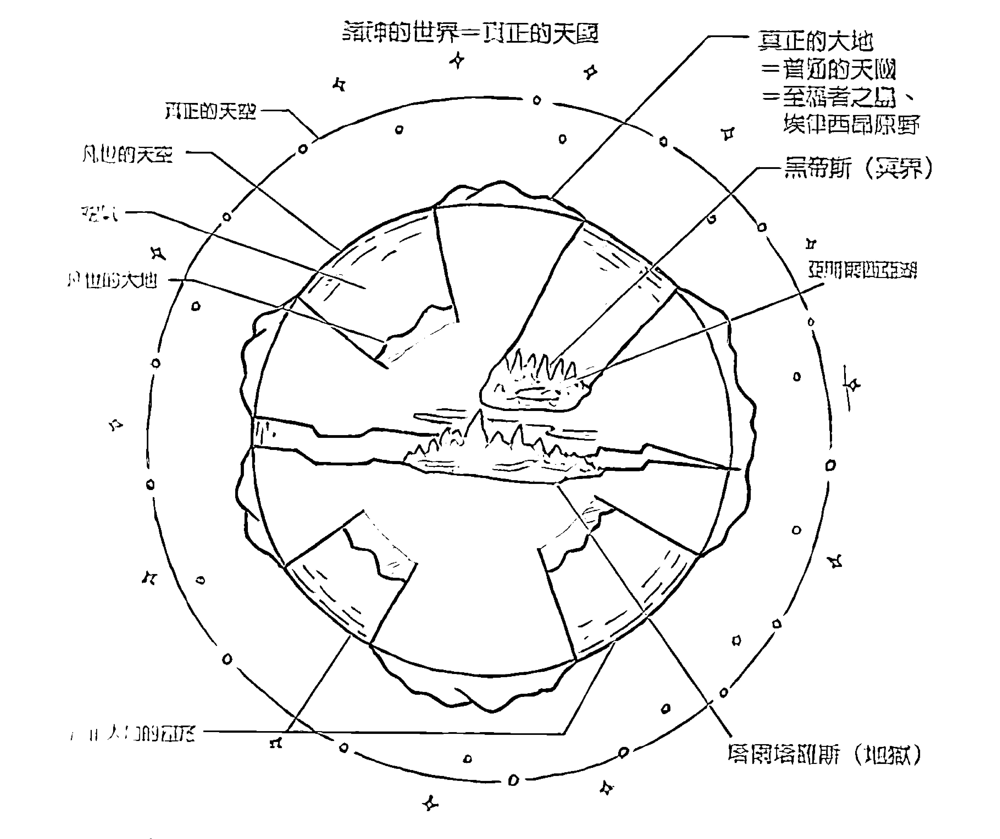

## 1.1.2 轮回周期的长度

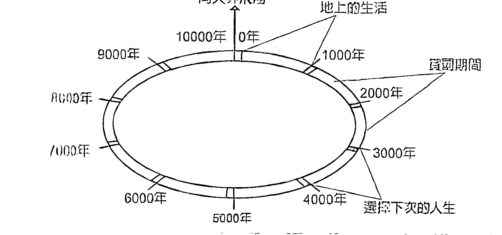

冥界期间据说是一千年，但停留期间同样也是一千年，所以冥界期间应该是一千年，其中前半是人世的沉沦期间。

# 维吉尔的冥界
*Virgil's underworld*

古罗马知识分子接纳古希腊的传统，并融合希腊的神话与哲学，建构出独特的冥界观。

## ○ 承接古希腊传统的古罗马冥界

古罗马人长期以来一直都只有“认为死者之国位于地底”的笼统信仰，然而在西元前一世纪左右，罗马的知识阶级之间形成一套揉合了古希腊神话与哲学而成的冥界观。那究竟是个什么样的思想呢？维吉尔在叙事诗《埃涅阿斯纪》中，英雄埃涅阿斯下冥界的故事里有详细的描述。

据其所载，埃涅阿斯是得到住在意大利库迈的巫女西碧的指引，从阿韦尔诺湖的洞窟到达冥界。冥府的入口附近有复仇女神埃理尼斯、不和女神厄里斯等神明的住处，再往前又有亚开龙河、克丘特斯河、斯提克斯河交错；在地面没有得到妥善安葬的亡灵们，会因为无法渡河而在河畔徘徊。

乘着摆渡人加龙的船渡过斯提克斯河、穿过塞伯拉斯看守的冥府之门，就会来到充斥着甫出生便夭折者、冤死者、自杀者、为情爱欲望而死等等亡者的“悲叹原野”，再前进便是战功显赫的战士亡灵居住的地方。

穿过前述场所，接着就是个分岔路。右边的道路会经过冥府最高神祇普鲁敦（黑帝斯）的城堡，通往乐园埃律西昂原野（埃律西姆）；左边的道路则是通往谷底的地狱塔尔塔罗斯。埃涅阿斯在这里选择了右边的道路，并且目睹到埃律西昂原野的众多亡灵；埃律西昂原野没有房屋，亡灵们都是住在森林、泉水和牧场里，恰恰就像柏拉图轮回论中描述的那样在此地生活一千年，然后喝下流经乐园境内的勒忒河水，忘却一切转世回到地面。据说有极少数完全没有污点的灵魂能不必再度回到毫无价值的肉块之中，脱离轮回归回天界。

> * 维吉尔（Virgil）：维吉尔是古罗马最伟大的诗人，以史诗《埃涅阿斯纪》闻名。

## 《埃涅阿斯纪》描绘的冥界地图

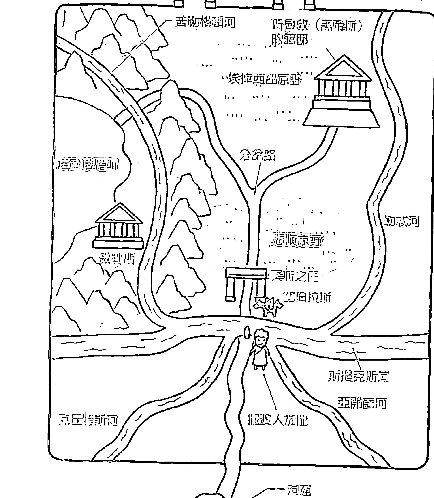

埃涅阿斯在西比尔的指引下从阿韦尔诺湖的洞窟下到冥界，游览冥界后从“象牙之门”回到地面。冥界之神便是由“象牙之门”与“角之门”将人每夜里的梦境送到人间。

《埃涅阿斯纪》 - 古罗马诗人维吉尔的作品。这部叙事诗是描述特洛伊王族埃涅阿斯……

……古罗马极为尊崇的传说女巫、女先知。

# 密特拉教的冥界
The afterlife in Mithraism

密特拉教是结合古波斯密特拉神与巴比伦占星术而成的宗教，他们认为人类的灵魂来自于星辰界。

## ○ 通过星辰界的灵魂之旅

古罗马于西元四世纪承认基督教为合法宗教，不过在此之前将近两个世纪的时间，密特拉教拥有相当大的势力。密特拉教可以说是个结合了源自波斯的光之精粹密特拉（米斯拉）信仰以及巴比伦占星术的宗教，他们非常重视天上的繁星，还认为人类的灵魂原本都是居住在星辰界。

密特拉教相信，灵魂最原始的住处是在诸神居住的天界，也就是最高的天界——恒星天。接着灵魂会渐渐遭到物质拘囿而向地面降落，得到生命。降落途中灵魂会经过各星体，受到各行星感染赋予不同性质；土星是怠惰的倾向，木星是野心的愿望，火星是战斗的血气，太阳是智能，金星是性欲，水星是强烈的渴望，月球则是生命力与活力。灵魂在人类死后将从相反方向踏上这段相同的旅程，于各天界洗脱行星的性质、成为崇高的存在进入第八天，然后沐浴在永恒的光辉之中、与诸神同在。当然，这是灵魂的天国。

然而，并非所有灵魂都能上天国。凡间的人类死亡时，隶属于天界的善恶魔会与受辖于地狱阿里曼的恶灵争夺死者灵魂的所有权，接着就是灵魂的审判，唯有正直的灵魂会获选、并朝通往天界的道路前进。通往天国途中的各天界均有一道门，总计有八道；其中属于行星天的七道，分别由象征各行星的不同金属制成，而这七道门亦能以一共七段阶梯的楼梯表征。最后的第八道门是由善神阿胡拉·马兹达的天使把守，唯有知道暗号、执行过密特拉教秘密仪式的信徒才能通过。

> 阿里曼：请参照P.029用语解说。
阿胡拉·马兹达：请参照P.029用语解说。
雅利安人（Aryan）：Aryan一词源自梵文，意为“高贵”。史前时期居住在今伊朗和印度北部的一个民族。

## 古代的星界观与灵魂之旅

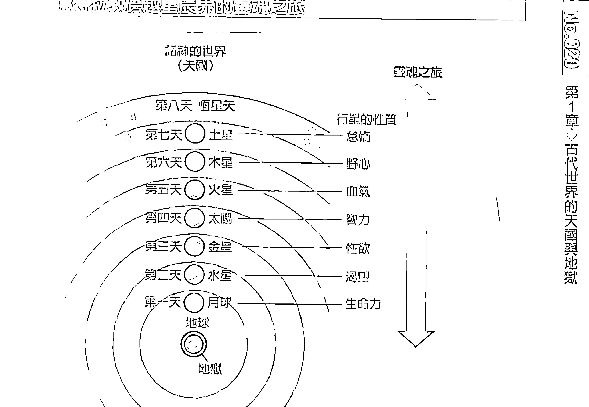

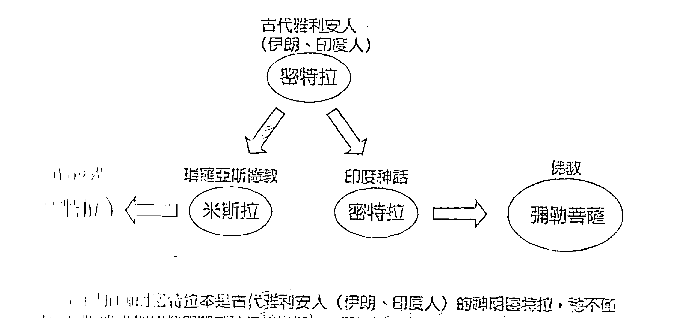

密特拉本是古代雅利安人（伊朗、印度人）的神祇密特拉，却不……甚至以弥勒菩萨之名进入佛教。

# 北欧神话的天国 英灵殿
Valhalla - The Heaven in Norse myth

古代北欧的王侯与战士均以战死沙场变成英灵战士，住进主神奥丁的天国英灵殿为理想。

## 只欢迎战死勇者的天国

北欧神话里的天国，是一座位於诸神国度阿萨神域的宫殿——英灵殿，他们相信唯有战死的勇者才能在死后到英灵殿中。死后被迎接到天国的勇者们，被称作英灵战士，是古代北欧以战争为职业的王侯、战士的最终理想目标。

根据神话记载，北欧诸神的宿命乃是必须在世界末日来临时，与巨人族进行一场终末战役，而英灵战士便是届时将要参与该战役的勇士。为此，北欧主神奥丁不惜频频在凡间引发战争、派遣众瓦尔妲基丽姬女神将一半的战死者收归己用，藉以补充、维持英灵战士的兵力。而另外一半的战死者，则被女神菲依雅带到一座名叫弗尔克范格的宫殿。所以似乎可以由此推知，弗尔克范格应该跟英灵殿一样是个天国。

天界的英灵殿壮丽非常，殿内共有五百四十道门，每道门在终末战役时均能供八百名英灵战士同时出击。

为了迎接终末战役到来，被带到此宫殿的英灵战士每天起床后，都要进行战斗训练直到早餐时间，然后他们就回到英灵殿接受瓦尔妲基丽姬的招待，一團和气地摆开酒宴。英灵殿的屋顶有只会流出蜜乳酒的母山羊，它被唤作蜜乳山羊，勇者们便是以蜜乳酒与麦酒为饮料；此外，英灵殿还有一头无论被宰杀几次，只要一到傍晚就会复活的母猪塞弗利姆尼尔，由厨师安德赫利姆尼尔以大锅爱德弗利姆尼尔烹煮之。因此据说英灵战士在英灵殿里的饮食不曾匮乏。

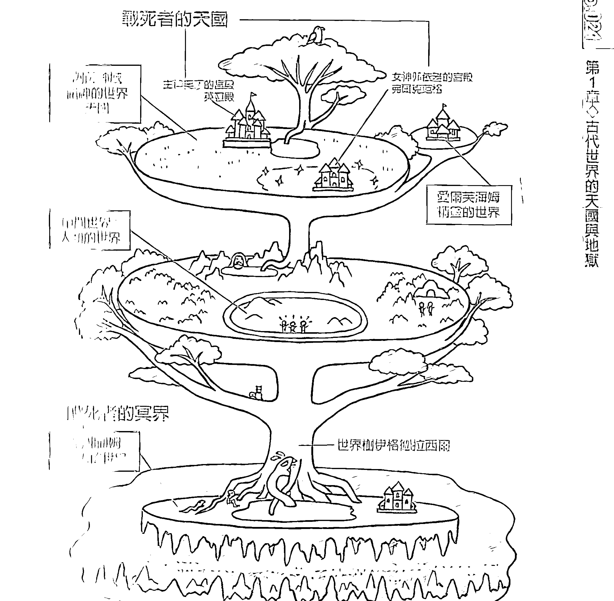

## No.021 第1章 古代世界的天国与地狱

北欧神话中包括九个世界，彼此之间关系不明，但有说法指出，阿萨神域位于中心世界……

奥丁（Oðinn）：北欧神话的最高神祇，同时也是魔法与诗人之神，只有一只眼睛。
弗丽嘉（Frigg）：北欧神话中的女神，负责替英雄带来死亡的命运。
芙蕾雅（Freyja）：北欧神话中的爱欲、魔法、战斗的女神，兼具女性的一切美态与恶德。
米德加尔特（Midgard）：此处采意译，音译则作“米德加德”。

# 北欧神话的冥界 海尔 / 尼弗海姆
## Hell/Niflheim - The underworld in Norse myth

古代北欧相信，除了战死沙场以外其他都是不名誉的死法，这些战死之外的死者亡魂，会被送到地底冥界海尔。

## + “卧死稻草”者要去的普通冥界

在接受基督教之前的北欧世界里，人们相信病死者、老死者以及毫无抵抗便遭杀害者，死后会被送往位于尼弗海姆（雾的世界）的冥府海尔；这些非战死的死法全都是不名誉的死亡，亦称“卧死稻草”。海尔是受女神海尔统治、支配的冥府，北欧有些时候亦将整个尼弗海姆都视为海尔。在这里必须特别提说明的是，北欧神话里的海尔有别于英语里的地狱（Hell），它只是个收容普通死者的冥府而已，并非地狱。海尔此语有“隐藏”的涵意。

尼弗海姆的位置在北欧神话世界中三层构造的最底层，位在大地以下的世界中。尼弗海姆中央有一个沸腾的赫维尔米尔盖尔之泉，斯弗河、根多拉河、菲溺姆河、芬布苏河、史利兹河、赫利兹河、修格河、尤格河、维兹河与吉欧尔河从这口泉水中流出。其中就属吉欧尔河距离冥府海尔最近，河面有条以黄金修缮成的桥梁，这里有位名叫莫德古德的少女把守，死者前往海尔，都必须经过这座桥。

根据北欧神话中主神奥丁之子赫摩德造访冥界的故事记载，就算是骑乘奥丁那匹全世界最棒的骏马——八条腿的斯莱布尼尔前往海尔，也要在暗不见物的漆黑深谷里连续奔驰九个夜晚，才能来到吉欧尔河的黄金桥，而冥府海尔还在北方更深处。海尔四周有高耸的墙垣围绕，大门口有一头名叫加尔姆的恶犬怪物看守，里面就是女神海尔居住的巨大宅邸：埃琉德尼尔（意为“受雨淋湿者”）。

从海尔再往下走还另外有个名叫尼芙海尔的冥界，亦有记载指出那里就是恶人死后会被送去的地方。

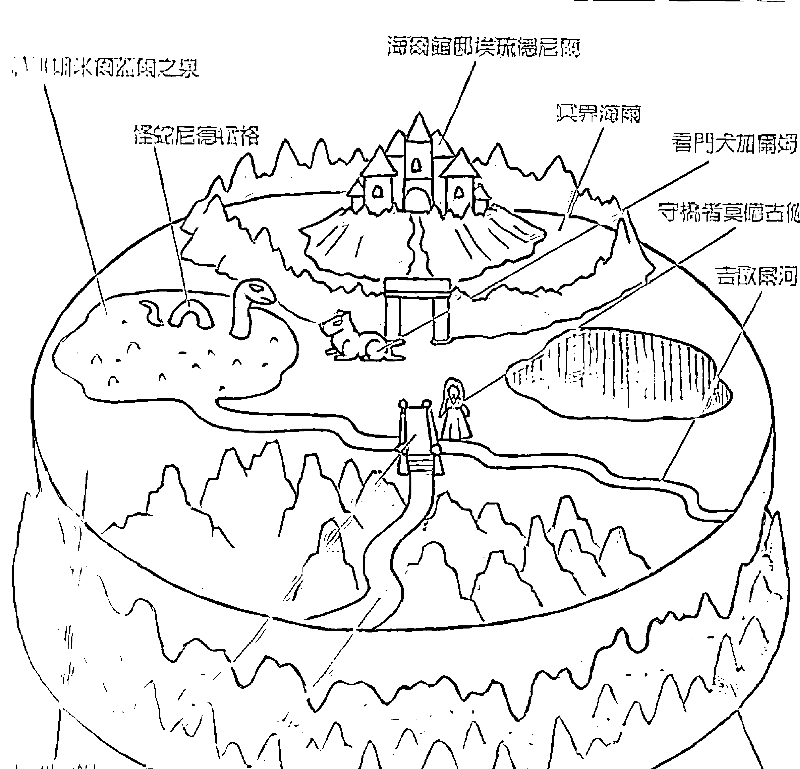

# 第1章 古代世界的天国与地狱

海尔女神支配统治。
小似以火地为壁的尼弗海姆却算是海尔。
如森林，它收容“卧死棺车”（不名誉的死亡）死者都会被送到此地。
似海尔的地狱（Hell），只是个普通的冥界。
海尔以类似希腊神话亚伯拉斯的石门犬加尔姆把守。
海尔的死人，但有莫德古德负责守吉欧尔河的黄金桥。
在海尔底下更深的地方有个世人死后要被送去的尼芙海尔。

在光明之神巴多丧命时，赫摩德曾经乘着八隻腿的骏马斯莱布尼尔向海尔女神交涉，好让巴多复活。
她，是位出身与恶名昭彰的恶神洛奇之女，她被放逐至尼弗海姆以后就成了……

# 塞尔特神话的冥界
The Other World in Celtic Myth

古代塞尔特民族相信人类会在死后复活，然后将位于地底或大海彼岸的乐园与众神、妖精过着幸福的生活。

## ○ 既无衰老亦无死亡更无苦痛的幸福冥界

古代塞尔特人遍布欧洲希腊罗马以外的广大区域，他们相信灵魂不灭，人类会在死后复活，到来世过着幸福的生活。塞尔特民族并不认为死后世界是个与人间完全隔绝的灵界，他们认为那是个分界模糊但与凡世有某种连结的异界。

塞尔特民族由于分布广泛，所以异界的名称与所在地都依各地区文化而有不同。此异界在爱尔兰唤作希、威尔斯唤作安农，且位于地底；不列颠人则认为异界是在大海彼端，某个名叫亚法隆的岛屿（苹果岛）之上。另外，盖尔人的古老传说指出有一座名叫特那诺格的魔法之岛，也是同样的地方。

这些异界有许多共通点，其中之一便是异界基本上都是和平而幸福的地方。异界里有许多美女与年轻男性嬉戏、这里的人既不会变老也不会衰弱、有丰富的食物与酒水，而且众多古老神明和妖精、精灵、小矮人等超自然生物也都住在这里。异界有个能生出各种事物的魔法大锅，甚至只需要把死者丢进锅里就能使其复活。塞尔特神话的异界与日本的龙宫城类似，是个没有时间的地方。所以倘若有仍在世者在异界停留，认知中的数月时间其实是数百年，他们回到故乡后有的是瞬间衰老，有的则是死亡化作尘灰。

这些死后世界并不会根据在现世的犯罪行为施加惩罚，所以基本上每位死者都能过着幸福的生活。只不过所谓的幸福仍然有程度上的差异，唯有生前时时努力以图自我成长的人，方能体会到最甜美的幸福，而那些生前不努力只贪求眼前安逸者，就只能得到中等程度的幸福。

## 古代凯尔特人相信死后有一个幸福的异界

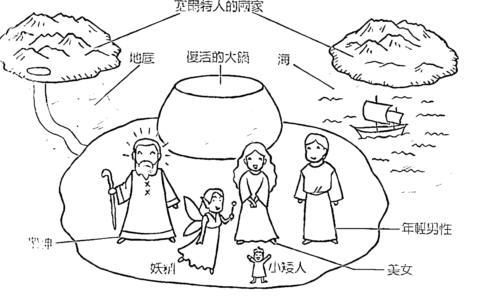

古代凯尔特人认为死后世界是位于地底或大海彼岸的幸福世界

### + 异界的特征
- 没有老化和衰弱
- 有复活的大锅
- 有丰富的食物与美酒
- 没有时间概念

### 异界的名称及所在地
| 信仰者 | 名称 | 所在地 |
| :--- | :--- | :--- |
| 希腊人 | 希 | 地底 |
| 凯尔特人 | 安农 | 地底 |
| 北欧人 | 亚法隆 | 海上 |
| 凯尔特人 | 特那诺格 | 海上 |

- 凯尔特人：约西元前1500年以前来自中亚的民族，古罗马人称其为高卢人
- 威尔士人：凯尔特人的一支，指居住在不列颠、威尔斯、康瓦耳的民族
- 盖尔人：指住在爱尔兰、苏格兰与曼岛的北方凯尔特民族

# 马尔敦的航海
## Mael Duin's Voyage

相传战士马尔敦一行人曾经在航海途中遭遇暴风雨、漂流迷途来到异界的海域，并且在那里陆续造访了许多不可思议的岛屿海洋。

## ○ 神奇与幸福虽然并处的塞尔特异界

古代塞尔特人相信死后的世界是个不会年老、不会衰弱的幸福异界，而且塞尔特民族还对这个异界抱持着某种近乎憧憬的特别情感。能传达塞尔特民族心目中异界氛围的，便属古代爱尔兰的许多冒险奇谭与航海奇闻。此处便以西元八、九世纪之间的《马尔敦航游记》为例，介绍塞尔特的异界。

根据故事记载，战士马尔敦为报父仇而与同伴离开爱尔兰，朝敌人所在岛屿出发启航。可是他们在途中遭遇到暴风雨，船只迷途漂流，越过第九道波浪后进入了异界。

这“第九道浪”便是现世与异界的分野。

马尔敦等人开始在异界海域里流浪，并陆陆续续遭遇到各种不可思议的岛屿和海洋。他们原先预备登陆的岛上，有一群跟小马差不多尺寸的巨蚂蚁群，那些巨蚂蚁还作势要攻击登陆者，马尔敦等人只能逃离该地。有的岛屿甚至还有蹄印像船帆那么大的巨马成群奔驰。

当然，航程中亦不乏有许多幸福的岛屿，譬如有些岛屿中，鲱鱼会自动从海里跳进海岸边的房屋，有的岛屿则是生长着能从断枝中结出果实的苹果树，不过最棒的还是女人岛了。该岛的城堡里面住着许多年轻的少女，她们极尽所能地盛大款待马尔敦等人，以致一行人在该岛停留了数个月。

马尔敦一行人在异界的海域漂流、踏遍多达三十二处不可思议的神奇秘境，最后终于得以返航回到爱尔兰。

## 两个世界的异界

第九道浪 (异界的境界线)

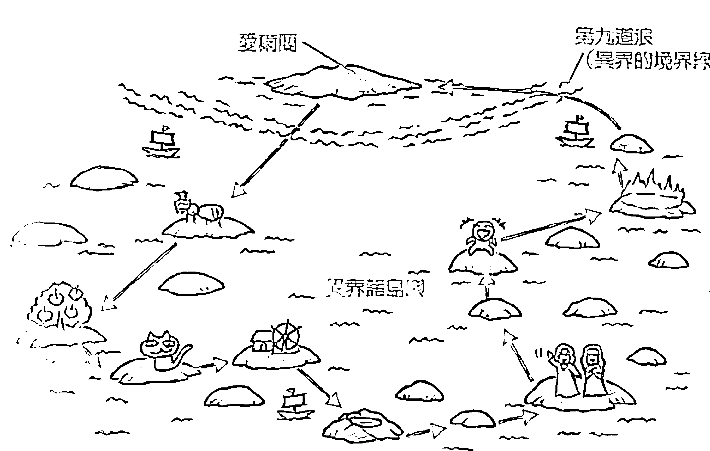

## 八个人们的主要岛屿

1. 有与龟裂小岛相同的巨蟹成群
2. 有一个不断有美味鱼从海里游进屋内的大宅
3. 秋日能从被折断的仙枝中结出珊瑚的珊瑚树
4. 有只会将误闯到的人烧成灰烬的窑
5. 底部将心怀恨意者研磨成粉的巨大水车
6. 登陆后就跟岛民一起永远哭泣下去
7. 火王、女王、战士与少女分别待在金、银、铜、水四个容器中
8. 有牛奶、蜜酒与葡萄酒的喷泉
9. 如水晶般透明、可直视海底的海
10. 海底有美丽国度与怪物栖息、彷佛星一般的海域
11. 岛屿岸边有段溪流，泉水流涌至岛的另一侧的岸边
12. 坐落于丛林深处的顶端、无从进入的宫殿
13. 其上住着许多美丽的少女，对来客盛情款待
14. 去山旅遍了一圈吃下肚后，昏昏沉沉睡去的果实
15. 登陆后就跟岛民一起永远笑下去
16. 四周被烈焰包围的烈焰环绕的岛屿
17. 山上有位隐者因躲避暴风雨而漂流至此，他预言马尔敦的航海将有惊无险

> 《布尔航游记》、《圣布伦丹航游》

# 日本神话的冥界
## The afterlife in Japanese myth

上有高天原、下有黄泉国，遥远的海洋彼方则有常世国等等，古代日本神话相信，在各个地方都有死后世界存在。

## ○ 存在于各个不同场所的古日本冥界

在古代的日本，不仅仅是天上、地下，就连高山、海洋、海底等等各种地方都有死后世界的存在。

翻开记载日本神话的古书《古事记》与《日本书纪》，里面曾提到天上的高天原、地下的黄泉国，遥远的海洋彼方则是有常世国。高天原是诸神与天皇御灵居住的崇高界，黄泉国则是死者都要往赴、幽暗溷秽的他界，常世国则是日本人祖灵居住的光明他界，各有特征均不相同。

除此以外，日本神话还会另外提及根之国、底之国两个冥界。从汉字的字面看来此二者均像是位在地底，而这也可以说是大多数人的普遍性理解。由于同样都是地底的冥界，因此根之国、底之国也经常被认为其实就是指黄泉国。不过当然也有不同的想法存在；古代琉球（冲绳）信仰认为海上有个叫作儛来河内的乐土，根之国“根”的n音跟儛来河内“儛”的n是相同的发音，而从语源方面探讨则可以发现，儛来河内拥有较接近常世国那般充满光明的形象。此外，也有人说底之国的“底”（そこ，Soko）亦通“常”（とこ，Toko）字。

虽然不知道日本神话里面为何未曾提及，但山对古日本人来说也是个很重要的他界，像是《万叶集》里面歌诵的死者之国，大多数都是山与天。日本自古便将尸体葬在山中，因此山对神灵来说是相当合适的居处，从日本素有立山、恐山等许多山岳灵场亦可见一斑。

由此可知日本的死后世界形形色色，而且各有不同族群信仰。

## 古代日本的冥界及特征

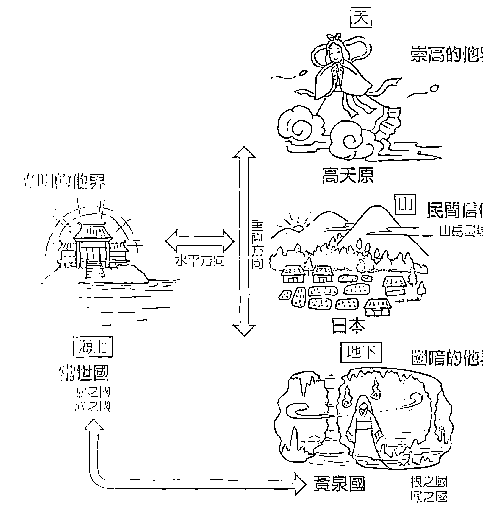

## 古代琉球的乐园伊来河内

伊来河内在古代琉球传说中，是个位于大海彼方（或海底）的乐园，是个为现世带来幸福、繁荣与丰饶的乐土，古琉球人认为伊来河内拥有所有重要事物，比方说火、稻米、无限生命的泉源与财宝，全部都来自伊来河内。虽然事实上稻作等等文化其实从东南亚传来，不过这些对外来文化的憧憬亦可说是形成伊来河内的重要因素。

# 参考文献

- 《古事记》成于和铜5年（西元712年），日本最古老的史书
- 《日本书纪》成于养老4年（西元720年）的日本史书，是日本现存的正史
- 《万叶集》收录四至八世纪编撰的日本首部歌谣集

## No.026
## 日本神話的天界高天原
Takamagahara - The Heaven in Japanese myth

位於天上的高天原乃是眾神故鄉，也是天照大神的子孫——天子聖靈居住的崇高處所。

- 天子聖靈居住的天上他界

高天原乃是古代日本觀念裡，死者靈魂前往的天上界，只不過並非所有人的靈都能歸於高天原。相傳古代日本人之間有種信仰，認為高山與天空之上都有死者亡靈歸屬往赴之處，而高天原則僅限天子（天皇）與身屬天皇家的靈。

高天原乃是為了確保天皇於凡間王權的正當性而存在的神話性天上界，那裡住的是皇室的祖先天津神¹，受天照大神支配統治。是故，那裡不只是眾神的故鄉，同時也是從天上降臨地面的眾神最後要歸返的場所。舉例來說，日本神話便曾講述伊耶那岐命結束神明在地面的工作後返回天上（高天原）、進入日少宮的事情。相同的事情也會發生在天照大神的子孫即天子的身上，天皇活著的時候雖然停留在地面，但死後還是要返回高天原。

民俗學家折口信夫表示，古代日本人的想法認為高天原中，原本就有即將成為天子的聖靈存在，接著該聖靈降至凡間成為天子、完成相當程度的任務之後才會返回高天原，重複循環擔任歷代的天子，是故天子並無死亡而只是交替而已。

高天原本身可以說是完整反映了地上的世界。日本神話曾提到高天原有條天安河流過，附近便是從前天照大神藏身不出的天岩屋戶，還有口叫作天眞名井的水井。這裡非但有舉行新嘗祭的宮殿、稻田和灌溉用溝渠，還有名為天金山的磯山與天香具山。這天香具山當然就是現實世界中大和國²的那座山，由此可見當時的日本人乃是以大和為雛型塑造高天原的世界。

> ¹ 天津神：指坐踞高天原、以及從高天原降臨凡間的神明。而國津神則是統稱出現在各地的神明。幾乎所有國津神都是天津神的下屬。

> ² 大和國：日本古國名，相當於現在日本的奈良縣。

古代的天界有個與地面國土相同的世界，其型便是大和國。

天子會降臨至地上成為天子，結束任務後再返回高天原。這段期間會生出四代天子，故，天子並無死亡只是交替。

伊耶那岐命是伊耶那岐命逃離黃泉國、清洗被弄髒的左眼時誕生出來的，被指派為高天原的統治者。伊耶那岐命是伊耶那岐命逃離黃泉國、清洗被弄髒的左眼時誕生出來的，他娶伊耶那美命為妻，除孕生出日本列島以外還...

## 日本神話的冥界 黃泉國
### Yomi-no-kuni - The underworld in Japanese myth

日本神話相信，黃泉國是一般死者所要去的死後世界，是個位在地底、陰暗污穢的他界。

### ○日本神話裡昏暗污穢且不祥的冥界

日本神話曾經提到，人類死後就會前往某個名叫黃泉國（夜見國）的冥界。在《記紀神話》中記載，從前伊耶那岐命曾親自到黃泉國，意欲將已死的伊耶那美命帶回凡間，卻驚見伊耶那美命的身體到處都已經流膿生蛆，於是逃了回來。從這則故事中，不難發現黃泉國並非天國那般祥和的冥界，而是個污穢不祥的國度。此冥界位於地底所以甚為陰暗，伊耶那岐命必須點起火光才能看清伊耶那美命的模樣。黃泉國之王喚作黃泉神或黃泉大神，傳說自從伊耶那美命到達黃泉國後，便由她擔任黃泉大神。須佐之男命曾去過的根之國，也是個自古受到日本民眾信仰的他界，有派說法將根之國視為黃泉國，並且認為在伊耶那美命之後是由須佐之男命繼任黃泉大神。此類統領黃泉國的高級神明麾下，有黃泉醜女與八雷神之類的鬼怪，負責戍衛士兵的工作。當初伊耶那岐命逃離黃泉國時，亦曾經遭到這些鬼怪的追趕緝捕。從記紀的字裡行間可以推斷，黃泉國位於地底，而這地底世界與地面之間有道名為黃泉比良坂的斜坡連接；黃泉比良坂距離地面是遠是近無從考證，不過一般相信這斜坡位於出雲。相傳當初伊耶那岐命從黃泉國逃回來時，曾經搬千引岩堵住黃泉比良坂，而且還祭祀司掌不同境界的神明岐神，從此以後黃泉國的居民便再也無法來到地上了。黃泉國雖然是個陰暗污穢之處，但非僅限負罪者才會貶入，而是所有死者最後都必須前往的地方。

> 1 《記紀神話》：即《古事記》與《日本書紀》神話的統稱。
> 2 出雲：日本舊國名，相當於現在日本島根縣的東部地區。

## 黄泉の位置
## 第1章 古代世界的天国與地獄

從出雲的出石經由黃泉比良坂可以通往位於地底的黃泉國，那裡是死者們所在的地方。

### 黄泉戸喫

在《古事記》神話中，有個場景描述伊邪那美命死後去到黃泉國，面對來到黃泉國、想帶她回生者國度的伊邪那岐命說自己已經「黃泉戸喫」，再也無法回到地上的世界了。

「黃泉戸喫」指的是食用以黃泉國的竃灶烹煮的食物。吃下黃泉國的食物便等同著成為該國度的一員，從此再也不能回到人世間。

不僅僅是日本，吃下冥界食物便再也不能返回生者國度這個設定，其實可遍見於全世界。希臘神話也曾說女神狄蜜特的女兒波瑟芬妮被冥界之王黑帝斯誘拐，吃下冥府的石榴果實，所以迫不得已成為冥府女王。

- 伊邪那美命：日本神話的女神。她在分娩火神迦具土時遭燒傷致死，所以到了黃泉國。
- 伊邪那岐命：逃離黃泉國、除穢洗淨身子的時候誕生的男神。已經大開黃泉比良坂逃回地面，並於凡間收伏八俣遠呂智（《日本書紀》記載為「八岐大蛇」），最終還是去了根之國。

## 日本神話的異界常世國
Tokoyo-no-Kuni—The other world in Japanese myth

位於大海遙遠彼方的常世國不光是死者靈體的聚集地，同時也是日本人生命起源的光明他界。

### ○日本人祖靈坐鎮的海上他界

常世國在古代日本被描述成一個位於遙遠海域、死者靈體聚集的他界。相對於皇室祖靈的所在地高天原，常世國則是較為一般的祖靈坐鎮之處，也是日本人生命的來源，亦是穀物靈的根源地。總歸一句話，常世國是個與生命有著極深關聯的地方。而其所在有人說是在遙遠東方，有人則說是在海底深處。

受到以長生不老為理想境界的中國神仙思想影響，日本亦孕生出常世國屬於長生不老國度的信仰。蓬萊仙山在中國是長生不老仙人的住處，而日本卻偶而可以見到「蓬萊山」三個漢字對應到「とこよのくに」[1]假名之舉。所以我們可以想像，常世國是種理想的國度，那裡的橘樹隨時都結著馨香的果實。

有關常世國的文獻當屬《日本書紀》（神代卷）的記述最為著名，裡面提及曾跟大國主神共同創造國土的少彥名命，在創造國土後，從熊野[2]的山頂出發遊歷常世國的記錄。《日本書紀》中也有記載死者靈魂飛往常世國的故事；而傳說神武天皇胞兄也在死後渡過大海，去了常世國。

後來這個相信死者靈魂將前往理想國度的常世國信仰，又與日本佛教的淨土觀結合，孕生出以熊野為中心的補陀落信仰。那是種死期將近的修行者，乘船出海、投身入水藉以轉世到淨土的風俗，亦稱補陀落渡海。

除此以外，也有人認為常世國並非幸福世界，而是一個幽暗的死者國度。折口信夫是此派說法的代表，他指出「常世」的「常」（Toko）字與「底」（Soko）、「世」（Yo）字與「夜」（Yo）的關聯性，且《古事記》、《日本書紀》也有把「常世」寫成「常夜」的例子，所以他主張常世國是個位於地底或海底的幽暗死亡國度。

[1]「とこよのくに」：此即「常世國」的日語平假名表記法。
[2]熊野：熊野位在紀伊半島南部，相當於現在的三重縣熊野市一帶。

## 補陀落渡海

補陀落渡海就是指乘船出海、航向傳說中位於南方海面的補陀落世界——補陀落世界的習俗。此習俗自古以來在熊野的那智瀑布附近的足柄便甚為盛行。《熊野年代記》清楚地記載到，1234年行海上人、919年有補陀落山寺祐真上人與同行的十三人、1131年同寺的高嚴上人等等，都曾經進行過補陀落渡海。補陀落為何會成為此習俗的信仰中心，其起源是因為少彥名命由海路前往常世國的傳說。但補陀落世界卻是連存在與否都還不清楚的世界，因此從事實來說，這些人的目的與其說是去補陀落世界，不如說是投海自盡還比較貼切。此外，近代已漸漸無人渡海，補陀落渡海也演變成純粹的水祭儀式。

- 少彥名命：是伊奘諾命的六世孫，出雲的主神，相傳是首位在地上創造國土的神。
- 神武天皇：相傳是第一位從高天原降臨凡間，平定了天下的初代天皇。

> 《熊野年代記》：由熊野新宮本覺所新宮願主金光所編篡的編年史，記載到明治前半期有關熊野三山的歷史。

## 古代中國的冥界
The afterlife in China

古代中國人認為人類有「魂」、「魄」兩種靈，眾死者均前往地底黃泉與幽都。

### ○黃土之中晦暗不明的冥界

早在道教與佛教尚未流行的太古時代，中國人便相信人類有「魂」與「魄」兩種靈，而且將會在死後前往不同的地方。中國人認為魂司掌的是精神，人死後魂將暫棲於牌位之中，但終究是要歸於天、化為神明；魄司掌肉體，人死後魄將入土而居、漸漸消失化作虛無。

中國亦有死者居於地底冥界的信仰，該冥界稱作黃泉。

雖說位於地底，不過黃泉的位置似乎並不是特別地深。西元前八世紀左右鄭國國君莊公遭母親背叛、將母親幽禁於城裡並立誓曰：「不及黃泉，無相見也。」可是過不久莊公就後悔了。後來某官員在造訪鄭國宮廷時，聽到這個故事，建議他「挖掘地面，挖到地下水湧出的地方，在那裡與母親相見便不算是違背誓言。」莊公喜而從其言，就此與母親同修舊好。換句話說，當時認為地下水脈附近就已經算是黃泉了。

古代中國還認為礦夫的工作場所被黃泉圍繞，從此亦可得知黃泉應是位於較淺層的地底。

此外幽都同樣是個位於地底的冥界。此地是否與黃泉相同未可確知，不過中國神話卻說幽都是個晦暗陰鬱的死者世界，乃由炎帝子孫——土地神后土統治。后土有個部下名土伯，負責監視幽都大門。相傳土伯生得一張虎臉，有三隻眼睛和牛的身體，能以極快速度奔馳、以其尖角刺殺惡人。

> 「可以挖掘地面……違背誓言」：出自《左傳》「鄭伯克段於鄢」篇，作「若闕地及泉，隧而相見，其誰曰不然」。

## 第1章 古代世界的天國與地獄

古代中日相信黃泉就在挖掘可及的淺近地底

- 時代時間，從西元前806年至西元前375年存在於現今中國河南
- 乃一位名君，鄭國於此時發展至幾乎可稱霸中原的努
- 神話時代的文注，農耕之神，牛頭人身

## NO.030 不死的樂園 崑崙山
Khun Lun Shan - Paradise of the immortal

傳說中眾神與仙人居住的崑崙山是古代中國的天國，他們相信死者能永遠在這裡過著快樂的生活。

### ○戰國・西漢時代中國人嚮往的死後世界

從西元前三世紀左右的戰國時代末期到西漢時代，中國人相信幸運死者的靈魂可以變得不朽、到達崑崙山的樂園。

根據曾經對該時代古墓陪葬品帛畫（畫在絹帛上的繪畫）進行過分析的曾布川寬表示，人類死亡下葬以後，天帝（天界的最高神祇）會派遣鳳凰或羽人作為使者來迎，接著死者亡魂乘著龍船登上崑崙山，在那裡享受音樂舞蹈與遊戲，永遠過著快樂的生活。

關於崑崙山是座什麼樣的山，神話裡有詳細的描述，崑崙山是中國西方的一座神山，也是連接天上界與地上界的通道，亦為天帝黃帝在地上的住處。崑崙山的高度是一萬一千一百一十四步二尺六寸（約4565km），山上有一座由五個城堡、十二棟樓組成的帝宮，到處都是結著寶石果實的樹木。除此之外，在崑崙山兩倍高度的地方還有另一座涼風山，登上此山便能達到不死的境界；比涼風山高兩倍的地方有座縣圃山，登此山便能獲得呼風喚雨的神通力；再往上兩倍高度的地方則是天帝所在的上天，來到這裡的人便能成為神明。

西元前三世紀末前後，崑崙山被奉為西王母的住處。西王母是位住在西方、司掌不死與復活的女神，是統率眾仙人的神明。因為這個緣故，後來甚至還衍生出崑崙山比日月更高、被虹彩雲朵籠罩，眾仙人乘著龍與鶴遊戲其間的傳說。

如前所述，崑崙山原本就已經是座神山，後來更演變成不死仙人居住的樂園，因此我們可以想像人類死後靈魂變仙、在崑崙山過著幸福生活的樂園信仰便是從此衍生。

> 羽人：指身長羽毛或披羽毛外衣能飛翔者，最早出現在《山海經》，稱羽民。亦作仙人解，《楚辭》屈原・遠遊：「仍羽人於丹丘兮，留不死之舊鄉」。

## 崑崙山

## 帝之下都

- 鳳凰：是種五彩顏色的美麗禽鳥。
- 西王母：是所有女仙的女神，於民間極受崇信仰。
- 仙人：是指凡人經過修行以達長生不老者。

注 本章圖文有矛盾處，請讀者自行訂正。

## 古代印度的冥界
### The afterlife in India

印度神話認為，死者能在死後升到位於最高天界的閻魔之國，在那裡與閻魔過著快樂的生活。

### ◯印度最古老的冥界之王閻魔

印度教與佛教的起源地——古印度，曾經有過不少死者之國傳說，閻魔神的國度屬於最古老的一批。西元前十世紀前後成立的經典《梨俱吠陀》記載，閻魔原本是誕生在這個世界上，第一個將死的存在（人類），結果竟然被他發現死者之道，於是升上天界成爲死者之王。

閻魔之國是個位於最高天界的理想國度，衆祖先的靈在這裡與閻魔一同坐在茂密樹蔭下，享受美酒與音樂、過著愜意的生活。那個時代尚無死後審判的概念，任誰都能在死後進入天國。樂園裡有兩頭全身共四個毛色的看門犬，娑羅昧亞，除看門之外他們還負責將死者的亡魂帶進閻魔之國。

隨著時代的流逝，對閻魔之國的描寫也愈發詳細。閻魔之國被喚作閻魔普里，周長七千公里、城壁以鐵鑄成；城內有百條街道，除了決定壽命長短的書記官奇特拉古普塔的住處以外，甚至還有醫院等設施。閻魔神的宮殿則是一座周長一千四百公里、高三百五十公里的雄偉建築物。

不過隨著惡人死後墜入地獄的思想逐漸孕育成形，閻魔的角色定位也轉而演變成死後的審判者；閻魔之國亦於此時轉移至地底，所有死者都要接受閻魔的審判。閻魔的審判所裡有書記官奇特拉古普塔，負責做出死者是否要墜入地獄的裁決。後來閻魔的形象又經過數度變遷，最後才演變成佛教地獄州的閻魔王。自此以後，印度教遂轉奉因陀羅神爲天國的統治者。因陀羅是暴風雨之神也是戰神，人間的偉大戰士都希望死後能進入這個在因陀羅治理下，名爲斯瓦爾嘎的天國。相似地，天國位於人間大地閻浮提州中央、彌樓山頂的雲霧之中。

## 第一節 死者之神

閻魔 ……第一個將死的存在（人類）

率先死去，發現死者之道

## 成爲死者之王

## （佛教）的天圖

## （印度教）因陀羅的天國

- 西元前1000年左右印度編纂出一系列名爲吠陀的宗教經典，相關文獻是印度最古老的一部。婆羅門教與印度教奉其爲聖典。
- 吠陀中祭祀最多的古印度雷神、暴風雨之神：

## 《奧義書》的輪迴轉世
### The reincarnation in Upanishads

奧義書哲學認爲偉大的人物將朝「神道」邁進，普通人則向「祖道」而行，從而衍生出印度式的輪迴轉世思想。

### （一）輪迴轉世思想於印度的初期型態

印度約於西元前七、八世紀有奧義書哲學興起，從此主張世間萬千生物都要不斷轉生的輪迴轉世思想，漸漸有了清楚的輪廓。此節試以據稱成書於西元前六世紀之前的經典《歌者奧義書》爲例，介紹當時印度甫誕生的輪迴轉世思想。

根據該經典記載，世間所有生物死後都有三條路可走。第一條喚作「神道」，是給在現世時，秉持信心身執苦行的偉大人物走的路。入此道者首先會變成火葬的焚煙向上升起，到達太陽後，升至月亮再達閃電，最終會從閃電進入婆羅賀摩 的世界。印度教奉婆羅賀摩爲宇宙的絕對真理，該世界並非存在於某處，而是位於宇宙的背後；得入此界者便能得到永遠的幸福，還能跳脫輪迴轉世。

然而能進入此界者實在是少之又少，大多數人都朝向人們「祖道」的第二條路前進。入此道後，死者將會變成火葬的焚煙飛升、依序進入父祖世界、升入虛空，進到月亮，然後成霧、化作雨滴降到地面，最後轉生成爲稻米、麥子、樹木、芝麻和豆子；接着當這些穀物被喫下肚、變成精液注入母體的時候，又誕生成爲人類。走第二條路的人就是如此這般轉世爲人類，生前累積優越行止者便能轉生到較高階級，多行不當者就要誕生到較低的階級。

除前述二者以外還有第三條路，不過相傳這條路是給低等動物走的，而且路途也不像前述二者那般複雜，僅僅是單純地再度轉生至世間而已。

> 婆羅賀摩（Brahma）：印度教中與毗濕奴、濕婆並列三大神。負責創造世界，毗濕奴加以維持，而濕婆則是負責破壞。佛教將其稱爲梵天。

### 偉大者死後的道路→天道

解脫後進入婆羅賀摩的世界，跳脫輪迴轉世。

### 尋常人死後的道路→祖道

經過種種路途後再入母體、輪迴轉世。

奧義書是印度教經典中成書時代最晚（西元前五百年左右）的一批哲學文獻，探討根本原理「婆羅賀摩」與人類存在的本質「我」。乃是最高的世界原理，兩者的同一性便能得到解脫。

「我」是印度哲學中最基本的概念之一，指人本身的永恆核心。

## 印度教的地獄
The Hell in Hinduism

印度教的地獄規模雖不似佛教宏大，但是從梵書時代（西元前九百年～西元前五百年）便已開始發展。

### ○早從《梵書》時代便開始發達的印度地獄

印度的地獄無論在印度教或佛教裡面都稱作那洛迦¹。日語的地獄（奈落）便是那洛迦的譯名，若採音譯法則也可以寫作捺落迦。按照時序排列，印度教的經典包括了許多被稱爲《吠陀》、《梵書》、《奧義書》的文獻；據考這些文獻是在西元前一千五百年到西元前兩百年之間依序問世的；而《吠陀》除部分晚期文獻以外，完全看不到能讓人聯想到地獄的文字記載。但進入《梵書》時代後，那洛迦的存在便清楚地受到衆人注意。《耆密尼耶梵書》便有一節稱爲〈布瑞古的地獄之旅〉，據其所載，死者的世界是分成六個區域或六個層級：第一界是人類將人類剁碎，並喫下肚的地獄；第二界是人類將哭泣叫喊的人類喫下肚的地獄；第三界是人類喫著不言不語沉默人類的地獄。第四界詳細情況如何不得而知，不過可以確定的是，該地乃有兩位女性守著一份龐大財寶的冥界。第五界是地獄與天國共存之處，內有兩條河流：一條是有個裸身黑人把守的血河，另一條是乳漿（液態奶油）河流，河畔還有位黃金人負責持黃金杯，從河裏汲取世間的所有願望。第六界是個充滿青蓮花與白蓮花的光明天國，還有五條流着糖蜜的河流，是個能聽見美妙音樂與歌聲的世界。
地獄思想在接下來的《奧義書》時代又有進一步的發展：閻魔被奉爲地獄之王，而地獄裏還有位名叫奇特拉古普塔的小記官，負責管理記載了死者生前行爲的紀錄簿。而西元後才成書的聖典《毗濕奴往世書》，甚至列舉出了勞拉瓦、羅達、什卡喇等二十多個地獄的名字。

> 那洛迦（Naraka）：亦譯「不樂」、「可厭」、「苦具」、「苦處」等，日本則是譯作「奈落」。

## 《摩诃婆罗多》当中的冥界

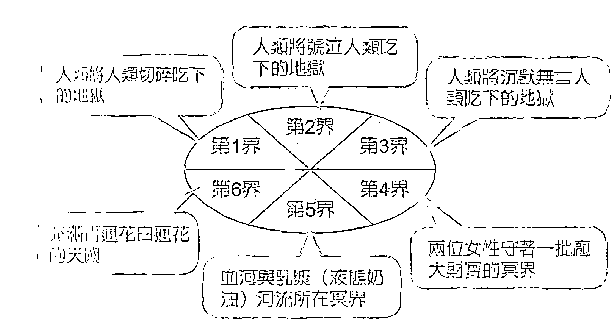

## 《摩奴法典》的地狱及其名涵意

| 地狱名 | 涵意 | 地狱名 | 涵意 |
| --- | --- | --- | --- |
|  | 恐怖 | 吠迦伽 | 穿孔 |
|  | 疗疮 | 纽上婆那 | 发狂 |
|  | 阿健 | 阿缚婆克哈 | 颠倒 |
|  | 颠倒 | 卜亚伐哈 | 漂流 |
|  | 灼热之瓶 | 底迦两哈 | 血井 |
|  | 灼热之壶 | 伐塔罗尼 | 压头 |
|  | 大焰 | 克利修纳 | 黑 |
|  | 空 | 阿富姆特拉伐那 | 剑叶柏林 |
|  | 恐怖 | 伐尼吉瓦两 | 火焰 |
|  | 虫噬 | 娑迦沙 | 铁刃 |
|  | 金昆罗者 | 巴瓦波那那 | 食犬者 |
|  | 吞噬者 |  |  |

印度教是由婆罗门教与民间宗教习合而成的宗教。

《吠陀》是印度婆罗门教经典当中成书于西元前800年前后的诸文献。

《摩奴法典》是继承自婆罗门教的印度教圣经往世书当中最具代表性的一。

## No.034 耆那教的天國與地獄

The afterlife in Jainism

與佛教、印度教貌同實異的耆那教，乃是藉由原人的巨體象徵地展，包括天國與地獄在內的豎體宇宙。

### ○以原人巨體呈現的輪迴宇宙

耆那教與佛教同是西元前五世紀興起於印度摩揭陀 地區的宗教，並且跟佛教、印度教同樣都是以輪迴為前提，以跳脫輪迴得致解脫為最高目標。耆那教的宇宙與印度教相同，人類居住的閻浮提州正中央同樣有座彌櫻山聳立，其上方有天界、下方有地下界。

然則，耆那教象徵性地使用原人的巨人形象，呈現天國與地獄的概念。巨人原人的身體各部位當中，頭胸算是天界、軀幹是人類居住的閻浮提州、腳是地獄，人類的靈魂便在這個宇宙當中反覆輪迴。雖然說耆那教與佛教、印度教同樣都將輪迴的原因歸於人類行為的累積（業），但其所持的卻是種非常原子論的思想。耆那教主張萬物乃由靈魂、物質、空間、運動、靜止這五個實體所構成，其中空間、運動、靜止三者決定各人的業，而後靈魂與業結合、遂有輪迴產生。簡單來說，做壞事就會墮入地獄仍是不變的道理，而唯有得解脫者方能到達諸神所在的上方天界。那麼該如何才能得到解脫？答案就是苦行與禁欲。不殺生是耆那教的最高德行，而且他們認為不光是動物，就連植物也有生命。所以想要完全不犯罪、得到解脫可以說是極不容易的事情，甚至還必須為此餓死。而修行者的主要原則就是要以簡樸度日為念、甚至裸身生活。

在家的信者當然是不可能做到這種程度，不過只要不故意傷害殺害動物（最好植物也是）、不說謊不偷盜、守純潔並且抑制擁有欲，便能得到較好的輪迴。

### 1.1 巨人的宇宙《世界原人》

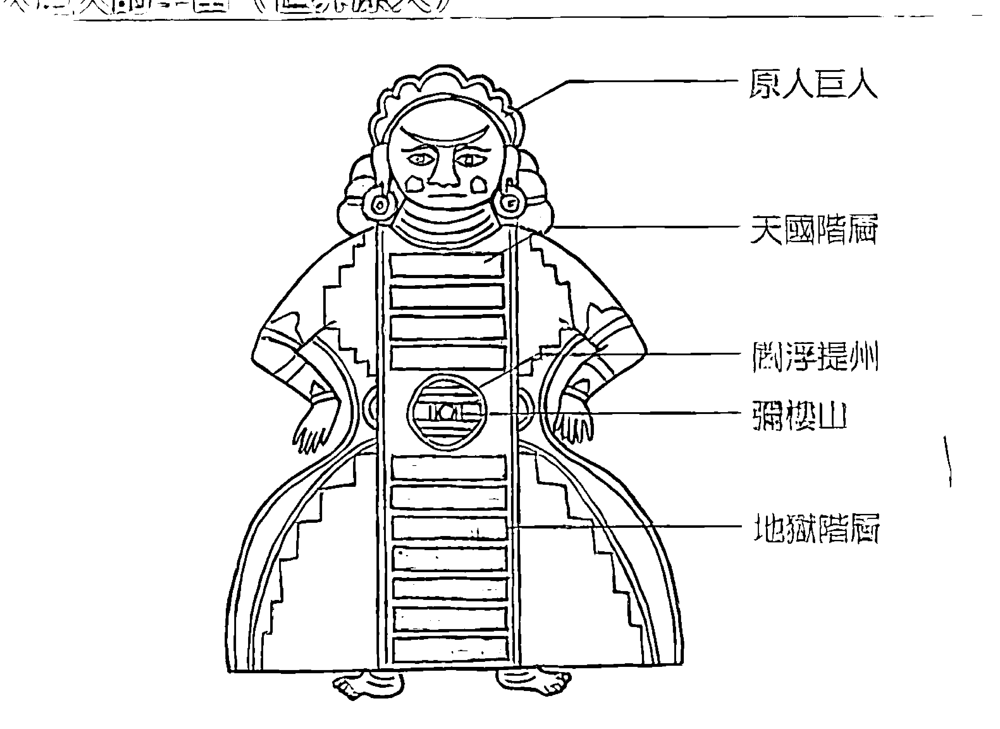

只有达成解脱者方能进入耆那教的天堂，其他人全部要堕入地狱。另说地狱共有八万四千个等级，那里有许多恶虫与魔鬼在等着死者。在地狱里面饱受苦痛之后，就能再度转世生在阎浮提州。

### 1.2 循环轮回原理

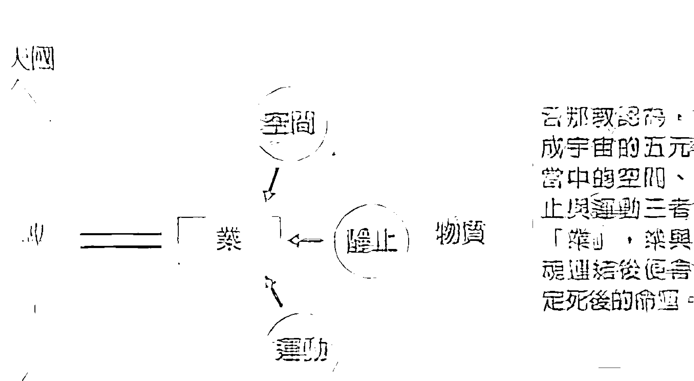

耆那教认为，构成宇宙的五元素当中的空间、静止与运动三者是「業」，業与灵魂连结后便会决定死后的命运。

### 1.3 元素

印度创世神话里提及的原初巨人，传说宇宙万物均是由原人所生。

## 冥界的構造與薩滿類型

綜觀全世界神話與宗教所論述的冥界會發現，所謂死後世界的位置相當五花八門、隨性自由。但冥界的構造卻並非毫無規則性，也就是冥界構造一般分為縱式與橫式兩種。

所謂縱式便是指死後世界位於人間世界的垂直方向，也就是天空或大地之下的地底；所謂橫式指的則是那些位於人間世界水平方向，如森林、深山或者海上等等的冥界。

那麼，為何某些地區的冥界是縱式，某些地區是橫式呢？關於這個問題，梅原伸太郎在《他界論》這本書裡面提出了一個非常有趣的說法：各地區的冥界是縱式或橫式，很可能須視該地的薩滿類型而異。

此處所謂薩滿類型指的是脫魂型與附身型兩種。

何謂薩滿？薩滿乃指擁有特殊能力、能夠與異界的精靈神靈進行接觸者。與神靈進行接觸的方法有二：一是脫魂型，乃指使自身靈魂脫離身體、前往異界；一是附身型，即指使異界靈魂附於自身。

梅原氏認為脫魂型的冥界乃屬縱式構造，而附身型的世界屬於橫式。理由很簡單，脫魂型薩滿能使靈魂脫離身體飛往他界、而且還具有意識，因此可將異界分層構造之類的詳細情報傳遞回來。

事實上，脫魂型薩滿所描述的異界亦確實是以縱式占多數；此類世界基本上都是分成天界、大地、地底的三層構造，且中央都有宇宙山、宇宙樹之類巨物支撐著整個世界，而人類的冥界也是位於天界或地底的某處。

相對地，附身型則是由神靈附於薩滿身體、薩滿會失去自我意識，所以幾乎無法取得有關異界位置或構造等等相關情報，自然會得到異界落在人類所居世界周遭某處的結論。目前世界各地至今均可看見薩滿存在，薩滿信仰未消失，但薩滿在古代遍布全世界，並且具有極大影響力。

儘管梅原氏所說尚且稱不上是定論，卻是探討人類死後世界構造時，相當值得注意的說法。

## 第2章

### 宏观、重建与结构的天地同歌地流

此处为正文段落区域，但文字模糊无法清晰识别具体内容。

## No.035 古代猶太人的冥界 謝屋爾

Sheol-Jewish underworld

受到舊約聖經強烈的一神教教義影響，使得猶太人的冥界謝屋爾成了完全遭到拋棄、暗無寂寥的死者世界。

### ○ 無樂趣而陰鬱寂寥的冥界謝屋爾

基督教源生於古代猶太教的支派。基督教的聖經分成舊約聖經與新約聖經，其中舊約聖經是西元前由猶太教徒所著，也是猶太教的聖經。根據這部舊約聖經的記載，我們可以發現當時猶太人相信人類死後將會下到地底某個名為謝屋爾的冥界。從舊約聖經《詩篇》中提到「我的性命臨近陰間」、「我算和下坑的人同列，如同無力的人一樣」、「你把我放在極深的坑裡，在黑暗地方，在深處」等等記載可以看出，謝屋爾的形象是個深邃的坑穴。古代猶太人還相信所有人死後都會化作利乏音（某種彷彿影子般的靈體形式）前往謝屋爾。謝屋爾是連神也棄之不顧的地方，那裡淨是黑暗寂寥，無任何趣味可言，死者在那裡可以說一無所有，唯獨死亡。從這點來看，謝屋爾的確堪負地獄之名，但謝屋爾沒有任何特殊的刑罰，甚至可以說是個能夠擺脫在世時的辛勞、使人得到解脫的場所。

然而，像謝屋爾如此不得救贖的黑暗冥界概念，其實是來自舊約聖經所規定的強烈一神教教義。其實在一神教尚未壯大興起之前，古猶太人也有崇拜已到謝屋爾的祖先這種家族式的信仰，而他們還相信死者的靈魂將會加入在謝屋爾的祖先，一起生活。在世者不但會供奉各種貢品好讓死者生活順遂，甚至還利用降靈術之類的方法，向死者尋求建言。直到只崇敬天上唯一神的一神教興起，這些個人式崇拜才遭到禁止，而謝屋爾也成為徹底遭到捨棄的冥界。

## 猶太教的宇宙觀

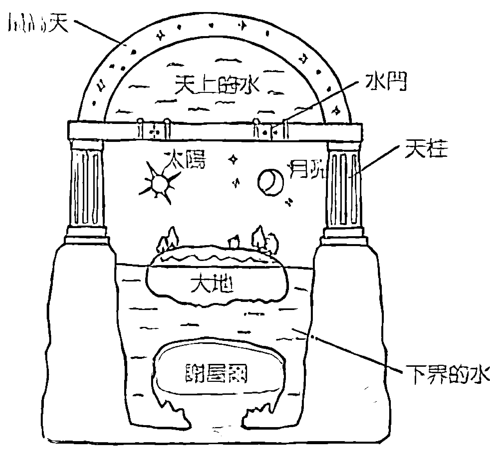

## 謝屋爾的特徵

- 黑暗、寂寥、毫無趣味
- 從凡世的辛勞得到解放

## 謝屋爾的演化

## 古猶太人

生者崇拜祖先

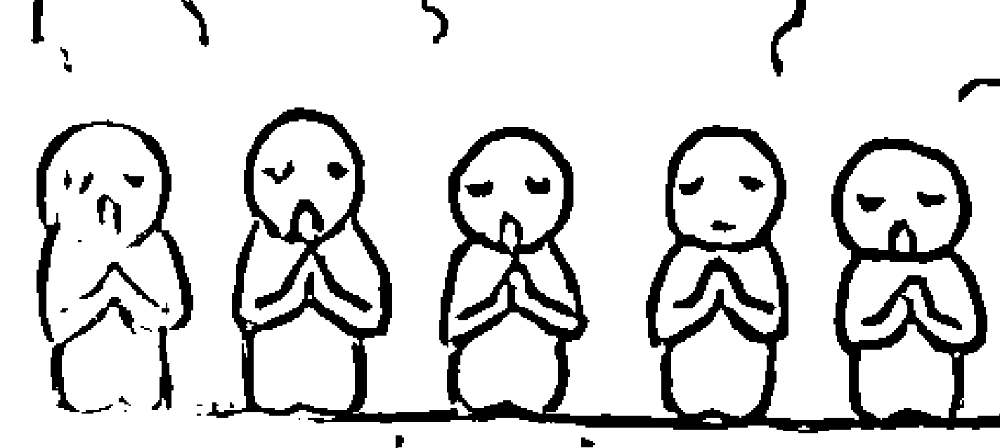

所有死者前往謝屋爾

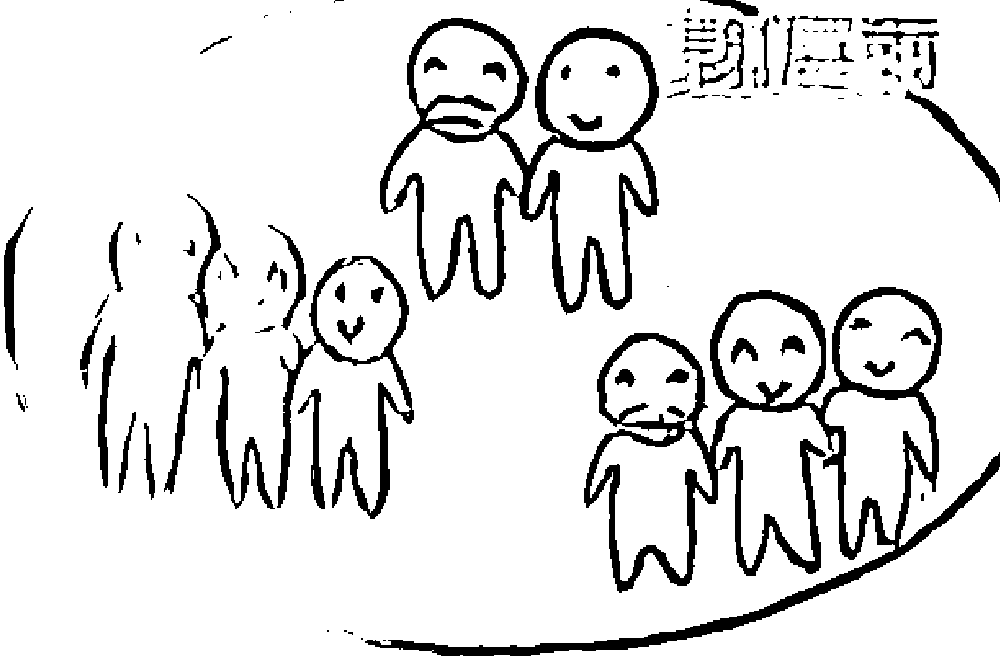

加入祖先的集團生活

受一神教禁止

## 舊約聖經的時代

所有死者前往謝屋爾

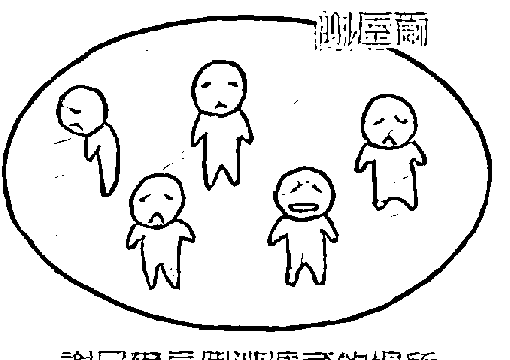

謝屋爾是個迴避棄的場所，毫無趣味

## 猶太教相關詞彙

- 猶太教：古代以色列崇拜唯一神耶和華的宗教，也是基督教、伊斯蘭教的起源。
- 舊約聖經：猶太教、基督教的經典。基督徒稱為「西約」。
- 詩篇：舊約聖經裡的一卷，乃由〈嘆息之歌〉、〈感謝之歌〉等一百五十個讚美詩組成。

## No.036 啟示錄時代的天國與地獄

### The apocalyptic Paradise and Hell

有過失去國土的悲劇性體驗以後，古代猶太人終於開始相信世界將會迎向終結、唯獨受挑選者方能進入天國。

### ○孕生自啟示錄的天國與地獄

古時候古猶太人對死後世界所持印象其實並不豐富。自從西元前六世紀猶大王國遭巴比倫滅國、有過失去國家的悲劇性體驗以後，便開始產生了改變。猶太人之間逐漸孕生出啟示錄式的信仰：再過不久神就會終結世界，為猶太人建立全新的神的王國（天國）；所有死者都將復活並接受神的最後的審判，受挑選者便能在王國裡過著幸福的生活，其他人則是要墜入地獄。

這種啟示錄式的信仰在西元前二世紀至西元三世紀間蔚為風行，使得猶太教的死後世界與來世形象產生了改變。

雖然說啟示錄描述的天國與地獄，僅限於世界末日以後才形成的永恆天國與地獄，不過此信仰的生成卻也使得古猶太人的死後冥界謝屋爾產生了變化。假如世界終結以後將有永恆的天國與地獄形成，那麼死後冥界謝屋爾當然也只是在世界末日來臨以前的一個暫時性冥界而已。然其變化並不僅只於此，甚至還及於其內部。原本只是個黑暗陰森場所的謝屋爾從此被劃分成好幾個區塊，罪人會被打到謝屋爾的深處、受到彷彿地獄般的刑罰，正直者則是停留在較淺的地方，在那裡安樂地等待最後的審判到來。

此類思想在聖經正典裡面鮮少出現，倒是以《以諾書》為首的非正典啟示文學卻是大倡其道。於是死後和末日來臨後擁有天國地獄的思想此時開始逐漸散播流傳。

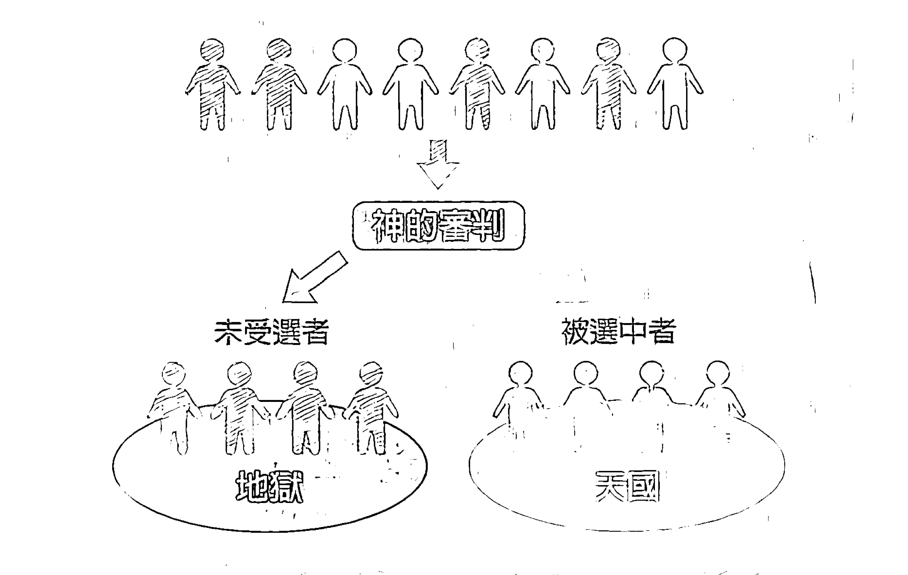

西元時代便已極有世界即將迎向末日，經過神的審判被選中者便可進入神的王國，未受選者則墜落入地獄的思想形成。

## 時代的内部區分

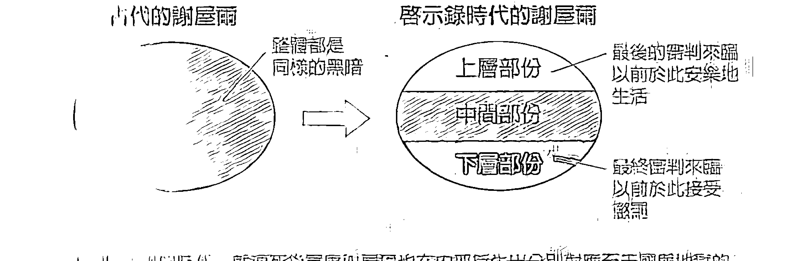

啟示時代，就連死後冥界的謝屋爾也在內部衍生出分別對應至天國與地獄的區分。

啟示便是指被選中的預言者得自神的啟示。西元前後的猶太世界相繼出現以內容的啟示文學，使得世界末日、最後的審判等概念廣為流傳。被稱為西約聖經偽典，有衣索比亞語與斯拉夫語兩種譯本。

## No.037 基督教的冥界

Christian afterlife

由猶太教支派孕育而成的基督教除啓示錄式的天國與地獄以外，也承認靈薄獄和煉獄等死後世界的存在。

- 使死後世界之形象應超發達的基督教

基督教發源自猶太教當中的啓示錄支派，最遲至西元前一世紀便已成立。是故，基督教最初便有世界末日、最後的審判、永遠的天國與地獄等觀念，故成書於初期基督教徒之手的新約聖經當然也以這些觀念爲前提來撰寫。

新約聖經將舊約聖經描述的死後冥界謝屋而喚作黑帝斯，而《路加福音》財主與拉撒路的寓言一節，更清楚記載黑帝斯內部有個相當於地獄的場所，在巨大深淵的對岸則是另有個通稱「亞伯拉罕懷裡」、類似天國的安樂場所。

進入基督教時代後，天國與地獄的具體形象就變得更加豐富了。正典新約聖經雖然並無太多記載，不過《彼得啓示錄》、《保羅啓示錄》等外典均有提到死者將視其罪孽而有刑罰輕重的差異，對天國與地獄的模樣有具體描述，對後世造成了莫大的影響。

基督教在接下來的數個世紀間，還發展出除了天國與地獄以外尚有其他特別場所存在的信仰，靈薄獄（邊獄）和煉獄便屬此類。初期基督教認爲唯獨在世時行止正直、受過洗禮的基督教徒才能到天國。但如此一來便會面臨到剛出生未犯罪、未受洗禮便死亡的嬰兒該如何歸類，以及日常生活中累積許多小小罪孽，但卻是信仰基督教者該怎麼區分的問題。於是供純潔無瑕的嬰兒靈魂等待最後的審判來臨的靈薄獄，以及供一般基督教徒洗清罪孽的煉獄等等場所，到這時才受基督教的承認。

## 基督教的死後世界

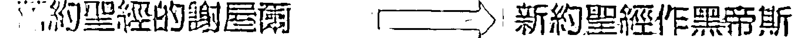

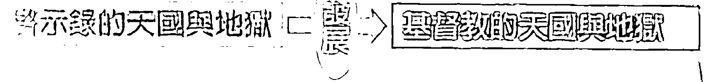

## 死後的基本世界觀

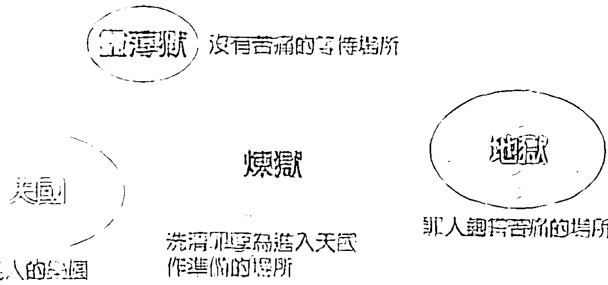

## 末日與最後的審判

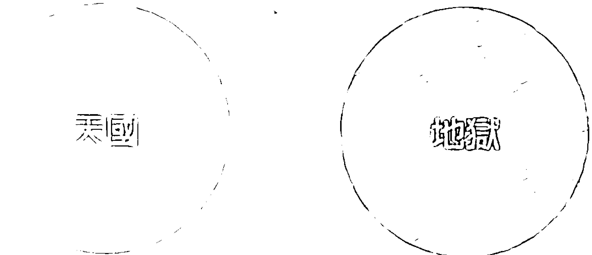

新约圣经为基督教圣经，由西元一至二世纪的基督徒所著。基督教的入教仪式，全身浸在河水裡並払水滴在头顶，基督教相信如此便能洗淨原罪，使灵魂受到救免。

## 死後審判與最後的審判

### After-death Judgment and the final judgment

基督教認為死後的天國與地獄唯有靈魂居住，不過在最後的審判後來臨的永恆天國與地獄卻不光是靈魂而已，肉體也要住在這裡。

- 暫時性與永久性兩種天國與地獄

基督教的天國與地獄分成人類死後供死者停留，等待最後的審判到來的暫時性天國地獄，以及死者在最後的審判之後將被送去的永恆天國地獄兩種。

究竟這兩種天國與地獄之間有哪些具體的差別呢？事實上，如果以到達天國何等幸福、在地獄是何等痛苦的角度看，這兩種天國與地獄之間其實並無明確的區別界線，因此這兩種天國地獄在眾人腦海裡的形象，可以說是幾乎完全相同。不過這兩者間有一個決定性的差異存在，那便是死後的天國地獄唯有死者靈魂居住，而永恆的天國地獄住民不僅僅是靈魂，連肉身也會住在這裡。

假設現在有某人死亡，首先會有天使前來，帶領死者離開到天上、神的身邊，接著是舉行死後的審判，靈魂會被送到天國或地獄，肉體在現實世界裡則是被焚化或腐化而消滅，這也是為何死後的天國地獄唯有靈魂居住的原因。

但當世界步向終末時，仍然活著的人類將一起死亡，這些人不久之後就會復活，且所有在末日之前曾經存在過的人全都能復活，還附帶肉體；他們將會以跟死前完全相同的狀態重生，然後在神的面前接受最後的審判、被送往天國或地獄。由於所有人都擁有肉體，且所以基督教徒相信在永恆天國能夠得到更大的幸福，在永恆地獄裡受到的苦痛也較大。

假如擁有肉體，勢必就會遇到人類在天國是否可以如現世般、有男女交往的問題。關於這個，基督教主張天國的身體如天使般純潔，因此沒有進食和從事繁殖的必要。

## 基督教中关于死后世界的图示

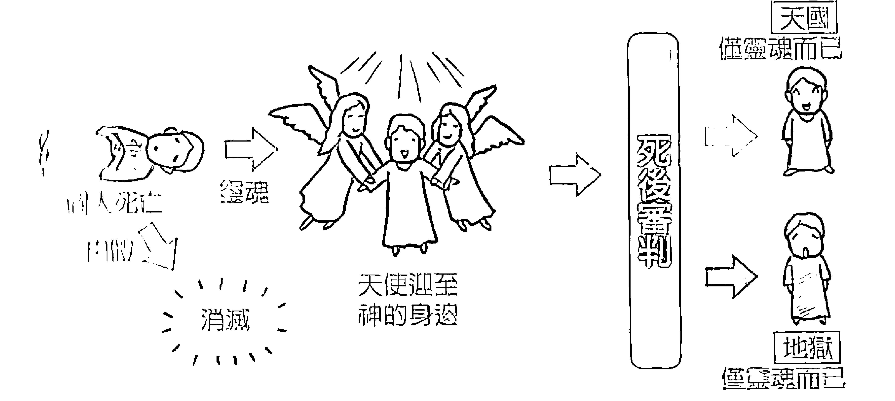

当然也有些人死后去的并非天国或地狱，而是炼狱或炼狱。

## 基督教中关于死后世界的图示

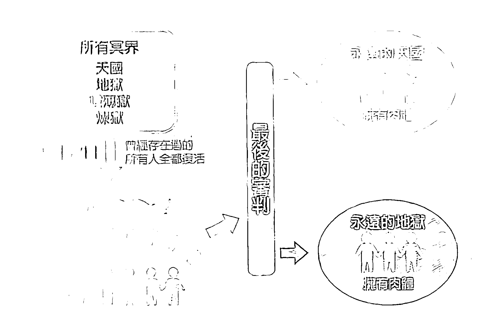

在永恒的世界中，天国的幸福和地狱的痛苦均会放大。

## 基督教的天堂

Christian Paradise

每个人勾勒的天堂样貌形形色色，有灵性而理想的天堂、有活泼充满乐趣的天堂、庭园型天堂、都会型天堂等等，并非只有一个形象。

### ○综合众人最幸福想象而成的天国

从新约圣经时代开始，基督徒便相信圣人、义人以及活得正直的善人在来世能住在天堂里面。但天堂究竟是个什么样的场所？拥有诸多宗派的基督教其实并没有一个整体而固定的见解。光是指称天堂的用语，基督教便经常以天堂（kingdom of heaven）、神国（kingdom of God）、乐园（paradise）等等不同的用词来表征相同意涵。严格来说，「天堂」和「神国」此二语可以被解释为「神的统治」，指的应当是末日以后的世界。基督教的天堂是在漫长的历史中，累积无数人类的想象而成的综合体。

天堂是最幸福的场所，但何谓幸福却因人而异。有些人认为只要能与神同在便是最幸福的事，所以天堂便成了以神为中心的场所，天使、圣人和义人们永远维持着静止不动的姿势，只是一味地默想着神。在此种天堂中全无尘世俗世的活动，所有人都只知道默想着神。举例来说，但丁《神曲》所描绘的至高天，大致上就是个类似的场所。至于那些渴望更趋近人性的幸福生活者，则会认为天堂是可以与故友家人再相会、不为生存只为享乐而饮宴餐聚的地方。在十八世纪前后，甚至还发展出有男女情爱和结婚等概念的天堂。

天堂的外观同样也是形形色色，出现频率最高的主要有两种类型，一是旧约圣经《创世纪》所述伊甸园的庭园型，另一类则是新约圣经《启示录》所述，新耶路撒冷的都会型天堂。

## 表徵天國的用語

- 天國 (kingdom of heaven)
- 神國 (kingdom of God)
- 樂園 (paradise)

*註：並無特定用法*

## 依行動分類

- **禁慾型**：天使、聖人、義人圍繞神，維持永遠不動的姿勢只不斷默想神的場所
- **親型交友型**：與故友家人再會，並且談論交际，不為生存只為享樂而吃喝玩樂的場所
- **自由奔放型**：有男女關係也有煙酒的場所

## 依形態分類

- 伊甸園般的庭園型
- 「新耶路撒冷」般的都會型
- 綜合庭園型與都會型的綜合型

在猶太教、基督教、伊斯蘭教的經典和傳說都有提及，有數個位階。

## 伊甸園 The Garden of Eden (Gan Eden)

基督教徒在描述天國形象时，往往都会提到《創世紀》所述的地上樂園「伊甸園」。

### ○亞當夏娃居住的地上樂園

從基督教的初期開始，「伊甸園」便已是眾人描繪天國時不可或缺的原型之一，而《創世紀》中對其有簡潔的說明：

> > 耶和華在東方的伊甸建了一個園子，把所造之人安置在那裡。耶和華使各樣的樹從地裡長出來，可以悅人的眼目，其上的果子好作食物。園子當中又有生命樹和分別善惡的樹。有河從伊甸流出來，滋潤那園子，從那裡分為四道。第一道名叫比遜，就是環繞哈腓拉全地的，在那裡有金子，並且那地的金子是好的；在那裡又有珍珠和紅瑪瑙。第二道河名叫基訓、就是環繞古實全地的。第三道河名叫底格里斯，流在亞述的東邊。第四道河是幼發拉底河。」（新共譯聖經／日本聖經協會）

換句話說，伊甸園就是神為最初的人類亞當夏娃準備的地上樂園。

亞當夏娃兩人受到蛇的誘惑，犯下偷嚐善惡知識樹果實的罪、遭驅逐出伊甸園，使得他們的後世子孫——人類必須付出諸多辛勞汗水才能存活下去。

但是人類並未放棄返回伊甸園。他們相信最後的審判後，所有的罪都將受到赦免，屆時伊甸園就會重現地上。因為如此，後來幾乎跟伊甸園一模一樣的自然樂園——天國，才漸漸受到了大多數人的接納。

1 珍珠和紅瑪瑙：日語原文作「琥珀類和青金石」，英語則作「bdellium and onyx stone」，即沒藥（引伸為紅寶石、水晶或珍珠）與紅瑪瑙。
2 新共譯聖經／日本聖經協會：此處乃指日語原文出處，譯者川口。

# 生命树

# 善恶知识树

亚当、夏娃的罪与「原罪」

基督教认为因为亚当夏娃当初在伊甸园里面犯下偷吃知识树果子的罪，使得人类的本性受到玷污损毁，抱有犯罪的倾向：于是亚当夏娃所犯下的人类第一个罪，以及这个罪所造成人类后来的原罪，便称作「原罪」。单论「罪」是仅限于犯罪者个人的，「原罪」却不然，它是所有人类与生俱来的。

因此，基督教之所以会是基督教，乃是因为他们相信人类包括自己的所有罪恶，全部都已经因为耶稣在十字架上的牺牲而得以消除。民众可以透过受洗成为基督徒，使自己得到宽恕。

同时，基督教认为即便是从未犯罪的新生婴儿，在受洗之前也因为背负着原罪，而无法立刻进入天国。

- 基督教认为神所创造出来的人类。根据《创世记》的记载，神先用土创造亚当，再从亚当的肋骨创造夏娃。
- 伊甸园的果树，其中有一棵善恶之树。当时神曾经禁止亚当吃这棵树的果子。

## 新耶路撒冷
New Jerusalem

基督教的天国亦拥有都会型城市的形象，其原型便是来自于《启示录》讲述到的「新耶路撒冷」

## ○ 都会型的天国形象

基督教的天国不仅仅拥有伊甸园此类乐园意象，有时还以更富都会气息的都市形象呈现。这个都市形象基本上是以新约圣经《启示录》所述的「新耶路撒冷」为原型。

耶路撒冷当然就是犹太教、基督教的圣地，从前曾有雄伟神殿座落于此，可是该神殿在西元后七十年遭到罗马破坏，到《启示录》时代早已不复存在。

然而《启示录》却说在世界末日与最后的审判结束后，先前于天界准备好的耶路撒冷便会降到地上。

这座都市充满神的荣耀光辉，有高大的城墙和十二道城门。整座都市呈四方形，长宽高俱为一万两千史泰德，城壁厚达一百四十四腕尺¹。墙面以碧玉制造，城是以透明有如玻璃的纯金筑成。此外城墙有十二根基石，分别用各种宝石装饰以上便是「新耶路撒冷」，一般基督教徒大多相信死后或最后的审判后的天国里有如此美好的都城，受选者能住进这个地方。

天国里有个新耶路撒冷的信仰，到十二世纪前后变得十分兴盛。乃是是因为此时欧洲各地都市逐渐复兴，众人开始认为只有都会才是实现美好生活的最佳场所。

故伊甸园般的美丽庭园里，有座维护极佳的都市城中心的天国形象于焉成型。

> ¹ 腕尺：《启示录》21：17日语作「へキス」，英语作「cubit」，中文和合本则译作「肘」。

## 【图】「新耶路撒冷」

> 《启示录》提及的都市。存在于天界，将在最后的审判过后降落到地上

# 第2章 犹太教・基督教的天国与地狱

# 《启示录》

新约圣经最末章《启示录》在西元95年前后，成书于小亚细亚。那时基督教徒来说是个严苛的时代，所以《启示录》借着预言逐渐逼近的末日与世界的完成，来激励处于苦难下的基督教徒。其内容是由鼓励小亚细亚七个教会的书信和幻视所见体验所构成，其中的末日景象便是出自约翰的幻视。此外于此所述的世界末日有个特征，就是大肆主张当时流行的千年王国思想。所谓的千年王国是一个将在弥赛亚来临后建立的王国，也就是说在《启示录》中等于是总共发生了两次的事件，第一次终末弥赛亚将会降临、撒旦遭到幽闭，地上王国得以建立；千年以后，暂时被囚禁的撒旦将会复活并再度发动叛乱，同时撒旦会被消灭，终极末日也要来临，接着进行最终审判，然后将出现全新的天地，永恒的世界亦将从此延续下去。

# No.042
# 最高天
Empyrean

在托勒密的天动说之后，基督教徒便将神居住的天国移到了位于普通天界之外的最高天。

## ○由纯粹的光构成的神圣世界

以天动说闻名的托勒密虽是活跃于西元二世纪的亚历山卓时代人物，但是欧洲的基督教徒却直到十二世纪前后才开始注意到这些古代的学问，使得天国究竟位于何处的问题再度成为焦点。

根据天动说的思想，星球体形状的地球乃是宇宙中心，其外尚有数颗天球团团包围。这些天球就像是坚硬的外壳，总共有八颗；从第一天到第七天是分别是月球、水星、金星、太阳、火星、木星、土星，各以不同速度运转，再往外则是载着恒星朝反方向回转的第八天。当时的人相信恒星是天球上的洞，来自外侧的光便是从这些洞射进来的。

了解这些行星的构造以后，将天国置于这些天球内部便非难事。于是基督教徒开始认为，在最外侧的天球——恒星天之外，还有神的世界，而天国就在那里。

基督教的神学学者认为，神的世界是个充满光的地方，可分两层。最顶层是神的住处，是个除了神之外谁都无法进入的特别世界，唤作「三位一体天」。其下则是天使和受选者居住的天国，而这一层便是所谓的最高天。

最高天的特征在于它由纯粹的光构成，是个充满光辉、耀眼夺目的世界。受到神挑选的灵魂于死后升上天界，最后到达最高天，届时他们的身体将会发出光芒，就连衣服也变得如佛光一般纯白。当时的人们认为光并非寻常物质，而是神圣的证明。

## 川端康成与天堂

# 第2节 基督教的天国与地狱

四世纪受到公认的基督教基本教义
神有「圣父」、「圣子」、「圣灵」三个位格，此三者虽可独立体现但终

托勒密约105年，以主张地球位于宇宙中心、太阳和行星均围绕地球...活跃于埃及的亚历山卓

# 基督教的地狱
Christian Hell

初期的基督教地狱原本是以永远的冰、火以及不洁的蛆虫为象征，后来才渐渐细分，刑罚也更加多样化。

## 折磨灵魂与肉体的地狱

基督教的地獄是罪孽深重者死後永受折磨的場所。不光是人類，惡魔（墮天使）也被囚禁在地獄之中。

啟示錄時代的猶太人將這受折磨的場所稱呼為「火焚谷」。火焚谷此語源自耶路撒冷南方的「欣嫩子谷」，眾人在那裡以幼兒火祭的方式向異教神獻活祭品、焚燒罪人屍體，是個火焰終年不滅的地方。此地名後來直接成為新約聖經裡指稱地獄的用語。

地獄的大小、位置或刑罰種類等情報雖然並無定論，卻有某種程度的模式可循。《馬可福音》講到地獄刑罰時便曾經提到「不滅的火」和「不死的蟲」；《啟示錄》則說地獄以「硫磺火湖」給予永劫的痛苦，《以諾書》甚至還說有「冰」的刑罰。換句話說，永遠的冰與火，以及不潔蛆蟲可謂是地獄刑罰的重要元素。不過西元二世紀成書的《彼得啟示錄》裡的地獄，卻視死者生前的罪惡輕重有較細的劃分，而且刑罰也極為多樣，其地獄觀對後世造成了很大的影響。

除肉體的苦楚以外地獄同樣也有靈魂之苦，那苦在於被神放棄、失去救贖的希望。於是天主教才將地獄的刑罰分成「喪失的刑罰」與「感覺的刑罰」兩個種類。

西元三世紀的神學者奧利金認為地獄的火焰擁有淨化靈魂的作用，即便已經身在地獄，也能使靈魂向善提升。此觀念後來更衍生出煉獄的概念，但這畢竟是少數派想法，且奧利金死後三百年遭教會驅逐。另外，靈魂落入地獄以後將會滅絕的想法同樣也是自古便已存在。

## 解析舊約的聖經地獄火焚谷之語源

## 地獄的作用

- 罪人死後永受刑罰
- 魔鬼（違逆神的天使）永受刑罰

## 地獄的刑罰（天主教的分類）

- 感覺的刑罰
  - 永遠的火
  - 永遠的冰
  - 不潔的蛆蟲
  - 其他
- 喪失的刑罰
  - 指被神放棄、失去得到救贖希望的刑罰

## 異端者認為

- 地獄的火焰擁有淨化罪孽的作用
- 落入地獄的靈魂將會消滅

墮落天使乃指反叛神而遭到放逐的天使，往往被視同於惡魔。以羅馬教宗為最高領導者，是全世界最大的基督教會。俄利根（185？~254年）活躍於亞歷山卓的早期基督教神學者。

# 灵薄狱 (灵薄狱)

灵薄狱乃是基督教专为旧约圣经里未曾受洗的伟人，以及甫诞生便夭折的婴儿新设的冥界。

### ○救赎非基督徒与义人的冥界中间地带

灵薄狱虽非天国，但并无地狱或炼狱的痛苦折磨，那是个供死者灵魂等待最后的审判的地方，真要说起来的话还算是舒适，是基督教冥界的中间地带。不过基督新教除否认炼狱以外，同样也不承认灵薄狱的存在。

倘若真要照基督教的理论而行，那么想在死后到达天国光有正直是不够的，还必须是正式接受过洗礼的基督教徒。可是那些旧约圣经里面提到的族长和先知们，早在耶稣基督出生前便已存在，若照此逻辑来看，无论他们再伟大也进不了天国，甫诞生便夭折的婴儿亦然。儘管他们从未在世间犯任何罪，却必须下地狱、炼狱去。灵薄狱便是為避免此种事态发生而诞生的地方，它与炼狱同样都是中世以后才确立的新概念。

圣经裡早有提到一般认为是灵薄狱原型的冥界。举例来说，新约圣经《路加福音》的「亚伯拉罕怀裡」便属此类。据路加记载，某地有个财主，天天奢华宴乐。有名叫作拉撒路的穷人躺在这位财主的家门口，想要讨财主吃剩的东西。后来这个穷人与财主都死了，结果拉撒路被带到冥府（冥界）裡面，一个唤作「亚伯拉罕怀裡」的舒适场所，但财主去到一个虽然看得到亚伯拉罕的怀裡，但必须受火焰煎熬的处所。於是这个「亚伯拉罕怀裡」究竟是个什麼样的地方，成了信徒议论的热门话题。拉撒路并非基督徒而是犹太人，照理来说死后无法到天国。灵薄狱便是经过漫长的议论与整合出来的概念，从此受到基督教认可。

### 死的作用

- 旧约圣经写到的亚当夏娃或族长、先知、圣人们
- 柏拉图、苏格拉底等虽然是异教徒却德行高尚者
- 甫诞生便夭折的婴儿

先送到靈薄獄

非基督教徒不得進入天國

### 靈薄獄

裡舒舒服服地等待

### 死後的天國

只有基督教徒而已

### 最後的審判

### 永遠的天國

許多人相信在最後的審判過後，天國的大門將會為靈薄獄的居民而開

至於被判的那些人，基督將會去冥府（靈薄獄），打碎大門並解放亞當、夏娃、偉大的族長、先知與眾聖人，好讓他們可以早日進入天國。

### 第2章 犹太教、基督教的天国与地狱

十六世纪的宗教改革时，由罗马天主教会衍生出来的教会，与罗马天主教会之间激烈的斗争，形成了基督教的三大势力。

# 炼狱
Purgatory

炼狱是为了并非伟大义人、亦非该入地狱罪人的一般基督教徒洗清罪孽、为进入天国作准备的冥界。

## ○为进入天国先净化罪孽的冥界

炼狱是对死者亡灵加以试炼藉以净化罪恶，好为进入天国作准备的冥界。炼狱仅存在于「个人死亡到最后的审判」的这段期间，只不过属于新教系统的基督教并不承认炼狱的存在。
古时候的基督教认为优秀的义人在死后能够升到天国，而罪人则落入地狱，可是这么一来，那些不够完美的普通基督教徒就永远没办法进入天国了。于是基督教衍生出这个为了进入天国作准备的场所，也就是炼狱。
圣经里面虽然未明确提及炼狱这个场所，不过基督教在很早以前便已经有某种地狱之火拥有净化人类罪恶效果的思想。举例来说，奥利金就认为地狱之火有净化的效果，所有人都能得其净化、最终回归神的身边。圣奥古斯丁虽然否定所有人最终将回归神身边的说法，不过他承认有净化之火的存在。另外，格列高利大教皇*1不只承认有净化之火的存在，他还认为地狱总共分成两个部分，上层是义人们休息的场所，下层则是罪人受难的地狱。正是因为这些思想不断发展，才有日后炼狱的存在。随着炼狱信仰的散播流传，后来甚至还衍生出奉圣母玛利亚为炼狱女王的信仰，在世者只须向玛利亚祈祷，便能缩短死者必须在炼狱停留的时间。就连罗马天主教会也在十三世纪时正式承认炼狱的存在，不过要是说到有系统地记述炼狱中的苦行与相关光景，以及真正确立炼狱的存在，还是非但丁的《神曲》莫属。

*1 格列高利大教皇：通称格列高利一世。
*2 希波（Hippo）：北非海岸两个古代港口的名称。一是希波勒吉乌斯，一是希波阿克拉，在罗马时代和以后时期均具有重要地位。
*3 格列高利圣咏（Gregorian chant）：亦译葛利果圣歌。

## 1) 煉獄的作用

犯下少許罪惡的普通人

無法直接前往天國

前往煉獄

煉獄的火焰淨化罪孽

變成正直的人

如此便能前往天國

天國

## 2) 為死者祈禱的立場

死者停留在煉獄的時間縮短

在世者

我出來了！

煉獄

・奧古斯丁（西元354年～430年）。時任北非希波²主教，是西方基督教會最偉

・格里高利一世（或稱大格里高利），約西元540年～604年。古代基督教頗具代表性的教皇，以格里高利聖詠聞名於世。

・靈魂不滅的概念。羅馬天主教與東方正教均將之奉為特別的存在信仰

# 千年王国
The Millennium

千年王国是唯有在末日来临前的千年期间内，得以在地上实现的天国，基督徒相信在这里能享受到极为物质而现实的幸福生活。

## ○充满物质幸福的地上天国

根据新约圣经《启示录》记载，在这个世界迎向终末、永恒的天国（神的王国）和永恒的地狱出现之前，有段不长不短恰恰一千年的期间，地上会有一个由基督统治的王国，即弥赛亚（救世主）的王国出现。在此之前会有位天使将恶魔封印在深渊之下，是故这个时代已无恶的存在。那些殉教而死的人将会复活，和基督一起统治地上的世界，这便是所谓的千年王国。

千年王国的思想虽然在四世纪时遭到教会否认，但在此之后却还是有许多基督徒仍然期盼着千年王国的来临，尤其是那些认为自己行得正、坐得端却遭迫害，还没充分享受人间幸福就面临死亡的人更是如此。

而且基督教虽然说永恒天国里的灵魂拥有肉体，但这肉体既纯粹又精妙，总给人一种太过灵性的感觉。其次，永恒天国要等到这个世界终结以后才会出现，使人感觉距离相当遥远。可是千年王国并非如此，千年王国是实现于地上的天国，是人们能够享受到物质性现实幸福的地方。举例来说，西元二世纪的里昂主教伊里奈乌斯就主张，复活的殉教者在千年王国里，处于一个完全理想的环境中，在那里葡萄酒和谷物丰厚、多到满产，不但能够吃到美味的食物还能长生不老，可以充分享受物质现实的幸福。

所以尽管受到教会的禁止，盼望千年王国多过于永恒天国的信徒还是存在。

# 第3章 千年王国与永恒天国的比较

# 千年王国

# 永恆的天國

- 弥赛亚（希伯来语）：将为世界带来和平的神界救赎者，希腊语作「Christos」，与「受膏者」同义。
- 里昂的爱任纽（约130年～202年）：出身于小亚细亚，是初期基督教会相当重要的神学家。

# 《衣索比亞語以諾書》的天國與地獄
Ethiopic version of the "Book of Enoch"

根据《衣索比亚语以诺书》记载，死后冥界和永恒的天国地狱都位于地上的某个地方，世界的外侧还有个收容恶魔的地狱。

## ○最后的审判前供死者滞留的死后国度

旧约圣经伪典《衣索比亚语以诺书》成书于西元八世纪，其编写乃根据成书于西元前三世纪左右的犹太教经典《以诺书》。这部经典讲的是圣人身处虚幻之中，先在拉斐尔与乌列¹两位天使的引导下看过天国与地狱，再听天使讲述人间万事万物的故事。

据其所载，天界里神的宫殿乃是以水晶制成，屋顶则与星辰和闪电的线条形状类似，还有智天使²坐镇正中央。

这个圆形世界的尽头有暴風侵袭之地、落日没入的西方火、收藏所有风动的仓库和地隅之石、支撑地面与天盖的四阵风，以及吹动太阳星辰转动的风等。

遥远的彼方的大地有道极深裂缝，那里是天空纠结之风，还有天之火柱窜起，火柱的另一头则是整片既无天亦无地的荒凉场所，那里便是以路西法为首的堕天使们永禁囹圄的囚笼。

人类死后灵魂的去处就在这个世界的某处，那里有座巨大而坚硬的高山，其中有四块底部平坦的洼地。之所以有四块洼地是为了区别灵魂，将亡者分成殉教者、一般义人、遭他人伤害的被害者以及罪人四种灵魂。灵魂会在这些冥界或地狱受到应有的对待，但这也仅只于最后的审判之前的时间，之后视审判的裁决结果而定，可能被分发到永恒的天国或地狱。

永恒的天国和地狱则在更遥远的地方，那里虽然是片林木茂盛、受到祝福的土地（天国），但正中央却有座受诅咒的山谷（地狱）。最后的审判之际，所有的死者都会复活，按神的裁决，受选者前往天国、罪人则被送往地狱；受选者将可在天国俯瞰着罪人们在深渊底下受尽苦楚。

> ¹ 拉斐尔与乌列（Raphael & Uriel）：拉斐尔是拥有治疗能力的天使。乌列是希伯来神话里的大天使，意思是「上帝之光」。

> ² 智天使：根据基督教传说，智天使是较高级的天使，在上帝宝座旁侍立，不断地赞美上帝。

## 特徵

- 最后的审判后的永恒天国与地狱位于此地
- 从死后到最後的审判期间暂时停留的冥界也位于此地
- 不论哪个冥界都是落在离现世极遥远的场所
- 世界外侧有囚禁堕天使的永劫牢狱

《以诺书》是旧约圣经外典《以诺书》的衣索比亚语译本，至今衣索比亚正教会仍视其为正典。

以诺是《圣经》里提到的埃及的圣人，传说他在还活着的时候便到了天界。

## 《斯拉夫语以诺书》的天国与地狱
### Slavonic version of the "Book of Enoch"

根据《斯拉夫语以诺书》记载，天界总共分成七个层次，有如伊甸园般的天国和黑色火焰燃烧的地狱便位于其中的第三天。

### 设在第三天的天国与地狱

旧约圣经伪典《斯拉夫语以诺书》是部成书于西元一世纪前后的犹太教经典；其描写圣人以诺升上天界、听闻世界秘辛的主题虽与《衣索比亚语以诺书》无异，不过谈到天界结构及天国地狱的位置等内容，则是大相径庭。

据其所载，天界总共分成七层，最底层的第一天有司掌星辰运行的两百位天使，以及储存雪、冰、云、露的贮藏库与司掌天使；第二天则是囚禁背叛神的堕天使的地狱；一般所谓的天国与地狱位于第三天，且天国很可能是位于第三天中央或此南侧的部分，那是个仿佛伊甸园般充满绿意而丰饶的庭园，有沁香凉风吹拂、四条河川流经，还有生命之树生长，此地乃由充满光辉的天使守护。地狱则是位于第三天的北方，那里是个被黑暗与浓雾笼罩遮蔽的无光场所，除了有炽热的黑暗火焰燃烧之外，还有火河不断涌出。而且地狱里还有寒冰之地与牢狱，由残酷而无慈悲心的天使持武器毫不容情地折磨此地之人。接下来的第四天是司掌太阳与月亮运行的天界，住有负责这些工作的天使。第五天是伊古利格利（古利格利）的地狱。

《创世纪》说早在诺亚的洪水以前，就有许多天使背叛主，降到地上与人类的女孩结了婚，那些天使便是伊古利格利，他们日日夜夜在第五天忏悔。第六天是大天使的住处，他们在这里监看世界的秩序和日月星辰的运行，并且向低位天使发送指示。

最后的第七天自然是神的住处，此地中央是主的御座，侍主的众多天使则是围绕在宝座四周。

### 犹太的构造

- 第十天 —— 神的住处
- 第九天 —— 总管万事的大天使
- 第八天 —— 伊古利格利的忏悔之地
- 第七天 —— 司掌太阳与月亮运行的天使
- 第六天 —— 一般的天国与地狱
- 第五天 —— 堕天使的地狱
- 第四天 —— 司掌星辰运行的两百名天使及雪、冰、雹的贮藏所与司掌天使

### 基督教的天国与地狱

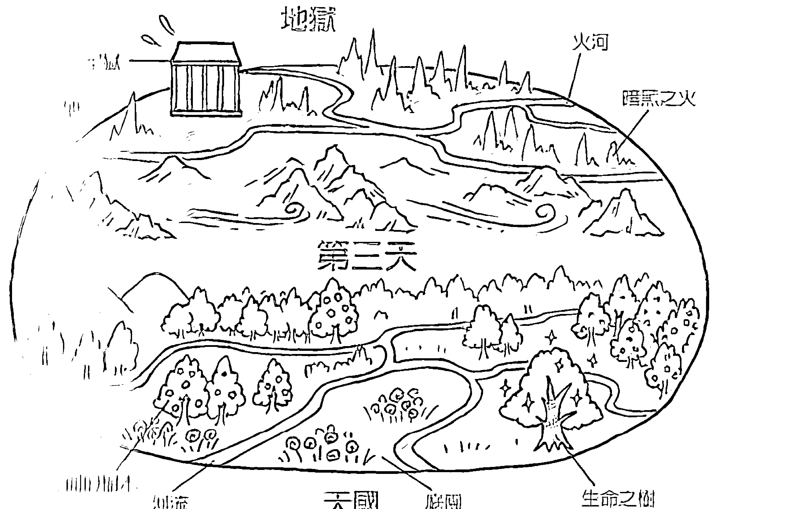

- 《以诺书》（斯拉夫语版）—— 西约圣经伪典《以诺书》的斯拉夫语译本，但其内容却与希伯来文版颇有出入，似乎并非完全按照原书译成。
- 吉利格利（古利格利）—— 古利格利有「神之子」、「看守者」等涵意。

## No.049 《彼得启示录》的地狱 The revelation of Peter

地狱会视罪孽轻重，有各种不同等级刑罚的信仰源自《彼得启示录》，经过中世欧洲之后传承至今。

### ◎强调永恒地狱的惩罚

新约圣经外典《彼得启示录》乃是成书于西元两世纪前后的基督教经典，内容记载基督对彼得讲述最后的审判当天将要发生的事情，以载有对地狱的详细描写而为后世所知。

据其所载，在最后的审判当天，全人类的死者都将从火焚谷得到释放并复活，接受神的审判。审判过后，行善者会被挑选出来、送到云端神的身边；至于罪人则是会被勾住舌头吊起来，还要忍受下方的烈焰烧炙。否定真理者会坠落到地穴，有天使四处巡视、催动火焰；诱惑男性发生外遇的女性则会被揪住头发、吊起来炮烙，与这些女性发生关系的男性也要在同样的地穴里受苦。下场最恐怖的则属堕胎打掉神创造物的女性，她们堕落的地穴远比其他罪人更深更大，还有粪尿等所有令人厌恶之物从四面八方涌入，那些女人必须受到全身浸渍其中、仅剩头颅露出的可怕刑罚。更有甚者，她们堕胎打掉的孩子踞坐在地穴的另一边，她们的眼睛将会被孩子发出的光挖成窟窿。

地狱的管理者除四大天使当中的乌列外，还有亚兹拉尔。

《彼得启示录》中介绍到其他数种折磨刑罚，整体而言，视罪恶轻重决定地狱刑罚程度的概念已经相当明确，后来欧洲地狱的概念亦承袭于此。

### 天国與地狱

得入天国者轻轻松松，罪人在地狱受苦

在旁观的被害者

大地的深渊

除此以外尚有许多刑罚的地穴

...也是众使徒的领导人物。梵蒂冈的圣彼得大教堂相传就是建于...，所以天主教会更奉彼得为首任教皇。... 他们将罪人推入地狱。

## No.050 《保羅啟示錄》的天国与地狱 The revelation of Paul

《保羅啟示錄》写到天国与地狱有分暂时性与永久性两种，对后世的地狱观留下了莫大的影响。

### ○影响中世欧洲最巨的地狱描写

新约圣经外典《保羅啟示錄》是部成书于西元三至四世纪前后的基督教经典。书里讲的是保羅接受神的引导升上天界，然后在天使的带领之下看遍死后审判情况以及天国地狱的故事，此书对中世欧洲的地狱观造成了极大的影响。

根据其记载，天国乃是位于七個天当中的第三天，这里有道黄金之门，圣人以诺和以利亚就在里面。天界最底层的第一层是片蓝天，通往天空的入口就在那里。附近有亚开龙湖，并有极明亮的「应许之地」，这里正是出现在世界终末之后、由基督统治的千年王国所在地，也算是天国的一种，基督的都城便位于此处，里面住着以赛亚、耶利米、以西结等先知。此外，北侧还住有亚伯拉罕、以撒和约伯等人。

入口外围有天空的基座绵延开展，越过遥远的西方门廊处，再往外延伸便是环绕着整个世界的海洋。海洋外侧就是地狱，这地狱是个没有任何光线能够照射进去的黑暗场所。人们灵魂在接受审判之后，会被引渡给刑罚天使塔尔塔刻斯，并来到这个地狱。这座地狱无垠无涯，境内有无数火河、深穴，人们将视其罪状接受相对应的惩罚，各有专任天使负责施刑。

值得注意的是，除囚禁普通罪人的地狱以外，还有为恶意重罪罪人设置的地狱；该地狱乃是一道位于普通地狱北方极处、加有七重封印的泉水，内部满是炽热的火焰与恐惧，刑罚有普通地狱的七倍严峻。

据说基督教先有地狱分两个种类的思想，后来才渐渐出现炼狱的概念。

### 太初的冥界构造

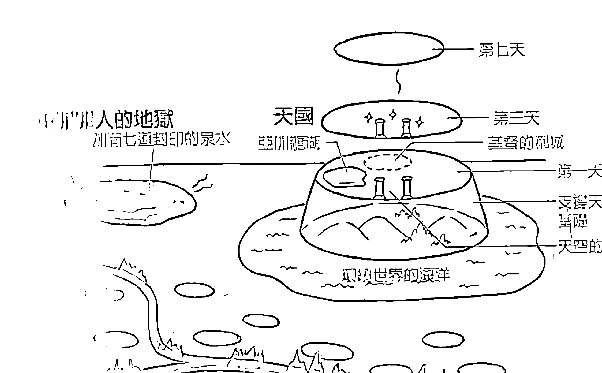

- **第三天的天国** → 以诺、以利亚等特别的圣人
- **第一天的基督都城** → 以赛亚、耶利米、以西结等大小先知 亚伯拉罕、以撒和雅各等圣徒
- **火河与深穴地狱** → 一般罪人
- **七道封印的泉水地狱** → 大罪人

使徒保羅是位伟大的理论家。他曾经是位热心的犹太教徒、甚至对基督教怀抱敌意。在一次戏剧性的心境转变后，从事对异邦人传道的工作。新约圣经中由他所写的书信，希伯来名唤作扫罗。

# 《神曲》的冥界
The after in "The Divine Comedy"

但丁所著叙事诗《神曲》，乃是描述基督教死后世界的最高杰作，壮丽且详细地描绘出了地狱、炼狱与天国的景况样貌。

### （）描述基督教冥界的最高杰作

自古以来，众多基督教徒就对死后的世界有形形色色的想象，而意大利最伟大的诗人但丁所著叙事诗《神曲》便是一个顶尖的作品。

《神曲》的主角正是三十五岁的但丁自己，内容写的是他在西元1300年复活节的一周期间内探访地狱、炼狱与天国的故事。

这段旅程始于圣周四的夜晚，当但丁在黑暗森林里迷路时，古代的诗人维吉尔出现在他面前，担任第一位带路人。但丁便是在维吉尔的带领之下，展开了地狱与炼狱之旅。地狱位于北半球的地底，恰恰就在耶路撒冷正下方，呈一个大的漏斗形状；其内部分成许多圈，每圈都有罪人亡灵接受与其罪孽相当的惩罚。但丁边对这些地方一一进行详细的描写，边继续朝地狱的底部往下走去，最后终于抵达漏斗状的地狱的底层，也就是恶魔之王的所在地。那里是地球的中心、重力聚集之处，在恶魔之王被裁进地面的地方有个通往细长隧道的人口，穿过这个隧道便能从南半球穿出地球表面。出口恰恰就在耶路撒冷的正对面，有座炼狱山耸立在此处。

等到但丁抵达炼狱山的山顶后，他又在年纪轻轻便过世的初恋情人贝緹丽彩的带领之下升上天界。天界共分十层，贝緹丽彩带着但丁一直到第九层；至于最后的第十天亦即最高天，则是由圣贝尔纳负责带路。

但丁的旅程就这样延续，直到他在最高天的中心目击三位一体的神秘为止。其间在地狱、炼狱与天国所见景况样貌，都被详细地描写记录了下来。

> 1 维吉尔：请参照P.044评註。

### 但丁的世界观

### 九重的天界

### 第2章 犹太教、基督教的天国与地狱

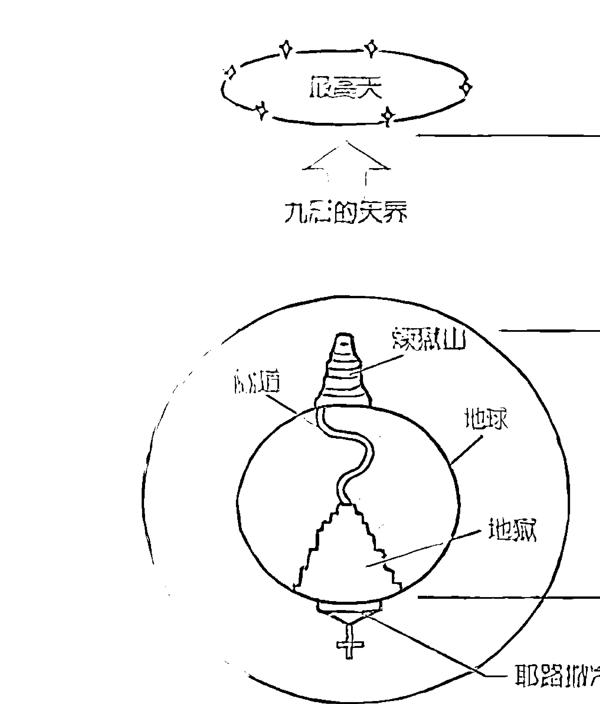

- **领路人**
  - 维吉尔
  - 贝緹丽彩
  - 伯尔纳
- **旅程的方向**
  - 维吉尔
    - ↓
  - 贝緹丽彩
    - ↓
  - 伯尔纳

### 旅程的领路人

| 人物 | 说明 |
| :--- | :--- |
| 维吉尔 | 以叙事诗《埃涅阿斯纪》闻名的西元前一世紀古罗马诗人，是带领但丁游历地狱、炼狱的最适当人选，因为他并非基督教徒所以无法进入天国。 |
| 贝緹丽彩 | 与但丁同年纪的初恋情人，也是他心目中永远的女神。但丁九岁时对她动心，十八岁再遇贝緹丽彩、坠入情网。然而贝緹丽彩却嫁给了银行家，但在二十五岁的时候就过世。她在《神曲》里面乃是天界的象征。 |
| 伯尔纳 | 西元1090年~1153年。因其优美文笔而有「柏蜜尔修士」之美称，是法国神秘主义基督教的思想家、圣人。他在克莱尔沃建立修道院，过着冥想内在的生活。《神曲》里以他为第十天的领路人更是象征不可光凭神学去知神，强调冥想的重要性。 |

但丁・阿里吉耶里（1265年~1321年），生于佛罗伦萨，自青年时代便以诗人身份活跃，并开始参与市政规划。日后却因为陷于政敌阴谋而在1302年遭到放逐，直到死前不久才完成了《神曲》。

1. （Clairvaux）：法国东北部村庄。
2. （Firenze）：即意大利的佛罗伦萨，佛罗伦萨为其意大利语名。

## 《神曲》的地狱
### The Hell in "The Divine Comedy"

共分九圈的《神曲》地狱位于耶路撒冷正下方，呈巨大的漏斗状，最底部甚至深达地球的中心。

### ○广大深远的九圈三次元地狱

但丁《神曲》描绘的地狱不仅仅是个平面的二维空间，而是个垂直深度亦极为壮大的三次元地狱。这个地狱位于地球北半球地底，恰恰就在耶路撒冷的正下方，呈巨大漏斗形状，最深处甚至可达地球的中心，而这地狱的中心还有个恶魔之王在这里。根据但丁表示，这恶魔之王原是天界最美丽的天使路西法，但他却因为自认最优秀、态度骄傲自满而被逐出天界，变成恶魔并被打到地球；大地因为不愿触碰到从天界坠落的路西法而扭开了身，这才使得大地多了个漏斗状的裂缝，路西法因此坠落至最底部、下半身栽进地球之中。这漏斗状地狱的斜面上，有九个呈同心圆形状的地狱谷。罪恶愈重者就被打到愈下层的地狱。这些地狱谷非常巨大，这些地狱谷的内部还要再分成好几个同心圆形状。地狱里的折磨刑罚有千千万万种。举例来说，光是施暴者坠落的暴虐地狱就有三种不同种类。第一个圈有众暴君痛苦地沉在流着沸血血水的普勒格顿河之中；第二个圈是专收对自己施暴之人的自杀森林，自杀者在这里全都变成了森林里的树木，周围有许多鸟身女妖盘旋围绕，不停地攻击树叶树枝、折磨自杀者；第三个圈则是专收向上帝、自然、技艺施暴者的热砂地狱，寸草不生的荒凉沙漠，还有火球从天而降折磨死者的灵魂。此外，最底层的背叛地狱则有该隐界、犹大界等地狱。罪最重者都被埋在冰里；至于背叛基督的犹大则是头部被恶魔之王啃噬，唯有双腿露出在血口之外。

> * 鸟身女妖（Harpuia）：其名乃「掠夺东西的女人」的意思

### 但丁的地狱

### 第二章 犹太教·基督教的天国与地狱

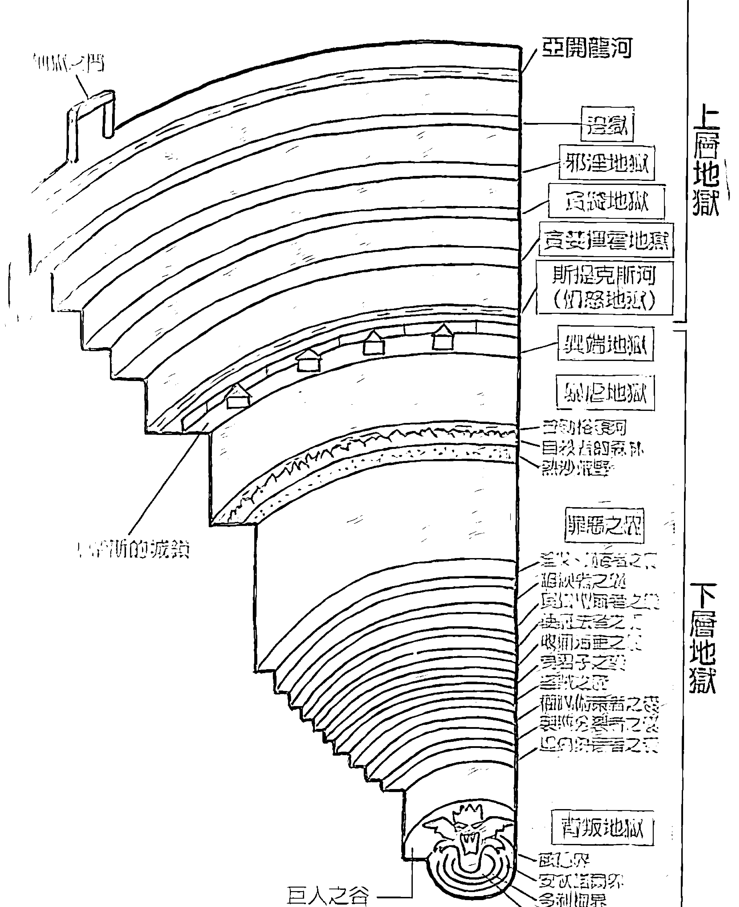

该隐地狱，其名取自亚当与夏娃的长男该隐，该隐因为杀死胞弟亚伯，成为圣经里第一个犯下杀人罪（杀害血亲）的人物。犹大地狱，其名取自背叛基督的犹大。

## No.053 《神曲》的炼狱 The Purgatory in “The Divine Comedy”

罪人在爬上地球另一侧的炼狱山七条环道、接受各式各样的试炼后，罪孽会得到洗清，通往天国之门也将开启。

### ○ 经《神曲》确立后便再无动摇的炼狱概念

经过但丁《神曲》的描绘诠释后，炼狱的存在地位从此便再无任何动摇，其重要性可见一斑。

炼狱位于大海环绕的炼狱山，如果站在耶路撒冷来看的话，炼狱山恰恰就立于地球的相反侧。这座山上有七条环绕着山体、对死者灵魂施以试炼的环形山道。

要前往炼狱的亡魂会先在罗马的台伯河口聚集，然后乘着由天使掌舵的船只驶向炼狱山。

炼狱山入口有道彼得之门，守门天使会以剑锋在亡魂额上刻下七个P字，表示Peccato（罪）的头一个字母，代表的七个大罪；当灵魂通过每一条充满考验试炼的环形山道时，负责看守各环道的天使就会擦掉一个字母，每擦掉一个字母亡魂便会随之变得轻盈，走在炼狱的环道上也会比较轻松。当通过七条环道之时，所有的罪孽都将被洗净，亡魂就会得到前往天国的资格。到那个时候，整座炼狱山将会为亡魂剧烈震动起来，其他灵魂也会为他齐声合唱。

炼狱里洗刷罪恶所需要的时间视灵魂而异。譬如但丁在冥界旅途中结识、后来和他一齐升上天国的罗马诗人斯塔提乌斯，就在第四环道待了四百年，在第五环道待了五百年的时间。

罪恶是否洗净不须他人告知，本人能清楚地感觉到。一旦自觉罪恶已经洗净便可以立刻离开山道。灵魂来到那些与自己所犯之罪无关的环道时，也可以免受惩罚直接通过。最后，罪恶全数洗净的灵魂就会从炼狱山山顶的地上乐园升上天国。

### ~~第八层地狱（惩治欺诈者的地域）~~
### 图8-5 但丁的《神曲》中描绘的地狱

- **地上乐园**
  将罪清洗完毕的灵魂将由此地出发前往天界
- **第七环道 肉欲之罪**
  火焰由崖下冒出、洗净亡灵罪恶
- **第六环道 饱食之罪**
  乾瞪着眼前的食物却不能吃，受饥渴所苦
- **第五环道 贪婪之罪**
  趴在地面听人不停诵读清贫的故事
- **第四环道 怠惰之罪**
  接受必须拼命奔跑、随时表现出热忱的试炼
- **第三环道 愤怒之罪**
  在烟雾弥漫、不见五指的状态下不断祈祷
- **第二环道 嫉妒残暴之罪**
  将双眼眼皮缝起，身穿铁钩衣服闭眼走路
- **第一环道 傲慢之罪**
  须负着傲慢的巨石不断前进
- **炼狱的入口 — 彼得之门**
- **悔改不及者之地**
  在门后在现世中因来不及悔改的忏悔者
- **绝罚者之地**
  灵魂在此地的逗留直到绝罚期间加倍的时间

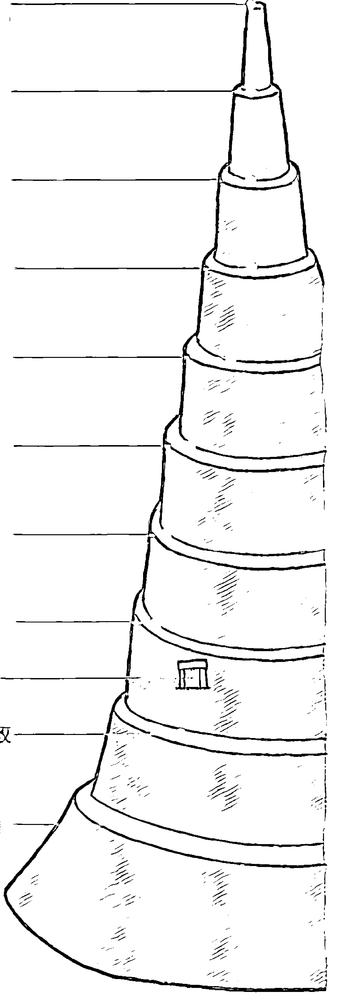

### 第八章 犹太教、基督教的天国与地狱

地狱之河有一定长度，缺乏爱的心请停留在地狱前

- 台伯河：意大利第二长的河流。传说中罗马城的创始者罗慕路斯与雷穆斯双胞兄弟即被置于此地。
- 西维亚斯（西维亚斯，西元45年~96年）。出身于拿坡里的古罗马诗人。著有叙事诗《底比斯》(Thebaid) 等作品。

communication）：将信徒逐出教会之意。
罗慕路斯与雷穆斯（Romulus and Remus）：传说中的罗马城建立者。

## 《神曲》的天堂 The Paradise in "The Divine Comedy"

在托勒密式宇宙的七个行星天与恒星天外侧，便是充斥洋溢着光和音乐、耀眼夺目的最高天。

### ○充满光与音乐的至福世界

但丁在《神曲》里将天国描绘成一个充满光与音乐、耀眼夺目的至福世界。

其基本构造对应于以地球为中心的托勒密式天动说的宇宙，该学说认宇宙乃是以地球为中心，由内而外依序是月球、水星、金星、太阳、火星、木星、土星运行的七个天球，其外侧还有恒星运行的天球包覆在外。然而，《神曲》说在恒星天外侧还另有原动天与最高天，总共有十个天。各个天球也就成了天国的各个层级，德行愈高者其灵魂就会被分派到层级愈高的天界。

第九层原动天有分为九个阶级的无数天使存在；他们从最高天中心、由上帝发出的光芒得到力量，变成火圈围绕着上帝旋转，而这股旋转的力量便是驱动原动天以下九个天球旋转的力量来源。

天界最顶层的最高天是个仿佛光海般的场所，还有朵宛如圆形剧场般的巨大纯白玫瑰，像是要把光源簇拥在中央似地绽放著，而这朵玫瑰正是配属于各天的天国居民原来的住处，玫瑰的每片花瓣都是他们的座位，所以可以说最高天其实才是真正的天国。这些座位当中还有空位，是为了尚未进入天国的人准备的。

上帝的宝座位于这朵玫瑰花中心，散发着耀眼的光...进入这道光芒后还会再看见三个颜色、大小都相同的圆光...象征着三位一体的奥秘。

### 但丁所见天界结构

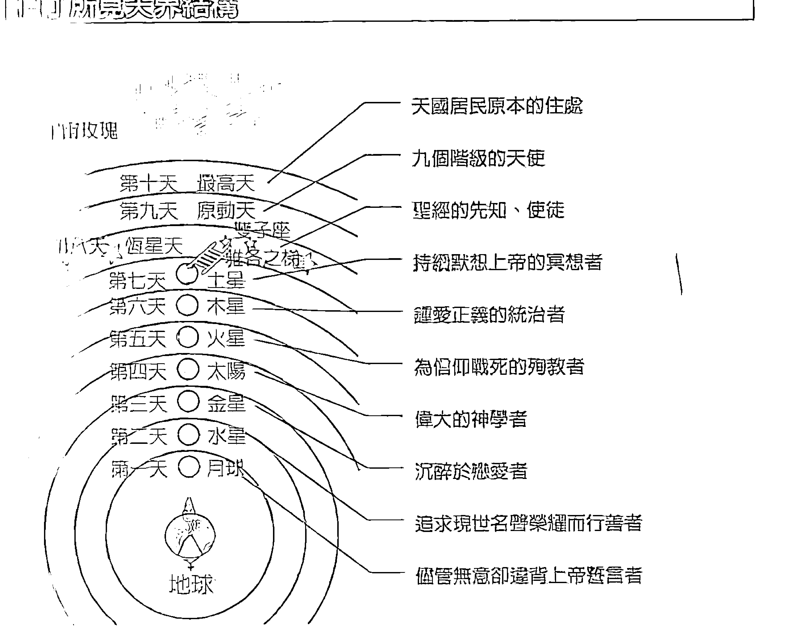

### 原动天的天使九个阶级

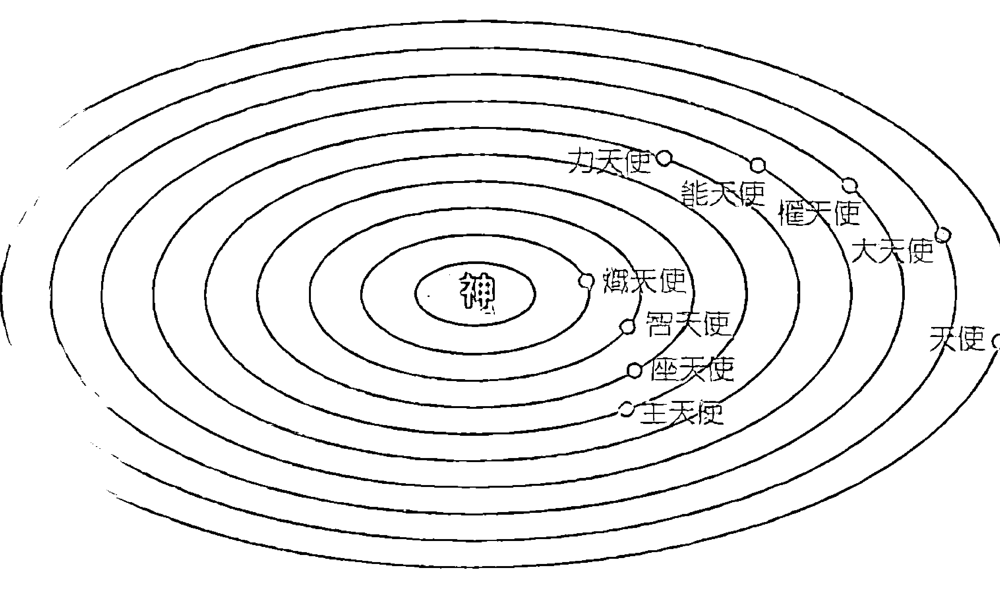

**雅各之梯**
雅各是以色列民族初期的重要族长。《创世纪》记载雅各曾经在梦中看见连接天与地的梯子，故基督教相信攀登雅各之梯便能进入天国。

## 失乐园的天国与地狱 The Heaven and Hell in 'Paradise Lost'

宇宙原本浑无一物，唯有光辉闪耀的天国与业火炽烈的黑暗地狱存在于广大混沌海洋的两极。

### ○位处宇宙之外的天国与地狱

约翰・密尔顿所著《失乐园》，是一部描述堕天使路西法遭逐出天界、落入地狱后，企图藉由引诱伊甸园的亚当夏娃堕落，向上帝复仇的基督教故事，不过其中描绘的宇宙以及天国地狱却与以往的形象颇有不同。

故事刚开头就写到，天国与地狱各自孤立在距离宇宙相当遥远的地方，其周围是混沌的世界。因此就某种层面来说，那里可说是个连宇宙都不存在的地方。

天国是个光辉的幸福世界，也是纯粹的神性世界，就像个供众天使膜拜上帝的大教堂；地狱则是无垠的荒凉，是个业火炽盛的黑暗世界，有斯提克斯河、亚开龙河、克丘特斯河、普勒格顿河流经其中心地带附近，且周围是完全乾涸的沙洲地带，仿佛迷宫道路般的勒忒河则是环绕其外，再往外就是彻底冰冻的大陆。火湖湖畔有火山耸立，路西法等一伙恶魔在那里建造了一座壮大而豪华绚烂的邪恶万神殿。

在这天国与地狱的中间，上帝以人类居住的地球为中心，创造出共有九个天球的托勒密式宇宙；这个宇宙用一条黄金锁链连接至天国、悬吊于混沌之中。地球里有座伊甸园，最初的人类亚当夏娃便生活在这里。

《失乐园》所述天国地狱不在地球，而是远在包围宇宙之外。当最后的审判日来到的那天，这个宇宙就会被火烧成灰烬、从中诞生出新的天与地，届时唯有受选者才能进入新天地。

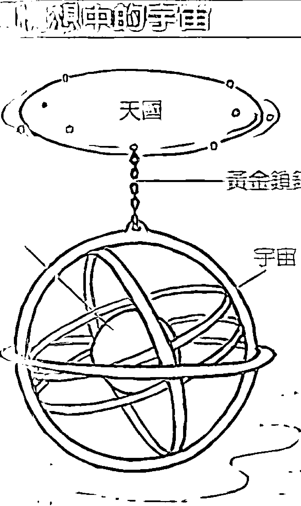

路西法被逐出天国时宇宙尚未创造，除天国与地狱之外就只有混沌海洋存在；后来上帝创造宇宙，以黄金锁链将宇宙悬挂于天国之下。

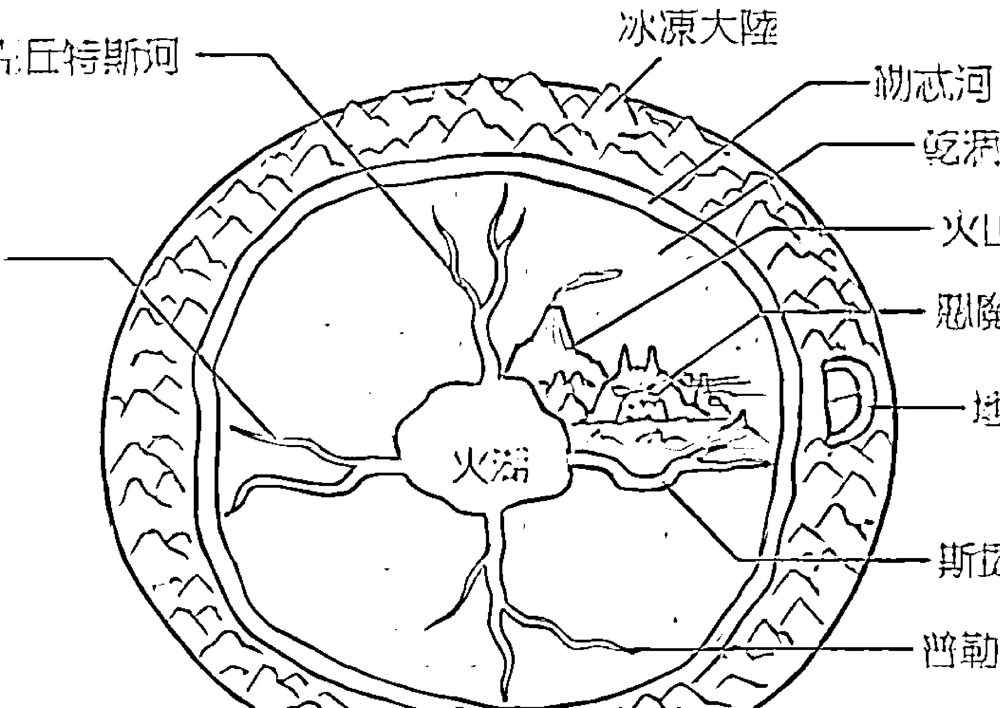

密尔顿的地狱虽处于业火之中，但其火焰不会发光所以仍是一片黑暗。

约翰・弥尔顿（西元1608年～1674年）。英国史上仅次于莎士比亚的文学家、诗人。弥尔顿支持清教徒革命，甚至曾参加过清教徒革命。1652年失明全盲，却仍口述完成了《失乐园》、《乐园复得》、《力士参孙》三部大作。

## 斯维登堡的灵界
## The afterlife in Swedenborg

斯维登堡认为灵界的环境乃是灵魂自身的内在反映，恶人灵魂聚集之地将成地狱，而善人灵魂聚集处就会变成天国。

### ○反映出灵魂自身内在的天国与地狱

相传曾经多次造访灵界的十八世纪瑞典人斯维登堡有部名作《论天堂及其奇迹和论地狱》。根据这部作品记载，死后人类灵魂往赴的灵界不在自然界的天空或地底，而是存在于另一个完全不同的灵次元。其最大特征便在于灵界的环境全都源于灵魂自身的内在；又因为灵界是灵魂内在反映，所以美好的天国与可怕的地狱是同时存在的。除天国地狱以外，灵界还有中间地带。现世中特别善良或特别邪恶的人，将会在死后立刻到达天国或地狱，但其他大多数人的灵魂将来到中间地带。

所有灵魂将会在中间地带被分派，送往天国或是地狱，但是这并不代表将会有死后的审判。灵界虽有类似灵魂会自然聚集在一起的法则，不过在灵界里面，周围环境和灵魂外观全都其自身内在的反映，因此当邪恶的灵魂聚集在一起时，外侧看起来也会变得邪恶；灵魂就是这样前往天国或是地狱。

天国和地狱有许多共通点，两者各有三层。最高的第一天对应至最底部的地狱，中间的第二天对应至中间地狱，最低的第一天则是对应至最上层的地狱。此外，这些层次里面还近乎无限的小社会，且天界和地狱的小社会数量也是一致的。三个阶层在位置上亦呈对应关系。天界的太阳位于天界所有物的东方，所以愈美好的事物就愈靠近东方；地狱则是恰恰相反，愈可怕的事物就愈靠近西方，不过各阶层愈往北去愈加恐怖的地狱。此外，据说在西侧、北侧之外还有极邪恶的灵魂，有如野兽般徘徊于黑暗森林里。

### 1.1.1 斯威登堡所见的灵界位置

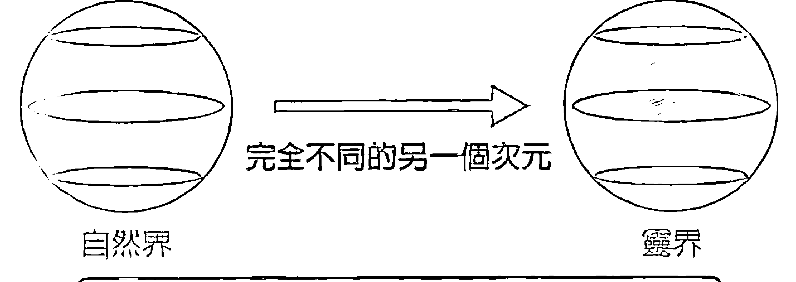

### 1.1.2 斯威登堡所述天国与地狱的特征

灵界的环境全都是灵魂自身内在的反映。前往天国或地狱，都视灵魂自身的性向而定。

### 1.1.3 地狱与天堂的构造

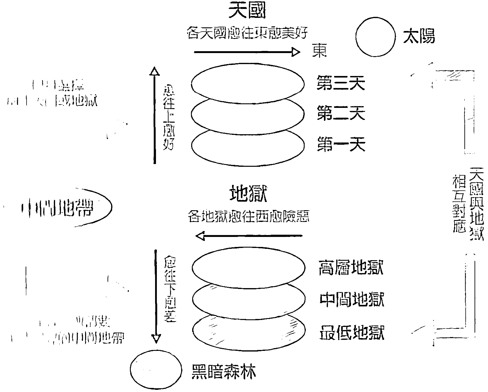

斯威登堡是18世纪瑞典的神秘思想家。以自然科学家身分起家，留下亮眼的成绩。他声称自己的使命是要透过与灵界进行交流、解释圣经当中灵层面的意义，著有《天国及其奇迹和论地狱》等作品对启蒙主义时代的欧洲造成影响。

## No.057 耶稣基督末世圣徒教会的灵界
The afterlife in the Church of Jesus Christ of Latter-day Saints

死后世界并无天国或地狱的区别，为了邪恶而苦恼的灵魂只要拥有正确的信仰也会进步、也能成为神明。

### ○死后也能继续进步的人类灵魂

耶稣基督末世圣徒教会（LDS）*乃是一新基督教教派，经常被称作摩门教，他们针对死后世界构筑出了一套富有近代性格的独特思想。近代被誉为进步的时代，自然也有人类灵魂即便到了死后世界也能继续进步的思想诞生。LDS接受了这个思想，并且构筑出一套极为独特的灵界观。耶稣基督末世圣徒教会认为，人类原本就是上帝的灵子，为了达成使自身永远进步的条件而诞生，而该条件便是要接受LDS的神圣典礼和仪式。只是人在诞生时，过去的记忆都将遭到消除，所以人生要怎么过都是个人的自由。

人死后灵魂会进入灵界，那里既无天国亦无地狱。差别在于邪恶之徒会聚集成群、为自身的邪恶所恼；相对地正义之士和LDS信徒则可以生活在美好的环境里。但因没有死后审判的缘故，即便邪恶的灵魂也能透过加入LDS成为信徒而得到进步；是故，生前已是LDS信徒者会在灵界里对未臻成熟者或非信徒施行教导，这种服务同样也能使己身灵魂得到进步。因此，如果灵魂要继续进步，在世时就必须先接受LDS的仪式，而在世的信徒就会替那些生前不曾受过的灵魂举行仪式，灵魂便能因此得到进步，最后甚至还能成为神明；就这点来说，灵界与现实世界拥有相当紧密的关联。

不过这种状态顶多只能持续到最后的审判为止；届时所有死者都将获得肉体并且复活，之后分配到天国或地狱里。重生的地球将会成为良善正直者的居处，而天界将会分成三层，永受成为神明的最高天居民居住。

> *耶稣基督末世圣徒教会：亦译耶稣基督后期圣徒教会，创设于1830年，是摩门教当中最大的教派。其英文简称常用LDS，即末世圣徒的英文Latter Day Saints的缩写。

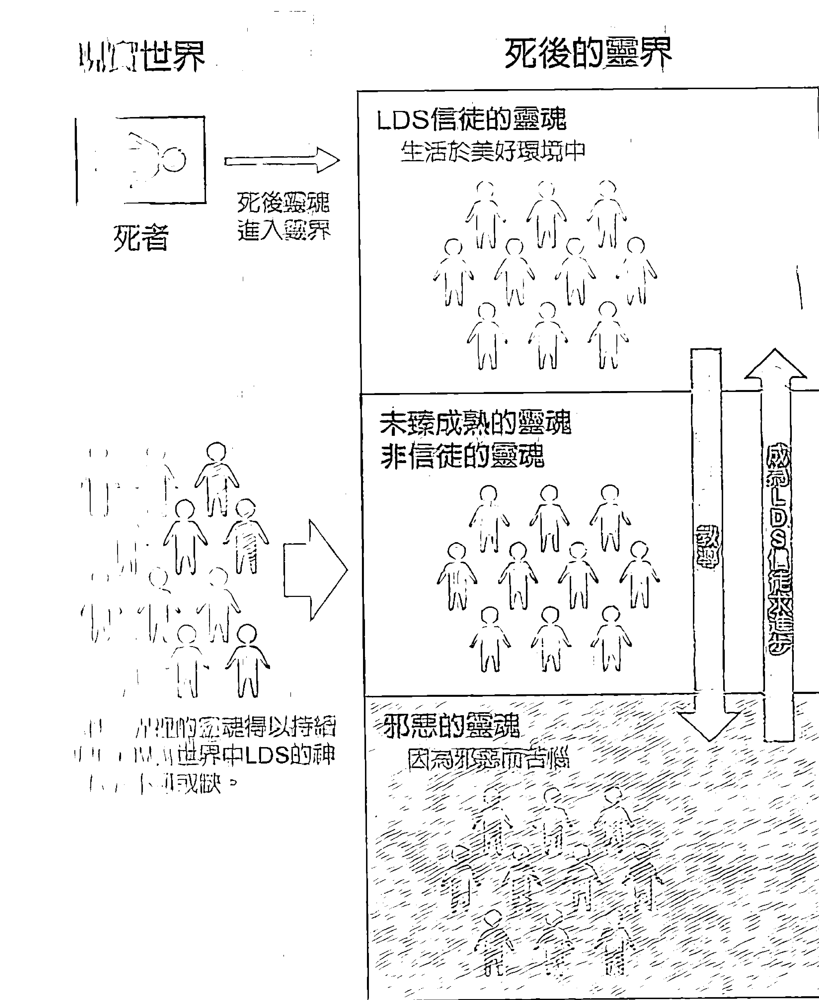

他们的灵魂得以持续 世界中LDS的神 或缺。

LDS信徒教会认为并非死后审判，即便邪恶死者的灵魂亦可于灵界得到进 最后的审判来临时，死者的灵魂就会被分派到永远

LDS信徒教会→西元1830年由小约瑟·史密斯（1805~1844）所创基 将其视为异端。他们将史密斯所著的《摩门经》奉为与 重要的经典，并且相信锡安（神国）将会树立于美洲大陆

## 圣奥古斯丁的复活论

基督教主张最后的审判日来临时，所有死者都将拥有肉体的形式——亦即与生前完全相同的模样复活。经过最后的审判后，再以拥有肉体的模样被送往永恒的天国和地狱。

当然，纵使拥有肉体，但住在永恒天国里的男女却不会对异性产生情欲，即便外观看起来相同，但其肉体与在世时有某种决定性的差异。于是基督教从初期开始，便对复活后的肉体究竟呈现什么样子为主题，进行各种讨论。此处便举出其中一个相当有趣的例子，那便是以《忏悔录》、《三位一体论》、《上帝之城》等作品闻名的圣奥古斯丁（西元354年～430年）的说法。

自古以来复活的肉体便经常被认为是属灵性的躯体，不过来到圣奥古斯丁的时代，愈来愈多基督教徒相信那是更富物质性的肉体，圣奥古斯丁也是如此。于是他便针对批判物质性肉体复活者所提出的各种难题一一提出解答。

举例来说有个问题是这样的，假设在危机之下不得已吃了人肉，而被吃的人和吃肉的人都死亡时该如何？因为被食用者的身体已经成为吃肉者身体的一部分，所以照理说双方死者都不可能以跟生前完全相同的模样复活。

然而，圣奥古斯丁却认为即便在这种状况下，双方还是能以跟生前相同的模样复活，因为被食用者的肉对吃肉者而言，是借来的东西，所以还是应该还给被吃的人，将自己吃下的东西还回去后，吃肉者的身体就会有所欠缺；欠缺的部分是在吃人肉以前便不知消失到何处去了，而且这个丧失的部分会原原本本的回收。倘若遍寻全世界都找不到，那么也能由上帝创造出这部分的肉体来补足。

而且虽然说将与生前的模样相同，但是会以几岁的模样复活也是个很大的问题。倘若老年死亡者以老迈复活、婴儿夭折者复活后也是婴儿的话，就难真的复活似乎也没那么可贵了。关于这点，圣奥古斯丁认为复活后的肉体应该会是青春正盛的身体、或是已经发育完全的身体。

或许现代人会觉得这些是毫无意义且无用的争论，可是在古代、中世纪时，每个最顶尖的知识份子都拼了命地思考此类问题。

# 第3章 佛教的世界

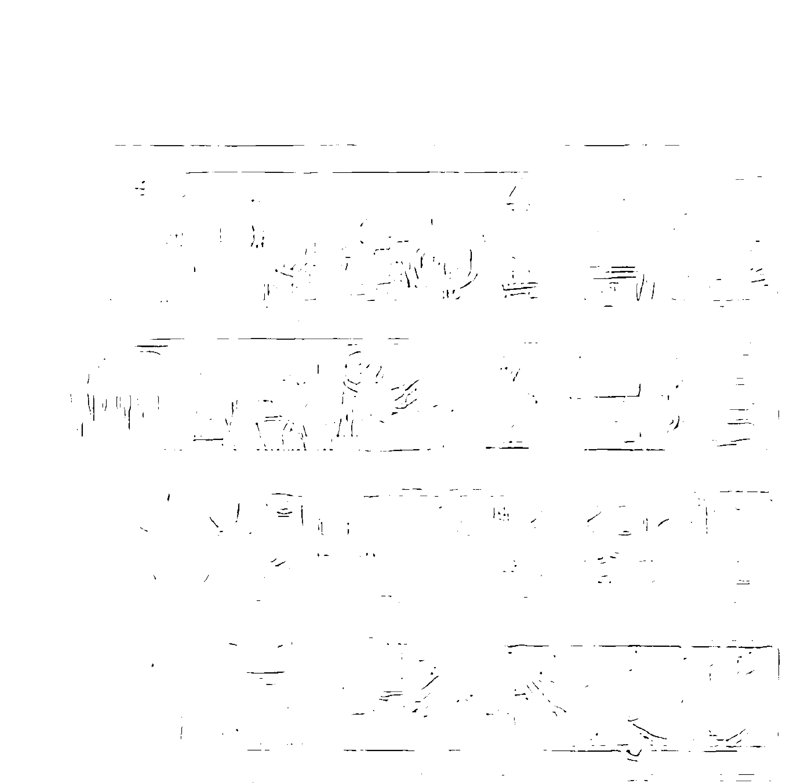

# 佛教的死后世界
The afterlife in Buddhism

佛教的最终目标是要断绝无知与执著，跳脱必须永远在六道转生的轮回。

### ○不断重复的六道轮回世界

佛教主张不只是人类，世间的所有生物都要不断死后转生，此即所谓轮回转世。生物死后转世的世界共有六个种类，唤作六道，即天道、人道、阿修罗道、畜生道、饿鬼道和地狱道（另有说法指并无阿修罗道，总共五道而已）。要转世到哪个世界须视前世的业而定。所谓的业基本上指的是身体行动、言语行动、精神行动三种，行善者将被分类成上中下三个等级，分别转世至天、人、阿修罗的世界。为恶者同样也要分类成上中下三级，分别转世至畜生、饿鬼、地狱。畜生、饿鬼、地狱三道是行恶道者受惩罚的场所，故称三恶趣。

轮回转世将会永远不断重复，即便转世至地狱道或畜生道，下次也有可能会转世到别的世界。

轮回转世乃因无知与执著而起，六道轮回的世界全都是充满迷惘的痛苦世界，于是断绝无知与执著、跳脱轮回转世便成了佛教的理想，而达成此理想便可以称作是“入涅槃”或是“得解脱”。

在轮回里面不断重复转世的生物，其存在可以分成称为“四有”的四个阶段；这四有便是本有、死有、中有与生有。本有是从出生到死亡为止的存在，死有是死亡瞬间的存在，中有是死后到下次转生为止的存在，生有则是出生瞬间的存在。佛教当中也有些教派并不承认中有，至于那些认为中有确实存在的教派，有的相信死者将会在中有期间接受名为十殿阎魔王审判，有的则像西藏密教，相信度过中的方式将决定该人是否有机会得到解脱。

### 生死轮回图

现世 天 人 阿修罗 畜生 饿鬼 地狱 → 死 → 来世 天 人 阿修罗 畜生 饿鬼 地狱 → 死 → 下个来世 天 人 阿修罗 畜生 饿鬼 地狱 → 死 ...

佛教认为众生要永远在六道世界中重生轮回转世。

### 四有

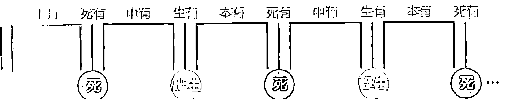

- **本有** ⇒ 从出生到死亡为止的存在
- **死有** ⇒ 死亡瞬间的存在
- **中有** ⇒ 死后到下次转世为止的存在
- **生有** ⇒ 出生瞬间的存在

### 佛教创始人释迦牟尼

关于佛教创始人释迦的生卒年众说纷纭，有公元前565年～公元前486年、公元前463年～公元前383年等说法。释迦是位于今日印度与尼泊尔边境附近蓝毗尼的一位王子，经过六年的苦行与冥想后，以三十五岁之龄得悟。从此以北印度恒河中游流域附近对民众宣扬教义，直到八十岁过世为止。

## 六道与须弥山世界
## Sad-gati and the Sumeru world

佛教主张万千生物轮回转世的天道、人道、阿修罗道、畜生道、饿鬼道、地狱道六道世界乃是位于须弥山宇宙之中。

### ○于须弥山世界划地而居的六道

佛教主张死后人类转世的六道世界几乎全部都落在一个宇宙之内，该宇宙叫作须弥山世界。当我们参考几部经典来拼凑它的模样时，首先就会发现须弥山世界在中心有座高十六万由旬（一由旬等于七公里或十公里）的须弥山，周围还有以同一个中心点，层层叠叠围成一个正方形的七道山脉。七道山脉的外侧是广大的海洋，海洋外侧四周处又有铁围山环绕；这道铁围山便是世界的尽头，而这个圆形平面的直径长达一百二十万由旬。这个平面下方亦别有世界，整体呈圆筒状。这个圆筒约有一百一十万由旬高，上层称为金轮（高三十二万由旬），下层称作水轮，而水轮之下有个叫作风轮的巨大圆筒。风轮飘浮在虚空中，支撑着所有世界。

受铁围山包围的海面上有四块大陆，分别叫作东胜神洲、南瞻部洲、西牛货洲与北俱卢洲。这些大陆都有人类居住，所以算是人道。除此以外，动物、昆虫和鱼所属世界、亦即所谓畜生道也都在这些大陆和海洋之中。

饿鬼道与地狱道位于南瞻部洲地底。饿鬼道的位置并没有很深，是在地底五百由旬处，地狱则是从地底五千由旬处开始，有八大地狱纵向重叠排列。阿修罗道同样位于地底世界，但阿修罗道并不在南瞻部洲地底而是在海洋的更深处，共分四个层级。六道的最后一道——天道位于须弥山上空，天道约有一百个层级，其中有半数以上都已经超出了须弥山世界之外。以上便是世间生物轮回转世的世界位置，这整个世界亦即唤作“三界”，可由下而上依序划分为欲界、色界与无色界。

### 须弥山世界的构造

### 须弥山世界

### 六道的位置

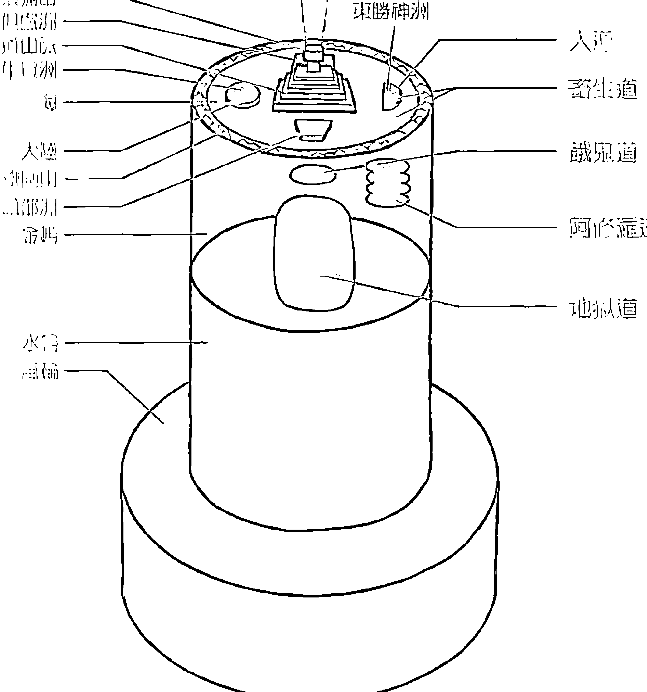

**东胜神洲** → 须弥山东方的大陆，呈巨大半月形。

**南赡部洲** → 须弥山南方的大陆，呈巨大梯形，靠近须弥山该侧的长度较宽。相信南赡部洲的形状乃是依据印度次大陆而来：

**西牛货洲** → 须弥山西方的大陆，呈巨大圆形。

**北俱芦洲** → 须弥山北方的大陆，呈巨大正方形。

## 阎魔王的审判
Emma-O's Judgment

地狱的阎魔王住在外有七重城墙围绕的壮丽王宫之中，负责裁决浪荡放逸者生前的罪，并将其打入地狱。

### ○视死者的罪决定其去处的阎魔王

佛教相信人类死后将要接受地狱之王——阎魔王的审判。关于阎魔王居住何处可谓是众说纷纭，不过根据《世记经》（长阿含经）记载，阎魔王宫乃是位于人类所居的阎浮提洲（南瞻部洲）之南、大金刚山（铁围山）之内。他的王宫极为壮丽气派，其外复有七重城墙围绕，相传其统治地区纵横远达六千由旬之广。阎魔王平时便是与侍女和乐融融地生活于此，然而不可思议的是，据说阎魔王自身偶尔也会受到大狱卒将熔融滚烫的铜汁灌入口中等等极为痛苦的刑罚，仿佛自己也是地狱的亡者般。不过这毕竟并非常态，当狱卒带领罪人前来的时候，阎魔王就会以地狱之王的身份对罪人进行裁决。阎魔王的审判里有几个非常重要的特点，唤作三使者。而所谓三使者指的就是老人、病人、死人，阎魔王会质询罪人有关三使者之事，藉以清查其罪行。以衰老为例，阎魔王会问道：“你活着的时候，是否见过头发变白、年老体衰的人？”如果见过这样的老人，那为何还不知人生的无常、只知耽溺享乐呢？阎魔王便是以这种形式进行询问，并且确定罪人罪恶的轻重。阎魔王对死者就老、病、死三使者进行诘问之后，那些浪荡放逸的罪人就会被移交给狱卒、送往地狱。此节描述的审判内容乃以《世记经》为据，而《十王经》则说阎魔王宫里面有面叫作净玻璃镜的特殊镜子，这面镜子能照出死者一生中发生过的所有事情，然后阎魔王就会以此判定死者的去处。

### 人间的三种苦

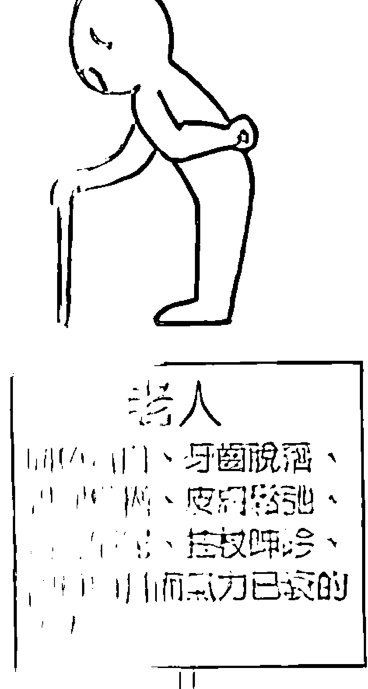

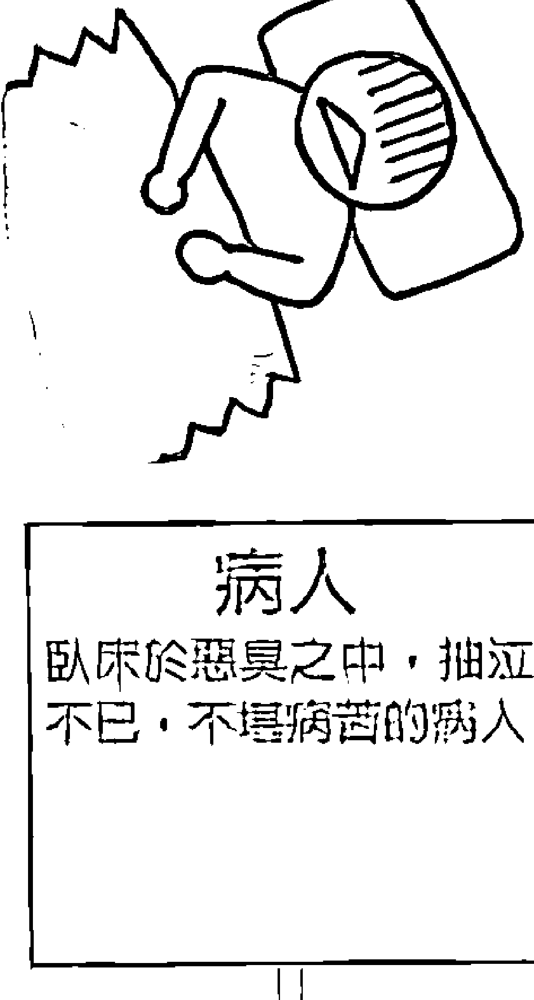

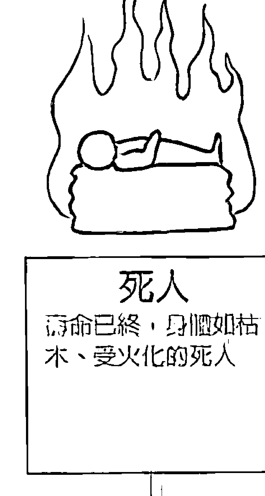

生前见过这三种人却不知觉悟，不知自己与他们没有两样，故将其打入地狱

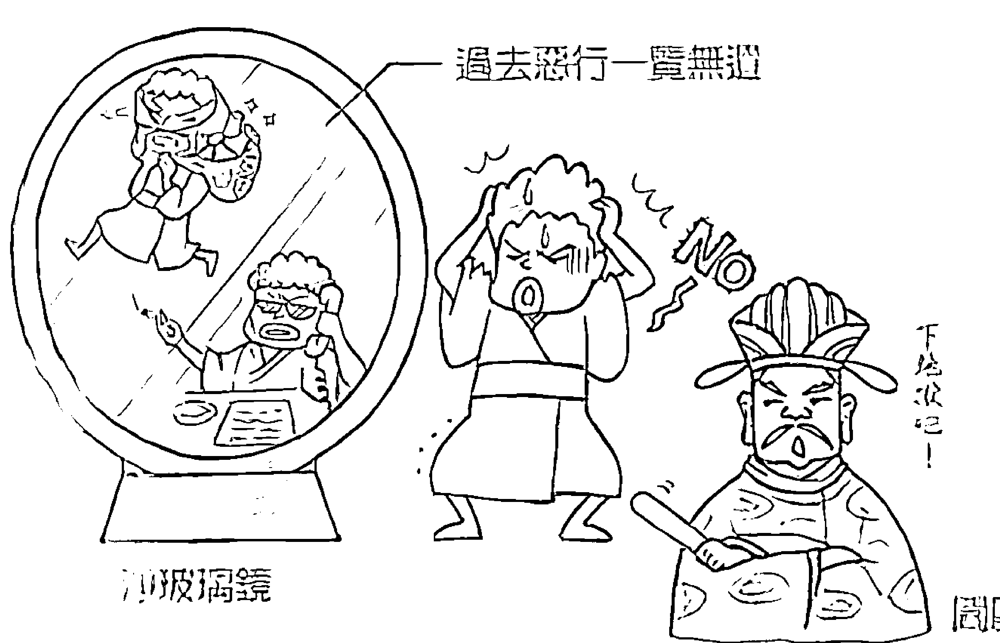

- 《增一阿含经》是《阿含经》其中一卷。《阿含经》是记载佛教最初期教义的经典。
- 《四阿含》之一的《增一阿含经》则是其中的一部。
- 卒是阎魔王手下专门折磨地狱众亡者的鬼。

## 《十王经》记载的死后之旅
The soul's journey after death in "Shi Wang Jing"

根据《十王经》记载，众死者必须越过死出山、渡过三途河，并且在死后三年内造访十位冥府之王。

### ○ 穿越死出山与三途河的死者之旅

佛教认为人死后必须经过何种旅程前往冥府呢？且容笔者透过成书于中国（另说乃日本所著）的《佛说地藏菩萨发心因缘十王经》（以下略称《十王经》）来做介绍。《十王经》认为人死后必须在规定的日期造访仿佛阎魔王分身的十位冥府之王、接受各种审判裁决，死者将在旅途中见识冥界的许多恐怖场所，这些场所也对日本的民间信仰造成莫大影响。

根据记载，阎魔王会在人断气以后立刻派遣三位阎魔卒前来；这三位阎魔卒分别是夺魂鬼、夺精鬼、缚魄鬼，而死者则会在这三只鬼的带领下穿越险恶的死出山，朝冥府前进。抵达后，死者首先必须在头七日造访秦广王官厅，为生前未积功德而受责罚。接下来要去的是初江王官厅，著名的三途河便出现在前往此地的途中。三途河有三处可以渡河的地方，分别是山水涧、江深渊、有桥渡，死者须视罪恶轻重择一而渡。渡过三途河后，附近有株名为衣领树的大树，底下有对名叫做夺衣婆与悬衣翁的男鬼女鬼；死者抵达此处之后，夺衣婆就会折断死者双手手指以惩窃盗，然后悬衣翁就会和牛头一起将死者赶聚集在衣领树下。夺衣婆会在这里脱掉死者的衣服，而悬衣翁则会将衣服挂在衣领树上，然后观察衣服垂下的模样来测定死者罪恶的轻重。第四关五官王的官厅有座称量罪业轻重的秤，藉此将罪人分派至畜生、饿鬼或八寒八热地狱。据说所有死者在死后都是这样依序造访十位冥府之王，藉此决定要转世到什么世界。

死出山：亦作死天山、四手山、死山。
三途河：亦作葦头河、渡河、三洲河、三途川。

### 阴间之王与冥界名胜

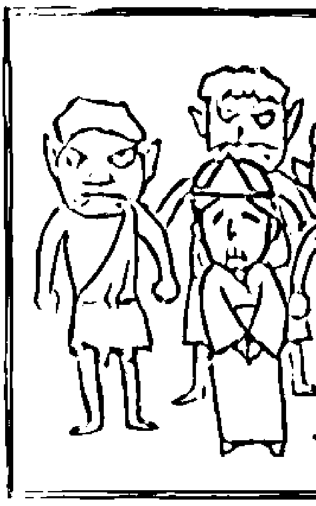

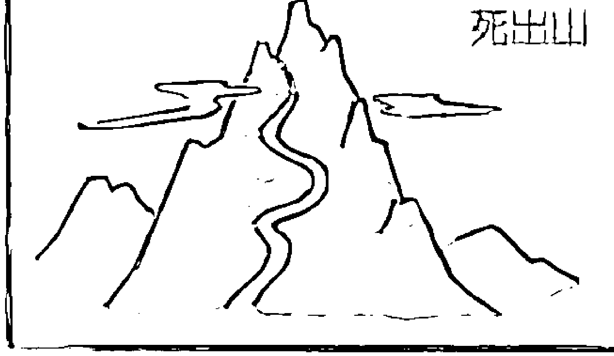

秦广王
初七日

因生前未做善行而受惩罚

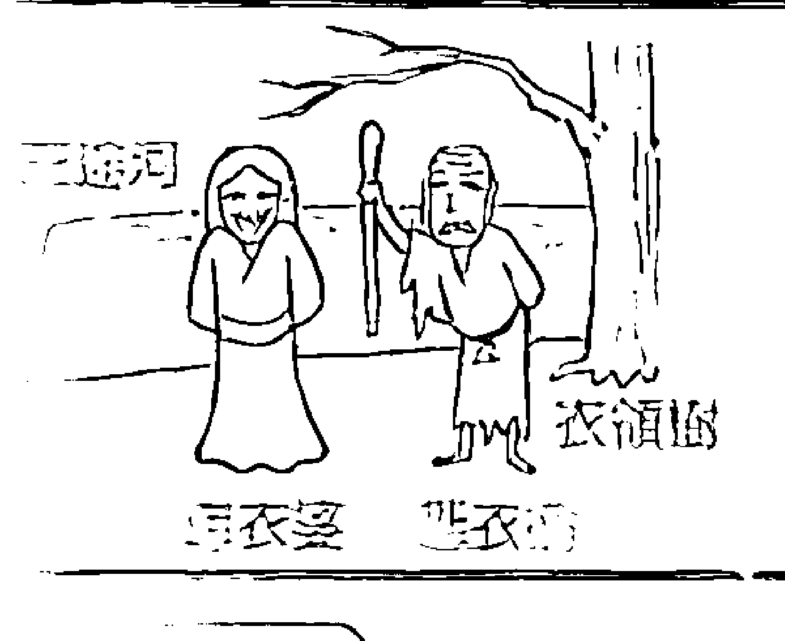

初江王
14日目

都市王
大蛇之地

宋帝王
21日目

五官王
28日目

流汗罪形的汗

阎魔王
35日目

映照出所有罪业的镜子所照

火坑所

死者有三种痛苦

变成王
42日目

四出所

四门凄然而有哀伤引出的道路

太山王
49日目

决定来世转生至哪个世界

汤汁所

巨大的铜锅

平等王
100日目

都市王
1周年

有用测量罪恶重量的秤子

五道转轮王
3周年

尚未决定转生世界的死者至此都将决定

- 恶鬼是阎魔王座下的鬼卒。
- 三途川根据罪业有桥渡→罪轻者取道山水涧，罪重者走江深渊，罪极轻者则从桥上通过。
- 狱卒是阎魔王手下的狱卒。

## No:062
天道
Dova-gati

六道当中等级最高的天道乃是神居住的世界，位在大地的中心须弥山上空，总共分成二十七个阶层。

### ○最上等人转生的世界

佛教认为前世累积了最上等善行者，死后就能转生到六道当中最高位的天道。所谓“天”指的就是神，天道就是神居住的世界。不过即便转世至天道为神，也不代表该人已经成为完美无缺的存在。佛教相信只要未得解脱便无法逃离轮回转世，就算是神明也有可能转世至其他世界。

天又分成许多种类，各天所在世界都不一样。一般认为，天界始于须弥山山腹附近，从此处朝须弥山上空层层叠叠分布，全部共有二十七天。原则上来说，愈往上层就愈宽广，天民的身体也就愈庞大。到大梵天世界为止都还是落在须弥山世界中，但更上方的天界就超出须弥山世界的范围之外了。

由于天界里住的全都是神，许多人可能会以为各天界并无太大差异，实则不然。佛教将世间所有生物轮回转世的世界唤作三界，由下而上依序分类成欲界、色界、无色界三种，而天界则是三者皆有。也就是说，六欲天从最高的他化自在天以下的天界，全都与地狱道同样在欲界之内，是仍然未断绝欲望的世界；而色界虽然断了欲望却仍是个留有形体的世界，下至初禅最低位的梵众天、上至四禅最高位的色究竟天都在色界之中；至于再往上的无色界既无欲望亦无形体，是个纯粹的精神世界。

虽然转世前往无色界者，基本上已经具有神明的架构模样了，可是佛教却认为即便如此仍不足以达致解脱。

# 第三章 佛教的世界
## 出世间道

| 三界 | 禅定/天别 | 天界 |
| :--- | :--- | :--- |
| 无色界 | | 非想非非想处 |
| | | 无所有处 |
| | | 识无边处 |
| | | 空无边处 |
| 色界 | 四禅 | 色究竟天 |
| | | 善见天 |
| | | 善现天 |
| | | 无热天 |
| | | 无烦天 |
| | | 广果天 |
| | | 福生天 |
| | | 无云天 |
| | 三禅 | 遍净天 |
| | | 无量净天 |
| | | 少净天 |
| | 二禅 | 极光净天 |
| | | 无量光天 |
| | | 少光天 |
| | 初禅 | 大梵天 |
| | | 梵辅天 |
| | | 梵众天 |
| 欲界 | 六欲天 | 他化自在天 |
| | | 乐变化天 |
| | | 兜率天 |
| | | 夜摩天 |
| | | 三十三天 |
| | | 四大王众天 |

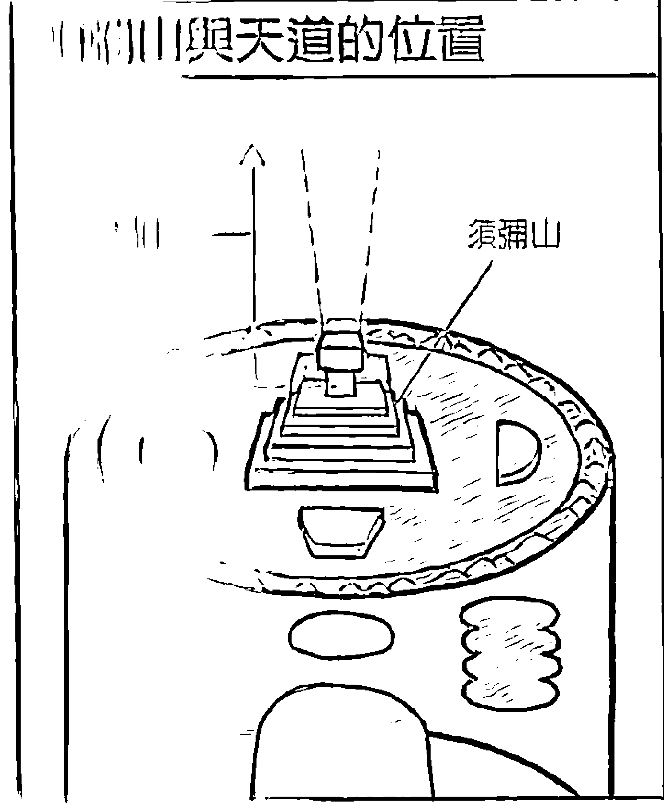

兜率天亦作都使多天，三十三天则亦作忉利天

## 阿修罗道
Asura-gati

阿修罗道是生前累积最低程度善行者转生的世界，这里所有的阿修罗按照规定每天都要出征三次，拼死命作战。

### ○非真心行善者转生的世界

阿修罗道在六道里位于人道与畜生道中间，严格说来该算是行善者转生的世界。但其善行属于完全不带真心的最低等级善行，譬如国王为彰显自我权力而禁止民众杀害动物，或是以赌博赢得的钱财一半拿来花用、一半拿来布施之行为。

《正法念处经》将阿修罗道的所在大致分为两处。其一位于饿鬼道之内，落入此阿修罗道者将会变成拥有神通力的小鬼，名曰魔身饿鬼。关于这点，源信的《往生要集》也说阿修罗当中的支流卑劣者将会落到此地来。

其二便是原本的阿修罗道，位于须弥山旁侧的大海底中。有四种阿修罗道纵向堆叠。最顶端的是由罗睺阿修罗王统治的罗睺阿修罗道，然后依序是勇健阿修罗道、华鬘阿修罗道和毗摩质多罗阿修罗道；从海底到阿修罗道的距离和各阿修罗道的距离分别都是两万一千由旬。

阿修罗道里的寿命将视其种类而异，罗睺阿修罗道的一昼夜相当于人类的五百年、能够活五千岁，勇健阿修罗道的一昼夜是人类的六百年、能活六千岁，华鬘阿修罗道的一昼夜是人类的七百年、能活七千岁，毗摩质多罗阿修罗道的寿命则长到几乎无法计算。此外，落入阿修罗道者必须每天出征三次，还要拼死命作战。然而，尽管程度最低但阿修罗毕竟是行过善的，因此阿修罗道的生活其实并不苦，每座城池都壮伟、风景优美，众人都能在女性环绕下享受快乐的生活。

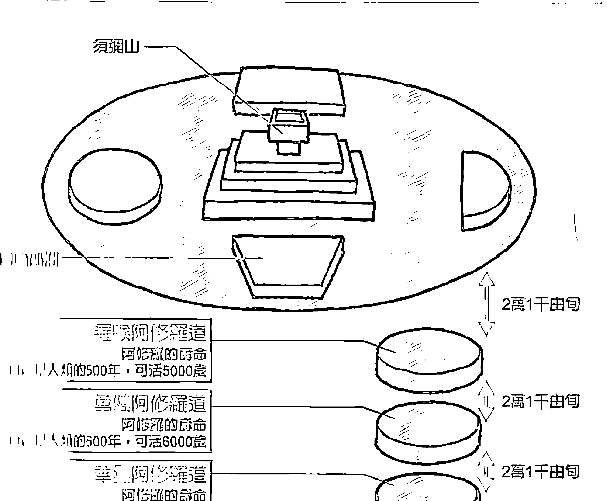

### 阿修罗

阿修罗乃是印度自古信仰的恶神，吠陀时代称为阿斯罗，曾经与帝释天发生过争战。后来这段故事被佛教吸收，佛教说有四位阿修罗王，率领军团与帝释天的军团发生激烈战争，最后败北。佛教的六道虽然将阿修罗道排在人道之下，不过阿修罗王的力量远远超过人类、甚至已经相当接近神。

- 军队阿修罗道：阿修罗的寿命 人间的500年，可活5000岁
- 勇性阿修罗道：阿修罗的寿命 人间的500年，可活6000岁
- 华鬘阿修罗道：阿修罗的寿命 人间的700年，可活7000岁
- 多闻阿修罗道：阿修罗的寿命 长到几乎无法计算

1由旬=7公里或14公里

> • 《正法念处经》：传说西元四至五世纪间成书于印度的小乘经典。
> • 《往生要集》：比叡山横川的惠心院僧都源信于西元985年撰述之佛教著作，主张极乐往生，然而书中的地狱描写却以《正法念处经》为依核。

## No.064
## 畜生道
Tiryagyoni-gati

转生成为动物或鱼、鸟、昆虫便称作落入畜生道，其世界遍布陆海空三个领域。

### ○仅次于地狱道、饿鬼道的三恶趣

所谓落入畜生道指的便是死后转生成为动物或鱼鸟昆虫，是故畜生道的世界与人类生存的人道世界有许多互相重叠的部分，只不过畜生道比人道更广大，遍及陆、海、空三个领域。据说畜生原本都是居住在海里，后来才陆续将范围拓展至陆空。另外，饿鬼道和地狱道当中亦不乏转生成为动物者。

畜生道在六道中乃是仅次于地狱道、饿鬼道的恶界，是前世为恶者所要落入的世界。畜生道、饿鬼道、地狱道又合称为三恶道或者三恶趣。

落入畜生道的都是生前曾经犯罪者，《正法念处经》说所生的种类共有三十四亿种，转生成每种畜生的理由各不相同。

举几个例子来说，据说生前学习错误的思想，还趾高气扬与人议论，毫无半点实际贡献者就会先打入地狱再落畜生道，变成蝮蛇或鼹鼠。生前虽然曾经犯罪却也行过布施，并且发愿来世还要做夫妻的人则是会转生成为鸳鸯或鸽子等，可以成对对对快乐地生活。

至于击鼓吹号袭击城镇的强盗则是要先落入地狱饱受痛苦，再转生为鹿，每日活在随时可能被人类杀死的恐惧中。

其次，为求钱财而杀害龟、鳖、鱼、蟹、蛤蜊者，则在落入地狱受过苦楚后，转世变成水蛭或跳蚤虱子等等。

- 地狱道
- 饿鬼道
- 畜生道

三恶趣 → 前世为恶的人将会落入三恶趣

### 畜生的世界

进入畜生道 → 意即转生为动物或鱼鸟昆虫

与人类生存世界相同

动物、鱼鸟生存的陆海空等处便属畜生道范畴

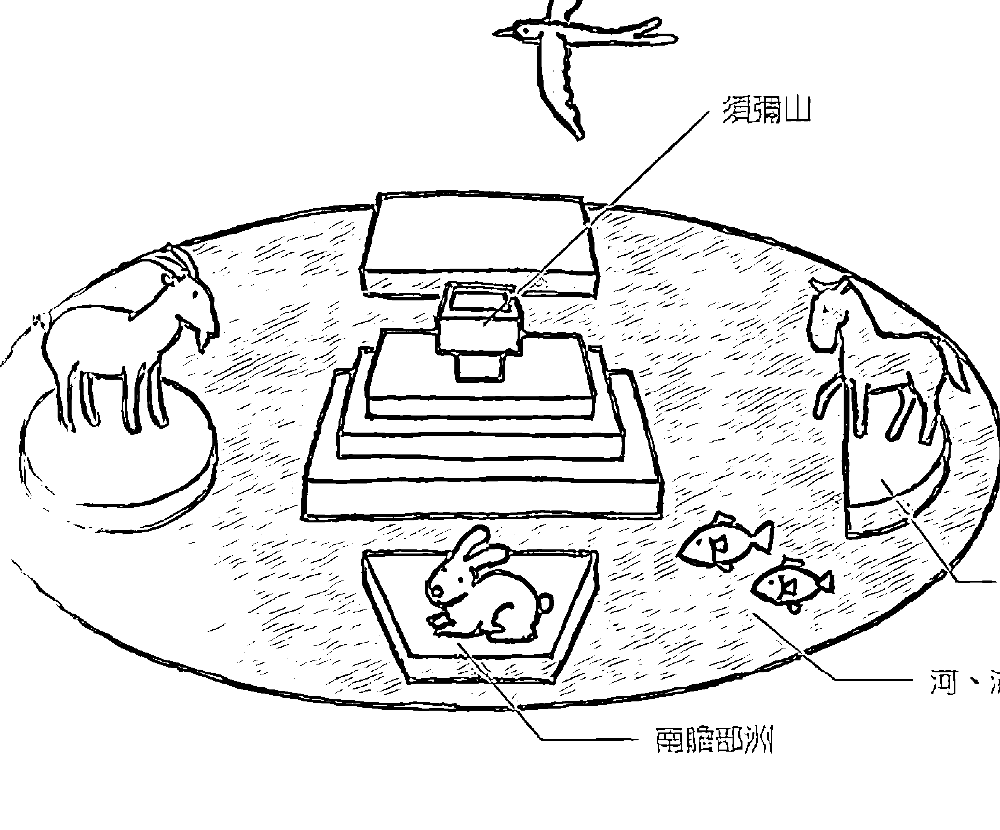

## No.065

## 饿鬼道

Pretāgati

生前于精神层面、物质层面过着贪婪生活者将在死后变成饿鬼转世至饿鬼道，受饥渴所苦。

### ○贪婪者转生的世界

佛教相信生前在精神层面和物质层面拥有贪婪欲望者，死后就会转世到饿鬼道。饿鬼道是痛苦程度仅次于地狱道的世界，其位置在须弥山世界南瞻部洲下方约五百由旬（约三千五百公里），落在比地狱稍微浅层的地底。

转生饿鬼道者唤作饿鬼，一般都有着腹部鼓胀隆起有如小山、其他身体部位却是细瘦衰弱的形象。饿鬼原语为Preti或Peta，是祖灵的意思。祖灵此语当然并无负面涵意，原本在阎魔仍被唤作焰魔的古代，这祖灵也是住在天界里的；但后来其住处却随着时代演进而渐渐移往地底，最后因为因果报应思想的发展而衍生出饿鬼道这个特别的场所。

饿鬼道之苦基本上就是饥饿与焦渴两种，众饿鬼时时都为了寻找食物和水而游荡。不过并非所有饿鬼都要忍受饥渴之苦，也有极少数饿鬼能够因为生前的果报而过着幸福的生活，譬如那些白天犯罪但夜晚恪守佛教规范者落入饿鬼道时，白天虽然要受折磨，夜晚却能过着愉快的生活。

- 身体是人类两倍粗胖但足却异常细瘦的针身饿鬼
- 腹部鼓胀如山但嘴巴却窄如针口至无法进食的针口饿鬼
- 无法吃到东西只能闻香的食气饿鬼
- 体型大得吓人但一吃东西就会全部呕吐出来的食吐饿鬼
- 以及吃蛆虫粪尿的食粪饿鬼等

> 《正法念处经》里说饿鬼总共有三十六种。

### 饿鬼的形象

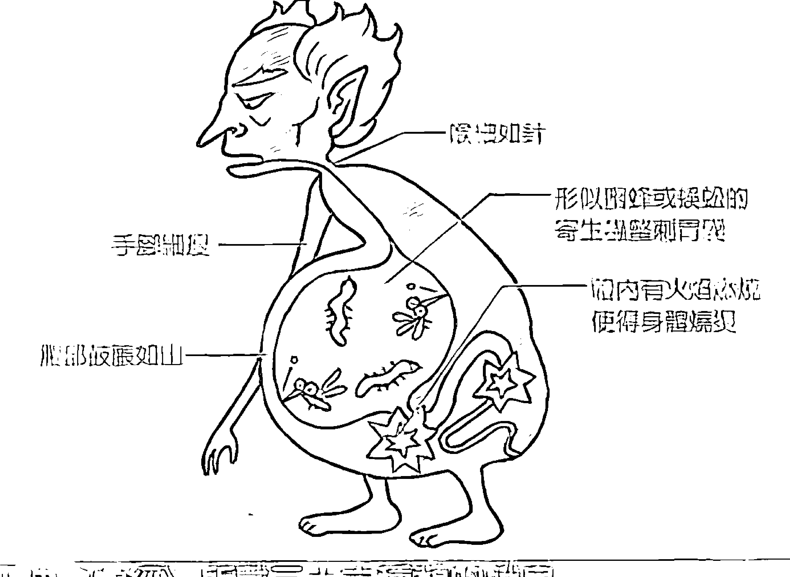

### 《正法念处经》所说三十六种饿鬼

| 针身饿鬼 | 腹内饿鬼 | 食人精气饿鬼 |
| --- | --- | --- |
| 口饿鬼 | 食舌饿鬼 | 颎列饿鬼 |
| 针口饿鬼 | 夜行饿鬼 | 焰食饿鬼 |
| 针咽饿鬼 | 伺便饿鬼 | 不净粪陌饿鬼 |
| 食粪饿鬼 | 地下饿鬼 | 食粪饿鬼 |
| 食风饿鬼 | 神通饿鬼 | 食火炭饿鬼 |
| 食法饿鬼 | 威德饿鬼 | 食毒饿鬼 |
| 食水饿鬼 | 伺婴儿便饿鬼 | 坟野饿鬼 |
| 食灰土饿鬼 | 欲色饿鬼 | 冢间住食热灰土饿鬼 |
| 食吐饿鬼 | 海渚饿鬼 | 树中住饿鬼 |
| 食涕饿鬼 | 执杖饿鬼 | 四交道饿鬼 |
| 食肉饿鬼 | 食小儿饿鬼 | 杀身饿鬼 |

一切众生所作业行，认为行善将得善果、为恶将得恶果的思想。

## 地狱道

Naraka-gati

佛教有八热地狱、八寒地狱、十六小地狱等各式各样的地狱，对前世为恶者施以极为苛刻残酷的折磨。

### ○附有一百二十八小地狱的八大地狱

佛教认为前世为恶者死后就要转生至地狱道。所谓恶行以

1. 杀生为基本
2. 窃盗
3. 邪淫
4. 买卖酒类
5. 说谎
6. 邪见
7. 犯持戒人（指侵犯童女、比丘尼等清纯神圣者）
8. 杀害父母阿罗汉（圣者）

这些罪分别对应至等活地狱、黑绳地狱、众合地狱、叫唤地狱、大叫唤地狱、焦热地狱、大焦热地狱和无间地狱这八个巨大的地狱，合称八大地狱或八热地狱。

各部经典对八大地狱位于何处、多大面积有不同的说法：《俱舍论》、《大毘婆沙论》说八大地狱就在人类生活的南瞻部洲地底；等活到大焦热之间的七个地狱分别都是一万由旬宽，并从地底一千由旬处纵向延伸直达两万由旬深的地方。换算起来，每个地狱的高度约有两千七百由旬。无间地狱又在这七个地狱之下，长宽高均是两万由旬。

《正法念处经》则说八大地狱距离南瞻部洲有三十六亿由旬远，位于十亿由旬的地底深处。

此外地狱其实不仅只如此而已，八大地狱均呈正方形，各地狱周遭都有十六个名为十六小地狱或四门地狱的小地狱，是个共计有一百二十八小地狱的庞大地狱。

八大地狱基本上是个藉火焰炙烤折磨罪人的地狱，故亦称八热地狱，不过除八大地狱以外还另有个八寒地狱，那里也附有一百二十八个小地狱。

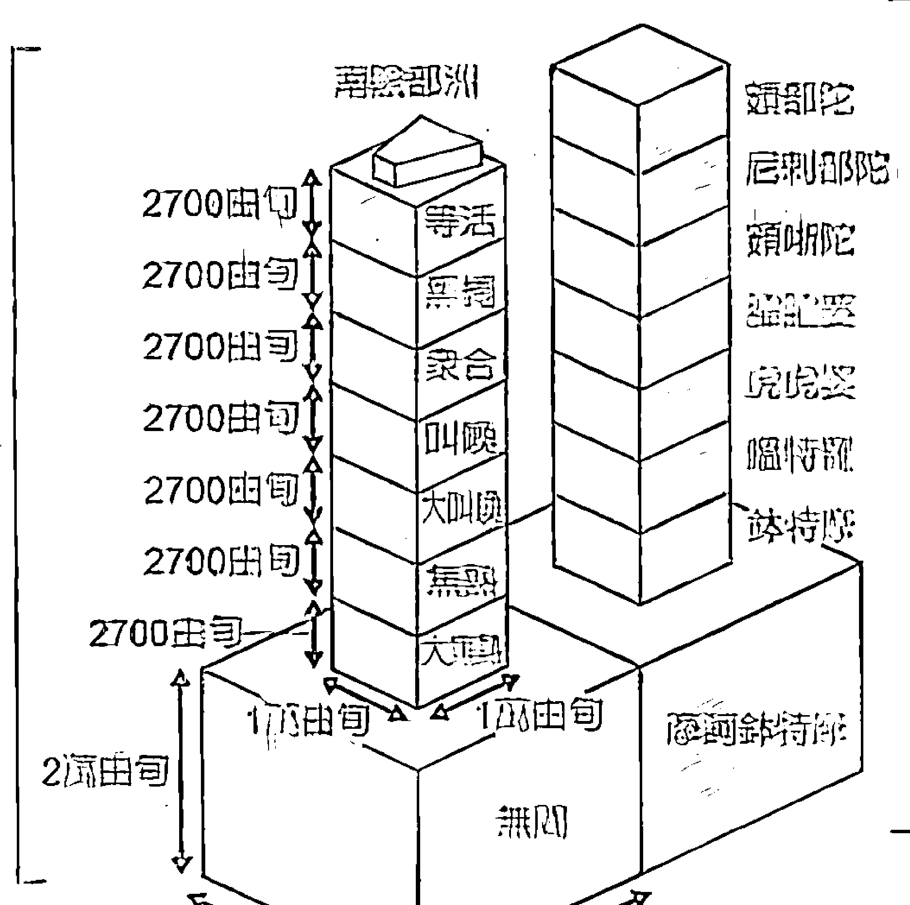

八热地狱是以炎热折磨罪人的地狱，越底层的地狱就越是恐怖。八寒地狱则是极其寒冷的地狱。

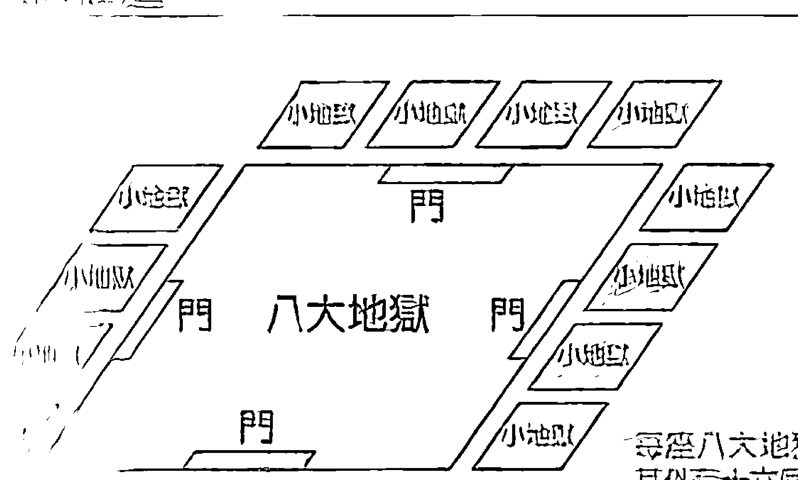

- 《阿毗达磨俱舍论》：正确名称为《阿毗达磨俱舍论》。系小乘佛教的集大成作品《大毗婆沙论》的精要概述，为整汇佛教基础学说的概论书籍。
- 《大毗婆沙论》：遵守传统教义的部派佛教“说一切有部”的代表经典。

早期佛教发展史中，上座部与大众部分裂后到大乘佛教兴起之间的时期。

说一切有部（Sarvāstivāda）：早期佛教哲学学派。

## 等活地狱
Samjiva-Naraka

犯杀生罪者会转生到等活地狱过着互相杀伐的恐怖生活，体会永无止境的杀戮之苦。

### ○胡乱杀生者坠落的地狱

等活地狱乃佛教八大地狱之一，亦名想地狱。它位于八大地狱最顶层，距离地表一千由旬，是个纵横一万由旬的正方形空间，高度约为两千七百由旬。

根据《正法念处经》记载，等活地狱乃是生前胡乱杀生者坠落地狱，众亡者必须在这里互相杀伐，体会杀戮之苦。地狱亡者的手指都长着又尖又长的铁爪，他们互相挥抓使得身侧肉块不断削落、以致死亡。有些亡者则是手持锋利刀剑互相砍杀，有些则是被狱卒持铁杖铁棒、从头顶到脚趾尖敲得粉碎；除此以外还有猛火焚身、热汤烹煮等灼热之苦。但无论有多痛苦，罪人却怎样也不会真的死亡，他们的皮肉只要受到冷风吹拂就会再生、亡者也会复活，然后无止境地体会互相杀伐之苦；即便没有风动，狱卒也会对着尸体喝“活起来”使亡者复活。

人间界的五十年等于四大王众天的一天，而四大王众天的五百年则是等活地狱的一天，而等活地狱的亡者必须在这里受长达五百年的折磨，换算成人间界的时间便相当于一兆八千六百五十三亿年左右。

等活地狱四方有四道门，门外有十六个附属小地狱，罪人四处逃窜时往往会误闯这些小地狱。等活地狱的小地狱分别是屎泥处、刀轮处、瓮熟处、多苦处、闇冥处、不喜处、炎火处、众病处、两铁处、恶杖处、黑色鼠狼处、异异回转处、苦逼处、钵头麻头处、陂池处、空中受苦处。

### 生前的行为→胡乱杀生

杀生罪

等活地狱

- 互相杀伐体会杀戮之苦
- 被狱卒以铁杖敲得全身粉碎
- 被炉火灸烧或热汤煮煮

在等活地狱受苦500年
↓
等活地狱的1天等于四大王众天的500年
↓
四大王众天的1天等于人间的50年

### 等活地狱的十六小地狱

| 聚泥处 | 刀轮处 | 焰热处 | 多苦处 |
| :--- | :--- | :--- | :--- |
| 空中受苦处 | 等活地狱 | 闇冥处 |
| 胶油处 | 不毛处 |
| 臼杵处 | 极苦处 |
| 沸尿处 | 罢病处 |
| 异处匣处 | 黑色粪狼处 | 无数处 | 砺锋处 |

## 黑绳地狱
Kalasutra-Naraka

除杀生以外又犯下窃盗罪者将会转生到黑绳地狱，周身被画满线条然后用锯子或刀子切碎成无数肉块。

### 以黑绳在身体画线、切成碎片的地狱

黑绳地狱乃佛教八大地狱之一，是犯杀生与窃盗罪者坠落地狱。

黑绳地狱在八大地狱当中排在从上方数来的第二层，是个纵横各一万由旬的正方形空间，高度约有两千七百由旬。

所谓黑绳指的便是以绳沾墨籍、画出直线的墨斗线，是从前木匠等职业会用到的工具。黑绳地狱的刑罚便与这项器具有关，狱卒首先会将罪人押倒在滚烫的热铁上，用热铁制成的细绳子在罪人身体画下数百数千条的直线；接着狱卒就会持斧头、锯子或刀，沿着罪人身上的直线一片一片将其剁成无数肉块。

有些罪人被夹在烧烫的铁板与铁网中间，有些罪人则被迫穿上以烧烫铁织成的衣服，皮、肉和骨头全部烧得焦烂，甚至连骨髓都被熔化。

此地狱还另有在偌大铁山间牵起铁绳，让罪人渡过绳索的酷刑；绳索底下还放着一口沸腾滚烫的大锅，所有罪人都因绳索坠落，受热锅煎熬。

人间一百年相当于忉利天的一天，忉利天的一千年则等于黑绳地狱的一天，而罪人必须在这座地狱待上一千年的时间，换算成人间的时间则约等于十三兆年。

黑绳地狱四方设有四道门，外侧附有十六个小地狱，但《正法念处经》却仅记载有等唤受苦处、旃茶处、阎罗卒等三小地狱之名而已。

- 杀生罪
- 窃盗罪

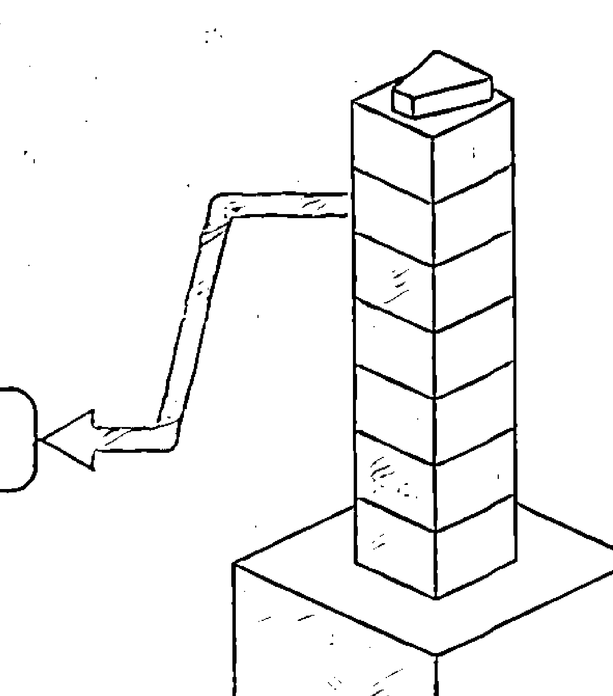

### 刑罚

- 以刀在身体划线、切成肉片
- 被夹在烧烫的铁板中间
- 被迫穿上烧烫铁绳织成的衣服
- 在大锅上方牵起铁绳让罪人渡

### 期间

在黑绳地狱受苦1000年
↓黑绳地狱的1天等于忉利天的1000年
忉利天的1天等于人间的100年

### 黑绳地狱的十六小地狱

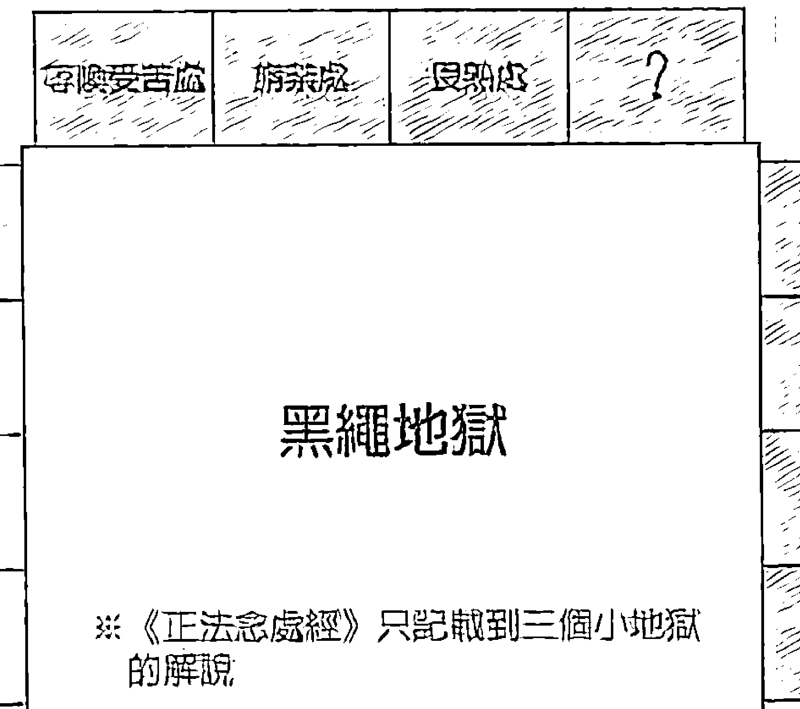

> ※《正法念处经》只记载到三个小地狱的解说

忉利天，为三十三天，乃欲界中的第二层天，因有三十三个天国而

## No.069

## 众合地狱
Samvghata-Naraka

犯杀生、窃盗、邪淫罪者将会堕生到众合地狱，饱尝被狱卒压挤粉碎的痛苦。

### ○将罪人压挤使致粉碎的地狱

众合地狱乃佛教八大地狱之一，是除杀生、窃盗以外别犯邪淫罪者堕落的地狱，位于八大地狱从上数来的第三层，是个纵横各一万由旬的正方形空间，高度有两千七百由旬。

众合地狱的刑罚乃是以辗压为中心，亦名堆压地狱。

这地狱里到处都有许多铁山，还有牛头马头等狱卒持武器追逐罪人，将罪人驱赶到山里，接着只见这些山突然阖起来，把被赶进来的罪人全部压扁。

这里还有许多平坦的大石头，狱卒会把罪人放在石头上，然后再用另一块石头砸下来将罪人压扁。有些地方则是设有大臼，由狱卒舞动铁杵将罪人捣得粉碎。滚烫的赤铜河则是有狱卒持铁钩拖行罪人、将其沉入河中。这里还有叶片锐利如刀的森林，树上会有美女出现诱惑罪人，当罪人纷纷开始攀爬树木的时候，锐利如刀的树叶便会将罪人身上的肉一片片剥下来，当罪人好不容易攀至树顶，那名美女却又出现在树下，诱使罪人爬下树来；这片树林里永无止境地循环着类似的事情，而每次爬上爬下都会把身体弄得血肉淋漓。

人间两百年是夜摩天的一天，夜摩天两千年则是众合地狱的一天，而罪人必须在这座地狱里撑过两千年的时间。此地狱四方有四道门，其外分别是大号受苦恼处、割刳处、嚝嚝处、恶见处、叫声处、多苦恼处、忍苦处、朱诛处、何何奚处、煨处、死堕处、一切根灭处、无彼岸受苦处、钵头摩处、大钵头摩处、火盆处、铁末火处，总共十六小地狱。

### 聚合地狱

- 杀生罪
- 窃盗罪
- 邪淫罪

### 聚合地狱

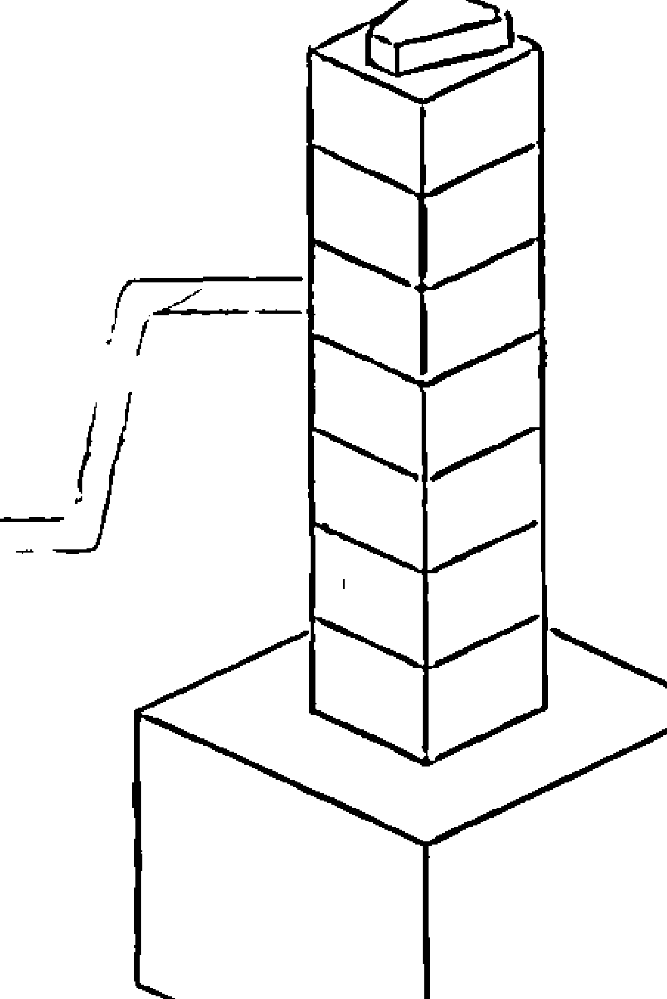

刑罚：
以刀斧等刑具磨碎罪人
以臼将罪人捣碎
以钩将罪人拖进滚烫的赤铜汁
以树叶让罪人爬叶片如刀的树木

期间
在聚合地狱受苦2000年
↓
聚合地狱的1天等于夜摩天的2000年
↓
夜摩天的1天等于人间的200年

| 大叫唤苦处 | 铜汁处 | 眼根断处 | 恶见处 |
| --- | --- | --- | --- |
| 焦火处 | | | 口处 |
| 火处 | | 聚合地狱 | 多苦处 |
| 人中川限处 | | | 尽苦处 |
| 肝火处 | | | 失心处 |
| 流彼岸受苦处 | 一切根汤处 | 火出处 | 何同处 |

## 叫唤地狱

Raurava Naraka

除杀生、窃盗、邪淫罪又另外犯下与酒相关罪恶者将会转生至叫唤地狱，忍受烹煮炙烧之苦。

### ○罪人吃痛惨叫声此起彼落的地狱

叫唤地狱乃佛教八大地狱之一，是买卖酒类或诱人饮酒者所要堕落地狱。

此外像是以毒药掺酒杀人、灌醉他人以行偷盗、灌醉他人使其为恶为淫，也都会落入叫唤地狱。叫唤地狱位于八大地狱当中的第四层，是个纵横各一万由旬的正方形空间，高度约有两千七百由旬。

这里有种头部是金黄色、双眼能够喷火还穿着赤红色衣服、体型巨大的狱卒，他们会四处驱赶并以弓箭射杀罪人。

不过这座地狱的刑罚是以烹煮、炙烤、炮烙罪人为主。罪人被丢进有深有浅各种锅中熬煮或煎烤，最后甚至会用烧毁熔融的铜汁灌进罪人的嘴巴，就连内脏也会被烧得一片焦黑。罪人在受炙烤时会忍不住大声惨叫，由于这叫声实在太过惨烈，故名叫唤地狱。

人间界四百年是兜率天的一天，兜率天的四千年等于叫唤地狱的一天，而罪人则必须在这座地狱里受四千年的苦，相当于人间界的八百五十二兆六千四百亿年。

叫唤地狱四方有四道门，其外有十六个小地狱附属。

- 大吼处
- 普声处
- 发火流处
- 火末虫处
- 热火焰处
- 雨炎火石处
- 杀杀处
- 铁林嘵野处
- 普闇处
- 闇处嘵野处
- 剑林处
- 大剑林处
- 芭蕉烟林处
- 烟火林处
- 火河处
- 分别苦处

### 佛教的苦难与图

- 杀生罪
- 盗窃罪
- 邪淫罪
- 妄语罪

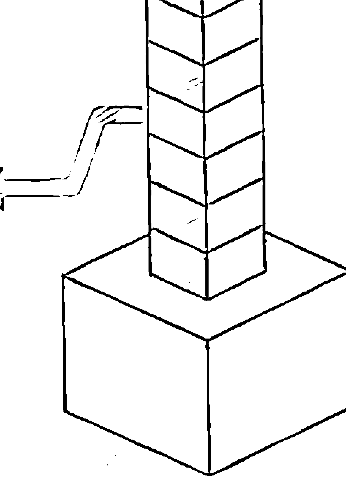

## 叫唤地狱

罚刑：
1. 用各种锅烹煮罪人
2. 金黄色、眼睛喷火、身穿赤红衣服的巨大狱卒以弓箭射杀罪人

期间：
在叫唤地狱受苦4000年
↓
叫唤地狱的1天等于兜率天的4000年
↓
兜率天的1天等于人间的400年

### 叫唤地狱：十六小地狱

| 大叫唤 | 普火流 | 火末虫 | （空） |
| --- | --- | --- | --- |
| 众合狱 | 叫唤地狱 | 梵天火等狱 | 火光火石狱 |
| 火狱狱 | （空） | 饮铜狱 | 铁树间地狱 |
| 火炉狱 | （空） | （空） | （空） |
| 刀山狱 | （空） | （空） | （空） |
| 大剑林狱 | 剑林狱 | 铁镬狱 | 铁网狱 |

## No.071

## 大叫唤地狱
Mahāraurava-Nāraka

据说罪人在等活、黑绳、众合、叫唤各地狱所受的苦加起来再乘以十倍，仍不及于大叫唤地狱。

## 痛苦十倍于叫唤地狱的地狱

大叫唤地狱乃佛教八大地狱之一，是除犯杀生、窃盗、邪淫、买卖酒类罪以外，又犯说谎罪的人所要堕落的地狱。也就是说除叫唤地狱的罪以外，另犯说谎罪的人就会被打落这个地狱。此地狱位于八大地狱的第五层，是个纵横各一万由旬的正方形空间，高度约有两千七百由旬。

大叫唤地狱的刑罚是将叫唤地狱的酷刑规模放大，譬如用比叫唤地狱更大的锅子来烹煮罪人。道具愈大痛苦就愈大，用于大叫唤地狱所受痛苦之剧，甚至超越等活、黑绳、众合、叫唤地狱加上各自附属十六小地狱所有痛苦总合的十倍。

由于大叫唤地狱是说谎者的地狱，所以有针对口、舌、喉咙攻击的特征，例如将炙热熔融的烧铜液体灌进嘴巴、让会喷火的虫啃咬罪人的舌头喉咙等。

人间界的八百年是化乐天的一天，化乐天的八千年则是大叫唤地狱的一天，而罪人必须在这座地狱里饱尝八千年折腾，换算成人间界的时间相当于六千八百二十一兆一千两百亿年。

大叫唤地狱四周有四道门，其外设有吼吼处、受苦无有止处、受坚苦恼不可忍耐处、随恣压处、一切闇处、人行树处、如飞虫堕处、死活等处、异异转处、唐怖望处、双逼迫处、迭相压处、金刚嘴乌处、火鬘处、受锋苦处、受无边苦处、血髓食处、十一炎处，总共十八个小地狱。

其他的八大地狱的小地狱都是十六个，唯独大叫唤地狱有十八个小地狱，理由不得而知。

### 大叫喚地獄的業因與刑罰

- 性罪
- 酒類相關罪
- 小妄語
- 說謊罪
- 雜穢罪

大叫喚地獄

刑罰
- 以火焰燃燒罪人
- 以滾燙銅汁灌進罪人的嘴巴
- 以獄火炎的蟲子啃咬舌頭跟蹤

期間
在大叫喚地獄受苦8000年
大叫喚地獄的1天等於化樂天的8000年
化樂天的1天等於人間的800年

### 大叫喚地獄的十八小地獄處

| 傷缺處 | 受苦無有休息處 | 受堅苦不可忍耐處 | 闇冥處 |
| :--- | :--- | :--- | :--- |
| **分隔處** | **大叫喚地獄** | **一切處** | **人間煙處** |
| **悲叫處** | **火紅處** | **如屎尿處** | **死活等處** |
| **極熱處** | **閻王處** | **受重惱處** | **血髓食處** |
| **十一炎處** | | | |

*此外尚有「血髓食處」與「十一炎處」，總計共有18個小地獄*

## 焦熱地獄 Tapana Naraka

除殺生、竊盜、買賣酒類、說謊以外又犯下邪見之罪的罪人將會軼生至焦熱地獄，受鐵板煎熬、受火炎炙烤。

## ○以特別火炎燒炙折磨的地獄

焦熱地獄乃佛教八大地獄之一，是除殺生、竊盜、邪淫、買賣酒類、說謊以外另外觸犯邪見之罪，亦即主張與佛教教義相違背思想者所要墜落地獄。換句話說，焦熱地獄就是犯下大叫喚地獄的罪，加上邪見之罪的罪人所要待的地獄。
此地獄位於八大地獄的第六層，是個縱橫各一萬由旬的正方形空間，高度約有兩千七百由旬。焦熱地獄正如其名，是以燒烤罪人使其焦炙的地獄，罪人會被放在燒得紅通通的鐵板上，身體的正反面都受到炮烙。有的被鐵柱從肛門貫穿頭頂吊起來，放在火焰上翻轉烘烤；有的全身被分解成眼、鼻、口、舌、手、足各部位，並分別受到烈焰焚燒；有的罪人被獄卒以鐵棒重重槌打，有的罪人則是被炙烤到蜷縮起來、彷彿肉球似的，有的則是關在鐵製的城堡或房間裡面悶烤。
既然叫作焦熱地獄，此地的火焰自然是非比尋常；焦熱地獄業火之炙熱驚人，等活到大叫喚五個地獄的火焰與此相比，也都彷彿霜雪般冰冷。
人間界一千六百天是他化天（他化自在天）的一天，他化天的一萬六千年是焦熱地獄的一天，而罪人必須在這座地獄裡受一萬六千年的痛苦，換算成人間界的時間則相當於五京零八十四兆一千六百年。地獄四方有四扇門，門外有大焰川分荼梨迦處、龍旋處、赤銅彌泥魚旋處、鐵鑁處、血河淵、噉骨髓蟲處、一切人熟處、無終沒入處、大鉢特摩處、閻曼達處、金剛骨處、黑鐵繩剄刀解受苦處、那迦蟲柱惡火受苦處、闇火風處、金剛嘴蜂處，總共有十六小地獄附屬於此。

### 一、焦热地狱的罪與罰

- 杀生罪
- 偷盗罪
- 淫欲罪
- 邪见罪
- 说谎罪
- 邪见罪
- 妄语罪
→ 焦热地狱

### 酷刑
- 以炽热铁板拷罪人全身正反两面
- 将罪人穿刺成串炙烤
- 将罪人烙到蜷缩成肉球状
- 将罪人关在铁制城堡或房间裡面闷热

### 期间
在焦热地狱受苦16000年
焦热地狱的1天等於他化天的16000年
他化天的1天等於人间的1600年

### 二、焦热地狱的十六小地狱

| (上1)大燋盆 | (上2)分荼利迦处 | (上3)磑硙处 | (上4)赤铜翎泥角旋处 |
| (左1)灰河镬汤处 | **焦热地狱** | (右1)多苦处 |
| (左2)火盘处 | (右2)血河漂处 |
| (左3)铁网柱处 / (铁网火受苦处) | (右3)骷髅髅髓处 |
| (左4)剑叶林处 / (剑林受苦处) | (右4)一切人路处 |
| (下1)金刚骨处 | (下2)粪尿岸处 | (下3)大钵特庾处 | (下4)无终没入处 |

## 大焦熱地獄
Pratapana-Naraka

罪人於大焦熱地獄所受苦痛遠大於焦熱地獄，而且時間還長達半中劫。

## ○ 早從仍在人世時便已然開始的地獄

大焦熱地獄乃佛教八大地獄之一，除殺生、竊盜、邪淫、買賣酒類、說謊、邪見罪以外，侵犯不曾犯戒律的童女、比丘、尼等神聖者，便要落入此地獄。
大焦熱地獄位於八大地獄從上數下來的第七層，是個縱橫各一萬由旬的正方形空間，高度約有兩千七百由旬。大焦熱地獄的刑罰與焦熱地獄同樣是以燒烤罪人使其焦炙為主，只是痛苦程度更劇，是等活到焦熱六個大地獄加上各自附屬小地獄總和的十倍，燒炙罪人的火焰有五百由旬高、兩百由旬寬，火光從距離大焦熱地獄三千由旬處也能聽見罪人慘叫呻吟的聲音。
除此以外，落入大焦熱地獄的罪人連死法都有別於等活地獄至焦熱地獄之間的罪人。這些罪人從死亡三天前便已開始遭到大焦熱地獄之刑，甚至罪人在死亡與轉生之間的過渡狀態——中有階段——也會受到閻魔王的獄卒折磨，忍受等同於地處地獄一般的痛苦。落入地獄後，罪人必須在此飽受長達半中劫的折磨。所謂劫（中劫）就是指比每百年以軟絹布輕拂邊長一由旬的正方形巨石一下，直到巨石完全磨滅殆盡為止，還要更長、近乎永遠的時間。
大焦熱地獄四方有四道門，其外是一切方焦熱處、人聲可畏之處、火髻處、雨縷變抖擻處、吒吒吒齊處、閻魔處、內熱沸處、普受一切資生苦惱處、缽多羅尼處、無閉林處、苦髻處、髮傀鳥處、悲苦吼處、大悲處、無非闇處、血泥處，總共十六小地獄。

## 無間地獄

無間地獄是八大地獄裡最恐怖的地獄，所受苦痛亦最恐怖。大焦熱地獄的苦與其相形之下都彷彿美夢般幸福。

## ○ 八大地獄中最恐怖的地獄

無間地獄亦稱阿鼻地獄。這裡是佛教八大地獄中最恐怖的地獄，犯殺生、竊盜、邪淫、買賣酒類、說謊、邪見、侵犯戒人（童女或比丘尼等純潔神聖者）、以及殺害父母或殺害阿羅漢（聖者）等，犯下佛教中最重大罪惡者就要落入這個地獄。無間地獄位於八大地獄最底層，比其他地獄還要巨大，一個縱橫各兩萬由旬的正方形空間，高度亦達兩萬由旬。無間地獄亦不負最恐怖地獄之名，落此地獄者自中有附墮起便要為其罪惡而飽受酷刑之苦，然後才墮落地獄；但無間地獄是位在距離地面兩萬由旬的極深處，故罪人還須頭下腳上不停地墮落約兩千年時間方能抵達。墮入無間地獄後，便有其他地獄完全無法相比擬的巨大苦在等待著罪人，地獄裡面無處不是充滿火焰。除了牛頭馬等獄卒之外，這裡還有種身高四由旬、生著六十四隻眼而且還能吐火的鬼卒居住。眾罪人就要在這些鬼卒的驅趕之下，烈火熾盛的燒燙鐵山上永無止境地爬上爬下。除此以外，有罪人會被拖出舌頭，在舌頭打上一百支鐵釘。除鬼卒以外，無間地獄尚有無數能吐毒液與火焰的大蛇和毒蟲折磨罪人。此之苛，不禁使人覺得就連大焦熱地獄之苦都彷彿美夢般幸福。此獄罪人受刑期最長，達一中劫之久。無間地獄四方四道門，外側另有烏口處、一切向地處、無彼岸常受苦惱處、野干吒處、鐵野干食處、黑肚處、身洋處、夢見畏處、屎尿苦處、兩山聚處、閻婆叵度處、星鬘處、苦惱急處、十四苦處、鐵鍱處、十一焰處，共十六附屬小地獄。

### 无间地狱的罪与罚

- 身生罪
- 說謊罪
- 邪淫罪
- 邪見罪

**无间地狱成因（五逆罪）**:
1. 說謊罪
2. 邪見罪
3. 犯持戒人
4. 殺害父母
5. 殺害阿羅漢之罪

# 第三章 佛教的世界

### 临刑
- 施以八大地狱中最高最大的痛苦
- 强迫罪人攀爬烧红铁山
- 扯出舌头钉上100支铁钉

### 期间
1中劫

※劫（中劫）……是比每百年以软绵花轻触各边1由旬正方形巨石一次、直到巨石磨灭还要更长的时间。

### 无间地狱的十六小地狱

| | | | | | | | |
|---|---|---|---|---|---|---|---|
| | | 磨口处 | 一切向地狱 | 无彼岸常受苦悩处 | 五干间处 | | |
| 十一处 | | | **无间地狱** | | | 锉头千食处 |
| 钉钉处 | | | | | | 黑肚处 |
| 上刀叶处 | | | | | | 身洋处 |
| 语曲处 | | | | | | 集见处 |
| | | 墓烟处 | 四紧白皮处 | 两山聚处 | 身洋受苦处 | | |

## # 《長阿含經》的地獄

### Naraka-gati in "Digha-Nikaya"

根據長阿含經記載，位在須彌山世界盡頭的鐵圍山共有兩層山脈，而八大地獄和十地獄便存在於其間。

## ## ○環繞須彌山世界的地獄地帶

佛教雖以八大地獄乃縱向堆疊於大地之下的說法流傳最廣、最為普遍，但這其實並非唯一的說法。

根據原始佛教經典《長阿含經》記載，環繞於須彌山世界廣大海域盡頭以外的鐵圍山其實共有兩層，兩層山脈中間是個荒涼的黑暗世界，陽光和月光都無法照射進去，面積多廣不得而知。而八大地獄便是位於這個夾在兩道鐵圍山脈中間的區域。

八大地獄從第一地獄數來依序是：
1. 想
2. 黑繩
3. 堆壓
4. 叫喚
5. 大叫喚
6. 燒炙
7. 大燒炙
8. 無間地獄

八大地獄各有十六個小地獄附屬，而每個大地獄的小地獄名字都是共通的，這些小地獄分別是：

1. 黑沙
2. 沸屎
3. 糞屎
4. 饑
5. 渴
6. 一銅釜
7. 多銅釜
8. 石磨
9. 膿血
10. 量火
11. 灰河
12. 鐵丸
13. 斫斧
14. 豺狼
15. 劍樹
16. 寒冰

除此以外，長阿含經又說兩大鐵圍山中間還另有十地獄，即：

1. 厚雲
2. 無雲
3. 呵呵
4. 奈何
5. 羊鳴
6. 三迷
7. 僕隸
8. 鐵鍱
9. 諍論
10. 鐵幕

閻魔王宮同樣也在兩大鐵圍山中間。其位置恰恰落在南部閻浮提的南方，縱橫各有六千由旬寬，外有七層城牆環繞。

兩大鐵圍山之間有股名為僧祇的大風吹拂，那是股吹過鐵圍山、吹到人類居住世界便會將所有東西都刮走並吹成碎片的恐怖強風。而且僧祇既是風亦是火焰，擁有可怕的高溫，除了能將所有物事焚燒成灰燼外，還散發令人難以忍受的惡臭。換句話說，在這廣大的兩大鐵圍山中間整個區域都是地獄地獄。

## 华严法界·十方小地狱图

| | | | | | | | |
|------|------|------|------|------|------|------|------|
| 刀山 | 灰河 | 冒火 | 沸血 | | | | |
| 利斧 | | | | | | 石磨 | |
| 针眼 | | | | | | 多铜釜 | |
| 铁丸 | | | | | | 一铜釜 | |
| 寒冰 | | | | | | 汤 | |
| | | | | 大地狱 | | | |
| 尿尿 | 粪尿 | 五百钉 | 饥 | | | | |

- 收录佛教最初期教义的经典统称为阿含经，《长阿含经》便是其中之一
- 《长阿含经》称作金刚山

## 極樂與淨土
Sukhāvatī & Buddha-kṣetra

大乘佛教主張除釋迦以外尚有許多佛陀，每位佛陀都主宰著一塊名叫淨土的理想國度。

## ○較易實現佛教理想的清淨世界

印度自西元元年前後開始流行大乘佛教，當時衍生出的信仰認為只須在凡世間熱心信奉佛教，便能在死後轉生到某個名叫極樂淨土的天國。在此之前，佛教若論佛陀（得悟者）便只專指釋迦，可是大乘佛教卻認為除釋迦以外還有許多佛陀存在，而這些佛陀全都各自主宰著自己的宇宙（佛國土）。大乘佛教認為由釋迦所主宰、目前人類所生活的這個宇宙（娑婆世界）是充滿苦惱的「穢土」，相對地其他佛國土則是清淨的「淨土」，是大乘佛教的理想國度。

於是是有好幾個淨土因應而生。其中較有名的包括從我等所處世界看去，落在東方的阿閦佛妙喜國、同樣位於東方的藥師如來淨琉璃世界、西方阿彌陀佛的極樂國、上方彌勒菩薩的兜率國，以及位於南方觀音菩薩的補陀落迦等。其中信仰最為廣泛的當屬阿彌陀佛的極樂國，以致後來極樂國幾乎已成淨土的代名詞，而有極樂淨土的稱呼。

當然極樂國是個極美好的地方，恰如其名是個沒有苦痛的快樂世界。首先，此地環境景觀美麗非常，有飾以金銀寶石的樓房和樹木，有各種顏色蓮花綻放的池塘，空氣中漂著芳香的香味，還有音樂從空中傳來。此外，唯有德者方能住在這個世界、接受阿彌陀佛的教誨。身處穢土欲開悟是件非常不容易的事情，但極樂並非如此；這就是為何許多人信仰阿彌陀佛，無論如何都想轉生到極樂淨土的原因。

| 佛/菩薩 | 介紹 |
|---------|------|
| 阿彌陀佛 | 原為印度王族，昔於世自在王如來座下立下四十八個誓願，經過長期修行成為阿彌陀佛，統治極樂國。 |
| 阿閦佛 | 於大日如來座下修行，成佛後統治妙喜國。 |
| 彌勒菩薩 | 相傳住在佛教天界之一的兜率天，並在釋迦死後約56億年成佛的未來佛，信徒相信他將來拯救世間的眾人 |
| 藥師如來 | 相傳能治療疾病、救人免於煩惱的佛，統治淨琉璃世界並帶領日光、月光兩位菩薩 |
| 觀世音菩薩 | 自古便以觀音之名受日本廣泛信仰的佛。相傳他會以各種不同姿態出現，救濟受苦的民眾。 |

大乘佛教將釋迦的佛國土須彌山世界稱作娑婆世界，是個充滿苦的

## No.077 藏传密教的冥界
### The soul's journey in Tibetan Buddhism

《西藏死者之书》里面教示到如何转世到更好的境界、如何渡过中有期间好跳脱轮回转世进入涅槃。

## ## ○如何渡过中有决定死后的轮回转世

藏传密教与佛教同样有个六道轮回的世界，但藏传密教认为如何渡过死后等待下次转世的中有（藏语作巴度）期间，将会影响人是否能脱离充满苦痛的轮回转世、进入涅槃。因此，这部世称《西藏死者之书》的经典详细地描述了死者将于巴度期间体验到的事件以及应对方法。此节内容笔者从今日据称共有十多个不同种类版本的《西藏死者之书》当中，选择一部名为《中有闻解》（以中有期间的听闻达致解脱）的经典来对此进行记述。

据其所载，巴度大致可以分成三个阶段，第一阶段是死亡瞬间的中有（chikhai bardo），第二阶段是生命原有姿态的中有（chonyid bardo），第三阶段是前往再生之前迷惘状态的中有（sidpa bardo）。据说这三个阶段会在人类死后的四十九天内依序到来，每位死者将于其间的看见各自不同、形形色色的景象。这些景象全是因死者自身恶业所起的幻视，它们会诱惑死者、引诱死者踏入本该摒弃杜绝的轮回转世。倘若能够认清这些景象全是幻视、保持心灵的空净状态，死者便能免于怖畏转世而致解脱，而这正是《西藏死者之书》的存在意义。

藏传密教相信，假如能够藉此书在生者仍在世时养成巴度该有的态态、能够在渐渐衰弱将近死亡的过程中，得到教上的导师或亲友为自己唱诵此书记载的祈禱文字的话，那么死者就有可能因此达致解脱，即便未能达致解脱也能输送到更好的世界。

## 中阴的三个阶段

### (1) chikhai bardo (死亡瞬间的中阴)

人类停止吐气，生命之风「rLung」仍然停留在体内的状态。持续昏迷状态。

### (2) chonyid bardo (生命原有姿态的中阴)

生命之风离开身体以后，死者就会变成一个意识体，看见各种幻视。

(a) 沐浴在耀眼光芒下的众神

(b) 模糊光芒下的六道轮回世界

选 (a) 便能达致解脱，选 (b) 则要继续游走在巴度之中

### (3) sidpa bardo (再生前迷惘状态的中阴)

巴度的最后阶段

(a) 死者因自身的业而受可怕的幻影所恼，复有阎魔王出现细数其罪。
(b) 来自六道的六道光芒出现在死者眼前。天道为白、阿修罗道为赤、人道为黄、畜生道为绿、饿鬼道为黄、地狱道则是烟色。死者的身体也会渐渐变成与转生世界相同的颜色。

此时欲求解脱已相当困难，但选择正确的母亲还是能得到较好的转世。

### 轮回转世

西藏自古便有萨满信仰的宗教，名为苯教。西元七世纪前半佛教传入，与传统宗教相互习合，孕生出拥有强烈密教色彩的藏传佛教。

## 日本的山岳地獄
Hell in Japanese mountain

日本將自古固有的山岳靈場與佛教的地獄思想結合，衍生出相信現實的深山裡有各種形形色色地獄存在的信仰。

## ## ○融合古老山岳靈場與佛教思想的山岳地獄

日本自古以來便有人死後靈魂會前往山上的信仰。進入西元六世紀以後又有佛教傳入，於是固有的山岳靈場便與佛教的地獄結合，產生山裡有地獄存在的信仰。尤其火山更是如此，火山裡白煙裊裊處與溫泉噴湧處往往會被視為地獄。

日本各地都有如此山岳地獄存在，自古以來就立山所受信仰最眾，而《今昔物語集》亦收錄了數篇以立山地獄為主題的故事。其中一篇〈越中國書生妻死墮立山地獄語第八〉就記載：「立山地獄恐怖非常，眼前所見盡皆燃燒焦黑，其地獄模樣可見熱湯帶著白煙滾滾沸湧。只從遠處眺望便是酷熱難耐，若受那地獄之鍋熬煮想必是痛苦萬分」。我們從這段文字同樣也能得知，地獄便是在高熱溫泉翻滾沸騰處。

江戶時代中期出版的百科書《和漢三才圖繪》則是以長崎縣的雲仙為地獄之首。江戶後期文人橘南谿的紀行文《東西遊記》也對雲仙地獄有所記述，他列舉出好幾個地獄的名字，並記「多為熱湯之池。其湯色深黑更甚於墨，倏地湧起作如雷巨響，飛石捲煙火炎熊熊，其恐怖不可盡書」。

除此之外，較有名氣的山岳地獄還有白山地獄、金峯山（大峯山）地獄、富士人穴地獄、恐山地獄等。印度的地獄位於與現實世界隔絕的地底深處，而且還是呈縱向的多層構造，但日本的地獄則是存在於人類生活的這片大地之上。

## No.079

## 賽河原與血池地獄

Sai-no-kawara & Chi-no-ike-jigoku

除出產自印度的地獄以外，日本還另有夭折孩童聚集的賽河原以及清一色全是女性的血池地獄信仰。

### ○從前日本人視為常識的地獄名勝

賽河原與血池地獄均未曾見載於任何印度製的經典，卻是過去日本人相當熟悉的地獄。

賽河原是中世以後形成的日本民間信仰，位於冥界入口附近，就在越過死出山的三途河畔。死亡年齡在十歲以下的孩子都聚集在這裡，他們所犯的是太早過世使父母傷悲的罪。可是他們太過年幼還無法前往地獄，於是便來到了賽河原。孩子們會在這裡一面想著父母兄弟姐妹、一面堆石成塔，石塔堆成後地獄的鬼就會持鐵棒將石塔搗毀，然後雙方便不斷重複著這個堆塔與搗毀的循環。成書於室町時代的物語《富士人穴》草子說這個懲罰將延續達九千年。但這樣孩子們實在太過可憐了，所以《賽河原地藏和讚》等佛教歌謠都說地藏菩薩將會現身拯救這些孩子。血池地獄乃以成書於十世紀的中國、全書僅短短四百二十字的《血盆經》為依據，是專為女性所設的地獄。根據其記載，女性生產和月經的血液會玷污地神，所以死後必須落入血池地獄，受每日三次飲下池內血液的懲罰，不過只要誦奉《血盆經》便能免於這項刑罰。此經典乃於室町時代前後傳入日本，至江戶時代滲透民間，尤其受到女性信仰。從前全日本的靈山都嚴禁女人出入，可見女性從前一直都被認為是無可救贖的，所以後來日本各地的山岳地獄傳說便開始設置了血池地獄。《血盆經》雖然說是能拯救女性免於血池地獄之苦的經典，但卻助長了歧視女性的血池地獄擴張，這也是為何《血盆經》如今幾乎已不見蹤影的原因。

死河原 ⇒ 十歲以下死亡的孩子們聚集之處，在三途河畔。

孩子們在死河原堆砌石頭，但惡鬼很快便會出現將石堆毀壞。不過日本有四院指進，專門埋葬父母無緣的石塔。日本各地都有供奉孩子的死河原設施。

血池地獄 ⇒ 因《血盆經》流行而興起、專收女性的地獄。

### 地藏菩薩

佛教每個菩薩都有自己主宰的淨土，唯獨地藏菩薩不是如此，他獨自居住於地獄或六道之中，拯救落入其中的罪人。為拯救亡者，地藏能幻化出無數個分身、出現在各個地方。《今昔物語集》裡就有許多地藏菩薩的靈驗奇譚，大多數都是描述生前未信仰地藏，而於死後落入地獄，而地藏菩薩出現使亡者復活、賜人重返極樂往生的機會。除此以外，地藏菩薩代亡者受地獄之苦的故事亦不在少數。地藏菩薩在日本通常被稱為地藏樣，頗受民眾親近，而日本民間也有地藏會替死者帶路前往冥界的信仰。

佛典・佛書

- 1. 《地藏菩薩發心因緣十王經》草子→成立於室町時代末期的御伽草子。
- 2. 《地藏和讚》→以日語禮頌佛陀、經典、教義的讚歌。
- 3. 《血盆經》→《大日本續藏經》以《佛說大藏正教血盆經》之名收錄的小部經典。

御伽草子：統稱室町時代至江戶初期的短篇故事集。

### 涅槃（ニルヴァーナ）並非場所

佛教將達致解脫，亦即脫離輪迴轉世達到開悟境界稱作「入涅槃」。此一說法往往會使人感覺涅槃好像跟天國和地獄一樣、存在於某處的場所，可是涅槃其實不是一個場所。

涅槃二字是古印度語（梵語）（निर्वाण）的音譯漢語，此語有「被吹滅的狀態」涵義，最早原本是「死」的意思，而佛教也將涅槃當作表達釋迦死亡的用語使用。若將所謂「被吹滅的狀態」解釋為「生命之火被吹滅」代表的自然是死亡，但若看作「精神面的煩惱被吹滅」，那麼也可以是達致開悟境界的意思，於是後來佛教才會把釋迦達致開悟境界稱作「入涅槃」，而涅槃也成為指稱達致開悟之際，心神狀態的用語。

是故佛教視為最高理想的涅槃並不是在須彌山世界（六道世界）裡的任何一個地方，同時也不是在須彌山世界之外的地方，它完完全全是個心神狀態。

釋迦是在三十五歲時開悟，八十歲過逝。假如涅槃除開悟以外還擁有死亡的意涵，那麼釋迦就等於是入了兩次涅槃。是故，佛教後來又衍生出將釋迦仍在世時稱的涅槃與死後涅槃分別稱待的意思，前者稱作有餘涅槃，後者則稱無餘涅槃。此處所謂「余」指的就是身體，此二者其實就是指仍具備肉體的涅槃以及失去肉體後的涅槃，而佛教徒認為進入無餘涅槃便能真正的脫離六道輪迴世界，才是完全的解脫。

再說到大乘佛教，他們主張最理想的涅槃應是無住處涅槃。此處所謂涅槃（開悟）指的當然就是斷卻六道世界的煩惱，可是即便斷卻六道世界煩惱、進入開悟世界後，也不應該就此恬靜安逸下來。他們認為人不應拘泥於生死、不願拘泥於得悟世界，應該抱著大悲心自由隨意地行動，將眾人引領向佛道才是。

從這個角度來看，我們可以說涅槃迥異於基督教徒們在的永恆天國概念。

# 第4章 他天堂與地獄

## 諾斯替教的天國與地獄

The Gnostic Heaven and Hell

諾斯替教徹底否定宇宙，認為人類的肉體和宇宙是囚禁靈魂的監牢和地獄。

### ○認為現世才是地獄的反宇宙思想

諾斯替教主要盛行於西元一至三世紀的東地中海，被認為是反基督教的異端思想，曾壯大到令初期基督教倍感威脅。

此教的最大特徵就是徹底否定宇宙，認為宇宙就是地獄。

宇宙（Cosmos）是古代希臘人所提出的觀念，擁有至高的宗教尊嚴。換言之，宇宙是秩序、調和、理性與知性並存的完美存在。但諾斯替教卻不這樣想。諾斯替教認為至高神創造出稱為「移湧」的諸多神明，其中一名移湧墮落為德穆哥（造物主），創造了世界。因此世間一切都被視為邪惡，包括人類的肉體和精神也不例外。人類藉著身體中的靈和至高神相連結，而靈卻被困在名為宇宙的巨大的地獄和人類肉體與精神形成的牢獄中。一般諾斯替教所謂的七層天是種類似牢房高牆的概念，同時也就是七位阿爾康（支配者）。阿爾康與基督教的天使類似，但是諾斯替教卻認為他們是可憎的支配者，為了阻礙人類的靈逃出監獄昇天而存在。

是故，諾斯替教認為必須拯救囚禁在物質世界中的靈，而拯救方法就是至高神所啟示的終極「智慧與認知」（諾斯替）。總而言之，唯獨有幸接觸到智慧與認知的靈才會覺醒，從肉體與精神的束縛中解放、昇至宇宙，最終回歸到至高神所在的光之領域而獲得救贖。那裡才是諾斯替教心目中的天國。

### 11. 诺斯替教的宇宙观

### 11.1.1.1. 人体的层级构成

诺斯替教认为人的“灵”也就是“灵”的监狱=地球。灵正被囚禁于肉体与精神的监狱=地球之中。

### 11.1.1. 伪神

亚伯拉罕教（造物主）→德穆哥是自以为神明的伪神，也是旧约圣经中开天辟地的神。因此基督教的神明便相当于诺斯替教的德穆哥，是伪神。

## 《智慧信仰》记载的地狱

Hell in "Pistis Sophia"

诺斯替教的支派认为地狱就在围绕着天界的龙腹之中，罪人死后灵魂便是囚禁在此。

### ○围绕天界大龙腹之中的十二土牢

西元三世纪前后的诺斯替教于叙利亚有一支派，他们相信犯下特定罪恶的灵魂将在死后堕入地狱，而《智慧信仰》此书便对这个地狱有所描述。

据其所载，火焚谷（地狱）就在那只环绕于天界外侧、自衔其尾的巨龙腹中。那里面共有十二座充满可怖酷刑的土牢。

这十二座土牢各有管理者，第一座土牢的管理人是鳄鱼脸的恩克东尼，嘴里衔着尾巴；第二座土牢的管理人是猫脸的卡拉卡鲁。其他土牢的管理人分别是狗脸的安卡洛克、蛇脸的阿克洛卡鲁、牛脸的马鲁寇特、猪脸的拉姆卡默鲁、熊脸的洛乌克卡鲁、秃鹰脸的拉拉欧克、翼蜥脸的阿鲁肯奥克、长了七个龙头的哈鲁马洛克、七个猫头的洛卡鲁和七个狗头的克雷马欧鲁，而哈尔马洛克、洛卡鲁和克雷马欧鲁都不止一人。此外，土牢的管理人每个小时都会改变名字和脸孔。

罪人死后的灵魂将从龙尾的洞被丢进土牢，而巨龙只有在此时才会放开尾巴，等到罪人进入土牢之后又会衔起尾巴将门关上。土牢中的刑罚和一般地狱一样是以火刑为基础，但是土牢中的火焰比起现世的火焰还要痛苦九倍，而且还有囚禁于冰、液和雹等刑罚。

此外，土牢高处虽然设有窗口，但是都有天使看守。

巨龍被從尾巴的洞丟入土中，巨龍再咬住尾巴，洞穴就閉合。

土牢裡有冰刑與火刑，世界末日來臨時土牢裡的亡魂將全數消滅。

Pistis是「信仰」的意思，而Sophia則是智慧女神的名字

## 伊斯兰教的冥界

The afterlife in Islam

伊斯兰教没有死後审判，他们相信亡魂会停留在地底的冥府巴鲁萨布等待最後的审判来临。

### ○亡魂將在巴魯薩布等待最後的審判的來臨

伊斯蘭教認為人死後不會馬上前往天國或地獄。死後人的魂魄會離開肉體，直到最後的審判來臨前，都會停留在位於天國與地獄的中間地帶巴魯薩布。巴魯薩布是「地底的世界」或「墳塋」的意思。

死者進入巴魯薩布當晚會有蒙卡爾和納基爾兩位天使出現，前來確認死者的信仰。此處的判斷將大大影響死者接下來的境遇。因為位於巴魯薩布的亡魂雖然不屬於天國也不屬於地獄，但是死者在得到將前往何處的預兆以後，就會馬上體驗到類似天堂或是地獄的經歷。此外，伊斯蘭教雖然認為死者在巴魯薩布必須等到復活當天才會甦醒，但這段期間卻比生前更加清醒；他們相信活在世間的時候其實是處於睡眠狀態，人類直到死後才算是第一次清醒，所以儘管在巴魯薩布所發生的事都是幻想而非現實，但亡魂會覺得比生前更真實且直接。

等到最後的審判那天，死者就會以生前的姿態復活，經過神的審判後送往天園或是火獄，是故亡魂必須在巴魯薩布停留多少時間須視何時死亡而定；有人會在巴魯薩布停留上百年，也有人只需停留數年或是更短。但是當死者於最後的審判當天復活以後再回想起來，會覺得先前的漫長等待其實很短暫。至於各人對時間長短的感覺又視死者為善為惡而異：好人會覺得待在巴魯薩布的時間很長，壞人卻會覺得數百年宛如十天，甚至還有人覺得像是一小時那麼短暫。

死后灵魂进入天国与地狱的旅程

死后灵魂脱离肉体→肉体消灭

灵魂进入巴鲁萨布等待

世界末日时，死者将以生前的肉体复活

阿拉于最终审判示下裁决

送往天国或地狱

伊斯兰教：西元610年穆罕默德（约570年~632年）所创宗教，信奉阿拉为唯一…《古兰经》为圣经。

## 伊斯兰教的地狱：火狱

Jahannam - The Hell in Islam

伊斯兰教的火狱乃是业火熊熊的深邃洞穴，洞底的榄桔树还结有形似恶魔头颅的果实。

### ○最後的審判過後的伊斯蘭教永恆地獄

伊斯兰教认为罪人在最后的审判过后将会坠入名为火狱的地狱，永生受苦。

火狱是个充满熊熊业火的深邃洞穴、亦即一般所谓的地狱。洞穴上方有道名为阿尔席拉特·阿尔穆斯塔金（正确的道路）的桥梁。最后的审判当天，复活的死者将由唯一真神裁定其生前善行与恶行的多寡，然后走过桥梁。善人过桥时将有光围绕，宛如光线一般迅速通过；恶人过桥时周遭会化为一片漆黑，随后坠入火狱的深渊。

火狱里面的罪人头顶乌烟笼罩，周身全是沥青。除此之外罪人还要受到颜面炙烤、身受煎烙、以滚烫沸水浇淋的酷刑。其次，火狱底部还有株果实酷似恶魔头颅的榄桔树，罪人必须食用这些果实直到腹部胀破，还要被强灌热水。

可兰经虽然并未仔细描述火狱的构造，但是后世坚信火狱共有七层。最高层的哲罕南木（火狱）是用来处罚伊斯兰教的罪人；第二层拉札（燃烧之火）处罚基督教徒；第三层胡达（粉碎之火）处罚犹太教徒；第四层萨伊尔（熊熊烈火）处罚萨比教徒；第五层撒卡尔（业火）处罚琐罗亚斯德教信徒；第六层加须姆（灶）处罚多神教信徒；第七层哈维亚（深渊）处罚伪教徒。

不过，可兰经亦有记载，罪行轻重将会正确地反映在罪人于火狱所受刑罚中，不会有刑罚过度的情形。

### 永恆的地獄

- 最後的審判過後的永恆地獄
- 火獄的刑罰會正確地反映罪人生前罪行的輕重
- 底部有株果實形似惡魔頭顱的棧梧樹

### 伊斯蘭地獄的七層與其處罰

| 地獄層 | 處罰對象 |
| :--- | :--- |
| 哲罕南木 | 處罰伊斯蘭教的罪人 |
| 拉札 | 處罰基督教徒 |
| 孛達瑪 | 處罰猶太教徒 |
| 薩伊爾 | 處罰拜比教徒* |
| 撒卡爾 | 處罰瑣羅亞斯德教徒 |
| 加須姆 | 處罰多神教徒 |
| 哈維亞 | 處罰偽教徒 |

* 拜星教：崇拜星辰與月亮的地方性古代宗教。

## 伊斯兰教的天国：天园

Jannah-The Heaven in Islam

伊斯兰教的天国是不为饮食所困的乐园，还是个赐人处女为妻的男性天堂。

### ○充斥以男性为主体之现实享乐的天堂

伊斯兰教中的善人在通过最后的审判后便可以进入永恒的天国——天园（乐园）。根据可兰经的描述，天园是彻底的乐园，没有人会挨饿受苦。乐园中有许多河川流着绝不腐败的水、绝不走调变味的奶乳、美酒与蜂蜜，树上还结有各种果实。死者的生活亦相当奢侈，他们横躺在金线装饰的卧台上，让年轻的仆人伺候倒酒，喝再多都不会头痛。除此之外他们不但可以尽情享用鸡肉，还可以得到仍是处子身的妻子，因此天园可以说是个完全以男性为中心的天国。

虽然说天国是善人的去处，但阿拉是慈悲为怀的神明，因此只要是平常认真行善的人，即便稍有罪过阿拉也会网开一面，而且还会根据当事人所做的最大善行给予好几倍的赞美。神每周降临天园一次，因此天园的居民还享有直接拜见真神的恩惠。可兰经记载天界共有七层，但是这七层天界在世界末日那天就会全部瓦解，届时天园就会出现。不过天园并非在天界瓦解时形成，根据伊斯兰教传说「夜行登霄（升天）」记载，先知穆罕默德曾在大天使吉卜利（加百列）的指引下展开旅程，参观天堂与地狱。当时在第一层天界大门迎接穆罕默德的是亚当，之后随着穆罕默德越爬越高，迎接的人也转变为雅各和耶稣、约瑟、以利亚、亚伦、摩西甚至亚伯拉罕。来到第七层天界，穆罕默德就看到了酸枣树（生命之树）与天使齐聚于神殿的天国。所以天国可以说早就已经存在，只是要等到世界末日时才会出现。

- *1 以利亚（Elijah）：是《圣经》中的重要先知，意即「耶和华是神」
- *2 亚伦（Aaron）：旧约圣经人物，摩西的兄长，属利未支派。

穆罕默德體驗的天界以及出迎的先知

### 天國 — 天國的特徵

- 男性中心的天國。
- 河裡流著絕不腐敗的水、絕不走調變味的奶乳、美酒與蜂蜜。
- 結滿各種果實。
- 雞肉吃到飽。
- 橫臥在金線裝飾的臥台上，由年輕的僕人服侍倒酒，無論喝再多酒也不會頭痛。
- 得到仍是處女的妻子。

- 《古蘭經》：將伊斯蘭教創始者穆罕默德所得神啟彙整而成的伊斯蘭教聖經。
- 安拉：伊斯蘭教的唯一真神。阿拉是阿拉伯語對神明的其中一種稱呼。由於伊斯蘭教傳承自舊約聖經的族長亞伯拉罕所主張的信仰，因此阿拉與猶太教、基督教的其實是同一位神。

## 伊斯兰教的最後的審判

The final judgement of Islam

伊斯兰教並無死後審判、唯有最後的審判，屆時就連受審者的身體各部位都將成為證人。

### ○著重於人類善良面的阿拉審判

猶太教與基督教認為人死後便要立刻接受死後審判，決定死者該前往天國或是地獄，並且在世界末日時接受最後的審判，伊斯蘭教卻認為人死後只會接受一次審判，那就是最後的審判。根據可蘭經的記載，世界末日當天天使會吹響兩次號角，聽到第一聲號角所有活人都會昏厥；聽到第二聲號角，所有死人都會以生前的模樣復活，活人也同時甦醒。

世界末日時天地瓦解，阿拉將與列隊的天使一同降臨。所有復活的人來到阿拉面前集合，依序接受審判。接受審判的人身邊都會跟著兩名天使，一名天使負責催促人類，另一名天使則是擔任人類靈魂的紀錄者。每個人都配有一名天使負責記錄，他會將人類所有生前的行為記錄在帳本上。受審者由兩名天使陪同謁見阿拉，並且在阿拉面前檢視自己的帳本。人類在此的所有發言也會由身邊的看守者全程記錄下來。

最令人感興趣的不是天使、妖魔或人類本身可以發言為證，而是連當事人身體的一部分，例如舌頭、手、腳、耳朵、眼睛、皮膚都是重要的證人，因此審判途中受審者也可能會因為手腳說出對自己不利的證據大吃一驚。由此可知伊斯蘭教的最後的審判是非常公平的。只是阿拉慈悲為懷，因此就算生前善行稀少也會依據其最大的善行來判斷受審者的整個人生，為惡者則是以所有惡行加總量刑。如果實際情形果真是如此的話，那麼我們可以說只有非常邪惡之人才會墮入地獄。

The request was rejected because it was considered high risk# 新西兰原住民毛利人的神话与历史《波》

新西兰神话认为死者亡魂将前往西方大海的彼端，然后从女神帕内奴伊挖掘的秘密入口进入地底的冥界「波」。

# 新西兰地图

毛利人是新西兰的原住民，据考约于十世纪前后由东波里尼西亚群岛迁来，有在面部或全身刺青作为装饰的风俗。毛利伊是毛利族神话中的英雄，同时也是创造太平洋诸岛的人……

## 夏威夷的冥界 密爾
*MILU - The underworld in Hawaiian myth*

在夏威夷，人们相信多数死者的灵魂会坠入女神秘尔位于地底世界「波」之中的冥界里，死者的灵魂将被灶火焚烧消灭。

### ○给人永恒死亡的地底冥界密尔

夏威夷与其他的波里尼西亚岛屿一样，认为大多数的死者灵魂会前往位于地底的冥界「波」。波里尼西亚一般认为死者灵魂会从其居住岛屿的特定场所出发前往冥界；那些场所多半是溪谷或可眺望大海的高耸悬崖末端，且有神圣的树木生长。夏威夷将那树称作「面包树」，树旁还会有几名孩童灵魂负责领导死者。夏威夷岛的威匹欧溪谷、欧胡岛的莫阿那鲁亚、茂伊岛的阿卡罗阿等，都是死者出发前往冥界的起点。

夏威夷的地下世界「波」分为数个国度，其中一个受女神秘尔支配。密尔本是大地女神，却因反抗众神而被打落至地底世界「波」，从此统治死者的国度。冥界密尔是为一般人与罪人所设的场所，女神秘尔会在这里将死者的灵魂投入灶中，让灶火焚烧死者的灵魂。但这并非地狱的刑罚，只是用火消灭死者的灵魂、让他们得到纯粹而永恒的死亡罢了。

少数贵族阶级的死者灵魂并不前往地下，能够到达天空的冥界。死者灵魂会在那里加入祖灵的行列，在跟地上完全相同的环境下，过着和凡间全无二致的生活，这个国度名叫奥玛夸（奥玛夸即为祖灵）。不过能在天空冥界中幸福度日的，就只有祖灵事先在该处保留住所的灵魂而已。若非如此，灵魂便会来到游魂的国度奥逵阿，并从峭壁跳入海中，然后在海底峡谷中沐浴。届时，运气好的死者灵魂会获得新肉体并且复活，否则会落入黑暗世界中；那黑暗世界就是地底世界「波」，死者灵魂会在那得到永远的死亡。

### 原住民的死后灵魂之旅

> 在祖灵国度中没有居所的灵魂

> 贵族阶级的灵魂

> 一般人、罪人的灵魂

### 一般人、罪人的灵魂
死后前往女神密尔的国度，受火焚烧消灭。

### 贵族阶级的灵魂
死后前往祖灵之国奥玛夸加入祖灵的行列。
倘若祖灵没有为死者确保居所，死者就会经由游魂之国奥迈阿前往海底的沐浴场。运气好的会得到重生，否则就要落入冥界「波」化为乌有。

## 西伯利亚通古斯人的冥界
### The afterlife in the Tungus people

西伯利亚的通古斯人相信人类有贝恩和奥米两种灵魂，而这两种灵魂将会分别去到不同的死后世界。

### ○ 为贝恩与奥米两种灵魂存在的冥界

西伯利亚的通古斯（埃文基）人是信奉萨满信仰的部族，他们相信人类除个人肉体的灵魂贝恩以外，还拥有确保氏族再生能力的根源性灵魂奥米。这两个灵魂将在人类死后分别去不同的冥界：贝恩去的是位于下方世界的氏族死者之村，奥米则是位于上方世界的住处——奥米克。

通古斯人相信世界分成人类居住的地面、上方世界与下方世界三层构造，其间由神话的河川连结。贝恩将在萨满的引导之下，由尸体所在处沿着神话河川顺流而下，届时萨满的大鼓会变成船，而贝恩则是会变成木筏；这条河川水流湍急，途中还有招来灾祸的精灵以及企图狙杀贝恩的亡魂埋伏。如果贝恩无法抵达死者之村的话，就会变成徘徊于森林或沼泽地带的危险精灵，而那些顺利抵达死者之村的贝恩，则是在那里过着与凡间类似的生活，只不过下方世界的太阳有一半是冻结的，所以死者的世界是既寒冷又昏暗。贝恩能够对第四代之前的子孙造成诸多影响，超过第四代以后贝恩就会失去力量，落入下方一个叫艾拉格连或艾拉穆克的世界，成为无名祖先的其中一员、最终消灭。通古斯民族认为能够存在于世间的灵魂有其一定的总性，灵魂都将如此消灭，所以才会有部族人口减少的悲剧发生。

另一方面，奥米则是会变成鸟，从神话河川的渊源凭借自己的力量飞到上方的世界奥米克，停伫在神话树木的枝顶。而同族的其他奥米也都栖枝于此树。奥米会在数年之后回到地上，从排烟孔进入帐篵、钻进女性的肚子里投胎转世。

### 毛利人与奥米两个民族的世界

-   埃文人（埃文基）人・主要居住于俄罗斯国内西伯利亚联邦地区埃文基自治区的・以狩猎与放牧驯鹿为生。
-   萨满，以拥有特殊能力能与神灵等超自然存在交流的萨满为中心的宗教组织。

# NO.096

# 西伯利亚奥斯加克人的冥界
*The afterlife in the Ostyak people*

西伯利亚的奥斯加克人相信唯有死于非命者能在死后进到天国，其他人都要落入地狱。

### ○不计生前种种，只凭死法决定前往天国或者地狱

西伯利亚的奥斯加克人自古便信奉萨满信仰，他们相信遭雷殛、被猛兽咬死或在狩猎中发生意外而死者可以在死后去到天国；相反地，死于床褥或病死者则是会落入地狱。换句话说，奥斯加克人所注重的并非生活方式而是死亡方式，而且唯有以现代观点看来，会归类为死于非命的死者才能够去天国。

奥斯加克人认为世界除人类生存的地面以外，还另有天上七层与地下七层的世界。天上、地面、地下之间则是以神话的世界之柱串连，而死者的灵魂便是要在萨满的带领之下，沿着这根支柱上到天国、或者下到地狱。天上七层与地下七层各自设有戍卫，萨满必须越过这些看守者才以抵达目的地，而且途中还会有各种障碍阻挠萨满。

天国欢乐而地狱痛苦是理所当然的道理，但奥斯加克人的冥界却有个别具特色之处，那就是冥界里任何事物全都跟地颠倒。或许此现象仅限于地底下的冥界，但下界的所有人全都头底朝天生活，仿佛是地上风景的倒影似的，山峰和帐篷也全是上下颠倒的。不仅如此，地上白天的时候下界则是夜晚。此类特征遍见于西伯利亚与蒙古周遭的萨满信仰部族，以至有些部族还认为地上夏天时下界却反而是冬季，地上猎不到动物的时候下界却可以收获丰硕。日本也有替死者穿衣服时左衽的习俗流传，所以冥界里任何事物都与凡世颠倒，看来是个相当普遍的想法。

> * 左衽：日本人习惯替死人穿衣服时将右襟压在左襟之上。

### 亚斯加克人的天国与地狱

-   遭雷殛的人
-   被猛兽咬死的人
-   狩猎时意外死亡的人

-   死于床褥的人

# [一切事物都是相反的冥界]

[在奥斯加克人的宗教信仰和传说中，冥界里的所有事物都是与地上世界相反的]

# 11.1 介绍

亚斯加克人→主要散居于俄罗斯乌拉山脉东侧鄂毕河流域及叶尼塞河流域

# No.097
平田笃胤的「幽冥界」
Yūmeikai in Hirata Atsutane

研究日本古代死后世界的平田笃胤主张亡灵的归宿乃是幽冥界，并认为幽冥界存在于地上世界各处。

### ○位于阳世各处的死者之国

江户时代的国学者平田笃胤为确立「大倭心」概念而开始研究冥界，并根据其独创理论提出了幽冥论。

在笃胤的想法中，宇宙乃由天、地、泉组成。天象征太阳，地象征地球，泉象征月亮。这三者虽然现在是分离独立，但起初却是浑然一体的。首先是属神国的天分离了，接着作为黄泉国的泉也分离了。在《记纪神话》中，伊邪那岐与大国主神之所以能通过出云*的黄泉比良坂前往黄泉国，是因为当时泉与地尚未分离。不过当泉与地分离后，不用说是活人，就连死者灵魂都再也无法往返于阳世与黄泉国了。于是，平田笃胤就死者的灵魂归处提出了一个全新的主张，那便是幽冥界。根据笃胤的说法，死者的灵魂基本上会停留在墓地周围，而幽冥界也跟人类生活的现实世界相同，存在于地上的每个角落，而且幽冥界中同样也有食衣住行等活动，过着与人间相同的生活。

只是亡灵们拥有人类没有的神奇能力。首先，亡灵能够在阳人间引发不可思议的灵异现象，且人类的肉眼看不见幽冥界，但从幽冥界却可观看人类的世界，亡灵还能透过灵异现象出现于自己挂心的人。日本自古以来便有天狗或妖怪等等不可思议的存在，而这些奇特的生命同样也是居住在幽冥界之中。支配幽冥界的神明被认为是大国主神。大国主神便如佛教中的阎魔一般知晓人世的一切，会在幽冥界审判现世的功过。

此外笃胤还提出，罪孽深重的灵魂可能会被送去自古以来视作污秽异界的地方——黄泉国。

> * 出云：日本《记纪神话》曾经数度提及的地名。

### 平田神道的宇宙观与灵界图

### 幽冥界的位置

幽冥界位于现世世界中的各个角落，亡灵们在地面过着一如阳世时的生活，亡灵们可自由往来于人世的住所，人类却看不到他们。

### 平田笃胤

平田笃胤（西元1776年~1843年，江户后期的日本国学家。于本居宣长死后，拜其门下，建立起名为平田神道的日本国学体系。关于幽冥界，在他的《灵能真柱》中有详细解说。

# No:098 亚伦·卡迪克的灵界
Allan Kardec's Spirit-world

亚伦·卡迪克乃心灵主义之教义确立者，他透过多位灵媒揭开了灵界的构造以及死者灵的生活情形之谜。

### ○追求自我完成的生活

生于西元1804年至1869年之间的亚伦·卡迪克是曾经调查过与多位死者亡灵的通信记录、确立心灵主义（Spiritism或Spiritualism）基本理论的哲学家。
根据他的理论指出，灵（灵魂）乃因神的意志而生，即便人类死后仍要在宇宙里继续生存下去。死后的灵乃采共同生活。灵魂大致可以分成「不完全的灵」、「善良的灵」、「纯粹的灵」三种，甚至还有更细的分类，但是灵的世界却没有高下之分，也没有天国或地狱这些场所存在。只不过，这些灵当中位阶愈高者同侪爱就愈强烈，所以自然就会物以类聚集合起来共同生活。其次，等级较高的灵会因为满足自我使命而充满喜悦，等级低的灵则会因为自身犯的罪而受到道德良心的苛责，是故高等灵聚集处自然就会产生天国般的氛围；而低等灵聚集时则会散发出地狱般的气氛。

然而这些灵并不会永远维持同样的状态，所有灵都仍然在朝着神前进、追求自我完成的半途。为迈向完成并提升自身于灵界里的位阶，这些灵需要完成使命并且通过试炼。灵的使命是要协助宇宙达致调和，先由高等灵计划立案，再由低等灵出力执行。这项使命并不仅限定于灵界，当灵在凡间仍具有肉体的状态下亦可从事。在灵为达致自我完成所体验到的诸多试炼当中，效果最佳的就属赋予肉体再生至人间，此即所谓的轮回转世。转世并不仅限于地球，有时也会发生在其他星球上。灵所累积的学习和体验绝对不会浪费，因此不会发生灵界位阶下降的情形，也不会有转世成动物的情形发生。灵便是如此在灵界、人间累积经验，一步步朝向自我完成迈进。

### 灵的进化图

| 自然界 | 灵的位阶 | 分类 |
| ---- | ---- | ---- |
| | 大天使 | 纯粹的灵 |
| | 天使 | |
| | 知识、容人、善意的灵 | 善良的灵 |
| | 贤者灵 | |
| | 四苦灵 | |
| | 圣灵 | |
| | 带来混乱的灵 | 不完全的灵 |
| | 模棱两可的灵 | |
| | 装神的灵 | |
| | 怪异的灵 | |
| | 不净的灵 | |

萨满、卡迪克主张灵魂一面重获轮回的世，一面在灵界与人间累进经验，所以他的进化，逐渐提升自己在灵界里的位阶

### 无界的天界与地狱

这并非名为天界或地狱的特定场所存在，只是类似的灵集合起来形成类似环境，例如形成类似天国和地狱的环境气氛

### 开灵现象

-   心灵主义→相信人死后灵魂不灭并且能与死后灵魂通信的宗教教范
-   1847年美国纽约州海德村的福克斯家族灵异事件发生后，便迅速在欧美流行开来，亦称近代心灵主义，以与古老的灵魂信仰作区别
-   现今人将Spiritualism译作唯心论

# No.099 「迈尔斯通信」所述灵界
The spirit world in Myers communications

弗雷德里克·迈尔斯乃英国心灵研究协会的创立者之一，相彷他还曾经在死后透过自动笔记灵媒就死后世界的模样提出详实的报告。

### ○死者亡灵所传达的灵界阶层构造

在众多的心灵主义文献当中，有部文献对死后世界的模样有特别详细的说明与描述，那便是杰若丁·康明斯所著《通往不灭的道路》，其内容是记载英国心灵研究协会（SPR）设立者之一弗雷德里克·迈尔斯于死亡二十多年后，透过自动笔记灵媒康明斯报告的灵界详细情形。

据其记载，人类的灵界必须从下而上依序通过由物质界、冥府、幻想界、色彩界、火焰界、光明界、彼岸所构成的七层构造世界。其中物质界指的便是人类生活起居的现世，并非死后世界，只不过宇宙无数星界当中也有性质与其类似的世界，而灵魂在轮回的过程中也往往会去到那里。

所以说死后世界始于冥府，不过这个刚开头就碰上的冥府，其实只是死后灵魂休息的场所，灵魂会先在这里消除过往的疲劳后才正式进入死后世界，停留于此地的时间其实并不长。

接下来的幻想界才是死后世界的第一阶层，此处乃是依据受到现世记忆制约的想象力所形成的世界；换言之，这是个与不同灵体各自的物质界生活存有关联的幻想世界，对某些人来说可能是天国，对某些人来说可能是地狱。

是否能从此升至更高的世界，将视灵魂的进化而定。各境界之间另有冥界或中间界存在，灵魂要在此处反省自己的过去；倘若自觉仍有未尽之处便可以在相同境界重新来过，也可以轮回人间展开新的人生、从头修行。灵魂便是如此不断进化，依序往更高的境界提升，并以进入彼岸，与被称为神之意识的宇宙精神合而为一为最终目的。

「自动笔记（Automatic Writing）：指持笔的手不受本人意志控制，自动写出当事者连想都没想过的内容，乃附身现象的一种。

### 「克里希那穆提」所说的灵魂进化

| 层级 | 灵体 |
|---|---|
| 彼岸 | 最高精神 |
| 光明界 | 光明体 |
| 火焰界 | 火焰体 |
| 色彩界 | 灵妙体 |
| 幻想界 | 以太体 |
| 冥府 | 星光体*（幽体） |
| 物质界 | 肉体 |

灵的进化

无形体。
此乃至高世界，灵魂将于宇宙外侧与宇宙意识合而为一，于时空之外得知宇宙的所有历史。

脱离火焰体，进化成光明体。
光明界乃是灵魂根源——本源的世界，来到此界的灵魂将与本源合而为一，臻至全知。

脱离灵妙体，进化成火焰体。
得知灵魂根源——本源的存在，领悟两者为一的道理。

来到地界处，现世之身不复存在（返回）

脱离以太体，进化成灵妙体。
但知物质存在的虚无，「气态」（类似烟雾的气体）发源。

> 重返以太体

脱离星光体，进化成以太体。
幻想界乃以人间记忆与想象力构成的世界，是天国或地狱取决于各人心境。

脱离肉体，进化成星光体。
死后的休息期间。

> 可体验人间
亦可体验地狱景象

以肉体体验的现实世界。

英国通灵现象

-   心灵研究协会（SPR）→西元1882年剑桥大学众多著名科学家所创立的学会，以利用科学方法解明心灵现象与超常现象之真相为目的

星光体（Astral Body）：另译星幽体、星灵体、幽体

## 神智学的灵界
The Spirit World in Theosophy

神智学主张死后灵魂的进化是无极限的，欲得进化就必须不断重复轮回转世、转生为人类。

### ○ 重复转生无限进化的灵魂

布拉瓦茨基夫人（1831～1891）所创神智学的思想，与心灵主义既有共鸣亦有歧异，对死后世界的看法也是如此。

神智学主张宇宙乃是从原初时出现的全能者的流出物生成，共分七个境界，从上而下依序是神性界[^1]、单子界[^2]、涅槃界[^3]、觉悟界[^4]、精神界[^5]、星光界[^6]与物质界。愈高层的境界便是由愈精妙的物质性实体所构成，同时也愈能够在较粗杂的低层境界自由活动、渗透。另一方面，身处粗杂的较低境界者，无法感知到高层的精妙世界。

人类的灵魂乃是宇宙整体性灵魂的断片，其原型生于单子界，先在通过前三界的途中披上名为因果体[^7]的外衣，接着再陆续朝较低的境界下降并依次获得精神体、星光体（以太体、灵体）与物质（肉体），最后诞生于世间。

基本上死后的灵魂都要循原路折返。灵魂舍弃肉体以后会进入星光界，褪去星光体；由于星光体记录着俗世的欲望，所以欲望较强的灵魂就必须在此多作停留，待欲望完全消散后再进入精神界。精神界充斥知性与纯粹的爱，灵魂若于凡间获得此类特性便能得到长久而高度的生命；于此处得到充分进化的灵魂将会褪去精神、变成因果体进入更高位的世界。高位世界是洋溢着光辉的纯粹世界，绝大多数灵魂来到此处后便无法再感知任何事物。接下来，某种生命本能将会驱动灵魂再度向世间下降，转生为全新的人类。神智学主张此过程将会不断重复延续。心灵主义认为轮回转世有个「灵魂完成」的终极目的，神智学则不然，他们认为灵魂将无止境地进化下去。

[^1] 神性界（Devine Plane）：此处乃按日语原文「神的界」拟意译，亦有采音译作「亚迪」（Adi）。
[^2] 单子界（Monadic Plane）：乃18世纪哲学家莱布尼兹提出，指含有最高实在性的无限小的心身合一体。
[^3] 涅槃界（Spiritual Plane/ Nirvanic Plane）：此采《灵界的生活》译名。

### 造物无极进化的过程

①~⑤：人类诞生的过程；⑥~⑨：死后灵魂的过程；⑩~③~⑤：轮回的过程

+   ① 灵魂原型诞生

+   ② 获得因果体

+   ③ 获得精神体

+   ④ 获得星光体

+   ⑤ 获得肉体（物质）

+   ⑥ 退去肉体

+   ⑦ 退去星光体

+   ⑧ 退去精神体

+   ⑨ 退去因果体

+   ⑩ 进入轮回的过程

由此认识这个过程将不断循环，使人类灵魂可以无止境地进化下去

觉悟界（Buddhic Plane）：采《灵界的生活》译名。

精神界（Mental Plane）：采《灵界的生活》译名。

星光界（Astral Plane）：《灵界的生活》译作「依心的」世界。

因果体（Causal Body）：此处乃采意译，另称「因果体」## 鲁道夫·史丹勒的灵界
Rudolf Steiner's spirit world

曾经针对灵界构筑出壮大而神秘思想的鲁道夫·史丹勒，对人类死后的灵的体验亦有详细的阐述。

### 灵于宇宙进化过程中所该完成的使命

人智学协会的创设者鲁道夫·史丹勒*曾经加入过神智学协会，故其思想颇具神智学色彩，但却有其独特的阐述。

根据史丹勒表示，体、魂、灵是人类存在的三大要素，人类诞生的目的是要参加规模壮大的宇宙进化过程。人的核心是灵，但在物质界生活需要体的存在，魂则是连接灵与体的中介。

人类死亡后，灵虽然将会从肉体解放出来，但仍旧与魂连接在一起，此时首先就要进入魂界。所谓魂界是个用来净化魂的凡俗欲望、类似炼狱的场所；魂将在此地得到完全的净化，一旦达到某种解脱，灵便能从魂当中解放，进入灵界。

灵界共有七个层级，而灵必须陆续通过这七个层级、逐渐成长。在第一个领域里，灵必须在地上凡俗物质的灵性原像当中，反复进行凡间事物的灵性体验，学习到一切均是灵的体验，亦即自他的统一性。在第二个领域里，灵将在生命的根源流动当中学习生存的总括意义。第三领域中，灵将会发现魂界的灵性原像，学习魂的根本意义。第四领域，发现纯人工创造物（艺术、科学、国家等）之原像，提高发展人类文化之大份。第五领域，灵将会转变成人类原始自我的真实姿态，得悉灵界的意图与目标、并以其为下次人生的使命。来到第六与第七领域便已进入神性世界。第六领域是某种类似宇宙秩序的概念开展之处，第七领域则是生命核心存在之处，达此领域者便能看透宇宙的一切神秘。人类死后，灵需要如此耗费一千到一千五百年的时间，在灵界里学习、轮回转世。可是灵界里还有类似恶灵的存在，会妨碍灵的进化，因此灵以极不完全的形态进入轮回转生亦是常有的事情。

鲁道夫·史丹勒（1861~1925）：人智学协会的创设者。

### 人类存在的三大要素及其作用

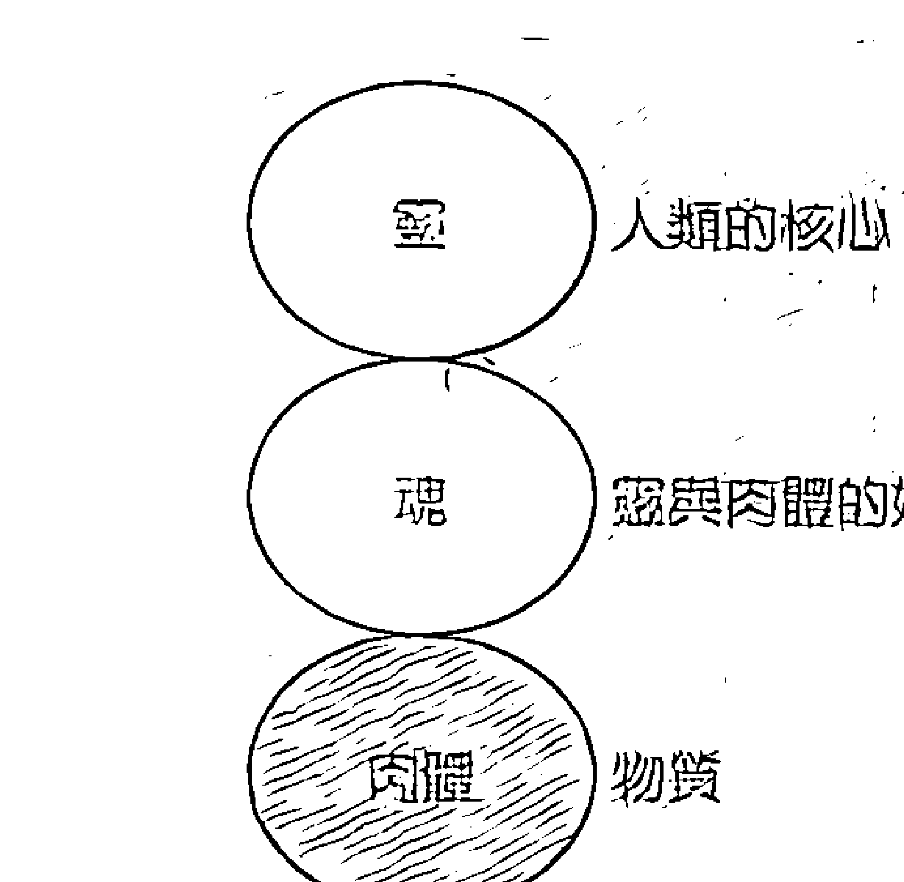

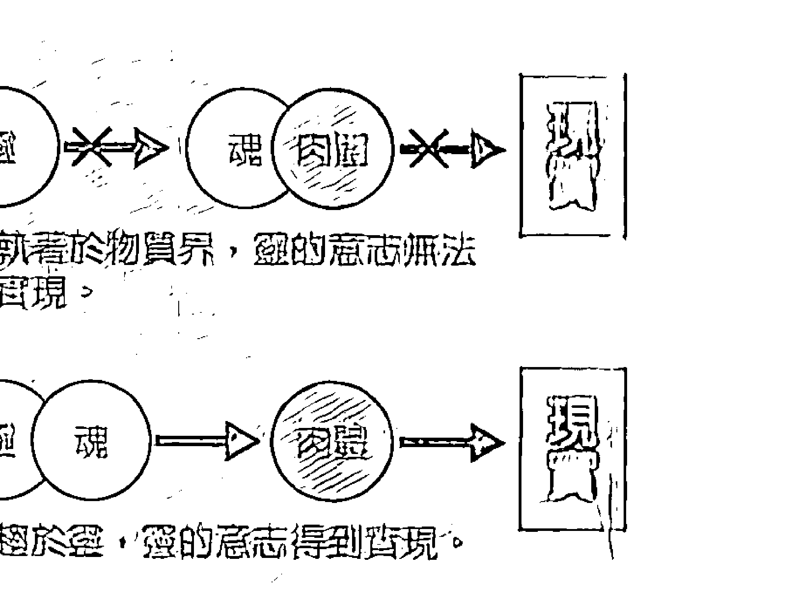

### 死后的魂界与转生

- 第七领域：生命核的世界
- 第六领域：宇宙秩序的世界
- 第五领域：人类真我的世界
- 第四领域：纯人类创造物原像的世界
- 第三领域：魂界灵性原像的世界
- 第二领域：一切生命根源流动的世界
- 第一领域：凡俗物质灵性原像的世界
- 魂界：净化魂的凡俗物质欲望
- 物质界·现实

灵将在魂界的各个境界成长并依序从第一领域朝第七领域前进，达到第七领域以后便能知悉宇宙的所有神秘。

灵将在觉醒自身灵使命的阶段希望再次转生至物质世界，从而展开转生过程。不过转生时经常会遭遇到灵的早产等障碍，使得灵以不完全的状态再生。

於魂界得到解脱後，灵便能脱離魂，进入灵界。

死后灵与魂将脱离肉体，进入魂界。

转生的过程

## 专有名词对照索引

### 一～五画

| 中文 | 英文/原文 | 日文/其他 | 页码 |
| :--- | :--- | :--- | :--- |
| 七條環道 | Seven Levels of Open Path | 七つの環道 | 114 |
| 九幽地獄 | Jiu You Di Yu | 九幽地獄 | 194 |
| 人智學 | Anthroposophy | 人智学 | 214 |
| 人道 | Manusya-gati | 人道 | 126、128 |
| 八大地獄 | Ba Da Di Yu | 八大地獄 | 128、142 |
| 八寒八熱地獄 | Ba Han Ba Re Di Yu | 八寒八熱地獄 | 132 |
| 八寒地獄 | Ba Han Di Yu | 八寒地獄 | 142 |
| 八雷神 | Yatsuikaduchi-no-kami | 八雷神 | 60 |
| 八熱地獄 | Ba Re Di Yu | 八熱地獄 | 142 |
| 刀輪處 | Dao Lun Chu | 刀輪处 | 144 |
| 刀鋒之館 | Razor House | 剣の館 | 184 |
| 十二土牢 | The Twelve Prisons | 12の土牢 | 174 |
| 十六小地獄 | Shi Liu Xiao Di Yu | 十六小地獄 | 142 |
| 十王 | Shi Wang | 十王 | 126 |
| 十地獄 | Shi Di Yu | 十地獄 | 160 |
| 三位一體天 | Circle of Trinity | 三位一体の天 | 92 |
| 三使者（閻魔王） | San Shi Zhe (Emma-O) | 三使者(閻魔王) | 130 |
| 三界 | Trilokya | 三界 | 128、134 |
| 三神山 | San Shen Shan | 三神山 | 190 |
| 三途河 | San-Tu-He | 三途の川 | 132、168 |
| 三惡道 | San E Dao | 三惡道 | 138 |
| 三惡趣 | San E Qu | 三惡趣 | 126、138 |
| 《上帝之城》 | De civitate Dei | 『神の国』 | 124 |
| 千引岩 | chibiki-no-iwa | 千引岩 | 60 |
| 千年王國 | The Millennium | 千年王国 | 90、100 |
| 土地神 | Tu Di Shen | 土地神 | 192 |
| 土伯 | Tu Bo | 土伯 | 64 |
| 大叫喚地獄 | Mahauraurava-Naraka | 大叫喚地獄 | 142、152 |
| 《大毘婆沙論》 | Mahāvibhāṣa | 『大毘婆沙論』 | 142 |
| 大乘佛教 | Mahāyāna | 大乗仏教 | 102 |
| 大國主神 | Ookuninushi-no-kami | 大国主の神 | 62、200 |
| 大焦熱地獄 | Pratapana-Naraka | 大焦熱地獄 | 142、150 |
| 女人島 | Island of Women | 女人の島 | 54 |
| 山水瀨 | Shan Shui Lai | 山水瀨 | 132 |
| 山岳地獄 | Sangaku Jigoku | 山岳地獄 | 166、100 |
| 山岳靈場 | Sangaku Reijou | 山岳霊場 | 60 |
| 《工作與時日》 | Works and Days | 『仕事と日』 | 80 |
| 不歸之國 | Kingdom of No Return | 不帰りの国 | 14 |
| 中有 | antara-bhava | 中有 | 126、104 |
| 中間世界 | Miðgarðr | ミズガルズ | 40 |
| 五火二道說 | Wu Huo Er Dao Shuo | 五火二道脱 | 71 |
| 五岳 | Wu Ue | 五岳 | 100 |
| 《今昔物語集》 | Konjakumonogatari | 『今昔物語集』 | 100 |
| 六道 | Sad-gati | 六道 | 126、120 |

### 其他画数及编号

| 中文 | 英文/原文 | 日文/其他 |
| :--- | :--- | :--- |
| 厄爾布爾士山 | Elburz Mountain | エルブルズ山 |
| 天國 | Kingdom of Heaven | 天の国 |
| 天國地獄型 | Paradise Hell Type | 天国地獄型 |
| 天國 | Jannah | ジャンナ |
| 天照大神 | Amaterasuomikami | 天照大神 |
| 天道 | Deva-gati | 天道 |
| 太陽的國度 | Tonatiuhican | 太陽の家 |
| 少彥名命 | Sukunahikona-no-mikoto | 少彥名命 |
| 巴度 | Bardo | バルドウ |
| 巴圖隆布 | Barzakh | バルザフ |
| 心靈主義 | Spiritism/Spiritualism | 心靈主義 |
| 心靈主義 | Spiritualism | スピリチュアリズム |
| 心靈主義 | Spiritism | スピリティズム |
| 方丈 | Fāngzhàng | 方丈 |
| 《日本書紀》 | Nihonshoki | 『日本書紀』 |
| 日本神話 | Japanese myth | 日本神話 |
| 毛利族 | Maori | マオリ族 |
| 火焚谷 | Gehenna | ゲヘナ |
| 火獄 | Jahannam | ジャハンナム |
| 世界原人 | Loka-Purusha | ローカ・プルシャ |
| 《世記經》 | Digha-Nikaya | 『世記經』 |
| 以諾 | Enoch | エノク |
| 《以諾書》 | Book of Enoch | 『エノクの書』 |
| 仙境 | Xian Jing | 仙境 |
| 出雲 | Izumo | 出雲 |
| 加百列 | Gabriel | ガブリエル→ジブリール |
| 加須姆 | Al-Jaheem | ジャヒーム |
| 加池 | Charon | カロン |
| 北帝君 | Bei Di Jun | 北帝君 |
| 北俱盧洲 | Uttara-kura | 北俱盧洲 |
| 北歐神話 | Norse myth | 北欧神話 |
| 卡諾卜罐 | Carnopis Jar | カノプス壷 |
| 古代美索不達米亞 | Ancient Mesopotamia | 古代メソポタミア |
| 《古事記》 | Kojiki | 『古事記』 |
| 叫喚地獄 | Raurava-Naraka | 叫喚地獄 |
| 四有 | catvaro bhavah | 四有 |
| 四門地獄 | Si Men Di Yu | 四門地獄 |
| 《失樂園》 | Paradise Lost | 『失楽園』 |
| 努特 | Nut | ヌト |
| 尼弗海姆 | Niflheimr | ニヴルヘイム |
| 尼弗爾 | Niflhel | ニヴルヘル |
| 涅爾伽勒 | Nergal | ネルガル |
| 尼羅河 | The Nile River | ナイル川 |
| 伊瓦茨基夫人 | Helena Petrovna Blavatsky | ブラヴァツキー夫人 |
| 《伊瓦茨古的地獄之旅》 | Bhrigu's Travel in the Other World | 「ブリグの地獄遍歴の物語」 |
| 布魯 | Bulu | ブル |
| 平田篤胤 | Hirata Atutane | 平田篤胤 |
| 伏爾坎格 | Fólkvangr | フォールクヴァング |
| 本有 | Purva-kala-bhava | 本有 |
| 未開化民族 | Uncivilized People | 未開民族 |
| 《法念處經》 | Saddharma-smrty-upasthana-sutra | 『正法念處経』 |
| 瓦爾妲基麗姬 | Vlkyria | ヴァルキリヤ |
| 生有 | upapatti-bhava | 生有 |
| 白山地獄 | Hakusan Jigoku | 白山地獄 |
| 立山地獄 | Tateyam Jigoku | 立山地獄 |
| 伊古利格利（古利格利）的地獄 | The Hell of Egregore(Grigori) | エグリゴリ（グリゴリ）たちの地獄 |
| 伊甸園 | The Garden of Eden | エデンの園 |
| 伊里奈烏斯 | Irenaeus | イレネウス |
| 伊耶那岐 | Izanagi | 伊耶那岐 |
| 伊耶那美 | Izanami | 伊耶那美 |
| 伊格德拉西爾 | Yggdrasil | ユッグドラシル |
| 伊斯蘭教 | Islam | イスラム教 |
| 印度教 | Hinduism | ヒンズー教 |
| 吉卜利 | Jibril | ジブリール |
| 吉爾伽美什 | Gilgamesh | ギルガメッシュ |
| 《吉爾伽美什敘事詩》 | Epic of Gilgamesh | 『ギルガメッシュ叙事詩』 |
| 吉歐爾河 | Gjoll | ギョッル川 |
| 后土 | Hou Tu | 后土 |
| 因陀羅 | Indra | インドラ神 |
| 地上樂園 | Paradise on Earth | 地上楽園 |
| 地獄道 | Naraka-gati | 地獄道 |
| 地藏菩薩 | Ksitigarbha | 地蔵菩薩 |
| 宇宙玫瑰 | Rose of Universe | 宇宙のバラ |
| 安納金 | Ananke | アナンケ |
| 安殿 | Annwn | アンヌン |
| 托納提烏希坎 | Tonatiuhican | トナチウヒカン |
| 托勒密 | Ptolemy | プトレマイオス |
| 有橋渡 | You Qiao Du | 有橋渡 |
| 死亡九層 | Chicnauhmictlan | 死の9層 |
| 死出山 | Si-Chu-Shan | 死出の山 |
| 死有 | marana-bhava | 死有 |
| 死後的審判（埃及） | After-death Judgment (Egypt) | 死後の審判（エジプト） |
| 死後的審判（基督教） | After-death Judgment (Christian) | 死後の審判（キリスト教） |
| 死後的審判（瑣羅亞斯德教） | After-death Judgment (Zoroastrianism) | 死後の審判（ゾロアスター教） |
| 死靈 | Spirit of the Dead | 死霊 |
| 江深淵 | Jiang Shen Yuan | 江深淵 |
| 米克特提卡希瓦 | Mictcacihuatl | ミクテカシワトル |
| 米克特蘭泰庫特利 | Mictlantecuhtli | ミクトランテクートリ |
| 米斯拉 | Mithra | ミスラ |
| 米諾斯 | Minos | ミノス |
| 至福者之島 | Island of the blessed | 至福者の島 |
| 色界 | Rupa-dhatu | 色界 |
| 艾拉格運 | Ela guren | エラ・グルム |
| 艾拉穆克 | Ela mulk | エラムラク |

- 《衣索比亞語以諾書》 Ethiopic Book of Enoch エチオピア語エノク書 102
- 衣領樹 Eryouju 衣領樹 112
- 西牛貨洲 Aparagodanīya 西牛貨洲 120
- 西王母 Xi Wang Mu 西王母 00
- 西伯利亞 Siberia シベリア 202、204
- 西碧 Sybil シビュレ 44
- 《西藏死者之書》 The Tibetan Book of the Dead チベットの死者の書 104
- 佛國土 Buddha-ksetra 仏国土 102
- 佛教 Buddhism 仏教 120
- 《佛說地藏菩薩發心因緣十王經》 Fo Shou Di Zang Pu Sa Fa Shin Yin Yuan Shi Wang Jing 『仏説地蔵菩薩発心因縁十王経』 192
- 但丁 Dante ダンテ 110
- 伯勃特聖裡 Belet-Seri ペーリット・セーリ 14
- 克丘特斯河 River Cocytus コキュートス川 32、44、118
- 克羅諾斯 Cronos クロノス 34、30
- 利乏音 Rephaim ラファイム 78
- 努 Nun ヌン 20
- 否定的告白 The Negative Confession 否定の告白 24
- 《吠陀》 Veda 『ヴェーダ』 72
- 妙喜國 Abhirati 妙喜国 162
- 法達瑪 Al-Huttamah フタマ 178
- 岐神 Funado-no-kami 岐神 60
- 席 Sidhe シー 52
- 希內奴伊提婆 Hine-nui-te-po ヒネ・ヌイ・テ・ポ 198
- 希臘神話 Greek myth ギリシア神話 32
- 折口信夫 Shinobu Orikuchi 折口信夫 62
- 杜亞特 Tuat ドウアト 18、20
- 佩恩 Bhein ペーン 202
- 佩脫麗彩 Beatrice ベアトリーチェ 110
- 希臘 Ba バー 18、20
- 卡利科 Cincalco シンカルコ 188
- 那洛迦 Naraka ナラカ 72
- 忒修斯 Theseus テセウス 32
- 阿奴比斯神 Anubis アヌビス神 24
- 亞伯拉罕懷裡 Abraham's bosom アブラハムの懐 82、96
- 亞凡隆 Avalon アヴァロン 62
- 亞西亞 Assyria アッシリア 14
- 亞倫・卡爾迪克 Allan Kardec アラン・カルデック 208
- 亞斯拉爾 Azrael エズラエル 106
- 亞刻爾西亞湖 Akherousian lake アケルシアス湖 42
- 亞刻爾河 River Acheron アケロン川 32、44、118
- 亞刻爾湖 Lake Acheron アケロン湖 108
- 亞當與夏娃 Adam & Eve アダムとエバ 88、118
- 《伊南娜地獄行》 Inanna's Journey to the Underworld 『イナンナの冥界下り』 14
- 佩特 Ptah ペト 11
- 佩特們理之廳 The Hall of Two Truth 二つの真理の間 24
- 佩特之地 Sekhet-Hetep 平和の野（セヘト・ヘテプト） 111、210、11
- 《和漢三才圖會》 Wakan-Sansaizue 『和漢三才図絵』 1000
- 佩脫麗彩 Goddesses of Fate 運命の女神たち 11
- 佩脫麗彩 Miraj ミーラージュ 1000
- 夜見國 Yomi-no-kuni 夜見の国 60
- 奇瓦橋 Chinvat Bridge チンワト橋 26
- 奇特拉古普塔 Chitragupta チトログブタ 68、72
- 奇納烏密克特藍 Chiconauhmictlan チクナウミクトラン 186
- 奈、通波通波 Nai Thombo Thombo ナイ・トンボトンボ 196
- 宙斯 Zeus ゼウス 34
- 底之國 Sokonokuni 底の国 56
- 《往生要集》 Ojoyoshu 「往生要集」 136
- 彼得之門 Peter's Gate ペテロの門 114
- 《彼得啟示錄》 Apocalypse of Peter 「ペテロの黙示録」 106
- 拉 Ra ラー神 18
- 拉札 Ladhaa ラザー 178
- 拉的船 Boat of Ra ラーの船 20
- 拉斐爾 Raphael ラファエル 102
- 拉達曼提斯 Rhadamanthus ラダマンティス 32、36
- 《東西遊記》 Tou-Sei Yuuki 「東西遊記」 166
- 東勝神洲 Pūrva-videha 東勝神洲 128
- 欣嫩子谷 Ge-Hinnom ベン・ヒンノムの谷 94
- 波 Po ポ 198、200
- 泛靈信仰 Animism アニミズム 8
- 泊瑟芬 Persephone ペルセポネ 32
- 肯提、阿蒙提姆 Kenti Amentium ケンティ・アメンティウ 20
- 邱裡普勒格頓河 River Pyriphlegeton ピュリフレゲトン川 32
- 金峯山（大峯山）地獄 Kinpusen (Ominesan) Jigoku 金峯山(大峯山)地獄 160
- 長阿含經的地獄 Naraka-gati in “Digha-Nikaya” 長阿含経の地獄 160
- 阿尼的紙莎草紙 The Papyrus of Ani アニのパピルス 22
- 阿米特 Ammit アメミット 24
- 阿里曼 Ahriman アフリマン 28、46
- 阿拉 Allah アッラーの神 182
- 阿拉魯 Arallu アラル 11
- 阿芙勒斯河 river Ameles アメレスの川 40
- 阿胡拉、馬茲達 Ahura Mazda アフラ・マズダ 28、40
- 阿韋爾諾湖 Lake Avernus アウェルヌス湖 44
- 阿修羅 Asura 阿修羅 130
- 阿修羅道 Asura-gati 阿修羅道 126、128、130
- 阿茲特克神話 Aztec myth アステカ神話 130
- 阿部蘇 Apsu アプスー 14
- 阿斯波得羅斯原野 Field of asphodelos アスフォデロスの野 32
- 阿爾席拉特、阿兩穆斯塔金 al-Sirat al-Mustaqim アッスイラート・ル・ムスタキーム 170
- 阿爾康 Archon アルコーン 172
- 阿蒙提 Amenti アメンティ 11
- 阿鼻地獄 Avīci Niraja 阿鼻地獄 140
- 阿彌陀佛 Amita Buddha 阿弥陀仏 100
- 阿薩神域 Ásgarðr アースガルド 111
- 阿閦佛 Aksobhya Buddha 阿閦仏 100
- 《保羅啟示錄》 Apocalypse of Paul 「パウロの黙示録」 100
- 南嘉南嘉 Nanga nanga ナンガナンガ 100
- 南瞻部洲 Jumbu-dvīpa 南瞻部洲 112
- 哈密斯塔坎 Hamistakan ハミスタガーン 111
- 哈維亞 Al-Haawiyah ハーウィア 170
- 城隍神 Cheng Huang 城隍神 111
- 準札柯特 Quetzalcoatl ケツァルコアトル 1111
- 幽冥界 Yumeikai 幽冥界 2011
- 幽都 You Du 幽都 111
- 恒山 Heng Shan 恒山 1111
- 柏拉圖 Platon プラトン 40 40
- 《毗濕奴往世書》的地獄 The Hell in《Vishnu Purana》 『ヴィシュヌ・プラーナ』の地獄 12
- 泉 Yomi 泉 200
- 波里尼西亞 Polynesia ポリネシア 111
- 約翰、密爾頓 John Milton ジョン・ミルトン 111
- 耶利米 Jeremiah エレミヤ 108
- 耶穌基督末世聖徒教會 Church of Jesus Christ of Latter-day Saints 末日聖徒イエス・キリスト教会 122
- 朝、卡美 Hun Came フン・カメー 184
- 朝布爾河 River Hubur フブル川 14
- 英靈殿 Valhalla/Valhöll ヴァルホル 48
- 英靈戰士 Einherjar エインヘリャル 48
- 迪爾穆恩 Dilmun ディルムン 16
- 《俱舍論》 Abhidharma 『俱舍論』 142
- 原人 Purusha プルシャ 74
- 原動天 The Primum Mobile 原動天 116
- 原罪 Original Sin 原罪 89
- 原文基人 Evenki エヴェンキ族 202
- 原阿科斯 Aeacus アイアコス 32
- 原律西姆 Elysium エリュシウム 44
- 原律西昂原野 Elysian fields エリュシオンの野 32、36、42、44
- 《埃涅阿斯紀》 Aeneid 『アエネーイス』 44
- 原流德尼爾 Éljúðnir エリューズニル 50
- 原納塞特 Erset latari イルシトウ・ラー・ターリ 14
- ハワイ Hawaii ハワイ 200
- ハワイ基 Hawaiki ハワイキ 198
- 娑婆世界 Saha 娑婆世界 162
- 沙河味亞 Sārameya サーラメーヤ 68
- 肥爾巴 Xibalba シバルバ 184
- クル・ヌ・ギ・ア Kur-nu-gi-a クル・ヌ・ギ・ア 14
- 恐山地獄 Hell in Mount Osore 恐山地獄 166
- 根之國 Nenokuni 根の国 56、6
- 加羅、德馬納 Garo Demana ガローデマーン 28
- 泰山 Tai Shan 泰山 190
- 泰山地獄 Tai Shan Di Yu 泰山地獄 190、192
- 泰山府君 Tai Shan Fu Jun 泰山府君 192
- 燃凱特力波卡 Tezcatlipoca テスカトリポカ神 180
- 布洛圖 Pulotu プロトウ 199
- 地獄 Hell ヘル 60
- 地獄（女神） Hell (Goddess) ヘル（女神） 60
- 涅槃 Nirvāna ニルヴァーナ 170
- 涅槃 Nirvā涅槃 126、164、170
- 焰之館 Fire House 焰の館 111
- 烏列 Uriel ウリエル 109、100
- 烏爾沙納比 Urshanabi ウルシャナビ 10
- 烏特納皮什提姆 Utnapishtim ウトナピシュティム 10
- 特里利安・特拉帕洋 Tlillan Tlapallan トリリヤン・トラパヤン 1111
- 特那諾格 Tír na nÓg テイル・ナ・ノグ 52
- 特拉洛克之國 Land of Tlaloc トラロックの国 188
- 特拉羅坎 Tlalocan トラロカン 188
- 畜生道 Tiryagyoní-gati 畜生道 126、128、138
- 真理之秤 Scale of truth 真理の秤 24
- 《真誥》 Zhen Gao 「真誥」 194
- 祖道 Zu Dao 祖道 70
- 祖靈 Ancestor Spirit 祖霊 10、62、140
- 《神曲》 The Divine Comedy 「神曲」 110
- 《神曲》的天國 The Paradise in "The Divine Comedy" 「神曲」の天国 116
- 《神曲》的地獄 The Hell in "The Divine Comedy" 「神曲」の地獄 112
- 《神曲》的煉獄 The Purgatory in "The Divine Comedy" 「神曲」の煉獄 114
- 神武天皇 Jimmu-Tennou 神武天皇 62
- 神國 Kingdom of God 神の國 86
- 神智學 Theosophy 神智学 212
- 神道 Shen Dao 神道 70
- 《神譜》 Theogony 「神統記」 34
- 紐西蘭 New Zealand ニュージーランド 198
- 耆那教 Jainism ジャイナ教 74
- 《耆蜜尼耶梵書》 Jaiminiya Brahmana 「ジャイミニーヤ・ブラーフマナ」 72
- 馬什山 Mashu マーシュ山 16
- 馬加龍涅梭 makaron nesoi マカロン・ネーソイ 32、36、42
- 《馬可福音》 The Gospel According to Mark 「マルコによる福音書」 94
- 馬努山 Mount Manu マヌの山 20
- 馬雅神話 マヤ神話 184
- 馬爾敦 Mael Duin マルドゥーン 54
- 《馬爾敦航遊記》 Mael Duin's Voyage 「マルドゥーンの航海」 54
- 高天原 Takamagahara 高天原 56、58

## 【作例以下】

- 兜率國 Tusitu Hermitage 兜率国 162
- 劫忒河 River Lethe レテ川 32、118
- 劫忒原野 Field of Lete レテの野 40
- 堆壓地獄 Saüghata-Naraka 堆圧地獄 140
- 基督教 Christianity キリスト教 78、82
- 基督教的天國 Christian Paradise キリスト教の天国 86
- 基督教的地獄 Christian Hell キリスト教の地獄 94
- 婆羅賀摩 Brahma ブラフマン 70
- 密克特藍 Mictlan ミクトラン 188
- 密特拉 Mithra ミトラ神 46
- 密特拉教 Mithraism ミトラス教 40
- 密爾 Milu ミル 200
- 崑崙山 Kūnlún Shān 崑崙山 66、190
- 常世國 Tokoyo-no-kuni 常世の國 56、62
- 康德 Immanuel Kant カント 11
- 掃西銛特 Saoshyant サオシュヤント 36
- 啟示錄 Apocalypse 照示錄 110
- 《啟示錄》 Apocalypse of John 「ヨハネの照示錄」 90、100
- 《梵書》 Brahmana 「ブラーフマナ」 72
- 《梨俱吠陀》 Rgveda 「リグ・ヴェーダ」 68
- 欲界 Kāma-dhātu 欲界 128、134
- 涼風山 Liáng Fēng Shān 涼風山 60
- 净土 Buddha-ksetra 淨土 10.1
- 浄玻璃鏡 Jing-Bo-Li Jing 淨玻璃の鏡 1.10
- 淨瑠璃世界 Vaidūryanirbhāsa 淨瑠璃世界 10.
- 畢達哥拉斯 Pythagoras ピタゴラス 10
- 聚合地獄 Samghata-Naraka 聚合地獄 142 140
- 永劫 Aeon エイオン 1/2
- 莫德古德 Moðguðr モーズグズ 10
- 荷馬 Homer ホメロス 1/
- 通古斯人 Tungus ツングース族 202
- 《通往不滅的道路》 Road to Immortality 「不滅への道」 210
- 透特神 Thoth トト神 21
- 陶弘景 Tao Hong Jing 陶弘景 104
- 傑若丁・康明斯 Geraldine Cummins ジェラルディーン・カミンズ 210
- 最後の審判（イスラム教） The Final Judgment (Islam) 最後の審判（イスラム教） 102
- 最後の審判（キリスト教） The Final Judgment (Christian) 最後の審判（キリスト教） 80、04
- 最後の審判（ゾロアスター教） The Final Judgment (Zoroastrianism) 最後の審判（ゾロアスター教） 30
- 最高天 Empyrean エンピレオ 92、116
- 至高天 Empíreo 至高天 86、92、110
- 《創世記》 Book of Genesis 「創世記」 88
- 《富士人穴》草子 "Fuji-no-Hitoana" Soushi 「富士の人穴草子」 168
- 富士人穴地獄 Hitoana Jigoku of Fuji 富士の人穴地獄 166
- 復活 Revive 復活 80、84、100、124
- 惡行界 World of Evil Deeds 惡行界 28
- 惡思界 World of Evil Thoughts 惡思界 28
- 惡語界 World of Evil Words 惡語界 28
- 悲嘆之野 Field of Grief 悲嘆の野 44
- 悲觀的冥界 Pessimistic Underworld 悲觀的冥界 12
- 弗雷德里克・邁爾斯 Frederic Myers フレデリック・マイヤーズ 210
- 斐濟 Fiji フィジー 196
- 斯瓦爾嘎 Svarga スヴァルガ 68
- 《斯拉夫語以諾書》 Slavonic Book of Enoch 「スラブ語エノク書」 104
- 斯拉奧沙 Sraosha スラオシャ 26
- 斯提克斯河 River Styx スティクス川 32、44、118
- 斯維登堡 Emanuel Swedenborg スウェデンボルグ 120
- 火劫格頓河 River Phlegethon フレゲトン川 32、112、118
- 普路同 Pluton プルートー 44
- 智天使 Cherubim ケルビム 102
- 《智慧信仰》 Pistis Sophia 「ピスティス・ソフィア」 171
- 焦熱地獄 Tapana-Naraka 焦熱地獄 142、154
- 無色界 Ārūpa-dhātu 無色界 128、131
- 無間地獄 Avīci-Naraka 無間地獄 142、150
- 猶太教 Judaism ユダヤ教 71
- 等活地獄 Saṃjīva-Naraka 等活地獄 142、144
- 善行界 World of Good Deeds 善行界 91
- 善思界 World of Good Thoughts 善思界 91
- 善惡知識樹果實 Fruit of Tree of Knowledge of Good and Evil 善悪の知識の木の実 101
- 善語界 World of Good Words 善語界 91
- 華山 Hua Shan 華山 101## 佛教八大地獄中十六小地獄的罪與罰

### 等活地獄

-   ### 尿泥處
    - 殺鳥殺鹿者落此地獄。
    - 沸騰熔融的銅汁與屎尿混雜、有如沼澤般的地獄，亡者身處其中吃屎受苦，屎裡還有嚼啄硬如金剛的蟲群聚，嚼咬其骨肉。

-   ### 刀輪處
    - 持刀殺生者落此地獄。
    - 四周有高達十由旬鐵壁圍繞，此地猛火熾烈，還有熔鐵液從天而降。更有由滿是利刃的樹木群聚的刀林所，罪人入林則雙刃刀劍落如雨下，切得罪人皮開肉綻。

-   ### 甕熱處
    - 殺害動物為食者落此地獄。
    - 獄卒將罪人丟進甕（甑）烹煮。

-   ### 多苦處
    - 或以繩縊、或以杖擊、或推入斷崖絕壁、或恐嚇孩童、或對人施嚴刑拷打者落此地獄。
    - 擁有萬千億種劇痛與苦楚的地獄，將視罪人生前所犯惡行施以相當刑罰。

-   ### 闇冥處
    - 殺羊殺蛇者落此地獄。
    - 漆黑中以暗火烤炙罪人的地獄。
    - 闇冥處有激烈的強風，利刃般的熱風將會切碎罪人的身體。

-   ### 不喜處
    - 生前吹咎號角、殺牲祀神者落此地獄。
    - 盡夜均有烈焰熾盛的地獄，烈焰中有許多嘴帶高熱火焰的風生、犬隻和狐狸，發出恐怖的低吼聲嘶咬罪人的骨肉，還有嚼啄硬如金剛的鳥會食罪人的骨髓。

-   ### 極苦處
    - 生前隨意殺生者落此地獄。
    - 此地獄位於斷崖絕壁之下，罪人永受鐵火所熬。

> ※《正法念處經》另有記載，別有所說、雨鐵處、溟泯處、黑色似狼處、火髻處、火狗處、火馬處、火牛處、群羊處、妄語之名，卻並未記載其中內容。

### 黑繩地獄

-   ### 等喚受苦處
    - 生前提倡錯誤道理落此地獄。
    - 罪人受燃燒的黑繩捆綁，從無數複疊的高處被推落到熾熱燃燒地獄的高熱地面。地面還有許多銳利尖牙的犬隻等著撕裂罪人。

-   ### 旃茶處
    - 未曾患病卻服用藥品而說自己患病者落此地獄。
    - 烏鴉、野干、狗等動物會吃人的眼睛、腦髓，以至心肺等內臟。

## 詞條索引

- 菲依雅 Freyja フレイヤ 48
- 雲仙地獄 Unzen Jigoku 雲仙地獄 166
- 須佐之男 Susanowo 須佐之男 60
- 須彌山 Sumeru 須彌山 128、134
- 黃泉 Huáng Chiuán 黃泉 64
- 黃泉大神 Yomotsuookami 黃泉大神 60
- 黃泉比良坂 Yomotsuhirasaka 黃泉比良坂 60、206
- 黃泉神 Yomotsukami 黃泉神 60
- 黃泉國 Yomi-no-kuni 黃泉の國 56、60、206
- 黃泉醜女 Yomotsushikome 黃泉醜女 60
- 黑卡蒂 Hecatoncheir ヘカトンケイル 34
- 黑帝茲 Hades ハデス 32、82
- 黑帝茲（冥府） Hades ハデス（冥府） 42
- 黑帝茲之國 Kingdom of Hades ハデスの國 32
- 黑與紅的國度 Tlillan Tlapallan 黒と赤の國 188
- 黑繩地獄 Kalasutra-Naraka 黒縄地獄 142、146
- 森克 Skr セケル 20
- 森伯拉斯 Cerberus ケルベロス 32、44
- 森爾特神話 Celtic myth ケルト神話 52
- 塔納倫的洞窟 The cave of Taenarum タイナロンの洞窟 32
- 塔爾塔刻斯 Tartarchus タルタルクス 108
- 塔爾塔羅斯 Tartarus タルタロス 32、34、42
- 奧丁 Óðinn オーディン 48、50
- 奧米 Oni オミ 202
- 奧米克 Omiluk オミルク 202
- 奧克安諾斯 Oceanus オケアノス 32、36
- 奧利金 Origen オリゲネス 94、98
- 奧美提奧托之國 Land of Onietetle オメテオトルの國 188
- 奧斯加克人 Ostyak オスチャーク族 204
- 奧菲斯 Orpheus オルペウス 32
- 奧洼阿 Ao Kwea アオ・クウェア 200
- 奧奧瑪夸 Ao aumakua アオ・アウマクア 200
- 《奧義書》 Upanishad ウパニシャッド 70、72
- 奧德修斯 Odysseus オデュッセウス 32
- 《奧德賽》 Odyssey オデュッセイアー 32、36
- 奧賽利斯 Osiris オシリス神 18
- 奧賽利斯的王國 The Kingdom of Osiris オシリスの王國 20、24
- 奧賽利斯的法庭 The Judgment Hall of Osiris オシリスの法廷 24
- 嵩山 Song Shan 嵩山 190
- 愛爾蘭 Ireland アイルランド 54
- 新耶路撒冷 New Jerusalem 新しいエルサレム 86、90
- 暗黑之館 Dark House 闇の館 184
- 業 Karma カルマ 74、120
- 業 Karma 業 74、120
- 極樂 Sukhāvati 極楽 162
- 極樂國 Sukhāvati 極楽国 162
- 極樂淨土 Sukhāvati 極楽浄土 162
- 源信 Genshin 源信 130
- 煉獄 Purgatory 煉獄 82、100
- 煉獄山 Mount of Purgatory 煉獄山 110、114
- 《萬葉集》 Manyousyuu 万葉集 60
- 聖母馬利亞 Saint Mary 聖母マリア 90
- 聖貝爾納 Saint Bernard 聖ベルナール 110
- 《聖書》 Popol Vuh 『ポポル・ヴフ』 114
- 聖奧古斯丁 Saint Augustine アウグスティヌス 111、121
- 補陀落國 Potalaka 補陀落国 112
- 補陀落渡海 Fudara tokai 補陀落渡海 112
- 解脫 Vimukti 解脱 126
- 《路加福音》 The Gospel According to Luke 『ルカによる福音書』 112、116
- 路西法 Lucifer ルシファー 112、118
- 道教 Dao Jiao 道教 110
- 山斯紐 Rashnu ラシュヌ 120
- 奪衣婆 Datsueba 奪衣婆 132
- 奪精鬼 Duo Jing Gui 奪精鬼 132
- 奪魂鬼 Duo Hun Gui 奪魂鬼 132
- 《歌者奧義書》 Chandogya Upanishad 『チャーンドーグヤ・ウパニシャッド』 110
- 瑣羅亞斯德 Zoroaster ゾロアスター 130
- 瑣羅亞斯德教 Zoroastrianism ゾロアスター教 126
- 瑪亞特的羽毛 Feather of Maat マアトの羽毛 124
- 維吉爾 Virgil ウェルギリウス 110、144
- 維科布、卡美 Vucub Came ウクブ・カメー 184
- 赫西奧德 Hesiod ヘシオドス 134
- 赫拉克勒斯 Hercules ヘラクレス 132
- 赫密斯 Hermes ヘルメス神 132
- 赫瓦格爾密爾之泉 Hvergelmir フヴェルゲルミルの泉 150
- 赫摩德 Hermóðr ヘルモーズ 150
- 酸漿樹 Jujubu tree シドラの木 180
- 魂 Hun 魂 164
- 依來河內 Niraikanai ニライカナイ 156
- 墮天使的地獄 Hell of Fallen Angels 墮天使たちの地獄 104
- 杜魯喬、德瑪納 Drujo Demana ドルージョ・デマーン 128
- 德謨哥（造物主） Demiurge デミウルゴス 172
- 摩門教 Mormon モルモン教 122
- 樂園 Paradise 楽園 110
- 樂觀的冥界 Optimistic Underworld 楽観的冥界 112
- 蓬萊 Penglái 蓬萊 190
- 蓬萊山 Penglái Shan 蓬莱山 162
- 蝙蝠之館 Bat House 蝙蝠の館 184
- 《論天堂及其奇蹟和論地獄》 De Coelo et ejus Mirabilibus et de Inferno 『天界と地獄』 120
- 輪迴轉世 Reincarnation 輪廻転生 38、44、70、126、164
- 餓鬼 Preta 餓鬼 140
- 餓鬼道 Preta-gati 餓鬼道 126、128、140
- 魄 Po 魄 164
- 魯道夫、史丹勒 Rudolf Steiner ルドルフ・シュタイナー 114
- 縛魄鬼 Fu Po Gui 縛魄鬼 138
- 縣圃山 Xián Pu Shang 県圃山 110
- 衡山 Heng Shan 衡山 110
- 諾斯替教 Gnosticism グノーシス主義 112
- 閻浮提 Jambudvipa 閻浮提 110
- 閻浮提洲 Jumbudvipa ジャンブ洲 110、112
- 閻魔 Yama ヤマ 110、112
- 閻魔之國 Kingdom of Yama ヤマの国 110
- 閻魔王 Emma-O 閻魔大王 110、120、122、134
- 閻魔王的審判 Emma-O's judgment 閻魔の審判 130
- 閻魔王宮 Emma-O's Palace 閻魔王宮 130
- 閻魔神 Yama ヤマ神 68
- 閻魔普里 Yamapuri ヤマプーリ 68
- 龍 Dragon ドラゴン 174
- 弥勒菩薩 Maitreya 弥勒菩薩 162
- 須弥山 Meru メール山 68、74
- 彌賽亜的王國 Kingdom of Messiah メシアの王国 100
- 謝屋爾 Sheol シェオール 78、82
- 賽河原 Sai-no-kawara 賽の河原 168
- 《賽河原地蔵和讃》 Sai-no-kawara Jizou Wasan 「賽の河原地蔵和讃」 168
- 迴爾斯迴信 Myers communication マイヤーズ通信 210
- 祓土 Hui Tu 祓土 162
- 藏仏密教 Tibetan Buddhism チベット仏教 164
- 薩伊爾 Assa'eer サイール 178
- 薩滿 Shaman シャーマン 76、202
- 薩滿信仰 Shamanism シャーマニズム 76、202、204
- 羅鄧山 Luo Feng Shan 羅鄧山 190、194
- 薬師如来 Bhaiṣajyaguru 薬師如来 162
- 蠍子人 Scorpion man サソリ人間 16
- 邏獄 Limbo 邏獄 82、96
- 嚴寒之館 Cold House 厳冷の館 184
- 懸衣翁 Keneou 懸衣翁 132
- 蔬草地 Sekhet-Aaru イグサの野（セヘト・イアル） 18、20、22
- 蘋果島 Island of Apple リンゴの島 52
- 護衛蟲 Ka カー 18、20
- 鐵圍山 Cakravada 鉄囲山 128、160
- 摩伊拉 Moira モイライ 40
- 酆都 Fēng Dōu 酆都 190、194
- 酆都二十四獄 Fēng Dōu 24 Yù 酆都二十四獄 194
- 酆都三十六獄 Fēng Dōu 36 Yù 酆都三十六獄 194
- 酆都大帝 Fēng Dōu Da Di 酆都大帝 194
- 扎枯树 Zaqquum ザックームの木 178
- 靈魂育成型 Soul Rearing Type 魂育成型 12
- 幽淵獄 Limbo リンポ 82、96
- 觀音菩薩 Avalokitesvara 観音菩薩 162
- 瀛洲 Ying Zhou 瀛洲 190## 聚合地狱

- □大量受苦恼处
- ○沉溺于淫乱性行为、偷窥者落此地狱。
- ○狱卒持多柄铁柱从各角度贯穿罪人的身体。

- □割割处
- ○藉女性口腔进行淫乱行为者落此地狱。
- ○狱卒从罪人嘴部打铁钉直透头顶、将冒出头的铁钉拔出，接着再从嘴巴往耳朵打钉拔钉，重复相同的酷刑，再以熔融流铜灌进罪人嘴巴，将其内脏烧尽。

- □脉脉断处
- ○以杀人、偷盗、邪行为乐者落此地狱。
- ○以圆筒将熔融铜汁灌入嘴巴，折磨罪人使其大声哭喊惨叫。

- □恶见处
- ○夺取他人孩子、进行邪恶性行为者落此地狱。
- ○罪人与孩子同处地狱，狱卒于罪人面前在孩子性器上打铁钉，对罪人施以精神的苦楚。再以烧烫的铜汁灌进罪人肛门烧灼内脏，施以肉体的苦楚。

- □厕处
- ○对牛马进行性行为者落此地狱。
- ○罪人在地狱裡对牛马进行性行为，但牛马体内满是火焰，并透过性器进入罪人体内，最终使罪人燃烧、受焚身之苦。

- □多苦恼处
- ○好男色者落此地狱。
- ○生前爱的男人出现在地狱、全身被火焰包围，罪人抱住对方时自身也会燃烧成灰烬。但是会再度复活，重复体验同样的痛苦。

- □忍苦处
- ○以战争等手段夺人妻，或将人妻送予他人者落此地狱。
- ○狱卒将罪人倒吊在树上，用火在底下焙烤。罪人只要呼吸肺部就会燃烧。

- □朱誂处
- ○对羊驴马进行性行为且又不敬佛者落此地狱。
- ○此地狱充满无数铁蚁啃食罪人，深入体内直至骨髓，使罪人饱受嚼咬之苦。

- □何何呴处
- ○对姐妹行性行为者落此地狱。
- ○何何呴处罪人的惨叫声可传到五百由旬远，落此狱的罪人在抵达狱的中有期间便能听见惨叫声，但颠倒善恶的罪人却会将痛苦的声音误认为欢娱声，渴望坠入地狱，到达后才发现将受烈焰之苦，而且无数铁鸦盘旋飞舞、袭击啄食罪人，甚至挖出骨肉及内脏。

- □泪火出处
- ○与犯禁忌的尼僧行性行为者落此地狱。
- ○狱卒以毒树棘刺戳入罪人双眼，并以铁剪切开罪人肛门，将融化的白铜灌入肛门。此处充满火焰，罪人也会流出火焰眼泪、受其灼烧。

- □一切根灭处
- ○以女性肛门行性行为落此地狱。
- ○狱卒持铁叉撑开罪人嘴巴灌入热铜，另以白铜灌入耳朵，还有铁蚁啃食眼睛，天空则有刀刃如雨，将罪人切成碎块。

- □无彼岸受苦处
- ○与妻子以外的女性行性行为者落此地狱。
- ○罪人轮番遭受烈火、刀剖、热灰、疾病等折磨，不得片刻安宁。

- □钵头摩处
- ○已出家为僧，却无法忘怀俗世时交往的女性，并于梦境里与其发生关系者、提倡淫欲功德者落此地狱。
- ○四周矗是钵头摩（红莲华）的赤红，狱卒以瓶熬煮、或以铁杵捣击，折磨罪人。痛苦不堪的罪人环顾四周发现池里有莲花，以为到了那里就会得救，可是铺满整个地面的铁钩会撕裂罪人双脚。但跑到莲花处后，背后又有狱卒持刀斧断削折磨罪人。

- □大钵头摩处
- ○伪作僧人且不守戒律者落此地狱。
- ○这里有条宽五百由旬的滚烫白铜河，罪人沈入河中离体解，骨化石、肉成泥，并为其所苦。此外罪人亦被铁爪鸟刁啄之苦。

- □火盆处
- ○非僧者诈称僧人，对女性心存邪像、执著于生活用品，未清净者落此地狱。
- ○罪人身躯如树木燃烧，口鼻都有火焰从眼耳口窜入体内、将全身烧成灰烬。

- □铁末火处
- ○非僧者诈称僧人，受女性歌声、首饰吸引，而耽于淫欲想者落此地狱。
- ○四面被高达五百由旬的燃烧铁墙环绕，烧热的铁如雨般洒注、烧灼罪人。

## 叫唤地狱

- □大吼处
- ○向洁净身心行斋戒之人诋毁作乐者落此地狱。
- ○如劝酒般将烧烫的白铜强行灌入罪人口中，罪人会发出痛苦的叫吼声，狱卒闻此叫吼将更加恼怒、加倍折磨罪人。

- □普声处
- ○不仅自己饮酒作乐，还怂恿他人饮酒者落此地狱。
- ○罪人受狱卒持铁钩挖嘴，不停凄厉可恐叫声经地狱之门，响遍大叫唤地狱。

- □火流处
- ○向守五戒者进酒、使其破戒者落此地狱。
- ○热铁恶犬啃咬罪人双脚、铁喙鹫鹰啄破罪人头骨饮其脑髓，另有狐狸噹其内脏。

- □火未蛊处
- ○卖酒掺水得巨富者落此地狱。
- ○构成人类身体的地、水、火、风四元素总共可引起四百零四种病，每种疾病都有单独致人于死的力量，以病折磨罪人。此外还有无数蛆虫由罪人身体涌出、嚼食皮肉甚至骨髓，使罪人痛苦翻滚。

- □热铁火杵处
- ○以酒喂食鸟兽、待醉后将其捕杀者落此地狱。
- ○狱卒举铁杵痛打四处逃窜的罪人，将罪人杵得细碎如沙。待罪人身体恢复原状后，又以锐利刀刃削刮、切成肉块。

- □雨炎火石处
- ○以酒灌醉旅人夺其钱财者落此地狱、以酒喂食大象使其发狂以致杀人者亦落此地狱。
- ○烧烫且带着火焰的石块如雨滴般降下、压杀罪人。还有掺杂高热熔融铜液、烙铁与血液的河流，罪人沉浮其中受高热灼烧。还有全身散发火焰的巨象，将罪人踩扁。

- □杀杀处
- ○洩醉贞淑夫人与其发生关系者落此地狱。
- ○狱卒持热铁钩拔出罪人男根，待男根再度长出后不断重复相同刑罚。若罪人不堪刑苦逃跑，周围还有无数乌鸦、鹫鹰、鹰鸟啄食罪人骨肉。

- □铁林旷野处
- ○于酒里掺毒喂人者落此地狱。
- ○地狱里设有燃烧猛烈的铁车轮，狱卒将罪人绑缚其上并转动，然后持弓箭将罪人射得稀烂。

- □普闪虚
- ○酒商利用他人无知、将少许酒水以高价贩售者落此地狱。
- ○狱卒于黑暗中不论对象胡乱挥砍，从头顶将罪人砍成两半。

- □间摩罗遮呵野处
- ○向病人或孕妇进酒、夺其财产或食物者落此地狱。
- ○火焰从罪人脚部渐渐向上延烧、最后烧到头顶，狱卒持铁刀从脚向上剎刺罪人身体。

- □剑林处
- ○诓骗荒野中的旅行者将其灌醉、夺其性命钱财者落此地狱。
- ○燃烧的石头从天空降下灼烧罪人、撕裂其身体。沸腾的血河里掺杂着烧烫的铜汁与白铜煎熬罪人。狱卒还会持刀剑与连枷击打罪人。

- □大剑林处
- ○于远离人居的荒凉街道卖酒者落此地狱。
- ○有高达一由旬的尖锐剑树树林，树干带着熊熊火焰，树枝则有无数利刃的叶片。广大林区周围有众多狱卒，挥舞刀剑将罪人驱赶进入大剑林，剑树树枝将有利刃落下，将罪人切成碎片。罪人虽欲逃出林外，挥舞着刀剑连枷的狱卒却不会放过罪人。

- □芭蕉烟林处
- ○偷偷让贞淑妇人饮酒、企图恶作剧者落此地狱。
- ○小地狱里到处满是烟雾、看不见前方，其底部则有烧烫的铁板灼烧罪人。

- □火云雾处
- ○灌醉他人以为笑柄者落此地狱。
- ○狱卒将罪人推入从地面窜起达一百公尺的火焰里，罪人身体便会被焚烧的热风吹起、不住旋转，并且像绳索般扭曲变形，终致消灭。

- □分别苦处
- ○以酒替仆人壮胆、使其杀害动物者落此地狱。
- ○狱卒对罪人施以各种折腾、向罪人说教，还会给罪人加以各种苦恼。

## 大叫唤地狱

- □吼吼处
- ○对相信自己的老朋友说谎者落此地狱。
- ○狱卒从罪人下颚挖洞、拉出舌头，涂上毒泥并炙烤，引来无数毒虫嚙咬罪人舌头。

- □受苦无有数量处
- ○为人手下并以谎言得赞赏者落此地狱。
- ○狱卒击打罪人造成伤口并于伤口植草，待草生根成长后再将其拔出，藉此折疇罪人。

- □受坚苦恼不可忍耐处
- ○身为国王或大臣却对小民说谎、或利用其地位说谎者落此地狱。
- ○罪人身体生出蛇在体内爬动，并噬肉体、咬破内脏。

- □随意历处
- ○为夺他人田产而说谎者落此地狱。
- ○狱卒仿佛锻造刀剑般，先以火焰焚烧罪人身体、以风箱加强火力，将罪人置于铁板以铁槌敲打，浸热水定形后再度展开火烤加温作业，无止境地重复同样的循环。

- □一切间处
- ○因为侵犯妇女受到审判，却于国王面前说谎脱罪，甚至反诬受害妇女为罪犯者落此地狱。
- ○撕裂罪人头颅从中拉出舌头，并以烧烫的刀刃将舌头割下，待舌头长出来以后再重复同样的酷刑。

- □人烟处
- ○富有却诡称贫苦，与众人一同分取财物者落此地狱。
- ○狱卒将罪人身体撕成碎片，并且趁复活身体仍柔软时再度将其撕裂。另外罪人骨头里会长出虫来，从体内将其啃蚀殆尽。

- □如飞虫处
- ○高价贩卖得自他人物品却只对己有利赚钱、独利其身者落此地狱。
- ○狱卒以斧头剁碎罪人身体并秤其重量，然后丢给狗群分食。

- □死活等处
- ○不是出家人却伪装成出家人向他人、行邪淫者落此地狱。
- ○受狱卒折磨的罪人会看见污涟花树林并且奔向树林逃命，然后被树林里的火焰烧死。狱卒还会挖去罪人双眼、砍去双手双脚，让罪人无法抵抗、任由火焰焚烧。

## 口具地狱

- ○占卜准确、受人信赖的阴阳师，以占术骗世人致国土丧失或伟大人物逝世者落此地狱。
- ○父母、妻子、亲友等会出现在面前，罪人奔前求救便会落入灼热河流受到熬煮。——离开灼热之河，父母、妻子、亲友又再度出现、罪人再度奔前求救，这次地面又生出许多铁钩刺伤罪人。另有圆锯状刑具上下移动，将罪人切成肉块。

## 口锯斫地狱

- ○为病所苦或生活困苦者求助时，承诺要帮忙但毫无作为之人落此地狱。
- ○看起来极美味的食物出现眼前，饥渴的罪人欢喜奔去，地面却突然伸出铁钩砍伤罪人，而且那些看似美食的其实都是滚烫的铁汁与粪尿，罪人跌进铁汁与粪尿里受苦。其他像是不愿借宿给人暂避夜间雨水的罪人，则是要在深达五十由旬的瓶里头下脚上地浸在高热铁液中，各有相对应的惩罚。

## 口铁树地狱

- ○于各村落集会中撒谎者落此地狱。
- ○地狱里有满口火焰利齿的狮子，罪人要忍受狮子嚙咬折磨。

## 口选相地狱

- ○亲兄弟或亲戚相争时，撒谎认与自己关系密切者得利的人落此地狱。
- ○许多被罪人欺骗过的人手持剪刀将罪人的肉体剪成肉块，然后将肉块放进嘴里咀嚼。

## 口金刚嘴鸟处

- ○承诺要拿药给为病所苦的人却食言者落此地狱。
- ○拥有金刚嘴喙的乌鸦啄食罪人身体，待全身的肉被啄食完后罪人又会复活、从头忍受乌鸦啄食苦。

## 口火气处

- ○于举行祝祭庆典时犯法，却辩称佯装不知者落此地狱。
- ○狱卒将罪人夹在两块铁板中间不停摩擦，将罪人磨成血肉模糊的肉泥。

## 口受茎苦处

- ○承诺要布施却未布施者落此地狱。
- ○狱卒持烧铁键贯穿罪人舌头与嘴巴，让罪人连哭喊都无法、遑论撒谎。

## 口受无避苦处

- ○身为船长却与海盗勾结、窃取乘船商贾财产者落此地狱。
- ○狱卒以烧铁钳拔出罪人的舌头，不管怎么拔舌头都会再生，每次再生就要再受一次拔舌之苦。此外还会对罪人挖眼割肉。

## 口血河食处

- ○身为向人民收税的国王或领主却谎称税收不够而加税者落此地狱。
- ○狱卒以黑绳绑绑罪人双脚倒吊在树上，让金刚嘴啄的乌鸦啄食其足、使罪人喝下自己滴流的鲜血。

- □十一炎狱
- ○深受众人信赖的国王、领主或长者却为情所动而有偏颇判断落此地狱。
- ○十道火焰从外围十个方向烧向罪人，第十一道火焰则发自罪人體内从嘴巴窜出、烧灼罪人舌头。

- □大叫唤地狱
- ○主张「可透过杀生转世至天界」邪说者落此地狱。
- ○除地狱万千火焰以外，罪人心里亦有名为后悔的火焰燃起、煎熬罪人。

- □分荼利迦狱
- ○主张饿死可以升天者落此地狱。
- ○罪人全身上下不断有火焰冒出，听见声音说是此地有分荼利迦池，饮池水便可稍得歇息，可是罪人跳进池里却发现其实身处在充满火焰的洞穴，反而更加痛苦。

- □龙旋狱
- ○主张断绝欲望、愤怒与恶行能够进入涅槃乃是谎言者落此地狱。
- ○许多只全身上下尽是毒液的恶龙团着罪人不停旋转，罪人一方面受毒气所苦，一方面则因摩擦而致碎成肉块。

- □赤铜弥泥鱼旋狱
- ○主张世间所存在的一切均是大自在天所造、并无轮回转世者落此地狱。
- ○罪人沈浮于高热熔化的铜中，上半身受鱼嘴咬、下半身被火焰烧灼之苦。另有狱卒用刀切开罪人放。

- □锅汤狱
- ○主张即便犯下杀人罪，但只要转生至天界则杀人亦无罪者落此地狱。
- ○此处设有平等受苦无力无救、火常热沸、锯叶水生、极刑刀山、热沸水、多喂恶蛇六个大锅，然后折磨罪人。

- □血河漂狱
- ○认为即便多次违反戒律，只要进行苦行则罪孽都将受赦免、故意伤害身体苦行者落此地狱。
- ○血河里有大群名为丸虫的细小虫子，复聚集于罪人周身，使受灼热之苦。

- □镂骨咸虫狱
- ○认为没有比现世更美好的世界而违背戒律、用牛粪自燃以偷如法而能转世至人界者落此地狱。
- ○罪人受铁锤坚打直到变成黏稠的黏稠状，并与前世罪业所造之虫落入地狱者抄渊在一座地狱山，然后放火燃烧。

- □一切人愁狱
- ○信奉邪教，为了供奉天界而在山林草丛放火者落此地狱。
- ○罪人必须服从命令而取代他人受火焚，给予精神上的打击、其痛苦比肉体折磨之苦远胜于百倍。

- □无终没入狱
- ○认为没有任何刑罚能够惩罚罪人，故无效任何法律者落此地狱。
- ○藉以得到幸福，并实际犯行者落此地狱。
- ○狱卒逼迫罪人攀登不住燃烧的巨山，并且燃炙罪人的手、足、头、腰、眼、脑等身体各部位、分各个部位施刑折麼。

- □大铢特摩处
- ○认为在向僧侣供奉食物的大斋期间杀人愿望就会实现，并实际犯行者落此地狱。
- ○狱卒将罪人推入花丛中长有无数棘刺的红莲花，不只全身上下被刺出许多窟窿，还有火焰从伤口中窜出。

- □恶险岸处
- ○主张溺死者便能转生至那觇延天并永总住在该世界的人落此地狱。
- ○地狱里四处都是大山，狱卒会骗罪人若越过那座山便不用再受苦，罪人跑到山的那一头却发现是悬崖峭壁，相互推挤之下纷纷坠落在插着石刀的地面，然后再受焚身之苦。

- □金刚嘴处
- ○主张世间一切并无因丝，认为信奉佛法乃愚行者落此地狱。
- ○狱卒持利刃削罪人肉直至剩下骨头，骨头却因罪业而硬如金刚。此时曾受罪人欺骗者就会出现，取骨头与罪人骨互击、给予更大的痛楚。

- □众合绳剑刃解受苦处
- ○主张人类行为之善恶全凭因缘、早有定数，不须多作努力者落此地狱。
- ○狱卒以铁绳绑缚罪人，持利刃从脚往头将罪人切成细碎肉块。

- □那迦足柱热火受苦处
- ○主张宇宙里既无凡世亦无彼世者落此地狱。
- ○以巨大铁钉将罪人头颅钉在地面，还有无数蛆虫从罪人全身涌出、在罪人血管中游走饮血、啃噬其肉。

- □阎火风处
- ○主张诸法则当中有分无常法则与一定普遍法则者落此地狱。
- ○强风将罪人刮飞上天，罪人如风车般在风里不住旋转，而且每当强风袭来罪人的身体就会像沙子般破碎飞散，可是每次破碎以后又会恢复原状，然后永无止境地承受相同的痛苦。

- □金刚噉啄处
- ○主张人类世界以因缘而生，万事皆以因缘而定者落此地狱。
- ○狱卒持小剪刀将罪人的肉一块块扯下来，然后把肉块塞进罪人口中、自噉其血肉。

- □一切方焦热处
- ○侵犯佛教俗家女信徒者落此地狱。
- ○地狱里所有地方包括天空都有火焰窜起，罪人永受烧灼之苦，狱卒还会把罪人像书卷般卷起，待全身血液都流到脑部以后，再持大铁钉朝罪人头颅打将进去。

- □大身吼可畏之处
- ○侵犯已出家但尚未正式成为尼僧的女性者落此地狱。
- ○狱卒持小支拔毛钳子将罪人全身毛发连毛带肉一同拔起。

- □火髻处
- ○侵犯秉佛法行正道的女性者落此地狱。
- ○此处有许多身弯如弓弦般细长、拥有锐齿的虫只。狱卒将罪人绑起后，将该虫从肛门插入罪人体内，虫子就会依序往上爬并吞噬内脏，最后把脑子吃掉并且咬破头骨爬出脑外。

- □鱼肚处
- ○国家面临危机时，趁机侵犯严守戒律尼僧者落此地狱。
- ○无数利刃从四面八方刺来并且不住旋转，罪人只要稍一挪身就会被撕裂。罪人将面临多次死亡，然后再不断重生。

- □吒吒吒处
- ○侵犯受戒行正道女性者落此地狱。
- ○有强风将罪人刮起，并将罪人扯成飞散的肉沫，或有金刚鼠啃咬罪人，将罪人咬得比芥子粒还要小。

- □雨沙火处
- ○侵犯甫入佛门尼僧者落此地狱。
- ○五百由旬大火焰底下有片灼热金刚沙铺成的广大地狱，罪人身受高温热沙吞噬与烧灼，而且沙里还有无数尖锐的石子，刺痛罪人。

- □内热流处
- ○对皈依三宝、受五戒女性施非法行为者落此地狱。
- ○此处有五座火山，山间凹陷处大火焰罩于火焰之中，除火焰高达十丈以外还有池沼，罪人试图跳入池去，却发现火山不但有火焰加热，池内部还有高热岩浆滚烫，将无辜垫的罪人烧成灰烬。

- □普受一切众生苦恼处
- ○身为僧侣却殴打受戒女性，或与动物藉以发生关系者落此地狱。
- ○以焰刀剥下罪人皮肤，再以火焰煎熬身肉曝露在外的罪人。狱卒还会以熔融的热铁倾倒于罪人身体断层。

- □鞞多罗尼处
- ○强迫女性发生关系者落此地狱。
- ○黑暗中许多烧热铁柱从天而降，贯穿罪人的身体，从内部烧灭罪人。

- □无山处
- ○以女性诱惑持善业之人，使其堕落者落此地狱。
- ○嘴喙尖锐甚至可啄破金刚的鸟，啄咬罪人骨头、食其骨髓。

- □苦处
- ○诱惑威胁僧侣若不与自己发生关系便要向国王进谏言，使其还俗的女性落此地狱。
- ○狱卒抓住罪人并以铁钩刺穿。

- □忧恼处
- ○藉酒侵犯姐妹者落此地狱。
- ○将罪人困于灼热火焰之中，将其困在一旁以风箱煽动火焰，或是将罪人困于大鼓之内，并以大火煮。

- □恐怖处
- ○于进行祭典时，杀害牛羊等动物之祭祀女性落此地狱。
- ○罪人逃往乍看安逸的树林，但林里有许多长着一千个头颅的巨龙，嚙咬罪人。罪人被龙咬死后又会在其嘴里复活，不断受到嚙咬之苦。

- □大悲处
- ○欺骗侵犯学习经典等善人妻女者落此地狱。
- ○地面仿佛铁锉般铺满利刃，狱卒捉住罪人就往地面锉削、直到完全不成人形为止。

- □无非闲处
- ○侵犯儿媳妇者落此地狱。
- ○以沸腾大锅烹煮许多罪人，狱卒再以铁杵将所有罪人捣成一团肉丸。

- □木鞭处
- ○侵犯救命恩人之妻者落此地狱。
- ○罪人于沸腾河流中头下脚上受熬煮，并为巨鱼所噬。

- □鸟口处
- ○杀害阿罗汉（小乘修行最高者）者落此地狱。
- ○狱卒撕开罪人嘴巴使其无法闭合，再将罪人推入沸腾的泥河。沸腾的泥浆将烧灼罪人口鼻喉咙并流进内脏，把整个人烧得精光。

- □一切向地处
- ○强奸尊贵神圣的尼僧或阿罗汉者落此地狱。
- ○让罪人不停上下摆动头颅、不住旋转，再以火焰烧炙或以灰汁烹煮。

- □无彼岸常受苦恼处
- ○侵犯自己母亲者落此地狱。
- ○狱卒持铁钩从肚脐将罪人的魂勾出，并以尖刺穿刺。且在罪人肚脐打钉，并从嘴巴灌入高热熔铁。

- □野干吼处
- ○对智者、已达悟境者或阿罗汉等出言讥诱者落此地狱。
- ○会喷火的铁嘴狐狸成群嚙咬罪人，将罪人的手足肺舌鼻等全部撕裂吞噬。

- □铁野干食处
- ○焚烧佛像、僧房等僧侣周身物事的罪人落此地狱。
- ○罪人身体会有火焰颱出，天空则有铁瓦如豪雨般倾注而下，将罪人身体击成粉碎。还有种满口火焰利齿、类似狐狸的动物啃噬罪人。

- □黑肚处
- ○将属于佛的物品占为己有或偷吃者落此地狱。
- ○罪人受饥渴所苦，最后只能自噬其肉。另有黑腹蛇从脚掌开始嚼食罪人的肉，而且被咬下的肉还会不断生长出来，饱受无止尽的痛苦。

- □身洋处
- ○盗取厌佛财物者落此地狱。
- ○此地狱位在两株燃烧的巨大铁树中间，每有强风吹袭两株树木就会相互摩擦，将中间的罪人捣得粉碎。树枝还有金刚嘴喙的鸟只会啄食碎成肉块的罪人。

- □梦见畏处
- ○夺取僧侣粮食使其挨饿者落此地狱。

## □身洋受苦處

- 將罪人置於鐵箱中，持杵將其搗成肉塊。

- 佯作僧侶奪取善人布施予出家人或病人財物者落此地獄。

- 這裡有株高一百由旬的燃燒鐵樹，且以世間所有疫病折磨罪人。

## □雨山聚處

- 奪取辟支佛（低於菩薩的佛）食物為己食者落此地獄。

- 巨大鐵山從空中墜落，將罪人壓扁。罪人被壓扁後還會再生，並重複同樣的刑罰。獄卒還會撕裂罪人身體，取高溫液體從傷口灌入。另外此地還有人間所有疫病存在、折磨罪人。

## □閻婆叵度處

- 破壞供應灌溉水或飲用水的河流、使人渴死者落此地獄。

- 閻婆是種體型龐大如象、嘴喙還會噴火的巨鳥，牠會叼著罪人飛上高空、將罪人摔成粉碎。地面倒插著無數利刃撕裂罪人雙腳，還有長著火焰利齒的惡犬撕咬罪人。

## □星鬘處

- 奪取因修行而飢餓的僧侶食物者落此地獄。

- 此地獄的兩個角落設有施以極大痛苦之場所。一方將罪人置於鍋中熬煮，並且不住旋轉；另一方則是有強風吹起無數利劍，將罪人切成碎片，然後再將罪人置於鍋中，以熔融銅液煎熬。

## □苦惱念處

- 扭曲或毀壞傳揚佛法之書籍繪畫者落此地獄。

## □臭氣處

- 燒燬僧侶田地與其他屬於僧伽財物者落此地獄。

- 以帶有無數細針的火網加害他人，使其受針刺貫穿與焚身之苦。

## □鉗鑠處

- 於糧食不足的飢貧時期說要供養僧侶，但毫無作為任其餓死占污此地獄。

- 罪人受眾多火焰龍罩現身並受飢渴交迫之苦。

## □十一焰處

- 破壞焚燒佛像、佛塔、寺舍等物事者落此地獄。

- 獄卒持鐵棒驅趕，罪人在被火焰受火烤的同時還要不停四處奔跑。

## 参考文献・資料一覧

地獄の歴史 アリス・K・ターナー著／野崎嘉信訳 法政大学出版局

天国の歴史 コリーン・マグダネル、バーナード・ラング著／大熊昭信訳 大修館書店

西欧絵画に見る天国と地獄 ロバート・ヒューズ著／山下主一郎訳 大修館書店

煉獄の誕生 ジャック・ル・ゴフ著／渡辺香根夫、内田洋訳 法政大学出版局

天国と地獄の百科 ジョルダーノ・ベルティ著／竹山柳英、柱本元彦訳 原書房

神曲 ダンテ著／平川祐弘訳 河出書房新社

THE DEVINE COMEDY 1,2,3 DANTE著／DOROTHY L.SAYERS訳 PENGUIN BOOKS

失楽園 上、下 ミルトン作／平井正穂訳 岩波書店

天界と地獄 イマヌエル・スヴェデンボルグ著／柳瀬芳憲訳 信思社

天使の世界 マルコム・ゴドウィン著／大滙哲裕訳 青土社

聖書外典偽典 第3巻、第4巻、第6巻、補遺2 日本聖書学会編 教文館

新共同訳 聖書 旧約聖書続編つき 日本聖書協会

国訳一切経 印度撰述部 経集部八～十一 山辺習学訳／田上太秀校訂 大東出版社

国訳一切経 印度撰述部 大集部五 矢吹慶雄訳／後藤修校訂 大東出版社

新国訳大蔵経 長阿含経Ⅲ 尸迦羅越六方礼経 他 大蔵出版

倶舎論（佛教講座18） 桜部建著 大蔵出版

須弥山と極楽 仏教の宇宙観 定方晟著 講談社

図説日本仏教の世界5 地獄と極楽 净土へのあこがれ 金岡秀友、宮田登 仙著 集英社

チベットの死者の書 川崎信定訳 筑摩書房

東と西の宇宙観 東洋篇／西洋篇 荒川紘著 紀伊國屋書店

「他界」論 死生観の比較宗教学 梅原伸太郎著 春秋社

死後の世界 フランスワ・グレゴワール著／渡辺照宏訳 白水社

天国と地獄の事典 ミリアム・ヴァン・スコット著／奥山倫明 日本語訳監修 原書房

死と来世の系譜 ヒロシ・オオバヤシ編／安藤涙至訳 時事通信社

ユリイカ臨時増刊 死者の本 青土社

幻想文学43 特集死後の文学 アトリエOCTA

地獄 苔野巧若 新紀元社

古代オリエント集（筑摩古典文学大系1） 筑摩書房

THE EGYPTIAN BOOK OF THE DEAD E. A. WALLIS BUDGE著 DOVER PUBLICATIONS, INC., NEW YORK

The Egyptian Heaven & Hell E. A. Wallis著 Open Court La Salle, Illinois

ギリシア神話 昊茂一著 新潮社

國家（下） プラトン著／藤沢令夫訳 岩波書店

パイドン プラトン著／岩田靖夫訳 岩波書店

パイドロス プラトン著／藤沢令夫訳 岩波書店

ゴリギアス プラトン著／加来彰俊訳 岩波書店

ウェルギリウス ルクレティウス（世界古典文学全集第21巻） 泉井久之助、岩田義一、藤沢令夫訳 筑摩書房

古代ローマの来世観 フランツ・キュモン著／小川英雄訳 平凡社

ミトラの密儀 フランツ・キュモン著／小川英雄訳 平凡社

ケルトの古歌『プランの航海』序説 松村賢一著 中央大学出版部

ケルト神話の世界 ヤン・ブレキリアン 著／田中仁彦、山国久仁子訳 中央公論社

アスガルドの秘密 北欧神話冒険紀行 ヴァルター・ハンゼン著／小林俊明、金井英一訳 東海大学出版会

北欧神話 苅原邦彦著 東京書籍

リグ・ヴェーダ讃歌 辻直四郎訳 岩波書店

ヴェーダ アヴェスター (世界古典文学全集第3巻) 辻直四郎 他訳 筑摩書房

インド宇宙誌 定方晟著 春秋社

ゾロアスターの神秘思想 岡田明還著 講談社

ペルシア神話 ジョン・R・ヒネルズ著／井本英一・奥西峻介訳 青土社

マヤ・アステカの神話 アイリーン・ニコルソン著／松田幸雄訳 青土社

ポポル・ヴフ A・レシーノス原訳・校注／林家永吉訳 中央公論社

オセアニア神話 オズリン・ポイニヤント著／双田由貴夫訳 青土社

南島の神話 後藤明著 中央公論新社

仏説地獄変 満田瑞穂著 平河出版社

道教と中国思想 野口鉄郎編集代表／福井文雅、山田利明、前田絹雄編 雄山閣出版

古事記 (新潮日本古典集成) 西宮一民校注 新潮社

全現代語訳 日本書紀 上／下 宇治谷孟訳 講談社

神道の生死観 神道思想と「死」の問題 安蘇谷正彦著 ぺりかん社

日本人と地獄 石田瑞麿著 春秋社

日本の名著24 平田篤胤 相良亨責任編集 中央公論社

コーラン 上、中、下 井筒俊彦訳 岩波書店

コーランの世界観 牧野信也著 講談社

シャマニズム アルタイ系諸民族の世界像 ウノ・ハルヴァ著／田中克彦訳 三省堂

心霊主義 霊界のメカニズム イヴォンヌ・カステラン著／田中浅広訳 白水社

天国と地獄 アブラハム・リンカーン 川岡夢二訳 幸福の科学出版

不滅への道 ジョージ・ルーカス 著／梅原伸太郎訳 住友社

神智学 ルドルフ・シュタイナー 著／鳥山敏子訳 筑摩書房

シュタイナーの死者の国 ルドルフ・シュタイナー著／松崎健訳 記憶の山

世界神話大事典 イツ・ボンメ／大林太良監修 ／金光仁三郎 他訳 大修館書店

## 參考書目

1. 《天堂的歷史》 笈佛瑞・波頓・羅素著／張瑞林譯／新新圖／2001年

2. 《佛教的精靈鬼怪》 全佛編輯部主編／全佛文化／2006年

3. 《墮天使用事典》 工野隆也著／沙子芳譯／尖端出版社／2004年

4. 《神曲》 但丁著／黃國彬譯註／九歌出版社／2003年

5. 《宗教辭典》（上下） 任繼愈主編／博遠出版社／1989年

6. 《失樂園》 密爾頓著／桂冠圖書／1994年

7. 《神話學辭典》 馬哈德・貝林格著／林宏澂譯／商周出版／2006年

8. 《召喚師》 高平鳴海監修／王書銘譯／奇幻基地／2005年

9. 《惡魔事典》 山北篤・佐藤俊之監修／高川晄・劉子嘉・林哲逸合譯／奇幻基地／2003

10. 《魔道具事典》 山北篤監修／黃牧仁・林哲逸・魏煜奇合譯／奇幻基地／2005年

11. 《圖解鍊金術》 草野巧著／王書銘譯／奇幻基地／2007年

12. 《西洋神名事典》 山北篤監修／鄭銘得譯／奇幻基地／2004年

13. 《東洋神名事典》 山北篤監修／高詹燦譯／奇幻基地／2005年

14. 《埃及神名事典》 池上正太著／王書銘譯／奇幻基地／2008年

15. 《魔法・幻想百科》 山北篤監修／王書銘・高川晄譯／奇幻基地／2006年
