# 图解恶魔学

草野巧 著，王铭博 译

-   地狱
-   恶魔
-   魔法
-   死灵
-   巨人
-   巫妖
-   梦魇
-   邪龙
-   炼狱
-   地狱犬

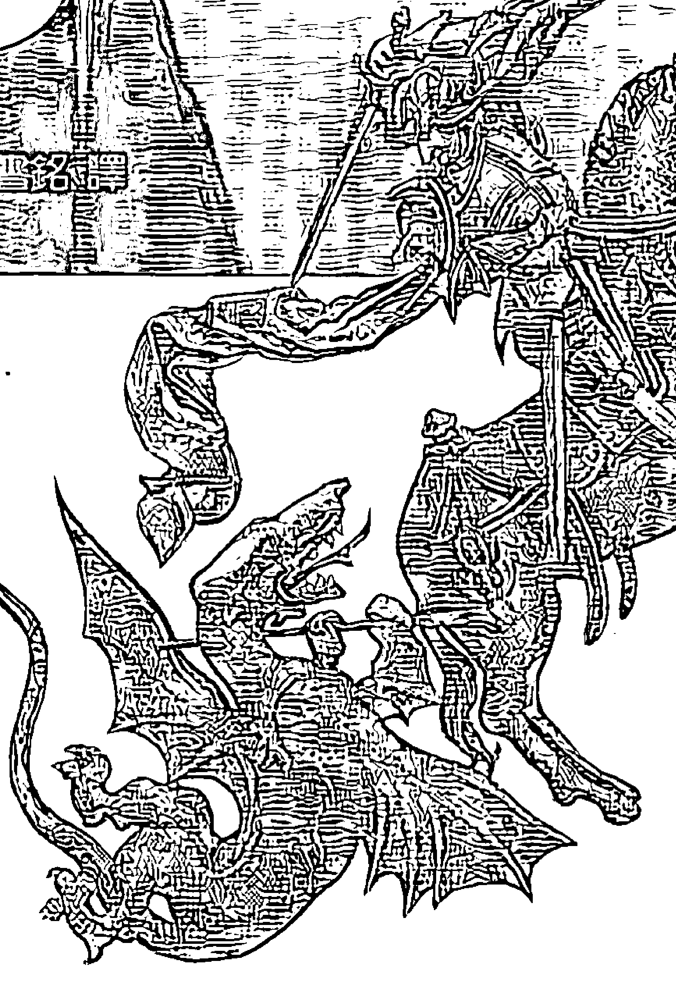

图解恶魔的起源、形貌，直至相关仪式、道具与理论著作，一册通晓暗之领域，轻松晋升恶魔达人！


# 前言

基督教与恶魔之间向来关系极深。以犹太教为母体的基督教孕生于一世纪，而自其诞生以来，对抗恶魔之战便一直是个很重要的主题。就像身为基督（救世主=弥赛亚）的耶稣之所以会降到世间，同样也是为了要对抗恶魔。

其实对犹太教或基督教这种一神教来说，恶魔本来就是个不可或缺的要素，不像跟人类同样形形色色的多神教，每位神明时而行善、时而为恶，就算没有恶魔也足以说明恶的概念。一神教只有一个神，想要说明战争、疾病、杀人等世间的无数恶，就非得要有恶魔的存在不可，否则那神便无法成为唯一而绝对的善神。

于是乎，恶魔早在基督教尚未出现的犹太教时代便已诞生，然后基督教才继承了这个恶魔的概念。从那时开始，基督教便不断与恶魔进行对抗，同时却又使恶魔的概念达到高度发达与多样化，甚至直到今日都未尝止息。

当然，也许现代的基督徒已经不相信恶魔这种概念，不过想必还是有很多基督徒相信恶魔。1987年，时任罗马教宗的若望·保禄二世就曾经有过大意如下的发言：

> > “对抗恶魔之战直到现在还在继续。恶魔如今仍旧活着，在这个世界里活动。现代世界的恶、社会的混乱、战争或疾病并非人类所所致，也是撒旦在暗地里活动、从事邪恶的结果。”

恶魔究竟是什么？希望本书能提供给抱有如此疑问的读者一个解答，透过阅读这本书，使更多人感受到基督教世界恶魔的多样性、恐怖以及他的深奥。

草野 巧

# 第一章 魔鬼学的基础 —— 7

# 第二章 魔鬼的起源 —— 8

# 第三章 魔鬼的形态 —— 10

# 第四章 魔鬼的属性 —— 12

# 第五章 魔鬼的住处 —— 14

# 第六章 魔鬼的作为 —— 16

# 第七章 魔鬼的崇拜 —— 18

# 第八章 魔鬼的象征 —— 20

# 第九章 魔鬼的传说 —— 22

# 第十章 魔鬼的文学 —— 24

# 第十一章 魔鬼的艺术 —— 26

# 第十二章 魔鬼的科学 —— 28

# 第十三章 魔鬼的哲学 —— 30

# 第十四章 魔鬼的宗教 —— 32

# 第十五章 魔鬼的心理学 —— 34

# 第十六章 魔鬼的社会学 —— 36

# 第十七章 魔鬼的人类学 —— 38

# 第十八章 魔鬼的历史学 —— 40

# 第十九章 魔鬼的伦理学 —— 42

# 第二十章 魔鬼的美学 —— 44

# 第二十一章 魔鬼的神学 —— 46

# 第二十二章 魔鬼的法学 —— 48

# 第二十三章 魔鬼的政治学 —— 50

# 第二十四章 魔鬼的经济学 —— 52

# 第二十五章 魔鬼的教育学 —— 54

# 第二十六章 魔鬼的医学 —— 56

-   No.030 诺斯替教的恶魔论 —— 68
-   No.031 奥利金的恶魔论 —— 70
-   No.032 拉克坦西的恶魔论 —— 72
-   No.033 摩尼教的恶魔论 —— 74
-   No.034 埃瓦格里乌斯的恶魔论 —— 76
-   No.035 里奥古斯丁的恶魔论 —— 78
-   No.036 伪丹尼斯的恶魔论 —— 80
-   No.037 菲格米勒派的恶魔论 —— 82
-   No.038 派深派的恶魔论 —— 84
-   No.039 伊斯兰教的恶魔论 —— 86
-   专栏：耶稣=弥赛亚理论 —— 88

# 第三章 恶魔学。通论篇 —— 89

-   No.040 恶魔学的多样化 —— 90
-   No.041 恶魔长得什么模样？ —— 92
-   No.042 恶魔住在哪里？ —— 94
-   No.043 恶魔的身体是何种物质构成的？ —— 96
-   No.044 有多少恶魔？ —— 98
-   No.045 恶魔喜欢什么？ —— 100
-   No.046 恶魔的工作 —— 102
-   No.047 恶魔也有家庭吗？ —— 104
-   No.048 肮脏的恶魔 —— 106
-   No.049 圣安东尼所见恶魔 —— 108
-   No.050 西德尔所见撒旦 —— 110
-   No.051 “神曲”的恶魔 —— 112
-   No.052 彼列的审判 —— 114
-   No.053 何谓恶魔的三位一体？ —— 116
-   No.054 恶魔与四大元素有关系吗？ —— 118
-   No.055 恶魔的位阶 —— 120
-   No.056 《恶魔的伪王国》 —— 122
-   No.057 《失乐园》的恶魔军团 —— 124
-   No.058 恶魔的数字666 —— 126
-   No.059 十三号星期五为什么不吉利？ —— 128
-   No.060 死后审判与恶魔 —— 130
-   No.061 第一个与恶魔签契约的人 —— 132
-   No.062 与恶魔缔结契约之目的？ —— 134
-   No.063 恶魔契约到期以后会怎样？ —— 136
-   专栏：林堡兄弟笔下令人畏惧的撒旦 —— 138

# 第四章 女巫 —— 139

-   No.064 恶魔的与点与女巫 —— 140
-   No.065 何谓女巫？ —— 142
-   No.066 女巫与恶魔学 —— 144
-   No.067 猎女巫教本《女巫之锤》 —— 146
-   No.068 猎女巫专书《女巫的恶魔狂热》 —— 148
-   No.069 女巫的飞行 —— 150
-   No.070 女巫的变身 —— 152
-   No.071 狼化的运作机制 —— 154
-   No.072 呼唤暴风雨 —— 156
-   No.073 女巫的不孕术 —— 158
-   No.074 何谓魔宴？ —— 160
-   No.075 魔宴的公山羊・巴弗灭 —— 162
-   No.076 女巫的入门式 —— 164
-   No.077 舌上之口与女巫之印 —— 166
-   No.078 小女巫与女夜叉 —— 168
-   No.079 何谓女巫风？ —— 170
-   No.080 女巫的日常行 —— 172
-   No.081 何时女巫风的风？？ —— 174
-   No.082 行风风风风风风 —— 176
-   No.083 行风风风风风风 —— 178
-   No.084 行风风风风风风 —— 180
-   No.085 格朗迪埃神父与恶魔的契约书 —— 182
-   No.086 恶魔 —— 184
-   No.087 恶魔的仪式？ —— 186
-   专栏：马丁路德与恶魔 —— 188

# 第五章 魔法 —— 189

-   No.088 何谓魔法？ —— 190
-   No.089 所罗门王与恶魔的传说 —— 192
-   No.090 《摩西第六、七书》 —— 194
-   No.091 《所罗门王之钥》 —— 196
-   No.092 《所罗门王的小钥匙》 —— 198
-   No.093 何谓魔法圈？ —— 200
-   No.094 各种魔法道具 —— 202
-   No.095 《教皇洪诺留的魔法书》 —— 204
-   No.096 《阿尔马岱的魔法书》 —— 206
-   No.097 《亚伯拉梅林的神圣魔法书》 —— 208
-   No.098 《大奥义书》 —— 210
-   No.099 召唤恶魔必须做什么准备？ —— 212
-   No.100 召唤恶魔该如何进行？ —— 214
-   No.101 如何安全地对恶魔下命令？ —— 216

所罗门王72恶魔 —— 218

注释附录 —— 231

中英日名词对照索引 —— 237

参考文献 —— 248

# 第1章
何谓恶魔

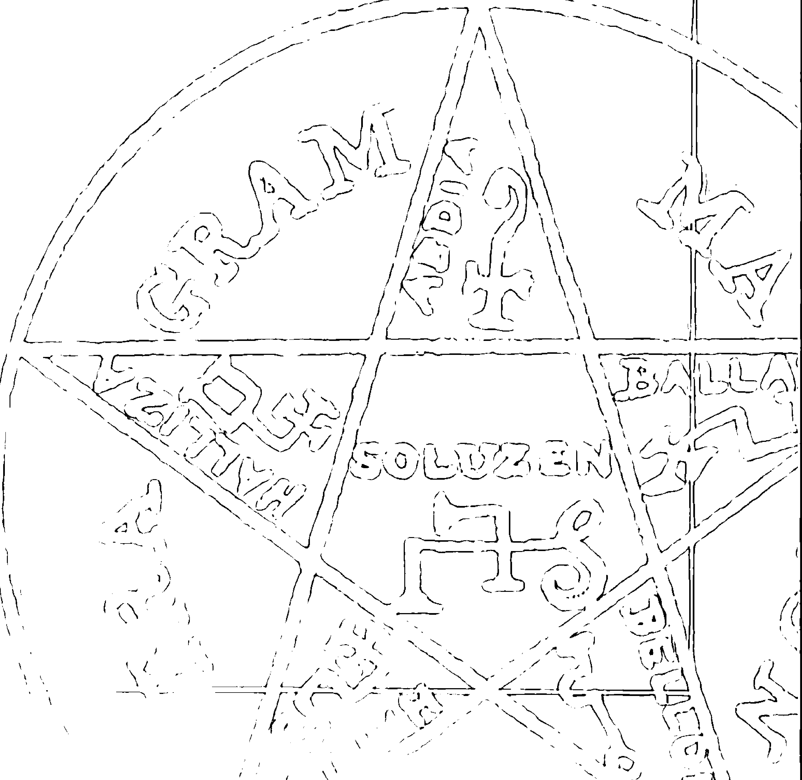

## 什么是恶魔？

## Introduction of Satan, devil, demons

（Demon）存在于世界各处，恶的根源——恶魔（The Devil）则是一神教世界特有的概念，是将神绝对化的时候不可或缺的概念。

当神成为绝对之时，恶魔遂生

基督教的恶魔，在英语中有Satan、Devil、Demon等词汇，其中Devil又可以分成“The Devil”和“Devils”两个词：前者指的是恶魔中地位最高的魔王，后者则是指在其麾下的低级恶魔。其语源自希腊语的Diabolos，并且在《马太福音》第四章第一节里便有着“The Devil”的含意。

恶魔亦可用撒旦（Satan）指称。此语原指侍奉神的天使，虽然他后来的确变成了魔王，可是撒旦本来并不是指称恶魔或恶魔的名词。然而，西元前希伯来语的《旧约圣经》翻译成希腊语的时候，Satan就被译作了Diabolos。是故，撒旦从此成为了恶魔的同义语。

另一个代表恶魔的字语“Demon”则源自于希腊语的Daimonon，这个字在古希腊系指人类的魂魄或邪恶的附身灵、守护灵的含意受到初期基督徒的强调，让“Demon”和“Devils”同样成了魔王的下属、有恶灵或恶鬼之意。

在一神教世界当中自然以“Satan”和“The Devil”最为重要，因为他们无法囊括其意涵，他们还是恶的人格化、神的审判者、恶的根源。相较于Demon充斥于全世界各处，Satan和The Devil却并非如此，这是一神教世界特有的概念。原本一神教的神朝着完全的良善前进，势必要有能足以对抗纯善的恶的原理，因此才会有与神敌对的邪恶根源——恶魔的诞生。如果说神是绝对的，那么照理说就不允许有恶魔存在于世界上。可是如果没有恶魔，神同样也无法存在。

## 何谓恶魔

### No.001 第1章 ◇ 何谓恶魔

-   “恶魔”的英语说法：
-   1. The Devil
-   2. Devils
-   3. Satan
-   4. Demons
（意态各自不同）

-   (1) The Devil → 魔王。恶的根源 = (3) Satan
-   (2) Devils → 底下的众恶魔 = (4) Demons
-   (3) Satan → 原是天使的名衔。魔王。恶的根源 = (1) The Devil
-   (4) Demons → 底下的众恶魔 = (2) Devils

# 魔鬼 (The Devil/Satan) 的特征

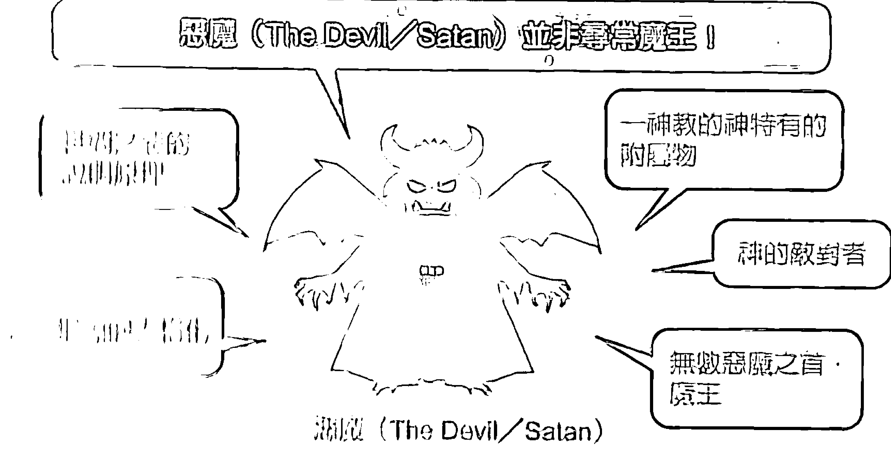

一神教的神特有的附属物

神的敌对者

无数恶魔之首，魔王

与“魔鬼 (The Devil/Satan)”相关的内容，部分文字模糊。

## 琐罗亚斯德教的原型阿哩曼

## Ahriman: The Devil of Zoroastrianism

琐罗亚斯德教的恶魔，对信仰唯一神的犹太=基督教有不可忽视的影响。

前一页的最高神到完全自律的二元论恶魔

犹太=基督教乃属一神教，主张神是全能的，一切事物都在神的存在得到说明；尽管如此，犹太=基督教里仍有恶的原理——恶魔存在。我们可以说这是二元论性格造成，不过琐罗亚斯德教确实也对犹太=基督教带来影响。

琐罗亚斯德教兴起于西元前七世纪前后伊朗地区，是支持善与恶两种原理存在的绝对二元论宗教。

琐罗亚斯德教的最高神祇是善的阿胡拉·马兹达，可是这个神并非全能的绝对支配者，因为从一开始便已经有与善相对的邪恶——阿哩曼存在；换句话说，这个阿哩曼并非由神所创造，而是绝对恶的原理。

阿胡拉·马兹达和阿哩曼的对抗早在宇宙存在以前便已经开始。阿胡拉·马兹达曾经一度将阿哩曼禁锢于黑暗之中，并以此创造了宇宙，可是在阿哩曼醒来后，便对神的创造物展开破坏，甚至诱骗地上世界的第一对人类夫妻，诱使他们犯罪。本来完美的世界遂因此有了纷争、憎恶、疾病、贫困和死亡，而此落入了善恶间无止境的激烈争战。在阿哩曼率领下，无数邪恶和无数小恶魔对绝对善势力发动攻击，这场战役将在世界末日结束，届时善的那方将取得最后的胜利。从这点来看，阿胡拉·马兹达可以说是胜过了阿哩曼，但阿哩曼完全是不受神明约束的自律恶原理，不会因此有任何变化。

信仰唯一且绝对神的犹太=基督教之所以会发展出恶魔观，据信是因为受到这些先驱的影响。

## 琐罗亚斯德教的恶魔——阿里曼

古代伊朗琐罗亚斯德教的恶魔阿里曼 => 完全独立于最高神祇的恶原理

犹太=基督教恶魔的先驱

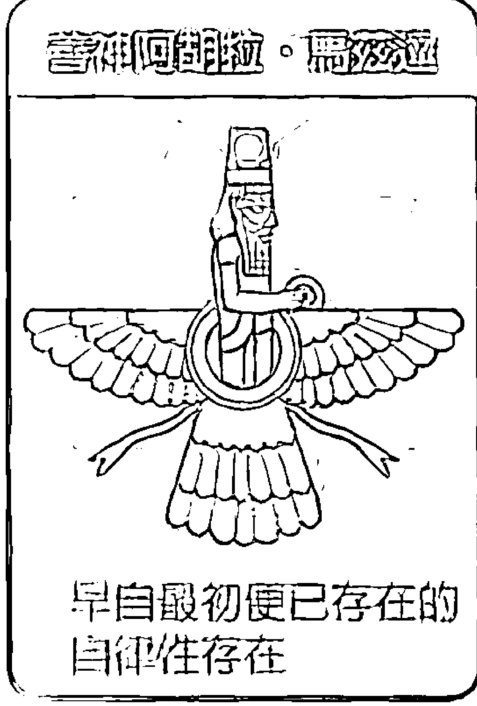

争战直到世界终末

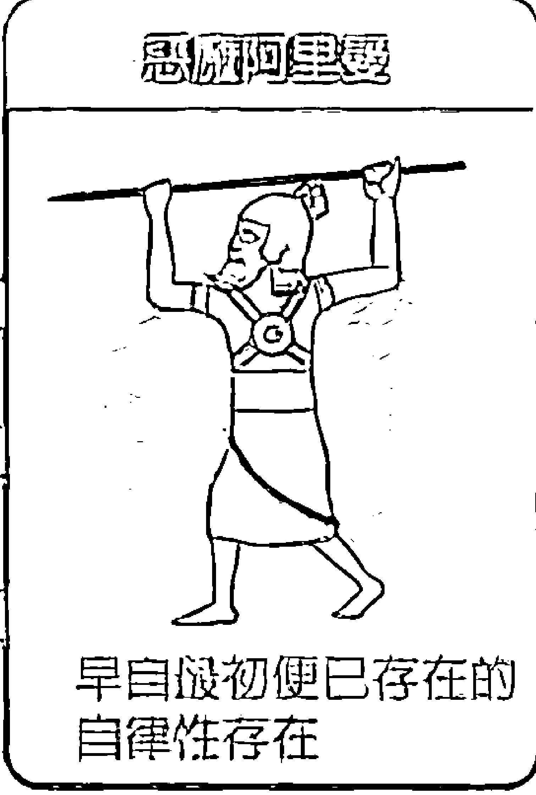

早自最初便已存在的自律性存在

对立

早自最初便已存在的自律性存在

## 世界终局

但是最后仍是善神获得胜利，不过从两个自律的善原理与恶原理这点来看，琐罗亚斯德教仍然算是二元论的思想。

## 基督教的恶魔

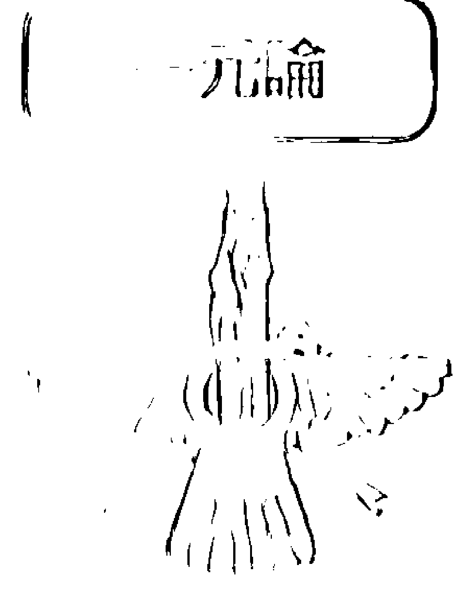

一元论

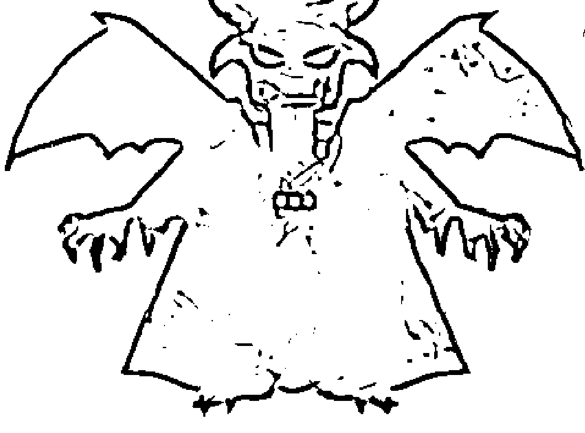

二元论

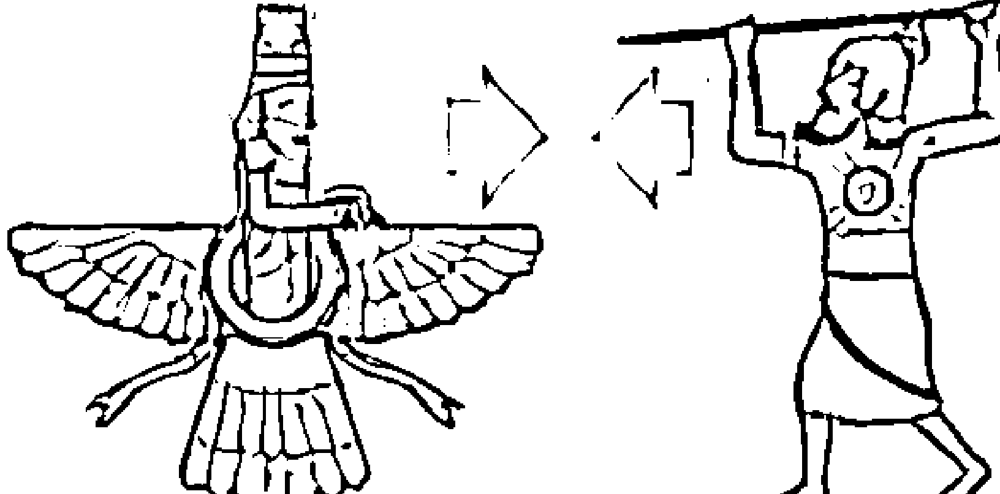

犹太=基督教虽然拒绝二元论，却还是受到阿里曼影响，在一元论与二元论的中间创造出了各式各样的恶魔形象。

独立而完全自律的善神与恶灵相互争斗

撒旦原本是上帝宫廷里的一员，后来渐渐与启示文学等文献描写的恶魔形象合而为一，终于演变成邪恶的大魔王。

## 撒旦的演变：成为黑暗国度的大魔王

撒旦是统治所有恶魔、独一无二的大魔王，也是世间万恶的根源。尽管并非完全的独立，但是其行动看起来并不受上帝控制，力量也足以与神匹敌。在他的率领下，邪恶军团将与善良天使们所领的善方军团展开宇宙规模的斗争，直到这个世界终结为止。

但是，如果从历史的角度来观察，就会发现撒旦并非从一开始就是恶魔界的大魔王。西元前五、六世纪成立的《旧约圣经・约伯记》中，撒旦对某个名叫约伯的虔诚男子施以各种试炼。后来约伯不但丧失了家人和财产，自己也罹染疾病，被撒旦折磨得很凄惨。可是这里要特别注意的是，撒旦此举并非出于自己的恶意妄为，甚至在做这些事情之前已经获得了神的许可。换句话说，撒旦是受神命令、来回奔走的一名使者（Malakh Yahweh，耶和华的使者），是上帝宫廷里面的一员。

至于西元后成书的《新约圣经》，撒旦的角色已有极大改变，变成了统率群魔的魔王。

这是为什么呢？其实从《约伯记》到《新约圣经》的这段时间，犹太教世界陆续有启示文学以及现今《旧约》、《新约》并未收录的作品问世，而其中又记载到包括撒旦、阿撒泻勒、彼列、撒达奈、撒末尔、示阿撒等众多名号各异的恶魔。不过，魔王一位就已经足够，于是这些传说遂经过整合，塑造了一个新的魔王形象，并选定撒旦作为这位魔王的名号。因此，撒旦其实是个融合了众多恶魔、内容壮大而复杂的魔王。

# 撒旦

知道厉害了吧！

-   统率所有恶魔的大魔王
-   世界万恶的根源
-   力量似乎足以与神匹敌

可是……

原本并非大魔王

不会吧！

## 撒旦的诞生过程

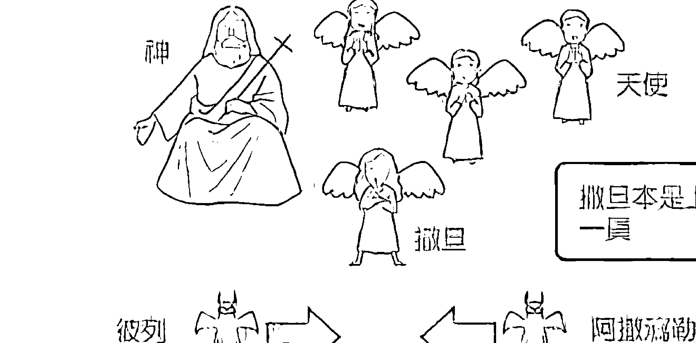

撒旦本是上帝宫廷的一员

-   彼列
-   贝希摩斯
-   别西卜
-   阿撒兹勒
-   艾斯提马
-   示阿撒

魔王撒旦诞生

启示文学等文献所描绘各种恶魔的性格融合体

在希伯来语中，'satan' 纯粹只是带有“敌对者”、“妨碍者”之意，在旧约圣经中不乏以撒旦称呼妨碍者的记载。在启示文学（如世界末日等）记录而成的文献中，撒旦则被视为恶魔之王。

## 路西法

《圣经・以赛亚书》中“明亮之星，早晨之子（路西法）”这句话，衍生出了壮大而悲剧性的堕天使路西法传说。

（一）所谓魔王撒旦的明亮之星

路西法是自古以来便视同于撒旦的恶魔，可是当我们求本溯源时，却发现路西法非但不是撒旦，同时也并非恶魔或天使。《旧约圣经・以赛亚书》14章12节有以下这么一段文字。

> > “明亮之星，早晨之子啊，你何竟从天坠落？你这攻败列国的，何竟被砍倒在地上？”

“明亮之星、早晨之子”的希伯来语是“helel ben shachar”，译成拉丁语便成了“路西法”（带光者），这是圣经中唯一处路西法曾经出现过的唯一场面。问题是，作者透过这段经文究竟想要表达些什么呢？其实这段文字是暗喻因野心而自称为神的巴比伦国王尼布甲尼撒二世。

可是，后人却解读为某位天使堕落的意思。他们认为原本是光明天使的路西法堕天后变成了恶魔。举例来说，《路加福音》10章18节就有这样的叙述：“我曾看见撒但从天上坠落，像闪电一样。”

因此西元二世纪前半的教父奥利金，便根据这些类似的记载以及其它的启示文学，首次明确指出路西法＝撒旦，到了西元四世纪末，圣奥古斯丁也认同这个说法，路西法的传说便经过后世教会的考据、汇整而成。根据传说记载，路西法原是善的天使，是隶属于炽天使阶级的最高阶天使，可是却因自负犯了傲慢之罪而堕落，从此被称为撒旦。此外，当路西法堕落的时候，多位天使也陪同他一起，于是到了中世后期，路西法的名字便成为撒旦的同义语。

### 路西法的由来

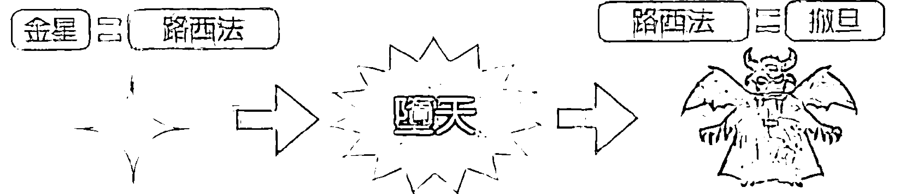

路西法原本是金星，后来堕落天界成为恶魔，被视为撒旦。

> 【旧约圣经・以赛亚书 14章其中一节】
明亮之星，早晨之子啊。
= 希伯来语「helel ben shachar」

演变成拉丁语“路西法”（带光者），衍生出路西法从天界堕落、变成恶魔的传说。

### 关于路西法的传说

（路西法是天使界最高位阶的炽天使）

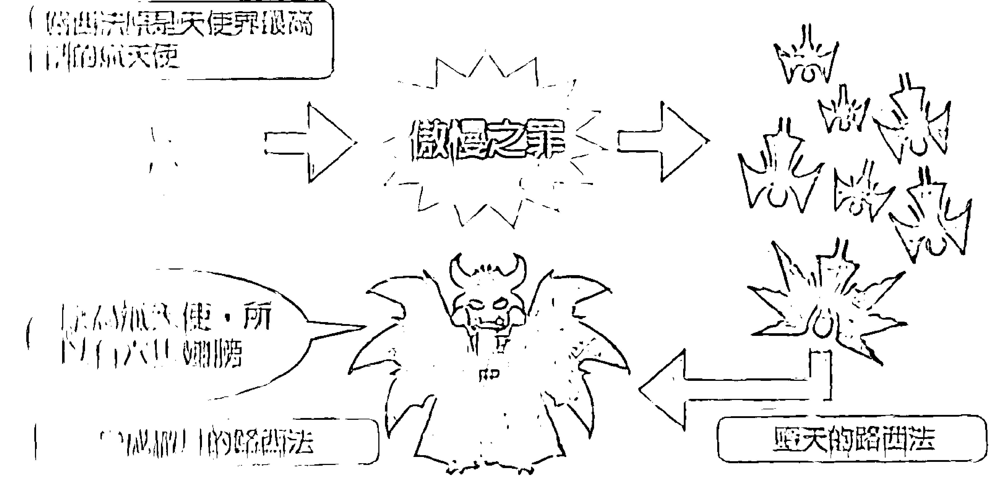

（路西法是炽天使，所以有六只翅膀）

（变成恶魔的路西法）

根据中世纪教父的说明，路西法原本是天界里位阶最高的天使，后来犯下傲慢之罪、带着许多同伴堕天，最后变成魔王。

在文学作品中，有些人把路西法和撒旦视为两个不同的恶魔。这些文学作品的设定也影响到了人们的印象，因为他们认为路西法是最高位阶天使出身，和一般的恶魔不同。

### 阿撒瀉勒

#### 公理

1. 撒旦是从神本来恶恶兼备的性格里除去恶的部分，让阿撒瀉勒成为一位让神可以成为完全且纯粹的善。

#### 031 一个代替上帝处理坏事的恶魔

犹太教的神——耶和华起初同时拥有善与恶两种性格，虽然上帝后来成了善神，但中间却有人替他担负起恶的部分，而那位被交付上帝邪恶的便是阿撒瀉勒。

《旧约圣经・利未记》（16章5～10节）提到大祭司亚伦遵照上帝的命令准备两头公山羊，一头为了赎罪献给主，另一头则用来决断签献给阿撒瀉勒。从这件事便不难发现阿撒瀉勒拥有相当强大的力量。

因此，自从阿撒瀉勒出现以来，神的性格便从此两分，恶的部分便终归集合到魔王撒旦身上。

阿撒瀉勒在著名的堕天使故事《衣索比亚语以诺书》里同样也扮演着很重要的角色。故事中，两百名看守天使（Grigori）受命于上帝而降到凡间，阿撒瀉勒是其中一位领导者，后来天使们与人类女性结婚，并传授人类各种知识与技巧，包括武器、装饰品、化妆术等。这些知识让男人学会如何战斗，让女人学会如何向男人献媚，致使人類沾染上嫉妒、贪婪、淫乱等恶行。

于是，上帝决意兴起大洪水消灭地面所有人类，并且命令天使拉斐尔：“捆住阿撒瀉勒的手脚，把他扔进挖在荒野的深渊里，取巨石放置其上使不见光，将他永远禁锢。审判日之时，他将被投入火焰之中。全地皆因阿撒瀉勒传授的知识而堕落，且一切的罪都归咎于他。”

换句话说，阿撒瀉勒＝撒旦是堕天使的首领，被赋予了身体性与官能性的性格。

## 恶魔的前身——阿撒瀉勒

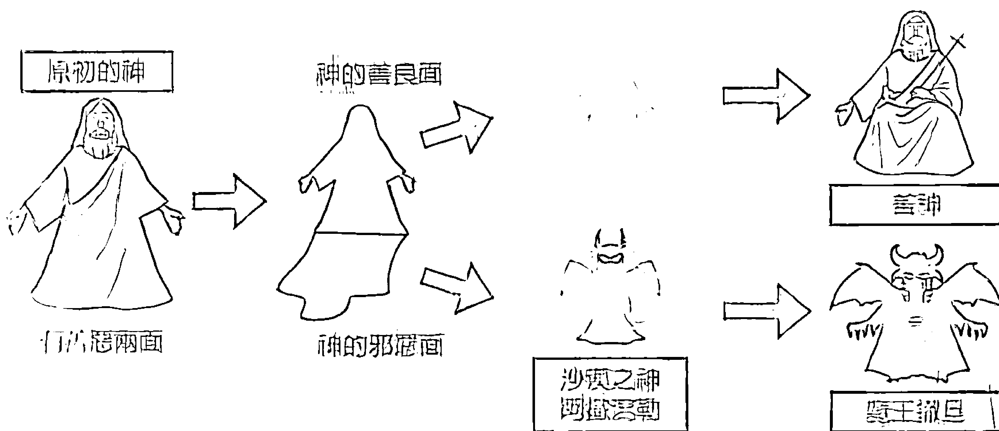

原初的神本来拥有善恶两面，后来才将邪恶面交付阿撒瀉勒、成为纯粹的善，而恶撒旦后就形成了恶王撒旦。

### 《以诺书》里的阿撒瀉勒

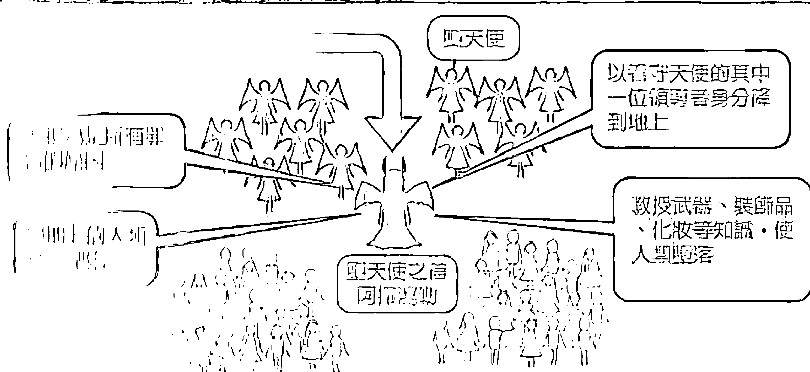

阿撒瀉勒的形象
柯琳·德·普朗西所著《地狱辞典》第六版（1863年）刊行时，由M·L·布尔顿所描绘的阿撒瀉勒。阿撒瀉勒原本是以色列民族尚未信仰一神教以前所崇拜的沙漠之神。

《以诺书》（Book of Enoch）是《旧约圣经》次经之一，也是《以诺启示录》的主体部分，编成于西元前六世纪的作品。

## 莫斯提马

（与人类敌对的恶魔）

撒旦率领的恶魔军团可任意出现在世间各处、自由地与人类敌对。究竟撒旦是何时取得如此权利的呢？关于这点，恶魔莫斯提马可谓是功劳最大的一个。

莫斯提马的活跃事迹，可见于西元前二世纪后半成书的《旧约圣经》外典《禧年书》。据其记载，在以诺亚方舟闻名的大洪水时代，曾经有邪恶的天使企图迷惑人类、使人类灭亡。上帝在愤怒下，决定将这些天使打下地狱。

此时莫斯提马来到上帝面前，如此说道：“主啊，创造者啊，请在他们当中留下几个给我。我将让他们听我的话，让他们完全依照我的命令行事……他们的使命便是要顺从我的决策，使（人类）堕落、灭亡、迷惘。”

于是在获得上帝的准许后，虽然十分之九的恶灵都被打入地狱，剩下的十分之一却也获得了在魔王莫斯提马麾下自由活动的权利。

此外，莫斯提马也跟阿撒瀉勒同样继承了上帝邪恶面的性格，做出种种无法使以色列民族信服的作为，譬如命令以色列民族的族长亚伯拉罕将儿子献为祭品，还有意欲取《出埃及记》中摩西的性命等，在《禧年书》里都算在了莫斯提马的头上。

莫斯提马（Mastema）乃是从动词“憎恶”（stm）衍生，而撒旦则是由对立者、敌人（stn）所演变，从这点来看，莫斯提马跟撒旦亦可说是两名关系极近的魔王。

> 《禧年书》：亦称《小创世记》。伪经之一。该书以七七四十九年为一周期，简述《创世记》至《出埃及记》第12章所叙之事，意在使犹太人得以遵守其节期及节日。

> 以撒（Isaaca）：《旧约圣经》所载以色列人第二代列祖，是亚伯拉罕和撒拉的儿子。后来，上帝命亚伯拉罕以以撒为牺牲献祭，亚伯拉罕也准备这么做，但上帝因怜悯才保存了以撒的性命。

### # 恶魔莫提马

央求上帝，取得对人类为恶的自由

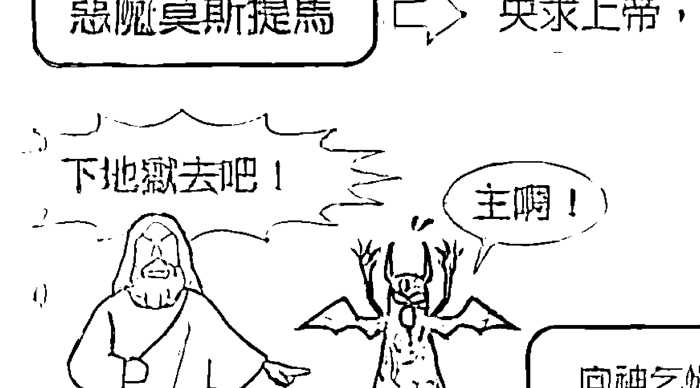

亚斯提马
向神乞怜

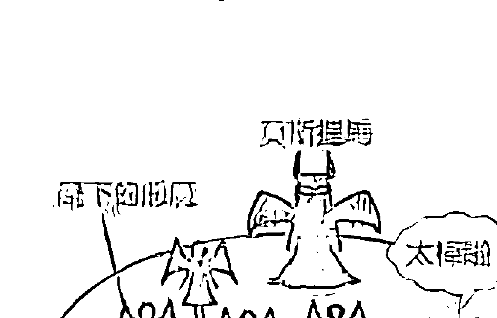

将恶天使的十分之一归于麾下，获得为恶的自由

亚斯提时代为恶的天使打

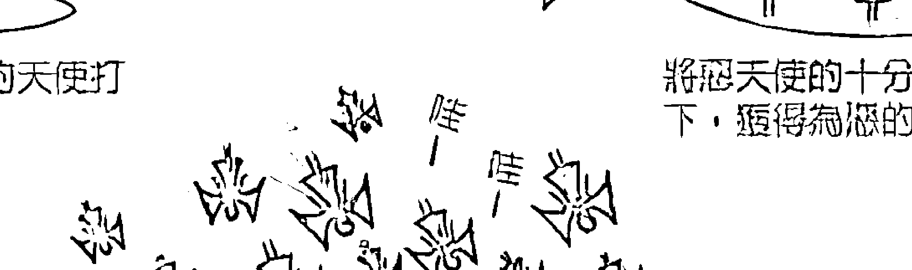

### # 神的恶性

- 欲杀害犹太族长亚伯拉罕之子以撒
- 欲杀害犹太人的英雄摩西
- 欲将埃及人生下的长子全部杀害

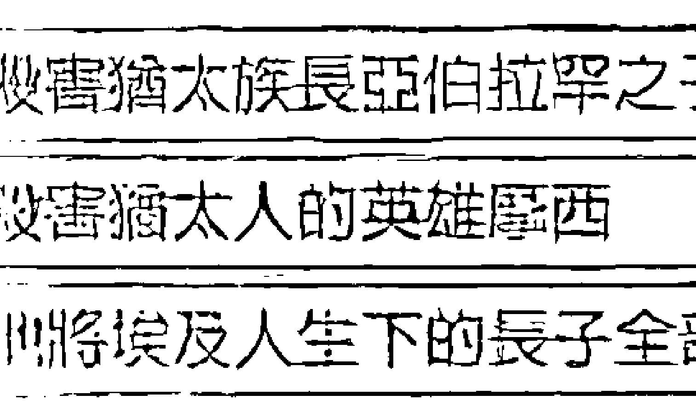

> > 神恶魔的集合体

以上所列的行为，以《旧约》全部归

> [顶部方框内文字，包含部分手写体与印刷体，内容为‘艾赛尼派’等与主题相关的注释]

> 【注】《光明子嗣与黑暗子嗣之战》中率领黑暗军团的恶灵彼列，也是犹太教中与善神对立的恶的根源。

### 二、恶的对等，二元论中恶的根源

犹太教的神耶和华是世界上唯一的神，也是万事万物的根源。所以犹太教绝对不会承认这个世界有善与恶两种原理。然而，这样的状况却在西元前二世纪后半至后一世纪期间产生了变化。犹太教当中有个名叫艾赛尼派的支派因为受到伊朗琐罗亚斯德教影响，而将善恶对立的二元式论述带进了犹太教的世界。

我们可以通过艾赛尼派流传下来、与圣经相关的文献——西元世纪的“死海古卷”，接触认识这些传说与思想。

据此所载，犹太教的神的确是唯一的神，但是他却在这个世界里创造了光明与黑暗两条道路，天使和人类必须在这两条道路当中择一而行，而双方又注定在宇宙规模的战役中不停战斗，直到世界终结。其中，《光明子嗣与黑暗子嗣之战》对这场战役有详细的记载，里面说到那是场长达四十年的庞大战役，战况激烈到双方阵营曾经三度交互占得上风。

从这里可以得知，艾赛尼派赋与了黑暗军团几乎与光明军团相敌对的强大力量，不过重要的是，率领此军团者正是最强大的黑暗天使——彼列。换言之，虽然彼列在最后关头战败了，但仍是一位能够聚集强大恶势力的恶魔、魔王，以及恶的根源。撒旦之所以能够有如神的敌对者一般，率领黑暗势力与神方势力吃尽苦头，也是因为经过与恶魔彼列的融合、将其力量吸收后方得如此。

【艾赛尼派（Essene）：自西元前二世纪至西元一世紀末流行于巴勒斯坦的教派。与法利赛人（Pharisees）一样，恪遵律法，严守安息日，但他们不结婚，实行公社生活。】

### 三元神论中的两大思想体系

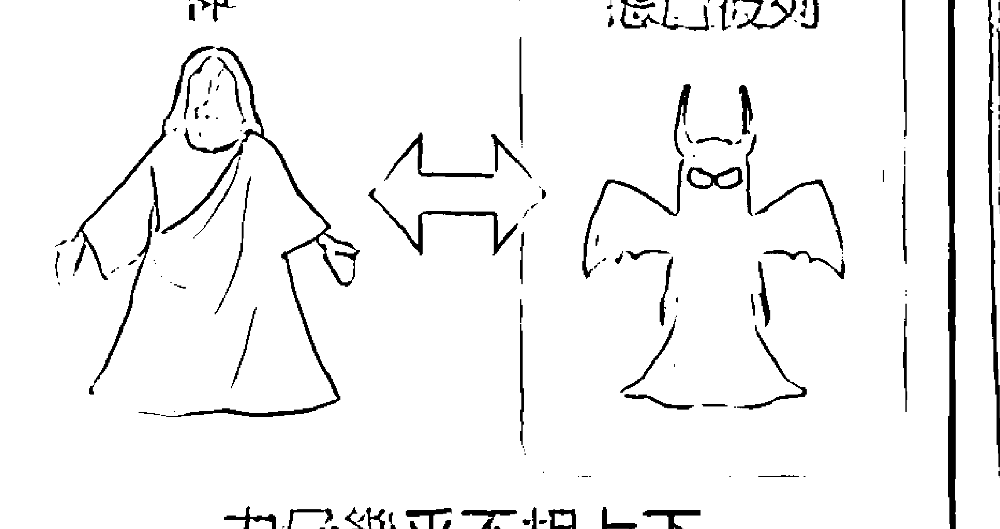

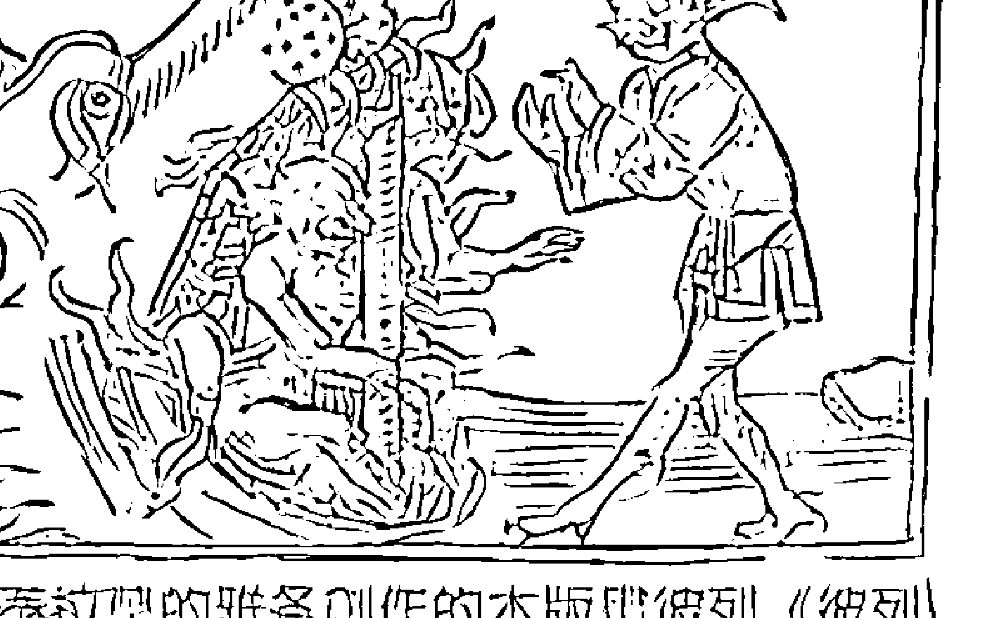

世界的创造
光明道路（米迦勒）| 斗争 | 黑暗道路（恶彼列）
光明方（天使）| 斗争 | 黑暗天使
光明方（人类）| 斗争 | 黑暗方人类
最后的四十年战争 | 斗争 | 败北
世界终末 | 

根据诺斯替教，神在创造之初便造了光明道路与黑暗道路，……然后不断重复激烈的斗争直到……

1947年，……二十世纪考古界最伟大的发现。

## # 别西卜

### ## 从新约圣经时代开始与撒旦齐名的恶魔

原始基督教的恶魔别西卜在《新约圣经》时代被视为撒旦，从那时起以恶魔的身份君临恶魔界。

别西卜被视为等同于撒旦的恶魔，《新约圣经·马太福音》12章24节就写到耶稣替人赶鬼治病时，法利赛人曾批判他说：“这个人赶鬼，无非是靠着鬼王别西卜。”

《旧约圣经·列王纪下》1章4节等处，别西卜是迦南地区非利士人的都市——以革伦 (Ekron) 的神巴力西卜。换句话说，别西卜原本是异教的神祇。迦南人将这位神奉为“巴力西卜”（至高的王）崇拜，后来转换成带有嘲笑意味的词语“苍蝇王”的希伯来语“巴力西卜”；让异教神明被打成名叫别西布或别西卜的恶魔。

然而，“苍蝇王”这个称谓不容轻蔑忽视。古希腊的最高神祇宙斯就曾经被奉为“阿珀缪俄斯”（Apomuios，忌避苍蝇者）崇拜。毕竟苍蝇也是种会招来疾病的媒介。

《新约圣经》以后，堪称魔导书始祖的《所罗门王的遗训》（西元一～三世纪前后）就曾经提到别西卜是恶灵的支配者。《新约圣经》外典的《尼哥底母福音》（五世纪）是部描述耶稣下地狱、解放过去伟人的故事，但别西卜在这部作品中同样被视为地狱之王撒旦。此外，但丁《神曲·地狱篇》（十四世纪）一般都称众恶鬼的首领为路西法，不过偶尔也会以撒旦、别西卜来称呼。密尔顿的《失乐园》（十七世纪）亦将别西卜描绘成邪恶威力堪与撒旦匹敌的地狱界第二把交椅。

于是《新约圣经》时代等同于撒旦的别西卜，从此以后便成为撒旦麾下的其中一名恶魔。

### 巴力西布

原是迦南人的神，意为“至高之王”。

### 巴力西卜

意为“苍蝇王”。《旧约圣经》时代犹太人带有嘲笑意味的称谓

> M·L·布兰迪为柯林·德·古朗西《地狱辞典》第六版（1863年）绘制的别西卜版画，虽然是只苍蝇，不过其模样极贴近“苍蝇王”形象

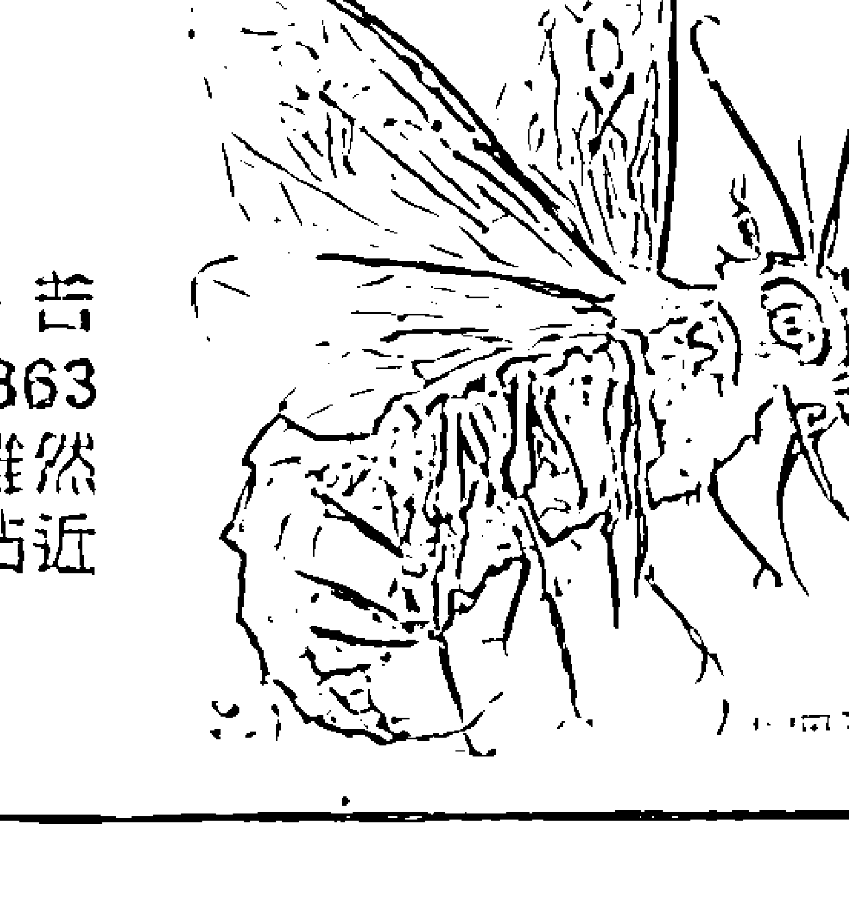

### 别西布/别西卜

称谓于《新约圣经》时代臻于完全，等同于撒旦。

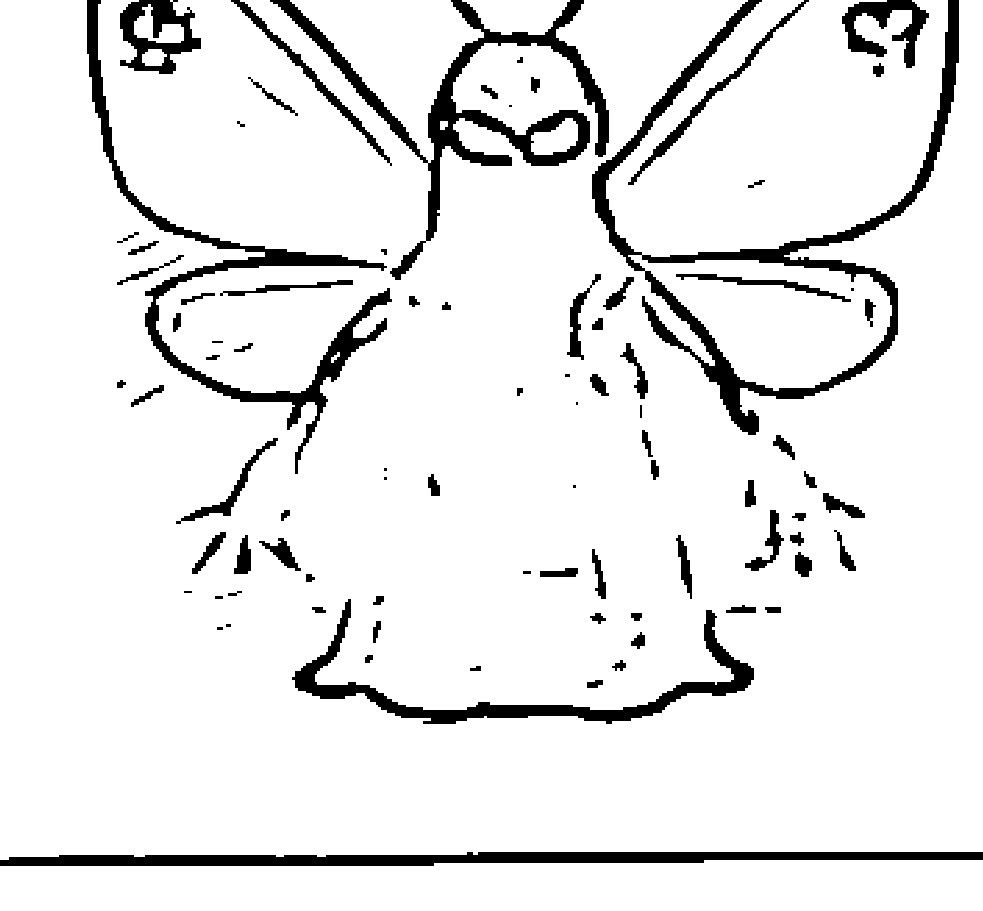

### 地狱的支配者

### 地狱之王撒旦

### 失乐园

仅次于撒旦的地狱界第二把交椅

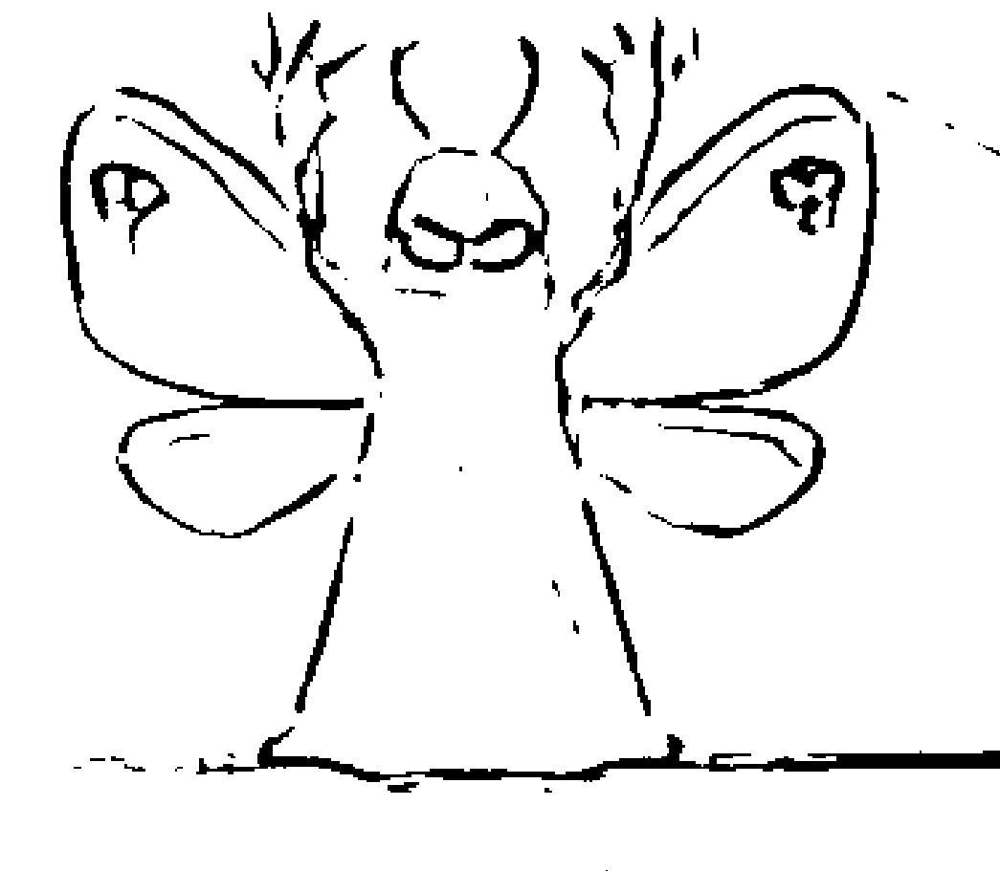

米迦勒（《失乐园》）以后一直是名重要的恶魔

## # 阿斯摩丢斯

“阿斯摩丢斯”原是古波斯二元论中恶神阿里曼的部下，即便在基督教中，他仍在世间肆虐为恶。

### ## ( )依附于人体做恶的恶魔

阿斯摩丢斯乃是起源自波斯神话，为恶神阿里曼麾下七大恶魔中的艾什玛。

在犹太-基督教的传说中，阿斯摩丢斯是名以好色而闻名的恶魔，同时也是所有能够依附人体的恶魔中最具代表性的一位。成书于二世纪前后的《多比传》记载阿斯摩丢斯曾经附身在一位年轻貌美的女孩撒拉身上，使得撒拉先后嫁了七个男人，可是这七个男人却在跟撒拉发生初夜关系之前猝死，这时多比的儿子多比亚司出现与撒拉结婚，不同的是多比亚司有大天使拉斐尔相助。在拉斐尔的建言之下，多比亚斯以焚香熏蒸鱼的心脏、肝脏，把阿斯摩丢斯赶出了撒拉的身体，接着拉斐尔再追去将恶魔捆绑。

西元341年，基督教会于安条克教会会议公开认可驱魔仪式时，这段故事便是促成该决定的诸多根据之一。

成书于西元一～三世纪间的魔导书《所罗门王的遗言》记载，当所罗门王召唤的阿斯摩丢斯如此说道：“我是人类女性与天使所生，人类想必觉得我傲慢吧。我住在人类唤作大熊座的星星附近。撕裂新婚男女、玩弄年轻女子、使人陷入疯狂便是我的工作。可是被鱼肝、鱼胆一熏就会忍不住逃跑，还有天使拉斐尔也让我不堪忍受。”

传承到了猎女巫时代，阿斯摩丢斯也相当猖獗，其中最有名的当属露易丝·拿破仑恶魔附身事件（请参照P.180）。当时附身在修女德·安洁身上、使其发狂的恶魔正是阿斯摩丢斯，最后阿斯摩丢斯受到驱魔仪式驱赶，极为郑重地留下了一纸契约书，约定在隔日下午五点离开德·安洁的身体。

### 艾什玛

### 阿斯麦丢斯

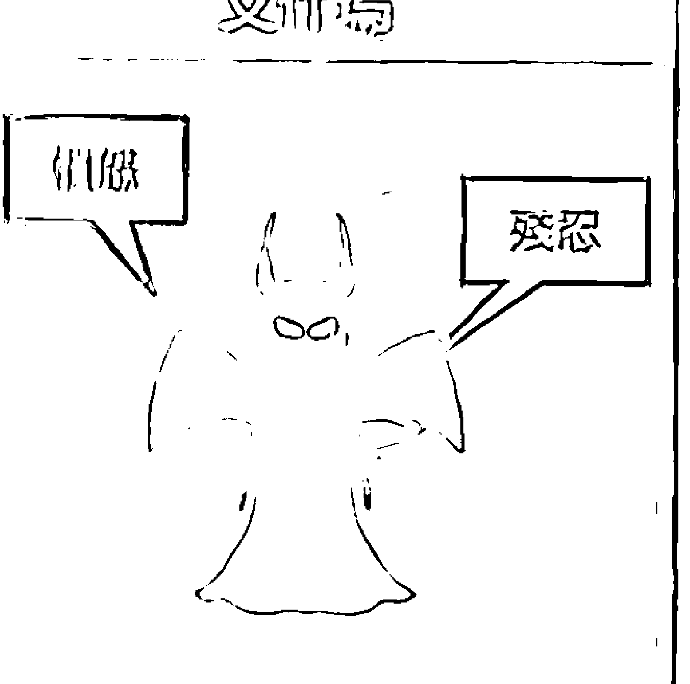

山羊所罗门王阿里显显下七大恶魔

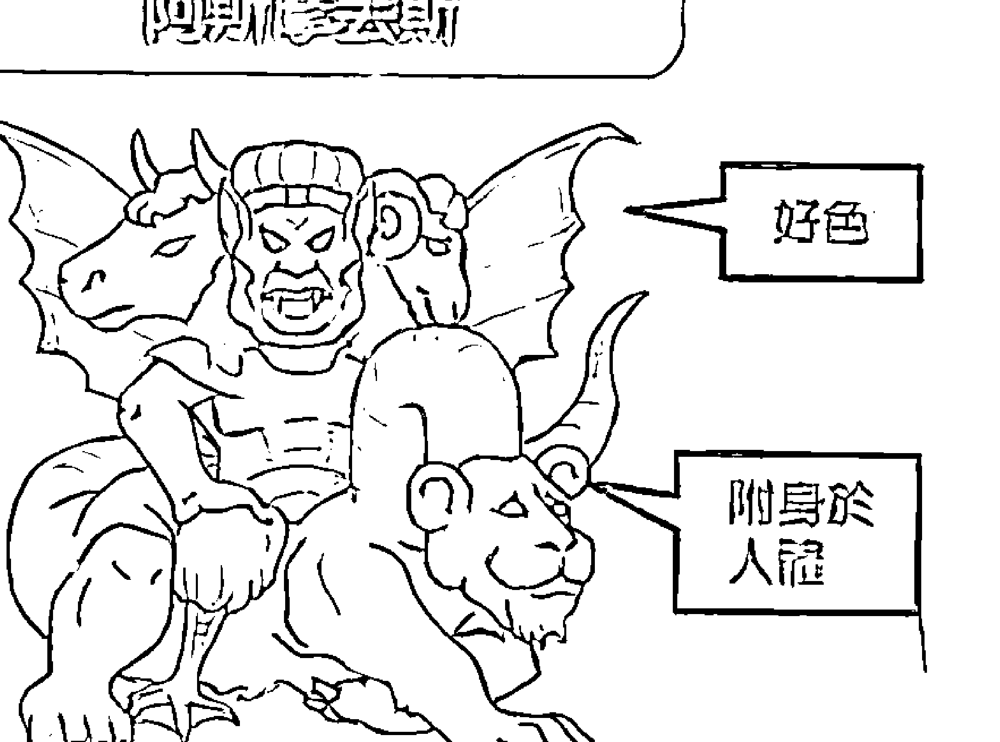

根据《多比书》提及的阿斯麦丢斯是艾什玛的其中一个化身

### 阿斯麦丢斯的弱点

燃烧的心脏、肝脏、胆怯的烟烟

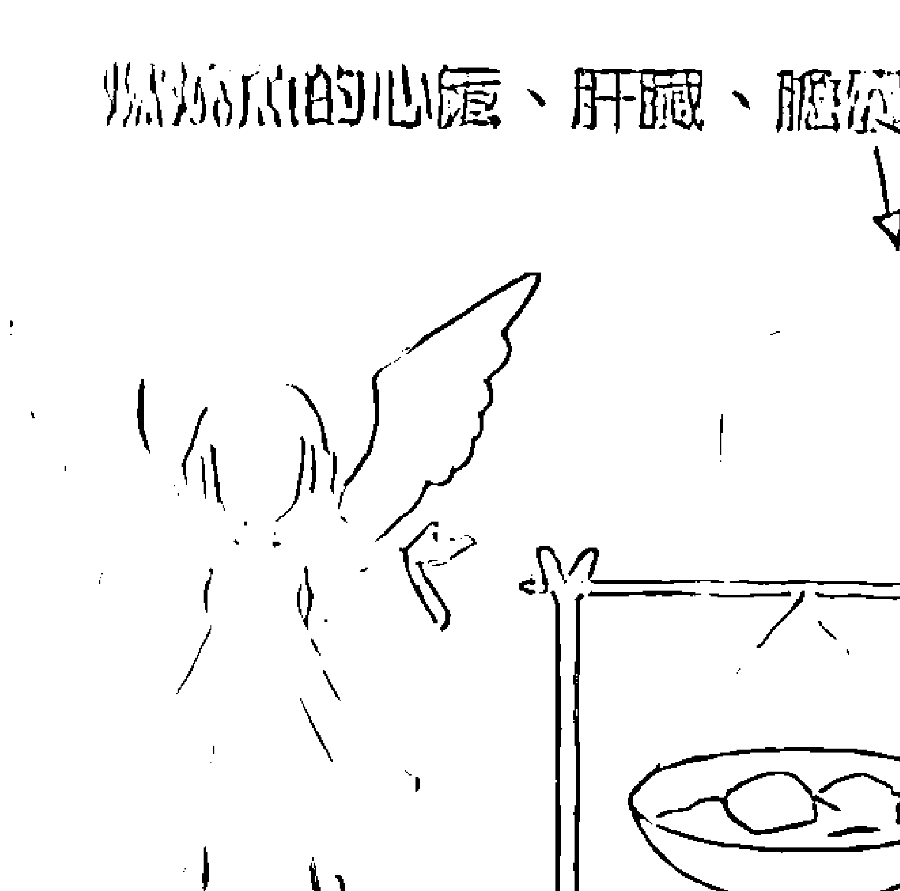

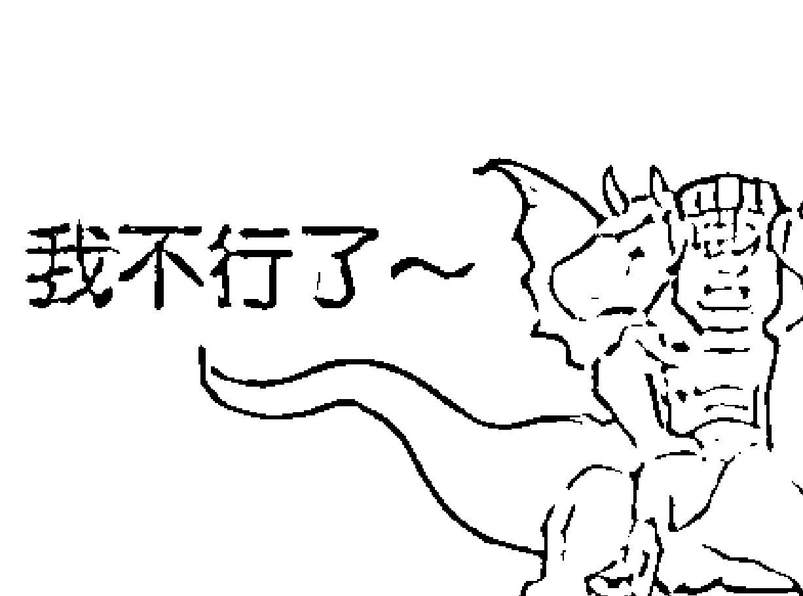

> 根据《多比书》和《所罗门王的遗言》记载，阿斯麦丢斯就怕这些

### 阿斯麦丢斯的契约书

事情发生在西元1634年5月，阿斯麦丢斯附身于法国玛尔修拉女子修道院的修女珍·安乐，在受到驱魔后留下契约：『我将于明日下午五时退出修女的身体。』的契约书。这张照片便是当时的契约书。

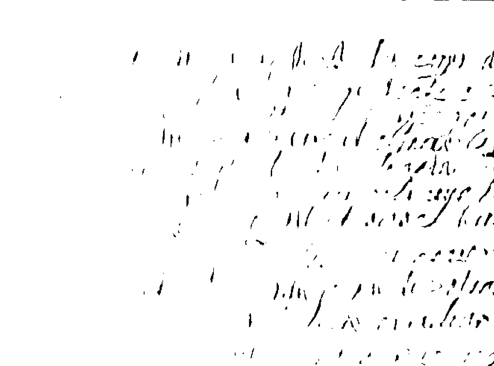

《多比书》是《圣经》的其中一本，天主教将其列为次经。

## # 葡萄酒使亚当、夏娃堕落的恶魔

撒末尔自古就等同于撒旦，其名有“毒天使”之意。

根据《创世记》记载，伊甸园里的亚当和夏娃受到蛇的诱惑，吃下了神所禁止的智慧果实而被逐出乐园、以致堕落。

然而，根据《新约圣经》外典中的《希腊语巴录启示录》（西元二世纪左右）提到，伊甸园里栽种的是葡萄树，植下此树者便是天使撒末尔。撒末尔因受嫉妒驱使变成蛇的模样、欺骗亚当、夏娃，让这株葡萄树和自己受到神的诅咒。尽管书中并无明确记载，不过撒末尔似乎成功地让亚当和夏娃尝到葡萄酒的味道，两人因此被逐出了乐园，而撒末尔也被神诅咒、变成了撒旦。

在带有诺斯替教色彩的纳杰哈马迪经卷当中，撒末尔更是早已超越了纯粹的恶魔。譬如《约翰密传》就说这个充满恶的世界乃是由恶神雅尔达巴奥特所创造，而撒末尔是他的一个别名；换句话说，撒末尔并不仅仅只是个恶魔，还是恶世界的创造者。此外《掌权者的本质》一书中也提到撒末尔的名字有“吝啬之神”的意思。

西元三世纪以后的犹太教传说和训诫故事里，被唤作撒旦的恶魔数量反倒远不及撒末尔；这些传说和故事说撒末尔有十二翼、全身布满眼睛，能变化成任何模样。

从这些记述便不难得知撒末尔是恶魔界首屈一指的大恶魔，是个与撒旦分量不相上下的重要角色。

### 【形象2】更接近撒旦的思维图示

恶棍撒旦 ⇒ 自古便被视同于撒旦 其名有“零天使”、“盲目之神”的意思

### 《圣经》上记载的恶棍撒旦

1. 撒旦诱惑亚当、夏娃
蛇形的撒旦 亚当夏娃
2. 受神诅咒，化作蛇的模样欺骗亚当、夏娃
3. 亚当、夏娃被逐出伊甸园 开始喝酒

### 诺斯替教的撒旦

（对话气泡）这世界可是老子创造的！

撒旦巴奥特 = 撒旦 物质世界的创造者

充满恶的世界

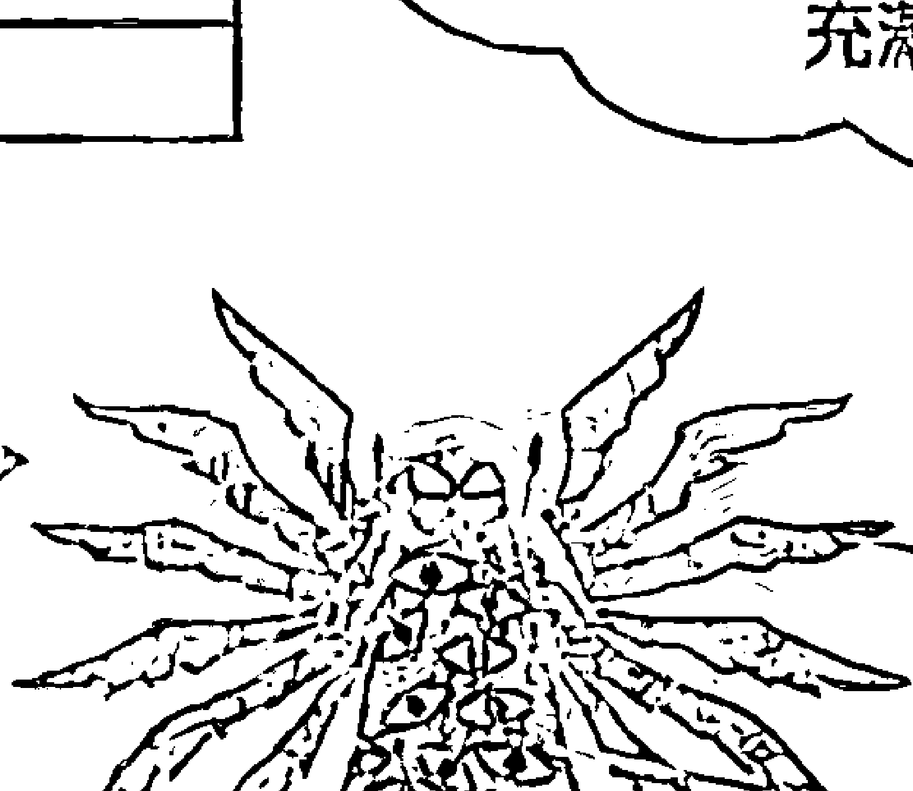

《拿戈玛第经》
1945年于埃及南部的尼罗河畔城镇纳杰哈马迪发现的五十余册抄本抄写而成，有许多诺斯替教思想的内容。

## # 亚巴頓
### Abaddon

> 世界末日临近之际，天空会有颗星坠落地面，而恶魔亚巴顿将以蝗虫之王的身分从无底深渊现身、君临世界。

### ## 统治无底地狱深渊的蝗虫之王

亚巴顿起源自希伯来语的abad（他杀伐），原是“灭亡之国”的意思。旧约圣经中的《约伯记》和《箴言》用这个字指称犹太人的冥界谢屋尔¹，换句话说，亚巴顿在这里是个代表地名的普通名词。第一个把这个字用于可怕恶魔名号的是《约翰的启示录》。

据其记载，当世界终结的时候会有颗星星从天空划落，打开一个通往无底深渊的坑，接着会看见烟和大批蝗虫从坑里喷出。那些蝗虫的脸像人，体型像准备出阵的马，头上戴着类似金冠的物品，还有女人的头发、狮子的牙齿和铁胸铠甲、蝎子尾巴和毒钩。发出的振翅声就像是战车奔驰的巨响，其中的毒液能够折磨那些未被神选中的人们达五个月之久。

> 另外，《启示录》还说：“有无底坑的使者作蝗虫的王，按着希伯来语，名叫亚巴顿，希利尼话²，名叫亚玻伦。”

由于其希腊名叫亚玻伦（破坏者之意），遂有说法指亚巴顿其实就是落入地狱的希腊神话太阳神阿波罗；不过《希腊神话》（吴茂一著／新潮社）也写到把亚玻伦和阿波罗链接起来的说法有穿凿附会之嫌。

西元一～三世纪成书的《所罗门王的遗言》已经可见为恶魔品评排名的风气，这股风潮到了十六、十七世纪又更加盛行，而亚巴顿的名号亦在其中。排行榜将所有恶魔区分成九个阶级，亚巴顿是七级恶魔复仇女神³的君主。

¹ 谢屋尔（Sheol）：早期文献所记载的死者世界，这个字在古希伯来语里是“洞穴”或“墓”的意思，这里的人并不享受耶和华的保护。
² 希利尼话：希利尼人（Hellenics）是《新约圣经》里已希腊化的犹太人，因此此处所指的希利尼话其实就是希腊语。
³ 复仇女神（Furies）：罗马的复仇女神，即希腊神话中的复仇三女神——阿勒克托（Alecto）、墨该拉（Megaera）与提西福涅（Tisiphone）。

### 无底深渊怪物蝗虫之王

### 亚巴顿

《约翰的启示录》首次以恶魔身分出现

在古代是有“灭亡之国”之意的普通名词

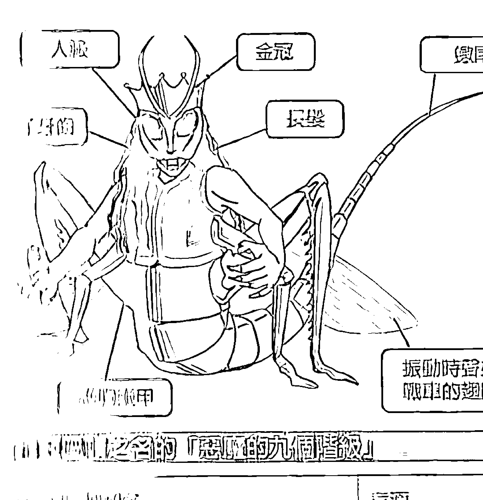

> 《启示录》中虽并未直接描述亚巴顿的模样，不过被认为比照下那些全身铠甲、百足出虫同以无敌的姿態正加恐怖吧！这是亚巴顿的象征！

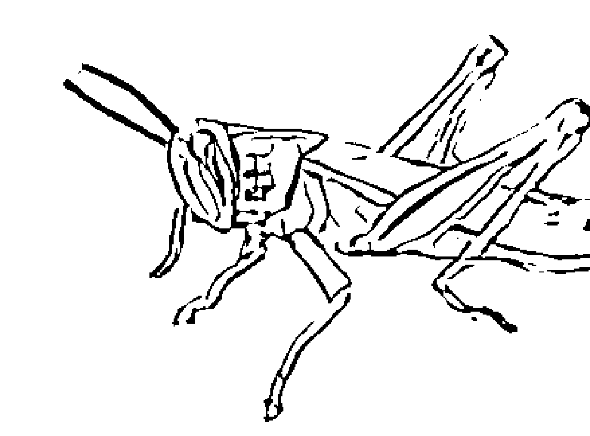

### 在神学之名的“恶魔的九个阶级”

| 阶级名称 | 意涵 | 君主或支配者 |
|----------|------|----------------|
| ...othoi | 伪神 | 别西卜 |
| spiritus mendaciorum | 谎言之灵 | 卧床 |
| spiritus iniquitatis | 不正之器 | 彼列 |
| ... dolorum | 犯罪的复仇者 | 阿斯摩丢斯 |
| ... imitatores | 奇迹的模仿者 | 撒旦 |
| ... potestatos | 空中军势 | 梅利金 |
| ... | 复仇女神 | 亚巴顿 |
| ... | 中伤者 | 亚斯她录 |
| ... | 邪恶的诱惑者・鬼神 | 玛门 |

## 堕天使

堕天使从天界被打落凡间的理由因文献而异，有时是欲望所致，有时则是傲慢使然。

### （一）堕天的理由是欲望，还是傲慢？

基督教认为所有的恶魔都是堕天使。然而什么是堕天使？他们又为何非得堕落天界不可呢？《埃塞俄比亚语以诺书》是这么说的：当地面上的人类数量慢慢增加，遂有许多美丽的少女诞生；有两百位天使见到这些少女甚为心动，于是便在西姆札斯和阿撒泻勒等二十位领导者的率领之下降到地面、各自迎娶少女为妻，并且繁衍后代。然而他们所生下的儿女都是身高达三千腕尺的巨人，必须消耗大量粮食，让人类伤透了脑筋。此外，众天使还将打造武器的方法、冶金术、化妆、魔法等各种知识、技术传授给人类，使得女性学会献媚、男性学会战争，导致人类堕落。上帝见状后大为震怒，决意兴起大洪水灭绝地面众生。换句话说，堕天使乃是因欲望而被逐出天界。

然而，属《旧约圣经》伪典的《亚当夏娃传》却有另一个故事。据其记载，天地创造之际，神先创造出众天使，然后才依自己的模样创造了人类亚当，所以众天使必须膜拜亚当，可是高傲的撒旦却不愿膜拜比自己低等、更晚被创造出来的人类。撒旦还对前来劝解的天使米迦勒说道：“如果神要发怒，那我就要高坐在天星之上，像那位极高者一样。”撒旦跟同伙的众天使就这麽因为神的愤怒而被打到地上，随后又受到嫉妒心驱使而陷害幸福的亚当与夏娃，让两人被逐出伊甸园。换句话说，这个故事里恶魔的堕落是因为傲慢（骄傲），折磨人类则是因为嫉妒。

注释：以手肘长度为标准的长度单位，乃指肘部至中指指尖的长度。1腕尺约合52.3公分。

堕天使……全部都是天使？
（图片：从天界贬落的天使）

《死海古卷》所记堕天的原因
1. 欲望
（图片：地上的少女）
（图片：阴阳的少女很美）
（图片：结婚+技术提供）
（图片：生下巨人儿女）
（图片：因为欲望而堕落）

《以诺书》所记堕天的原因
（图片：我不要）
（图片：傲慢拒绝神的命令）
（图片：神因愤怒将其打落）
（图片：因为傲慢而堕落）

《死海古卷》……（Grigori）……（西元前五～三世纪……）

## 启示录的兽
### The Beast / The Beast of Revelation

十角、七颗头颅的启示录的兽，在末日将临的时代被撒旦授予地上世界四十二个月。

### ○ 终末之际统治人类的撒旦代理者

英文经常会将“启示录的兽”称作“The Beast”，就像“圣经”也经常被称作“The Book”，由此便可得知启示录的兽是多麼特别的“兽”。

启示录的兽之所以在恶魔学领域裡佔有如此重要的角色，完全归因於他是现身於末日将临时的撒旦代理者。

《约翰的启示录》将被逐出天界的撒旦描述成一双七头十角，并且头戴著七顶王冠的红色巨龙。另一方面，启示录的兽也有七头十角，十隻角戴著十个冠冕。启示录的兽躯体像豹、脚像熊、口像狮子，头角的数目和撒旦巨龙一模一样，从这裡便不难发现启示录的兽与撒旦的相似处。其次，圣经又说到启示录的兽在头上记有亵瀆神的名号，据说这名号正是恶魔的数字“666”。这头可怕的兽会在末日将临之际，君临地上世界前后达四十二个月。

继第一头兽以后，第二头兽也从地底出现。圣经写到这第二头兽两角如羔羊，发出的声音像龙。虽然同是启示录的兽，但第二头兽似乎是第一头兽的从属。第二头兽的任务是要迷惑、脅迫眾人，令眾人崇拜第一头兽。

这两头兽无疑都是撒旦的爪牙。基督教的终末论认为第一头兽象徵反基督，而第二头兽则是象徵偽先知，而巨龙、第一头兽、第二头兽三个加起来便是恶的三位一体。（请参照P.116）

杜勒（Albrecht Durer，1471~1528）：油画家、版画家，被尊為文艺復兴时期德国的伟大的艺术家。《启示录》组画（1498）较其他作品更富有冲劲。

出现于末日的撒但代理者
藉撒但的权柄君临地上四十二个月

《但以理书》启示录的“兽（撒但）”与“兽”
（以下图为杜勒所绘启示录连环版画（1497~8））
（图片）
《但以理书》的兽与《启示录》的兽是撒但的类似物

## 第014章 龙
### Dragon

在撒旦出现圣经以前，龙便是恶的代表。所有的恶其实都是撒旦从龙的身上继承而来。

### （一）历史较撒旦更为久远的龙

龙与撒旦之间的关联性极强。

说到龙（西洋龙），一般人往往会直接联想到体似恐龙、状如蝙蝠的怪物，不过龙的原始形象其实像条大蛇，是种存在于海洋河川、引发洪水的怪物。由于洪水泛滥时极为恐怖，从太古以来龙一直都是恶的象征。翻开圣经可以发现，恶龙活跃在《新约圣经》时代，可是龙却是从更早的《旧约圣经》时代便已经被视为恶的象征。“到那日，耶和华必用他刚硬有力的大刀刑罚快行的蛇利维坦，并杀海中的龙”（《以赛亚书》27章1节）、“神以能力搅动大海，藉知识打伤拉哈伯，藉他的灵使天有妆饰，他的手刺杀快蛇”（《约伯记》26章12～13节）便足以为证。

如前所述，龙自古便是恶的象征，因此即便《新约圣经·约翰的启示录》里讲到撒旦突然以龙的模様现身也丝毫不突兀。“在天上就有了争战。米迦勒同他的使者与龙争战，龙也同他的使者去争战，并没有得胜，天上再没有他们的地方。大龙就是那古蛇，名叫魔鬼，又叫撒但，是迷惑普天下的。他被摔在地上，他的使者也一同被摔下去”（12章7～9节）

从此龙与撒旦便有了决定性的关联。像圣乔治和圣玛格丽特等後世基督教圣人击退恶龙的传说都是由此而生，建立在大使米迦勒击败恶龙（撒旦）的《启示录》故事之上。

> *1 书中中文和合本实际作：“到那日，耶和华必用他刚硬有力的大刀刑罚鳄鱼—就是那快行的蛇，刑罚鳄鱼—就是那曲行的蛇，并杀海中的龙。” 此处是参考中文和合本、配合原文推敲翻译。
*2 圣乔治（Saint George）：三世纪的基督教殉教者、英格兰的主保圣人。四世纪起就已经有关于他的种种传说。
*3 圣玛格丽特（Saint Margaret of Antioch）：亦称圣玛格丽特。叙利亚安提阿的殉道者，十四救难圣者之一。

从蛇的时代进入龙的时代
早自太古便已存在的恶之象征
撒旦出现以后也成为了撒旦的象征
- 恶
- 巴比伦帝国
- 希腊王国
- 罗马帝国

最大的恶之象征
（图片）

（形形色色的龙）
（图片）
- 利维坦
- 拉哈伯
- 大蛇
- 阎
- 海兽
（图片）
（图片）
（图片）
（图片）
（图片）
撒旦承继所有的恶，成为罪恶的根源！
（图片）
（图片）
龙成为撒旦的其中一个象征物

## 反基督
### Antichrist

世界终末之际以救世主自称为、迷惑众人的反基督，乃是撒旦生而为人的存在。

### 撒旦受肉的反基督

反基督是与撒旦存有特殊关系的人类，唯有在世界即将迎向终末的时候才会出现，堪称人间中的撒旦。

从放逐天界直到世界终末为止，撒旦和众恶魔一直都是神的敌对者。尽管他们注定失败，可是撒旦却从未放弃抵抗，甚至在世界即将灭亡前夕达到了最高潮。基督教的终末论认为当这个世界快要结束的时候，耶稣将会再度以救世主身份降临、消灭邪恶的军团。可是在此之前，有个主张自己才是救世主的冒牌货会出现，那些异教徒、异端者、无信仰的人也会集结在其身迈展开最后的抵抗，而这个冒牌的救世主正是反基督。反基督正如其名，是基督的敌对者，是伪救世主。

如果我们只看他所扮演的角色，或许会觉得反基督跟撒旦是这样的存在，可是事实并非如此。就某个层面来说，反基督可以说与耶稣基督是相类似的存在。耶稣基督是神的受肉，是神生而为人的存在；同样地，反基督则是撒旦的受肉，是撒旦生而为人的存在。换句话说：耶稣是人类，反基督同样也是人类，还是个与善敌对的终极人类。

问题是反基督的人数。《新约圣经・福音书》和《约翰书》都说反基督不只一个，可是保罗的《帖撒罗尼迦后书》却说反基督只有一个人。而活跃于十二世纪的修道士——菲奥雷的约阿基姆则说会先有几位反基督出现，然后唯一而终极的反基督才会现身。

> 注1: 约阿基姆(Jonchim of Fiore, 1130~1201)：义大利神秘主义神学家、圣经注释家、历史哲学家。
> 注2: 西纽利(Luca Signorelli, 1445~1523)：义大利文艺复兴画家，以...的内容及视觉上的创新而闻名。

反基督是什么
反基督是人类，是与耶稣基督对立的存在
（图片：《约翰启示录》（五世纪）写道……）
（图片）
（图片）

## 拒绝男性居上体位的亚当前妻

莉莉丝是在犹太恶魔学里面占有极重要地位的女恶魔。

《旧约圣经・以赛亚书》34章14节如此写到：“旷野的走兽要和豺狼相週；野山羊要与伴侶对叫。夜间的魇女必在那裡棲身，自找安歇之处。”此处所谓“夜间的魔女”指的便是莉莉丝。相传她原是美索不达米亚的恶灵莉莉特，曾在夜里徘徊袭击男性、啜饮他们的鲜血。

后来这位莉莉特之所以会被犹太传说吸收、成为亚当的前妻，其实与《创世记》内容的自相矛盾有关。

《创世记》1章说神按照自己的模样创造了人类男女。换句话说，人类的男女是在同一个时间被创造出来的，可是到了2章又说亚当单身，神才用亚当的肋骨创造女人（夏娃）。新莉莉丝传说便是诞生自这个矛盾。

根据犹太的重要民间传说——便西拉的《字母》记载，莉莉丝跟亚当一起用泥土被创造出来后，生活并不顺利。原来莉莉丝无法接受性行为中女性在下的体位，并且逃往红海，即使三位天使追上去、试图说服莉莉丝，也终究没有回头。

那么，后来的莉莉丝又是如何呢？喀巴拉传说说她是恶魔撒旦的妻子，上半身是个充满魅力的裸体女性，下半身却是蛇形。此外，伊斯兰教的传说认为莉莉丝跟撒旦发生关系，生下了恶魔镇尼；换句话说，莉莉丝与亚当离异后成了魔鬼撒旦的妻子。基督教的恶魔学认为她是服侍于恶魔的魔女，与女夜魅的同类，将会不停诱惑男性、直到世界末日为止。

魔鬼图鉴
（图片）
（图片）

## 利维坦
### Leviathan

从利维坦的形象背后，其实隐隐带着圣经中那个堪与撒旦或龙并个别那种象征的海兽利维坦的影子。

### （一）圣经中堪与撒旦和龙相匹敌的大恶魔

利维坦起源自圣经，而且在圣经里面，利维坦是个堪与撒旦相匹敌的邪恶象徵。从前古迦南人信仰的丰饶神巴力打倒了原初之蛇罗坦（Ltn），后来这个罗坦就被写进圣经成了利维坦。从这些纪录里面，应该很清楚地明白圣经里的利维坦其实就是龙，就是撒旦。

> “在地上没有像他造的那样，无所惧怕。凡高大的，他无不藐视；他在骄傲的兽族上作王。”（《约伯书》41章33～34节¹）。
> “到那日，耶和华必用他刚硬有力的大刀刑罚快行的蛇利维坦，并杀海中的龙。”（《以赛亚书》27章1节）

约莫十六世纪以后利维坦完全演变成恶魔，陆续引发多起附身事件，许多魔导书也开始为文介绍利维坦，而利维坦自然就成了重要的大恶魔。譬如《亚伯拉梅林的神圣魔导书》说他和路西法、撒旦、彼列合称为地狱最高四君主，或是相応只要手握利维坦的魔法阵唱诵咒文，便能召唤以人类姿态现身的恶魔，还有《阿尔马岱的魔导书》也提到利维坦和阿斯莫丢斯告诉我们恶魔的恶德有多么恐怖。再说到恶魔附身事件，利维坦不仅与最著名的卢丹恶魔附身事件有关（对照P.180），其他像是西元1647年的卢维埃恶魔附身事件，利维坦跟大袞等恶魔也让许多修女吃尽了苦头。

霍布斯的哲学书《利维坦》（1651）之所以藉他作为洲利坦国家之象徵，便是因为利维坦是最适合此一比喻的物体，作。

利维坦
- 圣经的利维坦 → 堪与撒旦匹敌的恶之象征
- 恶魔利维坦 → 地狱最高君主之一
- 附身恶鬼
（图片）

地狱的入口・利维坦之口
（图片）
在《旧约圣经・约伯记》（41章19～21节）还有以下的记载：“从他的口中发出火把，与飞迸的火星；从他的鼻孔冒出烟来，如烧开的锅和点着的芦苇。他的气息点着煤炭，有火焰从他口中喷出。” 这种将巨兽描绘成恶魔，是成形于十二世纪起，许多文学作品中的共通概念。地狱的入口 上方左侧 是十四世纪的《神曲》地狱篇 插画局部，门是怪兽利维坦之口吞噬的场面 上方右侧是西元1500年左右的版画 描绘恶魔之手将罪人推入地狱入口的情景。
在17世纪，法国兰斯有数位修女遭恶魔附身的事件，除利维坦外，据称巴隆、贝西迪斯等恶魔也一起作祟。

### ○ 既是河马亦是大象的暴饮暴食恶魔

贝西貘斯在《旧约圣经・约伯记》里被写作是足以与海怪利维坦相提并论的恐怖陆地怪物。“你且观看贝西貘斯巨兽；我造你也造他。他吃草与牛一样；他的气力在腰间，能力在肚腹的筋上。他摇动尾巴如香柏树；他大腿的筋互相联络。他的骨头好像铜管；他的肢体仿佛铁棍。他在神所造的物中为首；除创造者以外没人能用剑刺他。”

根据《旧约圣经伪典・以斯拉记四》记载，从前神在创造天地的时候，说贝西貘斯与撒旦同时在海里诞生，可是因为他们太过巨大、无法同时在海中生活，于是贝西貘斯才被带到了陆地上。

圣经里的贝西貘斯据称是河马模样，而俄罗语里面 behemoth 也是河马的意思，因此这个说法应该不难理解。此外，贝西貘斯也经常被想像成是只大腹便便的大象。根据圣经问世以前的传说记载，犹太人的神耶和华曾经跟迦南人的丰饶女神阿娜特“结婚”，相传当时耶和华以象形的印度神迦尼许自称，而贝西貘特便是由这头象所孕生。

十六世纪以后，贝西貘斯获得身为恶魔、无可动摇的地位。不过也许是因为利维坦太过突出的缘故，使得人们对贝西貘特在地狱里的地位几乎没什麽讨论，像盘丹（请参照P.180）和卢维埃（请参照P.40）的恶魔附身事件便是如此。尽管将恶魔与七宗大罪联结起来的宾斯费德说别西卜是暴食恶魔，不过我们也不能忘记大多数的恶魔学者都认为贝西貘特才是诱人暴饮暴食的恶魔。

圣经的贝西摩斯
恐怖的陆地怪物

恶魔贝西摩斯
活跃于恶魔附身事件
是有名的暴饮暴食恶魔
（图片）

贝西摩斯的特征
恶魔般的骨架
摇动的尾巴
充满气力的脚
大腿的筋互相联结
强力的肚腹筋

贝西摩斯的诞生
（图片）

## 巴力
### Baal

恶魔巴力其源源自《旧约圣经》提及的异教神祇巴力，其后这个名字更衍生出许多其他的恶魔，形成巨大的“巴力”族群。

### ○ 衍生出众多恶魔的“巴力”威力

《旧约圣经》里面曾经提到好几位名叫巴力的异教神祇，而他们也都在后来各自演变成独立的恶魔。

举例来说，《民数记》25章数节描述摩押人“崇拜的“昆珥（菲戈）的巴力”，后来变成了怠惰的恶魔贝耳非高嗝；《士师记》8章数节所载示剑人的神“巴力比利土”则是成了所罗门王72恶魔当中的贝雷特（或作贝雷斯），至于将恶魔位阶传授给米夏埃利斯神父的恶魔巴鲁贝力特，同样也是从这位神明变化而来。此外，《列王纪下》1章数节所提到非利士人的神“巴力西卜”后来则是变成了鼎鼎大名的别西卜。另外还有像恶魔彼列也是从巴力此名的希伯来语讹音贝利亞尔转变而来的名字；

为何会有这样的事情呢？那是因为巴力这个字原是个指称“主人”、“王”的普通名词。换句话说，“昆珥的巴力”就是“昆珥的王”，“巴力比利土”则是“比利土的王”的意思。《列王纪下》10章诸节将古代迦南人的丰饶神称为“巴力”，但这位神明真正的名字其实叫作哈逊，原作“巴力哈逊”（雷鸣之王），可是圣经却只记作巴力而已。

恶魔巴力便是衍生自这些众多异教神祇的名字。时至十六世纪前后，巴力已经被视为力量非常强大的恶魔，这点从《恶魔的伪王国》和《所罗门王的小钥匙》（雷蒙盖顿）记载的恶魔王国君主一览表可见一斑。两本书表都说巴力是率领庞大军团的东方之王，并将他列在名簿的首位，这恐怕都要归功于“巴力”名号的不凡威力。

巴力
恶魔巴力 → 《旧约圣经》的异教神变成恶魔
“巴力”是“主人”、“王”的意思

与《旧约圣经》“巴力”有关的恶魔
- 昆珥的巴力 (摩押人的神) → 贝耳非高嗝
  十六世纪恶魔学者将其定为七宗罪当中怠惰的恶魔
- 巴力比利土 (示剑人的神) → 贝雷特 (贝雷斯)
  所罗门王72恶魔之一，排名第28位的公爵。
- 巴力西卜 (非利士人的神) → 别西卜
  号“苍蝇王”，自《新约圣经》时代起大为活跃的恶魔。
- 巴力哈遗德 (迦南人的神)
- 贝利亚尔 (巴力的希伯来语谓称) → 彼列
  死海古卷当中率领黑暗军团的大恶魔。
- 恶魔巴力 → 介绍所罗门王72恶魔的《所罗门王的小钥匙》将其称作巴耶利，为恶魔排行榜之首，是统治东方之王，麾下拥有66军团。

### No.020
**亚斯她录**
Astaroth

自十六世纪以来四处肆虐为祸的恶魔亚斯她录，乃是源自《旧约圣经》，就连所罗门王也要崇拜的古代腓尼基女神阿斯塔特。

## ○ 频频出现于附身事件与魔导书之中的恶魔

姑且不论其他方面，亚斯她录的起源非常古老。这个名字是古代腓尼基都市比布洛夫的守护神、闪族的丰饶女神阿斯塔特的变形，而女神阿斯塔特又与古代美索不达米亚的女神伊施塔有亲缘关系。《旧约圣经》曾多次提及她的名字，譬如《列王纪上》就说所罗门王娶了好几位信仰崇拜女神阿斯塔特等神祇的外国妻子，此举触怒了神，才使得以色列分裂成南北两个国家。换句话说，女神阿斯塔特是绝对不可信仰崇拜的异教神，而她也跟其他异教诸神同样以恶魔的身分进入了基督教。

阿斯塔特女神后来演变成恶魔亚斯她录，变化发生于何时已不得而知，不过亚斯她录在十六世纪以后特别猖獗，多次出现在魔导书和恶魔附身事件当中，甚至可以跟路西法、别西卜和阿斯摩丢斯等大恶魔相提并论。举例来说，《教皇洪诺留的魔鬼书》（请参照P.204）就说亚斯她录是应选在星期三召唤的恶魔，《亚伯拉梅林的神圣魔法书》（请参照P.208）说亚斯她录是次级君主八恶魔之一，而在《阿尔马岱的魔导书》（请参照P.206）里面则是跟路西法、别西卜一同讲述当初恶魔叛乱乃至堕落天界诸事经过的恶魔。《所罗门王的小钥匙》（请参照P.198）和《恶魔的伪王国》（请参照P.122）称此魔地狱的侯爵，而根据赛巴斯汀·米夏埃利斯神父的分类（请参照P.120），亚斯她录属于第一级恶魔，原是座天使的仆从，至于卢丹恶魔附身事件中（请参照P.180），则是与阿斯摩丢斯同时附身于修女珍·德·安洁的恶魔。

# 恶魔亚斯她录的诞生

**古腓尼基的丰饶神 阿斯塔特**

**X**

**基督教**

→

**恶魔亚斯她录**

**异教的女神**

**异教女神在基督教世界被打成恶魔**

## 亚斯她录恶魔最为知名的恶魔亚斯她录

**星期三的恶魔**
《教皇洪诺留的魔导书》

**次级君主八大恶魔之一**
《亚伯拉梅林的神圣魔法书》

**她的头与腿是山羊**
**《地狱王国》**
**《地狱王的小钥匙》**

**卢丹恶魔附身事件中大为活跃**

**《神父**
**(与)魔鬼是一种恶魔，是堕落天使》**

**《她头部的触角是**
**(羊的)头角》**
**《地狱的真实形态》**

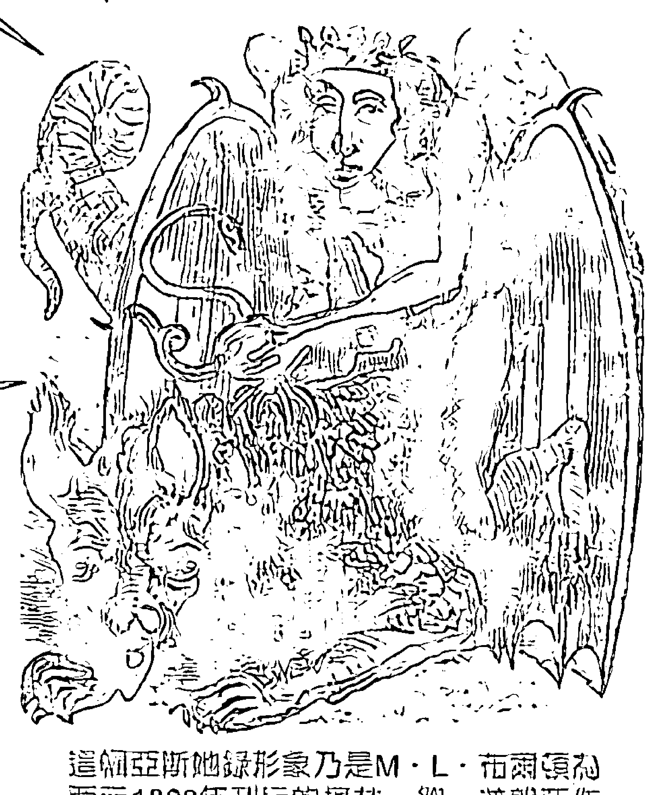

**图**
**这是亚斯她录的样**

> 这个亚斯她录形象乃是M·L·布尔顿于西元1863年刊行的柯林·德·普朗西作品《地狱辞典》第六版所绘制。

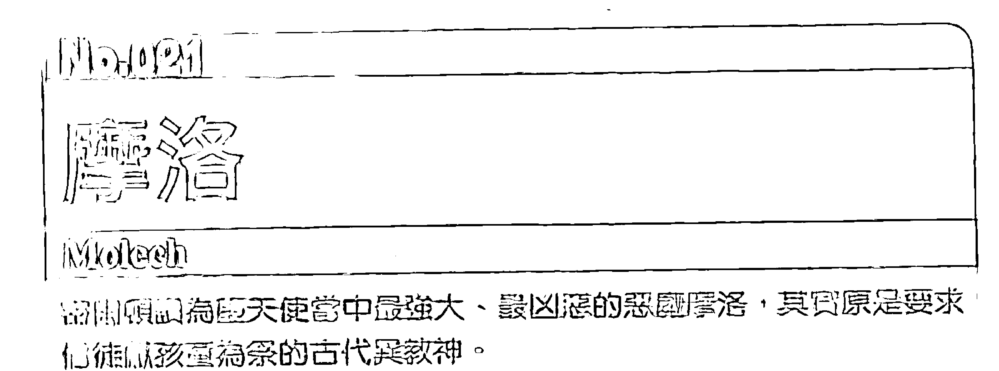

据用头衔为恶天使当中最强大、最凶恶的恶魔摩洛，其实原是要求人们以孩童为祭的古代异教神。

## ○沾满活祭鲜血的凶猛恶魔

摩洛亦称摩洛克，在众多恶魔当中以残忍及凶恶而超群出众，密尔顿的《失乐园》说无数恶魔在天界之战吞败、被打落地狱以后，魔王撒旦首先清醒过来，跟倒在旁边的副官别西卜交谈，而摩洛便是在大批恶魔中第一个赶到的恶魔，并且形容他是“沾满活人献祭的鲜血、全身洒满父母泪水的恐怖君王”（平井正穗译／岩波书店）。不久后，众恶魔建设起万魔殿，议论今后对策，摩洛也挺身主张应当再次与天使们公然开战。“他是天界所有战斗过的天使当中最强、最凶猛的一个，如今却因为绝望而变得更加凶猛”（出處同上）。即便在那场使他们坠落天际的天界决战当中以落败收场，仍不能否认摩洛勇敢地与天使加百列所率军团经历过激烈的战斗。

打从圣经时代以来，摩洛的残忍与凶猛从未改变。《旧约圣经・利未记》就记载到：“不可使你的儿女经火归与摩洛，也不可亵渎你神的名。”（18章21节）摩洛是亚扪人的神，不过当时以色列人当中也有人崇拜这位异教神，甚至还拿自己的孩子献祭，所以耶和华神才会断然禁止。此外根据《列王纪上》记载，从前所罗门王为阿斯塔特、米勒公、基抹和摩洛等异教诸神建立祭坛，触怒了耶和华神，使得以色列王国在所罗门王死后分崩离析。

-   1. 约翰・弥尔顿（John Milton）：英国诗人 因反对查理一世的宗教改革，放弃神职而转向文学创作。代表作《失乐园》被认为是英国文学史上最佳的史诗诗，是仅次莎士比亚之后最伟大的英国诗人。
-   2. 加百列（Gabriel）：基督宗教神话中负责掌管死亡与审判的大天使。同时也是“上帝的信令者”，曾经负责告知玛利亚已怀孕了耶稣基督。
-   3. 亚扪人（Ammonite）：古代闪米特人的一支，主要城市为巴勒斯坦境内的拉巴（Rabbah Ammon）。

# 阿|维|摩|洛

# 第1章◇何谓恶魔

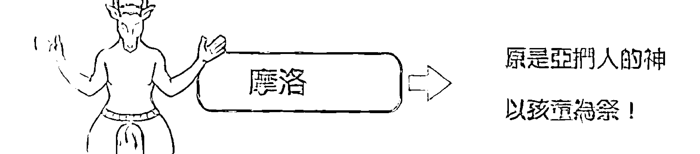

・弥尔顿《失乐园》的摩洛

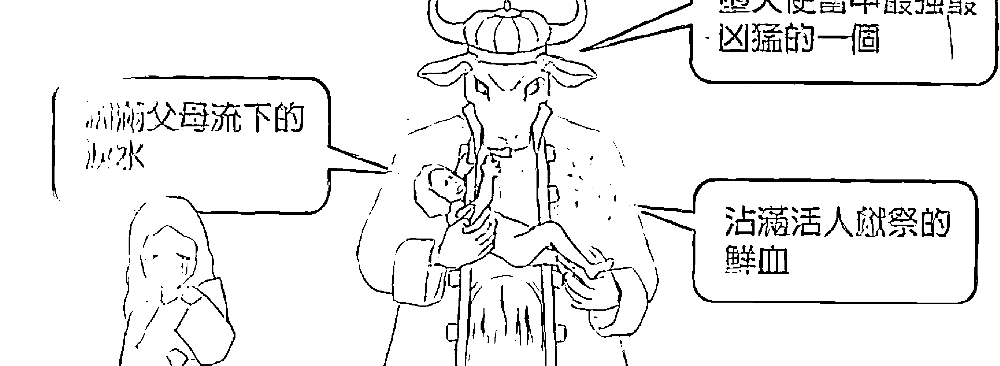

## 古代的摩洛肖像

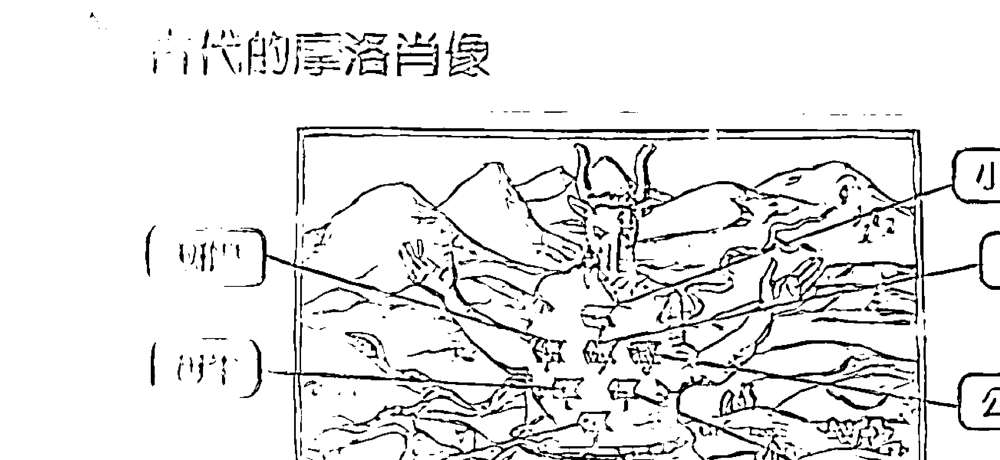

如上图（左）世纪版画里描绘的古代摩洛肖像，外观像是巫妖，据称（右下）古代把孩童作为祭品投入火中，然后在一旁敲打……但林・德・普朗西说摩洛是‘英国的……’（内容不完整）……。而犹太人（拉比人的犹太法学者）的传说则记载了这些摩洛像……。图的左侧有七个架子，依序摆放小麦粉、斑鸠、公……、公山羊、牛犊、羊……，第七个则是人类孩童。

### No.022
大衮
Dagon

最终演变成半人半鱼怪物的恶魔大衮，其实原是古代曾经和以色列发生过战争的非利士人所信仰的丰饶神。

## ○曾以魔神身分现身克苏鲁神话的恶魔

大衮半人半鱼的怪物形象相当强烈。在密尔顿《失乐园》（1667）里属于主要恶魔，说他是海洋的怪物，上半身是人体而下半身却是鱼身。克苏鲁神话的创始者H.P.洛夫克拉夫特*1在小说《大衮》（1917）与《印斯茅斯疑云》（1931）里的魘神大衮亦承袭此概念；虽然整体仍是人类形体，却身长九公尺、全身布满鳞片而且手脚有蹼。

然而，其实大衮不仅是古代非利士人的丰饶神，而且还是个人类模样的神祇。他在地中海周边的都市诸如亚实突（亚锁都）*2、迦特*3、亚瓦基伦*4、亚革伦*5和加萨*6都有雄伟的神殿。《旧约圣经・撒母耳记上》（5章1～6节）记载非利士人曾经抢夺以色列神的约柜，将约柜运送到亚实突的大衮神殿，隔天早晨就看见大衮神像的手足都已截断、倒伏在以色列神的约柜前。后来之所以演变出鱼的形象，似乎是因为希伯来语的“dag”是“鱼”的意思，使得部分的犹太教拉比*7认为大衮是半人半鱼的神。

像大衮这种异教神当然会被基督教贬为恶魔，有趣的是在著名的魔导书里却遍寻不着他的名字，倒是曾经出现在十六、十七世纪间流行的集体附身事件中。譬如法国的卢维埃修道院从西元1630年起的十年内总共有五十二名修女被至少十四位恶魔附身的事件，当时附在她们身上的便是大衮、普提法尔和格隆迦德诸恶魔。柯林・德・普朗西的《地狱辞典》则说大衮是二级魘神，在地狱宫廷当中负责面包的制造与管理，还说他曾经出现在1660年法国奥松的乌尔苏拉会女子修道院集体附身事件中。

## 半人半鱼的恶魔大衮的形象

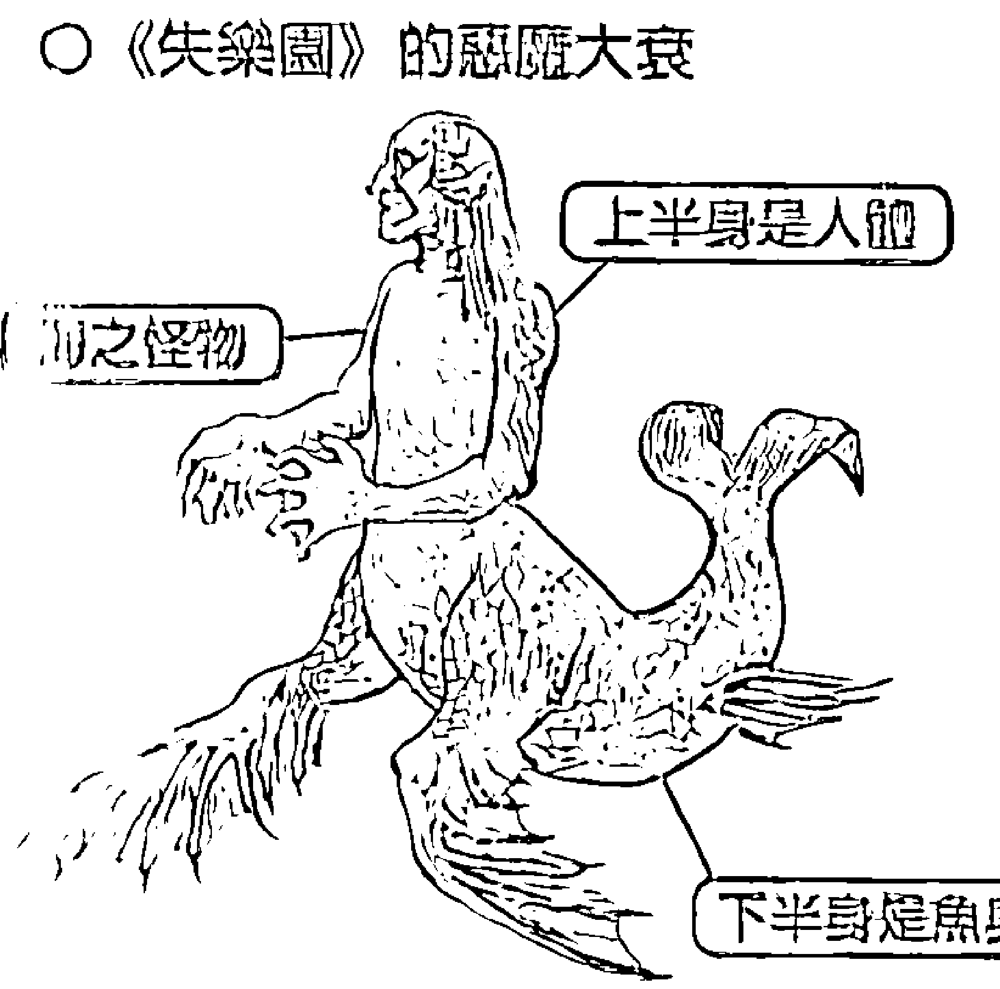

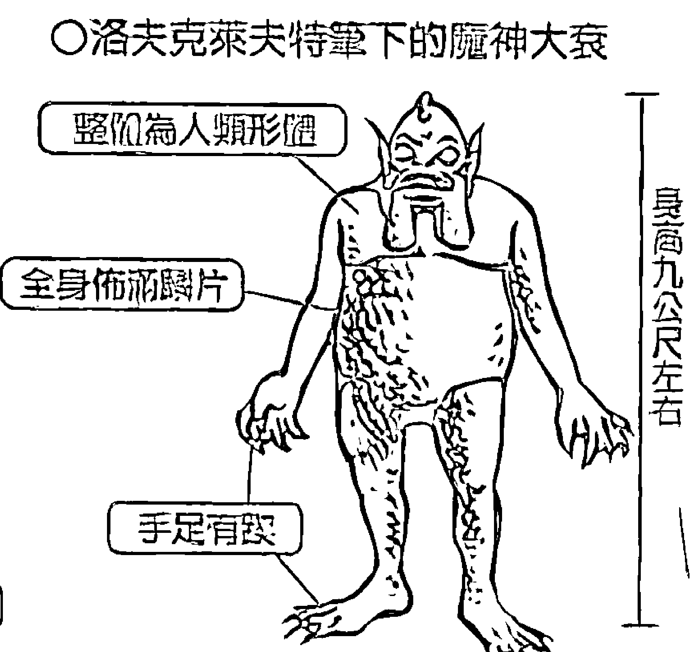

## 以色列的神耶和瓦击败的大衮神

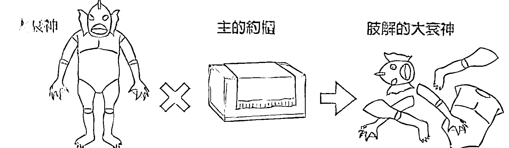

据《旧约圣经》记载，非利士人将神的约柜厚放在大衮神神殿，隔天，大衮神像便已支离破碎地倒在地上……

## 基督教魔鬼事件中恶魔为恶的大衮一族

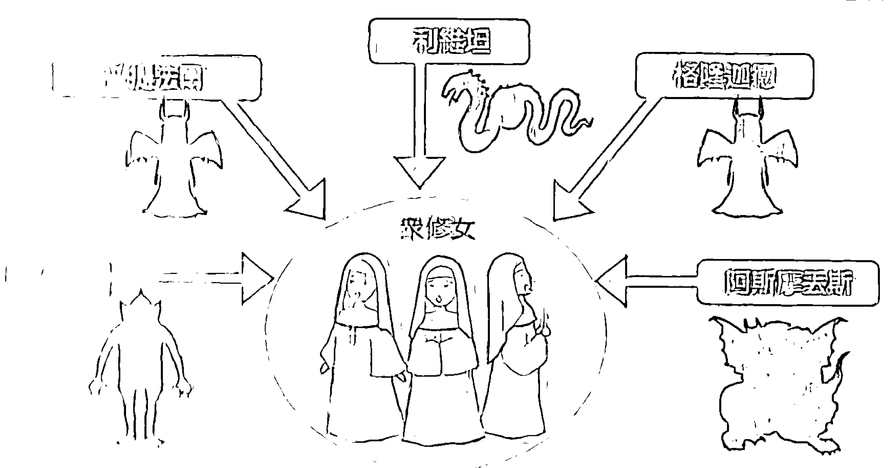

# 梅佛斯特 Mephosthiles

浮士德传说当中的恶魔梅佛斯特，其实就是后来以德国文豪歌德创作戏剧《浮士德》而闻名的恶魔梅菲斯特的原型。

## ○随浮士德传说而生的新恶魔

梅佛斯特乃是因为十六世纪德国创作出来的浮士德传说而闻名的新恶魔。根据J.B.罗索的说法，Mephostphiles其实是由希腊语的mē（否定）、phōs（光）、philos（爱好者）构成的造语；换句话说，梅佛斯特便是“不爱光者”，是“带光者”路西法的戏仿。

浮士德传说是以某个名叫约翰・乔治・浮士德的史实人物为蓝本而逐步演绎形成的传说，直到西元1587年才有第一部完整的作品出版，将真实的浮士德传说广传于世，这本书便是约翰・史皮斯的《约翰・浮士德博士的故事》。

根据这本书的记述，梅佛斯特绝非路西法那般的高级恶魔，甚至和浮士德博士缔结契约还必须获得“路奇法大人”（路西法）的许可，可见他只不过是路西法手下的一员。故事中，彼列是众恶魔的首领，其麾下则又有路奇法、别西卜、亚斯她录、撒旦、亚奴比斯、丢提卡奴斯、多拉斯七大恶魔，梅佛特斯只不过是其中一员。

不过梅佛斯特却不是个陈腐而无趣的恶魔。他不但令人畏惧，还擅长各种陷人于不义的手段，是个长于狡智、有如诈骗份子的恶魔。梅佛斯特总是佯装自己受到浮士德的魔法支配、召唤，其实这些都只是他故意表演出来的假象，目的就是要诱惑浮士德沉迷于世间享乐，最后再令其破灭。虽然恶魔梅佛斯特最后是在德国文豪歌德的笔下才蜕变而成，不过早自梅佛斯特诞生之际便已经可以窥见其不同于一般的性格。

# 梅菲斯特的由来

浮士德传说的恶魔

## 名字的由来

Mephostphiles 不爱光者

-   - mē (否定)
-   - phōs (光)
-   - philos (爱好者)

路西法 (带光者) 的反仿

## 歌德著作《浮士德》当中梅菲斯特的原型

## 其他恶魔的名字列表

-   - 音读
-   - 彼列
-   - 别西卜
-   - 亚斯她录
-   - 撒旦
-   - 亚奴比斯
-   - 丢提卡奴斯
-   - 多拉斯

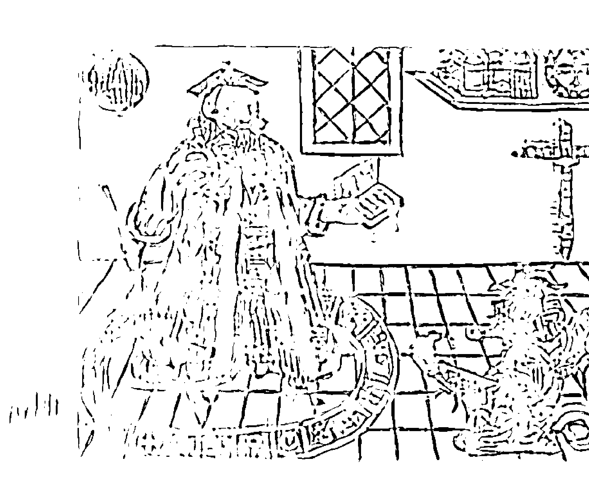

十六世纪出版的敌 克里斯多夫 《浮士德博士》 画面反应 正在召唤恶魔的 浮士德博士以及应 召唤出现的梅菲斯特

月小有 《浮士德博士》

# 梅菲斯特

# Mephisto

18歌德创作的伟大世界文学——戏剧《浮士德》中的恶魔，直到今天仍然拥有很大影响力。

## ○独立于古老恶魔学之外的新时代恶魔

梅菲斯特身为全世界最为人所知的恶魔之一，是德国文豪歌德（1749～1832）戏剧《浮士德》里的恶魔，亦作“Mephisto”。歌德的《浮士德》是取题于浮士德传说的作品，因此梅菲斯特可谓是从浮士德传说中的恶魔梅佛斯特发展出来的形态。

然而，梅菲斯特和梅佛斯特间却有着极大的差异。歌德《浮士德》里的梅菲斯特是在事先获得神许可的情形下诱惑浮士德，这就跟《旧约圣经・约伯记》里，撒旦在神的许可下试探约伯的信仰相同，是《约伯记》的戏仿（请参照P.012）。他虽是恶魔，性格却十分复杂，这点从他说自己“总想作恶、却总行了善的那种力量的一部分”（《河出世界文学全集2》高桥健二译／河出书房新社）的自我介绍便可见得。

浮士德博士在《浮士德》里和荷姆克鲁斯¹遍游古希腊的世界，照理说此行原本应当由梅菲斯特来带路，可是他却因为古希腊并非基督教世界不能成行。光是这点便与十六、十七世纪的恶魔学，主张异教世界是由恶魔支配统治的观点截然不同，并且恐怕也跟歌德刻意与基督教保持距离有相当的关联性。梅菲斯特还有个缺点，那就是他无法理解何谓人类的真正满足。他打赌说如果浮士德通过享乐得到满足，自己就能够得到浮士德的灵魂，而故事最后当浮士德变得满足的时候，梅菲斯特便以为自己胜利了；可是浮士德的满足并非因为享乐所致，而是通过人性的、英雄式的努力得来，于是梅菲斯特终究没能够得到浮士德的灵魂，而浮士德也在死后被迎入了天国。

# 梅菲斯特 -> 歌德作品《浮士德》的恶魔

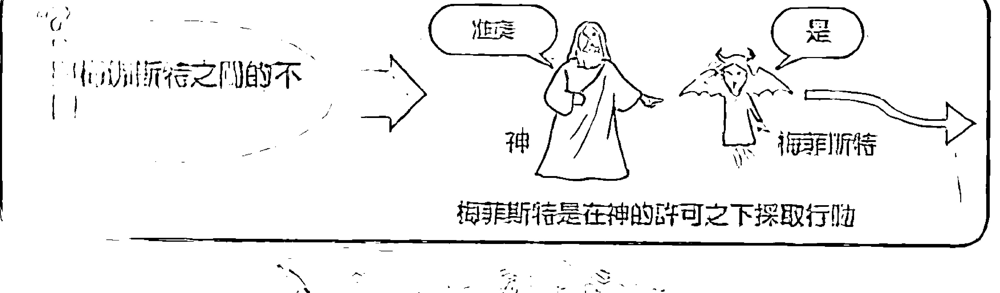

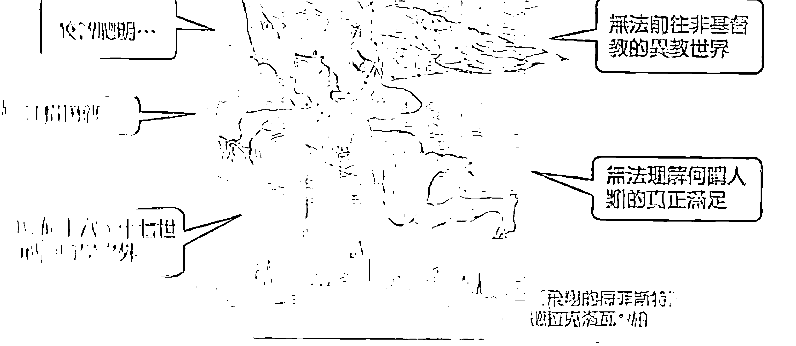

## 浮士德博士与狗

在《浮士德》中，梅菲斯特以黑卷毛狗的形态首次出现在浮士德博士的书斋。虽然梅菲斯特在《浮士德》仅此一次变化成狗的形态，但这并非别有用心的，其实浮士德博士在十六世纪成立的传说中，喜好养狗，而这些狗经常被指为是恶魔。因此歌德便按照这则传说，让梅菲斯特以狗的形态现身。关于这个传说中的狗同样也有其由来，那便是文艺复兴时期的人文主义者阿古利巴（1486-1535）的狗。阿古利巴除了撰写《三部曲》等作品，也是个大名鼎鼎的魔法师，据说他有一只大狗，而在关于阿古利巴的众多传说中甚至流传着“那只狗其实是恶魔”的说法。阿古利巴的狗先是受到十六世纪的传说影响，后来又成为歌德《浮士德》里面的黑色卷毛狗。

Mephistopheles这个名字的由来不明，可能是个自创词，不过莎士比亚的《温莎的风流娘们》中已经出现过Morphistophilus这个字了。J.B.指出这个造语应该是结合了希腊语的Morphe（形态的）和Philos（朋友的）。

# 恶魔与斗争神话

原意为“敌对者”的撒旦在基督教的神话和传说里，一向都是被塑造成与基督敌对、双方展开宇宙规模斗争的存在。不过这类的斗争神话绝非基督教所独有的产物，根据《古代恶魔学——撒旦与斗争神话》（Neil Forsyth / 法政大学出版局）的说法，圣经里的故事其实受到了更加古老的斗争神话莫大影响，其中包括埃及神话、希腊神话、巴比伦神话、迦南神话等，此处且让我们以对圣经影响最大的巴比伦神话为例。

《吉尔伽美什叙事诗》堪称巴比伦神话的核心故事，据说它成型于西元前2000年前后，内容描述英雄吉尔伽美什对抗森林怪物洪巴巴的故事。洪巴巴是只风如雷鸣、口吐火焰且气息能致人于死的怪物，而吉尔伽美什却试图跟这只怪物战斗，某个版本的文献甚至提到，在吉尔伽美什前往森林夺取女神依南娜“圣树”的时候，还有条蛇守在那株树木的根部。《创世记》里的伊甸园故事便是有意无意与其相似的产物。此外，洪巴巴在古代传说里原是受命于主神恩利尔，负责威吓人类、守护森林，可是后来却被当作是世间万恶的根源，换句话说就是仿佛撒旦般的存在。

巴比伦神话中还有个巨大蛇龙拉甫为祸人间的故事。众神委派某个身分不明的人物讨伐龙，而那位英雄也用箭击败了龙。那条龙是来自海洋的拉甫，甚至可以说是利维坦的祖先也不为过。

另外尼努尔塔与神乌安之间的故事也颇耐人寻味。根据这则故事记载，从前主神恩利尔制定众神的准则，任命安担任传令，但当安得知恩利尔的神力、王冠、神圣长袍和命运书板之后，心里却像撒旦般觊觎从主神恩利尔手中夺权。于是他乘隙偷走了王冠和命运书板，惹得恩利尔的神怒。众神惊慌之下紧急召开会议，委派尼努尔塔对付安，而尼努尔塔因此被迫必须接下这个苦差事。

光看巴比伦神话，便已经发现许多日后受到基督教神话、传说承继的要素，可见古代的斗争神话对基督教的神话、传说究竟有多么大的影响。

1.  《吉尔伽美什叙事诗》（Epic of Gilgamesh）：世界上最古老的叙事诗，其中记载到洪水与大洪水相关联的故事。
2.  依南娜（Inanna）：美索不达米亚神话最重要的女神，一般认为她是巴比伦神话女神伊斯塔的原型。
3.  恩利尔（Enlil）：天空之神安与大地女神所生的神明。
4.  尼努尔塔（Ninurta）：苏美神话中的战争之神，也是位特别强调血腥复仇的神明，军人守护神的始祖。
5.  安（An）：苏美神话中天空的化身，也是恩利尔的父亲。他在巴比伦神话里被称为“安努”（Anu），是神话初期的主神。

# 第2章

## 概率论·基础

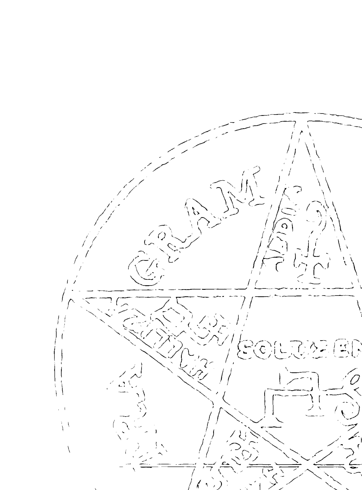

# 作为神学的恶魔学
*Theological demonology*

为抵制强敌诺斯替教，基督教自二世纪起便开始发展基督教神学，并展开各式各样的恶魔论述。

## ○基于一部分神学体系所建立的恶魔学

西元一世纪时巴勒斯坦有位名叫耶稣的人物出现，在犹太教内部推广革新教义，而基督教便是由相信这位耶稣为基督（救世主＝弥赛亚）的信徒所创。可是直到二世纪初基督教仍然没有一个明确的教义体系，尽管当时的基督教已经有了包括《福音书》在内的各种经典，可是这些正典却是直到四世纪末才终于被汇整成为如今的《新约圣经》。中间这段时间，基督教的众多领袖思想家、著述家倾注全力，致力区分诸多教义当中何者属于正统，而何者又是属于异端。

基督徒之所以会展开这项工作，同一时代的诺斯替教可谓影响甚钜。诺斯替教与基督教是各自独立的宗教，可是它的神话中却带有犹太教、基督教、希腊神话、柏拉图主义色彩，而且还拥有与基督教彻底敌对的内容。而为排除诺斯替教的影响，基督教势必要打出一套明确的正统神学。

自此之后，无数思想家各自建立了形形色色的神学，而这些神学也很理所当然的将恶魔论也涵盖其中，换言之，那个时代的恶魔学是属于神学的一部分。从圣依纳爵、奥利金、圣奥古斯丁等基督教众教父，到摩尼教和诺斯替教等异端宗教，恶魔论都是非常重要的一环。虽然唯有胜利者成为正统，落败者将打成异端，可是异端的神学并不会就此消灭，从中世纪出现好几个异端教派便可知异端神学同样也会流传后世，而包罗于神学之中的恶魔论也是如此。存在于极端正统与极端异端之间的各种恶魔论，全都对后世的恶魔形象造成了影响。

> 柏拉图主义（Platonism）：凡最终从柏拉图取得灵感的哲学，均可称为柏拉图主义。各类柏拉图主义的共同之处，是对人生特别关注
> 摩尼教（Manichaeism）：亦译明教、明尊教、末尼教、牟尼教。三世纪由波斯人摩尼（Mani）所创始的宗教运动。

神学 → 始于二世纪 → 展开各自的恶魔论述

| 人物 | 描述 |
|------|------|
| 伊格纳修 | 安提阿主教（约35～107）主张这个世界是光明军团与黑暗军团的决战战场。 |
| 斯丁 | 神学家（约100～165）。主张唯有神是最纯粹的灵，其次是天使，而恶魔则是更粗杂的灵。 |
| 爱任纽 | 里昂主教（约140～202）。主张恶魔乃是神所创造，所以绝对低于神。 |
| 金口约翰 | 迦太基主教（约170～220）。主张不道德的世俗生活就等同于加入恶魔的军队。 |
| 诺斯替派 | 流行于一～三世纪的思想运动。主张基督教的唯一神耶和华才是恶魔。 |
| 奥利金 | 出身亚历山卓的教父（185～251）。主张神是怜悯而宽大的，最终甚至连撒旦都能得到救赎。 |
| 德尔图良 | 出身非洲的教父（约245～325）。主张神用第一口气息创造了基督和撒旦。 |
| 摩尼教 | 波斯人摩尼（216～276）创始的宗教。主张神与恶魔是早自初始便已存在的两个相互对立的原理。 |
| 马卡里乌斯 | 曾经居住在埃及荒野的修道僧（345～399）。主张地狱恶灵总共可以分成八个种类。 |
| 奥古斯丁 | 构筑了基督教的基本神学的神学家（354～430）。主张撒旦就是路西法，永远无法得到救赎。 |
| 伪狄奥尼修斯 | 西元500年前后的叙利亚修道僧。他决定了天使位阶，对后世恶魔学造成相当大的影响。 |
| 卡特里派 | 流行于十二世纪的异端教派。主张神之子撒迦利亚便是撒旦，他创造了宇宙，并且统治支配人类。 |
| 鲍格米勒派 | 流行于十二世纪的异端教派。主张人类是撒旦用黏土制造，并将天使的灵魂封于其中。 |
| 伊斯兰教 | 穆罕默德创立的宗教。主张唯一神是绝对的，但神力却非恶魔可以比拟。 |

## 聖依納爵的惡魔論
### Ignatius' demonology

善的天使與善的人類乃以基督為首，惡的天使與惡的人類則是由撒旦率領，接著光明軍團與黑暗軍團就要展開宇宙規模的戰爭。

## ○ 世界是光明軍團與黑暗軍團展開宇宙戰爭的戰場

西元107年殉教的聖依納爵認為惡魔是這個世界的君主。惡魔先是因為耶穌出現在這個世界而受到打擊，並且終將在耶穌以基督（救世主）身分再次降世之際被徹底粉碎。到那個時候世界就會終結，新世界＝神的王國將會建立，只是在那以前世界仍須受撒旦統治支配。

惡魔的目的就是使基督教徒墮落，妨礙基督實現神的國度。

是故，世界勢必會成為光明軍團與黑暗軍團展開宇宙戰爭的戰場。世上有許多天使，其中部分天使屬於惡的那方，而光明軍團便是由基督率領善的天使和善的人類所構成，黑暗軍團則是由撒旦率領惡的天使（惡靈）和惡的人類，所以人類同樣也要分為光明之子和黑暗之子兩個陣營。

具體來說，所謂惡的人類指的就是當時迫害基督教徒的羅馬帝國和異教徒等人，但這些人卻不及基督教內部煽動分裂的分離主義者和異端者可怕。

聖依納爵認為：唯有各地區的主教才能夠維護基督教的安定以及教義的正當性，所以任何未經主教建議或同意而行動者，都要將其視為選擇黑暗勢力的行為。

這是場全面性的決戰。當時的基督教徒把來自政府和民眾的迫害、拷問都視為惡魔所為，而異教徒的親切關心同樣也是惡魔的技倆。

不過，基督教徒絕對不能以暴力對抗，而是應當至死保持信仰、以精神的勝利為目標。因此對聖依納爵來說，唯有殉教才是對抗惡魔的終極武器。

## 光明軍團與黑暗軍團之戰

> 聖依納爵（一世紀的神學家）

- 惡魔是這個世界的君主
- 世界是光明軍團與黑暗軍團展開宇宙戰爭的決戰之地

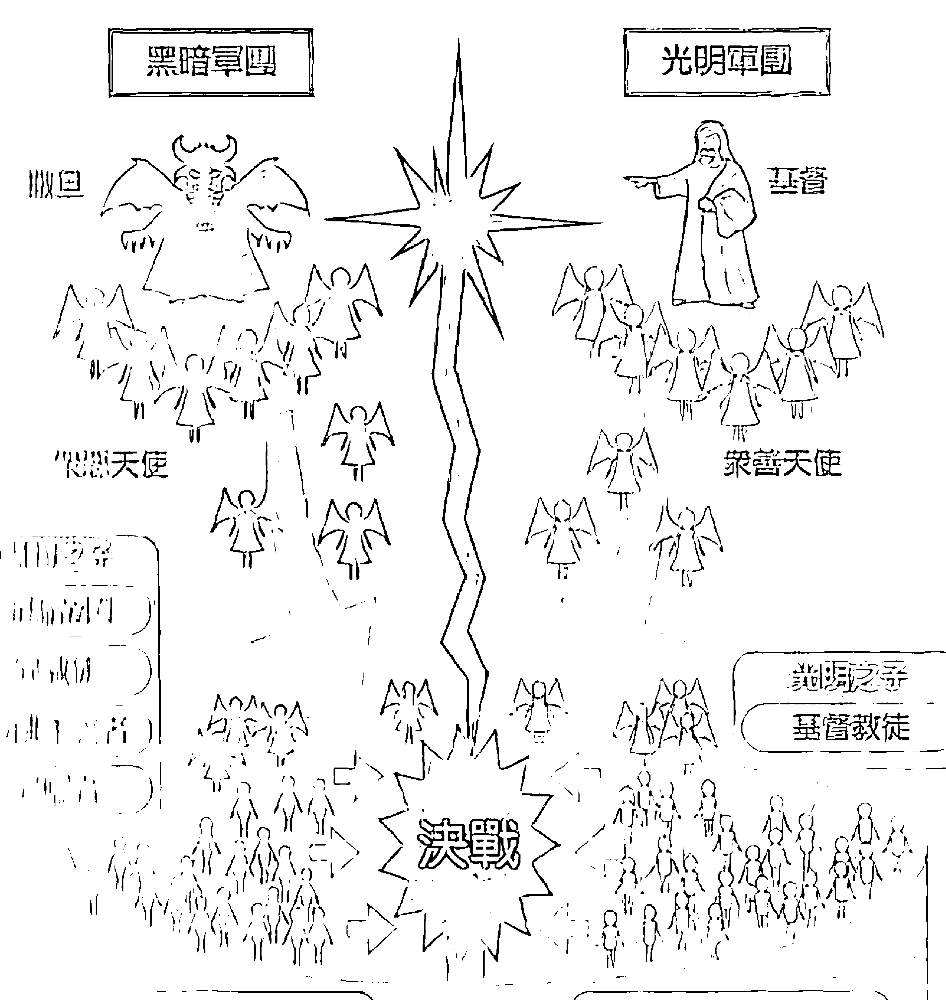

- 以暴力、威脅等方式對待基督教徒
- 不施行暴力，至死保持信仰，以精神勝利為目標
- 直到基督再度降臨，邪惡被消滅為止

## 聖查斯丁的惡魔論
Justin's demonology

撒旦注定敗北，眾惡魔卻從未放棄設法折磨人類。只要堅持信仰，就能給予惡魔重大打擊。

## ○被神創造的撒旦是低劣於神的存在

活躍於西元二世紀的聖查斯丁認爲，基督與基督教共同體勢必要對抗惡魔軍團、展開宇宙規模戰爭。對他來說，唯有神才是最純粹的靈，而天使是神的創造物，擁有微薄的軀體。眾天使居住在天國或天空中，身體是由比空氣細微的精神物質所構成，而墮落天使的身體又比善的天使更加粗雜。神令這些天使分別統治一個民族、地區或個人，也就是所謂的看守天使。

從前神創造天使，給他們選擇善惡的自由，卻有部分的天使因誤用自由意志而墮落。第一個墮落的撒旦變成蛇的模樣誘惑住在伊甸園的亞當與夏娃，讓他們犯罪。到了諾亞的時代，《以諾書》提到有群看守天使從天界墮落至人間，跟人類女性生下了許多巨人孩子，而這些孩子便是惡靈。所以惡魔共有三個種類：撒旦、墮天使和惡靈，其中撒旦是眾惡魔的首領。

眾惡魔掌握了統治世界的權力，直到後來耶穌誕生使得他們大受打擊。當世界末日來臨時，耶穌將以彌賽亞（救世主=基督）的身分再度降臨，徹底毀滅惡魔的王國，屆時眾惡魔會被打入地獄，永受烈火焚身之苦，而他們的下場恐怕就是被火焰燒成灰燼、終至消滅。儘管那最終的時刻尚未到來，但只要義人靈魂充滿天國便得以實現。

然而撒旦仍舊沒有放棄，至今仍在世界各地千方百計要妨礙基督的使命（人類得到救贖）實現。

> 士麥那 (Smyrna)：即伊士麥 (Izmir)，土耳其西部城市。

### 11. 天使、惡魔、墮天使身體的物質

- **聖查斯丁 (二世紀的神學家)**
- 善惡進行宇宙規模的鬥爭
- 唯獨神才是純粹的靈
- 每個天使和惡魔都各自統治著一個民族、地區或個人
- 直到世界末日前，地上世界都是由惡魔統治支配

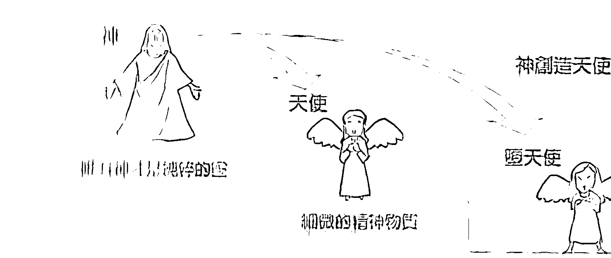

> > 從前天使吃的是天國的食物嗎哪 (Manna) ，墮落後則不得而知

### 11.2 墮天使的分類

以天使與凡間女孩的故事為前提，將惡魔分成以下三個種類，可

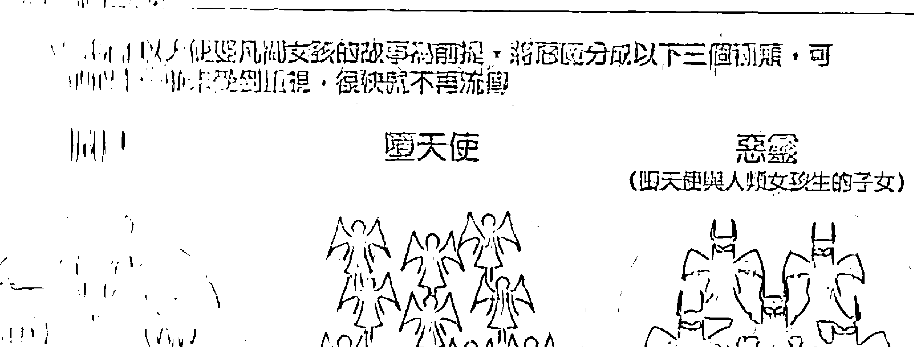

查斯丁 (100~165)，活躍於羅馬，最後殉教而死。

## 聖伊里奈烏斯的惡魔論

Irenaeus' demonology

撒旦永遠劣於神，無論他的力量變得有多麼強大，忠於信仰者都能受到神的守護。到了最後，眾惡魔就會全數落入地獄。

- **○人類乃因亞當夏娃的原罪而淪為惡魔的奴隸**

活躍於二世紀末的聖伊里奈烏斯認為惡魔是神的造物，絕對低劣於神、永遠從屬於神。撒旦的力量儘管強大，但仍然是有限的，當基督教徒祈禱、唱念基督之名的時候，撒旦就必須逃跑；只要忠於信仰，就會受到神的守護。

良善的神是宇宙的創造者。天使是神所創造的宇宙一部分，而惡魔原本也是天使，所以可以得知惡魔同樣是由良善者創造。然而，撒旦不光是嫉妒神，他還嫉妒神用自己的形象創造人類、將世界的統治權交給人類，使他失去神的眷顧而墜落天界，至於其他的墮天使則是到了諾亞的時代才被逐出天界。

被逐出天界後，撒旦在伊甸園裡利用蛇誘惑亞當與夏娃、誘使他們犯罪，這宗原罪扭曲了神依照自己模樣所創造的人類，使得他們的子孫淪為惡魔的奴隸。由於人類是出於自由意志犯下惡行，所以必須受惡魔支配統治直到罪衍還清為止。

不過，神的慈悲心卻促使祂讓兒子耶穌誕生到人類的世界。耶穌在這個世界所受的苦痛以及十字架上的受難都讓人類的罪得到了赦免。為什麼罪可以被赦免呢？聖伊里奈烏斯率先提出「耶穌=賠償說」的強烈主張，他認為惡魔最終注定失敗，人類也會得救，然而撒旦卻從未停止企圖妨礙救贖。反基督將在世界末日迫近時出現，撒旦軍團的成員都會聽其號令，可是反基督終將落敗，在世界末日來臨之際，撒旦與惡魔也落入地獄、永受烈焰焚身之苦。

### 14世紀末至15世紀的人類與惡魔的關係

#### 伊里奈烏斯 (2世紀的神學家)

- 惡魔低劣於神，從屬於神
- 撒旦的力量有限
- 基督的名能使撒旦退逃
- 信仰者都受到神的守護

- ① 亞當與夏娃 伊甸園
- ② 亞當夏娃被逐出伊甸園
- ③ 亞當、夏娃的原罪使人類成為撒旦的奴隸
- ⑤ 惡魔仍未放棄阻礙人類得到救贖，可是惡魔最後必會被消滅，撒旦和惡魔都將永遠受地獄火災所苦

奴隸狀態

14世紀末至15世紀的里昂主教 (140~202)。他徹底否定諾斯替...

## 德爾圖良的惡魔論
### Tertullian's demonology

喜好魔法與占星術，染指賈馬與閱讀戲劇等不道德且世俗的行為，就等同於自願加入惡魔的軍團。

## ○神創造宇宙，撒旦從事破壞

活躍於西元200年前後的德爾圖良認為規律的道德生活亦是對抗惡魔的一個環節，而從事不道德的世俗生活便代表加入惡魔的軍隊。

神的創造是善的，可是世間卻仍有惡存在，這都是因為撒旦、墮天使與人類的犯罪使然。

雖然神當初把天使創造成本性良善者，但還是有部分的天使因自由意志變成惡魔，向來位居天使之首的撒旦便是第一個墮落的。從此，宇宙開始有了罪與惡。

天使墮落的原因是羨慕與嫉妒。神創造天使以後，又依照自己的模樣創造了人類，這件事讓撒旦很生氣，決意背叛神。他潛入伊甸園誘騙亞當和夏娃、誘使兩人墮落，接著又把目標轉向同儕天使，讓部分天使對人類女性產生情慾，被逐出天界，而撒旦就這麼成為了墮天使的首領。後來墮天使跟人類女性產下巨人後代，這些巨人又與墮天使合稱為惡魔（Demon）。天使之所以能夠繁衍後代也有解釋，那是因為他們的身體是由細微物質所構成，可以任意變換成各種模樣。

在神的允許下，撒旦和眾惡魔住在低層的天空中危害人類，直到末日審判來臨。撒旦為害之甚在於使神創造的人類墮落，此外惡魔非但會引發自然災害，墮天使還會傳授人類女性以魔法、冶金、占星術等，並且帶來賽馬、浴場、飲食店、劇場等形形色色的娛樂，而沾染到這些世俗行為的人類，就等同於加入了撒旦的軍隊。

### 德爾圖良 (三世紀的神學家)

- 道德生活是對抗惡魔的一個環節
- 不道德的生活就等同於加入惡魔的軍隊

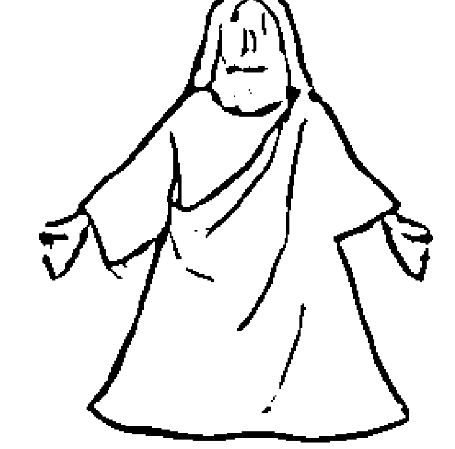

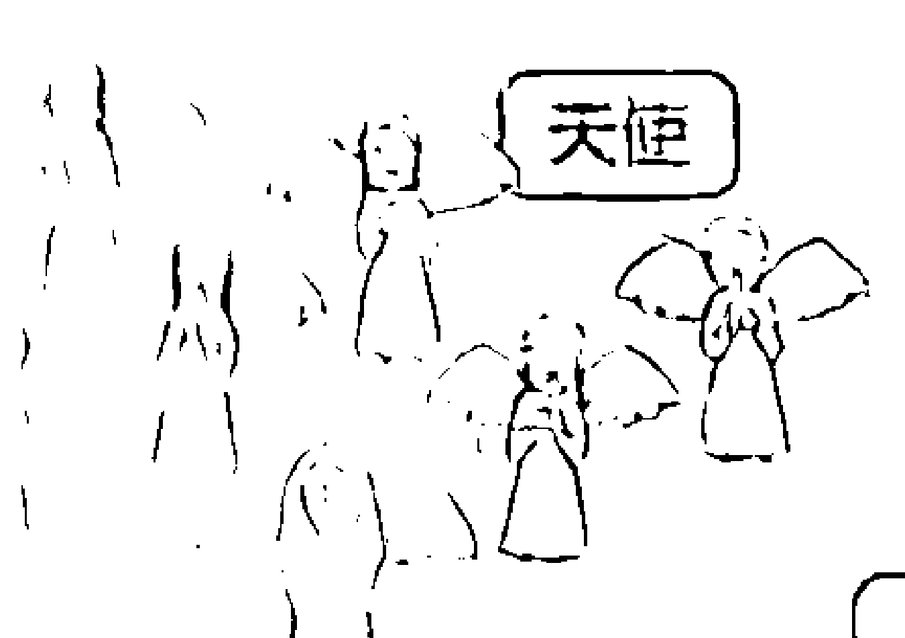

- 創造天使
- 撒旦原是天使之首
- 創造人類

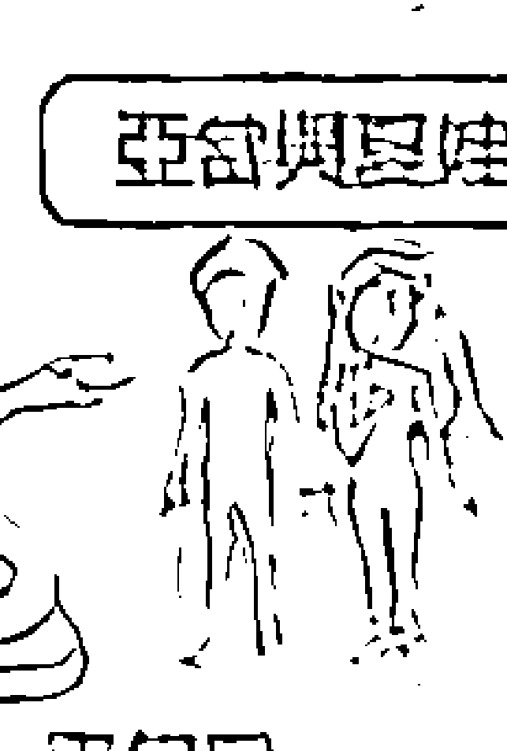

- 撒旦嫉妒人類，變身成蛇誘惑
- 亞當與夏娃墮落

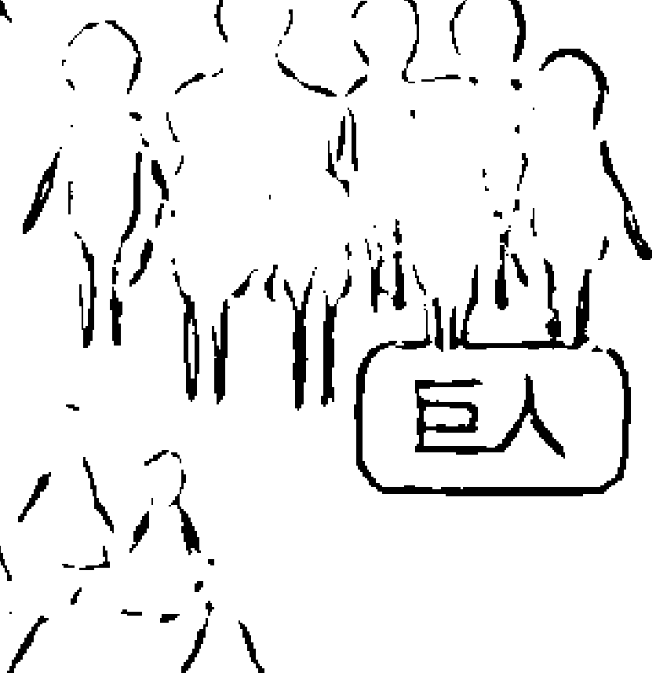

- 部分天使對人類女性產生情慾，生下巨人後代
- 沈溺於世俗娛樂、墮落的人類
- 加入撒旦的軍隊

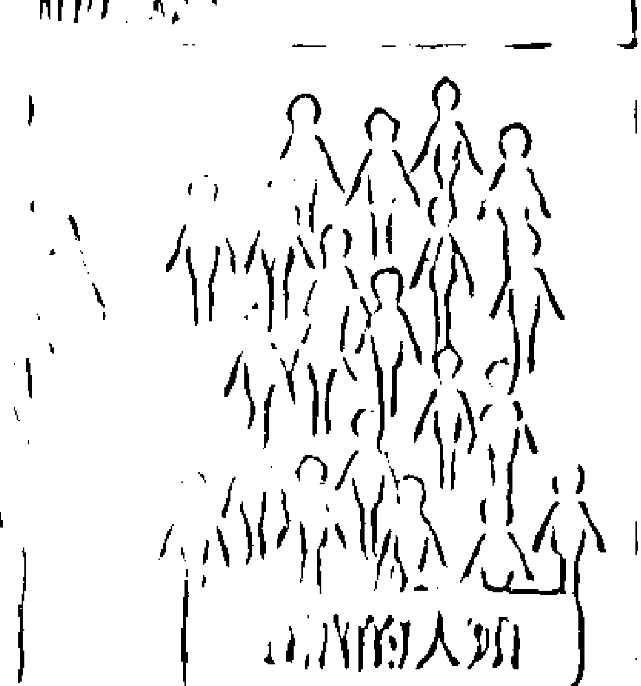

- 撒旦與惡靈不停危害人間直到
- 世界末日
- 世界末日

德爾圖良 (約160-220)，為後來聖奧古斯丁成就整合神學的偉大

## 诺斯替教的恶魔论
Gnosticism demonology

被斥為基督教異端的諾斯替教信徒認為，聖經所奉創造世界的唯一神耶和華其實是個名叫德繆哥的惡神＝惡魔。

## ○間接助長撒旦壯大的德繆哥

諾斯替教流行於西元一～三世紀前後的地中海世界，其教義中有套彷彿是故意與基督教正面衝突的惡魔論述。

諾斯替教認為由物質所構成的世界是個全惡的世界，因為世界正是惡魔創造的。不像基督教徒相信世界是良善的唯一神耶和華所創造，諾斯替教徒認為耶和華是惡魔，並且這個惡魔又另有德繆哥、雅爾達巴奧特（混沌之子）、撒卡拉斯（闇之君主）、撒末爾（盲目之神）等稱謂，其中雅爾達巴奧特是貶低耶和華的造語。傳說德繆哥共有七名、十二名，或者更多部下，這些部下全都喚作阿爾康（支配者），而當中居首的便是德繆哥。

生活於地上的人類完全受到阿爾康支配，所以剛開始都以為德繆哥是神，可是事情在基督出現後產生變化。人類發現在比德繆哥更加遙遠的另一方有個真實的善神存在，而基督便是受這位真實的神派遣而來的光、諾斯替（知識）。人類之所以發現這件事是因為人類有靈，而靈是由真神迸發的火花所構成，但這個火花卻受困於德繆哥創造的物質，亦即肉體之中。是故，人類最重要的目標就是使真神火花構成的靈從物質中解放，而獲取諾斯替（知識）乃是達到此目標的必須手段。

也正是為了打倒這個二元論述的異端學說，聖伊里奈烏斯、德爾圖良等基督教神學家將德繆哥的強大力量賦與撒旦，使得自身主張的學說也變成了二元論述。

### 1. 诺斯替教

- 諾斯替教
- 反宇宙的思想
- 與基督教敵對的惡魔論

### 1.1 反宇宙的宇宙

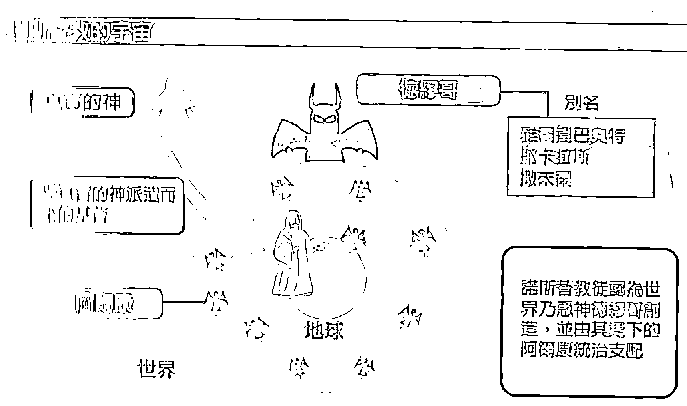

### 2. 黄道十二宫的阿图姆

根据诺斯替教经典《约翰秘传》记载，黄道十二宫的阿图姆分别如下：

- ① 阿当尼安斯
- ② 沙巴夫
- ③ 团南卡叙
- ④ 阿比里西
- ⑤ 约比图
- ⑥ 阿姆皮埃爾
- ⑦ 阿當尼
- ⑧ 貝利亞斯

### 3. 人类的本质

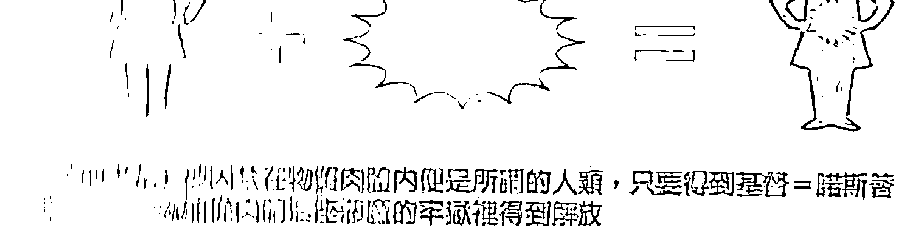

根据诺斯替教，囚禁在物质的肉体内便是所谓的人类，只要得到基督=诺斯的启示，便可以从阿图姆的牢狱中得到释放。

诺斯替教中所谓的“神”，只指为「造物主」，本无负面含意。

## 奥利金的恶魔论
Origen's demonology

从前神创造的智慧体因自由意志离神远去、向下扩散，并视其距离而分别变化成天使、人类、恶魔与撒旦。

### 撒旦亦可透过灵的提升而变成大天使

出生于亚历山卓的奥利金活跃于西元三世纪前半，他有蛮极具独创性的恶魔论。

根据他的想法，神起初创造了众多智慧体，这些智慧体都是平等且自由，而且全都选择了离开神的完全领域。神为使宇宙充满多样化的存在容许了这样的行为。

智慧体各凭自由意志往远离神的下方移动，许多仍停留在天界或空中的智慧体都变成了天使，有些则是继续往下方移动，停留在地面的成为人类，深入地底的则化身恶魔。

天界天使的身体是由天界精妙的埃忒耳所构成，其他智慧体愈是往下，身体的物质性就愈高，例如恶魔的身体就比人类更加物质。话虽如此，这变化具有延續性，攸关道德的行动非但能使大天使堕落为恶魔，也可能使恶魔变成大天使。

撒旦是最早从天界坠落的恶魔。撒旦即路西法，原是天外的最高位天使，却因傲慢而堕落。

天使与恶魔在神的许可下分别支配人间的各个民族和地区，可是恶魔却迫害基督教徒、挑起不义的战争，使人间成为天使与恶魔的战场，甚至在每个人心中也都有一对天使与恶魔，随时进行道德的交战。此外，当死后审判决定死者该前往天国或者地狱时，天使会为死者辩护，恶魔则是负责告发。

不过神是宽大而慈悲的，到最后不光只是天使和人类，就连恶魔和撒旦也同样可以获得救赎。

### 奥利金（三世纪的神学家）

- 神创造的智慧体下降变成天使、人类、恶魔
- 率先主张撒旦就是路西法
- 最后就连撒旦也将得到救赎

奥利金相信神创造的智慧体是凭着自由意志下降，然后变成天使、人类、恶魔。

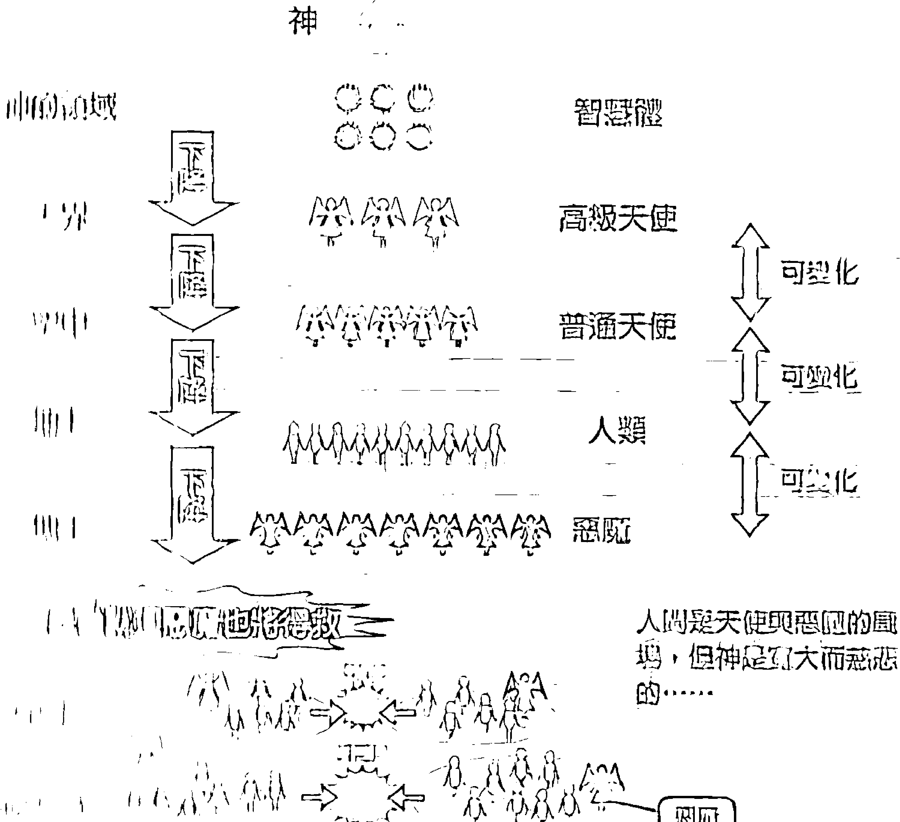

人間是天使與惡魔的戰場，但神是廣大而慈悲的……

### 最後全部得救

> 奥利金（185~251）。他是圣克莱芒的弟子，有其独特的圣经解释学，死后三百年还被逐出教会。他相信灵魂先于肉体存在，物质世界现在称为以太的物质。

## 拉克坦西的恶魔论
### Lactantius' demonology

神先是創造出基督與撒旦這兩個善惡的宇宙原理，然後也替人類創造了兩個善惡的分裂，亦即追求神明的靈魂以及屬於惡魔的身體。

## ○ 神的氣息生出基督與惡魔

約西元250年生於非洲的教父拉克坦西，他以某種相當於二元論的概念對惡魔有以下的說明。

根據他的說法，神首先是用自己的氣息創造出善與惡的原理，而這兩個原理便是基督與撒旦。爲何神要在創造善的同時創造惡呢？因爲若無惡，便不知何爲善；因爲若只有善，便失去了選擇的自由。之後神又吹氣創造出其他天使，由於同樣來自於神的氣息，基督和撒旦也算是天使的同儕，可是在順序和其他層面就比天使來得優越。

後來物質世界與人類誕生，而跟隨撒旦為惡的天使也在不久後出現，他們跟地上的人類女孩生下巨人後代，墮落成為惡天使。拉克坦西便是藉此將惡魔劃分為撒旦、墮天使兩種。而這些原是天使的叫作天之惡魔，地上誕生的巨人則叫作地之惡魔。

如同宇宙有善惡兩種原理一般，神同樣也賜給人類善惡兩種原理——靈魂與肉體。靈魂嚮往神，肉體卻屬於惡魔。因此，惡魔會利用貪婪、性慾、財富、權力、名聲等肉體的慾望誘人為惡，使人類處於通往天國與地獄兩條道路的分岐點上。

待世界終結之際基督會再度降臨，將邪惡軍團掃入地獄，解決所有問題。然而神為了考驗基督教徒的信仰，這個時刻卻遲遲不見到來。不過，惡魔畢竟是不及於神的存在，只要用基督的信仰武裝自己，那麼惡魔就無法征服人類。

### 拉克坦西 (三世纪的神学家)

- 二元论式恶魔论
- 神以气息创造善恶原理
- 基督和撒旦都是天使同僚

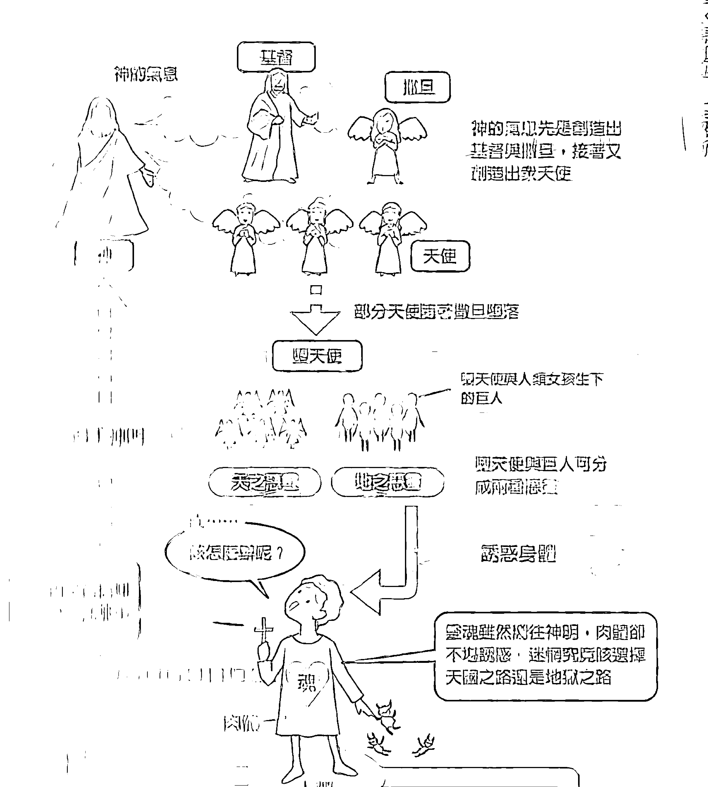

- 神的呼吸先创造出基督与撒旦，接着又创造出众天使
- 部分天使因撒旦堕落
- 堕天使与人类女孩生下的巨人
- 堕天使与巨人可分成两个集团

> 该怎么办呢？

> 灵魂虽然向往光明，肉体却不断诱惑，迷惘究竟该选择天国之路还是地狱之路

- 通往地狱之路

拉克坦西 (约250-325)，以修辞学家、古典文学大家为世所知。曾担任尼科美底亚主教，写下《神圣教规》等重要著作

## 摩尼教的恶魔论
### Manichaean demonology

主張神與惡魔是最初便已經存在的兩個原理，神魔之戰蔓延到每個人類的內部，直到世界結束為止。

## ○直到人類終結方休的善惡之爭

摩尼教乃波斯人摩尼（216～276）所創，他們憑藉徹底的善惡二元論推演出一套極獨特的救贖理論，並且對基督教的惡魔概念造成了影響。

根據摩尼教的主張，早在物質宇宙誕生以前——亦即萬物的原初，便已經有善與惡兩種原理存在。善的本質是神，他是偉大的父（Abba deRabbuta）；惡的本質是撒旦，他是黑暗之王（Mlek Heshuka）。善惡兩個原理本是獨立的存在、互不相干，直到後來善的光明進入惡的世界，使得黑暗之王對光的世界發動了攻擊。雖然偉大的父試著派出自己創造的原人反擊，但原人卻敗於黑暗之王及其麾下的惡阿爾康（惡靈），而黑暗之王便在此時吸收了原人持有的光。

其後，神派遣生命之靈前去解救光，生命之靈也成功消滅眾阿爾康，將阿爾康的遺體肢解、創造出太陽、月亮、大地、動物、植物等各種物事。換言之，生命之靈就是創造世界的德繆哥（造物主），而這一切都是出自神的計畫，因為如此一來，當世界死絕滅亡的時候，光＝靈魂便可以完全從物質解放，回歸原來的光之世界。另一方面，黑暗之王也創造出亞當與夏娃對抗，只要他們兩人的子孫繼續繁衍增加，光＝靈魂就會不斷分散下去，永遠被禁錮在肉體的囚籠之中。後來，充滿光輝的耶穌，在神的指派下變身成蛇，將智慧果實的存在告訴亞當，使其覺醒，讓這場神魔之爭延燒成人類心中的善惡鬥爭，綿延不絕。唯有當惡魔的造物——人類面臨末日的時候，這場戰事才宣告終結，靈魂也將完全回歸於光的世界。

### 摩尼教的宇宙观

#### 摩尼教

- 1. 三世纪波斯人摩尼所创立
- 2. 善恶原理早在宇宙形成以前便已存在
- 3. 善恶之争将持续直到世界终结

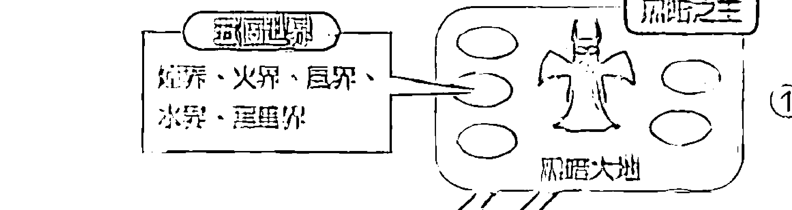

- ① 起初是黑暗之王发动攻击

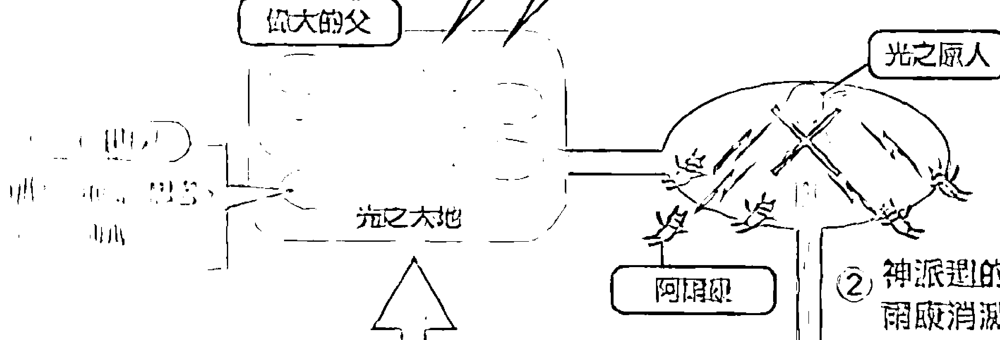

- ② 神派遣的光之原人遇阿尔康消灭，光明进入黑暗世界
- ③ 生命之灵消灭阿尔康，用其身躯创造世界
- ④ 黑暗之王创造亚当夏娃，将光（灵魂）囚于人类肉体

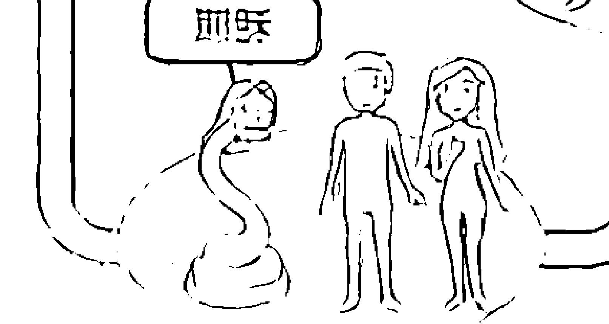

- ⑤ 光之耶稣以蛇的姿态告诉亚当夏娃果实存在

## 埃瓦格里乌斯的恶魔论
Evagrius' demonology

根据埃瓦格里乌斯的主张，人类有八种情念的思维（λογισμοι），而地狱界的恶魔也仿佛与其对应般有八个种类。

## ○成为日后「七宗罪」根据的八种情念思维

西元四世纪的教父埃瓦格里乌斯与圣安东尼（请参阅P.108）都是生活在荒野的修道士，切身感受过恶魔的存在。此外，他深受奥利金影响，认为恶魔是智性体堕落所致。

- **暴食、傲慢、色欲、贪婪、绝望、愤怒、精神怠惰和虚荣**

埃瓦格里乌斯认为，从前神创造的纯粹知性（νους）经过增殖后生出许多同等的知性，但有部分可以自由活动的知性却开始堕落，唯一没有堕落的知性便是主＝神子。每个灵的堕落程度都与他的罪相对应：由火焰构成的善天使停留在天界，而部分的灵则变成土做的人类，罪行深重的灵变成由空气构成的恶魔。愈低的灵就愈黑暗、浓密、粗大，也愈物质。纯粹知性堕落後成为具有情念的魂，支配人类的情念乃是性欲，支配恶魔的情念则是愤怒，而情念又生出八个种类的思维（λογισμοι）：暴食、傲慢、色欲、贪婪、绝望、愤怒、精神怠惰和虚荣。後来的七宗罪便是由此衍生。

恶魔依阶级组织各有其目的与个性，对应到八种情念思维也各有所长，其中最恐怖的当属精神怠惰的恶魔阿卡迪亚，亦称白昼的恶魔。恶魔是由最重、最冷、无光的空气所构成，可以幻化成任何形体模样，平时住在空中的他们凭翼而翔，只要把身体缩得极小便能与空气一同入侵人们。此外，恶魔虽然无法进入人类的灵魂，却可以从头脑下手，然後利用各自负责的情念思维陷人於罪，想尽方法让人远离神。

所以基督教徒的目的就是要不断修练禁欲，使灵魂达到名为阿帕提亚（Apatheia）的状态，免於情念思维的困扰。

·1 本部（Pontus）：古安纳托利亚东北部与黑海北部的地区。西元前四世纪末亚历山大征服此地区後建立本都王国。
·大助祭（Archdeacon）：基督教会职称。最初指主教座堂中司助祭之长；到了中世纪是主教座的重要神长；在现代天主教总则为祭司称号。

## 埃瓦格里乌斯的恶魔分类法

埃瓦格里乌斯（四世纪的神学家）

- 恶魔是真实的存在
- 恶魔是智慧体的堕落
- 共有八个种类的恶魔

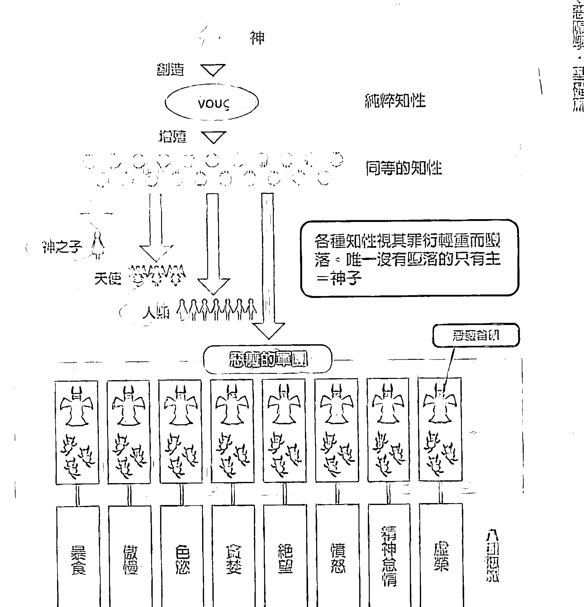

恶魔有阶级组织及层次。对应人类的八种烦恼思维可分为八类，每个军团各有其首领

## 参考资料

埃瓦格里乌斯→本都的主教之子（345～399），一度成为大助祭，后来厌倦君士坦丁堡的优渥生活，从西元383年开始到逝世为止一直生活在埃及的荒野之中。

## 聖奧古斯丁的惡魔論

### Augustine's demonology

聖奧古斯丁是西方基督教会基礎神學的建構者，他認為撒旦就是路西法，而墮天使的罪絕對無法得到寬恕

- ○本應是更優越的存在，天使的罪絕對不容寬恕

曾任北非希波主教的聖奧古斯丁（354～430）是位擁有極大影響力的神學家，他建立的神學與惡魔論乃是後世西方教會（天主教會與新教會）的基礎。

根據聖奧古斯丁的說法，神最早創造的是天使，由於他們被造成自由的存在，故能立即做出道德的選擇。許多天使選擇敬愛神，可是最高位的天使路西法卻不這麼做，而是因為驕傲選擇愛自己而非愛神，造成路西法墮落天界、成為撒旦（魔王），而跟隨路西法的墮天使也變成了惡魔。墮天使在天國裡的階級愈高，就會落入愈深的地獄，所以撒旦也就降到了宇宙的最深處。

後來，撒旦對在樂園裡面過著幸福生活的亞當、夏娃感到嫉妒，遂誘惑兩人墮落。然而撒旦自始至終沒有強迫、只是誘惑，所以人類同樣也是憑著自由意志選擇了墮落。自從亞當犯罪以後，惡魔就得到染指人類的權力，而神也允許這樣的行為。因為唯有體驗過罪惡，人類的靈魂方能追求良善。

儘管惡魔和人類都犯了罪，卻有輕重之別。人類本來就孱弱而無知，而且還是受惡魔的誘惑才致墮落，所以值得同情，仍然可以透過基督得到救贖。可是惡魔並非如此。惡魔本是天使，是擁有許多智慧與知識的優越存在，因此他們犯下的罪行斷不可恕。如同不會再有良善天使變成惡魔一般，惡魔也無法變回天使，待世界終末來臨，所有墮天使都將被囚禁於地獄，永遠得不到救贖。

## 聖奧古斯丁

- 影響力最大的神學家
- 北非希波主教
- 惡魔的罪永不得恕

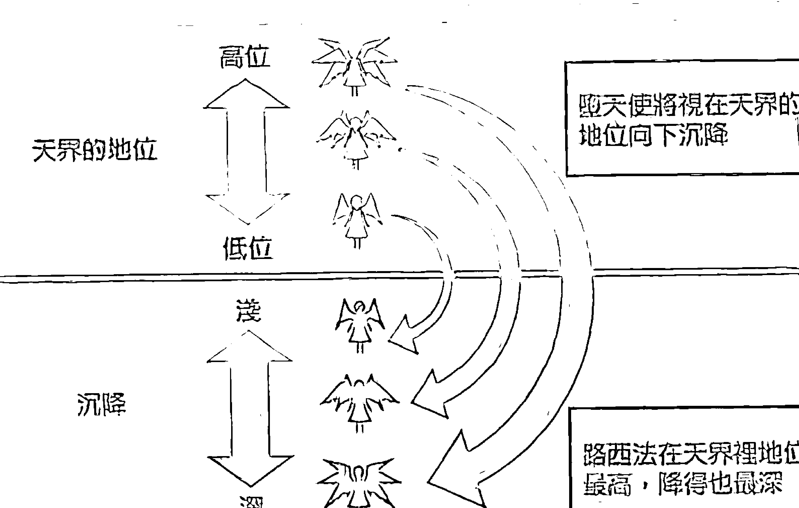

墮天使將視在天界的地位向下沉降

路西法在天界裡地位最高，降得也最深

## 人類

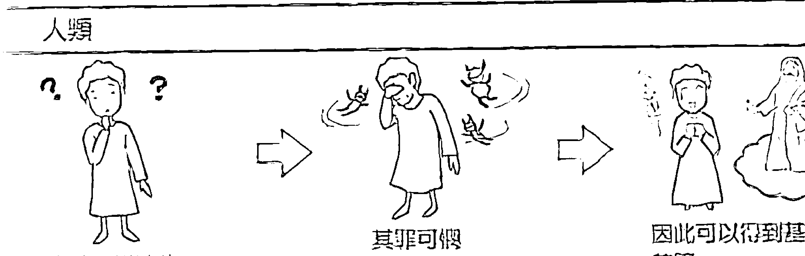

## 惡魔

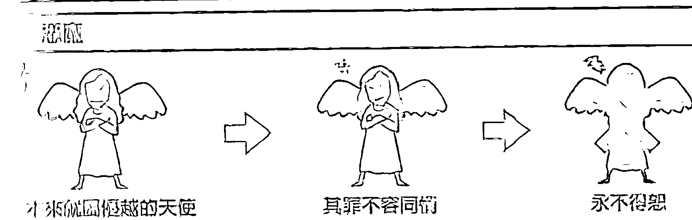

## 偽丹尼斯的惡魔論

Pseudo-Dionysius' demonology

宇宙乃是從距離神最接近的實體延伸到距離神最遙遠實體的階級構造，其中撒旦位於距離神最遙遠、最接近虛空的地方、

### ○位於距離神最遠、最接近虛空處的撒旦

偽丹尼斯是西元500年前後的敘利亞修道僧，以對後世惡魔學造成莫大影響的天使階級論述而聞名於世。

根據他的說法，神是完全超越人類理性的存在，其本質固然是隱而不宣，然而神的行為與顯現卻是以宇宙的形式呈現，即便人類亦可有部分的認識。

神從無生出宇宙，而宇宙是從最接近神的實體擴展直到最遙遠的實體，在這個階級構造當中，擁有知性者將朝著與神合一的目標上升。彷彿是要對應三位一體的聖父、聖子、聖靈，眾家天使亦可分成三個階級，而每個階級又可細分成三個階段，即上級三天使（熾天使、智天使、座天使），中級三天使（主天使、力天使、能天使），下級三天使（權天使、大天使、天使），共九個階級。神的光明將會按照上級天使、中級天使、下級天使、人類的順序傳遞。

偽丹尼斯認為會跟人類溝通的屬於下級天使，所以惡魔應該同樣屬於下級天使，但是許多神學家相信撒旦原是最高的天使，於是偽丹尼斯遂根據天使的階級判定路西法屬於熾天使。除此之外，後世眾多惡魔學家亦將這套天使階級應用於惡魔界。

偽丹尼斯認為所謂的惡其實是善的缺乏或不存在。既然凡是神的造物，惡魔的本質便是善、便是實際存在，可是惡魔卻將自由意志運用於利己的欲望，利己欲望愈高的惡魔就愈遠離實際存在、愈接近不存在。是故，所有的實際存在當中就屬撒旦離神最遙遠，位於最接近空虛的地方。

## 丟尼修斯提出的天使位階

偽丹尼斯

西元500年前後的敘利亞修道僧
首次論及天使位階
認為惡是來自於善的缺乏或不存在

| 位階 | 位階名 | 英文名 |
| :--- | :--- | :--- |
| 上三階 | 炽天使 | Seraphim |
| | 智天使 | Cherbim |
| | 座天使 | Ofanim |
| 中三階 | 主天使 | Dominions |
| | 力天使 | Virtues |
| | 能天使 | Powers |
| 下三階 | 權天使 | Principalities |
| | 大天使 | Archangels |
| | 天使 | Angels |

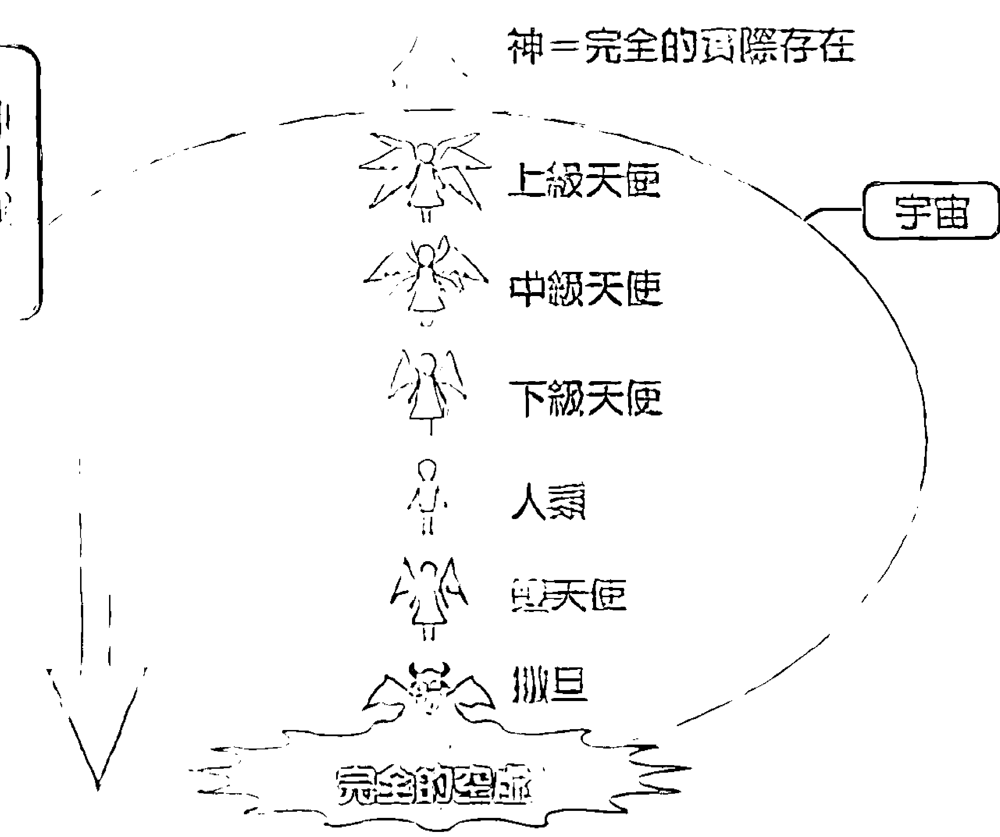

註：以上內容出自《天階序論》當中的丟尼修（丹尼斯）自稱著作，直到文藝復興時期才被考證出是偽作。

## (No-0837)

## 鲍格米勒派的恶魔论

Bogomil demonology

宇宙乃真神之子撒达奈耶背叛神所创造，后来他在败给弟弟基督后终于变成了丑陋的撒旦

### ○ 丧失神性的撒达奈耶蜕变为撒旦

十世纪兴起於保加利亚的鲍格米勒派是基督教的异端教派，其二元论恶魔论述深受诺斯替教与摩尼教影响。鲍格米勒派底下存在各种分支，其中某分支主张真神有个儿子名叫撒达奈耶。撒达奈耶原本被创造为善的存在，负责辅佐神，可是他却心生不满、意欲自己做神，还说服三分之一的天使加入自己。撒达奈耶跟同伴被逐出了天界后仍不放弃，决定成为「第二个神」，并且创造了物质宇宙，却在用泥土和水创造人类的时候失败了，不得已只能以共同统治支配人类为条件请求神的协助，由神负责创造灵魂、撒达奈耶造肉体，最後创造出亚当与夏娃。后来撒达奈耶诱惑夏娃、变成蛇的模様与其交合，让夏娃生下该隐，而该隐又杀死了由亚当和夏娃所生下的亚伯，世上从此便有了杀人的罪。撒达奈耶为强化对人类的支配，将律法赐给摩西，还通过感应让人类写下《旧约圣经》。换句话说，《旧约圣经》所讲述的唯一神其实就是撒达奈耶。不过为惩罚撒达奈耶诱惑夏娃，真神夺去他的创造之力将其变成丑陋的模様，自此之后神与撒达奈耶逐展开了宇宙统治权的激烈斗争。

在五千五百年后，神决意拯救人类而生下圣子基督，因此基督应该算是撒达奈耶的弟弟。基督为告知人类的真正身分而降生於世，击败了撒达奈耶，使得他再度被抛入天际。撒达奈耶就是在那个时候失去了名字中意味著神的「el」，终于变成了撒旦。

## 鮑格米勒派的誕生

## 鮑格米勒派

- 流行於十二世紀的基督教異端教派
- 撒旦與神共同創造人類
- 撒旦與基督是兄弟

- 1. 撒達奈耶本是輔佐神的助手
- 2. 想要自己當神，跟同伴天使被逐出天界
- 3. 撒達奈耶創造第二世界，並得真神協助創造了人類
- 4. 五千五百年後，受神派遣的基督誕生於第二世界，打敗撒達奈耶
- 5. 撒達奈耶被逐出第二個天界，變成醜陋的撒旦

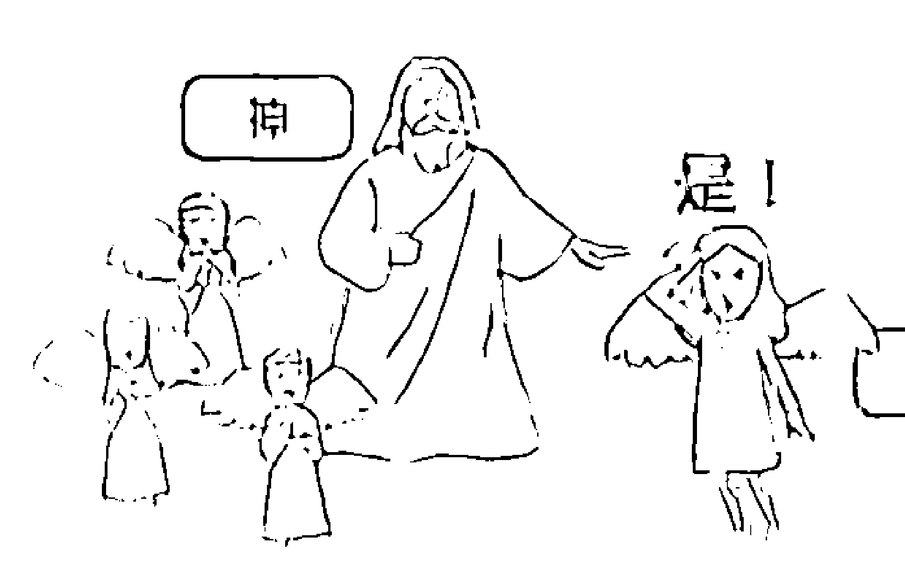

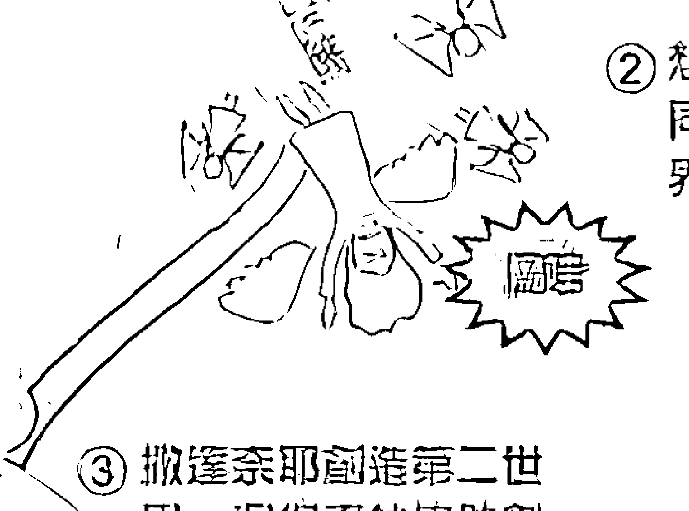

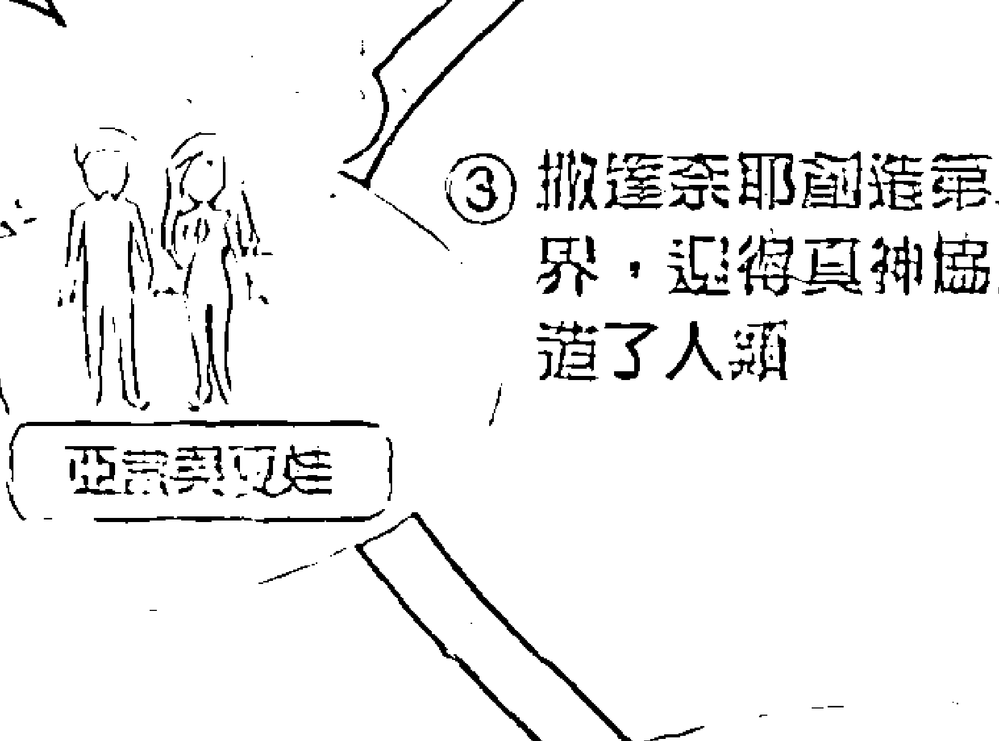

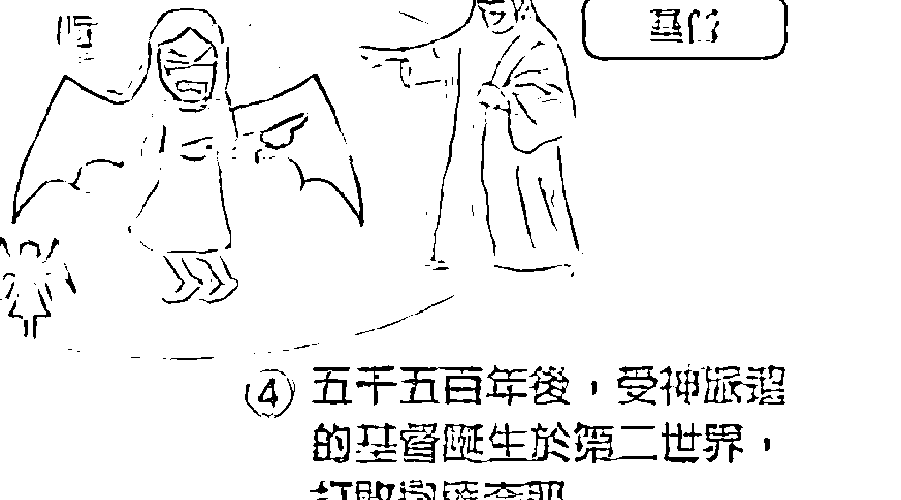

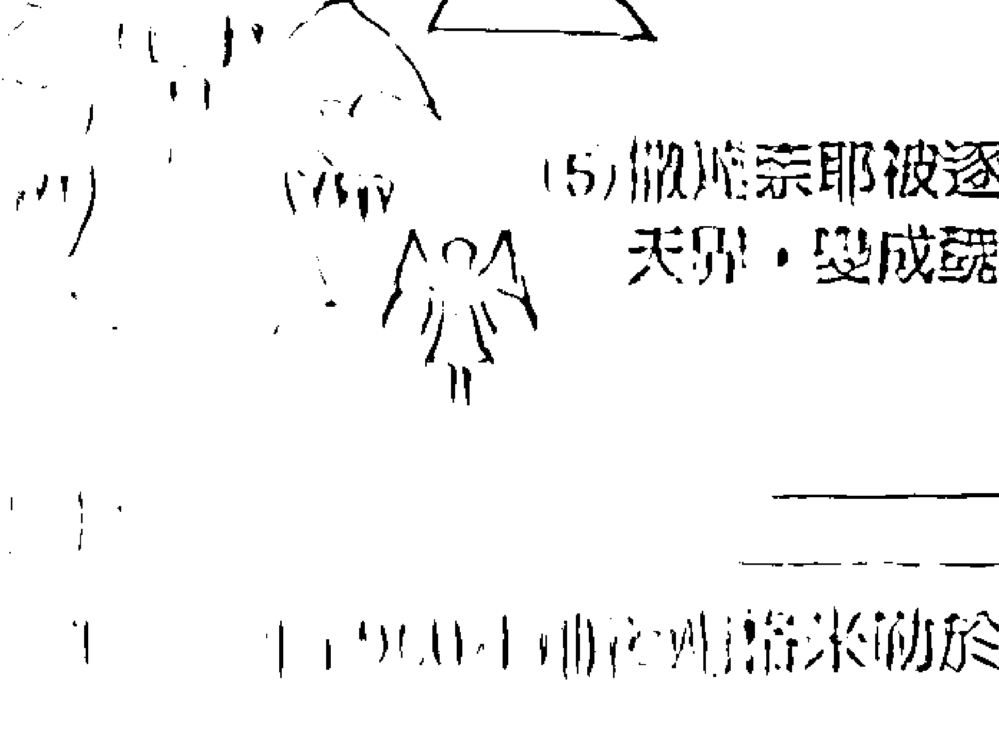

鮑格米勒派是由鮑格米勒於保加利亞創立的教派，亦曾在十二世紀

# No.038

## 清洁派的恶魔论

Cathari demonology

天使的神祇囚禁于肉体的牢笼中，此即人类存在之秘密，而这些全都得归因于邪恶原理——撒旦的阴谋所致。

### ○撒旦将天使灵魂囚禁于黏土内创造人类
自十二世纪中叶开始，盛行于南欧地区的清洁派试图以二元论述说明神与恶魔的关系。清洁派所主张的二元论有的极端、有的温和，此处挑选较极端的二元恶魔论加以介绍。

清洁派认为善的原理＝真神和恶的原理＝恶神原本就是各自独立存在的，撒旦若非是那位恶神，就是恶神之子。从前撒旦对善的世界发动攻击时，曾大胆进入善的世界，引诱众天使：跟我一起来到地上，我将给你财富、给你妻子。当时有许多天使听从其劝说离开了天界，而撒旦就在远离天界的地方创造物质宇宙，并用土捏成人形、将天使的魂囚禁其中。这里要注意的是，天使离开时把灵和衣服留在了天界，只有带着魂离开。

因此，人类其实是恶魔创造的物质与天使魂的混合物，并且是为了将天使的魂囚禁于肉体牢笼而存在，而这个世界犹如地狱。
神为拯救天使于苦难，派遣一名天使担任救赎者来到世间，这位天使正是基督，其使命就是要让人类想起自己的根源，教导人类如何跟留在天界的灵合而为一，所以基督才带着福音书前来。基于以上所述，清洁派认为基督其实是灵，而他受难于十字架并非现实。此外，清洁派还认为《旧约圣经》属于邪恶，唯有《新约圣经》才是正典。他们相信完成戒律的悔改者便能与天上的灵结合、获得救赎，否则就要在死後进入另一个肉体，不断重复转生的过程。

## 何謂清潔派？

- 十二世紀流行的基督教異端教派
- 主張二元論的惡魔論
- 人類=肉體牢籠+天使的魂

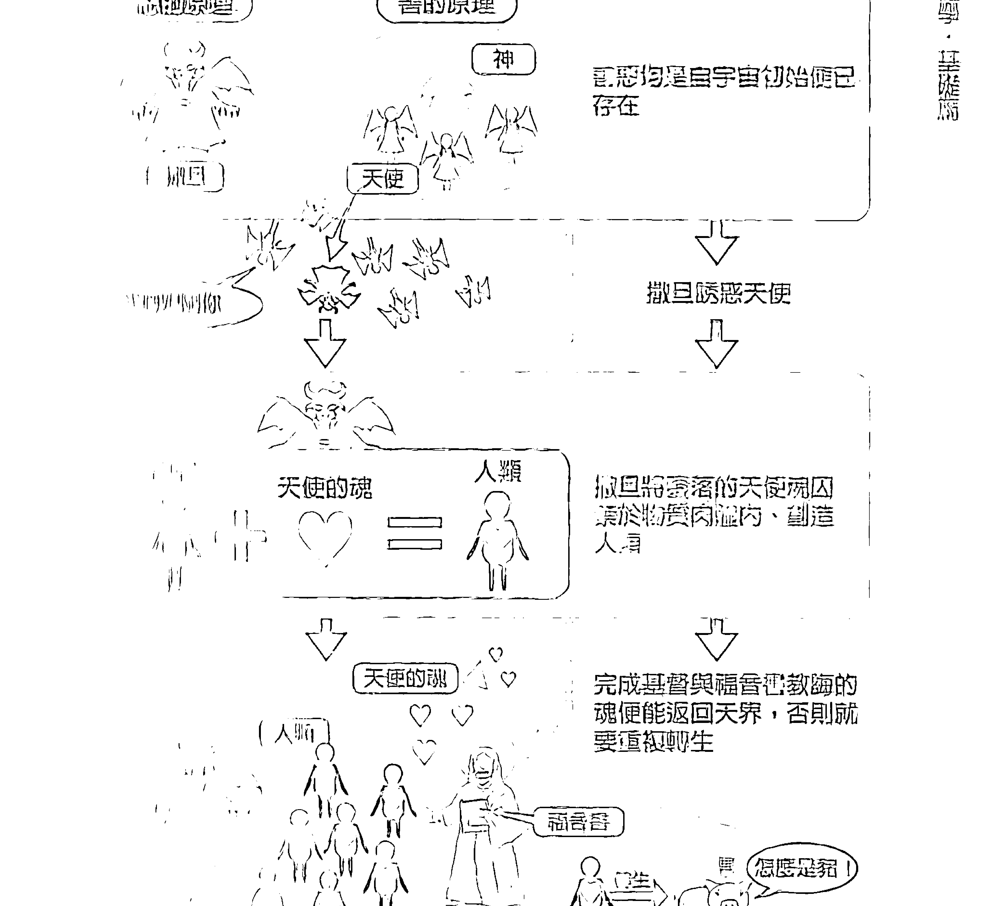

善惡均是自宇宙初始便已存在

撒旦誘惑天使

撒旦將墮落的天使囚禁於物質肉體內，創造人類

完成基督與福音書教誨的魂便能返回天界，否則就要輪迴轉生

清潔派是基督教的異端教派，興起於十一世紀，十二世紀中葉盛行，後因十字軍迫害，滅絕於十四世紀中葉。

# No.039

## 伊斯蘭教的惡魔論

Islamic demonology

伊斯蘭教的惡魔雖然與猶太教、基督教的惡魔有密切關係，其惡魔易卜劣廝卻是完全依存於全知全能的神阿拉。

### ○遠不及神明的孱弱惡魔易卜劣廝

興起於七世紀的伊斯蘭教跟猶太教、基督教有密切的關係，在惡魔論上亦是如此，可是伊斯蘭教又有其獨特的色彩。
伊斯蘭教的神阿拉跟猶太教、基督教的唯一神雖然都是同一位，可是伊斯蘭教對唯一神是全知全能這件事卻絲毫不曾妥協。因此儘管伊斯蘭教也有惡魔的概念，可是惡魔卻是完全依存於神的存在。

伊斯蘭教的撒旦叫作易卜劣廝，別名囉依陀乃，有時亦稱麗弗雷或盧拉彼德。他能夠變換成任何模樣，身邊還有哈啦特與馬魯特等墮天使或邪惡鎮尼（妖靈）跟隨簇擁。易卜劣廝跟撒旦一樣原本都是天使（亦有一說原為鎮尼），但神用黏土創造了亞當，並且命令眾天使在他的面前伏拜，遭到易卜劣廝拒絕。他說自己是火精靈，不能向黏土捏成的卑劣人類伏拜，因此被逐出天界，受到神的詛咒。當時易卜劣廝曾經向神懇求，將對自己的詛咒延後至世界的最終日，同時獲得了神的允許可以誘惑、誤導人類。

然而易卜劣廝卻有別於基督教的撒旦，無法成為神的對敵。易卜劣廝雖然能夠施行誘惑，卻無法強迫人類，而且易卜劣廝在敬愛神的人面前完全沒有力量，所以人類也不能以他們為犯罪的藉口。人類之所以會犯罪是因為自己聽信易卜劣廝的誘惑，責任終究還是要歸於人類本身。

## 110 伊斯蘭教與惡魔的問題

**伊斯蘭教**
- 七世紀穆罕默德創立的宗教
- 與猶太、基督教有密切關係

## 阿拉 vs. 惡魔易卜劣斯

唯一神阿拉是完全的全知全能，而惡魔易卜劣斯完全依存於神

易卜劣斯雖然能施行誘惑卻無法強制人類，在敬愛神的人面前完全無力

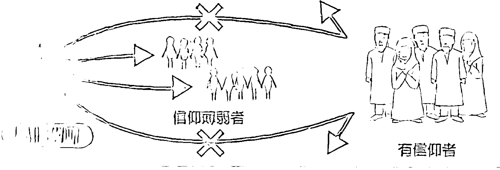

## 伊斯蘭教的墮天使

……傲慢自負的易卜劣斯在真神阿拉面前簡直無力，可以說伊斯蘭教並不重視惡魔的概念。不但惡魔與不淨淨，就連惡魔的名字也很少提及。即便如此，伊斯蘭教還是有哈舍特……傳說這兩位墮天使跟基督教的墮天使同樣……後來擔任起地獄的看守官、看守者，負責對罪人……由於他們執行職務相當認真，因此很難將其……他們雖然並非天使，卻也以惡魔一般……後可作妖魔、精怪等譯，是指在創造亞當……的火焰所創造，平時用肉眼看不到的居民。他們既……他們也可以變成其他個體。一千零一夜故事……就是其中一種。鎮尼有分善良與邪惡，其中……的居民。

> 《舊約聖經》、《新約聖經》與伊斯蘭教正典……的伊斯蘭教觀點，位於第七層天。不過，正如同《新約》否定……《舊約》的敘述，《古蘭經》也否定（可蘭經）的否定，認舊唯有《可蘭經》才是……

## 耶穌=贖金理論

根據基督教的傳統思考，撒旦之所以獲得世界的統治權，是因為亞當、夏娃犯下偷吃伊甸園智慧果實的原罪，而神將人類許給撒旦做奴隸作為懲罰。

可是後來神因慈悲心派耶穌誕生於人間，當耶穌被釘上十字架受難，人類的罪也就得到了赦免。此後，撒旦失去以人類為奴隸的正當權利，人類也成為了自由之身，有機會得到救贖。儘管撒旦仍千方百計阻撓，但這些努力終究都是白忙的。

話說回來，神為什麼要做這麼麻煩的事情呢？其次，耶穌的犧牲為何可能使人類得到赦免呢？

聖伊里奈烏斯主張的「耶穌=賠償說」，也就是「贖金理論」，對於這些疑問提出了說明。

根據這個理論，神雖然一度承認撒旦以人類為奴的權利，但為了實現祂的計畫必須使人類自由。神之所以為神，自然能夠以絕對的力量從撒旦手中奪回人類，但是這樣的做法並不適合代表正義的神，於是心生一計，派自己的兒子耶穌基督降生人間，允許撒旦殺死耶穌作為解放人類的贖金。撒旦知道耶穌是最偉大的人類，而且亞當擁有以自己的王國，於是便同意了這個交易，不料最後卻以失敗收場。原來耶穌雖然身為人類，內部卻具備神性，也就是絕無任何的罪，而惡魔並無權利將無罪者據為己有。此後，惡魔喪失了神賜與的權利，既無法以人類為奴，也無法控制耶穌。聖伊里奈烏斯認為基督的犧牲使惡魔失去力量，使人類從永恆的懲罰中獲得解脫、獲得自由。

不過這個理論有個缺點：倘若事情真是如此，撒旦不就成為足以向神索取贖金的巨大力量了嗎？教會曾為此傷透了腦筋。不過，聖伊里奈烏斯的這個理論後來非但受到聖奧古斯丁承認，甚至到了四世紀尼斯的聖格列高利也繼承此一說法，讓所有的基督教徒奉行長達將近千年之久。

> 尼斯的聖格列高利（Gregory of Nyssa, 335～395？）：早期基督教神學家、神秘主義者。他與其利企哲認為人的物質性是人類墮落的結果，對基督教思想的主要貢獻是將希臘文化及基督教信仰融合起來。

# 第3章

## 数学·推理篇

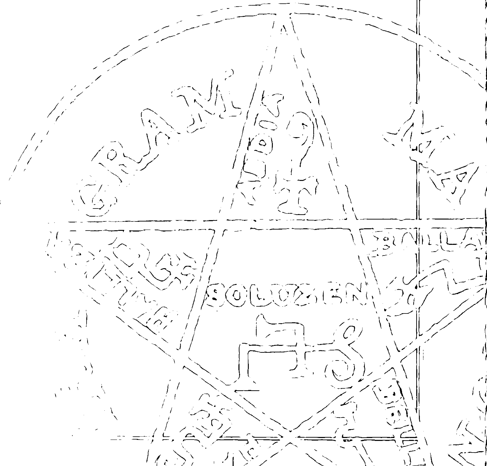

# No.(0410)

## 惡魔學的多樣化

## Rich growth of demonology

進入中世以後，除古代傳承下來的聖經與神學惡魔論外，惡魔學又增添了民間傳說、異教神話、文學藝術等各種要素，變得極為多樣。

### ○因教會、知識份子、民眾成就的多樣惡魔形象

中世以後基督教會開始對一般民眾施以教化，同時也使惡魔逐漸在民眾的世界裡傳播開來。基督教會灌輸給民眾的惡魔形象，除了聖經和神學家的著作以外，還有個很重要的來源，那便是修道士眼中的惡魔形象。所謂修道士指的是遠離塵世、過著孤獨信仰生活的人。在極度禁慾之下，修道士經常受到強烈的妄想所擾，甚至光憑著這種妄想便能形塑出具體得近乎可怕的惡魔形象，其中當屬四世紀聖亞大納西所著《聖安東尼傳》裡的惡魔最為有名，後來這種惡魔形象也傳播到了民間。

然而，惡魔在中世開始的前幾個世紀並不單單是恐怖。一般民众將基督教會所講述的惡魔形象任意與古代流傳下來的傳說、民間故事裡的異教諸神，甚至與妖精的形象進行混合，結果出現了以狡智欺人的滑稽惡魔。

到了十一世紀教育變得較為普及，知識份子漸漸增加，文學和繪畫也為惡魔增添新的形象。與此同時，堪稱基督教世界的大學的經院哲學也已獲得確立，他們透過理論的、希臘哲學式的觀察，使惡魔論產生了變化。等來到中世末期，惡魔形象又有更劇烈的變化，這個時代異端與鼠疫盛行，使得歐洲人對惡魔更加畏懼，包括路西法在內的許多惡魔被描繪成特別恐怖的巨大怪物模樣。此外，人類對惡魔的恐懼也是促成惡魔學成為一門獨立學問的重要因素。

中世紀以後，惡魔學將各階層的份子牽在一起，有了多樣的發展，進而豐富了惡魔的世界。

> 托馬斯·阿奎那 (Thomas Aquinas，約1225~1274)：中世紀基督教經院哲學家。使用哲學方法論證神學命題。認為真理首先在理知中，而後才在事物。

中世以後陸續有新要素加入，使得惡魔學更加多樣化

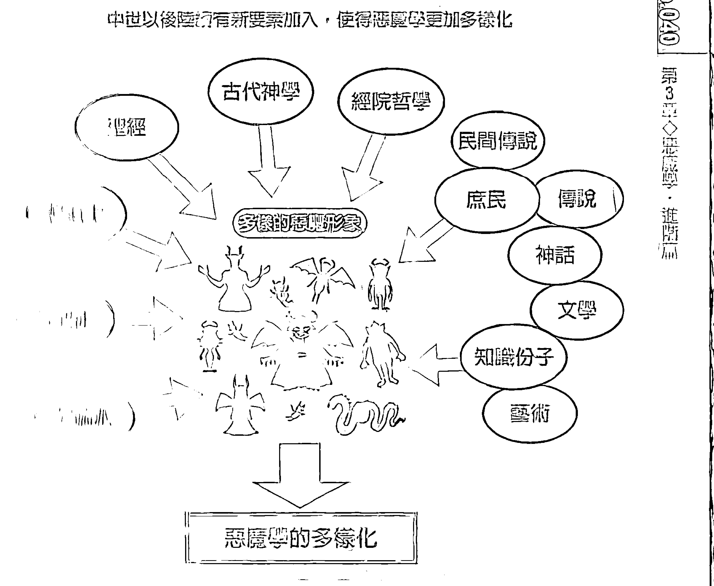

## 小標題：期惡魔

不斷在思索惡魔是何時墮落的、惡魔為何無...（文本内容，此处为示例，实际应根据图片提取完整文本）。

# No.041
惡魔長得什麼模様？
Appearance of demons

據說惡魔能變換成任何模様，但惡魔通常不是被描述成蛇、山羊、狗等動物，就是類似希臘神潘的模様，有一定的傾向。

### ○動物、毛茸茸的牧神潘、美麗的天使

惡魔雖然能夠變身成任何模様，卻也有偏好的扮相。自古以來，惡魔就一直很喜歡變作動物的樣子。根據四世紀的《聖安東尼傳》（請參照P.108）記載，惡魔經常以獅、熊、豹、公牛、蛇、蟻、狼等外型出現，有時還會變身成黑人的模様，而在埃及一帶，也有類似埃及神明朱鷺頭人身、鱷頭人身、人頭人身等擁有動物頭顱的惡魔，或者五世紀《巴托洛米奧福音書》裡的惡魔則是巨人。惡魔無法徹底模仿人類的容貌，在他們改變不了的地方會長出另一張臉，所以有些惡魔才在臀部、膝蓋等處多一張臉。

九世紀以後人們開始描繪惡魔，其中經常可以看見全身毛茸茸、頭頂山羊角、四肢成蹄或成爪、尖耳、長著尾巴的惡魔。一般認為這些特徵大多是來自於希臘神話裡半人半山羊的神祇——潘。潘是森林之神，是混沌生命力的象徵，很適合作為與基督教秩序敵對的惡魔。撒旦往往會被描繪成比普通惡魔更巨大、更接近野獸的黑猩猩，而眾惡魔則是裸體（大多圍上腰布），至於那些有翼的惡魔，他們的雙翼在十四世紀以前都是天使的翅膀，直到十四世紀以後才變成蝙蝠的翅膀。此外，惡魔一開始的武器是三叉戟，後來換成了鐵鉤，方便在地獄裡拖行罪人。儘管惡魔的外形醜陋，但其實他們在當天使時期很美麗，直到被逐出天界才變得醜惡。不過自十六世紀起，有將惡魔畫得比較接近人類的傾向，十七世紀甚至出現美如天使的惡魔出現。

## 惡魔的模樣

惡魔能變成任何模樣，但惡魔的模樣還是有一定的傾向。

### 惡魔經常變作動物的模樣

惡魔自古就經常變成蛇、山羊、狗、狼、豹、熊、馬等動物的模樣。

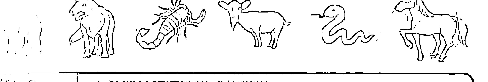

### 由希臘神祇演變成的模樣

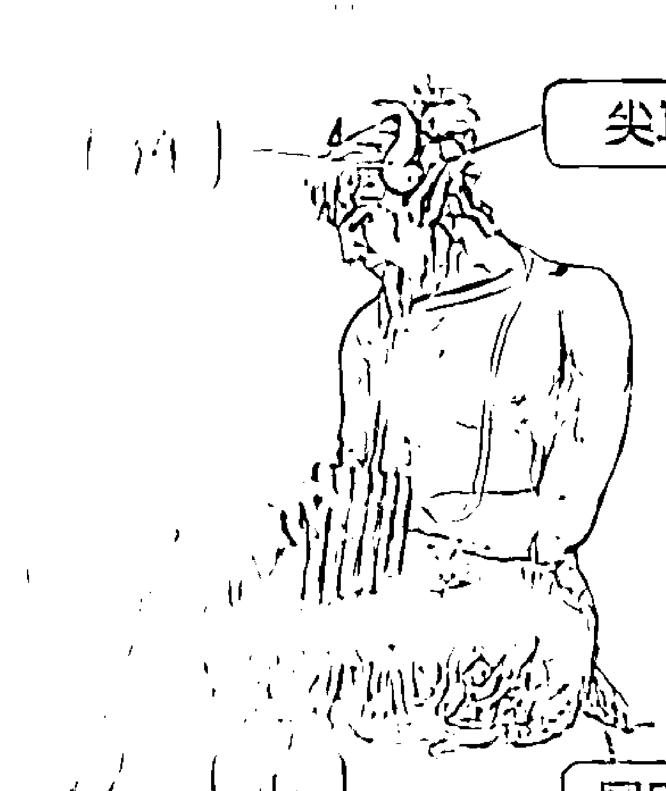

### 十三世紀手抄本所刻的惡魔

雖然四肢是鉤爪而非兩足，仍然保留許多來自潘的特徵。

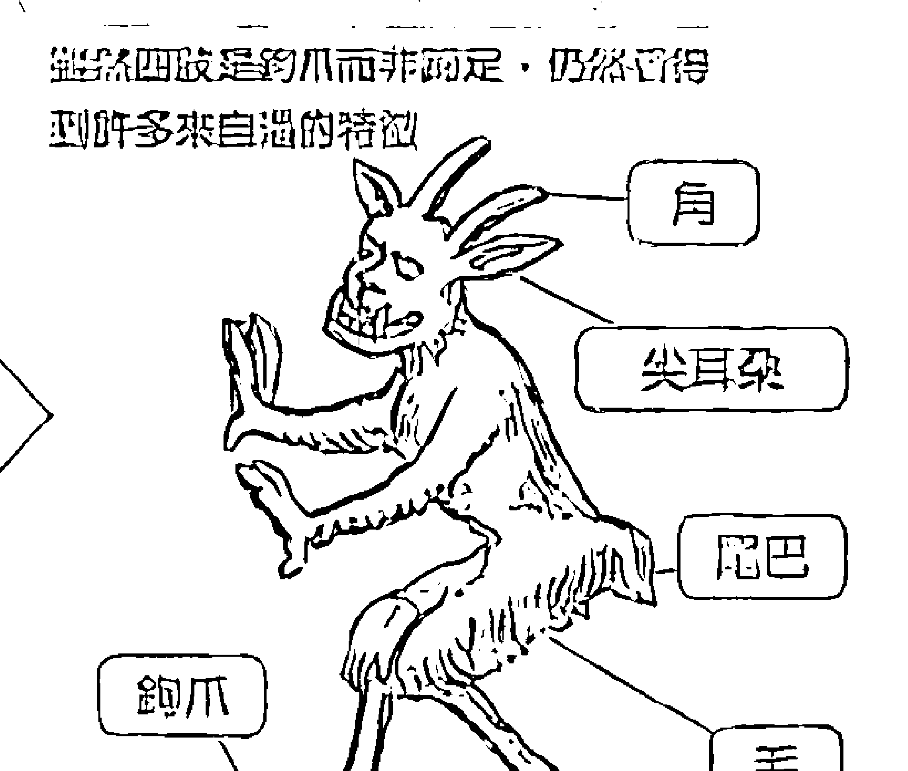

### 惡魔、第二張臉、變的

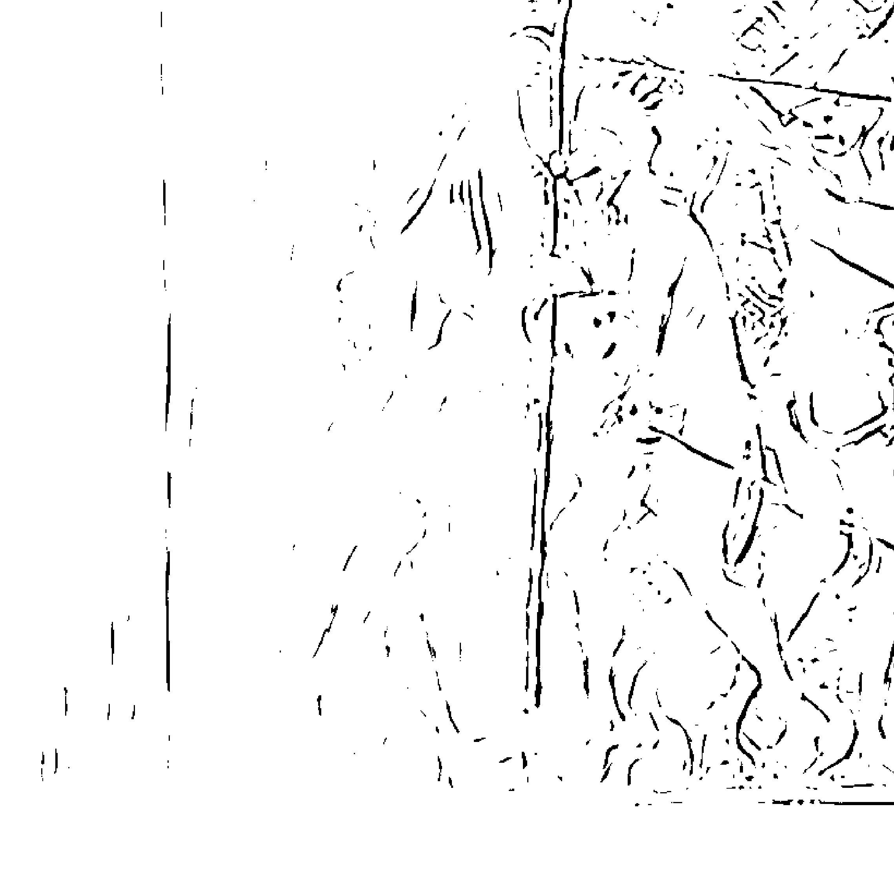

惡魔也是惡魔的代表物之一。十四世紀開始出現有雙臉的惡魔，有時會在身體某處冒出另一張臉。

## 惡魔住在哪裡？

儘管被囚禁在地獄裡接受懲罰，惡魔卻也是地獄的看守者，而且還能任意離開、在天空中閒晃，任何場所都可以是惡魔的住處。

- ○ 身為地獄囚徒的同時卻也是自由之身

惡魔住在哪裡？這個問題的答案從以前就模糊而曖昧。中世的基督教神學家紛紛尋求過解答，卻始終沒能找到一個令人滿意的答案。

在聖經和啟示錄文學中，惡魔確實是被逐出天界了，可是惡魔是被打落空中，還是被打到了地底的地獄呢？如果是地獄的話，那惡魔是如何離開地獄、加害人類的呢？有人認為惡魔要等到世界末日才會落入地獄，在那之前他們仍然是自由身，至今還在天空中遊走。被拋落天界的惡魔雖然失去從前的勢力，可是還沒有被打倒，暫時還能夠繼續危害人間。

不過，約莫從三世紀開始，基督教認為人類會在死後立即前往天國或地獄，而地獄是惡魔對罪人施以刑罰的場所，因為當時很難將在地獄受到的苦難歸因於神。只是這麼一來又遇到另一個難題：惡魔究竟是地獄裡面受苦的囚徒，還是擔任地獄看守者的角色？

這問題始終沒能得到一個確切的答案，所以下列說法都可以說是正確解答。惡魔在被禁錮於地獄受苦的同時，也擔任折磨罪人的工作，而且還能任意離開地獄、遊走於天空之中。此外，他們還要阻擋人類的靈魂，在地上加害人類。也有人認為尚未接受洗禮的人類身體是惡魔的住處，或者惡魔雖然不住在人類心裡，卻可以住在人類的身體。由此可知惡魔可以存在於任何地方。

## 恶魔的住處

惡魔住在哪里？ ⇒ 除天國以外的任何地方

### 01 地獄

路西法及其追隨者在地獄接受懲罰，同時也擔任看守者負責折磨罪人。

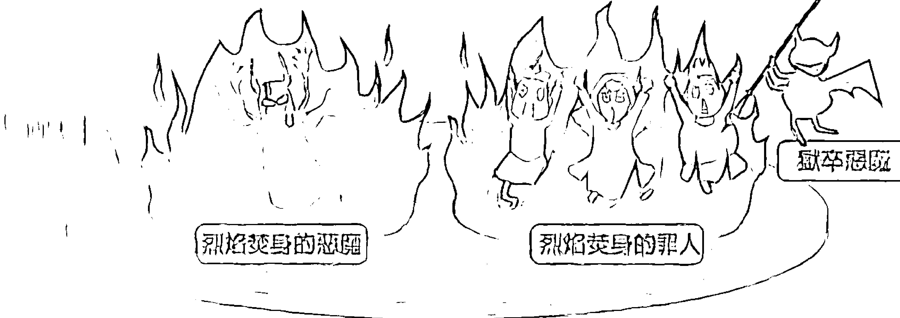

### 02 空中

部分惡魔離開地獄，四處遊走於空中、加害於人類。

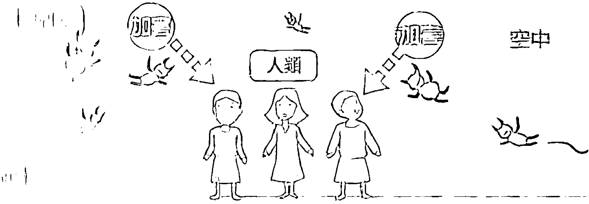

### 03 人類的身體

據說惡魔可以住進人類的身體裡面。

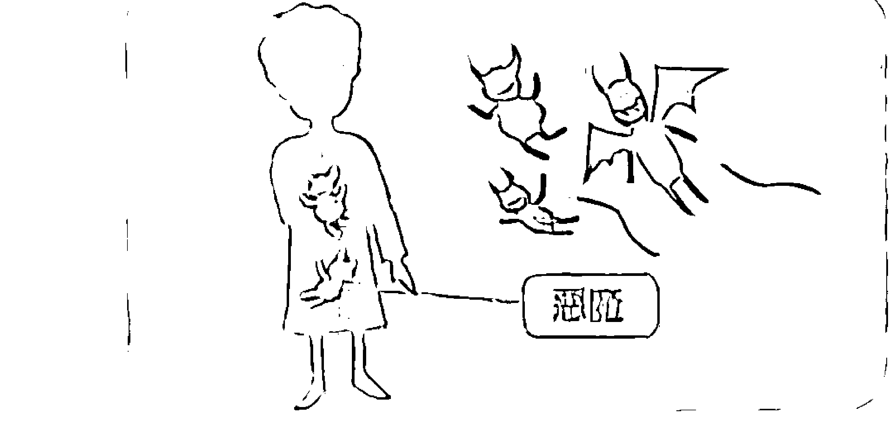

## 惡魔的身體是何種物質構成的？

根據神學家的考察，天使和惡魔的身體雖然不像神是純粹的靈，卻也與構成人類的物質不同。

- ○ 惡魔與天使同屬靈的受造物

惡魔的身體是以何種材質所構成的呢？關於這個問題，基督教神學者自古便有許多討論。

二世紀的教父聖查斯丁主張唯有神才是最純粹的靈，天使稱不上是純粹的靈，他們的身體是某種非常稀薄的物質，而墮落天使則是以比天使更粗糙的物質。另一方面，這個時代亦存在著空氣分成兩種的思想。從地面到月球這段較低的天空中充滿濃密的空氣，而月球到天國的高空中則是稀薄的空氣＝埃忒耳。於是遂有人認為天使和惡魔同樣是由埃忒耳構成，他們的身體比空氣更加細微、更富精神性。

二世紀的教父塔提安認為天使擁有細微的靈性身體，而惡魔與聖靈的距離比天使更遠，所以構成其身體的物質較為粗糙。那種物質有別於神的純粹聖靈，可以說是某種物質性的靈體。換句話說，惡魔的身體是由某種屬於惡的物質所構成，不過惡魔並無肉體，他們擁有的是類似火焰或是空氣的身體。

相關議論仍未就此止息。西元787年的第二次尼西亞公會議承認了天使與惡魔擁有以空氣與火為本質的極輕盈身體。可是西元1215年的第四次拉特蘭公會議又說天使和惡魔均是純粹的靈之受造物，跟肉體物質並無關係。

十三世紀的偉大學者大阿爾伯特跟托馬斯・阿奎那有同樣的想法。他們認為天使和惡魔純粹是種靈的實態，但這種靈的實態卻與神的聖靈不同。相對於神（純粹的靈，非偶然性的）與人類（既屬靈亦屬物質，偶然性的），天使與惡魔是介於此二者中間的存在，是屬靈而偶然性的受造物。

### 教父聖查斯丁（二世紀）
- 神: 純粹的靈
- 天使: 某種稀薄的物質
- 惡魔: 比天使粗陋的某種物質
- 埃忒耳 = 稀薄的空氣

### 教父塔提安（二世紀）
- 神: 純粹的靈
- 天使: 細微的靈
- 惡魔: 粗糙的物質性靈體（類似火焰或者空氣）

### 第二次尼西亞公會議（787）
- 天使與惡魔: 以空氣與火焰為本質的靈體身體

### 第四次拉特蘭公會議（1215）
- 天使與惡魔: 純粹是靈性的，與物質無關

### 托馬斯·阿奎那（十三世紀）
- 神: 純粹的靈，非偶然性的
- 天使: 雖然屬靈，卻是偶然性的
- 人: 既屬靈亦屬物質，偶然性的

## No.044 有多少惡魔？

惡魔的總數究竟有多少？自古以來不知道有多少人追求這個具體的數字，不過真正的數字恐怕遠比所有人想像的都還要多。

- ○ 惡魔充塞於空氣之中

惡魔的數量多不勝數，這是個普遍承認的說法。十三世紀的德國祭司認為惡魔存在於各個地方，彷彿濃密的大氣般圍繞著人類、絲毫沒有任何空隙。非但如此，惡魔還能夠住在人類的腸子裡面，幾乎可以說是無所不在。

> 《約翰的啟示錄》（12章第4節）寫到：「龍的尾巴拖拉著天上星辰的三分之一，摔在地上。」這段文字的意思就是說，撒旦將三分之一的天使都拉攏成為自己的部下，其數目是天上星星的三分之一，可見這已經是個數之不盡的數字了。

話雖如此，具體的數目字究竟是多少呢？

十六世紀的醫師約翰·韋爾以其著作《惡魔的偽王國》聞名，他認為路西法麾下共有1,111個軍團，而每個軍團均由6,666個惡魔所組成，也就是說總共有6,666×1,111=7,405,926個惡魔。不過，路德主義卻認為惡魔根本不只這些，他們主張正確的數字應該是2兆6658億6674萬6664。

此外，自古以來便有畢達哥拉斯數×6，也就是1,234,321×6=7,405,926這個計算方法，而這個數字恰巧與韋爾的數目不謀而合。除此之外，亦有以惡魔的數字666為基本，將666個各有6,666名惡魔的部隊組成一個中隊，再以66個中隊為一個師，6個師為一個軍團，結果惡魔總數就是6,666×666×66×6=1,758,064,176。

其實早在二世紀前後便流傳每個人類的精神當中各有一個天使與惡魔的說法。這麼說來，惡魔少說也要跟現在全球人口一樣數目才對。

### 關於惡魔數量的問題總匯

有多少惡魔？

- 天上星辰的三分之一（《約翰的啟示錄》）
- 如濃密空氣般毫無空隙（十三世紀德國祭司）

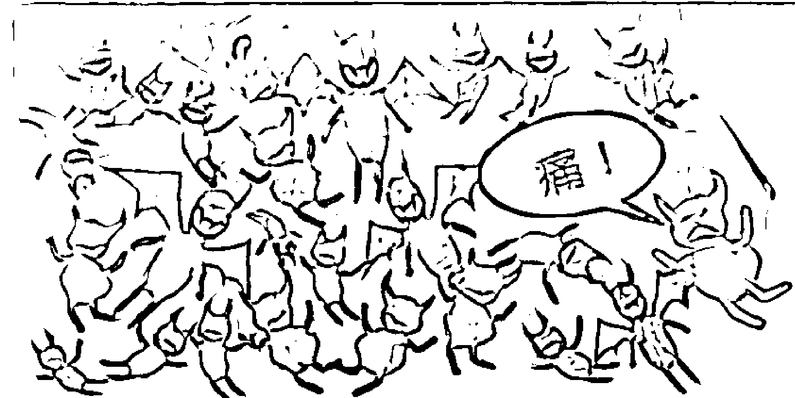

惡魔群聚於空中、充塞空間，從天上丟根針下來必定會打到惡魔。

- （）7,405,926名（十六世紀的醫師韋爾）
路西法麾下共有1,111個軍團，各由6,666名惡魔組成。
- 2兆6658億6674萬6664（十六世紀路德主義）
- 1,758,064,176名（以惡魔數字666為計算基準）

```
6,666 × 666 × 66 × 6 = 1,758,064,176
```

| 師團（66中隊） | 軍團 | 軍團 | 軍團 | ... | 軍團 |
| :--- | :--- | :--- | :--- | :--- | :--- |
| 666名 | 666名 | 666名 | 666名 | ... | 666名 |
| 666名 | 666名 | 666名 | 666名 | ... | 666名 |
| ... | ... | ... | ... | ... | ... |
| 666名 | 666名 | 666名 | 666名 | ... | 666名 |
| 666名 | 666名 | 666名 | 666名 | ... | 666名 |

*圖示為路德派所構想的軍團編制，每個部隊有666名惡魔，666個部隊為一中隊，66中隊為一個師團，全軍共有六個師團。

## No.045 惡魔喜歡什麼？

極欲遠離惡魔的中世紀民眾會仔細調查惡魔的喜好，小心避免在生活當中觸犯這些禁忌。

### ○ 惡魔也有好惡

雖說惡魔存在於任何場所，卻也有其偏好的時刻和地方。

就方位來說，惡魔喜歡北方，因為北方是黑暗、寒冷與刑罰之地，中世紀的歐洲人認為地獄就落在這個方位。若是左右兩邊，則惡魔偏好左側。歐洲教會的祭壇為方便祈禱通常都建在朝著聖地耶路撒冷的東方，如果從西面的入口進入教會，則北方就會落在左手邊，因此基督教亦有惡魔會在教會牆外北側徘徊的說法。

就時刻而論，惡魔喜歡天色昏暗的時候，也就是半夜，不過他們也很喜歡正午和黃昏時分。另外，黎明雞啼的時候惡魔就得落荒而逃。

惡魔喜歡荒涼的場所，經常聚集於荒野，同時他們也很喜歡異教諸神或者民間傳說中妖精、精靈停留的地方，譬如異教的神殿、樹木、森林、山谷、泉水、水井、河川、洞穴、古老的廢墟等地。而惡德與罪人更是惡魔的最愛。據說惡魔會變成美男子以金錢引誘女性，騙得女性同意後立刻將其帶往地獄。

惡魔喜歡製作城牆、城塞等巨大建築物，因此巨石建物向來認為出自惡魔之手。其中他們尤其喜歡橋樑，經常替人類搭建，並以過橋生物的靈魂作為交換條件，所以歐洲各地才有許多「惡魔之橋」、「惡魔的堤防」之類的建築。

相反的，惡魔也有許多討厭的東西，包括主的祈禱、玫瑰經的祈禱、聖經的字句，還有十字架、聖水、耶穌之名、聖油、教會的鐘等神聖物事。除此之外，一般認為與惡魔有關的物品反而具有驅除惡魔的效果，所以火焰、鐵、青銅、鹽、洋蔥、大蒜，甚至豬都被認為能夠驅趕惡魔，燃燒香或薪柴的煙霧也是同樣的道理。另外對著惡魔發出「嘘——」也是另一個有效方法。

## 惡魔也有好惡！

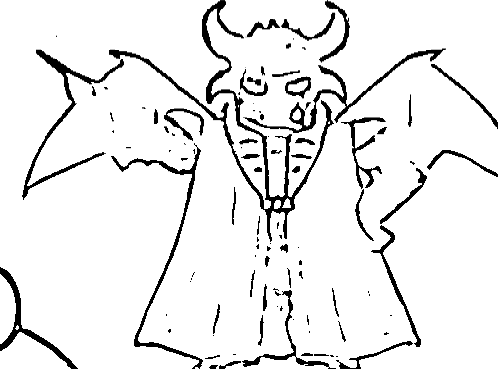

### 顏色
① 黑 ② 紅 ③ 綠
惡魔經常會變成黑皮膚或黑色的動物，穿紅色衣服……

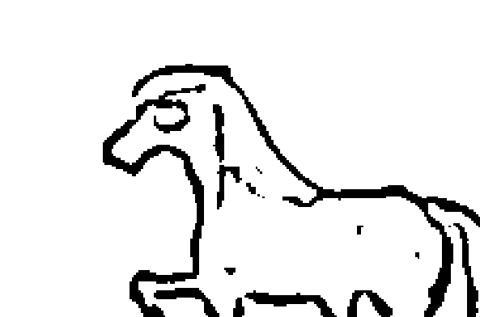

### 方位
北方、左側

### 場所
異教神殿、樹木、山谷、洞穴、泉水、古老廢墟、水井、森林、河川、巨石陣……

### 時刻
半夜、正午、黃昏

### 嗜好
- 紙牌遊戲等賭博
- 建造橋樑、峽谷、石造建築物等巨大建物
- 夜裡偷偷破壞人類白天製作的東西

### 喜好的物事
惡德、罪人
惡魔會變成美女誘惑修道士，或者變成美男子誘惑年輕女孩

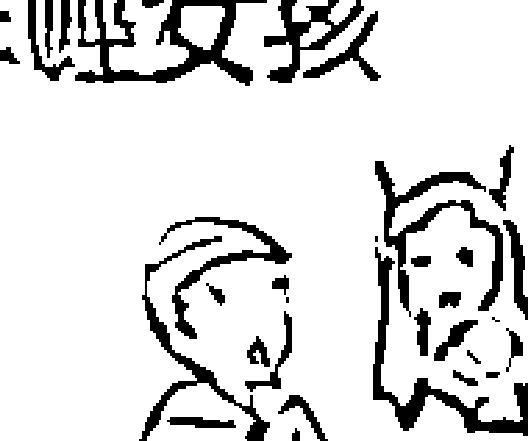

### 討厭的物事
玫瑰經祈禱、聖母瑪利亞、十字架、聖水、聖體、聖畫、耶穌之名、聖經的字句、聖油、教會的鐘、百合、鹽、火焰、大蒜、洋蔥、豬、鹽、咖哩、吐口水……

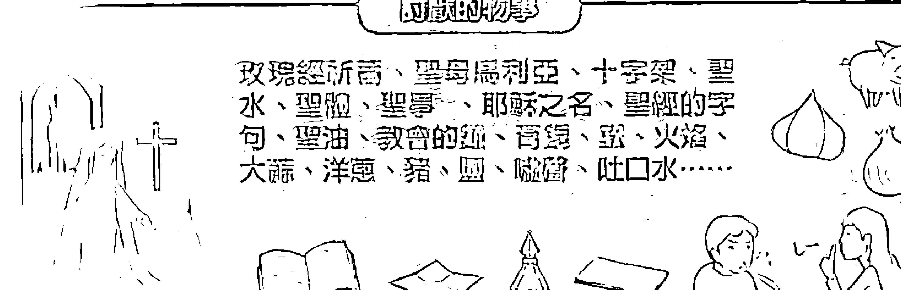

## No.046 惡魔的工作

在《新約聖經》時代，惡魔的工作只是要妨礙神國的實現，可是後來所有對人類不利的事情全都歸咎惡魔所為。

### ○ 無論是多麼雞毛蒜皮的不幸皆歸惡魔所為

在惡魔剛開始趨於活躍，亦即所謂的《新約聖經》時代，他們的主要工作就是妨礙神的王國得到實現。當然，直到今日這仍然是惡魔最重要的工作，而為達此目的就得靠誘惑和附身。從撒旦變身成蛇誘惑亞當、夏娃不難得知，誘惑是惡魔最重要的武器。惡魔會以功名、財富、性慾、賭博、飲食、娛樂等世俗享樂誘惑人類，妨礙人類的信仰，此外還會透過附身折磨人類，隱蔽人類的信仰心。基督教相信當進入天國的靈魂達到一定數量以後，神就會使神國實現，因此妨礙信仰對惡魔來說是很重要的工作。

然而隨著時代推移，惡魔的工作也變得愈來愈多。約從三世紀開始，人們相信死後世界同樣具有天國與地獄存在。如此一來，惡魔非但要在地獄裡面受苦，同時還要變成地獄的統治者，擔任對亡者施以刑罰的工作。

十三世紀有位名叫里加繆斯的西多會修道院院長，他將發生在自己身上不順遂的事情全部歸咎於惡魔。據說有次里加繆斯為堆建石牆蒐集石頭時，有惡魔在他身旁大叫：「真是夠無聊！」讓他失去耐性以致無法繼續工作。除此之外，比方說讓人生病、讓人突然發出大笑、讓人在聖歌隊席間咳嗽或打噴嚏、吞嚥口水時發出很大的聲響、讓人想要小便等等，全都是惡魔所為。這些工作當然是由存在於空氣中的低級惡魔負責，當時的民眾相信惡魔就像感冒會互相傳染，而且十分積極地搬弄這些雞毛蒜皮的壞事。

> 西多會（Cistercian Order）：天主教隱修院修會之一。西元1098年由羅貝爾（Robert，1027～1111）創立於第戎（Dijon）附近的西多（Citeaux）。

## 惡魔的工作
- 阻撓延遲神國的實現
- 在地獄裡折磨亡者
- 中世紀時，人們相信一切不順利均是惡魔所為

### 小惡魔的工作
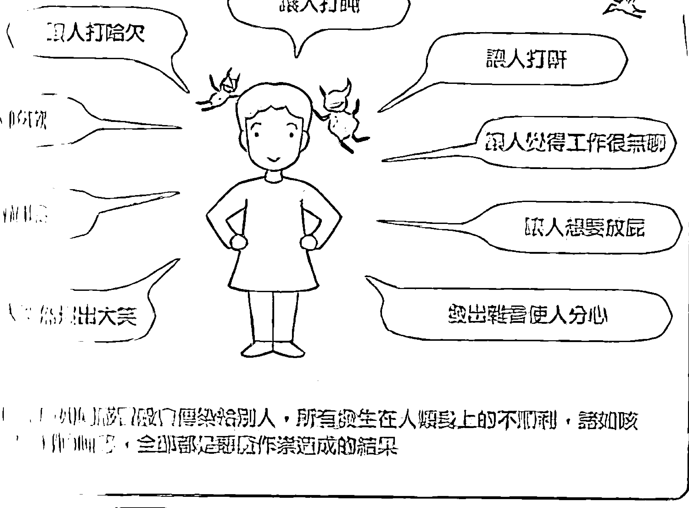
惡魔不僅會干擾個人，更會傳染給別人，所有發生在人類身上的不順利，諸如咳嗽、打噴嚏等，全部都是惡魔作祟造成的結果

### 小惡魔的武器
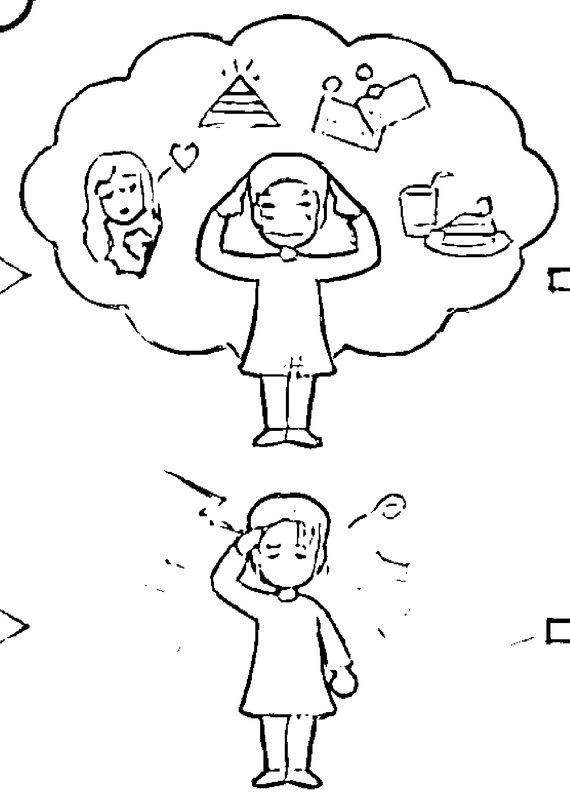
- 以功名、財富、性慾、賭博、飲食、娛樂等世俗享樂誘惑人類
- 使人生病甚至發狂
- 惡魔以干擾人類的信仰，阻撓神國的實現

## No.047 惡魔也有家庭嗎？

在歐洲民間傳說裡面，魔王撒旦是莉莉絲的兒子，他有「罪」和「死」兩個孩子，而七宗罪則是他的孫子。

- ○ 既有祖母也有孫子的魔王撒旦家庭

除了外典《以諾書》曾經提到墮天使與地上的女孩結婚、生下巨人子女外，聖經相關文獻鮮少提及惡魔的家庭。不過至少在民間傳說裡面，關於魔王撒旦=路西法有詳細述及其家族構成的故事。

根據故事記載，撒旦有母親，也有祖母。其祖母起源自古代佛里幾亞的大地母神希比莉，是擁有超絕神力的可怕存在。他的母親則是莉莉絲，也就是其他傳說指為亞當首任妻子的女惡魔。魔王沒有祖父或父親，偉大的撒旦跟耶穌基督一樣是處女所生。

相信撒旦有多名妻子和七個女兒（天使和惡魔本無性別之分，只不過通常會視為男性），而她們便是七宗罪。另有一說認為撒旦有「死」與「罪」兩名子女，兩個近親相姦生下了七宗罪。這七宗罪分別是傲慢、嫉妒、憤怒、怠惰、強欲、暴食、色欲。除此之外，將於終末時代出現的反基督也經常被說是撒旦的兒子。

彌爾頓的《失樂園》提到，當初路西法仍在天界的時候，他的頭從中裂開，生出一名叫作「罪」的女孩。由於這位女神實在太過美麗，路西法便侵犯了她。後來「罪」與路西法的樂園一同落入地獄，在那裡生下了「死」，生產時的痛苦使她的面貌變得極為醜陋，就跟希臘神話的斯庫拉一模一樣。「死」則是身體各部位混成一團、無從區別的恐怖模樣，並且手提殺戮之槍。後來「罪」與「死」在神的命令之下，成為地獄之門的看守者。

### 11.1.1 惡魔的起源家族
墮天使 × 地上的女孩 = 拿非利人
墮天使跟地上的女孩結婚，生下名為拿非利人的巨人種族

### 11.1.2 惡魔譜系圖的家族組成
- 祖母：源自大地母神希比莉的恐怖存在
- 母親：女惡魔莉莉絲（亦有傳說是撒旦之妻）
- 多名兒子：
  - 反叛者
  - 從國王那裡出生的女孩
  - 因與母親近親相姦所生下的可怕怪物
  - 因近親相姦所生

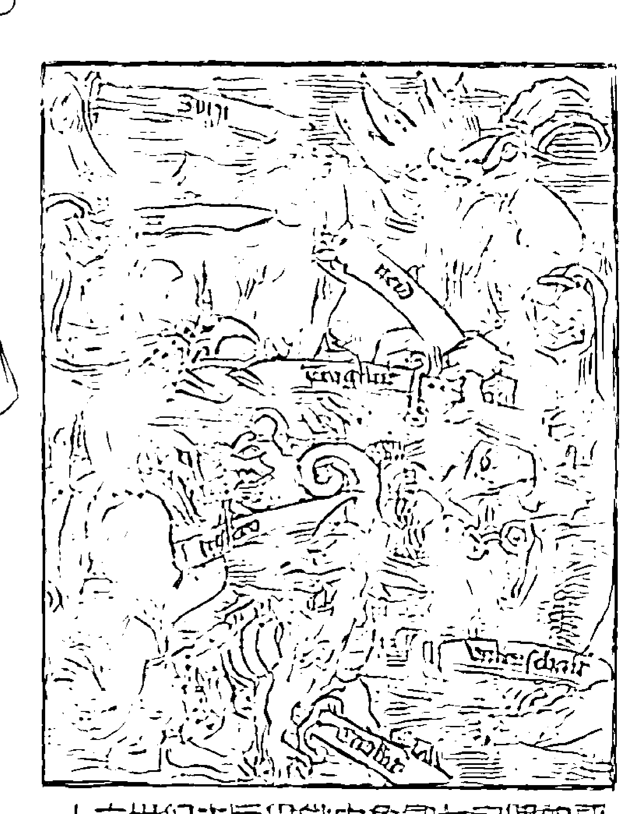
十六世紀木版畫中象徵七宗罪的惡魔，Hofart=傲慢、Zorn=憤怒、Neid=嫉妒、Traghalt=怠惰、Fressern=暴食、Unkeuschalt=淫欲、Begierde=色欲。

## No.048 愚蠢的惡魔

中世紀歐洲民眾並不只是一味的害怕惡魔，他們還知道透過取笑惡魔的愚蠢，藉此減低對惡魔的恐懼感。

### ○ 減低對惡魔恐懼感的愚蠢惡魔故事

惡魔固然恐怖，可是也有許多民間傳說把惡魔形容成只要稍微動腦筋，就連小孩子也能戰勝的愚蠢樣貌。中世紀歐洲的民眾就是透過講述此類故事，藉以緩和對惡魔的恐懼感。

某則故事是這麼說的。曾經有個惡魔出現在農夫面前，說道：「這個世界有一半是我的，所以你的收成也要給我一半。」農夫反問惡魔說他要的是上半份還是下半份。惡魔回答：「上半份。」於是農夫就在田裡種蕪菁，讓惡魔只拿到了蕪菁的葉子；惡魔氣沖沖要求下次要拿「下半份」，這次農夫就種小麥和玉蜀黍，結果惡魔就只能拿到收割後的殘株。

- 此外也有描述小孩子要求惡魔用沙搓成繩子、計算聖經章節數等讓惡魔傷透腦筋的故事。或是有名工匠答應用蠟燭燒盡的時候交出自己的靈魂，藉此要求惡魔幫忙蓋房子，但他在蠟燭燒盡之前便將燭火吹熄，毫不費力就得到了一間房子。還有名男子為了交換利益跟惡魔締結契約，說無論自己死後埋在教會內外都願將靈魂交給他，好不容易等到男子死了，眾人卻按照遺言將遺體埋在了教會的牆壁裡頭。
- 坎特伯里大主教鄧斯坦在擔任格拉斯頓伯里修道院長的時候有這麼一則故事：有次他在鍛冶場製作聖餐儀式用的杯時遇上惡魔前來阻擾，可是鄧斯坦並不害怕，反而從火堆鉗出鐵鉗使勁夾住惡魔的鼻子，據說從此以後惡魔就再也不搗亂了。

蕪菁（Turnip）：與蘿蔔同屬十字花科，栽培以食用其肉質根部。
坎特伯里（Canterbury）：位於英格蘭東南部。

## 關於惡魔惡意的民間傳說

只要動動腦，連小孩子也能打敗惡魔

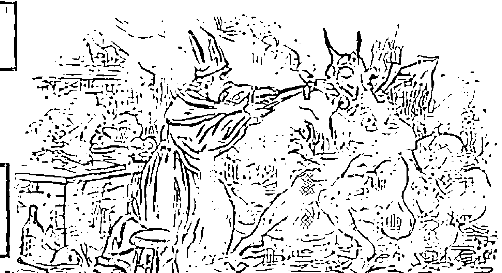
消除對惡魔恐懼感的效果

### 讓惡魔服從腦筋的約定和命令
只要像這樣動動腦，就能夠打敗惡魔！

- 如果約好要交出收成的上半份，那就種蕪菁，只給惡魔葉子
- 跟惡魔約好帶燭台就交出靈魂，然後中途吹熄燭火
- 命令惡魔計算教會的聖經共有幾個字# No.049
聖安東尼所見惡魔

# Demons in "Life of St. Anthony"

惡魔對基督教初期的教父而言是種神學的、概念性的存在，直到對抗惡魔的修道士出現，惡魔才轉變成一種直接感官上的實際存在。

## ○修道士幻影塑造的惡魔形象

曾任亞歷山卓主教的聖亞大納西於西元360年前後所著的《聖安東尼傳》，內容描述孤獨修道僧對抗惡魔的戰爭，是部對中世紀歐洲惡魔形象擁有重大影響的作品。

從那個時代開始，基督徒間追求修道生活的運動愈發蓬勃。所謂的修道生活係指在完全與世俗隔絕的地方，過著一味觀想神的生活，雖然說修道院制度也是因此興起，不過初期的修道士大都是獨自一人進入荒野，從事耐力上的考驗。因為這個緣故，他們往往會受到誘惑性的幻覺與幻影所擾，並且認為這些現象全都是惡魔所為。修道士進入荒野其實意味著要對抗群魔，等同於參加基督與撒旦的宇宙大戰，後世所知的第一位修道士聖安東尼便是如此，《聖安東尼傳》生動地描寫他對抗惡魔的經過。

據其記載，惡魔當時曾千方百計地想要阻撓安東尼的修道生活。能夠變化成任何模樣的惡魔有時會變成天使、修道士甚至是主的模樣，以看似正確的說辭引誘安東尼步上歧途。例如變成全身漆黑的男子前來博取他的同情，或是讓安東尼看見世俗的財富、喧嚣與榮耀等幻覺，甚至還變成性感女郎誘惑他。惡魔也曾經利用恐懼進行攻擊。例如變成獅子、熊、豹、野牛、大蛇、埃及眼鏡蛇、蠍子、惡狼等動物發出低吼、狂吼，或者以牛角恫嚇。此外，惡魔還引發過地震，讓安東尼看到地獄的幻影，甚至曾經結黨成群出現鞭打折磨安東尼。

惡魔便是因為這些故事漸漸變成直接感官上的實際存在。

馬丁·施恩告爾（Martin Schongauer，約1445~1491）：德國十五世紀畫家、版畫家。其版畫作品體現出晚期哥德式風格，使雕版藝術臻於成熟。

# 《圣安东尼传》

作者 四世纪的亚历山卓主教圣亚大纳西

描写孤独修道僧对抗恶魔的战斗

对后世恶魔形象有压倒性的影响

恶魔得以成为直接感官上的实际存在

# 恶魔的原型

世俗财富、空虚、飨宴的幻觉

用恶魔形象博取同情

以女性形象作陷阱

以动物的形态出现

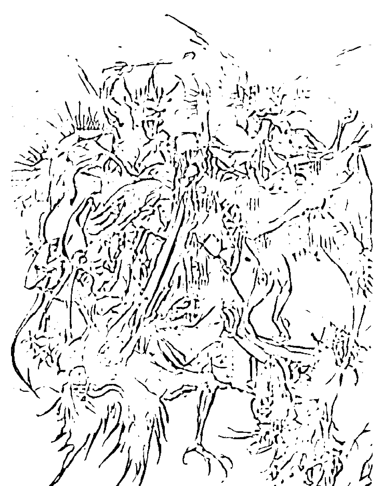

德国画家马丁·施恩告尔（约1445~1491）绘制的雕版画《受恶魔所苦的圣安东尼》

踏入荒野便等同于参加基督与撒旦的宇

圣安东尼（传说为251～356）：出生于埃及，据说圣安东尼过着隐士生活，后来创立了第一座修道院

# # 唐得爾所見撒旦
## Satan in "Vision of Tundale"

自十二世紀的傑作《唐得爾見聞錄》以後，於地獄最深處一邊受業火焚身，一邊折磨亡者的巨大撒旦形象便告定型，再無動搖。

## ○於地獄深處啖噬死者的巨大撒旦

西元1149年愛爾蘭僧人所著地獄遊歷故事《唐得爾見聞錄》是部替屢見於文學、美術創作領域的魔王路西法＝撒旦形象增添新頁的傑作。故事中，騎士唐得爾在以罪人身分遭受懲刑、瀕臨死亡之際，守護天使忽然現身，領著他的靈魂遊歷地獄與天國。旅程中，唐得爾所見的地獄景象十分普遍，可是惡魔模樣卻極具衝擊性。

他首先看到一個惡魔，那是隻比世上任何山峰都還要巨大的獸，他的雙眼有如熾熱火焰般發光，生著一張血盆大口，頭顱還有火焰竄出。另一個脖子瘦長的惡魔生著鐵嘴鐵爪、雙腳雙翼，坐在冰池裡大啖靈魂，那些靈魂被他吃下後立刻被排泄出來、恢復原狀並且復甦，然後再重複相同的循環。接著唐得爾終於見到了黑暗的君主。那是他所見過最巨大的獸，全身漆黑，同時擁有人類的身體和尾巴。他的數千隻手臂每隻都有百腕尺長、十腕尺粗；手掌上各有二十根手指，每隻手指都有一百掌尺長、十掌尺寬。他的手指甲、腳趾甲比騎士長槍還要長，嘴巴尖而厚實、尾巴長而銳利，上面還有能刺傷亡者的鐵釘。這隻獸被鐵鎖鏈和青銅鎖鏈所束縛，躺在下方燙熱石炭的格網之上，旁邊還有大群惡魔在鼓動風箱助長火勢。當這隻獸吐氣的時候，亡者的靈魂就會被吐納進地獄，吸氣時靈魂又會被吸回來、掉進他嘴裡的硫礫中，接著獸再把靈魂咬碎。那獸正是身處地獄最底層的路西法。

如此強烈的形象非但對但丁《神曲》等作品造成影響，同時也替後來的路西法形象建立了一個固定的模式。

> 《唐·得诃见闻录》 = 十二世纪爱剑兰个人所著地狱游历故事

创造新的路西法形象

也对但丁的《神曲》造成影响

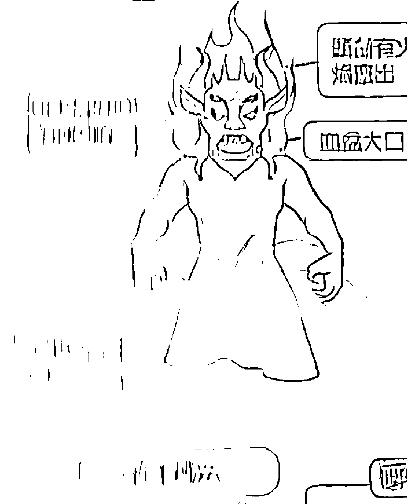

断剑有火焰冒出

血盆大口

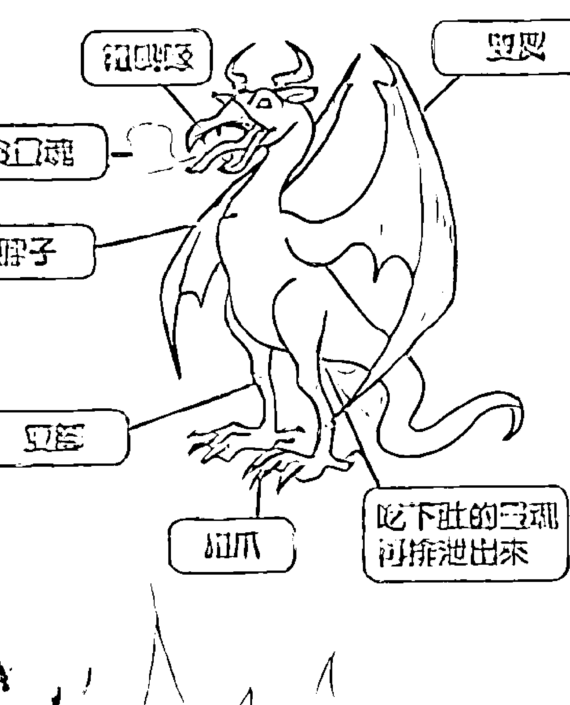

翅膀

吃下肚的生物可排泄出来

锐利牙齿

长脖子

粗腿

爪

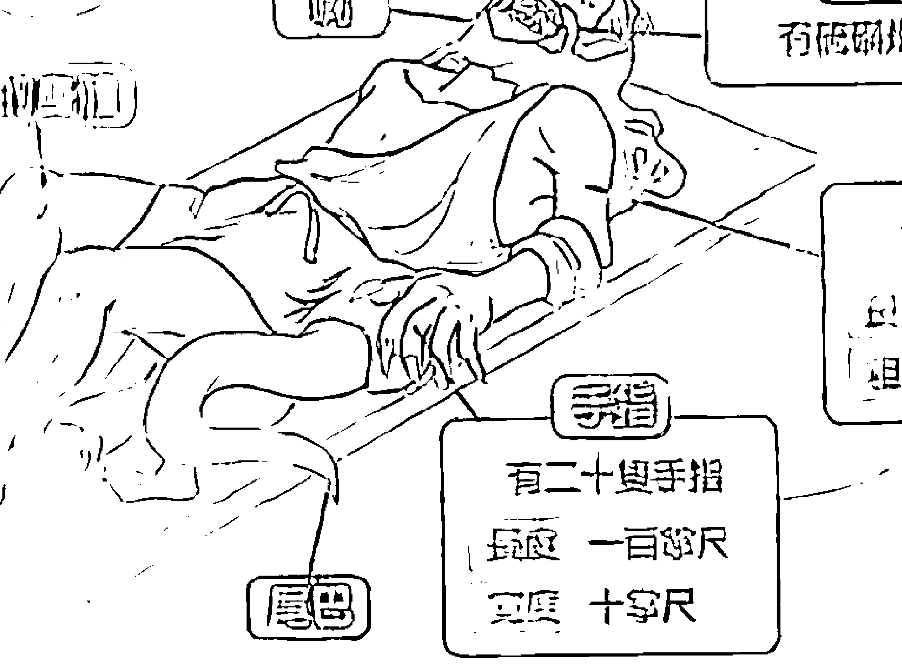

眼睛

手

脚

尾巴

有数百只手
长度：一百腕尺
粗细：十腕尺

有二十只手指
长度：一百腕尺
宽度：十腕尺

地狱的最底层有石炭燃烧的格栅上，受烈火煎熬

# 《神曲》的恶魔
Satan and Demons in "The Divine Comedy"

在中世纪最伟大的诗人但丁笔下，撒旦虽然受困于地狱的最底层，却仍然以地狱皇帝的身份在地狱里大肆散播负面能量。

+   ○位于距离神最遥远处宇宙中心的撒旦

中世纪最伟大诗人但丁（1265～1321）所著《神曲》乃是在恶魔的演进史当中最重要的一部文学作品。这部作品建构了以神和撒旦处于两个对立点的宇宙，而地球位于这个宇宙的中心，周围共有十层天，第十天之外则是神的宝座，撒旦正是在距离神的宝座最遥远之处，也就是宇宙的中心地球。地球上有个漏斗状的深谷，最深处甚至可以抵达地球核心，撒旦就在那里。根据但丁的说法，撒旦原本叫作路西法，是天界最美丽的天使，后来因傲慢被逐出天界，变成了丑陋的恶魔。当撒旦向下坠落的时候，地球因为不愿触碰到撒旦的身体扭转，迸出一道裂缝，而高速坠落的撒旦就这么坠落裂缝最深处、插进其中。这个深谷同时也是地狱，从上而下总共有九层呈同心圆形状的地狱谷，愈往下的地狱愈是严苛。其中最深处是处置罪大恶极罪人的背叛地狱，背叛地狱中间有个名为犹大界的寒冰界，撒旦的下半身就被埋在那里，只剩下毛茸茸、恐怖而巨大的上半身露出地面。撒旦有六张蝙蝠般的翅膀，挥舞起来能使周围结冰，此外还有三颗头颅、三张红脸，每个头的嘴巴各叼着一个罪人，他们分别是背叛基督的加略人犹大、背叛凯撒的布鲁图以及加西阿斯。

《神曲》的地狱里当然也有其他恶魔，他们大多跟地狱第一层的鸟身女妖一样是以希腊神话的怪物为根据。不过第八层恶之囊（Malebolge）的十二名马纳勃朗西甚是独特，他们长相狰狞、肩膀尖锐，长着两根牙齿、锐利的爪子以及翅膀。

# 恶灵谱系

中世纪最伟大诗人但丁·阿利吉耶里的作品

恶灵史当中最重要的文学作品之一

# 俯视地球中心的《神曲》地图

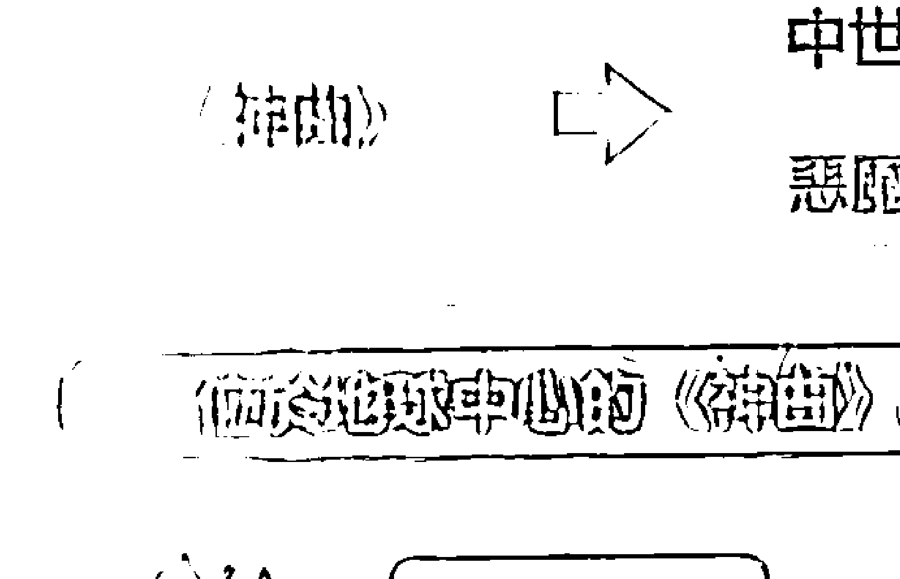

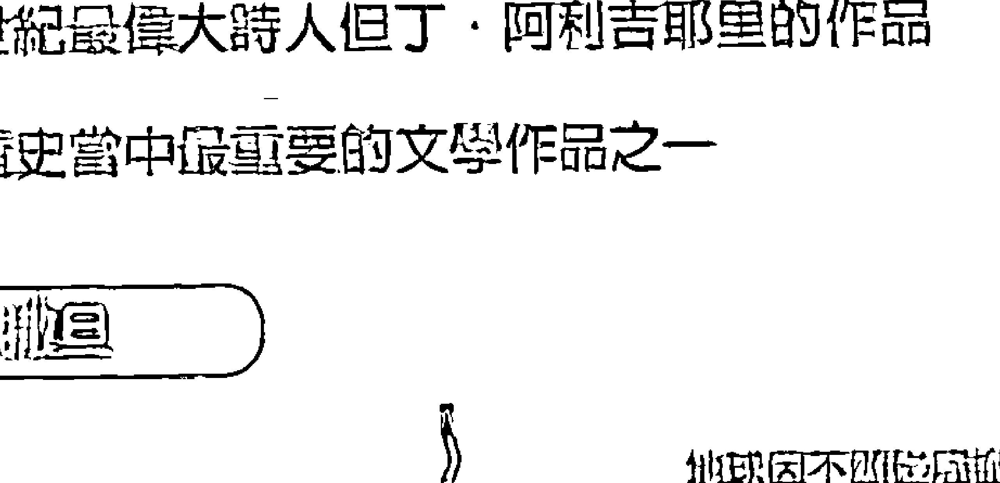

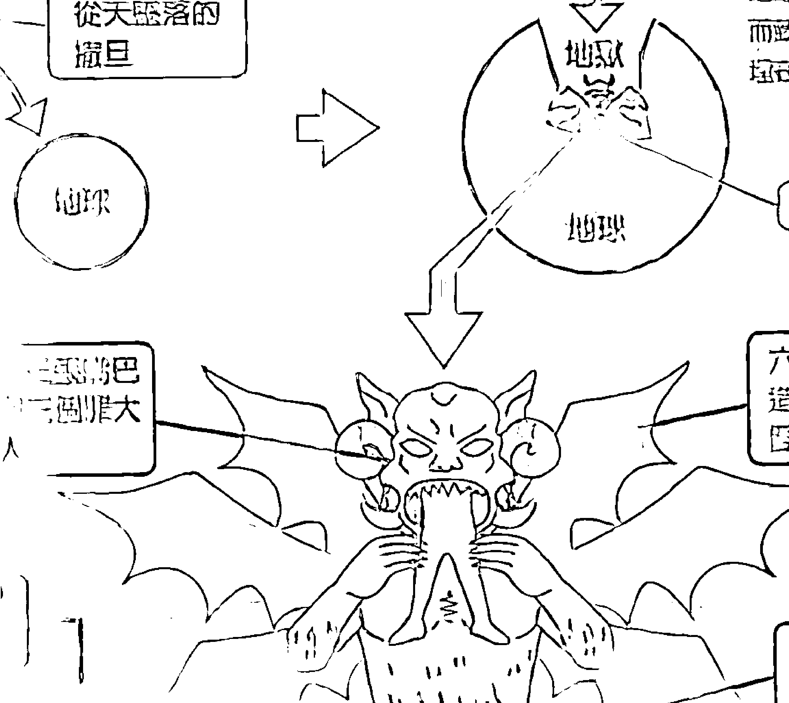

# 撒旦

# 《神曲》地狱的十二名恶灵

| 首风马纳果斯 | 巴巴利却 |
| 司加密林 | 亚利设路 |
| 加卡比耶 | 加巴利 |
| 利比谷谷 | 迦其亚索 |
| 西蒙阿多 | 格拉非阿 |
| 瑟瑟里耶 | 路比网德 |

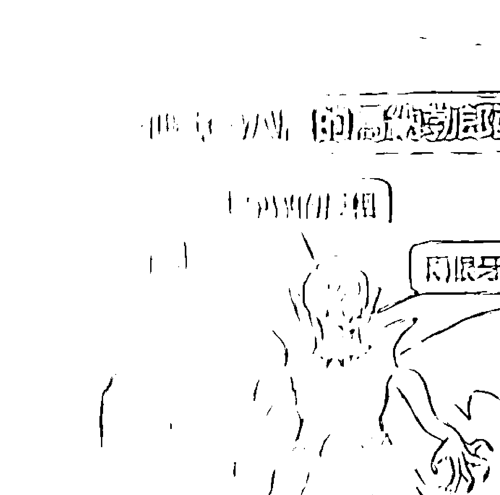

# # 彼列的審判

## The lawsuit of Belial

隨著基督教的審判制度愈發普及，就連惡魔也要透過審判來保證自我的權利。

## ○就連惡魔界亦被滲透的教會審判制度

歐洲於中世紀時期發展出教會法並且廣泛適用，十二世紀的時候甚至出現惡魔訴請審判的故事。當中最有名的作品是傳為西元1382年泰拉莫的雅各所作之《彼列的審判》。

新約聖經外典《尼哥底母福音》（成立於三世紀前後）等文獻記載的基督教傳說當中有這麼一則故事。耶穌在各各他山丘遭處十字架刑的三天後復活，相傳耶穌這三天其實是下到地獄、解放囚禁在那裡的所有罪人，將他們送往了天國，讓地獄變得空蕩一片。《彼列的審判》便是掌管地獄的撒旦為此訴請審判的故事。

撒旦指派彼列擔任代表惡魔利益的代理人、將他送出地獄，因為彼列向來以了解法律問題聞名。

彼列帶著訴狀來到上帝面前，要求調查耶穌的犯行。訴狀的內容寫道：

> > 名叫耶穌的人物非法侵犯地獄的權利，奪取地獄、大海、大地以及居住於大地所有居民的支配權。

上帝看過訴狀以後選定所羅門王擔任審判官，被告耶穌則要求由摩西擔任辯護人。

為使審判趨於有利，彼列甚至還在所羅門王面前跳舞，孰料結果並不理想。於是彼列聲請調停，以埃及法老王的代理人約瑟夫、羅馬皇帝屋大維、先知耶利米、先知以賽亞、亞里斯多德這五個人為委員，共同研議此案。結果耶穌還是被判無罪，不過撒旦也因而獲得了在最後審判那天，將落入地獄的罪人全數歸為已有的權利。

各各他（Golgotha）：耶穌遭處刑的場所，據傳此地名乃源自於阿拉米語的「Gulgulta」，即「髑髏地」的意思。

# 彼列的审判

惡魔學故事的代表作品
西元1382年泰拉莫的雅各所著

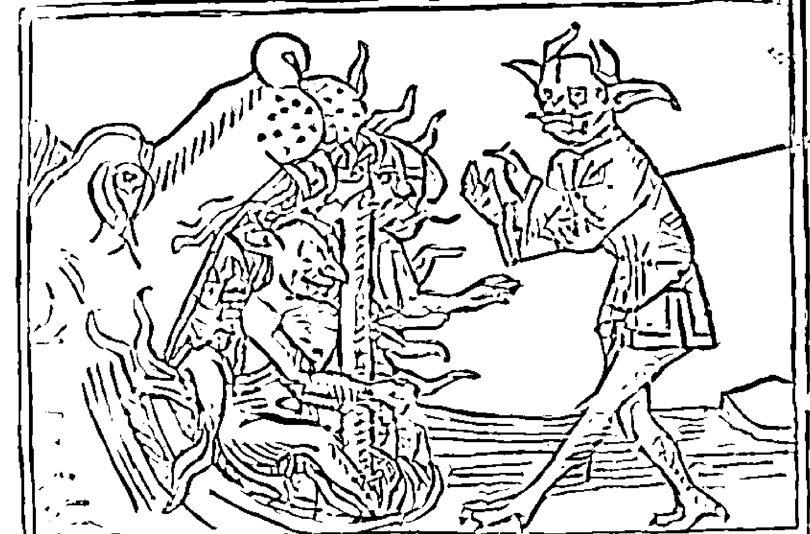

# 彼列所主张耶稣的犯罪

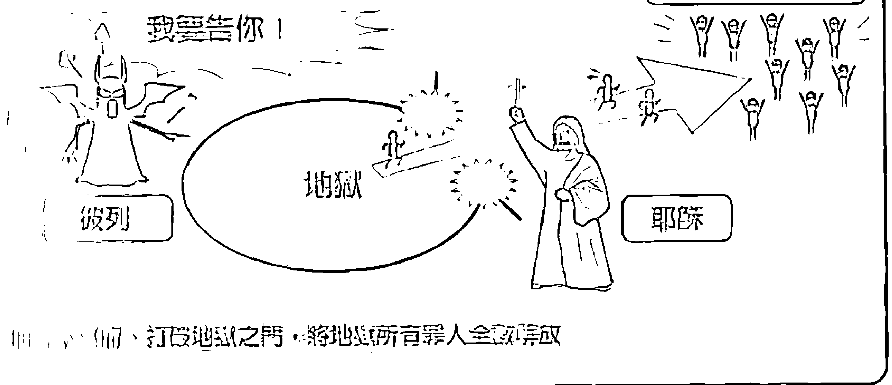

彼列指控耶稣打破地狱之门，将地狱所有罪人全部释放

# 三位调停委员的判决

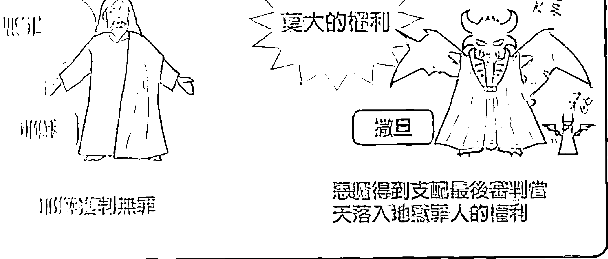

# # No.053 何謂惡魔的三位一體？

## Satan's Trinity

但丁《神曲》所述共有三顆頭顱的路西法，或者是《約翰的啟示錄》裡面提到的撒旦、反基督與偽先知，被奉為是惡魔的三位一體。

## ○與聖三位一體相對應的惡魔三位一體

基督教相信「聖父」、「聖子耶穌」、「聖靈」雖是三個存在，卻又是同一個實體，這個思想叫作三位一體，也就是所謂的聖三位一體。而與其對應的是，很久以前人們就相信惡魔也有所謂的三位一體。

其實三位一體這個概念本身非常古老，好比希臘神話著名的地獄之犬捨惹猥如斯有三個頭顱，同樣也可以解釋成地獄的三位一體。

那麼基督教所謂惡魔的三位一體又是如何呢？但丁《神曲》描述的魔王路西法便是最著名的例子。路西法被埋在地獄最深處的寒冰世界猶大界，胸口以下的下半身沒入地面，三個頭顱上的三張嘴巴分別啃噬著「背叛耶穌的猶人」、「暗殺凱撒的布魯圖」和「加西阿斯」三個罪大惡極的罪人。義大利雕刻家本韋努托·切利尼（1500～1571）認為這三顆頭對應於分別代表權力、睿智、愛的聖三位一體，乃是所謂的魔王三位一體，各自象徵無力、無知、憎恨。

《約翰的啟示錄》所提到的惡魔三位一體也很有名。13章有段故事講到末日在來臨前的大苦難時代，將有三頭怪物出現肆虐人間；這三頭怪物分別是「從海中上來的十角七頭的獸」、「龍」以及「從地中上來有兩角的獸」。據說這裡的「從海中上來的獸」是反基督、「龍」是撒旦，而「從地中上來的獸」則是偽先知的象徵，而此三者便被認為是《啟示錄》當中的惡魔三位一體。

# 基督教的三位一体

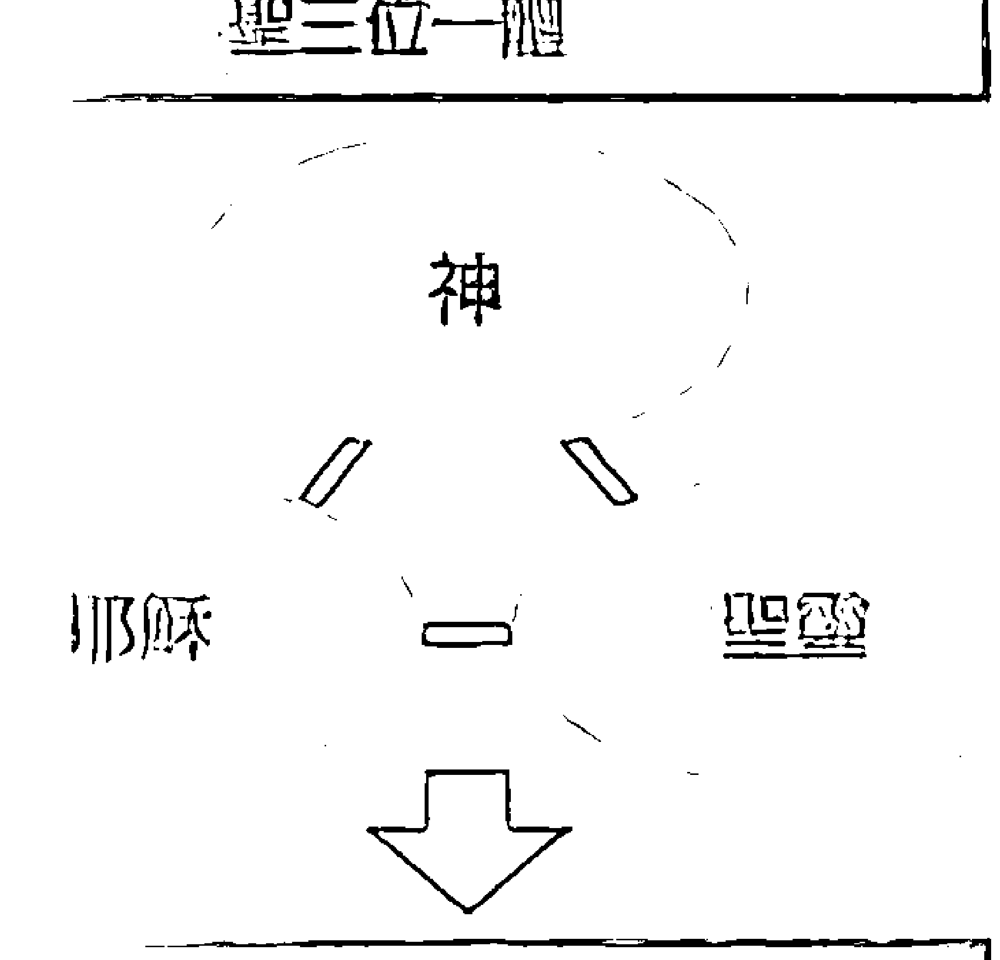

希臘神話地獄之犬刻耳柏洛斯的三顆頭顱也被解釋成是地獄三位一體的象徵。

# 恶魔的三位一体

# 但丁《神曲》中撒旦的三位一体

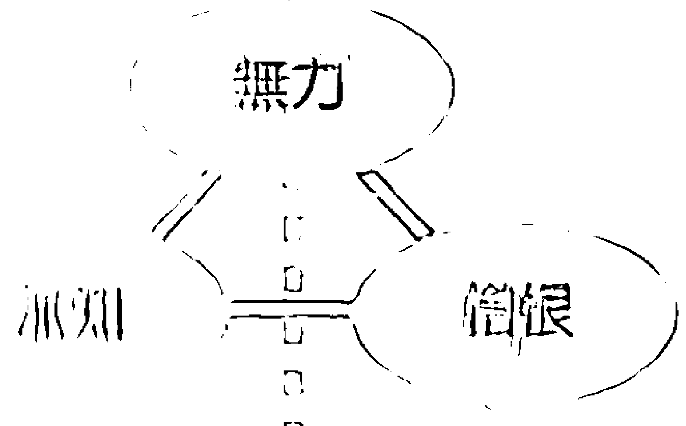

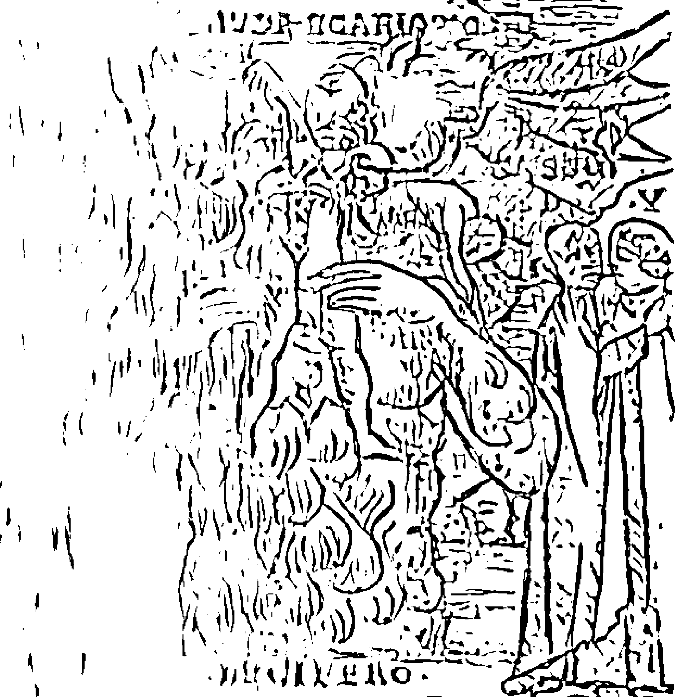

但丁 (1321) 十六世紀木版畫，撒旦這三顆頭顱分別代表無力、憎恨、水淵，代表無

# 《启示录》中恶的三位一体

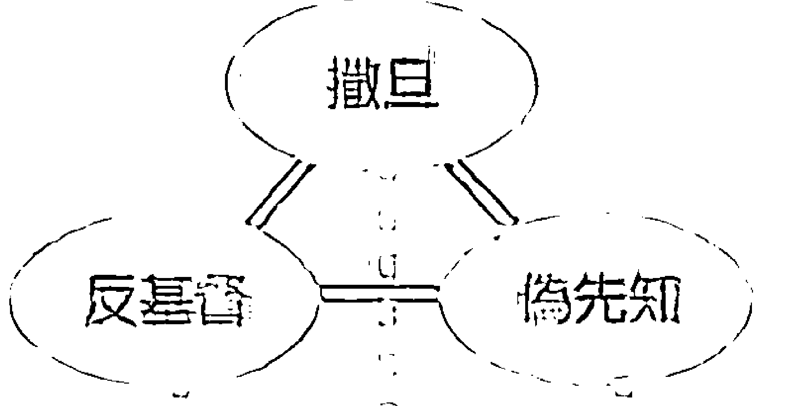

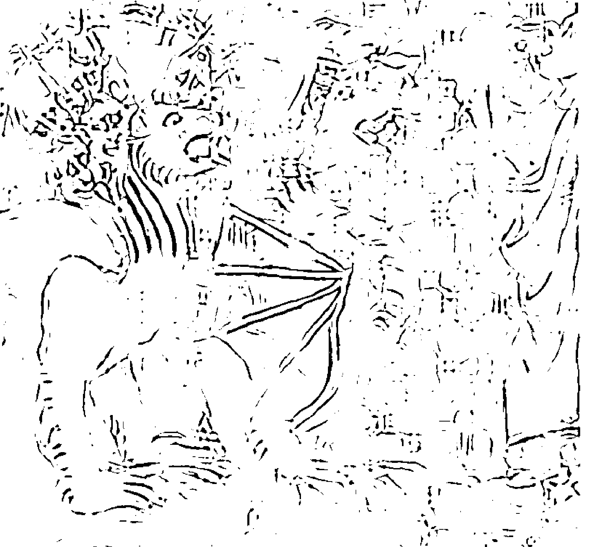

《啟示錄》中世抄本的插繪。龍（撒旦）、獸（反基督）、假先知自古便被認為是惡魔的三位一體。

# 恶魔与四大元素有关系吗？

Demons and four elements

拜占庭的哲学家普塞洛斯认为恶魔是依阶级来区分应该居住在火、风、水、土四大元素的世界、地下世界抑或是夜的世界。

## ○恶魔群聚于陆海空任何地方

欧洲自古便相信这个世界的物质是由火、风（空气）、土、水这四大元素所构成，自然会有将恶魔按照与四大元素关系进行分类的哲学家与神学家。

五世纪的罗马哲学家普罗库临斯将恶魔分成五种，其中四种是分别与火、风、土、火四大元素相关的恶魔，而住在地底的恶魔则被他归类为第五个集团。

十一世纪的拜占庭哲学家米迦勒·普塞洛斯则是比普罗库临斯多加一种，将恶魔分类成以下六种。

第一种是在末日审判来临前都住在天空之上，与人类没有交集、阶级最高的火之恶魔「雷利乌利亚」。第二种是住在人类周遭空中的风之恶魔「阿耶利亚」；他们不但能够下到地狱、引起暴风雨，甚至还能用空气构成肉体出现在人类面前。

第三种是地之恶魔「克特尼亚」，他们就是基督教传说中那群从天界被抛落地面的恶魔，亦即所谓的堕天使，相传住在附近的山野中。

第四种是栖息于河川湖泊等地的水之恶魔「休德拉以亚」或「耶那利亚」；这些恶魔能在海上掀起暴风、陷人于溺；喜怒哀乐的情绪也较为强烈，通常大多是女性。

第五种是住在山洞等场所的地下恶魔「休波克特尼亚」；这种恶魔非常卑劣，会发动地震作弄矿工等在地底工作的人。

第六种是不见白昼、唯有夜间方能获得肉体出来活动，同时也是最低等、仇恨太阳的恶魔「密瑟巴耶斯」，他们凭着呼出的气息便能致人于死。不过以上的分类由于基督教色彩太过薄弱，终究未能受到民众接纳信仰。

# 物質的要素

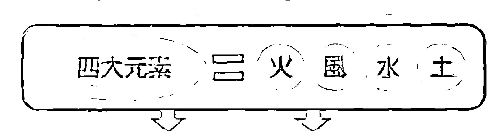

所有物質的基本元素

惡魔也是由四大元素構成的嗎？

# 普塞洛斯分類的六種造型

+   火之惡魔「塞利烏利亞」
階級最高的閃耀紫光惡魔

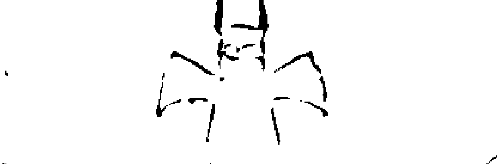

+   風之惡魔「阿耶利亞」
可自由往來於空中與地獄之間

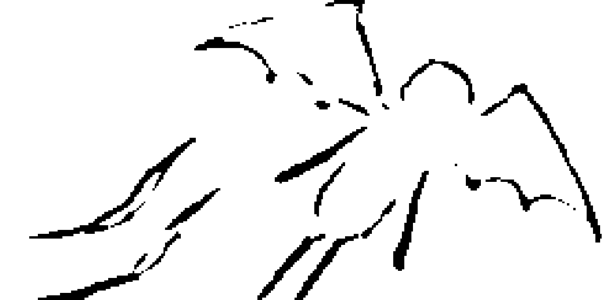

+   地之惡魔「克特尼亞」
從天界被貶落的墮天使

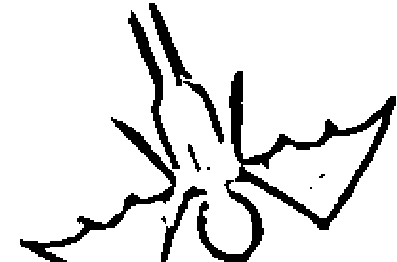

+   水之惡魔「休德拉以亞」或「耶那利亞」
幾乎都是女性，會製造溺水事故


+   地下惡魔「休波克特尼亞」
非常卑劣，喜歡作弄礦工


+   惡魔大門的守衛「瑟巴耶斯」
唯有在夜裡方能活動，是邪惡而無法理解的惡靈

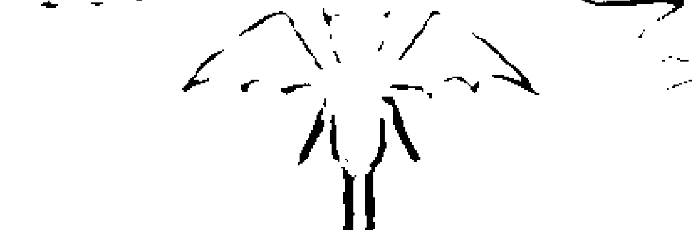

> 高級的惡魔只需待在天界便能直接操縱人類的感覺、間接引入類似幻覺的狀態。低階惡魔的心性則類似粗野的動物，會透過附身等方式做出難以理解的舉動。有些惡魔還會說人類的語言。最低級的惡魔既無理智也無語言能力，因此自己的眼、口、耳將會失去作用。

米迦勒 普塞洛斯（希臘語），拜占庭帝國頗具權威的顧問官（1018~1078），君士坦丁

# # No.055
# 惡魔的位階

## Demon hierarchy

根據驅魔師米夏埃利斯神父的說法，惡魔的階級可對應於天使階級，大致可分為三個階級，細分則共有九個階級。

## ○經惡魔巴魯貝力特證實的惡魔位階

> 《新約聖經・以弗所書》（1章20～21節）有這麼段文字：「就是照神在基督身上所運行的大能大力，使他從死裡復活，叫他在天上坐在自己的右邊，遠超過一切執政的、掌權的、有能的、主治的，和一切有名的：不但是今世的，連來世的也都超過了。」

可以想像天界裡同樣也有階級之分。五世紀時，僞丹尼斯（請參照P.080）彙整天使的位階，將天使分為三大階級，而這個分類後來也受到基督教的天使學採納，造成莫大膨脹。無論如何，天使都是有位階之分的。

惡魔又是如何呢？惡魔是墮天使，在天使時代應該有各自的位階，在他們墮落後轉變成惡魔位階的可能性也很高。既然如此，只需知道天使時代的位階，自然就能得知其惡魔位階，問題在於該如何得知。此時有個人物偶然得到了這個機會，那人便是著名的驅魔師賽巴斯汀・米夏埃利斯神父。

十六、十七世紀的歐洲流行惡魔附身，驅魔相當頻繁（請參照P.184）。西元1610年，法國普羅旺斯區艾克斯的女子修道院發生了惡魔附身事件，修女馬德來娜同時遭到多名惡魔的附身，於是米夏埃利斯神父前來替她驅魔。當時神父從附身於馬德來娜的惡魔巴魯貝力特口中問出同樣附於該女身上的其他惡魔名字、特徵，以及他們各自敵對的聖人。後來神父將此內容收錄於《值得驚嘆的故事》一書，記載與天使三階級相對應的惡魔三階級讓此書聞名於世。

# 惡魔的位階 = 從前天使時代的位階

# 西元6世紀偽狄奧尼修斯主張的天使位階

| 第一級 | 第二級 | 第三級 |
|--------|--------|--------|
| 熾天使 | 主天使 | 力天使 |
| 智天使 | 德天使 | 大天使 |
| 座天使 | 能天使 | 天使 |

注) 天使位階愈高權限愈接近神。

# 《關於墮天使的傳說與故事》所記載主要惡魔的位階

| 名前 | 天使時代的位階 | 誘人犯的罪 | 敵對的聖人 |
|------|----------------|------------|------------|
| 路西法 | 熾天使的君主 | 驕傲 | 聖方濟各 |
| 別西卜 | 熾天使的君主 | 不信仰 | 聖保祿 |
| 阿斯莫德 | 熾天使的君主 | 貪慾、不貞 | 施洗者聖約翰 |
| 撒貝爾 | 智天使的君主 | 殺人、冒涇 | 聖巴拿巴 |
| 撒旦 | 座天使的君主 | 怠惰 | 聖巴多羅買 |
| 別西卜 | 座天使的第二位 | 暴怒 | 聖多米尼克 |
| 別西卜 | 座天使的第三位 | 不淨、不潔 | 聖貝爾納 |
| 別西卜 | 座天使的第四位 | 仇恨反對者 | 聖史蒂芬 |
| 亞斯塔祿 | 能天使的君主 | 祖國 | 聖文森 |
| 羅弗寇 | 能天使的君主 | 猥褻、厚顏無恥 | 作福音的聖約翰 |
| 瑪門 | 主天使的君主 | 霸侈浪費 | 聖馬丁 |
| 瑪門 | 主天使的第二位 | 悲傷 | 聖大巴西勒 |
| 瑪門 | 主天使的第三位 | 不順從、厲害頑硬 | 聖貝爾納 |
| 阿斯蒙蒂 | 力天使的君主 | 傲慢、虛榮、不貞 | 聖方濟各 |
| 貝爾芬格 | 大天使的君主 | 殘酷、無慈悲 | 聖繆倫斯 |
| 阿斯蒙蒂 | 天使的君主 | （無記錄） | （無記錄） |

這就是《關於路西法的墮落》。這之所以沒有路西法的名字，是因為他並未附身於任何人。此外，了解每個惡魔的敵對聖人之名非但能夠獲得更佳的驅魔效果，事實上也可能增加召喚惡魔的安全性。

中世紀的魔女審判・以惡魔節分活躍於十七世紀的法蘭德斯宗教家・亞歷・巴・「關於魔女的故事》。

## 《惡魔的偽王國》

Pseudomonarchia Daemonum

正如同人類世界的王國不斷地擴張、複雜化，地獄的惡魔王國同樣也愈發巨大，職務結構亦愈趨複雜。

### 傳為〈哥耶提雅〉原型的惡魔名簿

進入十六世紀以後，開始出現詳盡說明惡魔王國組織的作品，像是出生於荷蘭南部的醫師約翰·韋爾（1515～1588）為主要作品《論惡魔所致幻象誘惑》（1577）所撰寫的附錄《惡魔的偽王國》，裡面詳細記載了各據軍團的惡魔界巨頭名簿、職役、特徵等。除名簿以外，該文對召喚各個惡魔的合適時間、儀式也有說明。由於內容與《所羅門王的小鑰匙》第一章〈哥耶提雅〉對所羅門王72惡魔的記述極為類似，故這部作品曾經被傳為是〈哥耶提雅〉的原型。

以巴耶力為例：巴耶力是地獄首屈一指的王，領地在東方，在咒文召喚下會以長著蟾蜍頭、人頭、貓頭三顆頭顱的模樣現身。他用馬的聲音說話，能夠讓人隱身，麾下有66個軍團的惡魔聽其號令。

再以布耶爾為例：布耶爾是偉大的長官，身體呈星星形、看起來就像是五芒星。他是倫理學、自然學、論理學的巨擘，對藥草亦頗關心熱衷。他會派遣與人類親近的僕從治療各種疾病，讓他們深入了解人類。麾下有50個軍團的惡魔。

當然，這部作品與〈哥耶提雅〉也不盡相同。〈哥耶提雅〉記載的惡魔有72個，而《惡魔的偽王國》則說是69個，而且配屬排列不同；〈哥耶提雅〉提及每個惡魔的徽紋，《惡魔的偽王國》卻沒有。此外，作者韋爾是位非常優秀的醫師，他看出所謂的附身其實是精神錯亂的現象，是最早對當時獵女巫行徑提出批判的先驅。

序多奈（Sydonai）：阿斯瑪代的別名。

## 《惡魔的偽王國》記載的69個主要惡魔及其階級

《惡魔的偽王國》
約翰·拜因

詳細介紹惡魔王國的組織

| 名字 | 階級 |
|---|---|
| 巴耶力 | 東方的王 |
| 阿加雷斯 | 東方的公爵 |
| 巴巴托斯 | 長官 |
| 普爾森 | 王子、公爵 |
| 阿蒙 | 侯爵 |
| 巴巴妥司 | 伯爵、公爵 |
| 布耶爾 | 長官 |
| 列拉因 | 公爵 |
| 瓦沙克 | 長官 |
| 巴托爾 | 公爵 |
| 帕爾 | 王 |
| 古力歐 | 公爵 |
| 克羅塞爾 | 侯爵 |
| 利維坦 | 公爵 |
| 弗爾弗爾 | 伯爵、長官 |
| 馬爾巴士 | 伯爵、王子 |
| 英杜士 | 侯爵 |
| 阿斯莫德·亞拉波斯 | 長官 |
| 赫爾 | 公爵 |
| 桃樂絲 | 王 |
| 阿斯莫德 | 王子 |
| 拜涅 | 王 |
| 賽爾拉斯 | 公爵 |
| 拜恩 | 侯爵 |
| 佛卡洛 | 侯爵、伯爵 |
| 司托剌 | 公爵 |
| 菲尼克斯 | 長官 |
| 海良地 | 伯爵 |
| 化勒 | 侯爵 |
| 安托士 | 長官 |
| 安度西亞斯 | 公爵 |
| 阿斯莫德 | 王 |
| 亞米 | 侯爵 |
| 馬加錫亞 | 公爵 |
| 露西法 | 王子 |
| 梅菲斯托 | 王 |
| 安度西亞斯 | 公爵 |
| 弗爾卡斯 | 侯爵 |
| 姆姆爾 | 伯爵、公爵 |
| 菲因 | 長官 |
| 勞姆 | 伯爵 |
| 哈法斯 | 伯爵 |
| 佛爾卡洛 | 公爵 |
| 拜恩 | 王、伯爵 |
| 比夫鷺 | (無記載) |
| 加米基 | 侯爵 |
| 撒共姆 | 王、長官 |
| 魏里亞斯 | 侯爵 |
| 沃努克 | 長官 |
| 格莫瑞 | 公爵 |
| 里卡拉比 | (無記載) |
| 安度西亞斯 | 公爵 |
| 安托士 | 侯爵 |
| 安德雷安斯 | 侯爵 |
| 歐茲 | 長官 |
| 艾姆 | 公爵 |
| 歐若博司 | 王子 |
| 瓦布拉 | 公爵 |
| 約瑟力 | 侯爵 |
| 亞米 | 長官 |
| 佛勞洛斯 | 公爵 |
| 巴拉姆 | 王 |
| 安力瑟 | 公爵 |
| 塞列歐斯 | 伯爵 |
| 化勒 | 公爵 |
| 海良地 | 長官 |
| 菲尼克斯 | 侯爵 |
| 斯托剌 | 王子 |

## No.057 《失樂園》的惡魔軍團

Demons in "Paradise Lost"

在英國詩人約翰·密爾頓的敘事詩《失樂園》裡面，除聖經所述異教諸神以外，連埃及諸神等神祇也都是墮天使的同伴。

### 以撒旦為中心講述亞當、夏娃的故事

《失樂園》（1667）是英國詩人約翰·密爾頓（1608～1674年）創作的敘事詩，內容描述被逐出天界、落入地獄的撒旦（路西法）為向神報仇而誘惑伊甸園裡的亞當與夏娃使其墮落。密爾頓雖然並非惡魔學者，不過《失樂園》中講述的故事卻是後世惡魔學一個很重要的基準。

根據《失樂園》的故事內容，這個世界本來並沒有以地球為中心的物質宇宙，儘管萬物都是神的造物，當時卻只有天國和天使，此外盡是混沌。後來神創造聖子（耶穌），並宣稱要讓耶穌擔任天使的首領；撒旦為此感到憤怒便拉攏了三分之一的天使一同反對神。在天使時代，撒旦的階級不甚明確，但即便不是最高位天使也應該是相當高的階級。據說撒旦在集結起來的反叛軍面前演說的時候，憤怒的情緒讓他的頭顱裂開，生出一個名叫「罪」的女孩，接著又和「罪」生下了一個名叫「死」的兒子。此後爆發的天界戰爭相當激烈，雙方甚至將天界的群山連根拔起、互相丟擲。到了天界時間的第三天，神派遣出聖子決勝負，而眾反叛天使在無數雷霆攻擊的逼迫下，終於從天外邊境水晶城牆的裂隙墜落，掉進萬丈深淵底下的地獄。《失樂園》的故事便是從這個場景展開。無數墮天使倒伏於充滿黑暗與火焰的地獄之中，撒旦率先站起身來集結眾惡魔，隨後擬定了一個計謀。原來神創造了新的物質宇宙，還讓亞當、夏娃住在該宇宙的伊甸園裡，而撒旦的計畫就是要前去探索那是什麼樣的地方。也是因為這個緣故，亞當、夏娃最後才受到撒旦的誘惑，終致墮落。

## 《失樂園》提及名字的惡魔

《失樂園》 約翰·彌爾頓 著

撒旦誘使亞當、夏娃墮落的故事

提及許多惡魔

| 名稱 | 由來 |
| :--- | :--- |
| Lucifer | 天使時代名叫路西法，墮落後就成了撒旦，路西法這個名字在《失樂園》裡面只出現過三次。 |
| Beelzebub | 地位在僅次於撒旦的副隊長，古代以蒼蠅的神。 |
| Baal | 古代亞捫人的神耶洛。 |
| Astaroth | 古代亞捫人的神亞斯他錄。 |
| Moloch | 古代腓尼基的男性幽暗神。 |
| Thammuz | 古代腓尼基的女性幽暗神。 |
| Belial | 象徵植物的死亡與再生的腓尼基神祗。 |
| Dagon | 古代腓尼基的農作物神，半人半魚的海洋怪物。 |
| Rimmon | 古代敘利亞人的風雨之神。 |
| Osiris | 古代埃及的冥王神。 |
| Isis | 古代埃及的女神，是歐西里斯的姊妹、妻子。 |
| Horus | 古代埃及的神明，是歐西里斯之子。 |
| Asmodeus | 惡天使，墮落天使中最醜惡、最骯髒的一個。 |
| Cronus | 古希臘的古老風神。 |
| Iblis | 惡天使，相傳他原本是智天使。 |
| Mammon | 財神瑪門（古希臘稱作「瑪門」）擬人化的惡魔。《馬太福音》6章24節有說「你們不能又拜神，又拜瑪門（瑪門）」的文字，因而被認為是惡魔。《所羅門王的小鑰匙》則是以亞玻損之名提及此惡魔。 |
| Pluto | 冥「界」的統治之神普魯托斯，。在地獄把守了五獄門。 |
| Chemosh | 摩亞王記下》中西法瓦香人的神，相傳原是墮天使。 |
| Astarte | 惡天使阿斯摩太，相傳原是墮天使。 |
| Sariel | 名為「神的劍子」的亞天使，天使學認為他是掌管水元素的七天使之一，在這代表了惡魔。 |
| Samael | 名為「如獅子者」的亞天使。中世紀惡巴拉主沒者跟踪他處理仇的惡靈。 |
| Satiel | 名為「神的約定」的亞天使。《西卜林神諭集》·指其為將人類簽契約帶入至神前，四法外的五名天使之一。 |
| Sahaquiel | 「神之約」的惡魔，相傳原是墮天使的門衛。 |

## 惡魔的數字 666

Satan's Number "666"

「666」向來被認為是「獸的數字」、「惡魔的數字」，但利用喀巴拉的秘術數值換算法，就會發現這個數字指的其實是羅馬皇帝尼祿。

### 50+200+6+50+100+60+200=666的秘密

「666」這個數字往往被認為是《約翰的啟示錄》當中所述「啟示錄之獸」的名字。在基督教傳說當中，這隻獸一直都被解釋成反基督的另外一個模樣，所以「666」才會被指為「獸的數字」、「惡魔的數字」，具有不祥意義。

可是這「666」究竟是什麼？它又象徵著什麼呢？

在眾多說法中，以「666」指的是一世紀羅馬皇帝尼祿之說最著名。因為皇帝尼祿的希伯來語寫作nrwnqsr，如果用喀巴拉的數字秘術數值換算法計算，就會得到666的數值。

從歷史的角度來看，尼祿是羅馬帝國發起第一宗基督教徒迫害事件的皇帝，可謂非常符合反基督的形象。尼祿雖於西元68年自殺，卻有傳言指出尼祿其實並沒有死，而是逃到安息重新集結兵力準備日後打倒敵人、再建羅馬。到了西元100年前後，尼祿已經被描述成了救世主彌賽亞的啟示性敵對者——反基督。甚至亞美尼亞語中的反基督「nerhu」就是取自希臘語的「Neron」（尼祿）。

即便到了現代，666這個數字對終末論者來說仍然非常受用，譬如八○年代美國預言家瑪麗·史都華·瑞夫就有以下主張：她說末日將近，666這個數字已經深入信用卡和電腦條碼等系統。在「666系統」下，不久後反基督就會現身，在追隨者額頭刻下666的印記，並且發行特殊的信用卡，所以真正的基督徒不可以使用信用卡等物事。

1. 尼祿 (Nero，37~68)：羅馬第五任皇帝，驕奢淫逸，據說曾焚燒羅馬，迫害基督徒，但無確切證據。
2. 安息 (Parthia)：古代地區，大致等於今伊朗呼羅珊地區。
3. 亞美尼亞語 (Armenian language)：印歐語系語言西部語群的一個獨立分支，是亞美尼亞共和國及前蘇聯各地的亞美尼亞人的本族語。

### 為何是羅馬帝國皇帝尼祿？

所謂666

相傳為《約翰的啟示錄》中那頭「獸」名字的數字

獸的數字、惡魔的數字、不祥的數字

是數理羅馬帝國皇帝尼祿？

希伯來的數字秘術數值換算法是將每個字母各自搭配一個數值，根據這些數值來計算「尼祿皇帝」此字則為n=50、r=200、v=6、n=50、q=100、s=60、r=200，如此便可以得到50+200+6+50+100+60+200=666的答案。

| 名稱 | 拉丁文字 | 數值 | 文字 | 名稱 | 拉丁文字 | 數值 |
| :--- | :--- | :--- | :--- | :--- | :--- | :--- |
| Aleph | A | 1 | ל | Lamed | L | 30 |
| Beth | B | 2 | מ (ם) | Mem | M | 40 (600) |
| Gimel | G | 3 | נ (ן) | Nun | N | 50 (700) |
| Daleth | D | 4 | ס | Samekh | S | 60 |
| Heh | H | 5 | ע | Ayin | O | 70 |
| Vav | V | 6 | פ (ף) | Peh | P | 80 (800) |
| Zain | Z | 7 | צ (ץ) | Tzaddi | Tz | 90 (900) |
| Choth | Ch | 8 | ק | Qoph | Q | 100 |
| Teth | T | 9 | ר | Resh | R | 200 |
| Yod | I | 10 | ש | Shin | Sh | 300 |
| Kaph | K | 20 (500) | ת | Tav | Th | 400 |

(註) （）內為字母位於單字語尾時的數值。

希伯來文原本應該是從右向左書寫，此處因為是拉丁字母故仍然從左

## 十三號星期五為什麼不吉利？

Why is Friday the 13th unlucky?

「十三」不吉利的迷信和「星期五」不吉利的迷信，兩個加起來就讓「十三號星期五」變成了最不好的日子。

### 不吉數字結合不吉日子形成的迷信

所有迷信當中，十三號星期五可謂十分有名，甚至還有人說那天是惡魔之日。此迷信應是結合數字十三以及星期五的相關不吉利傳說所形成。

十三這個數字之所以不吉利，據說與參加最後晚餐的人數有關。耶穌在遭到逮捕、處刑之前曾經召集弟子一起用餐，便是所謂最後的晚餐。參加者的十二名弟子加上耶穌共有十三人，而第十三個座位上坐的恰恰就是背叛耶穌的猶大，所以才有十三為不吉利數字的說法。除此以外，還有人認為十三本來就不吉利。如同一年共有十二個月，十二是個完美的數字，但十三則是個不穩定、讓人討厭的數字。無論如何，數字十三為不吉利的迷信至今仍然存在，西洋的建築物就往往會直接跳過十三樓。

星期五不吉利的迷信亦屢見於歐洲民間傳說，同樣也跟耶穌有關。耶穌是在星期五遭到處刑，而基督教會也將這天定為「惡魔信仰日」，所以才會有星期五不宜生產、結婚、剪指甲、探病、出航等的迷信。

除此以外，星期五（Friday）是源自北歐結婚女神福麗嘉（Frigg）的日子，福麗嘉在德國被視同於多產女神菲依雅，傳說菲依雅會在瓦普吉斯之夜（魔宴的一種）召集惡魔到山神跳舞，所以被基督教徒視為女巫。從這點來說，星期五可以說是女巫之日，跟惡魔有關。這便是為何十三號星期五會被視為惡魔之日。

1. 塞茲（Sei thr）：藉靈附身而行的預言技術。使用塞茲魔法者會將神靈召喚至自己體內，利用其知識進行預言。
2. 奧丁（Odin）：北歐神話的主神，也是阿薩神族之王。

### 十三號星期五

### 兩個不吉利迷信的結合

『十三』的不吉利

耶穌最後晚餐的參加者是十三人

12是完美的十二，是不吉利的數字

『星期五』的不吉利

耶穌於星期五受刑

星期五是源自女巫福麗嘉（菲依雅）的日子

### 女巫菲依雅

傳說中女巫菲依雅是北歐神話中掌管愛情、生產、多產與戰爭的女神。她當然是偉大的大地母神，跟魔法卻有著深厚的關係。在北歐神話中有阿薩神族與華納神族兩個神族，菲依雅就屬於擅長某種名為『賽德』魔法的華納神族，法力強大。傳說她還曾經將死者魔法傳授給奧丁。古代北歐在從事占卜或治療等魔法相關的事務時會吟誦咒文，亦有傳說指出這種文字便是由菲依雅發明的，後來才傳給奧丁，再傳到希臘、拉丁。換句話說，即便在北歐神話中菲依雅也是位了不起的魔法師，是魔法的信仰者。北歐古詩《洛奇的爭論》就曾寫過一段：『菲依雅啊，妳是個充滿惡意、以魔法害人的女巫！』而傳說中的女巫最喜歡的動物就是貓，而且一般以貓為魔女使者的說法便是起源於菲依雅。相傳菲依雅會隨身帶著貓，或是以貓拉動的馬車飛翔。

## No.060 死後審判與惡魔

Demons and Judgment after death

惡魔會仔細紀錄各自負責的人類生前惡行，只待那人瀕臨死亡便會將他的靈魂帶往地獄。

### 死後審判之際告發死者惡行的惡魔

基督教初期認為世界末日已近，屆時包括過往死者在內的全人類必須在神的面前接受最後審判，然後發配到永恆的天國或地獄。可是由於世界末日遲遲沒有來臨，遂有以下疑問產生：靈魂在人類死亡後、最後審判前會在何處？做些什麼？於是自三、四世紀開始，人死後將各自接受死後審判的觀念愈益流行。

而惡魔與天使扮演的角色就更加重要。一直以來人類都認為各民族、地方和每個人都有一名天使和惡魔掌控支配。換句話說，人還活著的時候就必須在接受天使挹注及惡魔的誘惑，然而一旦斷氣，惡魔立刻就會變成死後審判的告發者。

《英格蘭人教會史》曾有這麼一段逸聞。英格蘭麥西亞王國軍隊指揮官因生活放縱重病，在他臥床時有兩名天使出現，坐在他的床邊，取出一本裝訂得很華麗的書給他看。那本紀錄他善行的簿子，可是卻薄得可憐。接著醜陋的惡魔成群結隊出現，並出示一本髒兮兮的冊子，詳細記載了他生前的惡言惡行與汙穢思想，並且看似厚重。這時候撒旦對天使說：「你們在做什麼啊？光看也知道這個男的歸我們啊！」然後天使回答：「的確如此。」言畢，兩名惡魔舉起三叉鐵鋤朝男子腦袋揮去、一擊了結他的性命，然後把他帶往地獄。

### 初人與惡魔天使扮演的角色

### 在臨終者身邊的天使與惡魔

這是西元1500年前後創作的《死亡的藝術》木版插圖： 《死亡的藝術》是勸說人在接受死後審判之前，也就是將死之際應維持何種心態才能逃離惡魔的威脅、跟天使一起進入天國。圖中除了惡魔與天使以外，還有耶穌基督。惡魔試圖誘惑垂死者放棄象徵慈愛的聖潔，而那誘惑就是「傲慢」、「絕望」和「缺乏信仰」等；另一方面，眾天使則是努力祈求垂死者千萬不要輸給惡魔的誘惑。

...古老的英格蘭通史，作者是英格蘭神學家比得...的盎格魯-撒克遜人七王國之一。

## No.061 第一個與惡魔簽契約的人

Theophilus and his deal with the devil

六世紀的狄奧菲魯斯是傳說中第一個與惡魔簽訂契約的人，後來卻在聖母馬利亞的仲裁下成功放棄契約。

### 始自狄奧菲魯斯傳說的惡魔契約

人類應允交出自身靈魂，藉惡魔之力達成非常理能完成的願望，此即所謂惡魔契約。

聖經裡面並無類似契約的相關記載，不過《舊約聖經·以賽亞書》28章15節卻寫到：「我們與死亡立約，與陰間結盟。」古代的教父們便是根據這段文字構成與惡魔締結契約的觀念，奧利金和聖奧古斯丁都說必須與惡魔締結契約方能進行占卜、魔法或妖術。早在西元四世紀，聖大巴西勒就曾留下一名奴隸為了得到元老院議員的女兒而將自己獻給惡魔的故事，不過傳說最早與惡魔締結契約的人物卻是六世紀的狄奧菲魯斯。

狄奧菲魯斯在西西里亞的阿達納教會擔任出納時受到他人推舉擔任主教，卻因為謙卑而拒絕了職位。不料新主教上任後不斷陷害他，讓狄奧菲魯斯對自己的謙虛感到後悔，於是前往拜訪一位有名的魔法師，請他在十字路口召喚出撒旦，然後與撒旦約定以自己的靈魂為交換條件，宣言放棄耶穌與聖母馬利亞，最後用自己的鮮血在契約書上署名。

狄奧菲魯斯重返主教寶座後很快就後悔了，他向聖母馬利亞乞求原諒、從事長達七十天的苦行，終於獲得了原諒。撒旦起初堅持拒絕放棄契約，可是在聖母馬利亞及其屬下的猛攻之下，不得已只好將契約書交還。

隨著惡魔契約的故事流傳開來，便開始出現就連教宗也與惡魔簽約等各種形形色色的傳說。

# I 與惡魔的契約

人類與惡魔的契約 ⇒ 願以將靈魂交付惡魔、換取惡魔替自己實現願望

《舊約聖經·以賽亞書》中一句「我們與死亡立約，與陰間結盟」

狄奧菲魯斯 ⇒ 最早與惡魔簽約的傳奇人物 ⇒ 使惡魔契約概念一般化

○相傳狄奧菲魯斯的契約內容如下

> 就此告知所有閱讀公開狀者：我撒旦將實際改變狄奧菲魯斯命運，他立約臣服於我且將再次獲得主教職位，他以手上戒指為此壯舉捺印，並且不用其他墨水、只以自身鮮血為狀

《女巫男巫法術典》藤條克里斯·艾倫·佳利塔/荒木正志、松田英男譯/原書房

# No.062

## 與惡魔締結契約之目的？

*Why did they make a deal with the devil?*

將靈魂賣給惡魔，便能獲得這個世間的成功、權力、財富、快樂等，單憑己力無法達成的願望。

-   惡魔幾乎沒有無法實現的事情

如果說與惡魔簽約可以實現願望，那它究竟可以實現何種程度的願望呢？答案是幾乎所有願望都能實現。歐洲有許多為追求個人慾望而與惡魔簽約的傳說，其中最有名的當屬浮士德博士，那麽惡魔究竟給了浮士德什麼？

根據約翰·史皮斯撰寫的《約翰·浮士德博士的故事》（1587），浮士德博士出生於威瑪附近，非常聰明。他被富有的伯父認作養子、學習神學，並且憑著優秀成績成爲神學博士。但另一方面浮士德生性自負，不僅視聖經如無物，還習術各種秘術，甚至為窮盡天地奧秘，終於在威登堡森林召喚出惡魔。此時現身的正是梅佛斯特（請參照P.052），於是博士便跟這名惡魔締結了長達二十四年的契約。

憑著這份契約，浮士德得以運用惡魔的力量體驗世間歡愉，耽溺於漁色之中。他非但獲得了關於惡魔、天使、地獄、天體進行、神創造天地等無人知曉的寶貴知識；還曾親身去遊地獄界與星辰界。此外不光是歐洲，即使是埃及或高加索地區也能在轉眼間飛行抵達。浮士德曾經受到對他頗感興趣的皇帝查理五世款待，也與古代的亞歷山大大帝、美女海倫見面。後來，浮士德愛上了海倫，兩人同床共寢、生下了一個孩子。也就是說，只要跟惡魔簽契約，幾乎任何事情都可以得手。

只不過浮士德死後，他的戀人海倫和兩人的孩子卻也都消失不見了，可見惡魔所提供的物事亦非全然屬實。

¹ 威瑪 (Weimar)：德國圖林根州城市，在愛爾福特東南，瀕臨伊爾河。

## 浮士德博士與魔鬼的契約

魔鬼的契約

任何物事均可到手

### 浮士德博士的要求與結果

從以下種種浮士德博士向魔鬼要求了以下的六件事項：

-   ① 得到他所擁有的力量與形態
-   ② 願望實現所有願望
-   ③ 成為僕從、侍奉自己
-   ④ 隨叫隨到
-   ⑤ 魔鬼不能被別人發現，除非接受命令否則不准讓任何人看見
-   ⑥ 願要求以指定的儀態現身

### 結果

可瞬間前往全歐洲、埃及、加勒比海等世界各地

得到有關魔鬼、天使、地獄、天體運行、神創造天地等無人知曉的知識

與古代的亞歷山大大帝、美女海倫當面，並與海倫結婚生子

荷蘭語版譯本《浮士德博士》插圖中的浮士德博士

魔法的顏色

出現的事物亦非

## No.063 惡魔契約到期後會怎樣？

*What if your deal with the devil expire?*

從十六世紀法國知識份子德樂桑的日記和浮士德傳說，我們可以發現與惡魔簽訂契約者的下場有些恐怖的共通點。

○半夜發生遽變使得身體支離破碎
古代的狄奧菲魯斯剛和惡魔签下契約就後悔了。當時他憑著向聖母馬利亞祈禱而得以放棄契約，也就是說聖母馬利亞擁有足以使惡魔契約失效的力量。可是，一來祈禱未必能夠傳達讓聖母馬利亞知道，二來也有些人根本不曾祈禱。在這種情況下，如果惡魔契約到期的話會有什麼結果呢？

十六、十七世紀的法國知識份子皮耶・德樂桑以留下數百則驚人的日記而聞名，他的日記曾記載以下內容。

「西元1558年的巴黎。有位與惡靈通信的博學魔法師預知自己死期將近，於是委託房東準備某種不明容器，好在死後將遺體投於河中。半夜裡家中忽然傳出巨響，嚇得房東趕緊跑到房間一看：發現那名男子已經斷氣，他的四肢全數被扯斷，四散於床舖各處。待房東按照遺言將那些容器投入河中，卻又再度聽見極恐怖的尖叫聲。」（《女巫的審判廷：文藝復興惡魔學的邀請函》平野隆文著 / 岩波書店）

這恐怖的內容便是與惡魔締結契約者的下場。之所以如此斷言是因為十六世紀傳說中的浮士德博士也有類似的遭遇。和惡魔簽下二十四年契約的浮士德固然經歷許多冒險、得到無比歡愉，但契約終於還是到期了。當天半夜，強風吹得浮士德投宿的旅店搖晃不止，只聽見咻咻風聲和浮士德呼救的喊聲。隔天早上眾人進去一看，發現房間裡滿是血跡、腦壁黏著腦漿，兩顆眼球也落在地面，至於身體則是四分五裂、散落於屋外的堆肥之上。

## 人物浮士德博士之死

浮士德传说中的浮士德博士，被引为原型的历史人物浮士德博士是否真实存在难以考证。反过来观，也许正是因为历史人物浮士德博士充满传奇，所以才会有他和恶魔签订契约的传说出现。历史人物浮士德博士死于西元1540年前后，不过西元1548年出版的《浮士德博士的故事》这本书里便已经记录了浮士德之死。此书记载浮士德博士被恶魔性死，所以尸体停放于棺台上的时候只能蒙脸，而且他的脖子扭了五圈脖子仍无法恢复原位。这也让《恶魔之博士的真相》（1980）的作者理查德·茅斯等现代研究者认为浮士德博士是在进行炼金术实验时发生爆炸，身体才会支离破碎。事实上浮士德博士确证是位炼金术师，因此这也可能是发生的情形。

## 林堡兄弟笔下令人震懾的撒旦

中世紀末期以後，人們紛紛為撒旦的形象添加許多足以象徵其力量的鮮明特徵，例如身軀有何等巨大、怪物般的長相等。想要觀察這個現象，沒有比繪畫更理想的媒介，著名的三名林堡兄弟所繪彩色抄本《貝里公爵祈禱書大全》（1415）堪稱是中世紀最豪華的彩色抄本，而該抄本中收錄題名為《地獄的火網》便是此類作品的代表作，在這幅畫中，頭戴皇冠的魔王撒旦雖然在地獄深處、熾熱炙熱的火網上飽受煎熬，可是他仍然口吐火焰在灼燒著亡者，又或者那些亡者是剛被撒旦吸入、吐出也說不定。此外在網下的火爐周圍，還有些惡魔鼓動風箱催動烈焰或是折磨亡者。這幅畫明顯是受到《唐德爾見聞錄》所描繪的地獄形象影響，不過這個時代的各種藝術作品其實都可以看到如此恐怖的撒旦形象。

# 第4章 女巫魔学

## No.064

## 惡魔的與態與獵女巫

*The period of the witch-hunt craze*

從前異端教派勢力崛起、鼠疫流行造成社會不安仍瀰漫高漲，歐洲的基督教徒卻認為這些現象是惡魔在作祟，因此陷入恐慌。

### ○出於對惡魔恐懼心理的獵女巫行動

基督教徒從《新約聖經》時代便已開始對抗惡魔的勢力。在這股反抗惡魔的風潮下，西歐地區於十六、十七世紀達到最巔峰、恐怖駭人的獵女巫也是其中之一，至少對基督教徒來說是如此。

獵女巫始於十三世紀，止於十八世紀，據說這段期間至少有十萬名女巫遭到逮捕、被處以火刑。一旦被懷疑是女巫很快就會遭到異端審問官或女巫獵人逮捕，施以嚴刑拷打逼迫其自白認罪、最後處刑。

這個時代的歐洲人陷入完全的恐慌，整個社會瀰漫著嚴重不安的氛圍。自從十一世紀以來，十字軍面對勢力不斷擴張的土耳其系伊斯蘭教多次戰敗，甚至西元1453年君士坦丁堡亦遭鄂圖曼土耳其人攻陷（東羅馬帝國滅亡），而歐洲內部亦十分混亂。十～十四世紀鮑格米勒派、韋爾多派、清潔派等異端勢力紛紛壯大，再加上十四世紀中葉鼠疫流行，使得歐洲喪失了將近三成人口。種種狀況在基督教徒眼中根本就是惡魔作祟，於是因此萌生了受到惡魔猛烈圍攻的觀念。儘管人們決心起身對抗，可是要打倒惡魔是不可能的事情，所以他們只能轉而對付擔任惡魔爪牙的人類。

基督教徒在這場戰役中創造出異端審判的制度，並於西元1232年展開活動，許多被懷疑是異端者紛紛遭到逮捕，並且被處以火刑。最後，異端者雖然撲滅了，可是人們對惡魔的恐懼仍然沒有消散，甚至在恐懼驅使下開始尋找下一個目標，而首當其衝的便是當時認為是惡魔爪牙、散播異端思想的女巫。

早期教會通過對抗異端來建立正統信仰，不過對異端的處罰止於逐出教會而已。

近世教會在異端審判中更加殘酷，開始出現世俗審判所、異端十字軍等打壓行，甚至連異端審判都將異端份處以火刑。

### 異端審問與女巫

由教宗格列高利九世所提議的異端審問是於西元1232年開始，並且在神聖羅馬帝國皇帝腓特烈二世的協助之下，成為兼具審判所兩者功能的制度。在握有世俗權力的政府協助下，甚至連教皇的異端審問官同時扮演檢察官與審判官的角色。二世甚至將異端指定為特別重罪，教會和國家可以任意進行，除了向上呈報以外，教會也鼓勵信徒密告，而且誣告者也無罪，因此亦不乏有敵對者互相誣告的情形發生。審問官可以不用審問，強迫嫌犯自白認罪，即便無人提出告訴，也可以主動提起異端審問，而且只憑流言他們就可以立即發出逮捕令。如此，當時女巫尚未被認定為異端，直到西元1326年，由教宗約翰二十二世正式將女巫認定為異端，從此被懷疑為女巫的人遭到異端審問，處以火刑，也就是所謂的「女巫審判」

## No.065

## 何謂女巫？

*Definition of Witch*

女巫的惡魔爪牙形象為歐洲人於獵女巫時代捏造出來的妄想，跟現實世界中的傳統女巫並無關聯。

### ○惡魔的爪牙，危害世間的女巫

歐洲基督教徒在獵女巫時代創造了一種迥異於古老傳統、全屬妄想的特別觀念。

傳統的女巫可追溯至太古信仰，是類似咒術者、薩滿般的角色，並且存在於全世界各地，不僅限於歐洲。倘若僅就歐洲而論，地中海地區的女巫屬於崇拜古羅馬黛安娜女神的大地母神信仰體系，有群居的特徵；日耳曼世界的女巫可連結至森林崇拜等古老信仰，就像格林童話裡的女巫，習慣離群索居、獨自生活。無論是地中海地區或者日耳曼地區，這些女巫都跟惡魔毫無關係，純粹只是憑著自我意志行事，有善舉也有惡行。一般民眾對這些女巫雖然感到害怕，卻也將其視為擁有特殊知識的賢者。

然而，獵女巫時代的基督教徒卻把女巫當作惡魔爪牙，認為女巫會為世間帶來邪惡。基督教會雖然早就將信仰異教者打作惡魔爪牙，但女巫的負面形象卻是在漫長的中世紀期間才慢慢確立成形。舉例來說，基督教會最偉大的神學家托馬斯·阿奎那（約1227～1274）跟獵女巫行動雖然並無直接關係，卻初步建立了女巫巫術的五個核心概念，這五個概念為：「與惡魔的性交涉」、「騰空術」、「動物變身術」、「天候操控術」及「不孕術」，而獵女巫時代的眾家惡魔學家便根據這些偉大神學家留下的文字與聖經的記載，確立了女巫身為惡魔爪牙的形象。不過獵女巫的目標並不僅限於傳統的女巫，許多社會邊緣者經常成為獵女巫之下的受害者，有時甚至連有錢人也會被盯上。簡單來說，所有具女巫嫌疑的人後來全都被當作女巫處刑了。

## 傳統女巫與妄想中的女巫

### 傳統的女巫

傳統女巫屬黛安娜信仰（地中海世界）或樹木崇拜（日耳曼世界）系統，除了呼風喚雨、使用草藥施法，還會使用操縱天候等咒術。

### 妄想中的女巫

獵女巫時代相信女巫乃是透過契約成為惡魔的爪牙，會從事販賣異端思想等種種惡行。

### 女巫的五個核心概念

- 與惡魔的性交涉
- 變成動物
- 空中飛行
- 控制天氣
- 不孕術

中世紀的大神學家托馬斯・阿奎那除了指出惡魔確實存在外，還提出惡魔會與人類性交、使男人喪失能力等日後成為巫術核心的五個概念，聖經卻未作引用。

「女巫」一詞的英文是witch，是妖術者之意，可以是男性也可以是女性（不過最近witch已經變成專指女性的用語）。

## No.066

## 女巫與惡魔學

*Demonology of the witch-hunt*

原本僅是神學一部分的惡魔學漸漸從神學家散播至一般民間，最後終於自成一門學問，加速民眾對女巫的妄想。

### ○創造出女巫妄想的惡魔學

自古以來，傳統女巫在以咒術為善的同時也會為惡，可是在中世紀前，女巫並不會因為施行咒術而被視為異端、受到審判，甚至處以極刑。舉例來說，如果在十二世紀以前，信仰異教女神黛安娜的信徒公開宣稱：「我等曾經在女神的率領下騰空飛行。」基督教會只會將此類民間惡魔信仰視為迷信、幻想，不會特地查問。為了將女巫歸作異端加以審判，勢必要將女巫乃惡魔爪牙、異端散播者的刻板印象轉化成教會成員、法界人士、世俗掌權者、知識份子，甚至一般大眾共同擁有的信念。促成此信念確立的重要關鍵，其實正是惡魔學。

若單純只是就惡魔進行考察的學問，那麼惡魔學自古便已經存在，初期基督教會的眾位教父也都對惡魔有過深刻的思考，可是這裡的惡魔不過是相對於神的存在，是宏大神學中的一小部分，僅僅只是神學者概念裡的惡魔而已。

然而隨著惡魔形象於中世紀期間逐漸向民間散播，惡魔也透過對抗異教徒、異端教派的戰爭，變成了某種更加具體且令大家害怕的概念。因此，惡魔學終於進入了一個新的階段，一門名叫「惡魔學」的獨立學問於焉誕生。史賓格與英斯蒂提斯創作的《女巫之鎚》（1486）是催生惡魔學的重要關鍵，不過在這部作品之後仍有許多以女巫和惡魔為主題的惡魔學著作問世，才終於確立了女巫妄想。

> 讓・博丹（Jean Bodin，1530～1596）：法國政治哲學家。為主張16世紀法律和政治的思想。

| 書名 | 作者 | 簡介 |
| :--- | :--- | :--- |
| 《女巫之鎚》 (1487) | 約翰·尼德 | 於西元1435~1438年間創作的作品，用來攻擊早期女巫之惡的學術研究。 |
| 《惡魔之鑰》 (1510) | 雅各·史賓格、海利奇·英斯蒂道里斯 | 根據過去資料與作者經歷所云，設計一部百科全書形式的惡魔學論述。 |
| 《惡魔的奴僕》 (1580) | 讓·博丹 | 宮廷知識份子所著的惡魔學書籍，是比《女巫之鎚》以來最大的女巫理論書籍。從此可以任意將女巫處刑。 |
| 《女巫現行記》 (1595) | 尼可拉斯·勒米 | 以《女巫之鎚》以來最大的天主教女巫百科，勒米本身便是審判官，生涯誣控審判、三千名女巫送上火刑台。 |
| 《惡魔學》 (1597) | 蘇格蘭國王詹姆斯六世（後來的英格蘭國王詹姆斯一世） | 書中明確安選對女巫犯罪施以嚴懲，可見作者後來卻開始懷疑女巫是否存在。 |
| 《女巫與惡魔的作為》 (1604) | 馬丁·德爾里約 | 全六卷鉅作，受惡巫術與舊法，將巫術視為神學系統化，後來成為天主教最具權威的惡魔學四書。 |
| 《女巫的鑰匙》 (1608) | 亨利·波挨 | 總括所有女巫教派進行闡述，主張女巫與惡魔多生門丁的性交，但卻認為應對女巫調查者的審問行為加以限制。 |
| 《女巫守則》 (1610) | 弗朗切斯科·馬利亞·瓜佐 | 公認女巫相關領域的女巫全書，收錄許多惡魔學先進所引用的資料與女巫審判紀錄的實際案例。 |
| 《惡魔戀人》 (1612) | 皮耶·德·朗克雷 | 作者以自己定女巫審判所著作品，以辯護性為惡魔戀而聞名，惡魔也因為這本書而成為巫術書中不可或缺的要素。 |
| 《女巫的秘密》 (1626) | 盧多維科·馬利亞·西尼斯特拉里 | 花費一整本書的篇幅試口證明男夜魔與女夜魔確實存在的作品。 |

## 猎女巫教本《女巫之锤》 Malleus Maleficarum

德国两位异端审问官根据自身拷问女巫、逼其告白的实际经验所著的《女巫之锤》是其审巫手册，曾经被推为是「合法杀人的完美武器」

### 为审判女巫所著的恶魔学百科

欧洲的猎女巫狂潮虽于十六世纪达到顶峰，不过使猎女巫正当化的理论根据其实早就已经萌芽，《女巫之锤》便是这个准备阶段中的跨时代里程碑。此书的作者是两位德国异端审问官海利奇·克拉马（拉丁名为英斯蒂道里斯）与雅各·史宾格，他们于西元1486年将自身经验集结成册发行出版，使《女巫之锤》成为其后两百年间销售量仅次于圣经的畅销书。当时的异端审问官几乎人手一本袖珍本，并且会在审判女巫时取出参照。

这本书从过去史料中蒐罗构成女巫之要素，堪称是恶魔学的大百科，内容充斥著几近病态的女性憎恶心理，尤其以奸淫的女性为极力抨击的对象，与恶魔性交的概念便是因为这部作品而成为女巫众多恶行当中的核心。

《女巫之锤》共分三个部分。第一部是巫术三要件：恶魔、女巫以及与全能的神有关的事项，也就是叙述女巫如何与撒旦勾结为恶而免受全能的神罚。其中还列举出女巫诸恶行，包括拒绝信仰天主教、赞美撒旦、午夜魔诱惹他人、使男性失去性能力等。第二部是以论述体裁将女巫的种种恶行描绘得历历如绘，并且详细讲解应当如何对抗女巫的恶势力，特别强调接生婆之恶行，说她们会以避孕药堕胎，并以初生的婴儿献给恶魔。第三部则说明女巫的审判程序，并且详细指示审判官、女巫猎人应该如何才能将更多的女巫送上火刑台。

## 《女巫之锤》
英斯蒂道里斯 & 史賓格著

-   定义女巫的悪魔学百科
-   女巫猎人的必備書籍
-   病態憎恶女性的書籍

海利奇·克拉瑪（拉丁名為英斯蒂特里斯）與雅各·史賓格，兩人長年擔任異端審問官，擁有許多將異端、女巫送上火刑台的經驗

-   西元1486年
-   病態般憎恶女性的作品
-   使獵女巫在理諭根據上有長足進步的跨時代作品

### 按照經院哲學傳統分成三部分

-   **一部分**：討論巫術的三個要件：悪魔、女巫與神的容許。這部分討論撒旦和女巫是如何在神准許下危害人畜，以及女巫的種種悪行，包括驅使夜嵐、誘惑他人、妨礙生產、破壞家畜等。
-   **二部分**：巫術如何發生效果、又如何使其失效的相關解釋。主張女巫確實存在、女巫為悪是千真萬確的事情，還把不太可能的事情描繪得歷歷如繪。
-   **三部分**：討論教會以及世俗審判所針對女巫、異端者的訴訟程序，其目的在於盡可能將更多的女巫送上火刑台，對如何逼迫女巫招供的實際手段有詳細描述。

# No.068
## 獵女巫專書《女巫的惡魔狂熱》
## De la demonomanie des sorciers

《女巫的惡魔狂熱》是繼《女巫之鎚》以來的女巫叢書中最有名的作品，尤其令人震驚的是這部作品竟是出自法國引以為傲的文學家之手。

### 偉大文學家也相信女巫確實存在

作者讓·博丹是活躍於十六世紀後半葉的法國文學家，是位著作評價優異、赫赫有名的人物。因此，西元1580年刊行的《女巫的惡魔狂熱》大大折損了作者的地位，同時這部作品也是繼《女巫之鎚》以來，眾多女巫叢書當中最著名的一本。

博丹在序文中提起曾親自參與女巫珍·哈維利耶一案的審判，他如此寫道：「是故，我決意撰寫此部著作，並取眾女巫對惡魔的狂熱追求將書名定為《女巫的惡魔狂熱》。目的則是要讓所有讀者清楚地知道再沒有任何犯罪比這件事值得更嚴重的刑罰。」（《女巫的誕生與衰退》田中雅志編譯・解說／三交社）像博丹這樣當代首屈一指的知識份子都這麼表示，不難想像當時民眾對女巫的存在是多麼深信不疑。

《女巫的惡魔狂熱》共有四卷，第一卷先用「所謂女巫，就是以惡魔手段、從事陰謀者」解釋了女巫的定義，並且認同惡魔的存在和惡魔可以與女巫建立關係。第二卷一方面介紹女巫使用的魔法，一方面舉出女巫對人類或自然的危害、狼化現象，以及惡魔與女巫性交等具體實例，同時進行論述。第三卷的主題是關於女巫的其他能力，並教導讀者如何自保免受惡魔法侵襲。第四卷則是女巫審判的實踐指導手冊，內容自然是說明如何才能確實將有女巫嫌疑者送上火刑台的手續及程序。

> 《女巫的恶魔狂热》
> 讓·博丹
>
> 《女巫之锤》以降最著名的作品
> 主要对女巫犯罪施以严罚
> 当代首屈一指知识分子写的迷妄之书

## 中世纪女巫猎行的法定运用方法

-   以諾被告如果供出共犯可以减刑，甚至免刑
-   以諾告者隐瞒姓名
-   以諾的孩儿告发母亲的罪行
-   以諾的告者欺压被告、迫其招供
-   以諾的告者便足以构成对嫌犯施以拷问的充分理由
-   以諾被告说，除非完全证明告发者做伪证，否则不得将被告无罪释放

# No.069
## 女巫的飞行
## Flying

許多人相信女巫會騎掃帚在空中飛行，不過據說每當教會迎神的時候，女巫就會從掃帚上摔下來。

### 女巫可騎乘掃帚、木杖、動物等道具飛行

從前女巫妄想的時代，歐洲民眾相信女巫能夠跨上掃帚在空中飛翔，並且以飛行的方式前往參加魔宴。《新約聖經・路加福音》曾寫到撒旦將基督高高舉起，讓基督霎時看見世界各國，甚至到過神殿的屋頂上。由此可知，藉助撒旦力量的女巫就算會飛也不是什麼稀奇的事情。

雖然女巫的飛行道具以掃帚最為人所知，不過曾經使用過的道具卻可說是五花八門，例如木樁、捲線棒、木杖、鐵釵等。有時女巫也會騎動物，諸如：黑山羊、公山羊、公牛、狗、狼等。此外，飛行用的軟膏也很重要。女巫會把軟膏塗在飛行道具和自己的身體上，然後從房屋的煙囪朝天空飛去。

當然也有人認為女巫能夠飛行是種迷信。十世紀的《主教會議規》就曾規定，相信女巫會跟著黛安娜女神飛行於廣大地獄乃屬異端迷信。另一方面，女巫獵人則主張即便只是妄想，只要在空中飛行就是身為女巫的證據。

然而，大部分的民眾還是相信女巫會在空中飛行。

女巫飛行的速度非常快，卻好像不會有危險，或者應該說還沒遭遇危險就已經抵達目的地了。對女巫來說，教會的鐘聲是個相當大的威脅，因為教會的鐘聲擁有能使掃帚墜落的力量。因此，相傳有些城鎮會在女巫舉行祭典的期間不停敲響教會的鐘，保護城鎮免於空中女巫的迫害。基督教自古便相信教會鐘聲力量強大，八世紀的約克大主教愛格伯就曾說過：「教會鐘聲能使惡魔虛脫無力，對幽靈、旋風、閃電、落雷、暴風雨的精靈也同樣有效。」

## 女巫妄想

女巫會騎掃帚，用飛的參加魔宴

道具包括木棒、拖把柄、木杖、鋤頭等各形形色色的物品，有時也會騎黑山羊、公山羊、公牛、狗或狼等動物

## 飛行時要注意的雷區

-   啊啊
-   嗚嗚
-   呀呀
-   喔一

> > 女巫飛行時一旦被擊中就會墜落

# No.070
## 女巫的变身
## Metamorphosis

過去相信女巫可以任意變身成各種動物，其中最恐怖的當屬變身成狼之後會襲擊人畜當作自己的食物。

### 女巫的变身能力乃恶魔所授

全世界皆流傳著許多人類變身成動物的神話及民間傳說，而與惡魔簽下契約的女巫同樣也能任意變身，因為惡魔會傳授獻身的女巫變身能力當作褒獎。

女巫通常會變成隨處可見的動物，譬如貓、狗、兔子、鼴鼠、鼠類、蒼鳥、烏鴉、牛、蛇、蝴蝶、蜻蜓等，在惡魔最猖狂的全盛時期，許多民眾只要發現這些動物從田裡經過，就會懷疑那是不是女巫的魔術而惶惶不安。不過，女巫不會變成羊羔或鴿子，因為對基督教來說這兩種動物乃是純潔的象徵。此外據說當女巫要出門參加魔宴的時候，會在身體塗上藥膏、變成動物，然後才騎著掃帚騰空飛行。

女巫雖然能變身成各種動物，卻屬變身成狼最恐怖，這跟所謂的「狼人」或「狼化」頗為類似。當時人們相信女巫會變成狼的模樣在深夜的郊外徘徊、襲擊人類或動物，然後再變回人形；如果村裡有誰被狼吃掉了，眾人就會開始懷疑可能係女巫所為。

無論變成何種動物，倘若女巫在變身成動物的狀態下受傷，變回人類的時候也會在相同的地方留下傷口，許多女巫便是因為如此暴露了身分。

亦有女巫表示自己在變身的時候會唱誦咒語。西元1662年於蘇格蘭成為女巫審判被告的女性伊莎貝爾・高迪就說自己曾經重複唱誦：「我身化兔／多悲多嘆多變之兔／入我（惡魔）軍門／直至再度歸返之時」這段咒語三次以上，然後變身成兔子。

## 女巫的变身能力

惡魔傳授肯獻身的女巫變身能力作為褒獎

## 魔術的變身咒

1662年於蘇格蘭成為女巫審判被告的女性伊莎貝爾・高迪表示曾用咒語變身成兔子

(變身咒語引用自《巫術大全》松田和也/講談社)

## 狼化的作用机制
### Demonology of Lycanthropy

就惡魔學來說人類要變身成動物是不可能發生的事情，那全都是惡魔運用幻覺所引發的錯覺。

### 女巫的變身為惡魔引發的幻覺

一般人相信女巫能夠自由自在地任意變身成各種動物，不過惡魔學者們卻不認為女巫真的可以變身。

基督教的惡魔學抱持著人類不可能變身成動物的基本立場。為什麼呢？因為惡魔並不具備改變實體的力量，唯有創造世界的神才擁有這等力量。不過眾多惡魔學者當中，亦不乏有人認為女巫的變身是千真萬確的事，譬如以《女巫的惡魔狂熱》作者而聞名的讓・博丹便是如此，只不過他的說法也受到眾家惡魔學者駁斥為異端。

以女巫變身中最恐怖的狼化為例，所謂狼化就是人類變成狼的模樣，深夜在郊外等地徘徊、襲擊人畜為食，然後再度變回人類的模樣。狼化有個特徵，那就是如果在變成狼的狀態下負傷，變回人類以後也會在同一個地方發現傷痕。

關於這個現象，眾家惡魔學者也提出了說明。首先，之所以覺得自己經歷變身，乃是因為將軟膏塗抹於身體上所引起的幻覺。也就是說，女巫其實只是在做一個非常真實的夢，夢見自己變身成動物而已。非但如此，惡魔還會在女巫夢中的場所附身於狼隻、襲擊人畜，此時倘若狼受了傷，惡魔也會在睡眠中的女巫身上留下同樣的傷痕，藉由這樣的手法讓世人以為那隻狼是女巫變身。而比上述更費心思的作法是，惡魔利用空氣變成野獸的模樣、罩在女巫身上，讓女巫看起來就像是變成了狼。無論如何，惡魔學者認為女巫的變身全都是惡魔所製造出來的幻覺。

惡魔並無改變肉體的力量

女巫的變身非屬真實

### 1. 變身的科學機制（其一）

-   ① 女巫睡前塗抹軟膏，這時幻覺見自己變成狼並攻擊他人
-   ② 惡魔附身於真正的狼匹，按照女巫所現狼型攻擊人類，且路過的人成為目擊者
-   ③ 若現實世界中的狼受了傷，則女巫在女巫身體的相同部位也會受傷

如此，人們看見女巫變身成狼攻擊他人的幻覺彷彿實際發生一般

### 2. 變身的科學機制（其二）

-   ① 取狼的毛皮
-   ② 將狼的毛皮穿在女巫身上
-   ③ 女巫順利變身成狼

如此，人們看見女巫變身成狼攻擊他人的幻覺彷彿實際發生一般

## 呼喚暴風雨
## Storm Rising

女巫曾經以各種魔法手段操作自然現象，譬如冰雹、閃電、暴風雨等，並且遭到女巫審判。

### 女巫可憑惡魔之力操縱自然現象

過去民眾相信女巫能夠任意操縱冰雹、暴風雨、落雷、閃電等自然現象，其實這些原本只是跟惡魔毫無關係的民間信仰，但來到獵女巫時代，眾人便理所當然地認為女巫是從惡魔身上得到此等能力，於是歷來竟有不少女巫是以引起惡劣天候的罪名遭到處刑。

有位在德國萊茵地區的女巫，就因為犯了以下罪狀遭處火刑。由於村裡眾人很討厭這名女性，往往不會邀她去參加婚禮，有一次，她看見村裡吵鬧喧囂的氣氛，但自己卻孤伶伶的一個人感到憤怒，於是便召喚惡魔出來，請惡魔帶她飛到可以俯瞰村落的山丘上。接著。她在地上挖了洞在裡面撒尿，用手指攪拌後讓惡魔將這泡尿升到空中化為冰雹與暴風雪，直接對向村裡，徹底破壞了婚宴酒席的歡樂氣氛。

女巫引起的所有暴風雨當中，就屬西元1590～1592年的「北貝里克女巫審判」事件最為人所知。西元1589年，英格蘭國王詹姆斯一世與丹麥女王安妮訂婚，但女王前往英格蘭的船卻數度遭暴風雨阻礙。當時判斷此事乃是女巫所為並召開審判，根據自白女巫的說法，原來當時眾女巫正在舉行規模浩大的集會，那些女巫先替貓施洗，然後在貓身體的各個部位縫上已經死亡男性的重要部位和許多肉塊，最後把貓丟進海裡，召喚暴風雨。

當時的女巫審判紀錄裡面還記載其他召喚惡劣天候的瘋狂儀式，如將打火石高舉過左肩擲向西方、揮舞沾濕的掃帚、拔去勢公豬的硬毛、在乾涸的河床擺放木杖等。

## 女巫的天候操控術

| 起落雷 | 起冰雹 | 起暴風 |
|---|---|---|
| 起暴雨 |  |  |

古時相信女巫能夠藉巫法操縱自然現象

## 女巫向自然現象所使用過的手段

用勺子攪動池水

在船上吹笛

在地面挖洞把水進去

用湯匙攪拌水

在乾涸的河床擺放木杖

用沾濕的布片拍打石頭

將當作祭品的一歲雞隻拋向空中

把蛇放進大鍋子裡煮

# No.072
## 女巫的不孕術
## Impotence magic

女巫能夠用打結的繩索施行不孕術，此術能使男性喪失性能力，直到找出繩束、解開繩結為止。

### 使男性喪失性能力的惡魔繩結

女巫因傳說會藉助惡魔之力剝奪男性的性能力而深受畏懼，就連博丹、尼可拉斯・勒米等眾多惡魔學者也將性無能歸咎為魔法定致，然而這並不是獵女巫時代特有的魔法定，而是某種自古以來便廣受施行的妖術，直到這個時代才被加進女巫的眾多罪行當中。

在剝奪男人性能力的不孕術中，將打結的繩索藏匿起來是最為常見的做法。在繩結的材質上，無論是緞帶、絲線、皮繩等，只要是手邊能夠取得的皆可，在打成繩結後藏在目標男性的床舖稻草中，或者枕頭內、門框底下，如此一來該名男性就會陽萎。而要治療病症的方法也很簡單，只要找出被藏起來的繩結將其解開，症狀就會不藥而癒。據說遭女巫施以不孕術的男性身體還會長出膿包，這膿包代表的就是因不孕術而未能生下的嬰兒。

除不孕術以外，同樣流傳已久的是使男性動情的戀愛魔法定。十五世紀蒂羅爾*的詩人漢斯・芬特勒便在《美德之準》當中提到一般戀愛魔法定的施行方法。根據記載，首先要把青蛙丟進蟻塚，等待青蛙肉全數被啃光取出剩下的青蛙骨頭，並用它摩擦目標男性的皮膚。如此一來就能讓該名男子對拿青蛙皮膚摩擦自己的女性深深墜入情網。

無論是不孕術還是戀愛魔法，因魔法定導致性無能的男性在當時可以跟妻子離婚，而且在離婚後立刻再婚。這個規定也造成當時對元配感到厭倦的男性，經常因為有新情人而聲稱自己被施了性無能的魔法定。

*蒂羅爾（Tirol）：亦作Tyrol，奧地利西部一州。北與德國接壤，南與...利相連。

## 不孕術

藉魔法力量使男性變成性無能
自古以來便存在已久的妖術

1.  綢帶或繩子
2.  綁成繩結
3.  把繩結藏在床裡、枕頭裡或者門框底下
4.  目標男性不疑有他

不孕術 但找出繩結將其割斷便能應驗

### 恋爱魔法的做法

激起男性的愛慕之心

1.  活的青蛙
2.  把青蛙關在螞蟻中，等青蛙被吃得只剩骨頭
3.  拿蛙骨磨擦目標男性的皮膚

目標男性愛上施法女性

## 何謂魔宴？
### Sabbat

據說所謂魔宴（女巫的晚宴）是大批女巫聚集起來殺食兒童、荒唐放蕩，並且雜交的宴會，但這些其實只是民眾創造出來的幻想。

### 建立於女巫幻想之上的狂亂晚宴

基督教傳遍整個歐洲以後，民間仍流傳著古代的土著信仰，尤其以地中海世界為中心而存在的黛安娜女神、阿蒂蜜斯女神等大地母神信仰最為根深蒂固，而這些大地母神的慶典祭祀往往都會伴隨著雜交及瘋狂的飲宴。基督教本來對這些集會抱持著寬容的態度，直到後來才將異教神明視為惡魔、將參加者視為惡魔手下的女巫。約莫十四、十五世紀間，女巫們聚集在一起舉辦晚宴的觀念逐漸成形，而這種晚宴就叫作魔宴。

-   當天晚上，眾女巫會小心不讓丈夫、妻子發現偷偷溜下床、在身上塗抹軟膏使身體漂浮起來，之後便騎著掃帚等道具揚長飛去。
-   他們的集會場所大多是在人煙稀少的荒地、森林、洞穴等處，集合後第一件事就是向惡魔獻上崇拜，並且舉行初次參加者的入會儀式。
-   接著才是飲食。這時，眾女巫會取出事先殺好的兒童血肉進食，待宴會結束後將火把吹熄，使四周陷入一片漆黑，隨著口令聲傳來開始互相擁抱、亂交。
-   無論身邊是男是女，也不管彼此是否有血緣關係。
-   最後經過離別的儀式，女巫們回到家中，安安靜靜地鑽回被窩裡。

重要的是，魔宴是個不存在於現實的幻想，每位證人對其舉辦日期、舉辦場所、參加人數等細節說法不一。十七世紀法國的女巫獵人皮耶・德・朗克雷（1553～1631）表示魔宴就像個市集，瘋狂的參加者從四面八方湧來，參與人數甚至可達數萬人。

## 所谓的魔宴

女巫的夜间集会

-   於人煙稀少處舉辦
-   規模從數人到數萬人都有
-   是不存在於現實的幻想

## 魔宴的邀请函

時間：非週末的深夜

手段：請於身體塗抹軟膏、乘掃帚飛行前來

### 節目表

-   11:00 ～ 0:00：向惡魔表達敬意的臣服禮拜
-   0:00 ～ 1:00：初次參加者的入會儀式
-   1:00 ～ 3:00：美好的料理（不過也有貓、狗、青蛙等料理）
-   3:00 ～ 5:00：搭配鄉村風格音樂跳舞（多為輪旋曲）
-   5:00 ～ 6:00：不論男女，與身旁的人進行亂交
-   6:00 ～ ：自然而然結束，或者以黎明雞啼為號

> 基督教自古便將異教徒的集會稱為會堂（指猶太教的會堂），而魔宴（Sabbat）則來自於希伯來語中的安息日（Sabbath），是個反猶太的用語。

# No.075
## 魔宴的公山羊・巴弗滅
## Sabbatic Goat/Baphomet

民眾相信魔宴的主辦者撒旦會化作巨大且漆黑的公山羊模樣，在頭頂兩隻角中間有柱點燃的蠟燭。

### 化身為巨大黝黑公山羊的撒旦

魔宴乃是魔王撒旦主辦的祭典暨饗宴，因此身為主辦者的撒旦必定會出席。

由於在魔宴中將與女巫性交，所以撒旦有時也會變成頗具魅力的模樣，不過大部分時間都還是以巨大且漆黑的公山羊外貌現身，兩隻頭角中間還豎著一根正在燃燒的蠟燭，也就是「魔宴的公山羊」。

根據柯林・德・普朗西所著《地獄辭典》內容（1863），那公山羊有三隻角，中間那隻還會發光，戴著黑色頭冠，頭部直豎，面色青白，雙眼炯炯有神，雙手雖然看似人類的手，可是每隻指頭都一樣長，彎曲而尖銳的指尖好像猛禽的爪子，雙腳有如鴕鳥，尾巴長長的好像騾子。他的聲音很恐怖，沒有抑揚頓挫，表情凝重彷彿憂鬱症患者。此外，公山羊在屁股底下還有另外一張人臉，參加魔宴的每個女巫都要親吻這張臉。

談到魔宴公山羊，十九世紀魔法師伊利法斯・利未畫的《曼德斯的巴弗滅》是相當著名的作品。這幅圖像裡的公山羊擁有女性的乳房，多了雌雄同體的性格，而且額頭還有五芒星的印記。因為這幅圖像的緣故，魔宴的公山羊又多了巴弗滅這個稱呼，不過巴弗滅的相關紀錄最早其實可以追溯到十三世紀。西元1307年，聖殿騎士團因異端、同性戀、偶像崇拜等罪狀遭到告發，當時有兩百名以上的騎士受到教會審問，似乎其中就有巴弗滅的崇拜者。關於巴弗滅這個名稱，一般認為是由伊斯蘭教創始者穆罕默德之名的發音演變而來。

## 魔宴

魔王撒旦主辦的祭典，撒旦必定會出席。

角
火焰 (或發光的角)
臉的形狀
火焰般的冠
青白色的臉
山羊般的臉
公山羊的身軀
山羊般的手指
羊蹄
屁股有張臉孔
蛇尾巴

五芒星
腳

伊利法斯·利未所繪的《夏德斯的巴弗滅》，這裡的撒旦多了兩性兼具、五芒星等象徵近代神秘學的符號。

當時的女巫審判將女巫親吻撒旦屁股的儀式視為女巫的罪狀之一。左圖是法蘭西斯·哈欽森的版畫。

「山羊」之寓意。西元前五世紀的古希臘歷史學家希羅多德「曾經記載」當地居民對山羊有異常的崇拜行為。

# No.076 女巫的入會式

Witches Initiation Ritual

在魔宴裡當著撒旦面進行女巫的入會式，與惡魔締結契約，是成為女巫的必要條件。

### ○為了成為女巫的惡魔契約

一般相信女巫的魔宴會為初次參加的新人舉行入會儀式，而這個人會式的意義上就等同於與惡魔簽訂契約。女巫必須與魔王撒旦締結契約、成為他的手下，如此才算是真正的女巫。西元1398年，巴黎大學甚至認可了所有女巫都跟惡魔簽有契約的理論，在那個時代，認為女巫和惡魔簽有契約是相當普遍的觀念。

關於女巫的入會式，女巫和惡魔學家曾提出各種說法：六世紀的惡魔學家威廉·珀金斯就說舉行入會式的時候，女巫會跟撒旦交換用女巫自身鮮血書寫的契約書，也有人說女巫會在締結契約之際親吻撒旦的臀部。

弗朗切斯科·馬利亞·瓜佐所著的《獻物要覽》（1608）對於女巫入會儀式有以下的敘述：

首先新人女巫要站到撒旦面前否定基督，立誓歸順惡魔，並且在宣誓完成後踐踏十字架、聖母馬利亞像或聖人像。隨後撒旦會給女巫一個新的名字，進行再洗禮，據說再洗禮所用的都是髒水。接著，撒旦會在女巫的臉上做刮除的動作，象徵刮除施洗聖油，並且否定女巫舊名的命名父母，決定新的命名父母。此時，女巫必須向惡魔貢獻表示服從的印記和衣帽碎片，並在地面上畫魔法圓後站在圓圈裡宣誓效忠。在女巫冊上，撒旦將自己的名字寫進《死亡之書》，約定每年以稚貢為名獻給惡魔後，撒旦會在女巫全身各處留下女巫之印，同時女巫也必須立誓今後不再行使任何基督教的儀式，答允保守惡魔契約的秘密。

1.  女巫的入會式
2.  與魔王撒旦簽約，成為其手下
3.  成為真正的女巫

### 入會儀式流程

1.  否定基督教信仰，立誓服從撒旦
2.  撒旦對入會者施以再洗
3.  用於臨洗聖油
4.  女巫服從的印記以及服從的部分碎片
5.  站在魔法圈裡，立誓服從惡魔
6.  將女巫的名字記入《死亡之書》
7.  承諾以孩童獻給惡魔
8.  發誓今後不再行使基督教的儀式

● 耶安·博格蘭的惡魔學家（1555～1602），清教徒派的佈道師。
● 菲利普·瑪利亞·瓜佐──十七世紀初葉的托缽修道士。

# No.077 魔王之印與女巫之印

**Devil's Mark & Witch's Mark**

每個人身上多少都會有的身體傷痕、雞眼、胎記、痣、疣或者色素沈澱等，在獵女巫時代，全部都會被當成是身為女巫的證據。

### ◎被視為與撒旦簽約證據的身體印記

只要是與撒旦簽有契約的女巫，身體必定會有「魔王之印」與「女巫之印」。

所謂「女巫之印」就是指疣、痔等身體的微小隆起或突出物，它代表多出來的乳頭，而女巫飼養的魔寵便是從這些乳頭吸吮女巫的鮮血。根據十七世紀女巫審判留下來的紀錄有許多相關事例，譬如乳頭差不多跟小指頭一樣大，但長度卻僅有一半的女巫，或是舌尖長出乳頭的女巫以及陰部有兩個乳頭的女巫等。「魔王之印」則是類似農畜身上的烙印，大部分是用爪子或燒燙的鐵在女巫身體留下惡魔的印記，這項論點來自十六、十七世紀的女巫學理論。

女巫之印或魔王之印其實並不稀奇，每個人都可能擁有一些身體特徵，可是在當時卻被看作是身為女巫的證據。所以說，只要一旦被懷疑是女巫，想要否認根本是不可能的事情。

當時認為魔王之印或女巫之印的所在部位毫無知覺，針刺不痛，也不會流血，這項特徵造就獵女巫時代許多女巫搜尋人巡迴各地、持針扎刺嫌犯以換得報酬。為了獲得報酬，有些人甚至還會使用藏有機關、針頭碰到身體就會縮回去的假道具。

由於這些印記往往都是位於外觀不易發現的部位，譬如眼皮內、腋下、頭髮或體毛底下、陰部等，審查時勢必得仔細檢查，而嫌犯的頭髮和體毛往往會被剃個精光。

### 女巫之印、魔王之印

### 身為女巫的證據

### 所谓女巫之印

### 所谓魔王之印

### 印与女巫之印的特质

### 审问女巫使用的针

当时相信女巫之印、魔王之印的所在部位用针刺也不会感到痛。被怀疑是女巫的人必须经过类似左图的针刺检查易痛各部位。不过其中亦不乏针头可内缩的道具（如中间的针），可诬陷人为女巫。

# No.078 男夜魔與女夜魔

Incubus & Succubus

過去歐洲人相信男夜魔與女夜魔會分別化作普通的男女，與人類異性發生性關係。

### ○與人類異性性交的惡魔

十五～十七世紀女巫審判正盛，歐洲人普遍認定女巫與男夜魔、女夜魔有性關係，又或者會操縱男、女夜魔與人類發生性關係。

男夜魔的模樣就像是人類的男性，是會誘惑女性與其性交的惡魔；女夜魔則像普通女性，是會誘惑男性與其性交的惡魔。由於夜魔的性交通常發生在睡夢中，因此二者亦可合稱為夢魘（Mare或Nightmare）。

男、女夜魔的由來已久，四世紀的教父聖奧古斯丁就曾說過否定男、女夜魔存在是種無恥的行為。背後的理由很簡單，因為過著禁慾生活的聖職者和修道士們通常飽受性事所擾，許多基督教的教父甚至認為對人類女性抱持欲望而從天界墮落的墮天使，後來都變成了男夜魔。

但惡魔乃是墮天使，應該不具有人類的物質性肉體，為何能夠與人類性交呢？而且，當時還普遍相信男夜魔確實能使人類女性懷孕。

基督教對這點多有說明，譬如有惡魔會附身於人類體內與人類性交，或者利用某種材料製作肉體後進行性交等。此外，十三世紀的偉大學者托馬斯・阿奎那則說，男夜魔並非以自身精子使女性懷孕，而是先變身成女夜魔形態奪取男性精液，再透過男夜魔與女性交合、使用精液。

### 1.4.2 女巫与夜魔的关系

### 男夜魔与女夜魔

男夜魔是阳刚的恶魔，喜與人类女性交合；女夜魔则是女性恶魔的鬼魅，？周期性交合。

### 1.4.3 夜魔如何获取肉饵与女性交合的？

# No.079 何謂魔寵？

Familiars

與惡魔締結契約以後，女巫可以得到惡魔所賜與類似小動物的魔寵，當成自己的爪牙使喚。

### ○如寵物般侍奉女巫的魔寵

女巫若與惡魔締結契約，便可得到惡魔賜與的低等級小惡魔。此小惡魔又稱「印普」，通常是小型的玩賞動物，專門負責替女巫出計謀、依女巫命令殺人等。

常見的魔寵有狗、貓、山羊、公牛、蟾蜍、貓頭鷹或老鼠等，總之都是隨處可見的動物。另外，雖然魔寵以動物模樣示人，可是仍然有別於變成動物模樣的惡魔。

由於一般認定女巫會飼養魔寵，所以有無魔寵自然便成為女巫審判當中的重要基準：假如女巫嫌疑者飼有貓或狗，那所飼養的動物就會被當成魔寵。不過話說回來，既然魔寵有可能是任何動物，就算嫌犯沒有養貓、狗，蒼蠅、蟑螂也可以被認定為魔寵。

對女巫來說，魔寵似乎真的就是寵物，女巫審判紀錄中便記載著許多女巫飼養多隻魔寵，並為其命名的案例。十七世紀的獵女巫受害者伊利莎白·克拉克就曾留下小貓霍特、胖胖的西班牙獵犬賈馬拉、獵提維涅加、黑兔薩肯修格和鼬鼠紐茲的記錄。

據說魔寵愛喝人類鮮血，所以女巫會用自己的血餵養，而以鮮血餵養魔寵的部位就是所謂的「女巫之印」，作用等同於比較小的乳頭。人的身體難免會有些痔或疣的異常突起，而當時擁有「女巫之印」就會被當成是身為女巫的證據。

### 魔寵的種類（以动物图示列表形式呈现）：
- 狗
- 猫
- 牛
- 兔子
- 鸟
- 马
- 老鼠

### 女巫魔寵下屬的種類

## 女巫的恶行

### Maleficia

每当有家畜病死、狂风暴雨、干旱、失窃或丧失性能力等理由不明的灾厄发生，就会被归咎是女巫所为。

*   无来由的自然災害、災厄皆是女巫所为

女巫不只會對他人的家畜與財產造成損害、使人生病死亡，甚至還能讓男性喪失性能力、讓女性不孕。其他像頭痛或被虱子跳蚤咬這種芝麻綠豆的小事也都是女巫所為。而這些女巫犯下的惡行一律統稱為「Maleficia」。同時，犯下惡行意味著與撒旦簽訂契約，可以證明那人的女巫身分。

女巫的惡行大多都跟農業有密切的關係。例如引來狂風暴雨、惡劣天候，或是使作物枯萎、鄰居家畜染病死亡，所以每當有類似災厄發生卻無明確理由的時候，往往就會歸咎於女巫身上，並且在心存懷疑者進行告發後，由女巫獵人進一步針對可疑人物一併提出檢舉。

歐洲的女巫中固然有純粹只是信奉傳統的豐饒神信仰、亡靈信仰的異教徒，可是壞女巫所占比例卻也不少。以自中世紀開始生產力大幅提升的北歐為例，當地有大半的女巫都會做惡為害，而著名的獵女巫教戰手冊《女巫之鎚》內容亦有許多篇幅是在描述女巫的惡行。

女巫會以各種不同的方法做惡，其中較常見的就屬使用掃把、藥草或人偶，其中以人偶進行施法屬於古典的交感魔法，遍見於世界各地，有許多女巫審判案件都是使用這種魔法來奪取人性命。其他還有使用咒文、邪視，或者運用著名的魔法工具「光榮之手」。

### 女巫的惡行 (Maleficia)

與撒旦締有契約之證據

民俗相信女巫能用魔法手段造成各種災厄

### 光榮之手

「光榮之手」是常見於歐洲的魔法道具，相信具有使人無法動彈、進入睡眠，或被迷惑等功能。其製作方法如下：請被判處死刑者仍然吊在絞刑台的時候把手砍下、用埋葬布裹起來，之後把裡面的血液洗淨放進土製容器裡，用硝石、灰燼醃漬十五天。十五天過後取出曬乾，如果沒辦法完全風乾，再連同蒿草、蠟燭一同放進灶裡烘烤。如此一來「光榮之手」便大功告成，可以在上面插蠟燭使用。

## 何謂女巫的軟膏？

### Witches' ointment

只要將女巫軟膏塗在身體便能騎乘掃帚飛行，或者變身成動物奔馳於原野間。

*   ○女巫的飛行與變身均是幻覺所致

一般相信女巫只要在身體塗抹某種特別的軟膏，便能騎乘掃帚於空中飛行、參加魘宴的雜交派對，或者變身成動物。曾經實際接受女巫審判的眾多女巫當中，也有很多女巫確信自己有過這種體驗，不過十五世紀以後的惡魔學者幾乎一致認為那只是搽上軟膏後的幻覺作用。

惡魔學者讜·尼諾爾德在《狼化與女巫》（1615）裡寫到，無論力量如何強大，惡魔畢竟不是神，改變不了事物的本質，所以絕對無法使人類變身成動物，也無法將靈魂抽離肉體後再重新將靈魂放回去。既然如此，女巫為何主張自己確曾有過如此體驗呢？尼諾爾德認為那是惡魔利用幻覺迷惑女巫感官的緣故。

尼諾爾德還進一步將軟膏分成三個種類。

首先是參加魘宴用的軟膏，能夠創造出充滿幻想的夢境世界。只需將軟膏塗在身體、在床上躺平，精神就能脫離肉體而去參加魘宴。這種軟膏據說是以兒童的脂肪、西洋芹的汁液、鳥頭等物品所製成。

第二種是騎乘掃帚木杖、騰空飛行用的軟膏。尼諾爾德對此類軟膏並無詳細描述，只說它使用顛茄與貓腦等能夠麻痹感覺的藥物，塗抹後惡魔就會將女巫送到空中。

第三種是變身成動物在原野間奔馳的軟膏，據說集合蟾蜍、蛇、刺蝟、狼、狐狸、人類等生物的鮮血，再摻雜可麻痺思考的藥草、藥根等物質。

### 女巫的软膏的制作方法

女巫的软膏
用于各种用途

*   参加魔宴
*   乘着帚飞行
*   变身成动物
*   杀人

### ①加魔宴用软膏

*   西草药的汁液
*   死鼠的肠粉
*   月桂
*   其他

### ②飞行用软膏

*   蝙蝠
*   蝙蝠
*   其他

### ③变身成动物的软膏

*   蜥蜴
*   刺猬
*   蛇
*   其他

上图所示的是十七世纪的恶棍学家奥·尼陪尔德所提出的三种软膏，民间传说中的杀人用的软膏

### 女巫的幻觉作用

女巫的软膏

引发幻觉作用

据说使用这些软膏的女巫会在幻觉中参加魔宴，然后误以为是现实

## 惡魔附身與女巫

*Witchcraft and possession*

在过去女巫妄想流行的时代，发生过多起女巫请求撒旦将恶魔送给特定的个人或团体，造成恶魔附身的事件。

*   ○ 使恶魔潜伏于苹果中导致附身

所谓恶魔附身，便是指恶魔（抑或恶灵）依附于人、物品或者场所的现象。此现象在相信恶魔存在的世界里并不罕见，一旦遇到原因不明的疾病、疯狂、混乱、不幸，往往就会认为是恶魔所为。基督教的世界既然已有恶魔存在，自然也会有恶魔附身的事件，这点只要看《新约圣经》便可得知一二。根据圣经记载，那些肉体与精神方面的障碍者皆是遇到恶魔附身，当耶稣或使徒们执行驱魔、将恶魔赶出体外，疾病就会痊愈。

《新约圣经》时代的恶魔张狂放肆，经常发生恶魔附身的事件，而这个情况到了十六、十七世纪的女巫妄想时代依然不变，其中以女子修道院的恶魔最为跋扈嚣张，经常有集体附身事件发生。

除此之外，这个时代还出现了前所未见的附身新型态。普通的附身乃是恶魔按照自我意志依附于特定的人身上，但当时却有以女巫为中间媒介的附身事件。在某人与撒旦缔结契约成为女巫后，便会因自身的欲望请求撒旦将恶魔送给特定的人或团体。

进行附身时，女巫会先让恶魔潜伏于各种事物中，再伺机献给目标对象，其中以食物最为普遍。十七世纪的恶魔学家亨利·波捩认为苹果是最适合的物体，能够在不知不觉中将恶魔送入目标体内，而此法也与恶魔在伊甸园中诱惑亚当、夏娃的手法极为类似。

### 由女巫引起的恶魔附身是理想型

恶魔可潜伏于苹果酒、花束、食物等，再送给目标人物，尤以苹果最为合適。

恶魔从物品中现身、附身于受害者

### 16到17世纪发生的集体附身事件摘要

| 年份 | 事件 |
|---|---|
| 1582 | 里昂的多位修女遭附身 |
| 1610 | 布拉班特公国，难闻泰特的修女们因被施上女巫诅咒，纷纷像青蛙般爬上树木、在空中回浮。 |
| 1611 | 里昂孤儿院有八十名孩童遭附身。 |
| 1611 | 曾在瓦斯区文克斯的修女们遭附身，路易・高弗迪神父以女巫罪名处以火刑。 |
| 1611 | 乌丹女子修道院的修女们遭附身，尔班・格朗迪该神父以女巫罪名处以火刑，也是史上最著名的恶魔附身事件。 |
| 1612 | 圣但尼女子修道院的修女们遭附身，市内神父以女巫罪名处以火刑 |
| 1634 | 德国诺恩发生遍及整个主教区的大规模恶魔附身，市长宅邸中的女仆被指為女巫。 |
| 1670 | 荷兰圣伯纳的孤儿院孩童遭附身。 |
| 1692 | 美国麻萨诸塞州安多弗少女遭魔鬼附身，共一百四十一人因涉有女巫妖术而遭逮捕，也是美国唯一一次集体附身事件。 |

# No.083 惡魔附身的徵兆

### Signs of Demonic possession and obsession

惡魔附身可以分成附著於人體外側的obsession以及侵入人體內部的possession兩種類型。

### ○遭惡魔附身者的異常舉動

遭惡魔纏身的時候，依附身方式不同可以分成兩個種類：一是惡魔附著於人體外側，英語稱作「obsession」，一是惡魔侵入人體內部，英語作「possession」。

基督教相信惡魔無法進入德高者體內，在這些人身上只可能發生obsession：古代著名的隱士聖安東尼便是個很好的例子，他曾經因為長相極為駭異的怪物與裸女屢屢現身而苦惱。

至於一般人若是遭到附身，則多以possession較為普遍，自古以來類似的事情多不勝數，連《新約聖經》也有描述。例如《馬可福音》第5章提到的被汙鬼附身者就說：「那人常住在墳塋裡，沒有人能捆住他，就是用鐵鍊也不能；因為人屢次用腳鐐和鐵鍊捆鎖他，鐵鍊竟被他掙斷了，腳鐐也被他弄碎了；總沒有人能制伏他。他晝夜常在墳塋裡和山中喊叫，又用石頭砍自己。」由此可知受惡魔附身者非但力量異於常人，更會無來由的喊叫，甚至傷害自己。

無論如何，懂得判斷是否被惡魔附身都很重要。多位神學家曾經嘗試列舉遭惡魔附身者有何徵兆，而在從前女巫妄想的時代，無論是口說冒瀆話語、猥褻裸露、畏懼聖遺物或聖物、展露奇怪而恐怖的外貌、發出動物般的聲音或動作、發作後失去相關記憶，或是口吐鐵釘、釘子、鐵塊、石頭等異物，都被認為是惡魔附身的徵兆。

## ① obsession

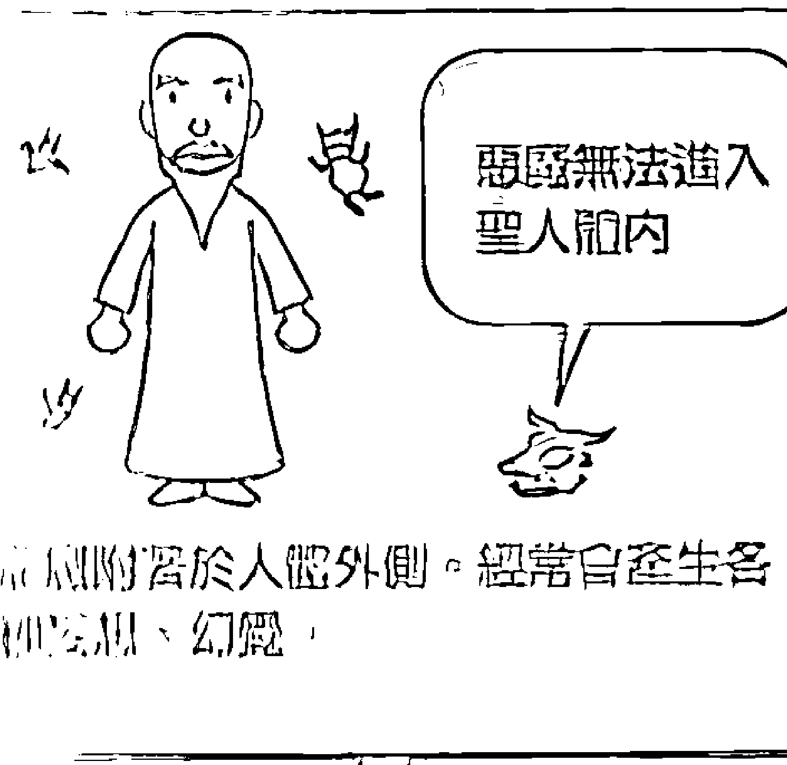

恶魔附着于人体外侧。经常会产生各种妄想、幻觉。

## ② possession

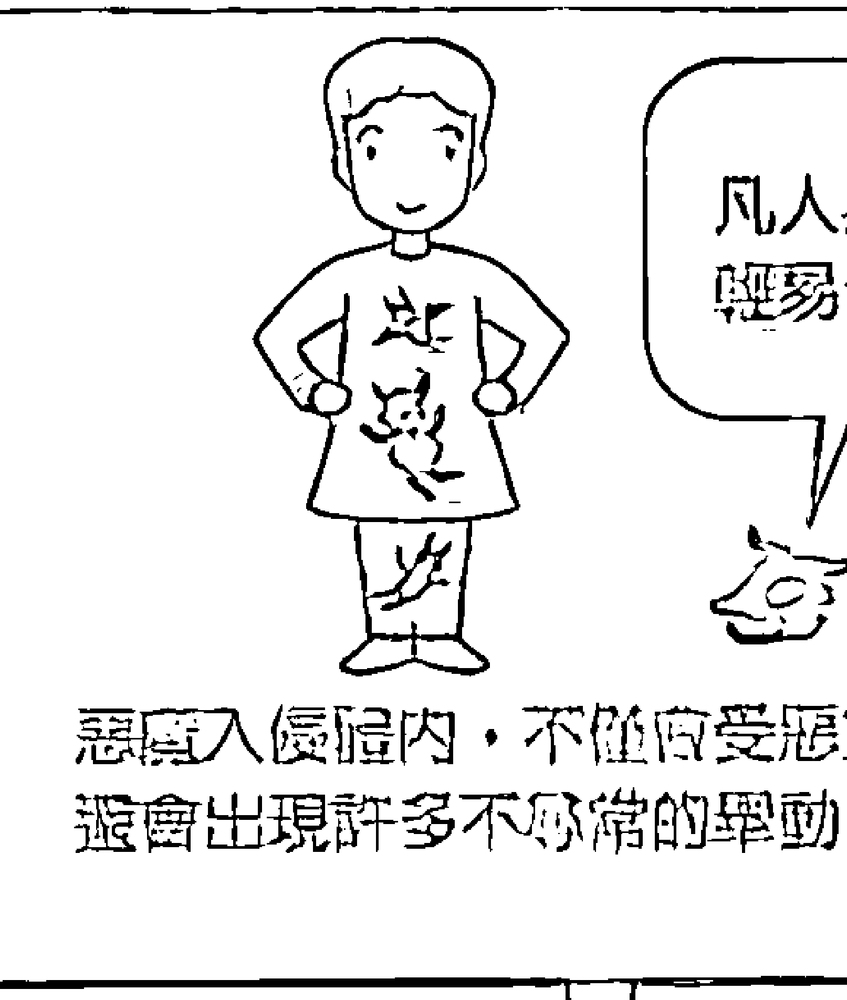

恶魔入侵体内，不但会受恶魔所扰，还会出现许多不寻常的举动。

发生在像圣安东尼这样的圣人身上

一般附身大多为此类

## 恶魔附身的征兆

女巫狩猎时代的恶魔学者认为被恶魔附身会有以下征兆：

- 认为自己被恶魔附身
- 生活不检点
- 疾病不断、持续昏睡
- 受恶梦骚扰
- 口吐猥亵或冒渎的话语
- 猥亵裸露
- 口吐发针、扣子、铁块、石头等异物
- 畏惧圣遗物或圣事
- 说出奇怪而恐怖的外貌
- 发出动物般的声音或动作
- 变得凶暴、有暴力倾向
- 对生存感到厌倦
- 活动后失去相关记忆

# No.084

## 卢丹恶魔附身事件

## Loudun Possessions

曾出现恶魔契约书的卢丹恶魔附身事件可谓史上最著名的集体附身案例，但其实背后暗藏着为攻击格朗迪埃神父的政治阴谋。

## ○牵连多位恶魔的政治阴谋事件

十七世纪前半卢丹市喧腾一时的恶魔附身事件虽然是史上最著名的集体附身案例，背后却埋藏着政治上的阴谋。

当时卢丹的主任司祭尔班·格朗迪埃俊美风雅，非但曾经与多位女性发生过关系，而且态度傲慢，为自身引来欲置之死地的敌对势力。后来便以卢丹的乌尔苏拉会女子修道院为舞台，发生规模庞大的恶魔附身事件。

这场恶魔附身始于西元1632年10月。三十岁的修道院长珍·德·安洁与数名修女遭多名恶魔附身，骇人的尖叫声与痉挛将修道院闹得沸沸扬扬，也让好几位圣职者与主教前往调查。经过驱魔仪式后，众人根据德·安洁的证辞发现附身者是恶魔亚斯她录，他藏身在卢丹主任司祭尔班·格朗迪埃神父送进修道院的那束玫瑰花中，乘机潜入修道院。

尽管如此，卢丹的审判所和医生们还是做出明智的判断，认为此事绝非恶魔引起，骚动一度平息，而恶魔也消失无踪。

可是隔年夏天风波再起，这次连格朗迪埃神父最大的敌人枢机主教黎塞留都出动了，并且由枢机主教的心腹波尔多高等法院评定官劳勃德蒙负责调查。修道院再次发生大规模的恶魔附身事件，这回驱魔仪式亦更加盛大、彷佛表演秀般公开举行，引来大批好事者看热闹，过程中甚至连接朗迪埃神父与恶魔的契约书（请参照P.132）、与阿斯摩丢斯的契约书（请参照P.024）都被拿出来。1634年8月18日，格朗迪埃就被送上绞刑台处刑了。

> 黎塞留 (Richelieu, 1585–1642)：法国路易十三世的大臣，也是枢机主教，绰号红衣主教

## **洛丹的恶魔附身**

史上最恶名的集体附身事件
其实是政治阴谋！

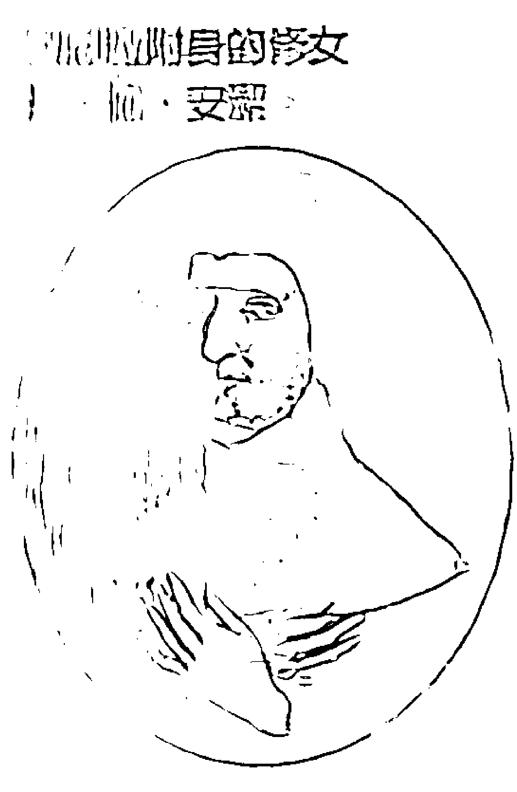

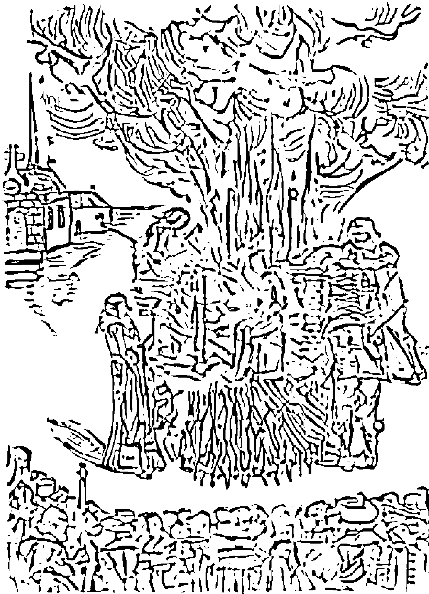

## **法国 卢昂修道院长珍·德·安洁和恶魔**

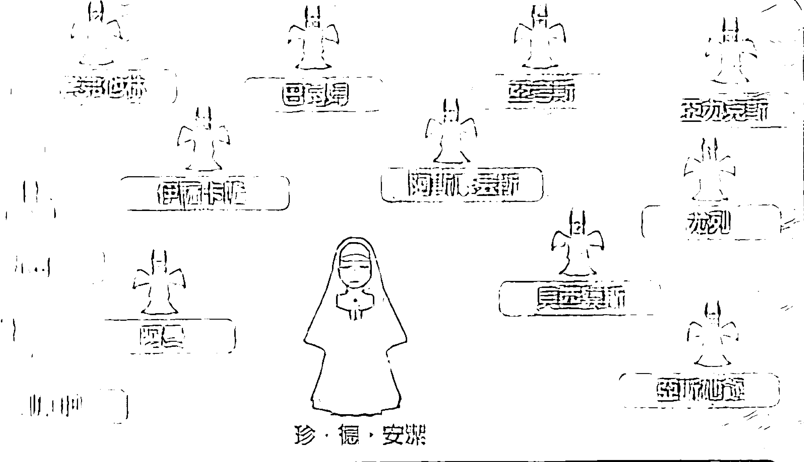

> 据说珍·德·安洁陆续遭到多名恶魔附身，据说同时最多有七名恶魔附身。其他的修女也同样遭到其他恶魔附身

洛丹位于法国西北部的瓦门地区平原，是此为新教零星据点主教开始的城镇。

# No.085

## 格朗迪埃神父与恶魔的契约书

## Written pact with the Devil

在卢丹的恶魔附身事件当中，甚至连恶魔署名的契约书都出现了，还被拿来当作格朗迪埃神父与恶魔签有契约之证据。

## ○从主教大人屁股底下出现的恶魔契约书

审理卢丹恶魔附身事件的女巫审判一案当中，卢丹的主任司祭格朗迪埃神父最后被判与恶魔签定契约罪状属实，处以火刑。审理法庭主张格朗迪埃神父透过恶魔契约获得了地位、名声与享乐，因此乌尔苏拉会女子修道院的修女遭多名恶魔附身一事必须归责于他。

有趣的是日后审理庭作为判决依据的关键物证，也就是格朗迪埃神父与恶魔缔结的契约书。恶魔契约向来是女巫审判中的重要论点，可是除了卢丹恶魔附身事件以外从不曾有过实际案例。

这份契约书出现于西元1634年5月17日，当时正在举行驱魔仪式，出现地点则是事发修道院东北方的圣科瓦教会，周遭还有大批民众围观。

当时自女子修道院院长珍·德·安洁身体上显露出来的恶魔是利维坦，驱魔仪式正好进行到搜寻契约书的阶段，驱魔师遂命令利维坦取出契约书。由于利维坦拒绝合作，于是仪式负责人普瓦捷主教洛施波塞遂命人用“圣体”塞住德·安洁的嘴。驱魔师照办后，听见利维坦仿佛好不容易挤出声音般，说：“找找那里……那位大人的下面……主教大人。”

洛施波塞闻言立刻从矮凳站起身，发现僧衣下有包用纸包住的东西，打开后里面竟是一个沾血的信封，而信封内的则是契约书。

## 格朗迪埃神父被判有罪的决定性证据 → 发现恶魔的契约书！

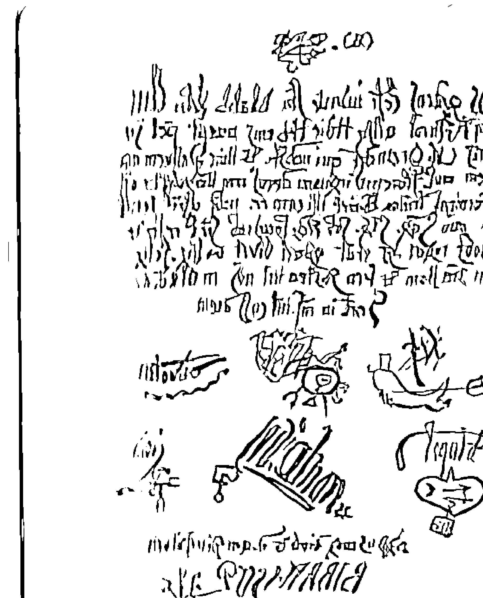

在卢丹恶魔附身事件发现的恶魔契约书分成两个部分，第一部分写有格朗迪埃神父署名的效忠宣誓，第二部分则是记录众恶魔承认神父的忠诚，而且还有恶魔的署名。其中第二部分契约书是以拉丁语写成，而且还是由右向左书写的颠倒文字，因为恶魔是与基督教恰恰相反的存在。左图是第二部分的契约书，大意如下。

> 在这里的路西法与其从属撒旦、别西卜、利维坦、埃力米、亚斯她录及其使者，今日收受仆人尔班·格朗迪埃缔结之同盟契约。我等将赐与此人女性情欲、世俗之花、修道女的纯洁、世俗的荣誉、快乐与财富。此人每三日都要行恶行，临终时将奖励于他，而他每年将以自身鲜血为礼物。凭此契约之力，他将享受二十年的幸福，并因诅咒神而得以来到我等身边。

路西法、别西卜、路西法、利维坦、亚斯她录。
地狱诸侯之署名为印认证。

> （摘自《恶魔学大家》松田和也译／青土社出版）

1. 什么是圣别的面包。天主教会等宗教有在弥撒中把圣别的面包当成基督身体的仪式。

# No.086

## 驱魔
Exorcism

所谓驱魔就是将危害某人或某个地方的灵，藉由力量更强大的灵——耶稣基督圣灵之力进行驱赶的行为

## ○以耶稣之名驱赶恶魔

所谓驱魔（Exorcism）就是指将恶魔驱赶出所依附之人、物品或场所的行为。正如《新约圣经》所记载，耶稣及其弟子们曾多次行使驱魔，可见驱魔早自基督教创始之初便已存在。

初期的驱魔行为非常单纯。以耶稣为例，只需对恶魔命令“出去”，因为耶稣的权威就等同于神；若是耶稣的弟子，则只要命令“以耶稣之名，出去”即可，重点就在于凭借耶稣基督的权威命令恶魔。《路加福音》第10章描写被耶稣派遣到各地的七十二位弟子回来后曾经说过：“主啊！因你的名，就是鬼也服了我们。”这点是至关重要的。反过来说，无论是何种圣人，除非凭借耶稣之名否则无法驱退恶魔。总之，当时的基督教徒任谁都有能力可以行使驱魔。

然而随着驱魔仪式的形式化，开始出现唱诵耶稣之名的神谕或祈祷、祭司将手掌置于接受圣事仪式者头顶的按手礼^1^、敷施圣油等驱魔方法。其次，基督教还在三世纪的时候另外设置了驱魔师（Exorcist）这个专门行使驱魔的阶级。到了女巫想象氾滥蔓延的十五～十七世纪，驱魔的仪式甚至已经演变成具有戏剧性质、表演性质的仪式，拥有向一般基督教徒昭示基督力量远胜于恶魔的教育意义。

不过无论是哪个时期，驱魔的本质仍是向耶稣基督祈愿，因为所谓的驱魔其实就是借用比作祟灵体更强大的灵=耶稣基督圣灵的力量，将恶魔驱赶出所占据之人休或场所的行为。

> ：按手礼（Imposition of hands）：一种宗教礼仪。指命伯禾（圣三名），有三种含意：祝圣、传递神恩及认同。
：加利利（Galilee）：古代巴勒斯坦北部地区，相当于现今以色列北部。

## ## 驱魔的原理

所谓驱魔 ⇒ 将恶灵逐出所占据之人、物、地的仪式
早自基督教创始之初便已存在

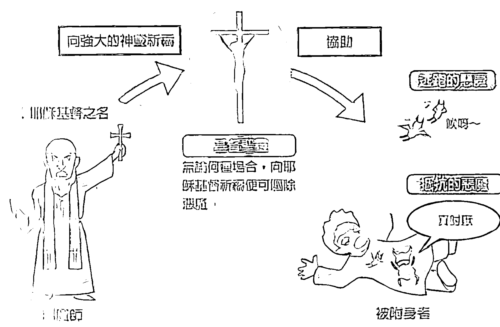

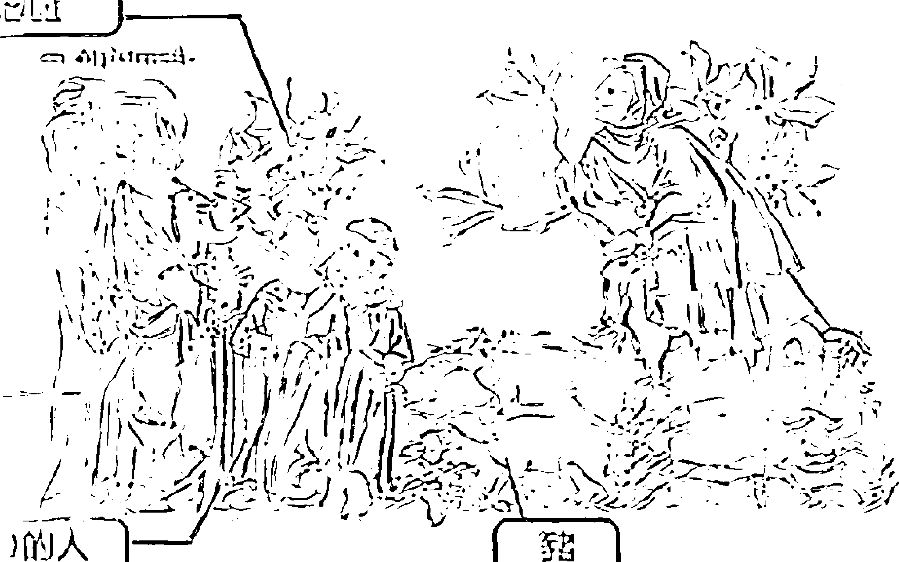

《圣经》（何肯圣经标本）当中的记载，指给《路加福音书》第8章
根据圣经故事记载，当时耶稣在加利利湖附近为一名被恶鬼附身者进行驱魔，众恶鬼从那人体内逃到山上的猪群，猪群随即冲下山坡，投在湖里淹死了。

# No.087

## 驱魔的仪式书

## The Roman Ritual (Rituale Romanum)

天主教教会于女巫全盛时期的西元1614年颁布了《罗马典礼制定书》，书中正式制定驱魔相关注意事项以及程序。

## ○ 《罗马典礼制定书》里的驱魔至今仍然有效

西元1614年可谓正值女巫妄想的全盛时期，那年罗马天主教教会颁布了《罗马典礼制定书》。所谓典礼指的虽然是弥撒等教会共同行使的仪式，不过这部制定书对驱魔的规则也有详细的规定。

由于民众大多对恶魔过于畏惧，并且习惯把所有问题归咎于恶魔，经常举行驱魔仪式，所以遭遇到许多问题。而《罗马典礼制定书》刊行的目的就是要阐明这些问题的应对方式、驱魔时的注意事项与理想程序。

以恶魔的依附现象为例，书中提到不可轻易相信人类被恶魔依附，必须将精神病与附身现象区隔开来。此外，由于驱魔的时候恶魔会借用遭附身者的嘴巴发言，驱魔师与恶魔之间可以进行对话，关于这点制定书亦提出了警告。就算恶魔无所不知，也不可以提出无聊的问题，因为的确有驱魔师曾询问恶魔未来的事情或圣经之谜。还有，恶魔不但喜欢说谎，有时还会装得好像已经离开附身者，驱魔师必须提高警觉。书中教导驱魔师跟恶魔对话时得观察他们畏惧的辞句，如果碰上恶魔抵抗的情形应该重复多讲几次，尽量加以惩罚。如果有必要的话，驱魔仪式长达好几个钟头也要继续下去。

时至今日，《罗马典礼制定书》当中的驱魔相关项目仍然维持当时的形式，而且仍旧有效。天主教教会亦存在着许多地方驱魔师，至今仍努力进行驱魔活动。

*1 白罩衣 (Surplice)：天主教以及基督教安立甘宗、信义宗或其他类似派别的神职人员、襄礼员、唱诗班领唱人等在礼拜时穿在外面的衣物。

*2 圣带 (Stola)：基督教牧师、神父等在举行礼拜仪式时披的一件长带。不同的节期会有不同颜色的圣带领带。

## 罗马典礼制定书 (1614)

规定驱魔的规则

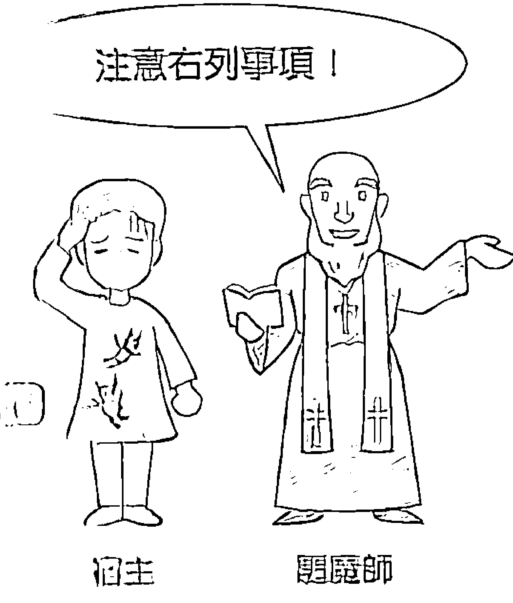

- 不可轻易相信他人遭到恶魔附身
- 就算恶魔无所不知，也不可以探问出于个人兴趣的问题
- 恶魔会说谎，得提高警觉
- 事先记住恶魔讨厌的语句，可以用来惩罚恶魔

《罗马典礼制定书》制定了以下的驱魔程序：

> 神父执行驱魔时会穿戴白罩衣与圣带，将另一端套在宿主（遭恶魔附身者）的脖子。如果宿主骚动起来便可以此捆绑，还要向参与者洒圣水。

① 第一次驱魔

② 第二次驱魔

③ 第三次驱魔

①②③以耶稣之名命令恶魔离开，滔滔讲述恶魔是何等低劣、不及上帝。

④ 最后的祈祷

## 马丁路德与恶魔

猎女巫的时代刚好是宗教改革的时代。宗教改革之目的在于洗净罗马教会在漫长历史中累积下来的杂质，当时的教会已经成为巨大的权力机关，在各方面都有矛盾之处，充斥着与圣经毫无关系的惯例与教条，并且认为唯有服从教会的指导才算是信仰上帝。为改变当时的状况，宗教改革强调要回归圣经本身，诉诸个人直接信仰上帝之重要性。虽然这项改革使得新教从罗马教会（天主教）分离出来，却是欧洲史上堪与文艺复兴相提并论的一大步，不过尽管如此，猎女巫风暴并未就此结束。光就相信恶魔存在这点，新教徒的狂热程度丝毫不亚于天主教徒。

就连宗教改革的核心人物——德国的马丁路德（1483~1546），也挺天真地相信恶魔存在。

致力于回归圣经教示的马丁路德在圣经的字里行间发现恶魔的踪影，不过恶魔其实不只存在于圣经，他在现实生活中也频频遭受恶魔的攻击，这一切全都被他详细记载在《恶魔志》（Teufelsbuhi）里。其中一则有名的故事据说发生在路德投居瓦特堡期间，恶魔在他翻译德文圣经时突然出现，把胡桃撒得满地都是，气得路德抓起墨水瓶朝恶魔砸去，据说那时的墨迹至今还留在瓦特堡的墙上。

路德常与亲近的朋友围着餐桌谈论各种事情，这些收录成《桌边谈录》，从这本书也可了解路德有多畏惧恶魔、多么憎恨女巫。路德主张一切不幸均是恶魔造成，法律家若迎恶魔侵袭就会做出不公正的判决，皇帝受秘入侵就会引来战争。另外，路德还说恶魔在诸国都有住处，并举出具体的地名，而女巫根本就不值得同情，应当全部处以火刑。

既然路德本人都抱持这种态度，路德主义信徒自然也不惶多下。西元1568年，法兰克福的出版商齐格蒙·费若本便将路德主义信徒撰写的多本恶魔书籍纂集成一册刊行，恶名为《恶魔场》，所有与恶魔相关的问题几乎都收编其中。恶魔总数为666名的主张据说也是出自此书。

瓦特堡（Wartburg）：德国历史及传说上的著名城堡，位于图林根州爱森纳赫市附近的丘山上。这座城堡于1999年时被联合国教科文组织列为世界遗产保护区。

## ## 第5章

### ## 魔法書恶魔学

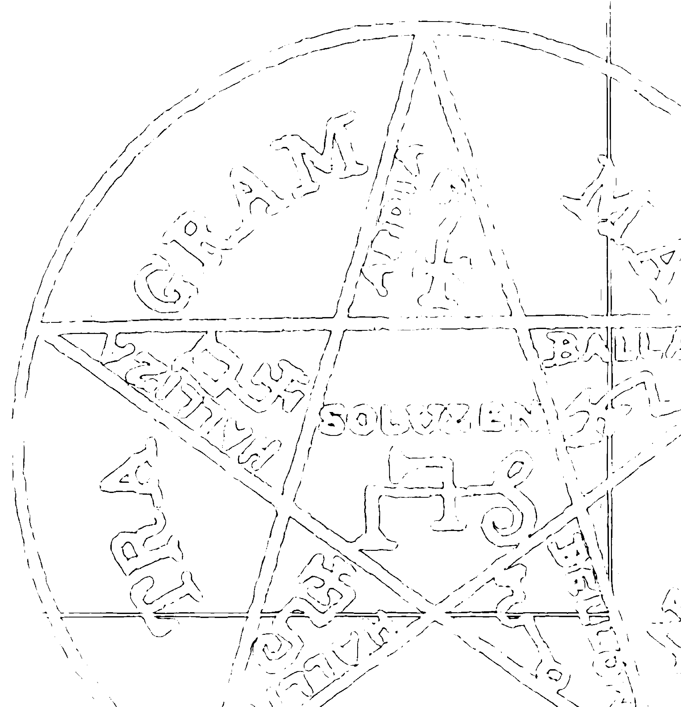

# No.088

## ## 何谓魔导书？

Grimoire

所谓魔导书就是指记载如何单方面驱使恶魔或神灵的魔法书籍，可以避免传统的“恶魔契约”带来的危险性。

- 使恶魔服从以实现欲望

所谓魔导书就是教人如何透过祈祷、对话或威胁来操纵恶魔、天使及各种神灵，以达成自身欲望的魔法书籍。书中记载着操纵灵体的魔法圆、印章、印记、魔法杖等相关道具的制作方法，以及大量的咒语咒文。除了内容十分诡异，书名也是如此，譬如：《所罗门之钥》、《大奥义书》、《教皇洪诺留的魔导书》等，给人一种古老的感觉，好像欧洲中世纪的魔法师们都会私下参考这些魔导书籍。

然而，许多人对魔导书的印象却有几个相当大的误解。

首先，魔导书绝对不是如我们所想像那般古老的产物，至少现存的魔导书都是如此。魔导书流行于十七、十八世纪的欧洲，著名的作品几乎都是在那个时代下所写成。当时猎女巫盛行，用来操纵恶魔的魔导书需求自然也比较大，况且如果恶魔的力量过于强大，出现与其向神祈禱倒不如拜托恶魔比较快的想法也不足为奇。当然，现存魔导书的内容也有可能包含古代流传下来的记述，不过真相究竟如何已经无从而知。

此外，由于魔导书之目的在于驱使恶魔实现自我欲望，起来好像跟传统的“恶魔契约”相同，但其实也是个很大的误解，因为使用魔导书并不会去做像与恶魔签约那么危险的事情。由此可知，所谓的魔导书便是指记载不必冒太大的风险，就能完全单方面使唤恶魔以达成自我欲望方法的书册。

## 所谓的魔导书

用于驱使恶魔或神灵的魔法书籍

> 其特征有？

> 这么多啊！

## 魔法图、魔法道具、咒文等丰富内容

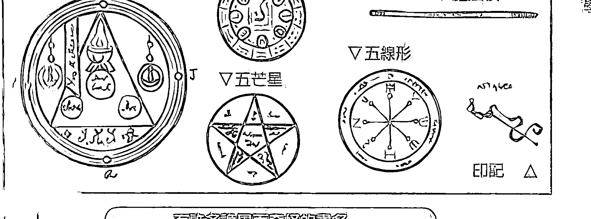

## 有许多诡异而奇怪的书名

- 《所罗门王之钥》《所罗门王的小钥匙》
- 《教皇洪诺留的魔导书》《大奥义书》
- 《梅西第六、七书》《阿布马兹的魔导书》
- 《亚伯拉梅林的神圣魔法书》

> 哪里被误解了？

## 魔导书其实并非那么古老的作品

大部分著名魔导书成书于十七、十八世纪的西欧，此后开始流行。另一方面，活版印刷十五世纪就发明了，所以魔导书是以印刷品的形式流通而非手抄本。

## 有别于传统的“恶魔契约”！

所谓的“恶魔契约”会使灵魂被剥夺，危险性高。魔导书并不会缔结如此危险的契约。

# No.089

## ## 所罗门王与恶魔的传说

### ## Demons in “The Testament of Solomon”

根据《所罗门王的遗言》记载，从前所罗门王因天使米迦勒赐与神的戒指，得以任意驱使恶魔、建立神殿。

### ## ○驱使恶魔建造神殿的所罗门王

所罗门王跟魔法、恶魔的关系匪浅，这点从《所罗门王之钥》等著名魔导书纷纷以其名号为题便可见一斑。

以色列王国第三代国王所罗门（西元前965～前925年在位）是大卫王之子，以建造豪华雄壮的神殿宫殿，并创造出以色列王国最鼎盛的时期而闻名。《旧约圣经》说他是获得上帝赐与智慧与见识的智者，当中的《智慧篇》也有《所罗门训》的别称。但根据《列王纪上》记载，所罗门王娶了好几名异国的妻子，而且还祭祀异教的神明。

这些历史记载后来渐渐衍生出所罗门王驱使恶魔的传说，譬如在中世纪之前一直被奉为魔法与恶魔相关知识宝库的《所罗门王的遗言》（一～三世纪）便是这样的作品。故事提到从前所罗门王建造神殿的时候，有恶魔附身在一名少年工人身上，所罗门王为此向上帝祈祷。后来天使米迦勒现身，赐给他一只能够用来号令恶魔、刻着上帝印记五芒星的戒指，所罗门王便靠着这枚戒指将附身于少年的恶魔收为部属，还将恶魔王别西卜、阿斯摩丢斯与三十六区的恶魔也都收于麾下，并且运用这些恶魔的力量，终于完成了极为困难的神殿建筑。

伊斯兰教的圣经古兰经（七世纪）亦收录暗示所罗门与恶魔关系的故事。根据该则故事记载，所罗门王曾经得到神赐与特别的力量，非但可以听懂动物的声音，还能一次役使精灵、人类、动物依自己号令而行。相传从前希巴女王来访的时候，所罗门王便曾经命令一个妖精在瞬间将女王从她的祖国（应是位于南阿拉伯）搬到面前。

## 所罗门王

- 建立王国的鼎盛时期
- 得上帝赐与智慧与见识
- 祭祀异教神明

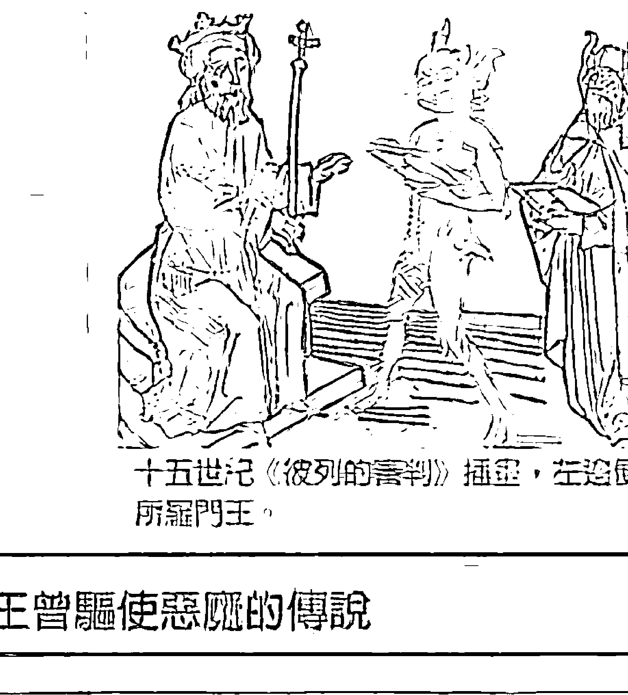

十五世纪《彼列的审判》插画，左边便是所罗门王。

> 衍生出所罗门王曾驱使恶魔的传说

## 《所罗门之钥》中的三十六魔神

| 1 阿加克斯 | 13 弗波忒 | 25 阿纳特列特 |
| 2 西沙里 | 14 库梅亚忒 | 26 耶纳扁他 |
| 3 阿利耶 | 15 雪洛耶 | 27 飞多 |
| 4 松果 | 16 亚特拉克斯 | 28 哈帕克斯 |
| 5 巴利 | 17 叶洛帕 | 29 阿诺斯特 |
| 6 布耶 | 18 布都蔻克 | 30 阿勒波 |
| 7 耶耶 | 19 纳欧多 | 31 赫非希米列 |
| 8 耶基 | 20 马岱尔 | 32 伊可希翁 |
| 9 耶耶 | 21 阿拉多 | 33 阿空涅欧 |
| 10 耶耶 | 22 未记载 | 34 奥多希 |
| 11 耶耶 | 23 涅弗医达 | 35 弗亚诺特 |
| 12 耶耶 | 24 阿顿 | 36 毕亚纳基 |

- 天主教、希腊正教将其视为《旧约圣经》正典之一
- 黄道每三十度分成十二等分，称为宫：每十度分成三十六# 《摩西第六、七書》
## The Sixth and Seventh Books of Moses

相傳古代以色列的英雄摩西得上帝賜與知識寫下十部書，這十部書就是《舊約聖經》開頭的五部，以及另外五部被隱藏起來的魔導書。

### 冠上《舊約聖經》英雄摩西名號的偽書

《摩西第六、七書》是部秘密流傳於十八世紀德國及周邊地區，廣受歡迎的魔導書。

《舊約聖經》開頭的五部書（《創世記》、《出埃及記》、《利未記》、《民數記》、《申命記》）合稱為摩西五書。摩西是古以色列的英雄，相傳他在得到上帝傳授知識以後寫下了這五部書，而《出埃及記》亦寫到摩西曾經引發許多不可思議的神奇現象，其中尤以紅海在摩西面前一分為二，讓受困埃及、被當成奴隸的以色列人順利通過紅海的故事最為有名。猶太教與基督教認為這並非魔法而是奇蹟，因為此事並非精靈或惡魔所為，而是神力所致，可是對一般民眾來說，奇蹟和魔法並沒有什麼分別。

於是後來遂有以下傳說：摩西得到上帝傳授知識後，留下的其實不只摩西五書。摩西曾得上帝傳授十誡，所以他的作品數目應該共有十部，其中第一至五書便是《舊約聖經》開頭的五部作品，而第六至十書據說是魔導書。這個傳說流傳已久，早在四世紀以莎草紙書寫的魔導書便已發現有關摩西六至八書的相關記述。

《摩西第六、七書》就是由聽聞摩西六至八書傳說者於十八世紀前後所著，後來甚至還有《摩西第八、九、十書》等相關作品。儘管這些作品的成書過程已無從得知，不過一般認為是猶太教神秘主義喀巴拉通俗化的產物。《摩西第六、七書》主要內容為如何使天使、自然界精靈、惡魔等服從，藉以實現各種願望的魔法。

摩西第六、七書 → 十八世紀德國的魔導書；《舊約聖經》英雄摩西所著？

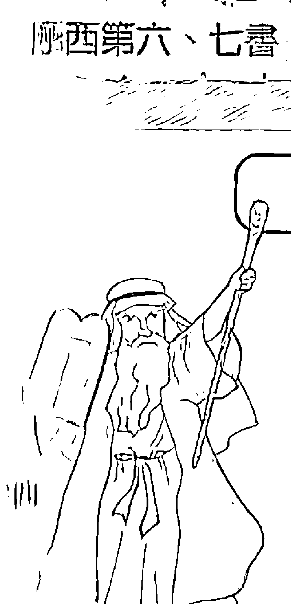

聖經英雄摩西得上帝傳授知識後寫了十部書

-   《舊約聖經》開頭的五部稱為「摩西五書」
-   五部魔導書「摩西六～十書」

《摩西第六、七書》乃摩西所著？

## 《摩西第六、七書》的魔法

《摩西第六、七書》 → 驅使天使、精靈、惡魔使其服從自己

> 舉例來說，《摩西第七書》說到如果想讓墮天使的同伴——精靈的偉大七王子當中的阿尼庫葉服從自己，就要使用以下的魔法圓與印記

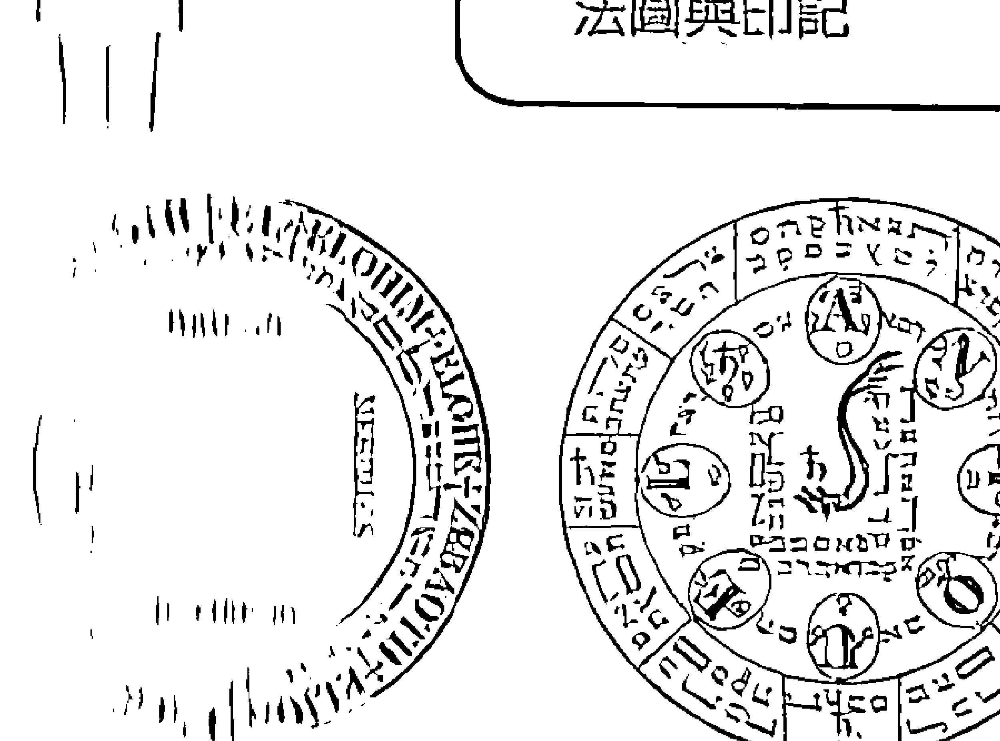

# 阿尼庫葉的印記

阿尼庫葉是位會應施術者希望帶來寶物與名譽的精靈，現身時會化作伊甸園那隻蛇的模樣。此印記以蝴蝶血書寫於羊皮紙上，持此印記向阿尼庫葉唱誦正確咒語，就能使惡魔服從自己。

......蝴蝶血書寫羊皮紙而成的魔......例，施術者要在十一點～三......開始依序進行儀式。

No.091

# 《所罗门王之钥》

The Key of Solomon the King

对后世魔导书留下莫大影响的《所罗门王之钥》，其中记载的魔法不但能号令恶魔，更是足以驱动所有神灵的伟大魔法。

## ○不仅限于恶魔而以所有神灵为对象的魔导书

《所罗门王之钥》（或称《所罗门王的大钥匙》）是史上最重要的魔导书之一，欧洲各国语言都有译本，然而成书顶多只能追溯到十四、十五世纪间。书中记载此书是所罗门王为其子所著，不过这个说法似乎并不符合现实。

后世所著《所罗门王的小钥匙》（又称《雷蒙盖顿》）内容提及所罗门王的72恶魔，但在《所罗门王之钥》并无类似记载。《所罗门王之钥》认为魔法基本上是神力所致，乃是透过向神祈祷来驱动神灵，而世界上存在许多神灵，彼此各司其职。举例来说，当时认为宇宙分成第一天到第十天，每个层级均由复数神灵掌管，而四大元素也都各有不同神灵负责，甚至每一个人也都会被分配到自己专属的神灵。

那么，该如何去驱动这些神灵呢？书中详细记载了执行魔法所需道具材料、适合施行占星术的时间、各种符箓（护身符与驱魔符）、符号以及咒语等相关事项。

此书共分两卷，第一卷是具体的施术方法，如：「寻找盗窃物品」、「隐藏身形」、「从贤者身上获得想要的知识」、「成为神灵所拥财宝之所有者」、「获得他人的好感与爱」的方法，以及所需护符等记载。第二卷则讲施术前的准备作业，亦即施术时的注意事项、如何净身、如何献祭品、如何制作道具等。

# 《所羅門王之鑰》

-   最重要的魔導書！
-   所羅門王為其子所著？
-   其實成書於十四、十五世紀
-   附錄收錄大量符籙

## 《所羅門王之鑰》魔法的原理

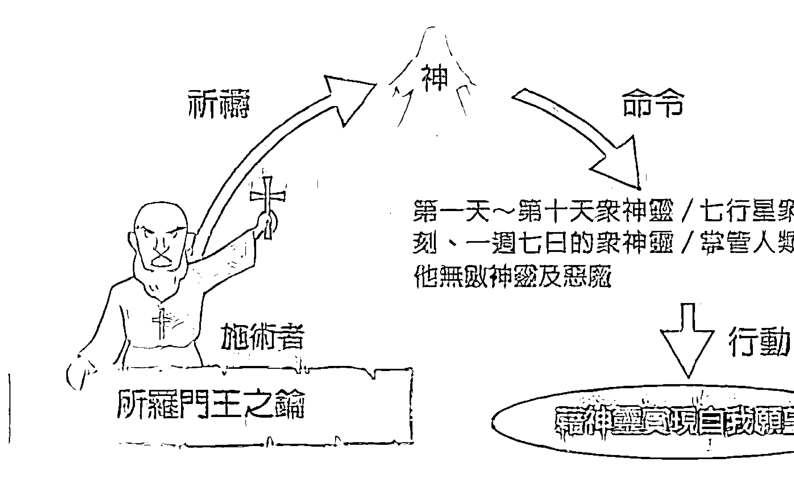

> > 《所羅門王之鑰》的魔法是藉神的力量驅動各種神靈，進而實現自己的願望，附錄收錄了施術所需符籙等大量圖版！

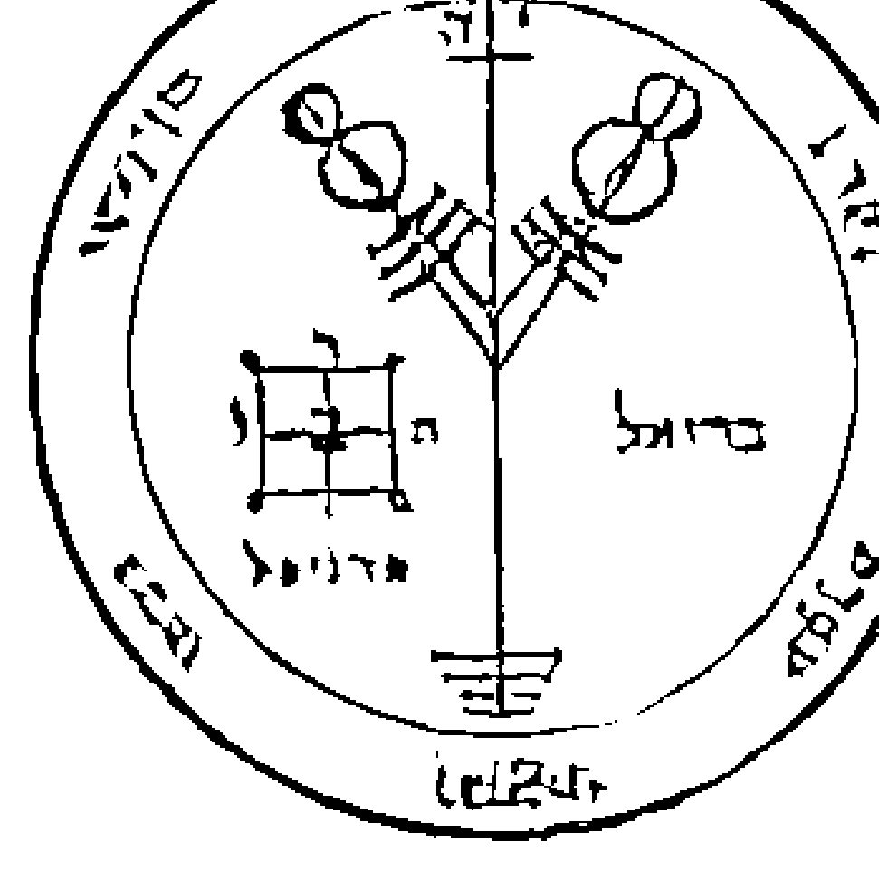

**木星第四符籙**
以白銀雕刻的符籙，用於木星每十二年一次進入巨蟹宮之日。能夠帶來莫大的財富與名譽。

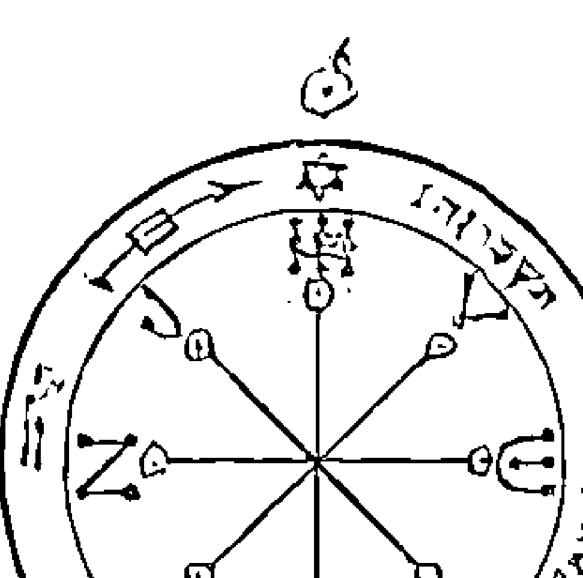

**火星第五符籙**
此符籙擁有極強大防禦效能，不管與什麼樣的敵人戰鬥都不會受傷，敵人揮舞的武器還會對自己造成反傷。

No.092

# 《所羅門王的小鑰匙》

## The Lesser Key of Solomon the King

所羅門王操縱位於地獄王國上層的72惡魔，藉以實現自身願望的魔法秘密，都藏在這部魔導書之中。

## ○記載所羅門王72惡魔最重要的魔導書

別名《雷蒙蓋頓》的《所羅門王的小鑰匙》為成書於十七世紀法國的魔導書。書中雖指為所羅門王所著，不過此說法似乎與現實有很大差距。

這本書在眾多魔導書當中之所以特別有名，那是因為名為〈哥耶提雅〉的第一章裡面記載了在地獄王國裡擔任高等職位的72個靈，也就是鼎鼎大名的所羅門王72惡魔，並且對每一位惡魔的地位、能力、召喚方法等都有詳細說明（相關資料請參照書末附錄）。

就整體來說，這本書並非惡魔的專書：第二章講述各方位神靈，第三章是掌管晝夜以及黃道十二宮的天使，第四章則是關於天空高處四個寶座上的神靈。

不過第一章〈哥耶提雅〉在整部作品舉足輕重卻是不爭的事實，甚至還有傳言懷疑《所羅門王的小鑰匙》初成書時僅有〈哥耶提雅〉一章，其他部分是後來追加進去的。據說約翰·威爾所創作的《惡魔的偽王國》（1577年）曾參考某份資料，因此亦有說法認為〈哥耶提雅〉的部分內容至少在那個時代已經存在了。

所羅門王與72惡魔還有下面這麼一則傳說。許多人都聽過所羅門王號令惡魔的故事，最後他將72惡魔及其麾下的魔軍團全數封印於黃銅材質的壺裡，並且把銅壺丟進了極深的大海中。許久以後巴比倫人發現這只銅壺，以為壺裡裝有財物而揭開壺蓋，讓壺裡的惡魔重獲自由、各自回到了原來的地方。而用來召喚眾惡魔以實現自身願望的魔法才被寫成了《所羅門王的小鑰匙》。

# 《所罗门王的小钥匙》

-   阅读重点
-   盛传乃所罗门王所著？
-   实则成书于十七世纪的法国
-   第一章 <哥耶提雅> 记载了著名的72恶魔

# 《所罗门王的小钥匙》概要

# 所罗门王的小钥匙

> 内容如下：

# 哥耶提雅

记载72位恶魔各自的地位、职务、能力外，并记载用来召唤恶魔的魔法仪式作法，以及号令各恶魔所需印记、咒语等

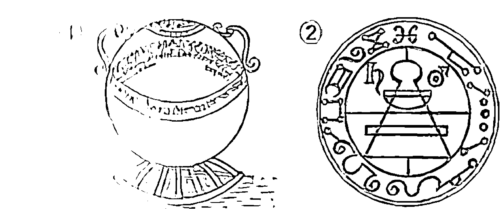

附带说明：
①是所罗门王驱使72恶魔以后将其收于其中的青铜壶；②则是将其封印的青铜印章

# 召魔之书

记载六位诸神灵与地狱之灵这些邪灵诸神灵的魔法之书

# 符印之书

记载夜间与黄道十二宫天使的魔法之书

# 神灵之书

记载祈求、召唤方法以及操纵天空高处四方位神灵的魔法之书

# 所罗门之柱

记载所罗门使用过的魔法

# No.093 何謂魔法圖？
## Magic circle

魔法圖是供施術者召喚惡魔時站在圓圈中、保護自身免受惡魔侵害的陣形，繪製時必須周到完全，不可有缺漏或模糊不清之處。

-   安全召喚惡魔的防護圓陣

所謂魔法圖就是供召喚惡魔的施術者站立其中、免於惡魔攻擊的保護圓陣，此外也有些魔法圖是召喚惡魔現身於圓心，藉以禁錮惡魔。基本上，魔法圖上都有雙層的同心圓，惡魔無法越過這個圓形的界線。
雖然魔法圖直到魔導書時代才變得重要，不過自古以來圓形便有其特殊意義。除了流傳著在病人或孕婦身邊畫圓防止惡靈的習俗外，亦有挖掘曼陀羅根時，必須在周圍畫下三層的同心圓的說法。圓是完整無缺的形狀，其內部自然成為了嚴禁上特別神聖的場所。
魔法圖可以用經過聖別的小刀、筆或者石頭等物直接刻在地板或地面，也可以畫在牛犢皮上，有時甚至會用細繩圍成魔法圖的形狀。無論使用何種方法，總之魔法圖一定要完整，因為倘若有缺口或是筆畫不清，惡魔就能從該處穿過魔法圖。
魔法圖中時會另外繪製五芒星、六芒星以及其他各種圓形模樣，或是書寫希伯來語、拉丁語、希臘語等特殊的文字，其中尤以阿多奈、泰特拉格拉瑪頓等與神有關的文字最為常見。阿多奈是「我主」之意，而泰特拉格拉瑪頓指的則是敬畏唯一神耶和華（YHWH）的神聖四字母。
以《所羅門王的小鑰匙》所載魔法圖為例，除了一般供術者站在裡面的魔法圖以外，書中還附有能使惡魔從中現身的魔法三角形。除此以外，書中從魔法圖的大小、使用何種顏色繪製，到如何排列等都有詳細規定，只要按照指示照做就可以了。

> 曼陀羅根 (Mandragora) : 根部末端分叉為兩股的植物，相傳是死州前所流出的精液滋生而成，根部會長成人形。據說根部遭拔出時會發出慘叫，聽見慘叫者就會死亡。

# 確保施術者免受惡魔侵襲的圓

施術者站在裡面召喚惡魔的圓形

有保護施術者免受惡魔攻擊的效果

有些則是能將惡魔禁錮於其中

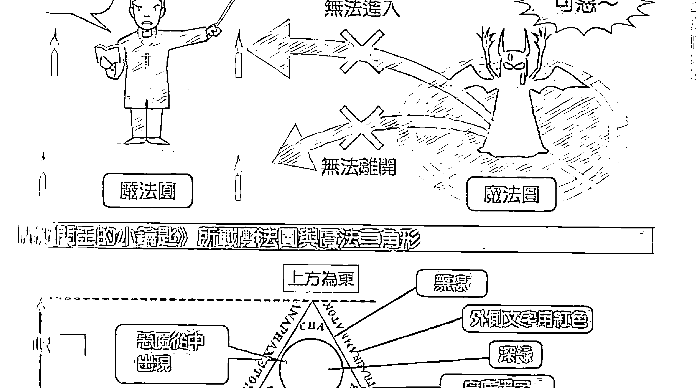

# 《所羅門王的小鑰匙》所画魔法圓與魔法三角形

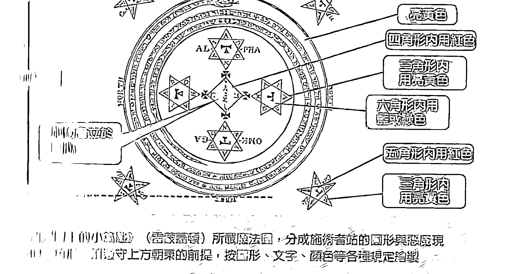

（巫師畫頁）所画魔法圓：分成施術者站的圓形與惡魔現

必須遵守上方朝東的前提，按圖形、文字、顏色等各種規定繪製

# 各種魔法道具
## Magic items

從五芒星、六芒星、印記、魔法杖，到製作這些魔法道具的小刀、筆等，魔法道具可謂是形形色色、五花八門。

## ○操縱惡魔的魔法道具種類繁多

除了魔法圓外，魔導書還記載著各式各樣的魔法道具。常見的有五芒星（Pentagram）、六芒星（Hexagram）、印記（Sigil）、護符（Talisman）與魔法杖等。

五芒星是共有五個頂點的星形，六芒星則是共有六個頂點的星形，尤其以所羅門王的五芒星、六芒星更是赫赫有名。根據《所羅門王的小鑰匙》記載，所羅門王會在衣服下襬處放置用牛擅皮製作的六芒星，如此便能將現身的惡魔變成人類模樣，使其服從自己。五芒星則是以金銀製成，別在胸前用來迴避危險。

印記是組合特殊符號與幾何學圖案而成的圖形，每一種印記各自對應不同的願望或惡魔，據說書寫在小牛皮、某種金屬或其他合適材質上，再搭配儀式便能發揮效果，所羅門王的72惡魔印記及其圖形便是最顯而易見的例子。而護符就是護身符，只不過施法用的護符效能更為主動，擁有獲得女性愛情之類的力量。

魔法杖（棒）也是很重要的武器。自古以來，魔法杖慣以榛樹樹枝製作，惡魔在魔法杖之前不得不聽從號令。此外，由於惡魔會從爐火的焚煙裡出現，爐煙及使用的芳香也是很重要的魔法道具。

製作上述各種魔法道具所用的小刀、劍或筆等道具，同樣亦屬魔法道具之列。魔導書裡也有記載這些道具的製作方法。基本上製作道具和材料都要用全新的，並且施以聖別儀式。

# 魔法專用道具

魔法道具

除魔法圖以外還有各種魔法道具
製作道具與材料也都有詳細規定

# 特別著名的道具

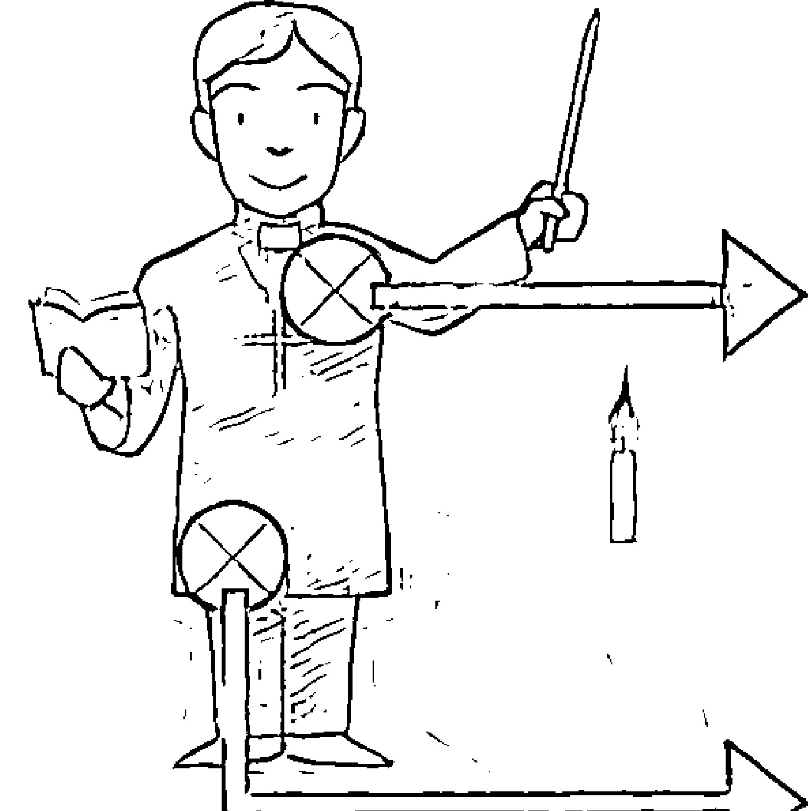

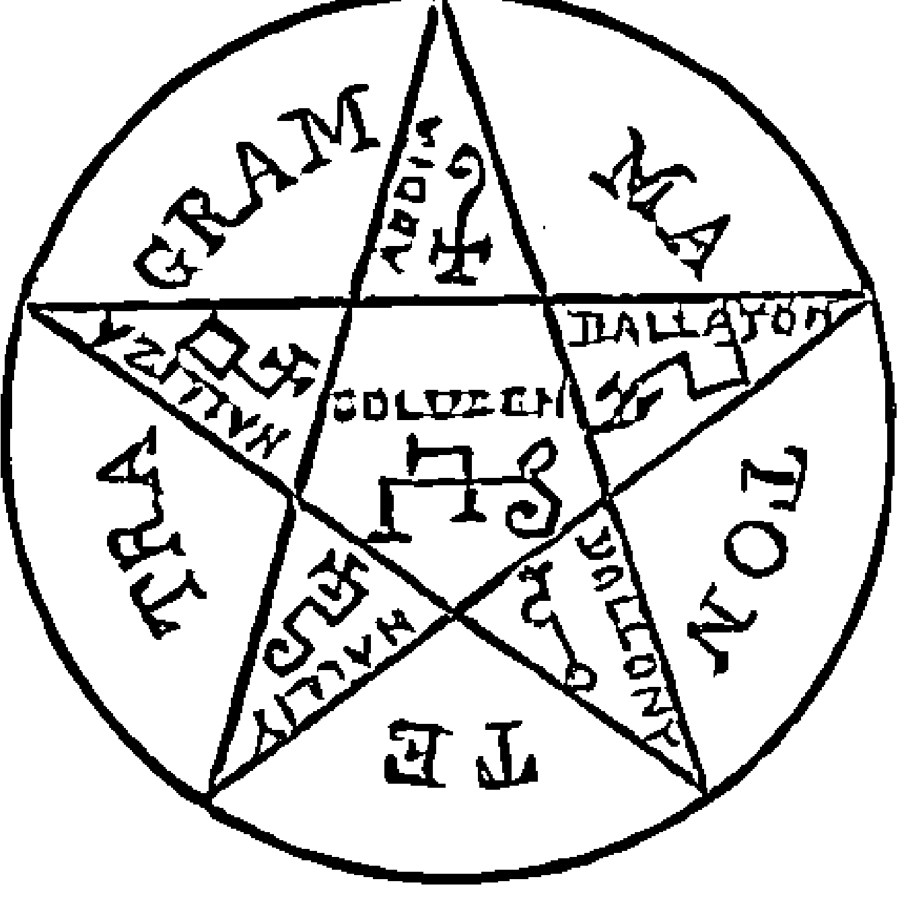

所羅門王的五芒星。以金銀製作別於胸前即可迴避危險。

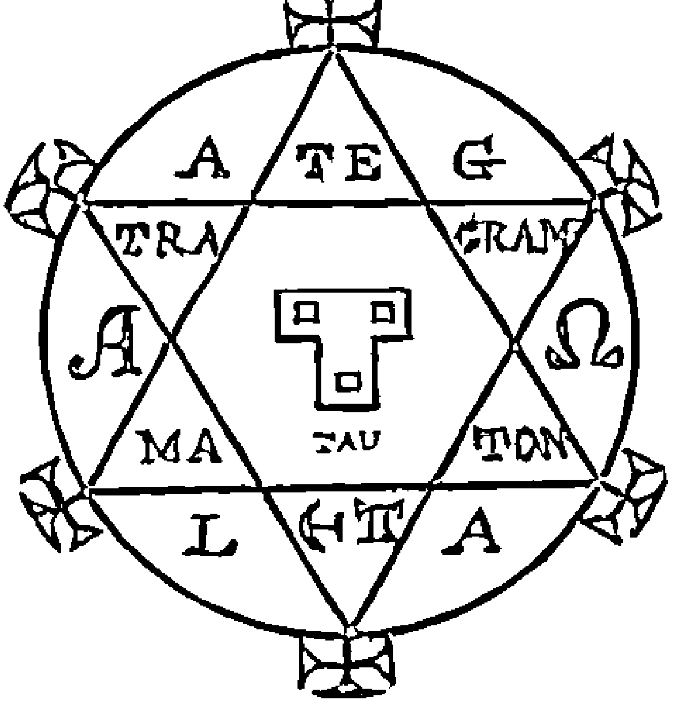

所羅門王的六芒星。以小牛皮製作放置在衣服下襬使惡魔服從。

# 其他魔法道具

# 爐（火缽）

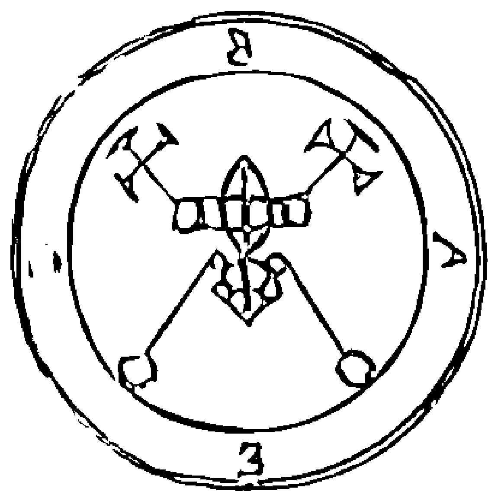

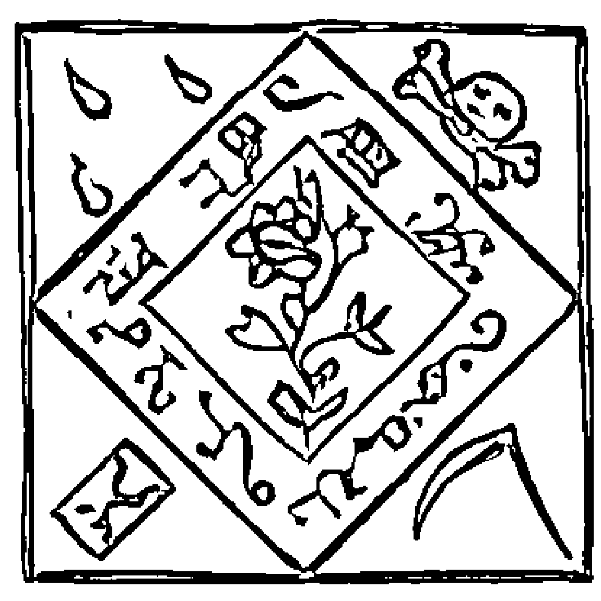

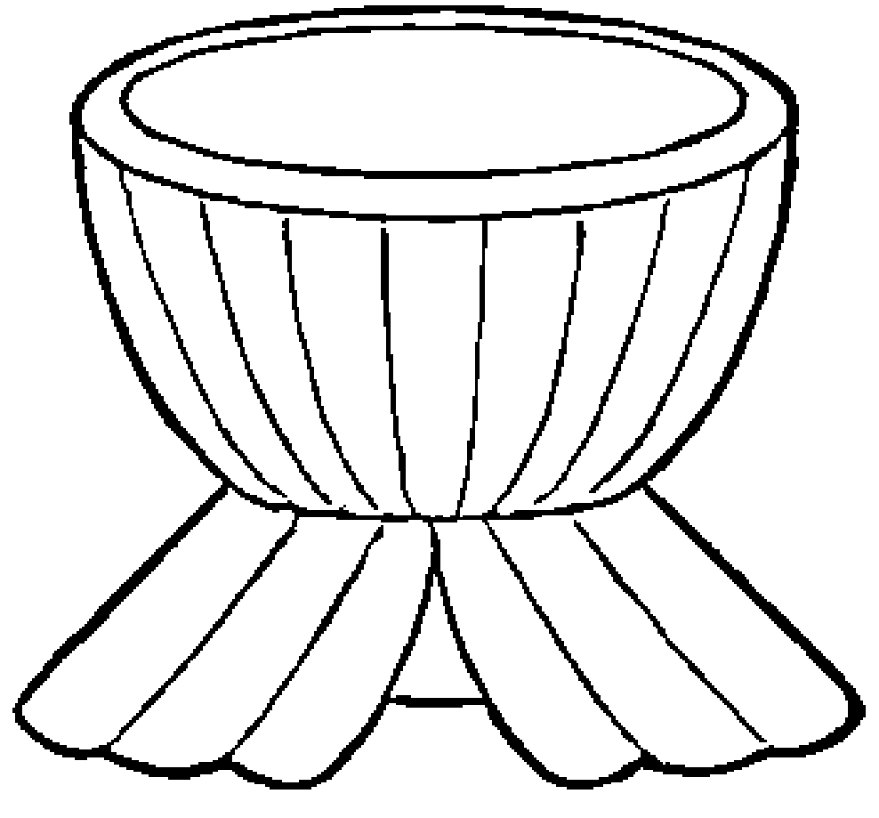

印記

護符

> 製作魔法道具所使用的小刀或劍等也是特製的

文字（符号）

希伯来文

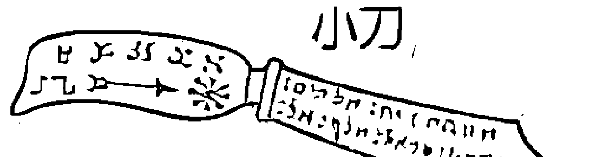

小刀

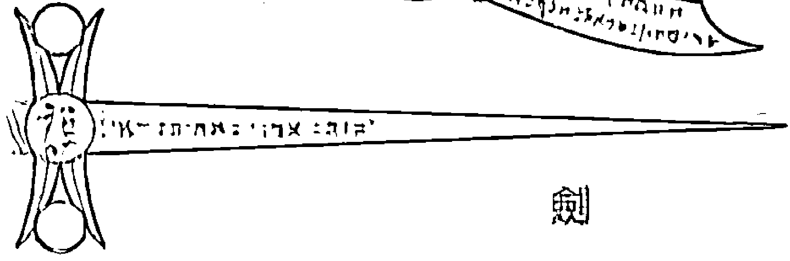

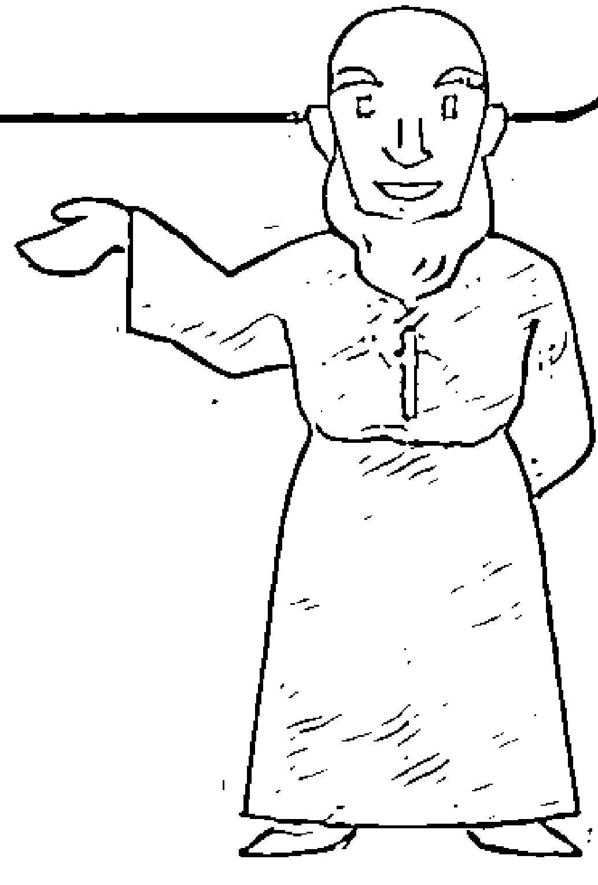

劍

No.095

# 《教皇洪諾留的魔導書》

## The Grimoire of Pope Honorius

《教皇洪諾留的魔導書》以將黑公雞挖眼、割舌、剖心的活祭儀式而聞名，是部惡名昭彰的魔導書。

## ○傳為魔法師的羅馬教皇所著魔導書？

《教皇洪諾留的魔導書》為《所羅門王之鑰》系列魔導書，其中記載的儀式相當極端，甚至可以用邪惡來形容。這部作品介紹了黑暗精靈的召喚方法，不過在召喚的前置準備階段必須以黑公雞執行活祭，並取出眼球、舌頭與心臟磨成粉末撒在羊皮紙上，有許多血腥的殘酷行為。在此之後施術者必須進行為期三天的斷食，並以連禱形式朗誦詩篇數節，再按規定手法使用所羅門王的魔法圓或五芒星進行祈禱，同時以指定的魔法圓等陣形召喚東西南北四方之王，或者一週各日的惡魔。根據這本書記載，四方之王分別是東方之王瑪揭亞、南方之王埃吉姆、西方之王派蒙和北方之王亞遜瑟；一週各日的惡魔則從週一路西法、週二弗利莫斯特、週三亞斯她錄、週四帕爾卜迪、週五貝卡德、週六古藍朵和週日史爾加特。

一般認為《教皇洪諾留的魔導書》的作者是十三世紀初的羅馬教皇，也就是傳說為魔法師的洪諾留三世，不過事實上這本書是在十七世紀後半出版，並且在巴黎的魔法師之間廣泛流傳。

《教皇洪諾留的魔導書》的名稱似乎是取自於更加古老的《洪諾留的誓約書》一書。有紀錄指出，這本書早在十三世紀初期便存在，但成書年代已不可考。據說書中集結了那不勒斯、雅典、托萊多與底比斯等地魔法達人的知識，教人開煉獄、捉小偷、取得財寶、召喚惡魔並加以命令的諸多方法。

> *托萊多（Toledo）：西班牙中南部一省。境內大多屬於塔古斯河及其支流組成的水系，出產多種農、林、牧、礦產品。

# 《教皇洪诺留的魔法书》

传为十三世纪罗马教皇洪诺留三世作品？

其实成书于十七世纪

以血腥的残酷仪式闻名

召唤恶魔之书

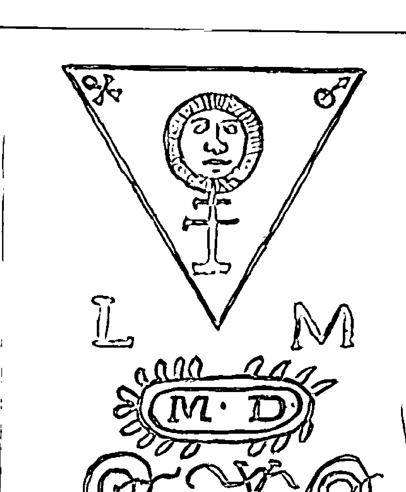

《教皇洪诺留的魔法书》召唤的恶魔

可以让这些恶魔服从命令

| 符号 | 恶魔 |
|------|------|
| I | 玛迪亚 |
| IV | 埃吉姆 |
| III | 派罗 |
| II | 亚斯莫 |

召唤各方之王要使用右方的魔法圆

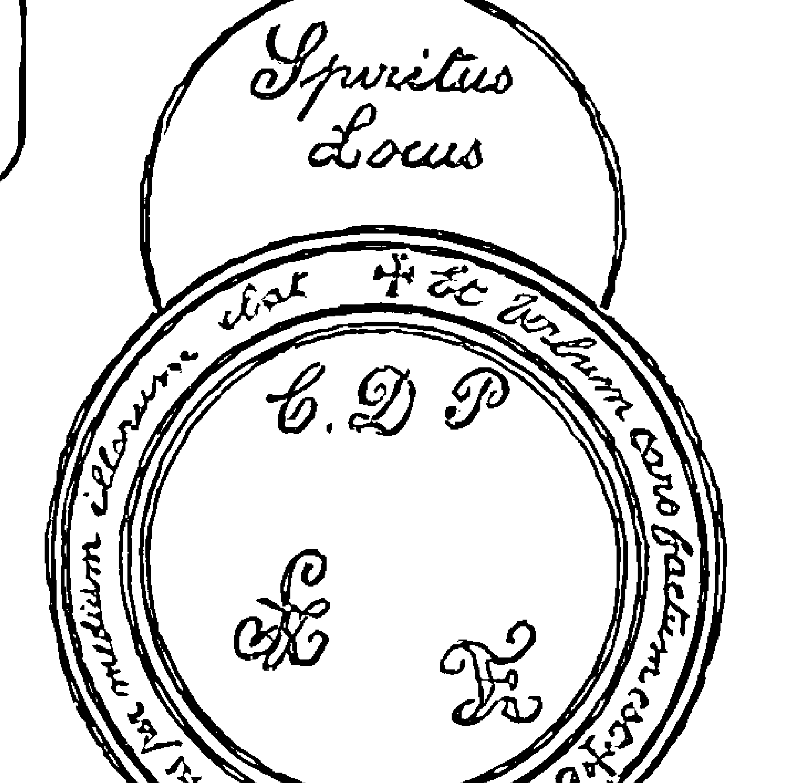

| 符号 | 恶魔 |
|------|------|
| I | 路西法 |
| II | 弗利莫斯特 |
| III | 亚斯姆录 |
| IV | 利维卡迪 |
| V | 贝卡德 |
| VI | 古里尔 |
| VII | 史博加特 |

召唤一到七日的恶魔得使用各自的魔法圆，右圆为召唤路西法所用

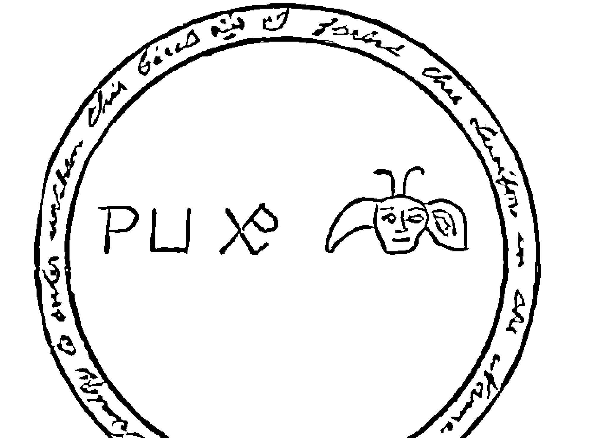

# 《阿尔马代的魔导书》
## The Grimoire of ARMADIL

为满足对天使学、恶魔学、古代圣人的智慧、圣经的秘密等高级知识的求知欲望而召唤天使或恶魔，是部与众不同的魔导书。

## ◎蒐羅天使與墮天使印記的魔導書

《阿尔马代的魔导书》经常会与《所罗门王的小钥匙》的第四章〈阿尔马代ALMADEL之术〉混淆，但两者其实是不同的作品。现存最古老的《阿尔马代的魔导书》以法语与拉丁语写成，散布于十七世纪的法国，由于当时恶魔附身事件十分氾滥，民间对魔导书的要求相对较高。关于阿尔马代这个人物如今已不可考，不过许多书都与他的名字有关，可见此人在魔法世界似乎拥有相当的权威。

《阿尔马代的魔导书》固然是以白魔法书而闻名，但其法术对象却并不限于天使，恶魔同样包含在内。由于这本书的最终目标是要视不同目的制作相对应的护符，故书中收录了大量专门用来绘制护符的印记图形，并且为赋予护符力量，书中也教导人们如何召唤拥有与印记对应力量的天使或恶魔。

然而此书之特征在于它并非以获取财宝或名誉等低俗目的，这点与其他魔导书大不相同。

举例来说，召唤阿斯摩丢斯与利维坦是为了了解恶魔的邪恶恶德有多麼恐怖；召唤布尔佛尔则是可以得知恶魔的本质，以及如何控制恶魔行动的方法；恶魔劳涅会告诉我们他们被逐出天界后如何变成恶魔、如何决定落脚处、在神创造出世界后多久被逐出天界，以及他们是否拥有自我意志等。其他像路西法、别西卜、亚斯她录则是会说出当初他们反叛的经过。换句话说，召唤神灵是为获得跟天使与恶魔相关的高等知识。

# 《阿爾馬岱的魔導書》的內容

流行於十七世紀的法國
著名的白魔法院
為習得特別高級知識而存在的作品

> > 《阿爾馬岱的魔導書》記載著製作護符的方法，那方法就是……

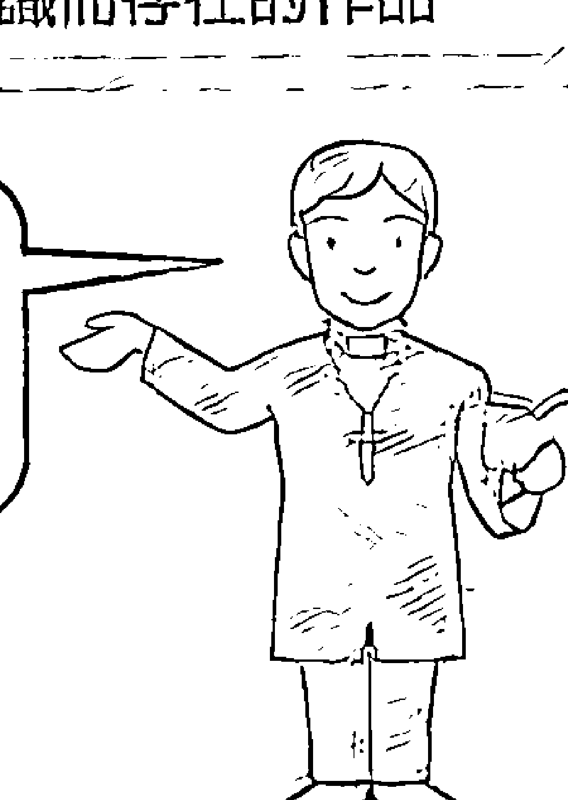

-   決定目的
-   找出與目的對應之天使・惡魔印記
    -   每位天使、惡魔均有其對應的印記，確定目的的同時也確定了該使用何種印記。為此，這本書裡記載了許多如右圖般的印記。
-   以新的羊皮紙描繪印記
    -   基本護符成型。
-   召喚目標天使・惡魔，為護符灌注力量
    -   書中亦記載召喚神靈的儀式。經過儀式後護符方告完成，持有該護符便能達成目的。然而，書中並未記載召喚用的魔法陣，施術者必須參考其他魔導書自行製作。

## 印記例

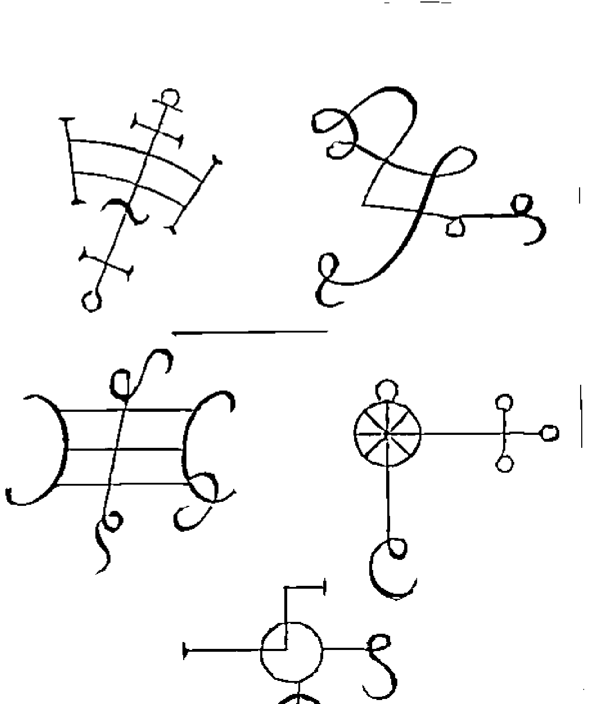

惡魔布爾佛爾的印記。能得知惡魔之本性、拘禁方法。

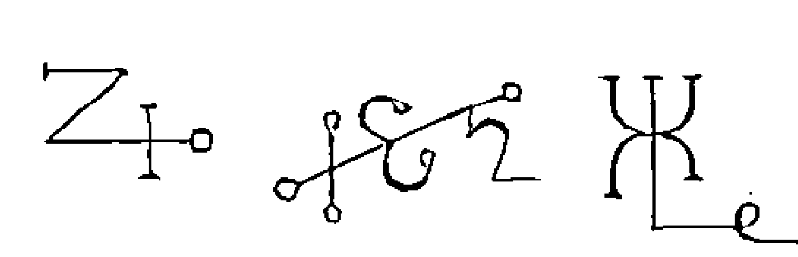

惡魔勞涅的印記。能得知惡魔被逐出天界後迎遇到的命運。

# 《亚伯拉梅林的神圣魔法书》

The book of the sacred magic of ABRAMELIN the mage

透过与圣守护天使的对话号令恶魔的神圣魔法 不需使用魔法圈或恶魔的印记，而是凭排列成方形的拉丁文字来操纵恶魔。

○先获得圣守护天使保护后再召唤恶魔

《亚伯拉梅林的神圣魔法书》被誉为西洋魔法中最强大的魔导书，盛行于十八世纪前后的法国。相信十四、十五世纪有位叫作亚伯拉罕的犹太人周游各国时，在埃及遇到名叫亚伯拉梅林的魔法师得其传授魔法，后来亚伯拉罕在西元1458年为了儿子拉美克将希伯来文翻译成法语。

此书的魔法特征在于无论如何都必须取得圣守护天使的保护，然后再和恶魔交涉、实现自己的愿望。因为世间万物均是恶魔遵循天使指示而行，唯有透过与圣守护天使对话方能使自身的神性觉醒、号令恶魔。而且「恶名昭彰的彼列无时无刻都在盘算如何隐蔽真实的神圣智慧，使人陷入模棱两可的暧昧境地。」人类直接和恶魔交涉是件非常危险的事情。

《亚伯拉梅林的神圣魔法书》总共分成三个部分，第一部分讲述亚伯拉罕邂逅亚伯拉梅林的来龙去脉，以及亚伯拉梅林魔法的基本哲学。第二部分最为重要，讲解在成功得到守护天使保护并号令恶魔前长达半年的准备作业（替自己圣别、制作魔法道具等），以及为期七天的天使、恶魔召唤仪式。第三部分则是记载召唤恶魔实现愿望时所需要的各种护符。

第三部分所载护符之目的大多是召唤强风、取得想要的饮料食物、寻找丢失的书本之类相当寻常的事项，而且不像其他魔导书需要用到魔法圈或印记，这本书的护符是以四角形方阵里的拉丁语字列进行排列组合。

> 麦格雷戈·玛瑟斯（MacGregor Mathers）：黄金黎明的共同创设者。效力于西洋魔法，并使天使魔法和亚伯拉梅林魔法得以在近代复活。

# 《亚伯拉梅林的神圣魔法书》图解

亚伯拉梅林的神圣魔法书
流行于十七、十八世纪的魔法书
传说是犹太人亚伯拉罕获得埃及魔法师传授的魔法书

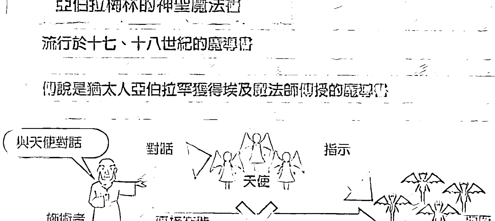

以这种方式召唤高等级的恶魔，命令在其属下的恶灵发誓效忠
据说魔界有下列的高阶君主以及316名可供号令的从属官（恶灵）：
四大君主恶魔 = 路西法、利维坦、撒旦、彼列
八王（名称略）= 亚斯她录、玛蒙、阿斯莫德、别西卜、彼勒、该隐、阿利欧、亚波罗
不使用魔法图或印记

这本书里面用的是排列成四角形的文字列魔符：开始将下列咒语执行仪式，便能命令恶灵以特定姿态现身

① 以龙的樣態現身

| E | L |
|---|---|
| M | E |
| M | I |
| A | R |
| R | U |

② 以獅的模樣現身

| L | U | C | I | F | E | R |
|---|---|---|---|---|---|---|
| U | N | A | N | I | M | E |
| C | A | T | O | N | I | D |
| I | N | O | N | O | N | I |
| F | I | N | O | T | A | C |
| E | M | I | N | A | N | U |
| R | E | F | I | C | U | L |

③ 以人類的模樣現身

| L | E | V | I | A | T | A | N |
|---|---|---|---|---|---|---|---|
| E | R | M | O | G | A | S | A |
| V | M | I | R | T | E | A | P |
| I | O | R | A | N | T | G | A |
| A | G | T | N | A | R | O | I |
| T | A | E | T | R | I | M | V |
| A | S | A | G | O | M | R | E |
| N | A | T | A | I | V | B | L |

④ 以鳥的模樣現身

| S | A | T | A | N |
|---|---|---|---|---|
| A | D | A | M | A |
| T | A | B | A | T |
| A | M | A | D | A |
| N | A | T | A | S |

《亚伯拉梅林的神圣魔法书》→最古老的抄本是于十七世纪初期的德国。这里参考的是十九世纪末麦达格·玛瑟斯根据所发现的十八世纪法语版，之后又将其翻译的英文版。

# # 《大奥義書》

## Grand Grimoire

除詳細記載惡魔宰相路西弗葛·洛弗卡雷召喚方法以外也寫到了惡魔契約，有別於一般的魔導書。

### 包含惡魔契約的異色魔導書

《大奥義書》是部以內容完備、易於理解，而且以容易造成不良影響而聲名狼藉的黑魔法書，又名《紅龍》。根據書中所述，《大奥義書》原著於西元1522年，不過實際上似乎是成書於十八世紀的義大利。

魔導書基本上都避免與惡魔締結契約，但《大奥義書》的特徵卻在於它反其道而行。只不過，雖然同樣都是契約，此處描述的卻是以所羅門王的大咒文與魔法杖強行與惡魔締結對施術者有利的契約，並非那種稍不注意就會丟掉小命的危險契約。就這點來說，《大奥義書》跟其他魔導書其實並無分別。除此之外，書中亦具體記述了如何召喚魔界宰相路西弗葛·洛弗卡雷並獲取巨富的方法，是本書一大特徵。

以上便是書籍的主要內容，不過這並不《大奥義書》只能用來召喚路西弗葛，那只是其中一個範例，此外還可視不同目的選擇召喚其他惡魔，關於這點書中亦有說明。

根據此書記載，魔界裡面有無數惡魔，其高層有三大統治惡魔、次席高等六惡魔、十八從屬官等，其中實際所能召喚且加以號令的是次席高等六惡魔，而六個惡魔各有不同職掌。舉例來說，宰相路西弗葛·洛弗卡雷司掌財富，大將軍撒旦奇亞擁有使所有女性服從的能力等。施術者必須先向皇帝路西法祈禱、取得其准許以後，再視不同目的選擇所召喚的惡魔。那麼又該如何進行召喚呢？書中也舉出路西弗葛·洛弗卡雷作為具體的例子進行詳細的描述。

> > '大公（Grand Duke）：介於國王和公爵之間，擁有獨立主權的王國，也是俄國皇族中某些成員的稱號。

# 《大奥义书》的内容

大奥义书

十八世纪意大利著作的黑魔法书

少數與惡魔締結契約的魔導書

詳細描述召喚宰相路西弗葛·洛弗卡雷以攫取巨富的方法

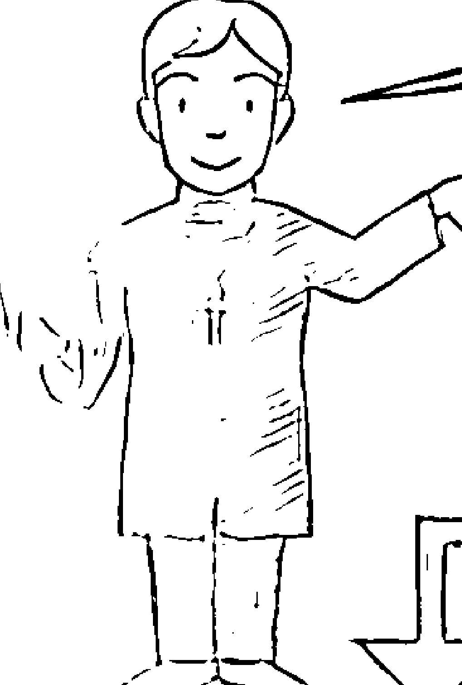

# 《大奥义书》有兩大主題

+   ① 說明召喚宰相路西弗葛·洛弗卡雷以攫取巨富的方法
    ② 說明惡魔界的組織，可助施術者針對不同目的選擇適合惡魔

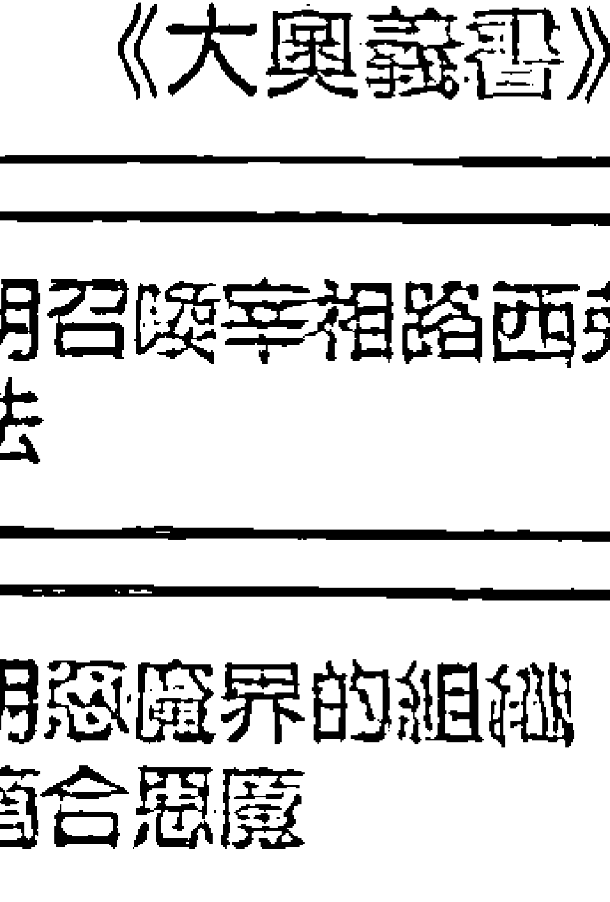

# 魔界高層組織

## 三大統治惡魔

皇帝路西法 | 王子別西卜 | 大公亞斯她錄

## 次席六等惡魔

宰相路西弗葛·洛弗卡雷 | 管管財帛與財寶
大將軍阿撒茲勒奇亞 | 使所有女性服從
將軍阿迦里亞瑞普特 | 遠觀回憶秘密
中將浮士德斯提 | 管理夜間事務與降冰雹
准將摩爾迦塔納斯 | 使人透明化、傳送、通視術、死靈術
元帥涅比洛斯 | 從事惡行且知曉秘密

十八從屬官 次席六等惡魔各自配屬三名從屬官

術術者必須了解上述魔界組織與各惡魔角色，並視不同目的召喚適合的惡魔

# No.099

## 召唤恶魔必须做什么准备？

### Preperations for summoning a demon

根据《大奥义书》记载，召唤恶魔的时候必须准备以羔羊皮制成的绳子和夭折儿童的封棺钉等难以取得的恐怖道具。

## 该准备的道具与注意事项

根据《大奥义书》记载，召唤恶魔必须做好充分准备，相关准备事项如下。

召唤恶魔的首要之务便是具备坚定的决心，毕竟操纵恶魔不比等闲。接下来则是要决定召唤哪个恶魔，如果低级恶魔已经绰绰有余的话，那就没有必要召唤魔王撒旦。此外，在召唤恶魔的前一周必须断绝与女性的关系、洁净身体，每日两餐前必须向主祈祷。

召唤恶魔须由一人或三人执行，若有必要可以事先准备两名助手，然后找好隐秘、古城等寂静场所，因为恶魔特别喜好倾颓的建筑物，而且太嘈杂也有可能听不见咒语。接着要准备鸡血石以及由处女制作的全新蜡烛两支、全新的火钵、白刚地、桦树和木炭，再宰杀羔羊剥皮制作细长绳索。这条绳索必须要在魔法阵外围铺成一个圆形，所以务必准备足够的长度。最后还要从装纳孩童尸体的棺材上拔四支封棺钉备用。

另外，为避免碰上在召唤仪式中，恶魔太靠近施法师的情形，可以事先准备纸包着的金币或银币，作为驱赶恶魔的工具。

执行召唤的前晚，施术者必须找到从未结过果实的野生桦树，选定哪段树枝适合制作魔法杖，然后在早晨太阳爬上地平线的那个瞬间，手持从未使用过的全新小刀将树枝截下，制作长度十九英寸半的魔法杖。

上述物品全部准备完毕以后，就可以前往执行召唤仪式的地点。

# 召唤恶魔的准备

+   (1) 不可動搖的決心
+   (2) 決定召喚哪個惡魔
+   (3) 潔淨身體
    召喚前一週
    斷絕與女性的關係。

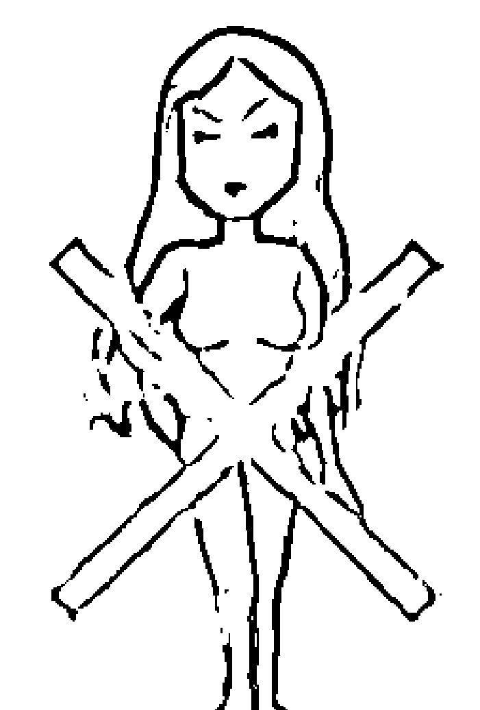

每日兩餐前向主祈禱。

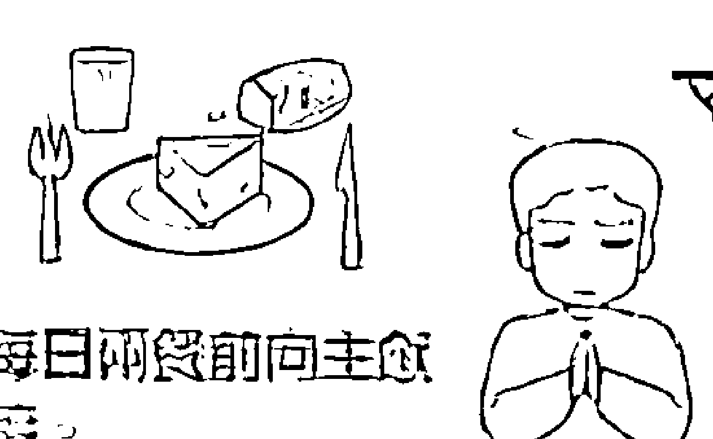

## 準備必要道具

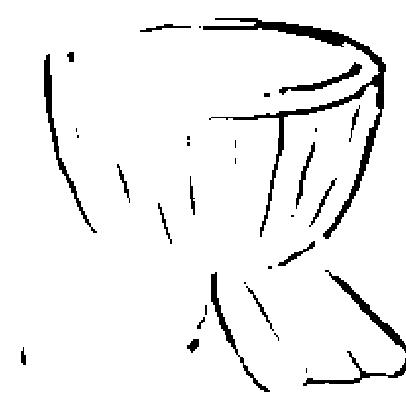

小碗

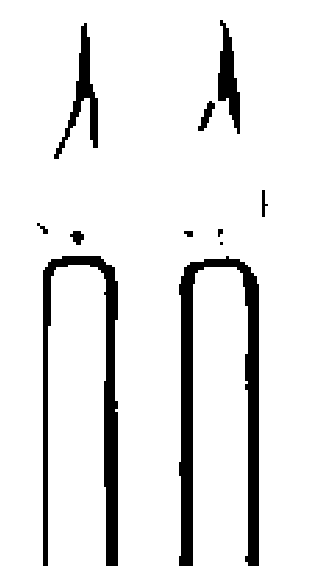

蠟燭


桂皮

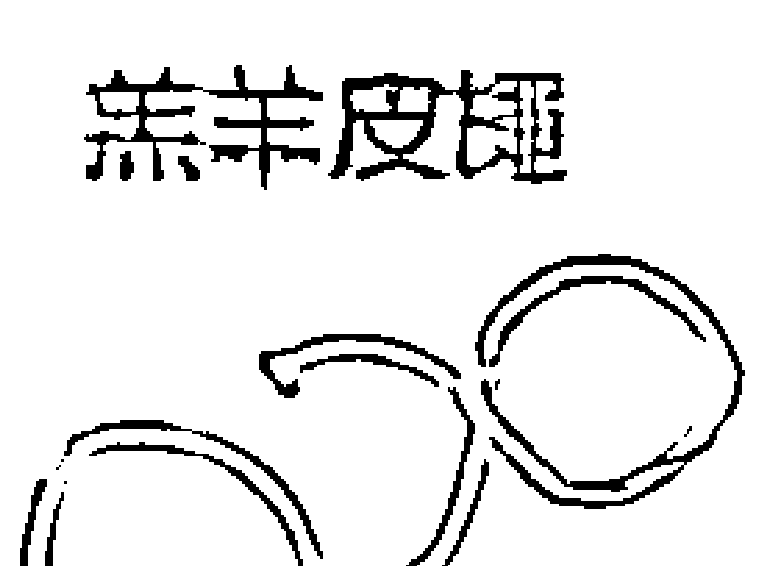

羔羊皮繩

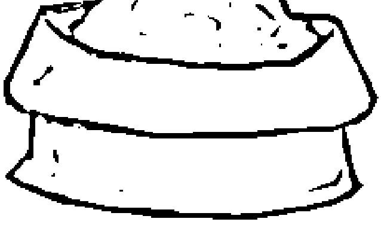

木炭

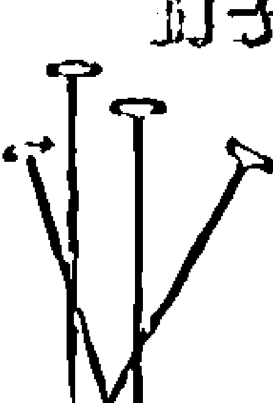

釘子

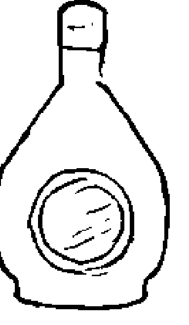

白蘭地

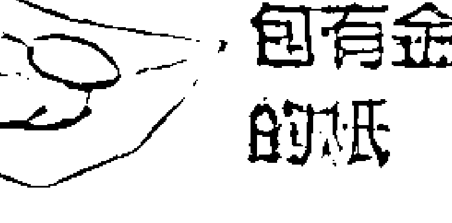

包有金幣銀幣的紙


雞血石

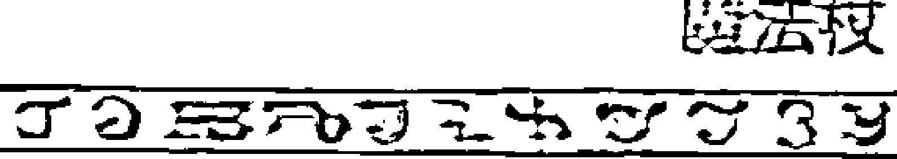

魔法杖

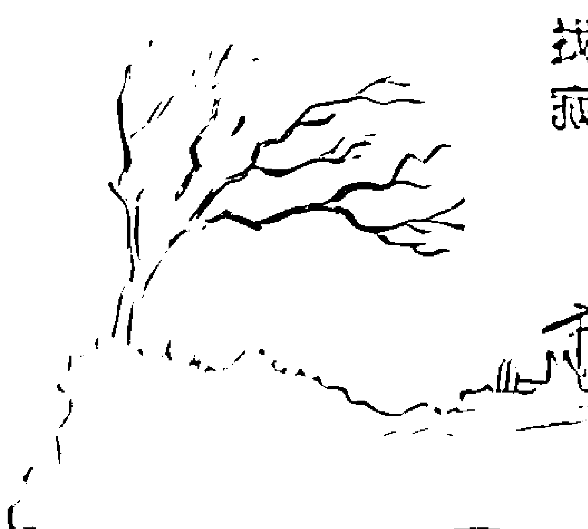

找個有如廢墟般的寂靜處

魔法杖必須以梧桐樹枝製作，梧桐亦稱「女巫的聖樹」，過去歐洲也經常取其樹枝當作尋找水源、礦脈等的占卜道具。

一切已準備完畢，那就出發前往儀式地點吧！

# # No.100

## 召唤恶魔该如何进行？

### How to summon a demon

> > 呼喊伟大路西法皇帝之名，然后以主之名发令、唱诵所罗门王的大咒文便能召唤恶魔大臣路西弗葛。

## ○召唤恶魔大臣路西弗葛·洛弗卡雷

一切准备妥当后来到执行仪式的地点，终于就要开始召唤恶魔了。《大奥义书》记载的恶魔召唤流程如下所述，不过此处召唤的是恶魔大臣路西弗葛·洛弗卡雷，这位老兄可是常常怎么召唤都不肯现身的。

首先第一件事就是要在地面或地板绘制魔法阵。以从羔羊身上剥下来的羊皮搓成绳子后围成圆形，四方用钉子加以固定，接着取出事先准备好的鸡血石在圆里面画一个三角形，并在三角形的两边立起蜡烛。魔法阵的上方要朝东，三角形则是要从上方的顶点开始画起。其次是要在魔法阵的外侧按逆时针方向依序写下大写的A和小写的e、a、j，然后在三角形底边处书写JHS（耶稣基督的象征）等神圣文字，并于其两端各挂一个十字，便能防止恶魔从背后偷袭。完成后再将石炭装进火钵，洒进白兰地、树脂并且点火。

接着，施术者拿着橡树树枝制成的魔法杖、咒语以及写着要求的纸张站进三角形内侧，然后怀抱着希望与坚定信心开始召唤恶灵。如果是三个人共同进行召唤仪式，一旁的助手必须静默不得发出声音。

召唤恶魔时必须先向主祈祷，然后再向皇帝路西法祈愿，召唤出希望现身的恶魔：「伟大的路西法皇帝啊，我以主之名命令你，将恶魔大臣路西弗葛派遣前来。」此时除了路西法皇帝以外，也可以把别西卜王子、亚斯她录大公的名字也追加进去。如果恶魔此时没有顺利现身，就要唱诵所罗门王大咒文。

一旦开始唱诵该咒文，恶魔就无法避不见身。随着不断重复地唱诵，恶魔大臣路西弗葛终究会出现。

# # 惡魔的召喚方法

> > 以惡魔大臣路西弗葛·洛弗卡雷為例

# # 召喚惡魔的方法

## ① 繪製魔法圖、準備道具

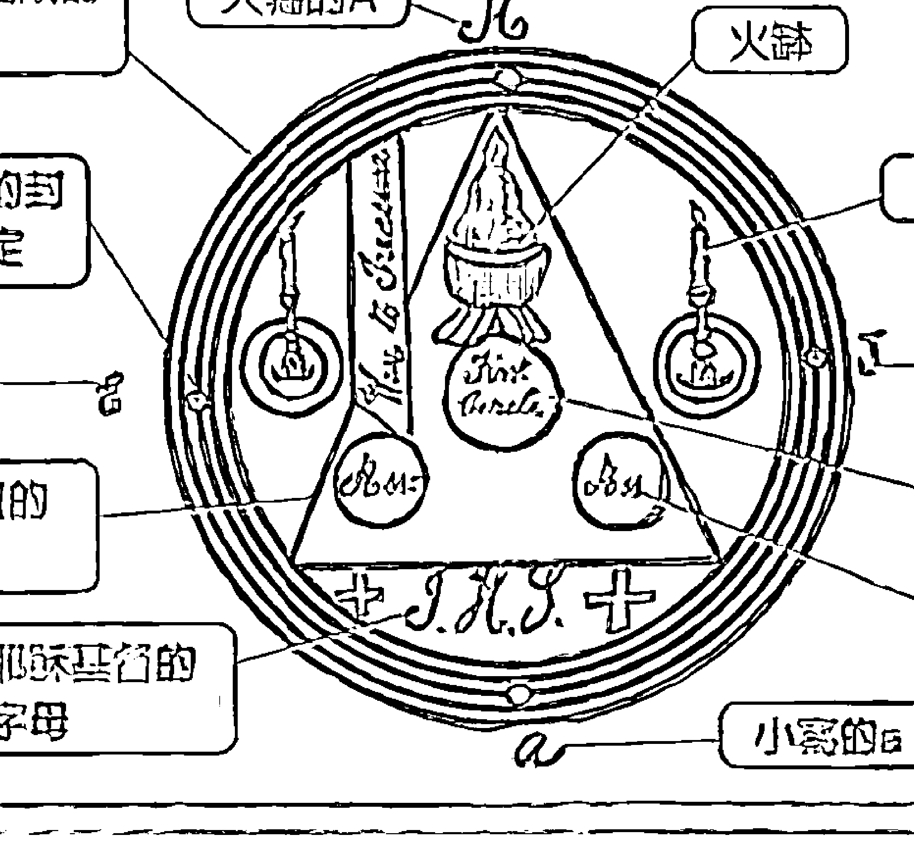

羔羊皮紙圓成的魔法圖

用孩童棺木的封棺釘加以固定

用雞血石画的三角形

象徵耶穌基督的三個字母

大寫的A

小寫的e

火缽

燭台

小寫的j

施術者的位置

助手的位置

小寫的a

做成這種形狀

## ② 持魔法杖等道具召喚惡魔

如果恶魔还不现身就开始唱诵下面的『所罗门王大咒』，据说只要吟唱两遍恶魔必然出现。

> > 咒啊！我憑著擁有偉大力量的下列名號命令你。迅速出現！以阿多奈之名、耶洛加、亞利、耶和凡姆、阿格拉、塔格拉、馬迦、歐亞利歐斯、亞爾茲金、阿加迪斯、克布洛特、伐利歐斯、皮脫肯、馬迦多斯、薩爾非、伽波茲、薩拉迦拉姆、塔波茲、金瓜、差納、以提茲迪斯，以塔里亞納米克之名（以下省略）

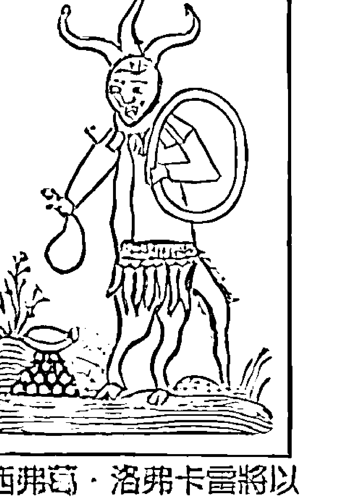

路西弗葛·洛弗卡雷將以這般模樣現身。

# No.101

## 如何安全地對惡魔下命令？

### How to command a demon

遵循魔導者指示便能任意操縱惡魔大臣路西弗葛，同時安全輕鬆地變成富豪。

## ○快速取得巨富的方法

惡魔經過召喚作業出現後又該怎麼辦呢？《大奧義書》記載了與惡魔大臣路西弗葛的交涉方法，在此案例中，是以輕鬆獲得巨富為目的。

首先是宣告：「敢不回應我的要求，便以咒語施以永恆的折磨。」劈頭給路西弗葛來個下馬威。此時路西弗就會問道有何要求，施術者就可以提出自己的目的。

「我希望締結能儘快協助我致富的契約」

不過路西弗葛也會發揮其惡魔本色，如是說道：「除非二十年後將你靈魂與肉體交給我，否則無法締結契約。」

這樣的契約肯定不能簽。於是施術者可以持魔法杖指向路西弗葛，威脅道：「敢不從命，便要你與同伴永受折磨。」並且重複唱誦所羅門王大咒。

此時路西弗葛會不情願地前往藏有寶物之地，而施術者必須經由特定途徑離開魔法圓、獨自一人尾隨在後。途中要是路西弗葛突然變成兇猛的惡犬，不用過度害怕，只要手持魔法杖對著他即可。來到藏寶處以後將契約書放在寶物上，帶著所能拿得動的寶物倒退離開，回到魔法三角形中。

待施術者回到安全的魔法圓裡，最後只要跟路西弗葛道別，如此一來就可以得到大筆的財富了。

「偉大的路西弗葛啊，我已滿足。已經到了說再見的時候，請你離開去自己喜歡的地方。」

# 如何命令惡魔

> > 絕對要遵守下列注意事項

## 該如何安全地命令惡魔

+   - 絕對不可簽下必須交出靈魂的契約
    - 如果惡魔反抗就唱誦所羅門王大咒
    - 若惡魔太靠近，可以拿包著金幣的紙擲向遠處，過去拾取的惡魔自然會遠離

## 取回寶物的步驟

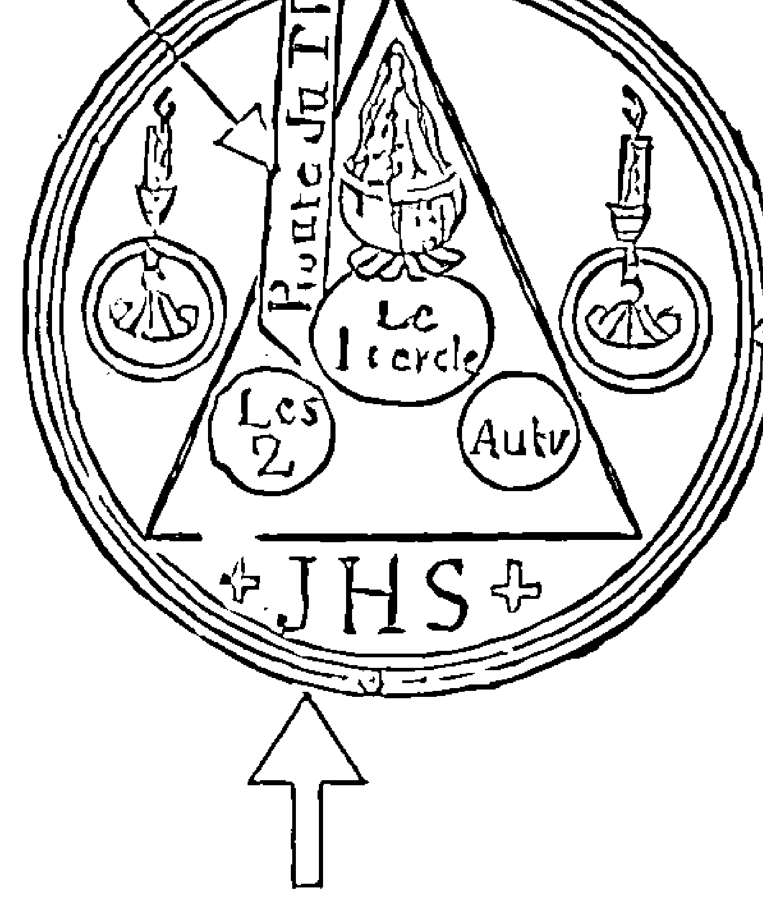

進出魔法陣時必須循此途徑，回來的時候也是如此

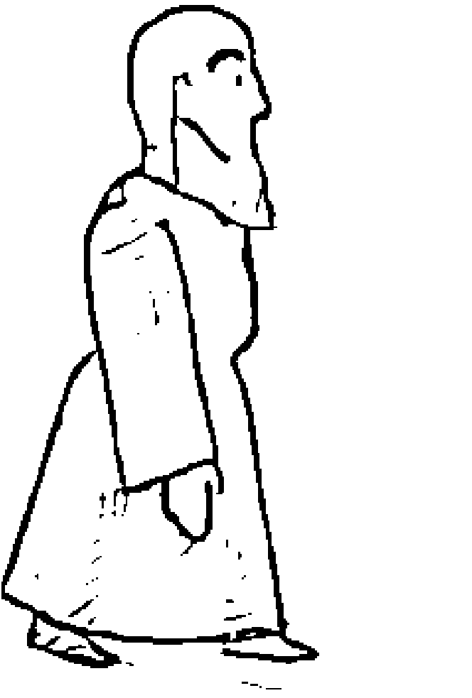

施術者必須跟在惡魔後面

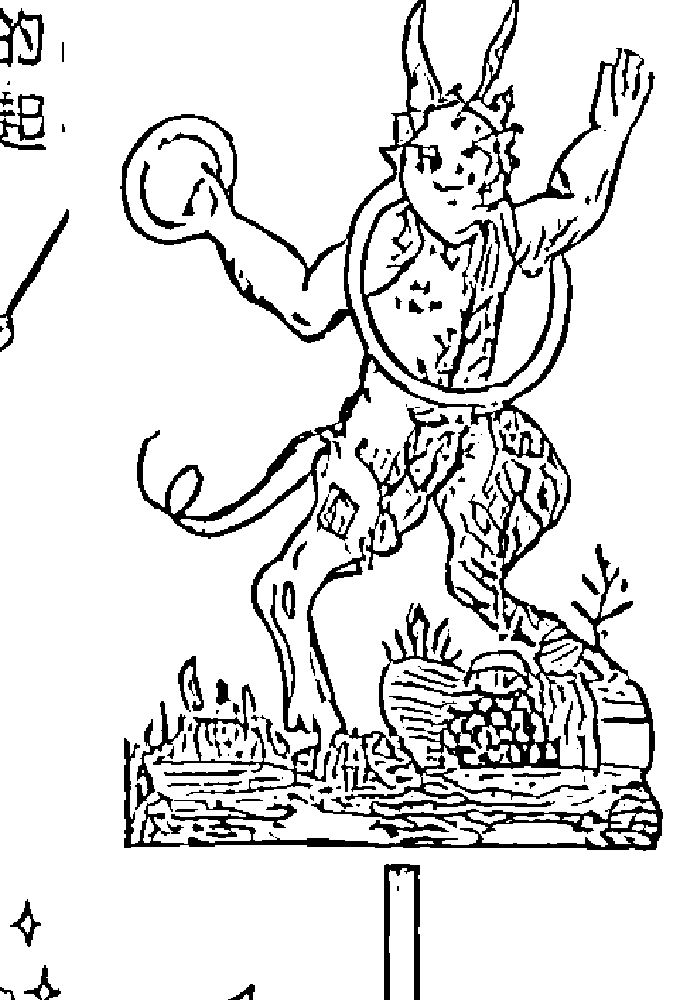

途中惡魔會變成惡犬的模樣，不用害怕，舉起魔法杖對著他

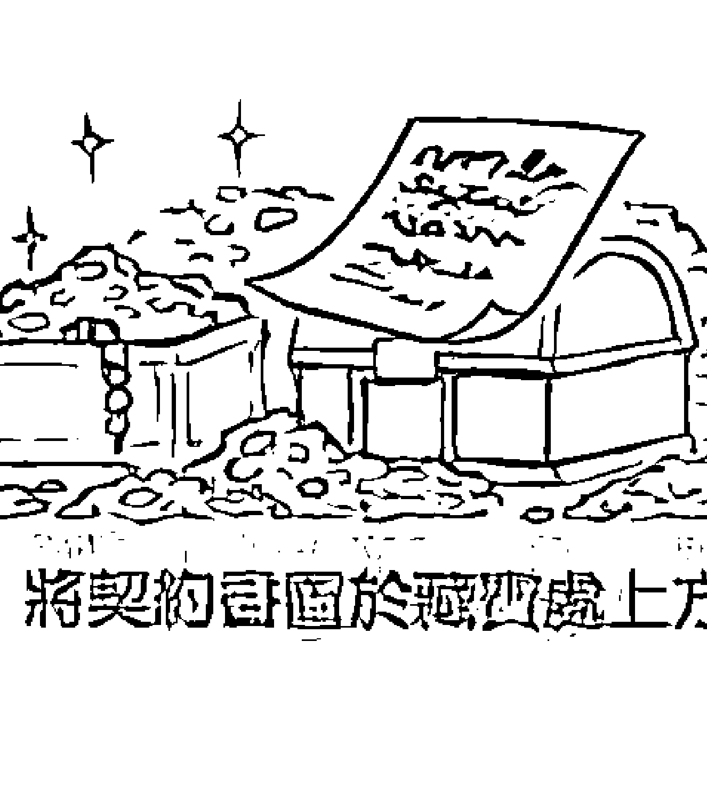

將契約書置於寶物處上方

# 所罗门王的72恶魔

下列是《所罗门王的小钥匙》（别名「雷蒙盖顿」）第一章〈哥耶提雅〉，当中记载了从前所罗门王号令驱使、后来与恶魔军团一齐封印在黄铜壶里的72名恶魔。下列乃是参考《THE Goetia/The Lesser Key of Solomon the King》（translated by Samuel Liddell, Macgregor Mathers/edited with an introduction by Aleister Crowley/WEISER BOOKS）并择整其中重要记述而成。

※表现方式是依照中文译名 / 英译名 / 恶魔位阶，插图则是摘自柯林・德・普朗西所著《地狱辞典》第六版当中M・L・布尔顿所绘作品。

+   1. 巴耶力 / Bael / 王
    统治东方的王，统领66个军团。拥有能使人变成透明的力量，平时会以猫、蟾蜍或人类等不同形态现身，不过有时候也会以三种形态并存的模样出现。

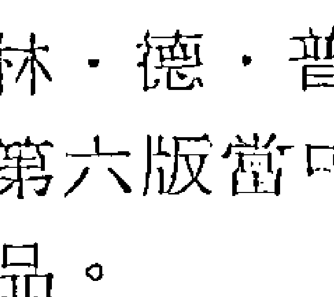

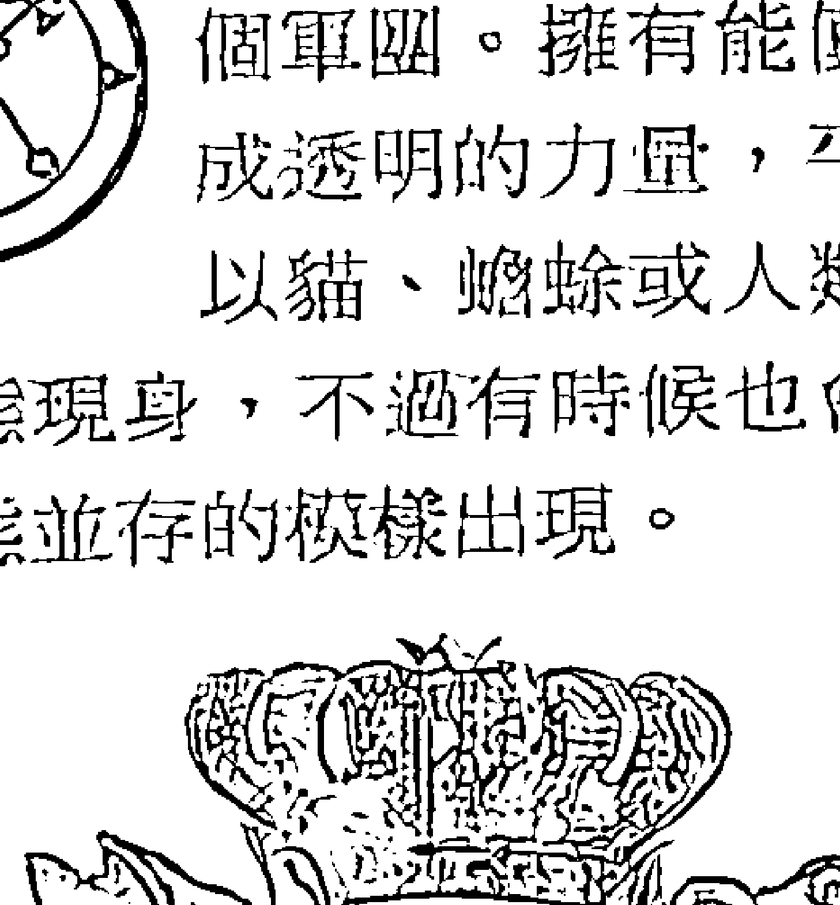

+   2. 阿加雷斯 / Agares / 公爵
    隶属于东方势力，率领31个军团。外表是看似温和的白发老人模样，经常骑着鳄鱼、手边带着苍鹰。他能传授所有语言、使权威失势，拥有引发地震的能力。

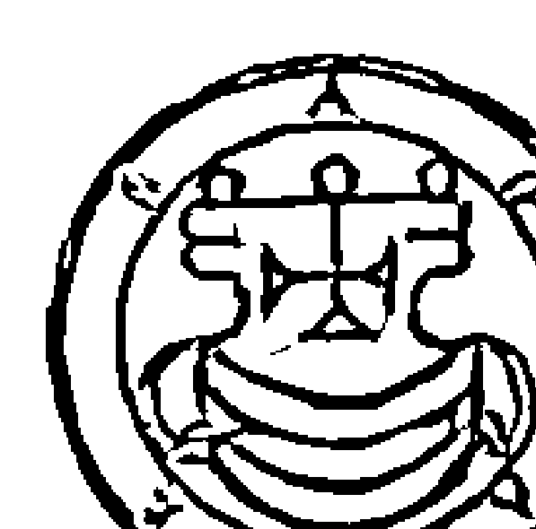

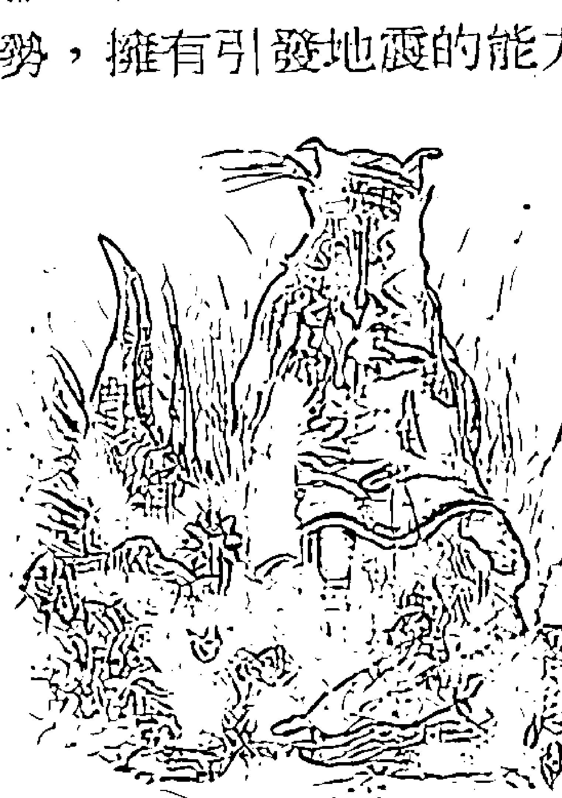

+   3. 瓦沙克 / Vassago / 王子
    麾下有26个军团。与阿加雷斯拥有相同本性、性格良善，能够准确说出过去与未来发生的事情，拥有发现失物的能力。

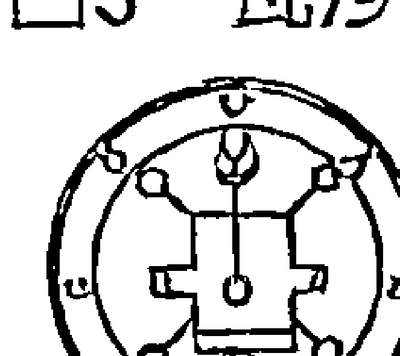

+   4. 萨密基那或加米基 / Samigina or Gamigin / 侯爵
    麾下有30个军团。会先以小马或驴子模样出现，然后也能按照要求变成人形。能用马的声音说话、传授所有领域的知识，并解说罪人死后有何惩罚。

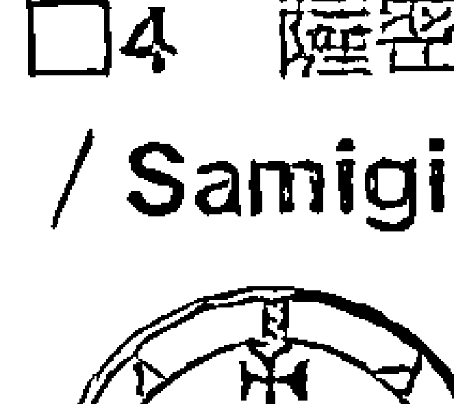

+   5. 玛巴斯 / Marbas / 总管
    麾下有36个军团。以狮子模样出现，也能按照施术者要求变成人形。能回答隐而不宣的秘密、带来疾病也能治病，并传授机械工学的智慧与知识，还能将人类变成其他模样。

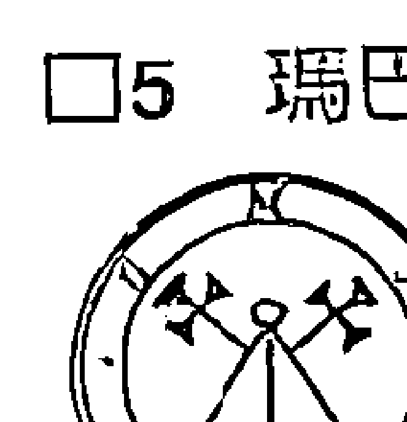## 06 華利弗 / Valefor / 公爵

麾下有10個軍團。帶著低吼聲，以驢頭獅身的模樣出現。他可以是個很好的魔寵，不過經常慫恿人犯下偷盜。

## 07 亞蒙 / Amon / 侯爵

麾下有40個軍團。以蛇尾狼身的模樣、口吐火焰出現，亦可應施術者命令變成烏鴉頭（有時候還帶有尖銳的犬牙）人身。能夠述過去與未來的事情，能使朋友和睦失睦、也能讓他們重修舊好。

## 09 派蒙 / Paimon / 王

麾下有200個軍團。大批惡靈吹著號角、敲鑼打鼓地開道，然後派蒙就會戴著光榮王冠、騎著單峰駱駝，以人類的模樣出現。剛開始派蒙會用狗吠般的聲音說話，施術者必須強制他換成聽得懂的聲音。能夠傳授藝術、科學等知識，能給人威嚴、使眾人服從，還能提供穩賺的魔寵。

## 18 巴巴妥司 / Barbatos / 公爵

麾下有30個軍團。太陽落在射手座的時候，在四位率領大軍團的尊貴王者簇擁下出現。他能讓人聽懂狼和其他生物發出的聲音，還能以魔法挖掘被藏匿的財寶，知曉過去與未來的一切，並具有讓施術者安撫友人或當權者的能力。外貌如天使。

## 10 布耶爾 / Buer / 長官

麾下有50個軍團。太陽落在射手座的時候，以跟射手座相同的人馬模樣出現。能傳授哲學、倫理學、自然學、理論學、藥草學，並且治療急性熱病及提供魔寵。

## 11 古辛 / Gusion / 公爵

麾下有40個軍團。會以狗頭人的模樣現身。能看透過去、現在、未來的一切，還能回答所有事情的意義與解答。掌管友情，能賜與任何人榮譽與威嚴。

## 12 西迪 / Sitri / 王子

麾下有60個軍團。以豹頭、獅身鳥首獸、雙翼的模樣出現，可應施術者命令變成俊美的人類。能使異性萌生愛意、脫去衣衫。

## 13 貝雷特 / Beleth / 王

麾下有85個軍團。會騎著蒼白的馬匹跟在樂隊後方出現，他出現時的模樣非常恐怖，必須鼓起勇氣以魔法杖加以命令。此外，施術者得在左手中指佩帶銀戒指，並且懷著敬意與他相處。擁有使人生出愛戀之心的力量。

## 14 勒萊耶或勒萊卡 / Leraje or Lelaikha / 侯爵

麾下有30個軍團。身穿綠色獵人服裝、帶著弓箭出現。擁有引起紛爭、以弓箭使傷口化膿的力量。

## 15 埃力格 / Eligos / 公爵

麾下有60個軍團。他會帶著長槍、軍旗和蛇，以騎士的模樣出現。埃力格熟知秘密、未來與戰爭，能夠引發統治階級的變心。

## 16 柒派 / Zepar / 公爵

麾下有26個軍團。他會如同士兵一般穿著紅色鎧甲出現。能勾起女性對男性的愛戀之心、擁行使兩人結合的力量，同時也能使人不孕。

## 17 波提斯 / Botis / 伯爵或長官

麾下有60個軍團。以硫磺流蛇的模樣現身，但受到命令就會變成手持光輝寶劍、長著一口利眼牙齒和兩支角的人類模樣。他能說出過去與未來的一切，還能化敵為友。

## 18 巴欽 / Bathin / 公爵

麾下有30個軍團。以一條蛇尾巴的壯碩男子模樣，騎著蒼白的馬出現，知悉藥草與植物的效能，還能使人瞬間移動到其他地方。

## 19 塞羅司 / Sallos / 公爵

麾下有30個軍團。頭戴侯爵冠冕、騎著獅子，以雄糾糾的士兵模樣現身。擁有勾起異性愛戀的能力。

## 20 普尔森 / Purson / 王

麾下有22个军团。狮头人身的模样，会一面吹响号角、一手拿着凶猛的赤蛇，骑着熊出现。能告诉我们秘密财宝与过去、现在、未来之事，还能提供良好的庇护。能变化成人形，也能变化成蛇的模样。

## 22 因波斯 / Ipos / 伯爵或王子

麾下有36个军团。以狮子头、鸵鸟足、野兔尾巴的天使模样出现。知悉过去、现在、未来，能带给人机智与勇气。

## 23 艾姆 / Aim / 公爵

麾下有26个军团。身体是健美的人类胴体，却有三个头颅，分别是蛇头、额前有两颗星的人头和牛头。他骑着海蛇，手持火把四处引发大火。能使人变聪明，替人解决私密问题。

## 24 马尔克斯 / Marax / 伯爵

麾下有30个军团。会以人面公牛的模样出现。能传授天文学、教导逻辑与花草宝石效用，还能提供良好的庇护。

## 24 纳贝流士 / Naberius / 侯爵

麾下有19个军团。会以黑公鸡模样出现，并在魔法师周围拍动翅膀。他说话声音沙哑，能传授技艺、科学、修辞学的才能，还能为人寻回失去的威信与荣誉。

## 25 格刺希亚拉波斯 / Glasya-Labolas / 伯爵或长官

麾下有36个军团。以拥有狮身鸟首兽翅膀的大狗模样现身。能传授所有技艺与科学，告诉我们过去、现在与未来，还能使人同时受到朋友与敌人敬爱、使人隐形，并且是流血与杀人的专家。

## 26 布湿或比减 / Buné or Bimé / 公爵

麾下有30个军团。会以三头龙（狗头、狮身鸟首兽头、人头）的模样出现，讲话的声调美丽而高昂。能使人致富、变得聪明而善辩，并且会正确回应要求。

## 27 罗诺威 / Ronové / 侯爵或伯爵

麾下有19个军团。以怪异的模样现身，能教授修辞学、语言等知识，提供好的仆人，还能让朋友或敌人都对自己产生好感。

## 28 比利士 / Berith / 公爵

麾下有26个军团。曾穿着红衣、骑着红马，以头戴金冠的士兵模样现身，语调洪亮而稳重。他能正确回答过去、现在、未来的事情，能将贱金属变成黄金，还赐予人无可动摇的权威。

## 29 亚斯她录 / Astaroth / 公爵

麾下有40个军团。手持毒蛇，骑着地狱之犬，以天使模样现身。一旦被召唤到他散發的惡臭會有喪命之虞。能正確答出過去、現在、未來的事情，還能揭開所有的秘密。他通曉數學，並在施術者提出要求後說出天使和他自己墮落的經過。

## 佛鈕司 / Forneus / 侯爵

麾下有29個軍團。會以巨大海獸的模樣出現。他能使人精通修辭學，帶來語言的知識與良好的友誼，並讓人受到敵人敬愛，正如朋友敬愛一般。

## 佛拉斯 / Foras / 長官

麾下有29個軍團。會以強壯男子的模樣出現。能傳授藥草與寶石效能、理論辯才和倫理學。他可以應要求把人變透明，並教人辯才，另外還能幫人找回失物。

## 阿斯莫代 / Asmoday / 王

麾下有72個軍團。擁有公牛頭、人頭、公羊頭三個頭顱和蛇尾巴，並且口吐火焰、手持旗槍與火把。帶來美德的戒指，傳授數學、幾何學和工藝，並應要求，能使人隱蔽身形，找出隱藏的寶物與所在地。

## 概布 / Gäap / 王子或長官

麾下有66個軍團。當太陽進入南方宮位時，就會帶著四位強大的王、以人類的模樣出現。他能使人失去感覺、知覺，卻也會傳授哲學、教義學。除了勾起他人愛與憎恨的情感、替屬於亞當派的事物進行鑑別外，還能完美回答關於過去、現在、未來之事，並把人瞬間傳送到另一個王國。

## 弗爾弗爾 / Furfur / 伯爵

麾下有26個軍團。以有條火焰尾巴的紅色公鹿模樣出現，在魔法三角形裡則是天使的模樣。他能使男女燃起熱烈的愛火，並且發動閃電、落雷、強風與暴風雨，另外還會透露神聖的秘密。

## 35 馬可西亞斯 / Marchosias / 侯爵

麾下有30個軍團。長著獅身鷹首獸的雙翼、蛇尾狼身、口吐火焰。不過亦可應施術者命令變成人類現身。原是主天使，相傳他曾經對所羅門王說，希望自己能在一千兩百年後重返原來地位。

## 37 菲涅克斯 / Phenex / 侯爵

麾下有20個軍團。會以不死鳥鳳凰模樣現身，以孩童的聲音說話。當他以甘美的聲音歌唱時，切記不能聽到入迷，接著菲涅克斯會變成人形，為施術者講述精采的科學課。他是位優秀的詩人，也很樂意幫他人實現願望。

## 36 斯托刺或斯托羅 / Stolas or Stolos / 王子

麾下有26個軍團。他會以強大的飛鳥模樣現身，然後再變成人類；除天文學外，還會說明藥草與寶石的效能。

## 38 哈法斯或馬瑟斯 / Halphas or Malthus / 伯爵

麾下有26個軍團。會以野生鴿子的模樣現身，聲音沙啞。擁有建造高塔、準備武器彈藥，並將士兵配置於適當場所的能力。

## 39 瑪法斯 / Malphas / 長官

麾下有40個軍團。先以烏鴉模樣現身，受到命令後才變成人類，並以沙啞的聲音說話。他能夠建造房屋高塔，通知施術者敵人有何企圖、想法、行動，是個還算好的庇護。只不過獻祭給他的時候，瑪法斯會裝作一副很不高興的樣子騙人。

## 40 勞姆 / Räum

麾下有30個軍團。首先以烏鴉模樣現身，受到命令後會變成人形。他會為施術者盜取王宮裡的財寶，將其迎送到指定場所。他能夠發現隱藏與他人威脅，並且知悉過去、現在與未來的一切，還能使敵人間產生友愛之情。

## 41 佛卡洛 / Focalor / 公爵

麾下有30個軍團。以生有獅身鳥首獸雙翼的人魚模樣現身。他能操縱風和海象，使人溺水，也能預知未來。不過只要施術者禁止，佛卡洛也不會傷害別人。

## 42 威沛 / Vepar / 公爵

麾下有29個軍團。會以人魚的模樣現身。威沛是水的統治者，能引導施術者找到裝滿武器彈藥的船隊。此外他還能使傷口化膿、生蛆，並且在三天內殺人。

## 43 薩布諾克 / Sabnock / 侯爵

麾下有50個軍團。騎著地獄的馬匹、以長著鱗片的武裝士兵模樣出現。擁有建造高塔、城堡，並加以武裝的能力。他能使傷口、脹瘡的腫或是長蛆，讓人連繫痛苦好幾天。

## 44 沙克斯 / Shax / 侯爵

麾下有30個軍團。會以野鴿模樣出現，聲音沙啞而細微。擁有奪取他人視覺、聽覺與理解力的能力，還能偷盜國王的財產和馬匹。他能替人找出被藏起來的物品，偶爾還能提供好的處方給施術者。不過只要一旦離開魔法的三角形就會滿口謊言。

## 45 拜恩 / Viné / 王或伯爵

麾下有36個軍團。會化作獅子的模樣、手持毒蛇騎馬出現。他能找到被藏匿的東西、女巫或魔法院師，還能看透過去、現在與未來。可以命令他建造高塔、搖動巨石城牆，或者召喚狂風掀起巨浪。

## 46 比夫龍 / Bifrons / 伯爵

麾下有60個軍團。會以怪物的模樣出現，可應命令變成人頭模樣。能傳授天文學、幾何學、其他藝術或科學，以及與寶石樹木效能有關的知識。

## 47 乌瓦或化勒或沃瓦 / Uvall or Vual or Voval / 公爵

麾下有37个军团。会以雄纠纠的单峰骆驼模样现身，并且在受到命令后变成人类的模样，用不完美的埃及语说话，能使人得到女性的爱，能说出过去、现在、未来之事，还能使敌我双方萌生友情。

## 48 海艮地 / Häagenti / 长官

麾下有33个军团。以长着狮身鸟首兽双翼的公牛模样出现，受到命令后会再变成人形。能使人变聪明、使授的物质变成银能将贱金属变成黄金、将水变成葡萄酒或将葡萄酒变成水。

## 49 克罗赛尔 / Crocell / 公爵

麾下有48个军团。会以天使的模样现身。他能揭开隐匿的秘密，还能教人几何学、教会学。接到命令后，可以凭空让空无一物的地方发出激流的声音，另外还能将普通泉水变成温泉。

## 50 弗尔卡斯 / Furcas / 骑士

麾下有20个军团。以留着大把胡须、头发灰白的老人模样，骑着苍白色的马匹出现。能完整传授哲学、天文学、修辞学、理论学、手相、火焰占卜等知识。

## 51 巴拉姆 / Balam / 王

麾下有40个军团。有公牛、人类、公羊三颗头颅，燃烧的双眼和蛇尾巴，会带着豺狼、猎豹可怕的巨熊出现。声音沙哑，能准确说出过去、现在与未来的事情，还拥有使人变透明、被智慧的力量。

## 52 安洛先 / Alloces / 公爵

麾下有36个军团。有赤红的狮子脸和闪亮的双眼，以士兵的模样骑着骏马出现。吼声如雷般音大声说话。能传授天文学、逻辑学，还能带来好的魔术。

## □53 卡麥爾或蓋因 / Caim / 長官

麾下有30個軍團。會先以鴉鳥的模樣出現，然後再變成佩帶尖劍的人類模樣。答話的時候，看起來就像是身處於燃燒的飛灰或木柴之中。他是位優秀的辯論家，能令人隱身、讓鳥、去勢的牛、狗等動物說話，甚至流水聲的能力，並能預知人們未來的事情。

## □54 姆爾姆斯 / Murmus / 公爵或伯爵

麾下有30個軍團。他會在吹奏著號角的僕從開道之下，戴著公爵頭冠，打扮成戰士騎著獅鷹獸出現。他能夠授予哲學，還能讓人看見未來、與亡魂回答問題。

## □55 歐若瑪司 / Orobas / 王子

麾下有20個軍團。會先以馬匹模樣現身，接受命令後再變成人形。他能透露過去、現在、未來之事，還能賜人威嚴與高位聖職者的地位。此外，他不但能使人獲得朋友與敵人的好感，還會說出神秘以及世界創造的秘密。他對施術者非常誠實，所以不會利用惡靈欺騙人。

## □56 格莫瑞或加莫里 / Gremory or Gamori / 公爵

麾下有26個軍團。會以腰掛侯爵夫人頭冠的美麗女性模樣，騎著美麗的駱駝現身。他能透露過去、現在、未來，說出財寶的藏匿處，還能使人不論老幼都得到女性的愛。

## □57 歐賽或沃桑 / Ose or Voso / 長官

麾下有30個軍團。會先以豹的模樣現身，然後立刻變成人形。能使人通曉教養學並運用自如，還能為人揭露神聖的秘密。另外也可應要求將人變成其他模樣。

## □58 亞米或亞納斯 / Amy or Avnas / 長官

麾下有36個軍團。會化作燃燒的火焰現身，過一會兒再變成人形。他能傳授天文學、教養學的卓越知識，並提供好的魔寵，還會說出受神靈守護的財寶。

## □59 歐里亞斯 / Oriax or Orias / 侯爵

麾下有30個軍團。長著巨蛇尾巴、騎著雄壯的駿馬，右手拿著兩條名叫咻咻的大蛇現身。他能傳授占星術、讓人變身，帶來難以動搖的威嚴與崇高地位，並且讓人人受到敵人與朋友喜愛。

## □60 瓦布拉或納胡拉 / Vapula or Naphula / 公爵

麾下有36個軍團。會以獅身鳥首獸的模樣現身。能傳授手工藝、軍事技術、哲學與其他科學的相關知識。

## □61 撒共 / Zagan / 王或長官

麾下有33個軍團。以長有獅身鳥首獸雙翼的公牛模樣現身，過一會兒再變成人形。能使人變得機智，還能將葡萄酒變成水、將血變成葡萄酒，或將水變成葡萄酒等。他能將各種金屬變成強勢貨幣，也能使愚者變成賢者。

## □62 沃勞克或瓦勞克或瓦留或瓦爾克 / Volac or Valac or Valu or Ualac / 長官

麾下有38個軍團。騎著雙頭龍、以生有雙翼的孩子模樣出現。他能指出財寶所在地，還能告訴我們大蛇在哪裡。

## □63 安托士 / Andras / 侯爵

麾下有30個軍團。以一顆黑漆漆烏鴉頭的大烏鴉模樣，並且騎著雄壯的狼、揮舞銳利發光的劍現身。他會散播失睦與不和，不小心施術者及同伴都會被他傷害。

## □64 霍雷斯或霍拉斯或哈維斯或佛勞洛斯 / Haures or Hauras or Harves or Flauros / 公爵

麾下有36個軍團。會以頑強而恐怖的豹模樣現身，受到命令後會再變成雙眼燄紅、表情恐怖的人類模樣。他通曉過去、現在、未來的一切，除非身處巫法三角形之內，否則可是謊話連篇。他會說出神秘的秘密、世界創造以及神靈所落的故事，並且保護施術者免受其他神靈侵害，還能替施術者擊潰仇敵。

## □66 鍋蒙斯或奇馬力斯 / Cimeies or Kimaris / 侯爵

麾下有20個軍團，同時也是非洲所有神靈的統治者。他會以勇敢戰士的模樣，騎著黑色駿馬出現。能傳授文法、理論學、修辭學的完整知識，還能替人找回失物、被藏起來的東西和財寶等。

## □67 安度西亞斯 / Amdusias or Amdrukias / 公爵

麾下有29個軍團。以獨角獸模樣現身，雖然不是立刻，不過會在號角等樂器伴奏下變成人形。能將樹木折斷。

## □65 安德雷斐斯 / Andrealphus / 公爵

麾下有30個軍團。會伴隨著嗓音以孔雀模樣現身，然後再變成人形。能傳授幾何學、測量法等完整知識與敏銳的思維，還能把人變成鳥。

## □68 彼列 / Belial / 王

麾下有80個軍團，是第二個被創造出來、僅次於路西法的惡魔。他會變成兩位美麗的天使乘著戰車出現，然後以平穩的聲調表明當初對抗天使的時候，自己是第一個被逐出天界的。他能為人們帶來聖職或議員等地位，還能使人同時受到敵人與朋友的喜愛，並且提供好的談論。

實際製作這些惡魔印章的時候，必須視其稱號配合使用規定的金屬。
王=金、公爵=銅、王子=錫、侯爵=銀、長官=水銀、伯爵=銅銀各半的合金、騎士=鉛。
至於一位惡魔同時擁有多個稱號的話該怎麼辦？這點並無說明。

## □69 單卡拉比 / Decarabia / 侯爵

麾下有36個惡魔。會以五芒星的形狀出現，然後在受到命令後變成人形。他會告訴我們寶石和鳥的效能，還能製作如同真鳥飛行、啁啾鳴叫的假鳥。

## □70 系爾或汎爾或資亞 / Seere or Sear or Seir / 王子

麾下有26個惡魔。會以騎著飛馬的美男子模樣現身。能夠在瞬間去到世界任何角落，轉眼間將大量物品搬至遠處。此外，還能說出遭盜竊物品或秘密財寶的所在地，無論施術者有何希望都會樂意接受。

## □71 但他林 / Dantalion / 公爵

麾下有36個惡魔。會以右手拿著書本、擁有許多張男女臉孔的人頭模樣現身。能說出眾人的秘密與想法，甚至加以改變。能製造出所有人的複製物或幻影，使其出現於任何地方，還能使人對愛情產生興趣。

## □72 安杜馬利烏士 / Andromalius / 伯爵

麾下有36個惡魔。會以手持巨蛇的男子模樣現身。能取回被盜走的物品、捉住偷東西的犯人，還能揭穿惡行與陰謀、懲罰惡人，並找出秘密的寶物。

## 注釋附錄

### No.002

瑣羅亞斯德教 (Zoroastrianism)：西元前七世紀興起的波斯宗教。奉光明之神阿胡拉・馬茲達為主神的多神教。古伊朗地區的遊牧民族原本就有崇拜火炎的宗教儀式，後來瑣羅亞斯德教說火炎乃光明之神阿胡拉・馬茲達之子，稱作「聖火」。瑣羅亞斯德教別名「拜火教」便是由此而來。

阿胡拉・馬茲達 (Ahura Mazda)：又名歐馬茲達、馬茲達・阿胡拉。根據瑣羅亞斯德教的教義，世界是善神阿胡拉・馬茲達與惡神阿里曼 (Ahriman) 彼此不斷發生對抗的戰場。其外形是個長有翅膀的太陽，或是位乘坐長有翅膀的太陽的男子。

### No.004

聖經正典 (Kanon、Canon)：原意為「正統的經典」。基督教系統化神學內容回應異端的挑戰，乃將整個基督教宗教的經典分為正典、次經與伪經三個階版，正典是完全可靠的經典，現在通用的拉丁版聖經便是在這一次的集結中定本。

尼布加尼撒二世 (Nebuchadnezzar II，630？～562BC)：古代加爾底亞帝國最偉大的國王。《聖經》中曾記載他圍攻耶路撒冷和對提爾城的經過，並記示他曾入侵埃及。

奥利金 (Origen、Oregenes Adamantius，185？～254？)：早期希臘教會最傑出的神學家和《聖經》學者。

聖古斯丁 (Aurelius Augustinus，354～430)：拉丁原名為奥利留斯・奥古斯丁・馬略・維克托利斯，396～430年任羅馬帝國非洲希波主教，是當時西方教會的主要人士，公認的古代基督教最偉大的思想家。

### No.015

《衣索比亞語以諾書》：請參照No.012用語解說。

科林・德・普朗西 (Collin de Plancy，1793～1887)：法國最具代表性的惡魔學者，據稱其代表作《地獄辭典》的內容是他召喚惡魔詢問而來。

### No.018

法利賽人 (Pharisee)：猶太教法利賽派的成員。他們所堅持的口傳法統之猶太律法，至今仍為猶太教神學思想的基本教條。

非利士人 (Philistine)：起源於愛琴海的民族。西元前十二世紀在以色列人出埃及前不久定居於巴勒斯坦南部海岸地帶。

《尼哥底母福音》 (The Gospel of Nicodemus)：尼哥底母是法利賽人和猶太教公會成員。《尼哥底母福音》是以其名命名的聖經外典，內容描述基督受難與

### No.009

- 安條克 (Antioch)：古代敘利亞人口最多的城市，現在是土耳其中南部的一個重要城鎮。為早期的基督教中心之一。
- 烏爾蘇拉會 (Ursuline)：天主教女修會。西元1535年由義大利女信徒安耶拉·梅里奇 (St. Angela Merici) 創立於布雷西亞，是第一個專門從事女童教育的修會。

### No.016

- 夜間的戀女 = 中文和合本原作「夜間的怪物」，此處應採日語原文譯法。
- 喀巴拉 (Kabbalah)：猶太教神秘主義。一說喀巴拉源自西奈山神授摩西，一說是天使拉築 (Rashiel) 傳授給亞當後，再傳至所羅門王等，眾說紛紜。
- 魔尼 (Djinn)：阿拉伯民間傳說裡的精靈。以《阿拉丁神燈》神燈裡的精靈最為有名。
- 《塔木德》 (Talmud)：猶太教口傳律法集，僅次於《聖經》的主要經典。此書不僅講律法，且涉及天文、地理、醫學、算術、植物學等方面。

### No.017

- 原文作41章25~26節，譯者逕自改為中文和合本章節。
- 《阿爾馬岱的魔法書》 (The Grimoire of Armadel)：這是本法國基督教魔法書，源自收藏於不列顛圖書館的《所羅門王之鑰》阿爾馬岱抄本。
- 霍布斯 (Thomas Hobbes, 1588~1679)：英國偉大的政治哲學家，於西元1651年所著《利維坦》一書，為後世西方政治哲學發展奠定根基。
- 原文作41-11~13，譯者逕自改為中文和合本章節。

### No.018

- 「除創造者以外沒人能用劍刺他」：此處乃按日語原文翻譯，中文和合本作「創造他的給他刀劍」。
- 阿娜特 (Anath)：阿娜特是古埃及人、迦南人、敘利亞人及希伯來人等地母神，被視為掌管誕生和死亡的女神。她在希臘則是以雅典娜之名為人所知。
- 迦尼薩 (Ganesa)：幸運與智慧旅遊之神為濕婆神與婆娑訶之子，有個圓胖的肚子和象頭，以老鼠為坐騎。

### No.019

- 摩押人 (Moabites)：西閃米特的一支，居住在死海以西的高原 (今約旦中西部)，興盛時期為西元前九世紀。他們主要經由《舊約聖經》和摩押石碑上的碑文所提供的信息而為人所知。
- 米夏埃利斯神父 (Sebastien Michaelis)：曾發表將天使分成九個階梯的「惡魔的階級」。

### No.020

1. 阿斯塔特（Astarte）：腓尼基神话中的丰收女神，经常被视为同希腊神话中的阿芙柔黛蒂。
2. 伊施塔（Ishtar）：源自于苏美神话的依南娜，是爱情与丰收女神。因为身上配带弓箭，所以被亚述人尊为战争女神。

### No.022

1. H.P.洛夫克莱夫特（Howard Philips Lovecraft，1890~1937）：美国神怪小说家，创造出至今仍受书迷热爱的《克苏鲁神话》。
2. 亚实突（Ashdod）：《旧约圣经》里非利士人五大都市之一。位于加萨东北方约30公里处。《新约圣经》记作亚锁都。
3. 迦特（Gath）：亦译加特。非利士人五大都市之一，在今以色列。其确实位置一直不明。
4. 亚实基伦（Ashkelon）：《旧约圣经》所述非利士人五大都市之一，位于现在加萨北方约20公里处。
5. 亚革伦（Akron）：即以革伦（Elkron）。
6. 加萨（Gaza）：巴勒斯坦西南部加萨走廊的城市和主要都市中心。
7. 拉比（Rabi）：犹太教的圣职者。严格来说虽然不完全相同，可将拉比视为与牧师或神父相似的角色。

### No.023

1. J.B.罗素（Jeffrey Burton Russell，1934~）：美国的历史学家、宗教学家。其著作相当广泛，主要是以中世纪欧洲史与神学历史为最多。
2. 仿作（Parody）：源自希腊文paroidia，文学中讽刺批评或滑稽嘲弄的形式。
3. 克里斯多福·马娄（Christopher Marlowe，1564~1593）：伊利莎白时代诗人、莎士比亚的文坛前辈，英国主要的剧作家，尤以首创无韵诗剧著称。

### No.024

1. 何姆克鲁斯（Homunculus）：使用炼金术创造出来的人造人，为验证自己所持的贤者之石是否为真的结果。
2. 由金·德拉克瓦（Eugene Delacroix，1798~1863）：十九世纪上半叶法国浪漫派画家。想像力丰富、才思敏捷，是印象主义和现代表现主义的先驱。

### No.025

1. 塔提安（Tatianus，约120~175）：基督教早期护教士，后被西部教会指为异端。
2. 第二次尼西亚公会议（Council of Nicaea）：西元787年基督教教会的第七次普世会议，旨在解决西元726年引发的圣像破坏之争。
3. 第四次拉特兰公会议（Council of Lateran）：天主教会在罗马市内拉特兰宫举行的公会议之一。第四次拉特兰会议即第十二次普世会议，于1215年举行。
4. 阿尔伯特·马格努斯（Albertus Magnus，1193~1280）：中世纪德国的主教、神学家。 Magnus是「伟大的」的意思，并不是他的姓。

### No.044

1. 《恶魔的伪王国》：请参照P.122内文。
2. 路德主义 (Lutheranism)：亦称信义宗、路德宗。采行马丁路德宗教原则的西方基督教会分支。

### No.045

圣事 (Sacrament)：一种圣礼，基督教的重要仪式。天主教和正教认为「圣事」有七件，即圣洗（洗礼）、坚振、告解、圣体（或圣餐）、终傅、神品（亦称授职礼或祝圣神父）和婚配。

### No.047

1. 库比莉 (Cybele)：库比莉是佛里幾亚（小亚细亚地方）人所信奉的大地女神。同时也是至高神明以及预言、治愈、战争、动物走兽的守护者。
2. 斯库拉 (Scylla)：上半身是美女的宁芙、下半身却是长了六颗狗头十二隻脚的怪物。

### No.051

1. 布鲁图 (Marcus Junius Brutus·前85～前42)：西元前44年刺死独裁者凯撒的密谋集团领袖。
2. 加西阿斯 (Gaius Cassius Longinus·?～前42)：谋杀凯撒的同谋。
3. 鸟身女妖 (Harpyiai)：鸟身女妖的数量不止一只，一般说是三人。

### No.053

1. 含意那如斯 (Cereberus)：希腊宗教故事中看守冥间入口的一隻三头地狱狗。死者入冥间时，需用蜜饼餵它。
2. 本韦努托·切利尼 (Benvenuto Cellini)：义大利佛罗伦斯金匠、雕刻家，在法国和佛罗伦斯都有重要地位。

### No.055

1. 圣方济 (Saint Francis of Assisi·1182～1226)：天主教方济各和方济女修会的创始人，义大利主保圣人。
2. 圣保罗 (Saint Paul The Apostle·10？～67？)：西元一世纪的犹太人，足迹遍及各地，加上对普世教会的梦想，加速基督教成为世界性的宗教。
3. 施洗者约翰 (Saint John the Baptist)：《圣经》人物，是出身祭司家庭的犹太人先知，在一世纪初宣讲上帝的最后审判即将来临，为悔改者施洗。根据《新约圣经》的福音书记载，他为拿撒勒人耶稣施洗，耶稣受洗后开始传教活动。
4. 圣巴拿巴 (Saint Barnabas·一世纪)：基督教使徒时代教徒。在耶稣钉十字架以后不久加入耶路撒冷教会，信同保罗一同进行传教活动。
5. 圣巴多罗买 (Saint Bartholomew)：耶稣十二门徒之一。据说他被亚美尼亚王下令剥皮砍头而死。
6. 圣多米尼克 (Saint Dominic·1170？～1221)：西班牙天主教道明会创始人。

尼克會創始人。

聖貝爾納 (Saint Bernard de Clairvaux, 1090～1153)：天主教西多會修士、神秘主義者。在政治、文學、宗教等方面對西方文化有重大影響。

聖史蒂芬 (Saint Stephen, ?～36?)：耶路撒冷基督教會執事，基督教第一個殉教士。因在猶太教公會上的答辯激怒聽眾，被擲出城外用石頭打死。

傳福音的聖約翰 (Saint John the Evangelist)：使徒聖約翰。相傳是《新約聖經》中《約翰一、二、三書》、《約翰福音》及《啟示錄》的作者。

聖馬丁 (Saint Martin of Tours, 316？～397)：高盧人、高盧隱修制度的創始人，也是西方教會隱修制度的倡導人、法國的主保聖人。

聖巴西利 (Saint Basil the Great, 329？～379)：古代基督教希臘教父。

法蘭德斯 (Flanders)：中世紀時歐洲西南一低地國家。

## No.057

赫菲斯托斯 (Hephaestus)：火山之神，後來輾轉變成冶煉之神、金屬鍛造之神，其實也就是羅馬神話中的伏爾甘。

《西卜林神諭集》 (Sibylline Oracles)：初由猶太教徒所撰寫，後經基督教人士增訂改編的神諭式詩句集。

## No.064

瓦勒度派 (Waldenses)：相傳由法國里昂富商瓦多捐獻財產濟貧傳教而成立。主張恢復早期基督教會的習俗，否定許多教會禮儀和正統教義。

阿里烏主義 (Arianism)：古代基督教神學學說。反對三位一體教義，主張耶穌是人，不是神。反對教會占有財富，遭到正統教會的仇視。

涅斯托利派 (Nestorians)：信奉君士坦丁堡主教斯脫利所倡導的教義的派名。主張基督二性二位說，曾於唐代傳入中國，稱景教。

## No.065

薩滿 (Shaman)：具備與靈存在交涉、交感之能力，此字源自西伯利亞通古斯族的咒術師「Saman」。

狄安娜 (Diana)：羅馬的月亮女神。相當於希臘神話中的阿蒂密斯。原本是小女神，同時也是多產女神。

## No.066

阿耳忒彌斯 (Artemis)：希臘神話奧林帕斯十二大神之一，月亮與狩獵女神。是宙斯和朵朵的女兒，和阿波羅是雙胞胎兄妹。

布羅肯山 (Brocken)：哈茨山脈最高點。在德國萊茵格蘭德西南13公里，海拔1142公尺。

倫多 (Rondo)：由一個特定的旋舞（或樂段）起頭並做週期性的反

## No.067

伊萊亞斯·利未 (Eliphas Levi)：十九世紀的魔法師。大膽運用既有的神秘學和在聖尼古拉神學校接觸到的催眠術，並且統合兩者，重新詮釋。

希羅多德 (Herodotus)：希臘作家。其撰寫記載波希戰爭的《歷史》為古代第一部偉大的敘述性歷史著作。

## No.081

- 1. 烏頭 (Aconite)：毛茛科烏頭屬有毒的多年生草本植物，常見於部分地區的陰、土壤肥沃處。能用於懲罰罪犯，或以小劑量來退熱、治療神經痛等。

- 2. 顛茄 (Belladonna)：茄科的高大灌木狀草本植物，也指用其花葉或根製成的藥材。顛茄具有極高毒性，常用於製造鎮靜劑、興奮劑和治療暈眩。

## No.082

- 1. 布拉班特公國 (Duchy of Brabant)：九世紀中期法蘭克人的加洛林帝國衰亡和解體後出現的封建公國。以布魯塞爾和安特衛普為中心。

- 2. 帕德博恩 (Paderborn)：位於德國北萊茵—西發利亞州，為神聖羅馬帝國的誕生地，西元799年查理曼在此會見教宗（教皇）利奧三世。

- 3. 霍倫 (Hoorn)：北荷蘭省城市，曾是荷蘭主要港口之一，現為蔬果和乳品貿易中心，有捕魚、印刷和塑料船製造業。

## No.083

- 1. 希巴 (Sheba)：首都馬里卜。聖經一說希巴在以色列以東，一說在以色列以南，其正確位置不得而知，不過從其它證據推斷，希巴應該是閃族語系民族在現在葉門附近的國家。

- 2. 三十六區惡魔：原文中有許多未記載的，而且與譯者查到的英語資料出入也不少，茲將Rosemary Guiley所著《The Encyclopedia of Demons and Demonology》所列36區惡魔整理如下表。

| 编号 | 名称 | 编号 | 名称 | 编号 | 名称 | 编号 | 名称 |
|---|---|---|---|---|---|---|---|
| 1 | Runx | 10 | Muthulhax | 19 | Murdeo | 28 | Rhyx Linapax |
| 2 | Barsafel | 11 | Katanikotael | 20 | Rhyx Nathotho | 29 | Rhyx Anosier |
| 3 | Artosael | 12 | Saphithorael | 21 | Rhyx Alath | 30 | Rhyx Physikoretth |
| 4 | Oropel | 13 | Phobothel | 22 | Rhyx Audameoth | 31 | Rhyx Aleureth |
| 5 | Kairoxanondalon | 14 | Leroel | 23 | Rhyx Manthado | 32 | Rhyx Iechithuron |
| 6 | Sphendonel | 15 | Soubelti | 24 | Rhyx Atonkme | 33 | Rhyx Acharcoth |
| 7 | Sphandor | 16 | Katrax | 25 | Rhyx Anitreth | 34 | Rhyx Auroth |
| 8 | Belbel | 17 | Ieropa | 26 | Rhyx, the Eruuthin | 35 | Rhyx Phtheneoth |
| 9 | Kourtael | 18 | Modebel | 27 | Rhyx Axesbuth | 36 | Rhyx Mianeth |

## 附錄

- 1. 獅身鳥首獸 (Griffin)：神話中的混合怪物，有獅身（有時有翼）和鳥首，是古代近東和地中海國家喜愛的裝飾物。

## 中英日名詞對照索引

### 阿拉伯數字

- 36位的恶魔 Demons of 36 decans 36デカンの悪魔 192

- 166 666 666 32,126

### ア~ハ行

- 宗大罪 Seven deadly sins 七つの大罪 76,104

- 十三号星期五 Friday the 13th 13日の金曜日 128

- 大蛇 Dagon ダゴン 40,50,124

- 《大奥义书》 Grand-Grimoire 『グラン・グリモワール』 210

- 大奥义书 Grand-Grimoire 『大奥義書』 210,212,214,216

- 女巫 Witch 魔女 142,144,188

- 女巫之印 Witch's Mark 魔女の印 166,170

- 女巫之槌 Malleus Maleficarum 『魔女への鉄槌』 144,146,148,172

- 女巫的安息 Witch's Sabbat 魔女の夜宴 160

- (女巫的)恶行 Maleficia 悪行(魔女の) 172

- 女巫的恶魔狂热 Da la demonomanie des sorciers 『魔女たちの悪魔狂』 144,148,154

- 女巫术 Witchcraft 魔女術 142,146

- 女巫学 Witchology 魔女学 166

- 梦魇 Sucubus スクブス 38,142,168

- 不孕术 Impotence magic 不妊術 142,158

- Vasa iniquitatis ヴァサ・イニクイタティス 28

- Crimminatores クリミナトレス 28

- Pentacle ペンタクル 190,196,204

- 五芒星 Pentagram ペンタグラム 190,200,202

- Hexagram ヘキサグラム 200,202

- Vual ヴァル 122

- Vual ヴァル 226

- Antichrist アンチキリスト 32,36,104,116

- Antichrist 反キリスト 36

- Weather Control 荒天術 142

- Uriel ユリエル 180

- Sudale イウダル 192

- Baal バアル 44,124

- Baalberith バアル・ベリト 44

- Baal-zebub バアル・ゼブブ 22

- Baal-zebul バアル・ゼブル 22,44

- Baal Hudad バアル・ハダト 44

- Barbaricca バルバリッチャ 112

- Barbatos バルバトス 122,219

- Baphomet バフォメット 162

- Balphomet バルサブアエル 192

- 巴拉姆 Balam バラム 122,226

- 巴耶力 Bael バエル 44,122,218

- 巴喇姆 Baherie バラーム 180

- 巴提姆 Bathym バシム 122

- 巴欽 Bathin バシン 220

- 巴伯貝力特 Balberith バルベリト 44,120

- 比夫龍 Bifrons ピフロン 225

- 比夫龍 Bifrons ピフロンス 122

- 比利士 Berith ベリト 44,122,222

- 比利斯 Berith ベリス 44

- 比滅 Bime ピメ 222

- 比列特 Byleth ピレト 122

- 水之惡魔・休德拉以亞（耶那利亞） Demon of water 水の悪魔<ヒュドラィア>または<エナリア> 118

- 火之惡魔・亞利烏利亞 Demon of fire 火の悪魔<レリウーリア> 118

- 《失樂園》 Paradise Lost 『失楽園』 22,48,104,124

- 加卡比那 Calcabrina カルカブリーナ 112

- 加百列 Gabriel ガブリエル 48

- 加米基 Gamigin ガミジン 122,218

- 加莫里 Gamori ガモリ 227

- 加愜索 Cagnazzo カニャッツオ 112

- 卡列亞 Carreau カレアウ 120

- 卡爾尼威 Carnivean カルニウェアン 120

- 卡締爾 Cumio カミオ 227

- 古辛 Gusion グシオン 220

- 古西希兩 Gressil グレシル 120

- 古藍朵 Guland グランド 204

- 召喚（惡魔） Demon Summoning 召喚（悪魔の） 212

- 史芬多納耶 Sphendonael スフェドナエル 192

- 史番多 Sphandor スファンドル 192

- 史爾加特 Surgat スルガト 204

- 史賓格 Sprenger シュブレンガー 144

- 司加蜜林 Scarmiglione スカルミリオーネ 112

- 四大元素 Four elements 四大元素 118

- 尼可拉斯・勃米 Nicolas Remy ニコラ・レミ 198

- 尼斯洛 Nisloch ニスロク 124

- 尼祿 Nero ネロ 120

- 巨人 Giant 巨人 30,68,79

- 布耶爾 Buer ブエル 122,210

- 布涅 Bune ブネ 122,210

- 布都蔑克 Buldomech ブルドウメク 192

- 布爾弗爾 Burfel ブルフォル 200

- 弗利奚斯特 Frimost フリモスト 201

- 弗波忒 Phobothel ポベ尔 118

- 弗爾卡斯 Furcas フルカス 122,210

- 弗喬弗爾 Furfur フールフール 122,210

- 弗亞諾特 Rhyx Phthoneoth フセノト 118

- 札布隆 Zabulon ザブロン 144

- 犯罪的复仇者 Ultoros seclorum ウルトレス・スケロルム 28
- 瓦布拉 Vapula ヴァブラ 122,228
- 瓦沙克 Valac ヴァラク 228
- 瓦沙克 Vassago ヴァッサゴ 218
- 瓦沙克 Ualac ヴァラク 228
- 瓦尔吉斯之夜 Walpurgis Night ワルプルギスの夜 128
- 瓦尔 Valu ヴァル 228
- 白日的恶魔 The noonday demon 真昼のデーモン 76
- 皮埃尔·德·拉·艾托瓦 Pierre de l'Etoile ピエール・ド・ランクル 160
- 示阿撒 Semyaza セミヤザ 12

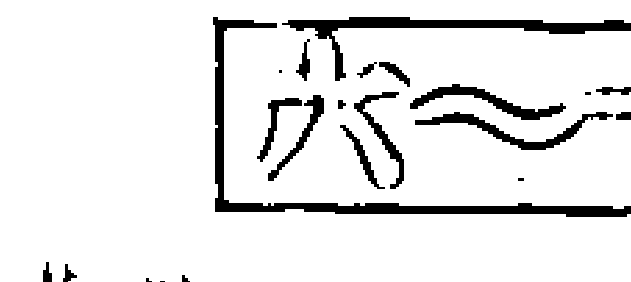

- 「死」 Death 「死」 104,124
- 杜提卡奴斯 Duticanus デュティカヌス 52
- 伊克西翁 Ixion イクシオン 192
- 伊西斯 Isis イシス 124
- 伊利亚斯·利未 Eliphas Levi エリファス・レヴィ 162
- 伊什塔尔 Ishtar イシュタル 46
- 伊斯兰 Islam イスラム教 58
- 伊萨卡隆 Isacaron イサカーロン 40,180
- 荣耀之手 Hand of Glory 栄光の手 172
- 印记 Sigil シジル 190,202,206
- 印章 Seal シール 190,202
- 小恶魔 Imp インプ 170
- 伊波斯 Ipos イポス 221
- 伊佩斯 Ipes イペス 122
- 地下的恶魔·休波克特尼亚 Demon under ground 地中の悪魔<ヒュポクトニア> 118
- 地上的恶魔·克特尼亚 Demon of earth 地の悪魔<クトニア> 118
- 德拉夫斯 Drafuf ドラフス 52
- 阿洛塞尔 Allocer アロセル 122
- 安德拉斯 Andras アンドラス 122,228
- 安德罗马利乌斯 Andromalius アンドロマリウス 230
- 阿姆杜基亚斯 Amdusias アムドゥキアス 229
- 阿姆杜西亚斯 Amdusias アムドゥシアス 122,229
- 阿洛塞斯 Alloces アロセス 226
- 安德雷阿尔弗斯 Andrealphus アンドレアルフス 229
- 安德罗阿尔法斯 Andrealphus アンドロアルファス 122
- 托马斯·阿奎那 Thomas Aquinas トマス・アクィナス 90,96,142,166
- 死后的审判 Judgment after death 死後の審判 130
- 米迦勒 Michael ミカエル 34,192
- 米尔康 Milcom ミルコム 48
- 艾舒玛 Aeshma アエーシュマ 24
- 瓦伊姆 Vapula ヴァイム 122,221
- 切里亚托 Chirpato チリアット 112
- 谢米哈扎 Semyaza シェミハザ 30
- 莉莉丝 Lili リリ 122,220
- 亨利·博凯 Henry Boquet アンリ・ボケ 176

| 中文名 | 英文名 | 日文名 | 页码 |
|--------|--------|--------|------|
| 但丁 | Dante | ダンテ | 22,112,116 |
| 但他林 | Dantalion | ダンタリオン | 230 |
| 佛拉斯 | Foras | フォラス | 122,223 |
| 佛劳洛斯 | Flauros | フラウロス | 122,228 |
| 佛钮司 | Forneus | フォルネウス | 122,223 |
| 佛尔卡洛 | Focalor | フォカロル | 122,225 |
| 克罗赛 | Crocell | クロセル | 226 |
| 克苏鲁神话 | Cthulhu Mythos | クトゥルフ神话 | 50 |
| 别西卜 | Beelzebub | ベルゼブブ | 22,44,52,192 |
| 别西布 | Beelzebul | ベルゼブル | 22 |
| 利比谷谷 | Libicocco | リビコッコ | 112 |
| 利维坦 | Leviathan | レビヤタン | 34,40,42 |
| 利维坦 | Leviathan | リヴァイアサン | 182 |
| 希比莉 | Cybele | キュベレ | 104 |
| 希多奈 | Sydonai | シドナイ | 122 |
| 沃瓦 | Voval | ヴォヴァル | 226 |
| 沃劣克 | Volac | ヴォラク | 122,228 |
| 沃索 | Voso | ヴォソ | 227 |
| 沙克斯 | Shax | シャックス | 225 |
| 狄奥菲勒斯 | Theophilus | テオフィルス | 132,136 |
| 男夜魔 | Incubus | インクブス | 142,146,168 |
| 系尔 | Seere | セエレ | 230 |
| 贝卡德 | Bechard | ベカルド | 204 |
| 贝耳非斯 | Bel-Phegor | ベルフェゴル | 44 |
| 贝西摩斯 | Behemoth | ベヘモット | 40,42,130 |
| 贝贝 | Belbel | ベルベル | 102 |
| 贝利亚斯 | Belius | ベリアス | 120 |
| 贝雷特 | Belith | ベレト | 220 |
| 邪恶的诱惑者・鬼神 | Tentatores Maligenii | テンタトレス・マリゲニー | 20 |
| 里加思斯 | Ricaremus | リカルモス | 102 |
| 亚力克斯 | Alex | アリックス | 100 |
| 亚巴顿 | Abaddon | アバドン | 20 |
| 亚奴比斯 | Anubis | アヌービス | 63 |
| 亚米 | Amy | アミイ | 122,220 |
| 亚考斯 | Acaos | アチャス | 100 |
| 《亚伯拉梅林的神圣魔法书》 | The book of the sacred magic of ABRAMELIN the mage | 『アブラメリンの聖なる魔术书』 | 40,46,190,200 |
| 亚利 | Ariel | アリエル | 121 |
| 亚利几诺 | Alchino | アリキーノ | 117 |
| 亚利欧克 | Arioch | アリオク | 121 |
| 亚里斯多德 | Aristotle | アリストテレス | 114 |
| 亚玻伦 | Apollyon | アポリオン | 70 |
| 亚特拉克斯 | Katrax | アトラクス | 105 |
| 亚纳斯 | Avnas | アヴナス | 210 |
| 亚得米勒 | Adramelec | アデランメレク | 121 |
| 亚斯她录 | Astaroth | アスタロト | 46,120,210,240 |
| 亚斯她录 | Astarte | アスタロテ | 121 |
| 亚蒙 | Amon | アモン | 121,111 |

- 亞遜蒙 Amaimon アマイモン 204,208
- 分馬力斯 Kimaris キマリス 229
- 奇蹟的模仿者 Praestigiatores プラエスティギアトレス 28
- 奈弗他林 Naphthalim ネフタロン 180
- 如爾姆斯 Murmus ムールマス 227
- 如爾姆爾 Murmur ムールムール 122,227
- 宙斯 Zeus ゼウス 22
- 彼列 Belial ベリアル 12,20,114,229
- 《彼列的密判》 The lawsuit of Belial 「ベリアルの裁判」 20,114
- 所羅門王 Solomon the King ソロモン王 192,196,198,218
- 《所羅門王之鑰》 The Key of Solomon the King 「ソロモン王の鍵」 196
- 所羅門王的72惡魔 72 demons of Solomon the King ソロモン王の72悪魔 122,198,218
- 《所羅門王的小鑰匙》 The Lesser Key of Solomon the King 「ソロモン王の小さな鍵」 122,190,198,218
- 《所羅門王的遺言》 The Testament of Solomon the King 「ソロモン王の遺言」 22,24,28,192
- 拉米耶爾 Ramiel ラミエル 124
- 拉克坦西 Lactantius ラクタンティウス 58,72
- 拉布 Rabbu ラブー 56
- 拉哈伯 Rahab ラハブ 34
- 拉斐爾 Raphael ラファエル 16,24
- 易卜劣斯 Iblis イブリス 86
- 林布爾兄弟 Limburg brothers ランプール兄弟 138
- 波提斯 Botis ボティス 122,220
- 空中勢力 Aerial potestates エリアエ・ポテスタテス 28
- 空中移動 Moving in Air 空中移動 142
- 刻耳柏洛斯 Cerberus ケルベロス 116
- 阿加雷斯 Agares アガレス 122,218
- 阿卡迪亞惡魔 Acedia アケーディアの悪魔 76
- 阿格里帕 Agrippa アグリッパ 28,54
- 阿尼奎爾 Anikuel アニクエル 194
- 阿托薩埃爾 Artosacl アロトサエル 192
- 阿利頓 Ariton アリトン 208
- 阿利曼 Ahriman アーリマン 10,24
- 阿萊斯 Rheex Alath アラト 192
- 阿貢尼奧斯 Rheex Achoneoth アグコニオン 192
- 阿胡拉・馬茲達 Ahura Mazda アフラ・マズダ 10
- 阿加利亞雷普特 Agaliarept アガリアレプト 210
- 阿納特 Anath アナト 42
- 阿納特雷 Rheex Anatreth アナトレト 192
- 阿雷波里特 Aleborith アレボリト 192
- 阿蒙 Amon アーモン 180
- 阿斯塔特 Astarte アスタルテ 46
- 阿斯莫迪 Asmoday アスモダイ 223
- 阿斯莫德烏斯 Asmodeus アスモデウス 24,180,192
- 阿斯莫德烏斯的契約書 Contract of Asmodeus アスモデウスの契約書 24,180

- 阿顿 Rhyx Atonkme アクトン 192
- 阿爾康 Archon アルコーン 68,74
- 《阿爾馬岱的魔法書》 The Grimoire of ARMADEL 「アルマデルの魔道書」 40,46,190,206
- 阿撒洛勒 Azazel アザゼル 12,16,18,30
- 阿諾斯特 Rhyx Anoster アノステル 192
- 附身 Obsession オブセッション 178
- 附身 Possession ポゼッション 178
- 附身 Possession 憑依 102,186
- 哈帕克斯 Rhyx Hapax ハルパクス 192
- 哈法斯 Halphas ハルファス 122,224
- 哈達 Hadad ハダト 44
- 哈維斯 Harves ハウレス 228
- 哈密特 Harut ハルート 86
- 契約 Pact 契約 132,134,136
- 契約書 Contract 契約書 162,180,182
- 威沛 Vepar ウェパール 122
- 威沛 Vepar ウェパル 225
- 威里內 Verrine ウェリネ 120
- 威里爾 Verrier ウェリエル 120
- 恰克斯 Chax チャクス 122
- 恰姆 Chum チャム 180
- 拜恩 Viné ヴィネ 122,225
- 星期五 Friday 金曜日 128
- 昆玆（非戈）的巴力 Baal of Peor (Phgor) ベオル（フェゴル）のバアル 44
- 洛華路 Iuvart イウヴァルト 192,120
- 洪巴巴 Humbaba フワフ 56
- 《洪諾留的誓約書》 The Sworn Book of Honorius ホノリウスの誓約書 204
- 派蒙 Paimon パイモン 122,204,208
- 看守天使 Egrigori エグリゴリ（見張りの天使） 16,30
- 約翰·史皮斯 Johann Spies ヨハネス・シュピース 194
- 約翰·法雨 Johann Weyer ヨーハン・ヴァイヤー 98,122,198
- 《約翰·浮士德博士的故事》 Historia von D. Johann Fausten 「実伝ヨーハン・ファウスト博士」 52,134
- 約翰·喬治·浮士德 Johann Georg Faust ヨーハン・ゲオルク・ファウスト 164
- 約翰·密爾頓 John Milton ジョン・ミルトン 22,124
- 《紅龍》 Red Dragon 「赤い竜」 240
- 耶和華 Jchovah ヤハウェ 16,20,190
- 耶和華的使者 Malak Yahweh マラク・ヤハウェ 16
- 耶納烏他 Rhyx. the Enautha エネスト 192
- 耶稣＝贖價說 Jesus Ransom Theory イエス＝贖価説 64,190
- 耶稣＝贖金理論 Ransom Theory of Atonement イエス＝身代金理論 190
- 英斯蒂迪里斯 Institoris インスティトリス 144,190
- 迦尼薩 Ganesha ガネーシャ 16
- 迦泰尼科塔耶 Katunikotael カタニコタエル 192
- 風之惡魔·阿耶利亞 Demon of Air 風の悪魔<エリア> 190
- 飛多 Phito フェト 190
- 哥所因 Gusoyn グソイン 16

-   <哥耶姆雅> Goetia 「ゲーティア」 ............................................... 122,198,218
- 埃力米 Elimi エリミ ................................................................ 182
- 埃力格 Eligor エリゴル ............................................................... 122
- 埃力格 Eligos エリゴス ............................................................... 220
- 埃瓦格里乌斯 Evagrius エウアグリオス ....................................... 58,76
- 埃吉姆 Egym エギム ................................................................ 204
- 埃娃 Eve イヴ ........................................................................ 204
- 席尔卡迪 Silcharde シルカルデ .................................................. 204
- 川加亚代 Kmeathol クメアテル ................................................... 192
- 川塔耶 Kourtnei クルタエル ....................................................... 192
- 《屈得尔见闻录》 Vision of Tundale 「タンデールの幻」 ............... 110,138
- 恩利尔 Enlil エンリル ............................................................... 56
- 巨人 Nephilim ネフィリム .......................................................... 62,104
- 格拉非冈 Graffiacane グラッフィアカーネ ................................... 112
- 格列希亚拉波斯 Glasya-Labolas グラシアラボラス(グラシア・ラボラス) 122,222
- 古朗迪埃神父 Father Grandier グランディエ神父 ........................ 180,182
- 咨义瑞 Gomory ゴモリー ........................................................... 122
- 格奈瑞 Gremory グレモリー ...................................................... 227
- 格洛加德 Glongard グロンガード ................................................ 40,50
- 泽帕 Zepar ゼパール ................................................................ 122
- 泽帕 Zepar ゼパル ................................................................... 220
- 提坦神族 Titan ティタン族 ......................................................... 124
- 四字神名 Tetragrammaton テトラグラマトン ............................. 200
- 浮士德 Faust 「ファウスト」 ..................................................... 52,54
- 浮士德博士 Doctor Faust ファウスト博士 ................................... 134,136
- 浮士德传说 Legend of Faust ファウスト伝説 ............................... 52
- 弗勒提 Fleurety フルーレティ ................................................... 210
- 哈根提 Halgenti ハーゲンティ ................................................... 122,226
- 克拉马 Heinrich Kramer ハインリヒ・クラマー ........................... 146
- 内比罗斯 Nebiros ネビロス ......................................................... 210
- 内夫萨达 Nephisudha ネフサダ ................................................... 192
- 乌瓦尔 Uvall ウヴァール .......................................................... 226
- 狼化 Lycanthropy 狼憑き .......................................................... 152,154
- 格里高利 Grigori グリゴリ ........................................................ 30
- 《神曲》 The Divine Comedy 「神曲」 ...................................... 22,110,112,116
- 安兹岛 An アンズー島 ............................................................. 56
- 纳贝流士 Naberius ナベリウス ................................................... 122,222
- 纳夫拉 Naphula ナフラ ............................................................ 228
- 纳托 Rhevi Nathotho ナオト ...................................................... 192
- 索内伊隆 Sonneillon ソネイロン ................................................ 120
- 针针 Pinale ピナレ .................................................................. 166
- 马丁·路德 Martin Luther マルティン・ルター ............................. 188
- 马尔科西亚斯 Marchosias マルコシアス .................................... 122,224
- 马尔德罗 Mardeco マルデロ ..................................................... 192
- 马拉科达 Malagoda マラコーダ ................................................. 112
- 马勒布兰什 Malebranche マルブランケ .................................... 112
- 马尔萨斯 Malthus マルサス ...................................................... 224
- マルート Marmarot マルート ................................................... 86
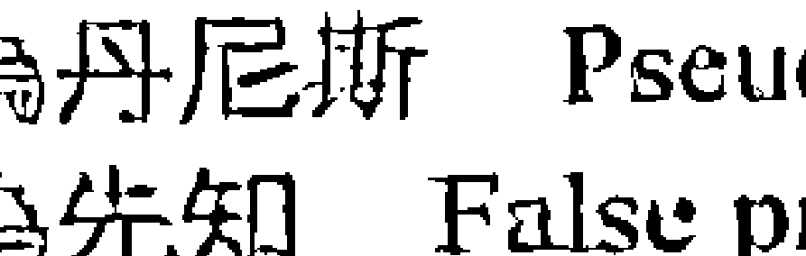
- 偉大的父  Abba deRabbutu  アッバ・ドゥ・ラブタ................................................74
- 偉丹尼斯  Pseudo-Dionysius  偉ディオニシウス ................................................58,80,120
- 偉先知  False prophets  偉予言者................................................32,116
- 偉神  Pseudothei  プセウドティ ................................................28
- 勒萊卡  Lelaikha  レライカ ................................................220
- 勒萊耶  Leraje  レライエ ................................................220
- 啟示錄的獸  The Beast/the beast of Revelations  黙示録の獣........................32
- 基抹  Chemosh  ケモシ ................................................124
- 基抹  Chemosh  ケモシュ................................................48
- 從地中上來的獸  Beast coming out of the earth  地中から上がってきた獣.......116
- 從海中上來的獸  Beast rised up out of the sea  海から上がってきた獣........116
- 《敎皇洪諾留的魔導書》  The Grimoire of Pope Honorius
『ホノリウス教皇の魔導書』................................................46,190,204
- 梅佛斯特  Mephostphiles  メフォストフィレス ................................................52,54,134
- 梅利金  Merizim  メリジム................................................28
- 梅菲斯特  Mephistopheles  メフィストフェレス................................................52,54
- 清潔派  Cathori  カタリ派................................................58,84,140
- 畢亞納基  Blunachit  ビアナキト ................................................192
- 畢頌  Python  ピュートーン ................................................28
- 異端審問  Pagan Judgement  異端審問................................................140
- 荷姆克魯斯  Homunculus  ホムンクルス................................................54
- 莉莉特  Lilithu  リリトゥ ................................................38
- 莉莉絲  Lilith  リリト................................................38,104
- 莫斯提馬  Mastema  マステマ ................................................12,18
- 蛇  Snake  蛇................................................26,74,102
- 軟膏  Witches' ointment  軟膏................................................150,154,174
- 鳥身女妖  Harpuiui  ハルピュイアイ ................................................112
- 勞姆  Räum  ラウム................................................122,225
- 勞涅  Raune  ラウネ................................................200
- 望卡拉比  Decarabia  デカラビア ................................................122,229
- 復仇女神  Fariae  フリアエ................................................20
- 惡魔  daimon  daimon................................................11
- 惡魔  daimon  ダイモン................................................11
- 惡魔  demon  デーモン................................................8,62,101
- 惡魔  devil  デビル................................................11
- 惡魔  devils  devils................................................11
- 惡魔  diabolos  diabolos................................................11
- 惡魔的三位一體  Satan's Trinity  悪魔の三位一体................................................110
- 《惡魔的偽王國》  Pseudomonarchia Daemonum
『悪魔の偽王国』................................................44,46,122,1000
- 惡魔附身  Possession and Obsession  悪魔憑き................................................170,170
- 惡魔學  Demonology  悪魔学................................................110
- 概布  Gaap  ガアプ................................................122,229
- 斯托刺  Stolas  ストラス................................................122,229
- 斯托羅  Stolos  ストロス................................................110
- 斯伯納克  Sabnack  サブナク................................................1
- 斯伯諾克  Sabnock  サブノック ................................................101
- 普弗拉斯 Pruflas プルフラス............................................................122
- 普咯尔 Pucel プセル................................................................122
- 普提法尔 Putiphar ピュティファル...................................................40,50
- 普尔桑 Pursan プルサン.............................................................122
- 普尔森 Purson プルソン.............................................................221
- 法尔法雷洛 Farfarello ファルファレルロ..............................................112
- 瓦列弗 Valefar ヴァレファル.........................................................122
- 瓦列佛尔 Valefor ヴァレフォール......................................................219
- 菲尼克斯 Phoenix フェニックス......................................................122
- 菲依雅 Freyja フレイア............................................................128
- 菲涅克斯 Phenex フェネクス.........................................................224
- 雅各布·史宾格 Jacob Sprenger ヤーコブ・シュプレンガー..........................146
- 雅尔达巴奥特 Jaldabaoth ヤルダバオート...........................................26,68
- 索听之王 Mlek Heshuka ムレク・ヘシュカ............................................74
- 萨列欧斯 Salcos ザレオス..........................................................122
- 萨姆魇法 Seithr セイズ............................................................128
- 萨洛斯 Sallos サロス..............................................................220
- 奥丁 Odin オージン................................................................128
- 赖克斯·奥托 Rhyx Autoth アウトシト...............................................192
- 奥里金 Oregenes Adamantius オリゲネス.............................................14,58,70
- 奥西里斯 Osiris オシリス..........................................................124
- 罪 Sin 「罪」....................................................................104,124
- 梅塔西亚克斯 Meihathiax メタシアクス.............................................192
- 圣母玛利亚 Saint Mary 聖母マリア.................................................132,136,162
- 爱任纽 Irenacus エイレナイオス....................................................58,64,68,88
- 圣安东尼 St. Anthony 聖アントニウス.............................................76,108,178
- 《圣安东尼传》 Life of Saint Anthony 聖アントニウス伝..........................90,92,108
- 圣亚他那修 Saint Athanasius アタナシウス.........................................90,108
- 伊格那丢 Ignatius イグナティオス................................................58,60
- 殉道者查斯丁 Justin Martyr ユスティノス..........................................58,62,96
- 奥古斯丁 Aurelius Augustinus アウグスティヌス....................................14,58,78
- 耶罗巴 Ieropa イエロパエル.......................................................192
- 鲁比坎特 Rubicante ルビカンテ...................................................112
- 鲁西弗格·洛福卡雷 Lucifuge Rofocale ルキフゲ・ロフォカレ.......................210,214
- 路西法 Lucifer ルシファー.........................................................14,70,78,110
- 路西法 Lucifer ルシフェル.........................................................14
- 路西法 Luchifer ルチフェル........................................................52
- 德拉格尼亚佐 Draghignazzo ドラギニャッツオ......................................112
- 罗埃尔 Leroi ロエレド............................................................192
- 《雷蒙盖顿》 Lemegeton『レメゲトン』.............................................44,196,198,218
- 马尔 Mare マレ..................................................................168
- 噩梦/夜魇 Murr/Nightmare 夢魘....................................................168
- 噩梦 Nightmare ナイトメア........................................................168
- 歌德 Goethe ゲーテ...............................................................52,54
- 于尔班·格朗迪耶 Urbain Grandier ユルバン・グランディエ..........................180
- 琐罗亚斯德教 Zoroastrianism ゾロアスター教......................................10,20
- 马尔巴斯 Malbas マルバス.........................................................122,218
- 马尔法斯 Malphias マルファス....................................................122,224

## 参考文献

- 瑪門 Mmammon マモン ………………………………………………………………………28
- 瑪門 Mmammon マンモン …………………………………………………………………124
- 瑪寇特 Mgnot マゴト ………………………………………………………………………208
- 瑪爾西巴 Mulciber ムルキベル …………………………………………………………………124
- 瑪迦亞 Magoa マゴア …………………………………………………………………204
- 福麗嘉 Frigg フリッグ ………………………………………………………………128
- 药膏 Ointment 药膏 …………………………………………………………………152
- 蒼蠅之王 Lord of Flies 蠅の王 …………………………………………………………………22
- 詹因 Caim カイム ………………………………………………………122, 227
- 賈斯費德 Peter Binsfield ピンスフェルト …………………………………………………………………42
- 蘇非希米列 Hepheshmilet ヘフェシミレト …………………………………………………………………102
- 魂 Psuche プシケー ……………………………………………………………76
- 隕天使 Fallen Angel 墮天使 ………………………………………………………30, 62, 78
- 德爾圖良 Tertullian テルトゥリアヌス ………………………………………………………58, 66, 68
- 德穆哥 Demiurgos デミウルゴス ……………………………………………………68, 74
- 僧恨太陽的惡魔・密瑟巴耶ス Demon hates the sun 太陽を恨む悪魔＜ミソバエス＞ …………………………………………………118
- 摩尼教 Manichaeism マニ教 …………………………………………………58, 74
- 《摩西第六、七書》 The Sixth and Seventh Books of Moses 『モ一七第6,7書』 ……………………………………………190, 194
- 《摩西第八、九、十書》 The Eighth, Ninth and Tenth Books of Moses 『モ一七第8,9,10書』 ……………………………………………194
- 摩拉克斯 Morax マラクス ………………………………………………………221
- 摩拉克斯 Morax モラクス ………………………………………………………122
- 摩洛 Molech モレク ……………………………………………………………48
- 摩洛克 Moroch モロク …………………………………………………48, 124
- 伽卡拉新 (闇之君主) Snaclus サクラ(闇の君主) …………………………………………………68
- 撒旦 satan satan ………………………………………………………8, 12
- 撒旦 Satan サタン …………………………………………………8, 12, 14, 36
- 撒末爾 Samael サマエル ……………………………………………12, 26, 38, 68
- 撒共 Zagan サガン ……………………………………………………………220
- 撒共姆 Zagam サガム ……………………………………………………………122
- 撒達奈 Satanail サタナイル ……………………………………………………………12
- 撒達奈耶 Satanael サタナエル ……………………………………………………58, 82
- 撒達納奇亞 Satanacin サタナキア …………………………………………………………210
- 歐里亞斯 Orius オリアス ……………………………………………122, 220
- 歐里亞斯 Oriax オリアックス …………………………………………………………220
- 歐里維耶 Olivier オリュイエル …………………………………………………………120
- 歐耶密特 Oeillet オエイレト …………………………………………………………120
- 歐若博司 Orobas オロバス ……………………………………………122, 220
- 歐茲 Oze オゼ ……………………………………………………………120
- 歐逊斯 Oriens オリエンス ……………………………………………………………200
- 歐亞 Ose オゼ ……………………………………………………………221
- 潘 Pan パン神 ……………………………………………………………140
- 盧丹惡魔附身事件 Loudun Possesions ルーダンの悪魔憑き事件 ……24, 100, 110
- 盧拉彼德 Le Rapide ル・ラピデ …………………………………………………………100
- 薩阿克斯 Rurax ルアクス ……………………………………………………………110
- 諾斯替教 Gnosticism グノーシス主義 ……………………………………………50, 100, 130
- 錫蒙力 Cimeries シメリエス ……………………………………………122
- 錫蒙斯 Cimeies シメイエス ……………………………………………229
- 華拉斯 Hauras ハウラス ……………………………………………228
- 華雷斯 Haures ハウレス ……………………………………………228
- 華露斯 Horus ホルス ……………………………………………124
- 伯格米勒派 Bogomil ボゴミール派 ……………………………………………58, 82, 140
- 龍 Dragon ドラゴン ……………………………………………32, 34, 40
- 龍 Dragon 龍 ……………………………………………32, 34, 116
- 彌賽亞 Messias メシア ……………………………………………62, 126
- 臨門 Rimmon リンモン ……………………………………………124
- 謊言之靈 Spiritus mendaciorum スピリトゥス・メンダキオルム ……………………………………………28
- 塞巴斯丁·米亞埃利斯 Sebastian Michaelis セバスチャン・ミカエリス ……………………………………………120
- 塞亞 Seir セイア ……………………………………………230
- 塞爾 Sear セアル ……………………………………………230
- 黛安娜 Diana ディアナ ……………………………………………142, 144, 160
- 薩法索拉耶 Saphthorael サフアソラエル ……………………………………………192
- 薩米基那 Samigina サミジナ ……………………………………………218
- 薩滿 Shaman シャーマン ……………………………………………142
- 薩爾迦塔納斯 Sargatanas サルガタナス ……………………………………………210
- 吉靈 Djinn ジン ……………………………………………86
- 羅坦 Ltn ロタン ……………………………………………40
- 羅內薇 Roneve ロネヴェ ……………………………………………122
- 《羅馬典禮制定書》 The Roman Ritual (Rituale Romanum) ローマ典礼定式書 ……………………………………………186
- 羅謝爾 Rosier ロシエル ……………………………………………120
- 羅蕾 Loray ロレイ ……………………………………………122
- 羅諾薇 Ronové ロノヴェ ……………………………………………222
- 藍弗雷 Lanfey ランフレ ……………………………………………86
- 塔里斯曼 Talisman タリスマン ……………………………………………202, 206
- 塔里斯曼 Talisman 護符 ……………………………………………202, 206
- 驅魔 Exorcism 魔除け ……………………………………………176, 180, 184, 186
- 驅魔師 Exorcist エクソシスト（悪魔払い師、祓魔師） ……………………………………………120, 184, 186
- 惡魔 The Devil The Devil ……………………………………………8
- 惡魔 The Devil 魔王 ……………………………………………8, 12
- 魔王の印 Devil's Mark 魔王の印 ……………………………………………166
- 魔法杖 Magic Wands 魔法杖 ……………………………………………190, 202, 212, 216
- 魔法円 Magic Circle 魔法円 ……………………………………………190, 200, 212, 214
- 魔法道具 Magic Items 魔法道具 ……………………………………………202
- 薩巴特 Sabbat サバト ……………………………………………160, 162
- 格里莫瓦爾 Grimoire グリモワール ……………………………………………190, 210
- 格里莫瓦爾 Grimoire 魔道書 ……………………………………………204, 206
- 使い魔 Familiars 使い魔 ……………………………………………170
- シャイタン Shaitan シャイタン ……………………………………………86
- 変身 Lycanthropy 変身 ……………………………………………142, 152
- 讓·德·尼諾 Jean de Nynauld ジャン・ド・ニノー ……………………………………………174
- 讓·波丹 Jean Bodin ジャン・ボダン ……………………………………………148, 154

## 参考文献

Grimoires·A History of Magic Books OWEN DAVIES著 OXDORD UNIVERSITY PRESS

THE BOOK OF BLACK MAGIC ARTHUR EDWARD WAITE著 WEISER BOOKS

THE BOOK OF THE SACRED MAGIC OF ABRAMELIN THE MAGE S.L.MACGREGOR MATHERS英訳 DOWER PUBLICATIONS, INC.

THE DEAD SEA SCRIPTURES THEODR H.GASTER英訳・解説 ANCHOR BOOKS

THE GOETIA-THE LESSER KEY OF SOLOMON THE KING S.L.MACGREGOR MATHERS英訳 / ALEISTER CROWLEY解説・解題 WEISER BOOKS

THE GRIMOIRE of ARMADEL S.L.MACGREGOR MATHERS英訳 WEISER BOOKS

The Key of Solomon the King(Clavicula Salomonis) S.L.MACGREGOR MATHERS英訳 WEISER BOOKS

THE SIXTH AND SEVENTH BOOKS OF MOSES JOSEPH H.PETERSON英訳 IBIS PRESS

悪魔 ルーサー・リンク著 / 高山宏訳 研究社

古代悪魔学 サタンと闘争神話 ニール・フォーサイス著 / 野村有子訳 / 倉田淑子ほか訳 法政大学出版局

悪魔 古代から原始キリスト教まで J.B.ラッセル著 / 野村英紀子訳 教文館

サタン 初期キリスト教の伝統 J.B.ラッセル著 / 野村英紀子訳 教文館

ルシファー 中世の悪魔 J.B.ラッセル著 / 野村英紀子訳 教文館

メフィストフェレス 近代世界の悪魔 J.B.ラッセル著 / 野村英紀子訳 教文館

悪魔の系譜 J.B.ラッセル著 / 大橋啓裕訳 青土社

悪魔の起源 エリーズ・ベイグルス著 / 松田和也訳 青土社

悪魔の事典 フレッド・ゲティンガーズ著 / 大橋啓裕訳 青土社

悪魔の系図 映画・彫刻で知る堕天使の物語 ローラ・ウォード、ツイル・スティーブス著 / 小林純子訳 新紀元社

悪魔の美術と物語 利倉隆 著 美術出版社

悪魔の文化史 ジョルジュ・ミノワ著 / 平野隆文訳 白水社

悪魔の歴史 ポール・ケーラス著 / 飯田裕訳 青土社

悪魔の歴史 12～20世紀 西洋文明に見る善の力学 ロベール・ミュッシャンブレ著 / 平野隆文訳 大修館書店

「堕天使」がわかる 舞輪澄、坂東真紅郎、池沢紀光 著 ソフトバンククリエイティブ

アンチキリスト 悪に脅かされた人類の二千年史バーナード・マッギン著 / 松田直成 訳 河出書房新社

異端カタリ派 フェルナン・ニーベル著 / 浅野昭美訳 白水社

異端カタリ派と転生 瓜田武 著 人文書院

異端カタリ派の哲学 ルネ・ネッリ著 / 塩田和雄訳 法政大学出版局

狼渡きと魔女 ジャン・ド・ニノー著 / 池上俊一監修、笹田润子訳 工作舎

河出世界文学全集 第2 ゲーテ 新潮社二、手塚富雄訳 河出書房新社

高等魔術の教理と祈祷 (教理篇・祈祷篇) エリファス・レビ著 / 生田耕作訳 人文書院

コーラン (上・中・下) 井筒俊彦訳 岩波書店

死海文書のすべて ジェームズ・C・ヴァンダーカム著 / 桑野仁訳 青土社

地獄の辞典 コラン・ド・プランシー著 / 佐藤剛ほか訳、吉田八岑協力 河出書房新社

失楽園 (上・下) ミルトン作 / 平井正穂訳 岩波書店

澁澤龍彦全集16 澁澤龍彦著 河出書房新社

澁澤龍彦全集2 澁澤龍彦著 河出書房新社

ジョン・ディー エリザベス朝の魔術師 ピーター・J・フレンチ著 / 前田敬介訳 平凡社

神学大全第4冊 トマス・アクィナス著 / 柿田三郎、日下昭夫訳 創文社

聖書新共同訳 旧約聖書続編つき 日本聖書協会## 参考文献

- 神曲 タンテ著 / 平川祐弘 訳 河出書房新社
- 画賛外典世界の天使と悪魔 山巻一保 編訳 ナツメ社
- 画賛外典仏典第4巻旧約仏典 II 村岡崇光 訳 教文館
- 画賛外典仏典別巻 神道 I 土岐恵治ほか 訳 教文館
- 世界教養全集第20 感法ーその歴史と正体 K・セリグマン 著 / 平田完 訳 平凡社
- 悪魔と天使 真野隆也 著 新紀元社
- 天国と地獄の百科 ジョルダーノ・ベルティ著 / 竹山博英、桂本元彦 訳 原書房
- 天使の世界 マルコム・ゴドウィン著 / 大滝啓裕 訳 青土社
- ドイツ民話本の世界III ファウスト博士 松浦純 訳 国書刊行会
- ナグ・ハマディ文書 (I〜IV) 世井猷ほか 訳 岩波書店
- バリの悪魔 ピエール・ガスカール著 / 佐藤和生 訳 法政大学出版局
- ペルシア神話 ジョン・R・ヒネルズ著 / 井本英一、奥西峻介 訳 青土社
- 魔術の歴史 J・B・ラッセル著 / 野村美紀子 訳 筑摩書房
- 魔術の歴史 リチャード・キャベンディッシュ著 / 城正行 訳 河出書房新社
- 魔術の歴史 エリファス・レヴィ著 / 鈴木啓司 訳 人文書院
- 魔女狩りと悪魔学 上山安敏・牟田和男 編著 人文書院
- 魔女現象 ヒルデ・シュメルツァー著 / 遊麻美訳 白水社
- 魔女とキリスト教ヨーロッパ学再考 上山安敏 著 人文書院
- 魔女と魔術の事典 ローズマリー・エレン・ギリィ著 / 荒木正純、松田英 監訳 原書房
- 魔女の神 マーガレット・A・マレー著 / 西村俊 訳 人文書院
- 魔女の随生と衰運 田中雅志編訳・解説 三交社
- 魔女の法廷 平野隆文 著 岩波書店
- 魔術：ミシェル・タルデュー著 / 大井沢、申野千恵美 訳 白水社
- 魔術師-マンの悪魔 ミシェル・ド・セルトー著 / 矢崎澄泓 訳 みすず書房
- 魔術師-マンの悪魔 オルダス・ハックスリー著 / 中山容・丸山知加代 訳 人文書院
- レネサンスの魔術思想 D・P・ウォーカー著 / 田口淳一 訳 平凡社
- 悪魔学大全 西井誠 著 勝源社
- 悪魔学大全 ロッセル・ホープ・ロビンズ著 / 松田和也 訳 青土社
- 悪魔学入門 J・チャールズ・ウォール著 / 松本明子 訳 北宋社
- 魔術の歴史 サバトの解読 カルロ・ギンズブルグ 著 / 然山勝英 訳 せりか書房

## 参考文献

- 『The Encyclopedia of Demons and Demonology』 Rosemary Guiley / 2009 / Checkmark Books
- 『Occultism: Its Theory and Practice』 Sirdar Ikbal Ali Shah / 2003 / Kessinger Publishing, LLC
- 『悪魔と天使伝説』 真野隆也 著 / 沙子芳 訳 / 尖端出版社 / 2004年
- 『悪魔学』 黄丁 著 / 黄國彬 監修 / 几象出版社 / 2003年
- 『悪魔事典』（上下） 任選総主編 / 博志出版社 / 1989年
- 『悪魔事典』 清水臨 著 / 世紀図書 / 1994年
- 『魔法魔界伝説』 西谷史 著 / 貝林恪 著 / 林廷淵 配 / 商周出版 / 2006年
- 『悪魔辞典』 沢村円海 著 / 王詩詠 訳 / 奇幻基地 / 2005年
- 『西洋魔界伝説』 山北篤・佐藤俊之 監修 / 高尾暁・劉子榕・林哲逸 合訳 / 奇幻基地 / 2003
- 『日本魔界伝説』 山北篤 監修 / 茂牧仁・林哲逸・神屋清 合訳 / 奇幻基地 / 2005年
- 『世界怪獣全図』 怪屋巧 著 / 王詩詠 訳 / 奇幻基地 / 2007年
- 『西洋神名事典』 山北篤 監修 / 鄭錦祥 訳 / 奇幻基地 / 2004年
- 『日本神名事典』 山北篤 監修 / 高城修 訳 / 奇幻基地 / 2005年
- 『中国神名事典』 池上正太 著 / 王詩詠 訳 / 奇幻基地 / 2008年
- 『西洋魔界事典』 山北篤 監修 / 王詩詔・高尾暁 訳 / 奇幻基地 / 2006年
- 『江戸の怪談』 山北篤 監修 / 王詩詠 訳 / 奇幻基地 / 2011年

### BEST 嚴選

| 書編 | 書名 | 作者 | 定價 |
|---|---|---|---|
| 1HB004X | 諸神之城：伊嵐翠 | 布蘭登·山德森 | 520 |
| 1HB009 | 最後理論 | 馬克·艾伯特 | 320 |
| 1HB013 | 刺客正傳1：刺客學徒（經典紀念版） | 羅蘋·荷布 | 299 |
| 1HB014 | 刺客正傳2：皇家刺客（上）（經典紀念版） | 羅蘋·荷布 | 320 |
| 1HB015 | 刺客正傳2：皇家刺客（下）（經典紀念版） | 羅蘋·荷布 | 320 |
| 1HB016 | 刺客正傳3：刺客任務（上）（經典紀念版） | 羅蘋·荷布 | 360 |
| 1HB017 | 刺客正傳3：刺客任務（下）（經典紀念版） | 羅蘋·荷布 | 360 |
| 1HB018 | 2012：失落的預言 | 麥利歐·瑞汀 | 320 |
| 1HB019 | 迷霧之子首部曲：最後帝國 | 布蘭登·山德森 | 380 |
| 1HB020 | 迷霧之子二部曲：昇華之井 | 布蘭登·山德森 | 399 |
| 1HB021 | 迷霧之子終部曲：永世英雄 | 布蘭登·山德森 | 399 |
| 1HB025 | 方舟浩劫 | 伯伊德·莫理森 | 320 |
| 1HB027 | 血色塔羅 | 尼克·史東 | 380 |
| 1HB028 | 最後理論2：科學之子 | 馬克·艾伯特 | 320 |
| 1HB029 | 星期一，我不殺人 | 尚—巴提斯特·德斯特歷 | 320 |
| 1HB030 | 懸案密碼：瘋裡的女人 | 獨希·阿德勒·歐爾森 | 320 |
| 1HB031 | 迷霧之子番外篇：執法鎔金 | 布蘭登·山德森 | 320 |
| 1HB032 | 2012：降世的預言 | 麥利歐·瑞汀 | 320 |
| 1HB033 | 彌達斯王國 | 伯伊德·莫理森 | 320 |
| 1HB034 | 颶光典籍首部曲：王者之路（上） | 布蘭登·山德森 | 400 |
| 1HB035 | 颶光典籍首部曲：王者之路（下） | 布蘭登·山德森 | 400 |
| 1HB036 | 懸案密碼2：維雅殺手 | 獨希·阿德勒·歐爾森 | 320 |
| 1HB037 | 末日之旅．上冊 | 加斯汀·柯羅寧 | 300 |
| 1HB038 | 末日之旅．下冊 | 加斯汀·柯羅寧 | 300 |
| 1HB039 | 懸案密碼3：瓶中信 | 獨希·阿德勒·歐爾森 | 300 |
| 1HB040 | 刀光幾影：戲龍之途 | 丹尼爾·艾伯罕 | 300 |
| 1HB041 | 懸案密碼4：第64號病歷 | 獨希·阿德勒·歐爾森 | 300 |
| 1HB042 | 皇帝魂：布蘭登·山德森精選集 | 布蘭登·山德森 | 320 |
| 1HB043 | 第一法則首部曲：劍刃自身 | 喬·艾伯康比 | 300 |
| 1HB044 | 第一法則二部曲：絞刑之前 | 喬·艾伯康比 | 300 |
| 1HB045 | 第一法則終部曲：最後手段 | 喬·艾伯康比 | 400 |

## 幻想藏書阁

| 编号 | 书名 | 作者 | 定价 |
| --- | --- | --- | --- |
| 111001C | 靈魂之戰 1：落日之巨龍 | 瑪格麗特・魏絲等 | 480 |
| 111002C | 靈魂之戰 2：隕星之巨龍 | 瑪格麗特・魏絲等 | 480 |
| 111003X | 靈魂之戰 3：逝月之巨龍（新版） | 瑪格麗特・魏絲等 | 480 |
| 111004 | 黑暗精靈 1：故土 | R・A・薩爾瓦多 | 380 |
| 111005 | 黑暗精靈 2：流亡 | R・A・薩爾瓦多 | 380 |
| 111006 | 黑暗精靈 3：旅居 | R・A・薩爾瓦多 | 380 |
| 111007 | 南方吸血鬼 1：夜訪良辰鎮 | 莎蓮・哈里斯 | 280 |
| 111010 | 南方吸血鬼 2：達拉斯夜未眠 | 莎蓮・哈里斯 | 280 |
| 111012 | 南方吸血鬼 3：亡者俱樂部 | 莎蓮・哈里斯 | 280 |
| 111020 | 南方吸血鬼 4：意外的訪客 | 莎蓮・哈里斯 | 280 |
| 111031 | 尼伯龍根之戒 | 沃夫岡・霍爾班等 | 360 |
| 111032 | 南方吸血鬼 5：與狼人共舞 | 莎蓮・哈里斯 | 280 |
| 111033 | 南方吸血鬼 6：惡夜追琪令 | 莎蓮・哈里斯 | 280 |
| 111034 | 南方吸血鬼 7：找死高齡會 | 莎蓮・哈里斯 | 280 |
| 111035 | 南方吸血鬼 8：攻琪不備 | 莎蓮・哈里斯 | 280 |
| 111036 | 黑暗之途 1：無聲之刃 | R・A・薩爾瓦多 | 380 |
| 111037 | 南方吸血鬼 9：全面琪動 | 莎蓮・哈里斯 | 280 |
| 111038 | 邪馬台國戰記 II：炎天的邪馬台國(完結篇) | 樹田谷治 | 399 |
| 111039 | 南方吸血鬼 10：噬血王子的背叛 | 莎蓮・哈里斯 | 280 |
| 111040 | 黑暗之途 2：世界之脊 | R・A・薩爾瓦多 | 380 |
| 111041 | 黑暗之途 3：劍刃之海 | R・A・薩爾瓦多 | 380 |
| 111042 | 南方吸血鬼番外篇：我的德古拉之夜 | 莎蓮・哈里斯 | 299 |
| 111043 | 獵人之刃 1：千獸人 | R・A・薩爾瓦多 | 399 |
| 111044 | 南方吸血鬼 11：精靈的聖物 | 莎蓮・哈里斯 | 280 |
| 111045 | 獵人之刃 2：獨行者 | R・A・薩爾瓦多 | 399 |
| 111046 | 獵人之刃 3：雙劍 | R・A・薩爾瓦多 | 399 |
| 111047 | 鬼谷戰團 1：光明戰士 | 蘇珊・柯林斯 | 250 |
| 111048 | 鬼谷戰團 2：災難預言 | 蘇珊・柯林斯 | 250 |
| 111049 | 鬼谷戰團 3：熱血之禍 | 蘇珊・柯林斯 | 250 |
| 111050 | 鬼谷戰團 4：神祕印記 | 蘇珊・柯林斯 | 250 |
| 111051 | 龍槍編年史 I：秋暮之巨龍 | 崔西・西克曼&瑪格麗特・魏絲 | 480 |
| 111052 | 龍槍編年史 II：冬夜之巨龍 | 崔西・西克曼&瑪格麗特・魏絲 | 480 |
| 111053 | 龍槍編年史 III：石際之巨龍 | 崔西・西克曼&瑪格麗特・魏絲 | 480 |
| 111054 | 龍槍傳奇 I：時空之卷 | 崔西・西克曼&瑪格麗特・魏絲 | 480 |
| 111055 | 龍槍傳奇 II：烈火之卷 | 崔西・西克曼&瑪格麗特・魏絲 | 480 |
| 111056 | 龍槍傳奇 III：浩劫之卷 | 崔西・西克曼&瑪格麗特・魏絲 | 480 |
| 111057 | 愛麗絲・雅頓系列 I：觸墓驚心 | 莎蓮・哈里斯 | 280 |
| 111058 | 愛麗絲・雅頓系列 II：移花接墓 | 莎蓮・哈里斯 | 280 |
| 111059 | 愛麗絲・雅頓系列 III：草薙皆冰 | 莎蓮・哈里斯 | 280 |
| 111060 | 愛麗絲・雅頓系列 IV：不堪入墓 | 莎蓮・哈里斯 | 280 |
| 111061 | 鬼谷戰團 5：秘密視役 | 蘇珊・柯林斯 | 250 |

| 書號 | 書名 | 作者 | 定價 |
|------|------|------|------|
| 1HI062 | 死亡之門1：龍之咒（全新封面） | 崔西·西克曼&瑪格麗特·魏斯 | 360 |
| 1HI063 | 死亡之門2：精靈之星（全新封面） | 崔西·西克曼&瑪格麗特·魏斯 | 360 |
| 1HI064 | 死亡之門3：火之海（全新封面） | 崔西·西克曼&瑪格麗特·魏斯 | 360 |
| 1HI065 | 死亡之門4：風蛟法師（全新封面） | 崔西·西克曼&瑪格麗特·魏斯 | 360 |
| 1HI066 | 死亡之門5：混沌之手（全新封面） | 崔西·西克曼&瑪格麗特·魏斯 | 420 |
| 1HI067 | 死亡之門6：迷宮歷險（全新封面） | 崔西·西克曼&瑪格麗特·魏斯 | 420 |
| 1HI068 | 死亡之門7：第七之門（完）（全新封面） | 崔西·西克曼&瑪格麗特·魏斯 | 360 |
| 1HI069 | 南方吸血鬼12：神秘的魔法師 | 莎蓮·哈里斯 | 280 |
| 1HI070 | 流世天使 | 瑟琳·易 | 280 |
| 1HI071 | 天使禁區 | 羅蘋·艾莉絲 | 250 |

### 1 Maps

| コード | 書名 | 作者 | 定価 |
| --- | --- | --- | --- |
| 0001 | 図解錬金術 | 草野巧 | 300 |
| 0002 | 図解近身武器 | 大波篤司 | 280 |
| 0004 | 図解魔法知識 | 羽仁礼 | 300 |
| 0006 | 図解北歐神話 | 森瀬徹 | 320 |
| 0007 | 図解陰陽師 | 藤平鴎海 | 320 |
| 0008 | 北歐神話 | 池上良太 | 330 |
| 0009 | 天動説と地球 | 工藤巧 | 330 |
| 0010 | 火神と火神国 | 山北篤 | 330 |
| 0011 | 図解神々の系譜 | 草野巧 | 330 |
| 0012 | 図解北歐神話 | 草野巧 | 330 |

### 2 その他

| コード | 書名 | 作者 | 定価 |
| --- | --- | --- | --- |
| 0013 | Truth in Fantasy（全6枚セット） | Truth in Fantasy 編集部 | 420 |
| 0014 | Truth in Fantasy（三枚セット） | 市川定喜 | 420 |
| 0015 | Truth in Fantasy（七枚セット） | 山北篤等 | 480 |
| 0016 | 伝統の神話（六枚） | 鈴部伸明 | 特価 999 |
| 0017 | 北歐神話（四枚） | 草野巧 | 特価 499 |
| 0018 | 歴史をつくった17の天才 | 中里融司 | 320 |
| 0019 | 図解日本神話（五枚） | 工藤巧 | 420 |
| 0020 | 神話・伝承（四枚） | 山北篤 | 750 |
| 0021 | 伝統の神話（二枚） | 池上正太 | 399 |
| 0022 | 北歐神話（五枚セット） | 飯井勝彦 | 420 |

## 國家圖書館出版品預行編目資料

圖解惡魔學 / 草野巧 著 ; 王瀞瑢 譯. -- 初版. -- 臺北市 : 奇幻基地出版 : 家庭傳媒城邦分公司發行 ; 2013.08 [民102.08]
面 : 公分. -- (F-Maps : 012)
譯自: 圖解 惡魔學
ISBN 978-986-5880-46-0 (平裝)
1. 恶魔学

城邦讀書花園
www.cite.com.tw

F-Maps 012

# 圖解惡魔學

- 原著書名 / 圖解惡魔學
- 作者 / 草野巧
- 譯者 / 王瀞瑢
- 企劃選書人 / 楊秀鶴
- 責任編輯 / 李幼婷
- 行銷企劃 / 周丹珮
- 業務企劃 / 謝于姗
- 行銷業務經理 / 李振束
- 總編輯 / 楊秀鶴
- 發行人 / 何飛鵬
- 法律顧問 / 台英國國際商務法律事務所羅明通律師

出版 / 奇幻基地出版
城邦文化事業股份有限公司
台北市104民生東路2段141號8樓
電話 : (02)25007008   傳真 : (02)25027676
網址 : www.ffoundation.com.tw
e-mail : ffoundation@cite.com.tw

發行 / 英屬蓋曼群島商家庭傳媒股份有限公司城邦分公司
聯絡地址 : 台北市104民生東路2段141號2樓
書虫客服服務專線 : 02-25007718 ; 25007719
24小時傳真服務專線 : 02-25001990 ; 25001991
服務時間 : 週一至週五上午09:30-12:00 ; 下午13:30-17:00
劃撥帳號 : 19863813 ; 戶名 : 書虫股份有限公司
讀者服務信箱 : service@readingclub.com.tw
歡迎光臨城邦讀書花園 網址 : www.cite.com.tw

香港發行所 / 城邦（香港）出版集團有限公司
香港灣仔洛克道 193 號東超商業中心 1 樓
電話 : (852) 2508-6231   傳真 : (852) 2578-9337
e-mail : hkcite@biznetvigator.com

馬新發行所 / 城邦（馬新）出版集團 Cite (M) Sdn Bhd
41, Jalan Radin Anum, Bandar Baru Sri Petaling, 57000 Kuala Lumpur, Malaysia
電話 : 603-90578822   傳真 : 603-90576622
email : cite@cite.com.my

封面設計 / 黃聖文
排 版 / 浩瀚電腦排版股份有限公司
印 刷 / 高典印刷有限公司

售價 / 330元

ZUKAI AKUMA-GAKU by KUSANO Takumi
Illustrations by FUKUCHI Takako
Copyright © 2010 KUSANO Takumi
All rights reserved.
Originally published in Japan by Shinkigensha Co Ltd, Tokyo.
Chinese (in complex character only) translation rights arranged with
Shinkigensha Co Ltd, Japan through THE SAKAI AGENCY.
Complex Chinese translation copyright © 2013 Fantasy Foundation Publication, a division of
Cité Publishing Ltd.限告回函
北區郵政管理登記證
台北限字第000791號
郵資已付，免貼郵票

104台北市民生東路二段141號11樓

英屬蓋曼群島商家庭傳媒股份有限公司城邦分公司 收

-   http://www.lfoundatiom.com.tw
-   http://www.facebook.com/foundation

# 奇幻基地创社11年

# 奇幻战队好书读者会集点赠奖活动

活动期间，购买奇幻基地作品，剪下封底折口的点数券，集到一定数量，寄回本公司，即可以点数多寡兑换赠品。

# 点数兑换赠品说明：

-   5点：奇幻帆跃好书袋一个
-   10点：2012年布朗登·山德森来台纪念T恤一件（有S&M两种尺寸，偏大，由奇幻基地自行判断出货）
-   15点：【萧秋杀猬家设计】典藏限量红蚂蚁帆布书袋（红蚁或银灰两种书袋上，颜色随机出货）

# 兑换办法：

2013年2月～2014年1月奇幻基地出版之作品中，剪下回函卡页上之点数，集满规定之点数，贴在右边集点处，即可寄回兑换赠品。

-   【活动日期】：即日起至2014年1月31日
-   【兑换日期】：即日起至2014年3月31日（邮戳为凭）

# 其他说明：

-   *请以正楷写明收件人详细姓名、地址、电话跟email，以便联系。若因字迹潦草，导致无法联系，视同放弃
-   *兑换之赠品数量有限，若赠送完毕，将不另行通知，直接以其他等值商品代之
-   *本活动限台湾金马地区读者

为提供促销、行销、客户管理或其他合于营业登记项目或章程所定业务之目的，与应提供服务商（如：本公司或其部分公司，于本集团之营业期间及地域内，以电话、信函、传真、邮寄或其他公告方式利用所提供之资料（详如下列：C001、C002、C003、C111等），除依本声明外，亦可能利用所收集资料协助内部作业。如您有依个人资料保护法第三条或其他法律之权利，请洽服务中心电话(02)25007718请求协助。相关资料如非必要项目，不提供亦不影响您的权益。

# 个人资料：

-   姓名：________________________ 性别：□男 □女
-   地址：________________________________________________
-   电话：________________________ email：________________________
-   想对奇幻基地说的话：________________________________________________

# 【集点处】

(点数与回函卡皆影印无效)

|   |   |   |
|---|---|---|
|   |   |   |
|   |   |   |
|   |   |   |
|   |   |   |
|   |   |   |

请剪下各书点数，贴于背面的表格中，集满5点以上，即可以寄回兑换赠品。

# # 图解恶魔学

# ## 作者

草野巧

1956年出生于福岛县。毕业于御茶水女子大学文学院史学科。在旅行社从事了15年旅游企划后，成为自由作家。著有《世界恶魔事典》、《幻想事典》、《水木茂的108人的简介》、《妖怪图鉴天狗》、《妖怪图典》、《地理图典》、《图解炼金术》、《图解大国的土地》、《图解魔法辞典》、《图解恶魔学》等。

# ## 译者

王书铭

东京大学国际日本文化研究所研究员
翻译作品有《西欧魔法》、《西欧魔法事典》、《图解炼金术》、《图解超自然武器》、《图解超能力》、《图解魔法辞典》、《图解东西方怪物事典》、《图解阴阳师》、《图解妖怪辞典》、《图解妖怪事典》、《图解西方恶魔事典》等。

# # 圖解惡魔學

手持幻想地圖
踏入知識地獄的奇幻旅程

系列已出版：

-   圖解煉金術
    鐘玉燕 ◎著
    售價300元
-   圖解避邪法器
    吳永勝 ◎著
    售價280元
-   圖解魔法知識
    劉又嘉 ◎著
    售價300元
-   圖解克蘇魯神話
    林佑儒 ◎著
    售價320元
-   圖解煉金術師
    高雅婷 ◎著
    售價300元
-   圖解天國與地獄
    李函真 ◎著
    售價350元
-   圖解火神與火祭典
    張化倫 ◎著
    售價300元
-   圖解魔女
    張文蔚 ◎著
    售價360元
