# 图解日本神话

八百万神々の世界・古事記・日本書紀・風土記、高天原・神々・世界之初始・神世七代・伊邪那岐命、伊邪那美命・伊邪那美之死・誕生自彼之諸神祇、日本神話の三段了・天照大御神と須佐之男之約束・天之岩戸・月読命

# 105項日本「記紀神話」知識全収録！

国土神们的成立・天孫降臨・海幸彦・山幸彦・七福神・迦具土命的婚姻、日本神話的大和降臨・神功皇后・卑弥呼・五部命之死・神武天皇的即位、大物主神之契・沙門毘古則沙門毘売・武内宿禰・天中神現和津神、石神細原日神・宗像三女神・菅原神・姪神・金毘羅神現・迦具土神

# 图解日本神话

完整提供趣味与实用兼具的日本「记纪神话」知识与相关资料，一本在手，随时轻松查阅八百万神明的故事！

# 前言

提到神話，各位有什麼樣的想像呢？恐怕許多人會想到宙斯的希臘神話，或是以奧丁為首的北歐神話吧！其實，日本也有足堪匹敵的神話流傳，那便是日本神話。

日本戰前的國家神道是一段令人厭惡的記憶。當時的國家神道相信日本是神的國家，從而犯下了向世界挑起戰爭的無謀行為，或許我們應該把它看作是日本政治一次重大而明顯的失敗，牢記在心中。是故，世間也存在著某種忌諱日本神話的傾向。

可是，日本的神話難道真是如此引人厭惡的東西嗎？

只要實際讀過日本神話就會發現，再沒有其他神話比日本神話來得和平了。無論是希臘神話、基督教神話或印度神話，諸神無不以殘酷手段討伐敵人，還將敵方的信仰者全數殺死，最後再拿來吹噓頌揚。然而，日本神話卻是例外地並沒有這等場面。日本諸神之間確實有刀兵爭戰、也會殺伐仇敵，不過這種情形並不多，也不會拿來自誇說嘴；不僅如此，日本的神明打倒敵人之後甚至還會搭救敵人的子孫，進而賜給他們新的職掌地位。若以現代的觀點遍覽世界神話，就會發現日本神話是全世界最平和的神話之一。

其次，日本是以多神教的世界觀建構其神道，也就是說，眾多神祇得以共存於神道之中。即便是地位低微的小神祇，其神話也未遭到捨棄，得以流傳至今。只不過與此同時，大量的偽書、偽作說也未經淘汰存活了下來，而這些實為後世創作的神話和古代史（儘管其真實性已遭到學會否定）擁有許多信奉者是不爭的事實。如果將其視為日本諸神相關豐富故事的其中一種說法，不去吹毛求疵挑毛病，反而去享受它的話，又有何不可呢？一味愚信固然不可取，若能以享受童話創作的角度去閱讀，也很有趣。

或許《古事記》與《日本書紀》往往統稱為記紀神話（『記』便是指這兩本書），然而這兩套神話之間卻有相當程度的差異。《古事記》的神話比較有名，《日本書紀》的神話卻不甚為人所知；諷刺的是，其實《日本書紀》才是日本的正史。針對縱情奔放的《古事記》與執筆理智的《日本書紀》進行對照比較，相也是個相當有趣的體驗。

作者以為，享受娛樂的日本諸神物語是日本人民的義務，也不為過。不如各位讀者以為如何。

山北 寬

# 第1章 日本文化概览

## No.001 何谓日本神话

日本神话是世界众多神话其中之一。不过，日本神话却有其独有的特殊性。

### ○温柔女神的神话

何谓日本神话？顾名思义，就是指流传于日本的神话故事。那么，日本神话又有什么仅为日本所独有的特征呢？

我们知道世界各地的神话之间有许多类似的地方，日本神话也有许多跟世界各国神话相当雷同的故事，例如伊邪那岐下冥界就跟希腊神话奥菲斯的故事很像，木花之佐久夜毗卖的神话则与东南亚神话类似。

不过，日本神话也有其独特之处，最大的特征就是主神天照大御神是位女神。希腊神话的主神宙斯、印度神话的三位主神毗湿奴、梵天、湿婆等，大部分神话的主神都是男神。邻国的中国神话里，元始天尊和太上老君也都是男性，顶多就是在所谓的三皇五帝当中，偶尔会把女娲奉为三皇之一（但其实不将女祸视为三皇的说法还是占多数）。

至今仍有纪录留存的神话当中，以女神为主神（或主神之一）的，恐怕就只有日本神话和塞尔特神话而已了。

从奉女神为主神这点便可以想见，日本神话非常地和平。当然了，当中依然不乏战乱或阴谋，可是与其他神话相较之下，还是明显地少了许多。

绝大多数神话的主神通常都必须经过几番恶战方能赢得宝座，而且也不惜以各种残酷的手段维持地位。

相反地，天照大御神当上主神却全无争端纠纷。只有在胞弟须佐之男来访高天原时曾经一度采取武装，就连那次也只是个误会，根本没有发展成任何战斗。须佐之男虽然大闹高天原，可是从未想过要夺取天照大御神的地位，只不过是透过胡闹来排遣自己的不满而已。因此我们可以说，日本神话是个即便放眼全世界也相当罕见的和平神话。

※见P.226页No.001注释

# 日本神話特有的特徵

# 日本神話特有的特徵 = 主神天照大御神是位女神。神話非常和平

現在仍有紀錄的神話當中，以女神為主神（或主神之一）的，唯有日本神話與塞爾特神話

大部分神話的主神都是男神

宙斯

奥丁

阿蒙=拉

# 世界各主神

| 國家 | 主神 | 性別 |
| :--- | :--- | :--- |
| 希臘 | 宙斯 | 男 |
| 羅馬 | 朱比特 | 男 |
| 猶太 | 耶和華 | 男 |
| 基督教 | 神 | 男 |
| 埃及 | 阿蒙=拉 | 男 |
| 塞爾特 | 大格達 | 男 |
|  | 蓬奴 | 女 |
| 瑪雅 | 胡那庫或庫庫爾坎 | 男 |
| 阿茲特克 | 泰茲凱特力波卡 | 男 |
| 印加 | 印地 | 男 |
| 印度 | 梵天、毗濕奴、濕婆 | 男 |
| 斯拉夫 | 斯伐洛格 | 男 |
| 北歐 | 奧丁 | 男 |
| 巴比倫 | 馬爾杜克 | 男 |
| 瑣羅亞斯德教 | 阿胡拉·馬茲達 | 男 |
| 中國 | 元始天尊、太上老君 | 男 |
| 日本 | 天照大御神 | 女 |

# 關聯條目

+   - 1.神話的分類 → No.010
    - 天照大御神 → No.022
    - 天照大御神的性格與須佐之男的性質 → No.023
    - 須佐之男的亂行 → No.026

## No.002 八百萬神明的世界

傳說日本有八百萬神明，即便數量並非真的有八百萬，但日本神話存在如此大量的神明說法，究竟是何理由呢？

+   - 萬事萬物均視為神明

日本神話號稱有八百萬神明。當然了，這麼龐大的數字根本就不可能數得清，所謂的八百萬其實是指「多得離譜」的意思，並不是說真的有八百萬位神明存在。仔細一想，日本神明真的是有夠多，為什麼呢？

古代有所謂的泛靈信仰，這是一種相信無論是生物抑或無生物，萬物均有靈附宿於其中的思想。此思想在古代原本是世界共通的，後來因為猶太教以及繼之而起的基督教、伊斯蘭教的流行，才遭貶低為落伍未開化民族的思想，使得西方人至今仍還受到所謂「進步的民族應該信仰較為進化的一神教」這種偏見的毒害。

的確，信奉泛靈信仰的民族大部分都沒有文字，無法留下古時候的紀錄，不過日本卻不同；日本維持了原有的泛靈信仰思想，並且從非常古老的時代就開始將神話記錄流傳下來。也就是說，日本神話早在千年以前就已經被記錄，而且如今仍存在於日本人的普遍信仰之中，這個事實恰恰是反駁西方所謂「泛靈信仰是未開化民族的信仰」之偏見的最佳反證。除了日本以外，還有中國、印度等好幾個多神教世界，早在古代便各自擁有繁榮的文明。

真要說的話，基督教的聖人信仰（多位聖人各自職掌不同領域事物、守護人們），也可說是基督教無法完全摒除泛靈信仰所留下來的遺風吧。

日本的眾神，就是維持日本古代固有的泛靈信仰，然後才發展成為神明的。少走了一神教這段冤枉路的日本神話，或許可以說是最貼近人類原始想法的神話。

# 各類日本神明

# 一神教與神道之差異

泛靈信仰 = 相信萬物有靈的思想

## No.003 古事記

《古事記》不僅是日本現存最古老的史書，同時也是日本神話的寶庫。人們所知道的日本神話，幾乎全都是透過《古事記》而來。

### ○直到江戸時代以後才終於受到重視的史書

《古事記》是日本現存最古老的史書。其序文顯示，此書是和銅4年（711年）太安万侶將稗田阿礼所背誦的《帝紀》與《舊辭》筆記抄錄下來，並於翌年和銅5年（712年）獻予天皇的作品。

只不過，《古事記》之前其實應該還有其他史書存在。《日本書紀》寫到聖德太子《錄本記》，表示當時應該有某種形式的史書被寫下才是；這部書可能在大化革新時遭到焚毀，也可能是在搶救出來以後才散佚，如今已無流傳文本。

《古事記》雖是銜天皇之令所撰寫，但此書並非勅撰（奉令編撰）正史，嚴格來說算是因天皇個人意願而起筆的歷史書籍。講到這裡，許多人或許會以為《古事記》從以前就一直是頗受珍視的史書，但事實並非如此。

江戸時代的賀茂真淵視《古事記》為偽書，其弟子本居宣長反而主張此書是真品。其实在江戶時代以前，《古事記》跟正史《日本書紀》相比有段極明顯的落差、頗受輕視，就連《先代舊事本紀》都還比較受到看重，直到後來宣長著作《古事記傳》，此書才終於受到重視。

這又是為何呢？因為《古事記傳》是一部堪稱首開日本文獻學研究先河的精闢研究著作。時至今日，儘管因為後世的新研究新發現而有些許修正，學界仍舊經常直接引用宣長的解讀。而且，宣長還曾經在這部作品當中讚嘆《古事記》是一部懷有「大和心」的真品。《古事記》不像《日本書紀》那樣將各種不同異說一併記載下來而只採取單一說法的形式，是因為《古事記》是抄錄稗田阿礼口述而成的，他當然不會以「還有其他說法～」的方式如此背誦。

#### 古事记是伪书的理论

后世的史书未见编纂古事记的记录。

即便是最新的抄本，也已经是抄录于南北朝时代。

晚古事记8年撰上（指编纂后呈献）的日本书纪里，完全看不见有任何参考古事记而著作的痕迹。

古事记 → 献给元明天皇
日本书纪 → 献给元正天皇（元明天皇之女）

照理说时间应该相当接近，却未采录古事记的说法。

古事记以外的史书不曾提到稗田这个姓。

两种伪书论：

序文伪书论
序文为伪，本文为真。

本文伪书论
序文与本文皆伪。

#### 认为是真品的理论

使用名为“上代特殊假名”的古老记载法，判断应该是该时代的书籍。不过，现代亦不乏有学会批判这个上代特殊假名，目前仍无定论。

如今持伪书论的学者极少。

- ○日本书纪 → No.004
- ○先代旧事本纪 → No.005
- ○日本灵异记 → No.101

## No.004 日本书纪

《日本书纪》为日本首部官方史书，然而内容却迥异于世界其他国家的史书。

### ○收录异闻的史书

《日本书纪》是日本最古老的正史，《六国史》的第一部。本身并未记载作品成立缘起，不过承续其后的国史《续日本纪》将其记录为正史。据其记载，舍人亲王从前便致力于编纂正史，直到养老4年（720年）5月方告完成、呈献予天皇。

《日本书纪》是参考前人所著数部史书以及各氏族纪录、政府文书、外国文书等资料所撰写，到此为止的内容都还很普通。所谓的正史通常都在主张“对国家来说，这个才是正确的历史”，故有“正”史之谓，可是《日本书纪》记载同一事件时，却还要在本文以外另行记载“一书曰”等数则异传。或许是因为这个缘故，仅就本文直接读下去，很快就会发现内容到处都互相矛盾。从这个角度来看，会发现《日本书纪》的性质跟中国等国所著正史有极大的不同。照理说，当时的官僚对中国正史应该知之甚详，为何会编纂出如此特异的史书却无明确的说明，至今仍是不解之谜。

只要花点时间阅读，就会发现《日本书纪》的神话与《古事记》极大的不同，连最基本的神明名字都不一样。譬如《古事记》说是天之御中主神，《日本书纪》则记载为国常立尊，无论名字或其所代表的意义皆不相同；数种异传当中虽有与《古事记》较为类似者，却被斥为异说而不予采信。

同一个国家却献给母女两代天皇的史书，成书时间相隔仅八年的两部作品，竟然连最基本的神明名字都不一致，而且引用各种书籍资料、收录各类异传的《日本书纪》，却连一行字都不曾引用自《古事记》，这就是视《古事记》为伪书的主张者其中一个论据。关于这点，至今仍无法得到一个明确的说法。

#### 日本书纪的成立

日本书纪 = 日本最古老的正史。六国史的第一部

- 帝纪
- 政府的纪录
- 正录
- 个人の日记等
- 日本书纪
- 风土记

- 百济三国
- 三国志
- 汉书
- 后汉书
- 淮南子

神话内容有很大差异。

引用各种书籍记录了诸多异闻。

| 年代 | 名称 | 记录的时代 |
|------|------|------------|
| 720年 | 日本书纪 | 神代～持统天皇 |
| 797年 | 续日本纪 | 文武天皇～桓武天皇 |
| 840年 | 日本后纪 | 桓武天皇～淳和天皇 |
| 860年 | 续日本后纪 | 仁明天皇 |
| 870年 | 日本文德天皇实录 | 文德天皇 |
| 901年 | 日本三代实录 | 清和天皇～光孝天皇 |

## No.005 先代旧事本纪

《先代旧事本纪》原先比《古事记》更受世人重视，如今却被视为伪书，是一部没落的不幸古代史书。

### ○平安时代便已经存在的《先代旧事本纪》

尽管现在被视为伪书，但《先代旧事本纪》在江户时代以前比《古事记》更受重视，是足堪与《日本书纪》齐名的重要史书。

序文里写到此书是推古天皇命圣德太子与苏我马子所编纂，但这个说法十分可疑，就连那些主张《先代旧事本纪》本文是真品或至少拥有重要情报价值的学者，也都承认这篇序文是假的。这篇序文恐怕是在本文问世以后，为赋予其权威方才追加上去的，证据就是无论从文体或用语各方面来看，明显看得出来本文与序文应是不同人所作。

若仅就本文而论，可以确定《先代旧事本纪》是《古语拾遗》以后的作品（发现部分内容引用自《古语拾遗》），此书应该在9世纪前后便已经成书，的确是一部非常古老的文献。

因其内容有许多物部氏相关记载，推测有可能是物部氏家族某个成员参考《日本书纪》以及氏族文献所著。如此一来，那些《先代旧事本纪》所特有的记载便可以看作是采录自物部氏传说的部分。物部氏是古代最兴盛繁荣的氏族（跟物部氏比，苏我氏只不过是支新兴氏族而已），有许多分家。

587年曾经发生苏我马子杀死物部氏的首领物部守屋、使得物部氏灭亡的事件，可是当时也是因为有许多物部氏的分家选择站在我马子阵营，苏我马子方能成功杀死物部守屋。换句话说，此事件或许不该看作是物部氏灭亡，而应将其视为分家争夺主导权才较为贴近事实。因为这个缘故，本家虽然灭亡但诸多分家却兴盛依旧，所以8世纪有物部氏的子孙留下文字纪录，也就不足为奇了。

#### 先代旧事本纪 = 从学术面来说虽是伪书，却仍是重要史书

可以确定的是，这是一部至少可追溯至9世纪（平安时代）的古文献。

平安时代对历史的一种看法 + 内含《日本书纪》与《古事记》所没有的传说 → 资料价值

判断是否伪作的根据：

序文指圣德太子、苏我马子为作者。

就历史学来说：

即便是古文献，只要与作者或者来历有伪就会被分类为伪作。

#### 先代旧事本纪大成经 = 根据先代旧事本纪著作的伪作

13世纪，江户时代作品，是伪作底本。

夸张：

伊势神宫之分宫伊杂宫的神官为提升自家神社权威而命人著作的作品。

夸大的宣传册：

“其实伊杂宫才是伊势神宫的内宫”。

配载吹捧伊杂宫的内容。

## 古语拾遗

《古语拾遗》是忌部氏为对抗中臣氏而汇整编纂的古史书。忌部氏想要利用这本书来提升家族价值与地位。

### ○为抗衡中臣氏而著的作品

《古语拾遗》是将忌部氏世代流传的古代传说及历史汇整而成的作品，汇整者斋部广成于大同2年（807年）将此书献给平城天皇。他本姓忌部，于延历22年（803年）奏请改姓斋部。

为什么忌部氏会撰写如此书籍献给天皇呢？

因为自古以来天皇的祭祀向来都是由中臣氏与忌部氏一起掌管负责，曾几何时却变得唯独中臣氏受到重视，忌部氏则愈来愈受轻视。中臣氏自大化革新（645年）以后就成为天皇侧近、颇为兴盛，两家族势力如此渐渐消长也是无可奈何的事。忌部氏看到中臣氏在政治舞台上活跃或许还能吞忍，可是连祭祀相关事项都受到冷落，想必非常难以忍受。

事实上，806年忌部氏与中臣氏就曾经为了祭祀的职权划分而发生诉讼，忌部氏申诉应该要得到职权划分，也在这个诉讼当下确实得到了有利的判决结果。但倘若就这样下去，谁也无法保证同样的事情不会再度发生，毕竟中臣氏是颇具权势的家系，因此也有人认为《古语拾遗》就是忌部氏为避免旧事重演，先行向天皇提出将来可做为证据的资料。

《古语拾遗》写的基本上都是《日本书纪》已经记载的神话，不过亦收录有部分独特的说法，譬如所谓的“两种神器”。没错，《古语拾遗》里所谓的神器只有八咫镜和草薙剑这两样而已，这两种神器是极受重视的天玺（身为神明子孙的证据）；书中写到“矛玉自从”，可见勾玉与矛一起被摆在了从属的立场。由于《神祇令》中记载到“忌部奉神玺镜剑”的文字，因此这“两种神器”或许是忌部家为了将自家职司置于高位而有的说法也未可知。

#### 忌部氏与中臣氏的纠纷

因中臣氏掌握权力，币帛使（代替天皇献供品给神明的职位）清一色是中臣氏，忌部氏顶多只能担任副使。

相诉 互相诉讼：

- **忌部氏主张**: 奉币祈祷乃忌部氏本职，故应以忌部氏为币帛使，以中臣氏为祓使
- **中臣氏主张**: 忌部氏是负责制作币帛的职司，故币帛使应由中臣氏担任

判决：
忌部氏与中臣氏都可以担任币帛使。

为将来打算：
必须以实绩彰显忌部氏的重要性。

制作古语拾遗：

流传的传说、历史人物。

呈献予天皇。

平城天皇：

换句话说：

> 古语拾遗 = 忌部氏向天皇提出将来可供作为证据的资料

日本最古老的地方志《风土记》也记载了许多神话，其中有些甚至还是在中央业已失传、极为罕见的珍贵神话。

## 风土记

### ○各地方拼凑成的风土记

《风土记》是成书于奈良时代初期的地方志；此书并非个人作品，而是国家循天皇命令编纂的官选著作。《续日本纪》里提到，元明天皇于和铜6年（713年）五月甲子，制“畿内七道诸国郡、乡名，著好字。其郡内所生，银、铜、彩色（染料）、草、木、禽、兽、鱼、虫等物，具录色目。及土地沃瘠，山川原野名号所由，又古老相传旧闻异事，载于史籍”（‘著好字’指选用寓意良好、吉利的字），一般相信这应该就是制作《风土记》的命令。

不知编纂者是否真有意忠于这道命令，总之《风土记》并非只是一味单调地罗列土地气候，而是一部将各地生活及当地流传的古老神话全都一并蒐罗的综合性地理志。

所谓畿内就是指现在的京都、大阪、奈良，而近畿就是畿内与畿内近郊的意思。七道是指东海道（从三重到关东地区）、东山道（从滋贺经山中直到东北）、北陆道（从北陆到新潟、佐渡）、山阳道（现在的山阳）、山阴道（京都北部至山阴）、南海道（从和歌山到四国）、西海道（九州），分类方法跟现代大相径庭。

书中有许多描述天皇巡幸并赞叹该地美好、因得其名的记载，有人说其实各地原本就有国见、国赞（指年初等时节赞美土地以祈求丰收）之类的仪式，直到后来才被归结于天皇的行为。

《风土记》由各个地方各自撰写，编纂时代也各有不同，因此每个地方志的内容或结构都有很大的差异。现出云、播磨、肥前、丰后、常陆流传较为完整，其他地区则都只剩下逸文（引用自其他文献的部分）流传。

#### 风土记所及地区

风土记 = 奈良时代制作的地方志。各地分别制作的纪录

> 因元明天皇命令所作

> 随着地区与时代的不同，各地方志的内容与结构也有极大差异

- 保存较为完整
- 仍有逸文流传
- 仍有逸文流传

## 高天原

大家都知道高天原就是日本神话中神明居住的地方，可是没想到神话中提及高天原的场景却是出乎意料地少。

### ○根本就没有“たかまがはら”

一般人都把高天原唸作“たかまがはら”（Takamagahara），但这个字真的是这样唸吗？其实高天原还另有“たかまのはら”（Takamanohara）“たかあまはら”（Takaamahara）等唸法。《古事记》等作品的本文都是以汉字书写，怎么读其实并无定论（但‘天’倒是指定必须唸作‘あま Ama’）。实际上，现在出版的《古事记》与《日本书纪》注释均是以“たかまのはら”为主流，从这点来说，日本神话里就没有“たかまがはら”。根据《古事记》记载，高天原从天地分开的那个瞬间便已经存在，然后天之御中主神，也就是宇宙的第一个神降临到这里；换句话说，高天原在所有神明尚未出现以前就已经存在了。地上世界是伊邪那岐与伊邪那美后来才创造出来的，然后天照大御神在伊邪那岐的指定之下成为高天原的统治者。那么世界被创造以后，高天原又在哪里呢？答案是上方。神话曾经记载天孙迩迩艺命从高天原“降临”地上，这表示高天原是一个必须下降才能来到地上世界的场所。
而且神话描述迩迩艺命降临的时候，途中有位猿田毘古神向上照耀高天原、向下照亮苇原中国，再次显示高天原位于上方。然而，《日本书纪》又是怎么说高天原的呢？
令人惊讶的是，《日本书纪》的本文通篇竟然只有一个地方写到“高天原”这个单字，它出现在叙述须佐之男出发去见天照大御神的那段故事中，有些学者甚至还主张，即便是这段叙述，当中的“高天”其实也是后世才演变形成的；异传“一书曰”当中虽然曾经四度提及，可是《日本书纪》的神代篇幅里其实鲜少讲到高天原。那么《日本书纪》究竟是如何指称这个概念呢？其实就是纯粹以“天”称呼之。

#### 高天原的位置图

高天原就是 早在所有神明尚未出现以前便已经存在的众神住处。有“たかまがはら”“たかまのはら”“たかあまはら”等各种念法

高天原
神居住的世界
天照大神统治的世界
天照大御神
天
天之浮桥
苇原中国
人类居住的世界
人类
天皇统治的世界
天皇
黄泉比良坂
死者居住的世界
伊邪那美（后改由须佐之男）统治的世界
伊邪那美

## 根国（根之坚州国）

### ○根国（根之坚州国）、黄泉国、常世国

此节所述日本神话异世界一般都说是死者的世界，其实不尽然。《古事记》说到，伊邪那美神逝以后住在黄泉国，也就是说，所谓黄泉国就是死后的世界。这黄泉国就是黄泉比良坂，当时仍与苇原中国（现世）相连，可以互通往来。

可是伊邪那岐从黄泉国返回以后，搬千引之石堵住了黄泉比良坂，从此现世与彼世便告隔绝。

后来须佐之男哭喊着要去“根之坚州国”寻找母亲（事实上须佐之男是伊邪那岐独自生下的神明，所以照理说他没有母亲），但伊邪那美应该是住在“黄泉国”，因此我们可以认为根之坚州国就是指黄泉国。

《古事记》另有讲述大国主神为躲避兄长八十神之迫害而前往须佐之男统治的根之坚州国的记载。照这样看来，后来须佐之男似乎确实抵达了目的地，不过此处的根之坚州国不像是死者的国度，至少须佐之男在这里还有个名叫须势理毘卖的女儿，大国主神将她从根国带回后，她便为大国主神生下了子嗣。

《日本书纪》里说到须佐之男是位残忍且经常鬼哭神号的神明，父母认为不可让他君临这个世界，才将他放逐到根国去。其后，须佐之男又是攀上天界、又是前往出云，最终在生下孩子以后出发去了根国。

而在《日本书纪》里面，大国主神根本就没有去根国。大国主神与少彦名命合力创造国家，后来少彦名命才去了常世国；一说常世国也就是所谓的彼世。换言之，日本所谓的彼世共有黄泉国、根国、常世国三种。

#### 日本神话中的多重彼世（死后的世界）

日本的彼世 = 共有黄泉国、根国（根之坚州国）、常世国三种

高天原
天之浮桥
海上
常世国
- 在海之彼方。（古事记）
- 赤则此宫城。（万叶集）
- 所谓浪自常世奔至伊势。（日本书纪）
草原中国
地下
根之坚州国
- 同根坚州国。（古事记）
- 似在彼来河内…在海的彼…（柳田国男）
- 所谓根是流去的方向。（祝词）
- 所谓根是与此女儿住在此地，其女…（古事记）
黄泉比良坂
黄泉国
- 位于地下。（古事记）
- 经黄泉比良坂连接至地上。（古事记）
- 同根之坚州国。（古事记）
- 似乎亦称根国。（日本书纪）

○伊邪那岐→No.019 ○伊邪那美→No.036

○大国主神→No.034

## No.010 地上世界

望草茂盛的湿原，只些许工夫便可化为殷实的稻田沃土，所以说苇原中国是块极为丰美的土地。

### ○地上世界的丰美沃土

日本神话称地上世界为苇原中国。日语中可将“やまと（Yamato）”此假名的汉字写作“日本”，是因为《日本书纪》曾经记载伊邪那岐、伊邪那美产下大日本丰秋津岛，所以这个写法应是始自于《日本书纪》前后的年代；相同假名汉字作“大和”的写法则首见于《续日本纪》和铜5年（712年）记载之中，但仅指相当于今日奈良县的区域，而非整个日本。换句话说，尽管同样读作“ヤマト”，写成“日本”的时候就是指日本，写成“大和”的时候必须当作奈良。

苇原正如字面所示，指的是芦苇生长茂盛的湿原，也经常以别名“神的田圃”被称呼。中国就是指位于中心的国家，此语有中心之国，或者位在高天原与黄泉国中间的国家之意。

《古事记》首次提及此语，是在伊邪那岐从黄泉国归来、对桃树说话的时候。从前天照大御神欲使子孙统治苇原中国时，将地上世界谱作是“丰苇原之千秋长五百秋之水穗国”，此语是指芦苇生长茂盛、能够结成长长水穗（稻）的国度之意，是个很不错的词。《日本书纪》同样在本文与一书里都曾经提到苇原中国此语，在记载神武天皇时代的篇章以前，此书通常都是以苇原中国称呼地上世界。

《日本书纪》的一书（异传，其他传说）也曾出现过“丰苇原之千五百秋之瑞穗地”此语。只不过是出现在伊邪那岐、伊邪那美尚未产下国土之前，当时地上世界只有汪洋一片，多少会让人觉得有点怪怪的。大国主神之所以在《古事记》里别名苇原色许男神，《日本书纪》又称他为苇原丑男，便是因为大国主神是苇原中国之神的缘故。另外，《万叶集》也曾多次出现“苇原之瑞穗国”的描述。

> > *见P.226页No.010注释

#### 地上界的世界构造

**苇原中国 = 日本神话的地上世界 = 日本**

天上界
高天原
天之浮桥
地上界
苇原中国
**苇原**
蕨草生长茂盛的草原。
别名“神的田圃”
=“丰沃的土地”。
**中国**
中心之国，抑或位于高天原
与黄泉国中间的国度之意。
**大国主神**
**苇原中国之神**
别名
- 葦原色许男神（古事记）
- 葦原丑男（日本书纪）
海
常世国
黄泉比良坂
根之坚州国
黄泉国# 比較神話學

所謂的比較神話學，是指透過比較不同文化的敘述神話，羅列闡明其中異同，以找尋出神話中普遍性主題為目的之學問。尤其「世界的起源」「人類的起源」「死亡的起源」「文化的起源」「王權的起源」這五項，更是許多神話都非常關心的重要主題，容易就這幾項進行比較。

### 1、世界的起源

日本的國土孕生神話，屬於認為世界起初是一片「如水母漂浮般的」海洋的原初海洋型神話。此類由海洋創造出地面的神話廣泛分布於亞洲、歐洲、美洲各地。

### 2、人類的起源

日本神話對這個主題幾乎全無描述，頂多是說到從前伊邪那岐和伊邪那美分手時，伊邪那美曾經說過要「每日殺1000人」，而伊邪那岐答道「那我就搭起1500座生產小屋」而已。

### 3、死亡的起源

一般認為伊邪那美的陰部遭迦具土燒死的事故便是日本神話中死亡的起源，只不過這還不算絕對的死亡：直到後來伊邪那岐下黃泉國、從黃泉國落荒逃回以後，才使得死亡變成不可逆轉之事。

這則神話與希臘的奧菲斯神話如出一轍，而紐西蘭的毛利神話裡也有類似的事故。

此外，日本神話說到過通伊命因為只挑選兩姐妹當中較美的那位而變得短命，也被認為是所謂香蕉型神話——從石頭與香蕉當中選一，選擇石頭則堅固而長命，選擇香蕉則脆弱而早死——的另一種版本。

### 4、文化的起源

日本所謂從大氣津神的屍體中生出食物的神話，亦屬屍體化生神話之一，而從屍體長出作物的屍體化生型作物發生神話，則是被阿道夫·延森（Adolf Jensen）稱為海奴維萊型神話（Hainuwele）。不僅東南亞，甚至太平洋諸群島和美洲等地都有此類神話，廣泛分布於世界各地。

### 5、王權的發生

相當於日本神話所謂的天孫降臨，此類獲上天賜予王權的神話，廣泛分布於世界各地。

# 第2章

## 第4节 向量的概念

# No.011

## 世界之初始

日本神話始於混沌世界，《古事記》說先有神明誕生，《日本書紀》卻說先有世界誕生。

### ○古事記與日本書紀相異的兩個創世

關於世界之初始，《古事記》與《日本書紀》有著相當大的差異。《古事記》說從前天地分離、高天原形成時，造化三神就誕生了。他們都是沒有配偶、沒有子孫的獨身神，後來就躲了起來。天之御中主神，其名乃是天空中心之神的意思，奇怪的是，神話裡卻完全沒有記載任何關於他的事蹟，因此有人認為他是象徵世界本身的神明。這位神明躲了起來，而且從此就再也沒有出現過。

高御産巣日神是産霊（＝生成）之神，據信是高天原系統的創造神。儘管神話中記載他是獨身神、躲了起來，但其實他沒有躲藏，還在高天原對眾神發號施令；甚至於後來天孫降臨神話中的主角邇邇藝命，他的母親就是高御産巢日神的女兒。

神産巣日神也是産霊之神，不同的是傳說他是出雲系國津神的創造神。這位神明也一樣，神話明明記載他自匿行蹤，卻仍然在天上界給予各稱指示，出雲系神話更是曾經提到他幫助大國主神等諸多故事。

接下來出現的是宇摩志阿斯訶備比古遲神和天之常立神，他們兩位倒是真的躲了起來。宇摩志阿斯訶備比古遲神代表的是莩牙（藺草的芽）所象徵的成長力量，這位神明也是從此不會出現過。以上五位神明合稱為「別天神」。天之常立神正如有其名，這位神明象徵的是天之永存，也是與其後出現的國之常立神成對的神明。

相對地，《日本書紀》描述的世界初始卻並無眾神存在。起初世界仍是天地不分、無陰無陽，就像個混沌的卵。後來當中清澄的物質向上升起、濁滯的物質向下沈澱，始有天地區分；清澄的物質很快就聚集了起來，於是形成了天，可是濁滯的物質卻不易固化，直到後來才形成了地。至於《古事本紀》描述的世界初始，則是與《日本書紀》幾乎相同的天地開闢神話。

#### 世界創造の比較

**古事記**

天地分離

-   別天神
-   造化三神
    -   天之御中主神
    -   高御産巣日神
    -   神産巣日神
-   可美葦牙彦耜葺神
-   天之常立神

創造力誕生
天之常存永在

**日本書紀**

既無天地亦無陰陽，有如混沌的卵

世界誕生
衆神誕生

No.034
No.070
天孫降臨→No.041
神武天皇→No.071

# No.012

## 神世七代

初期神祇有所谓的神世七代，各项文献中的记载却各不相同。

### ○几乎全无活跃事迹的神世七代诸神

《古事记》与《日本书纪》都曾记载名为神世七代的诸神祇，不过提到的神明却有些许出入。《古事记》提到，神世七代诸神乃出现于别天神之后。首先是国之常立神，这位神明与天之常立神相对应，象征国之永继长存。令人不解的是，这对神明当中的天之常立神属于别天神，国之常立神却属于神世七代，两位神明竟是分属于不同系统。其次是丰云野神。有说他是云朵横互拖曳的原野之神，也有说他是混沌飘浮的神明，众说纷纭并无定论。接下来是男女双对的神明。宇比地迩神与须比智迩神分别是宇比地（=泥土）与须比智（=砂土）之神，可以算是土之神。角杙神与活杙神是何种神明已不可考，一说乃木桩之神。意富斗能地神与大斗乃辨神据传是大所（大的房屋或大的场所）之神，奉为场所之神、居所之神。再来就是伊邪那岐神与伊邪那美神了。另一方面，《日本书纪》却说神世七代才是最初的神明；国常立尊几乎就等于《古事记》的国之常立神，不过《日本书纪》多了位名叫国狭槌尊的土神；此外，一般认为豊斟渟尊便相当于所谓的丰云野神，以上三位属于独身神。其後则依序是埿土云尊与沙土云尊、大户之道尊与大苫边尊、面足尊与惶根尊，《古事记》里面都可以找到与其相当的神明。至於伊弉诺尊与伊弉冉尊（伊邪那岐与伊邪那美在《日本书纪》里的名字），那当然是与《古事记》共通的。《旧事本纪》提到的神明则是数目更多、出入更大。

#### 神世七代 = 天地分離以後依序出現的神明

| 古事記的神世七代 | 對應 | 日本書紀的神世七代 |
| :--- | :--- | :--- |
| 國之常立神 | | 國常立尊 |
| 豐雲野神 | | 國狹槌尊 |
| 宇比地邇神 和 須比智邇神 | \ | 豊斟淳尊 |
| 角代神 和 活代神 | / | 淤土登尊 和 沙土登尊 |
| 意富斗能地神 和 大斗乃辨神 | | 大戸之道尊 和 大苫辺尊 |
| 面足神 和 惶根神 | | 面足尊 和 惶根尊 |
| 伊邪那岐神 和 伊邪那美神 | | 伊弉諾尊 和 伊弉冉尊 |

#### 舊事本紀的神世七代

| | | |
| :--- | :--- | :--- |
| 天常立神 和 國常立尊 | 天御中主尊 | 可美葦牙彦舅尊 |
| 國常立尊 | 豊國主尊 | 天八下尊 |
| 可美葦牙彦舅尊 | 妹治憤尊 | 別天三降尊 |
| 天八下尊 | 妹沙土煮尊 | 別天合尊 |
| 大萬貴尊 | 妹大苫辺尊 | 別天八百日尊 |
| 妹天八下尊 | 妹吾屋惺城根尊 | 別天八十萬魂尊 |
| 妹天八百日尊 | 妹伊弉冉尊 | 別高皇産霊尊 |

○日本書紀→No.004
○淤能碁呂島→No.013

## 淤能碁呂島

地上世界先有淤能碁呂島的誕生，然後伊邪那岐與伊邪那美才在這裡產下國土與眾神。

### ○層層泥土堆疊形成的島嶼

關於伊邪那岐與伊邪那美產下日本大地以及其他諸事物的神明這個說法，記紀（《古事記》與《日本書紀》）是共通的。《古事記》說天之神將天沼矛賜予伊邪那岐和伊邪那美，命他們「修理這漂浮之國使凝固成形」，附帶說明，這似乎是這個世界出現的第一句話（至少在紀錄裡是這樣）；於是兩位神明便站到了天之浮橋上，這天之浮橋是天之神降臨下界時使用的橋，飄浮於空中；兩位神明便從這裡向下伸出長矛，發出咕隆隆的聲音攪拌著海水。他們翹起長矛以後，海水便循著矛尖滴下、海鹽堆積形成了島嶼，即為淤能碁呂島。

淤能碁呂島似乎有「自行凝固的島嶼」之意。它是世界的第一個島嶼，位於何處不得而知。只不過《古事記》亦曾記載，從前仁德天皇曾經於淡路島詠唱過這麼一首和歌——「離於皇居，立難波岬，遙望國土，可視淡島，淤能非呂，望梛榔島，佐氣都島」。如此說來，淤能碁呂島應該就是從淡路島放眼可望見的瀨戶內海中的小島。

伊邪那岐與伊都那美降到這座島嶼以後，便在島上豎起天御柱，建造八尋殿（縱橫約14.5m的建築物）。

> > 此時兩位神明便展開了那段著名的對話：
>
> 伊邪那岐：「汝身者如何成也」
>
> 伊邪那美：「妾身層層鑄成，然未成處有一處在」
>
> 伊邪那岐：「吾身亦層層鑄也，尚有凸餘處一，故以此吾身之凸餘處，刺塞汝身之未成處，為完美態而生國土，奈何」
>
> 伊邪那美「然善」
>
> 於是兩位神明就這樣結婚了。

#### 淤能碁吕岛 = 世界第一座岛屿，有「自行凝固的岛屿」之意

1.  向下伸出天沼矛搅拌海水。
2.  海水从矛尖滴落。
3.  于海上堆积形成岛屿。

> 位置不明，一说是从淡路岛放眼可望见的濑户内海小岛

#### 天御柱 = 世界的中心。连接天与地的世界轴心

> 伊邪那美：尚有一凹陷处 || 女性性器

> 伊邪那岐：尚有一凸余处 || 男性性器

> 「以我之凸余处，刺入汝身之未成处，为完美国而生国土」

# No.014

## 失败的结婚

伊邪那岐与伊邪那美降临到淤能碁吕岛以后结婚，岂料却因为弄错发言顺序而致失败。

### ○右与左

《古事记》记载伊邪那岐与伊邪那美的结婚仪式如下：首先要绕行竖立于淤能碁吕岛的天御柱。伊邪那岐说：「你从右边绕，我从左绕」，据说此说法乃是受到汉之纬书（汉代记载儒教神秘思想的书籍）《春秋纬·元命苞》「天左旋，地右动」这段文字影响使然。除此以外，也有许多纬书记载到相同的内容，甚至某些纬书还有雄左行、雌右行的说法。

绕行柱子以后，接着就要彼此赞扬对方。当初伊邪那美先脱口而出说：「啊啊，多么美好的男性啊」，然后伊邪那岐才接着说：「啊啊，多么美丽的少女啊」；互相赞扬过后，伊邪那岐说：「不宜女方先开口」，不过他们还是同寝共眠生了孩子。

岂料他们却生了个水蛭子，据传水蛭子是个没有骨头、仿佛水蛭般的孩子，于是夫妻俩便将孩子置于芦苇船中、放水流去。接下来他们又生下了淡岛（请注意，此非淡路岛），同样没能算是正常的孩子。

夫妻俩决定「我们先前生的孩子都不好，还是去天之神那里把这件事告诉他吧」，于是便立刻前往高天原寻求天津神的意见，众神立刻以太占行卜；所谓太占，就是焚烧朱樱树皮烘烤鹿的肩胛骨，视其龟裂情形测定吉凶的占卜。结果发现当初不该由女方先开口赞扬对方，众神遂命令他们重新来过。

于是伊邪那岐与伊邪那美便重新举行结婚仪式。他们再次绕行天御柱，并确实由伊邪那岐先开口说：「啊啊，多么美丽的少女啊」，伊邪那美才接着说：「啊啊，多么美好的男性啊」，经过正确的仪式后再度同寝交合，才终于得以顺利产了…

·见P.226页No.014注释

#### 婚姻的儀式 = 伊邪那岐與伊邪那美繞行天御柱以後互相讚揚

#### 失敗的結婚
1.  伊邪那美 開口讚揚對方
2.  伊邪那岐 開口讚揚對方
3.  火合産子
4.  一 水蛭子、淡島
5.  伊邪那岐：「不祥的孩子。」
6.  重新回到伊邪那岐的作法

---

#### 正確的結婚
1.  伊邪那岐 開口讚揚對方
2.  伊邪那美 開口讚揚對方
3.  交合産子
4.  陸續産下孩子（島嶼）
    -   先産下八座島嶼，接著又生下六座島嶼
5.  日本國土誕生
6.  衆神陸續誕生

## 國生神話

伊邪那岐、伊邪那美產下日本國土諸島嶼的故事，如今已經流佈成爲所謂的國生神話。

### ○八座島嶼

根據《古事記》記載，伊邪那岐與伊邪那美經過正確的結婚以後，生下了下列島嶼。

首先是淡道之穗之狹別島，就是現在的淡路島。有些歷史學家認爲淡路島之所以第一個誕生，其中是有意義的；他們認爲很可能是因为當初大和朝廷乃崛起自淡路島，後來才逐漸從淡路島向外擴張領地，遂有此說。倘若此說爲真，則其領地便應當是以淡路島爲起點，逐漸朝四國、九州擴張。

接著是一體四面的伊豫之二名島，這是個明明有四個名字，卻還要叫作二名島的莫名其妙島嶼。伊豫之二名島相當於今日的四國，伊豫國的愛比賣就是愛媛縣的神名，讃岐國的飯依比古是香川縣，粟國的大宜都比賣是德島縣，而土左國的建依川則是高知縣。隱岐之三子島就是現在的隱岐島。

筑紫島同樣也是一體四面的島嶼，相當於現在的九州；筑紫國的白日別幾乎等於現在的福岡縣，豐國的豐口別是大分縣與福岡縣的部分地區，肥國的建日向日豐久士比泥別是長崎、佐賀、熊本縣，而熊曾國的建日別則是鹿兒島縣與宮崎縣。按著誕生的是別名天比登都柱的伊伎島、別名天之狹手依比賣的津島，以及佐渡島。其後是大倭豐秋津島，此島別名天御虛空豐秋津根別，相當於今日的本州。

以上八座島嶼合稱爲大八島國。後來又有六座島嶼陸續誕生，分別是：名喚建日方別的吉備兒島（岡山縣兒島半島）、名爲大野手比賣的小豆島、名爲大多麻流別的罪島（山口縣人島）、名爲天一根的女島（大分縣姬島）、名爲天之忍男的川詞島（五島列島）、名爲天兩屋的兩兒島（長崎縣男女群島）。

#### 日本國土 = 先有八座島嶼（大八島國），然後又有六島誕生

#### 大八島國
-   淡道之穗之狹別島
-   伊豫之二名島
-   隱岐之三子島
-   筑紫島
-   佐渡島
-   大倭豐秋津島
-   吉備兒島
-   大島（雄略）

#### 六島
-   吉備兒島
-   小豆島
-   大島
-   女島
-   知詞島
-   兩兒島

筑紫国、豊国、肥国、熊四国

伊豫国、讃岐国、栗国、土左国

筑紫岛原本是座岛屿，后来在本州与岛屿间筑堤拓展陆地，至江户时代完全与陆地连结，遂成儿岛半岛。

> ○失败的结婚→No.014

> →No.017

## 眾神的誕生

伊邪那岐與伊邪那美產下了諸多神明，方才使得日本的自然環境漸漸趨於完整。

### ○眾神名錄

結束生產國土的工作以後，伊邪那岐和伊邪那美接著孕育眾神。《古事記》列出的眾多神祇就是這兩位神祇及其子孫所生。

此刻誕生的神祇主要是岩石、山脈、河川等自然諸神；他們生下這些神明以後，地上始有這些事物存在。也就是說，直到大山津見神誕生以後，地上才有山的形成。

最早誕生的是六位與住居有關的神祇，名爲家宅六神。先是做地基與材料用途的石頭之神、泥土之神，然後是門板、屋頂等住屋構造的神明，唯獨最後一位風木津別之忍男神的職掌不明，不知是何神明。

其次是與海、水相關的神明，後來進一步衍生出衆多海神水神。再來是大地的自然環境諸神，風動、樹木、山丘、原野等自然風景以神祇之形式誕生；尤其自從山神與原野女神出現之後，誕生的自然諸神更是特別地多。

就在這個時候，終於有位並非自然現象的神祇誕生，這位神明就是鳥之石楠船神，也就是所謂的天鳥船；這是一艘眾神搭乘的飛船，負責載運眾神前去平定地上世界的重要任務。

除此以外，大宜都比賣神也誕生了。照理說這位神明本是國生神話中一身四面的伊豫之二名島——亦即四國——其中之一，不知爲何卻在這裡又再度誕生一次，莫非是記載錯誤？

伊邪那美到此爲止順利陸續產下子嗣，可是生迦具土的時候卻被燒傷了陰部。順帶一提，迦具土在《古事記》中的正式名稱叫作火之夜藝速男神，別名火之炫毘古神，所謂的火之迦具土神，只不過是他的另一個別名而已，但不知爲何後世文獻都是寫作迦具土神，令人費解。

| 神名 | 日文平假名注音 | 解说 |
|------|----------------|------|
| 大山津見神 | おおやつみのかみ | 不明 |
| 石土毘古神 | いしどちびこのかみ | 石、土之神 |
| 石毘売神 | いしひめのかみ | 石、沙之女神 |
| 大屋毘古神 | おおやびこのかみ | 房屋門戸之神 |
| 大屋津売神 | おおやつめのかみ | 屋頂修繕之神 |
| 大戸売神 | おおとめのかみ | 房屋之神 |
| 風木津別之忍男神 | かぜもつわけのおしをのかみ | 不明 |
| 大綿津見神 | おおわたつみのかみ | 海神 |
| 速秋津日子神 | はやあきづひこのかみ | 河口之神 |
| 速秋津比売神 | はやあきづひめのかみ | 河口女神 |
| 淤能碁呂神 | おのごろのかみ | 泡沫之神 |
| 淤母陀流神 | おもだるのかみ | 泡沫女神 |
| 面足神 | おもたらのかみ | 水面之神 |
| 味根神 | あじなみのかみ | 水面女神 |
| 大宜都比売神 | おおぐつひめのかみ | 分水嶺之神 |
| 土織神 | つおりのかみ | 分水滝之神 |
| 高御産巣日神 | たかみむすびのかみ | 汲水瓢＝灌漑之神 |
| 神産巣日神 | かみむすびのかみ | 汲水瓢＝灌漑之神 |
| 志那都比古神 | しなつびこのかみ | 風神 |
| 久久能智神 | くくのちのかみ | 木神 |
| 大山津見神 | おおやつみのかみ | 山神 |
| 鹿屋野比売神 | かのやひめのかみ | 茅草平原女神 別名 野椎神（のづちのかみ） |
| 天之狹土神 | あめのさづちのかみ | 山野的土之神 |
| 国之狭土神 | くにのさづちのかみ | 山野的土之神 |
| 天之狹雾神 | あめのさぎりのかみ | 山野的霧之神 |
| 国之狹雾神 | くにのさぎりのかみ | 山野的霧之神 |
| 天之闇戸神 | あめのくらどのかみ | 溪谷之神 |
| 国之闇戸神 | くにのくらどのかみ | 溪谷之神 |
| 大戸之惑子神 | おおとまとびこのかみ | 不明，山野的迷路女神？ |
| 大戸之惑女神 | おおとまとひめのかみ | 不明，山野的迷路女神？ |
| 鳥の石津船神 | とりのいしづふねのかみ | 神明乘坐的飛船，別名天鳥船（あまとりふね） |
| 大宜津比売神 | おおげつひめのかみ | 毅物和食物的女神 |
| 火之迦具土神 | ひのかぐつちのかみ | 火神 別名 火之迦具土神（ひのかぐつちのかみ） |

○國生神話→No.015

# No.017

## 日本書紀中的伊邪那岐與伊邪那美

《日本書紀》裡，伊邪那岐與伊邪那美的結婚並未失敗，但即便如此，他們的孩子似乎還是沒能符合父母的期望。

### （一）日本書紀中誕生的並非島嶼而是州

《古事記》與《日本書紀》兩書對伊弉諾尊與伊弉冉尊結婚的記載有相當大的不同。最大的不同就是，《日本書紀》當中的結婚並未失敗。

降臨磤馭慮島（即《古事記》記載之淤能碁呂島）繞行國土中央的柱子當時，女神先開口說：「懿哉，迴可美少男」，不過伊弉諾尊立刻主張應當由男方先開口，然後在交合之前好好重新來過一遍。首先由男神開口以後，終於才展開了「汝身如何成也」的一連串問答。

換句話說，這兩位神明是經過正確的結婚以後才交合的，照理說應該會生出正常的孩子才是。

首先誕生的是淡路州。《古事記》裡把淡路視為完整而正常的島嶼，可是《日本書紀》卻說淡路「有不快意之處」，也就是說，儘管經過正確的結婚，同樣還是生下了失敗作。子女無法盡如己意，看來就連眾神也跟凡人有同樣的困擾。

不過兩位神明並未重新舉行結婚，仍然繼續生產，接著誕生的便是大日本豐秋津州，這是一座成功而正常的島嶼。

後來夫妻倆陸續生出伊予二名州、筑紫州、億岐州與佐渡州（雙胞胎）、越州、大州、吉備子州，合稱大八州國。按照大八州國這個說法，如果將雙胞胎島嶼視為一體，那麼儘管淡路州有未盡人意之處，似乎能算是大八州國的其中之一；如果把雙胞胎視為兩座島嶼，那麼淡路州就不能算入。

如前所述，《日本書紀》中兩位神明舉行正確的結婚以後不曾有過其他改變，卻仍舊生下了失敗作與成功作，結果讓《古事記》當中所謂重新舉行結婚、改由男神開口讚揚對方的作法，變得不知究竟有何意義。

《日本书纪》里两者的结婚并未失败。生下的并非岛屿而是州

#### 40. 国土诞生的差异

| （古事记的州） | 纪（日本书纪的州） | 先（先代旧事本纪的大八州） |
| :--- | :--- | :--- |
| 淡路州（不满足之耻） | 淡路州（不满足之耻） | 淡道州（不满足之耻） |
| 大日本丰秋津州 | 大日本丰秋津州 | 伊豫二名州 |
| 伊豫二名州 | 伊豫二名州 | 筑紫州 |
| 筑紫州 | 筑紫州 | 壹岐州 |
| 隐岐州与佐渡州（双胞胎） | 隐岐州与佐渡州（双胞胎） | 对马州 |
| 越州 | 越州 | 胆吹州 |
| 大州 | 大州 | 佐渡州 |
| 吉备子州 | 吉备子州 | 大日本丰秋津州 |

- ○日本书纪→No.004
- ○国生神话→No.015

## 伊邪那美之死

《日本书纪》中，伊邪那美最后并没有死，相对地，《古事记》里的伊邪那美却遭烈火焚身而死。

### ○ 濒死之际仍然产下众多神祇的伊邪那美

伊邪那美被自己产下的火神迦具土烧成致命重伤而痛苦地呕吐，从呕吐物当中生出了金山毘古神与金山毘卖神，从她的粪便中生出了波迩夜须毘古神与波迩夜须毘卖神，最后从漏尿中诞生的则是弥都波能卖神与和久产巢日神。这位和久产巢日神之子，便是丰宇气毘卖神。这段故事听起来虽然肮脏又不光彩，不过这些神祇却都是司掌金属、陶器与农业等对人类来说不可或缺事物的神明。于是乎，伊邪那美便就此神避（指神祇死亡）。

丧妻的伊邪那岐痛苦地哭喊，从他的眼泪中诞生了泣泽女神。附带一提，这位女神就在奈良的香具山。然后，伊邪那美的尸体葬在了位于出云与伯伎中间的比婆山。

其后，伊邪那岐举十拳剑（所谓十拳是指剑刃有十个拳头≒90cm长的长剑。此剑名叫作天之尾羽张，亦称伊都之尾羽张）斩下迦具土的首级；从剑尖滴下的鲜血生出了石拆神、根拆神、石筒之男神，从剑身滴下的鲜血生出了甕速日神、樋速日神、建御雷之男神，剑柄滴下的鲜血则是生出了闇户加美神、闇御津羽神。据说这八位神明象征的就是宝剑的制作过程，也就是指用火锻治矿石、用水使其硬化，而迦具土飞散的鲜血（火花）便意味着锻造宝剑的光景。

接着从迦具土被砍成肉块的尸体当中，又诞生出以正鹿山津见神为首的八位山神。有趣的是，迦具土虽然如前述遭到斩杀，身体各部位也分别变成其他神明，可是迦具土这位神明却仍然存在，事实上，日本祭祀迦具土的神社并不在少数。

#### 从伊邪那美死亡之际的诸神祇

| 产物 | 神祇 |
| :--- | :--- |
| 粪便 | 金山毘古神（矿山之神） 金山毘売神（矿山女神） |
| 尿液 | 波迩夜须毘古神（粘土之神） 波迩夜须毘売神（粘土女神） |
| 尿 | 弟部波能伎神（灌溉用水的女神） 和久产巢日神（农业生产之神） |
| 泪水 | 泣泽女神（葬礼的哭泣女神） |

自伊邪那美的排泄物中诞生神明

> 怒

> 斩迦具土首级

| 迦具土的剑血 | 石拆神（象征使岩石迸裂之力量的神明） 根拆神（象征使植物根部迸裂之力量的神明） 石筒之男神（岩石之神） |
| 迦具土的尻血 | 建御雷之男神（雷神）别名 建布都神、丰布都神 |
| 迦具土的尻血 | 面足日神（太阳或雷火之神） 惶根日神（太阳或雷火之神） |

| 迦具土的骨肉 | �的加美神（谷壑的风神） 羽加美神（谷壑的水神） |
| --- | --- |

迦具土的身体部位：头、左手、右手、身化、腰部、阴部、左脚、右脚

| 部位 | 神祇 |
| :--- | :--- |
| 左手 | 志那都比古神（山神） |
| 右手 | 羽山津见神（山疫之神） |
| 左脚 | 原山津见神（山原之神） |
| 右脚 | 户山津见神（外山之神） |

○天照大御神与须佐之男的誓约 → No.023

# # [No.019] 下黄泉国

伊邪那岐为寻找伊邪那美而前往黄泉国，岂料那里却是他与伊邪那美永别之地。

- ○前往黄泉国与逃脱黄泉国之旅

伊邪那岐极欲与死亡的伊邪那美相会，遂决定出发前往黄泉国。当伊邪那美由平时紧闭的宫殿门口走出来的时候，伊邪那岐说：“亲亲吾妻，吾与汝所作之国未作竟，故望汝归返”，伊邪那美答：“吾者为黄泉户吃（死者一旦摄取黄泉饮食，从此便属于黄泉国）。然，亲爱吾夫此来恐有不便，故欲归返，且今与黄泉神相论，切莫视我！”

伊邪那岐原本只是在门口静静等待，后来他终于再也等不下去，便拿插在头发上的梳子折断一齿，点火步入殿中，瞥见伊邪那美的身躯非但有无数蛆虫钻出，甚至还有雷神纠结缠绕。伊邪那岐见状吓得落荒而逃，伊邪那美道：“竟敢辱我”，遂命黄泉丑女追击。伊邪那岐赶紧抛出黑御鬘，黑御鬘结成葡萄，他趁黄泉丑女忙着吃葡萄时赶紧逃跑，可是不久黄泉丑女又追了上来，伊邪那岐又将插在右盘发髻的梳子——汤津津间梳——的梳齿折断，抛出去变作竹笋。岂料，这次连八名雷神和多达1500名的黄泉军也都追了上来；伊邪那岐一面举十拳剑牵制后方追兵、一面逃跑，还摘了三颗结在黄泉比良坂底下的桃子投掷出去，只见黄泉的追兵全部四散逃跑。当时伊邪那岐便说：“请帮助这世间遭遇困难者吧”，将桃子命名为意富加牟豆美命。

眼看伊邪那美就要追上来，伊邪那岐便以必须集千人之力方能搬动的巨岩堵住了通往黄泉比良坂的洞口。他跟伊邪那美离别时，伊邪那美说：“若然，我将每日杀现世一千人”，伊邪那岐则说：“若然，我将每日建造一千五百座生产小屋”，从此以后，伊邪那美便称黄泉津大神，又因其穷追不舍亦称道反大神或黄泉户大神。伊邪那岐拿来堵住黄泉比良坂的巨岩，则称道反大神或黄泉户大神。

#### 火雷神的诞生

火雷神 = 从已经成为属于黄泉国的死者——伊邪那美的身体里诞生

#### 逃亡时使用的道具

逃亡故事 = 以三个道具陆续击退追兵、成功脱逃的故事

- 道具1：黑御币 → 葡萄 → 被西界姬女吃
- 道具2：折断梳齿 → 竹笋 → 被黄泉丑女吃
- 道具3：桃子 → 击退黄泉的追兵 → 逃跑

- ○ 伊邪那美之死 → No.018
- ○ 伊邪那岐的禊祓 → No.023

# # 诞生宫祓禊的诸神祇

世界的第一次禊乃是为祓除黄泉国秽厄而行，而伊邪那岐也因此孕生出诸多神祇，使世界终于达致完整。

### ○ 灾厄神与祓除灾厄之神

逃离黄泉国以后，伊邪那岐说：“不想去到污秽之国，且行禊”。据说这便是这个世界的首次行禊。

所谓的禊，就是指在遭遇到某种秽厄的时候以水洁净身体。行禊可以使用事先汲取储存或者水道中流动的水，不过仍然以亲身前往河川、大海、瀑布等地的水源行禊为最佳。若选择使用事先汲取的水，也可以使用冰水取代一般的水，以更加严苛的条件加诸己身，然后再行使祓禊。

现代人去神社参拜时会用手水洗手漱口，其实也是禊的其中一种。

传说伊邪那岐来到筑紫某个叫作日向之橘之小门之阿波岐原的地方，要在这里行禊。只见他陆续将穿着佩戴的物品一一抛弃后，从中生出众多神祇，共计十二位；前六位是陆路之神，后六位则是海路之神。

伊邪那岐下水的时候说：“上游水急、下游水弱”，决定从中间附近下水。他下水后洗濯身体，只见在黄泉国沾染到的秽厄竟然聚集起来，变成了灾厄之神；其后，消除灾厄之神所致灾厄的神明也随之出现了。

伊邪那岐下水以后，有三位绵津见神与三位筒之男男神诞生。所谓绵津见便是大海的古语，也就是三位海神。至于筒之男指的则是猎户座的三颗星星，这三颗星因为在夜里非常亮眼，自古以来都是航海用以辨别方位的指标；是故，筒之男神不仅是星星之神，同时也是航海之神、船员水手的守护神。

伊邪那岐行禊到后，洗左眼生出天照大御神，洗右眼出月读命，洗鼻子生出了建速须佐之男命；这三位神明由于身份特别尊贵，亦称三贵子。

# # 第2章 天上诸神的神话

## 神明的分类与所掌管的诸多神事

- 忍 御昨之宇斯能神
- 滋 和豆良比能宇斯能神
- 道 道之反乳齿神
- 卫 道俣神

- 山立陪户神
- 茨 师立神

伊邪那岐吸全身雾气而生出诸神

| 分类 | 对应神明 |
| :--- | :--- |
| 御事 | 奥津神 奥津那艺在男古神 奥津甲斐辨罗神 |
| 巡事 | 巡神 巡津那艺佐男古神 巡津甲斐辨罗神 |

同时

- 耐除：八十祸津日神（引起灾厄之神）、大祸津日神（引起灾厄之神）
- 正进：化凶为吉之神
  - 神直毘神（化凶为吉之神）
  - 大直毘神（化凶为吉之神）
  - 伊豆能卖神（“饭之女”，止祸之神）

| 海幸见三神 | | 住吉三神 | |
| :--- | :--- | :--- | :--- |
| 1 | 网津绵津见神（大海上之神） | 1 | 上筒之男神（猎户座三之神） |
| 2 | 中津绵津见神（大海中之神） | 2 | 中筒之男神（猎户座三之神） |
| 3 | 底津绵津见神（大海底之神） | 3 | 底筒之男神（猎户座三之神） |

| 天照大御神（日神） | 月读命（月神、夜神） | 建速须佐之男命（海神） |
| :--- | :--- | :--- |
| [对应人物插图] | [对应人物插图] | [对应人物插图] |

- ○日本正纪的三贵子→No.021
- ○月读命→No.029

# # 日本书纪的三贵子

《日本书纪》描述的天照大神等三贵子诞生故事跟《古事记》完全不同，最根本不同就是《日本书纪》说他们是伊邪那岐与伊邪那美生下的孩子。

## （）父母双亲所生的天照大御神与须佐之男

其实在《日本书纪》里，三贵子的诞生故事跟《古事记》完全是两回事，甚至“三贵子”此语从来不曾出现在《日本书纪》。最重要的是，《日本书纪》的神话当中，伊邪那美活得好好的。伊邪那岐和伊邪那美两人商量：“吾已生大八洲国及山川草木，何不生天下之主者欤”，于是两人便共同生下太阳之神，其名曰大日孁贵。没错，此处记载并非天照大御神，只有在大日孁贵数字旁边用一行小字注解“别书作天照大神，或作天照大日孁尊”而已。

两位神明说这孩子是所有孩子中最怪异者（指拥有异能或者与众不同），应将其置于天上而非地上；接着他们又生下了月神，此处亦有注解“别书有月弓尊、月夜见尊、月读尊等称呼”。这孩子同样也拥有姣好的美貌，由于他是继太阳神之后诞生，因此夫妇二神也将他送到了天上；其后诞生的乃是蛭儿。蛭儿是个直到三岁都还不会站的孩子，所以被丢到船上流放走了。相信许多人都没想到，蛭儿竟然是三贵子的兄弟，而且还是伊邪那岐和伊邪那美经过正确结婚仪式以后生下的孩子。

最后是素戔呜尊。他生性勇敢，却能若无其事地做出残忍的行为，而且老爱大哭大喊，喊得众多世人因此丧生、山川草木因此枯萎。为此，双亲遂命令：“汝甚无道，不可以君临宇宙，固当远遁之于根国矣”。原来须佐之男并不是因为母亲去世感到悲伤而哭泣，而且放逐须佐之男并非只是父亲伊邪那岐的命令，就连母亲伊邪那美也同意。这故事跟《古事记》完全是两回事，照理来说《日本书纪》才是日本的正史，为何渊源《古事记》的神话为世人所广知，实在令人不可思议。

#### 天照大御神与须佐之男命的诞生

日本书纪里 三贵子的诞生故事跟古事记截然不同

成功率50%

#### 古事记与日本书纪的不同

- ○天照大御神→No.022
- ○月读命→No.029

# # 天照大御神

放眼全世界各种神话，天照大御神便是位非常特殊的主神。不仅仅因为她是女神，同时也因为她是全世界众主神中罕见地不爱插手管事、相当安分的一位主神。

### ○ 温柔的大神

天照大御神（天照大神）是高天原最高位的太阳女神，同时也是日本皇室的祖先。根据《古事记》记载，从前伊邪那岐从黄泉国归来以后，行禊清洗左眼时生下了她，名为天照大御神。可是在《日本书纪》的本文里，她却是伊邪那岐和伊邪那美所生，而且名字叫作大日孁尊，天照大神只不过是异称而已。《日本书纪》的一书（异传）第一邂记载到伊邪那岐说：“当生治天下之珍子”，然后大日孁尊就在他左手拿着白铜镜的时候诞生了。

- 一书第二只说到太阳诞生而已。
- 第三到第五根本提都没提。
- 第六则是跟《古事记》几乎相同，说她是在行禊清洗左眼的时候诞生的。
- 第七到第十也没有提到她。
- 第十一里并未记载到其出生，只写到天照大神是最初三御子的其中一位，是高天原的统治者。

从这里便不难发现，《日本书纪》的初期神话几乎没有描述到天照大神。尽管她身为主神，却是位鲜少有活跃纪录的神明。她本身是女性，原本就较不具攻击性格，而且也很少跟其他神明有争端。另外她在决策时也经常会听取高御产巢日神等神祇的意见，很少独自决断。

日本神话之所以例外于世界各地神话、众神间鲜少有纷争发生，或许就是因为奉天照大御神这位女神为主神使然。

#### 天照大御神 = 神道最高神祇，太阳女神，亦是皇祖神

三御子之一

御父见伊邪那岐之命 奉命统治高天原

图表：古事记与日本书纪的记载比较
- 古事记：伊邪那岐
- 日本书纪：本文中，伊邪那岐、伊邪那美 → 大日孁尊（※天照大神为异称），左手持白银镜时诞生

- ○日本书纪→No.004
- ○诞生自祓禊的诸神祇→No.020

## No.023 天照大御神与须佐之男的誓约

整部《古事记》当中，天照大御神唯独只有在这段故事里曾与人发生争执，但就连这次都不曾刀刃相见。

### ○ 因为误解而产生的对立

记纪（《古事记》与《日本书纪》）里，须佐之男在出发前往黄泉国（根国）前，曾经为拜访胞姐而前往高天原，可是须佐之男的威力实在太过强大，他只不过是向高天原前进而已，就使得大地与海洋都为之鸣动。
天照大御神见状，认为弟弟此番肯定是要来夺取自己的国土，于是便解发作结角髪并饰之以玉，背负箭筒、手持弓剑以待，在须佐之男来到以后质问之。
面对天照大御神的质问，须佐之男答自己无意背叛，只是想在前往黄泉国之前来打个照应，毫无半点阴谋企图。
天照大神又问：“汝心清白如何证明？”，须佐之男答：“当行誓约以证”。
于是乎，两人遂决定挟着安河、分处河岸两方以盟誓约。
天照大神将须佐之男的十拳剑折成三段，濯以天之真名井之水，嚼碎以后吐了出来，生出多纪理毘卖命（别名：奥津比卖命）、市寸岛比卖命（别名：狭依毘卖命）、多岐都比卖命三位神明。
轮到须佐之男取天照大御神串绑珠玉的绳子洗过、嚼碎吐将出来，便化作了正胜吾胜胜速日天之忍穂耳命、天之菩萨比卖命、天津日子根命、活津日子根命、熊野久须毘命五位神明。
此时天照大御神宣言道，三位女神是由须佐之男持行物所生，故为须佐之男之子；从天照大御神之物孕化的五位男神则为天照大御神之子。
对此，须佐之男主张自己就是因为清白才会生出柔弱的女性，从而宣布获得胜利。

#### 高天原神话

#### No.023 第2章〈天上诸神的神话〉

天照大御神只有在胞弟须佐之男来到高天原的时候出迎一次而已。

须佐之男向天照大御神借钱

须佐之男想在前往黄泉国以前看看姐姐（天照大御神），因此前往高天原。

震惊 大地与海洋均为之鸣动

以为弟弟是要来夺取国土，遂武装以待并质问之。

须佐之男答欲以誓约证明其心清白

#### 须佐之男（建速须佐之男命）的谱系

天照大御神 将（天照大御神）之物粉碎吐出

须佐之男 将天照大御神串御珠玉的御子粉碎吐出

- 五位男神（天照大御神之子）
  - 正胜吾胜胜速日天之忍穗耳命
  - 天之菩卑能命
  - 天津日子根命
  - 活津日子根命
  - 熊野久须毘命

五位男神（须佐之男之子）

- 八岛士奴美命
- 五十猛命
- 大年神命

（另外，须佐之男还生下了许多女性神。）

【关联神话】

- ○伊邪那美之死→No.018
- ○天照大御神→No.022

# # 日本书纪记载的誓约

尽管身为正史，可是《日本书纪》非但记述内容却语矛盾，甚至天皇家的祖先亦存有怀疑，是一部奇怪又特异的正史。

#### 落败却仍得饶恕的须佐之男

再看到《日本书纪》，书中又是怎么描述天照大御神与须佐之男的那段对立呢？

《日本书纪》也说须佐之男去见天照大御神，天照大御神认为对方意在侵略、武装出迎。须佐之男为证明己心，遂提议双方誓约，到此为止的故事内容跟《古事记》几无二致。

但是接下来就不同了。

须佐之男在祈盟誓约前宣言说道：“倘若所生子嗣是男性则表示其心清白，若为女性则代表自己确有二心”。刚好跟《古事记》恰恰相反。天照大御神遂折断须佐之男的十拳剑，生下田心姬、湍津姬、市杵岛姬；须佐之男则击碎天照大御神的玉，生出正哉吾胜胜速日天忍穗耳尊（天皇家的祖神）、天穗日命、天津彦根命、活津彦根命、熊野樟日命。然后天照大御神又宣布三位女神为须佐之男所生，五位男神则是天照大御神之子。此处与《古事记》几乎没有两样。

照理说，须佐之男应当就此被认定为怀有二心，但不知为何须佐之男竟然还是能够毫无滞碍地进入高天原。

《日本书纪》一书第一（异传）却记载天照大御神生的是三位女神，须佐之男生下五位男神，是故誓约乃由须佐之男获胜；若是如此，须佐之男自然能够进入高天原，可是这么一来，天皇家的祖神就变成了须佐之男而非天照大御神，这样难道不会有问题吗？一书第三则说，天照大御神将须佐之男所生六名男神当作自己的儿子，所以天皇家血统虽属须佐之男，却是天照大御神养子，因此将天皇家视为天照大御神子孙也未尝不可。关于这个部分的神话，《日本书纪》的记述明显地相互矛盾，《古事记》的记述却是首尾连贯一致，但并不代表《古事记》绝对是正确的，难保其中并未掺杂后世的修正。

若须佐之男生下男神则表示其心清白 = 与古事记恰恰相反

记述者

本文、一书第一、一书第三的记述各不相同

- * 三位女神 = 天照大御神之子
* 五位男神 = 须佐之男之子 => 须佐之男为善神

- * 三位女神 = 天照大御神之子 => 天照大御神为善神
* 六位男神 = 虽为须佐之男之子，却被天照大御神收为养子

- * 高天原 -> No.008
* 天照大御神与须佐之男的契约 -> No.023

#### 其他文献记载的誓约

除记纪以外，其他文献也相当重视天照大御神与须佐之男的誓约，但记载内容也是同样地混乱。

+   ○无从判断何者记载为真

不仅是《古事记》或《日本书纪》，其他文献对这次誓约的记载同样相当混乱。

《先代旧事本纪》所载与《日本书纪》较为类似。

两位神明盟誓时，议定倘若生下女神便代表确有奸贼之心，若生下男神则收其为子、令其统治天原（即高天原）。

天照大神取须佐之男的三柄剑，创造出三位女神：十握剑生出浊津嶋姬命、九握剑生出瑞津嶋姬命，八握剑生出的则是市杵嶋姬命。须佐之男则是取天照大神的八坂瓊五百箇御统玉创造出六位男神：左御鬘玉于左手掌生出正哉吾胜胜速天穗别尊、右御鬘玉于右手掌生出天穗日命、左御鬘玉于左臂生出天津彦根命、右御鬘玉于右方生出活津彦命、左御手腋玉于左足生出燁之速日命、右御手腋玉于右足生出熊野豫樟日命。此处记载之所以比《日本书纪》还要多出一位，或许是要让左右两边珠玉的数目相同、取得对称之故。

天照大神将剑中所生三位女神归于须佐之男，珠玉所生六位男神则是归于自己。尽管须佐之男生出的是女神，他还是直接进入了高天原。书中写到，天照大神将男神「取为子养，令治天原」，搞不好这些男神其实是须佐之男的子嗣，后来才由天照大神将他们收为养子也未可知。

《古语拾遗》就更极端了，甚至根本就没有誓约的记载。须佐之男为厌瑞之八坂琼曲玉而现身，并与曲玉感应生下了天祖吾胜尊，天照大神育之爱之。换句话说，天祖吾胜尊——也就是后来天孙降临当中天津彦尊的父亲——就血统来说算是须佐之男的子嗣，尽管他确实是天照大神的养子。

由于从前将此书献予天皇时并未发生任何问题，因此可以推想，至少奈良时代的天皇家其实并不太在意被写作是须佐之男的子孙。

#### 若生男神则以其为子，令其统治天原 = 与日本书纪类似

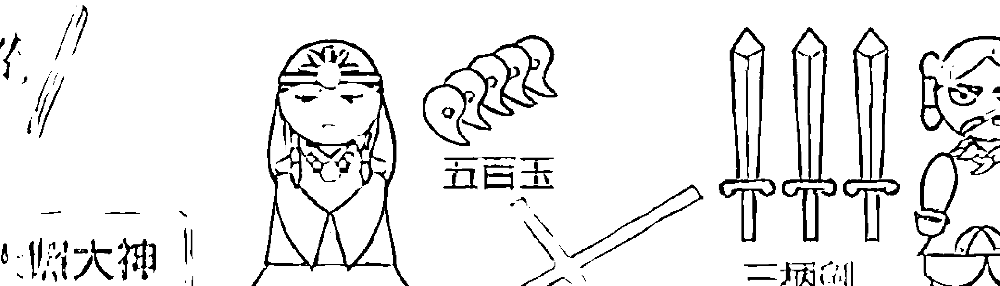

| 三位女神（天照大神之子） | 六位男神（须佐之男之子） |
| :--- | :--- |
| 天津日子命 | 正哉吾胜胜速天忍穗耳尊 |
| 天津姫命 | 天穗日命 |
| 天津姫命 | 天津彦根命 |
| | 活津彦根命 |
| | 熊野樟日命 |
| | 熊野久须毘命 |

**天皇祖先（直接祖先）= 天照大神（高天原神）**

*   三位女神 = 须佐之男之子
*   八位男神 = 天照大神之子

#### 古语拾遗记载 献八坂琼曲玉 = 并非吾等

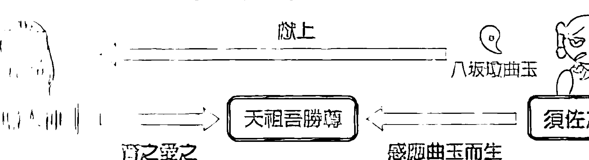

须佐之男 -> 八坂琼曲玉（献上）-> 天祖吾胜尊 <- 感应曲玉而生 <- 宵之爱之

+   - No.005
    - ○古语拾遗・No.006
    - 须佐之男的誓约 → No.023
    - ○日本书记记载的誓约 → No.024

#### 须佐之男的乱行

进入高天原以后的须佐之男，无论怎么看都不像是个性格正常者，甚至让人觉得天照大御神有这样的弟弟实在很可怜。

### ○受伤的是谁？

照理说须佐之男是在证明其心清白以后，方得进入高天原，但他在高天原的所作所为却是恶形恶状。

《古事记》是这么记载的：他破坏田畦、埋填水沟；跑到天照大神新尝祭品许新收成稻米的神殿里拉屎；此时天照大神仍替弟弟说话，说须佐之男毁田填沟是觉得那些田地没有拿来种东西很可惜，至于神殿中的那些并非粪便，而是醉酒的呕吐物。

可是须佐之男又跑到天照大神奉为圣地的织布场，趁织女正在拆神要献神的衣物时掀开屋顶，并将花马的马皮逆剥‘下来、丢进织布场，吓得织女被梭（织布机穿横线用的细长道具，现代日语写作『杼』）刺穿阴部而死。

这下子连天照大神也觉得害怕，于是便紧闭天之石屋户躲藏不出，全世界顿时陷入漆黑。

《日本书纪》的记载也相差不远：须佐之男跑到田里重复播种妨碍作物生长、填平水沟，还纵马把田踏得乱七八糟；新尝祭时跑到神殿里拉屎，还趁天照大神在织布场时将马皮抛进去。

记纪之间较为重要的差别在于，被梭刺伤的其实是天照大神本身；《日本书纪》虽然并未明文记载，但天照大神应该是阴部负伤，事实上，天照大神从此以后确实不再产下子嗣。

害怕的天照大神遂紧闭磐户，躲藏起来。

《日本书纪》一书（异传）则记载负伤而死的女神名叫稚日女尊。这个名字跟天照大神在《日本书纪》的正式名字大日灵贵相当类似，或许指的就是天照大神本身也未可知。就是因为如此，天照大御神才会如此替胞弟辩解、开脱。

#### 须佐之男的恶行

须佐之男 = 三贵子之一，是海神。天照大御神胞弟

证明其心清白得以进入高天原，却败度捣乱

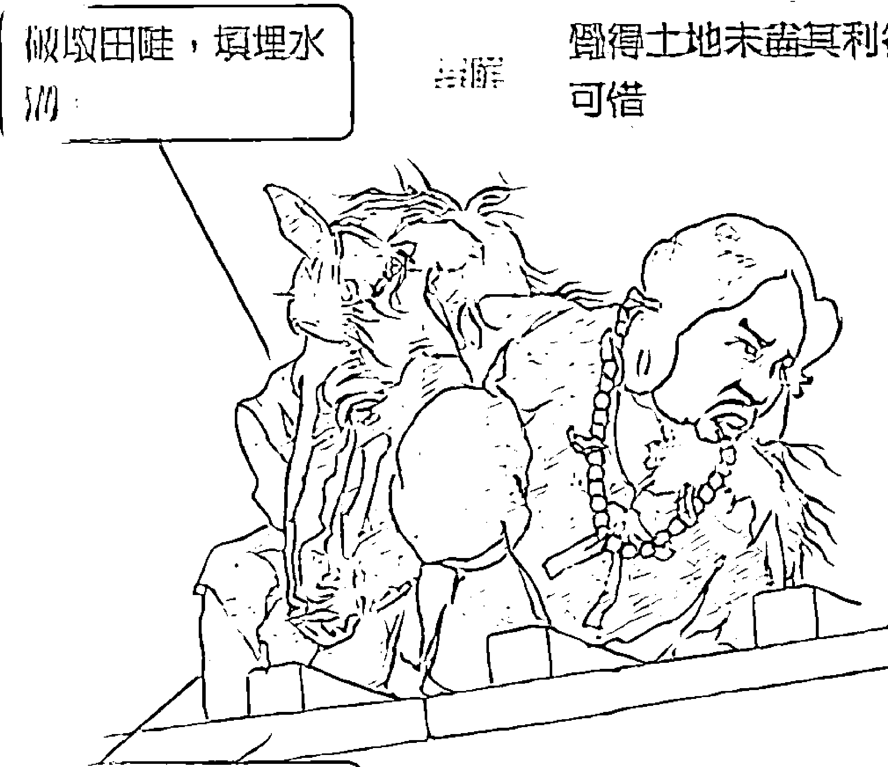

破坏田畦，填埋水沟

觉得土地未尽其利很可惜

掀开织布场屋顶、将花马的马皮丢进屋里。

织女受惊、迴梭穿刺阴部而死。

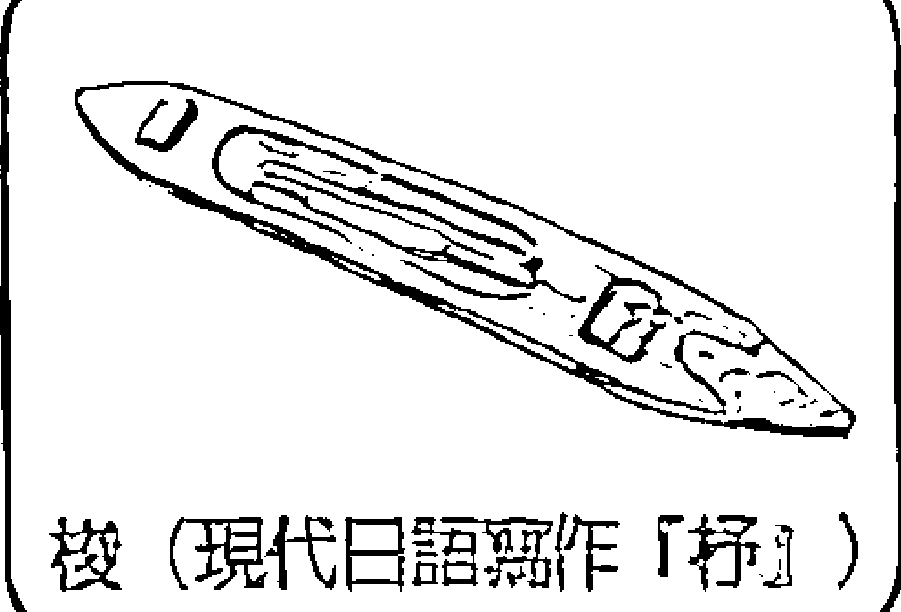

在天照大御神的神殿里呕吐

那是醉酒呕吐

恐怖

害怕的天照大御神关上天之石屋户，坚闭不出。

《日本书纪》的内容也几几乎相同

重要的差别

迴梭刺伤的是天照大御神本身。

世界一片漆黑。

#### 对饮酒者相当宽容的日本

许多人都说日本素来对饮酒后的失态或恶行相当宽容。
可以发现，这其实是从古事记时代沿袭而来的传统。在神殿里
内里乃属恶行，若说是醉酒呕吐倒还可以获得原谅。
因此，天照大御神才会如此替胞弟辩解、开脱。

+   - ○须佐之男 → No.003
    - ○天之石屋户 → No.027
    - ○日本书纪 → No.04
    - ○天之石屋户 → No.027

## No.027

## 天之石屋户

面对须佐之男的粗暴行为，天照大御神并未与其对抗，反而躲了起来，回避冲突

+   ○天照大御神搞自闭，众神困惑

天照大御神躲进石屋户里去，世界顿时陷入黑暗。高天原固然幽暗，然则苇原中国却更加黑暗，终于造成了许多灾祸。于是乎，所有神祇集合到天之安河原，请高御产巢日神之子思金神研拟对策。

首先，他们将常世国的长鸣鸟聚集起来、使其啼叫。其次则是制作八咫镜，并采许多勾玉制作勾玉项链、烧兽骨以占天意，然后将这些东西全部挂在贤木上面，由天儿屋命施以祝福。

然后天手力男神躲在门口阴暗处，天宇受卖命则是请神附身、半裸着身体跳起舞来，见到如此情形，八百万神明都笑了起来。这声响让天照大御神觉得很奇怪，于是便把天之石屋户开了个缝，问道：

> 「照理说我躲起来以后世界就该是黑暗笼罩，天宇受卖为何跳舞，众神又为何发笑？」

天宇受卖答：

> 「那是因为有比您更尊贵的神出现了，所以大家都很欢喜」。

趁着天照大御神好奇向外窥首时，天儿屋命与布刀玉命赶紧把镜子搬了出来。尽管文献并未明确记载，不过那镜子想必反射了天照大御神的光芒，光彩夺目。天照大御神愈看愈觉得不可思议，终于从门口探出身去看清那面镜子。

这时躲在门口阴暗处的天手力男神，趁机捉住天照大御神的手，把她拉了出来，布刀玉命则是在天之石屋户张结注连绳，让天照大御神无法再躲回去。如此这般，世界才终于恢复了光明。《日本书纪》关于这段神话的记述也大致相同。

唯一不同的是，《日本书纪》说张设注连绳使天照大御神无法躲回天之石屋户里去的是天儿屋命与太玉命；天儿屋命与太玉命分别是中臣氏与忌部氏的祖神，这想必是当时掌权的中臣氏想让祖神在这段神话中也有参与贡献之作吧。

#### 天之石屋戸 = 天照大御神为避开与须佐之男冲突而躲了起来

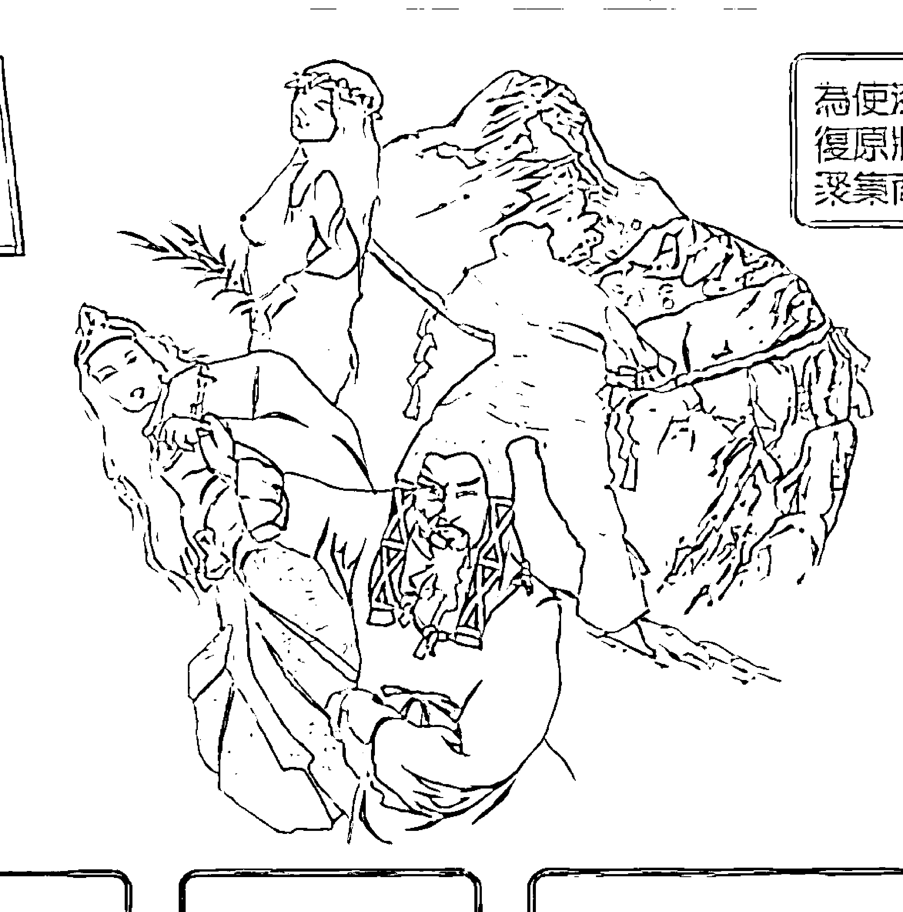

> > 为使漆黑的世界恢复原状，所有神祇聚集商议对策。

天孙降临 八百万神

天照大御神觉得奇怪，开门窥视。

天手力男神趁天照大御神探出身捉住她的手，把她拖了出来。布刀玉命张设注连绳，以免她再躲回去。

内容与《日本书纪》几乎相同

不同点：→ 张设注连绳使天照大御神没办法躲回去的，是天儿屋命与太玉命。

#### 注连绳

例如在这段神话当中，于石户张设注连绳之用意便是要防止天照大御神再躲回去。也有的神社于神社前表示禁止入内，或新年挂在门前取意吉利的稻草绳。

## No.028

## 须佐之男的放逐

须佐之男诸多紕漏行止，就连天照大御神都因此躲进石屋户紧闭不出，这次他的过错终于无法得到谅恕了。

#### 须佐之男的罪与罚

尽管天照大御神顺利归来，众神却不饶恕须佐之男。《古事记》说「使负千位置户」（指摆列于诸多高台上的物品），据说这是以物赎罪的意思。

其次则是胡须、手指甲与脚趾甲，不过情节却视《古事记》手抄本的版本不同而异。本居宣长《订正古训古事记》里的《古事记》是「切须，拔手足之爪」，岩波文库出版的《古事记》采这个说法；亦有其他版本解释为「切须与手足爪以焉祓」，讲谈社学术文库版《古事记》便是采这个说法。

前者属于刑罚的执行。削须削断对男性来说等同于失去名誉，这种想法遍见于世界各地，至于拔手指甲脚趾甲会造成剧痛，自然是种刑罚，等于是从名誉和肉体双方面同时加以惩罚。至于后者也应该是种祓除罪衍的行为，某些地区似乎就有这种割须剪指甲以避罪衍的思想。

上述何者为真姑且不论，总之须佐之男要在接受处罚以后被逐出高天原。这点《日本书纪》亦同，不过却明明白白地将其记载为刑罚。先是讨取赎罪的赔偿物品，然后还要拔头发、甚至于手指甲脚趾甲，刑罚非常严重。

《古事记》写到，须佐之男遭放逐后曾向大气津比卖神乞食，于是女神便从鼻子、嘴巴、屁股等处取出各种好吃的食物要替须佐之男烹调料理；岂料从旁窥见的须佐之男却误解大气津比卖神是要污秽食物然后才给自己吃，便将其杀害。

只见从女神尸体的头部生出蚕虫、眼睛生出稻种、耳朵生出粟种、鼻子生出红豆、阴部生出麦种，从屁股则是生出大豆。神产巢日神的母神遂取这些种子，以做为五谷谷种。

#### 众神对须佐之男的惩罚 = 古文告各异

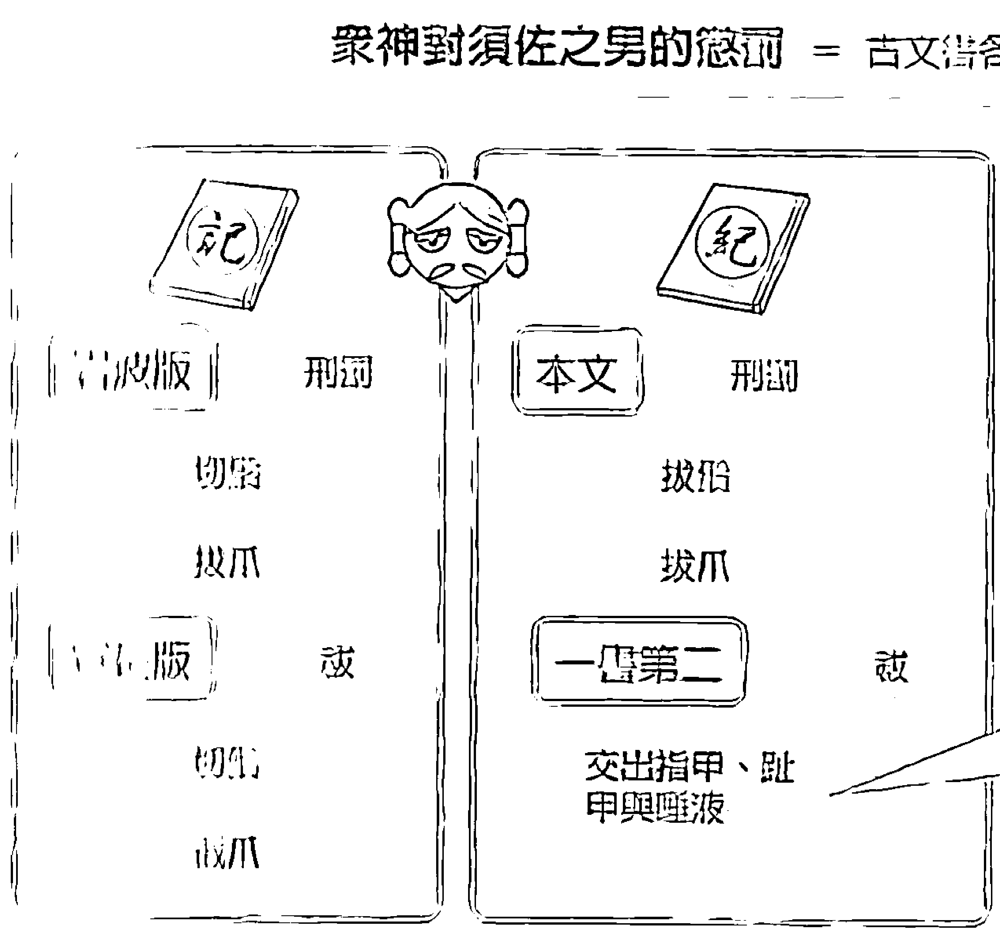

> > 即便遇到切离，指甲趾甲与唾液等物仍然属于肉体的一部分，
> 伤到这些部分，则本体也会受伤。
> 
> ⇒ 感应死伤
> 
> 须佐之男处于生杀大权握于众神之手的状态。

#### 大宜津比卖神 = 食物女神，遭须佐之男误解而杀害

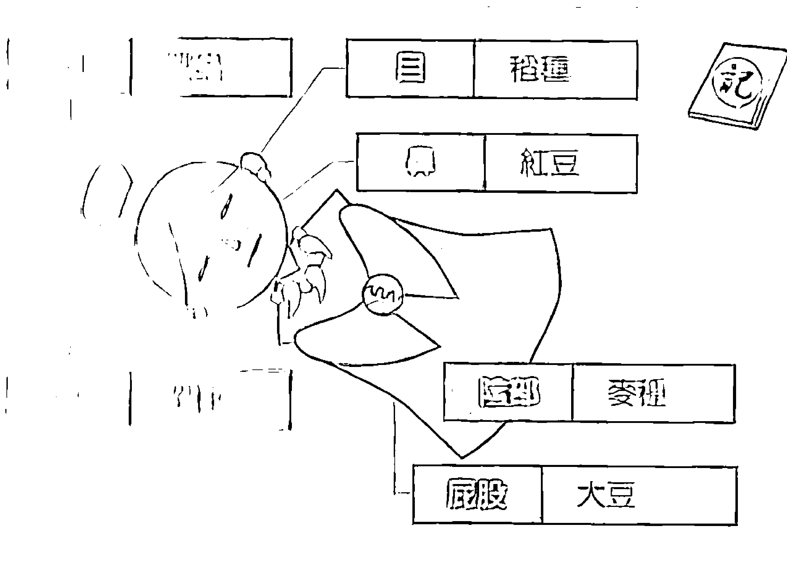

> > 从女神尸体中生出作物。
> 
> 神産巢日神的母神
> 
> ↓
> 
> 取种子以做为五谷谷种。

## No.029

## 月读命

尽管身为与天照大御神齐名的重要神明，月读命在《古事记》里却全无活跃机会，反倒是在《日本书纪》或多或少有出场的机会。

### ○活跃舞台遭须佐之男占据的神明

《古事记》说月读命乃三贵子之一，是伊邪那岐洗右眼时生下的男神，后来伊邪那岐就命他统治夜之食国（所谓食国就是统治的国家之意）。
可是月读命从此再也没有出现在《古事记》的记载当中，其他神话也全都未曾提到月读命。

相对地，这位月神在《日本书纪》的一书（异传，其他传说）当中，倒还有些独有的神话。
例如《日本书纪》第一卷第五段、一书第六当中，月读命与须佐之男的神格就互换：天照大神统治的同样是高天原，月读命统治的却是沧海原，而素戔嗚尊则统治天下。

然而，同卷同段的一书第十一却记载这么一则神话：
天照大神听闻保食神在苇原中国，遂让月夜见尊前去相见。只见保食神面朝国土从口中取出饭、朝海从口中取出各种鱼类、朝山从口中取出各种兽类，全部排开招待月夜见尊。
岂料月夜见尊却怒道：「污秽、低卑！怎么拿从嘴巴吐出来的东西要我吃？」，于是便拔剑斩杀保食神，然后回到天上将详情报告天照大神。

天照大神闻言大怒，斥道：「汝恶神也，从此再不与汝相见」，所以天照大神与月夜见尊直到今日仍是各自分开生活，从此日月再也不曾同时出现。

这个故事在《古事记》里，主角却变成了须佐之男，或许这是因为月读尊在神话中的角色遭须佐之男取代使然。

#### 月读命 = 三贵子之一。月神、夜神

#### 保食神 = 食物女神，遇月读命误暴并没害

在记里全无活跃

角色与须佐之男重叠

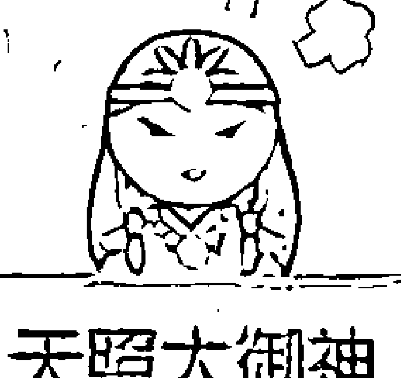

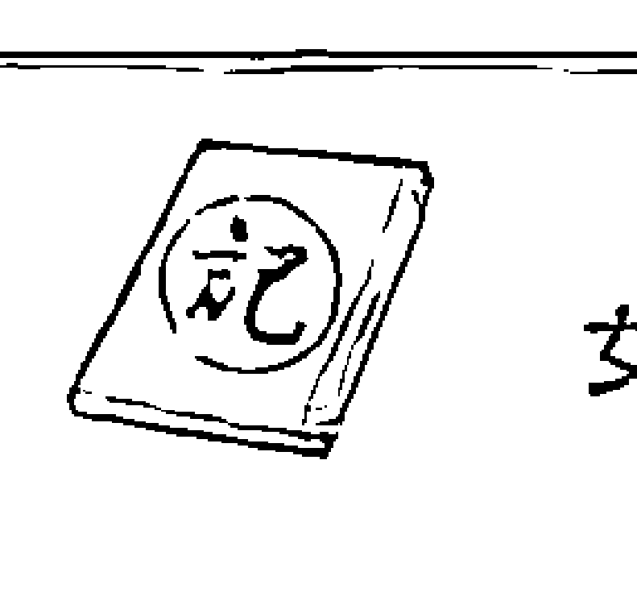

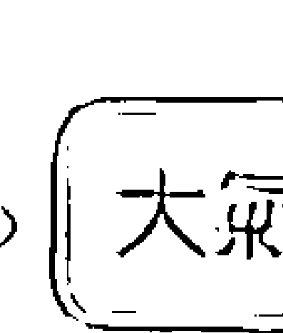

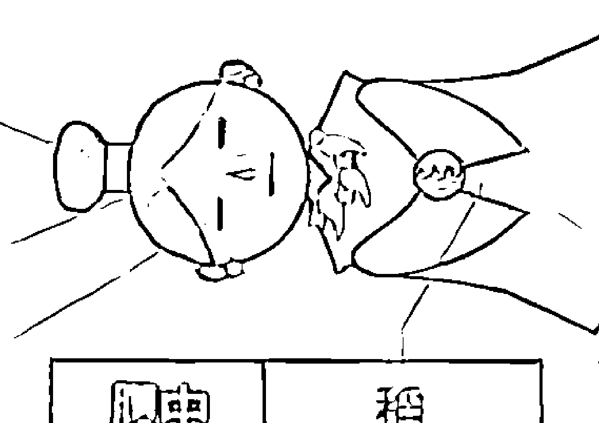

○日本书纪→No.004

○日本书纪的三贵子→No.021

No.020

| 女神 | 男神 |
| :--- | :--- |
| 高天原 | 夜晚 |
| 高天原 | 海原 |
| 稻 | 麦、大豆、红豆 |

## 八岐大蛇

日本神话里最大的怪物，非八岐大蛇莫属。牠那铺天盖地掩盖山脉与峡谷的巨体和八颗头颅恐怖模样，足以与圣经所逃邪恶红龙相匹配。

### ○正义的伙伴，须佐之男

须佐之男离开高天原以前，无论怎么看都像是位恶神，可是一旦降临到地上世界以后，就摇身一变成了英雄神。须佐之男降临到出云国（岛根县）肥河（斐伊川）上游某个叫作鸟发的地方，看见河里有筷子漂流，他想上游肯定有谁居住，于是决定前去探探。

他在那儿看见大山津见神的儿女——名叫足名椎与手名椎的兄妹老夫妇，还有他们的女儿栉名田比卖，三人正在哭泣。原来这对夫妇原本有八个女儿，可是每年被高志的八岐大蛇（另说『高志』又写作『越』，即指来自北陆的侵略）吃掉一个，今年已经是最后一个女儿了。

传说八岐大蛇的眼睛是赤红色的酸浆果、八首八尾，身体长满藤蔓与杉桧等植物，巨体足堪掩蔽八座峡谷及八座山丘，腹部总是渗血、肉块模糊。

须佐之男表明身分，求老夫妇将公主嫁给自己做妻子，老夫妇遇如此尊贵者欲结姻缘自然是感激不已，于是便将女儿交给了他。须佐之男将公主变成梳子插在头发上，然后让老夫妇去准备烈酒，命令他们在围墙上开八道门，每道门后各自设置栈敷（以木板铺设的座位），把装着烈酒的瓮放在那里。

大蛇出现后，八颗头颅全都喝得酩酊大醉、熟睡不起，须佐之男趁机举剑将大蛇砍成好几块。顺带一提，这种蛇醉酒误事的传说遍见于全世界，是相当著名的神话主题。

须佐之男砍八岐大蛇尾巴时把剑刃砍出了缺口，于是他便剖开尾巴看看究竟，竟发现了一柄宝剑。须佐之男将此剑献予天照大御神，是乃草薙之大刀。

《日本书纪》记载内容大致相同，却说那柄从蛇尾中发现的剑别名叫作天丛云剑，因为大蛇出现处上空总是云朵丛集，直到后来日本武皇子的时候，方有草薙剑之称。

#### 八岐大蛇 = 日本神话最大的怪物

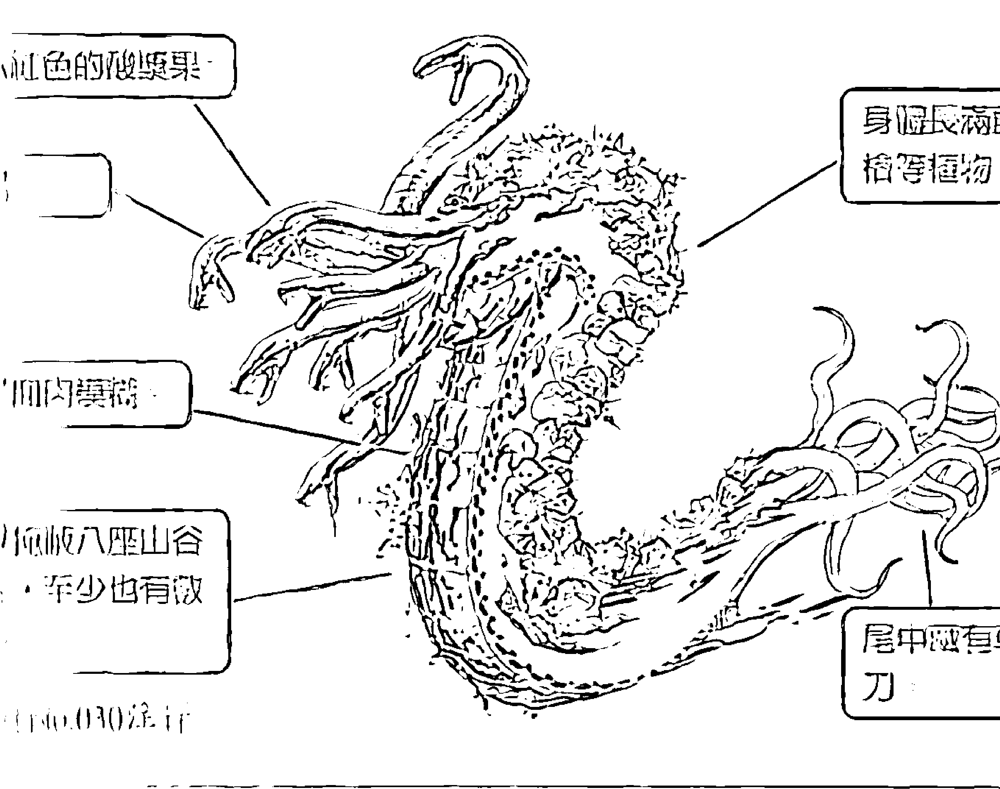

+   - 重酿八次酿成的烈酒
    - 于圆楯周围开八道门
    - 分别于每道门后设置八座座位，总共八座。
    - 每座座位分别准备八个盛酒的器皿。
    - 须佐之男击败八岐大蛇之后咏的和歌：「八立つ 出雲八重垣 妻籠みに 八重垣作る その八重垣を」（八坐交错酒起有如八重墙垣，且筑八重墙垣以纳妻子）
    - 将其名称命名为稻田宫主须贺之八耳神。

○小碓命与大碓命→No.056
○日本书记记载的日本武尊东征→No.062

## 国津神的成立

所谓国津神乃指原本就存在于地上世界的众多神祇，不过须佐之男仙官原属天津神，其后代子孙同样归类为国津神。

### ○在地上世界开枝散叶的须佐之男子孙

《古事记》提到，须佐之男击败八岐大蛇、娶栉名田比卖后，来到出云的须贺之地说：「来到此地，心情甚是清畅」，便在这里建造宫殿，此地遂有须贺之名。然后他咏歌：「八雲立つ 出雲八重垣 妻籠みに 八重垣作る その八重垣を」（八云交升起有如八重墙垣，且筑八重墙垣以纳妻子），然后他又任命足名椎为宫殿首长，赐名稻田宫主须贺之八耳神，自己则与比卖结婚、繁衍子孙后代。

须佐之男的众子众孙，便是所谓的国津神。

须佐之男的六代孙就是大国主神。大国主神又名大穴牟迟神、苇原色许男神、八千矛神、宇都志国玉神，共有五个名字。

相对地，《日本书纪》对须佐之男到大国主神这段历史的记述却很简单。他在清地这个地方建造宫殿、咏唱和歌倒是相同，不同的是须佐之男跟公主结婚以后立刻就生下了大己贵神；所谓大己贵神就是指大国主神，此处他并非六代孙，而是须佐之男之子。是故，《日本书纪》里自然也没有记述大国主神帮助因幡白兔、前往黄泉国的立身神话。

其次，须佐之男在生下大己贵神以后，立刻去了根国。

《古语拾遗》内容与《日本书纪》相同。大己贵神乃须佐之男之子，须佐之男生子后就去了根国。

《先代旧事本纪》更加极端，当初对须佐之男的惩罚便是将其逐出高天原与苇原中国，之后他就去了根国，所以既没有杀掉八岐大蛇除害，也未在出云建造宫殿，须佐之男与大己贵命之间完全没有丝毫关联，只说到须佐之男表示自己的子孙将来不服从姐姐天照大御神而已。

#### 日本神话体系示意图

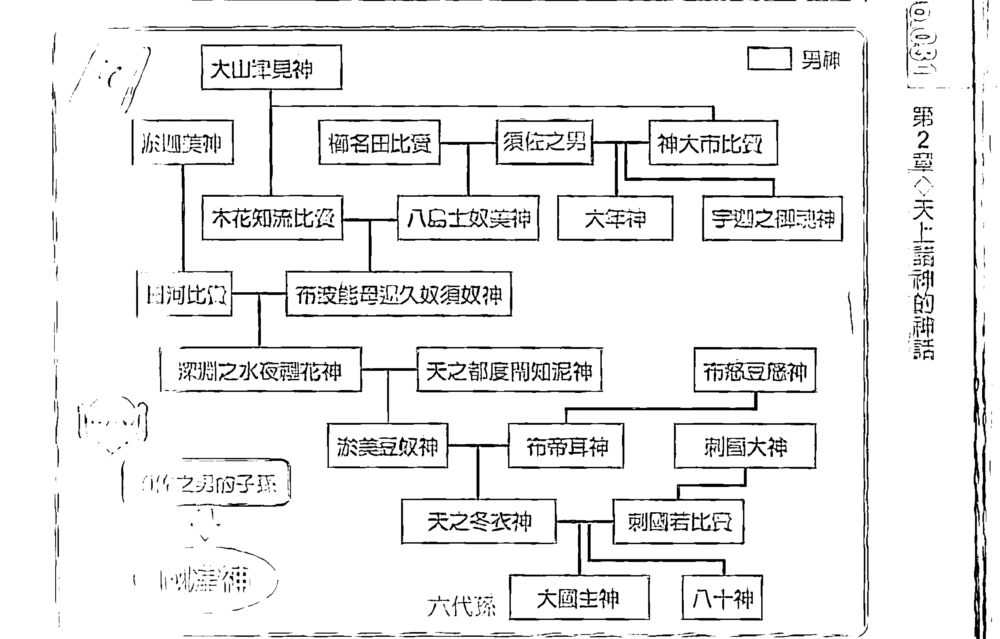

#### 从历史角度来看天津神与国津神

从历史的角度来看，后来组成大和朝廷的那些人所供奉信仰的神是天津神，其他人信仰的诸神就是国津神。一般人相信大国主神本来跟须佐之男毫无任何关系，但是在编纂神话的时候为求连贯，才蛮不讲理地直接把国津神大国主神当成天津神须佐之男的子孙。

+   - ○日本书纪→No.004
    - ○大国主神→No.034

## 因幡的白兔

因幡的白兔虽大多以民间传说、童话等形式为世人所知，其实这故事原本是大国主神的其中一则神话。

## 其实为裸兔并非白兔

这则神话仅收录于《古事记》与《因幡国风土记》而已。大国主神的众多兄弟（据说因为数目多，故称八十神）全都出发要去跟稻羽的八上比卖求婚，当时大穴牟迟神（那时还不是大国主神）只是个背着大袋子的随从而已。一行来到气多岬，发现有只光溜溜的兔子躺在那里。八十神教那兔子去用海水洗身体然后风干，兔子也依言而行，却搞得皮肤龟裂，更加痛苦。此时大国主神晚了一步才来到，听兔子把整件事都讲了一遍。这兔子原本住在淤岐岛（也可能是隐岐岛？），可是很想来这里，于是就骗住在海里的鳄鱼（实指鲨鱼），提议双方来比比看究竟是兔子多还是鳄鱼的数量多；兔子提议鳄鱼从岛上海中排列成一直线直到气多岬，然后兔子就从鳄鱼的背部跳过、边跳边数，就在快要抵达陆地的时候，兔子不小心说溜嘴「你被我骗了」，于是被最后一只鳄鱼捉住、剥光了衣服（另说为毛皮）。兔子正因此悲伤哭泣，又碰见众神教唆去洗海水风干，一弄反而更加痛苦。大国主神教兔子去河口用淡水洗身体，然后拿长在河口的香蒲花粉撒在地面、在上面打滚，如此就可痊愈。兔子终于恢复原状，正是稻羽的素兔。兔子很是感谢，对他说：「八十神是不会得到八上比卖的。即便你今天只是个背着袋子的随从，八上比卖亦将由你所得」。现代日本人将这只兔子奉为掌管姻缘的兔神（因其牵成大国主神与八上比卖姻缘之故）。大部分将其写作因幡的白兔，而素兔是裸兔的意思，原来毛色就不得而知了（当时日本的兔子并不是白色的）。至于《日本书纪》并没有记载这故事，因为其中大己贵神乃须佐之男之子，本来就处于国家统治者的正统地位。

「见p.227」No.032注释# 因幡的白兔 = 大国主神的神话之一。仅收录于古事记与因幡风土记

兔子沿突岬的背迂回中不到100km的距离，亦有说法指其被洪水冲到...

- ○ 日本书记→No.004
- ○ 大国主神→No.034

# 大國主神的迫害與成長

《古事記》裡的大國主神在眾多兄弟當中只能敬陪末座，直到經過各種艱苦的奮鬥，最後打敗眾兄弟，成為第一。

### ○大國主神下冥界

根據《古事記》記載，八上比賣果然按照兔子預言拒絕八十神求婚，宣布要跟大穴牟遲神（就是後來的大國主神）結婚，激得八十神怒殺大穴牟遲神。大穴牟遲神兩度遭到殺害，兩度都因為母神而得以復活，後來便聽母親建議逃去木國投奔大屋毘古神。

八十神仍緊追不捨，拉弓搭箭要大屋毘古神交出大穴牟遲神。大屋毘古神讓他從樹岔逃跑，要他前往須佐之男所在的根國去。待他去到那裡，卻見須佐之男的女兒須勢理毘賣出現在眼前，兩人當下便眼神交會、互通心意。須勢理毘賣對父親說：「有位美麗的神來了」，須佐之男答：「我叫作草原色許男」，於是須佐之男就讓他睡在到處是蛇的房間裡。須勢理毘賣拿了一條蛇的領巾，交待道：「如果蛇要咬你，就取領巾揮動三下」。大穴牟遲神依言而行，群蛇果然安分了下來，大穴牟遲神才安心入睡。隔天晚上睡的則是蜈蚣與蜂的房間，他同樣以蜈蚣與蜂的領巾渡過了難關。

須佐之男又往草原放箭，令大穴牟遲神去把箭找回來，然後趁他還在草原裡放火要燒死他，這時突然有隻老鼠出現，說：「裡頭空洞洞，外頭窄煞煞」，於是大穴牟遲神躲進地底的洞穴才逃過一劫，至於那枝箭，也是老鼠幫他找回來的。

這廂只見須勢理毘賣帶著置辦葬禮的道具，正在傷心地哭泣，就連須佐之男也認為他肯定已經死了，豈料大穴牟遲神卻平安無事地帶著箭矢歸來。接著須佐之男把他帶回家，又讓他替自己捉頭上的虱子，可是頭髮裡面其實都是蜈蚣；須勢理毘賣事先已經取橚葉樹的果實與紅土交給他，大穴牟遲神便將其咬碎吐了出來，須佐之男以為他已經幫自己把蜈蚣給咬死吐出，於是就睡著了。

#### 许多神话的试炼或难关均以三为限

这则神话所述的两个毒虫房间合起来才是一个试炼

蛇的房间，蜈蚣与蜂的房间

> 记得取领巾拂三下

靠须势理毘卖给的领巾而逃过一劫

火原通火攻（后来的倭建命也曾遇到同样的危机）

> 里面空洞洞，外头窄煞煞

得老鼠相助，箭矢部帮他找了回来

在梳理头发时，发现里面有蜈蚣

> 把这些咬碎然后吐出来

靠须势理毘卖给的蓬莱果实与红土逃过一劫

- ○根国→No.009
- ○大国主神→No.034

## No.034 大国主神

大穴牟迟神成功从须佐之男的掌控下逃脱以后，方得须佐之男赐名为大国主神。

○须佐之男有三宝

话说大穴牟迟神决定和须势理毘卖一起逃出根国，于是趁须佐之男睡着时把他的头发绑在大石头上，然后带着须势理毘卖和生大刀、生弓矢、天沼琴展开逃亡。

他们逃跑时天沼琴碰到树木发出巨响，从而惊醒了须佐之男。好在他们仍然能够趁须佐之男忙着解开头发之际，成功逃出根国。

须佐之男从黄泉比良坂对大穴牟迟神喊道：“且执生大刀、生弓矢在坂坡下伏击众兄长，把他们赶到河流浅滩去，成为大国主神，娶我女须势理毘卖为妻，在宇迦山（即位于出云大社东北方的御崎山）山麓以雄伟的宫柱建造宫殿”。这便是大穴牟迟神为什么后来改称大国主神的理由。也因为如此，一般都认为须势理毘卖是大国主神的正妃。

后来大穴牟迟神果然驱逐八十神，建立了地上世界的第一个国家。也就是说，从此他成为名符其实的大国主了。

大国主神跟当初促使他前往根国的八上比卖也有正式的婚姻，可是她畏惧正妻须势理毘卖，便把生下的孩子夹在树岔、兀自回去了，故该神遂有木俣神之名。

神话记载至此，又另外插入了一则八千矛神求爱的故事。一般认为八千矛神是大国主神的别名，传说他去向高志国的沼河比卖求婚，咏歌求爱。

但是大国主神的妻子须势理毘卖是位善妒的女神，当初大国主神咏和歌说他想去大和的时候，她就曾经回咏：“你是男儿，或许在各国都有妻子，可是我却只有你”。也不知道是不是这首和歌感动了大国主神，相传夫妻俩便环颈相拥，和睦缱绻地共同镇守国家。

#### 大國主神 = 得須佐之男劍可賜名，建立地上世界的第一個國家

#### 須勢理毘賣

- ○发生自叛揆的诸神话—No.020
- ○大国主神的迫害与成长—No.033

# # 大国主神的子孙

No.035

《古事記》说大国主神娶了很多妻子，生有眾多子女，國津神當中有許多都是大国主神的子孫。

## （一）娶了六個老婆的大國主神

大国主神娶多紀理毘賣命，生了阿遅組高日子根神（別名迦毛大御神）、高比賣命（別名下光比賣命）兩名子女。阿遅組高日子根神是以農具鍬鍤為神體的農業之神，同時也是雷神；從他的別名，我們可以判斷他是位於奈良葛木的賀茂神社的神明。至於下光比賣命，則似乎是位周身有光華從下方映照、美麗燦爛的公主。

大国主神娶神屋毘賣命，生了事代主神。這是位負責執行神諭神托的神明，後來會大大地派上用場。

大国主神娶八島牟遅能神之女鳥取神（想是出雲隔壁鳥取縣的神明），生下鳥鳴海神。鳥鳴海神娶日名照客田昆道男伊許知邇神，生國忍富神。國忍富神娶諾那陀迦神（別名八河江比賣），生速甕之多氣佐波夜邇奴美神。速甕之多氣佐波夜邇奴美神娶天之甕主神之女前玉比賣（應是幸魂、之姬），生甕主日子神。甕主日子神娶淤加美神（司水龍神）之女比那良志毘賣，生多比理岐志麻流美神。多比理岐志麻流美神娶比比羅木之其花麻豆美神的女兒活玉前玉比賣神（生魂、與幸魂之姬），生美富浪神。美富浪神娶駁山主神之女青沼馬沼押比賣，生布忍富鳥鳴海神。布忍富鳥鳴海神娶若豊女神，生天日腹大科度美神。天日腹大科度美神娶天狹霧神（霧神）之女遠津待根神，生遠津山岬多良斯神。

從鳥取神到遠津山岬多良斯神，合稱十七世之神；據說這是因為遠津山岬多良斯神是從須佐之男算下來的第十七代，但其實他是須佐之男的十五代孫，恐怕是算錯了。

但後來在重要場面中以大國主神之子身分出現的建御名方神竟沒有被列在這份子孫名單裡，實在是令人不可思議。

#### 日本神话系図（系譜）

（）大物主命以降的诸神祗→No.020 ○大国主神的两个儿子→No.039 （）�寺→No.040

## No.036 少名昆古那神

許多神話都說世界乃由巨人所創造，可是日本神話卻說世界的創造者並非巨人，而是小小的神明

# 小小援助者

其實大國主神並非自己一人獨力創造國家。
當初他來到御大的御崎（或說就是現在島根縣的美保町）此地時，忽然看見有位乘著羅摩船（葫蘆芋製成的船，約10cm大小）披著蛾皮的小小神明出現。
大國主神問他叫什麼名字又不回答，再問與他同行的神明知不知道。就在這個時候，蟾蜍說崩彥（即稻草人。稻草人雖然無法行走，據說卻是知天下事的神）肯定知道，於是大國主神便召崩彥前來一問，原來小小神明是神産巢日神之子少名昆古那神（小矮人之神，來自常世國的農耕之神）。
再去詢問神産巢日神，神産巢日神也說那是從我手指縫滑落的兒子，要他跟大國主結成兄弟、共同創造國家。兩人遂協力鞏固國家，完成後少名昆古那神就離開，前往海原彼岸的常世國了。
《日本書紀》本文未曾提及，不過他卻是以少彥名命此名出現在第一卷的八段一註（異傳）第六當中。
大已貴神（即大國主）掃平國家後，有次在出雲國的五十狹狹海岸正要用餐，忽然從海上傳來人聲，奇怪的是放眼望去又不見人影。過了一會兒，竟然發現有個小小的男人以白瓠皮作船、披鶴鶉羽為衣，漂流於波浪之間。少彥名命在《日本書紀》裡是高皇産靈尊之子，是位喜歡惡作劇、不聽教誨，從手指縫中墜落的神明。兩位神明遂齊力創造了國家。
大國主神問：「你覺得我們的這個國家，造得好不好？」，少彥名命給了個意義深長的回答：「有些地方造得很好，有些地方造得不好」，然後就從熊野岬離開去常世鄉了。

# # 少名毘古那神 = 小矮人之神、农耕之神，与大国主神共同创造国家

少名毘古那神之子。

小矮人之神。

出现的庆。

身披飞蛾皮。

以红芋制成的船，约10cm大小。

少名毘古那神是小矮人之神，出现的庆。少名毘古那神是神产巣日神之子。

神产巣日神命其结为兄弟、共造国家。

两人合力巩固国家，后来少名毘古那神离开，去了海原彼岸的常世国。

#### 《日本书纪》的故事也大致相同

| 《古事记》说 | 《日本书纪》说 |
| --- | --- |
| 少名毘古那神 | 少彥名命 |
| 以红芋（蔓萝实）制成的船 | 白瓠皮制成的船 |
| 飞蛾皮衣 | 鹤鹑羽衣 |
| 神产巣日神之子 | 高皇产灵尊之子 |

## 大物主神

大物主神虽多以奈良三轮山之神为世人所知，不过他也是一位拥有蛇神、蝗蛛神等面向，堪称众多信仰的神明。

### ○从大国主另行衍生的神明

根据《古事记》记载，大國主神失去少名昆古那神以后，烦恼自己无法独力继续创造国家，遂决定另寻神明共同从事造国工程。这时候恰恰有位神明，把海面照得亮晃晃地、朝此处而来。那神说：「祭祀我，我就助你造国，否则国家肯定无法完成」。大国主问道该如何祭祀，他回答说须择大和周围群山当中的东山（即奈良县樱井市的三轮山）净化祭祀。

此处虽然并未明确记载其神名，不过从祭祀场所判断，这位神明应该就是三轮山大神神社所祭祀的大物主神（三轮明神）。

《日本书纪》对这段也有相同的描述。

《日本书纪》第一卷的八段一书（异传）第六记载，大己贵命（大国主），落单以后独自前往国内各地继续从事造国的工作。当他来到出云时，曾经说道：「沼原中国本是荒芜的废墟土地，岩石草木俱皆强硬。可如今我降伏万物，无敢不从。如今此国只我一人统治，且不知有无能与我共治天下者」。顿时间，异样光华照亮海面，复有人物从中现身。那人道：「当初要不是我，你决计无法平定此国。正因为有我，方才使你得以造国成功」。大国主问：「汝是何人」，答曰：「我乃为你带来幸运的不可思议之魂（幸魂、奇魂）」。此即神道所谓一灵四魂（荒魂＝象征荒暴勇猛，同时也象征灾祸；和魂＝带来和平；幸魂＝带来幸运；奇魂＝透过奇迹带来直接性利益）的其中之二，这便是大三轮之神。

除此之外，书里面也写到大神神社的由来，该神社祭祀的是大国主神的和魂。

#### 大物主神 = 奈良三轮山之神，同时也是飨神、�神

从大和周围群山当中的东山（即奈良县樱井市的三轮山）净化祭祀

大神神社并无一般神殿用来供奉神明的本殿，而是从拜殿直接膜拜三轮山。

- ○少名昆古那神→No.036
- ○荒魂与和魂→No.095

## No.038 天菩比神与天若日子

天孙（天照大御神的子孙）尚未统治地上世界以前，曾经历过几番迂回曲折，甚至发生过神背叛天的事情。

### ○叛天者

《古事记》里的天照大御神说，丰苇原之千秋长五百秋之水穗国（指地上世界）该由其子正胜吾胜胜速日天忍穗耳命统治，于是便将儿子送往地上世界。然则，天忍穗耳命立于天之浮桥朝地上望去却说地上世界看起来太过纷扰，就此折返。

高御产巢日神与天照大御神遂召集众神，要思金神想方设法，问说该由谁降临地上平定世界，思金神经过一番思考后答天菩比神可当此任，可是天菩比神降临地上世界后，却成了大国主神的跟班，三年都没有消息。

于是众神又再度聚起来，商议这次该派谁去才好，最后决定派遣天津国玉神之子天若日前去。这一次，众神甚至还取了天之麻迦古弓与天之波波矢交给天若日，然后才把他送往地上世界，不料天若日才刚降临到地上，立刻就与大国主神之下照比卖结婚，想要将地上世界占为己有，八年都没有消息。

有只叫作鸣女的雉鸟停在天若日家门口的树上啼叫，让天佐具卖听见，天佐具卖进言啼声不吉、应将其射杀，于是天若日便取来自于天上的武器射中了雉鸟；雉鸟的胸口遭箭矢贯穿，逃去找天之高木神（高御产巢日神的别名）求救。神察看染血的箭矢，发现这是当初赠予天若日的武器，于是便说：「倘若天若日此箭按照命令射的是恶神，那么这箭就不会射中天若日；倘若天若日存有邪想，那就射中他」，便把箭扔了回去（返矢）。睡眠中的天若日被此箭刺中胸口，从而殒命。

《日本书纪》对这个部分的叙述大致相同，差别在于首先送往地上世界的是天穗日命，然后是天穗日命之子大背饭三熊之大人，第三位则是天稚彦。

#### 【日本神话】第2章 天上诸神的神话

- ○日本书纪→No.004
- ○斋御�的巢日神→No.070

#### 大国主神的两个儿子

高天原终于决定凭借武力征服地上世界，遂遴选战神送往地上世界。

### ○服从之子、伐战之子

《古事记》记载，天照大御神又问这次该派谁去才好，思金神和诸神回答说可派伊都之尾羽张神（伊邪那岐用来斩杀迦具土那柄剑的剑神），或其子建御雷之男神（勇猛的雷神）。这两位都是剑神，可见高天原终于要诉诸武力了。由于伊都之尾羽张神也推举其子，众神遂指派天鸟船神（飞鸟形状的船神）陪同建御雷之男神，将他们送往地上世界。

建御雷之男神拔剑插在沙滩上、盘坐于剑前，对大国主神如此问道：「天照大御神与高木神诏曰这土地应是我子治地，你怎么想？」

大国主神答：「我自己没什么好说的，且容我子·八重言代主神来回答」。于是便唤言代主神一问，言代主神道：「此僭越之举，愿将此地献予天津神之子」，还把船翻个底朝天、变成青柴垣（以带青叶的木柴搭建的篱垣），躲在里面不出来。

建御雷之男神又问：「言代主神如是说，你还有没有其他儿子有意见的？」，大国主神答：「其他儿子就只有建御名方神而已」。此时建御名方神拿着合千人之力方能搬动的巨石出现，说道：「是哪个跑到我国在那边嘟嘟囔囔讲悄悄话？且与我跤力」，可是没两下子就败下阵来、落荒而逃。

建御雷之男神一路追杀到科野国（长野县）的州羽之海（�访湖），建御名方神急道：「不要杀我。我保证再也不离开此地，不反对大国主神与言代主神，这个国家是属于天津神之子的」。《日本书纪》却说高天原原本是要派遣经津主神为使者，不过武甕槌神勇猛刚强，不仅经津主神推荐，连他自己也都如此主张，于是后来也加入了使者的行列。此外，《日本书纪》固然提到了事代主神，对建御名方神却只字未提。

#### 建御雷之男神 = 勇猛的雷神、剑神。受派遣前往地上世界

- 神戸·No.016
- 神戸·No.022
- 〇伊邪那美之死→No.018
- 〇大国主神的子孙→No.035

#### 大国主神决定让国，其所有附加条件，正因为这些条件得到满足，后来他才自开于出云大社

#### 政权和平移转

话说建御雷之男神回到大国主神面前，质问：「你两个儿子都说要服从天津神之子不再违逆，你怎么样？」

大国主神也说：「我也同样，愿将苇原中国全数献上」，不过他又说希望能替自己建造神殿做为交换。

他说如果能像天津神御子继承皇位的宫殿那样，以磐石为基竖起粗壮宫柱，帮他盖座冰木（屋顶两端木材交叉向上翘起的构造，是出云大社屋顶的特征）仿佛可以企及高天原的雄伟神殿，那他就愿意退隐。大国主神又说，若能起用八重言代主神的话，则一百八十位神子神孙都将服从。

于是就在出云的多艺志海岸建造宫殿，据说这便是出云大社。现存出云大社的本殿高八丈（24m），已经是一座规模非常宏大的神社了，但据说出云神社在平安时代高十六丈（48m），大化革新以前甚至高达三十二丈（96m），就当时的技术水准来说，这样的建筑物实在太过巨大。如果没有建造这般宏伟的神殿，或许大国主神就不愿意让出国家统治权了。

又有水户神之孙懈八玉神出任料理长。懈八玉神变成鹈鹕潜入海底取土，以其制作神圣土器，又截海藻以燧臼燧杵（磨擦生火的道具）生起圣火，制作料理献予天津神。

《日本书纪》里并未记载到建造神殿的故事，却说大国主神献上自己当初平定国土使用的废矛，还说只要使用该矛，便能使国家长治久安。

只不过仍旧有些神明不愿意服从于天、从而违诈，根据记载，最后反对势力只剩下星辰之神香香背男，不过还是被建御雷命打败收服了。

#### 出云大社 = 大国主神让国时要求高天原建造做为交换条件的神殿

迥异于寻常神社

#### 巨大的神殿

132丈的神殿未经验证，不过确实有高16丈的本殿曾经存在过。以下图这种建筑物，以当时的技术却勉强有可能建设。

> 也许是因为这种建筑使用的建筑技术已超越了当时的技术水准，从平安到�仓时期的200年间曾经有多达七次的崩坏纪录

#### 注连绳也是日本第一

出云大社的注连绳长达13m、粗（直径）达8m之谱

从左边结绳

从右边结绳

出云大社的注连绳

一般的注连绳

代表大国主神行动的结

使邪物无法进入神域的结界# 新嘗祭與大嘗祭

每年11月23日舉行的新嘗祭早在距今1300年以前便已經存在，是神道的收穫祭典。祭祀於皇居的神嘉殿舉行，天皇親自以五穀新穀供奉皇祖神、與皇祖神共食，藉此對今年的收穫表示感謝，並且祈定來年的豐收。

與此同時，新嘗祭也是伊勢神宮的祭祀儀式，天皇會派遣敕使執行奉幣儀式；此儀式會先在外宮進行，然後再進到內宮執行一次。

現代日本的勤勞感謝日也是參考新嘗祭的收穫祭性質，做為慶祝勞動（尤其農業勞動）與隨之而來收穫的日子，而於戰後訂定的國定假日。

所謂大嘗祭便是指天皇新立即位以後只舉行一次的新嘗祭。換句話說，每位天皇只能舉行一次大嘗祭（踐祚＝復辟則另當別論）。因此就某個角度來說，大嘗祭是個重要性堪與即位大典相比的重大行事。

「大嘗」此詞首見於《日本書紀》天武2年（673年）12月5日的紀錄，至於祭祀儀式本身想必應該更加古老才是。

據考，大嘗祭是在飛鳥時代皇極天皇時始有明確的形式與規定，從此以後一直到今天，每有新天皇踐祚（天子即位）都會舉行大嘗祭，不過在戰國時代等天皇家的窮困時期，也曾經有過延期或中止的事例。

進入平安時期以後，大嘗祭演變得愈發莊嚴、規模愈大。《貞觀儀式》（871年）、《延喜式》（927年）、《江家次第》（1111年）等對大嘗祭的施行規則都有詳細記載。

首先在4月的時候，必須選定負責提供製作神饌（神的食物）供物的悠紀國（從京都以東諸國當中挑選）與主基國（從京都以西諸國當中挑選）、擇定神田，然後9月從神田收割。

從10月開始到舉行儀式的一個月內，天皇必須齋戒潔淨身心。根據《延喜式》（律令之施行細則）記載，大嘗祭是唯一一項必須在祭祀的一個月以前就開始執行潔齋的大祀。

進入11月以後，上旬要營造建設大嘗宮，中旬寅日要舉行鎮魂祭，中旬卯日則有大嘗宮之儀：這大嘗宮之儀便是大嘗祭的中心儀式。

其後，中旬辰日有悠紀節會、中旬巳日有主基節會、中旬午日則舉行鎮明節會，至此長達七個月的大嘗祭才終於告一段落。

大嘗祭之目的大致上可以分為兩種。

其一是與皇祖神天照大神共食。每年的新嘗祭固然也有相同儀式，不過與神明共同食用經過型別的穀糧，將可以形成為國家帶來豐穰收成的激勵。

其二則是與皇祖神結合、誕生為天照大神之子，如此便能以神的身分獲得成為天皇的資格。

# 第3章

### 小红书文档排版指南

### ○没能去到地上世界的天之子

葦原中國的反對勢力消失以後，天照大御神與高木神（高御產巢日神的別名）遂命令正勝吾勝勝速日天忍穗耳命降臨，天忍穗耳命卻說：「我在準備降臨的期間，生下了天邇岐志國邇岐志天津日高日子番能邇邇藝命，不如就派這孩子去吧」。

天忍穗耳命與高木神之女——萬幡豐秋津師比賣命生下了天火明命、日子番能邇邇藝命兩兄弟，邇邇藝命是弟弟，為何派的不是哥哥而是弟弟，至今仍然不得而知。

於是遂命令邇邇藝命降臨，而邇邇藝命亦就此離開天之石位（位於高天原，以岩石製成的寶座）出發前往地上世界。

話說邇邇藝命降臨途中來到天之岔道，遇見一位光華奪目、甚至可以從高天原照亮葦原中國的神明。這時天照大御神與高木神便命令天宇受賣命道：「妳雖是柔弱女子，卻是位不畏他神能夠正面以對的女神。因此，妳就獨自去問問看看到底是誰攔在我子降臨途中」。一問之下，原來是國津神猿田毘古神，他是要來替邇邇藝命開路的。

接著就是決定天孫降臨一行的成員。

由天兒屋命、布刀玉命、天宇受賣命、伊斯許理度賣命、玉祖命五位神明陪伴同行，合稱「五伴緒」，是中臣氏等氏族的祖先。又讓邇邇藝命帶上八尺勾璁（玉）、鏡、草薙劍等寶物（三種神器），跟著又調派思金神、手力男神、天石門川神隨行。天照大御神說道：「以鏡為我魂祭祀之。思金神執此」，然後又加派登由宇氣神。

#### 天孙降临 = 降临者为天照大御神之孙，琼琼杵命

#### 天孙降临神话之诞生背景

从以上天孙降临神话有其历史背景，原来持统天皇本欲令其子继位，然其子早逝，遂欲改立其孙轻皇子继位。换句话说，将天照大神比作持统天皇，以孙子为正统皇位继承者而

- ○天照大御神→No.022
- ○日本书纪的天孙降临→No.044

## No.042 高千穗

天孙从天降临，最后降落在高千穗。据说这高千穗就是现在宫崎县的高千穗地区，可能的地点有两个。

# 众神降临之地

建速须佐之男命拨云而下，途经天之浮桥、浮岛，降落于竺紫日向高千穗的久士布流多气（灵峰）。据说此地就是现在宫崎县的高千穗。

相传当时还有天忍日命与天津久米命武装随侍。

降落后，建速须佐之男命说：「此地正对朝鲜，与笠沙御前直线相连，乃晨曦夕照之地，是个好地方」，于是便竖立粗大宫柱建造雄伟的宫殿，在这里住了下来。

接着他又命令天宇受卖命道：「替我开路的猿田昆古神，当初他的身分是你独力揭开，把他送走的工作（祭祀工作）就交给你」，从此天宇受卖命及其后继者便有猿女君之称。

猿田昆古神正在阿耶诃（现在三重县的松阪市有座祭祀猿田昆古神的阿射加神社）打渔的时候，手被比良夫贝（何种贝类不得而知）夹住，溺水并沉入了海底。当他沉在海底的时候称为底度久御魂，气泡从水中上升时称作都夫多都御魂，气泡浮到海面破裂时则称作阿和佐久御魂。

传说天宇受卖命把猿田昆古神送走以后，召集大小鱼类问：「汝等可愿意仕奉天津神御子？」，所有鱼类都说：「我等愿意奉」，唯独海参没有回答；天宇受卖命道：「就你这张嘴不回答」，于是便执小刀将海参的嘴割开，所以现在海参的嘴巴才会是裂开的。

此外，每有新天皇世代更替时，都要从志摩（三重县）献上初次收获的鱼贝类，然后天皇会再把它赐给猿女君，这些典故也是来自于上述的故事。

《日本书纪》的一书（异传）也有写到猿田彦的故事，然而本文并无记载。

#### 高千穗 = 天孫從天而降的地方，今宮崎縣

高天原 → 天之浮橋 → 浮島 → 高千穗

图示：天孙坐像标注‘降临’，下方框内文字‘高天原命’，右侧山峦图标标注‘地上界’。

有座說是迎於天孫降臨之地的神社，名為高千穗神社。

何者為真 不得而知？

這裡是座山，與靈峰的描述相吻合。山頂雖然設有天之逆鉾，然如今僅江戶時代的紀錄留存而已，故應是成於戰國至江戶初期之物。

- ○天之石屋戶 → No.027
- ○日本書紀的天孫降臨 → No.044

## No.043 邇邇藝命的婚姻

天孫邇邇藝命來到地上世界與美鬱女孩結婚，除了約定保證天皇家的繁榮以外，也使天皇家從原本神的位置更加貼近於凡人。

## (一)神的壽命變短的原因

話說邇邇藝命在笠沙御前遇見一名美麗的女性，問：「你是誰家的女兒」，答曰：「我是大山津見神之女，名叫神阿多都比賣，別名木花之佐久夜毘賣」；又問：「有兄弟姐妹否？」，答：「有胞姐石長比賣」。然後邇邇藝命再問：「我想跟你結婚姻，可否？」，答：「我無法答覆，且容父親大山津見神回答」。

於是邇邇藝命便去詢問大山津見神，大山津見神大喜，把姐姐石長比賣連同許多嫁妝也一起嫁給了邇邇藝命。可是那姐姐長得極醜，邇邇藝命只看了一眼就把她送了回去，只留下妹妹；當晚就與她同床。

大山津見神對此深以為恥，向邇邇藝命報告說：「我之所以姐妹同嫁，那是因為我曾經立誓，留石長比賣於身邊服侍者則御子壽命將有如磐石之堅固久遠，留木花之佐久夜毘賣於身邊服侍者則將有如花朵綻放，如今御子的壽命恐怕將如同盛開的花朵一般，只在朝夕」。據說天皇家族的壽命便是因此而變短的。

木花之佐久夜毘賣說經過一夜同寢，自己已經懷了御子的孩子，她認為這孩子是天神之子，所以不應該默不作聲地生下。可是邇邇藝命卻說怎麼可能一夜就馬上懷孕，肯定是國津神之子，於是木花之佐久夜毘賣發誓道：「若我子是國津神子就讓我邇邇變故，若是天津神之子則平安無事」，並建造一座沒有出入口、八尋高的建築物，進到裡面取土堵塞牆壁，生起火堆以備生產。

她在火燒得最旺的時候生下了火照命，然後是火須勢理命，最後出生則是火遠理命。其中三男火遠理命別名天津日高日子穗穗手見命，正是天皇家的祖先。

#### 地上世界的結婚 = 繁榮天皇家的約定，使其從神的位置更貼近於凡人

木花之佐久夜毘賣 (繁榮約定之妻) 与 邇邇芸命 結婚，生下次男火須賈理命和三男火遠理命。石長毘賣 (長壽之妻) 与 邇邇芸命 結婚。別名: 天津日高日子瓊々手兒命 指向 天皇家。

#### [上古傳承]

木花之佐久夜毘賣 = 有出現；石長毘賣 = 並未提及。次子: 彥火火出見尊 指向 天皇家。上代作尊 = 有孩子以後不久就死了。

# No.044

#### 日本書紀的天孫降臨

《日本書紀》也有天孫降臨，但這裡的天孫降臨究竟是出自於誰的意志呢？

### ○皇祖高皇產靈尊

根據《日本書紀》記載，天照大御神之子正哉吾勝勝速日天忍穗耳命與高皇產靈尊之女栲幡千千姬，生有皇孫天津彥彥火瓊瓊杵尊，而皇祖高皇產靈尊想要讓這個孫子成為葦原中國的主宰。

沒錯，在《日本書紀》裡，皇祖指的並非天照大御神，而是對高皇產靈尊的尊稱；至於讓皇孫統治葦原中國的計畫也與天照大御神無關，是高皇產靈尊的計畫。

其他像是派遣天穗日命、大背飯三熊之大人和天稚彥等，也全都是出自於高皇產靈尊的命令。大和朝廷公史的本文（最正確的歷史）是如此記載的：話說大己貴神把他曾經拿來當作杖使用的盾矛（象徵地上世界的支配權）獻予天，高皇產靈尊遂以真床追衾裹住瓊瓊杵尊，將他降至地上世界。

當然了，亦不乏有資料指出天照大御神曾積極參與此事。《日本書紀》的一書（異傳）第一就寫到，對天稚彥下令的是天照大御神，以返矢射殺天稚彥的是天照大御神，甚至命令經津主神與武甕槌神以武力征服地上世界的，也是天照大御神。天照大御神在這則傳說當中採取的行動，嚴然就是位鷹派主神。一書第二則是記載一位神話鮮少提及的敵人，名叫天津甕星，別名天香香背男，他是天空中惡星之神。後來天神命令香取神宮之神（指經津主神）將其擊敗。

此外，派遣經津主神與武甕槌神援助大己貴神，也是天照大御神所為，此舉卻引起大己貴神疑竇。當時有人向大己貴神提出相當優沃的條件交換地上世界的支配權，此人便是高皇產靈尊。因此我們大可以說這則天孫降臨神話中的真正主角，仍然是高皇產靈尊。

#### 日本書紀的天孫降臨

| 主要神祇 | 关系/事件 |
| :--- | :--- |
| 天照大御神 | （高皇産霊尊）对天照大御神说：降临地上世界去吧。 |
| 天照大御神 → 天忍穂耳命 | （高皇産霊尊） → 椛幡千千姫 结合 → 天火明命（天孫彥火瓊瓊杵尊） |
| 天孫彥火瓊瓊杵尊 | 后来的天皇家 |
| （高皇産霊尊） | 派遣 → 天推彥、大背飯三熊之大人、天瑠日命 |
| （高皇産霊尊） | 賦活 → 大巳貴神 |
| 天孫彥火瓊瓊杵尊 | 降临 → 地上（高千穗峰） |
| 大巳貴神 | 向上 → 天上 |

#### 真床追衾

所谓真床追衾，是指某种突出于地面供人坐卧的床台。此装置可以阻绝地面的寒气，便于在寒冷地区活动的日本。所谓的衾则是铺在床廻上的布，使用者便是坐于其上。

- 天照大御神→No.022
- 高御産巣日神→No.070

## No.045 海幸彥與山幸彥

### ○把哥哥的釣針搞丟的弟弟

邇邇藝命的三個孩子當中，後來長男火照命成為漁夫海幸彥，三男火遠理命則是成為獵戶山幸彥。但此處有兩點令人摸不著頭緒，一是次男火須勢理命從此再也不曾出現過，二是天神之子本是為統治地上世界方才從天而降，怎麼會跑去當漁夫和獵戶呢？關於這兩點，至今仍然沒有答案。

有天山幸彥提議兄弟兩人互相交換道具，一試之下非但毫無收穫，山幸彥甚至還把兄長的釣針搞丟了。兄長追著要討回釣針，山幸彥把劍廢了製成五百支釣針，海幸彥卻不接受。就算山幸彥做了一千支釣針，海幸彥還是只想討原來那根釣針。

弟弟哭著走到海邊，鹽椎神（據說是潮流之神）倏地出現，聽他把事情講了一遍，然後就用竹籠做了艘小船讓山幸彥搭上船去，說道：「我幫你推船，過一會兒有條潮流水路，沿著它就會看到綿津見神（海神）的宮殿。宮門旁邊泉畔有株迎香樹”，你爬上樹，海神之女就會看見你，她一定會好好待你」。

山幸彥依言而行，果然看見海神之女的侍女前來汲水。那侍女見水面閃閃發光，抬頭往上一看，發現有位美麗的男性。山幸彥對侍女說想要喝水，於是侍女便汲水遞過去，可山幸彥卻不喝水，只是把掛在頸脖的玉墜解開，把玉含在口中，吐進侍女拿著的盛水器皿當中。沒想到那塊玉竟然就此黏住，怎麼也拿不下來了。

侍女覺得不可思議，遂將此事報告給豐玉毗賣知道。豐玉毗賣走出門外看見山幸彥，立刻對他一見鍾情，然後對父親說：「門前有位氣派的先生」。綿津見神看見山幸彥也很喜歡，不但歡迎還把女兒嫁給他，然後就這樣經過了三年時間。

> *見P.228頁No.045注釋

#### 海幸彥與山幸彥

以民間傳說而聞名，也是古事記所記載諸多神話當中的一篇

1.  **長男：火照命**
    - 成為海幸彥
2.  **次男：火須勢理命**
    - 從此再也不曾出現
3.  **三男：火遠理命**
    - 成為獵戶山幸彥

**故事流程：**
- 長男（海幸彥）與三男（山幸彥）**交換釣具和獵具**。
- 交換後，海幸彥**捉不到東西**。
- 山幸彥**遺失釣針**，海幸彥**激怒**。
- 山幸彥**製作代用品**賠償，但海幸彥不接受，要求找回原物。

**鹽椎神的指引：**
- 山幸彥在**海邊哭泣**時，遇到**鹽椎神**。
- 鹽椎神給予**指南**，指向海神宮殿。
- 鹽椎神說：「爬上那邊**連接著海神宮殿的蓮香樹**，海神之女就會好好待你。」
- 山幸彥聽從指引，**前往海神宮殿**。

**相關故事：**
- ○ 瓊瓊杵尊 → No.041
- ○ 鵜葦草不合尊 → No.046
- ○ 迥迴藝命的婚姻 → No.043

# No.046

# 隼人族的起源

山幸彥懲罰傲慢的海幸彥並將其收為屬下，後來的天皇家與隼人族便從此分歧，步向不同的未來。

### ○敗給胞弟的兄長一族

來到海神宮殿待了三年，火遠理命想起當初自己來這裡的原因，不由得嘆了口氣。妻子豐玉彥寶聽見他嘆息，便去找父神商量。

海神一問之下，火遠理命才把自己來到這裡的理由說了出來。海神聽他講完，便召集海裡的魚問道：「有沒有魚拿到釣針的？」，眾魚答：「最近聽赤海鯽魚（即鯛魚）」說喉嚨有刺，沒辦法吃東西」。海神往赤海鯽魚的喉嚨一探，果然找到了釣針。

海神把釣針洗乾淨還給火遠理命，教他：「要把針交給哥哥時，先說『這針是憂鬱之針、氣怨之針、貧乏之針、愚者之針』，然後再把雙手背在身後遞給他。接著，若哥哥要在高處開田那你就去低處開田，他要在低處開田那你就去高處開田。我是水的支配者，所以你哥哥肯定會愈加困窘。若他因嫉妒而攻擊你，那你就取鹽盈珠放水淹之，若他求饒則用鹽乾珠救之」，然後就把兩顆珠子交給火遠理命，送他回陸地去了。

火遠理命按照海神的指點行事，兄長果然發難攻來，火遠理他用兩顆珠子弄得七葷八素，終於投降道：「從此以後，我成為晝夜的守護人服侍你」。直到今日，海幸彥的子孫隼人從仍然要擺出溺水般的姿勢，仕於宮廷。

《日本書紀》也記載到幾乎相同的故事，不同的是長川小闕降命是海幸，而次男彥火火出見尊則是山幸，至於三男火川命則說是尾張國連氏的祖先，後來就再也不曾提到他了。

《日本書紀》與《古事記》的不同之處還包括書中來川及侍女，走出宮門之外的乃是豐玉姬；另外彥火火出見終川地就在海神那裡找回了釣針，找到以後他才與豐玉姬結婚，在海中住了三年。

#### 天皇家與隼人族

山幸彥懲戒海幸彥，將其收為部下，從此分成天皇家與隼人族

山幸彥帶回來的原西

- **兄長的鉤針**：從赤海鯛魚喉嚨發現的鉤針。
- **塩盈珠**：使海水滿溢，變成一片汪洋。
- **塩乾珠**：使海水退去，變回陸地。

山幸彥的後裔

- **長男**：彥波瀲武鵲草葺不合命
- **次男**：成為鹽戶山幸彥
    - 彥火火出見尊
    - 天皇家
- **三男**：從此便再也不曾提起
    - 火明命
    - 尾張連氏

> ● 山幸彥（彥波瀲武鵲草葺不合命）*No.043*
○ 海幸彥與山幸彥→No.045
= 海幸彥（塩土老翁）與山幸彥（鹽戶山幸彥）不合命→No.047

# No.047

# 承繼海神血統的鸕鷀草不合命

海神之女為火遠理命生下了一子，壹料火遠理命卻於生產之際觸犯禁忌，使得海神之女必須留下幼子，獨自回到海中。

### ○天津神與海神之女所生御子

火遠理命戰勝並收服兄長以後，豐玉毗賣來到火遠理命面前，告訴他自己已經懷有身孕，可是她肚子裡的是天津神的御子，不該在海中生產，所以才來到陸地。於是乎，便在海陸交界之處搭建了生產小屋。

生產小屋的屋頂都還沒搭好，豐玉毗賣就開始陣痛了。豐玉毗賣說：「異鄉者於生產之際會恢復原本的模樣生產，我也是同樣，請千萬不要窺看」，然後就躲進生產小屋裡去了。

火遠理命覺得很不可思議，便偷偷窺視，竟然看見豐玉毗賣已經變成八尋鮫魚，不住地扭動身軀，嚇得火遠理命奪門而逃。得知原形已經被丈夫看見以後，豐玉毗賣說道：「我本欲沿海道往返於此地與大海，同君生活與共，現如今我的模樣已經被看見，實在無地自容」，於是便留下孩子回到大海去，並將海陸間的通道關閉起來。

是故，那生下來的孩子便取名為天津日高日子波限建鸕鷀草不合命，這個名字的意思是說，這孩子是個生產小屋建在海陸交界處，屋頂尚未以鸕鳥羽毛修建完成，便即誕生的勇敢孩子。

豐玉毗賣雖恨丈夫窺視卻仍有留戀，於是便派妹妹玉依毗賣前去養育孩子。當時她托妹妹贈歌曰：「赤玉は　緒さへみれど　白玉の　君が装いし　貴くありけり*1」；丈夫答歌曰：「沖つ島　鴫著く島に　我が率寝し　妹は忘れじ　此のことごとに*2」。

> 《日本書紀》裡面也有相同的故事，唯一不同的是玉依毗賣打從一開始就跟在姐姐身邊。

#### 玉依姬 = 綿津見神之女。生下火遠理命之子以後便回到海中

海神之女，真面目是八尋顓魚。

- 於海陸交界處搭建生產小屋，叮囑丈夫「我將恢復原本模様生產，切勿窺看」，然後躲進生產小屋裡。
- 火遠理命偷窺
- 嚇得奪門而逃
- 真面目被丈夫發現而感到羞恥，遂留下剛出生的孩子回到海中。
- 仍有留戀，遂派妹妹來養育孩子。

《日本書紀》的故事幾乎相同
妹妹玉依姬打從一開始就跟在姐姐

- 綿津見神
    - 玉依姬
    - 火遠理命（山幸彥）
        - 綿津見日子命
            - 稻冰命
            - 御毛沼命
            - 若御毛沼命

## 神倭伊波禮昆古命的東征

神倭伊波禮昆古命（後來的神武天皇）從九州移動到大和，建立大和王朝，一路並不容易。

## 四兄弟僅剩二人

《古事記》記載，天津日高日子波限建鵡茸草葺不合命娶當初派來養育自己的阿姨為妻，生下了四個兒子。

長男五瀨命、次男稻冰命、三男御毛沼命、四男若御毛沼命。其中四男若御毛沼命別名豐御毛沼命，又稱神倭伊波禮昆古命。五瀨命音近「殿稻」，稻冰命音近「稻飯」，御毛沼命音近「御食」；也就是說，他們全都是與稻有關的神明。

後來，御毛沼命踏著海浪離開去了常世國，而稻冰命則回到了母親的國家海原。

繼承者神倭伊波禮昆古命遂與兄長五瀨命謀議於高千穗宮曰：「何處可以平穩地推行政治？我認為該向東而去」，於是便立刻出發。在豐國的宇沙（大分縣宇佐市）這裡，宇沙都比古與宇沙都比賣為神倭伊波禮昆古命準備離宮，並且擺設饗宴迎接。後來他們又在笠紫的岡田宮（福岡縣）待了一年，在安岐國的多祁理宮（廣島縣）待了七年，在吉備的高島宮（岡山縣）又待了八年。當他們還要往東去的時候，在速吸門（豐予海峽）遇見了一位一面坐在舴殼上垂釣、一面拍打羽翼的人物。神倭伊波禮昆古命問：「汝是何人」，答：「國津神也」；再問：「汝知航路否」，答：「甚詳」；又問：「可加出仕於我」，答：「願仕」。那國津神便取出船棹讓神倭伊波禮昆古命登船，故名之槁根津日子。《日本書紀》則說神日本磐余彥天皇宣言要親自東征。其移動路徑也是從速吸之門（豐予海峽）→筑紫國菟狹（大分縣）→筑紫國岡水門（福岡縣）→安芸國（廣島縣）→吉備國（岡山縣）；從日向（宮崎縣）出發的話，《日本書紀》的移動路徑自然多了，相反地《古事記》的路徑則是從岡山折返回到豐予海峽，存有矛盾。

#### 神倭伊波禮昆古命 = 從九州遷徙到大和，建立大和王朝

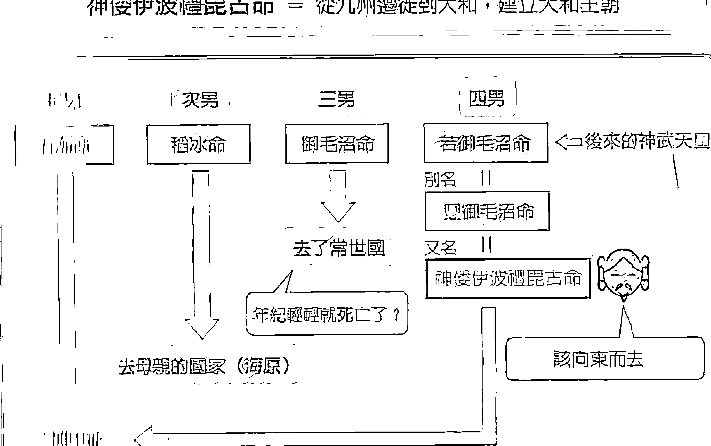

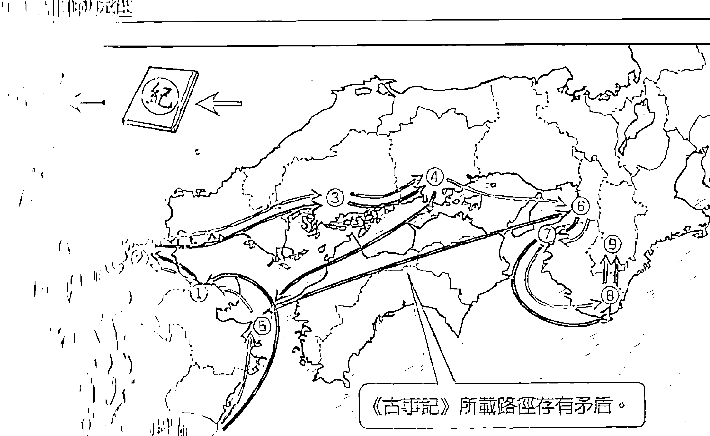

- ○日本書紀→No.004
- ○平定大和→No.050

# # No.049 五瀨命之死

五瀨命於東征途中戰死，從此神倭伊波禮昆古命便失去了所有兄弟，可是他並未放棄平定大和的大業。

- 因長兄戰死而改從南方迂迴前進

《古事記》說神倭伊波禮昆古命經過浪速（大阪）以後，在白屑津（大阪府南部）登陸。另一方面，登美（奈良縣）的那賀須泥昆古則是率軍迎擊，兩軍對決。

長兄五瀨命遭那賀須泥昆古以弓箭射穿手臂，他說：「我乃日神之子，不想竟然面向太陽而戰，方遭卑劣者所擊。且繞行，背對太陽而戰」，於是便從血沼海（大阪府南部）移往男之水門（大阪與和歌山交界處）；他雖然說：「怎甘死於卑劣者之手」，但還是死了。

失去胞兄以後，神倭伊波禮昆古命大幅迂迴，才剛進到熊野（和歌山縣新宮市一帶），便隱隱約約看見有隻大熊，後來那頭熊終於現身，神倭伊波禮昆古命頓時失去意識，連士兵們也紛紛倒下。這時，恰逢熊野的高倉下前來獻劍，神倭伊波禮昆古命立刻就恢復意識，說道：「剛剛睡了好久」便接過劍來。

神倭伊波禮昆古命又問拿劍來的高倉下這是怎麼回事，高倉下說他做了個夢。他夢見天照大御神和高木神商量，找來建御雷神對他說：「葦原中國騷亂不已，我的幾個御子正為病所苦。當初葦原中國本是你所平定，故此番還要派你降世前去」。建御雷神聞言，答：「有柄不須我去亦能平定國土的劍，就把此劍送往下界吧」，於是便挖開倉庫頂端，把劍放在裡面。高倉下隔天醒來去倉庫一看，果如夢境真有把劍，這才帶劍來獻。

另外，高倉下還把夢中高木神所說的話：「今後還有許多荒暴之神，我且派遣八咫烏，切記依其導引行事」，告訴了神倭伊波禮昆古命。《日本書紀》對這段故事的記載亦相去不遠。

#### 五瀨命之死

因面向太陽而戰，故遭弓箭貫穿手臂而亡

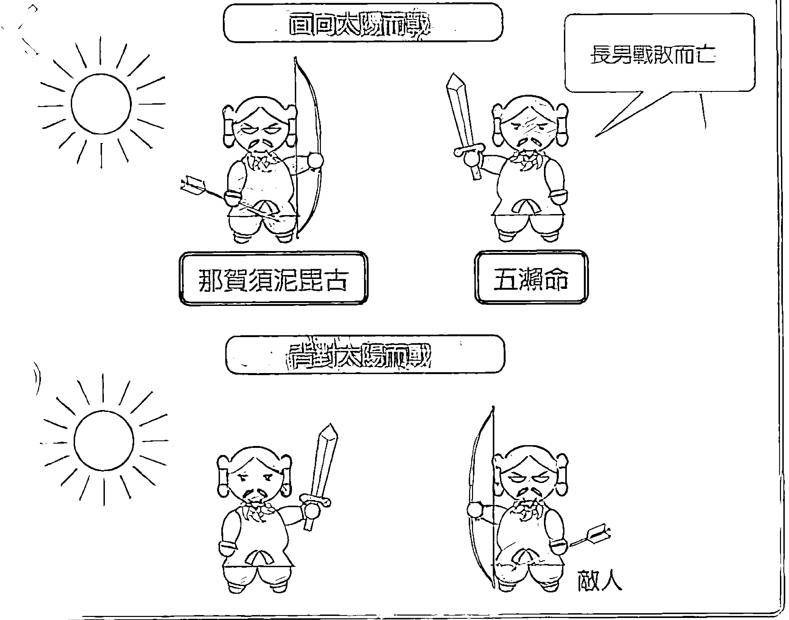

面向太陽而戰

那賀須泥昆古

五瀨命

> 長男戰敗而亡

背對太陽而戰

敵人

#### 八咫烏

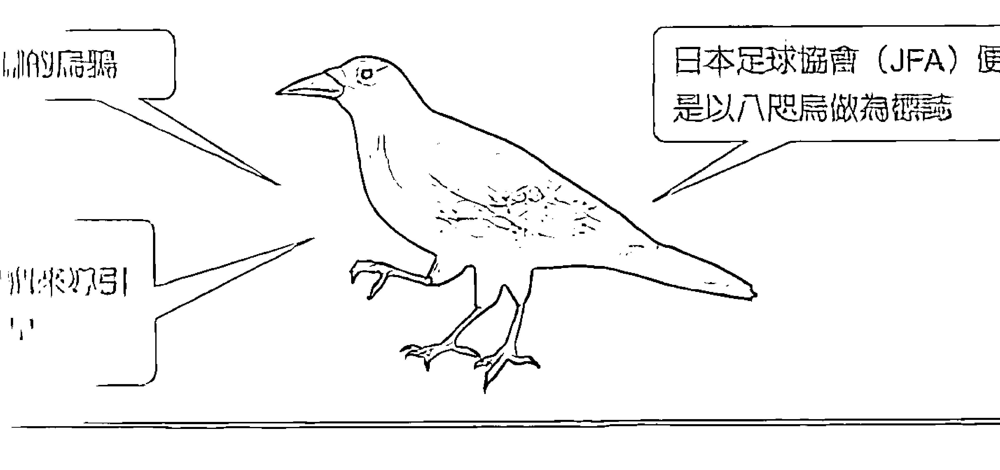

> 日本足球協會（JFA）便是以八咫烏做為標誌

> 三隻腳的烏鴉

> 一直以來吸引人們

- 高御産巣日神 • No.022
- 菊理媛命的東征 → No.048
- ○顕國 → No.040
- ○高御産巣日神 → No.070

# # No.050 平定大和

大和朝廷的初代天皇神武天皇歷經多次征戰，終於進入大和，並且在此創建了朝廷。

### ○擇南路進攻的神倭伊波禮昆古命

根據《古事記》記載，神倭伊波禮昆古命按照八咫烏的指示導引前進到宇陀，遇見了兄宇迦斯與弟宇迦斯。神倭伊波禮昆古命派遣八咫烏催促他們歸順，卻被兄宇迦斯以鎬矢給趕了回去；兄宇迦斯召集軍隊，但召募工作進行得並不順利，於是他便建造設有陷阱的房屋，假意服從實則是要取神倭伊波禮昆古命的性命。不想弟宇迦斯卻將兄長的陰謀向神倭伊波禮昆古命報告，神倭伊波禮昆古命遂命其早兄宇迦斯一步進入該建築物，而兄宇迦斯也被自己所設的陷阱給壓死了。

來到忍坂（奈良縣櫻井市）的大室，又遭遇到長有尾巴的土雲八十建（土豪強者）堅守岩屋不出。這次，神倭伊波禮昆古命決定準備酒食招待他們，然後為每位強者配屬一位料理人，每位料理人配把大刀，信號一起便要眾料理人一齊將強者斬殺，就這樣一口氣殺死了眾土雲。

神倭伊波禮昆古命前前後後又討伐了登美昆古、兄師木、弟師木，此時邇藝速日命參見曰：「聽聞天津神御子從天而降，故隨後而來」，並且出示自己也是天津神的證據，而後仕於神倭伊波禮昆古命。神倭伊波禮昆古命便是這般征服荒暴諸神，遇不從者便將其驅趕，以畝火（奈良縣橿原市的畝傍山）的白檜原宮為根據地治理天下。神倭伊波禮昆古命即後來的初代天皇——神武天皇。

《日本書紀》所描述的故事情節也大致相同。不同的是，《日本書紀》說他討伐八十梟帥憑的不廷謀，而是占卜神意得到吉兆，果然一戰而勝。其次，以天神身分降臨大和的櫛玉饒速日命，有個名叫長髓彥的部下並未停止反抗，於是饒速日命便先殺死長髓彥，然後才率部下歸順。

神武天皇 = 神倭伊波禮昆古命，後來大和朝廷的初代天皇

#### 神倭伊波禮昆古命之戰

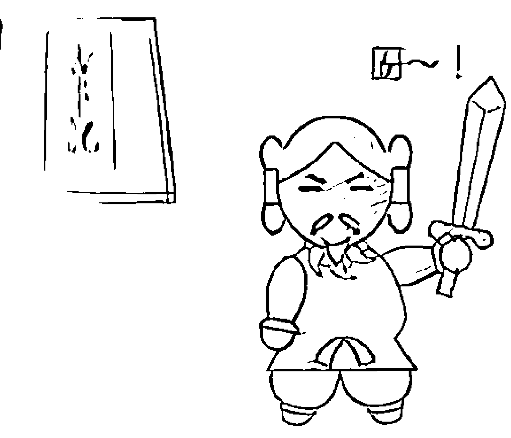

1. 那賀須泥昆古
2. 兄宇迦斯與弟宇迦斯
3. 土雲八十建
4. 登美昆古
5. 兄師木與弟師木

#### 神日本磐余彥天皇之戰

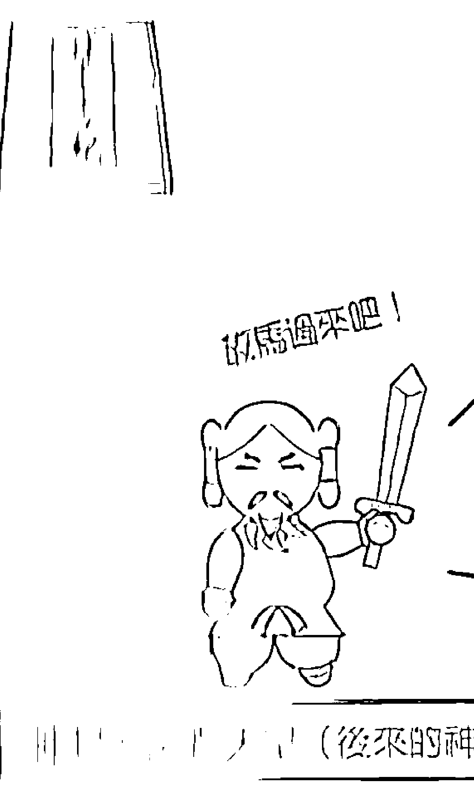

第一回合
1. 長髓彥
2. 名草戶畔（女賊）
3. 丹敷戶畔（女賊）
4. 兄猾與弟猾
5. 各地的八十梟帥
6. 兄磯城與弟磯城
第二回合
7. 長髓彥
8. 新城戶畔（女賊）
   - 居勢祝
   - 豬祝
9. 土蜘蛛

○日本書紀→No.004
○五瀨命之死→No.049

## 神武天皇的婚姻

天皇家的初代天皇神武天皇與兩名女孩結了婚，即日向之女與大和之女。

### ○神武天皇遷后

根據《古事記》記載，從前神武天皇在日向的時候娶了阿比良比賣，生下了當藝志美美命和岐須美美命兩兄弟。可是他征服大和以後，卻又想在大和娶個女孩當皇后。

於是，有個叫作大久米命的人就說：「我知道有位據稱是神明之女的少女。那名美麗的女孩叫勢夜陀多良比賣，從前三輪的大物主神看上了她，於是趁她大便的時候變成赤紅色的箭矢沿著廁所便溝流經、插入女孩的陰部。受到驚嚇的女孩把箭矢放在地板旁邊，那箭矢竟然變成一名翩翩男子、與她交合。如此這般生下的女孩名叫富登多多良伊須須岐比賣命，別名比賣多多良伊須氣余理比賣。」

有一次，伊須氣余理比賣等七名少女恰好來到高佐土野（奈良縣，詳細場所不明）遊玩，於是大久米命便對神武天皇詠歌道：「倭の　高佐士野を　七行く　媛女ども　誰れをし　枕かむ」

> （七名前往大和高佐士野的少女中，與誰共枕？）

那時伊須氣余理比賣恰巧站在七名少女最前面，天皇便隨後詠道：「がつがつも　いや先立てる　兄をし枕かむ」

> （啊啊，就跟最前面那個年長女孩共枕吧）

伊須氣余理比賣就這樣成為神武天皇的皇后，產下日向八井命、神八井耳命、神沼河耳命（次代天皇）等三名御子。

《日本書紀》也說神武天皇以五代主神之子姬蹈鞴五十鈴姬命為正妃，卻沒有《古事記》如此浪漫的場面。除此之外，姬蹈鞴五十鈴姬命只生下了神八井命與神渟名川耳尊（次代天皇）兩位皇子而已。

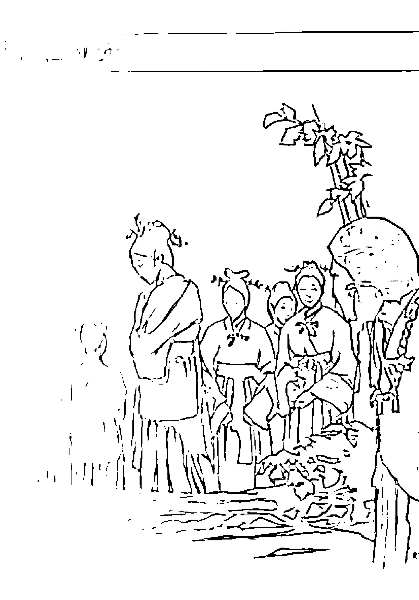

- 神武天皇征服大和，欲迎該地女孩為皇后。
- 得知有位名叫伊須氣余理比賣的神明之女。
- 偷窺伊須氣余理比賣等七名少女。
- 對伊須氣余理比賣一見鐘情，迎為皇后。

#### 須佐之男命，和各信国国的家族系统

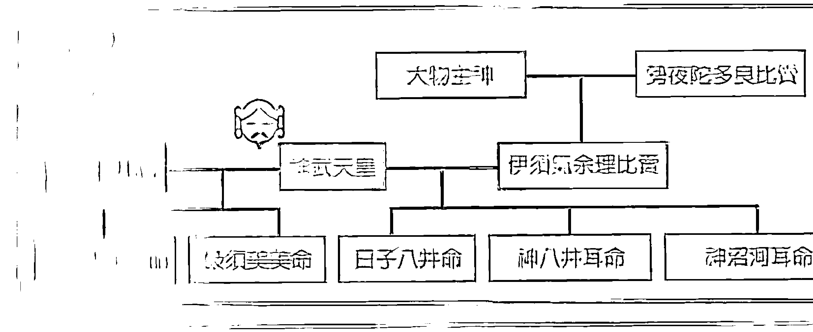

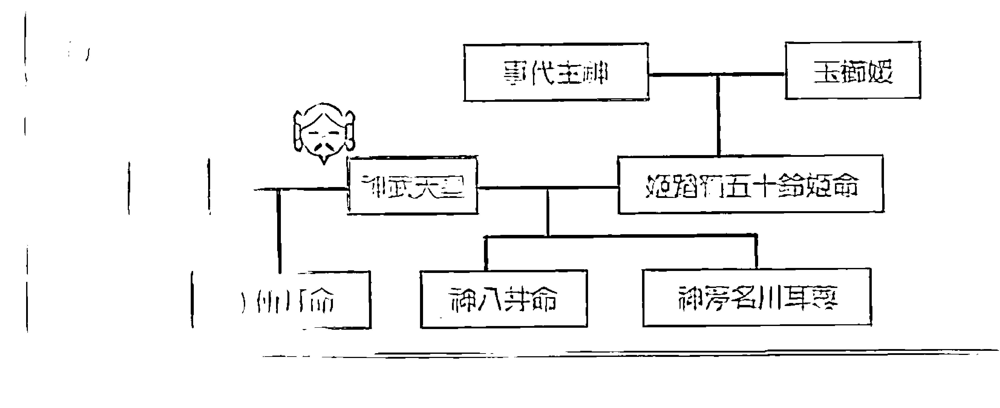

○大物主神→No.037

# # 皇位繼承權之爭

神武天皇駕崩以後，異胞兄弟間便展開了殘忍血腥的皇位繼承權之爭。

### ○娶後母為妻的庶子與繼承人

《古事記》說到神武天皇駕崩以後，其正妃伊須氣余理比賣又被繼子當藝志美美命娶為妻。可是當藝志美美命覬覦天皇皇位，便盤算要殺死自己的弟弟，也就是伊須氣余理比賣生的三個兒子。

嫁為其妻的伊須氣余理比賣憂慮不已，遂以和歌警示其子。歌兩首曰：

> 「狭井川よ　雲立ちわたり　敵火山　木の葉騒ぎぬ　風吹かむとす」（雲湧狹井川葉動敵火山，風將欲吹動）。
>
> 「敵火山　晝は雲とる　夕されば　風吹かむとぞ　木の葉騒ぎぬ」（敵火山此地晝有雲起夕有葉動，乃風起前兆）。

聽到這兩首歌，眾御子便計畫要殺死當藝志美美命。神沼河耳命對兄長神八井耳命說：「你帶著武器進去殺死當藝志美美命」，神八井耳命帶著武器進去以後卻手腳顫抖沒能下手，於是弟弟神沼河耳命便接過武器將當藝志美美命殺死，因此後來他被稱為建沼河耳命。

神八井耳命對弟弟說：「我沒能殺敵，你能殺敵。是故，我雖為兄長，卻不該居於人上。你就即天皇位，治理天下吧，至於我就去職掌祭祀事，以為輔佐」。

這則故事完全沒有提到長兄日子八井命。再看《日本書紀》，打從一開始就只有記載到兩兄弟而已，因此我們可以推想這位日子八井命恐怕是後來出於某種理由（可能是某支氏族想把祖先寫進神話裡，也可能是三這個數字比二來得神秘或恰當？）而臨時插入故事之中的虛構人物。

#### 川吹天皇的後繼者 = 經過兄弟間的皇位爭奪，最後由神沼河耳命成為天皇

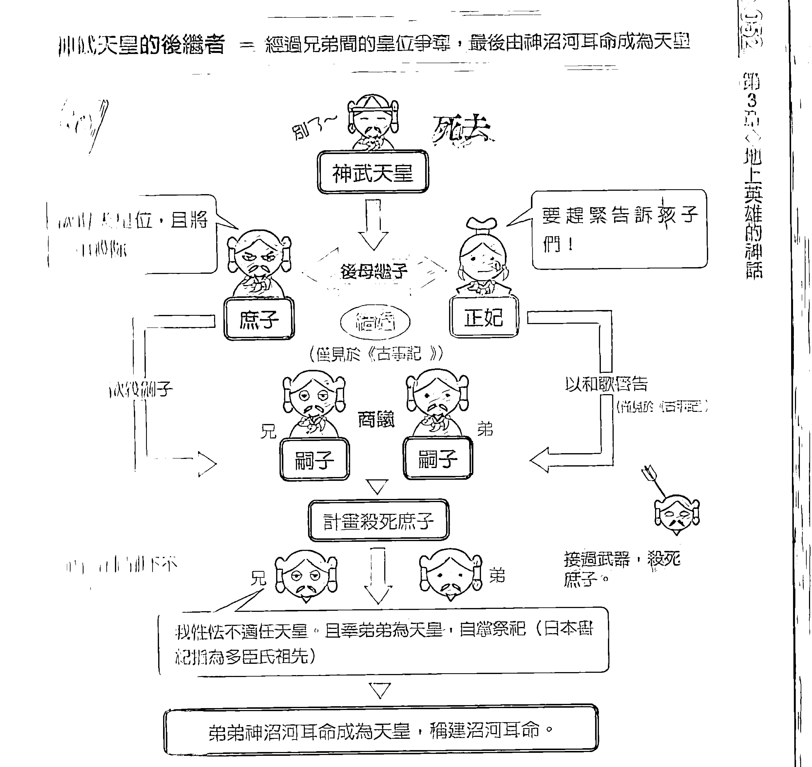

為何以「建」稱呼勇敢之人，何故？

因為「建」（たけ）這個字來自「たけだけしい」（勇猛）。

所以所有英雄的名字都有個「建」字。

> ○日本書紀→No.004

## 大物主神之祟

> 神並不一定永遠守護人們，有些時候，神也會因害自身的意志而降災予人。

### ○神明作祟

根據《古事記》記載，從前御真木入日子印惠命（第十代崇神天皇）的時代，曾經發生過疫病散播至全國，國家幾致覆亡的事態。那時，天皇尋夢卜求神意而寢，果然大物主大神出現在夢中，說道：「此疫病乃我意志所致。且讒意富多多泥古行祀祭我，則禍崇可止、國家太平」。

於是天皇便派人四方探尋，終於在河內國美努村（大阪府八尾市）找到了意富多多泥古這個人。問曰：「你是何人」，答：「大物主神大神娶陶津耳命之女活玉依毘賣生櫛御方命，其子飯肩巢見命，其子建甕槌命，我乃建甕槌命之子也」。

天皇聞言喜道：「如此則國泰民安也」，遂命意富多多泥古擔任神主，於御諸山（奈良縣三輪山）祭祀大物主大神。

又讒伊迦賀色許男命製作祭祀用土器，定天神地祇神社。又準備紅盾紅矛獻予宇陀的墨坂神、黑盾黑矛獻予大坂神，從坡上之神到河灘之神，個個都有供品奉獻。

如此疫情才終於偃息，國家恢復平穩安定。

《日本書紀》也有類似的紀錄。不過《日本書紀》說當初疫病與叛變四起時，天皇祭祀的是天照大神與倭大國魂這二位神明，可是這兩位神明威力太過強大，無法在天皇殿中祭祀。遂移住他處行祀。當時負責祭祀倭大國魂的浮名城入姬命漸弄得毛髮脫落、骨瘦如柴，以致無法繼續行祀。

天皇遂於神淺茅原行占，當時是倭迹迹日百襲姬命受神附身，向天皇傳達大物主神的旨意。後來還有倭迹速神淺茅目妙姬、大水口宿禰、伊勞麻績君三個人，跟天皇報告說他們都做了同樣的夢。其後記載則與《古事記》相去不遠。

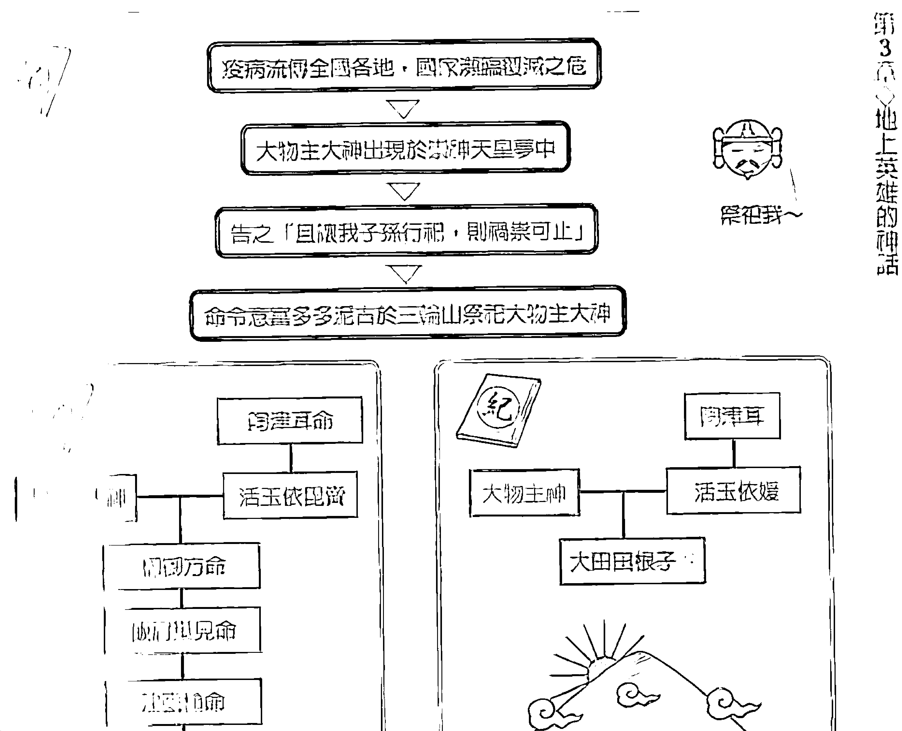

#### 初代（？）崇神天皇

《日本書紀》都說崇神天皇是第十代天皇，可是他「御肇國天皇」卻與神武天皇的別名「始肇天下之天皇」相近。

有人說崇神天皇=神武天皇，有人則說崇神天皇以前的都是後人所捏造，崇神天皇才是初代天皇，眾說紛紜。

- ○日本書紀・No.004
- ○三輪山傳說→No.054

# # No.054 三輪山傳說

三輪山之神大物主神身為蛇神，相傳他性好漁色而且娶了眾多妻子，果然有蛇神風範。

### ○每到夜裡才會出現的男子

關於大物主神看上人類女孩的逸聞，《古事記》與《日本書紀》有截然不同的記載。

《古事記》裡寫到，意富多多泥古的祖先有個名叫活玉依毘賣的美麗女兒，有位相貌堂堂的男性前往通婚，不久她就懷了身孕。

父母奇怪問道：「妳似乎懷孕了，可是妳又沒丈夫，是怎麼懷孕的？」，女兒答：「有位非常俊美的男性，我雖然連他的名字都不知道，可是他每晚都來這裡，自然就懷孕了」。

於是乎，父母便教她「在地板前撒上紅土，然後將麻線捲用針刺在他的衣服上」。隔天早上一看，麻線竟然從鑰匙孔中間穿過，線軸上只剩下三勾（三捲）麻線。那父親沿著麻線一直找過去，竟然來到了三輪山神的神社，從而得知該名男子的真正身分原來就是大物主大神。又因為線軸上只剩下三勾麻線，該地遂從此得了美和（三輪）之名。

《日本書紀》記載的卻是則跟大田田根子（意富多多泥古在《日本書紀》中的名字）毫無干係、名叫倭迹迹日百襲姬命的女子嫁作大物主神妻子的故事。同樣有位只在夜裡才會出現的男性，女子問：「您每次都不是白天來，所以我都無法拜見您的尊容。希望您下次白天前來，好讓我可以一窺您俊美的樣貌」，那男子答：「說得也是。那白天我就躲進你的櫛笥（放梳子的箱子）吧，可是妳看了可不要嚇到」。天亮以後，女子打開箱子一看，裡面竟然是隻美麗的蛇。女子驚叫出聲，那蛇化作人形道：「妳竟敢讓我出糗，那我也要讓妳難堪」，語畢便騰空飛回山裡去，據說後來那女子就以筷子刺穿陰部自殺了。

[注]見P.228頁No.054註解

#### 三輪山傳說

三輪山之神大物主神性好漁色，有眾多妻子

（左側對話框）只在夜裡才會出現的男子

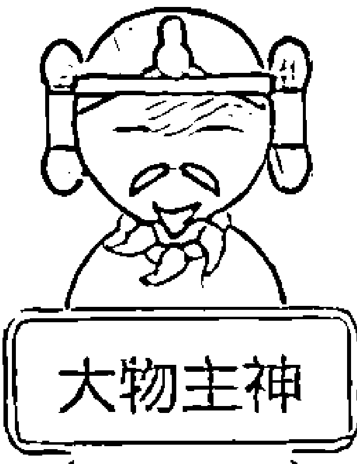

（右側對話框）身為蛇神自然頗為好色

（左側故事框標題）活玉依毘賣

（左側故事內容）
刺探身分的是父母
▽
用計（在男子衣服穿上麻線）
▽
沿著麻線找到線索
▽
得知那男子是大物主神
▽
留下子孫

（右側故事框標題）倭迹迹日百襲姬命

（右側故事內容）
刺探身分的是女子本人
▽
直接請求
▽
說好隔天早晨給她看真面目
▽
見蛇驚叫
▽
男子離去
▽
女子自殺

#### 傳說

倭迹迹日百襲姬命自殺以後，被葬在了一個叫作大市的地方，
因此墳墓有箸墓之稱。那墓白天是人們建造，夜晚則是眾神
建造。據說當時眾人是從採石材的山裡排成一列長龍直至墓
地，接力搬運石材。

- 古事記 → No.008
- 日本書紀 → No.004
- 日本書紀 → No.007
- 大物主神之祟 → No.053

## 沙本昆古與沙本昆賣

《古事記》除了神的故事以外亦記載了人的故事，其中尤以沙本昆賣命身陷兄長與天皇兩難局面的故事特別有名。

### ○哥哥和丈夫，愛誰才好？

伊久米伊理昆古伊佐知命（垂仁天皇）有位名為佐波迦比賣命（沙本昆賣命）的皇后，她有位名叫沙本昆古命的同母哥哥。她要嫁給天皇的時候，哥哥曾問：「丈夫和哥哥，妳愛哪個？」，妹妹答：「我愛哥哥」。哥哥聞言起了叛心說：「如果妳真愛哥哥，妳我二人共治天下」，然後拿把短刀命她：「妳拿這把短刀，趁天皇睡覺的時候刺殺他」。

沙本昆賣趁天皇熟睡時曾三度舉起短刀要刺殺，可是她悲傷地刺不下去，淚水滴落在天皇的臉上。天皇嚇醒以後對皇后說：「我剛剛做了個怪夢。夢見暴雨從沙本襲來，把我的臉都打濕了，還有條小蛇纏住我的脖子」。

沙本昆賣命心想這下子瞞不下去了，於是便當面將當初哥哥問她「丈夫和哥哥，妳愛哪個？」還有自己脫口回答「可是哥哥吧」之事全盤托出。天皇心道：「差點上當受騙」，便揮師攻向沙本昆古，這廂沙本昆古以臨時應急的城塞應戰。由於對兄長的愛，沙本昆賣逃出王宮、躲進城塞；當時她已懷有身孕，而天皇思及長達三年的寵愛，只是包圍城塞卻躊躇不前沒有攻城。沙本昆賣在城中生下孩子，對天皇說：「如果您承認這孩子當作皇子，就請您養育他吧」，便要走出城外。

天皇直到這時仍然愛著沙本昆賣，遂命人在接過皇子之後，不管抓頭髮也好抓衣服也好，總之把沙本昆賣給捉過來就好。可是，沙本昆賣知道天皇的心思，她剃掉頭髮、戴上假髪，在衣服上動手腳，讓衣服一撕就破，甚至還把珠玉項鍊的細線也弄得破爛。因此當沙本昆賣將皇子遞過去時，士兵們無論怎麼抓，頭髮、衣服和項鍊全都立刻裂成碎片，沙本昆賣也就逃回城中去了。

最後，沙本昆賣跟兄長一起在大火的城中雙雙殞命。

#### 命的真相

沙本昆賣命 = 垂仁天皇之后，夹在兄长沙本昆古命与丈夫中间，为爱所苦

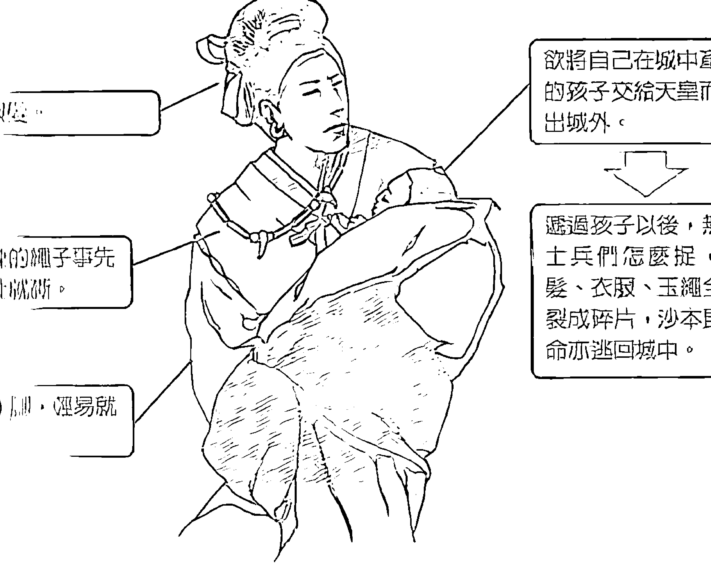

> 城中生產

> 用绸子事先缠好绳索。

> 孩子轻易就

> 欲将自己在城中产下的孩子交给天皇而步出城外。

> 递过孩子以后，无论士兵们怎么捉，头发、衣服、玉绳全都裂成碎片，沙本毘古命亦逃回城中。

#### 《日本书纪》所记载的沙本昆古王策反说辞

《日本书纪》却记载哥哥沙本昆古王是如此劝说妹妹的：

你以貌美仕人，容貌旦衰则顿失宠爱。今天下多美人，谁能保宠？如何单凭容色为恃？若我得皇位，可与君共天下，百年之后则杀天皇。

与《古事记》那位因为私情而要妹妹刺杀天皇的沙本毘古命相比，这番说辞倒也合理，其中却全无掺杂半点情绪，如此沙本昆古王的策反或许也可以说是没有办法的事情。

尽管她将孩子送进哥哥居城让天皇很没面子，但她这么做其实是为了自卫，绝非为爱殉情。

> [1] 沙本昆古命在《日本书纪》中的名字。读音亦同。

## 小碓命與大碓命

日後人稱倭建命的大英雄，其實有個讓人傷透腦筋的哥哥，就連倭建命自己的個性也很難搞。

### ①雖然身為日嗣御子……

《古事記》說大帶日子淤斯呂和氣天皇（景行天皇）有八十位皇子，其中若帶日子命、小碓命（別名倭男具那命）和五百木之入日子命三人是日嗣御子（有資格成為天皇的皇子）。若帶日子命治理天下，小碓命則是將不從者盡皆征服了。

小碓命有個同母哥哥，叫作大碓命。

有一次，天皇聽說大根王有對漂亮女兒叫作兄比賣、弟比賣，便遣大碓命將兩姐妹召進宮中，豈料大碓命卻自己娶了這對姐妹，把冒牌貨送給父親。天皇察覺了此事，正煩惱著。

> 於是天皇便對小碓命說：「你哥哥怎麼早晚的餐會都不來呢？你且好言告誡要他來」。過了五天，大碓命還是不來。天皇問小碓命：「你哥哥還是不來，你有沒有好好告誡他？」答：「已告誡之」。天皇又問：「你怎麼告誡他的？」，答：「我趁他早上去便所的時候將他擒住，把手腳扯下來、用草蓆包起來丟掉了」。

天皇聞言得知小碓命性情荒猛暴躁、甚是畏懼，遂決定派遣小碓命征伐各地。

《日本書紀》有一則《古事記》並未記載的故事，說是大碓皇子與小碓尊其實是雙胞胎。根據該紀錄，當時天皇見到了雙胞胎，嚇得朝石臼大叫，故取名為大碓小碓。

《日本書紀》也提到大碓皇子將本該獻予天皇的女子佔為己有，卻沒有小碓尊將大碓皇子的手腳扯下來的記載；相對地，書中卻記載到大碓皇子在可能要受命征伐蝦夷時害怕了起來，因此後來被派去掌管美濃，到最後仍然還是由小碓尊出征。

小碓命 = 後來的倭建命。跟哥哥大碓命兩人都讓父親景行天皇傷透了腦筋

#### 大碓命

給父親的

父親派他去看看頗有美名的女性，自己卻將其娶為妻子。

天皇要命其征伐蝦夷的時候，害怕發抖地躲了起來。

#### 小碓命

扯下手腳。

小碓的問題兒

小碓尊 = 威武的將軍
大碓命 = 膽小鬼

> ○日本書紀→No.004

## 征伐熊曾建

小碓命欲憑計謀單槍匹馬除掉熊曾建，所採取的策略與希臘神話的赫拉克勒斯不謀而合。

### ○倭建此名的由來

《古事記》的天皇曾命令小碓命：「西方有兩個人叫作熊曾建。他們是不服從朝廷的無禮者。替我去打倒他們」。當時小碓命還是個束髮於額的少年。據說這個髮型是15~16歲孩童的髮型，另有紀錄指聖德太子在14歲時也曾留過這個髮型。

小碓命帶著叔母倭比賣命的御衣御裳（衣服）、藏劍於襠便出發了。熊曾建在大屋之外設有三層軍力重兵把守，又在御面蓋起新的建築物，正準備要慶祝新居落成。

小碓命等到宴會那天，把頭髮放下作少女髮型，再穿上從叔母那裡拿來的御衣御裳扮成年輕女孩，然後混在眾多女孩當中進入了建築物內部。

熊曾建兄弟看見變裝後的小碓命貌美，便讓他坐在兩人中間。小碓命相準宴會最高潮時，從懷中取出劍來，揪住熊曾建哥哥的衣領，刺穿其胸膛。弟弟見狀趕緊逃跑，卻被小碓命追到階梯底下捉住背心，刺中屁股。

熊曾建急道：「且慢動劍，吾有話要說」，小碓命遂決心姑且聽他是怎麼說法。熊曾建問：「你是何人」，答：「緯日代宮統治大八島國大帶日子淤斯呂和氣天皇之子，倭男具王是也。汝等不從，遂遣我來討」。熊曾建又說：「原來如此。西方再無他人在我之上，大倭國卻有強者。且容吾獻上一名，從此稱頌君為倭建御子」。語畢，小碓命便有如斬瓜切菜似地將熊曾建斬殺。從此以後，世人均稱其為倭建命。

《日本書紀》則說天皇先以其女對熊襲八十梟帥兄弟行懷柔，復以計策討之。這故事中日本武尊雖然只殺了梟帥一人，不過男扮女裝行事、事後得到尊稱的情節倒是相同。

#### 倭建命 = 小碓命征伐熊曾以後得到的尊稱

以牽牛花...起來
...年也...實際...形...以後

變裝前

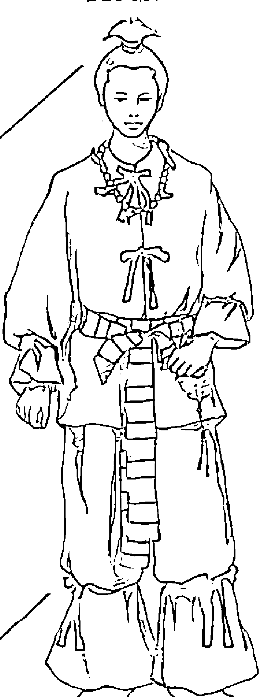

變裝後

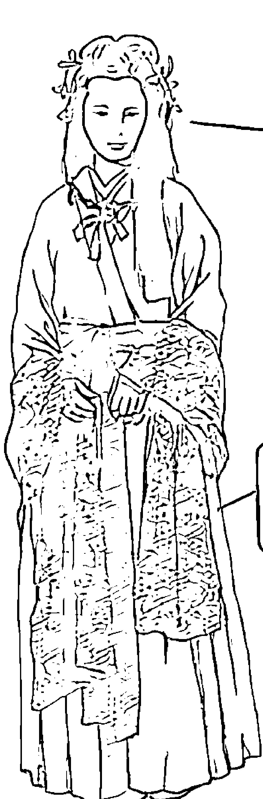

髮型為垂髮

跟叔母拿來的御衣
御裳

...的服...

...的伐熊...

跟叔母借來女服、藏
劍於懷，趁著熊曾建
慶祝新居落成混進去。

變裝成年輕女孩坐在
熊曾建兄弟中間，待
宴會最高潮時，拔劍
斬殺熊曾建。

《日本書紀》的記載幾乎相同

天皇用計討伐熊襲八十梟帥兄弟。
日本武尊殺的是川上梟帥。

-   ○日本書紀→No.004
-   ○古事記記載的倭建東征→No.058

## 古事記記載的倭建東征

話說倭建真是片刻不得閒，從西方歸還以後，便立刻被派往東方遠征。

### ○倭建的悲劇隱然可見

倭建命班師回朝以後，天皇又命令他前去平定東方十二宮的荒暴神祇與不肯服從者。天皇派御紐友耳建日子與其同行，又贈其杣谷木（冬青）和八尋矛（長矛），便送倭建命出征去了。

倭建命得到命令以後，順路去到伊勢的大神宮參拜，他到神殿禮拜過後，對叔母倭比賣抱怨：「天皇是不是想叫我去死啊。我從西方班師歸來才沒多久，又要我領軍去平定東方十二國。我看天皇是想要我去死」。

倭比賣取出草薙劍和囊袋，說道：「若有火急之事，且解囊一覽」，便送倭建命出征了。

倭建命東征途中來到尾張國時，一度想與國造之女美夜受比賣結婚，轉念想想還是等東征歸來時再娶，於是訂下婚約就引兵往東國去了。他去到東國以後將山川荒神紛紛打倒，不服者也都一一收伏。

接著他又來到了相武國（神奈川縣南部）。當地國造騙倭建命道：「這原野有個大沼澤，那裡有荒神作亂」。倭建命剛進入原野尋找荒暴神，國造便從原野四周縱起火來。

倭建命得知受騙上當後，打開倭比賣所授囊袋觀看，發現袋中裝的是打火石，遂一面揮劍斬草，一面取打火石以火攻火，先在周身附近放火燒出安全地帶。從這裡看來，倭比賣必定擁有預言的異能。

相傳倭建命生還以後斬殺了欺騙他的國造，放火燃燒屍體，是故此地遂得燒津（靜岡縣燒津市）之名。

只不過燒津位於靜岡縣境內，跟《古事記》所謂倭建命到達相武國的記載卻有矛盾。

#### 倭建東征 = 剛從西方返回，就立刻被遣往東方遠征

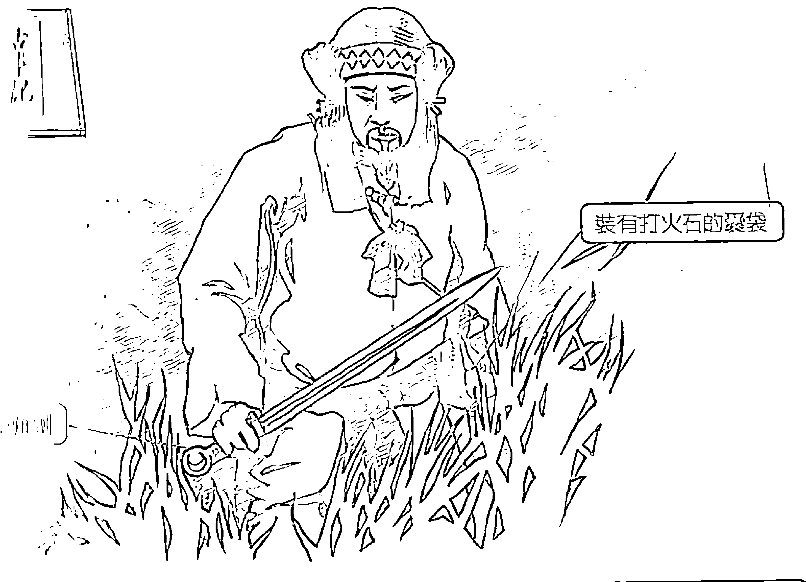

-   受命前往平定東方荒原神與不詳之
-   得叔母贈草薙劍與莖袋，並交待火急之際打開莖袋觀看。
-   受罵過四方火攻，一方面揮劍斬草，一方面取莖袋中打火石以火攻火。

倭比賣贈送的兩樣道具

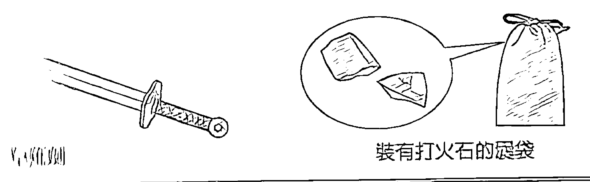

-   ○八岐大蛇→No.030
-   ○日本書紀記載的日本武尊東征→No.062

## 古事記記載的倭建渡津

倭建的苦難仍然要繼續下去。後來這段旅程更變成不僅是倭建本人，連周遭眾人也都要為之喪命的苦難之旅。

### ○帶麥遠征的倭建命

從前倭建命東征途中，正要渡過走水之海（東京灣灣口部分的浦賀水道，當初他是要從神奈川縣的三浦半島渡海前往千葉縣的房總半島），那海域之神卻興起大浪、讓船隻不住打轉，使得倭建命無法渡海。當時其后弟橘比賣道：「就讓我代皇子入海。皇子您就完成交付的任務、向天皇報告吧」，於是在水面鋪上八層菅蓆（菅草做成的蓆子）、八層皮蓆（皮做的蓆子）、八層絹蓆（絹做的蓆子），然後跳到上面。這段敘述所象徵的應該就是弟橘比賣將自己獻給海神為妻。

轉眼間，海象便從萬般險惡回歸平穩。當時弟橘比賣詠歌道：「さねさし 相模の小野の 燃ゆる火の 火中に立ち」（置身相模草原炙火中，卻仍舊掛心問訊安否之我君哪）。

七天後，弟橘比賣的梳子漂流到岸邊，便在該地建造陵寢納之。後來倭建命又收伏蝦夷、擊敗眾多神祇。當他要離開關東時，足柄峠之神曾經化身白鹿出現於足柄坂之下，倭建遂拋出吃剩的蒜（野蒜的莖可食用、味道強烈，用來驅除邪氣）將其擊斃。他在足柄坂上嘆了三聲：「吾妻啊」，故後人乃稱關東稱為阿豆麻。越過山道來到甲斐國（山梨縣）後，倭建在酒折宮詠曰：「新治 筑波を過ぎて 幾夜か寝つる」（離開常陸（茨城縣）的新治和筑波之地以後，過了幾夜呢？）守夜的老人答曰：「かがなべて 夜には九夜 日には十日を」（時日流逝，已經九夜與十日）。倭建命聽聞後稱讚老人，並賜其東國造名銜。

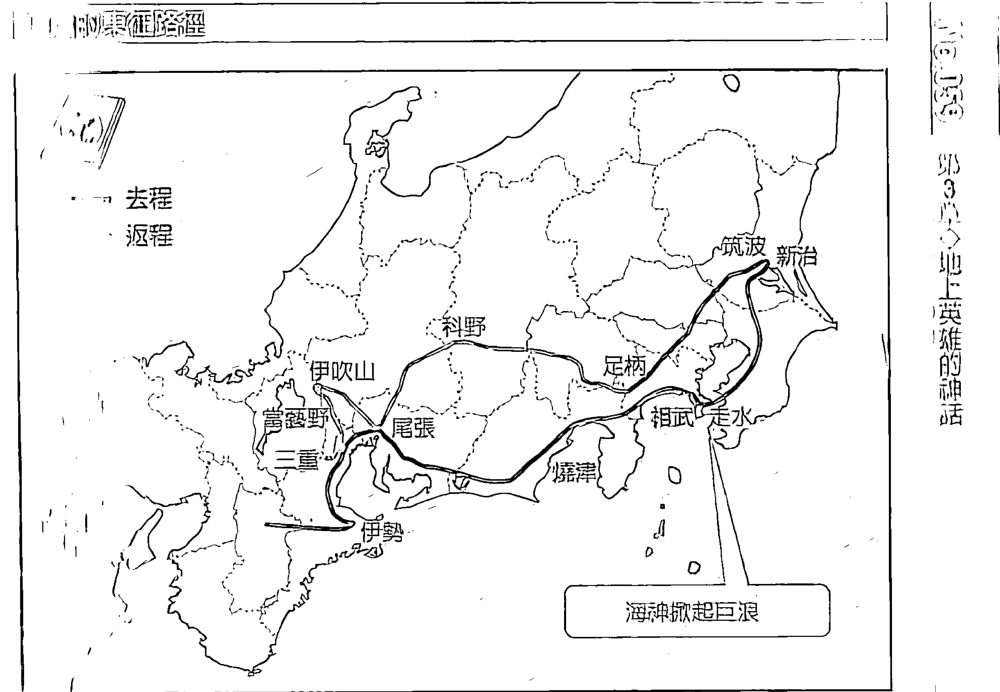

倭建命一行人欲渡走水之海。

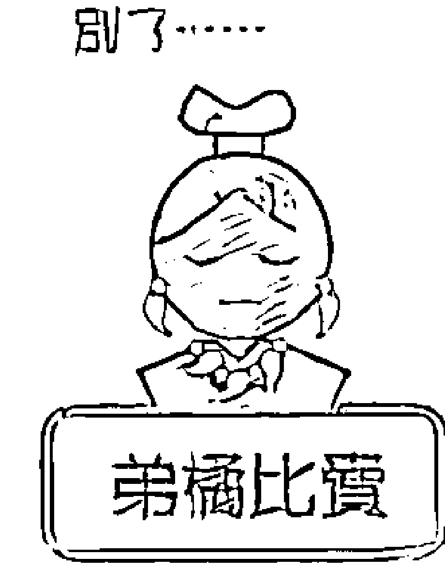

海象惡劣，眼看就要遇難。

弟橘比賣投海祭神。

大海回趨平穩，倭建命平安渡到對岸。

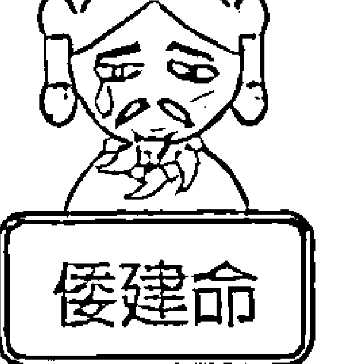

七日後弟橘比賣的梳子漂上海岸。

-   ○古事記記載的倭建東征→No.058
-   ○日本書紀記載的日本武尊東征→No.062

## 古事記記載的倭建之死

倭建雖是曾多次擊敗諸多神祇的偉大英雄，終究無法戰勝疾病。

### ○殺死倭建的神

東征進入最後階段時，倭建命攀登伊吹山（滋賀縣）並道：「且看我空手收伏此地之神」，結果馬上就有頭體型跟牛差不多大的白色山豬出現。倭建命道：「想來是山神的使者。我且不殺你，待回程後再將你了結」，語畢便繼續趕路。

豈料那頭豬其實是山神所化。山神先是降下滂沱冰雨，迷惑倭建命的心志；眾人趕緊下山，來到一口清麗泉水旁邊作休息，此時才好不容易恢復了判斷力，可是這時的倭建命已經染病了。倭建命離開該地來到當藝野，說道：「我心常欲騰空而起，我足卻是跟跟蹌蹌」，故稱此地為當藝。後來倭建愈感疲累而拄杖躑躅徐行，該地因有杖衝坂之名。

最後，倭建命又在三重村說道：「我足有如三重勾（みえこ、三段的麻糬），累煞我也」，故稱此地為三重。

> 接著他又詠歌四首：「倭は 国のまほろば たたなづく 青垣 山隠れる 建びしろし」（大和乃諸國之最。如今於如青垣般層層疊疊群山間，美哉大和）。「命の 全けむ人は 畳薦 平群の山の 熊白檻が 髻華に挿せ その子」（生命完整者，可取平群山橡樹花插於髮際）。「愛しけやし 吾家の方よ 雲居起き来も」（可愛兮，彼方有雲湧起）。「嬢子の 床の邊に 我が置きし つるぎの大刀 大刀はや」（我擺在少女睡床邊的大刀，啊啊那把大刀啊）

詠畢便當場斷氣。

倭建后妃與諸子來到此地正自嘆息不已，卻見皇子（スクナヒコナ）化身天鵝飛去，他們也就哭著追著天鵝而去了。

*見P.229頁No.060注釋

#### 殺死倭建的神 = 降下劇烈冰雨迷惑倭建，終於使其喪命

體型跟牛差不多大。

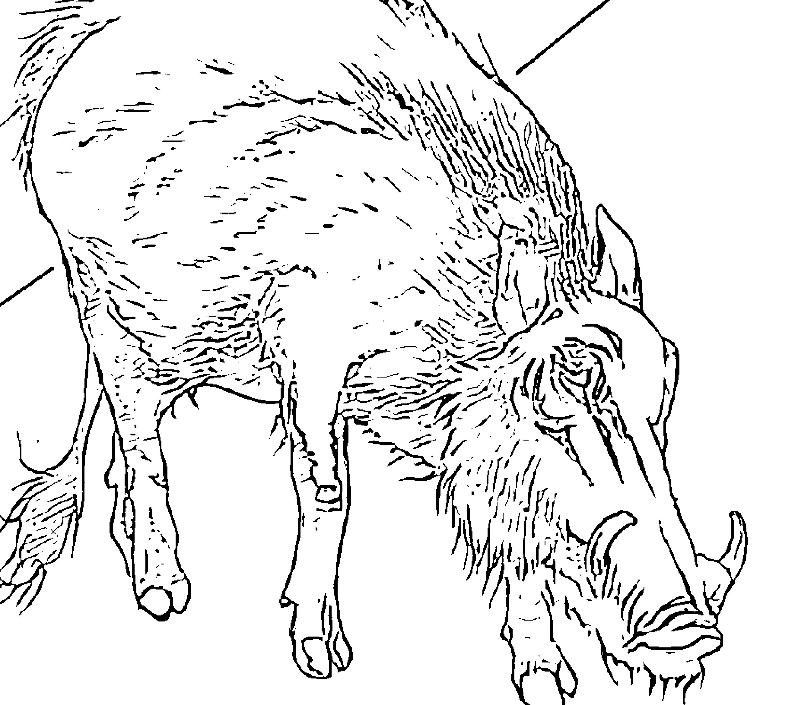

傳說中是白色山豬，會呼喚風雪。

1.  伊吹山遇見白色山豬，邏遇冰雨。
2.  泉水旁稍事休息終於恢復判斷力，但也已經染病。
3.  菅生野踉踉蹌蹌而行。
4.  权衡坂挂杖徐行。
5.  病倒三重，詠唱四首和歌後斷氣。
6.  幻作天狗飛去。

-   ○古事記記載的倭建東征→No.058
-   日本書紀記載的日本武尊之死→No.063

## 日本書紀記載的日本武尊

《日本書紀》同樣也說日本武尊是最偉大的英雄，不過此書卻將其描寫成超完美的人物。

### ○毫無缺點的日本武尊

《日本書紀》日本武尊形象大大有別於《古事記》的倭建命，乃將其描繪成超完美的人物。但《日本書紀》畢竟是官方正史，或許是有意將天皇家祖先寫得如此完美。

當初天皇在朝廷上問群臣說該派誰去東征才好。當時日本武尊也參加這個會議，還在會議上陳述意見；在《日本書紀》裡，他並非受天皇厭惡冷淡的皇子，而是西征取勝回來頗具勢力的皇子，頗受看重。實際上《日本書紀》也記載：「天皇於是讚美日本武之功，殊愛之」，可見他很受天皇愛護。

他提議說：「我已經征西回來，此番戰役且交付大碓皇子如何」，畢竟他們倆是雙胞胎兄弟，小碓尊征西，那麼接下來由大碓皇子征東也是自然。誰知道大碓皇子聞言嚇得躲到壁櫥裡去了，使者好不容易找到他，才把他拖到天皇面前。

天皇責備皇子曰：「我不會勉強你做不願意的事，連敵人都還沒看到就怕成這樣，成何體統」，然後便將美濃國交給他管理；此事代表大碓皇子已經從皇位繼承者之爭敗下陣來。想當初他擅自娶了本該嫁給天皇的女孩，再加上這等醜態，如此結果也可以說是理所當然的事情。

這時，日本武尊說道：「平定熊襲未幾，此番東夷又起，和平何時才能到來呢？如此固是辛勞，且容我前去平亂。」對於《古事記》裡的倭建命把東征看成是天皇討厭自己才派去的，據此，《日本書紀》的日本武尊卻憂心叛亂紛起，其實並非如此。東征。天皇遂指派吉備武彥與大伴武日連給日本武尊做部下，此處也跟他不受天皇喜愛、沒有兵力支援便被逼去送死的倭建命，《古事記》有很大的出入。

#### 日本武尊 = 與《古事记》的倭建命大相径庭，是位超完美的人物

1.  西征成功的得胜皇子，颇受看重。
2.  出席讨论该派谁东征的会议，陈述意见。
3.  自己已经西征回来，故推兄长大碓皇子领军东征。
4.  兄长害怕逃跑，不得已只能接下东征任务。
5.  天皇指派吉备武彦与大伴武日连为部下同行。

> 为了和平，还是挺朋友的话

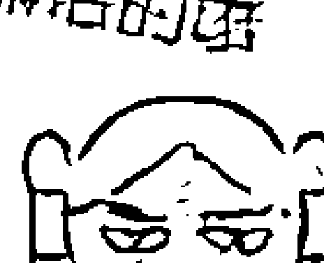

#### 倭建命 = 遭天皇疏远，怀才不遇

1.  西征回来以后仍受天皇喜爱。
2.  天皇另一方面命令其平定东方。
3.  此处并未提及兄大碓皇子。
4.  与御友耳建日子同行，没带部队出发。
5.  向叔母倭姬命感叹自身的不幸，多有抱怨。

> 呜呜

-   ◎日本书纪→No.004
-   ◎日本书纪记载的日本武尊东征→No.062
-   ▶No.058

## No.062 日本書紀記載的日本武尊東征

《日本書紀》記載的日本武尊東征跟《古事記》頗為相似，然而即便記載的事件相近，意義上卻有微妙的差別。

-   ○未曾提及腐敗官員的《日本書紀》

《日本書紀》也說日本武尊出發東征前先造訪了伊勢，神倭媛命授予草薙劍，不同的是日本武尊並沒有什麼煩惱，不需要跟叔母吐苦水。

來到駿河（靜岡縣中部），那裡的賊人假意順從道：「附近草原有許多大鹿，我們去狩獵如何？」，其實是想藉機燒死日本武尊。書中記載，日本武尊眼見火起遂取出打火石、以火攻火，成功逃出生天；不過這打火石似乎不是得自他人饋贈，而是他平常就隨身攜帶使用的物品。除此之外，另有一說認為日本武尊乃是拔腰際佩劍將周圍草叢悉數斬除，方才得救（正因為這個緣故，該劍遂有草薙劍之稱）。

成功逃得性命以後，日本武尊便將賊人全部燒死，該地遂得燒津之名。此處的記載便沒有地理位置的矛盾，因此《古事記》可能是記載錯誤所致。最大的差別在於《日本書紀》中，背叛日本武尊的是賊而非國造，也就是說官員並沒有腐敗。

日本武尊要從相模（神奈川縣）渡海前往上總（千葉縣東南部）時，曾誇口：「這麼小的海，搞不好輕輕一跳就跳過去了」。這句話傳到海中，轉眼前暴風驟起、船隻不受控制，日本無法渡海。就在這個時候，日本武尊之妾弟橘媛道：「如今風強浪大，船隻眼看就要沉沒。此必是海神意志所致。妾身卑微，願以自身代替我王入海」，語畢便投海了；不久強風平息，船隻得以靠岸。因為這個典故，此海域遂得名馳水（因為水道狹窄，水流湍急）。

從這裡我們可以發現，《日本書紀》的日本武尊與《古事記》同樣避開了現在的東京附近（當地從前是低濕地，不利於行軍），選擇渡過海灘，然後從上總北上的路線進軍。

#### 《日本書紀》之主張

-   東夷
    -   山有邪神。
    -   野有蠢鬼。
    -   道路不通。
-   蝦夷
    -   奔跑有如野獸。
    -   思義可忘，仇恨必果。
    -   藏箭於髮，藏劍於衣。
    -   結黨侵略邊境，搶奪收成。
    -   受到攻擊則奔逃入山。
    -   有史以來從來不曾臣從於王。

#### 吉備武彦的移動途徑

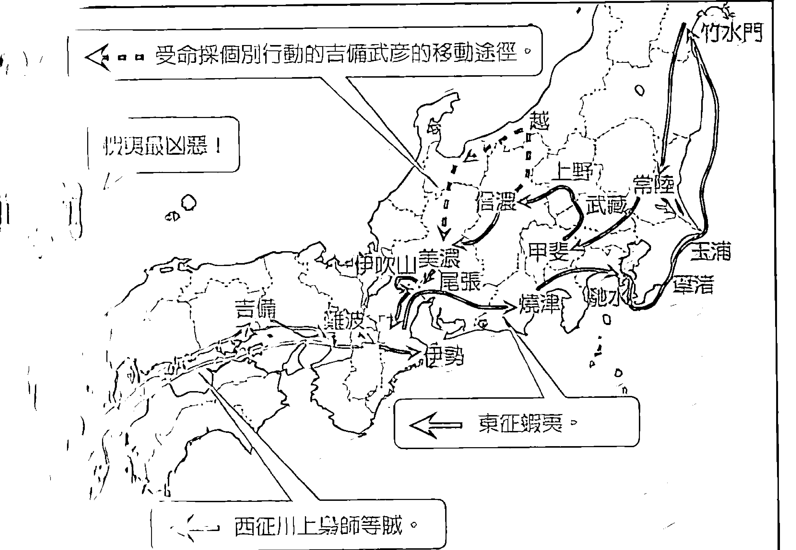

-   ○八岐大蛇→No.030
-   吉備武彦→No.058

## 日本書紀記載的日本武尊之死

日本武尊在《日本書紀》當中平定了更加廣大的區域，為天皇竭盡心力。

### ○忠勇將軍之死

有別於《古事記》，日本武尊在《日本書紀》裡面甚至還曾經征伐直抵陸奧國（東北地方）。不過他結束征討東夷，經由武藏（東京都與埼玉縣西部）、上野（群馬縣）正要前進信濃時，曾經嘆道：「吾嬬啊」，這點倒是與《古事記》相同。

> 「吾嬬啊」

此時，他命吉備武彥前進越國（日本海側），自己則是巡軍信濃（長野縣），然後在那裡用大蒜殺死變身成白鹿的山神。進入尾張（愛知縣）以後，與宮簀媛結婚。他在那裡停留了一會兒，又聽聞五十葺山有荒暴神作亂，於是便把劍留在宮簀媛處，進兵出發。

來到山裡，那神變成大蛇出現，日本武尊卻道：「這蛇必是神的使者。只要殺死首腦即可，根本不成問題」，便跨蛇而過。那神大怒，遂興起雲霧降下冰雹，根本看不清道路。

> 「這蛇必是神的使者。只要殺死首腦即可，根本不成問題」

日本武尊執意要在濃霧行軍，結果彷彿喝醉般不省人事，直到來到泉畔飲泉水稍事休息，意識才終於恢復清楚。可是，這個時候的皇子已經罹病了。

他折返尾張卻不回到宮簀媛那裡去，直接往伊勢前進。眼看病體日重，於是他便將俘虜的蝦夷獻予伊勢神宮，再遣吉備武彥回朝廷上奏曰：「我承皇命征討東夷，恃神恩皇威今叛虜伏罪、荒神順從。今雖欲收兵以歸，無奈天命已盡、孤臥草野。我命終不足惜，只嘆不能事主而已」。

> 「我承皇命征討東夷，恃神恩皇威今叛虜伏罪、荒神順從。今雖欲收兵以歸，無奈天命已盡、孤臥草野。我命終不足惜，只嘆不能事主而已」

《日本書紀》裡的日本武尊真是位忠於天皇的勇將。

雖造陵於伊勢以葬，日本武尊卻化作天鵝翩翩飛去；打開棺一看，棺中只剩下衣服而已。後來那天鵝停留在倭利川內，因此就在這個地方也建造陵墓。據說完成以後，那天鵝升天而去了。

#### 《古事記》與《日本書紀》所記載倭建命／日本武尊東征之異同

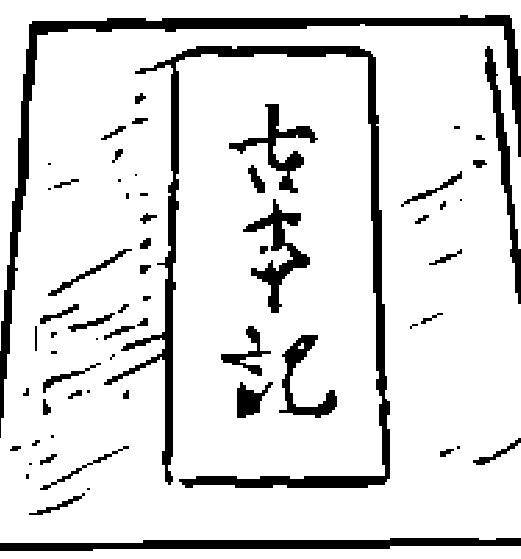

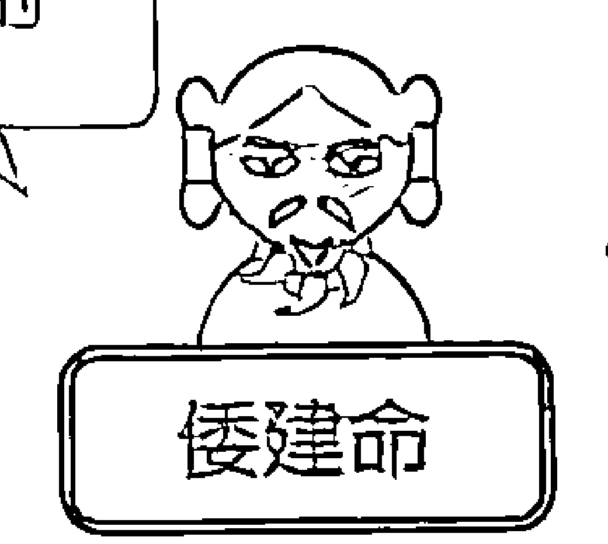

-   從一開始便是要由倭建東征。
    -   並不想去
    -   不派兵，讓我怎麼打……
    -   只帶少數隨從，並無軍隊。
    -   火石乃受贈於倭比賣
    -   在筑波遇到火攻。
    -   只到關東為止。

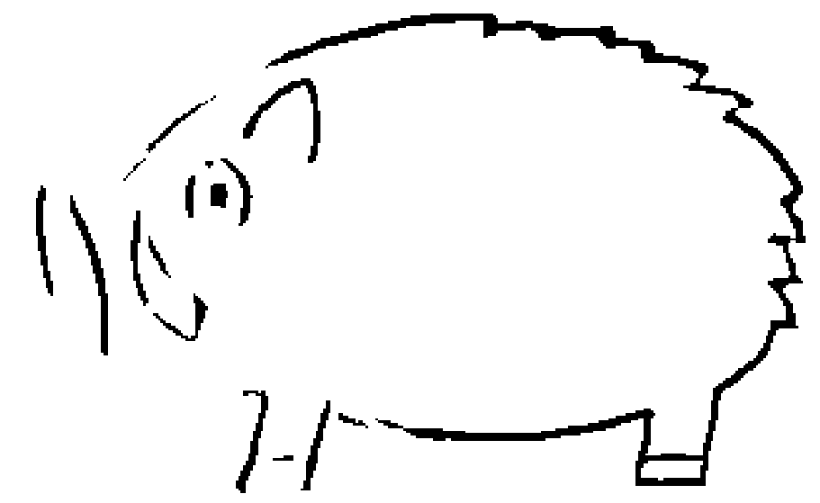

-   最後的敵人是化作白色山豬的神。

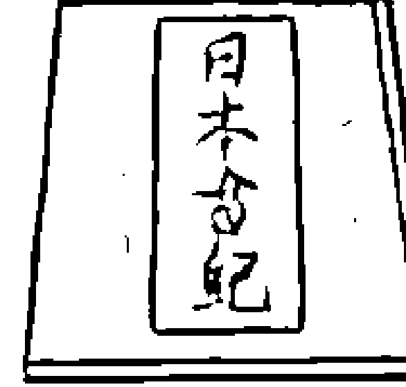

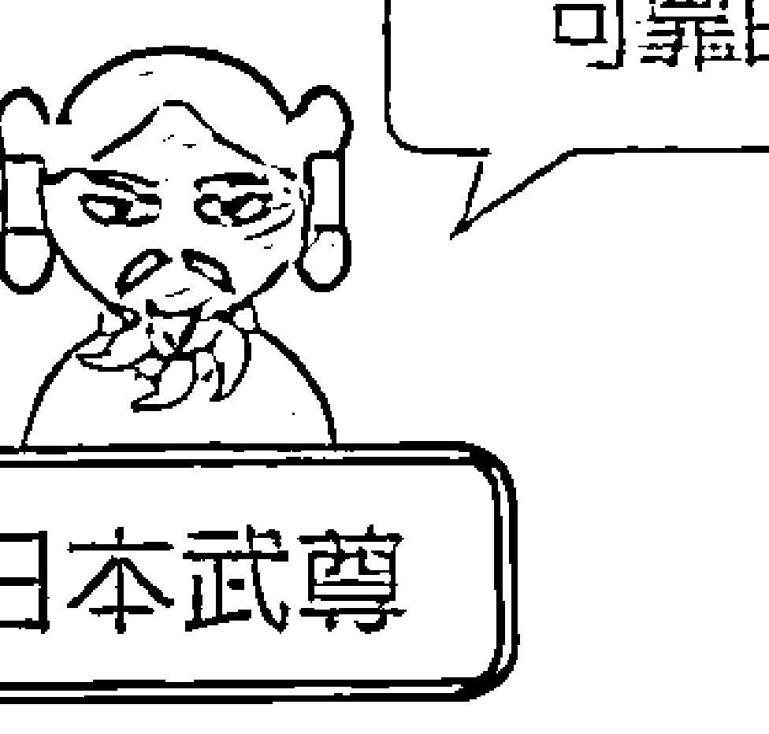

-   本應由兄長大碓皇子出征。
    -   為了和平，只好接下任務。

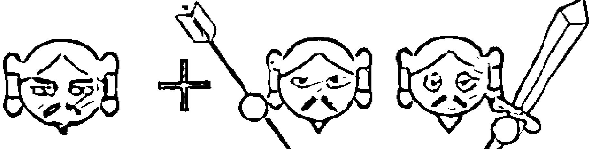

-   帶著有力部下與軍隊出征
-   打火石並非受贈於他人
-   在駿河遇到火攻。
-   東征至東北，甚至還派部下進軍日本海。

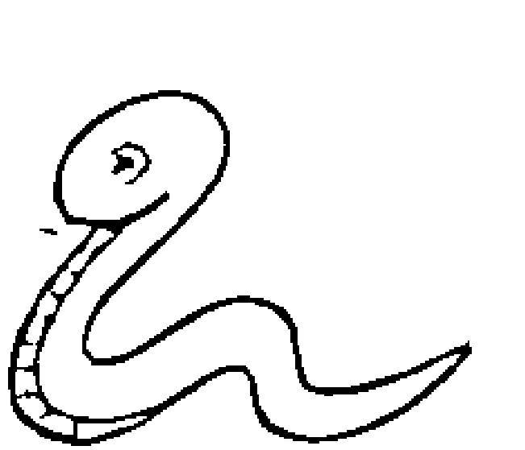

-   最後的敵人是化作白蛇的神。

-   ○日本書紀→No.004
-   ○古事記記載的倭建命之死→No.060

## No.064 仲哀天皇

即使身为天皇，一旦违背神明宣托同样将要招致破灭。仲哀天皇虽是勇将倭建命之子，勇气却是不足。

### ○故事从天皇之死开始说起

仲哀天皇又名帯中日子天皇，乃倭建命之子。

《古事记》说天皇巡幸筑紫（福冈县）停留香椎宫期间，曾经想要发兵征讨熊袭。于是乎，天皇便弹起琴来，要在场的建内宿禰请示神谕。忽然间，神明附身于天皇之妻息长带比卖命（后来的神功皇后），说道：「西方有国，彼国有金银等灿眩目的珍宝。吾且使该国归服」。

天皇却道：「我登高向西而望，不见有国，徒然大海而已」，此书指神在说谎，琴也不弹了，就默默地坐着。

神闻言大怒，答曰：「此天下无汝治地，速速下黄泉去」。建内宿禰说道：「不妙，天皇啊，还是请您继续弹吧」，天皇老大不愿意地继续弹了下去，可是过不多久又听不见琴声了。点灯观视，原来天皇已经驾崩。

众人大为惊骇，临时举行大祓。建内宿禰再度寻求神谕，结果除先谕示以外，神又说：「此国该由皇后腹中御子统御」；再问：「御子是男是女？」，答曰：「男」。

最后建内宿禰问神叫什么名字，答曰：「底筒男、中筒男、上筒男三位大神是也」，也就是所谓的住吉三神。住吉神又命令道：「欲求西国，则以幣帛（献神的布等供物）献，天津神、国津神、山神河神等诸神，将我御魂置于船只，以御盐盈盛装良木之灰，制作大量箸箸与叶盘（用叶子做成的盘子），使浮于海面渡海而过」。

《日本书纪》的故事内容也差不多，只不过向天皇宣示神谕的神明，乃是撞贤木严之御魂天疏向津媛命。故事相避以外，提及了坐镇于淡郡的神（据信是稚日女尊）、天事代神、事代神和表筒男、中筒男、底筒男等神明。

#### 仲哀天皇 = 帯中日子天皇，倭建命之子 因忤逆神明宣托而致死亡

> 倭国筑紫（福岡縣）

> 彌彥

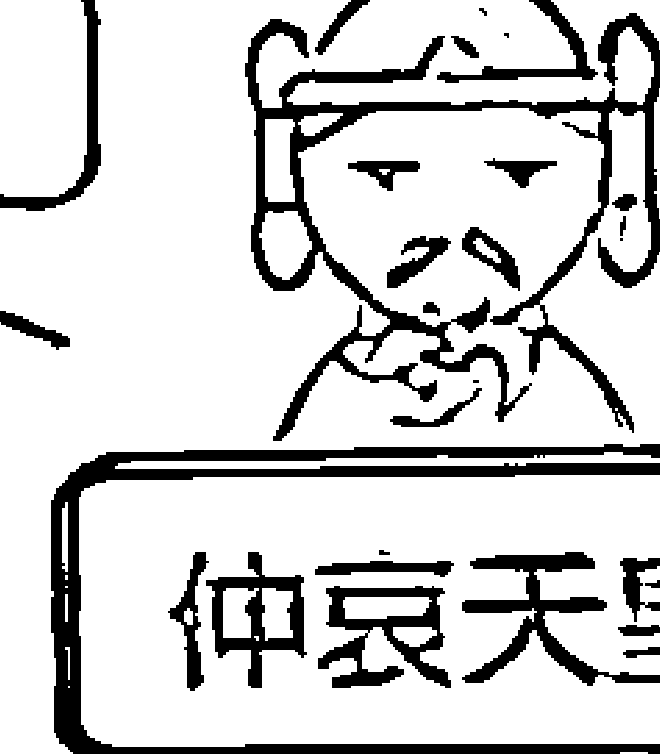

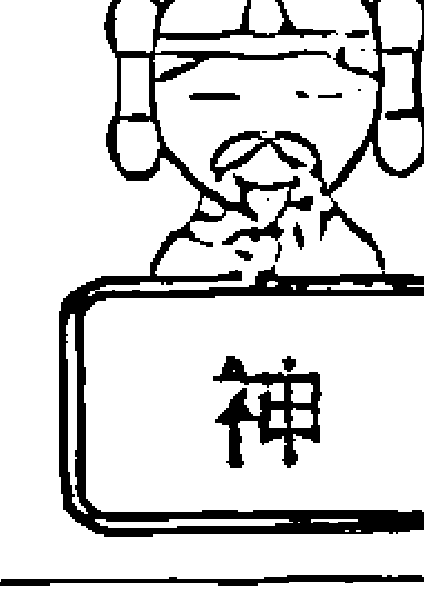

> 神

> 西國有諸多珍物，且使其國歸服

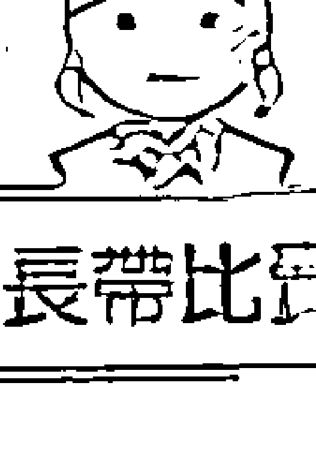

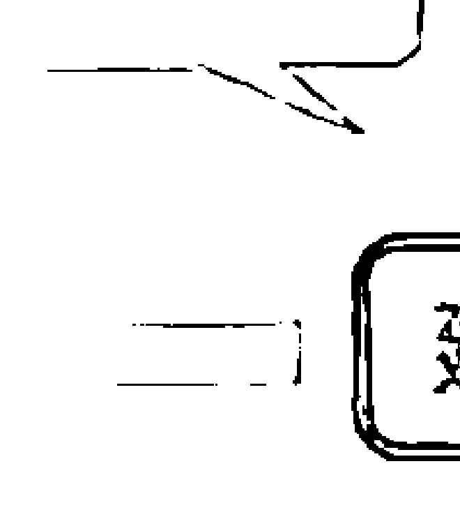

> 神明附身

> 我向西而望，不見有國，徒然大海而已，言神之是也

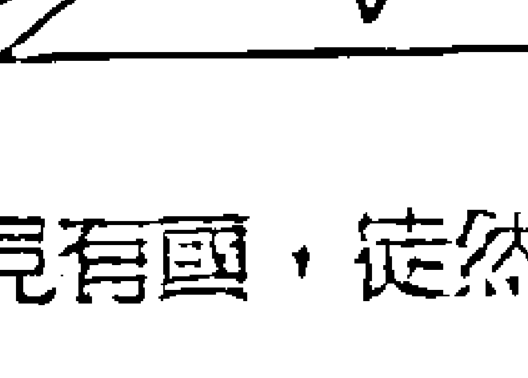

> 老大不願意才勉強彈下去，過沒多久就聽不見琴響了

> 死亡

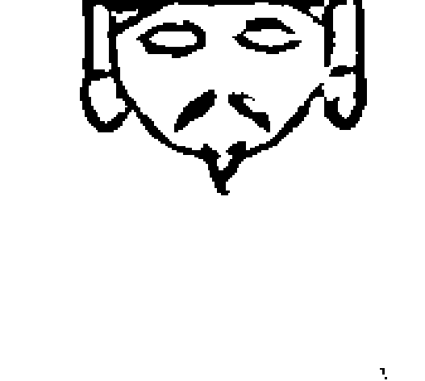

#### 《日本書紀》的矛盾

仲哀天皇的年齡本身已經非常奇怪。仲哀天皇是在先代景行天皇第48年、以31歲之齡成為三太子的；換句話說，他是出生在景行天皇第17年，可是，日本武尊過世卻是先代景行天皇第11年，而景行天皇也在第60年駕崩，也就是說景行天皇在神武天皇以後又坐了17年的天下。

相對地，仲哀天皇雖是日本武尊之子，卻是在日本武尊死後40年以後方才出生。

如此矛盾，再加上擁有像日本武尊和神功皇后如此英雄性，但存在可能性卻是極低的父親與妻子，使得仲哀天皇也常被視為不存在的天皇。

- No.031
- No.066
- ○神功皇后→No.065
- ○天津神與國津神→No.069

## No.065 神功皇后

神功皇后是日本第一位女中豪杰，曾经向朝鲜半岛出兵，她压制朝鲜以后，又回过头来将叛逆者全数铲除。

## ○征伐新罗

失去仲哀天皇以后，神功皇后依住吉三神所言兴兵并征伐船只就要渡海之际，海中所有鱼类全都聚集起来，驮着船只渡海，同时更有强大的顺风吹送，海浪仅半分钟便抵达新罗国。如此情状使得新罗国王甚是畏惧，约定曰：“今后谨遵你天皇号令，为天皇牧马、年年上贡”。于是神功皇后便将新罗国收为牧马人，将百济国收为附庸（收藏产物的仓库），又立杖于新罗国王家门口，使住吉三神的荒魂为其守护神，然后就班师回朝了。征伐新罗期间，恰逢皇后就要临盆产下皇子，于是她便拾石头绑在腹部、延迟生产，直到回国以后才生下了孩子。当初她产下皇子的地方，如今称为宇美（福冈县宇美町）。回到倭国以后，皇后怀疑本国恐有叛逆，于是便将御子棺于丧船（乘放棺木的船只），放出“御子已亡”消息。听到这个消息以后，香坂王、忍熊王兄弟遂起了杀皇后之意，遂行约狩（为占问神意而举行的狩猎）。香坂王坐上厇木，忽然有一头巨大山猪出现，把厇木给挖倒，还把香坂王咬死了。尽管凶兆毕现，忍熊王仍然执意一战。皇后臣下建振雄先将替换的弦藏在头发里面，剪断箭弦诈降，然后趁着敌人没有防备的时候安上新弦，终于一战得胜。《日本书纪》记载的是征伐三韩（新罗、百济、高丽国），而非征伐新罗，而且细节处多少有出入：皇后竖立于新罗国王门口的是矛不是杖，还有高丽与百济是自动请降：此外，香坂王狩猎的时候是坐在铺设的座席上，忽然就被跳出的红色山猪给咬死了。

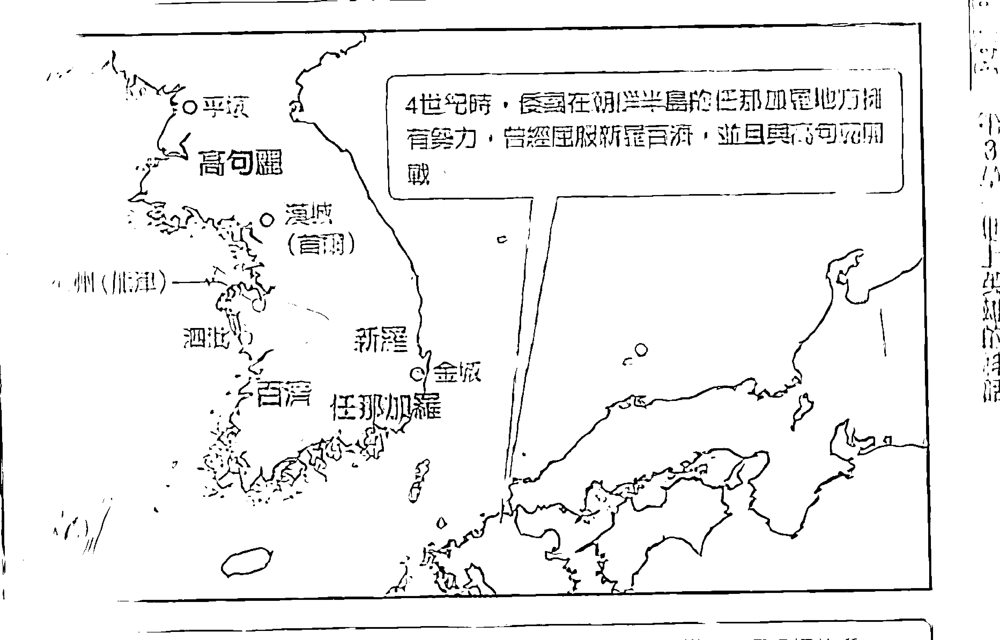

> > 4世紀時，倭國在朝鮮半島的任那加羅地方擁有勢力，曾經征服新羅百濟，並且與高句麗開戰。

據《日本書紀》、《日本紀略》的記載，神功皇后是3世紀的人物 → 征伐三韓是虛構的嗎？

莫非是後世以4世紀倭國進出朝鮮的背景創作神功皇后的故事？在神功皇后的時代，日本的勢力尚未到達任那加羅，所以皇后乃是渡海出擊。

#### 神功皇后征伐新羅的秘話

1. 神功皇后以懷孕之身渡海前往新羅
2. 征伐新羅期間似乎快要臨盆
3. 抱石頭綁住腹部，延遲生產
4. 歸國後於宇美產下應神天皇

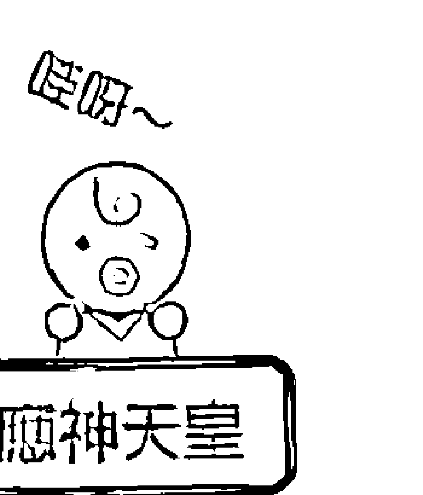

## 武内宿禰

武内宿禰先後服侍過五代天皇及皇后，以長壽與忠於天皇而聞名，明治時代甚至還曾經以其肖像製作紙幣。

### ○長壽且忠義之人

武内宿禰是記紀當中最為長壽的人物，一說他活了300歲以上。他以建内宿禰這個名字出現在《古事記》裡。

第13代成務天皇的時代，建内宿禰成為大臣。
第14代仲哀天皇的時代也是。他既是大臣，天皇死後又繼續出仕於神功皇后。不僅如此，建内宿禰更是皇后最重要的心腹；征戰期間，皇后甚至將皇太子交給建内宿禰看管，自己才輾轉出巡於各地。

皇太子登基成為第15代應神天皇以後，想要迎娶一位名叫髮長比賣的美女為妻，可是其皇太子大雀命看見該名少女便見鍾情，於是便去拜託建内宿禰「你能不能去請求天皇將髮長比賣賜給我？」像這樣的情形，從來就只有悲劇，但也不知是否建内宿禰全力奔走的緣故，天皇竟將髮長比賣賜給了皇太子。建内宿禰便因為這段故事而被引為忠臣之鑑，傳予後世。

同一人物在《日本書紀》則以武内宿禰之名登場。《日本書紀》提到武内宿禰出生於景行天皇3年，同代25年也就是他23歲的時候，已經被交付視察北陸與東方諸國的任務了，然後51年則是以49歲之齡任大臣。

其後，成務天皇3年也同樣受任命為大臣。又，成務天皇與武内宿禰是同一天生日，所以對武内宿禰特別疼愛。

至於仲哀天皇之死和成為神功皇后心腹等記載，則與《古事記》相同。應神天皇9年，其弟甘美內宿禰進讒言謂武内宿禰有意窺天下；兄弟兩人於天皇面前舉行探湯（把手伸進熱水裡，皮開肉綻的就是惡人）：結果由武内宿禰勝出。

武内宿禰最後一次出現在《日本書紀》是仁德天皇55年，當時武内宿禰已經295歲，再過48年以後，才又關於其死的記載，也就是說他是以295∼343歲之齡辭世的。

#### 武内宿禰 = 古事記裡面叫作建内宿禰，是記紀當中最長壽的人物

| 年份 | 年龄 | 事件 |
|------|------|------|
| 3年  | 1歲  | 誕生。(紀) |
| 25年 | 23歲 | 視察北陸與東北：(紀) |
| 27年 | 25歲 | 從視察行程歸還，報告蝦夷的存在。(紀) |
| 51年 | 49歲 | 受任為大臣之臣（大臣）：(紀) |
| 3年  | 61歲 | 受任為大臣。(紀) |
| 9年  | 127歲 | 與皇后合謀，讓天皇稱臣，建稱。(紀) |
| 元年 | 128歲 | 用計討平叛逆。(紀) |
| 13年 | 140歲 | 陪伴皇太子隨行前往參拜菊飯大神。(紀) |
| 47年 | 174歲 | 辨別新羅與百濟的朝貢品。(紀) |
| 7年  | 203歲 | 率眾挖地。(紀) |
| 9年  | 205歲 | 他被甘美內宿稱進言。(紀) |
| 13年 | 209歲 | 髮長比部脇子皇太子。(紀) |
| 60年 | 290歲 | 天皇稱其長壽。(紀) |
| 66年 | 295歲 | 於因幡國下落不明。(風土記) |
| 5年  |      | 關於其事的記載，若該年逝世，則有343歲。(紀) |

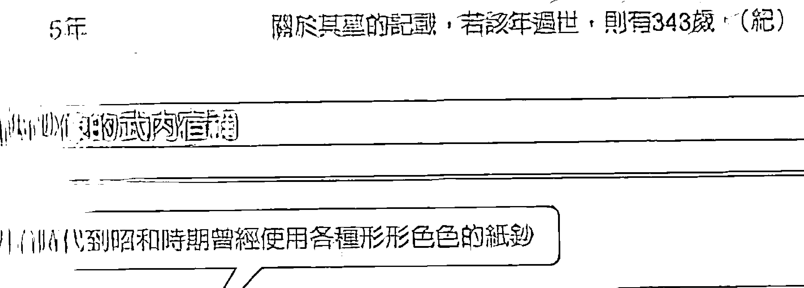

- ○神功皇后→No.065
- ○仁徳天皇→No.068

## No.067 應神天皇

應神天皇一說是史實上的第一位天皇，而且這位天皇不論是他的誕生還是他的親生父親，無不是眾說紛紜。

### ○內定的天皇

應神天皇是仲哀天皇與神功皇后的獨生子，從前神功皇后征伐新羅時即將臨盆，硬是用石頭綁住肚子，沒在新羅生下來的那個孩子，就是應神天皇。早在他出生以前，就已經決定由他繼承天皇皇位，因此他也可以說是胎中天皇。

他是在仲哀天皇死後經過好一段時間才出生，因此亦有說法指其並非仲哀天皇之子。日本政府指定的重要文化財產-8世紀的文獻《住吉神社神代記》就有則記載神功皇后與住吉大神之間密事（情事）的紀錄。是故，亦有說法指應神天皇是住吉大神之子。除此之外，還有說法認為他是武内宿禰之子。

從前應神天皇聽聞日向國的髮長比賣甚是美貌，決定召喚前來。她剛乘船抵達難波津，皇太子大雀命就為其美貌所懾，於是拜託建内宿禰讓應神天皇把這女孩賜給自己。

應神天皇聽過這個請求以後，很爽快地答應了皇太子。

在日本神話裡，父子兄弟爭奪同一個女人的例子屢見不鮮，此處天皇卻例外地答應了皇太子的請求。應神天皇的度量自然是不在話下，但建内宿禰這位名臣亦是影響頗鉅。

不過日本歷史學卻有個說法，說是應神天皇與其子仁德天皇實為同一位天皇，只是分成兩代而已。

根據這派說法，從分成兩代以後的紀錄可以看到應神天皇召見髮長比賣的部分，以及仁德天皇娶髮長比賣的部分。為使這兩個部分連貫，遂有上述逸聞的誕生。

應神天皇的和風謚號（死後使用的讚揚名號）叫做譽田別尊。和氣是當時使用相當廣泛的名字，此外亦有說法指譽田別和氣並非謚號而是其本名。

#### 應神天皇與仁德天皇髮長比賣的關係

**應神天皇** = 仲哀天皇與神功皇后的獨生子。亦稱胎中天皇。
但真正父親是誰卻眾說紛紜。

（1）應神天皇看上髮長比賣。

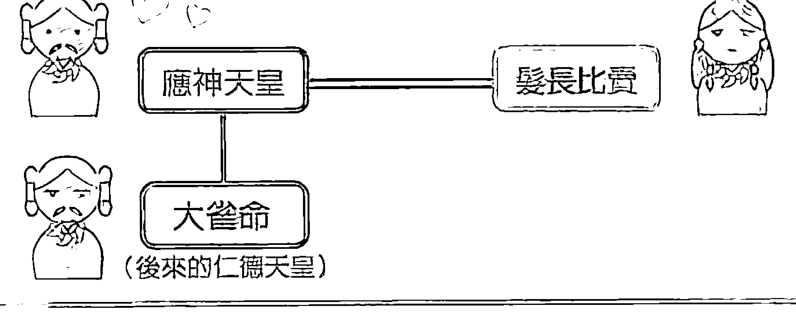

（2）大雀命對髮長比賣一見鍾情，求應神天皇讓給自己。

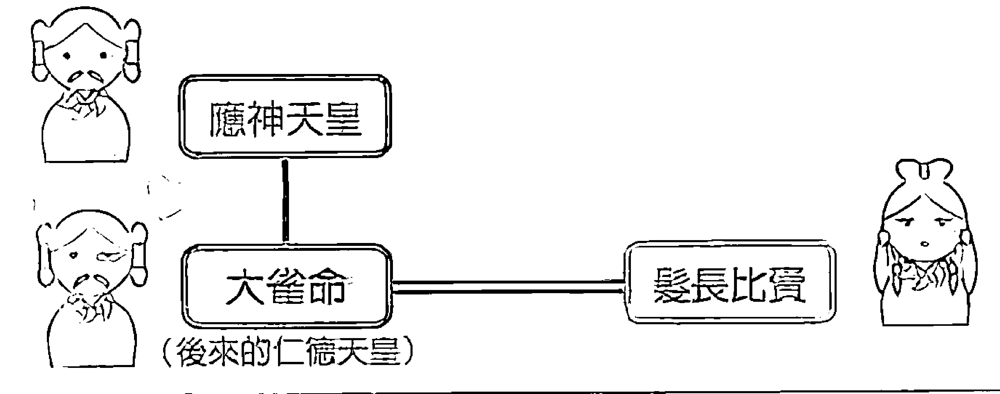

（3）其實是將同一人物分成兩人時，為求連貫合理而誕生的故事？

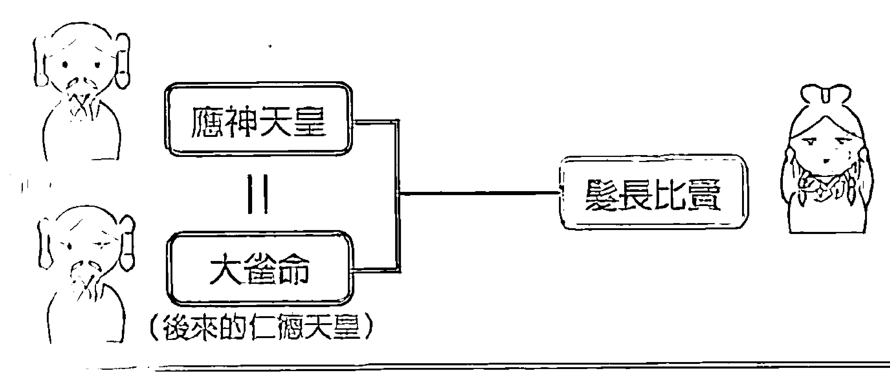

## No.068 仁德天皇

仁德天皇沒有什麼戰爭征服之舉，卻以慈悲待民為世所知。

### ○過貧窮生活的天皇

仁德天皇乃應神天皇之子，名為大雀命。

他最有名的事蹟，便是免去三年的稅賦。這件事發生在某次仁德天皇登高山眺望四方的時候。

> > 天皇詔曰：「於國中烟不發。國皆貧窮。故，自今至三年，悉除人民之課役（國內看不到炊煙。國內人民都很窮，所以我決定從今日起的三年內，免除所有稅收與賦役）」。

因為這個緣故，宮殿漸漸崩壞，四處都會漏雨，可是天皇也不修理，只是用器皿盛接雨水，自己躲到沒漏雨的地方，就這樣過日子。

經過三年，國內炊煙四起。天皇又看見人民富裕起來了，這才恢復課役。如此這般使得人民興盛繁榮，免於稅賦之苦。是故，均稱仁德天皇治世為聖帝之世。

然則世間豈有完璧之人？仁德天皇的皇后石之日賣命（《日本書紀》記載為磐之姬命）是個善妒的女子，天皇的其他妃子根本不敢過問宮中之事。

有次天皇召見吉備國（岡山縣）美女黑日賣，黑日賣就會因為畏於皇后的善妒而逃回家鄉。

> > 可是仁德天皇卻看著黑日賣搭的船詠了首惋惜妃子乘船歸國的和歌：「沖方には　小船連らく　くろざやの　まさつ子 吾妹　國へ下らす」（小船連綿直至外灘，眼看著我的妹子就要回家鄉去），激怒皇后派人去把黑日賣趕下船，讓她徒步走回國去。

還有一次，仁德天皇趁皇后去採新嘗祭要用的御網柏（橡樹葉）的時候，娶了個名叫八田若郎女的姑娘，氣得皇后把積在船上的御網柏全部拋進海中，宮殿也不回就直接出家去了。

#### 仁德天皇 = 應神天皇之子。對待民眾甚是慈悲的天皇

> 登高山四望，家家戶戶不見炊煙。

> 「國皆貧窮：從今日起三年內，免除全部稅賦。」

> 三年後，人民繁榮各家炊煙裊裊，終於重啟稅賦。

> 人民不須為稅所苦，稱其治世為「聖帝之世」。

#### 磐之姬命 = 仁德天皇正妃，極為善妒

> 雖說正妻善妒，也都是因為仁德天皇做下諸多引人嫉妒之舉

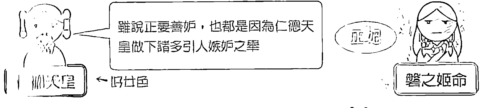

- 久邇長姫
  - 备注：11代目天皇
- 桑田玖賀媛
  - 标注：记
  - 备注：憂懼磐之姬命的嫉妒，結果病故。
- 八田皇女
  - 标注：记
  - 备注：庶妹，趁磐之姬命不在的時候將其召進宮中。
- 宇迦能若郎女
  - 标注：记
  - 备注：庶妹
- 黒日賣
  - 标注：记
  - 备注：憂懼磐之姬命的嫉妒，逃回娘家。

参考文献：日本书记 → No.067

## 愛奴神話

其實日本並非僅有所謂的日本神話而已，如今已全數定居於北海道的愛奴人亦有其獨特的神話，只不過愛奴人沒有文字，沒能留下較為完整的記敘。

那些流傳下來的神話多是以口耳傳承為主，相同的神話往往會因地區或傳承者而異。

愛奴神話有卡姆伊尤卡拉（諸神的敘事詩）、尤卡拉（敘事詩）、維浦凱列（散文故事）等各種不同形式

其中當然也有講述世界創造的創世神話。

根據愛奴語權威語言學家金田一京助所著《愛奴聖經》，世界肇始之初無草無木，是高坦卡拉卡姆伊（造國土的巨人之神）在那裡創造了愛奴莫希（人類的土地）。

從前這個世界還不存在的時候，茫茫大海中唯獨只有歐普查帖希凱山（大雪山）山頂露出臉來，高坦卡拉卡姆伊與妹妹降臨山頂，收攏雲朵造成陸地：烏雲成岩、黃雪成土，於是乎才有了山川島嶼和諸多土地  這也是為何如今山頂的巨岩仍然地表無雲朵（日高地區）

像這則傳說就跟伊邪那岐、伊邪那美降臨神話相當類似。

順帶一提，愛奴神話也跟包括日本神話在內的世界諸多神話同樣，都是採取將世界分成諸神所居天上界、人類所居地上界、死者所居地下界的三層構造。

人類的始祖名叫歐依那卡姆伊（亦名歐奇庫魯米、愛奴拉克爾）；這位祖先神非但征服了地上的惡神，同時也是為愛奴帶來了文化與產物的文化英雄。

除巨大的雨鱷　與水獺以外，還有飛虻、活像座山卻長了手腳的莫希列奇克奇克、克塔涅奇克奇克等怪物，牠們有的到處搗亂，有的則是綁架神明：例如太陽女神逃到軟禁，後來愛奴拉克爾將其拯救出來，這便是愛奴人的日蝕神話，

愛奴拉克爾消滅雨鱷並將其剁碎，碎塊就變成了星辰和鳥類  他又捉沼澤裡的大魚拋向大地，自此山野充滿鹿茸、河川充滿鯡鱒、大海充滿海獸和魚類，供愛奴人食用。

其次，愛奴人的敘事詩尤卡拉也說無論是男性製作的杵臼、刀鞘、織布機和木鉋等，抑或是女性製作的刺繡、衣帽、針線女紅等物，都是愛奴拉克爾從天界傳來人類世界的。

火神阿闊卡姆伊也很重要，愛奴有許多祭祀儀式供奉，不過愛奴人最重要的儀式仍是伊奧曼帖，若採意譯則為送熊，此處所謂的熊乃是聖物的代表名詞。許多北方狩獵民族都有類似的熊祭，愛奴的伊奧曼帖這儀式之特徵在於愛奴人曾宰殺飼養的熊、食其肉並行祭祀，以祈將其靈魂送回到熊的首領身邊。

# 第4章

最新修订的合同协议书

# 天津神與國津神

雖然說日本有八百萬神明，不過這八百萬神明卻並非悉屬同格，不能一概而論。

### ○天之神、地之神、人之神

日本的神明大致可以分成三種。

首先第一種是天津神，也就是居住在高天原的眾天之神。此外，從高天原降臨至地上世界的神明，同樣也算是天津神。

天津神起始自世間所謂造化三神、神世七代等創世諸神，其子孫也是天津神。天津神以天照大神為首，身為其子孫的天皇家也被認爲是天津神的子孫。

其次則是國津神。國津神就是指出現於地上世界的諸神，包括海神、山神等各種自然諸神，都屬於國津神的範疇。

不過也有例外。世稱三貴子的天照大神、月讀命、素戔嗚尊當然屬於天津神，所以照理說他們的子孫也都該算是天津神才是，然而大國主命等雖然是素戔嗚尊在地上世界的子孫，卻被認爲是國津神。真正理由爲何無從得知，猜想恐怕是因爲素戔嗚尊已遭逐出高天原，因而再也無法享受天津神待遇吧。

順帶一提，日本人有時稱天津神爲天神，稱國津神爲地祇，兩者合稱爲「天神地祇」或「神祇」。

日本的神明除以上兩種以外，還有從前原本是人類的神明。首先是怨靈化神。日本所謂三大怨靈乃菅原道真、崇德上皇與平將門，有北野天滿宮（京都府）、白峰宮（香川縣）、神田明神（東京都）奉爲神明祭祀（祭祀宮社不僅止於此）；其次，留名歷史者也經常被奉爲神明祭祀，從德川家康到東鄉平八郎，許多英雄、達人都成爲受人崇拜的神明。

這些神明既非天津神，亦非國津神。雖無特別名稱，卻是由人化神。若是給他們個名字，應該可以稱作是人津神吧。

日本神話的諸神便是由以上三種神明所組成。

#### 日本的神明＝大致可以分成天津神、國津神、由人化神三種

#### 天津神

- 天上的諸神
- 从天上降到地上的諸神
- 在天上地位最高

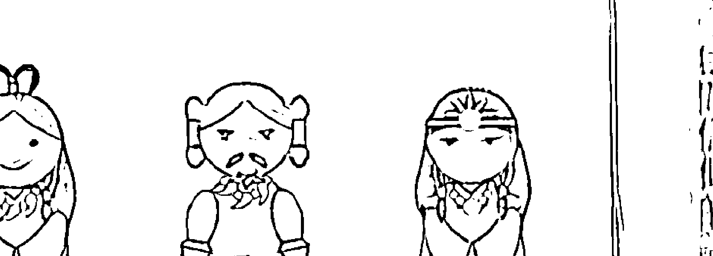

#### 國津神

- 地上的諸神
- 风景的神格化
- 被放逐的諸神
- 地位低于天津神

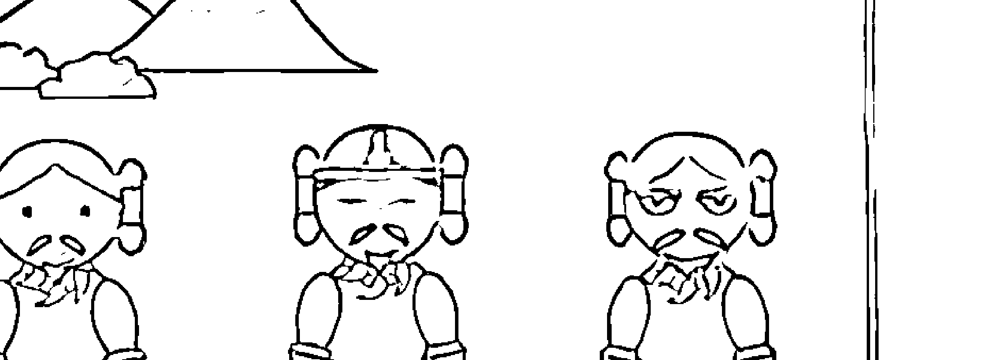

#### 由人化神

- 不是人頭的諸神
- 诞生神明的伟大

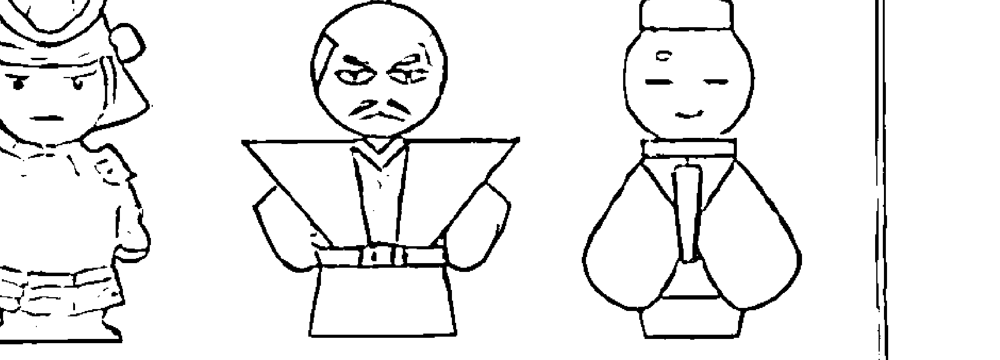

## 高御产巢日神

高御产巢日神是日本神话当中最矛盾的一位神明，他的真实身分究竟为何？

### ○单身却有子嗣、自隐其身的当权者

《古事记》提到的高御产巢日神，是世界始有天地之分、高天原形成时所诞生的造化三神其中第二位。换句话说，他是全世界第二个诞生的极古老神明，别名高木神。书中仅两处提及高御产巢日神此名，然而其别名高木神却随处可见。根据其名讳判断，一般认为他是产巢日（=生成）之神。《古事记》里虽然写到他是「无配偶无子孙的独神，业已隐遁身迹」，可是高御产巢日神却在高天原扮演着相当吃重的角色。思金神以思考之神为世所知，高天原每逢有事需要思量考虑，必定会请出这位神明阐述其想法。从前天照大御神躲在天之石屋户里不肯出来的时候，也是凭着思金神的策略，方才成功将天照大御神又哄了出来。《古事记》说这位神明便是高御产巢日神之子。另外在天孙降临时，高御产巢日神也曾经与天照大御神联名（而且先提到的还是高御产巢日神的名字），挑选前往平定地上世界的神明。起先高天原派遣天若日子降临地上执行平定任务，岂料天若日子却背叛高天原，当时以返矢杀死天若日子的正是高御产巢日神。接着高天原又开始议论该派哪个天孙降临，最后决定派遣天照大御神之子正胜吾胜胜速日天忍穗耳命与高木神（=高御产巢日神）之女万幡丰秋津师比卖命所生的日子番能迩迩艺命前去。神武东征的时候，高御产巢日神又与天照大御神商议要派遣建御雷神为援军，尽管后来援军并未发出，却也授神剑、遣八咫乌助神武天皇行军。身为独神理应自隐才是，高御产巢日神却反而把自己的女儿嫁给地上的统治者、欲使其孙成为地上的统治者，可谓是位行事作为相当庸俗的神明。

第12世是一位

#### 高御产巢日神 = 全世界第二位诞生的古老神明，别名高木神

> 从名字可以判断，他被奉为是产巢日（=生成）之神

高御产巢日神

矛盾记载说他既无配偶亦无子孙是位独身神，已隐退身迹而去

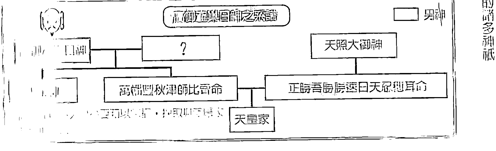

#### 皇室的祖先是高皇产灵尊？

《日本书纪》本文写到，天照大神之子正哉吾胜胜速日天忍穗耳命娶高千穗峰之女栉名田姬生下了天津彦彦火琼琼杵尊，而被命令为地上世界统治者的，乃是皇祖高皇产灵尊。天照大神完全没出现在这段叙述中。所有八十诸神全部都听命于高皇产灵尊，而天照大神却似乎得以在一书（异传）当中下令。换句话说，按照大和朝廷的官方解释，天孙降临乃高皇产灵尊所推行，《日本书纪》甚至堂而皇之地将其尊为「皇祖」。也就是说，根据大和朝廷的官方解释，皇室最重要的祖先（但并非天孙系众多祖先的其中一人），便是高皇产灵尊。但另一方面，《日本书纪》本文提及高皇产灵尊也仅止于天孙降临的部分而已，原先顶多只能在一书（异传）中偶露个面的高皇产灵尊，这里却突然变成号令众神的皇祖，实在令人感到相当奇怪

- 天之石户→No.027
- 五濑命之死→No.049

## 神産巣日神

神産巣日神同樣也是位充滿了矛盾的神。一方面他是世界最早誕生的孤高神明，另一方面卻也是高天原政治的司掌神明。

# 世界最初的神明竟然有母親

神産巣日神接在高御産巣日神之後誕生，是《古事記》中第三位出現的神明，同時也是造化三神其中之一。

正如其名所示，神産巣日神也是産巣日（=生成）之神。這位神明跟高御産巣日神同樣，《古事記》也說他「是沒有子孫的獨神，隱遁身跡」。但是只要繼續閱讀下去，就會發現《古事記》這段敘述根本就是錯誤的；他跟高御産巣日神同樣既有子孫、又愛插嘴，到頭來一樣是位俗不可耐的神明。

那麼，這兩位神明究竟有何不同之處呢？雖然《古事記》並未寫明，不過高御産巣日神是天津神的指揮塔，而神産巣日神則是國津神的指揮塔。

以下這件事是發生在須佐之男被逐出高天原的時候。當時須佐之男向大氣津比賣神乞討食物，後來卻因誤會而將其殺害，從她的屍體中便生出了種子。取種子以為五穀穀種的，據說便是神産巣日神的母神。

這點實在令人覺得相當怪異，全世界第三位誕生的神産巣日神，怎麼會有母神？其次，從前大穴牟遅神（大國主神）差點被眾兄弟神殺死時，大穴牟遅神的母神便曾經向神産巣日神祈願，請他治療瀕臨死亡的大穴牟遅神。

除此之外，從前有位與南國主神共同創造鞏固國土的小小神明，名叫少名昆古那神，便是神産巣日神之子，是從他手掌中滑落的神明，就連神産巣日神本身都承認此事。

神産巣日神雖然是國津神的指揮塔，其寶座卻位於高天原。之所以如此判斷，是因為大國主神讓國時曾經詠歌曰：

> 「高天の原には、神産巣日の御祖命の、とだる天の新巣の凝烟の」（高天原神産巣日神的新宮殿的煤）

從而得知神産巣日神的宮殿確實是在高天原。

#### 与产巢日神同为产生矛盾的神明

神产巢日神 = 全世界第三位诞生的孤高神明，拥有母神

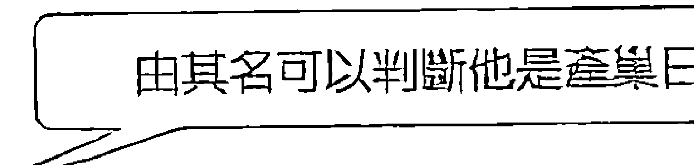

记载说他是无配偶无子女的独神，已隐遁身跡。？

与高御产巢日神同样 - 矛盾

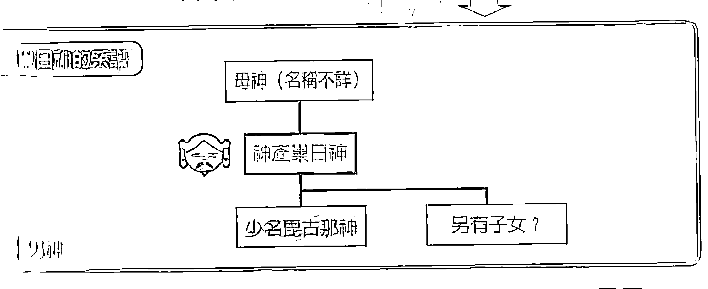

高御产巢日神 -> 全世界第二位诞生之神 -> 天善神的首领

神产巢日神 -> 全世界第三位诞生之神 -> 国善神的首领

#### 产巢日神之谜

产巢日神是全世界第三位诞生的神明，不知为何却有母神

产巢日神是始祖神却有子女。而且他还说众子女当中从手掌内滑落的是少名彦古那神，表示除此以外还另有其他子女

产巢日神说他已隐遁身跡，不知为何却在高天原有座宫殿，而且还住在那里

- ○须佐之男的放逐→No.028
- ○高御产巢日神→No.070
- 伊邪那岐、伊邪那美→No.011
- 少名彦古那神→No.036

## 宗像三女神

傳說宗像三女神坐鎮於玄界灘的島上，她們是守護通往朝鮮半島航路的大海女神。

# 須佐之男的女兒

《古事記》記載從前天照大御神與須佐之男命行誓約時，天照大御神曾經折斷須佐之男的寶劍創造神明，當時所創造出來的便是多紀理毘賣命（奧津島比賣命）、市寸島比賣命（狹依毘賣命）、多岐都比賣命這三位女神。這三位女神之所以被稱作宗像三女神，是因為她們是福岡縣宗像市宗像大社的主祭神。

所謂的宗像大社，其實是由位於宗像市的邊津宮、位於九州沿岸大島的中津宮，以及位於玄界灘正中央沖之島的沖津宮這三座神社所組成的；三座神社幾乎呈一直線排列，直指朝鮮半島，因而被視為大陸貿易航路的守護神。順帶一提，沖之島至今仍舊是女人止步，是一座就連男性也規定只能每年進入一次的禁忌之島。既是航海女神，是故除了宗像市的大社以外，日本各地沿海也都建有宗像神社。後來她們的職掌更超越航海，成為各種交通的女神，連內陸也開始建造祭祀的神社。

《日本書紀》一書（異傳）記載的誓約結果恰恰與《古事記》相反。事先宣言若我心清白則所生神明為男神，於是兩位大神便試著創生神明，結果宗像三女神是日神（天照大御神）生的女兒，男神則是須佐之男的兒子。後來日神又命令這幾位女神前往相助天孫，命其降臨筑紫之地。

根據後世史书记載，當時這幾位女神被任以高官重爵。

《日本文德天皇實錄》說，天安2年（858年）田心姬官敘正四位下，湍津姬神與市杵嶋姬則是官敘正三位。根據《日本三代實錄》記載，貞觀年間田心姬由正三位→從二位，湍津姬神與市杵嶋姬則是由從二位→正二位，官位愈來愈高，直到貞觀6年（864年）田心姬已官任正二位，而湍津姬神與市杵嶋姬則已經官至從一位了。

#### 宗像三女神 = 守护往来朝鲜半岛航路的大海女神

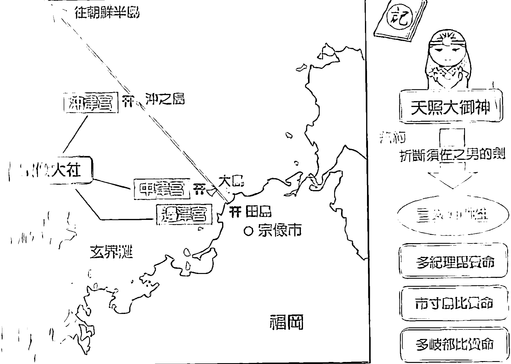

#### 各文献记载的宗像三女神及其差异

| 场所 | 冲之島（沖津宮） | 大島（中津宮） | 边津宮（辺津宮） |
| :--- | :--- | :--- | :--- |
| （第一行） | 多岐都比売命 | 市寸島比売命 | 多紀理毘売命 |
| 古事記 | 市杵島姫 | 湍津姫 | 田心姫 |
| 日本書紀（一書第一） | 田心姫 | 湍津姫 | 市杵嶋姫 |
| 日本書紀（一書第二） | 湍津姫 | 田心姫 | 市杵嶋姫 |
| 日本書紀（一書第三） | 田心姫 | 湍津姫 | 市杵嶋姫 |
| 延喜式 | 市杵島姫神 | 湍津姫神 | 田心姫神 |

※ 副出 No 003 ＊日本書紀→No.004 ＊天照大御神与须佐之男的誓约→No.023 ＊日本書紀記載的誓約→No.024

## 稻荷神

以「お稲荷さん」（稻荷大人）此名廣受世人所親近的稻荷神是以狐狸與炸豆腐皮為其象徵，究竟這位神明的原貌是何模樣？

# 記紀未曾記載的神明

以「稻荷大人」此名為世間民衆所親近，並且以神使狐狸、紅色鳥居爲世所知的稻荷神社，是日本數量最多的神社。據說日本全國共有四萬座稻荷神社，佔全國所有神社三分之一。不光是如此，有時路邊可以發現的小小祭祀裡，祭祀的大抵都是稻荷神。此外，過去當家家户户仍然設置神龕的時候，許多也都是祭祀稻荷神，如果把這些全都計算進去的話，那麼稻荷神社的數量更是有數十倍之多。儘管如此普遍，稻荷神卻是位連記紀的邊都沾不上的神明。原始的稻荷神本是京都伏見稻荷大社的神體——稻荷山之神。根據《山城國風土記逸文》記載，從前有位富裕的歸化人秦伊呂俱曾以糯米麻糬爲靶射箭，麻糬竟然變成天鵝往山峰飛去，並且生出伊惪（稻），便取意伊惪奈利（結稻）建造一座名叫伊奈利（稻荷）的神社。據說這便是稻荷神社總本宮伏見稻荷大社的由來。

神佛習合時代，因爲同樣是以狐狸爲神使，故將佛教中以金狐、銀狐爲神使的茶枳尼天視同於稻荷神。這種混合同化的現象直到現在仍然存在，例如愛知縣的豊川稻荷便是如此，不以神社而是名爲妙嚴寺的佛教寺院祭祀之，且所謂的稻荷指的就是其鎮守神明茶枳尼天（本尊是千手觀音，並非稻荷）。

明治時代以後，稻荷神又被視爲如同宇迦之御魂神一般的穀物之神。《古事記》裡說這位宇迦之御魂神乃須佐之男命與神大市比賣所生，不過神話中並未記載其事蹟，甚至連性別都不得而知。伏見稻荷大社乃奉宇迦之御魂大神、佐田彦大神、大宮能賣大神、田中大神、四大神這五位神明爲稻荷大神祭祀。順帶一提，宇迦之御魂大神在伏見稻荷這裡是位女神。

大家都知道稻荷神乃以狐狸爲其神使，據說這是因爲宇迦之御魂神的別名御饌津神又可以寫作三狐神。

#### 稻荷神 = 民眾均以「稻荷大人」稱呼、受人親近的神明

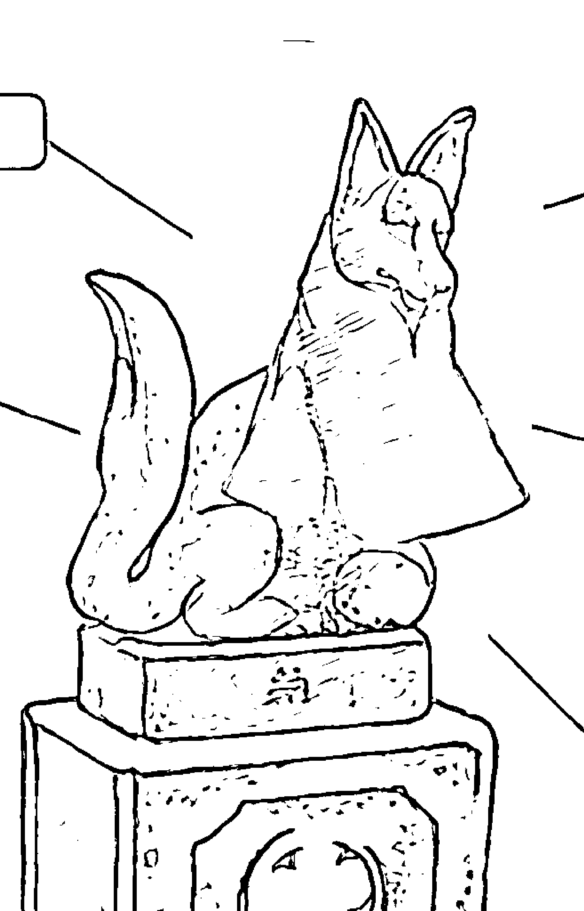

「稻荷大人」的「荷」，是擔負之意。

「稻荷」指擔負稻米的女神。

全日本約有三萬座稻荷神社。

稻荷神社鳥居的不是石頭，而是狐狸的雕像。

以狐狸神使與紅色鳥居為其特徵。

稻荷神原是京都伏見稻荷大神的神體——稻荷山之神。

（左）如此。

#### 稻荷神卻是記紀從未提及的神明

1. 伊奘冉尊從天探女之言向建御雷之男神射箭。
2. 箭變成天槌飛往山峰，生出伊奘（稻）。
3. 從伊禰奈利（結稻）的典故而建造名為伊奈利（稻荷）的神社（伏見稻荷大社）。

被視為以金狐、銀狐為神使的佛教荼积尼天。

被視為宇迦之御魂神這類的穀物之神。神話中並無記載，性別不明。

## 八幡神

八幡神是日本最具代表性的武神，以源氏的氏神为人所知，同时也因此成为了众多武士家族的氏神。

# 化為神明的天皇

八幡神乃日本战神。八幡神社与八幡宫总数有人说是一万座，有的则说是四万座，是数量仅次于稻荷神社的神社。据说八幡神起初原是北九州宇佐氏的氏神。

根据全国八幡神社总本宫宇佐神宫的社殿表示，八幡神乃于钦明天皇32年现身于宇佐此地，乃应神天皇之神灵。宇佐神宫社殿还表示，宇佐神宫乃依圣武天皇旨意而建于神龟2年（725年），《續日本紀》记载天平9年（737年）便已有八幡神社存在，当时已有八幡神社想来应该是错不了的事。

八幡神颇受众多武士家族奉为战神崇拜，亦称「弓矢八幡」，这是因为武士家族之起源——清和源氏便是以八幡神为氏神。日本的武士大家奉源氏为祖（当然其中不乏其实并非源氏子孙，只是透过购买假造族谱而以源氏子孙自居者）。就连德川家康也自称属于源氏。是故，大部分的武士便都奉八幡神为氏神。

武士每逢大事发生就会唱诵「南無八幡大菩薩」，便是出自于这个八幡神信仰，只不过从这段咒语中的「南無」与「大菩薩」不难发现其中涵盖佛的崇拜。神佛习合初期8世纪的时候，朝廷曾经将宇佐八幡奉为佛教镇护之神、赠「八幡大菩薩」神号，因为这个缘故，各地佛教寺院才开始祭祀八幡神作为寺院镇护之神。据说太平洋战争的时候，军事基地竖立「南無八幡大菩薩」旗帜的情形也不少见。

相传八幡神乃应神天皇所化神明，奈良时代末期似乎便已经有八幡神=应神天皇的思想。此外，八幡神还经常与比壳神（即宗像三女神）、神功皇后合称八幡三神，同受崇拜祭祀。

#### 八幡神 = 源氏之神，後来也成為許多武士的氏神

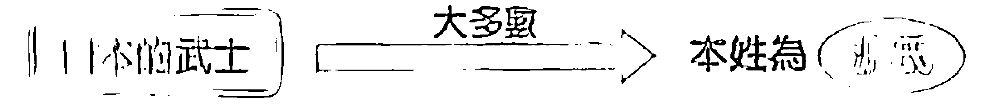

| 人物 | 说明 |
| :--- | :--- |
| 源賴朝 | 鎌倉幕府初代將軍 |
| 足利尊氏 | 足利幕府初代將軍 |
| 楠木正成 | 建武新政的功臣 |
| 武田信玄 | 戰國諸侯，甲斐之虎 |
| 上杉謙信 | 戰國諸侯，越後之龍 |
| 織田信長 | 戰國諸侯，同時也是傳授古今的文化份子 |
| 今川義元 | 有東海第一神射手美名的戰國諸侯 |
| 伊達政宗 | 戰國諸侯，奥羽覇主 |
| 德川家康 | 德川幕府初代將軍 |
| 豐臣秀吉 | 忠臣藏的反派角色 |

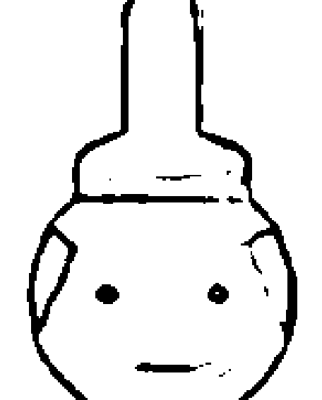

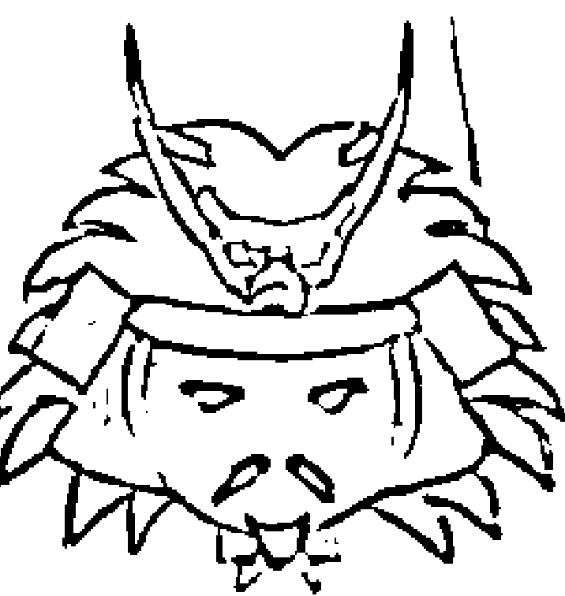

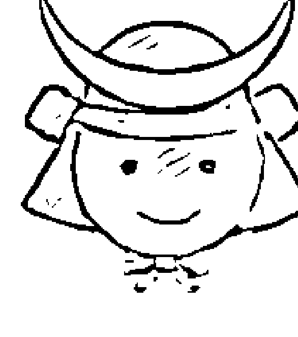

#### 武士的本姓

源氏以外，武士的本姓另有平氏（如織田信長與北条氏政等）、橘氏（上杉謙信與伊達政宗等）、橘氏（楠木正成等人）等姓。

武士的本姓並不是指現在引為自稱的名字，而是指繼承自祖先的氏。分家的時候固然仍然可以繼承本姓，名字卻要另外再取，因此本姓與名字變成不同的姓氏。

對武士社會而言，其實本姓才是真正的姓氏，例如上呈朝廷的奏章中所寫的就不是德川家康，而是要寫源家康。

如果大家都使用本姓的話，那麼同名者勢必就會很多，容易混淆，因此一般都是以名字區別。

不只是武士，近衛、門司、九条等貴族也是本姓藤原，至於安倍晴明的土御門家系，本家子孫的本姓雖然仍作安倍，平時卻是以土御門作為姓氏。

## 秋葉權現

日本有許多神明雖然未見載於記紀，卻篤受民間信仰，秋葉權現便是其中最具代表性的例子之一。

# 守護民眾免於火災之神

秋葉大權現是驅避火難之神，日本上千座秋葉神社的主神。至今仍然以「秋葉大人」或「秋葉權現」之名為世人所親近，乃防火、防災之神。從「權現」（佛教指佛以其他姿態現身）二字便不難得知他屬於神佛習合的神明，傳說其本地佛（原本的模樣）是觀音菩薩，後來才變化成神的模樣現身。

關於最古老的秋葉權現，傳說是始於秋葉山（靜岡縣）有名為三尺坊的修驗者，死後受人奉為大權現。江戶時代有座名叫秋葉山秋葉寺的寺院，該寺守護神便是以秋葉三尺坊大權現之名受民眾崇拜信仰。之所以廣受民眾信仰，其實是因為秋葉大權現身為火神，其神德便是要守護日常使用之火、鎮遏災厄之火。目前此信仰仍然以秋葉火祭的形式，得以流傳至今。

從前江戶的城鎮火災非常頻繁，於是民眾遂成立名為秋葉講的互助會，大家籌集獻金選立代表前往參拜秋葉權現，以祈求眾多會員能迴避火害以保平安；全日本秋葉講的總數甚至一度多達三萬之譜。另外，與其舉派代表前往參拜，不如將秋葉權現請到附近來得方便，因此當時也相當盛行請來秋葉大權現神靈成立分寺分社。東京的秋葉原就是因為從前有許多請神分靈所設立的秋葉神社，遂有今日的地名。

明治時代推行廢佛毀釋運動，許多秋葉權現均捨棄權現名，改以火神火之迦具土大神（迦具土）為祭神，不過有些神社則是改為祭祀大己貴神（大國主命）等其他神明。

話雖如此，也並非每座秋葉神社都很清楚地知道祭祀的究竟是何神明，古時候更是經常不設神社，僅以秋葉權現直接祭祀而已。至於秋葉權現的真正身分，除了觀音菩薩以外，有的說是不動明王、有的說是火天等，每位權現都各不相同。

> ※見P.230頁No.075註釋

#### 秋葉山之信仰

秋葉大權現 ＝ 規避火難的神佛習合之神。記紀並無記載

平安時代：
- 大登山雲院
- 修験者三尺坊出現
- 秋葉山秋葉寺（祭祀秋葉三尺坊大権現）

江戸時代：
- 始有祭祀秋葉権現的秋葉神社出現
- 秋葉信仰大為流行

明治時代：
- 廢佛毀釋的廢寺運動
- 三尺坊大権現被移往可睡斎
- 始有祭祀迦具土的秋葉神社出現
- 祭祀観世音菩薩的秋葉山秋葉寺成立
- 規避火難信仰以秋葉大寺、秋葉寺、可睡斎這三處為主

秋葉信仰之神為火神，負責守護日用之火、鎮火

火神分2
例如火具土神、不動明王、火天等，但名稱各不相同。

以秋葉火祭形式流傳至今

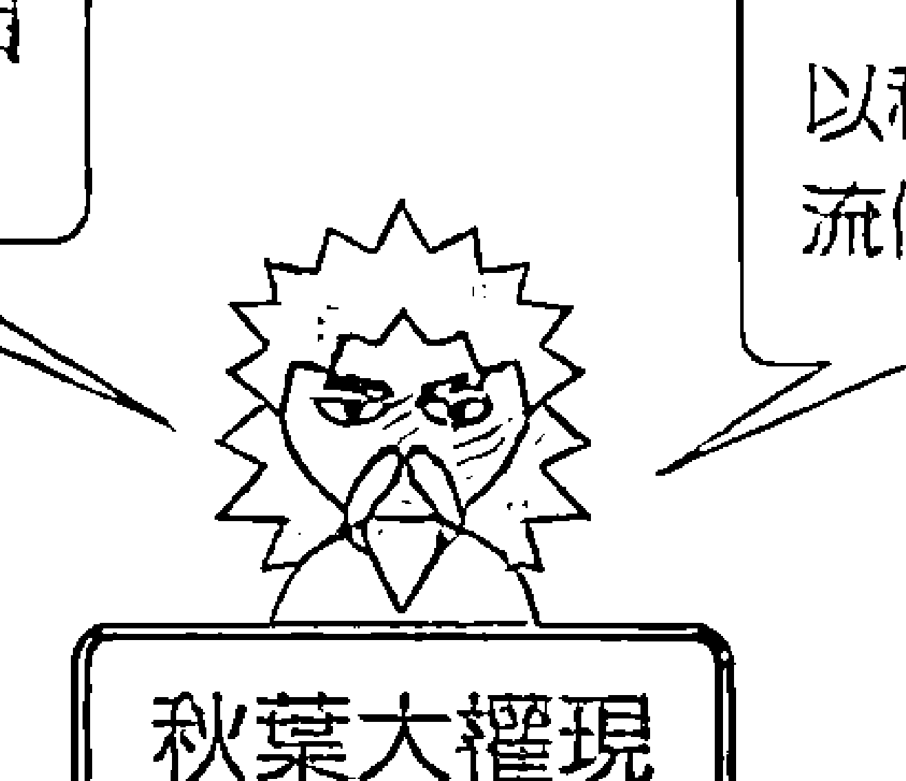

- ○火難神→No.018
- ○大國主命→No.034
- ○火具土神→No.093
- ○本地垂迹説→No.096

## 冰川神

冰川神是日本最受信仰的水神，據說其真正身分是素戔嗚尊，因此也是位戰神。

# 早自奈良時代便受到信仰的古老神明

冰川神是一位至少從奈良時代起便已受到崇拜的日本神明。關於冰川神的官方紀錄，最早可以追溯至《日本三代實錄》（日本的官方史書之一，記載清和、陽成、光孝三代天皇858~887年間之事）記載貞觀元年（859年）天皇賜武藏國的冰川神從五位上之位。其後冰川神的地位仍然繼續慢慢提升，至元慶2年（878）的時候已經是正四位上了。

有人說冰川神是出雲的斐伊川之神（其根據便在於《先代舊事本紀》第十卷提到成務天皇時代出雲曾有批人移居至武藏國，並成爲當地國造），有的則說他是從前曾存在於埼玉縣、如今已消失的見沼（當時是片廣大的沼澤地）的水神（亦說爲龍神）。無論何者爲真，總之冰川神這位水神是受到民衆奉爲農業生產所必須的水利之神崇拜，尤其荒川（據說此河經常氾濫發生洪水，遂得此名）流域更將其奉爲荒川河神（同時具有助益農業發展的和魂與引發洪水的荒魂兩種性格）信仰。

後來冰川神又在平安時代與須佐之男習合，遂有冰川神=須佐之男的思想出現（現在冰川神社主要祭祀的便是須佐之男命、其妻奇稻田姬命以及其子大己貴命=大國主命三神）。因此冰川神亦頗受關東武者奉爲戰神信仰。

這個時代附近的武士紛紛請冰川神移靈至自身領地，以故武藏國（埼玉縣東部與東京都東部）建造了數百座冰川神社，據說目前仍有將近300座神社留存至今。這些冰川神社乃以位於埼玉縣埼玉市大宮區的冰川神社爲總本社；這座總本社是由祭祀須佐之男的冰川神社、祭祀奇稻田姬命的冰川女體神社以及祭祀大己貴命的中冰川神社（現在稱爲中山神社）等三座神社所構成，三者合稱爲冰川神社受民衆信仰。據說就連大宮一個地名，也都是因襲這座冰川神社而得來。

#### 冰川神 = 日本信仰最广的水神

- 上伊川之源。
- 源流式見沼（為大沼澤）的水神（亦說為荒魂）。
- 冰川境内荒川河神。

> > 有關冰川神社最古老的官方紀錄
> 日本三代實錄：貞觀元年（859年）武藏國的冰川津官從五位上

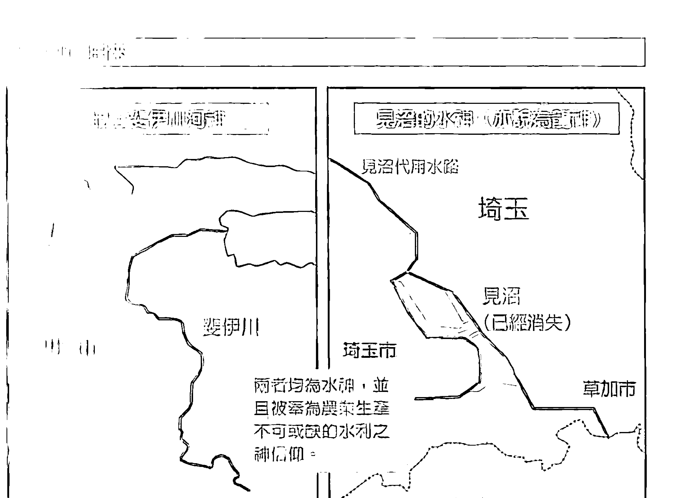

- ・水神 → No.005
- ・八坂神 → No.034
- ○八岐大蛇 → No.030
- ◎荒魂與和魂 → No.095

## 金毘羅権現

金毘羅権現乃神佛習合運動所形成的其中一位神佛，至今仍是廣受日本全國船員水手信仰的航海之神。

# 四國最大神社

以瀨戶內海航海之神為人所知的金刀比羅宮是座坐落於香川縣琴平町象頭山的神社。一般人均以「金毘羅大人」稱呼之，全國共有數百座分社。江戶時代的「金毘羅參拜」是規模僅次於伊勢神宮的「御蔭參拜」的參拜活動，各地分別組成金毘羅講座組織，日本全國許多民眾紛紛前來參拜。除此之外，江戶後期甚至還有名為「金比羅諸船」的民謠出現，傳唱於庶民之間。象頭山原本有座祭祀大物主神的琴平神社；後來受到神佛習合影響，方才與佛教的金比羅（佛教十二神將之一宮比羅大將）習合形成金比羅權現，受人参拜信仰。目前可以確知的是，此地最晚在長保3年（1001年）便已經在祭祀金比羅權現了。保元之亂（1156年）兵敗遭流放至四國的崇德上皇亦曾前來參拜，後來他的怨靈也被奉於偏殿祭祀。神佛習合當時，這裡是座名叫松尾寺的寺院。至於金比羅權現的本地佛，有人說是十一面觀音，有的則說是不動明王。然而經過明治時代的廢佛毀釋運動，松尾寺不但規模縮小，而且又變回了祭祀大物主神的琴平神社（很快又改名為金比羅宮），不過幾乎所有人來這裡參拜的都是金比羅大權現，直到今日仍是如此。金刀比羅宮有個名為「流樽」的特有參拜活動。航經瀨戶內海的船隻來到金刀比羅宮外海時，就會在木桶插上寫有「奉納金比羅大權現」字樣的旗幟，放海漂流。至於木桶裡放的，當然就是供奉的供品。在海面上發現這木桶的其他船隻，就會代替放流者將木桶運往金刀比羅宮參拜。這麼一來，無論是放流者或代為參拜者，雙方都能獲得金比羅大權現的庇佑守護。直到現在，從自衛隊與海上保安廳等政府機關船艦、日本郵船與汽船等大型海運公司貨船到小小的漁船，甚至日本宇宙航空研究開發機構JAXA的宇宙飛行員，無不前往金比羅宮參拜、奉納繪馬（許願木牌）祈求航行平安，廣受眾多信徒信仰。

#### 「金毘羅大人」為世所知的神

金毘羅大權現是瀬戸内海等海域的航海之神，神佛習合所形成的神佛之一。但人將其視同於許多神佛。

| 名稱 | 視同的原因 |
|---|---|
| 金比羅大將 | 金比羅此名相近。 |
| 一面觀音 | 松尾寺奉十一面觀音為本尊，現在金比羅宮也有供奉。 |
| 不動明王 | 此不動明王為松尾寺旁侍護法，廢佛毀釋時代幾乎近廢棄。 |
| 大國主神 | 神道有此一說。 |

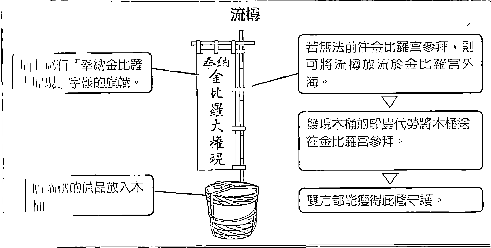

#### 金毘羅信仰的禁忌

因為鰹為金比羅神之使者，遂有不可食用之禁忌。是故，吃過海鮮以後有一段時間不可前往參拜，其規定時間則視種類而異。

| 種類 | 蟹類 | 河魚 | 糠蝦 |
|---|---|---|---|
| 不可參拜日數 | 50日 | 35日 | 30日 |

糠蝦（Opossum shrimp）：亦譯負鼠蝦。糠蝦目甲殼動物，已知近1000種，多數1～3公分長。

## 浅間大神

富士山神格化形成的浅間大神是經過漫長的歲月以後，方才慢慢演變成為一位美麗的女神。

## （原來富士山是位美女）

淺間神社可以唸作「あさまじんじゃ（Asamajinjiya）」也可以唸作「せんげんじんじゃ（Sengenjinjiya）」。據說日本全國以關東東海地區為中心，共有千座甚至兩千座淺間神社，是日本幾個數量眾多的神社之一。每座淺間神社的讀音唸法各異，如何發音並無規則可循。

光從字面來看，許多人會以為淺間神社是淺間山（位於群馬縣、長野縣境的活火山）之神，其實「あさま（Asama）」（淺間）此字乃「火山」的古語，所以只要是活火山全部都可以稱作「あさま」（阿蘇、熱海也都同樣是由此演變而來的地名），而此處所謂的「あさま」指的便是富士山。雖然現在稍微沉寂了點，不過從古代至近代曾經多次爆發的富士山，目前仍然分類為活火山，「あさま」此名可謂是當之無愧。

而淺間神社便是祭祀將富士山的神格化——淺間大神的神社。不過淺間神在進入中世時期以後卻被解釋為記紀中亦有記載的木花咲耶姬（嫁給天孫瓊瓊杵尊為妻的海神之女），至今淺間神社當中仍然是以祭祀木花咲耶姬的佔多數；甚至淺間神社的總本宮富士山本宮淺間大社本身，亦將淺間大神視為木花咲耶姬、奉為主祭神。部分的淺間神社裡，其夫瓊瓊杵尊或父大山祇神也會與其同殿（指於同社同殿一同祭祀的神）。有些淺間神社甚至也會祭祀其胞姐磐長姬，不過為數極少。

木花咲耶姬是經過自己主動放火方才誕生的，故世人均視為規避火難之神、安產之神。又因為她是海神之女，所以她也是航海、漁產之神。另外，這位女神又象徵著轉眼間便由絢爛凋零的花朵，故以櫻花為其神木。除此之外，她身為富士山之神，故又廣受關東眾武將篤信為祈求戰勝之神崇拜；事實上，富士山八合目以上的土地乃富士山本宮淺間大社之所有地，這塊土地便是由德川幕府所捐贈。

> *見P.230《No.078注》

#### 浅間大神 = 將富士山神格化，奉於淺間神社祭祀

日文讀作「あさまじん」(Asamajin) 或「せんげんじ」(Sengenji)

以關東東海地區為中心分布於各地，是日本數量最多的神社之一

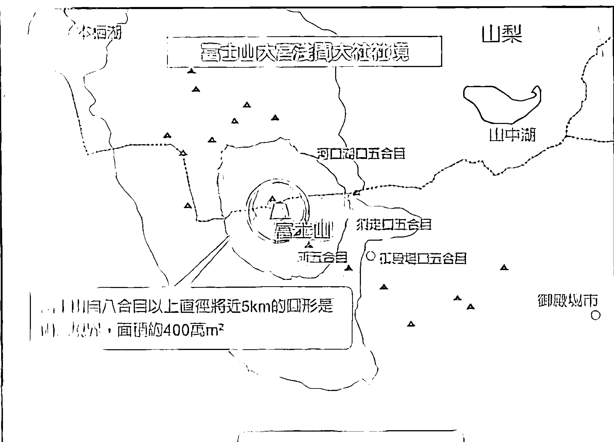

富士山山頂八合目以上直徑將近5km的圓形是火山口，面積約400萬m²

富士宮市約有5萬m²位於本宮

富士山本宮淺間神社亦以5月舉行的流鏑馬活動而聞名，這項活動始於源賴朝供奉流鏑馬，後來繼承至今

# No.079
## 愛宕大人

愛宕大人雖以鎮護國家之神為人所知，同時也是守護京都免於各種災厄的守護神。

### ○京都的山神

所謂愛宕大人便是指祭祀於京都愛宕山的愛宕大權現，如今此地有座名為愛宕大人社的神社。愛宕山自古便是天台宗、真言宗的修驗道場，從前就是眾多修驗者的聚集地。

根據愛宕神社的緣起書《愛宕山神道緣起》記載，大寶年間（701～704年）役行者與泰澄（白山信仰之開山始祖）獲朝廷允准始造神廟，後來和氣清麻呂（就是曾經企圖阻止弓削道鏡篡奪皇位的那個人物）又在天應元年（761年）造白雲寺，奉愛宕大權現為鎮護國家之神祭祀。

神佛習合時代，世人相信愛宕大權現的本地佛是勝軍地藏，因此被視為戰神。戰國武將直江兼續頭盔前楯有個「愛」字，一般均以取自愛染明王的說法最為有力，不過亦有說法指其取自愛宕大權現。

白雲寺長期以來一直是神佛習合的修行場所，而愛宕大權現也透過聚集於此地的眾多修驗者，以防火之神、伏火之神的定位，逐漸流傳散播至全國各地。明治時代的神佛分離運動使白雲寺遭到廢絕，改為愛宕神社；祭祀神明也由愛宕大權現改成火產靈命等日本神話的諸神明，直到現在。然而，現代幾乎所有人仍然是為了參拜愛宕大人而來到愛宕神社的。此外，位於京都西北的愛宕山原本就是祭祀負責阻絕災厄入侵都城的忌神之地，而愛宕大權現也是平安京的鎮護之神。是以，愛宕大人亦擁有與道祖神相同的功能性，從前的日本人也會在村沼交界處張貼愛宕大人的護符紙札。

愛宕神社如今仍以防火除厄之神為世所知，全國共有近一千座分社。

註：見P.230頁No.079注釋

#### 愛宕大人 = 即指京都愛宕山所祭祀的愛宕大權現

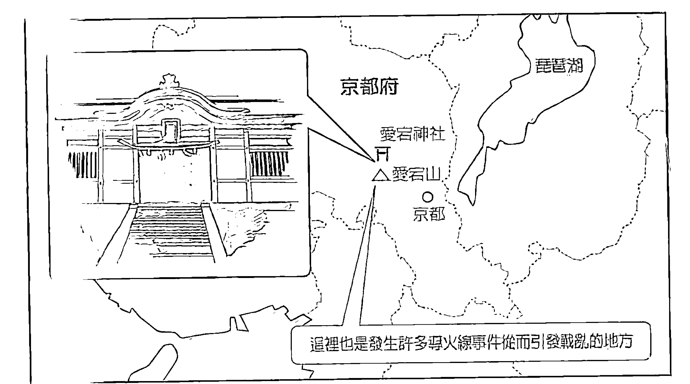

#### 保元之亂
### 戰亂的原因之一
為使兒子登基即位天皇，命令藤原賴長前往愛宕神社咒殺近衛天皇。

#### 本能寺之變
在愛宕神社抽籤 ⇒ 連抽3次「凶」
於愛宕神社舉辦連歌聚會。
「時は今 あめが下する 五月哉」
（現在的季節是陰雨連綿的五月）有「土岐」（光秀出身家族）「治天下」之意，是光秀詠其奪取天下決心之作品。

## No.080 淡島大人

淡島神社是座專門以女性為對象的神社，乃婦女病之神，另一方面亦以供養人偶為世所知。

### ○收藏奉納無數人偶的神社

和歌山縣和歌山市的加太有座加太淡嶋神社。這座神社原本祭祀的乃是淡嶋明神；淡嶋明神是位女神，而淡島神社則是以女性祈求婦女病痊癒、求子、安產諸事的神社而聞名。

相傳淡嶋信仰乃是從江戶時代元祿年間開始流行。當時淡嶋有群通稱為「願人」的團體，他們唱誦著祭文，將淡嶋明神信仰推廣到了日本各地；他們背著神櫃帶著淡嶋明神神像走遍全國，並提倡淡嶋明神擁有治療婦女病、安產、育子、家事進步等效驗庇蔭。如果把淡島神社、栗嶋神社、栗島神社等同音異字的神社都計算在內的話，那麼日本全國將近共有千座的淡嶋神社。這些神社祭祀的都是淡嶋大人，都是相同系統的神社，而加太淡嶋神社則是這近千座分社的總本社。

根據折口信夫的《三郷巷談》作品記載，淡嶋大人是住吉三神（底筒男命、中筒男命、表筒男命）的妻神，可是她卻相思白血長血病，於是住吉之神便拆下大門將她放在門板上，連同神樂太鼓放流大海；後來她就這樣漂流來到加太此地，受當地民眾奉為淡嶋明神祭祀崇拜。因為這個緣故，直到今日住吉神社仍然還是少了一片大門門板和神樂太鼓。

自從明治時代神佛分離以來，幾乎所有淡嶋神社都改作祭祀少彥名命的神社，並且說淡嶋明神是住吉大神妻神此說法不過是民間俗信而已。儘管如此，大多數人對這樣的說法仍不以為意，直到現在還有許多人前往淡嶋神社膜拜淡嶋明神。

離人偶放流活動是日本眾多送神儀式的其中之一，不過亦有說法指此行事其實是來自於淡嶋信仰。

現在的加太淡嶋神社乃以針供養與人偶供養而聞名。所謂針供養就是供養縫衣服用的針，如此信仰乃憑淡嶋明神是位女神始得成立，若是男神少彥名神的話，就顯得莫名其妙了。

供養人偶同樣也跟淡嶋神社身為一座祭祀女神的神社有很大關聯。此地供養的人偶總數超過2萬尊，形成了相當奇異的空間與景象。

#### 淡路大人 = 淡岛神社祭祀的妇女病之神

#### 少彦名神

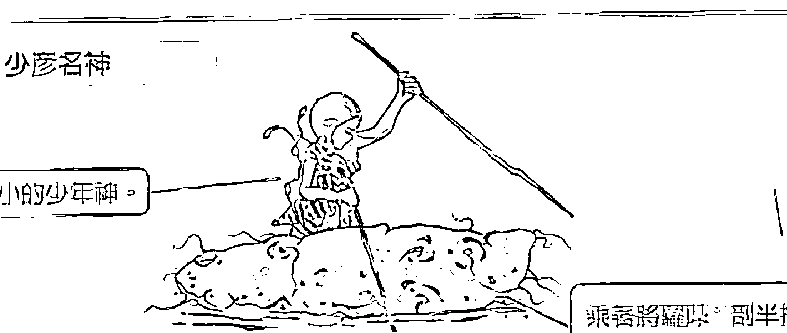

矮小的少年神。

乘着将葫芦剖半挖空制成的船。

#### 住吉明神之妻

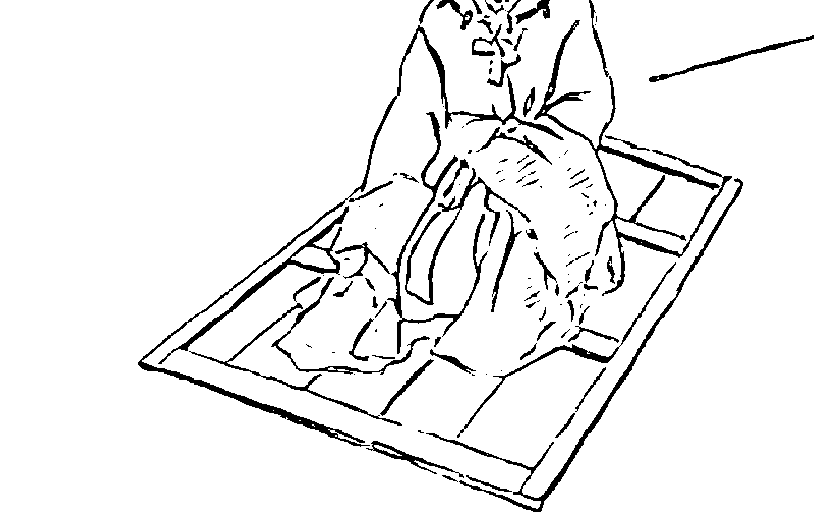

乘坐着门板的疾病女注。

#### 从冲绳中诞生的淡岛

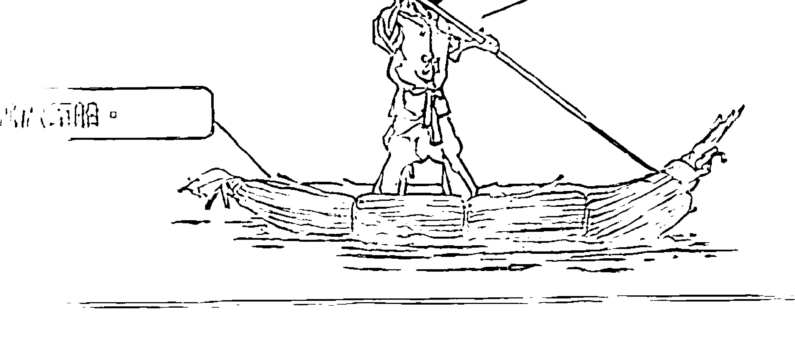

如大海飞沫般柔弱的男性。

乘着船。

## 七福神

所謂七福神乃是日本匯整各國福神所創，蒐羅自神道、佛教、道教等諸多宗教，可說是極具日本風格的神班。

## 吉祥諸神

七福神乃是集合七位日本所謂吉祥神明所組成的團體，祭拜就能得福得財。早自室町時代便已經有此信仰存在，然則七位福神出身各異，全世界唯獨日本才有將這七位神明統括奉為七福神崇拜的習俗。

惠比壽：惠比壽是來自大海的福神。此語原本寫作「戎」或「夷」，乃異國者之意，後來才因為身為來自大海的神明而被視同為蛭子神或事代主神。

大黑天：印度的摩訶迦羅（濕婆的忿怒形）受佛教吸收所形成的大黑天，跟日本的大國主神（此處的大國唸作「だいこく」（Daikoku）習合，然後才形成了今日我等所熟知的背著個大布袋的福神。

弁財天：七福神唯一的女性，為印度薩囉薩伐底（婆羅門摩之妻）經佛教吸收後所形成。中國寫作弁才天，後來不知何時變成弁財天，並且成為財運之神。

毘沙門天：印度神俱毗羅後來變成佛教的「Vaiśravaṇa」，採意譯則為「多聞天」，採音譯則作「毘沙門天」。俱毗羅本是財寶之神，後來才因此變成了福神。

布袋：唐朝中國有個佛僧名叫釋契此，他總是背個布袋布施，遂得布袋此名。水墨畫經常將其引為題材，描繪他挺著圓滾滾的大肚子、背只大布袋的模樣。相傳最後他成仙去了。

福祿壽：中國道教神祇，乃將人們的普遍願望——福（子嗣）、祿（財產）、壽（長壽）擬人化所形成。中國經常繪製福祿壽肖像張貼，以祈求獲得這三種庇佑。

壽老人：中國道教神明。即南極老人星（船底座的α星）之神南極老人，乃長壽之神。日本人將其視為不同神明，但據說他跟福祿壽其實本是相同的神格。

#### 七福神 = 集合神道、佛教、道教等諸多宗教而成的七位神祇

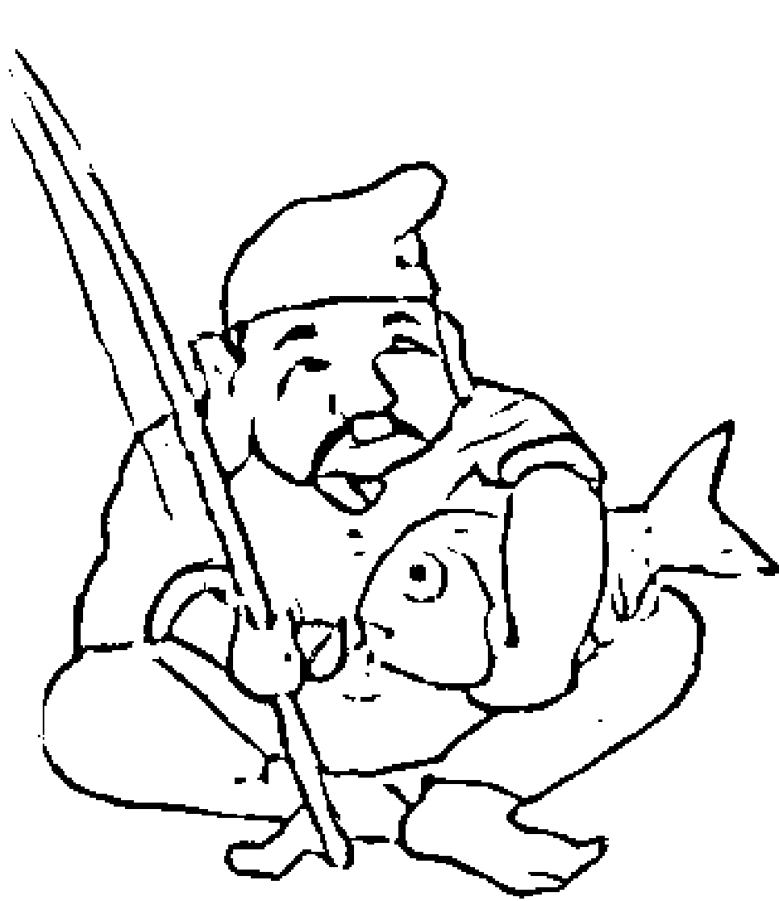

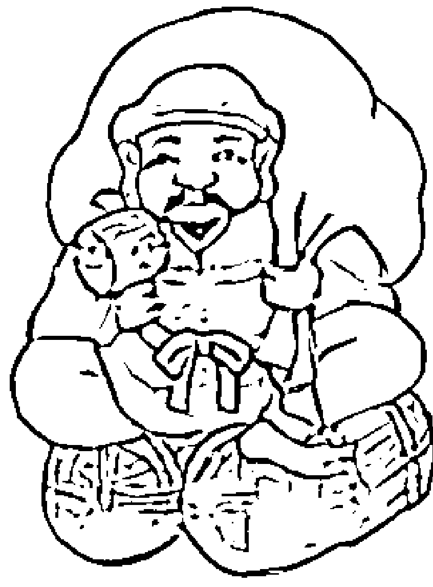

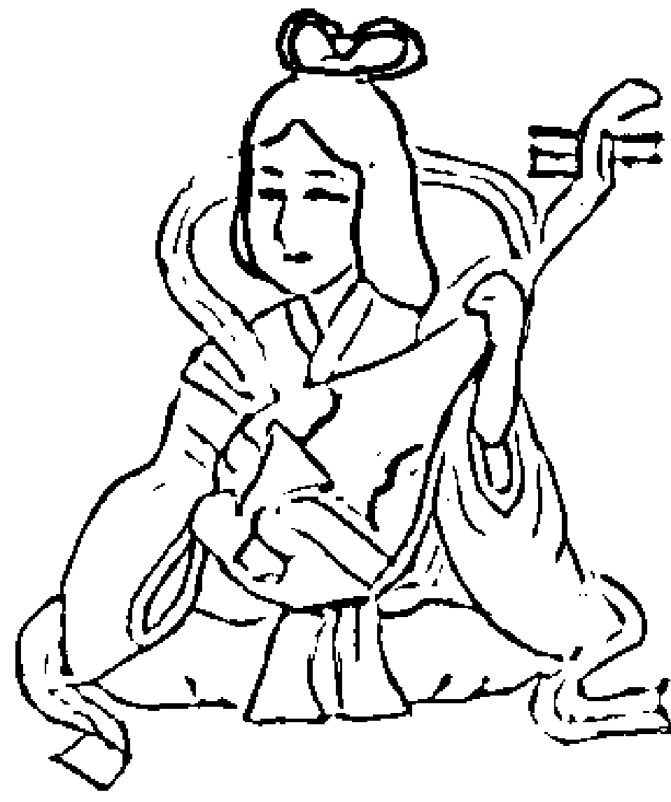

恵比寿

大黑天

弁財天

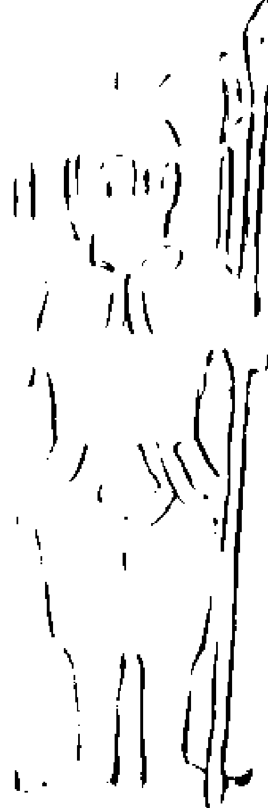

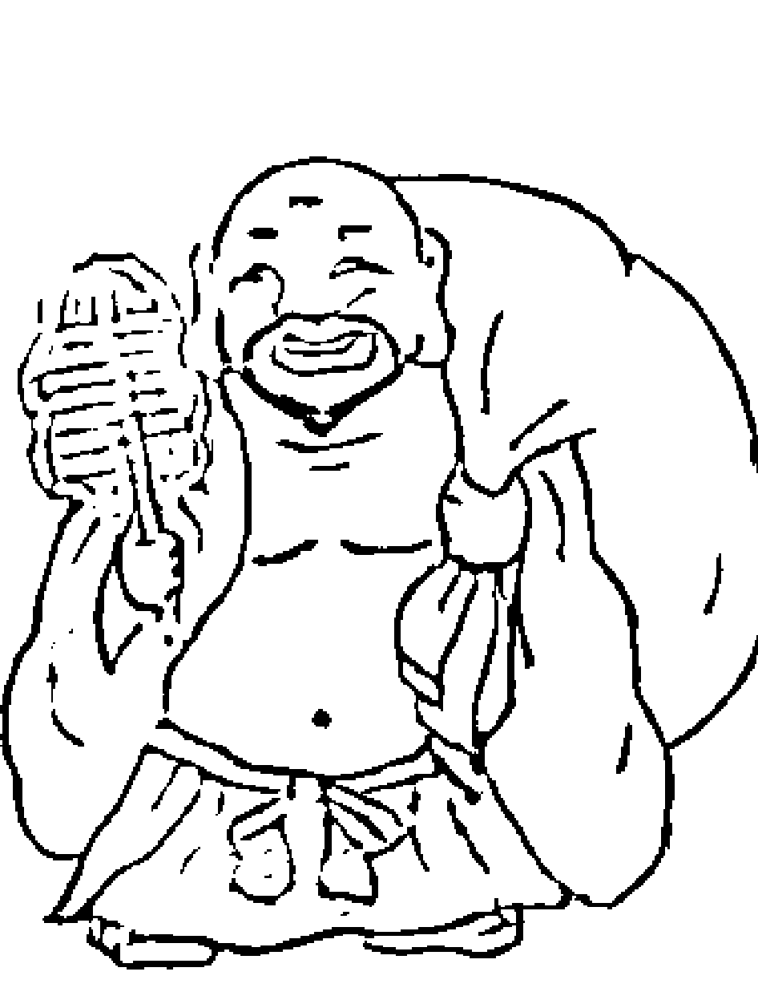

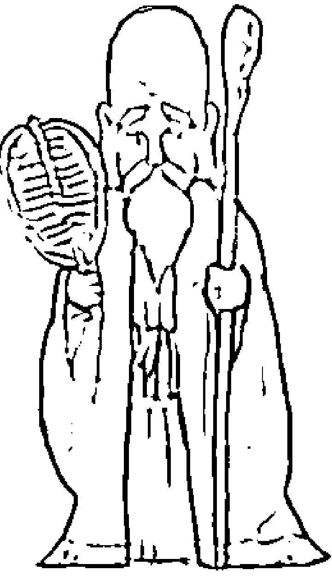

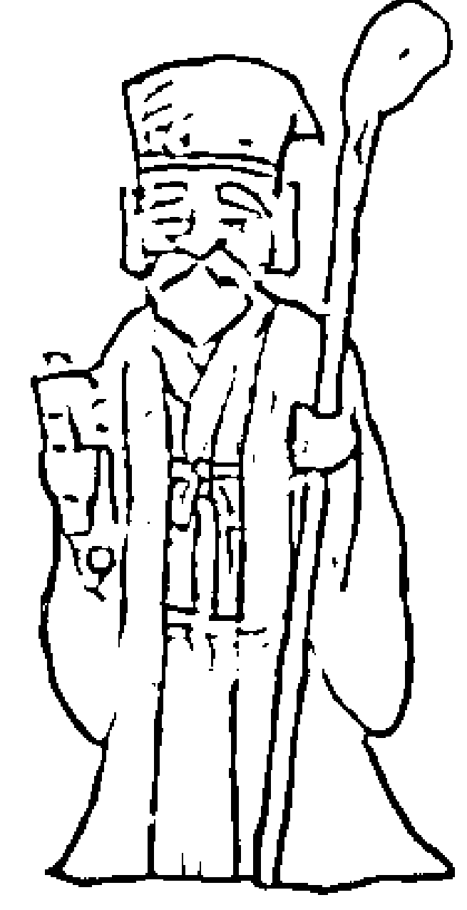

毗沙门天

布袋

福禄寿

寿老人

#### 初夢

所謂初夢就是指正月1日～2日徹夜所做的夢（亦有部分地區是指1月1日～3日做的夢）。從前江戶時代認知初夢是指除夕夜到正月初六做的夢，但據說因為除夕夜守歲不睡的人愈來愈多，所以才往後推一天。人們相信只要在這個時候做個好夢，就能得到一整年的福運。

而所謂的好夢就是一富士、二鷹、三茄子、四扇、五菸草、六座頭、七蔥、八寶船。人們為求做個好夢，室町時代皇宮與諸大臣之間就已經有在枕頭下方墊著繪有七福神乘著寶船的圖畫睡覺的習俗；此習俗在江戶時代也至民間，從此習俗在寶船下方書寫這首回文和歌：「よきかな舟の乗り波目さめみのとそ夜」
（意指寶船前行乘風破浪的聲音極為悅耳，好像長夜永遠不會結束（直到不覺中，不知不覺卻又醒轉過來））

## 大黑大人

大黑大人雖然是位背著只大袋子、體態豐腴的福神，可是追溯其出身，就會發現他其實是位相當恐怖的神。

### ○黑色破壞神

大黑是印度神摩訶迦羅傳入日本後所形成的神明。所謂「摩訶」就是「大」，而「迦羅」則是「黑」的意思，所以中國將其譯作「大黑天」（「天」就是神的意思）。這位神明在日本的正式名稱雖然也叫作大黑天，不過人們大多以較為親切的「大黑大人」稱呼之。

摩訶迦羅是民間信仰的神明，是濕婆神的忿怒形，也就是濕婆神破壞性力量的象徵。雖然他在印度教裡是不怎麼有名的神，可是他在坦陀羅¹佛教裡卻是寺院的廚房之神，從而成為司掌寺院的富饒甚至盛衰之神。其形象有分二臂（左手持袋）與六臂（手持劍、頸掛髑髏），二臂形象掌管的是豐饒，六臂形象則是破壞的象徵，胎藏界曼荼羅²裡的就是六臂摩訶迦羅。在中國的佛寺裡，二臂大黑天同樣也被定位為寺院的廚房之神；後來最澄³將其從中國帶回日本，奉為比叡山延曆寺的廚房之神祭祀，此即日本的第一位大黑天。後來只要是天台宗的寺院，廚房裡幾乎都祀有大黑天。日本稱僧侶之妻為「大黒さん（大黑大人）」，據說也是來自於掌管厨房的典故。

然而若光是這樣，大黑天恐怕無法變成如今這般重要的神明，如此更顯出他與日本神話的大國主神的習合的確有其必要性。他們的名字都唸作「だいこく」（Daikoku），而且形象類似（例如左手持袋），從而使得兩者習合，大黑天亦失去破壞神面向，演變成為福神受民眾信仰。這便是今日我們所知的大黑大人的原型。從此以後，人們再也不塑忿怒形的黑佛像，塑的都是面帶微笑的大黑天肖像。

至於現在最普遍的右手拿著打出小槌、左手持袋、腳踏米袋的大黑形象，則形成於江戶時代。大黑大人之所以以鼠為眷族，據說也是因為從前大國主神曾經獲得老鼠幫助，方才得以被須佐之男燒死之故。

> ¹見P.231 No.082注1

#### 大黑大人 = 印度、中国、日本神习合以后形成的福神

取破壞神之破壞面向

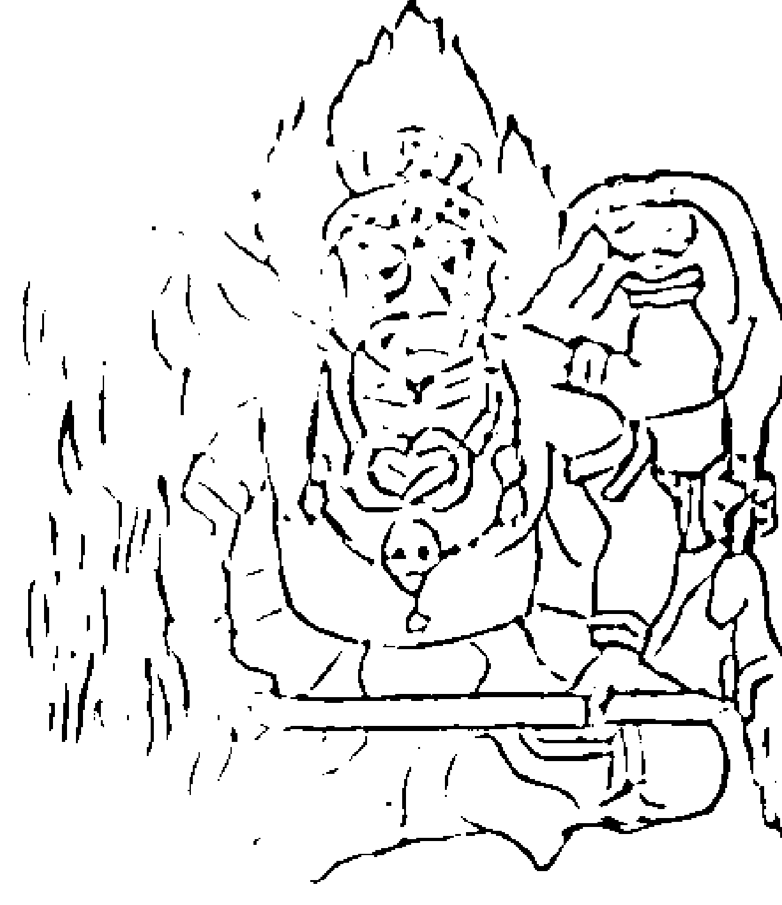

摩訶=「大」、迦羅=「黑」
中国譯作「大黒天」（「天」=神）

摩迦羅（印度）

破壞之神：另外也有做兩條手臂、手持袋子的厨房之神大黒天

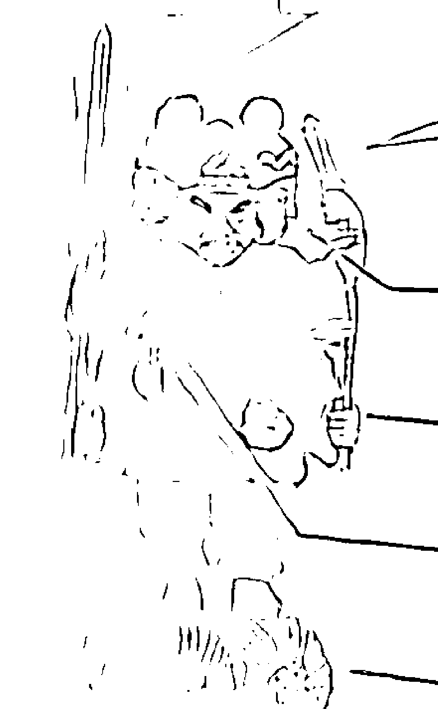

三划

中：大黒天
左：弁財天
右：毗沙門天

六臂

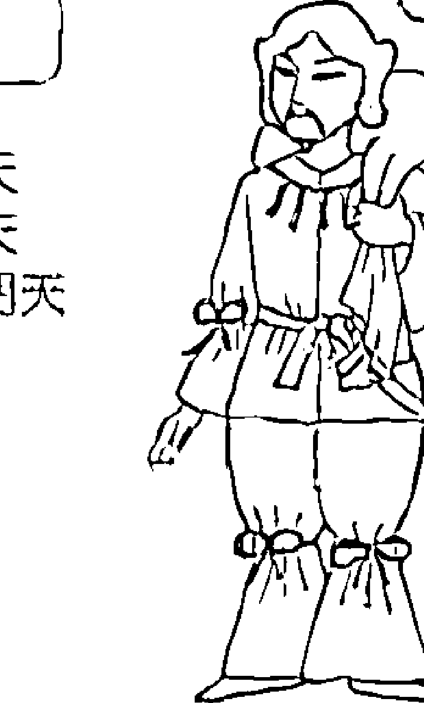

左手持袋

右手持打出小槌

脚踏米袋。

大黒天（中国）

大国主命（日本）

（四脚性格·受）

厨房之神

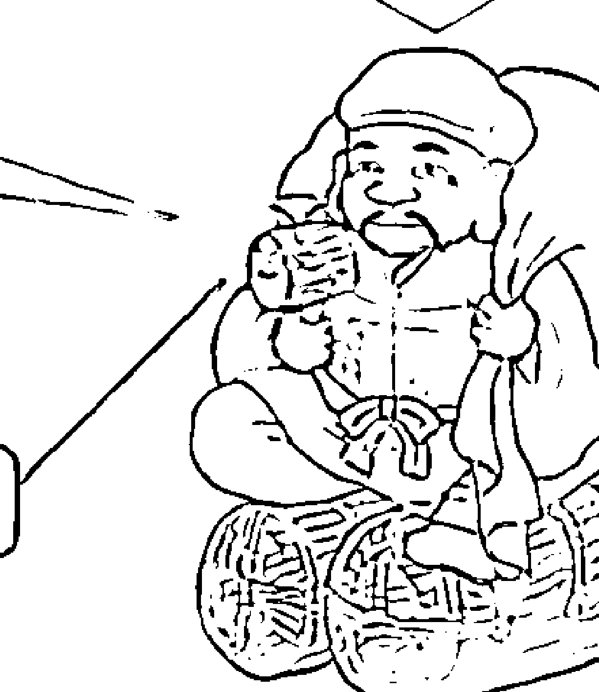

左手持袋

右手持打出小槌

脚踏米袋

大黒大人（日本）

## 浦島太郎

民間故事所描述的浦島太郎可說是無人不知誰人不曉的人物，可是卻很少有人知道浦島太郎其實是神。

### ○自古代流傳至今的浦島太郎故事

> > 《日本書紀》雄略天皇22年記載下面這段故事：

丹波國有個人名叫瑞江浦嶋子，他乘船出海釣魚的時候捉到了一隻龜，只見那隻龜眨眼就變身成為一名女性；浦嶋子很快就愛上那名女性、娶為妻子，然後又跟妻子一齊入海、前往蓬萊山，甚至見到了許多仙人。

> > 《丹後國風土記逸文》的記載內容則更加詳細：

從前有位名叫筒川嶋子的美男子。他乘船捕魚卻三天三夜沒有收穫，只捉到一隻五色龜。他覺得很不可思議，那龜在他睡覺的時候變成了一名美女；原來這名女性是名叫龜比賣的仙女，說是希望永遠伴隨嶋子。嶋子應承後，兩人就出發前往蓬萊山去，在仙境裡四處遊玩，就這樣經過了三年時間。

後來嶋子的思鄉之情愈濃，愈是嘆息。龜比賣問怎麼回事，嶋子才說是想見見父母雙親。龜比賣雖然嘆道自己憑著金石不移之心欲萬年長伴左右，嶋子這廂卻是思鄉情切、就要將自己拋在腦後，可是嶋子終於還是決定要回故鄉去。龜比賣取出一個美麗的盒子遞給嶋子，交待他說：「若你還忘記我、有心要來尋我的話，就絕對不要打開這個盒子」。

嶋子回到故鄉以後，人事景物全非，再也找不到一個他認識的人。他問那裡的住民：「水江浦嶋子的家人住在哪裡」，對方卻說嶋子出海以後就沒有再回來，已經過了三百年。不管他走到哪裡，就是找不到一個認識的人，於是他終於忘記龜比賣的約定，打開了盒子，他的青春竟然瞬間便消失無蹤。他知道自己違背約定、從此再也見不到龜比賣，於是詠嘆一嘆。

至於搭救烏龜的情節，似乎是後世人另行增添上去的。

#### 浦島太郎 = 自古代流傳下來，幾經變遷以後，方才形成了現在的故事

| 时代 | 描述 |
|---|---|
| 5世紀 | 釣到的龜變成女性。 |
| 奈良時代 | 主角與女性前往仙界，3年後開始思念；告別女性時，得到一只盒子；世間已超過300年；打開盒子後變成老人。 |
| 奈良時代 | 與風土記幾乎相同。 |
| 平安時代 | 丹後地區，出現浦島明神信仰；天長2年（825年）創建浦嶋神社。 |
| 室町時代 | 去釣魚的時候發現有隻龜受困，救牠自由；美女出現，將主角帶往宮殿，後來才發現原來美女就是那隻龜；打開盒子後變成白鶴飛走。 |
| 明治時代 | 主角搭救被人欺負的龜；主角與龜一同前往龍宮城，盤桓數日；離去時獲贈公主賜贈一只玉手箱；打開盒子變成老人。 |

#### 浦島太郎的故事

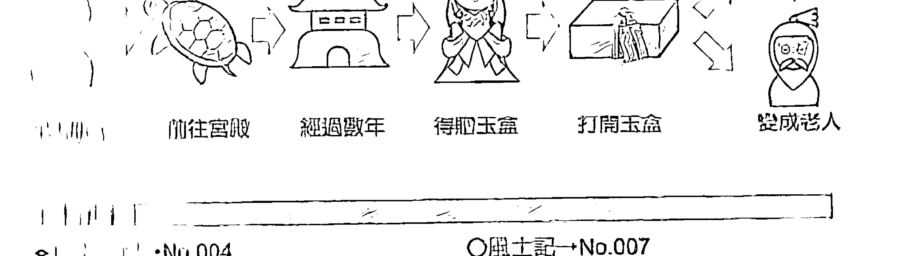

## 天神

天神乃落雷之神，也就是所謂的雷神。他雖然是位遷貶謫懷恨、欲將朝廷焚燒殆盡的恐怖神明，卻仍有庇蔭佑人類的效力。

### ○學問之神、雷神

所謂天神，其實就是平安時代的貴族政治家菅原道真的怨靈。他是本來頂多只能做到國司的中級貴族出身，卻因為許多天皇欲箱制藤原氏勢力而受到重用，最高曾經晉升至右大臣官位。可是後來藤原氏欲糾奪醍醐天皇皇位，另立齊世親王為天皇，菅原道真同時遭貶至九州任太宰權師，其子弟亦謫放逐九州（昌泰之變）。太宰權師名目上雖然是太宰府的第二把交椅，卻經常被用作將人調離中央的貶謫手段。後來菅原道真就這樣死在太宰府。

豈料菅原道真的政敵藤原時平以39歲之齡便即病逝，而醍醐天皇的皇太子保明親王及其子慶賴王亦相繼病逝。更有甚者，某日正在進行朝議時，清涼殿（天皇住處）發生落雷，同樣有份參與陷害貶謫菅原道真的大納言藤原清貫因而燒死，並造成眾多死傷者。至於醍醐天皇當時雖然平安無事，卻也因為受到驚嚇而使身體狀況惡化，終於在三個月後駕崩。

朝廷將此等不祥事均視為菅原道真怨靈作祟，遂先恢復其大臣官職，進而追封任命正一位太政大臣，以恢復道真名譽。另一方面，其子弟也紛紛受召回京。

這樁清涼殿落雷事件，使得道真的怨靈從此被視為火雷天神（雷神），同時還在祭祀雷神之地——京都的北野建造了北野天滿宮。另外在道真的墓地也興建了太宰府天滿宮。

時至後世，道真漸漸地從令人畏懼的怨靈，演變成受人膜拜信仰的學問之神；又因為他身為天神，司掌降雨與人間，自然亦受人奉為農業之神崇拜。除此之外，各地原有的火神神社，到後來也都被認為是祭祀道真的神社。

據說現在所有祭祀菅原道真的神社，包括天滿宮、天神社、菅原神社、北野神社在內，總數已經多達數千餘座。

#### 天神 = 即雷神 = 平安時代貴族政治家菅原道真的怨靈

![img/9c70b286a58f4c8702a1667e811a7aec_187_0.png]

天皇日常生活的場，也是天皇平日處理政務之處。因此，清涼殿可以說是皇宮的中心要地，天皇的日常生活都在這裡面。

| 天满宫名称 | 说明 |
|------------|------|
| 北野天満宮 | 947年菅原家捐贈土地所建 |
| 太宰府天満宮 | 919年建於道真之靈所在地 |
| 大阪天満宮 | 日本三大祭典之一天神祭的舉辦場所。 |
| 岐阜天満宮 | 904年建造的第一座天満宮。 |

日本的三大祭典或稱大阪，或稱山口。

### No:085 御靈

在神道的世界裡，凡人也能成為神明，其中尤以從怨靈演變成神明的案例所佔比例最多。

### ○從禍害作祟到福澤庇佑

人死後就會變成靈，這點沒有什麼問題。可是，抱恨而死的人就會變成怨靈；怨靈不單會咒殺怨恨所指的對象，甚至還有可能引起天災與疫病，此即所謂「祟」。

這可不是鬧著玩的。倘若只是針對怨恨的對象，還可以說他是自作自受，一旦形成天災或疫病，將會使得旁人無端牽連受害。更有甚者，懷恨愈深的靈會變成愈發強大的怨靈，造成極大的災害。

日本史上的著名怨靈，尤以早良親王、崇德上皇、菅原道真等最甚。為鎮慰這些怨靈，朝廷遂追贈官位，甚至奉為神明祭祀，藉此化怨靈為御靈，以期御靈能保佑庇蔭祭祀者。這種信仰怨靈祈求其守護的信仰，即所謂的御靈信仰。

《續日本紀》天平18年（746年）6月18日記載僧玄昉之死寫到「世謂乃遭藤原廣嗣之靈所殺」，是日本官方史書中第一筆記載怨靈的紀錄。

於是乎，遂有鎮慰御靈祈求守護的儀式——御靈會的形成。最早的御靈會乃於貞觀5年（863年）舉行，祭祀的是崇德天皇（早良親王）、伊豫親王、藤原吉子（伊豫親王之母）、橘逸勢、文室宮田麻呂、藤原仲成等六人，合稱六所御靈。

特別值得一提的是，京都有兩座御靈神社名為上御靈神社與下御靈神社，除上述六名以外，還另外祀有吉備真備、火雷神（菅原道真），祭祀的是八所御靈（唯上御靈神社並無早良伊豫親王與藤原仲成，取而代之的是井上內親王、他戸親王）。至於日本最著名的御靈會，當屬京都八坂神社祭祀牛頭天王的祇園御靈會了，此即所謂的祇園祭，從安和3年（970年）舉辦以來，傳承延續已經超過千年。

#### 御靈的形成

> 凡人化為神明＝亦不乏由怨靈轉化神明者。

人

![img/9c70b286a58f4c8702a1667e811a7aec_189_0.png]

死

懷恨而終

怨靈

「祟」發生

咿～

生者為之恐佈

神啊～

祀為神明

變成庇佑眾生的御靈

#### 著名的怨靈

- 早良親王
- 崇德天皇
- 菅原道真

變身

御靈信仰 ＝ 信仰怨靈祈求庇蔭守護

○天神→No.084

183

## 成為神明的凡人

除前一節所述怨靈途徑以外，另有許多不同途徑可供凡人成爲神明，近代尤以受世間尊敬而成爲神明者佔多數。

### ## ○尊敬之甚而成爲神明者

人們有時會爲鎮慰怨靈而將其祀爲神明，不過有些人並非怨靈，最後也成爲了神明。許多著名的戰國諸侯便個個都成了神，奉於神社祭祀。祭祀織田信長的神社，便是京都的建勳神社。「建勳」正式讀音雖爲「たけいさお」（Takeisao），但大部分人多讀作「けんくん」（Kenkun），這座神社是明治時代以後才建造的。

祭祀豐臣秀吉的是豐國神社。秀吉死後，京都便立刻將其奉爲豐國大明神祭祀，但卻在豐臣家滅亡的同時遭到德川幕府廢止。明治以後重建再興，即現在的豐國神社。除京都以外，幾個與秀吉有地緣關係的地方也在進入明治時期以後，紛紛獨立起了豐國神社。

德川家康則是被奉爲東照大權現祀於東照宮，現在最著名的當屬日光東照宮，其他還有久能山東照宮等。除此之外，許多企圖討好德川一門甚至將軍家的衆諸侯也競相建造東照宮，使得東照宮在江戶時代曾一度多達數百。

還有祭祀武田信玄的武田神社（山梨縣）、祭祀上杉謙信的上杉神社（山形縣）、祭祀前田利家的尾山神社（石川縣），這些都是創建於明治以後的神社。亦不乏有將明治以後的人物奉爲戰神祭祀的案例。日俄戰爭中戰死的廣瀨武夫中佐便是此類戰神的第一號，祀於廣瀨神社（大分縣）。日俄戰爭的英雄乃木希典在明治天皇駕崩時自殺殉死，也被奉爲戰神；以位於東京都赤坂的乃木神社爲首，日本全國共有數座乃木神社存在。同樣地，東鄉平八郎元帥也有東京都澀谷區東鄉神社等數間神社，都是昭和時代所建。

明治維新的英雄也受到了神格化，如吉田松陰的松陰神社（東京都）和西鄉隆盛的南州神社（鹿兒島縣）等。

元和2年（1616年）德川家康過世，隨即引起該如何安祀的爭論。爭論雙方分別是南光坊天海、金地院崇傳。天海主張應循山王一實神道將其奉爲「權現」祭祀，崇傳則主張依佛家的川田神道祭爲「明神」。天海向第二代將軍秀忠進言表示明神此號追贈豐臣秀吉的神號，考慮到豐臣家最後滅亡，乃屬不祥；因此，明神此案方才遭到駁斥，並決定將家康奉爲東照大權現祭祀。

#### 人间から人を祭る神社

只不過這些神社大多是明治時代以後才建造的

| 時代 | 人物 | 神社 | 時代 | 人物 | 神社 |
|---|---|---|---|---|---|
| | 源賴朝 | 白旗神社 | 戰國 | 伊達政宗 | 伊達神社 |
| | 源義經 | 白旗神社、義經神社 | | 島津義弘 | 霧島神社 |
| 南北朝 | 楠木正成 | 淡川神社 | | 毛利元就 | 豐榮神社 |
| | 新田義貞 | 臨島神社 | | 真田昌幸 | 真田神社 |
| | 後醍醐天皇 | 吉野神宮 | 維新 | 西鄉隆盛 | 南州神社 |
| | 德川家康 | 東照宮 | | 坂本龍馬 | 京都靈山 護國神社 |
| | 織田信長 | 建勳神社 | | 島津齊彬 | 照國神社 |
| | 豐臣秀吉 | 豐國神社 | 明治 | 乃木希典 | 乃木神社 |
| | 武田信玄 | 武田神社 | | 東鄉平八郎 | 東鄉神社 |
| | 上杉謙信 | 上杉神社 | | 廣瀨武夫 | 廣瀨神社 |
| | 前田利家 | 尾山神社 | | 橘周太 | 橘神社 |

#### 德川家康為什麼會成為東照大權現？

元和2年（1616年）德川家康過世，隨即便引起該如何安葬的討論。雙方分別是南光坊天海、金地院崇傳，天海主張應循山王神道將其奉為「權現」祭祀，崇傳則主張應循吉田神道祭祀為明神。

然而向第二代將軍秀忠進言曰，明神乃追贈豐臣秀吉的神號，且其子孫最後滅亡，乃屬不祥。因此，明神此案才遭到駁斥，最終決定奉為東照大權現祭祀。

## No-087 現人神

神幾乎不會出現在現代，但我們仍然有機會見到神的出現，甚至可以與神對話，儘管這種機會極為渺小。

### ## ○與一言主神的遭遇

《古事記》的雄略天皇項目記載從前天皇登葛城山時，隨行者全員都是紅衣帶、青摺染打扮。這時卻看見另一頭山腳也有群人正在登山，而且人數和服裝都和天皇一行人一模一樣。天皇問：「此倭國除吾別無君王，誰者如此行進？」，對面傳來的回答內容卻與天皇所言相同，氣得天皇命隨行者發箭，結果對面同樣也射將回來。

天皇又問對方名字，提議雙方先互報名字，然後再弓箭開放。對方便答道：「既然先被問到那就自己先答，我乃好話直說話一律直言不諱，葛城的一言主大神是也」。天皇聞言後，趕緊畢恭畢敬地將大刀、弓箭連同全員的衣服雙手奉上。據說天皇回去時，一言主大神還從山峰一路目送到入口。

《日本書紀》雄略天皇4年2月也有類似的記載。天皇行至深山幽谷時，遇見一個容貌打扮都跟天皇一模一樣的人。天皇知道遇到的是神，問：「公何處君？」，答：「現人之神也。王且先報上名號」。天皇表明身分，對方才說自己是一言主神。接著雙方便一同狩獵取樂，逐鹿放箭策馬而奔。日暮時分，神還目送天皇離開直到一條叫作來目水的河川。在場看到此情形的，都稱天皇高德。從這裡便可知道，所謂的現人神原本是指現身於世間的神明。後來，自天武天皇以下的歷代天皇都被視為神明。《萬葉集》亦有柿本人麻呂曾經詠道：「皇は 神にし坐せば」（皇乃現御神）。與此同時，神明也變得愈發人格化，加以受到佛像影響，使得人們開始製作神像。如此思想後來演變成天皇＝現人神，甚至可以連結到明治至昭和年間所謂神國日本的主題，只不過這已經偏離現人神的原先意涵了。

王權 = 神授的權力

![img/9c70b286a58f4c8702a1667e811a7aec_193_0.png]

换言之

現人神 = 出現於現代的神 後來天皇也變成了現人神

#### 現人神

以下全部是現人神

![img/9c70b286a58f4c8702a1667e811a7aec_193_1.png]
![img/9c70b286a58f4c8702a1667e811a7aec_193_2.png]
![img/9c70b286a58f4c8702a1667e811a7aec_193_3.png]
![img/9c70b286a58f4c8702a1667e811a7aec_193_4.png]

## 摩多羅神

神道還有許多《古事記》與《日本書紀》都未曾提及的神明，其中有些是來自外國的神，甚至也有來路不明的神。

### ○謎之藝能神

神道是種非常彈性、非常柔軟的宗教，可以輕易地接受外國諸神，並將其轉化成神道的神祇。摩多羅神便是此類神祇的其中之一，是位難以確知是否原生於日本、出身不明的神祇。

摩多羅神是天台密教常行三昧堂奉為秘佛祭祀的神。所謂常行三昧是指90天以內除進食、如廁以外不得坐下，必須持續繞行阿彌陀如來並不停誦經念佛，就連睡覺也只能靠著門框、稍微打盹的非常嚴苛修行；而摩多羅神便是這項嚴苛修行的後戶之神（隱藏於本尊阿彌陀佛身後的神）。

此外，這常行三昧堂經常會以舞蹈、猿樂等藝能獻神，使得摩多羅神亦被奉為藝能之神信仰；現在的摩多羅神反而人多是以藝能之神身分受人崇拜。

除此之外，從前天台宗曾經有支深受真言立川流影響的支派，名叫玄旨歸命壇；這玄旨歸命壇後來雖以淫祠邪教之邪名受打壓迫害而消失，供奉的本尊同樣也是摩多羅神。

摩多羅神固然是阿彌陀佛的教令輪身（為引導冥頑不靈的眾生而故意採忿怒形相的化身），其模樣卻甚為怪異；頭上戴的是中國的襆頭（士大夫戴的頭巾），身上穿的卻是和風的狩衣，手上還不住地打鼓。部分的摩多羅神圖像會在他的左右配置一對名叫丁禮多與爾子多的童男童女，兩名童子左右手分別拿著蓮荷與竹葉，正在舞蹈。

根據鎌倉時代《溪嵐拾葉集》記載，從前慈覺大師從唐歸國途中曾經聽聞憑空傳來聲音謂：「我乃摩多羅神，隱岐神是也。不拜我者，淨土往生無望」，於是慈覺遂請摩多羅神祭祀之。據說其真正身分乃是大黑天或吒枳尼天。

有趣的是，東照宮亦設有摩多羅神做為東照大權現的近侍，至於為何如此安排無從得知。

**摩多罗神** = 出身不明。神道里有许多神祇是来自外国甚至来路不明，摩多罗神也是其中之一。

![img/9c70b286a58f4c8702a1667e811a7aec_195_0.png]

京都三大奇祭之一，太秦阿隆寺牛祭当中的摩多罗神。

![img/9c70b286a58f4c8702a1667e811a7aec_195_1.png]

## No.089 道祖神

自古以来，每每在村落交界处，便必定有道祖神，为守护境界之神。

### 石碑之神

所谓道祖神，便是人们设立于村落境界、山道等有内外分别之处，又或是十字路口等道路汇集处的神明。除道祖神此名之外，亦有岐神、塞之神、道陆神等称谓。这位神明负责把守境界，避免灾厄、恶灵等从外部入侵。「塞」这个字有阻塞之意，也就是说他是位锁守境界、阻挡恶灵入侵之神。

一般相信恶灵栖息于路口，故有在路口设置守护神的必要性。所谓的「岐」指的就是四岔路口，所以岐神本指设置于路口的神明。可是这些名称与用法早在古代便已经混淆，无法明确区分。举例来说，《日本书纪》的一书（有别于本文的其他传说）就说，从前伊邪那岐从黄泉国逃回来时，黄泉国与世间的境界处就有个岐神，在这里防止秽厄从黄泉国进入世间。换句话说，此处的岐神其实是位境界之神。

几乎所有道祖神全都是无社无祠的石造神。其形状则五花八门，有的是男女成对的石像、有的作男根女阴等性器形状、有的甚至只是在石碑上篆刻文字而已。据说道祖神乃是中国的行路之神传入日本以后所形成，不过日本原本就有岐神等同类型的神明存在，于是便在漫长的岁月中渐渐同化了。

道祖神是民间信仰的神明，长期以来历经过多次质变。其中最重要的一次质变，当属道祖神与性风俗的混同；将男性生殖器当作咒物道具用以规避灾厄的案例遍见于世界各地，而道祖神与此类信仰混同以后，也成为了民众性事相关祈祷的对象。更有甚者，道祖神甚至还与地藏菩萨发生习合。或许可以想，地藏菩萨站在六道轮回路口以拯救众生，会跟道祖神习合为一，或许也是种必然的结果。

#### 道祖神 = 镇守境界的神。别名岐神、塞之神、道匠神

道祖神是各种形状各异的石碑，其中不少石碑都充满幽默感，让人莞尔一笑。

![img/9c70b286a58f4c8702a1667e811a7aec_197_0.png]
![img/9c70b286a58f4c8702a1667e811a7aec_197_1.png]
![img/9c70b286a58f4c8702a1667e811a7aec_197_2.png]
![img/9c70b286a58f4c8702a1667e811a7aec_197_3.png]
![img/9c70b286a58f4c8702a1667e811a7aec_197_4.png]

据说杵是男性、臼是女性，象征男女交合。

## No.090 御白大人

除前述諸神以外，日本也有更加樸實的神明。坐鎮各家神龕、守護萬千主婦的御白大人，正是此類神明之典型。

### ○農戶的守護神

日本人相信家中同樣也有神的存在，其中尤以東北地區的家神——御白大人特別著名。山形與岩手有神事大人（Okonai-sama），福島則是稱為御神明大人（Oshimme-sama），這些都是屬於相同系統的家神。御白大人亦稱御白仏（Oshirabotoke）或鍵地蔵（Kagijizou），這應是受佛教影響使然。除此之外，御白大人也是農業之神、蠶神、馬神，悉數是農戶之神的相關職掌。

御白大人這位神明乃以人偶做為御神體，一般都是在約30公分長的桑木棒末端裝設頭像，然後再穿上名為御洗袖（Osendaku）的衣服。另外，通常多是男女成雙祭祀。頭像大多都是男女成對，偶爾也有馬頭與女性頭像的組合。

如何祭祀御白大人，則視地區、家系而異。大多都是各家分別祭祀的氏神型，或者同族團體祭祀同一位御白大人的同族型；不過也有同一地區祭祀同一位御白大人的地緣型，甚至幾個信眾集團祭祀同一位御白大人的講義型等，祭祀方法正可謂是形形色色。

所有御白大人都有個共通的特徵，就是必須由女性主佃御白大人的祭祀日（正月、3月、9月的16日）亦稱命日、御白日。每到這天，就要把御白大人請出神龕，為御白大人更衣，供奉神饌。然後名為伊田子（Itako）或神饌巫女（Shinsenmiko）的巫女就會雙手捧著御白大人，上下左右搖擺，口中唱唸御白祭文，執行所謂御白遊（御白大人遊玩）的儀式。御白祭文大多是以《御白大人之本地》為主，有時也誦《金滿長者》、《旃檀栗毛》或《蠶靈之本地》等祭文。

據說祭祀御白大人的家庭便能富貴自在，相反地怠惰御白便會禍及氏族。再者，御白大人厭惡兩隻腳和四隻腳的禽獸，與雞蛋，有不可食用之禁忌；據說若以獸肉等供奉，將會招來相當嚴重的禍事。

#### 御白大人 = 東北地區的家神。同時也是農業之神、蠶神、馬神

御白大人 = 人偶神

![img/9c70b286a58f4c8702a1667e811a7aec_199_0.png]
![img/9c70b286a58f4c8702a1667e811a7aec_199_1.png]

木棒設有人頭或馬頭

為木棒穿上紙或布做的衣服。

每逢命日就要加件新衣，愈穿愈厚

![img/9c70b286a58f4c8702a1667e811a7aec_199_2.png]
![img/9c70b286a58f4c8702a1667e811a7aec_199_3.png]

御白大人的祭祀日（正月、3月、9月的16日） 亦稱命日或緣日。

巫女雙手捧著御白大人上下左右搖晃，唱誦御白祭文。

獲得富貴自在。

## No.091 大太法師

日本的巨人傳說並不算多，就連民間故事裡所提及的巨人多半也只是旁襯的角色而已。

### ○衰亡的巨神

此節介紹的乃是日本各地傳承當中，作大太法師、大太坊、踏鞴法師等不同稱呼的巨人。他的傳說大都與造山或造池有關。譬如平地中央獨山孤立的地形，就會說是大太法師在一夜之間平地造山。此外，巨人留下腳印積水後形成水池沼澤的傳說亦為數不少。

據說大太法師原是天地的創造神，這跟希臘諸神、北歐諸神都是巨人的說法其實是相同的。

然則，日本奉巨人為諸神的時代卻極為短暫。有人說後來反而是「小子」信仰（如少名毘古那神）抬頭，使得巨人跌落原本天地創造神的寶座，僅剩憑藉其巨大力量創造出各種地形的傳說流傳而已。後世的大太法師，最後終於落得僅止於偶然來到人類世界創造各種地形、所謂山神化身的地位。

根據柳田國男的《大太坊的足跡》記載，大太坊傳說的中心地位於東京。

舉例來說，東京電車京王線有個名叫代田橋的車站，所謂代田這個地名便是來自於從前在此地留下腳印、築起代田的巨人大多法師的名字。

其次，武相（指武藏與相模，即東京至神奈川一帶）人們相信從前有種名叫大太郎法師的巨大鬼神；他們相信相模川上游大沼澤便是從前大太郎法師正要發力扛起富士山時，所留下的腳印。另一則傳說則說從前大太郎法師想要扛起富士山，卻就是找不到適合用來把富士山扛在肩上的藤蔓，氣得頓腳而跺腳留下的腳印就變成了鹿沼與菖蒲沼這兩個沼澤。相模原不生藤蔓，便是因為這個緣故。

#### 大太法師 = 天地創造之神。後世視為山神的化身

![img/9c70b286a58f4c8702a1667e811a7aec_201_0.png]
![img/9c70b286a58f4c8702a1667e811a7aec_201_1.png]
![img/9c70b286a58f4c8702a1667e811a7aec_201_2.png]
![img/9c70b286a58f4c8702a1667e811a7aec_201_3.png]

### ## 風土記的巨人

《風土記》裡收錄了《古事記》與《日本書紀》都看不到的巨人傳說。

《常陸國風土記》有則故事記載，有個住在崗上、名叫大師的巨人非常高大。

巨人的腳印長度有30餘步、寬也有20餘步，光是他的小便造成的溝也有20餘步。除此之外，據說他坐在地勢略高的山崗上，伸手去取海岸的大蛤來吃，吃著吃著還把吃剩的殼都堆積在小山上。據說這座小山，就是現在的大師之岡。

此外，《風土記》所謂大師之岡，指的便是茨城縣的大串貝塚（國家指定歷史遺跡）。

## 座敷童

將其誤解為妖怪之流的人固然相當多，但座敷童其實本是保證家宅的守護神，從前在東北地區頗受信仰。

## 孩童模样的神

所謂座敷童是以岩手縣為中心流傳於日本東北地區的家神，亦稱「座敷小童」、「部屋小童」、「倉童」、「倉小童」、「御藏小童」。傳說座敷童是個約莫5歲到10歲的童子，有著河童髮型和紅紅臉頰。座敷童有時是男孩，有時是女孩，還有些座敷童是一對童男童女。

他們通常出現在老舊家宅等建築深處的日式座敷房，不過有時候也會出現在貯物間或土牆倉庫等處。

座敷童都是孩子，自然會幹些無傷大雅的惡作劇，諸如在別人睡覺的時候跑來翻枕頭（硬把枕頭翻過來）、故意踩在灰粉之上留下足跡，或是明明周遭空無一物卻刻意弄出紡車轉動的聲音，但並不會做出真正對人類造成傷害的惡作劇。

由於座敷童是附於家宅的神（或精靈），因此經常只有實際居住在此的那家人才能看見他們。座敷童最大特徵便在於是幸運之神：有座敷童的人家自然就會愈發幸運、繁榮興盛起來，相反地，座敷童離開以後，該戶人家就會愈漸衰退。

柳田國男的《遠野物語》記載了兩則座敷童的故事。

第一則故事裡的座敷童是個住在舊家裡的12～13歲小孩，經常故意出現在別人面前。那戶人家的女兒曾目睹座敷童出現，說是男童；另一則故事則是兩個女童。有天，村人在路上發現兩個不認識的女孩子，上前問她們是從哪裡來的，兩人答說是從山口孫左衛門的家裡來的；再問她們要去哪裡，說是要往同村的另一戶人家去。村人聽到這裡就知道孫左衛門不妙了，果然山口家因為吃了毒菇中毒，主從20餘人一日內中毒身亡，唯一倖存的女孩年老以後亦無子嗣，山口家終告滅絕。

#### 【1. 物語的塑造】

座敷童子 = 東北地區流傳的家宅守護神、孩型妖怪

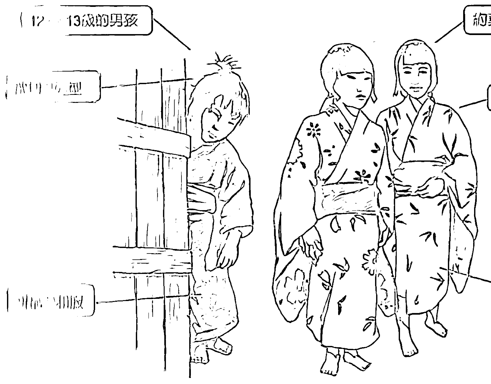

+   图中标注：
    - (1) 13歲的男孩
    - (2) 總共15歲
    - 兩個女孩
    - 振袖
    - [其他模糊不清的标注文字]

（上图，No.002注释）

（下图）座敷童子的形象类型

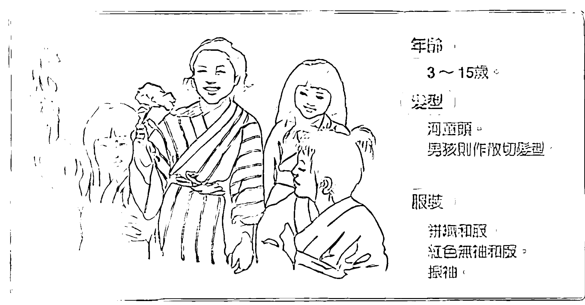

**年齡**：
3～15歲。

**髮型**：
河童頭。
男孩則作成切髮型。

**服裝**：
拼布和服。
紅色無袖和服。
振袖。

## 沖繩神話

除愛奴以外，另一個雖然同樣存在於日本卻迥異於日本神話的，即是沖繩神話。

沖繩神話基本上乃採口耳相傳，並無古代文獻留存，以16~17世紀所傳承的文獻最為古老。

1605年的《琉球神道記》是日本的佛教僧所著，將沖繩神祇結合了佛教諸佛，是為其特徵之一。

1623年的《おもろさうし》是蒐集沖繩歌謡「おもろ」的歌集，稱得上是沖繩的《萬葉集》。詠唱戀愛的歌謡亦為數不少，還有許多講述自然、神話、戰爭等的歌謡。我們便是從詠唱神話的歌謡中，得知許多有關沖繩神話的資訊。

1650年的《中山世鑑》是琉球王國的第一部正史，只不過這本書是根據日琉同祖論，亦即所謂日本與琉球擁有相同祖先的理論而著作的。是故，書中有些諸如平安末期保元之亂中敗下陣來的源為朝逃到沖繩、成為琉球王朝祖先這般穿鑿附會的論調，可信度相對地低。

1711年的《混効験集》雖然是琉球語的辭典，不過若從其中選擇的用語來看的話，這本書也可以當成某種沖繩博物誌來閱讀。

據其所載，女神阿摩美久、男神志仁禮久遵循天命創造了島嶼。這部分與日本神話的伊邪那岐、伊邪那美有幾分相似，不同的是沖繩神話先記載的是女神阿摩美久而非男神志仁禮久。沖繩神話似乎是以女神為優先。

可是他們創造的島嶼是座浮島，浪從西邊來就往東邊漂、浪從東邊來就往西邊漂。於是乎，男女兩位神明遂拓展土地、創造森林與岩石，把島嶼變得牢固了。

兩位神明並未交合而只是並肩而處，女神就因為風吹而懷孕了。相傳她生下了三個孩子，一人為主、一人為祝（宗教者），另外一人則是庶民的祖先。還有另外一本書則說當時女神生下了三男二女，長男為主、次男為諸侯、三男為百姓、長女為君、次女則是祝的始祖。

除此之外，沖繩還有許多流傳於民間的神話：沖繩的遊太（民間的巫女）之間傳唱著一種叫作「島立神話」的創世神話。

從前石之王與金之君生下了一名男孩：他們還沒來得及給孩子取個聖名，石之王就變成了石頭，而金之君則是變成了黃金。後來這個沒有名字的孩子爬到天上，得太陽神授名島添國添（シマクヅ クミクヅ）。接著他又許願說想要個島嶼，太陽神卻要他向奄美島的大王去要，然後他又拜託太陽神給他能夠孕育出人類的種子，太陽神便教他如何用風去製作種子。他又向太陽神許願要食物，但卻等不及允許就擅自偷拿了；島添國添因為這件事而被太陽神殺死，不過後來孔雀和鶴又利用湧出的泉水使他復活。

「島立神話」便是這麼一則記載了有關世界起源、人類起源以及萬物起源所有事項的神話。

# 第5章 神道
## 形成信仰的神器

# 各式各樣的神道

所謂神道便是指信仰日本神祇的宗教。歷經漫長歲月以後，神道再也不只有唯一

## ○對各種神祇的信仰

一般相信神道是日本自古傳承至今的信仰。既然神道已經存在如此之久，自然也分出了形形色色的諸多派別。
首先是最普遍的神社神道。神社神道從明治時期直到第二次世界大戰結束前都稱作國家神道，不過敗戰後禁止神社干涉國家大事，故設立了宗教法人神社本廳，日本許多神社都受其管轄。一般神社裡神主與信徒執行的祭祀，便是神社神道。
神社神道又可以分成吉田神道（京都吉田神社的神主所率領的神道）與伊勢神道（三重縣伊勢神宮主張的神道）等數種，各自對神道都有不同解釋。

另外還有與其他宗教習合所形成的神道，神道本身並無明確的經典或教義，因此要跟其他宗教習合相當容易。除與佛教習合的兩部神道（與真言宗習合）、山王神道（與天台宗習合）、法華神道（與法華宗習合）以外，還有與儒教習合的吉川神道（與朱子學習合）、與陰陽道習合的天社土御門神道（由安倍晴明的子孫土御門家所創始）等。

江戶時代主張恢復尚未受儒教、佛教影響的日本古代精神的眾國學家所創設的神道，則是稱作復古神道（後來成爲了尊皇攘夷的骨幹思想）。只是復古神道的實際教義卻跟日本自古以來的神道毫無關係，而是國學家們申揚其主張的神道。如今此派別稱爲古道、古神道。

除此之外，神道亦有旁派支流以及神道系新興宗教，這些統稱爲教派神道。譬如祭祀大國主命的出雲教和出雲大社教乃是以國津神爲主祭神，這點便與神道主流有極大差異。至於神道系新興宗教則有黑住教、金光教、大本、生長之家等教派。一般稱爲諸派的新宗教當中，許多教派也都受到了神道不小的影響。

見P.232頁No.093注釋

# 第5章 神道と日本宗教の融合

神道 = 信仰日本神明的宗教，为日本自古所固有

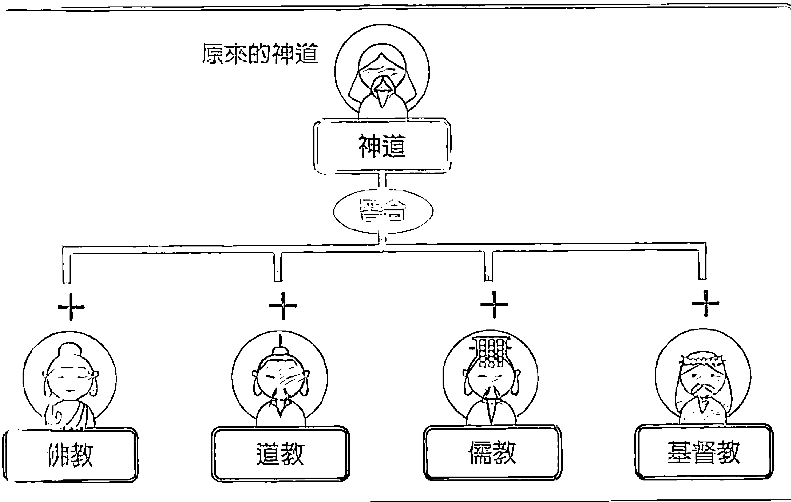

## 诸教と融合した神道及祭祀神明

| 名称 | 主祭神 |
|---|---|
| 出云大社教 | 大国主大神 |
|  | 国常立大神 |
| �的山信仰教会 | 大山祇命 |
| 黑住教 | 天照大御神、八百万神、宗忠神 |
| 金光教 | 天地金乃神、金光大神 |
| 天理教 | 天理王命 |
| 本道教 | 大元�的 |
| 圆光教 | 大宇宙神 |

+   - **神道系新兴宗教**
    - 出云大社教 → No.097
    - 黑住教 → No.099
    - 吉田神道 → No.098
    - 国家神道 → No.103

# 日本的神社數量極多。但無論世間有再多神明，恐怕都不夠各家神社供奉祭祀。

### ○可無數分裂的神

日本的神社幾乎可說是每間都必定安置神明的御神體。所謂神體就是指神明之所宿，除神像等仍作人形的神體以外，有時也會使用鏡子、寶劍等物體，甚至是石頭等自然物質做為神體；還有些則是以森林、岩石、山地等各種地形為御神體，但是如此巨大的御神體根本塞不進建築物裡面。倘若以山為御神體，那就不比平常神社收納供奉御神體，而是顛倒過來，神社反而處於御神體之中。

反正有御神體，就代表有神明宿於其中。可是日本有許多神社祭祀的是同一位神明，而且每間神社都各自供奉了所謂神明宿於其中的御神體。如果是這樣的話，受到眾多神社祭祀的神明，究竟是存在於哪間神社的哪個神體之中呢？再說，伊勢神宮祭祀的是天照大神，但天照大神不是在高天原嗎？

於是乎，名為分祀的行為便應運而生。所謂分祀，就是指某座神社將自己祭祀的神明分給其他神社祭祀。從接受分祀者的角度來看，這種行為就叫作「請神」。那麼，原先那座神社的神力會不會因為分祀而減弱呢？新神社的神明算是冒牌貨嗎？在神道的思想構造當中，分祀神社與請神的神社同樣都是真的，分祀並不會使得任何一方的神力有所衰減。神道認為，神是可以無限分割的，而且分割出來的神都能保持其原有的力量，都是同一位神。這也可以說是一種神跡。耶穌就可以透過奇跡同時出現在全世界所有彌撒當中，也許所謂的神原本就是這個樣子的。順帶說明，向外分祀者若是神社則稱總本社，若是神宮則稱總本宮；得其分祀者則稱分社抑或今宮。舉例來說，稻荷神社的總本社便是伏見稻荷大社，八幡神社的總本宮則是宇佐八幡宮。

#### 神體 = 神之所宿。有的作人形，有的則是物體，甚至是自然物

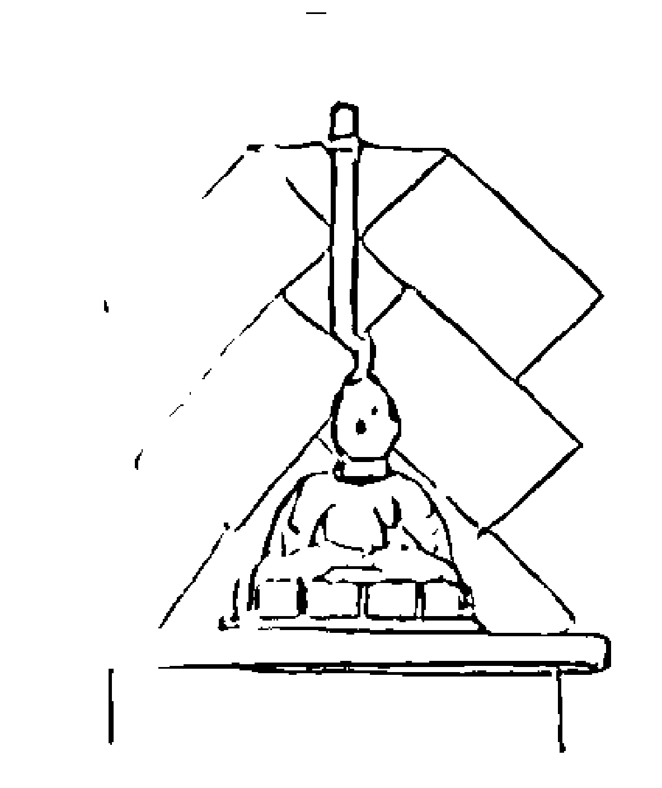

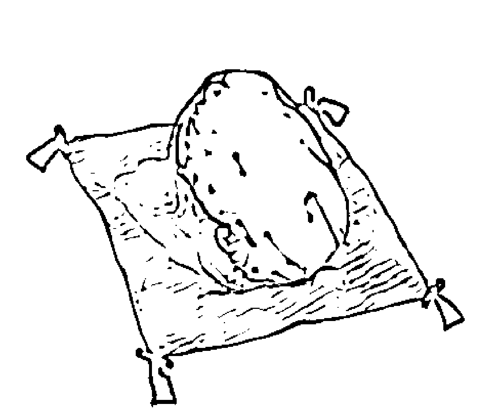

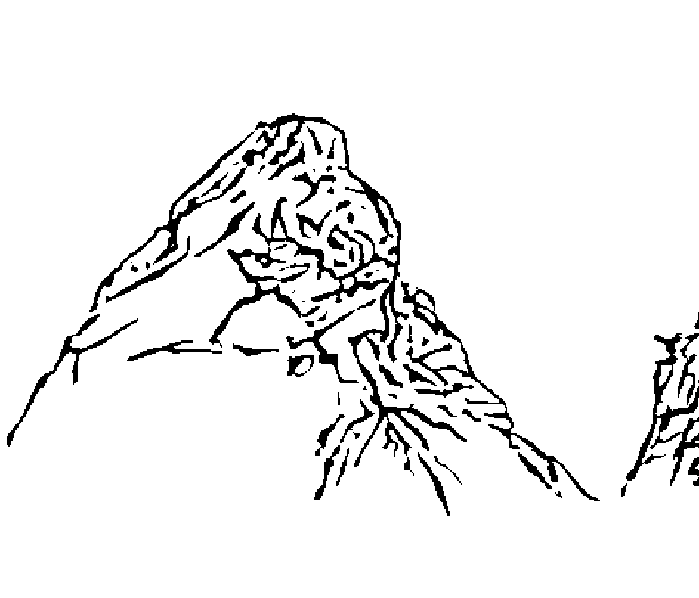

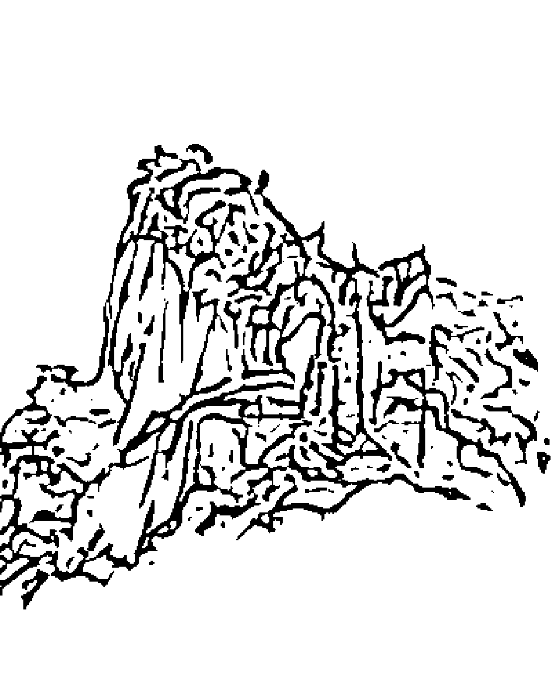

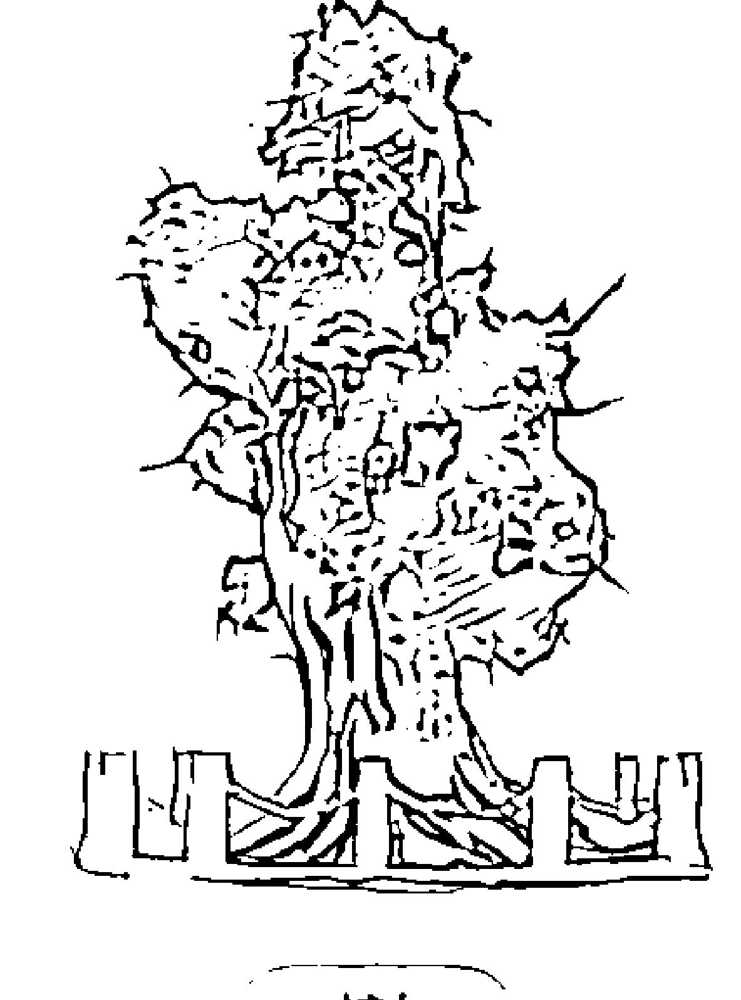

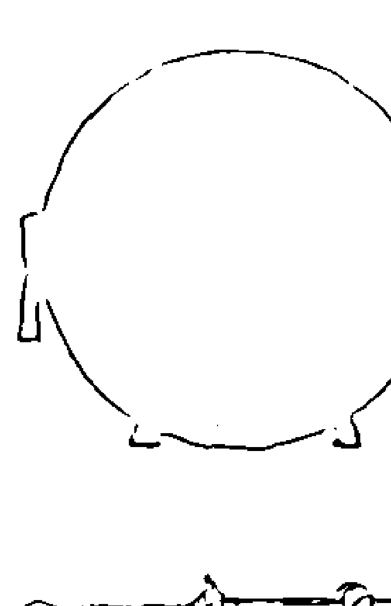

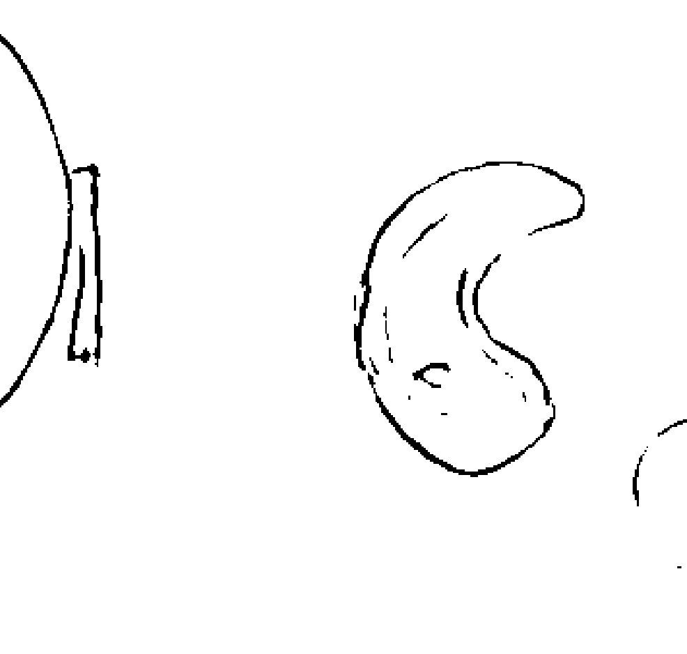

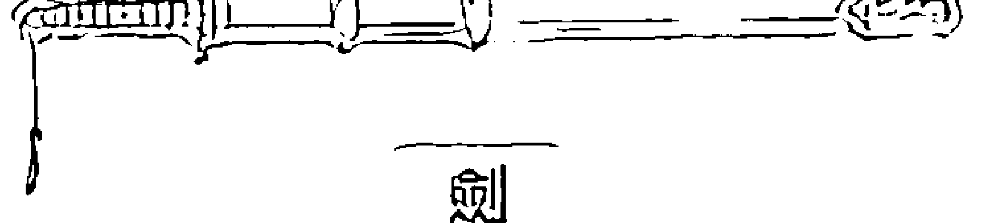

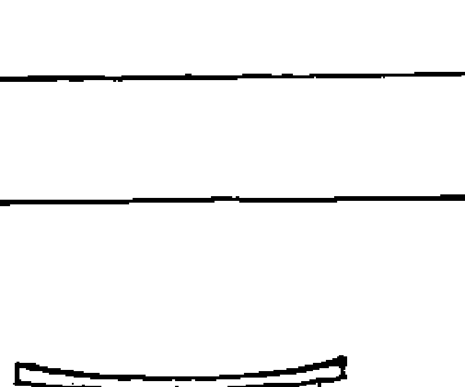

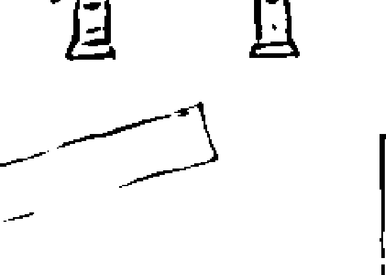

全都是同一位神，威能也相同。

+   - ○稻荷神→No.073
    - ○神社的構造→No.104
    - …No.022
    - …No.074

## No.095 荒魂與和魂

雖說日本許多神明對人類都相當溫和愛護，但不代表他們永遠都如此溫和，其實仍然有狂暴而恐怖的意念存在。

### ○神的兩個面向

神道的神在同一個神格當中，同時存在著帶來災厄的攻擊性部分以及守護眾人的和平部分；前者稱荒魂，後者則稱和魂。

此二者共存於同一位神明之中，荒魂出則引發災厄，和魂出則授人以幸福。平時太陽固然能帶給我們溫暖、使植物成長等恩惠，可乾旱時卻會成爲災厄，這就可以說是同一神格當中和魂與荒魂兩種面向的表徵。當然了，諸多神祇還是有神格中和魂佔多的神祇以及荒魂佔多者的區分。

和魂又可以分成幸魂與奇魂。所謂幸魂，就是好比增加收成之類、能夠爲人帶來幸運的神力，而奇魂則是透過奇蹟助人的神威。如果同一位神明荒魂與和魂的性質差異過鉅，有時候會再各自為荒魂與和魂另取神名，有時甚至還可能會將兩者視爲兩個完全不同的神。

> 《日本書紀》的一書記載，從前大國主神創造國家時中途失去了搭檔少彥名命，正不知該如何是好，忽見神聖光霞中有一位神明出現，對他說：「如果沒有我，這個國家將不得安穩。只要有我，便能創造偉大的國家」。大國主神問：「你是何人」，答：「我就是你的幸魂、奇魂」，又說：「我住在大輪之山」。位於現今奈良縣的大神神社主神大物主神，就是大國主神的幸魂、奇魂。換言之，大國主神的幸魂、奇魂形成有別於大國主神的另一個神格，且被供奉祭祀在另外一個地方。

天照大神在伊勢神宮（祭祀天照大神）裡也有另一個名爲荒祭宮的神社（這種作法稱爲境內別宮），特地將天照大神的荒魂（名為天照坐皇大御神荒御魂）分開來祭祀。

#### 荒魂と和魂の関係

神道的神 = 同一神格擁有兩個不同面貌

+   *   荒魂 = 為人帶來災厄的攻擊性部分
    *   和魂 = 守護人們的和平部分

由於荒魂與和魂兩者性質相差過大，有時還會再各自為荒魂與和魂另取神名。

#### 和魂又可以分為幸魂與奇魂

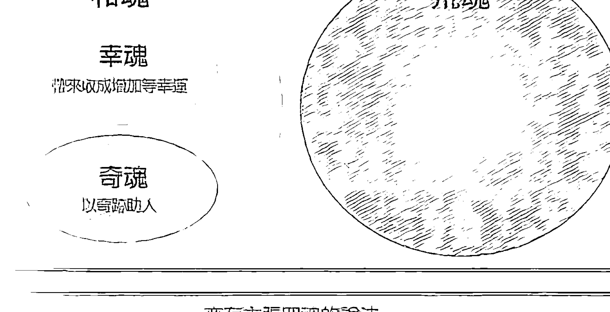

#### 亦有主張四魂的說法

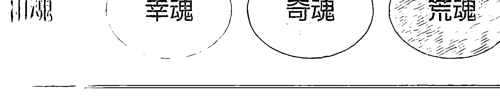

◎大国主神→No.034
◎大物主神→No.037

## 本地垂迹說

神道與佛教這兩個已經在日本生根的信仰，非但相互影響，還曾經一度要融合為一。

### ○神道神祇的本家

佛教傳入日本已超過千年，早在日本落地生根。但是說到如何看待佛教與神道之間的關係，無論對為政者，或是實際從事宗教事務的僧侶、神官，一直都是惱人的課題。於是乎，後來才會產生所謂神佛習合，也就是將神道佛教合而為一的思想。
本地垂迹說便是神佛習合的其中一個看法；根據此派說法解釋，日本神祇其實是佛教諸佛為拯救日本芸芸眾生而形成、現身的化身。此類神祇稱為權現，是「權且（暫時）」「現身」的意思。早在本地垂迹說尚未出現以前，佛教則是將日本的神祇解釋定位為天部。所謂的天就是印度教諸神受佛教吸收所形成的神，較著名的有帝釋天、弁財天等。他們並不像佛已經得悟，因此雖然擁有能為守護佛教而戰的力量，卻仍然不能免於煩惱與痛苦的束縛。此類諸神祇被稱作護法善神，佛教便是把日本諸多神祇都當作是此類護法善神之一來理解。
可是，如果只把皇的祖先天照大神等重要神明看成天部而已的話，那就把日本諸神看得太低，會產生許多不愉快，所以後來才改為贈送比天部高一個等級的菩薩號，譬如八幡神後來就獲得了菩薩的名號，被稱為八幡大菩薩。
進入平安時代以後，遂有本地垂迹說的成立。佛為本地、神為垂迹，於是日本諸神祇便開始配對，並且被視同於各自的本地佛。以天照大神為例，她是太陽神又是世界的中心主神，故而以大日如來做為其本地佛。
除此以外，也有人相信日本的神會守護佛教的諸佛與信徒。於是在神佛習合的諸多形式當中，又有例如神宮寺（位於神社境內的寺院）或鎮守社（位於寺院境內、祭祀寺院守護神的神社）各種揉合了神道與佛教信仰的產物誕生。

#### 本地垂迹说 = 将日本神祇作佛教诸佛的化身解释

| 日本的神 | 佛 |
| :--- | :--- |
| 天照大神 | 大日如来 |
| 八幡神（应神天皇） | 阿弥陀如来 |
| 素戔嗚尊（牛头天王） | 药师如来 |
| 大己贵命 | 大黑天 |
| 冰川明神 | 十一面观音 |
| 鹿岛名方神 | 普贤菩萨 |
| 火産大自命天神 | 十一面观音 |
| �的神 | 荼枳尼天 |

#### 本地垂迹说与反本地垂迹说

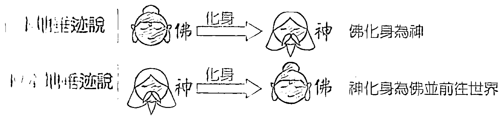

#### 神社与寺院的揉合体

石清水八幡宫是祭祀八幡神的神社。这八幡宫如今虽然是个纯粹的神社，不过从前江户时代却还有个名叫石清水八幡宫护国寺的寺院。同样地，�的冈八幡宫也有座名为鹤冈八幡宫护国寺的寺院。
日光东照宫是奉德川家康为东照大权现祭祀的神社，不过从前江户时代，这里却是由东照宫＋二荒山神社＋轮王寺＋日光连山修行道场所组成，整体统称为日光山，是个神社与寺院浑然一体的大型宗教设施。

+   - 对应页码参考：
    - ...牛头天王 → No.022
    - ...的神 → No.075
    - ○八幡神 → No.074
    - ○七福神 → No.081

## 山王神道

雖說同樣是神佛習合，卻也有各種不同的流派存在，山王神道便是其中非常古老的一支。

### ○始於最澄的神佛習合

山王神道是一支於平安時代左右興起於比叡山延曆寺的神道流派。其實佛教在中國也與道教產生部分習合，當時佛教寺院當中便有祭祀道教的伽藍神。當時正在中國留學的最澄得知此事，回國後在比叡山創立延曆寺時，便曾經奉山王權現為延曆寺的地主神（鎮守土地之神）祭祀。

山王權現是比叡山山岳信仰之神，名叫大山咋神（別名山末之大主神），乃大年神之子。同時也是滋賀縣大津日吉大神（從前唸作ひえたいしゃ（Hietaishiya））的祭神，《古事記》也曾記載：「此神坐於附近淡海國（滋賀縣）日枝之山（比叡山）」。又從位於奈良三輪山的大神神社請來大物主神，經過融合後，遂有比叡山的守護神山王權現之誕生。

神佛習合的時代將山王權現視為釋迦的垂迹，各地天台宗寺院亦建造祭祀山王權現的山王社，以為佛寺鎮守。

進入明治廢佛毀釋時代以後，延曆寺的山王社分離成為日吉大社，各地的山王社也紛紛改為祭祀大山咋神的日枝神社或日吉神社；這也是為何許多日枝神社與日吉神社通常都在距離天台宗佛寺不遠處的緣故。山王神道的中心思想叫作三諦即一；所謂三諦就是假諦（萬法妙有）、空諦（諸法真空）、中諦（諸法實相非有非空）。「山」和「王」兩個字都是用一個筆劃連接三條平行線，據說便是三諦即一思想的象徵。

江戶時代，仕於德川家康的南光坊天海曾經提倡一種山王一實神道，但這山王一實神道其實並無內容，只不過是個探討該以何種名目將德川家康奉為神明祭祀的方法論；其不同處也僅止於它主張山王權現等同於天照大神，是大日如來的垂迹而已。德川家康後來便是因為這山王一實神道，方得受人奉為山照大權現祭祀。

#### 山王神道 = 神佛習合當中一個非常古老的流派

#### 何謂山王權現

+   - 比叡山的山神暫時化身的權現。 -> 名為大山咋神。
    - 天台宗之鎮守。
    - 日吉神社的祭神。
      全國的日吉神社、日枝神社總數達3千間以上，其中主祭神大多都是從日吉大社請來的。

#### 一即神道

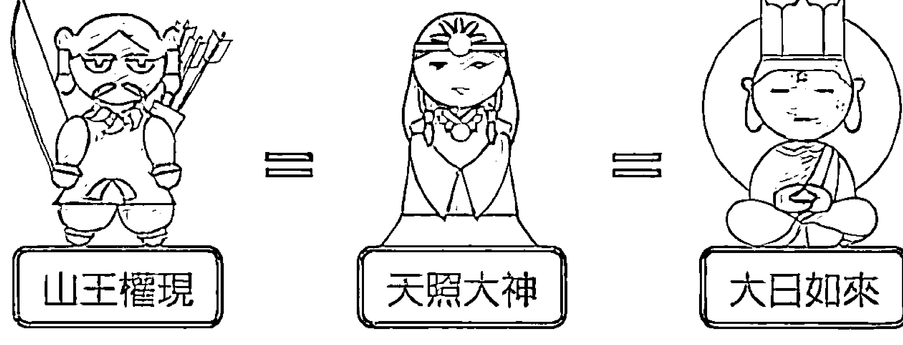

#### 三諦圓融

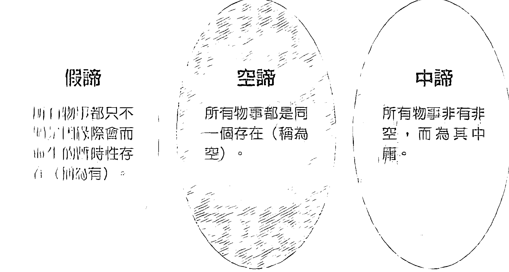

・大山咋神（No.004）・大物主神（→No.037）・猿田彦命（→No.086）

## No.098 吉田神道

神佛習合大多都是以佛教為主、神道為輔，有些人卻無法忍受如此的情況，從而孕生吉田神道。

### ○以神為尊的世界
從前有個人物反對神佛習合當中以佛為主、神為附屬的本地垂迹說，進而提倡以神為主的神道（反本地垂迹說），此人便是室町時代的吉田兼俱。他所提倡的神道，就叫作吉田神道（亦稱唯一神道）。

其实在此之前已经有以神为主的神道，名为伊势神道，可是伊势神道却在南北朝时代选择了南朝，所以伊势神道也就随着南朝势力的衰退而愈见式微，终于完全失去了影响力。

兼俱将神道分成本迹缘起神道（各家神社各自主张不同的起源缘起）、两部习合神道（将曼荼罗诸佛对应于诸神的神佛习合神道）与元本宗源神道三种；他斥前二者为异端，仅以元本宗源神道为吉田家的正统神道。

元本宗源神道可以分为显露教与隐幽教两种。

显露教乃以《古事记》《日本书纪》《先代旧事本纪》三部作品的本文以为教示，正因为这三本书公开流传甚为广泛，此教义也已经散佈于民间。相对地，隐幽教则是主张《天元神变神妙经》《地元神通神妙经》《人元神力神妙经》三部神经，这三本书由吉田家秘密收藏，其教义也一直都是秘密；只不过亦有说法怀疑这三部神经其实是兼俱自创的。

其教义反对以佛为主、神为附属的本地垂迹说，主张以神为主、佛为从属的反本地垂迹说，可是我们从兼俱自身的著作当中，仍然可以看到他深受佛教与道教的影响。

因为这些著作，再加上兼俱本身的政治才能，吉田神社后来方得以发展成为祭祀日本所有神祇的大神社，而吉田家也获得了掌握日本神社神官任免权的莫大权限。

#### 吉田神道

以神為主的神道。室町時代吉田兼俱的主張。

#### 吉田家的系圖

神祇宗族卜部氏的末裔

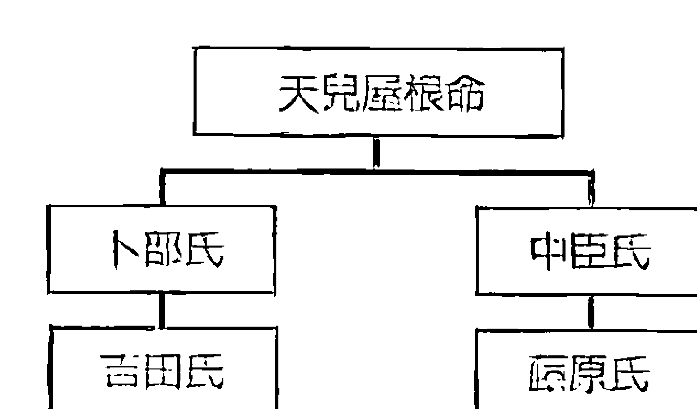

#### 元本宗源神道（吉田家傳承的正統神道）

- 槃初有因不測之元 = 主張天地開闢神話開闢了世界的產生 = 萬國常立妙之所為。
- 槃初一念未生之本 = 同上。
- 槃初一氣未分之元神 = 天地開闢之際，唯神方是根本。
- 槃初萬法歸一之元初 = 所有教示（宗教）均來自於神。
- 槃初一元開闢之神話 = 佛乃以神為根本。
- 槃初一切利物之本基 = 釋迦與孔子均是憑藉神的意志施行教示。

#### 吉田神道的經典

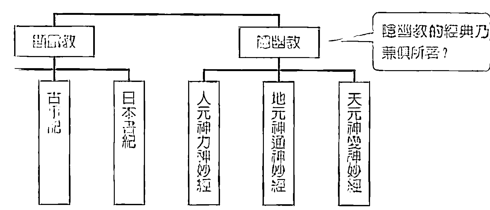

## No.099

### 兩部神道

空海創始的真言宗也在神佛習合的潮流中開始漸漸汲取神道思想，終於形成歷史上與山王神道相比擬的兩部神道。

### ○真言宗的神道

佛教是非常柔軟富彈性的宗教，其思想構造方便佛教將各地土著神祇吸收成爲諸佛座下的守護神。

譬如所謂的「天」，就是佛教將婆羅門教諸神吸收為佛教守護神而來的產物。想當然爾，佛教傳入中國以後吸收了道教諸神，傳入日本以後則是吸收了神道的諸多神祇。

至此遂有神佛習合的神道誕生。其中經過真言宗體系化所形成的，便即所謂的兩部神道。

真言宗將兩界曼荼羅——胎藏界曼荼羅與金剛界曼荼羅分別對應至日本諸天神祇。胎藏界曼荼羅的大日如來對應至天照大神，金剛界曼荼羅的大日如來則是對應至豐受大神，所以伊勢神宮內宮與外宮之神各自相當於兩界曼荼羅的大日如來。因為以兩界曼荼羅表徵諸神，故稱兩部神道。

根據兩部神道的解釋，《古事記》的神世七代（國之常立神、氣鉏野神、宇比地邇神與須比智邇神、角杙神與活杙神、意富斗能地神與大斗乃弁神、淤母陀琉神與阿夜訶志古泥神、伊邪那岐神與伊邪那美神）便相當於佛教的過去七佛（毗婆尸佛、尸棄佛、毗舍浮佛、拘留孫佛、拘那含佛、迦葉佛、釋迦佛）。兩部神道誕生於平安時代，成立於鎌倉時代，長期以來一直是日本神道的中心思想。儘管後來飽受吉田神道與復古神道等神道為主的反本地垂迹說勢力攻擊，但以佛教最大教派為背景的兩部神道，在明治維新以前仍得以長期在日本佔有重要地位。

可惜的是，明治時期的神佛分離與廢佛毀釋的運動，使到兩部神道發生關鍵性的衰退。不過也不可忘記，日本神道的歷史幾乎從頭到尾都處於兩部神道這種神佛習合的狀態之下。

兩部神道 = 神佛习合诸神道当中，经由密宗体系化所形成的神道

以大日如来为中心配置诸佛尊，藉以表征开悟境界与世界相的图像：真言宗有两个曼荼罗

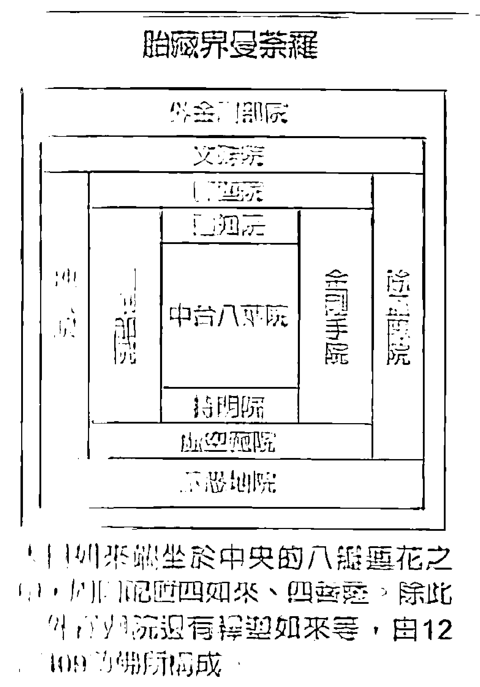

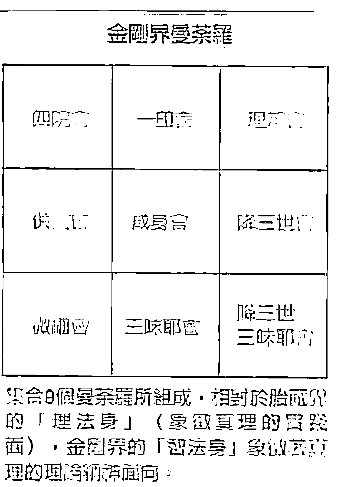

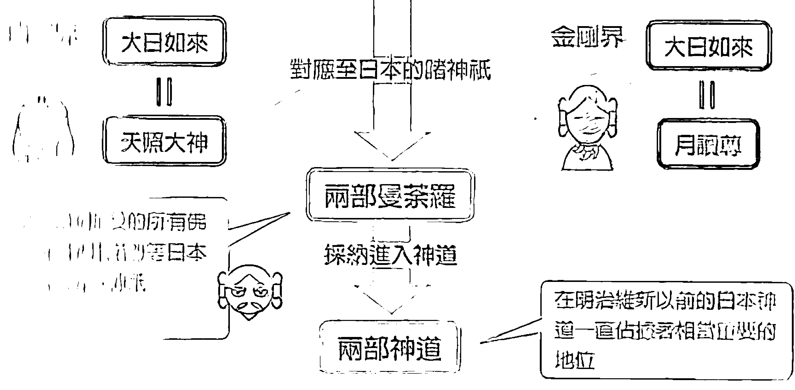

- 天照大御神→No.022
- 复古神道→No.101

## 土御門神道

土御門神道是揉合了陰陽道與神道所形成的極特別組合，同時也記載了自平安時期直到今日陰陽道源流脈絡的陰陽師族譜。

### ○應仁之亂逃亡者建立的神社

眾家神道當中均為特異者，當屬天社土御門神道。

此乃陰陽道宗家土御門家（由安倍本家改名而成）於江戶時代揉合陰陽道與神道二者所獨創之神道，因此可說是佛教、道教、修驗道、神道等思想之融合體。

土御門神社本廳乃土御門神道宗家，位於福井縣境內。為什麼京都土御門家的神社會跑到福井縣呢？因為這裡本來就是土御門家的封地，當初土御門家為躲避應仁之亂的戰火，才會逃徙來到他們的封地。雖後來得以返回京都，不過此地在進入江戶時代後依舊是土御門家封地，受其影響管轄。

土御門家在江戶時代取得了掌管全國陰陽師的權力，以如此權力做為背景，當時的宗家之主土御門久脩（桃山～江戶時代的人物）遂創立土御門神道，眾多陰陽師都成為了土御門神道的信徒。這個時候，土御門神社似乎已經存在了。

進入明治時代以後，陰陽師不再是朝廷的官員，陰陽道開始在民間受到信仰。即便如此，幾乎所有的陰陽師都還是尊奉宗家土御門家的神道。第二次世界大戰後，日本成立土御門神社本廳，土御門神道才終於有了本社。

土御門神社本廳祭祀的乃是泰山府君、鎮宅靈君與安倍晴明三位神明。泰山府君原是道教神，後來佛教亦將其吸收並出現於胎藏界曼荼羅之中，乃是陰陽道的主祭神；鎮宅靈君則是鎮過家宅災厄的鎮宅七十二靈符之神，同樣也是一位道教的神明；至於安倍晴明則是土御門家的祖先，是日本最有名的陰陽師。土御門神道祭祀的便是以上三位，就其奉道教神祇為主神祭祀這點來說，是個極為罕見的神道。

#### 土御門神道 = 撮合陰陽道與神道而成的独特神道

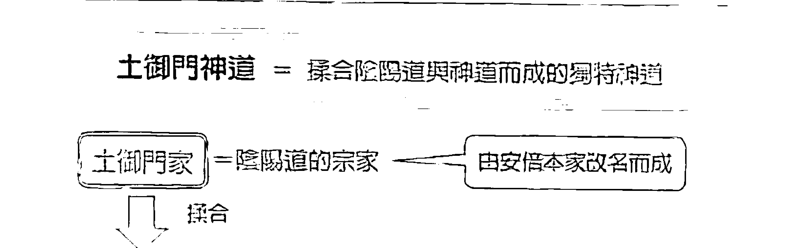

#### 土御門家的系图

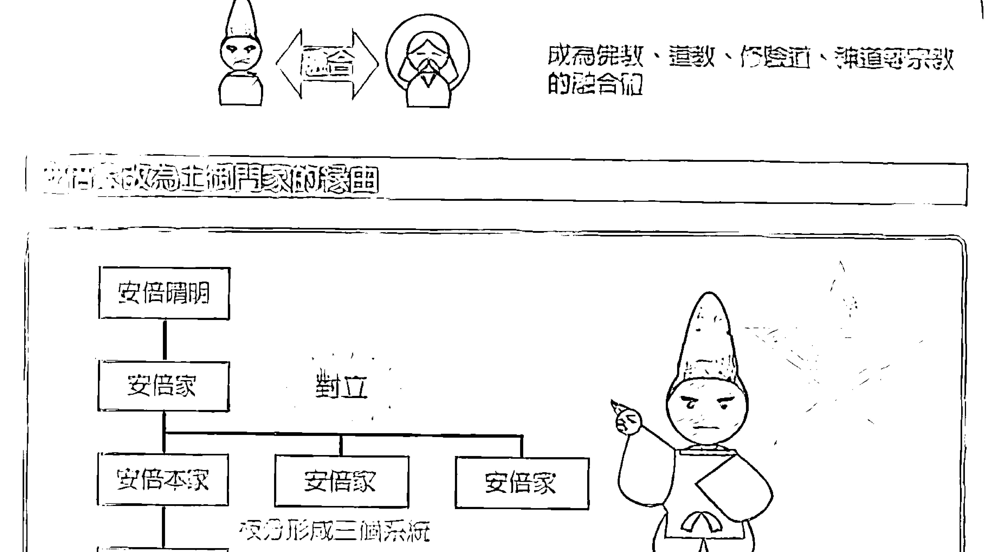

安倍家於平安時代分裂成三個系統，同族之間曾有對立。室町時代後期，安倍家一系以屋宅所在地而改名為土御門家，後來，跟安倍家屬於不同陰陽師家系的土御門家，遂成為了陰陽師之首。江戶時代，又有分家倉橋家從土御門家枝分而出，同樣行使陰陽道。其他還有吉川家、皆川家等，也都是土御門家的分家。

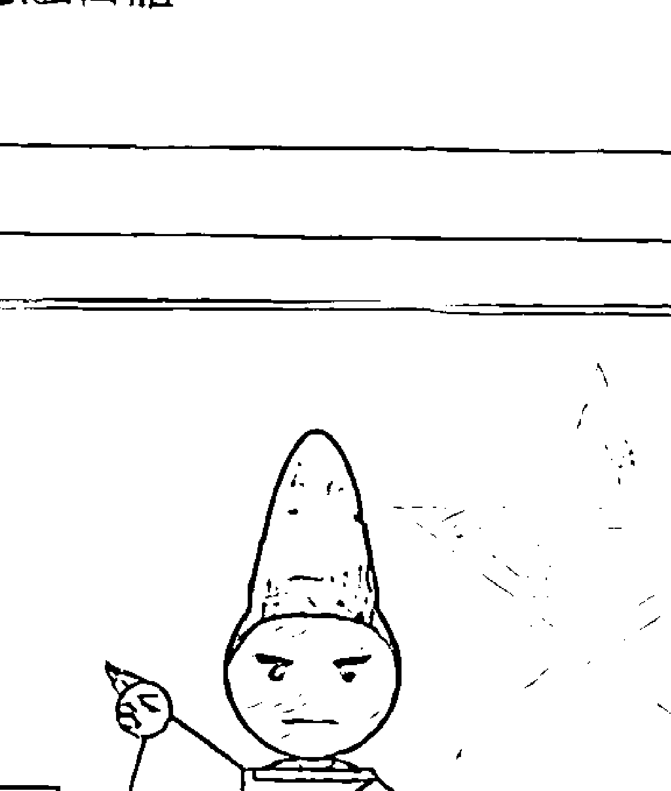

## 復古神道

江戶時代因為有許多優秀國學家的大力推動，使得「恢復古代神道」的運動蔚為盛行，結果才有復古神道的誕生。

### ○國學家創設的神道

所謂復古神道，乃是江戶時代眾多國學家當中的頂尖人物「國學四大人」——荷田春滿、賀茂真淵、本居宣長、平田篤胤——所主張提倡的神道。他們力倡摒除混入神道的印度與中國思想（即佛教與道教），以恢復純粹的日本神道思想。

話雖如此，佛教尚未傳入以前的日本神道究竟是何模樣，也已經無法確知。再說當時流傳下來的文獻，雖然有《古事記》《日本書紀》《先代舊事本紀》《萬葉集》等，不過前三者其實是史書，後者則是歌集。現代固然知道古代的神道屬於泛靈信仰的一種，可是江戶時代的人們並不知道；當時他們主張的雖然是自然的神道，但似乎比較接近於所謂的老莊思想。

其次，當時還有「日本是全世界最優秀的國家」的思想。換句話說，復古神道可說是滿載著眾多國學家思想的神道。

本居宣長在自身著作當中主張天照大神是太陽，同時也是位人格神；這個太陽是日本的神，而由其子孫擔任天皇所統治的日本是全世界最尊貴的國家。

平田篤胤卻認為宇宙的根源乃是天御中主神、高皇産霊神、神皇産霊神這三位造化三神，而非天照大神。可是，他們固然是最早出現的神明，實際上卻什麼都沒有做。其實篤胤便也曾說：「此世是為辨吾人善惡而生之片端世界，故吾人本世實為幽世」，主張造化三神是本世之神，也就是幽世之神；至於當世，他還是主張必須忠誠於天照大神與天孫（＝天皇家）。復古神道一方面成為了明治維新尊皇攘夷的思想背景，另一方面其主張日本優於他國，該當稱王於世界的思想，則可以連結至明治以降的國家神道。若從這個角度來看，它負有促成明治維新之功與引發第二次世界大戰之罪，則復古神道可能是個功過參半的思想。

#### 復古神道＝江戶時代國學家所提倡的神道

#### 國學四大人

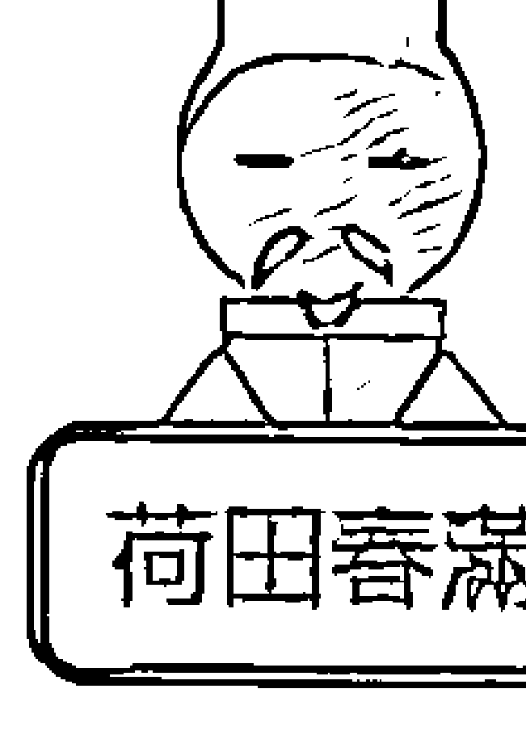

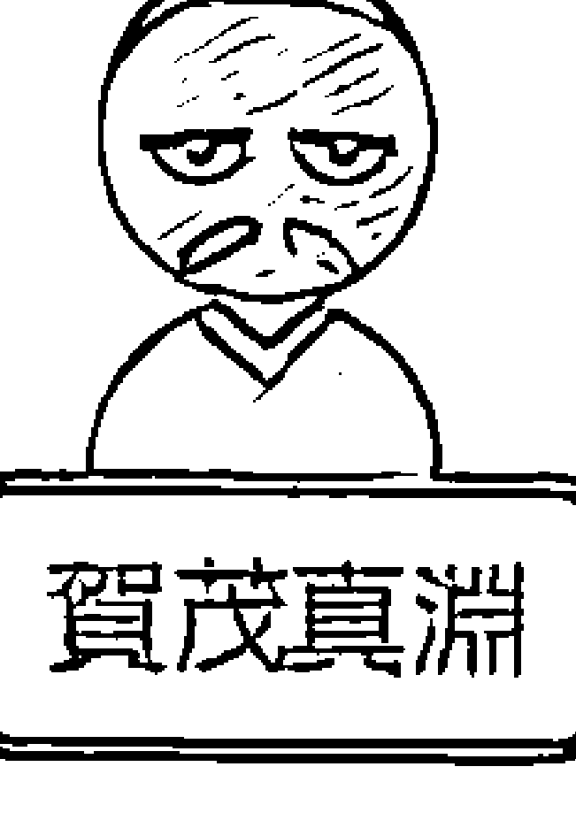

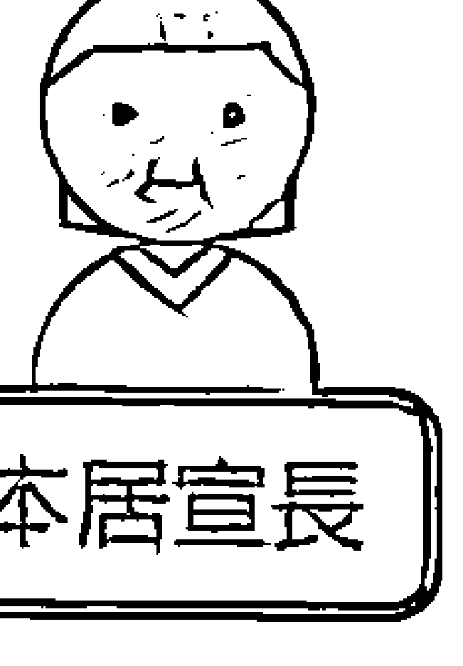

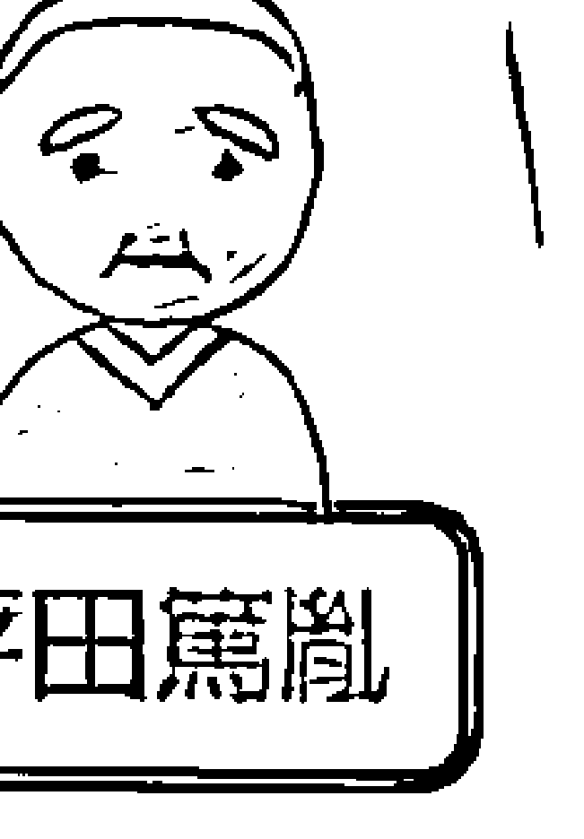

主張

恢復古代神道

復古神道

摒除混入神道的印度與中國思想，恢復純粹的日本神道思想

江戶時代

復古神道

尊皇攘夷思想

教派神道

> 打倒外國人！

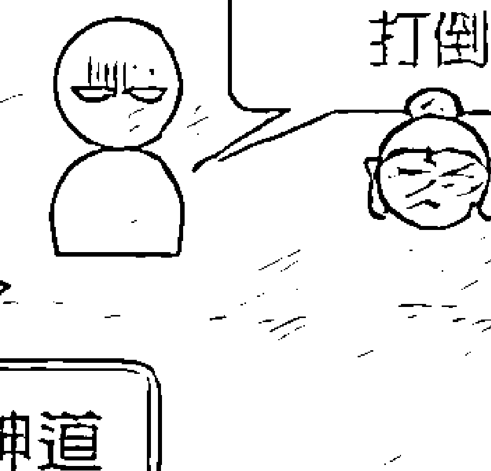

明治時代

復古神道

國家神道

> 我願為天皇而死。

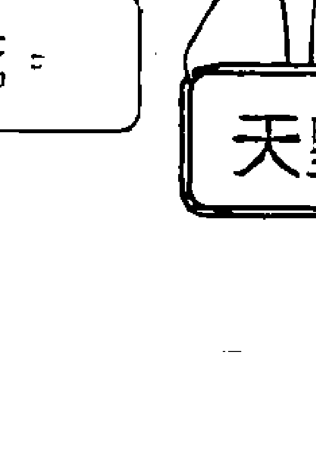

## No.102

## 伯家神道

天皇家自古以来当然是以神道仪式从事祭祀，而实际职掌其中祭祀诸事者，便是所谓的伯家神道。

### ○天皇家的仪式

伯家神道并非宗教，而是个仪式体系。

从前智天皇建立的律令制度设有专职执行祭祀仪式的官吏，名为神祇官；神祇官之长，称作神祇伯。

起初神祇伯是由专职祭祀的家族如忌部氏或是中臣氏出任，11世纪以后则改由白川家世袭任职。白川家是花山天皇之孙白皇家降至臣籍所形成的贵族家，当时有个出任神祇伯者可回归天皇家的传统（仅神祇伯一人而已，而且退休后还要降回臣籍），故亦称白川伯王家。或许是因为宫中祭祀乃天皇职掌，而神祇伯身为其代行者，所以才将白川家视为天皇家成员吧。

白川伯王家代代相传的仪式体系，便即伯家神道。

照理说，担任神祇伯的伯王家应该位于神道的顶点才是，然则室町以后，全国神职的任命权却让新兴的吉田神道所夺，反而屈居其下，使得白川家没落到几乎只剩下宫中的祭祀事官而已。即便如此，白川家仍然保有着神祇伯的地位。

进入江户时代以后，白川家致力于对全国神社宣传指导他家所没有的古老传说与仪式作法，以期取回让吉田家夺去的权限，使得伯家神道得到某种程度的散播推广，同时还有著作《伯家部类》等书籍，留下极珍贵的纪录。

伯家神道的真正破灭发生在明治维新。其实照道理来说，宫中祭祀本应该随着天皇家的复权而得到强化，神祇伯之权威也该愈发提升才是，可是明治政府却废止了神祇官，将白川家弃为区区子爵。

天皇家的祭祀仪式至此断绝，伯家神道不复存在，只不过现代倒是仍有许多人以承继伯家神道衣钵者自称便是。

#### 吉田神道的起源

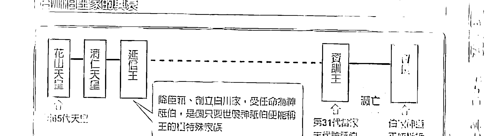

#### 今依然存在的皇室祭事概要

| 祭事 | 日期 | 内容 |
|------|------|------|
| 正月 | 1月1日 | 遥拜四方神祇。 |
| 四方祭 | 1月1日 | 三殿（贤所、皇灵殿、神殿）的年初祭事 |
| 元始祭 | 1月3日 | 祈愿皇位巩固、国家繁荣。 |
| 开始 | 1月4日 | 向天皇奏报伊势与宫中的祭祀行事。 |
| 祈年祭 | 2月17日 | 于三殿祈求丰收。 |
| 春季皇灵祭 | 春分 | 于皇灵殿祭祀祖先。 |
| 春季神殿祭 | 春分 | 于神殿拜神明。 |
| 神武天皇祭 | 4月3日 | 神武天皇崩御之日，于皇灵殿举行祭典。 |
| 神武天皇祭夜祭 | 4月3日 | 神武天皇祭夜，以御神乐奉慰神灵。 |
| 大祓 | 6月30日 | 为天皇行祓。 |
| 大祓 | 6月30日 | 为国家、国民行祓。 |
| 秋季皇灵祭 | 秋分 | 于皇灵殿祭祀祖先。 |
| 秋季神殿祭 | 秋分 | 于神殿拜神明。 |
| 新尝祭 | 10月17日 | 于贤所以新谷供奉神明。 |
| 新尝祭 | 11月23日 | 以新谷供奉皇祖与神明，是最重要的祭祀。 |
| 镇魂祭 | 12月中旬 | 于贤所以御神乐奉慰神明。 |
| 大祓 | 12月31日 | 为天皇行祓。 |
| 大祓 | 12月31日 | 为国家、国民行祓。 |

## NO.103

## 國家神道

國家神道向來被視為使日本陷入太平洋戰爭泥沼的其中一個元兇，卻鮮少有人知道國家神道其實是人為創造出來的神道。

### ○明治時代形成的神道

所謂國家神道，就是從明治維新開始支配日本宗教界，直到第二次世界大戰戰敗為止約莫八十年的神道。

其實，大日本帝國憲法第二十八條也寫到「若無妨害安寧秩序或悖離臣民義務之情事，則日本臣民有信教之自由」，明確記載儘管有一定的限制，人民仍有宗教信仰的自由。

然而帝國政府卻說神道並非宗教，所以把神道設置凌駕於其他宗教之上並沒有違反憲法，遂有堂而皇之以國家資金投入官社（政府管理的神社）的事情發生。

國家神道的教義並不明確，其概略如下：

最最重要的，便是天皇的定位。國家神道首先主張天皇是承繼自天孫的萬世一系，是乃現人神，然後再從這個事實演繹編織出各種理論。

天皇是神，是國家國民之父。所以說為天皇奉獻犧牲，從臣下的角度來看便是忠義，從天皇之子的角度來看便是孝行。於是乎，國家神道就這麼成了主張所有國民都該為天皇奉獻行動的思想。

因為天皇是現人神，所以大日本帝國這個神所領導的國家便是一個受神明保佑守護的神國，從而衍生出身為神國的日本有領導亞洲、甚至全世界之義務的理論。理所當然地，大日本帝國的戰爭都是為達到上述目的而行使的聖戰，永遠都是正當的。既然是如此的聖戰，臣民自然都要為此而戰，而參戰者和戰死者則會化作英靈、成為神明。

據說這些國家神道教義其實是參考了基督教等諸多宗教，於明治時期透過人為手段所創作出來的。

#### 為成立國家神道而採取的政策

國家神道 = 從明治維新起，支配日本宗教界直到二戰戰敗為止，約80年的神道

#### 社格（神社的格式）

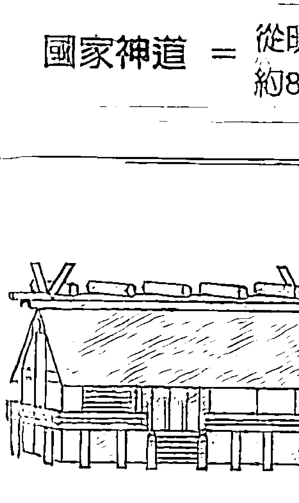

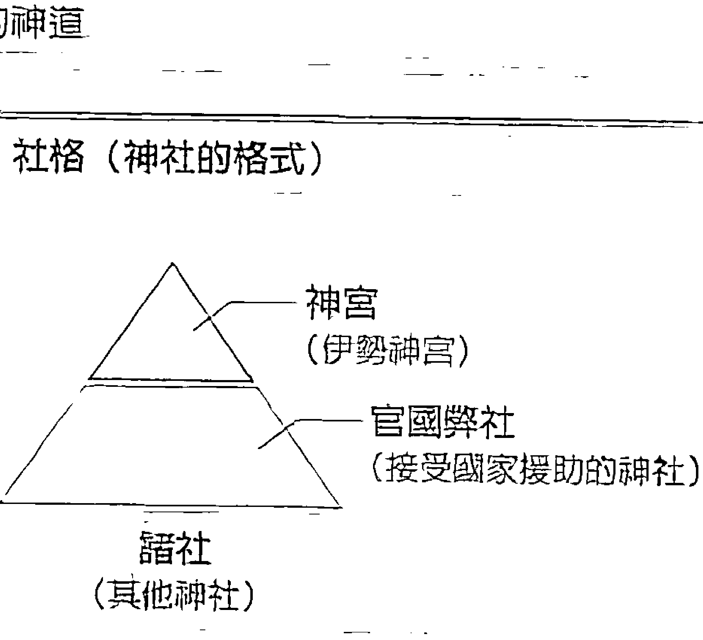

| 神佛分離令（慶應4年＝明治元年） | 強制分離習合已近千年的神道與佛教。 |
| 大教宣布（明治3年） | 尊天皇為神、立神道為國家的詔書。 |
| 廢釋毀佛令（明治初期） | 消滅規模太小的神祠與民間的猥雜神祇，以圖提高神道之權威。 |

## No.104

## 神社的構造

日本國內有無數神社，其中絕大多數都是遵照固定規矩所建造的建築。

### ○膜拜御神體的場所

寺院設置有佛像。換句話說，寺院裡面的是「像」，人們透過這個像來拜佛。相對地，神道卻認為神本身就在神社之中，因此神社便等於是直接膜拜神明的場所。

也不知是否因為這個緣故，神社的建築可以分成本殿與拜殿兩者（神社的建築不僅止於此，本節僅就主要建物而論）。

所謂拜殿，就是人們入內在此膜拜神明的場所。其他像是神社的祭典等儀式，神職者也都是在拜殿執行。一般民眾頂多只能進到拜殿而已，所以許多人或許會以為拜殿是整座神社裡最重要的建物也說不定。

拜殿其實是平安時代以後才出現的建物，像伊勢神宮和春日神宮就沒有拜殿。神社當中最重要的，還是該神社的神。御神體（神明宿於其中的物體）其實是放置在位置比拜殿更裡面的本殿之中；換句話說，神明所在的本殿才是整座神社裡最神聖、最重要的建築。然而本殿通常都隱藏於拜殿後方，參拜者鮮少能夠目睹，再加上有些本殿因為並未設計要供人出入所以蓋得很小，有些以整座山為御神體的神社則根本就沒有本殿，使得本殿往往容易受到輕視。

除此之外，有些神社還會在拜殿之外，另行設置幣殿存放信徒獻給神明的供物，許多神社也設有社務所做為神社的管理事務所，還有些神社在境內設有祭祀其他神祇的攝社（祭祀土地神祇或主祭神相關神祇）或末社（祭祀其他神祇）。

很多神社在境內亦設有狛犬或鳥居。狛犬本是印度神殿的裝飾，於飛鳥時代傳入日本；據說起初原本是獅子，現在則變成了犬。

#### 神社地圖

神社 = 神本身就存在於神社之中

建築物可以分為本殿與拜殿兩個部分

御神體（神所寄宿之物體）安置於此。

本殿

信徒入内在此膜拜神明的場所。

拜殿

神職者在此執行神社祭祀儀式的場所。

一般人頂多只能進到拜殿為止。

社務所

神社的事務所。

狛犬

道

鳥居

許多神社還設有狛犬或鳥居。

#### 形形色色的本殿建築

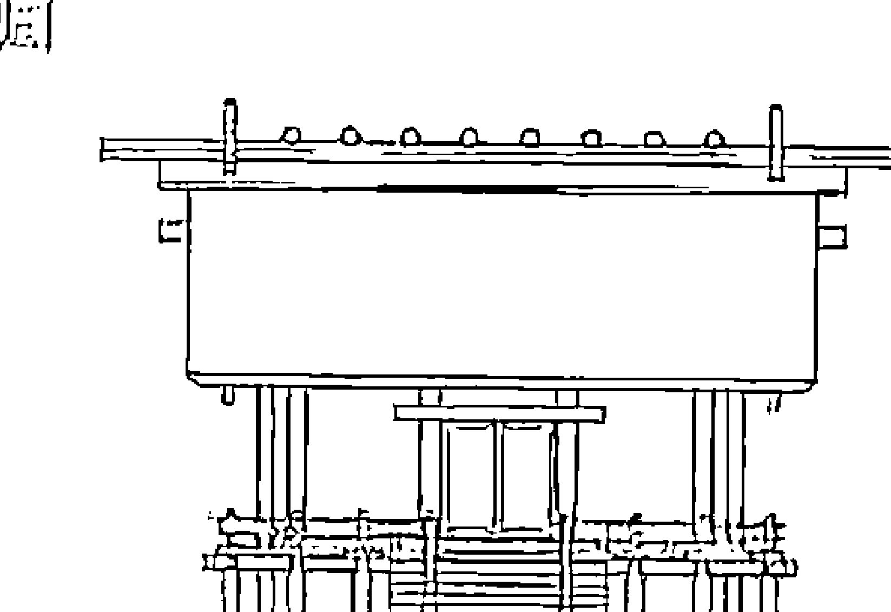

神明造 （伊勢神宮內宮正殿）

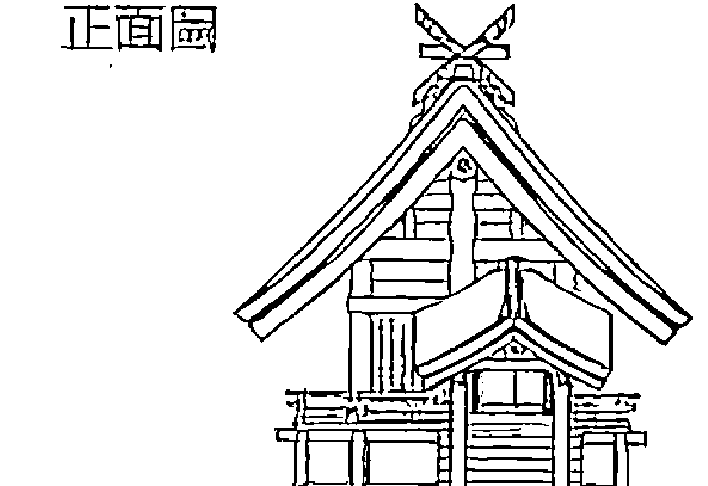

大社造 （出雲大社本殿）

其他還有

- 住吉造
- 春日造
- 流造
- 八幡造
- 日吉造
- 八坂造
- 櫻現造

#### 神社的参拜作法

神社的参拜有别于佛寺，所以我们去神社或寺院的时候，必须视场所改变膜拜的方法。

#### 二拜二拍一拜

就算是没什么坚定信仰的人，相信还是会在过年等时节去神社参拜，许多人也会在孩子的七五三等节日去神社参拜。趁这个时候稍微观察一下，就会发现许多人在参拜时，只不过是有样学样而已。且让我们来介绍正确的参拜作法吧。

首先是手水的使用方法。神社和寺院的入口会有水源涌出，一旁置有柄杓。这是做什么用的呢？

其实就是净身的简化版。按照道理来说，参拜者必须事先斋戒沐浴方可前往神社参拜，可是平时参拜也要斋戒沐浴实在繁琐，遂以手水洗手漱口代替之。

首先以右手持柄杓汲水清洗左手，然后把柄杓换到左手，清洗右手。再把柄杓换到右手，汲水于左掌，用掌心的水漱口（不可直接以口就杓）。接着将柄杓竖直，用剩下的水清洗木柄。最后将杓口朝下放回原来位置。以上就是手水的使用方法。

其次是礼拜。神社的礼拜，称作二拜二拍一拜。

首先走到神前，挺直身板鞠躬两次。按照原来的规定，鞠躬时腰部必须弯曲至90度，不过现代已经没有必要做到这等程度。其次，双手合十置于胸前；这时双手要稍微错开，右手指尖稍稍低于左手，接着拍手两次，最后再鞠躬一次，便告结束。摇响铃铛和投香油钱等动作，要在二拜之前进行。向神明祈求愿望，同样也是排在二拜之前。

除此之外，还有些将古时候的参拜形式保留下来的神社。譬如出云大社和宇佐神社就是采取二拜四拍一拜，伊势神宫则是四拜八拍一拜。

#### 二の鳥居の參拜方法

- 1. 右手持柄杓舀水。
- 2. 洗左手。
- 3. 柄杓换到左手。
- 4. 洗右手。
- 5. 再把柄杓换到右手。
- 6. 舀水於左手掌心。
- 7. 以掌中水漱口。
- 8. 豎起柄杓，以剩下的水洒洗木柄。
- 9. 杓口朝下放回原来位置。

> 不可將柄杓就口

#### 三禮一拝の禮儀

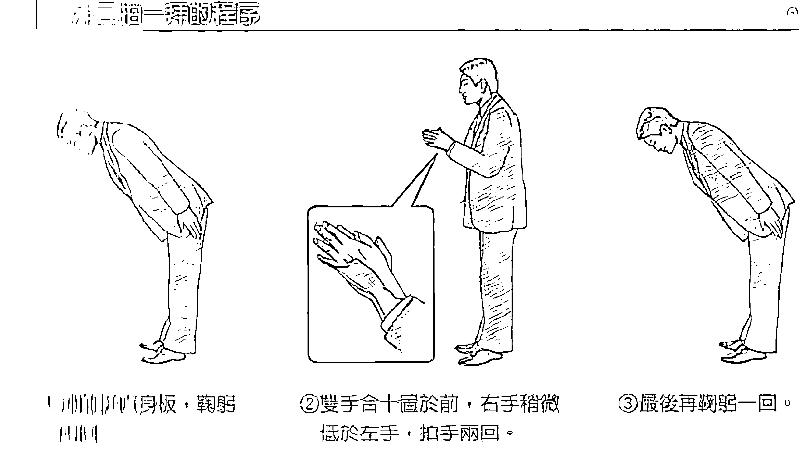

## 注释附录

## No.001

「奥菲斯（Orpheus）：又译俄耳甫斯。古希腊传说中的英雄，有超人的音乐天赋。传说他是缪斯女神和色雷斯王俄阿戈斯（Oeagrus）的儿子，太阳神阿波罗把他的第一把七弦竖琴给了奥菲斯。奥菲斯的歌声和琴韵十分优美动听，各种鸟兽木石都会围绕着他翩翩起舞，曾为了找回死去的妻子欧律狄刻下冥界，却因为忍不住回头确认妻子是否跟随在后，最终失去了她。

## No.009

- 神道：指身份高阶者或神明死亡。
- 宜名利（Nirai Kanai）：古琉球传说中位于大海彼方或海底的他界。那是個為现世带来幸福、繁荣與优越的乐土，古琉球人认为人类生活中的所有重要事物诸如火、稻米、无限生命的泉源——灵力等，全部都是来自於宜名利。

## No.010

- 万叶集：现存最早的日语诗歌总集，收录了4世纪至8世纪4500多首长歌、短歌，共计二十卷。

## No.013

「~住吉之岛」：意为「从难波岬遥望我国，可以看见淡岛、沼岛、志贺岛与住吉之岛。还有住吉之岛也看到了」。

## No.014

- 天津神（Amatsukami）：国津神（Kunitsukami）跟天津神是日本神话中登场之神明的分类。天津神是指高天原、以及从高天原降临凡间的神明，相对地，国津神则是统称出现在各地方的众多神明。在日本神话里，几乎所有国津神都是受到天津神统治的下级。

## No.019

- 黑御币：日本古代将麦秆染成黑色的菱草插在发间以避邪驱魔的作法，此物即称为所谓的黑御币。

## No.025

- 逆剥：若按照日语原文直译是指从相反的方向将马皮剥下来；然而学术界逆剥看法不一，有的说逆剥是从马屁股剥皮，此举侵犯了神灵的神圣性，其实逆剥原意只是单纯指杀死家畜而已；有的则说逆剥是从马头剥皮，但此...## No. 027

贤木：学名即日本红淡比（Cleyera japonica），原产于东、西北亚温带的亚热带地区。日本神道称之属「神」，与日本扁柏、日本柳杉并称为「神木」。为日本常见的景观设计及神社植物。

## No. 030

酸浆果（Physalis）：茄科的一属，80种小型草本植物。其合生花萼膨大而呈囊状，包埋一肉质浆果，成熟浆果呈鲜明的橘红色。有的种类因可食而称为地浆果、冬浆果、草莓番茄、酸浆番茄或有梗番茄。

## No. 031

...遂有须贺之名：日语所谓「清爽」（すがすがしい）或音同「须贺」（すが）。清地：亦读作「すが」。

## No. 032

信州的素兔：即「因幡的白兔」（いなばのしろうさぎ），两者读音相同，写法不同而已。

## No. 033

...许原色许男：一说此名有「常原国的花花公子」之意。

糙叶树（Aphananthe aspera）：榆科糙叶树属的植物。落叶乔木，高近20米；叶卵形，三出脉，边缘具平波齿，上下两面密被平伏的糙毛，上面在叶脱落后仍粗糙。生长于海拔500米至1000米的地区，多生长在山谷和溪边林中，目前尚未由人工引种栽培。

## No. 035

御灵：指神灵之所宿，神社奉祀祭祀对象的神圣物体。古代相信山岳、巨岩、大树等物是神体或神的宝座，今日则多使用镜、剑、玉、笔、布、彩像为神体。

...：日本神道相信神拥有荒魂与和魂两种灵魂，其中荒魂是指粗暴的破坏性力量；而和魂则是霖雨阳光等温和平静的面向。和魂又可以分成幸魂与奇魂两种，其中幸魂是指透过运气带给人们幸福、带来收获的力量。

...：乃指使万物得以欣欣向荣的生力，使人源得以繁荣活泼的活力。

## No. 036

夹竹桃科（Asclepiadaceae）：龙胆目的一科，280余属，约2000种热带草本或灌木状藤本植物，稀灌木或乔木。

...（Ampelopsis japonica）：亦称鹅抱蛋、白葡萄秧。分布于中国东北、华北、华东及中南各省，亦见于日本。全草以及块根可以入药，用于清热解毒、消肿止痛，不过不宜与甘草同用。中药上以塔根入药，性微寒、味苦辛，功能为泻火、散结、生肌、止痛，主治疮肿热毒、烫火伤、赤白带下、淋巴结核等症。

鹪鹩（Troglodytes troglodytes）：俗名巧妇、山蛐蛐。体长约10厘米，头部浅棕色，有黄色眉纹，上体连尾栗棕色，布满黑色细斑，两翼覆羽尖端为白色。

## No.037

「辛魂、祈魂：「辛魂」请参照P.227 No.035注解。幸魂也是和魂的一种，乃指通过祈求直接带来幸福的力量。

## 专目：新撰姓氏录大意

- 1. 幸福仪式：供奉币帛的仪式。所谓币帛乃献给神的供品，内容经常包括布帛、纸、玉、兵器、货币、器物、酒食等物。亦称神币、币束。
- 2. 圣别：为某些神圣用途而通过仪式来净化人或物，以区别普通世俗的用途。

## No.045

连香树（katsura tree）：连香树科（Cercidiphyllaceae）唯一的一种现存植物，学名Cercidephyllum Japonicum，原产于中国和日本。乔木，栽培者树高15公尺，树形美观，从下部开始分枝，树冠卵形，叶近心形，初红紫色，后变绿色，将落叶时变黄又变红黄色。常栽培供观赏，病虫害少，是美化环境的优良树种。在日本，其木材用于一般建筑。

## No.047

- 1. ～ありあけ：这首和歌大意是说「红玉虽然（总指珊瑚），就比穿玉的绳子看起来都会发光似的，可是如果要拿来比喻夫君，还是白玉（总指珍珠）方能表现夫君的尊贵神圣」。
- 2. ～世のことごとに：这首和歌大意是说「只要我还活着，我就永远不会忘记曾经在牡蛎聚集的岛上（蛎子都是成双成对）与君共度的那夜」。

## No.053

- 1. 神主：服事于神社、以神事为业者，即神官、神职者。
- 2. 大国主根子：即意富多多泥古，音同。

## No.054

通婚：此处所谓通婚是日本古代一种特殊的婚姻形态。是指夫妇结婚后并不同居，由丈夫前往对方居住场所，孩子由娘家负责抚态。

## No.055

对得切石白大叫：日语「白」音同「确」，故有此说。除此之外另有别山同：常有趣的說法。古代日本有妻子臨產受苦時，丈夫也必須負擔分娩的痛苦，進行屋外的習俗；相傳當時生下第一胎以後皇后還是很難過，天皇便把已經放下的石臼又再扛了起來，待第二胎誕生，天皇放下石臼以後，因為扛著石臼大解咒罵過，《日本書紀》便記載到「碓に拠びたる御子」，由於天皇扛了兩回石臼，所以才幫孩子取名為大碓小碓。

## 注057

求髪於頸：根據日本古代習俗，童子年15、6歲時求髪於頸，年17、8歲分為角子（即角髪，請參照P.053頁注釋）。一般15、6歲從事非比尋常，意在暗示其過人的資質。

日本武尊：《日本書紀》對倭建命的稱呼。

## 注058

- 冬青（Holly）：冬青科冬青屬灌木或喬木，約400種，包括流行的聖誕冬青，單葉互生，花小，通常淡綠色，單生或簇生，通常雌雄異株。漿果紅色或黑色。
- 國造：大化革新以前的世襲制地方官，由朝廷任命地方豪族出任、統治該地區。大化革新後遭到廢止，許多國造紛紛轉任郡司，負責司掌郡國的祭祀神事。

## 注059

「吾妻」：阿吾妻（あづま）音同吾妻，後世又常以漢字「東」表此音。

## 注060

- 冰雨：除冰冷的雨水以外，亦指冰雹與雪液。
- 謂此地為當藝：「當藝」（たぎ）來自日語的「戦」（たたかい）

## 注063

吾妻啊：同《古事記》記載倭建命所喚「吾妻啊」。

## 注 魚名與神馬

- 日高地方：日高乃北海道舊郡國名，相當於現在的日高振興局管轄區域，位於北海道中南部。
- 伊富魚：即遠東紅點鮭（Salvelinus leucommaenis），又名白斑江鮭。分布於北太平洋沿岸，包括俄羅斯遠東地區、日本、朝鮮半島、中國東北、美國阿拉斯加州及加拿大，屬洄遊性魚類。其多生活於日本，有陸封型種。

## 注073

- 渡來人：請參照P.227頁No.035注釋。
- 渡來人：指來自海外其他國家歸化於日本者，從前以朝鮮人最多。

## No.075

修驗者：又作山伏（やまぶし），也就是伏於山野之中修習法力的咒術者，是為達成民衆願望而使用咒法的僧侶。修驗道在發展過程當中吸收了密教與陰陽道等各派咒法，因此可以說是日本咒法的複合體。

## No.078

八合目：富士山海拔3776公尺，其中八合目相當於標高3350公尺處。

## No.079

- 1. 投行者：即役小角，是日本修驗道始祖，大和國葛城上郡茅原村（今奈良縣御所市茅原）人，是飛鳥時代至奈良時代的知名咒術師。史料中只有《續日本紀》提到他，最有名的則是《日本現報善惡靈異記》。
- 2. 寒神：即所謂岐神、巷神、辻神、道祖神，是日本民間信仰中阻攔疾病災害、惡鬼幽靈進入聚落的神祇。
- 3. 連歌：古時候日本人曾舉辦連歌會，眾人聚集起來踏循和歌五七五七七的音節韻律輪流連綴創作和歌，以爲遊戲。
- 4. 「時は今 あめが下する 五月哉」：這首和歌本意為「現在的季節是陰雨連綿的五月」，因日語「雨」與「天下」音同（あめ），後世將這首歌解釋為明智光秀假托歌詠季節，實則暗表其取天下之心。
- 5. 治天下：音同「あめが下する」。

## No.080

- 1. 白血長血病：兩者均屬婦女病，白血亦即所謂白帶，長血則是指女性長期有子宮不規則性出血的病症。
- 2. 羅摩：請參照P.227頁No.036注釋。

## No.081

- 1. 濕婆（Siva）：婆羅門教和印度教主神之一，即毀滅之神、苦行之神、舞蹈之神。與梵天、毗濕奴並稱為婆羅門教和印度教三大主神。印度教認為「毀滅」有「再生」的意思，故表示生殖能力的男性生殖器「林伽」（Linga）被認為是他的象徵，受到教徒的崇拜。據稱他終年在喜馬拉雅山上修苦行；還善於跳舞，是剛柔兩種舞蹈的創造者，被稱為「舞王」。
- 2. 婆羅賀摩（Brahma）：印度教中與毗濕奴、濕婆並列三大神。婆羅賀摩創造世界，毗濕奴加以維持，而濕婆則是負責破壞。佛教將其採用後改稱梵天。
- 3. 俱毗羅（Kubera）：婆羅門教、印度教的財神。世上一切財富的守護者，北方的保護神，又是夜叉和緊那羅的王。羅波那（《羅摩衍那》中的魔鬼名）的同父異母兄弟。相貌醜陋，三條腿，八顆牙，只有一隻眼，另一隻眼只是一個黃色斑記。在佛教文獻中，被稱為護法四天王之一北方毗沙門天王，即「多聞天」。
- 4. 釋契此：本卷文中雖作唐朝人物，然契此和尚實為五代後梁時期僧人，明州奉化（今浙江寧波奉化）人。《宋高僧傳》最早記載其生平，說他「形裁腲脮，蹙頞皤腹，言語無恒，寢卧隨處。」據傳後梁貞明3年（917年）三月，契此和尚圆寂前留一偈语：「弥勒真弥勒，化身千百亿，时时示时人，时人自不识」，因此契此和尚即为弥勒菩萨化身的说法便广为流传。

老人星 (Canopus)：亦称船底座α (Alpha Carinae)。夜空中第二亮星（仅次于天狼星），目视星等为-0.73等。位于南天船底座中，距离地球约300光年，由于它与太阳的角距离适合以及邻近天体的亮度差别大，在地制太空船的姿态过程中有时被用作导航星。

坦陀罗 (Tantra)：即经咒。论述印度教、佛教和耆那教某些派别中的神秘修炼的经文。按照印度教经籍的正统分类法，经咒指成书晚于《吠陀》而与往世书相似的梵文论著，论述神学、瑜伽、建寺立像以及宗教习俗，但事实上它们往往论述民间印度教的更为具体的表征，如咒语、礼仪和标志。

曼荼罗 (Mandara)：曼荼罗是佛教宗派之一的密宗于祭仪中所使用，又是为了表示密宗的世界所描绘出的佛教世界地图。发源地为印度，后来随着密宗的传播，传入中国，传入西藏、日本。「曼荼罗」是「领悟的境界」之意。据说是梵文中的manda（本质）+la（得到），换言之，原本是指「得到本质」之意。因为该境界圆满无缺，故也意译为用圆轮加以譬喻的「圆轮具足」。后来转变为「有悟之地」的意思，最后变化成「神圣空间」之意。

最澄 (Saicho)：767-822。谥号传教大师。日本佛教天台宗创始人。13岁出家，804年到中国留学，将天台宗教义传入日本。在京都附近比叡山建寺。他要求僧众严守戒律，隐居比叡山12年。尊敬神道教的神祇并强调佛教的爱国义务，为日后日本佛教主流确定发展方向。

丹波：日本旧国名，相当于现在的京都府北部地区。

国司：古代日本律令制下，由中央派遣至诸郡国执掌政务的地方官。

右大臣：古代日本律令制下太政官的长官。位阶仅次于太政大臣、左大臣，负责统理政务。亦称右府、右丞相、右仆射。

大纳言：古代日本律令制下太政官的次官。位次于大臣，相当于正三位。与大臣一同参与政务，大臣不在时则由大纳言代行。

绞染：将花草树叶放在布料上、从上方拍打以将布料染色制成的衣料，或利用花叶汁液揉搓染色的布料。

天台宗：中国佛教宗派之一。隋僧智顗所创，因智顗晚年居住天台山，故称名「天台宗」。以法华经为主要教义根据，故亦称为「法华宗」。依中观双修的原则，发明一心三观、圆融三谛、一念三千的道理，以龙树八教判指整體佛法。天台宗是漢傳佛教中最早一個完全由中國佛教法師所創立的本土性宗派，9世紀由日本僧人最澄傳至日本，盛極一時。宋朝之後，天台宗在中國衰弱，失去其重要性，卻反而成為日本的重要宗派。

能樂：日本傳統藝能，是把特技、奇術和滑稽劇的表演。

狩衣：平安時期是貴族的便服，至鐮倉時代則成為貴族與武士的正式服裝或禮服。

襄荷（Zingiberaceae）：薑科薑屬多年生草本植物。食用器官為花莖，味芳香微甘，可涼拌或炒食，也可醃漬、鹽漬，富含蛋白質、脂肪、纖維及多種維生素。一般7月中旬至9月中旬收穫。

## No.091

阿特拉斯（Atlas）：阿特拉斯為泰坦神族，名字的原意是「忍耐者」。他因為與宙斯對抗而被敗，受命永遠肩負支撐天空的職責。

拿非利人（Nephilim）：見於希伯來聖經，包括創世記6章1～4節、民數記13章33節等處；也見於其他聖經卷和一些非正典猶太人著作。出現在迦南地區的史前巨人，被以色列民族稱為拿非利人。民數記13章33節，以色列人看見這些身量高大的人種，感到極為恐懼。

## No.092

散切：剪掉髮髻的髮型。流行於明治初期，被視為文明開化之象徵。

振袖：未婚女性的和服用長裝，袖子較其他服裝來得更長。是從前未成年及婚的男女穿的衣服。

緋紗：日本傳統紡織技法，以事先染色的絲線作紡織的經絲來使用，藉以呈現紋樣的技術。

## No.093

黑住教、金光教、大本、生長之家：黑住教是岡山縣岡山市今村宮神官黑住宗忠於江戶時代開創的教派神道，屬神道十三派之一，現任教主為第六代黑住宗晴。金光教與黑住教同為江戶末期所創，屬於教派神道聯合會，也是戰前的神道十三派之一。大本是以國常立尊的神諭為原點的教派神道宗教團體，俗稱「大本教」，但正式名稱並不加「教」字。生長之家乃昭和5年（1930年）谷口雅春所創，是積極從事右翼活動的宗教右派團體。

## No.096

佛為本地、神為垂跡：「本地」有本體、原本樣貌的涵意，「垂跡」則是指佛與菩薩為拯救眾生而化作日本諸神現身。

## No.097

伽藍神：佛教崇拜的護法神，是佛寺（伽藍）的守護神，負責保衛寺院，甚至是寺院轄區，並不一定特指何人。

## 中英日名詞對照索引

| 中文 | 英文/羅馬字 | 日文（讀音） | 頁碼 |
| :--- | :--- | :--- | :--- |
| 七福神 | Shichifukujin | 七福神(しちふくじん) | 174 |
| 八上比売 | Yagamihime | 八上比売(やがみひめ) | /6 |
| 八百万神明 | Yaoyorozunokamigami | 八百万の神々(やおよろずのかみがみ) | 10 |
| 八岐大蛇 | Yamatanoorochi | 八岐大蛇(やまたのおろち) | 68 |
| 八咫烏 | Yatagarasu | 八咫烏(やたがらす) | 108 |
| 八代主神 | Yakotsirusinokami | 八代主神(やへとしろぬしのかみ) | 86, 88 |
| 八幡神 | Hachimanshin | 八幡神(はちまんしん) | 160 |
| 八幡神 | Yawatunokami | 八幡神(やわたのかみ) | 160 |
| 十拳剣 | Totsukanotsurugi | 十拳剣(とつかのつるぎ) | 44, 46, 54, 56 |
| 三種の神器 | Sanshuunoshinki | 三種の神器(さんしゅうのしんき) | 92 |
| 三賢子 | Sankishi | 三賢子(さんきし) | 48, 50 |
| 三輪山 | Miwayama | 三輪山(みわやま) | 116, 118 |
| 三輪明神 | Miwamyoujin | 三輪明神(みわみょうじん) | 82 |
| 土御門神道 | Tsuchimikadoshintou | 土御門神道(つちみかどしんとう) | 214 |
| 大八島國 | Ooyashimaguni | 大八島國(おおやしまぐに) | 38 |
| ダイダラボッチ | Daidarabocchi | ダイダラボッチ | 194 |
| 大斗乃弁神 | Ootonobenokami | 大斗乃弁神(おほとのがみ) | 32 |
| 大日本秋津洲 | Oyamatoakitsushima | 大日本秋津洲(おおやまとあきつしま) | 42 |
| 大日霊貴 | Ohirumenomikoto | 大日霊貴(おおひるめのみこと) | 52 |
| 大和 | Yamato | 大和(やまと) | 26 |
| 大物主神 | Oomononushinokami | 大物主神(おおものぬしのかみ) | 82, 112, 116, 118 |
| 大気津比売神 | Oogetsuhimenokami | 大気津比売神(おおげつひめのかみ) | 64 |
| 大國主命 | Ookuninushinomikoto | 大國主命(おおくにぬしのみこと) | 176 |
| 大國主神 | Ookuninushinokami | 大國主神(おおくにぬしのかみ) | 72, 76 |
| 大黒天 | Daikokuten | 大黒天(だいこくてん) | 174, 176 |
| 大確命 | Oousunomikoto | 大確命(おおうすのみこと) | 122 |
| 大嘗祭 | Daijuusai | 大嘗祭(だいじゅさい) | 90 |
| 小確命 | Ousunomikoto | 小確命(おうすのみこと) | 122 |
| 山王神道 | Sannoushintou | 山王神道(さんのうしんとう) | 208 |
| 山幸彦 | Yamasachihiko | 山幸彦(やまさちひこ) | 100 |
| 五伴緒 | Itsutomonoo | 五伴緒(いつとものを) | 92 |
| 五瀬命 | Itsusenomikoto | 五瀬命(いつせのみこと) | 106, 108 |
| 仁徳天皇 | Nintokutenrou | 仁徳天皇(にんとくてんのう) | 146 |

- 六国史 Rikkokushi 六国史(りっこくし)........................................................14
- 分祀 Bunshi 分祀(ぶんし).........................................................................202
- 反本地垂迹說 Hahonjisuikusetsu 反本地垂迹说(はんほんじすいじゃくせつ)........206
- 天 Ten 天(てん).....................................................................................22
- 天之石屋戸 Amanoiwayato 天の石屋戸(あまのいわやと)............................60, 62
- 天之尾羽張 Amenoohabari 天之尾羽張(あめのおはばり)............................44
- 天之浮橋 Amenoukihashi 天の浮橋(あめのうきはし)................................34
- 天之常立神 Amenotokotachinokami 天之常立神(あめのとこたちのかみ)........32
- 天之御中王神 Amenominakanushinokami 天之御中王神(あめみななかぬしのかみ).........................................................................................30
- 天手力男神 Amenotajikamonokami 天手力男神(あめのたちからをのかみ)...62
- 天宇受賣命 Amenouzumenomikoto 天宇受賣命(あめのうずめのみこ).........62
- 天沼矛 Amenonuhoko 天の沼矛(あめのぬほこ)...........................................34
- 天津日高日子波限建鶴葺草葺不合命 Ametsuhikohikonagisatakeugayafukiaezuno mikoto 天津日高日子波限建鶴葺草葺不合命(あまつひこひこなぎさたけうがやふきあえずのみこ)........................................................104
- 天津神 Amatsukami 天津神(あまつかみ)..................................................150
- 天若日子 Amenowakahiko 天若日子(あめのわかひこ)..............................84
- 天孫降臨 Tensonkourin 天孫降臨(てんそんこうりん)................................92, 98
- 天神 Tenjin 天神(てんじん)...................................................................150, 180
- 天神地祇 Tenjinchigi 天神地祇(てんじんちぎ)........................................150
- 天御柱 Amenomihashira 天の御柱(あめのみはしら)................................34
- 天鳥舩 Amanotorifune 天鳥舩(あまのとりふね).......................................40
- 天鳥舩神 Amanotorifunenokami 天鳥舩神(あまのとりふねのかみ)............86
- 天菩比神 Amenohohinokami 天菩比神(あめのほびのかみ)........................84
- 天照大神 Amaterasuumikami 天照大神(あまてらすおおみかみ)................50
- 天照大御神 Amaterasu アマテラス...........................................................52, 54
- 天照大御神 Amaterasuumikami 天照大御神(あまてらすおおみかみ)........48
- 天叢雲劍 Amenomurakumonotsurugi 天叢雲劍(あめのむらくものつるぎ)......68
- 天逐岐志國逐岐志天津日高日子番能逐逐參命 Amenigishikuninigishiamatsuhiko hikohononiniginomikoto 天逐岐志國逐岐志天津日高日子番能逐逐參命(あめにぎしくににぎしあまつひこひこほのににぎのみこ)................................92
- 天璽 Amatsushirushi 天璽(あまつしるし).................................................18
- 太占 Futomani 太占(ふとまに)...............................................................36
- 少名毗古那神 Sukunabikonokami 少名毗古那神(すくなびこのかみ)......80, 154
- 少彦名命 Sukunabikonomikoto 少彦名命(すくなびこのみこ)....................80
- 手水 Chouzu 手水(ちょうず)..................................................................224
- 日本武尊 Yamatotakerunomikoto 日本武尊(やまとたけるのみこ)......132, 136
- 日本書紀 Nihonshoki 日本書紀(にほんしょき).......................................14
- 月讀尊 Tsukuyuminomikoto 月讀尊(つくゆみのみこ)...............................50
- 月讀命 Tsukuyominomikoto 月讀命(つくよみのみこ)...............................48, 100
- 木花之佐久夜毘賣 Konohanasakuyahime 木花之佐久夜毘賣(このはなさくやひめ)...........................................................96, 101
- 比較神話學 Comparative Mythology 比較神話学(ひかくしんわがく)........211
- 水蛭子 Hiruko 水蛭子(ひるこ).................................................................96
- 火遠理命 Hoorinomikoto 火遠理命(ほをりのみこと)................................100, 102

### 五劃

- 出雲大神 Izumotaijin 出雲大神(いずもたいじん).....................................80
- 古事記 Kojiki 古事記(こじき)................................................................12
- 古語拾遺 Kogoshuu1 古語拾遺(こごしゅうい).......................................10
- 仏袋 Hotei 布袋(ほてい)........................................................................174
- 平田篤胤 Hirataatsutane 平田篤胤(ひらたあつたね)................................216
- 弁財天 Benzaiten 弁財天(べんざいてん).................................................174
- 本地垂迹説 Honjisuijakusetsu 本地垂迹説(ほんじすいじゃくせつ)........206
- 本居宣長 Motooor Norinaga 本居宣長(もとおりのりなが)..................12, 216
- 玉依毘売 Tamayoribime 玉依毘売(たまよりびめ)..................................104
- 石長比売 Iwanagahime 石長比売(いわながひめ)....................................96

### 六劃

- 伊邪那岐神 Izanaginokami 伊邪那岐神(いざなぎのかみ)......................32
- 伊邪那美神 Izanuminokami 伊邪那美神(いざなみのかみ)......................32
- 伊都之尾羽張 Itsunoohabari 伊都之尾羽張(いつのはばり)...................44
- 仲哀天皇 Chuaitennou 仲哀天皇(ちゅうあいてんのう)..........................138
- 先代旧事本紀 Sendaikujihonki 先代旧事本紀(せんだいくじほんき)......16
- 先代旧事本紀大成経 Sendaikujihonkitaiseikyou 先代旧事本紀大成経(せんだいくじほんきたいせいきょう).........................................................17
- 氷川神 Hikawanokami 氷川神(ひかわのかみ)........................................164
- 吉田神道 Yoshidasintou 吉田神道(よしだしんとう)................................210
- 因幡の白兎 Rabbit of Inaba 因幡の白兎(いなばのしろうさぎ)..............72
- 地祇 Chigi 地祇(ちぎ)..........................................................................150
- 宇比地邇神 Uhijininokami 宇比地邇神(うひぢにのかみ)......................32
- 安倍晴明 Abenosimei 安倍晴明(あべのせいめい)................................214

### 八劃

- 伯家神道 Hakkesintou 伯家神道(はっけしんとう)................................218
- 別天神 Kotoamatsukami 別天神(ことあまつかみ)..................................30
- 弟橘比売 Ototachibanahime 弟橘比売(おとたちばなひめ)..................128
- 忌部氏 Inbeshi 忌部氏(いんべし)........................................................18
- 沙本毘古命 Sahohikonomikoto 沙本毘古命(さほひこのみこと)..........120
- 沙本毘売命 Sahohimenomikoto 沙本毘売命(さほひめのみこと)..........120
- 角杙神 Tsunoguhinokami 角杙神(つのぐふのかみ)................................32

### 九劃

- 事代主神 Kotoshironushinokami 事代主神(ことしろぬしのかみ)..........78
- 両部神道 Ryoubusintou 両部神道(りょうぶしんとう)..........................212
- 二種の神器 Nishunosinki 二種の神器(にしゅのしんき)......................18
- 和魂 Higimitama 和魂(にぎみたま)........................................................204
- 奇魂 Kushimitama 奇魂(くしみたま).....................................................82, 204
- 宗像三女神 Munakatasannjoshin 宗像三女神(むなかたさんじょしん).....156
- 幸魂 Sakimitama 幸魂(さきみたま).......................................................82, 204
- 彼世 Afterlife あの世(あのよ)...............................................................24
- 於母陀流神 Omodarunokami 於母陀流神(おもだるのかみ)..................32
- 东照大权现 Toushoudaigongen 东照大权现(とうしょうだいごんげん).....184
- 武内宿祢 Takenouchinosukun 武内宿祢(たけのうちのすくね)..............142
- 注连绳 Shimenawa 注连绳(しめなわ).................................................63, 89
- 泛灵信仰 Animism アニミズム..............................................................10
- 物部氏 Mononobeshi 物部氏(ものべし).................................................16
- 初梦 Hatsuyume 初梦(はつゆめ)...........................................................175
- 金毘罗权现 Konpiragongen 金毘罗权现(こんぴらごんげん).................166
- 阿夜诃志古泥神 Ayukashikonenokami 阿夜诃志古泥神(あやかしこねのかみ)...32

### あ

- 保食神 Ukemochinokami 保食神(うけもちのかみ)................................66
- 建内宿祢 Takenouchinosukune 建内宿祢(たけのうちのすくね)............138
- 建御名方神 Takeminakatanokami 建御名方神(たけみなかたのかみ)......78, 86
- 建御雷之男命 Takemikazuchinoonomikami 建御雷之男神(たけみかづちのみかみ)...44, 86
- 建速须佐之男命 Takehayasusanoonomikoto 建速须佐之男命(たけはやすさのみこと)...48
- 怨灵 Onryou 怨灵(おんりょう)...........................................................182
- 拝灵 Hairei 拝灵(はいれい).................................................................224
- 活玉神 Ikuguhinokami 活玉神(いくぐひのかみ)...................................32
- 秋叶权现 Akihagongen 秋叶权现(あきはごんげん)...............................162
- 迦具土 Kagutsuchi カグツチ.................................................................44
- 风土记 Fudoki 风土记(ふどき).............................................................20
- 毘沙门天 Bishamonten 毘沙门天(びしゃもんてん)...............................174

### は

- 倭比卖 Yamatohime 倭比卖(やまとひめ).............................................120
- 倭建命 Yumatotakerunomikoto 倭建命(やまとたけるのみこと)...........124, 130
- 座敷童 Zashikiwarasi 座敷童(ざしきわらし).......................................196
- 息长带比卖命 Okinagatarashihimenomikoto 息长带比卖命(おきながたらしひめのみこと)...130
- 根之坚洲国 Nenokatasukuni 根之坚洲国(ねのかたすくに)...................24, 74
- 根国 Nenokuni 根国(ねのくに).............................................................74
- 浦岛太郎 Urashimatarou 浦岛太郎(うらしまたろう)...............................171
- 海幸彦 Umisachihiko 海幸彦(うみさちひこ).......................................100
- 真床追衾 Matokoofutusuma 真床追衾(まとこおふすま)........................131
- 神世七代 Kamiyonanayo 神世七代(かみよななよ)...............................117
- 神功皇后 Jinguukougou 神功皇后(じんぐうこうごう)...........................140
- 神武天皇 Jinmutennou 神武天皇(じんむてんのう)...............................110, 112

- 神祇 Jingi 神祇(じんぎ).........................................................................130
- 神倭伊波礼毘古命 Kamuyamatoiharebikonomikoto 神倭伊波礼毘古命(かみやまと いはれびこのみこと).............................................................130
- 神産巣日神 Kamimusbubinokami 神産巣日神(かみむすびのかみ)....30, 80, 154
- 神器 Shinki 神器(しんき)...................................................................111, 192
- 素戔嗚尊 Susanoomikoto 素戔嗚尊(すさのおのみこ).............................80
- 荒魂 Aramitama 荒魂(あらみたま).......................................................204
- 草薙之大刀 Kusanaginotachi 草薙之大刀(くさなぎのたち).....................98
- 草薙剣 Kusanaginotsurugi 草薙剣(くさなぎのつるぎ).......................68, 120, 134
- 高千穂 Takachiho 高千穂(たかちほ).......................................................94
- 高天原 Takaamahara 高天原(たかあまはら)...........................................22
- 高天原 Takamagahara 高天原(たかまがはら)...........................................22
- 高天原 Takamunohara 高天原(たかまのはら)...........................................22
- 高木神 Takaginokami 高木神(たかぎのかみ).......................................92, 108
- 高御産巣日神 Takamimusbubinomikoto 高御産巣日神(たかみむすびのみこと).......98
- 高御産巣日神 Takamimusbubinokami 高御産巣日神(たかみむすびのかみ)...30, 92, 152
- 隼人族 Hayutozoku 隼人族(はやとぞく)...............................................102

## [か－さ]

- 曼荼羅 Mandaru 曼荼罗(まんだら).......................................................212
- 国之常立神 Kuninotokotachinokami 国之常立神(くにのとこたちのかみ)........32
- 国生み Kuniumi 国生み(くにうみ).......................................................38
- 国津神 Kunitsukami 国津神(くにつかみ)...........................................70, 150
- 国家神道 Kokkashintou 国家神道(こっかしんとう)...............................220
- 国学四大人 Kokugakusiusi 国学四大人(こくがくしうし).......................217
- 崇神天皇 Sujintennou 崇神天皇(すじんてんのう)................................117
- 常世国 Tokoyonokuni 常世国(とこよのくに).........................................24
- オシラサマ Oshirasama オシラサマ(おしらさま)................................192
- 御神体 Goshintai 御神体(ごしんたい).................................................222
- 御霊 Goryou 御霊(ごりょう)...............................................................182
- 淡道之穂之狭別島 Awajinohonosawakenoshima 淡道之穂之狭別島(あわじのほのさわけのしま).................................................................38
- 淡路明神 Awashimamyoujin 淡路明神(あわしみみょうじん).................172
- 淤能碁呂島 Onogorojima 淤能碁呂島(おのごろじま)...........................38
- 浅間大神 Asamanookami 浅間大神(あさまのおおかみ).........................168
- 浅間神社 Asamajinja 浅間神社(あさまじんじゃ)................................168
- 現人神 Arahitogami 現人神(あらひとがみ).......................................186, 220
- 荷田春满 Kadanoazumamaro 荷田春满(かだのあずままろ)...................216
- 造化三神 Zoukasanshin 造化三神(ぞうかさんしん).............................30
- 陰陽師 Onmyouji 陰陽師(おんみょうじ).............................................214

## [た－な]

- 復古神道 Fukkoshintou 復古神道(ふっこしんとう)...............................216

### 十三劃

- 恵比叡 Ebisu 恵比寿(えびす) .......................... 174

- 筒之男神 Tsutsunoonokami 筒之男神(つつのおのかみ) .......................... 48

- 菅原道真 Sugawaranomichizane 菅原道真(すがわらのみちざね) .......................... 180

- 蛭子 Hiruko 蛭子(ひるこ) .......................... 50

- 賀茂真淵 Kamonomabuchi 賀茂真淵(かものまぶち) .......................... 12, 216

- 須比智邇神 Suhijinokami 須比智邇神(すひちにおかみ) .......................... 32

- 須佐之男 Susunoo スサノオ .......................... 54

- 須勢理毘売 Suserihime 須勢理毘売(すせりひめ) .......................... 74, 76

- 黄泉戸喫 Yomotsuhegui 黄泉戸喫(よもつへぐひ) .......................... 46

- 黄泉比良坂 Yomotsu hirasuka 黄泉比良坂(よもつひらさか) .......................... 24

- 黄泉國 Yominokuni 黄泉国(よみのくに) .......................... 24, 46

### 十八

- 豊玉毘売 Toyotamabime 豊玉毘売(とよたまびめ) .......................... 110, 102, 114

- 豊雲野神 Toyokumononokami 豊雲野神(とよくもののかみ) .................... 112

- 豊原之千秋長五百秋之水穂國 Toyoushiharanochiakinagaihoukinomizuhonokuni 豊原の千秋長五百秋の水穂国(とよあしはらのちあきながいはあさのくに) ........... 20, 114

- 邇邇藝命 Niniginomikoto 邇邇藝命(ににぎのみこと) ........................ 92, 94, 96

### 二十三以上

- 續日本紀 Shokunihongi 續日本紀(しょくにほんぎ) .................................. 14

- 國譲り Kuniyuzuri 國譲り(くにゆずり) ........................................... 88

## 参考文献

- 『異神　中世日本の秘教的世界』山本ひろ子　著　平凡社

- 『インドの神々』斎藤昭俊　著　吉川弘文館

- 『日本結髪全史　改訂版』江馬務　著　東京創元社

- 『古語拾遺』舎人広成　撰　西宮一民　校注　岩波書店

- 『古事記』倉野憲司　校注　岩波書店

- 『古事記』梅原猛　著　学芸研究社

- 『古事記（上・中・下）』次田真幸　全訳注　講談社

- 『古代出雲大社の復元　失われたかたちを求めて』大林組プロジェクトチーム　編著　学生社

- 『古代日本正史　記紀以前の資料による』原田常治　著　同志社

- 『こんなに身近な日本の神々』安藤谷正彦　著　毎日新聞社

- 『上代日本正史　神武天皇から応神天皇まで』原田常治　著　同志社

- 『続日本紀　全現代語訳（上・中・下）』宇治谷孟　著　講談社

- 『新視点『古事記』『日本書紀』の神々　別冊歴史読本第29巻22号』新人物往来社

- 『新宗教事典』井上順孝、孝本貢、对馬路人、中牧弘允、西山茂　編　弘文堂

- 『官職要解　新訂』和田英松　著　所功　校訂　講談社

- 『神道　日本史小百科』伊藤聡、遠藤潤、松尾恒一、渡邉枝　著　東京堂出版

- 『神道集』出口王仁三郎　訳　平凡社

- 『神道大系　古典編　延喜式（上・下）』神道大系編纂会　編　神道大系編纂会

- 『神道の本　Books Esoterica2』学習研究社

- 『神聖の道具　日本編』戸部民夫　著　新紀元社

- 『神話の系譜　日本神話の源流をさぐる』大林太良　著　青土社

- 『全国神社大要覧』大竹伸宜　監修　リッチマインド出版事業部

- 『先代旧事本紀訓註』ルーツの会　編　大野七三　校訂編集　批評社

- 『高橋氏文注釈』上代文献を読む会　編　翰林書房

- 『定本柳田國男集　第5巻』柳田國男　著　筑摩書房

- 『日本陰陽道史話』村山修一　著　大阪書籍

- 『日本神さま事典』三橋健、白山芳太郎　編著　大法輪閣

- 『日本宗教事典』村上重良　著　講談社

- 『日本書紀（1～5）』坂本太郎、家永三郎、井上光貞、大野晋　校注　岩波書店

- 『日本書紀　全現代語訳（上・下）』宇治谷孟　著　講談社

- 『新・日本神社100選』白田滋五郎　監修　秋田書店

- 『日本神話事典』大林太良、吉田敦彦　監修　青木周平ほか　編　大和書房

- 『日本の髪形と髪飾りの歴史』橋本澄子　著　汐文社

- 『日本の神々　『先代旧事本紀』の復権』上田正昭、鎌田純一　著　大和書房

- 『日本の神々　多彩な民俗神たち』戸部民夫　著　新紀元社

- 『日本の神社を知る事典』菅田正昭　著　日本文芸社

- 『日本の神話伝説』吉田敦彦、古川のり子　著　青土社

- 『日本の民俗宗教』 宮家準 著 講談社

- 『日本仏教史　思想史としてのアプローチ』 末木文美士 著 新潮社

- 『風土記』 吉野裕 訳 平凡社

- 『民間信仰辞典』 桜井徳太郎 編 東京堂出版

- 『八百万の神々　日本の神霊たちのプロフィール』 戸部民夫 著 新紀元社
