## 圖解火神與火精靈

從火神、太陽神、精靈、妖怪、巨人直到火焰神話和傳說，一本圖解通曉火的世界！

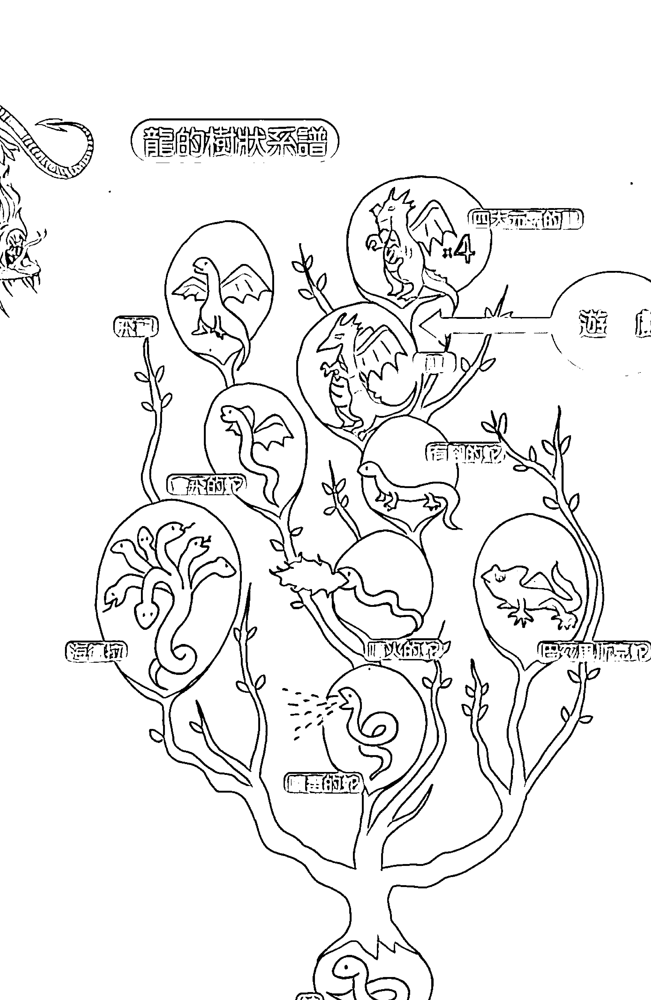

Vulcan & Fire Wizard

山北 篤 著 王書銘 譯

沙羅曼蛇、龍、朱雀與鳳凰、人魂、鬼火、火車、火車與火浣布、布里姬、瑣羅亞斯德教、哀悼、赫菲斯托斯、海絲蒂雅、

# 103項火焰神話傳說知識全收錄！

- 地獄犬與芬里爾狼
- 八百比丘尼
- 火鳥
- 不知火
- 狐火
- 聖愛爾摩火

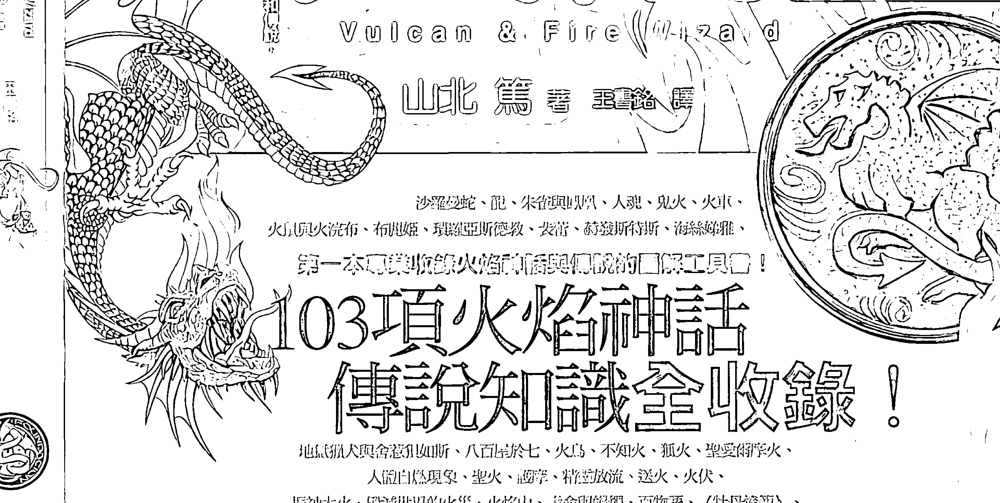

## 圖解火神與火精靈

本頁作者
山北 篤

1960年生於日本大阪府。任系統工程師後進入筆墨生涯，於製作文本外並著述諸多歷史、魔法、宗教方面之介紹讀物。著作：《惡魔事典》、《妖怪事典》、《魔導具事典》、《幻想地名事典》、《圖解火神與火精靈》。

本書翻譯
王書銘
輔仁大學日文研究所肄業。

翻譯作品《浮世繪師》、《魔法的卜・巫堂》、《圖解鍊金術》、《圖解近身武器》、《圖解太空船》、《圖解魔法知識》、《圖解克蘇魯神話》、《圖解陰陽師》、《圖解吸血鬼》、《圖解北歐神話》、《圖解天國與地獄》、《圖解火神與火精靈》。

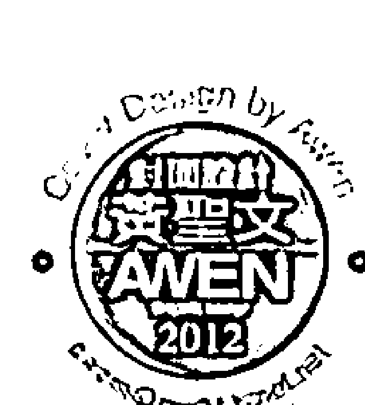

## F-MAPS

手持幻想地圖，
踏入知識滿載的奇幻旅程。

系列已出版：

- 圖解鍊金術
  岸野曉◎著
  2007年7月出版／售價300元

- 圖解近身武器
  大波航司◎著
  2008年5月出版／售價280元

- 圖解魔法知識
  羽山太朗◎著
  2009年6月出版／售價300元

- 圖解克蘇魯神話
  森瀨緩◎著
  2010年6月出版／售價320元

- 圖解吸血鬼
  森瀨繚、柳川京子◎著
  2010年8月出版／售價300元

- 圖解陰陽師
  北野早穗◎著
  2010年10月出版／售價300元

- 圖解天國與地獄
  三輪建二◎著
  2011年3月出版／售價350元

www.cite.com.tw
全國最大出版集團網路書店
立刻上網，好康等著你！

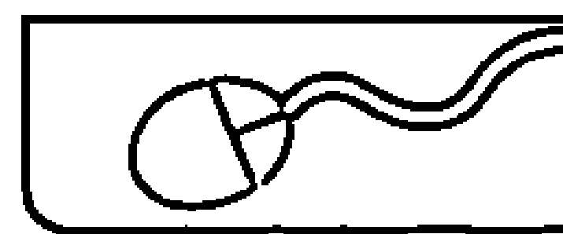

企劃總監人：楊秀真／責任編輯：王雪莉

### 1.1.1.1 网络协议

### 2.2.2.2 传输协议

| 列1 | 列2 | 列3 | 列4 | 列5 | 列6 | 列7 | 列8 |
|-----|-----|-----|-----|-----|-----|-----|-----|
| 15  | 23  | 9   | 2   | 7/9 | 8   | 4   | 9   |

## 前言

火，是上天賜予人類最大的恩惠。火不但為我們在深夜裡帶來光明，在寒冬中帶來溫暖，還為我們將食物變得柔嫩易於入口，並為我們驅趕野獸。人們便是因為得到了火，才得以脫離野獸，成為足以自立的族群。

然而，火卻也是人類的最大威脅。森林大火、屋舍火災非但可能直接致人於死，同時還會剝奪人類賴以為生的生活基礎，被火直接燒殺或間接喪生者，可說是不計其數。

自古以來，人類便對擁有如此強大力量的火抱持著感謝和恐懼兩種矛盾的情感，這些情緒也反映到了火神和火精靈的形象上頭，因而認為火神性烈，祂是為我們帶來莫大恩惠的力量，同時也是威脅劫掠的力量。

本書便是針對擁有上述雙重性格的火，試圖將其奧祕匯整而成的產物。

世界各地講述人類獲得火的神話多彩多姿，無論去到世界的哪個角落，該地住民無不擁有人類當初如何得到火的神話，由此可見取得火的使用權對人類來說是何等生死攸關的大事。

再說到太陽，同樣也是人類生存所不可或缺的事物。從神話的角度來看，太陽經常被指為最巨大的火，不然便是最耀眼的光芒。是故，本書亦舉出太陽做為最偉大的火之實例，並且連帶介紹部分的光明之神。

筆者將上述內容集結成冊，期望能提供讀者富有趣味的閱讀，莫此為甚。

山北 篤

## 目录

# 第一章 火神与火精靈

- No.001 传说中的沙罗曼蛇 —— 8
- No.002 火稻妻沙罗曼蛇 —— 10
- No.003 伊弗利特 —— 12
- No.004 火精灵在何处 —— 14
- No.005 阿塔尔 —— 16
- No.006 龙 —— 18
- No.007 菲尼克斯 —— 20
- No.008 朱雀与凤凰 —— 22
- No.009 毕方与鵸鵌 —— 24
- No.010 人魂与鬼火 —— 26
- No.011 火车 —— 28
- No.012 火鼠与火浣布 —— 30
- No.013 魑 —— 32
- No.014 阿波罗 —— 34
- No.015 布丽姬 —— 36
- No.016 巴多 —— 38
- No.017 斯伐洛格、达基鲍格与斯伐洛奇 —— 40
- No.018 迦具土 —— 42
- No.019 天照大神 —— 44
- No.020 阿耆尼 —— 46
- No.021 密斯拉 —— 48
- No.022 奎札柯特 —— 50
- No.023 印地 —— 52
- No.024 希利欧斯 —— 54
- No.025 阿蒙·拉 —— 56
- No.026 阿吞（阿顿） —— 58
- No.027 苏尔特 —— 60
- No.028 琐罗亚斯德教 —— 62
- No.029 亚炎 —— 64

# 第二章 火的起源

- No.049 火的发现 —— 106
- No.050 四大元素 —— 108
- No.051 火是万物的本源 —— 110
- No.052 五行 —— 112
- No.053 五大 —— 114
- No.054 火与科学 —— 116
- No.055 火球术 —— 118
- No.056 游戏中的火稻妻 —— 120
- No.057 火的起源（南美） —— 122
- No.058 火的起源（北美） —— 124
- No.059 火的起源（中美） —— 126
- No.060 火的起源（北亚） —— 128
- No.061 火的起源（东亚） —— 130
- No.062 火的起源（东南亚） —— 132
- No.063 火的起源（印度） —— 134
- No.064 火的起源（美拉尼西亚） —— 136
- No.065 火的起源（密克罗尼西亚） —— 138
- No.066 火的起源（纽西兰） —— 140
- No.067 火的起源（澳洲） —— 142
- No.068 火的起源（非洲） —— 144
- No.069 火的起源（法国） —— 146
- 专拦：火的相關用語 —— 104

# 第三章 火的故事

- 专拦：恐惧也要有正确的观念 —— 148
- No.070 不知火 —— 150
- No.071 狐火 —— 152
- No.072 圣爱尔摩火 —— 154
- No.073 女发之火 —— 156
- No.074 人體自燃現象 —— 158
- No.075 希罗与雅典娜神殿 —— 160
- No.076 圣火 —— 162
- No.077 护摩 —— 164
- No.078 精灵放流 —— 166
- No.079 送火 —— 168
- No.080 过火 —— 170
- No.081 探汤 —— 172
- No.082 火伏 —— 174
- No.083 爱宕神社 —— 176
- No.084 振袖大火 —— 178
- No.085 罗马大火 —— 180
- No.086 伦敦大火 —— 182
- No.087 毁灭世界的火灾 —— 184
- No.088 八热地狱 —— 186
- No.089 火焰山 —— 188
- No.090 天使以火而造、人类以土而造 —— 190
- No.091 寿命与灯烛 —— 192
- No.092 稻草堆之火 —— 194
- No.093 百物语 —— 196
- No.094 《牡丹灯笼》 —— 198
- No.095 《火天使》 —— 200
- No.096 《卖火柴的小女孩》 —— 202
- No.097 火之国 —— 204
- No.098 太阳旗 —— 206
- No.099 大格达的大锅 —— 208
- No.100 光荣之手 —— 210
- No.101 阿拉丁神灯 —— 212
- No.102 烟火 —— 214
- No.103 火箭 —— 216

# 第 1 章 火精靈與火神

No.001
傳說中的沙羅曼蛇
Salamander of Legend

沙羅曼蛇堪稱最具代表性之火精靈，然則沙羅曼蛇究竟為何物？且讓我們看看其令人意外的真實面貌。

## ○從山椒魚到傳說中的生物

在自然科學的領域中，山椒魚稱為蠑螈。歐洲有種名為火蠑螈的物種存在，而其亦即火精靈傳說之根據起源。

為什麼看起來跟火沒什麼關係的兩棲類生物蠑螈，會被視為火精靈呢？可能的原因有二：

- 其一，火蠑螈是變溫動物，表皮濕潤觸感冰冷；因其體感冰冷，所以人們相信火蠑螈即使不靠火也能夠生存。
- 其二，火蠑螈體液多，遇火不會立刻被燒死，後來因為火蠑螈能出現在火中，使得人們相信牠是一種身處火中仍能安然無事的生物。

火蠑螈便這樣成為完全無視於火的強大威脅之傳說生物。

傳說中的沙羅曼蛇，據說是一種棲身火中的小型蜥蜴。牠們通常棲息在火山口或岩漿裡，也經常出沒於高熱火焰中；火焰非但無法燒傷沙羅曼蛇，反倒會使牠們更具活力（甚至還有沙羅曼蛇不住在火裡就會死的說法）。沙羅曼蛇以火為食，同時身體也會散發火焰。

沙羅曼蛇的皮膚可以承受任何火焰，還能阻絕高熱，是故，一般相信髒掉的沙羅曼蛇皮可以直接擲入火中，藉火將髒污燒掉，是它最理想的清潔方式。

想要取得如此神奇的沙羅曼蛇皮，勢必就要先捉到沙羅曼蛇，可是，身處火中的蜥蜴要怎麼捉呢？要捉這隻火蜥蜴，只要戴上用沙羅曼蛇皮製成的手套即可。那麼，製作手套的沙羅曼蛇皮又要從哪裡來呢？關於這點，傳說就沒有為我們提供解答了。

### 現實與幻覺

蠑螈
＝
山椒魚

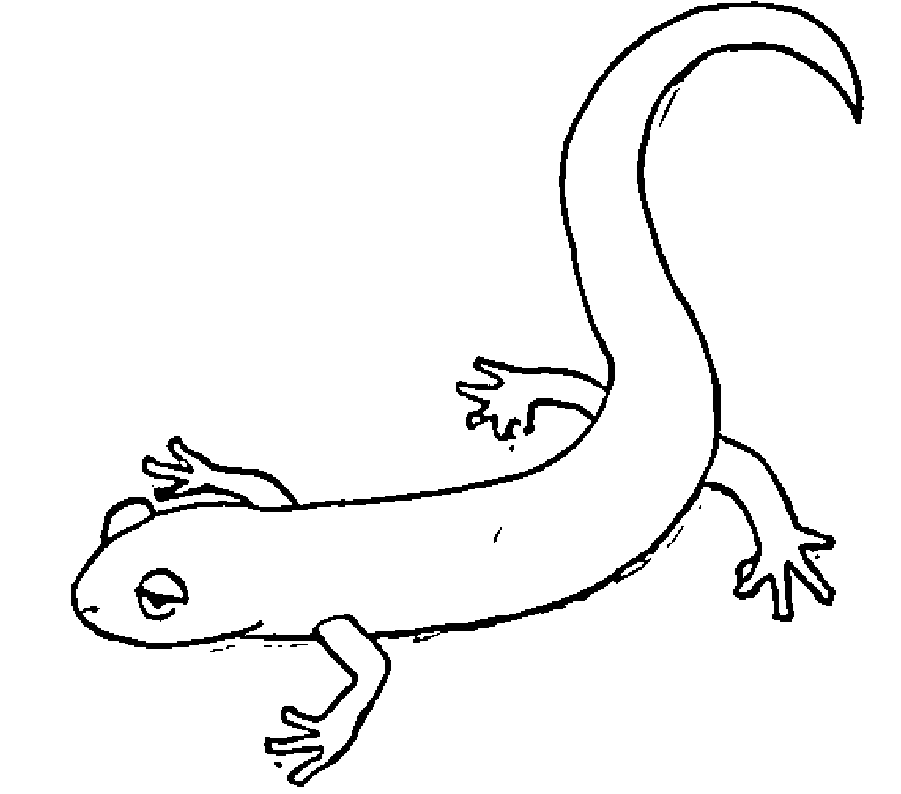

### 現實世界中的蠑螈

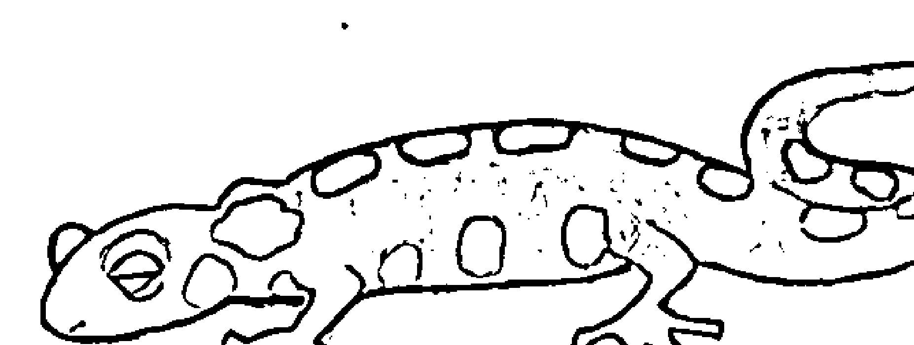

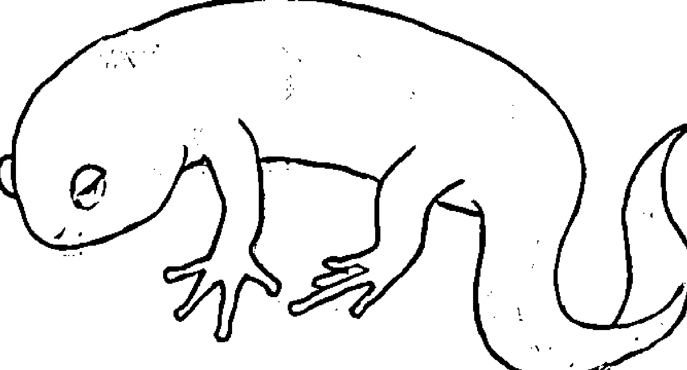

原生於歐洲的兩棲類。皮膚顏色黑底黃點，全長約20公分。此生物便是蠑螈為火精靈傳說的起源。

蠑螈的一種。克蘇魯神話中的「深海巨人」之創作靈感很可能不僅僅來自於魚類，同樣亦受此種生物影響。

### 傳說中的沙羅曼蛇

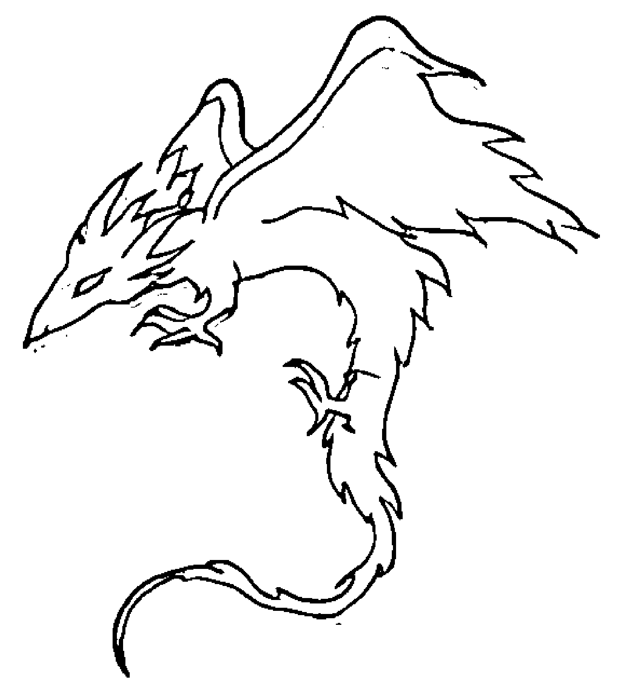

根據真實的蠑螈想像而成的傳說生物。

- ○棲息於火山口等處。
- ○不受火焰燒傷。
- ○以火為食。
- ○身體會散發火焰。

## 火精靈沙羅曼蛇

### Salamander as Elemental

火精靈沙羅曼蛇這種傳說生物究竟是如何誕生的？有別於絕大多數的傳說生物，這種火精靈的誕生經過有相當明確的說法。

- ○塑造出來的精靈

中世紀以前所謂的沙羅曼蛇，便是指傳說中的火蜥蜴，與精靈並無特別關係，當時甚至還會有號稱以沙羅曼蛇皮製成的布料出現，不過據說該布料的真面目其實是石綿。

那麼，蜥蜴究竟是在何時變成火精靈的呢？蜥蜴之所以會成為火精靈，其實全拜帕拉塞爾蘇斯之賜。

帕拉塞爾蘇斯（1493～1541）是十六世紀的醫師、鍊金術師和化學家，本名塞俄弗拉斯圖斯·菲利普斯·奧利俄盧斯·彭巴斯圖斯·馮·霍亨海姆，「帕拉塞爾蘇斯」此名乃是取於超越（para）古羅馬名醫塞爾蘇斯之意。

這位帕拉塞爾蘇斯再次發現了亞里斯多德的四元論（其實真正提出四元論的發明者應該是恩培多克勒，亞里斯多德似乎是帕拉塞爾蘇斯的誤解），並於自身著作《妖精之書》中主張各元素均有其精靈，還為其中的火精靈取了沙羅曼蛇此名。

除此之外，他還主張必須使用有沙羅曼蛇竄動於中的火焰烘煎材料，方能製作賢者之石。所以就某個角度來說，沙羅曼蛇是直到最近方才成為了火的精靈（在神話傳說的領域裡面，數百年以內的事都算是最近發生的事情）。

只不過，帕拉塞爾蘇斯所謂的沙羅曼蛇，只是隻貌貌似山椒魚的火蜥蜴，並無人類的形體樣貌。沙羅曼蛇是直到後來才演變成人類（尤其是女性）模樣的火精靈，甚至還能與人類結婚繁衍後代。英國詩人波普便會在《奪髮記》當中詠嘆熱情的女性會在死後變成沙羅曼蛇。後來又有男性版本的沙羅曼蛇出現，也才有今日小說或電玩遊戲等作品中全身火紅的男性形象誕生。

## 不斷變化的沙羅曼蛇

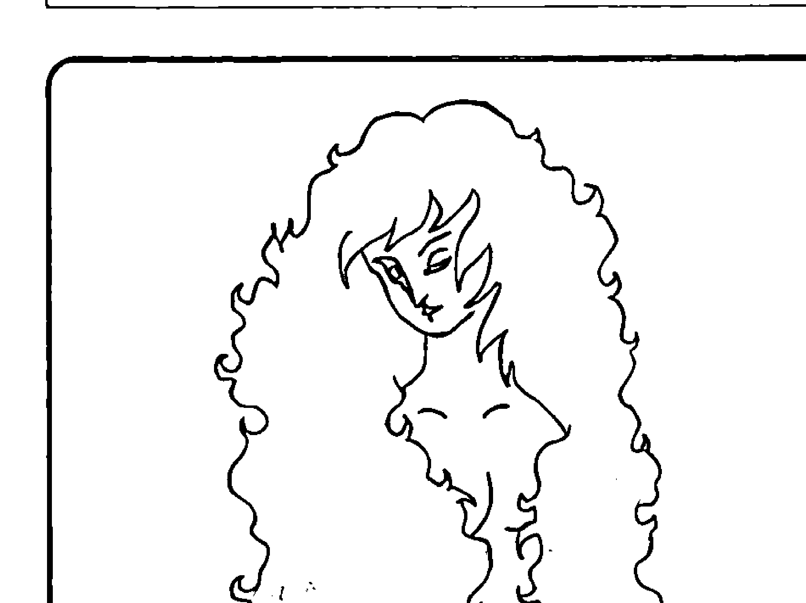

人類形態的沙羅曼蛇

誕生於近代的人類形態沙羅曼蛇。近代魔法界（例如亞雷斯特·克羅利的作品均以此類沙羅曼蛇為主流。

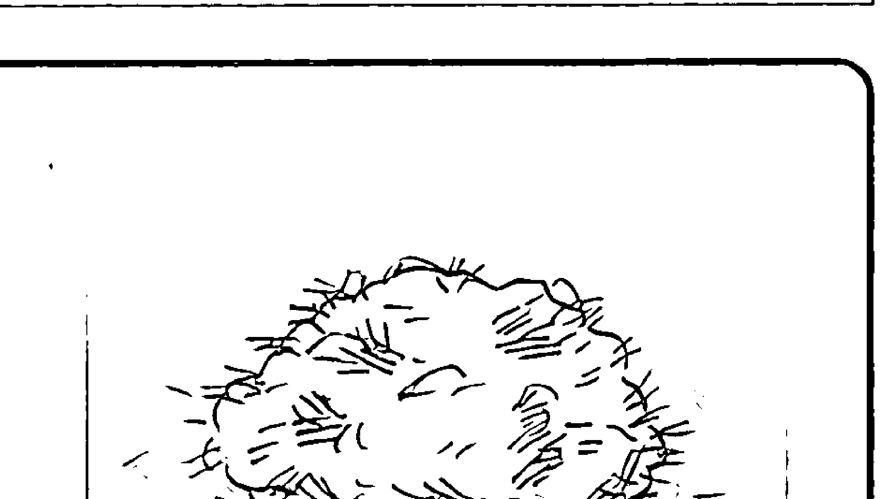

石綿是石英的纖維，遇火也不會燃燒，具備了沙羅曼蛇皮應有的條件。據說石綿在古埃及還曾被用來當成包裹木乃伊的繃帶。現今則以間皮癌的致病病因而遭禁用。

## 蓋瑞曼蛇

19世紀初期美國麻薩諸塞州州長蓋瑞（Elbridge Gerry）為使所屬政黨趨於有利，遂將選區劃分成相當奇怪的形狀。此舉雖使得蓋瑞所屬政黨獲得勝利，卻從此逗人們調侃揶揄此事，稱之為「蓋瑞的沙羅曼蛇」（因選區形狀貌似蜥蜴），略稱為蓋瑞曼蛇。直到今日，倘若有人以相同意圖劃分出莫名其妙的選區，便可以〇〇曼蛇稱呼之。例如日本的鳩山曼蛇（鳩山內閣）或角榮曼蛇（田中內閣）等，都是飽受輿論抨擊的失敗劃區。

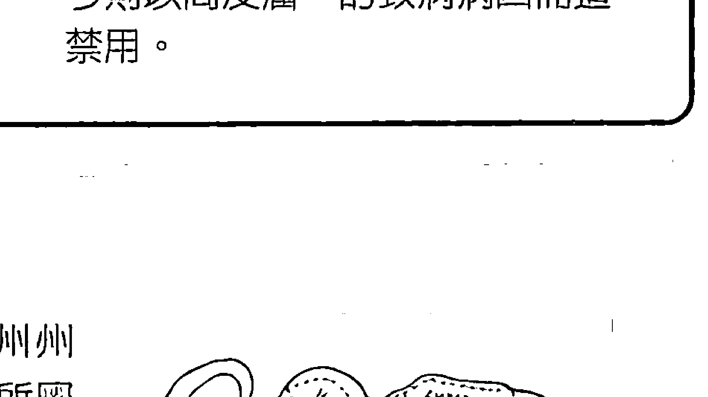

No.003
伊弗利特
Ifreet

### 阿拉伯世界的精灵

伊弗利特是阿拉伯世界当中属于第二阶级的精灵（镇尼）。相传他们生有羽翼。

伊弗利特可说是阿拉伯世界中知名度最高的幻想生物，然而真正知道他究竟是何种生物的人，却是出乎意料的少。

#### ○以火创造的生物

据说阿拉伯也有分别对应于地水火风的精灵（镇尼），这些精灵全部是人类模样，他们非但能够和人类结婚，还拥有自己的信仰。电子游戏等领域多将这些镇尼分类成地水火风四种，镇尼是风的精灵，而伊弗利特则多视为火焰的精灵。

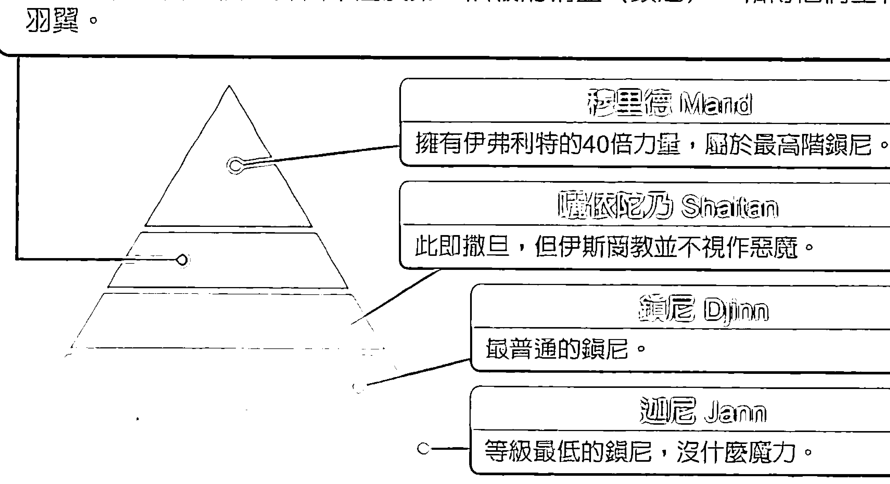

其实，镇尼和伊弗利特是两个不同阶级的精灵，不过镇尼此语除了可以指某阶级的精灵以外，也经常被当作精灵的统称。就好像「阿拉丁神灯」故事中的神灯精灵，便是属于伊弗利特，而戒指精灵则属镇尼。

镇尼原是从前阿拉伯世界民间信仰的一种魔物，由于《可兰经》当中曾经提及此物，致使伊斯兰教不得不在教义中为他做个明确的定位。根据伊斯兰教的说法，镇尼是早在人类出现许久、在阿拉创造阿丹的两千年前，用「无烟的火」创造的造物，其智力体力魔力无不凌驾于人类之上。

镇尼乃阿拉以火创造，是故身体是以蒸气、火焰、烟雾等物构成，血管里面流的是火焰而非血液，一旦死亡就会燃烧殆尽，变成一团灰；土做的人类死后要归于尘土，火做的镇尼自然就要归于火焰。

从前阿拉创造人类时，曾经命令众镇尼服侍人类，可是有个名叫易卜劣厮的镇尼却反抗并说「火之子焉可拜土之子？」，并扬言要使人类堕落；这易卜劣厮便等于伊斯兰教的路西法。

阿拉就这样容许了易卜劣厮的行为。这是为何呢？因为若拥有真正的信仰，是绝不会受到易卜劣厮诱惑的。不过在最后审判来临时，易卜劣厮将会和接受他诱惑的人们一起落入地狱。

镇尼当中也是有阶级存在的，其中第二低的阶级也叫做镇尼；是故，当镇尼此语出现的时候，势必要进一步区分此语究竟是指整体镇尼而言，还是指其中名为镇尼的单一级别。
然而当我们在阅读文献的时候，却经常发现就连作者本身也无法做好明确的区别，解释起来确实有其难处。

#### ✧ 伊斯兰教与镇尼

伊斯兰教徒为何相信镇尼的存在？因为《可兰经》记载了有关于镇尼的内容。
不过，我们也不能就此将伊斯兰教徒斥为迷信。
基督教徒相信恶魔的存在，为何？因为圣经记载了对恶魔的描述。也就是说，如果光凭这点就指伊斯兰教徒为迷信，那么基督教徒也是迷信，而信奉成千上万神灵的日本人，不也都是迷信之徒了吗？
镇尼当中同样也有伊斯兰教徒存在，通常被视为善良的镇尼；相反的，异教徒镇尼自然就是邪恶的镇尼了。

关联项目
○天使以火而造、人类以土而造 → No.090
○阿拉丁神灯 → No.101

No.004
火精靈在何處
Where are Fire Elementals?

各位對火精靈有何認識？沙羅曼蛇？伊弗利特？還有呢？想不出來了吧！

### 資歷淺得出人意料的火精靈

大家是不是認爲既然有地水火風四大元素，那麽每個元素也各有代表的精靈存在呢？的確，火元素有沙羅曼蛇爲其代表精靈。

不過，四大精靈的想法其實非常新穎。四大元素的概念確實是早自古希臘時代便已經存在，歷史非常悠久，可是四大精靈的概念卻是十六世紀的醫學家、化學家帕拉塞爾蘇斯（同時也是鍊金術師）的主張，因此算是相當新的概念；在此之前，根本就沒人會把精靈妖精分成四大類。

古時候所謂精靈，都是指各地區原生的土著精靈。既然是土著精靈，當然就是屬於該片土地的精靈；如果真將這些精靈分成四大類，想當然爾清一色都是大地精靈（山石田畝等精靈）和水精靈（川河湖海等精靈）。

因此當帕拉塞爾蘇斯提出四大精靈的概念時，便形成了衆精靈當中淨是大地精靈和水精靈，卻幾乎沒有火精靈和風精靈存在的極不平衡狀態。話說回來，到了十六世紀還要創作新的精靈、妖精，也有「事已至此，何必多此一舉」之憾。

因爲上述諸多緣故，世間幾乎並無火精靈的存在。即便求助於各種奇幻作品，其中的火精靈不外乎是沙羅曼蛇或者菲尼克斯，了不起用伊弗利特增添點阿拉伯風味，被使用的火精靈幾乎不出上述三者的範疇。

筆者相信其實衆多作家都爲此事發愁，但事實是世間就是沒有那麼多火精靈，也是無可奈何的事。這也是爲何有許多作品明明本身是西洋奇幻風格，卻不知該替火精靈取什麼名字，遂而佯作不知伊弗利特是阿拉伯的精靈，硬把他當作西洋精靈，寫進了作品之中。

### 四大精靈概念

四大精靈此概念乃由帕拉塞爾蘇斯提出，此概念是將所有精靈都根據地水火風四大元素進行分類，然而各元素精靈的分布卻極不平衡。

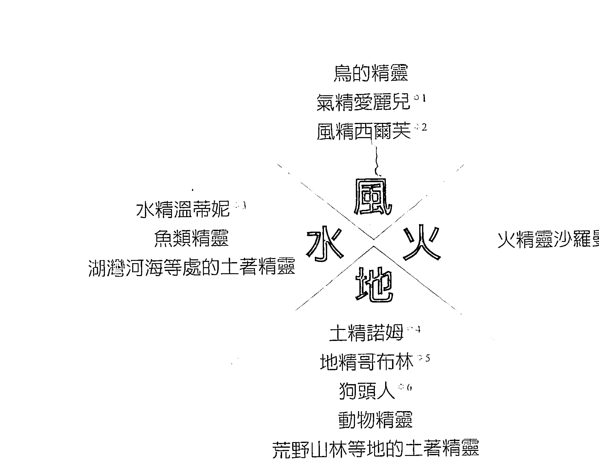

### 自古流傳至今的精靈

- 祖靈
- 土地、地形的精靈
- 樹木、森林的精靈
- 生物的精靈

# 相關項目

- 傳說中的沙羅曼蛇→No.001
- 火神與沙羅曼蛇→No.002
- 伊弗利特→No.003
- 菲尼克斯→No.007
- 四大元素→No.050# No.005 アーター 阿塔爾 Atar

阿塔爾是瑣羅亞斯德教最重視的神火精靈，同時也是阿胡拉·馬茲達之子。

## ○瑣羅亞斯德教的神火精靈

瑣羅亞斯德教亦名拜火教，由事便不難窺見，火在瑣羅亞斯德教裡象徵著至高神阿胡拉·馬茲達¹傳授人類的真理；至於創造出火的光，正是對抗邪惡黑暗的Asha（真理與公正）。

天空之火阿塔爾便是Asha的彰顯表現。阿塔爾是火的精靈，是極為神聖的存在，也因此被視為眾多天使與精靈中最強大的善神。

阿塔爾並非種族名稱，而是某位特定火精靈的名字，這位阿塔爾正是至高神阿胡拉·馬茲達之子。他最為世所知的功績，當屬對抗欲奪取地上王座的邪惡三頭龍阿日·達哈卡²之戰。阿日·達哈卡乃是隸屬於安格拉·曼紐³麾下的惡魔艾什瑪⁴的部屬。

相傳當時，地面上差點就要因為阿日·達哈卡而充滿了「匱乏與貧困、飢餓與乾渴、衰老與死亡、悲傷與嘆息、灼熱與酷寒，以及惡魔與人類的混交」。阿塔爾戰勝惡龍以後，將龍沉入「大洋之底」，也另有一說指出，惡龍是被鎖在高山之上。然而根據預言表示，阿日·達哈卡將在世界終結之際脫逃，殺戮三分之一的人類。

跟火的關聯性使阿塔爾亦被奉為閃電的精靈，所以他同時也是司掌降雨的神，甚至還曾經擊退帶來乾旱的惡魔。

火是阿塔爾的象徵，絕不可熄滅、不可玷污。實際上，在伊朗和印度便有不少瑣羅亞斯德的寺院，那裡真的有早從千年前便持續燃燒不滅的火焰，非但如此，許多寺院也都宣稱他們的火乃是取自從前瑣羅亞斯德親手點燃的那把火焰，是那把火焰的後裔。

## 瑣羅亞斯德教教義神

| 阿姆沙·斯彭塔（七神） |  |
| --- | --- |
| 斯彭塔·曼紐*5 | ←→ 安格拉·曼紐 |
| 佛乎·馬那（善良思維） | ←→ 阿卡·瑪納（邪惡思維） |
| 阿夏·瓦希塔（真實） | ←→ 得魯吉（虛偽） |
| 斯彭塔·阿拉馬提（虔敬） | ←→ 塔洛馬蒂（背教） |
| 克沙得拉·瓦雅（善的統治） | ←→ 薩魯瓦（無秩序） |
| 豪瓦達（完全、水） | ←→ 陶威（熱） |
| 阿美裡塔（不滅） | ←→ 薩里夏（飢渴） |

| 《波斯古經》的七大惡神 |  |
| --- | --- |
| 安格拉·曼紐 |  |
| 阿卡·瑪納（邪惡思維） | ←→ 佛乎·馬那（善良思維） |
| 得魯吉（虛偽） | ←→ 阿夏·瓦希塔（真實） |
| 塔洛馬蒂（背教） | ←→ 斯彭塔·阿拉馬提（虔敬） |
| 薩魯瓦（無秩序） | ←→ 克沙得拉·瓦雅（善的統治） |
| 陶威（熱） | ←→ 豪瓦達（完全、水） |
| 薩里夏（飢渴） | ←→ 阿美裡塔（不滅） |

### Yazata（中級神）
- 阿塔爾（火）
- 阿娜希塔（河）
- 阿部（水）
- 瓦雷沙格納（戰爭）
- 堤希泰亞（星與雨）
- 米斯拉（司法）
- 豪麻（神酒）
- 胡瓦·薩耶塔（太陽）
- 雷斯紐（死者的審判）
- 斯拉翁（死者的審判）

### Daēva（惡魔）
- 阿日·達哈卡（邪龍）
- 賈西（女惡魔）
- 阿斯圖·維達特（死亡）
- 布沙斯普（怠惰）
- 阿帕奧沙（乾旱）
- 艾什瑪（凶暴）

※ ←→ 表示對應關係，←→ 表示對立關係。※ 《波斯古經》的七大魔王也包含了安格拉·曼紐本身，時至後世，善良陣營方面因為阿胡拉·馬茲達與斯彭塔·曼紐這兩位神明漸漸被視為同一位神明，使得阿胡拉·馬茲達也被納入了阿姆沙·斯彭塔的行列。

有說法指出，印度神話中的阿耆尼，便是這位阿塔爾傳入印度以後演變成的神明。只不過，全世界的神話幾乎都是各自獨立演化出火神的角色，因此這個說法並不一定正確。

### 關聯項目
○ 瑣羅亞斯德教→No.028

# No.006 ドラゴン
## 龍
### Dragon

說到最具代表性的噴火怪物，當然非龍莫屬了。可是，龍究竟是什麼時候開始會噴火的呢？

#### ○由蛇化龍

什麼是龍？龍起初是一種蛇怪，龍這個名詞源自希臘語的「Draco」，原有蛇的涵意。換句話說，龍原本其實是一種跟火沒什麼關係的生物。

現今的奇幻作品當中，不少作品裡面都有地水火風四種屬性的龍存在，然而這種現象其實源自電玩遊戲，神話以及傳說中的龍並非如此。故且不論龍是反派還是正角，世界各地每個神話頂多各自提到一、二頭龍而已，根本不可能再劃分成四種屬性。當初是因為遊戲裡面需要增加怪物的種類使其多樣化，才又把龍根據四大元素分類、灌水充數。

不久以後，遊戲便對小說、電影等作品也造成了影響，以致這些作品有了地水火風四種屬性的龍出現。

那麼，神話裡面的龍究竟是種什麼樣的生物呢？龍其實就是蛇，原本是跟大地或者跟水較有淵源的怪物（有大地之蛇、水蛇海蛇等神話，卻沒有火蛇的神話）。龍後來跟火結下不解之緣，全都要歸因於噴火龍傳說的出現。

然而，本來不會噴火的龍究竟是為什麼變成了噴火龍呢？此乃其毒蛇性格的強化使然。

對人類來說，毒蛇是種非常恐怖的生物，小小咬上一口便足以致人於死。龍的毒蛇性格遭到強化以後，小小的傷口也同樣產生了各種變化。

這便是為何後來演變出巴茲里斯克蛇這種根本不需留下傷口、只要看一眼便能致命的怪物。相對的，龍也演變成可以噴毒殺人的生物。從此，龍便獲得了噴吐致命物質的形象，最後才演變成為噴火龍。

### 龍的樹狀系譜

凡是人類想像中比蛇更強大而創造出來的怪物。同樣的，龍頭長得愈多就愈強大的海德拉，以及用視線而非毒液殺人的巴茲里斯克蛇，都算是龍的近親。

曾幾何時，全身赤紅、口吐烈焰的火龍已經成為眾人對此生物最普遍的印象，不過很少人知道，這種怪物其實是源自於桌上角色扮演遊戲（TRPG）的產物。

# 菲尼克斯
Phoenix

早自古希臘時代以來，菲尼克斯便是永生與復活的象徵，世世代代的追求者都在尋求菲尼克斯，不絕於後。

## ○出身不詳的傳奇珍禽

菲尼克斯，這種亦稱不死鳥的禽鳥正如其名，以擁有永恆生命而聞名於世。希臘神話說牠棲息於阿拉伯半島，可是阿拉伯並未留下菲尼克斯的傳說。

雖說擁有永恆的生命，菲尼克斯卻並非永遠不會有任何變化；牠同樣也會從雛鳥長成成鳥，並且漸漸年老。據說菲尼克斯從雛鳥到年老的過程須經歷五百年之久，極為長壽，當然如果光是這樣，仍然不足以稱為「不死」。

當菲尼克斯發現自己已經衰老的時候，就會自行蒐集香木、燃起火焰，然後投身於火焰之中。火焰焚身能使菲尼克斯拋開長年累積的衰退老態，再度變身成為幼雛；菲尼克斯便是如此憑著不斷重複這個無限的循環，得以擁有永恆的生命。

由於菲尼克斯擁有上述特徵，故其體內亦充滿了不死的力量。相傳只要能吃下不死鳥，便能不死不老（或長壽不老），驅使著世間當權者紛紛尋求菲尼克斯。相傳西元三世紀的羅馬皇帝埃拉加巴盧斯曾經好不容易取得菲尼克斯的肉並且食用，但其實那肉似乎是天堂鳥的肉，因為從來也沒人聽說過埃拉加巴盧斯獲得了永恆的生命。

此外，據說就連菲尼克斯燃燒剩下的灰燼，都能使人類復活，讓眾多希望與死者再見一面的人，為尋牠走遍了全世界。

菲尼克斯因其死而復活的性質，亦被引為基督復活的象徵，基督教會也在各種建築和物品上描繪菲尼克斯的圖像。

《歷史》的作者希羅多德曾經指出菲尼克斯是隻被赤紅色與金黃色羽毛包覆、模樣大小均貌似鷲鷹的禽鳥。普林尼的《博物誌》則寫說牠的頸部周圍長著金色羽毛，其他部位的羽毛則是赤紅色，喉有喉袋、頭有羽冠。

## 菲尼克斯的一生

菲尼克斯以雛鳥模樣從火焰中誕生，是以傳說中從未提及不死鳥的蛋。可是不死鳥畢竟是鳥類，即便真有不死鳥的蛋存在，其實也不足為奇。

## 菲尼克斯之名

菲尼克斯是一種不斷復活的珍禽祥獸，其名自然也廣受各種團體甚至物品愛用；全世界以菲尼克斯為名的企業總數，可說是超乎想像，甚至日本也有好幾家取名為菲尼克斯的企業。

美國亞歷桑那州便有個直截了當以其為名的都市——鳳凰城（Phoenix）。

日本職棒則是將職棒二軍於富崎縣舉行的教育聯盟，取名作菲尼克斯聯盟。

最近流行的網路瀏覽器FireFox開發當初也叫作Phoenix，只不過因為已經有其他軟體以此為名，最後才改名叫作FireFox。

# No.008 すざくとふうおう
## 朱雀與鳳凰
Zhu Que and Feng Huang

朱雀與鳳凰是指鎮守保護中國南方的聖鳥，只是兩者同樣都是聖鳥，卻不知為何會有不同的稱呼。

### ○容易混淆的兩種聖鳥

中國的五行思想認為東西南北均有鎮守各方的聖獸，這四隻聖獸稱作四神或者四獸，不過有時也會連同中央合為五獸。其中鎮護南方的聖鳥，便是朱雀。
日本人原本只能從古時平安京或平城京的朱雀門、朱雀大路（此為大皇宮南門及從該門延伸出去的大道，故以朱雀名之）等名字接觸到朱雀這種生物，但如今朱雀已經因為風水熱潮、甚至受四神思想影響的漫畫，而變頗為人知。
然而，沒有人能夠確切地知道朱雀究竟長得什麼模樣，只知道牠是種貌似鳳凰、全身赤紅的鳥。
其實，四神當中鎮守南方的聖鳥原本應是鳳凰，曾幾何時被來由不明的朱雀給取代了，所以朱雀究竟是種什麼樣的鳥，從未有個明確的說法。
相對的，我們對鳳凰就有比較清楚的認識了。
鳳凰乍看之下像是雞，卻有五彩（青白紅黑黃）羽毛，而且據說在鳳首、鳳翼、背、胸、腹等五個部位分別會有「德」「義」「禮」「仁」「信」五字浮現。
鳳凰者，雄鳥稱鳳、雌鳥為凰，雌雄會成對而鳴、翩翩而舞。鳳凰不輕易顯露形跡，然若皇帝勤政修德、天下安泰，鳳凰就會出現。相傳漢朝曾經多次有鳳凰現世，但從那以後就再也沒有人見過了。
傳說鳳凰僅以竹果為食、僅擇原產於中國南方的梧桐木築巢，這說法恐怕是因為鳳凰只棲息於中國南方的緣故。不過相傳鳳凰也棲於仙境，想必是仙境當中亦有梧桐樹木吧！

### 朱雀的模樣

#### 朱雀＝鎮護南方的四神圣獸

玄武
↑
白虎 ← → 青龍
↓
朱雀

朱雀是種貌似鳳凰、全身赤紅的鳥，除此之外，我們對朱雀一無所知。

四神當中原以鳳凰為南方聖獸，曾幾何時被朱雀取代。

### 鳳凰的模樣

### 鳳凰的特徵

- ①乍看之下像隻雞。
- ②有五彩（青白紅黑黃）羽毛。
- ③首、翼、背、胸、腹有文字浮現。
- ④雄鳥為鳳，雌鳥為凰。
- ⑤雌雄成對而鳴、翩翩而舞。
- ⑥常在天下太平的時候出現。

鳳凰是極吉利的祥鳥，頻頻被使用於平等院鳳凰堂等各種寺院建築裝飾之中。更遑論日本人每日使用的一萬圓紙鈔就有平等院鳳凰堂屋頂的圖像，不過真正注意到這點的人應該出乎意料的少。

關連項目
○五行→No.052

# No.009 ひつぼうとみん
## 畢方與鳬
Bi Fang and Min

火鳥並不全然都是吉兆，也有帶來災厄的火鳥；除此之外，能夠防止此類災厄發生的，同樣也要歸類於火鳥的範疇。

### ○引發火災的鳥與防止火災的鳥

中國傳說有種名叫畢方的鳥，棲息於比極西崑崙還要西方的章莪之山。

畢方其狀如鶴，全身作青底紅斑模樣，白喙單足（亦有傳說指其僅有單片羽翼），啼聲聞似「Hippo～」，故名畢方。畢方不吃尋常食物，嘴喙經常銜著火焰。另有說法指畢方是種棲息於南方的人面鳥。

畢方是一種恐怖的惡禽，據說每次這種鳥出現在何處，何處就會發生原因不明的大火災，是以中國亦稱火災為「畢方之災」。

相反的，有些鳥則具備有防火的功效。

有種叫作鳬的鳥，同樣也是棲息在西方一處名叫符禺山的地方。據說鳬是種赤喙、狀似翠鳥*1的鳥類，豢養鳬鳥便能抵禦火災。

能夠防止火災的益獸並不只鳬而已。

同樣在西方的翠山，有種名叫颙*2的鳥。這種鳥兩首四足、色赤黑，模樣（除兩首四足以外）跟鳬鳥頗為相似。

另外，北方的帶山有種像馬的獸類名叫䑏疏，頭生一角，頭角表面就像磨刀石一樣粗礪。

又，黃河裡面有種叫作鯥的魚；牠雖然是魚卻狀似鳬鳥，而且還有十隻翅膀。

相傳上述這些生物，都是能夠預防火災發生的益獸。

*1 翠鳥 (Kingfisher)：亦名魚狗。佛法僧目翠鳥科約90種體軀短肥的獨棲鳥類之通稱。喙大，多以魚為食，廣布世界各地。
*2 鳫：日語原文作「鶊」（為一字）應屬謬誤，譯者參照《山海經》逕自更正。

### 中國傳說裡跟火有關的動物

# 人魂與鬼火
Hitodama and Onibi

人魂與鬼火即指人類靈魂離開肉體、漂浮於空中並發出光芒的現象。兩者有時被視為同物，有時則是有所區別。

## ○是人類的靈魂，還是人之將死的前兆？

人魂的形狀與顏色乃視其場所、所屬個人而異。就形狀來說，球形、橢圓形的都有，有些甚至還像長了尾巴似的。至於顏色方面，則有青白、紅色、黃色等，出現模式也不一定；譬如有些是毫無前兆突然出現，有些出現時則是從曖曖微明變得愈來愈亮，飛行方式亦是形形色色，有些是漫無目的緩緩飛行，有些則是行動相當迅速。

> 從《萬葉集》所載「青臉似人魂，獨君一人；偏又雨夜見，想起荒野墳」可以發現，早在奈良時代便已經有人魂存在，這首和歌裡的人魂似乎是青色的。

> 《無問自答》也記載，後嵯峨院的人魂隨著「有如波濤拍打鋸崎磯岸的聲音」出現的故事。那人魂起初只不過湯匙大小，卻愈變愈大，最後變得跟只小碗差不多，而且出現後竟然還留下了「像是將紅藻溶解化開後潑散於地」的痕跡。當時相信人魂出現乃是人之將死的前兆。事實上，後嵯峨院果真在這則故事的隔年駕崩了。不過，故事最引人入勝之處，仍屬那人魂的聲音以及留下的痕跡。

人魂究竟是為何物，眾說紛紜。有說是等離子體，有說是骨骼成分中內含的磷造成的自燃現象，其中還有一種相當有趣的說法，名為「蚊柱說」。從前有位昆蟲學者於夜間採集昆蟲時發現人魂，他鼓起勇氣試著拿捕蟲網去撈捕，結果那物體竟是類似搖蚊般的小蟲群體發光所造成；據推測應是蟲子偶然間沾到會發光的細菌，並以柱狀隊形群聚飛舞，才讓人看起來像是人魂出沒。

鬼火不像人魂有個尾巴，是一種多在離地一、二公尺處飛行的青色火焰。正如同日本短歌「春雨紛紛時，但見虛空火自燃野徑土塚間」所述，鬼火有時也出現於細雨的天氣。

## 人魂與鬼火之別

| 人魂 |
| 形狀：球形、橢圓形。有些則是長了條尾巴似的。 |
| 顏色：青白、紅色、黃色等。 |
| 飛行方式：並無一定。 |

| 鬼火 |
| 形狀：火焰。沒有尾巴。 |
| 顏色：青色。 |
| 飛行方式：飛行於離地1、2公尺處。 |

## 各時代的人魂

### 《萬葉集》（奈良時代）的人魂
- 收錄以青色人魂為例創作的和歌。

### 《無問自答》（鎌倉時代）的人魂
- 人魂是人之將死的前兆。
- 人魂會伴隨著波濤聲出現。
- 曾留下有如紅藻溶解物般的殘留物。

### 《今昔百鬼拾遺》（江戶時代）的人魂
- 為人死後靈魂脫離身體而來。
- 後方拖著像是尾巴的東西。

| 人魂的真面目 |
| 等離子體 |
| 磷的自燃現象 |
| 飛蟲沾到的發光菌類 |

# 火車
Fire Chariot

此處所謂火車，其實是指一種從地獄疾駛而來，將犯下惡事的亡者擲往地獄、有著團團烈焰環繞的車子。

## ○將人運往地獄的車

火車本以「火車輪」或「火車爐炭」之名初見於佛典，是地獄裡一種用來折磨罪人的刑具；該刑具是一面燃燒熾烈的車輪，罪人被綁在車輪上，飽受烈焰苛責之苦。直到較晚期的佛典裡，火車才演變成將罪人搬運到地獄的交通工具。

佛教有八大地獄，底下各有十六個副地獄附屬。八大地獄當中最恐怖的阿鼻地獄，有個喚作「火車地獄」的副地獄，相傳火車將罪人運送至此，然後再用火車施以拷打。有一部名為《觀佛三昧海經》的經典，描述了火車地獄裡面的恐怖光景。

後來佛典中的火車，轉而演變成指稱人因煩惱或欲望所苦之用語，最後甚至還演變成民間傳說裡的火車妖怪。江戶時代的妖怪畫家鳥山石燕的筆下，火車便是雙腳站立的貓妖模樣。

送葬隊伍行進途中，往往會有烏雲驟現狂風襲來，吹得人仰馬翻、連棺材都要被刮跑的現象。只要此時隊伍中同行的僧侶拋出佛珠，就不會發生問題了；如果不這樣做，等到好不容易找回棺材時，就會發現裡面的屍體已經懸空消失，有時甚至還會發現被撕裂的屍塊如小山般堆積在樹梢或石頭上。

這在當時喚作「被火車捉」，是相當可恥的事情，代表地獄的火車是來迎接生前作惡多端的惡人。《遠野物語》也記載傳說山裡有種名叫花車的生物，會把死人挖出來拿到別的地方吃掉；另外還寫到「或曰襲棺於葬儀」，此處指的應該就是火車沒錯。

順帶說明，日語形容家計艱苦的「家計有如火車」的說法，便是來自於此。一休禪師也有「窮人世界飽受火車當舖米舖之鬼所苦」的狂歌，顯見此語早在室町時代，便已經受到使用。

> 佛典裡的火車輪是只有地獄才有的拷問刑具。

> 平安時代以前的火車，是輛由牛頭馬頭將人類拉往地獄、周匝火焰環繞的牛車。

> 江戶時代將火車描繪成一隻雙腳站立背負火焰的貓妖。

上述演變發生於何時並無定論。

## 中國的火車

中國話裡面也有「火車」此語，只是這「火車」既非此節所述火車，亦非由火焰構成的車子。中國話所謂的火車指的是蒸氣機關汽車。不過它確實是種利用火來製造前進動能的車子。

# 火鼠と火浣布
Kaso and Kakanhu

西洋有沙羅曼蛇而東洋也有火鼠，此二者甚至還有個共通點，那就是都能取其皮製作耐火布料。

## ○可承受烈焰焚身的生物

根據《列子》記載，中國南方有座巨大的火山。這座火山極為廣闊，橫瓦四十餘里，火焰常年不滅，遇風吹不致延燒擴大，遇雨打亦不致熄滅。

大火中有種名為「不盡木」的樹。這種樹雖在火中卻完全不會起火燃燒，於是人們便剝此樹皮製作火浣布。火浣布是種絕對不會燃燒的布料，布料即便投入火中亦安然無事，唯獨其上的污漬會被燃燒殆盡，是一種藉火焙烤以致清潔的布。

至於火鼠，便是棲息於此樹之中的鼠類。亦有傳言指出火鼠是種體重超過兩百公斤的巨鼠。時至後世，火鼠與不盡木的關係愈趨薄弱，反而只是單純地被視為是火的精靈而已；是以，火鼠便從此跟火馬、火鴉等禽獸一樣，被視為是司掌南方的火神——南方火德星君——飼養的寵物。

從日本的《竹取物語》故事裡，迦具夜姬的求婚者右大臣阿倍御主人獻的寶物「火鼠之裘」便可以發現，火鼠已經與火浣布混淆，當時的人們認為火鼠的毛皮便是火浣布。《竹取物語》乃以中國西藏地區流傳的《斑竹姑娘》為原型，而《斑竹姑娘》所述寶物便已經是火鼠的毛皮，因此兩者混淆的情形似乎是起源於中國。

順帶說明，許多人認為火浣布其實就是石綿（Asbestos）。以當時的技術水準而論，使用石綿可能會使人將大量石綿纖維吸入肺部，提高罹患肺癌的危險性。只不過從眾人將其視為珍寶亦不難想見，火浣布並非輕易可以取得的東西，因此幾乎很少人會曝露在將石綿吸入肺部的危險之下，所以當時才沒有造成問題。

> 《列子》：中國道家典籍之一，傳為戰國列子所著。《漢書·藝文志》著錄《列子》八篇，早佚。今本《列子》八篇由晉人張湛編成。書中抄錄一些先秦材料，但從內容看是反映魏晉思潮的作品。此書真偽從唐柳宗元到近人梁啟超、馬敘倫等均有辨證。《列子》內容多為民間故事、寓言和神話傳說，以不生不化為根本。

## 火的布料

似相信火浣布其实就是今日所谓的石绵。

No.013

# 魃

魃是位能夠引發乾旱災情的災厄女神。然而她會變成這副模樣，其實有段可憐的故事。

## ○為天帝奉獻力量，換來的卻是……

魃是古代中國的旱災女神，其名見載於《山海經》。
此事發生在從前天帝黃帝與牛頭怪物蚩尤大戰之時，黃帝命應龍迎擊蚩尤，蚩尤陣營則有風伯（風神）和雨師（雨神）刮起暴風雨，根本無法靠近。
此時黃帝便將自己作青衣打扮的女兒魃從天上召來助陣；魃的體內儲存有大量的光與熱，能夠使雨勢停歇止息。就這樣憑藉著她的能力，黃帝陣營這才封印住風伯和雨師的異能，成功討伐了蚩尤。
豈料大戰終結後，又有新的問題發生：氣力放盡的魃已經無力返回天上。儘管如此，她仍然擁有能讓雨勢止息的能力。過不久，魃所在之處發生了旱災，皇帝的臣子叔均（似乎是位農耕神）向黃帝匯報此事，可是魃既是黃帝自己的女兒、又是討伐蚩尤的功臣，不能毫無來由將她殺死。
於是她就被驅逐到了赤水之北，幽禁於係昆山。然而獨自遭到幽禁的年輕女孩往往不甘寂寞，經常逃出山裡來到中原（中國的中央地區），並為所到之處帶來旱災。從此以後，她就成了人稱魃的災厄之神。
魃原是仙女出身，如今卻已經變成了怪物的模樣。
有人說魃身形矮小只有二～三呎高，有人說她獨眼，有人說她只有單手單腳，有人說她頭頂無毛，還有人說她會以風速裸體疾走。據說每當旱災發生的時候，人們就會認為是魃出沒所致，然後清掃水道並祈願：「魃啊！請妳回北方去吧」。
不過，魃除了能引發旱災以外，似乎並沒有什麼異能，甚至有傳說指出曾有農民自行捕捉魃，並將其丟進溝渠裡淹殺。

## 由神所幻化的怪物

## 女魃

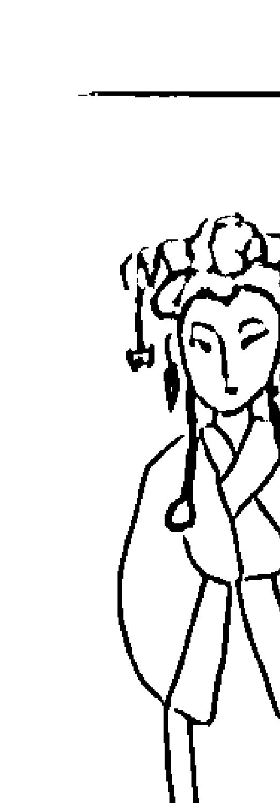

- 天帝黃帝的女兒。
- 被召來對抗風伯（風神）和雨師（雨神）。
- 體內儲有大量光與熱，能使雨勢停歇止息。
- 相傳是位美麗的女性。

大戰中氣力放盡、無力返回天上，卻仍然保有使雨勢止息的能力。

幽禁於係昆山，成為受人畏懼的災厄之神。

## 魖

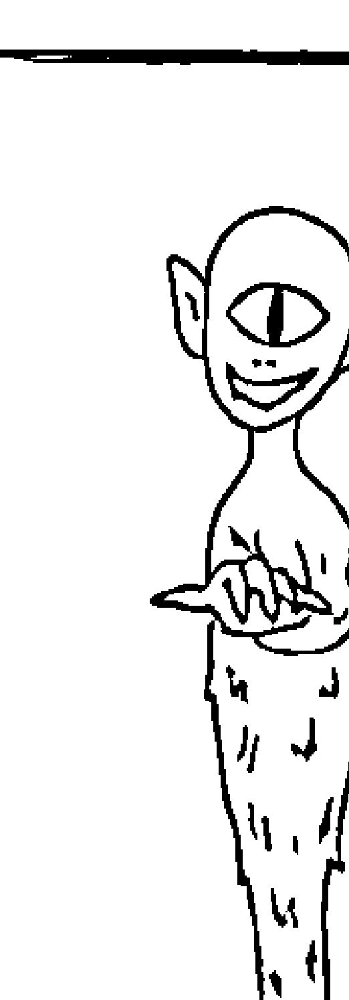

- 出沒就會造成附近地區大旱。
- 身形矮小只有2~3尺（60~90公分）高。
- 相傳為獨眼、單手單腳的怪物。
- 漢字部首也從女字改為鬼字。

## 係昆山

現今中國也有個名叫係昆山的地點，只不過今日的係昆山乃位於上海附近的蘇州，似乎並非當初幽禁魃的那個係昆山。

關聯項目

- 畢方與鷮→No.009

# 阿波羅
Apollo

阿波羅其實原非太陽神，是後來漸漸展露頭角，才終於登上了希臘神話最高神祇的行列。

## ○ 位列奧林帕斯十二大神的外來神明

希臘神話裡的太陽神阿波羅是奧林帕斯十二大神之一，同時被奉為詩歌之神、音樂之神。他在羅馬神話當中的名字也叫作阿波羅。

雖說阿波羅是宙斯與大地母神樂朵所生之子（阿蒂蜜斯是他的雙胞胎妹妹），然而樂朵本是小亞細亞地區（現在的土耳其）的大地母神，阿波羅此名也並非源自希臘，而是出自於小亞細亞。或許正是因為這個緣故，阿波羅在特洛伊戰爭當中，從頭到尾都是支持特洛伊，而非希臘。

希臘神話的太陽神本是希利歐斯，阿波羅則是預言與藝術之神、技藝（尤其是醫學）之神。此外，儘管跟太陽全無任何關係，阿波羅卻是人稱「光輝阿波羅」（Phoebus Apollo）的光明之神，據推測後來他太陽神的形象可能便是從此得來。

儘管富有智慧且帥氣俊俏，阿波羅卻沒有妻子。雖然曾經有過許多戀情，但幾乎都是以悲戀告終，是一位沒有戀愛運的神明。其中達芙妮（Daphne）的故事便相當有名。從前阿波羅嘲弄並惹惱了厄洛斯，厄洛斯遂以金矢射向阿波羅，以鉛矢射向達芙妮。這兩枝箭讓阿波羅愛上了達芙妮並窮追不捨，達芙妮卻拒絕阿波羅的愛、四處躲避逃跑；就在她快要被阿波羅追上的時候，達芙妮遂向父親河神佩內伊歐斯許願，讓自己變成了月桂樹。達芙妮的變身使阿波羅感嘆不已，阿波羅遂立月桂樹為聖樹。直至今日，為勝利者戴上月桂樹頭冠的習俗，便是源自於此。

除此以外，阿波羅更是以喜愛美少年而聞名。從前斯巴達的美少年西亞琴多斯極受阿波羅寵愛，西風澤費羅斯也愛西亞琴多斯，可是少年卻一心只向著阿波羅。為嫉妒而瘋狂的澤費羅斯遂趁阿波羅擲鐵餅的時候刮起風來，讓鐵餅擊殺了西亞琴多斯，後來從少年的鮮血中綻出的赤紅色花朵，即為風信子。

## 阿波羅的職掌

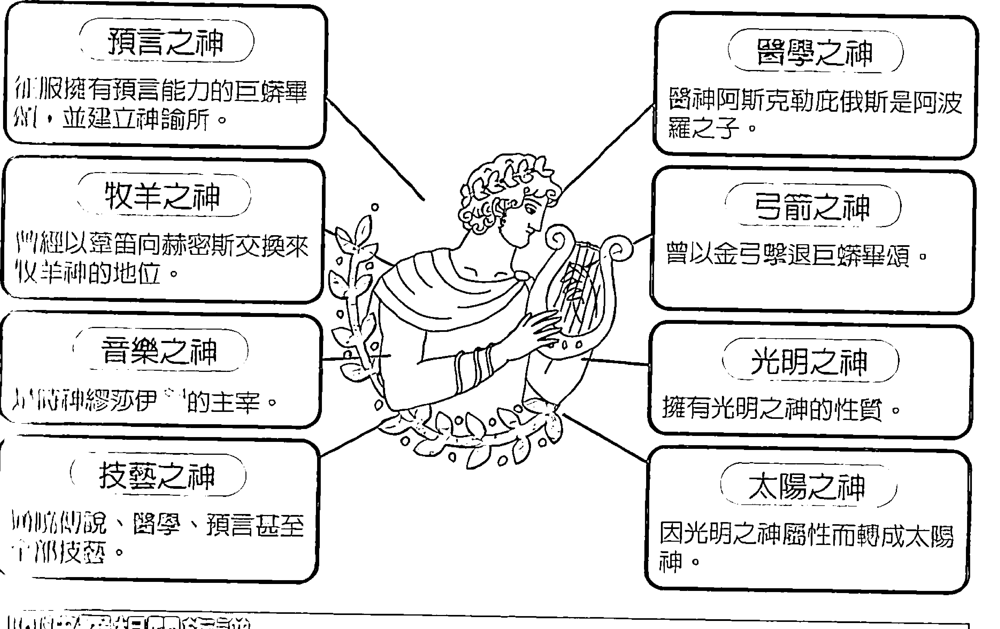

## 阿波羅的相關族譜

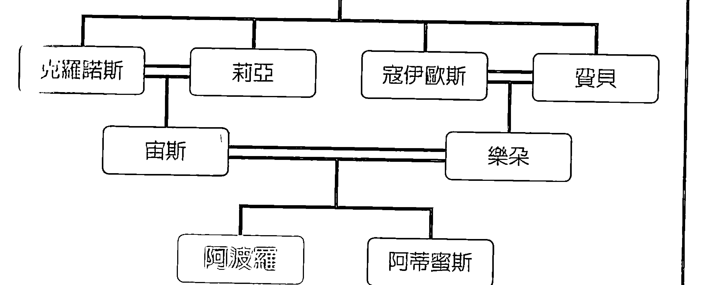

阿波羅的母親樂朵因為遭宙斯正妻赫拉迫害，遂流浪於世界各地，尋找可以安心產下雙胞胎阿波羅與阿蒂蜜斯的地方。因為早有預言指出，樂朵的孩子將會是遠較赫拉之子更為偉大的神明。

- 01. 希利歐斯 ►No.024

# No.015 布麗姬
## Brigid

所謂塞爾特神話，便是指早在日耳曼民族出現許久以前，便已經定居於歐洲的塞爾特人的神話。

## ○既是三人亦是一人的女神

布麗姬是塞爾特的火焰女神。她是由神之父大格達的女兒，也是三位一體的女神。或許是因為這個緣故，布麗姬的職掌也相當多，她是農業、醫學、詩作、生產的女神，更是春之女神，另外從布麗姬（塞爾特語的『戰爭』之意）此名亦可知她還是位戰爭女神。

布麗姬經常被描繪成托著魔法火盆的女性，不過為呈現其三位一體的特性，也經常被描繪成三位女神。布麗姬神殿嚴禁男子進入，連神官也全數由女性組成。她的神殿裡亦燃有從不熄滅的聖火，頗具火之女神的風格。一般認為不列顛的女神布麗甘提雅（Brigantia）與布麗姬便是屬於相同系統的女神。

有趣的是，布麗姬本是塞爾特的女神，曾幾何時卻莫名其妙地變成了基督教的聖人聖布麗姬。聖人聖布麗姬確有其人，她是從前愛爾蘭基爾代爾修道院的創設者，但聖布麗姬的故事裡卻有著濃濃塞爾特女神的味道。

首先，聖布麗姬的聖人節日是二月一日，這天也是塞爾特的節日Imbolc（春季祭典），換言之就是祭祀春之女神布麗姬的節日。其次，當初聖布麗姬欲創設基爾代爾修道院時，男地主曾經對她說過『只要是斗篷包得起的土地，我都可以分給你』，此語很明顯一方面是在調侃她，一方面表示拒絕提供土地，可是布麗姬卻只是默默地把斗篷鋪在地面，只見斗篷不斷地變大，大到非但能夠建造一座大修道院，甚至還覆蓋並確保了足以維持修道院生計所需的耕地。

① 大格達（Dagda）：『大格達』原意是『善神』，有些人習慣稱呼他為『大札』或『大格札』。除女神達奴以外，大格達還是其他幾位女神的丈夫，也是許多神明的父親，可謂是『眾神之父』。
② 聖布麗姬（Saint Brigid）：大英線上百科雖作聖布里吉特（Saint Brigit），譯者這邊採奇幻基地《西洋神名事典》譯名，以求統一。
③ 基爾代爾（Kildare）：愛爾蘭基爾代爾郡集鎮。城內有新教大教堂，為紀念愛爾蘭的聖布麗姬而建，她於5世紀在此建立修會團體。

## 凱爾特神話的火焰女神

| 神格 | 擁有火焰、農業、醫學、詩作、生產、春天、戰爭女神等諸多神格的女神。 |
| --- | --- |

| 節日 | 2月1日 |
| --- | --- |

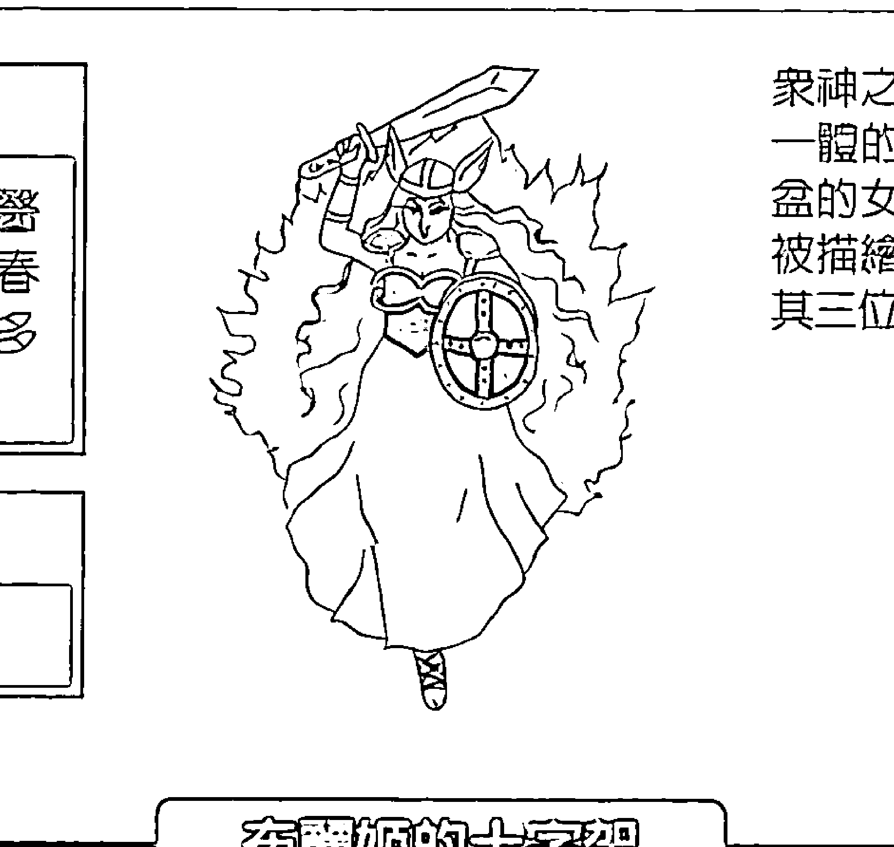

## 布麗姬的十字架

布麗姬的十字架彷彿經年累月不停旋轉的自然之輪，以小草或麥穗等物製作。

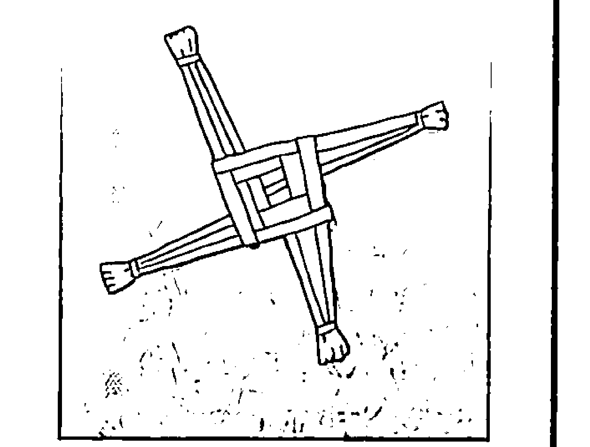

## 塞爾特的四大祭典

| 祭典 | 描述 |
| --- | --- |
| Imbolc | 2月1日舉行的春季祭典。此日便也是祭祀布麗姬的節日。 |
| Beltane | 5月1日舉行的夏季祭典。慶祝夏季的到來，開始放牧。 |
| Lughnasadh | 8月1日舉行的秋季祭典。是塞爾特的豐收祭典。 |
| Samhain | 11月1日舉行的冬季祭典。慶祝新年的祭日。祭典從10月31日的年終開始舉行，延續一整天。也是現在萬聖節的由來。 |

# 巴多
Baldur

北歐神話也有光明之神，但是這位光明之神卻不幸英年早逝，直到世界末日以後方得再度復活。

## 死亡的光明之神

巴多是北歐神話的光明之神，是眾神之王奧丁與其妻愛情與婚姻女神福麗嘉之子。

儘管位處光明之神如此重要的地位，巴多的神話卻是出人意料的少。唯一活躍的事蹟，只有被樹枝刺中而身亡的場面。

巴多是眾神當中最為俊美、最受萬人喜愛的神明。有天他做了個惡夢，於是他的母親福麗嘉便走遍了全世界，讓全世界的生物與非生物都發誓決計不傷害巴多；從此以後，無論使用任何武器都無法傷及巴多毫髮。豈料福麗嘉卻唯獨漏掉了仍然太過稚嫩年輕的槲寄生，並未要求槲寄生立誓。

眾神想說巴多刀槍不入便紛紛取武器向他投擲，而事情就發生在這種不知節制的取樂遊戲之時。巴多有個眼盲的兄弟霍獨爾無法參加這個遊戲，眾神中的叛徒洛奇遂取來槲寄生遞給霍獨爾，慫恿他朝巴多丟擲試試看。霍獨爾一擲出，槲寄生果然刺中巴多，讓巴多丟了性命。

巴多的弟弟赫摩德見母親福麗嘉悲嘆不已，於是便駕著奧丁的坐騎斯萊布尼爾前往死亡的國度，拜託死亡女王海爾讓巴多復活；女王遂與赫摩德約定日，只要全世界所有物事都為巴多流淚，她就願意使巴多復活。

在福麗嘉的請託之下，全世界的所有物事都為巴多流下了眼淚，唯獨女巨人索克沒有哭，使得巴多最後無法復活。其實，這名女巨人便是洛奇變身而成。

不過，相傳在諸神黃昏（末日戰爭）之後，巴多將會和同時死亡的霍獨爾一齊復活，並且創造新的世界。

1 槲寄生（Mistletoe）：塞爾特神官德魯伊視為最神聖的植物，只有寄生於橡樹上的槲寄生，才會被尊為神賜與神聖樹木的最神聖植物。
2 斯萊布尼爾（Sleipnir）：北歐神話主神奧丁的愛馬，其身體呈灰色，還有八條腿，牠的名字有「迅速滑行之馬」的含義，無論陸地天空均能驅馳自如。

巴多看見令人擔憂的夢境。

母親福麗嘉令全世界物事發誓絕不傷害巴多。

唯獨槲寄生因為太過稚嫩，並未被要求立誓。

洛奇慫恿盲眼神霍獨爾投擲槲寄生。

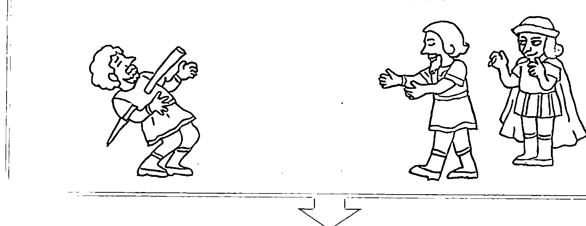

巴多死亡。

諸神黃昏（末日戰爭）之後，巴多將復活，並創造新世界。

## 洛奇的懲罰

洛奇陰謀策劃殺害巴多，並阻止巴多復活。眾神便是以上述兩則罪狀將洛奇綁縛於洞窟深處，然後以毒蛇之液滴在洛奇頭上做為懲罰。不過大部分時候，洛奇忠實的妻子西格恩都會用器皿接住毒液，唯有在器皿盛滿必須把毒液拿去倒掉的時候，毒液才會滴到洛奇的頭頂。據說此時的洛奇就會因為痛苦而扭動身軀，從而引發地震。

# No.017 斯伐洛格、达基鲍格与斯伐洛奇
## Svarog, Dazhbog, Svarozhic

尽管斯拉夫神话对日本人来说极为陌生，然而斯拉夫神话亦有火神存在，并且占有相当重要的地位。

## ○寒地的最高神祇

斯伐洛格乃是以俄罗斯为中心流传的斯拉夫神话的「天神」，亦有传说指其为「灶神」或「火神」。他曾经在黑暗乌雨的笼罩下点燃闪电的火焰，在天上创造了火。他有达基鲍格（太阳）和斯伐洛奇（火）两个儿子，换句话说，斯伐洛格也是太阳与火的创造者。

达基鲍格是斯拉夫神话的太阳神。「鲍格」两字便是神的意思，而「达基」则是「给予」或「光」的意思，是故「达基鲍格」便是「给予之神」也是「光明之神」。当然，达基鲍格也是位「火之神」。

传说月神梅夏兹是达基鲍格的叔父，他是个秃头的老人。有趣的是，虽然梅夏兹是个阳性名词，却有个年轻女孩的传说故事；在这则传说里，梅夏兹是达基鲍格的妻子，每到春天就会跟达基鲍格结婚，秋天就要分离，直到下个春天来临才能再次相会。这对夫妻也是满天星星的父母，传说当他们感情不睦吵架的时候，就会引起地震。

达基鲍格住在位在大地东方尽头，一座名叫常夏之国的宫殿里，该宫殿有佐拉·乌特恩亚亚（黎明极光）和佐拉·维切恩亚亚（黄昏极光）两位姐妹女神（另说为达基鲍格的女儿）守护。达基鲍格每天早晨都要乘坐十二头马车离开宫殿，绕行天际一周，拉车的都是鼻孔会喷出火焰的白马。这点跟波兰等东欧文化圈的神话相当类似，东欧神话也相信有辆由十二匹金鬃马只拉行的马车会在天空中绕行。

斯伐洛奇也是斯伐洛格之子，是火神，同时也是战争之神。斯伐洛奇此名乃「斯伐洛格之子」之意，有时候甚至会被视同等于斯伐洛格。

## 俄罗斯的火神

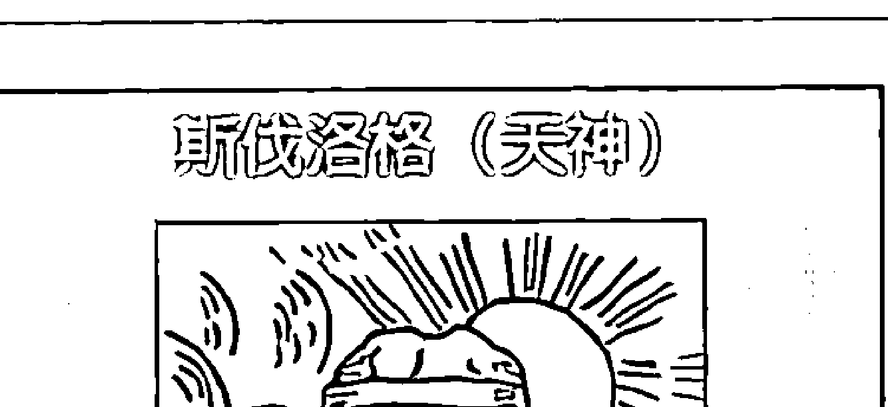

斯伐洛格（天神）

俄罗斯的天神、创造神。斯拉夫众神几乎全都是斯伐洛格的儿女。

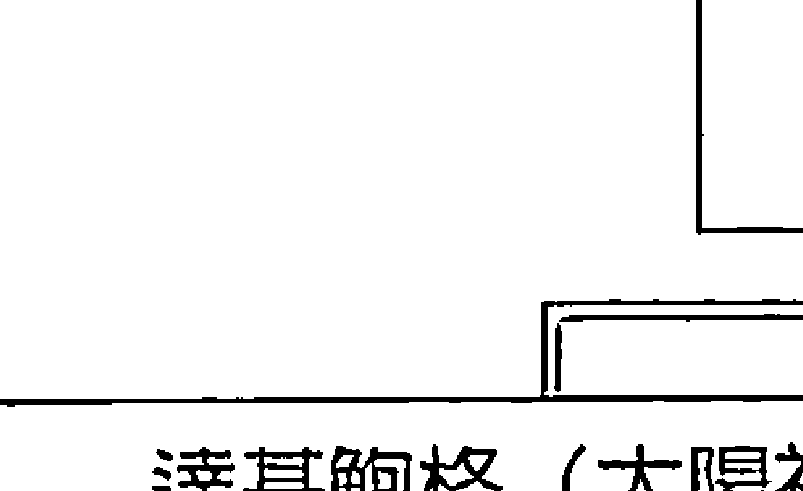

达基鲍格（太阳神）

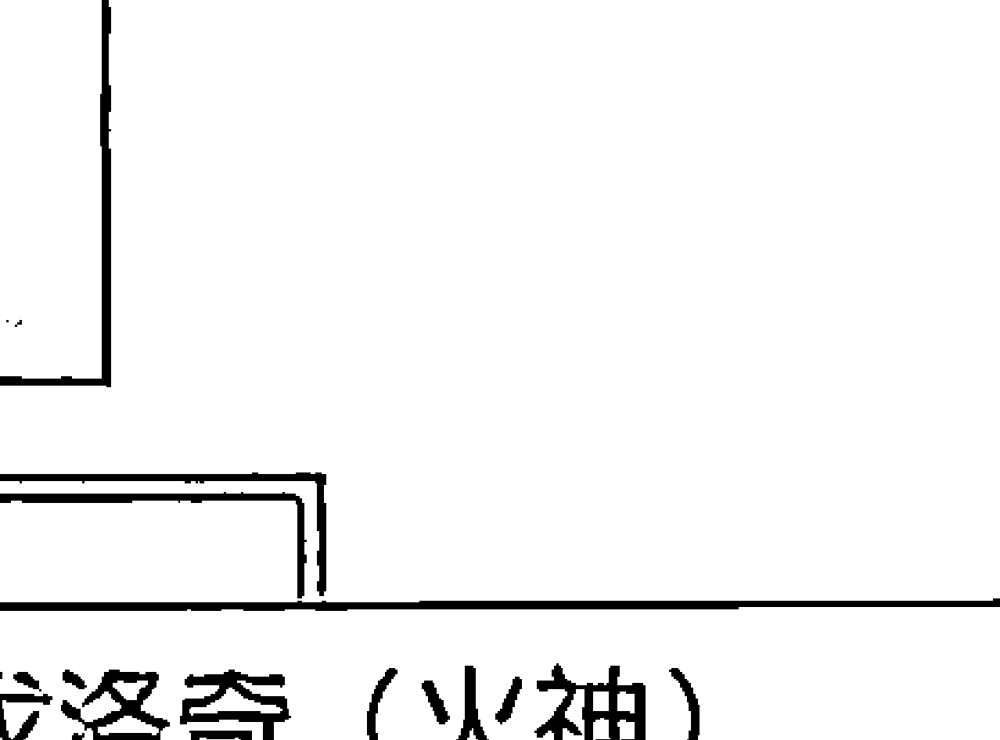

斯伐洛奇（火神）

太阳神。在寒冷的俄罗斯，再没有任何事物比太阳更令人热切期待盼望了。是以，斯拉夫民族对达基鲍格的信仰更甚于斯伐洛格。

从天而降的火（打雷产生的火焰）之神。由于「～ic」在俄语里面是「～之子」的意思，所以斯伐洛奇自然也就是斯伐洛格之子。

※部分地区将斯伐洛格与斯伐洛奇视作同一位神明，此时斯伐洛奇是斯伐洛格的别名，而火则是由天神亲自送到凡间来的。

佐拉·乌特恩亚亚（黎明极光）

佐拉·维切恩亚亚（黄昏极光）

## 西方净土与常夏之国

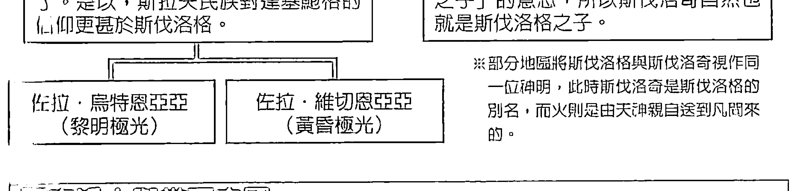

日本人认为西方尽头有个名叫西方净土的理想国度，是以频繁出入西方（亦即亚洲大陆）；相对的，俄罗斯民族则认为东方有个常夏之国，前往西伯利亚甚至另一头的海洋。据说这种民族性的动机是造成明治时代日俄战争的其中一个原因，其实也有可能。

# No.018 迦具土
## Kagutsuchi

日本神話的火神迦具土在神話中並不算特別活躍，但他好歹也是位火神，仍然廣受眾多民眾崇拜信仰。

## ○遭父親殺害的火神

迦具土是日本神話的火神。《古事記》¹記載迦具土有火之迦具土神、火之夜藝速男神、火之炫昆古神等異名，《日本書紀》²則有火產靈、火神珂遇突智等名。

迦具土乃諸神孕生之際，由伊邪那岐與邪那美所生，他出生時卻燒傷了母親的陰部，使得伊邪那美臥傷在床，終致死亡。

伊邪那岐怒不可遏，以十拳劍³斬殺迦具土，豈料從迦具土鮮血裡面又誕生出八位神明，其中就屬雷神建御雷之男神最為有名。另外，迦具土的屍塊中亦誕生出八位山津見神（山神），譬如正鹿山津見神便是從頭顱所生。

由於迦具土甫誕生便遭到斬殺，因此他在日本神話幾乎沒有任何活躍事跡。火神如此重要的神格卻幾乎沒有任何篇幅，光就這點來說，日本神話可謂是相當罕見的神話。

儘管遭到斬殺，但神畢竟是神。迦具土至今仍以火神、鍛治之神身分受人信仰。雖然屍體的各個部位都已分別變成其他神明，但迦具土這位神明仍然受到民眾信仰，此種現象可說是饒富趣味。

迦具土信仰的中心便是秋葉神社。秋葉神社乃以位於靜岡縣濱松市的秋葉山本宮為中心地，總計日本全國共有近千座秋葉神社。之所以能夠吸引如此多的信仰，是因為秋葉神社奉防火之神信仰的緣故，民眾很可能是認為迦具土既然身為火神，自然也就不懼火險了。

尤其江戶城在江戶時代更是大型火災仍頻，使得畏懼火災的民眾紛紛開始參拜秋葉神社。除此之外，參拜秋葉神社的路程不似參拜伊勢神宮⁴遙遠，感覺就跟出門郊遊爬山差不多，想必也是參拜秋葉神社愈發盛行的原因之一。

## 伊邪那岐・伊邪那美家族系譜

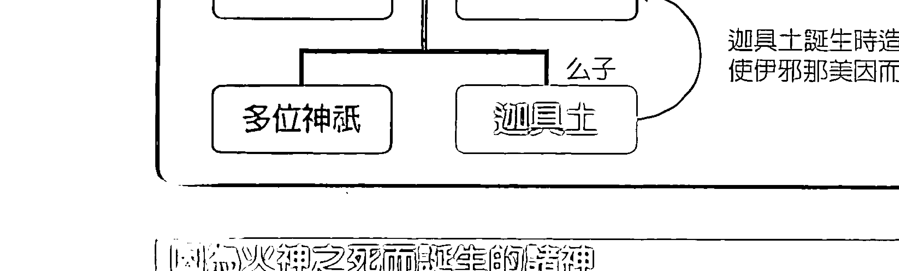

## 因火神之死而誕生的諸神

迦具土遭斬殺後，其鮮血從劍尖滴落所生諸神
| 神明 | 描述 |
|---|---|
| 石折神 | 力量足以碎裂岩石的神明 |
| 根折神 | 力量足以碎裂樹根的神明 |
| 石筒之男神 | 似乎是岩石之神，詳情不明 |

鮮血從劍身根部滴落所生諸神
| 神明 | 描述 |
|---|---|
| 熟速日神 | 讚頌太陽的神明 |
| 風速日神 | 讚頌太陽的神明 |
| 建御雷之男神 | 勇猛的雷神 |

劍柄鮮血滴落所生諸神
| 神明 | 描述 |
|---|---|
| 阿淤加美神 | 水神 |
| 阿須賀神 | 水神 |

從迦具土屍塊誕生的眾山神
| 神明 | 诞生部位 |
|---|---|
| 正鹿山津見神 | 生自頭顱 |
| 淤縢山津見神 | 生自胸口 |
| 奧山津見神 | 生自腹部 |
| 間山津見神 | 生自性器 |
| 志那山津見神 | 生自左手 |
| 羽山津見神 | 生自右手 |
| 原山津見神 | 生自左腳 |
| 戶山津見神 | 生自右腳 |

關聯項目

- ⊙天照大神→No.019
- ○火伏→No.082

# No.019 天照大神
## Amaterasuoomikami

天照大神是日本神话的太阳神，同时也是高天原（衆神之國）的主神。

## 日本皇室的祖神

全世界的神話當中，太阳神是女神的例子相當罕見（譬如因努伊特¹神話），以女神爲主神的例子則更加稀少。然則，日本的天照大神既是太阳神、主神，更是位女神。這樣的神話可謂是少之又少。這種現象有可能是因爲《日本書紀》和《古事記》的編纂正值元明，以及元正天皇等女帝相繼執政時期所造成的影響。

《古事記》裡，描述從前創世神明伊邪那岐從根之國（死後世界）返回人世、洗滌穢霧時，清洗右眼時生下了一位神明，此即天照大神；另外洗左眼時生下了月讀命、洗鼻子生出建速須佐之男命，三尊神明合稱爲三貴子。

據說天照大神最著名的天岩戶神話，便是講日蝕的故事。從前須佐之男來到高天原，又是破壞耕田畦道，又是在神殿拉屎的，四處胡鬧、一片狼藉，到最後他甚至把一匹死馬丟進了正在織布的女孩家裡，嚇得女孩意外死亡。原本還袒護弟弟的天照大神，這下也害怕得不住顫抖，躲進了天岩戶裡面，使得世界籠罩於漆黑之中。

傷透腦筋的衆神遂借重思金神的智慧，製作了一面鏡子，然後在天岩戶前面大舉宴會。天照大神心想現在世界應該是一片漆黑才對，怎麼衆神還笑得這麼開心呢？於是便好奇地打開門縫向外窺視，天宇受売趁機說：「因爲有比妳更尊貴的神明在場，衆神這才歡笑」；衆神趁天照大神探頭看是哪位神明時，取鏡子擺在她面前，天照大神看見一尊神明光輝閃耀的模樣，不由得將整個身子都探了出來。此時天手力男命便趕緊捉住天照大神的手把她拖了出來，然後布刀玉命又在天岩戶圍起注連縄²，好讓天照大神無法再躲回去。如此這般，世界才終於又恢復了光明。

## 三貴子

伊邪那岐從黃泉返回人世時，曾經行被襖洗去黃泉的穢惡。當時出現的三位神明便合稱爲三貴子。

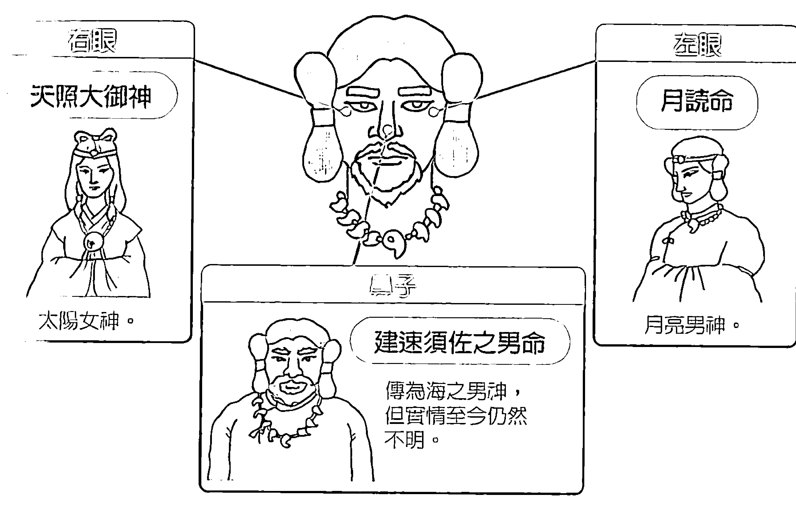

## 日本七神明

所謂神明神社便是指祭祀天照大神的神社，在日本總數超過5000家以上，其中的七神社合稱爲日本七神明。

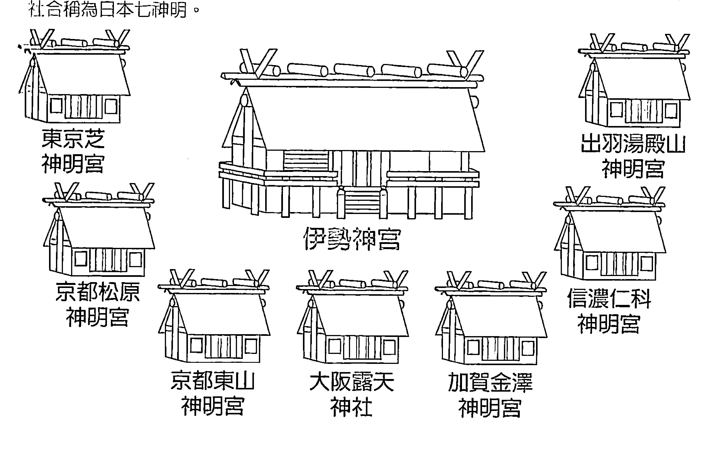

### 關聯項目

- 迦具土→No.018

# No.020 阿耆尼
阿耆尼

印度的火神阿耆尼是位愈到近代地位便愈趋低落的神明。

## ○地位愈趋低落的火神

阿耆尼是印度神话中的火神。此语原是指称「火」的普通名词，相传与拉丁语的「ignis」（火）是相同的。他原先在印度最古老的神话《梨俱吠陀》（西元前1500年左右的神话）当中与因陀罗并列为最重要的神明，后来地位却愈趋低落，直到今日的印度教，虽然他仍属于主要神明之一，却已经不占太重要的地位。吠陀里的阿耆尼是家庭的炉火、是太阳的火，甚至也是祭祀的火；他会以满头火焰的头发、黄金下颚黄金牙齿，有三条或七条舌头的模样现身。

印度本来就有火烧供物的习惯，他们相信如此阿耆尼就会消化供物，为人们将供物送到天上诸神所在处。换言之，阿耆尼非但本身是位重要的神明，同时也是人类与其他众神间的桥梁。也就是说，火亦象征著消化作用，所以印度人相信人类或动物便是凭著阿耆尼的力量来消化体内的食物。

阿耆尼是护世天王（守护世界周围的守护神）之一。吠陀时代的护世天王共有四位，阿耆尼负责守护东方，但《摩诃婆罗多》（西元前四世纪左右的神话叙事诗）里的护世天王却增加到八位，其中阿耆尼是守护东南方。更有甚者，这部《摩诃婆罗多》里的护世天王后来受到佛教吸纳，成了佛教的八方天，阿耆尼便是以此名继续镇守东南方。密教尤其重视八方天，还另外加入守护天地日月四天，合称为十二天。

现今的印度教将阿耆尼描绘成一名福态的红皮肤男子，从前的英姿已不复见。

> ※1《梨俱吠陀》：梵文Rgveda的音译，意译则是「赞颂明论」。「梨俱」是这种诗体的名称，一说为「诗歌」。约前1300至前1000年左右成书。是最早的吠陀本集。共十卷。主要内容是对自然诸神的赞颂。

> ※2因陀罗（Indra）：婆罗门教、印度教神名。由雅利安人从古代伊朗带到印度，后被佛教吸收，称为「释帝桓因」。全身茶褐色，能变换形状；嗜饮苏摩酒，故又名「饮苏摩酒者」。原为雷雨之神，后发展成为战神。其武器有激子和网，谓曾征服原印度土著居民沙达人。

# 神化的印度火神

### 吠陀时代

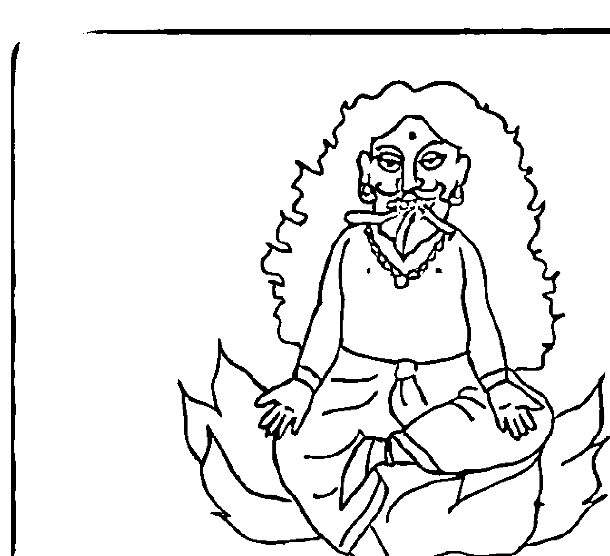

初期的阿耆尼

以火焰头发、黄金下颚黄金牙齿并拥有三条或七条舌头的模样现身。

### 《摩诃婆罗多》的时代

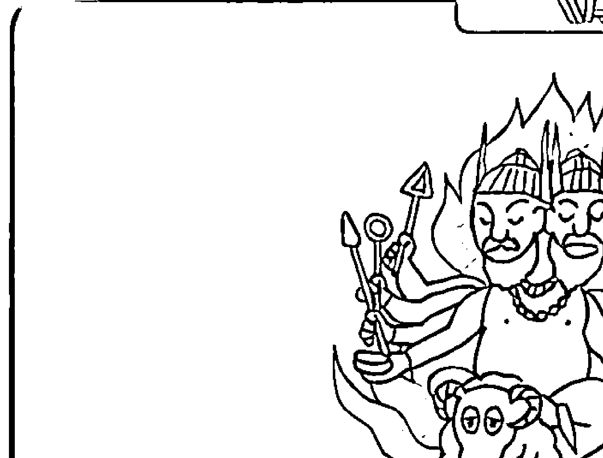

后世的阿耆尼

描绘成三面三脚七臂的神明。

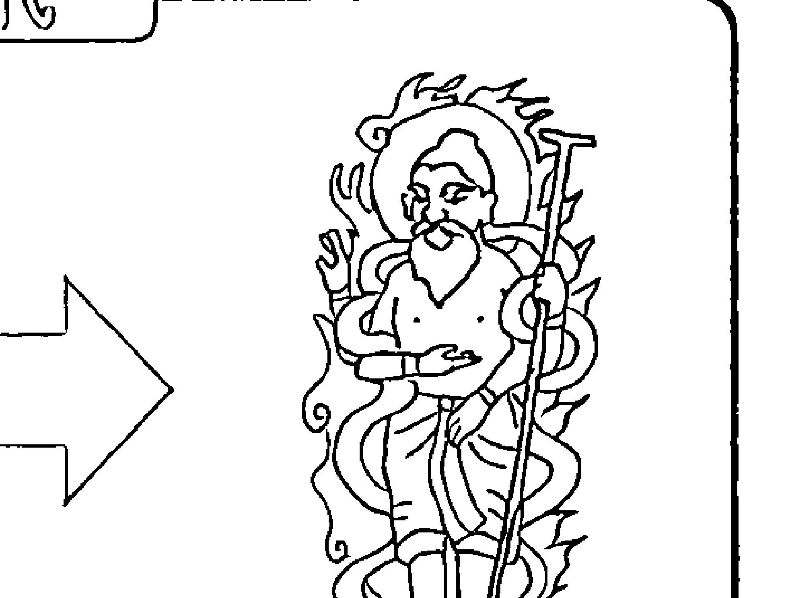

火天

佛教的八方天之一。

### 现代

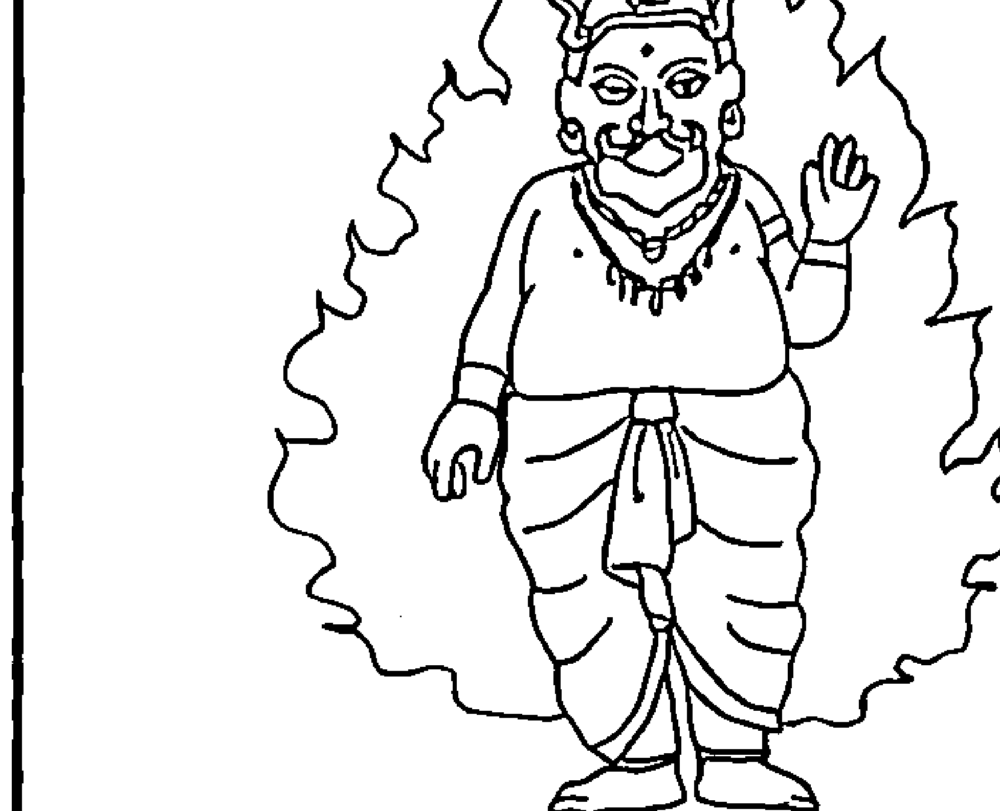

现代的阿耆尼

福态的红皮肤男子。

八方天：东方因陀罗，帝释天也。南方琰魔罗，琰魔天也。西方嚩噜拏，水天也。北方毗沙门，毗沙门天也。东北伊舍尼，伊舍那天也。东南护摩，火天也。西南涅哩底，罗刹天也。西北嚩庾，风天也。

# No.021 密斯拉
密斯拉
Mithra

密斯拉是波斯神话的光明之神。很少有神明如密斯拉这般对众多宗教都造成影响，甚至整个欧亚大陆都在密斯拉的影响范围之下。

## ◎对全世界造成影响最后却告消失的神

密斯拉在波斯语里面是「契约」之意，是契约之神。
他在印度则成了名为密特拉的契约之神。又，密特拉此语也是「盟友」之意，是以亦被奉为友情的守护神。
密斯拉在古波斯相当盛行的琐罗亚斯德教里遭到降阶，只是位司法神，可是他的信仰在民间却相当鼎盛。
从前亚历山大占领伊朗时，密斯拉是当地的太阳神，被视为等同于阿波罗。亚历山大认为自己是阿波罗的化身，便在各地建设的亚历山卓城建造密斯拉神殿，使得密斯拉信仰再度盛行起来。
自从亚历山大以来，密斯拉教已经与希腊神话结合，变成希腊化文化的产物；密斯拉成了阿波罗，他底下的七曜神也分别被拟为希腊神祇。
除此以外，密斯拉教还曾经随着希腊化文化传入欧洲，此即为密特拉斯教。密特拉斯教在罗马帝国时代曾经兴盛到甚至可以与基督教争夺帝国国教地位，但是随着罗马帝国立基督教为国教，密特拉斯教便开始受到基督教会逼害，渐渐衰退并遭到遗忘。其实，当初刚出现在罗马的基督教仍是个相当原始的宗教，宗教仪式等方面都不甚完备，于是基督教遂大幅吸收采纳密特拉斯教的仪式，才终于拥有了成熟宗教的形式。就这点而论，密特拉斯教可谓是基督教的范本宗教。
三世纪诞生于伊朗的摩尼教则说密斯拉是对抗黑暗的光明势力太阳神。后来摩尼教同样也受到基督教吸纳，成为异端教派。
另外还有个我们更加熟悉的密斯拉，那就是弥勒菩萨。弥勒菩萨在印度称作弥帝利夜，是密特拉（印度的密斯拉）被佛教吸收以后形成的神明。

# 传播全世界的光明之神

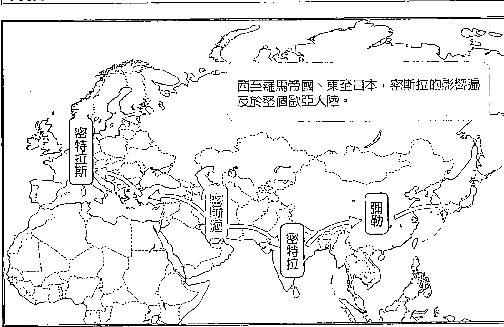

# 密斯拉对诸多宗教的影响

> 圣诞节
耶稣基督的生日究竟是哪天，已经不可考。圣诞节其实是基督教模仿当时蔚为流行的密特拉斯教的冬至节日，径自将12月25日定为基督的生日，从而流传至今。简言之，圣诞节就是基督教模仿当时流行的密特拉斯教并流传至今的产物。

> 佛教的弥勒
弥勒菩萨在古印度的语言梵语中唤作弥帝利夜，从其语感便可以清楚地判断弥勒是佛教吸收密特拉以后的产物。

> 《梨俱吠陀》
印度最古老神话《梨俱吠陀》亦曾提及密斯拉。尽管并非主神，却是重要神祇之一。在印度，密斯拉是司掌友情的神明。

> 《波斯古经》
琐罗亚斯德教的经典《波斯古经》亦曾提及密斯拉，只不过他并非主神。密斯拉是司法神，会用他的千耳万目监视全世界。

> 日曜日
平安时代将日曜写作「密」，此语源自摩尼教中代表星期日的神明密尔。当然，亦有说法认为这位密尔就是密斯拉。

关联项目
- ○阿波罗→No.014
- ○琐罗亚斯德教→No.028

# No.022 奎札柯特
奎札柯特
Quetzalcoatl

中美洲地区有位受到信徒如同万能之神崇拜的神明，他便是奎札柯特。

## ○与神同名的英雄

奎札柯特是托尔特克王国及后继的阿兹特克王国等中美文明所信奉的太阳神。他既是赐予空气供人类呼吸的风神，后期甚至还成了水神。除此之外，他也是创造人类的创造神。

奎札柯特是一只长着美丽翡翠绿羽翼的蛇；虽然蛇在日本没什么正面形象，但是在此地却经常被奉为不灭生命的象征，形象良好。

尽管身为太阳神，奎札柯特却也无法毫无止境地工作；就算是神明，不进食同样也会变得虚弱无力，太阳将无法散发光与热。是故，从前托尔特克人便会向奎札柯特奉献供物，而所谓神的食物，指的就是人类的血，中美文明便是以人身活祭献给神明。

奎札柯特既是神明，同时也是历史的英雄。托尔特克王国的第九代皇帝，便是奎札柯特。

从前暗黑神兼战士之神泰兹凯特力波卡（原是太阳神，却被奎札柯特打落地面，所以获得新太阳神地位的奎札柯特被他视为敌人）给予奎札柯特肉体，以为其弱点，使得奎札柯特从此养成了饮酒与好色两个恶习。于是，奎札柯特就此被逐出了托尔特克。奎札柯特来到海岸边搭上用蛇做成的船筏，并且留下终有一天会再回来的预言，然后便离去。尽管已经将他放逐，但托尔特克人仍未停止崇拜奎札柯特。

另外，约莫相同时期马雅人的纪录则说，羽蛇库库尔坎从西海（托尔特克位于马雅西方）来此建造新的国家，所以奎札柯特可能其实就是马雅的库库尔坎也说不定。

托尔特克王国（Toltec Kingdom）：托尔特克人是支操约瓦特尔语（Nahuatl）的民族，10～12世纪时曾统治现今墨西哥中部地区。「托尔特克」一名包括数种意义：「城市居民」、「有文化的人」，或者根据其字面可解释为「芦苇民族」，源自其文化中心「托兰」（Tollan，「芦苇丛生之地」），该地毗邻今之图拉（Tula）城，在墨西哥城以北约80公里处。12世纪初，游动的奇奇梅克人（Chichimec）入侵，彻底摧毁了托尔特克人在墨西哥中部的霸主地位；一起入侵的阿兹特克人约于12世纪中毁掉托兰城。

# 归来的神明

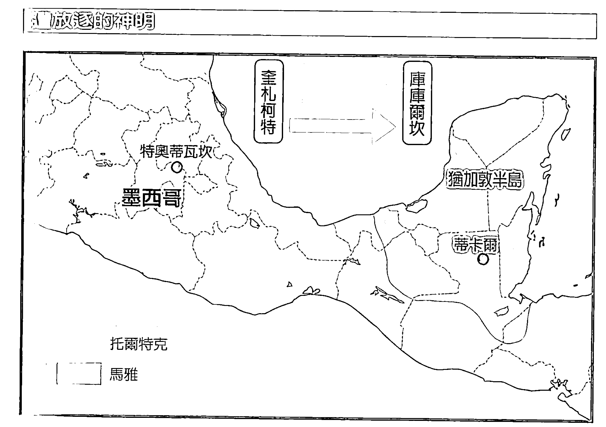

从图片中可以清楚看到，马雅文明所在地犹加敦半岛，位于托尔特克所在墨西哥本土东方大海的彼岸。

# 阿科的冥福

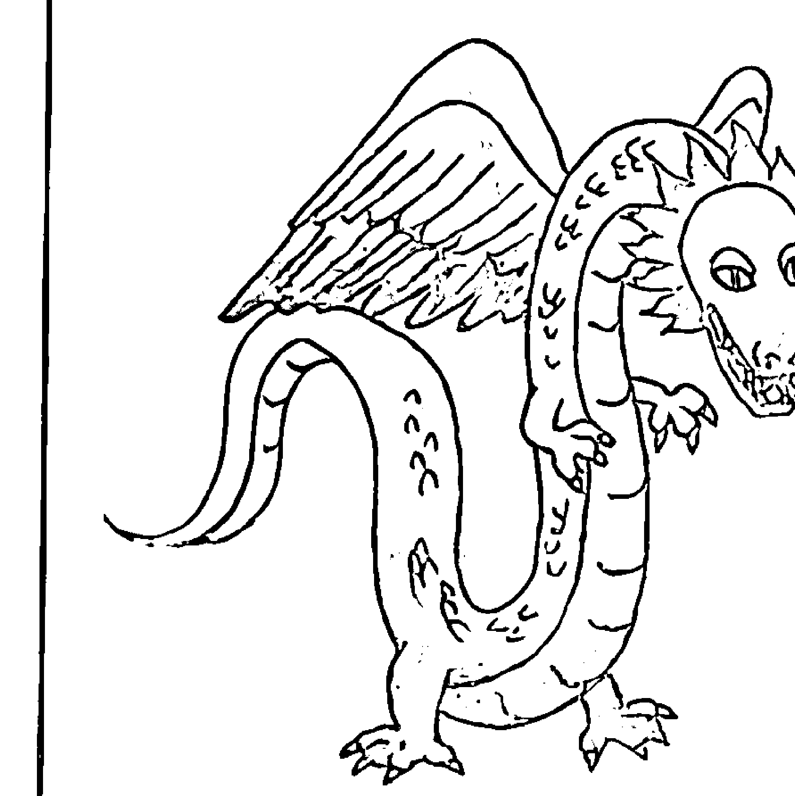

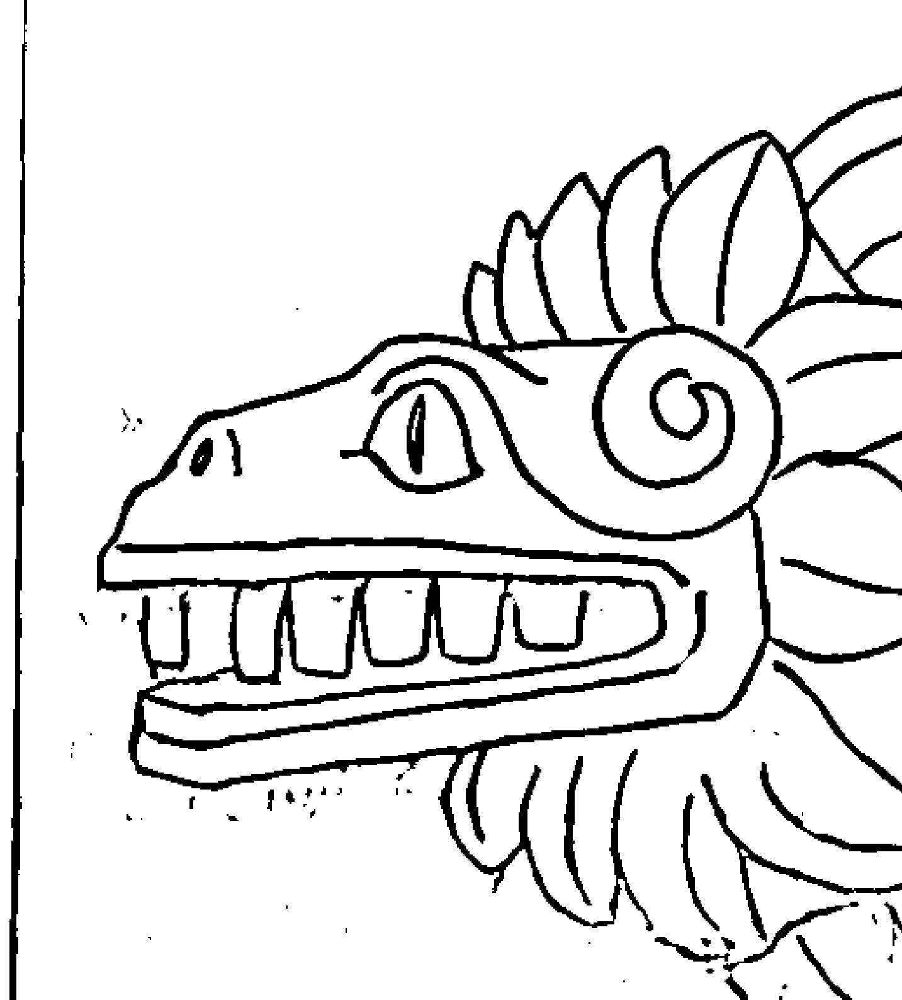

特奥蒂瓦坎遗迹里的奎札柯特

# 印地
Inti

南美印加帝国的神明印地，至今仍根深蒂固于南美民间，深受民众崇拜。

## ○印加皇室的祖神

印地是印加帝国的太阳神，也是当初为使印加文明发达而派遣印加人来到此地的神明。是以，印地可以说是印加人的祖神，他的妻子就是他的妹妹马马·奇札。印加的最高神祇是创造神维拉科嘉，印地则是维拉科嘉之子。

后来印地的地位愈来愈高，终于成为与维拉科嘉比肩的神明。这是因为印地算是印加帝国皇帝的直系祖先，是以极受重视。不仅如此，最后甚至还有主张维拉科嘉与印地其实就是同一位神明的神话出现。

关于印加帝国的起源，有以下这则神话：从前印地看见人类在地上过着跟野兽没两样的悲惨生活，于是便取黄金杖托帕耀利交给自己的儿女，令他们在黄金杖沉入地面之处建造都市，带领地面的人们（他们教导人们的正是如何栽培玉蜀黍与马铃薯的技术）。两个人流浪途中，黄金杖在后来变成库斯科的地方沉入了地面，于是他们便在该地建立都市，成为了该都市的皇帝与皇妃，即是印加的初代皇帝曼科·卡帕克及其妻马马·奥克罗，但严格来说，当时尚未制定皇帝帝位，所以他仍然只是卡帕克（将军）而已。

也就是说，印加帝国的皇帝是印地的子孙，也是他的化身。

尽管南美洲如今已经全面受到基督教席卷，但直至今日每到六月，还是会举行名为印地莱米的大规模祭典祭祀印地，吸引众多观光客前往参观。

除此以外，秘鲁乃以索尔（＝太阳）与印蒂（＝太阳神）为其货币单位。1985年以前的货币用的是索尔，1985年到1991年用的是印蒂，1991年后再度用回索尔，并且因为恶性通货膨胀而有过多次变更。

# 印地的太阳神

维拉科嘉 —— 马马·科嘉
|
印地 —— 马马·奇札
|
曼科·卡帕克 —— 马马·奥克罗
|
印加皇室

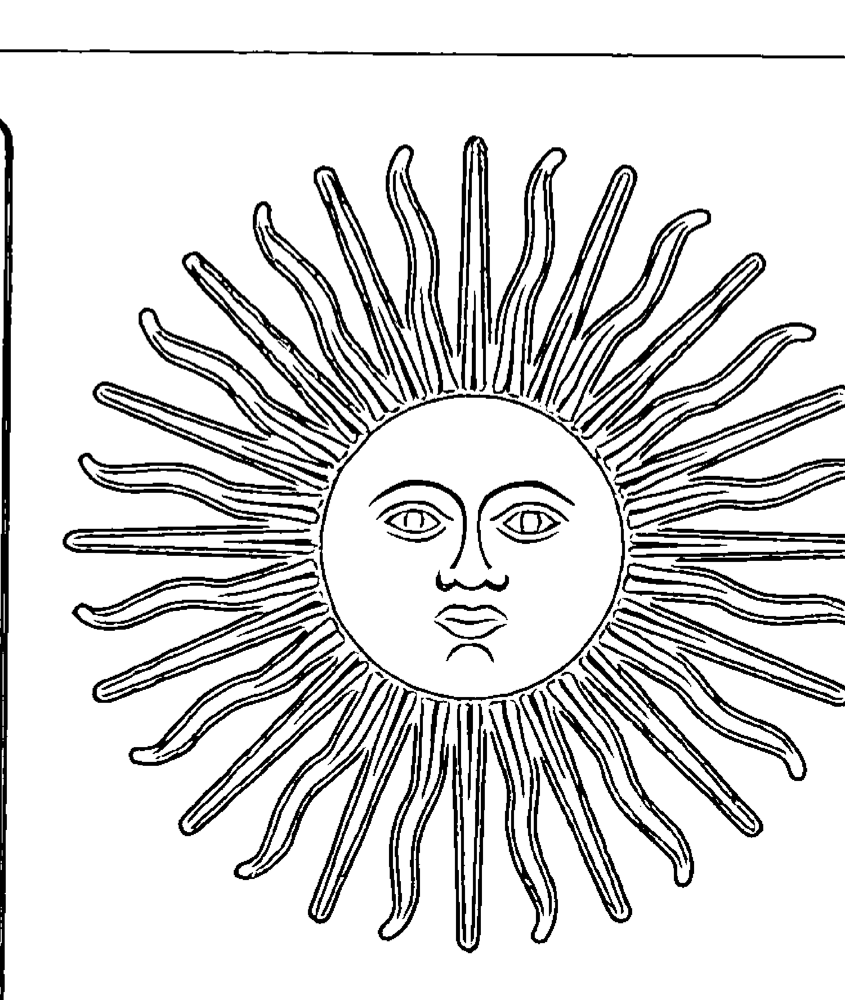

印地
印地的象征标幟是一个太阳的符号。顺带说明，这也正是阿根廷国旗中央的标幟。

时至后世，印加皇室仍然尽可能选择近亲同婚婚姻，以免混杂其他血统，影响血统的纯粹。

# 印加帝国

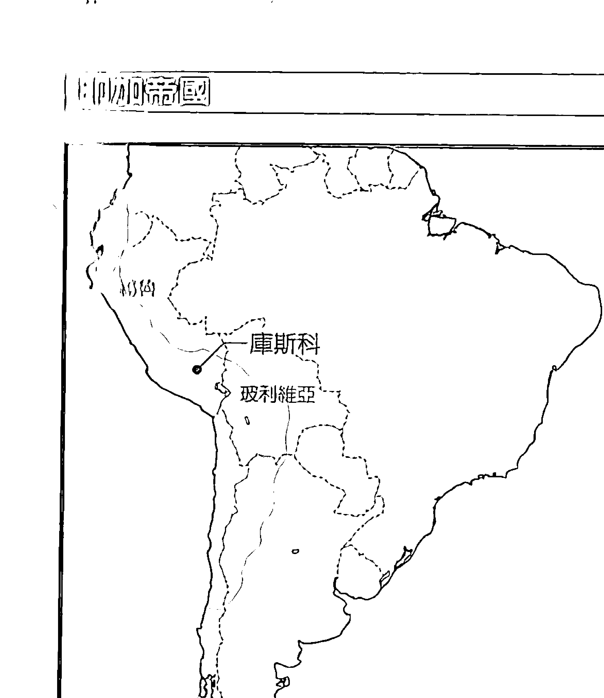

印加帝国乃13世纪兴起于秘鲁、玻利维亚，最盛时期的领土范围极为广大，后来却在16世纪遭西班牙征服而灭亡。由于印加文明没有文字，遭西班牙占领以后，除传教士等人留下的少数纪录以外，已无其他可供探究其历史与文化的线索。

□印加帝国的最大版图

# No.024 希利欧斯
希利欧斯
Helios

希腊神话的太阳神原是希利欧斯，但后来希利欧斯的神格却被阿波罗夺去，同时也失去了存在感。

## ○地位遭夺的神明

希利欧斯是希腊神话的太阳神。他在罗马神话里的名字叫做索尔，其实也就是太阳本身。从天空中俯瞰世界万事万物的希利欧斯，也是位誓约之神。

但是自从阿波罗获得了太阳神的神格以后，希利欧斯的地位便渐趋低落，有时还被视为是阿波罗的别名。就连希利欧斯的两个别名海比力恩与菲巴士也是，海比力恩自行独立，甚至成为希利欧斯的父亲，而菲巴士则是成了阿波罗的别名。

希利欧斯住在东方尽头的一座黄金宫殿里面，每天清晨就在胞妹拂晓女神厄俄斯的开路之下，从东方现身于天空中。

他会乘坐四头飞马拉曳的战车横亘天际，落向西方。如果希利欧斯在日落西方以后，明晨就这样直接出现在东方，那不是很奇怪吗？原来希利欧斯是乘坐巨大的黄金杯，沿着环绕全世界的奥克安诺斯河，趁夜回到了东方的宫殿。

从前宙斯将地上各国划分给众神的时候，太阳希利欧斯因为挂在天空中没有分到；宙斯觉得希利欧斯很可怜，于是便将新从海面出现的罗德岛定为希利欧斯之国；因为这个缘故，整个希腊世界也唯有罗德岛是希利欧斯信仰盛行的地区。

希利欧斯也曾爱过多位女性，其中较有名的当属他跟波斯公主琉科托厄的故事。原来希利欧斯另一个爱人克吕提厄嫉妒琉科托厄并且向国王告发，使得琉科托厄因此遭到活埋。伤心的希利欧斯遂将安珀希雅洒在琉科托厄遭活埋处，上方竟然长出了一株乳香木。除此之外，就连克吕提厄也变成了向日葵，至今仍然时时刻刻面向着自己心爱的男人。

虽然希利欧斯的许多段情话都曾引起类似纷争，但此事据说却是因阿芙柔黛蒂而起；原来希利欧斯将她跟阿利兹外遇的事向她的丈夫赫发斯特斯举发，阿芙柔黛蒂这才恼羞成怒，介入希利欧斯的感情事。

# 希利欧斯的特征

希利欧斯的特征大致如下，许多艺术作品也都有使用到这些特征。

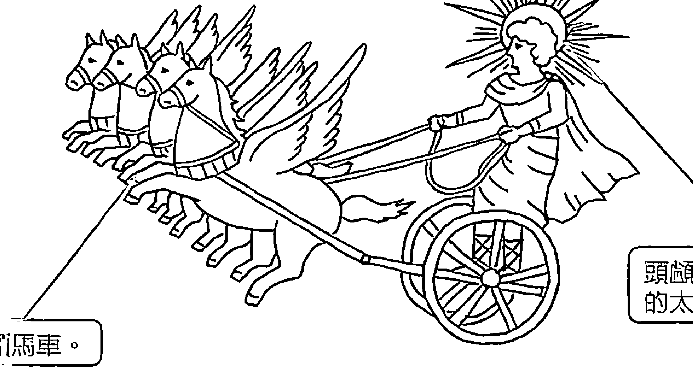

# 希利欧斯的家族关系

家族关系图：
海比力恩 — 忒伊亚
|
希利欧斯 — 厄俄斯
|
| \n--- ---
| |
宾顿 瑟西

## ☆ 告密者希利欧斯

希利欧斯是长挂天空的太阳神，随时都俯瞰着地上发生的所有事情，是以每每都能知道诸多事情的真相。跟赫发斯特斯打小报告阿芙柔黛蒂与阿利兹外遇，还有把泊瑟芬被黑帝兹绑走之事告诉黑帝斯特的人，都是希利欧斯。就某个方面来说，希利欧斯可说是个危险的情报贩子兼告密者。

# 阿蒙・拉 Amen Ra

像太阳神这种会散发热气的神明，在酷热的中东地区并不是很受欢迎，唯独埃及算是例外。

## ○埃及趋向融合的太阳神

阿蒙・拉是埃及的太阳神，埃及神话以太阳神做为主神，可说是中东世界的特例。

其实阿蒙跟拉原本是两位不同的神明。古代埃及可以分成许多区域，各有其部族宗教，而各地区也都拥有各自不同的神话存在。

拉（亦名瑞）是下埃及（尼罗河下游地区）的太阳神，他在赫利奥波利斯（现在的开罗）等地跟名叫亚图姆的另一位古老太阳神习合（指复数神祇整合为单一神明），从而获得了创造神的地位。有时甚至还会按照时间区分，将早上（年轻）的太阳称为凯布利，午间（支配）的太阳称为拉，傍晚（衰老）的太阳则称为亚图姆。

阿蒙・拉是位隼头神，他白天乘着昼船航行于天空，夜晚则是乘着夜船通过天空（女神努特）的胎内返回东方。

相对的，阿蒙则是上埃及（埃及南部的尼罗河中游流域）的天空神暨丰饶神，在底比斯（埃及南部都市）等地受到广大信徒信仰。阿蒙此词是「隐藏者」的意思，原本不具备太阳神的意涵。

阿蒙是一位长着公羊头颅的神明，在埃及中王国时代（古王国时代是由下埃及掌握霸权，此时霸权却是掌握于上埃及手中）是国家的守护神，权倾一时。

此二者习合而出的，便是阿蒙・拉。

由于结合了上下埃及的太阳神与天空神，阿蒙・拉遂成为广受埃及全国崇拜的太阳神，甚至还曾经在希腊化时代与罗马神话习合，被视为宙斯。

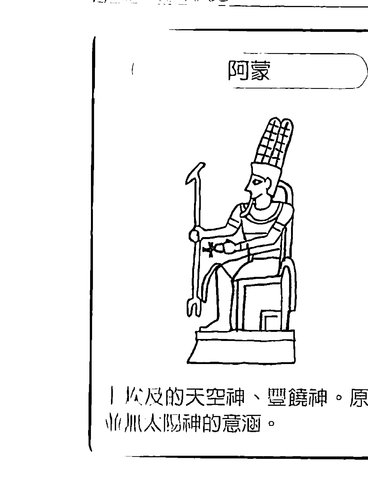

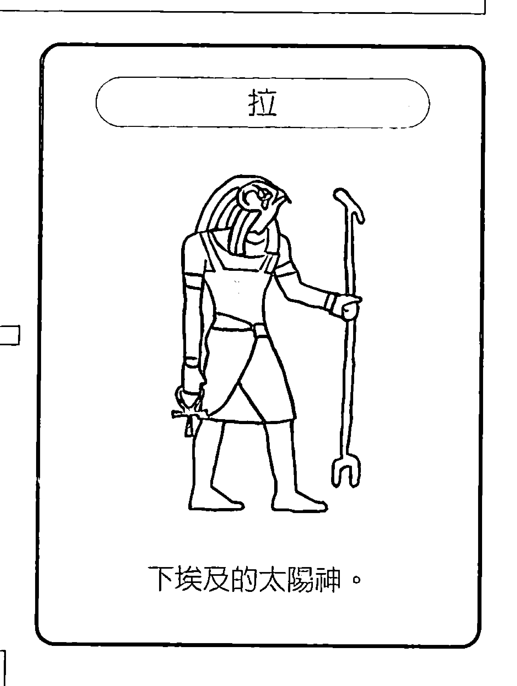

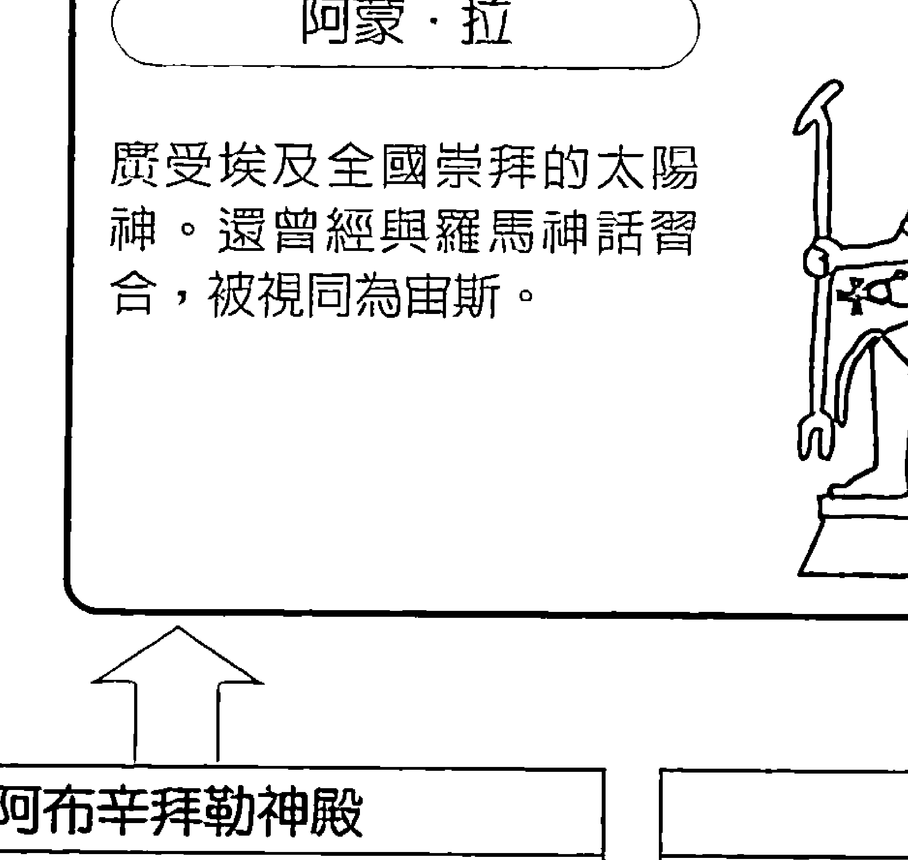

阿布辛拜勒神殿
西元前16世纪～西元前11世纪建造的阿蒙・拉神殿。每年唯有春分与秋分两天的晨光，能够照射到至圣所内的阿蒙・拉神像。

卢克索神殿
西元前14世纪阿孟霍特普三世建造的卡纳克神殿离宫。此神殿是为了要在尼罗河氾滥时期安置阿蒙神所造。

- ○阿吞（阿顿）→No.026

# 阿吞（阿顿）
Aten/Aton

埃及的太阳神并非只有拉而已，有时候甚至法老王也会创造新的神明，此即阿吞。

## ○人工创造出来的神明

阿吞是埃及的太阳神。阿吞原是指称太阳的用语，经常描绘成放射出许多条太阳光线，光线末端生有手掌的橘色圆形（太阳）；其中的一只手，还握着象征生命的安卡（生命创造者之证明）。

埃及法老阿孟霍特普四世登上王位后，便全盘否定了先前既有的全部神明，并制定太阳神阿吞，主张唯有阿吞才是唯一的神；他还自称“阿克纳唐”（阿吞的皈依者），开始迫害阿蒙神的神官等人。有人认为，这可能是因为当时阿蒙的神官权力过度膨胀，阿克纳唐此举其实是意欲从对方手中夺回权力的某种宗教改革。

然后他又在埃赫塔吞（意为“阿吞的地平线”）建立新都，新都中不容许任何祭祀非阿吞神的神殿存在。埃赫塔吞位于底比斯（埃及南部都市）与孟斐斯（尼罗河口附近的都市）之间，是以亦有说法认为融合上埃及（南部）与下埃及（北部）也是他当初建都于此的其中一个目的。

阿吞是所有生命的创造原理，他给予人类各种肤色、各种语言和居住的土地；除此之外，赐尼罗河给埃及人、赐雨水给其他人的，也是阿吞。

阿吞是宇宙中独自生成的神明。祂还透过自慰生出大气之神苏、湿气之神泰夫奴特，世界便是经过此二神的融合方才孕生。

然而，阿克纳唐的宗教改革终究还是失败了。他仍在世时，阿吞信仰固然相当盛行，可是继任法老王之位的女婿图唐卡吞（活在凡间的阿吞）却改名图唐卡门（杜唐卡门），重返阿蒙信仰，还将王宫也迁回了底比斯。

安卡（Ankh）：可赋予人不死生命的古埃及护符。它是生命的象征，也是代表王权的标志，在古埃及的图昙中常可见到神、王及神官手中握着安卡。又名「埃及十字」、「柄十字」。

# 阿吞=埃及的太阳神

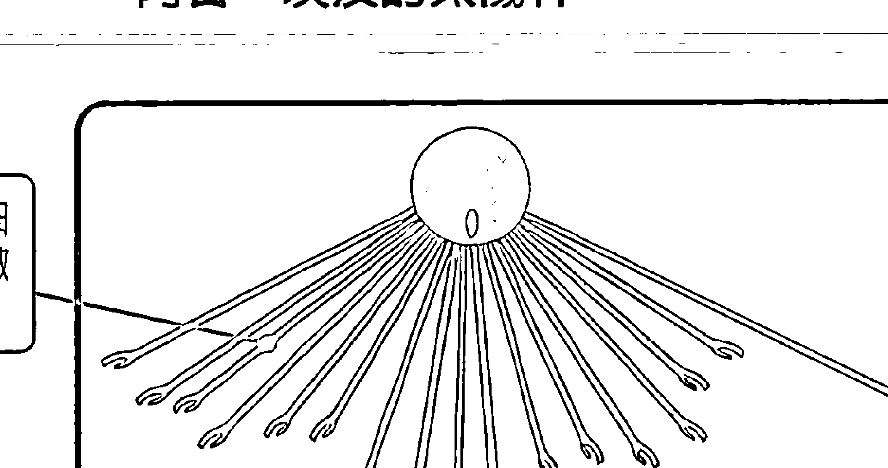

从太阳延伸出许多细小的‘手臂’，每一条都象征从太阳射出的光线。

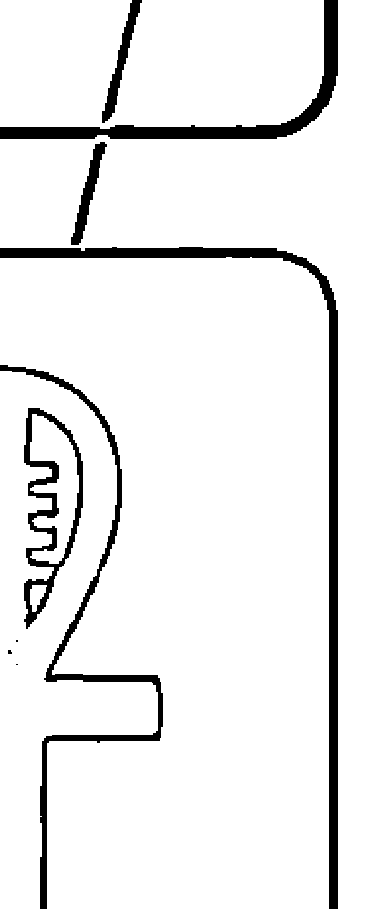

（手臂）握着名为安卡（别名埃及十字架）的物品。这个安卡是生命的象征，代表太阳孕育生命。

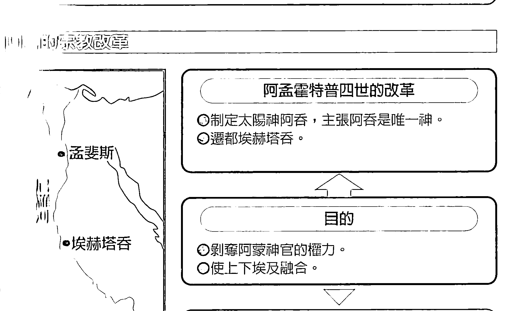

# No.027 苏尔特
苏尔特
Surtr

拥有冰火等不同属性的巨人极可能是初见于北欧神话的创举；至于其中最强的火焰巨人，恐怕非苏尔特莫属了。

## ○诸神之敌

苏尔特是北欧神话所提及的火焰巨人，手持火焰魔剑雷瓦霆（亦有传说指其所持火焰剑并非雷瓦霆）。顺带一提，苏尔特此名也有「黑」的意思。

苏尔特是火焰世界穆斯佩海姆的火焰巨人（穆斯佩）的王，相传他早在世界创生前便已经存在。

北欧神话说到，南方的火焰之国穆斯佩海姆和北方寒冰世界尼弗海姆中间有个巨大的金伦加鸿沟，而诸神之国阿萨神域便是创造于此处。换言之，穆斯佩海姆早在诸神之国出现以前便已经存在，而火焰巨人族早已经在那裡居住。

这群火焰巨人的王，便是苏尔特。

除此之外，苏尔特还将在世界终末之际扮演着极重要的角色。诸神黄昏大战当中，苏尔特将率领魔犬加尔姆与火焰巨人加入洛奇阵营，对抗诸神当中最美丽的丰饶神福瑞。

以前福瑞有柄只要敌人稍有动弹就会自动将敌人打倒的魔法剑，可是他却把这柄剑赐给仆从史基尼尔，做为自己成功迎娶美丽的巨人族妻子葛德的奖赏。是以福瑞便持鹿角迎战，终于没能战胜拥有雷瓦霆的苏尔特。

诸神黄昏便是以这场苏尔特对抗福瑞之战宣告终结，而独自存活下来的苏尔特更催动雷瓦霆，使世界陷入一片火海，然后在所有物事烧成灰烬以后离去，不知去向。

现今的这个世界将要如此迎向终结，而新的世界则将由存活下来的众神展开。苏尔特便是这么一位早在世界诞生前便已存在，同时还要为世界带来终结的巨人。

# 北欧神话的世界

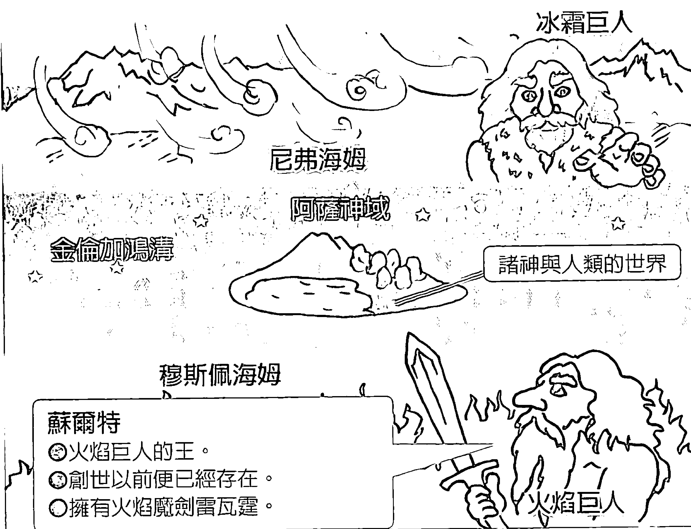

- 苏尔特
  - 火焰巨人的王。
  - 创世以前便已经存在。
  - 拥有火焰魔剑雷瓦霆。

# 诸神黄昏中的对战战况

北欧神话指出世界终末将有一场诸神与巨人的大战，最终苏尔特将会登场。

# 对战表

| 神祇 | 结果 | 敌手 |
| :--- | :---: | :--- |
| 主神奥丁 | ✕—○ | 魔狼芬里尔 |
| 雷神索尔 | ✕—✕ | 大蛇约尔孟甘德 |
| 丰饶神福瑞 | ✕—○ | 火焰巨人苏尔特 |

从最终战役胜出的苏尔特，催动雷瓦霆、焚烧世界万物，然后就离不去不知去向了。

# No.028 瑣羅亞斯德教
Zoroastrianism

瑣羅亞斯德教堪稱是一神教的開祖，同時也是非常重視火的宗教，究竟火在瑣羅亞斯德教具有何種意義呢？

## ○視火為神聖的教義

瑣羅亞斯德教的開教始祖波斯語喚作查拉圖修特拉，英語喚作瑣羅亞斯德，德語則作查拉圖斯特拉。其經典則是以《伽泰》（瑣羅斯德的話語）為首的《波斯古經》（祭祀書）。

瑣羅亞斯德教後來又分裂成馬茲達派、密特拉派（對後世密斯拉教造成影響）等教派，從此便再也未統一。是以，各教派的經典各有不同，就連瑣羅亞斯德的傳記也都各異。此節解說乃是以馬茲達派為主，輔之以他派說法。

瑣羅亞斯德教主張世界是由光明之神阿胡拉·馬茲達（賢主）、七位阿姆沙·斯彭達併麾下善神Yazata，以及對立勢力黑暗之神安格拉·曼紐所構成。是故，瑣羅亞斯德教算是二神教。阿胡拉·馬茲達和安格拉·曼紐是無限時間楚爾凡·阿卡爾納所生雙胞胎（固然有人如此主張，不過也有人並不承認楚爾凡）。從前阿胡拉·馬茲達計畫要把地上變成樂園的時候，安格拉·曼紐卻創造出毒蛇、疾病和其他邪惡的物事，使得計畫化為水泡。阿胡拉·馬茲達創造出星星、散在天空，安格拉·曼紐卻創造出任意在天空中胡闖亂跑的行星。

人類可以憑著自由意志選擇要加入善惡陣營，並參與從事該陣營的計畫。《波斯古經》便記載瑣羅亞斯德曾經說過：「賢者做出了正確的選擇，愚者則是沒有做出正確選擇」。只不過，無論如何最終注定都是要由阿胡拉·馬茲達勝出；因為這個緣故，也有人認為瑣羅亞斯德教是一神教的先驅。

阿胡拉·馬茲達的光明象徵，便是火。火象徵著能夠驅退黑暗的真理與公正，因而被視為神聖。瑣羅亞斯德教的寺院裡全無神像之類的雕像圖樣存在，而是以焚火取代之，以焚火為阿胡拉·馬茲達的象徵物祭祀崇拜。所以，瑣羅亞斯德教亦有拜火教之別稱。

> 《伽泰》（Gathas）：意譯《神歌》。瑣羅亞斯德教經典。《波斯古經》所從耶斯那的第28至第34章、第43至51章、第53章，共十七章。是《波斯古經》最古的部分。

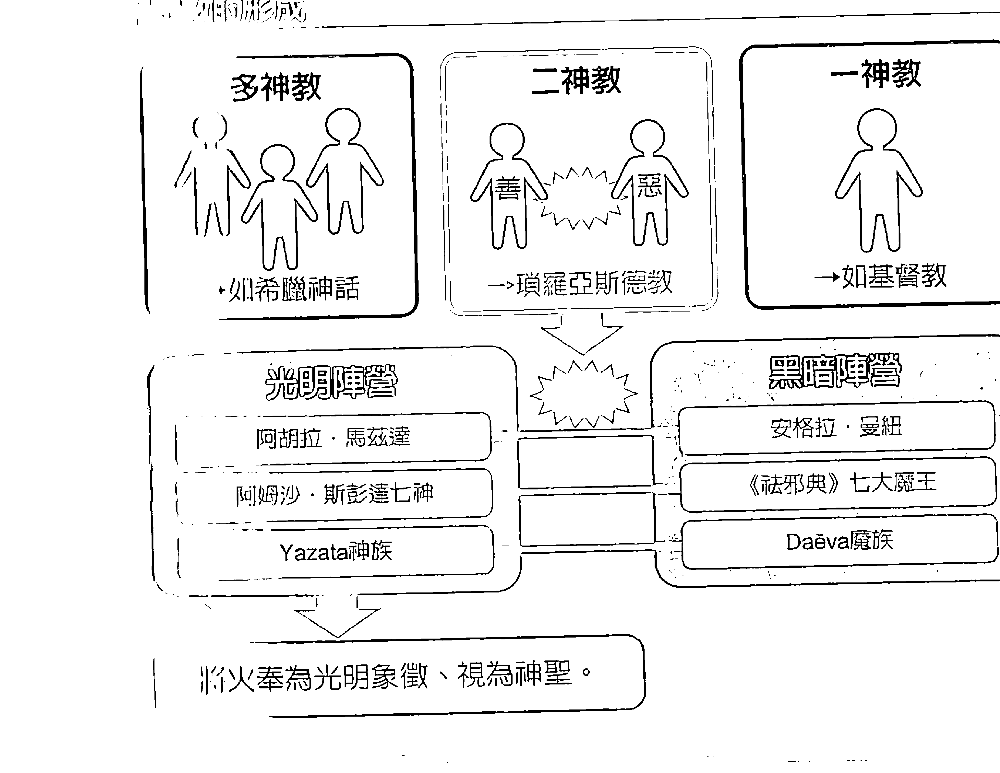

> ❦《查拉圖斯特拉如是說》
> 《查拉圖斯特拉如是說》乃以德國哲學家尼采的著作而聞名，許多人即便沒有讀過此書，至少也聽過這本書的名字。此書雖然是一本哲學著作，但作品卻是故事體裁，其主角正是瑣羅亞斯德教的開山始祖瑣羅亞斯德（＝查拉圖斯特拉）。
> 除此以外，理查·史特勞斯從此書獲得靈感而創作的交響曲《查拉圖斯特拉如是說》也是部傑作，同時也因其規模壯大而受到廣泛使用，其中以電影《2001太空漫遊》的片頭曲較為有名，不過在日本的話，這首曲子恐怕反而是以格鬥選手鮑伯·薩普（Bob Sapp）的主題曲較為人所知。
> 順帶一提，儘管尼采的這部著作是以瑣羅亞斯德為主角，但內容始終是尼采經過思索所孕生的哲學，跟瑣羅亞斯德教幾乎全無關係。

# No.029 亚蒙
Amon

亚蒙有炎之侯爵的别号，他在日本则亦以永井豪的漫画《恶魔人》的真正身分而为人所知。

## ○擁有另一張神秘面孔的惡魔

亚蒙是地狱的大侯爵，亦是所罗门王七十二魔神之一。儘管名字广为人知，他的真正身分却仍是谜团重重。

一般认为亚蒙原是埃及神明阿蒙，是在基督教世界里才变成恶魔的，不过阿蒙本身就是个特征不甚明显的神明（儘管一般指其是天空神）。阿蒙不具鲜明特征这点对习合（指复数神祇融合为一）来说相当方便，这大概也是为何阿蒙能够实际与拉习合，变成太阳神阿蒙·拉的诸多原因之一吧。

根据柯林·德·普朗西的《地狱辞典》记载，恶魔亚蒙是副枭头狼身蛇尾的模样。既然拥有炎之侯爵的诨号，亚蒙自然也能口吐火焰。当然了，他还能化作人类的模样。

据说亚蒙是恶魔众公子当中最强大的一个，麾下率领多达四十个军团。或许正是因为这个最强的称号，永井豪这才决定在漫画《恶魔人》里，让主角不动明跟亚蒙合体也未可知。

亚蒙拥有得知过去与未来的能力，而且只要他愿意的话，替失和的朋友调停可谓是小菜一碟。这应该是因为阿蒙神原本就拥有“隐藏者”的意涵，所以亚蒙也连带获得了可以知悉被隐匿的事实之能力。

顺带说明，基督教也透过犹太教吸收了“阿蒙”（隐藏者的意涵），而基督徒呼唤神的时候也会使用这个词，此即为“阿门”。
没想到基督徒对神的呼唤和恶魔的名字都是源自于同一个神名，真是非常奇妙的现象。

> *柯林·德·普朗西（Collin de Plancy, 1793～1887）：法国最具代表性的恶魔学者，据传其代表作《地狱辞典》的内容是他召唤恶魔询问听取而成。普朗西藉此书揭开了以撒旦为顶点的恶魔王国构图。

+   ○所羅門王七十二魔神之一。
+   ○擁有炎之侯爵的異名，能口吐火焰。

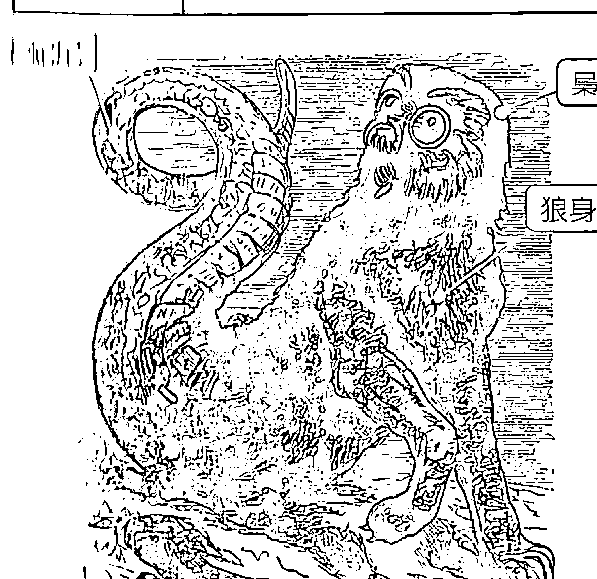

收錄惡魔相關知識內容最詳實的柯林·德·普朗西之《地獄辭典》書中所載亞蒙。或許是受到永井豪《惡魔人》影響，現在的亞蒙擁有相當精悍的形象，但他原本的長相看起來其實並不怎麼強大。

### 【惡魔的階級】

| 等级 | 代表恶魔 |
| :--- | :--- |
| 皇帝 | 别西卜 |
| 王 | 巴耶力、阿斯摩丢斯等 |
| 公爵 | 亚斯她录、格莫瑞等 |
| 侯爵 | 亚蒙、菲尼克斯等 |

以上是約翰·章爾主張的惡魔階級。惡魔有許多階級，而且都不一致，甚至有好幾個階級間連地位最高的惡魔名字都不一樣。

### 【參考項目】
○阿蒙·拉→No.025

# 米迦勒
Michael

相傳上帝創造的象天使各有不同屬性，其中被稱為火之天使的米迦勒，究竟是位什麼樣的天使呢？

## ○四元素的天使

米迦勒是四大天使之一，其他三位分別是烏列、加百列和拉斐爾。這四位天使分別對應至地水火風，米迦勒是火的天使。只不過這個分類法是後世才有，初期基督教並無此區別。

米迦勒其名意為「最像上帝的是誰」，他是神第一個創造的天使，也是最強的戰士。在「約翰的啟示錄」裡，米迦勒也在對抗龍（撒旦）的戰爭中擔任善方天使的指揮官，並擊敗了撒旦。

儘管米迦勒是如此重要的天使，可是他的地位卻很低。天使的地位從上而下共有九個階級，依序是熾天使、智天使、座天使、主天使、能天使、力天使、權天使、大天使、天使，米迦勒只不過是倒數第二的大天使等級而已，跟他的付出與能力極不相稱。

其實天使的階級在基督教的初期階段並不像今日如此完備，尤其高階的天使階級是直到五世紀前後才增添制定，據說最初只有天使和大天使兩個階級而已。

如果天使只有這兩個階級的話，那身為大天使的米迦勒便屬於高階天使；而神將米迦勒創造為高階天使，這樣也比較符合米迦勒的能力與地位。

米迦勒乃以最高潔、最公正的天使而聞名。舉例來說，從前神將七十個國家各自分配給七十個天使，命令他們擔任該國守護天使的時候，其他六十九位天使都疏於職守，最後終於和各自負責的國家一齊墮落；唯有以色列的守護天使米迦勒確實地完成工作，使以色列之民不致悖離神的道路。

另外，據說巴力等以色列周遭民族信仰的神，其實是天使受到人類崇拜後妄自尊大、從而墮落成為惡魔。後來他們就成了撒旦的屬下，組成了惡魔軍團。

### 1. 階級制度与最高天使

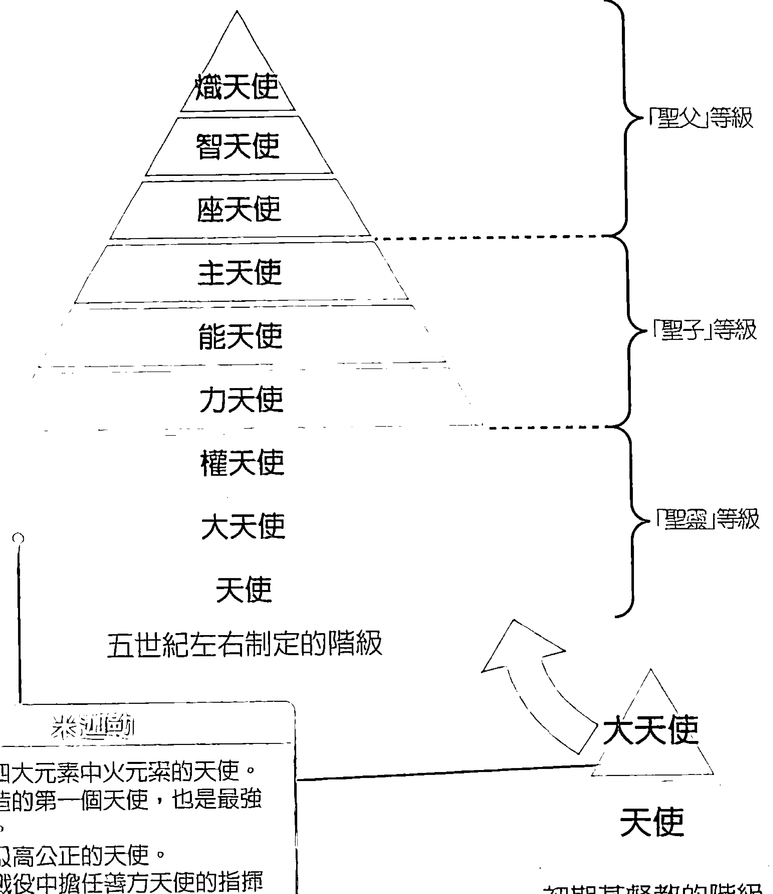

+   - 米迦勒簡介
    - 屬於四大元素中火元素的天使。
    - 神所創造的第一個天使，也是最強的戰士。
    - 最高潔最高公正的天使。
    - 在末世戰役中擔任善方天使的指揮官。

#### 神究竟有能與否？

仔細想想，神總共任命了七十名天使擔任守護天使，除一人以外，其他全都沒能完成任務。

按照常識思考，這要不就是神創造的天使品質太差，要不就是神相當沒有眼光，除此之外恐怕沒有其他原因了。

不過，這種思考似乎不為基督教所容許。

其實神的計畫極為深遠，絕非卑微渺小如人類者可以理解。所以說，這六十九名天使的墮落也都在神的計畫之內，而人類擅自忖度其原因，乃是狂妄不遜的行為。

# 裴蕾
Pele

世界各地都有火山神存在，但女性火山神倒是相當罕見，而裴蕾也確實是位如同火山般熱情的女神。

## 夏威夷的火山女神

夏威夷群島屬於火山群島，全世界活動最頻繁活潑的火山並非在觀光客最多的歐胡島，而是位於夏威夷群島當中面積最大的夏威夷島，名為克努亞火山。其實「奇努亞」此語本身在夏威夷語裡就是「大量噴發」的意思，由此不難想像其岩漿與火山灰的量有多麼大。
這名奇努亞火山的女神，便是裴蕾。

出人意表的是，裴蕾並非出身於夏威夷的女神；相傳她是從前跟兄弟們從卡西奇（應該是指大溪地）移居至此地。

儘管並非惡神，但裴蕾激烈的性格卻也惹了不少麻煩。
從前帥氣的族長們跟女孩們遊玩時，裴蕾便會特意化作美女出現，意欲獨佔族長們的寵愛。即便深深受其吸引，族長們還是從陰晴不定且易怒的性情隱約猜到這位美女會不會是裴蕾的化身，要是真的跟她在一起，就是再多幾條命恐怕都不夠用，於是族長們便漸漸愈來愈疏遠她。當然了，裴蕾怎麼能容許這樣的事情發生，於是便將族長們找來，以岩漿的火焰威脅之，她極度的憤怒使得大地動搖、岩漿爆發、村落全數覆滅，最後就連逃出村落的族長們也都被岩漿給燒死了。如今的夏威夷到處都有類似的傳說故事流傳。

只不過，裴蕾其實也有弱點，那就是同樣位於夏威夷島的冒納開亞山³的雪之女神波利阿芙。這座山高達四千公尺以上，山頂有萬年雪累積，終年可以滑雪。早在兩位女神初次相遇時，裴蕾就已經對同樣是美女的波利阿芙產生了敵對意識而挑起戰端。裴蕾在冒納開亞山也開了個火山口，把波利阿芙的斗篷給燒焦（還融化了部分萬年雪），不過波利阿芙這邊也降下大雪對抗，使得岩漿冷卻結凍、封住了火山口。到最後，無論裴蕾嘗試多少次，始終都沒能勝過波利阿芙。

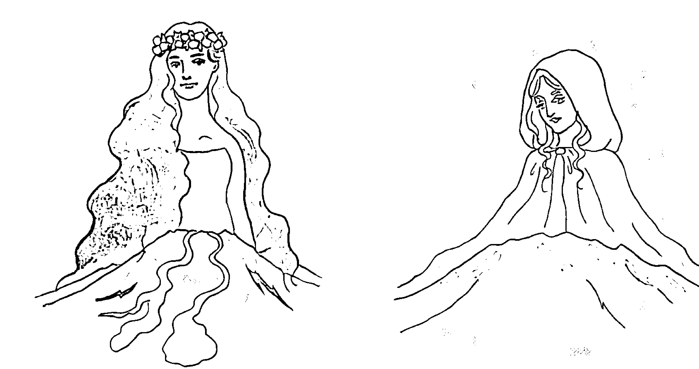

| | 裴蕾 | 波利阿芙 |
|---|---|---|
| 名字 | 裴蕾 | 波利阿芙 |
| 神格 | 火山女神 | 雪之女神 |
| 性格 | 熱情 | 冷靜 |
| 出身 | 卡西奇 | 夏威夷 |
| 山 | 克勞亞 | 冒納開亞 |

## 夏威夷島的山脈

冒納羅亞山
標高4,169m。「冒納羅亞」是當地語言「長山」之意。

冒納開亞山
標高4,205m。「冒納開亞」是當地語言「白山」之意。

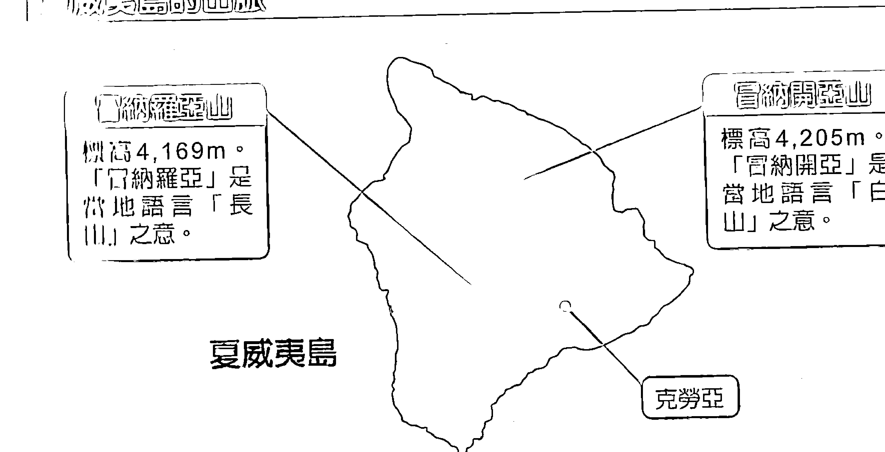

夏威夷島

克勞亞

# No.032 赫菲斯托斯
Hephaistos

赫菲斯托斯是希臘的火山神兼鍛冶之神。雖然他的出身良好，卻是個有缺憾的神明。

## ◎擁有肢體障礙的火神

赫菲斯托斯是希臘神話的火山之神，後來還成了火焰與鍛冶之神。他在羅馬神話裡面叫做法爾肯，英語就變成了伏爾坎，這也就是火山（Volcano）的字源。

赫菲斯托斯雖是宙斯及其正妻赫拉之子（亦說是赫拉獨自產下），可是剛出生時就是個足肢彎曲的醜陋嬰兒；赫拉氣得把自己的孩子從天空拋到地面，使得原本就彎曲的腳傷得更重，終於使他成了足肢殘障。

後來他送了赫拉一把豪華的黃金椅子，只見赫拉剛坐上去就被隱形的鎖鏈束縛住、無法動彈，連眾神都無法解開，於是赫菲斯托斯就被召到奧林帕斯去，赫拉認了這個兒子後，赫菲斯托斯才好不容易答應為赫拉解開束縛。

赫菲斯托斯的妻子阿芙柔黛蒂*1出了名的輕浮，曾經多次與帥氣的戰神阿利茲等神祇發生外遇。赫菲斯托斯從高掛天空將一切都看在眼裡的太陽神希利歐斯口中得知此事以後，遂佯作外出，待這對男女鑽進床的時候用張大網將他們捉了起來，然後再招待眾神取笑他們。

赫菲斯托斯曾經負責建造眾神宮殿，以其鍛冶能力而聞名。他在利姆諾斯島有個工坊養了許多賽克洛斯擔任助手，許多著名的道具諸如宙斯的雷電、波賽頓（海神）的三叉戟、黑帝茲（冥府之神）的隱形帽子等等，都是他的作品。除此之外，他也經常為人類英雄製作武器，如阿基里斯*2的鎧甲和埃涅阿斯*3的武器都是他製作的。

此外，創造出世界上第一個女人潘朵拉以懲罰人類的，也是赫菲斯托斯。由於普羅米修斯太過袒護人類，於是宙斯便將潘朵拉送給了普羅米修斯的弟弟埃比米修斯。

### 赫菲斯托斯的相關資訊

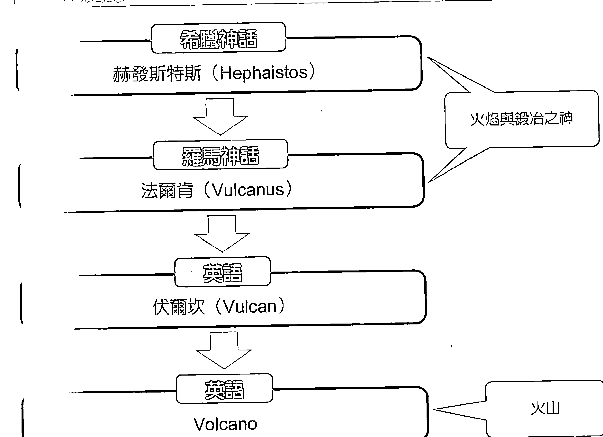

### 赫菲斯托斯的工作內容

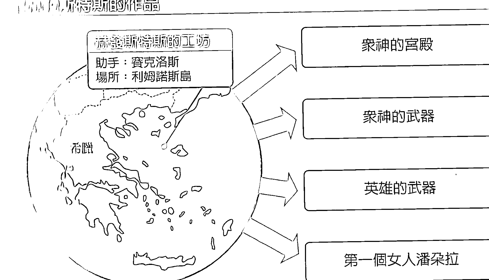

### 相關人物

+   ●希利歐斯→No.024
+   ○普羅米修斯→No.036
+   ●賽克洛斯→No.034

# No.033 海絲娣雅
Hestia

儘管在家族當中佔有重要的地位，海絲娣雅的神話卻相當少，不過身為家庭與健康的守護神，像這樣平穩度日、無風無浪或許才是件好事。

## ○神話之少，信仰之篤

海絲娣雅是希臘神話的女灶神，羅馬神話則是稱為維司塔 (Vesta)。海絲娣雅是克羅諾斯與莉亞的長女，算起來該是宙斯的姐姐，可是克羅諾斯卻在自己的孩子誕生後將他們一個個吞進了肚子裡；這些孩子後來都被宙斯救了出來，第一個被吞進肚子裡的海絲娣雅卻是最後一個被救出來的，所以她雖然是第一胎，卻成了眾兄弟姐妹當中最年輕的女神。

海絲娣雅是奧林帕斯十二大神之一，而且是其中最年長的。有趣的是，她卻幾乎全無固有神話存在。她是位無夫無子的處女神，不理會波賽頓和阿波羅的求婚，甚至還曾請求宙斯允許自己保持處女之身，獲得宙斯首肯；於是，海絲娣雅從此便成了不須為厄洛斯¹箭矢煩惱的處女神。

海絲娣雅和雅典娜、阿蒂蜜斯是希臘的三大處女神。如此重要的女神，其神話與雅典娜和阿蒂蜜斯的豐富故事相較之下卻是如此貧瘠，值得特筆一番。儘管海絲娣雅存在感這麼薄弱的女神，她在希臘人的生活裡卻佔有非常重要的地位。

灶是希臘家庭的中心，因此海絲娣雅也被奉為位居家庭中心的女神、家庭的守護女神而廣受信仰。

其次，由於海絲娣雅既是第一子也是么子，是以希臘人飲宴時第一杯酒和最後一杯酒都要獻給她。此外，獻活祭品給眾神的時候，海絲娣雅也可以獲得其中最初和最後的部分。

順帶一提，海絲娣雅的聖獸乃是驢子。從前庭園之神普裡阿普斯²企圖趁午睡時襲擊海絲娣雅，幸好有驢子大聲嘶叫才使她逃過一劫；普裡阿普斯因此心生怨恨，因此特別喜歡信徒殺驢活祭。

### 海絲娣雅家族系譜

| 烏拉諾斯 | 姬亞 |
| :---: | :---: |
| 克羅諾斯 | 莉亞 |
| 海絲娣雅 | 赫拉 | 狄蜜特 | 黑帝茲 | 波賽頓 | 宙斯 |

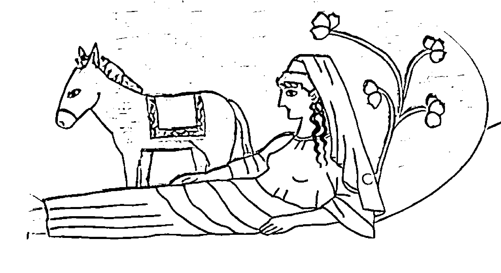

+   - ○灶之女神
    - ○希臘三大處女神之一
    - ○聖獸為驢子

### 拯救海絲娣雅

莉亞為克羅諾斯生下了海絲娣雅等兒女，克羅諾斯卻畏懼預言中子女將會奪取眾神之王的地位，遂將誕生的孩子一一吞進了肚子中。莉亞實在無法忍受，便在宙斯誕生後以石頭調包，讓克羅諾斯吞下肚，救了宙斯。宙斯長大以後，才用計讓克羅諾斯嘔吐，把兄弟姊妹救了出來；因為嘔吐出來的順序恰恰與吞進去時相反，是以最先誕生的海絲娣雅，才變成了最後一個生出來的孩子。

# No.034 賽克洛斯
Cyclopes

希臘神話中的賽克洛斯是獨眼的巨人族，因長相恐怖而經常被視為怪物，但事實卻非如此。

## ○既是神明亦屬巨人的鐵匠

賽克洛斯的始祖，便是布戎忒斯（雷鳴）、史特羅培斯（電光）和阿耳戈斯（閃光）三兄弟。賽克洛斯通常以英語「Cyclops」為世所知。賽克洛斯正如其名，是雷的巨人。

賽克洛斯獨眼巨人的長相甚是恐怖，經常在電玩遊戲等作品中以怪物角色登場。不過，真正的賽克洛斯卻非怪物。他們的始祖是烏拉諾斯（天空男神）與姬亞（大地女神）的子孫，因此該算是克羅諾斯（前主神、時間之神）的兄弟、宙斯（奧林帕斯最高神祇）的叔父，可說是血統純正的巨人族。

布戎忒斯兄弟甫出生就被烏拉諾斯拋棄在塔爾塔羅斯（希臘神話的地獄。基督教曾於制定地獄時借用此名），後得宙斯搭救，並於泰坦神族與奧林帕斯神族的戰役中參戰襄助宙斯；待泰坦神族戰敗被打入塔爾塔羅斯以後，賽克洛斯還擔任塔爾塔羅斯的看守者，以防泰坦神族脫逃。

此外，他們還是技巧純熟的鐵匠，以製造許多眾神道具而聞名；其中最著名當屬宙斯的雷電、黑帝茲（冥府之神）的隱形帽子和波賽頓（海神）的三叉戟。

可是賽克洛斯卻在製作宙斯雷電的時候遭遇到了災難。阿波羅之子阿斯克勒庇俄斯師從人馬族的賢者喀戎，學成之後成為優秀的醫師，優秀到甚至可以使死人復活；然而此事卻觸犯了眾神的禁忌，使得阿斯克勒庇俄斯遭到宙斯的雷電擊殺（不過他死後也成了醫療之神）。

阿波羅對如此處置甚為惱怒，卻也無法找自己的父親宙斯報仇，於是便殺死製作雷電的賽克洛斯洩憤充數。賽克洛斯無端受到波及，可謂天外飛來的無妄之災。

### 希臘神話中的賽克洛斯

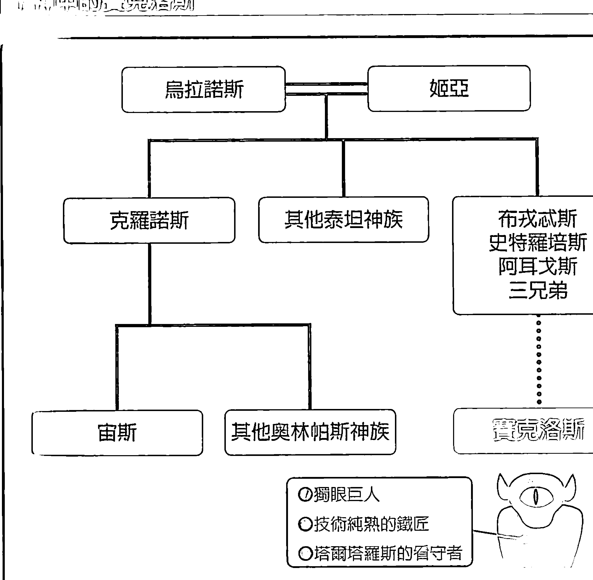


### 容易混淆的賽克洛斯

賽克洛斯（キュクロプス）此語（在日本）似乎很容易混淆，不少人都錯把它記成「キュプロクス」或者「キュプロプス」。不可思議的是，卻是鮮少有人將其英語發音的「サイクロプス」搞錯變成「サイプロクス」。

### 関連項目

+   - 阿波羅→No.014
    - 赫發斯特斯→No.032
    - 普羅米修斯→No.036

# No.035 地獄獵犬與舍惹猥如斯
Hellhound and Cerberus

世界各地均有犬類怪物存在，而地獄獵犬與冥府守門犬舍惹猥如斯究竟有何特徵呢？

## ○噴火巨犬

地獄獵犬是英國傳說中的怪物。這隻狗體型有如牛犢般巨大、全身漆黑，眼睛則是火紅有如地獄的火焰一般。有時候牠也會被描繪成全身赤紅的模樣。或許是紅色所引發的聯想，也有人認為牠能夠口吐火焰。

部分地區將其視為妖精，甚至奉為兒童的守護神。不過大部分地區仍舊將地獄獵犬視為惡魔的化身，甚至相傳只要看牠一眼就會喪命。

地獄獵犬跟吸血鬼同樣無法越過流動的水流，所以被地獄獵犬追殺的人只要逃向河的對岸，便可以活命。

說到犬類怪物，同屬地獄的地獄守門犬舍惹猥如斯也相當有名。此怪物初見於希臘神話，不過如今地獄獵犬和舍惹猥如斯已經漸漸混淆，不少人都認為此兩者是同一種怪物。

根據《神譜》*1記載，舍惹猥如斯是「冥府中擁有青銅吠聲的守門犬，有五十個頭」，希臘神話則多指其為三頭犬，尾巴如龍、背部則是長著無數的蛇。無論牠究竟是五十個頭還是三頭犬，總之舍惹猥如斯是隻把守著地獄之門、口吐火焰的巨大犬。

既然舍惹猥如斯是地獄守門犬，欲前往地獄的英雄勢必要先將其壓制，否則便難以抵達目的地，是以許多神話也經常會講述到對抗舍惹猥如斯的故事。

赫拉克勒斯*2的十二個難題當中，最後一項便是要將舍惹猥如斯帶出地獄；他用雙腕緊緊絞住舍惹猥如斯的頸子，即便被舍惹猥如斯尾巴的那條龍噬咬也仍然撐下去，直到舍惹猥如斯投降為止都不會鬆手。

另外，從前奧菲斯*3亦曾前往地獄尋妻，可是他只是一名樂師，根本沒機會戰勝舍惹猥如斯，但最後他還是憑著自己的音樂長才，讓舍惹猥如斯深深睡去，終於趁隙通過了地獄之門。

### 1. 犬類怪物

#### 地獄獵犬

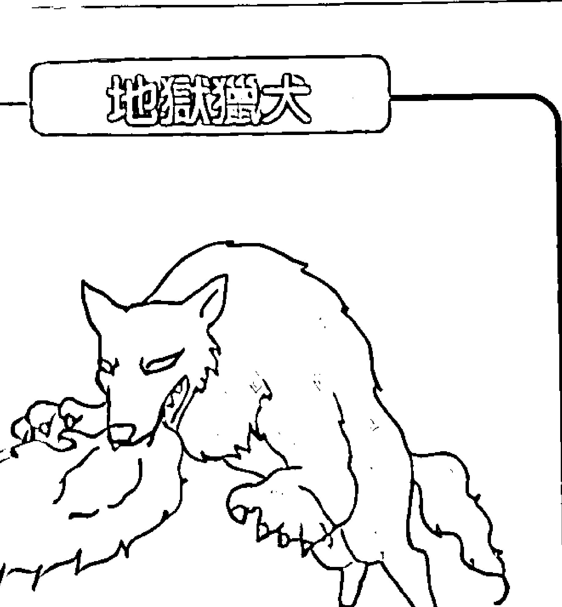

彷彿是惡魔的化身，是英國傳說中的人性怪物。

#### 舍惹猥如斯

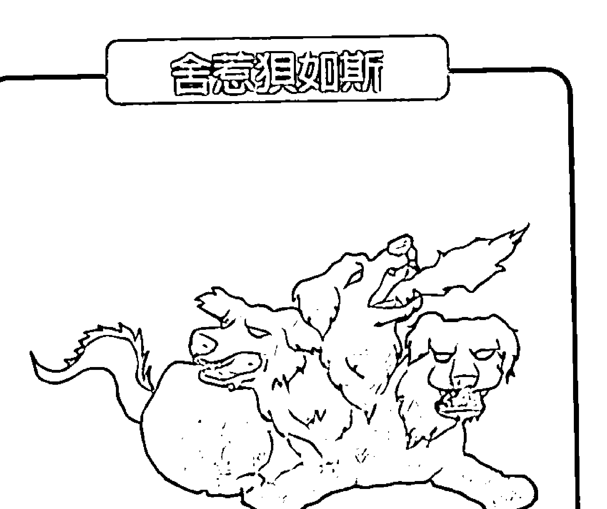

希臘神話中把守地獄之門的犬怪。

#### 奇杜

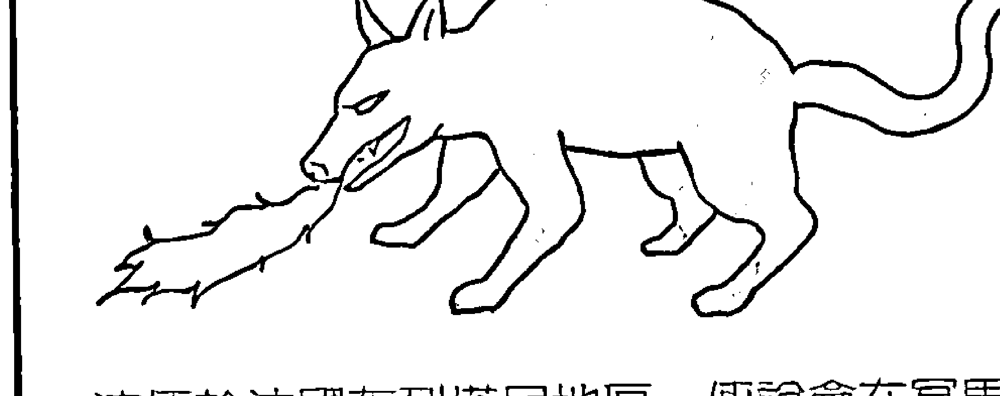

流傳於法國布列塔尼地區，傳說會在冥界裡頭跟隨人類的犬類怪物。

#### 史琪拉

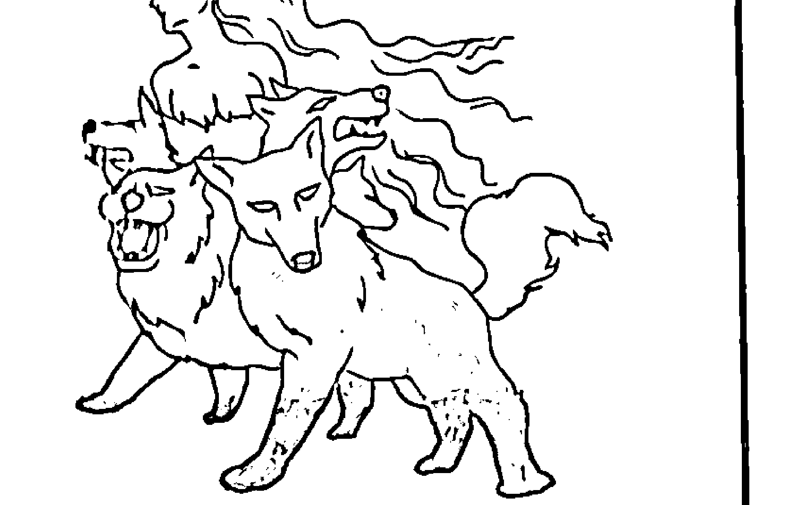

希臘神話中女性變身而成的犬怪。

#### 外星突變犬

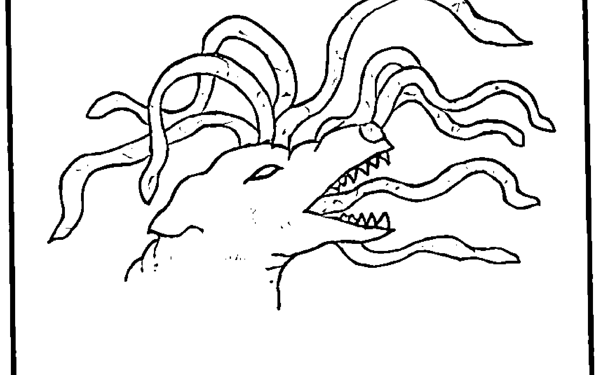

電影《突變第三型》當中遭外星生物附身的狗。

# No.036 普罗米修斯
普罗米修斯
Prometheus

根据希腊神话记载，将火送给人类的是一位名叫普罗米修斯的巨人，而他也因此承受了极大的惩罚。

- ◯创造人类的巨人
整个希腊神话体系中，恐怕再没有人比普罗米修斯对人类更好了，相传他正是受命于宙斯、实际创造出人类的神。

根据赫西奥德《神谱》记载，从前众神与人类为分配献祭物而争执时，普罗米修斯曾经将整只牛肢解，把牛胃放在牛皮上呈到宙斯面前，然后把油油亮亮看起来很美味的脂肪放到人类面前。如此分配让宙斯很生气，便向普罗米修斯抱怨；于是普罗米修斯就答道「请您自行选择取走想要的部分」，而宙斯便选了脂肪。

谁知道牛胃里面塞满了内脏，每个内脏都是大块肉大块脂肪，而那油油亮亮的脂肪里面藏的却都是骨头。从此以后，人类只须焚烧骨头献给众神即可（《神谱》虽说宙斯是明知如此仍执意要选择脂肪的，不过这个说法相当值得存疑）。

此事惹恼了宙斯，不愿把火交给人类，于是普罗米修斯又把火放在茴香茎（茎身中空）里偷了出来，交给人类。

这件事情使得普罗米修斯从此被绑在寇卡索斯山，每日饱受老鹰啄食肝脏的惩罚；他的肝脏白天受到多少啄食，每到夜里就会长回多少，承受着永无止境的痛苦。普罗米修斯的痛苦一直延续直到遥远的后世，直到赫拉克勒斯将老鹰射下来为止，毕竟经过如此漫长的岁月，宙斯的怒火也该消了。

另外宙斯为一雪对人类的愤恨，还命令赫菲斯托斯创造嫵娜曼妙、但心中暗藏邪恶的少女潘朵拉，使人类步向毁灭的女性，便是如此诞生。

※ 《神谱》和赫拉克勒斯：请参照P.222页No.035的注解。
※ 寇卡索斯山（Mount Caucasus）：即位处黑海与里海间、标高超过5000m的高加索山脉。在古希腊人的世界观里，西方的尽头有阿特拉斯山，而东边的尽头就是寇卡索斯山。寇卡索斯此语原有「因为冰层而发光的山」之意。

## 1. 人类的悲剧英雄

| 乌拉诺斯 | 姬拉 |
| :---: | :---: |
| 克罗诺斯 | 莉亚 |
| 伊亚佩特斯 | 克吕墨涅 |
| 宙斯 | 奥林帕斯神族 |
| 潘朵拉 | 埃庇米修斯 |
| 普罗米修斯 | |

> 宙斯的惩罚
> - 命心怀邪恶的少女潘朵拉，送给普罗米修斯的胞弟埃庇米修斯。
> - 将普罗米修斯绑在寇卡索斯山，蒙受每日被老鹰啄食肝脏的惩罚。
> - 以茴香茎偷出火种，交给人类

- ◼ 普罗米修斯的悲剧性格
普罗米修斯会受到如此严刑，其实还有另外一个理由。原来普罗米修斯也有预言能力，不过他却未将「跟忒提斯结婚的话，就会生下比父亲更加优秀的儿子（就会像乌拉诺斯和克罗诺斯遭宙斯夺取地位那般）」的预言说出口。忒提斯是一名宙斯与波赛顿都想娶作妻子的女性。

可惜的是，这个秘密却被另一位预言之神普罗透斯披露，所以最后宙斯只能放弃忒提斯，让她嫁给人。

※ 普罗透斯（Proteus）：以拥有预言能力而闻名，但是他从不顾透露自己预知的结果，却经常变身成各种动物，以便从好奇者的追问中脱逃。

关联项目
- ◯赫菲斯托斯→No.032

# No.037 祝融

中国神话不如其他神话来得明确，整体来说该要算是多神教，其中也有相当于火神的神祇存在。

## ◯命运乖舛的中国火神

祝融是中国传说中的火神。他虽然出仕于黄帝，却是炎帝神农氏的子孙。其系谱见载于《山海经》的〈海内经〉。

祝融是人面兽身的神，相传曾经在从前女娲补天使世界恢复和平以后出现在地面，住在江水（扬子江）河畔。

当时祝融做过什么事情，如今已全不可考。有说法指出他跟炎帝（相当其四代祖）同样是中国南方一万两千里地的统治者，然则此说并非定论。

可是炎帝的黄金时代结束以后，战乱时代又再度来临。可以确定的是，当时竞逐天下的争雄者其中一方便是祝融之子共工，至于他的敌人则不可确知；有人说是神农氏（共工亦属神农氏），甚至还有人说是祝融和共工的父子之战。

除此之外，祝融还有另一个为世所知的事迹。此事亦见载于〈海内经〉，那就是「祝融杀鲧」。鲧乃是黄帝之孙。

从前天帝见凡间人类不履正道，遂决意兴起洪水灭绝人类；可是鲧却盗取天帝的宝物息壤（一种会无限增殖的土壤。由于黄帝具备土属性，故而拥有这样的宝物），欲以息壤作堤拯救人类，于是天帝便命令祝融于羽山之野击杀鲧。

只不过鲧又死而复活、生下了禹，后来禹也终于完成了中国的治水大业，一扫父亲遗憾，而人类不致灭绝，得以繁衍至今。

祝融在这则故事里，应该要算是不通情理的天帝的手下，担任杀害欲拯救人类的英雄鲧的反派角色。

# 祝融

- ◯中国火神
- ◯人面兽身
- ◯以杀害意欲拯救人类的英雄鲧的传说而闻名

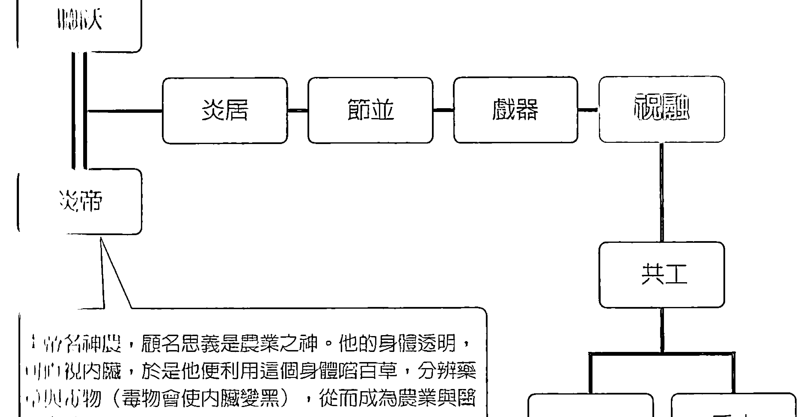

## ❧另一个祝融

谈到祝融，还有个比火神祝融更出名的人，那就是《三国演义》里的祝融夫人。作者想必是为赋予其祝融（南方之神）子孙的形象，方才如此命名的吧！

祝融夫人乃南蛮王孟获之妻，是飞刀的能手，实际上她也曾杀伤马忠（虽说远不如关羽，但也算是蜀国勇将）将其生擒。

然则孟获与祝融夫人毕竟不是诸葛亮的对手，遂有后来七擒七纵的故事，从此夫妻便感戴诸葛亮恩义，誓要效忠蜀汉。

只不过，天下间当然不可能有这么多的巧合。其实正史《三国志》里并未提到祝融夫人这个名字（本文也没有提到孟获，只在注释部分出现），因此祝融想必是创作出来的虚构人物。

# No.038 灶神（中国）

无论在世界的哪个角落，灶神自古以来便广受各个家庭的主妇崇拜，中国当然同样也不例外。

## ◯共同守护灶火的夫妻神

于炉灶等用火处祭祀的神明，称作灶神。当然，此类神明遍见于全世界，虽然他们就像希腊神话赫斯提亚般朴实无华，却是家庭生活中不可或缺的神明，广受民众信仰。

至于中国的灶神，一说是古代的火神祝融化身为各个家庭的灶神，同时也另有对夫妻灶神的有趣传说。

从前有对名叫张单和丁香的夫妻，妻子勤奋善良且持家有术，家境因为她而愈来愈富裕，岂料张单却带了个妓女回家，并把妻子赶出门。丁香被赶出去以后改嫁他人，让那户人家愈见繁荣；相对的张单这边则是太过放荡致使家境每况愈下，就连那名妓女也弃他而去，最后只能乞食为生。

某日，落魄的张单无意间来到前妻的家门前，丁香认得前夫便将他带进家里、供其食物；张单刚开始并未发觉，直到后来被丁香指出，他才发现这位富裕人家的夫人是自己的前妻，于是便羞愧得跳进灶里烧死了。

跳进灶里烧死并且悔改的张单就此变成灶神，丁香则成为他的妻子，从此人们便绘制夫妻两人的图像，奉为灶神祭祀。

张单（及其妻）的职务是要详细调查各个家庭，每年向天庭报告，天神将会视报告结果选择守护或是降灾。是以，每到灶神要向天庭报告的阴历十二月二十三日那天，人们就会举行一种名为送灶的祭拜仪式，好好款待灶神，好让他能为自己多说些好话。相反的，有时候也会在灶神神像涂上糖浆，祈使灶神不能说坏话；这是藉糖浆黏住灶神嘴巴，好让他没办法说自己的坏话的方法。在日本各地，亦有类似的故事流传。

- 1. 从前有一对名叫张单（夫）与丁香（妻）的夫妻。
- 2. 丁香被张单赶出家门。
- 3. 张单落魄，以乞讨为生。
- 4. 丁香嫁到别的人家，生活富裕。
- 5. 丁香招待无意间来到家里的张单。
- 6. 张单羞愧地跳进灶里自杀。
- 7. 两人成为灶神受人祭祀。

### 灶神分布传说

灶神、民间传说广泛分布于中国、日本、越南等地，不过各地对这则神话的看法各有不同。

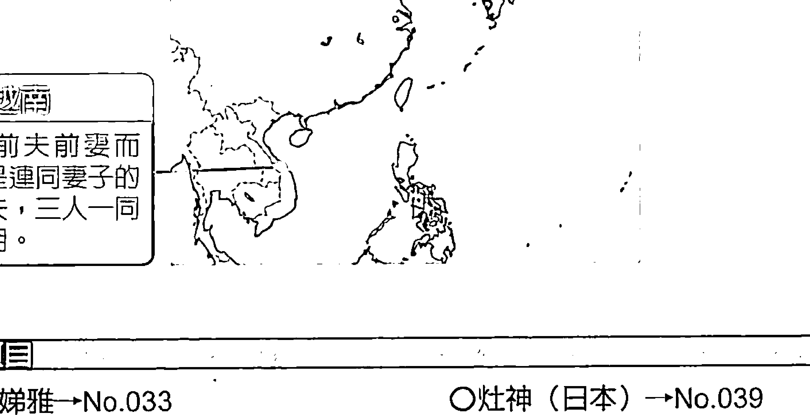

中国：各地传说中的夫妻姓氏有些微差异，但夫妻同为灶神这点是一致的。
越南：不止是前夫前妻而已，而是连同妻子的现任丈夫，三人一同成为神明。
日本：变成跟灶神无关的民间传说，而且只有前妻祭祀前夫而已，并未变成神明。

- ◯赫斯提亚→No.033
- ◯祝融→No.037
- ◯灶神（日本）→No.039

# 灶神（日本）
Kamadogami

日本灶神的异名极多，这也表示日本的各个地区均有相当于灶神的神明存在。

## ○守护灶的异形诸神

在日本，所谓的家其实就是指灶；在灶的周围搭建围墙、屋顶和地板，此即为家，是以所谓的户数便称作「灶数」，分家则称作「分灶」。是故灶神可谓是家庭神的代表，是最重要的神祇。正因为如此，日本各地有各式各样的灶神，无法一概而论。此节谨举出其中几则为文介绍。

首先，《古事记》记载的奥津日子神和奥津比卖神，是连朝廷亦信仰颇笃的灶神。

中国地方以西有属于狂暴神的灶神。他本是性情粗暴的神明，也就是所谓的厄神，不过只要行使适当的祭祀，狂暴神也同样可以为人们带来守护。这位灶神非常要求人们将厨房保持清洁。只消保持厨房清洁，然后每天早晨再供奉一碗白饭、一碗清水，灶神就会是强大而可靠的守护神。

相对的，东北地方的灶神却是位丑陋的男子，有「灶男」、「火男」、「灶神」等称呼，人们通常是以木材或土器制成丑陋男子的面具，挂在炉灶附近柱子上，奉为灶神祭拜。

亦有说法指灶神并非丑陋男子，而是丑陋且多产的女子，甚至是位肢体残障的神明。

鹿儿岛则是将纸质御币折成人形，张贴于墙壁。

灶神形态如此多样，不过他们有个共通点，就是也都是火神，（因为身为厨房之神）亦是食材之神，换言之就是农业神、丰收之神。后来灶神还从此不断衍生出牛马的守护神、孩童的守护神（民俗信仰认为拿灶黑抹在儿童脸上就不会生病）、家族守护神等职务，管辖范围愈发广泛。由于灶神就是厨房之神，所以平常几乎都是由一家的主妇负责祭祀。

01 中国地方：指日本本州西部的冈山、广岛、山口、�的取、�的根县所在地区。东北地方：指日本本州东北部的青森、岩手、秋田、宫城、山形、福岛六县。
02 御币 (Gohei)：将撕裂的麻布或折叠好的纸夹在细长形木棒上制成的祭具。常用来驱逐恶灵。

（“灶”的祭词）
自古以来各地便各有祭祀。
日本各地均有形形色色的灶神存在。

# 灶神

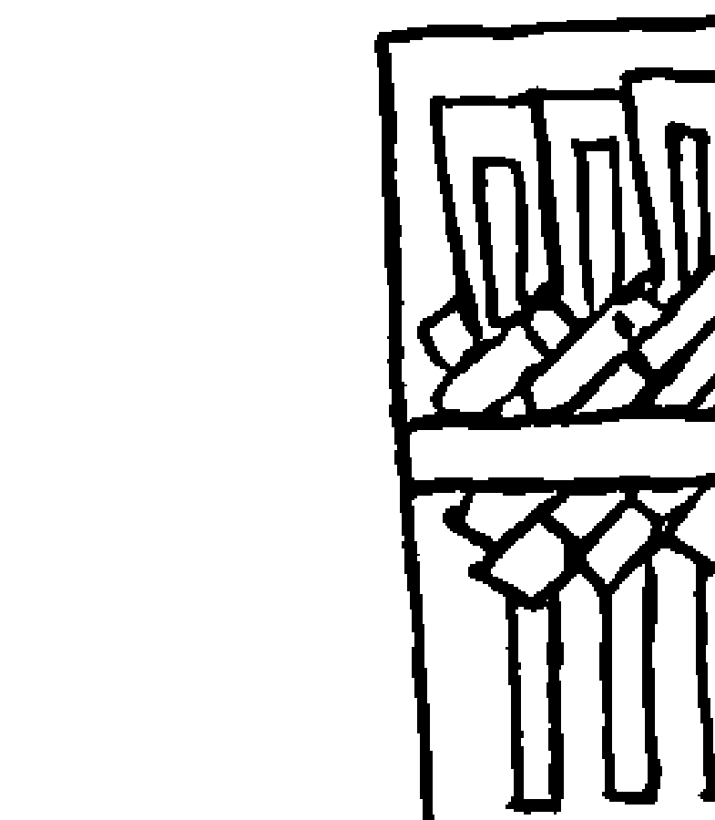

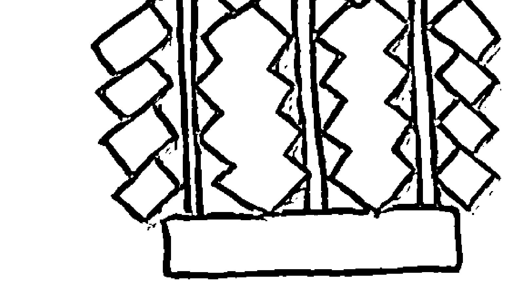


## ✦ 冲绳火神

冲绳地区将灶神称作火神（ヒヌカン）。一般认为冲绳火神同时受到日本灶神与中国灶神双方面的影响。他同样是在厨房里面祭祀的神明，而从前的冲绳人只用三颗石头当作火神，不过现在大多祠安置香炉奉为火神祭拜。

冲绳火神跟中国灶神同样，每年会将人们的行为举止向天上报告。

冲绳火神的独特之处，便在于能将人们的祈愿传达给其他神明；即便远在千里之外，只消向冲绳火神祈祷，便能将祈愿传达至故乡。另外像是向土地神祈祷的时候，也可以先向冲绳火神献祈，他就会将祈愿的内容转达给土地神知悉。

# 大日如来
Maha Vairocana

大乘佛教（尤其是密教）中象征着万物根源太阳之美好的佛，此即大日如来。

## ○大乘佛教的太阳神

佛教所谓如来，便是指完全开悟并且已经成佛者（所谓菩萨则是指终将成如来，只是现在仍在修行者。天与明王则是指并未开悟，而为佛教出力工作者）。当然了，第一个如来自然就是释迦如来，其后佛教还陆续有数名如来出现，而此节所述大日如来，便是受密教奉为中心信仰，将太阳神格化所形成的如来。

通常如来一概不穿戴任何装备饰品（既是开悟者，自然不受外在的容貌模样左右），唯有大日如来是例外，是以菩萨像（菩萨尚未得悟，或多或少仍然拘泥于外表，因此会配戴饰品）的形式呈现。据说这是因为大日如来乃是整个宇宙化成的佛（这也正是为何密教认为所有宗教的所有神魔无一不是大日如来的显现），如此用意是在呈现大日如来包罗万物万象。

大日如来在印度名为Maha（伟大的）Vairocana（广照者），是以有时亦直接以印度名「摩诃毗卢遮那如来」称呼之。由于日天（佛教吸收印度教太阳神后形成的神祇）就叫作Vairocana，因此大日如来便应是地位高过太阳的光明之佛。也就是说，太阳唯有在白天方能散发光亮，夜晚则否，可是大日如来的光却无时无地同样耀眼辉煌。

既然身为密教的中心佛，密教自然也就将大日如来描绘在曼荼罗的中心。曼荼罗又分金刚界曼荼罗与胎藏界曼荼罗，合称两界曼荼罗；两个曼荼罗中大日如来的姿势不同，金刚界大日如来结的是智拳印，而胎藏界结的则是法界定印。

> 曼荼罗：指为表现开悟的世界，以一定形式来排列诸佛诸菩萨的图像。密教有两界曼荼罗，分指胎藏界曼荼罗与金刚界曼荼罗；一般所谓曼荼罗大都是指密教的这两种曼荼罗。但是后来佛教各派也吸收此概念，而有净土曼荼罗或是日莲宗的十界曼荼罗等物。

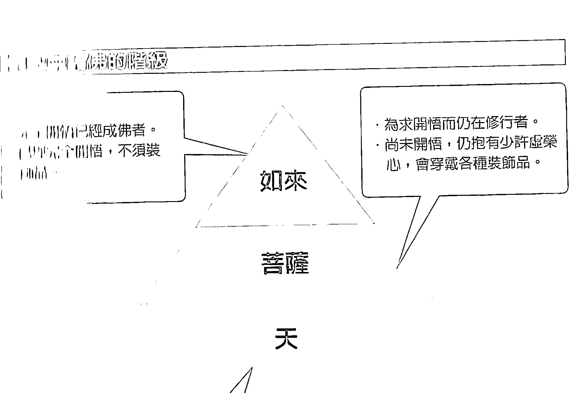

已，即所谓已经成佛者。
开悟，不须装

- 为求开悟而仍在修行者。
- 尚未开悟，仍抱有少许虚荣心，会穿戴各种装饰品。

- 未开悟而为佛教出力工作者（许多异教神祇都被纳入此）。
- 使用各种装饰品将身体妆点得金碧辉煌。

### 如来的手印

据说所谓的手印乃是古印度欲称手的形状象征心所创造的手势，梵语作「मुद्रा」(mudraa)，中国则有「印」、「印契」或「印相」等译名。

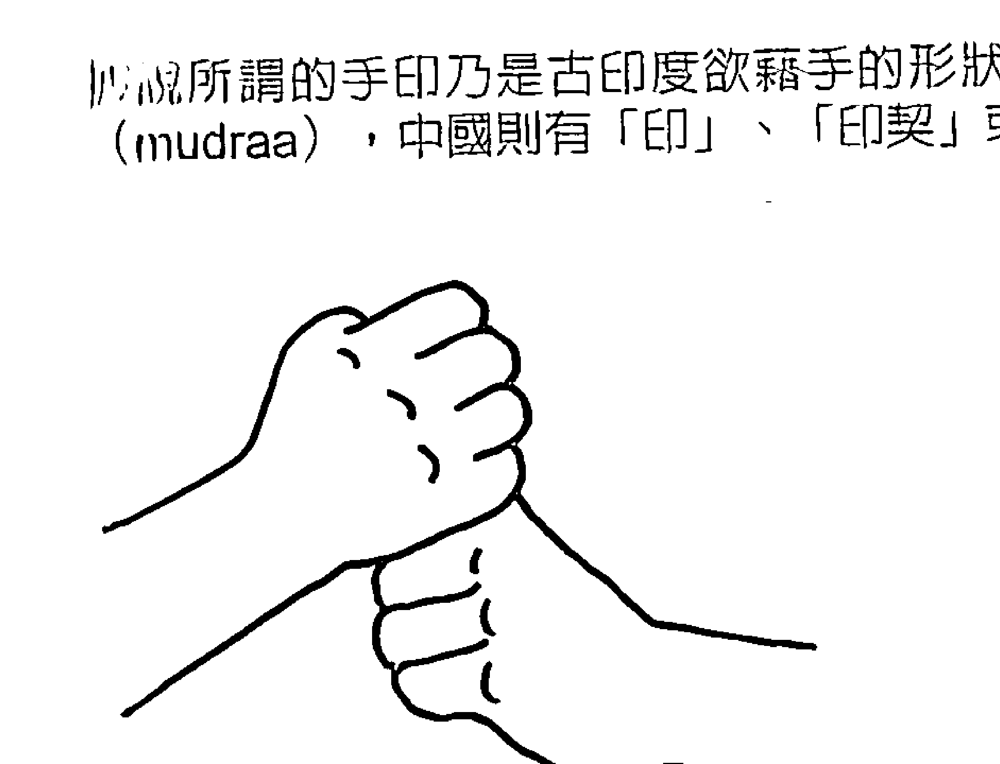

象征大日如来的深奥智慧。

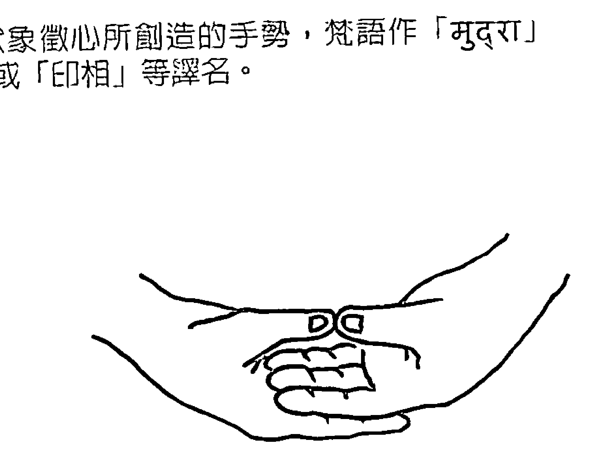

象征得悟后心绪定静的状态。

### 相关项目

- ●不动明王→No.041
- ○爱染明王→No.042

# No.041 不动明王

**Acalanatha**

不动明王虽然原属山神，然而其光背的形状却带给人强烈而浓厚的火焰印象。

## ○密教成立以后才出现的佛

其实明王本是密教所谓真言（=明）实体化以后形成的佛，密教以外的佛教则无。话虽如此，由于日本佛教的诸多宗派都深受密教影响，有时即便非属密教系统的寺院，同样也会祭祀不动明王。

几乎所有的明王均呈愤怒形相，据说这是因为佛教为拯救难以救赎的众生，即便怒责叱喝也要将众生导向佛道而然，同时也是为了要降伏佛敌和魔鬼。至于明王雕像往往要涂成红、青等鲜艳颜色，据说目的就是要呈现这份愤怒的激烈情感。

众多明王当中，日本信仰最笃的当属不动明王。其实不动明王在印度是位其名叫作Acalanatha，意为「不动而尊贵者」的山神，这也是为何空海等僧从来不动明王，一律以「不动尊」记载之。

佛教认为不动明王乃大日如来化身，他是为了那些光凭慈悲无法救赎的众生，方才化作明王以图拯救；因此不动明王才会右手握持三钴剑，借此驱除魔鬼、斩断人们烦恼，左手则是握着能够降魔救人的羂索。此外，其光背乃是某种名为迦楼罗的鸟所吐出的火焰，唤作迦楼罗焰，能够烧尽人们的烦恼。其次，相对于许多佛都是坐莲，不动明王却是端坐（或站立）于磐石之上（此处亦显现其山神性格）。今日我们将确实而无变更的事物称作磐石，其典故便是来自于不动明王座下的这块岩石。

日本以三不动、成田山新胜寺的不动尊为首，于各地称「お不動さん」信仰之。此称呼应是结合「不动尊」与亲昵的尊称「～さん」而来。

| | 三轮身 | 角色 |
|---|---|---|
| 大日如来 | 自性轮身 | 凭自身昭示开悟境地。 |
| 金刚萨埵菩萨 | 正法轮身 | 向众人讲述教义。 |
| 不动明王 | 教令轮身 | 以强制力量教导不服佛法者，同时对抗驱逐佛敌。 |

※关于金刚萨埵菩萨，有金刚波罗光菩萨、普贤菩萨、般若菩萨等不同说法，众说纷纭。

| 日本三不动 | |
|---|---|
| 黄不动 | 滋贺县�的园城寺 |
| 青不动 | 京都府青莲院 |
| 赤不动 | 和歌山县高野山明王院 |

| 江户五色不动 | |
|---|---|
| 目白不动 | �的岛区金乘院 |
| 目赤不动 | 文京区南谷寺 |
| 目黄不动 | 江户川区最胜寺 |
| 目青不动 | 世田谷区教学院 |
| 目黑不动 | 目黑区泷泉寺 |

大日如来·No.040

# 爱染明王
Ragaraja

爱染明王乃是凭爱欲藉以拯救众生，就这点来看可说是位悖离佛教常理的佛。

## ○逆向操作的佛

爱染明王的梵名作「Ragaraja」，「Raga」是「红色」或「爱欲」之意，故其名应为「红色爱欲」之意，而爱染明王神像也往往都是涂成红色。又，其神像乃以日轮为光背*1，亦具备有太阳神之形象。

话虽如此，爱染明王在印度却是个非但佛经从未提及，甚至亦无佛像留存的非主流角色，在中国也是相同情形，是一位人气仅限于日本的明王。

通常佛教均视爱欲为恶，都是要人克服爱欲以达开悟，可是爱染明王的教义却并非如此。其教义认为人类的爱欲乃属本能，是不可能舍弃的。为什么呢？如果所有人都舍弃了爱欲，哪还有新生儿的诞生，人类很快便会灭绝。换句话说，某些特定人物固然可以舍弃爱欲，可是要全人类舍弃爱欲不但是绝对不可能，同时也绝对不可以。

爱染明王便是以此为前提反向思考，运用爱欲激发人类上进心，使其趋近于开悟的境地。爱染明王正如其名乃属爱神，也是成就恋爱的神明，时至后世，甚至还能行使战胜或降伏仇敌的修法*2仪式。

爱染明王的外形一面六臂，额头中央则生有第三只眼。其中两臂手持弓箭，那是因为他与厄洛斯*1同属爱神的缘故；右手五钴杵、左手五钴铃，意在保护人们免于不净的事物；右手莲花、左手握拳，则是象征着女性的温柔与男性的强悍。不过亦有说法指出那些空着的手，是要在修法的时候拿武器用的（譬如祛病息灾就要使用日轮）。爱染明王的光背象征日轮，是谓圆相，看起来就像是炽烈燃烧的火焰。

> 1 光背：请参照P.222页No.041的译注。厄洛斯：请参照No.014的译注。
> 2 修法：密教称魔法仪式为修法。密教修法的力量，来自于行修法僧侣的验力。

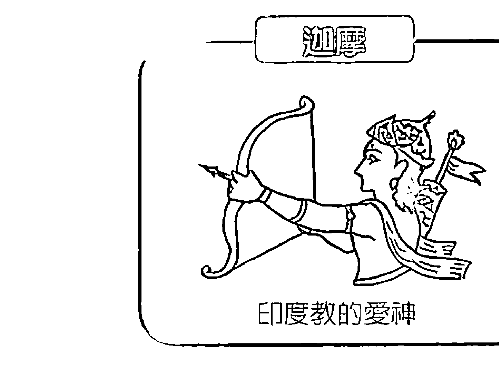

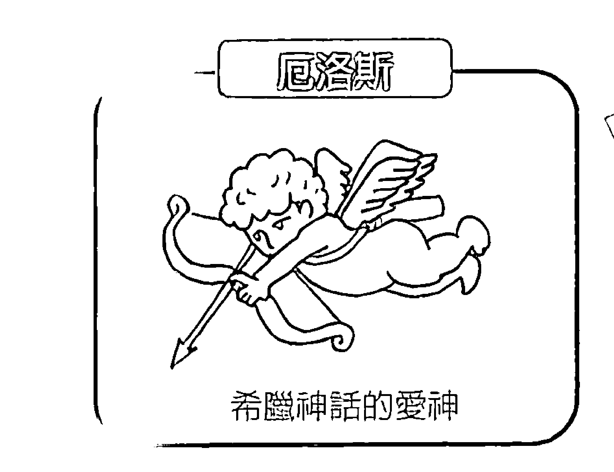

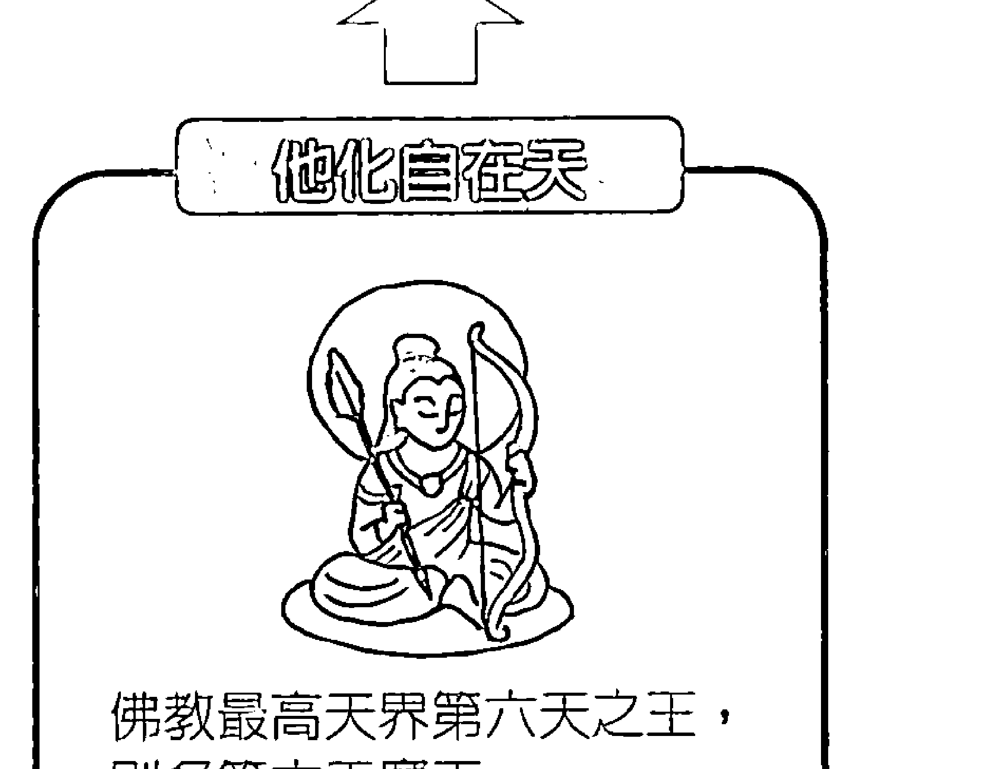

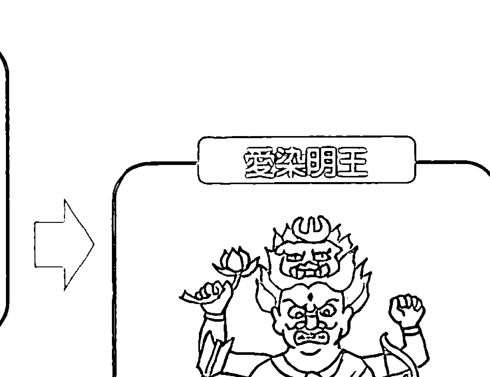

### 直江兼续的头盔

直江兼续是誉为上杉景胜肱骨之臣的名将，其人造型乃以头盔前立（头盔额头部分的饰物）写有「爱」字而闻名。据说这个「爱」字并非意指兼续为爱而生，而是象征他对爱染明王的信仰。

# No.049 八百屋于七

所有因为纵火被判死罪的女性当中，就属八百屋于七最为有名。这位为爱疯狂的女子，其真实面貌究竟为何？

## ○使稚幼少女为之疯狂的恋情

于七是在天和三年（1683年）3月29日于大森的铃森刑场遭处火刑，时年十六岁（这是当时的计算方法，按照现在的计算方式则年仅十四岁）。自古就说十多岁少年少女思想言行异于常理，这便是最好的证据。

前一年的12月28日发生过一场史称天和大火的大火灾，于七一家也因此来到附近的园乘寺避难。于七在这里爱上了该寺的杂役（另有说法指为年轻僧侣）吉三郎（另说其名为生田庄之助），可是年轻的女性又不能随便去跟寺院的人相会见面，于七便决定在自宅纵火，她认为只要延烧起来酿成火灾，说不定就可以再见到他了；于七直到后来火势窜起，才发现火灾的恐怖，便跑去敲火灾警钟。所幸最后火势尚未蔓延便已经扑灭，灾情并不甚惨重。

纵火在这个时代可是最严重的犯罪，是唯一死罪。

不过，就连奉行也认为这是孩子懵懂无知犯下的错，再说于七也立刻通报火警了，于是他便想方设法要尽量饶过她的性命。当时有条十五岁以下犯罪者罪减一等的规定，奉行便问于七说妳应该是十五岁吧，岂料于七却答说自己十六岁，甚至把自己出生时参拜神社的纪录都给拿了出来。结果，奉行的用心良苦就这样扑了个空，于七也因此判处火刑。

井原西鹤根据这段史实创作了许多作品，包括《好色五人女》、人形净琉璃《伊达娘恋绯鹿子》、歌舞伎《松竹梅雪曙》，甚至还有落语《于七之十》等也都是。就某方面来说，这可谓是江户时代的媒体组合行销。

天和大火便是因为上述理由而亦称「于七火灾」，可是却让许多人都误以为天和大火是于七所引起，这是错误的理解，须得留意。只不过，如此误解反而使得故事的铺陈更具震撼力，是以不少虚构创作也都说天和大火是于七所引起。

### （）改心之歌剧娘的少女

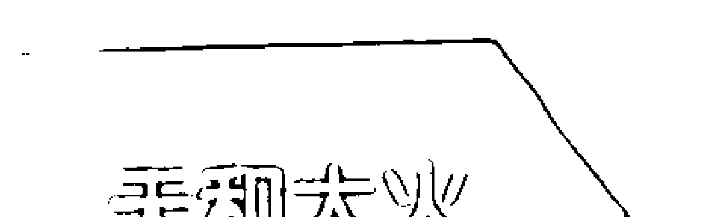

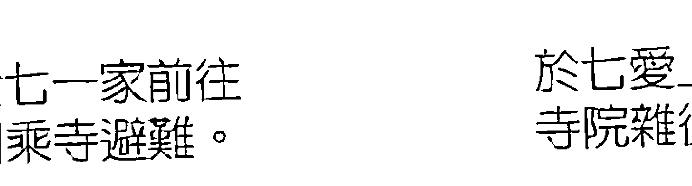

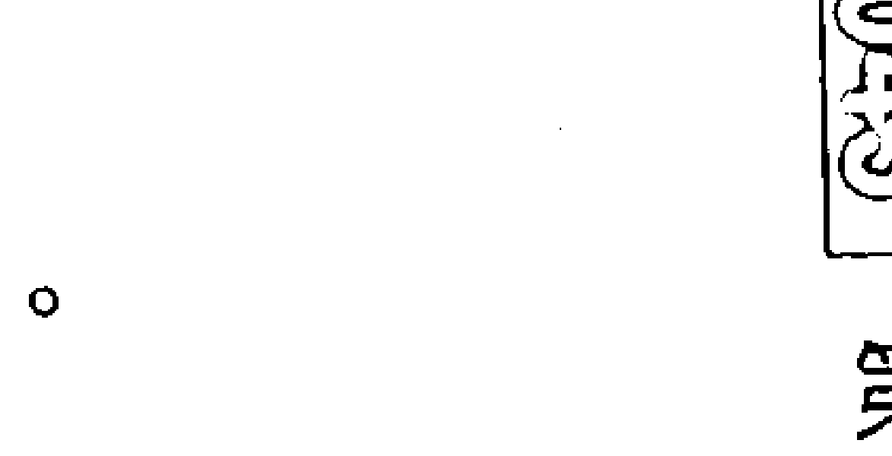

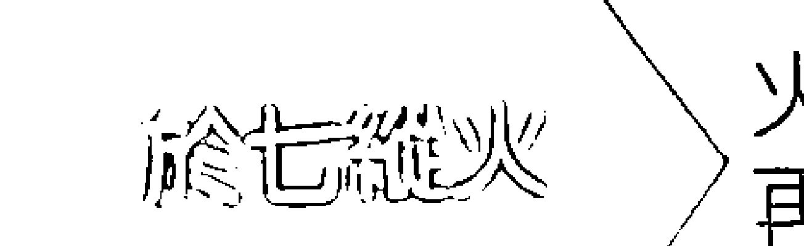

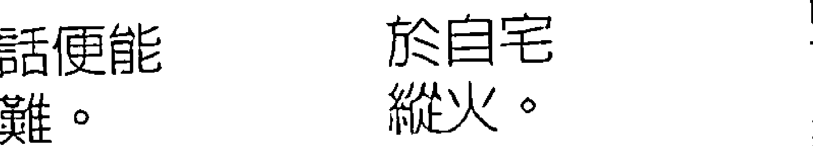

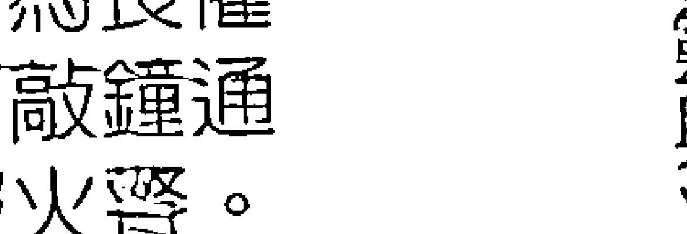

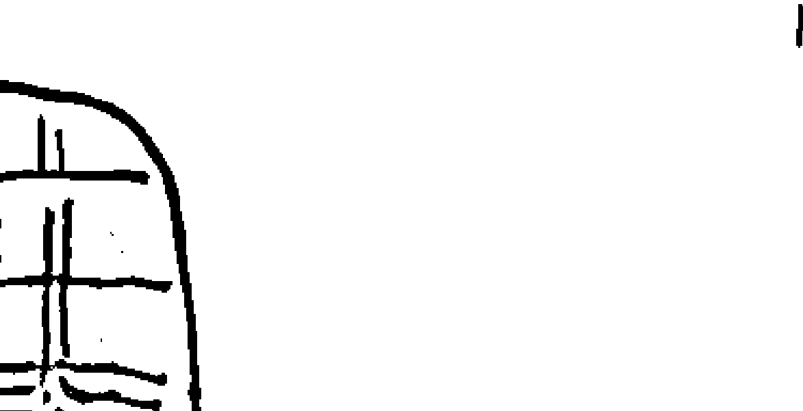

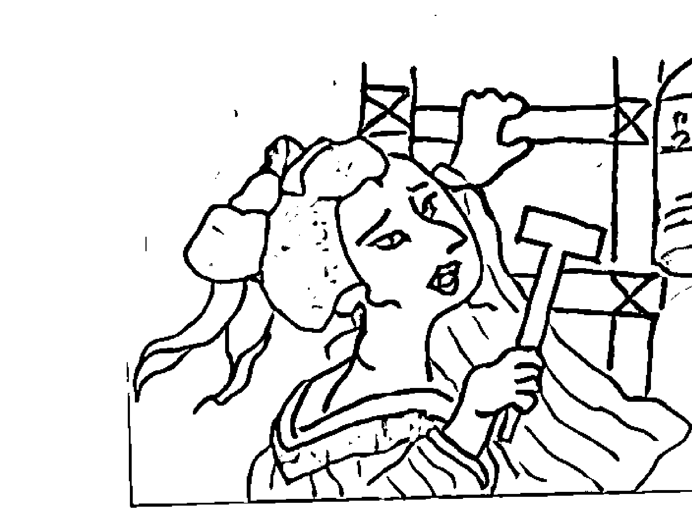

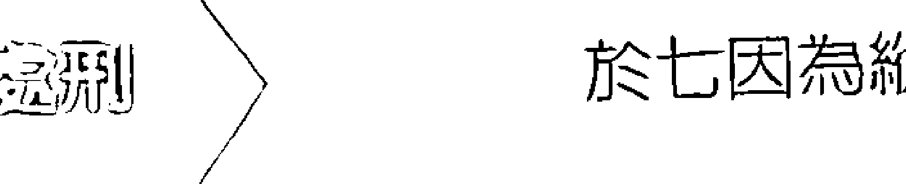


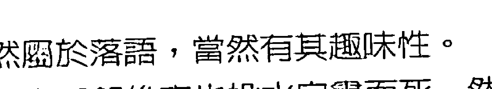

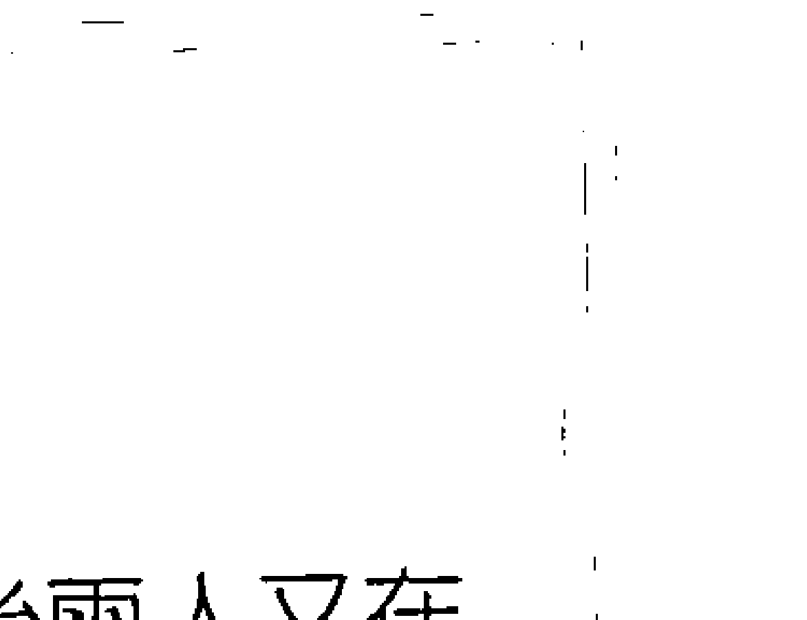

#### ♦ 于七之十

《于七之十》既然属于落语，当然有其趣味性。

在这个故事里面，吉三郎后来也投水自溺而死，然后两人又在

川边重逢，正要牵起手来的时候，却传来「ヂュ—」（滋—）的

响，原来这是拿焚身而死的于七跟投水而死的吉三郎两人牵手冷

却相触，因此发出「滋—」的声音，跟七加三得十的谐音 被安排

成有趣的梗。

# No.044 ガンダルフの魔法
甘道夫的魔法
Magic of Gandalf

《魔戒》的甘道夫其实跟火有相当密切的关系，但想必许多人都不知道这层关系吧。

## ○變成魔法師的神

甘道夫是《魔戒》的主角之一，小说里他是全世界最强的魔法师，不过他其实是个以魔法师模样现身的火之圣灵（小神）；照道理说，我们应该可以期待他使出相当强大的火系魔法才是。然而，甘道夫这位先生别说没有使出稍微强一点的魔法，相信各位看过电影的读者都记得吧，他反而还净是挥舞长剑与敌人对峙。

电影中甘道夫曾经释放火焰的场景，顶多就只是在庆祝哈比人（小矮人）比尔博生日所释放的烟火而已，而且画面看起来使用的应该是真正的烟火，只不过使用魔法操作烟火看起来比较帅气一点。

光看电影就可以发现，就连理应是首部曲当中最有看头的场面——跟炎魔对决的时候，甘道夫也只是用防御魔法（？）挡住炎魔的炎剑而已。

其实所谓的魔法，自古以来就是种肉眼看不见的力量；不论神话里的魔法还是创作作品里的魔法，像是诅咒、治疗伤病（伤口不会瞬间痊愈）、控制天候等魔法，几乎都不会有可以立刻观察得到的明显效果。即便是好像可以观察得到的控制天候魔法，也不会有效果线从魔法师的手中窜出，纵使我们看得到天候的变化，却仍然看不见魔法师使出的招术。

回头想想，这也是理所当然的事，如果眼睛能够看得见魔法的话，那么那些假魔法师不是没两下就被拆穿了，还会有什么搞头？

而且因为魔法的效果非肉眼可见，众人才会对魔法师怀抱敬畏之心。无论人类面对着如何强大的对手，只要是肉眼看得到、可以理解的，总有一天必能克服困难并获得胜利。正因为甘道夫是这么一位古典的魔法师，而奇幻小说又让他担纲主角、演出许多动作场面，才会造成如此令人难以理解的状况。

### 化成火焰法師的火之聖靈

J.R.R.托尔金小说《哈比人历险记》、《魔戒》故事所述世界最强的魔法师。他虽然是火之圣灵（小神），却从来不肯在作品中使出稍微强一点的魔法。

登场作品
《魔戒》
《哈比人历险记》

真正身分
火之圣灵

### 肉眼可見的魔法與肉眼不可見的魔法

| 魔法的類別 | 肉眼可見的魔法 | 肉眼不可見的魔法 |
| :--- | :--- | :--- |
| 作用 | 立刻生效 | 不會立刻生效 |
| 意味易於理解 | 可以理解 | 無法理解 |
| 可反制應對 | 可應對 | 無法應對 |
| 工具 | 方便的道具 | 恐怖的法術 |
| 例子 | 電玩遊戲的魔法 | 古典魔法 |

#### ✦ 送甘道夫進總統府

魔戒是越战末期所有受到嬉皮风潮影响者的必读书籍。
对当时的年轻人来说，力量强大但愈是使用就愈是邪恶的索伦魔戒，想必看起来就像是核子武器的象征吧！而为破坏魔戒奔走的火之魔法师甘道夫，便形同于废绝核子武器的英雄。
据说当时参加反战聚会的年轻人之中，有些人在游行中配戴「送甘道夫进总统府」的胸章，有些人则是在大学里张贴同样内容的海报。

# 炎魔
## Balrog

托尔金《魔戒》作品当中所有怪物最最恐怖的，当属栖息出没于摩瑞亚（矮人制作的巨大人工洞窟）的炎魔。

## ◎墮落的神祇

炎魔此名在辛达语（精灵语的一种）里意为「巨力的恶鬼」，原是仕于邪恶米尔寇的火之迈雅（小神），是米尔寇将他重新再造，变成这副恶鬼模样的。虽然地位低下，炎魔再怎么说也是将神重新再造而成的，因此力量非常强大，能够战胜炎魔的大概也只有龙而已了。事实上，炎魔之王勾斯魔格便曾经以火鞭击溃拥有最伟大精灵美誉的费诺，而米尔寇军队当中战力最强的，便属炎魔部队。

炎魔是按照人类形体创造的丑陋恶鬼，其肉体是由火焰与阴影所构成。牠有火焰鬃毛，还有火焰从鼻孔喷出，同时身边总是有乌云笼罩。

炎魔也会使用斧头棍棒等武器，但最可怕的武器却是火鞭。这火鞭乃由拥有无数分枝的火焰所构成，甚至只要挥舞这节火鞭，便能使就连维拉（大神）也无法消灭的大蜘蛛昂哥立安屈服。

相伝炎魔已经随着米尔寇的败北而灭亡，不过仍有部分炎魔幸存并且进入沉眠。

岂料在凯萨督姆（后来的摩瑞亚）地底深处采掘秘银的矮人却打搅了炎魔的沉眠，炎魔醒转后杀死了矮人之王并召唤半兽人和食人妖、驱赶矮人，将摩瑞亚变成邪恶的巢穴。

后来这个炎魔是被魔法师甘道夫打败而落入地底深渊。其实堕落的炎魔面对拥有正义力量的甘道夫本应毫无胜算，但甘道夫本身也是火的迈雅，其力量对炎魔不太管用（以火击火不痛不痒），是以两者最后才双双落入了摩瑞亚地底的深渊。

不过当然，实力相当坚强的甘道夫后来又再度复活了。

> *米尔寇（Melkor）：即魔苟斯（Morgoth）。

### 與基督教頗為類似的眾神

| 良善陣營 | 邪惡陣營 |
| :--- | :--- |
| 一亞 | |
| 維拉 | 米爾寇 （叛變的維拉） |
| 邁雅 | 炎魔 （叛變的火之邁雅） |
| 甘道夫 | |
| 薩魯曼 | |
| 瑞達加斯特 | |
| 其他埃斯塔力（巫師） | |

《魔戒》系列作中，众神构造与基督教相当类似。一亚相当于神，维拉相当于大天使，而米尔寇则相当于撒旦；迈雅是天使，而炎魔便相当于恶魔。

炎魔潜伏的摩瑞亚在古代本是繁荣的矮人王国，如今（《魔戒》的时代）此地矮人已经全数灭亡，这里也变成半兽人食人妖栖息、炎魔沉眠于地底深处的恐怖世界。

### ✿ 出奇平庸的炎魔

电影里面的炎魔是气势磅礡独自出场，可是炎魔在小说里却是在食人妖和半兽人的簇拥之下现身，而且死得相当窝囊。甘道夫于摩瑞亚大桥之际持法杖击碎桥梁，炎魔便头上脚下跌入深渊摔死了；同时炎魔只能以火鞭缠住甘道夫、双双坠落，难道牠就这么点道行吗？从出现到死亡仅短短几页篇幅而已，不禁让人怀疑这样也算是迈雅吗？还是说即便身为迈雅，沾染邪恶后就会流失力量到这种地步呢？

> 参考魔法→No.044

# No.046 库多古

令人战栗的克苏鲁神话传说中司掌火焰的邪神，此即库多古。

## ○愈来愈容易理解的邪神
克苏鲁神话是由H. P. 洛夫克莱夫特首创，众多后继者演绎发展而成的恐怖神话体系。此神话记载有各种各样的邪神，库多古便是其中的一个。这尊邪神首见于洛夫克莱夫特的友人兼弟子奥古斯特·德勒斯创作的《安德鲁·费尔的手稿》。

库多古是住在距离地球27光年（此为当时的观测结果，现在重新观测计算则为25.1光年）的恒星北落师门烈焰中的火焰邪神，亦有说法认为库多古是被封印在该恒星的动力圈内。

库多古是个活生生的火球，带有极端高温，并且有支名为火焰精灵的眷族部属，貌似块状光球的生命体。当北落师门跃上地平线的时候，就是召唤库多古最好的时机，届时周遭就会沦为火焰精灵肆虐的灼热地狱，一切事物都将被烧成灰烬。

洛夫克莱夫特著有许多克苏鲁神话故事，却从未将这些故事体系化；神话的部分只有片段的暗示，而且各作品间还有相互矛盾之处，洛夫克莱夫特都刻意放置不予理会（有些人认为这种暧昧的状态正是克苏鲁神话令人感到恐怖的本质所在）。

于是乎，德勒斯便展开了将克苏鲁神话体系化的工作。他以四元论将众神分类，同时还把众神分类成“旧日支配者”和“老神”，并且建构善的老神将邪恶的旧日支配者封印起来的善恶对立构造。

这样一来，克苏鲁神话就变得比较容易理解，更吸引了许多的追随者（这是德勒斯的功劳）。可是相反的，此举也遭受许多人批评，容易理解便意味神话丧失了深度，克苏鲁神话的恐怖感觉亦不复从前浓厚。

根据德勒斯这项毁誉参半的分类法，库多古乃是火属性的旧日支配者，对立于拥有土属性的奈亚鲁法特。

### 克苏鲁神话中的火神

- ○栖息于恒星北落师门的烈焰之中。
- ○形体是个活生生的火球。
- ○其眷族部属是种貌似块状光球的生命体，名为火焰精灵。
- ○召唤时会将一切烧成灰烬。

北落师门（Fomalhaut）：亦称南鱼座α（Alpha Piscis Austrini）。按视亮度排列为第十七颗最亮的恒星（不包括太阳）。由于它位于缺少亮星的天区之中，因而被航海人员用作导航星。它位于南天南鱼座中，距地球25光年，是颗白色星，视星等为1.18等，并有颗6等的黄色伴星。

# 火鳥
## Phoenix by Osamu Tezuka

伟大的漫画家手冢治虫根据菲尼克斯所创造出来的火鸟，究竟是种什么样的生命体呢？

## ○規模龐大的火鳥物語

「火鸟」系列乃以日本最伟大的漫画家手冢治虫毕生代表作而闻名于世。光是已告完结的部分，就有埃及篇、希腊篇、罗马篇、黎明篇、未来篇、大和篇、宇宙篇、凤凰篇、复活篇、羽衣篇、望乡篇、乱世篇、生命篇、异形篇和太阳篇等诸多作品，除此之外还有好几部仍在概要和构思阶段的篇章。

这是一部分成好几篇、自由穿梭于过去与未来的壮大作品，有趣的是「火鸟」却从未以现代（或类似的时代）为背景。照理说手冢本身的构想应该是要藉着现代篇替「火鸟」这部作品做个完结，可是其完结却随着作者的逝世而永远不会到来了。诚心希望手冢真的能饮下火鸟血而获得永生的读者，想必应该不在少数才是。

作品所述火鸟是种每逢百年就要自燃、以雏鸟姿态从灰烬中复活，从而得以永生不灭的超生命体。其次，喝下火鸟血便能使人长生不老一说，引来无数人千方百计擒捕，但是得遂其愿者几希矣。

火鸟其实是种穿越时空、监视宇宙一切生命的超宇宙生命体；为拯救一个行星，火鸟可以从其他行星带来另外的生命体使其联姻，创造出新的种族。不仅仅如此，火鸟甚至还能把未来的生命带到遥远的过去，藉此创造生命。

即便拥有如此的异能，火鸟仍然并非全知全能。立意良好的行为（如前述的创造新种族）到最后一败涂地（种族灭绝）的亦不少见；事实上，火鸟便也透过台词言明自己曾经多次目睹宇宙的灭绝。

不过正因为就连火鸟也并非全知全能的存在，这部作品才得以成为带着点淡淡哀愁的杰作，不是吗？

### 「火鳥」的時代背景

#### ○「火鳥」系列作品描繪的時代

| 時代 | 作品 |
|---|---|
| 川前 | 埃及篇、希臘篇、羅馬篇（歐洲・古代） |
| （）・1000年 | 黎明篇（日本・古代）①<br>大和篇（日本・古墳時代）③<br>鳳凰篇（日本・奈良時代）⑤<br>羽衣篇（日本・平安時代）⑦ |
| 1000年～2000年 | 亂世篇（日本・平安時代末期）⑨<br>異形篇（日本・戰國時代）⑪<br>大地篇（日本・中日戰爭）※<br>現代篇（日本・20世紀）※ |
| 2000年～3000年 | 阿童木篇（日本・20世紀末～21世紀初）※<br>太陽篇（日本・西元21世紀？）⑫<br>生命篇（地球・西元22世紀）⑩<br>望鄉篇（伊甸17號行星・西元23～24世紀間）⑧<br>復活篇（地球・西元25世紀）⑥<br>宇宙篇（流刑星・西元26世紀）④ |
| 3000年～ | 未來篇（地球・西元35世紀）② |
| 注1：①～⑫為連載編序 注2：※僅在構想階段 |

> 除了收錄於《少女俱樂部》的埃及篇、希臘篇、羅馬篇以外，其他作品均是交互穿插在漫畫本誌中進行描寫，並且漸漸趨向現代。
連載期間最後一部連載作品太陽篇較為特異，是平行記述7世紀與21世紀的日本。

# 霍爾與火惡魔
## Devil in “Howl's Moving Castle”

宫崎骏《霍尔的移动城堡》及其原著小说《魔幻城堡》描述的火恶魔，究竟是什么模样呢？

## ○被製作成動畫的火惡魔

黛安娜·韦恩·琼斯的《魔幻城堡》*¹经宫崎骏之手电影化变成了《霍尔的移动城堡》，不过宫崎骏版本的译名反而还比较忠于原题名「Howl's Moving Castle」。的确，火恶魔乃是《霍尔的移动城堡》当中的关键角色，想必日版译者是为强调这点而采此译名的吧！*²

以下解说涉及故事结局有雷，请谨慎服用。

故事里的火恶魔名叫卡西法，住在魔法师霍尔的城堡火炉里；卡西法跟霍尔订有契约，所以无法离开这个火炉。在故事的后半段，霍尔虽然曾经为搬家而移动火恶魔，不过移动火恶魔时必须细心注意许多环节。

虽然名为恶魔，这个火恶魔其实原本是天上的流星；他在坠落地面死亡前被霍尔接住，于是便和霍尔签订契约，总比就此死亡来得好。根据契约规定，霍尔将心脏交给卡西法保管，相对的，卡西法则要提供魔力给霍尔，而霍尔便因此得以拥有并使用强大的魔力。

其实故事中的反派角色荒野女巫，同样也跟其他流星订有相同契约，可是缔结契约时日一久，魔法师和火恶魔都会渐渐变得愈来愈邪恶，这也就是为何卡西法会向故事的主角苏菲说解约对自己、对霍尔来说都是件好事。不过，这个契约似乎必须透过其他人才能解除。

霍尔在苏菲等人的协助下成功打倒了荒野女巫。因为与荒野女巫的契约而变得邪恶的火恶魔，虽欲选择霍尔取代女巫做为新的契约对象，不过最终还是被阻止了。苏菲凭着自身的魔力以及周遭众人的协助，终于成功解除霍尔的契约，从此霍尔和卡西法都成了自由之身，让故事有个圆满的结局。

> *¹ 《魔幻城堡》：2004年尖端出版。柯翠园译。
*² 此小说日译版题名为《ハウルと火の悪魔》（霍尔与火恶魔），不如宫崎骏动画版本的译名来得直接贴切。

### 流星變成的火惡魔

# 第2章 火的起源

# 火的相關用語

对人类来说，火是最最...而是以「火」为喻的说法。

譬如日语就有「火が付く」...则是在描述「激动地」哭泣的模样。

「论战火起」...则是「攻击的留言塞爆部落格」的意思。

日语还有个近年来比较少用的说法叫作「擦出火」（火を摩る），这是用来指称关系极为不睦的意思。

然则火却又是极为重要的物事...火可说是活力的泉源。

与此同时，火却又是...现在已演变成为描述家计艰苦的形容词。

此外，火还经常被用作红色的比喻...却也可以用来描述因为愤怒或羞耻而满脸通红的模样。

其次，火也经常被用作日常生活的象征...后来才衍生变成「生活」的意思。

日本还有「合火」（火合せ）一语...称作「不火炊」（火炊かず），应该是因为各家在这段期间都不会动火炊煮的缘故。

从此可见，周边与「火」相关的用语可谓相当氾滥，有时候多花点心思注意一下其实也满有趣的，不是吗？

「火车」：请参照P.28页No.011的介绍。

# No.049 火的發現
## Finding the Secret of Fire

人类是透过火的使用始得以有别于动物禽兽。尽管部分动物有能力使用道具，却没有动物懂得用火。

## ○人類是會用火的生物

当人类的祖先首次见到火时，那时的人类还算不上是人类，甚至该说当时的人类还只不过是猿猴而已。早在我们的祖先还是低等哺乳类的时候，便已经有火了，例如落雷造成的森林大火，或是火山爆发喷出的岩浆和火山弹。

对他们来说，那想必是非常恐怖的东西。就如同许多动物回避火焰般，祖先见到火的时候一定也是四处窜逃。

对这个时期的人类祖先而言，火给人的印象就是「火=恐怖」。

可是约莫在五十万年前，我们的祖先学会怎么用火了。为确保能够长时间持续使用火，他们学会了如何使火焰不致熄灭的方法；换句话说，他们懂得透过追加枯木等薪柴为火补充燃料。打从这个瞬间开始，火就成为了我们人类的亲密好友。

即便如此，人类还是不懂得如何生火。那时候的火苗都是来自火灾或岩浆等，可以说是仅止于借用火的力量而已。这恰验证了许多所谓借用神明神力的神话。

直到距今约两万年前，人类终于拥有自行生火的能力了。有的是钻木磨擦生热取火，有的则是以燧石相击以火花取火。

无论采用何种方式，生火的方法在当时肯定是秘密中的秘密，这不正也是火魔法诞生的瞬间吗？从前人类只能向伟大的大自然借火来用，而今却能以自身双手生出火来，具备这种技能者在当时如果不是超人、不是魔法师，又会是什么呢？

后来这项技能从魔法逐渐普及，变成入智可及的技术，从这个时候起，火才变成了对人类极有用处的道具。

人类最早使用的火并非自行创造，而是借用由岩浆或是落雷造成的火焰。

### 生火的方法

摩擦法大致可以分成犁火法（用木棒顶着沟槽前后摩擦生火）和锥火法（转动木棒摩擦生火）两种。

#### 打擊法

也就是使用燧石。从前使用燧石相击法，后来发现以燧石敲击铁质更容易击出火花，从此燧石便成为实用的道具。在火柴普及以前，这是广泛的生火方法。除铁质物体以外，古时也有人选用黄铁矿或石英等矿物敲打燧石。

# No.050

## 四大元素
### Four Elements

地水火风合称为四大元素，我们以四大元素来表现自然环境已经是稀松平常的事情，可是当初到底是谁将自然环境做此分别的呢？

### ○恩培多克勒的四元论

西元前五世纪希腊哲学家恩培多克勒*1曾经主张万物均由地水火风四种元素组成的四元论述，此即为四大元素理论之元祖。许多人误解这是亚里斯多德的主张，但其实柏拉图和亚里斯多德只是承继恩培多克勒的思想而已，千万不要搞错了。
这位恩培多克勒本身便是个如同魔法师般的人物。戴奥吉尼斯·拉尔修*2的传记里就收录了他使死者复苏，以及为使众人将自己奉为神明崇拜而投身埃特纳火山口丧命等故事。
其著作几已全数散佚，唯少数片段得以留存。翻阅仅存著作便可以发现，其内容乃是试图透过四种元素与两种力量来说明这个世界；所谓的四种元素当然就是指空气（风）、水、火、土，而两种力量则是爱与恨。
所谓的爱，便是指能使四种元素相互结合的力量。换个现代点的说法，也就是指万有引力、强核力*3、弱核力*4等能使物质相互结合的力量。相反的，恨则是指能使四种元素分离的力量，现代说法应该就叫作万有斥力了吧。
他还主张世界会经历四个不同时期，依序是完全由爱支配的第一期（四元素完全融合形成巨大的球状）、恨开始产生作用的第二期（巨球解体，但四元素的各种融合又产生诸多物质，同时还有生命的发生）、彻底由恨支配的第三期（四元素完全分离，形成四个集团），以及爱再度开始作用的第四期（类似第二期的世界），不停循环回归，直至永恒。
若以现代物理学的角度来看，经过宇宙诞生理论大霹雳（Big Bang）使得宇宙已然发生的现在，恰恰就落在第一期转换至第二期的过程之中。

#### 四大元素的關係

四大元素间有两个对轴，水与火对立，风与地对立，应是因为这两对元素各自拥有相反的性质所使然。

#### 四大元素・兩種力量

# No.051
火是万物的本源
Fire as the Fundamental Element

「火是万物的本源」这句话听起来难免让人觉得岂有此理，可是赫拉克利特的思想其实并没有这么单纯。

## ○赫拉克利特与火

赫拉克利特是生于西元前五百年前后的希腊哲学家。
他主张火是万物的根源。只不过，赫拉克利特的理论有别于泰利斯¹之流所谓万物由水构成的理论，对赫拉克利特来说，火并非万物的构成物质。

赫拉克利特着眼于万事万物随时都不停地运动、变化，他认为唯有变化才是自然应有的状态，主张唯有万物流转的象征——火才是一切的根源（arche）。换句话说，火＝变化、生成，而这个变化乃是依逻各斯²（法则）而起。

也就是说，赫拉克利特主张规定这个世界的并非神明，而是法则。从这点来看，赫拉克利特或可誉为自然科学之父，同时还可以说是无神论之父。赫拉克利特有句名言叫作「万物流转（Panta rhei）」（柏拉图于著作中引用并指其为赫拉克利特的话语），这似乎是后世哲学者以此称呼赫拉克利特的哲学，并非本人说过的话。话虽如此，就算赫拉克利特真的说过这句话，也没什么好奇怪的。

根据赫拉克利特的万物流转理论，世间万物全部都处于上升道（土→水→大气→火）与下降道（火→大气→水→土）的过程中，其间无法有片刻停留。他还曾经说过「万物为一」，此语是说相同的物质经过变化可以形成各种各样的物质，是从不同角度观察万物流转而然的发言。顺带一提，赫拉克利特也是第一位认为宇宙有其秩序，遂以「cosmos」（原意为「秩序、调和」，从此才演变为『有秩序的宇宙』之意）称呼宇宙的人。

¹ 泰利斯（Thales）：哲学家。因其以水为万物本质的宇宙论和对日蚀的预测（一般认为该次日蚀在西元前585年5月28日）而闻名。
² 逻各斯（Logos）：希腊语的「理性」。指蕴藏在宇宙中、支配宇宙并使宇宙具有形式和意义的绝对神圣之理。

### 赫拉克利特简介

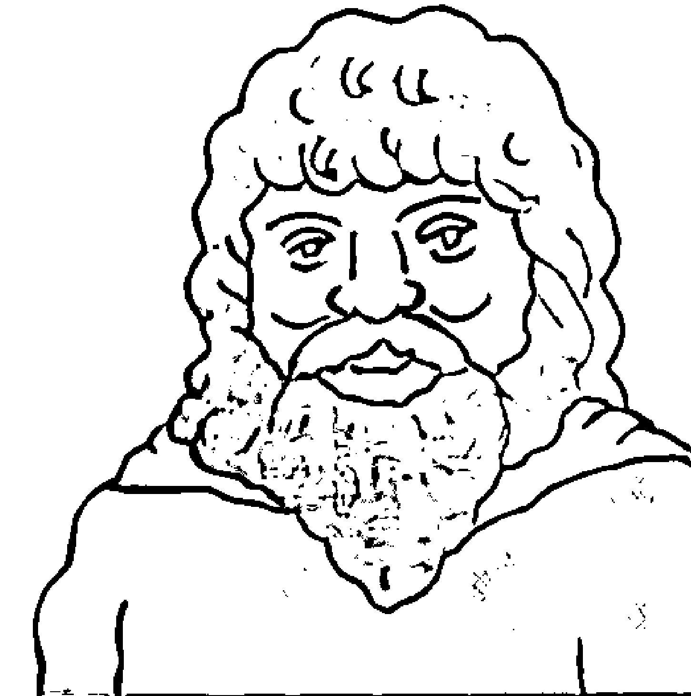

- ○生卒年：西元前540年？～480年？
- ○希腊哲学家
- ○发现希腊语的法则性，后世奉为语言学之祖

### 万物流转（Panta rhei）

万物为火＝万事万物随时都不停地运动、变化。

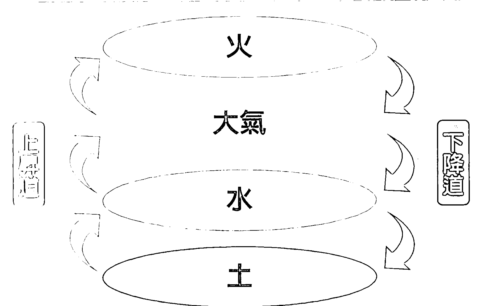

### ◇ 什么是逻各斯？

逻各斯是话语、是尺度、是根据，而且也是统一万事万物的存在。故，亦可将逻各斯解释为神明，而赫拉克利特留下的残缺文献中，亦有将逻各斯视为神明的记载。

不过最为熟知的逻各斯，当属《新约圣经》〈约翰福音〉的开篇。「太初有道（逻各斯），道与神同在，道就是神」，可以说基督教中的神也同样就是逻各斯。

# **五行**
*Wuxing*

五行是中國自古傳承至今的自然觀。它比西洋的四元論述多了個「中央」，以五種元素來將世界分類。

## ○有中央概念的分類法

五行是源自中國的思想，主張萬物均是由金木水火土五種元素構成。除此之外，中國人還將其他所有事物也分成五個種類，認爲世界便是由這五類所構成；這或許是因爲當時所知的行星共有五個，受其影響而致。

與西洋四分法最大的不同就在於，五行有中央概念的存在。就這點來說，土就代表了極爲特別的地位；有別於金木水火四個元素以生物爲代表，土乃以「黃帝」與帝王爲其象徵，這也是爲何中國向來以黃色爲皇帝用色、奉爲尊貴。在季節方面，土所象徵的季節並非春夏秋冬而是土用，也就是日本人熟知的「土用丑日吃鰻魚」的那個「土用」。

夏季的土用最爲有名，是以不少日本人會誤以爲土用就是指夏天，其實土用指的是季節即將告終的時期，立夏之前是春季土用、立秋前是夏季土用（日本人在這個時期的丑日有吃鰻魚的習慣）、立冬前是秋季土用、立春前是冬季土用；每個土用大約都是十八日（因太陽運行而有長短增減），合計約七十二日左右。燃燒的火也被視爲五行之一。就方位來說，火代表溫暖的南方，代表顏色是赤色（紅色），象徵生物則是朱雀，代表季節則是夏季，而象徵的行星當然就是火星了。

五行有相生與相剋兩種關係。

所謂相生，就是指某元素孕生出另一元素，譬如木生火就是指木頭燃燒產生火焰，同樣的，火生土則是指物質燃燒變成灰燼（與土類似）。換句話說，五行的五個元素可以透過相生循環變化。至於相剋則是指某元素勝過＝消去另一元素，譬如水剋火就是指水能滅火，火剋金則是指火能夠將金屬熔化。

「土用丑日吃鰻魚」：日本有「土用丑日吃鰻魚」的習慣（其實是商人炒作所致），而此處的土用便是指夏季的土用，故單稱「土用」時，日本人所想到的通常都是夏天的土用。

### **五行與方位概念的相互關係**

| 行 | 火 | 水 | 木 | 金 | 土 |
| ---- | ---- | ---- | ---- | ---- | ---- |
| 方位 | 南 | 北 | 東 | 西 | 中央 |
| 顏色 | 赤 | 黑 | 青 | 白 | 黃色 |
| 生物 | 朱雀 | 玄武 | 青龍 | 白虎 | 黃帝 |
| 季節 | 夏 | 冬 | 春 | 秋 | 土用 |

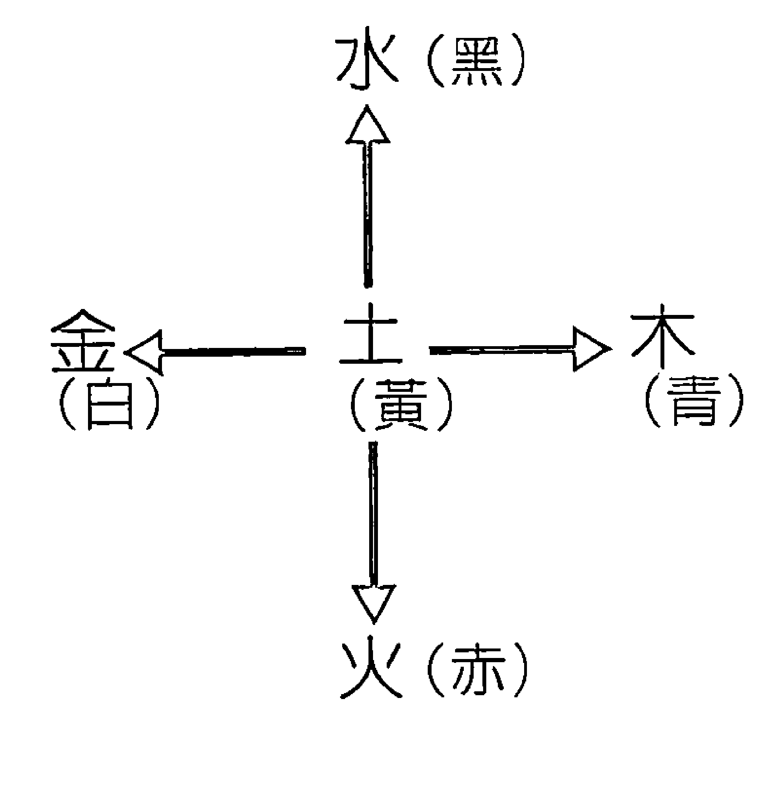

### **五行的相生相剋**

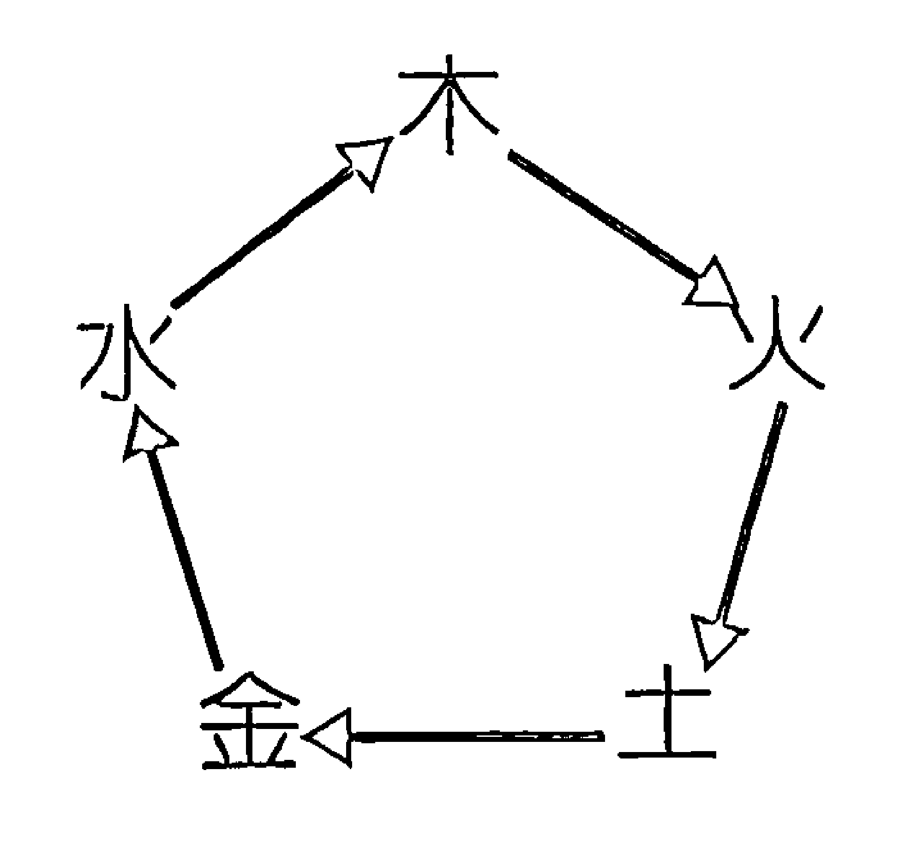

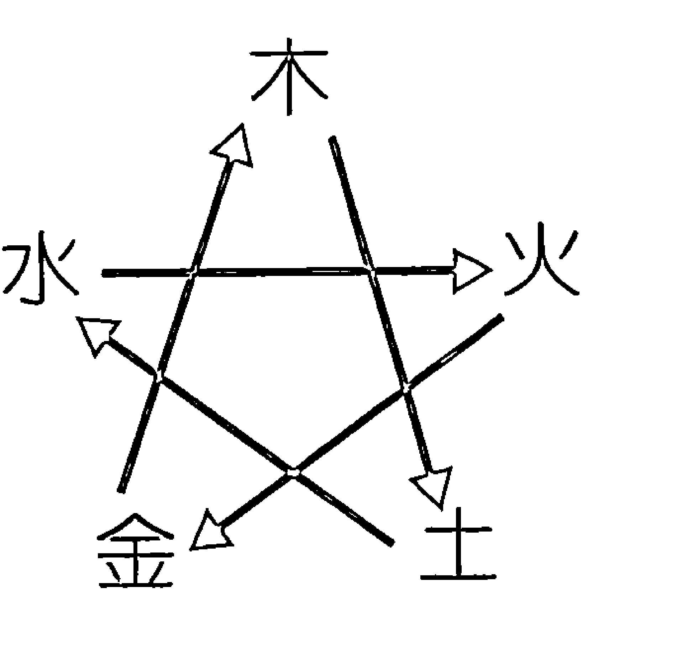

### ◆ 火星是火的星球嗎？

將火星稱作「火星」的，其實僅限於五行文化圈的民族。西洋神話中，火星是馬爾茲（戰神）的行星，是戰爭的星球。我們或許會因爲紅色→破壞→火的聯想而得到「西洋人也認爲火星是火的星球」的誤解，可是事實並非如此。在西洋文化圈裡，火星跟火其實毫無關係。

# No.053 五大 Wuda

或許是因為較少受到奇幻作品採納應用，五大遠不如四大元素和五行為人所知，但其實五大是跟日本人最有緣的思想。

## ## 佛教的物質論

根據佛教的思想，宇宙是由五個元素構成。五這個數目與中國的五行思想不謀而合，然則兩者非但內涵不同，構成元素也不一樣。

從前印度原有以地水火風為四大的思想。這個印度的地水火風分類方法，究竟是誕生自希臘的四大元素思想傳入了印度，或是反過來印度思想影響了希臘四大元素理論的誕生，又或者是各自獨立產生的，至今仍無從得知。

我們只知道在佛教的五大思想成立以前，當時的印度就已經有地水火風的思想存在了。後來佛教又增添獨創的「空」的思想湊成五個，此即五大思想。想當然爾，佛教自然是以「空」為最高位階，畢竟佛教講究的是「萬物皆空」；而著名的「色即是空」這句話，則是「色（存在）其實就是空」的意思。

五輪塔和五重塔，便是這五大思想的物質呈現。每一層塔分別象徵各個元素，從上而下依序是「空風火水地」，這種排列代表各元素的存在位置（地面位置最低、其上為水，距地面較遠處則為火，上空有風，至於遙遠的最高處則是空的存在），但如此排列的重點，還是在於昭示「空」最高位階的地位。

因為這個五輪塔的聯想，有時也會以五輪代表五大思想。宮本武藏的《五輪書》便是取名於佛教五大的作品，講述殺人技巧的著作竟然取個佛教題名，讓人覺得相當不可思議。

只不過，不光是上杉謙信篤信毘沙門天，武田信玄即便出家為僧後，仍以戰國武將身分馳騁沙場，且交戰的諸侯之間也經常會選擇從軍的僧侶進行交涉，可見當時的佛教亦為眾多武士所熟知。是故，就算宮本武藏寫了這麼一部受到佛教思想影響的劍術書籍，回頭想想其實也就沒那麼難以理解了。

## ## 五大和更高的存在

**識**

意識營當中的認識作用，人類便是憑此區別事物，衍生出各人的個性。

**空**

川的認高處的天空，意謂佛教獨創的「空」思想，代表物質存在的地方。

**風**

川I空的風（大氣），意謂會動的事物，代表成長和自由。

**火**

川I火，意謂擁有熱度的事物，代表火的熱情、欲求和意志。有時也代表成...

**水**

川I水，意謂擁有濕性的事物，代表流動、不固定而流動的事物。

**地**

川I地，意謂穩固不變的事物，代表穩固、不變而存在的事物。

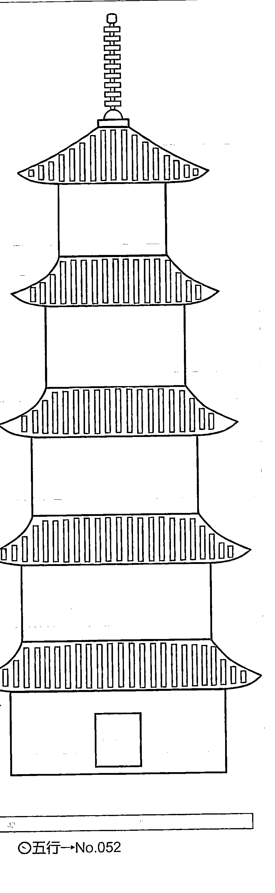

# 火與科學
Fire and Science

人類打從遙遠的往昔便一直都努力著，試圖要用科學眼光來觀察火，最後終於發現了氧化的過程。

## ○名為燃燒的現象

且讓我們以科學的眼光來看看火這個東西。
就科學層面而言，所謂的火就是物質的氧化，亦即某種物質跟氧結合，變化為氧化物，這就叫作燃燒，而此時發生的等離子體和高溫氣體等，便是人類所謂的火。
人類主要是使用有機物（譬如木材等物。石油和煤炭都是太古有機物於地層中變化而成，亦屬於有機物）做為燃料。
有機物之中含有許多碳原子與氫原子。一個碳原子跟二個氧原子化合就會形成二氧化碳，二個氫原子跟一個氧原子結合就會變成水，這便是我們所熟知的火。
我們之所以會認為火焰是橘色的，那是因為有機物中的碳和氫燃燒時產生的光就是這樣的顏色。
可是，不光只有碳和氫會燃燒。舉例來說，幾乎所有金屬只要加熱到高溫都可以燃燒，而且燃燒出來的火焰顏色跟我們熟知的大不相同。銅燃燒時會放出綠色光芒，鈣燒起來則是深橘色，磷燒起來則是青紫色，有人認為這便是為何墓地所見的人魂會是青白色。
利用這些不同顏色取悅眾人的，便是煙火。例如綠色用的是硝酸鋇、藍色是氧化銅、黃色是碳酸鈣、紅色是碳酸鍶等以此類推，為煙花製作各種顏色（其實每位煙火師似乎各有其秘傳配方）。
最貼近我們的燃燒作用發生於何處呢？就在我們自身體內。不光是人類，所有動物都是吸進氧氣、呼出二氧化碳，藉著碳燃燒產生的能量而生存的。換句話說，我們都是靠著碳的燃燒才能存活下去。

> 等離子體：請參照P.220頁No.010的註解。

### 就科學而論，火＝物質的氧化

```
酒精的燃燒
CH₃CH₂OH + 3O₂ ⇒ 2CO₂ + 3H₂O
```

```
鈣的燃燒
2Ca + O₂ ⇒ 2CaO
```

### 火的顏色

- * 硝酸鋇 - BaNo₃ - 綠
- 氧化亞銅 - Cu₂O - 藍
- 碳酸鈣 - CaCo₃ - 黃
- 碳酸鍶 - SrCo₃ - 綠

# 相關項目

- ◎人魂與鬼火→No.010
- ○煙火→No.102

# No.055 火球术 Fireball

除了在人们还不知道如何生火的时代以外，火的魔法其实并不存在。现代的火魔法则是各种游戏所创造出来的。

## ○为破坏而存在的力量

在游戏等领域里，火经常被用在令人联想到其破坏力的用途上，也就是将所有事物燃烧殆尽的破坏性火焰。
因此，每每提到火系魔法就想到攻击魔法，可说是相当典型而固定的思考。其中最有名的火系魔法，当属「火球术」。相信在许多人的想象里，那应该是发出巨大的火球、将所有卷入的东西都烧成灰烬的强力破坏魔法。
尽管或多或少有些出入，不过几乎所有游戏里都有个叫作「火球术」或类似名称的魔法，相信每个人都看过吧！
但「Fireball」本来其实并非这个意思，其原意是指人魂、雷（尤其指球状闪电）现象，不过它的成因至今仍不得而知）等物，完全不具巨大火球的意涵。
直到进入二十世纪以后，「火球术」才被附加了可以从fire+ball想像出来的含义，诸如大爆炸宇宙论中最初的状态、烧夷弹、核爆的中心点等。也就是说，所谓「fireball」=巨大火球，完全是现代的思考，其实并无这种魔法存在。
仔细想想，这也是理所当然的。假如真有这种魔法的话，又会怎么样呢？若真是如此，那么真正的魔法师与冒牌的魔法师肯定真假立判，能使出火球术的便是真魔法师，使不出来的就是冒牌货。如此一来，则无数的冒牌魔法师都要伤透脑筋了。这也是为何历来的魔法师提都不提这种魔法的原因。
火球术这种魔法首见于1970年代，是桌上型角色扮演游戏（TRPG）所创，可以说是专为游戏而创的魔法。

球状闪电（Ball lightning）：直径为几吋、类似移动性发光球的大气现象。通常在雷暴期间出现在地面附近，其颜色可能是红、橙或黄色，常伴有嘶嘶声和特殊的气味，仅持续几秒钟就突然消失，无声或有爆炸声。曾经被观测到引起燃烧并使金属熔化，因而造成灾害。它和普通闪电有没有关系尚不确定，其成因也还不清楚，但有下列几种解释：1. 空气和气体的活动出现反常；2. 密度大的等离子体；3. 含有发光气体的空气涡旋；4. 等离子层内的微波辐射。

### Fireball图解

### Fireball的起源

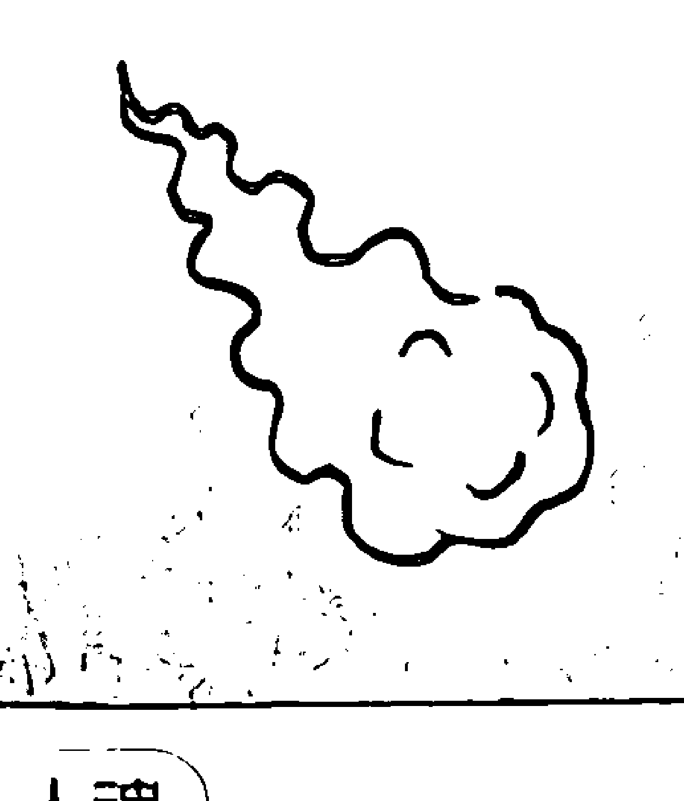

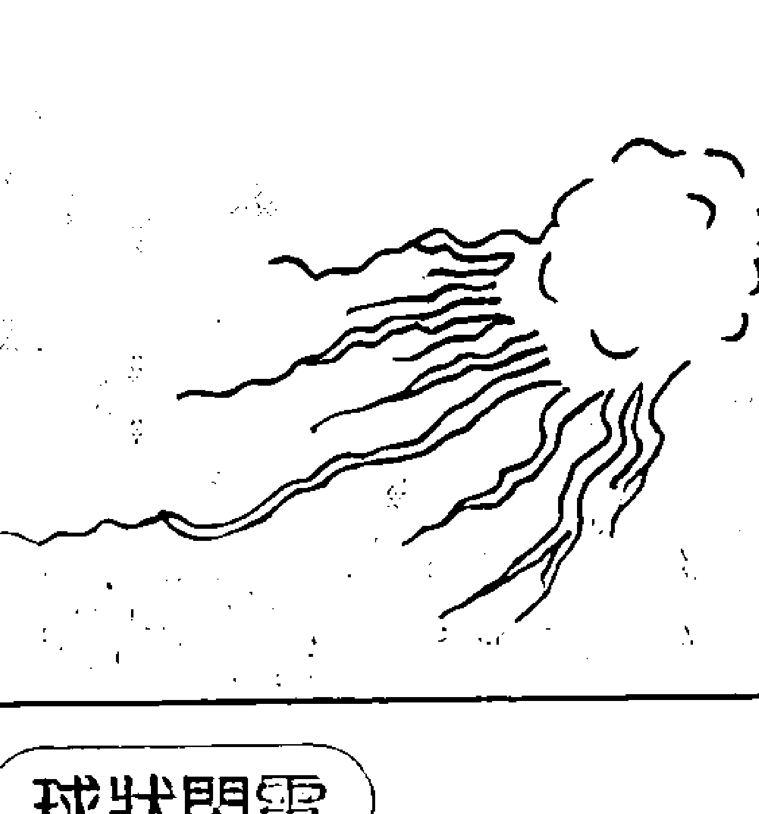

自古便将人魂等神秘火焰称作Fireball。

不坠落地面、漂浮在空中的雷，被认为是人魂的其中一个真面目。

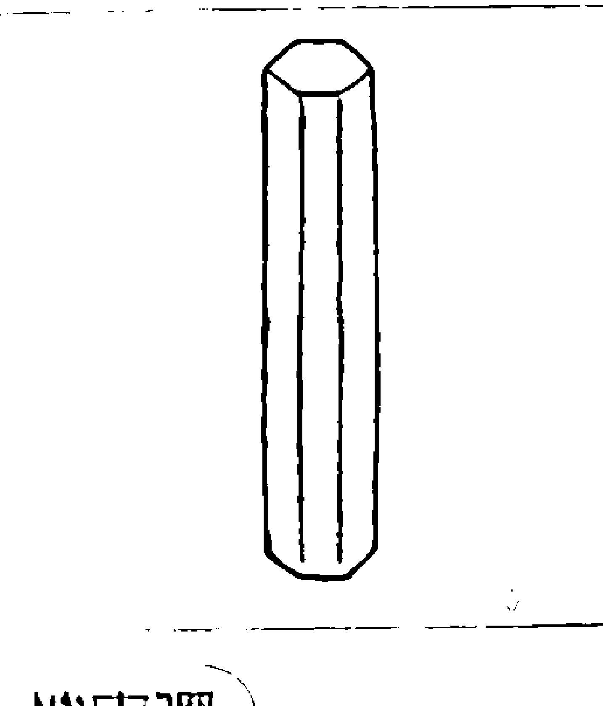

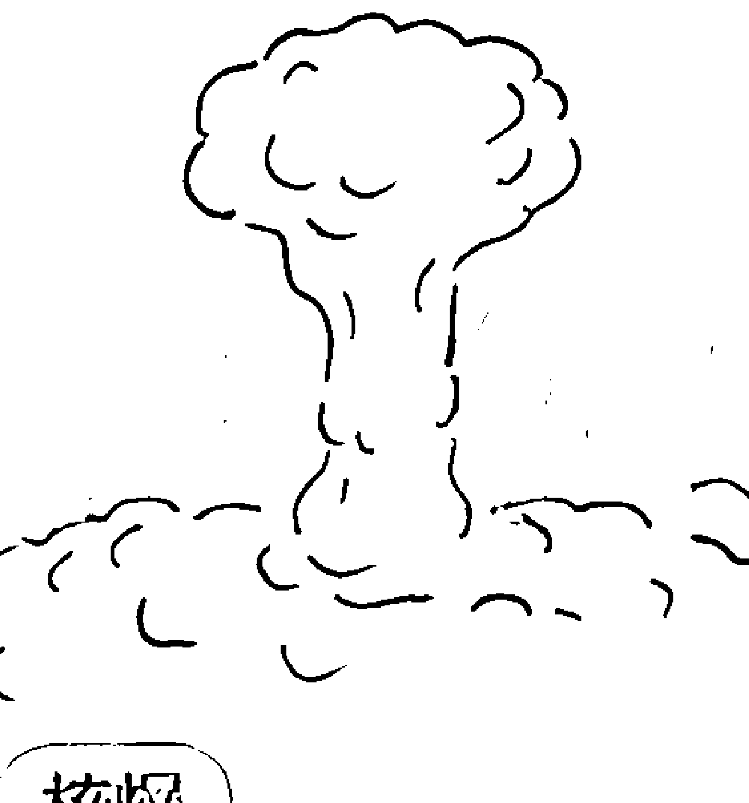

之间均将烧夷弹称作Fireball。

核爆中心点的火球称作Fireball。

### 游戏中的Fireball

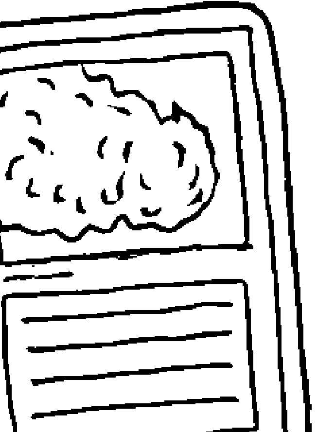

魔法的一种，放出巨大火球进行攻击的攻击方法。

### 相关条目

- ○「魔法」见火→No.010

# No.056 游戏中的火精灵
Fire Elemental in Games

玩奇幻類型遊戲應當或多或少會借助火系精靈的力量，但火系精靈的種類變化卻出人意料的少。

## ○遊戲設計者的煩惱

在許多遊戲裡，玩家可以透過精靈或召喚獸等名義召喚出形形色色的火系眷屬，命其攻擊敵人，但由於火系精靈數量極少，幾乎每個遊戲中出現的都是相同角色。

基本上只要提到火精靈就是沙羅曼蛇，這幾乎是所有遊戲都具備的共通點，不過沙羅曼蛇又分成兩種形態：

一個是身上有火焰圍繞的蜥蜴。為與龍區別，這些火蜥蜴大多都沒有翅膀；為強調其火系精靈身分，通常都是周身赤紅且有火焰包覆的模樣。

順帶說明，我們將日本所謂的山椒魚稱作沙羅曼蛇，那是因為沙羅曼蛇是以棲息於歐洲的火蠑螈為原型的緣故；山椒魚是屬於相同系統的生物，遂有沙羅曼蛇之謂。

另一種形態則是渾身散發火焰的人類模樣，全身通紅且有火焰圍繞，跟火蜥蜴如出一轍；這種沙羅曼蛇形象應是形成於近代魔法登場的十七～十八世紀之間。

除沙羅曼蛇之外，許多遊戲也會在沙羅曼蛇之上另外設置等級更高的伊弗利特，但事實上，沙羅曼蛇和伊弗利特兩者間全無任何交集。伊弗利特的模樣就如同火焰魔神，不過請讀者切勿誤解，所謂伊弗利特是個種族名稱，每個伊弗利特都有各自的名字（照道理說啦）。

另外，《太空戰士》系列作當中，等級最高的火焰系召喚獸乃是巴哈姆特，但這個巴哈姆特其實是隻貌視大魚的水系怪物。原來聖經裡提到的貝西默斯傳到阿拉伯以後就變成了巴哈姆特，原本是大地的怪物，搞不好是跟火焰惡魔彼列被弄錯了也說不定。

> 貝西默斯（Behemoth）：舊約聖經中提到的怪物，樣子看起來很嚇人，但並非什麼邪惡的怪物。《約伯記》中，神對自己能夠創造出這麼一隻龐然巨物十分自豪。

### 遊戲中的火精灵

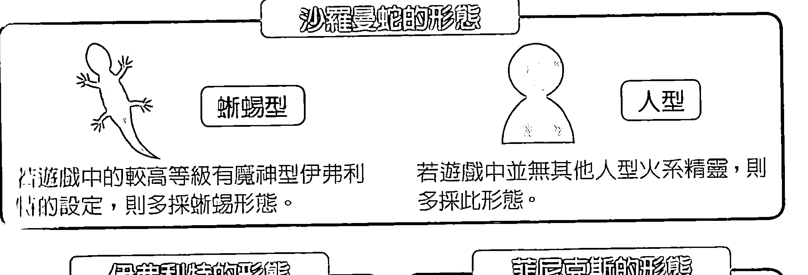

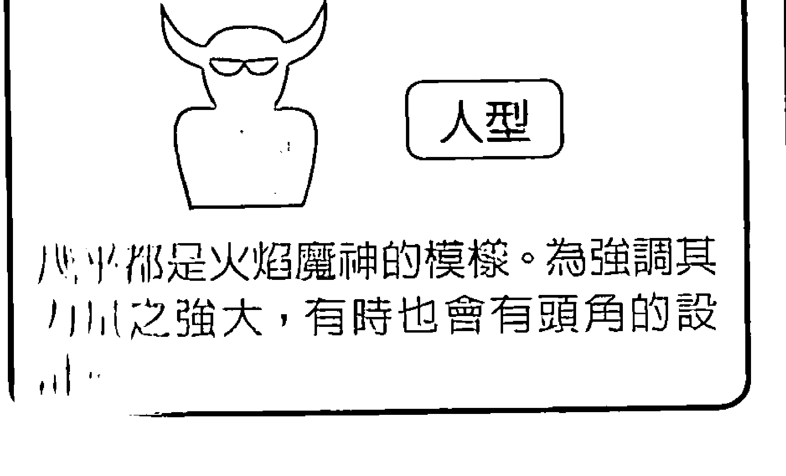

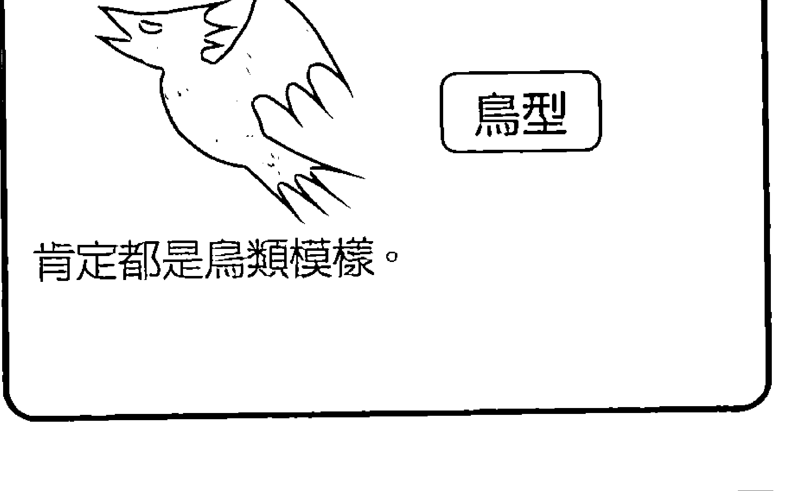

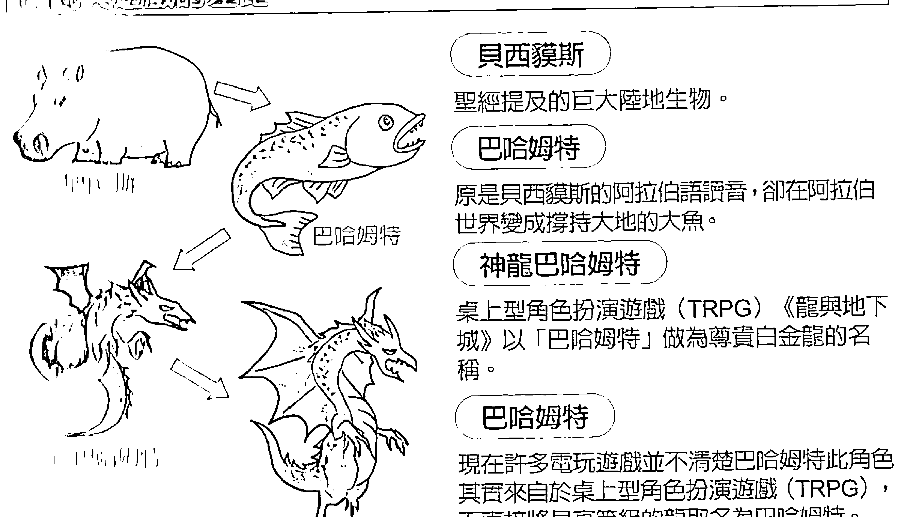

- ○沙羅曼蛇→No.001
- ○沙羅曼蛇→No.002
- ○伊弗利特→No.003
- ○龍→No.006

# ## 火的起源（南美）
## The Origin of Fire (South America)

擁有如此神奇力量的火，絕非人類所能創造出來的物事，這是從前南美洲的人們對火的想法。

○人類沒有火但是動物有火

在南美洲，火起初是動物偷偷藏匿獨自佔有的東西，其中尤以鳥類持有火的神話為數最多。

舉例來說，有神話指出禿鷹是火的主人，大概是牠那紅色的禿頭使人聯想到火的緣故吧！

從前禿鷹都會把肉用火烤熟來吃，人類只能生吃。因此人類決定要把火從禿鷹手中偷過來，於是有一位英雄便假扮成即將腐爛的動物屍體，靜靜躺著不動，等禿鷹靠過來。正當禿鷹將英雄誤以為是肉、把火投擲過去之際，英雄便立刻恢復真面目並將禿鷹丟過來的火塊擊碎，撿了一小塊就趕緊逃跑回去。如此這般，從此人類就能夠用火了，可是禿鷹卻沒能把碎了滿地的火苗撿起來，此後就只能生吃腐肉。

巴拉圭神話則說火原先是在雷鳥 的手上。從前有名男子捉了條蛇（蛇對當時的人類來說是珍貴的蛋白質來源）正要生吃，豈料蛇卻被雷鳥銜在嘴裡飛走了。男子往雷鳥飛去的方向看去，有道裊裊升起的炊煙，他往那邊走去，發現了一根兩端燒得通紅的木棒，那條蛇就纏在木棒上面。男子拿起那條蛇吃了一口，發現味道美味極了。

於是他便偷走那根木棒，帶回族中，從此保護那火苗綿延不絕，讓大家都能烹調食物來吃。

至於火苗失竊的雷鳥，由於沒有生火能力，從此被迫只能吃生食。雷鳥四處來回奔走，發現火是人類偷走的，便在森林深處製造雷雨藉以懲戒人類。

直到今日，每當天空降下雷雨，人們都還會說是雷鳥發怒所致。

雷鳥（Ptarmigan）：松雞科雷鳥屬3或4種鳥類的統稱。類似山鵓，產於寒冷地區。羽色因季節而異，與環境一致：冬季羽毛白色，與雪地一致；春夏則為有橫斑的灰或褐色，以配合凍原地區的植被顏色。雷鳥與松雞科其他鳥類不同之處在於腳趾上下均有硬羽。

## ## 從鳥類手中盜來的火

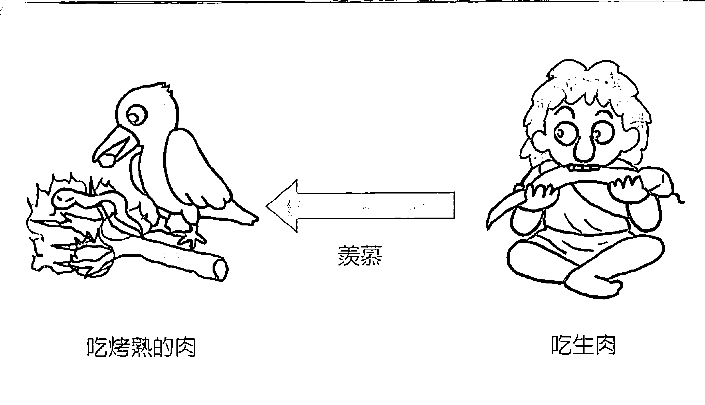

人類從鳥手中盜取火苗

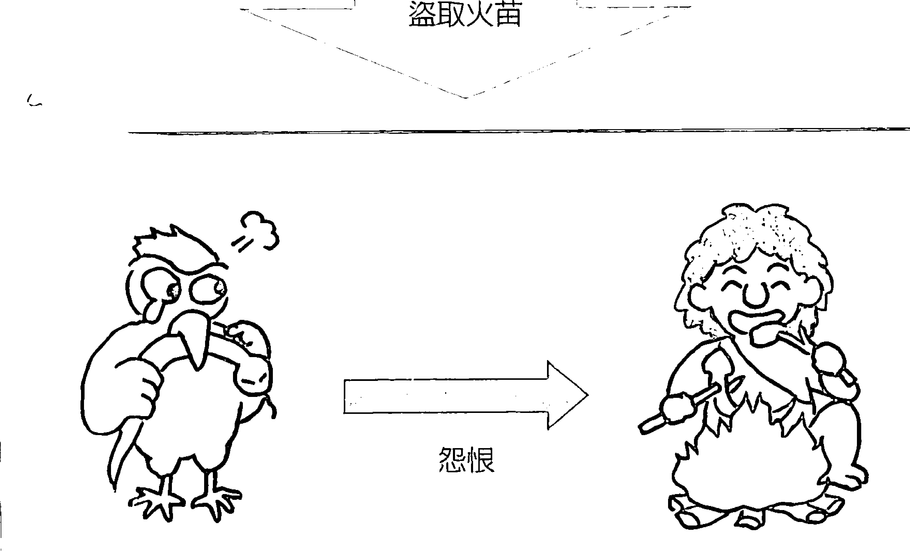

持有火的鳥類說法有禿鷹、雷鳥等各種版本。

# 火的起源（北美）

北美洲有關火的神話非常多樣化，每個部族各自有其全然不同的神話詮釋。

## ○北美各地火的起源

美國東南部的克里克人相信火當初是由鰻魚帶給人類的：從前鰻魚縱身跳入東邊的大洋（大概是指大西洋）、穿越大海去到對岸的大陸。牠在那裡大受歡迎，甚至還受舞會款待，而鰻魚也盛裝出席，當時的頭飾上面插著一支沾滿松脂的木棒。隨著舞蹈的進行，大家漸漸朝著圓心的聖火跳去，在那裡低下頭來；鰻魚也依樣畫葫蘆跟著模仿，豈料松脂卻著了火，讓鰻魚的頭飾燒了起來。正當大家要捉拿這個醃臢、冒犯聖火的傢伙時，鰻魚已經逃走並縱身跳入海中了。

阿拉巴馬州的神話則說，火原本是屬於熊所擁有：有天熊把火藏在地底，逕自離開跑去吃橡果，遺留下來的火焰眼看就要熄滅，於是火焰便大叫「給我燃料！」，剛好人類來到這裡，他先跑去北邊撿樹枝來添火，接著又去南邊、西邊、東邊撿木頭，為火添加薪柴。拜其所賜，火焰始得再次熊熊燃起。等到熊回過頭來取火的時候，火便說道「從今天起跟你們一刀兩斷」，於是火從此就歸人類所有，熊再也不能用火了。

新墨西哥州也有神話指出，棲息於地底的蜘蛛蘇蘇提納是全宇宙的創造者，但他卻把火藏了起來，沒有交給人類，後來是野狗從地底把火偷出來的。

加州地區也相信火是野狗帶給人類的：從前野狗和老鷹合力創造世界，野狗首先開始著手，接著由老鷹負責完成。野狗的最後一項工作就是前往遙遠西方有火的地方偷火，把它藏在耳朵裡面帶回來，然後在山裡把火點起來；凍得受不了的人類循著煙找到山裡，這才終於得到並且可以用火。

克里克人（Creek）：使用穆斯科格語（Muskogean）的北美印第安部落，原居住在喬治亞和阿拉巴馬的大片平地，經濟大體上以種植玉蜀黍、豆類及南瓜為主。婦女耕作，男子外出狩獵或作戰。

### 鳥類和帶來火焰的生物

北美各地流傳的神話中，為人類帶來火焰的生物可說是五花八門。

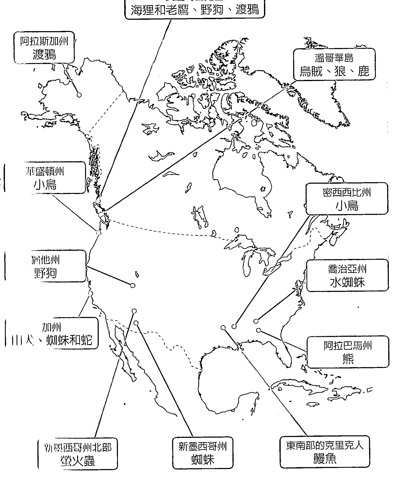

每一種都是與當地生活關係密切的生物。

# 火的起源（中美）
## The Origin of Fire (Central America)
墨西哥神話也認為火起初是由動物所持有。至於有些神話則指出世間曾經有段時間完全沒有火，可能是受到日蝕等現象影響。

# 從天上盜取火苗的神話
墨西哥的科拉人*相信火起初是由鬣蜥蜴所持有。可是有天鬣蜥蜴跟妻子吵架，帶著火跑到天上去了，地上的世界因此沒火可用。為此陷入窘境的生物們聚在一起商討對策，決定委託大烏鴉攀登通往天上的懸崖峭壁，去把火取回來，可是烏鴉卻在攀爬途中摔了下來。接著輪到蜂鳥再次嘗試，同樣也以失敗告終。最後大家將這個任務託付予負鼠*，此時負鼠說「我爬上去以後，你們也要跟上來，然後好好盯著看火有沒有落下來。如果火落下來的話，就用毛皮把它裹起來，別讓它掉到地上，不然地上就會燒起來唷」，說完就慢慢攀上山崖，終於來到天上。負鼠來到天上，發現有個老人（應是鬣蜥蜴的化身）坐在火的前面。那老人問負鼠「你是誰？」，負鼠答「我是你的孫子，我都凍僵了，讓我烤烤火吧」。老人起初雖然不願意，但還是讓負鼠來到火堆旁邊取暖。烤著烤著，老人開始打起盹來。負鼠用尾巴捲住燃燒的木頭要偷火，忽然老人醒來問「你在幹嘛」，負鼠答「我是在撥火啊」，然後老人又沉沉睡去。負鼠趁隙拿著火逃到崖口，不久老人從後面追了過來，負鼠見狀便把火朝崖底丟下去；老人氣得把負鼠毆打成紫黑色，然後把牠也丟了下去。然而這廂的其他生物卻沒能接住落下來的火，火苗蔓延燃燒，使得整片大地都籠罩於烈焰之中。不過相對的，火焰也裹住了墜落地面摔死的負鼠，使得負鼠死而復活。後來這場大火好不容易讓大地女神的乳汁撲滅，大家也就各自將殘餘的火苗帶回去，從此地面的世界才又有火的存在。

## 被負鼠蜥蜴帶到天上去的火
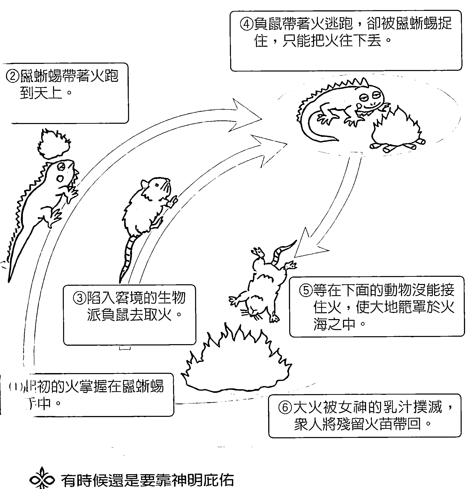

## 有時候還是要靠神明庇佑
想當然爾，中美洲亦不乏有神明將火賜給人類的神話。瓜地馬拉基切人 的神話裡，火原本是由名叫托希爾的神明所持有：他是火的創造者，也是負責保管火的神明，同時更是將火賜予人類，令人感激的神明。可是後來又是大雨、又是冰雹的，好不容易得來的火就這樣全部被打熄了。於是托希爾便再度將火賜給人類。不過人類似乎是一種不懂得學習記取教訓的生物，接著又多次因為暴風雨等因素把火弄熄了。每當人類把火弄熄了，托希爾就會再度用脚踩踏地面，為人類生火。照這個情形看來，托希爾還真是位慈悲為懷，而且頗有耐心的神明。

# 火的起源（北亞）
## The Origin of Fire (North Asia)
西伯利亞如此寒冷的地带，火可说是人们保住性命的极重要物事。
至于这个火究竟是怎么取得的，且让我们看看神话提供的解释。

# ○從天而降以後愈漸邪惡的熊
西伯利亞的尤拉克薩莫耶德人講述的火的起源，跟熊有關。
熊原是天神奴姆之子，住在天上，可是他對雲層底下的大地極感興趣，很想去下界住住看。天神起先並不答應，但終於拗不過熊的懇求，便從天空垂下鎖鏈，讓熊來到下界。
可是原先住在天界的熊不知道如何覓食如何取暖，飢寒交迫眼看就要凍死了，於是身為父親的天神便給熊弓箭，並且教牠如何生火；但天神也告誡熊不可攻擊與人類為友的動物和善良的人們，同時還禁止牠碰觸屍體。
如此這般，身為天神之子的熊便被賦予懲罰壞心眼、不守誓約和說謊的壞人，並且守護、確保人類正直公正的任務；這便是為何尤拉克薩莫耶德人立誓都要摸著熊頭頂的毛髮，直至今日亦是如此。
可是熊非但忘了這些任務，就連天神的禁止事項也全忘了。牠沒有恪守公正的態度，反而還毫無忌憚地襲擊人類。天神聽見並採納了人類受熊襲擊所惱的投訴，遂將殺熊的權利賜予人類。
可是人類對抗熊是絕對沒有勝算的，再說熊還有弓箭和火，人類卻沒有。天神便決定收回熊手中的弓箭和火，轉將其賜給人類。於是乎，人類這才獲得了足以殺熊的能力。
相傳今日的人類便是拜此事所賜方得使用弓箭，並且懂得如何生火。

*尤拉克薩莫耶德人（Yurak Samoyeds）：即今日所謂涅涅茨人（Nenets）。俄羅斯西北方居民。居地西自白海，東至泰梅爾半島基部，南自薩彥嶺，北至北冰洋。目前涅涅茨人是講烏拉語系薩莫耶德語支語言的最大集團。20世紀晚期約34,000人。

## 天神賜給熊的火
居住於天界的熊（天神奴姆之子）對雲層下方的大地極感興趣。
於是懇求父神奴姆，獲得到下界居住的許可。
因為不具備覓食手段以及取暖的方法而飢寒交迫，眼看就要凍死。

天神奴姆賜予弓箭，並傳授生火的方法。

## 人類手中奪來的火
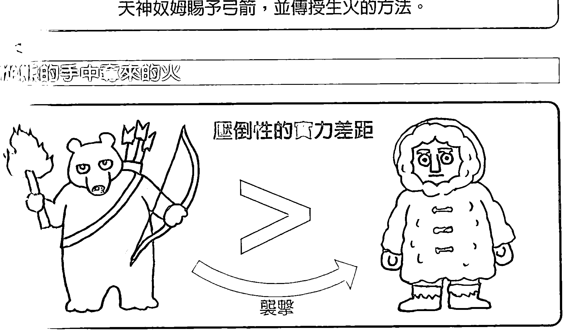

天神收回賜給熊的弓箭和火，交給人類

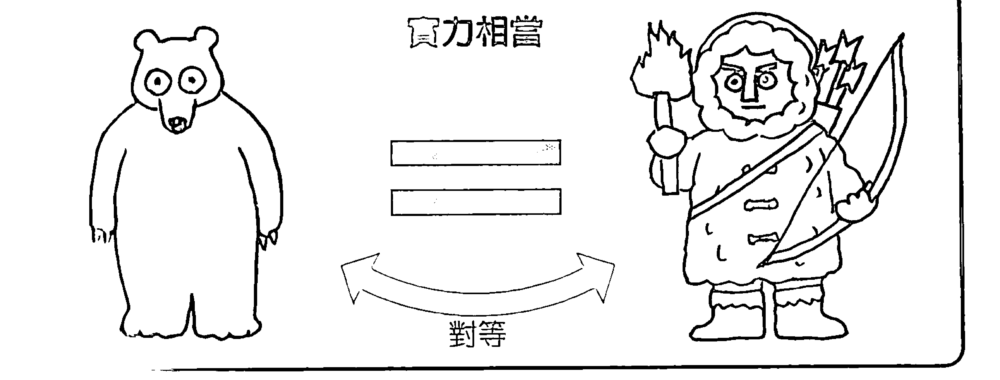

# 火的起源（東亞）
## The Origin of Fire (East Asia)
如同世界各地的神話，火的發現神話在東亞神話同樣極受重視。臺灣跟其他神話都說火是由動物發現，中國神話卻說是人類的發現。

# ○遭洪水撲滅的火苗
臺灣的鄒族（日本稱為高砂族，為高山九族之一）神話裡提到，世界所有火苗曾經一度因為洪水而被撲滅喪失。
由於洪水突然來襲，他們只能一股腦地往高處逃跑，根本無暇把火帶出來，所以洪水過後誰也沒有火。沒有了火，人們冷得直打顫。正當大家以為從此再也找不到火的時候，有個男子發現隔壁山頭的山頂，有個星星般閃爍的光源。
也許那個光就是火也說不定。於是眾人就開始討論該派誰去把火取回來。
雖然說是山頂，可是洪水讓平地全部泡在水裡，情況就跟要游過大海前往隔壁島嶼沒兩樣。想到此處，在場沒有一個不感到畏懼的。
就在這個時候，山羊開口說話了：「那還是讓我去吧」。
山羊穿過洪水形成的汪洋，好不容易成功游到對面的山頂，牠把繩索點燃作為火苗綁在自己的角上，接著就回頭往原本的山頭前進，可是牠愈游愈累，終於無力再抬起脖子昂起頭，不慎讓火滅了；接著眾人又派出名為陶龍的生物，最後陶龍才順利地把火帶了回來，於是眾人便圍繞著牠、慰勞其辛苦。如今陶龍這種生物的皮膚光滑而體型嬌小，相傳便是因為當時眾人圍著牠撫摸所造成的。

中國則說是燧人（相傳為某地區的蒙族）先是觀星而知有火氣，後來又見小鳥啄木擦出火花，從而發現了鑽木取火的方法，從此人類就懂得如何用火來烹調食物了。
順帶說明，「燧」此字便是打火燧石之意，利用燧石敲擊生火的方法，或許同樣也是來自於燧人吧。

> ¹陶龍：日語原文作「タオロン」，因為查無是何生物故採音譯。但鄒族的取火神話有說是山羊和麻雀去取的火，也有神話說是兩種不同的鳥類（參考自「臺灣原住民歷史語言文化大辭典」網站）。

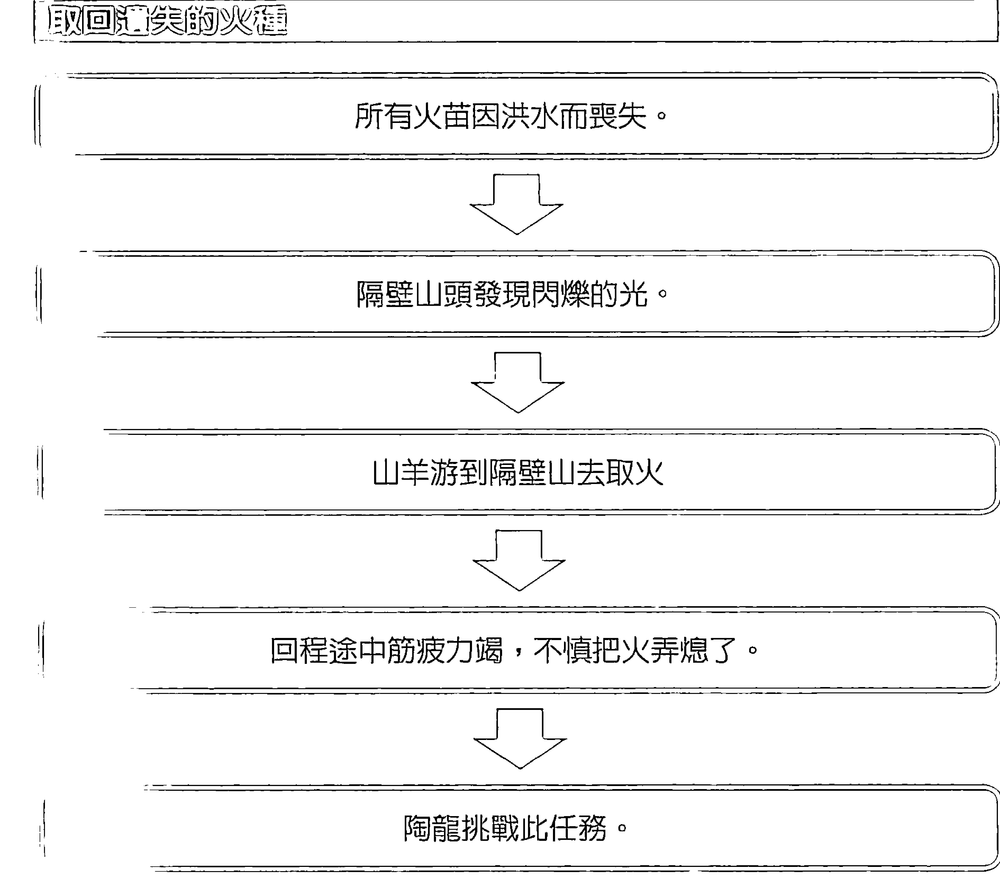

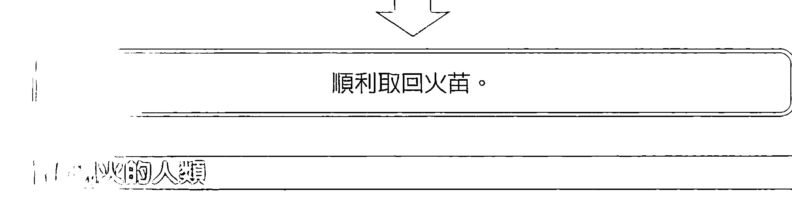

# 火的起源（東南亞）
## The Origin of Fire (South East Asia)
大洪水神話並不僅限於諾亞方舟，而是遍見於全世界各地，就連泰國也不例外。

# ◎偷窺生火的方法
根據泰國的神話記載，從前曾經有大洪水患，當時僅有一對少年少女因為躲在葫蘆裡得以倖存，而現在的人類全部都是他們的子孫。後來他們生下了七個男孩，可是卻沒有火，因為所有的火都被洪水沖熄了，於是他們便決定將其中一人派到天上，去向天帝要火。
這人去到天界也要到了火，可是火卻在天國的入口就熄滅了。他又回到宮殿要了火，卻又再次在天國入口把火弄熄；第三次稍微撐得久一點，不過還是在返回地上的途中便熄掉。
大家再度聚集起來商議，決定派遣使者蛇和貓頭鷹前往天界，可是蛇只會在沼澤裡追逐青蛙，貓頭鷹則是到頭一個村子就在那邊捉老鼠，一點用處也沒有。
七人又再次商議，這次決定將任務委託牛虻。牛虻來到天帝面前，天帝問牠「你的眼睛在哪裡？」（在泰國的神話裡，牛虻的眼睛不知為何是長在翅膀的根部），狡猾的牛虻就回答了：
「我的眼睛就長在跟其它生物相同的地方。耳朵也是。」
「如果要讓你看不見的話，要把你關在哪裡呢？」
「就算把我放在水瓶裡，我還是一樣看得到。請把我放進有縫隙的籃子裡吧！這樣我（眼睛被遮住）就會什麼都看不見了。」
天帝聞言便將牛虻放進籃子裡，然後依照平時那樣開始生火，可是牛虻卻從隙縫中看見了天帝鑽木生火的模樣。
儘管牛虻拿到的火把同樣也在半途便熄滅了，但他根本不以為意，回去就把生火方法告訴了大家。

- 偷窺生火方法
- 洪水澆熄了所有的火。
- 三度向天帝取火，均告失敗。
- 牛虻挑戰此任務。

| 天帝的問題 | 牛虻的答案 |
| :--- | :--- |
| 眼睛長在哪裡？ | 跟其他生物相同的地方。<br>（其實位於翅膀根部） |
| 要把你關在哪裡<br>你才會看不見？ | 請把我放進<br>有縫隙的籃子裡面。 |

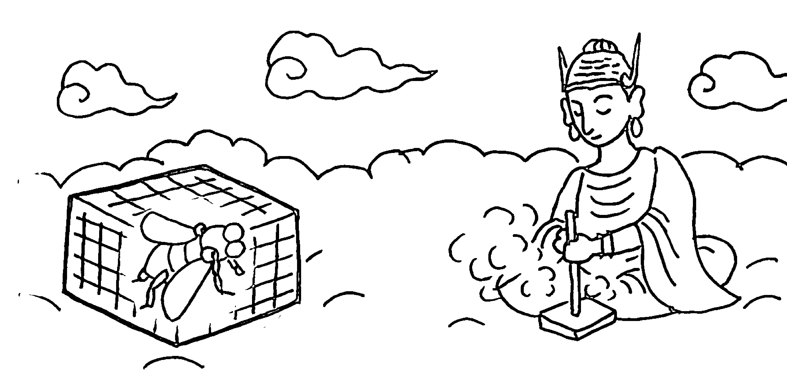

牛虻的眼睛當然跟普通昆蟲同樣都位於頭部，但是從前的泰國人卻相信牛虻的眼睛長在翅膀的根部。

- 記下生火的方法轉告眾人

# 火的起源（印度）
## The Origin of Fire (India)
印度幅员辽阔，其神话还会随着各个时代而产生变化，有关火的起源神话自是极为丰富，此节谨容笔者选择其中最古老的神话介绍。

-   - ○从天界将火带到下界的神

> > 且说他独自奔去，将这般躲藏的阿耆尼，摩多利首从远处将其引领而来，从众神处夺得的阿耆尼。
> 汝为人类所因，为众神运载供物的【神】啊，所有的祭祀，属摩奴斯（同人类始祖摩奴）的【神】啊，皆因汝贤明的监视，最青春年少的【神】啊。（《梨俱吠陀赞歌》，辻直四郎译，岩波书店出版）

原来摩多利首从众神手中夺得阿耆尼，将它交给了人类。据说他便是将生火用的木片神格化后所形成的角色，可说是将火赐予人类的印度版普罗米修斯。幸好吠陀众神不像希腊神明那般残酷，摩多利首似乎并未受到追究惩罚。

《阿闼婆吠陀》则说摩多利首是位能使一切归于清净的风神。换个角度思考，如果说摩多利首是存在于大气之中、将火从天上带到地面的神，或许就不难想象他的真面目了吧！有人认为他是雷神，或是因雷而生的火神；当然啦，印度早就已经有位鼎鼎有名的雷神因陀罗*2，所以此说法并非绝对。

与印度一海之隔的斯里兰卡则有神话记载，火是由某种叫作「鹗」的鸟类从天上带给人类的，可是乌鸦却对此嫉妒不已，于是把火给扑灭了，因为这个缘故，这两种鸟类从此成了誓不两立的敌人。

*1《梨俱吠陀》：请参照P.046页No.020的译注。

*2因陀罗（Indra）：婆罗门教、印度教神名。由雅利安人从古代伊朗带到印度，后被佛教吸收，称为「释提桓因」。全身茶褐色，能变换形状；嗜饮苏摩酒，故又名「饮苏摩酒者」。原为雷雨之神，后发展成为战神。其武器有潋子和网，据说曾征服原印度土著居民沙达人。

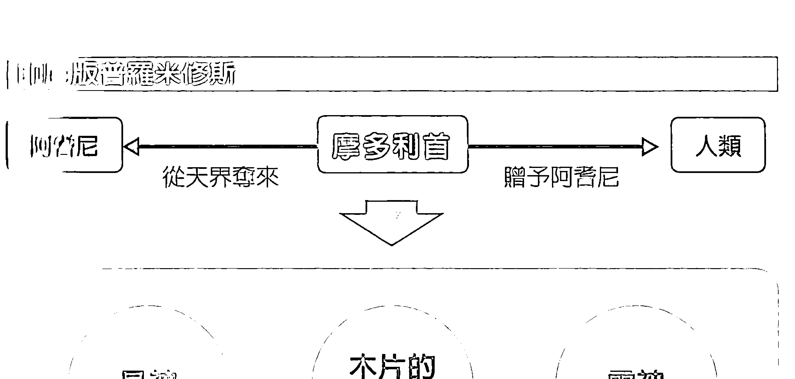

就故事情节而言，跟希腊神话的普罗米修斯（→No.036）极为类似。

不知为何普罗米修斯受到严厉惩罚，摩多利首却平安无事。

| 比较项 | 普罗米修斯 | 摩多利首 |
|--------|------------|----------|
| 出身 | 出身于主神敌对种族 | 相同神族 |
| 对众神的态度 | 祖護人類、欺騙主神 | 並無特別舉動 |
| 其他众神的态度 | 主神反對他將火交給人類 | 並未遭到反對 |
| 必要性 | 並無將火賜予人類之必要性 | 人類如果沒有火的話，眾神就無法得到供品 |
| 结果 | 綁繃於岩石、永受老鷹啄食肝臟之苦 | 並未追究 |

-   - 关连项目
  - ●阿耆尼→No.020
  - ○普罗米修斯→No.036

## 火的起源（美拉尼西亚）
## The Origin of Fire (Melanesia)
美拉尼西亚的火神话记载，生火起初似乎是专属于男性的秘密技能。

## 男性所独有的火
在新几内亚的新不列颠岛，村落里设有偌大的长屋，年轻的男女分别住在不同的建筑物里，过着集体生活。
根据当地的神话记载，起初女性并不知道生火的方法；生火方法原是某个仅限男性参加的组织中的秘密仪式。
某天，该组织有个传授生火方法秘密仪式的集会，一只属于该组织成员的狗因为肚子饿，所以从集会中偷溜了出来，跑到许多女性以及非组织成员的农民身边。
岂料他们却叫狗不要靠近，狗问说为何，他们答「因为你是那个组织的成员啊」。
狗对他们说「啊……好饿喔。有没有芋头什么的啊」，众女子答「就算你想吃芋头，没有火还是不能吃啊」。
狗说道「好吧，让我来试试在秘密仪式中试过的那套吧」，就让一名女子拿了两根桑树枝过来。
狗让女子压住其中一根树枝，然后将两根树枝相互摩擦、开始生起火来。树枝摩擦出烟来以后，女子感动地流出眼泪并且对狗说「我愿意与你结婚」。于是秘密组织长期保密的生火方法，就这样泄漏出去让女人知道了。后来女性开始在该组织成员面前生火，该组织成员惊讶地问「是谁教你们这个的？」，众女子便回答「是狗教的」。
该组织的首领听闻此事以后勃然大怒，怒吼「早知道当初就不要把喜欢乱讲话的狗带来了，那家伙背叛我们，还把我们的秘密说了出去」。
接着首领便施魔法让狗不能说话，做为报复，这便是为什么现在的狗无法说话的原因。

*美拉尼西亚（Melanesia）：太平洋岛群组成的人文地理区。包括新几内亚岛、阿德默勒尔蒂群岛、俾斯麦群岛、路易西亚德群岛、所罗门群岛、圣克鲁斯群岛、新喀里多尼亚群岛、罗亚尔特群岛、瓦努阿图、斐济、诺福克岛和许多较小的岛屿。

## 沒公開的秘密儀式
生火方法是仅有成员清一色是男性的组织才知道的秘密

狗因为想要食物而将生火方法教给女性

## 新幾內亞的長屋
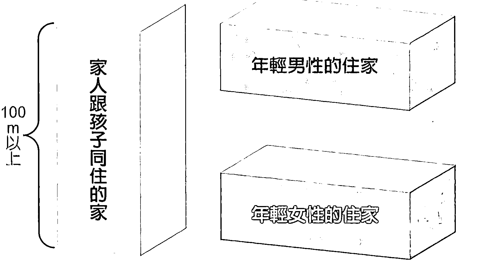

村子裡共有三種主要建築物：其他家人跟孩子同住的家、年輕男性共同生活的住家、年輕女性共同生活的住家。當地民族便是藉此與同輩村民交集，創造村民的集體意識。

## 火種不知從何而來的神話
在所罗门群岛的布因岛神话裡，这个岛屿原本並無火的存在，不过近旁的艾尔岛却知道如何用火，于是小鸟便飞到艾尔岛，在那里偷窥到原来他们是用钻木取火的方法，从此布因岛也知道如何生火了。
美拉尼西亚诸岛屿有许多此类神话流传，一般认为这就代表了「火的方法是在岛屿之间渐渐传递开来的。

# 火的起源（密克羅尼西亞）
## The Origin of Fire (Micronesia)
根據密克羅尼西亞的神話記載，火是神明為表達謝意而贈予人類的禮物。

○隨着雷電墜落地面的火
密克羅尼西亞的雅浦島相信火是來自雷神的贈物。

從前人類並不知道有火，也不知道能用火烹烤芋頭等食物，都是把芋頭放在沙上面用陽光來烤（雅浦島相當接近赤道，放在沙上用陽光烤可以有七、八十度，在這個溫度下擺上幾個小時，應該可以相當程度烤熟食物），可是等這麼久實在太辛苦了，於是人類便求助於天神雅拉法斯。

雅拉法斯立刻就發出一記又紅又熱的落雷，擊碎露兜樹2，使得露兜樹迸裂、葉子出現尖刺。但如此一來卻也使得被雅拉法斯打落的雷神狄茲拉卡在露兜樹幹動彈不得，稍一移動就被露兜樹的尖刺刺得哇哇叫，於是他只能大聲呼叫救命。

附近有個名叫瓜兒蕾婷的女孩正在用陽光烤芋頭吃，聞聲而來發現了動彈不得的神，她將有刺的葉子一片片剝除，把他救了出來。

狄茲拉感謝不已，問女孩在做什麼。女孩回答以後，神便命令她去拿黏土過來，然後就開始揉黏土，製作全世界的第一隻鍋子。接著，神又叫女孩去拿根木棒過來，再把那木棒夾在腋下，把事先藏著的火花塞到木棒裡面，木棒便因此獲得雷神賜予的生火力量。

人類便是如此學習到鑽木取火的技術和製作鍋子的技術，從此再也不需要拿芋頭去曬太陽，隨時都可以吃到暖洋洋又鬆軟的芋頭了。

1 密克羅尼西亞（Micronesia）：太平洋島嶼的人種地理集合，包括一般較小的島嶼及吉里巴斯、關島、諾魯、北馬里亞納群島、密克羅尼西亞聯邦、馬紹爾群島共和國、帛琉共和國等島群。

2 露兜樹（Screw-pine）：亦譯旋葉松。露兜樹科（Pandanaceae）露兜樹屬（Pandanus）幾種有高蹺狀氣生根的灌木及喬木的俗稱。

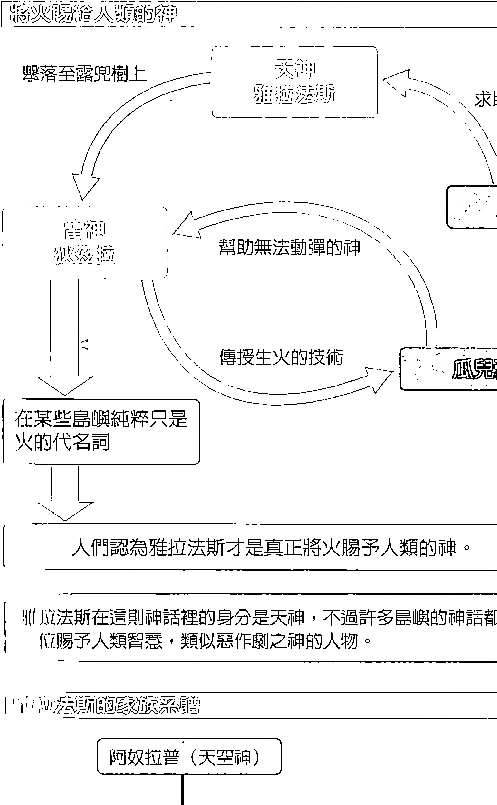

# 火的起源（纽西蘭）
## The Origin of Fire (New Zealand)
整個太平洋波里尼西亞海域，從夏威夷到紐西蘭，矛烏伊是無人不知誰人不曉的英雄，且讓我們來介紹他跟火的淵源吧。

# ○火的起源瑪菲凱
紐西蘭神話裡面流傳了一則英雄矛烏伊與火的神話。矛烏伊雖然身爲英雄，卻也是喜愛惡作劇的人物。

某日，矛烏伊決定將衆人從祖先瑪菲凱手中取得的火全部撲滅，他在夜裡跑到村落炊煮的廚房，果真把所有的火都弄熄了。爲此犯愁的村人經過商議以後，決定派遣使者再去向瑪菲凱取一次火回來，而矛烏伊則表示自願前往。

來到火之女神瑪菲凱面前，女神便拔出自己的指甲變成火苗，交給矛烏伊；可是矛烏伊才走了幾步路，又故意把火弄熄，然後再次折返向瑪菲凱要火。瑪菲凱連拔了好幾次指甲給矛烏伊，但他每次都把火弄熄，又再跑來要火。

瑪菲凱直到連腳趾甲都拔出來以後，才發現受騙上當，於是她拔出最後一片大姆趾的指甲擲向矛烏伊，想把他燒死。矛烏伊趕緊變成老鷹逃跑，火焰卻還是不停地追來，他跳進水池裡，可是池水卻因爲火焰而熱得好像要沸騰似的。

於是矛烏伊便向另外兩位祖先——塔弗里梅帝亞和懷提提裡瑪塔卡塔卡——求救，頓時一場傾盆大雨澆熄了火焰，使瑪菲凱發出哀號逃跑了。

瑪菲凱的火便從此熄滅了。

不過，瑪菲凱曾經在火焰熄滅前，把僅剩的一點點火花藏在露兜樹等樹木裡。

拜其所賜，只要以藏有火花的樹木相互摩擦便能生火，至今人類只要有需要，就會以此法磨擦露兜樹等木材，生火來用。

## 英雄矛烏伊
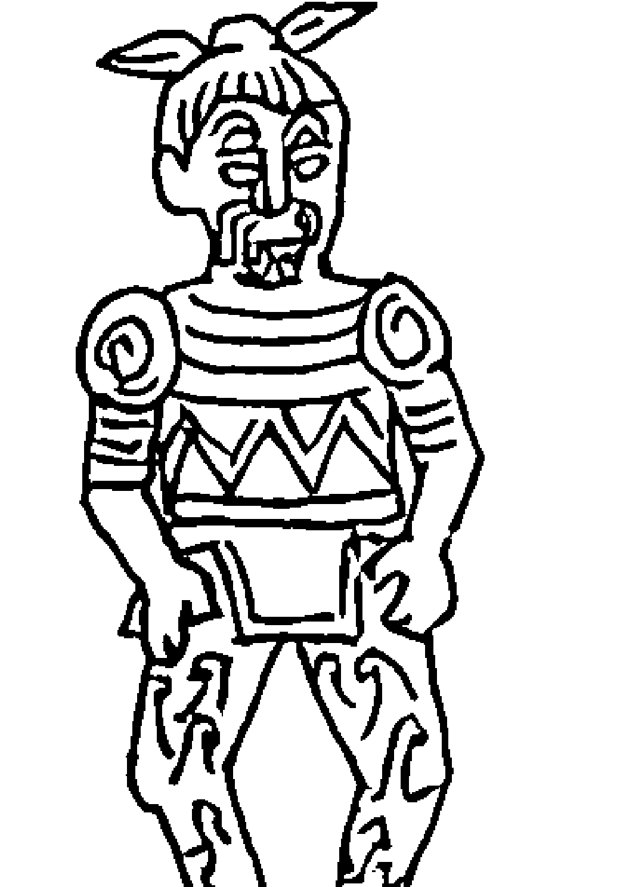

太平洋的英雄兼惡作劇之神。他出發去見瑪菲凱的時候，雙親曾經告誡他絕對不可以對瑪菲凱惡作劇，但矛烏伊還是無視規勸，惡整了瑪菲凱，因而得到教訓。

## 英雄矛烏伊
把瑪菲凱的火弄熄。

欲將其燒死。

## 火之女神瑪菲凱（矛烏伊的祖母）
> 以烏向另外兩位祖先塔弗里梅帝亞和懷提提裡瑪塔卡塔卡求救，他們降下大雨撲滅了瑪菲凱的火。不過，露兜樹等樹木裡還藏有僅剩的少許火花。

## 矛烏伊幹過的好事
惡作劇之神矛烏伊曾經把在天空高速運轉的太陽痛扁一頓，讓太陽只能虛弱地在天空裡爬行，從此以後，一天的時間才變得像現在這樣過得如此緩慢。其次，他還曾經從船上拋出釣針釣住海底，然後把陸地從海中釣上來，從而創造了島嶼。最後，爲人類帶來死亡的也是矛烏伊。矛烏伊爲使人類從此不再死亡，企圖要穿過死亡女神的身體，可是死亡女神（瑪菲凱的妹妹）經過姐姐那件事而察知矛烏伊的企圖，使得矛烏伊的計畫以失敗告終，矛烏伊遂因此喪命，而人類也從此無法逃避死亡的命運。

# No.067 火的起源（澳洲）
## The Origin of Fire (Australia)

### ○鑽進樹裡的火

許多神話都說人類是從動物的手中奪得火種，至於當初擁有火的究竟是何種動物，每個地區都有各自不同的說法。

全世界許多神話都說從前是動物擁有火，而人類原本並沒有火。即便是從文化、遺傳學的角度看來與世獨立的澳洲，同樣也有人類從動物手中取得火焰的神話。由於澳洲幅員廣闊，自然也有不同的神話存在。

在澳洲，火原本是掌握在棲息於格蘭扁山脈的烏鴉手中。當然，烏鴉本身也知道火是多麼貴重的東西，所以從未讓其他人使用過。

可是有隻紅尾巴（火尾）的鶇鶍（火雀）看見烏鴉叼著燃枝（用來點火的樹枝）把玩，於是便銜著那樹枝跑掉了；接著又有隻叫作塔拉塔克的老鷹出現把樹枝奪走，用那樹枝到處點火。拜其所賜，這個國家到處都有了火種，而人類也能同樣用火。

除此以外，還有一則神話，同樣是以鶇鶍為故事主角。很久以前，火掌握在討厭澳洲原住民的兩名女子手中，而澳洲原住民沒有火，只能冷得打顫。此時有名男子假意愛慕接近她們，並邀請兩人一同出遊；他趁隙奪得燃枝、藏到背後逃跑，然後把樹枝交給了原住民，從此澳洲原住民便懂得如何生火。相傳這名男子如今已經變成了鶇鶍的模樣，當初因為他把火藏在背後，所以尾巴才會變成赤紅色。

新南威爾斯省塔塔替族的神話則說，火原本是在名叫古蘭班的老鼠手中，後來老鷹把火散布出去，使得原野陷入一片火海，不過人類也從此能夠用火了。

*1 鶇鶍（Wren）：雉形目鶇鶍科鳥類，80種。形小，體壯實，淺褐色。本科起源於西半球，僅普通鶇鶍一種已分布到舊大陸。

*2 火雀（Fire finch）：幾種紅褐相間或紅黑相間的鳥類。體下側常有小白點。屬雀形目梅花雀科，在灌木叢和園林中到處可見，甚至進入住宅。雄鳥淡紅色，雌鳥褐色；雌雄鳥的腰均呈紅色。

## 鳥類間的火種爭奪戰

棲息格蘭扁山脈的烏鴉知道火是多麼貴重的東西，所以從未讓其他人使用過。

紅尾（火尾）的鶇鶍帶著烏鴉用來點火的樹枝逃跑。

老鷹塔拉塔克從鶇鶍手中奪得樹枝，用那樹枝到處點火。

拜其所賜，到處都有了火種，人類也能用火了。

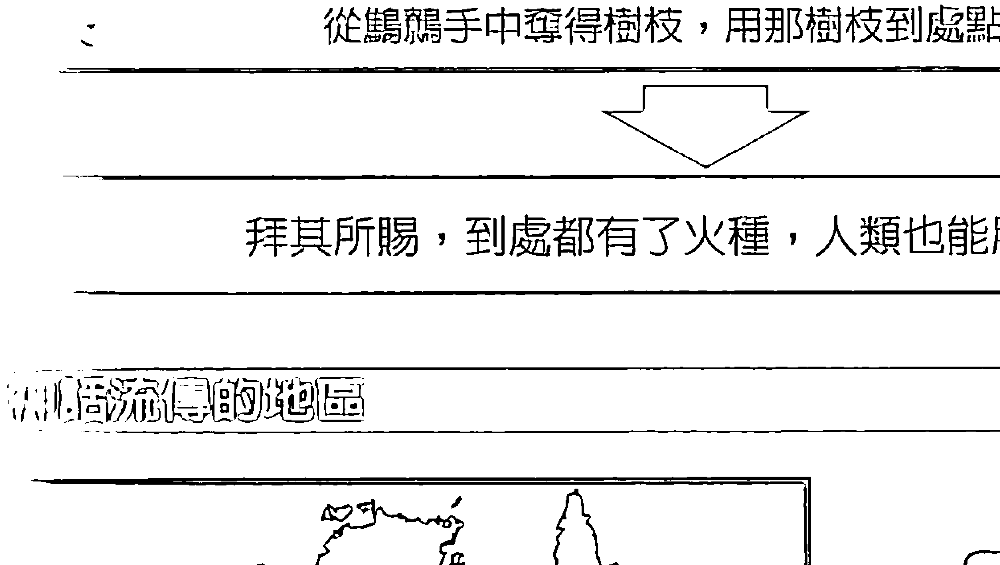

新南威爾斯省

格蘭扁山脈

澳洲東南部一帶從阿得雷德、與斯賓塞灣隔海相望的小型山地（在澳洲算是小型，不過在日本人眼裡看來，卻是個面積跟日本整個中部山岳地帶相彷彿的廣大範圍）。是世界最古老的山地，現已規劃為格蘭扁國家公園。

# No.068 火的起源（非洲）
## The Origin of Fire (Africa)

非洲面積極為廣大，每個民族都有各自不同的火起源神話，此節目內容筆者擇一為文介紹。

### ○女性憑藉智慧獲得火和地位的傳說

剛果的庫巴人起初也不知道怎麼生火，只能取落雷等現象造成的火苗回去用。有一天，邦巴（神的名字）出現在某個名叫克里克里的男子夢裡，教他用乾燥木頭摩擦生火的方法。

克里克里沒把這個秘密告訴任何人，等到村裡的火熄掉的時候，才以高價銷售火苗。每個人都想知道他生火的方法。

國王有個美麗的女兒叫作卡緹潔，國王對女兒說「如果你從那男子的口中問出生火的方法，我就給你跟男人同樣的待遇，讓你坐兄長們的座位」，於是卡緹潔便以虛情假意接近克里克里，讓他對自己死心塌地。

某天夜裡，卡緹潔故意把全村的火都吹熄了才跑來找克里克里，可是她只是顫抖、什麼也不做。克里克里問她怎麼了，卡緹潔說「我想看看你的臉」，於是克里克里便跑去附近借火，可是到處都沒有。

最後克里克里終於放棄借火，拿出生火用的木棒生起火來；卡緹潔在旁邊看得仔細，知道生火的秘密以後不禁笑了出來說「我堂堂國王的女兒，你還真以為我會愛上像你這樣的男人嗎？」，隨後到處散播生火的方法。

甚至卡緹潔還對父親說「沒想到像國王這麼有權力的人都失敗了，最後卻是有智慧的女性獲得成功」。

從此以後，庫巴族的國王便設有名為卡緹潔的女性顧問職位，佔有重要地位。受騙上當的男人固然可憐，但是沒娶到這麼狡猾的女人當妻子，或許反而是件好事也說不定。

當然，非洲同樣也有從動物手中奪得火苗的神話。安哥拉的貝爾格達瑪族就敘述了跑到獅子家裡把小獅子推到火中、趁隙奪取火苗的神話。沒想到擁有火的動物竟然是獅子，真不愧是非洲的神話。

> 庫巴人（Kuba）：由剛果（金夏沙）講班圖語的大約十六個群體組成，居住在開賽河與桑庫魯河匯合處以東地區。

### 公主的虛情假裝

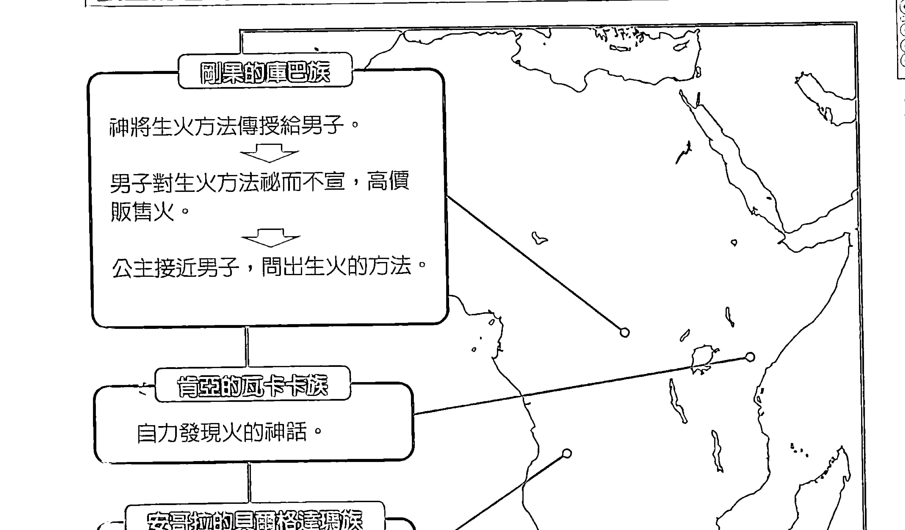

### ✦ 自力發現火的神話

根據瓦卡卡族的神話敘述，從前人們根本不知有火，食物也只能生吃，就連香蕉吃起來都是硬的。

這時候剛好有個年輕人拿箭來玩，他把箭立在圓木之上，兩手夾著箭來回旋轉，只見那箭變得好熱好熱，他拿這個變得很熱的箭去戳朋友，朋友紛紛大叫逃跑。這個年輕人好生得意，於是更加賣力地開始拿箭來搓，最後終於被他搓出火來，讓旁邊的枯草都發出滋滋的聲音燒了起來。

眾人很生氣地問「這種怪東西是誰拿來的！」，於是那年輕人生火給大家看，可是大人更生氣了，說道「怎麼可以弄出這種把我們的草木都吃掉的東西！」

其他年輕人也從灰燼中取出香蕉，嘆氣道「我們的食物也因為滋滋而壞掉不能吃了」，可是肚子餓得沒辦法，只能勉強咬一口看看。

從此以後，人們不但能夠烤香蕉，也能把其他東西烤來吃了。

# No.069 火的起源（法国）
## The Origin of Fire (France)

虽然因为深受基督教影响而变得模糊，但其实欧洲各地也都有其讲述火之起源的神话存在。

### ○小小鸟的功劳

根据法国诺曼第地区流传的神话记载，从前火是由某种名叫鹪鹩的小鸟所取得的。

很久以前的人类没有火，于是他们便祈求神明，想向神讨火。可是神那么遥远（在天空中很高的地方），许多大鸟们都踌躇不前，就连云雀也都拒绝了。唯独小小的鹪鹩站了出来，说道「如果没有人要去的话，那就让我去吧」。

大家劝阻她说「你翅膀这么短，还没飞到就累了」，但鹪鹩却答道「途中累死那就算了，总之我要试试看」，于是便踏上了漫长的旅程。

经过千辛万苦好不容易来到神的面前，神念其辛劳，遂让鹪鹩在自己的大腿上休息，可是神认为小鸟还没飞回地面就会烧死了，所以犹豫没把火给她。

然而鹪鹩无论如何都要讨火，于是神只能忠告她说「我知道了。就把你想要的东西给你吧。不过你一定要慢慢飞，否则火烧到翅膀，你可是会被烧死的」。

鹪鹩刚开始还记得神的忠告，但看见陆地以后却因为太过兴奋而飞得太快，使得翅膀烧了起来。最后众人虽然获得了火，可是鹪鹩的羽毛却被烧个精光、变得光秃秃的。

其他鸟儿见状便都各自拔了根羽毛、交给鹪鹩，这便是为何现在的鹪鹩羽毛都是斑纹的。

当时唯独角鸮因为爱惜羽毛，没有拔羽毛送给鹪鹩，众鸟对角鸮此举甚是憎恶、纷纷袭击他，所以角鸮至今仍然只能在夜裡出没。

诺曼第的居民们视鹪鹩为恩人，绝对不会捕捉鹪鹩，他们相信如果做出这种事，就会发生不幸的事情。

## 冒险的旅程

- 1. 前往远方跟神明要火
    ➡ 大鸟踌躇不前，唯独小小的鹪鹩自愿前往。
- 2. 来到神的面前，向神要火
    ➡ 得到要慢慢飞的忠告。
- 3. 看见陆地开始加速
    ➡ 火烧到羽毛，烧个精光。
- 4. 众鸟提供自己的羽毛
    ➡ 鹪鹩变成现在这般斑驳的羽色。

## 神话留存的地区

诺曼第地区

「这里本是塞特人定居的地区，后来受到诺曼人（即维京人）来自北方的侵略、受其统治（所以叫作诺曼第）。

11世纪时诺曼第国王威廉一世征服英格兰，并且建立了诺曼王朝（诺曼征服）。

因为有过这段历史，所以诺曼第在法国当中拥有相当浓厚的地方色彩。

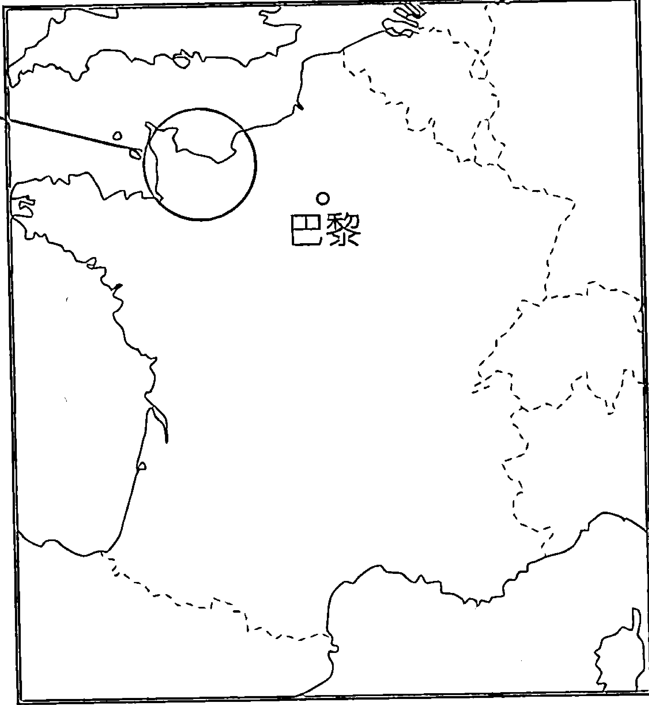

# No.073 恐懼也要有正確的觀念

時至今日，人類就連原子的火——核能——都可以引為己用。

許多人只要聽到核能就會想到可能有輻射這種恐怖的東西產生，避之唯恐不及，但光是這樣不明究理地害怕，根本毫無意義。害怕核能是很正常的事情，不過應該先擁有正確的知識、正確的恐懼才是。

否則（事實上的確有不少從相當不錯的學校畢業的人也會說這種蠢話），如果有人相信電磁波對身體有害，很可能就會說「我在家裡都不要碰電腦，在家裡用手機就好了」。聽到這個說法覺得傻眼是很正常的，因為行動電話發出的電磁波要遠大於電腦；說到這裡（又有驚人之語了），似乎還有些人會回答說「手機發出的是電波，不是電磁波」。

殊不知電波就是電磁波啊。

電磁波對身體有害這個說法，尚未受到證實，只不過它有可能會對身體造成影響（至今還沒有此類實驗證明資料）。所以說，如果只是說儘量要避免電磁波（雖有杞人憂天之虞）倒還算是合理的判斷。

不過，為此捨棄電腦而就手機可說是傻瓜才會幹的事情。

如果電磁波真那麼可怕，那麼比起手機是以強大電磁波在頭顱附近強力放送（電磁波的強度與距離的平方成反比，把距離拉開則強度就會瞬間降低），電腦不是令人安心許多了嗎？

再說到核能，許多人也都無法區分「輻射線」和「輻射能」。

所謂「輻射能」就是指放出「輻射線」的力（或指擁有此力量的物質）之意（擁有輻射能的物質亦稱放射性物質）。

真正會對人體造成影響，其實是輻射線。且不說地球隨時都沐浴在來自宇宙的微量輻射線之下，少量的輻射線其實還能造成正面的影響，譬如鐳溫泉就是因為鐳所釋放的少量輻射線而被視為對人體有助益。話雖如此，暴露於大量輻射線之下還是可能會造成死亡、癌症或白血病等後果。

輻射能之所以恐怖，就是因為它會釋放輻射線，可是卻也不必每當有輻射能外洩就怕得要命。首先我們應該判斷，外洩輻射能所釋放的輻射線是跟鐳溫泉差不多呢，還是輻射線已經達到了危險的程度？如果只是跟鐳溫泉差不多的話，那就應該把重點放在檢討為何外洩，不必感到害怕。

假如每次都要擔心這些其實毋須害怕的事情，那麼需要擔心害怕的事情還多著呢。這麼一來，等到總有一天習慣了這種恐懼感，就會像狼來了的故事那般，遇到真正該害怕的事情時，反而不懂得要害怕了。

意思是，如果只是鐳溫泉等級的輻射能外洩也擔心受怕，萬一真的有危險級的輻射能外洩時，豈不是反而來不及逃跑了嗎？

## 第 3 章
# 火的故事

# No.070 不知火
## Shiranui

熊本縣至今仍舊能夠觀察到不知火，它究竟是什麼？果真是虛幻之火嗎？

### ◎海面發光的神秘光炎

所謂不知火，是指熊本縣八代海（舊名：不知火海）北部附近海面的神秘火焰。這種現象唯獨天氣晴朗且日夜溫差大的時節可見，風雨的日子看不到。起初只有一兩個（謂為親火），有時火光會左右分離、呈水平排列，有時則會上下分離。

古代《日本書紀》的「景行天皇記」便曾經記載到不知火。從前天皇乘船渡海要前往熊本，可是當時已經入夜，不知道哪邊才是海岸。當時「遙處視見火光」，朝著那道光前進，這才靠了岸。靠岸後，又去詢問那把火究竟是誰人點的，可是周圍遍尋不著點火的人。「茲地有不為人知非人之火」，換言之，這火乃是人外之火。「故名其國曰火國」，據說這便是火之國此名的由來。

鮮少有人知道熊本之所以稱作火之國，其實並不是因為阿蘇火山，而是因為不知火的緣故。

從前傳說不知火海的海底有座龍宮，每到舊曆八月一日（新曆則是九月後半）就可以看見其燈火浮現於海面。俳句以不知火為秋天的季節語，或許就是因為這個緣故。

然則《日本書紀》的記載中卻有矛盾存在。不知火本是位於海面的火光，沿著不知火前進根本不可能抵達陸地。生物學家神田右京曾於《不知火・人魂・狐火》書中指出這個矛盾之處，並且以科學方法提出分析。

如今這個謎團已經解開，原來所謂的不知火就是海面漁船的燈光，因為某種海市蜃樓現象轉而映照於上空，又或者是因為空氣溫度差，使得一道光分裂成好幾個火光的現象。

> 《日本書紀》：請參照P.220頁No.018的註注。

早自古代便已經存在的不知火

不知火
熊本縣八代海（舊名不知火海）
北部海面的神秘火光

看得見
天氣晴朗、晝夜溫差大的時候

看不見
風雨的日子

《日本書紀》的不知火
天皇乘船前往熊本。
△
入夜以後看不見海岸。
△
朝著遠方的火光前進，抵達岸邊。
△
當時沒有人點起燈火。
右曰：鳥山石燕《今昔畫圖續百鬼》的「不知火」也描繪了《日本書紀》不知火的場景。

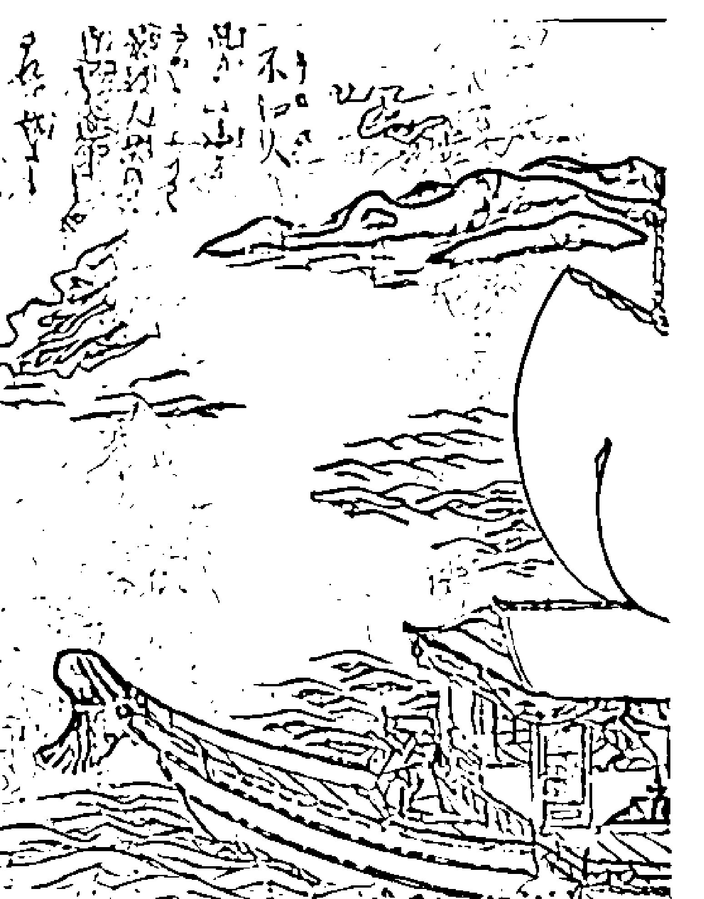

不知火海

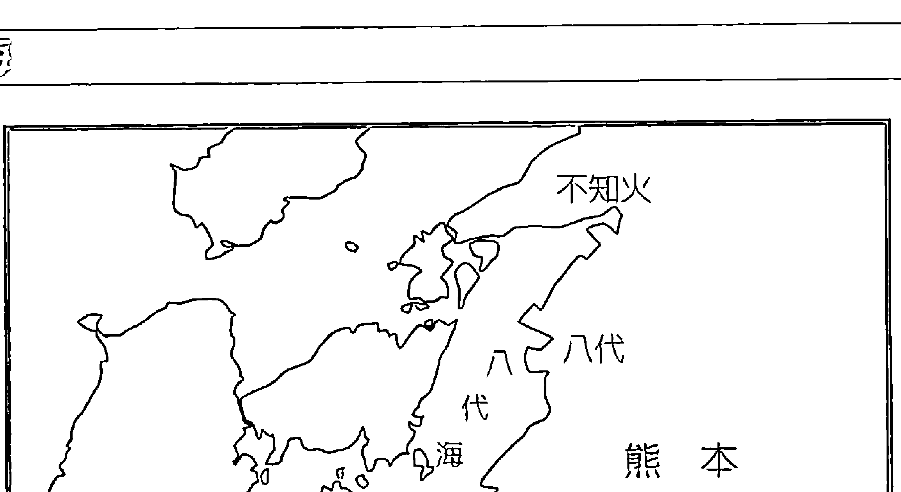

相關項目
○火之國→No.097

# No.071 狐火 Kitsunebi

日本人相信暗夜裡看見的火光是狐狸點的燈光，謂之「狐火」。狐火通常讀作「Kitsunebi」，有些地區則讀作「Kitsuneppi」。

### ○不迷惑欺騙人類的狐火

關於狐火，有狐狸口吐火焰、狐尾燃有火光、狐狸手提燈籠等各種說法，其中最末項亦可稱為「狐狸提燈籠」。

狐火分成兩種，有單獨發光，也有連續好幾個火光同時出現的，後者甚至有「狐狸娶媳婦」之說。日本人也會以「狐狸娶媳婦」指稱太陽雨，不過涵意不同。有時候月亮會在不應該出現的時候出現在天空中，日本人稱之為狐月。無論狐火或狐月，這些現象都出現在狐狸迷惑欺騙人類的故事當中。

東京都北區王子有座王子稻荷神社。據說這一带在江戶時代是整片的耕田和原野，正中央還有棵大朴樹。傳說每年除夕夜，全關東地區的狐狸會聚集到這棵樹下，正裝前來參拜關東總社王子稻荷神社；據說眾家狐狸聚集在朴樹根部以後就會燃起狐火，附近的農家會觀察此時的狐火，猜測「今年狐火數量多，應該會豐收」或「狐火很少，稻子的收成恐怕不理想」，藉此卜算當年的農業收成。順帶一提，歌川廣重所繪名所江戶百景之一「王子裝束朴木除夕狐火」，畫的正是此光景。

因為這則傳說，後人在這棵朴樹所在地另外建立了裝束稻荷做為王子稻荷神社的分祠，不過昭和四年卻因為道路拓寬工程，將裝束朴樹石碑連同稻荷神社都遷移到其他地方去了。現在每到除夕當天，要舉辦從裝束稻荷神社前往王子稻荷神社的狐狸遊行，已經成為該地區的固定祭典。

狐火也是俳句的冬天季節語，如与謝蕪村有「狐火骷髏雨濕夜」，正岡子規亦有「狐火湖水催寒哉」的俳句。

彷彿特意要與狐火對抗似的，另外還有種叫作狸火的現象，狸火是種會像煙火般向空中爬升的火球，卻完全不發一點聲響；有人說狸光要創造這種視覺奇景已經達到能力極限了，所以無暇再去理會聲響。

> 朴樹（Hackberry）：大麻科朴屬喬木，約70種，是很有價值的材用和觀賞植物。主要分佈在溫帶和熱帶。

## 各式各樣的狐火

狐火＝據信為狐狸點的燈火，是出現在暗夜中的火光。

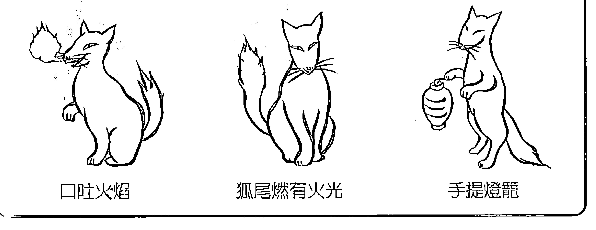

口吐火焰

狐尾燃有火光

手提燈籠

## 江戶所繪狐火

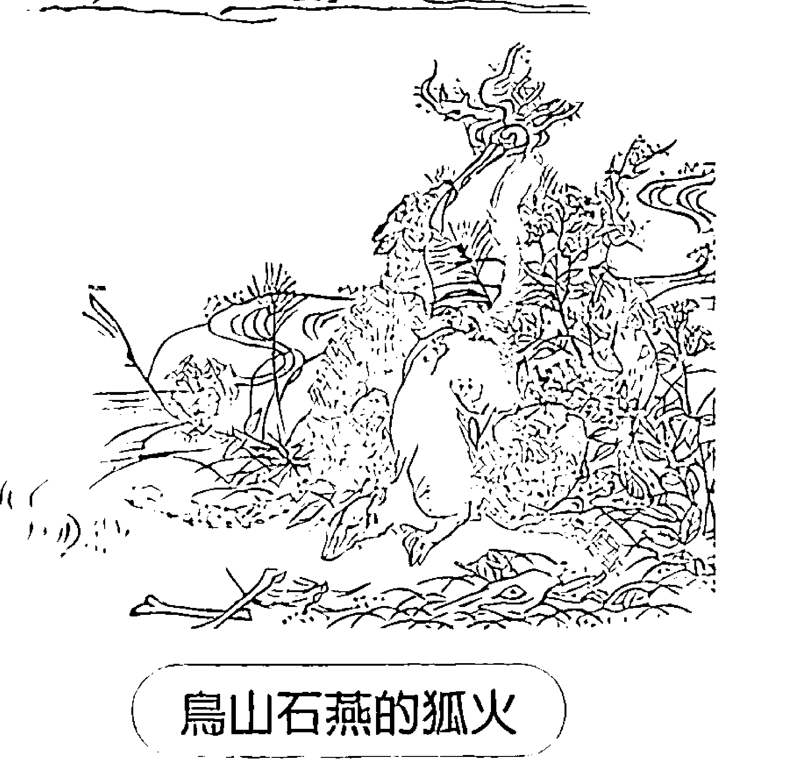

## 鳥山石燕的狐火

鳥山石燕曾經在《畫圖百鬼夜行》當中描繪狐火。這狐火是狐狸嘴巴銜著骨頭，光則是由骨頭所發出，所以這現象可以說是狐火，也可以說是鬼火。

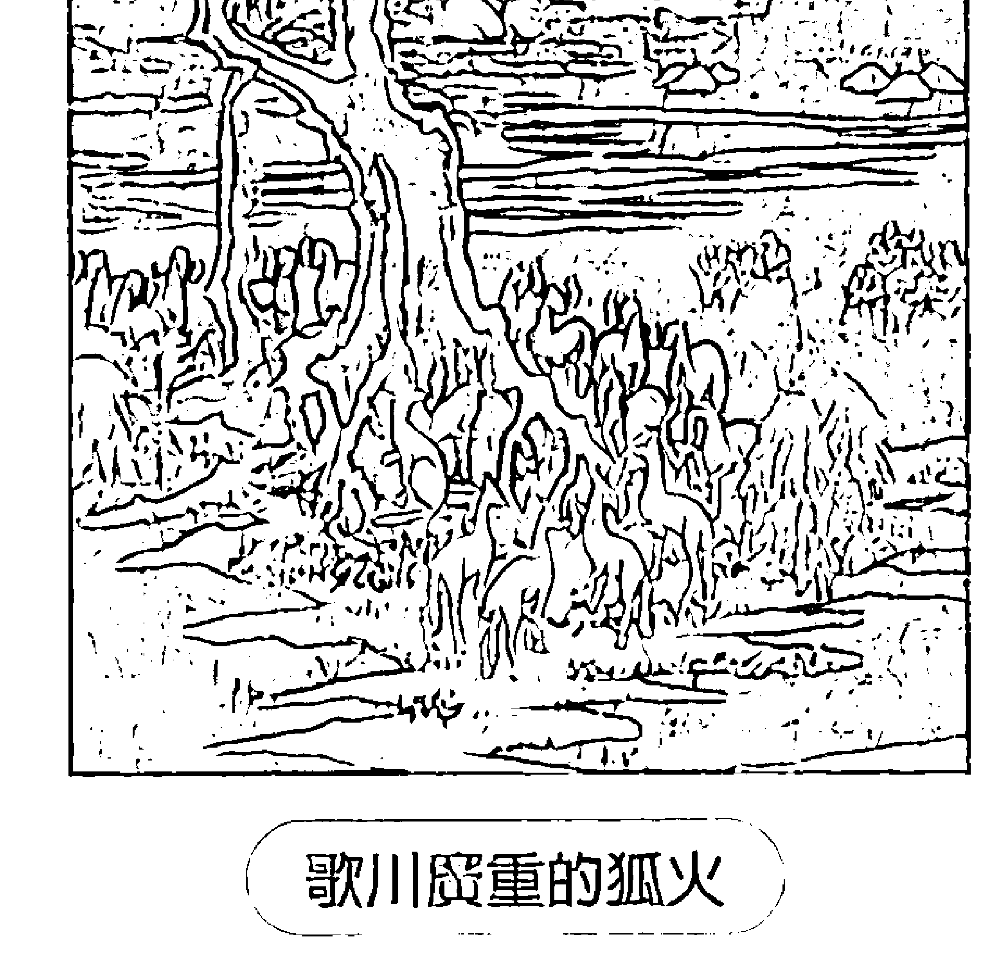

## 歌川廣重的狐火

廣重《西所江戶百景》當中「王子裝束朴木除夕狐火」，描繪的是除夕夜全關東的狐狸群聚於王子稻荷朴樹下的傳說情景。

○狸火→No.102

# No.072 圣爱尔摩火
## Saint Elmo's Fire

所谓圣爱尔摩火，就是指暴风雨之夜出现于教会尖塔或船只桅杆的青白色火光。有些地方将其视为吉兆，有的则是将其视为凶兆。

### ○桅杆末端的诡异火光

暴风雨之夜，船只的桅杆或帆桁末端可以看见青白色的火花，此现象谓之为圣爱尔摩火（原以船员的守护圣人名为唤作圣伊拉斯谟斯火，后来才演变成圣爱尔摩）。历史中共有两位圣伊拉斯谟斯，此指的是船员的守护圣人福尔米亚的圣伊拉斯谟斯（St. Erasmus of Formia），可不要搞错了。

圣爱尔摩火其实是种放电现象。当上空带电的云跟地面的电位差变大的时候，就会发生这种电晕放电的现象。

亦有俗说指出，当初是因为圣伊拉斯谟斯教会经常可以看见火花，遂有此命名。同样的，高山山顶等处也可以观察到这种现象。相信各位已经发现，圣爱尔摩火常发生于像这种明显突出于周遭环境的高度或者尖端部分。

然则在最古老的希腊罗马时代，船员都将这道火称为卡斯托耳与波吕丢刻斯<sup>1</sup>，他们相信这对双胞胎是在暴风雨之中前来拯救自己的。也就是说，他们相信放出两道光芒的圣爱尔摩火（当时应不是如此称呼），就是拯救船只免于暴风雨侵袭的火光；但如果只有单一光芒的话，这种现象就叫作海伦（双胞胎兄弟的妹妹，亦即后来引发特洛伊战争的那个海伦），这就是船只沉没的不祥征兆。

这个圣爱尔摩乃属吉兆的思想，直到大航海时代仍是根深蒂固，从前麦哲伦于绕行地球一周的航程中，看见三道圣爱尔摩火，并相信有三位守护圣人守护船只，还在暴风雨过后杀了三名奴隶作为活祭品奉献，以表感激之意。当时他们并不把奴隶当人看，所以应该是以和杀牛宰羊相同心情杀人献祭的吧。

同样的火，中国称之为「妈祖火」；妈祖这位神明正如其名，是马的祖先<sup>2</sup>。中国船员间传说在天候恶劣的夜里，如果妈祖火暗淡则船只就会沉没；相反的，明亮的妈祖火则是吉兆。

## 吉兆或凶兆？

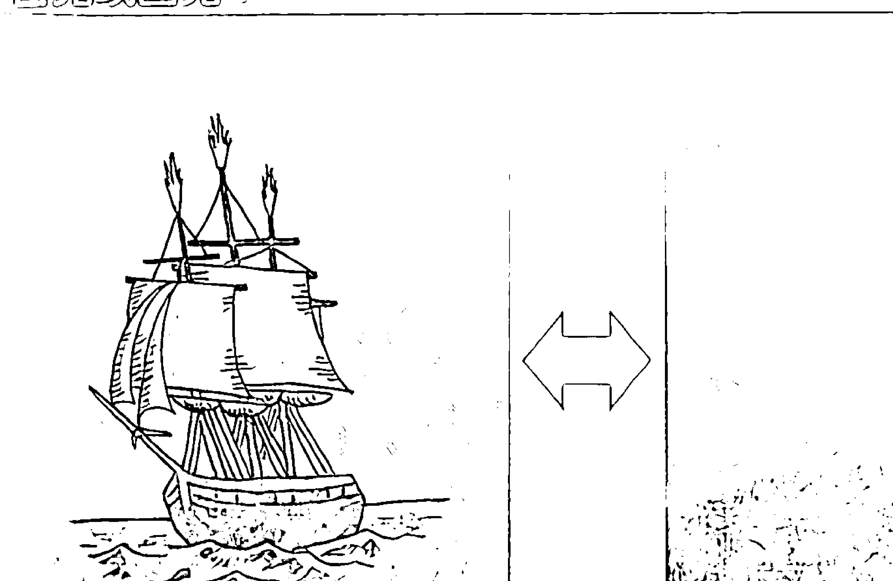

圣爱尔摩火：暴风雨夜晚出现于船只桅杆或帆桁末端的青白色火光。据说是电晕放电现象。

电晕放电：突出电极周围产生不均匀电场所引起的持续性放电现象。

### ○圣伊拉斯谟斯教会的钟楼

意大利拉齐奥区福尔米亚村的圣人。圣伊拉斯谟斯最早是受到地中海区域的船员们崇拜。据说圣伊拉斯谟斯教会的钟楼顶端，经常会发生圣爱尔摩火的现象。

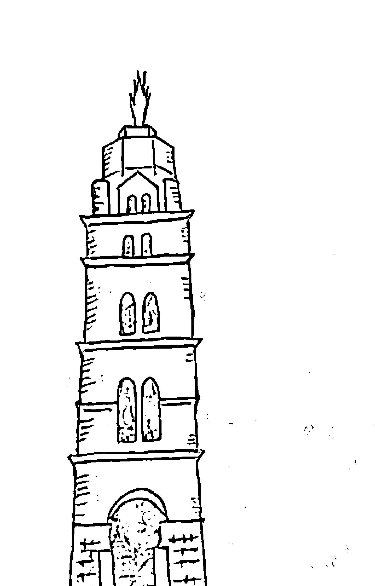

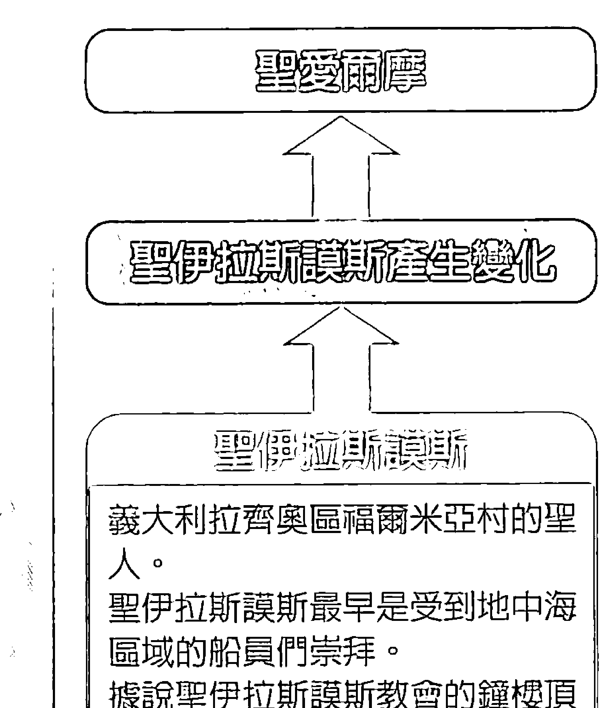

# No.073 女髮之火
## Fire from Women’s Hair

世間有所謂的人體自燃現象，而這種頭髮裡面有火的怪談，或許也可以算是其中的一種。

### ○江戶怪談

寬文十年問世的中山三柳作品《醍醐隨筆》記載有下面這則怪談：

從前有個在某戶當女僕的下女，入夜後回到閨房梳頭。她坐在沒點燈的暗房中，每梳一次就有火焰從她的頭髮中翩翩散落，嚇得她趕緊要把頭髮上的火拍掉，那火便立刻消失不見，再梳卻又出現，彷彿就像螢火蟲聚集又飛散開來那般。下女跑去跟主人講，結果全家人紛紛都聚集起來，說這種事可是頭一遭發生，然後就把她趕出門了。這女子不停地流淚，不知何去何從，後來卻意外嫁作富家的妻子，子孫甚是興盛繁榮。

本以為是很可憐的故事，卻在女子意外嫁給富豪後喜劇收場的，在中國也有同樣的故事。

另外，江戶時代的中醫師和田東郭門徒久保喬德筆記其師談話，於文政四年寫成的《蕉窗雜話》也記載有類似的故事。

松原才次郎有個名叫橋爪順治的門徒，曾經治療過一位在養病時發現頭髮裡有火的婦人。那婦人每次梳頭都會聽到啪啪的火聲，夜裡不光聽得見聲音，還看得見許多火，後來他就用一味名為三黃加石的藥方，把這毛病完全治好了。

此現象在上述故事裡完全被當成疾病看待。其實這應該是靜電所造成的現象。從前江戶時代的日本很少使用毛織品，是故體驗過靜電啪啪作響的人想必也不多。

順帶說明，儘管相當罕見，可是當周遭真正黑暗的時候，的確有機會可以看見靜電造成的火光。現今日本周遭環境經常甚是明亮，要達到真正的黑暗反而相當困難，可是江戶時代以前的日本，只要把燈吹熄立刻就是一片漆黑了，很可能就是因為此才看得到靜電的火花。

## 視為異象

下女在沒點燈的地方梳頭……
頭髮有火焰散落，就像螢火蟲飛散開來似的。
人家裡從未見過這等事情，將下女趕了出去。

## 視為疾病

有個養病的婦人每次梳頭……
發出啪啪聲響，夜裡除聲響以外還有許多火光。
橋爪順治以名為三黃加石的藥方將她完全治癒。

### 女髮之火

所謂的物體（包含人體在內）在接觸或靠近其他導電性物體的時候，就會發生放電現象。此現象亦稱靜電放電（ESD）。此現象很容易受到濕度影響，濕度僅10～20%時甚至可以超過3萬伏特。江戶時代的女性頭髮都留得很長，倘若在乾燥的地區梳頭，容易發生靜電現象也是理所當然的事情。

### 黑貓的厄兆

跟女性頭髮產生火花同樣的道理，黑貓的毛也經常會產生火花。其實，黑貓白貓產生火花的機率相同，只不過黑底比較容易被發現而已。

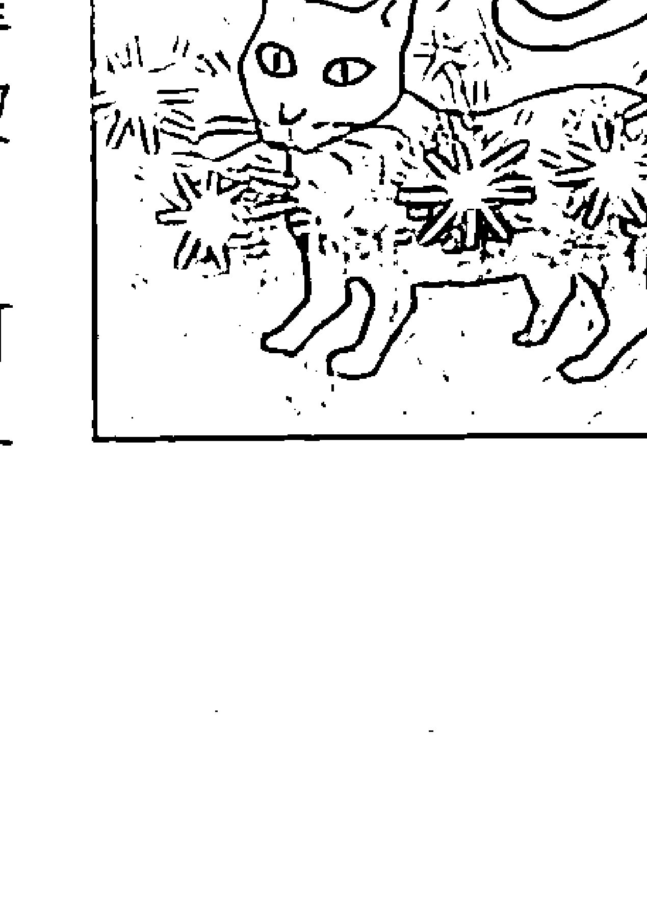

# 人体自燃现象
Spontaneous Human Combustion

所谓人体自燃现象，便是指人体毫无来由地突然燃烧起来，甚至烧到不留一点痕迹尸骸。究竟这种现象真的存在吗？

## ○谜团重重的神秘现象

1951年7月2日，佛罗里达州的六十七岁女性玛丽·里瑟被发现烧死陈尸于室内。令人不解的是，尽管她整个人已经被烧个精光，室内却无延烧的痕迹也找不出起火原因，可说是神秘的烧死事件；此后还有几起同样是周遭并无燃烧痕迹、仅人类焚烧致死的神秘事件发生，皆被统称为人体自燃现象，此现象如今已经是种广为人知的神秘学事件。

只不过，这些现象几乎皆非那种只能以神秘学说明的事件。

就拿玛丽·里瑟此案件来说，她最后曾经跟儿子说过要吃安眠药，后来也发现起火原因是香烟；也就是说，她是吃了安眠药睡着以后，香烟引燃衣服才烧死的。

燃烧起来以后，又因为长时间（玛丽·里瑟案件经检验证现长达十小时以上）的蜡烛化现象（乃指以衣服为烛芯、以人体脂肪为蜡，长时间持续燃烧的现象）造成的弱火持续燃烧，这才使得死者连骨头都被烧得一干二净（火葬场是以高温短时间焚烧，不过经过实验证实，低温长时间燃烧也能得到同样的结果）。

至于室内完全没有延烧痕迹这点，纯粹是神秘学爱好者的子虚乌有；里瑟此案当中，尸体附近的家具等物因为延烧而致毁坏，只不过水泥地板没让火势蔓延到墙壁，而天花板没有起火则可以说是不幸中的大幸。

如前所述，现今所谓人体自燃现象几乎都是因为抽烟不谨慎、引燃衣服床单等物所致，不禁使人怀疑真正的神秘自燃现象究竟是否存在。

## 人体自燃的真相

### 人体自燃事件（里瑟案）之谜

- 人类突然自燃，起火原因不明。
- 人类毫无理由便被烧得精光，连骨头都不剩。
- 尽管人类都被烧成灰烬，却没有延烧的痕迹。

### 科学的解释

- 服用安眠药睡着后，香烟点燃衣服造成火苗。
- 蜡烛化现象造成长时间燃烧，就连骨头都被烧得精光。
- 尸体附近的家具等物也都延烧烧毁。

### 宾利事件

宾利案是知名度堪与里瑟事件相匹敌的著名案件。

神秘学狂热爱好者亦将此案指为起火原因不明的神秘自燃现象，但其实这位宾利博士是位酷嗜烟斗的大烟枪，衣服老是被掉落的烟斗烧焦（他的衣服很多都有烧焦的痕迹）。是故，此案的起火原因很有可能是烟斗灰掉到袍子上，从而引起火势。

至于为何没有造成延烧，是因为宾利博士在袍子着火的时候就冲进浴室，然后就在浴室里烧死了。浴室中般都没什么可燃物，未造成延烧也是很正常的情形。

# No.075 ヘロンとアテナ神殿
## 希羅與雅典娜神殿
### Heron and Temple of Athena

相傳只要將希羅所設計的雅典娜神殿中的聖火點燃，殿門就會自動開啟，將女神神像呈現出來。

### ○古希臘的數學家

希羅是古希臘的數學、物理學家，以亞歷山卓學派的中心人物（活躍於西元前後）為世人所知。他在數學領域有解二次元方程式、求平方根近似值等諸多成績，在物理學領域也曾經就空氣的膨脹、光的反射等題目從事過研究。

這位希羅對建築似乎也有頗深的造詣，曾經設計過雅典娜神殿和巴克斯神殿。如果純粹只是設計建造建築物，對物理學家來說顏面上似乎有點掛不住，其實他還在建築中設置了各種機關。其中最著名的，當屬雅典娜神殿的自動門。

雅典娜神殿前方設有聖火臺。只消點燃聖火，過沒多久神殿大門就會自動開啟，從中展露出雅典娜的臉龐。

若把聖火撲熄，一會兒後大門就會自動關閉。

開啟大門的機關設計其實非常簡單。將右頁上圖裡的C向下拉，繩索就會牽動D打開大門；把繩索放開，則E的砝碼就會拉動反方向的繩索，將大門關閉。那麼，究竟該如何把C往下拉呢？

點燃聖火以後，A下方累積的空氣就會受熱膨脹，接著膨脹的空氣就會推動B槽的水面。此時受到推動的水就會經過水管使得C桶愈來愈重，等到C桶比E還重的時候，繩索就會獲得足夠的牽引力了。將聖火撲熄的話，累積空氣冷卻收縮使得B的水面上升，這就代表C的水量將會減少，變得比E輕。

至於這個神殿究竟有沒有被實際建造出來，如今已不得而知。不過，像這樣的機關設計就物理學來說相當合理，只要好好按照這個設計去打造，機關應該可以順利發揮作用。

巴克斯神殿（Temple of Bacchus）：黎巴嫩貝魯特（Baalbek）朱庇特神殿的其中一個建築。巴克斯為酒神狄奧尼索斯（Dionysus）別名，是酒神與陶醉之神，算是希臘神話中較晚出現的神明，也是希臘文明最鼎盛時期（西元前334年～前30年左右）受到最多希臘人信奉的神明之一。因為出現較晚，所以狄奧尼索斯在荷馬的作品中並未擔任要角。據推測，他應該來自於色雷斯與佛里幾亞等地，原因是他有一頭黃金色的頭髮。

### 古代的機械機關

### 希羅的成就

希羅的希羅公式、希羅噴泉等成績亦頗為聞名。所謂希羅公式，就是指利用三角形三邊的長度求其面積的公式，是個至今仍在使用、泛用性頗高的計算式。希羅噴泉則是在無動力的情況下，利用水的壓力差使噴泉噴出水來的機關，設計相當簡單，經常會被拿來當作小學生勞作課的功課。

# No:076 聖火
## Olympic Flame

堪稱為奧林匹克運動會象徵的聖火，究竟始於何時呢？

### ○歷史不足百年的聖火

希臘神話的普羅米修斯神話當中有則送火給人類的神話。根據從前留下的文字記載，古希臘會在舉辦古代奧運期間點燃神聖的火焰，藉以紀念這則神話。

近代奧會從此獲得靈感而首次採用聖火儀式，是一九二八年的阿姆斯特丹奧運。或許是因為獲得了極大迴響，從此點燃聖火便成了舉行奧運理所當然的固定儀式。

後來一九三六年柏林奧運（以納粹主辦而聞名）還加入了傳遞聖火的創意，也就是說，現在傳遞聖火的跑者，其實是納粹的發明。

不過亦有說法認為聖火的傳遞儀式，其實是納粹掩護軍事目的實地踏勘調查（指侵略敵國事先調查該地區地形或交通）的掩護行為。

現代奧會的聖火首先要在希臘奧林帕亞的赫拉神殿遺跡，以曲面鏡將陽光投射聚焦，點燃女祭司（其實都是扮成女祭司的希臘女演員）手持的火炬。

聖火基本上都是以跑者運送傳遞，歷屆奧運曾經試過各種五花八門的方法將聖火傳遞到會場；其中最特異的當屬一九七六年的伊斯坦堡奧運，那時是以電波傳送聖火的數據，然後將該數據轉換成雷射光，於收信地點再度點燃聖火。其他較特別的還有潛水夫從海中傳遞，或者搭乘協和客機等。

二〇〇四年的雅典奧運時，若按常法則聖火傳遞距離太短，故採取的是巡迴世界各地奧運舉辦城市，最後再返回雅典的聖火環球之旅。

### 火的起源

普羅米修斯偷火給人類
對人類友善的泰坦神族普羅米修斯，從宙斯手中盜取火種交給人類，因此受到必須永遠被綁在石頭上、讓老鷹啄食肝臟的懲罰。

為紀念這則神話……

古代奧運點燃神聖火焰以茲紀念，為聖火之起源。

### 聖火年表

| 年 代 | 事 件 |
| :--- | :--- |
| 西元前 | 古代奧運於舉辦期間點燃神聖的火焰。 |
| 1896年 | 於雅典舉辦第一屆近代奧運。 |
| 1928年 | 阿姆斯特丹奧運點燃聖火。 |
| 1936年 | 柏林奧運的聖火傳遞儀式。 |
| 2004年 | 雅典奧運傳遞聖火環繞全球。 |

得自太陽的聖火
聖火必須是以陽光聚焦點燃，如果天候不佳的話，儀式就要順延。

### 關聯項目
○普羅米修斯→No.036

# No.077 护摩 Goma

护摩是佛教为祈祷而执行的仪式，据说具有提高祈祷效果之功用。

## ○火焰的祈祷

许多人认为护摩是佛教（尤其是密教）的仪式，这固然是正确答案，但其实它本是婆罗门教的仪式霍摩（意思为『烧』），直到五世纪前后方才密教化，为佛教吸收。是故，上座部佛教（较贴近释迦教示、重视个人修行的佛教）并无护摩仪式存在。也有人认为再往前追溯，婆罗门教的霍摩本身很可能也是受到了琐罗亚斯德教的拜火仪式影响使然。

仪式要准备名为护摩坛的场地，于该场地燃烧名为护摩木的供物并且祈祷；祈祷分成四种，分别是祈求无事的「息灾法」、愈加飞黄腾达的「增益法」、消解争端的「敬爱法」和调伏仇敌的「降伏法」。

通常行护摩唱诵的都是佛教经典，修验道执行护摩有时也会唱诵九字「临兵斗者皆阵列在前」。这个九字出自于四世纪葛洪所著道教书籍《抱朴子》内篇卷十七的「临兵斗者皆阵列前行」，从这点来说，护摩也确实受到了道教的影响。

密教的护摩愈到后期就愈加豪华、愈加有派头，因为他们相信设置愈多的祭坛，召来愈多尊佛，就会得到相当程度的验（祈祷的效果）。一般相信供奉本尊的大坛、焚烧护摩的护摩坛、供养十二天的十二天坛，再加上供养欢喜天的欢喜天坛，这四个祭坛是最强的组合，不过平安时代却禁止民间设置这四坛行使祈祷，因为唯有国家才能够执行如此强大的修法。

修验道同样也会焚烧护摩，多是以在屋外行使的柴灯护摩（或称采灯护摩）为主。此仪式是以竹叶、组绳、御币等物制作结界，中间用原木排列成井字状，再拿带叶的树枝堆在上面焚烧；这种护摩远比密教的护摩来得大型和粗犷豪迈许多。

> 关联项目 ○琐罗亚斯德教→No.028

# No.078 しょうりゅうながし
## 精霊放流
### Shouryounagashi

精霊放流是日本盂蘭盆節'的行事，是將盂蘭盆節當天返回家中的祖靈連同供物、燈籠以船隻放流。

### ○安靜的精霊放流與喧囂吵鬧的精霊放流

所謂精靈放流，就是指將死者亡靈送回冥界的祭祀儀式，亦有說法指出其與雛人偶放流間的關聯性。大部分地區的精靈放流都是在八月十五日或十六日舉行。此儀式同樣都是利用火將死者亡靈送走，故與送火屬於相同系統。
精靈放流尤以長崎縣最爲有名，每每吸引許多觀光客聚集，但其實這儀式遍見於日本全國各地，各地區都要各自製作船隻，目送死者流去。精靈放流通常都是在玩具船大小的船隻點上一盞燈籠，將其放進河川乘著流水而去，亦稱燈籠放流。
不過近年來考量到環保問題，許多自治團體紛紛禁止實際放流進入河川，有些自治團體則會在河川下游拉網回收。

名氣最盛的長崎精靈放流儀式，其實跟日本人一般印象中的精靈放流有很大差異，每年八月十五日會舉行非常豪華盛大的祭祀儀式。長崎送流的船隻較大，可以多掛幾個燈籠，幾個人在前面拉著的同時還要燃放爆竹，熱熱鬧鬧地在街上游行，老實說是個非常吵的祭典（聽說還要帶耳塞），讓許多因爲佐田雅志的歌曲〈精靈放流〉慕名前來的觀光客都嚇了一跳（儘管歌詞中『華麗的精靈放流』已經暗示了儀式的盛大）。

精靈船分成全鎮共同製作和家人共同製作兩種。
全鎮共同製作的，乃是各城鎮送流該地區祖先的船。
相對的，家人共同製作的則是新盆家庭用來把今年剛過逝的家人送往冥界的精靈船，從數十公分的精靈船，到超過十公尺的大船都有。若哪家商店的主人過世，則可以在精靈船寫上大大的店名，許多船也會掛上故人喜歡的東西。如果船上掛的是小朋友的玩具（確實有這種船），總是會引人想像失去兒女的父母是何等心情，因此是個喧囂中帶著哀淒的祭典。

利用火將亡者送往冥界的方法
精靈放流
◎將死者亡靈送往冥界的祭祀儀式。
◎大部分地區是在8月15日或16日舉行。

# No.079 送火
## Okuribi

京都五山的送火仪式，可说是日本盂兰盆节最具代表性的行事，每年也吸引了众多观光客，而这个仪式是始于何时的呢？

### ○以火送迎死者

所谓送火，就是指焚烧火焰，将盂兰盆节当天回来的死者亡灵再送回冥界，一般是在八月十五日或十六日举行；精灵放流点燃的灯火亦属于送火的一种。

通常都是在门前或墓前等处焚烧送火，将祖先送回冥界。举行送火的同时，也经常会将盂兰盆节供奉死者的供品、为迎接死者而以茄子或小黄瓜制作的马匹等物一起用船放流，换句话说就是与所谓的精灵放流仪式同时并行。

相对于送火，迎接盂兰盆节当天归来死者亡灵的火，则称作「迎火」。此仪式经常选在八月十三日进行，不光是家门口，许多人也经常会跑到山上、墓前、寺院、十字路口等处去焚烧迎火迎接祖先，然后再提灯在前面带路，把祖先带回家里，此仪式又称作迎精灵。

这种仪式在京都等都会地区，早从室町时代便已经是固定的年中行事，江户时代以后更是全国各地都会举行。

最有名的送火，当属京都的大文字送火。由于相关纪录已不可考，亦无法得知此仪式始自何时，可以确定的是至少江户时代便已经存在，至于江户时代以前则是不得而知。

大文字送火是在每年八月十六日的八点举行，此仪式如今亦唤作「五山大文字」，乃战后才有的称谓；因为战前除五山以外还有其他山也会焚烧送火，不光是这五座山而已。

现在每年则是在六个地方焚烧送火：如意岳为「大文字」、西山、东山为「妙法」、船山焚船形火、左大文字山焚「左大文字」，而曼茶罗山则是焚鸟居形火，并将其中的「妙法」视为一体，合称为五山。

奈良县高圆山每到八月十五日也会举行大文字送火，不过这里的送火其实原是镇慰太平洋战争战死者的慰灵祭，历史较短。

### 火的两个功用

迎火
迎接祖灵的火。盂兰盆节等节日用的旋转灯笼亦属于迎火的一种。
送火
将盂兰盆节返家的死者亡灵再度送回冥界的火。

### 日本最大的送火仪式

# 关联项目

○精灵放流→No.078

# No.080 過火
## Hiiwatari

對從事修行者來說，過火乃是展現其人的驗（修行的成果）的苦行，並非魔術之類的技倆。

### - 誰是有本事過火的達人？

此乃修驗者和行者等人從事的諸多苦行之一。修驗道、密教、神道教等都會從事過火儀式。
所謂過火，就是指光腳踩踏燃燒的火焰走過。
佛教相信從火焰中走過，便能夠跟召請到火焰當中的本尊（多為不動明王等與火有關的佛）一體化、澄清自我精神並使祈願得償。
修驗道也經常會利用舉行柴燈護摩過後留下的殘火，舉行過火儀式，想必是認為沐浴於神聖火焰之中，便能使人得致更加純淨的狀態吧。
事實上，累積相當修行者過火完全不會有任何燒燙傷，所以許多人往往會以為這是奇蹟或是超能力，但其實它是個有科學根據的現象。
首先，過火都是踩踏木炭或者已經炭化的木頭行走。這些物質的比熱（使物體溫度上升一度所需熱量）很低，雖然溫度很高，熱量（使其他物體溫度上升的熱力）卻很少。相對的，人體的主要成分——水的比熱卻是極高，需要大量熱量方能提升其溫度，所以腳的溫度不會急遽地上升。再有者，已成殘火的碳或木炭表面經常都已經有灰，灰的熱傳導效率（傳導熱量的速度）低，不容易將木炭的熱量傳到腳上。
因為前述各種理由，據說只要下定決心迅速向前走，在腳底還沒燙傷（至少還沒嚴重燙傷）以前就可以通過了；如果害怕膽怯、想要輕輕踩過，熱反而會傳導至腳底，導致燒燙傷。
的確，能夠過火的都是那些精神經過鍛鍊、可以放膽迅速走過火紅燒炭的人；若單就精神面向而言，或許過火確實能夠展現修行的成果。

### 烈火苦行的代表案例

從事過火者以修驗者為最多，不過固定行事當中亦不乏可供普通人嘗試過火的活動。

通常過火都是踩踏燃燒的木炭行走。修驗道的過火則多是將柴燈護摩燒過的殘火鋪在地面，踩踏而過。

另外還有種跳過細長火焰的行事，亦稱過火。

### 世界各地的過火

> 世界的宗教從事者都會從事過火。譬如《舊約聖經》〈以賽亞書〉43章就有：

> 你從水中經過，我必與你同在。
你透過江河，水必不浸過你。
你從火中行過，必不被燒，
火焰也不著在你身上。

或不定從前的猶太教修行者也有從事過火的經驗。

# 相關項目

- 不動明王→No.041
- 火焰→No.077
- 探湯→No.081

# No.081 探汤
## Kugadachi

所谓探汤就是指修验道、密教、神道教等修行者，把手伸进鼎沸蒸腾的热水中，取出沉在热水底下物品的苦行。

### ○藉滚烫热水从事的苦行

此修行通常写作「探汤」，亦可写作「盟神探汤」、同样读作「くがだち」(Kugadachi)。之所以这样写，是因为此举在古代日本其实并非修行，而是种审判；伸手从沸腾热水下拿出水里的东西时，有罪者就会烫伤，无罪者则不会。
根据《日本书纪》记载，应神天皇九年四月武内宿祢受其胞弟甘美内宿祢进谗言诋毁，武内宿祢虽然辩解，天皇却不知何者所言为真。于是乎，《日本书纪》记载「天皇遂敕请神祇，使探汤」，两人便在天皇的命令之下执行探汤，结果由武内宿祢获得胜利，甘美内宿祢本应处死，却因为天皇的命令而保住了性命。
像这种在神明面前当作审判执行的探汤，后来渐渐没落散佚，而苦行的探汤则是流传直到今日仍然存在。
看似奇迹或者超能力，其实只要按照步骤进行便毋须求诸于超能力，仅以物理原理便能说明的现象。
首先，人的手腕都有细细的汗毛，手伸进热水的时候仍然会有气泡残留于表面（保持身体干燥并直接泡进洗澡水，立刻可以证明），可以遮断热的传导。其次，使用陶瓷等跟水比重差较小的物品，该物体就会在热水中上下移动，只要抓准时机，待物体浮到较浅处时瞬间将其取出，就可以避免烫伤。
不过当然啦，尽管其中并无奇迹存在，可是看准转瞬即逝的时机抓取摇晃物体的技术，以及迅速将手进出滚烫沸水的胆量，皆非常人所能为。

### 古代的审判

### 另一种探汤

现代的探汤还有另外一种形式：
① 以取竹枝（或其他带叶的树枝）沾热水用力挥舞，以热水飞沫沐浴全身。
② 目的是要向神明示以至诚，祈求神明的守护。
③ 原理跟伸手也是一样，热固然是很热，不过全身同一时间仅沾到少许水沫，或许局部部分区块多少会变红，但倒还不至于烫伤。

# No.082 ひふせ
火伏

火非但能夠帶給人類以恩惠，同時卻也能夠引發恐怖的火災，故遂有火伏咒力存在之必要性。

## ○保護人類免受恐怖火災侵害

日本幾乎全都是木造建築，所以火災和地震並列為人們最恐懼的事物。人們畏懼火，懇切地尋求能夠免於火厄的事物，此即火伏，這也是日本為何會有這麼多擁有火伏機能神明存在的緣故。

秋葉神社和愛宕神社是神道教最具代表性的火之神社，是故理所當然亦以火伏之神為人所知。秋葉神社的正式名稱喚作秋葉山本宮秋葉神社，本宮位於靜岡縣濱松市，祭祀的是火之迦具土大神（迦具土神）。日本全國共有將近千座秋葉神社，大多數分布於東日本地區，似乎是因為西日本皆以愛宕神社為火伏之神，而愛宕神社在西日本的分佈也相當廣泛。

此地本是修驗道的修行場，神佛習合¹時代是祭祀秋葉大權現的神社（所以當時隔壁還有個秋葉寺）。秋葉大權現在別名亦稱三尺坊大權現，相傳是觀音菩薩於本地的垂迹²。自從明治時代的神佛分離運動以後，此地如今祭祀的是火神迦具土。

此神社的例行大祭是於十二月十六日舉行。

東京也有秋葉神社；該神社本是祭祀迦具土的鎮火社，但只要提到火伏就會讓人聯想到秋葉神，遂遭誤稱為秋葉神社，並就此固定下來。同樣也是因為這個誤解，才會有現在的秋葉原這個地方。順帶說明，東京腔的「秋葉」讀作「あきば」（Akiba，至少從江戶時代開始就是如此），所以「秋葉原」本該讀作「あきばはら」（Akibahara）才是。不過明治時代將神社遷走、在此設立車站的時候，當時的官員認為「あきは」（Akiha）才是正確唸法而擅自決定使用此讀音，所以現在「秋葉原」才會唸作「あきはばら」（Akihabara）。

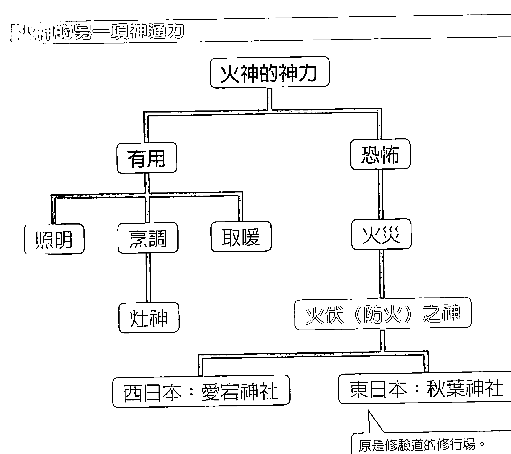

### ◇ 行火伏的諸神

火伏其實並非僅限火神可以行使。
舉例來說，日本各地都有祭祀火伏地藏，甚至每個地方也都有傳說指出發生火災時，火勢只燒到地藏堂就停止了，或是逃到地藏面前的人得救沒被燒死之類的故事。地藏是守護現世眾人的菩薩，保護眾人免於火災說起來也是很正常的。
其他擁有火伏機能的，譬如像觀音菩薩或大黑天等佛教系統的諸神（佛），甚至是石頭或男根等咒物，形態可說是五花八門。
不過回頭想想，這些全都是古時候的人們因畏懼火災、為求神明保佑而形成的產物，與其嗤笑為迷信，試著誠心祈禱倒也無妨，不是嗎？

¹ 神佛習合：指結合了日本原生神祇與外來佛教的信仰。早在奈良時代，佛教寺院裡便祭有日本神，而神社內則是建有神宮寺。到平安時代本地垂迹說才正式開始流行，始有兩部神道等信仰成立。又稱作「神佛混淆」。

² 垂迹：指佛陀或菩薩為救眾生而變幻模樣現身於凡世，或指其暫時的形貌。日本更將傳統固有的神祇視為佛陀或菩薩的垂迹。

+   相關項目
• 迦具土 → No.018
• 愛宕神社 → No.083

# No.083 愛宕神社

## Atago Jinja

不光是秋葉神社而已，愛宕神社亦是西日本民眾奉為火伏之神信仰的神社。

### ○西日本の火伏之神

愛宕神社是與秋葉神社各據日本半邊天的火伏之神。不同的是，秋葉神社祭祀的是火神迦具土，愛宕神社祭祀的卻是遭火焚而死的伊邪那美（伊邪那美）。

秋葉神社以東日本地區為中心有近千座分社，愛宕神社則是以西日本為中心，同樣也有近千座分社。大致來說，秋葉神社的火伏之神屬於東日本，而愛宕神社則是西日本。

愛宕神社位於京都的愛宕山，是從前和氣清麻呂祭祀愛當護大權現的神社。神佛習合的時代，此處也是將天狗太郎坊奉為本地佛勝軍地藏（指將佛教的勝軍地藏結合日本神，主張其乃以天狗太郎坊姿態顯現）祭祀的天狗寺，是以篤受武士崇拜，此處甚至還以從前明智光秀討伐信長時，曾經連續抽到三支「凶」籤的故事而聞名。

愛宕神社之所以擁有火伏之神的神格，與其地點亦頗有關聯。據說此地位於京都西北（所謂裏鬼門），同時還是個容易有落雷發生的地區。

至於為何祭祀的是伊邪那美？那是因為民眾相信伊邪那美受烈火焚身而死，像這樣的一位神明，想必也肯為人們抑制火災才是。除此之外，愛宕神社還祭祀稚產靈神、埴山姬命、天熊人命、豊受氣昆売神四位神明，加上伊邪那美便是五穀豐登之神，據考此信仰應該與火耕法有關。

除愛宕神社以外，仍有其他形形色色的火伏民間信仰，諸如蓋房子時在橫樑供奉模擬男女性器的物品，甚至還有在山形屋頂末端寫上「水」字等近乎咒術的民間信仰。

## 愛宕神社的位置

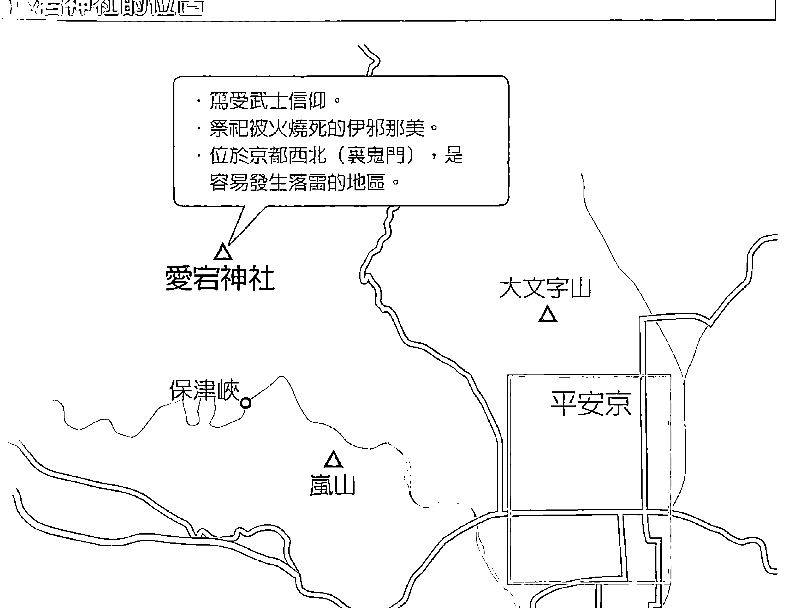

篤受武士信仰。祭祀被火燒死的伊邪那美。位於京都西北（裏鬼門），是容易發生落雷的地區。

## 形形色色的火伏

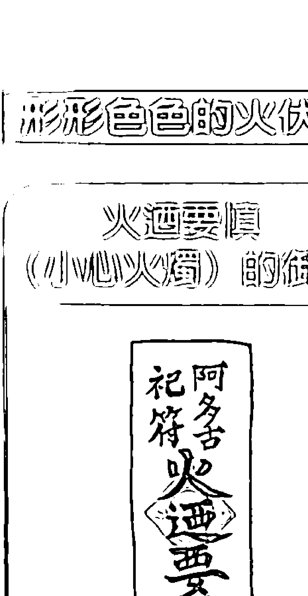

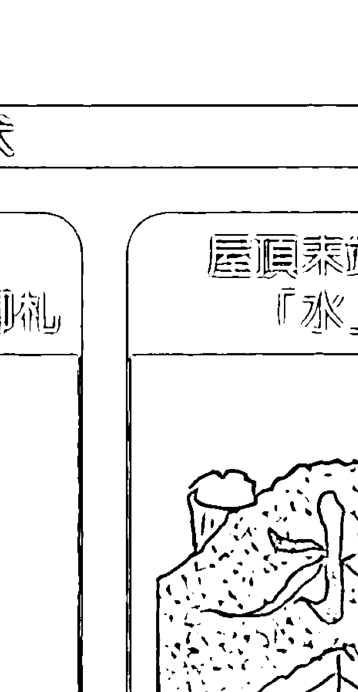

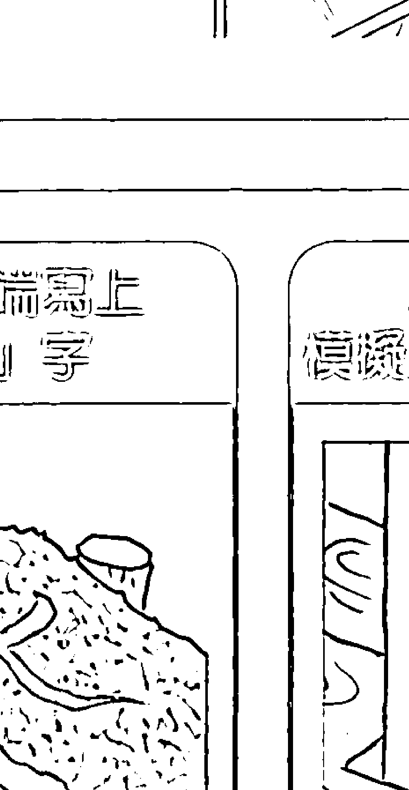

# 振袖大火
Furisode Fire

振袖大火非但是江戶三大火災，更是世界三大火災之一，然而其中卻有個充滿怪談氛圍的因緣故事。

## ○擁有異名的大火災

江戶時代的江戶不僅是全世界第一大都市，人口密度也極高，而且城裡淨是木造建築物，對火災的抵禦能力極低，是故，江戶曾經多次面臨到全城幾乎被燒掉的大火災。

所謂江戶三大火災，便是指明曆大火（振袖大火）、明和大火和文化大火，其他像於七火災和元祿火等也相當有名。

江戶三大火災當中，唯獨明曆大火有「振袖大火」這個異名別稱。從前江戶豪商大塚屋十右衛門有個女兒名叫阿菊，對偶然間遇見的寺院雜役一見鍾情。她怎麼都無法忘記那名雜役，還讓人做了一件跟那雜役所穿衣服相同花樣的振袖。或許是因為相思成病的緣故，這女孩後來在明曆元年的一月十六日逝世了，雙親把振袖披在棺木上，目送她離開。

根據當時的習慣，該寺負責埋葬事宜的寺裡男子可以把掛在棺木上的衣物收下，於是眾人便把那套振袖賣掉。可是，買下那套振袖的麹屋吉兵衛的女兒阿花卻在明曆二年一月十六日過世，那件振袖又再度披在棺木上、送到同一家寺院來。寺裡眾男子雖然有點驚訝，還是再度把振袖拿去賣掉。豈料買下這件振袖的當鋪老闆伊勢屋五兵衛的女兒阿辰，竟然又在明曆三年的同一天過逝，至於那件振袖又隨著棺木抬到了寺裡。

事已至此，也不由得不信邪，於是寺中眾人便將這事告訴住持，然後寺裡便召集三位死者的父母，替死者作法事供養。住持一面誦經文，一面以火烘烤振袖，豈料突然有陣狂風把著火的振袖吹到了本堂的屋頂，火勢從而蔓延開來。

這便是為何明曆大火亦稱振袖大火的緣故；當時江戶過半街道都遭波及，連江戶城的天守閣都被燒毀，是死亡人數多達十萬以上的大火災。

當然，這則故事並未記載在明曆大火相關歷史資料中，也有人說這是後世穿鑿附會創造出來的故事。

※振袖：未婚女性的禮服用長裝，袖子較其他服裝來得更長。是從前未成年及冠的男女穿的衣服。

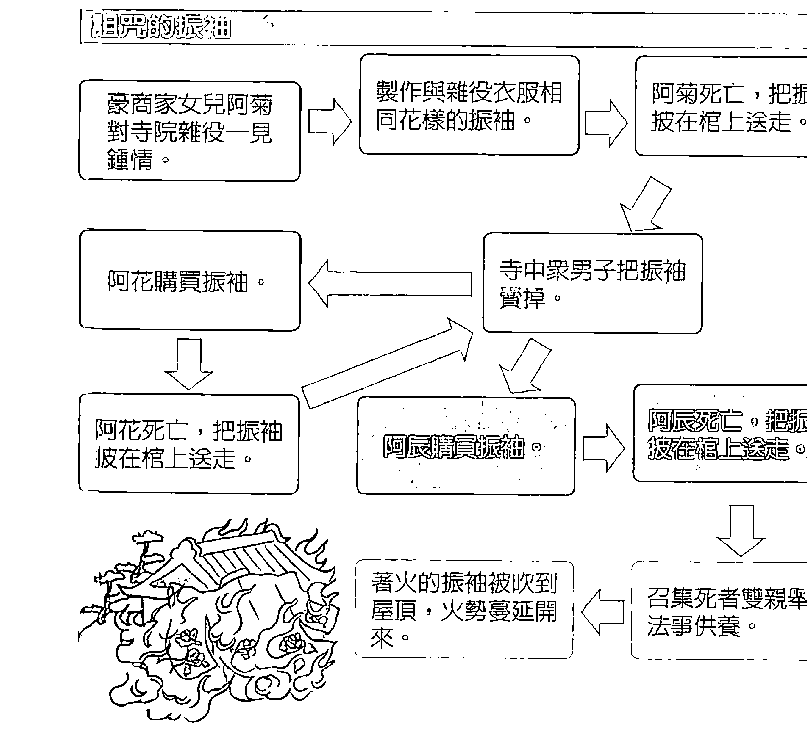

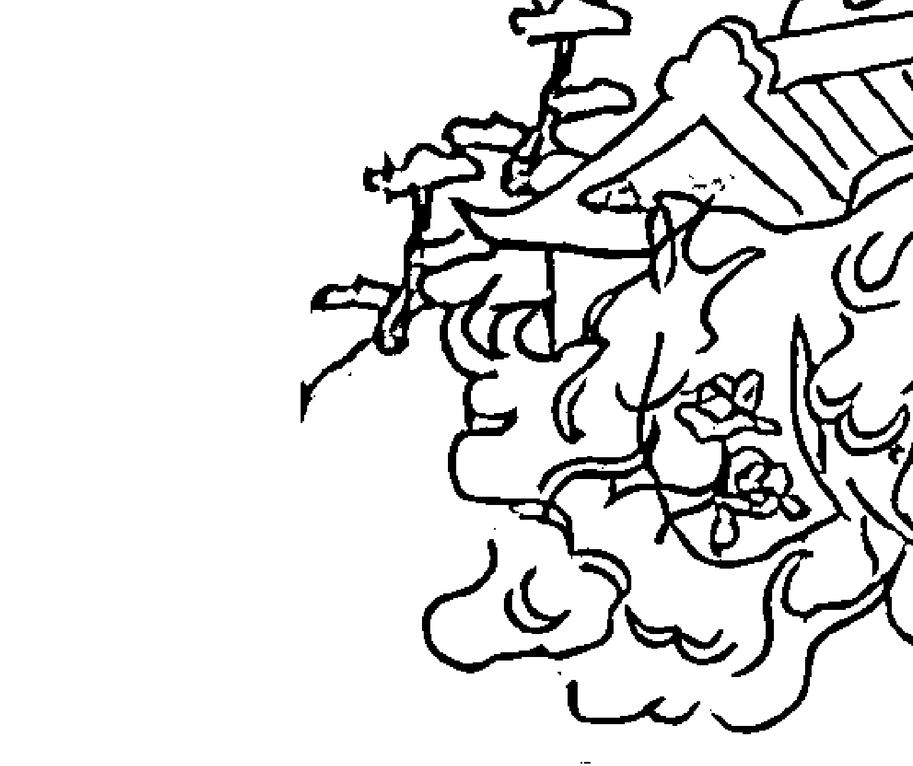

### ❖ 振袖大火的真相？

引起火災在當時乃是重罪，發生火災的寺院通常都無法獲得重建的許可，不是被迫遷移他處否則就要直接廢寺。然而，這場火災的起火點本妙寺後來非但沒有被拆除，甚至還獲得了升格。

於是乎，有些人便懷疑起火點並非本妙寺，而是寺院隔壁的幕府老中阿部忠秋的住居；如果說老家裡失火因而燒掉了整個江戶，這樣面子上實在掛不住，所以起火點的罪名才由本妙寺扛了下來。此事還另外有個旁證，那便是從那次火災以後，阿部家每年都向捐贈火災供養給本妙寺（甚至江戶時代結束以後還一直持續到大正時代）。直到今日，本妙寺本身也是主張這個說法。

※中：江戶幕府的官職名，負責統領全國政務。

+   ## 關聯項目
* 八百屋於七→No.043

# 罗马大火

## Great Fire of Rome

罗马皇帝尼禄是暴君的代名词，民间传说罗马大火便是由尼禄所引起，然而真相究竟如何呢？

## ○暴君尼禄的恶行是真的吗？

罗马大火是指从前在恶名昭彰罗马皇帝尼禄的时代，西元64年烧遍罗马的大火灾。奇怪的是，起火点是位于竞技场某个不太可能起火的角落，后来却发展成连烧七天七夜、烧尽罗马街道的大火灾。因此，纵火的说法一直有被排除遗忘。

火災平息後，尼祿先是建立起救濟組織，接著又大量輸入穀物，並以原本十六分之一的價格販售，他致力於街道的重建工作，做了許多身為當政者當為之事。

然而，不知是否有心人意欲貶低當時支持度已經開始下滑的尼祿，竟有毫無根據的流言在羅馬散播，說尼祿是為了建造自己想要的建築物而故意縱火的。

不知是否有意要制止這則流言，尼祿斷定散播流言的犯人就是基督教徒，並將其信徒處死；據說此次處刑便是羅馬帝國對基督教徒的第一次迫害，是以直到今日，尼祿都仍然被信奉基督教的諸國指為惡魔之子。

事實上，基督曾經對眾弟子預言道「同在這裡的眾人當中，有些人在目睹人子（即指基督）與那個國度（神國）共同到來之前是絕對不會死的」；換句話說，當時的基督教相信世界末日會在眾弟子仍在世的時候到來，而且唯有自己能夠得到救贖，是一種期待破滅來臨的教派宗教。當時甚至還的確有人見到羅馬大火而歡喜地手舞足蹈說「末日來了」，會遭到如此誤解也可以說是很正常的事。

尼祿讓異端者（對羅馬帝國來說的異端者）做替罪羔羊藉以維持原有體制，此舉雖然毒辣，卻是世界歷史中不斷重複發生的事，而且事後也幾乎都遭到世人遺忘。尼祿不幸的是選擇把基督教會擺上檯面，恐怕他不能想像基督教到後世會有如此蓬勃的發展，這件事也使得他在世界史上留下了極大的污名。

### # 无端受波及的尼禄

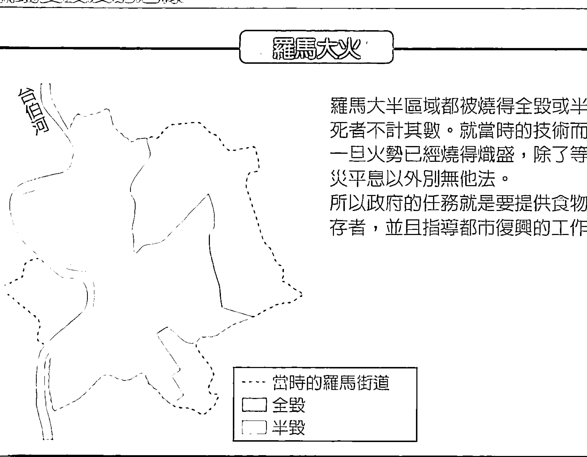

### 尼祿的政策

| 政策 | 評價 |
| :--- | :--- |
| ○建立救濟組織。 | 正確的政策 |
| ○大量輸入並以十六分之一的價格販售穀物。 | 正確的政策 |
| ○斷定基督教徒為犯人，將信徒處刑。 | 判斷錯誤 |

### 尼祿的評價

前半期無論人格或當政為帝均頗受歡迎，基督教卻指其為惡魔之子。

在後來改宗基督教的諸國留下暴君污名。

# No.086
倫敦大火
Great Fire of London

若論世界三大火災造成都市容貌的改變程度，倫敦大火無疑是世界第一大的火災。

## ○木造的舊倫敦

倫敦大火是西元1666年襲擊倫敦的大火災，為世界三大火災之一。

據說當時火苗是從麵包店的烤箱延燒到周遭，起火原因相當普通常見，不過當時的倫敦都是木造房屋且街道狹窄，火災的防禦能力非常薄弱。也就是說，倫敦的狀況跟當時的江戶其實是相同的，而江戶至少還有消防滅火組織存在，能夠發揮鎮壓火勢的效果（雖然只能採取消極的破壞消防：先破壞可能延燒的建築物以抑制火勢蔓延，不過此作法對於結果仍有極大的差別），但倫敦則是連這道準備都付之闕如。

是故，此次大火造成了倫敦市內廣達85%面積慘遭燒毀的毀滅性災情。

不過倫敦卻在災後顯現了它的偉大。

・約翰・伊夫林與王室建築副總裁克里斯多佛・列恩設置了擁有強大火災防災能力的都市計畫。雖然計畫本身因為地主反對而沒能實現，卻在法制面建立起完整的制度。

隔年英國設立重建法，規定倫敦的建築物僅限石造與磚造，同時拓寬道路的寬度，儘管未臻完美，但倫敦確實已經蛻變成防災能力遠高於從前的都市了。除此之外，列恩還參與了聖保羅大教堂等諸多教會的重建工作。

順道說回日本的江戶，當然也沒有閒著。只不過江戶既無法製磚而且又缺乏石材（就算有，在地震頻仍的日本反而更加危險），所以無法採取與倫敦相同的策略。

於是乎，江戶採取的是盡量保留避火空地，以祈將火災侷限於一定區域內，同時還採取在江戶附近堆積材木，以便發生萬一的時候可以立刻重建的方法（當時的庶民全都是租屋居住，只要帶著身家逃難就不會有損失），而那時堆放材木的地方，就是現在的木場。

### 倫敦的大火災

### 倫敦大火

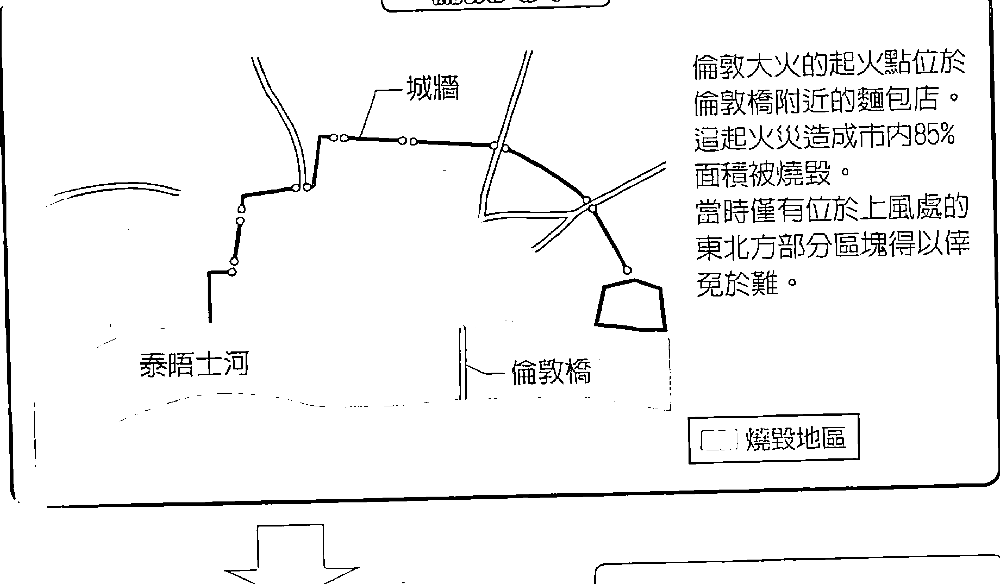

### 復興政策

+   - 建築物僅限石造或磚造。
- 拓寬道路。

同樣遭遇大火的江戶採取的復興政策則為：
・盡量保留避火空地。
・於江戶附近貯存材木以備重建。

### 倫敦大火紀念塔 (The Monument)

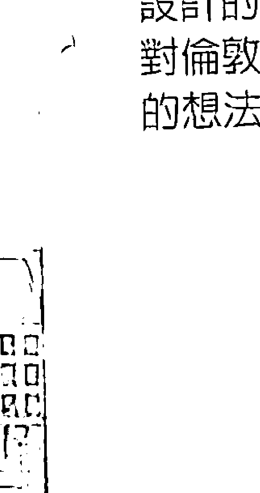

克里斯多佛・列恩與羅伯特・虎克為紀念倫敦大火而設計的紀念塔。
對倫敦市民來說，講到紀念塔就是指這座大火紀念塔的想法，已經成為倫敦市民的常識了。

### 關聯項目

+   ○振袖大火→No.084

# 毁灭世界的火灾
## Fire that destroy the World

全世界有許多洪水神話，大火神話卻是極為罕見。古代人似乎普遍都認為從前人類是因為洪水而滅亡的。

## ○曾經多次滅亡的世界

南美的瓜拉尼印第安人¹ 神話指出，世界至今已經歷過了多次的破滅。

其中的第一次毀滅，便是他們稱為「大火」的世界性火災。這次的大火，是因為創造神抽走支撐大地的支柱，致使大地火起，一般認為此說法應該是從摩擦木頭鑽木取火的概念演變而來。大地著火、世界進入永夜，同時創造神甚至還放出藍色的老虎四處吃人。

創造神此舉的原因，說法卻是每個部族各有差異，並無統一。有的神話說把支柱抽走的並非創造神而是文化英雄（指神話中將技術和文化傳授予人類的人物），有些還說是散放火焰的星星（流星或隕石）從天而降，使得大地火起。

總而言之，這場大火使得人類全數滅亡，僅剩一對男女倖存，他們躲在地面的洞穴裡，得以避開了這場災難。

雖然植物也同樣受到大火摧殘，幸好倖存下來的人類在精靈的幫助下找到未受大火波及的種籽和樹枝，並運用魔法使植物從灰燼中發芽生長（但各部族說法不同），使得大地又重新找回了盎然綠意。

順便說到第二個災厄則是喚作「長夜」，此災厄使得人們無法出門、紛紛餓死。更有甚者，家庭用品也在這期間發起叛亂：原來鍋釜等用具不願受到人類使用，遂起而欲殺害人類。這場戰役在南美地區是流傳頗廣的神話。

第三個災厄則是「大洪水」，這就比較普遍了。只不過南美較少諾亞方舟式的神話，大概都是攀登高山或高聳大樹者，得以倖存下來。

+   - **大火**
  大地火起，世界進入永夜。
  唯獨躲進地面洞穴的一對男女倖存，其餘人類全數滅亡。
- **長夜**
  人類無法離開住家，紛紛餓死。
  家庭用品發起叛變。
- **大洪水**
  大雨造成洪水。
  唯獨攀登高山或高聳大樹者得以存活。

瓜拉尼神話中的火神卡拉伊
瓜拉尼神話裡有諸多機能各不相同的神祇，當然也有火焰之神，這位火神就是卡拉伊。其神話乃以下述的詩歌形式呈現。
（偉大的傳說》，球溪充譯，松穎社）
永恆復甦的火焰
無一事物可以撲滅的火焰
令我可以起身傲立的火焰
論及此間火焰
真父卡拉伊啊，汝
願也成為諸事物的看守者。
於是乎，使彼擁有以下名號
—卡拉伊，火災之主
願彼發此名號
彼已注定了壯大的命運
並成為火災的看守者。
願新時刻來臨時
永遠復甦的火焰能舞蹈活躍

# No.088
八熱地獄
The Eight Great Naraka

許多宗教都認為地獄是罪人身受業火焚燒的世界，同樣的，佛教也不例外。

## ○幅員廣大的佛教地獄界

佛教認為贍部洲（人們居住的世界）底下有個喚作八熱地獄（亦作八大地獄）的灼熱地獄。

八熱地獄最頂層的叫作等活地獄，在這裡罪人的疑念會化成刀劍，生長在各人手上，彼此互相砍殺至死，死後還要不斷復活、繼續砍殺。但這已經是痛苦最少的地獄了。

其次是黑繩地獄，是以木匠用的墨斗在身體畫線，然後循著線條把罪人切成碎片。三是眾合地獄，罪人在這裡受到大山挾擊、龐然鐵象踩踏，壓成肉餅。四為叫喚地獄，乃以鍋釜烹煮或者油炸。五為大叫喚地獄，是叫喚地獄的加強版，痛苦更劇。

六是炎熱地獄，是以燒得火紅滾燙的鼎鑊折磨罪人，使火焰焚身。七的大炎熱地獄是炎熱地獄的加強版，痛苦更劇。至於罪行最重大的惡人要去的則是最底層的無間地獄。此地亦稱阿鼻地獄，在此會受到永無休止的酷刑。

如前所述，儘管地獄並非全然均是以火焰施加痛苦，不過提到酷刑拷打，總是會讓人聯想到火焰。

其次，這些地獄還各有十六個副地獄（也就是總共有一百二十八個地獄）附屬，每個地獄都會對罪人施以不同的苦刑。譬如黑沙地獄便是以熱風將沙吹向罪人，藉熱沙將罪人的皮肉骨全數燒盡，還有強迫罪人吞下燒融熱鐵的地獄、在罪人全身打滿鐵釘的地獄等，讓人不禁佩服人類想像力之豐富。

除此之外，佛教還有個地位與八熱地獄相互平行的寒冷地獄，名為八寒地獄，會把罪人凍得滿身凍瘡或皮開肉綻。當然，八寒地獄同樣也有一百二十八個副地獄。除八熱地獄八寒地獄以外，甚至還有針對各別罪人客製化的孤地獄，是罪人必須獨自忍受折磨痛苦的地獄。

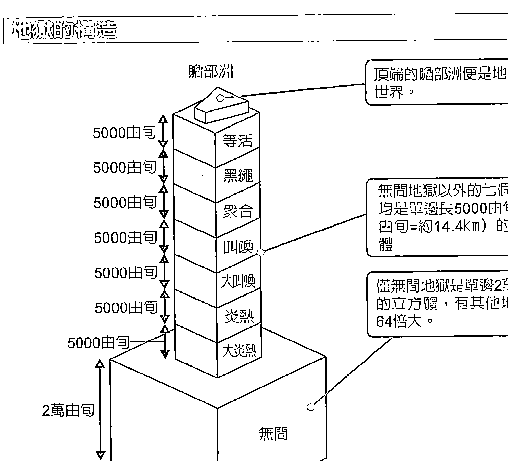

### 11地獄

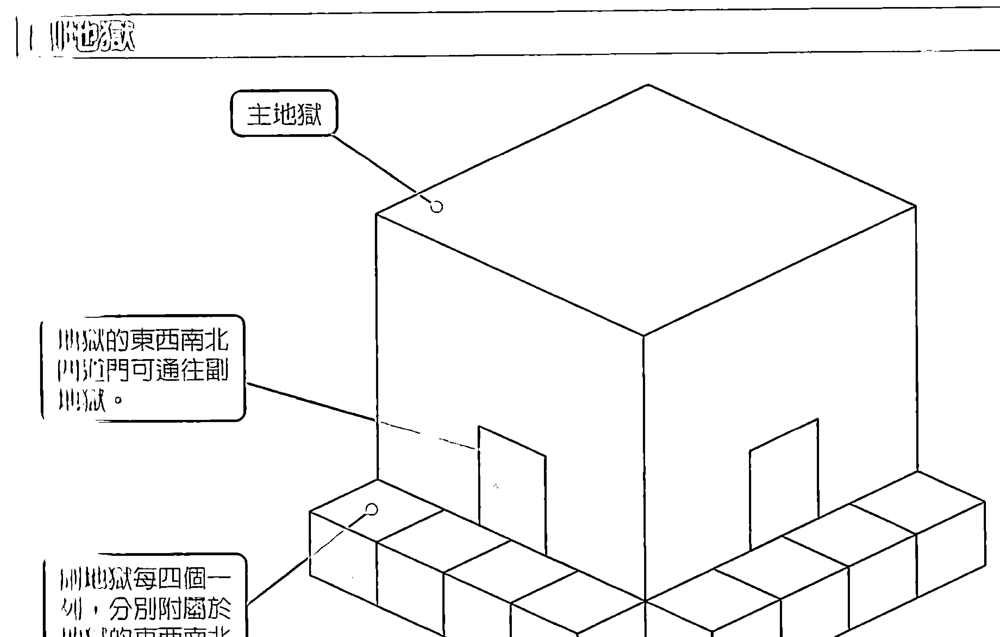

# 火焰山
Huǒyàn Shān

火焰山是中國傳奇小說《西遊記》內文提及的奇山，同時也是孫悟空所有冒險故事當中最出名的一段。

## ○西遊記最著名的障礙

《西遊記》書中提到的火焰山位於中國西南。此山常年有火、燃燒熾烈，沒有人能夠活著通過此地。

火焰山是座廣達八百里的大山脈，是三藏一行人前往天竺必經之地，可是火焰山卻散發著就連鐵打的身體都要融化的高溫，困住了三藏一行人。

其實這座山之所以會變成火焰山，是因爲三藏一行人當中的悟空從前踢翻了天庭的八卦爐，爐中炭火墜落凡間才讓山燒起來，所以也可以說是他自作自受。

奇怪的是，火焰山周圍不但可以住人，還可以種植作物，照理說應該寸草不生才是。

原來有個寶物能夠消滅這座火焰山的烈火，那便是鐵扇仙人的芭蕉扇。這芭蕉扇搧一次可以滅火，搧兩次會刮風，搧三次就會降雨。此處就是因爲有這柄芭蕉扇才有降雨，也才可以種植作物。

問題是這位鐵扇仙人其實就是羅刹女，她的兒子先前敗在孫悟空手下，雙方結下了樑子，讓悟空剛來向她借芭蕉扇就被搧得老遠。

不過悟空最後還是想辦法借到芭蕉扇，成功把火撲滅了；甚至他還搧了五十回，把火焰山的火給永遠搧滅。

這座火焰山實際存在於中國維吾爾自治區的吐魯番盆地，是一座海拔約五百公尺的低矮山脈，要越過這座山脈其實並不怎麼困難，問題就在於氣溫。當地夏天晌午時分的氣溫經常會超過七十度，人類要在這裏生存都很困難，果然是不負火焰山之名的山脈。

### 《西遊記》的火焰山

+   ●廣達800里的大山脈。
●常年有火焰熾烈燃燒。
●只能以芭蕉扇滅火。

### 真實世界中火焰山的位置

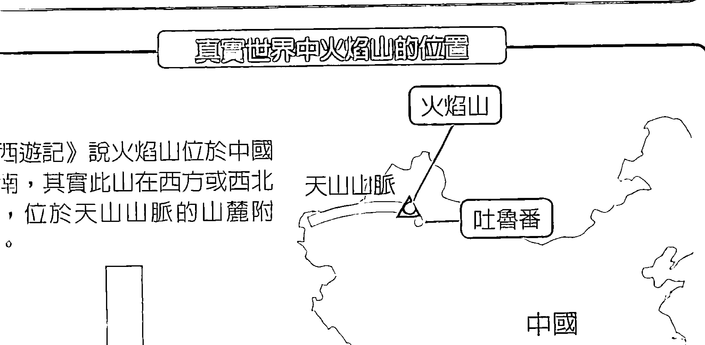

《西遊記》說火焰山位於中國西南，其實此山在西方或西北方，位於天山山脈的山麓附近。

- 海拔約500m的低海拔山脈。
- 夏天午間高溫超過70度。
- 赤褐色山脈，幾乎沒有植物生長。

### 現實世界中的吐魯番

史實中的玄奘三藏爲前往天竺而造訪吐魯番時，那裏有個名叫高昌國的佛教小國。根據歷史文字紀錄，當時國王麹文泰相當歡迎三藏一行人，並曾聆聽三藏講述教義，還爲一行人準備嚮導帶路，甚至資助旅費。

真正的吐魯番非但沒有阻礙三藏一行人，甚至還是個撫慰長途行旅疲憊身心，好讓他們能再度展開新旅程的好地方。

然則數年後三藏從天竺折返經過時，高昌國卻已經滅亡，都城也成爲廢墟。

如今在吐魯番郊外，還能看見堆積著磚瓦的高昌國遺跡，吸引觀光客到訪。

# 天使以火而造、人类以土而造
Angel made by Fire while Human made by Dust

伊斯兰教也说世间有恶魔存在、背叛了上帝，其理论根据便是认为自身乃以火而造，较为优越。

- ○以火而造者比以土而造者优越的价值观

伊斯兰教将《旧约圣经》与《新约圣经》都视为该教圣典，最后再将《可兰经》定位为其最高的圣经。是以，伊斯兰教亦有反叛父神的天使存在，那便是易卜劣厮。

易卜劣厮原本也是天使，司掌地上世界以及天国的部分地区。后来阿拉用土创造阿丹，并且命令众天使向他伏拜，除易卜劣厮以外的天使都服从了阿拉的命令。

岂料易卜劣厮非但不听从命令，还向阿拉反驳说：

>「我比他们还要优越。您是以火创造了我，却是用泥创造他」（《日亚对译・注解圣可兰》〈高壁章〉，三田了一译，日本穆斯林协会发行）。

易卜劣厮因此以反逆阿拉的罪名被打入了地狱。

后来晒依陀乃（犹太教、基督教相信反叛耶和华的天使和诱惑夏娃的恶魔是同一个人物，伊斯兰教却认为两者是不同人物，角色相当于撒旦的晒依陀乃则是易卜劣厮的曾孙）成功让好娃（即夏娃）吃下邪恶果实，对阿拉和人类报了仇。阿丹和好娃被逐出乐园，好娃从此还必须承受月经、怀胎、生产的痛苦。

相传他们被逐出乐园以后做的第一件事（尽管《可兰经》并无记载），就是前往麦加巡礼。是故，今日的伊斯兰教徒都立志一生至少要前往麦加朝圣一次。

从易卜劣厮的说法我们可以发现，当时认为火是比土更加高贵的物质，否则易卜劣厮不可能会有这样的发言。

阿丹：请参照P.012页No.003的注注。

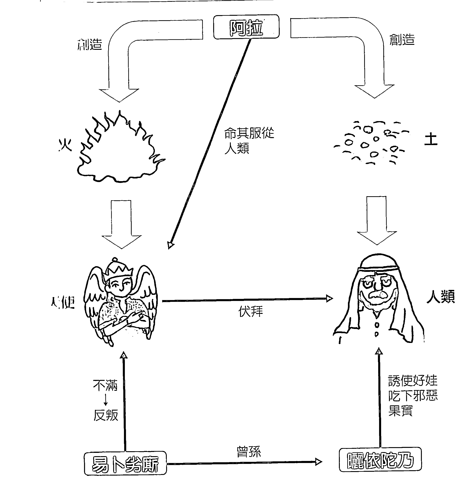

# 晒依陀乃的活跃？

除诱惑好娃以外，《可兰经》到处都看得见晒依陀乃在暗地里活动，企图使人类堕落。晒依陀乃亦曾经诱惑穆罕默德，只不过穆罕默德只是跟恶魔辩论《可兰经》的救赎，并未受到诱惑。

- 参考项目
- ○易卜劣厮→No.003

# # No.091 寿命与蜡烛（Life and Candle）

相传人类的寿命取决于蜡烛。由于这个说法流传极为广泛，使人误以为此乃日本自古流传至今的传说。

- ○死神判断人类寿命的基准
传说冥界有种决定人类寿命的蜡烛，烛火熄灭的同时，该人就会死亡。此传说自古便存在于欧洲各地，至少十六世纪就已经有相关文字纪录流传。
如今此类传说当中最著名的，当属格林童话的《死神教父》：
从前有个认死神当教父的年轻人，长大以后死神如此教导他：「死神如果站在床头就表示病人会痊愈，站在床脚就会死亡」，所以要他拿药草给有希望痊愈的病人服用。
得死神传授此法则的年轻人很快就成了名医，毕竟他只消看一眼就能判断病人是否还有救，而且只要他说「有救」，那病人就肯定会痊愈。
后来他治疗国王时，却看见死神站在床脚，于是他就让国王倒过来躺，让死神站的位置变成了床头，然后拿药草给国王服用，治好了国王。死神虽然愤怒，却原谅了他。可是后来公主生病的时候，年轻人又再次欺骗死神，结果这次他就被死神带去了冥界。
他在冥界里看见决定人类生死的蜡烛，知道只要蜡烛还在烧就代表该人仍然活着，烛火熄灭就会死亡。小孩的蜡烛比较大，而老人的蜡烛则是所剩不多。
年轻人发现自己的蜡烛已经快要烧完了，他哀求死神帮自己换支更大的蜡烛，岂料死神却为了惩罚他而故意失手把火弄熄，使得年轻人从此落入了死神手中。
这则故事在意大利还被改编成一部名为《鞋匠遇仙记》（Crispino e la comare）的歌剧，这部歌剧里的教父是位女死神，英译的版本则说是女妖精。

# 收据成落语的故事

# 寿命与蜡烛

- - ○决定人类寿命的蜡烛。
- ○存在于冥界。
- ○烛火熄灭则该人就会同时死亡。

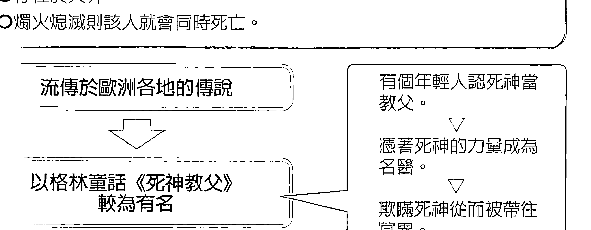

- - 年轻人手抖不慎弄熄烛火。
- 虽成功把烛火移到新的蜡烛，放松吐大气时却将烛火吹熄了。
- 成功转移烛火，死神立刻上前恭喜还帮他唱生日快乐歌，唱着唱着年轻人就很习惯性地「呼～」一声吹熄了蜡烛。

※：请参照P.223页No.043的注释。

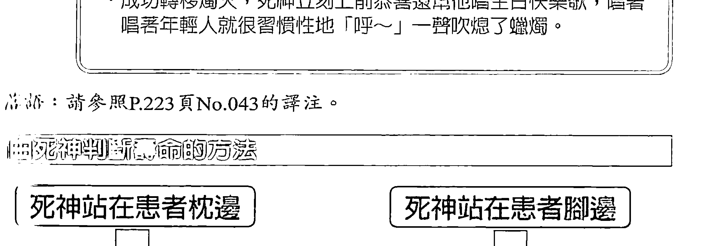

# # 稻草堆之火

## Fire from Stacks of Rice Straw

稻草堆之火在战前可是教科书必定收录的有名故事，现在却很少有人知道。

# ○救人的火

这是拉夫卡迪奥·赫恩（小泉八云）于《佛田的落穗》作品中以「活神仙」题名介绍的江户末期故事。赫恩透过这本书向西洋介绍日本并不像西洋世界只信仰基督教所谓上帝这样的唯一神，而是会将许多伟大的人分别奉为小小的神明崇拜。

这则故事发生在江户末期的和歌山县广川町（当时的纪伊国广村），安政年间的安政南海地震期间。男子五兵卫观察到海水从海岸退去，得知海啸即将来袭，于是便点火燃烧刚割下来的稻子，引导居民逃往高地（众人以为发生火灾而前来灭火），拯救了多达四百名居民免于海啸的侵袭。

这则故事后来在明治时代经过同村的教师中井常藏翻译后，收录到小学的教科书中，成为众多国民熟知的有名故事。

只不过，赫恩描述的故事跟实际发生的情况有若干差异。
首先，故事主角的名字不叫五兵卫，而是�的口仪兵卫。
其次，这起地震是发生在十二月，那时并非稻子甫收割的时节，而是收割已毕、田里只剩稻草的季节。
再者，仪兵卫取稻草点火并非在海啸来袭之前，而是海啸来袭之后，此举是要替逃难的居民指出安全的逃难路径。
最后，仪兵卫的伟大之处并不仅止于点燃稻草示警引人避难，他还从这次的灾难设想到今后村落仍然暴露于海啸侵袭的威胁之下，遂投入自身私财建造防波堤，成功地降低了多年后发生于昭和年间的东南海地震、南海地震等震灾所带来的灾害。尽管滨口仪兵卫今日的全国知名度并不高，他在广川町却被奉为该町的大恩人，受到尊敬与崇拜。

小泉八云（1850～1904）：原名派屈克·拉夫卡迪奥·赫恩（Patrick Lafcadio Hearn），1896年归化日本，改名为小泉八云。日本作家、翻译家、教师，曾向西方介绍日本的文化和文学。长于都柏林，在英国和法国上学，19岁移居美国辛辛那提，担任记者在报上发表散文、诗歌和学术论文，论述当时不寻常的主题，诸如城市黑人的生活。

# 令人敬仰的人物

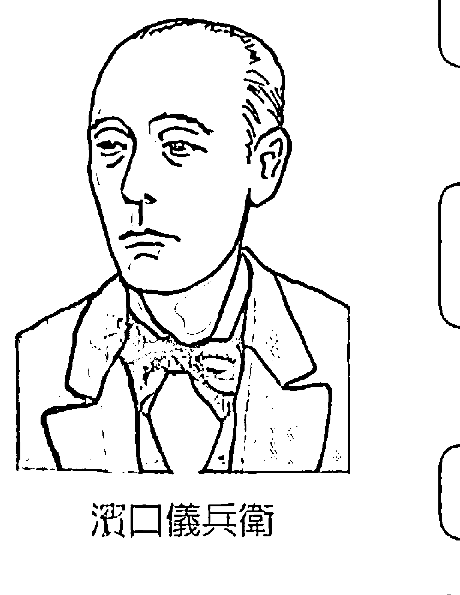

滨口仪兵卫

安政年间南海地震造成的海啸

点燃稻草指示安全的避难路线

投入私财建造防波堤

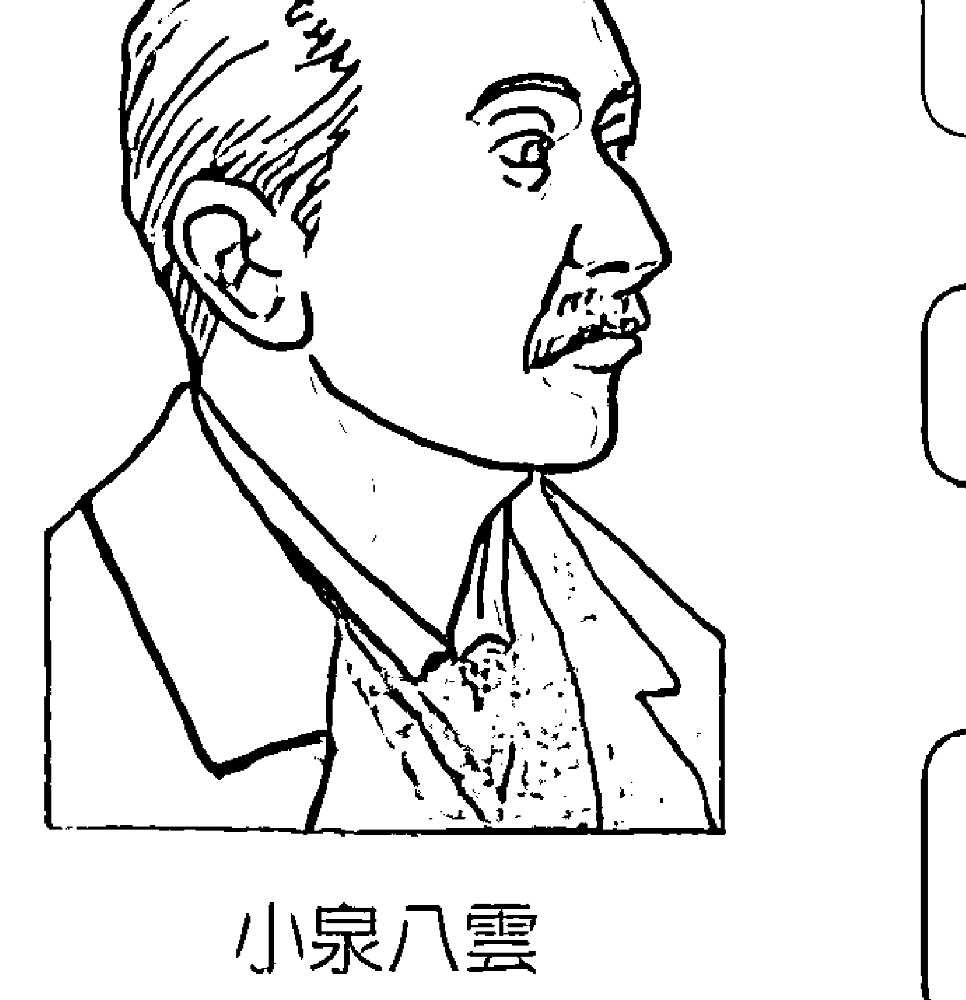

小泉八云

以「活神仙」刊载仪兵卫的故事

事前察知海啸

放火燃烧甫收割的稻子诱导村民

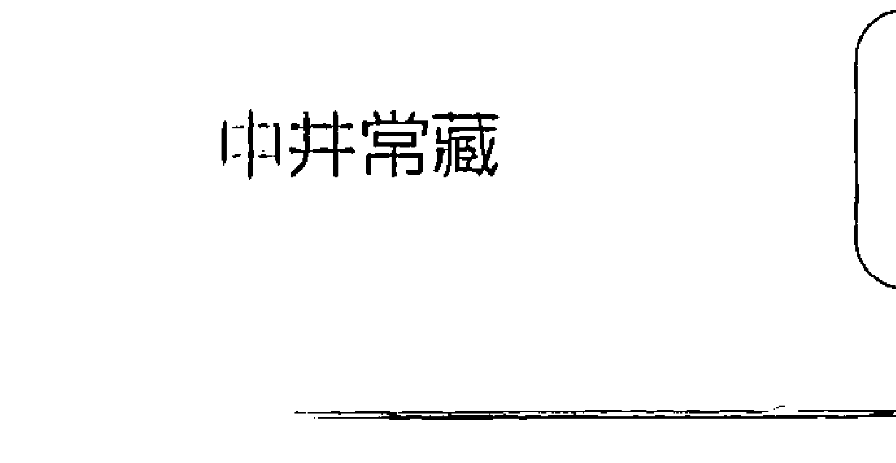

中井常藏

翻译「活神仙」仪兵卫的故事，投稿教科书

# No.093
百物语
Hyakumonogatari

提到怪谈便不能不提到百物语，而自古以来编纂的百物语更是不计其数。

# ○日本传统的恐怖体验谈

百物语是日本传统讲述怪谈故事的方法，是每个人轮流讲恐怖故事，直到讲满一百个。直到今日，仍有许多怪谈故事选择采用百物语的形式，众人聚集实际举行百物语怪谈会的情形亦不罕见。江户时代成书的假名草子¹《伽婢子》（浅井了意著）便记载了举行百物语怪谈会的方法。

据其记载，百物语怪谈会是由数人选在新月之夜（没有月光的黑夜）聚集，以青色纸张贴住行灯²（好让灯光更暗），点燃一百根灯芯。

行灯的灯光本来就非常昏暗，亮度仅六十瓦灯泡的八十分之一而已，而且就算一个行灯点两根灯芯，亮度也不会是原来的两倍，所以百物语怪谈会刚开始的亮度甚至还不及一颗电灯泡。更有甚者，这灯光要放置在隔壁的隔壁的房间里，众人聚集的房间和隔壁的房间完全不放置任何照明。也就是说，怪谈会打从一开始便已经极为昏暗。

待众人聚集起来，依序讲述怪谈故事，每讲一则就拔掉行灯里一根灯芯，周围光线会愈来愈昏暗，就这样轮流重复下去（人数不可能达到百人，所以每个人都会轮到几次），等到行灯的灯光完全熄灭时，真正的灵异事物就会出现。

不过，倘若真有灵异出现反而令人困扰，因此通常惯例都是在捻熄九十九根灯芯以后，结束百物语怪谈会。

江户末期则是以一百支蜡烛取代行灯，每讲一个怪谈就吹熄一支蜡烛。不过这些蜡烛都是日本蜡烛，并不像现在使用的西洋蜡烛这般明亮。至于所有灯火熄灭以后会有何种灵异出现，并无定论。鸟山石燕的《今昔百鬼拾遗》则记载说届时将有名为青行灯的妖怪出现。

¹ 假名草子：统称江户初期完全使用假名或掺杂假名所创作的故事、小说、教谕书、游女评记等作品，以实用性、教训性、娱乐性为特色。
² 行灯：日本旧时的小型照明灯具，是以木材做框并糊上纸张，其中放置油皿点火为灯。

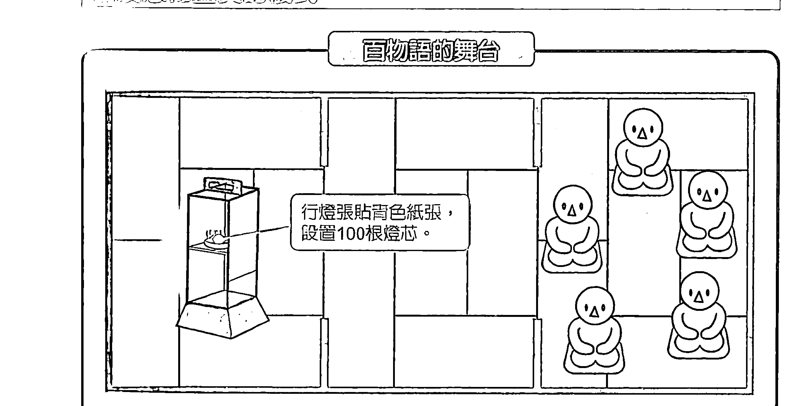

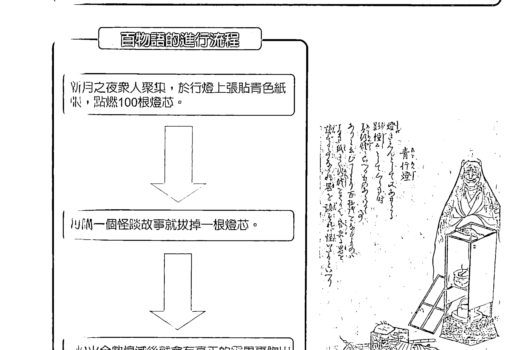

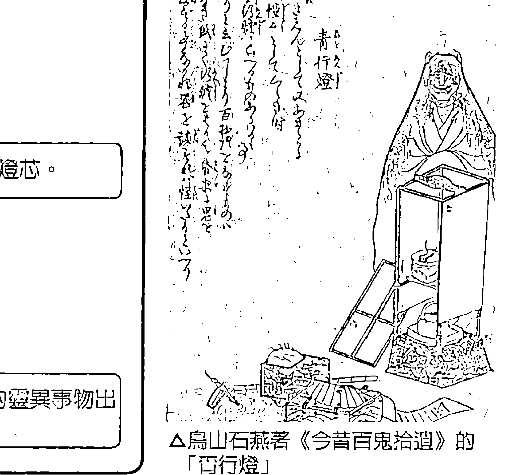

# No.094
《牡丹灯笼》
Botan Dōrō

很少人知道日本最具代表性的怪谈故事《牡丹灯笼》，其实是由落语改编而成。

# ○日本三大怪谈

《牡丹灯笼》、《四谷怪谈》和《番町皿屋敷》并称为三大怪谈，其名源自于江户～明治时期的落语家三游亭円朝所创作的落语怪谈故事《怪谈牡丹灯笼》。

由于円朝创作的这则怪谈故事实在太过后彩，遂于明治二十五年改编成歌舞伎，此即歌舞伎的《牡丹灯笼》，正式名称作《怪异谈牡丹灯笼》。光就歌舞伎来说，这可说是个全新的剧目。众人想像中的《牡丹灯笼》梗概大致如下：

饭岛平左卫门的女儿阿露爱上了浪人萩原新三郎，却不被父亲允许。阿露因相思过度而终致丧命，不久连她的乳母阿米也跟着过世。

某天夜里，新三郎在家里听见外面传来喀喀喀的木屐声音，走到外头一看，不正是提着绘有美丽牡丹图案灯笼（此即牡丹灯笼题名的由来）的阿露和乳母吗？两位女性以及后来加入的新三郎行走于道路之际，那摇曳的火光之美丽、之凄惨，正是《牡丹灯笼》的醍醐味。

从此以后，阿露每晚都会来找新三郎。附近人们好奇地偷窥新三郎在做什么，只见他好像很愉快地在谈话，而谈话的对象竟然是副骨骸。

跟已经亡故的死人来往，使得新三郎日渐憔悴消瘦。周遭邻居赶紧请来法力高强的和尚在新三郎家里贴符，于是阿露便再也无法进屋了。阿露请新三郎把符撕下，刚开始新三郎并不听从，后来却因为思念太甚，终于还是把符撕了。

黎明将近时分，只见阿露与新三郎跟着阿米手中那盏牡丹灯笼随行前进。后来别人挖开阿露的坟墓一看，赫然发现新三郎的尸体抱着一副骨骸躺在里面。

*落语和歌舞伎：请参照P.223页No.043的译注。

# 《牡丹灯笼》的世界

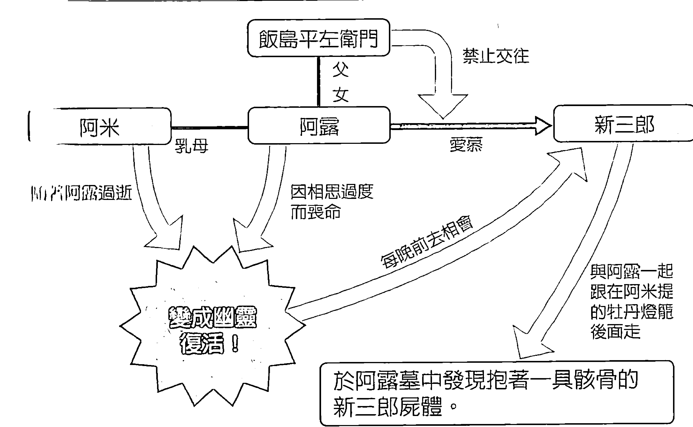

# 《牡丹灯笼》的原作

>「《牡丹灯笼》的原作乃是江户时代的浅井了意《伽婢子》当中的《牡丹灯记》。不过《牡丹灯记》亦有其原作，此即中国的《剪灯新话》。《剪灯新话》里面的新三郎名叫乔生，阿露则叫作丽卿，阿米则是叫作金莲，而且故事里已经提到灯笼这个重要的道具。

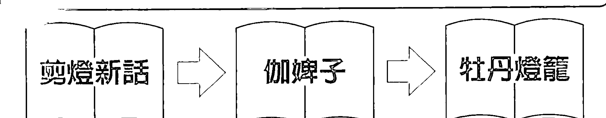

# ♣其实撕符的并非新三郎

其实在落语《怪谈牡丹灯笼》里面，新三郎并未将符撕下。不料从门而入的阿露是找到新三郎的仆人伴藏，拜托他把符撕掉。伴藏以100两钱做为交换条件接受了阿露的请托，不但撕了符还把拥有守护法力的佛像也掉了包，俨然成了小混混藉机跟幽灵索讨100两钱的故事。

歌舞伎《怪异谈牡丹灯笼》也是相同情节，故事里说到有个名叫半藏的仆人跟幽灵收钱，然后才把符撕掉的。

# 《火天使》
The Fiery Angel

虽然在日本的知名度并不高，但世间其实有一部极富争议性的小说与歌剧，名叫《火天使》。

- - 不曾译成日语的小说，不曾于日本上演的歌剧

俄国作家瓦勒里·勃留索夫 (1873～1924) 的小说，或指谢尔盖·普罗高菲夫 (1891～1953) 根据该小说改编成的歌剧《火天使》(1927)，亦可指称普罗高菲夫以火天使为主题创作的交响曲——第三号交响曲 (1928) (不过据说作曲家本身很讨厌别人以火天使交响曲称呼这曲)。

这部小说自发表当初便引起极大争议，至今仍无日语译本存在。

故事的时空是十六世纪的德国。有位满脑子非份之想、不怎么像骑士的骑士普莱希特，遇见了为恶灵所扰的女孩雷娜塔，并且决定收养照顾她。

雷娜塔孩提时期曾经跟一位金发碧眼的火天使马迪尔（实为恶魔）一同游玩；雷娜塔长大后，马迪尔说要变成人类的模样再回来，就此离开她。雷娜塔认为同样金发碧眼的海因里希伯爵就是火天使，并爱上了伯爵，但伯爵同样也离开了她。

普莱希特受雷娜塔请托助她外出找寻伯爵，途中经历向（史实人物）魔法师阿古利巴寻求魔法协助却遭拒绝等诸多曲折，最后好不容易找到了伯爵，但伯爵对雷娜塔却甚是冷淡。愤怒驱使雷娜塔要求普莱希特替自己把伯爵杀死，正当两人就要决斗的时候，她却又大叫不许伤害伯爵。故意败北且身负濒死重伤的普莱希特虽然向雷娜塔表白爱意，雷娜塔最后却还是进了修道院。

恶魔引诱被抛弃的普莱希特前去修道院探视，岂料自从雷娜塔来到修道院以后，众修女就遭到恶魔附身发狂，异端审问官亦宣告要将雷娜塔以女巫罪名处以火刑，故事最后就在恶魔与众修女的乱交当中落幕。

- - 俄国作家瓦勒里·勃留索夫的小说。
- 发表当初便引起极大争议。
- 至今仍无日语译本。

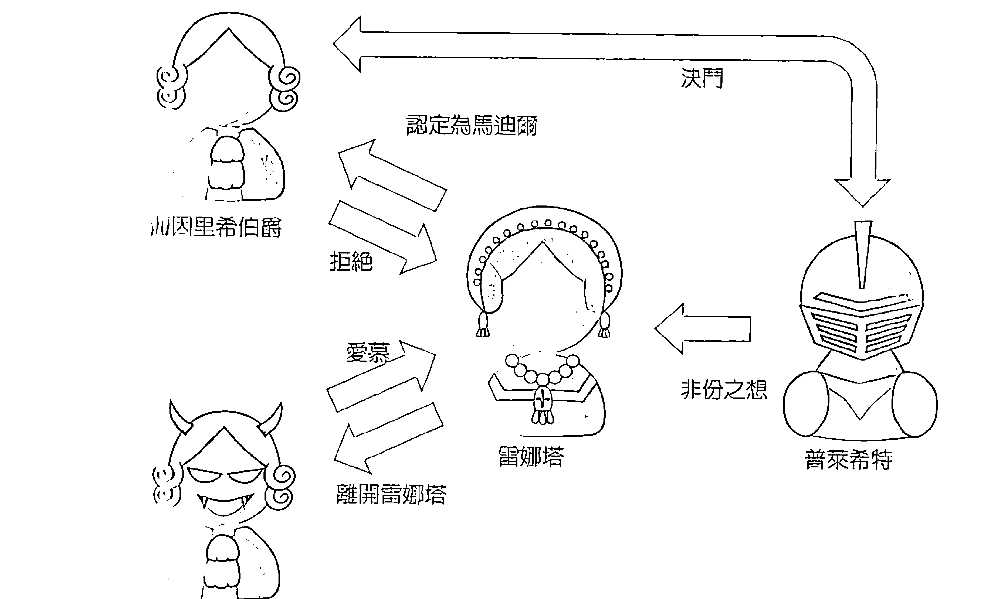

# 即使搬到现代仍然大有问题的歌剧演出

尽管小说再怎么有争议性，毕竟那只不过是19世纪的小说，而且其中并无具体的描述，只是讲述情节而已。

然而歌剧《火天使》在故事高潮处却有多位裸体（其实穿着看似裸体的服装）芭蕾舞者跳着疯狂舞蹈的强烈场面。早在1920年代便已经创作出此等歌剧的普罗高菲夫，其前卫性格自是非同凡响。

因为内容如此，这部歌剧几乎不可能在日本上演。同一位作曲家的另一部作品《罗密欧与茱丽叶》就经常被搬上舞台，两者间天差地别。

# 《卖火柴的小女孩》

Den lille Pige med Svovlstikkerne

再没有其他童话能像《卖火柴的小女孩》这样，把小小的火光描写得如此温柔，又如此悲凄。

# 受到误解的卖火柴小女孩

《卖火柴的小女孩》是丹麦童话作家汉斯·克里斯蒂安·安徒生的童话。

主角少女家里很贫困，母亲似乎已经不在了。父亲让小女孩出去兜售火柴，他自己有没有工作则是不得而知，我们只知道如果小女孩不卖火柴就会挨父亲打骂。

除夕这天（似乎许多人都误以为是耶诞夜，不过原作清楚写到是今年的最后一晚），小女孩整天都在兜售火柴。

小女孩在冷天中并没有穿鞋。其实早上的时候她还有鞋子穿，却在闪避疾驶而过的马车时不慎脱落弄丢了。这是为何呢？原来那双鞋本是她母亲的鞋子，但对小女孩的脚来说却太大。故事描述小女孩穿着这样的一双鞋，暗示着她最近失去了母亲，只是不知母亲是新丧还是刚离家出走。从接下来小女孩梦见祖母的部分，我们可以得知母亲并不疼爱这女孩，所以离家出走的可能性相当高。

对小女孩来说，火柴的火光可说是世间幸福的象征，温暖正是冻僵的少女最大的寻求。当她把整束火柴同时点燃时，她的祖母终于化作实体，把她带往天国去了。

安徒生说小女孩就这样带着微笑去到天国，而其他人都不知道这件事。换言之，他将故事诠释成少女明明是幸福的，其他人却无法理解，反而示以同情。

所以说，如果读过这篇故事以后觉得「真是可怜」，也许这种想法并不一定是正确的。

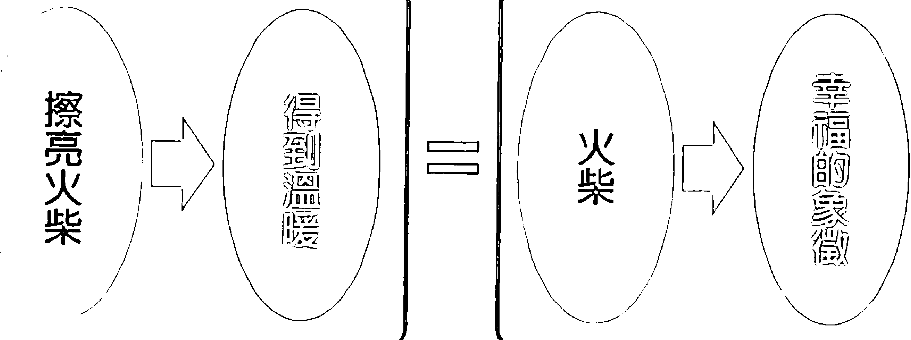

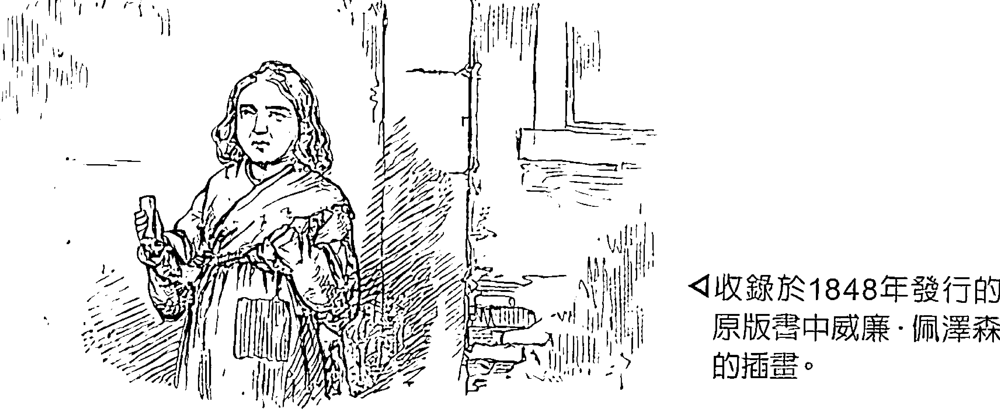

# 被遗忘的安徒生

安徒生死于1875年，当时葬礼有丹麦皇太子和各国大使等人物列席，规模颇大。

不过后来他却渐渐被人遗忘，时至1920年，非但规划成博物馆的安徒生旧居无人管理修缮，墓碑也任其荒废。

1924年儿童文学家久留岛武彦造访当地时，对这样的情形甚为慨叹，于是便投书报纸，在丹麦国内演讲，致力于恢复安徒生的地位。

于是乎，安徒生才又再度受到世人瞩目，旧居和墓碑也重新得到修缮。

从此丹麦人便将久留岛称呼为「日本的安徒生」。一般所谓「日本的○○」多数都跟原本的「○○」没什么关系，不过久留岛这个「日本安徒生」称号倒是不枉其名。

# No.097
火之国
County of Fire

熊本县亦称火之国，这是真的吗？实际看看其郡国名，熊本该要算是肥后国才是。

- ○与火颇有渊源的郡国
熊本县亦以火之国为世人所知，境内拥有阿苏山这座日本屈指可数（若论外围火山口的尺寸则是日本最大）的活火山，使得熊本县获得了如此的形象。

日本战队特摄片的始祖《秘密战队五连者》中，熊本出身的黄连者也惯讲「我就是阿苏山呐，发怒大喷火的火山呐！」的台词（顺带一提，一般认为英雄战队当中的黄色英雄爱吃咖哩，其实都是因为《秘密战队五连者》的黄连者爱吃咖哩之故，其实黄色英雄并不一定特别爱吃咖哩）。

这纯粹是误解。熊本县的汉字不是写作火之国，而是肥之国；据说这是因为熊本土地肥沃、居民体态丰腴的缘故。

不过，此地亦有火之国的传说。

根据《风土记拾遗肥后国》记载，从前崇神天皇的时代有打猴、颈猴两名土蜘蛛（古坟时代住在九州的异民族）。它们占据躲藏于益城郡的朝来名山峰反抗天皇，健绪组遂衔天皇救命讨伐之。其后巡察该地时，竟有异火从天而降，落在八代郡的白�的岳，健绪组见状便上奏天皇，天皇谓「剿除贼徒后西方已然无忧。君之海上勋功彪炳，无人能比。又，天降异火致山岳燃烧，实不思议。既是有火降下之国，可名之为火之国」。相传火之国此名便是从此得来。

除此之外，还有景行天皇因见不知火，遂将此地命名为火之国的传说。更有甚者，另有说法指出熊本县的冰川可以开采良质的燧石，故谓火之国。究竟上述诸说何者为真，并无定论。

可以确定的是，火之国此名称跟阿苏山没有任何关联。

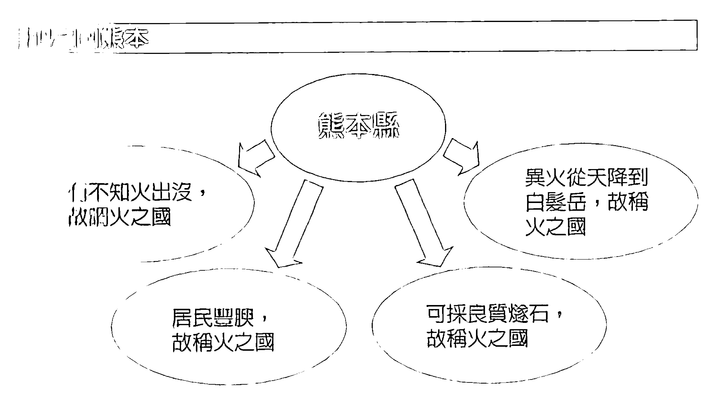

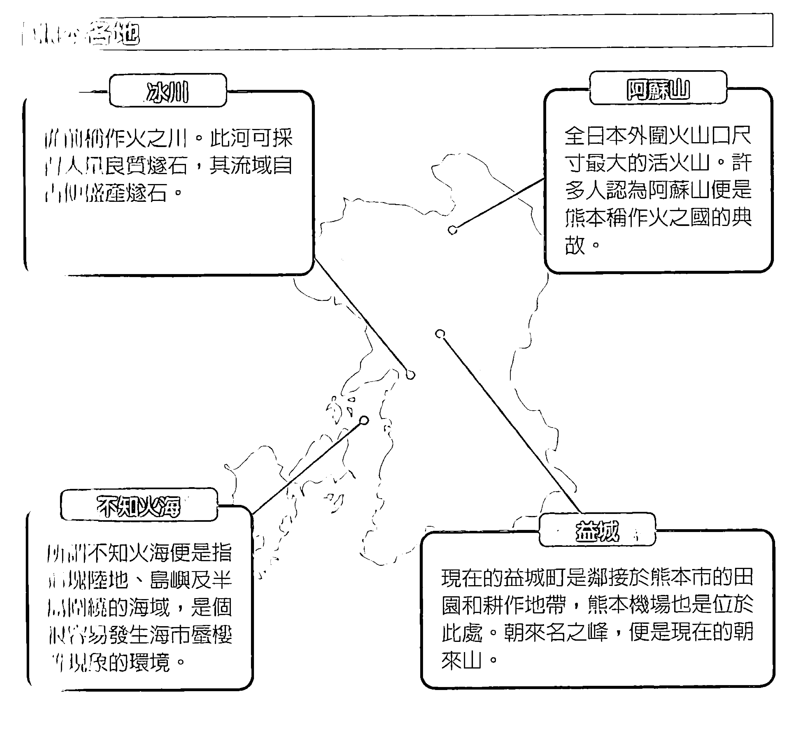

- - ○不知火→No.070

# 太阳护胫
Shin Guard of Sun

太阳护胫是美洲原住民神话当中所提及的宝物，这是太阳从月亮（太阳之妻）手中得来的美丽护胫。

# ○俯瞰地面万物的太阳

这对美洲原住民神话所提及的护胫，乃是以豪猪尖刺彩饰而成，再没有别的东西比它更美丽了。每当天气晴朗的时候，太阳必定都会使用这对护胫。

太阳随时都戴着这对护胫，而且每晚回到西方尽头自己的小屋里休息时，还会把护胫当作枕头睡，小心不被别人拿走，因为当时经常有盗贼出没。

说到头来，没有人知道太阳的小屋到底在哪里，只知道小屋是在西方而已。可是盗贼却知道小屋的位置，于是来到小屋前，决定趁太阳睡着以后盗取护胫。

起初，盗贼像熊人（作熊模样的人类，能够安静的移动）那样膝盖跪地，偷偷爬了进去，可是膝盖却折断掉落在床边的树枝而发出声响，吓得盗贼赶紧逃了出去。

即便如此，这名男子还是很想得到这对护胫，隔天夜里便再度潜入、盗得护胫，然后就死命地一股脑儿往东方跑。

男子想说已经逃得相当远，就累得睡着了。岂料当他醒过来的时候，太阳竟然就在他眼前，吓得他连护胫都没拿就逃。太阳见状只是笑笑也不理会那男子，穿上护胫就往西方去了。这是为何呢？因为太阳很忙。

不甘心的男子再度潜入小屋盗取护胫，然后又逃到了更远的地方。可是当他再度醒转的时候，太阳又同样出现在他眼前，还捉住他如此说道：

>「喂，你或许是个手段高明的盗贼，但你以为自己躲得过太阳吗？你不知道整个世界都是我家吗？」
语毕，太阳便行色匆匆地往西方而去了。

# 整个世界都是太阳的家

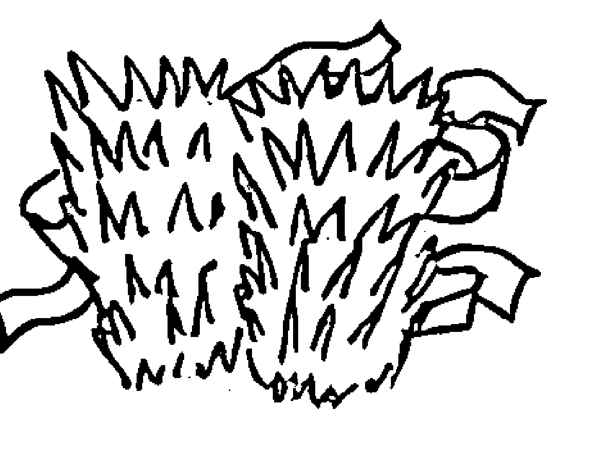

- 太阳的护胫
- ○以豪猪尖刺涂色彩饰而成。
- ○太阳得月亮（妻子）馈赠。

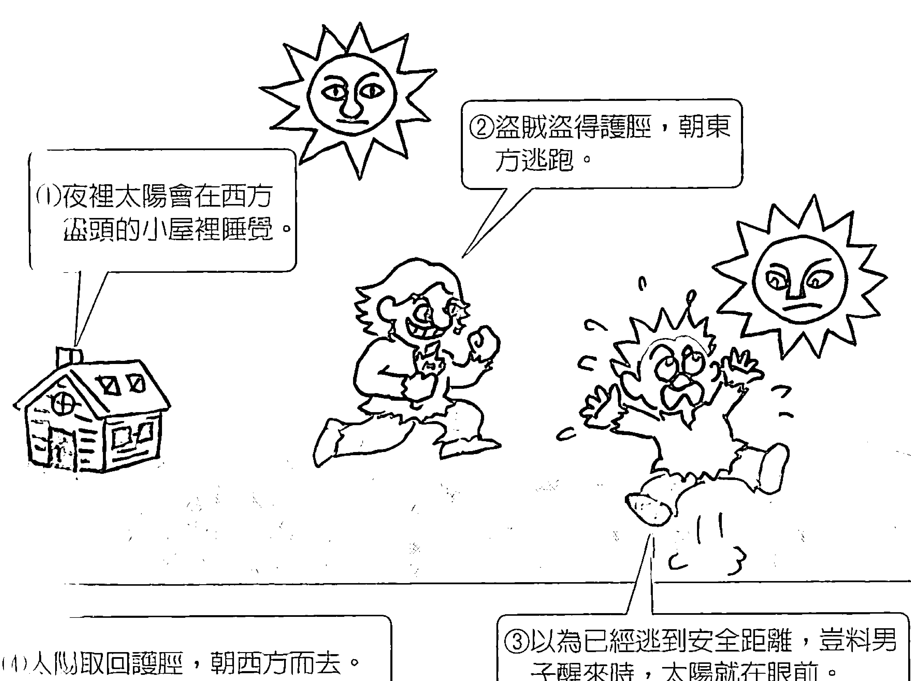

(1)夜里太阳会在西方尽头的小屋里睡觉。

②盗贼盗得护胫，朝东方逃跑。

③以为已经逃到安全距离，岂料男子醒来时，太阳就在眼前。

(4)太阳取回护胫，朝西方而去。

「穿上护胫的太阳朝西方而去，代表着太阳由东而西运行过天空。

每天早晨，太阳必定会在万事万物头顶散发光芒，所以无论逃到哪里，盗贼永远都是在太阳之下。

#### 达格达的大锅
Dagda's Cauldron

魔法锅对现代人来说似乎并没有那么神奇，不过对古代人而言，锅子却是能将硬邦邦的食材软化的魔法道具。

### ○各种魔法锅

达格达之锅是塞尔特神话当中提及的魔法大锅。除此之外，塞尔特神话也曾经提到许多其他的大锅。

“达格达的大锅”是属于塞尔特神话丰饶神达格达（一位貌似微胖老伯的神明）的所有物，是塞尔特四大至宝之一。

正如其别名“无穷尽者”，这只大锅非但能从中生出食物，而且永无竭尽。更有甚者，相传这只大锅甚至还拥有透过焙煮能使锅中死者复活的力量。

同样的，《马比诺吉昂》当中描述的“再生的大锅”，也拥有使死者复生的力量。将死者投入锅中烹煮，死者隔天就能恢复原状行动自如，唯一的遗憾便是复活以后再也无法开口说话。这只大锅原本属于古爱尔兰人所有。

跟拥有此等宝物的军队作战根本就毫无胜算，后来敌对的强者岛屿便派出一人混进爱尔兰军队的尸体里，待他们把尸体投入大锅以后，便手脚并用从中把大锅敲破，终于使得强者岛屿这方获得了胜利。

同样出自于《马比诺吉昂》，还有个名为“狄尔那赫的大锅”的宝物。相传从前亚瑟（即亚瑟王）向某个名叫狄尔那赫的人物索取这个大锅遭拒，于是亚瑟便让仆从把大锅扛走，并且命令下属斯兰斯威格将狄尔那赫及其势力全数消灭。

如此写来或许跟强盗没什么两样，不过千万不要忘记了，按照当时的伦理观念，为了想要的东西发起战争并将其夺到手非但并不可耻，还是件理所当然的事。

### 塞尔特神话述及的大锅

#### 达格达的大锅
- ◎塞尔特四大至宝之一。
- ◎可从中生出食物，无穷无尽。

#### 再生的大锅
- ◎将死者投入锅中烹煮，隔日就能恢复原来模样。
- ◎死者复活以后无法说话。

#### 狄尔那赫的大锅
- ◎亚瑟从狄尔那赫手中夺来的大锅。

### 凯尔特的四大至宝

#### 达格达的大锅
食物将无限涌出的大锅。

#### 命运之石
真正的王者站在这块石头上接受加冕，就会有人声从某处响起并发表预言。

#### “阿瓦隆之枪”（布里欧纳克）
只要握住它人就会变成闪电、打倒敌人。分成五个分叉，每道分叉都能发出光芒、一次打倒五个敌人。

#### 努阿达之剑
银腕努阿达（失去右手后医术之神为他安装银制义腕）的剑，出鞘后光芒夺目，能使敌人目眩暂时失去视力。

### 光荣之手
Hand of Glory

拥有冠冕堂皇的名字，实际上却不怎么冠冕堂皇的魔法道具。世上恐怕再没有比光荣之手如此受到众人深信不疑且多次实际制作的魔法道具。

### ○小偷最想要的道具

光荣之手正如其字面所示，是以人手为材料制成的魔法道具。光荣之手必须被判环首绞刑的杀人犯仍然挂在绞刑台时砍下其左手（在月蚀之夜则效果更佳）。当然了，这个时候切记不可以被任何人发现。

将砍下的左手以白布包裹，榨干血液，接着连同盐巴、辣椒、硝石放进陶器里腌渍两个礼拜，然后用太阳将它晒干，便告完成。日晒程序选在天狼星跟太阳同时升起的八月酷暑时节进行为佳，万一情况不许可，也可以跟马鞭草（一种香草）一齐日晒。

然后在光荣之手的手指中间插上蜡烛，换句话说，所谓光荣之手便是种以死囚手掌制成的烛台。至于蜡烛也必须是以死囚脂肪做的蜡和死囚头发做的烛芯所制。

如此点燃光荣之手的蜡烛，就能使人当场动弹不得，还能保证睡眠中的人不会突然醒转，简直就是专为小偷设计的法宝。

倘若蜡烛点不起来，那就代表房里有谁还醒着、还没受到咒法支配，这个时候只要放弃侵入即可。另外，光荣之手的蜡烛一旦点燃，除非用牛奶浇淋否则绝对不会熄灭，所以不必担心会有烛火不慎熄灭、让家人醒转等情形。

后来还有另一种光荣之手是把手掌浸泡腌渍在蜡里面，使其尸蜡化，然后直接在指头点火。

除此之外，似乎也有人将这两种光荣之手混淆，从而画出把指头做成烛台、在每根指头都插上蜡烛的图案，不过这是错误的作法，最好不要使用这种光荣之手。

尽管制造方法如此骇人，光荣之手却只能拿来当作宵小的道具，说起来还真是窝囊。

### 光荣之手
- ○从首绞刑杀人犯的左手制作。
- ○点燃光荣之手便能使人无法动弹、无法出声。睡眠中的人也绝不会突然醒来。
- ○非用牛奶浇淋，否则绝对不会熄灭。

### 从前的光荣之手
原本的光荣之手是在手指中间插上蜡烛。换句话说，死囚的手就等于是烛台，以此烛台插上蜡烛，便能无限次重复使用。

### 后世的光荣之手
直接在尸蜡化的手上点火。此类型的光荣之手会燃烧消耗，终致殆尽；由于取得不易的死囚手掌会被消费掉，一般认为此类光荣之手的效果更高。

### 来源不明的光荣之手
现代偶尔可以见到每个指头都插满蜡烛的光荣之手图案。不过这种光荣之手直到20世纪以后方才出现，应该是由上述两种光荣之手混合拼凑而成。

## 阿拉丁神灯
Magical Lamp

无论大人小孩，相信没有人没听过《一千零一夜》当中“阿拉丁和神灯”的故事吧。

### ○天方夜谭众多作品之一

《一千零一夜》是汇聚了阿拉伯众多诗人口耳相传的口承文学之集大成作品。这部作品里面写着什么样的内容呢？

故事讲到波斯国王山鲁亚尔遭到妻子背叛，同时还得知就连弟弟和魔神都遭妻子背叛，因此对女性感到绝望，从此便每晚娶一名女子为妻，然后隔天早晨再将她杀掉，最后终于把国内的年轻女性都杀光了。

后来宰相的女儿山鲁佐德拜托父亲安排自己前去面见国王，然后把妹妹敦亚佐德召来。接着妹妹就按照事先讲好的那样，拜托姐姐山鲁佐德讲有趣的故事给她听，谁知道她讲的故事非常有趣，而且她还故意在拂晓时分说到正精彩处中断。国王欲把故事后续听下去，所以决定不杀山鲁佐德，隔晚再继续听她说故事。故事就这样连续讲了一千零一夜，国王终于决定不再杀害女性，并正式迎娶山鲁佐德为妻。

以上便是《一千零一夜》的外围框架故事，故事中山鲁佐德以叙述者的身分讲到许多故事。“阿拉丁和神灯”便是其一。

简单来说，这个故事是描述阿拉丁受魔法师引诱取得神灯；这神灯里面关着一名精灵，只要摩擦神灯，精灵就会现身，并且实现摩擦神灯者的任何愿望，此即神灯精灵。

其实在神灯精灵以外，阿拉伯传说还另有摩擦戒指就会出现的戒指精灵，同样也能够为人实现愿望。

或许有人会觉得同一则故事里有两名精灵出现很奇怪，不过这两个精灵却有明确的区分：神灯精灵属于伊弗利特，而戒指精灵则是镇尼。由于伊弗利特是地位高于镇尼的精灵，所以持有神灯会比持有戒指来得有利。神灯既然是盖油灯，封印的自然也必须是有火焰魔人之称的伊弗利特才算匹配。

### 阿拉丁神灯与戒指精灵

### ✧ 阿拉丁果真是出自于一千零一夜吗？

当初将《一千零一夜》介绍到欧洲的人，乃是18世纪法国的东洋学者安东·加朗。“东洋学者”的称谓并无错误，因为对欧洲人来说，所有超过土耳其的国度都算是东洋。

再晚加朗介绍到欧洲的《一千零一夜》实在太有趣了，广受欧洲人喜爱，所以后来日本也翻译出版。

其中“阿拉丁与神灯”和“阿里巴巴与四十大盗”等故事更是特别有趣，极受欢迎。不可思议的是，当时流通于阿拉伯的《一千零一夜》却压根没有提到阿拉丁或阿里巴巴。加朗虽曾反驳说自己是在叙利亚听诗人口述记载下来的，可是（因为是口述）没有证据，甚至有人认为这些人物是加朗自己捏造出来的。

后来欧洲人才发现原来《一千零一夜》有许多不同版本，有些版本便提到阿拉丁和阿里巴巴。

据说现在阿拉丁和阿里巴巴，即便在阿拉伯世界也已经是广为人知的人物了。

### ○伊弗利特→No.003

## 烟火
Fireworks

从夏夜夜空绚烂浪漫的高空烟火，到手中的小小线香烟火，各种形形色色的烟火满足了我们视觉上的享受。

### ○经过日本人改良的烟火

古代中国甫发明火药不久，立刻就有供人通讯联络用的火药——狼烟出现，这狼烟堪称是烟火的祖先。
据说首次将烟火移作观赏用途，乃以十三世纪的意大利为先河。那时已经会在王侯贵族的庭院里施放相当罕见的烟火，但当时的烟火似乎只是能够散发各色烟雾的烟球。
再说到日本，烟火是在战国后期、约莫与铁炮相同时期先后传入了日本。固然有纪录指出十六世纪中期伊达政宗也曾经看过烟火，或者耶稣会士曾经施放烟火，不过最早经过证实的文字却是1613年8月6日，德川家康于江户城内观赏的烟火；只不过据说那似乎并非高空烟火，而是喷泉烟火。高空烟火是十八世纪江户时代已经进入后半期以后才有的产物。除此以外，相传1614年江户便已经看得见小贩兜售线香烟火的身影。

江户时代最著名的烟火职人，当属键屋以及从键屋分家形成的玉屋两家。他们起初是以小型的手持烟火起家，后来才发展成经营设计款烟火的大店家。两国川开河仪式*当时便是由这两家负责施放烟火，使得江户居民纷纷大声呼喊声援此两家，而这也是为何日本人至今看到美丽烟火升上天空仍然要大声吆喝“玉屋～键屋～”的缘故。其后玉屋虽然因为失火而撤出江户，仅一代便告消灭，但键屋却以高空烟火之专业烟火师傅承传直至现在。

明治时代以后开始有氯酸钾等各种金属化合物输入日本，从此便为烟火加上各种颜色，谓之为洋火。

日本的烟火讲究的是展现烟火本身的美。相对的，西洋的烟火则是以算准时间发射烟火，以整体整合性为目标。两者既然目标不同，自然就无法判断孰优孰劣。不过今日的烟火都是以颜色鲜艳、节奏紧凑的明亮烟火为目的。

> * 开河仪式：供养溺死者、规避水厄并且祭祀水神的行事仪式。多于7月中旬至8月上旬于各地河川举行。江户中期后流行同时举行烟火大会。

### 烟火的构造与种类

-   - 战国时代后期：烟火传入日本。
- 江户时代初期：德川家康于江户城内观赏烟火。江户已有小贩兜售线香烟火。
- 江户时代后期：键屋和玉屋于两国川开河仪式施放烟火。玉屋失火，仅一代便告消灭。
- 明治时代：金属化合物输入，从此为烟火增添许多颜色。

## 火箭
Rocket

随着近乎压力的隆隆巨响迎面扑来的同时，火箭升空还另外存在着某种撼动人心的力量。

### ○人类所创造过速度最快的交通工具

相信许多人都会同意，火箭是人类所创造过最炫的火焰了。虽然说火箭的火焰规模并非最大，但火箭可以飞抵宇宙空间，这一点绝对是无与伦比。

我们平常称为火箭的细长型机体，其正确用语应该叫作运载火箭，而火箭指的则是运载火箭里装载的火箭引擎，只不过如此严格区分用语的人毕竟属于少数。

火箭引擎和喷射引擎之间的差异，在于氧气。喷射引擎是从外部吸进空气（氧气），燃烧燃料将其喷射出去；相对的，火箭引擎则是将燃料和氧气存放于储存槽（也可使用氧气以外的氧化剂），混合燃烧后向外喷出。

喷射引擎无法在没有空气的宇宙空间燃烧燃料，但火箭引擎却可以继续喷射，是以若要发射物体进入太空，势必要使用火箭引擎。

当然了，使用火箭引擎必须要准备更大的储存槽来存放氧气，搭载物（宇宙飞行员工或人工卫星）的可容许重量自然也要降低，除此之外别无他法。是故，光是燃料和氧气往往就已经占了火箭总重量达80%。

若以车辆为例，重达一吨的车辆若有800kg都是燃料，则车体和乘客加起来就只有200kg；如果坐两个人（130kg），那连同引擎就只剩下70kg的空间，如此等同于以轻飘飘有如自行车般的车体，搭载大得极不相称的引擎高速行驶。相信读者也很清楚如此高速行驶有多么勉强。

即便如此，宇宙飞行员还是争相搭乘这样的交通工具前往宇宙进行探索，令人不禁要对他们的勇气表示赞叹。

### 11．喷射引擎与火箭引擎

### 真正的宇宙大国

讲到宇宙大国，应该有许多人会立刻想到美国，其实论发射火箭的次数，俄国可是拥有实际发射火箭次数多达美国两倍以上的辉煌成绩。

甚至就发射成功率而言，美国93%的发射成功率仅排名第三，俄国成功率达96%也是排名第一。其他排名第二的是欧盟，第四是中国，第五则是日本。第一到五名的领先集团发射成功率都在90%以上，第六名以下的成功率则是都不足70%。

# 注释附录

## No.002
-   - : i 塞尔苏斯（Celsus）：西元2世纪的人物。罗马帝国时期的新柏拉图主义哲学家。曾游历各地，主要活动地区在亚历山卓城，可能到过罗马。信奉古罗马多神教。177至180年间写《真道》四卷，反对基督教，指出：基督教源自犹太教，而犹太人却反对它；耶稣复活的故事在许多其他宗教中都有类似的传说；基督教是秘密的非法社团，不忠于罗马帝国，威胁着帝国的安全；呼吁基督教徒服从帝国政策，信仰罗马神祇。
- : ii 恩培多克勒（Empedocles, 490？～430 B.C.）：希腊哲学家、诗人、政治家、宗教教师和生理学家。据说他自封为神，投入埃特纳（Etna）山山顶的火山口自杀，以便要信徒们相信他的神圣性。他认为一切物质由四种主要成分（火、空气、水、土）构成，一切事物不生不灭，它们的变化只有赖于基本物质相互间的比例。
- : iii 贤者之石（Philosopher’s stone）：贤者之石是炼金术里某种能将贱金属变成黄金的石头。有些人认为贤者之石是粉末状，另有说法指其为液态。此外，贤者之石有时也被视同于灵药（Elixir）。
- : iv 波普（Alexander Pope, 1688～1744）：英国文学史上奥古斯都时代的诗人和讽刺作家，以《批评论》、《夺发记》、《群愚史诗》和《人论》等诗作知名，是作品最常被引用的英国作家之一。
- : v 亚雷斯特·克罗利（1875～1947）。现代法国神秘学家罗勃特·阿马杜（Robert Amadou）评为“20世纪最伟大魔导师”的人物，经常以“兽666”自称。
- : vi 间皮瘤（Mesothelioma）：是发生在胸腔或腹腔内壁上的肿瘤，可分良性与恶性。发生在胸腔的间皮瘤与石棉纤维的接触有极大的相关性，普遍与尘肺病（肺尘埃沉着病）同源。也因为如此，目前世界各国都逐渐禁止使用石棉，以保障人民健康。

## No.004
-   - : i 气精爱丽儿（Ariel）：奇幻基地《幻兽事典》译作“气精”。欧洲的空气精灵。常被视为16世纪瑞士化学家帕拉塞尔苏斯所构想的风精（Sylph）。
- : ii 风精西尔芙（Sylph）：奇幻基地《幻兽事典》译作“风精”。风精灵原本的构想是介于人与精灵之间的存在，后来帕拉塞尔苏斯在於空中自由飞翔的形象中获得灵感，构想出花心且青春永驻的女性精灵。
- : iii 水精温蒂妮（Undine）：奇幻基地《幻兽事典》译作“水精”。欧洲栖息于河川泉水旁的仙子。外型为美丽的少女，常与人类相恋。水精原本为没有魂魄的精灵，但与人类相恋生下孩子后，就能获得灵魂。
- : iv 土精诺姆（Gnome）：奇幻基地《幻兽事典》译作“侏儒”。是种住在地底的妖精。身长约12公分，服装华美，带着红色的三角帽，身穿蓝色上衣。男性都得著及胸长须，女性则是人人肌肤光滑美丽，但过了350岁后就会开始长出细毛。

## No.005
-   - : i 阿胡拉·马兹达（Ahura Mazda）：又名“欧马兹特”（Ormuzd）、“马兹达·阿胡拉”。根据琐罗亚斯德教的教义，世界是善神阿胡拉·马兹达与恶神阿里曼（Ahriman）彼此不断发生对抗的战场。其外形是个长有翅膀的太阳，或者是位乘坐长有翅膀的太阳的男子。
- : ii 阿日·达哈卡（Azi Dahaka）：琐罗亚斯德教的邪神安格拉·曼纽（Angra Mainyu）所生邪龙，拥有三头三口六眼。栖息于巴比伦的克林塔城，会使用上千种法术为非作歹。
- : iii 安格拉·曼纽（Angra Mainyu）：琐罗亚斯德教恶神阿里曼（Ahriman）之别名。更正确地说，是较早期的发音。
- : iv 艾什玛（Aeshma）：琐罗亚斯德教中司掌狂行暴举的恶魔。迈艾什玛控制者会虐待有用的家畜，作出难以想像的凶暴行为。
- : v 斯彭塔·曼纽（Spenta Mainyu）：原意是“圣灵”的琐罗亚斯德教大天使。

## No.006
-   - : i 巴兹里斯克蛇（Basilisk）：奇幻基地《幻兽事典》译作“王蛇”，为与现实世界的王蛇（King Snake）区别，译者迳采大英百科译名。巴兹里斯克蛇亦称鸡蛇怪，曾出现于老普林尼的《博物志》之中，其视线能致人于死，吐出的气息也带有剧毒，使草木枯萎、石头烧烂，甚至让飞鸟掉落。
- : ii 飞龙（Wyvern）：栖息于英国地区的龙。脸部如鳄鱼般细长，口中长满整排利牙，双足类似老鹰，尾巴尖端有箭头般的突起。经常出现在欧洲的纹章之中，在纹章学里象征着“敌意”，由此可知牠的性格非常凶暴。
- : iii 海德拉（Hydra）：希腊神话中住在阿戈斯（Argos）附近沼泽地的九头怪蛇。头被砍下的话会立刻再生，且砍下一颗就会长出两颗，非常难对付。海德拉本身带有剧毒，接触到其血液必死无疑，就算拥有不死之身也会痛苦难耐。

## No.007
-   - : i 菲尼克斯（Phoenix）：“Phoenix”通常译作“凤凰”、“不死鸟”，然本书对中国凤凰、不死鸟甚至火鸟都已有介绍，为免译名冲突，译者乃采音译：魔导书《雷霆盖顿》（所罗门王的小钥匙）便是以此译名指称以不死鸟（Phoenix）模样现身的恶魔。
- : ii 埃拉加巴卢斯（Elagabalus, 204～222）：罗马皇帝（218～222年在位），以其反常的淫乱行为臭名昭著。他时常公开举行大搞同性恋的放荡聚会，因而激怒罗马的舆论。221年他宣布立堂兄弟亚历山大为养子和继承人，后来又改变主意，引起禁卫军哗变，将他和他母亲杀害，拥立亚历山大为帝。
3. 希罗多德（Herodotus）：撰写古代第一部伟大的叙述性历史著作——记载波希战争的《历史》——的希腊作家。希罗多德是个足迹遍及各地的旅行者，其较长距离的游历涵盖波斯帝国的大部分地区；他曾经到过埃及，向南至少曾远达埃利潘蒂尼（今亚斯文），他亦访问过利比亚、叙利亚、巴比伦等地；向北行程曾跨越多瑙河，向东直抵西徐亚（Scythia），沿黑海北岸远至顿河，并深入内陆相当的距离。
故事骨干的书籍。全书30卷，养老四年（720）由舍人亲王负责编纂。
3. 十拳剑：即十握剑，是日本神话中经常提及的剑。与其说这是特指某把剑的名词，不如说是剑的种类比较正确。所谓“十握剑”是指剑身长达十个拳头的剑；如果一个拳头约十公分来计算的话，那么全长就是长约一公尺的剑身加上适当长度的剑柄。
4. 伊势神宫：设址于三重县伊势市的神社，是日本最重要的神道设施，主祭天照大神，内宫更祀有三神器当中的八咫镜，是乃天照大神之御神体。

## No.010
-   1. 《万叶集》（Man'yo-shu）：最古老（759？）、数量最多的钦定日本诗选集。共4,500首，有些是7世纪或者更早的作品。多少世纪以来，以其“万叶”精神著称。这种简明清新和真挚感人的力量，在后世的精炼而讲究风格的日本诗体中已不复见。
2. 《无问自答》（Towazugatari，とわずがたり）：镰仓时代中后期的后深草院二条所著日记暨纪行文，据考成书于1306～1313年间。内容讲述受后深草院宠爱之女性的经历，以及她出家西行、终于改以信仰为目标的生涯。
3. 后嵯峨院（1220～1272）：日本第八十八代天皇，1242～1246在位。土御门天皇皇子，于四条天皇驾崩后受镰仓幕府执权北条泰时拥立即位。逊位后于后深草、龟山两天皇在位期间施行院政。
4. 等离子体（Plasma）：物理学名词。气体中的原子开始电离时所生正负荷电粒子数目或密度大约相等的集合体。有时则指物质的第四态，以别于固态、液态和气态。
5. 摇蚊（Midge）：亦称蠊蚊。双翅目摇蚊科小型昆虫，外表像蚊，但无害，口器小而不延伸成尖锐的结构以吸血。体和翅上无鳞片，翅脉也与蚊不同。傍晚前后在池、河边麋集发出嗡嗡声，在水中、粪肥中或树皮下繁殖。

## No.019
-   1. 因努伊特（Inuit）：即爱斯基摩人（Eskimo），与阿留申人（Aleut）的族源关系最近，两者共同构成北极地区及近北极地区土著居民之主要成分，其范围自格陵兰、阿拉斯加、加拿大以至俄罗斯最东端（西伯利亚）。爱斯基摩人称呼自己的名字很多，在不同方言中称谓各异，如：因努伊特人、因努皮雅特人（Inupiat）、尤皮克人（Yupik）及阿鲁提伊特人（Alutiit）等，其义为“人民”或“真实的人民”。加拿大和格陵兰的北极居民宁愿自称为因努伊特人，而在阿拉斯加地区则以爱斯基摩人此名深受当地居民欢迎。
2. 注连绳：挂在神社前表禁止入内，或新年挂在门前取意吉利的稻草绳。

## No.014
-   1. 厄洛斯（Eros）：希腊神话中的爱神，罗马神话称为“阿穆尔”或“邱比特”（英译名为“邱比特”Cupid）。
2. 佩内伊欧斯（Peneius）：特萨里亚（Thessarila）佩内伊欧斯河的河神。奥克安诺斯和提斯的儿子，也是达芙妮的父亲。
3. 泽费罗斯（Zephyros）：西风之神。阿斯特拉伊欧斯与厄俄斯所生的儿子。传说他住在阿拉基亚地方。
4. 缪莎伊（Musai）：即指缪思女神，此为复数名词。

## No.021
-   1. 密斯拉：奇幻基地《西洋神名事典》原译作“密特拉”，但本书原文分别将波斯与印度对此神的称呼写作“ミスラ”与“ミトラ”，故译者分别译作“密斯拉”与“密特拉”，以为区别。
2. 七曜神：七曜是印度占星术、中国占星术的用语，与西洋占星术同样都是发源自巴比伦的概念。所谓七曜就是指五个行星、月亮与太阳。这七颗星体轮流司掌每周各日，是每日运气皆因七曜不同而变化。
3. 摩尼教（Manichaeism）：旧译明教、明尊教、未尼教、牟尼教。三世纪在波斯由摩尼（Mani）所创始的宗教运动。摩尼在当时以“光明使徒”及至高的“启蒙者”著称。摩尼教虽然长久以来都被当作基督教的一支异端，然而由于其教义融贯，结构和组织严正，以及它自始至终所保有统一性和独特性，它仍然是一种宗教。
4. 《波斯古经》（Avesta）：音译“阿维斯陀”，意为“智识”、“经典”、“谕令”。古代伊朗的宗教经典。其最早版本是在前四世纪阿契美尼德王朝末期时编成，但在希腊亚历山大征伐波斯时曾遭焚毁，仅存一卷。三至七世纪萨珊王朝时又重新进行搜集、整理和编纂，用东波斯语的古阿维斯陀文写作，共21卷。主要记述琐罗亚斯德的生平和教义。

## No.018
-   1. 《古事记》：日本最古的史书。和铜五年（712）编纂完成，计三卷，由太安万侣奉元明天皇命指挥编辑工作；但此书源流可追溯至稗田阿礼在天武天皇的指示下默记下来的《帝纪》、《旧辞》内容。上卷为日本神话，中卷记述神武天皇至应神天皇时期的事迹，下卷则记录仁德天皇至推古天皇时代的历史。
2. 《日本书纪》：记载古代日本历史，与《古事记》共同构成日本神话

## No.024
-   1. 安珀希雅（Ambrosia）：希腊神话中诸神的食物。只要食用它，谁都可以得到不死的生命；把它涂在伤口上，伤口也会立刻愈合。安珀希雅的味道比蜜还甜，香气浓郁到可以直接拿来代替香油。
2. 阿芙柔黛蒂（Aphrodite）：爱与美的女神。由被切断的乌拉诺斯的生# No.027

01 雷瓦霆 (Laevatein)：《诗歌爱达》的「菲欧史维德之歌」中记载的剑。其名大概是「伤害之杖」、「背信之使」等意。它是冥界尼弗海姆里的奸诈之神洛奇刻上鲁纳文字所打造出来的魔法之剑。

02 加尔姆 (Garmr)：《诗歌爱达》中「葛林尼尔的话语」说他是「所有犬类当中最厉害的」。他在诸神黄昏来临时得到解放，并且与战神提尔同归于尽。

03 福瑞 (Freyr)：属于攸关农作物收成且爱好和平的华纳神族。福瑞既属华纳神族，又是阿萨神族中最聪明优秀的神明。他气质非凡，目光炯炯有神，和巴多 (Baldr) 同为完美的年轻神明。

# No.032

01 阿芙柔黛蒂：请参照P.221页No.024的译注。

02 阿基里斯 (Achilles)：希腊神话中珀琉斯 (Peleus) 和海洋宁芙忒提斯 (Thetis) 的儿子；在特洛伊战争中，他是阿伽门农军队中最勇敢、最英俊、最伟大的战士。传说他在年幼时，忒提斯曾把他浸在斯提克斯冥河 (River Styx) 水中，使他周身刀枪不入，只有他的脚踵没有沾到冥河水。「阿基里斯的脚踵」（意为致命的弱点）此成语即源出于此。这也是「阿基里斯腱」此名的由来。

03 埃涅阿斯 (Aeneas)：特洛伊和罗马的神话英雄人物。他是女神阿芙柔黛蒂 (Aphrodite) 和特洛伊王安喀塞斯 (Anchises) 的儿子。埃涅阿斯是特洛伊王室成员，跟赫克托耳 (Hector) 是堂兄弟。他在抵抗希腊人、保卫特洛伊的战争中功绩卓著，在能力上仅次于赫克托耳。荷马叙事诗中暗示埃涅阿斯不甘居人下，由此产生向希腊出卖特洛伊的故事。但可以确定的是，埃涅阿斯确实曾经历特洛伊战争并幸存下来，因而编纂罗马神话的人们总能接触到有关他的资料。

# No.035

01 《神谱》(Theogony)：希腊史诗诗人赫西奥德 (Hesiod) 的作品，内容记述诸主宰神之间为争夺权力而进行的血腥战斗。

02 赫拉克勒斯 (Heracles)：赫拉克勒斯是希腊神话最伟大的英雄，他名字的原意是「赫拉的光荣」，但是事实上赫拉却不断地迫害赫拉克勒斯，因为赫拉克勒斯是宙斯的私生子。

03 奥菲斯 (Orpheus)：亦译俄耳甫斯。古希腊传说中的英雄，有超人的音乐天赋。后来成为一个宗教运动（奥菲斯教）的护佑者，该运动是以传为他自己所著的经书为依据。传说他是缪斯和色雷斯王俄阿戈斯 (Oeagrus) 的儿子。阿波罗把他的第一把七弦竖琴给了奥菲斯，奥菲斯的歌声和琴韵十分优美动听，各种鸟兽木石都围绕着他翩翩起舞。

# No.041

01 光背：又作后光、光焰、光。指佛、菩萨像背后之光相，象征佛、菩萨之智慧。光背可为头光与举身光两种。头光本指发自眉间之白毫光，故又称眉间光；举身光又作身光，即佛像全身之光相。

02 空海 (Kukai)：744-835。日本真言宗开祖。谥号弘法大师。赞岐人。804年与最澄一同入唐，向长安青龙寺惠果学习佛法。816年返回日本开创高野山金刚峰寺。823年嵯峨天皇赐东寺（教王护国寺），翌年就任大僧都。设立日本最早的平民学校综艺种智院。长于书法，名列三笔之一，有「风信帖」等名帖传世。著有《三教指归》《弁显密二教论》《性灵集》《文镜秘府论》《篆隶万象名义》等书。

# No.043

01 大森：东京都大田区东部的地名。东京湾岸原是浅草海苔的产地，现已成为填海新造地。从前东京市的区名。

02 奉行：日本从平安时代至江户时代间的一种官职。江户幕府成立后，奉行成为官僚体系的主力职位，上至幕府下至各地方大小藩主，都依各种政务需要设置许多奉行职位。

03 人形净琉璃：日本固有的传统人偶剧。所谓净琉璃是种用三味线伴奏的说唱曲艺，人形净琉璃便是配合净琉璃的节奏用人偶演出的戏剧。

04 歌舞伎：日本剧种之一，日本通俗文娱节目，把写实主义与形式主义，和音乐、舞蹈、滑稽剧及华丽的布景与服装交融在一起，丰富多彩。

05 落语：日本的传统表演艺术，最早是指说笑话的人，后来逐渐演变成说故事（落语家）人坐在舞台上，被称为「高座」，描绘一个漫长和复杂的滑稽故事，并对服饰、音乐等皆有所讲究。与中国传统的相声有类似之处，不过落语演出通常是只有一人。

06 ~七加三得十的读音：于七与吉三郎冷热两人牵手时发出的声响「ジュー」，恰恰与日语数目字「十」（じゅう）相同。换句话说七加三得十，就是指于七和吉三郎两人牵起手来等于「十」（じゅう），所以才会发出「滋～」（ジューッ）的声音。

# No.050

01 恩培多克勒：请参照P.218页附录No.002的译注。

02 戴奥吉尼斯·拉尔修 (Diogenes Laertius)：西元3世纪的希腊作家，以其希腊哲学史闻名。此书是哲学方面现存的最重要的第二手资料。

03 强核力 (Strong nuclear force)：亦名强交互作用 (Strong interaction)，是把夸克捆绑在一起的力，也间接地把质子和中子捆绑在一起。是作用于强子之间的力，是所知四种宇宙间基本作用力最强的，也是作用距离第二短的。

04 弱核力 (Weak nuclear force)：亦名弱交互作用 (Weak interaction)，能令核子衰变，是自然的四种基本力之一，其它三种为强核力、电磁力及万有引力。次原子粒子的放射性衰变就是由它引起的，恒星中一种叫氢融合的过程也是由它启动的。弱核力会影响所有费米子，即所有自旋为半奇数的粒子。

# No.059

- ^1 科拉人 (Cora) ：居住在墨西哥哈利斯科州和纳亚里特州的中美印第安人。他们务农，在陡峭的山坡上种植玉蜀黍、豆类、南瓜和黄瓜，用烧荒清理土地。多数家庭都饲养一头乳牛以便喝奶和做乳酪。有时也养羊剪羊毛，但很少吃肉。
- ^2 负鼠 (Opossum) ：有袋總目中负鼠科约66种美洲兽类的统称。普通负鼠长可达100公分，毛皮从浅灰白色（北方地区）到近于黑色（温暖地区）。脸尖呈白色，眼小而黑亮，耳圆黑色；體矮胖，裸尾长约體全长之半，适于缠卷。
- ^3 基切人 (Quiche) ：即基切玛雅 (Quiche Maya) 。居住在瓜地马拉中西部高地的玛雅印地安人。他们在前哥伦布时期已具有先进的文明和高度发展的政治和社会组织，考古遗物表明当时他们已有很大的居民中心和复杂的阶级结构。基切人的历史和神话见于《圣书》 (Popol Vuh) ，该書係1524年西班牙征服后不久用拉丁字母的基切语写成。

# No.069

- ^1 诺曼征服 (Norman conquest) ：诺曼第公爵威廉对英格兰的军事征服。1066年8月威廉集结了约五千名骑士准备乘船起航；10月14日擊溃英格兰军队，并直接向孤立的伦敦挺进，英格兰的主要领袖都向他投降。1066年圣诞节他在西敏寺加冕。此后他在英格兰进行军事封建主义，把英格兰分配给约180个诺曼大承租人，使英格兰贵族几乎全被诺曼贵族取代。

# No.072

- ^1 卡斯托耳与波吕丢刻斯 (Castor and Polydeuces) ：即狄俄斯库兄弟 (Dioscuri) 。古希腊罗马神话中的孪生神灵。他们援救遇难船员，受人间祭礼专赐顺风。他们的母亲是丽达 (Leda) ，父亲可能是众神之王宙斯，也可能是丽达的丈夫廷达瑞俄斯 (Tyndareus) 。后来兄弟两人发生争执，终至流血。卡斯托耳具有人间必死之本性，因而被殺丧生。波吕丢刻斯不愿独享永生，于是宙斯允许两人轮流住在天上和阴间。后来宙斯又把他们置于天空，成为双子星座。
- ^2 马的祖先：本书原文将马祖作「马祖」，至于马的祖先此说法则不知从何而来，故且译之。

# No.078

- ^1 盂兰盆节：原為佛教节日。每逢夏历7月15日，佛教徒為追薦祖先而举行。盂兰盆乃梵文Ullambana的音譯，意思是「救倒悬」。此节日传至日本後与日本初秋的魂祭习合，现在通常在8月13日至15日举行，也有些区域是在七月举行。日本人相信祖先的靈魂会在此时归来。
- ^2 佐田雅志：长崎县长崎市出身的创作歌手、艺人、小说家。《精灵放流》是他的畅销歌曲。
- ^3 新盆：指家中成员过世后的第一个盂兰盆节。

# No.086

- ^1 约翰·伊夫林 (John Evelyn) ：英国乡绅、作家，写有美术、林学、宗教等方面的著作三十余部。他终身坚持写下的《日记》被认为是有关17世纪英国社会、文化、宗教和政治生活的珍贵史料。
- ^2 克里斯多佛·列恩 (Christopher Wren) ：英国天文学家、几何学家、设计家和当代英国最伟大的建筑师。
- ^3 木场：东京都江东区中部地名。元禄年间（1688～1704）获江户幕府许可开放材木市场而致繁荣。
- ^4 罗伯特·虎克 (Robert Hooke) ：英国物理学家，发现名为虎克定律的弹性定律，并在很多领域做了研究工作。他是第一个制造格列高列反射望远镜的人，1664年发现猎户座第五星，第一个提出木星绕轴旋转。

# No.095

- ^1 瓦勒里·勃留索夫 (Valery Bryusov，1873-1924) ：俄国诗人、小说家、剧作家、翻译家和俄国现代派文学先驱。勃留索夫是富商之子，受过通才教育，1890年代对法国象征派的诗歌发生兴趣。
- ^2 谢尔盖·普罗高菲夫 (Sergei Prokofiev，1891-1953) ：20世纪俄国（和苏联）作曲家，作品体裁广泛，包括交响曲、协奏曲、电影音乐、歌剧、芭蕾舞剧以及标题音乐。
- ^3 阿古利巴 (Heinrich Cornelius Agrippa von Nettesheim，1486-1535) ：中世德国最具代表性的魔术师，乃喀巴拉之大家，终生辗转旅居欧洲各地。尽管曾遭斥为异端饱受攻击，他却依旧深信魔法是达致真理的最佳方法。

# No.099

- ^1 《马比诺吉昂》 (Mabinogion) ：11则中世纪威尔斯故事的总称，以神话、民间传说和英雄传奇为基础，记录12世纪下半叶到13世纪末的口传故事，提供有关塞尔特人、诺曼人和法国人的早期传说故事相互交流的有趣事例。就艺术方面说，其中最优秀的是四则相互关联的故事，称为马比诺吉 (Mabinogi) 的四个分支。其他重要故事有：《库尔威奇和奥尔温和13世纪的本地亚瑟王传奇《罗纳布威之梦》。
- ^2 斯兰斯威格 (Llenlleawg) ：相傳即后来圆桌武士兰斯洛 (Lancelot) 的原型。
- ^3 卢诃 (Lugh) ：卢诃是塞尔特神话中的太阳神，名字前面常被冠上「长臂」，也就是他的别名。相当于希腊神话中的太阳神阿波罗。
- ^4 努阿达 (Nuada) ：塞尔特神话中的主神。努阿达是女神达奴的儿子，带领达奴神族移入爱尔兰，并且与之前统治爱尔兰的原住民佛摩巨人族作战，赢得两次胜仗。

# 中英日名词对照索引

# 其他条目

| 中文 | 英文 | 日文 | 页码 |
|---|---|---|---|
| H. P. 洛夫克莱夫特 | H. P. Lovecraft | H. P. ラブクラフト | 98 |
| 丁香 | Ding Xiang | 丁香 | 82 |
| 人魂 | Hitodama | 人魂 | 26 |
| 人体自燃现象 | Spontaneous Human Combustion | 人体発火現象 | 158 |
| 八百屋于七 | Yaoya Oshichi | 八百屋お七 | 92 |
| 八热地狱 | Ba Re Di Yu | 八熱地獄 | 186 |
| 三尺坊大权现 | Sanshakubou Daigongen | 三尺坊大権現 | 174 |
| 土精诺姆 | Gnome | ノーム | 15 |
| 大文字送火 | Daimoji Okuribi | 大文字送り火 | 168 |
| 大日如来／摩訶毘廬遮那如来 | Maha Vairocana | マハー・ヴァイローチャナ | 86 |
| 大火 | Great Fire | 大いなる火 | 184 |
| 大格达 | Dagda | ダグダ | 36 |
| 大格达的大锅 | Dagda's Cauldron | ダーグダの大釜 | 208 |
| 女髪之火 | Fire from women's hair | 女髪の火 | 156 |
| 山津见神 | Yamatsuminokami | 山津見神 | 42 |
| 不死鸟 | Phoenix | 不死鳥 | 20 |
| 不知火 | Siranui | 不知火 | 150 |
| 不动明王 | Acalanatha | アキャラナータ | 88 |
| 不动尊 | Fudouson | 不動尊 | 88 |
| 不尽木 | Bu Jin Mu | 不尽木 | 30 |
| 五大 | Wuda | 五大 | 114 |
| 五行 | Wuxing | 五行 | 112 |
| 五轮塔 | Gorinnotou | 五輪塔 | 114 |
| 元素 | Arche | アルケー | 108 |
| 勾斯魔格 | Gothmog | ゴスモグ | 55 |
| 厄俄斯 | Eos | エオス | 54 |
| 天手力男命 | Amenotazikaraonomikoto | 天手力男命 | 44 |
| 天宇受売 | Amenouzume | 天宇受売 | 44 |
| 天和大火 | Great fire of Tenwa | 天和の大火 | 92 |
| 天照大神 | Amaterasuomikami | 天照大神 | 44 |
| 太阳的护胫 | Shin guard of sun | 太陽の脛当て | 206 |
| 尤拉克萨莫耶德人 | Yurak Samoyeds | ユラーケ・サモエード族 | 128 |
| 巴多 | Baldur | バルドル | 38 |
| 巴克斯神殿 | Temple of Bacchus | パッカス神殿 | 160 |
| 巴哈姆特 | Bahamut | バハムート | 120 |
| 巴耶力 | Bael | バエル | 65 |
| 巴兹里斯克蛇 | Basilisk | バジリスク | 18 |
| 月读命 | Tsukuyominomikoto | 月読命 | 44 |
| 水精温蒂妮 | Undine | ウンディーネ | 15 |
| 火 | Ignis | イグニス | 46 |
| 火山 | Volcano | ヴォルケイノ | 70 |
| 火之夜艺速男神 | Hinoyagihayaonokami | 火之夜藝速男神 | 42 |
| 火之炫昆古神 | Hinokagabikonokami | 火之炫昆古神 | 42 |
| 火之迦具土神 | Hinokagutsuchinokami | 火之迦具土神 | 42 |
| 火之国 | County of fire | 火の国 | 204 |
| 《火天使》 | The Fiery Angel | 『炎の天使』 | 200 |
| 火伏 | Hibuse | 火伏 | 174 |
| 火男 | Hi-otoko | 火男 | 84 |
| 火车 | Fire Chariot | 火車 | 28 |
| 火灾精灵 | Spirit of fire | 炎の精 | 98 |
| 火是万物的本源 | Fire as the fundamental element | 万物は火なり | 110 |
| 火神迴遇突智 | Hinokamikagutsuchi | 火神迴遇突智 | 42 |
| 火浣布 | Kakanfu | 火浣布 | 30 |
| 火球 | Fireball | ファイアーボール | 118 |
| 火产灵 | Honomusubi | 火産霊 | 42 |
| 火鸟 | Phoenix by Osamu Tezuka | 火の鳥 | 100 |
| 火焰山 | Huoyan Shan | 火焰山 | 188 |
| 火鼠 | Kaso | 火鼠 | 30 |
| 火鼠之裘 | Kaso no Kawaginu | 火鼠の裘 | 30 |
| 火箭 | Rocket | ロケット | 216 |
| 火箭引擎 | Rocket Engine | ロケットエンジン | 216 |
| 火蠑螈 | Fire Salamander | ファイアー・サラマンダー | 8 |
| 加百列 | Gabriel | ガブリエル | 66 |
| 加尔姆 | Garmr | ガルム | 60 |
| 北落师门 | Fomalhaut | フォマルハウト | 98 |
| 卡西奇 | Kahiki | カヒキ | 68 |
| 卡西法 | Calcifer | カルシファー | 102 |
| 卡拉伊 | Kalai | カライ | 185 |
| 卡斯托耳 | Castor | カストル | 154 |
| 史特罗培斯 | Steropes | ステロペス | 74 |
| 史基尼尔 | Skirnir | スキーニル | 60 |
| 史琪拉 | Scylla | スキュラ | 76 |
| 四大元素 | Four elements | 四大元素 | 108 |
| 外星突变犬 | The Dog from The Thing | 物体X犬 | 76 |
| 奴姆 | Num | ヌム | 128 |
| 奴特 | Nut | ヌト | 58 |
| 尼弗海姆 | Niflheimr | ニヴルヘイム | 60 |
| 尼禄 | Nero | ネロ | 180 |
| 布刀玉命 | Futodamanomikoto | 布刀玉命 | 44 |
| 布列塔尼 | Brittany | ブルターニュ | 77 |
| 布因岛 | Buin Island | ブイン島 | 137 |
| 布戎忒斯 | Brontes | ブロンテス | 74 |
| 布沙斯普 | Būsyastā | ブーシュヤスター | 17 |
| 布里欧纳克 | Brionac | ブリューナク | 209 |
| 布丽甘提雅 | Brigantia | ブリガンティア | 36 |
| 布丽姬 | Brigid | ブリギット | 36 |
| 打击法 | Knocking fire | 打撃法 | 107 |
| 玉屋 | Tamaya | 玉屋 | 214 |
| 瓦雷沙格纳 | Vərəθra y na | ウルスラグナ | 17 |
| 甘道夫 | Gandalf | ガンダルフ | 94 |
| 矛鸟伊 | Maui | マウイ | 140 |
| 伊弗利特 | Efreet | イフリート | 12 |
| 伊邪那岐 | Izanagi | 伊邪那岐 | 42 |
| 伊邪那美 | Izanami | 伊邪那美 | 42 |
| 伊亚佩特斯 | Iapetus | イアペトス | 79 |
| 伏尔坎 | Vulcan | ヴァルカン | 70 |
| 光荣之手 | Hand of Glory | 栄光の手 | 210 |
| 再生的大锅 | Cauldron of reborn | 再生の大釜 | 208 |
| 印地 | Inti | インティ | 52 |
| 印地莱米 | Inti Raymi | インティライミ | 52 |
| 地狱猎犬 | Hellhound | ヘルハウンド | 76 |
| 地精哥布林 | Goblin | ゴブリン | 15 |
| 安东·加朗 | Antoine Galland | アントワーヌ·ガラン | 213 |
| 安珀希雅 | Ambrosia | アンプロシア | 54 |
| 安格拉·曼纽 | Angra Mainyu | アンラ·マンユ | 62 |
| 《安德鲁·费尔的手稿》 | Manuscript of Andrew Phelan | 「アンドルー·フェランの手記」 | 98 |
| 托希尔 | Tohil | トヒル | 127 |
| 托帕罗利 | Topayauri | タパク·ヤウリ | 52 |
| 朱雀 | Zhu Que | 朱雀 | 22 |
| 百物语 | Hyakumonogatari | 百物語 | 196 |
| 米迦勒 | Michael | ミカエル | 66 |
| 米斯拉 | Miθra | ミスラ | 17 |
| 米尔寇 | Melkor | メルコール | 96 |
| 老神 | Elder Gods | 旧き神 | 98 |
| 艾什玛 | Aēsma | アエーシュマ | 17 |
| 西亚琴多斯 | Hyacinthos | ヒュアキントス | 34 |
| 西格恩 | Sigyn | シギュン | 39 |
| 佛乎·马那 | Vohu Manah | ウォフ·マナフ | 17 |
| 《佛陀的落穗》 | Gleanings in Buddha-Fields | 「仏土の落穂」 | 194 |
| 佐拉·乌特恩亚亚 | Zorya Utrennyaya | ゾーリャ·ヴェチェルニャヤ | 40 |
| 佐拉·维切恩亚亚 | Zorya Vechernyaya | ゾーリャ·ウトレニャヤ | 40 |
| 伽泰 | Gathas | ガーサー | 62 |
| 克吕提厄 | Clytie | クリュティエ | 54 |
| 克吕墨涅 | Clymene | キュリュメネ | 79 |
| 克沙得拉·瓦雅 | Xšaθra Vairya | フシャスラ·ワルヤ | 17 |
| 克里斯多佛·列恩 | Christopher Wren | クリストファー·レン | 182 |
| 克罗诺斯 | Cronos | クロノス | 35 |
| 克苏鲁 | Cthulhu | クトゥルフ | 98 |
| 别西卜 | Beelzebub | ベルゼブブ | 65 |
| 利姆诺斯岛 | Island of Lemnos | レムノス島 | 70 |
| 《妖精之书》 | Liber de Nymphis, sylphis, pygmaeis et salamandris et de caeteris spiritibus | 「妖精の書」 | 10 |
| 希利欧斯 | Helios | ヘリオス | 54 |
| 希罗 | Heron | ヘロン | 160 |
| 希罗多德 | Herodotus | ヘロドトス | 20 |
| 戒指精灵 | Spirit of ring | 指輪の魔神 | 212 |
| 杜唐卡门 | Tutankhamun | ツタンカーメン | 58 |
| 冲绳火神 | Hinukan | ヒヌカン | 85 |
| 灶男 | Kamao | カマ男 | 84 |
| 灶神 | Kamajin | カマジン | 84 |
| 灶神 | Kamadogami | 竈神(かまどがみ) | 84 |
| 灶神 | Koujin | 竈神(こうじん) | 84 |
| 灶神 | Zaoshen | 竈神(ツァオシェン) | 82 |
| 《牡丹灯笼》 | Botan Dōrō | 「牡丹灯籠」 | 198 |
| 狄兹拉 | Dezzla | デッスラ | 138 |
| 狄尔那赫的大锅 | Diwrnach's Cauldron | ディウルナッハの大釜 | 208 |
| 狄蜜特 | Demeter | デメテル | 121 |
| 贝西模斯 | Behemoth | ベヒモス | 120 |
| 邦巴 | Bumba | ブンバ | 144 |
| 忒伊亚 | Theia | ティア | 55 |
| 忒提斯 | Thetis | テティス | 79 |
| 亚斯她录 | Astaroth | アスタロト | 65 |
| 亚图姆 | Atum | アトゥム | 56 |
| 亚蒙 | Amon | アモン | 64 |
| 奇杜 | Kidu | キ·ドゥ | 76 |
| 奇努亚 | Kilauea | キラウエア | 68 |
| 奈亚鲁法特 | Nyarlathotep | ナイアルラトホテップ | 98 |
| 宙斯 | Zeus | ゼウス | 70 |
| 帕拉塞尔苏斯 | Paracelsus | パラケルスス | 10 |
| 彼列 | Belial | ベリアル | 120 |
| 拉 | Ra | ラー | 56 |
| 拉斐尔 | Raphel | ラファエル | 66 |
| 妓 | Ba | 妓 | 32 |
| 于七火灾 | Fire of Osichi | お七火事 | 92 |
| 易卜劣厮 | Iblis | イブリース | 190 |
| 昂哥立安 | Ungoliant | ウングリオント | 96 |
| 明历大火 | Great fire of Meireki | 明暦の大火 | 178 |
| 波利阿英 | Poliahu | ポリアフ | 68 |
| 波吕丢刻斯 | Polydeuces | ポルデウクス | 154 |
| 《波斯古经》 | Avesta | 「アヴェスター」 | 49 |
| 波普 | Alexander Pope | ポープ | 10 |
| 法尔肯 | Volcanus | ウルカヌス | 70 |
| 泊瑟芬 | Persephone | ペルセポネ | 55 |
| 炎魔 | Balrog | バルログ | 96 |
| 狗头人 | Kobolds | コボルト | 15 |
| 狐火 | Kitsunebi/Kitsunepi | 狐火 | 152 |
| 狐狸娶媳妇 | Fox taking bride | 狐の嫁入り | 152 |
| 狐狸提灯笼 | Lantern of Fox | 狐の提灯 | 152 |-   舍惹猥如斯 Cereberus ケルベロス ........................................................................ 76
-   芭蕉扇 Ba Jiao San 芭蕉扇 ........................................................................ 188
-   迎火 Mukaebi 迎え火 ........................................................................ 168
-   迎精霊 Shouryoumukae 精霊迎え ........................................................................ 168
-   金倫加鴻溝 Ginnungagap ギンヌンガガプ ........................................................................ 60
-   阿日・達哈卡 Azi Dahāka アジ・ダー ........................................................................ 16
-   阿卡瑪納 Aka Manah アカ・マナ ........................................................................ 17
-   阿奴拉普 Anulap アヌラップ ........................................................................ 139
-   阿布辛拜勒 Abu Simbel アブシンベル ........................................................................ 57
-   阿耳戈斯 Arges アルゲス ........................................................................ 74
-   阿克納唐 Akhenaten アクエンアテン ........................................................................ 58
-   阿利茲 Ares アレス ........................................................................ 70
-   阿吞 Aten アテン ........................................................................ 58
-   阿姆沙・斯彭塔 Amaša Spənta アムシャ・スプンタ ........................................................................ 62
-   阿孟霍特普四世 Amenhotep IV アメンホテプ4世 ........................................................................ 58
-   阿帕奧沙 Apaoša アパオシャ ........................................................................ 17
-   阿波羅 Apollo アポロン ........................................................................ 34
-   阿美裡塔 Amərətāt アムルタート ........................................................................ 17
-   阿胡拉・馬茲達 Ahura Mazda アフラ・マズダー ........................................................................ 17
-   阿夏・瓦希塔 Aša Vahišta アシャ・ワヒシュタ ........................................................................ 17
-   阿娜希塔 Anāhitā アナーヒター ........................................................................ 17
-   阿耆尼 Agni アグニ ........................................................................ 46
-   阿部 Ap アープ ........................................................................ 17
-   阿斯克勒庇俄斯 Asclepius アスクレピオス ........................................................................ 74
-   阿斯圖・維達特 Asto Vidatu アスト・ウィーザートゥ ........................................................................ 17
-   阿斯摩丟斯 Asmodeus アスモデウス ........................................................................ 65
-   阿塔爾 Atar アータル ........................................................................ 16
-   阿蒂蜜斯 Artemis アルテミス ........................................................................ 72
-   阿頓 Aton アトン ........................................................................ 58
-   阿蒙 Amen アメン ........................................................................ 56
-   阿蒙・拉 Amen Ra アメン・ラー ........................................................................ 56
-   阿薩神域 Ásgarðr アースガルズ ........................................................................ 60
-   《阿闘婆吠陀》 Atharva Veda 『アタルヴァ・ヴェーダ』 ........................................................................ 134
-   青行燈 Aoandoh 青行燈 ........................................................................ 196
-   冒納開亞山 Mauna Kea マウナケア ........................................................................ 68
-   冒納羅亞山 Mauna Loa マウナロア ........................................................................ 69
-   奎扎柯特 Quetzalcoatl ケツァルコアトル ........................................................................ 50
-   威廉・佩澤森 Vilhelm Pedersen ヴィルヘルム・ペーダーセン ........................................................................ 203
-   建御雷之男神 Takemikazutinoonokami 建御雷之男神 ........................................................................ 42
-   建速須佐之男命 Takehayasusanoomikoto 建速須佐之男命 ........................................................................ 44
-   思金神 Omoikanenokami 思金神 ........................................................................ 44
-   拜火教 Zoroastrianism 拜火教 ........................................................................ 62
-   春季祭典 Imbolc インボルグ ........................................................................ 36
-   查拉圖修特拉 Zaraθuštra ザラシュトラ ........................................................................ 62
-   查拉圖斯特拉 Zarathustra ツァラトゥストラ ........................................................................ 62
-   「活神仙」 A living god 「生きている神」 ........................................................................ 194
-   洛奇 Loki ロキ ........................................................................ 39
-   相生相剋 Xiang sheng xiang ke 相生相剋 ........................................................................ 112
-   秋葉大權現 Akiba Daigongen 秋葉大権現 ........................................................................ 174
-   秋葉神社 Akiba Jinja 秋葉神社 ........................................................................ 174
-   《突變第三型》 The Thing 『遊星からの物体X』 ........................................................................ 77
-   約翰・伊夫林 John Evelyn ジョン・イーブリン ........................................................................ 182
-   約翰・韋爾 Johann Weyer ヨーハン・ヴァイヤー ........................................................................ 65
-   胡瓦・薩耶塔 Hvar Xšaēta フルワ・フシャエータ ........................................................................ 17
-   迦尼 Jann ジャーン ........................................................................ 13
-   迦具士 Kagutsuchi 迦具土 ........................................................................ 42
-   迦摩 Kama カーマ ........................................................................ 91
-   降伏法 Koufukuhou 降伏法 ........................................................................ 164
-   風精西爾芙 Sylph シルフ ........................................................................ 15
-   飛龍 Wyvern ワイバーン ........................................................................ 19
-   倫敦大火 Great Fire of London ロンドン大火 ........................................................................ 182
-   埃比米修斯 Epimetheus エピメテウス ........................................................................ 70
-   埃拉加巴盧斯 Elagabalus ヘリオガバロス ........................................................................ 20
-   埃斯塔力 Istari イスタリ ........................................................................ 97
-   埃赫塔吞 Akhetaten アケトアテン ........................................................................ 58
-   姬亞 Gaia ガイア ........................................................................ 58
-   庫多古 Cthugha クトゥグア ........................................................................ 98
-   庫庫爾坎 Kukulcan ククルカン ........................................................................ 50
-   庫斯科 Cuzco クスコ ........................................................................ 52
-   恩培多克勒 Empedocles エンペドクレス ........................................................................ 108
-   息災法 Sokusaihou 息災法 ........................................................................ 164
-   振袖大火 Furisode-kaji 振袖火事 ........................................................................ 178
-   柴燈護摩 Saitou Goma 柴燈護摩 ........................................................................ 164
-   格莫瑞 Gomory ゴモリー ........................................................................ 65
-   格蘭扁山脈 Grampians グランピア山脈 ........................................................................ 142
-   氣精愛麗兒 Ariel エアリアル ........................................................................ 15
-   泰夫奴特 Tefnut テフヌト ........................................................................ 58
-   泰利斯 Thales タレス ........................................................................ 110
-   泰茲凱特力波卡 Tezcatlipoca テスカトリポカ ........................................................................ 50
-   海比力恩 Hyperion ヒュペリオン ........................................................................ 54
-   海倫 Helen ヘレナ ........................................................................ 154
-   海絲蒂雅 Hestia ヘスティア ........................................................................ 72
-   海爾 Hel ヘル ........................................................................ 38
-   海德拉 Hydra ヒドラ ........................................................................ 19
-   烏列 Uriel ウリエル ........................................................................ 66
-   烏拉諾斯 Uranus ウラノス ........................................................................ 73
-   琉科托厄 Leucothoe レウコトエ ........................................................................ 54
-   神燈 Magical lamp 魔法のランプ ........................................................................ 212
-   神燈精霊 Spirit of lamp ランプの魔神 ........................................................................ 212
-   《神譜》 Theogony 『神統記』 ........................................................................ 76
-   祝融 Zhurong 祝融 ........................................................................ 80
-   索克 Þókk セック ........................................................................ 38
-   索爾 Sol ソル ........................................................................ 52
-   送火 Okuribi 送り火 ........................................................................ 168
-   馬馬・奇札 Mama Quilla ママ・キジャ ........................................................................ 52
-   馬馬・奧克羅 Mama Ocllo ママ・オクリョ ........................................................................ 52

## 日本語名

- 鬼火 Onibi 鬼火 26
- 《祛邪典》 Vendidad ヴェンディダード 17
- カーバー・カパック マンコ・カパック マンコ・カパック 52
- 基切人 Quiche クィシュ族 127
- 基爾代爾 Kildare キルデア 36
- 寇伊歐斯 Coios コイオス 35
- 密特拉 Mitra ミトラ 48
- 密斯拉 Mithra ミスラ 48
- 张单 Chang Dan 張単 82
- 得鲁吉 Druj ドゥルジ 17
- 探湯 Kugadati 探湯 172
- 梅夏茲 Myesyats メーシャツ 40
- 《梨俱吠陀》 Rgveda 『リグ・ヴェーダ』 46
- 犁火法 Making fire with furrow 犠火ぎり 107
- 畢方 Bi Fang 畢方 24
- 畢頒 Python ピュトン 35
- 莉亞 Rhea レア 35
- 陶威 Taurvi タルヴィ 17
- 凱布利 Khepri ケペリ 56
- 凱薩督姆 Khazad-dum カザド＝ドゥーム 96
- 喀戎 Charon ケロン 74
- 堤希奈亞 Tištrya ティシュトリヤ 40
- 斯伐洛奇 Svarozic スヴァロジチ 40
- 斯伐洛格 Svarog スヴァログ 40
- 斯拉翁 Sraosha スラオシャ 17
- 斯彭塔·阿拉馬提 Spənta Ārmaiti スプンタ・アールマティ 17
- 斯彭塔·曼纽 Spənta Mainyu スプンタ・マニユ 17
- 斯萊布尼爾 Sleipnir スレイプニル 38
- 斯蘭斯威格 Llenlleawg スェンスエアウク 208
- 普羅米修斯 Prometheus プロメティウス 78
- 普罗透斯 Proteus プロテウス 79
- 菲巴士 Phoibos ポイボス 54
- 菲尼克斯 Phoenix フェニックス 20
- 菲貝 Phoibe ポイベ 35
- 費頓 Phaethon パエトーン 55
- 費諾 Fëanor フェアノール 96
- 鈍口螈 Mole Salamander モール・サラマンダー 9
- 雅典娜神殿 Temple of Atena アテナ神殿 160
- 雅拉法斯 Yalafath ヤラファト 138
- 雅浦島 Yap ヤップ島 138
- 黑帝茲 Hades ハデス 55
- 塔洛馬蒂 Tarōmaiti タローマティ 17
- 塔爾塔羅斯 Tartarus タルタロス 75
- 奧丁 Odinn オーディン 38
- 奧古斯特·德勒斯 August William Derleth オーガスト・ダーレス 98
- 奧津日子神 Okitsuhiko-no-kami 奥津日子神 84
- 奧津比売神 Okitsuhime-no-kami 奧津比売神 84
- 奧菲斯 Orpheus オルフェウス 76
- 媽祖火 Fire of Mazu 馬祖火 154
- 愛宕神社 Atago Jinja 愛宕神社 176
- 愛染明王 Ragaraja ラーガラージャ 90
- 愛當護大權現 Atago Daigongen 愛当護大権現 176
- 敬愛法 Keiaihou 敬愛法 164
- 新不列顛島 New Britain ニューブリテン島 136
- 楚爾凡·阿卡蘭納 Zurvan akarana ズルワーン・アルカナ 62
- 煙火 Fireworks 花火 214
- 瑟西 Circe キルケ 55
- 瑞 Re レー 56
- 瑞達加斯特 Radagast ラダガスト 97
- 萬物流轉 Panta rhei パンタ・レヘイ 110
- 聖火 Olympic Flame 聖火 162
- 聖布麗姬 Saint Brigid 聖ブリギッド 36
- 聖伊拉斯謨斯 Saint Erasmus 聖エラスムス 154
- 聖愛爾摩火 Saint Elmo's fire セント・エルモの火 154
- 葛德 Gerðr ゲルズ 60
- 賈西 Jahi ジャヒー 17
- 達芙妮 Daphne ダフネ 34
- 達基鮑格 Dazhboq ダージボグ 40
- 過火 Hiwatari 火渡り 170
- 雷瓦廷 Laevatein レーヴァティン 60
- 雷斯紐 Rashnu ラシュヌ 17
- 電暈放電 Corona Discharge コロナ放電 154
- 圖唐卡吞 Tutankhatun トゥトゥアンクアテン 58
- 圖唐卡門 Tutankhamun トゥトゥアンクアメン 58
- 壽命蠟燭 Candle of life 命の蝋燭 193
- 《奪髮記》 The Rape of the Lock 『髪の毛の略奪』 10
- 漢斯·克里斯蒂安·安徒生 Hans Christian Andersen ハンス・クリスチャン・アンデルセン 202
- 瑣羅亞斯德教 Zoroastrianism ゾロアスター教 62
- 瑪菲凱 Mahuike マフーイカ 140
- 瑪麗·里瑟 Mary Reeser メアリー・リーザー 158
- 福瑞 Freyr フレイ 60
- 福麗嘉 Frigg フリッグ 38
- 精靈放流 Shouryounagashi 精霊流し 166
- 維司塔 Vesta ウェスタ 72
- 維拉科嘉 Viracocha ビラコチャ 52
- 藍瑞曼蛇 Garrymander ゲリマンダー 11
- 裴蕾 Pele ペレ 68
- 豪瓦達 Haurvataṭ ハルヴァータート 17
- 薮麻 Haoma ハオマ 17
- 赫拉 Hera ヘラ 70
- 赫拉克利特 Heracleitus ヘラクレイトス 110
- 赫拉克勒斯 Heracles ヘラクレス 76
- 赫密斯 Hermes ヘルメス 35
- 赫斯特 Hastur ハスター 99
- 赫发斯托斯 Hephaistos ヘパイストス 70
- 赫摩德 Hermóðr ヘルモーズ 38
- 凤凰 Feng Huang 凤凰 22
- 喷射引擎 Jet engine ジェットエンジン 216
- 增益法 Souyakuhou 増益法 164
- 摩奴 Manu マヌ 134
- 摩奴斯 Manus マヌス 134
- 摩多利首 Matarisvan マータリシュヴァン 134
- 摩诃毗卢遮那如来 Maha Vairocana 摩訶毘盧遮那如来 86
- 《摩诃婆罗多》Mahabharata 『マハーバーラタ』 46
- 摩擦法 Rubbing fire 摩擦法 107
- 乐朵 Leto レト 35
- 潘朵拉 Pandora パンドラ 78
- 稻草堆之火 Fire from stacks of rice straw 稲むらの火 194
- 诸神黄昏 Ragnarök ラグナロック 60
- 《卖火柴的小女孩》Den lille Pige med Svovlstikkerne 『マッチ売りの少女』 202
- 魃 Ba 魃 32
- 泽费罗斯 Zephyros ゼフュロス 34
- 燃烧 Burn 燃焼 116
- 卢克索 Luxor ルクソール 57
- 卢凯蓝古 Luke-lang ルゲイラング 139
- 卢诃 Lugh ルグ 209
- 穆里德 Marid マリード 13
- 穆斯佩 Muspell ムスペル 60
- 穆斯佩海姆 Muspellsheimr ムスペルスヘイム 60
- 诺登斯 Nodens ノーデンス 99
- 钻火法 Making fire with a awl 錐火きり 107
- 霍摩 Homa ホーマ 164
- 霍独尔 Hodur ヘズ 38
- 静电 Static electricity 静電気 156
- 闵 Min 闵 24
- 龙 Dragon ドラゴン 18
- 弥帝利夜 Maitreya マイトレーヤ 48
- 弥勒菩萨 Miroku-bosatsu 弥勒菩薩 48
- 燧石 Firestone 火打石 107
- 赛克洛斯 Cyclopes サイクロプス 74
- 迈雅 Maiar マイアール 97
- 鍵屋 Kagiya 鍵屋 214

## カタカナ語

- 黛安娜·韦恩·琼斯 Diana Wynne Jones ダイアナ・ウイン・ジョーンズ 102
- 萨里夏 Zairic ザリチュ 17
- 萨鲁瓦 Saurva サルワ 17
- 镇尼 Djinn ジン 12
- 罗伯特·虎克 Robert Hooke ロバート・フック 212
- 罗马大火 Great Fire of Rome ローマ大火 180
- 苏 Shu シューハ 58
- 苏尔特 Surtr スルト 60
- 苏苏提纳可 Sussustinnako スッスティナコ 124
- 蜥蜴/沙罗曼蛇 Salamander サラマンダー 8, 10
- 蜡化现象 Waxing 蝡蝕化現象 158
- 护世天王 Lokapala ローカパーラ 46
- 护摩 Goma 護摩 164
- 护摩坛 Gomatan 護摩壇 164
- 《魔幻城堡》Howl's Moving Castle 『ハウルと火の悪魔』 102
- 细 Xi 細 24
- 噬依陀乃 Shaitan シャイターン 190
- 迈各斯 Logos ロゴス 110
- 鸮 Die 鸮 24
- 隈疏 Huan Shu 隈疏 24

## 参考文献

- 「A Dictionary of Angels including the fallen angels」 Gustav Davidson 著 The Free Press
- 「Dictionnaire Infernal」 J.Collin de Plancy 著 Slatkine Reprints
- 「Magic in Ancient Egypt」 Geraldine Pinch 著 University of Texas Press
- 「Myths of the Origin of Fire」 J.G.Frazer 著 Barnes & Noble Books
- 「The Complete Gods and Goddesses of Ancient Egypt」 Richard H. Wilkinson 著 Thames & Hudson
- 「悪魔の事典」 フレッド・ゲティンゲツ著 大滝啓裕 訳 青土社
- 「イスラム幻想世界 怪物・英雄・魔術の物語」 桂令夫著 新紀元社
- 「インド神話伝説辞典」 菅沼児編 東京堂出版
- 「インドの神々」 斎藤昭俊 著 吉川弘文館
- 「ヴィジュアル版世界の神話百科アメリカ編 ネイティブ・アメリカン/マヤ・アステカ/インカ」 D.M.ジョーンズ、B.L.モリノ 著 蔵持不三也、井関睦美、田里千代 訳 原書房
- 「英国史」 アンドレ・モロワ 著 水野成夫、小林正 訳 新潮社
- 「大いなる語り」 糸川洋子 訳 松籟社
- 「オセアニア神話」 ロズリン・ボイニャント 著 豊田由賀夫 訳 青土社
- 「陰陽道の本」 学習研究社
- 「ギリシア・ローマ神話事典」 マイケル・グラント、ジョン・ヘイゼル 著 西田実他 訳 大修館書店
- 「ギリシア・ローマ神話辞典」 高津春繁 著 岩波書店
- 「コーラン」 （上中下） 井筒俊彦 訳 岩波書店
- 「古事記」 介野憲司 校注 岩波書店
- 「古代悪魔学 サタンと闘争神話」 ニール・フォーサイス 著 野呂有子他 著 法政大学出版局
- 「地獄の辞典」 コラン・ド・プランシー 著 床鍋剛彦 訳 講談社
- 「修験道・実践宗教の世界」 久保田展弘 著 新潮社
- 「修験道の本」 学習研究社
- 「須弥山と極楽 仏教の宇宙観」 定方晟 著 講談社
- 「不知火・人魂・狐火」 神田左京 著 中央公論新社
- 「図解近代魔術」 羽仁礼 著 新紀元社
- 「図画百鬼夜行全画集」 鳥山石燕 著 角川書店
- 「世界史年表」 亀井高幸、三上次男、林健太郎 著 吉川弘文館
- 「世界宗教事典」 村上重良 著 講談社
- 「山海経」 高馬三良 訳 平凡社
- 「全国神社大要覧」 リッチマインド
- 「創造神話の事典」 D.リーミング、M.リーミング 著 松浦俊輔 訳 青土社
- 「ゾロアスターの神秘思想」 冈田明憲 著 講談社
- 「タオの神々」 真野隆也 著 新紀元社
- 「トーキン指輪物語事典」 デヴィッド・デイ 著 ピーター・ミルワード 監修 仁保真佐子 訳 原書房
- 「南島の神話」 後藤明 著 中央公論新社
- 「日本架空伝承人名事典」 大隅和雄他 編 平凡社
- 「日本書紀」 坂本太郎他 校注 岩波書店
- 「日本史を変えた大事件100 どのように時代を変革していったか!?」 新人物往来社
- 「新・日本神社100選」 白田甚五郎 監修 秋田書店
- 「日本神話事典」 大林太良、吉田牧彦 監修 大和書房
- 「日本の神仏の辞典」 大島建彦他 編 大修館書店
- 「日本の民俗宗教」 宮家準 著 講談社
- 日本古典文学全集 日本霊異記 中田祝夫 訳 小学館
- 「ニュージーランド神話 マオリの伝承世界」 アントニー・アルパーズ 著 井上英明 訳 青土社
- 「ネ口」 秀村欣二 著 中央公論社
- 「ハワイ・南太平洋の神話 海と太陽、そして虹のメッセージ」 後藤明 著 中央公論社
- 「火の起源の神話」 J.G.フレーザー 著 青江舜二郎 訳 角川書店
- 「風土記」 吉野裕 訳 平凡社
- 「星三百六十五夜 春」 野尻抱影 著 中央公論新社
- 「幻獣ドラゴン」 菅崎透 著 新紀元社
- 「マヤ・アステカ神話宗教事典」 メアリ・ミラー、カール・タウベ 編 増田義郎、武井摩利 訳 東洋書林
- 「密教の本」 学習研究社
- 「民間信仰辞典」 桜井徳太郎 著 東京堂出版
- 「山伏 入峯・修行・呪法」 和歌森太郎 著 中央公論社
- 「リグ・ヴェーダ詩歌」 辻直四郎 訳 岩波書店

## 訳者参考書目

- 《The Encyclopedia of Demons and Demonology》 Rosemary Guiley / 2009 / Checkmark Books
- 《Occultism: Its Theory and Practice》 Sirdar Ikbal Ali Shah / 2003 / Kessinger Publishing, LLC
- 《萬葉集》 趙楽姓訳 / 譯林出版社 / 2009年
- 《新譯山海経》 彭錫楊譯注 / 三民書局 / 2004年
- 《惡天使事典》 真野隆也著 / 沙子芳譯 / 尖端出版社 / 2004年
- 《宗教辞典》 （上下） 任繼愈主編 / 博遠出版社 / 1989年
- 《神話學辞典》 葛哈德、貝林格著 / 林宏濤譯 / 商周出版 / 2006年
- 《召喚師》 高平鳴海監修 / 王啟銘譯 / 奇幻基地 / 2005年
- 《聖劍傳說》 佐藤俊之 F.E.A.R著 / 魏煌奇譯 / 奇幻基地 / 2005年
- 《惡魔事典》 山北篤、佐藤俊之監修 / 高胤曉、劉子嘉、林哲逸合譯 / 奇幻基地 / 2003年
- 《幻獸事典》 草野巧著 / 林哲逸譯 / 奇幻基地 / 2010年
- 《妖導具事典》 山北篤監修 / 黃牧仁、林哲逸、魏煌奇合譯 / 奇幻基地 / 2005年
- 《圖解鍊金術》 草野巧著 / 王啟銘譯 / 奇幻基地 / 2007年
- 《圖解克蘇魯神話》 森瀬繚著 / 王啟銘譯 / 奇幻基地 / 2010年
- 《西洋神名事典》 山北篤監修 / 鄭銘得譯 / 奇幻基地 / 2004年
- 《東洋神名事典》 山北篤監修 / 高詹燦譯 / 奇幻基地 / 2005年
- 《埃及神名事典》 池上正太著 / 王啟銘譯 / 奇幻基地 / 2008年
- 《魔法・幻想百科》 山北篤監修 / 王啟銘、高胤曉譯 / 奇幻基地 / 2006年
- 《幻想地名事典》 山北篤監修 / 王啟銘譯 / 奇幻基地 / 2011年

國家圖書館出版品預行編目資料

圖解火神與火精靈 / 山北篤作 : 王雲銘譯. -- 初版. -- 臺北市 : 奇幻基地出版 : 家庭傳媒城邦分公司發行 ; 民國102年01月
面 : 公分. -- (F-Maps : 010)
譯自 : 図解 火の神と精霊
ISBN 978-986-5880-05-7 (平裝)
1.神話 2.神 3.火 4.日本
283.1 101024831

## F-Maps 010

## 圖解火神與火精靈

原著書名 / 図解 火の神と精霊

作者 / 山北篤

譯者 / 王雲銘

行銷企劃 / 周丹蘋

業務企劃 / 陳子嫻

行銷業務經理 / 李振東

總編輯 / 楊秀貞

發行人 / 何飛鵬

法律顧問 / 台英國國際商務法律事務所羅明通律師

出版 / 奇幻基地出版

城邦文化事業股份有限公司

台北市104民生東路2段141號8樓

電話：(02)25007008 傳真：(02)25027676

網址：www.ffoundation.com.tw

e-mail: ffoundation@cite.com.tw

發行 / 英屬蓋曼群島商家庭傳媒股份有限公司城邦分公司

聯絡地址：台北市104民生東路2段141號2樓

書虫客服專線：02-25007718：25007719

24小時傳真專線：02-25001990：25001991

服務時間：週一至週五上午09:30-12:00；下午13:30-17:00

郵撥帳號：19863813；戶名：書虫股份有限公司

讀者服務信箱：service@readingclub.com.tw

歡迎光臨城邦讀書花園 網址：www.cite.com.tw

香港發行所 / 城邦（香港）出版集團有限公司

香港灣仔駱克道 193 號東超商業中心 1 樓

電話：(852) 2508-6231 傳真：(852) 2578-9337

e-mail: hkcite@biznetvigator.com

馬新發行所 / 城邦（馬新）出版集團 Cite (M) Sdn Bhd

41, Jalan Radin Anum, Bandar Baru Sri Petaling, 57000 Kuala Lumpur, Malaysia.

電話：603-90578822 傳真：603-90576622

e-mail: cite@cite.com.my

封面設計 / 黃聖文

排版 / 浩瀚電腦排版股份有限公司

印刷 / 高典印刷有限公司

2013年（民102）1月8日初版

Printed in Taiwan.

售價 / 330元

ZUKAI HI NO KAMI TO SEIREI by YAMAKITA Atsushi

Illustrations by SHIBUYA Chizuru, FUKUCHI Takako

Copyright © 2008 YAMAKITA Atsushi

All right reserved.

Originally published in Japan by Shinkigensha Co Ltd, Tokyo.

Chinese (in complex character only) translation rights arranged with Shinkigensha Co Ltd, Japan through THE SAKAI AGENCY.

Complex Chinese translation copyright © 2013 by Fantasy Foundation Publication, a division of Cité Publishing Ltd.

著作權所有・翻印必究

ISBN 978-986-5880-05-7

廣告回函

北區郵政管理登記證

台北市字第000791號

郵資已付，兌貼郵票

104台北市民生東路二段141號11樓

英屬蓋曼群島商家庭傳媒股份有限公司城邦分公司 收

請沿虛線對摺，謝謝


每個人都有一本奇幻文學的啟蒙書

奇幻基地官網：http://www.ffoundation.com.tw

奇幻基地粉絲團：http://www.facebook.com/ffoundation/

書名：圖解火神與火精靈

編號：1HP010

## 讀者回函卡

謝謝您購買我們出版的書籍！我們誠摯希望能分享您對本書的看法。請將您的書評寫於下方稿紙中（100字為限），寄回本社。本社保留刊登權利。一經使用（網站、文宣），將致贈您一份精美小禮。

|   |   |   |   |   |   |   |   |   |   |
|---|---|---|---|---|---|---|---|---|---|
|   |   |   |   |   |   |   |   |   |   |
|   |   |   |   |   |   |   |   |   |   |
|   |   |   |   |   |   |   |   |   |   |
|   |   |   |   |   |   |   |   |   |   |
|   |   |   |   |   |   |   |   |   |   |
|   |   |   |   |   |   |   |   |   |   |
|   |   |   |   |   |   |   |   |   |   |
|   |   |   |   |   |   |   |   |   |   |
|   |   |   |   |   |   |   |   |   |   |
|   |   |   |   |   |   |   |   |   |   |

- 姓名：________________________ 性別：□男 □女
- 生日：西元________年________月________日
- 地址：________________________
- 聯絡電話：________________________ 傳真：________________________
- E-mail：________________________

- 您是否曾買過本作者的作品呢？□是 書名：________________________ □否
- 您是否為奇幻基地網站會員？□是 □否（歡迎至http://www.ffoundation.com.tw免費加入）