圖解煉金術
The Mystic Alchemy

草野巧 著
王書銘 譯

長生不老、點石成金，把不可能變為可能，
使人類成為與神明同等存在的
神聖技術──鍊金術！

本書將透過歷史、科學理論、真實人物、奇聞逸事，
將鍊金術各個相關知識濃縮匯整，集趣味和知識為一冊，
為你打開想像之門，完全瞭解鍊金術奧秘！

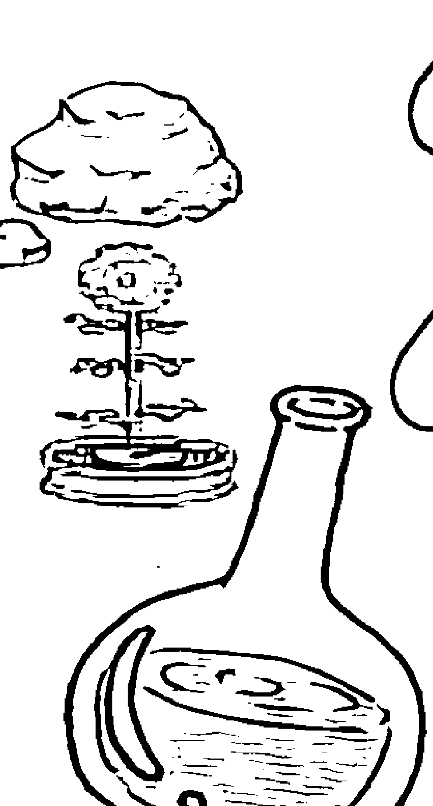

英國皇家化學會、鍊金術史及化學史學會會員 劉廣定教授 推薦

# 100個不可不知的鍊金術精華重點！

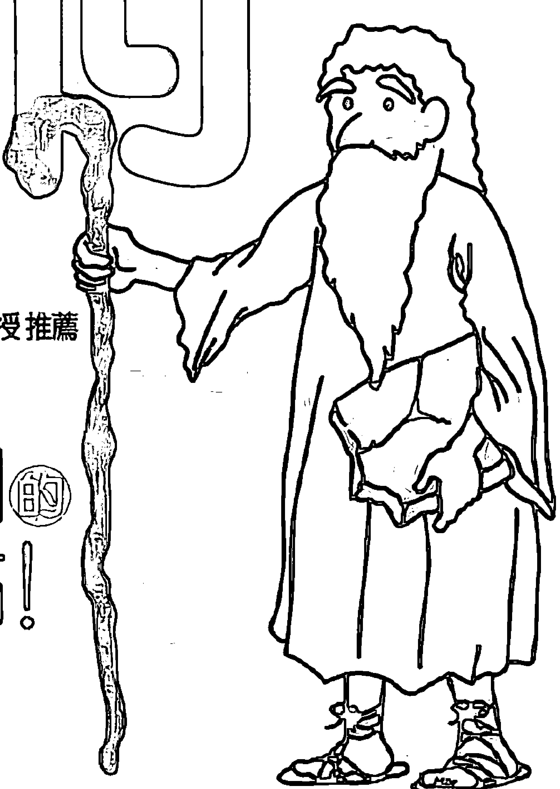

The Mystic Alchemy

圖解鍊金術

鍊金術百大蒐秘！圖文並茂，鍊金術入門必備手冊

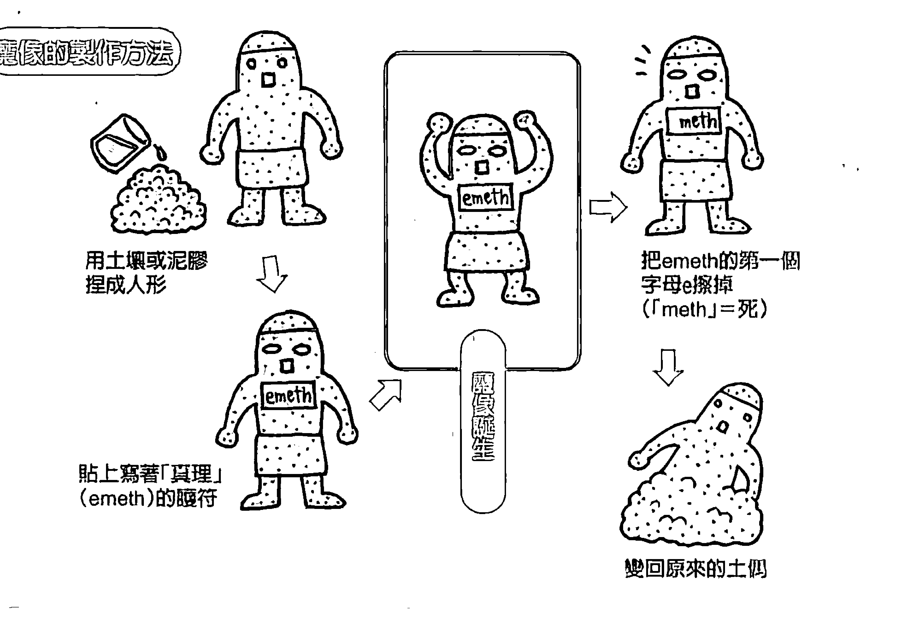

圖解鍊金術

## 作者簡介

草野 巧

1956年出生於栃縣・畢業於早稻田大學文學系文藝學科・在擔任雜誌、書籍的編輯後，成為自由作家。著有《能量寶石事典》、《幻想動物事典》、《水滸傳一百零八將的簡介》、《圖說怪獸天地》、《妖精事典》等。

## 譯者簡介

王書銘

輔仁大學日文研究所肄業。
翻譯作品《召喚師》、《O.K魔法的十五堂課》。

## 推薦者簡介

劉廣定

台大化學系名譽教授；中國化學會、美國化學會、英國皇家化學會、鍊金術史及化學史學會會員；中央研究院科學史委員會委員。

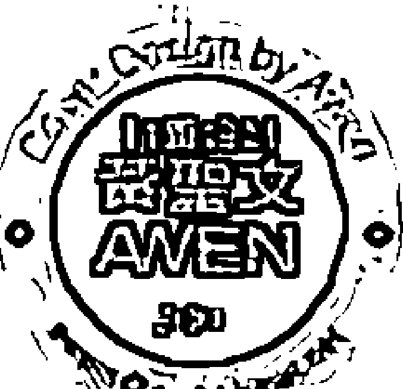

圖解鍊金術

AT-MAPS

手持幻想地圖，踏入知識滿載的奇幻旅程。

即將推出：

- ○圖解吸血鬼
- ○圖解近身武器
- ○圖解近代魔術
- ○圖解太空船

镇金堂何

金梅体

the calligraphy is in the style of Jin Mei Ti

TFMLAPS

圖解神秘學術
The Mystical Alchemy

奇幻基地

前言

炼金术可谓取之不尽用之不竭的奇幻宝库。
炼金术的历史比基督教还要悠久，其于西元九～十七世纪在欧洲达到鼎盛，十八世纪以后也尚有相当的影响力。虽然现在声势不如以往，但仍有少数相信炼金术的人存在。

炼金术之所以拥有如此大的魅力，就是因为它结合了古人最伟大的神秘思想和最尖端的科学技术。
对现代人而言，神秘思想与科学技术看起来可谓是风马牛不相干的概念，但这二者在古代与中世纪却是密不可分；而二者最完全的结合体，便是炼金术。

我们经常会认为各种魔法甚至神秘思想，毫无理论根据，但只要踏进炼金术的世界里，就会发现其实不然。炼金术的世界观看似非常神秘，它却自有一套完美的理论足以贯穿与连结诸多层面，无论是等级细微如元素的世界，甚或涵盖整个宇宙的大世界。因此，人类大可以在炼金术的领域里，自由自在地展开想像力的翅膀，无须像现代科学这般处处受侷促的「专业」框架限制。
自古以来，热衷于炼金术的炼金术师向来都是极具魅力的存在。儘管所有炼金术师全都怀抱着同样的炼金术大梦，但炼金术师却似乎有千百种。炼金术是最先进的科学技术，每个时代的伟大贤者们多半都为炼金术着迷；除此之外，还有眼里只有黄金的王公贵族，以及对有钱人虎视眈眈的骗徒。而许多有如宗教家或修行者的炼金术师，亦盼望能够透过炼金术来穷究真理。
本书希望尽可能简洁易懂地介绍这片丰饶的炼金术世界，将有助于顺利涉足这看似复杂难解的炼金术世界的读者，将这炼金术世界介绍给读者。

前言（序）

目次

## 第一章 煉金術的歷史

- No.001 何謂煉金術 —— 8
- No.002 煉金術之目的 —— 10
- No.003 煉金術之起源 —— 12
- No.004 煉金術之神話起源 —— 14
- No.005 煉金術的歷史 —— 16
- No.006 第一原則 —— 18
- No.007 大宇宙與小宇宙 —— 20
- No.008 四大元素 —— 22
- No.009 計算/方法 —— 24
- No.010 三原質 硫磺、水銀、鹽 —— 26
- No.011 七大金屬 —— 28
- No.012 賢者之石 —— 30
- No.013 賢者之石 —— 32
- No.014 偉大的作業 —— 34
- No.015 賢者之石的材料 —— 36
- No.016 煉金術的道具和設備 —— 38
- No.017 煉金術的基本操作 —— 40
- No.018 賢者之卵與最終作業 —— 42
- No.019 賢者之石的種類 —— 44
- No.020 賢者之石的效力 —— 46
- No.021 荷姆克魯斯 —— 48
- No.022 荷姆克魯斯的製作方法 —— 50
- No.023 魔像 —— 52
- No.024 魔像的製作方法 —— 54
- No.025 帶性之煉金術 —— 56

附錄：古希臘的物質觀 —— 58

## 第二章 歷代煉金術師

- No.026 古代的煉金術師 —— 60
- No.027 後代的煉金術師 —— 62
- No.028 赫密斯·特里斯密吉斯托斯 —— 64
- No.029 翠玉錄 —— 66
- No.030 帕諾波利斯的索席摩斯 —— 68
- No.031 女性煉金術師 —— 70
- No.032 伊斯蘭教的煉金術師 —— 72
- No.033 哈立德·本·亞齊德 —— 74
- No.034 查比爾·本·哈揚 —— 76
- No.035 阿爾·拉齊 —— 78
- No.036 阿維森納 —— 80
- No.037 歐洲的煉金術 —— 82
- No.038 大阿爾伯特 —— 84
- No.039 羅傑·培根 —— 86
- No.040 維朗諾瓦的阿諾 —— 88
- No.041 賴蒙·魯爾 —— 90
- No.042 尼樂·勒梅 —— 92
- No.043 尼樂·勒梅的黃金鍊成 —— 94
- No.044 喬治·雷普利 —— 96
- No.045 亞歷山大·塞頓 —— 98
- No.046 米格爾·森迪沃鳩斯 —— 100
- No.047 海耳蒙特 —— 102
- No.048 湯瑪斯·查諾克 —— 104
- No.049 但尼·札加利 —— 106
- No.050 特里爾的貝里納 —— 108
- No.051 王公貴族與煉金術 —— 110
- No.052 魯道夫二世 —— 112
- No.053 斐迪南三世 —— 114
- No.054 帕拉塞爾蘇斯 —— 116
- No.055 帕拉塞爾蘇斯的煉金術 —— 118
- No.056 愛德華·凱利 —— 120
- No.057 聖日門伯爵 —— 122
- No.058 卡廖斯特羅伯爵 —— 124

No.059 吉里·德·萊斯將軍 —— 126
No.060 薔薇十字團 —— 128
No.061 克利斯欽·羅森克羅伊茨 —— 130
No.062 共濟會 —— 132
No.063 共濟會的加入儀式 —— 134

專欄：文藝復興 —— 136

## 第三章 煉金術的知識

- No.064 煉金術師的出身階級 —— 138
- No.065 如何成為煉金術師 —— 140
- No.066 大師 —— 142
- No.067 煉金術師的實驗室 —— 144
- No.068 煉金術師的煩惱 —— 146
- No.069 偽煉金術師的造假手法 —— 148
- No.070 煉金術師悲慘的命運 —— 150
- No.071 煉金術禁令 —— 152
- No.072 煉金術的表現方式 —— 154
- No.073 煉金術的記號 —— 156
- No.074 煉金術的象徵 —— 158
- No.075 扁洛波羅斯 —— 160
- No.076 寓意 —— 162
- No.077 煉金術的神話 —— 164
- No.078 煉金術的密碼 —— 166
- No.079 煉金術與音樂 —— 168
- No.080 煉金術與塔羅牌 —— 170
- No.081 收納論 —— 172
- No.082 千年王國信仰 —— 174
- No.083 預言再生 —— 176
- No.084 煉金術與喀巴拉 —— 178
- No.085 生命之樹 —— 180
- No.086 占星術 —— 182
- No.087 諾斯替教 —— 184

專欄：鍊金術與藝術作品 —— 186

## 第四章 其他的鍊金術

- No.088 中國的鍊金術 —— 188
- No.089 中國的鍊金術師 —— 190
- No.090 李少君 —— 192
- No.091 魏伯陽 —— 194
- No.092 葛洪 —— 196
- No.093 抱朴子的煉丹法 —— 198
- No.094 印度的鍊金術 —— 200
- No.095 印度的鍊金術師 —— 202
- No.096 鍊金術師的發現 —— 204
- No.097 波義耳殺了鍊金術 —— 206
- No.098 牛頓與鍊金術 —— 208
- No.099 榮格與鍊金術 —— 210
- No.100 原子變換 —— 212

英日中名詞對照索引 —— 214
參考文獻 —— 220

何謂煉金術

煉金術是使人類成為與神明同等存在的神聖技術，是一種神秘而充滿秘密宗教色彩的密技。

◇人類達成與神明同等存在的神聖技術 何謂煉金術？簡單地說，煉金術是使人類成為與神明同等存在的神聖技術。

英文「煉金術」(alchemy) 源自阿拉伯語的「技術」(alkimia) 一詞。「al-」是阿拉伯語的定冠詞，相當於英語的「the」。至於「kimia」則有此一說：此詞源自埃及語的「黑土」(keme)，是古代用來指稱埃及的用語。如此推論，則煉金術的原意應該是「埃及的技術」的意思。而現代英語的「化學」(chemistry) 也是從煉金術演變而來。

在此必須特別說明的是，所謂「技術」對古代人來說，其並非「人技」而是「神技」。冶金、金屬加工、染色、製作玻璃、建築，全都是神明技術的重現。古代的工匠與宗教、魔法可謂息息相關，所以每次工作前都會先獻禱、舉行各種儀式。

煉金術便是以這些古代技術為基礎，並和當時埃及附近流行的神秘思想（如赫密斯思想）結合後方才誕生，所以煉金術如此神秘和難以捉摸，也是理所當然、不足為奇。

或許是因為前述背景之故，煉金術師多偏好以秘教形式傳授自己的技術與知識。此處所謂秘教形式意指不可將煉金術知識洩漏給外人知道。正因如此，煉金術師記載的煉金術知識才會充滿各式各樣的象徵寓意與謎題，非一般人能理解和參透。

鍊金術 (alchemy) = 煉金術的英語單字

語源

技術 (alkimia) = 阿拉伯語的「技術」

阿拉伯語的定冠詞

埃及

埃及的「技術」

神技

- 冶金
- 金屬加工
- 染色
- 製作玻璃
- 建築等

神秘性格

秘教性格

煉金術

使人類成為與神明同等存在的神聖技術

神秘的、秘教的技術

秘教

1. 不可將內容洩漏給外人知道
2. 煉金術師→喜歡使用充滿象徵意涵、謎題般的記載方式
3. 外人不容易理解

NO.002
煉金術之目的

Purposes

人類相信神明的技藝——煉金術可以化一切為可能，如煉製黃金、長生不老、製造賢者之石等。

◇ 煉金術的目的不只是煉成黃金

煉金術是把人類變成與神明同等存在的技術，換句話說，也就是將人類這種不完全的存在變成像神一樣的完全的存在。因此，透過具體思考推論便可發現，煉金術的的確確可以視目的而有各式各樣的不同的應用。

在煉金術所有的應用例子當中，最有名的當屬將鐵、鉛、銅等賤金屬變成黃金的「黃金煉成」；因為古代與中世紀的人認為賤金屬是不完全的金屬，而黃金則是完全的金屬。為人治病、長生不老也都是煉金術的重要目的，因疾病是種不完全的狀態，而長生不老則是完全的狀態，於是製作能治癒一切病痛的萬能藥物（靈藥）亦成為煉金術的另一個重點項目。除治療疾病以外，許多人也認為這個靈藥具有將賤金屬變成黃金的力量。此外，若欲使不完全的人類成為神一般完全的存在，靈性方面的條件遠比肉體上的條件來得重要，是以提高人類靈性亦成為煉金術師行使煉金術之目的。中世紀歐洲的煉金術流行製作賢者之石，此物是否由靈藥發展而成，並不可知。簡單地說，賢者之石就是萬能的石頭，它非但能煉製黃金、使人長生不老，甚至還可以讓人隱形或號令眾天使。而且，若人類能夠成為與神同等的存在，那麼理應也能用煉金術來創造人類才是；於是有些煉金術師遂主張煉金術可以創造荷姆克魯斯（人造人）。

行使煉金術之目的在十七世紀後更趨擴張，甚至連創造完全的宇宙、完全的理想社會都成了煉金術的理想目標。

化一切為黃金的煉金術

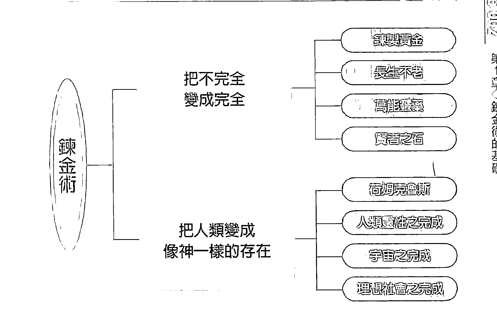

將一切不完全變成完全

| 不完全 | 完全 |
| :--- | :--- |
| 賤金屬 | 黃金 |
| 疾病 | 健康 |
| 終將死亡的存在 | 長生不死的存在 |
| 鄙俗的人類 | 充滿靈性的人類 |
| 不幸的社會 | 幸福的社會 |
| 未完成的宇宙 | 已完成的宇宙 |

NO.003
煉金術之起源

Origin

埃及發達的工藝技術、美索不達米亞的占星術、古希臘哲學，再加上各種神秘思想交融混合，方才有鍊金術的誕生。

### ☆ 誕生自古亞歷山卓城的鍊金術

煉金術約於西元前三世紀至西元三世紀發源自埃及的亞歷山卓一帶。

西元前3000年左右的埃及，其冶金、建築、調配藥劑、製作染料顏料、織布等工藝技術就已經十分發達；西元前三世紀以前，古埃及民族便已確立製造玻璃的技術，甚至已經有能力製作染色的合金與人工寶石。這類技術在古代美索不達米亞同樣發達，都是鍊金術在技術層面上不可或缺的必要因素。

同時，亞歷山卓有亞里斯多德、柏拉圖等人確立當時基本物理化學理論的古希臘哲學；亞歷山卓乃希臘北方馬其頓君王亞歷山大大帝於西元前332年建造的都市，許多希臘知識份子皆在此集居。

美索不達米亞的占星術在非常早期的時候就已經傳入埃及，其冶金、建築等工藝在古代社會原本就和宗教、魔法關係匪淺，因此占星術和魔法早就深植於各種技術之中。

除此之外，當時亞歷山卓一帶還有各式各樣的宗教、神秘思想流行，而融合新柏拉圖主義、諾斯替教等思想的赫密斯思想，堪為代表。

鍊金術就由前述諸多要素混雜並陳的混沌狀態中誕生，而這也是為何鍊金術從誕生初始就如此繁複而神秘的原因。

概念的誕生

- 美索不達米亞的占星術
- 埃及、美索不達米亞的工藝技術
- 古希臘哲學
- 其它
  - 埃及魔法
  - 基督教神學
  - 異教神話
- 埃及周邊的神秘思想
  - 新柏拉圖主義
  - 諾斯替教
  - 赫密斯思想
- 亞歷山卓的煉金術
- 後來的煉金術

古亞歷山卓城的榮景

亞歷山卓城乃其希臘國王亞歷山大大帝所建，亞歷山大死後埃及由其部下托勒密統治，建立了托勒密王朝，從此埃及納入希臘人統治，而埃及的希臘化自然是無可避免的趨勢，其中又以亞歷山卓城特別 托勒密王朝建都於此，還營造了世界七大奇觀之一的 亞歷山卓燈塔，以及亞歷山卓博物館、亞歷山卓圖書館等建設，將亞歷山卓城塑造成古代世界的學術、文化、經濟中心，進入羅馬統治時代後，羅馬人亦格外用心經營，亞歷山卓終於發展成總人口超過百 萬的國際性大都市，煉金術就是在這片繁榮盛況中孕育、茁壯。

> 亞歷山卓博物館 (Alexandrian Mouseion)：英語的博物館 (Museum) 一詞來自希臘語 Mouseion，法國學者比代 (Guillaume Bude) 對此解釋為「供 研究之場所」，亞歷山卓博物館實際是一所研究機構、圖書館 與博物館的綜合體，與現代意義不同。

NO.004
煉金術之神話起源

Mythic Origin

古代的鍊金術師認為，鍊金術是墮落天使傳授給人類的眾多魔法之一。

### 墮天使落入凡間帶來的智慧

從前在西元三世紀左右，在亞歷山卓活動的索席摩斯等的鍊金術師有個神秘的故事，為鍊金術的起源平添不少色彩；他們相信，人類的鍊金術來自於墮落的天使。

聖經裡對墮天使的故事著墨不多，不過舊約聖經的偽經——衣索比亞語的以諾書對其有詳細的描述。

時值凡間人口逐漸增長，許多天使為凡間美女傾心，遂自天堂降凡間，和人類女性結婚，這些下凡的墮天使多達200餘人。他們把原本屬於神的各種技藝傳授給人類，包括如何打造刀劍盾牌盔甲、如何製作飾品等金屬製品、如何做出染料、如何化妝等日常技術，以及天文學、占星術、藥物學、魔法等較具規模系統的知識；結果人類也開始墮落，男人學會戰爭、女人學會打扮獻媚賣弄美色，神才怒而興起著名的諾亞大洪水。

古代的鍊金術師遂結合此傳說與鍊金術之起源，主張鍊金術就是當初由墮天使跟其它魔法一併傳授給人類的。

在鍊金術神秘不可考的歷史中，有位名叫伊西斯的鍊金術師；傳說為其著作的古代文獻抄本裡，也記載著類似的故事。伊西斯原是埃及的女神，她曾在書信中向其霍露斯自白，表示她的知識與智慧其實是她和預言者天使長亞姆納耶（Amnael）交合換得的報酬。從這裡就不難發現，鍊金術打從開始就是神秘、隱而不顯之術，同時也是個被詛咒的技術，而且跟占星術、魔法之流關係匪淺。

鍊金術打從一開始就是被詛咒的技術

① 索希馬斯之說

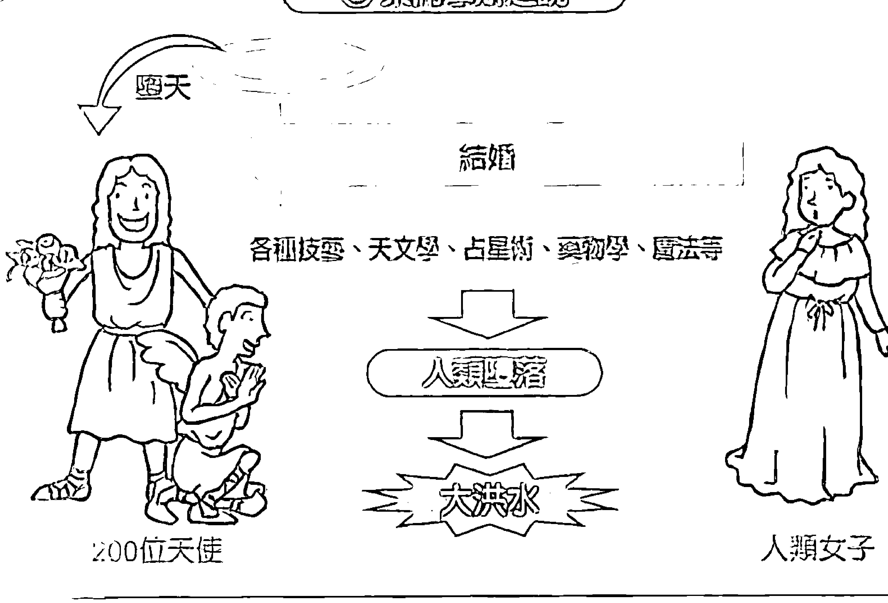

② 伊西斯之說

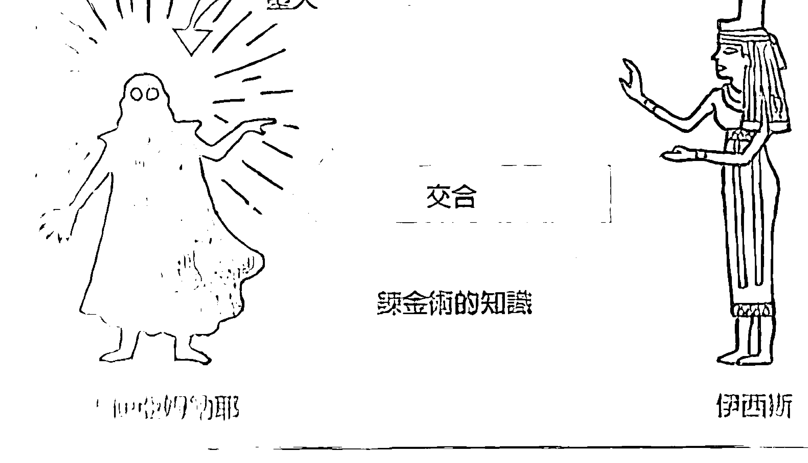

NO.005
煉金術的歷史

鍊金術發祥自古亞歷山卓，經由拜占庭、阿拉伯等地，數百年後才傳至歐洲。

### 從亞歷山卓到歐洲

鍊金術誕生自古埃及的亞歷山卓，但亞歷山卓的鍊金術終究難逃沒落命運；四世紀時基督教司教狄奧菲魯斯大舉打壓迫害異教文化，鍊金術中心重鎮薩拉匹斯寺院與有名的鍊金術圖書館皆遭破壞殆盡。於是鍊金術中心地遂移轉至拜占庭（東羅馬帝國）的君士坦丁堡，此地有哲學家斯蒂法諾等眾多學者，孜孜不倦地從事鍊金術研究。

七世紀左右，阿拉伯世界的伊斯蘭教勢力崛起，並且在不到一個世紀的時間內建立起版圖涵蓋敘利亞、波斯、埃及、非洲與西班牙的龐大帝國。阿拉伯人包容不像歐洲的基督教徒，他們頗能接納古希臘的各種學識，以及希臘化時代流行的魔法或占星術等知識；鍊金術便在這樣的背景下傳至阿拉伯。

阿拉伯人對鍊金術的發展可謂貢獻極鉅。鍊金術許多重要用語如鍊金術（alchemy）、蒸餾器（alembic）、酒精（alcohol）等，全都以阿拉伯語的定冠詞al開頭，其重要性可見一斑。此外，阿拉伯人亦首開將鍊金術作醫學運用之風氣，有人認為中國尋求長生不老仙丹妙藥的鍊金術也在此時傳入阿拉伯地區。

歐洲的鍊金術便是來自阿拉伯世界。從西元十一世紀末起，歐洲人為了奪回聖地曾多次組織十字軍遠征中亞近東地區；歐洲拜此所賜，方得接觸來自阿拉伯世界的豐富知識，並開始從事阿拉伯科學的研究。歐洲的鍊金術在此時始得萌芽，以致後來蔚然成風。

### 煉金術的中心地

| 時間 | 地點/事件 |
|------|------------|
| 西元前三世紀～西元四世紀 | 古埃及・亞歷山卓<br>煉金術因宗教迫害而大幅衰退（四世紀） |
| 四世紀～八世紀 | 拜占庭・君士坦丁堡<br>回教帝國崛起（七世紀～八世紀） |
| 八世紀～十一世紀 | 阿拉伯世界<br>十字軍東征（十一世紀末～十三世紀後半） |
| 十三世紀～十七世紀 | 歐洲地區 |

在歐洲大為盛行

### 歐洲擴張（十五世紀左右）

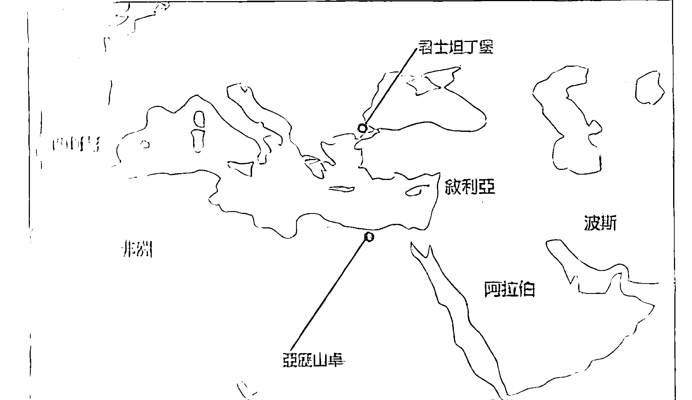

### 第一原質

Prima Materia

世上所有物質都是由某種唯一的物質構成，此乃鍊金術不可動搖的大前提。

### ◇ 一為全，全為一——鍊金術的基礎定律

鍊金術從初誕生的古亞歷山卓時代到風靡歐洲的中世紀，一直都有個不變的前提概念：「宇宙所有存在皆是由某種唯一的物質所構成。」

這個思想其實並不專屬於鍊金術，而是當時的普遍思想。孕有出鍊金術思想的赫密斯思想就相信原初的宇宙唯一只有神，別無它物，後來才有耀眼奪目的靈魂從祂身體流出，構成人類居住的宇宙（太陽系）。換句話說，宇宙萬物全都是由神的靈魂所組成的。古希臘哲學家阿里斯多德並未提及這種從神體內流出的靈魂，但他同樣相信一切物質都是由同一種東西構成，並將它命名為第一原質。

由第一原質構成的宇宙基本上是個天動說的世界，就像是個只有太陽系的宇宙。在這個宇宙裡，大氣層包覆著地球，位於正中央，其外則有太陽、月球、火星、水星、木星、金星、土星七個行星運行的七個天，再往外的第八天則是無數不會運動的恆星。神就在八天之外一個叫作原型宇宙的地方。

在這個理論之下，宇宙會是什麼樣子呢？既然宇宙一切物質都是由第一原質構成，那也就是說第一原質就是所有物質的根本，不論何種物質，不論礦物植物或動物，任何東西都是第一原質的變形；換言之，某種物質就可能變換成另一個完全不同的東西。鍊金術有句格言曰：「一為全，全為一」，就是這個道理。

1. 煉金術的前提：宇宙是由某種唯一的物質所構成
2. 第一原質 = 神的靈
3. 第一原質變形
4. 所有物質：行星、動物、植物、礦物等

### 原型宇宙

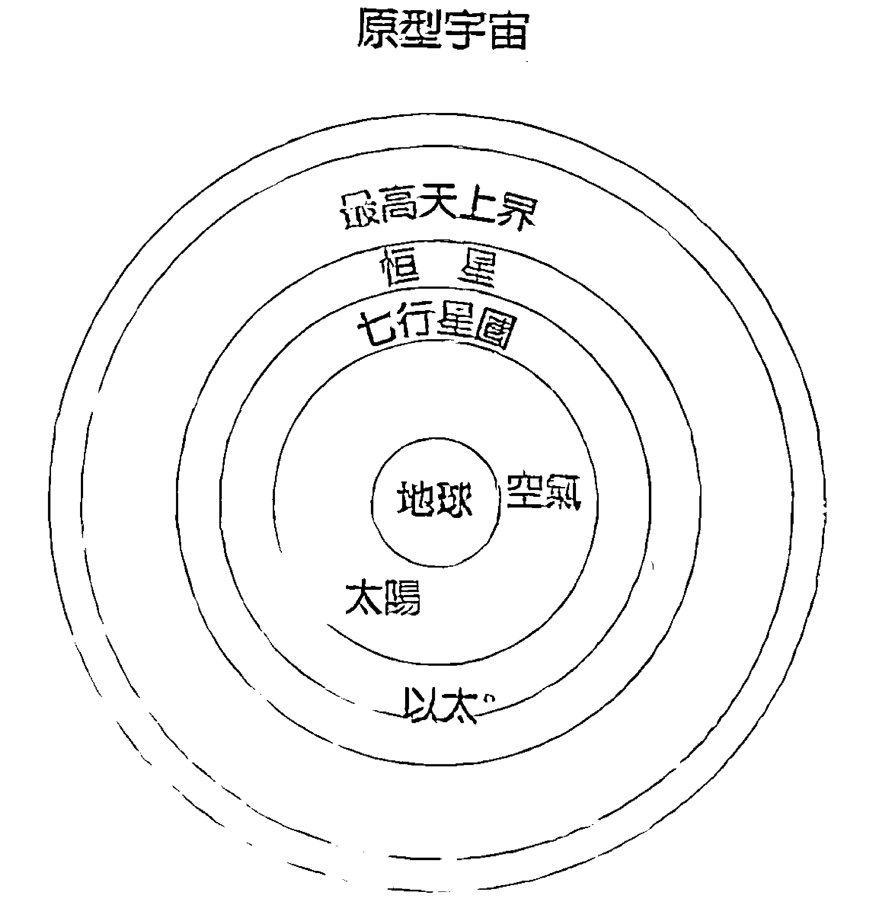

### 大宇宙與小宇宙

Macrocosm-Microcosm

鍊金術師認為宇宙是一個生物體，其整體是以大宇宙與小宇宙乃完全對應的關係，與各個部分連結在一起。

### ◇ 完全對應的整體與部分

前一節提到，宇宙間存在的物質皆是由一種類似第一原質或神靈的單一物質構成。此理論又可衍生出鍊金術的另一個大前提：「大宇宙（天體）與小宇宙（人類）之間，存在對應關係」

構成所有物質的第一原質其概念和動物體內流動的血液頗為相似，所以整個宇宙也可以看作是一個完整的有機體（動物）；既然是有機體，不論相隔再怎麼遙遠，有機體的每個部分都擁有必然的關聯。

此概念並非鍊金術師的專利。這也就是為什麼天體運行會影響人類的原因，而占星術自古便以此概念為理論基礎。看手相卜算他人運勢亦同，手相本身也是個小宇宙，乃以人類為媒介，與大宇宙發生關係。

照道理來說，若大宇宙與小宇宙兩者乃完全對應關係，那麼不但大宇宙會影響小宇宙，小宇宙也會影響大宇宙才是。孕育出鍊金術的赫密斯思想便作如是想。倘若真是如此，那又會是個什麼樣的世界呢？鍊金術師用坩堝與燒瓶使各種物質產生反應，但發生的反應絕不僅止於小小的坩堝與燒瓶裡。此時的坩堝或燒瓶就是個小宇宙，和大宇宙連結在一起。因此鍊金術才會發展出下列思想：「鍊金術師不但能將黃金煉成、將長生不老化為可能，還能讓自己成為與神同等的存在，改變整個宇宙，使宇宙愈趨完整。」

### 大宇宙与小宇宙的关系

图示展示了大宇宙与小宇宙之间的对应关系：
- 大宇宙对应天体运行。
- 小宇宙对应人类的命运。
- 炼金术（炼金术）作用于大宇宙和小宇宙，产生影响。
- 占星术（占星术）通过天体运行来影响人类的命运。
- 手相、面相等也与人类的命运存在对应关系。

### 炼金术所意味的事项

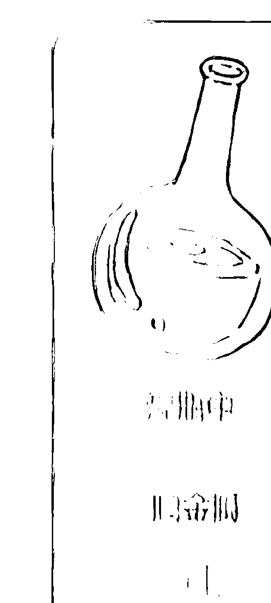

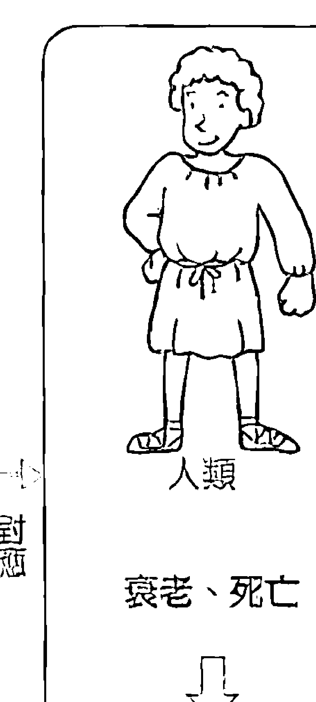

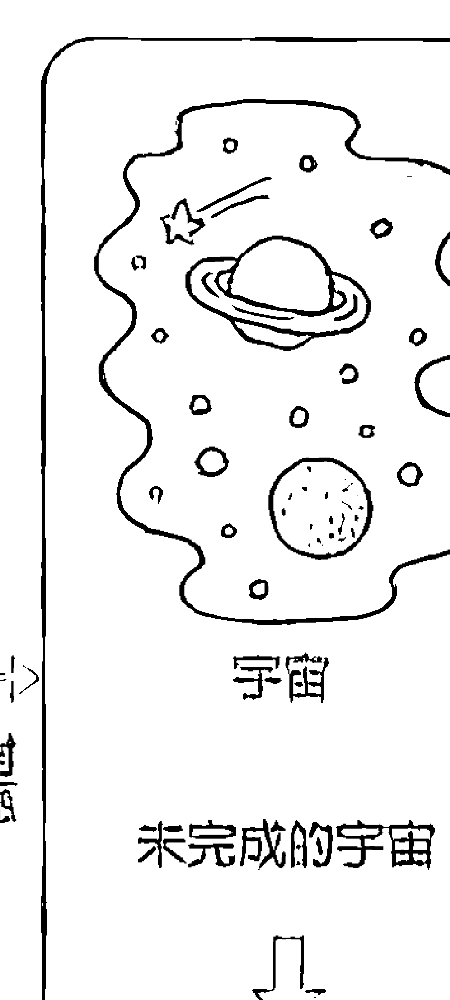

### No. 008

#### 四大元素
Four Elements

> 炼金术就是因为四大元素理论才得到了黄金炼成的物质理论根据，进而得以被确立。

### 炼金术以为根柢的古希腊物质理论

欲使炼金术得以确立为一門有体系的學問技術，除神秘的宇宙論以外，還必須要有一個能夠說明黃金煉成現象，較細膩的物質理論。

炼金术的物质理论，就是四大元素理论。

四大元素理论乃源自古希腊的物質觀，主張世上所有物質皆是由火、風、水、土四大元素構成。各元素並非實際存在的物質，四大元素其實是種類似構築物質各種狀態之礎石的概念。西元前四世紀，希臘哲學家亞里斯多德又進一步發展四大元素理論；他認為所有物質皆是以第一原質為基本，第一原質加上濕、乾、熱、冷四個性質的其中兩個性質，就會形成四大元素，附加於第一原質的兩個性質不得是「濕、乾」、「熱、冷」這種相反性質的組合，這麼一來就會形成四種元素：第一原質加熱乾為火，熱濕為風、冷濕為水、冷乾為土。重要的是，萬物皆以第一原質為本，只要改變附加的性質，四大元素就可以相互變換。風元素去熱加冷，就會變成水元素；融合風元素與土元素、除去熱與乾的性質，同樣也可以得到水元素。根據此理論，除四大元素本身以外的所有物質，都是由不同比例的四大元素混合而成，既然四大元素間可相互轉換，所有物質當然也能互相變換。至此，煉金術師才終於確立了鉛等賤金屬能夠變成黃金的煉金術物質理論根據。

### 第一原質 物質之基本

### 濕·乾·熱·冷 物質之性質

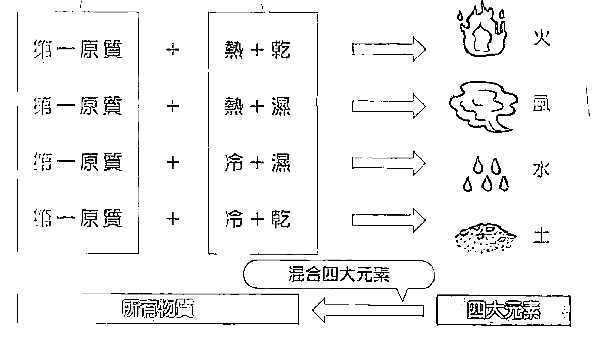

混合四大元素形成所有物質。

### [P009] 四大元素理論之應用實例

- 火→風：(火) 熱+濕 = (第一原質+熱+乾) - 乾+濕 = 第一原質+熱+濕 = 風
- 風→水：(風) 熱+濕+冷 = (第一原質+熱+濕) - 熱+冷 = 第一原質+冷+濕 = 水
- 水→土：(水) 冷+濕+乾 = (第一原質+冷+濕) - 濕+乾 = 第一原質+冷+乾 = 土
- 土→火：(土) 冷+乾+熱 = (第一原質+冷+乾) - 冷+熱 = 第一原質+熱+乾 = 火

### 計算方法
Calculation

鍊金術師相信四大元素理論、硫磺水銀理論等概念，並且會用各種毫無根據可言的計算方式來決定物質的量。

#### 以均衡理論為根據的計算方法

試圖將金屬變成另一種金屬的鍊金術師們，究竟是以何種理論為根據來計算出材料物質的量呢？這個部分通常不甚明確，不過還是有些鍊金術師會對計算方法做較詳盡的論述。八世紀的阿拉伯鍊金術師查比爾·本·哈揚便是其中一人，他除了以傳統的四大元素理論、數字占卜為根據來計算材料的量以外，還加入獨特的「均衡」概念，其計算算法如下：

首先把英文字母由A到Z依序編號為1～26；這些數字裡，奇數代表「冷性質的量」，偶數則是「乾性質的量」。經過計算，金、銀、水銀、錫、鉛、銅、鐵的冷乾比分別如右頁所示。

計算出冷乾比以後，只要混合數種賤金屬，調和出與黃金相同的冷乾比即可。舉例來說若以銀和錫為材料，經過簡單的比例計算後，只要用銀與錫以12.5：1的比例混合，就能得到與黃金相同的冷乾比11：26；鉛與鐵=2 24/47：1的比例就可以調配出黃金的冷乾比。

當然，世上所有物質都是由四大元素組合而成，所以萬物皆具備冷、熱、乾、濕四種性質。再者，各人使用語言則有希臘語、阿拉伯語、拉丁語、希伯來語等不同用法，且所使用的數字也必須以特殊的數字占卜法則為依據，因此計算過程可謂複雜之極。更傷腦筋的是，計算出來的數值並非物質的質量，而是物質的「本性」；即便計算出來的數字看起來再怎麼簡單，其真正意義也非我輩現代人所能知。

### [物質之測定方法]

奇數=冷性質的量    偶數=乾性質的量
字母→數字
金 → kin → k=11， i=12， n=14
奇數：11 冷    偶數：12+14=26 乾
金=冷：乾=11：26

以相同方法計算其它金屬得到：

| 金屬 | 值 |
|------|----|
| 銀 | 7 : 26 |
| 水銀 | 56 : 26 |
| 錫 | 61 : 26 |
| 鉛 | 15 : 44 |
| 銅 | 36 : 4 |
| 鐵 | 26 : 40 |

#### 應用

以銀和錫製作金
銀 (12.5單位) + 錫 (1單位) → 金

以鉛和鐵製作金
鉛 (2 24/47 單位) + 鐵 (1單位) → 金

工作之石的別稱 - No.013、No.019、No.020

### 三原素—硫磺、水銀、鹽

#### Tria Prima—The Sulphur-Mercury-Salt Theory

鍊金術師認為硫磺、水銀、鹽是重要性僅次於四大元素的物質，因而建立三原素理論。

#### 煉金術師的三神器

鍊金術有個和四大元素同等重要的理論：「硫磺」、「水銀」、「鹽」三原素理論。

第一原質和四大元素的物質理論已經證明了黃金煉成是可以成立的。所有物質都是由第一原質搭配冷熱乾濕四種性質組合構成，所以理論上不論使用任何材料應該都能變成黃金。但在所有材料裡，尤以硫磺與水銀特別受鍊金術師重視。

硫磺與水銀二原素早在鍊金術盛行於阿拉伯的時代便備受重視，硫磺非但有燃燒作用，還能使金屬變成金黃色，而水銀變化多端，在常溫下呈液狀，可以輕易地與各種金屬結合成合金，這就是硫磺和水銀特別受到重視的原因。由於前述諸多緣由，最終使得鍊金術師相信理想的「硫磺」與「水銀」兩者性質恰恰相反，是金屬的形成過程中非常關鍵的物質。他們認為硫磺是男性的、能動的，水銀則是女性的、被動的；硫磺與水銀亦分別象徵物質相反的兩個性質，如不揮發性與揮發性。此外，他們亦主張七大金屬便是由此二原素結合而成。

此思想傳入歐洲後和基督教的三位一體論結合，終於形成硫磺、水銀、鹽三原素理論。不只是金屬，鍊金術師還相信所有物質全都是由三原素所構成，此思想乃帕拉塞爾蘇斯所確立。但三原素裡的鹽只不過是個促使硫磺水銀結合的媒介、中間性要素，在鍊金術理論裡並不是很重要。因此鍊金術實際上並不太使用鹽，通常都只是使用硫磺和水銀而已。

### 阿拉伯時代

### 硫磺、水銀二原素理論

硫磺＝燃燒作用、金屬的金黃色化作用
水銀＝常溫下呈液態、可輕易結成合金

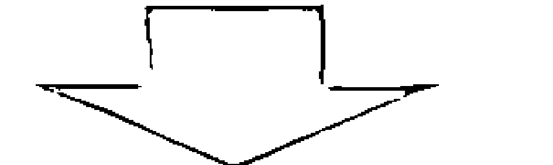

### 歐洲

### 硫磺、水銀、鹽三原素理論

中間性要素（實際上並不常使用）

### 三原素之性質

|          | 水銀 | 鹽 | 硫磺 |
|----------|------|------|------|
| 性       |      | 中性 | 男性 |
| 活力     |      | 中性 | 能動 |
| 揮發性   |      | 固態性 | 不揮發性 |
| 可燃性   |      | 不可燃性 | 可燃性 |
| 金屬之父/母 |      | 金屬之子 | 金屬之父 |
| 運動/形相 |      | 運動 | 形相 |
| 灰/脂肪 |      | 灰 | 脂肪 |
| 肉/魂   |      | 肉 | 魂 |

### 四大元素、三原素的關係

|   | 水 | 以太 | 火 | 土 |
|---|---|---|---|---|
| 水銀 | 水銀 |   |   |   |
| 鹽 |   | 鹽 |   |   |
| 硫磺 |   |   | 硫磺 | 硫磺 |

以太：自古便充塞宇宙的物質。第五元素的別名→No.012

> 延伸閱讀
- 四元素說：No.008
- 煉金術：No.006
- 金屬：No.011
- 帕拉塞爾蘇斯：→No.054
- 帕拉塞爾蘇斯的鍊金術：No.055

### 七金屬

炼金术师的七金属理论承自铁器时代的冶金师信仰、占星术和轮回转生等思想。

### ◇承继古老信仰的炼金术师金属论

炼金术师对金属有一套非常特别的理论：「金属共分铁、铜、铅、锡、水银、银、金七个种类，并且必须循铁→铜→铅→锡→水银→银→金的过程，始得成为完全的金属。」

这个理论并非炼金术师凭空捏造的妄想，而是由铁器时代采掘铁矿的冶金师信仰及占星术所发展而成的传统思想。

铁器时代的冶金师相信矿山乃大地母神，而金属就在大地母神的子宫内，历经数千年时间慢慢成长；他们认为矿山之所以产铁却无金矿脉，其实是因为矿藏还没成熟之故。换句话说，金属成长神话早在炼金术问世很久以前就已经存在。

后来金属论更吸收占星术思想，并依其颜色等特征和天体中的七个行星结合：铁＝火星、铜＝金星、铅＝土星、锡＝木星、水银＝水星、银＝月球、金＝太阳，各种金属会在相对应的行星影响力之下逐渐成长。

于是，金属共分七种且还会不断成长的思想至此终于诞生。

此外，炼金术师的金属观亦受所有生物皆必历经出生、死亡与复活的轮回转生信仰的影响，所以炼金术师认为金属也会死而复生。

此思想亦使炼金术师特别重视金属炼成过程中的「死亡」因素。金属炼成必须历经「腐败」的过程，而这也正意味着金属的「死亡」；唯有经过「腐败」，以不同形态获得重生，才能把金属变成黄金。

### 古代信仰與鍊金術師之金屬觀

神話

金屬會歷經漫長時間慢慢成長

鍊金術師之金屬觀

金屬也會死後重生

腐敗與重生
鐵 → 銅 → 鉛
錫 ← 水銀 ← 銀 ← 變成金

### 七行星與金屬的關係

| 行星 | 符号 | 金属 | 天体 | 符号 |
|------|------|------|------|------|
| 火星 | ♂   | 鐵 | 火星 | ♂   |
| 金星 | ♀   | 銅 | 金星 | ♀   |
| 土星 | ♄   | 鉛 | 土星 | ♄   |
| 木星 | ♃   | 錫 | 木星 | ♃   |
| 水星 | ☿   | 水銀 | 水星 | ☿   |
| 月球 | ☽   | 銀 | 月球 | ☽   |
| 太陽 | ☉   | 金 | 太陽 | ☉   |

### 第5元素

> Quinta Essentia

促使第一原質與濕乾熱冷四種性質結合，形成四大元素的物質，就是第五元素。

- ✧ 第一原質與四大元素的中間性元素

歐洲很早就有個概念：「宇宙裡除第一原質和四大元素以外，還有第五個元素存在。」第五元素別名以太，是推動充塞宇宙空間的天體進行運動的「力量」，是一種非常不可思議的物質。亞里斯多德認為第五元素的本質比四大元素更加尊貴，是構成天體的物質。這也就是說，他們相信第五元素是第一原質和四大元素的中間性元素。

中世紀歐洲鍊金術師更進一步以此思想為基礎，將第五元素定義為一種類似於物質的「精」、「氣」的概念，並且以「紐瑪」（Pneuma）、「精神」（Spiritus）等名稱之。所有物質皆是由四大元素構成，四大元素又是第一原質加上濕乾熱冷四個性質其中二項而組成；而紐瑪就是促使第一原質與兩個性質結合的力量，世上的所有物質裡都有它的存在。按照此理論來推論，將會得到何種結果呢？倘若能從物質中抽取微量的紐瑪，鍊金術師就能自由控制第一原質與濕乾熱冷四個性質的結合。因此，使得各種從物質裡抽取第五元素「紐瑪」的鍊金術作業在中世歐洲盛行一時。

當時的鍊金術師曾試著用蒸餾設備抽取第五元素，因為他們認為物質遇熱產生的蒸氣裡就含有第五元素的成分。蛋類是鍊金術師最常用來蒸餾萃取第五元素的物質；蛋裡孵出的鳥類外型跟蛋說像不像，說不像又有點像，所以鍊金術師才會相信蛋裡含有生命體原初的紐瑪。如果鍊金術師可以利用第五元素任意變換物質，那麼第五元素就和賢者之石沒什麼兩樣，所以中世紀歐洲經常將第五元素視同為賢者之石。

### 亞里斯多德的物質圖

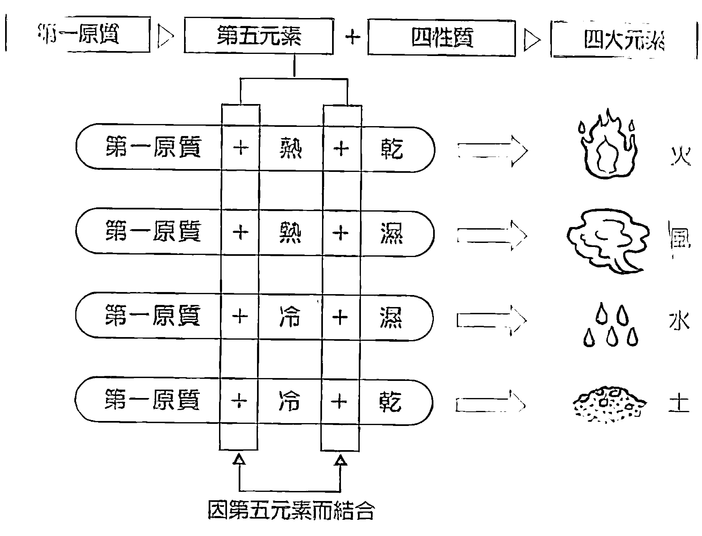

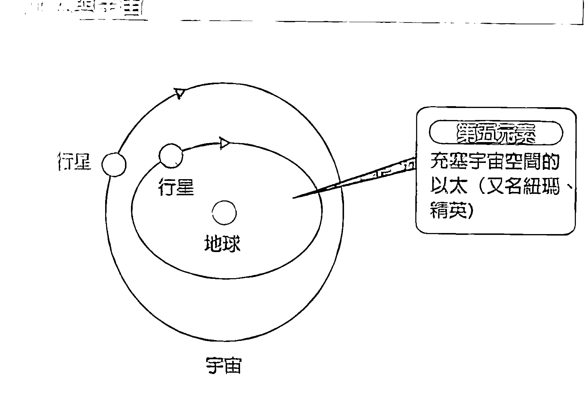

- 醫者之石的材料—No.015
- 醫者之石的種類—No.010
- 醫者之石的效力—No.020

#### 賢者之石
##### Philosopher's Stone

自古以來，鍊金術師就一直在尋找可以鍊成黃金的特別物質，也就是中世紀歐洲所謂的賢者之石。

##### 將一切化為可能的萬能之石

鍊金術風潮在中世紀歐洲達致鼎盛，每個鍊金術師無不是拚命絞盡腦汁，千方百計想要製造出賢者之石。製作賢者之石，就是這個時代鍊金術最主要的目的。

理由非常簡單。賢者之石不但能鍊成黃金，還能讓人長生不老、使人類靈性趨向完整，是一顆能達到鍊金術所有夢想的萬能聖石。舉例說明，中世紀歐洲人相信只要在盛有高溫液體金屬的坩堝裡投入賢者之石的碎片，就能把普通的金屬變成黃金。

如前所述，人類自古以來就相信某些特別物質會對物質的變換造成相當大的影響。古代的鍊金術師認為鉛是種變化多端的特別金屬，是以特別重視它；這是因為當時已經知道如何利用鉛，從質雜不純的貴金屬中萃取純金與純銀。中世紀阿拉伯地區較重視水銀與硫磺，他們相信融合水銀與硫磺就能製作出靈藥（萬靈藥），非但能治百病還可以點石成金。

前述思想進入歐洲以後，鍊金術師認為這種特別的物質應該是顆石頭，能化一切為可能。不過雖然名為石頭，賢者之石除了固體形態以外，有時亦作粉末狀或液態。

十六世紀的鍊金術師帕拉塞爾蘇斯認為萬能溶劑（Alkahest）是種和賢者之石頗為相似的物質。萬能溶劑正如其名，能夠溶化、還原任何物質成第一原質。不過就算真有此物質存在，也沒有容器能不被它溶化，也就是說萬能溶劑根本無從保存，因此帕拉塞爾蘇斯此說並不甚受其他鍊金術師支持。

* 黄金炼成
* 不老不死
* 人类灵性之完成
* 宇宙之完成
* 无所不能

##### 中世纪欧洲炼金术师的最大目标

### 物质之变迁

| 时代／人类 | 特别物质 |
| :--- | :--- |
| 古希腊人 | 铅 |
| 11世纪阿拉伯 | 硫磺＋水银→灵药 |
| 12世纪欧洲 | 硫磺＋水银→贤者之石 |
| 16世纪帕拉塞尔苏斯 | 万能溶剂 |

### 物质的形态

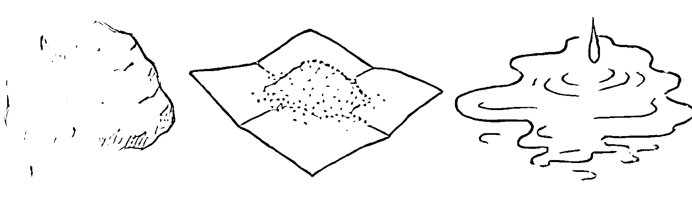

* （？）→No.015 → 帕拉塞尔苏斯 → No.064
* （？）→No.019 → 帕拉塞尔苏斯的炼金术 → No.055
* （？）→No.020 → 第一物质 → No.006## 偉大的作業

> **Magnus Opus**

鍊金術師日夜埋首於鍊金術的偉大作業，目的就是要得到賢者之石。

#### 鍊金術師製作賢者之石的作業

從事鍊金術之最主要目的——製造賢者之石，其作業被鍊金術師叫作「偉大的作業」，此作業可分為兩個階段：

1. 萃取理想的「硫磺」與「水銀」之作業
2. 結合所得「硫磺」「水銀」之作業

鍊金術師認為只要使「硫磺」與「水銀」結合就能得到賢者之石，然而此處所謂「硫磺」、「水銀」並非現今認知的硫磺與水銀。此二者乃構成所有物質的基本要素，請明白這些就是虛構的、理想中的「硫磺」與「水銀」。

除礦物以外，鍊金術師還會使用動植物等各種物質為材料來萃取「硫磺」與「水銀」，他們相信所有物質皆是由「硫磺」和「水銀」所構成，因此不論使用任何物質理應都能得到「硫磺」與「水銀」才是。不過鍊金術師最常用的材料還是金與銀，以金取「硫磺」、以銀取「水銀」。

煅燒、昇華、融解、結晶、蒸餾等都是鍊金術常用的操作手法；鍊金術師就是結合運用這些操作手法，試圖抽取理想的「硫磺」與「水銀」。得到理想的「硫磺」和「水銀」後，接著就要進入使兩者結合的作業。此作業所使用燒瓶名為「賢者之卵」；先將「硫磺」與「水銀」置於燒瓶內，然後用一種叫作「鍊金爐」（Athanor）的熔爐加熱。

以上是製作賢者之石的概略流程，必須注意的是，鍊金術與占星術息息相關，所以鍊金術師進行前述作業時必須將天體各行星可能造成的影響計算在內。

#### 製作首要目標「賢者之石」的作業

偉大的作業 (Magnus Opus)

##### ※作業的工程

①萃取「硫磺」與「水銀」

材料：礦物、動物、植物等各種物質，最常使用金銀

化學操作：煅燒、昇華、融解、結晶、蒸餾等

②使「硫磺」與「水銀」融合

材料：步驟①所得的「硫磺」與「水銀」

化學操作：放進「賢者之卵」用鍊金爐加熱

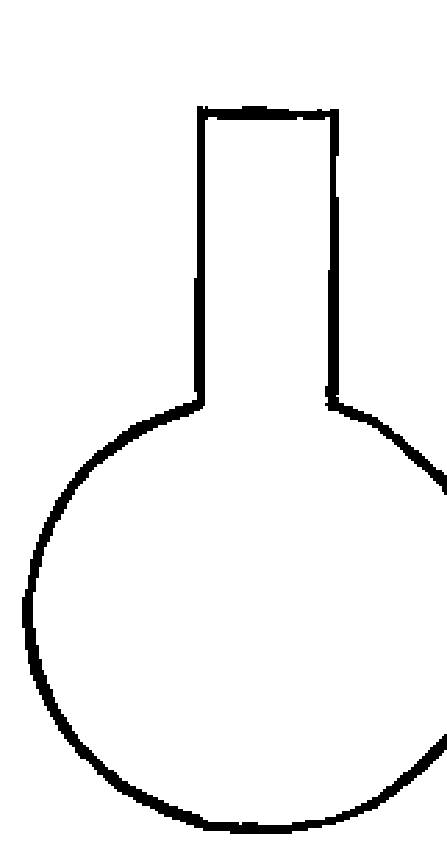

> （各項作業必須考量天體運行因素）

##### 完成賢者之石

- No.013
- No.015
- No.019
- No.020
- ◇三原素——硫磺、水銀、鹽→No.010
- ◇賢者之卵與最終作業→No.018
- ◇占星術→No.086

#### 賢者之石的材料
Raw Material

煉金術師已經試過所有可取得的物質，但製造賢者之石最理想的材料仍然還是金與銀。

##### 不論礦物植物動物，任何物質皆可為用

煉金術師曾經嘗試過所有可以取得的東西來當作賢者之石的材料。各種礦物自是毋庸贅言，此外還有獅子、牛、羚羊、狐狸、血液、乳汁、毛髮、骨頭、唾液、尿液等動物性物質，以及洋蔥、薑、胡椒等植物性物質，甚至雨水、雪水等，所有想得到的東西全都試過了。根據煉金術的硫磺—水銀理論，一切物質皆是由硫磺水銀結合而成，任何物質皆含有硫磺與水銀，所以不論選用什麼材料，同樣都能得到硫磺與水銀才是。

既然材料種類並無限制，那根本就沒有必要使用那麼多種物質，而煉金術師心目中最理想的材料就是金與銀。當時的人認為植物乃由植物繁殖生長而成，黃金自然也可以生出黃金。於是煉金術師才會不斷嘗試從陽性金屬「黃金」裡抽取硫磺、從陰性金屬「銀」當中萃取水銀。此時硫磺、水銀、鹽理論中的鹽，亦即促使硫磺水銀結合的物質，就變得非常重要。此處所指的鹽經常被視同為物質的精氣——紐瑪（Pneuma），也就是第五元素。

有些煉金術師認為從純金純銀裡提煉硫磺水銀的同時，還能萃取到紐瑪。倘若此說為真，那麼賢者之石的主要材料從在金銀中抽取硫磺水銀的階段中便已備齊，可直接開始製造賢者之石。中世紀歐洲的煉金術師當中，亦不乏有人主張第五元素就是賢者之石，而特別重視從物質中抽取第五元素。這些煉金術師最常使用的材料就是雞蛋；雞蛋的外形跟孵出來的雞完全不同，但是他們深信雞蛋內含有生命的根源「紐瑪」。

#### 煉金術製造之石的必要材料

##### ①畫設材料

「硫磺」「水銀」「鹽=第五元素（紐瑪）」

##### ②為取得「硫磺」與「水銀」所需材料

一切物質皆由硫磺與水銀結合而成

任何物質皆可利用

| 類別 | 內容 |
|------|------|
| 礦物 | 金、銀、銅、鐵、錫、鉛、黃鐵礦、孔雀石、綠松石、煤、雲母、石膏、玻璃等 |
| 植物 | 洋蔥、薑、胡椒等 |
| 動物 | 獅子、牛、綿羊、狐狸、血液、乳汁、毛髮、骨頭、唾液、尿液等 |
| 水 | 雨水、雪水等 |

最理想的材料

金 → 硫磺
銀 → 水銀

##### （紐瑪）= 製造之石的材料

最常使用雞蛋

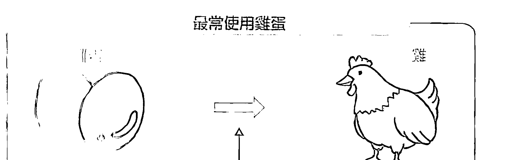

- 三原素——硫磺、水銀、鹽 No.010
- 第五元素→No.012

### 煉金術的道具和設備
Tools, Equipments

製作賢者之石必須利用各種五花八門的道具和設備，且許多設備都是由鍊金術師親手製作。

#### 煉金術師自製的實驗器材

鍊金術師為製作賢者之石，必須準備五花八門的道具和設備，其中許多器材都是鍊金術師親手製造。這是因為玻璃製品等道具在中世歐洲不易取得，許多器材的構造也都相當複雜。

以阿拉伯鍊金術師阿爾·拉齊為例，據傳他的實驗室裡就有燒杯、燒瓶、小型玻璃瓶、缽、玻璃結晶皿、水盤、勺皿 (Casserole)、燭盞、油燈、火盆、煉金爐 (隔砂加熱用的火爐)、精煉爐、銼刀、小鏟子、槌子、柄杓、截斷機、火鉗、隔砂與隔水加熱的用具、馬毛編織物和亞麻製成的過濾器、蒸餾器、昇華凝結器、漏斗、蒸餾瓶、研磨用的研杵研杵等各種設備，這些器材當中尤以火爐最為重要。每位鍊金術師一定都得用到火，還要不時調節溫度，因此各種大小爐具自然就占了實驗室的大部分空間；附有風口、可調節溫度的爐具，則到十五世紀方才問世。

鍊金術還有個重要性可比爐具的設備，那就是蒸餾器 (Alembic)。蒸餾器通常都是由裝著蒸餾液體的燒瓶，以及附有蒸氣出口的蒸餾頭這兩個部分所構成。古代亞歷山卓有位猶太女子瑪莉發明共有三個蒸氣出口的蒸餾器特里畢柯斯 (Tribikos)，可見蒸餾自古以來就是鍊金術常用的基本操作手法。隨著鍊金師不斷改良各種傳統實驗器材，到歐洲中世紀時代，就已經發展出構造相當複雜的蒸餾器，可以利用水冷式結構使蒸餾出以的物質凝結。

#### 阿爾•拉西實驗室裡的器具、設備

- 燒杯、燒瓶、小型玻璃瓶、鉢、玻璃結晶皿、水壺、勺皿、燭臺、油燈、火爐、鍊金爐（硼砂加熱用的火爐）、坩堝爐、銼刀、小鋸子、槌子、柄杓、小玻璃棒、火鉗、砂浴用具、水浴用具、馬毛織濾物和亞麻製成的過濾器、蒸餾器、昇華凝結器、漏斗、蒸餾瓶、研磨用的研缽研杵

##### 蒸留器

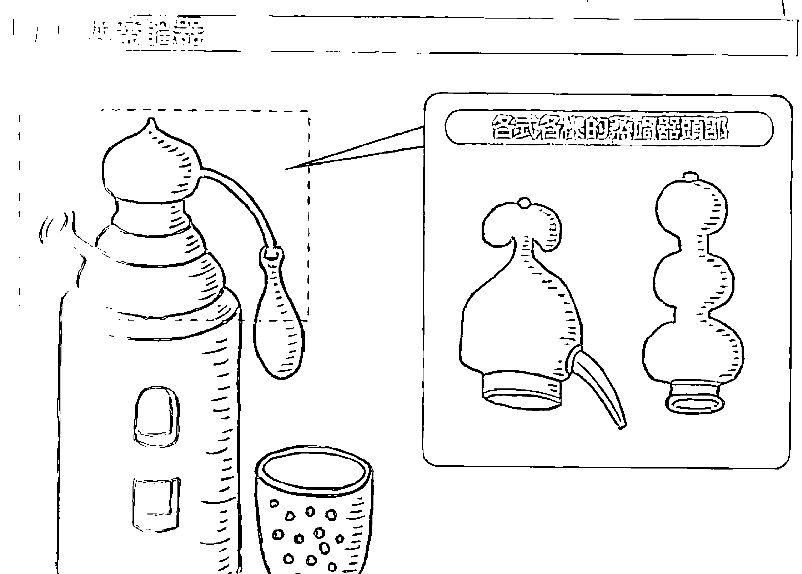

##### 蒸留器之語源

蒸餾器的英文名稱源自希臘語的ambix，此語加上阿拉伯語定冠詞al-便成了alanbiq，後傳入歐洲。葡萄牙語alambique的用法亦曾傳入日本，江戶時代便把蒸餾器稱作「阿比奇」

- 1. 連繫→No.017
   賢者之石的效力→No.020
2. 煉金術→No.015
   阿爾•拉西→No.035
3. 哲人石→No.019
   女性煉金術師→No.031

### 鍊金術的基本操作
Basic Operations

鍊金術的基本操作有許多階段與程序，鍊金術師們則是不厭其煩地不斷重複這些操作，不下千百次。

#### 為獲得賢者之石而不斷反覆操作

鍊金術師會用各式各樣的操作手法從事黃金鍊成、製造賢者之石。每位鍊金術師對製作賢者之石的操作程序各有獨自的見解；以帕拉塞爾蘇斯為例，他認為當時的鍊金術就有蒸餾、溶解、腐敗、提煉、鍛燒、反射爐處理、昇華、凝固、分離、週元、凝析、著色等操作。鍊金術師的操作法雖多，卻仍是以鍛燒、昇化、溶融、結晶、蒸餾為主，而且這些作業方式從古代到中世紀末都未曾有過改變。

鍛燒法就是將固體加熱至微粉狀態，改變物質結構、使其變化成釩化物。昇華法是用高溫加熱物質使其蒸發，接著再急速冷卻瞬間凝固成固態，藉以提高物質純度的精製法。當初中世紀歐洲人就是運用昇華法，才能從安息香（Benzoin）中發現安息香酸（Benzoic Acid），從琥珀裡發現琥珀酸（Sussinic Acid）。

溶融法就是將質雜不純的金屬混合融劑加熱，以取得液態生成物。此作業通常是用一個底部開洞的坩堝疊在另一個坩堝上面，把金屬放在上方坩堝裡加熱融解。結晶法則是用慢火加熱經過高溫液化的物質、使其結晶化（凝固）的作業。

至於蒸餾法當然就是加熱物質使其蒸發，接著冷卻以擷取蒸餾物。鍊金術師相信利用蒸餾法處理物質，就能得到物質的精髓——第五元素，是以格外受到重視。

鍊金術師一次又一次地不斷重複這些操作，因為他們深信就算其鍊金法再怎麼正確精準，也絕不可能一蹴可幾，一定必須經過數百次的來回重複實驗才能得到結果。

#### 帕拉塞尔斯的操作

- 蒸馏
- 溶解
- 腐敗
- 提煉
- 煅燒
- 反射爐處理
- 昇華
- 凝固
- 分離
- 還原
- 分析
- 著色

| 操作 | 描述 |
|------|------|
| 煅 | 將固體加熱至微粉狀態 |
| 昇華 | 加熱物質使其蒸發，再急速冷卻瞬間凝固成固態 |
| 融 | 將質雜不純的金屬混合融劑加熱，取得液體生成物 |
| 晶 | 用慢火加熱經高溫液化的物質，使其結晶化（凝固） |
| 蒸餾 | 加熱物質使其蒸發，使其冷卻攝取蒸餾物 |

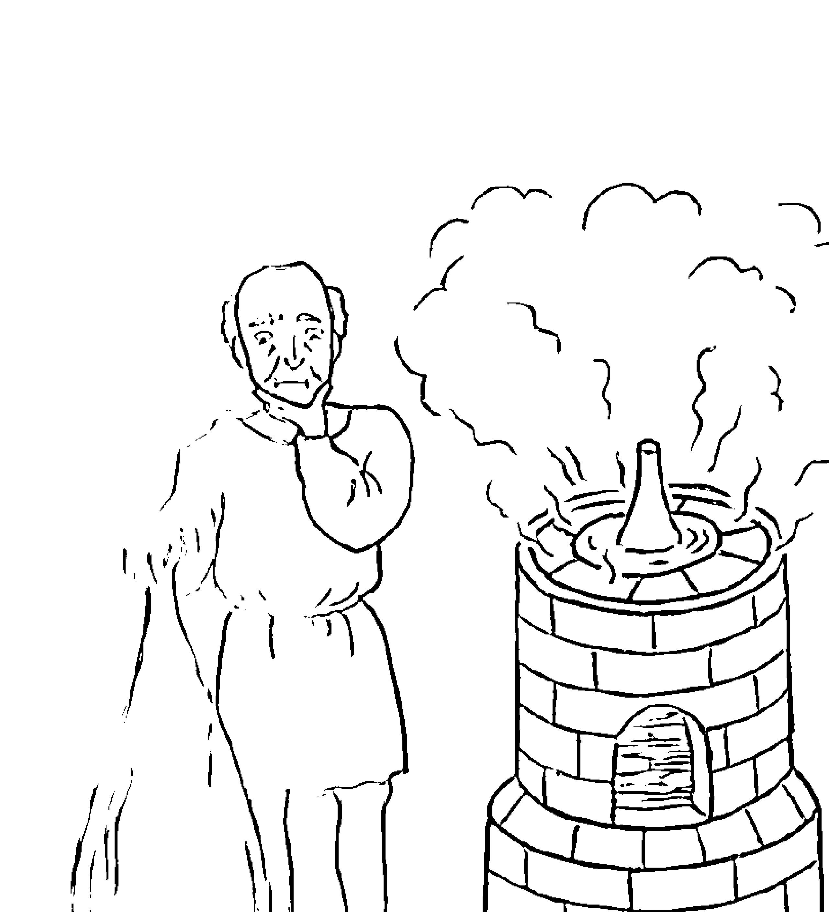

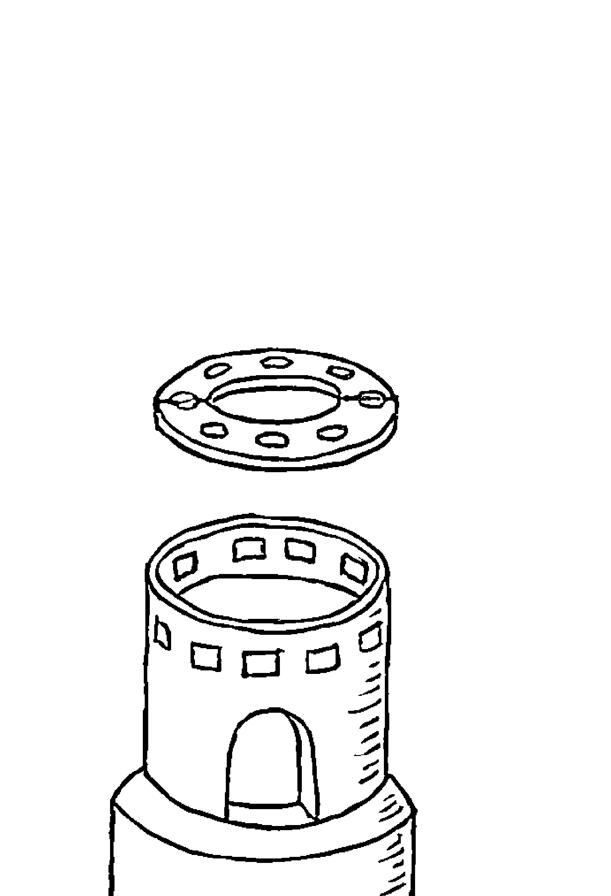

#### 賢者之卵與最終作業
Philosopher's Egg and the Last Operation

以「賢者之卵」加熱使「硫磺」「水銀」結婚，賢者之石始得完成。

##### ◆賢者之卵中硫磺與水銀的結婚

用鍊金術的基本操作抽取出理想的「硫磺」和「水銀」後，最終必須以赫密斯的印璽將其密封於名為「賢者之卵」的球形燒瓶裡。此後的作業乃偉大的作業的最終階段，賢者之石即將誕生。鍊金術師其實是因為雞蛋的孵出物似蛋非蛋，方才將此處所用球形燒瓶命名為「賢者之卵」。

鍊金術師會把裝著材料的「賢者之卵」放進熱反射式鍊金爐加熱，此爐是用來隔砂加熱的爐具，共分上、中、下三段。此爐的上段結構可反射熱能；中段的空間可以放置裝滿沙子的加熱缽和「賢者之卵」，還有個用來觀察加熱情形的觀察窗；爐具下段則是爐火和進風口。鍊金術有個不成文的規定：爐火一旦升起，非到鍊金作業結束不能熄滅。

此段加熱作業會使容器中的「硫磺」與「水銀」結合，最後就能得到賢者之石，其間共分四個階段。第一階段是「硫磺」與「水銀」的結合，鍊金術師通常以結婚比喻二者的結合。第二階段容器裡的物質會變黑，稱作「黑化」（Nigredo），黑色乃「死亡」「腐敗」的象徵。第三階段是物質變白的「白化」（Albedo），白色是「復活」「再生」的象徵。第四階段則是「赤化」（Rubedo），物質將變成赤紅色；紅色有「完成」「完全」的意涵。換言之，「硫磺」與「水銀」在容器中結婚、從黑變白最後轉成紅色，得到的就是賢者之石。物質有時會呈現各種過渡顏色，但基本上黑→白→紅的過程並不會改變。

#### 賢者之卵

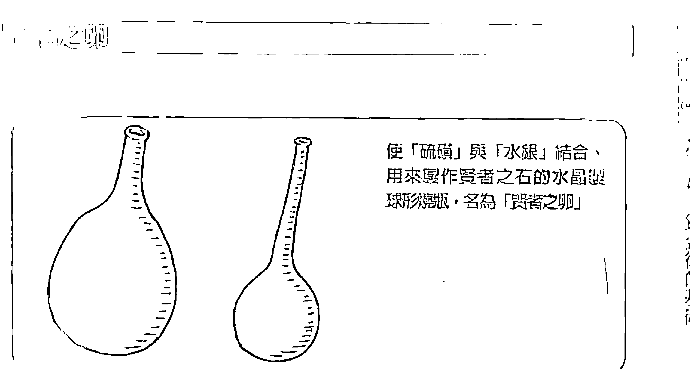

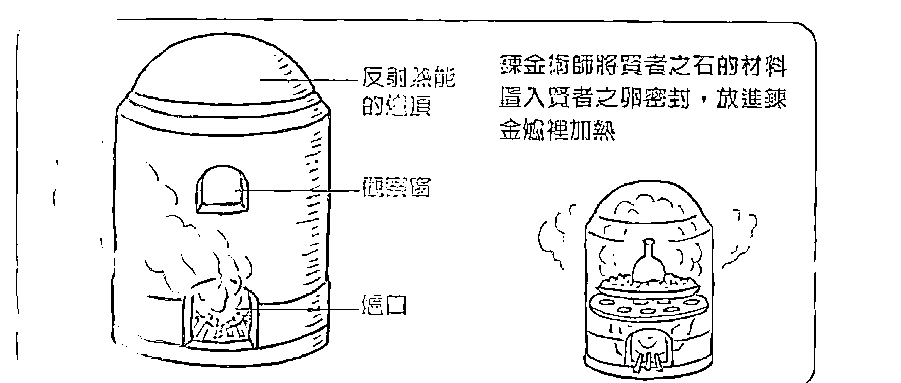

##### 完成過程

- 「硫磺」與「水銀」的混合物
→ 黑化
→ 白化
→ 紅化
→ 完成

- 「賢者之卵」材料 No.017
「硫磺、水銀、鹽」 No.010
帕拉塞爾斯古斯塔斯→No.028
「金屬」 No.014
◇賢者之石→No.013
◇賢者之石的材料→No.015
◇賢者之石的秘密→No.019
◇賢者之石的效力→No.020

#### 賢者之石的種類
Variants of Philosopher's Stone

賢者之石有許多名字，鍊金術師更把白石和紅石明確劃分成兩種效能各異的賢者之石。

##### ◇有許多不同名稱的賢者之石

賢者之石別名哲人之石；有些鍊金術師主張此二者是兩種不同的物質，不過賢者之石和哲人之石通常擁有相同的意涵。此外賢者之石還有許多稱呼，諸如靈藥、染金石（Tinctonia）、第五元素等名字也都頗為人知。靈藥是中世紀阿拉伯世界一種能夠鍊成黃金的萬靈藥，染金石是可將金屬染色的色素，而第五元素則是介於第一原質與四大元素之間的元素。除前述諸多稱呼以外，鍊金術師有時當然也會利用寓意象徵，以「太陽之花」、「鵜鶘」（Pelican）等概念來表現賢者之石。
如前所述，賢者之石有各種不同的別名，不論如何稱呼皆是指賢者之石；但一般而言白石紅石兩者的區別相當明確。

##### ◇白石和紅石在效力上的差異

據傳完全的賢者之石乃呈赤紅色，白色的石頭並不能算是完全的狀態。但相對於赤紅石頭具有將賤金屬變成黃金的力量，白色石頭也能將賤金屬變成白銀，因此白色石頭也算是賢者之石的一種。白石與紅石兩者的製作方法大致相同；偉大的作業的最終程序，在賢者之卵中結婚的「硫磺」「水銀」會依照黑→白→紅的順序產生顏色變化。若是在轉成白色的階段將物質取出，就會得到白色的石頭；若繼續作業直至物質鍊成赤紅色，就會得到紅色的石頭。於是鍊金術師便將獲得白色石頭的前段作業稱作小鍊金法（小作業），將製造紅色石頭的作業稱作大鍊金法（大作業）來區別之。

#### 賢者之石的概要

賢者之石（賢者之石）的兩種主要形態和功能，及其別名與象徵表現。

- 1.  **賢者之石 - 白色**
    *   功能：將賤金屬變為白銀。
    *   結果：成為「白色的賢者之石」。
2.  **賢者之石 - 紅色**
    *   功能：將賤金屬變為黃金。
    *   結果：成為「紅色的賢者之石」。

- **別名：**
*   哲人之石
*   萬靈藥：中世紀阿拉伯能夠煉成黃金的萬靈藥。
*   染金石：可將金屬染色的色素。
*   第五元素：第一原質與四大元素的中間性元素。

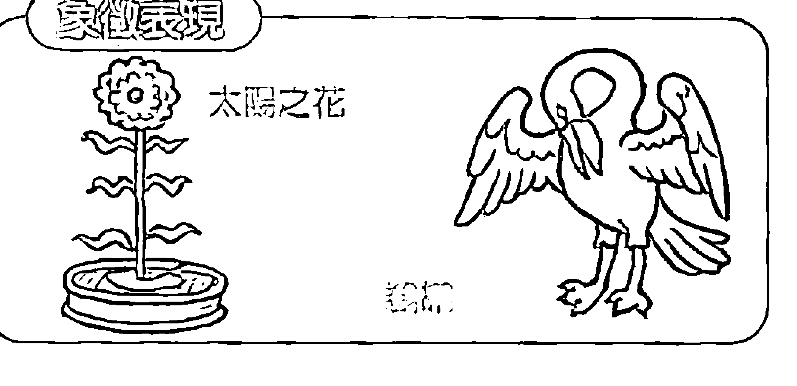

#### 賢者之卵的流程工程

##### 「賢者之卵」裡的顏色變化

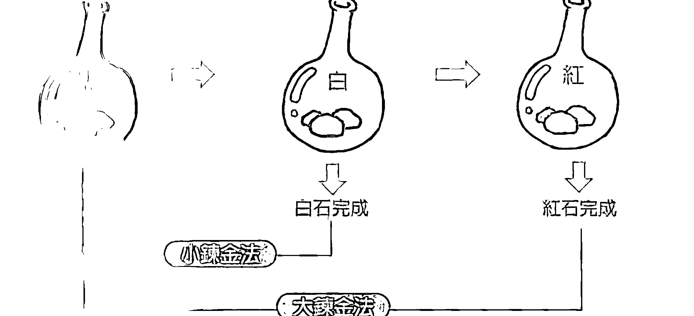

**小煉金法**：對應白石完成階段。
**大煉金法**：對應紅石完成階段。

- **相關章節索引：**
*   ◇ No.001
*   ◇ No.015
*   ◇ No.020
*   ◇ No.012

- **主題索引：**
*   ◇ 第一原質 → No.006
*   ◇ 四大元素 → No.008
*   ◇ 偉大的作業 → No.014
*   ◇ 賢者之卵與最終作業 → No.018

#### 賢者之石的效力
Power of Philosopher's Stone

> 煉金術師不斷為賢者之石賦予各種不同效力，最後終於成為無所不能的萬能聖石。

##### ☆賢者之石的效力視煉金術師而異

完全的賢者之石呈赤紅色，它非但是煉金術的極致目的，更具有各種神奇效力。煉金、萬靈藥、長生不老、提高人類靈性、使人成為與神明同等存在等，都是賢者之石常見的效力。除前述神能以外，據傳得到賢者之石的人還能與天使交流、隱形、騰空、得到終極的智慧。總之賢者之石是無所不能的完美石頭，所以煉金術師們才會不斷為它添加更多的神奇效能。

光就黃金煉成而論，也有些人主張賢者之石的效力會因煉金術師而異。阿拉伯煉金術師杜拜·本·馬利克（Dubai Ibn Malik）是否歷史上實際存在的煉金術師雖未有確論，但據傳他曾成功製造出靈藥，將靈藥使用3000倍的量使賤金屬變成黃金。十七世紀的煉金術師李奇蒙森（Richthausen）曾經在斐迪南三世面前煉成黃金，據說他只用1厘的粉狀賢者之石，就把2.5英磅的水銀變成了黃金；換言之，他的賢者之石可將17500倍的水銀變成黃金。據傳同世紀的科學家馮·海耳蒙特則是用煉金術能人送他的四分之一厘的賢者之石，就把18740倍重的水銀變成黃金。相較之下十六世紀亞歷山大·塞頓煉成的黃金量就比較少，他在法蘭克福實驗裡曾將賢者之石用量1155倍的水銀變成黃金。不過前述數值跟十三世紀的煉金術師維朗諾瓦的阿諾比起都算保守；阿諾主張倘若賢者之石為真，便能造成黃金煉成的連鎖反應，因此他認為只消使用極少量的賢者之石，應該就能將與海同量的水銀變成黃金或白銀。其實話說回來，賢者之石畢竟是現實生活裡無法取得的夢幻聖石，隨便煉金術師要怎麼說都可以。

#### 賢者之石所擁有的力量

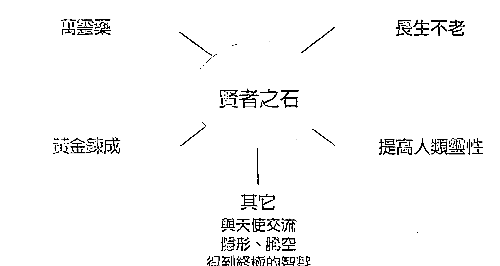

| 煉金術師 | 黃金鍊成的力量 |
| :--- | :--- |
| 羅伯特·馬利克 | 將3000倍的賤金屬變成黃金 |
| 萊歐·維德 | 將17500倍的水銀變成黃金 |
| 馮·海耳波特 | 將18740倍的水銀變成黃金 |
| 亞歷山大·密頓 | 將1155倍的水銀變成黃金 |
| 維朗諾瓦的阿諾 | 將無限大的水銀變成黃金 |

**重量單位英鎊與喱**

1英鎊 = 7000喱* = 約453公克**

* 喱（grain）：英美制最小重量單位，1喱=0.0648公克。
** 原文為453公斤，應是誤認，譯者進行訂正。

- **相關人物與編號參考**

* 羅伯特·馬利克 → No.013
* 萊歐·維德 → No.015
* 馮·海耳波特 → No.019
* 亞歷山大·密頓 → No.053

**其他相關**

◇ 馮·海耳波特 → No.047
◇ 亞歷山大·密頓 → No.045
◇ 維朗諾瓦的阿諾 → No.040

### 荷姆克魯斯

歌德作品《浮士德》裡的人造人荷姆克魯斯，同樣也是鍊金術師追求的夢想。

#### 煉金術製造的人造人

意欲模仿神明創造天地的鍊金術師當中，亦不乏有鍊金術師認為既然神能造人，鍊金術同樣也能造人；他們把這種人工製造的人類叫做荷姆克魯斯，此語是小人的意思。

有些人認為荷姆克魯斯之說在相當早期的時候便已經流行於鍊金術師之間。根據新約聖經使徒行傳記載，三世紀時有位出身於撒馬利亞的魔法師術士西門 (Simon Magnus)，而鍊金術學界則說此人正是首位製造出荷姆克魯斯的鍊金術師。此外，四世紀的鍊金術師索席摩斯也曾經提及荷姆克魯斯，十六世紀有名的魔法師阿古利巴 (Heinrich Cornelius Agrippa) 亦曾提及一種名為愛羅尼 (Alraune) 的人造人。

然而真正使得荷姆克魯斯之說為世人所知的，卻是與阿古利巴同期的帕拉塞爾蘇斯。根據帕拉塞爾蘇斯的說法，荷姆克魯斯乃是以科學方法處理人類的精液所製成。荷姆克魯斯此說在德國尤其盛行，甚至還被採入民間傳說之中。十八至十九世紀德國文豪歌德便受此影響，在他的鉅作《浮士德》裡寫到荷姆克魯斯；書中荷姆克魯斯是種以玻璃燒瓶製作，渾身發光的小人：作者將其描述成一種無法離開燒瓶世界，孱弱妖精般的生物。拜歌德所賜，前述的描繪已成為荷姆克魯斯的固有形象。

風行於十七世紀初的薔薇十字團運動以追求人類精神之完成為宗旨，而這也正代表著人類的再生以及全新人類的創造。因此對薔薇十字團而言，製造荷姆克魯斯的意義其實遠比鍊成黃金等其它目標來得重要許多。

# 第十一章 炼金术的基础

#### 荷姆克鲁斯之传说

| 年代 | 人物 | 描述 |
|------|------|------|
| 一世纪 | 术士西门 | 率先创造出荷姆克鲁斯 |
| 二世纪 | 索席摩斯 | 提及荷姆克鲁斯 |
| 三世纪 | 阿古利巴 | 名医兼巫师的荷姆克鲁斯 |
| 十六世纪 | 帕拉塞尔苏斯 | 用科学的方法处理人类的精液 |
| 十七世纪 | 蔷薇十字团 | 宣称要造荷姆克鲁斯便能够完成金 |
| | 歌德《浮士德》 | 从瓶子里浮出全身发光的小人，是同性恋般的生物 |

> 从瓶子里浮出全身发光的小人，是同性恋般的生物 → 一般的印象

##### Homunculus Homunculi

Homunculus 是曼德拉根（Mandragora）的别名，此语在古德语里是「小人」的意思。根据德国民间传说记载，这个酷似人形的植物是由被处死的囚犯的精液而生，从土里拔出时会发出诅咒般的叫声。魔法师阿古利巴的人造人便是以此植物为名，是在铜壶内的鸡蛋施以魔法所创。

- 相关词条：炼金术的方法 · No.022 ◇帕拉塞尔苏斯的炼金术→No.055
- Homunculus · No.030 ◇蔷薇十字团→No.060

##### No.022

#### 荷姆克鲁斯的制作方法

Making a Homunculus
炼金术师如何制作荷姆克鲁斯？帕拉塞尔苏斯在《论物质之本性》里有详细的阐述。

##### 帕拉塞尔苏斯制作荷姆克鲁斯的方法

帕拉塞尔苏斯认为制作荷姆克鲁斯首先必须准备人类的精液。取得精液后将其置入蒸馏器密封40日、让它腐败，蒸馏器里就会有人形的透明生命诞生。光是这样荷姆克鲁斯还不算是完全成形。此后须得小心照料，每日以人血豢养，还要把他安置在与马的体温相同的环境下，保存40周。倘若照顾得当，透明生命他就会慢慢地变成活生生的人类幼儿，只是体型会比普通小孩矮小许多。

#### 荷姆克鲁斯的制作原理

虽然制造荷姆克鲁斯看似荒谬、缺乏科学根据，不过只要知道帕拉塞尔苏斯的炼金术理论以后，自然就会发现制造荷姆克鲁斯是可能的。

根据帕拉塞尔苏斯的理论，世界＝大宇宙与人类＝小宇宙乃呈完全对应关系，两者的结构完全相同。大部分炼金术师都认为世界是由硫磺、水银、盐三原素构成；帕拉塞尔苏斯认为人类也是同样，三原素乃以灵魂、精神、肉体的形式体现。人类乃建立于与硫磺、水银、盐相对应的灵魂、精神、肉体此种要素的微妙均衡之上。所以身为医师的帕拉塞尔苏斯才会认为可用化学方法处理存在于这世界的物质来制成药品，治疗人类的疾病。荷姆克鲁斯的制作也是同样的道理；既然世界与人类都是由相同物质所构成，没道理不能用化学方法和同样的过程来创造人类。

#### 炼金术的原理

物质=人类→可以制造

人工制造人类→荷姆克鲁斯

#### 荷姆克鲁斯的制造法

- 马粪
- 密封40日让它腐败
- 人形生命体诞生
- 每日以人血营养
- 在与马的体温相同的环境下保存40周
- 荷姆克鲁斯诞生

- ◇大宇宙与小宇宙→No.007
- ◇三原素——硫磺、水银、盐→No.010

##### No.020

#### 魔像

##### Golem

魔像是犹太信仰的荷姆克鲁斯，是用喀巴拉魔法的话语炼金术创造的人造人。

##### ☆ 话语之炼金术和魔像

犹太秘密宗教喀巴拉跟欧洲炼金术同样，他们也认为通晓奥义、完全的义人『能够行使与神同样的创造力量。炼金术师能制造荷姆克鲁斯，喀巴拉也能同样制作名为魔像的人造人。

不同的是，荷姆克鲁斯是炼金术以化学操作方式所造，而魔像则是用喀巴拉的「语言之炼金术」制成。喀巴拉主张所有的字母、话语与数字皆蕴藏着神秘的魔法力量，只要能操作这股力量，人类也能跟神一样创造出动物与人类。对通晓喀巴拉奥义的义人而言，制作魔像似乎并非难事。据传在很久以前，有些犹太教的拉比（导师）就已经能够创造人类或动物。其中最有名的当属十六至十七世纪间活动于布拉格的犹太人拉比・罗乌（Rabbi Leow Judah ben Bezalel），据传他曾经让自己制造的魔像做家事，当作家仆使唤。

犹太教人造人的名字「Golem」在希伯来语里有「初创尚未成型之物」「胎儿」等意思。《旧约圣经》「诗篇」第139篇16写道「我仍是未成形的胎儿[1]，你的眼早已看见了」，此处「胎儿」的原文其实就是魔像一词。此外根据犹太教的传说，神在第一个小时搜集尘土，第二个小时开始塑造亚当，第三个小时亚当成为形体未明的肢块，也就是此处所谓的魔像。第四个小时，亚当身体的各部分开始结合，第五个小时身体有了洞口，第六个小时神赐予他灵魂，第七个小时亚当就能用自己[2]的脚站立。

> ・义人（Tzaddiq）：犹太教用语，指体现犹太教理想的人。
[1] 胎儿：为求文意连贯，此处乃直译自作者日语原文，中文版圣经并不如此
译。中文和合本旧约译作「我未成形的体质，你的眼早看见了」，新约则是「我被造的肢体尚未有其一，你都写在你的册上了」。

##### 人在创造重类（魔像与荷姆克鲁斯）

- 喀巴拉 → 语言的炼金术 → 魔像
- 炼金术 → 化学的炼金术 → 荷姆克鲁斯

#### 魔像的制作过程

- 搜集尘土
- 开始塑造亚当
- 亚当成为形体未明的肢块，也就是所谓的魔像
- 身体各部分开始结合
- 身体有了开口
- 赋予灵魂
- 赋予灵魂

拉比是犹太教的圣职者，乃指自古以来负责编纂、执掌犹太...中世纪以后乃指犹太会堂的说道者或犹太教共...然而他所叫领袖并非政治性领袖，只是负责地区...

荷姆克鲁斯的制作方法→No.022 魔像的制作方法→No.024

#### 魔像的制作方法

##### ~~Making a Golem~~

先用黏土捏制魔像，接着以写着希伯来语「emeth」（真理）字样的护符赋予其生命。

##### ☆ 生死药之于“emeth”与“meth”的魔像

魔像的制作方法其实说法不一：一般认为是用黏性土壤或泥胶捏成人形，然后在人偶的额头或胸口贴上写着希伯来语「emeth」（真理）字样的护符，如此人偶就会变成魔像开始行动。若想把魔像变回原来的土偶，只要把emeth的第一个字母e擦掉即可，因为希伯来语的meth有「死亡」的意思。此外，有人认为把护符放进土偶口中便可使它变成魔像，取出护符魔像就会变回原状；还有人说必须以置于地面的土偶为中心，唱诵喀巴拉的咒语绕行七圈，泥偶就会变成魔像。

不论采用前述何种制作方法，使用魔像务须谨慎。比如拉比·罗乌（Rabbi Leow Judah ben Bezalel）创造的魔像就有条不成文规定，不得让魔像在犹太教的安息日（从星期五日落起到星期六日落止）工作；有次拉比·罗乌不小心忘记此事，没把魔像嘴里的护符取出就出门了。结果他不在家时，魔像竟发狂似地大肆破坏；拉比·罗乌获市民报讯急忙赶至现场，把魔像嘴里的护符取出，才好不容易把魔像变回没有生命的土偶。

在波兰的传说里，魔像诞生以后就会开始成长、愈长愈大，所以必须在魔像变得太过巨大之前，把魔像额前护符写着的emeth的e擦掉才行。曾经有位名叫伊莉亚的拉比，他创造的魔像在不知不觉中变得太过巨大，怎么伸长手也够不到魔像的额头；于是伊莉亚遂命令魔像脱掉靴子，趁魔像蹲下的时候擦掉第一个字母e。虽然伊莉亚成功地将魔像变回一坯黄土，自己却也被崩塌的土堆给压死。

#### 魔像的制作方法

用粘土或泥土捏成人形

在额头写上[真理]的“emeth”的咒符

魔力灌注

把emeth的第一个字母e擦掉
（meth=死）

变回原来的土偶

### 炼金术的基础

### 炼金术的例子

### 摩根

魔像制作与活化工作的例子

被破坏的魔像

### 勒比·伊利亚

魔像巨大化

被破坏的魔像
立即死亡

## 灵性之炼金术

### Alchemy of the Spirit

炼金术师非但能在制造贤者之石的艰难作业中修持精神，还能在物质炼成的同时炼成自我灵性、趋向完成。

### 与物质炼成相对应的灵性炼成

对以人类与世界的完成为最终目标的炼金术师来说，贤者之石的制造过程——亦即所谓的伟大的作业，是使人类灵性趋向完成的过程中非常重要的一环。大宇宙与小宇宙的对应关系，同样亦体现于物质炼成与灵性炼成两者之间：是以将贱金属炼成黄金的物质炼成作业，其实就是将人类灵性之贱金属变成黄金的灵性炼成作业。这个时候，伟大的作业就成了炼金术师修持精神的修道场。这段漫长艰难的作业可谓是种苦行，而苦行能使人类达致完成。若以人类自身的完成为目标，乍看之下似乎并无从事物质炼成作业的必要，不过物质炼成与灵性炼成就连细节部分也都相互对应，因此炼金术师也会同步进行物质的变作业。

此处所谓完成意味着神明当初创造宇宙的秘术（伟大秘法Ars magna）之获得、神明启示的极致「智慧」（诺斯替）之传承，以及人类灵魂与宇宙灵魂的合一；简单地说，就是人与神的结合。不过这项作业若要成功，还需得到神明的恩宠才行，因此从事灵性炼金术的炼金术师，本身必须成为一个值得神明恩宠的人。举例来说，炼金术师必须看轻肉体、完全舍弃物质的欲望。若灵性之炼金术得以成功，而炼金术师也成功与神明结合，那么这段灵性的炼金过程便能直接套用至物质界，并顺利变作业。换言之，真正的炼金术师绝对会以灵性之修持为优先进行，他们认为自身灵性趋向完成后，整个宇宙自然就会朝向完成方向前进，并终得到完成。

### 人类灭绝与人类的完成

### 灵性之炼金术

透过制作贤者之石的过程，使人类达致灵性的完成

前提：炼金术师必须是值得神明守护者

看轻肉体、舍弃肉体的欲望

### 伟大的作业

### 人类的完成

- ○获得神明创造宇宙的秘术（伟大秘法）
○获得究极的「真知」（诺斯替）
○使人类灵魂与宇宙灵魂合一

人类与神明合一

全宇宙产生变化

宇宙完成

### 相关项目

- 贤者之石 >No.013
贤者之石的材料 >No.015
贤者之石的相关 >No.019
贤者之石的效力 >No.020

- ◇伟大的作业→No.014
◇大宇宙与小宇宙→No.007
◇诺斯替教→No.087

### 古希腊的物质观

亚里士多德的四元素物质理论，乃以西元前四世纪古希腊哲学家亚里士多德的四大元素论为理论根据。若以现代人的观点来检视，四大元素论基本上是相当神秘的观念，然而这个理论却是古代与中世纪最先进的物质论。

除四大元素理论以外，古希腊其实还另有许多元素理论。

古希腊首位合理论述物质理论的哲学家，当属西元前580年左右的泰利斯（Thales of Miletus）。泰利斯认为「水」是世上所有物质的根源；换言之，他相信万物皆是由水变化生成，且最后都要回归于水。泰利斯更把水看作赋予万物生命的「灵魂」，并非单纯的物质。

西元前550年左右则有泰利斯的徒孙阿那克西米尼（Anaximenes of Miletus）主张「空气」才是万物的根源。他认为不同程度的空气，会形成云、水、土、石等各种不同的物质。阿那克西米尼也认为空气并不只是一种单纯的物质，而是一种跟泰利斯的水概念类似、使万物得以进行生命活动的概念。

西元前500年左右的哲学家赫拉克利特（Heracleitus）乃以万物起源于「火」的物质论闻名，但事实上赫拉克利特却认为「统合对立物之理法」（逻各斯）才是万物的根源。譬如黑夜与白昼就是两个对立物，两者终究会在黑夜变成白昼、白昼变成黑夜的过程中得到统一：火和水、水和土的关系亦同，它们虽是对立的物质却能互相转化，万物便是经由无限的转化所生；是以古希腊人才会将一切物质都视为「同一」。

经过前述各种物质观以后，西元前五世纪终于有恩培多克勒（Empedocles）提出四元素理论。根据恩培多克勒的说法，万物是由地（土）、水、火、风（空）四种元素和爱与恨两种力量所构成；爱的力量能够结合不同元素，恨的力量则会使元素剥离。这四元素论有某种程度现代化的解释：空气、水、土可对应于气体、液体与固体三态，而火元素就是能量。恩培多克勒提倡的四元素竟然与印度哲学中的四大不谋而合，可见古代的希腊与印度曾经有过思想上的交流。

此思想更因亚里士多德而发扬光大，当时大部分人皆普遍相信四元素乃宇宙万物之构成要素，以至流传后世。

然而有趣的是，上述的物质观全然不曾经过实验检证，都是凭空推想而成，因为古希腊人重视理论性思考，却不以实验求证。

逻各斯（Logos）：意指源的「理性」。指隐藏在宇宙中、支配宇宙并使宇宙具秩序与理性的超越性原理之理性。

### 第2章 金属晶体

### 古代的炼金术师

Ancient Alchemists

古代的炼金术著作当中，有许多作品传为神话中的诸神、历史有名的君王皇帝、哲学家、英雄所著。

#### 扑朔迷离的古炼金术师名号

在炼金术中心重镇仍位于亚历山卓与拜占庭的时代，古代炼金术师经常会借用历史人物或颇具权威的学者名字来发表自己的作品，而中世纪欧洲的炼金术师亦不在话下。这样一来使得古代炼金术师的名单里，尽是些充满神话氛围且赫赫有名的壮观阵容。古代炼金术师大致可以分成下列四个种类：

1. 诸神（虚构的炼金术师）：打从一开始就被奉为神明而非凡人的炼金术师；此类炼金术师有赫密斯、阿嘎都戴蒙（Agathodaemon）、伊西斯（Isis）等。

2. 君王与皇帝：借用古埃及罗马等国君王皇帝名号进行创作的炼金术师，有埃及的古夫王和克丽奥佩脱拉、亚历山大大帝、东罗马帝国皇帝希拉克略和查士丁尼大帝等。

3. 英雄与哲学家：以历史有名的哲学家等人物为作者名，譬如伯拉图、亚里士多德、泰利斯、德谟克利特、琐罗亚斯德、毕达哥拉斯、摩西、玛利亚等。

以上三种炼金术师不使用本名，而以诸神或历史名人的名字进行著作，这些人就是现代所谓的拟（伪）炼金术师。当我们必须指出某位拟炼金术师时，就要与实际的历史人物作区别。以德谟克利特为例，就可以称之为「拟德谟克利特」；至于那位拟德谟克利特究竟是谁，自然是无从得知。

4. 本名：以本名进行著作的炼金术师。此类炼金术师较有名的有佐西摩斯、阿非理卡纳斯、叙涅修斯、奥林匹奥多罗斯、斯提法努斯等人。

#### 古代炼金术师的名字

#### 神话里的炼金术师

赫密斯、阿嘎托忒斯、伊西斯

#### 著名的炼金术师

古夫王（Khufu）、克娄奥佩脱拉（Cleopatra）、亚历山大大帝、希拉克略（Heraclius）、查士丁尼大帝（Justinian I）

#### 哲学家与数学家

柏拉图、亚里士多德、泰利斯（Thales of Miletus）、德谟克利特（Democritus）、琐罗亚斯德（Zoroaster）、毕达哥拉斯（Pythagoras）、摩西、玛利亚

#### 使用本名的炼金术师

| 名字 | 描述 |
| :--- | :--- |
| 狄奥多罗斯 | 确实存在的炼金术著作家中最古老的人物，活跃于西元300年前后。 |
| 赫耳墨斯·特里斯墨吉斯忒斯 | 三世纪的百科全书编纂者兼炼金术师。 |
| 雅典诺多罗斯 | 四至五世纪的主教、炼金术师。有许多与占星术炼金术有关的著作与习俗。 |
| 何那克利欧斯 | 四至五世纪生于埃及底比斯（Thebes）的历史学家、炼金术师，曾引用阿嘎托忒斯、犹太女子玛莉、奥席摩斯等人的作品从事炼金术著作。 |
| 帕林西斯 | 七世纪初活跃于拜占庭帝国的炼金术师，其著作颇受后世炼金术师爱戴。 |

#### 相关条目

古代的炼金术师→No.027
玛丽亚·帕特摩斯·帕吉斯托斯→No.028
◇帕拉波利斯的奥席摩斯→No.030

### 虚构的炼金术师

#### Mythical Alchemists

根据炼金术的传说，神话或传说中许多神祇都是炼金术师的祖师。

#### 以神明及英雄为名的虚构炼金术师

古代的炼金术师乃炼金术师之始祖，其中还有跟诸神英雄同名的虚构炼金术师，譬如赫密斯、阿嘎都戴蒙（Agathodaemon）、伊西斯等；甚至还有些神秘虚构的炼金术师被冠上古埃及国王或古罗马皇帝之名。

这些神祇当中，赫密斯原本是古希腊的神明，但古代亚历山大地区概将其视同为埃及神透特。透特乃智慧之神，传授人类医学、魔法等所有知识，炼金术当然也不例外。于是此神祇演变而成的虚构炼金术师赫密斯遂成为炼金术师之祖，而有赫密斯·特里斯密吉斯托斯之称；特里斯密吉斯托斯此名，是「三重且最伟大者」的意思。现存的《赫密斯文集》其实是集西元前三世纪至西元三世纪间匿名著作而成，但传说中这些著作皆出自赫密斯·特里斯密吉斯托斯之手，其思想更是对欧洲的文艺复兴造成莫大影响。

阿嘎都戴蒙是古希腊各地崇拜的医学之神。埃及人奉其为保护来世幸福的蛇神，希腊化时期赫密斯文集等诸多魔法书则把他写成实际存在的炼金术师。西元二世纪时甚至有位自称阿嘎都戴蒙的炼金术师，并留下著作《第一原质论》；此书乃以俄耳甫斯对埃及冥界之神奥西里斯的话语之形式写成。

伊西斯是埃及最重要的女神、奥西里斯之妻，传说她曾用透特所传授的魔法将惨遭杀害的丈夫复活。古代炼金术师极重视其智慧、再生力、生命力，其名讳亦被假借成为一名虚构的炼金术师。

> > （奥菲欧斯）：希腊宗教故事人物，传为俄耳甫斯教创始人。主要作品有《伊阿宋和金羊毛》（Aeson and Golden Fleece）

### 第八章 炼金术师

#### 古代炼金术师之始祖

- 赫密斯
- 阿比都霍蒙
- 伊西斯
- 古埃及国王
- 古罗马皇帝

赫密斯：古希腊的冥界之神

相同

透特：古埃及的智慧之神

炼金术、历法、医学之起源

虚构炼金术师赫密斯·特里斯密吉斯托斯

《赫密斯文集》《翠玉录》

阿比都霍蒙：古希腊医学之神 在埃及是死神

伊西斯：古埃及女神

虚构炼金术师·阿比都霍蒙

虚构炼金术师·伊西斯

《第一原理论》

天传授炼金术

##### NO.028 赫密斯·特里斯密吉斯托斯

##### Hermes Trismegistus
古代炼金术师赫密斯的《赫密斯文集》、《翠玉录》等著作，对后世炼金术师有莫大影响。

##### 炼金术的守护神赫密斯

在古代炼金术师传颂的虚构炼金术师当中，赫密斯·特里斯密吉斯托斯是个非常特别的人物：许多炼金术师相信赫密斯正是炼金术的守护神、炼金术的始祖，是以炼金术又经常被称作「赫密斯之术」。

炼金术师的赫密斯信仰，其实来自于赫密斯=透特的信仰。根据炼金术的传说，所有炼金术皆起源于埃及，由古埃及智慧之神透特将炼金术知识传授给人类。后来到埃及亚历山卓城的希腊殖民者，又将透特视同为古希腊冥界之神赫密斯，于是才产生了炼金术伟大鼻祖赫密斯·特里斯密吉斯托斯的传说。「特里斯密吉斯托斯」是「三重且最伟大者」之意，同时也代表赫密斯=透特是如何伟大的神祇。赫密斯·特里斯密吉斯托斯本是神明，后来却被拟作人类，成为神话中的王者；甚至还有传说指出他统治地上世界长达3226年之久，共有36525本著作。

实际上，后世也确实流传着许多传为赫密斯所著的《赫密斯文集》。此文集乃集西元前三世纪至西元三世纪间的匿名著作而成，受新柏拉图主义（Neoplatonism）、新毕达哥拉斯主义（Neopythagoreanism）、诺斯替教等思想影响匪浅。《赫密斯文集》于十五世纪经由阿拉伯传入欧洲后，引起极大回响；文中阐述的思想（赫密斯思想）亦成日后风靡欧洲文艺复兴时期的秘术（Hermeticism）思想之根干。此外，传为赫密斯所著的炼金术著作《翠玉录》被后世炼金术师奉为圭臬，俨然就是炼金术师的圣经。

### 赫耳墨斯·特里斯墨吉斯忒斯的影響

一切知識的起源

煉金術師

### 赫耳墨斯·特里斯墨吉斯忒斯 ▷ 鍊金術的創始者

三重且最偉大者

成為神話中的王者，統治長達3226年 ▷ 36525本著作

《赫密斯文集》：西元前三世紀至西元三世紀，由匿名作者所著，受新柏拉圖主義、新畢達哥拉斯主義、諾斯替教影響

《翠玉錄》：鍊金術之奧義 → 鍊金術師的聖經

十五世紀經由阿拉伯傳至歐洲

歐洲大為流行
文藝復興時期魔法思想之根本原理

- 參考條目
- 中世紀的鍊金術師 → No.027
- 翠玉錄 → No.029
- 赫耳墨斯 → No.087

### 翠玉錄
#### Emerald Tablet

赫密斯·特里斯密吉斯托斯記載鍊金術奧義的翠玉錄，是鍊金術師一再重複閱讀的鍊金術聖經。

# ### 赫密斯·特里斯密吉斯托斯的翠玉錄傳說

傳說神秘鍊金術師赫密斯·特里斯密吉斯托斯將自己創造的鍊金術奧義濃縮成短短數十行充滿寓意的文章，記載在一面綠寶石（Emerald）石板上。此文通稱為赫密斯·特里斯密吉斯托斯的《翠玉錄》，是鍊金術文書當中最重要的文件。

傳說《翠玉錄》被抱在已化成木乃伊的赫密斯懷裡，埋在吉薩（Giza）大金字塔內部的深邃墓穴中，不知是誰發現了此石板，並將其正確地抄寫下來；有人說發現此文書的人，正是亞歷山大大帝。後來《翠玉錄》原物雖然佚失，但經過無數次的翻抄複製，這份內藏鍊金術所有秘密的文書方得流傳後世。

從各種歷史線索著眼，西元四世紀以希臘文書寫而成的《翠玉錄》應是最早的版本，然而該版卻已盡皆散佚。接著《翠玉錄》又被譯成阿拉伯語，目前所知最早的阿拉伯語譯版，則是西元十世紀附錄於《創造之秘密與自然的奧妙》（Book of Secret of Creation and the Art of Nature）書末的文字。十二世紀拉丁語譯版傳入歐洲，造成極廣泛的影響。面對如此簡短而充滿寓意的文字，鍊金術師無不是各自施以獨特解釋，拼命地要參透鍊金術之奧義。

此處雖載全文如右，然其內容神秘難解，是說明宇宙的金科玉律、大宇宙與小宇宙的感應關係、「天地創造」與「鍊金術」之間的秘等；由通曉赫密斯學或鍊金術者來看，此文內容正可謂『字字珠璣』。

此乃無偽之真實，確實真切。成就唯一奇蹟之際，下者如上、上者亦如下。

萬物因察「一者」而存，因適「一者」而生。「太陽」為父，「月亮」為母。

「風」宿其胎內，「大地」為乳母。彼乃萬物創造父。其力完全於「大地」之上。

其力指向「大地」之際，則「火」離「大地」、精妙者與粗糙者分。彼恃大賢，自「大地」稍然升「天」，爾後再次下降。其力縱有優劣二分，然不因其劣而不受。

如此則寰宇榮光盡收，萬千黑暗退避。

彼乃萬物之最，緣其壓倒一切精妙、浸透一切固體。

於是世界因此而創造。

如前述：彼乃此間所指萬人適應源是也。以其有三部世界智，故稱之為赫密斯·特里斯墨吉斯忒斯。

「太陽」之效皆已顯迹，再無遺漏。

### 帕诺波利斯的索席摩斯
Zosimos of Panopolis

古代亚历山卓最有名的炼金术师，著有炼金术百科事典28卷，有「哲学者之冠」美称。

实际存在的第一位炼金术师
索席摩斯以本名留下炼金术著作，是实际存在的炼金术作家当中最古老的人物。此人西元300年左右生于埃及的帕诺波利斯，后定居于亚历山卓、著作炼金术百科事典28卷。他是当代最有名的炼金术师，后世炼金术师皆尊为「哲学者之冠」。

遗憾的是索席摩斯的炼金术文书现今几乎散佚，幸得后世众炼金术师引用其著作，少部分作品始得流传至今。这些文书的题名有「论水银浓缩之圣水的蒸发」、「真理之书—论水的结构」、「帕诺波利斯的索席摩斯就制造金银的神圣技术之权威报告」、「真理与解释之书」、「装置与器具之文书」、「论石灰」、「金钥之书」等。

研究前述文书，我们发现索席摩斯的炼金术有极强烈的秘教色彩，并且融合了埃及魔法、希腊哲学、赫密斯思想、诺斯替教、新柏拉图主义、巴比伦占星术、基督教神学、异教神话等众多思想体系。索席摩斯累积了许多金属或矿物之化学操作经验，但他却认为化学的操作不过是炼金术的辅助手段而已。

索席摩斯还有个跟后世欧洲炼金术师相通的特征，就是许多谜题般的用语。以「水银」为例，就有银之水、神圣之水、月之水、斯基泰之水、海水、圣露、男性、女性、龙的种子、龙的胆汁、永远的逃亡者、黑牛的乳汁等各种说法。因此索席摩斯文书也跟后世许多炼金术文书同样难以正确地解读。

斯基泰（Skythai）：西元前7～8世纪由中亚迁徙至南俄之具伊朗血统的游牧民族。

- 埃及魔法
- 希腊哲学
- 赫密斯思想
- 诺斯替教
- 新柏拉图主义
- 巴比伦占星术
- 基督教神学
- 异教神话

> 融合 → 索席摩斯的炼金术

化学技术（辅助性手段）

### 索席摩斯炼金术之例

- 「論水銀濃縮之聖水的蒸餾」
- 「真理之書一論水的結構」
- 「帕諾波利斯的索席摩斯就製造金銀的神聖技術之權威報告」
- 「真理與解釋之書」
- 「裝置與器具之文」
- 「論石灰」
- 「金術之書」

### 索席摩斯语录的『水银』用语

银之水、神圣之水、月之水、斯基泰之水、海水、圣露、男性-女性、天空的种子、鹰的胆汁、永远的逃亡者、黑牛的乳汁

### 女性鍊金術師

#### Female Alchemists

鍊金術的器具乃由廚房用具發展而成，女性鍊金術師亦對初期鍊金術有很重要的貢獻。

### 由廚房用具發展而成的鍊金術器具

鍊金術必須用火使物質蒸發抑或加溫，跟廚房的工作有相似之處，而鍊金術所使用的器具也幾乎都由廚房用具發展而成。

或許正是因為這個緣故，女性鍊金術師在鍊金術初期時代非常活躍。

猶太女子瑪莉（Maria the Jewess）是著名的女性鍊金術師之一，活躍於西元三世紀的亞歷山卓。她不但著有重要的鍊金術文書，更以發明數種鍊金術裝置而聞名。有種共有三隻手腕（蒸氣出口）的銅製蒸餾器，當時稱之為特里畢柯斯（Tribikos）；此裝置乃以圓筒連接上部冷卻部與下部加熱煮沸部，三蒸氣出口能分開蒐集蒸餾物的不同成分物質。現在法語稱為「邦·瑪莉」（Bain-marie，意為瑪莉的隔水加熱裝置）的裝置也是她的發明。此外，回流裝置奇羅塔奇斯（Kerotakis）也是她所發明。

跟托勒密王朝埃及女王同名的女性鍊金術師克麗奧佩脫拉，亦活躍於亞歷山卓地區。她著有《克麗奧佩脫拉製造黃金》、《尺度與重量》、《哲學者的神聖之術》等鍊金術文書，此部份作品收錄於十世紀的抄本裡。其中名為《克麗奧佩脫拉製造黃金》（Gold-making of Cleopatra）的一張圖畫尤其有名，畫中有圓形的金（太陽）、銀（月亮）、烏洛波羅斯，以及溶解與凝固等圖樣。

除上述二人以外，第一位實際存在的鍊金術師索席摩斯，其母親和妻子似乎也是位鍊金術師。

### 鍊金術與廚房工作類似

- 鍊金術 → 利用火使物質蒸發抑或加溫
  ↓
- 跟廚房工作頗為類似
  ↓
- 女性鍊金術師活躍

### 伊斯兰教的炼金术
#### Islamic Alchemy

伊斯兰世界吸收古代炼金术后创造出金属的硫磺—水银理论，以及利用炼金术制作医药等物的新炼金术。

◇ 对炼金术有莫大贡献的伊斯兰教世界

在炼金术的历史当中，伊斯兰世界（阿拉伯）扮演着非常重要的角色。伊斯兰教的势力在七至八世纪间发展成涵盖叙利亚、波斯、埃及与西班牙的大帝国以后，便开始积极吸收早已渗透至其统治地区的希腊文化。希腊的哲学、数学、天文学等书籍被大量翻译成阿拉伯语，传诸后世；亚历山卓的炼金术当然也被伊斯兰世界大举吸收。

于是乎希腊思想和炼金术就此被伊斯兰世界继承，并于十二世纪传至欧洲，然而伊斯兰世界却并非只是单纯的中继点而已。许多重要炼金术用语如alchemy（炼金术）、alembic（蒸馏器）、alcohol（酒精）、elixir（灵药）等皆源自于阿拉伯，可见得伊斯兰世界也开发出许多炼金术的新器具和新药品。运用亚里斯多德物质理论、确立炼金术硫磺—水银理论的，也是伊斯兰教的炼金术师。此外伊斯兰世界还结合炼金术与医学，利用炼金术制造医药；此系统传入欧洲后，到以帕拉塞尔苏斯为代表的医药化学炼金术可算是开花结果。此外，另有说法指出伊斯兰教的炼金术亦受追求长生不老的印度、中国炼金术影响。

据传赫密斯·特里斯密吉斯托斯的《翠玉录》原是希腊语，但原文散佚后现存最古老的版本，也是用阿拉伯语写成。

伊斯兰有名的炼金术师有哈立德·本·亚齐德、查比尔·本·哈扬、阿尔·拉齐、阿维森纳等人。

### 伊斯兰世界对炼金术的贡献

- 古希腊思想
- 埃及的炼金术
- 伊斯兰世界
  - 理论基础
  - 硫磺—水银理论
  - 翠玉录
  - 医药品用途
  - 通用术语
    - alchemy（炼金术）
    - alembic（蒸馏器）
    - alcohol（酒精）
    - elixir（灵药）

### 欧洲（十二世纪左右）

### 主要的炼金术师

- 哈立德·本·亚兹德（?～约704年）
- 查比尔·本·哈扬（约721～约815年）
- 阿尔·拉齐（约865～约925年）
- 阿维森纳（980～1037年）

术语·概念
- 硫磺、水银、盐 → No.010
- 帕拉塞尔苏斯 → No.054
- 帕拉塞尔苏斯的炼金术 → No.055
- 赫尔墨斯·特里斯墨吉斯忒斯 → No.028
- 翠玉录 → No.029

炼金术师
- 哈立德·本·亚兹德 → No.033
- 查比尔·本·哈扬 → No.034
- 阿尔·拉齐 → No.035
- 阿维森纳 → No.036

#### 哈立德·本·亞齊德
Khalid b. Yazid

根據傳說記載，最早開始學習煉金術的伊斯蘭教徒是倭馬亞王朝的王子，他還留下許多煉金術的詩歌。

##### 首位學習煉金術的伊斯蘭教徒

哈立德·本·亞齊德（？～約704）是西元700左右倭馬亞王朝哈里發*亞齊德一世*的王子。傳說他是最早學習煉金術的伊斯蘭教徒。身為王子的哈立德雖然已經獲得哈里發繼承權，但親戚仍要爭奪繼承權，哈立德因感到厭煩而抽身退讓。自此以後，他便開始鑽研煉金術；他從埃及召來數名希臘哲學家，把希臘語和科普特語**的煉金術書籍翻譯成阿拉伯文。根據傳說記載，這是伊斯蘭世界首次的外語翻譯作業。

開始研究煉金術當初，哈立德召集許多自稱煉金術師的學者在身邊從事研究，卻始終未能完成金屬煉成。此時恰巧亞歷山卓煉金術師斯蒂芬紐的弟子、基督教修士馬里安納斯（Marianus）為傳教前來拜訪。馬里安納斯知道哈立德沉迷於煉金術，便馬上揚言可以成功煉成黃金；沒想到哈立德並不中意煉出來的金子，下令將馬里安納斯當騙徒處刑，馬里安納斯好不容易才能逃出生天。然而哈立德對煉金術的興趣卻不減反增，並於數年後尋得馬里安納斯隱居處，再度召其入宮；哈立德也再度向馬里安納斯學習煉金術，向他請教各種問題，終於修得煉金術的奧秘。

據說後來哈立德還寫了許多隱藏著新知識奧秘的詩歌，《神行之術》、《大小備忘錄之書》、《有關技藝之遺書》、《知識人類》等皆屬此類。

*（Khalifa）：原意為「繼承者」、「代理人」，意為阿拉的代理人。乃是伊斯蘭教執掌政教大權的領袖。
*亞齊德一世：亞齊德·本·穆阿維葉（Yazid b. Muawiya，645~683），倭馬亞王朝第一代哈里發，哈里發世襲制的第一個繼承人。
**科普特語（Coptic Language）：約在西元二世紀通行於埃及的含米特一系語言，是古埃及語的最後階段。

#### 查比爾·本·哈揚 Jabir b. Hayyan

首位利用動植物等非礦物材料從事金屬鍊成實驗，偉大且創新的伊斯蘭教鍊金術師。

##### 伊斯蘭鍊金術師的最高峰

查比爾·本·哈揚（約721～約815）是服侍以《天方夜譚》聞名的哈里發——哈倫·賴世德的宮廷鍊金術師。他是伊斯蘭世界最偉大的鍊金術師，中世紀歐洲鍊金術師皆稱呼他為格貝爾（Geber）。

哈揚有個靈藥的傳說；某次他的資助者——宮廷權臣加法爾·本·雅赫亞（Jafar b. Yahya）有名側室身患不明重症、瀕臨死亡。哈揚馬上前來探視，並拿出靈藥2哩搭配3盎斯的醋和蜂蜜給病患服用，結果不出半個鐘頭，該名妾室便和平常無異。

哈揚在鍊金術的理論面亦有很大貢獻。中世紀歐洲的鍊金術師相信所有物質皆是由硫磺與水銀結合而成，但古代尚無此理論，而第一個採取此理論的人正是哈揚。他認為在諸行星的影響之下，土壤裡的硫磺與水銀會結合成各種不同的金屬。根據他的想法，金屬之所以有各式不同的種類都是因為硫磺與水銀不夠純粹所致，只要兩者在完全平衡的狀態下結合，就會生成黃金，而且只要擁有靈藥，便可以完成前述作業。

古代的鍊金術師基本上都是用礦物做材料進行金屬鍊成實驗，不過哈揚卻認為世界所有物質都是由四大元素組成，所以不管用何種物質為材料都能達到金屬鍊成的效果。他曾試過用骨髓、血液、毛髮、骨頭等動物性物質，以及烏頭（Monkshood）、橄欖（Olive）、茉莉（Jasmine）等植物性物質，作為金屬鍊成的材料。

> 哈倫·賴世德（Harun ar-Rashid）：阿巴斯王朝第五代哈里發（786～809年在位）。780和782年，哈倫兩次成為遠征拜占庭帝國的名義統帥，第二次遠征直抵博斯普魯斯海峽，兵臨君士坦丁堡城下，終於按照對穆斯林有利的條件達成和約。由於這次輝煌的武功，他被授予「賴世德」（意為「指引正道者」）的稱號。

##### 查比爾·本·哈揚

伊斯蘭世界最偉大的鍊金術師
活躍於哈倫・賴世德的宮廷
擁有鍊金藥（靈藥）
用靈藥治癒大臣側室

##### 哈揚的理論

將硫磺、水銀理論導入鍊金術

哈揚認為「土壤裡的硫磺與水銀會結合成金屬」

##### 行星的影響

不純粹的結合 => 各種金屬
純粹的結合 => 黃金
可藉靈藥完成此作用

無論使用何物質皆可完成金屬鍊成作業

- （動植物）骨髓、血液、毛髮、骨頭等
- （植物）鳳梨、橄欖、茉莉、洋蔥、胡椒等

##### 影響歐洲的煉金術

三原素──硫磺、水銀、鹽 -> No.010

四大元素 -> No.008

鍊金術 -> No.013
物質的相剋 -> No.019
金屬的效力 -> No.020

#### 阿爾・拉齊

Al-Razi

☆重視實驗更甚於沉思默考的鍊金術師

歐洲人稱呼阿爾・拉齊（865～約925）為拉茲（Rhazes），他是九世紀伊斯蘭世界最偉大的學者。他不但是名非常優秀的醫師，同時也熱衷於研究鍊金術，據傳著有鍊金術相關著作20册之多。其中《秘中之秘》對中世歐洲的鍊金術師更有莫大影響，《天花與麻疹之書》等醫學著作也被中世紀歐洲視為重要的醫學文獻。

阿爾・拉齊生於德黑蘭附近的賴伊城（Rayy），他30歲就在巴格達從事醫學大為成功，接著又積極埋首於鍊金術研究。他是個具有旺盛實驗精神的合理主義者，實驗室裡有燒杯、燒瓶、缽、玻璃結晶皿、水壺、勺皿、各種燈具、火盆、鍊金爐、精煉爐、隔砂隔水加熱的用具、毛髮或編織物製成的過濾器、蒸餾器等各式器具與裝置，據說還有孔雀石、雜青金石、綠磐、鋁、硼酸、綠松石、石灰岩、鉀、朱砂、明礬等許多金屬及礦物。他在理論方面服膺於亞里斯多德，相信所有物質皆由四大元素所構成，全都可變成黃金。拉齊認為鍊金術之目的就是要利用靈藥將賤金屬變成黃金或白銀；他還相信靈藥可把玻璃或水晶等毫無價值的石頭，變成綠寶石、紅寶石等高價寶石。拉齊熟知各式各樣的化學操作法，並曾經實際記錄如何製造靈藥的方法。根據其紀錄，首先必須選擇適當的材料，利用蒸餾、煅燒等方法精煉之；得到精製物後施以酸化，使其轉化成容易溶解的狀態，並用鹼系或氨系溶劑溶解這些物質；攪拌混合所得溶液、慢火熬煮，待物質沉澱後，最終便得到靈藥。

##### 拉齊之功績

九世紀伊斯蘭世界最偉大的學者，歐洲稱其拉齊

30歲開始從事醫學，結果大大成功

開始研究煉金術

極富實驗精神的合理主義者

##### 著作

《天花與麻疹之書》等醫學書籍

《秘中之秘》等煉金術書籍

對中世紀歐洲的醫學、煉金術有莫大影響

##### 拉齊所用器材

| 類別 | 內容 |
| :--- | :--- |
| 器材 | 燒杯、燒瓶、缽、玻璃結晶皿、水壺、勺皿、陶器、油燈、火盆、煉金爐、精煉器、試驗機、火炉、隔砂隔水加熱用具、毛髮或棉織物製成的過濾器、蒸餾器、研磨用的研缽研杵等 |
| 原料 | 孔雀石、雜青金石、綠寶石、鉀、硼酸、綠松石、石灰岩、鉀、朱砂、明礬等 |

「天青石（Lapis Lazuli）：一種裝飾物資，由於它的深藍色而被人珍視，是群青（Ultramarine）颜料的來源。
「明礬：人名乌代，就是硫酸鋁。

#### 阿維森納

Avicenna

人稱「阿拉伯的亞里斯多德」的大學者阿維森納肯定鍊金術師的技術力，卻否定了金屬鍊成的可能性。

##### 否定金屬鍊成的鍊金術師

這位英文名為阿維森納（980～1037），阿拉伯名為伊本·西拿（Ibn Sina）的學者，是人稱「阿拉伯的亞里斯多德」的天才大學者。他僅以17歲之齡便成為阿拉伯醫學界公認的權威，在文學、哲學、科學方面都有非常重要的成就。阿維森納同樣對中世歐洲影響頗鉅，他的《醫典》（The Canon of Medicine）被世人視為極富權威的醫學專書。

阿維森納在鍊金術領域同樣走在時代的先端，他最終於否定了金屬鍊成的可能性，這在當時可謂極為罕見的主張。他跟其他鍊金術師相同，認為金屬基本上是由水銀與硫磺所構成；若將純粹的水銀與純粹的硫磺兩者混合，視其純度高低便能得到白銀或黃金。此外，他還認為混合良質水銀與質雜硫磺，就會得到銅鐵等賤金屬。

乍看之下阿維森納似乎支持金屬鍊成理論，實則不然。他認為，用鍊金術製造的金屬和自然界的金屬並非相同物質，只是有種特別的類似關係而已。換言之，他認為鍊金術可製造出任何誰都無法分辨的仿造品，卻無法真正地讓各種金屬互相變化。

然而當時的鍊金術師卻都反對阿維森納的真正主張；據傳當他的著作被譯成拉丁語輸入歐洲的時候，他否定鍊金術的部分就已經被刪掉了。不僅如此，還有不少匿名作者用阿維森納的名義出版鍊金術書籍。於是後來才有許多鍊金術師，只選擇利用阿維森納諸多主張中對自己有利的部分加以利用。

##### 阿維森納之功績

- **980年**
- 生於布哈拉（Bukhara）附近的阿夫沙內（Afshaneh），波斯人
- 少年時代修習可蘭經、算術、法律、歐幾里得幾何學、邏輯學、醫學等學問
- 17歲便成為阿拉伯公認的醫學權威
- 天才學者 → 有阿拉伯的亞里斯多德美稱

- **《醫典》**
- 中世歐洲主要的醫學教科書
- 是部醫藥學的巨作

- **音樂理論研究亦相當出名**
- 提出超越當時阿拉伯的音樂理論

- **物理學**
- 主張光速度之有限性

- **後年擔任「維齊」職位**

- **1037年**
- 殞於哈馬丹（Hamadan）

「維齊」（Vizier）：指哈里發的首席大臣或代表，相當於宰相。

##### 阿維森納否定煉金術

金屬的成分 → 水銀、硫磺

純粹的水銀 + 純粹的硫磺 → 銀或金
良質水銀 + 質雜硫磺 → 賤金屬

##### 否定金屬煉成

煉金術的金屬有別於自然界的金屬
只是一種特別的類似關係

同時的煉金術師紛紛否定阿維森納的煉金術否定論
只接受對自己有利的部分

## 歐洲的鍊金術

鍊金術在十字軍的影響下由伊斯蘭世界傳入歐洲，並且受到多位大學者認可後方才愈發隆盛。

### 發現伊斯蘭世界

鍊金術誕生於古代亞歷山大，茁壯成長於以阿拉伯為中心向外擴大的伊斯蘭世界；這段期間內，歐洲對鍊金術可謂是毫無任何概念，直到十一世紀末十字軍遠征中亞近東地區，歐洲才終於發現伊斯蘭世界蘊藏的富饒知識。於是，當時便有許多勇敢的學者前往仍在伊斯蘭教勢力範圍內的西西里島、西班牙等地，開始認真地研究阿拉伯的學問。此時最活躍的學者當屬翻譯家，他們將包括鍊金術等各式各樣的文獻介紹至歐洲。當時知名的翻譯家有英國的切斯特的羅勃特（Robert of Chester）、巴茲的阿德拉德（Adelard of Bath）、克雷莫納的傑拉德（Gerard of Cremona）等人。

進入十三世紀以後，則有許多名符其實的大學者如大阿爾伯特、托馬斯·阿奎那（Thomas Aquinas）和羅傑·培根。這些學者對伊斯蘭世界的所有學問都有涉獵研究，其中當然也包括鍊金術；最重要的是，這些大學者全都肯定黃金煉成的可能性。從此以後，歐洲便開始有許多儼然鍊金術師的學者出現。

加泰隆尼亞人維朗諾瓦的阿諾是該時代最重要的鍊金術師。他不僅是位鍊金術師，同時也是位醫師、外交官，對鍊金術的化學實驗非常熱衷。甚至傳說他已得鍊金術奧義，並傳授給他的加泰隆尼亞人的教蒙·魯爾，而這位魯爾就是歐洲第一位擁有黃金煉成傳說的人物。魯爾以後，便是許多傳說曾經煉成黃金的鍊金術師如尼勒·樂梅、但尼·札加利、亞歷山大·賽特·卡布斯卡（Richthausen）等人活躍的鍊金術黃金時代。

### 伊斯蘭世界的鍊金術

- 英國人·切斯特的羅勃特 (1100~1160)
- 英國人·巴茲的阿德拉德 (1090~約1150)
- 克雷莫納的傑拉德 (約1114~約1187)

介紹伊斯蘭的學問

- 大阿爾伯特 (1193~1280)
- 托馬斯·阿奎那 (約1225~1274)
- 羅傑·培根 (1214~1294)

肯定鍊金術

- 維朗諾瓦的阿諾 (約1240~1311)
- 賴蒙·魯爾 (約1235~1316)

歐洲首則鍊金成傳說

- 尼勒·樂梅 (約1330~1418)
- 但尼·札加利 (1519~1566)
- 亞歷山大·塞頓 (?~1604)
- 李奇麥克 (生卒年不詳、十七世紀)

著名鍊金術師陸續登場

- No.038
- No.039
- No.040
- No.041
- 尼勒·樂梅→No.042
- 尼勒·樂梅的鍊金術→No.043
- 但尼·札加利→No.049
- 亞歷山大·塞頓→No.045

**大阿爾伯特**
**Albertus Magnus**
中世紀歐洲最偉大的學者曾經實際造訪礦山、礦脈、鍊金術實驗室等地，甚至測試鍊金術所造黃金。

### 受中世紀大學者肯定的鍊金術

大阿爾伯特（1193～1280）是中世紀歐洲的大學者，因極為博學多聞而被羅馬天主教會譽為「全能博士」（Doctor Universalis），在科學領域尤其傑出。大阿爾伯特是位積極從事實驗、觀察、田野調查的行動派，曾經親身觀察礦山、礦脈、野外植物等事物，擁有極為廣博的知識。

在鍊金術方面，大阿爾伯特亦曾實際造訪鍊金術師的實驗室，並親自測試用鍊金術造成的黃金；最後他得到結論：鍊金術師所造的並非真正的黃金，只是種類似金或銀的金屬而已。不過他卻並未全盤否定鍊金術；換句話說，他認為金屬煉成並非尋常鍊金術師都能容易地達成；雖然理論層面有此可能性，但實際操作卻是非常困難。此外，他也認同硫磺、水銀理論。

從中世紀最偉大的學者大阿爾伯特的思想，便不難想見大部分鍊金術師的思想如何。不僅如此，由於大阿爾伯特太過偉大，許多作者皆紛紛假借其名義著作鍊金術文獻；即便這並非大阿爾伯特之本意，他仍舊對中世紀歐洲的鍊金術造成了莫大的影響。其中最有名的著作是《小鍊金術》，此書在十四世紀中葉以前一直被認為是大阿爾伯特的作品；大阿爾伯特在此書裡主張鍊金術製造的金屬跟天然金屬幾可亂真，但是鍊金術所造金屬卻缺乏天然金屬的某些特性，諸如鐵不具磁性等。

除此以外，《鍊金術備忘錄》、《自然的神秘》等鍊金術文獻亦歸為大阿爾伯特著作。

### 阿爾伯特與煉金術

#### 全能博士、中世紀的大學者▷大阿爾伯特

- 大阿爾伯特是擅使魔法的高手
- 後世未幾便被指為鍊金術師

#### 實地進行實踐、檢證的行動派

- 在阿爾卑斯山、醫院、鍊金術實驗室等地
- 測試鍊金術所造黃金

#### 阿爾伯特之主張

- 一般的鍊金術師無法製造真正的黃金
- 黃金製成在理論上乃屬可行，實際操作則非常困難

#### 阿爾伯特之著作

- 《小鍊金術》
- 《鍊金術備忘錄》
- 《自然的神秘》等

> 阿爾伯特通曉一切知識，甚至有傳言指其為魔法師，許多作者不詳的著作都被認為是他的作品。
阿爾伯特是十三世紀的人物，然而這些著作應是成於十四至十五世紀的作品。

鍊金術所造金屬
- 可製造跟天然金屬幾可亂真的金屬
- 不具天然金屬的某種力量，諸如治癒力

阿爾伯特、水銀、鹽→No.010

### No.039 羅傑·培根
Roger Bacon
以其驚人學識而有「神奇博士」之名的修士，重視實際操作的鍊金術更甚於其它諸科學。

#### ☆傳為魔法師的「神奇博士」

羅傑·培根以其驚人學識而有「神奇博士」（Doctor Mirabilis）美稱，當時大眾都以為這位英國的修士是位魔法師。身為當時最重要的科學家，他任教於巴黎大學、牛津大學等地，一面從事光學、天文學、機械學等多方面領域的研究，同時也非常熱衷於鍊金術。他是位重視實驗的合理主義者，並批判當時的腐敗社會，跟傳統的教會對立。結果他被囚禁在巴黎長達十四年（1277~1291），數部作品也被教會指為禁書。此外甚至有傳說指出黑色火藥的發明者，其實就是培根。

培根將鍊金術分成思辨鍊金術與實務鍊金術兩種，並認為思辨鍊金術幾乎毫無任何價值；相對地，他非常推崇實務鍊金術，重視它更甚於其它諸科學，因為實務鍊金術能夠具體地生產出各式各樣的事物。培根認為透過實務鍊金術，我們不但能夠發現如何人工製造品質、數量皆超越自然界的貴金屬、顏料等物質的方法，還能延長自然賜予人類的有限壽命。此外具體鍊金術作業不但能支持理論鍊金術，而且還有助於確立自然哲學與醫學。

至於金屬煉成之理論面，培根其實並無特別嶄新的主張。他認同當時相當普遍的硫磺·水銀理論，並且跟許多鍊金術師同樣對黃金煉成深信不疑。培根的著作裡較有名的有《大著作》（Opus majus）、《小著作》（Opus minus）、《第三著作》（Opus tertium）等書。除此之外，還有許多以培根名義發表的鍊金術書籍。

### 中世紀重要人物檔案

英國籍修士、神奇博士
被人認為是魔法師

重視合理性的思考和實驗
近代科學的先驅者

跟傳統的教會對立
被囚禁於巴黎達14年

#### 關於煉金術的觀點

- 鍊金術
  - 思辨鍊金術→無價值
  - 實務鍊金術→最高等的科學

- 可以製造出品質、數量比自然物質更佳的貴金屬等物質
- 延長人類壽命
- 支持理論鍊金術、自然哲學、化學

#### 神奇博士的《大著作》

培根的《大著作》總結了他的所有重要思想，從此書的內容便可以看出他確實是位學識淵博的「神奇博士」。舉例來說，第一部論述學者應有的心理準備，第二部是神學和哲學，第三部則是研究哲學和原始典籍所必須的語言研究，第四部是數學，第五部則是透視學。第六部則是闡述實驗之重要性，並且預言將來可以發明能在空中飛行的機械（飛機）、不需動物拖引便可前進的車（汽車）、不需要划槳手的航海用機械（汽船）、安全潛行於海面之下的機械（潛水艇）等物。

### 維朗諾瓦的阿諾

Arnold of Villanova
這位天才醫師行使鍊金術之目的在於獲得能治百病的靈藥而非黃金煉成，是位帕拉塞爾蘇斯式的鍊金術師。

著有《哲學家的玫瑰園》的鍊金術師

維朗諾瓦的阿諾（約1240～1311）所著鍊金術文書《哲學家的玫瑰園》（The Philosophers’ Rose-garden）在後世鍊金術師之間擁有極高評價。「維朗諾瓦」位於西班牙加泰隆尼亞地區（Catalonia），是阿諾的出生地。

儘管出身寒微，阿諾在年少時期便成為有名的天才醫師，曾經被教宗、各國國王與名士召見看診。他還在遊歷歐洲的旅途中，留下為數不少的醫學著作。鍊金術領域同樣也有許多冠上阿諾名號的書籍，不過真正出自其手筆的其實不多，《哲學家的玫瑰園》便是少數真作之一。

阿諾雖認同構成金屬的硫磺—水銀理論，卻比較看重兩者之中的水銀；他認為水銀原本就含有理想的硫磺，因此就算只用水銀應該也能製造出金銀才是，唯必須使用少量貴金屬作為促進反應的觸媒。若要煉成賤金屬，則金屬與理想的液態水銀之比例是1：4；若要製造靈藥，則黃金或白銀跟理想的液態水銀之比例則是1：12，而所得靈藥可以將賤金屬變成千倍重量的貴金屬。此外，他還將鍊金術的作業比喻為基督的懷胎、誕生、受十字架刑與復活。

然而阿諾本是醫師，他從事鍊金術之主要目的並非黃金煉成，而是要得到能治百病的靈藥。此外，他認為酒精是種可以滲透萬物賦予活力的精氣物質，盛讚酒精的藥效。賴蒙·慕利的弟子們便繼承了此思想，並傳承直至帕拉塞爾蘇斯。

### 有名的天才醫師

遊歷歐洲

著有許多醫學著作

極少數真作之一

### 鍊金術文書《哲學家的玫瑰園》

乃由血液、黏液、黑膽汁、黃膽汁四體液所構成

失衡 = 疾病

對應於亞里斯多德的四大元素

用瀉藥使患者恢復健康

### 鍊金術的基礎

#### 基本物質 = 水銀

理想的水銀 4

金或銀 1

理想的水銀 12

鍊金術的理論

靈氣

賤金屬 + 瀉藥 > 1000倍的貴金屬

### 鍊金術的發展與帕拉塞爾蘇斯

維朗諾瓦的阿諾

將鍊金術應用於醫學，目的是製造萬能的靈藥

賴蒙·魯爾

有關於『生命之水（蒸餾）』，是鍊金術的重要理論

賴蒙·魯爾的弟子們

帕拉塞爾蘇斯

『化學之父』

三要素、水銀、鹽 -> No.010

No.013

帕拉塞爾蘇斯 -> No.054

帕拉塞爾蘇斯的鍊金術 -> No.055

No.019

No.020

### No.045 賴蒙·魯爾

> 傳說中曾經出資贊助英格蘭國王愛德華二世（Edward II）十字軍遠征的鍊金術師，其實是位鍊金術否定論者。

☆ 傳為《魯爾聖典》作者的殉教者
賴蒙·魯爾（約1235～1316）生於西班牙領地馬略卡島（Mallorca），他是篤信秘教式基督教的忠貞信徒，曾經三度前往北非地區傳教，最後卻是被投石砸傷而殉教身亡。魯爾對鍊金術持否定態度，但是他死後有許多人相信他是鍊金術的大師，還用他的名字發表著作，衍生出各式各樣的傳說。

某個傳說：西敏寺（Westminster）大修道院院長約翰·克雷默（John Krcmer，虛構人物）花費30年歲月鑽研鍊金術文獻，卻始終不甚順利。某次他依著神的旨意前往義大利、結識魯爾；克雷默知道魯爾的偉大，便懇求魯爾來到英格蘭的克雷默自宅，並且在兩年間不斷向他請教，終於得到鍊金術的秘密。據傳克雷默曾向英格蘭國王愛德華二世引薦魯爾，當時魯爾就用鍊金術製作黃金贈予國王，作為十字軍遠征的軍資。

在從前傳為魯爾手筆的所有著作當中，《魯爾聖典》尤其有名。根據此書記載，所有物質皆是由神創造的水銀所生：其中先是對精妙的部分化為一群天使，接著才創造出行星與天球，剩下的水銀才變成地上的土、水、風、火四大元素以及第五元素。第五元素便是所謂的以太，自古人類便相信第五元素存在於整個宇宙。換言之，第五元素連接天界與地上，是一切物體活動的能源，因此只要利用蒸餾等各種方法提煉地上物質的第五元素將其純化，便可將所有物質活性化，也就可以將低賤金屬煉成。傳說十六世紀法國鍊金術師但尼·札加利便依此書《魯爾聖典》後成功地煉成黃金。

### 西歐人物檔案

秘教式基督教的信徒、殉教者

↓

死後被列為鍊金術師

↓

衍生出各式各樣的傳說

傳授約翰·克雷默鍊金術的秘密

用鍊金術製造黃金贈予愛德華二世

↓

著作據魯爾鍊金術文書

### 鍊金術文書《魯爾聖典》

神

↓

基本物質＝水銀

天使

行星、天球

土、水、風、火四大元素及第五元素

↓

純化第五元素以鍊成金屬

↓

但尼·札加利的黃金鍊成

- ◇第五元素→No.012
- ◇但尼·札加利→No.049

### No.042 尼古·勒梅
Nicolas Flamel
中世紀歐洲鍊金術師最尊崇的鍊金術大師，傳說因賢者之石而獲得龐大財產和永生。

- 曾經成功煉成黃金最有名的鍊金術師

十四世紀的巴黎鍊金術師尼古·勒梅（約1330～1418）是後世鍊金術師最尊敬最崇拜的鍊金術巨匠。他在晚年設立了14家醫院3間教堂7個協會並設立基金從事慈善事業，據說這些錢都是鍊金術得來的。

傳說勒梅原是巴黎的公證人；當時尚無印刷機器，而勒梅就是以替人代書證書、契約等文件，編製成冊為業。有次他向一名行商人購得一本題為猶太人亞伯拉罕所著，塗著金漆的羊皮古書。不久他便發現這是本鍊金術文書，因為他曾經夢見天使預言自己將會得到此書。

勒梅馬上就在妻子珀內樂（Pernelle）協助下著手研究此書，但書中內容非常艱澀難以解說，因為此書不但是用他看不懂的希伯來文寫成，還有許多神秘難解的寓意圖。勒梅趁工作之餘不斷鑽研，但二十一年過去都沒有進展。不過勒梅並不放棄，並決意要前往西班牙。西班牙有許多通曉希伯來語的猶太裔拉比（教師），他認為一定可以獲得有用的幫助；他在當地結識喀巴拉術師甘榭，獲得不少建言和靈感。

勒梅返回巴黎以後又研究了三年，才終於學成「點金術」。1382年他成功製造出賢者之石，並三度在妻子面前將水銀變成黃金。此外另有傳說他獲得永遠的生命，跟妻子兩人隱居他地，過著幸福的生活。

### 弗拉梅爾的生平

**1330年** 尼古拉·勒梅誕生

**1341年** 在巴黎以公證人為業

> 公證人：為人代寫契書、財產目錄、遺書、訴狀等文件

**1414年** 由行商人處獲得古書

> 請查看：第011圖

**1416年** 與佩內萊結婚

**1417年** 前往西班牙

> 有前往多明尼克來德的資料

- 結識喀巴拉術師甘榭
- 歸國後持續研究三年
- 學成「王者之術」

**1418年** 成功製造出賢者之石

> 請查看：第001圖

晚年從事慈善事業

**1418年** 逝世

……

> 獲得永生。跟妻子兩人移居他地，過著幸福的生活。

- 弗拉梅爾的煉金術→No.043
- 鍊金術相關→No.084

- ◇賢者之石→No.013
- ◇賢者之石的材料→No.015
- ◇賢者之石的種類→No.019
- ◇賢者之石的效力→No.020

No.043

### 尼古·勒梅的黃金煉成

#### Transmutation by Flamel

「賢者之卵」裡面的「石頭」從灰色依序變化成黑、白、彩色、黃色、橘色、紫色，最後終於完成赤紅色的賢者之石。

#### ☆ 鍊金術信仰之根源——黃金煉成

尼古·勒梅的黃金煉成相當有名，不過他卻未能將全部過程確實記錄下來。根據傳為其親筆的自傳式文章記載，勒梅從西班牙返國繼續研究三年後總算即將進入最終階段，只需用「賢者之卵」（球形燒瓶）加熱先前所得生成物便可得到賢者之石。

1382年1月17日星期一，勒梅在妻子佩內樂（Pernelle）面前開始作業，結果觀察到「賢者之卵」裡面的「石頭」顏色剛開始發生變化。石頭先是由灰變黑，接著出現白色的光環，慢慢整個石頭終於變成全白，至此勒梅先得到了白色的賢者之石。他馬上用坩堝熔化半英鎊的鉛並投入白色的賢者之石，不一會兒鉛就變成純銀。換言之，白色的賢者之石就是可以把賤金屬變成銀的賢者之石。

勒梅當然非常高興，但是作業尚未結束。他把白色的賢者之石再度放進「賢者之卵」繼續加熱，結果白色又開始產生變化，變成孔雀羽毛般的彩色，接著又依序變成黃色、橘色、紫色。最後紫色變成赤紅色，擁有最高力量的紅色賢者之石於焉完成。

這次勒梅使用半英鎊的水銀並投入紅色的賢者之石，水銀就變成了等量的黃金，而且品質還優於普通黃金，極柔軟而富延展性；至此勒梅終於掌握鍊金術之奧義。不過後來勒梅除了一年曾經二度將水銀再變成等量黃金之外，就不曾再行使鍊金術。

#### 賢者之石的調合成法與石頭的變色

##### 白色的賢者之石

- 從...（開始）
- 「賢者之卵」
- 加熱
- 「石頭」顏色產生變化
- 灰色
- 黑色
- 白色
- 完成白色的賢者之石
- 把鉛變成銀

##### 紅色的賢者之石

- 從...（開始）
- 「賢者之卵」
- 加熱
- 「石頭」顏色產生變化
- 白色
- 彩色
- 赤紅色
- 黃色
- 橘色
- 紫色
- 完成紅色的賢者之石
- 把水銀變成黃金

- ... No.042
- ... No.018
- ... No.013

- ◇賢者之石的材料->No.015
- ◇賢者之石的種類->No.019
- ◇賢者之石的效力->No.020

### 喬治·雷普利
George Ripley

> 這位煉金術師繼承賴蒙·盧爾之奧義，並成功煉成黃金，且傳授予湯瑪斯·諾頓。

#### ☆贊助聖約翰騎士團軍資的煉金術師

喬治·雷普利（十五世紀初～約1490）是位不論生前死後皆有極高評價的英國優秀煉金術師。十五世紀初生於英格蘭北部的黎普列村，於羅馬、盧萬（Louvain）、羅得島（Rhodes Island）等地學習鍊金術和其它學問。據傳他用鍊金術製造黃金資助在羅得島對抗異教徒的聖約翰騎士團，每年都捐贈10萬英鎊以上的黃金。1471年他以約克夏郡（Yorkshire）布里德靈頓（Bridlington）奧古斯丁（Augustino）修道會會士身分回到英國，在修道院裡研究鍊金術；據說當時從他的工作室裡飄出來的濃煙和臭味，對他人造成相當大的困擾。這些全都記載在他獻給英國國王愛德華四世（Edward IV）的《鍊金術的化合物》，以及獻給約克大主教喬治·內維爾（George Neville）的《鍊金術的精髓》等鍊金術文書裡面。而在《鍊金術的化合物》此書裡，雷普利認為「偉大的作業」必須歷經12個階段才能完成，分別是煅燒、溶解、分離、結合、腐敗、凝固、燈芯、昇華、發酵、發押、增殖、黃金煉成。

雷普利跟同時代的著名鍊金術師湯瑪斯·諾頓（Thomas Norton）是師徒關係。他也是英國人，出身於布里斯托（Bristol）；少年時就開始研究鍊金術，並四處尋找鍊金術大師；後來聯絡上雷普利，接到雷普利來信要諾頓去找他。於是諾頓在28歲時拜訪雷普利，只花40天就學成鍊金術的所有奧義。後來諾頓在布里斯托成功製出赤紅色的靈藥。儘管他二心二意製成靈藥，但靈藥亦二次被盜。諾頓著有《鍊金術規則書》# 雷普利和汤玛斯·諾頓

- 约翰·雷普利
- 出身于英国的黎普列村
- 于纽马、巴黎学习炼金术和其它学问
- 前往罗得岛
- 38年用炼金术制造10万英镑黄金资助圣约翰骑士团
- 于约克夏的修道院从事研究
- 《炼金术的化合物》
    - 献给爱德华四世
- 《炼金术的精髓》
    - 献给约克大主教乔治·内维尔

师徒关系

- 汤玛斯·諾頓
- 出生于英国的布里斯托
    - 爱德华四世的枢密顾问官
- 28岁时拜访雷普利
- 得雷普利传授炼金术之奥秘
    - 制作赤红色的灵药却悉数被盗
- 《炼金术规则书》

- No.041
- No.014
- No.006
- ◇贤者之石→No.013
- ◇贤者之石的种类→No.019
- ◇贤者之石的效力→No.020

### No.045

### 亚历山大·塞顿

#### Alexander Seton

在欧洲各地成功炼成黄金，让不相信炼金术的人纷纷改变初衷的炼金术师冒险奇谭。

#### 人称「世界主义者」的炼金术师

亚历山大·塞顿（?～1604）曾经巡回欧洲各地，在众人面前进行黄金炼成并且多次成功；他就好像是在对不相信炼金术的人宣扬炼金术力量的炼金术传教士，在欧洲各地皆颇为出名，是以有「世界主义者」（Cosmopolitan）的外号。塞顿原是苏格兰贵族，1601年向漂流至其宅邸邻近海岸的荷兰人雅各·豪森学习炼金术的秘密，并于1602年出发游历欧洲各国。至于塞顿在欧洲活动的盛况如何，从他在瑞士进行的黄金炼成便可窥见。他在瑞士的时候结识一位不相信炼金术的大学教授狄恩海默，于是塞顿便跟他打赌，说自己随时可以炼成黄金。实验在某个金矿矿工家里举行，有名的学者和珠宝商都在场见证。塞顿燃起炉火、将铅与硫磺投入坩埚加盖，命令矿工不时搅拌。15分钟后他取出一个装着少量柠檬色粉末的袋子交给见证人，请见证人投入坩埚。又15分钟后，他命令矿工用水冷却坩埚；打开盖子一看，坩埚里的铅已经变成等量的黄金。所有与会者都惊叹不已，塞顿则以获得胜利般的口吻说道：「这可是千真万确的真实」。

然而正因为他是如此优秀的炼金术师，使得塞顿最后必须迎接悲惨的命运。塞顿行经德国的时候，被想要知道塞顿秘密的萨克森选帝侯克里斯蒂安二世所捕身陷囹圄，还被施以严刑拷打，诸如被尖锐铁棒戳刺身体、用融化滚烫的铅淋在身上。后来塞顿虽在炼金术师米格尔·森迪沃鸠斯奔走下逃出狱，但不久在1604年末，塞顿就因为拷打伤势过重而身故。

*选帝侯（Prince-elector）：这是德国历史上的特殊现象。此语被用来指称那些拥有选举德意志国王和神圣罗马帝国皇帝选帝权利的诸侯。此举削弱皇权，令德意志的政治分裂更严重。

### 塞顿的生平

- 苏格兰贵族
- 1601年向荷兰人雅各·笈森（Jacob Hausen）学习炼金术之秘密
- 1602年起游历欧洲各国
- 于欧洲各地成功炼成黄金
- 带着‘世界主义者’向不相信炼金术的人宣扬炼金术的力量
- 被想要知道其秘密的萨克森选帝侯克里斯蒂安二世（Christian II, Elector of Saxony）所捕
- 受到严刑拷打
- 在米格尔·苏迪沃提斯的帮助下脱狱
- 出狱少顷，1604年末便因拷打伤势而亡

### 炼成之例

瑞士金匠家中，大学教授狄恩海默（Deinheimer）、著名学者和珠宝商。

1. 燃起炉火
2. 将铅和硫磺投入坩埚加盖
3. 加热15分钟不时搅拌
4. 将少量的柠檬色粉末投入坩埚
5. 静待15分钟
6. 用水冷却坩埚
7. 完成：铅变成等量的黄金

### No.046 米格尔·森迪沃鸠斯

#### Michael Sendivogius

> 因亚历山大·塞顿所赠贤者之石而扬名的炼金术师，最后不仅贤者之石被宿敌所夺，其生命亦以悲惨结局告终。

- 因他人所造贤者之石而扬名的炼金术师

米格尔·森迪沃鸠斯（1556～1646）这位炼金术师跟亚历山大·塞顿关系匪浅。他原本在萨克森附近的波兰城镇里从事染料制造业；1603年他37岁的时候，塞顿被萨克森选帝侯克里斯蒂安二世（Christian II, Elector of Saxony）捕入狱，森迪沃鸠斯得知此事马上卖掉自宅筹措资金，用这笔钱打通关节贿赂宫廷，成功将塞顿救出牢狱。遗憾的是塞顿出狱不久便因拷打伤势过重逝世，森迪沃鸠斯无法向塞顿问出贤者之石的秘密，不过他倒是获得了塞顿持有的贤者之石粉末。

从此森迪沃鸠斯便开始飞黄腾达。他数度在众人面前用塞顿留下的粉末炼成黄金，并因而扬名。他还被神圣罗马帝国皇帝鲁道夫二世招待至布拉格，在皇帝面前成功炼成黄金，皇帝大悦、赐他国王顾问之称号。

后来他陆续在波兰国王西格蒙德三世（Sigismund III Vasa）宫廷、1604年则在斯图加特（Stuttgart）的符腾堡公爵腓特烈（Duke Wuttemburg Friedrich）的城堡成功炼成黄金，并得腓特烈授予伯爵勋位。然而好景不常，森迪沃鸠斯受到从前服侍腓特烈的炼金术师穆伦费尔斯伯爵（Count Muchlenfells）陷害，贤者之石粉末全数被夺。虽然最后穆伦费尔斯罪行败露、处以死刑，不过森迪沃鸠斯始终没能取回贤者之石的粉末。

贤者之石并非自制可谓其致命伤，不久森迪沃鸠斯就沦落极为落魄潦倒。

### 塞迪沃尔斯：波兰的炼金术师

塞迪沃尔斯被克森选帝侯所捕
森迪沃尔斯卖掉自宅筹措资金、救出塞迪沃尔斯

- 圣诞赠予贤者之石
- 在众人面前进行黄金炼成、因而扬名
- 在鲁道夫二世面前炼成黄金
- 得到国王顾问之称号
- 在波兰国王面前进行黄金炼成
- 在勃兰登堡选帝侯面前进行黄金炼成
- 得授伯爵勋位
- 贤者之石遭英国金术师伦敦所夺
- 失去贤者之石、落魄潦倒

| 编号 | 相关项 |
|------|--------|
| No.045 | 贤者之石的种类→No.019 |
| No.013 | 贤者之石的效力→No.020 |
| No.015 | 鲁道夫二世→No.052 |

### No.047 海耳蒙特

#### Van Helmont

科学家海耳蒙特曾多次亲眼目睹炼金术师用浸泡贤者之石的橄榄油治愈疾病的奇迹。

#### ☆贤者之石将橄榄油变成万灵丹的神效

海耳蒙特（1579～1644）是帕拉塞尔苏斯门徒，他发现除空气以外另有其它气体，并发明了英文的「瓦斯」（Gas）此字，是十七世纪比利时的著名科学家。此节要介绍的是海耳蒙特实际目击并记录下来的诸多奇迹。

某次某城的监狱里有个奄奄一息濒临死亡的修士，有个爱尔兰人巴特勒（Butler）用一匙杏仁牛乳浸泡一小块小石子给患者服用，结果修士马上就痊愈了，在场所有人皆惊讶不已，赶紧通知科学家海耳蒙特。海耳蒙特便是如此结识巴特勒，而巴特勒也开始用这不可思议的小石子陆续为人治病。

第一名患者是位为偏头痛所苦数十年的年迈洗衣妇。巴特勒用一匙橄榄油加一粒小石子放进小瓶子里，叫她「取一滴涂在头上」，结果老妇人的偏头痛在转眼间就根治了。再来是位负责看管熔炉（Furnace）的肥胖男子。巴特勒削下一小片相同的小石子，叫他「每天早上舔一下这石头」，仅止3周就解决了该男的肥胖问题。

最后一位患者是海耳蒙特自己的妻子。当时她正为右腕的疼痛和双脚脚踝水肿所苦，于是海耳蒙特便将巴特勒所赠装有橄榄油的小瓶子交给妻子。妻子半信半疑的在右腕、双脚脚踝各抹上一滴橄榄油，结果不出15分钟手腕疼痛和脚踝水肿便都皆消失无踪。因此，海耳蒙特也只能相信巴特勒的小石子就是贤者之石。

> * 海耳蒙特（Van Helmonto）：英文作「Van Helmont」，此处应是笔误。

### 炼金术人物档案

十七世纪比利时科学家
帕拉塞尔苏斯门徒
发现空气以外另有其它气体→发明英文的「Gas」（气体）此字
传承炼金术师巴特勒所行奇迹

### 炼金术师巴特勒所行诸多奇迹

#### ① 修道士
病危濒临死亡
△
杏仁牛乳（一匙）
△
浸泡贤者之石
△
喂修士饮用
△
马上痊愈

#### ② 年轻流浪汉
多年的偏头痛
△
橄榄油（一匙）
△
浸泡贤者之石
△
装进小瓶子
△
取一滴涂在头上
△
马上痊愈

#### ③ 俊美的男子
肥胖
△
一小片贤者之石
△
早晨舔舐石头一次
△
三个月解决肥胖问题

#### ④ 海员医生之妻
右腕疼痛、双脚脚踝水肿
△
橄榄油
△
浸泡贤者之石
△
装进小瓶子
△
取一滴涂抹
△
15分钟便即痊愈

**参考资讯**
* 阿尔伯图斯·马格努斯 No.054
* 十五世纪德国修士的炼金术→No.055
* 帕拉塞尔苏斯 No.013
* ◇贤者之石的材料→No.015
* ◇贤者之石的种类→No.019
* ◇贤者之石的效力→No.020

### No.048

### 托马斯·查诺克

#### Thomas Charnock

得大师传授奥义的炼金术师，以其余生埋首于炼金术却始终未得贤者之石。

#### ♢ 时运不济的诗人炼金术师

托马斯・查诺克（1520～1581）是耗费心力认真从事炼金术研究，却仍旧终其一生未能成功炼金、不断重复失败的不幸炼金术师之典型人物。

查诺克生于英国肯特郡（Kent），从年少时期就对炼金术产生兴趣，为寻良师踏遍全英国，先后得到索尔斯堡（Salisbury）通晓炼金术、名字缩写为J・S的主教，以及巴兹（Bath）修道院长赫威（Holeway）传授炼金术的秘密。赫威是位货真价实的优秀炼金术师，据传曾经成功制造出贤者之石。查诺克得悉秘密后随即开始黄金炼成作业，几经失败后终于进入最终阶段，眼看就要获得贤者之石。谁知道查诺克就在这时被征召派遣至加莱（Calais）参加加莱防卫战（1557～1558）；贫穷的查诺克没有钱堪行贿赂免于征召，气得把各种炼金术装置砸得稀烂。

从加莱防卫战归来以后，查诺克重新整顿心情再度开始研究，岂料不甚顺遂，常常重复相同实验数百回都不成功。此时周遭开始纷有流言指查诺克是魔法师；根据查诺克所写诗歌内容，炼金术师必须隐藏自己的职业，要说许多谎话才能准备实验器具。譬如请工匠制作器具的时候，还必须以「家父近来为眼疾所苦，必须蒸馏生水治疗」或是「我偷偷养了只狐狸，所以要做一只加锁的坚固木箱把它藏起来」为借口。尽管已经做到这个程度，查诺克仍然始终未能得到贤者之石。

### 托马斯·查诺克的生平

### 巴兹修道院长赫威

授汤玛斯·查诺克炼金术奥义的巴兹修道院长威廉·赫威（William Holeway）有个传说。他成功制造出贤者之石，并藏于墙壁里，但数日后他再回来已经找不到贤者之石，遂绝食而死。贤者之石被盗一事似乎是赫威的... 当巴兹修道院解散、墙壁被打破的时候，竟然发现一个玻璃... 见此物者不知是宝物，将其弃置于堆肥之中，把堆肥染得... 后来巴兹的居民用这些堆肥来施肥，结果竟然结成数量极为... 的神秘物。

- No.013: ◇贤者之石的种类->No.019
- No.015: ◇贤者之石的效力->No.020

### 但尼·札加利

#### Denis Zachaire

大部分炼金术师都把所有家产投入研究，长时间闭在满是飞炭浓烟的房间里，并且不断地为昨日的失败找借口。

#### ◇ 将为达黄金炼成所有艰辛记录下来的炼金术师

但尼·札加利（1519～1566）是以其自传而闻名的炼金术师，我们从他的自传可以知道当时炼金术师是如何从事研究。
札加利乃法国小贵族出身，曾求学于波尔多（Bordeaux）与土鲁斯（Toulouse）；当时他结识一名炼金术师，并拜其为师埋首于实验。光是购买准备各式各样的炉具和材料，就花了两年的生活费200克朗¹和一年的时间。但是由于长期在满是飞炭浓烟、通风不良的房间进行研究，使得札加利的老师因而死亡。札加利失去生活费与老师后一度回到故乡，以三年为期将父亲遗留给他的房宅租给他人，筹到400克朗返回土鲁斯。此时他认识了一位自称拥有黄金炼成处方的意大利人，共同从事研究两个月，支出170克朗仍无收获，而且还被意大利人偷走了20克朗的研究经费。后来札加利又跟土鲁斯修道院长各出100克朗进行共同研究，经过一年后仍然没有成果。
穷困的札加利又把故乡所有土地有期限地出租给他人，筹得800克朗前赴巴黎。巴黎有很多炼金术师，他转眼就认识了百名以上的炼金术师，但是他们的对话却都是「如果容器没有损坏我早就成功了」或「要是我有铅制容器，就可以固定水银了」，净是在为过去的失败找借口。据说后来札加利认真研读维朗诺瓦的阿诺与赖蒙·鲁尔等人的著作，躲在房间里从事研究，终于在1550年的复活节成功炼成黄金。

¹ 克朗（Crown）：此字代表王权、皇冠，许多君主制国家采用此词作为货币单位，以英国为首的英国联邦成员，或与英国有渊源的国家仍使用「克朗」一词。以英属西印度群岛于1970年前的旧币制为例，1克朗（Crown）=5先令（Shilling）=60便士（Pence）。捷克斯洛伐克、丹麦、冰岛、挪威、瑞典等国至今仍然使用此币制。

### 圣加尔利黄金秘藏之谜

### 十六世纪初生于法国的小贵族

- 花了两年的金钱与2000克朗
- 和一年的时间
- 老师因吸入过多毒气而死亡

将故乡房宅租予他人终得400克朗

- 用170克朗买回佃农两个月，
- 后因贪污逃走20克朗

结识一名意大利人

借出100克朗与佃农两人皆失败

结识土鲁斯的修道院长

将故乡所有土地出租他人终得800克朗，前往巴黎

结识百名以上的炼金术师

- 来回往返炼金术师间，经历多次失败

研究炼金术文书

1560年复活节成功炼成黄金

炼金术师

当时有许多炼金术师居住在巴黎，巴黎跟布拉格同样，有一整条街全部是炼金术师的实验室。另外，巴黎圣母院（Notre Dame de Paris）则是炼金术师固定的聚集场所，在那里很快就可以认识炼金术师。十四世纪的每周六、十六世纪以后则是每周日与各节日，炼金术师都会聚集在这里，七嘴八舌地谈论昨天的失败。

### 特里尔的贝里纳 Bernard of Treves

贝里纳是历经无数失望后，凭着勤勉精神与过人耐力获得贤者之石的炼金术师代表人物。

#### ⊕ 用全部财产与五十九年岁月换得贤者之石的炼金术师
传说特里尔的贝里纳（约1406～约1490）是十五世纪的法国炼金术师，但也有人说他是十四世纪的德国炼金术师。究竟何者为真姑且不论，贝里纳这位炼金术师是以耗费所有生涯所有财产，直到老年才终于得到贤者之石而出名。

贝里纳生于名医世家，14岁就对炼金术感到兴趣，并参考阿尔·拉齐、查比尔·本·哈扬（格贝尔）等炼金术大师的著作进行实验，而且还巨资打造设备齐全的实验室。贝里纳如此土法炼钢直到38岁，最后得到的却只是大笔大笔的财产支出而已。于是他开始参考许多登门来访自称炼金术师的意见，藉此进行实验，然而贝里纳直到46岁仍是一无所获。

接着贝里纳又跟一名叫做戈弗雷·里波利斯（Godfrey Lipolis）的医师合作从事实验长达十年时间，据传他们的实验总共用了两千多颗鸡蛋，可是非但实验毫无成果，贝里纳也因为吸入太多浓烟而卧倒病榻14个月。后来贝里纳在家人规劝下放弃炼金术，但一年后终于又忍不住，决定出外寻访炼金术真义，足迹踏遍西班牙、意大利、英国、荷兰、法国等欧洲各国。此时他终于散尽家财，甚至放弃了继承自父亲的房产地产。

丧失所有财产后，贝里纳又来到罗得岛（Rhodes Island）他在那里结识了一位宗教家，得到该人物赠予许多炼金术书籍。于是贝里纳又花了八年时间研读这些书籍，终于发现从前实验的错误，并且在73岁的时候成功制造出贤者之石。

### 一生投入炼金术的贝尔纳

生于德国名医世家

14岁对炼金术感到兴趣

参考阿尔·拉齐等炼金术文书进行实验→失败：38岁

- 四年/支出3000克朗
- 支出2000克朗

跟许多自称炼金术师共同进行研究→失败：46岁

- 试图用金属制造贤者之石的反金
- 用硫化银、铜、水银进行实验

与医师戈弗雷·里波利斯共同研究→十年，失败

- 固体金属进行实验
- 液体金属进行实验

应家人请求放弃炼金术→一年

为求奥兹寻访全欧洲

因穷困而放弃继承自父亲的房地产业

- 获得8000塔勒用于炼金术

于罗得岛开始研究→62岁

- 获得这位苏格兰国王资助炼金术
  图书

开始研究炼金术书籍→八年

成功制造出贤者之石→73岁

- No.013 ○贤者之石的效力→No.020
- No.015 ○阿尔·拉齐→No.035
- No.019 ○查比尔·本·哈扬→No.034

### 王公贵族与炼金术

#### Alchemy of the King and Feudal Lords

出资赞助各种研究活动的王公贵族当中，有不少人后来都沉迷于炼金术，纷纷聘请优秀的炼金术师挑战黄金炼成。

#### 援助炼金术师的君主

欧洲诸国国君当中，有些君主因欲望而对炼金术感兴趣，从而出资援助炼金术师，甚至亲自从事炼金术研究。古时便有传说指十四世纪英格兰国王爱德华二世曾招揽炼金术巨擘罗杰·培根，用炼金术为已筹措十字军远征的军费。十六至十七世纪各国君王对炼金术尤其狂热，其中最有名的当属神圣罗马帝国皇帝鲁道夫二世。鲁道夫二世对神秘学说兴趣浓厚，对颇有名声的炼金术师、魔法师、占星术师甚是礼遇，其中也包括米格尔·森迪沃鸠斯与爱德华·凯利等人。鲁道夫二世以后的继承人也跟他一样，对炼金术师呵护倍至。斐迪南三世时有一位J·P·霍夫曼和李奇坎森两位炼金术师成功炼成黄金，李奇坎森还被拔擢为贵族。继任的利奥波德一世（Leopold I）也曾将把铜器变成黄金的温策尔·塞勒立为贵族。丹麦皇室对炼金术亦相当友善。克里斯蒂安四世（Christian IV）曾雇用炼金术师卡斯珀·哈巴赫，用他所造黄金铸造金币。腓特烈四世（Frederick IV）亦曾委托炼金术师多米尼科·曼努埃尔·切塔诺（Domenico Manuel Chetano）炼成黄金，只是切塔诺抢款潜逃，后来被处以死刑。不少王妃与贵夫人也对炼金术相当热衷同样是鲁道夫二世的时代，萨克森选帝侯夫人丹麦公主安（Anne）的城堡里就有设备完善的个人实验室。法国国王亨利四世（Henri IV）王妃玛丽·德·麦迪奇亦沉迷于炼金术；她特别是巴士底监狱阶下囚的炼金术师盖依·德·库森堡出资多达六万克朗的经费、命其制造贤者之石，结果却遭其卷款潜逃。

### 炼金术师的王公贵族

| 王公贵族 | 炼金术师 |
|---|---|
| 波兰国王 瓦迪斯瓦夫二世（1327～1377在位） | 雷安·鲁尔 |
| 匈牙利国王 斯洛文四世（1588～1648在位） 鲁道夫四世（1699～1730在位） | 卡斯珀·哈巴赫 (Caspar Harbach) 多米尼科·曼努埃利·切塔诺 |
| 神圣罗马帝国皇帝 鲁道夫二世（1576～1612在位） | 厄迪斯·海耶克 米格尔·赫迪沃鸠斯 爱德华·凯利 |
| 斐迪南三世（1637～1657在位） | J·P·霍夫曼 (Hofman) 李奇茨森 |
| 利奥波德一世（1658～1705在位） | 温泽尔·塞勒 (Wenzel Soller) 多米尼科·曼努埃利·切塔诺 |
| 法国国王 亨利四世（1589～1610在位） 王妃 玛丽·德·美第奇 (Marie de Medici) | 盖依·德·克罗森堡 (Gai de Creusenburg) |

- *   炼金术 No.041
*   炼金术 No.052
*   帕拉塞尔苏斯 No.046
*   炼金术 No.056
*   炼金术 No.053

- *   ◇贤者之石->No.013
*   ◇贤者之石的材料->No.015
*   ◇贤者之石的种类->No.019
*   ◇贤者之石的效力->No.020# No.052
### 鲁道夫二世
Rudolf II

礼遇炼金术师、魔术师、占星术师，让布拉格成为魔法中心重镇的神圣罗马帝国皇帝，据说他本身就是位炼金术师。

### 引领欧洲魔法界的皇帝

在许多热衷炼金术的王公贵族当中，神圣罗马帝国皇帝鲁道夫二世（1552～1612）是位相当特别的人物。他是一位有名的奇人，对各种艺术、科学甚至神秘学说都非常感兴趣，喜欢从欧洲各地搜集各式各样的艺术品、宝石与珍品，还热衷款待许多有名的炼金术师、魔术师与占星术师，使得其宫廷所在地布拉格成为当时欧洲的魔法中心重镇。由于鲁道夫二世保证个人的宗教信仰自由，是以当时受反宗教改革迫害的新教徒科学家、艺术家都纷纷聚集于布拉格，其中包括以“克卜勒定律”闻名的天文学家克卜勒（Kepler）。十六世纪末以后，鲁道夫二世更对政治丧失兴趣，终日闭居城堡埋首研究炼金术。

鲁道夫二世的宫廷欢迎各国炼金术师；来访的炼金术师必须经过皇帝的医师兼炼金术大师萨迪斯·海耶克（Thaddeus von Hayek）面试，能力获得认同后才能谒见皇帝。米格尔·森迪沃鸠斯和爱德华·凯利都是经此途径谒见鲁道夫二世的炼金术师。森迪沃鸠斯曾经当场炼成黄金，因而被任命为皇帝的顾问；换句话说，只要出示相当成果就能得到相当的报酬。相对地，作假被抓到的炼金术师则会毫不容情地打入大牢，当时布拉格甚至为此专设有一个叫作“白塔”的特别监狱。由于鲁道夫二世如此热衷于炼金术，许多人相信他本身就是炼金术师，并持有贤者之石。皇帝逝世后，在他的实验室里发现大量的金砖银砖和灰色的粉末，众人理所当然认为此粉末便是贤者之石，而大量的黄金白银则是以贤者之石所造。

### 鲁道夫二世人物档案

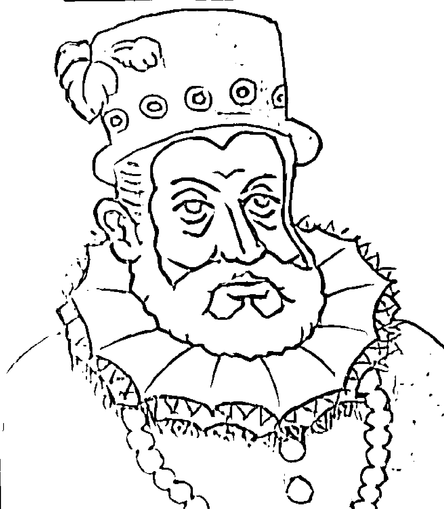

神圣罗马帝国皇帝（1576～1612在位）
匈牙利国王（1572～1608在位）
波希米亚国王（1575～1612在位）

- 招揽炼金术师、魔法师、占星术师
- 使布拉格成为魔法中心重镇
- 死后留下贤者之石

### 炼金术师之流

（炼金术师） → （面试） → （面见） → （成功）

（炼金术师） 皇帝御医 鲁道夫二世 成功 间谍
米格尔·桑迪沃马斯 西迪斯·海耶克 相当于顾问 说法

↓ ↓

米格尔·桑迪沃马斯 → 成功炼成黄金 → 任命为皇帝顾问

### 神圣罗马帝国

公元962年终于1806年，以德国为中心的国家联合组织。由巴伐利亚（Bavaria）、萨克森（Saxon）等诸公国、布兰登堡（Brandenburg）奥地利等边境侯爵领地、波希米亚王国、意大利王国等领地所组成。十一世纪名为罗马帝国，十二世纪名为神圣罗马帝国。十五世纪以后则是叫做神圣罗马帝国。

- 米格尔·桑迪沃马斯 → No.046
- （奥地利） · 森利 · No.056
- （） → No.013

◇贤者之石的材料 → No.015
◇贤者之石的种类 → No.019
◇贤者之石的效力 → No.020

### 斐迪南三世
Ferdinand III

即使帝国已经陷入危机，为炼金术着迷的神圣罗马帝国皇帝仍在追寻未完成的梦想。


### 身陷危难仍热衷于炼金术的皇帝

斐迪南三世（1608～1657。1637～1657在位）是曾经为终结发生于帝国领地内的三十年战争（1618～1648）而奔走的神圣罗马帝国皇帝，然而战争结束以后，神圣罗马帝国却被迫割地给法国和瑞典等战胜国，帝国已然形同灭亡。尽管国势凋零，斐迪南三世却仍旧积极地从事炼金术研究。三十年战争即将结束前夕（1647年），一名叫做J・P・霍夫曼的炼金术师在纽伦堡（Nurnberg）当着皇帝的面挑战黄金炼成，结果大为成功，皇帝遂下令把炼金术所制黄金铸成美丽的金币。

1648年1月则有炼金术师李奇豪森（Richthausen）在布拉格尝试炼成黄金。据传斐迪南三世自己就是炼金术师，熟知伪炼金术师作假的手法，便找来矿山监督官路兹伯爵（Count Lutz）共同监看，做好万全准备以防有作假情事。结果黄金炼成仍告成功，炼金术师用1喱的贤者之石粉末将2.5英磅的水银变成黄金。皇帝见状大喜，用黄金铸造金牌以兹纪念，金牌表面刻有手持默丘里（赫密斯）权杖的太阳神阿波罗全身像和拉丁语铭文，铭文内容如下：「斐迪南三世尊前，1648年1月15日于布拉格有神圣变化。」1650年则是由皇帝亲自用李奇豪森的粉末挑战黄金炼成，同样获得成功。于是皇帝终于认可李奇豪森的功绩，将其拔擢为贵族。

不知是否该说是有其父必有其子，斐迪南三世之子利奥波德一世（Leopold I）也曾经从事炼金术研究。

# 第一章 世界炼金术

- **1617年** J·P·霍夫曼成功炼成黄金
  ↓
  用黄金铸造成美丽的金币
  ↓
- **1618年** 李奇豪森成功炼成黄金
  ↓
  铸造纪念金牌
  ↓
- **1619年** 皇帝亲自用李奇豪森的粉末成功炼成黄金
  ↓
  将李奇豪森拔擢为贵族

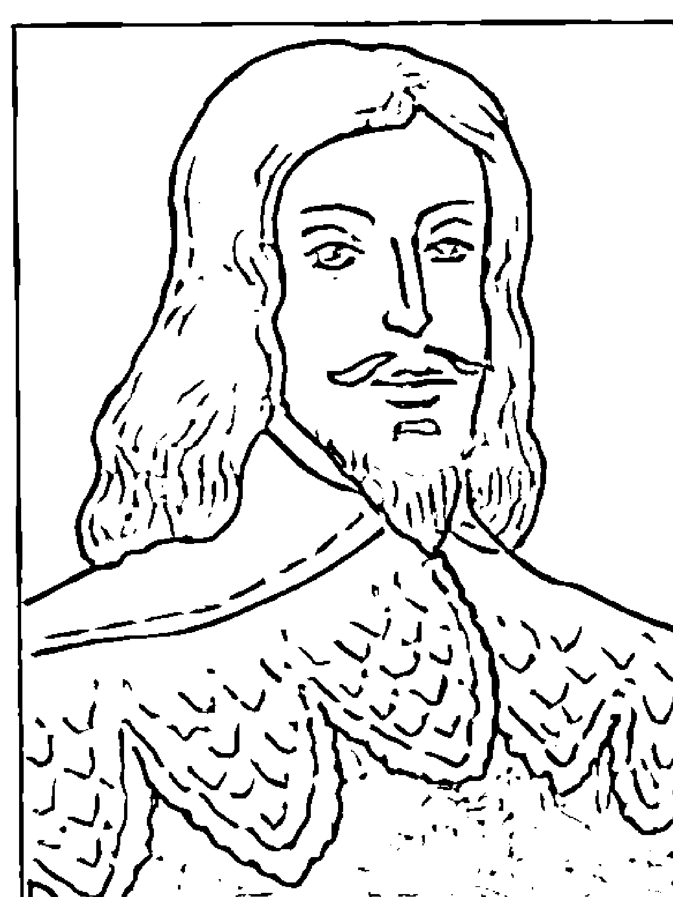

## ❋ 三十年战争

三十年战争乃因波希米亚的新教徒叛乱所起，是从1618年到1648年发生在神圣罗马帝国的国际战争。此役在开战之初本是宗教斗争，但法国、瑞典、丹麦等外国势力介入后，便转变为一场政治战争。战事的主轴亦转变成奥地利与西班牙两国的哈布斯堡王室 (House of Habsburg) 跟法国的波旁王室 (House of Bourbon) 的对立。此战名为三十年战争，却也不全是连绵征战三十年毫无间断，其中也有几次数个月到两年不等的偏安状态。然而后来战事陷入泥沼，甚至还有段长达13年的战役。神圣罗马帝国因战争而荒废，直到斐迪南三世于1648年接受史上第一个多国条约——西伐利亚和约 (Peace of Westphalia) 才终于结束三十年战争。然而和约内容包括割让帝国领土等不利条件，可谓是神圣罗马帝国的没落开端，至此神圣罗马帝国已名存实亡。

- 贤者之石 No.013
- 炼金术的材料 No.015
- 贤者之石的种类 No.019
- 贤者之石的效力 No.020

### 帕拉塞尔苏斯
**Paracelsus** 创设今日“医疗化学”的医学异端分子帕拉塞尔苏斯，为向来皆以黄金炼成为中心的炼金术掀起革命。

### 为炼金术带来革命的伟大医师

帕拉塞尔苏斯（1493～1541）是大幅改变炼金术之意涵的炼金术革命家。炼金术从阿拉伯传入欧洲当时，只不过是种炼成金属的技术而已，最后却变成堪使人类甚至世界趋向完成的技术；而在炼金术的演变过程中，还孕育出蔷薇十字团这种结社组织。造成此改变的人，正是帕拉塞尔苏斯。帕拉塞尔苏斯当然是位炼金术师，但他的医师身份更为重要。他的本名叫菲利普斯·奥利俄卢斯·塞俄弗拉斯图斯·冯·霍亨海姆（Phillips Aureolus Theophrastus Bombastus von Hohenheim）。少年时代求学于意大利的大学，又流浪于欧洲各地学习炼金术、占星术等知识，结果他得到一个结论：「炼金术的真正目的并非炼成黄金，而是要制造有益人体健康的医药品。」

帕拉塞尔苏斯回到故乡巴塞尔（Basel）大学担任医学教授，不久便因同僚反感而被逐出故乡；这是因为当时的医学界深信古罗马医师加伦（Galen）等人的医学理论，他却严词攻击这种医学权威。更具体来说，他否定当时众人所用的药草效力，大力赞扬用矿物制造的药品。换言之，他创设了今日叫作“医疗化学”的学问，为医学界带来极大的变革。他就是从此时开始以帕拉塞尔苏斯自称“Paracelsus”，此名有“比塞尔苏斯更伟大”的意思。塞尔苏斯（Celsus）是跟希波克拉底斯（Hippocrates）与加伦齐名的古代伟大医师，而帕拉塞尔苏斯便是藉此主张自己的伟大。被逐出巴塞尔以后，帕拉塞尔苏斯在浪迹欧洲的生涯中留下大量著作，对后世造成莫大的影响。

### 帕拉塞尔苏斯的革命

#### 炼金术的革命

- 黄金炼成
  ↓
- 治疗疾病
  人类的完成
  ↓
- 世界的完成
  - 影响 → 蔷薇十字团、共济会。

#### 医学的革命

- 古代正统医学
  ↓
- 传统医学
  以药草为主
  ↓
- 引进矿物性药物
  ↓
- 演变为医疗化学部门

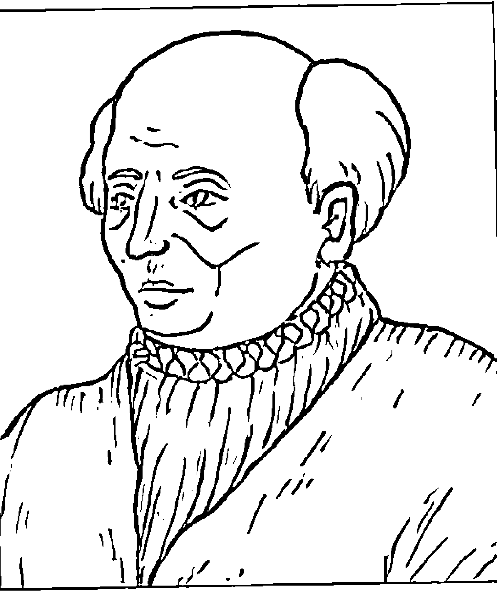

共济会：以自由、平等、博爱的精神闻名的世界性友爱组织→No.062、063

### 帕拉塞尔苏斯的著作

帕拉塞尔苏斯在长期流浪生涯里，留下了数量相当庞大的论著，笔数多达364篇，现已整理成共12卷的帕拉塞尔苏斯全集。这其中最有名的又叫做帕拉三部作：《沃曼・帕拉米伦》（Volumen Paramirum，奇迹医书）、《帕拉格拉嫩》（Paragranum，奇迹医粮）、《欧普斯・帕拉米伦》（Opus Paramirum，奇迹医术）。可惜的是日语版的帕拉塞尔苏斯著作非常少，只有《奇迹医书》、《奇迹医粮》被译成日语出版。

### 帕拉塞尔苏斯的炼金术
Alchemy of Paracelsus

帕拉塞尔苏斯确立了物质的三原素理论，他认为人类同样也是由灵魂（硫磺）、精神（水银）、肉体（盐）三原素构成。

◇ 连接人类的生命与宇宙的生命

帕拉塞尔苏斯认为炼金术的真正目的并非黄金炼成，而是要开发使人获得健康的治疗药物。

虽然之前已经有人试图将炼金术运用于治疗疾病，帕拉塞尔苏斯却为此理想构思出一套可行的理论，其理论之中心思想就是大宇宙与小宇宙两者完全相互对应，而一切存在皆有生命。其实大宇宙思想从很久以前就已经存在，不过他又更进一步地大胆改变了此理论。帕拉塞尔苏斯认为，大宇宙与小宇宙任一方发生的事情，将会原原本本地发生在另一方，而人类的生命与宇宙的生命两者亦是完全相同的存在，所以他认为疾病除了毒因、自然因、精神因、神因以外还有种名为天体因的病因，并且主张天体会对人类健康造成影响，而人类恢复健康也意味着天界回复至调和的状态。此外帕拉塞尔苏斯亦确立了三原素理论。传统炼金术就认为硫磺与水银所组成，但他又在此二者以外添加盐原素，并且扩大解释三原素，将此理论应用于非金属甚至动植物。至于人类的三原素则是以灵魂（硫磺）、精神（水银）、肉体（盐）的形式体现，倘若三者失衡就会生病，因此炼金术才能用于开发治疗疾病的药品。如此用炼金术开发出来的究极秘药“阿卡那”（Arcana）不但能让人得到健康，还具有使小宇宙与大宇宙天界同时回复调和的力量。

这样一来，炼金术就不再单单只是种黄金炼成的技术。在帕拉塞尔苏斯的影响之下，炼金术终于开始演变成可使人类和宇宙趋向完成的特别技术。

### 炼金术之目的

开发使人获得健康的治疗药物 ▷ 秘药阿卡那

使人类获得健康
▽
使小宇宙与大宇宙达到调和

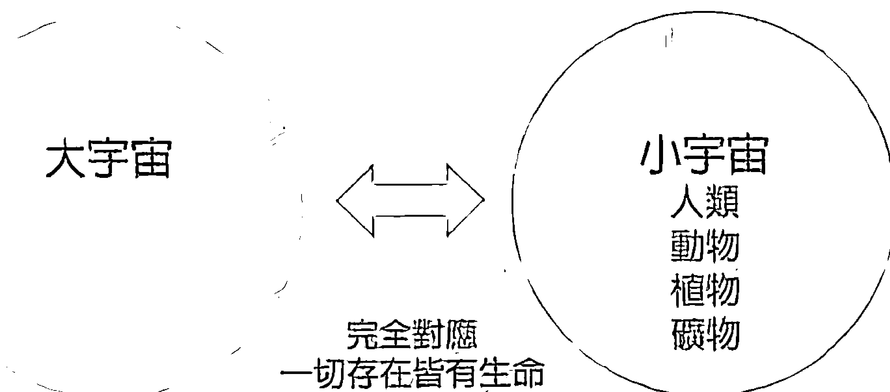

### 物质之成立

帕拉塞尔苏斯派的三原素理论

为原本金属的硫磺—水银理论添加盐原素，并扩大至金属以外的物质

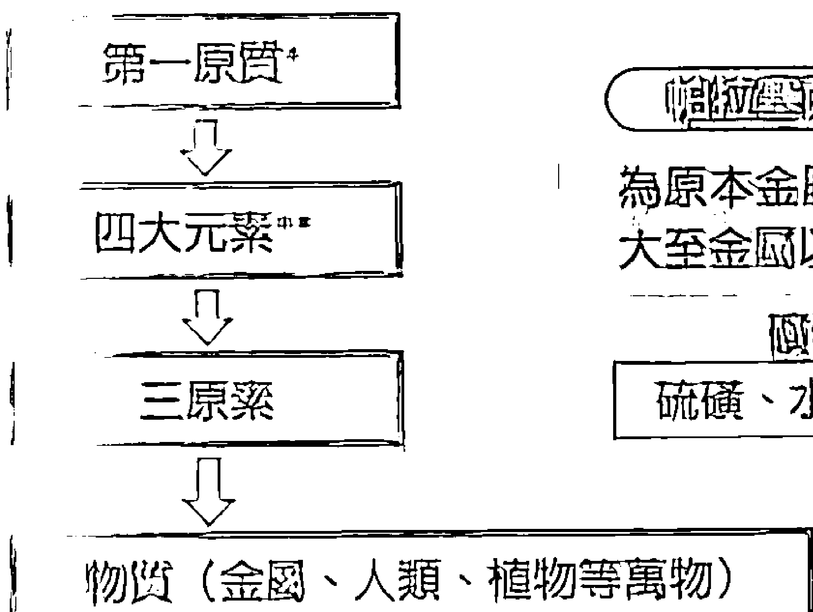

| 矿物 | ⇔ | 人类 |
|---|---|---|
| 硫磺、水银、盐 | | 灵魂、精神、肉体 |

第一原质：炼金术视为构成万物的基本物质→No.006
四大元素：主张物质皆由火、风、水、土四大元素构成的物质观→No.008

### 相关项目

- 帕拉塞尔苏斯→No.054
- 火宇宙与小宇宙→No.007
- ◇三原素—硫磺、水银、盐→No.010

### No.056
### 爱德华·凯利
**Edward Kelly**

尽管被处以削耳之刑，仍不改故态继续以魔法和炼金术欺骗众人的无耻炼金术师，最后终于被鲁道夫二世杀死。

### ☆任意摆布剥削约翰·迪博士的恶质炼金术师

爱德华·凯利（1555～1597）是个彻头彻尾的诈骗犯。他年轻的时候便已经是伦敦声名狼藉的诈骗律师，25岁就因制造伪币被判削耳示众之刑。然而不用多久他又开始走好运，跟约翰·迪博士（Dr. John Dee）交情甚笃；迪博士曾经担任英国女皇伊利莎白一世（Elizabeth I）的政治顾问，是别树一格的大思想家，对炼金术、魔法、降灵术等都颇有研究。凯利于1582年参加迪博士的降灵会，且在水晶球里目睹精灵的身影，因此极受迪博士赏识，于是迪博士便正式聘其为水晶占卜师。自此以后，凯利便以剥削迪博士的恶质炼金术师名留后世。

此后凯利仍不断地任意摆布善良的迪博士。由于迪博士对炼金术也颇有兴趣，因此凯利很容易就可用研究为名目骗取博士的资金。两人从1583年开始出发前往东欧旅行。他们先是在东欧以炼金术为诱饵引诱波希米亚贵族拉斯基（Laski）榨取其财产；谒见过鲁道夫二世以后，又在波希米亚忒波那（Trebona）的罗森堡伯爵（Count Rosenburg）的城堡再度展开炼金术研究。也不知怎地，竟有传说指两人曾在罗森堡伯爵面前成功炼成黄金，有人说因为凯利和迪博士两人在东欧旅行时曾造访格拉斯顿伯里（Glastonbury），从大修道院的废墟里发现了真正的贤者之石。然而凯利愈来愈放肆，甚至可以说是肆无忌惮。1587年他以水晶球占卜，向迪博士主张两人今后应当互相共同享有妻子；就算博士再怎么善良，至此也不得不跟他划清界线。1588年凯利前往布拉格，却被听闻其恶名的鲁道夫二世逮捕，最后因逃狱失败而被杀。

### 爱德华·凯利之生平

- **1555年** 生于英国
  - 德国薇薇的记载：
  - 25岁时因伪造写经被判断耳之刑
- **1582年** 结识约翰·迪博士
  - 在隆垂会受到赏识
  - 成为约翰·迪博士的助手
- **1583年** 旅行东欧四处欺诈
  - 诈骗波兰贵族投资理财的积蓄
- **1584年** 谒见鲁道夫二世
  - 于罗森堡伯爵的城堡成功炼成黄金
  - 在格拉纳达伯里发现贤者之石
- **1587年** 进行水晶占卜，主张今后应当互相共有妻子
  - 与迪博士起争执，关系破裂
- **1591年** 被鲁道夫二世逮捕
- **1597年** 逃狱失败被杀

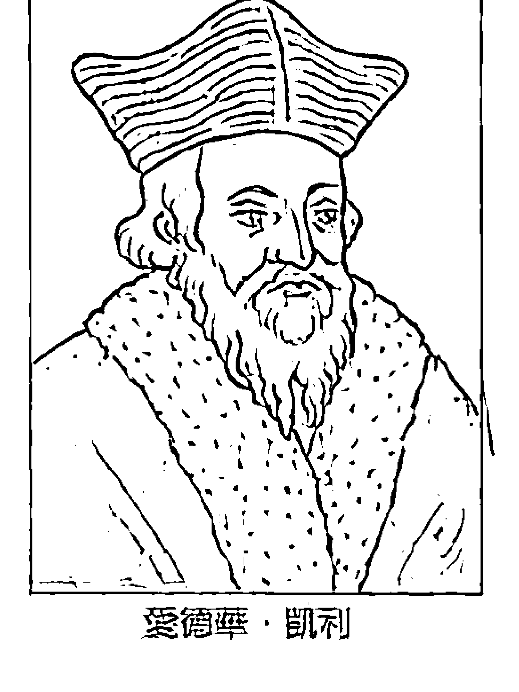

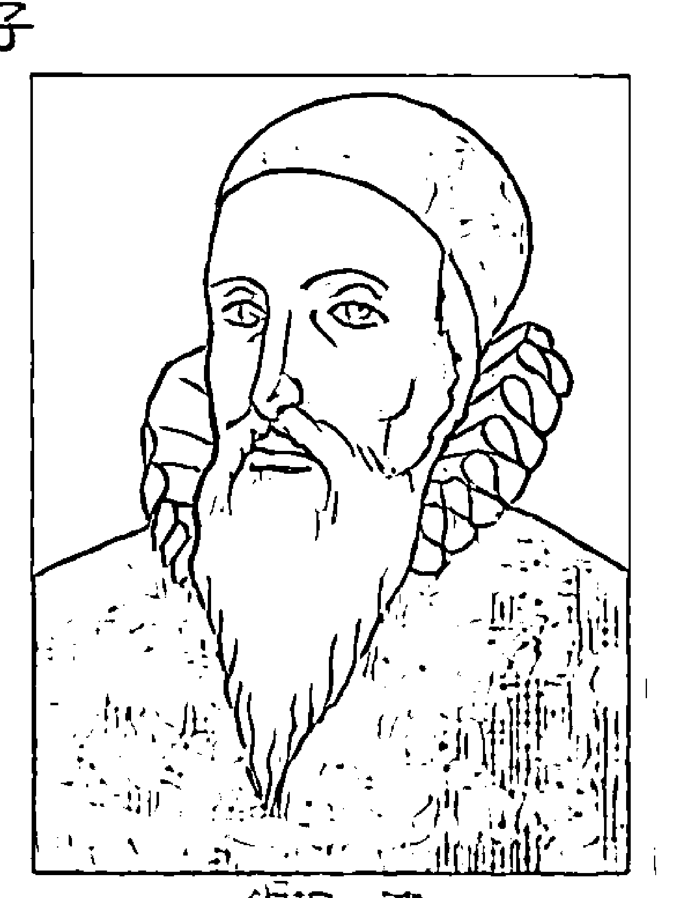

- 鲁道夫二世 -> No.052
- 贤者之石 -> No.013
- 贤者之石的材料 -> No.015
- 贤者之石的种类 -> No.019
- 贤者之石的效力 -> No.020

### No.057
### 圣日耳门伯爵
#### Comte Saint-Germain

藉贤者之石所液化成的生命之水获得永生的炼金术师，传说他曾经见过古时造访所罗门王的希巴女王。

#### 风靡一世的怪炼金术师

圣日耳门伯爵（？～1784？）主要活跃于十八世纪的法国，是欧洲人称“惊异之男”的怪人炼金术师。

他原本出仕于普鲁士宫廷，据说当时的普鲁士国王腓特烈二世（Frederick II）曾称呼他为“不死之人”。他在巴黎社界特别受到女性欢迎，有人说这是因为他拥有能让女性肌肤重获青春的“生命之水”。据说他自己亦曾公开表示“我已经有四千岁，乃藉贤者之石液化的生命之水得此长寿”。他还表示自己曾经亲眼见过数千年前的巴比伦宫廷，以及古时曾经造访所罗门王的希巴女王（Queen of Sheba）。

圣日耳门伯爵还说过：“我可以把几个小钻石变成一个大钻石，还可以把普通石头变成钻石，或是消去钻石表面的刮痕”；据传他的确曾把路易十五世（Louis XV）一颗有刮痕的钻石变成完美无瑕的钻石。

想当然尔，圣日耳门伯爵正确的生卒年份不详。根据某些文献记录，他是在1784年死于德国；倘若此事为真，那就表示伯爵是在撒谎，奇怪的是在1784年以后仍不断有人目睹到伯爵的身影。然而这也不能代表圣日耳门伯爵是位真正的炼金术师，因为从未有传说指其曾在众人面前使用炼金术。就连曾经实际目睹圣日耳门伯爵把一枚银片变成黄金的人，亦即以《回想录》（Histoire de ma vie）的意大利冒险家卡萨诺瓦（Giovanni Giacomo Casanova）也认为“这一定是某种魔术的手法”。

#### 传说中的炼金术师

- 出仕于普鲁士宫廷 ⇒ 腓特烈二世称之为“不死之人”
- 十八世纪中叶任职于巴黎宫廷 ⇒ 欧洲人称之为“惊异之男”
- 于巴黎社交界颇受女性欢迎 ⇒ 因为拥有可使女性肌肤重获青春的“生命之水”
- 1704年死于德国 ⇒ 其后仍不断有人目睹其身影

#### 圣日门伯爵之主张

- 「 因贤者之石、生命之水而有四千岁之寿
- 「 出入古代巴比伦宫廷
- 「 会见希巴女王
- 「 能把几个小钻石变成大钻石
- 「 能把普通石头变成钻石

### 乔凡尼・吉康莫・卡萨诺瓦

十八世纪的欧洲充斥着圣日门伯爵与卡廖斯特罗伯爵等奇怪的人物，而卡萨诺瓦（1725～1798）亦属此类怪人之列。
卡萨诺瓦虽以其好色浪荡事迹留名至今，但他绝非如此简单的人物。父母都是演员的他，在17岁时便取得法学博士学。位，并且在罗马担任枢机主教的秘书。然而他在不久后便因绯闻离职，从而开始游历欧洲各地。其间他从事过小提琴演奏者、军人、作家、赌徒、间谍等各种职业，有时身怀巨富，有时一文不值。卡萨诺瓦精通术，不光是在社交界吃得开，他跟罗马教宗克雷芒十三世（Clement XIII）、俄国女皇凯萨琳二世（Catherine II）、普鲁士国王腓特烈二世等历史人物都有交情。晚年所著《回想录》赤裸裸的记述便今人得以窥见当时的欧洲社会，堪称纪录文学之杰作。

- 贤者之石・No.013
- 贤者之石的材料→No.015
- ◇贤者之石的种类→No.019
- ◇贤者之石的效力→No.020

### 卡廖斯特罗伯爵
Comte Cagliostro
十八世纪法国大革命前夕广受欧洲民众喜爱的卡廖斯特罗伯爵，用炼金术造假反遭拆穿。

被化学家拆穿的炼金术造假手法
卡廖斯特罗伯爵（1743～1795）是十八世纪以革命前夕的法国为中心活跃于欧洲各地的炼金术师。他生于西西里岛的贫穷人家，本名叫做朱赛贝·巴尔萨莫（Giuseppe Balsamo），所以伯爵的称号自然是假的。他从年轻的时候就非常神秘，甚至有传说说他曾周游地中海与东方各国，并悟得秘教之奥义。1776年在伦敦加入共济会以后，就出没于欧洲各地，并展开许多相当可疑的活动。

他先是扮成不收分文的奇迹医师，广受贫穷人家欢迎；他只用某种类似胃药的药物治疗各种疾病，虽不能治疗生理上的疾病，倒也治好了不少心理上的疾病。打响名号以后卡廖斯特罗伯爵便伺机接近有钱人，用各种手段骗取金钱；有时是兜售来路不明的美容液和回春药，有时则谎称能用炼金术把较小的宝石变大，藉机行窃。卡廖斯特罗伯爵原本就是个相当可疑的人物，而他也确实曾经被人戳破炼金术造假的情事。此事发生在1780年的华沙，当时他举行炼金术公开实验，观众里有位叫作莫辛斯基伯爵的化学家。此人当场抨击卡廖斯特罗伯爵每次都选在夜间昏暗的照明下进行黄金炼成，相当可疑，而且他每次都穿着类似石匠工作服的大围裙，围裙底下一定藏着第二只坩埚，于是卡廖斯特罗伯爵的黄金炼成便告失败。

虽然卡廖斯特罗伯爵盛名依旧，但好运也终有用完的一天。卡廖斯特罗伯爵于1785年被视为著名的玛丽·安托瓦内特钻石项链事件的嫌犯之一，被关进巴士底监狱。一年后虽得无罪释放，却又随即被罗马的异端审问所逮捕，1795年死于圣雷奥监狱。

### 卡廖斯特羅伯爵之謎

| 生平 | 内容 |
|------|------|
| 出身於西西里島的貧窮人家 | 本名：朱賀貝·巴爾薩莫。伯爵是假身分 |
| 18歲逃離故鄉 | 周遊地中海與東方各國學得秘教之奧義 |
| 化學家莫辛斯基伯爵（Count August Moszynski）的攻擊 | 雙方在華沙進行黃金鍊成實驗終告失敗 |
| 被關進巴士底監獄 | 涉嫌策劃安托瓦內特鑽石項鍊事件 |
| 卒於聖雷奧監獄（Fort San Leo） | 共濟會會員的身分曝光，遭羅馬的異端審問所判處無期徒刑 |

### 瑪麗·安托瓦內特鑽石項鍊事件始末

法國大革命前夕，史特拉斯堡（Strasburg）大主教羅昂樞機（Cardinal de Rohan）跟對鍊金術頗有興趣的卡廖斯特羅伯爵亦有私交。羅昂偷偷愛慕法國國王路易十六世（Louis XVI）王后瑪麗·安托瓦內特（Marie Antoinette），此時有對叫作拉莫特伯爵（Comte de La Motte）夫婦的騙徒趁隙而入：兩人慫恿羅昂用金錢物獻得瑪麗·安托瓦內特的芳心，唆使他向巴黎珠寶商買下價值160萬利維爾（Livre）的鑽石項鍊。兩人謊稱要將項鍊交送王后，得手後便私吞項鍊，將大量鑽石拆散分別賣給歐洲各地的寶石商。瑪麗·安托瓦內特本人和此事件其實毫無關係，然而事件曝光後卻引起民眾騷動，紛起彈劾王妃奢侈無度。這便是史稱法國王后大醜聞的王妃項鍊事件，至於卡廖斯特羅伯爵是否涉案並無法證實。當初是拉莫特伯爵被逮捕後供稱卡廖斯特羅伯爵是主謀，他也被暫時被關進巴士底監獄。

Cagliostro: 原文作Cagliostro，應是筆誤。

### No.059

### 吉爾·德·萊斯將軍

**Marshal Gilles de Rais**

百年戰爭的將軍因熱衷鍊金術而誤入黑魔法歧途，以至犯下殘殺數百名少年的罪行。

#### ☆鍊金術師最糟糕、不堪的汙點

百年戰爭中與聖女貞德並肩參與奧爾良解放戰，官拜法蘭克王國陸軍元帥的吉里·德·萊斯將軍（1404～1440），乃以從事鍊金術而誤入歧途聞名。

1431年法國的英雄貞德被判處火刑，吉里·德·萊斯的生命亦同時失去了控制。從此他終日閉居城中，過著夜夜笙歌的日子，在宴會中召來許多少年滿足其變童癖好。他還在城堡裡建立設備齊全的實驗室，召集許多疑為冒牌的鍊金術師、魔法師與占星術師不斷進行鍊金術實驗。據說他從祖父和父親兩輩繼承得來的財產足以匹敵法國國王，後來卻因揮霍無度陷入財政困難，才會染指鍊金術。

若只是如此倒也還好，最糟糕的是後來吉里·德·萊斯的鍊金術還跟黑魔法扯上關係。仕於其居城的鍊金術師兼黑魔法師佩拉提（Francesco Prelati）說是必須要有惡魔的幫助才能使鍊金作業成功，慫恿吉里·德·萊斯非得以人類鮮血祭拜惡魔不可。於是吉里·德·萊斯為了鍊金術的實驗，便將村裡的少年都召集到城堡裡，用許多匪夷所思殘忍離奇的方法將其一一殺害。被害者的確實人數不明，但據說死者多達數百人之譜。

1440年吉里·德·萊斯因城堡買賣糾紛遭聖職者控告，被處以異端審判。審判的過程中揭露了他的種種惡行罪狀，最後被判處火刑。吉里·德·萊斯的鍊金術當然並非正道，但由此便足以見得少數鍊金術師也會犯下這種錯誤。

- 出生於法國極顯赫的名門貴族
- 於奧爾良解放戰中跟聖女貞德並肩作戰

> 1436年與聖女貞德道別，開始自稱「藍鬍子」

- 閉居領地居城內
- 夜夜笙歌，沉溺於變童癖好
- 揮霍無度陷入財政困難
- 熱衷於鍊金術
- 受黑魔法師、鍊金術師佩拉提影響，將少年召至城中從事活祭儀式
- 到處都是因為百年戰爭而喪失雙親的孤兒

> 異端審判揭露其惡行罪狀，遭處火刑

#### 以吉里·德·萊斯為藍本的《藍鬍子》傳說

藍鬍子傳說原是歐洲的民間傳說，卻是以收錄於法國童話作家佩羅（Charles Perrault）《童話集》的故事而聞名於世。從前有個長著藍色鬍子的貴族住在偌大的城堡裡，這名男子因為他的鬍鬚而被稱作「藍鬍子」。某次藍鬍子跟一位年輕姑娘結婚，這位姑娘雖然相當害怕丈夫一臉的藍色鬍子，但藍鬍子卻對此名女子疼愛有加。有天藍鬍子要遠行，便喚來妻子對她說：「妳可以在城堡裡自由活動，唯獨禁忌的小房間千萬不可以進去」。藍鬍子出發後妻子卻按捺不住好奇心，迫不及待地將城堡巡視了一遍，終於按捺不住好奇心、打開了上鎖的小房間。結果她發現房間裡的地板竟然是一片血海，牆上吊著女性的屍塊。這六具屍骸都是從前遭藍鬍子殺害的妻子。感到極大驚嚇的新任妻子趕緊把門關起來，但是金鑰匙卻不慎沾到血跡，被藍鬍子發覺她偷看過那個房間。眼看她就要被藍鬍子殺死，恰好有兩位兄弟出現殺了藍鬍子。此故事內容可謂非常殘忍血腥，據說故事裡的藍鬍子其实就是指吉里·德·萊斯。

### 蔷薇十字团

Rosicrucian

十七世紀風靡歐洲的秘密結社蔷薇十字團之精神運動，要掀起全世界性的鍊金術改革。

### 十七世紀歐洲大為流行的精神運動

蔷薇十字團曾在十七世紀的歐洲引起爆發性大流行，是個與鍊金術關係密切的精神運動。引起此風潮的關鍵是德國刊行的四本基本文書：1614年出版的《全世界之普遍性改革》及其附錄《蔷薇十字團傳說》，以及1615年的《蔷薇十字團的告白》和1616年的鍊金術寓意小說《化學的結婚》。蔷薇十字團乃屬秘密結社，上述文書又是匿名作者所著，所以當時的歐洲人根本無從得知蔷薇十字團究竟在何處，又有誰是蔷薇十字團員。然而仍舊有許多人跟蔷薇十字團思想產生共鳴，並且表明想要參加蔷薇十字團的意願。

### 藉鍊金術使世界趨向完成的蔷薇十字團

蔷薇十字團為何如此看重鍊金術，的確有相當的理由。蔷薇十字團意欲得到世界的「完全且普遍的知識」，而且他們相信天地乃上帝以鍊金術所創造。是以窮究鍊金術知識便等同於窮究宇宙之神秘，自然也就可以得到「完全且普遍的知識」。

因此對蔷薇十字團的鍊金術而言，黃金鍊成其實並沒有那麼重要，他們更加重視的是人類精神的完成。不過他們的真正目標規模還要更大：蔷薇十字團要把鍊金術對人類造成的變革擴大至全世界，完成世界的普遍性改革。具體來說，當初蔷薇十字團相當熱衷於探尋能治百病的萬靈丹。他們認為跟福音書裡的耶穌一樣免費為眾人治病乃彼等應當履行的責任與義務，而蔷薇十字團就是要用這個方式一步步地改變世界。

| 特征 | 目的 | 手段 |
|------|------|------|
| 炼金术精神运动<br>流行于十七世纪欧洲 | 藉炼金术使人类达致完成<br>世界的普遍性知识<br>世界之改革与完成 | 追求万灵丹<br>凭质替人治病 |

**《世界之普遍性改革》及附录《蔷薇十字团史说》（1614年）**  
送给全世界的贤者与领袖的宣言，宣言将以世界之普遍性改革为目标推行友爱运动。

**《蔷薇十字团的告白》（1615年）**  
收录许多动言，共分14章，阐述蔷薇十字团的历史起源、发展，以及团体之必要性等。

**《化学的婚姻》（1616年）**  
阐述蔷薇十字团真正目的之幻想式炼金术小说，以克利斯蒂安·罗森克罗伊茨为主角。

### ❀ 創設薔薇十字團的傳奇鍊金術師

克利斯欽・羅森克羅伊茨（1378～1484）是傳為薔薇十字團創設者的傳奇鍊金術師。這名鍊金術師如何創立薔薇十字團，都記載在薔薇十字團四本文基本文書中的《薔薇十字團傳說》。根據該文書記載，羅森克羅伊茨1378年出生於沒落的德國貴族之家；他在修道院學習希臘語和拉丁語，16歲前往耶路撒冷朝聖，不過卻在中途改變主意，遊遍葉門、摩洛哥等阿拉伯國家，花了將近十年的時間學習鍊金術與魔法，以及阿拉伯語、物理和數學等知識。回到德國以後他就跟七位同志建立聖靈之家組織教團，並試圖以西歐基督教與鍊金術、魔法所孕生的普遍性原理改革世界。

### ❀ 預言自己將在一百二十年後被發現

後來羅森克羅伊茨在運動中途逝世，他何時死於何地都是秘密，後人卻在純屬偶然的情況下發現其葬身之處，再次印證他的神秘與偉大。1604年某日第三代團員在修建聖靈之家的時候，發現一扇寫道「我將在一百二十年後被發現」的暗門，遂和同志一齊調查這個秘密空間，結果發現該空間乃一地下墓室，羅森克羅伊茨遺體毫髮無損地被安置於墓室中。根據暗門上的文字來計算，他應是在1484年以106歲之齡逝世。墓室裡還有些羊皮紙書卷；根據這些書卷的記載，羅森克羅伊茨已然通曉天界與人間界之秘術，並且曾在死前製作世界的完全縮小模型，歸納出過去現來未來發生的所有事件。

### 罗森克罗伊茨之经历

《蔷薇十字团传说》 → 炼金术师克利斯钦·罗森克罗伊茨的故事

1378年生于德国 在修道院学习希腊语和拉丁语

16岁前往耶路撒冷朝圣。途中改变行程，前往阿拉伯

归国后 限七位同志创立圣灵之家 组织救团 以改革世界为目标

于亚门、摩洛哥学习炼金术、医法、数学、物理、阿拉伯语

### 发现之墓

1604年偶然发现罗森克罗伊茨之墓

暗门->写道「我将在一百二十年后被发现」

1484年以106岁之龄逝世

羊皮纸书卷所载业绩

通晓天界与人世间之秘术

制作世界的完全缩小模型->归纳出过去、现在、未来的所有事件

蔷薇十字团->No.060

### No.062

### 共濟會

**Freemason**

以自由平等博愛的精神聞名的世界性友愛結社共濟會，亦承繼了鍊金術的思想。

#### 繼承薔薇十字團鍊金術思想的博愛結社

在鍊金術的歷史當中，承繼十七世紀薔薇十字團精神運動的團體就是十八世紀的共濟會。

共濟會此字是「自由的石匠」的意思，據傳是由中世紀建造大教堂與宮殿的石匠同業公會演變而成。然而中世紀以後建造大型建築物的機會愈來愈少，職業石匠同業公會也隨之陷入危機。薔薇十字團的思想及其支持者就是在這個時候進入同業公會組織，使同業公會蛻變成共濟會。換句話說，原本的石匠團體只是建造地上肉眼可見的建築物，自此就蛻變成建造肉眼看不見的神國建築、藉以欄架精神達致完成的自由人團體。這個改變當然也讓共濟會變得使人類與社會達致完成的目標，就跟鍊金術和薔薇十字團如出一轍。

此變化最早發生於英國，1717年共濟會在倫敦的四個分會（Lodge）經過整合改設倫敦大分會（Grand Lodge），踏出全新的一步。有些人會把1717年以前的共濟會稱作舊共濟會，其後的則稱作近代共濟會，以為區別。

蛻變後的共濟會在社會與政治層面都有很大影響力。共濟會主張自由平等博愛的世界公民思想，此精神後來原原本本地被法國大革命沿用，而美國的自由精神亦同。同時共濟會的規模也不斷擴張，現在已經成為會員多達600萬人的全球最大結社。所以現在的共濟會並不能算是個鍊金術組織，不過秘密宗教與鍊金術的精神至今仍存在於部分共濟會之中。

#### 共濟會與鍊金術

```
mermaid
flowchart LR
    A[中世紀的石匠同業公會] --> B[地上肉眼可見的建築物]
    C[舊共濟會] --> D[十四世紀成立於英國？]
    E[近代共濟會] --> F[肉眼看不見的神國建築<br/>精神建築之完成<br/>人類與社會之完成]
    G[1717年倫敦大分會設立後] --> E
    H[薔薇十字團思想] --> C
```

#### 共濟會之影響力

```
mermaid
flowchart LR
    A[共濟會的精神<br/>自由、平等、博愛] --> B[法國大革命<br/>美國獨立<br/>影響]
    B --> C[成為會員數超越600萬人的世界上最大結社]
```

共濟會組織極為龐大，傳為其會員的名人自然不少。據傳美國首任總統喬治·華盛頓（George Washington）、第32任總統富蘭克林·羅斯福（Franklin Roosevelt）、獨立宣言起草人班傑明·富蘭克林（Benjamin Franklin）、盟軍最高統帥麥克阿瑟（Douglas MacArthur）、英國首相邱吉爾（Winston Churchill）等都是共濟會的會員。另外像莫札特、貝多芬等作曲家，凡爾納（Jules Verne）、馬克吐溫等作家也都傳為共濟會會員。日本的共濟會名人相對來說當然比較少，據說前首相鳩山一郎曾於晚年加入共濟會。

薔薇十字團→No.060 ◇共濟會的加入儀式→No.063

#### No.063 共濟會的加入儀式 Initiation of Freemason

共濟會與鍊金術關係匪淺，此關係在晉升為「師父」階級必經的通過儀式「希藍傳說」中尤其明顯。

##### ☆ 將共濟會與鍊金術的關係傳承至今的加入儀式

從某些儀式當中，我們便可清楚地觀察到共濟會和鍊金術的關係。

基本上共濟會總共分為「徒弟」「工匠」「師父」三個位階；新入會者屬於「徒弟」位階，然後才依序晉升為「工匠」→「師父」。其中晉升為「師父」的加入儀式，便是由共濟會流傳的「希藍傳說」(Legend of Hiram) 演變而成。

根據希藍傳說，從前建造所羅門王神殿的工匠共分為「徒弟」「工匠」「師父」三個位階，每個位階都有各自的暗語。有三個工匠極欲獲得「師父」位階，要稱建造神殿的最高負責人希藍（Hiram）說出「師父」的暗語，並一一襲向希藍，希藍終於被最末一人殺害。這三個兇手把屍體埋在山腰，在墳上插了一支洋槐樹枝。雖然後來所羅門王的搜索隊發現此墳時希藍已經死亡14天，希藍仍得以藉「獅子握手法」而復活。

共濟會晉升「師父」的加入儀式，會不斷重複演出象徵此傳說的劇碼。傳說中希藍是被兇手用直尺、直角尺和槌子打死的，而新加入者也必須在象徵劇裡經歷死亡體驗，躺在繪有棺材圖樣的地板上，然後被人用當初拯救希藍的握手法從棺材裡救起。此象徵劇之意涵當然就是死亡與復活，新加入者透過此儀式始得脫離俗世，並經由死亡復活成為全新的自己。換句話說，此過程剛好跟賤金屬經過腐敗（死亡）變成黃金的過程恰恰相同，可直接適用於人類之自我完成。

##### 「所羅門王傳說」 象徵劇

- 建造所羅門王神殿之負責人希蘭 → 遭三位工匠謀殺 → 被埋在山腰 → 墳上插著洋槐樹枝 → 14天後被發現 → 以「獅子握手術」復活
- 世俗的人類 → 象徵性被殺害 → 象徵性死亡 → 復活成為全新的人類
- 從金屬 → 跟金屬 → 屍骸 → 黃金

##### 「獅子握手術」

手指分成小姆指與無名指、中指與食指、大姆指三組。此手勢也經常出現在猶太秘密宗教喀巴拉的圖像中。

> 喀巴拉：猶太教一支傳授如何接近神明的秘密宗教支派→No.084

### 文藝復興

歐洲鍊金術的鼎盛時期約在十四至十六世紀之間，恰好與文藝復興時期重疊。

所謂文藝復興，乃是以義大利為中心發生於歐洲各地的大規模文化活動之總稱。「文藝復興」(Renaissance)此語有「再生」的意思，而該活動之中心概念便是要復興古希臘羅馬的豐饒古典文化。

北方的日耳曼民族於四～五世紀壯大起來並入侵歐洲，古羅馬帝國因而滅亡，便得歐洲的文化水準頓時驟降。此外，已有相當勢力的基督教會亦大力提倡推廣不抵觸其教義的學問，而豐饒的古典文化只能如涓涓細流般傳承下來，一般民衆也被迫過着從屬於教會的生活。

不過古典文化並未滅絕，仍以語言、風俗、古代遺跡等各種形式保存在古羅馬帝國的中心地羲大利。此外羲大利也因爲十一世紀熱絡的貿易活動，得以在經濟與文化上有長足的發展。再加上十一世紀後半到十三世紀的十字軍東征，使得從前流至阿拉伯世界的古希臘文化大量回輸至歐洲。知識分子受此衝擊後不但感嘆古典文化之豐富，並且爲古代人重視人的價值、相信人類理性之態度而深受感動。古代人的這些價值觀與中世紀歐洲人處處受教會教義束縛的生活，可謂有天壤之別。於是知識分子遂以羲大利爲中心企圖再現古代文化，並逐漸向外擴張至歐洲各國，是謂文藝復興。

此運動遍及所有文化精神活動領域，各領域都出現許多優秀且獨特的人材。文學家有但丁(Dante Alighieri)、薄伽丘(Giovanni Boccaccio)、拉伯雷(Francois Rabelais)，思想家有馬基維利(Niccolo Machiavelli)、蒙田(Michel Eyquem de Montaigne)、馬丁路德(Martin Luther)，藝術家則有達文西、米開朗基羅(Michelangelo Buonarroti)、波提切利(Sandro Botticelli)。此外，達伽馬(Vasco da Gama)、哥倫布、麥哲倫等探險家活躍的大航海時代鼎盛時期，也正值文藝復興時期。換句話說，所謂的文藝復興其寶就是各領域人材都一致相信自我理性、從事文化的探求與冒險的時代。

在這樣的時代下，鍊金術的流行自然也就達到最高峰，因爲鍊金術師們也跟其它領域的天才一樣，無不是相信人類的理性、徹底追求自我的信念。

# 第3章 组合体的视图

No.064

### 煉金術師的出身階級

Social Class of Alchemists

歐洲的煉金術原本僅限於修道僧之間，後來隨著大學發展方才擴張至貴族與上流社會。

#### ☆煉金術師多是貴族與上流社會出身

整體而論，沉迷於煉金術的人大多屬於統治階級或上流社會。研究煉金術不但要會閱讀希臘語、拉丁語、阿拉伯語等文獻，還必須購置各式各樣的裝置與材料，因此必須具備相當高度的教養和財力。

儘管如此，中世紀歐洲的學問研究在某時期以前一直都只侷限於修道院之內，所以剛開始的時候只有基督教的修道僧在研究煉金術。這點從大阿爾伯特、羅傑·培根等初期歐洲煉金術師都是聖職者的事實便不難窺見。煉金術在傳入歐洲當初被視為最先進的自然科學，所以教會對煉金術研究的態度也相當寬容。

十二至十三世紀以後歐洲各地陸續設立大學，前述狀況亦逐漸產生變化，才開始有許多非聖職者的知識分子出現。於是煉金術便逐步擴展至統治階級或上流社會等擁有相當財力的社會階級。煉金術是個專門的學問，會對今日的化學或醫學感興趣的人，自然也會被煉金術吸引。

十五世紀以後，歐洲許多宮廷也開始熱心研究煉金術，又再度造成煉金術的周遭環境產生變化。宮廷不只委託聘請貴族、醫師、學者研究煉金術，還會庇護具相當能力的煉金術師，頓時讓煉金術師人數遽增。數量增加又連帶孕育出各種不同類型的煉金術師，以及許多極富個人魅力的著名煉金術師。這個現象一直延續至十七世紀為止；此後雖然煉金術學說愈發興盛，但相對地也開始有許多專行詐騙的偽煉金術師出現。

### 成為煉金術師的條件

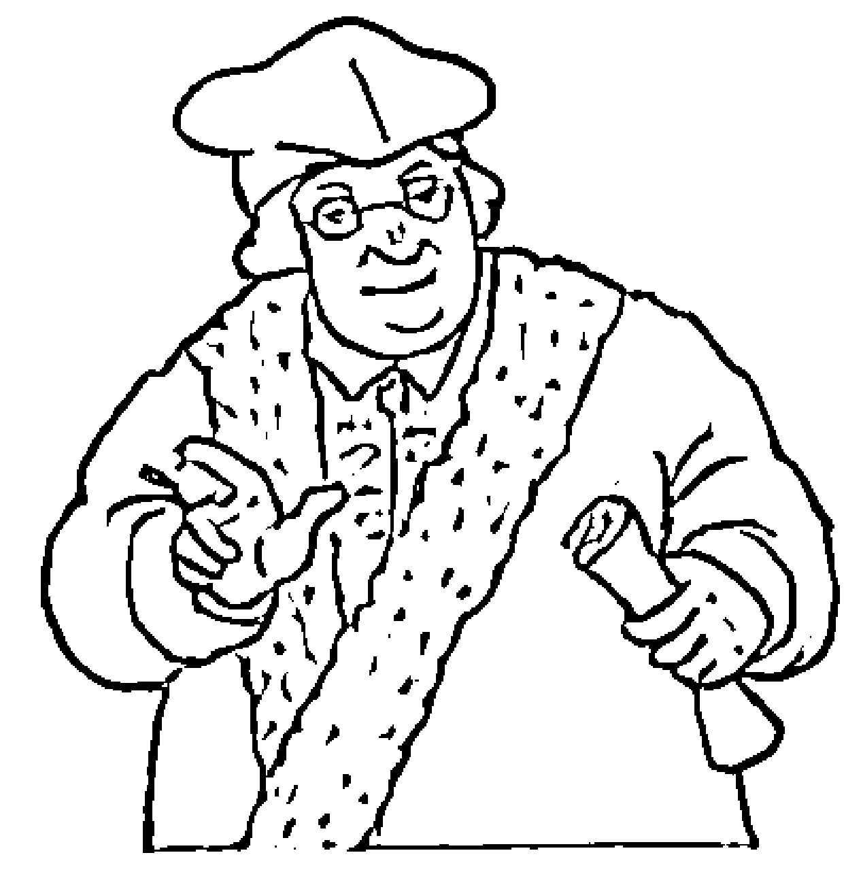

- 教養
- 希臘語
- 拉丁語
- 阿拉伯語
- 壓力
- 道具
- 材料

煉金術師多是貴族、上流社會出身

### 煉金術之擴大

- 學問研究僅限於修道院 → 修道僧
- 各地陸續設立大學 → 貴族、上流社會
- 宮廷大學從事研究 → 醫師、學者、領主階級

具個人魅力的煉金術師

專行詐騙的偽煉金術師

No.038 ◇羅傑·培根→No.039

#### No.065

### 如何成為煉金術師

**How to Become An Alchemist**

要成為過人的煉金術師必須學習多方知識，還要不時精進充實自己，因此煉金術師的首要條件就是耐力。

> >「閱讀、閱讀、再閱讀、祈禱、工作、便能得悟」

想要成為煉金術師其並不需要什麼資格，然而若是要成為優秀的煉金術師就必須具備一定程度的學識。欲窮究煉金術奧義者，必須研讀希臘語、阿拉伯語、拉丁語等古文書。進大學求學是習得必備學識相當有效的方法，其中尤以神學院和醫學院最適合有志於成為煉金術師者。中世紀歐洲相信宇宙乃神所造，因此神學堪稱為所有學問之中心，同時亦有助於探究世界之奧秘；而當時的醫學會操作物質製造對人體有益的藥物，跟煉金術頗為相似，是以學醫出身的煉金術師也不少。

但大學畢業也並非絕不可或缺的條件，如何找到良師拜入門下反而更加重要，因為基本上煉金術教育都是由老師以口頭講述方式傳授弟子。在煉金術師的世界裡，兒子繼承父業的父子檔煉金術師亦屢有所見。為求成為煉金術師而行遍歐洲的人可謂多不勝數，甚至還有人遠赴北非或波斯求師。

除此以外，煉金術師必須克服種種困難與失敗，永不放棄地去尋求賢者之石。有志於煉金術者之間甚至有句格言：「閱讀、閱讀、再閱讀、祈禱、工作、便能得悟」，所以我們可以說耐力是煉金術師的首要條件。

如欲成為煉金術大師，則更須進一步摒棄邪念、委身於神。出人意料的是，大師通常都是自己製造爐具、蒸餾瓶（Retort）、蒸餾裝置等道具，因此有志者不能徒具知識，還要懂得鑄鐵與製造玻璃等技術。

### 成為煉金術師之必要條件

- 獲得學識
  要閱讀希伯來語、希臘語、阿拉伯語、拉丁語等古文書
  （通才型學者：通才型的專業知識）

- 求得良師拜入門下
  找遍歐洲甚至遠赴北非、波斯

- 習得老師所授
  由老師以口頭傳述方式傳授弟子

- 繼承父親所得奧義
  倘若父親是煉金術師

- 耐力
  最重要課題

### 成為煉金術師的信條

「閱讀、閱讀、再閱讀、祈禱、工作、便能得悟」

## 成為煉金術大師

屏除邪念、委身於神

習得鍛鐵與製造玻璃等技術

自製爐具、蒸餾瓶、蒸餾裝置等道具

不能徒具知識

- □賢者之石 → No.013
- □賢者之石的材料→No.015
- □賢者之石的種類→No.019
- □賢者之石的效力→No.020
- □大師→No.066

#### 大師

> > 从事精神炼金术的真正的炼金术师，以及悟得奥义的杰出炼金术师常被视为特殊的存在，特称为大师。

#### ♢ 被视为特殊存在的炼金术大师

所有炼金术师中特别优秀的炼金术师特称为大师，以区别普通炼金术师。

大师又分成数个等级。镇日梦想炼成黄金，一味鼓起风箱让炉里燃起熊熊烈焰的炼金术师叫作「风箱手」；相对地将全付心力投注于精神炼金术的真真正正的炼金术师则称为大师，而现实世界里也确有许多炼金术大师存在。

话虽如此，始终也只有像尼乐·勒梅这种穷究炼金术秘密，成功制造出贤者之石的炼金术师，方才配得上大师的称号。

这些炼金术大师当然都是长生不老，因此炼金术师普遍相信欧洲四处都有许多已得悉秘密的大师出没，不过真要实际遇到大师的机率可谓极低；真正的大师可以突然现身又突然消失无踪，根本无从得知其居所。

尽管如此，炼金术师却也不是绝无遇到大师的可能。有些人相信已得悉秘密的大师倘若发现具有相当资质的年轻人，就会把炼金术之奥义传授予该青年，而炼金术之奥义向来都是透过这种师徒相传的形式流传下来的。是以假如有个有志于炼金术的青年具备足够的资质，亦即拥有过人的美德与品格，大师应该就会主动现身传授炼金术的秘密。

### 炼金术师之等级分类

炼金术师

- 风箱手
  镇日梦想黄金炼成的低俗炼金术师
  日复一日只管鼓动风箱燃起熊熊炉火，因有此称

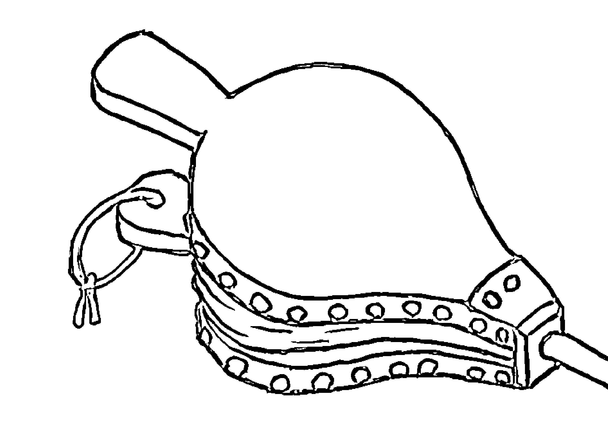

- 大师
  ① 从事精神炼金术的真正炼金术师
  ② 究究炼金术秘密、得到贤者之石的炼金术师

- 真正的大师
  - 欧洲四处都有许多大师
  - 其居处不得而知
  - 只出现在具资格的年轻人面前，授以奥义

### 相关项目

- 贤者之石→No.013
- 贤者之石的材料→No.015
- 贤者之石的种类→No.019
- ◇贤者之石的效力→No.020
- ◇尼乐・勒梅→No.042
- ◇尼乐・勒梅的黄金炼成→No.043

### 炼金术师的实验室

#### Laboratory

炼金术实验室可分为仅设有作业用道具设备的实用型实验室，以及附有祈祷场所的复合型实验室。

- ◆ 实验室亦是炼金术师祈祷的场所

通常炼金术师的实验室都是乱七八糟的房间，各式各样的装置沿着墙壁杂然陈列，此景清楚地显示于实际描绘当时炼金术师实验室的图画里。不过每位炼金术师的经济能力各异，各人追求之目的也不同，是以理想的实验室类型当然也就有所区别。就炼金术师之特征而论，实验室大致可以分成两个类型。

第一种就是工作室兼祈祷场所的实验室。其实中世纪拉丁语的「实验室」(Laboratorium) 本来就是结合「工作场」(Labor) 与「祈祷室」(Oratorium) 两字的复合语。此外早在古亚历山卓时代，从事炼金术就必须搭配虔诚的祈祷，此倾向尤以完成人类之灵性为目标的炼金术师更为显著。十六世纪德国炼金术师亨利·康拉德 (Heinrich Coenraad, 约1560~1604) 的著作《永恒智慧之圆形剧场》书中的炼金术师实验室版画里，便设有祈祷用的祭坛。

另一种类型的实验室，就是以正确的物质操作为主要诉求的实验室，此类实验室当然仅设有进行作业的必需道具而已。

当然只要具备雄厚的经济能力，炼金术师也可以使用规模达数个房间的大型实验室。十六世纪的德国炼金术师利巴威斯 (Andreas Libavius) 就曾经说过，理想的实验室除主要工作所以外，还要有置物间、准备室、隔砂隔水加热室、结晶室、助手室、燃料库、葡萄酒贮藏室。

#### 測定斯理想中的實驗室

#### 實驗室建築外觀

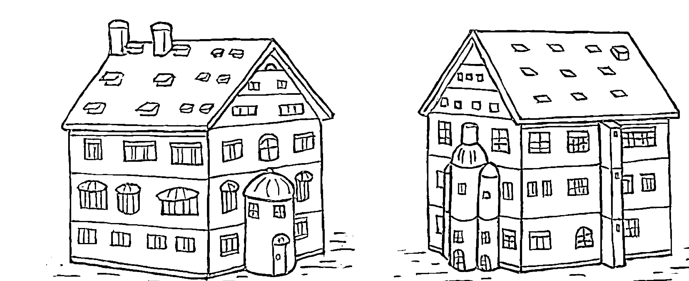

△南面

△北面

#### 實驗室主要部分之隔間

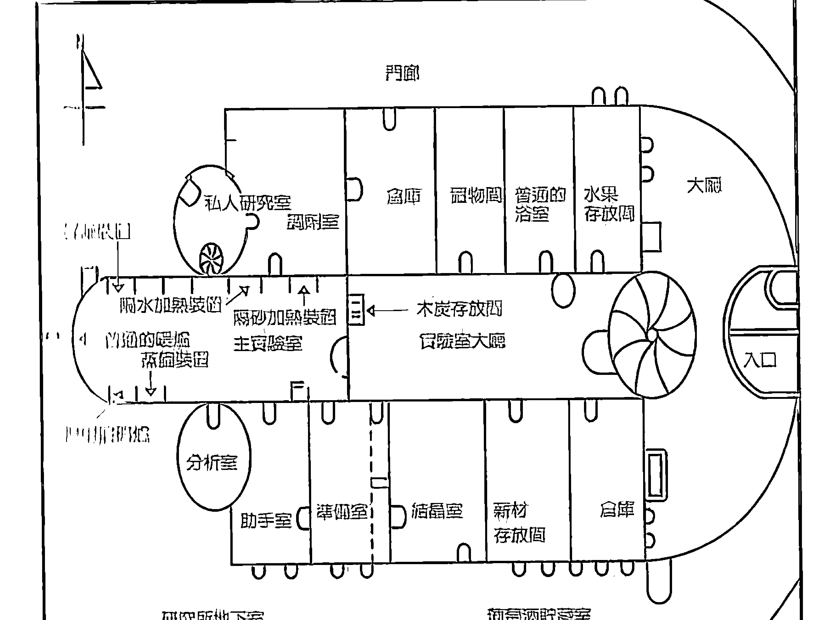

### 煉金術師的煩惱

#### A Lot of Troubles

姑且不論曾經實際製造出賢者之石的煉金術師有多少，但幾乎所有的煉金術師無不是每日有數不完的煩惱。

首先是資金問題。進行煉金術實驗必需的道具材料若不用錢購買，就要自己製作。倘若父母親是有錢人，可以把房屋土地出租或賣給別人；若是沒有財產，也可以去巴結討好對煉金術有興趣的貴族或富商。煉金術師為了讓資助者覺得確有成功的可能性，或多或少都會耍些類似欺騙的手段。此外，有些人也會利用物質的性質做些魔術表演等措資金。

解決資金問題後，道具與材料的取得亦屬不易。道具材料當然可以用錢購買，不過在中世紀歐洲幾乎沒有生產燒瓶等玻璃製品，如果化學實驗必須用到較特殊且複雜的裝置，就只能自己製作或是委託工匠訂作。而且煉金術師經常要隱藏身分，所以必須特意到外地購買道具，抑或瞎扯些荒誕古怪的謊話；舉例來說，就有煉金術師為取得蒸餾裝置而對工匠謊稱：「必須蒸餾生水以治療家父眼疾」。

有些缺乏資金的煉金術師只能住在沒有煙囪的房間裡，進行煉金術作業時就必須和滿屋子的濃煙搏鬥。長期在這種環境下進行研究，一年半載下來不要說是生病，因此喪命的也大有人在。

相較之下，附庸於貴族或國王的宮廷煉金術師就可以比較輕鬆許多，但他們為維持有信用，有時候還是要用些類似欺騙的手法。此外，宮廷的煉金術師還要費盡心思剷除競爭對手，

- 疾病: 獨自臥病榻數個月之久
- 病屋濃煙: 甚至可以致死
- 道具材料之取得: 到外地購買 委託工匠→隱瞞自己的身分 自己製作
- 宮廷裡的信用: 為維持信用必須用些類似欺騙的手法 刪除競爭對手
- 資金: 租屋 尋求富裕者、富商等人資助 利用魔術表演藉以籌措資金

#### 佩利歐特·沙克羅伯斯的煩惱

俄國作家梅利西可夫斯基 (Dmitri Merejkowski) 的小說《李奧納多·達文西》(1900年) 裡鍊金術師佩利歐特·沙克羅伯斯 (Ottotto Sacrobosco) 的經歷，集合了許多鍊金術師的煩惱。在...

#### No.069 偽鍊金術師的造假手法
**Tricks of Alchemists**

偽鍊金術師會用各式各樣造假的手法欺騙王公貴族等有錢人，以圖獲得資金或報酬。

##### 欺人耳目的黃金鍊成

偽鍊金術師有各式各樣五花八門的方法，可以讓人誤以為成功鍊成黃金。

最簡單的方法就是用銅或錫等其它金屬包住黃金，投入坩堝使其熔化。如此黃金就會和銅或錫混合在一起，便可以得到雖非純金卻也難辨真假的金塊。

在道具上動手腳是最常見的手法。舉例來說，可以把黃金裝進鐵製的中空攪拌棒再用木塊封住。用這根鐵棒攪拌坩堝，鐵棒末端的木塊燃燒掉以後，黃金自然就會流入坩堝。還有人在坩堝底部動手腳：先製作有兩層堝底的坩堝，並將黃金事先放置於夾層內。只要一面攪拌一面敲破或刮破堝底，黃金自然就會流入坩堝。

有些偽鍊金術師則是使用較費周章的手法，將坩堝藏在剛裙下等隱密處，作業中途再偷偷調包。

此外，還可以將用來燃起爐火的木炭偷偷裝進黃金。當然，木炭原本應該是要放在爐具下燃燒，但偽鍊金術師可以想盡辦法把木炭擺在坩堝口附近，木炭燃燒掉以後黃金就會流進堝內。

最後還有在賢者之石裡摻雜黃金的手法，也就是用金箔、木炭、麵粉等物揉成藥丸狀投入坩堝。此法所得黃金量非常少，卻也顯示了黃金鍊成的可能性，偽鍊金術師便可藉此從資助者處得到大筆資金。

**1 用其他金属包住黄金**

- 先用锡或铜包住黄金
- 投入坩埚中使之熔解
- 得到锡、铜、金的合金

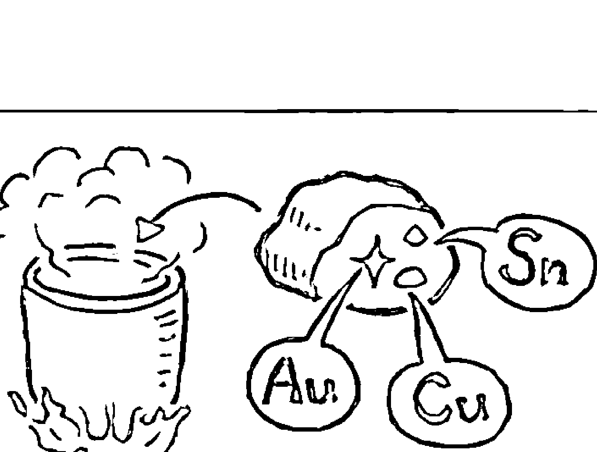

**2 从道具上动手脚**

- 准备中空的铅制搅拌棒
- 将黄金装进搅拌棒内
- 用木块封住
- 搅拌坩埚，木块燃烧黄金便流入埚内

**3 在工具上做手脚**

- 准备两个不同底的坩埚
- 把黄金藏在夹层内
- 搅拌时过破坩埚底
- 黄金流入埚内

**4 把坩埚调包**

- 将坩埚藏在围裙下
- 室内充满烟尘视线不佳
- 时瞬间调包

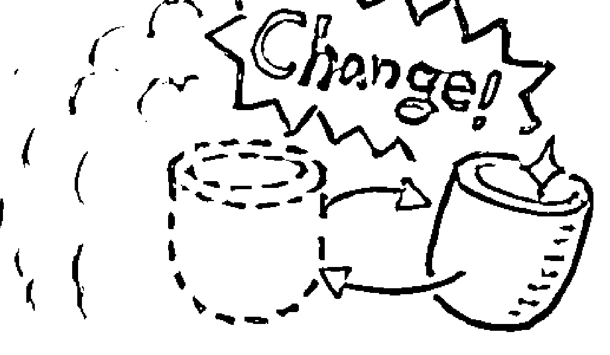

**5 偷龙转凤**

- 用金屑、木炭、铅粉等
- 揉成药丸状
- 投入坩埚就能得到少量黄金

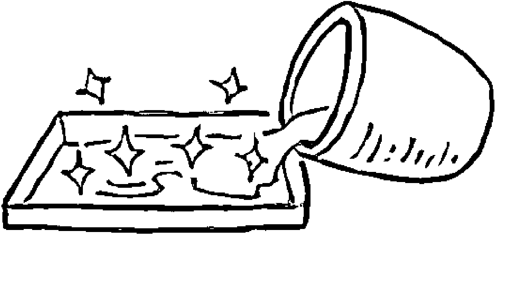

#### No.070

### 鍊金術師悲慘的命運

#### Tragic End of Alchemists

投獄、拷問、斷頭臺、火刑……鍊金術師最終的命運可謂悲慘至極。

- ♢不論大師或騙徒都是搏命演出

鍊金術師除孤獨和貧窮以外還有許多恐怖的敵人。不承認鍊金術等魔法的教會當然是其中之一，但真正來自教會的迫害打壓其實並沒有想像中那麼頻繁。最最可怕的，反而是對鍊金術深感興趣的當權者、王公貴族。他們為了從鍊金術大師口中問出秘密，可以毫不猶豫地將人打入牢房、施以拷打。此外，以大師自稱的偽鍊金術師只要露出馬腳，絕對會被處以唯一死刑。對宮廷鍊金術師來說，宮廷裡的競爭對手也很可能會變成恐怖的敵人。因為牢獄、拷問、處刑等因素而喪命的鍊金術師真是不少。

十六世紀出身於蘇格蘭的亞歷山大・塞頓曾經成功煉成金，活躍於歐洲各國，後來卻被極欲知悉秘密的薩克森選帝侯克里斯蒂安二世（Christian II, Elector of Saxony）所囚，受到嚴厲拷打，雖然倖得出獄卻終究死於拷打重傷。十五世紀英國的湯瑪斯・道爾頓（Thomas Dalton）也曾經被對鍊金術感興趣的鄉紳湯瑪斯・哈佛（Thomas Harvard）囚禁四年，最後哈佛好不容易死心釋放道爾頓，可是他過沒多久也死了。

或許這可以說是理所當然的道理，但偽鍊金術師的下場同樣非常悲慘。十六世紀英國的愛德華・凱利一度以成功煉成黃金聲名大噪，卻因惡名昭彰被逮捕，最後企圖逃獄不成才被魯道夫二世殺死。十七世紀德國的C・W・克羅曼（Kronemann）曾被威廉侯爵聘為宮廷鍊金術師，一時間意氣風發，但詭計敗露後就被判了絞首死刑。十八世紀義大利的多米尼科・曼努埃爾・切塔諾（Domenico Manuel Chetano）最後是被吊死在貼著金箔的絞刑臺上，可說是偽金術師最貼切不過的結局。

### 炼金术师之敌

欲知秘密的王公贵族

宫廷内的竞争对手

憎恨炼金术的教会

> 入狱、拷问、处刑

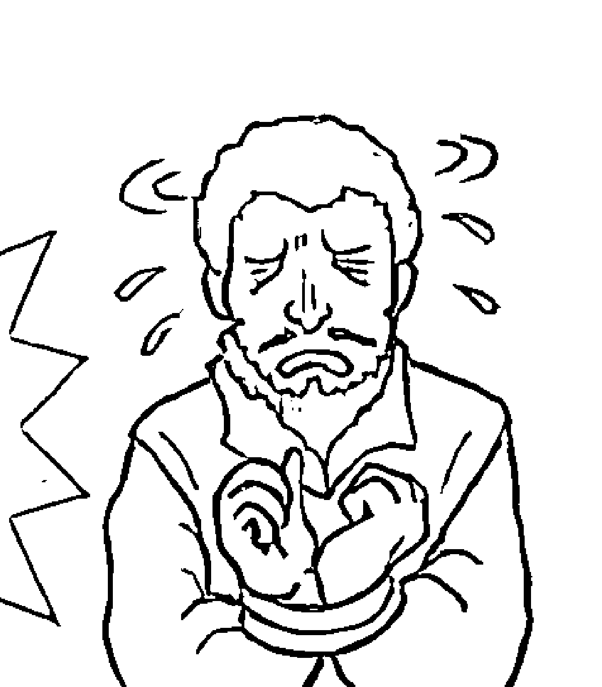

### 惨遭处死的炼金术师

| 炼金术师 | 悲惨的下场 | 当权者 |
| --- | --- | --- |
| 亚历山大·赛顿<br>十六世纪 苏格兰 | 入狱 ∇ 拷问 ∇ 出狱 ∇ 因拷打重伤而亡 | 萨克森选帝侯 克里斯蒂安二世 |
| 约翰·迪<br>十五世纪 英国 | 入狱 ∇ 释放后死亡 | 乡绅汤玛斯·哈佛 |
| 爱德华·凯利<br>十六世纪 英国 | 入狱 ∇ 企图逃狱被杀 | 鲁道夫二世 |
| 米夏埃尔·迈尔<br>十七世纪 德国 | 绞刑 | G·威廉侯爵 |
| 乔瓦尼·巴蒂斯塔·切利尼<br>十八世纪 意大利 | 入狱 ∇ 逃狱 ∇ 再逮捕 ∇ 吊死在贴着金箔的绞刑台 | 腓特烈四世 |

### No.071 鍊金術禁令

Prohibition

自古以來，基督教會與許多國王皆將鍊金術視為魔法和偽造金銀的詐欺行為，曾多次下令禁止。

#### ☆ 多次被禁的鍊金術

鍊金術並非從誕生初時便受人歡迎。鍊金術是種魔法的技術，而且跟偽造金銀的詐欺行為有相通之處，因此鍊金術幾乎向來都是正統基督教會撻伐的禁術。

在鍊金術誕生時，羅馬奉基督教為國教，禁止一切與魔法有關的事物，只要發現魔法師、鍊金術師與占星術師就要放逐。529年東羅馬帝國的查士丁尼大帝（Justinian I）甚至還公然打壓古希臘流傳下來的科學與哲學。四世紀後半，從前鍊金術盛行的亞歷山卓亦有大主教聖狄奧菲魯斯（Saint Theophilos）大肆迫害異教文化，鍊金術重鎮薩拉匹斯神廟（Serapis Temple）和著名的圖書館紛遭破壞。

起初中世紀歐洲將鍊金術視為尖端科學予以接納，但1317年又有教宗若望二十二世（John XXII）頒布鍊金術禁令。1380年法國的查理五世（Charles V）禁止一切鍊金術研究。1404年英格蘭的亨利四世（Henry IV）制定法令嚴懲舞弊的鍊金術師。1418年威尼斯共和國（Venetia）禁止鍊金術。1468年元老院在威尼斯通過鍊金術禁令。1493年紐倫堡（Nurnberg）也禁止鍊金術。

不過實際上這些禁令並沒有那麼嚴峻。雖說教會不承認鍊金術，熱衷於鍊金術的修道士卻也不少。至於國王的態度也是模稜兩可搖擺不定；其實熱衷研究鍊金術的人原本就以統治階級與上流社會居多，最後就演變成若當權者極需資金時就保護鍊金術，不需要的時候則嚴令禁止的狀況。

#### 被禁止的煉金術

禁止煉金術的理由

- 煉金術乃屬魔法
- 偽造金銀貨幣

宮廷醫師

全面禁止魔法治療、占星術、煉金術等處方或處置

煉金術士

自四世紀起受到迫害

中國或其他國家的煉金

並沒有明確的處方或處置

| 年份 | 事件 |
|------|------|
| 1317年 | 教宗若望二十二世頒佈禁令 |
| 1380年 | 法國查理五世頒佈禁令 |
| 1404年 | 英格蘭亨利四世頒佈禁令 |
| 1405年 | 威尼斯共和國頒佈禁令 |
| 1407年 | 於威尼斯頒佈禁令 |
| 1416年 | 紐倫堡頒佈禁令 |

當權者極需資金便保護煉金術，不需要則嚴令禁止

#### No.072

### 煉金術的表現方式

#### Representation in Alchemy

煉金術師會用記號、象徵、寓意、比喻、密碼等各種方法記載賢者之石的製造法，刻意寫得艱澀難懂。

- ♠ 喜歡採用有如秘教般曖昧表現方式的煉金術師

自古以來，煉金術師為傳承煉金術的秘密而留下了無數的煉金術著作。我們大可以說所謂煉金術的秘密，當然就是指賢者之石的製造方法和黃金煉成的各種程序及準備知識。換言之，這些煉金術著作就是製造賢者之石的操作手冊。但煉金術師在著作煉金術文書時，絕對不會使用淺顯易懂的書寫方式。

煉金術師覺得自己寫的煉金術專書不宜被普通民眾理解箇中涵意，唯有具備相當程度的煉金術師才有資格得悉煉金術的秘密。因此煉金術師在著作煉金術文書時，經常會使用許多複雜難懂的表現技法。具體而言，他們會盡可能複雜地合併使用記號、象徵、寓意、比喻、密碼、模稜兩可的表現、似是而非的筆法等，並且用文字和圖案來書寫煉金術文書。

不論表現方式如何複雜，只要循著一定規則必定能正確解讀文章，然而煉金術文書卻又有個難處。通常煉金術師訴諸著作時都有某種程度的規則可循，讀者也可以大致掌握作者想表達的內容，可是作者著述時卻不一定有個完全的規則性，同作者經常會用不同的記號代表相同物質；即便是同一位作者，相同述語在文章前後分別代表完全不同涵義的情形也見不鮮。此外書中所述有時也會讓人無法區別究竟是在闡述作者信仰，抑或是在具體描述實際作業程序。

煉金術師的表現方式對現代人來說，已經是完全不合時宜的著述方式。

#### 煉金術文書

鍊金術的知識 ⇒ 唯有具相當資格者才可以理解

使用許多普通人難理解的表現方式

煉金術文書 ＝ 賢者之石的製作手冊

- 記號 → 水銀 → ♀
- 象徵 → 水銀 → 王妃
- 寓意、比喻 → 故事、傳說、寓言
- 密碼 → 數值換算法、變位法等
- 模稜兩可的表現、似是而非的筆法等

#### 煉金術文書之問題點

- 不完全的規則性
- 無法正確解釋
- 今代人認為完全不合邏輯

- 不同作者有不同涵意
- 即便是單一作者，欲表達的涵意會視場合而異

#### 相關項目

- No.013
- No.015
- No.019
- No.020

- ◇鍊金術的記號→No.073
- ◇鍊金術的象徵→No.074
- ◇寓意→No.076
- ◇鍊金術的密碼→No.078

### 炼金术的记号

**Signs**
炼金术师会使用独特记号来著作炼金术文书，但该记号体系却有相当严重的问题。

#### ◇特殊记号体系

炼金术师记录炼金术文献时，会使用独特的记号来代表各种物质、制造法或者道具。

有些记号跟象形文字颇为类似，譬如“◎”＝太阳（金），“☽”＝月亮（银）。此类用法历史非常悠久，据传成于西元一至二世纪的图画《克丽奥佩脱拉制造黄金》里，就已经有代表太阳（金）的“☉”和代表月亮（银）的“☾”记号。有些记号则是较类似于会意文字，如四大元素的火元素记作“△”：因为火会往上升。相同地，水元素则是联想到从天而降的雨水，记作“▽”。风元素位于上方但尚且不及于天，记作“△”；土元素位于下方却在水元素之上，记作“▽”。

不过炼金术师所用的记号体系有个相当严重的问题。

首先，记号的形状会随着时代而改变。光是代表太阳的记号就已经数不完了，像※、∴、○、◎、☉、⊕、☉、⊙，等等，全都是代表太阳的记号。更伤脑筋的是炼金术师还会个人化记号，即便相同人物也经常会用不同记号代表相同的物质。

此外，有些特定记号有时代表实际存在的物质，有时又代表该物质所象征的其它事物。举例来说，☿代表水银（行星），此处所谓水银有时是指实际的水银，有时又是指三原质里虚构的纯粹水银。

> * 昇汞：即二氯化汞（HgCl₂）。昇汞极毒，但这无色无色的物质也可用于：在农业上可作杀菌剂，医学上可以水溶液作消毒剂，在化学工业中用作氯乙烯生产的催化剂，以及作为生产其他汞化合物的起始物质，也用于消毒、防腐和木材防腐…

### 炼金术的记号用例

#### 四大元素

| 四大元素 | 记号 |
| :--- | :--- |
| 水 | ▽ |
| 火 | △ |
| 土 (地) | ▽ (带横线) |
| 气 | △ (带横线) |

#### 行星与12星座

| 12行星 | 12星座 | 记号 |
| :--- | :--- | :--- |
| 牡羊座 | 牡羊座 (第1宫) | ♈ |
| 金牛座 | 金牛座 (第2宫) | ♉ |
| 双子座 | 双子座 (第3宫) | ♊ |
| 巨蟹座 | 巨蟹座 (第4宫) | ♋ |
| 狮子座 | 狮子座 (第5宫) | ♌ |
| 处女座 | 处女座 (第6宫) | ♍ |
| 天秤座 | 天秤座 (第7宫) | ♎ |
| 天蝎座 | 天蝎座 (第8宫) | ♏ |
| 射手座 | 射手座 (第9宫) | ♐ |
| 摩羯座 | 摩羯座 (第10宫) | ♑ |
| 水瓶座 | 水瓶座 (第11宫) | ♒ |
| 双鱼座 | 双鱼座 (第12宫) | ♓ |

#### 物质

| 物质 | 记号 |
| :--- | :--- |
| 硫磺 | ♃ |
| 盐 | ⊕ (带竖线) |
| 硝酸 | ▽ (带十字) |
| 硼砂 | ✳ |
| 升汞 | ♀ (带十字) |
| 鸡冠石 | ♂ (带圆圈) |
| 矾 (硫酸胆) | ⊖ |
| 食盐 | □ |
| 氯化物 | ♁ |
| 岩盐 | ♀ (倒置) |
| 铅 | ♄ |
| 银 | ☽ |
| 硫酸铜 | ⊕ (带十字) |
| 硝石 | ⊖ (带点) |

##### 道具

| 道具 | 记号 |
| :--- | :--- |
| 蒸馏瓶 | ○ |
| 分解炉 | △ (带底座) |
| 蒸馏器 | 人形符号 |
| 蒸馏管 | V |

### 炼金术的象征

Symbols炼金术师所用的象征不仅止于文字，有时也会透过图画表达，甚至结合两个以上的象征。

#### ♤ 用某概念表现另一概念的手法

炼金术除记号以外，同样也会使用各式各样的象征。所谓象征就是试图表现某概念的时候，通过比喻或类比等想象上的连接，选择使用另一种概念。举例来说，用来加热材料的小型球状烧瓶就被称作“贤者之卵”；赤红色的灵药是“太阳之花”、水银是“天之露”、火则是以“剑”或“镰刀”象征。十三到十四世纪的欧洲也流行用动物作为象征。举例来说，鹰翱翔于天际，所以经常被用来象征“气（空气）”或“气化”等概念。乌鸦是黑色的，可代表炼金作业里加热物质时出现的第一个颜色“黑”，有时则用来象征“铅”。狗是“硫磺”或“黄金”、狼则是象征“锑”（Antimony）。

#### ♤ 更复杂的象征表现

炼金术师会结合两个以上的象征概念，用以象征更复杂的概念。除文字以外，还可以用图案来表现象征。举例来说，若是使用相同动物的异性组合如“公狮—母狮”，则公的就代表“硫磺”、母的代表“水银”。结婚（交合）的雌雄动物就象征着硫磺—水银的结合，正在争斗的雌雄动物则是象征“挥发物的凝固”或“不挥发物的气化”。没有翅膀的龙是不挥发物，生有双翼的龙则是挥发物，数只龙相争便意味着“腐败”。蛇缠绕在十字架上象征“挥发物的凝固”。振翅起飞的鸟代表“气化”“升华”，正要降落的鸟代表“沉淀”“凝固”，二者结合起来就是象征“蒸馏”。

#### 象征与意涵

| 象征 | 意涵 |
|---|---|
| 火 | 为进行作业准备的黄金 |
| 水 | 女性原理、挥发物。为进行作业准备的银 |
| 太阳 | 太阳 |
| 月亮 | 月亮 |
| 树 | 结出月亮果实的树……小炼金法（将贱金属变成银）<br>结出太阳果实的树……大炼金法（将贱金属变成金） |
| 贤者之石的材料 | 贤者之石的材料 |
| 贤者之卵 | 贤者之卵 |
| 溶解 | 金银溶解纯化 |
| 物质 | 物质之原一性 |
| 结合 | 硫磺—水银之结合 |
| 国王与王妃（太阳与月亮） | 硫磺与水银<br>两者结婚……结合<br>两人被关在房间等密闭空间内……“贤者之卵”里的硫磺与水银 |
| 溶解（水浴） | 黄金与白银的溶解或纯化 |
| 火 | 火 |
| 赤红色 | 赤红色 |
| 白色 | 白色、凝结 |
| 黑色 | 黑色、腐败 |
| 颜色 | 炼金作业途中出现的各种颜色<br>皇冠 |
| 皇冠（黄金） | （黄金） |
| 四大元素 | 四大元素 |
| 结合的硫磺与水银 | 结合的硫磺与水银 |
| 国王 | 作国王打扮……贤者之石 |
| 贤者之石 | 贤者之石 |
| 绿狮子 | 绿矾（硫酸铁） |
| 龙 | 有配偶……挥发性物质<br>无配偶……不挥发性物质<br>相争的龙……腐败 |
| 蛇 | 挂在十字架的蛇……挥发物的凝固<br>衔着尾巴的蛇（乌洛波罗斯*）……物质之原一性 |
| 火精灵（火蝾螈、火蛇里的龙） | 火 |
| 鸟 | 振翅起飞的鸟……气化、升华<br>正要降落的鸟……沉淀、凝固<br>两者结合……蒸馏<br>空中的鸟与地上的动物……挥发物与不挥发物 |
| 鹰 | 气化、大气<br>鹰啄食狮子……不挥发物的气化 |
| 白鸟 | 白色 |
| 不死鸟（凤凰） | 赤红色 |
| 龟 | 贤者之石 |
| 同质异性的两只动物 | 为进行作业准备的硫磺（公）与水银（母）<br>固定（公）与挥发（母）<br>两者结婚……硫磺、水银结合<br>两者对立……挥发物的凝固或不挥发物的气化 |

乌洛波罗斯：回环状的蛇→No.075
四大元素：物质之基本构成要素→No.008

- 贤者之卵与最终作业→No.018
- 贤者之石→No.013
- 贤者之石的材料→No.015
- ◇贤者之石的种类→No.019
- ◇贤者之石的效力→No.020
- ◇三原素——硫磺、水银、盐→No.010

### 乌洛波罗斯
Uroboros

乌洛波罗斯是只衔着自己尾巴的蛇，象征炼金术的“完全”“贤者之石”等概念。

#### 象征“一为全、全为一”的乌洛波罗斯

炼金术用乌洛波罗斯象征世界上最完全的物质贤者之石；乌洛波罗斯是只衔着自己尾巴的蛇，它的名字在希腊语里是“吞尾者”的意思。

这只蛇会成为贤者之石的象征不是没有原因的。乌洛波罗斯用自己的嘴衔住自己的尾巴、身体呈圆环状，便意味着初始与终结的一致性。从这个象征意涵可以产生许许多多的联想，比如生与死的一致，死亡与再生、复活、轮回转生、无限的时间等，甚至还可以联想到死而复活的耶稣。同样地乌洛波罗斯也可以象征金属会依铁→铜→铅→锡→水银→银→金的顺序成长，最后再变回铁的炼金术思想。

此外，炼金术还相信万物皆由神的灵魂，亦即第一原质组成，而万物的完成形贤者之石就是第一原质，炼金术用“一为全、全为一”的标语来代表此思想。这意味着万物的初始第一原质与其完成形贤者之石两者的一致性，而圆形则有完全完美的意思，所以炼金术师才会用乌洛波罗斯来象征贤者之石。

但是千万不要忘记，自古以来蛇在基督教世界里就是邪恶的象征。在二世纪流行的诺斯替教思想运动当中，乌洛波罗斯则被视为复活的耶稣之象征。炼金术的思想发源赫密斯思想也是诺斯替教的一支。然而诺斯替教却遭当时将蛇视为邪恶的教会迫害，因而衰退。在这个意义下，以乌洛波罗斯象征贤者之石的炼金术亦成正统教会之敌，埋下日后遭到迫害的可能因素。

#### 乌洛波罗斯及其意义

##### 乌洛波罗斯『吞尾者』（希腊语）

基督教认为蛇（乌洛波罗斯）是恶魔的象征。亚当和夏娃便是受不了蛇的诱惑、吃下智慧之木的果实而堕落。
诺斯替教认为知识、智慧（诺斯替）可以救赎人类，因此让亚当和夏娃吃下智慧之木的果实的蛇是善的象征。此外，乌洛波罗斯也是复活的耶稣之象征。
炼金术认为乌洛波罗斯呈圆形，象征完全；乌洛波罗斯正是炼金术所谓的『一为全』，亦即第一原质，也就是贤者之石的象征。

##### 乌洛波罗斯之象征意义

- 原始与终结之一致
- 生死之一致
- 吞食
- 循环再生
- 无限的时间
- 永恒的圆
- 贤者之石
- 一为全、全为一
- 自我之成长

### 相关项目

- 贤者之石 → No.013
- 做成石的材料 → No.015
- 石的种类 → No.019
- 石的效力 → No.020
- 轮回转生 → No.083
- 第一原质 → No.006
- 诺斯替教 → No.087
- 赫密斯・特里斯密吉斯托斯 → No.028

### No.076

### 寓言
**Allegory**

炼金术师经常使用许多比喻性与暗示性的寓言，一方面藉此传授炼金术的奥义，一方面秘而不宣。

#### ♠ 比象征更难意会的寓意表现

炼金术师不单会用记号与象征记载炼金术秘法，还喜欢使用比喻性暗示性的寓言形式：有时他们会以文字为传达媒介，但多数都是利用图画来呈现箇中寓意。

举例来说，十七世纪于德国法兰克福（Frankfurt）出版的炼金术寓意图集当中，有部亚伯拉罕・兰斯布林克（Abraham Lambsprink）著作的《论贤者之石》。这部作品共收有十五帧铜版画，每幅画各附有一个段落的韵文，说明灵魂、精神、肉体三者结合的秘密；其中第三幅图绘有一只鹿与一只独角兽，该段韵文解说如下：“贤者说，这座森林里有两只动物。一只是美丽、敏捷充满威严的鹿。另一只是独角兽。它们躲在森林里，设下陷阱抓到他们的人就能得到幸福（后略）。”第七帧图的场景也是在森林里，图中的两只鸟一只仍坐在鸟巢里，另一只正从巢里起飞，其解说如下：“森林深处有个鸟巢，巢中有赫密斯秘藏的雏鸟。一羽作势腾空，一羽空坐巢中。这两只鸟感情深厚，不能离巢。此二鸟恰如已结婚的夫妻。我等亦复如是，因得雌鸯相伴而欢喜，心怀感谢以对神明。”

当然，唯有通晓炼金术象征体系者才知道此类表现之涵义，而这正是炼金术师之本意。炼金术师特意使用此类寓意表现，一方面可以传授炼金术的秘密，一方面又可以避免秘密被外人得悉。

### 林中的寓意集《炼金术之石》

#### 第三幅图

贤者说，这座森林里有两只动物。一只是英鹿、敏捷充满威严的鹿。另一只是独角兽。他们躲在森林里，设下陷阱抓到他们的人就能得到幸福（后略）

独角兽象征血、鹿象征胆，森林则是肉。此图是说唯有经历此三者，才可以获得黄金。

#### 第四幅图

森林深处有个鸟巢，巢里有炼金术秘藏的雏鸟。一羽作势腾空，一羽空坐巢中。这两只鸟感情深厚，不能离巢。此二鸟恰如已结婚的夫妻。我等亦当如是，因得雌雄相伴而欢喜，心怀感激以对神明。

两只鸟象征血，森林象征肉体。灵魂不断重复飞往神所在之处，然后再返回肉体。此图是说，炼金术师必须不断地重复操作水银的升华与凝固。

- No.013
- No.015
- 贤者之石的种类→No.019
- 贤者之石的效力→No.020

### 炼金术的密码
Code Cryptogram

炼金术师会使用藏头文、变位法、数值换算法、音调语言等各种不同种类的密码。

#### ☆ 炼金术师所用的各种密码

炼金术师还会使用各式各样的密码，避免秘密泄漏让普通人知道。所谓的密码有别于利用比喻或类比的象征手法，是种依循特定规则将文字置换成其它文字的表记法。

有种使用特殊字母的记载法是最简单的密码。此法将每个字母分别置换成变体字母，譬如A=⊕、B=⊖、C=⊘、D=⊙、E=⊚、F=⊕……把所有字母都换成另一个独立的字母系统。

有些炼金术师会使用诗歌的技巧——藏头文（Les Acrostiches），但此法有个缺点：只消将每行第一个字连起来念，任谁都可轻易地解开密码。

炼金术师还会使用变位法（Anagram）、数值换算法（Gematria）、音调语言等密码。

所谓变位法就是改变单字的字母排列，将该单字变成别个单字抑或无意义的字。譬如东京记作TOKYO，改变字母排列以后可以写成KYOTO，结果字面上变成了京都，但此字其实是指东京。数值换算法是喀巴拉信徒常用的密码，乃是利用希伯来语字母可置换成数值之性质。音调语言则是把各字母分别搭配不同音阶，利用乐谱来传达文字；当然除乐谱外，亦利用歌唱或演奏的方式传达意思。

此外，十六世纪德国的斯邦海姆（Sponheim）修道院的炼金术师特里特米乌斯（Johannes Trithemius）则以发明多字母置换式密码（Polyalphabetic cipher）而扬名。

#### 魔法与炼金术的各种密码

##### 1. 字母置换法
将所有字母置换成另一个独立的字母系统。
(例) A B C D E F G H I K L M N O P Q R S T U X Y
 ⓑ ⓞ Ⓒ Ⓞ Ⓔ Ⓒ ⓢ ⓑ ⓚ ⓙ ⓢ Ⓐ Ⓒ ₂ L ⱼ □ Ⓗ Ⅲ Ⓔ □ ⓩ

##### 2. 下句取
把每行第一个字连起来密语就会出现。
(注：右例以日文发音为例。)
(例) ちのきらめきをしろ
 うさくを無駄にとらせ
 たきふたちを抜くのだ
 下には美しいじょうたんを置け
 すばらしいパーティーにするのだ

##### 3. 位相法
改变文字字母排列顺序，变成另一个字。
(例) TOKYO→KYOTO

##### 4. 数值置换法
将希腊字母全都可以置换成数字。计算单字之数值，相同数值之单字可互相置换。
以下以英语字母为例，介绍现代数值学的例子
首先从A开始分别搭配1-9的数字，J与S又回到1，如此一来……
ADAM=1+4+1+4=10  EVA=5+4+1=10
若得到两位数以上的数字，则将各位数的数字相加，直到剩下个位数，结果……
ADAM=EVA=1+0=1
因此，ADAM和EVE是拥有相同数值的单字，两者可互相置换。

##### 5. 音阶密码
用字母分别搭配不同音阶，把文字转变成音乐。

##### 6. 维吉尼亚密码法
第一行的字母从A开始排列，第二行从B开始，依此类推各错开一个字母，制作成共26行的字母表。将欲传递字句的第一个字母对照第一行，第二个字母向下对照第二行，依此类推制作成密码，第27个字母则再回到第一行。
(例) 若以“银”(gin) 为例，则──
第一行 a b c d e f g h i j k l m n o p ……
第二行 b c d e f g h i j k l m n o p q ……
第三行 c d e f g h i j k l m n o p q r ……
如此选定字母，就成了“gip”

### 炼金术与音乐
Music and Alchemy

音乐之调和等于宇宙之调和，音乐对人类身心的影响自然不在话下，而且音乐甚至还会对物质的元素造成影响。

#### 在实验室演奏音乐的炼金术师

德国炼金术师亨利·康拉德 (Heinrich Coenraad) 的著作《永恒智慧之圆形剧场》有幅炼金术师实验室的版画，实验室中央的桌子上置有几支乐器。由此可见，过着相当程度富裕生活的炼金术师会在实验室里演奏音乐。此举的理由当然不是纯粹不喜欢音乐如此单纯；其实人类自古以来就相信音乐具有魔力，可以使宇宙趋致调和，不但可以治疗人类的疾病，还有净化灵魂的作用。

#### 七个行星创造出来的七个乐音

早在非常古老的时代就已经有将音乐与宇宙连接在一起的思想。古希腊数学家毕达哥拉斯 (Pythagoras) 认为轨道上的七个行星会各自发出不同的音，而且乐音的和谐亦关系着宇宙的调和。于是他便根据此思想，制定了现代DoReMi音阶的基础——毕氏音阶 (Pythagrean Scale)。柏拉图亦承继此思想，认为宇宙乃是依音阶而创造生成，此思想在欧洲一直流传到中世纪后。德国天文学家克卜勒 (Kepler) 也发现音乐和天体运动间有种共通的法则，并将音阶平均分配于水星到土星的八个行星之间。这是指，他们相信大宇宙之调和便是音程之间，而音乐也会对小宇宙（亦即人类），甚至是元素造成影响再者，文艺复兴时期炼金术的目标也已经提昇至人类的完成，因此该时代的炼金术师康拉德所绘炼金术师实验室版画里绘有乐器，也可以说是非常地理所当然。

#### 毕达哥拉斯音阶

毕达哥拉斯发现将弦长改为原本的2分之1，弹奏出来的音就会高八度；若将弦长改为原本的3分之2，弹奏出来的音就会纯5度（Do变成Sol），他以此进行计算，并制定出全世界最早的音阶。

| 音符 | 弦长比例 |
|------|----------|
| Do   | 1        |
| Re   | (2/3)×2  |
| Mi   | (2/3)×2×(2/3)×2 |
| Fa   | (2/3)×2×(2/3)×2×(2/3)×2 |
| Sol  | 2/3      |
| La   | (2/3)×(2/3)×2 |
| Si   | (2/3)×(2/3)×2×(2/3)×2×(2/3) |
| Do   | 1/2      |

#### 开普勒的行星音阶

开普勒（1571~1630）计算出各行星在近日点与远日点的角速度比，用振动数比，用角速度比相同的音程，制定出各行星的音阶。

### No:080
炼金术与塔罗牌
Tarot Card

塔罗牌里暗藏着赫密斯哲学之秘密，据说我们可以从塔罗牌的排列顺序里得悉炼金术的奥义。

### ♣ 塔罗牌暗藏的炼金术智慧

炼金术师会利用各式各样五花八门的方法表现其秘密知识；广为人知的占卜道具塔罗牌，也是诸多表现方法之一。
传说塔罗牌之起源可以追溯至古埃及的赫密斯·特里斯密吉斯托斯，是以塔罗牌又有“透特之书”的别名。但在实际历史当中，塔罗牌乃孕生于十五世纪中世欧洲的神秘思想。这也就代表在塔罗牌之中，暗藏着炼金术、占星术、喀巴拉、魔法、占数术等许多秘密的智慧。其实只要稍微仔细观察塔罗牌，就会发现塔罗牌跟炼金术有密不可分的关系。

### ♣ 集合赫密斯哲学精华的塔罗牌

塔罗牌共有22张大秘仪牌（Major Arcana）与56张小秘仪牌（Minor Arcana）。
其中尤以拥有愚人、女祭司、皇后、国王、主教、恋人等象征意涵的大秘仪牌特别重要。这些牌可以对应至与炼金术渊源匪浅的四大元素、七大行星（七大金属）、十二星座、希伯来语的22个字母、喀巴拉思想生命之树的22条通道，以及占星术式的数字象征意涵等诸多概念。只要按照某个顺序排列这22张大秘仪牌，就能得到炼金术思想中创造世界的过程。此外，分成权杖、圣杯、宝剑、金币四组的小秘仪牌，亦与四大元素、十二星座等概念相通。
由于前述的诸多理由，许多炼金术师都曾因塔罗牌而获得启发。

## ## 大秘仪图牌之意涵

| 顺序 | 图案 | 象征 | 名称 | 希伯来文字 |
|------|------|------|------|------------|
| ( ) | 愚人 | 风（天王星） | Aleph | א |
| 1 | 魔法师 | 水星 | Beth | ב |
| 2 | 女祭司 | 月亮 | Gimel | ג |
| 3 | 皇后 | 金星 | Daleth | ד |
| 4 | 国王 | 牡羊座 | Heh | ה |
| 5 | 主教 | 金牛座 | Vav | ו |
| 6 | 恋人 | 双子座 | Zain | ז |
| 7 | 战车 | 巨蟹座 | Cheth | ח |
| 8 | 力量 | 狮子座 | Teth | ט |
| 9 | 隐士 | 处女座 | Yod | י |
| 10 | 命运之轮 | 木星 | Kaph | כ |
| 11 | 正义 | 天秤座 | Lamed | ל |
| 12 | 吊人 | 水（海王星） | Mem | מ |
| 13 | 死神 | 天蝎座 | Nun | נ |
| 14 | 节制 | 射手座 | Samekh | ס |
| 15 | 恶魔 | 魔羯座 | Ayin | ע |
| 16 | 塔 | 火星 | Peh | פ |
| 17 | 星星 | 水瓶座 | Tzaddi | צ |
| 18 | 月亮 | 双鱼座 | Qoph | ק |
| 19 | 太阳 | 太阳 | Resh | ר |
| 20 | 审判 | 火（冥王星） | Shin | ש |
| 21 | 世界 | 土星 | Tav | ת |

### ## 小秘仪图牌与四大元素的关系

| 火权=火 | 圣杯=水 | 宝剑=风 | 金币=土 |
|---------|---------|---------|---------|
| 火之火<br>火之水<br>火之风<br>火之土 | 骑士<br>水之火 | 骑士<br>风之火 | 骑士<br>土之火 |
| 火之水 | 皇后<br>水之水 | 皇后<br>风之水 | 皇后<br>土之水 |
| 火之风 | 王子<br>水之风 | 王子<br>风之风 | 王子<br>土之风 |
| 火之土 | 公主<br>水之土 | 公主<br>风之土 | 公主<br>土之土 |

注：塔罗牌有许多不同版本，本书所著宫廷牌与最普通版本似有出入，常见的宫廷牌组合是：侍卫、骑士、皇后、国王。

- 赫尔墨斯·特里斯密吉斯托斯→No.028
- 卡巴拉→No.086
- 原初物质→No.084
- 四大元素→No.008
- 七大金属→No.011
- 生命之树→No.085

> **No.081**
> **救赎论**
> **Doctrine of Salvation**
> 炼金术欲以贱金属制造黄金、治疗一切疾病、使人类成为等同于神明之存在，是种救赎论式的技术。

### ☆世界必须得到救赎之信仰

救赎论与其说是种理论，倒不如说是种信仰；在炼金术诞生的时代，当时认为世界必须得到救赎的信仰便拥有相当大的力量。

基督教主张最初的人类亚当与夏娃吃下了禁忌的智慧之木的果实，人类才会被逐出伊甸园而堕落，所以必须得到救赎。

古希腊哲学家柏拉图认为宇宙乃造物主（Demiurge）所造，但造物主却并非最完全最高的神。在造物主之上尚有个与物质毫无关联的理想境界——观念界，造物主便是以观念界为蓝图创造宇宙，只是造物主是用物质为材料进行创造，我等所在的宇宙才会劣于观念界。因此柏拉图认为，物质界之存在应以遥致观念界为目标而变化才是。

诺斯替教之教义亦有相似之处。他们虽然认为宇宙乃从神的灵魂流出所造，不过真正创造宇宙的其实是位低于神的造物主，而且这位造物主同样也选择物质作为创造宇宙的材料。人类虽身负神的灵魂，但这灵魂却为肉体所囚，因此必须得到救赎。赫密斯思想可谓是诺斯替教之变种，他们同样认为这个世界必须得到救赎，但是他们对物质有不同的看法。赫密斯思想认为物质本无任何性质，我等可藉由赋予某种性质使其变化成更接近完全之存在。此思想才又衍生出试图在实验室里重现造物主创造宇宙之奇迹——炼金术，要改变物质、世界使提昇至理想状态以救赎之。

#### 基督教

亚当夏娃吃下智慧之木的果实
人类的堕落
必须得到救赎

#### 柏拉图

观念界=非物质之理想界
造物主
以物质为材料创造宇宙
物质界
必须以达致观念界为目标而变化

#### 诺斯替教

原初存在
造物主
以物质为材料创造宇宙
灵魂为物质牢狱所囚
灵魂须得解放救赎
诺斯替思想认为可藉由改质物质性质以救赎之

### No.082
### 千年王国信仰
Millenarianism

基督教徒相信历史亦是神的造物。当历史终结之际，理想的千年王国就会在地上实现。

### ☆默示文学预言的世界完成

炼金术师不只要把贱金属变成黄金，还要使世界达致完成。“世界之完成”此概念对读者诸君来说可能相当难以理解，但对欧洲人来说却并非如此，因为自古以来千年王国信仰在欧洲一直都有相当重要的地位。

在犹太教、基督教以圣经约翰默示录为代表的终末论当中，历屡可以发现世界终结后弥赛亚（救世主）将会降临、在地上建立理想的千年王国的记述。这个千年王国只是个暂时性的王国，始自弥赛亚降临，地上所有邪恶尽皆消灭之时，终于世界迎接真正终结之日，为期仅仅千年。世界迎接真正终结的时候神的王国就会诞生，因此千年王国可谓是种前置阶段，重要性亦不如神的王国。然而对在社会底层受苦受难的民众来说，在地上得到实现的千年王国的吸引力其实远大于神的王国，所以打从默示文学流行的时代开始，欧洲人便重视千年王国重甚于神的王国，并衷心期盼千年王国的到来。这便是所谓的千年王国信仰。

炼金术师之所以能够真切地认识到宇宙与世界的完成此概念，可以说是全拜千年王国信仰所赐。基督教徒认为历史与宇宙都是神的创造物，这也就是说历史也会有炼金术式的进化，会产生像贱金属变成黄金一般的进化。若真是如此，那么了解神创造天地之秘密智慧的炼金术师，就必定能够利用把贱金属变成黄金的相同手法，使世界与宇宙的历史达致完成。

#### 千年王国的历更与炼金术

亚当和夏娃
吃下智慧之木的果实
被逐出伊甸园
堕落的历史之开始
堕落的历史之现在
弥赛亚降临
邪恶被消灭
千年王国
黄金时代
堕落的黄金时代
炼金术的过程
黄金时代
11. 铅 → 黄金
历史的堕落的黄金时代 = 历史的黄金时代
炼金术的过程
神
创造
完成的世界
炼金术师
变成
完成的物质
对应

### No.083
### 轮回转生
Reincarnation

古代人相信万物皆会通过死亡再获新生变成不同的模样，而这简单的信仰亦存在于炼金术思想之中。

### 支持炼金术金属死亡与再生思想的古老信仰

所谓轮回转生，就是相信世界万物会永远不断重复死亡与再生的信仰。也许现代人会觉得这种信仰太过神秘难以捉摸，但只要稍微发挥一点点想像力，就会发现其实不难。

举例来说，自然界的植物便毫无止境地重复每年冬天死亡春天复苏的无限循环。动物也是同样，死后变成尘土，土里又有植物长出来。此外，动物死后尸体腐烂就会长蛆，这同样也是种新生命的诞生。在古代与中世纪时代，人们相信不仅仅是蛆，其它像老鼠等小动物也都是由肮脏的场所诞生、涌现出来的。地面的草被草食动物吃，草食动物又被肉食动物吃。动物们便是如此，经过死亡再重生变成不同的模样。

古代人认为金属与石头会在土里成长，这表示矿物也有生命，因此同样也会死后重生。

后来此思想可谓原原本本地被炼金术吸收。在炼金术的伟大的作业当中，用“贤者之卵”加热的“硫磺”和“水银”，经过结合→黑化→白化→赤化的过程变成贤者之石；此处的黑化便意味着物质的“死亡”或“腐败”，白化是“复活”、“重生”，赤化则是“完成”、“完全”的意思。换句话说，经过死亡与再生的过程以后，从普通物质萃取而来的“硫磺”和“水银”，就此重生变成贤者之石，恰恰符合轮回转生的思想。

#### 轮回再生思想

轮回再生 世界万物会永远不断重复死亡与再生

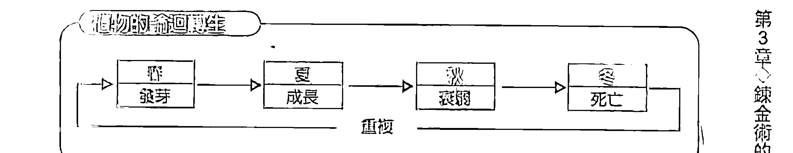

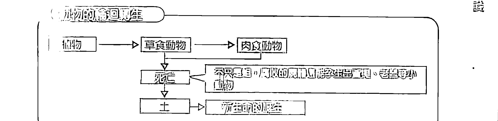

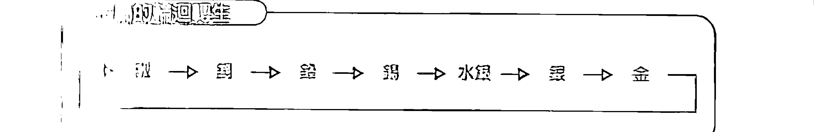

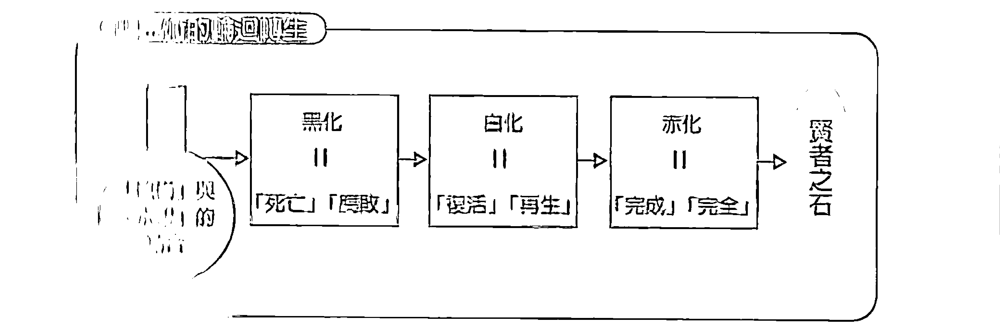

- ... → No.014
- ... → No.018
- ... → No.013
- ◇贤者之石的材料→No.015
- ◇贤者之石的种类→No.019
- ◇贤者之石的效力→No.020

### No.084
### 炼金术与喀巴拉

炼金术与喀巴拉魔法关系非常密切，因为两者皆是以理解神与宇宙之奥秘，接近神明为目的。

#### 指引接近神明之道的喀巴拉与炼金术
在堪称欧洲最伟大炼金术师尼乐·勒梅的传说中，他曾经为解读自己发现的炼金术文书而特地前往西班牙，接受一名叫做甘树的喀巴拉术师的指导。由此可见，在欧洲炼金术与喀巴拉两者的关系非常密切。

喀巴拉乃犹太教当中一支特别神秘的教义。喀巴拉的历史非常悠久，不过长期以来一直是门外不出的秘密，是以直到十三世纪才因西班牙犹太人的著作为世所知。喀巴拉之所以会被炼金术体系吸收，可以说是因为两者目标之相似性所致。

本书已经多次提及，黄金炼成并非炼金术的唯一目的，如同将贱金属变成黄金一般，使人获得有如神明的完全神性，也是炼金术的重要目的，而且此目的之重要性可谓远远超过具体的黄金炼成目的。喀巴拉在这点亦有相似之处；喀巴拉之目的并不单只是信仰神，而是要接近神、在神的眼前服侍；换句话说，喀巴拉就是在指引通往神明身边的道路。试图理解神与宇宙之奥秘以达成目标，亦是喀巴拉与炼金术的相似之处。

另外，此二者亦相信通达宇宙神秘者便可制造人造人；炼金术的荷姆克鲁斯和喀巴拉的魔像皆可谓是其秘术之代表目标。

炼金术与喀巴拉结合以后，方才孕育出蔷薇十字团等运动。

#### 炼金术与喀巴拉的关系

在欧洲炼金术与喀巴拉的关系非常密切
最伟大的炼金术师尼乐·勒梅亦曾受教于喀巴拉术师甘树

| 炼金术 | 喀巴拉 |
|--------|--------|
| 目的 | 完成有如神明般的完全人类 | 到达神明跟前<br>成为完全的人类 |
| 人物 | 荷姆克鲁斯 | 梅莫 |

#### 炼金术+喀巴拉产生的运动

- 蔷薇十字团
- 共济会

#### 喀巴拉的历史

- 1-2世纪 喀巴拉的前身灵轮派神秘主义（Merkava）兴起于巴勒斯坦
  > 早期主要为《圣经》（Ezekiel）的幻视内容，以进入灵界并获得智慧
- 3世纪 《创造之书》（Sefer Yizira）成立
  →阐述生命之树的最重要的喀巴拉文献
- 12世纪 《光明之书》（Sefer ha Bahir）成立
  →堪称古典喀巴拉原典之文献
- 13世纪 《光辉之书》（Sefer ha Zohar）成立
  →以喀巴拉解释圣经的基本经典
- 1492 犹太人被逐出西班牙，巴勒斯坦的采法特（Zefat）成为喀巴拉中心地
- 16世纪 喀巴拉运动达到最高高潮

### 相关项目

- 荷姆克鲁斯 No.042
- 梅莫 No.043
- 喀巴拉 No.021
- 魔像的制作方法→No.022
- 玛娜 No.023
- ◇魔像的制作方法→No.024
- ◇蔷薇十字团→No.060
- ◇共济会→No.062
- ◇共济会的加入仪式→No.063

### Nº:085
### 生命之树
Sephrotic Tree

喀巴拉与炼金术关系密切，据说其奥义尽在“生命之树”之中。

### ☆ 综括搜集喀巴拉奥义的“生命之树”

与炼金术同样皆以到达神明为目标的喀巴拉，其奥义可谓综括汇集于“生命之树”图样之中。这棵“树”是由编号1～10的10个球体的属性（Sephirah，Sephirot的单数型），和连接各球体的22条通道所组成。10这个数字是宇宙之基础，22是希伯来语字母的总数。是以此“树”已经涵盖了一切。此外，“生命之树”还可以分成右侧的“力量之柱*”、左侧的“形体之柱*”和中央的“均衡之柱*”。

第1属性“王冠”（Kethe）是宇宙中神最初的显现，亦即从神的体内流出的神的灵魂，是全宇宙唯一的理想原理。第2“智慧”（Chokmah）是神的灵魂发出的气息，是所有生命的原动力。接着神的灵魂依序变形成3“理解”（Binah）、4“慈悲”（Chesed）、5“公正”（Geburah）*、6“美”（Tiphareth）、7“胜利”（Netzach）、8“荣耀”（Hod）、9“基础”（Yesod），最后形成物质的世界10“王国”（Malkuth），也就是人类生存的世界。

喀巴拉术师须得从“王国”出发，经由22条通道依序提升各属性、提高自我灵性，向全宇宙之最高存在“王冠”前进。
不过喀巴拉又将宇宙从上至下分成“流出界”（Olam Atziluth）、“创造界”（Olam Briah）、“形成界”（Olam Yetzirah）、“物质界”（Olam Assiah）四个阶层，每个阶层都有一株“生命之树”。则喀巴拉术师必须完成每个阶层里从“王国”到“王冠”的旅途，到达最高层的“王冠”。

#### 神秘思想的10个阶段

(1) 喀巴拉术须得从10（Malkuth（王国））出发
(2) 悟得各球体中神的属性、提高自我灵性
(3) 向最高存在1（Kethe（王冠））前进

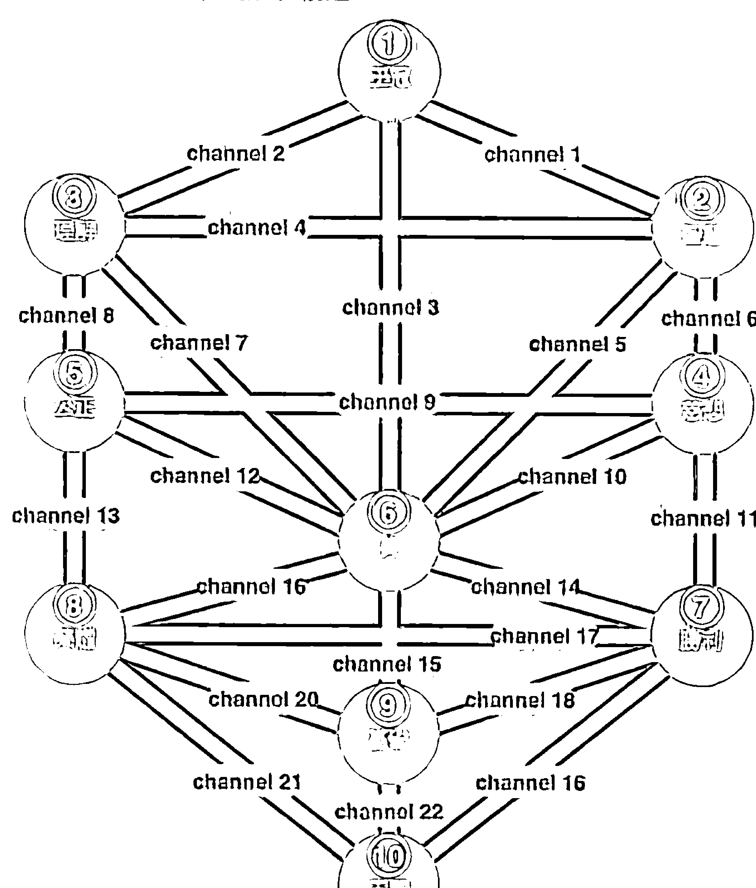

- (1) Kethe (王冠)
- (2) Chokmah (智慧)
- (3) Binah (理解)
- (4) Chesed (慈悲)
- (5) Geburah (公正)
- (6) Tiphareth (美)
- (7) Netzach (胜利)
- (8) Hod (荣耀)
- (9) Yesod (基础)
- (10) Malkuth (王国)

#### 存在的四个阶段

- 至高界 (Olam Atziluth)
- 创造界 (Olam Briah)
- 形成界 (Olam Yetzirah)
- 物质界 (Olam Assiah)

> 注：有些人认为这四个阶段全都在一株生命之树的内部，也有人认为每个阶段都有一株生命之树。

参照：Kabbalah → No.084

### No.086
### 占星术
Astrology

炼金术师相当重视占星术式思考，认为七大金属与四大元素会受到天体的七大行星和黄道十二宫影响。

### 影响金属与四大元素的天体运动

古代人相信天体的运动会对人类的命运和地上的事物造成影响，同样地炼金术师也相当重视占星术式的思考。炼金术与占星术的关系当中，七大金属与七大行星之对应，以及四大元素与黄道十二宫的对应关系尤其特别重要。占星术认为天体共有七个行星，每个行星各由一位神明执掌。古代人受其影响而认为地上共有七大金属，并将各行星与各金属结合，亦即金＝太阳、银＝月亮、水银＝水星、铅＝土星、锡＝木星、铁＝火星、铜＝金星。炼金术师亦承继此思想，认为各金属会在相对应的行星影响下成长。

同样地，炼金术师也结合了黄道十二宫与四大元素思想。所谓黄道十二宫，便是将天球上太阳轨道的两侧，以每8度30分的间隔分割成十二个长方形（宫），太阳一年绕行十二宫一周。十二宫的名称分别是牡羊宫、金牛宫、双子宫、巨蟹宫、狮子宫、处女宫、天秤宫、天蝎宫、射手宫、魔羯宫、水瓶宫、双鱼宫。炼金术师亦承继此思想，认为四大元素会受到黄道十二宫的支配，亦即火＝牡羊宫、狮子宫、射手宫、土＝金牛宫、处女宫、魔羯宫、风＝双子宫、天秤宫、水瓶宫、水＝巨蟹宫、天蝎宫、双鱼宫。四大元素乃第一原质加上冷、热、湿、干四性质其中之二而成，而炼金术师也认为此四性质和季节亦受黄道十二宫支配，即热・湿＝春＝牡羊宫、金牛宫、双子宫、热・干＝夏＝巨蟹宫、狮子宫、处女宫、冷・干＝秋＝天秤宫、天蝎宫、射手宫、冷・湿＝冬＝魔羯宫、水瓶宫、双鱼宫。

#### 七大行星跟诸神和金属的关系

| 行星 | 巴比伦 | 埃及 | 希腊 | 罗马 | 记号 | 金属 |
|------|--------|------|------|------|------|------|
| 太阳 | 夏玛希 | 拉 | 赫利欧斯 | 索尔/阿波罗 | ⊙ | 金 |
| 月亮 | 辛 | 康士 | 塞勒涅 | 遏娜/阿蒂蜜斯 | ☾ | 银 |
| 金星 | 伊施塔 | 伊西斯 | 阿芙柔黛蒂 | 维约斯 | ♀ | 铜 |
| 火星 | 尼格 | 赛特 | 阿利兹 | 马尔兹 | ♂ | 铁 |
| 水星 | 纳波 | 透特 | 赫密斯 | 狄邱里 | ☿ | 水银 |
| 木星 | 马尔杜克 | 奥赛利斯 | 宙斯 | 朱比特 | ♃ | 锡 |
| 土星 | 尼尼布 | 霍露斯 | 克罗诺斯 | 萨图努斯 | ♄ | 铅 |

#### 黄道十二宫与四大元素

| 十二宫 | 记号 | 四大元素 | 性质 | 季节 |
|--------|------|----------|------|------|
| 牡羊宫 | ♈ | 火 | 热・湿 | 春 |
| 金牛宫 | ♉ | 土 | 热・湿 | 春 |
| 双子宫 | ♊ | 风 | 热・湿 | 春 |
| 巨蟹宫 | ♋ | 水 | 热・干 | 夏 |
| 狮子宫 | ♌ | 火 | 热・干 | 夏 |
| 处女宫 | ♍ | 土 | 热・干 | 夏 |
| 天秤宫 | ♎ | 风 | 冷・干 | 秋 |
| 天蝎宫 | ♏ | 水 | 冷・干 | 秋 |
| 射手宫 | ♐ | 火 | 冷・干 | 秋 |
| 魔羯宫 | ♑ | 土 | 冷・湿 | 冬 |
| 水瓶宫 | ♒ | 风 | 冷・湿 | 冬 |
| 双鱼宫 | ♓ | 水 | 冷・湿 | 冬 |

### 参考项目

- 四大元素→No.008
- 第一原质→No.006
- 金属→No.011鍊金術師崇拜烏洛波羅斯，試圖究明物質之本性，其實皆源自於遭基督教斥為異端的諾斯替教。

### ♠ 神啟示的「究極智慧」諾斯替

諾斯替教是西元二至三世紀流行於埃及週邊的宗教思想，與鍊金術關係密切，就連傳說中的鍊金術始祖赫密斯・特里斯密吉斯托斯所提出的赫密斯思想，也都是建立在諾斯替教的世界觀之上。由於諾斯替教和基督教有部分相似之處，是以屢屢被視為基督教的一派，不過基督教正統卻是將其斥為異端。

諾斯替教與正統基督教最大的差異，就在於「罪」的思想。基督教認為世界乃由唯一絕對的神創造，而人類則是因為亞當夏娃不敵蛇的誘惑吃下智慧之木的果實而墮落；後得神的兒子耶穌（基督）犧牲，人類的原罪方始得到寬恕。

相對地，諾斯替教則認為至高神生出許多叫做移湧（Aeon）的神，其中一位移湧墮落成為造物主（Demiurge，舊約聖經的神），創造了世界，因此物質世界本是為罪惡，而囚於物質世界的靈魂則必須得到救贖。此外，諾斯替教認為要收贖靈魂便需要神啟示的究極「智慧、認識」，而諾斯替（Gnosis）此字正是「智慧、認識」的意思。鍊金術從諾斯替教得到的便是這些遭斥為異端的部分。我們不知道鍊金術師們本身是否有察覺意識到，但他們之所以極欲究明物質之本質，可謂是為了要得到諾斯替教所謂的「智慧、認識」，而對鍊金術師來說，信仰與科學兩者其實都是相同的東西。

既然如此重視智慧，諾斯替教當然也會崇拜當初誘惑夏娃的蛇，而鍊金術的重要象徵烏洛波羅斯原本就是諾斯替教的崇拜對象。

### 基督教與諾斯替教

#### 基督教

- 唯一神
- 創造宇宙
- 亞當夏娃不敵蛇的誘惑吃下智慧之木的果實
- 人類墮落
- 耶穌的犧牲使人類的罪得到寬恕

#### 諾斯替教

- 至高神
- 創造移湧
- 墮落造物主
- 創造世界
- 物質的世界就是邪惡，必須救贖
- 救贖途徑：諾斯替＝智慧、認識
- 崇拜給予人類智慧的蛇

#### 反感與共感

- 視為異端

### 鍊金術與諾斯替教

- 諾斯替教：究明物質之本性、崇拜烏洛波羅斯
- 赫密斯思想→以諾斯替教世界觀為基礎
- 鍊金術

## # 鍊金術與藝術作品

鍊金術師的表現方法充滿各式各樣五花八門的象徵與寓意，有時這些文字或圖畫本身就可稱得上是藝術作品，同樣地鍊金術也對繪畫或文藝等各種藝術作品有莫大影響。

在繪畫領域先是有十六世紀的作家杜勒（Albrecht Durer），他所畫的《憂鬱》、《書齋中的聖哲羅姆》等銅版畫相當有名，畫中亦充滿文藝復興時期的哲學、魔法、鍊金術等各種表象。十七世紀林布蘭特（Rembrandt）的風景畫也被評為象徵地表現出赫密斯哲學式的宇宙。當然在十六到十七世紀之間也有許多直接描繪鍊金術師的實驗室或實驗情形的畫作，使當時鍊金術師的生活實況得以傳諸今日。

若論文學界，則不可不提十八至十九世紀大為活躍的歌德的著名作品《浮士德》。此作品不只提到了荷姆克魯斯，主角浮士德更是以德國民間傳說裡的鍊金術師浮士德為骨架所創造的角色。順帶一提，據說德國民間傳說裡的浮士德則是以帕拉塞爾蘇斯為藍本。著有《巨人傳》（Gargantua and Pantagruel）的拉伯雷（Francois Rabelais，十六世紀）和著有《月之旅》（Histoire comique des etats et empires de la luna）的西哈諾·德·貝爾熱拉克（Cyrano de Bergerac，十七世紀），其作品也都以使用許多鍊金術的象徵而聞名。十九世紀浪漫派作家雨果（Victor Hugo）對降靈術的興趣眾所周知，他不但藉《鐘樓怪人》此作來表示自己對中世紀文化的熱愛，還創造出一個長期住在巴黎聖母院（Notre Dame de Paris）的鍊金術師角色。同時期的巴爾札克（Honore de Balzac）也有個短篇作品《不老長壽之靈藥》。當然，諷刺嘲弄鍊金術師的作品也不在少數，十四世紀英國的喬叟（Geoffrey Chaucer）便曾在《坎特伯雷故事集》（The Canterbury Tales）的一則小故事中暴露了鍊金術之不毛，十七世紀英國的本·瓊森（Ben Johnson）也著有以備鍊金術師為主角的戲劇《鍊金術師》（The Alchemist）。

進入二十世紀以後，著眼於鍊金術題材的作品仍未斷絕，捷克的代表作家恰彼克（Karel Capek）便著有名為《馬克羅普洛斯事件》（The Makropulos Affair）的劇本；此劇是說魯道夫二世手下的鍊金術師用親生女兒實驗長生不老藥，結果該女子活到了二十世紀的故事。毛姆（Somerset Maugham）的《魔法師》則以欲創造荷姆克魯斯的魔法師為主角，美國恐怖作家洛夫克拉夫特（Lovecraft）也有部短篇小說《鍊金術師》。

音樂領域則以十八世紀的作曲家莫札特最有名，據說其歌劇《魔笛》便是根據共濟會的加入儀式所創作。此外，據傳貝多芬「第九交響曲」中的「歡樂頌」（由德國詩人席勒（Friedrich von Schiller）填詞）便是專為共濟會所作的作品。

## 第4章 其它的電子介面

## # 中國的鍊金術

#### Alchemy in China

中國的鍊金術有別於歐洲，乃以製作長生不老之丹藥為主要目標，鍊成黃金只是副產物。

#### 首要目標是長生不老

有別於發源自美索不達米亞與埃及的歐洲鍊金術，中國從非常古老久遠的時代便有獨特的鍊金術存在，名為煉丹術。中國的煉丹術與歐洲的鍊金術在性格上有很明顯的差異。煉丹術的最大目的向來都是長生不老，而製作丹、丹藥、金丹等長生不老藥的技術，就叫做煉丹。

中國自古以來就有尋求長生不老的信仰傾向，並衍生出呼吸法等各式各樣的健康法。亦有傳說指在某個地方有個仙人定居的國度，那裡就有長生不老藥。從這些追求長生不老的方法當中，才又衍生出人工製造長生不老藥的思想，揭開煉丹術的歷史。不過煉丹術所造丹藥除長生不老以外，還有將水銀變成黃金的副次性力量，所以煉丹術亦即鍊金術。事實上西元前144年中國便曾頒布製造偽幣與偽造黃金者應處死刑的敕令，可見當時確實擁有煉丹術製造黃金的技術。另外，據稱西元前四世紀曾有鄒衍，西元前一世紀則有劉向曾經試圖製造出金。其後亦不斷有人欲藉煉丹術獲得長生不老，直到唐代達到鼎盛。中國歷代皇帝皆無不渴望能夠長生不老，其中又以唐代的幾位皇帝為最。然而丹（賢者之石）的原料跟歐洲同樣都是水銀，亦即有毒物質，結果使得唐朝因經常服用丹藥而過早死的皇帝可謂異常地多。

或許是出自對此狀況的反省，尋求長生不老的煉丹術在宋代以後就開始衰退，變成專門用來製作藥物的技術、被中醫學所吸收，而舊有的煉丹術思想就只能殘存於神秘思想之中。

#### 中國煉金術之演變

##### 對長生不老的追求與發展

- 長生不老
  - 仙人的長生不老藥
  - 煉丹術
    - 長生不老的丹藥 (首要目標)
    - 黃金煉成 (副目標)
  - 唐朝遂致鼎盛
  - 宋朝衰退
- 長壽
  - 各式各樣的仙術法
    - 辟穀 (飲食法)
    - 導引 (呼吸法)
    - 守一 (冥想法)
    - 房中術 (性交法)

##### 煉丹藥致早死的唐帝國

| 時間 | 事件 |
| --- | --- |
| 618~907年 | 唐朝建國<br>二代太宗 (598~649年，626~649年在位)<br>三代高宗 (628~683年，649~683年在位) |
| 690~705年 | 武后稱帝，改國號為周 |
| 755~763年 | 安史之亂 |
| 805~820年 | 十二代憲宗 (778~820年，805~820年在位) |
| 824~826年 | 十三代敬宗 (809~826年，824~826年在位) |
| 840~846年 | 十五代武宗 (814~846年，840~846年在位) |
| 846~859年 | 十六代宣宗 (820~859年，846~859年在位) |
| 874~884年 | 黃巢之亂，唐朝瀕臨滅亡 |
| 907年 | 唐朝完全滅亡 |

- No.013
- No.015
- ◇賢者之石的種類→No.019
- ◇賢者之石的效力→No.020

### No:089 中国的炼金术师

*Alchemists in China*

據傳中國最高神黃帝也是鍊金術師，而中國自古便有眾多的鍊金術師活躍。

#### ☆ 早在神話時代便已相當活躍的中國鍊金術師

中國從西元前數世紀就已經有鍊金術師出現。

中國神話中最受尊崇的最高神黃帝，在西元前四、五世紀已經成為受民眾崇拜的神祇；據傳他是位鍊金術師，乃以煉丹修行而成仙。也就是說中國不僅連最高神都是鍊金術師，藉鍊金術達致長生不老的鍊金術師傳說當然也不會少。

中國史上的第一位鍊金術師叫做鄒衍（前305～前240），能行使各種祕術，倍受當權者尊敬。秦始皇求長生不老藥的故事也相當有名；據傳當時有位叫做安期生的鍊金術師，秦始皇曾與其會見，並得其留書「後數年求我於蓬萊山*」。始皇即遣徐市、盧生等使者數百入海求之，未至蓬萊山颯遇風波而還。漢代以後鍊金術師的人數又繼續增加。據傳淮南王劉安（前179～前122）曾向八位不可思議的老人**學習神仙之術，城後服下自製的丹藥成仙去了。此外根據史籍記載，西元前一世紀的劉向（前77～前6）曾受漢宣帝之命製造黃金，耗費甚多但始終沒有成長。西元前100年左右漢武帝時代則有李少君，被後世奉為中國鍊金術之祖。

出了這些活躍的鍊金術師以後，中國鍊金術終於進入川伽確立期。此時期著名的鍊金術師包括著有《周易參同契》的川伯陽（約西元120年）、著有《抱朴子》的葛洪（283～343），在理論面上確立中國的鍊金術。

> * 「後數年求我於蓬萊山」：多數典籍乃採「千年」、「千歲」之說。
** 八位不可思議的老人：亦說是一位號曰「八公」的老人。

#### 著名的煉金術師

##### 初期的煉金術師

| 時代 | 人物 | 描述 |
|------|------|------|
| 神話時代 | 黃帝 | 最高神暨鍊金術師 |
| 戰國時代 | 鄒衍 | 歷史時代首位鍊金術師 |
| 秦 | 安期生 | 秦始皇時代的鍊金術師 |
| 西漢 | 淮南王劉安 | 向八位不可思議的老人學習煉丹術 |
|  | 李少君 | 煉丹術之祖 |
|  | 劉向 | 為宣帝進行黃金鍊成卻未成功 |

##### 理論化時代的煉金術師

| 時代 | 人物 | 描述 |
|------|------|------|
| 東漢 | 魏伯陽 | 《周易參同契》作者 |
| 四世紀 | 葛洪 | 《抱朴子》作者 |

#### 跟日本關係匪淺的徐市傳說

徐市亦名徐福。古時候中國認為長生不老藥無法人工製作，必須前往一座叫做蓬萊山的仙山才能求得，因此自古便有無數人出海尋找仙山。其中徐市堪為代表，《史記》便載有徐市受秦始皇之命，領三千童男童女乘船出海一去不返的紀錄。

按照常理來判斷，徐市很可能是在海上遇難而死，然而後世的傳說與日本卻都流傳著一個傳說，說徐市並沒有死，而是漂流到了日本。中國有部成立於十世紀的《義楚六帖》，指徐市漂流到了富士山，其子孫以秦氏（はたし）自稱。日本則是以紀州熊野為中心，多處皆有疑為徐市之墓的祠宇與墳塚遺跡。沒想到中國古代的神話傳說，竟然還與日本的傳說相吻合。

## # 李少君

Li Daojun

傳說的古代仙人、方士

> 據傳這位曾以上奏文向武帝講述長生不老之道的方士，最後煉成了丹藥成為長生不老的仙人。

#### 被奉為煉丹術之祖的方士

李少君是煉丹術奉為始祖的漢代仙人。傳說他生於齊國，曾經遇見旅行於沿海地區的仙人安期生，因而得授煉丹術。據傳後來他出壁於漢武帝（前157～前187）時，發生了這麼一件事：在某次宴會中，李少君對一個齡逾九十的老人說：「吾嘗與汝大父遊射」，所言與老人記憶一點不差。他還曾經說武帝的一只古老銅器「此器，齊桓公十年陳於柏寢」，後來調查銅器上的銘刻，果然不假；於是眾人皆謂李少君是已經數百歲的神仙。最後李少君煉成神丹，還來不及把煉丹方法告訴武帝就去世了，但他的屍體卻忽然失蹤，現場只剩衣服。武帝知道李少君已成仙，為自己沒有熱心追求請教長生不老法而懊悔不已。

李少君乃煉丹術始祖此事或許只是傳說，不過他曾出仕武帝，與煉丹術關係相當密切卻確是事實。司馬遷《史記》所載方士·李少君上奏武帝文如下。
「祠竈則致物。致物而丹沙可化為黃金。黃金成，以為飲食器，則益壽。益壽，而海中蓬萊仙者可見。見之以封禪則不死。」從這段敘述裡可以得知，可將丹砂變成黃金的鍊丹術在那個時代已經達到相當程度的實用階段。又，此記事是首次實際記載使用丹砂的煉丹術具體內容的最早紀錄，是以李少君絕對是煉丹術初期的重要人物。

大父：祖父。

#### 李少君的傳説

（圖片描述：李少君的傳説圖示）

#### 李少君的炼丹术

（圖片描述：李少君的炼丹术圖示）

### No. 091 魏伯阳

Wei Po (Bo) Yang

中国首部炼金术书籍《周易参同契》的作者，是《抱朴子》作者葛洪的师祖。

#### ☆ 中国首部炼金术文书的作者

魏伯阳就是传为中国现存首部炼金术书籍《周易参同契》的作者。所谓的参同契就是三位一体论的意思，此书乃藉儒教的周易与道教的哲学来说明炼丹术。

《周易参同契》跟欧洲的炼金术文书一样，书中内容尽是各种隐语和比喻，难以正确解译。然而自从魏伯阳首开将炼丹术理论化之创举后，其后世弟子亦承师志，终于有葛洪著述堪称炼丹术圣典的《抱朴子》；其间师徒传承关系如魏伯阳→狐刚子→左慈→葛玄→郑隐→葛洪，由此可见魏伯阳的角色非常重要。

> 「魏伯阳出身于吴，性好道术，尝偕弟子三人上山作神丹。丹成，以丹试犬，犬死。后自服丹亦死，二弟子见状正踌躇，另一弟子谓『吾师非凡人也，服丹而死，将无有意耶』亦服丹死。二弟子谓『怎堪服丹早死』，未服共出山。魏伯阳遂又复活，以炼成妙丹纳死子及犬口中，未须臾皆活。于是将服丹弟子同犬仙去，二弟子得悉后懊悔不已。」

最后葛洪还提及《周易参同契》，并谓此书乃托之以周易阴阳，论作丹药之意。

#### 参同契=三位一體論

（圖片描述：参同契三位一体論圖示）

#### 丹術獨立期的煉金術師

- 魏伯陽: 《周易参同契》
- 狐剛子: 《五金粉圖訣》《出金礦圖錄》
- 左慈: 三國時代有名的仙人
- 葛玄: 葛洪的祖父，仙人
- 鄭隱: 葛洪之師
- 葛洪: 《抱朴子》

### No.092 葛洪

Ge Hong

確立中國煉丹術的鍊金術師，卻因為太窮買不起材料，終於未能煉成丹藥。

#### 集中國鍊金、煉丹術大成的鍊金術師

葛洪（283~363）以其著書《抱朴子》集中國煉丹術之技術與理論之大成，確立了煉丹術。葛洪生於江蘇地方的名門，然而他少年喪父家境貧寒只能獨力向學，最終學成神仙道、煉丹術。

《抱朴子》分為內篇20卷、外篇50卷。外篇是對政治、社會、文明的批判，此書精華盡在內篇，記載葛洪追求長生不老的神仙道各種技術，其中尤以煉丹術最為重要。

葛洪最重視煉丹術的理由非常簡單。中國自古就有各種長生法、長生法匯集成神仙道，但葛洪認為鑽研這些學問雖能長壽，卻不能真正的長生不老；欲達致長生不老，唯有用煉丹術製作丹藥，除此以外別無它法。然而，製作丹藥不但困難重重且極耗費時日，是以在製成丹藥之前必須利用各種養生法、長生法盡量活久一點。在煉丹術當中，葛洪又特別重視《太清丹經》《九鼎丹經》和《金液丹經》，這些經典還有個傳說。從前後漢末期的鍊金術師左慈正在修行的時候，曾有神仙現身山中將這些經典授予左慈。經過多次師徒傳承，這些經典方才由左慈→葛玄→鄭隱→葛洪如此輾轉傳到葛洪手中。

然而葛洪卻終究未能利用這些經典成功煉出丹藥。據說他得此經典已經二十年卻始終都是一貧如洗，根本買不起材料做不成實驗。

#### 《抱朴子》之構成

- 抱朴子
  - 內篇20卷：神仙道之技術
    - 煉丹術←最重要的
    - 養生法
    - 長生法
    - 還丹
    - 除厄……等
  - 外篇50卷：對政治、社會、文明的批判

#### 最重要的經典

《太清丹經》《九鼎丹經》《金液丹經》 ⇓ 神人所授 ←—— 師徒傳承

#### 葛洪略傳

| 年份 | 描述 |
|------|------|
| 283年 | 生於江蘇地方的名門<br>位居西晉朝廷要職的父親早逝，家道中落<br>十六歲跟隨祖父葛玄的弟子鄭隱學習神丹之法，繼承左慈一脈神仙之道<br>師事鮑玄，娶其女為妻 |
| 303年 | 逢石冰之亂，投入義軍立下戰功 |
| 306年 | 欲前往洛陽尋求煉丹術書籍，然而江南又有陳敏興兵作亂，遂以參軍職駐守廣州 |
| 307年 | 東晉王朝成立，因先前軍功受封關內侯得賜封祿 |
| 326年 | 受宰相王導招攬，於揚州擔任重職<br>後來得知交趾（現在的越南北部）出產丹砂，遂自請轉職擔任交趾縣令<br>途中被廣州刺史挽留，葛洪只能結廬羅浮山，晚年專心從事著述與煉丹術 |

#### 次期予告

抱朴子的煉丹法→No.093

## # 抱朴子的煉丹法

Alchemy in Bao Puzi

在距離西洋極為遙遠的中國，也跟西洋鍊金術同樣在進行水銀與金屬的變成作業。

#### ◇ 與西洋同樣重視精神性的煉丹術

《抱朴子》內篇的金丹篇・黃白記載有許多製作丹藥的方法，主要都是用水銀與各種金屬燒成汞合金。舉例來說，「金樓先生*所從青林子受作黃金法」內容如下。「先鍛錫，方廣六寸，厚一寸二分，以赤鹽和灰汁，令如泥，以塗錫上，令適厚一分；累置於赤土釜中。率錫十斤，用赤鹽四斤，合封固其際，以馬通火煻之，三十日，發火視之，錫中悉如灰狀，中有累累如豆者，即黃金也。合治内土甌中，以炭鼓之，十煉之並成也。率十斤錫，得金二十兩**」光看這裡就會發現中國的煉丹術跟西洋鍊金術同樣，都有類似用坩堝施以爐火加熱溶解金屬的作業；順帶一提，此法所製黃金同時也就是長生不老藥，名為金丹。煉丹術與鍊金術不但是在實際作業頗有雷同，在其它部分亦有相似之處。舉例來說，中國煉丹術裡製作丹藥之奧義也跟西洋同樣，都是直接由師父傳授予徒弟，欲窮究煉丹術者必得拜入良師門下。此外，從事煉丹術作業前尚須齋戒七日，以五香之湯沐浴全身，保持身體潔淨不得接近污穢、不可與俗人交，有許多必須遵守的規定。換言之，煉丹術跟西洋鍊金術同樣，都非常地重視術者的精神性。

> * 金樓先生：本書原作「金樓先生」應是作者筆誤。
** 現代註譯：「先鍛錫，長寬各六寸，厚一寸二分。用赤鹽拌和灰汁，作成泥狀，塗在錫片上，要均勻地一分厚。作出後將層層疊置在赤土釜中，大約用十斤錫，四斤赤鹽，然後嚴密封好縫隙，用馬糞小火燒三十天，開火看時，錫中全呈灰狀，其中有像豆子一樣的小疙瘩，密密麻麻地排列，那就是黃金了。調製好後，放進土甌裡，用炭火扇風燒，經過十次冶煉，就全成功了。大概用十斤錫，可得黃金二十兩。」（《抱朴子》內篇・黃白第十六）

### 《抱朴子》黄金炼成一例

作丹前的禁忌事项：
- 齋戒百日
- 以五香之湯沐浴
- 保持身體潔淨
- 不得接近污穢
- 不可與俗人交

- ① 先錫，方廣六寸，厚一寸二分
- ② 以赤鹽和灰汁，令如泥，以塗錫上，令通厚一分
- ③ 累置於赤土釜中
- ④ 合封固其隙
- ⑤ 以馬通火熅之，三十日
- ⑥ 發火視之
- ⑦ 錫中悉如灰狀，中有累累如豆者，即黃金也
- ⑧ 合冶內土甌中，以炭鼓之
- ⑨ 十煉之並成也

完成。率十斤錫，得金二十兩。

### 中國的煉丹術與西洋的鍊金術

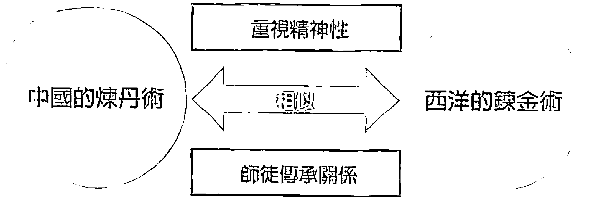

### No.094 印度的煉金術

Alchemy in India
自古便與中國交流頻繁的印度，也跟中國同樣有利用水銀追求長生不老的煉金術發展。

### 因為與中國的交流而得以發展的印度煉金術

印度跟中國同樣，在很早的時候就已經有煉金術存在。早在西元前十世紀左右，印度就已經有冶金的技術以及運用草藥、動物性藥物、礦物性藥物等藥品的醫學。再者印度自古便與中國交流頻繁，兩國關係在西元二世紀印度佛教傳入中國以後尤其密切。在兩國交流過程中，中國的煉金術亦傳至印度，以後兩國的煉金術可謂是同時發展並進。是以印度的煉金術也和中國的同樣，會使用水銀、黃金或各種金屬以圖長生不老，而黃金煉成則可以說只是長生不老的附帶能力而已。

印度在七世紀的時候，匯整出一門叫做阿育吠陀(Ayurveda)的傳統醫學體系。此系統共分八部，其中有部名為羅娑衍那(Rasayana)的長生不老法，這個羅娑衍那就是所謂的煉金術。有人認為羅娑衍那原本跟中國的本草相同，是藥草學；後來印度在中國的煉金術影響之下發展出用金屬製藥的技術，於是研究水銀與礦物的煉金術也就被歸於此範疇。所以羅娑衍那此詞可以同時被用來指稱藥草學、煉金術，抑或煉金術製造的靈藥。然而隨著煉金術製造出藥草性、藥草+金屬性、金屬性等不同性質的靈藥以後，此類用語也跟著增加複雜化，而有羅娑=羅娑衍那=生命之藥草靈藥、摩訶羅娑(Maharasa)=金之藥草靈藥、薩埵(Sattva)=金之水銀靈藥，以及薩埵·舍陀維伽(Salva Saatvika)=金之綜合性礦物靈藥(賢者之石)等用語產生。但由於水銀是有毒物質，所以印度使用水銀的煉金術在中世後期也跟中國一樣漸趨式微。

### 印度炼金术之演变

**西元前十世纪**
- 冶金术
- 医学
  → 使用药草性、动物性、矿物性的药物

**二世纪**
- 中国的炼金术传入 → 两国炼金术同时发展并进
- 使用水银、黄金与各种矿物
- 印度炼金术之目的：跟中国同样，想得到长生不老

**五世纪**
- 阿育吠陀（传统医学体系）
- 罗婆衍那 = 长生不老法
- 炼金术

### 印度炼金术的用语

- 1. （罗婆） = 罗婆衍那 = 生命之药草灵药
- 2. （阿罗那） = 金之药草灵药
- 3. （瓦塔） = 金之水银灵药
- 4. （舍陀维伽） = 金之综合性矿物灵药（贤者之石）

### 相关项目

- 1. 中国的炼金术 → No.088
- 2. 贤者之石 → No.013
- 3. 贤者之石的材料 → No.015
- 4. 贤者之石的种类 → No.019
- 5. 贤者之石的效力 → No.020

### 印度的鍊金術師

與中國交流頻繁的印度，自古就有不少技藝高超的鍊金術大師。

#### ♣ 那伽闍刺樹那和阿濕縛癟沙

印度最有名的鍊金術師當屬那伽闍刺樹那（Nagarjuna，亦名龍樹）和阿濕縛癟沙（Asvaghosa）。傳說鍊金術師那伽闍刺樹那著有《水銀珠玉之寶庫》（Rasaratankaram）、《水銀之海》、《一切自在鍊金術》（Salva Isvara Rasayana）等鍊金術文書。

西元二世紀印度也有位以創始大乘佛教聞名的人物叫做那伽闍刺樹那；這位創立大乘佛教的那伽闍刺樹那不但是位佛教哲學家，同時也有醫師、鍊金術、咒術師等身分，因此有人認為創立大乘佛教的那伽闍刺樹那和鍊金術師那伽闍刺樹那是同一個人物，但真相究竟如何至今仍無定說。總之我們可以確定的是，從前確實有位叫作那伽闍刺樹那的鍊金術大師。

阿濕縛癟沙是大乘佛教的僧侶，亦是曾經留名中國的鍊金術傳說的鍊金術大師。中國漢朝末年的鍊金術師陰長生就是《周易參同契》作者魏伯陽之師，年輕時曾在一名號曰馬鳴生的仙人門下修行十年。馬鳴生此名便與阿濕縛癟沙有關，因為阿濕縛癟沙的中文名字就叫做馬鳴。當然印度的阿濕縛癟沙和中國的馬鳴生並非同一人物，但馬鳴生此名很可能正是來自於阿濕縛癟沙的中文名馬鳴。

除此二人以外，印度還有阿諦瑪、禪多剌色那、楞般級、毗沙剌達等有名的鍊金術師。

#### 兩大煉金術師

##### 煉金術師那伽闍刺樹那

鍊金術文書：
- 《水銀珠玉之寶庫》
- 《水銀之海》
- 《一切自在煉金術》

> 同一人物？（不明）

##### 大乘佛教創始者 那伽闍刺樹那

二世紀的佛教哲學家、醫師、煉金術師、咒術師

##### 煉金術師阿濕縛癟沙

大乘佛教的僧侶。中國名「馬鳴」→ 中國後代煉金術師・馬鳴生名字之由來？

##### 中世紀印度的蒸餾裝置與昇華裝置

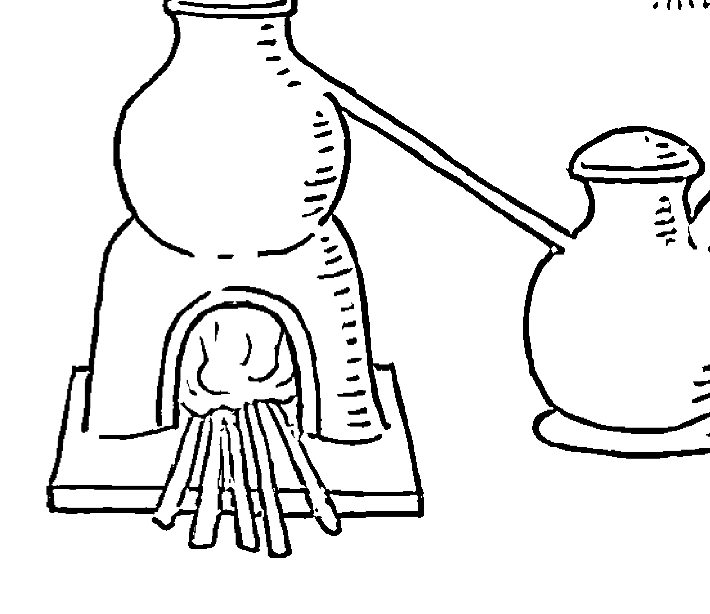

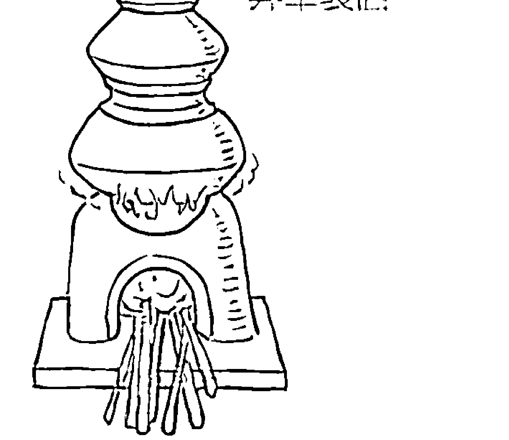

##### 大乘佛教的那伽闍刺樹那

約於西元200年創設大乘佛教的那伽闍刺樹那，亦以確立大乘佛教之思想基礎——「空」的思想而聞名，是以中國和日本皆尊之為「八宗始祖」。除否定一切實在論的主要著作《中論》以外，那伽闍刺樹那還有《回諍論》、《七十空性論》等著作。此外，據說11本頗為普遍的《大智度論》也是他的作品。

### 關連項目

- 中國的煉金術→No.088
- 魏伯陽→No.091

### No.096 鍊金術師的發現

Discovery

鍊金術研究確實並不甚科學，但鍊金術也有許多副產物對人類都有相當的價值。

#### ♣ 以意料不到的副產物為人類帶來貢獻的鍊金術

雖然鍊金術終究無法達到其目的、製造出賢者之石，卻有許多鍊金術師以意想不到的副產物為人類帶來諸多貢獻。

八世紀左右的阿拉伯鍊金術師查比爾·本·哈揚在歐洲乃以格貝爾（Geber）之名為人所知，他便曾將硝酸等強酸製造法傳入歐洲。受其影響，後來才有十五世紀德國的瓦倫廷（Valentinus）發現鹽酸的製造法，十七世紀又有德國的格勞貝爾（Johann Rudolph Glauber）發現格勞貝爾鹽（硫酸鈉）。

十六世紀，帕拉塞爾蘇斯首開以砷、銻等無機物製造藥劑的先例，自此開創醫療化學。帕拉塞爾蘇斯的弟子海耳蒙特則發現了相當於今日所謂二氧化碳的氣體，在此之前眾人都認為氣體全是同樣的，並無氫氣或二氧化碳等不同氣體之分。不過海耳蒙特卻發現氣體的區別，因而發明「瓦斯」（Gas）此字。

十七世紀德國鍊金術師布蘭德（Henning Brand）試圖從人類的尿液萃取第五元素，意外地在過程中發現了磷。這是發生在1699年的事情。雖無特定的發現者，不過用葡萄酒蒸餾酒精的技術亦與鍊金術關係匪淺。十三世紀的賴蒙·魯爾便相當重視酒精的功效，還用酒精浸泡植物製造出酊劑（Tincture）。

除此以外，大阿爾伯特調製苛性鉀、貝特格（Johann Friedrich Bottger）製造出歐洲第一只白色瓷器、諾斯特拉達姆斯（Michel de Nostredame）發現安息香酸（Benzoic Acid）、阿格里科拉（Georgius Agricola）發現琥珀酸（Succinic Acid）、利巴威斯（Andreas Libavius）調配四氯化錫和硫酸銨等發現，也都相當有名。

#### 鍊金術的副產物

| 世紀/人物/時間 | 成就 |
|---|---|
| **8世紀** | |
| 查比爾·本·哈揚 (721~815) | 將強酸製造法傳入歐洲 |
| **13世紀** | |
| 大阿爾伯特 (1193~1280) | 調製苛性鉀 |
| 賴蒙·魯爾 (1235~1316) | 製造酊劑 |
| **15世紀** | |
| 瓦倫廷 | 發現鹽酸 |
| **16世紀** | |
| 帕拉塞爾蘇斯 (1493~1541) | 用無機物製藥、開創醫療化學 |
| 阿格里科拉 (1494~1555) | 發現琥珀酸 |
| 利巴維烏斯 (1500~1566) | 發現安息香酸（現代亦作防腐劑用途） |
| 利巴威斯 (1516~1616) | 調配四氯化錫和硫酸銨 |
| **17世紀** | |
| 海耳蒙特 (1577~1644) | 發現二氧化碳，命名為「Gas」 |
| 格勞貝爾 (1604~1668) | 發現格勞貝爾鹽（硫酸鈉） |
| 布蘭德 (~1692) | 發現磷 |
| **18世紀** | |
| 貝特格 (1682~1719) | 製造歐洲第一只白色瓷器 |

#### 相關項目

- 賢者之石→No.013
- 賢者之石的材料→No.015
- 賢者之石的種類→No.019
- 賢者之石的效力→No.020
- 查比爾·本·哈揚→No.034
- 帕拉塞爾蘇斯→No.054
- 帕拉塞爾蘇斯的鍊金術→No.055
- 海耳蒙特→No.047
- 第五元素→No.012
- 賴蒙·魯爾→No.041
- 大阿爾伯特→No.038

### No.097 波義耳殺了鍊金術

#### Robert Boyle Killed Alchemy
以波義耳定律聞名於世的羅伯特·波義耳否定亞里斯多德的四大元素理論以後，就此終結了鍊金術的時代。

#### ◇ 從科學變成神秘學的鍊金術

以「空氣的體積與壓力成反比」的波義耳定律而聞名的羅伯特·波義耳（Robert Boyle）於1661年發表其重要著作《懷疑的化學家》（The Sceptical Chymist），霍姆亞德（Eric John Holmyard）將此書評為「鍊金術的死刑執行令」；換句話說，此書的問世正意味著鍊金術時代告終，抑或遲早都要告終。理由非常簡單，因為此書完全否定了亞里斯多德的四大元素理論，以及鍊金術師熱衷的硫磺、水銀、鹽三原素理論。

根據波義耳的說法，元素是不能再分解的單一物質，世上萬物皆是由各式各樣的元素組合而成，而且元素的數目並不止三個四個而已。只要經過實驗發現無法再分解的物質，該物質就要算是元素，是所有物質最基本的單位。這也就是說不論鍊金術師怎麼做，都無法把鐵元素變成金元素。

雖說波義耳的物質理論尚不如近代化學元素之概念完整，但他已確確實實地粉碎了鍊金術師一直以來引以為依據的物質理論，又向近代化學邁進了一步，此趨勢已然無可避免。自此以後，鍊金術就變成了一門非科學的技術。

當然，即便在波義耳著書出版一個世紀以後，仍舊有聖日耳門伯爵與卡廖斯特羅伯爵等人和鍊金術的存在，不過此時的鍊金術早已不是正統的科學，而是成為專門研究異常現象的神秘學。

#### 煉金術的評價

> 煉金術

亞里斯多德的四大元素理論
「所有物質皆是由火、風、水、土四者組成」

硫磺、水銀、鹽三原素理論
「世上所有物質皆是由硫磺、水銀、鹽三種最基本的物質所組成」

波義耳巨著《懷疑的化學家》（1661年）
新元素論 → 否定四大元素論、三原素論

- ✖ 亞里斯多德的四大元素理論
- ✖ 硫磺、水銀、鹽三原素理論


#### 費時百年的化學革命

波義耳否定傳統的四大元素理論，開拓出近代化學的道路，但他的想法卻因太過新穎而遲遲難以被接受，當時的歐洲人仍對四大元素理論與十七世紀提出的燃素說深信不疑。所謂燃素（Phlogiston）是被視為燃燒原因的物質：歐洲人認為紙張與木頭皆含有燃素，燃燒時就會向外逃逸。出人意料的是，這種古代信仰在波義耳出現以後還持續了100年以上，直到十八世紀後半法國化學家拉瓦節（Antoine-Laurent Lavoisier）才用周嚴的實驗推翻了四大元素理論和燃素說，終於確立近代科學。

#### 關聯項目

- 四大元素→No.008
- 三原素——硫磺、水銀、鹽→No.010
- 卡廖斯特羅伯爵→No.058
- ◇聖日耳曼伯爵→No.057

### No.098 牛顿与炼金术

#### Isaac Newton and Alchemy
堪称近代科学之父的牛顿，其实是位相信创世记里天地乃以炼金术过程所造的热血炼金术师。

#### 发现「万有引力法则」的炼金术师
十七世纪是蔷薇十字团的时代，炼金术虽已进入衰退期却仍具有一定的势力。就连以发现「万有引力法则」闻名的英国科学家牛顿（1642～1727）都曾致力于炼金术研究，可堪为证。

其实牛顿本来就相信宇宙乃神所造，而且创世记当中的创造天地神话就是个炼金术的过程。他还在剑桥三一学院（Trinity College）的教堂旁设立私人炼金术实验室，跟中世纪的炼金术师一样镇日埋在实验室里，试图从物质内部萃取出纽玛（Pneuma）＝第五元素。

牛顿的信仰跟他的力学与光学研究也有关系。他认为自然科学的任务就是要从结果导出原因，进而达致第一原因=神。所以牛顿就连探究重力的原因，也都要求诸于神的存在；他认为重力现象其实是物质内部的纽玛对远处的物质作用，方才造成万有引力。对牛顿来说，炼金术可谓是解开宇宙神秘不可或缺且最最重要的要素。

二十世纪以后牛顿数量惊人的手稿被拿出来竞标拍卖，世人才终于发现牛顿有多么地沉迷于炼金术，就连致力于搜集牛顿手稿的著名经济学家凯因斯（Maynard John Keynes）都说明牛顿不是「理性时代的第一人」，而是「最后的巫师」。近代科学跟炼金术等神秘主义信仰给人的印象通常都是八竿子打不着，但是只要看看牛顿的例子，就会发现其实并非如此。

#### 炼金术士牛顿

#### 经济学家凯因斯的证言
「牛顿并非理性时代的第一人，而是最后的巫师」

### 牛顿与炼金术
- ○于三一学院设置炼金术实验室
- ○热衷于萃取纽玛＝第五元素

### 牛顿的主张
- ○宇宙是神以炼金术过程所创造
- ○宇宙乃神的被造物，是以有种一致性存在
- ○自然科学的任务就是要找出原因、达致神明
- ○纽玛是造成万有引力的原因

### 牛顿的生涯

| 年份 | 事件 |
| :--- | :--- |
| 1642 | 生于林肯郡（Lincolnshire）乌尔斯普（Woolsthorpe）自耕农家 |
| 1661 | 进入剑桥大学三一学院求学，学习数学、光学、力学 |
| 1666 | 大学因鼠疫流行而封闭，牛顿避居乌尔斯普。此时期力学、数学、光学的研究有长足的进展，世界闻名的苹果树的故事亦发生于此。发现微积分 |
| 1669 | 就任卢卡斯讲座教授（Lucasian Professor） |
| 1672 | 成为皇家学会（Royal Society）会员 |
| 1687 | 发表《自然哲学的数学原理》（Principia） |
| 1689 | 被剑桥大学选为国会议员 |
| 1696 | 担任造币局监督官、后升为造币局局长 |
| 1703 | 就任皇家学会总裁 |
| 1704 | 发表《光学》 |
| 1727 | 逝世 |

### 关联项目
- ◇蔷薇十字团→No.06
- ◇第五元素→No.012

### 榮格與鍊金術

#### Carl Gustav Jung and Alchemy
分析心理學創始者榮格的研究，使得一度死亡的鍊金術再度受人矚目，成為眾人認真鑽研的研究對象。

#### ☆將鍊金術擬作普遍人類心理成長過程
近代自然科學興起後鍊金術的時代亦隨之告終，到十八世紀鍊金術已經完全變成專屬於神秘學界的學問。

然而進入二十世紀以後，分析心理學創始者榮格（1875～1961）用心理學的方法研究鍊金術，再度掀起一陣鍊金術熱潮。

鍊金術師認為在賢者之石的製造過程中，必定會經過黑化（Nigredo）→白化（Albedo）→赤化（Rubedo）的階段。最後的赤化就是種完全的狀態，意味著硫磺（男性）與水銀（女性）兩個恰恰相反的性質之統合。換言之，鍊金術就是藉由統一各式各樣對立的概念，以完成完全性的象徵——賢者之石。

榮格認為，前述鍊金術的過程跟人類心理的普遍性成長過程出奇地相似。人類會在心理的成長過程中遭遇到各式各樣無意識的意象，並必須要與這些意象對決。人類首先會遭遇的無意識就是「黑影」，此乃人類本身未意識到的黑暗面，過程中會伴隨著痛苦，這就是黑化。接著人類從「黑影」得到解放，達致完全肯定的狀態，這就是白化。此狀態是種從肉體與情念獲得解放的完全靈性狀態，許多宗教皆視為最高境界。然而人類的心理在此狀態下乃呈完全分裂之狀態，人的內面有許多正相反的要素尖銳地相互對立。這時必須要超越此狀態完成赤化，使人類內面的相反要素達致統一，才能達到真正的最高境界。當然我們不能僅以心理學的角度來研究鍊金術，但是鍊金術如今再度受人矚目、成為認真嚴肅的研究對象，可謂全拜榮格的研究（《心理學與鍊金術》）之所賜。

#### 荣格——使炼金术再受瞩目的荣格

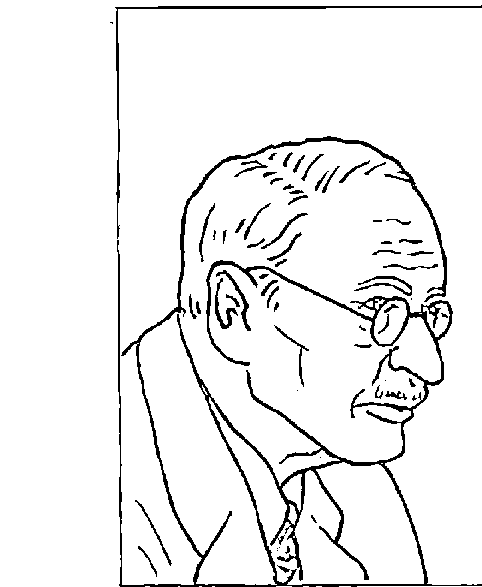

分析心理学的创始者。在炼金术的过程中发现人类心理的普遍性成长过程。

荣格研究精神病患者的幻觉、古代神话和传说，发现一个共通的基本模式。此外，人类的心理不只有个人的无意识存在，还有所有人共同的普遍性集体无意识存在，而荣格便主张有称「原型」的力量可以使普遍性集体无意识的内部产生人类共通的意象，因而闻名。除《心理学与炼金术》外，荣格还著有《移情》、《神秘的结合》等书。

#### 荣格所论述心理成长过程与炼金术之对应关系

| 人类心理的成长过程 | 贤者之石的创造过程 |
| :--- | :--- |
| **① 面对「黑影」**
面对真正的自我、感到痛苦 | **黑化（Nigredo）**
（腐败） |
| ↓ | ↓ |
| **② 从「黑影」得到解放**
进入纯粹的灵性状态 | **白化（Albedo）**
（再生） |
| ↔ **对应** ↔ | |
| ↓ | ↓ |
| **③ 统一人类内部相反的要素**
心理的完成状态 | **赤化（Rubedo）**
（完成）
贤者之石的完成 |

### 关联项目
- ◇贤者之石 → No.013
- ◇贤者之石的材料 → No.015
- ◇贤者之石的种类 → No.019
- ◇贤者之石的效力 → No.020

### 原子變換

#### Atom Transformation
隨著曾經否定鍊金術的科學技術日趨進步，如今鍊金術師煉成黃金的夢想就要實現。

#### ◇ 開拓出黃金煉成之可能性的現代物理學

從前中世紀鍊金術師的信仰，把鉛或銅等賤金屬變成黃金的物質煉成之可能性，在進入近代以後已經被完全否定，因為近代初期的科學家認為鉛是由鉛元素、銅是由銅元素、金是由金元素所構成，而元素是無法分割的最小的原子，不論用任何方法都無法改變元素。原子（Atom）此字乃源於古希臘語的「atomos」（無法再分解）一詞。

然而此狀況卻從十九世紀末開始發生變化，原子無法被分割的思想又被推翻，因為科學家又發現原子核與電子等更小的粒子。這正代表著鍊金術師把賤金屬變成黃金的夢想，其實是有可能發生的。

造成此變化的決定性關鍵，就是紐西蘭出身的物理學家拉塞福（Ernest Rutherford，1871～1937）在1919年進行的放射線實驗。他用α射線碰撞氮原子使質子游離，得到只有一個質子的原子，亦即氫原子。雖然他並未將賤金屬變成黃金，不過此實驗卻是人類史上首次用人工方式將某元素變成其它元素的創舉。此後元素的研究不斷進步，甚至可以製造出人造的新元素。目前共有107種已經證實的化學元素，其中就有15種（另說為17種）是人造元素。

當然，此類研究仍有別於鍊金術師的研究，不過來到二十一世紀的現代，曾經遭到完全否定的鍊金術大夢，卻可說是越來越有可能會實現。

#### 拉塞福的實驗

可以用人工方式變換元素

#### 核子物理學之父：拉塞福

人類史上首位成功完成原子變換的拉塞福生於紐西蘭，是在英國活動的有名物理學家，有「核子物理學之父」之稱。除成功用人工方式變換原子核以外，他還發現了α和β射線、釷X (Thorium X)，並且引進半衰期的概念，還與蓋格 (Hans Geiger) 共同計算出α粒子數量等，留下許許多多的功績。此外他還結合發現原子核的日本學者長岡半太郎的學說，提出了有名的拉塞福-長岡原子模型。1908年應得諾貝爾化學獎。

### 英日中名詞對照索引

- A
- A lot of troubles　錬金術師の苦労　錬金術師的煩惱…………… 146
- Abraham Lambsprinck　アブラハム・ラムスプリンク 亜伯拉罕・蘭斯布林克…………… 162
- Acrostic　アクロスティッシュ　蔵頭文…………… 166
- Adam and Eve　アダムとイブ　亜當和夏娃…………… 164
- Adept　アデプト（達人）　大師…………… 142
- Africanus　アフリカヌス　阿弗理卡納斯…………… 60
- Agathodaemon　アガトダイモン　阿嘎都戴蒙…………… 62
- Albertus Magnus　アルベルトゥス・マグヌス　大阿爾伯特…………… 84
- Alchemical myth　錬金術的神話　錬金術的神話…………… 164
- Alchemists in China　中国の錬金術師たち　中國的錬金術師…………… 192
- Alchemists in India　インドの錬金術師　印度的錬金術師…………… 202
- Alchemy　アルケミー　錬金術…………… 8
- Alchemy in "Ba pu zi"　抱朴子による煉丹の作り方　抱朴子的煉丹法…………… 190
- Alchemy in China　中国の錬金術　中國的錬金術…………… 188
- Alchemy in Europe　ヨーロッパの錬金術　歐洲的錬金術…………… 82
- Alchemy in India　インドの錬金術　印度的錬金術…………… 200
- Alchemy of Paracelsus　パラケルススの錬金術　帕拉塞爾蘇斯的錬金術…… 110
- Alchemy of the King and feudal lords　王侯貴族と錬金術 王公貴族與錬金術……… 110
- Alchemy of the spirit　霊性の錬金術　靈性之錬金術…………… 60
- Alembic　蒸留器（アレンビック）　蒸溜器…………… 30
- Alexander Seton　アレクサンダー・セトン　亞歷山大・塞頓…………… 60
- Alexandria　アレクサンドリア　亞歷山卓…………… 18
- Alkahest　アルカヘスト（万物融化剤）　萬能溶劑…………… 32
- Allegory　諷意　寓意…………… 106
- Al-Razi　アル・ラージー　阿爾・拉齊…………… 70
- Anagram　アナグラム　變位法…………… 106
- Anaximenes　アナクシメネス　阿那克西米尼…………… 60
- Ancient alchemists　古代の錬金術師たち　古代的錬金術師…………… 60
- Antoine-Laurent Lavoisier　ラヴォアジエ　拉瓦節…………… 308
- Arcana　アルカナ　阿卡那…………… 106
- Argonaut　アルゴー探検隊　阿爾戈英雄…………… 106
- Arnold of Villanova　ヴィルナヴのアルノー　維朗諾瓦的阿諾……… 100
- Ars Magna アルス・マグナ (大いなる秘術) 偉大秘法 56
- Astrology 占星術 占星術 182
- Asvaghosa アシュヴァゴーシャ 阿縛矩沙 202
- Athanor アタノール 鍊金爐 42
- Atom transformation 原子変換 原子變換 212
- Avicenna アヴィケンナ 阿維森納 80

### B

- Basic operations 鍊金術の基本操作 鍊金術的基本操作 40
- Bernard of Treves トレヴのベルナルド 特里爾的貝里納 108

### C

- Calculation 計算方法 計算方法 24
- Carl Gustav Jung and alchemy ユングと鍊金術 榮格與鍊金術 210
- Christian Rosenkreuz クリスチャン・ローゼンクロイツ 克利斯欽・羅森克羅伊茨 130
- Cleopatra クレオパトラ 克麗奧佩脫拉 70
- Code, cryptogram 鍊金術の暗号 鍊金術的密碼 166
- Comte Saint-Germain サン・ジェルマン伯爵 聖日耳門伯爵 122
- Cryptogram 暗号 暗號 166

### D

- Dan 丹（丹藥、金丹） 丹（丹藥、金丹） 188
- Definition 鍊金術とは何か 何謂鍊金術 8
- Demiurge デミウルゴス 造物主 184
- Denis Zachaire ドニ・ザシェール 但尼・札加利 106
- Discovery 鍊金術師の発見 鍊金術師的發現 204
- Doctrine of salvation 救済論 救贖論 172
- Duke Cagliostro カリオス卜ロ伯爵 卡廖斯特羅伯爵 124

### E

- Edward Kelly エドワード・ケリー 愛德華・凱利 120
- Elixir エリキサ 靈藥 32, 44, 46
- Emerald Tablet エメラルド板 翠玉錄 66
- Empedocles エンペドクレス 恩培多克勒 58
- Ernest Rutherford アーネスト・ラザフォード 拉塞福 212
- Ether エーテル 以太 30

### F

- Female alchemists 女性鍊金術師 女性錬金術師 70
- Ferdinand III フェルディナント3世 斐迪南三世 114
- Four elements 四大元素 四大元素 22
- Freemason フリーメーソン 共済會 132

### G

- Ge Hong 葛洪 葛洪 196
- Gematria ゲマトリア 數值換算法 166
- George Ripley ジョージ・リプリー 喬治・雷普利 96
- Giovanni Giacomo Casanova カサノヴァ 卡薩諾瓦 123
- Gnosticism グノーシス主義 諾斯替教 184
- Golem ゴーレム 魔像 52

### H

- Heinrich Coenraad ハインリヒ・クンラート 亨利・柯恩拉德 168
- Heinrich Cornelius Agrippa アグリッパ 阿古利巴 48
- Heracleitus ヘラクレイトス 赫拉克利特 58
- Hermes Trismegistus ヘルメス・トリスメギストス 赫密斯・特里斯密吉斯托斯 64
- Hermetism ヘルメス思想 赫密斯思想 64
- History 鍊金術の歷史 鍊金術的歷史 16
- Homunculus ホムンクルス 荷姆克魯斯 48
- How to become an alchemist 鍊金術師になるには 如何成為鍊金術師 140
- Huai Nan Wang Liou An 淮南王劉安 淮南王劉安 190

### I

- Initiation of freemason フリーメーソンの参入儀礼 共濟會的入會儀式 134
- Irregular alphabet 変則アルファベット 變例式字母 100
- Isaac Newton and alchemy ニュートンと鍊金術 牛頓與鍊金術 200
- Isis イシス 伊西斯 63
- Islamic alchemy イスラムの鍊金術 伊斯蘭教的鍊金術 70

### J

- Jabir b. Hayyan ジャービル・ブン・ハイヤーン 查比爾・本・哈揚 70
- Johann Wolfgang von Goethe ゲーテ 歌德 40
- Johannes Kepler ケプラー 開普勒 100
- John Dee ジョン・ディー 約翰・迪 120

### K

- Kabbalah カバラ 喀巴拉 178
- Kabbalah 錬金術とカバラ 錬金術與喀巴拉 178
- Khalid b. Yazid ハーリド・ブン・ヤジード 哈立德・本・亞齊德 74

### L

- Laboratorium ラボラトリウム 實驗室 144
- Laboratory 錬金術師の実験室 錬金術師的實驗室 144
- Legend of Hiram ヒラム伝説 希蘭傳說 134
- Li Daoxuan 李少君 季少君 192
- Lian Dan Shu 煉丹術 煉丹術 188
- Lion's paw ライオンの握手法 獅子握手法 134
- Liu Hsiang 劉向 劉向 188

### M

- Macrocosm-Microcosm 大宇宙と小宇宙 大宇宙與小宇宙 20
- Magnus opus マグナス・オプス（大いなる作業） 偉大的作業 34
- Making a golem ゴーレムの作り方 魔像的製作方法 54
- Making a homunculus ホムンクルスの作り方 荷姆克魯斯的製作方法 50
- Maria the Jewess ユダヤ婦人マリア 猶太女子瑪莉 70
- Marie Antoinette マリー・アントワネット 瑪麗・安托瓦內特 124
- Marshal Gilles de Rais ジル・ド・レース 吉里・德・萊斯將軍 126
- Michael Sendivogius ミカエル・センディヴォギウス 米格爾・森迪沃姆斯 100
- Millenarianism 千年王国信仰 千年王國信仰 174
- Music and alchemy 錬金術と音楽 錬金術與音楽 168
- Mythic alchemists 神秘的錬金術師 虛構的錬金術師 62
- Mythic origin 神秘的な起源 錬金術之神話起源 14

### N

- Nagarjuna ナーガールジュナ 那伽闍刺樹那 202
- Nicolas Flamel ニコラ・フラメル 尼樂・勃梅 92

### O

- Olympiodorus オリュンピオドロス 奧林匹奧多羅斯 60
- Opus Magnus 大錬金法（大作業） 大錬金法（大作業） 44
- Opus menor 小錬金法（小作業） 小錬金法（小作業） 44
- Origin 錬金術の起源 錬金術之起源 12

### P

- Paracelsus パラケルスス 帕拉塞爾蘇斯 116
- Philosopher's egg and the last operation 哲学者の卵と最終操作 賢者之卵與最終作業 42
- Philosopher's stone 賢者の石 賢者之石 32
- Phoenix フェニックス 不死鳥 164
- Plato プラトン 柏拉圖 172
- Pneuma プネウマ 紐瑪 30
- Polyalphabetic cipher 多表式暗号 多字母置換式密碼 166
- Power of philosopher's stone 賢者の石の効力 賢者之石的效力 46
- Prima Materia 第一質料／プリマ・マテリア 第一原質 18
- Prohibition 錬金術禁止令 錬金術禁令 152
- Puffers ふいご吹き 142
- Purposes 錬金術の目的 錬金術之目的 10
- Pythagoras ピタゴラス 畢達哥拉斯 168

### Q

- Quonta essentia 第五元素 第五元素 30

### R

- Rabbi Elia ラビ・エリア 拉比・伊利亞 54
- Rabbi Leow Judah ben Bezalel ラビ・レーフ 拉比・羅烏 54
- Raw materials 賢者の石の材料 賢者之石的材料 36
- Raymundus Lullus ライムンドゥス・ルルス 賴蒙・魯爾 90
- Reincarnation 輪廻転生 輪迴轉生 170
- Renaissance ルネサンス 文藝復興 130
- Representation in alchemy 錬金術師の表現 錬金術的表現方式 154
- Richthausen リヒトハウゼン 李奇豪森 114
- Robert Boyle killed alchemy 錬金術を殺したボイル 波義耳殺了錬金術 200
- Roger Bacon ロジャー・ベーコン 羅傑・培根 100
- Rosicrucian 薔薇十字團 薔薇十字團 120
- Rudolf II ルドルフ2世 魯道夫二世 117

### S

- Sephirothic tree 生命の樹（セフィロトの樹） 生命之樹 100
- Seven metals 七つの金属 七大金屬 20
- Signs 記号 記號 150
- Signs 錬金術の記号 錬金術的記號 100
- Social class of alchemists 錬金術師の出身階級 錬金術師的出身階級 140
- Spiritus　スピリット　精英 30
- Stephanus　ステファノス　斯蒂芬紐 60
- Sulfur, Mercury　硫黄・水銀　硫磺・水銀 26
- Symbols　象徵　象徵 158
- Symbols　錬金術の象徵　錬金術的象徵 158
- Synesius　シュネジウス　敘涅修斯 60

### T

- Tarot Card　錬金術とタロット・カード　錬金術與塔羅牌 170
- Thales　タレス　泰利斯 58
- Thomas Charnock　トマス・チャーノック　湯瑪斯・查諾克 104
- Thomas Norton　トマス・ノートン　湯瑪斯・諾頓 96
- Thoth　トト神　透特 64
- Tinctoria　ティンクトラ　染金石 44
- Tone language　音調言語　聲調語言 166
- Tools, equipments　錬金術の道具・設備　錬金術的道具和設備 38
- Tragic end of alchemists　錬金術師の悲慘な運命　錬金術師悲慘的命運 150
- Transmutation by Flamel　ニコラ・フラメルの黄金変成 尼楽・勒梅的黃金鍊成 94
- Tria prima—The sulphur-mercury-salt theory　三原質—硫黄・水銀・塩 三原素——硫磺、水銀、鹽 26
- Tribikos　トリビコス　特里畢柯斯 38
- Tricks of alchemists　インチキ錬金術師の手口　偽錬金術師的造假手法 148
- Tsou Yen　鄒衍　鄒衍 188

### U

- Uroboros　ウロボロス　烏洛波羅斯 160

### V

- Van Helmonto　ファン・ヘルモント　海耳蒙特 102
- Variants of philosopher's stone　賢者の石の種類　賢者之石的種類 44

### W

- Wei Po (Bo) Yang　魏伯陽　魏伯陽 194
- William Holeway　ウィリアム・ホールウェイ　威廉・赫威 105

### Z

- Zosimos of Panopolis　パノポリス人のゾシモス　帕諾波利斯的索席摩斯 68

### 参考文献

- 『イメージの博物誌 6 錬金術 / 精神変容の秘術』スタニスラス・クロソウスキー著／種村季弘訳 平凡社
- 『インド錬金術』佐藤任・小森田耕子著 東方出版
- 『エリアーデ・オカルト事典』ミルチャ・エリアーデ主編／ローレンス・E・サリヴァン編／鶴岡賀雄・塩田裕己・奥山倫明訳 法蔵館
- 『カバラ ユダヤ神秘思想の系譜』箱崎総一著 青土社
- 『クリテリオン叢書 ジョン・ディー エリザベス朝の魔術師』ピーター・J・フレンチ著／高橋敏訳 平凡社
- 『ニコラ・フラメル 錬金術師伝説』ナイジェル・ウィルキンズ著／小池寿子訳 白水社
- 『パラケルススとその周辺』アレクサンドロ・コレイ著／鶴岡賀雄訳 青銅風の薔薇
- 『パラケルススの世界』種村季弘著 青土社
- 『フリーメイソン』吉村正和著 講談社現代新書
- 『フリーメイソンと錬金術西洋象徴哲学の系譜』吉村正和著 人文書院
- 『フリーメイソンリー その思想、人物、歴史』杉浦敬一著 中公新書
- 『フリーメーソン』リュック・スファンテーヌ著／吉村正和監修 創元社
- 『ヘルメス叢書 自然哲学再興 ヘルメス哲学の秘法』ジャン・デスパニエ著／有田忠郎訳 白水社
- 『ヘルメス叢書 象形寓意図の書 賢者の術概要・望みの望み』ニコラ・フラメル著／有田忠郎訳 白水社
- 『ヘルメス叢書 沈黙の書 ヘルメス学の勝利』リモジョン・ド・サン＝ディディエ著／有田忠郎訳 白水社
- 『ユング思想と錬金術 ―錬金術における能動的想僊―』M－L・フォン・フランツ著／垂谷茂弘訳 人文書院
- 『ルネサンスの知と魔術』滝井繁男著 山川出版社
- 『ルネサンスの魔術思想／フィチーノからカンパネッラへ』D・P・ウォーカー著／田口清一訳 平凡社
- 『宇宙を聴く 究極の環境芸術をもとめて』茂木一術著 春秋社
- 『黄金のブラハ 幻想と現実の錬金術』石川達夫著 平凡社
- 『化学の結婚』J・V・アンドレーエ著／種村季弘訳 紀伊國屋書店
- 『科学史ライブラリー アルベルトゥス・マグヌス 鉱物論』沓掛俊夫編訳 朝倉書店
- 『開かれた封印 古代世界の謎15 錬金術 ―黄金と不老不死の秘薬―』ロバート・ジャクソン著／五十嵐洋子訳 主婦と生活社
- 『記号図説 錬金術事典』大槻真一郎編著 同学社
- 『古代中国人の不死幻想』吉川忠夫著 東方書店
- 『古典化学シリーズ1 錬金術の起源』P・ベルトゥロ著／田中豊助・牧野文子訳 内田老鶴圃
- 『黒い錬金術』種村季弘著 白水社
- 『山師カリオストロの大冒険』種村季弘著 中央公論社
- 『象徴哲学体系III カバラと薔薇十字図』マンリー・P・ホール著／大沼忠弘・山田一・吉村正和訳 人文書院『象徴哲学体系IV 鍊金術』マンリー・ビー・ホール著／大沼忠弘・山田耕士・吉村正和訳 人文書院

『大聖堂の秘密』フルカネリ著／平岡忠訳 国書刊行会

『中国古典文学大系 8 / 抱朴子 列仙伝・神仙伝 山海経』本田濟、澤田瑞穂、高馬三良／訳 平凡社

『中世から近世までの庶民生活誌 バリ職業づくし』ポール・ロレンツ監修／F・クライン＝ルプール著／北澤真木訳 論創社

『秘密結社』セルジュ・ウタン著／小関藤一郎訳 白水社

『魔術と鍊金術』渋井楽男 著 ちくま学芸文庫

『魔術の帝国 ルドルフ二世とその世界』R・J・W・エヴァンズ著／中野春夫訳 平凡社

『魔術的ルネサンス エリザベス朝のオカルト哲学』フランセス・イェイツ著／内藤健二訳 晶文社

『魔法 —その歴史と正体』K・セリグマン著／平田寛訳 平凡社

『妖術師・秘術師・鍊金術師の博物館』グリョ・ド・ジブリ著／林瑞江訳 法政大学出版局

『鍊金術』セルジュ・ユタン著／有田忠郎訳 白水社

『鍊金術 タロットと枢者の旅』R・ベルヌーリ著／種村季弘訳論 青土社

『鍊金術 仙術と化学の間』吉田光邦著 中公新書

『鍊金術 大いなる神秘』アンドレーア・アロマティコ著／種村季弘監修 創元社

『鍊金術とカバラ』ゲルショム・ショーレム著／德永恂・波田節夫・春山消純・柴雅子訳 作品社

『鍊金術の起源』M・ベルトゥロ著／田中豊助・牧野文子訳 内田老鶴圃

『鍊金術の世界』ヨハンネス・ファブリキウス著／大瀬啓裕訳 青土社

『鍊金術の復活』冨根興三著 毎華房

『鍊金術の歴史 —近代化学の起源—』E・J・ホームヤード著／大沼正則監訳 朝倉書店

『鍊金術師 近代化学の創設者たち』F・S・テイラー著／平田寛・大槻真一郎訳 人文書院

『鍊金術大全』ガレス・ロバーツ著／目黒公和訳 東洋書林

『薔薇十字の魔法』種村季弘著 青土社

『薔薇十字団』ロラン・エディゴフェル著／田中毅監訳 白水社

『薔薇十字団』クリストファー・マッキントッシュ著／吉村正和訳 平凡社

### Ⅲ 譯者参考文獻

- 《魔法師》 甘蔗絲・薩維奇著 蘇有撒譯 三言社 2005
- 《宗教辞典》(上、下) 任繼愈主編 博遠出版社 1989
- 《史記新校注稿》 張森楷著 中國學典館 1970
- 《抱朴子・内篇》 何淑貞校注 國立編譯館 2002
- 《鍊金術師的傳說》 草野巧著 周佩齡譯 尖端 2006
- 《西洋神名事典》 山北篤監修 鄭綺織譯 奇幻基地 2004
- 《魔法的十五堂課》 山北篤著 王書銘譯 奇幻基地 2005
- 《魔法・幻想百科》 山北篤監修 王書銘・高胤晄合譯 奇幻基地 2006
- 《中古術師完全事典》 愛德華・尼克尔斯著 炼金達人譯 可道書房 2006
- 《鍊金術：偉大的奧秘》 Andrea Aromatico 著 李曉偉譯 上海書店 2002

### 國家圖書館出版品預行編目資料

圖解煉金術 / 草刈巧作 ; 王書銘譯. -- 初版. -- 臺北市 : 奇幻基地出版 : 家庭傳媒城邦分公司發行, 2007 [民96]
面 : 公分. -- (F-Maps : 1)
參考書目 : 面
含索引
譯自 : 図解 錬金術
ISBN 978-986-7131-87-4 (平裝)
1. 錬金術

340.99 96011566

### 城邦讀書花園
www.cite.com.tw

### F-Maps 01

### 圖解煉金術

- 原著書名 / 図解 錬金術
- 作 者 / 草刈 巧
- 譯 者 / 王書銘
- 企劃選書人 / 楊秀真
- 責任編輯 / 王筱燕

- 行銷企劃 / 周丹雉
- 業務企劃 / 陳子聰
- 行銷業務經理 / 李振東
- 總 編 輯 / 楊秀真
- 發 行 人 / 何飛鵬
- 法律顧問 / 台英國際商務法律事務所羅明通律師

- 出 版 / 奇幻基地出版
- 城邦文化事業股份有限公司
- 台北市104民生東路2段141號8樓
- 電話 : (02)25007008 傳真 : (02)25027676
- 網址 : www.ffoundation.com.tw
- e-mail : ffoundation@cite.com.tw

- 發 行 / 英屬蓋曼群島商家庭傳媒股份有限公司城邦分公司
- 聯絡地址 : 台北市104民生東路2段141號2樓
- 讀客服服務專線 : 02-25007718 ; 25007719
- 24小時傳真專線 : 02-25001990 ; 25001991
- 服務時間 : 週一至週五上午09:30-12:00 ; 下午13:30-17:00
- 劃撥帳號 : 19863813 ; 戶名 : 書虫股份有限公司
- 讀者服務信箱 : service@readingclub.com.tw
- 歡迎光臨城邦讀書花園 網址 : www.cite.com.tw

- 香港發行所 / 城邦 (香港) 出版集團有限公司
- 香港灣仔洛克道193號東超商業中心1樓
- 電話 : (852) 2508-6231 傳真 : (852) 2578-9337
- e-mail : hkcite@biznetvignotor.com

- 馬新發行所 / 城邦 (馬新) 出版集團【Cite (M) Sdn Bhd】
- 41, Jalan Radin Anum, Bandar Baru Sri Petaling, 57000 Kuala Lumpur, Malaysia.
- 電話 : 603-90578822 傳真 : 603-90576622
- email:cite@cite.com.my

- 封面設計 / 黃聖文
- 排 版 / 浩瀚電腦排版股份有限公司
- 印 刷 / 鸿霖印刷事業股份有限公司

- □2007年 (民96) 7月11日初版
- □2012年 (民101) 12月19日初版五刷

Printed in Taiwan.

### 售價 / 300元

ZUKAI HI NO KAMI TO SEIREI by YAMAKITA Atsushi
ZUKAI RENKINJUTSU by KUSANO Takumi
Copyright © 2006 KUSANO Takumi Illustrations © FUKUCHI Takako
Originally published in Japan by Shinkigensha, Tokyo.
Chinese (in complex character only) translation rights arranged with Shinkigensha, Japan through THE SAKAI AGENCY.
Complex Chinese translation copyright © 2007 by Fantasy Foundation Publication, a division of Cite Publishing Ltd. Originally published in Japan by Shinkigensha, Tokyo.
All Right Reserved.

著作權所有・翻印必究
ISBN 978-986-7131-87-4
奇幻基地官網 http://www.ffoundation.com.tw

| 廣 告 回 函 |
|---|
| 北區郵政管理登記證 |
| 台北廣字第000791號 |
| 郵資已付，免貼郵票 |

104台北市民生東路二段141號11樓
英屬蓋曼群島商家庭傳媒股份有限公司城邦分公司 收

每個人擁有一本奇幻文學的夢想書

奇幻基地官網：http://www.ffoundation.com.tw
奇幻基地粉絲團：http://www.facebook.com/ffoundation/

代號：1HP001
書名：圖解鍊金術

### 讀者回函卡

謝謝您購買我們出版的書籍！我們誠摯希望能分享您對本書的看法。請將您的書評寫於下方稿紙中（100字為限），寄回本社。本社保留刊登權利。一經使用（網站、文宣），將致贈您一份精美小禮。

|   |   |   |   |   |   |   |   |   |   |
|---|---|---|---|---|---|---|---|---|---|
|   |   |   |   |   |   |   |   |   |   |
|   |   |   |   |   |   |   |   |   |   |
|   |   |   |   |   |   |   |   |   |   |
|   |   |   |   |   |   |   |   |   |   |
|   |   |   |   |   |   |   |   |   |   |
|   |   |   |   |   |   |   |   |   |   |
|   |   |   |   |   |   |   |   |   |   |
|   |   |   |   |   |   |   |   |   |   |
|   |   |   |   |   |   |   |   |   |   |
|   |   |   |   |   |   |   |   |   |   |

- 姓名：________ 性別：□男 □女
- 生日：西元________年________月________日
- 地址：________
- 聯絡電話：________  傳真：________
- E-mail：________
- 您是否曾買過本作者的作品呢？□是  書名：________
- 您是否為奇幻基地網站會員？□是 □否（歡迎至http://www.ffoundation.com.tw免費加入）