## 图解阴阳师
ZUKAI ONMYOJI

高平鸣海·著 野宫铭

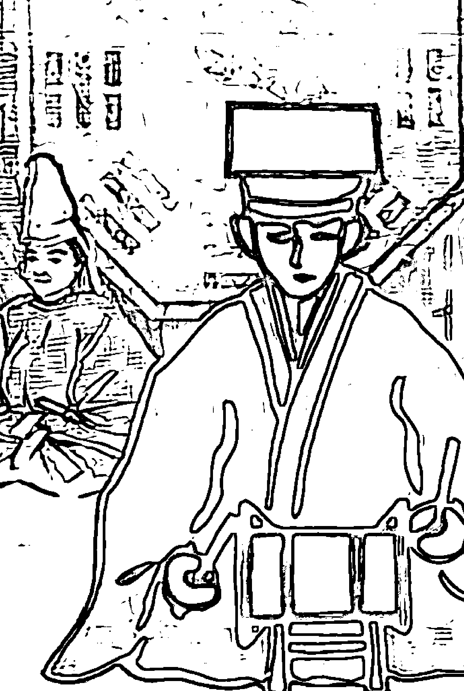

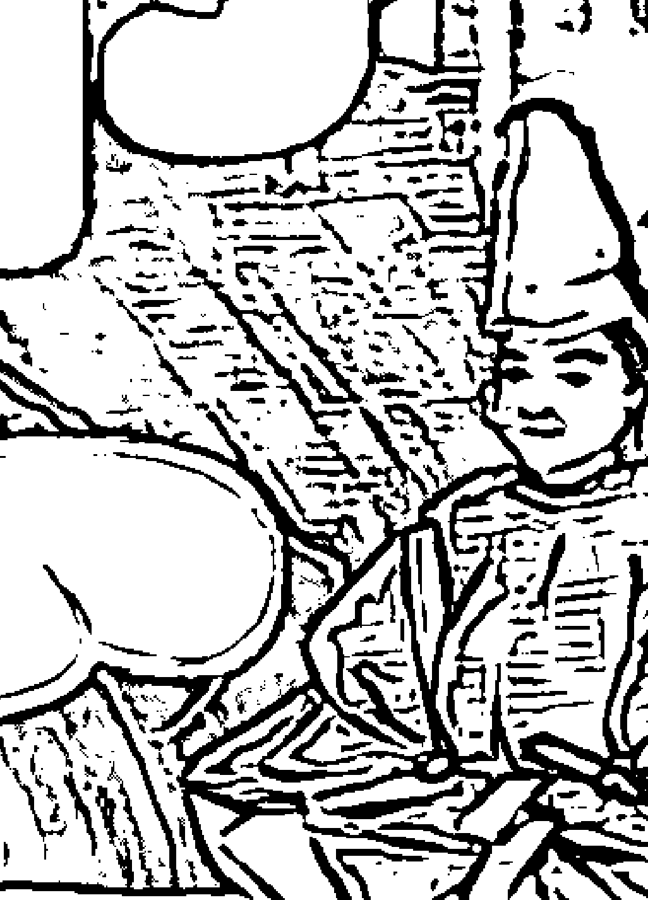

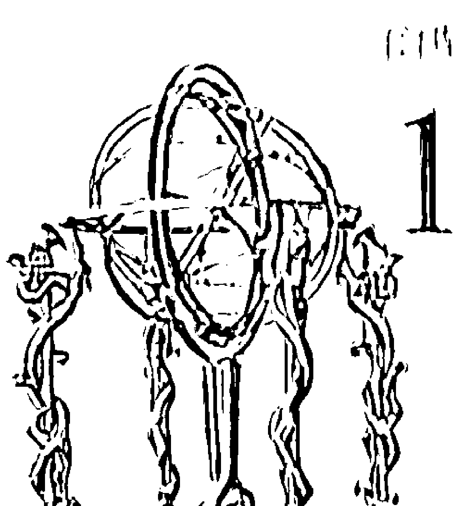

## 101项阴阳师 相关知识 全收录！

- 阴阳道的起源、官人阴阳师、阴阳师的日常生活、阴阳师的服装、阴阳师的技能、物忌与方位、方位的吉凶、灾口、阴阳师与茶吉尼、形式、反闭、泰山府君祭、十二神将、安倍晴明、晴明生母之谜、藤原公滋、芦屋道满、贺茂光荣、安倍吉平

- 安倍泰亲、芦屋道满、山际忠范、道满川人、道满、阿倍山吹、佐原、神出鬼没的门、咒术的对象、咒术球、反咒术、动物的怪异、自然现象的灾异…

## 图解阴阳师
ZUKAI ONMYOJI

本书针对裹着幻想神秘面纱的阴阳道、
各式各样的阴阳术以及众多阴阳师奇闻佚事和真实面貌逐项解说，
并举出术师们曾经解决处理过的诸多神怪诡异诅咒事件等各种历史记录，
将引领未具专门知识的读者至混沌杂然并存的阴阳世界……

- 阴阳五行说
- 五行相生相克说
- 法师阴阳师
- 咒师
- 道教与神道
- 星宿的咒术
- 诅咒
- 式神
- 反闲
- 式占
- 天文密奏
- 祓
- 泰山府君祭
- 四角四坛祭
- 五部祭
- 七濑祓
- 形代
- 安倍晴明
- 花屋道满
- 贺茂保宪

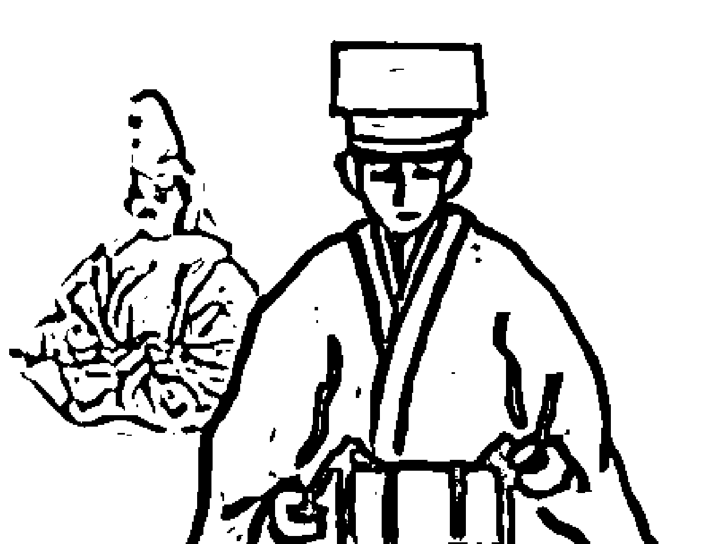

## 图解阴阳师

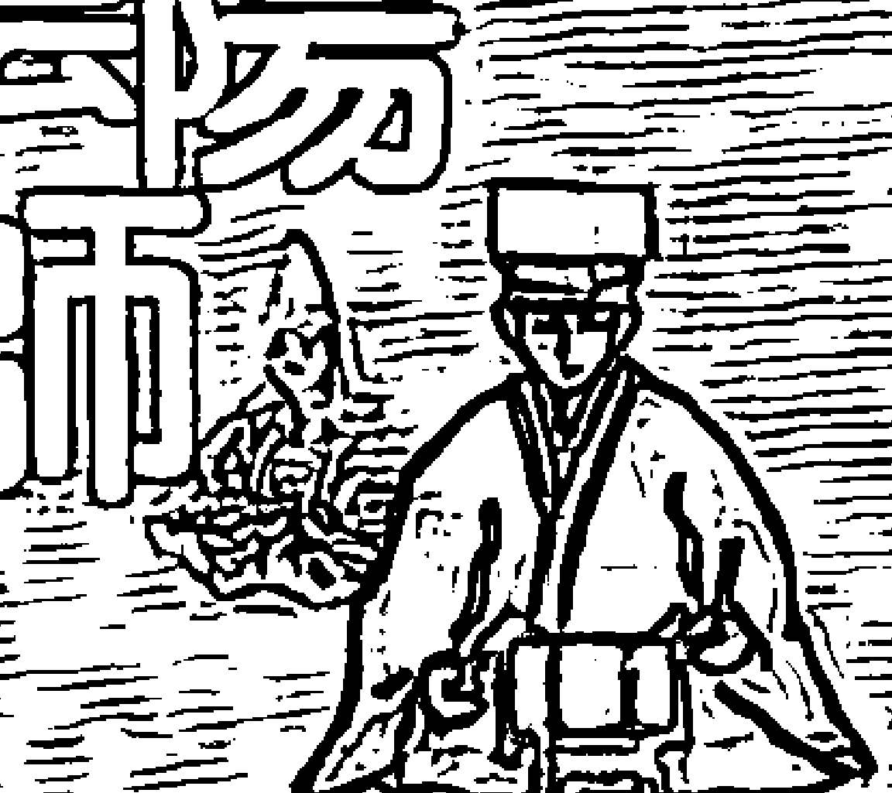

作者简介
高平鸣海

1990年代，在TRPG「メタルヘッド」(HOBBY JAPAN)中担任边境开拓者，此后在动画制作、漫画、剧本志等多个不同领域中活跃着。

译者简介
王书铭

辅仁大学日文研究所毕业，翻译作品《召唤师》、《魔法师十字架出题》、《圆环战士企划师》、《圆环骑马武士》、《圆环太空船》、《圆环魔法女友》、《圆环光速名侦探们》、《圆环吸血鬼》、《图解阴阳师》。

## 图解阴阳师

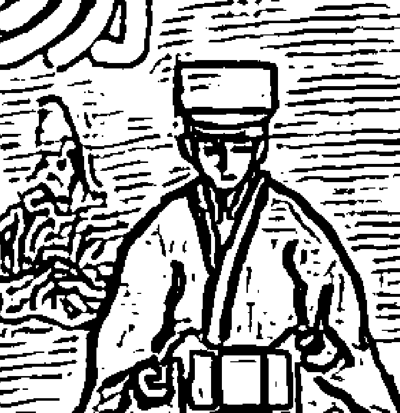

## EMAPS

打开幻想地图

踏入知识游戏的奇幻旅程

已出版：
- **图解炼金术**
  - 甲山林中介
  - 2007年7月出版／售价300元
- **图解近身武器**
  - 大波秀司
  - 2008年5月出版／售价280元
- **图解太空船**
  - 神名哲平监修、山田俊绫
  - 2008年12月出版／售价300元
- **图解魔法知识**
  - 永仁规
  - 2009年6月出版／售价300元
- **图解克苏鲁神话**
  - 汤川晓
  - 2010年6月出版／售价330元
- **图解吸血鬼**
  - 汤川一郎、御代田启
  - 2010年8月出版／售价300元

www.cite.com.tw

全国最大出版集团网络书店

立刻上网，好康等着你！

企划进香人：杨秀真／责任编辑：张世国

大清宣统二年岁次庚戌春季

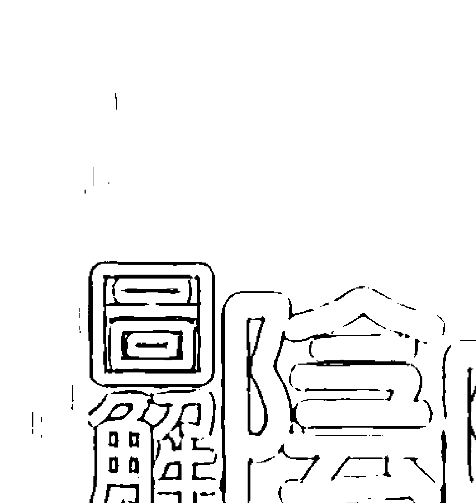

## 厚德载物

古人认为，道德高尚者能承担重大责任。

以厚德载物

《周易》中说：“地势坤，君子以厚德载物。”

辛卯年初秋

## 阴阳师

### 百鬼绘卷

#### ZUKAI ONMYOJI

高平鸣海 著

王铭礼

·

## 前言

「阴阳师」此语如今已经鲜少能在日常生活中耳闻，对现代人来说是个非常陌生的用语，但其实知道阴阳师的人却是出乎意料地多。

一般人对阴阳师的印象不外乎是作平安时期贵族打扮，专行唱咒飞符、召唤式神等神妙玄怪事之人。

阴阳师确实拥有上述这些日式魔法师的特质，可是这些华丽夸张的，又或者说是充满幻想风格的人物形象，却是由近年的虚构作品所构筑而成。

如今阴阳师在小说、电影和漫画等诸多领域的娱乐作品里大为活跃，可谓已在现代创作世界里占得了一席之地。

其实阴阳师在江户时代的庶民阶层也同样颇具知名度并且很受欢迎，可是这并不代表他们也能掌握住阴阳师的真实形象；他们跟我们现代人一样都是透过读物和戏剧等描述虚构情节的作品来认识阴阳师，对阴阳师怀抱着憧憬与畏惧。

事实上阴阳师在平安时代最为活跃，至战国时代便已经从历史的主要舞台退居幕后；虽然阴阳寮逐渐遭到架空、最后甚至形同虚设，不过直到明治年间为止阴阳寮一直都是隶属于朝廷的官方组织，而这些特点又恰恰形塑并增添了阴阳师的神秘氛围。

阴阳师行使的阴阳术及其中心思想阴阳道乃起源自中国的道教，是日本朝廷从中国引进的技术体系；朝廷有意以咒术与占卜守护国家，故阴阳术与阴阳师当初均被视为最高机密，受到严格管制。

阴阳术甫诞生便已经是门秘而不宣的秘术，在事事均深受咒术及迷信左右的中世社会里，阴阳师自然而然就成为众人崇拜的对象，以至有安倍晴明等巨星辈出。

本书将会针对裹着幻想神秘面纱的阴阳道、各式各样的阴阳术以及众多阴阳师奇闻轶事和真实面貌逐项解说，并举出术师们曾经解决处理过的诸多神怪诡异诅咒事件等各种历史记录。

期盼此书能将未具专门知识的读者引领至混沌杂然并处的阴阳世界，此愿若然得偿，实为作者之幸。

宫平鸣洲

001 阴阳师的历史 —— 7

002 阴阳师的起源 —— 8

003 阴阳师与... —— 10

004 阴阳师与... —— 12

005 阴阳师与...相互关系 —— 14

006 阴阳师与... —— 16

007 阴阳师与... —— 18

008 阴阳师与... —— 20

009 阴阳师与... —— 22

010 阴阳师与... —— 24

011 阴阳师的设立 —— 26

012 阴阳师的官方业务 —— 28

013 阴阳师的组织 —— 30

014 阴阳师的... —— 32

015 阴阳师与... —— 34

016 阴阳师的日常生活 —— 36

017 阴阳师与... —— 38

018 阴阳师与... —— 40

019 阴阳师与... —— 42

020 阴阳师与... —— 44

021 阴阳师与... —— 46

022 阴阳师与... —— 48

023 阴阳师与... —— 50

024 阴阳师与... —— 52

025 阴阳师与... —— 54

026 阴阳师与... —— 56

027 阴阳师与... —— 58

028 阴阳师与... —— 60

029 阴阳师与... —— 62

030 阴阳师与... —— 64

031 阴阳师与... —— 66

032 阴阳师与... —— 68

033 阴阳师与... — 70

No.033 阴阳寮的废止 —— 72

备注：阴阳师的待遇/“暗明语音”考 —— 74

## 第二章 阴阳术的道具 —— 75

No.034 阴阳师的服装 —— 76

No.035 阴阳师的装备 —— 78

No.036 式占 —— 80

No.037 阴阳师的筮占 —— 82

No.038 物忌与方违 —— 84

No.039 方位的禁忌 —— 86

No.040 方违的咒文 —— 88

No.041 禁忌与历书 —— 90

No.042 衰日 —— 92

No.043 吉日 —— 94

No.044 阴阳道的神明 —— 96

No.045 阴阳道与茶吉尼 —— 98

No.046 形代 —— 100

No.047 灵符的制作方法 —— 102

No.048 道纹与晴纹 —— 104

No.049 护身剑与将军剑 —— 106

No.050 散供 —— 108

No.051 反闭 —— 110

No.052 防止屋宅内灾厄发生 —— 112

No.053 治疗疾病的阴阳术 —— 114

No.054 五龙祭与雷公祭 —— 116

No.055 四角四堺祭 —— 118

No.056 七濑被 —— 118

No.057 泰山府君祭 —— 120

No.058 天文密奏 —— 124

No.059 星宿的咒术 —— 126

No.060 驱使式神 —— 128

No.061 十二神将 —— 130

No.062 形形色色的式神 —— 132

## 目次

No.063 流传直到现代的阴阳仪式 ————————— 134

No.093 播磨国的阴阳师 ————————— 196

No.064 各季节行事与阴阳道 ————————— 136

事例：鬼的概念／对物忌漫不经心的人 ————————— 198

No.065 庚申信仰 ————————— 138

No.066 牛头天王与祇园祭 ————————— 140

事例：传承直至现代的阴阳道「伊邪那岐流」 ————————— 142

### 第三章 阴阳道神主谱 ————————— 143

No.067 安倍晴明 ————————— 144

No.068 安倍家的系谱 ————————— 146

No.069 晴明桔梗印是所罗门王的力量？ ————————— 148

No.070 安倍「清」明的传记 ————————— 150

No.071 晴明vs.道满的对决 ————————— 152

No.072 《帘笠内传金乌玉兔集》与伯道上人 ————————— 154

No.073 《芦屋道满大内鉴》 ————————— 156

No.074 晴明生母之谜 ————————— 158

No.075 芦屋道满 ————————— 160

No.076 贺茂忠行 ————————— 162

No.077 贺茂保宪 ————————— 164

No.078 贺茂光荣 ————————— 166

No.079 安倍吉平 ————————— 168

No.080 安倍泰亲 ————————— 170

No.081 贺茂在经 ————————— 172

No.082 贺茂道世 ————————— 174

No.083 贺茂季国 ————————— 176

No.084 改小角 ————————— 178

No.085 伴海文部 ————————— 180

No.086 伴海友部 ————————— 182

No.087 伴海国成 ————————— 184

No.088 伴海川人 ————————— 186

No.089 伴海友初 ————————— 188

No.090 伴海忠 ————————— 190

No.091 伴海氏 ————————— 192

No.092 伴海家久 ————————— 194

### 第四章 诅咒与怪异 ————————— 199

No.094 何谓诅咒・怪异 ————————— 200

No.095 诅咒与暗斗 ————————— 202

No.096 诅咒的对象 ————————— 204

No.097 诅咒球 ————————— 206

No.098 反诅咒 ————————— 208

No.099 动物的怪异 ————————— 210

No.100 自然现象的怪异 ————————— 212

No.101 超自然现象的怪异 ————————— 214

中日名词对照索引 ————————— 216

参考文献 ————————— 220

## 第1章 何谓阴阳道

## 阴阳五行说

阴阳五行说作为一种思想体系，其产生和发展起源自中国。

### 二元论

所谓阴阳道乃发源自中国的阴阳五行说，但阴阳五行说其实只是构成阴阳道的其中一个重要基础而已。

阴阳道是种统合汇集各式各样符咒占卜而成的体系，自然不可能仅凭阴阳五行说便得以成立。

人们通称为阴阳五行，但阴阳说和五行说其实是两种不同的思想体系。此二者是从不同的角度出发，试图利用科学的方法说明大自然的原理和法则；阴阳说和五行说均是相当优秀的学说，而且都有清楚的物理概念，故于中国的战国时代末期相互习合，遂有阴阳五行说之谓。

后来阴阳五行又跟十干十二支、八卦等要素结合，及至西汉时大抵成形，并且继续发展下去。

阴阳五行说原本是个建立在自然观察之上的哲学・理念・世界观，但不知何时却逐渐地神秘化、迷信化。

所谓阴阳说，就是将万物分阴阳、分成正向因素与负向因素，试图利用二元论说明世间万物万象的思想。

五行说则主张世间万物尽皆是由木・火・土・金・水五种元素构成，不光是各种物质，就连自然的运行、命运、人身体等五也都深受五行影响。

从阴阳五行说衍生出来的诸多思想当中，最著名当然非易莫属。

《易》其实并不只是本占卜书，同时也是本记载天地人命运的哲学书，直到今天仍然广受全世界爱读。除此之外，易在阴阳道里面扮演着相当重要的元素，尤其中世以后民间阴阳师所使用的占术几乎都源自于《易》。

## 阴阳对照表

| 阳 | 日 | 春/夏 | 东/南 | 日 | 男 | 右 | 背 | 腑 | 动物 | 主动 | 攻击 |
| 阴 | 月 | 秋/冬 | 西/北 | 夜 | 女 | 左 | 腹 | 脏 | 植物 | 被动 | 防御 |

此外尚有许多物质与概念可以用阴阳二元论分类

## 五行对照表

| 五行 | 木 | 火 | 土 | 金 | 水 |
| 行星 | 岁星(木星) | 荧惑星(火星) | 镇星(土星) | 太白星(金星) | 辰星(水星) |
| 方位 | 东 | 南 | 中央 | 西 | 北 |
| 节气 | 春 | 夏 | 土用 | 秋 | 冬 |
| 色彩 | 青 | 赤 | 黄 | 白 | 黑 |
| 脏 | 肝 | 心 | 脾 | 肺 | 肾 |
| 腑 | 胆 | 小肠 | 胃 | 大肠 | 膀胱 |
| 九窍 | 视觉 | 听觉 | 嗅觉 | 味觉 | 触觉 |
| 五味 | 酸 | 苦 | 甘 | 辛 | 咸 |
| 五臭 | 膻 | 焦 | 香 | 腥 | 朽 |
| 五声 | 呼 | 笑 | 歌 | 哭 | 呻 |
| 五常 | 仁 | 礼 | 信 | 义 | 智 |
| 五神 | 魂 | 神 | 意 | 魄 | 精 |
| 五志 | 怒 | 喜 | 思 | 忧 | 恐 |
| 五气 | 风 | 暑 | 湿 | 燥 | 寒 |
| 四象 | 苍龙 | 朱雀 | 黄龙*/麒麟 | 白虎 | 玄武 |
| 虫 | 鳞虫*(鱼) | 羽虫*(凤凰) | 裸虫*(人类) | 毛虫*(麒麟) | 介虫*(龟) |
| 时辰 | 寅/卯 | 巳/午 | 丑/辰/未/戌 | 申/酉 | 子/亥 |
| 十天干 | 甲/乙 | 丙/丁 | 戊/己 | 庚/辛 | 壬/癸 |

1110101 1 No.007 ◎阳气与阴气→No.002

## 第一章 气与阴阳

如果我们以中国的思想・哲学・科学为基础，那么中国的思想・哲学，是以何作为基础呢？

### “气”，是万事万物的根源

以现代科学的说法，所有物质的基本构成要素就是元素。这个说法对我们来说已经形同常识，而古代中国人也同样普遍认同，人世间一切事物均由“气”所构成。

此学说成立于西汉时代（B.C.202~B.C.8），当时认为不论物质或精神、气体，万事万物均是以“气”为其根源。

由于“气”属于根源物质，所以当时认为只要将好的“气”摄入体内转化成能量，就可以不必摄取食物；相对地，只要避免不好的“气”进入体内，就能够长生不老。我们经常耳闻的“仙人炼丹术”的故事，所指正是此事。

“气”分成两种：积极的称为阳气，消极的唤作阴气。两种气互相混合，方才形成了各种不同的性质和特性。然而，似乎没有任何事物是纯粹只由阳气抑或阴气所构成，举例来说，阴阳思想虽然主张“男为阳”“女为阴”，但这其实只不过是“男性有阳气较强的倾向，女性有阴气较强的倾向”的意思而已。

《易经系辞传》说到“易有太极，是生两仪，两仪生四象，四象生八卦”，所谓太极指的就是混沌状态。所有事物在太极里都呈未分化的状态，而构成这些事物的元素便是“气”（由于未经分化，故此状态下的“气”乃是阴阳混杂）。太极生出的两仪（两种现象）便是阴与阳。就如同现代科学认为各种物质是由元素组合而成，世间的森罗万象亦尽皆是由阴阳之气所孕生。

- 泰利斯（Thales）：哲学家，因其以水为万物本质的宇宙论和对日蚀的预测（西元前585年5月28日）而闻名。
- 阿那克西曼德（Anaximander）：被称为天文学奠基人。发展宇宙论或有关...（文本不完整）
- 赫拉克利特（Heraclitus）：希腊哲学家，因其宇宙论而闻名。认为火是保持宇...（文本不完整）

## 太极

### 何谓太极

太极→阴阳混合，万事万物之根本

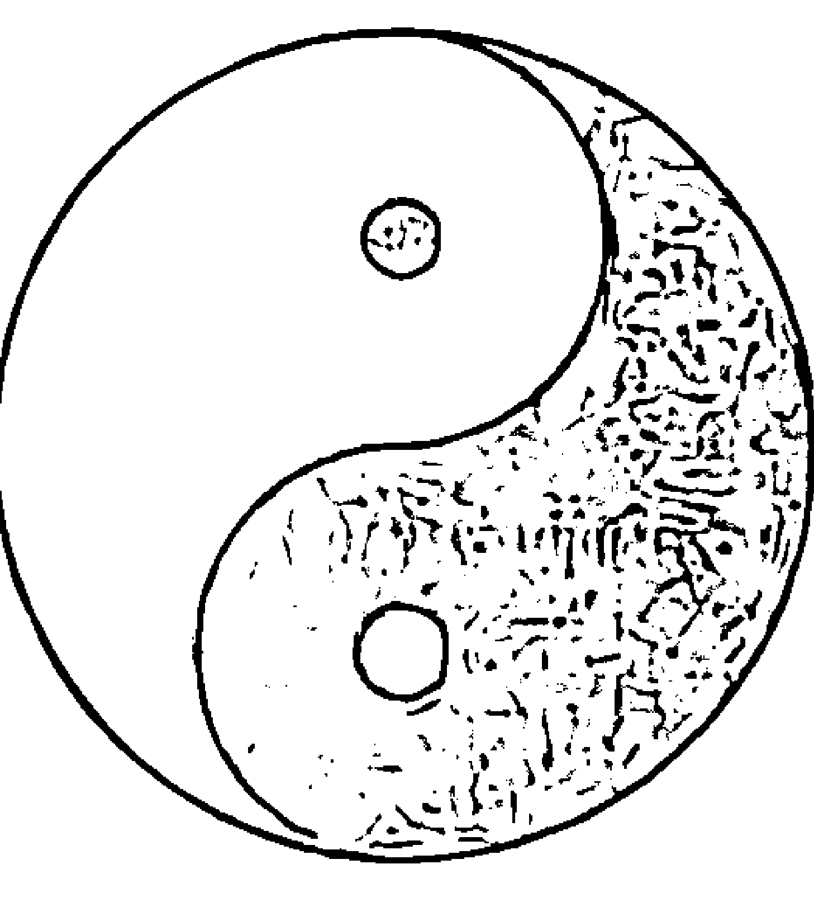

### 对根源物质的认知

| | |
| --- | --- |
| 中国 | 万物根源是为气 气分成阴气与阳气两种 |
| 西洋 | 水是万物的根源（泰利斯1） 万物源自无限者（阿那克西曼德2） 火是根本物质（赫拉克利特3） 四大元素理论（恩培多克勒4） 原子论（德谟克利特5、留基伯6） |
| 现在 | 原子论之实证及发展 |

### 好的气、坏的气

好的气

坏的气

正面影响 取代食物

负面影响 各种毒害 的源头

若能阻止坏的 气进入便能长 生不老

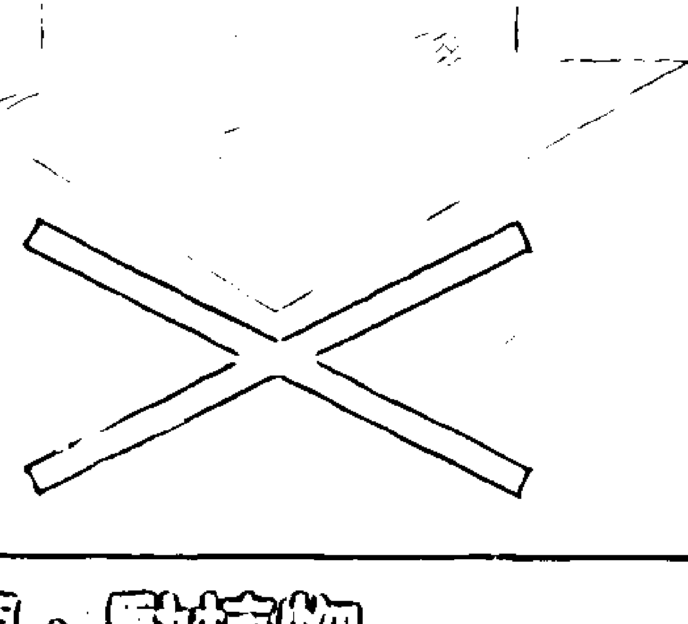

### 人类、动植物

1. 恩培多克勒 (Empedocles)：希腊哲学家、政治人物、诗人、宗教教师和医生。他提出了四元素理论。他相信灵魂不朽，并声称自己是神。据说他跳进了埃特纳火山口以证明自己的神性。
2. 德谟克利特 (Democritus)：希腊哲学家，原子论的创始人之一。他发展了留基伯的原子论，并认为原子在形状、大小、排列方式上有所不同。
3. 留基伯 (Leucippus)：古希腊哲学家，原子论的奠基者。他提出了原子和虚空的概念，认为原子是不可分割的、永恒运动的物质粒子。

### 太陰與太陽

易是中國傳統陰陽道的基礎知識之一。易是種占卜的手法，不過背後有著非常宏大的思想背景。

### 關於八卦

《易經》非但是一本占術山籍，同時也是一部昭示世界構造的宇宙論教科書、人生哲學書。其自然科學的面向權且不論，《易經》在今日仍是部非常出色的哲學書籍，廣受全世界讀者愛戴。

在易的思想裡面，世界乃是始於名為太極的混沌狀態。

而原本一切均未經分化的混沌開始，漸漸地才有「輕」與「重」、「明」與「暗」、「熱」與「冷」，如此而有陰陽之分。這便是所謂的陰陽說。陰與陽又進一步分化出「陽之中的明與暗」、「陰之中的明與暗」；此處的「陽中之陽」便是「太陽」，「陰中之陰」，則稱「太陰」。

關於前述的分化過程，《易經繫辭傳》裡如此記載道：「易有太極，是生兩儀，兩儀生四象…」若繼續分成「陽之陽之陽」、「陽之陽之陰」等八個種類，則稱為八卦。此處所謂的八卦，便是日本諺語「中也八卦，不中也八卦」¹以及相撲行司用來判斷的八卦。

易的代表就是（天體中的）太陽，陰的代表就是月亮，是故根據太陽的運行情況導出的曆法便稱作「太陽曆」，而根據月亮的盈缺所製作的曆法則是「太陰曆」。

在明治6年引進格列高利曆²以前，日本自古向來都是採用太陰曆。此曆法基本上是以月亮的盈缺為1個月、每月有29或30日，但加總起來日數將會比太陽曆短少約10日，故另設閏月以進行調整。

¹ 日本諺語「中也八卦，不中也八卦」：其意為「問卜占卦，有靈也有不靈」。
² 相撲行司：行司是指站在土俵中央主持相撲儀事進行、判定勝負的裁判。在比賽進行中大聲唱出「はつよい、のこった」的吆喝聲，這語音據說是源自「必勝祈願」，只要拼命相撲必定會得到好卦」。
³ 格列高利曆（Gregorian calendar）：即現今普遍使用的陽曆記日系統。它是由教皇格列高利十三世採用儒略曆（Julian calendar）而於1582年所公布的。

### 何謂易經？

- 占術哲學
- 昭示世界構造的自然科學教科書
- 人生哲學書（直至今日仍是非常出色的哲學書，廣受全世界愛讀）

### 太極生萬物

太極

混沌狀態

- 輕（陽）
- 重（陰）

- 明（陽中之陽 太陽）
- 暗
- 明
- 暗（陰中之陰 太陰）

- 熱
- 冷
- 熱
- 冷
- 熱
- 冷
- 熱
- 冷

分化成萬物

輕・明・熱etc. 陽的極致→太陽（天）
重・暗・冷etc. 陰的極致→月（地）

### 五行之世界觀與相互關係

五行是我國古代的一個樸素理論——五行說。

### 五行相生相剋循行不怠

我們稱作五行的五種元素，便是眾人皆知的「木·火·土·金·水」，而五行說便是主張此五種元素會相互影響，並藉此說明世間森羅萬象的自然科學。

五行的歷史極為悠久，至少商周時期便已經存在。

《書經》（四書五經當中《書經》的古名）描述五行的性質：

> 「一曰水，二曰火，三曰木，四曰金，五曰土。水曰潤下，火曰炎上，木曰曲直，金曰從革，土曰稼穡。」接著又說：「潤下作鹹，炎上作苦，曲直作酸，從革作辛，稼穡作甘。」

這段話的意思是說——水擁有濕潤、向下流動的性質；火則是炎熱、向上升起的性質；木有曲有直，擁有成長的性質；金則是可以任意變形形狀的性質；土則是有助萬物生育、可以栽種收穫的性質。除此以外，五行還可各自對應至五種味道，例如鹹就是指鹽分的鹹味。

若將世間所有萬事萬物以其特徵進行聯想、分門別類為「木·火·土·金·水」五行，便能將森羅萬象全部分類整理成五個種類。以方位為例，太陽「昇起」的東方屬「木」、太陽「落下」的西方屬「金」（具收縮之特性）。

雖然聽起來很像物質所導出的「木·火·土·金·水」特性有時讓人摸不著頭腦，不過五行說乃是根據眾人經驗孕肓生成的自然觀，最重要的是當時習慣將所有物質一概分成五類。

此外，由於相生相剋的概念，使得五行說繼續進化、愈趨...

- 水：濕潤。向下流動的性質
- 火：炙熱。向上升起的性質
- 木：有曲有直、成長的性質
- 金：容易變化的性質
- 土：生育萬物、有助收穫的性質

將各種物質、特性、狀態分類成五行，解釋其間對應關係藉以說明萬物事理

例：太陽「昇起」的東方屬「木」、太陽「落下（收縮）」的西方屬「金」

儘管方法與現代不同，但同樣都是在解釋自然的事象

### 自然科學

從五行說的發展、社會變化

後來五行說又衍生出相生相剋的概念

五行各自發展出相互對應關係。從此五行便不再只是分類，而可以對應五行得知事物的相互關係

例：罹患熱病（體內火氣旺）

水可以滅火

攝取含水氣、能夠減卻火氣的食物便可控

### 五方與五時

「陰陽五行說」中與人類生活最為息息相關的當屬五方（方位）以及五時（時間）」。

（一）五方與五時的衍現遞嬗

陰陽五行說將世事萬物一概分成五類，如五獸、五蟲、五音、五味、五臟等，而陰陽術最最重視的，當屬五方與五時。

五方首先是根據日出日落的方位，把東方設定為具有伸張意味的「木」，把西方設定為會收縮的「金」。其次，北方屬「水」、南方屬「火」，這是因為寒冷為「水」、暑熱為「火」的緣故。而「土」是萬物的基礎並且無所不在，故而位在中央。

若能夠據前述對應關係，自然就不難理解「五色」。東方屬「木」是為青，南方屬「火」是為赤。「金」的顏色是白色而非黃色，那是因為在中國的西邊盡有高山長年蒙著皓皓白雪的緣故。北方屬「水」是為黑，屬黃色位於中央，此即中國的土地盡為黃土所覆之故。

另一方面，五時則是將春夏秋冬四季分別對應至五行。

春季是成長的季節故屬「木」，夏季炎熱故屬「火」，秋季作物結實收成屬「金」（另有一說指秋季要用金屬製刀器收割穀物，使然），冬季寒冷故屬「水」。四季各自屬性已定，再無其他季節可供分配於「土」，於是遂將季節與季節更迭交替的期間屬「土」。

日語有句俗諺「土用丑日吃鰻魚」，此處所謂土用便是源自陰陽五行說的用語。

總之，「五方、五時」只不過是將萬事萬物分類為五行的最基本原則，但若要成為陰陽師者必須對所有的五行分類了然於胸方可。

《五行類記》便是記載所有五行分類的書籍。

【註1】土用丑日吃鰻魚：日本有「土用丑日吃鰻魚」的習慣（其實是商人炒作行銷的手段），此處所指的土用便是指夏季的土用，故而單稱「土用」時日本人所想的便是夏季的土用。

### 容易變化的性質

### 五時→將四季分別對應至五行

| 五行 | 說明 |
|------|------|
| 木 | 草木萌芽的季節，屬「木」 |
| 火 | 炎熱的季節，屬「火」 |
| 金 | 草木枯萎的季節，故具收縮屬性的「金」（另說是持金屬刀器收割的季節，故然） |
| 水 | 寒冷的季節，屬「水」 |
| 土 | 萬物的基礎，無所不在的「土」 |

在五行的基礎上，將其他事物的概念全部分成五個屬性……（圖片中段落文字，因清晰度限制，保留可識別部分）

### 五行相生相克说

占卜师为何要学习五行说、熟悉各种分类，其目的便是要利用五行相生相克进行占卜。

五行的消长生克
把自然界中的五种材料相聚在一起就会相互影响产生不同结果，而这些影响和结果又可以分成好坏两种。
某一种材料变成另一种材料的正向相关性就叫做相生，相反地，会造成伤害折损的负向相关性则是称作相克。
所谓相生，其实是在观察某现象孕生出其他事物时所产生的观念，代表了「阳的关系」。
让我们按照顺序看下去。木生火是指木材燃烧孕生出火焰的情景；火生土是指燃烧成灰烬的模样；土生金是指从土壤里挖掘出金属的模样；其次金生水则是指金属表面有水滴凝固附着的状态；最后水生木所呈现的则是树木得到水的滋润而成长的情形。

若将这个相生的循环整理成简单的图式便是「木→火→土→金→水……」。这个循环变化的循环就是正确的、或者说是正向的相关性。
相反地，会造成不良结果的相克则是代表会「克制对方」的阴的关系。

将相克的循环图式化则是「木→土→水→火→金……」。此循环恰恰与相生颠倒。木克土是指树木扎根在地底吸取养分的情景；土克水是指土壤能吸收水份、阻绝水势；水克火指的当然是水能灭火；火克金则是指火能够熔解金属；而金克木则是锋利的刀斧可以砍伤甚至伐倒树木。

五行相克的思想不仅仅是阴阳道，甚至对易、风水、中医、乃至其他所有源自中国的文化都有莫大影响力，而日本在将阴阳道内化之后，五行相生相克的影响亦同样根深蒂固地留存在其社会文化之中。

### 五行相生相克圖

| 木生火 | 木材燃烧孕肓火炎 |
| 火生土 | 火災燃燒產生灰燼 |
| 土生金 | 從土壤裡面挖出金屬 |
| 金生水 | 金屬表面有水滴凝結 |
| 水生木 | 樹木得到水的滋潤而成長 |

| 木剋土 | 樹木紮根在地底吸取養分 |
| 土剋水 | 土能吸取水份、阻絕水勢 |
| 水剋火 | 水能滅火 |
| 火剋金 | 火能夠熔解金屬 |
| 金剋木 | 金屬製的刀斧可以砍倒甚至伐倒樹木 |

### 相生相剋的思想

對各種事物概念都有影響

- 風水
- 中醫
- 飲食料理

### 十二支

支至今還會被用來表示年份，而且月曆也都還有使用，對我們來說一點也不陌生。

### ( )你的生肖是？

十干始自甲乙，十二支則以子丑為首。其實所謂的干支也是相源自陰陽道，或者更準確的說，應該說它是種起源自陰陽道的思想——中國哲學的概念。

古代中國是使用十干與十二支來計算年月日。十干輪過一回就是十日，謂之「一旬」，三旬為一月；十二支各自代表一個月，十二月為一年。干支便是如此用於表徵日月流逝的計數用。

關於十干的十個字和十二支的十二個字有何涵意，向來都是眾說紛紜，不過大致來說不外乎是在描述植物成長茁壯的模樣。

各種說法族繁不及備載，此處僅舉一例說明之。在十干裡，甲是指種籽牢牢閉合的狀態；乙是描述種籽彎曲生長冒出地面的樣子；丙是發芽；丁是描述植物成長途中的樣子；戊是指草木欣欣茂盛；已則是代表植物繁茂時的秩序；庚字通「更」，是指完全成熟的狀態；辛是指發生變化而有新的產物；壬字通「妊」，指孕有後代；癸則是留下種籽以待重獲新生的機會。

同樣地，十二支也可以不作十二種動物來解釋，而是將其解讀為植物狀態的十二個過程。

十二支的子是萬物萌芽；丑是嫩芽成長；寅是指人類拉拔冒出的芽使其成長；卯是植物長成後覆蓋地面；辰字通「振」，是指植物振動的模樣；巳是指停止震動；午是指枝葉交錯；未是描述植物開始衰退；申是植物精疲力竭的模樣；酉是顯露老態；戌是植物凋零；以後的亥則是描述閉守核內的模樣。

| 五行 | 阴阳 | 意涵 |
|------|------|------|
| 木 (き) | 兄 (阳) | 种子牢牢闭合 |
| | 弟 (阴) | 种子弯曲生长冒出地面 |
| 火 (ひ) | 兄 (阳) | 发芽 |
| | 弟 (阴) | 植物成长途中的样子 |
| 土 (つち) | 兄 (阳) | 草木愈显茂盛 |
| | 弟 (阴) | 植物繁茂时的秩序 |
| 金 (かね) | 兄 (阳) | 完全成熟 |
| | 弟 (阴) | 发生变化 |
| 水 (みず) | 兄 (阳) | 孕育后代 |
| | 弟 (阴) | 等待迎接新生的机会 |

兄（）为「阳」，弟（と）为「阴」
「枝干」（えと）的读音便是源自于「兄弟」（えと）

| 动物名 | 意涵 |
|--------|------|
| 鼠 | 萌芽 |
| 牛 | 嫩芽成长 |
| 虎 | 人类拉拔幼芽使其成长 |
| 兔 | 植物长成后扎根地面 |
| 龙 | 植物运动 |
| 蛇 | 停止运动 |
| 马 | 枝叶交错 |
| 羊 | 开始衰退 |
| 猴 | 精疲力竭的模样 |
| 鸡 | 显露老态 |
| 狗 | 灭亡 |
| 猪 | 闭守核内 |

### 穢的概念

> 穢是指微生物的死亡、災害、穢物等各种污穢，而處理這些污穢是檢非違使的工作。

(一)被認為忌諱的事物
所謂的穢可以定義為「因為會對人類在感官上造成不快，故而特別受到忌諱、某種能夠招致災害或死亡的不明存在（惡靈）所發揮的負面作用。

具體來說，人畜的死亡、生產、罪惡和疫病都被視為污穢。觸碰污穢也就等於是受污穢所囚、遭其支配，人類對此往往是避之唯恐不及。所以人類才會透過忌（物忌）以求事先規避，倘若不幸沾染到污穢，便要舉行祓禊藉以脫離該狀態。

陰陽道的旨趣是在利陰陽五行說的自然哲學以「預知災禍於未然」，故陰陽道與此思想中有關忌避的部份關係尤為密切，甚至可以說這就是為何陰陽道能在轉眼間便滲透日本的理由之一。

話雖如此，人類總無法完全規避日常生活中自然產生的穢物，於是遂有專門處理污穢的機關成立，即檢非違使。

檢非違使屬於令外官，意即並非依律令*規定所設立的律令制外官吏。

檢非違使是包辦司法權與警察權的治安維持組織，但由於此組織平時就必須直接接觸罪惡與死亡等污穢事物，所以當內裏*發生的時候，也是由檢非違使負責處理。

包辦罪惡與死亡諸事的檢非違使在從平安中期到中世的四百年間內，正可謂是全權負責清理授除國家穢厄的機關。

此外，實際動手處理穢物的其實都是徒刑囚犯、放免*和官奴等人。穢的概念甚至還影響到了後世的社會階級歧視觀念。不過當時仍舊認為穢是可以透過祓禊得到洗淨的，直到中世才出現了污穢會一直留在人類體內的觀念。

*律令：「律」相當於刑法，「令」則相當於行政法。古代東亞地區歷屢可見律令制度作為中央集權統治制度。日本的律令制度主要是根據中國唐朝的貞觀律令（701年）、養老律令（718年）所建立。 *內裏：天皇居住的宮殿、皇宮。 *放免（ほうめん）：隸屬於檢非違使廳的低等官差。這些人都是完成刑期的囚犯、流刑、徒刑將放免者，負責搜索、護送罪犯等工作。

災害和死亡會產生穢，同時穢也會引發災害或死亡災害和死亡會產生穢，同時穢也會引發災害或死亡。

### 如何才能避免遭逢灾祸？

檢非違使不僅是搜查犯罪的警察機關、審判嫌犯的司法組織、執行死刑作業，所有「穢厄處理工作」一概交其辦理（在檢非違使局下工作的徒刑囚犯、放免、官寺奴婢）

### 道教方術的影響

提到陰陽術，令人聯想到如今已是廣受各方認同的主流論述，然而，其在咒術技術層面卻很明顯地深受方術影響。

## 一、道教技術之源流

道教乃是中國自古傳承至今的諸多思想之一。簡單來說，道教既是種宗教，也是種魔法。道教基本上是種向仙人抑或更高等級的神明獻祈禱，藉此祈求神仙為自己實現願望的思想。此外道教還提供修行者以追求「操縱萬物之根本——氣，進而成仙」為目標。

道教還有種用於實現短程願望的技術，喚作「方技」、「方術」。

方術涵蓋「占術」、「風水」、「死靈操縱術」、「成仙的最終儀式」等技術，這些技術是在傳進日本以後才被吸收採納至陰陽道的儀式之中。

譬如像道教有種名為「禹步」的咒術步法，後來就被陰陽道所採用，成為反閉儀式的一部份。禹步便相當於西洋魔法所謂「繪製魔法陣」，或「淨化施術場所」，屬於施行法術前的準備作業。

方術還有種「操縱紙偶的法術」，此法術後來更演變成為陰陽道的式神。另外，這種法術也不禁讓人聯想到除穢人偶。

除此以外，道教還有各種占術和風水堪輿地相之術流傳至陰陽道。

至於星辰信仰也是相同，譬如道教的泰山府君等神明亦頗受陰陽道的崇敬祭祀。

方位的吉凶和使用靈符也都是源自於方術的技術，這些技術在陰陽道相當盛行，即便在日本亦頗為人知。附帶一提，去神社寺廟求取的「御守」，其實就是由道教的靈符演變而來。

由此可見，陰陽道在咒術面向正可謂是處處深受方術影響。

（譯註：在日本的除穢法術，基本上是用紙剪成人偶狀、摩擦身體，藉此將穢轉移到紙人，之後再將紙人處理掉。）

## 阴阳道之源流

- 方技·方术（实现短程愿望的技术）
  - 占术 ──→
  - 风水 ──→
  - 死灵操纵术
  - 成仙的最终仪式 ──→
  - 式神、反闭的原始法术等 ──→

## 从中国传入阴阳道的技法

- 道教（左侧） → 阴阳道（右侧）
  - 踏步（净化施术场所的咒术步法） → 反闭
  - 见神明（如泰山府君） → 泰山府君祭等
  - 占术 → 占术
  - 风水 → 风水
  - 地相术 → 方位的吉凶
  - 咒符的使用 → 咒符（后演变为神社的御守）

阴阳道在咒术面向受道教影响的色彩尤其浓厚。

- ○ 符咒的制作方法→No.047
- ○ 驱使式神→No.060

### 陰陽寮之設立

陰陽寮

陰陽寮是朝廷為卜問天意而設置的機關，其成立經緯與天皇有很大的關係。

## 侍奉天神與天皇的機關

日本約莫是在西元7世紀時建構了名為朝廷的中國式政府機構，其下設有卜問神意的官署神祇官和卜問天意的陰陽寮。在政府體制中設立專職占卜和祭祀等事的機關，在當時來說可謂是再理所當然不過的事情。

神意與天意看似相同實則不然，兩者的差異跟天皇有關。

最先使用天皇此稱號的其實是中國的唐高宗，這是發生在西元674年的事情。後來此事傳至日本，由天武天皇率先以天皇自稱，直到持統3年（689）飛鳥淨御原令才正式採用、從此改了稱謂。附帶說明，在此之前神武～弘文的歷代統治者向來是以「大王（おおきみ）」自稱。

所謂的大王便是指脈承天照大神*的神族子孫，故統治民眾時勢必要假託神的意向＝神意來施政治，在朝廷內設置神祇官自然也是非常理所當然的事情。然而當統治者要改採中國式的天皇稱號時，情況便又有不同了。

中國的統治者乃是援天命（天的命令）統治世界，換言之也就是得到上天認同的皇帝，故名「天皇」。

既然要使用天皇稱號，那麼就算在日本也同樣必須要營造出日本的統治者得到上天認可的形象。儘管如此有些矛盾，但日本的統治者明明就是活在人間的神祇，卻還是要尋求天的後援。

中國會透過星辰運行和各種異象來忖度天意，而日本同樣也設有陰陽寮，觀測自然現象以問天意，陰陽寮與陰陽道便是如此誕生的產物。

* 伊勢神宮內宮稱之為「天照大御神」，外宮稱之為「天照坐皇大御神」。日本神話中的太陽女神，日本天皇奉為祖神。

### 1 1 1 天空之陰陽寮。卜問神意的神祇官

1 1 1 原先是由活在人間的神族後裔根據「神意」治國

1 1 1 神祇官便已經足夠

(6) 60年飛鳥淨御原令：將「大王」變更為「天皇」

既然要稱「天皇」，除神意以外勢必還要得到上天認可

為了表示受到上天認可支持，遂設陰陽寮以問天意

## 1 1 1 平城京以後決定政策的流程

## 陰陽寮的官方業務

在奈良、平安時代隸屬於中務省的陰陽寮是個官署組織，在陰陽寮任職的官吏相當於奈良平安時代的國家公務員。

#### 國家公務員

陰陽寮的陰陽師的官方業務大致可以分成四個項目。四項業務分別是卜筮、曆法、天文、漏刻，每項業務均有各自的部署、配置有專門人員。

所謂卜筮（亦作卜占、占筮）就是指占卜，此業務乃由陰陽部負責；除負責占卜天災、兵禍、政變等國家災異以外，還要相地（意即運用風水判斷土地是吉是凶）。陰陽部門正如其名所示，也可謂是陰陽師最專門最擅長之領域。其實本來只有負責此部分業務者才叫做陰陽師，後來才漸漸地連陰陽寮的在職職員、陰陽職職員、所有具備卜筮能力者也都被稱呼為陰陽師。

曆部門的業務是要根據陰陽五行說製作曆書，天文部門的業務則是觀測天文與氣象，報告自然界發生的異象變化。

漏刻（亦作漏尅）部門的漏刻二字其實就是水鐘的意思。此部門是由一群叫做守辰丁的官員率領，專責在固定時刻鳴鐘擊鼓報時。

陰陽寮各部門均設有10個學生（漏刻部門除外），它既是政府機關同時卻又擁有學院的功能，這也是陰陽寮的一大特徵。由於從事陰陽術必須具備高度知識，所以陰陽寮必須像大學的研究機構一樣，隨時培養繼任者。

陰陽五行說在當時屬於最尖端科學，陰陽師更是掌握了國家最高水準的神秘技術。包括卜筮在內，陰陽師實際業務的技術色彩相當濃厚，與一般所說『操縱式神和符咒的魔法師』形象有很大的區別。

- **卜筮部門**
  - 就國家災異（天災、兵禍、政變）進行占卜
  - 相地（判斷土地吉凶）
- **曆法部門**
  - 根據陰陽五行說製作曆書
- **天文部門**
  - 觀測天文
  - 觀測氣象
  - 報告自然界發生的異象
- **漏刻部門**
  - 使用水鐘計算測定時間
  - 負責以鐘鼓報時

各部門都設有學生，教導學生將其培育成合格陰陽師也是各部門的業務。

## 後來的陰陽師的職役名稱演變成指稱全體陰陽師的用語

原來的陰陽師：在平安時代，陰陽寮陰陽部門底下從事陰陽術工作者的職役名稱。除了他們以外，還有即使同屬陰陽寮其他部門，例如陰陽博士等職者，均不稱之為陰陽師。

後來的陰陽師：現在陰陽師已經不問職役，而是成為指稱所有習得陰陽之術人士的用語。是故，不管是隸屬於陰陽寮其他部門者抑或原本就不在陰陽寮編制內的法師陰陽師等，也都可以稱作是陰陽師。

## 陰陽寮的組織

以下是組織中的各種職役與階級的結構。

## 陰陽寮組織裡的地位與職役

養老2年（718）制定的法律養老令當中有條名為職員令的條文。朝廷設立當初的各個官廳和職役幾乎全部都記載在這條法令中。

首先，在陰陽寮的高層共有四種事務職位：陰陽寮的長官陰陽頭、輔佐陰陽頭的副官陰陽助、監督法規執行的判官陰陽允，以及負責處理文書事務的陰陽屬。

這些管理職底下則設有實務部門，即陰陽、曆、天文、漏刻四個部門。

陰陽部門底下設有陰陽師、陰陽博士、陰陽得業生和陰陽生。陰陽師負責占術、相地（風水）的實務；陰陽博士的職務則是教授陰陽的思想和技術傳授予陰陽得業生與陰陽生；至於陰陽得業生和陰陽生則是以成為專門官僚為目標的學生。

曆部門與天文部門並無教師職位。曆博士、天文博士兼任實務與教職，而曆得業生、曆生、天文得業生、天文生便即所謂的學生官僚。

漏刻部門設有漏刻博士，負責使用漏刻（水鐘）管理時刻。其下設有守辰丁為其輔佐職，負責監視漏刻通報時刻。漏刻部門似乎並沒有學生的員額設置，繼任的漏刻博士應是從守辰丁裡面擇一接任。

此外，陰陽寮在前述職役之下還另有使部與直丁；此二者屬於雜役職的性質。不單單只是陰陽寮，許多官署單位也都會用到使部和直丁。

至於陰陽寮所隸屬的中務省，則是負責服侍天皇等宮中事務、並處理詔位職等文書、戶籍等資料的機關。

由此可見陰陽師的職務原本是專為天皇與國家（而非貴族個人）行使陰陽道的技術與儀式，至少在當時仍是如此。

## 平安京的役職組織圖

※（）為規定員額

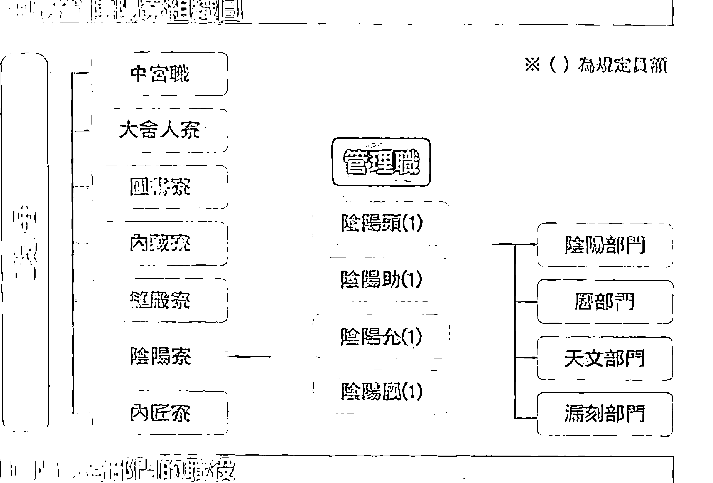

## 平安京的陰陽寮的構成

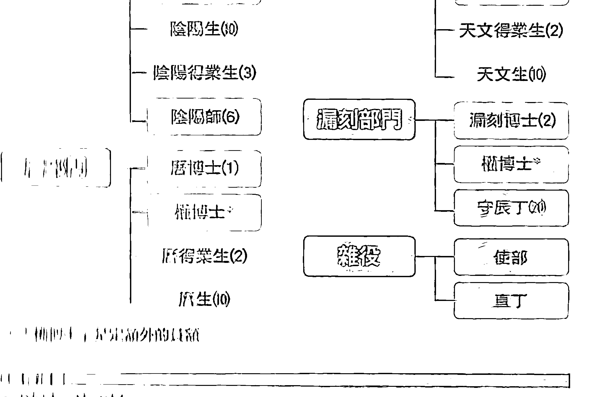

## 亡人陰陽師

陰陽師本來是以觀天文察天意並研擬應對之策，以及製作曆書而仕於天子的技術性官僚，直到後來才又衍生出了新的職務。

#### 從技術性官僚演變成咒術師

雖然說聚落中會自然而然地產生咒術師和巫女等職能者，但陰陽師卻是因國家之意向方才應運而生的職業。如果我們將身為「亡人」的陰陽師視為各種充滿奇幻氛圍的魔法師的其中一員，那麼就不得不說它是個非常罕見的個案。

就在陰陽寮成立當初，奈良時代陰陽師的職責是要觀測關乎國家大事的陰陽之氣，這便是陰陽師原來的工作內容。

事實上，奈良朝陰陽師的代表人物大津連大浦便曾經在藤原仲麻呂之亂、和氣王謀反等重大事件當中，利用占卜影響左右朝廷的命運。

然而情況卻在進入平安時代以後發生變化；自從觸穢的概念因《延喜式》法令而得到法制化、貴族開始避忌穢厄以後，陰陽師的角色便有了很大的變化。陰陽師的工作就是從這時開始逐漸演變為防止穢入侵擴散、祓禊除穢。

當然陰陽師當然也會從事解讀氣象、製作曆書和舉行儀式祈禱國家平安等工作，可是陰陽師進入平安時期以後突然大放異彩的原因終究還是要歸結於「除厄文化的流行」。

雖說在眾多陰陽師當中最「偉大」的陰陽師其實並非陰陽寮的官員或陰陽頭，而是直屬天皇的藏人所陰陽師。所謂的藏人所簡單來說就是負責處理天皇身邊所有事務的職役，而藏人所陰陽師的工作則是專為天皇個人從事占卜、舉行儀式，因此最受天皇信賴，地位崇高。

根據《朝野群載》第五卷記載，鼎鼎大名的安倍晴明和賀茂光榮便都曾經在長德元年（995）擔任一条天皇的藏人所陰陽師。

1.  藏人所：在宮中服侍任職的人。
2.  藤原仲麻呂之亂：奈良時代（764年）的內亂，亦稱「忠美押勝之亂」。跟孝謙天皇不和的太師（太政大臣）藤原仲麻呂（忠美押勝）興起叛亂，最後遭到誅殺。
3.  和氣王謀反：和氣王是在藤原仲麻呂之亂當中將仲麻呂動向密告朝廷，因而平亂有功的人。但隔年（765年）卻被發現企圖詛咒稱德天皇、將天皇位據為己有，因而被流放至隱岐島，最後在流放途中遭殺害而亡。

### 1. 陰陽寮的職員

陰陽師的工作是負責觀測攸關國運盛衰的陰陽之氣。他們是律令制下訂定的國家技術官僚。

陰陽寮概念的法制化 → 進入平安時代以後陰陽師的主要工作就變成如何處理貴族個人的厄運。

### 1. 何謂陰陽師？

#### 陰陽道的第一人

陰陽頭：雖然是陰陽寮的長官，但卻未必就是陰陽道的第一人。前任陰陽頭、藏人所陰陽師等，是當時陰陽道技能最優秀者。就算已經退休，就算不是陰陽頭而是天文博士，只要最能夠掌握陰陽道應用自如，便是陰陽道的第一人。

#### 藏人所陰陽師

指的是服務於藏人所、從事占卜的陰陽師，並非陰陽寮的職役名。藏人所陰陽師的工作攸關天皇的占卜，所以其首要條件當然就是陰陽道的技術與知識。因此，說各時代的藏人所陰陽師就是陰陽道的第一人，也絕非妄言。

相關人物：○安倍晴明→No.067　◎賀茂光榮→No.078

《占事略決》：是平安時代的天文、立宮、官符、告札等各類占事的文獻，成於西元1116年，不過後來又有增補。

### 曆博士

「曆博士」一詞具有「知道時間」的涵意，從而衍生出預測未來規避災厄的意義，而負責擔任該部門職務的長官便是曆博士。

#### 因為紙張屬於貴重物品

所謂曆法乃是人類觀測、預測天體動向，將其圖式化藉以預測未來會發生什麼事情所製作出來的一套系統。曆法在中國甚至被認為與為政者的政治理念結合，被視為國家的重要法典。古代日本原先是透過從中國輸入曆書來滿足對曆法的需求。自從從製曆的技術傳進日本、國內開始自行製曆以來，曆法卻也逐漸被吸收納入日本的律令體制；只不過當時所使用的始終都是以中國技術製成的宣明曆（日本人自製曆法系統乃以江戶時代澀川春海的貞享曆為先河）。日本朝廷的製曆工作是由陰陽寮的曆部門負責，其首長即為曆博士。曆部門的主要職務有二：造曆（編纂曆書）與頒曆（發送曆書）。曆部門必須在前一年準備數量足供分發給各官署機關（約160份）的具注曆（附有各種註解可供判斷吉凶的曆書），先在11月1日舉行名為御曆奏的儀式、將曆書獻予天皇，然後再分送給京中的各部各署。然而該儀式卻早在9世紀前後便遭到簡略化、形式化。用來製作曆書的紙張屬於貴重物品，經常短缺不足，便是其中相當重要的原因。儘管如此貴族還是有用曆的需求，因此家境寬裕的貴族大多會自備紙張，請熟諳曆法的陰陽師代為書寫製曆。換句話說，曆書的流通已經從官方業務變成了非官方業務。自從11世紀賀茂氏排除其他氏族獨佔曆道，曆道形同賀茂氏的家業以來，日本曆學便呈現停滯狀態遲遲不前，情況甚至還嚴重到江戶幕府當權者特地下令設法改善。

註：曆法：參見P022「律令」註。

## 中國與日本曆法對比

| 特點 | 中國 | 日本 |
| :--- | :--- | :--- |
| **目的** | 為了預測未來並擬定對策 | 為了預測未來並擬定對策 |
| **更新頻率** | 時時有新曆完成、不斷更新 | 技術停滯不前 |
| **技術狀況** | - | 從明治至江戶前期800年來，一直是使用宣明曆，甚至曾有當權者勒令改善 |
| **技術來源** | - | 制曆技術從中國傳進日本（最晚於6世紀傳入） |
| **曆書採用** | - | 傳入日本的曆書數量不多，得到採用的曆書更是少之又少，元嘉曆、儀鳳曆、大衍曆、五紀曆、宣明曆 |
| **壟斷與停滯** | - | 賀茂氏從平安末期便獨占曆道直至中世。缺乏競爭，停滯情形愈发嚴重 |
| **備註** | 1. 制曆本是天皇的特權 | |

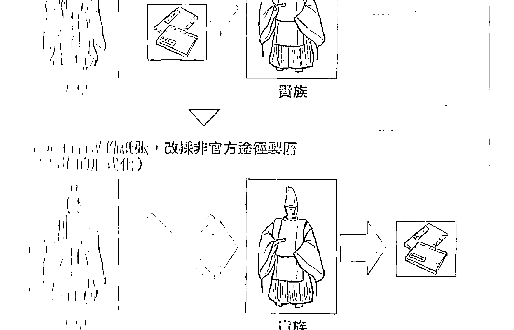

## 陰陽師的日常生活

> 我們常常會對陰陽師是何人物、做什么工作、使用什麼法術多有想像，究竟陰陽師真實的日常生活是何模樣？

#### （一）《師守記》的記錄

《師守記》（曆應2年（1339）~應安7年（1374））乃南北朝時代的公卿中原師守所著。此書內容是名低階公卿的日常生活記錄，其中記載室町幕府掌權下朝廷（北朝）當時的社會情勢，是非常珍貴的歷史資料。

中原家任職於院文殿，而《師守記》裡面便記錄了當時陰陽道的相關實際業務內容。據其記載，陰陽師的日常業務大致上可以分成六個項目：

首先是時刻與方位的宣導。陰陽師會用占卜替貴族決定實施政務的日期時刻與場所。

第二是祈禱方面的宣導。準備各種祭祀儀式，並主持實施之。

第三是撫物。祈禱時陰陽師會準備人偶讓貴族在身上摩擦、祓除穢厄，然後陰陽師就會祈禱使穢厄轉移至人偶身上。

第四是呈奏曆書。陰陽師會在11月將明年的曆書向上呈奏，他們很早就會開始為獻曆作準備。

第五是天皇行幸時同道伴駕。貞和4年（1348）4月天皇行幸賀茂清水八幡宮，便曾經有陰陽師伴駕隨行。舉行特別儀式祈求旅途平安也是陰陽師的重要任務之一。

最後是觸穢禁忌。倘若發生疫病、死亡、生產等穢事，則神事須往後延期，群臣必須暫停上朝議政。欲將神事押後，一定要查核往例、分析吉凶。

#### 陰陽師的日常事務

- **知識與方位的宣導**：占卜貴族實施政務的日期時刻與場所。
- **時的宣導**：準備、執行各種祭祀。
- **用物**：準備轉移穢厄、行祓禊的人偶。
- **曆法曆書**：每年11月呈奏明年的曆書。
- **伴行幸**：皇帝行幸時伴駕隨行，占卜祈禱使旅途平安。
- **神事變更**：發生疫病、死亡、生產等穢厄時變更神事等日程。

對於朝廷和貴族而言，占斷吉凶至關重要。他們會委託陰陽師調查適合的日期與時刻，並且確保方位的安全。無論是方位的宣導、曆法和神事安排全部不出占斷吉凶的範圍，而這也是陰陽師的主要工作。

> **《師守記》**
> 別名《中原師守記》，在各種不同紙張的空白處和欄外（當時紙張昂貴，所以利用空白處）記錄的日記。記載了從曆應2年（1339）到應安7年（1374）年間中原師守作為公家（公卿）的日常生活與見聞，是了解南北朝時代社會狀況的貴重史料。中原師守的親筆原稿現收藏於日本宮內廳書陵部。

### 法師陰陽師

> 人們自然地想請人替自己祓禊解厄，而法師陰陽師便是滿足庶民此需求的職業。

#### （二）法師陰陽師

陰陽道儀式在平安時代貴族階級蔚為流行，有時還會在民眾目光所及處舉行儀式，結果使得民眾階層也對陰陽術產生了興趣與需求。於是乎，原本就在民間與民眾共同生活的僧侶遂開始做起「類似」陰陽之術的行當，這些僧侶便是所謂的法師陰陽師。

其實陰陽之術本來就是由來自中國的知識與日本固有的神道信仰揉合而成，所以後來陰陽術再次跟從印度經由中國傳至日本的佛教（密教）祈禱儀式習合也是不無可能發生，甚至可以說是相當自然的事情。

不僅如此，貴族間甚至還曾經時興一方面聘請陰陽師行祭祀、一方面聘請僧侶行祈禱。雙管齊下效果想必更佳，雖然這樣便無法得知究竟是何者發揮功效，總而言之最重要的就是「只要有效就好」，這種想法在當時似乎相當普遍。

後來朝廷的陰陽師逐漸受到密教咒術影響，相對地，在野的法師僧侶也開始受到陰陽咒術的影響。於是乎非正規、非正統的法師陰陽師遂得以民間陰陽師的身份，使得陰陽道在世間廣為流傳。

另一方面，貴族們對這些法師陰陽師卻經常投以冷淡輕視的眼光。以《源氏物語》聞名於世的紫式部另外有部名為《紫式部日記》的和歌集，其中便有首和歌如此寫道：「彌生朔日出河原，身著法師紙冠，厥其故作博士態，矯揉造作不可耐，祓禊祭神之行列，鄙俗恰如耳後髷。」，這首和歌的意思是說「3月1日在河原，排列车有個法師陰陽師頭戴紙冠，裝作一副博士的模樣，實在受不了」。

由此可以很明顯地看到，法師陰陽師往往被貴族視為山楽版的宮廷人陰陽師，很不受歡迎。

* 耳後髷：平安時代女性會把發髷夾在左右耳後，如此行動較為方便，卻被視為非常下流的行為。

## 何謂陰陽師？

- **官人陰陽師**：國家公務員，（正規的）陰陽師。
- **法師陰陽師**：因民間對陰陽師的需求愈來愈大、應運而生的職業。一般大眾對陰陽師開始感興趣，而有新的需求。
  - 需求增加，但官人陰陽師相當稀少。
  - 民眾：「只要有效，就算非正規也無妨」。
- **僧侶、修驗者開始做起「類似」陰陽之術的行當**。

#### 法師陰陽師周圍關係圖

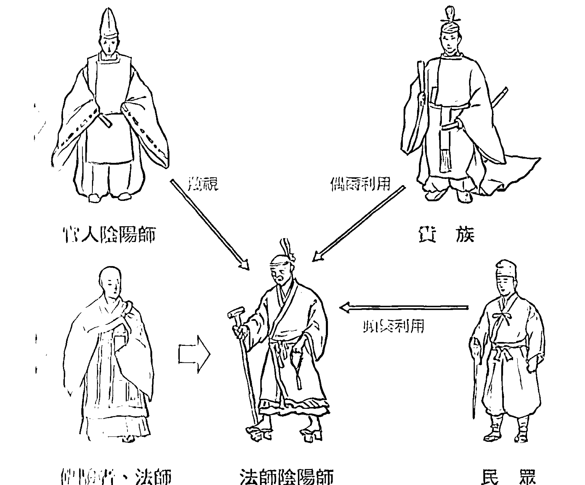

修驗者，修驗道之人。修驗者此語是從「修行得驗」而來，用於總稱一切山林修行者。

### 隱陰陽師

陰陽師並不只官人陰陽師和法師陰陽師，其技術流到民間之後，產生了能夠行使詛咒等技術的隱陰陽師。

#### 一、隱陰陽師

所謂隱陰陽師就是未在朝廷任職的民間陰陽師。隱陰陽師是指既非官人陰陽師、亦不屬法師陰陽師的隱陰陽師。

隱陰陽師可謂是龍蛇混雜，其中不乏不入流的陰陽師、遭放逐的罪犯，以及由法師陰陽師和其他隱陰陽師領進門的陰陽師。事實上大多數隱陰陽師都跟職業騙子差不多，但事實上倒也不能一竿子打翻一船人。

眾多隱陰陽師的相關故事當中，便屬《宇治拾遺物語》[1]裡小野茂助的故事最為著名。《今昔物語集》[2]裡面同樣也有記載山際的故事。

小野茂助官拜算博士，所謂算博士其實是個隸屬於大學寮的官職，負責教授學生算術，相當於現在的數學教授。某日茂助家裡得到了一則很是奇怪的神託。他向頗負盛名的陰陽師谘詢此事，陰陽師遂寫下絕對要嚴守物忌的日期交給茂助，於是茂助當天便依照指示，閉門物忌。這件事其實是有人對茂助心懷妒忌，遂雇用隱陰陽師向茂助施下死咒。隱陰陽師說，只消聽到茂助的聲音，詛咒就必然成功。於是乎那名不懷好意的男子便把隱陰陽師帶往茂助家，想方設法讓兩人打照面。茂助起初只是遣僕人回絕訪客，可是實在拗不過對方的死纏爛打。所以茂助就從窗口探出頭來與其見面。陰陽師聽到茂助的聲音、見到他的模樣後，便傾注全力向茂助施詛咒，沒多久茂助就病發垂危，第三天便喪命了。據說那個雇請陰陽師下咒的男子也在不久後遭遇災厄而亡，究竟是無妄之災、抑或是其他隱陰陽師所為便不得而知，給讀者留下無限的想像空間。

## 陰陽師與非官方陰陽師、法師陰陽師

- 修行陰陽術半途而廢的半調子陰陽師。
- 本是官人陰陽師，後因犯罪遭到放逐的陰陽師。
- 師事法師陰陽師或其他隱陰陽師，學習陰陽術的陰陽師。

基本上隱陰陽師絕大多數跟流氓騙子沒兩樣，不過也有例外。

## 《今昔物語》小林茂助的故事

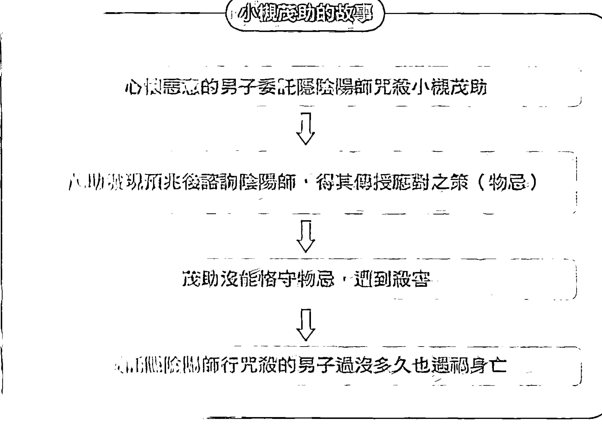

○物忌規則→No.038 ○法師陰陽師→No.016

《今昔物語》的編者，源隆國，以“今昔”開頭，故得其名。成書於1120年，由數百個日本故事組成，其數近千，成立於1120。

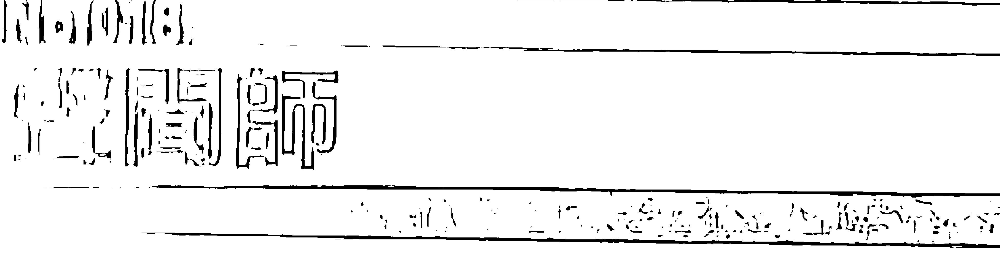

（前略）出身民間陰陽師的一種，身份等級較低，除占卜和祓禊以外，尚須向民眾表演其他才藝。

#### 異能者之祖

進入室町時代以後，有群不論出身或系統皆迥異於已遭賀茂、安倍兩家壟斷之官人陰陽師的民間陰陽師出現，在民間大放異彩。此類民間陰陽師的代表性人物，當屬奈良的聲聞師和京都的散所法師。這些人聲稱自己既非安倍亦非賀茂，而是吉備真備的子孫，以此作為證明其正當性之依據。

聲聞師亦作唱門師、唱文師，而他們亦恰如其名，主要是從事唱導（在城鎮村落家家戶戶門前唱誦祝詞和祭文）的工作。換句話說，聲聞師其實是賣藝走唱者巡迴鄉里村落賺取零錢的其中一個形態，他們不但會替人行占問卜，還經常表演各種才藝以吸引眾人目光。不少聲聞師都是被組織隸屬於神社佛閣，平時做些雜役類的工作：大和（奈良縣）的興福寺底下便有許多聲聞師的「座」（團體），統率大和國內的聲聞師與雜技藝人。他們會一面鳴金擊鼓，一面唱誦經文，並以占卜或曲舞、猿樂、白拍子[1]等藝能追求發展成名。能、狂言、文樂、淨瑠璃[2]等日本傳統藝能便是從此衍伸而成，不過這些技藝還要等到較晚的時代方能成形。

民間的陰陽師在中世後期便幾乎全部轉型成類似聲聞師的角色，不過此時他們也都已經接受了土御門家的統轄、取得許可執照，可以光明正大以陰陽師自居。

此外等級較低的陰陽師還會製作簡單的曆書販售給庶民，以供民眾自行找出「吉日」和「不吉的日子」的風俗傳襲至今。

[1] 曲舞、猿樂、白拍子：曲舞是南北朝室町時代盛行的白拍子系藝能舞蹈，併用扇子、手巾等道具，亦包含雜技和滑稽劇的表演。白拍子則是平安末期興起的歌舞表演形式。
[2] 能、狂言、文樂、淨瑠璃：能是日本的中世藝能，內含舞蹈與戲劇的要素，其後由出雲的舞蹈師等將民俗的部分戲劇化而成的藝能，成立於室町時代。文樂則是傀儡戲（人形淨瑠璃）的別稱。淨瑠璃則是利用琵琶等樂器伴奏的說唱表演。
[3] 唱導：即唱誦佛經或祝詞、念佛唱誦佛詞以尋求布施。「走唱的藝人」的別名，「走唱御子」是指四處巡迴討生活的遊女（女伶、藝妓）的一種。「即興表演」是指表演者不依劇本，即興演出的街頭表演。「叩金」、「小法師」是指表演打鼓、唸誦經文乞討錢財物品的乞食僧。

### 唱門師/唱文師/聲聞師

中世時期鳴金擊鼓唱誦經文，並以占卜、曲舞等技藝上門向人乞財的流動藝人。身分屬於非人（擁有特殊職能、藝能的民眾）。江戶時代以後被視同為一般賤民。

#### 聲聞師都做些什麼事情？

- 立門道（於民衆門前唱誦祝詞和祭文）
- 叫鉢
- 走唱橫行
- 猿詞

除立門道以外的技藝又合稱為七道物。

住於神社佛閣、平時做些雜役類工作的聲聞師亦不在少數。

稱後世能、狂言、文樂、淨琉璃等藝能的源流。

#### 大和國興福寺

奈良時代的興福寺其下共有15個座（聲聞師團體），北方有10座、南方5座，各座分別統率大和國內的眾多聲聞師、雜藝者。隸屬於寺院的門可以憑藉寺院的權威（儘管他們屬於非人）支配其他流動藝人。

#### 對文化多有貢獻的聲聞師

平安時代有不少上京的中世上京，對文化多有貢獻者亦不在少數。這些藝人以京都祇園所、北品散所、櫻町聲聞師、川口庭者、大黑聲聞師、川口能樂團師等名相稱的集團，他們一方面被貴族武士沒收土地，另一方面也在宮廷的藝能界和文化界留下了偉大的足跡。此外，據傳從事庭園造的聲聞師，出入宮廷等地與山科家（藤原北家四條家支流）。

吉仏真徳→No.083

以神祇官、神宮寺為中心的神祇，其藝能表演，基本上是在祈求長命、五穀豐收、國泰民安的前提下，進行的舞蹈、音樂等表演，以官人為大衆。

### 第十二章：陰陽道

陰陽道的基礎陰陽五行更早從中國傳入日本發展，儘管咒禁道原屬典藥寮範疇，後來卻逐漸被陰陽家吸收，並協助陰陽道構築形成其咒術體系。

#### 一、源自於醫療技術的咒術

所謂咒禁道就是指利用某種名為咒禁的咒術保護人類免於自然、超自然存在之危害的知識與技術。

嚴格來說咒禁道其實並不屬於陰陽道的範疇。咒禁道是起源於中國的咒禁，經由百濟傳入日本以後方才發展形成的學問，是一種承合道教詛咒技術的醫術。

在平安時代的律令體制之下，咒禁博士和咒禁師其實並非隸屬於陰陽寮而是隸屬於典藥寮，亦即專責掌管醫藥的機關。相傳他們可以行使治療疾病的咒術以及咒殺，兩者不會互相抵觸。

其實陰陽道原是種透過觀測自然現象、製曆、測定時刻等觀測工作與理論所構築成的技術職能，咒術性格本來就相當薄弱。

在陰陽道漸漸獲得並肩負起咒術功能的過程當中，咒禁道終於被排擠至陰暗的角落，並且遭到吸收合併、消失無蹤。典藥寮的咒術部門在進入平安時代以後便即遭到廢除。

陰陽道的大部分咒術儀式都是從咒禁道與佛教吸收得來。

至於咒禁究竟是種什麼樣的技術，僅有極少數文獻可供作為參考，目前已知有兩種技術是屬於咒禁的領域。

這兩種技術就是「蠱毒」與「厭魅」。

所謂蠱毒就是將毒蛇、蜈蚣、蜘蛛、蛤蟆等多種毒蟲放進壺裡，讓牠們在飢餓狀態下互相吞噬，然後再用最後存活下來的毒蟲向他人施加咒的邪術。所謂厭魅就是種使用人偶擬作施咒對象的巫術，「草人打釘」等咒術亦屬此類。

但在奈良時代曾經多次有天皇敕令撲滅，可是這些邪惡凶狠的咒術們仍然得到陰陽道繼承，從而流傳至今。

資料來源：http://P022「補令」注。

## 以咒術『祭』產生自然、超自然作用的鬼神

**咒禁部門**
使用符咒祓除邪氣、治療疾病

- 咒禁博士 1名
- 咒禁師 10名

吸收合併

**陰陽寮**

- 陰陽部門
- 曆部門
- 天文部門
- 漏刻部門

屬於醫術
咒術醫藥與治病咒術，並非純咒術

屬於技術職能
原本是種技術職能，咒術性格薄弱

典藥寮的咒禁部門於平安時期廢止，被陰陽寮吸收合併

## 被歸納為咒術

## 相似由咒禁道傳至陰陽道之咒術例

**蠱毒**
使用毒蟲施行之邪術

1. 以蛇、蜈蚣、蜘蛛、蛤蟆等毒蟲放入甕中。
2. 使其在飢餓狀態下互相吞噬。
3. 用其最終存活下來的殘渣向他人施咒。

**厭魅**
使用人偶的咒術

製造人偶操縱施術對象，透過將人偶『打釘』、『火燒』等行為而使施術對象受到同樣傷害的咒術。

### 宿曜道

宿曜師名氣雖不如陰陽師，但平安時代其實還有種世稱宿曜師的密教系術師，而他們所使用的便是宿曜道。

#### 具有深不可測力量的占術

比較陰陽師各項職務當中的占術並非專屬，除陰陽師以外另外有神祇官卜部也是負責此項業務。此外同樣在朝廷體制內的部門下還有專人負責使用早在陰陽術興起以前便已經存在的巫術（如龜卜）。

除此以外，朝廷外還有種名叫宿曜道的占術。據說這種占術乃是根據從前空海、圓仁、圓珍等入唐僧返國時帶回來的宿曜經所行的占算技術。

說得更具體點，宿曜道乃是根據符天曆從事曆算、占星、祈禱等工作，亦稱「密教占星術」。

符天曆是唐朝曹士蒍創造的中國曆法，據說是天德元年（957）由日本某個名叫日延的僧人從中國的吳越地區帶回日本的。符天曆雖然並未被採用為官曆卻廣泛受到宿曜道使用，此外符天曆的製曆計算方法也對後世曆法造成了不小的影響。

宿曜道是利用符天曆計算出個人誕生時九曜（日曜星、月曜星、金曜星、火曜星、木曜星、土曜星、計都星、羅睺星）的位置排列於十二宮位天地圖（相當於西洋占星術的星盤）之上，替人占算運勢。根據占算出來的結果，若有必要時還會替對方祈禱加持以消災祈福。

其實宿曜道原本並非用來占算個人命運、祝福個人的技術，而是用來選擇什麼日期時刻適合舉行修法或祈禱，或者找出在哪個時候星辰的能量比較強大、有助於祈願；在密教的宗教體系裡，宿曜道可以說是實務面經常會使用到的技法。

此外，歷來亦不乏有些特異的論調主張《源氏物語》的故事與登場人物均是由宿曜道演化而成。

## 密教占星術

### 宿曜道

別名密教占星術。原本是用來選定修法、祈願的日期時間。

#### 從中國引進的經典

- 宿曜經
- 符天曆

#### 宿曜道的技術

- 祈願
- 曆算
- 占星

現代還是會以十二宮位天地圖（星盤）占算運勢，運用的正是宿曜道的知識。

曆算，1年等於365又2448/10000天。
計都星與羅睺星是印度天文學所稱位於白道（月球運行軌道）與黃道（太陽運行軌道）的兩個交叉點上的星球，再加上日月水火木土7個星球，合稱九曜。

#### 九曜

計都星與羅睺星是印度天文學所稱位於白道（月球運行軌道）與黃道（太陽運行軌道）的兩個交叉點上的星球，再加上日月水火木土7個星球，合稱九曜。

### 宿曜師

宿曜師在天文與曆學方面的淵博知識與陰陽師不相伯仲，這群具備正統的僧侶身分的職能者在當時亦擁有相當大的權威。

#### 研咒宿曜道奧義的佛僧

所謂宿曜師是指在密教僧當中特別嫻熟於宿曜道的僧人，倍受世人尊敬。

宿曜道是門透過觀測星辰運動解讀未來的技術，是種與陰陽術看似相同實則不然的手法。宿曜道本是起源自印度的占星術，後來才經由中國傳進日本，並且在傳播的過程中受到道教和陰陽五行影響。

宿曜師在天體運行方面擁有豐富淵博的知識，故與陰陽道底下的天文和曆部門可謂是關係斐淺。

舉例來說，長德元年（995）陰陽寮缺乏製作曆書的人手，當時便曾經有宿曜師協助陰陽師賀茂光榮從事製曆作業。

在物忌盛行的平安時代，曆書可謂規範了眾人生活裡的所有行為，是故即便陰陽師人手不足，也不能起用可信度較低的法師、陰陽師之流的在野人士。此間內情姑且不論，被交付製曆重任的宿曜師其社會地位可以說是相當地高。

宿曜道名家仁宗、仁統、證照此三人是設籍於歷史悠久、香火鼎盛的興福寺的僧侶，尤其仁宗和仁統更是曾經在西大寺擔任別当¹的高僧。

宿曜師本來就是密教僧，所以當然也能行使密教修法：仁統亦曾經在藤原道長²的委託下執行過咒術。

宿曜師非但能夠使用密教修法，還能製作曆書。既然有能力處理禁忌和曆法，便可堪稱為禁忌的專家。事實上也確有史料記載指出，平安貴族曾向陰陽師與宿曜師雙方就禁忌相關事項諮詢心意，就某個層面來說，這個時代的宿曜師和陰陽師正可謂是相輔相成的關係。

> ¹ 別名：北大寺，興福寺等大佛寺裡總裁寺務的職位。

> ² 藤原道長：（966 1027）平安中期的重臣、攝政大臣。兼家之子，道隆、道兼、道順之弟。三個女兒（彰子、妍子、威子）嫁給三代的天皇為后，以外戚的身份專權，創建藤原氏的全盛時代。1019年出家，建立法成寺，攝關政治的代表性人物。

## 阴阳师与宿曜师并立者——宿曜师

#### 宿曜师

- 使用阴阳道之密教僧
- 出家于寺院
- 能预知并解释未来
- 不只是密教僧，亦能行使密教修法

#### 官人阴阳师

- 使用阴阳道之官僚
- 隶属于阴阳寮
- 利用阴阳道事前预见灾厄、事后采取应对（预测星象亦在范围内）
- 能使用阴阳之术

宿曜师亦精通「天体运行」，这方面能力与阴阳师不相伯仲

皆于天文部门、历部门协助阴阳师

#### 阴阳师与宿曜师之关系例

阴阳师曾协助从事制历作业（而且还是应阴阳寮的请求），但阴阳师不向好歹也算是同业的法师阴阳师求助，却特地拜托宿曜师协助

可见宿曜师的实力在当时是如何受到信赖

#### 有名的宿曜师

- 寂照：曾住西大寺。曾任西大寺别当。
- 能算：曾住西大寺。曾任西大寺别当。曾受藤原道长委托行使咒术。
- 定海：曾住东大寺。

以上所列都是在佛门中已经获得相当高地位的僧侣，并与阴阳师有所交流，当时社会颇高评价。

- 物忌与方违→No.038
- 贺茂光荣→No.078

## 《占事略决》

> 世間中流傳的晴明手筆的作品數量雖多，但經過證實確實是晴明本人作品的卻唯獨《占事略决》這本書而已。

#### 六壬式占的解說書籍

現存《占事略决》據考慮是天元2年（979）的作品，安倍晴明初筆版本早已散佚，僅有手抄本得以留存。現有宮內廳書陵部收藏的土御門本和京都大學附屬圖書館收藏的河家文庫本冊子等數冊流傳至今。雖說只是抄本，但每冊抄本都保存得非常完整，幾乎沒有缺漏，如今已經成為拼湊失傳古老占法的貴重資料。

此書內容是記載陰陽道的占卜技法，似乎是根據中國六朝時期最具代表性的六壬式占書《黃帝金匱經》、《神樞靈輅經》所著。

六壬式占誕生於漢代（西元前後），至六朝時期臻於發達，不過陰陽道實際使用的占法則是有其獨自的解釋與使用方法，與從中國傳來的六壬式占已經有部分的不同。

晴明現世前的陰陽道界偉人滋岳川人曾經在貞觀13年（871）撰寫《六甲》獻給天皇，後來的陰陽道便是從此書擷取了日本陰陽道所特有的部分。

可是《占事略决》卻並未具體提及這些陰陽道特有的占法，而止於簡略地匯整了《黃帝金匱經》、《神樞靈輅經》之精要，並未記載晴明時代占術的實際樣貌。

晴明的用意大概是想要以簡單易懂的方式將陰陽道的教科書《黃帝金匱經》、《神樞靈輅經》作成整理摘要，似乎本來就無意寫作可供實務使用的占書。

不過《占事略决》除本文以外，還另有注記以及引為實例的占例，從此便可反映出作者的思想。其次，原書本無「第十 帝相敗決」一章，據說這是晴明覺得有此必要方才另行添補的章節。

1 六朝時期：六朝係指先後定都於建康（今南京）的六個朝代，分別是三國吳、東晉，及南朝的宋、齊、梁、陳。

### 有名的宿曜師

記載陰陽道占卜技法的書籍。
似乎並非秘傳書籍，而是為陰陽寮的學生著作的教科書。
許多傳為晴明著作的書籍當中，唯一可斷言是晴明所著的作品。

#### 全36章

前半部：理論
占卜的作法、解讀、所
用道具的說明

後半部：具體的實例
罹病時占算生死之法、占
算胎兒男女之法、占算天
氣或邪祟災禍之真相等

#### 占事略決兩三事

（內容）例如明確記載所謂密術。
其中四神地圖到現在，均保存得相當完整。
平安時代貴族們所占的，便是以這些來自中國的占術為本，經晴明略施改
良而成。

例如（四神）地圖是占斷之根據。

## 《簠簋內傳金烏玉兔集》

平安以後的民間陰陽師奉為聖經的書籍，其通稱為《金烏玉兔集》。

#### （一）衍生出眾多相關書籍的名作

《簠簋內傳金烏玉兔集》之正式名稱為《三國相傳陰陽轄簠簋內傳金烏玉兔集》。

雖然書中記載此書是某位曾經向文殊菩薩拜師的中國仙人僩道上人得菩薩傳授之《文殊結集佛曆經》，然後安倍晴明才根據此書所著，不過學界卻另有定論，主張其成書年代應當更晚，是鎌倉時代以後的作品。除此以外，其作者署名為安倍「清」明，這點亦可解釋為暗指並非「晴」明所著。

簠簋是祭祀時用來盛裝供品的祭器，簠是外方內圓，簋是內圓外方。金烏代表太陽，玉兔代表月亮。

此書被奉為陰陽道書籍之圭臬，同時也是深受各種禁忌、厭思想、宗教影響的牛頭天王信仰基本教義書，全書共分五卷。

第一卷記述牛頭天王為向神明的女兒求婚而踏上旅途遇見蘇民將來的故事，以及與牛頭天王及其眷屬相關的吉凶判斷。

第二卷記載盤古王天地開闢神話、盤古王五個兒子五帝神的相關吉凶判斷，以及十干十二支的解說。

第三卷是記載牛頭天王之子太歲神、大將軍的相關吉凶，以及四季裡有關禁忌、神事、佛事的吉凶日等諸事項。

第四卷是土地房屋的吉凶診斷。

第五卷則是就宿曜道的二十八宿進行說明。

《永代大雑書萬曆大成》是《簠簋內傳金烏玉兔集》的衍生解說書之一，曆日、吉凶、運勢相關知識便是拜此書之賜始在民間廣為普及；其中尤以天保13年（1842）的版本更是被個別出版，堪稱為民間占術用書的代表作，曾多次再版加印。

## 《宿曜仕阴阳寮盘薹内传金乌玉兔集》

#### 何谓《宿曜内传金乌玉兔集》？

其正式名称为《三国相传阴阳轮盘薹内传金乌玉兔集》，亦可略称为《宿曜内传》或《金乌玉兔集》。

> **传说**

安倍晴明根据某位曾经向中国仙人拜师的中国仙人——伯道上人得菩萨传授《文殊师利菩萨及诸仙所说吉凶时日善恶宿曜经》所

> **专家的见解**

已有定论认为是乃镰仓时代以后的作品
(安倍晴明殁于1005年)

，内容分五卷之阴阳道书籍，民间阴阳师的圣经。

- 第一卷：牛头天王及其眷属之相关吉凶判断。
- 第二卷：盘古王及五帝龙王之相关吉凶、十干十二支。
- 第三卷：太政神、大将军之吉凶、四季之禁忌、神事·佛事之吉凶日。
- 第四卷：土地·屋宅之吉凶诊断。
- 第五卷：就宿曜道的二十八宿进行说明。

江户时代以《永代大雑書调暦大成》使相关知识广为普及

#### 什么是‘薹’？

#### 何谓金乌玉兔？

所谓‘薹’，是指装供品的祭器，
其形状像是一个杯子。特点是内圆外

金乌：即指太阳。中国传说指太阳里有只三只脚的乌鸦。

玉兔：即指月亮。传说中有兔子住在月亮里。

> ◎牛头天王与祇园祭→No.066
○安倍晴明→No.067

### 陰陽道的典籍

佔卜家最著名的作品當屬《占事略決》與《簠簋內傳金烏玉兔集》，不過此節還是要來看看其他的作品。

#### (一)其他陰陽道專書

任何學問都有傳授知識的學術書籍，同樣地陰陽道也是自古以來便有各式各樣、五花八門的書籍。

平安時代初期編纂的敕撰史書《續日本記》裡面有記載到四本陰陽生應該要修習的典籍，這四本書就是《周易》、《新撰陰陽書》、《黃帝金匱經》、《五行大義》。

這四本書當中，《周易》在中國是被列為五經之一、極受重視的著作，此書原是講述占術（易占）的書籍，但由於內容非常深奧，後來才成為以知識份子為中心的廣大讀者愛讀的人生哲學書，此書是繼體7年（513）由百濟的五經博士段楊爾帶進日本的。

《黃帝金匱經》是陰陽道占術六壬式占的解說書。

《五行大義》是隋朝占卜師蕭吉所著，是先秦時代直到隋代陰陽五行說的集大成之作。這本書不但對陰陽師來說非常重要，對佛教、神道和法制等方面亦多有深遠影響。宋朝以後此書在中國便告散佚，不過日本卻保存有完整的版本（由高野山靈寶館所藏）。

《六甲占抄》是室町時代賀茂氏勘解由小路家族成員所著，內容是賀茂家內部陰陽道講義課程的記錄。

除陰陽生有教科書以外，天文生也有專門的教學用書籍，例如《史記天官書》、《三家簿讚》、《漢書天文志》、《晉書天文志》、《唐朝要集》。

其中《三家簿讚》是中國唐代的天文書，記載285星官（星座），講到星座總是會讓人聯想到希臘神話故事，不過其實它也是東洋獨有的概念。東洋世界也會從星官圖、星數、位置等當中找出其中蘊藏的涵意，作為占術的材料使用。

除了《五行大义》、《簠簋内传金乌玉兔集》以外，另有其他阴阳书如下

#### 阴阳生必读书籍

- 《周易》：中国五经之一。易占书
- 《火珠林卦影》：占术与作历的书籍
- 《大六壬毕法案记》：六壬式占的解说书
- 《五行大义》：阴阳五行说的集大成之作

#### 历生必读书籍

- ○《汉书律历志》：天文计算书
- ○《大衍历议》：历学理论书籍
- ○《九章》：数学书籍
- ○《六章》：数学书籍
- ○《周髀》：宇宙论「盖天论」之书
- ○《定天论》：内容不详

#### 天文生必读书籍

- 《甘石星经》：星座解说书
- 《乙巳占》：唐代天文书
- 《灵台秘苑》：天体专书
- 《天文志》：天体专书
- 《天官星占》：内容不详

#### 其他书籍

- 《占事略决》：室町时代贺茂氏勘解由小路家族成员所著。贺茂家内部
- 《历林问答》：贺茂家内部的记录
- 《勘注忌文》：出云大社的祭祀书
- 《北斗护摩法》：行拥北斗七星信仰的书籍
- 《宿曜要录》：天文知识之书
- 《历例》：天文知识之书
- 《宿曜经》：唐代由印度传入

## 引进阴阳道之前的日本

平安时代的公卿乃是拜阴阳道所赐方才获得有文化的、安心的生活，目前我们来看看在阴阳寮成立以前大陆文化传入日本的情形。

#### ○计算时间的技术

中国所孕育出来的阴阳五行说是一门相当优秀的自然哲学，是形成文化之基础思想。试图利用此理论来预测吉凶的学说，便是诸子百家当中的阴阳家。

阴阳家的工作就是要观察四季变化与星辰运行、制定历法与安排土木的时序，并且就政治和祭祀相关事项询问神意。

这些工作对统治者来说是不可或缺的大事，故设置名为太史局的官署以管领之，不准民间轻易动用。

这些阴阳家的技术（术数、方术）约莫是于6世纪开始传入日本。

推古天皇时代有位名叫观勒的百济僧侣，他造成的影响更是特别巨大；据说朝廷还曾特别遴选优秀的学生，让他们学习观勒带进日本的历学、天文、地理、遁甲、方术等术术。

其后新学问的浪潮仍不断地一波波涌来，天智天皇更在天智10年（671）设置了漏刻（水钟）台。

除此之外，传说曾经亲自学习过天文与遁甲之术的天武天皇则是创设了占星台。据说天武天皇在壬申之乱时发现有鸟凶快飞掠过天际，于是便行式占、预言自己终将获胜。

大宝元年（701）制定的大宝律令又创设了隶属于中务省的官署阴阳寮。据说阴阳寮的体制是仿效中国的「太卜署」与「太史局」所设，其首长阴阳头之下分设有阴阳、历、天文、漏刻等部门。

从阴阳寮所发展成的技术体系，便是所谓的阴阳道。

> > ※1 壬申之乱：西元671年天智天皇崩御，天智天皇弟天武天皇（大海人皇子）与天智皇子大友皇子（大津皇子）的战争。在战后隔年大友皇子自杀，大海人皇子于隔年元月正式即位为天武天皇。
> ※2 大宝律令：日本的第一个法典，701年完成。当时为受此法典化影响，正为元大宝。在这之前的日本法典只有「令」（规定律例的法令），「律」（规定刑罚的法令）出现，终于完成了一个正式的法典。

阴阳家是诸子百家之一，乃根据阴阳五行说预测吉凶。

阴阳家的工作是观察四时季节变化与天地运行。

诸子百家是中国战国时代的众多学派以及各式各学说之统称。除自然科学以外，诸子百家亦广泛包括哲学、思想、宗教、兵法等所有文化领域的有识之士。

确定风土与农耕的时期，从政治和祭祀相关之事的时间决定。

阴阳家起源，6世纪开始渐次传入日本。

- 历
- 遁甲
- 地理
- 天文
- 历算

被利用宗教活动引进的文化。

从这些与生活密切相关的知识：

1.  大衍历观测台（671年）——从这些历法占星台，他还曾经自行使用天文、历法技术。
2.  阴阳寮的设立，从中央省下开始设置阴阳寮（701年）。

### 平安时期阴阳寮的变迁

> 阴阳寮原本是以天文观察与占星术为设立目的之组织，却于日本朝独自的方向持续发展。

#### 一、转型成退魔机关

阴阳寮设立于奈良时代，其母体就是在9世纪后半叶至10世纪初这段期间内成立的咒术宗教体系，亦即所谓的阴阳道。

奈良时代阴阳师的主要职务是观察天文行使占术（占星术），然而情况却在进入平安时代以后起了变化。

律令体制在奈良时代末期至平安时代初期开始败坏，争名夺位的纷扰动荡与政治斗争，甚至连天灾都相继而来，搞得人心大乱。

就在这个时候，承和11年（844）掌权的藤原良房遂在朝议的议论上决定说：“近来灾害异象频传，乃邪祟使然。不可不镇之。”

于是乎负责用占术查明邪祟起因的阴阳师，才会逐渐被要求连祓禊都要包办。

从此阴阳师必须充分动用道教、神道、密教等所有当时最进步或尖端的知识，从事咒术、祭祀和禁忌勘定等各种形形色色的活动，然后才有今日我等对阴阳师的固有印象，亦即“阴阳道”这个咒术宗教得以成立。

平安时代中期以后，朝廷大大小小的职役随着摄关政治的发展而逐渐遭到特定贵胄家系世袭占据。阴阳道亦然，较高的阴阳寮官职多被贺茂氏与安倍氏所独占。

10世纪后半至11世纪前半叶，藤原氏世袭就任摄政关白的地位愈趋稳固，以至有藤原道长的全盛时代。在这样的状况下，少数人忌惮树敌众多的藤原氏和裙带家族自然就会受到多方诅咒，因此才会开始重用优秀的阴阳师以规避诅咒。

阴阳师便是如此这般才成为天皇和贵族们的咒术保镖。

> 摄关政治：自古天皇年幼或为女帝时，便设“摄政”临代行政治。“关白”则为成年天皇的重职，始于平安中期的藤原基经。自此天皇年幼时设摄政，成年后则任关白，已成惯例。平安时代以后，摄政或关白几乎都由藤原氏独占（唯丰臣秀吉、豊臣秀次两人例外）。

## 当初的阴阳家

-   执行与设立目的相同的职务
    -   历法、天文、行使占术
    -   时刻、历与时刻管理

承和11年（844）的会议决定“近来灾变之事频繁，乃邪气使然，不可不占卜”。

-   律令制崩溃致使政争纷起
-   天灾连年使得人心大乱

-   阴阳师的职业变化
    -   以占术查明邪祟起因
    -   举行驱邪气之仪式

摄关政治的发展成熟致使有力贵族抬头，世袭朝廷职役、攫取权力的藤原氏家族易遭忌妒，屡屡成为诅咒之目标。

成为被当作权力侵害者的咒术保护。

## 发展来的咒术

（图片：img/e7633d8527e4fc363b00eb4a3c7e944b_65_0.png）

### 源平争乱期的阴阳师

川口认为，历经源平合战、进入武家时代之后，阴阳道与施政者的关联性并未就此消失，而阴阳师亦得以续存。

#### （一）战役的背后

根据文献记载，镰仓时代初期曾利用阴阳道来占算决定举兵日期，并祈祷战役可以得胜。

然而信奉实力主义的新兴势力——武士从本质上便有异于平安朝颓废的贵族，并没有把占术或咒法看得那么重要。

譬如《吾妻镜》治承4年（1180）10月27日该项便有记载，源赖朝不畏当天是衰日（运势不佳的日子），仍旧出兵追讨平氏。

他们恐怕比较倾向于把阴阳道视为某种用来说服周遭人的说辞手段或者心理慰藉，而并不真正相信阴阳道的实效性。

之所以如此推论，是因为源氏的宿敌——平家的平清盛本人便通晓阴阳道，并且还有证据显示平清盛曾经起用阴阳师试图以此与源氏对抗。

1199年源赖朝逝世、源赖家继位，武家便已经开始有贵族化的迹象；当地位得到某种程度的稳定以后，任谁都会开始仿效贵族，这似乎是无可避免的趋势。

一直以来很少举行的阴阳道仪式当星祭，正是从赖家当政时期开始改为每个月举行，此外他们也开始玩起了平安贵族间的游戏蹴鞠。

那时每次要举行正式祭祀的时候都要特地把京都的阴阳师招到镰仓，至于日常生活中的相关事项则是不劳阴阳师，尽管只有些微阴阳道知识者主持即可。

顺带一提，源赖朝所倚重的咒术师其实是位名叫文觉的修验僧，并非阴阳师。

> 《吾妻镜》（あずまかがみ）：记载镰仓时代之事迹的编年体史书，记载自治承4年（1180）至文永3年（1266）。

### 贵族没落、进入武士的时代

#### 对外
以祈祷得到承认为咒术

#### 实际上
信奉武力主义、现实主义的武士阶级却不如贵族那般相信咒术

贵族一如既往，仍旧受...利用

-   劝说他人的权宜手段
-   为求心安或好兆头

## 源平合战时期阴阳术之概要

平氏与其对抗、提升己方士气，源氏这方势必也要活用。

### 镰仓时代的阴阳师

-   由京都的阴阳师前来主持。
-   阴阳师取得中级贵族的地位，并且对武家颇感反感。
-   武士阶级也开始让人使用阴阳术。
-   以阴阳师或术师。

### 武家社会中的阴阳师

11世纪时期的镰仓・室町时代是武家政权得以树立的时代，而阴阳师也在这样的世态下逐渐产生变化。

#### 移居镰仓的阴阳师

在武家崛起掌权的时代，幕府与阴阳师的关系虽然已经和平时代不同，但同样还是相当密切。

据《吾妻镜》记载，源赖朝曾经在追讨平家战役的前一天命人举行天曹地府祭，祈求武运长久。

只不过当时主持祭典的住吉小大夫昌长此人似乎并非阴阳师，而是位神官。当时的镰仓恐怕根本连一位阴阳师也没有。

据传安倍泰贞是第一位定居于镰仓的阴阳师，这是承元4年（1210）的事情；以安倍泰贞为首的京都阴阳师是从第3代将军源实朝当政的时期开始迁徙到镰仓的。

当时的阴阳师可以分成三种，包括定居镰仓的阴阳师、住在京都的阴阳师以及同时在京都与镰仓进行活动的阴阳师。

定居在关东地区的阴阳师绝大多数都是安倍氏（庶流），他还有惟宗氏、伴氏。此时京都的阴阳师已达饱和，对已经无出人头地的阴阳师来说，镰仓可谓是东山再起的绝佳舞台。

在京阴阳师则是由贺茂氏与安倍氏（嫡流）两家独占。贺茂氏在阴阳道世界里的地位仍旧优于安倍氏，故而不必特地跑到镰仓去。

同时在京都与镰仓进行活动的似乎是相对来说地位较低的阴阳师，他们平常大概都是在京都工作，偶尔才会到镰仓出差。

《吾妻镜》里面曾经记载到阴阳师“号为御家人”，虽然是幕府，（就许多层面而言）也同样是相当需要阴阳师。

> *《吾妻镜》：请参照P060注。
*御家人：镰仓时代直属于将军的家臣。

### 镰仓时代的阴阳师

#### 镰仓时代初期，并无阴阳师存在

源义明曾经在追讨平家战役的前一天命人举行天曹地府祭，祈求武运长久。只不过主持祭典的住吉小大夫昌长并非阴阳师，而是位神官。

#### 阴阳师渐定居至镰仓

-   元久年（1210），安倍兼贞首先定居于镰仓，
-   此后京都的阴阳师才开始在镰仓出现活动。

#### 镰仓与京都的阴阳师

（图片：img/e7633d8527e4fc363b00eb4a3c7e944b_69_0.png）

| 于京都镰仓两地进行活动的阴阳师 | 在京阴阳师 |
| :--- | :--- |
| • 地位较低的阴阳师 | • 贺茂一族、安倍氏（嫡流） |
| 平时在京都工作，偶尔出差到镰仓。 | 这些在阴阳道界占得优位的阴阳师在京都已经拥有崇高的地位和工作，不必迁居镰仓。 |

镰仓时代中期开幕，仅有必要的时候才会招请。

### 室町时期的盛况

室町时代是幕府与朝廷双方互相拉扯争夺权势的时代，此时幕府所召的阴阳师纷纷被授予高位，并逐渐演变成信仰之所据。

#### （一）幕府祭祀的领导主持者

进入室町时代以后，幕府对待阴阳师的方式便起了变化。原来3代将军足利义满重用当时的阴阳头安倍有世，使其阶升至从三位。在此之前阴阳师的最高位阶顶多只到四位而已。一般认为义满此举用意是在对抗天皇和众多贵族，企图接收王朝的权力。

足利义满为表示自己才是最高权力而非天皇（与天皇的神职信仰相对抗），曾经数度举行结合了阴阳道祭祀与密教修法的大规模祈祷。当时被起用的阴阳师正是安倍有世。

拜其所赐，安倍有世始得以破格的惊人速度崛起，爬到阴阳头的职位，其最终官阶甚至递达到了从二位。

顺带一提，安倍有世对外皆以土御门家自称，应永10年（1403）受封在若狭（福井县）的名田庄上村。

后来由于4代将军足利义持打出反义满政策，使得阴阳师一度遭到冷落，不过情势却在6代将军足利义教的时代再度产生变化。

在此之前将军手下向来仅有一名阴阳师服事，从义教开始则改为由安倍氏嫡流、安倍氏庶流和勘解由小路家各选出一名阴阳师，总共三人一同出仕将军。

此时阴阳道在政治上可谓受到了空前未有的重用，以致土御门（安倍）与勘解由小路家的家族地位均获得提昇。

阴阳道在武家政权下的角色定位已不仅仅是平安时代的信仰，而是已经演变成带有许多政治色彩的重要因素。

## 室町期的阴阳师

室町期——幕府与朝廷争权竞势的时代。幕府为扩张自己权威、弱化朝廷，而采取挖角朝廷人材的做法。

（图片：img/e7633d8527e4fc363b00eb4a3c7e944b_71_0.png）

## 室町期在宗教界幕府亦展现出相当积极的态度

-   **朝廷**：以神祇信仰为主，佛教与阴阳道只是辅助。
-   **足利幕府**：数度举行结合阴阳祭祀与密教修法的大规模祈愿。

三代将军足利义满重用阴阳师。当时的阴阳头安倍有世获得史无前例的高位。幕府召集众多阴阳师，使阴阳道成为信仰之所向。

六代将军足利义持打出反义满政策，不重用阴阳师。

八代将军足利义教重用阴阳师。其治下之阴阳师名额增加为阴阳三家的三人。

-   阴阳三家：
    -   土御门家（安倍氏嫡流）
    -   勘解由小路家（贺茂家）
    -   安倍氏庶流

幕府将阴阳师用于政治利用，尤其使得土御门家与勘解由小路家的势力消长。进而将阴阳师视为咒术师重用，而成为当时阴阳道的主流。

#### 被送往荒地开垦的阴阳师

据说阴阳师在战国时代应当会受到各地武家聘用、占算战事吉凶，但实际上这种情况却颇为罕见。接下来的时代将是阴阳师受难的开始。

#### 被送往荒地开垦的阴阳师

战国时期最后的获胜者丰臣秀吉是在文禄元年（1592）开始出兵侵略朝鲜，迫害阴阳师则是发生在次年的事情。

根据一部题名为《驹井日记》的文献记载，秀吉曾经把131名京都、堺大阪的声闻师（民间阴阳师）拉到外甥关白“丰臣秀次”的领地（爱知县），迫其开垦荒地。

当时秀吉正在推行太阁检地，而声闻师的存在对该政策却是有害而无益。

声闻师不在士农工商之列，而是属于巡回诸国、四处卖艺的游民集团。太阁检地的政策是要把这些原本以祈祷和占卜为生的人送去垦地，一方面命其镇抚大地诸神、一方面将其农民化。

再加上秀吉在57岁的时候意外得子、生下秀赖，使得秀吉与秀次的关系急遽降至冰点。也有人说秀吉此举之目的是要把具备特异能力的阴阳师布置在秀次的领地，监视其动向。

秀吉的这个政策非但让好不容易才生存下来的宫廷阴阳师威信尽失，甚至还使得人们对民间阴阳师的卑贱观感变本加厉。

这些声闻师在秀吉死后终于获释，其中有部分声闻师选择定居当地，创造出一种名叫千秋万岁的艺能表演，后来此类表演发展成为尾张万岁，成为后世上方艺人的基础。

京都的许多民间阴阳师团体因为这次被迫搬到尾张，导致人数锐减。

即便如此，京都的民间阴阳师却并未就此灭绝，尽管人数锐减，他们仍在坚强地传承沿袭下去。

## 占卜战争吉凶使得阴阳师受到各地武将起用

-   技术流传至民间
-   弱肉强食的风潮

阴阳师渐渐地不再像从前那般受到重用。

## 足利义辉

足利义辉之弟安倍久脩与丰臣秀次走得相近。使得全阴阳师成为追逐的对象。阴阳师的阴阳师对秀吉的太阁检地政策是个阻碍。

安倍久脩（1562～1625）
14岁之时便于官府阴阳头的逸才。自幼便受到阴阳师的英才教育，成为安倍氏宗主，甚至还继承了当时香火已然断绝的贺茂家。秀次死后退隐。

-   虽以祈愿占卜为生的阴阳师，间谍党也一来锁他大地的神，二来使其农民化。
-   将具备特定能力的阴阳师布置在敌地、命其监视敌人动向？

1598年原之战，安倍家依附德川家康恢复名誉。

1610年，身分制度的强化使得世间对阴阳师的卑贱观感更加强烈。

### 近世的阴阳师

从战国时代、安土桃山以至江户时代，阴阳师终于丧失了其原初的职务。

#### 受雇执行祭祀的祭师

阴阳师本来是种负责制作历书、占算灾厄并使用退魔之术的职能者。江户时代虽然依旧相当重视祭祀与占卜，不过阴阳师却不如从前平安时期那般受到重用，早已丧失用武之地了。

近世的阴阳师是以从事家内安全、五谷丰收、生意繁盛的祈愿仪式和避除灾厄的加持祈祷、祓禊与地镇祭等仪式与占术，再加上万岁、猿乐等喜庆节日表示祝福之意的艺能作为主要的收入来源。除此以外，他们也会制作、贩卖较为简便的民历。

约莫从元禄时期（1688～1703）开始又有四处巡回表演傀儡剧或人偶剧的阴阳师集团形成，今日的人形净琉璃和歌舞伎便是由此发展而来。阴阳师、山伏等许多在野宗教家还会使用民间所流传的传统疗法来替贫穷人家治病。他们深知光凭祈祷并无法使人痊愈，因此也会使用以本草学为基础之中医疗法和针术。有人说他们是藉“巫术”行使治疗的“在野”医师，故有“野巫医者”之谓。

在近世的社会里，前述这些施巫术者、卖艺游民的社会地位要比农工商等平民更低一级。他们被视为杂种贱民，不得与平民通婚。在各个城镇或村落的人别帐（户籍调查名簿）里面，他们的身份亦与寻常百姓不同，而是会用院内、宿、寺中、万岁、山伏（镜所、产所）、天社神道阴阳师等各式各样的称呼注记记载。

另外，这个时代的民间阴阳师和类似职能者一概是由土御门家统筹管理，这些人如果没有土御门发行的许可证书便不得从业。其他像修验者等虽然并非阴阳师却也会替人行占问卜、医治疾病，因此也必须取得土御门的许可。

> 1.  地镇祭：土地建筑工程在动工前会先礼拜土地神祇，祈求工程顺利的仪式。
> 2.  万岁：亦称“万岁乐”，舞乐的一种，最早是六人为例的女舞，如今则成四人为例的男性伴舞。
> 3.  人形净琉璃：净琉璃是利用琵琶等乐器伴奏的说唱表演，人形净琉璃即用人偶搭配净琉璃演出。
> 4.  歌舞伎：于江户时代集大成的日本代表性戏剧。始于庆长年间（1596～1615）的阿国歌舞伎，从经过若众歌舞伎而于元禄时期发展成服饰极为华丽、演技细腻且具戏剧性的表演。
> 5.  山伏：此外，在山中修行的修验道行者，亦称修验者。
> 注：1700年代中期，从事“白拍子”。

#### 江户时代的治世与阴阳寮的动向

## 江户时代
太平治世重视仪式典礼，阴阳在仪式中起用官人阴阳师。阴阳师集团巡回各地演出，以民间疗法行使咒术。

#### 民间阴阳师的广泛活动

-   祈祷
    -   安全
    -   丰收
    -   消灾

-   艺能方面
    -   万岁
    -   猿乐能
    -   净瑠璃
    -   歌舞伎

-   医疗行为
    -   加持祈祷
    -   汉方治疗
    -   针灸术

-   其他
    -   祓禊
    -   地镇祭
    -   占卜
    -   制作贩卖民历

（图片：img/e7633d8527e4fc363b00eb4a3c7e944b_75_0.png）

江户时代末期的半世纪
1780年，幕府天文方（科学研究机关）完成新历法贞享历
但17世纪的阴阳道因此遭到废止，改用新历。
虽然17世纪末完成宝历历，并回归历之权威，但据说对阴阳道没有帮助。

### 土御门家统治阴阳师

江户时代以后，幕府将无法单凭己力完全掌握的流浪宗教者、艺能者全部都交由土御门家管理。

#### （1）为使阴阳道得以存续

土御门家乃是根据江户时代天和3年（1683）的灵元天皇纶旨，以及其后幕府将军德川纲吉所颁发之朱印状统筹管理阴阳师。

此时阴阳师的职份已经被压缩限定为“占考”，而所有从事占卜的人全部都必须接受土御门家的支配管理。

然而在从前的时代，从事占卜向来都不须得到任何人的许可，神官、僧侣和行脚卖卜者等无不是任意行占问卜，许可制度根本不可能立刻扎根见效。

于是乎，土御门家及其属下众阴阳师遂告诫在各地行使占术的神职者和修验者等人，要不就是取得土御门家的许可，否则就不可行使占术，甚至还经常因此发生诉讼纠纷。

此类论争和法律上的攻讦争斗大多都是由土御门家主动挑起的。

土御门家之所以如此亟力欲使该制度得到贯彻，或许是因为他们感到相当焦急。阴阳道成为幕府承认宗教团体的时间比起其他宗教势力都晚得许多，修验道是在1613年（修验法度），神社神道在1656年（诸社祢宜神主法度），相对地阴阳道则是在1684年才获得幕府的正式承认。

若是不把本来就是修验者或神官身分的人也一并归在阴阳师支配之下，那么阴阳道便无望得以发展成为宗教结社，甚至因此而湮灭。

土御门家便是因为这其中的缘故而频频挑起论战和诉讼，不过观察判决结果却并不一定是行使占术者败诉，或者非得接受土御门家统治不可，因为有不少案例都是“非以接受报酬为目的的占卜”或“无偿占考可予免除”。

不过真正不收酬金替人占卜的例子其实为数不多，所以大多数的诉讼案都是由土御门家获得胜诉。

1.  阴阳道的许可制度

| 法令与时间 | 内容与影响 |
| :--- | :--- |
| 禁中并公家诸法度（1613） | 修验道成为幕府认可宗教 |
| 诸社祢宜神主法度（1656） | 神道成为幕府认可宗教 |
| （禁中并公家诸法度）之前 | 神官、修验者、阴阳师等以占术维生者均可任意以占术维生。阴阳道落后于神道与修验道 |
| 土御门神道关系书状（1683） 御朱印状（1683） | 所有行使占术者均必须遵守土御门家管理指示 |
| 制度实施后 | 无论是否神官，所有行使占术者都必须取得许可（不论是阴阳道或神道，故而特为抢夺神道和修验道的利益），以占术维生者从此便自称是阴阳师。土御门家会对未经许可而营业的占术师提出诉讼，但并不总是土御门家胜诉（“无偿占考不须经过许可”等）。土御门家的特权一直持续直到明治3年8月明治政府为推行国家神道而废止阴阳道为止（此后阴阳道乃以民间习俗之形式流传存续）。 |

### 阴阳寮的废止

从江户时代进入明治时代以后，带有浓厚神秘色彩的阴阳道终于不敌文明开化的潮流而消逝。

#### ○悠久历史的终焉

明治3年（1870），明治政府颁布通告废止天社神道之太政官布告，阴阳寮遂告废止。然而，阴阳寮这个政府机关自701年开设以来竟能维系保存命脉长达1169年之久，真可谓是值得惊叹。

其实在阴阳寮废止前，土御门家从明治元年起便已经被逐步卸除职务，甚至连编历事业都插不上手，直到明治政府颁布解散组织的命令，包括统辖管辖下阴阳师、占师等土御门家所有权限才悉数遭到剥夺。

被禁后阴阳道的祭祀祈祷都要一律停止，甚至连只在每代天皇即位时举行一次的天曹地府祭也都遭到废除。

除明治初期政府强硬推行神道国教化以外，追求文明开化必须排除“杂宗”“邪教”“迷信”的方针也对阴阳寮的解体有很大影响。事实上阴阳道也的确是门揉合众多宗教与哲学思想而成的咒术体系，故而无法与神道的推行普及相容并存也未可知。

再加以排除旧幕府时代势力等理由，土御门家终于被剥夺“私人阴阳师苗字带刀”的特权，受到与平民同等的对待（土御门家家主土御门时荣后来受封子爵爵位）。

明治政府废除阴阳寮后改设天文历道局（明治3年8月25日改称理学局），由大学管辖。当时土御门家曾经请愿表示愿意将历学授予大学，并协助启迪学者的历学、天文学知识。

尽管民间阴阳师和他们的祭祀仪式仍旧存留在庶民的生活中，但阴阳道终究还是就此挥别了历史的主要舞台。

> ¹ 太政官布告：明治初期太政官所公布的公文，当时乃以法令形式施行。直到明治19年制定公文式之后废止。
> ² 苗字带刀：江户时代武士身份的象征。苗字是指特地在家名中加入领地名等以显示家世。带刀则是指腰挂打刀与脇差两把刀，是长于战斗的武士特权。

## 明治维新后的末路

## 明治初期

土御门家趁明治维新混乱纷呈而扩大阴阳寮之权限，然而……

- 有碍引进近代科学
- 属于外来文化的阴阳道没有存在的必要
- 以占算等方法向天皇提出意见乃属不敬

> 维新运动、文明开化运动、富国强兵论愈发高涨，阴阳寮的存在开始受到批判

（1870）阴阳道的占算祈福，甚至完全从天文与历历事业抽手，废止对民间阴阳师的统括权

（1872）占卜等被视为迷信，禁止向民间流传散布

> 阴阳道相关的祭祀虽然仍旧保留在庶民的生活之中，但是土御门家和民间阴阳师均告消失，阴阳道亦告消减。

## 补充说明

现代（1952）阴阳道名称复活，获得宗教法人之认可。

## 陰陽師的待遇

养老2年（718）制定的养老令这批法律当中有条名为官位令的条文，此令乃是规定上至正一位、下至少初位下的各位阶该当对应何种官职。

根据官位令的规定，隶属于阴阳寮的阴阳师，亦即所谓官人阴阳师的位阶是阴阳头为从五位下，阴阳博士与天文博士则是正七位下。这样的安排不得不说是太低了。

从收入方面来看，六位以下并无每月的固定收入，唯有每年分上半期与下半期支付给所有官员的薪资「季禄」而已。「季禄」支付的是布匹等实际物资，若换算成米粮则约略是30石左右。

当时的庶民生活一年用米一石，如此看来或许会觉得30石的收入其实也不算差，只是当时的庶民还不一定每年都能添置新衣，饮食方面则是一日两餐，稀饭配一汤一菜，任何用品都尽可能自己动手制作，过着极为贫穷的生活，而支薪30石的官员也不过是这种生活的30倍而已，或许根本就称不上宽裕。

至于安倍晴明则是属于中阶官员，其年俸在从五位时有400石，从四位则是800石，不过正二位的左右大臣却可以领16000石左右。

随着时代的变迁，后来即便一介普通阴阳师也可以升到正六位上。实际上从此以下的位阶后来都已经不再使用，勋位官（拥有位阶而任官职者）原则上都会被封给六位上以上的官位。

## 「晴明」考

晴明两字不读作「はるあきら（HARUAKIRA）」而是读作「せいめい（SEIMEI）」，这种读法叫作音读（用音读尊称古人名）。

从前平安时代原则上唯有僧侣的人名才会使用音读，所以当时晴明的名字应该是读作「はるあきら」或者「はれあきら（HAREAKIRA）」之类的才是。

晴明是到中世以后才开始被读作「せいめい」。在镰仓末期到室町初期这段期间内初具雏型的《今昔物语集》里面，晴明的名字便是写作「清明」。

在其他像应义塾大学收藏的御伽草子《酒吞童子》则是写成「せいめい」，Santory美术馆收藏的「酒吞童子绘卷」则记载为「清明」。其次在镰仓时代的阿弥陀如来石佛佛像上，也发现有后来室町时代所刻上的「清明☆」字样。

## 第2章 陰陽術通鑑

### 陰陽師的服裝

平安時代的陰陽師平時究竟是穿著什麼樣的服裝呢？

#### （一）陰陽師的服裝＝平安貴族的服裝

平安時代的陰陽師會作什麼樣的打扮呢？這個問題雖然困難，不過簡單來說其實就是平安貴族的衣著裝扮。
隸屬於陰陽寮的陰陽師是貴族身分，其中有許多人都擁有六位以上的位階¹。陰陽寮只是朝廷架構下眾多寮機構之一，並沒有特別的制服，因此陰陽師平常的穿著應當與其他平安貴族無異。

#### （二）平安時代的服裝與繪畫均告佚失

描繪平安貴族模樣的現存圖畫當中，歷史最悠久的資料便是《源氏物語繪卷》、《伴大納言繪卷》等繪卷物，可是這些全部都是平安末期（12世紀）的作品，至於安倍晴明所屬平安中期（9～11世紀）的繪卷物等圖像文獻則是至今尚未有任何發現。
若說《源氏物語繪卷》所繪貴族模樣就是平安貴族的服裝打扮也沒錯，只不過此作品和晴明的時代相差有百年之久，換句話說，這並非可供考究平安中期服裝的正確資料。搞不好當時的打扮還要比一般所想像的更富唐朝風格也說不定。
來到室町時代和江戶時代以後，後世又有許多描繪束帶打扮²平安貴族的繪物等作品，這些都是根據平安時代文獻重現出來的圖像。
現在一般人對平安貴族的印象正是來自於這些後世的作品，其中雖然包括有安倍晴明的肖像畫，不過此畫也是想像圖。
收藏於晴明神社的《安倍晴明像》曾經經過多次臨摹複製出八面的肖像畫和木雕雕像，如今已成晴明的基本形象；這幅圖裡的晴明身穿紅色單衣³，外罩白色狩衣⁴，下半身則是穿著指貫⁵、並繫著淺縧⁶，其中白色狩衣更可以說是晴明的正字標記。

- 1. 位階：請參考P.064注。
- 2. 束帶：平安時代後男子的正式朝服，天皇以下的文武官員的辦公穿著。
- 3. 單衣：古代的裡衣或貼身衣服。
- 4. 狩衣：平安時代的便服，至鎌倉時代則成為貴族與武士的正式服裝或禮服。
- 5. 指貫：古代男性的褲子。
- 6. 淺縧：繫在狩衣袖口的細帶子。

## 阴阳师服装之真相

- 阴阳师并无特别制服
- 阴阳师大多拥有贵族位阶

平安时代阴阳师的服装应当与平安贵族相同

## 平安时代贵族穿什么服装？

狩衣是贵族的便服。现在广为人知的安倍晴明肖像画便是这个装扮。

束带是贵族的正式服装。举行宫廷仪式等正式场合应该就是这个打扮。

平安中期的图像业已散佚，因此现今普遍对平安贵族的形象均是来自于后世（平安后期~江户时代）绘制的图像。

## 第2章 阴阳术通鉴

No.067

注释：乌帽子是古代神官，一般会上漆固定其形状，未上漆的任次序向下自然垂下，便是所谓垂乌帽子。

### 陰陽師的裝備

（...）大幣、佛僧有數珠和錫杖，修驗者則是有錫杖和法螺，均各自極富特色的道具，那麼陰陽師呢？

#### （）各種業務使用的形形色色道具

陰陽師的業務內容非常多樣繁複，故使用的道具也非常多。其中最具特色的道具便屬式盤。

從平安時期到中世為止，陰陽術所使用的占術是六壬式占；此占術必須使用到六壬式盤，這種道具是在象徵「地」的四方形木盤上另設一個象徵「天」的圓盤。

除此以外，觀測天文對陰陽道來說是不可或缺的工作，因此務必也要用到在球體表面記有星辰和星座的天球儀，以及可以撥動多數圓環藉以測量天體運行狀況的渾天儀。如今仍有天球儀之類的物品得以保留至今，其製作手工非常精巧，在當時想必是相當高價的物品。

另外陰陽師還要觀地象論風水，所以也要用到規矩。矩是指角尺（L型尺），規則是圓規。陰陽師使用的並非是那種兩隻腳的圓規，而是種形狀跟尺差不多，叫作「分回」（ぶんまわし）的圓規。

其次當然還有各式各樣的消耗品。

陰陽師製作靈符和人形都必須用到和紙，其中尤以生漉紙最為高級。紙張在當時乃是貴重物品，因此可能無法很豪氣地大量使用靈符；當時甚至還經常以木板替代，使用的材料包括桃木、梅木、檜木、樟木、漆樹木、合歡木等。

繪製符咒所用的墨是古墨（濃墨），寫紅字則是用朱砂。

筆於硯雖然並非特別製作，不過據說陰陽師會特別準備專用於儀式的靈符專用筆硯，不作其他用途。

## 阴阳师使用的道具

式盘
阴阳占卜之必要道具

天球仪
球面刻有星宿坐标，用于观测天体

使用圆形的规或矩以测天体运行状况的道具

规
画圆的道具，圆规，云原形状不得而知

矩
指矩，即L型尺

阴阳术所用的符咒多写于绢或纸上

使用咒文

和纸
制作符咒或人形的必需品，以生漉纸最为高级

木简
帛纸和纸的替代品，所用材料包括桃木、梅木、桧木、杉木、漆树木、合欢木

## 式占

式占是綜合陰陽五行說、天文數理等中國學問而成的占術，其發祥地自然無須贅言，正是中國。

#### ○陰陽寮特有之占法

占術可謂是陰陽術基本中的基本。

陰陽道有種使用占具式盤的占算方法，所用式盤種類繁多，相對應的技法亦有太一式、遁甲式、六壬式、雷公式等不一而足。

太一式與雷公式在中國是皇帝專用的占法，此規定在日本亦同。因此，一般人自然是以使用六壬式為主。

六壬式占亦頗受安倍晴明喜愛，他甚至還以此傳授弟子，故而六壬式占才會成為陰陽道用過最著名的占術。當時除六壬式占以外尚有卜部的龜卜（使用龜殼的占卜）也是既受信賴的占法，此法同樣也受到重用，成為國家級占術。

六壬式盤是種計算器，是由代表天空的圓形天盤以及代表大地的四角形方盤所組成，使用時是撥動可旋轉的圓盤，待其停止後觀察其上鏤刻文字的排列來進行占斷。又或者是將資料輸入式盤，藉以求得占算之結果。

舉例來說，假如有事件發生抑或受委託進行占算的時候，就可以從年月日時刻的干支裡面挑出月份與時刻的地支使用，在六壬式盤上推出天盤與地盤的相對位置組合。

施術者撥動式盤之目的是要推算出星辰的位置，接著再根據星辰位置來解析天文所示是何徵象。他們與現代的占術師同樣，只要對天文徵象的解釋愈是正確，就可獲得優秀占師的評價。

如前所述，式盤是種占算用的旋轉式計算器，不過有時卻也會被拿來當作咒術道具使用，這應是陰陽道每歷經一個時代便多添一份神秘性所造成的結果。

六朝時代：請參照P.050「六朝時期」注。

六壬式是安倍晴明也相当喜爱的法。成为阴阳道所用最著名的占术。

当时还有卜部的筮卜也是颇受信赖的占法。

## 六壬式占之发祥与历史

此占法成立於前汉时代，歷经魏晋时期、自六朝时代 至唐代最为盛六壬式占乃於奈良时代首度传入日本，其后復曾多次经由遣唐使等途

另一方面，中国直到唐朝灭亡以后也仍旧是由国家主导从事占术研最后更演化出一套官方的占法体系：除此之外，地方则另有手法异於占術的独立占術发展茁壮。

虽然我们无法得知阴阳寮为何长期以来迟迟没有采用六壬式占，不过阴阳师还是将9世纪的最后批遣唐使所带回来的非官方（地方性的）进一步加以改良并实践之。

六壬直到后来才终于成为阴阳道不可或缺的占法，却在16世纪中葉突然失传，据推测应是当时土御门家未能妥善教授传承所致。从此以后，阴阳道的占术便大多是以易占为主。

### 陰陽師的覆推

所謂覆推就是指再次占算已經算過的事項。在從前占術的重要性與所信賴程度都很高的時代，覆推可說是種使用相當頻繁的步驟。

- 提升占算之精準度

使用覆推也就是指重複進行占算，一般可以分成使用不同占法再次占算、使用相同占法深入占算，以及不同占師再行占算以求檢證等各種場合。

平安時期的朝廷共設有兩個負責占算的機關，即神祇官的卜部以及陰陽寮。當時兩者當中以卜部較具權威性、較受信賴，如此的高低優劣亦意味著天皇的祖先──神的意向高過來自中國的陰陽寮所代表的天意。

順帶一提，古代中國也有「龜長筮短」這麼句話，意思是說殷商時代與王權結合的龜卜要優於後世才發展形成的易筮。

當時的占算分工基本上是「大事問卜部，小事問陰陽寮」。

儘管當時的狀況如此，但雙方卻經常會以彼此輔助的互補形式進行覆推。

當卜部與陰陽寮的推條（占算的內容）有出入的時候，基本方針是卜部優先，但是據說在占算災異和占斷怪異的時候，雙方占算的內容都會經過再三思量玩味，偶爾還會採取雙方折衷。

占斷災異與怪異、算出吉凶以後，有時還會進一步占算調查到底是輕是重、到底該向神明還是佛祖祈禱才會有效驗等事項。

其次，當占算結果指出某個方位的神社或靈山等場所時，也會利用覆推來調查究竟是這些諸社諸院當中的哪個神祇在作祟。

另外在某些地區和時代，若是使用請示神祇精靈的占法，或是利用通靈力進行判斷的占法時，再占將會被視為是禁忌。

> > 「龜長筮短」：出自《左傳》，原文為「筮短龜長」

## 覆推

- 就占计结果再次占算，以提升占法可信度
  - 他用不同占法再次占算
  - 他用相同占法深入占算
  - 他用他占师再度占算以求检证
- 以上三者均称覆推

以林以卜部覆推阴阳师的占算结果，时而角色互换

> 倘若双方占算结果不同的话？

以上以卜部优先。有时也会例外采取折衷方案

> 为何？

因为为占算神（天皇的祖先）的意向的卜部要高过于占算上天
意的阴阳师

> 大事问卜部，小事问阴阳寮

（某些地区和时代被视为禁忌）
（因为为神祇官部或利用通灵力量进行占断的时候）

### 物忌與方違

提到與陰陽道有關的風俗習慣，相信許多人就會立刻想到物忌與方違。

#### ○物忌

日本高中國文老師通常會古文課堂上就物忌進行簡單的說明講述，一般人對物忌多少都有點概念。

其實「物忌」此用語原是「為祭祀神明而行齋戒」、「齋戒以奉神明者」的意思，其概念卻在平安中期以後產生變化。想當然爾，這個變化乃是因為受到陰陽道影響而然。根據 18 世紀的有職故實家°伊勢貞丈的說法，物忌在平安中期以後已經演變成以下的意思：

> 「所謂物忌，是指某人因夢境不祥抑或心有不安而求助陰陽師時，若陰陽師表示事態嚴重，數日之內必須謹言慎行，便要數日閉足不出戶、謝絕來客。」
（譯自《貞丈雜記》）

就現代來說這種行为其实就是宅在家裡，差别就在物忌是将细微的异变视为灾厄的前兆，进而藉此保护自身。

当时必须遵守物忌的徵象主要有「异常」（异于平常的行为）、「梦魇」和「妖怪」（身心衰弱造成的不安感）等。

#### ○方違

所谓「方违」就是指回避方位上的禁忌，这种习惯始于 10 世纪前后。简单来说，假设某人想要去东方而东方恰恰属于不祥的方位，就可以先往北边或南边前进、暂住一晚；如此迂回前进目的地就不会落在东方，便不会触犯禁忌。

大阪堺市如今仍旧有所谓的方违神社保存至今，只要来此参拜就可以不顾方违的规矩，直接朝向目的地前进，可说是相当方便的神社。

有职故实家：专门研究与古代朝廷或武士有关之仪式、典故、官职、法令、服饰，或各式各样的制度的研究家。

## 回避恶兆

## 物忌之意

- 为祭祀神明而行斋戒
- 斋戒事奉神明者

平安中期产生变化

于指定时日內足不出户、谢绝来客

发生令人不快的异事或灾祸

咨询阴阳师。
「此乃恶兆，须行物忌」

物忌

## 回避方位禁忌

## 何谓方違

回避方位上的禁忌，特意避开不祥的方位、迂迴别处暂住一晚，隔天再往目的地前进。

例如要去东边（C）但东方却是不祥的方位，就可以从出发地A朝北方前往中继点B，在那里暂住一晚。隔日再出发前往目的地C，如此就不算是「朝向东方移动」。

到方位祠社参拜过后便可不须方違

## 方位的禁忌

> 想要出门的时候却不知道「不祥的方位是哪边」，怎么都放不下心来。该怎么样才能知道哪个方位不宜前往呢？

## 被视为凶煞的星宿

平安时期的代表性文学作品《源氏物语》里面讲到光源氏曾经为了方违而前往空蝉的家，另外像《枕草子》也有提及方违。方违的用意就是要规避不祥的方位，如果不知道哪个方位有凶险根本就无从规避，可是凶位却也不是这么容易就能看得出来的。

凶位是阴阳师根据欲采取行动的年月日以及当事人本命星位置所计算出来的。倘若读者诸君对西洋占星术亦有涉猎，那么说成「排星盘」或许会比较容易理解。

当阴阳师在进行计算的时候，最关键的问题就是各星宿在那个当下究竟是落在什么位置。以下仅就最应注意的代表性星宿进行介绍。顺带一提，当时认为每颗星都有星神寄宿于其中。

《源氏物语》记载为「中神」的天一神，是座落在北极星旁边的星神。从癸巳日起的16天內祂都在天界，谓之「天一天上」，万事皆吉；从己酉日算起的44天內则是会降至凡间，谓之「方塞」，是为凶。天一神在停留地面的期间将会以顺时钟方向从艮开始、依序走过八个方位，而人们则是必须规避天一神所在的方向。

王相神则是由五行思想、十干十二支、八卦等概念衍生出的诸神神格化而来，每到立春或夏至等八个节气都各有应当忌避的方位。

古时候将现在的金星称呼为大将军。大将军是太白（甫入夜时的明星）稍迟，十二年绕四方一周；大将军亦称魔王天王，被认为是能够抹杀所有生物的大凶，古人相信触犯大将军方位者将在三年以內死亡。

- 八个方位：艮（东北方）、卯（东方）、巽（东南方）、午（南方）、坤（西南方）、兑（西方）、乾（西北方）、子（北方）等八个方位。

## 各神明各自应当忌避的方位

各个神明都是以各自不同的方式巡行环绕世界，某个时刻下神明所在的方位便是不吉利的方位。

## 天一神（中神）

- 以60日为周期循环移动
- 当天一神所在的方位就是忌方（不吉的方位）

初めの16日在天上渡過
地上の44日在地上渡過
在地上的头6日在艮的方位（东北）
然后5日在卯的方位（东）
然后6日在巽的方位（东南）
然后5日在午的方位（南）

## 五相神

- 八个节气（立春、春分、立夏、立秋、秋分、立冬、冬至）各有应当忌避的固定方位

## 大将军

- 绕行一周耗时十二年
- 每三年均以东西南北的其中之一为忌方

## 其他众神

- 穴太神：八方＋天地共十个方向，每日移动
- 四神：一年一个巡回

在这些基础上，形形色色的方位禁忌都会相互影响、牵一发而动全身。如果没有事先请教阴阳师，则平安贵族甚至无法出门外出。

### 方違的咒文

方违乃是为规避禁忌方位而行，本节谨就此进所唱祷的方违咒文进行介绍。

#### ○見载于教科书的咒文

平安贵族的生活中有形形色色的禁忌，数量多到甚至让人不禁担心如此能否维持正常的日常生活。
不过时间方面的禁忌只须规避「险恶的1日」即可，其实倒还算是还好。最麻烦的是有关方位的禁忌，就拿大将军来说，东西南北其中必定有一个方向会在整整3年内一直被视为禁忌。
方违便是为排除这些障碍才应运而生的技术。
方违的概念就是先行去到非属禁忌的方位，然后再往目的地出发，另外方违还有个可在寄宿落脚处（方违所）唱祷的咒文。

譬如为规避天一神而行方违时，就要唱诵「大德威德功德自在通王佛」。

太白神是以10日为周期巡行八方与天地，规避太白神方位禁忌的方违咒文则是「一明心者／二明副者／万明心者／千万副者／急急如律令」。

在《口游》这本书里面，这两则咒文分别被记载为「片塞之夜天一神礼拜颂」以及「片塞之夜太白神礼拜颂」。

所谓的「颂」就是歌颂神佛功德的短韵文。

关于咒文的正确涵意如今仍不得而知，不过可以确定的是，这两则咒文在平安时代的贵族社会里流传甚广，甚至可以说已经成为平安贵族的常识。

记载这些咒文的《口游》其实是当时的幼儿学习书籍，换句话说也就是儿童用的教科书。这本书乃是平安中期的文学家・源顺所作，是专为贵族子弟而编汇九九乘法、干支等基础知识的作品。

- 11 諸曆：原指东汉末年「算圣」刘洪所作之「乾象曆」，此处引申为天文曆法之总称。
- 2 平假名顺序：原文为「いろは歌」，是种将日语假名排列次序的方法。由于内容包含所有假名，可视为全字母文的一种。

不同神明时各有不同的咒文。对贵族来说乃是常识，《口游》（当时的儿童用教科书）有记载咒文。咒文必须在寄宿落脚处（方违所）唱诵。

## 天一神与太白神的方违咒文

> 片云之夜天一神礼拜颂
> 「大德威德功德自在通王佛」
> 片云之夜太白神礼拜颂
> 「一明心者／二明副者／万明心者／千万副者／急急如律令」

## 口游

年代：天历元年（970）
作者：源为宪
内容：
分为天象、时节、官职、人伦、禽兽等19个部分。
记载九九乘法、干支和比伊吕波歌更古老的字母歌「大为雨歌」、「大地歌」等内容。
用途：
这部作品当初是为藤原为光的长男经辅的贵族子弟教科书。
以方便默念暗记的形式编纂而成。

参考：No.038
大为雨歌：原文为「たるに」，与伊吕波歌同样都是使用所有47个假名，没有重复的和歌。据传是由源为宪所作。开头为「たるに……」，故得名。
大地歌：原文为「あめつち」，亦是使用所有假名而创作的和歌，在源为宪的时代便已相当普及。

No:041

## 禁忌与历书

（图片中显示为风格化艺术字）

阴阳道的禁忌同时牵涉到时间与方位两个因素，以下仅列举其中有关时间的禁忌。

#### ○多不胜枚举的禁忌时日

跟年有关的禁忌有「革命革令」、「当梁年」、「三合厄」、「庚申」、「厄年」。

跟日有关的禁忌则有「血忌日」、「归忌日」、「大祸日」、「狼藉日」、「罗刹日」、「九坎日」、「厌日」、「凶会日」、「八龙日」、「废日」、「伐日」、「阴阳将日」、「道虚日」、「五墓日」、「没日灭日」、「重日复日」、「三宝日」、「岁下食」、「庚申」、「袁日」、「灭门日」、「七鸟日」、「九虚日」等，族繁不及备载。此外还有跟月有关的「五星月」、跟时有关的「灭门时」。

阴阳道除前述数十例以外还有其他禁忌，甚至可以说是没完没了。

这些禁忌主要都是出自《新撰阴阳书》，而贺茂保胤根据此书所著之《历林》里面记载的诸多禁忌更是受到具注历（记载吉凶的历书）等广泛采用。

除前述禁忌以外，四季的「土用」乃是属于掌管五行中土行的土公神的时期，《簠簋内传金乌玉兔集》便说土用「起建·修造·立梁柱·打地基抑或动土·掘井·涂墙等犯土之事一切不宜」，将其视为某种凶日。

另外还有个名叫「八专」的日子，说是「司掌冥界之冥众将上天庭，忌行佛事」。

除此以外，比较特别的禁忌还有平安中期的公卿藤原师辅曾经交代子孙「手指甲要在丑日剪，脚趾甲要在寅日剪」。

正如藤原宗忠在《中右记》里面写道「近代阴阳师所言，强要忌避，颇有不便」，似乎就连当时的人们都觉得很受不了。可是人类本来就是种看见旁人在意，自己也会不由自主地跟着在意起来的生物，再者平安贵族又特别重视世间的眼光，故而即便丝毫深感多有不便，却始终无法跳脱禁忌的束缚。

## 第2章0阴阳术通鉴

阴阳术是古代中国的一种哲学和占卜体系，涉及阴阳五行、天文历法等内容。它在中国传统文化中占有重要地位，影响了许多领域。

| 概念 | 描述 |
|------|------|
| 阴 | 代表黑暗、柔顺、女性等 |
| 阳 | 代表光明、刚强、男性等 |

> 阴阳者，天地之道也，万物之纲纪，变化之父母，生杀之本始，神明之府也。 ——《黄帝内经》

- 阴阳五行：金、木、水、火、土
- 天干地支：用于纪年、月、日、时
- 八卦：乾、坤、震、巽、坎、离、艮、兑

## No.042
衰日

古人在日子方面有许多禁忌习俗，而其中最具特色的当属衰日。

#### ○因人而异的凶日

当我们在讨论日子吉凶的时候，阴阳道其实有好几种被视为「险恶日」的日子。

这些险恶日亦可以用「凶日」此用语统称之，其中尤以衰日最为著名，基本上这天不宜从事任何活动。俗话要说「规避门行」，尤其天皇的行动对贵族公家的影响更是重大，在「御衰日」这天公事、神事、佛事自然是不在话下，就连葬礼等白事也都要回避。

衰日的日期因各人年龄而异，8岁的人衰日是「寅、申之日」，20岁则是「丑、未之日」。日期因人而异便是衰日有别于几坎日、重日复日、凶会日等其他吉凶之日的最大特征。

另外还有种「依出生年而定的衰日」，称为生年衰日。举例来说，子年、午年生的人，衰日就是丑日、未日。不过目前较可信的说法却认为生年衰日其实几乎从来不曾被使用过。

此外像灭门日是不宜移转的日子，道虚日则是不宜外出的日子，贵族的生活便是如此遭到各式各样的禁忌捆绑束缚。

#### ○没有被遵守的禁忌日？

亦有说法指出古人其实并未那么严格地遵守日时的禁忌。

或许是因为人们在灾难过后会特别敏感，若连年安稳无事就会变得迟钝，又或许是当时的人们被禁忌捆绑得太紧故而感到疲倦。

根据该说法，当时人们似乎认为衰日其实只是「比佛灭稍微好的日子」而已，甚至还会觉得「本应闭门不出才是的，不过闭门是没办法的事」，照常从事各种活动。

## 何谓丧日？

- 丧日是凶日的一种，不宜从事各种行事。
- 有别于其他「日子的吉凶」，丧日的日期因各人而异。

丧日的判定方法
└─ 因年龄而异
   （例：8岁则丧日为寅、申之日）
└─ 因出生年而异
   （例：子年、午年出生者则丧日为丑日、未日）

- 其他的『凶日』
  - 灭门日：不宜移转的日子
  - 道虚日：不宜外出的日子

> 实际上，有说法认为古人其实并未如此严格地遵守日时的禁忌。

## 丧日的作法仪式

- 丧日时的禁止事项
  - 外出
  - 与他人来往
  - 作法

使用的符咒
柳木符咒
用刻有梵文的木棒打造门板或庭院的符咒。也用柳木或枥木制成。中国人相信柳木有除魔的力量，在日本则被视为具有生命力的灵树。

吉

不只是应当规避凶厄的凶日，就连事物进展较为顺遂的吉日也是由阴阳师来决定。

#### ○凶日多，吉日也多

藤原道长¹是平安时代鼎鼎有名的人物，其日记《御堂关白记》同样也相当有名，而这部日记其实是部把字写在具注历的空白处而成的作品。

放到现代来说的话，这便相当于使用标有日期的记事本，并将每日的记录写在记事本上面。如果各位读者手边刚好有记事本的话，不妨可以翻开月历的部分看看，说不定在日期和每周七天以外，还可以发现上面印有「大安」²「佛灭」³等字样。像这种附有具体注释的月历，在当时便称作具注历。现在的月历通常只会记记大安和国定假日、圣诞节和情人节等比较重要的节日，相对地具注历则是记载有更多更详细的情报。

这些注记内容《簠簋内传金乌玉兔集》几乎都有记载，以下仅列举几个其中的吉日：

- 「大明日」是阴阳相合的大吉之日，诸事皆宜。
- 「天恩日」是天赐恩惠的日子，从甲子、己卯、己酉算起的五日之内都是天恩日。
- 「母仓日」是与当季五行相生的吉日。譬如春季属「木」，母仓日便是属「水」的亥日和子日，是为吉日；也就是说，当日属「水」将会助长春季「木」的属性。
- 「天赦日」是天赐恩赦之日，同样也是最吉利的吉日。春天的大赦日是戊寅日、夏季是甲午日、秋季是戊申日、冬天则是甲子日。

另外，今日仍广泛受到使用的六曜（六辉）——先胜·友引·先负·佛灭·大安·赤口——同样也是源出阴阳道，但据说六曜也是直到明治改历⁴以后才开始被记载在月历上。

### 1. 具注历の妙

具注历是指「具体注释」的「历」书。其制作普通历书，然后再就各日吉凶诸事加上注释。不仅仅是凶日，吉日当然也有明确记载。

## 吉日一览

| 名称 | 说明 |
| --- | --- |
| 阴阳相合之日 | 阴阳相合的大吉之日，诸事皆宜。 |
| 天恩日 | 天赐恩惠之日。从甲子、己卯、己酉日算起的五天期间。 |
| 时德日 | 与当季五行相生之日。吉。（例如春=“木”的季节，则“水”日（亥、子）为吉） |
| 天赦日 | 天开恩赦之日。最吉利的吉日。春=戊寅、夏=甲午、秋=戊甲、冬=甲子。 |

## 六曜（六曜）

六曜是指「先胜・友引・先负・佛灭・大安・赤口」，虽然源出阴阳道，但明确地在历书（月历）上的时日尚浅，始于明治时代。从前的具注历也并不一定有标注「大安」或「佛灭」等字样。
六曜的含义如下：

1. 先胜：事宜从速。午前吉。午后凶。
2. 友引：所有胜负之事都要平分秋色的日子。唯独午时为凶。
3. 先负：午前凶。午后吉。
4. 佛灭：诸佛都要入灭的大凶之日。事实上跟佛教并无关联。
5. 大安：大吉日。
6. 赤口：凶日。唯独午时为吉。须小心火烛与利刃。

No-044

### 阴阳道的神明

阴阳道乃是集合复数思想与宗教而成，祭祀的神明自然为数众多，这里仅举出其中较主要的数位神明介绍。

#### ○八将神・镇宅灵符神・土公神

在阴阳道祭祀的众多神明当中，最重要的便属八将神与镇宅灵符神。

所谓八将神是指太岁神、大将军、太阴神、岁刑神、岁破神、岁杀神、黄幡神、豹尾神，京都的大将军八神社从前江户时代祭祀的便是这八位神明（现在祭祀的神格已经稍有变动）。八将神俱是牛头天王之子故亦称八王子，司掌各个方位与灾厄。其中大将军更是往往会受到特别待遇，甚至还有专门祭祀大将军的祭坛。

镇宅灵符神则是由镇守宅地和房屋的灵符神格化而成的神明。

中国相信东方的泰山有位泰山府君，相对地西方的华山则是有位名叫西岳真人的神明，拥有能够镇摄大地恶灵的力量，据说镇宅灵符神便是由这位西岳真人演变而成。

文禄2年（1593）加藤清正出兵朝鲜之际，曾经被敌军围困在城中；当时他在驿铃（官员的身份证明）刻上玄武，向镇宅灵符神祈愿，结果果然成功脱困，于是遂在返国后将这个铃铛供奉在土御门家。

谈到阴阳道祭祀的神明，那就不能忘记司掌土地的土公神。土公神又被称作「御土公样」，某些老旧房屋直至今日仍然会在厨房等处设置祭坛供奉之。

亦有说法认为土公神在1年之内会在屋里的各个角落间移动；春天在炉灶、夏天在门口、秋天在水井、冬天在庭院，各个季节都要注意不可在相对应的场所造次失礼。

土用是土公神管辖的时期，素有忌讳从事任何土木作业之风俗。「土用」是土旺用事之略称，乃指各季节结束后接下来的18天或19天的期间。若以二十四节气来说，从清明、小暑、立秋、小寒算起的第13天就会进入土用；这也就是说不仅夏天有土用，其他季节也都有土用。

「不仅夏天有土用，其他季节也都有土用：请参照P.016「土用丑日吃鳗鱼」。

## II. 阴阳的众多神明

| 太岁神 | 岁星（木星）精灵。吉神。每年巡行与该年地支相对应的方位。 |
| 大阳星 | 太白星（金星）精灵。凶神。会在相同方位停留三年。 |
| 太阴神 | 钝星（土星）精灵。不宜说媒、生产，宜从事巫术、访问。 |
| 咸池神 | 辰星（水星）精灵。凶神。不宜播种、伐木。 |
| 伏破神 | 钝星（土星）精灵。凶神。不宜动土、移转。 |
| 白虎神 | 荧惑星（火星）精灵。凶神。不宜婚姻、修建等事。 |
| 五痼神 | 罗睺星精灵。不宜土木建筑，忌行弓始仪式（神事）财备则吉。 |
| 九醜神 | 计都星精灵。厌恶秽污不净的神明，不宜添臘家畜与如厕大小便。亦不宜生产、结婚。 |

#### 镇守屋檐神

山川门地与房屋的灵符神格化而成。 相传此神是由五岳当中西岳华山的西岳真人演变而来。

#### 土公神

土地之神，即土公神。某些老旧房屋直至今日仍然会在厨房等处设置祭坛。 土公神会在1年之内在房屋的各个角落间移动（春：炉灶、夏：门窗、秋：水井、冬：庭院）。土用即土公神之日。不宜从事挖掘土木作业等活动。

#### 冢山府君

掌管坟墓中死人之神明。司掌万物的生死。

### 阴阳道与茶吉尼

世间普遍相信茶吉尼信仰与阴阳道的关系相当密切，不过两者之间其实有段因缘故事。

#### ○阴阳道与稻荷、茶吉尼婆娑的关系

原始的阴阳道从中国输入日本是奈良时代的事情。其后阴阳道遂在日本国内发展茁壮，逐渐形成日本所特有之咒术、宗教思想；阴阳道在其间渐次吸收各式各样的宗教和占术，尤其是跟茶吉尼信仰的关联更是耐人寻味。

茶吉尼是源自于印度的鬼神，日本又将其称呼为夜叉；从夜叉这个名字便不难想见，茶吉尼原本其实是种极为凶恶的食人恶鬼。

最初将茶吉尼引进日本的并非阴阳师，而是密教僧。密教认为茶吉尼是大日如来的化身，将其奉为神明祭拜。另有说法指一般社会是从平安时代末期开始认识茶吉尼这位神明，将其视为狐神、狐灵。

日本之所以会将茶吉尼视为善神，其实是因为受到稻荷信仰影响使然。日本原来就有种淳朴的思想认为狐狸是种同时兼具神性与丑性的农耕神、谷物神。于是乎稻荷与茶吉尼这才逐渐结合，不仅仅是密教，就连修验道和神道等中世日本的所有宗教思想均将其视为神明。

茶吉尼信仰直到江户时代前后才被吸收，成为阴阳道的一部分。当时官人阴阳师已经没落，民间阴阳师则是以咒术师或占卜师的身分在全国各地进行活动；把已经广泛受到日本人接纳的茶吉尼积极采纳进入阴阳道的，应该就是这些人。

换句话说，如果在平安时期有关阴阳道的故事里面有提到茶吉尼或者狐狸的话，那么这则故事就有可能是后世的作品抑或民间才经过添补的故事。

安倍晴明的母亲其实是只白狐的传说就经常会让人联想到茶吉尼信仰，这则故事正是在平安时代以后才被创作出来的作品。

> 注：茶吉尼（Dakini）：印度神话中湿婆王妃迦梨的侍女们，被佛教采用后所…的神明；原为渴饮鲜血、啖食人肉的恶鬼。

## 小动神的传入以及与淫祠信仰的结合

## 荼吉尼

- 来自印度的鬼神。
- 日本亦称夜叉。原是食人恶鬼。

密教僧引进日本

荼吉尼被视为大日如来的化身

时至平安末期......

神道将其视为狐神、狐灵

与神道信仰结合

结合以后，除密教以外，荼吉尼亦先后被阴阳道、修验道、神道等中世日本宗教所吸纳。

## 与阴阳道的结合

## 江户时代

公家阴阳师的没落以及民间阴阳师的发展
民间阴阳师将早已受到民众接纳的荼吉尼吸纳成为阴阳道的神明

其后......

在阴阳师的口传故事经过添笔、润饰茶吉尼或狐狸登场

安倍晴明的母亲其实是只白狐的故事便也是后世所作

No.046
形代

> 形代是自古流传至今的祭祀器具当中，实施与来自中国的思想融合孕育而成的被祸、咒术等术法时不可或缺的道具。

#### ○形代其实并不止于纸制品

所谓「形代」就是指施行咒术时用来模拟各种形状的道具。

其中模拟人类形体的形代唤作人形，经常被当作代人承受邪衍、疾病等秽厄的「腻物」使用；使用时只须取人形摩擦抚过当事人身体、向它吹口气，秽厄便会转移至人形之上。由于人形是用来「抚摩之物」，故亦称抚物。除此之外，人形也可以当作施行魘魅、也就是施行诅咒的咒术道具使用，国内就曾经挖掘出写有诅咒语句的9世纪木制人形以及在胸部打着长钉的人形，其中后者的使用方法更是与所谓的「丑时参咒」*1相同。

除被祸或诅咒用的形代以外，还供奉献祭用的形代；这种形代就是用来代替活人，埋在桥梁底下当作人柱*2。

现代仍有许多佛寺神社使用形代，这些形代均是以纸制成，不过古时候曾经使用过金、银、铁、石头、黏土、稻草以及木制的人形。8世纪时便曾经使用过金属制人形，不过仅限于天皇、皇后或东宫太子使用，宫廷里的官员和民众用的都是木制人形。

一般相信形代乃是源自于弥生时代的船形、阳物形祭祀道具，古坟时代曾经有刀形和鸟形的木制形代出现。7世纪后半也有人形和马形出现，此时其实正是日本从中国引进律令制度和阴阳五行、道教仪式等法度的时期。于是乎，日本古代固有的祭祀道具和祓禊思想遂与从中国引进的人形、道教仪式等科技融合，这才形成了形代的祭祀文化传袭至今。

形代首先是受到大被*3采用，后来又透过9世纪的七潮祓川临祓等祭典仪式，终于才被吸纳融合至阴阳道。

*1 丑时参咒：日本最有名的诅咒法。头顶逆鼎、鼎足插着蜡烛，身着白衣、披头散发，深夜（丑时）在神社内用五寸钉把置有受诅者毛发的稻草人钉在神木上，对方就会痛苦而死。
*2 人柱：此指从前兴建堤防、桥梁、城池等大规模建筑时，把人活埋在建筑物或川川中，借此向神明祈求能够免去水灾、崩裂等威胁的一种活祭仪式。现在日本已没有这种仪式，但是在普通工程环境下发生事故导致劳动灾害发生时，仍会将牺牲者称作人柱，以示镇魂慰灵之意。
*3 律令制度：请参照P.022「律令」注。

## 模造纸人形与人形

→ 模拟人类形体

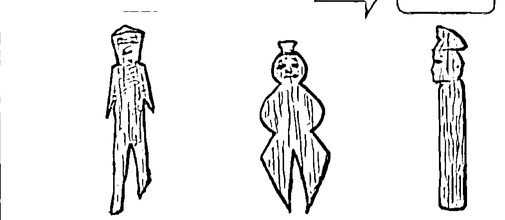

→ 其他形状

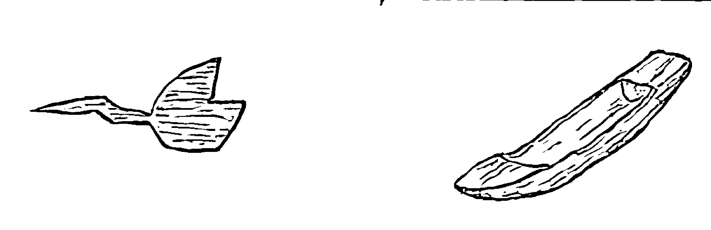

- 代受讐厄
- 用于诅咒
- 用于祓祭

## 纸人形的历史

7世纪
→ 与人形融合

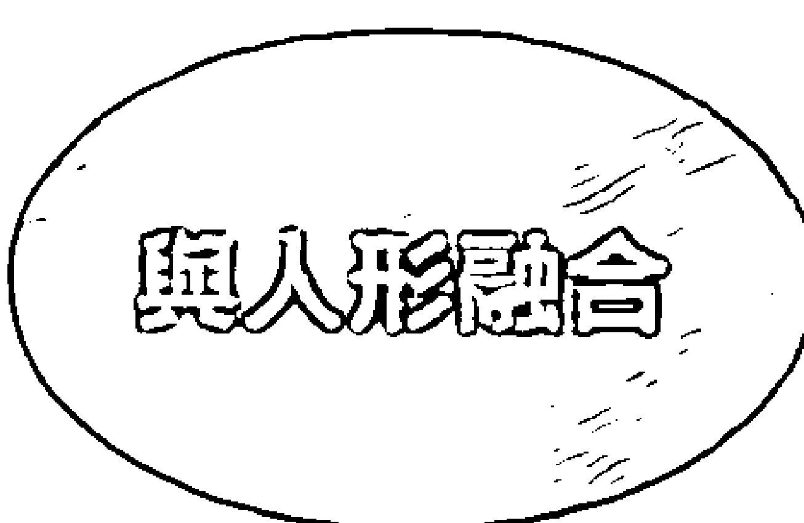

9世纪
→ 被阴阳道的祭祀仪式吸收

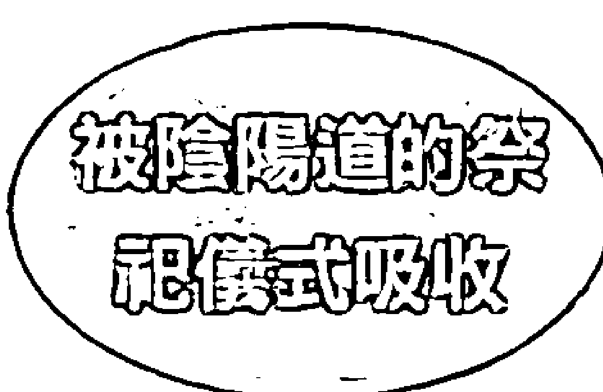

← 中国的人形传入

材料：木头、石头等

皇族用金属人形等纷纷出现。随着时代变迁、纸张造价压低后，便以纸制人形为主流

・七濑祓 No.001 　　○七濑祓→No.056

七濑祓是清除罪孽以及秽恋的神事。中古时期以降，每逢六月与十二月晦日举行。大尝祭前后或者遭遇灾害、疫病时也会临时举办。

### 灵符的制作方法

阴阳师经常都要用到灵符，那么灵符的制作方法究竟如何呢？

- ○蕴有咒力的阴阳师武器？

创作作品里面经常会描述阴阳师手持符纸念念有词的模样，灵符与阴阳道两者关系密不可分，由此可见一斑。

灵符亦称护符、秘符，有秘传的制作方法。

灵符的材质是生漉和纸‘。其他也会使用白柳、合欢木或桃木等材质的木板。有时还会将咒文刻在剑身或者镜面，然则此系例外特例。

写符用墨以浓墨为最佳。有时也会使用朱砂而非黑墨，唯内服使用之饮符则是使用萃取自红花的色素，因为朱砂内掺有水银成份、具有毒性。

画符的数天前就要洁斋（意指禁食酒肉、洗涤沐浴使身心清净）、行祭礼并且冥想之后，倾注全副身心一口气将灵符写好。写好以后再行入魂，灵符方告完成。最后还要把专为制符而请来的诸神送走，仪式才算结束。

关于制符吉日各派说法不一，一说以癸酉、癸卯、壬寅等日为佳；时刻则普遍认为是以丑时三刻‘较为理想，不过事实上制符似乎只须在夜半到日出这段时间内即可，不必顾虑时辰。

顺带一提，灵符常写的「急急如律令」本是道教广为使用的用语。

此语原是法制用语，汉朝在就律令规定事项发布命令时，亦经会在公文书末尾使用「如律令」三字。是故，「急急如律令」便是「速速依律令而行」之意，也就是「速速实行公文所载内容」的意思。语意由此逐渐演变转换，东汉末年道教之徒即开始将其作为「咒文威力速速实现」之咒文使用。

> 生漉和纸：请参照P.078「生漉纸」注。

> 丑时三刻：丑时乃指深夜1点至3点，这2个时辰又分成4等分，第3个部分即丑时三刻，相当于深夜2点至2点半左右。夏季的丑时四刻天色已开始转白，故一般认为丑时三刻是每夜夜色最深的时间。

#### 厌除阴符（太上秘法镇宅灵符七十二镇符鉴）

#### 材料

1. 纸（和纸or白柳、合欢木、桃木等木板）
2. 墨or朱砂（厌符则使用红花色素）

#### 厌除祸害之鬼

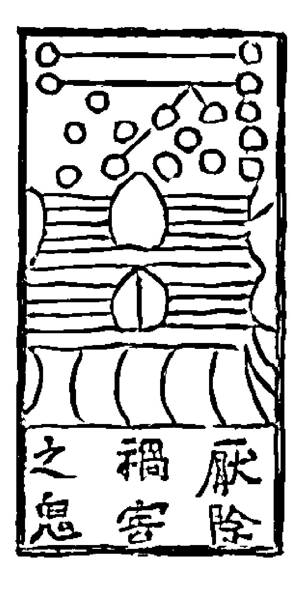

#### 厌恶鬼

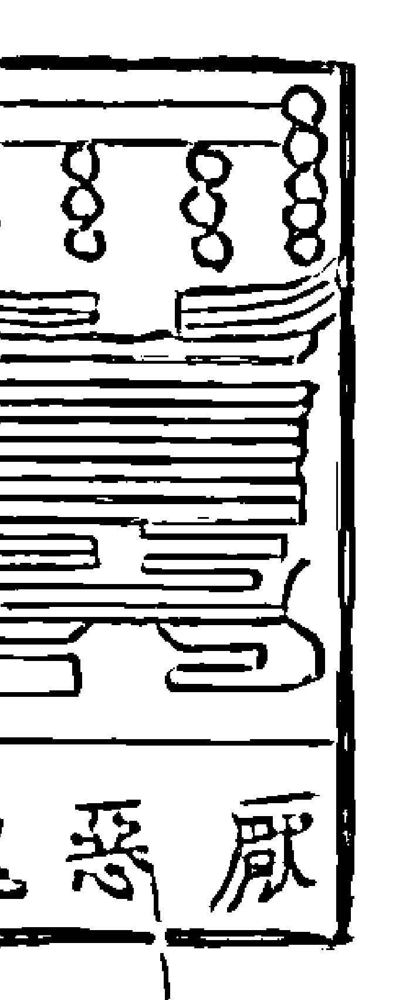

#### 准备

1. 选定画符的吉时吉日
2. 前三天开始净身斋戒
3. 净坛

#### 此符大招官职

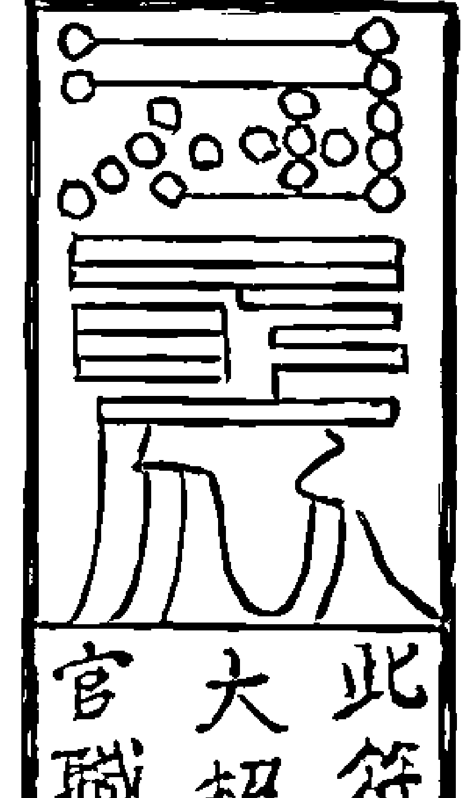

#### 厌除淫祠好恶之鬼

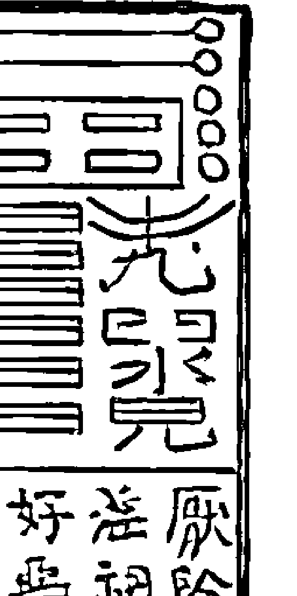

#### 画符

1. 诵念咒语一口气写好

#### 厌百怪口舌之鬼

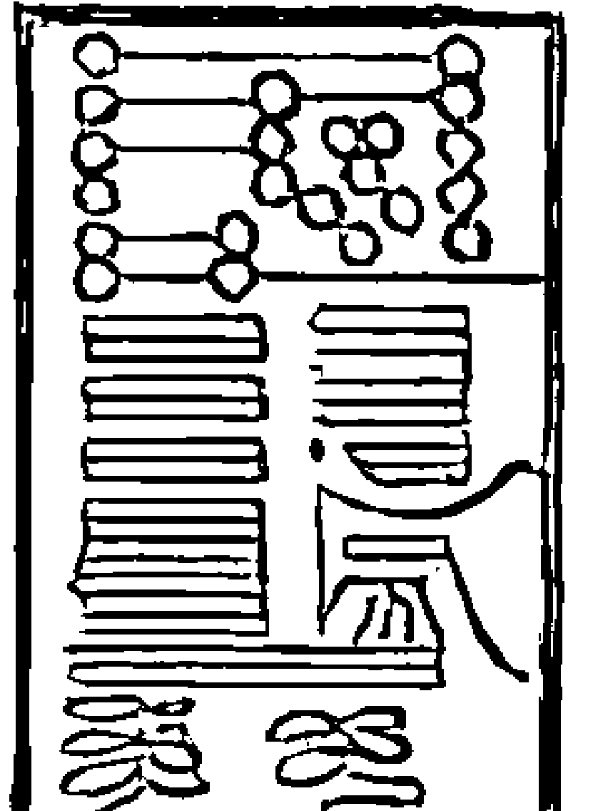

#### 厌北方土气耗损之鬼

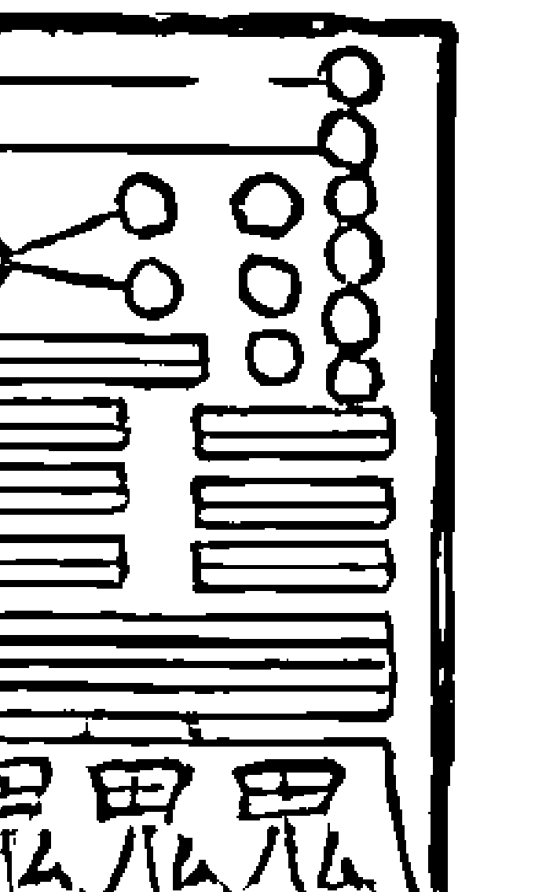

#### 记完以后

1. 厌符便告完成
2. 送神（将请来的神祇送走），仪式结束## 道紋與晴紋

> 道紋與晴紋算是陰陽道相當有名的符咒記號。其外觀形狀相當簡單，有些地區還會將其作為護符使用。

#### ○晴明與道滿的護符

道紋與晴紋是從前日本三重縣南部徒手潛水採集海產的女性——也就是一般所謂的海女，她們描繪在手巾、內衣、道具等物品上的咒術符號。

這兩個縱4線橫5線的格子狀與五芒星的符號似乎是成對使用，一說格子狀圖像是「防禦魔物的網」，五芒星則是有「一個筆劃回歸原點而無縫隙、魔物無從入侵」的意涵。附帶說明，現在的海女都穿潛水衣，已經很少有攜帶道紋晴紋的習慣了。

縱4線橫5線的格狀圖像其實就是所謂的九字之印（早九字），而五芒星則是晴明桔梗印。

或許因為五芒星就是晴明桔梗印，一般認為「晴紋」此詞乃是取自「晴明」的名號。另一方面，也許是因為與晴明印成對，自然而然就扯到了晴明的死對頭，因此據說「道紋」便是取自於蘆屋道滿之名。

然而，遍尋史料卻始終不見蘆屋道滿愛用縱4線橫5線印的記錄。陰陽道裡固然也有種名為四縱五橫咒的縱4線橫5線印，不過道紋應當是來自於密教的產物。

一般相信密教的九字確實擁有破魔護身的效果，因此可以說是非常適合海女用來規避海難的用途。同樣地，五芒星也是廣泛全世界使用之抗魔、守護符號，所以跟晴明的這層關係有可能是後來的穿鑿附會也說不定。

此二者是因為從前有部電影「帝都物語」片中人物曾經提過「道紋・晴紋」，方得普遍為大眾所知。

> ＊九字：密教裡結九種手印、唱誦九字光語，藉以達到驅退怨敵、附伏惡靈、消災祈願、規避災厄等功效的修法。

### 明紋與暗紋

明紋與暗紋或暗紋與道紋均可。據說日本三重縣的海女會在手巾、內衣或道具等物品使用這兩個咒術防身。明紋和暗紋兩者成套使用。

#### 明紋

明「八形」。五芒星。因形狀頗似桔梗花故亦稱「桔梗印」。亦名「晴明紋」。此印乃是取自晴明的名號。明「明紋」此印乃是在側劃四點而無際縫，故魔物無從入內。

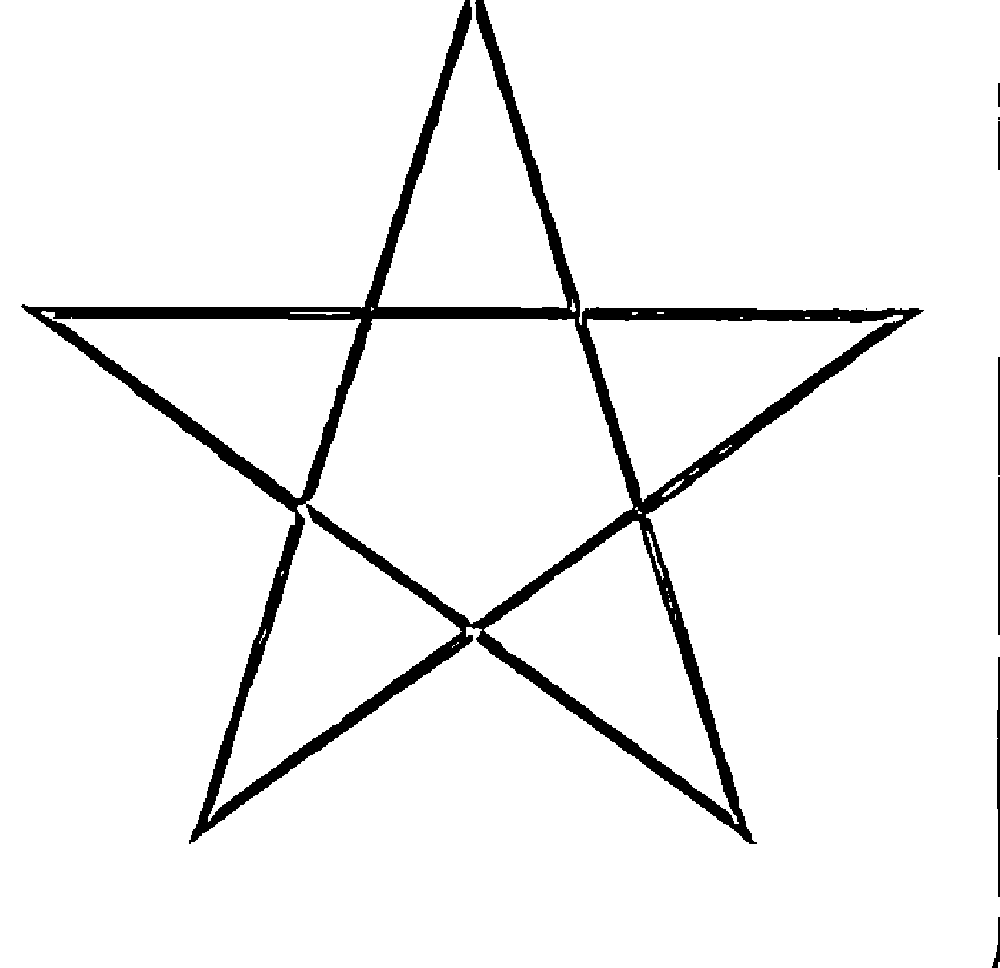

#### 道紋

由直線縱橫交錯的格子狀圖案。這是所謂的九字之印（早九字）。從右上角開始以橫、豎、橫…的順序劃成格子。亦名「道紋」。此印據說是來自安倍晴明死對頭道摩法師（蘆屋道滿）。另外，這個咒印有個同款的咒印，喚作四縱五橫咒。不過道紋應是從密教的「臨兵闘者皆陣列在前」，九字發展而來的。密教相信九字具有破魔驅身的效果。

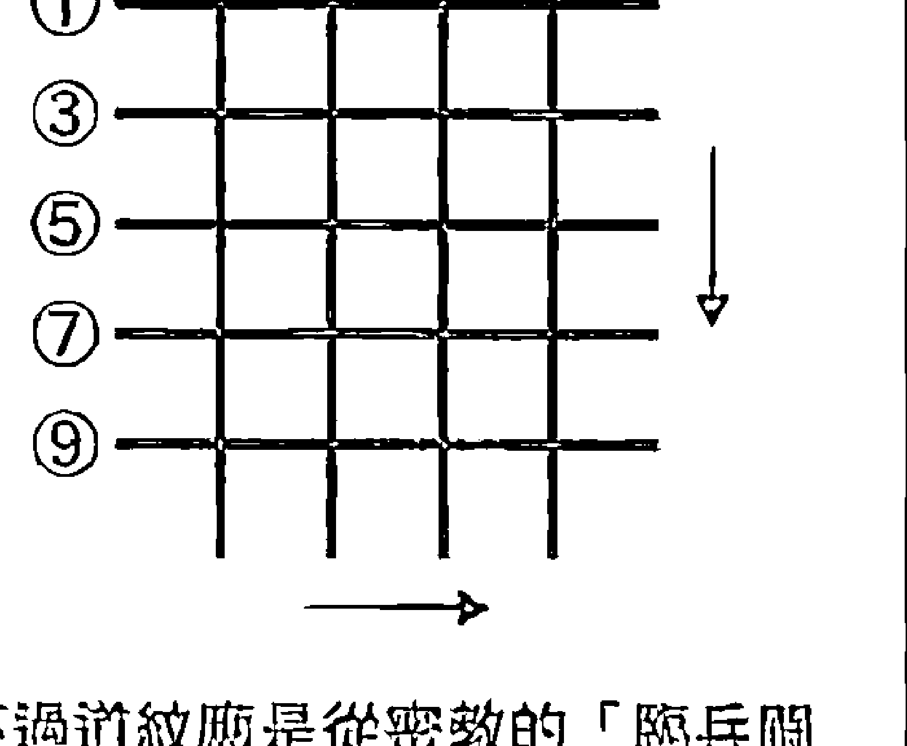

> 有關於「明紋」的謎題？ ○蘆屋道滿→No.075

### 護身劍與將軍劍（破敵劍）

從前有獻給天皇的退魔破魔劍，當世第一的陰陽師安倍晴明與賀茂保憲都與這兩柄劍有很深的關連。

#### ○神秘而強大的靈劍

安倍晴明有部主張自身功績的文書《大刀契事》，受其子孫視為晴明血脈之象徵而珍藏之。

該書主張晴明曾經促成護身劍與將軍劍（破敵劍）這兩柄靈劍的再生鑄造。原來此二柄靈劍是在天德4年（960）的內裏火災中燒毀失落，翌年晴明便進獻靈劍圖像、建請天皇重鑄靈劍。

成書年代相去不遠的日記《中右記》裡同樣也找得到晴明處請重鑄靈劍的記述，但鎌倉時代前期的《左大史小槻季繩記》卻記載：下令鑄造靈劍的村上天皇是「命賀茂保憲造之」。事實上，當時賀茂保憲是天文博士，而晴明仍是陰陽寮的學生，因此一般認為晴明應是以輔佐角色參與鑄劍作業。

傳說靈劍有守護天皇與朝廷之咒力，可是我們除了知道靈劍是由百濟所獻以外，對其他詳情卻是知之甚少。靈劍雖是天皇代代相傳，但經過幾番內裏火災與政局混亂，相關記載不知何時已從史料記錄裡消失無蹤了。

護身劍的劍身帶有南斗、北斗、日形、月形、朱雀、青龍、玄武、白虎的印記。據說此劍能夠治癒一切疾病邪氣，有招福消災的效果。

將軍劍（破敵劍）劍刃刻有三皇五帝、北極五星、南斗、北斗、白虎、青龍的印記，還有西王母兵信符等咒文。據說持此劍斬下命運受攻擊，能使諸敵敗伏再不得起。

#### 護身劍

此劍有南斗、北斗、日形、月形、朱雀、玄武、白虎的印記。

此劍能治癒一切疾病邪氣，有驅魔的效果。

#### 將軍劍（破敵劍）

劍身刻有三皇五帝、北斗五星、南斗、北斗、白虎、青龍的印記，還有西王母兵信符等咒文。

持此劍者不論遭受攻擊，能使諸敵敗伏再不得起。

這兩柄靈劍是百濟所獻貢品，傳聞擁有守護天皇與朝廷之咒力。

天德4年（960）內裏火災燒毀失落。

此時仍是一介陰陽寮學生的晴明向天皇進獻靈劍圖像。

村上天皇命令天文博士賀茂保憲再鑄靈劍。

#### 大刀契事

由大刀契事創造兩柄靈劍是他自身功績的文書，以此作為晴明血脈象徵而珍藏之。

> ○賀茂保憲→No.077

### 散供

除高級咒術以外，尚有非陰陽師亦可行使之簡單咒文。對庶民來說此類儀式也是極有必要的。

#### ○散播潤布的儀式

散供是種即便並非專業陰陽師亦可行使的簡單儀式。散供亦稱「散米」或「打時」，簡單來說就是灑播食物餵食供養低級神靈鬼魂，以祓除之。

史料記錄指出從前藤原兼隆宅邸在迎接中宮*1藤原威子時，賀茂守道便曾經行使過散供。

節分的時候要邊喊「鬼在外、福在內」邊灑豆子，便可以說是這散供儀式的遺俗。有說法指出鬼相當畏懼豆子蘊含的靈力，另外像灑米可能也是同樣著眼於食物擁有的力量。

《今昔物語集》*2第二十七卷有則故事：乳母在半夜看見大約10個身高約5寸的靈體行經幼童枕邊，於是投擲大把米粒，只見幽靈立時便消失不見。隔日早晨再仔細一看，卻發現每粒米都沾著血跡。

另外《源氏物語》的「橫笛」有則夕霧夢見故友柏木的亡靈出現在夢裡的故事。後來夕霧雖然因為聽見尚且年幼的小少爺哭泣聲而醒轉，豈料小少爺卻啼哭不止，於是眾乳母遂撒米驅魔。

同樣是驅魔，似乎也可以在事前行使散供好讓惡靈不會出現。

《宇治拾遺物語》*3第十一卷有則記載圍觀的群眾替某位將要投水往生的僧人灑米驅逐惡靈的故事。這則故事最後有個轉折，該僧終究還是作罷沒有投水自盡，於是圍觀者便像是執行在散供儀式般，紛紛撿拾河邊的小石子擲向僧人。

時至今日仍有許多地方會在新蓋房屋舉行上樑儀式*4的時候撒年糕，這些也都可以說是散供的遺俗。

1 中宮：一般為立后、皇太后、太皇太后三者之總稱，平安中期以後則以此稱呼在皇后之後才入宮的妃子，其身分與皇后同。
2 《今昔物語集》：請參照P.041注。
3 《宇治拾遺物語》：請參照P.040注。

## 何人都能行使的陰陽儀式

> 「撒播供品」的儀式。亦稱：散米、打時。透過混插食物餵食供養低級神靈鬼魂，藉以祓除之。

#### 出典的案例

| 出典 | 對象 | 投擲物品 |
|---|---|---|
| 《今昔物語集》第二十七卷 | 約5寸高的聖僧 | 米 |
| 《源氏物語》柏菴 | 故友柏木的亡靈 | 黑壓的米 |
| 《平家物語》第十一卷 | 將要投水往生的僧人 | 米 |

#### 現代的撒供例

- **節分** - 2月3日節分當天要撒豆子驅惡鬼
- **地鎮祭** - 新建工程開始時會撒米等食物以供養土地神祇
- **上梁式** - 為新建房屋架上棟梁時會撒年糕或錢

**注**：「祭文板」是上梁式的時候釘在樑木上的木牌，書寫的內容因地區或執行儀式之神職者而異。地鎮祭、上梁式等一連串儀式告一段落後，通常會淨化這塊木牌作結。

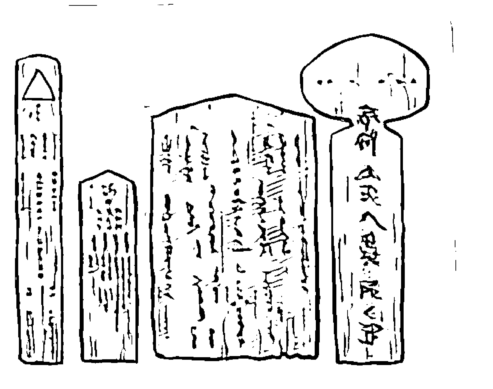

#### 反閇

> 反閇是種源自道教的咒術，與咒符同為陰陽道咒法當中的基本性、實踐性術法。

#### ○退魔的步法與咒文

所謂反閇是種保護自身免受移動之目的地邪氣侵犯的咒術，可以分成唱蕊咒文與名為禹步的步行法兩個部分。

從10世紀後半葉起，天皇行幸或派遣追討使*1的時候，例如有賤族遷居、相撲等賽事在出場的時候都會行使反閇。附帶一提，派遣追討使最好是在要出門的時候使用反閇，貴族遷居則是以踏進新家門口之前行使為佳。

反閇共分大中小三個種類，使用時分別要手持弩弓、太刀、笏板而行。

日本京都府立綜合資料館所收藏的資料《小反閇作法並襲身法》記載了安倍泰親的反閇作法。根據這項資料以及《小反閇作法》、《家秘要抄》等資料簡單介紹小反閇作法如下：

首先面向目的地、向三反玉女報告出外遠行之事由。其次嗚嘭三反天鼓、觀五臟之氣；咒唸以「南無」為始、以「急急如律令」作結之勸請咒。接著再咒唱天文咒、地戶咒、玉女咒、刀砧咒、四縱五橫咒。此處所謂「四縱五橫咒」縱向由左而右依序為朱雀、玄武、白虎、勾陳；橫向由上而下則是代表帝久、文丁、三台、玉女、青龍。然後腳踏禹步，止步唱咒。

相傳禹步是古代中國禹王的步法，據說相撲的四股*2亦是由禹步演化而成。

最後唱「乾坤元亨利貞」並踏6步。「乾坤元亨利貞」則是來自於《易經》的「乾元亨利貞」。這是《易經》「乾卦」的句，據說唱唸此句便能驅退世間邪惡。

*1 追討使：朝廷為追討叛亂或叛賊所派遣的使者。
*2 四股：相撲的基本動作，兩腳張開、雙手置於膝，交互高舉左右腳用力踏地。

#### 禹步

中國王朝君王禹所流傳下來的...

#### 反閇

免受他地邪氣侵犯的咒術... 反閇的重要元素之一... 分大中小，使用時分別要手... 太刀、笏板而行

#### 使用的時機

- 出門時
- 進門時
- 出場時

#### 小反閇的作法

- 地、向三反玉女報告出外
- 天庭、取五臟之氣
- 咒
- 戶咒、地戶咒、玉女咒、刀
- 從五徳咒
- 步唱咒
- 元亨利貞」並踏6步

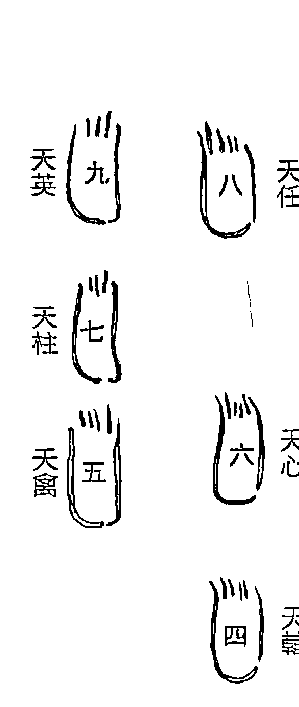

## 防止屋宅內災厄發生

此節介紹的是防止土公神與宅神引起之災厄、火災的咒術。除祭祀以外，陰陽師還能以符咒預防災厄。

#### ○土公神和各處宅神引起的災厄

陰陽師要處理的並不只是疫病和旱魃等國家規模的災厄，其實災厄大多都潛伏在住家之中。

其中為災最甚者當屬土公神。

土公神是種土地精靈，最忌諱「犯土」，即「挖掘翻動土壤」。只要挖掘地面達3尺（約91公分）以上的深度便會引發土公神作祟，必須設法鎮撫土公神。請陰陽師執行土公祭便是其中的一個辦法。事實上當民眾因土公神作祟、換言之就是觸犯「土之氣」而罹病的時候，也會請陰陽師行卜占或祓禊等術法對處之。

除此之外，住家裡面還潛伏有形形色色的神祇，統稱為宅神。

門、窗、水井、爐灶、廳堂、庭院、廁所等處均分別有門神、戶神、井神、灶神、堂神、庭神、廁神等神祇，而這些大概正是、八百萬諸神靈吧。

平安貴族甚是畏懼這些宅神作祟。譬如在搬進新家的時候，為免觸怒諸多神祇，就要執行各式各樣的咒術和法事，並持續達三個月之久。

在屋宅內可能發生的各種可怕災厄當中，當然也包括火災。預防火災發生的防範方法同樣也是聘請陰陽師行使咒術——諸如防解火災祭和災惑星祭等祭祀儀式。

陰陽師還會製作咒符以防火災發生。咒符是要放置在宅邸的長押、抑或橫樑之上，防止火災發生。

除火災以外尚有防範諸多災厄的護符，從前還曾經有過將「御波」或「護」的咒符釘在屋柱上的例子。

### 家宅的災厄・搬家注意事項

#### 引發家庭災厄的神祇

- 土公神
  - 犯土（挖掘翻動土壤）的神祇
  - 挖掘地面達3尺（約91公分）以上便會引動土公神作祟
- 宅神
  - 乃指潛伏於家中各角落的諸多神祇（門神、戶神、井神、灶神、堂神、庭神、廁神）
  - 搬入新居等場合有時會蒙受其害

必須執行土公祭鎮壓調伏。

為免宅神作祟而於遷居後的3個月內舉行兩種儀式。

從前曾在建新屋搬新家等場合舉辦各種祭祀法事，努力避免觸怒神祇。

#### 預防住家免於火災的方法

- 防禦火災祭：營造建築物時舉行的預防火災祭祀
- 祭祀火星：熒惑星（火星）生變時舉行的祭祀
- 可以免於火災的符咒：置於寢殿長押、橫梁之上以為護符

說到「火災」，令人想到陰陽道名人安倍晴明的軼事。他曾經主動提議要舉行防禦火災的祭祀，但最後不知為何卻沒有履行。其中緣由，又或者是出於其他原因如今已經不得而知，總之他最後還落得「自食其果」的報告書。

### 治療疾病的陰陽術

傳說從前每個季節以京都為中心舉行的諸多儀式都有預防疾病的效果。即便是已經沾染了疾病，也經常會雇請陰陽師治病。

#### ○陰陽師與疾病

陰陽師在處理疾病時會使用「診斷占卜」與「治療咒術」，另外有時還會在利用醫藥或咒術進行治療之前行使「確認有效性與安全性的占卜」。

所謂的咒術治療其實就是「祓禊」。在從前將穢視為各種致病病因之一的舊時代，祓禊可是個不折不扣治療疾病的手段。

舉例來說，安倍晴明就曾經用祓禊替一條天皇治病，還因此擢升了一個位階。

除前述咒法以外，還有種叫作「招魂祭」的祭儀。

招魂祭同樣是以治療疾病為目的，是種召喚生魂的咒術。其理論根據似乎是認為疾病「乃因生魂脫離軀體而起，只須將其召回即可」。

據說從前賀茂守道便曾經在藤原道長臥病的時候實際使用過招魂祭，道長的人魂立刻就飛了回來。其後道長的疾病痊癒，而守道也受到了褒獎。

#### ○唯一的死角

其他像食物中毒、晚產、產後問題，以及胸病、腳氣、灶土公神作祟等神靈致病，同樣也能以祓禊治療並且具有療效。

祓禊看似是能治百病的萬能術法，但自古至今卻獨不見驅除者亡靈所致厄障行祓禊的案例（平安貴族的日記裡一次都沒有出現過）。看來祓禊這種術法或許對亡靈無效。

## 古代的貴族如何處理疾病？

罹患疾病。

陰陽師以占卜進行診斷，占算罹患疾病的原因為何。

判斷致病的病因（從食物中毒、土公神作祟到穢厄致病）。

陰陽師會在小紙人腹中放米。

利用占卜確認將要施行之醫藥或咒術的有效性及安全性。

選擇治疗方法。

- 咒術治療
- 醫藥治療
- 其他

#### 咒術治療例

祓禊：利用祓禊祓除致病的穢厄。
收魂術：喚回即將或已經脫離身體的生魂。

- 咒術治療被用來治療各種疾病（難產、晚產、產後問題、胸病、腳氣、灶神土公神作祟、幾乎萬能）
- 案例：因「外諸亡靈所致厄障」行祓禊之案例

### 五龍祭與雷公祭

五龍祭與雷公祭是為解決旱魃而由朝廷主辦、由陰陽師執行之求雨咒術。

#### ○求雨的咒術

安倍晴明曾經在連續30日未獲甘霖、酷暑連綿的寬弘元年（1004）執行五龍祭，結果當晚便即降下許久未見的大雨，一解旱象。當時晴明已是84歲之齡——也就是發生在他逝世前一年的傳說。

五龍祭的「五龍」指的是「東方青龍神王」「南方赤龍神王」「西方白龍神王」「北方黑龍神王」「中央黃龍神王」，是指向龍神求雨的咒術，又稱「雩祭」。

據說日本首次舉行五龍祭是在延喜2年（902）6月，從此五龍祭便逐漸確立了其求雨儀式之地位。這也就是表示，五龍祭確實具有相當程度的效果。

另外還有種名為雷公祭的咒術。這是種在發生瘟疫的時期和四角四堺祭同時併用的儀式，由於此術乃是催動雷公＝雷神而進行的咒術，所以有時也會在大旱時節用來祈雨。

只不過，也許是因為雷公祭並非專為解決天旱而行使的咒術，其效果似乎相當微薄。自從開始使用五龍祭以後，雷公祭在半個世紀時間便告完全消失。

事實上，在晴明的時代就已經完全沒有執行雷公祭的紀錄了。包括預防疫情這個領域在內，雷公祭恐怕已經徹底遭到其他咒術置換取代。

五龍祭和雷公祭均是由朝廷主辦的祭祀。從未有貴族以個人身分執行過，自始至終都是為了國家而行使的咒術。

附帶一提，五龍祭基本上必須與密教的「請雨經法」同時併行方可。

## 陰陽術之效果

#### 雷公祭

- 催動風神的咒術
- 求雨時節可用來祈雨
- 用來對付疫病的咒術
- （四角壇是對付疫病咒術的四角四壇同時併用）

#### 五龍祭

- 催動龍神的咒術
- 求雨專用。又稱「雩祭」
- 延喜2年（902）首次舉行五龍祭
- 五龍祭並非單獨使用，而是必須與密教的「請雨經法」同時併用的複合咒術

五龍：五位龍神 東方青龍神王、南方赤龍神王、西方白龍神王、北方黑龍神王、中央黃龍神王。

雷公祭以後便完全消失。

自從首次舉行五龍祭以後漸漸獲得求雨標準儀式之地位。

> 以上兩個咒術均是由朝廷主辦的祭祀。未曾有貴族以個人身分執行。

#### 其他朝廷主辦的祭祀

- 蟲祭：對付蟲害、豐收祈願。
- 風祭：迴避風災。鎮定大風。
- 鬼氣防止祭：疫情流行時防止疫鬼入侵。
- 心願成就：製作神器、寶物時使用。

### 四角四墹祭

陰陽道也有張設結界這種很有術師模樣的技術。四角四墹祭是種祓除邪氣、保平安的咒法。

#### ○張設於都城各處的結界

陰陽道有種名為四角祭・四墹祭（亦稱四境祭）的祭祀。其目的是在祓除抑或防止疫病神與鬼魅入侵；在宮中四隅舉行的稱四角祭，在都城四隅使用的則是喚作四墹祭。

此類儀式並非定期舉行，而是僅在有必要的時候才會臨時舉行的祭祀。

《小右記》在長和4年（1015）5月6日的條目下記載到「安倍吉平（晴明之子）事奉四墹角祭」。另外在3天後的5月9日則是記載有朝廷行使四墹祭的記錄。

不僅僅是朝廷，鎌倉幕府似乎也曾經在將軍邸和鎌倉近郊使用過這種咒法。「四角祭」此語首次出現在歷史文書，便是在《貞信公記》裡承平元年（931）2月12日的記錄裡面。

延長8年（承平元年的前一年）春夏之分開始有疫病流行，加以風災水災頻仍，另外6月還有雷落清涼殿*1將人殛斃，天皇更因罹患咳病而於9月駕崩，民眾不堪飢荒興起暴動……災禍接二連三而起。或許當時就是因此才決定要舉辦四角祭。

實施四角祭的「宮城四隅」指的應是乾坤艮巽（西北、西南、東北、東南）四個方向。朝廷的另一個咒術機關——卜部有種名叫鎮火祭的祭祀，是在「宮城四方外角」行使，指的就是宮城北部一條通與京城南部二條通的街角；由此可見，四角祭也與鎮火祭同樣是在街道上舉行的。

另外，相當於山城國*2國境的會坂墹（逢坂關）、水操作（滋賀縣愛宕郡）、大枝墹（大江山）、山崎墹（關戶院）等地也都辦過四墹祭。

#### 四角四埓祭

在大內裏的西北／西南／東北／東南四隅舉行。

#### 四角祭

為守護都城而於京城四隅舉行。

#### 四埓祭

兩者均是祛禳／預防疫病和鬼魅入侵的儀式。
儀式是在四個方位同時進行，所以需要4名陰陽師。

- 承平元年（931）
  - 疫病流行／風災水災／雷霆
  - 天皇罹患咳病／民眾飢饉暴動不斷
- 首見於天曆6年（952）
  - 記錄指出朝廷曾為四埓祭而派遣使者
  - 前往大枝埓堀、山崎埓堀

是指同時舉行四角祭與四埓祭。
需要8名陰陽師主持，因此唯有在發生相當重大的事件時才會舉行。

#### 四角四埓祭

#### （舉行）四角祭的場所

#### 舉辦四埓祭的場所

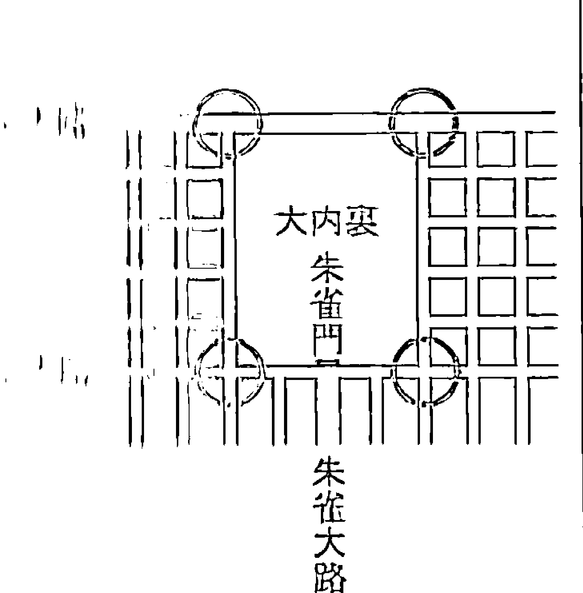

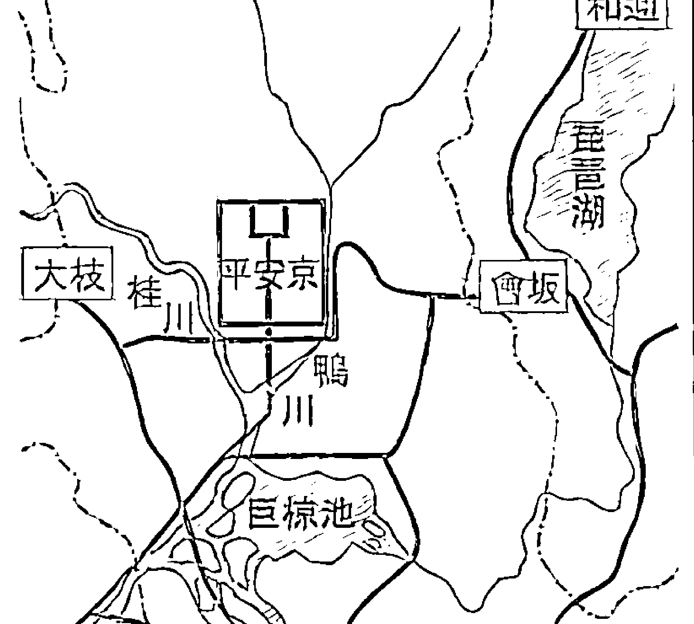

指天皇居住的內裏（皇宮）為中心，於外圍設置朝堂院與諸多官廳的區域稱為大內裏。

### 七瀬祓

祓禊與淨化的儀式是陰陽師的重要工作，此二者與日本自古傳承的神祇祭祀信仰也是共通的。

#### ○在河川的7個不同地點祓除穢厄

所謂祓禊就是去除穢厄的意思。穢的意識約於9世紀中葉開始形成，及至10世紀在貴族社會大肆流行，並且受到過度重視。當時有部名為《延喜式》*1的條例，裡面將穢厄如何發生如何傳播一一細分，並且確立了穢厄將會在幾日後消滅等諸多規定，至此終於完全確立了由陰陽師行祓禊除穢厄的作法。

眾多祓禊儀式當中有種每月都要擇吉日舉行、甚至已經成為例行公事的儀式，喚作七瀬祓。

七瀬祓是在人稱「洛中七瀬」的7個處所（川合・一条・土御門・近衛・中御門・大炊御門・二条末）各個地點舉行的大規模祓禊儀式。這項祓禊之目的便是要讓京城街道的穢厄隨著河水流走。

許多身分高貴者會向陰陽師交給他們的人偶身上吹氣當作自己的替身，然後以此在河邊行祓禊。與此同時還會一併舉行「火災御祭事」（防火儀式）或「代厄御祭事」等祭祀。

「洛中七瀬」所指七瀬均位於加茂川與高野川匯流處以內約2公里內，另外還有根據同樣地理條件擴大規模的「靈所七瀬」。「靈所七瀬」是指川合・耳敏川（朱雀門前二條南）・松石彤（西園寺東）・東濱（北白河的瀑布）・西濱（仁和寺的瀑布）・大井川這7處，自11世紀中葉開始每兩個月都會在這進行一次祓禊。

此外還有種雖是臨時性但規模卻更大的「七瀬各所」。行禊的場所分別是山瀬的大島・橘小島・攝津國*2的難波・山城國的山所・近江國*3的佐久那谷・辛崎。

- *1 《延喜式》：平安中期的律令施行細則，共50卷。延喜5年（905）藤原時平等人受命於醍醐天皇開始編纂，乃根據弘仁式・貞觀式等基礎所編，成為後來律令政治的基本法。
- *2 攝津國：舊國名，五畿內之一，相當於現在的大阪府西部與兵庫縣東南。
- *3 近江國：舊國名，相當於現在的滋賀縣。

#### ○由陰陽師祓除厄

- 9世紀中葉：術的思想形成
- 10世紀：術的概念在貴族社會大為流行，並受到過度重視
- 《延喜式》（967年實施）：正式定義祓厄
- 確立由陰陽師祓除厄之作法

#### ○同時举行的祭祀

- 火除川祭祀（防火灾的仪式）
- 氏神社祭祀

#### ○地點圖示

- a. 贺茂川合 b. 一条 c. 土御门 d. 近卫 e. 中御门 f. 大炊御门 g. 二条末
- h. 贺茂川合 i. 耳敏川（朱雀门前二条南） j. 松崎 k. 石影（西园寺东）
- l. 山科（北白河的瀑布） m. 西滨（仁和寺附近） n. 大井川

### 泰山府君祭

祭祀泰山府君的咒術，拜安倍晴明之賜始而成為陰陽道最著名的儀式。

#### ○享奉祭祀冥府之神

一般公認晴明最拿手的咒術，便是泰山府君祭。

泰山就是中國名山五嶽當中的東嶽泰山。此地亦稱「泰山北斗」，是個堪與天空的北斗七星齊名並稱的神聖場所。泰山府君是泰山的山神，也有人說他就是陰陽道的主神。

附帶說明，泰山府君別名又叫東嶽大帝＝閻魔大王，而閻魔在日本佛教裡又被視為地藏菩薩；換句話說，若說陰陽師祭祀的是閻魔或地藏菩薩其實也未嘗不可。

前述說法姑且不論，一般認為泰山府君祭是種訴諸執掌生死與人類生死的泰山府君企圖干涉人類生死的秘密儀式，相傳此法能夠操作壽命長短、救回已經喪失的生命。

泰山府君祭並非治療疾病的祭祀。翻查實際記錄和平安期的日記等資料後發現，它其實是種預防疾病的祭祀儀式。

藤原實資的《小右記》裡雖有泰山府君祭的記錄，但實資們乎相當地健康。此外，藤原行成的《權記》裡也有「延年・祈壽之所為也」的記述，長壽祈願之意味相當濃厚。泰山府君祭也常被指為延命術和復活術，經常會被賦予類似宗教故事的教誨意涵。

泰山府君祭還有種堪稱為升級版的儀式——天曹地府祭。此項祭祀是拜請以泰山府君為首的十二座諸神降臨、祈請諸神護，只能由陰陽師替天皇家的每代天皇執行一次，是秘法中的秘法。這是種祈使天皇延年益壽、兼具國家公器與私人目的的祭祀，日本首位行使天曹地府祭的天皇便是桓武天皇。

「長壽」「不老不死」是從中國皇帝到日本貴族等眾多求仙者最根源的願望，而泰山府君祭便是為此應運而生的祭祀。

#### ○天曹地府祭

拜请以泰山府君为首的十二座诸神降临、祈请诸神守望，据称为泰山府君祭的升级版。相传仅为每代天皇行使一次，是秘法中的秘法。

#### ○泰山府君簡介

- 泰山山神：泰山府君
- 司掌万物、人类生死的神明。
- 别名：东岳大帝。亦即阎罗大王，日本佛教将其视同为地藏菩萨。

#### ○以佛教故事形式流传开来的泰山府君祭

三井寺的智兴内供罹患重病，经占订结果显示已无挽救希望。除非有人肯代替智兴，以自己性命替他续命，智兴便能存活下来。弟子证空遂下定决心，举行泰山府君祭。

《三井寺起绘卷》里面，三井寺本尊不动明王感受到该名弟子的诚意，代替证空，因此证空始得以免于一死。然而这则故事最初收录于《今昔物语集》，里面却没有不动明王这部分的记载，恐怕是后世的添饰创作。

这则故事却似乎被认为是段「佳话」而得以流传开来。佛教说话集同样是以佛教故事的形式收录了这则三井寺院常住院的泣时代的佛教说话集《私聚百因缘集》里甚至还有则住在大城的贫穷老人欲以自身性命跟重病将死的儿子交换的故事。对父子靠着晴明的仪式交换彼此寿命以后，余命所剩不多的父亲，竟得如来与菩萨认可其慈悲心、向阎罗说情，终于才...

- **内供**：「内供」之略称，住于宫中的内道场，于天皇的御斋会等场合担任诵经的僧侣。选10名德高望重的僧侣出任此职。
- **本尊**：为信仰中心所拜之佛像、菩萨像或曼荼罗等物。
- （详见P.041注）

### No.058 天文密奏

> > 陰陽師他向天皇單獨一人報告天意啟示之結果，此即為天文密奏。

#### ## ○天文意即「天空出現的紋樣」

古代中國相信異於平常的天空紋樣——也就是所謂的天變，是上天的中心——最高神天帝為警惕凡間皇帝失政失德而呈現的徵兆。

占星術、天文學便是專為解讀天意而發達、為了將出現在天空的任何細微徵象及早傳達給皇帝知悉而存在的技術。

後來這套技術傳入日本，並且在陰陽寮底下設置了天文部門。

觀察天文氣象，若有變異則火速占算吉凶、密封上奏天皇，這是陰陽寮一項很重要的工作——其實說穿了，這才是陰陽寮根本的任務。

這項解讀「天文」然後「密封」、「上奏」的工作，就叫做「天文密奏」。

天文博士的上奏文書裡會記載「何時」、「哪個星體和哪個星體」、「接近到何種程度」等事實，然後再引用由中國傳入的占術書籍舉出幾個事例，說明眼前天文是何前兆。一旦陰陽寮將天變上奏，朝廷就必須針對上天所發出的警告擬出對策。

安倍晴明大概是在50歲的時候就任天文博士，他曾經在安和3年（972）年末之際觀察到天變、行過天文密奏。既然是密奏其內容自然無從得知，但是根據電腦推算出來的天文狀況，推測當時應該是在日落後觀察到火星與金星在西方天空有時而接近有時而遠離的情形。這恐怕就是當時視為天變徵兆的現象。

另外天養2年（1145）哈雷彗星出現的時候，朝廷就召集公卿議論該施行何等德政，最後頒布赦免罪犯之赦免令、改元、以及政治改革的新制九法條。

天文與政治的關係便是如此地密切。

#### ○天文密奏的流程與事例

- 古代中國：上天帝為警示凡間皇帝失政而顯現的微兆
- 日本：為帝者稱作「天皇」，故除神意以外還要度忖天意
- 因此、要了解天意、及早察覺細微之兆而使得占星術、天文學發達
- 為忖度天意而設立陰陽寮
- 傳承到日本發展成陰陽道
- 傳達天意的天文密奏是陰陽寮的重要工作

#### ○上奏的內容

- 「何時」、「哪個星宿和哪個星宿」、「接近到何種程度」等事實
- 引用中國的占術書並列舉幾個示例，說明是何前兆。

#### ○對策

- 對天變出的警告提出對策

#### ○天變=>天文密奏=>研擬對策之事例

- 1145年哈雷彗星出現
- 頒布罪人赦免令、改元、頒布新制九法條（政治改革）

### 星宿的咒术

在阴阳师接受委托的祓禊业务项目当中，也包括针对掌握个人命运的星宿而施行的仪式。

#### ○属星祭

从前平安时代的阴阳师行使的属星祭亦称本命星祭，是为服务特定个人所执行的咒术。所谓属星（本命星）就是指北斗一星；从最接近北极星的星辰开始依序命名为「贪狼星」、「巨门星」、「禄存星」、「文曲星」、「廉贞星」、「武曲星」、「破军星」，古人相信每个人的命运都分别受到这七颗星所支配。

首先要根据各人出生年的十二支生肖来决定七星当中何者是自己的「本命」。若将本命星的概念想作是西洋占星术的星宫，应该就比较容易理解了。

每个人每经过60日就会遇到自己的本命日，所谓本命日就是指当日干支与自己出生年干支相同的那一日。其中详情不得而知，但本命日其实亦属凶日的一种。据说在本命日行物能够预防疾病发生、得致长寿。属星祭在相当在意运势与吉凶的贵族之间似乎很是流行。

#### ○五曜星祭

除属星祭以外还有其他不同的星祭。譬如月曜祭与太白祭，就是当「月曜」（月球）或「太白星」（金星）有不祥征兆时用来回避灾厄的仪式（仪式内容不详）。

曜日本是各天体的名字。日曜是太阳，月曜则是从前用来指阴晴的月亮，火曜到土曜则是火星以至土星等行星的称呼，再加上日月合称为七曜。其中除太阳与月亮以外的五个星体亦可合称为五曜。

从前安倍晴明也曾经长期任职过的天文博士一职，其职责内容就是要监管观察这些星辰的运行状况。当时认为从星象的变化当中，不但可以知悉未来将要发生的事，甚至还能事先察知将要降临在个人身上的灾厄。

#### ○星（本命星）

- 司掌個人命運的星宿
- 七曜星當中有一顆是自己的本命星
- 本命星取決於出生年的干支

#### ○星（本命星）的干支對應

- 紫微星（子） → 巨門星（丑・亥）
- 天機星（卯・酉） → 祿存星（寅・戌）
- 廉貞星（辰・申）
- 武曲星（巳・未）
- 破軍星（午）

#### ○七曜

- 亦即所謂「曜日」
- 本是各天體的名字
- 除日月以外的五個星曜亦可合稱為五星

- 日曜：太陽
- 月曜：太陰（月球）
- 火曜：熒惑星（火星）
- 水曜：辰星（水星）
- 木曜：歲星（木星）
- 金曜：太白星（金星）
- 土曜：鎮星或作填星（土星）

#### ○星祭（本命星祭）

- 為了預防疾病與災害而委託陰陽師舉行的儀式
- 舉行日為干支與出生年相同的那一天，是最需慎行的凶日。

#### ○月曜祭／太白星祭

- 當月球或太白星有不祥運動時用於迴避災厄的儀式
- 祭祀的由來：此二者本是宿曜師（密教僧）的月曜供奉、太白星供奉儀式，後來才受到陰陽師吸收採納成為月曜祭、太白星祭。

- （○十干十二支→No.007）
- （◎安倍晴明→No.067）

### 陰陽師式神

式神是種陰陽師可以操縱自如的超自然存在，其名乃取自「式盤之神」一語。

#### ○何謂式神

說到陰陽道最搶眼的亮點，非式神莫屬。式神亦作識神，安倍晴明封印於一条戻橋[1]下、有事的時候才會召喚出來的式神——十二神將可謂是赫赫有名。

若再問到式神究竟是何物，卻又並無定論。簡單來說其定義是「陰陽師使役的鬼神」，不過式神還可以分成幾個種類。

一種是以式占所用道具式盤的守護神為陰陽師使役神的式神，此類可視為與密教的護法童子相同性質的僕從。
另一種則是讓神靈寄附於形代或者小動物體內的人造式神。
除此之外，陰陽師有時也會把人偶變成人類或者鬼神的形態操縱驅使之。

陰陽道本來就是種揉合各種形形色色思想而成，以至隨著時光流逝形成愈發多樣化的式神觀，然而其基本概念似乎始終是「式盤的守護神——式神」沒有改變。

式盤表面刻有象徵十干、十二支、十二神將、四個門、二十八星宿等星神的眾多符號。有些人認為這些星神可能就是所謂式神的原型，後來這些星神才轉而逐漸被認知成為陰陽師的役神。

據說式神就如同魔寵[2]般受到陰陽師驅使，從事各式各樣的工作。

譬如晴明就曾經把式神當作邸第裡的雜役使喚，也曾經派式神找出施咒害人的犯人住所。另外最重要的是，式神同樣可以使用於咒殺目的。

[1] 一條戻橋：位於現在京都府上京區的橋樑。此橋原本叫作戻橋，一條之稱係地名（一條通）的通稱。
[2] 魔寵：中世紀歐洲女巫的爪牙，施法寵物。

#### ○式神的原型

1. 用阴阳师占事所用式盘
2. 在式盘表面的星神后来成为式神的原型
3. 以密教的加持法、密教的加持法的加持结果，而使得式神成为使役神

- （源自地灵的 → No.007）
- （形代 → No.046）

### No.061 十二神將

陰陽道有種相當著名的式神叫做十二神將。祂們是傳說從前安倍晴明和賀茂道世均曾經使役過、記載於式盤之上的十二位陰陽道守護神。

#### ○十二神將

「十二神將」此概念亦可見於道教，佛教經典裡也說十二神將是藥師如來的眷族。陰陽道所謂十二神將的概念想必便是依此而來，亦稱「十二天將」。

十二神將分別是：天一・騰蛇・朱雀・六合・勾陳・青龍・天后・大陰・玄武・太裳（亦作太常）・白獸・天空。另有說法指出天一要記作貴人、白獸則作白虎，然而始終是眾說紛紜，無法清楚地掌握十二神將的詳細內容。

祂們本是式盤的守護神，直到後代衍生出許多相關的著名傳說，十二神將才轉而漸漸被認知為人類肉眼看不到的鬼神。

這則傳說就收錄在《源平盛衰記》的「中宮御產事」裡面。安倍晴明起初把十二神將安置在家，讓祂們做做家事雜役，但由於妻子畏之頗甚，於是從此才把祂們藏在一条戻橋（位於現京都府上京區）底下，只在有必要的時候才召喚祂們出來。

照故事內容看來十二神將簡直就像魔寵或忍者一樣，而事實上的確有過把式神當作忍者使用，派去從事刺探敵情等任務的案例。

另一方面，十二神將在佛教裡卻是足堪成為加持祈禱的高階神祇，甚至還有十二神將守護京都的故事流傳，要像小小的護法童子那樣「跟隨術者供其驅使」可說是相當有難度。這故事恐怕是在晴明被傳說化的過程當中，過度誇張其力量所導致的結果。

傳說其他像賀茂道世也曾經操縱過十二神將，不過該傳說將十二神將跟三十六禽（動物神）、式神、鬼神等神靈並列出來，應該不是十二神將＝式神的意思。

- 1. 藥師如來的眷族：藥師如來十二神將分別是宮毘羅神將・伐折羅神將・迷企羅神將・安底羅神將・頞儞羅神將・珊底羅因達羅神將・波夷羅神將・摩虎羅神將・真達羅神將・招杜羅神將・毘羯羅神將。
- 2. 《源平盛衰記》：軍記物語。全48卷・作者不詳。此書成於鎌倉時代中期，是《平家物語》的許多版本之一。此書與《平家物語》相較之下，對於軍事物的描寫較多，史實性的傾向較強，是以文體略顯生硬欠流麗。亦稱《盛衰記》。

#### ○十二神將一覽

| 特徵 | 五行 | 干支 | 吉凶 |
|------|------|------|------|
| A 天的主宰神。亦作貴人 | 火神 | 巳 | 凶將 |
| B 由星辰演變成的神 | 火神 | 午 | 凶將 |
| C 南天的守護神 | 木神 | 卯 | 吉將 |
| D 天地四方全宇宙的神 | 土神 | 辰 | 凶將 |
| E 由星辰演變成的神 | 木神 | 寅 | 吉將 |
| F 東天的守護神 | 上神 | 丑 | 吉將 |
| G 由星辰演變成的神 | 水神 | 亥 | 吉將 |
| H 月神 | 金神 | 酉 | 吉將 |
| I 北天的守護神 | 水神 | 子 | 凶將 |
| J 由星辰演變成的神。亦作太常 | 土神 | 未 | 吉將 |
| K 西天的守護神。亦作白虎 | 金神 | 申 | 凶將 |
| L 天空之神 | 土神 | 戌 | 凶將 |

#### ○式神的位置

- 1丈 = 約3公尺

- （○安倍晴明→No.067）
- （◎賀茂道世→No.082）
- **加持祈禱**：向神佛祈禱，請神佛實現願望的一種咒術。加持原指如來的大慈大悲與行者之心，而祈禱則是指尋求現世利益；兩者間或有區別，不過加持祈禱常作為一個字來使用。

### No.062 形形色色的式神

式神包括魔寵*1類型的式神，也有藉術法或灌注念力所製作的傀儡等類型的式神，許多都受到密教與道教方術很大的影響。

#### ○護法童子與式神

護法童子經常被拿來和式神作比較，是密教的低階眷屬神！
護法童子正如其名是童子樣貌，除了祂服從的並非陰陽師而是僧侶或修驗者*2以外，護法童子跟十二神將等式神其實並無太大差別。

可是兩者還是有個很大的不同點，那就是護法童子有分「使役型」和「感應型」，而式神卻沒有感應型。

所謂使役型就是指藉術法召喚並操縱使役的存在。陰陽師（僧侶・修驗者）就能召喚式神（護法童子）並命令之。

另一方面，所謂感應型護法童子就不是受到術法使役，而是一種憑著神佛意志被派遣至僧侶和修驗者身邊，守護信仰堅定者們的存在。在這種情形下，有些人甚至根本就不會查覺到護法童子們在保護自己。

陰陽師的式神並無此類感應型的隨從神靈。且不論是好是壞，式神清一色只有使役型神靈而已。這也就是說，式神只是一種「受使役」的存在。

#### ○利用精靈造成的式神

陰陽師還會讓神靈寄附於各種物品（多為形代）或小動物們之上，作為式神使役。他們會將萬物內蘊的精靈抽引出來，又或是以神靈賦予物體之上。

陰陽師可以折紙為鳥、唱唸咒文將其變作白鷺，相反地也可以把小鳥變成式神，藉鳥糞向他人施咒。像這種將神靈安放於物體所製成的式神，通常在結束任務之後就會恢復原狀。

在諸多式神傳說當中，較有名的就是安倍晴明將草作成神，然後用這個式神壓死青蛙，以及控制他人操縱的式神這件事。

- *1 魔寵：請參照P.128注。
- *2 修驗者：請參照P.039注。

#### ○式神和護法童子的不同

|   | 式神 | 護法童子 |
|---|------|----------|
| 術者 | 陰陽師 | 密教僧・修験者 |
| 生成方法 | 由施術者召喚→使役型 | 由施術者召喚→使役型 神佛派遣→感応型 |
| 行動原理 | 接受命令才開始工作 | 有時會自發性保護對象。 對象甚至可能沒有察覺自己受到保護。 |

#### ○式神的分類

- 附於形代
- 人造式神
- 以方術之術法
- 回原來的材質，

- **第I類** 以術法召喚鬼神之類（？）
- 跟護法童子相當類似
- 最普遍的類型
- 使用後釋放？

- **第III類** 操縱小動物
- 能改變形狀與機能
- 使用後恢復原本樣貌

- （十二神将→No.061）
- （安倍晴明→No.067）

## 傳說直至現代的陰陽道「伊邪那岐流」

高知縣香美郡物部村（已邏合併，現屬高知縣香美市）有個名叫「伊邪那岐流」的宗教團體。伊邪那岐流是支以神道教為基本，並且集合民間陰陽道・修驗道・密教・巫女信仰等思想而生的複合宗教。伊邪那岐流近年頗受民俗學界矚目，加以1999年伊邪那岐流首度將大祭公諸於世，更是使其知名度大增。

伊邪那岐流的宗教家人稱「大夫」，而他們又另以「巫博士」或者「博士」自稱，並不以陰陽師自居。然而這些大夫在現代所執行的「咒詛祓」（詛咒解咒）、宅神祭・鎮撫山靈・病人祈願等祭祀卻留有濃厚的陰陽道色彩。

大夫乃是受雇於村人（最近也多了都市區和外縣市等地的個人委託者）、收取報酬執行祭祀的專業人士，除各種形形色色的祭祀和祈願以外，他們還會行使占算和咒法。其中讓人覺得與陰陽道關係尤深的則屬儀式必備的「祭文」，以及名叫「式王子」的式神。

所謂祭文其實就是一種請述伊邪那岐流來歷的祝禱詞，由大夫在執行儀式的場所宣讀。以下僅就「伊邪那岐祭文」與「咒詛之祭文」進行說明。

伊邪那岐祭文是篇記敘伊邪那岐流發祥由來的祭文。根據這篇祭文記載，其創始者是位名叫「天中姬宮」、擅於占卜的少女。相傳她虛歲8歲時向天竺的伊邪那岐拜師，得其傳授「祈念式法」（呪祈禱）等所有術法，將伊邪那岐流咒術引進日本。儘管現在已經沒有大夫會行使呪祈...不過目前已經證實呪祈直到近代為止確行依然存在。

咒詛之祭文則是篇記載伊邪那岐流大夫「唐土拯問」該人的祭文。從前唐土拯問分別受到攝政以及提婆王王后的委託，自己與自己展開「因緣調伏」和「反調伏」的詛咒對決，最後還將詛咒的功力尊為咒詛神祭拜，並奉納於「南海渡鹿島之咒詛御社」的「詛咒名勝地」鎮撫之。

正如咒詛之祭文所述，大夫是種受雇於人、能夠行使詛咒與反咒的人物，而「式王子」則是種受到大夫操縱的使役神。大夫會用純白色和紙剪成形狀繁複的「幣」招來式王子或中靈，然後執行儀式。式王子當中有種以「彦田王子」為主要神格的「十二稚子王子」，這應是受到十二神將影響而然。

伊邪那岐流何時成立不得而知，不過目前流傳的作法和形式至少在江戶時代便已然成型。伊邪那岐流是現代人在探究民間陰陽道殘存型態時的珍貴資料。

1.  調伏：調伏就是指日本以魔法儀式等法術摧倒仇敵的行為。調伏的方法有密教系統、陰陽道系統等，不一而足。
2.  幣：亦即所謂「御幣」。請參照P.078「大幣」註：

## 第3章 陰陽道神土録

### No.067 安倍晴明

陰陽道界的巨人安倍晴明是個怎樣的人呢？首先就讓我們從實際的史料記錄來勾勒出晴明的人物形象。

#### ○晴明的素顏

晴明乃大膳大夫安倍益材之子，生於延喜21年（921）、殁於宽弘2年（1005），享年85岁。

晴明的名字首次出现在记录中，是在他隶属于阴阳寮的时候。当时晴明40岁，仍是天文得业生的学生身份。其后晴明是在50岁前后才经由阴阳师成为天文博士。后来他始终未能晋升至阴阳头，最后便以天文博士职离开了阴阳寮。

晴明75岁被任命为主计权助，接着又陆续被任命为谷仓院别当、大膳大夫，晚年更晋升至从四位下左京权大夫。对当时的阴阳家来说，这个从四位下是唯有贺茂保宪曾经达到过的位阶。

《小右记》、《御堂关白记》等记录里留有晴明在现役时代的事迹。正历4年（993）2月一条天皇突然罹患急病，故而行使祓禊；结果天皇果然痊可，晴明因此叙奖受封为正五位上。长保2年（1000）10月内裏新成、天皇还驾之际，晴明经代阴阳头负责反闭的工作。另外宽弘元年（1004）7月，因日大旱灾情严重，遂由晴明行祭祀求雨，让天空降下了雨水。

就算光看这些史实记录，亦不难得知晴明确实是位非常优秀的阴阳师。

据说晴明之所以会成为著名的阴阳师，这都要归因于他少年时期某次见鬼的经验。原来他曾经在与师尊贺茂忠行同行的时候，向忠行报告有百鬼夜行靠近，于是忠行才施术法让一行人隐身，躲过了众鬼神。后来晴明之所以获得师尊如此高的评价及宠爱，就是因为曾经有过这个事件的缘故。

> 大膳大夫：大膳职是日本律令制度下隶属于宫内省的官司，是朝廷的供饔食的机关。大膳大夫是大膳职的长官，大膳权大夫则是其副手。
> 谷仓院别当：谷仓院是平安时代收纳畿内诸国的调钱、无主位田、职分田等地徵来谷物的朝廷仓库。别当是机关的统括责任者，却不担任机关实务。
> 从四位下：请参照P.064「位阶」注
> 内裏：请参照P.022注

## 安倍晴明

延喜21年（921）～寬弘2年（1005）

-   師事賀茂忠行、保憲父子。
-   約50歲時成為天文博士，其後多次受命於天皇、執行許多儀式。
-   無論是在過去或是現代，晴明一直都是日本最有名的陰陽師。

#### 幼少時期的逸聞傳說

晴明曾經在與師尊賀茂忠行同行的時候，向忠行報告發現有鬼魅出沒。忠行對他與生俱來的才能有頗高的評價，遂以各種陰陽術傳授予晴明。

#### 安倍晴明的生平與功績

| 時間 | 事件 |
| :--- | :--- |
| 延喜21年（921） | 生於低階貴族之家 |
| 約40歲 | 成為天文得業生、受天皇命令行使占術 |
| 約50歲 | 成為天文博士 |
| 天延元年（973）6月11日 | 逢圓融天皇行幸，行反闔 |
| 天祿元年（985）4月19日 | 逢藤原實資妾室產下女嬰，行祓禊 |
| 永延元年（987）2月19日 | 逢一條天皇移駕遷居，行反闔 |
| 永延2年（988）7月4日 | 於藤原實資邸行鬼氣祭^6 |
| 永祚元年（989）1月7日 | 逢一條天皇罹病，行祓禊 |
| 同年2月11日 | 受命一條天皇，行泰山府君祭 |
| 正曆元年（990） | 受任命為主計助，其後陸續轉任穀倉院別當、大臘大夫 |
| 長保元年（999）11月7日 | 受命執行內裏之防解火災祭 |
| 長保4年（1002）11月9日 | 替藤原行成執行泰山府君祭 |
| 寬弘元年（1004） | 受任為從四位下左京權大夫 |
| 寬弘元年（1004）7月14日 | 行五龍祭 |
| 同年12月3日 | 於藤原道長^7邸行祭祀 |
| 寬弘2年（1005）9月26日 | 殁 |

○賀茂忠行→No.076
○賀茂保憲→No.077

百鬼夜行指妖怪或魑魅魍魎之類在深夜列隊行進。平安時代尤其相信有此現象存在，許多傳說與繪畫均是以百鬼夜行為題材創作。泰山府君為四神祭，請參照No.055「四角四埋祭」內文。※「主計助」參照P.048 注。

### No.068 安倍家的系譜

安倍家族譜有好幾個不同種類，各版本之記述內容各異。此節目讓我們試著探究作育出晴明的安倍家族。

#### ○晴明的祖先与子孫

根據所有賀茂氏·安倍氏系譜當中公認內容最詳細的《歷阶系圖》記載，安倍氏家系乃肇始於大化革新*1之後擔任左大臣的安倍倉橋麻呂。倉橋麻呂之子——御主人曾經在文武天皇朝中擔任過右大臣，同時他也是《竹取物語》*2裡面迦具夜姬求婚者的其中一個創作原型。御主人的孫子和曾孫在安倍晴明之前就擔任過陰陽師的職位，但從此以後安倍家便再也不曾出過陰陽師了，直到晴明出現為止。

從倉橋麻呂開始數下來的第七代便是晴明的父親·安倍益材。假名草子*3《安倍晴明物語》和淨瑠璃*4《藪屋道滿大內鑑》雖將其父名字記作保名（安名），不過此名似乎是《安倍晴明物語》的作者淺井了意所創。

總而言之晴明是安倍家經過許久才再度出現的陰陽師，其後的子孫則是代代都在陰陽寮任職。安倍家經過鎌倉時代以後在室町時代改名為土御門家，從此便全面掌握了陰陽道的所有大小事。

然而隨著時代變遷，從戰國時代進入江戶時代，安倍家離歷史的主要舞台愈來愈遠。這跟向來支持著陰陽道的貴族公家社會的沒落凋零有很大的關係。此時的土御門家恰恰與流入民間大放光彩的陰陽師呈現強烈的對比，在歷史舞台漸漸失去存在感，直到明治時代廢佛釋的時候已經不得不捨棄陰陽道了。所謂廢佛釋，就是朝廷為讓國家有如磐石般不可撼動而以神道為國教之國策。從此陰陽道只能以「土御門神道」名義涓涓傳承下去。

※1 大化革新：大化元年（645），中大兄皇子（後來的天智天皇）與中臣鎌足等人打倒蘇我氏之後從事的改革。刻意吸收唐朝文化，確立公地公民地方行政組織，製作戶籍並施行班田收授法，完成中央集權。
※2 《竹取物語》：作者與成書年代均不詳的物語。傳說從竹子裡面誕生的「迦具夜姬」受到五位貴人求婚，最終卻飛向月亮不復返；這位姫竹取夜姬原是月亮的居民，因為犯罪才被貶到地上世界來。

## 安倍家族譜略圖與代代功績

同圖中人物自「吉人」以降（兄雄、春材與益材除外）均曾經出仕陰陽寮

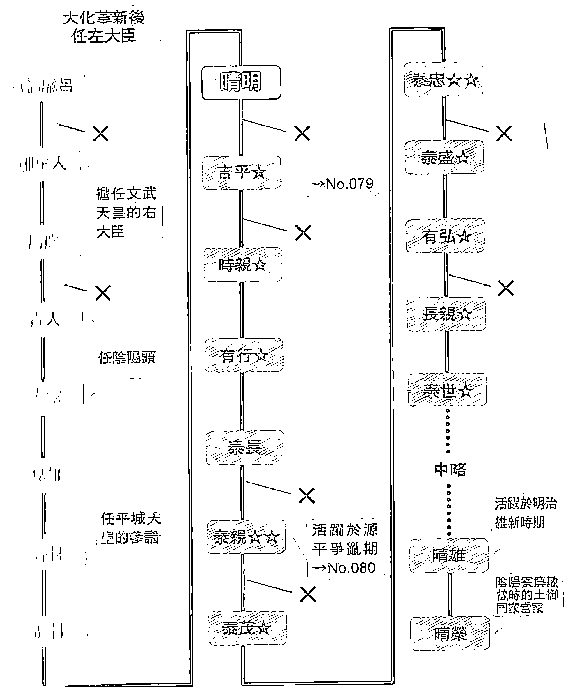

※ 旁系（分支）以「×」記載
※ 擔任陰陽頭或天文博士者，☆為行使過天文密奏者

● 《今昔物語集》·No.067
○ 《蕉屋道滿大內鑑》→No.073

〔今昔物語集〕：指稱江戶初期完全使用假名抑或摻雜假名所創作的故事、小說、說話、物語女記等作品，以實用性、教訓性、娛樂性為其特色。
〔蕉屋道滿大內鑑〕：請參照P.042注。

No.069

## 晴明桔梗印是所罗门王的力量？

而是陰陽術裡面頗為人所熟知的印記。全世界各地均將此印記視為是魔法的符號。

## 遊留在全世界各地的神秘☆符號

據說京都的晴明神社裡面栽植有桔梗花。桔梗又俗稱為「山凶之花」，像明智光秀就是用桔梗作為家紋，不過若是說到桔梗圖案，最有名的恐怕非晴明桔梗印莫屬了。

這個象徵著五行相生的五角星形符號，一般通稱為五芒星。

西洋將五芒星稱作Pentagram，作為魔法印記使用，這也是眾所周知的事情。據說五芒星能夠提高精神力與魔力，還有對抗魔物的效力，是西洋魔法不可或缺的符號。

西元前10世紀左右古以色列王國的所羅門王也曾將此印當作護符使用，是故又稱作所羅門的五角星。只不過，那個五芒星當作有守護、治癒功效的護身符使用在古以色列王國似乎是很稀鬆平常的事情，並非是所羅門王特意選用這個符號。

另外五芒星的形狀也象徵希臘哲學家畢達哥拉斯*1提倡的五大物質（地・水・火・風・空），新柏拉圖主義*2哲學家將此稱作Pentemychos，意思是「擁有五種面貌的神」。還有人說將基督的聖痕*3連結起來，就會變成五芒星的形狀。

中國雲南省發現的古代石棺裡面，也有個在圓圈內部的五芒星形，據判斷應是代表「太陽」的圖案。

以德魯伊*4為世所知的塞爾特民族將五芒星形狀視為冥界之神茱莉根*5的紋章。奧地利有種保護自身免受惡靈侵襲的護身符叫作Drudenfusz*6，同樣也是五芒星的形狀。

由此可見，晴明桔梗印無論在東方西洋均被視為是種蘊含神秘力量的圖樣。

- *1 毕达哥拉斯 (Pythagoras) : 希腊数学家、哲学家，认为某些图形具有神秘意义，进行其教派，灵魂最终将能同神圣契合为一。
- *2 新柏拉图主义 (Neoplatonism) : 古希腊哲学流派，试图以「流溢」说明世界之根源性存在「太一」，以及其下方的世界性存在。
- *3 圣痕 (Stigmata) : 指人体上出现与耶稣基督受难伤痕相应的疤痕、伤口、疼痛部位。

## 古代的五芒星

- 美索不达米亚：首次出现在西元前3000年前后的器物当中
- 迦勒底：五芒星各角顶点分别对应至木星·水星·火星·土星和金星
- 以色列王国：西元前10世纪前后，所罗门王以至国民均作护符使用
- 希腊：象征五大物质（地·水·火·风·空）的形状
- 【毕达哥拉斯】拥有五种面貌的神＝Pentemychos

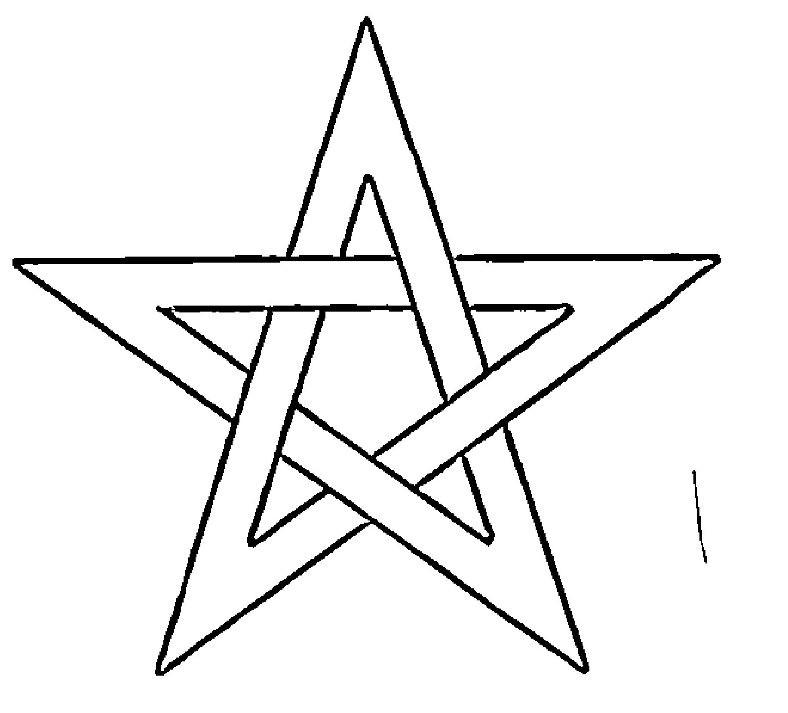

## 世界的五芒星

奥地利
守护己身不受邪恶侵害的护符「Drudenfusz」

日本本土
将五芒星视为护符→驱多魔→驱避灾殃的护符，所以才将五芒星当作驱魔的护符来使用？

中国
古代遗迹发现在圆圈内画个星形，代表太阳的四象。

（在欧美）
使用Pentagram作魔法用
可以提高精神力与
增加吸引力的效果。

> （德 Druid）：古代凯尔特民族的神官，乃西洋穿有白色胡须身穿长袍的贤者之原型
> （Morrigan）：凯尔特神话中的战争女神＝
> Drudenfusz：指奥地利有种名叫杜魅他（Drud，复数形为杜尔登Druden），一种护符（Drudenfusz）以免遭其害。
> 「魅他」（だまし）音同「驱邪」，故衍生出驱避灾殃的涵义。

No.070

## 安倍「清明」的傳記

（此区域为装饰性边框或模糊文字，无明确可读内容）

《簠簋抄》原先是以《簠簋內傳金烏玉兔集》的注釋書籍為方向所創作，內容卻不像是學術研究書籍。

## 非晴明而是清明的著作？

一般認為《簠簋內傳金烏玉兔集》在鎌倉時代末期至室町時代初期便已經粗具雛型。從內容判斷，此書應是由兼具佛教知識的陰陽師所著。書中將安倍晴明記作「清明」，而這也是首部如此表記的書籍。

《簠簋抄》是該書的注釋書，最遲在江戶時代初期便已經成書。此書也是最早提及晴明生母是隻狐狸的傳說，以及「清明」此名其實是來自二十四節氣中「清明節」這個說法的書籍。

《簠簋抄》在「由來」一章裡面記載了《簠簋內傳金烏玉兔集》的流傳過程：

從前大唐*1 城荆山的伯道上人遠渡天竺，前往聖靈山文殊菩薩參拜，獲大聖尊文殊傳授此書然後返國，納於唐皇皇宮之內。

傳說阿倍仲麻呂*2於元正天皇時代以遣唐使身分入唐，卻被唐朝武帝*3以貢物太少為由殺害，化作赤鬼。後來吉備真備入唐，在赤鬼的協助下取得《簠簋內傳金烏玉兔集》返國。吉備真備在晚年前往常陸國（現茨城縣東北部地區）尋訪仲麻呂的後代安倍童子，並將這本書讓給童子。

後來安倍童子參拜鹿鳴明神，還因為救了條蛇而被邀至龍宮城款待、獲贈鳥藥。這鳥藥是種能使人通曉鳥語的藥物，而安倍童子便是藉此得知天皇罹病的消息及其病因，終於治好天皇的疾病。

於是童子才被任命為縫殿頭*4、賜名清明。

相傳後來清明跟某個名叫道滿的男子展開了命運的對決，最後終於消滅道滿，並將《簠簋內傳金烏玉兔集》流傳後代。

《簠簋抄》的「由來」感覺就像是篇把所有跟晴明或清明有關的傳說全部濃縮結合起來的文章。

## 三、陰陽道的形成

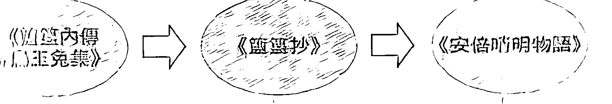

镰仓时代末期至室町时代初期便已经粗具雏形，认为是由兼真佛教知识的阴阳师所著。

成于江户时代初期的《簠簋内伝金烏玉兔集》的注释书。晴明生母是只狐狸等传说便是首见于此书。

浅井了意所著。宽文2年（1662）刊行、附插图的假名草子。为大众普及本，使得安倍晴明广为民众所知。

- 艺能各领域亦分别制作出深受《安倍晴明物语》影响的诸多作品
- 《大江山》
- 《芦屋道满大内鑑》
- 《天神山》

## 四、《簠簋内伝金烏玉兔集》的由来

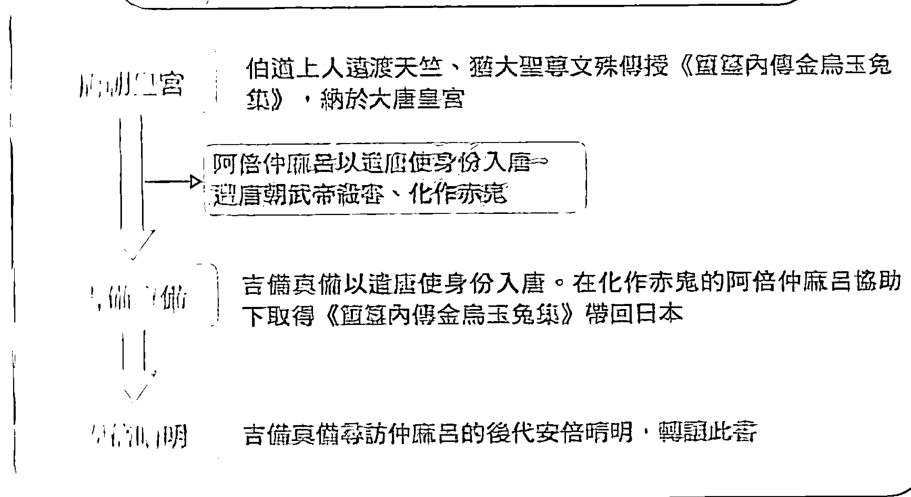

《簠簋内伝金烏玉兔集》→No.023　◯安倍晴明→No.067　◎吉備真備→No.083

缝殿寮的长官。缝殿寮设于中务省之下，主要负责监督制造宫中所用衣物及负责宫女人事。传说住在森林的女狐狸与安倍保名结婚、产下晴明，被发现真正身分以后消失不见的传说。说经、净琉璃、歌舞伎等艺能都有编成剧目演出。类似故事：羽茂安兵卫救了一只狐狸，后来狐狸化作女性嫁给主角为妻并且生了孩子，真正身分暴露以后消失不见的传说。主要是「落语」（类似中国的单口相声）的题目。

No.0711 晴明VS.道滿的對決

歷來有許多關於安倍晴明與蘆屋道滿兩人的對抗與恩怨的傳說，就連寓言故事亦為數頗多。此節就從中選擇幾則故事進行介紹。

#### ○長櫃裡的橘子

蘆屋道滿此人生平不詳，不過一般認為《宇治拾遺物語》第十四卷的「御堂關白御犬、晴明等奇特異事」裡提到的道緣法師跟道滿是同一個人。

故事內容是說藤原道長因為愛犬和安倍晴明而躲過詛咒，這則故事裡試圖陷害道長的反派角色便是道緣法師。當時這件事的幕後黑手是道長的政敵藤原顯光，而道緣法師只是受僱於人、遵照命令行動而已。所以道緣法師才得以免去死罪，被流放到攝摩國（舊國名，現兵庫縣西南部地區）。

另外，假名草子《安倍晴明物語》裡面則說道滿是聽說晴明在京城頗富名聲，為了要一較高下才離開播磨找上門來的。

道滿用咒術把大橘子變成隨從、把樹枝變成太刀和雛刀，變出威風凜凜的大隊人馬直接殺去找晴明踢館。

於是乎兩人便在獲得天皇恩准下展開了鬥法。這場鬥法的條件是敗者必須拜勝者為師，在內裏的白洲由天皇出題進行比試。

首先是道滿全神貫注地掬起庭園裡的白沙拋將出去，只見白沙竟然變化成數十隻飛燕。另一方面，晴明只用扇子拍了一下，飛燕便一口氣全部變回白沙散落地面。

接下來的題目則是比試哪方能夠用占術算出長櫃裡面裝著什麼東西。

當時箱裡裝的是橘子，道滿先答出了正確答案「15個橘子」，晴明卻答說是15隻老鼠。

負責把橘子放進箱裡的大臣們想說隸屬於陰陽寮的晴明如果落敗那可是件大事，故而遲遲不肯打開長櫃；終於在再也等不下去的道滿百般催促之下打開了長櫃，立刻就有一整群老鼠從中竄了出來。原來晴明已經把長櫃裡面的橘子都變成了老鼠。

> ※1 《宇治拾遺物語》：請參照P.040注。
> ※2 藤原道長：請參照P.048注。
> ※3 假名草子：請參照P.147注。
> ※4 太刀和雛刀：太刀是平安時代中期開始使用的刀劍，彎曲的刀身並有利刃。雛刀是日本最具代表性的長柄武器，是在長柄前端裝上與日本刀相同的刀身所組成。

蘆屋道满説的月法

芦屋道满因晴明名聲，前來踢館

於内裏白洲進行比試

- 條件是敗者必須拜勝者為師
- 由天皇出題

道滿→將庭園裡的白沙塑成數十隻飛燕
晴明→只用扇子一拍便將飛燕變回白沙

占術比試

- 由天皇出長櫃裡面裝有何物，藉此決定勝負

道滿→15個橘子
晴明→15隻老鼠

晴明獨勝

道滿猜的是正確答案，豈料卻被晴明把箱裡的橘子變成老鼠，獲得勝利

《安倍晴明物語》與《芦屋道滿大內鑑》之異同

補註：《芦屋道滿大內鑑》對這個長櫃猜橘子的故事內容稍有改編

| 《安倍晴明物語》 | 《芦屋道滿大內鑑》 |
| --- | --- |
| 長櫃裡面的物品：橘子 | 男屍 |
| 晴明之法：把橘子變成老鼠 | 以太山玉之密法，生治部命秘文使其復活 |

【插圖】

▶《安倍晴明物語》No.067 ◎芦屋道滿→No.075

※1 照P.022注。
※2 白洲指的是玄關前方舖有白沙的部分。江戶時代奉行所會在審問罪犯時撒上白砂，因此後來也衍生出法庭的涵意。
※3 參照P.042注。

《筮筮內傳金烏玉兔集》與伯道上人

安倍晴明被認定為傳說中的超級超能力者並且為世人所熟知，其實是江戶時代以後的事情。

晴明與道滿之戰的最終勝負

安倍晴明其實並非以史實中的一介陰陽師受到認識，反而從以故事裡的虛構人物為世所知。

寬文2年（1662）初版的附插畫假名草子¹《安倍晴明物語》（作者：淺井了意）首先受到民眾接納，然後受到該作品影響的作品——淨琉璃²《信太妻》³、由淨琉璃改編成歌舞伎⁴的《蘆屋道滿大內鑑》，還有根據前述作品創作的落語《天神山》⁵，相繼問世，博得廣大好評。

《安倍晴明物語》裡面晴明和道滿長櫃猜橘子的占術對決固然有名，接下來就讓我們來看看後續的故事發展。

道滿承認在這場宮廷比試裡敗下陣來，於是便成了晴明的弟子。後來晴明又在天皇的命令之下前往中國，拜中國的伯道上人為師。在晴明離開日本長達3年3個月的這段期間內，道滿成功地籠絡晴明之妻梨花，取得晴明的陰陽道秘笈《筮筮內傳金烏玉兔集》，並且將它抄錄下來。然後他就告訴已經回國的晴明，說自己已經在夢裡得到了《筮筮內傳金烏玉兔集》；晴明認為自己藏得很隱密的《筮筮內傳金烏玉兔集》怎麼有可能出現在夢裡，於是就用性命作賭注否定道滿的說法，豈料道滿竟然出示抄寫本，並且依照先前賭咒的約定將師父晴明殺害。伯道上人知道這件事情以後，遂以術法使晴明復活。後來道滿又和伯道上人賭命進行生死鬥，由於理應已經被害的晴明仍然活著，所以這次就輪到道滿必須獻上自己的首級。

這部《安倍晴明物語》乃是參考《筮筮抄》和其他類似的文獻而成的作品，不過此書也有幾個不同處，例如將《筮筮抄》記為不詳的晴明父親名字寫作「安名」、指晴明出生地為「阿倍野」等。順道一提，儘管蘆屋道滿在與晴明針鋒相對的時候被當作反派角色，不過播磨國⁶出身的人向來都認為道滿是與晴明旗鼓相當的陰陽師。

《安倍晴明物语》的传说

⑤赌晴明是否还活着并且获胜，报仇成功

伯道上人

④使晴明复活

安倍晴明

道满

③晴明返国后以性命作为赌注、杀害晴明

梨花

②趁晴明不在加以笼络，取得《篁篮内传金乌玉兔集》抄录

《安倍晴明物语》的成立

其他传说

抄

安倍晴明物语

《安倍晴明物语》的新增要素

父亲名叫安倍

诞生于安倍野

> 作者为迎合大众所作的改编？

- 《篁篮内传金乌玉兔集》→No.023
- 《芦屋道满大内鉴》→No.073
- 芦屋道满→No.075

- 参见P.068注。
- 参见P.151注。
- 播磨：相当于现在兵库县的西南部地区。

No.073

《蘆屋道滿大內鑑》

《蘆屋道滿大內鑑》是所有提及陰陽師的其中一部最有名的作品，並以其通稱「葛葉」為世所知。

## 留名於藝能世界的晴明

近世有許多以安倍晴明為題材的作品，晴明之所以能夠在現代成為主流，可以說是拜這些作品所賜。其中最有名的作品，便是所謂的「葛葉」。

歌舞伎¹也曾經替這部作品翻案，搬上舞台演出，不過其原型其實是相傳延寶2年（1674）大阪的伊藤出羽掾、京都的小山角大夫等人都唱過的作品——古淨瑠璃²《信田妻》。竹田出雲的《蘆屋道滿大內鑑》便是根據這部作品創作的人形淨瑠璃³，於享保19年（1734）首演。

《信田妻》內容是在描述安倍保名（虛構人物）與蘆屋道滿爭奪秘傳書籍，不過故事的主幹部分卻是沒什麼知名度。

廣為世人所知的其實是「葛葉」的部分。所謂「葛葉」其實是故事的前傳，內容是講述從前有隻住在和泉國（大阪府南部）信太森林的白狐狸幻化成名為「葛葉」的女性，然後跟安倍保名產下一子——這孩子就是安倍晴明。其中尤以第4段「葛葉別子」最著名，有時還經常會單獨演出這段劇情。

蘆屋道滿的名號雖然出現在作品標題中，但在這部作品裡面其實純粹只是個反派人物而已；由於「葛葉別子」給人的印象過強烈，使得道滿的存在感相對變得薄弱，可說是個相當不幸的角色。

順帶一提，此劇在狂言就演變成為《信太妻》⁴（信田也寫作信太）這個劇目，上方落語⁵也有據此改編的戲仿作品《神山》⁶。

比較特別的是，據說從前馬戲團或雜技的表演項目裡，有一個叫「葛葉」的節目。這項表演似乎是由一名女性倒立用雙腳踢紙門，最後再由其他表演者以口銜筆、左右顛倒寫下「葛葉」這兩個字。著名台詞「尚覺眷戀，可來尋覓和泉，信太森林，恨葛葉。」

> 尚覺眷戀，可來尋覓和泉，信太森林，恨葛葉。

### “葛叶”的各种版本

#### 版本故事内容

在和泉国信太森林的白狐化成名为“葛叶”的女性，与安倍保名生下一子，而这孩子便是安倍晴明。

幼时的晴明曾经为了要跟已经离开的母亲相会而进入森林。

#### 《信田妻》

江户时代的伊藤出羽掾和京都的山本角太夫等人所完成的古净琉璃。延宝2年（1674）首演。

#### 各艺术领域纷纷根据《信田妻》创作作品

#### 净琉璃

#### 《西屋道满大内记》

竹田出云创作的人形净琉璃。享保19年（1734）首演。描述安倍保名与芦屋道满争夺动力的故事。由于“葛叶”该落太著名，使得道满的存在感变得薄弱。

#### 歌舞伎

#### 《信太妻》

人形净琉璃于元禄时代（1688~1703）拥有爆炸性的人气，尤其歌舞伎等表演更经常直接移植人形净琉璃的脚本，同样也博得高人气。

#### 狂言

#### 《信太妻》

从下方写着「尚见并恋」那段台词，书写时或将文字左右颠倒、或用左手书写、或口衔毛笔书写的「曲书」表演堪称为绝技。现代的狂言同样也有这项表演。

#### 落语

#### 《天神山》

江户时代的上方落语。与内容讲述狐狸嫁夫的原故事几乎没有任何关系。最后结尾部位有引用葛叶的著名台词。

上方落语（No.067）
上方落语类似于中国相声的艺能。此语首见于1932年发行的杂志《俗论》中，多是指大阪落语而言。
Parody：文学中一种讽刺批评或滑稽嘲弄的形式，模仿特定作家或该流派的惯用手法，以突显该作家的瑕疵或该流派运用的俗套。
※ 参照P.151 注

No.074 晴明生平之謎

> > 假名草子^1《安倍晴明物語》裡面說晴明是白狐與人類的混血兒，而這同樣也是我們探究晴明生平的其中一個線索。

#### ○晴明出生的秘密？

史實中的安倍晴明生母已不可考，但學界卻有「晴明生母是否與藤原道長^2之母（時姬）同樣出自橘家？」的說法。

時姬的父親是攝津守^3藤原中正，母親嚴子則是出身自橘家。橘家乃是名門，但假如前述說法正確的話，身屬名門貴冑的晴明母親姓名卻被隱匿起來，那時明便可能是因為某種理由而才能得到橘家的正式承認。

晴明乃因受藤原道長重用始得聞名於世，可是此時卻又有「另外一番意羲。這也就是說，也許晴明受重用並非純粹因為他是位優秀的陰陽師，而是當時試圖藉血緣關係鞏固自己地位的道上見他是親戚，所以才予以起用的；又也許是因為有道長的提拔在先，所以他才能獲得「晴明很優秀」的評價也未可知。

晴明直到40歲依舊是天文得業生的學生身分，後來經過陰陽師才在50歲前後成為天文博士，光從這份經歷來看，晴明並資也並不是特別優秀。

晴明直到晚年才突然展露頭角，可以說是頗有蹊蹺。

關於晴明的母親還有個截然不同的街談巷說：他的母親可能位所謂白拍子^4之流的走唱巫藝者。

白拍子雖然是賣藝者，當中卻也有許多人擁有巫女的血統；或許晴明之所以擁有優秀的靈能力，便是因為繼承母親的血統使然。

另外，認為晴明生母是隻白狐狸的傳說則是使人聯想到茶吉尼信仰。源自印度、騎著狐狸的神明·茶吉尼天是以北斗七星為象徵，而北斗七星亦頗受與陰陽道近似的宿曜道重視。

## 晴明之母是谁？

晴明母亲是白拍子？
白拍子虽是舞伎，但许多人都有巫女血统
⇒ 晴明继承母亲的灵力，所以才能成为优秀的阴阳师？

晴明母亲是狐？
源自茶吉尼天信仰？
⇒ 茶吉尼天是位骑狐狸的神明
⇒ 茶吉尼天的象征符号是北斗七星
⇒ 使人联想到与阴阳道关系密切的茶吉尼信仰

晴明母亲是藤原家之女？
于藤原道长掌握大权的时候受到重用
⇒ 藤原道长的母亲也是藤原家出身
⇒ 道长欲藉血缘关系巩固地位而重用晴明？

晴明虽是位鼎鼎有名的阴阳师，却一直到50岁为止都还只是个学生。但不久他便以超群的速度得到升迁。

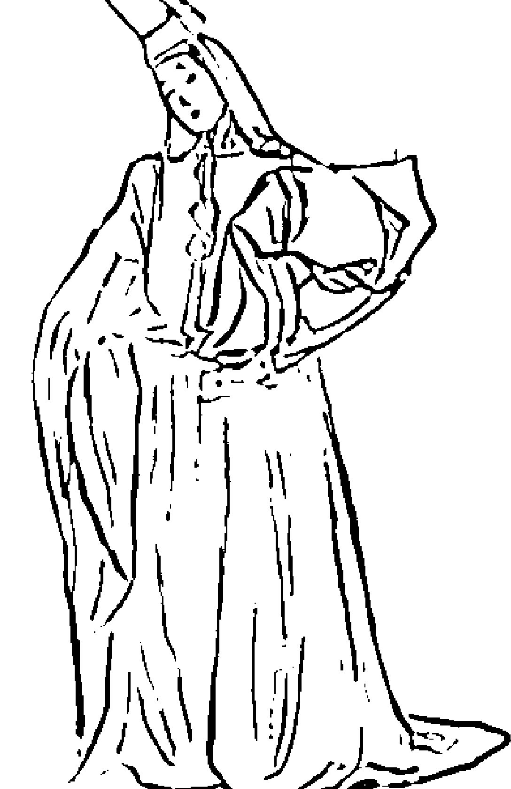

何谓白拍子？
白拍子在古时候是执行神事的巫女。祭祀时跳的舞蹈既是敬神，同时也是对民众的教化活动。后来白拍子此语逐渐转为指称作男性装扮、从事杂俳艺的女性。后来她们又再历经各时代的变迁而终于成为流民，变成以卖艺为生的游女。

- 白拍子→No.020
- 茶吉尼→No.045
- ○ 安倍晴明→No.067
- （参照P.042『曲舞、猿乐、白拍子』注。）

### No.075
蔦屋道満

若說最著名的陰陽師是安倍晴明，那麼名氣僅次於他的則當屬蔦屋道満。道満同樣也有幾則相當耐人尋味的異說。

## ○不知是真實抑或虛構之勁敵

目前我們還無法確定蔦屋道満究竟實際存在過，抑或是個虛構的人物。

與其說道満是跟安倍晴明在伯仲間的對頭，其實他在眾多傳說與故事裡不過是個旁觀的角色而已。這些故事有幾個共通點：道満是個能力頗高、充滿自信的人，他雖然好勝，可是一認輸以後卻又能很乾脆地向人低頭。如果光看這些特質，甚至會讓人覺得他好像是個相當不錯的人物。

歸納整理各地的故事，大多都說道満的出身地是在播磨國（兵庫縣西南部），最後恐怕也是死在播磨。

然而，室町時代的地理誌《簾相記》卻說道満在京城犯下藤原道長詛咒案之後被流放至播磨國的佐用，最終還沒能回到京城就去世了，因此他也有可能不是死在播磨。事實上，栃木縣那須郡原市、岡山縣淺口郡和鳥取縣赤碩町等地也都有傳為「道満塚」的遺跡。

順帶一提，相傳若狹（福井縣）傳說蔦屋道満就是八百比丘尼的父親（另有說法指其父是位名叫秦道滿的陰陽師）。

話說回頭，兵庫縣佐用郡的佐用町有個叫作大木谷的地方，在隔著這小小山谷相對峙的兩邊山丘上面各有一座道満塚和晴明塚。

關於這座道満塚還有篇由來書流傳至今。此書似乎是安政3年（1856）4月作州川原村的陰陽師所傳。

這篇由來書記載著許多耐人尋味的內容，其中還有段文章言說「自己」（川原村的陰陽師）是蔦屋道満的子孫。當然，我們也絕不能因此就斷定蔦屋道満是個實際存在的人物。不過，除了這篇由來書以外，這世上還另有其他陰陽師自稱是道満子孫的記錄存在。

- 1. 藤原道長：請參照P.048注
- 2. 八百比丘尼：日本全國各地均有八百比丘尼的傳說。傳說若狹有位名叫...的男子某天捕到一條人魚帶回家，他的女兒不知情吃了人魚肉竟然長生不老，此女便是八百比丘尼。120歲那年她感嘆人世無常，出家為尼，到各地替人治病並收許病患，800歲才回故鄉，在後瀨山的洞穴裡坐化。

### 蔦屋道満 生卒年不詳

- ○ 播磨国出身
- ○ 優秀的陰陽師
- ○ 充滿自信而好勝
- ○ 认输以后也很乾脆

## 道満的經歷

道満究竟是真實抑或虛構的人物仍不得而知。根據《簾相記》記載，道満原本是在京都活動，其後犯下詛咒事件而被流放到播磨。

## 道満的相關傳說

#### 道満的血脈・系圖・傳說

- ・有一種說法指道滿就是八百比丘尼之父
- ・道滿的由來傳說是道滿的子孫所作
- ・另外，另有一說其他陰陽師自稱是道滿
- ・？？？

#### 有相關遺跡的地方

- ・現存於岡山縣
- ・岡山市的川原市
- ・？？？

何謂詛咒・怪異→No.094

播磨：播磨国之別稱，相當於現在的岡山縣東北部地區。

### No.076
賀茂忠行

平安時代中期的陰陽師，安倍晴明的師父。他是賀茂家的第一位陰陽師，《今昔物語集》*1裡還稱頌說當世無人能夠與他並肩齊名。

## ○發掘晴明的恩師

安倍晴明年幼時，曾經在某次伴隨師父走在夜路上的時候見鬼神迎面而來。據說得晴明報訊而逃過一難的師父從此便對晴明的才能有很高的評價。這位師父正是賀茂忠行。

不僅僅是陰陽師，這種見鬼——也就是察知怪異的能力，對所有從事術道修行者均可謂是最最難得的能力。據說忠行便是因此而認可晴明的才能，並且以陰陽之術傾囊相授。

至於忠行自身則是長於和漢諸學、陰陽之道，若光就陰陽道而論則非但毫不遜色於古人，即便在當時亦無人可以並駕齊驅，是故忠行無論在公私場合均被尊奉為尊貴的人物。

忠行首次以陰陽師身分揚名於世，乃是天慶3年（940）的事情。據傳他曾經在「平將門之亂」*2之際上奏藤原師輔，輔導僧侶施行「白衣觀音法」。此法雖是密教系咒法，但當時的密教似乎並不通曉此法，據說當時僧侶便是在忠行的指導之下進行法的。

附帶說明，一般相信白衣觀音是眾多觀音當中最具女性溫柔特質的一位，有防止兵戈天變、息災除病、救兒安產之功德。

關於忠行還有另外一則著名的故事，那便是天德3年（950）他用占術猜出村上天皇所藏物品的故事。這則佚事收錄於三善康所著《朝野群載》*3第十五卷，據說當時他正確無誤地判斷出來的物品是條用朱繩串起的水晶念珠，放在一個八角形的盒裡。

雖有說法認為役小角或吉備真備是賀茂家的始祖，但撇開民間說法不論，忠行亦可謂是賀茂家史上首見的第一位逸材，因為他可是創造出後來賀茂家以及陰陽道道統的重要人物。

> *1 《今昔物語集》：請參照P.041注。
*2「平將門之亂」：平將門為高望王之孫，天慶2年（西元939年），他擊敗國司，自命「新皇」，舉兵造反；翌年2月，他與藤原秀鄉、平貞盛的軍隊交鋒，弓箭乘著突然轉變的風勢射中平將門，後被誅滅。將門的首級被帶回京城，卻是三個月仍沒有一絲腐敗跡象，彷彿吵著想要自己的身體，最後朝向東國飛去。
*3《朝野群載》：請參照P.033注。

### 世界的巨人

### 賀茂忠行 生卒年不詳

- 通曉陰陽的才子
- 一手掌握歷來各成體系的陰陽、天文、曆學三項業務
- 賀茂家是史上首個世襲陰陽術、以陰陽術為家業的家族
- 陰陽道從此成為由賀茂家主導的體制

#### 軼事

##### 平將門之亂

天慶3年（940）上奏當時的掌權者藤原師輔，諫其行使「白衣觀音法」。此法是連密教的高僧都不知道的密教系咒法，由忠行指導僧侶進行修法。

> 顯示忠行博學廣識的軼事

##### 射覆的天才

天暦3年（959）曾於村上天皇尊前行使猜測覆蓋物品內容之占術（＝射覆）。（另有說法此事發生於延喜年間，乃授命於醍醐天皇）忠行加減地衍穿內容物並且說出是「朱繩串起的水晶念珠」「置於八角形盒內」。因此無人堪與其並肩。

> 顯示忠行能力的軼事

##### 發掘晴明

在忠行與弟子晴明走在夜路上的時候，晴明看見鬼神迎面而來。晴明使用隱身之術，逃過一難。忠行從此對晴明有很高評價，並將所有知識技術傾囊相授。

> 身為晴明啟蒙老師的軼事

- ●...•No.067
- ●...•No.083
- ○役小角→No.084
- ○何謂詛咒・怪異→No.094

### No.077
賀茂保憲

偉大的陰陽師賀茂忠行之子。賀茂保憲也是安倍晴明的老師，其陰陽道乃是師承於父親。

## ○把天文道讓給晴明的賀茂家公子

提到安倍晴明的師父通常都會想到賀茂忠行，《綴古事談》¹卻說忠行之子保憲是晴明的老師，看來賀茂父子兩代似乎都是晴明的老師。

想必保憲在忠行過世以後也教了晴明許多吧。也許忠行當時對這兩人是秉持著一視同仁的精神傾囊相授，不過若說親生骨肉保憲知道某些晴明從沒聽說過的事情，卻也不是完全沒有可能再者，當晴明還是天文得業生的學生身分時，保憲就已經是陰陽頭了，身為上司指導部下也是所在多有的事情。

總而言之，賀茂保憲可以說是隻擁有純正陰陽師血統的純馬。就像是在證明他的優秀似的，保憲與晴明同樣打從少年時便能看見鬼神。這則故事《今昔物語集》²裡面就有介紹。

保憲曾經在10歲的時候跟隨父親見習地鎮祭³，那時他就在祭祀進行中看見了大啖供品的鬼。

儘管忠行同樣也能看見鬼神，只不過他那是經過修行以後獲得的能力，並非天生。忠行發現兒子才能勝過自己，從此全心注心力將所有知識與技術全部傳授給保憲。

保憲果然正如預期愈發優秀，尤其在曆道方面更是表現出乎尋常的才能。

後來保憲又將曆道傳給自己的兒子賀茂光榮，將天文道讓予安倍晴明；原先由賀茂家獨占的陰陽道便從此枝分成曆道賀茂家、天文道安倍家（後來的土御門家）兩股，流傳後世。

¹ 《綴古事談》：說話集，共六卷，成書於1219年。其中三卷已經散佚。模仿「古事談」而作，分成王道后宮、臣節、神社佛寺、諸道、漢朝等各門。
² 《今昔物語集》：請參照P.041注。
³ 地鎮祭：請參照P.068注。
⁴ 主計頭：主計寮的長官，主計寮隸屬於民部省，掌管國家的稅收、國內的山川等事務。

### 賀茂保憲 延喜17年 (917) ～ 贞元2年 (977)

- 賀茂忠行之子。父子兩代同為晴明之師
- 與晴明同樣，打從幼少時期便能看見鬼神
- 曾經隨著忠行前往地鎮祭，看見啖食供品的鬼
- 特別在曆道方面表現出超乎尋常的才能

## 保憲的經歷

除陰陽頭、天文博士、曆博士以外，保憲還曾經歷任主計頭、殿倉院別當等職，得到對陰陽師來說相當高位的從四位下位階。

## 陰陽寮的分割

- ◎賀茂忠行→No.076
- ◎賀茂光榮→No.078

注：陰陽寮制：請參照P.144注。
注：位階：請參照P.064「位階」注。

### No.078
賀茂光榮

與安倍晴明生活在同一時代，繼承了父親賀茂保憲托付的曆道重任，並開創了形成安倍、賀茂兩家陰陽道雙壁的一支源流。

## ○放浪不羈的怪咖

光榮出身於陰陽道名門·賀茂家。他是繼賀茂忠行、賀茂保憲之後的第三代，陰陽道便是從這個時候開始不再是賀茂家的獨占事業。

受光榮祖父與父親讚賞認可的安倍晴明將陰陽道當中的天文道繼承了去，而光榮只繼承了曆道而已。光榮對自己身為賀茂家長子卻未能全面繼承所有陰陽道業務甚感不滿，甚至還曾經與晴明有過爭論。

不過，光榮與晴明確都是能幹練達的陰陽師，據說朝廷、藤原家甚至其他貴族們還往往會同時召請委託他們兩位進行法事。

永觀3年（985），藤原實資之妻已屆預產期卻遲遲沒有生產的徵兆。甚是擔憂的實資先是聘請密教僧進行祈禱，卻苦無效果。此時光榮與晴明才接下了這個委託。光榮於4月18日、晴明於19日先後行使祭祀祓除穢厄，到4月28日終於順利產下了名女嬰。

光榮是個相當特異的人物，穿著打扮相當隨便。

據說光榮在一條天皇的中宮¹上東門院彰子（藤原道長²的女兒）臨盆之際被召去的時候，是穿著一身亂七八糟不成套的服裝、頂著一頭蓬亂的頭髮出現的。更有甚者，聽說那個時候他在抓自己身上的虱子，還把虱子掐死在橋樑的欄杆上呢。

若按照常理來思考，一般人會覺得在臨盆生產如此重要的時刻做這種事實在是既不吉利又不乾淨，搞不懂他到底在想些什麼……不過總而言之，這些事情對光榮來說似乎都只是細枝末節而已。

儘管行徑如此乖戾，光榮卻依舊是與晴明同樣頗受貴族倚重的曆博士。光榮最高位階為從四位上³，長和4年（1015）6月7日以77歲之齡辭世。

> *¹ 中宮：請參照P.108注。
*² 藤原道長：請參照P.048注。
*³ 從四位上：請參照P.064「位階」注。

### 賀茂家の第三代

賀茂光榮 天慶2年 (939) ～長和4年 (1015)

- ○ 賀茂保憲的長子。忠行為其祖父
- ○ 是位不下於父祖的高明陰陽師

## 賀茂家系略図と历代の暦博士

従「忠行」到「在總」為止的家系図

※家系人物已經省略

☆為任职暦博士者，☆則是曾頒造暦宣旨（製造暦書的命令）者

- ● No.014
- ● No.067
- ○ 賀茂忠行→No.076
- ◎ 賀茂保憲→No.077

## ○達到父親寄望期待的晴明長子

安倍吉平乃安倍晴明之子。父親去世以後，他便與賀茂光榮並列為該時代最具代表性的陰陽師。

父親太過偉大容易使得兒子的能力相形見絀而失去光彩，但是吉平身為陰陽師的能力卻是相當不錯。這大概是父親晴明極力栽培、傳授以陰陽之術，好讓他不至辱及自己的一世英名吧。

吉平還頗受道長等當權者器重，經常在各種形形色色的機務場合之下受召執行占算、祓禊等儀式。寬仁2年（1018）京都大旱連日，曾經召請僧侶仁海於神泉苑行使祈雨經法，並由吉平同時行使求雨儀式五龍祭。從此便可以得知，吉平當時已經是位足堪託付以如此國家大事的陰陽師了。然而根據文獻記載，當時雖然有雷聲鳴動卻終究未見降雨。

說到吉平較著名的故事，當屬《古今著聞集》²所載預知地震的故事。

這故事是發生在他和名醫丹波雅忠把盞對酌的時候。雅忠斟酒在杯，卻遲遲不飲只是拿在手裡，當時吉平便警告曰：

> 「快請將酒飲下。馬上就要有地震發生。」

語畢地震果然立刻隨之而來，讓雅忠把酒給打翻了。

吉平還有個名叫吉昌的胞弟，同樣也是位擁有相當能力的陰陽師。吉昌甚至還曾經從天文博士晉升至陰陽頭之高位。

吉平以73歲之齡而卒。他歷任陰陽博士、主計頭³等職，最終官位也超過父親的從四位下⁴而達到了從四位上。

- 1. 藤原道長：請參照P.048注。
- 2. 《古今著聞集》：橘成季編纂的說話集，成於1254年，共20卷。內容分神祇、釋教、政道、公事等30編，是規模僅次於《今昔物語集》的說話集。
- 3. 主計頭：請參照P.165注。
- 4. 從四位下：請參照P.064「位階」注。

### 安倍吉平 天暦8年（954）～万壽3年（1026）

- 安倍晴明的長子
- 受到當時的實權者藤原道長拔擢任用
- 不但有父親餘蔭庇佑，其自身也是真材實料
- 與賀茂家的光榮屬於相同世代

## 預知地震的故事

名醫丹波雅忠與吉平把盞對酌的時候，吉平說將有地震發生，叫他趕緊把酒喝掉。後來地震果然發生。

## 主持五節祭

寬弘2年（1018）大旱連日

| 項目 | 說明 |
| --- | --- |
| 僧侶仁海的請雨經法 | 請雨經法是從前弘法大師在京都神泉苑執行、使天空降下甘霖的咒法 |
| 吉平的五龍祭 | 五龍祭是向五帝龍王祈願的祭祀。按照慣例都是與請雨經法同時併行 |

但三日卻無降雨

## 吉平擔任過的職位

- 陰陽助
- 陰陽博士
- 主計頭

最終的地位
對陰陽師來說相當高位的從四位上

### 安倍泰親

安倍泰親是安倍晴明的五代孫。根據陰陽道秘籍記載，七成的準確率就已經是出神入化了，泰親占術的準確率卻是高達八成。

## ◎晴明再世？

安倍泰親是安倍晴明玄孫安倍泰長之子，生於平安時代末期，曾任陰陽頭、大膳權大夫等職。據說他的陰陽師手法也很是高明。

相傳他晚年出家，法號念佛，卒年卻無定說。

久安4年（1148）3月29日，祇園社（京都市東山區八坂神社之舊稱）燒毀。眾公卿有鑑於事態之嚴重性，聚集起來共同進行商議；原來眾人是害怕神社燒毀恐是朝廷將有異變發生的前兆。

當時負責占斷吉凶的正是泰親。根據泰親表示，占算結果顯示內裏將在6月的壬日或癸日迴受祝融之災。後來經過約莫三個月後的6月26日壬子日，土御門內裏果然失火。

除此以外，泰親還很擅長判斷姓名的吉凶。

最有名的例子便屬《平家物語》天台座主明雲的故事，泰親表示「明雲這個名字不好」，原因是「明」字是合日月之光而成，卻要在下面加個「雲」字。

明雲是跟高倉天皇、後白河法皇都有深厚關係的高僧，理說應當是前途一片看好，豈料後來卻因為後白河院的西光法師父子的讒言而於安元3年（1177）失勢。那年，明雲辭去了天台座主，並遭判放逐伊豆的流放之刑。但由於明雲在刑前就被比叡山的僧兵劫走救回，所以流放之刑也就不了了之。

不過壽永2年（1183）後白河法皇遭木曾義仲突襲時，明雲終究還是在率領比叡山僧兵援助法皇之際中箭落馬，被削首級。

- 1. 大膳權大夫：請參照P.144「大膳大夫」注。
- 2. 土御門內裏：位於京都土御門以南、居司以北，鳥羽、崇德、近衛三代，曾將內裏設於此地。
- 3. 《平家物語》：中世紀日本的英雄史詩。後世許多戲劇、謠曲和故事大都源自這一豐富來源。重述描述日本傳說中最著名的英雄源義經的功業，許多有關日本貴族武士的英勇事跡。總主題是平家的悲慘結局。
- 4. 天台座主：比叡山延歷寺的最高僧職，統轄天台宗。

### 安倍泰親 天永元年（1110）？～寿永2年（1183）？

- 晴明的第五代孫
- 占算準確率高達八成，甚至有傳指其為晴明再世
- 晚年出法號念佛

> 賀茂家與安倍家
那時在陰陽家原是賀茂家佔優勢，泰親的出現卻使安倍家重振聲勢。

## 泰親的活躍

#### 祇園社焼毀時の占断

久安4年（1148）3月29日祇園社焼毀，恐是另生異変之前兆

泰親占断怪異，預告内裏將會在6月的壬日或癸日發生火災

三ヶ月後の6月26日壬子日预言果然应驗，土御門内裏失火烧毀

#### 占算姓名吉凶

白河座主明雲：與皇族有深厚關係的高僧

泰親說「明雲這個名字不好」

明雲與政敵鬥爭失勢，雖於流放行刑前被比叡山僧兵救出，卻在途中斃命

> No.067
法皇之上法皇之略稱，天皇退位後為上皇，上皇出家則稱法皇。
仲：即源義仲。1180年奉以仁王令旨舉兵大破平維盛大軍，擊敗平氏迎...

### No.081 賀茂在継

賀茂在継是與同時代的安倍晴光共事朝廷的陰陽頭。他非但是陰陽師的培育養成者，占術也相當穩當可靠。

## ○準確說出千手經所在位置的陰陽師

賀茂在継是從賀茂保憲算起來的第八代孫。

賀茂家的傳承是從保憲、光榮、守道、道平、成平、宗憲、在憲、在宣，然後才是在継，這位在継生在平安末期到鎌倉時代的初期，跟後鳥羽院*1、藤原定家*2是同時代的人物。

順帶一提，這個時代最有名的安倍氏陰陽師是安倍晴光，晴光是晴明的第六代孫。

在継的位階是正四位下、晴光則是從四位下，這時候兩家都已經成為真正的貴族了。

在継在《古今著聞集》有則逸事如下：

> > 事情是發生在後鳥羽院帶著在継隨行前往熊野參拜的時候。後鳥羽院有每日誦讀千日經的習慣，經書卻從藏經盒裡面消失不見了。由於實在是遍尋不著，後鳥羽院便召喚在継前來占算此事。結果在継如此回答——
「經書並非失落。只是稍許陰錯陽差，如今仍在藏經盒中，」
……再度差人翻找經盒，原來是千手經的書軸卡在藏經盒的盒蓋上了。後鳥羽院便以衣服賜予在継，作為這次占算的獎賞。

當時在継是陰陽頭，同時還兼任文章博士、大膳大夫*3、備後守*4。

所謂文章博士是種任職於專門培養學生的大學寮的官員，掌紀傳道*5及詩文。文章博士亦稱紀傳博士，是必須憑著真材實料才能受到任命的官職。

另一方面，大膳大夫則是隸屬大膳職的官員，主要職責是負責替臣下調理食物。從此便不難得知，賀茂在継實在是位博學多識多才的人物。

*¹ 後鳥羽院：後鳥羽天皇退位後稱上皇，即後鳥羽院。以多才多藝聞名，擅長和歌、琵琶、箏，尤愛和歌，曾經設置和歌所，撰寫《新古今集》。
*² 藤原定家：平安末期鎌倉初期的歌人、和歌學者。歌風華麗妖艷，是和歌的代表性歌人，對後世和歌有極大影響。
*³ 大膳大夫：請參照P.144注。
*⁴ 備後守：備後國（廣島縣東部）的地方行政長官。當時以國為地方行政單位，其行政官就是中央派遣至地方的国司，包括守、介、掾、目等。

### 賀茂在継 生卒年不詳
- 賀茂保憲的第八代孫
- 活躍於平安末期至鎌倉時代初期
- 正四位下的貴族
- 當時賀茂家與安倍家兩家均甚是繁榮

#### 在継擔任過的職務
- 陰陽頭
- 文章博士 — 负责培养学生的大學寮官員，司管紀傳道與詩文
- 衛後守 — 伯後國的國司（行政官）
- 大膳大夫 — 主要負責調理臣下食物的職位

## 《明今春山集》所載故事
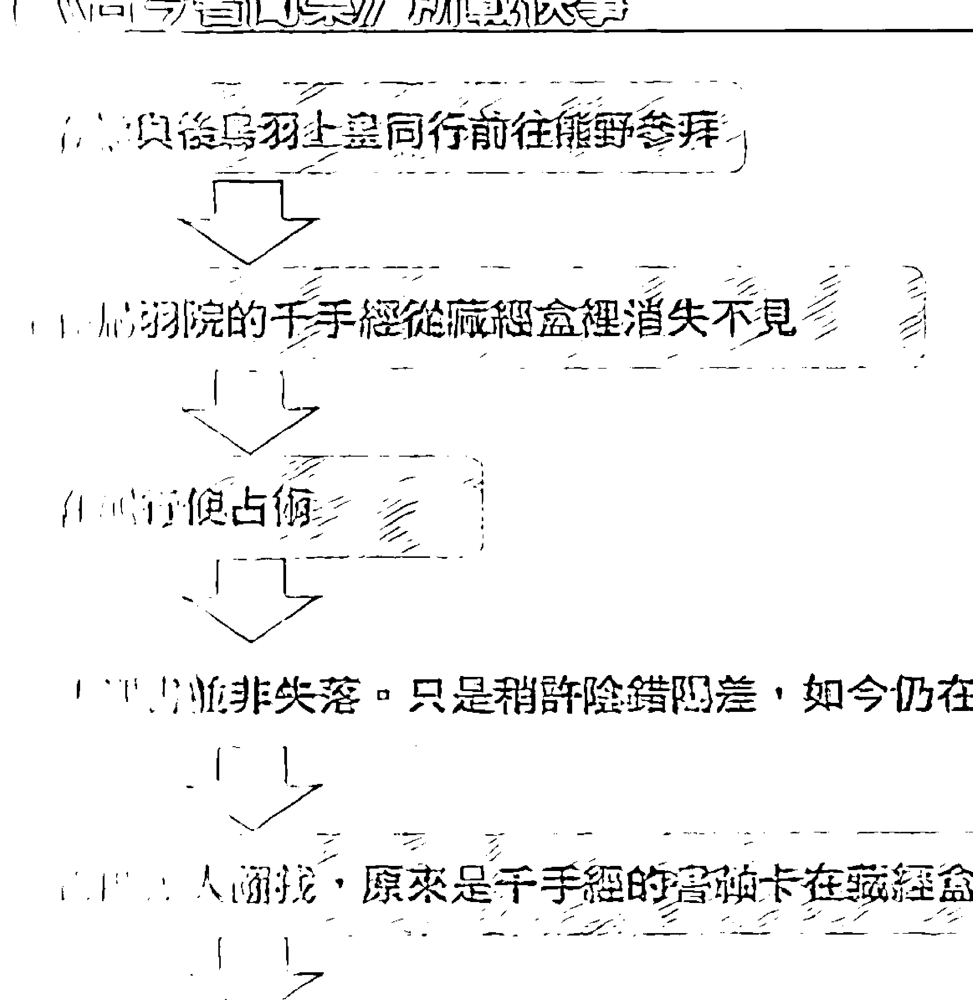
- ○賀茂保憲→No.077
- ○安倍晴明→No.012

明法：律令制大學的學科之一。亦俗稱為文章道。教科內容包括漢書、後漢書、三國志、晉書、文選等。

### No.082 賀茂道世

儘管能夠差使十二神將三十六禽、熟暗所有書籍並且通曉無數咒術名號卻未見於賀茂氏族譜的神秘陰陽師。

## ○不知是真實抑或虛構的萬能陰陽師

平安時代中期，晴明死後約50年後，藤原明衡寫了部叫作《新猿樂記》的隨筆。

其中就有提到名叫賀茂道世的神秘陰陽師。

這位博覽飽讀萬卷陰陽道世籍、生而為人卻能心通鬼神、身在世間卻能神遊天地的人物。

相傳他擅使術法，可以「任意驅使十二神將，三十六禽跟前後」，能夠操使式神，甚至還能製作護符。所謂十二神將便是傳說安倍晴明從前也曾經使役過的式神；其實晴明操使十二神將的故事乃收錄於《源平盛衰記》，《新猿樂記》的成書年代卻反而比較早，因此十二神將之說也很有可能是以此書為嚆矢。

除此之外，道世還擅於猜出他人所藏何物的覆物、推算物怪（占斷吉凶）、反閑、解除（祓禊）、地鎮、咒術等，甚至還能讓鬼神（死者）睜開和閉上眼睛。

傳說道世曾經修習某種名叫「七佐法王之道」的學問，然則所謂七佐法王為何今已無從得知。

看起來道世似乎是個能夠任意行使各種咒術的不得了人物，可是除《新猿樂記》以外便再無其他文獻資料提及道世的存在，可謂是個虛實莫辨的陰陽師。儘管賀茂氏族譜在這個時代有個名為「道某」的名字，卻同樣始終未見道世之名。

假如道世是真實的人物，那麼他可能就是所謂的隱陰陽師；否則也有可能是藤原明衡根據賀茂氏某個成員所創作出來的虛構人物也未可知。道世雖然普遍被視為虛構人物，卻是位留有想像空間的陰陽師。

### 賀茂道世 生卒年不詳
- 相傳能夠任意操縦式神與精靈、通曉所有咒術的傳說之陰陽師
- 僅見於藤原明衡所著《新猿樂記》
- 號令十二神將、三十六禽
- 飽讀萬卷陰陽道書籍
- 亦長於占術與祝禳
- 修得「七佐法王之道」

#### 何謂三十六禽？
由十二支的獸類所衍生出來、類似衍三的存在。十二獸又各自衍生出三種，因此總計有三十六種獸類。三十六禽指的究竟是哪些動物可謂眾說紛紜，此處試舉一例

| 子之禽 | 鼠 | 蝠 | 伏翼（蝙蝠） |
| 丑之禽 | 牛 | 蟹 | 鱉           |
| 寅之禽 | 狸 | 豹 | 虎           |
| 卯之禽 | 狐 | 兔 | 猫           |
| 辰之禽 | 蛟 | 蚊 | 魚           |
| 巳之禽 | 蟬（河蛇） | 蛳（蜈蚣） | 蛇           |
| 午之禽 | 鹿 | 馬 | 猩           |
| 未之禽 | 羊 | 鴈 | 雁           |
| 申之禽 | 狼（長尾狼） | 猿 | 猩           |
| 酉之禽 | 鳥 | 雉 | 雞           |
| 戌之犬 | 狗 | 狼 | 豺           |
| 亥之豕 | 豕 | 貅 | 豬（山豬）   |

十二神將・No.017
式神・No.061
陰陽道・No.060
- 十二神將→No.061
- 安倍晴明→No.067
- 吉備真備→No.083

> 人的亡靈、生靈、妖怪。請參照P.198「鬼的概念」內文。請參照P.068「地獄祭」注。

### 吉備真備

> > 每講到遣唐使就絕對不能不提到吉備真備此人。相傳這位吉備真備跟陰陽道其實有很深的淵源。

## ○將陰陽道引進日本的人物？
在賀茂氏族譜裡面，其始祖是寫著吉備彥之孫——右大臣吉備麻呂（吉備真備）的名字，由此可見吉備真備與陰陽道的淵源之深。

成書於12世紀初大江匡房的《江談抄》·裡面有則「吉備入唐間事」，記載了一則跟吉備真備的不可思議故事。

故事是說受任命為遣唐使派到唐朝的吉備真備因為才幹卓越，所以遭到心懷妒恨的當地人幽禁在有幽靈出沒的建築物之內。據說有好多人都曾經被關在那裡，全部都被幽靈作祟給害死了。

時至深夜幽靈果然出現。吉備真備大驚，幽靈卻說「我是日本人，名叫安倍」，還說自己是被唐人關在這裡餓死的，所以才會變成幽靈。他死後依舊非常掛念安倍家的子孫，因此每次有日本人被關進來他就會現身詢問，可是每個人卻都被他給嚇死了。好在吉備真備並沒有死，還把安倍家的事情說給他聽。幽靈大喜，並且承諾要幫助吉備真備。

隔天早上，唐人見吉備真備還活著覺得很是詫異，於是決定要以各種難題刁難、不給他食物吃。吉備真備在幽靈的幫助下不但將難題一一化解，還用術法封住了太陽與月亮。唐人又驚又慌，終於才將吉備真備釋放——以上便是故事的內容。

一說這個幽靈就是阿倍仲麻呂，跟安倍晴明有血緣關係，

此外還有則根據這篇說話所創作的故事，內容是說後來寬朝受阿倍仲麻呂所託，將《簠簋內傳金烏玉兔集》轉交給安倍家的子孫。

> > 《江談抄》：藤原實兼記載大江匡房談話而成的說話集，共六卷。成立於1101~1116年間。

## 陰陽道的先驅

### 吉備真備 持統9年（695）～寶龜6年（775）
- 奈良時代的學者
- 前往大唐（中國）留學將知識傳回國內
- 賀茂氏族譜將其奉為始祖
- 被公認為陰陽道的先驅者

## 真備帶回來的東西
真備從唐返國之際，除經典、音樂書籍、樂器與弓箭以外，還曾經以天文曆書和日晷獻予朝廷。另外在學問方面，他還學成儒學、天文學、音樂、兵學等各種知識回來，陰陽說與五行說自然是不在話下，甚至連天文曆法等陰陽道基礎知識也無一不通。

## 「吉備入唐閒事」的故事
12世紀初的說話集《江談抄》有這麼一則故事

吉備真備以遣唐使身分渡海入唐

才幹卓越的吉備真備受當地人妒嫉，被關進有幽靈出沒的建築物

深夜幽靈果然出現

被唐人關進此地活活餓死的日本人安倍
掛念子孫，每逢日本人被關進來就會現身詢問

這幽靈就是阿倍仲麻呂，是安倍晴明的祖先？

吉備將安倍家的事情告訴幽靈，幽靈喜而幫助真備脫困

### No.084

## 役小角
有說法指出世稱「修驗者之祖」役行者的役小角，其實是陰陽道一方之雄——賀茂家的祖先。

## ○陰陽道之起源？
役小角乃以歷史比陰陽道更加悠久的修驗道之始祖而聞名於世。

他是在舒明6年（643）出生於大和國（奈良縣）南葛城郡茅原村（現在的御所市茅原）。17歲學於元興寺，後來在葛城山從事山林修行，接著又前往熊野、大峰等眾山群峰繼續修行。

然後役小角又來到攝津國（大阪府北部）箕面山的大瀑布，在瀑布後方的洞穴裡得到龍樹菩薩傳授大法，以至開悟。

役小角經常會被視為賀茂家的祖先。此說法是否屬實尚無從得知，但役小角跟陰陽師之間有許多共通點卻是千真萬確的事情。

舉例來說，他就曾經將前鬼（善童鬼）、後鬼（妙童鬼）兩隻鬼當作僕從使喚。此二者可以說是恰恰相當於安倍晴明所操縱的式神。

傳說身為山岳信仰始祖的役小角腳力非常強健，而安倍晴明同樣也有曾經踏破群峰從事修行的傳聞。只不過佛教和神道都有深山修行的習慣，因此役小角和晴明的山野修行或許其實也並非多麼稀奇的事情。

就史實而論，陰陽道的基礎概念、原始的道教術法等應該在7世紀以前便已經由渡來人*1傳入了日本。另一方面，役小角則是在7世紀末以「迷惑眾人」為由遭到逮捕，流放伊豆。

另外，役小角的出生地葛城山自古便以神明坐鎮的山岳而聞名，至於役小角本身似乎也有「驅使鬼神」的傳說。

我們無法否定役小角曾經使用過某種後來逐漸發展成陰陽術的原始咒術之可能性。不過，我們同樣也沒有資料足茲證明兩者的關聯性。

渡來人：泛指從國外渡海來日的移民，特指四世紀至七世紀間渡居日本的韓人和中國人。這些人帶來了許多先進的學藝、技術和文化，對政治、工藝的發展有很大貢獻。

### 役小角 舒明6年 (634) ~ 卒年不详
- 并非虚构人物
- 生于大和国南葛城郡的茅原
- 能驱使前鬼与后鬼

#### 役小角此名之由来
役小角是某个名叫贺茂役君的氏族子弟之子，据说这就是「役」此姓的由来。另外「贺茂」姓也与他被视为是贺茂家之祖。

#### 役小角的经历
- 自幼就能写梵字、喜好山林
- 曾出家于元兴寺
- 于金峰山开始山林修行
- 于葛城山、大峰等山继续修行
- 于御岳红面山得毗沙门天授法力
- 以企图为反罪名遭到逮捕，流放伊豆

##### 使用各式各样的召唤术
- 鬼神 地神
- 请法童子 天狗
- 饭纲

##### 修验道是源自日本的复合式宗教
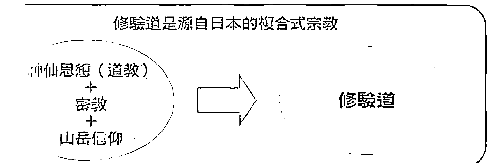

○阴...→No.060

○阴...的式神→No.062

○安倍晴明→No.067

> > ...（生物），是附身狐狸的一种。体长约9-12cm，形似鼯鼠，皮毛柔软... 手掌上有五只手指头，手与耳朵的形状与人类相似。这种细...（像）似地说出秘密、食量递增有如无底洞，然而被附身者一旦...（其）（性）（格）就会逃跑，据说其（鵺）附身在金钱上，金钱的数量就会自动增加。

### No.085
惟宗文高

活到將近90歲高齡，與安倍晴明同樣以長壽著稱的陰陽師。歷代陰陽頭就數他的在職期間最長，卻始終沒能成為陰陽道的第一把交椅。

## ○官拜陰陽頭卻是排名第三
平安朝是陰陽寮對社會仍擁有很大影響力的時代，照理說陰陽道的第一把交椅應該就是陰陽寮之長——陰陽頭，這可說是理所當然的事情。

惟宗文高從1010年起任職陰陽頭前後共約21年，是史上在職時間最長最久的陰陽頭。儘管如此，他卻也是個終其一生都沒能成為陰陽道第一人的人物。

其實，陰陽師此語在這個時代已不再專指陰陽寮裡面行占卜的職役，而是已經演變成泛指所有行使陰陽道之人的用語。從此以降，陰陽道的第一把交椅便不再直接等同於陰陽寮之長陰陽頭。

這個時代的陰陽界已經有種類似於能力排行榜的排名，根據這個排行榜，以萬壽3年（1026）為例，陰陽道的第一把交椅是安倍吉平，接著是賀茂守道，然後陰陽頭惟宗文高是第三名。

順帶一提，當時前陰陽博士安倍吉平已不在陰陽寮，而是在主計寮擔任主計頭，賀茂守道則是曆博士。

儘管文高已經就任陰陽頭這個陰陽寮的最高官職，可是大部份的職務卻都是直接從他的頭頂通過、只在安倍吉平與朝廷之間往復來回而已。即便是形式上該算是他屬下的守道，實質所受的待遇也比文高要來得高，使得文高對此憤憤不平，據說任職時期他曾經因此推說染病而怠慢職務。

文高活到將近90歲高齡，除陰陽頭以外還同時兼任長門介、陰陽博士、備中權介，最後則是職任土佐權守。無論其身為陰陽師的高低成敗如何，卻也總算是位出人頭地的成功人士。

- *1 主計寮：請參照P.165「主計頭」注。
- *2 長門介：長門國（山口縣的北部、西部地區）的地方行政官。古代日本是以國為地方行政單位，其行政官就是由中央派遣至地方的國司，國司有守、介、掾、目等四等官。

### 惟宗文高 生卒年不详
- 史上在職期間最長（21年）的陰陽頭
- 活到將近90歲，與安倍晴明同是以長壽著稱的陰陽師
- 是位曾經擔任眾多要職的成功人士

## 文高擔任過的要職
文高乃陰陽博士，除陰陽頭以外還曾經擔任過長門介、備中介、土佐權守等職。曾經歷任過前述名目職銜與領主職位，生活想必頗為豐裕。

## 陰陽頭的定位
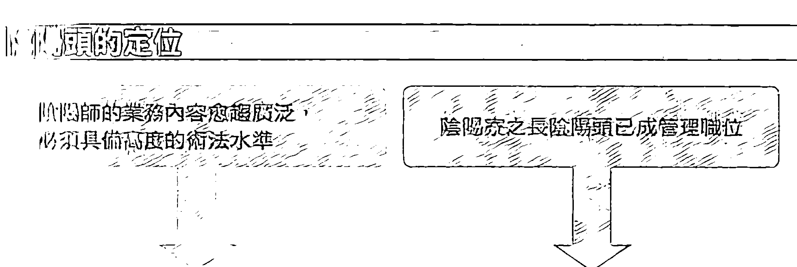

> > 文高雖然身為陰陽頭，其陰陽師的能力卻並不受期待

##### 萬壽3年的陰陽師排行榜
| 排名 | 姓名 | 官職 |
|---|---|---|
| 第1名 | 安倍吉平 | 主計寮的主計頭 |
| 第2名 | 賀茂守道 | 曆博士 |
| 第3名 | 惟宗文高 | 陰陽頭 |

> > 陰陽寮的職務多被交付給文高的部下守道和外人吉平。文高對此很是惱怒，甚至還曾經藉口染病而怠慢職務。

- [相關內容] → No.012
- 曆博士 → No.014
- 安倍吉平 → No.079

備中介：備中國（岡山縣西部）的地方行政官。「權」是副手之意。備中介是備中介的副手。
土佐介：土佐國（高知縣）的地方行政官。土佐守的副手。

### No.086
惟宗是邦

未經朝廷許可便擅自下到尾張國，非法搜刮百姓財貨中飽私囊的陰陽師。惟宗氏出的最後一位天文博士。

## ○留下小姦小惡名聲的陰陽師
在研究者之間為人所知的陰陽師當中，有位名叫惟宗是邦的人物。要說這號人物做過什麼嘛，傳言他曾經在尾張守¹藤原元命的底下工作，並且以目代的身分在長達三年的歲月裡多次搜刮農民。

所謂的目代就是指代替國司全權管理地方事務者，也就是後世所謂的代官。是邦時而向農民徵收憑空捏造、根本就不存在的耕田的稅款，時而以視察名義造訪農村、刻意逡巡逗留，索要農民宴食款待。

是邦的位階²是五位，換言之他乃是貴族身分，光是未經朝廷許可擅自出京畿之外便已經是違反了律令，可是他的行為卻似乎連朝廷律令也根本沒有放在眼裡。

雖然我們不知道除此以外是否還有像是邦如此極端的案例，但是在這個時代，頂著國司目代的身分前往各地聚斂民財自肥的陰陽師似乎並不在少數。目代勢必要從事計算徵收稅款等工作，就這點來說，算術對陰陽師可說是必修的知識，要在徵稅的數字上面略動手腳可說是輕鬆寫意。是邦便是如此中飽私囊的，而後後來此事還是被百姓直接告上朝廷，是邦遭藤原元命解任，而他的臭名也才因此得以流傳到現代。

順帶一提，這位是邦雖然曾經一度擔任過權天文博士³，而有史料顯示他在隔年就立刻遭到了解任。他在經常魚肉鄉里搜刮斂財的那段時期似乎曾經以權天文博士自稱，可是根據記錄指出，當時他其實早已經遭到解任，所以應該以「前」權天文博士稱呼比較恰當。並無史料記錄他被解任時曾經惹出什麼問題，同樣地也沒有任何記錄記載他在任期中曾經做過什麼，因此他人或許只是單純地無能而已。總歸一句話，是邦可謂是個跟典型的小混混沒有兩樣的陰陽師。

> ¹ 尾張守：尾張國（愛知縣的西半部地區）的地方行政長官。

> ² 位階：請參照P.064注。

> ³ 權天文博士：「權」是副手的意思，故權天文博士也就是副天文博士之意。

### 惟宗是邦 生卒年不详
- 惟宗氏最後一位天文博士
- 受任為權天文博士，翌年遭解任。並非因為鬧出什麼紕漏問題而遭到解任的
- 任期中亦無值得特別一提的功績

> > 應當是個凡庸無能的陰陽師

## 惟宗是邦的惡行
卸任後在尾張守藤原元命底下擔任目代（國主的代理人）

- 聲稱視察前赴領地，刻意逗留索要宴食款待
- 徵收根本就不存在的耕田的稅款，中飽私囊
- 無視貴族前往各地方必須事先取得朝廷許可的規定

因被百姓直接告上朝廷，與上司藤原元命一併遭到解任

計算徵收稅款等工作。對陰陽師來說是必修知識，由陰陽師來當國司的例子亦不在少數。惟宗是邦——一個藉職務之便在稅款數字裡灌水、揩油水的陰陽師

### NO.087
中原恒盛
擅自行使人稱「魂呼」的死者復生術並因而受到高層處罰的年輕陰陽師。

## ○出生得太晚的人材
中原恒盛這個人既非特別有名，也從未當過陰陽頭。他沒能當上各種博士甚至陰陽助，只爬到陰陽允仕途便告終結，只落得與其他泛泛陰陽師相同的下場。

不過恒盛此人非但絕不是什麼技藝拙劣之輩，相反地還非常優秀。恒盛的占卜很準，曾經多次得到當時掌權的公卿藤原實資獎賞。不光是占卜，恒盛也經常行使咒術，相傳他曾替人祓除灶神或土公神帶來的災厄邪祟，甚是活躍。

恒盛甚至還有一則因為太過優秀反而招致失敗的故事。這件事情發生在恒盛還很年輕的萬壽2年（1025）的事情。

藤原道長之女藤原嬉子在生產後不幸喪命，而恒盛就在這時擅自執行了一種名叫魂呼（亦作魂喚）的咒術。這是種把脫離肉體的靈魂喚回、祈使死者復活的咒術。且不說此咒術在當時的陰陽寮是史無前例的異術，至少也絕非年輕一輩陰陽師可以獨斷擅行的術法。

所幸當時的處罰似乎僅止於罰金而已，這或許就是他急著想要冒出頭所造成的結果。

即便曾經有過這個污點，恒盛仍舊是個絕對有能力攀上陰陽寮的頂點、或者以陰陽師之卓越才幹而留名後世的優秀人材。至於為何沒能達到這番成就，這完全都要歸因於時代的潮流。

在這個時代，有力氏族已漸漸開始佔據陰陽寮的職位。陰陽寮的主要官職逐漸被安倍、賀茂、惟宗、大中臣四氏所佔據，到恒盛當上陰陽允的時候，非四氏出身者也已經無法得到更好的職位了。

藤原道長：請參照P.048注。

### 中原恒盛

生卒年不詳

- 11世紀前半葉的官人陰陽師
- 占卜相當準確，曾經多次受到藤原實資獎賞
- 還經常行使咒術、誅除灶神或土公神等災厄邪祟

## 陰陽道四大氏族佔據官職
當恒盛進入陰陽寮的時候，主要職位早已被安倍、賀茂、惟宗、大中臣氏等有力的陰陽師氏族所佔據，非名門出身已經很難出人頭地。

## 1102年發生的事件
藤原道長之女產後喪命

年輕的恒盛擅自行「魂呼」之術

何謂魂呼……
為使死者復活，將脫離肉體的靈魂召喚回來的咒術。
這在當時的陰陽寮是史無前例的異術，年輕陰陽師不得擅自行使。

恒盛所執行的是史料文獻中首見的魂呼

雖然懲罰僅止於罰金而已，但他的仕途也就此終結

### 滋岳川人

平安時代初期的稀世陰陽師。即便安倍晴明也無法在生前超越其盛名的傳奇人物。

## ○精通遁甲術的陰陽師
滋岳川人原名刀伎直，齊衡元年（854）獲得賜姓滋岳，粗略計算應是比安倍晴明早個130年的人物。

這位滋岳川人是拙於隱藏身形的遁甲術大師，《今昔物語集》^[1] 的故事便很鮮活地將他的這項特長給呈現了出來。

故事就發生在文德天皇駕崩後，替天皇占定陵墓立地的回途中。當時川人的身分是從五位下^[2]、陰陽権助、陰陽博士，他對到同行的大納言^[3]安倍安仁馬腹，滿臉慌張地說道——

> 「我從來就不曾有過任何差池，可是這次卻犯了大錯」

根據川人的說法，因為不慎觸犯了禁忌，所以有恐怖的土神正在追殺安仁和他自己。雖然當天他用隱身咒文逃過了一劫，可川人卻在無意間聽見了依舊緊追不捨的眾土神間的對話。

> 「這次的12月晦日^[4]半夜，即便是上翻天下覆地，找遍全世界所有角落也要把他們找出來。」

就在这陣聲音讓安仁為之愕然的同時，川人卻心生一計。

於是兩人便在12月晦日爬到嵯峨寺大堂的天花板上躲藏。川人唱誦咒文，安仁也跟著行使三密^[5]，此時只覺得有陣帶著異香的暖風拂過、地鳴作響，不知誰人從旁邊經過。兩人雖害怕卻也只能強忍恐懼，好不容易捱到天亮，這才終於躲過了土神作祟。

後來川人當到陰陽頭，並著有《世要動靜經》、《攝要集》、《滋川新術遁甲書》、《六甲六帖》、《宅肝經》等書。

除此以外，其實川人在平安時代中期以前一直都被人們視為比賀茂保憲與安倍晴明、甚至還被神格化的大陰陽師。

### 滋賀川人
生年不詳～貞觀16年（874）

- 9世紀的陰陽師，最高曾任陰陽頭
- 曾經運用特有的方術來執行祓除宼蟲或祈雨的祭典儀式
- 在平安時代是受到神格化的大陰陽師

滋賀川人的著作
《世要動川經》《指掌宿曜經》《六甲六帖》
《滋川新術遁甲卷》《金匱新注》《宅肝經》

## 卜部神道名家

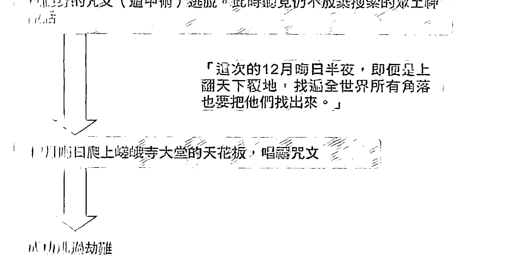

> 「這次的12月晦日半夜，即便是上窮天下覓地，找遍全世界所有角落，也要把他們找出來。」

○賀茂保憲→No.077
- (被裁剪的内容)→No.067

### 弓削是雄
曾經替人占算夢境吉凶，發現有暗殺者存在從而救人一命的播磨陰陽師。

## ○占夢大師
弓削是雄與滋岳川人是幾乎相同時代的人物，是位出身於播磨的陰陽師。從兩人活躍的年代來判斷，是雄應該年輕個幾歲才是。相傳是雄能看見鬼神，老後還曾經對年輕人說自己「曾經在朱雀門遇到鬼」的事。

話雖如此，這位後來一路晉升到陰陽頭的是雄最為世人所知的卻並非見鬼，而是《今昔物語集》*1裡頭一則占夢的故事。

貞觀6年（864）有位名叫伴世繼的男子，在從東國*2返京的途中於近江*3的勢多驛館與是雄同宿。打過招呼就寢以後，世繼當晚便做了個噩夢。世繼請是雄替自己占算夢境之吉凶，是雄卻叫他明天不要回家，因為有人想要殺他。

好不容易才從東國歸來的世繼實在迫不及待想要回家，又問說有沒有其他方法，於是是雄便具體地指示他解決之道。

是雄要他回到家把行李物品處理好以後，張弓搭箭瞄準丑寅方位的角落，然後大聲說道：

> 「我早就知道你等我從東國回來，打算在今天動手殺我。快快出來，否則立刻將你射殺。」

世繼按照是雄指示而行，果然有一名法師從丑寅角落的屏風後方走了出來。世繼將他擒住盤問，但該法師卻無論如何都不肯招供，只好施以拷打，法師這才供述稱自己的主人是位僧侶，長期與世繼的夫人有染，自己則是在得知丈夫就要回來的夫人的指使之下動手暗殺世繼。

世繼除感謝是雄以外，還將法師送交檢非違使*4，並與夫人斷絕關係。

*1 《今昔物語集》：請參照P.041注。
*2 東國：從畿內來看位處東方的各郡國。平安時代以後專指箱根・足柄・碓冰以東的各國。關東地區。
*3 近江：請參照P.120注。
*4 檢非違使：原先是專門檢察京城非違、非法情事的官署，後來連殺人、強盜判也一併併入業務範圍，權力變得相當大。請參照No.008「獄的概念」內容。

## 助人的式占名手
弓削是雄　生卒年不詳

- 歷任陰陽博士與陰陽頭
- 擁有看見鬼神的能力，自稱曾經在朱雀門遇到鬼
- 以助人的故事而聞名

## 《今昔物語集》的傳說

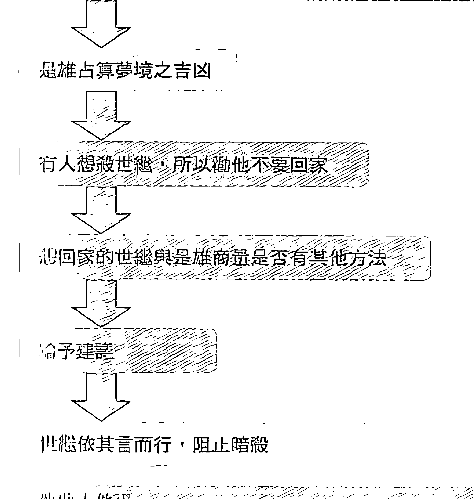

## 助人佚事
> 他遇到「雖然助僧秀卻無僧位」的修行者，用占術排除在場的考官，單憑友人推薦便讓該修行者通過考試。

相關人物→No.088

僧位：日本朝廷對僧侶所給予的位階。

### NO.090 淨藏
傳說曾經以祈禱將平安時代傾斜的京都法觀寺八坂的五重塔在一夜之間扶正的僧侶。

## ○法力高強的僧侶
通常都說安倍晴明的死對頭就是蘆屋道滿，但晴明其實另外有個不同涵意上的勁敵，那便是天台宗¹的僧侶淨藏。

此人生於寬平3年（891），素以佛法威驗卓著而聞名。

淨藏乃以宮中修法，而且還是調伏病魔與物怪等高等術法為世所知，因此我們也無法排除是否有先由安倍晴明調查異象成因、再由淨藏修法調伏這種聯手合作的可能性。以晴明藏匿式神的故事而聞名的一条戾橋跟淨藏也有很深的關係。從前淨藏在前往父親葬禮時，途中在一条通的橋上遇到出殯的隊伍，於是便向神佛祝念使父親死而復活。從此以後，該橋遂有戾橋之稱。

據說他在替罹病的藤原時平²加持之際，致病的起因菅原道真³亡靈曾經向淨藏的父親三善清行說道「我已向梵天、帝釋盡訴怨忿，得蒙聖裁才來一雪怨恨……」，訴諸行為之正當性，所以淨藏便停止祈禱，藤原時平也就當場死掉了。

此外淨藏還通曉天文、醫藥，聲線優美同時更是位橫笛名家，據說其笛音動聽到就連朱雀門的鬼都為之感動，不定他的明星特質其實比晴明還要高也未可知。

順帶一提，其父三善清行原本是位漢學者，著有《善鄰國寶記》、《圓珍和尚傳》等書，不過他也頗諳於陰陽天文之道，至澄曾經指出901年將會發生辛酉革命⁴，並提倡將年號改為「延喜」。淨藏如此多才多藝，也許正是來自父親的遺傳。

淨藏在法觀寺的八坂之塔前面建了座八坂庚申塔。此舉大概是受到與陰陽道頗有關聯的庚申信仰所影響，連這種地方都能感覺到淨藏與陰陽道的匪淺因緣。

+   1. 天台宗：中國佛教宗派之一 - 隋僧智顗所創，因智顗晚年居住天台山，故名「天台宗」。以法華經為主要教義根據，故亦稱為「法華宗」。
2. 藤原時平：平安時代前期廷臣，藤原基經之子。貶菅原道真為大宰權帥，以保障藤原氏的地位。
3. 菅原道真：平安前期的學者、政治家，曾受宇多、醍醐兩代天皇重用，官至右大臣職位。894年被任命為遣唐使的同時卻建議朝廷廢止遣唐使。因遭藤原時平進讒言而被貶謫為大宰權帥，翌年死於赴任地。

### 淨藏 寶平3年（891）～康保元年（964）

- 與安倍晴明同時代的勁敵之一
- 雖然並非陰陽師，卻以調伏病魔、物怪而著名
- 行使與陰陽道頗有關聯的庚申信仰，建有八坂庚申堂

#### 淨藏的其他特技
天文、美声、医薬、横笛等。
尤其横笛之优美更是迎朱雀门的鬼也为之动容。

## 無名故事與傳說

#### 修復五重塔
以念力矫正倾斜的八坂五重塔，一夜之间将斜塔扶正。

#### 使父親復活
在一条通橘遇到父亲的葬仪队伍，向神佛念咒使父亲死而复生。

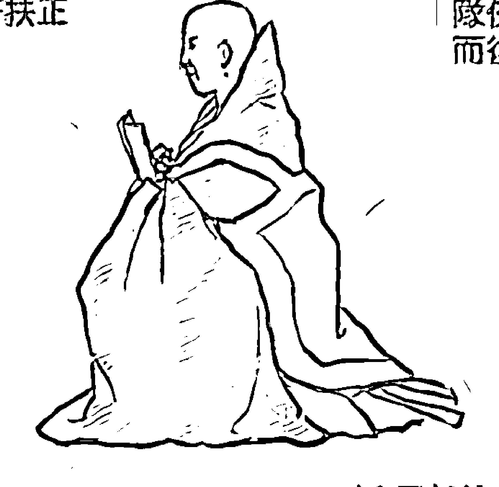

#### 調伏將門
使用咒法平定平将门之乱。

#### 鎮慰道真亡靈
在罹病的藤原时平加持祈祷时，藤原道真亡灵出现并主张咒杀之正当性。于是净藏停止祈祷，时平当场死亡。

#### 天文・三善盛行
著有《善家秘记》、《月珍和尚传》等书。精通天文之道，提倡改元延喜。

- 神社・灵场 → No.060
- 陰陽師的式神 → No.062
- 庚申信仰 → No.065
- 安倍晴明 → No.067
- 薙屋道满 → No.075

注：梵天是印度神话里的创造神娑罗贺摩被佛教采用后所创造的神。风神则是由印度神话的暴风雨神因陀罗演变而来的佛教神祇。庚申两年将会有异变发生的预言。此说法来自于中国的谶纬之说。

### 良源
良源法力高強，是使延曆寺得以壯大起來的人物。歿於985年正月3日，故亦稱元三大師。

## ○變身高僧
與淨藏幾乎相同時代的還另外有個名叫良源的人物。此人同樣也是天台宗¹的僧侶、生於912年，算起來比淨藏還要小21歲。

良源曾於奈良興福寺的維摩會（經典的朗讀會）與元興寺僧人義昭討論佛法，然後又在宮中清涼殿²舉行的討論會裡舌戰壓倒法相宗³的法藏。

其後，良源非但深受藤原攝關家的忠平、師輔父子崇與信賴，甚至還有傳說指其為攝關家守護觀音的化身。良源深受攝關家尊崇，連帶也使得天皇家亦待之甚厚，曾經多次召請良源至宮中修法。

良源曾於981年替圓融天皇祈禱使天皇疾病痊可，因而被任命為自從行基⁴以來的史上第二位大僧正⁵。世人為求能獲得治癒疾病之驗驗，遂製作繪有（相傳是良源變身之後模樣的）大師、豆大師等圖像的護符，直到21世紀的現在家家戶戶還會將它張貼在門口。另外還有種世稱鬼大師的鬼面坐像，同樣也是根據良源變身成鬼的傳說而演變成的產物。

說到天台宗法力高強的僧侶，園城寺的僧侶賴豪也很有名。從前膝下無子的白川天皇曾經命令賴豪行祈禱，結果使敦文親王的誕生。天皇原想好生獎賞，但賴豪提出的願望卻與比叡寺和園城寺的紛糾不和有關，因此才沒有得到採納。

後來賴豪慢慢地淡出俗世不問世事，可是敦文親王卻在4歲的時候便告夭折，於是遂有傳說指其為賴豪的詛咒使然。從小至還有人創造出賴豪死後變成妖怪，率領數萬隻老鼠咬破經典的傳說。

賴豪原本是位博識碩學而佛法驗證的僧人，豈料後世卻受到如此不堪的對待。

+   1. 天台宗：請參照P.190注。
2. 清涼殿：請參照P.118注。
3. 法相宗：亦名唯識宗、慈恩宗，屬於瑜伽行唯識學派，漢傳佛教宗派。
4. 行基：奈良時代的僧侶。曾經周遊諸國、從事造橋築堤等社會事業，教化民眾，並且得到聖武天皇歸依，受任命為大僧正。

## 法力高强的僧侣
### 良源 延喜12年（912）～永観3年（985）

- 天台宗僧侣
- 正月3日去世，故亦称元三大师
- 法力高强，是使延历寺得以壮大的功臣
- 备受藤原摄关家尊崇，甚至还因此衍生出良源是守护观音化身的传说

## 角大师
传说他能变成鬼的模样赶走疫病神，故亦称角大师。后来角大师还成为驱魔的护身符。

受天皇家厚待，多次在宫中修法

901年利用祈祷使圆融天皇的疾病痊可

加上长年以来的功绩，故受任为大僧正

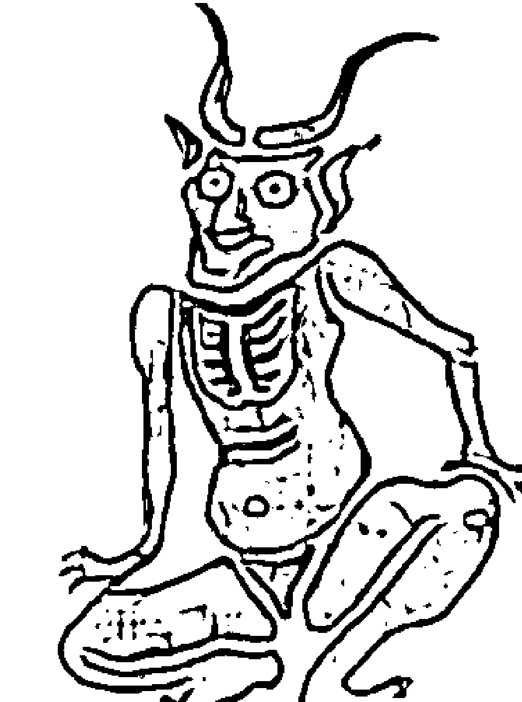

## 第二名僧侣
##### 顕豪 長保4年（1002）～応徳元年（1084）
园城寺一名博识硕学而佛法灵验的僧侣。
曾受命于白川天皇举行祈祷，使敦文亲王因而诞生。

可是朝廷的愿望却并未得到实现

敦文亲王4岁夭折，据言这是顕豪的诅咒使然。
相传顕豪死后还变成了鼠妖。

### No.092 智德法師
儘管擁有令人驚嘆的實力卻依舊敗給安倍晴明，終於說出名字並且拜晴明為師的老法師。

## 智德法師的兩則說話
智德法師是位因為跟安倍晴明關係頗深所以知名度還算廣的人物。他的式神被晴明藏起來的故事就很有名。
某日有個帶著兩名童子的老僧前來拜訪晴明。這名老僧雖然懇請晴明教他，其實卻是個前來試探實力的陰陽師。
晴明很快就看出這名老法師並非尋常人物，兩名童子也是法師的式神所化。於是他便悄悄結起手印、唱誦咒文，把式神藏了起來。這天法師回去以後發現式神不見，這才又折返回來。法師向晴明道歉並求他將式神歸還，於是晴明便將式神放回，大為驚異的老法師這次才真心拜晴明為師，並且寫下自己的名字交給晴明。
原來法師雖然能驅使式神卻無法扣住別人的式神藏起來，所以才折服於擁有這等道行的晴明。

據說這名法師就是智德法師。光看這則說話可能會覺得他只不過是個二流的小角色，但其實他也是名相當值得驚嘆的陰陽師。
從前在播磨國有艘載運大批貨物的船隻遭到海盜襲擊。僥倖棄船跳海方才保住性命的船主描述事情經過以後，智德決定替船主捉住這些海盜。只見他在船隻遇襲的相同時間乘船來到相同場所，在海上不知道寫了些什麼、唱誦咒文，然後又上岸做出像在捕捉什麼東西的動作。
四、五天後，不知從哪裡漂來了一艘船。船上坐著大批模樣的男性，每個卻都像喝醉了似的倒地不起。被奪的貨物原封不動全都交還給失主，至於海盜則是被智德法師抓去訓誠說教一番，然後就放走了。

以上便是兩則分別收錄於《今昔物語集》¹與《宇治拾遺物語》²的說話。

> ※1 《今昔物語集》：請參照P.041注。
※2 《宇治拾遺物語》：請參照P.040注。

## 平安陰陽師圖鑑 師的法師
### 智德法師 生卒年不詳

- 雖然《今昔物語集》等作品都曾提及，但應該是虛構的人物
- 經常被視為同為巫屋道滿

### 智德法師與安倍晴明
據說智德法師原想試探晴明實力，豈料隨行的式神卻被憑空趕來，認嘆晴明法力高深所以拜晴明為師。

### 智德法師降伏海盜的傳說
載著貨物的船隻遇海盜挾持

智德法師決定捉住海盜

法師在遇匪的相同時間乘船來到相同場所，在海上不知道念些什麼，唱起咒文，然後又上岸做出似乎在捕捉什麼東西的動作

幾天後有艘漂流船出現。船上坐著大批海盜，但卻因為智德法師的咒術而像癱瘓似的全部倒地不起

將東西歸還，智德法師向海盜訓誡一番之後便放他們離去

### 播磨國的陰陽師
播磨國歷來便以跟陰陽道淵源斐淺、陰陽師並出而聞名。有幾個理由可以說明這些現象。

## ○能清楚看見星辰、適於占星之地
播磨國就是現在的兵庫縣西南部一帶，有名的陰陽師如弓削是雄、蘆屋道滿就是播磨出身。雖然並非出身於播磨，但安倍晴明曾任播磨守*1，滋岳川人亦曾出任播磨権介*2。跟陰陽道有很深關係的吉備真備則是出身於播磨隔壁的吉備（岡山縣）。

若問說為何這些人都集中在播磨，主要有兩個理由：播磨是與中國交通往來的要所，還有此地可以清楚地看見星空。

吉備與播磨自古便有個相當大的文化圈。這裡土地肥沃、能採鹽鐵而且還是石材皮革的產地，甚是繁榮。交通方面則首先有瀨戶內海的海路之便，往北越過山脈便可抵達出雲*3，而且距離深受日本海對岸影響的丹波和但馬*4也很近，往東則可直接與畿內地區交流，佔盡地利。

中國和朝鮮的人與文化若非經由日本海，否則就必須從北九州或者瀨戶內海通往京城，因此位處中途的吉備、播磨向來就是渡來系文化的先進地區。

除此以外，瀨戶內海北有山脈聳立、南有四國山地遮擋風雨，雨量較少氣候穩定，是最適合天文觀測的地方。

直到現在仍有「西播磨天文台」和東大的「岡山天體物理觀測所」設於此地。

順帶一提，在岡山天體物理觀測所的所在地竹林寺山眺望有一座安部山，這裡有間傳說安倍晴明曾經在這裡觀測天象的房屋遺跡。而該遺跡附近同樣也有間蘆屋道滿的房屋遺跡，再加上山脈北側便是吉備真備的出身地，正可謂是陰陽道的最佳舞台*。

## 播磨为何会成为阴阳师的聚集地？
星空看得很清楚

- 降雨少
- 气候稳定
- 最适合天文观测
- 现在仍有许多天文台

## 形成播磨文化圈
交通要所

- 渡来人与中国文化的传入
- 海路：濑户内海
- 北方陆路：与出云交流
- 东方陆路：与畿内交流

其他

- 土地肥沃
- 矿产丰富
- 石器与皮革的产地

## 与播磨颇有渊源的阴阳师

| 播磨出身的阴阳师 | 与播磨宫廷有关的阴阳师 |
| --- | --- |
| - 薗屋道满 - 弓削是雄 | - 安倍晴明 - 滋岳川人 |

日本海

鸟取县

岛根县

冈山县

兵库县

广岛县

晴明冢
道满冢

濑户内海

吉备真备出身地

※与安倍晴明颇有渊源的安倍山周遭
※安倍晴明从前观测天文的房屋遗迹
八坂神社（矢挂町）

○安倍晴明→No.067
○滋岳川人→No.088

注1：相当于现在的岛根县东部。
注2：丹波相当于现在的京都府中部以及兵库县中部东部，但马则是指兵库县北部。

## 鬼的概念
平安時代將須要被祓除掉的壞東西統稱為「物怪」「邪氣」等。所謂物怪就是「物的氣」。當時相信沾染接觸到不明物質的「氣」就會生病，而「鬼」便是這些不明物質的其中一項。這種鬼就是會招致疾病的「疫鬼」。

成立於9世紀的《日本靈異記》就有提到利用「氣」使人生病的鬼。疫鬼是來自冥界的使者，其目的是要把人給帶走，其角色相當於所謂的死神。

傳說這個疫鬼手持槌與鬘，是拿槌子敲在額頭取人性命。這種手持槌鬘的鬼的形象，應該是來自於中國4世紀成書的《搜神記》第十六卷。

## 對物忌漫不經心的人
平安時期的名人紀長谷雄在各種史料記錄裡經常被塑造成一名相當滑稽的人物。

長谷雄歷任圖書頭、文章博士、大掾頭等職，延喜2年（902）任參議，延喜11年（911）晉升至中納言，最高位階為從三位。

他是菅原道真的愛徒兼好友，道真甚至還曾經讚道「紀長谷雄詩才乃白樂天再世」。

《今昔物語集》有三則紀長谷雄的故事，其中一則是描述他不小心忘記陰陽師提出的警告。

某日長谷雄家裡接二連三地不斷有狗跑進院子裡小便。此即所謂的怪異。

於是他便請陰陽師來看，陰陽師說這是鬼出現的前兆。雖然並不會造成多大的危害，但還是勸你要守物忌——陰陽師如是說道，豈料長谷雄卻壓根忘了這事兒，甚至還找學生到家裡召開詠詩聚會。

果不其然，果然有個額頭長著隻角、頭黑體白、形狀像只狗的妖怪出現。長谷雄等人大吃一驚，有名學生朝妖怪的臉踢了一腳，結果妖怪的頭就被踢飛了。仔細一看，原來這妖怪是隻頭伸進水壺裡拔不出來的狗，先前看似額角的其實是壺嘴。

眾人這才安心的笑了出來，並稱謝陰陽師道：「雖然不是真的鬼，但看起來像是鬼，占算說是有鬼會出現也是理所當然之事。而且他還算出不會有太大危害，真是不簡單呢！」相反地大家卻笑長谷雄說：「自己身為博士卻忘記該守物忌的日子，真是太失態了。」

## 第4章 詛咒與怪異

### 何謂詛咒・怪異
雖說平安貴族處處受到禁忌與迷信的束縛，但有時還真的會遭遇到靈異離奇的現象發生。

## ○陰謀與魑魅魍魎充斥的時代
平安時代，尤其是平安中期的貴族們非常在意日常生活中發生的各種現象「是否是有什麼事情要發生的徵兆？」「接著會不會有凶事發生？」「如果會的話該如何防止？」，並將此類現象喚作怪異。

一旦有怪異發生貴族就會委託陰陽師來占斷怪異，倘若該異象是種預兆、顯示將有凶事發生的話，他們就會閉門守物忌迴避凶事。此事在日記等文獻當中均有留下許多記錄，可以佐證。

怪異並不全然是自然發生的現象，由他人刻意製造引起的怪異其實也很多。當時相信在權力鬥爭極為激烈的宮廷裡詛咒他人，詛咒發動顯現之際也會使得怪異發生。含恨而終的死者有時候也會化作亡靈出來作祟害人。

怪異和物忌的概念之所以如此流行，其實與當時的世態也有關係。為了要維護和平的貴族社會和自己的體面，貴族間並不直接爭鬥反而陰謀害人，或是僱用能行邪術者來詛咒政敵。

詛咒固然會對施咒對象造成傷害，可是等到詛咒顯現便為時已晚了。倘若沒有事先發現預兆、使詛咒無效化，便很有可能會有性命之憂。

當時詛咒無論在社會層面抑或法律層面均被視為是非常嚴肅的犯罪，而這也恰恰反映了人們對詛咒的恐懼是何等的深刻。

如果知道詛咒是何人所為倒也還好，可是通常遭遇到某種怪異卻不知起因為何可說是所在多有的事情。另外即便陰陽師已經宣佈並非凶兆，這類珍奇異事往往還是會被記錄下來。

## 陰陽師施行的詛咒
陰陽師也可以是凶事的始作俑者
當時相信陰陽術可以利用詛咒向他人施咒。
使用詛咒被視為非常嚴重的犯罪，這點在法律（律令）裡也有明文記載。

## 處理預兆與怪異的對策

- 陰陽道以「預測」為基本
    - ○凶事→須得事先發現預兆，在凶事顯現成形以前採取對策。
    - ○詛咒→如果沒有在預兆階段便看穿並且使詛咒無效化，那就為時已晚了。

- 平安貴族面對怪異所採取的對策
    - 某種罕見／奇怪的事情發生
    - ↓
    - 「是什麼預兆嗎？」「是凶事的徵象嗎？」→怪異
    - ↓
    - 委託陰陽師占斷怪異
    - ↓
    - 分支：
        - 凶事的預兆 → 守物忌以迴避凶事
        - 詛咒的徵象 → 採取將詛咒物移除或者反詛咒等對策
        - 並非凶事 → 安心（畢竟是相當罕見的事件，往往會被記載在日記等文書裡）

### No:095 詛咒與暗殺

虛構作品裡的法師陰陽師往往都是反派角色，而且往往到遭族疏遠，這都是因為他們有行使詛咒的嫌疑所致。

## ○陰陽師並不互相攻擊？

平安時代的貴族之間雖然有權力鬥爭甚至會施行詛咒，可是卻鮮少有官人陰陽師牽連其中。

陷害攻擊政敵除脅迫、賄賂等手段以外，偽造「暗殺的聖旨」欺騙陰陽師或許也是個可行的方法。然而一旦發現證據指出命案其實是詛咒案件，那麼委託行使暗殺的貴族身分就會曝光，受懲罰的可能性自然也很高。相信沒有貴族和官人陰陽師會去做這麼危險的事情才是。

實際要利用詛咒進行權力鬥爭的時候，會接下這種工作的應該都是市井間的法師陰陽師。平安京裡有許多法師陰陽師，雖然自稱能施詛咒的大部分其實都跟職業騙徒沒有兩樣，但也許其中真的有人具備此等能力也說不定。

不過具備此等修為實力者存在的機率應該是趨近於零才是。詛咒只不過是陰陽術裡面的一小部分，而且詛咒又是唯一死罪，所以並非所有法師陰陽師都會接受施詛咒的委託。

再說假如滿街都是有本事施行咒殺的術師，貴族社會早被爆發的詛咒和報復事件給搞垮了。

不過，史料文獻裡藉詛咒遂行陰謀之事卻仍是屢見不鮮。

順帶一提，無論發生什麼樣的狀況，陰陽師直接對決是唯一在虛構作品裡面才看得到的景象。

施術者只須對付目標對象即可，沒有理由要跟施術者對決。就算對方委託陰陽師排解，真要找出藏身暗處的暗殺者也是難事。

### No:096 如何委託術師施行詛咒

## 欲施詛咒
- 委託陰陽師
    - 官人陰陽師：從未有過官人陰陽師為個人委託者施詛咒之記錄。
    - 法師陰陽師／惡陰陽師：偶見於文獻記錄。

## 成功率與風險
- 官人陰陽師：從未有過官人陰陽師為個人委託者施詛咒之記錄。
- 法師陰陽師：偶見於文獻記錄。應該鮮少成功（如果成功率高的話，貴族社會早就崩壞了）。雖說應該沒人甘冒觸犯這罪的危險施咒，但也有可能只是未見於文獻記錄而已。許多都是不具此等修為的騙徒。

## 術師需要對決嗎？
術師只須對付施詛咒的目標人物即可，毋須與術師對決。唯獨虛構作品裡面的陰陽師才會直接對決。

> 參考項目
- ○官人陰陽師→No.013
- ○法師陰陽師→No.016
- ○何謂詛咒・怪異→No.094

### No:096 詛咒的對象

詛咒最盛行的地方便是宮廷之內。愈是身處高位易遭人妒的高貴人物，就愈容易成為詛咒的目標。

## ○日常周遭隨處可見的詛咒事件

宮廷裡無論任何人邀人妒恨，都有可能因此成為詛咒的目標。文獻所記載曾經遭受詛咒者也並非全都是藤原道長¹這種大臣等級的要人，也有中級官員、女房（在後宮服事的女性）等人物，形形色色五花八門。

舉例來說，長和4年（1015）就曾經在某位擔任典侍的女房家裡逮捕到一名正要埋下詛咒物的女性。這名女性只是受人利用來此埋下詛咒物而已，對其中案情緣由並無所悉。後來經過調查，才發現幕後指使者原來是受詛咒女房的前同僚。

另外，寬弘4年（1007）曾經有目擊者發現可疑份子挖掘藏人宿舍的地板。後來這名可疑份子雖然逃脫，但從服裝推測應是市井間的法師陰陽師，料想也是企圖埋藏施詛咒的物品。這種在地面埋詛咒物以行詛咒的行為相當常見，有時施咒者也會將詛咒物投入井中。

除此以外，《宇治拾遺物語》²也收錄有一則對小規茂助施詛咒的故事。此人當時只不過是個區區的六位³而已。

儘管詛咒如此泛濫，受詛咒的對象仍舊是以身分地位易遭嫉妒者居多。

由女房出任的「典侍」是個在後宮裡握有重權的職役。「藏人」是負責照顧天皇飲食、雜務等日常起居事的官職，若非能力與家世背景俱優者是不會被配屬到這個職位的。其次，小規位階雖然低但是能力優秀，已經獲得了「世間風評愈高」的評價，故而遭到同僚嫉妒，終於丟了性命。

¹ 藤原道長：請參照P.048注。
²《宇治拾遺物語》：請參照P.040注。
³ 六位：請參照P.064「位階」注。

### No:096 誰比較容易成為詛咒的對象

在平安時代，任何人都有可能成為詛咒的對象。

## 對女房施詛咒
女房＝在內裏或大貴族家中服侍的女性中階・低階貴族女性的一般職業。
一旦成為皇子乳母或被天皇看上，就可掌握相當大的權力。

## 對藏人所施詛咒
藏人＝負責處理天皇周身事務的職役。
必須是出自名門並且優秀者方可擔任的職位。若是晉升到藏人所的長官藏人頭，將來就很有可能飛黃騰達成為大臣或大納言。

## 所謂的位階

| 正一位 | 從一位 | 正二位 | 從二位 | 正三位 | 從三位 | 正四位 | 從四位 | 正五位 | 從五位 | 正六位 | 從六位 |
|---|---|---|---|---|---|---|---|---|---|---|---|
| | | | | | | | 上 下 | 上 下 | 上 下 | 上 下 | 上 下 | 上 下 |

只有太政大臣等位極人臣者才能晉到正一位。平安朝幾乎是在死後追贈。
從三位以上與官職在「參議」以上的貴族稱為「公卿」。亦作月卿、月客。
典侍相當於從四位下。
五位以上屬於貴族。大部分陰陽師不是正六位上就是從五位下。
藏人通常都是五位或六位。藏人所的長官藏人頭則大約是從四位下。

+   【相關項目】
○ 法師陰陽師→No.016
◎ 何謂詛咒・怪異→No.094

### 詛咒攻

在所有安倍晴明相關記錄當中有件相當耐人尋味的詛咒案件。該案件中受到詛咒的目標人物，正是當時的掌權者藤原道長。

## ○設陷阱攻擊道長的地雷

鎌倉時代的《宇治拾遺物語》*1裡有章「御堂關白御犬、晴明等奇特事」。這是講述平安時代詛咒的一則相當有名的故事，內容描述安倍晴明阻止對當時掌權者藤原道長*2施下的詛咒。

從前道長興建法成寺完工後，每天都要帶著自己養的白狗去該寺參拜。那天正要走進寺門的時候，他養的狗卻擋住去路不停吠叫，阻止道長前進。

於是晴明才被喚來，占了一卦。晴明說「路上埋有詛咒您的東西」，並且命人挖掘路旁地面，果然發現了一個形狀好像將兩個碗扣在一起的土器。土器用黃色的紙捻綁成十字形狀，底部還用朱砂寫著一個好像是詛咒的文字。這是個當人踏過埋藏地點就會發動的詛咒，狗因為能夠通靈所以才察覺到有詛咒存在，晴明如是說。

晴明接著又從懷裡取出紙張折成鳥的形狀，唱誦咒文往空中一拋。只見這張紙立刻化作一羽白鷺，往南飛去。晴明遣僕從去追，結果白鷺降落在某個名叫道摩法師的老法師家裡。道摩就是位被認為與蘆屋道滿是相同人物的法師陰陽師。

於是乎道摩法師遭到逮捕，下令要他對道長施咒的敵對貴族姓名也查出來了。自從這個事件以後，道長就對提出警示的白狗更加寵愛，對晴明也更加信賴。

此案件的發生地法成寺建於治安2年（1022），可是這已經是一般所認定的晴明卒殁年1005年以後很久的事情了。儘管這個故事旨在講述晴明出神入化的術法，而且傳奇色彩強烈，不過應該跟平安時代當時詛咒事件的實際情況相當接近才是。

*1 《宇治拾遺物語》：請參照P.040注。
*2 藤原道長：請參照P.048注。

## 誰政事藤原道長的詛咒

> 《宇治拾遺物語》：御堂關白御犬、晴明等奇物）
對象：藤原道長
場所：法成寺

道長正要跨進寺門，他走的狗卻掐住去路吠叫不止。
異於平常的事件。
怪異。
屬於陰陽師管轄（喚來安倍晴明）。
從路旁地下發現詛咒土器。
接著晴明又用紙變成白鷺，令僕從跟在後面。
白鷺落在道摩法師家裡。
逮捕道摩法師，查出幕後黑手。

相關項目
○安倍晴明→No.067
○何謂詛咒、怪異→No.094

## 反詛咒

將詛咒反彈抑或將業已發動的詛咒解除，都可以稱作「反詛咒」。

## ○作為反擊手段的反詛咒

陰陽道原是以預知和預防為本，「除去造成詛咒的詛咒物」和「教人守物忌以迴避詛咒」是陰陽道固定的慣用手段。可是當詛咒成立以後，同樣也可以採取祓除詛咒、或將詛咒反彈給施術者等處理方法。
《宇治拾遺物語》*1裡面有這麼一則故事。某日，年輕的藏人少將（兼任近衛府*2的少將和藏人二職者）被飛過頭頂的烏鴉的糞便給擊中了。將此事看在眼裡的安倍晴明立刻看出烏鴉其實是式神所化，而少將已經因為烏鴉糞便沾身而受到詛咒。倘若放任不管，少將恐怕就來日不多了。
在少將哀求之下，晴明決定要救他的性命。晴明跟他回到家里，然後從背後緊緊抱住少將，不斷誦念咒文直到天亮。隔天就有名使者來到少將家里，原來這名使者的主人就是施下詛咒的陰陽師，因為詛咒反彈所以已經反遭其害了。再派人前去查看，陰陽師果然已經死亡。
這種反詛咒的術法又叫作身固。故事裡晴明雖是抱著被害者的身體，但身固原本應該是要對受害者的衣服行使抗咒才是。
另外《小右記》裡面還有個祓除詛咒的案例。長元3年（1030），一名叫作皇延的陰陽師因為行使詛咒而遭到逮捕。這皇延雖是法師陰陽師，卻是經常受貴族委托行使占術的實力派。
於是乎皇延就被五花大綁押到了河邊，被逼著行使祓禊。據說他甚至還被強押著吃下自己為陷害受害女性而烹製的食物。
從這個儀式可以推測當時相信詛咒是從外部進入體內（此案例乃是藉由食物），而詛咒一旦施放出來以後就很難解除，非得有人承受詛咒不可，所以才會讓皇延代受其害。

## 反詛咒之應對

## 反詛咒
詛咒發生後陰陽道所採取的對策。
- 將詛咒反彈給施咒的術師。
- 將詛咒解除。
此二者均可稱作反詛咒。

## 基本原則
發現徵兆然後：
- 除去造成詛咒的詛咒物。
- 教人守物忌以迴避詛咒。

## 反呪的反詛咒
年輕的藏人少將被頭頂飛過的鳥以糞便擊中。
晴明前往少將家中，從背後抱住少將整晚不斷唸咒文。
詛咒反彈使得施咒的陰陽師喪命。
風類式神的詛咒。
亦稱「身固」的反詛咒術法。

## 解呪的反詛咒
名叫皇延的陰陽師以行使詛咒罪名遭逮捕。
皇延被押到河邊行祓禊，以解除自己施下的詛咒。他甚至還被迫吃下為詛咒受害者女性而設的食物。
一經施放的詛咒便無法消除，所以才強押皇延舉行儀式、自己承受詛咒。

+   ○法師陰陽師→No.016
○術師與方術→No.038
○安倍晴明→No.067
○何謂詛咒・怪異→No.094

### No.099 動物的怪異

透過動物顯現的怪異大多是相當顯眼的事件，因此文獻史料裡經常可以見到此類記錄。

## ○發生在日常周遭的怪異

《小右記》、《御堂關白記》、《權記》等平安時代貴族的日記和《扶桑略記》等史書都有記載從前偶爾會發生的怪異。若將這些怪異分成幾類，其中有很大一部分可以歸類為「動物的怪異」。

首先是野生動物（鹿、狐狸等）跑進貴族宅邸或內裏¹之類的情形。當時的自然環境仍然相當完整，連市區都有野生動物出沒了，出現在貴族宅邸裡面自然更是不足為奇。儘管如此，此現象在那時卻往往會被視為怪異。再說，內裏的戒備要比貴族宅邸更加森嚴，即便是在從前那個時代，有動物闖進來仍是很不可思議的事情，當然也就會被視為怪異。

若是動物做出罕見的舉動，同樣也會被視為怪異。例如貴族的交通工具——牛車的拉車牛暴走衝進住屋裡，或者在非食物的物品（寢具或書籍文件）發現老鼠嚙咬的痕跡，都是怪異。另外像是有鳥類在宮中亂闖、在內裏築巢，又或者是有大量飛鳥群聚，也都會被視為怪異。

## ○排泄物的怪異

在各種動物的怪異之中，最具特色的當屬犬隻等動物的排泄物。京城裡有許多野狗這件事本身根本稱不上是什麼怪異，當排泄物落在路旁的時候同樣也沒人會將其視為怪異，但如果在宅邸裡面發現排泄物的話，貴族就會請陰陽師來占斷怪異。

《扶桑略記》第二十七卷就有將南殿發現「犬之矢」（狗尿）視為怪異並行使占算的記錄。當時占斷怪異的結果顯示是「兵革（戰爭）」的徵象。

¹ 內裏：請參照P.022注。

### 動物的怪異

當動物做出異於平常的罕見舉動時，往往會被視為怪異。

+   * 野生動物闖進屋內
* 動物損壞器物
* 大量動物聚集
* 在建築物範圍內排泄

平安時代將動物糞便稱作「矢」，若是在宅邸或內裏發現「矢」，往往會被視為怪異。文獻裡便有「犬之矢」、「狐之矢」等事例的紀錄。

## 怪異之事例

| 時間 | 事件 |
|------|------|
| 延長5年10月 | 南殿發現狐之矢 |
| 延長6年6月 | 鳥群聚於承明門之上 南殿有女蔦聚集 |
| 延長8年6月 | 鳥停佇在太極殿內的橫梁之上 |
| 延長8年7月 | 鳥隻拔起兩枚時杭* |
| 承平2年1月 | 承明門有鹿闖入 |
| 承平2年5月 | 牛隻闖進正殿 |
| 承平2年6月 | 狐狸出現在侍從所 |
| 承平2年7月 | 南殿有犬之矢 |
| 承平5年2月 | 鳥鴉在弁官*橫樑築巢 |
| 承平5年9月 | 鳥隻銜時申算*飛走 |

參考文獻 ○何謂詛咒・怪異→No.094

*時杭：時杭是古時宮中立在清涼殿之間小庭院，用來計算表示時間的物品。其實際形狀不得而知，但某些日記曾經有時杭被鳥銜走、被狐挖掘起來的紀錄，應該相當輕薄才是。
*弁官：朝廷最高機關太政官裡的職位，即左大弁、右大弁、左中弁、右中弁、左少弁、右少弁的總稱。
*時申算：所指為何不得而知，可能是某種類似算籌的物品。

### No.100 自然現象的怪異

所謂怪異就是指「奇怪的事情」、「不可思議的事情」，不過平安時代卻也往往會將自然現象視為怪異。

## ○其實並非異象的怪異

中世的文獻有許多「在何地發生了何事」之類記錄得相當詳細的資料，裡面同樣有記載到各種形形色色的怪異。然而，當中卻也不乏現代看來只不過是純粹的自然現象、其實並不怎麼不可思議的怪異。

舉例來說，《扶桑略記》裡面就有：延長8年（930），紫宸殿東南與太政官東廳西南有彩虹出現，命陰陽寮占斷怪異，結果顯示是「兵革失火」之兆的記錄。

彩虹一般都是出現在天空中，不過只要滿足幾個條件，即便在庭院裡同樣也可能會有彩虹出現。但是在不知道彩虹原理的平安時代，卻是會把出現在宅邸之中的彩虹認定為怪異。

附帶一提，這部《扶桑略記》裡面共有數則宅邸裡出現彩虹的記事，但是並非每一則都有行使占算的記錄，看來宅邸裡的彩虹也並不一定絕對都會被認為是怪異。

另外，《本朝世紀》則有仁平元年（1151）伊勢神宮的枯木傾倒壓壞宮門與牆垣，並且就此事件占斷怪異的記錄。像這種事例我們可能會覺得只是些微不足道的小事，可是從前當內裏、或神社佛寺裡發生這種事情的時候，往往都會去思考事象背後是否蘊藏著什麼樣的意涵。

根據《吾妻鏡》記載，建曆3年（1213）曾經有大大小小的黃色蝴蝶聚集在鞍馬寺的岳上宮寶殿，也是怪異。當時雖然只是覺得「奇怪」稍微亂了一陣而已，可是後來有人說「此乃兵亂之預兆」，所以才重新請陰陽師占算之，結果得到了將有凶事發生的預兆。

除此之外，許多文獻還將宮中看見巨大蜈蚣、在地方的神社發現全長1.5公尺的大蛇屍體等事件也都視為怪異記錄了下來。

> 內裏：請參照P.022注。

### 自然現象的怪異

其實並不怎麼不可思議的現象也會被視為怪異。

+   > 自然現象被視為怪異之實例
- 宅邸內有彩虹出現
- 佛寺神社有樹木傾倒
- 巨蛇或巨大的昆蟲出現

地震、霧雨（持續降雨）、落雷等自然現象有時也會被占斷為凶事的預兆。

## 怪異的應對措施

記載有平安時代怪異記錄的史料
貴族的日記→《小右記》、《御堂關白記》、《槐記》等
史書→《扶桑略記》、《本朝世紀》等

### 【相關項目】
+   ○何謂詛咒、怪異→No.094

### No.101 超自然現象的怪異

即便是在現代，無法解釋的事件依舊是所在多有。從前的史料裡面同樣也記錄到不少此類超自然現象的怪異。

## ○無從說明解釋的怪異

《宇治拾遺物語》*1、《古今著聞集》*2等說話集有提到許多諸如一夜之間出現好幾支超過3丈（約9公尺）高的冰柱、流星通過後從雲裡掉下一隻長5~6丈（約15~18公尺）的大蛇砸毀建築物之類，很顯然只能說是超自然現象的怪異。當然啦，既然是說話，提及此類超自然現象其實也並非如此不可思議的事情。可是無論是《小右記》或《御堂關白記》、《權記》等貴族日記，抑或是《扶桑略記》、《本朝世紀》等史書，這些「當時的記錄」也都有記載到不少的超自然現象。

尤其奇怪的聲響最是容易牽動人類本能的恐懼心理，例如延喜18年（918）住吉明神社有「有如太鼓般的鳴動聲」、延長8年（930）「兵庫（收藏兵器的倉庫）有鳴怪」等，經常會被當成怪異記錄下來。治安3年（1023）還曾經有因為賢所（即三種神器當中的「八咫鏡」*3）鳴動而執行物忌藉以預防火災的記錄。

墓地傳出來的聲響也每每會被提及，尤其大和國多武峰寺（妙樂寺）藤原鎌足之墓傳出異響的怪異，更是在複數的史料裡面都有記錄到。

除聲響以外當然還有各種形形色色的怪異。萬壽3年（1026）曾經發生宇佐八幡宮正門的樹木突然枯萎的事件；根據陰陽師占算結果，這是個「預告牛年和羊年出生者將會染病的怪異」。天慶4年（941）還有伊勢神宮豐受宮的寶殿打不開的事件。當時經過占算結果顯示，此怪異乃是因為有禰宜（神官）在碰觸過穢厄之後就直接在神宮裡服事所使然。

除此之外，將佛寺神社或宅邸等建築物毀損事件視為怪異的事例也不在少數。

+   1 《宇治拾遺物語》：請參照P.040注。
2 《古今著聞集》：請參照P.168注。
3 八咫鏡：日本神話裡的三神器之一，是面銅鏡。「咫」是圓周單位，相當於0.8尺。直徑1尺的圓形，其圓周便是四咫。因此「八咫鏡」就是指直徑2尺（約46cm）的圓鏡。八咫鏡原本是用來泛指祭祀用銅鏡的一般性名詞，後來總括而成為專指三神器其中之銅鏡的固有名詞。

### 各種不同類型的怪異

一夜之間形成超過3丈高的冰柱。

## ## 說話裡的超自然怪異

流星通過後從雲裡掉下大蛇砸毀建築物。
說話集《古今著聞集》當中還有一卷特別蒐羅了各種怪異。

## ## 聲響鳴動的怪異

延喜18年（918）住吉明神社有『有如太鼓般的鳴動』。
寬弘元年（1004）位於多武峰寺的藤原鎌足之墓傳出靈響。
延長8年（930）『兵庫（收藏兵器的倉庫）有鳴怪』。
治安3年（1023）賢所（八咫鏡）鳴動。

## ## 佛寺神社等建築物的怪異

天慶4年（941）伊勢神宮豊受宮寶殿打不開。
萬壽3年（1026）宇佐八幡宮正門的樹木突然枯萎。
仁平元年（1151）平野神社風雨不大卻有長達1尺的樹枝折斷、掉在神殿前方。

## 中日名詞對照索引

### [一劃]
+   一句 一句 ……………………………20

### [二劃]
+   七夕 七夕 ………………………136
七草粥 七草粥 ………………………136
七咲 七咲 ………………………127
七瀬各所 七瀬所々 …………………120
七瀬祓 七瀬祓 ………………………120
九字 九字 ………………………104
九咲 九咲 ………………………46
人形 人形 ………………………100
八専 八専 ………………………90
八将神 八将神 ………………………96
十二天将 十二天将 …………………130
十二支 十二支 ………………………20
十二神将 十二神将 …………………130
十干 十干 ………………………20
卜部 卜部 ………………………82

### [三劃]
+   三尸虫 三尸の虫 …………………138
《三国相传陰陽軌簠簋内伝金烏玉兔集》 『三国相伝陰陽暦簠簋内伝金烏玉兔集』 ……52
《口遊》 『口遊』 …………………88
土公神 土公神 ……………96, 112
土用 土用 ………16, 90, 96
土御門家 土御門家 ………………70
《大刀契事》 『大刀契事』 ……106
大安 大安 ………………………95
大明日 大明日 ………………………94
大赦 大赦 ………………………136
大将軍 大将軍 ……………86, 96
大陰 大陰 ………………………130
女兒節 雛祭り ………………………136

+   小反 小反閑 ………………………110
小椋茂助 小椋茂助 …………………40
弓削是雄 弓削是雄 …………………188

### [四劃]
+   中央黄龍神王 中央黄龍神王 ……116
中原恒盛 中原恒盛 ……………184
中神 中神 ………………………86
中務省 中務省 ………………………30
五方 五方 ………………………16
五色 五色 ………………………16
五行 五行 …………………9, 14
《五行大義》 『五行大義』 ……54
五行相生相剋説 五行相生相克説 18
五行相生図 五行相生図 ……………19
五行相剋図 五行相克図 ……………19
五行説 五行説 ………………………14
五芒星 五芒星 ………………………104
五芒星 ペンタグラム ……………148
五時 五時 ………………………16
五社祭 五社祭 ………………………116
六壬式占署 六壬式占署 ……………50
六壬式盤 六壬式盤 ……………78
六合 六合 ………………………130
六御 六御 ………………………94
六曜 六曜 ………………………94
勾陳 勾陳 ………………………130
友引 友引 ………………………95
反詛咒 呪詛返し ………………208
反閑 反閑 ………………………110
天一 天一 ………………………130
天一神 天一神 ………………………86
天文密奏 天文密奏 ………………124
天后 天后 ………………………130
天空 天空 ………………………130
天恩日 天恩日 ………………………94

## 索引条目

- 天曹地府祭 天曹地府祭 ………… 122
- 天赦日 天赦日 ………… 94
- 天変 天変 ………… 124
- 太白星祭 太白星祭 ………… 126
- 太陰 太陰 ………… 12
- 太陰神 太陰神 ………… 96
- 太陰暦 太陰暦 ………… 12
- 太陽 太陽 ………… 12
- 太極 太極 ………… 10
- 太極図 太極図 ………… 10
- 太歳神 太歳神 ………… 96
- 太変 太変 ………… 130
- 方位 方角 ………… 86
- 方術 方術 ………… 24
- 方遙 方遙 ………… 84
- 方遙神社 方遙神社 ………… 84
- 月曜祭 月曜祭 ………… 126
- 牛頭天王 牛頭天王 ………… 140
- 犬之矢 犬の矢 ………… 210
- 王相神 王相神 ………… 86

### 【五期】

- 北方黒龍神王 北方黒龍神王 ………… 116
- 『占事略決』 『占事略決』 ………… 50
- 四角四壊祭 四角四壊祭 ………… 118
- 四角祭 四角祭 ………… 118
- 四縦五横咒 四縦五横咒 ………… 104
- 四壊祭 四壊祭 ………… 118
- 平安貴族 平安貴族 ………… 76
- 打蒔 打蒔 ………… 108
- 本命星 本命星 ………… 126
- 本命星祭 本命星祭 ………… 126
- 母倉日 母倉日 ………… 94
- 『永代大雑書萬曆大成』 『永代大雑書萬曆大成』 ………… 52
- 玄武 玄武 ………… 130
- 白虎 白虎 ………… 130
- 白獣 白獣 ………… 130

### 【六期】

- 先負 先負 ………… 95
- 先勝 先勝 ………… 95
- 吉日 吉日 ………… 94
- 吉備冑伽 吉備冑伽 ………… 176
- 名越禖 名越禖 ………… 136
- 守辰丁 守辰丁 ………… 28, 30
- 宅神 宅神 ………… 112
- 安倍久脩 安倍久脩 ………… 67
- 安倍吉平 安倍吉平 ………… 108
- 安倍泰親 安倍泰親 ………… 170
- 安倍益材 安倍益材 ………… 144, 146
- 安倍晴明 安倍晴明 ………… 144
- 『安倍晴明物語』 『安倍晴明物語』 ………… 151, 154
- 式占 式占 ………… 80
- 式神 式神 ………… 128
- 式盤 式盤 ………… 78
- 朱雀 朱雀 ………… 130
- 西方白龍神王 西方白龍神王 ………… 116

### 【七期】

- 仏滅 仏滅 ………… 95
- 伯道上人 伯道上人 ………… 154
- 形代 形代 ………… 100
- 役小角 役小角 ………… 178
- 束帯 束帯 ………… 76
- 良源 良源 ………… 192
- 角大師 角大師 ………… 193
- 赤口 赤口 ………… 95
- 身固 身固 ………… 208

### 【八期】

- 使部 使部 ………… 30
- 両儀 両儀 ………… 10
- 具注暦 具注暦 ………… 34, 94
- 典薬寮 典薬寮 ………… 44
- 呪禁道 呪禁道 ………… 44
- 『周易』 『周易』 ………… 54
- 夜叉 夜叉 ………… 98
- 官人陰陽師 官人陰陽師 ………… 32, 202
- 庚申信仰 庚申信仰 ………… 138
- 庚申講 庚申講 ………… 138
- 怪異 怪異 ………… 200
- 招魂祭 招魂祭 ………… 114
- 《易经》 『易经』 ………… 12
- 東方青龍神王 東方青龍神王 ………… 116
- 東嶽大帝 東嶽大帝 ………… 122
- 東嶽泰山 東嶽泰山 ………… 122
- 法師陰陽師 法師陰陽師 ………… 38, 202
- 物忌 物忌 ………… 84
- 直丁 直丁 ………… 30
- 初諂 初諂 ………… 136
- 《金烏玉兔集》 『金烏玉兔集』 ………… 52
- 青龍 青龍 ………… 130

### 〔九画〕

- 《信田妻》 『信田妻』 ………… 156
- 南方赤龍神王 南方赤龍神王 ………… 116
- 急急如律令 急急如律令 ………… 102
- 洛中七瀨 洛中七瀨 ………… 120
- 狩衣 狩衣 ………… 76
- 相生 相生 ………… 18
- 相剋 相剋 ………… 18
- 祇園祭 祇園祭 ………… 137, 140

### 〔十画〕

- 禹步 禹步 ………… 110
- 夏越祓 夏越祓 ………… 136, 141
- 《師守記》 『師守記』 ………… 36
- 氣 氣 ………… 10
- 泰山北斗 泰山北斗 ………… 122
- 泰山府君 泰山府君 ………… 122
- 泰山府君祭 泰山府君祭 ………… 122
- 矩 矩 ………… 78
- 神祇官 神祇官 ………… 26, 82
- 衰日 衰日 ………… 92
- 豹尾神 豹尾神 ………… 96
- 祓禊 祓禊 ………… 114

### 〔十一画〕

- 呪文師 呪文師 ………… 42
- 呪門道 呪門道 ………… 42
- 呪閉師 呪閉師 ………… 42
- 宿曜師 宿曜師 ………… 48
- 宿曜道 宿曜道 ………… 46
- 密教占星術 密教占星術 ………… 46
- 將軍劍 將軍劍 ………… 106
- 御主人 御主人 ………… 146
- 惟宗文弘 惟宗文弘 ………… 180
- 惟宗是邦 惟宗是邦 ………… 182
- 推條 推條 ………… 82
- 浮蕨 浮蕨 ………… 190
- 符天曆 符天曆 ………… 46
- 荼吉尼 荼吉尼 ………… 98
- 規 規 ………… 78
- 陰 陰 ………… 8
- 陰气 陰气 ………… 10
- 陰陽五行說 陰陽五行說 ………… 8
- 陰陽允 陰陽允 ………… 30
- 陰陽生 陰陽生 ………… 30
- 陰陽助 陰陽助 ………… 30
- 陰陽家 陰陽家 ………… 56
- 陰陽師 陰陽師 ………… 30
- 陰陽得業生 陰陽得業生 ………… 30
- 陰陽博士 陰陽博士 ………… 30
- 陰陽寮 陰陽寮 ………… 28, 30
- 陰陽頭 陰陽頭 ………… 30
- 陰陽曆 陰陽曆 ………… 30
- 雩祭 雩祭 ………… 116

### 〔十二画〕

- 散米 散米 ………… 108
- 散供 散供 ………… 108
- 散所法師 散所法師 ………… 42
- 聰明桔梗印 聰明桔梗印 ………… 148
- セーマン セーマン ………… 104
- 智德法師 智德法師 ………… 194
- 洟天儀 洟天儀 ………… 78
- 滋岳川人 滋岳川人 ………… 186
- 詛咒 詛咒 ………… 200
- 詛咒玉 詛咒玉 ………… 206
- 賀茂光榮 賀茂光榮 ………… 166
- 賀茂在維 賀茂在維 ………… 172
- 賀茂忠行 賀茂忠行 ………… 162
- 賀茂保憲 賀茂保憲 ………… 164
- 賀茂道世 賀茂道世 ………… 174
- 貴人 貴人 ………… 130
- 陰陽 陰陽
- 陽気 陽気
- 飲符 飲符

### 《黄帝金匱経》『黄帝金匱経』

- 黄幡神 黄幡神

### 〔二画〕

- 《新撰陰陽書》『新撰陰陽書』
- 歳刑神 歳刑神
- 歳破神 歳破神
- 歳殺神 歳殺神
- 歳徳焼 どんど焼き
- 節分 節分
- 葛葉 くずの葉
- 道敘 ドーマン
- 道教 道教
- 雷公祭 雷公祭

### 〔四画〕

- 漏刻 漏刻
- 端午節 端午の節句
- 魂呼 魂呼

### 〔五画〕

- 播磨国 播磨国
- 掻物 掻物

### 〔六画〕

- 暦 暦
- 暦博士 暦博士
- 頼豪 頼豪
- 閻魔大王 閻魔大王

### 〔七画〕

- 検非違使 検非違使
- 聖闘師 声闘師
- 隠れ陰陽師 隠れ陰陽師

### 〔八画〕

- 祓 祓れ
- 蔵人所陰陽師 蔵人所陰陽師
- 甄推 甄推

### 《陰陽系図》『陰陽系図』

- 館宅縄符神 館宅縄符神

### 《簠簋内伝》『簠簋内伝』

### 《簠簋内伝金烏玉兎集》『簠簋内伝金烏玉兎集』

### 《簠簋抄》『簠簋抄』

### 〔二画〕

- 廬屋道満 廬屋道満

### 《廬屋道満大内鑑》『廬屋道満大内鑑』

- 騰蛇 騰蛇

### 〔三画〕

- 風星 風星
- 風星祭 風星祭
- 護身剣 護身剣
- 護法童子 護法童子
- 魔王天王 魔王天王

### 〔三画〕

- 風物 風物

### 〔二画〕

- 鰐鮓 鰐鮓

### 〔四画〕

- 豊所七淵 豊所七淵
- 霊符 霊符

### 〔五画〕

- 魘魅 魘魅

### 〔七画〕

- 鎖茅草図 茅の輪くぐり

## 参考文献

- [宇治拾遺物語 日本古典文学大系 27] 波郷棚也、西尾光一校注 岩波書店
- [宇治拾遺物語 新日本古典文学大系 42] 三木紀人ほか 校注 岩波書店
- [古今著聞集 日本古典文学大系 84] 永沢安明、戸田勇雄 校注 岩波書店
- [続日本紀 1 新日本古典文学大系 12] 坂本勝朗、斉木和夫 校注 岩波書店
- [竹田出雲 並木宗輔 净瑠璃集 新日本古典文学大系 93] 久田一郎、内山英樹子 校注 岩波書店
- [源氏物語 4 新日本古典文学大系 22] 佐竹昭広ほか 編 岩波書店
- [江戸抄 中外抄 宮渓臨 ] 新日本古典文学大系 22] 佐竹昭広ほか 編 岩波書店
- [日本霊異記 日本古典文学全集 6] 中田祝夫 校注 小学館
- [島経] 高田眞治、松村恵巳 訳 岩波書店
- [新撰楽記] 脇原明衡 著 川口久雄 校注 平凡社
- [国史大系 第六巻] 経済雑誌社
- [国史大系 第八巻] 経済雑誌社
- [尚書 全釈漢文大系 11] 宇野精一、平岡武夫 集 英社
- [五行大義校注] 中村璋八 著 汲古書院
- [改定 史籍集覧 二十四巻] 近藤瓶城 編 国川書店
- [今昔物語集] 池上潟一 編 岩波書店
- [増補 胸井日記] 胸井重朕 著 文献出版
- [室町時代物語大成 3] 樺山紘一、松本隆信 編 角川書店
- [陰陽道基礎史料集成] 村山修一 編著 東京美術
- [源平盛衰記 上] 塚本哲三 監 有明堂書店
- [群書類従 第28巻 頁正3版] 塙保己一 編 群書類従完成会
- [摂家抄] 西尾光一 校注 岩波書店
- [新訂 郷名所図絵 1] 市古夏生、鈴木稔 校訂 筑摩書房
- [仮名草子集成 1] 朝倉治彦 編 東京堂出版
- [日本古典文学原刊 3] 深沢透 責任編集 現代思潮社
- [改訂増補 故実叢書 1 貞文雑記] 故実叢書編纂部 編 明治図書出版株式会社
- [日本架空伝承人名事典] 平凡社
- [平安時代史事典] 角田文衛 監修 角川書店
- [広辞苑 第五版] 新村出 編 岩波書店
- [例解古語辞典 第二版] 佐伯裕友ほか 監修 三省堂
- [陰陽師] 夢枕獏 著 文芸春秋
- [陰陽師] 夢枕獏 原作 岡野玲子 著 白泉社
- [安倍晴明撰「占事略決」と陰陽道] 小坂真二 著 汲古書院
- [陰陽道基礎] 全四巻 村山修一ほか 編 名著出版
- [陰陽道基礎史料集成] 村山修一 編著 東京美術
- [日本陰陽道史総説] 村山修一 著 雄山閣
- [日本陰陽道合の研究] 中村璋八 著 汲古書院
- [近世陰陽道の研究] 林淳 著 吉川弘文館
- [近世陰陽道史の研究] 辻藤克己 著 新人物往来社
- [大六壬占術] 中井英樹 著 中公書店
- [陰陽師の原像] 沖浦和光 著 岩波書店
- [陰陽師列伝 日本史の闇の血脈] 志村有弘 著 学習研究社
- [陰陽道 呪術と鬼神の世界] 鈴木一馨 著 講談社
- [陰陽道と平安京 安倍晴明の世界] 川合孝子 著 岩山遙監 写真 講談社
- [陰陽道の本 日本史の闘を貫く秘儀・占術の系譜] 学習研究社
- [図説 安倍晴明と陰陽道] 大塚活美、読売新聞大阪本社 編 河出書房新社
- [はりま陰陽師記行] 拓殖学研究所 編 笠戸新聞総合出版センター
- [平安時代の宗教文化と陰陽道] 山下克明 著 岩田書院
- [密教の本 広べき秘儀・仏法の世界] 学習研究社
- [安倍晴明公] 晴明神社 編 明誠社
- 「陰陽師完全解明ファイル」野火迅 著 河出書房新社
- 「現代・陰陽師入門 プロが教える陰陽道」高橋圭也 著 朝日ソノラマ
- 「陰陽師 安倍晴明と陰陽道」篠田信一 著 中央公論新社
- 「安倍晴明伝本」白鳥泰房 著 原書房
- 「安倍晴明 怨霊都市・平安京を駆け抜けた天才陰陽師」土井広弘ほか 著 小学館出版
- 「陰陽師と反社会」篠田信一 著 吉川弘文館
- 「安倍晴明占術大全 金烏玉兔集現代語訳と解説」萩原一保 訳・解説 学習研究社
- 「幽界の発生」赤坂憲雄 著 岩波書店
- 「中世民衆の生活文化」柿井済 著 東京大学出版会
- 「検非違使 中世のけがれと権力」丹生谷哲一 著 平凡社
- 「怨霊信仰論」小松和彦 著 講談社
- 「安倍晴明「関」の伝承」小松和彦 著 櫻桃書房
- 「安倍晴明 平安貴族と陰陽師」篠田信一 著 吉川弘文館
- 「新訂 官職要解」和田英松 著 篠弘社
- 「安倍晴明 陰陽の道者なり」斉藤英喜 著 ミネルヴァ書房
- 「安倍晴明伝説」岩助春雄 著 ちくま書房
- 「図説 日本呪術全史」白鳥泰房 著 原書房
- 「体系 日本歴史と芸能 第11巻 形代・傀儡・人形」日本ビクター 平凡社
- 「「呪」の国 解体新書」井沢元彦 著 小学館
- 「安倍晴明 語の大陰陽師とその占術」萩原一保 著 学習研究社
- 「陰陽師 安倍晴明 とっておき99の秘話」安倍晴明研究会、南原繁 著 二見書房
- 「陰陽五行と日本の文化」吉田裕子 著 大和書房
- 「安倍晴明 陰陽師たちの平安時代 歴史文化ライブラリー215」篠田信一 著 吉川弘文館
- 「平安貴族」鈴木嘉彦 著 平凡社
- 「陰陽道 呪術と怨霊の世界」鈴木一冨 著 講談社
- 「[別冊文藝春秋] 安倍晴明 文藝別冊」河出書房新社
- 「安倍晴明と陰陽道の秘術 別冊歴史讀本」新人物往来社
- 「安倍晴明の文化学」斉藤英喜ほか 著 新紀元社
- 「いささか流 式王子」斉藤英喜 著 新紀元社
- 「呪」高平鳴海ほか 著 新紀元社
- 「召喚師」高平鳴海 監 新紀元社
- 「占術」高平鳴海 監 新紀元社

## 國家圖書館出版品預行編目資料

圖解陰陽師 / 高平鳴海著·王瀞鎔譯.--初版.--台北市：
奇幻基地出版：家傳媒體城邦分公司發行：2010 [民99.12]
面：     公分. -- (F-Maps : 007)
ISBN 978-986-6275-21-0 (平裝)
1. 巫術  2. 陰陽五行  3. 日本
295.2
99021078

F-Maps 007

## 圖解陰陽師

- 原著作名 / 圖解陰陽師
- 作者 / 高平鳴海
- 譯者 / 王瀞鎔
- 總編審 / 楊秀鳳
- 發行人 / 何飛鵬
- 法律顧問 / 台英國際商務法律事務所謝明通律師
- 出版 / 奇幻基地出版
- 企劃選書人 / 楊秀鳳
- 責任編輯 / 張世國
- 行銷企劃 / 吳孟儒
- 業務主任 / 李振東

出版 / 奇幻基地出版
城邦文化事業股份有限公司
台北市104民生東路2段141號8樓
電話：(02)25007008 傳真：(02)25027676
網址：www.foundation.com.tw
e-mail：ffoundation@cite.com.tw

發行 / 英屬蓋曼群島商家庭傳媒股份有限公司城邦分公司
聯絡地址：台北市104民生東路2段141號11樓
讀者客服服務專線：02-25007718；25007719
24小時傳真專線：02-25001990；25001991
服務時間：週一至週五上午09:30-12:00；下午13:30-17:00
郵撥帳號：19863813；戶名：書虫股份有限公司
讀者服務信箱：service@readingclub.com.tw
歡迎光臨城邦讀書花園 網址：www.cite.com.tw

香港發行所 / 城邦（香港）出版集團有限公司
香港灣仔駱克道193號東超商業中心1樓
電話：(852) 2508-6231 傳真：(852) 2578-9337
e-mail：hkcte@biznetvigator.com

馬來西亞發行所 / 城邦（馬來西亞）出版集團【Cite(M)Sdn. Bhd.(458372U)】
11, Jalan 30D/146, Desa Tasik, Sungai Besi, 57000 Kuala Lumpur, Malaysia.
電話：603-9056-3833 傳真：603-9056-2833

封面設計 / 黃聖文
排版 / 浩瀚電腦排版股份有限公司
印刷 / 鴻霖印刷傳播股份有限公司

2010年（民99）12月7日初版
Printed in Taiwan.

售價 / 320元

ZUKAI ONMYOJI
by TAKAHIRA Narumi(ed.)
Copyright©2007 TAKAHIRA Narumi/DOI Takeshi/WAKASE Ryo/
AMAMIYA Karen
Illustrations©2007 FUKUCHI Takako
All rights reserved.
Originally published in Japan by Shinkigensha, Tokyo.
Chinese (in complex character only) translation rights arranged with
Shinkigensha, Japan
through THE SAKAI AGENCY.
Complex Chinese translation copyright©2010 by Fantasy Foundation
Publication, a division of Cité Publishing Ltd.
All Rights Reserved.

著作權所有·翻印必究
ISBN 978-986-6275-21-0
奇幻基地部落格 http://ffoundation.pixnet.net/blog| 内容 |
|------|
| 廣告回函 |
| 北區郵政管理登記證 |
| 台北府字第000791號 |
| 郵資已付，免貼郵票 |

104台北市民生東路三段141號11樓

英屬蓋曼群島商家庭傳媒股份有限公司城邦分公司 收

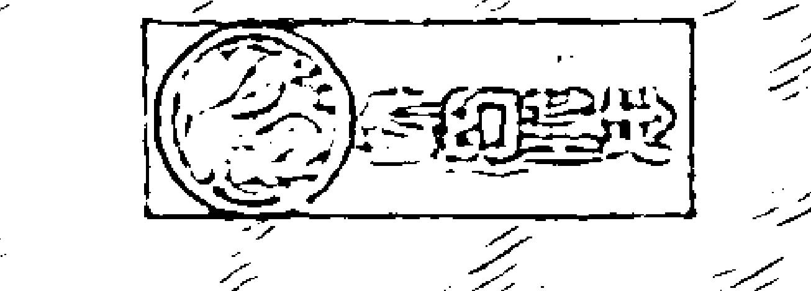

網站：http://www.ffoundation.com.tw

- 訂單號：1HP007
- 書名：圖解陰陽師

## 讀者回函卡

謝謝您購買我們出版的叢書！請耐心填寫此回函卡，我們將不定期寄上最新資訊與您所需出版訊息。

姓名：________________________ 性別：□男  □女

生日：西元 ________ 年 ________ 月 ________ 日

地址：________________________________________________

聯絡電話：____________________ 傳真：____________________

E-mail：_______________________________________________

- 學歷：□1.小學 □2.國中 □3.高中 □4.大專 □5.研究所以上

- 職業：□1.學生 □2.軍公教 □3.服務 □4.金融 □5.製造 □6.資訊 □7.傳播 □8.自由業 □9.農漁牧 □10.家管 □11.退休 □12.其他__________________

您從何種方式得知本書消息？

- □1.店面 □2.網路 □3.報紙 □4.雜誌 □5.廣播 □6.電視 □7.親友推薦 □8.其他__________________

您通常以何種方式購書？

- □1.店面 □2.網路 □3.傳真訂購 □4.郵局劃撥 □5.其他

您購買本書的原因是（單選）

- □1.封面吸引人 □2.內容豐富 □3.價格合理

您喜歡以下哪一類型的書籍？（可複選）

- □1.科幻 □2.魔法奇幻 □3.恐怖 □4.偵探推理 □5.實用類型工具書籍

您是否為奇幻基地網站會員？

- □1.是 □2.否（若您非奇幻基地會員，歡迎您上網免費加入，可享有奇幻基地網站線上購書75折，以及不定時優惠活動：
http://www.ffoundation.com.tw/）

對我們的建議：_____________________________________________________________________________________________ _____________________________________________________________________________________________