# 百

草野巧 著 王雪铭 译

# 101项魔导书 相关知识全收录！

- 八、小咒术术式、门的开启、魔法道具、召唤术的基础、符、符咒、魔法阵、所使用的道具
- 《魔法道具》、《魔法书》、《契约精灵》、《大元素》
- 光之子、邪恶组织、魔法师、各种生物
- 武器、装备、技能、魔法术式、战斗方式、世界观、魔法的原理
- 《道具手册》......


## 驱使恶魔或天使以实现愿望之书

本书以图解方式，详尽介绍魔导书的材料、目的、仪式、方法、原理、魔法物品的制作，以及传说中著名的许多魔法作品典籍，并佐以现今科学的角度分析，充满神秘但不... 并且收集了许多与魔法相关的魔法图、印章、星阵图、符咒和物品，并详述魔法相关信仰。

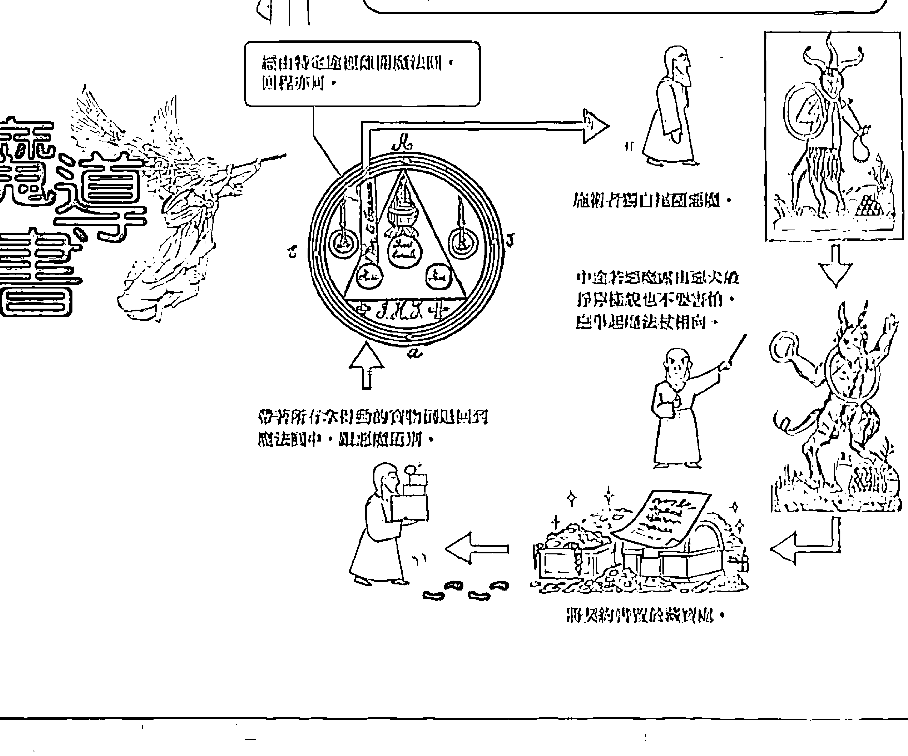

若想恶魔顺利现身则可以念诵上述所罗门王大咒，据说只要念两遍恶魔就必定会出现，接着只要按照下列程序，便能取得宝物：

总由特定途径开启魔法门，同样亦可。

使用符号召唤恶魔，

中途若恶魔说出恶犬般的呼声后说也不必害怕，应将应对法杖用向。

接着所作所为的言语都应用魔法门中，对应的用语。

将契约带至于该处用印。

## 魔道书图解

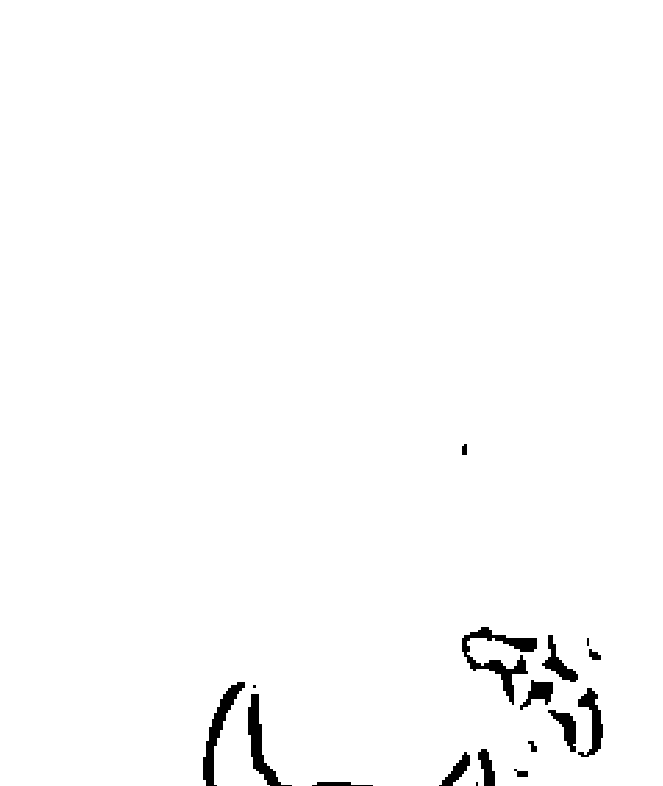

## 正确解答

1.  魔法炉变成了“仙品”
2.  魔法炉里的火变成了黑烟，而且快灭了
3.  插蜡烛的地方变成了金鱼
4.  魔法师不是魔法师而是工匠
5.  魔法师戴的不是魔法帽而是安全帽
6.  手上拿的不是魔法杖也不是魔法火把，而是火烟
7.  星星变成了问号

# 图解恶魔事典
Grimoire

草野巧 著 插画密画

魔法师正要对恶魔下命令，可是好像有哪里不太对劲。请在1分钟以内把奇怪的地方找出来。准备好了吗？开始！

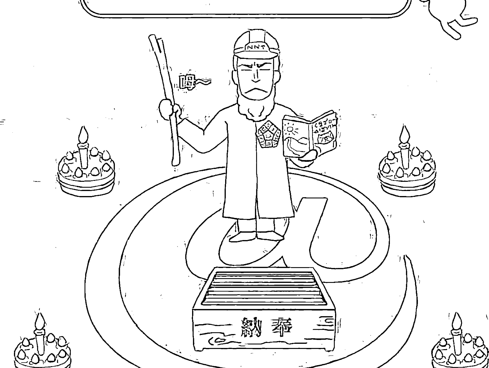

# 图解光之藩篱 Grimoire

# 奇幻基地

# 前言

只要是對魔法或魔術有興趣的人，想必都曾多次聽過「魔導書」或「Grimoire」這些用語吧！聽過《所羅門王之鑰》或《雷蒙蓋頓》等魔導書的人應該也不在少數才是。不過，這魔導書究竟是個什麼樣的東西，裡面又寫著什麼樣的內容呢？相信絕大多數人都無法具體回答這個問題吧！

為什麼呢？理由很簡單，因為艱澀難懂向來是魔導書的固有特徵。

魔導書無疑是魔法書的其中一種，可是涵意卻不純然等同於魔法書。魔法書是指所有內容涉及魔法的書籍，魔導書卻並非如此。魔導書乃特指魔法書當中詳細記載如何召喚天使或惡魔等神祕存在以實現自我願望方法的書籍。

因此，魔導書給人的感覺要比尋常魔法書更加可怕、更加地陰森，甚至可以說只消提及魔導書或Grimoire這些詞便足以引起人們一陣的恐怖感懷。看看20世紀小說家霍華·菲力普·洛夫克拉夫特所創造的「克蘇魯神話」裡那部恐怖的魔導書《死靈之書》，就不難理解。就某個層面來說，魔導書在所有提及魔法的場景裡面均可謂是個不可或缺的要角。

然而，魔導書絕非僅僅存在於虛構世界之物。尤其歐洲更是從相當久遠的時代便已經有許多形形色色的魔導書存在，受到人們的敬畏、利用，同時深受眾人畏懼。魔導書的傳統便是如此根深蒂固，一直延續到了現代。

那麼，魔導書究竟是本什麼樣的書？相信讀過這本書以後，屆時讀者們必能有自己的見解與詮釋才是。

草野 巧

# 目次

- 第一章 魔法入門 — 7
- No.001 何謂魔法書？ — 8
- No.002 古代就有魔法書了嗎？ — 10
- No.003 以所羅門王為名的古代魔法書 — 12
- No.004 中世歐洲的魔法書 — 14
- No.005 阿拉伯魔法的影響 — 16
- No.006 喀巴拉的影響 — 18
- No.007 赫納魔法的影響 — 20
- No.008 魔法書的物理材質 — 22
- No.009 魔法書的使用者 — 24
- No.010 是不是所有的法師都使用過魔法書？ — 26
- No.011 印刷本與手抄本 — 28
- No.012 魔法書的目的 — 30
- No.013 吉凶獵人與魔法書 — 32
- No.014 傳說中的魔法書作者 — 34
- No.015 以諾 — 36
- No.016 摩西 — 38
- No.017 所羅門王 — 40
- No.018 聖西普里安 — 42
- No.019 阿巴諾的彼得 — 44
- No.020 浮士德博士 — 46
- 專欄：召喚魔法與喚起魔法 — 48
- 第二章 《所羅門王之鑰》完全解讀 — 49
- No.021 《所羅門王之鑰》 — 50
- No.022 《所羅門王之鑰》的內容 — 52
- No.023 魔法的原理 — 54
- No.024 各行星司掌的日子與時間 — 56
- No.025 行星的影響力與魔法 — 58
- No.026 儀式前的術師注意事項 — 60
- No.027 同伴與弟子注意事項 — 62
- No.028 節制與斷食期間相關事項 — 64
- No.029 儀式前的入浴 — 66
- No.030 執行儀式的場所 — 68
- No.031 魔法陣建構儀式 — 70
- No.032 召喚儀式 — 72
- No.033 號令語靈 — 74
- No.034 特別的魔法儀式 — 76
- No.035 尋回被盜物品的方法 — 78
- No.036 取得受靈看守之寶物的方法 — 80
- No.037 星陣圖及其製作方法 — 82
- No.038 星陣圖的聖別 — 84
- No.039 魔法師的外衣與鞋子 — 86
- No.040 魔法用短刀、矛、鐮刀 — 88
- No.041 魔法棒、魔法杖、魔法劍 — 90
- No.042 香、香料、蒸煙 — 92
- No.043 水與海索草 — 94
- No.044 墨和墨水 — 96
- No.045 羊皮紙相關知識與魔章刀 — 98
- No.046 羊皮紙的製作 — 100
- No.047 儀式中所用魔法書之聖別 — 102
- No.048 祭品及其準備 — 104
- 專欄：白與黑、高等與低等 — 106
- 第三章 名作的解讀 — 107
- No.049 魔法書的全盛時期 — 108
- No.050 《所蒙蓋姆》（《所羅門王的小鑰匙》） — 110
- No.051 〈哥耶提雅〉 — 112
- No.052 所羅門王的魔法圖 — 114
- No.053 〈召魔之書〉 — 116

# 目 次

- **No.084** <保羅之書> —— 118
- **No.085** <降神之渚> —— 120
- **No.086** <聖琴之書> —— 122
- **No.087** 《順西第六書、第七書》 — 124
- **No.088** 《門徒且任誰都會的摩西魔法》— 126
- **No.089** 《教皇洪諾留的魔導書》 — 128
- **No.090** 教皇洪諾留的魔法書 —— 130
- **No.091** 《大奧義書》 —— 132
- **No.092** 《大奧義書》的目的 —— 134
- **No.093** 《魔鬼宰相路西弗葛的準備工作》 —— 136
- **No.094** 《魔鬼宰相路西弗葛》 —— 138
- **No.095** 《小阿岡伯特》 —— 140
- **No.096** 光榮之手 —— 142
- **No.097** 《黑日經》 —— 144
- **No.098** 《鍊金的黑母雞》 —— 146
- **No.099** 《黑魔婦 那魔姆》 —— 148
- **No.100** 《鍊金神秘哲學》 —— 150
- **No.101** 《鍊金神秘哲學 第四書》 —— 152
- **No.102** 《以西結的默示》 —— 154
- **No.103** 《巴風特之書》 —— 156
- **No.104** 《巴風特法門試商》 —— 158
- **No.105** 《地獄詞典》的傳說 —— 160
- **No.106** 《地獄詞典》—— 162
- **No.107** 《地獄詞典》—— 164
- **No.108** 《地獄詞典》的神聖魔法書 —— 166
- **No.109** 《地獄詞典》的魔法體系 —— 168
- **No.110** 《地獄詞典》—— 170
- **No.111** 《地獄詞典》—— 172
- **No.079** 現代的魔法書 —— 173
- **No.080** 新時代的魔法書 —— 174
- **No.081** 伊利法斯·利末 —— 176
- **No.082** 《高等魔法之教理與祭儀》 —— 178
- **No.083** 《高等魔法之教理與祭儀》 —— 178
- **No.084** 黃金黎明 —— 180
- **No.085** 麥逵格·馬瑟斯 —— 182
- **No.086** 亞雷斯特·克羅利 —— 184
- **No.087** 《律法之書》 —— 186
- **No.088** 《第四書》 —— 188
- **No.089** 《神秘的喀巴拉》 —— 190
- **No.090** 《影子之書》與新興宗教女巫崇拜 —— 192
- **No.091** 瓦達特的《影子之書》 —— 194
- **No.092** 《撒旦聖經》 —— 196
- **No.093** 《撒旦儀式》 —— 198
- **No.094** 虛構的魔法書 —— 200
- **No.095** 《西格桑手抄本》 —— 202
- **No.096** 《薩阿阿瑪阿阿爾式》 —— 204
- **No.097** 《無名邪教》 —— 206
- **No.098** 《哀邦書》 —— 208
- **No.099** 《妖墨的秘密》 —— 210
- **No.100** 《死靈之書》 —— 212
- **No.101** 《伏尼契手稿》 —— 214
- 所羅門王星庫圖一覽 —— 216
- 注釋附錄 —— 222
- 中英日名詞對照索引 —— 235
- 參考文獻 —— 246

## 第 1 章 魔導書入門

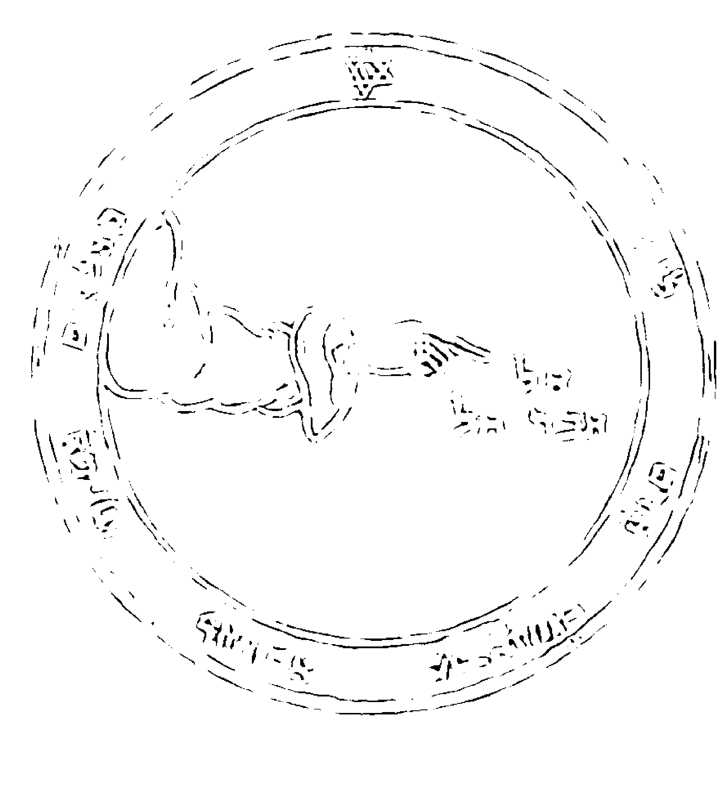

# 何謂魔導書？

# Grimoire-definition and meaning

所謂魔導書，便是助人透過祈禱、對話或恐嚇等方法操縱惡魔天使諸神靈，以遂行自身慾望的書。

## ○驅使惡魔或天使以實現願望之書

何謂魔導書？要為此語下個正確的定義是件非常困難的事情。魔導書英語寫作Grimoire，這個字據說是源自於法語的「grammaire」，意為「用拉丁語寫的文件」。這個字打從18世紀便已經變成指稱魔法書籍的用語，當時在描述困難而無法理解之事時甚至還有個「就像Grimoire般」的說法，由此可見魔導書到底有多麼難懂。

不過，一般所謂的魔導書都有個共通的特徵，那就是魔導書裡面記載了如何透過祈禱、對話或恐嚇等手段來任意操縱惡魔或天使等諸神靈，藉以遂行自身慾望的方法。魔導書是供人操控神靈時作為參考、非常具體的指示說明書，內中記載有操控神靈所須之魔法圓、印章、護符、印記、魔杖等道具的製作方法，以及大量的咒文。

換言之，所謂魔導書並非僅僅記載魔法相關諸事的作品，而是記載了極具體程序、供人操縱天使或惡魔以實現自身願望的書物。

此類作品在奇幻小說或電影等領域可謂是相當常見。在奇幻創作的世界裡，也經常可以看見穿著長外套、陰陽怪氣的魔法師站在魔法圓中揮舞魔杖召喚天使或惡魔的場面。魔導書正可謂是這些魔法師的參考書。

然而魔導書卻也並不只是存在於虛構的創作世界中。歐洲從很早以前便已經有許多部魔導書存在，譬如《所羅門王之鑰》、《所羅門王的小鑰匙（雷蒙蓋頓）》、《大奧義書》、《教皇洪諾留的魔導書》等，只要算起來的話還數不完呢。

# 何謂魔導書？

並不只是單純的魔法書籍。

操縱天使或惡魔以實現願望的具體指示說明書。

魔導書的特徵：記載有魔法陣、印章、護符、印記、魔法杖等魔法道具製作方法，以及大量咒文等內容。

魔導書記載有下列各種魔法道具：

## 魔導書記錄的魔法道具例

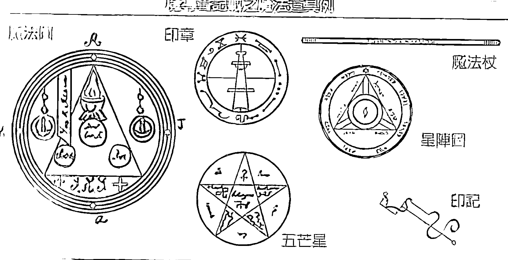

經常出現在奇幻小說和電影裡……

其實歐洲早有無數魔導書存在。

例如：《所羅門王之鑰》、《所羅門王的小鑰匙》、《阿布拉梅林之書》、《艾伯特之書》等。

備註：通常「印」是泛指帶有特定圖形的護符或印章，而「印記」則是泛指其中描繪的圖形或記號而已。

# 古代就有魔導書了嗎？

# Were there Grimoires in ancient times?

魔導書在希臘化時代的埃及蓬勃發展，至西元1世紀時地中海周邊地區就已經有無數以紙莎草紙寫成的魔導書散播流傳。

## ○希臘化時代曾有無數的魔導書存在

現在我們還能得到的魔導書如《所羅門王之鑰》或《雷蒙蓋頓》等其實並沒有那麼古老，頂多只能追溯到中世末期而已，大多數魔導書其實都是近代初期所作。

然則魔導書確實是早在古代便已經存在。如果說魔導書是魔導知識的文字化，那麼西元前2000年代古巴比倫文明的粘土板便堪稱為魔導書之起源。當然了，寫在粘土板上笨重且不易搬運，並不符合普遍對書的概念。若是從這點著眼，那麼最早可以稱得上是方便魔導書的魔導書，則首見於西元前4世紀至西元前1世紀希臘化時代的埃及。

當時的魔導書是使用紙莎草紙製作，同時其中記載的魔法在內容方面也與從來的魔法有所不同。古埃及自古就會使用象形文字將魔法刻在皇室陵墓的牆壁等處，目的在於祈求健康以及守護；相對地，紙莎草紙的魔法則幾乎都是以進行魔法師個人願望為目的，換句話說也就是獲得財富、獲得社會地位以及得到異性傾慕之類的。直到更晚的時代，祈使神明授予智慧或預言才終於也成為了施行魔法之目的。

於是魔導書便在希臘化時代獲得極大的發展，以至西元1世紀時已經有無數的魔導書在地中海周邊地區流通。

可是該時代的紙莎草紙魔導書如今卻已幾乎全散佚，這些魔導書在古代末期曾經數度遭到羅馬帝國與基督教會聯手取締並且焚毀；由於以這種方式遭到處分的魔導書數量實在太驚人了，因此一般認為當時不僅僅是魔法專家，而是連一般人都有在閱讀魔導書。

# 魔导书的简史

魔導書 → 古代便已經存在。

古代的魔導書始於粘土板，至紙莎草紙時代而有極大發展。

## 最初期的魔導書

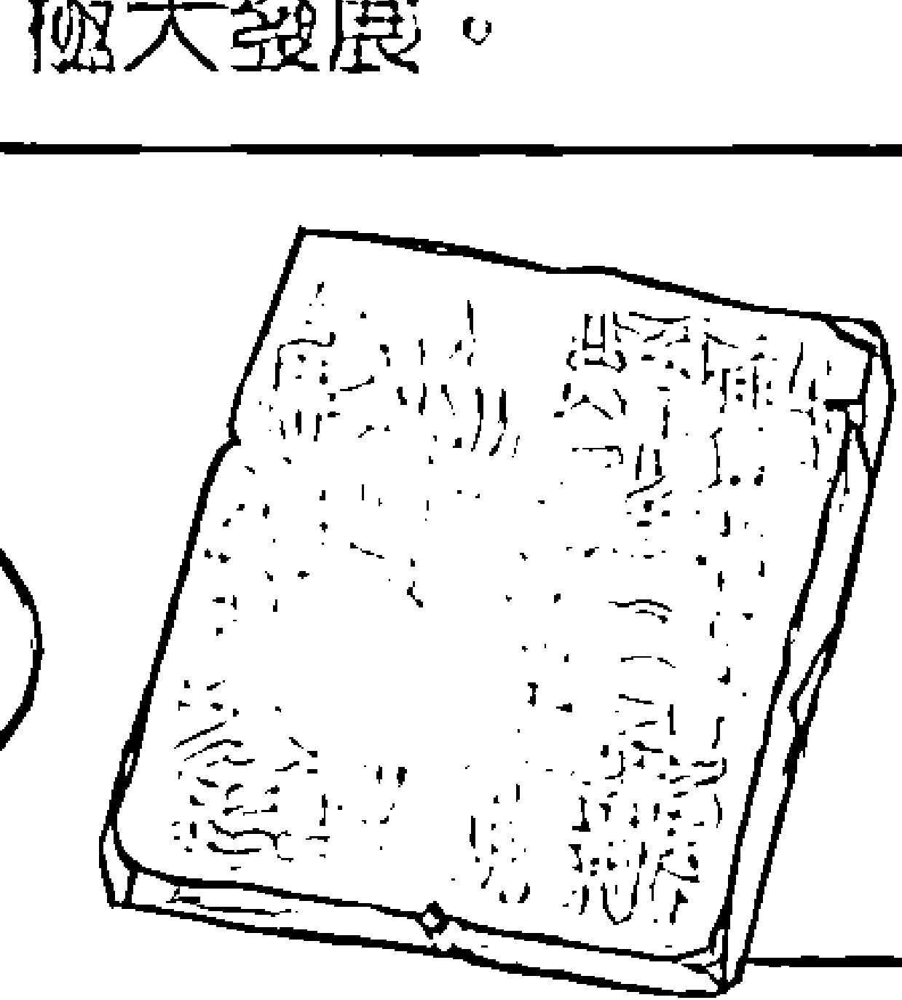

- 古巴比倫的粘土板。
- 笨重不易搬運。
- 不像書本。

## 希臘化時代的古埃及魔導書

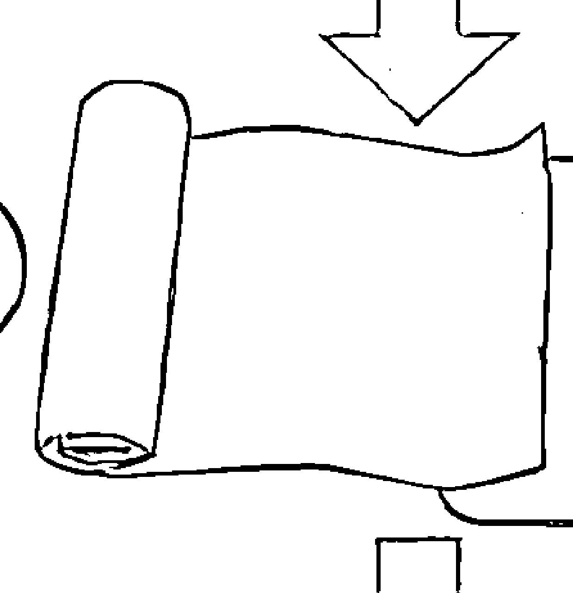

- 紙莎草紙材質。
- 輕便容易搬運攜帶。
- 較像書本。

散播流傳於地中海周邊地區！

## 希臘化時期魔導書的內容

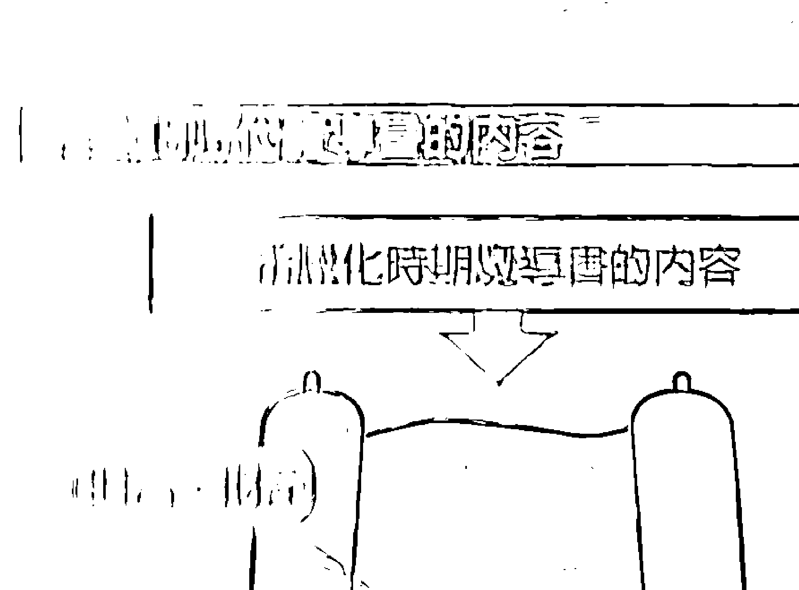

古埃及自古就會使用祈求國王健康或祈求守護的魔法，希臘化時期的魔導書則是以實現魔法師個人願望的魔法為中心。

# 以所羅門王為名的古代魔導書
Ancient Grimoire of Solomon the King

早在西元5世紀便已經有冠名所羅門王的魔導書存在，內容記載封印別西卜、阿斯摩丟斯、利維坦等惡魔的方法。

## ○記載超過36名惡魔咒文的魔導書

以希臘語寫作的第一部所羅門王（請參照P.040）魔導書《所羅門王的遺言》乃是成書於西元1～5世紀間的古代魔導書。

這部魔導書裡面記載到西元前10世紀的以色列國王所羅門獲上帝賜予魔法戒指，並且將著戒指號令諸多惡魔、最終完成雄偉神殿的故事。故事中提到的惡魔除較有名的別西卜、阿斯摩丟斯和利維坦以外，還有分屬36區的36惡魔；這些惡魔全部都要受到魔法戒指的魔力強制召喚，並且如實供出自己的名字、能力、號令所須咒文等。

> 舉例來說，第11區的惡魔是這樣說的——
> 「我叫做Katanikotaēl。我的工作是為家家戶戶帶來爭執與過失、激人發怒。如果想在家裡好好地放鬆，那就應該這樣做：取七張月桂樹葉寫上我討厭的天使名字，接著再寫『lae, leō。以偉大上帝之名，令Katanikotaēl沉默吧！』。然後再用月桂樹葉沾水揮灑，淨化屋裡屋外。如此就能將我封鎖了」

> 另外第33區的惡魔則是這麼說——
> 「我叫做Agchoniōn，我的工作就是躲在嬰兒的產褥裡惡作劇。想要封住我就要這麼做：在無花果的葉子寫上『Lycurgos』，然後在下面依序減去一個字母寫出『ycurgos, curgos, urgOS, rgos, gos, os, s.』，這樣我就會逃跑了」

《所羅門王的遺言》裡便是如此一個接著一個地說明封印眾惡魔的方法。

# 《所羅門王的遺言》

第一部以所羅門王為名的魔導書。成書於1～5世紀間。

# 《所羅門王的遺言》的內容

所羅門王利用神明的戒指號令惡魔、完成神殿的故事。

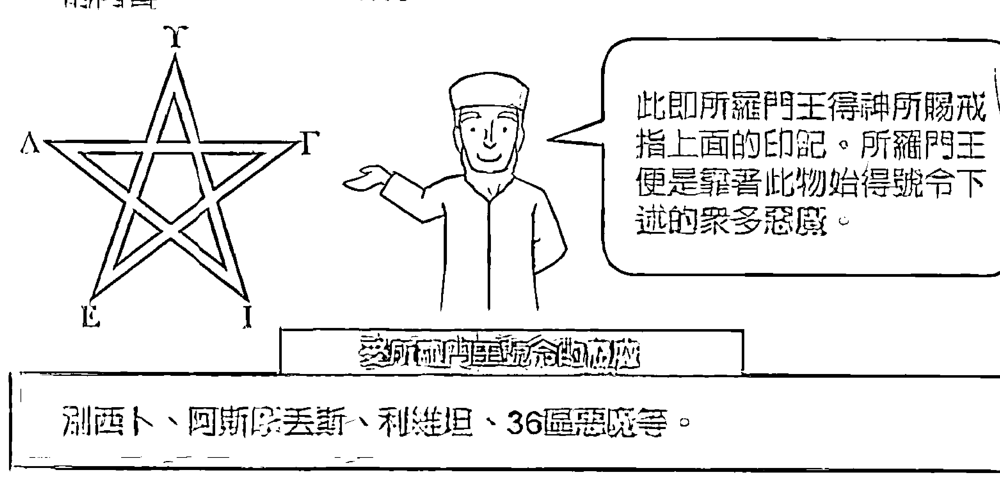

# 所羅門王號令的惡魔

- 別西卜
- 阿斯摩丟斯
- 利維坦
- 36區惡魔等

# Agchoniōn

第33區的惡魔。

專門躲在嬰兒產褥中惡作劇。

# Agchoniōn 的對付方法

- Lycurgos
- ycurgos
- curgos
- urg os
- rgos
- gos
- os
- s

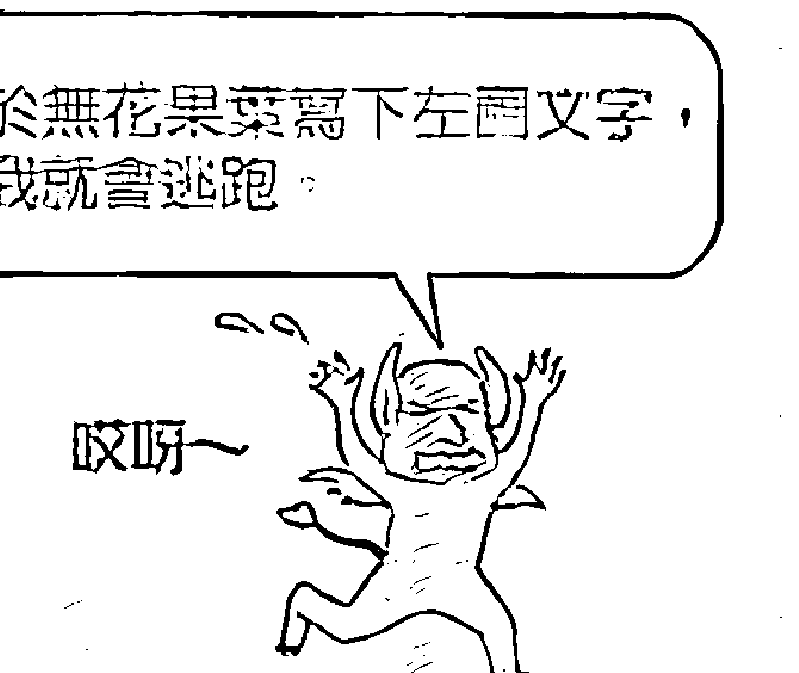

（被截断），將天球上的黃道的每30度分成12個等分稱為宮，每10度分成36等分

# 中世紀欧洲的魔導書

# European grimoires in the middle ages

由古代世界傳承至中世歐洲的魔導書受到阿拉伯、猶太以及北歐魔法的影響，至12世紀又有了新的發展。

## ○受外國文化影響而風貌一新的魔導書

魔導書在希臘化時代的埃及得到首次發展，來到受基督教會支配統治的歐洲中世時代以後又再度有了新的發展。

歐洲的魔導書是從12世紀前後開始產生明顯的變化。十字軍運動對這個現象亦有影響；始於11世紀末的十字軍為奪回聖地曾經數度遠征中近東地區，使得歐洲人發現了阿拉伯世界豐富的文化。再者，11世紀以前非洲北部的伊斯蘭勢力強盛，統治範圍甚至遠達伊比利半島。進入12世紀後，該勢力的統治力也逐漸疲弱，歐洲與阿拉伯文化圈遂以西班牙為中心展開頻繁接觸，而有大量翻譯成拉丁文的阿拉伯文獻流入歐洲。

如此的文化交流活動，使得歐洲的魔導書亦獲得了新的思想活水注入。其中影響最大的當屬操縱天界神靈之力的天界魔法（Astral Magic），《所羅門王之鑰》等眾多魔導書便是以此思想作為前提。天界魔法同樣也影響到居住在西班牙的猶太人，從而催生出喀巴拉思想，而這喀巴拉思想後來又再度傳回歐洲、進入了魔導書之中。

另外還有斯堪的那維亞文化的影響。基督教於11世紀前後傳播滲透斯堪的那維亞半島，結果使得該地居民開始使用拉丁語、而不用自古流傳下來的盧納文字，如此卻才使得盧納文字變成了魔法的文字，開始被使用在魔導書裡面。

歐洲的魔導書便是如此受到形形色色各種文化影響，而漸漸演變成今日這般模樣形態。

## 魔导书的历史沿革

## 造成影响之诸因素

| 小元素 | 内容 |
| :--- | :--- |
| 阿拉伯魔法 | 凭以操纵天界神灵之力的天界魔法（Astral Magic）。 |
| 犹太魔法 | 西班牙的犹太人受阿拉伯天界魔法影响而创造的喀巴拉魔法。 |
| 卢恩文字 | 受基督教教化洗礼而退出日常生活、转而变成魔法文字的卢纳文字。 |

## 阿拉伯魔法的影响
Influence of Arabic magic

运用恒星与行星其中所蕴灵力施行法术的天界魔法（Astral Magic）传入欧洲以后，对欧洲的魔法造成了莫大的影响。

### ○来自阿拉伯的天界魔法

12世纪以后由于十字军等诸多因素使阿拉伯的学术大量流入欧洲，欧洲文化因此受到极大影响，而魔导书也不例外。

在魔导书的领域里，尤以来自阿拉伯的天界魔法（Astral Magic）影响最巨。天界魔法是以恒星与行星有神灵宿于其中为前提，根据占星术选定合道日时、执行合道仪式，藉此将天界神灵的力量做魔法方面的运用。换句话说，天界魔法就像是魔法与占星术的综合体。

这些天界魔法有许多原文为阿拉伯语的相关书籍经过翻译以后散播至欧洲，其中最著名就属《皮卡特里斯》（原题名 Ghâyat al-Hakîm=贤者的目的）。

《皮卡特里斯》相传是某位住在西班牙的阿拉伯学者于12世纪所著。根据其中记述，该书乃是综合汇集224本书内容而成；也正因为如此，这本书称不上是部有系统的作品，其主要题目是在讲述如何将恒星或行星的灵力注入护符等物事的方法。

举例来说，若欲有效地使用某行星力量的时候，首先第一件事情就是要澄清自身的信仰心，崇拜偶像之类的行径更是根本提也甭提。接下来则是要洁净自身和衣服，实际进行仪式时还要穿着与该行星颜色相配的衣服，因为如此方能适当地进行烟熏，祈祷也才会更有效果。待这些全部准备停当、行星运行到适当位置以后再执行仪式，就能达成目的。

## 天界魔法（Astral Magic）

阿拉伯的天界魔法

综合魔法与占星术而成的魔法

恒星与行星均有灵宿于其中，故只须于占星术的合适时日执行合适仪式，便能将天界灵的力量转作魔法用途。

天界的力量

对欧洲的魔导书造成影响

最有名的天界魔法书籍

原题名 Ghāyat al-Hākim

贤者的目的

主要讲述如何将恒星行星所宿灵力灌注进入魔符等物之中的方法

## 喀巴拉的影响
Influence of Kabbalah

喀巴拉魔力思想认为希伯来语的文字和神的秘密名字拥有特殊力量，运用此力量便能与天使交信联络。

### ○蕴有特殊魔力的圣四文字

犹太神秘主义思想喀巴拉自古向来都是在暗中秘密传承，直到13世纪以后才透过西班牙的犹太裔学者著作而始得为欧洲人所知，结果使得欧洲魔导书亦因此受到喀巴拉影响。
喀巴拉认为犹太人的语言希伯来语就是神的语言，它的每一个文字都可以透过特别的力量与神连结。这个思想很受欧洲的魔法师喜爱。换句话说，因为希伯来语的文字和神的秘密名字拥有特殊的力量，所以只要使用该种文字或者神的名字便能提高护符的力量，甚至与天使界连结。
于是乎，从此欧洲的魔导书开始有了许多希伯来文字出现。但由于并非所有魔法师都读得懂、会写希伯来文，因此有些魔法师写的希伯来文甚至只是毫无意义、乱七八糟的文字列。
其中使用频率最高的当属神圣的神名。犹太教有好几个指称上帝的神圣称呼，诸如：阿多奈（Adonai）、埃尔（El）、耶洛亚（Eloa）、耶洛姆（Eloim）、耶和华（Jehovah）、撒巴夫（Sabaoth）、沙代（Shaddai）等名字都是。
诸多神名当中有个名字特别蕴含特殊魔力，须得秉持敬畏之心郑重对待之，那便是圣四文字（泰特拉格玛顿/Tetragrammaton）。此语在希腊语里面是「四个文字」之意，指的是《旧约圣经》所谓神的真名——希伯来语的「YHWH」（耶和华）。由于犹太教禁止直接说出这个名字，后来才会有对神的各种称呼出现。

## 喀巴拉测试法

**喀巴拉**：兴起于12世纪前后的犹太神秘主义。

+   喀巴拉的思考：
1. 希伯来文字，神的秘密名字
2. 拥有特殊的力量
3. 能提高魔符的力量

> 喀巴拉认为犹太人用的语言——希伯来语文字和神的秘密名字均蕴藏有特殊的力量。

### 希伯来文字与四文字

|| 文字 | 对应字母 | 名称 | 文字 | 对应字母 | 名称 |
|---|---|---|---|---|---|---|
| א | a/e | Aleph | ל | l | Lamed |
| ב | b/v | Beth | ם (מ) | m | Mem |
| ג | g | Gimel | ן (נ) | n | Nun |
| ד | d | Daleth | ס | s | Samekh |
| ה | h | Heh | ע | a | Ayin |
| ו | v | Vav | ף (פ) | p/f | Peh |
| ז | z | Zain | ץ (צ) | ts | Tzaddi |
| ח | H | Cheth | ק | q | Qoph |
| ט | t | Teth | ר | r | Resh |
| י | y/i/j | Yod | ש | s/sh | Shin |
| כ | k | Kaph | ת | t | Tav |

右边是喀巴拉的四个字母（YHVH），右侧则是根据四文字（YHVH）（耶和华之名）的相关符咒，它们被认为是魔法符咒的基础。

## 卢恩魔法的影响
Influence of Runic Magic

斯堪的那维亚地区的色纳文字虽然随着基督教化而不再受到使用，却也反而从此被认为是蕴有魔力的魔法文字。

### ○来自北方蕴有魔力的文字

尽管不如希伯来语普遍，但欧洲的魔导书也经常会用到古代北欧的卢恩文字。

卢恩文字约莫成立于西元1世纪，是德国北部与斯堪的那维亚半岛，作为字母使用的日耳曼民族古文字体系。卢恩此语有「神秘」与「秘密仪式」之涵意。

其后卢恩文字随着日耳曼民族的迁徙移动而散播至欧洲各地，可是北欧地区却在11世纪基督教于斯堪的那维亚半岛传播开来以后渐渐改用拉丁语，而卢恩文字就跟希伯来文字同样，随着基督教势力愈涨的同时，转而被认为是文字中蕴有魔力的魔法文字。14世纪时挪威甚至还曾颁布禁止使用卢恩文字与黑魔法的禁令。

于是乎，尽管从此再也无法公开使用卢恩文字，相对地卢恩文字却也多出了暗号文字与施行魔法的用途。

将卢恩文字作魔法用途运用似乎以冰岛最盛，冰岛便有许多人是以使用卢恩文字施行魔法的罪名被指为女巫、遭处死刑。冰岛能够阅读书写文字的人口比较多，对魔导书的需求自然也比较高。

卢恩文字必须透过自身亲笔书写方得发挥魔力，是以当时欲施行魔法者应该是参考魔导书并自行书写卢恩文字以制作护符等物。从斯堪的那维亚半岛找到的手抄本便记载有卢恩文字的魔法阵，而且北欧洲人也经常用卢恩文字来书写精灵的名字；只不过就跟希伯来语同样，意义不明胡乱使用的情况亦是所在多有。

斯堪的那维亚半岛：请参照P.222注释附录No.004※2。

## 卢恩文字的历史

卢恩文字

约成立于1世纪的日耳曼民族古文字体系。
斯堪的那维亚半岛使用的字母。

11世纪以后

此时开始使用拉丁语，卢恩文字成为历史、成为魔法文字。

成为文字本身蕴有魔力的魔法文字！

### 卢恩文字

```
ᚠ ᚢ ᚦ ᚨ ᚱ ᚲ ᚷ ᚹ ᚺ ᚾ ᛁ ᛃ
f u p(th) a r k g w h n i,è j
ᛇ ᛈ ᛉ ᛊ ᛏ ᛒ ᛖ ᛗ ᛚ ᛜ ᛞ ᛟ
d z s t b e m l ŋ(ng) d o
```

> 卢恩文字曾经受到广大地区使用，是以拥有形形色色各种不同类型。上图是最一般的类型，名为共通日耳曼卢恩文字，经常使用在占卜等用途。

## No.008

## 魔导书的物理材质

## Physical materials of grimoires.

魔导书在古埃及是以莎草纸制成，中世纪欧洲使用的则是廉价又能装订成册的羊皮纸。

### ○欧洲的魔导书乃以羊皮纸材质制作

如果我们说魔导书纯粹只是种将魔法知识以文字形式记录下来所形成的产物，那么欧洲魔导书的起源便可追溯直至西元前2000年代的巴比伦。这个时代是以芦苇等物做笔，在粘土板上书写楔形文字，是故此类魔导书的物理材质自然就是粘土板。可是粘土板不便搬运携带，与我等一般对书的概念相去甚远。

直到开始使用莎草纸以后，魔导书才变得比较贴近书的形态。莎草纸是古埃及相当发达的笔记用材料，其历史非常悠久，甚至可以追溯到西元前10世纪以前。至于记载魔法相关内容的莎草纸书最晚在西元前4世纪便已经出现了。只不过，所谓莎草纸是将莎草这种植物的茎剖成薄片纵横排列压缩而成，所以严格来说并不算是纸，而且也无法折叠。如果文章内容较长的话，就必须用浆糊把莎草纸片连接起来，卷在棒子上制成书卷。文字则是以墨水书写，后来在书写魔导书的时候还必须特别注意选用制作墨水的材料。

相对地，中世纪欧洲则是以羊皮纸魔导书最为一般。相传羊皮纸是西元2世纪土耳其的发明，它比莎草纸更便宜、更柔软，还能堆叠装订成册。基督教有别于其他宗教，对制作羊皮纸的动物种类并无限制，于是羊皮纸书方才变成欧洲最普遍的书本书材质，包括圣经也是以羊皮纸制成。

欧洲从15世纪开始制纸，并从此取代羊皮纸，不过魔法领域仍然相当看重羊皮纸。当时认为与其使用机械印刷的纸质魔导书，还是用手抄写在羊皮纸上的魔导书比较具有魔力，是以魔导书也经常会指示施术者使用羊皮纸来制作护符或魔法皿等道具。

莎草纸：请参照P.222注释附录No.002※2。

！ 愿书材料从粘土板演变成莎草纸，至中世纪欧洲则是开始使用羊皮纸。

莎草纸与羊皮纸分别有下列特征，结果欧洲选择羊皮纸作为制作愿书的材料：

+   * 将植物的茎剥成薄片纵横排列压缩而成，并不算是纸张。
* 无法折叠。
* 文章内容较长则就必须用浆糊粘接纸片，卷在棍子上制成书卷。

+   * 比莎草纸便宜、柔软。
* 可堆叠装订成册。
* 基督教对用来制作羊皮纸的动物种类并无限制。

## No.009

## 魔导书的使用者

## Users of grimoires

魔导书在欧洲的使用始于圣职者，后来才逐渐散播至教师、医师、法律家、军人等接受过高等教育者之间。

### ○起初魔导书的最大使用者原是圣职者

魔导书毕竟是书，其使用者乃以拥有读写文字能力者为中心，所以欧洲很少有女性使用魔导书，因为20世纪以前欧洲女性的识字率一直都比男性低。

在魔导书兴起并首度获得发展的希腊化时代，亚历山卓的学术研究所和图书馆同样也相当发达，是以魔导书亦渗透进入了一般民众之间。可是来到基督教占得上风的3世纪以后，中世纪欧洲的学术几乎全数回避到圣职者独占，魔导书亦有染上基督教色彩的倾向。能够读得懂文字的顶多也就是圣职者而已，是故当时曾阅读、使用、抄写、制作魔导书自然也就是修道士等圣职者了。就说收藏魔导书的图书馆好了，中世纪欧洲大概也只有修道院才有这样的设施。这么一来，最热衷于寻宝的人竟然是修道士，想来也是理所当然的结果。

12世纪起纷纷有多所大学创立，拥有读写能力的人口增加，使得教师和学生等人也加入了修道士的行列，其中甚至不乏有人曾制作魔导书。其后拥有大学毕业等级学识者仍不断增加，直到16世纪才又接着发展出受过高度教育的教师、医师、法律家、军人等形形色色的专业人士，而这些人当中的魔导书使用者也是愈来愈多。此外，魔导书在近代透过印刷而致大众化，从而也传入了拥有读写能力的工匠、商人等一般民众之间。

不过如果说那些不具读写能力者跟魔导书毫无关联，那倒也未必。从前就经常有文盲的乡下魔法师拿着本魔导书当作小道具为自己增添神秘气氛。又，尽管从前的女性不懂魔导书所写古代文字符号是何意义，却也往往可以看到她们有将其内容抄写下来当作护符使用的习惯。

### 中世纪的使用者

+   - 中世纪的使用者

+   - 拥有读写能力者

+   - 中世初期

修道士等圣职者

+   - 12世纪前后

教师、大学生等

+   - 16世纪前后

受过高度教育的教师、医师、法律家、军人等

+   - 近代

工匠、商人等一般人

> 中世纪的使用者随着时代进步、教育愈发普及而持续增加，但是不具备读写能力者也经常会使用中世纪

### 不识字的女性

抄写魔导书的古代文字或符号制成的护符使用

即便不识字也能像这样使用魔导书

## 是不是所有的魔法师都使用过魔导书？
## Did all magicians use grimoires?

无数的魔法师当中，尤以召唤恶魔或神灵的召唤魔法师为魔导书使用者的最大宗。

### ○施行召唤魔法不可或缺的魔导书

魔导书记载了施行魔法的方法，可并非所有魔法师都非得使用魔导书不可。

举例来说，中世纪的欧洲村庄里就有种主要负责治疗疾病的民间魔法师，他们所使用的乃是自古透过口耳相传流传下来的传统魔法，根本就不须要写成文字的书，而且不识字的魔法师也相当多。文艺复兴时代，古代的魔法思想受到瞩目，使得对魔法的知识探讨颇为盛行，而有菲奇诺、阿古利巴、皮科・德拉・米兰多拉等人物大放光彩。然而，他们的魔法是自然魔法和纯粹的天体魔法，探究的是蕴藏于自然界的魔力以及星体所造成的影响，并非非得魔导书不可的魔法。

那究竟是哪种魔法须要使用魔导书呢？那就是施行召唤魔法的使用者。这是种召唤早从古希腊罗马时代便受人们信仰的众精灵的魔法，是透过召唤超自然精灵、利用其力量实现自身欲望。由于使用这种魔法必须执行适当的仪式，故亦名「仪式魔法」。所谓适当的仪式恰恰就是魔导书的主题，内容包括禁食与祈祷仪式、在地面绘制魔法圆，以及如何正确使用咒文、圣水、蜡烛、剑、魔法杖、徽章等道具。

这种魔法虽然自古便已经存在，却是在受到文艺复兴时期风行的魔法思想影响以后始得在转眼间盛行，而有所罗门王之钥、教皇洪诺留的魔导书、细说神秘哲学 第四书等众多魔导书问世。这些魔法仪式传入了接受过教育的知识份子之间，却也传入了从未受过教育的民众之间，从而催生出许多以魔法师自任者。

### 必须使用魔导书的魔法 → 召唤神灵的召唤魔法

> > 我不须使用魔导书。

> > 我须要魔导书！

治疗疾病的民间魔法师

召唤魔法的魔法师

> > 各种魔法当中，施行召唤魔法的魔法师最须要使用魔导

### 何谓召唤魔法？

自从古希腊罗马时代便受到信仰的魔法。

以特定仪式召唤超自然神灵、藉其力量以进行凡俗目的之魔法。

> > 适当的仪式包括魔法阵、魔法杖、圣水、咒文、禁食等诸多程序，因此势必要用到魔导书。

## 印刷本与手抄本
Printed and written copy

即便印刷的魔导书开始大量出现以后，众人仍旧相信印刷本并不具备手抄本的魔力。

+   ○手抄本比印刷本更具魔力

欧洲于15世纪有印刷技术诞生，16世纪起便已经有印刷的魔导书陆续流通。

可是在近代初期，非但自古流传下来的抄本仍远多过于印刷本，甚至还不断有新的手抄本陆续问世，甚至根据印刷版魔导书另行制作抄本的情况也相当多。

如此现象的其中一个原因，那就是许多人都偏好阅读抄本胜过印刷版魔导书，除非有大量的抄本否则根本无法满足此需求，但理由其实不仅止于此。原来当时相信印刷出来的书并无魔导书原有的魔力；印刷出来的魔导书本身并无魔力，只不过是将魔法记录下来而已。

自古以来，人类就相信文字本身拥有某种魔力。对不具读写能力的人们来说，光是能够在不同的个人间传递信息与意义本身已经是件很神奇的事情了，所以阅读和书写的行为自然也属于魔法的范畴。是以魔导书亦复如此，一般都相信自己亲笔写下的文字魔力远胜于印刷出来的字体。

从中于是衍生出一种思想，那就是施行魔法仪式必须使用自笔抄写的抄本，而且还必须为每一本魔导书施行祓禊除秽。正因为如此，直到后来印刷书的时代也仍然有大量的手抄本制作问世。所罗门之钥等著名魔导书之所以要从羊皮纸的处理方法开始从头详细记载到魔导书的制造方法、祓禊除秽方法，又应该使用什么样的墨水什么样的笔等细节，便是因为这个缘故；其实魔导书其中文字蕴藏的魔力并不会因为被印刷成册而逊色，只要按照上述方法步骤制作手抄本便能发挥充份的力量。

### 印刷本与手抄本的差异

印刷制成的魔导书 → 不具手抄本的魔力。

因此，即便进入印刷书时代以后仍有大量手抄本制作问世。

## 魔导书的目的

## Purposes of grimoire

人们使用魔导书大多都是为达成世俗性目的，其中最受欢迎的便属寻宝和寻求异性青睐的魔法

### ○用来寻宝和获得爱情的魔导书

魔导书究竟是以何种目的受人使用的呢？利用魔导书藉以学习自然界奥秘者固然存在，不过绝大部分使用魔导书之目的其实要更贴近于世俗的欲望。

魔导书的各种主题当中，尤以寻宝和获得爱情的魔法最受欢迎。也许现代人会觉得不可思议，不过中世时期甚至近代以后寻宝活动相当盛行，许多宝藏猎人都曾经使用过魔导书。再者，那个时代的恋爱并不如今日来得自由，而且也不能自由地拥有性关系，得到异性的爱自然就成为每个人都关心的大事情。摆明就是想逐行亵渎目的、并非为爱寻求魔导书者亦是所在多有；譬如某些魔导书就有说明如何让女性光着身体跳舞的方法，或是让自己变成透明人的方法等，这些很明显地就更归类于为亵渎目的服务的魔法。

对此族来说，政治也是很重要的大事，所以获得高位者青睐爱护和揭穿敌人阴谋等方法自然也成了魔导书的主题之一。

寻找盗贼也是使用魔导书一个很大的目的，因为从前不比现代，除魔法以外恐怕再无寻回失物的方法了。据说这个魔法会因为受害者公开宣布委托魔法师搜寻犯人而发挥更大的效果，因为犯人得知此事后可能会觉得害怕，从而出来自首或者偷偷将所盗物品送还。

除前述诸多主题以外，魔导书还经常会记载搜索失踪者、预防意外事故发生、如何使长途旅行不致疲累、如何赌博取胜、如何成功诈骗他人等诸事。换句话说，身为一个凡人的所有愿望，都可以在魔导书里面找得到。

魔法書是用来做什么的？

魔法书之使用目的 → 被运用在极为世俗的目的

具体目的如下：

- 发财
- 获得异性的爱
- 吸引目的
- 保持高位阶级
- 恶意报复他人
- 恶意诅咒人
- 恶意差使看
- 取回被盗窃品
- 调查情报

在中世纪欧洲，尤其是在魔法流行的时候，中世至近代初期许多人都相信欧洲存在会使用魔法的巫师。

宝藏猎人与魔导书

No.013

Treasure hunters and Grimoire

中世至近世初期时代的欧洲人相信乡间有许多宝物埋藏，并且为追求一获千金的梦想而投身于寻宝活动。

曾经极为活跃的宝藏猎人寻宝活动

拜15世纪印刷技术的发明所赐，魔导书也开始大量流通，其中尤以能助人寻宝的魔导书最受欢迎。譬如《所罗门王之钥》、《大奥义书》、《黑母鸡》、《教皇洪诺留的魔导书》、《小阿尔伯特》、《圣西普里安之书》、《摩西第六书、第七书》等著名作品都被评为是对寻宝者颇有助益的魔导书。

如此现象是有理由的，原来中世与近代初期的欧洲民众相信乡间埋有大量宝物，而重要的是，这些幻想并非全属捏造虚构。在从前没有存款制度的时代，资产家将贵重物品装箱埋藏地底是很普通的事情，而这些财物因为阴错阳差被别人发现的情形也并不罕见。当时普遍认为宝物大多是藏在已成废墟的修道院、城堡、小山丘、古冢等地；这些在今天这个时空很可能会热衷于进出投资股市的人们，他们为追求一获千金有时甚至还会组成队伍，出发前去寻宝。

然而，寻宝并非只须找到宝物即可如此单纯。人们自古便相信宝物时时受到灵或恶魔把守；欲取得这些宝物，势必需要能够操纵灵或恶魔方可。是故，宝藏猎人若非自己使用魔导书，否则便要倚重专业的魔法师。

不过寻宝活动本身固然非属违法，使用魔导书却是犯罪；魔导书是恶魔的魔法，受到当时基督教会敌视。因为这个缘故，欧洲各地也经常发生使用魔导书的宝藏猎人遭到逮捕的事件。

心理的基盘

第四 魔导书最吸引人的主题

> 许多著名魔导书均被指为具有魔实功效，堪为佐证。

- 《所罗门王之钥》
- 《大奥义书》
- 《黑母鸡》
- 《教皇洪诺留的魔导书》
- 《小阿尔伯特》
- 《圣西普里安之书》
- 《摩西第六书、第七书》

每部都被评为具有寻宝之功效。

为何需要魔导书？

> 百万富翁
宝物受到灵或恶魔把守

欲取得宝物必须能够操纵灵或恶魔

因此魔导书乃属必要。

> 魔导书没效！

No.014

传说中的魔导书作者
Legendary authors of grimoires

魔导书的真正作者可能出于各种理由而隐匿自身姓名，选择以古老的圣经里的圣人英雄、古代的伟大学习、著名圣职者等人之名发表魔导书。

以圣经里的圣人、传说中的魔法师之名发表魔导书

姑且不论希腊化时代1的埃及，即便在中世纪的欧洲，实际著作魔导书的作者仍旧不愿公开以自身姓名发表作品；因为如果真这么做的话，就很有可能会受到当权者迫害，而且名不见经传无名小卒写的作品也无法勾起魔导书读者的兴趣。

于是那些著作魔导书的真正作者便选择在作品匿名中使用古代传奇魔法师或圣人的名字，如此不但能保护自身安全，同时还能提高作品的价值。

以犹太教、基督教世界为例，旧约圣经提到的圣人就经常被拿来当作魔导书的作者使用。譬如圣经中数一数二的圣人也是传说中书本发明者的以诺、带领遭奴役犹太人逃出埃及的英雄摩西、建立犹太王国最辉煌盛世的所罗门王，均是如此。

其他像伟大的学习也经常被指为魔导书的作者，例如古希腊哲人亚里斯多德、中世大学者大阿尔伯特2等。

圣职者是中世欧洲魔导书的最主要使用者，是以传为圣职者著作的魔导书也就变得愈来愈多。时任罗马教皇的圣利奥3（约750～816）与洪诺留三世（1148～1227）堪为此类代表。16世纪以后，新教的宗教改革派为攻击天主教皇遂大肆渲染教皇使用魔导书的传闻，也使得愈来愈多的教皇都被指为曾经使用施行过魔法。

除此以外，从事魔法相关研究的学习也经常被指为魔导书作者，阿巴诺的彼得与阿古利巴4堪为代表。

中世的魔导书

以本名出的作者 → 假借传奇名人之名号。

> > 这是因为以本名发表魔法书非但可能遇到迫害，
> 无名小卒写的作品也无法勾起读者兴趣。

？ 常用的名字包括......

中世的贤人、英雄、国王、古代贤者、中世大学者、教皇、魔法研究者等

以诺 Enoch

传说圣经圣人以诺乃是书本的发明者，他甚至还拥有游历天界获得秘密知识的传说，可谓是位与巫术、魔导书渊源极深的人物。

发明书本并制作堕落天使名单

中世欧洲人相信书本乃由以诺发明，因此以诺可谓是魔导历史中一位不可或缺的人物。

即便在所有的圣经人物当中，以诺仍称得上是数一数二的圣人。圣经里写到「以诺与神同行，神将他取去，他就不在世了」，这里必须特别注意的是此处乃作「神将他取去」而非「死亡」，后来更从此衍生出蒙受上帝爱顾的以诺其实是活着被带到天界去了的传说。旧约圣经伪典《衣索比亚语以诺书》便是根据此类传说所著，此书主张以诺被带到天界以后又在天使的带领下遍游天国与地狱，天使还向他说明宇宙的构造以及直到世界末日为止的历史；这也就是说，以诺得到了任谁也无法知悉参透的秘密知识。其次，《衣索比亚语以诺书》还提到了部分天使如何从天坠落变成堕天使的始末，甚至还举出带领堕天使的领头天使名单。因为这个缘故，这份后世诸多魔导书都曾述及的堕天使名单这才跟以诺扯上了关系。

另外以诺之孙诺亚、诺亚之子闪与含也都跟魔导书有很深的关系。据传以蓝宝石石板写成的传奇作品《天使拉结尔之书》起初是传授给亚当，后来历经以诺、诺亚之手，最后传到了闪的手上。此外，诺亚虽以建造方舟躲过大洪水而闻名，然而亦有传说指诺亚之子含曾在大洪水来临前将诸多邪恶魔法刻在金属板上、埋将起来，等到洪水退去以后再重新将其挖掘出来；据说那就是人类史上的第一本魔导书。崛起自波斯地区的琐罗亚斯德教的创始开祖琐罗亚斯德相传是人类史上第一位魔法师，传说这位琐罗亚斯德其实就是含。

> 圣经中数一数二的圣人。
作为书本的发明者。
曾将游天界所得秘密知识以文字记载下来。

衍生出各种传说

- 以诺之孙拿是第一位将魔法记录下来的人类。
- 拿其实就是琐罗亚斯德。

> 由于以诺与神秘学有极深渊源，是以一般相信以诺家族全都跟魔导书有关。

《天使拉结尔之书》

据犹太教传说记载，大天使拉结尔知悉世间一切秘密，并将之记录成书。此书正是《天使拉结尔之书》。传说中，此书授给被逐出伊甸园的人类始祖亚当时，却招来众天使嫉妒，因为他们无法忍受拉结尔将连这些天使都不知道的秘密告诉人类。众天使遂从亚当手中夺得此书投入海里，上主便命令海中巨兽拉哈伯（Rahab）寻回此书返给人类。于是，《天使拉结尔之书》成为人类宝物、代代相传，并传授给子孙，历经经由以诺、诺亚、所罗门等人传承，从里面学到了许多东西，例如诺亚就在洪水之际活用，而所罗门王之所以能够使用各种魔法，全因《天使拉结尔之书》方得如此。

相传《出埃及记》里面那位曾经多次引发奇迹的英雄摩西曾获上帝授予特别的秘密知识，并将其写成魔导书流传后世。

得上帝授以秘密知识的摩西

摩西是旧约圣经里记载的古犹太英雄。根据历史考究，他是存在于西元前13世纪前后的人物。

旧约圣经《出埃及记》里有这么一则故事。从前，希伯来人在埃及被当作奴隶使役，摩西带领他们逃离埃及时曾经将河水变成鲜血、令蝗虫毁坏全埃及、今天降冰雹破坏农作物、令海水一分为二等，创造了许多除魔法以外不作他想的奇迹。

另外摩西也正是圣经所述于西奈山顶获得上帝授予著名「十诫」石板与律法之人。因此后世民众才会相信旧约圣经开头五书（《创世记》、《出埃及记》、《利未记》、《民数记》、《申命记》）其实是摩西抄录上帝所授律法而成，而这五部书也才会有摩西五书之别称。

后来这些圣经相关记载与传说再度衍生形成了新的传说：摩西除抄写十诫和摩西五书以外，还曾获上帝授以特别的秘密知识，并以魔导书形式将其记录了下来。

摩西著作魔导书的传说似乎早在西元4世纪便已经存在：当时以纸莎草纸制成的古文书当中便有以《摩西隐秘书》、《摩西第八书》为题名的文件，而这些文件当中还提到当时曾有《摩西之钥》、《摩西的神秘月之书》等书存在；从这点便不难发现，摩西打从那个时代起便已经是位相当出名的魔导书作者。18世纪以后有《摩西第六书、第七书》、《摩西第八书、第九书、第十书》等魔导书问世，便也都要追溯到上述传说。

> > ¹纸莎草纸：请参照P.222注释附录No.002米2。

西方的魔法

摩西

曾经多次引发奇迹，拯救犹太人。

1. 摩西在圣经里面多次引发奇迹，使得众人相信他曾被上帝赐予秘密知识并著有许多魔法书。

根据英雄摩西获上帝赐予知识，写下了10本书：

- 《创世记》
- 《出埃及记》
- 《利未记》
- 《民数记》
- 《申命记》

魔法书

- 《摩西第八书、第九书、第十书》
- 《摩西启示之书》
- 《摩西之钥》
- 《摩西的（未完整）》

一般相信旧约圣经中所指那位曾获上帝授予智慧与见识的所罗门王亦通晓神秘知识，从而确立所罗门王身为魔导书作者的传奇人物地位

以魔法戒指操纵恶魔的王

即便在所有曾经著有魔导书的传奇人物当中，作为魔导书人气最高作品《所罗门王之钥》作者的所罗门王仍然是个极为特殊的存在。

以色列王国第三代国王（西元前965～925年在位）所罗门王是大卫之子，乃以建造雄伟壮丽的神殿宫殿、创造王国盛世而闻名。另外他也是位著名的智者，甚至旧约圣经还指其曾经得获上帝授予智慧与见识。

因为这些缘故，从很早以前人们就相信所罗门王同样也通晓神秘知识，甚至西元1世纪还有位犹太历史学家约瑟夫斯¹留下记载指出所罗门王著有多达3000册的作品，其中也包括了魔导书。

约莫1～5世纪期间有部传为所罗门王作品的《所罗门王的遗言》出现，里面记载到这么一则故事：从前所罗门王建造神殿时曾遇到恶魔妨碍，让工匠们吃了不少苦头。就在这时，受命于上帝的天使米迦勒带着一只蕴有禁锢恶魔魔力的戒指出现，而所罗门王不但靠着这只戒指收服了别西卜和阿斯摩太斯，甚至还将36区恶魔等诸恶魔也都纳入了麾下，并且以惊人的速度完成了神殿。更有甚者，《所罗门王的遗言》中还记载了从前所罗门王麾下诸恶魔之特征，以及封锁各恶魔所须咒义等内容。是故，尽管这部作品本身其实是部充满教诲意义的宗教书籍，可是大部分人还是把它当作所罗门王写的魔导书来阅读。

所罗门王的传奇性魔导书作者地位可谓正是因此而得以确立，直到中世以后仍有许多冠名所罗门王的魔导书问世。例如13世纪伟大学家大阿尔伯特²指出，那个时代便有五部伪称所罗门王所著的魔导书出现流通。

魔道书与魔导士的传说

所罗门王
以色列王国第三代国王
（西元前965~925年在位）

相曾经上帝授以智慧与见识。

生涯著有多达3000册作品。

成为超有名的魔导书传奇作者。

所罗门王所命的36原魔

| 编号 | 名称 | 编号 | 名称 |
| :--- | :--- | :--- | :--- |
| 13 | 弗波忒 | 25 | 阿纳特列特 |
| 14 | 库梅亚忒 | 26 | 耶纳乌他 |
| 15 | 雷洛耶 | 27 | 飞多 |
| 16 | 亚特拉克斯 | 28 | 哈帕克斯 |
| 17 | 叶洛帕 | 29 | 阿诺斯特 |
| 18 | 布都薇克 | 30 | 阿勒波利 |
| 19 | 纳欧多 | 31 | 赫非希米列 |
| 20 | 马岱尔 | 32 | 伊可希翁 |
| 21 | 阿拉多 | 33 | 阿空涅欧 |
| 22 | 未记佩 | 34 | 奥多希 |
| 23 | 涅弗匮逖 | 35 | 弗罗诺特 |
| 24 | 阿顿 | 36 | 毕亚纳基 |

No.018

圣西普里安

St. Cyprianus

18世纪丹麦与挪威的魔法书，几乎全都冠有西元4世纪殉教的传奇性圣人——圣西普里安之名。

深受西班牙与北欧地区喜爱的魔导书作者

从前18～19世纪宝藏猎人爱用的魔导书，经常都冠有安条克的圣西普里安之名。例如19世纪西班牙就出版了一本附有秘术清单的《圣西普里安之书》，广受欢迎。此外18世纪丹麦和挪威的魔导书也几乎全数被指为圣西普里安所著。

此处所指圣西普里安其实跟实际存在于3世纪的迦太基主教圣西普里安完全没有任何关系，而只是位传说中的圣人而已。有则传说是这么说的：叙利亚安条克的西普里安在孩童时代曾经信仰阿波罗神、修习密特拉教¹。他还曾游历埃及与巴比伦，学得各种秘密仪式归国，并且受到异教徒赞誉为伟大的魔法师，因为他能够与最高等的藏蒙（一种神灵）结合，并且号令使役各种精灵。可是后来却发生了一件事，原来有人拜托西普里安用魔法替自己得到女性的芳心，而那名女性是位名叫贾丝妲的虔诚基督教处女。西普里安立刻搬出魔导书召唤恶魔，可是该女子却在基督信仰心的武装保护下丝毫不为恶魔的力之所动。西普里安见状又召唤出更强大的恶魔，却同样是全无效果。于是西普里安这才领悟到再无其他物事能够胜过十字架，他忏悔自身罪过并改信基督教，终于成为颇富德望的司祭；最后在304年遭罗马皇帝戴克里先²迫害而殉教。
因为上述传说，中东地区从很久以前便有传为西普里安制作的咒文与护符流传，而18世纪后期也才会有传为西普里安著作的魔导书流行欧洲。

《圣西普里安的魔导书》

- 18～19世纪。极受西班牙与北欧赏识猎人爱读。
- 北欧几乎所有魔导书都是圣西普里安的作品。

△ 18世纪末期拉丁语版《圣西普里安的魔导书》的书名页

谁是圣西普里安？

- 叙利亚的安条克人。
- 与迦太基主教西普里安同名不同人。
- 修习异教并成为伟大的魔法师。
- 改宗成为基督教徒。
- 304年受迫害殉教，成为传奇圣人。
- 西普里安的灵符与咒文于中世广为流传。

18世纪西普里安著作的魔导书大为流行

西普里安为信仰殉教而成为圣人，是以被认为是咒诅书作者的适

安条克：曾经是罗马帝国叙利亚行省的首府，也是希腊化时代塞琉古王朝以叙利亚设为首都并兴盛一时的都市。

No.019 阿巴诺的彼得

Peter of Albano (Pietro de Albano)

相传阿巴诺的彼得便是《魔法要素》的作者，但他其实却是位因遭同僚嫉妒而被冠上魔法师污名的中世纪意大利哲学家。

曾将魔宠豢养于瓶中的魔导书作者

《魔法要素》是16世纪后期一部极具实践性格、恶名远播的魔导书，世间普遍指阿巴诺的彼得为其作者。除此以外，16～17世纪间流行于西西里岛的魔导书《路奇达流斯》冠的也是他的名字。

阿巴诺的彼得（1250～1316）是意大利的学者，出生于帕多瓦近郊一个名为阿巴诺的城镇。13世纪后期他在巴黎大学研读修学，成为出名的学者。他主修哲学与医学，也曾发表过许多人相学、天文学等领域论文，可是天文学方面的论著却使他遭受到了异端审判；其实他并没有特别去谈论魔法，而是受到嫉妒其盛名的同业举发指为异端。尽管初审获判无罪，可是提告者却仍旧不死心，再次提告。根据他们提告的内容，彼得在瓶子里养了七只魔宠[^1]，他的知识便是接受这些魔宠传授得来的。结果彼得在第二次异端审判就被判了死刑。岂料彼得却在死刑执行前便已经过世下葬，行刑因此受阻中断、激怒了异端审判所，行政官还下令挖出他的尸体正式处以火刑。好在彼得的忠仆秘密挖出遗体改葬在另一处教会的墓地，所以最后异端审判所就只能焚烧象征彼得的人偶泄愤而已。

后来原本就是无罪清白之身的彼得终于沉冤得雪，100年后帕多瓦市政厅还为他建造竖立半身铜像。

不过彼得的魔法师传说却从此流传了下来，即便200年后仍然要被指为魔导书的作者。

阿巴诺的彼……
曾为《魔法要素》等书作者。
其书并未著作魔导书。
> ？真相究竟是……
生于阿巴诺的义大利学者。
13世纪后期以学者身分扬名。
同业嫉妒其盛名，告发指其为异端。
> 彼得其实是魔法师，他在瓶子里饲有七只魔鬼 他的知识便是来自这些魔鬼所授。
嫉妒的同业
异端审判所作出死刑判决。
16～17世纪被指为魔法书作者。
> ……
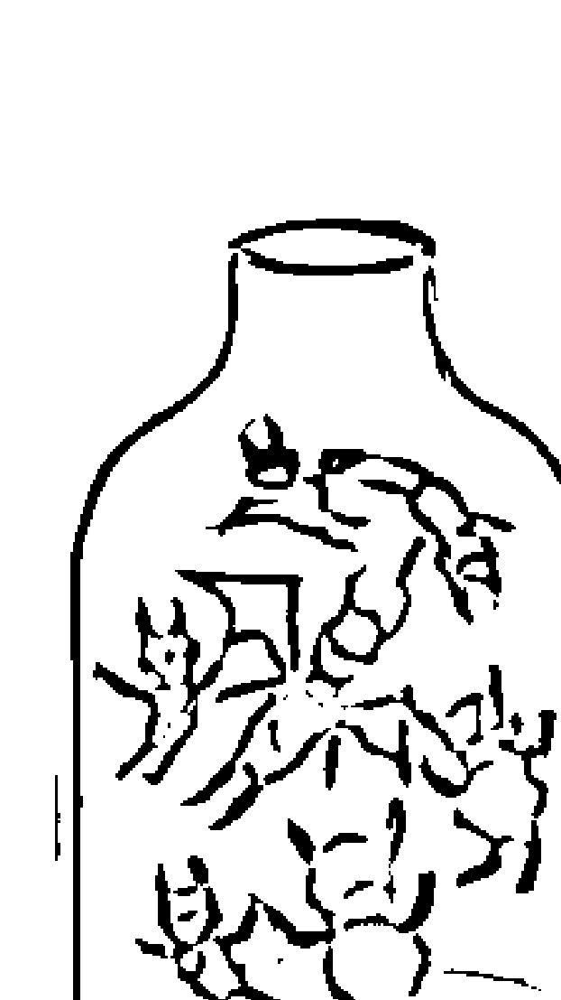
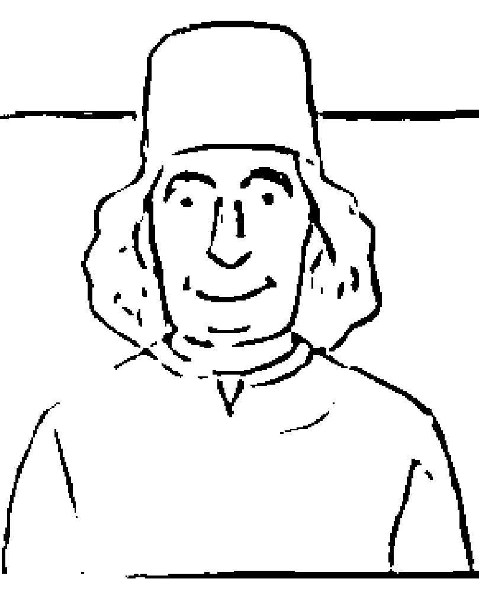
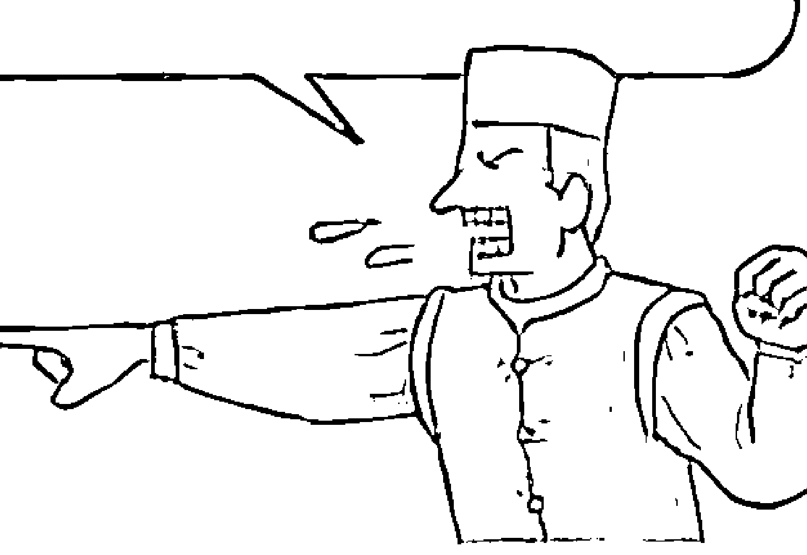


## 浮士德博士
Dr. Faust

在18世纪的德国，曾经与恶魔梅菲斯特缔结契约、最终惨死的传奇人物——浮士德博士所著魔导书可谓人气极高。

## ○拥有最精彩传说的魔导书作者

18世纪德国有许多魔导书被指为浮士德博士所著，譬如《地狱的三重胁迫》、《伟大而强大的海之灵》等都是以浮士德博士著作而闻名的魔导书。

16世纪的德国有位名叫约翰·乔治·浮士德的人物。他就读波兰的克拉科夫*1大学，成为一流的炼金术师与医师。后来他又在德国的海德堡大学*2取得博士学位，成为大学教师。但他却是个会夸口说自己是最强炼金术师的傲慢人物，所以跟周遭人处得并不好，于是他只能带着一名叫作瓦古纳的助手四处流浪，以表演魔法等行当为生，最后终于落到在旅店二楼离奇死亡的下场；有人说那是因为炼金术实验失败所造成，总之浮士德是被一场离奇的大爆炸给炸得支离破碎。由于他的死亡实在太过离奇，立刻就流言四起，说是浮士德跟恶魔缔结契约，其死亡便是契约到期所致。如此这般，浮士德博士的传说在真正的浮士德死过后没多久便已然诞生，说是他在和恶魔梅菲斯特缔结契约并度过长达25年的快乐生活以后，最终以离奇的死亡结束了一生。

这则传说在18世纪极受欢迎，甚至还认为威登堡*3便是因为传说浮士德博士曾经在近郊森林中召唤梅菲斯特的传说始得以成为德国国内的魔法重镇。是以浮士德博士可谓是魔导书作者的最佳不二人选。相传根据此传说写下著名戏剧《浮士德》的约翰·沃夫冈·冯·歌德（1749～1832）手中也有本浮士德博士著的魔导书《地狱的三重胁迫》。

## 浮士德博士与梅菲斯特

《地狱的三重昏暗》、《伟大而强大的海之灵》等。
于18世纪的德国颇受欢迎。

## 谁是浮士德博士？

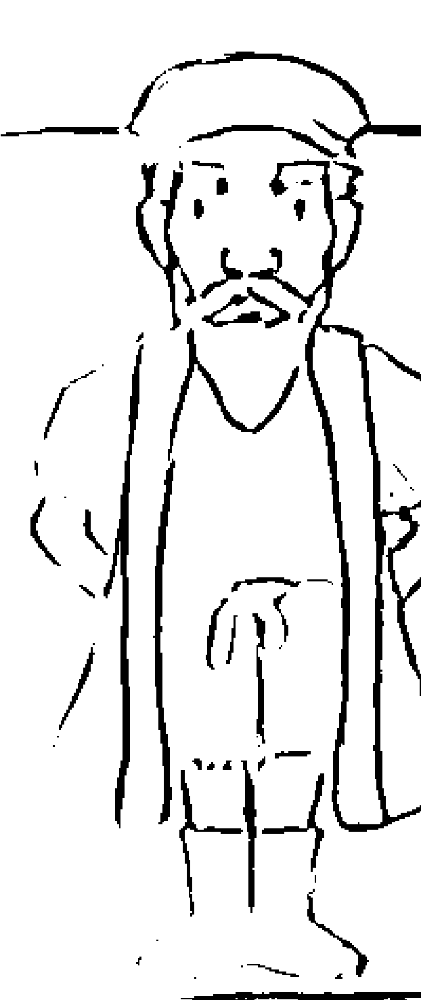

- 本名：约翰·乔治·浮士德
- 实际存在于16世纪的炼金术师。
- 离奇死亡从而成为传说。

## 浮士德博士的传说

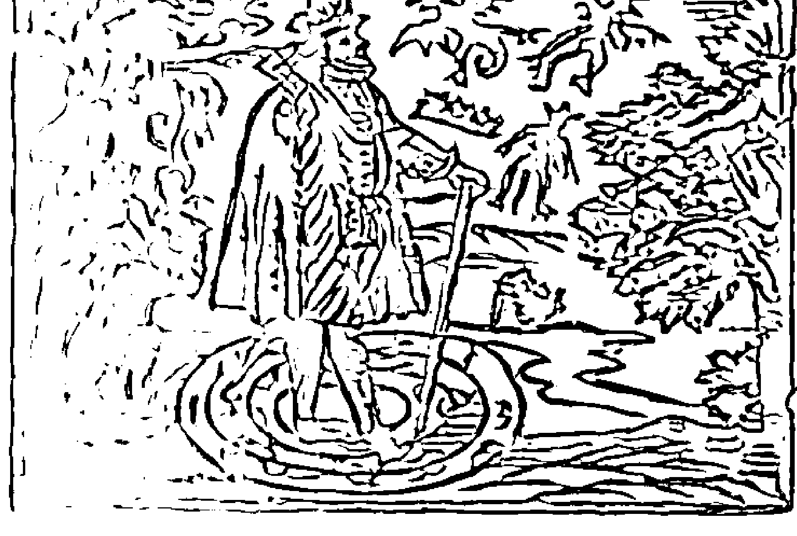

- 与恶魔梅菲斯特缔结契约。
- 度过25年的快乐生活。
- 契约到期之际，灵魂遇恶魔夺去、离奇死亡。

总之，这些作品都是以浮士德博士之名发表。

> 但是，与恶魔缔约的浮士德博士可谓是魔导书入门的最佳代表性人选。


## 召唤魔法与唤起魔法

为言说自身愿望而呼唤天使或灵的魔法，称作召唤魔法（Conjuration）。这是远早自希腊罗马时代便已经存在的传统魔法，通过进行适当仪式与天使或灵交流接触，便能利用彼等天上的力量进行地上的目的。而正如本书所述，召唤魔法正是所谓必须使用的魔法。

也许多有些对魔法感兴趣的读者曾经听说召唤魔法又分成召唤（Invocation）和唤起（Evocation）两个种类，并且对《所罗门王之钥》等魔法书并未作此区分而感到不可思议。

这当然是有原因的，因为近代初期之前以《所罗门王之钥》为代表的魔法本来就没有特别区分召唤与唤起；在那个时代，这两个字的意思几乎完全相同，都是用于指称将天使或灵呼唤出来一事。

其实召唤与唤起此二者的区别，乃是19世纪末成立的魔法结社——黄金黎明的魔法主张，例如亚雷斯特·克罗利就在《魔法——理论与实践》中说到：

> > “唤起（Evoke）是呼唤出来，召唤（Invoke）则是呼唤使进入……（中略）……也就是说，人类是将【神】【召唤】来到【圆环】中，将【灵】【唤起】至【三角形】中。”

换言之，所谓召唤便是指将灵召唤至自身内部，而唤起则是将灵召唤至自身外部（眼前）。

是以，唤起与召唤两者的对象虽然都是灵，种类却是完全不同。倘若召唤恶灵使其进入身体，则该者立刻就会遭其附身支配。正如克罗利所述，召唤的对象非神不可。换句话说，所谓的召唤其实就是人与神的一体化。其他各式各样的灵，包括恶魔在内，则都是要呼唤使其出现在自身外部，所以应该行使唤起才是。

至于克罗利所说将神召唤至【圆环】、将灵召唤至【三角形】的说法，相信只消看看《所罗门王的小钥匙》（《雷蒙盖顿》）记载的所罗门王魔法图便可一目了然。该魔法图里面有圆也有三角形，圆形是给施术者站的地方，而三角形则是召唤灵并将其禁锢之处。

“召唤又分成召唤与唤起”此一概念便是如此经过黄金黎明的区分定义，方得逐渐流布。

## 第2章
《玩转P之完全解密

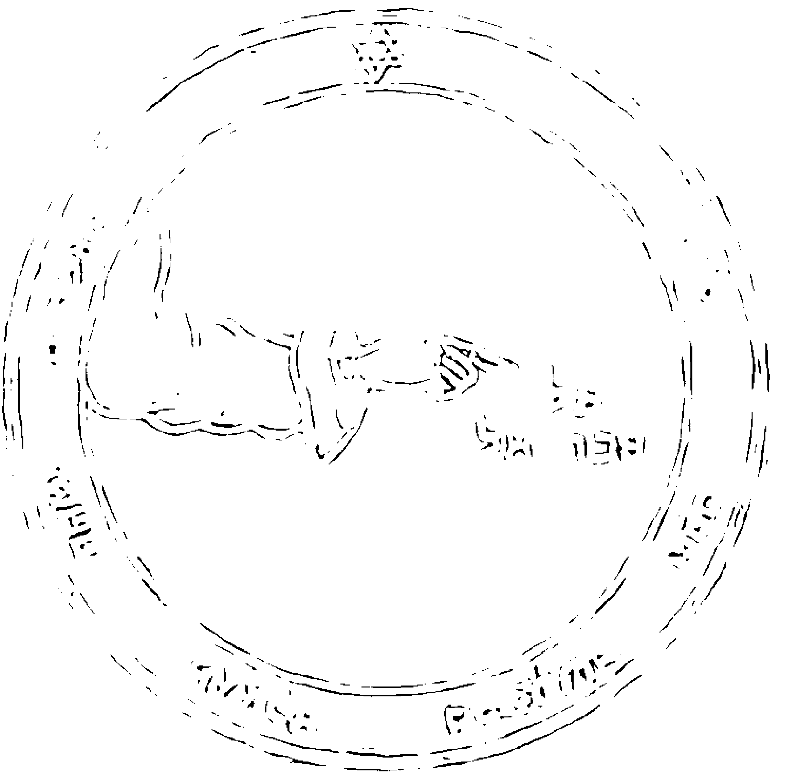

## # 《所罗门王之钥》
The key of Solomon the king (Clavicula Salomonis)

《所罗门王之钥》非但是众多魔导书当中人气最高、长期以来最受喜爱阅览的作品，对后世魔导书亦有莫大影响。

## ○ 魔导书的最高杰作

《所罗门王之钥》（亦称《所罗门王的大钥匙》）是众多魔导书当中非常特别的一部作品。正如题名「所罗门王之」所示，相传此书乃由所罗门王所著。当然此说法始终只是个传说，根据历史考证可以推断此书应是成书于14、15世纪前后。15世纪已经有希腊语的版本存在，至16世纪又被翻译成拉丁语和意大利语。

1559年罗马教宗保禄四世发行的《禁书目录》当中曾将《所罗门王之钥》指为最具代表性的邪书，可是《所罗门王之钥》始终人气不坠；不仅仅如此，被指为特别禁书反而让这本书的人气不断上升，至近代初期已经成为意大利热销的畅销书。其后《所罗门王之钥》开始在整个欧洲受到广泛阅读，据说当时在威尼斯便有意大利语、拉丁语、英语、德语等各种语言版本的《所罗门王之钥》存在。《所罗门王之钥》便是如此受到广大群众阅读，从而成为欧洲最著名的魔导书。

《所罗门王之钥》盛名如此，自然也对其他魔导书带来了极大影响。欧洲自文艺复兴时期至近代初期陆续有许多魔导书问世，其中许多相信都是因为受《所罗门王之钥》影响而创作的。《雷蒙盖顿》（《所罗门王的小钥匙》）自是不在话下，其他像《大奥义书》、《小阿尔伯特》、《黑母鸡》、《教皇洪诺留的魔导书》等也都是同样。在这些著名的魔导书当中，随处都能发现《所罗门王之钥》带来的影响。是故，《所罗门王之钥》不单单是魔导书时代的先驱，同时更可以说是魔导书的最高杰作。

## 1. 所罗门王之钥的基本设定

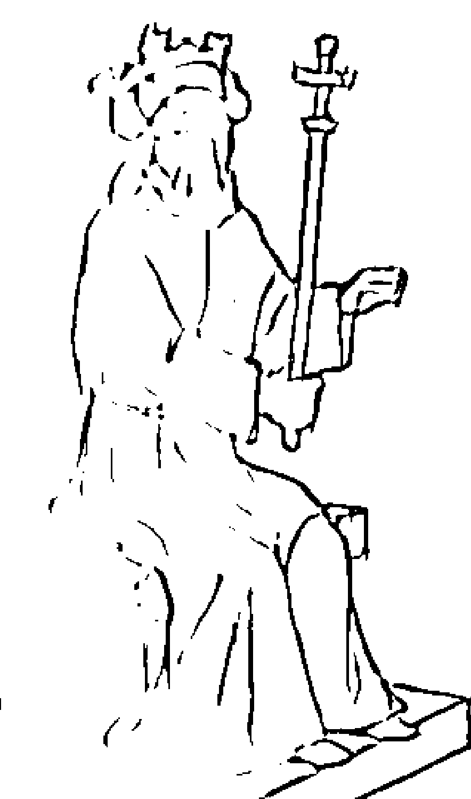

众多魔导书中极为特别的作品。

## 2. 伪托乃所罗门王所著。

约为14、15世纪左右的作品。

1559年，罗马教宗保禄四世《禁书目录》将此书指为邪书之代表。

> 不可以看这种书！

> 我禁止四世

成书洪告后却开始大受欢迎。

译成各国语言。

- 意大利语
- 拉丁语
- 英语
- 法语
- 德语

## 2. 所罗门王之钥的其他魔导书

| 《所罗门王之钥》 | 《黑母鸡》 |
|----------------|------------|
| 《小阿伯特》   | 《教皇洪诺留的魔导书》 |
| 《大奥义书》   |            |

许多魔导书均是以《所罗门王之钥》为基础著作。

## 3. 与《所罗门王的小钥匙》（《雷蒙盖顿》）区别

## No.022
## 《所罗门王之钥》的内容
Contents of 'Key of Solomon'

该如何操纵存在于宇宙之间无数的灵方能实现愿望？其方法已然具体记载于《所罗门王之钥》之中。

## ○不光只是恶魔，而是以所有的灵为施术对象的魔导书
《所罗门王之钥》的主体思想认为，魔法基本上乃是凭借神的力量所行使，人类可透过向神祈祷来驱使各种的灵。
这个世界充满着数量极为惊人的灵，他们各有职掌。例如当时相信宇宙分成第一天到第十天，每层天各由复数的灵司掌；另外像四大元素也各有专责的灵，甚至每一个人身上也都各自分配有守护灵。

所谓的魔法就是要对这些灵工作藉以达成愿望，而《所罗门王之钥》便记载着如何才能达到此目的的方法。换句话说，其内容详细记载了执行魔法所需道具与材料、占星术所谓适于施术的时间、形形色色的符箓（护符与驱魔符）图形以及咒文等诸事项。

这本书共分两卷，第一卷是以具体的魔法方法为主题。此卷从极为一般的基本魔法程序，到各种因特殊目的而异的施法程序，均有说明。所谓特殊目的，便是指“寻回被盗物品”、“隐形”、“从贤者口中问出想要的知识”、“获得神灵拥有的财宝”、“获得他人的好感与爱”等诸事。

第二卷的主题则是魔法的准备作业，亦即施行魔法的注意事项，诸如净身的方法、献祭品的方法、各种魔法道具的制作方法等。此卷还另外有个特征，那就是对羊皮纸或墨水的制作方法等其他魔导书不常提到的部分也有详细的说明。也正因为如此，《所罗门王之钥》方才得以成为魔法师绝对不可或缺的魔导书。

## 《所罗门王之钥》的魔法

## (所罗门王之钥)

为通向神祈而驱动画灵、以实现愿望的魔法。为此目的，书中详细记载有所需之魔法道具与咒文等事项。

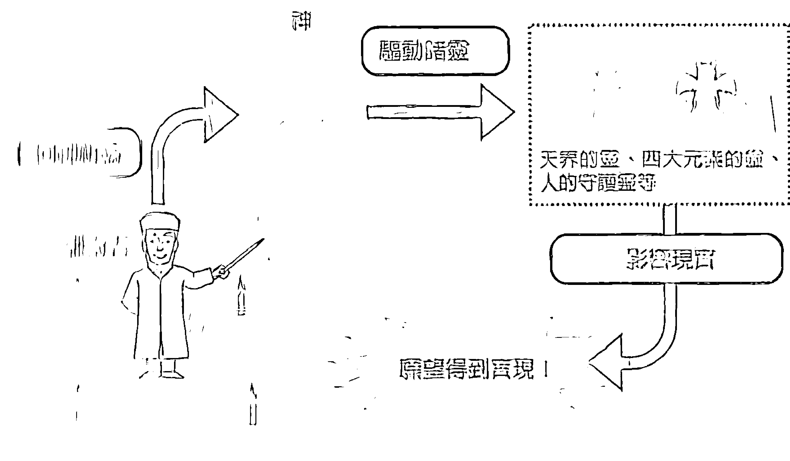

## 《所罗门王之钥》的内容

- **第一部：具体的施术方法**
    - 基本的施术程序。
    - 对应于特殊目的之施术程序。
- **第二部：施魔法的准备作业**
    - 净身方法、注意事项等。
    - 羊皮纸、笔墨、魔法杖等魔法道具的制作方法。

由于作例的手抄本不计其数，内容各异。此处乃参考爱德华·凯利所著（请参照P.182）

## # 魔法的原理
The Principles of Magic

若能熟知灵的喜好并成功拉拢之，操纵灵并非绝无可能的难事，此即《所罗门王之钥》的魔法原理。

## ## ○为何必须使用魔导书《所罗门王之钥》的原因

《所罗门王之钥》开头处以所罗门王教谕其子罗霍博姆的形式记载到下列内容：

创造出一切的全能的神希望人类是完全的，因此将人类创造成兼具神性与物质性的存在，亦即其肉体是粗野的、属于地上，其灵魂是灵性的、属于天上。因为这个缘故，人类才能让地上的灵和天上的天使服从自己。

如此一来，为神的荣耀出力奉献便是件很重要的事。

灵和天使有诸多不同种类。灵和众天使乃是以其职掌区分，譬如天使就有分最高天*1的天使、原动天的天使、水晶天的天使、七行星的天使。四大元素也有各自对应的天使，即火、风、水、地的天使。同时，我们也不可忘记神也为我们每一个人派遣了天使，监视着我们行动的正常与否。

如果能知道这些灵与天使的性格、甚至吸引他们的方法，人类就能让他们听从自己。

然而召唤这些灵最理想的日子与时间各不相同，唯有在那特定时间召唤才能发挥最大的力量。同样地，每个灵各自有其相对应的各种事物，例如颜色、金属、药草、植物、水生动物、飞行动物、陆行动物、香味、方位、咒文、印章、图形、神圣文字。人类必须综合上述物事所蕴力量方得驱动灵与天使，是以必须熟知此书《所罗门王之钥》所写内容。

> > *1最高天、原动天、水晶天：但丁《神曲》主张托勒密式的宇宙，认为宇宙乃以地球为中心，由内而外依序是月球、水星、太阳、火星、木星、土星运行的七个天球，再来则是恒星天；恒星天外侧还有原动天与最高天。水晶天则是原动天的另名。

## 小标题向备知性智慧的原因

神把人类创造成兼具神性与物质性的存在，所以人类才能操纵天上的灵和地上的灵。

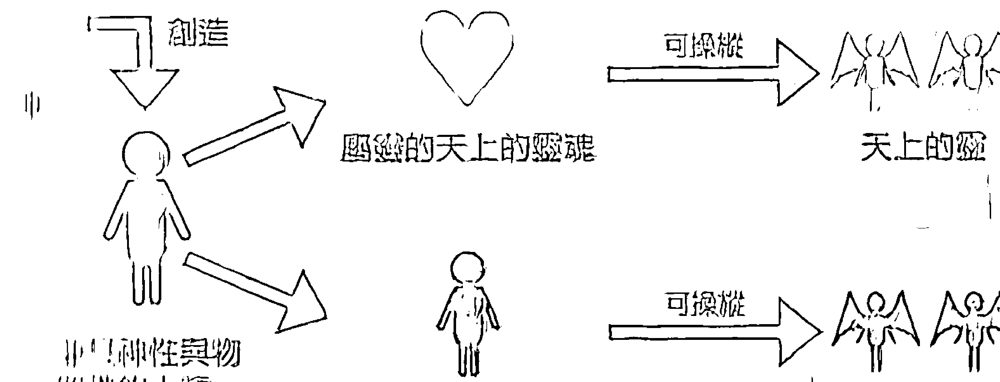

## 小标题向备知灵

（比如）用吸引灵的方法，便能操纵他们。这些全部记载于《所罗门王之钥》之中。

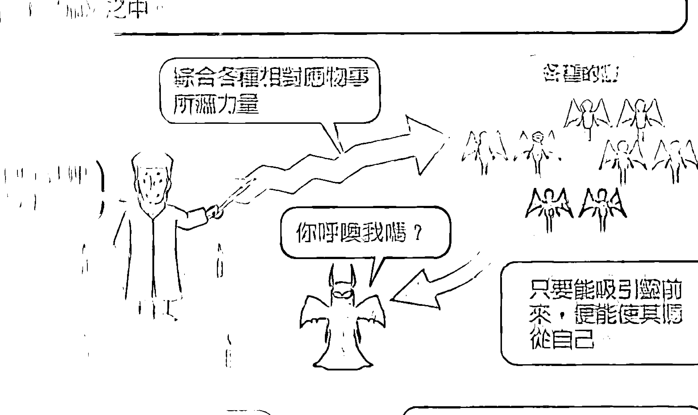

对应各种物质、灵体、乘灵、咒语、水、火、风、印、咒

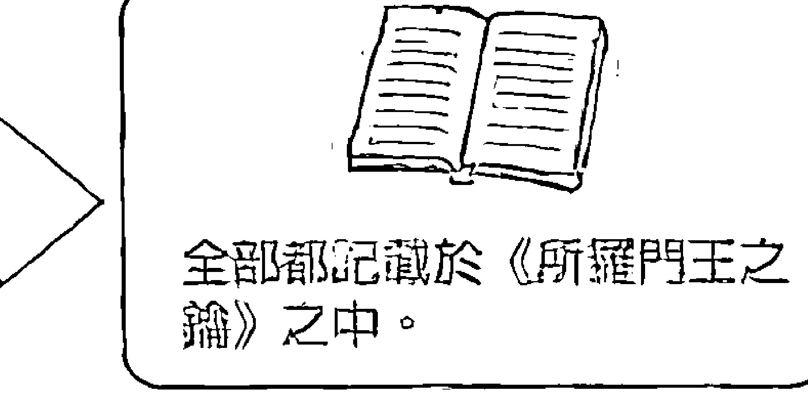

## No.024

## 各行星司掌的日子与时间

## Planetary hours and days

魔法的内容受到行星的支配影响，因此施行魔法者应当将各行星与每周各日、每日各时的关系制成表格，以免过头忘却。

## +   ○每周各日与每日各时均受行星影响支配

> 《所罗门王之钥》认为行星拥有非常大的力量，支配着每周各日与每日各时，而魔法亦因内容而各有其适当的施术日和施术时间。是故，欲施行魔法必得掌握行星与每周各日、每日各时之间的关系，其关系如下：

每周各日分别由名字相近的行星支配，亦即周日＝太阳、周一＝月亮、周二＝火星、周三＝水星、周四＝木星、周五＝金星、周六＝土星。

每日各时与行星的关系则是更为复杂：
每天有24个小时，这24个小时又可以分成日出到日落的12小时，以及日落到日出的12小时。此处必须特别注意的是，昼夜长短乃因季节而异，所以昼夜每一个小时的长度自然也就会随着季节而变化。

除此以外，每周各日日出后的第1个小时还有个特征，就是会受到与每周当日相同的行星支配；也就是说，每天的第1个小时分别是周日＝太阳、周一＝月亮、周二＝火星、周三＝水星、周四＝木星、周五＝金星、周六＝土星。接着就要进入每个小时按照太阳→金星→水星→月亮→土星→木星→火星→（再回到开头的太阳）的周期重复循环。此规则亦可适用于一整周各小时的行星轮替，从支配周日日出后第1个小时的太阳开始，直到支配周六最后1个小时的火星，然后再重复相同的循环。支配行星每小时都要替换，不容易记，可以事先准备正确的表格供查询比对，以免搞错。

## 1.行星支配时间表

行星 → 支配每周各日、每日各时；视魔法内容决定施术日期、时间。

## 1.1 恒星时与恒星表

每周各日与每日各时的支配行星乃以下列顺序轮替交换。

| 周日 | 周一 | 周二 | 周三 | 周四 | 周五 | 周六 |
| --- | --- | --- | --- | --- | --- | --- |
| 太阳 | 月亮 | 火星 | 水星 | 木星 | 金星 | 土星 |
| 金星 | 土星 | 太阳 | 月亮 | 火星 | 水星 | 木星 |
| 水星 | 木星 | 金星 | 土星 | 太阳 | 月亮 | 火星 |
| 月亮 | 火星 | 水星 | 木星 | 金星 | 土星 | 太阳 |
| 土星 | 太阳 | 月亮 | 火星 | 水星 | 木星 | 金星 |
| 木星 | 金星 | 土星 | 太阳 | 月亮 | 火星 | 水星 |
| 火星 | 水星 | 木星 | 金星 | 土星 | 太阳 | 月亮 |
| 太阳 | 月亮 | 火星 | 水星 | 木星 | 金星 | 土星 |
| 金星 | 土星 | 太阳 | 月亮 | 火星 | 水星 | 木星 |
| 水星 | 木星 | 金星 | 土星 | 太阳 | 月亮 | 火星 |
| 月亮 | 火星 | 水星 | 木星 | 金星 | 土星 | 太阳 |
| 土星 | 太阳 | 月亮 | 火星 | 水星 | 木星 | 金星 |
| 木星 | 金星 | 土星 | 太阳 | 月亮 | 火星 | 水星 |
| 火星 | 水星 | 木星 | 金星 | 土星 | 太阳 | 月亮 |
| 太阳 | 月亮 | 火星 | 水星 | 木星 | 金星 | 土星 |
| 金星 | 土星 | 太阳 | 月亮 | 火星 | 水星 | 木星 |
| 水星 | 木星 | 金星 | 土星 | 太阳 | 月亮 | 火星 |
| 月亮 | 火星 | 水星 | 木星 | 金星 | 土星 | 太阳 |
| 土星 | 太阳 | 月亮 | 火星 | 水星 | 木星 | 金星 |
| 木星 | 金星 | 土星 | 太阳 | 月亮 | 火星 | 水星 |
| 火星 | 水星 | 木星 | 金星 | 土星 | 太阳 | 月亮 |

## # 行星的影响力与魔法

## ## Planetary influences

行星的支配力量可以影响魔法的内容，因此应该选在各特定行星支配的日时施行适合该日时的魔法才是。

## ## ◯魔法效果将受到支配行星与月亮位置影响

根据《所罗门王之钥》记载，行星的支配力量甚至可以影响到魔法的内容。因此在由特定行星支配的日子和时间，就必须施行适合该日时的魔法。此处列举数例如下：

- * 属“土星”的日时：适合从冥府召唤自然死亡者的殭魂、替建筑物带来幸运或不幸、命魔龙在自己睡眠中出来从事各种工作、左右工作、财产、商品、种籽、水果等物事的丰收或歉收、带来破灭或死亡、带来憎恶或不和等诸多魔法。
- 属“木星”的日时：宜从事获得名誉、财富、友情以及维持健康的魔法。
- 属“火星”的日时：宜从事与战争相关诸事，也就是获得名誉、使变得勇敢、击破敌人等事，甚至招致破坏、虐杀、残酷、不和、负伤、死亡诸事也都涵盖在内。
- 属“太阳”的日时：适合从事可满足暂时性需要的魔法，诸如获得财富、幸运、君主的好感、消解敌意、获得朋友等仪式。
- 属“金星”的日时：宜从事与友情、爱情、亲暱有关的魔法。
- 属“水星”的日时：宜从事获得辩才、智慧、机智、预言能力，以及其他有关诈欺与商业的仪式。
- 属“月亮”的日时：宜从事航海、派遣大使或外交官、贸易之类牵涉湖海河川相关诸事，以及爱与和解的魔法。

不过，魔法的效果跟月亮在黄道上的位置也有很深的关系，是以欲使魔法发挥最大效用不仅要注意各行星司掌的日时，还必须注意月亮在黄道上的位置才行。

> 魔龙：请参照P.224注释附录No.019*2。

## 魔法施术的影响力

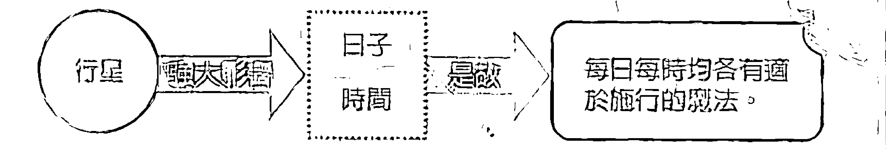

每日每时无不深受行星的强大影响，所以必须视日时执行适宜魔法。

## 依循行星目的施行的魔法

- [M1] "适合从冥府召唤自然死亡者的灵魂；看建筑物带来幸运或不幸；命魔宠在自己睡眠中出来从事各种工作；左右控制工作、财产、商品、种子、水果等物事的丰收或歉收；带来破灭或死亡、带来憎恶或不和。"
- [T1] "赢得名声、财富、友谊以及维持健康。"
- [W1] "与战争相关诸事；亦即赢得名位、便变得勇敢、击破敌人等等，甚至招致破坏、虐杀、残酷、不和、贫困、死亡诸事；召唤战死者的亡灵。"
- [J1] "暂时性的财富、幸运、君主的好感、消解敌意、赢得朋友等仪式。"
- [V1] "与友情、爱恋、纵压有关的魔法；另外也适于出外旅行。"
- [S1] "赢得辩才、智慧、机智、预言能力，以及其他有关诈欺与创业的仪式；宜从事游戏、运动等娱乐活动。"
- [H1] "任何航行、派道大使或外交官、贸易之类等涉湖海河川相关诸事；宣战与和解的魔法；任何找回失窃物品、召唤沉睡的灵以及跟水有关的诸仪式。"

# No.026

## 儀式前的術師注意事項

### Preparations of the Master of the art

術師（魔法大師）必須在斷食的三天期間內檢查驗證魔法的各個細節，並且做好所有必要的準備。

### ○術師於展開儀式前的準備事項

欲執行魔法儀式，則魔法術師須得注意以下事項（此節所述乃是整體的大致流程，進一步的具體內容請參照相應條目說明）：

首先第一件就是，無論欲施行《所羅門王之鑰》魔法者的秉性如何，切不可受到無聊的庸俗雜務與旁雜意念影響。

其次，術師必須仔細檢查所要施行的魔法，將各個細節整整齊齊地先謄寫在紙上。尤其在施術目的的部分，必須把適用的咒文、驅魔儀式先釐清好來。適於施術的理想日時、必須準備和可以省略的東西也都要先弄清楚。此外，屆時無論施加印記或書寫文字，都必須使用特別製作的紙、墨、筆等書寫用具。

做好上述準備以後，接著就要尋找執行魔法儀式的場所；術師必須親自前往該處（因施術目的而異，有時會選在密室），在那裡為每個步驟程序做準備。不過選擇施術場所有個條件，必須是個無人知曉而且不會被人看見的地方。

施術場地安頓好以後則是入浴儀式，然後至少三天之內不得有任何多餘無益的思想，必須排除一切的不純潔與罪惡。此即所謂的「斷食行」與「徹夜行」。

所有物事都必須在這三天內準備停當，接下來施術者就只要靜靜等待展開儀式的適當時機來臨即可。一旦展開儀式，那就必須從頭進行到尾、不可中斷。如此一來，術師付出的努力就能夠得到理想的結果。

## 施術前的準備流程

> 施術者展開儀式前的施術準備與心態準備如下：

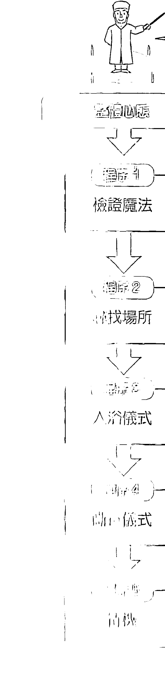

### 心態調整

無論如何不可受到無聊的庸俗雜務與旁雜意念動搖。

### 檢證魔法

確定施術目的、適當咒文、隱匿儀式、施術的理想日時，哪些東西必須準備而哪些東西可以省略，全部寫在紙上。須使用特製的紙墨筆書寫。

### 尋找場所

施術者親身前往施行魔法的場所，為每個步驟程序做準備。最好是個無人知曉、不會被人看見的地方

### 入浴儀式

於適當日時前往河川、溪流或密室中，按照規定入浴淨身。

### 斷食儀式

三天內摒除任何多餘無益的思想，以及一切的不純潔和罪惡。

### 等待

等待施行儀式的時日到來。所有事項都必須已經準備停當

## 同伴與弟子注意事項

### Preparations of the Companions or Disciples

如果可能的話：魔法儀式最好是由三名同伴或弟子陪同進行，否則跟忠心的愛犬一同進行也可以。

### +   ○為三名同伴或愛犬做好準備

據說魔法儀式最好是在三名的同伴或者弟子的陪同下一齊進行。此處所說的三個人並不包括術師本身；如果情形不許可，至少也要跟忠心的愛犬一同執行儀式才是。是故，為使儀式得以成功，術師首先就必須好好考慮要找什麼樣的同伴合作。

如果選擇與同伴或弟子共同舉行儀式，則這些同伴弟子必須發誓服從術師指示，否則很可能蒙受神靈所造成的痛苦與危險，甚至喪命。

如果選擇與同伴共同執行儀式，術師囑咐交代好以後就要準備施過驅魔儀式的聖水，將弟子們領到已經事先灑掃清潔過的密室裡。弟子要在這裡赤裸全身，以聖水從頭頂一路澆到腳底板，潔淨全身。接著再讓弟子穿上長袍與術師作相同的裝扮、斷食三天，其間無論祈禱或者任何行動一律都要比照術師進行。

若是不選擇人類而選擇跟狗一同舉行儀式，同樣也要用聖水把狗洗乾淨，用施術的焚香或香水使致芳香，並事先誦唸特定咒語。

若同伴是稚幼的少年少女，也要跟處理愛犬同樣幫他們潔淨身體、施以芳香，然後把手指甲腳趾甲修剪整齊、唱誦特定咒語。

按照上述正確方法選定、任命同伴並且安排妥當以後，術師就隨時可以開始執行儀式了。但是為安全起見，術師和同伴都要在胸前佩帶星陣圖。一般來說，同伴或弟子的人數扣除術師自己是三個人，不過也可以由五名、七名或者九名同伴一同進行。

### 1. 必须找齐三名同伴或弟子

> 魔法儀式必須與三名同伴或弟子一同進行。倘若情形不許可，至少也要跟忠心的愛犬一同執行。


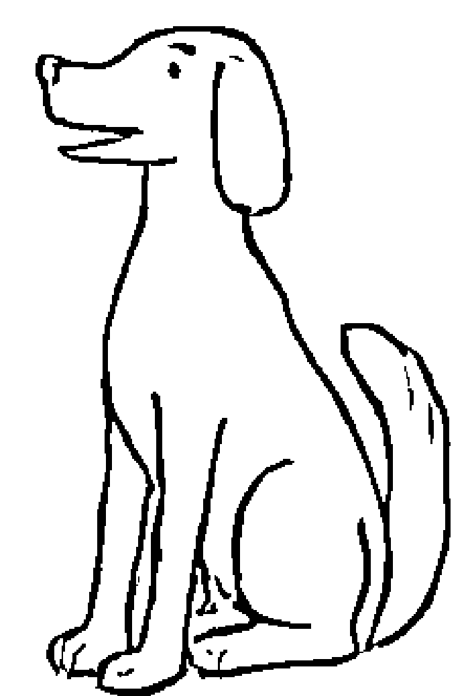

### 2. 事先准备事项

### 3. 选择弟子


- 選擇發誓服從術師的弟子。
- 於密室以聖水清洗全身。
- 穿上長袍，斷食三日。

### 4. 准备爱犬

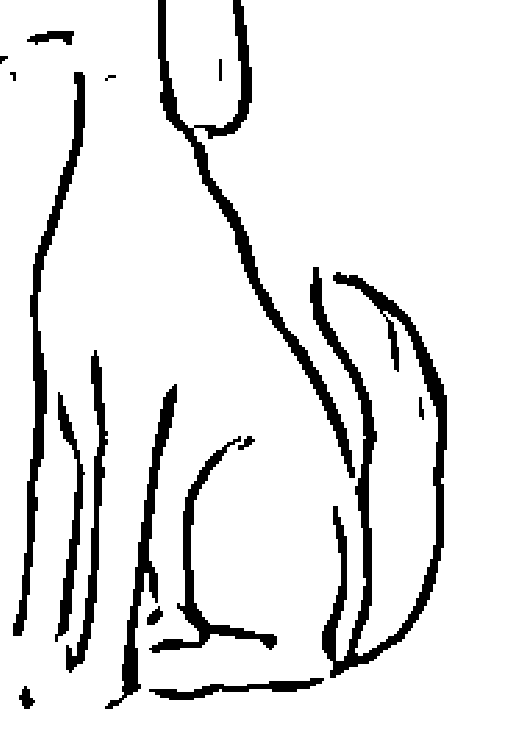

- 以聖水清洗乾淨。
- 以施術焚香或香水使致芳香。
- 誦唸特定咒語。

### 5. 准备少女


- 比照愛犬，以聖水清洗身體。
- 使致芳香。
- 將手指甲腳趾甲修剪整齊，唱誦咒語。

（箭头）

（1. 1 2. 3）準備好同伴以後，就隨時可以展開魔法儀式了。

## 節制與斷食期間相關事項

### About the Fasting and Moderation

儀式前的九天準備期乃是節制與斷食的期間，必須累積善行、誠實待人、謹守禮儀，無論做什麼都不可失卻節度。

### ## ○ 儀式前的準備期間必須謹言慎行

魔法儀式開始前有九天的準備期間。

這個準備期間是用來準備外套鞋子羊皮紙等儀式所需魔法道具，同時卻也是節制與斷食的期間。

所以打從這個準備期開始以後，就必須避免精神上和肉體上的不虔誠、不純潔、邪惡、極端諸事。舉例來說，過度的暴飲暴食、無意義的冗長廢話、誹謗中傷他人等都是決計不可為，必須累積善行、誠實待人、謹守禮儀，無論何事都不能失卻節度。這可謂是儀式前的九天準備期間中最最重要的一件事。不僅術師必須如此，弟子們也同樣必須遵守。

另外，在長達九天的準備期間當中的最後三天，也就是執行儀式前的三天，必須進行斷食；這個所謂的斷食是指限制每日只能吃一餐，如果這一餐能夠只吃麵包加清水則是更加理想。當然了，這段期間中自然也必須如前述般避免一切不純潔事物，然後固定每天早上一次、傍晚兩次進行祈禱。

來到儀式展開的前一天，這一整天必須完全遠離食物，然後進入密室向神坦承自身罪業並且悔改。

眾弟子也要跟術師一起從事以上活動。

完成前述諸事以後，接著就要進入密室，用水和海索草淨身然後入浴。（入浴相關事宜請參照P.066）

> > "海索草（Hyssop）：唇形科庭園草本植物，學名為Hyssopus officinalis，花和莖葉常用於多種食品、飲料和烹飪調味，以及作為家用藥物。味甜帶苦辛，其葉加蜂蜜配製的濃茶是治療鼻咽和肺等疾病的傳統藥物，有時外用於挫傷。"

### 九天的准备期间

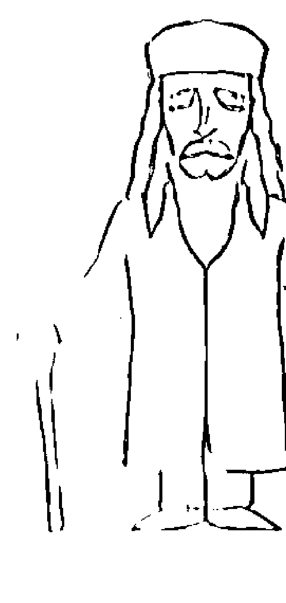

仪式前的九天是准备期间。

九天的准备期间 →（指向）魔法仪式
（于这段期间之内准备魔法道具。）

### 节制与断食的必要

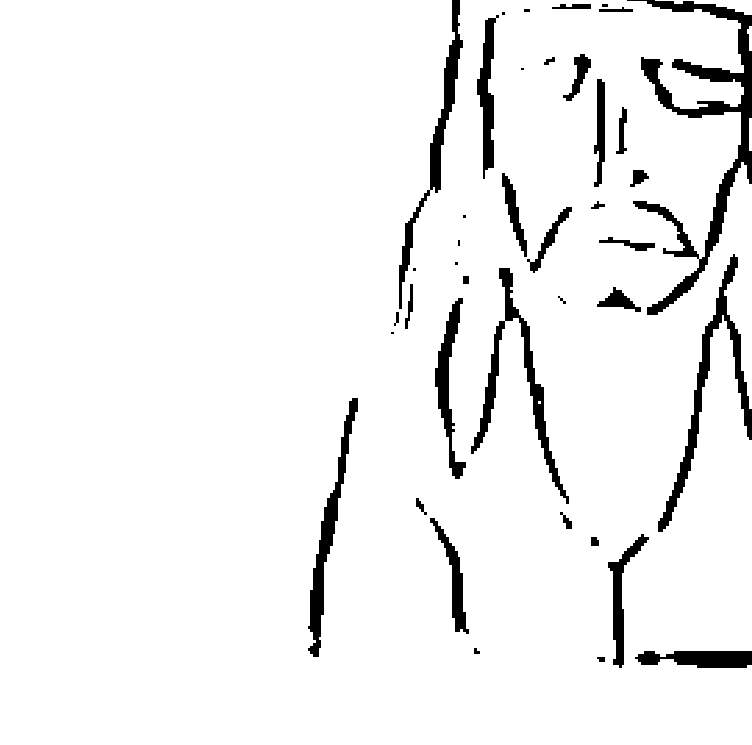

九天的准备期间也是节制与断食的期间。复得注意下列事项：

### 仪式前九天的注意项


九天是节制与断食的期间，必须戒除所有不好的

- 暴饮暴食、邪恶、诽谤、不虔诚、中伤、不纯净

### 仪式前三天

- 断食。
（每日一餐。尽可能只吃面包和清水）
- 早晚固定行祈福。

### 仪式前一天

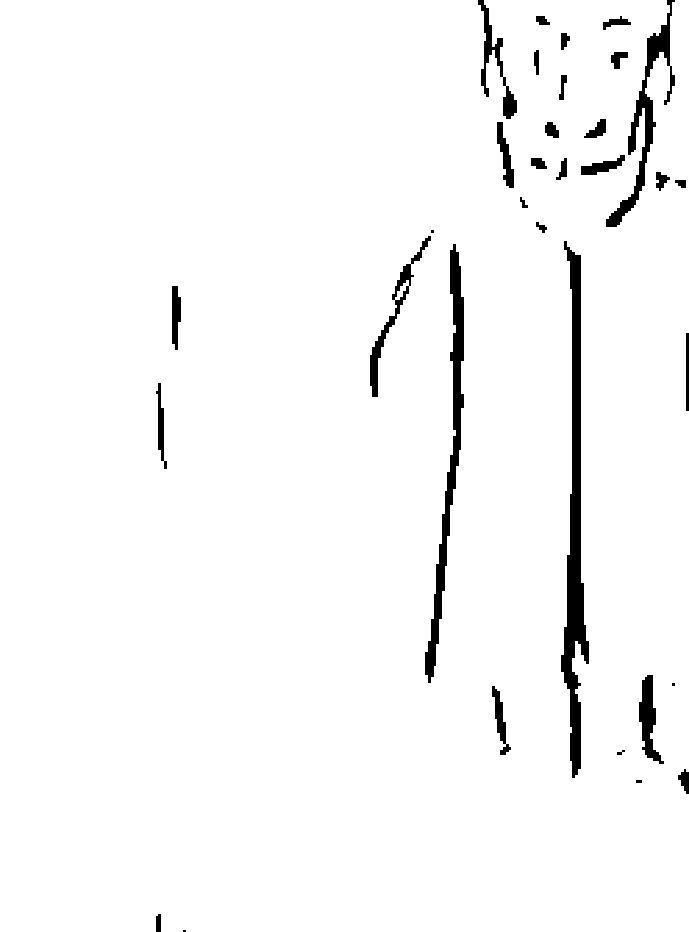

- 完全停止进食。
- 于密室中向神坦承罪业。
- 悔改。

以上所有事项弟子也必须依照行。


## 仪式前的入浴

### About the Baths

施行魔法或降靈術前，須得在河川或溪流、或者在密室中以臉盆準備溫水，按規定入浴。

### ○用水和鹽巴驅除不潔與慾望

魔法、降靈術規定必須在施術前以下列步驟入浴：
首先選在適當日時做好準備，再前往河邊或溪畔，或者也可以事先用臉盆等容器準備溫水放在密室裡面。一面唱唸《詩篇》章句（第14篇或第53篇以及第27篇、第54篇、第81篇）一面脫衣服。衣服全部脫掉以後，進到水中或浴槽裡面唱誦：「受創造的水呵，我為你驅魔。以創造你、使你集中於一處出現於大地的那位造物主之力，揭露敵人陰謀、洗清惡靈的不純與不潔、使致無害。以永世統治者、萬能上帝之德。阿門。」
接著要把全身上下每個角落都洗乾淨，一邊重複唱誦下列名字兩到三次：「梅塔里亞、姆薩里亞、多伐里亞、歐涅馬里亞、席丹賽亞、戈爾達伐拉、德丟賽拉……」
洗乾淨以後離開浴槽，取魔法水灑在身上、再唱曰：「主啊，請以海索草為我淨身，使如冰雪般潔白。」
然後邊穿衣服、邊唱誦《詩篇》特定章節（第102篇、第51篇、第4篇、第30篇、第119篇「我何等愛慕你的律法」的部分、第114篇、第126篇、第139篇）。
接著是施鹽的祝福，手握一把施過驅魔儀式的鹽巴投入浴槽，再度褪去衣服並唱道：「充滿力量與驚奇的埃爾啊！我讚頌祂。我在此地向祂祈願，向祂感謝。願此水能掃去我的不潔與慾望。以祂，聖阿多奈之力。阿門。」
再次入浴並唱誦詩篇第104篇與第81篇，踏出浴槽換上潔白的亞麻材質衣服，最後穿上外套。
術師的入浴儀式至此告終，接下來就要輪到弟子們以同樣的法度、同樣嚴肅的態度進行入浴儀式。

### 儀式前的入浴

潔淨身體、驅除不潔。
使儀式成功的必要條件。

入浴也有規定的程序，必須按照下列步驟進行方可：

1. 準備入浴場所。

可在密室中準備裝有熱水的臉盆，也可以去河畔或溪邊。

2. 脫衣入浴。

3. 以聖水潑灑身體。

4. 出浴。

祝福鹽巴，加進浴槽裡。

脫去衣服，再次入浴。

出浴著裝。

穿上清潔的亞麻衣服與外套。入浴至此告一段落。

穿上簡單乾淨的衣服即可。

※ 波盎，波盎作測水器使用（請參照P.094）。

## 執行儀式的場所

### About the places for the ceremonies

> 若能在遠離人居的秘匿處所、寂靜無人處、深夜的十字路口等適合魔法的場所執行魔法儀式，則魔法將會更有效果。

### ◎尋找遠離人居的荒廢處所

魔法儀式最好能夠在適合的場所進行。如果情況不許可，當然也可以在自己的房間裡施行，只是若能在適合場所執行儀式將會更有效果。

所謂適合的場所，以遠離人居的秘匿處所、荒涼無人處為佳，譬如湖畔、森林、幽暗不起眼的地方、荒廢的古屋、山中、洞窟裡、庭園、果樹園等地，不過最理想的還是深夜漆黑幽靜的十字路口。

待地點大致底定以後就要實際前往該地，晝夜不拘，決定適合施行儀式的確切地點（亦即製作魔法圓的地點）。附近最好是片開闊的地面，不過施行儀式地點必須有圍牆、草叢、樹木等物圍繞。找到這樣的地方以後，必須將該處清掃整理至全無一點污穢，進行清掃作業時還要一面唱誦《詩篇》的第2篇、第67篇、第54篇。其後焚燒施有魔法的薰香使周圍充滿馨香，以海索草『散布灑水，然後著手施行準備魔法所須的全部事項。

來到實際施行儀式那天，從出門到抵達施術地點的期間內，途中必須低聲重複唱唸特定的禱辭：「薩薩依、薩瑪依、普依速茶、埃納、耶和華、依亞、阿格拉啊，請給我力量。」術師唱誦著禱辭並沿路拋灑沾水的海索草，弟子們則是要低誦斷食的禱辭。至於魔法道具則是由眾弟子們分別攜帶（第一人拿香爐、火、薰香。第二人拿魔導書、紙筆墨和各種香料。第三人拿短劍與鐮刀），法杖則是由術師自己拿著。抵達目的地以後，接著就是要進入建構魔法圓的作業了。

『海索草：請參照P.064注釋。

### 進行儀式的場所？

有些場所特別適合施行魔法。
遠離人居的荒廢處。

> 具體來說，下列場所便頗為理想。時間則是以夜晚為基本。

- 廢屋
- 森林
- 湖岸
- 洞窟
- 庭園
- 十字路口

### 魔法陣的場所

魔法陣多繪製於圍欄、草叢、樹壁等物圍繞之處。

> 四面完全被環繞的地方繪製魔法陣。

> 不過周圍最好是開闊的地面。

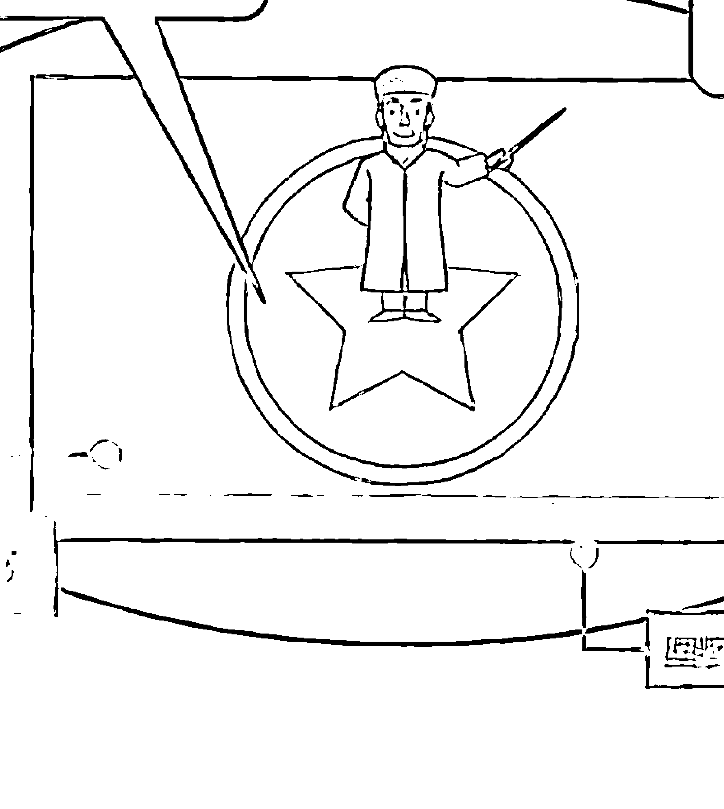

聖所、草叢、樹木、樹壁

No.031

## 魔法圆建构仪式

### ## About the formation of the circle

魔法圆必须遵照固定的方法与尺寸尽可能精确地绘制，还必须要在术师及同伴进入以后能够确实地关闭才行。

### ○唱诵诗篇并建构魔法圆

抵达仪式场所准备完毕以后，接着就要开始建立魔法圆：其方法如下：

取镰刀或弯刀插在地面，作为魔法圆的中心点，并取出事先准备好的9英尺长的绳索，一头系在镰刀刀柄当作圆规使用，另以黑柄短剑或者短刀在地面划出圆周。画好以后，跟着再以1英尺间隔距离在外侧划出两个同心圆，然后在内侧两个同心圆中间书写圣神的符号。外侧两个同心圆中间则先写上星阵图等固定记号，然后于其间写下众神的名字；东南之门写下神圣的圣四文字YHWH、西南之门写AHIH、西北之门写ALIVN、北东之门写ALH。

接着在同心圆外侧划两个四方形，使四个角分别指向东南西北四个方位，两个四方形中间间隔0.5英尺。然后以外侧四方形的四个角顶点为中心，划出四个直径1英尺的圆，在圆心写下圣神之名：东AL、西IH、南AGLA、北ADNI。除此之外还要在这四个圆的内侧各自划出较小的圆，以供举行仪式时在这些小圆内侧设置香炉。

进行魔法圆制作作业时，术师必须不停唱诵《诗篇》的下列篇章：第2篇、第54篇、第113篇、第67篇、第47篇、第68篇。建构魔法圆作业尚未展开以前，同样也可以诵唸这些篇章。

魔法圆准备好以后，术师就会再度召集弟子，将弟子分别安排在魔法圆的各个定位，以进行灵的召唤作业。又为了供术师与弟子出入，魔法圆朝北的部分线条会先留白不划，等到举行仪式时大家都进入圆圈里面以后，再连接这些线条将魔法圆关闭起来。

### 11.1 魔法圆的制作方法

画魔法圆的基础作业 → 以镰刀、短剑、绳索代替圆规在地面画圆。

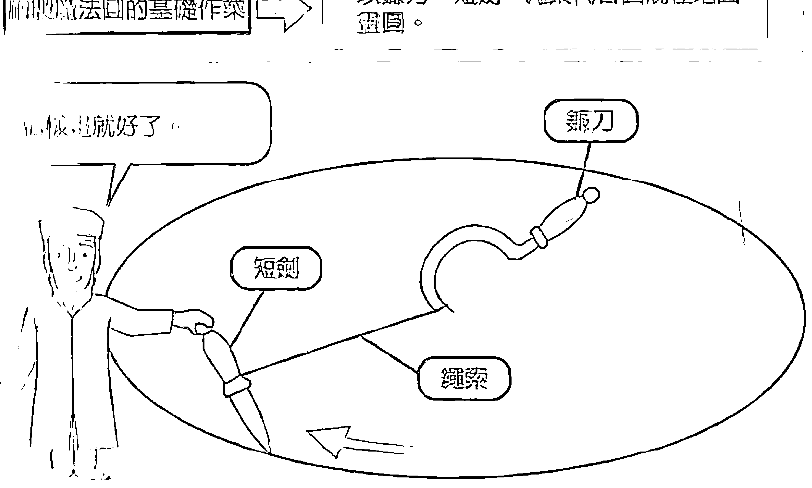

### 11.2 基本形

完成以后的魔法圆就是这个样子。

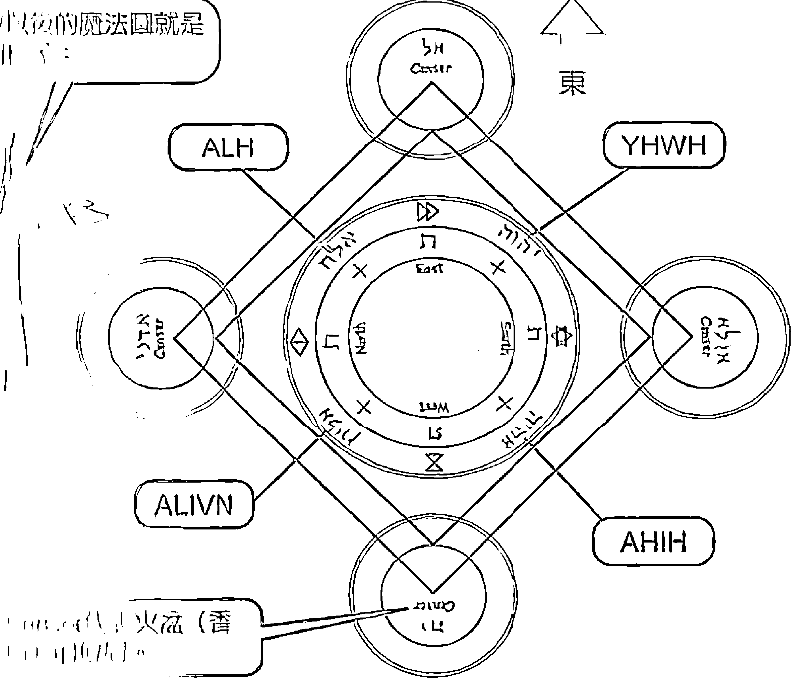

No.032

## 召喚儀式

### ## About the conjuration ceremony

執行召喚儀式時只要依序使用咒文由弱至強四個階段的咒文：普通咒文、強咒文、極強咒文與火炎召喚咒，靈就必定會出現。

### +   ○使靈服從的四階段咒文

魔法圓完成後，接著就要開始召喚靈的儀式。首先由術師潑灑聖水為魔法圓除穢，然後再度召集眾弟子進入魔法圓圈內。待眾人都踏進魔法圓以後，把先前預留空白處的線條完成、關閉魔法圓。將眾弟子安排在東南西北四個方位，將筆、墨、紙、絲、綿布交給站在東方的弟子拿好，並讓眾弟子持劍、做好準備以便隨時拔劍。接著點起四方香爐，點燃蠟燭並將其安置在固定位置，然後向神祈求儀式得以成功：「我等垂首，萬能的主啊，請迴降臨，並請迴命天使守看此地。前垂聽我等祈願。萬代無期的統治主啊！」接著術師會吹響事先準備的木製喇叭、手持星陣圖或徽章（金屬材質星陣圖），然後通常會面向東方唱禱咒文。咒文有下列四個種類：先唱是「普通咒文」。如果靈沒有出現的話，那就取出聖別過的星陣圖或徽章拿在左手、右手持短劍唱誦「強咒文」。若此時靈出現了，便出示左手的星陣圖；倘若靈還是不出現，便以右手短劍在空中揮舞斬切，然後放下短劍、膝立於地唱誦「極強召喚咒」。來到這個階段，幾乎絕大多數靈都會應召喚現身。但如果靈極為頑固又不肯服從，那術師就要在羊皮紙寫下靈的名字、以泥土灰壓等物塗污羊皮紙，然後連同曬乾的芸香、磨成粉的阿魏和邪惡的香料一起點火燃燒，並唱誦「火炎召喚咒」：「我召喚汝等，火炎的受造物……」這麼一來，靈就必定會出現。

### 術師與弟子的配圖

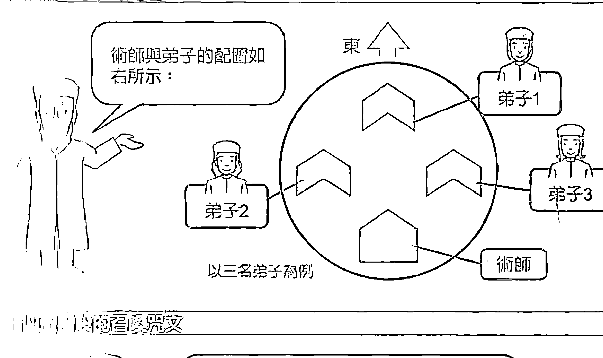

術師與弟子的配圖如右所示：

以三名弟子為例

### 術師的召喚咒文

向神祈禱完畢以後唱誦惡魔的召喚咒，其召喚咒共分四個階段，1<2<3<4力量愈發強大。

+   ③ 極強召喚咒

出現吧，火炎的受造物。否則汝等將永受詛咒、斥罵與責備。
......

出現吧，以神... 汝惡、...我命令......

若(1)的時候始終不出現，術師就會左手持星陣圖、右手持短劍在空中揮舞。

術師祈禱時使用柑橘科藥用植物。

術師召喚時使用的傘形科藥用植物。

## 號令諸靈

### Orders to spirits

靈出現以後，術師便要以星陣圖或徽章出示諸靈之王、鎮鎮諸靈，並以堅毅強硬的口吻下達命令。

### +   出示星陣圖以行號令

根據《所羅門王之鑰》記載，前節所述的四個階段召喚咒必定能使靈出現；那時術師應該能夠看見階級較低的靈替高級靈開道、四面八方風風火火急奔而來才是。

此間諸靈特徵如下：第1團奔將前來的諸靈作兵士裝扮，全身裝備著長槍、盾牌、甲冑；第2個集團的靈則看似是男僕、君主、公爵、隊長、將軍之類；第3次亦即最後出現的便是他們的王，會在許多拿著樂器的演奏者以及唱出優美旋律的合唱隊簇擁之下現身。

眾靈出現以後，術師就要向諸靈之王出示原本別在胸前的星陣圖或徽章；唱誦曰：「在任何人都要向祂屈膝的偉大的主面前，汝等亦當屈膝……」此時，諸靈之王就會跪下說道：「汝所欲何為？因何將我從地獄奧底召喚？」

對此，術師必須以堅毅強硬的口調命令諸靈肅靜，以香爐焚燒大量薰香，如此應當能鎮懾諸靈使其生怯。

此時術師就要以星陣圖鎖住諸靈之王，同時以自身願望命令之，則願望就可以得到實現。

待所有要求都得到滿足以後，最後就只剩下讓諸靈平和地散去、回歸地獄而已。此時唱辭曰：「奉永恆且無終期的第一存在、阿多奈（check）之名。所有的靈啊，汝等即可回歸原本所在，並為我等帶來平靜，直到下次再度召喚為止。」

如此諸靈就會退去，此時術師先踏出魔法圓，然後眾弟子再一一離開圓陣。全員用聖水洗過臉以後就可以回歸日常生活，而儀式亦就此告終。

術師唱誦四階段咒文期間，眾靈必定會按照低階者先、高階者後的順序從四面八方急奔而來。

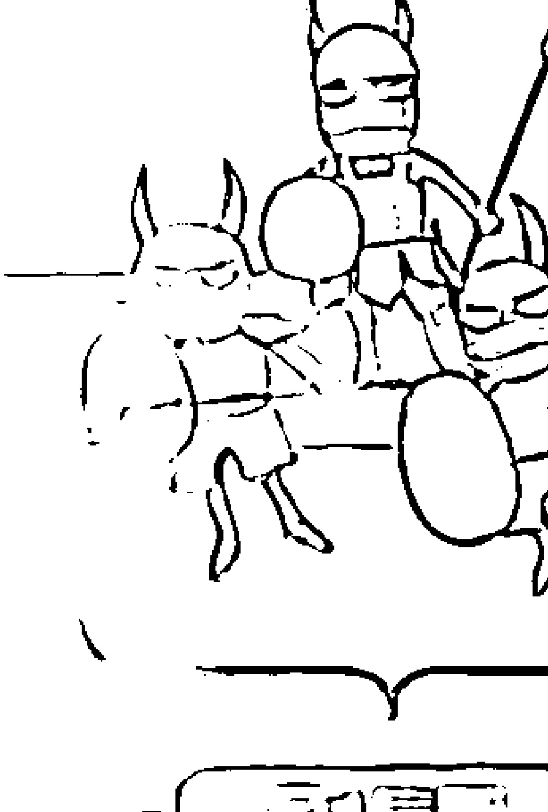

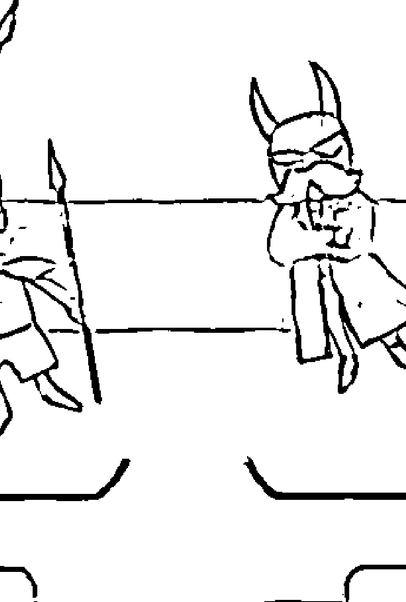

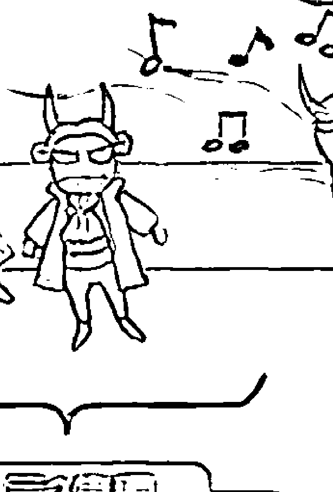

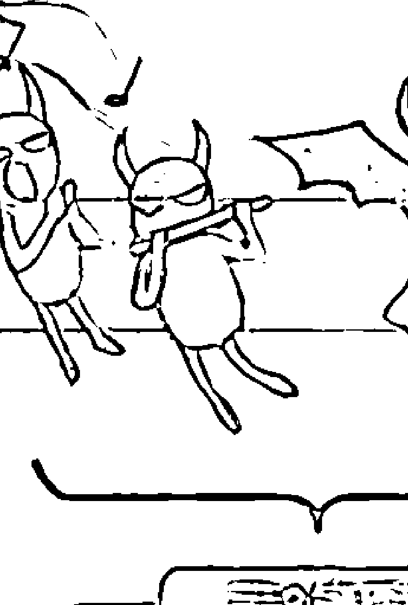

以武裝長槍、盾牌作士兵裝扮的眾靈

看似易怒、君主、公爵、隊長、將軍的眾靈

詭魅之王④跟在樂器的演奏者、合唱者③的後面出現。

術師此時，以胸前星陣圖鎖住眾靈之王，命其乖乖順應行事，如此願望便能實現；最後只要平和地散去、回歸地獄即可。

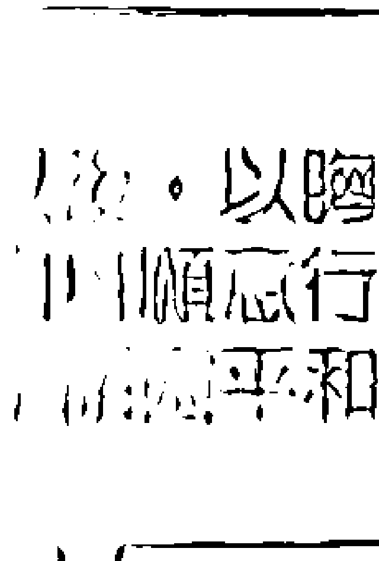

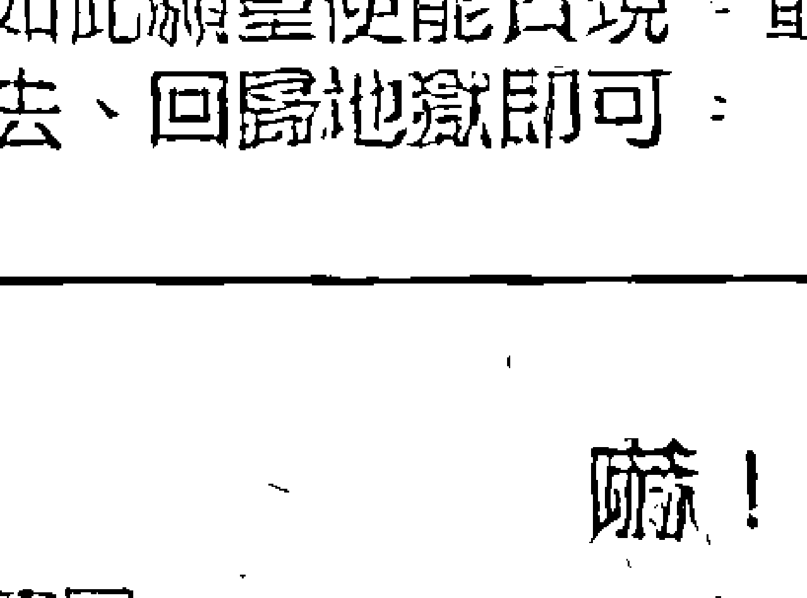

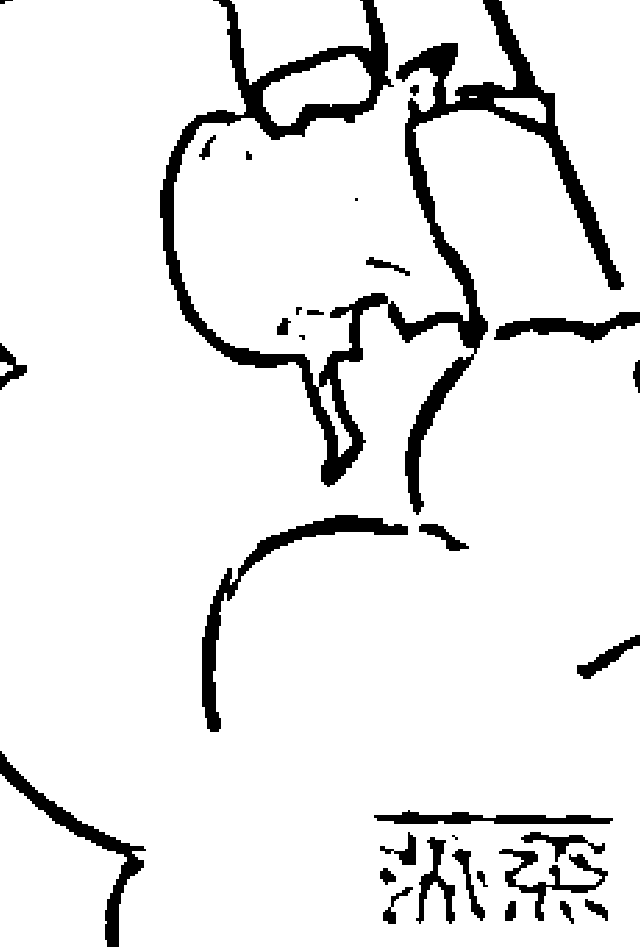

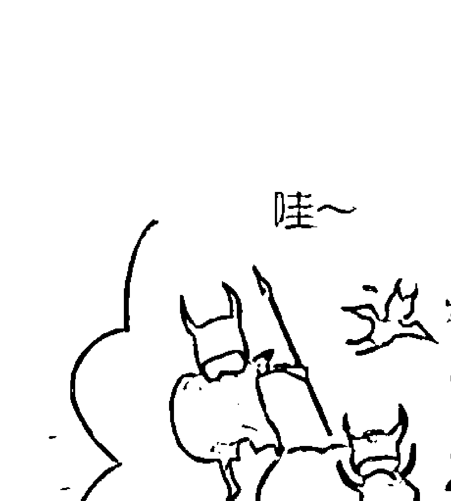

如果眾靈吵鬧，別忘記可以焚燒大量蒸香讓它們閉嘴。

## No.034

## 特別的魔法儀式

About extraordinary experiments and operations

根據《所羅門王之鑰》記載，除一般的尋常魔法以外，尚有以尋找失竊物品、懲罰浮物等目的而從事的特別魔法儀式。

### ○八種特別儀式相關注意事項

除前述的一般魔法儀式以外，《所羅門王之鑰》對某些特別魔法儀式亦有陳述。

該作品所謂特別的魔法儀式，即

- 「找回被盜物品的方法」
- 「變成透明人的方法」
- 「防止運動意外致死的方法」
- 「旅行也不會疲累的吊襪帶製作方法」
- 「向靈習得知識的地毯製作方法」
- 「獲得靈所擁寶物的方法」
- 「獲他人喜好愛戀的方法」
- 「使詐欺得以成功的方法」

。這些魔法為何在當時受到特別看待如今已不復得知，總之其內容有別於一般的魔法儀式，而且還必須留意在相對應的日時執行儀式方可。

舉例來說，找回失竊物品的儀式便規定要在虧月亮的日子與時間進行，而且還必須要在月亮由虧轉盈的期間內，從午間1點進行到8點。夜間則同樣可在5點或3點開始舉行儀式，不過仍以白晝較夜間來得理想。

變成透明人的儀式則應於月亮落在雙魚宮且逐漸滿盈的期間，屬火星之日的午間1點、2點或3點開始進行，夜間最晚則以3點為限。

尋求愛戀與好感的儀式則應於月亮落在雙子宮且逐漸滿盈的期間進行。此儀式當於屬太陽當日的1點到8點間進行，或者金星日的1點到8點亦可。

使詐欺得以成功的儀式則是該在金星日的1點到8點間進行，夜裡則以3點與7點為佳。其次，此儀式須於月亮落在獅子宮或白羊宮且逐漸滿盈的期間內進行。

關於這些日期與時間上的限制，魔法達人似乎並不需要特別在意，不過初學者就必須徹底遵守。

## 1. 月相的秘仪


> 《所罗门王之钥》以专用的特别仪式说明针对下列目的行使的魔法。当施行这些魔法的时候，还必须特别注意施术的日子和时间。

-   **寻找被盗物品的魔法**
在月盈的日时，且月亮逐渐满盈的期间内进行。

-   **变成透明人的魔法**
月亮落在双鱼宫且逐渐满盈的期间内进行。

-   **防止运动意外致死的魔法**
在月盈的周五行使魔法。

-   **制作旅行不感疲累之吊袜带的魔法**
于6月25日做准备并行使魔法。

-   **获得所向披靡得知隐藏之物的魔法**
月亮进入天蝎宫的期间内。

-   **获得宝所掘宝物的魔法**
于7月10日至8月20日期间内符合相关条件之日进行。

-   **使人欲火熊熊的魔法**
月亮在双女宫且逐渐满盈的期间内进行。

-   **使诈欺得以成功的魔法**
于金星日的1点至8点间进行。

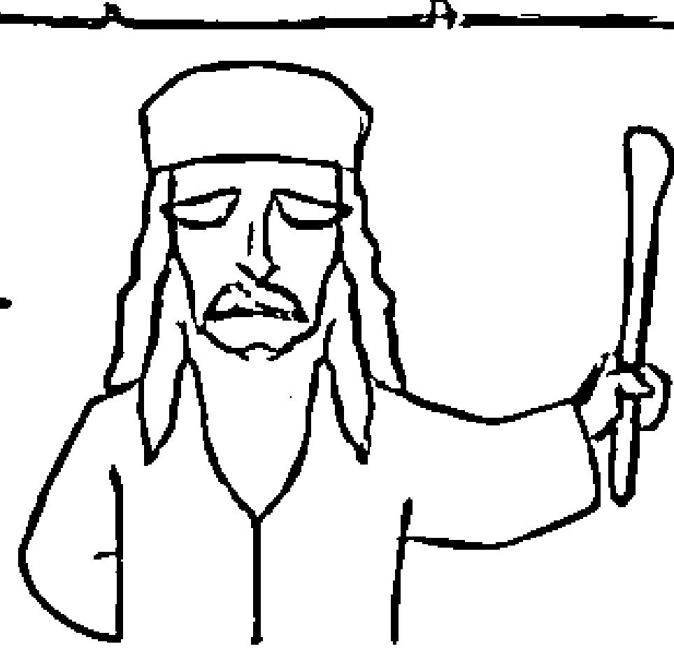

> 对于一些人不须拘泥于这些规则，但对初学者绝对要遵守。

## 尋回被盜物品的方法

The experiment for things stolen

《所羅門王之鑰》乃以相當特別的儀式說明如何尋回被盜物品、甚至於找出盜竊犯的魔法。

### ○從臉盆水面浮現的犯人容貌

> 根據《所羅門王之鑰》記載，取回失竊物品之方法如下：
首先按照一般儀式程序做好所有準備、踏入魔法圓，然後禱曰：「全能的主啊，請予憐憫。請主憑著迦的力量命令此間諸靈，找出盜賊，並指示何處可以尋回遺竊物品。」此時眾靈就會現身，接著就要命令道：「奉主之名而現身的諸靈啊，告訴我正在找尋的東西位在何處。」如此一來，眾靈就會告訴施術者遭竊物品在什麼地方。
尋找犯人的方法則是完全不同。首先要準備一個篩子。焚香1茶匙，以曾經用來執行絞刑的吊頸索將篩子懸空吊起，並且用鮮血在篩子外框的四個方位分別書寫特別記號。準備清潔的錫製臉盆，裝滿泉水。接著左手轉動懸在半空的篩子，同時右手則是取月桂樹嫩枝以相反方向攪動臉盆中的泉水；待臉盆內的水靜止下來，施術者就要停止轉動篩子，然後專心盯著水面，則盜竊者的面貌就會浮現在水面。此時若再持魔法劍去刺水面那張臉，則現實中盜賊的臉也會留下同樣的傷口，如此就更容易捉到犯人了。

《所羅門王之鑰》還另外介紹到了以下這個方法：拿一把剪刀將其中一片刀刃刺進篩子外框，然後由兩個人各自伸出大拇指的指甲抵住另一片刀刃的握柄。接著由其中一人將可能犯罪的嫌犯名單一一大聲唸出來，並唱誦：「以聖彼得與聖保羅之名，此人並非犯人」三次；唸到真正犯人名字的時候，篩子就會自動旋轉起來。

## 找回失物的魔法

取回遭盜竊的施法 → 使用魔法四的尋常魔法。

找出犯人的魔法 → 使用篩子的特殊魔法。

## 找出犯人的魔法

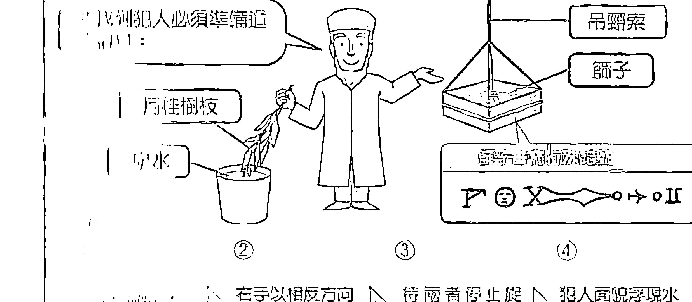

```
篩子的迴旋魔法迴路： ♂ ☿ ☉ 〰 ♂ ♃ ♄
```

-   ① 以聖水灑在篩子上。 ② 右手以相反方向攪動聖水。 ③ 待兩者停止旋轉，觀察水面。 ④ 犯人面貌浮現水面。

※ 篩子旋轉時的注意事項。

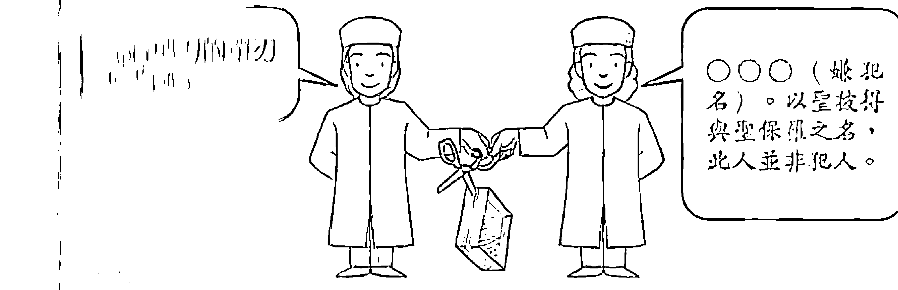

-   ① 兩人同時握住篩子，共同施法。 ② 其中一人先說出嫌犯名，再大聲說出固定禱詞。 ③ 篩子唯有在唸到真正犯人的時候才會旋轉。

## 取得受靈看守之寶物的方法

How to get a treasure possessed by the Spirits

大地有種名為地精的魔雖然極為危險，但只要與其交好，就能命令他們並獲得隱藏於大地的寶物

### ○操縱危險至極的地精

根據《所羅門王之鑰》記載，大地有許多精靈棲息，這些精靈喚作「地精」，每迴有人覬覦隱藏的財寶往往會將其人殺害，相當危險。不過如果能跟這些精靈交好，並以特殊方法命令彼等，他們也會很樂意地將寶物交出來，其方法如下：

7月10日至8月20日期間，選在月亮落在獅子宮的星期日，在日出以前前往召喚靈的場所。抵達後，以用來施行魔法的劍畫出一個夠大的魔法圓，並點燃適合當日的薰香，使香氣充滿該場所三次，然後穿起儀式專用服裝，掛起油燈。那油燈裡的油必須混合7月死亡的男性脂肪製成，而燈芯則必須以該男子下葬時穿的衣服製成。點起油燈以後，接著就要取以山羊皮製成的腰帶讓負責挖掘財寶的作業人員穿戴以為護身，再以先前提取脂肪的同一名男性死者的血在腰帶上書寫特殊記號。作業人員必須注意的是，無論何種妖怪出現都不得中斷、須得勇敢地繼續進行挖掘作業。倘著挖掘作業無法在一天之內完成，則必須以木材封住掘寶的洞口並以泥土覆蓋，然後隔天再繼續作業。作業進行期間，施術者則要隨時穿戴施魔法服裝與魔法劍。

> 地洞大致挖得差不多了，接著就要獻祈禱：「阿多奈、耶洛姆、埃爾。王中之王啊，請憐憫我，請垂賜恩惠予我。並請命令週的天使與眾精靈，使我的工作得以成就。」

> 此時作業人員就會發現地洞中充滿了寶物，最後就要唱誦曰：「諸善靈啊，感謝汝等施予，請平靜地離去吧。阿門」，令諸靈速速退去。

## 地精的寶藏


> 地精有時甚至能殺人，要小心喔。

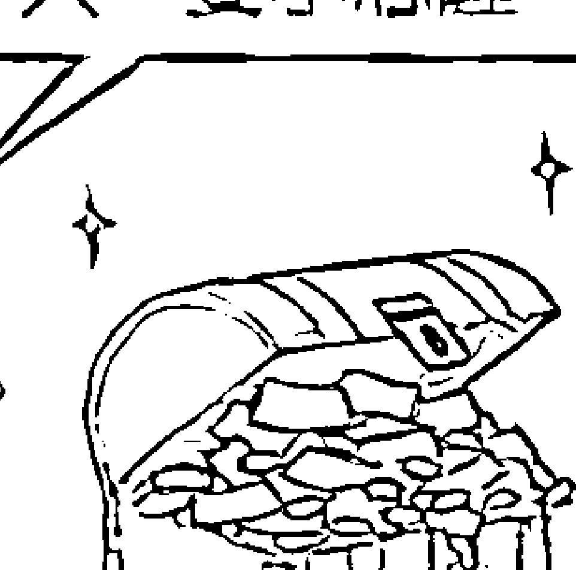

寶物

> 隱藏的寶物由大地的精靈地精把守。

> 與地精交好並以特殊方法命令之，寶物便能到手。

在目標場所繪製魔

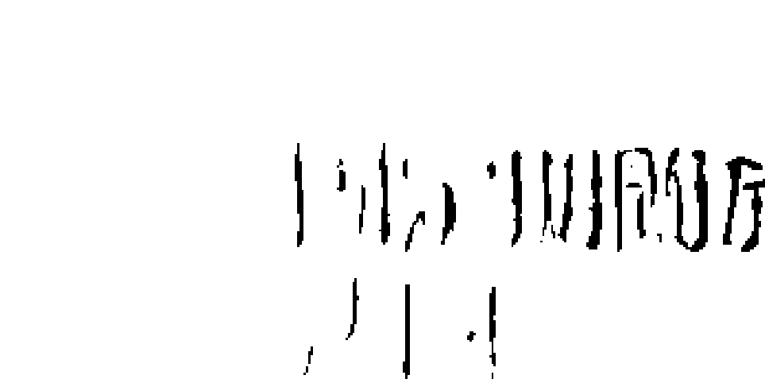

充填該空間

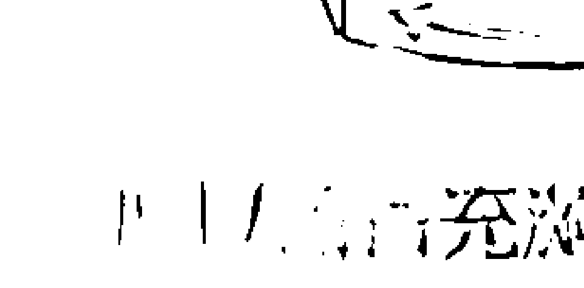

做祈禱的準備

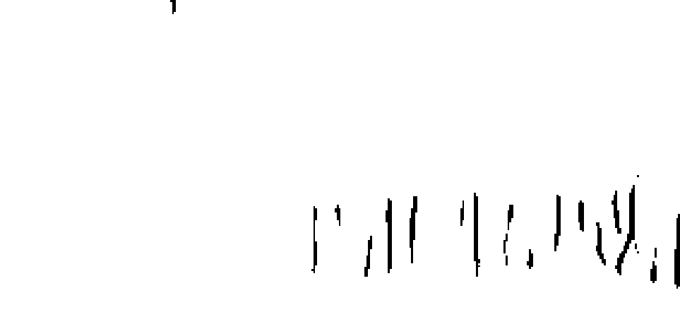

以鍬挖的工作人員

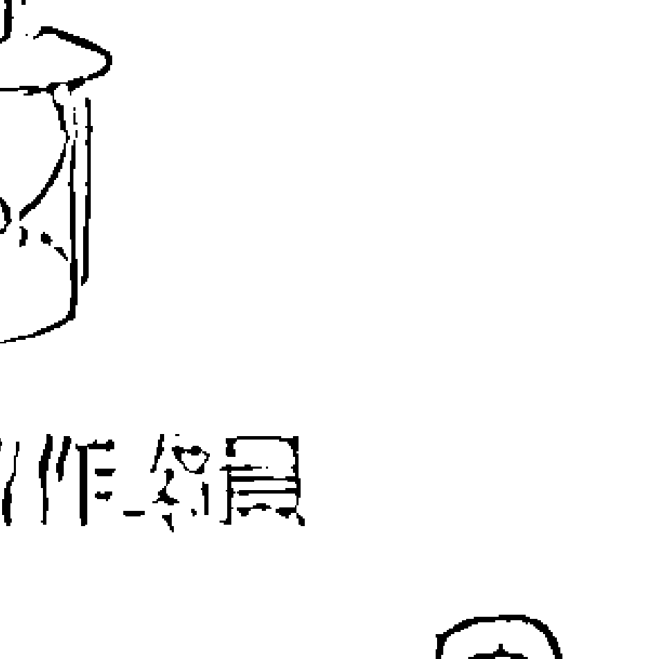

-   ⑤ 勇敢地不停挖洞。

-   ⑥ 洞挖得差不多以後，做祈禱。

-   ⑦ 寶物從洞裡滿出來。

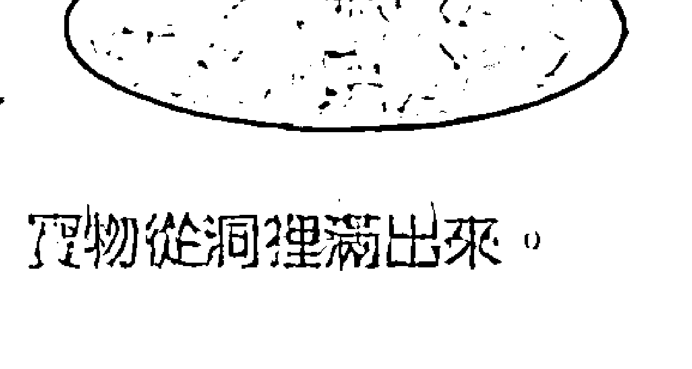

> 隱藏的寶物就是這麼來的！

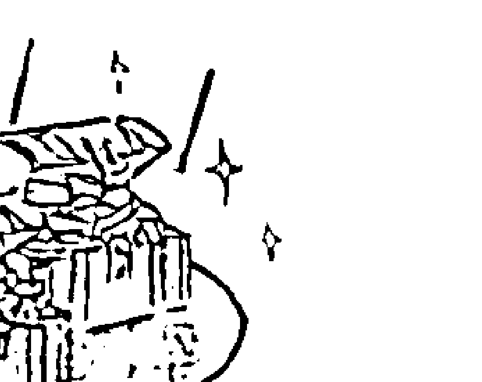

## 星陣圖及其製作方法

About the Pentacles

所謂星陣圖就是指繪有特別印記形狀的徽章或紋章，出示星陣圖便能安全而且確實地使靈體服從。

### ○星陣圖可以金屬或羊皮紙製作

星陣圖在《所羅門王之鑰》的魔法體系裡佔有很重要的地位；星陣圖類似於某種繪有特殊印記形狀的圓形徽章或紋章，出示星陣圖便能安全並且確實地強制諸靈服從施術者。《所羅門王之鑰》內載星陣圖種類繁多，各自分屬於七個行星（土星、木星、火星、太陽、金星、水星、月亮）。星陣圖全部共有44種，每個種類蘊藏的力量各異（請參照本書附錄P.216所羅門王星陣圖一覽）。

星陣圖可以用金屬製作，也可以用羊皮紙製成。

金屬材質星陣圖亦稱徽章，是以各自所屬行星之相關金屬製作；屬土星則為鉛，屬木星為錫，屬火星為鐵，屬太陽為金，屬金星為銅，屬水星為合金，屬月則為銀。徽章表面雕刻的印記顏色不拘，不過徽章必須是在對應於各行星的日時製作。

若屬羊皮紙材質，則星陣圖必須在屬水星的日時、月亮落在屬「風」或屬「土」的星座宮且月亮漸趨滿盈的期間製作方可。天氣則以清爽穩定之日為佳。首先準備不受打擾、專門用來製作星陣圖的特殊房間，在全新的羊皮紙上繪製印記圖形，墨水須視各星陣圖所屬行星選用，屬土星為黑、木星為天藍、火星為紅、太陽為金色黃色或檸檬黃、金星為綠、水星為混合色、月亮為銀。

若情況許可，最好能在展開作業的（占星術意涵上的）同一個日子、同一個時刻完成星陣圖的製作。如果遭遇狀況非得製作作業非得中斷不可，也可以等到適當的日子、時刻再重新展開作業。

## 何謂星陣圖？

安全並且確實地使靈服從的道具。
《所羅門王之鑰》的重要道具。

只要出示星陣圖，惡靈便無法操縱。

如何？

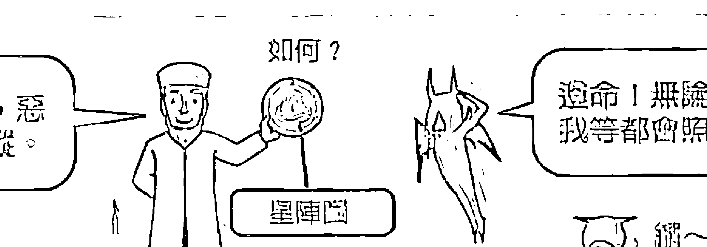

## 有哪些不同種類？

《所羅門王之鑰》的星陣圖共有44種類，各自分屬於七個行星。每個行星都有規定的金屬材質與墨水顏色。

-   土星=鉛，木星=錫，火星=鐵，太陽=金，
金星=銅，水星=合金，月=銀

土星=黑，木星=天空色，火星=紅，太陽=金色，
金星=綠色，水星=混合色，月=銀色

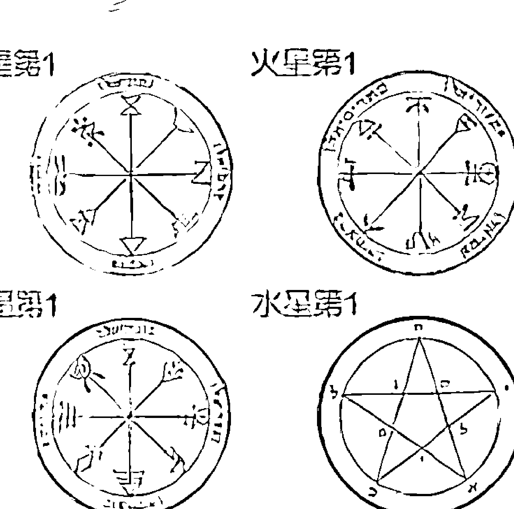

此為其中一例。

「水星」的符號代表水銀，然純水銀乃屬液體，是故此處所謂合金或許是指汞齊（汞合金）。

占星術將十二宮（星座）按照四大元素劃分，屬「土」的則是金牛宮、處女宮、摩羯宮。

## No.038
星阵图的圣别
The consecration of Pentacles

按照前述方法将星阵图制作完成后，还必须绘制魔法圆、焚香熏蒸，替星阵图进行圣别以后方可使其发挥魔法效果。

### ○以专用魔法圆熏蒸星阵图

按照规定方法将星阵图制作好以后，还必须使用专用魔法圆进行圣别，若非如此星阵图将无法发挥效果。

替星阵图进行圣别，首先必须在展开作业前准备土制大火盆、装满木炭；薰香方面则必须准备乳香、洋乳香（漆的一种）、芦荟。

施术者本身必须保持纯洁、清洁自是毋须赘述。

待这些准备完成后，就要在制作星阵图的同一个房间里绘制魔法圆，不过此番必须用到镰刀和短刀；先用镰刀短刀画出第一个圆，大圆里面再另外画个小圆，然后在两个圆中间写下神的名字。

接着将事先准备的火盆摆放在圆心、点燃木炭，焚烧乳香、洋乳香（漆的一种）、芦荟作为薰香，然后以其香烟熏蒸星阵图。

此时施术者要面向东方，一方面烟熏星阵图，一方面唱诵《诗篇》的第8篇、第21篇、第27篇、第29篇、第32篇、第51篇、第72篇、第134篇。然后再献祈祷曰：「最有力量的阿多奈啊，最强大的埃洛希姆啊，最神圣的阿格拉啊，最正直的查希尔啊，最初与最终的Aleph与Tav啊。我等郑重祈愿，求您以神圣的威严为此些星阵图圣别，使其获得堪与灵对抗之德与力。」

如此结束圣别以后，接着以事先准备的丝布将星阵图包好保存，有需要时再取出使用，用完以后再以相同方法收藏保存。

## 1.4.2 施以圣别

星阵图的圣别 → 藉圣别使星阵图得以发挥效果。

（1.4.2.1 准备道具）

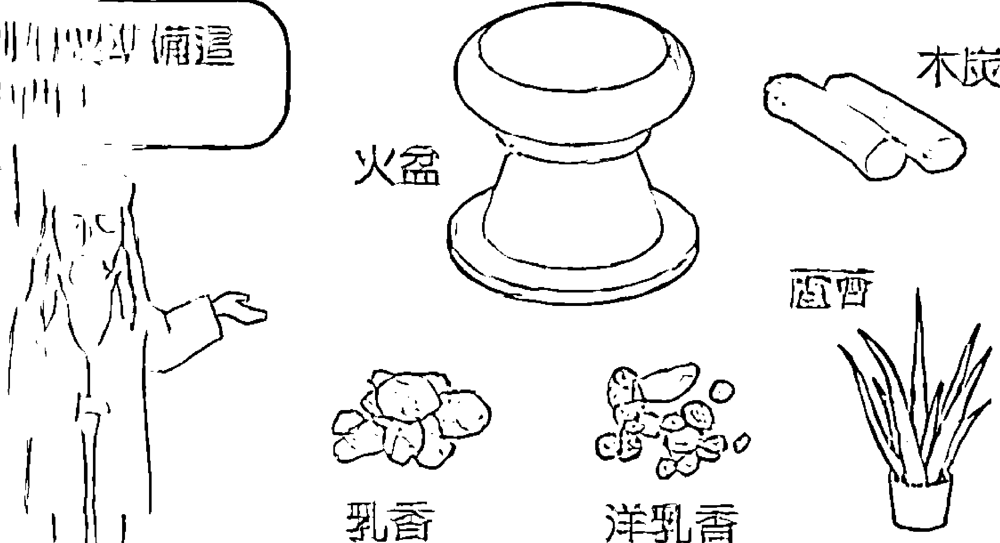

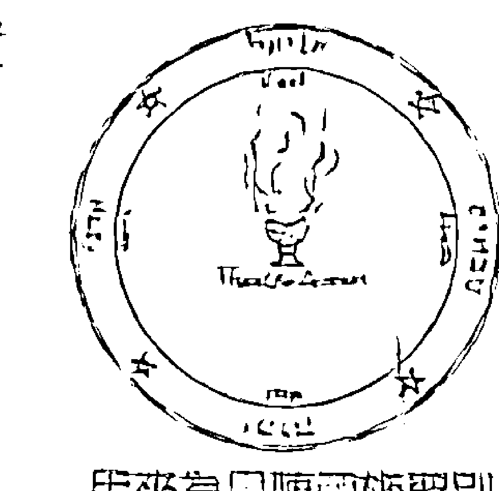

## 1.4.2.1 施圣别

① 绘制出咒法图

星阵图乃以下列方法圣别：

② 将火盆置于咒法图中央，焚烧香料：

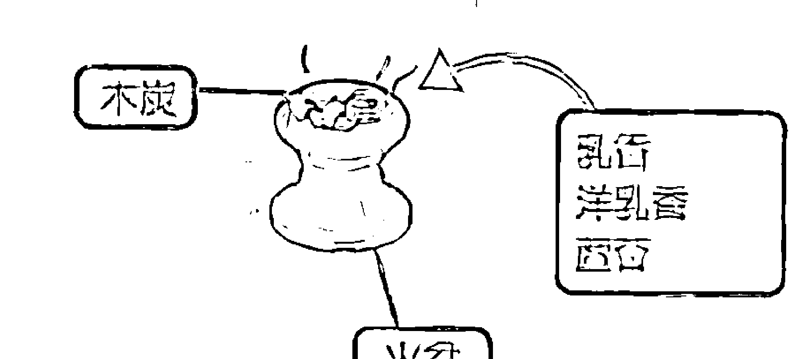

（1.4.2.3 圣别后）

-   * 施术者面向东方唱诵《祷词》固定咒文及固定祈祷。
* 熏蒸完畢后，以绒布包裹星阵图保存。

（1.4.2.4 咒文）咒文的构成，希腊语始于α（alpha）、终于Ω（omega）；希伯来语始于א（aleph）、终于ת（tav）。

## 魔導師的外套與鞋子

About the garments and shoes of the art

術師穿著的外套須是亞麻材質，若情況許可則以絲質為佳，另外鞋子除必須同様是白色以外，還必須繡上與外套同樣的特殊刺繡。

### ○白色絲質外套與白皮鞋

關於術師的外套與鞋子，規定如下：
術師穿的外套大多都跟外套底下穿的衣服同樣屬於亞麻材質，然若情況許可則最好是以絲質為佳；如果選用亞麻材質，則必須使用由年輕處女紡成的亞麻線製成。另外外套前胸處尚須以紅絲繡上特殊符號。
至於鞋子也必須是白色的，還必須與外套同樣施以刺繡。鞋子或襪子材質為白色皮革，然後再繡上特殊的圖案。
這鞋必須是在斷食與節制的期間、亦即儀式展開前的九天準備期內製作；其他必須的道具也要在這段期間內準備並且保養好，弄得乾乾淨淨、一塵不染。
其次，魔法師還要製作全新的羊皮紙頭冠，並以魔法墨水、魔法筆於頭冠寫下四個名字，前方寫「YOD、HE、VAU、HE」、後方寫「ADONAI」、右寫「EL」、左寫「ELOHIM」。眾弟子也要按照相同方法製作頭冠，並以赤紅色墨水於頭冠書寫專用的神聖符號。
穿戴上述衣物時須得注意下列事項：首先須唱誦《詩篇》第15篇、第131篇、137篇、第117篇、第67篇、第68篇、第121篇。接著焚香將衣服薰過，然後以海索草沾水潑灑。
術師與眾弟子在穿衣服的時候首先要朗誦詩篇，然後口誦專用咒文。
如果術師當外套穿的亞麻衣服是祭司用的服裝，甚或為經實際穿來執行神聖行事的衣服，則效果更佳。
※海索草：請參照P.064注釋。

## 師們的穿著打扮？

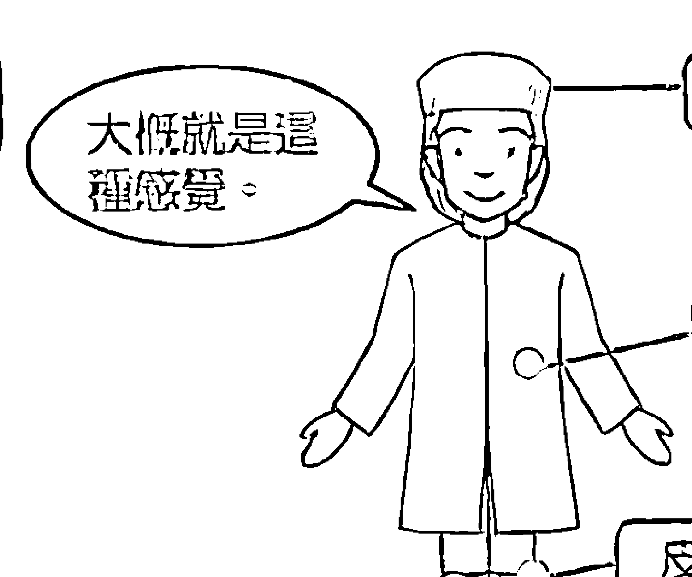

大概就是這種感覺。

師們穿成長袍、皮靴、頭冠

## 長袍、皮靴、頭冠的製作

長袍、皮靴、頭冠須於儀式展開前的9天準備期間內按照下列步驟製作：

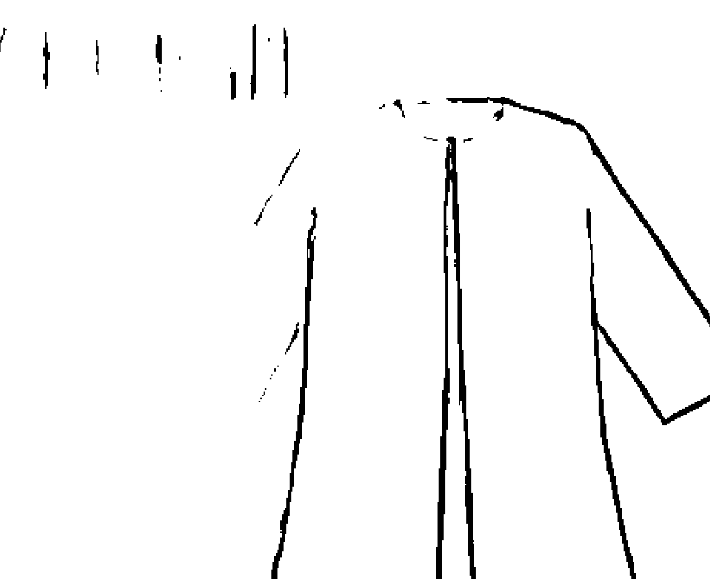

長袍顏色為白。通常是亞麻材料，若條件許可則絲綢會更理想。胸前以紅線綉上如右圖形

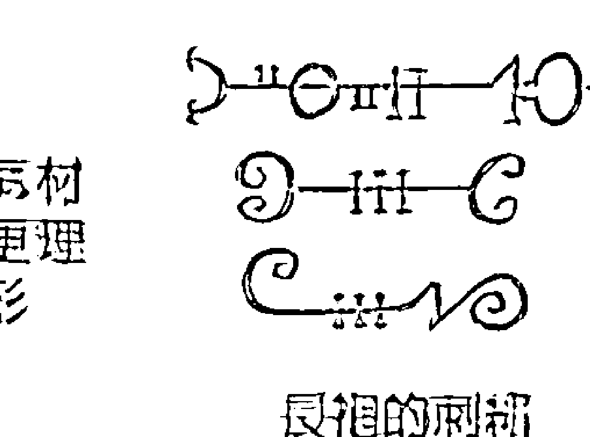

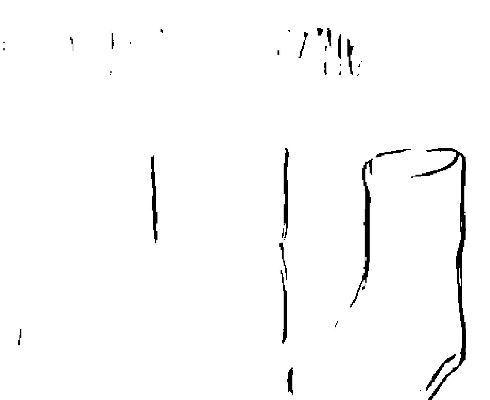

皮鞋皮靴顏色為白，以皮革材料製作，表面以紅線綉上如右圖形：

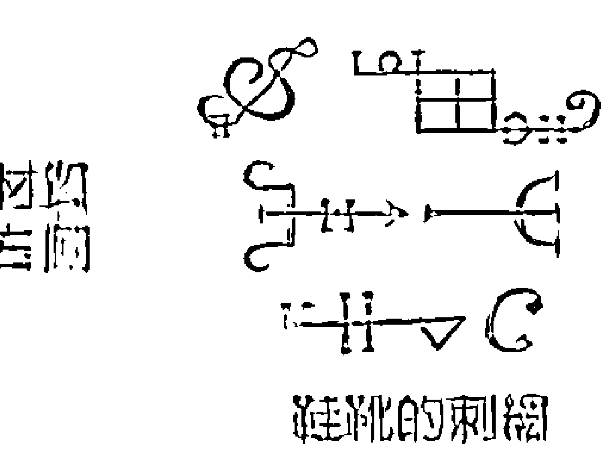

頭冠的形狀顏色並無特別規定，材質則運用羊皮紙製作，但師與弟子使用的頭冠須以紅色墨水寫上不同符號。

弟子的頭冠符號如下圖：

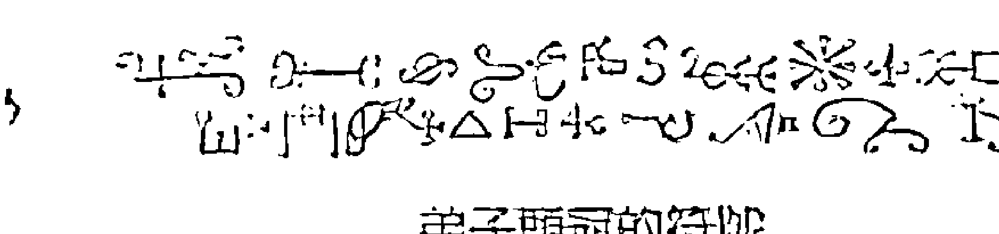

## No.040

## 魔法用短刀・矛・鐮刀

About the knife, sword, lance, sickle and other instruments.

施行魔法使用的短刀還分成用於製作除了魔法陣以外所有道具的白柄短刀，以及專門用來製作魔法陣的黑柄短刀兩種。

### ○用來製作魔法道具的短刀亦須特別製作

製作魔法陣和印記等魔法道具時同樣也需要使用到各式各樣的道具，此處僅就其中的短刀略作說明。
短刀又分白柄短刀、黑柄短刀、短矛等種類。
白柄短刀須在屬水星日時，且火星落在白羊宮或天蠍宮的時候製作。首先在滿月之夜或月光愈發明亮的時候將短刀連同白色刀柄整支浸在牠鳥幼雛鮮血與琉璃繁縷汁液的混合液體中，然後刻上特殊的印形，並且以施魔法用薰香焙烤，最後以絲布包裹保存。這白柄短刀可用於製作魔法陣以外的所有用途，不過白柄短刀亦可以下列方法製作：首先製作相同形狀的短刀，三度將其投入烈炎燒得火紅，每次都要浸泡前述鮮血與汁液，然後將白色刀柄固定好、刻上特別的印形，接著薰香、灑聖水，最後用絲布包藏起來。
製作魔法陣則須使用黑柄短刀。其製作方法基本上與白柄短刀相同，只不過黑柄短刀須在屬土星的日時製作，浸泡的是黑貓血與毒芹汁液。接著在表面刻下特殊印形，用黑色絲布包起來。
彎刀、鐮刀、短劍、匕首、短矛都是以相同方法製作。這些短刃須於屬水星日時製作，浸泡喜鵲血與水星藥草的汁液。握柄使用木頭材質，並須使用於太陽昇起時以全新短刀切斷適合道具一刀砍下的黃楊木樹枝製作。握柄須刻上特殊的符號、薰香聖別，並且跟其他道具一樣以絲布包裹保存。

## 所罗门王所用刀具

刀具的製作道具

-   - 白柄短刀
- 黑柄短刀
- 镰刀
- 短剑
- 匕首
- 短矛

均有詳細規定

道具類須於正確日時、分別按照下列方法製作，然後以絲巾包裹保存。

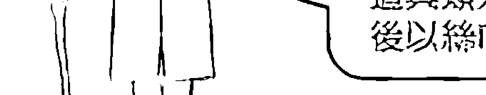

日期：當火星落在白羊宮。
製作方法：浸泡於孔雀血與硫磺溶液中。表面雕刻特殊的印形，以燈法用薰香。

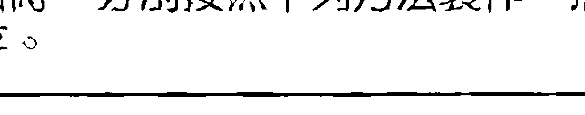

日期：應土星的日子與時刻。
製作方法：浸泡於黑醋血與毒芹汁液中。表面雕刻特殊印形與名字。以黑色絲巾包裹。

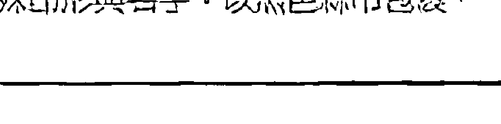

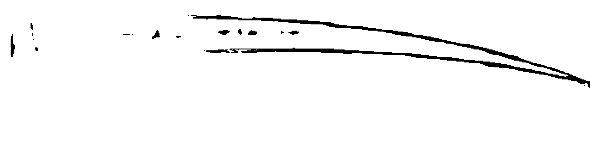


日期與時刻：
使用刀具須在水星草汁液，須於太陽昇起時以全新短刀或適當道具刻印下的印纹，以其實作木製握柄。木柄上還要刻特殊符號，才能完成。

## No.041
## 魔法棒·魔法杖·魔法剑
### About the sword, wand, staff

魔法棒使用接骨木、唐木、黄檀木木材；魔法杖多以榛树树枝制作；魔法剑则是要雕刻神名、以圣水熏香等物施以圣别。

## ○接骨木魔法棒、榛木魔法杖

魔法仪式中使用相当频繁的魔法棒、魔法杖、魔法剑按照规定必须以下列方法制作：

魔法棒材质可选用接骨木、唐木、黄檀木，魔法杖则是要以榛树树枝制作，两者均须选用从未结过果实的新树。此外采摘其树枝时，必须要在星期三日出的时候一刀将树枝砍下，并且刻上与水星日时相对应的符号。

完成上述作业后，接着要唱道：「神圣的阿多奈啊，请祝福并圣别这棒与杖。祈请它能因祢的力量得到必要的德。」

待熏蒸完毕过后，再将其保存于清洁的场所。

魔法剑的制作方法则是有下列规定：

准备一把新的剑，于属水星该日的第1个小时或第15个小时执此剑，将其打磨干净。其后于剑的一面刻写希伯来语的神的名字：「YOD HE VAU HE, ADONAI, EHEIEH, YAYAI」，另一面则是刻上：「ELOHIM GIBOR」。

> 「噢噢，剑啊。我召唤你。以亚布哈克、亚布拉克、驱魔符、耶和华之名。好让你能在所有魔法仪式中，给我力量，保护我免于眼睛看得见与看不见的敌人加害。」

如此施以适当的净化与圣别以后，就可以比照其他道具，把剑以绢布包裹收藏起来。

此外为保护三名弟子的安全，还必须以相同的方法制作柄弟子专用的魔法剑。

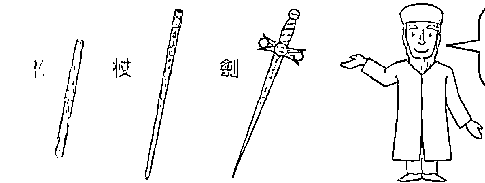

> 魔法棒、魔法杖、魔法剑的制作方法均有详细的规定。

## 魔法剑的制作方法

（左侧步骤区域）

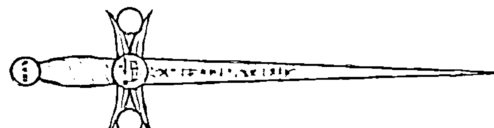

1. 使用接骨木、檀木等木材。准备全新的剑。
2. 使用桦树树枝。
3. 同时一刀砍下木材。于属水星之日磨砺清洁剑身。
4. 同时刻符号。于剑刃两面雕刻特定文字。
5. 洒圣水，唱咒文。洒圣水，唱咒文。

（咒文内容）奥奥，剑啊：我召唤你。请你在所有魔法仪式中，给我力量，保护我免于眼睛看得见与看不见的敌人加害。

6. 用布裹起、收藏起来。以绢布裹起、收藏起来。

## 香·香料·熏烟
### About incense, fumigation, perfumes, odours

关于魔法仪式所用的香、香味、蒸烟等，原则上好的香味是要献给良善的灵，而令人不愉快的味道则是献给邪恶的灵。

## ○香味能召来善灵

魔法仪式里面经常会使用各种香、味道、蒸烟等来呼唤或者驱赶灵。其基本原则非常单纯，那便是好的味道献给良善的灵，不愉快的味道则是献给邪恶的灵。

散发好闻香味的香料，是混合干燥的蓽茲、肉豆蔻、垂榕、麝香等物制作。燃烧以上述材料制作的香料，散发的芳香便能召来善灵、驱走恶灵。

制作这种香料时还要唱诵咒文曰：

> 「亚伯拉罕的、以撒的、雅各的神啊。请让这个香拥有召来良善灵、驱赶邪恶灵的力与德。不洁的灵啊。我以神之名驱赶你们。躲避这个香、逃跑吧。以神座下众精灵之恩赐，祈使此香的使用者能获得守护与神德，并使邪恶的灵与亡灵不得接近。主啊。请赐予祝福以及圣别，好让这神圣的香能使人的灵魂与肉体都得到健康，好让蒙受此香烟与香味者得到灵魂与肉体的健康。」

祈诵完毕以后，将各种香料洒上圣水、用丝布包起来，收好备用。想要使用的时候便将香取出，放进火盆点燃。点燃火盆后、投入香料之前，如下唱诵：

> 「火的受造物啊。我属你圣别。好让一切虚伪对你退避，并使他们无力行伤害、行欺骗。万能的主啊。请祝福这火所燃之物，让使用它的人不至有罪。」

然后就可以用炉火煎焙各种香料，散发出想要的香味。

## 味觉唤醒灵魂
### 香烟·香味

能召唤灵，也能触发灵。

好的味道

不好的味道

献给善良的灵

献给邪恶的灵

## 味道芬芳的香之制作方法、使用方法如下：

肉豆蔻、垂

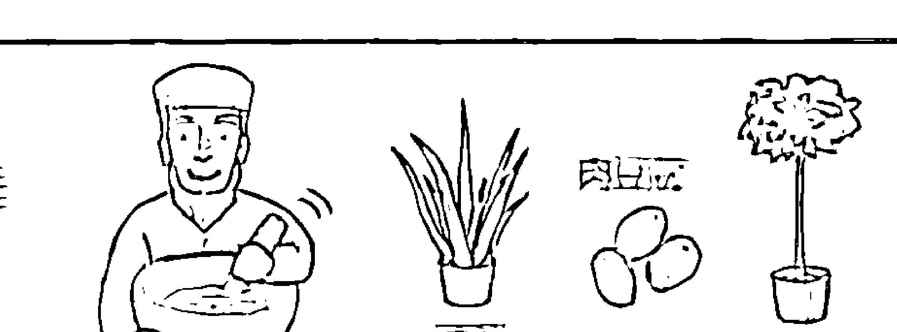

> 亚伯拉罕的、以撒的、雅各的神啊。诉说这个香拥有召来良善灵、驱逐邪恶灵力与德……

然后，用竹筛起来，

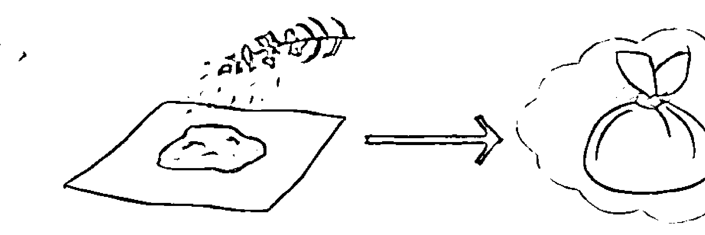


> 火的受造物啊，我令你圣别。好让一切愿你的你回避……

## 水与海索草
### About the water and the hyssop

执行魔法仪式途中经常要洒圣水，而圣水也有正确的制作方法，至于洒圣水用的洒水器则是以海索草的树枝最为常用。

## ○圣水与洒水器的制作方法

《所罗门王之钥》的魔法在许多仪式中都有挥洒魔法水的作业，如此一来自然就要准备魔法水与洒水器，其制作方法如下：

制作魔法水，首先必须选定属于水星的日子与时刻、准备薰香与香炉。接着再准备黄铜、铅或者土制的任一材质器皿，装满清澈的涌泉，手中握着盐巴唱诵：「札包特、弥赛亚、以马内利、埃洛希姆・基勃、耶和华。创造真实与生命的神啊，请祝福圣别这把盐，并请对接下来要执行的法术赐予助与保护。」

然后将盐巴投入装水的器皿中，唱诵《诗篇》第102篇、第54篇、第6篇、第67篇。如此一来，施魔法所需的魔法水（圣水）便告完成。

再来则是要接着制作洒水器。

此处所谓洒水器就是种将植物的茎或枝叶绑成束、沾水洒的装置。

制作洒水器的材料，使用的是马鞭草、茴香、薰衣草、鸢尾草、绳草、罗勒、迷迭香、海索草等香草类植物。施术者必须于属水星的日时、且月亮渐趋满盈的时期采集上述香草，然后用处女纺制的绳线将其绑成束、加装握柄，并于握柄刻上特殊的符号。

圣水与洒水器制作完成后，施术者便可视须要随时洒魔法水驱赶众亡灵，再也不用受到亡灵阻挠、为其所恼。而且，魔法水在魔法的每个准备阶段其实都用得到。

1. 水或洒水器

> 驱赶亡灵、净化某地某物时必须用到

## 魔法水要这般制作：

- 魔法水的日前焚香。
- 加上冲洗清冽的滤泉。
- 准备，于器皿中撒盐。
- 大功告成。

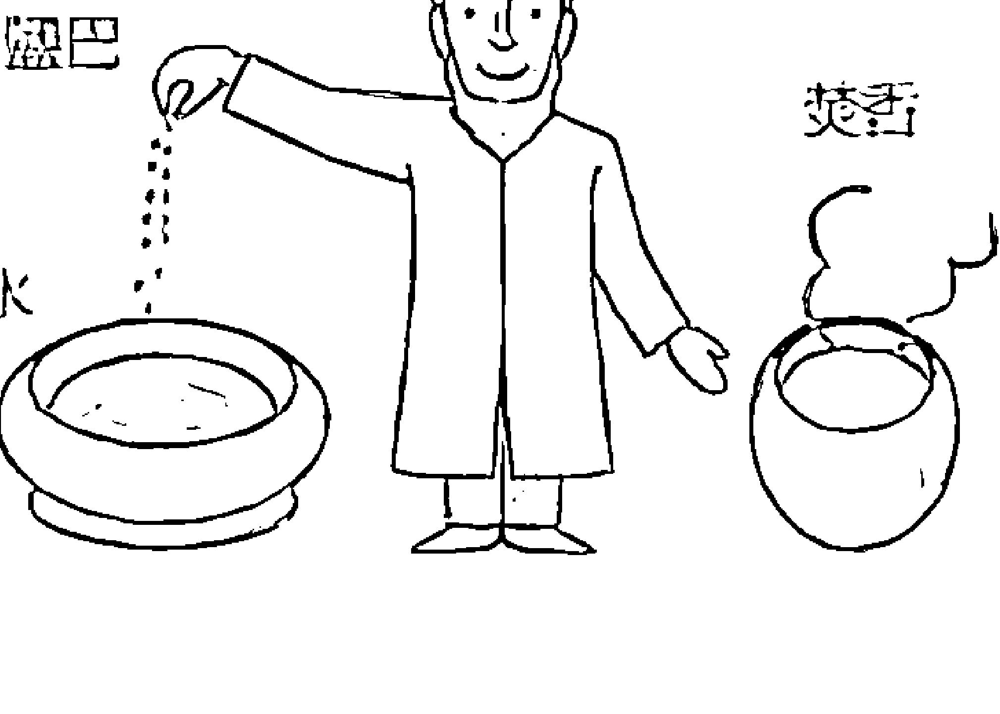

## 洒水器要这般制作：

- 到山间采集香草。
- 将香草绑成束，装入器皿。
- 便可使用。

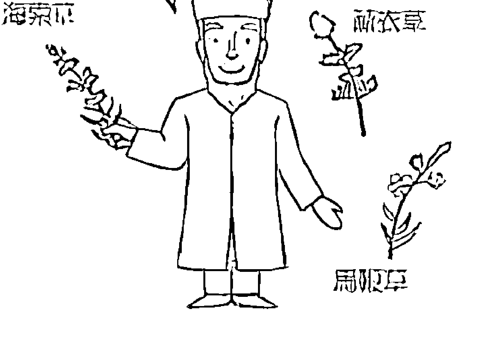

魔法水所用的洒水器材料，甚至《所罗门王之钥》还直接以「海……（出埃及记）里摩西便曾经过用过此物。

## 笔和墨水
### About the pen, ink and colours

施行魔法所使用的笔墨等笔记用具同样必须按照规定的方法制作，而且不但必须施以圣别，还要确实保管方可。

## ○大白鹅、燕子、乌鸦羽毛笔与墨水

制作魔法道具时同样必须用到笔墨等笔记用具，其制作方法如下：

制笔首先必须找只大白鹅的雄雏，拔下从右翼数来的第三根羽毛。此时还要唱诵「阿多奈、赫弗里、塔马依、提洛纽斯、亚达玛斯、奇亚诺、阿多奈啊。为这笔消去伪误吧。请赐予必须的神德与效用，好让我书写所想。阿门。」摘下羽毛以后，接着持魔法专用削笔小刀将羽毛削尖、喷香水洒圣水，然后包在丝布里保存起来。

其次则是要以泥土或适当材料制作印台。这印台必须在临木星的日时以雕刻刀篆刻神圣的名字，补充墨水时还要一面唱诵咒文。

施魔法有时必须以高贵的颜色进行书写，这些颜色的墨水最好放在清洁的新盒子里保存。主要使用的颜色有黄色、白色、红色、天空色或深碧青色、绿色、茶色，以及其他可能用到的颜色。这些墨水必须按照常法事先施以驱魔、洒香水、洒圣水等仪式备用。

制作燕子和乌鸦的羽毛笔，拔羽毛前要向众天使献祈愿「大天使米迦勒，以及天界军团长暨指挥者，米妲尔与米利盎啊。助我从事将要执行的仪式，好让将要开始的试炼得以顺利等的力量得到完成。阿门。」接着拿魔法专用小刀将羽毛削来做笔，然后在燕毛笔、鸦毛笔的侧面以笔墨写上特殊名「ANAIRETON」。然后唱诵《诗篇》的第133篇、117篇，此燕子和乌鸦的羽毛笔便告完成。

## （一）魔法用具

魔法的笔记用具 → 羽毛笔、墨水等。全部都要使用特制品。

## （二）魔法用具的使用规定

施魔法使用的笔记用具有下列规定：

- 以大白鹅雄鸡右翼的第3根羽毛制作。拔羽毛时要唱诵咒文。
- 以适当材料制作。于属木星的日期取雕刻刀篆刻下列的神圣名字：
刻在印台上的神圣名字
יהוה; מטטרון; יהוה; יהוה; קדוש; אלים צבאות;
- 驱魔、洒香水、洒圣水。
- 于笔鞘誊下列特殊文字：
specialsymbols

## No:045 羊皮纸相关知识与芦苇刀
### About virgin parchment and reed knives

施法使用的羊皮纸必须取自特定动物，而制作羊皮纸所须之芦苇刀亦有规定的制作方法。

## ○羊皮纸和兽皮纸

魔法仪式在制作星阵图与各种印记、书写神名的时候，都要用到特制的羊皮纸（或兽皮纸）。

只有全新、清洁、经过驱魔且未经使用过的全新处女羊皮纸才能拿来施魔法。

至于用来制成羊皮纸的皮料，只能以难产而死的羊羔、未达生殖年龄的动物或者尚未出产前便从母亲体内取出的动物，剥皮使用。

无论选用何种材料，羊皮纸必须在属水星的日时、剥雄性动物兽皮制作，而且还要在任谁也无法发现的秘密场所进行作业。

## ○芦苇刀

做羊皮纸要用到芦苇刀，这芦苇刀必须事先制作，作法如下。以魔法专用的全新短刀一击砍下沼泽地的芦苇，取其茎干。唱诵芦苇的咒文：「我谨祈愿。以万物的创造者，以天使之、伊勒沙代之名，让这芦苇得到力与德，好制作著写神圣神名的羊皮纸。并使羊皮纸获得神德、使我术业获得力量。阿门。」

接着唱诵《诗篇》第72篇，然后用魔法专用短刀把芦苇加工成刀子的形状，写上特别的名字（AGLA、ADONAI、ELOHI），唱咒道：「从芦苇丛生的尼罗河畔将仍是孩子的西拯救出来的神啊。以祂的大怜悯与关怀，使这芦苇获得达成我愿望的德与力。」

芦苇刀做好以后，就可以开始制作羊皮纸了。

伊勒沙代（El Shaddai）：字根来自西北闪语的埃尓神（El），在西北闪语中是一座位于幼发拉底河东岸圣山的名称。旧约圣经中以沙代的名称来称呼神，多半与亚伯拉罕家族有关。

## 16. 纸或兽皮纸

用于制作星阵图、书写印记和神名。

使用动物的羊皮纸是有条件限制的。


## 处女羊皮纸

从难产死的羊羔、未至生育年龄的幼兽、出产前从母亲体内取出的动物身上剥下的兽皮。

## 刀

制作羊皮纸的必要道具。

## 制作方法

- 以短刀将沼泽蕨一刀砍下。
- 取下蕨叶，唱诵蕨叶的咒文。
- 加工成刀的形状，书写特别的名字。
- 在加工刀上面书写特殊符号：
```
-pages-678:8978:9738
```
完成


## 羊皮纸的制作
### How to prepare virgin parchment

制作羊皮纸必须一面唱咏咒文、一面以薙草刀剥取兽皮，先替兽皮抹盐然后再泼石灰等，制造工程甚是麻烦。

## ○以薙草刀剥皮加工

魔法用羊皮纸之制作方法如下：

首先持薙草刀，一面唱诵咒文一面剥兽皮：「阿多奈、沙代、泰特拉格拉玛顿，以及神的圣天使啊。请出现，赐此羊皮纸以力与德，并为之圣别。阿门。」

兽皮剥下来以后，提起盐巴唱道：「神中之神啊，请为这个盐祝福、圣别，使这羊皮纸因盐巴之力获得神德。阿门。」

兽皮用圣别过的盐巴抹上，晒上整整一天。

其后，准备一只内外均涂有釉药的土器，于其外围书写特别的文字。取石灰粉倒进该土器中，唱诵曰：「欧雅、札雅、再雅啊……请现身为此术业祝福，使愿望得偿。阿门。」

取施过圣别的水注入装有石灰的土器，浸泡兽皮。三日后将兽皮取出，用薙草刀把兽皮上的石灰和肉块削下来。

戳下一支榛树树枝，做成长度适中、刚好可以用来架设魔法圆的木杖。接着再取处女纺制的细线和溪中的小石子，如此咏诵道：「神圣而充满力量的阿多奈啊。请赐神德与这些小石子，好让羊皮纸能充分地拉伸，好让虚伪都能驱除。」

把羊皮纸铺在魔法圆上方用绳子和小石子固定好，然后咏诵：「阿格拉、耶和华、伊阿、以马内利啊。请祝福、守护这张羊皮纸，使虚幻不致进入。」

接着就此将羊皮纸阴干三天。

然后再持魔法专用小刀将绳子和小石子取下，将羊皮纸自魔法圆内取出，唱诵：「安透、安寇、塔罗斯啊，请守护这张羊皮纸。」

最后取羊皮纸施以薰蒸，用丝布包起来备用。

## 羊皮纸制作方法

羊皮纸 → 自己剥取兽皮，从头制作。

> > 羊皮纸是这样做的：

- 1. 剥取兽皮。
- 2. 用盐巴涂抹兽皮，日晒。
- 3. 放入石灰与水，将兽皮浸泡。
- 4. 刮除附于其上的石灰。
- 5. 祝福羊皮纸。
- 6. 晒干，完成。

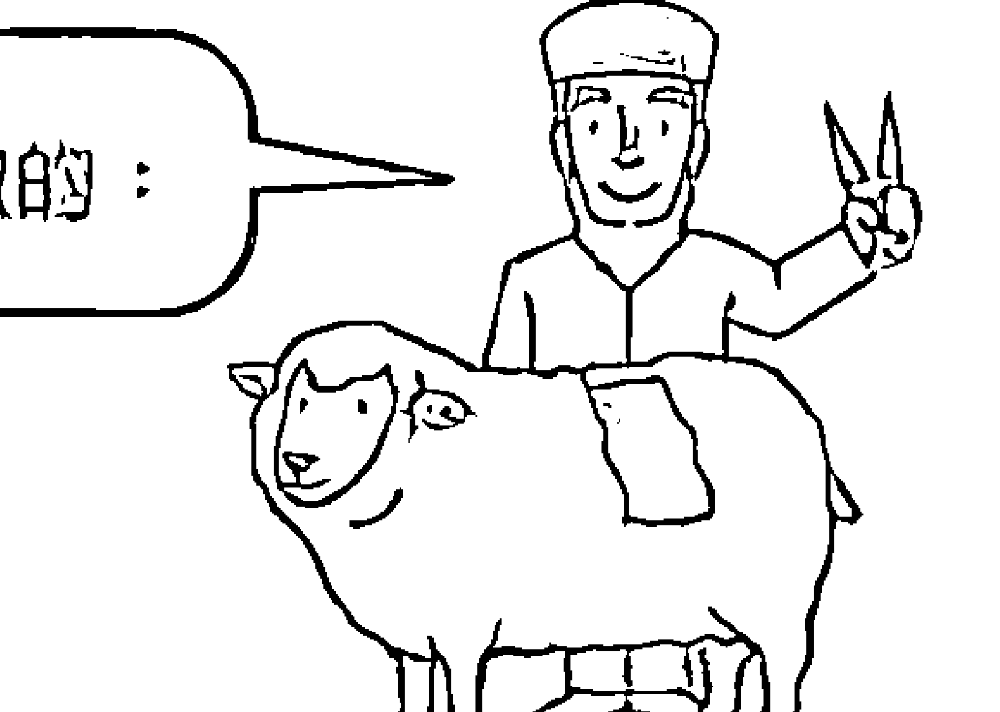

> > 抹盐

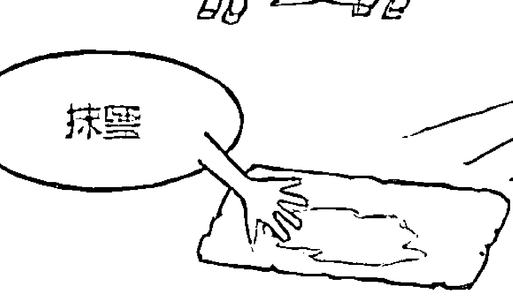

> > 石灰

> > 水

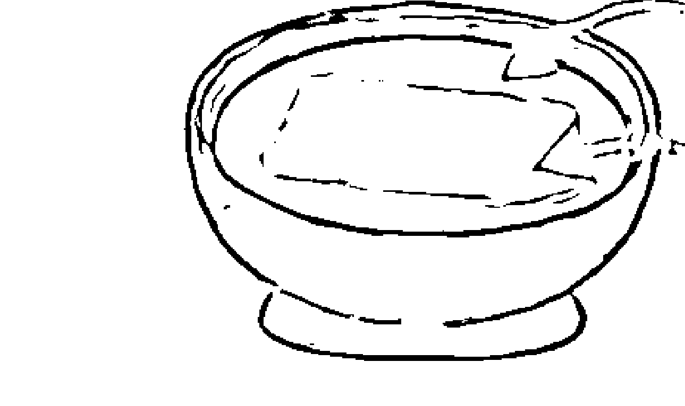

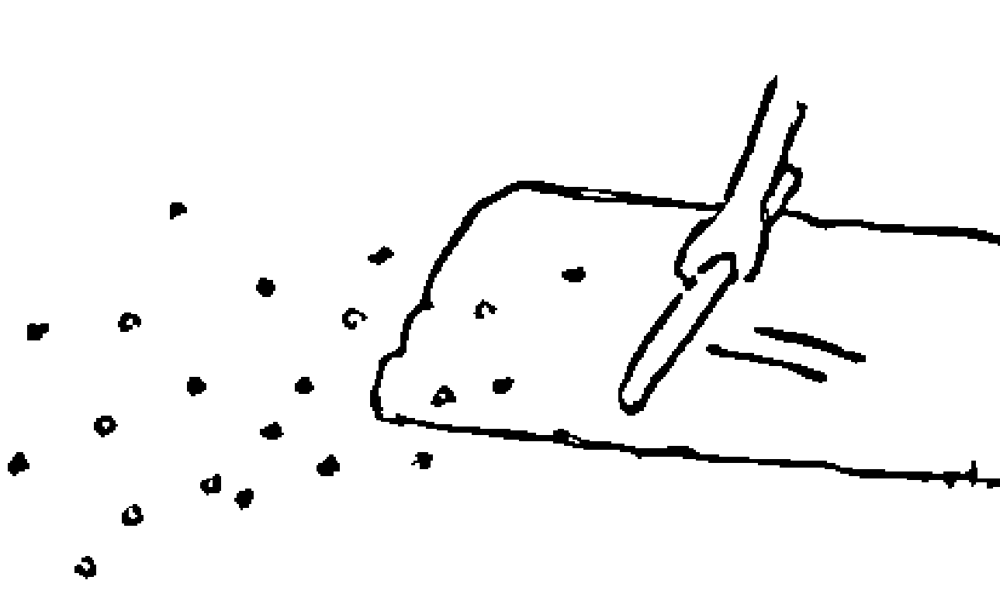

> > 请祝福并守护这羊皮纸。

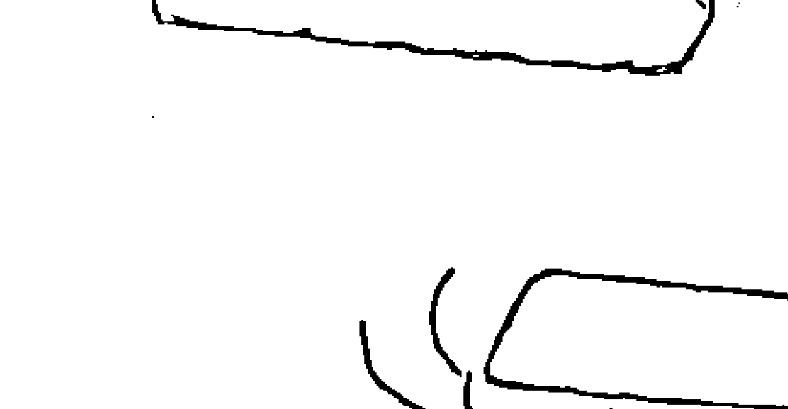

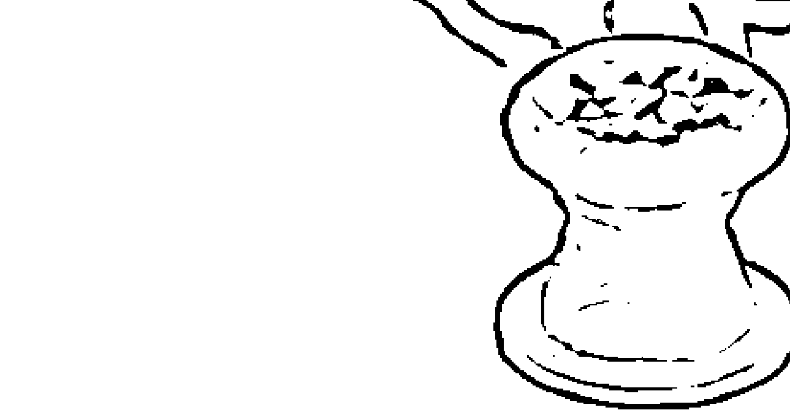

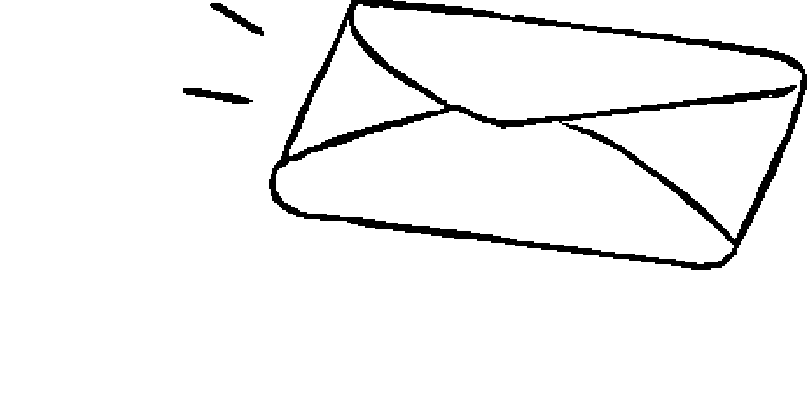

> > 寄信

## 仪式中所用魔法书之圣别
### About the consecration of the magical book

仪式所用魔法书以自己亲笔抄写的抄本最具效果，须得自行制作羊皮纸魔法书，自行施以圣别。

## ○仪式所用魔导书以亲手制作的手抄本为最佳

魔法仪式使用的魔导书以自己亲手抄写制作的手抄本最具效果。举例来说，即便已经持有印刷版的魔法书，也应该自行抄写其中的必要部分，以该手抄本施行魔法为佳。是故，施术者必须自行制作抄本并施以圣别，将其制成可供仪式使用的魔导书。其方法如下：

首先，以处女羊皮纸制作共16页的书册。祝祷辞、神与灵的名字、印记与符号全都要用红色墨水书写。

魔法书做好以后，于特定场所摆张小桌子、以白布覆盖。将魔法书翻到绘有星阵图该页，置于桌面；星阵图必须画在这本书的第一页。接着点燃悬挂于桌面中央正上方的吊灯，并拉起布帘围住桌子四周。

接下来就要进行魔法书的圣别仪式。施术者身穿魔法专用服装、手持魔法书，跪地唱诵《所罗门王之钥》第1书第16节的下列祷辞：「阿多奈、埃洛希姆。存在者中的存在者啊，请赐予垂怜。」接着焚烧与该日所属行星相符之薰香，将书放回桌面。以上是魔法书圣别仪式的一日流程，仪式进行期间吊灯不得熄灭，周围布帘亦不得拉开。

为使魔法书制作完成，必须从周六开始连续七天执行相同仪式，其间无论昼夜吊灯均不得熄灭。仪式全数完成后阖上魔法书，收进为此特别制作的桌子底下的小抽屉里。待到要使用魔导书的时候，必须先穿上魔法用服装、跪地献祷，方可使用。

## 仪式所用魔法书

以亲手抄写的手抄本最具效果。

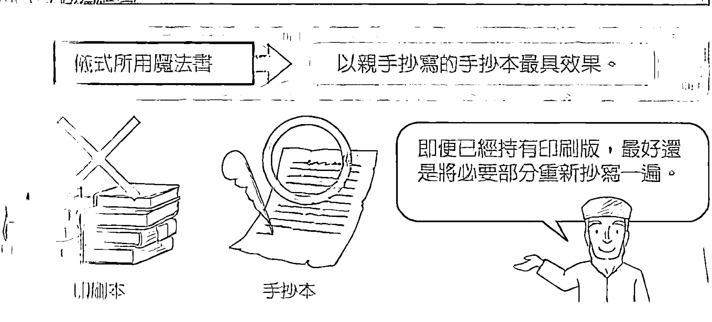

即便已经持有印刷版，最好还是将必要部分重新抄写一遍。

抄本应如下制作、施圣别：

- 用羊皮纸制作共16页的书册。


- 将天使与精灵的名字、印记与符号全部用鲜血或圣水书写。

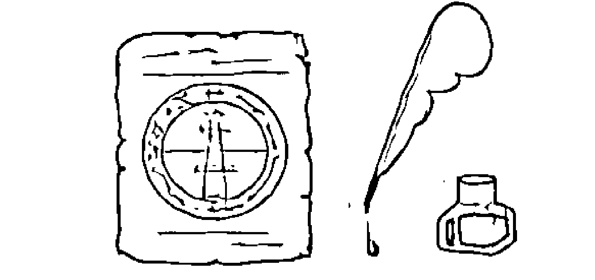

- 书写完成后，置于铺着白布的桌面。

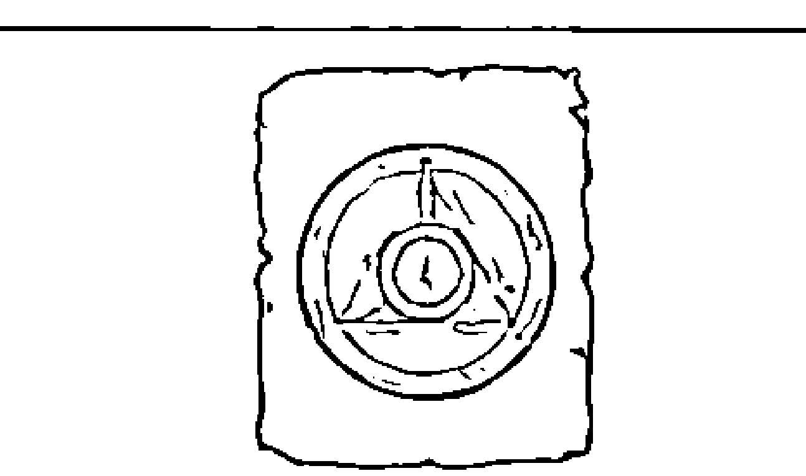

- 最后，在满月之夜执行魔法书的圣别仪式，并将其妥善保存收好。

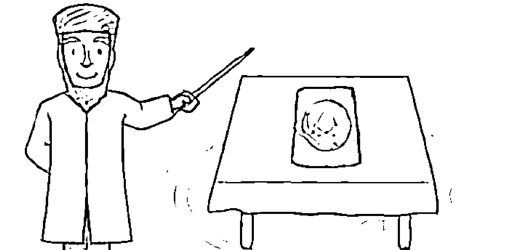

## No:048 祭品及其准备
### About sacrifices to the spirits and how to make them

未交尾的兽肉、鸟或四足兽的鲜血、白色动物献给善灵黑色动物献给恶灵……谈到祭品，相关规则可谓是形形色色数不胜数。

## ○血、肉、火焰、饮食的祭品相关规矩

执行魔法仪式途中不得不向诸灵献祭品时，必须遵从此处记载的事项。

献祭品的方法可谓五花八门，有时会以白色动物献给善灵、黑色动物献给恶灵；有时以鲜血为祭，有时则以肉为祭。不过无论如何，献作牺牲的都非得是从未交尾过的动物不可。其次，若以鲜血为祭，则鲜血必须取自于四足兽或者鸟类。又，献祭品前必须如下唱诵曰：「极尊贵、高贵的存在啊。请接纳我等的祭品，欢喜并且顺从。」然后再为祭品施薰香、洒圣水。

有时候施术者会以「火焰」为祭品献灵，此时则必须选择与召唤对象相符相应的木材焚烧才是。土星之灵为桧树或松树，木星之灵则为黄杨木或橡树，火星之灵为山茱萸或喜马拉雅雪松，太阳之灵为月桂树，金星之灵为香桃木，水星之灵为榛树，月亮之灵则为柳树。

若以饮食为祭品，则必须在进入魔法圆之前将一切准备停当。肉要先用清洁质地良好的布包裹起来，铺开清洁的白布将肉摆在上面，旁边再添上新烤好的面包和气泡酒。鸡肉、鸭肉、鸽肉等肉类须以火烤。尤其要注意的是，一定要准备个器皿盛装清冽的泉水。然后在踏入魔法圆之前，先呼唤诸灵抑或诸灵之首的适当名字，如下说道：「受召前来此飨宴的诸灵啊，无论你现在何处，快快前来接受我等的祭品吧。」

接着焚香使香烟充满整个房间、在祭品上洒圣水，然后不断唱诵咒文直到众灵出现为止。

## 献给灵的祭品

动物・血・肉・火・饮食等各种祭品。

## 献祭品的规则

> 献祭品给灵有许多细节规定，要注意！

- 必须取自未交尾的动物。
- 必须取自四足兽或鸟类。
- 须选择适合召唤灵之木材燃烧。

| 灵的名称 | 对应木材 |
| --- | --- |
| 太阳之灵 | 柏树或松树 |
| 土星之灵 | 黄杨木或橡树 |
| 木星之灵 | 山茱萸或喜马拉雅雪松 |
| 金星之灵 | 香桃木 |
| 水星之灵 | 榛树 |
| 月亮之灵 | 柳树 |
| 火星之灵 | 月桂树 |

- 肉要先用清洁质地良好的布包起，摆在铺展开的清洁白布上，旁边再添上新烤的面包和气泡酒……等。## 白與黑·高等與低等

現在經常會以「白魔法與黑魔法」或「高等魔法與低等魔法」來區分魔法。這些區分究竟有何意涵呢？

所謂「白魔法與黑魔法」，其實差不多就是「好的魔法」和「惡的魔法」的意思。所謂「好的魔法」就是指出於良善目的之魔法、為自己帶來好結果的魔法、與良善的靈（如天使）打交道的魔法。反之，惡的魔法自然就是黑魔法了。

像這樣將魔法分成善惡兩種的習慣，可以說是早自中世歐洲便已經存在。這其實是因為中世歐洲將探討上帝創造自然萬物奧秘的魔法稱作自然魔法，就連基督教會都不予禁止，召喚惡魔或死者亡靈的降靈術（Necromancy）則被視為邪惡的魔法。換句話說，這便是中世歐洲所謂的白魔法與黑魔法了。話雖如此，亦有見解認為白魔法與黑魔法這種區別嚴格來說並無意義，因為兩者都是要與靈打交道，基本概念都是相同的。

「高等魔法與低等魔法」這個粗糙的二分法情況其實也差不多。高等魔法英語作「high magic」、「transcendental magic」等說法，是泛指神秘主義式的魔法。所謂神秘主義，就是指透過各種修行等手段提高自我存在、以圖與神合一的思想，此思想可見於諾斯替教與赫密斯主義。東洋的瑜伽亦屬此類。低等魔法英語作「low magic」、「earth magic」等說法，就是以獲得財寶或女性愛慕等以凡俗目的而行使的魔法。

如果按照這樣的分類看來，則本書所介紹魔導書裡面的魔法似乎該算是低等魔法範疇，但其實卻也不可就此認定。因為魔導書作何用途，最終還是要取決於使用魔導書的魔法師本身。例如鼎鼎有名的《所羅門王之鑰》便記載有獲得財寶的方法，光從這點來說它可以算是低等魔法，可是其魔法卻同樣也可以使用在其他目的上。近代魔法師的代表性人物伊利法斯·利未之所以將《所羅門王之鑰》視為高等魔法書，便可謂是因此。就這點而言，則魔法跟賢者之石也是相同的。賢者之石既可以拿來獲得巨富，也可以用來使自己趨近神明；換句話說，無論是魔法或者是賢者之石，其高等或者低等都要視使用者而異。

「白魔法與黑魔法」、「高等魔法與低等魔法」雖然是就魔法進行區分時相當方便的用語，可是都並不嚴謹。

## 第3章

署名的魔導書

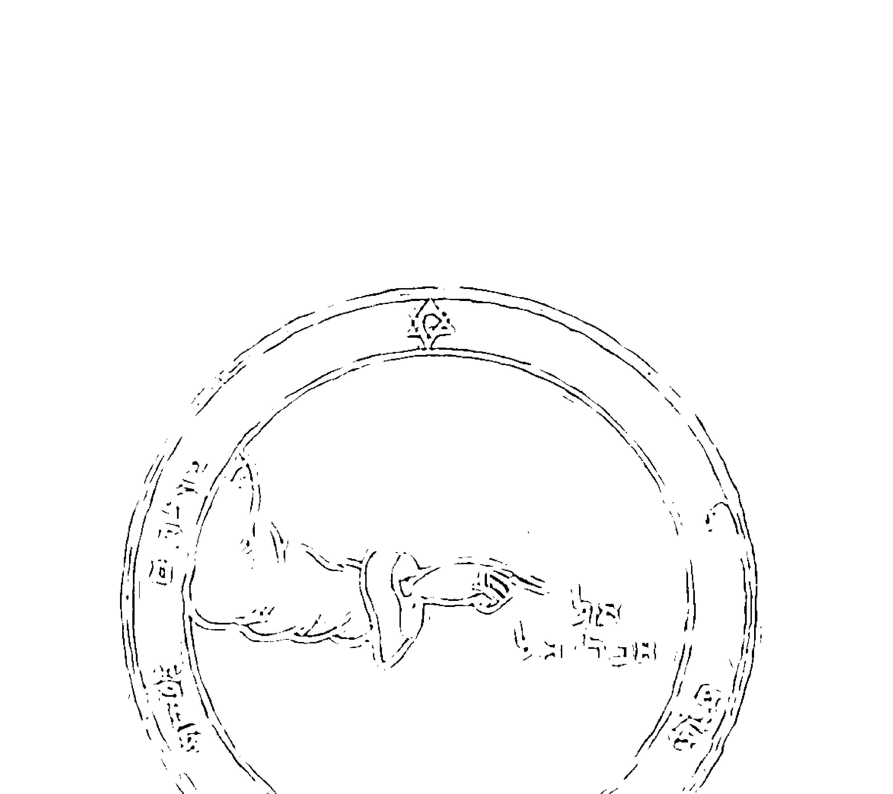

## 魔導書的全盛時期

The Great Age of Grimoires

文艺复兴时期，古代魔法思想再起兴盛、连带使民间的仪式魔法亦大大得到活化，进入大量魔導書受到创作、受到阅读的时代。

### ○受文艺复兴刺激而兴起的魔導書風潮

14～16世纪文艺复兴时期，欧洲有名為新柏拉图主义的古代魔法思想流行。他们认为天上有众多精灵存在，宇宙是个有生命的有机统一体，能够对宇宙的各个角落造成神秘学形式的影响。是故，所有魔法活动在该时代看起来都恍如真实，甚至连召唤亡灵之流的民间仪式魔法都被认为是极有可能的事情。是以，后来才有魔導書的陆续问世。

举例来说，神秘学家阿古利巴著作魔法书《细说神秘哲学》，全书共三卷，岂料阿古利巴死后不久立刻就有魔導書《细说神秘哲学 第四书》问世。这部魔導書写的是七行星居住的天使与恶魔的名字、特征以及召唤方法等，作者仍旧冠的是阿古利巴的名字，是以极受瞩目。同一时期以奥林匹亚七精灵為主题的《远古魔法阿巴忒尔》、传為阿巴诺的彼得所著之《魔法要素》等，也都算是搭上了《细说神秘哲学》顺风车的魔導書作品。

此时期亦有许多是以原本就极受欢迎的《所罗门王之钥》為前提所著作的魔導書作品，其中最著名的非《雷蒙盖顿》（《所罗门王的小钥匙》）莫属。此魔導書除记载72位主要恶魔各自名字、模样、阶级、能力等资料的清单以外，同时还记载有如何召唤并号令这些恶魔的咒文。其他像因為记载极残酷活祭仪式而被视为不祥之書的《教皇洪诺留的魔導書》、对一般大众造成莫大影响的《大奥義書》等，也都是属于《所罗门王之钥》系列的著名魔導書。

文艺复兴以后各种形形色色的魔導書相继问世，今日所知众多著名魔導書至此方告全数到齐。

### 文藝復興與魔導書

16世紀

### 文藝復興魔法流行

民間的儀式魔法得到活化

創作出大量的魔導書。

> 文藝復興時期有魔法大流行等因素，使致大量魔導書創作問世。

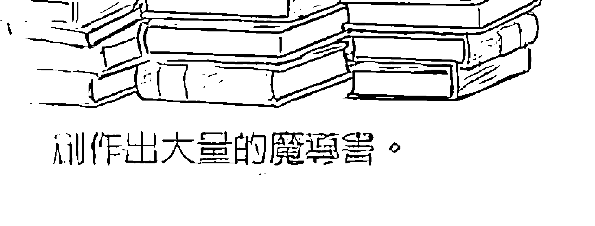

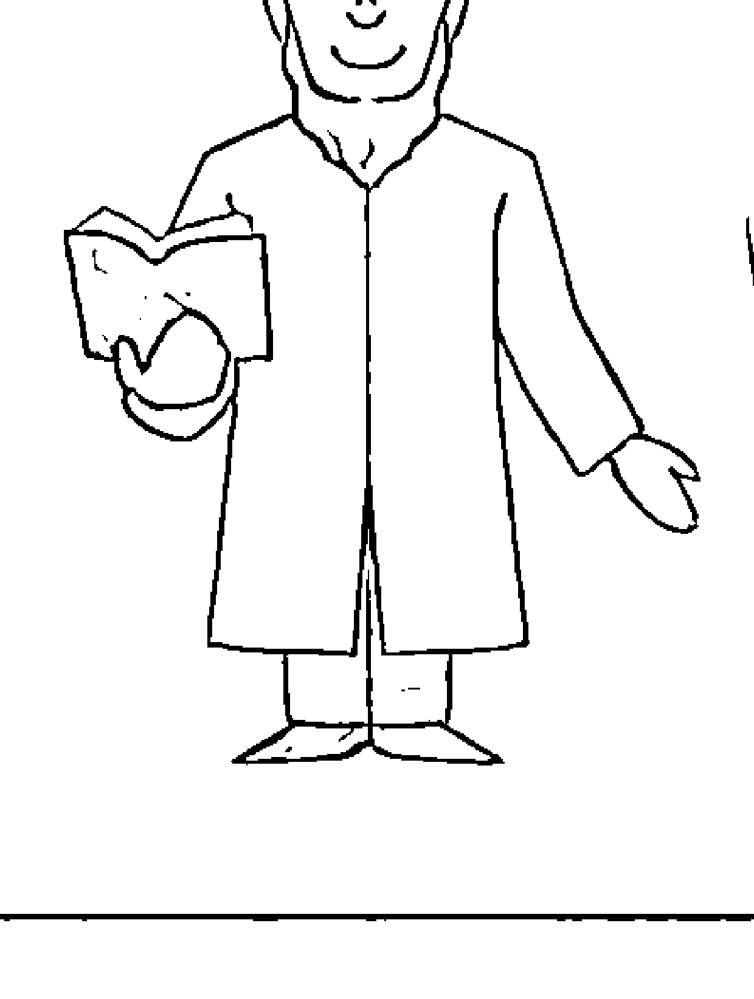

| 書名 | 概要 |
| :--- | :--- |
| 《魔法哲學的第四書》 | 號稱《細說神秘哲學》總集的魔導書。 |
| 《魔法書》 | 傳為阿巴諾的彼得作品的魔導書。 |
| 《所羅門的小鑰匙》 | 講述奧林匹亞七精神的魔導書。 |
| 《阿布拉梅林之書》 | 最著名、最受喜愛的魔導書。 |
| 《光榮之手》 | 記載光榮之手製作方法的魔導書。 |
| 《教皇諾望二十二世的魔法書》 | 冠有13世紀羅馬教皇名號的魔導書。 |
| 《七本蓋烏斯》 | 對一般大眾造成廣大影響的魔導書。 |
| 《真理的棋盤》 | 頗受寶藏獵人喜愛的魔導書。 |
| 《紅龍》 | 傳為埃及人阿里貝所著黑魔法書。 |
| 《所羅門的鑰匙》 | 受北歐地區寶藏獵人喜愛的魔導書。 |
| 《阿格里帕的魔法書》 | 傳為英雄摩西所著，於德國頗受歡迎的魔導書。 |
| 《浮士德博士的魔法書》 | 據傳由傳奇人物浮士德博士著作的魔導書。 |

### No.050 《雷蒙蓋頓（所羅門王的小鑰匙）》

Lemegeton, or The Lesser Key of Solomon the King

以召喚所羅門王72惡魔而聞名的魔導書，全書共分五部，其中也記載到如何操縱天空31精靈和黃道十二宮眾天使的方法。

### ◎源自所羅門王的五部魔導書

《雷蒙蓋頓》便是別名《所羅門王的小鑰匙》的魔導書。此書在眾多魔導書當中特別有名，是因為它詳細地說明了地獄王國當中職屬高等位階的72個靈，也就是鼎鼎大名的所羅門王72惡魔的地位、能力與召喚方法等。

不過，這本書解說的並不僅止於所羅門王的72惡魔而已。《雷蒙蓋頓》乃由以下的五個部分構成：

-   第一部 〈哥耶提雅〉。此即用於操縱著名的所羅門王72惡魔的魔法之書。
-   第二部 〈召魔之書〉。操縱亦善亦惡的天空31精靈的魔法之書。
-   第三部 〈保羅之書〉。操縱司掌時間與黃道十二宮眾天使的魔法之書。
-   第四部 〈降神之書〉。利用阿爾馬岱白蠟板以操縱天空東南西北各方位眾天使的魔法之書。
-   第五部 〈聖導之書〉。匯集了傳說中上帝傳授所羅門王的各種禱辭與咒文。

這五部書原是各自獨立的篇章，而且似乎早在《雷蒙蓋頓》問世以前便已經存在。好比《降神之書》早在14世紀便已經存在，至於介紹地獄惡魔軍團的〈哥耶提雅〉也在16世紀便已經有類似的書存在。

這五部原以各自獨立的形式存在、源自所羅門王傳說的，便是如此匯集成一部作品，然後才在17世紀的法國被創作為《雷蒙蓋頓》的魔導書。

### 《雷蒙蓋頓》

因為記載所羅門王72惡魔而聞名的魔導書。

### 《所羅門王的小鑰匙》


《雷蒙蓋頓》是共由五個部分構成的魔導書，內容介紹的並不光只是所羅門王的72惡魔而已。

-   〈哥耶提雅〉：對72惡魔之地位、職務、能力相關詳細說明以外，還記載召喚魔法製作方法、號令各惡魔所須印記、咒文等。
-   〈召魔之書〉：召喚天界之靈以及地獄之靈等亦善亦惡諸靈的魔法之書。
-   〈保羅之書〉：召喚四元素天使以及黃道十二宮天使等諸靈的魔法之書。
-   〈所神之書〉：魔法道具製作方法、如何操縱天空四位高等精靈等內容的魔法之書。
-   〈所羅門之書〉：所羅門王實際使用過的秘術的匯集。

### No.051 《哥耶提雅》

Ars Goetia

〈哥耶提雅〉乃針對於地獄王國當中擁有高等職銜的所羅門王72惡魔，就其地位、能力、召喚方法等有詳細描述並因而聞名的魔導書。

### ○召喚所羅門王72惡魔的魔導書

《雷蒙蓋頓》（《所羅門王的小鑰匙》）第一部〈哥耶提雅〉即便在所有魔導書當中亦可稱得上是最著名的一部。〈哥耶提雅〉解說的是所羅門王72惡魔的召喚方法，並且記載有召喚惡魔所須之魔法陣、星陣圖及咒文等內容。同時，書中還對君臨地獄王國的72位高等惡魔之地位、印記、身體特徵等都有詳細的介紹。

所羅門王乃以曾經號令惡魔而為世所知，然而根據〈哥耶提雅〉記載，所羅門王最後曾經將72惡魔及其麾下惡魔軍團全數封印在一只黃銅材質的銅壺裡，並沉入極深的湖底。豈料許久以後巴比倫人發現了這只銅壺，他們以為其中藏有寶物故而揭開了壺蓋，而其中的72惡魔與惡魔軍團自然也就重獲自由，各自回到了從前的所在地；於是乎，召喚這些重返地獄的眾惡魔以實現自身願望的魔法後來也才被寫成了〈哥耶提雅〉。

介紹地獄惡魔王國詳細組織的〈哥耶提雅〉同類型書籍，似乎早在16世紀便已經存在。舉例來說，文藝復興時期的荷蘭籍醫師約翰・韋爾（1515～1588年）所著《惡魔的偽王國》（1577年）便對率領眾多軍團的69位重要惡魔有所解說，其內容與〈哥耶提雅〉非常類似；而且，相傳韋爾是根據某份資料寫成《惡魔的偽王國》，那份資料也有可能就是〈哥耶提雅〉。是故，《雷蒙蓋頓》可謂是以16世紀便頗為人知的〈哥耶提雅〉為中心，然後再加上其他獨立的魔導書而於17世紀初問世的作品。

### 所羅門王72惡魔

詳細記載所羅門王72惡魔之容貌・職役與召喚方法。

### 72惡魔之名號與職役

| 编号 | 名号 | 职位 | 编号 | 名号 | 职位 |
| :--- | :--- | :--- | :--- | :--- | :--- |
| 1 | [名] | 王 | 37 | 菲涅克斯 | 侯爵 |
| 2 | [名] | 公爵 | 38 | 哈法斯 | 伯爵 |
| 3 | [名] | 王子 | 39 | 馬法斯 | 長官 |
| 4 | [名] | 侯爵 | 40 | 勞姆 | 伯爵 |
| 5 | [名] | 長官 | 41 | 佛爾卡洛 | 公爵 |
| 6 | [名] | 公爵 | 42 | 風沛 | 公爵 |
| 7 | [名] | 侯爵 | 43 | 斯伯諾克 | 侯爵 |
| 8 | [名] | 公爵 | 44 | 沙克斯 | 侯爵 |
| 9 | [名] | 王 | 45 | 拜恩 | 王/伯爵 |
| 10 | [名] | 長官 | 46 | 比夫龍 | 伯爵 |
| 11 | [名] | 公爵 | 47 | 屬瓦 | 公爵 |
| 12 | [名] | 王子 | 48 | 海艮地 | 長官 |
| 13 | [名] | 王 | 49 | 克羅訟 | 公爵 |
| 14 | [名] | 侯爵 | 50 | 弗爾卡斯 | 伯爵 |
| 15 | [名] | 公爵 | 51 | 巴拉紐 | 王 |
| 16 | [名] | 公爵 | 52 | 安洛先 | 公爵 |
| 17 | [名] | 伯爵/長官 | 53 | 卡穆閔 | 長官 |
| 18 | [名] | 公爵 | 54 | 姆爾姆閔 | 公爵/伯爵 |
| 19 | [名] | 公爵 | 55 | 歐若博司 | 王子 |
| 20 | [名] | 王 | 56 | 格莫瑞 | 公爵 |
| 21 | [名] | 伯爵/長官 | 57 | 歐鉢 | 長官 |
| 22 | [名] | 伯爵/王子 | 58 | 亞米 | 長官 |
| 23 | [名] | 公爵 | 59 | 歐里亞斯 | 侯爵 |
| 24 | [名] | 侯爵 | 60 | 瓦布拉 | 公爵 |
| 25 | [名] | 伯爵/長官 | 61 | 撒共 | 王/長官 |
| 26 | [名] | 公爵 | 62 | 沃努克 | 長官 |
| 27 | [名] | 長官/伯爵 | 63 | 安托土 | 侯爵 |
| 28 | [名] | 公爵 | 64 | 蜜蕾斯 | 公爵 |
| 29 | [名] | 公爵 | 65 | 安德馬斯 | 侯爵 |
| 30 | [名] | 侯爵 | 66 | 紐蒙斯 | 侯爵 |
| 31 | [名] | 長官 | 67 | 安度西亞斯 | 公爵 |
| 32 | [名] | 王 | 68 | 彼列 | 王 |
| 33 | [名] | 王子/長官 | 69 | 單卡拉比 | 侯爵 |
| 34 | [名] | 侯爵 | 70 | 杰雨 | 王子 |
| 35 | [名] | 侯爵 | 71 | 巴他林 | 公爵 |
| 36 | [名] | 伯爵/長官 | 72 | 安杜馬利斯 | 伯爵 |

### No.052 所罗门王的魔法图

The magic circle and triangle of Solomon

所罗门王的魔法图乃由直径9英尺之圆形，以及多幅不断出现其中以等间隔之正三角形所构成。

#### 067 驱除恶魔的最著名魔法图

魔法图可说是形形色色千百种，不过《所罗门之钥》（《哥耶提雅》）所载所罗门王的魔法图则可谓是众多魔法图当中最著名的一个。

根据《哥耶提雅》记载，这个魔法图乃是所罗门王为保护自身免受邪恶侵害所创。

这魔法图直径有9英尺，除周围所有神圣的神名以外，外侧与内侧都画有着能够驱使恶魔的魔法阵。其颜色乃呈湛蓝色，一面还写着希伯来字母。其次，魔法图外侧四处留有刻着文字的五芒星；内侧四处也留有六芒星，中心有个红色的四角形，此便是此施术者站立召唤恶魔的地方。

魔法图之下另有所属的魔法三角形，这魔法三角形是边长3.6英尺的正三角形：必须于距离魔法图12英尺的地方绘制，恶魔受召唤以后就会出现在这三角形里面。

魔法图与三角形各部分无论用色或者文字等均有所规定，绘制时图形必须朝向东方。

除此以外，《哥耶提雅》对所罗门王的另一个著名魔法图——五芒星图、六芒星图亦有说明。据其所载，所罗门王的六芒星图乃以小牛皮制作，平日则收藏在衣橱。能显现身形的恶魔则使唤...（原文有部分残缺或模糊）...。最后，将恶魔封入瓶中，并于瓶身刻上封印，即告完成。

### 图示：地球和太阳的关系

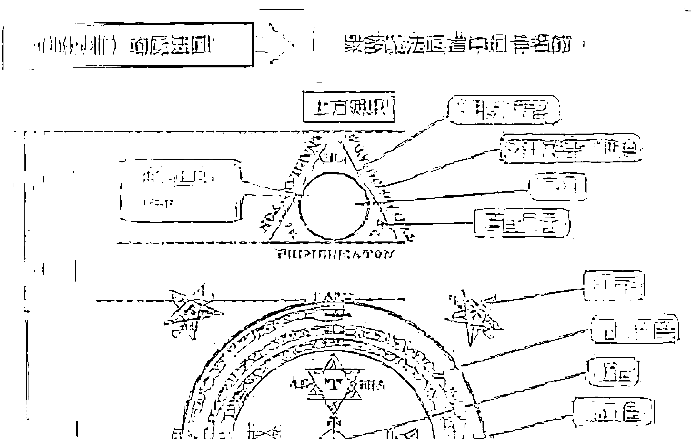

上图展示了地球绕太阳运行的轨道及相关天体关系，用于说明日心说模型。

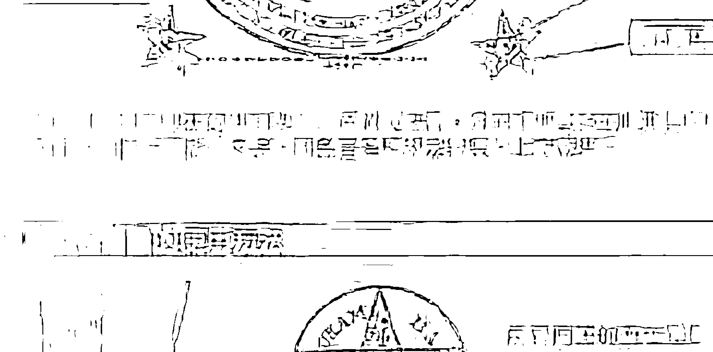

底部图示和箭头解释了地球在宇宙中的位置变化，以及相关天文概念的扩展说明。

### 《召魔之書》

Arts Theurgia Goetia

《召魔之書》是針對從前所羅門王召喚並且封印的天空31精靈，就其名字、性質、印記、防禦法、召喚咒文等進行說明的魔導書。

### ○透過天空精靈實現願望的術法

《召魔之書》是《雷蒙蓋頓》（《所羅門王的小鑰匙》）當中的第二部魔導書。「Theurgia」是新柏拉圖主義神秘咒術之意，從語源來說是由希臘語的the（神）+urgy（術）組成，有「催動神靈」的涵意。

這本書講的是傳說中從前所羅門王曾經召喚、封印的天空31精靈，並就其名、性質、印記、防禦方法、召喚咒文等進行說明。這31名精靈的地位全都是天空的司掌者，各自擁有帝王、王侯、王子等稱號。只不過這些精靈並非天使，他們可以是善也可以是惡，是種類似於惡靈的存在。因此就算其中有些名字跟天使相似，指的也不是天使。另外司掌天空的眾精靈麾下還各自有眾多精靈附屬。

這31名精靈的職務全數相同，某個精靈辦得到的事情，其他精靈也同樣辦得到。他們的能力包括找出被隱藏的物事、洩露他人秘密，還能取得任何受命尋找的東西。不過這31名精靈全部都分屬於地水火風四大元素。

各精靈均有固定住所，並分別與方位磁石所指方位相對應，是以施術者向特定精靈祈禱時必須面向特定方位行禮。咒文有數個種類，須視對象精靈選用適當咒文。其次，召喚精靈時必須以其印記製成名為拉曼的墜飾佩戴胸前，否則精靈就不會服從命令。

順帶一提，此書以及第3部《保羅之書》的諸靈，跟托利特密烏斯《隱寫術》內容所載有相互對應的關係。

> 。新柏拉圖主義：請參照No.227注解附錄No.049※1。

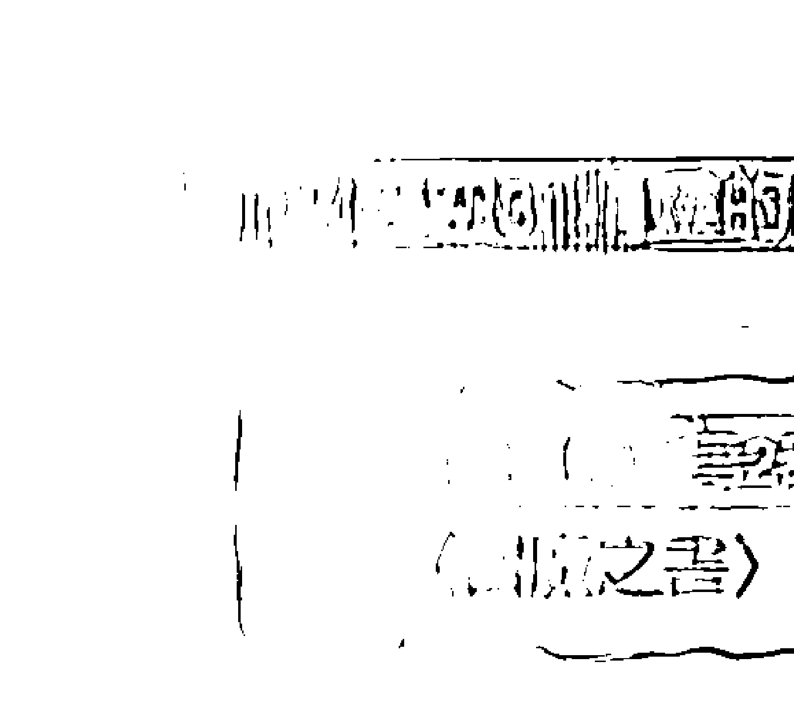

介紹傳說中受所羅門王封印的天空31種惡靈之作品

| 编号 | 名称 | 描述 | 编号 | 名称 | 描述 |
| :--- | :--- | :--- | :--- | :--- | :--- |
| 1 | A... | 東方的皇帝 | 17 | Raysiel | 第13王侯 隸屬北方皇帝 |
| 2 | B... | 南方的皇帝 | 18 | Symiel | 第14王侯 隸屬北方皇帝 |
| 3 | A... | 西方的皇帝 | 19 | Armadiel | 第15王侯 隸屬北方皇帝 |
| 4 | D... | 北方的皇帝 | 20 | Baruchas | 第16王侯 隸屬北方皇帝 |
| 5 | (名称) | 第1王侯 隸屬東方皇帝 | 21 | Geradiel | 第1流浪王子 |
| 6 | (名称) | 第2王侯 隸屬東方皇帝 | 22 | Buriel | 第2流浪王子 |
| 7 | (名称) | 第3王侯 隸屬東方皇帝 | 23 | Hidriel | 第3流浪王子 |
| 8 | (名称) | 第4王侯 隸屬東方皇帝 | 24 | Pirichiel | 第4流浪王子 |
| 9 | (名称) | 第5王侯 隸屬東方皇帝 | 25 | Emoniel | 第5流浪王子 |
| 10 | (名称) | 第6王侯 隸屬南方皇帝 | 26 | Icosiel | 第6流浪王子 |
| 11 | (名称) | 第7王侯 隸屬南方皇帝 | 27 | Soteriel | 第7流浪王子 |
| 12 | (名称) | 第8王侯 隸屬南方皇帝 | 28 | Menadiel | 第8流浪王子 |
| 13 | (名称) | 第9王侯 隸屬西方皇帝 | 29 | Macariel | 第9流浪王子 |
| 14 | (名称) | 第10王侯 隸屬西方皇帝 | 30 | Vriel | 第10流浪王子 |
| 15 | (名称) | 第11王侯 隸屬西方皇帝 | 31 | Bydiel | 第11流浪王子 |
| 16 | (名称) | 第12王侯 隸屬西方皇帝 | | | |

1516年，文藝復興時期的修道院長，同時也是神秘學主... 偉大成作品《魔術書》，被奉為近代暗號學之父。

### No.054 《保罗之书》

ArS Paulina (Paulina Art)

这部据传由圣保罗发现的魔导书，其目的乃在于召唤掌管时间及黄道十二宫的诸善灵藉以实现愿望。

### ○召唤天界众天使之书

《保罗之书》现如今虽以《雷蒙盖顿》（《所罗门王的小钥匙》）的第三部为世所知，可是这部魔导书早在中世时期其实是本独立的著作。尽管书中写到此书是所罗门王的其中一部作品，但亦有传说表示此书其实是由圣保罗所发现的。

此书之目的在于召唤掌管时间及黄道十二宫的众善灵，是以书中也依序就召唤所须之魔法圆、各天使印记、咒文、占星学适于召唤的理想时间等为文介绍。

其内容根据天使类别，共分成二章：

第一章介绍的是司掌昼夜24个小时的天使。每个小时各有一名司掌天使，其下各有8名直属公爵天使，其下则另有多众天使从属。举例来说，白昼第1个小时的司掌天使名叫撒末尔（Samael），麾下8名公爵天使分别是Ameniel、Charpon、Darosiel、Monasiel、Brumiel、Nestoriel、Chremas和Meresyn，其下还有444名从属天使。这些24小时的天使分别掌管属七行星管辖诸事，并且能够实现与该行星相关的所有事情。

第二章介绍的对象则是司掌黄道十二宫的12位天使。除此之外，此章还将黄道十二宫各自以每1度角分成30等分，360度均有天使配属。其次，这些天使全都分别对应于地水火风四大元素。每个人都可根据其诞生日时对应至黄道十二宫，并且因为这层对应关系而受到这些天使管辖；据说只要向那位天使祈祷，便能得到所有的技术与知识。

## 《降神之書》
### Ars Almadel (The Art of the Almadel)

《降神之書》是部利用魔法道具阿爾馬岱白蠟板召喚司掌天頂東南西北四極點的20名天使，藉以實現願望的魔導書。

## ○以阿爾馬岱白蠟板呼喚天使

《降神之書》是《雷蒙蓋頓》（《所羅門王的小鑰匙》）當中排在第四部的魔導書。

此書主題是要召喚司掌天頂東南西北四極點的20名天使，請他們替自己達成願望。天空360全方位可劃分成十二宮，每三個宮為一組便能分成東南西北四個方向，將20名天使平均分配至各方位，則每個方位各有5名天使。第1極點東方的5名天使是Alimiel、Gabriel、Barachiel、Lebes和Helison；第2極點南方的天使是Aphiriza、Genon、Geron、Armon和Gereimon；第3極點西方則是Eliphanielasai、Gelomiros、Gedobonai、Taranav和Elomina；最後第4極點北方則是Barcahiel、Gediel、Gediel、Deliel和Capitiel。

欲召喚這些天使，首先必須製作阿爾馬岱的白蠟板（銘板）。這銘板須以白蠟製作，於其上篆刻特定文字與星陣圖等符號。另外還要用白蠟製作四支蠟燭，豎立在蠟板的四個角落。接著則是要製作徽章。雖然純銀亦可，不過徽章儘可能最好是以純金材質為佳，然後刻上HELL、HELION、ADONAI三個名字。

準備完畢以後就可以點燃蠟燭，向目標方位的天使祈禱、唱誦咒文。據說這個時候，天使就會出現。

只不過施術者必須視召喚對象的不同來選擇執行儀式的時日，因為天空四極點在黃道十二宮上面都有個相對應的時間帶。除此以外，與天空四個極點相對應的顏色等事項同樣也必須注意，這些事項在《降神之書》裡面也有簡單的說明。

召喚司掌天空東南西北四極點的20名天使的魔法書：

> 20名司掌天使如下：

| 東 | 南 | 西 | 北 |
| --- | --- | --- | --- |
| Alliniol | Aphiriza | Elphaniasai | Barcahiel |
| Iuuiuiol | Genon | Gelomiros | Gediel |
| Diuachiol | Geron | Gedobonai | Gediel |
| Lubon | Armon | Taranava | Deliel |
| Hulibon | Gereimon | Elomina | Capitiel |

召喚各方位司掌天使必須使用如下的阿爾馬岱白蠟板：

## 阿爾馬岱白蠟板

> 蠟燭

> 白蠟台座

同一個天使抑或兩位不同天使，不得而知。

## 《聖導之書》
### Ars Notoria (The Notable Art)

《聖導之書》之目的在於召喚天使以獲得自由七科目專門知識與其他技術、滔滔辯才甚至神秘體驗，是部早自非常古老的時代便已經存在的高級魔導書。

## ## ○為獲取專門知識與技術而存在的高等魔法書

《聖導之書》是部與所羅門王頗有淵源，並且早自非常古老的時代便已經存在的魔導書。此書現如今乃以《雷蒙蓋頓》（《所羅門王的小鑰匙》）第五部為世所知，不過它在中世時期其實是部獨立的魔導書，據說1300～1600年間便有多達50冊以上的抄本流通。

舊約聖經《歷代志下》有段所羅門王與神的對話如下：

> > 「求你賜我智慧聰明，我好在這民前出入：不然，誰能判斷這眾多的民呢？」

> > 神對所羅門說：「我已立你作我民的王。你既有這心意，並不求資財、豐富、尊榮，也不求滅絕那恨你之人的性命，又不求大壽數，只求智慧聰明好判斷我的民：我必賜你智慧聰明，也必賜你資財、豐富、尊榮。在你以前的列王都沒有這樣，在你以後也必沒有這樣的。」

《聖導之書》便是以這段故事為前提所創作，傳說這本書便是由神派遣天使傳授予所羅門王的。

這本書有個迥異於其他旨在尋找財寶、擊敗政敵或獲得性愛戀的尋常魔導書的特徵：此書之目的在於召喚天使，並因此獲得自由七科目（文法、理論學、修辭學、算數、幾何學、天文學、音樂）之專門知識與其他技術、辯才甚至神秘體驗。書中就達此目的所必須之禱辭、神秘圖形符號、除穢儀式等均有說明；禱辭當中混有希伯來語、希臘語等不同語言，不到11世紀以後的拉丁語版本並未記載到符號與圖形。

### 1.1.1 《所罗门之钥》

《所罗门之钥》原本在中世是部獨立的魔導書。14~16世紀間有許多抄本流行。

### 1.1.2 《所罗门之钥》的目的

> > 《所罗门之書》目的是要召喚天使、獲得特殊的知識，不像其他魔導書是以獲得財寶、擊敗政敵、獲得戀人為目的。

自由七科目（文法、理論學、修辭學、算數、幾何學、天文學、音樂）的專門知識。其他技術。辯才與神秘體驗。

> 主啊。

> 獲得財寶。

> 擊敗政敵。

> 獲得異性的愛。

## 《摩西第六书、第七书》
### The Sixth and Seventh Books of Moses

這部傳為古猶太英雄摩西所著、曾經風行德國的魔導書，後來經移民之手被帶往新大陸，從而發生了許多令其惡名遠播的事件。

## ○引发杀人事件的不祥魔导书

《摩西第六书、第七书》是传为古犹太英雄摩西（请参照P.038）所著之魔导书。其实际成书年代虽已不得而知，不过此书于18世纪便已经以手抄本与印刷小册子之形式流通于德国及其周边地区。1849年斯图加特的出版业者约翰·席伯首次出版印刷此书完整版、极受欢迎，受欢迎程度甚至超越了德国国境；美国宾夕法尼亚州有许多德裔移民定居，《摩西第六书、第七书》在那里同样也很受欢迎。这些德裔移民当中也包括有能施魔法替众人治病、能与敌方魔法师作战的咒术巫医——魔医，《摩西第六书、第七书》便是他们的必需品，因为当时相信这本魔导书拥有特殊的守护力量。另外，当时还相信此书跟其他魔导书同样，对寻宝也能起到很大助益。不过《摩西第六书、第七书》的最大特色便在于它不祥的传闻评价，足以使人相信它真的能够引发杀人事件。

1916年宾夕法尼亚州就发生了蹄铁匠彼得·李斯杀害农夫朋友亚伯拉罕·费克，然后用斧头把头砍下来的事件。事件发生前不久，李斯才去拜访某位专职烧炭的工匠，那名男子手上有部《摩西第七书》，还威胁李斯道：「你会被费克杀死。」换句话说，当时的民众相信李斯便是因为《摩西第七书》而发狂，终于引起了杀人事件。

1924年又发生了一起住在德国西伐利亚名叫菲利兹·安修坦的男子杀害八名家人的事件，报导指出其自宅收藏有《摩西第六书、第七书》，而当时民众相信犯人便是读了这部魔导书，才依著其中指示犯下了杀人事件。

## 《摩西第六书、第七书》的危险性

> 許多人相信《摩西第六書、第七書》是會引起殺人事件的不祥作品。

1916年，賓夕法尼亞州的蹄鐵匠因為《摩西第七書》而用斧頭砍下農夫朋友亞伯拉罕・賈克的頭顱。

1924年，一名住在德國西伐利亞的男子菲利茲・安傑修坦殺害了八名家人。當時報導指出其住處收藏有《摩西第六書、第七書》。

## 簡單且任誰都會的摩西魔法
### Easy available magic of moses

光憑著簡單的護符和少數幾個咒文，不只能發現寶物、召來幸運，甚至還能實現聖經中英雄摩西曾經使用過的魔法。

## ○僅以簡單護符咒語便可施行的摩西魔法

根據聖經記載，從前摩西曾經跟埃及的魔法師對陣，他變杖為蛇、召來大群蝗蟲、變水為血，創造出各式各樣的奇蹟打敗了對方。據說《摩西第六书、第七书》便是部蒐集匯整了摩西當時曾經行使過魔法的作品。不過，1849年由席伯出版的《摩西第六书、第七书》完整版則是收錄了自古以來的數個版本。

此書首先介紹的似乎就是最新版的《摩西第六书、第七书》。此版本的《摩西第六书》介紹的有支配各種天使的印記、支配四大精靈和七行星精靈的印記等七個印記與咒文；至於《摩西第七书》收錄的則是支配四大精靈與行星精靈所須的12個圖錄與咒文。書中所載魔法全都有助於發現寶物、召來幸運或是規避不幸。

緊跟著上述最新版之後，此書接著收錄的其他版本《摩西第六书、第七书》則是承襲摩西魔法之源流，屬於喀巴拉魔法系統。此處所介紹的，便是可用來施行摩西於聖經故事各場面中實際使用過的魔法之印記、咒文，諸如變杖為蛇、召來大批蝗蟲、變水為血等。

除此之外，《摩西第六书、第七书》在附錄部分還介紹到用來召喚傳為墮天使同伴之七位偉大王子的魔法圓等內容。

這些魔法的最大特色便是簡單。《摩西第六书、第七书》的魔法幾乎都只須用到簡單的護符和幾個咒文而已。這本書之所以擁有難以動搖的人氣，或許就是因為其魔法簡單而使然。

## 《教皇洪诺留的魔导书》
### The Grimoire of Pope Honorius (Grimoire du Pape Honorius)

这部据传为13世纪罗马教皇所著魔导书乃以黑母鸡进行极残酷的活祭，因而被视为特别的邪恶。

## ○在巴黎人气仅次于《所罗门王之钥》的魔导书

《教皇洪诺留的魔导书》在1700年前后的巴黎是人气仅次于《所罗门王之钥》的魔导书。至于它受欢迎的理由，则是因为其中记载有如何发现财宝的魔法。据说那时候的巴黎在台面下有个秘密的魔法界，对这些人来说，拥有《所罗门王之钥》或《教皇洪诺留的魔法书》的抄本就是种身分的象征。相传此魔导书的作者是13世纪初的罗马教皇，也就是传说指其为魔法师的洪诺留三世；不过此书实际上其实是出版于17世纪后半期的罗马。

其内容是讲述如何以特定魔法圆召唤东西南北或者每周各日的堕天使，并使其遵从命令；其次，《教皇洪诺留的魔导书》在实施魔法之前还有个活祭黑母鸡的残酷仪式，所以这部魔导书才会被視為格外邪恶、遭人忌避。

《教皇洪诺留的魔导书》此题名应当是取自于更古老的《洪诺留的誓约书》一书。有文献记录指出此书早在13世纪初便已经存在。此书成立年代不详，但传说811年那不勒斯、雅典、托莱多、底比斯等地的魔法大师曾经齐聚一堂，召开魔法会议；当时便是由底比斯的洪诺留担任负责人将魔法知识整理成书，而此书便是日后所谓的《洪诺留的誓约书》。

此处所谓底比斯的洪诺留跟罗马教皇毫无任何关联，可能后来底比斯洪诺留的传说渐渐遭到遗忘，这才跟传说指为魔法师的罗马教皇洪诺留三世混淆了，最后也才会有《教皇洪诺留的魔导书》的问世。

## 《教皇洪诺留的魔法》
### Contents of The Grimoire of Pope Honorius

欲召喚東西南北之王與每週各日墮天使以實現願望，就必須施行挖出黑母雞眼珠的殘酷活祭儀式。

## ○召喚東西南北之王與每週各日的惡魔
《教皇洪诺留的魔导书》是部召喚各種精靈與墮天使、使其實行命令的魔導書。

此書被指爲邪書的最大特徵，就是必須在召喚惡魔之前舉行殘酷的儀式。此儀式不但要宰殺黑母雞、挖出兩個眼珠，還要挖出舌頭與心臟曬乾並研磨成粉狀，日後可以用來撒在描繪魔法圓等圖錄的羊皮紙上。其次，取羊皮紙也必須進行宰殺羔羊的儀式。經過上述儀式、祈禱以及爲期三天的斷食以後，這才終於可以開始召喚墮天使。

此書所召喚的乃是東西南北之王與每週各日的墮天使。

據魔導書記載，所謂東西南北之王分別是指東方的瑪撻亞、南方的埃吉姆、西方的派蒙和北方的亞邁蒙；每週各日的惡魔則是週一路西法、週二弗利莫斯特、週三亞斯她錄、週四席爾卡迪、週五貝卡德、週六古藍朵、週日史爾加特。

當中有些神靈似乎是專爲實現特定願望而召喚的，譬如週二的弗利莫斯特是要獲得名譽與威嚴、週三的亞斯她錄能使人獲得國王或衆人的好感、週四的席爾卡迪能使人獲得幸福與財寶、週日的史爾加特則是能發現並移動財寶，至於其他神靈則基本上算是能替人實現任何願望。話雖如此，如果想要獲得財寶的話，那還是召喚席爾卡迪或史爾加特會比較好。

召喚這些神靈時必須使用他們各自特定的魔法圓、星陣和祈禱，例如召喚東西南北之王就要使用所羅門王的魔法圓星陣圖，至於每週各日靈則是必須使用各自專用的魔法圓方可。

## 《大奥義書》
### Grand grimoire

召唤地狱宰相路西弗葛·洛弗卡雷以获取财宝的《大奥義書》，内容非常简明易懂，是对一般大众影响最巨的魔导书。

## ## ○對法國一般大眾影響最巨的魔導書

《大奥義書》內容完整、容易理解，就它容易對人造成負面影響此方面來說可以稱得上是部惡名昭彰的黑魔法書。18～19世紀間的法國有許多魔導書流通於市井間，其中對一般大眾影響最巨的當屬《大奥義書》。書中自稱《大奥義書》乃著於1522年，實際上這部作品應是成書於1750年前後的義大利，定位為大量販售用廉價書印刷出版，從而大為風行。

一般的魔導書通常都不必背負與惡魔締結契約之類的風險，可是此書特色便在於與惡魔的契約。換句話說，《大奥義書》是將地獄惡魔宰相路西弗葛·洛弗卡雷召喚出來、為問出秘密財寶所在處而與其締結契約，是部內容相當危險的一本書。更有甚者，《大奥義書》並不光只是本記載如何與惡魔締結契約的魔導書，「持有此書本身便是惡魔契約的一部分」。另外，《大奥義書》說路西弗葛是凡間財寶的管理者，是以此時代的法國都認為路西弗葛·洛弗卡雷是尋寶時最重要的精靈。

雖然說是與惡魔締結契約，可《大奥義書》卻是憑藉所羅門王的大咒文與魔法杖的威力強行締結有利於施術者的契約，並非那種一旦有些許差池就會丟掉小命的危險契約。光就這點而論，則《大奥義書》在本質上跟其他魔導書可謂是並無差別。

19世紀初，《大奥義書》再度以《紅龍（Dragon rouge）》題名出版，從而成為惡名堪與《小阿爾伯特》匹敵的邪書。19世紀法國一般民眾大多都想要得到《紅龍》，眾家魔法師更是隨身攜帶《紅龍》而非聖經。

## 《大奥義書》的目的
### The purposes of "Grand grimoire"

使用《大奧義書》便能召喚包括惡魔宰相路西弗葛在內共六名的地獄次席高等惡魔，達成與各惡魔相對應之目的。

## ○任意操縱次席高等六惡魔

《大奧義書》乃以召喚惡魔宰相路西弗葛·洛弗卡雷並獲得財寶而聞名的魔導書，可是這部魔導書的目的絕不僅止於此。

根據《大奧義書》記載，惡魔界有無數惡魔存在，其高層則是有三大統治惡魔、次席高等六惡魔、十八從屬官等席次。三大統治惡魔依序是皇帝路西法、王子別西卜和大公亞斯她錄，其下有六名次席高等惡魔，他們都被路西法各別授以特別的權力。六名次席高等惡魔的名字及其權限如下：宰相路西弗葛·洛弗卡雷，他被皇帝路西法授予掌管支配全世界財富財寶的權限；大將軍撒達納奇亞，擁有能使所有女性臣服的能力；將軍阿迦里亞瑞普特，擁有揭露國家機密的能力；中將浮錄鈕提，司掌夜間事務並擁有降冰雹的能力；准將薩爾迦塔納斯，職掌使人透明化、傳送、透視術、死靈術等能力；元帥涅比洛斯，擁有從事惡行之權限以及賜人廣博知識之能力。

次席高等惡魔底下各自配屬有三名惡魔從屬官，共計有十八名從屬官，從屬官以下則是另有無數惡魔附屬。

施術者實際召喚號令的其實是這眾多惡魔當中的次席高等六惡魔；施術者其實是要向皇帝路西法祈禱、取得其許可，然後視施術目的借用這些惡魔的不同能力。是故若以《大奥義書》魔法召喚宰相路西弗葛·洛弗卡雷以外的其他五位次席高等惡魔，便也能達成獲得財寶以外的其他目的。

《大奥義書》當中還詳細說明如何召喚路西弗葛·洛弗卡雷以獲得財寶，作為具體實例。

## 恶魔界篇内容

《大奥义书》有两大主题：
- ① 说明召唤路西弗葛·洛弗卡雷以获取巨富的方法。
- ② 说明恶魔界组织，好让施术者视不同目的召唤不同恶魔。

## 恶魔界的层级组织

最高的恶魔：魔王路西法、王子别西卜、大公亚斯她录。

六大恶魔 | 职责
--- | ---
路西弗葛·洛弗卡雷 | 司掌财运与财宝
巴尔贝雷特·迪纳奇亚 | 能使所有女性臣服
里迈尔·拜星·亚瑞普特 | 通晓国家秘密
奥劳贝尔·佛鲁提 | 司掌夜间的雾与降冰雹
吉北里·阿迦塔纳斯 | 使人透明化、隐遁、透视术、死灵术
普尔松·普尔所 | 从事恶行与广博的知识

十八从魔官由次席高等六恶魔各自配置有三名从魔官。

了解恶魔界组织与各恶魔的角色职务，并根据不同目的选择要召唤的六大恶魔。

## ### No.063
## 召唤恶魔宰相路西弗葛的准备工作
### Preparations to conjure up Lucifer Rofocale

召唤恶魔宰相路西弗葛必须做好许多准备工作，包括一周内须断绝女色洁净自身、以橡树枝制作魔法杖等。

### ○ 制作召唤路西弗葛的魔法圆

根据《大奥义书》记载，召唤恶魔宰相路西弗葛·洛弗卡雷必须做好下列准备：

首先，在召唤恶魔的前一周必须断绝与女人的关系、保持自身洁净。一天两餐，用餐前要向主献祈祷。召唤恶魔须独自一人或三人共同执行，如有必要则应事先找齐两名助手。接着则是要事先选定废墟或古城之类寂静场所作为执行召唤作业的场地。其次，准备血玉髓（鸡血石*）、两支由处女制作的全新蜡烛、全新的火盆、白兰地、樟脑和木炭。再来还要宰杀羔羊，剥皮搓成细长的绳索，并从装纳孩童尸体的棺木拔取四支封棺钉。为避免召唤时恶魔太过靠近魔法圆，可先行准备金币或银币用纸包起来，以备驱赶恶魔。

实施仪式前晚，施术者必须找到从未结过果实的野生榛树，选定适合制作魔法杖的树枝，然后在隔天早晨太阳冒出地平线的那瞬间，持全新小刀砍下该树枝、制作长度19英尺半的魔法杖。

一切准备停当后，终于就要前往作业场地开始召唤恶魔。首先第一件事就是要在地面或地板绘制魔法圆；魔法圆先是用以羔羊剥制的皮绳围成，四方用钉子固定住。取出事先准备好的鸡血石在圆里面画个三角形，然后在三角形的两边立起蜡烛；魔法圆的上方要朝东，三角形则是要从上方的顶点开始画起。再来则是要在魔法圆的外侧按反时针方向依序写下大写的A和小写的e、a、j，然后在三角形底边处书写神圣文字JHS（象征耶稣基督），并且在两端各画一个十字。这样便能防止恶魔从背后偷袭。

## 必须做好充分准备

- 1. 不可动摇的决心。
- 2. 决定要召唤哪个恶魔。
- 3. 洁净身体。
- 4. 备齐必要道具。

一日两餐·断绝女性关系等。
火盆·蜡烛·山羊皮绳·钉子·鸡血石·白兰地·樟脑·木炭·魔法杖等。

## 召唤路西弗葛·洛弗卡雷的魔法图

召唤路西弗葛·洛弗卡雷的魔法圆要这样制作：

> 必须严格按照图示制作魔法圆

魔法圆上的文字和符号具有特殊含义，需要精确绘制。

> 施术者必须站在指定位置

助手的位置位于魔法圆外侧。

## 命令恶魔宰相路西弗葛
How to order Lucifer Rofocale

> 遇恶魔路西弗葛索取灵魂与肉体时必定要断然拒绝，应以魔法杖威胁并不断唱诵所罗门王之伟大咒文，迫其服从。

### ○不可与危险的恶魔缔结契约

《大奥义书》讲到完成魔法圆以后，召唤恶魔宰相路西弗葛之程序如下：

首先取木炭置于火盆内，洒上白兰地和樟脑然后点火。手持魔法杖和写着咒语与要求的纸张站到三角形里面，并怀抱希望与信心呼唤恶灵：「伟大的路西法皇帝啊，我以主之名命令你，将恶魔大臣路西弗葛派遣前来。」此时除路西法皇帝以外，也可以把别西卜王子、亚斯她录大公的名字也追加进去。如果恶魔此时出现便罢，不过情况通常都没这么顺利，这时候就要唱诵所罗门王大咒。此时恶魔大臣路西弗葛就会出现，施术者必须宣言：「敢不回应我的要求，便以咒语施以永恒的折磨。」劈头先来个下马威。路西弗葛会问道：「有何要求？」施术者就可以提出要求了：「我的愿望便是与你缔结契约令你尽快助我致富。」

不过路西弗葛也会发挥其恶魔本色，如是说道：「倘若你愿在20年后交出灵魂与肉体，则契约可也。」

想当然尔，这样的契约肯定是签不得的。于是施术者便立刻要持魔法杖指向路西弗葛，威胁道：「敢不从命，便要你与同党永受折磨。」并重复唱诵所罗门王大咒。此时路西弗葛就会老大不情愿地带领前往藏有宝物之地，而施术者须经由特定途径离开魔法圆、尾随其后。来到藏宝处以后将契约书放在宝物之上，带着所有拿得动的宝物倒退离开，回到魔法三角形之中。最后还要跟路西弗葛道别：「伟大的路西弗葛啊，我已满足。已经到了说再见的时候，请你离开去自己喜欢的地方。」如此便能获得巨富。

## 召唤恶魔

准备魔法杖等必需品召唤恶魔。

## 所罗门王大咒

以！我以拥有伟大力量的下列名号命令你，迅速出现！以阿多奈之名、耶和华、亚列、耶和凡姆、阿格拉、塔格拉、马通、欧亚利欧斯、亚谢莫金、阿多耐斯、克布洛特、伐利欧斯、皮脱纳、马乔多斯、萨尔非、伽波丝、萨拉受、哈拔丝、金瓜、姜纳、以提兹莫斯，以萨里亚纳米克之名。（旧约·诗篇）

> 若恶魔迟迟不现身则可以唱诵上述所罗门王大咒。据说只要念个两遍恶魔就必定会出现，接着只要按照下列程序便能取得宝物：

## 《小阿尔伯特》
PETIT ALBERT

这部记载了极邪恶「光荣之手」制作方法的魔导书，乃经由行商人之手散播至法国各地甚至偏僻小乡村，使其恶名愈发远播。

### ○记载「光荣之手」制作方法的魔导书

《小阿尔伯特》是部因为记载到极邪恶「光荣之手」（请参照P.142）的制作方法而受人忌避的魔导书。所谓「光荣之手」是指取绞首死刑犯尸体的手掌而制作的恐怖烛台，是种保护小偷的护身符。

《小阿尔伯特》曾经在1668年的法国出版，不过后来18世纪初又有廉价版再度出版，并经由行商人之手被带往法国乡间的各个小村庄，从而成为著名的邪书。1745年还曾经发生过行商人因为携带数册《小阿尔伯特》兜售而遭到逮捕的事件。此书乃是与传为大阿尔伯特所著《大阿尔伯特》相对的作品，至于《小阿尔伯特》的作者则据说是阿尔伯特·帕尔乌斯·卢西乌斯。

除「光荣之手」制作方法以外，此书对葡萄酒等酒类的制作方法、如何治疗腹痛、测试女性外遇花心程度的方法、让女性跳起艳舞等方法也都有解说，甚至连护符、魔法阵、魔法香水的调配方法等也都有记载。

相传「光荣之手」此魔法于17世纪的实践使用相当广泛，不过这可怕的魔法却是因为《小阿尔伯特》的介绍始得于19世纪后再次掀起风潮流行。

时至20世纪初，其邪恶影响终于越过了大海来到了加勒比海地区。1904年，加勒比海的巴贝多岛便发生了一起少年遭到极残酷方法杀害、两只手腕遭人砍下的事件。过没多久便逮捕了三名犯人，审判过程中发现原来他们计划要抢银行，而且还持有《小阿尔伯特》此书。也就是说，犯人意欲透过制作「光荣之手」祈使银行抢案无风无浪、平安顺利，所以才杀害了少年。

## 《小阿尔伯特》的特色

1668年于法国出版。
《小阿尔伯特》→ 阿尔伯特·帕尔马斯·卢西乌斯所著。以「光荣之手」制作方法而闻名。

- 「光荣之手」制作方法
- 葡萄酒等酒类的制作方法
- 腹痛的治疗方法
- 测试女性外遇花心程度的方法
- 让女性跳起芭蕾舞的方法
- 另外还有护符、魔法阵、魔法香水的调配方法等。

## 《小阿尔伯特》引起的事件

1664年因《小阿尔伯特》而起的巴贝多岛少年惨死事件纪录：1664年的巴贝多岛，有位名叫鲁珀特·马普（Rupert Mapp）的当地人，遇到一位名叫艾德蒙·蒙陶特（Edmond Montoute）的男子，问他要不要做份工作：那是个跑腿性质的简单工作，马普立刻就签约了。蒙陶特带着马普去到名叫理查切·李昂（Richard Lucce Leon）的男子家中，9月29日夜里又有個名叫艾德加·圣希尔（Edgar St. Hill）的男子加入。此时的马普根本就想不到自己即将死于非命，可是马普当晚就遭到杀害了。更有甚者，三名男子挖出马普的心脏、将其左手腕砍下；他们将其他部分的尸体埋在后院，又取盐巴敲碎心脏和手腕做防腐处理。究竟他们所欲为何？原来他们企图制作「光荣之手」并计划从事银行抢案，主是因为阅读了《小阿尔伯特》才想到这个主意的。

## No.066
## 光荣之手
**The Hand of Glory**

「光荣之手」是用遭处环首绞刑男尸手腕制作的恐怖烛台，在民间传说里亦以强盗与窃贼的护身符而闻名。

### ○以环首绞刑罪犯的手掌制成的烛台

「光荣之手」是欧洲民间传说多次提及、颇为世间所周知的魔法道具。虽然说是盗贼使用的道具，可是这个以环首绞刑男性死刑犯手掌制成的东西还是令人不寒而栗。

18世纪初出版的魔导书《小阿尔伯特》（小阿尔伯特自然喀巴拉魔法的惊奇秘密仪式）里面记载了「光荣之手」的制作方法。

首先趁绞首死刑犯还吊在绞刑台上的时候将其手腕砍下，千万记得要用裹尸布把手包裹起来、把血挤干净。其次将手腕放进土器中，以硝石、盐巴、胡椒等磨成粉末腌渍15天。接着将手掌取出，于天狼星随着太阳升起的酷热时节将其彻底晒干；倘若日照不够，也可以把手掌放进以蕨类或马鞭草加热的灶里烘干。至于干燥过程中取得的油脂，则必须与全新的蜡、产自拉普兰的芝麻混合制成数支蜡烛。如此制作出来的便是「光荣之手」，此物属于某种烛台，使用时是要在「光荣之手」的指头间插起蜡烛点火，任何人看见此物就会完全无法动弹，其间魔法师便可以为所欲为了。因此只要在入侵他人住家前先点燃「光荣之手」，盗取任何物事都不成问题了。

然而，据说只要在住家门口地板等盗贼可能入侵的场所事先涂以黑猫胆汁、白鸡脂肪、猫头鹰鲜血混合制成的软膏，便能抵消「光荣之手」的效果。除此以外，据说「光荣之手」的烛火无论用水或用啤酒都浇不熄，却可以用牛奶浇熄；事实上猎女巫时代的恶魔学家德里奥（1551～1608）便提出报告指出有名女佣按照此法浇熄烛火，从而成功逮到盗贼。

## 「光荣之手」的效能

据说「光荣之手」拥有各种效能：
一看见火焰就无法动弹。
只要蜡烛没熄，家人就不会醒来。
点燃蜡烛就可以变成透明人。
所以对窃贼强盗很有用。

## 「光荣之手」制作方法

「光荣之手」制作方法如下：
- 1. 砍下绞首死刑犯手掌，擦干鲜血。
- 2. 以硝石、盐巴、胡椒等物腌渍。
- 3. 在圣洁时节将手掌彻底晒干。

完成

## 《黑母鸡》
The Black Hen (La poule noire)

《黑母鸡》是部记载有如何制作寻宝黑母鸡的魔导书，对宝藏猎人来说可说是最最贵重的宝贝。

### ○活祭黑母鸡的寻宝之书

《黑母鸡》出版于1820年的法国，是最受宝藏猎人喜爱的魔导书。

根据前言记载，此书乃由某位曾经跟随拿破仑远征埃及的指挥官所著。当时的军队遭到阿拉伯人突袭而致全灭，唯有自己一人得以幸存；他在逃亡途中遇见一名从金字塔中出现的魔法师，得其传授魔法，然后才将这些魔法都记载了下来。

《黑母鸡》内容分为前半与后半两个部分。

前半部是介绍拥有各种魔法效果的护符与戒指，包括召唤四大元素精灵、安全移动至世界各地、变成透明人、受到所有人喜爱、知悉重要的秘密、发现一切财宝、获得能解开任何锁的能力、粉碎敌人阴谋、获得所有矿物或蔬菜相关知识等拥有各种形形色色能力的护符。使用这些护符与戒指，再配合唱诵适当的咒文便能发挥效果。

最受众多宝藏猎人喜爱的却是此书的后半部，此部分记载的是黑母鸡的制作方法（请参照P.146）。黑母鸡须以特殊方法制作，据说这黑母鸡能不断发掘世间的秘密财宝，对宝藏猎人来说再没有其他东西比它更加贵重了。

据说从前黑母鸡仪式的实施使用相当广泛，譬如1775年就有这么一个案子：葡萄酒业者让·吉拉利跟共犯以「黑母鸡就快到手」口实从某人身上卷走大笔款项；犯人是利用近乎魔术的手法让黑母鸡现身，结果使得被害者信以为真，进而投入巨款作为投资。至于此案审判的结果，一干人犯遭处鞭笞烙印之刑，并且被放逐国外。

## 《黑母鸡》

1820年于法国出版。
受西欧猎人喜爱的魔法书。

- 1. 内容分成？
   - 前半部：介绍具有魔法效果的护符与戒指。
   - 后半部：能找出宝藏的「黑母鸡」制作方法。

## 《黑母鸡》的护符

《黑母鸡》书中介绍有许多此类护符与戒指：
这些文字是用来刻在戒指外侧。
获得所有女性爱恋与亲近的护符与戒指。
能进入任何地方而不被人发现的护符与戒指。
能引起冰雪、雷电、地震等天变地异，藉以破坏一切的护符与戒指。

## No.068
## 搜寻黄金的黑母鸡
The gold-finding black hen

相传黑母鸡原是属于琐罗亚斯德的父亲欧洛马西斯所有，是从彻底被洗脑成黑色且毫无瑕疵的鸡蛋中诞生出来的。

### ○从洗脑成黑色的鸡蛋中孵化的黑母鸡

魔导书《黑母鸡》（请参照P.144）内容介绍到如何培育凭着本能找出黄金与财宝之黑母鸡的魔法，乃是众多能使人轻松致富的魔法之一。

据其记载，琐罗亚斯德（琐罗亚斯德教的教祖）的父亲欧洛马西斯是第一个拥有这种母鸡的人。黑母鸡的制作方法有二，其一极为困难近乎不可能，其二则较为一般，此处仅介绍较为一般的方法。

施术者首先要拿颗鸡蛋对着正午的阳光，检查这颗蛋没有半点脏污。然后再选只羽毛颜色最接近全黑的母鸡，倘若里面掺杂有其他颜色的鸡毛，就要把杂色鸡毛拔掉。再用黑色头巾盖住母鸡的头，让它完全看不见东西，此时嘴喙可以不必拘束。接着再把母鸡放进以黑色材质制成的大箱子里，把箱子放在光线照不进来的房间里，同时不可忘记只有晚间才能喂食饲料。按照上述步骤办好以后，才开始让母鸡孵卵。千万注意不可让母鸡因为杂音而受惊。此魔法之成败就存乎于母鸡以及周遭的漆黑。如此将鸡蛋彻底洗脑成为黑色，就会孵化出全身漆黑的母鸡幼雏。当这雏鸟长成一般大小以后，它就会凭着本能不断地找出隐藏的财宝以及黄金。

只不过欲施行此魔法者有个条件，那就是其人必须拥有与此神圣秘法相称之贤明与德行方可。我等寻常人固然无法读懂他人心中所想，恶魔却是不同，他们可以完全洞悉施术者心境，并且看穿隐藏的意图；而恶魔在洞悉施术者心念之后，有时会对你示好，有时也会拒绝协助。

## 黑母鸡

拥有发现黄金财宝的能力。
从前琐罗亚斯德之父欧洛马西斯亦尝拥有此鸡。

## 制作方法

搜寻黄金的黑母鸡要如此制作：
(1) 选择无瑕的鸡蛋
(2) 找寻颜色最接近全黑的母鸡
(3) 染黑杂色羽毛
(4) 以黑色头巾盖住母鸡头，让它在漆黑房间里孵卵。
(5) 彻底被洗脑成黑色的鸡蛋会孵出全身漆黑的小鸡
(6) 小鸡长成黑母鸡以后，就能凭着本能找到黄金财宝。

> （注）欧洛马西斯，传说中琐罗亚斯德的父亲。他本是古波斯的火之预言者，并且被尊为先知，并非只是琐罗亚斯德的父亲。

## No.069
## 耶洛姆·耶萨姆
Eloim Essaim

据说在深夜的十字路口绘制魔法阵、撕裂黑母鸡并唱诵此咒文，便会有恶魔现身助人致富。

- ○以「黑母鸡」召唤恶魔

这个日本人亦相当熟知的咒文，乃用于通称「黑母鸡」之魔法的变形版。关于「黑母鸡」魔法，魔法书《黑母鸡》里面已经有详细解说（请参昭P.144），那是种制作拥有搜寻黄金财宝特殊本能之黑母鸡的魔法。相对地，此处所谓变形版却是利用黑母鸡召唤恶魔，然后才借助恶魔的力量获取黄金财宝，特别版《大奥义书》载有相关说明，其方法如下：

首先取得从未与公鸡交尾、从未产过卵的黑母鸡，不过必须注意的是，捕捉母鸡时不可使其啼叫，是以必须趁母鸡在睡眠中捉住鸡头。施术者接着要持着母鸡走上宽阔的大街，来到与其他道路交叉的十字路口。夜半时分以柏树制成的木棒绘制魔法圆、立于其中，徒手将母鸡撕成两半，然后重复唱诵三次曰「耶洛姆·耶萨姆，我求我诉。」

接着面向东方跪下唱祷咒文，以伟大的名字结束唱祷，如此恶魔就会出现。那恶魔身穿朱红色外套、黄色背心以及淡绿色及膝短裤。他长得副狗头驴耳的模样，头顶长着两只角，底下则是牛角的脚。恶魔会询问施术者有何愿望，施术者只要将愿望托盘说出即可，恶魔只能遵从，而施术者当场便可变成巨富、得到最高的幸福。

然则欲使此魔法成功却有条件，施术者的灵魂必须具备顺想及奉献之特质，同时还必须拥有清澈的意识，否则还论命令恶魔，施术者反而要受到恶魔控制命令。

交尾：请参照P.227注释附录No.048*1。

以「黑母鸡」魔法召唤恶鬼以获得财宝的咒文。

川口之所须「黑母鸡」魔法乃如下执行。届时川口将如右图般出现，告知财宝的埋藏处。

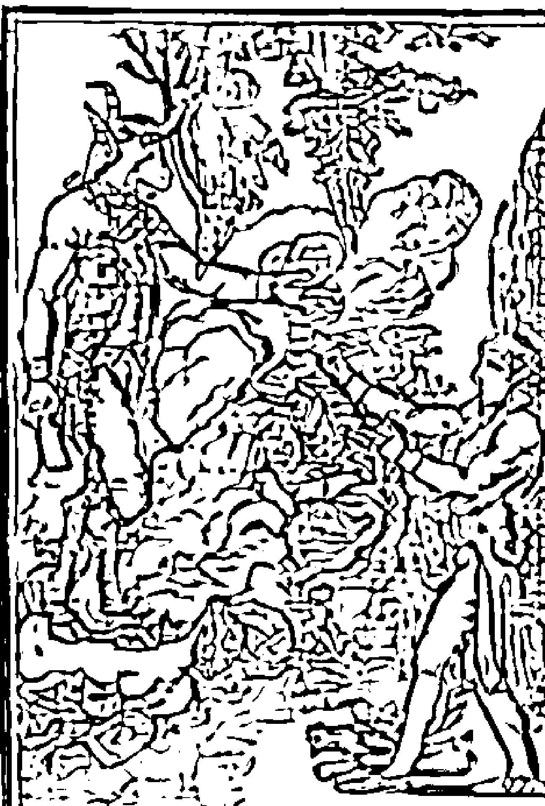

现身的恶鬼

川口所须未与公鸡交尾、从未下卵的黑母鸡。

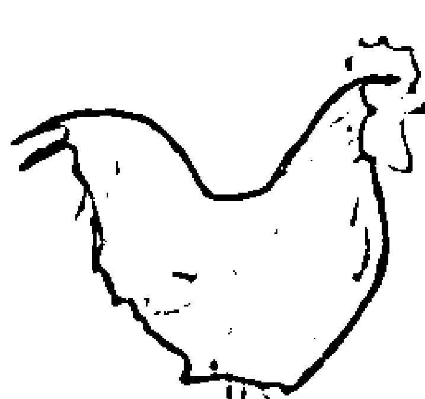

川口抱着黑母鸡走上大街，来到第十一号路口。


川口将白纸制成魔法图，将黑母鸡撕成两半唱诵咒文：「耶萨姆，耶萨姆，我求我愿，显现此黑母鸡之灵，恶鬼就将出现。」

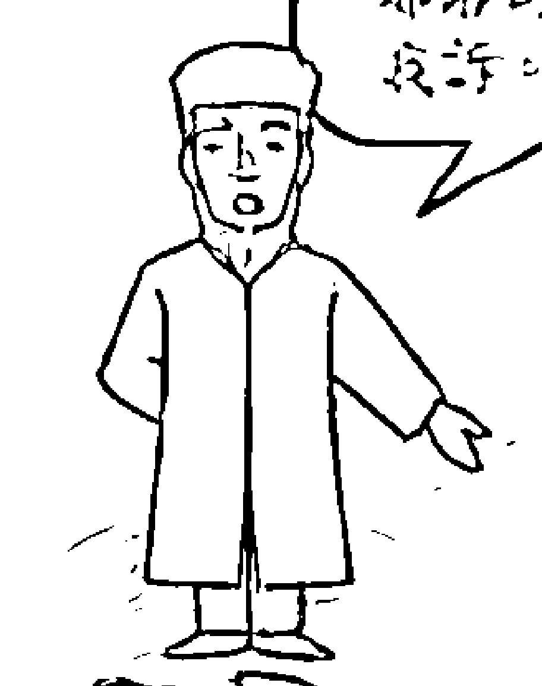

耶萨姆，耶萨姆，我求我愿。

## No.070
《细说神秘哲学》
De occulta philosophia

《细说神秘哲学》乃文艺复兴时代描述自然魔法之代表作，儘管它与一般魔导书非属同类，却也对后世的魔法造成了莫大的影响。

### ○介于自然魔法与黑魔法间的魔法书

《细说神秘哲学》乃文艺复兴时代最重要的魔法师海因利·科内利乌斯·阿古利巴（1486～1535），通称阿古利巴著作的自然魔法作品。所谓自然魔法便是种考察创造世界的神力是以何种形式影响人类世界的学问，所以自然魔法绝非邪恶的魔法，而是就连中世时期的基督教会亦表认同的魔法。

是故，《细说神秘哲学》在今日往往不被归入魔导书部类。可是这本书跟魔导书的魔法——亦即操纵恶魔的黑魔法——在原理上却有难以区分处，并且对后世魔导书造成了莫大的影响。此外，就连作者阿古利巴本身也因为写下这本书而被误解为与恶魔签有契约的黑魔法师。阿古利巴饲有一头黑犬，经常随身带着它同行，以致众人相信那隻黑犬便是恶魔变成的魔宠。光就这点而论，则《细说神秘哲学》之定位几乎与其他魔导书无异。

此书写的是类似于《皮卡特里斯》（请参照P.016）的星辰魔法相关内容。换言之，《细说神秘哲学》说的是天界有无数天使与恶魔，而神的力量乃是透过这些灵体影响物质界。除此之外，此书也有使用到喀巴拉和占数术，并主张可以透过与天使对话的仪式或者喀巴拉仪式得到神的恩惠。

根据阿古利巴表示，此书之目的在于召唤善灵、击败恶灵，但这只不过是表面的说法，书裡说真正的宗教与邪恶的魔法两者原理是完全相同的。此书之所以会被视为邪书，或许可以说是正因为此等性质所致。

## 《自然神秘哲学》的特徵

> 阿古利巴的代表作。自然魔法之书，但对原理论亦有很大影响。

- 第一章：论行星之影响力、物质与天使的关系等等自然界的魔法力量。
- 第二章：论世界之根源——数学的力量（占数术）。
- 第三章：论融合喀巴拉力量的仪式魔法。

## 《自然神秘哲学》的原理

> 欲智界神的力量乃以宇宙精气为媒介先到达星辰界的天使及繁星，接着再传递至物质界，是故，只要能正确地操作星辰界的存在及亲和性物质，便能召唤运用高等的神力。

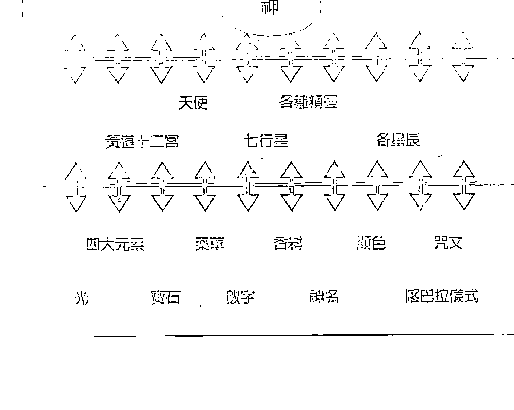

## 《細說神秘哲學 第四書》
The Fourth Book of Occult Philosophy

此魔導書乃是以文藝復興時代最偉大魔法師阿古利巴之名發表的《細說神秘哲學》續集，其中記載有如何從事儀式魔法的具體方法。

### ○果真是文藝復興時期神秘學界巨匠阿古利巴著作嗎？

《細說神秘哲學 第四書》（1559年）是部因爲冠名阿古利巴而特別受矚目的魔導書。

海因利·科內利烏斯·阿古利巴（1486～1535）乃以著作共三卷的《細說神秘哲學》並且對後世歐洲神秘學界造成莫大影響而爲世所知，是文藝復興時期的神秘學家代表人物；《細說神秘哲學 第四書》卻將阿古利巴在《細說神秘哲學》裡面都未曾提及的具體儀式魔法都記載了下來，想當然爾這部魔導書自然是大受矚目。

只不過這本書果真是阿古利巴著作嗎？一般對此多持懷疑看法，因爲就連阿古利巴的弟子、同時也是《惡魔的僞王國》作者的約翰·韋爾都曾批判此作品爲僞作。其次，此書發表於阿古利巴過世30年後的1559年亦是另一疑點。不過著名的魔法師偉特卻說並無理由可以否定此書本身並非阿古利巴著作。

《細說神秘哲學 第四書》是本很小的書，說明也相當簡略，其中泛論儀式魔法之基礎如下：

- 所謂儀式魔法之基礎包括——
  - 得知七行星天使與惡魔名字的方法。
  - 得知天使與惡魔符號的方法。
  - 各行星天使與惡魔之外觀特徵（請參照P.154）。
  - 星陣圖與印記的製作方法、使用方法、效能。
  - 道具與場所的聖別方法。
  - 天使與惡魔的召喚方法。
  - 場地準備以及其他事項的準備方法。
  - 祭壇與雷曼（魔法用墜飾）的製作方法。
  - 召喚衆靈的簡略方法。
  - 論靈的托夢。
  - 遣走衆靈的方法。
  - 面對衆靈的其他對應方法。
  - 降靈術（死靈術）的方法——等內容。

## 魔導書簡介

以巨匠阿古利巴之名發表的魔導書，作者不詳。

內容謂述《細說神秘哲學》本身未曾提及的具體儀式魔法。

## 《細說神秘哲學 第四書》的內容

> 《細說神秘哲學 第四書》主題大致如下：

- 分屬各行星之天使與惡魔之外觀特徵。
- 道具與場所的聖別方法。
- 達到分屬於七行星之天使與惡魔之名字的方法。
- 天使與惡魔的召喚方法。
- 遣走衆靈的方法。
- 得知天使與惡魔符號的方法。
- 賢者之印記的製作方法、使用方法、效能。
- 祭壇與靈曼（魔法用墜飾）的製作方法。
- 論靈的托夢。
- 魔法儀式以及準備其道具的進行方法。
- 降靈術（死靈術）的方法。

愛德華·亞特（1857~1942）。近代西洋儀式魔法秘密結社·黃金黎明的中心人物，有許多神秘學論述著作。

## 各行星的靈
The Spirits of the planets

根據《細說神秘哲學 第四書》記載，土星的靈會以騎著龍的國王模樣出現，木星的靈則是會以拔劍出鞘的國王模樣現身。

### ◎樣貌有如所羅門王72惡魔的各行星神靈

七行星當中所宿靈體會以何種模樣出現呢？偽阿古利巴所著《細說神秘哲學 第四書》（請參照P.152）有以下的說明：

土星諸靈多以騎著龍的長髯國王、讓僕從攙扶的老太太、豬、龍、貓頭鷹等模樣出現。他們大多身材結實頎長，表情惱怒，有四張臉。

木星諸靈多以手持出鞘長劍騎著公鹿的國王、頭戴花朵月桂冠的女性、公鹿、公牛、孔雀等模樣出現。他們一副對身體很有自信的模樣、中等身材，一舉一動給人恐怖的感覺。不過他們表情柔和，講話也很鄭重。

火星諸靈多以騎著狼的武裝國王、抱著圓盾的女性、公山羊、馬、公鹿、羊毛等模樣現身。他們身材高大、性格易怒，長相醜陋。另外，他們還長有鹿角和獅身鷲的爪子。

太陽諸靈多以騎著獅子的持笏國王、持笏女王、獅子、公雞、鳥、笏等模樣出現。他們身材幾乎都相當龐大、充滿自信，皮膚金黃臉色紅潤，動作有如閃電一般。

金星諸靈多以騎駱駝的持笏國王、盛裝女性、裸體女性、母山羊、駱駝、鴿子等模樣現身。他們容貌美麗、中等身材，性格友善、表情愉悅，身體是白色或碧綠色，唯上半身為金色。

水星諸靈多以騎著熊的國王、美麗的少年、手持捲線棒的女性、狗、母熊、喜鵲等模樣現身。他們幾乎都是中等身材，說話親切。

月亮諸靈多以騎著母鹿作射手裝扮的國王、少年、持弓箭的女獵人、母牛、母鹿、鴨子等模樣現身。他們身材幾乎都相當魁梧，臉大禿髮紅眼，牙齒則有如山豬。

## 七行星靈的模樣各有特徵。


> 根據《細說神祕哲學 第四書》記載，七行星諸靈多以下列模樣出現：

- 土星：騎著龍的長髯國王、讓僕從攙扶的老太太、豬、龍、貓頭鷹等模樣。
- 木星：手持出鞘長劍騎著公鹿的國王、頭戴帶著花朵月桂冠的女性、公鹿、公牛、孔雀等模樣。
- 火星：騎著狼的武裝國王、抱著圓盾的女性、公山羊、馬、公鹿、羊毛等模樣。
- 太陽：騎著獅子的持笏國王、持笏女王、獅子、公雞、鳥、笏等模樣。
- 金星：騎著獅子的持笏國王、盛裝女性、裸體女性、母山羊、駱駝、鴿子等模樣。
- 水星：騎駱駝的持笏國王、美麗的少年、手持捲線棒的女性、狗、母熊、喜鵲等模樣。
- 月亮：騎著母鹿作射手裝扮的國王、少年、持弓箭的女獵人、母牛、母鹿、鴨子等模樣。

## No:073
## 《魔法要素》
Heptameron or Magical Elements

《魔法要素》传为中世纪意大利哲学家阿巴诺的彼得所著，是部记载如何操纵每周七日各天使的魔导书。

### ○操纵七日天使之魔法入门书

《魔法要素》乃是16世纪后半叶《细说神秘哲学 第四书》（请参照P.152）付印出版时，以其附录形式为世所知的小篇幅魔导书。作者名乃是伪称，冠的是阿巴诺的彼得之名。

> 此书前言如下：「《细说神秘哲学 第四书》虽然写得恳切郑重，然其内容多属泛论、缺乏具体性，似乎较适合通晓魔法的大师阅读。故此附上《魔法要素》作为附录。此书如同魔法的入门书，只须按照内容指示，即便初学者也能执行仪式、召唤精灵。」

换言之：《魔法要素》内容比《细说神秘哲学 第四书》更加具体，是部只须遵从内容所写便能召唤精灵、专为初学者著作的魔导书。书名「Heptameron」有「七天」之意，而此书内容亦恰如其名，是部讲述如何操纵每周七日各天使的魔导书。

- 此书内容分成两个部分：
  - 第一部分说明的是在天使的协助下召唤恶魔麾下空气精緻的魔法仪式。其中具体记载到执行仪式所须的魔法圆制作方法、星阵图及服装相关规定、仪式前的准备、祈请天使协助的咒文、召唤恶魔的方法等。
  - 第二部分说明的则是召唤每周各一天使的魔法，并记载有每周各日须用的天使印记、召唤咒文、薰香等事项。除此以外，书中还收录有各日各时刻的天使名字一览表。

## 《魔法要素》的特徵

- 教導初學者操縱每週各日天使的魔導書。
- 傳為阿巴諾的彼得所著。
- 16世紀後半期出版。

## 《魔法要素》的內容

《魔法要素》由以下兩個部分構成：

1.  取得天使協助以召喚空氣精靈（惡魔）之魔法儀式相關說明。
    - 魔法圓製作方法、星陣圖與服裝相關規定、準備、咒文、召喚法等。
    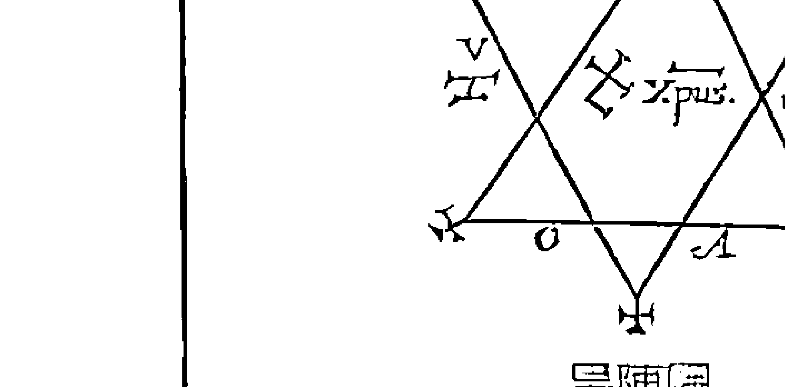
    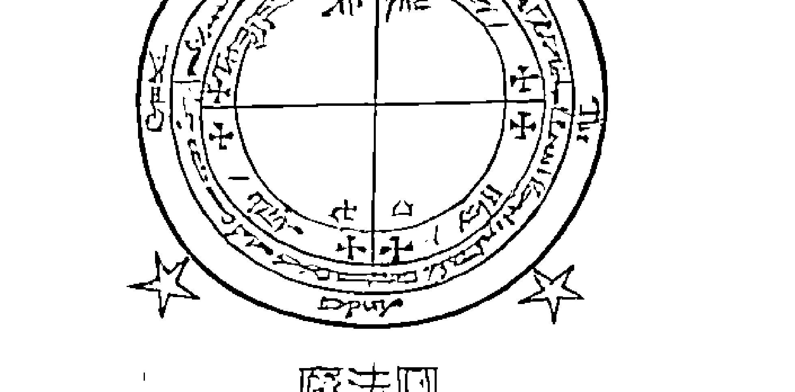
2.  召喚每週各日天使之魔法相關說明。
    - 天使印記、召喚咒文、承香相關事項、各日各時刻天使的一覽表等。
    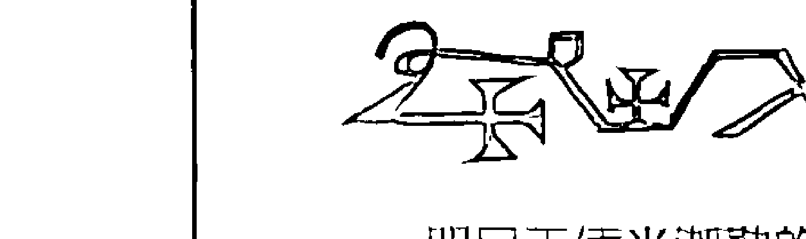
    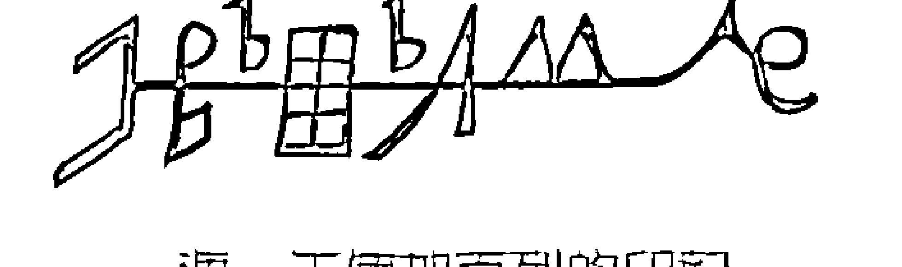

- 阿巴諾的彼得·1250～1316年。出身義大利的哲學家、占星術師。學於巴黎並... 傳聞擁有七隻魔寵。

## 《遠古魔法阿巴忒爾》
The Arbatel of the Magic

《遠古魔法阿巴忒爾》乃以詳細說明奧林匹亞七精靈的名字符號而聞名，是部迥異於猶太·基督教傳統的魔導書。

### ## ○操縱奧林匹亞精靈的魔導書

《遠古魔法阿巴忒爾》乃是以奧林匹亞精靈（請參照P.160）相關記述而聞名的魔導書。拉丁語版出版於1575年的瑞士巴塞爾，作者不詳。

可惜的是，此書如今僅剩部分內容留存。當然也有可能是打從一開始此書內容便僅止於此而已，可是這些剩下來的部分內容卻像是整本書的預告，引人想像這本書極富魅力的全貌。

此書殘存的第1卷題名為「導論」，或作「魔法教則」。這第1卷除介紹整本書的前言以外，還收錄有每章7個格言、總共7章的格言集；根據此書表示，這個格言集的內容是「最普遍的魔法教條」。

其前言記載到此書共分9卷，從第2卷以後應該依序是

- 小宇宙魔法
- 奧林匹亞魔法
- 赫西奧德與荷馬魔法
- 西碧魔法
- 畢達哥拉斯魔法
- 阿波羅尼俄斯魔法
- 赫密斯魔法
- 預言魔法

這篇預言的後面則是7章格言集，解說的是上述各種魔法相關概要。其中最常被提及的，當屬講述奧林匹亞魔法的第3章格言集，內中收錄了有關奧林匹亞精靈的記述；這段記述並不長，卻記載到奧林匹亞七精靈的名字、符號與能力等，內容相當豐富。

黃金黎明的魔法師亞瑟·愛德華·偉特表示此書是部真正超越性的論文，跟危險的黑魔法全無任何關聯。此外他還說到，從各章題名便不難發現，《遠古魔法阿巴忒爾》是部非《所羅門王之鑰》系列的魔導書，獨立於猶太·基督教的傳統之外。

## 《遠古魔法阿巴忒爾》的特色

- 以奧林匹亞七精靈而聞名的魔導書。
- 內容非屬猶太・基督教性質。

## 《遠古魔法阿巴忒爾》的內容

根據第1卷「導論」，《遠古魔法阿巴忒爾》全書應該有以下9卷：

| 卷名 | 內容解說 |
| :--- | :--- |
| (I) 魔法格言 | 收錄共49個格言，是就魔法記述的最通遍教條。 |
| (II) 小宇宙 | 論在充滿靈與守護靈的小宇宙 (Micro Cosmos) 中一種名為靈習的魔法影響力。 |
| (III) 神秘的恩惠 | 說明人類該如何驅動奧林匹亞眾精靈、如何接受其恩惠。 |
| (IV) 鬼魂的儀式 | 敘述如何透過跟人類非屬敵對關係、名為惡鬼 (Cacodaemon) 的眾靈進行魔法儀式。 |
| (V) 神聖魔法 | 針對司掌整個地球的指導靈施行的魔法，是擁有真正價值的魔法。德爾伊教義認的便也正是此魔法。 |
| (VI) 實踐魔法 | 唯有跟具備物理、藥學、數學、鍊金術等技藝的眾靈合作方能完成的魔法。 |
| (VII) 吉普賽魔法 | 跟吉普賽魔法以及小宇宙魔法相當類似的魔法。不同的是，此魔法的對象乃是與人類相敵對的精靈。 |
| (VIII) 埃及魔法 | 埃及魔法，跟神聖魔法並無太大差異。 |
| (IX) 預言魔法 | 純粹只去尋求主話語中的智慧，此即預言魔法。 |

## 奧林匹亞精靈
Seven Olympic Spirits

居住於天空繁星之中的奧林匹亞七精靈，每位麾下都是擁有眾多部屬與軍團的君主，七個行星甚至全宇宙均由彼等分而治之。

### ## ○行使治下行星力量的天空七精靈

所謂奧林匹亞精靈便是統治七行星的七位精靈或者天使。魔導書《遠古魔法阿巴忒爾》（請參照P.158）對彼等有詳細的介紹。據其所載，奧林匹亞精靈居住於天空的繁星之中，他們每位都是擁有眾多麾下與軍團的君主，並且在神的允準下統治支配整個宇宙。他們的工作便是宣告命運，並且在神的允準下行使決定性的魔力。他們的統治力透過各行星及於全宇宙，全宇宙亦因此而劃分為七個統治區域，這七個統治區域又可分為196個奧林匹亞轄區。七精靈名字的阿拉伯語分別是Aratron、Bethor、Phaleg、Och、Haggith、Ophiel、Phul。

彼等的統治力與影響力如下：

- Aratron統治土星與49轄區
- Bethor統治木星與42轄區
- Phaleg統治火星與35轄區
- Och統治太陽與28轄區
- Haggith統治金星與21轄區
- Ophiel統治水星與14轄區
- Phul則是統治月亮與7個轄區。

他們行使的魔力便是其統治下行星的力量，就跟占星術中各行星的力量是相同的。

只要有堅定的信仰，召喚奧林匹亞精靈其實很簡單。他們會在各自行星掌管的日時出現，若以Aratron為例，便是週六的第1時刻。屆時只要提示神賜予彼等的名字、職役與符號並唱誦咒文，便能將他們召喚出來。其次，整體統治權亦即最高君主權限乃由奧林匹亞七精靈以490年為週期輪流交替：以周期來說，從基督誕生的60年前到西元430年是由Bethor統治；其後Phaleg統治到920年，Och則是統治到1410年，接著就按照先前名字順序輪流掌握統治權。

## 奥林匹亚精灵

以君主身份高踞于天空的七精灵。

分别统治整个宇宙。

奥林匹亚七精灵及其统治区域划分如下，圆圈内为精灵的符号。

### 全宇宙

| 编号 | 名称 | 统治区域符号 | 管辖区域 |
| :--- | :--- | :--- | :--- |
| 1 | Aratron | 土星符号 + 带环行星符号 | 49辖区域 |
| 2 | Bethor | 木星符号 | 42辖区域 |
| 3 | Phaleg | 火星符号 | 35辖区域 |
| 4 | Och | 太阳符号 | 28辖区域 |
| 5 | Hagith | 金星符号 | 21辖区域 |
| 6 | Ophiel | 水星符号 | 14辖区域 |
| 7 | Phul | 月亮符号 | 7辖区域 |

七精灵君主地位乃按照1～7的顺序以490年为周期轮流替换。

## No.076 《地狱的三重胁迫》
### The Threefold Coercion of Hell (The Black Raven)

《地狱的三重胁迫》相傳是傳奇人物浮士德博士所著，記載有操縱地獄七大公爵的咒文與印記等內容，尤其在德國特別受到歡迎。

### ○輕易獲取金銀財寶

《地獄的三重脅迫》據說是那位因為與惡魔梅菲斯特締結契約而聞名的傳奇人物浮士德博士（請參照P.046）著作的其中一部魔法書。此書出版印刷於17～18世紀間，博得頗高人氣。此書初成於何時今已不得而知，不過亦有說法指出此書其實是浮士德傳說背後的史實人物約翰·喬治·浮士德博士所著；若此說法為真，則此書應是初成於1500年前後。此書別名《黑鴉》，這是因為當時德國成版印刷的魔導書往往都附有烏鴉的圖片，故將此類魔導書統稱為「黑鴉」。

《地獄的三重脅迫》題名當中的「脅迫」一詞自古以來直便是與召喚惡魔頗有淵源的用語，帶有脅迫惡魔之意涵。

魔導書《地獄的三重脅迫》之主題恰如其名，是在於召喚地獄的惡魔令其實現自身願望。為此，魔導書中非但記載了從魔法圓的製作方法到各惡魔專用的印記、咒文等許多內容，同時還收錄有簡單的地獄帝國階級一覽表。此外，供術者驅動的惡魔便即所謂地獄七大公爵，他們分別是Aziel、Ariel（亞利）、Marbuel、Mephistopheles（梅菲斯特）、Barbuel、Aziabel和Anifel。

- 地獄七大公爵：
  - Aziel
  - Ariel (亞利)
  - Marbuel
  - Mephistopheles (梅菲斯特)
  - Barbuel
  - Aziabel
  - Anifel

此書前言如下：

> > 「此乃約翰·浮士德博士的奇蹟魔導書。本人約翰·浮士德博士曾藉此魔導書脅迫地獄眾靈，令其實現我願望，無論是金銀財寶或是尋找地下水脈，在這地上沒有辦不到的事，全部都是因為此魔導書而致可能。當然，願望實現後令諸靈安然歸返亦屬可能。」

# 浮士德博士的魔导书

# 地狱的三重胁迫

传奇人物浮士德博士的作品？
实为17~18世纪间德国的魔导书。
号令地狱七大公爵。

# 七公爵的特征及符号

《地狱的三重胁迫》中地狱七大公爵之特征及符号如下：


Azazel
掌管隐藏于所有土地的宝物。

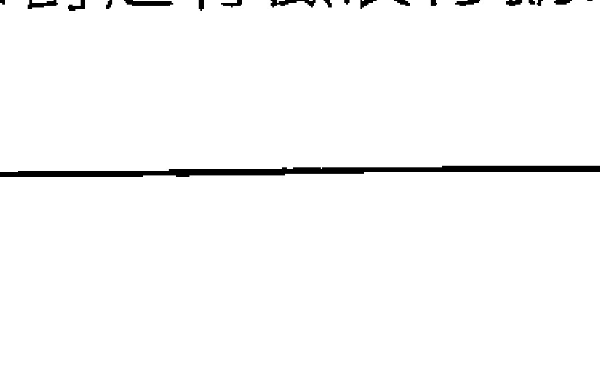

Marbas
需要帮助可随时现身相助。

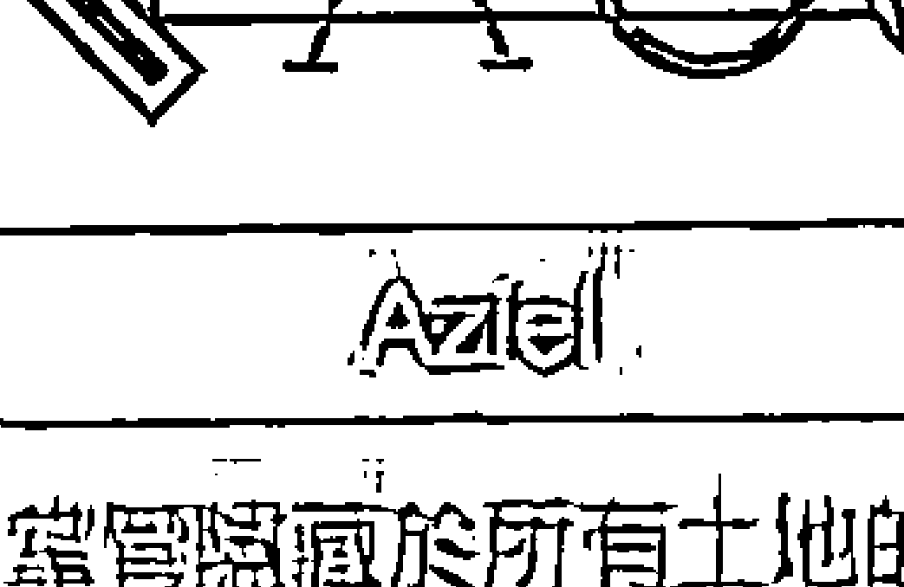

Mephistopheles
技艺的司令者，可使人轻易习得任何技术。

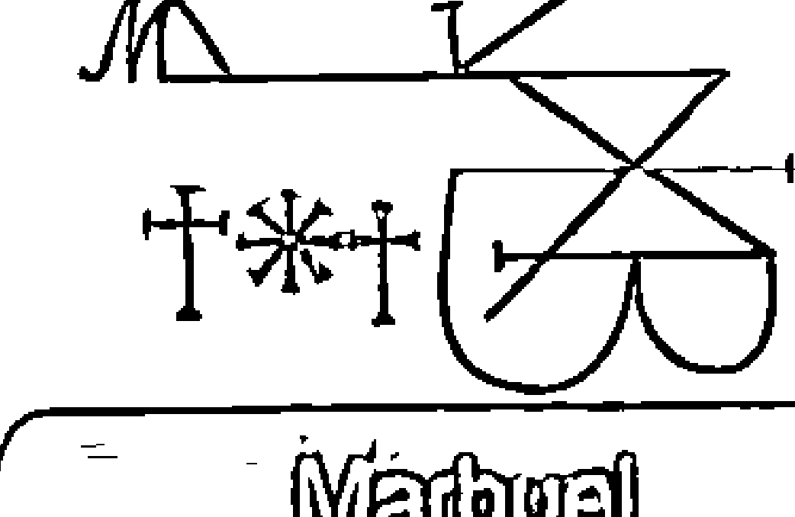

Astaroth
掌管法术问题，守护财产、名誉、地位。

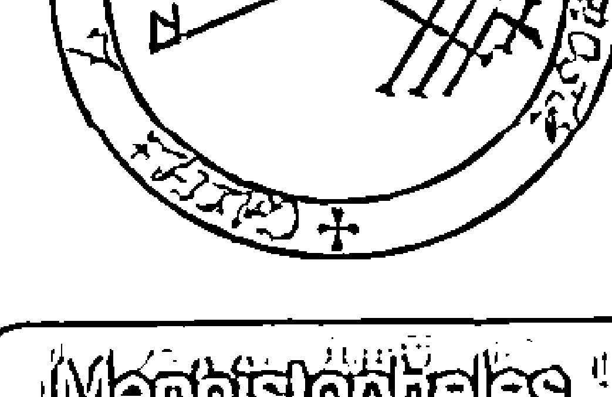

Amdusias
不明。

# 《真正魔导书》

Griniorum Verum (or True Grimoire)

按照黄金黎明结社学者A・E・伟特的分类，这部指导施术者操纵地狱恶魔的《真正魔导书》乃是百分之百的黑魔法魔导书。

# ○如假包换的黑魔法书籍

《真正魔导书》是部用于操纵恶魔的著作，隶属于黄金黎明的神秘学家亚瑟・爱德华・伟特¹曾经断言此书百分之百是部属于黑魔法范畴的魔导书。根据其封面书页记载，此书乃1517年埃及人阿里贝于孟斐斯²所著，乃传承自所罗门王，然后世却研判认为此书乃18世纪罗马的出版品。

此书由三个部分所构成，第一部分是介绍此书召唤的众恶魔名及其阶级组织。据其所载，统治恶魔界的三大恶魔分别是辖领欧洲与亚洲的路西法、辖领非洲的别西卜，以及辖领美洲的亚斯她录；三大恶魔之下有18名位列公爵的恶魔，其麾下又有众多恶魔从属。此部分亦刊载有三大恶魔专用的魔法圆和印记。

第二部分介绍的是18名公爵恶魔的特殊能力。Clauneck司掌财宝，能为人发现宝物；Frimost司掌女性，能助人获得女性的爱；Mersilde能使人瞬间移动到任何地方，Frucissiere则是能使死者复活，诸如此类。据说此部分仅仅介绍到18名恶魔的能力，那是因为其下更低等级的众多恶魔并无能力的缘故。

第三部分是记载具体的仪式程序、三大恶魔的召唤咒文、低位恶魔的召唤咒文、特定目的专用咒文等内容。除上述内容以外，此部分对如何制作仪式用小刀、如何制作羊皮纸、如何祝福盐巴等诸多魔法道具亦有说明，不过内容差不多等于是《所罗门王之钥》与《雷蒙盖顿》（《所罗门王的小钥匙》）的简略版。

¹ 伟特注释：请参照P.227注释附录No.049 *1。
² 孟斐斯：古埃及城市。

操纵地狱恶魔的黑魔法魔导书。
《真正魔导书》 ⇒ 相传此书传承自所罗门王?! 实为18世纪罗马的作品。

《真正魔导书》主要运用的是下列位属公爵的18恶魔：

| 名称 | 能力 |
|------|------|
| ? | 财富的掌管者，能为人找到遗物，并能使人致富。是受路西法喜爱的恶魔。 |
| ? | 统治众多伟大的君主，能提供各国发生何事或同盟关系如何等情报。 |
| ? | 不明。 |
| ? | 司掌女性与少女，能使人获得女性的帮助。 |
| ? | 能使人看见各种梦境与幻想。 |
| ? | 拥有引起地震之能力。 |
| ? | 能使任何人瞬间移动至任何地方。 |
| ? | 能随时任意切换昼与夜。 |
| ? | 能展示所有种类的自然界动物以及幻想动物。 |
| ? | 能将身在远处的人瞬间带到眼前。 |
| ? | 能将所有想要的书带到眼前。 |
| ? | 能使各领域的天才出现在眼前。 |
| ? | 能使死者复活。 |
| ? | 能治愈所有疾病。 |
| ? | 能打开所有种类的锁。 |
| ? | 能使所有物事隐形。 |
| ? | 能准备各种豪华餐点。 |
| ? | 能使失眠者沉睡。 |

# No.078

# 《亚伯拉梅林的神圣魔法书》

# The book of the sacred magic of ABRAMELIN the mage

魔法师亚伯拉梅林乃是透过圣守护天使的力量，始得舍弃魔法圆或恶魔印记不用，单凭排列成方形的拉丁文字来操纵恶魔。

# ○与圣守护天使对话的重要性高过一切

《亚伯拉梅林的神圣魔法书》应是于17世纪德国所创作的魔导书；当初已有众多抄本流通，1725年始于科隆¹付印出版。此书至今仍然非常有名，黄金黎明魔法师麦达格·玛瑟斯的贡献可谓颇大。他研究收藏于巴黎图书馆的魔导书藏书，发现18世纪初的法语抄本，始将此书译成英语并于1897年出版。

此书所载魔法之特色，便在于以守护天使为操纵恶魔之最大力量。之所以如此，那是因为世间所有物事本就是恶魔按照天使指示所创造，是以施术者须得透过与圣守护天使的对话方能唤醒自身神性以号令驱使恶魔。

此书共分三个部分，第一书讲的是此书由来及其魔法基础哲学。据内文记载，14、15世纪有名叫作亚伯拉罕的犹太人周游各国途中，于埃及遇见名为亚伯拉梅林的魔法师，并得其传授此魔法；另外，据说此书起初是以希伯来语写成，是1458年亚伯拉罕为方便儿子拉美克阅读才翻译成法语的。

第二书最为重要，讲的是在获得守护天使庇护而得以号令恶魔之前长达半年的准备作业（包括对自己施圣别²、制作魔法道具等）以及为期七天的天使恶魔召唤仪式。

第三书则是记载召唤恶魔实现愿望所须各式各样的护符。其内容非常独特，里面并无其他魔导书那种寻常的魔法圆或印记，全部是由排列于方框之中的拉丁语文字列所构成。

¹ 科隆：德国城市。
² 圣别：或指“圣化”、“祝圣”仪式。

# 第2章 《所罗门的小钥匙》

《阿布拉梅林的魔法书》
成书于17世纪的德国。
发现者为麦达格·玛瑟斯。

# 第1部 《阿布拉梅林的魔法书》的特征

透过对话获得天使庇护至为关键！

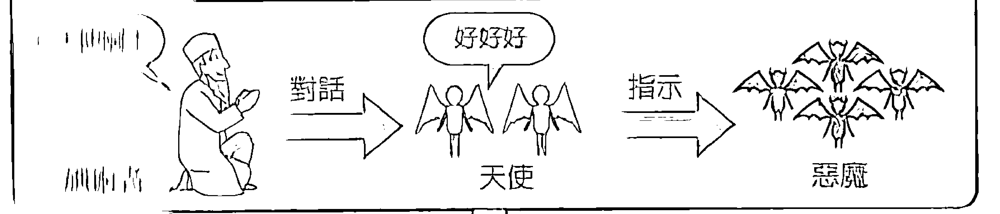

接着召唤位列高阶君主的恶魔，命其属下恶魔发誓效忠。

-   ### 七十二柱魔神
    * 路西法
    * 利维坦
    * 撒旦
    * 彼列
    * 亚斯她录
    * 玛帕特
    * 阿斯摩太
    * 别西卜
    * 欧赛斯
    * 派蒙
    * 阿利欧
    * 亚迈蒙

☆旗下有316名可供号令使唤的从属官（魔记：？）。

# 不用魔法阵和印记！

此法使用的是如下排列于四方形内的文字列魔符，以此图护符执行仪式便能令恶魔以特定模样出现。

```
### 恶魔出现形态
* ①以龙的模样出现
* ②以动物模样出现
* ③以人类模样出现
* ④以鸟的模样出现

**文字魔方阵（示例）**

L U C I F E R   L E V I A T A N   S A T A N
U N A N I M E   E R M O G A S A   A D A M A
C A T O N I F   V M I R T E A T   T A B A T
I N O N O N I   I O R A N T G A   A M A D A
F I N O T A C   A G T N A R O I   N A T A S
E M I N A N U   T A E T R I M V
R E F I C U L   A S A G O M R E
                N A T A I V E L
```

# # 《阿尔玛岱的魔导书》The Grimoire of ARMADIL

# ## The Grimoire of ARMADIL

《阿尔玛岱的魔导书》是部借助天使与恶魔力量制作有益的护符，藉以获得天使学与恶魔学知识、古代智慧、圣经秘密等智慧的白魔法书。

# ### ○根据目的制作相应护符的白魔法书

《阿尔玛岱的魔导书》是部经常被划分为白魔法的魔导书。此书盛行于17世纪的法国，有法语和拉丁语版抄本。该时代法国的恶魔附身事件发生相当频繁，致使此类魔导书颇受民众喜爱。阿尔玛岱此人已完全不可考，不过许多相关书籍均可见其名，已普遍被视为是魔法世界的权威。
《阿尔玛岱的魔导书》是供人根据目的制作相应护符（Talisman）的书籍，书中收录许多用于绘制护符的印记（Sigil）；欲赋予护符力量，则必须召唤能力与专用印记相对应的天使或恶魔。

然而，此书追求的却并非其他魔导书所谓发现财宝、获得名誉之类的低俗目的。召唤天使自然不在话下，即便召唤恶魔同样也是出于高尚目的。举例来说，召唤阿斯摩丢斯与利维坦之用意是要知道恶魔的恶行恶德有多么恐怖；至于召唤布洱佛尔则是可以得知恶魔的本性本质，以及如何控制恶魔行动的方法；恶魔劳涅则会告诉我们他在被逐出天界后是如何变成恶魔的、当初是如何决定落脚于何处、他们是在亚当受创造后多久被逐出天界的、以及他们是否拥有自我意志等诸事。其他像路西法、别西卜、亚斯她录则是会说出当初他们反叛的经过。换句话说，按《阿尔玛岱的魔导书》召唤神灵所能得到的便是跟天使与恶魔相关的高等知识，而这大概也就是为何此书会被视为白魔法书的缘故。

# 运用有益灵力制作护符，并以获得高等知识为目的之白魔法。

成立于恶魔附身事件频繁的17世纪法国。

# 护符制作方法以及用于各别目的之印记

-   1. 首先找出相对应天使、恶魔的印记。
    2. 其次将印记绘于羊皮纸，制成护符形状。
    3. 最后召唤天使、恶魔，为护符赋予灵力。

> 护符的制作程序如左。魔导书中记载有许多供施术者制作护符的印记。


# 【印记例】

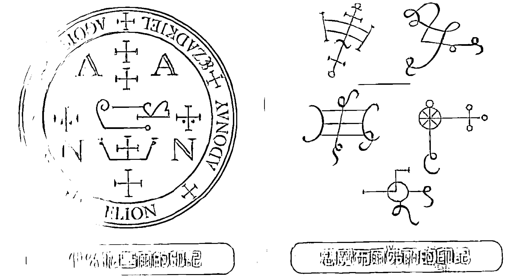

能得知恶魔之本性、拘禁方法。

# 「黑书」

Svarteboken Black Book

以寻宝为重要主题的「黑书」乃是从前流行于丹麦、瑞典的魔导书统称，曾经一度颇受教师、圣职者与士兵等阶级爱读。

# ○来自威登堡的魔导书

北欧地区经常会直接引进未经翻译的德语魔导书，不过18～19世纪的丹麦与瑞典却也有内容相当独特的魔导书；这些魔导书一般称作「黑书」，作者大多都是圣西普里安。

「黑书」内容五花八门，其中亦不乏记载护符药草等根本称不上是魔导书的作品；不过「黑书」后来却是与其他国家如出一辙地愈来愈看重寻宝之功用，甚至还有记载恶魔契约的作品出现，譬如19世纪初的魔导书就说欲召唤恶魔，必须每天早晨唱诵曰：

> 「我誓与创造主及圣灵断绝关系，并且遵从地狱之王路西法。路西法将实现我的愿望，我则以自身鲜血作为交换。兹以自身鲜血署名，以为契约凭证。」

由于18、19世纪的北欧并无廉价的魔导书，故魔导书之使用者仅限于教师、圣职者、士兵等人物。其中尤以士兵最敢于与恶魔签约，其目的不外乎是获得财富以及保护自己不致中弹死亡。

「黑书」还经常记载一种使用方法与ABRACADABRA相同、名为「KALEMARIS」的护符。

尽管对魔导书来说已是屡见不鲜之事，斯堪的那维亚半岛的魔导书也往往被指为是与魔法素有渊源之地发行的刊物，不过这个地方并非罗马或托莱多那般寻常的魔法重镇；斯堪的那维亚半岛的「黑书」大多是以德国的威登堡作为魔导书的发行地，而这威登堡自然便是以浮士德博士曾经于此跟恶魔缔结契约而闻名的森林城镇。

# 第3章 奇幻的魔导书

「黑书」
北欧对魔导书的通称。
往往指为圣西普里安作品。

-   * 内容为何？
    * 与其他魔导书同样，寻宝是相当重要的元素。
    * 有些内容甚至涵盖恶魔契约。

北欧的教师、圣职者、士兵等会使用魔导书，最常与恶魔签约的则是士兵。

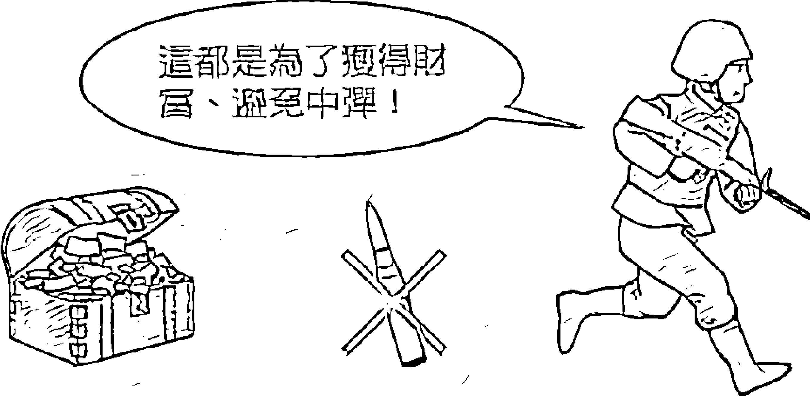

# 「KALEMARIS」与「ABRACADABRA」护符

| KALEMARIS | ABRACADABRA |
| :--- | :--- |
| KALEMARIS | ABRACADABRA |
| KALEMARI | ABRACADABR |
| KALEMAR | ABRACADAB |
| KALEMA | ABRACADA |
| KALEM | ABRACAD |
| KALE | ABRACA |
| KAL | ABRAC |
| KA | ABRA |
| K | ABR |
| | AB |
| | A |

北欧的魔导书「黑书」当中记载有某种与中世欧洲「ABRACADABRA」类似的「KALEMARIS」护符。这些都是驱逐疾病、不幸与恶灵的护符，使用方法亦同，首先将此二词分别写在纸上，向下依序递减1个字母，写成逆三角形状。拿布把纸包起来，绑在脖子附近九天，然后背对东流水从肩膀上方向后投掷，据说如此便能驱逐疾病等恶运。

ABRACADABRA的图示

# # 文艺复兴的魔法思想

欧洲从14〜16世纪的文艺复兴时期开始有大量魔导书问世，并广泛受到民众利用。

这是因为此时代的欧洲人大多都相信天空中有精灵存在、宇宙是有生命的有机统一体而且其神秘影响可及于各个角落等魔法思想。

此处先就这个时代欧洲流行的灵思想、魔法思想作个简单的解说。

这种魔法思想世称新柏拉图主义¹，乃受古代地中海周边地区流行的赫密斯主义²、诺斯替教³影响而形成。

此思想认为早在世界初创始时，原初宇宙里原本只有神这个唯一的存在；后来从神的身上流溢出散发着耀眼光芒的灵，然后这个灵才创造了我等人类居住的宇宙（太阳系）。也就是说，存在于这个宇宙的一切都是由唯一神流溢出的灵所构成的。

如此形成的宇宙是个地动说的宇宙，受空气层包围的地球位于正中央，其外是太阳、月亮、火星、水星、木星、金星和土星这七个行星存在运行的七层天，七层天之外则是无数不动恒星的第八层天。这便是人类所居宇宙的基本构造，至于第八层天之外自然就是神存在的世界。

然则此思想有个重点，那就是它认为整个宇宙就是个由神流溢出的灵构成的单一有机体；换句话说，整个宇宙就像是一个动物；既然宇宙是一个动物，那么无论身体的各部位相距有多么遥远，其间都有必然的关联性存在才是。照这样想，则天体这个大宇宙（Macro Cosmos）和地球抑或人类等小宇宙（Micro Cosmos）双方面之间就会拥有完全的对应关系成立。也就是说在这个宇宙之中，天体（灵）的力量将会影响到地球抑或人类。

这种思想先是从地中海世界传入阿拉伯世界，然后再透过《皮卡特里斯》⁴等魔法书再度进入欧洲，以至后来成为文艺复兴时期众多知识分子信仰的思想。正因为如此，这个时代的所有魔法类别活动才會顯露真相，也才會不斷有魔導書的陸續問世。

> ¹ 新柏拉图主义：请参照P.227注释附录No.049 *1。
> ² 赫密斯主义：请参照P.227注释附录*2。
> ³ 诺斯替教：请参照P.227注释附录*1。
> ⁴ 《皮卡特里斯》：请参照P.016内文。

# 第4章

# 现代的魔法书

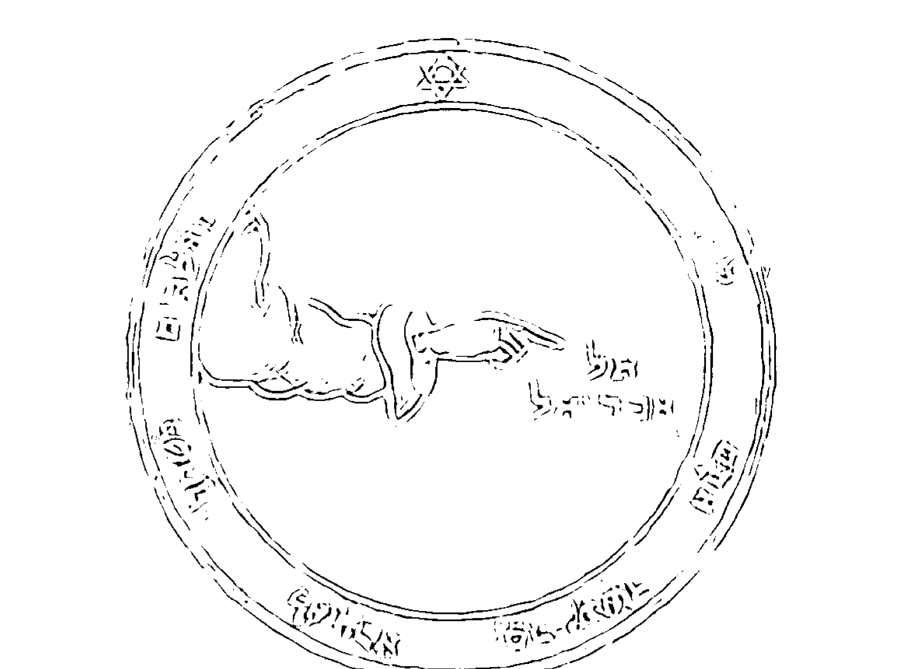

# ### No.081

# # 新时代的魔导书

# ## Modern Grimoires

近代以后的魔法世界有新浪潮诞生，使得魔导书的内容由通俗趋向高级。

# ## ○魔导书的演变以及虚构的魔导书

魔导书于文艺复兴时期至近代初期的欧洲大为风行，及至17、18世纪已然变得非常大众普及化。

然则在这个过程当中魔法世界却又掀起新的浪潮，那便是回归文艺复兴时期知识分子间流行的高等魔法、使致复活的运动。这个运动是要对抗合理主义和物质主义，使过去的神秘主义得到复活，其精神亦可见于蔷薇十字团¹和共济会²。然而，对高等魔法的复活造成最大影响的，却是1810年生于巴黎的伊利法斯·利未；因为利未的出现，才有19世纪后半的黄金黎明以继承其思想之形式成立，也才有后来麦达格·玛瑟斯和亚雷斯特·克罗利之流的魔法师发光发热。

此思潮连带使魔导书也发生了变化；原本魔导书中召唤恶魔以寻找宝藏的通俗仪式，转而变成了为与唯一神合为一体而从事的高尚仪式，而这些魔导书和魔法也都仿佛获得了新生似地传承直至现代。

现代的魔法运动亦深受其影响，譬如创设恶魔教会的安东·桑德·拉维、创立女巫崇拜的杰若德·伽纳等，就都是受到了亚雷斯特·克罗利的影响。

除此以外，20世纪以后又另有前所未见的全新型式魔导书问世，他们在幻想文学的世界里吸纳魔法的传统，从而创造出虚构的魔导书。其中最有名的当属洛夫克莱夫特所创克苏鲁神话中提及的《死灵之书》，其受欢迎程度甚至超过了真实的魔导书。

¹ 蔷薇十字团：神秘结社。
² 共济会：兄弟会性质的组织。

# 魔导书的变化

魔导书的变化 → 19世纪发生极大变化。

变化前：
**魔导书的大众化**
以治病、获得异性等低级魔法为目的。

变化后：
**魔导书的高级化**
以与神合一的高级魔法为目的。

如前所述，使高等魔法复活的思潮运动也影响到了现代社会，而魔导书亦因此获得了新的生命，得以存续。

魔道书系图、秘密结社 → 伊利法斯·利未

→ **黄金黎明**
    麦达格·玛瑟斯
    亚雷斯特·克罗利

-   - → 安息日教团
      杰若德·伽纳
    - → 神智学会
      安东·桑德·拉维

20世纪后，还有洛夫克莱夫特《死灵之书》等虚构魔导书出现，流传于世。

# No.082
伊利法斯·利未

# Eliphas Levi

信奉高等魔法的伊利法斯·利未其思想乃透过其毕生杰作《高等魔法之教理与祭仪》受到近代众多魔法师近乎狂热的吸收接纳。

# ◎于高等魔法复活过程中灿灿然散发光芒

伊利法斯·利未（1810～1875）乃近代高等魔法复活过程中最具影响力的人物。

伊利法斯·利未本名艾方索·路易·康士坦（Alfonso Lui Constans），是巴黎贫穷鞋匠之子。他自幼接受成为天主教司祭的养成教育，甚至还曾受任命为助祭，岂料他却在升任司祭的授圣职按手礼前夕逃离了神学校。其后他一面以教师、左翼政治记者等职维生，一面学习魔法。他研读斯维登堡¹、雅各·伯麦²、圣马丁³作品，研究喀巴拉，对帕拉塞尔斯⁴等人物深怀敬意。其后于1856年发表毕生杰作《高等魔法之教理与祭仪》，使次世代魔法师为之风靡。

利未以喀巴拉思想与塔罗牌作为魔法的基础，辅之以当时最新的「催眠术」与「动物磁气」崭新概念。他认为「动物磁气」与「星气光」，亦即当时物理学认为渗透存在于世间万物之中的「以太⁵」是相同的物质，结合了催眠理论与星气光的概念。另外，他又根据催眠理论可以藉精神控制动物磁气的构想，确信魔法师的意志拥有无限力量，进而致力于连接大宇宙（宇宙）与小宇宙（人类），祈使文艺复兴时期魔法主张的老赫密斯学传统得以复活。

如此信奉正统高等魔法的利未，对召唤恶魔、使死者亡灵复活的黑魔法甚是厌恶。他认为那些恶名昭彰的《小阿尔伯特》、《大奥义书》、《教皇洪诺留的魔导书》等都是犯罪的魔导书，可是《所罗门王之钥》却又是少数利未认为是优良的魔导书之一。

¹ 斯维登堡：瑞典神秘主义者。
² 雅各·伯麦：德国神秘主义哲学家。
³ 圣马丁：法国神秘主义者。
⁴ 帕拉塞尔斯：瑞士炼金术士、医生。
⁵ 以太：古代物理学假想的介质。

# 利未的思想

# 利未的经历

本名 艾方索·路易·康士坦 (1810~1875)

-   - 巴黎贫穷鞋匠之子。
    - 受天主教教育，并于25岁受任命为助祭。
    - 逃出神学校，修习魔法。
    - 1856年发表《高等魔法之教理与祭仪》。

# 利未的思想

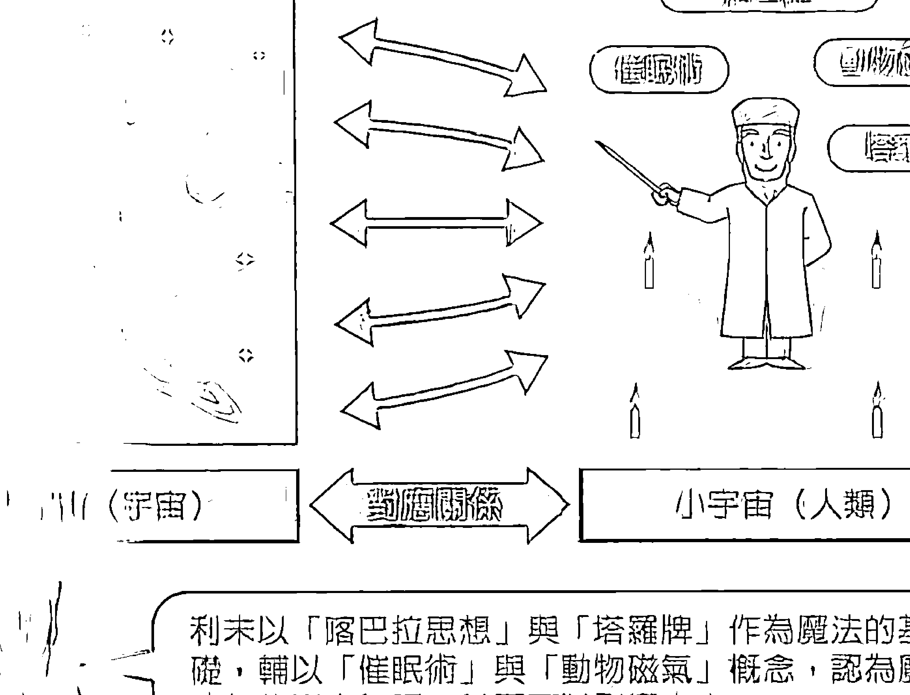

利未以「喀巴拉思想」与「塔罗牌」作为魔法的基础，辅以「催眠术」与「动物磁气」概念，认为魔法师的意志无限，甚至可以影响宇宙。

《高等魔法之教理與祭儀》
Dogme et ritual de la haute magie

《高等魔法之教理與祭儀》是為近代魔法而著作的全新類型魔導書，其思想普遍受到後世代魔法師繼承，留下了莫大的影響。

### ○令次世代魔法師為之狂熱的傑作

堪稱近代魔法之父的《高等魔法之教理與祭儀》（1856年刊行）乃伊利法斯・利未代表作，是部極優秀的魔導書。雖然利未亦有其他著作，不過此書於1860年前後擁有極大影響力，其思想亦受到次世代眾多魔法師繼承。

《高等魔法之教理與祭儀》全書是由解說理論的「教理篇」與解說實踐方法的「祭儀篇」兩個部分所構成。

「教理篇」是說明作為魔法作業根基的諸原理、諸理論，主要是以「喀巴拉思想」與「塔羅牌」為基礎、輔以當時最新的「催眠術」與「動物磁氣」嶄新概念。此外，此部分對魔法師如何操縱充塞自然界的星光能之構造原理亦有說明。

「祭儀篇」則是魔法儀式諸道具的解說，詳細描述到在降靈術、咒文、占術等實際儀式中該如何使用這些道具、該如何實施魔法。

舉例來說，「祭儀篇」就說到五芒星有以下的意涵與力量。

> 【兩道光芒朝上的「五芒星」象徵「魔宴」，僅一道光芒朝上的「五芒星」則是「救世主」之意。】

> 【古昔魔法師為防止惡靈入侵、防止善靈離開，會在自家門檻畫上「五芒星」印記。其拘束力來自於光芒所指方向，三道光芒朝向屋外能驅斥惡靈，兩道光芒朝向屋內能將其禁錮，若僅一道光芒朝向屋內則是可以留住善靈。】（生田耕作）

魔宴 (Sabbat)：女巫、魔癮、惡靈等為謝頌惡魔而舉行的聚會儀式，此字取自猶太教的安息日 (Sabbath)，應是基督教為貶低猶太教所作此稱呼。

《魔法之教理与祭儀》→伊利法斯·利未的代表作。

### 其内容为？

藉喀巴拉、塔羅牌、催眠术、动物磁气等概念说明魔法诸原理、诸理论。

解说降灵术、咒术、占术等仪式所须诸道具以及魔法实践方法。

### 所附五芒星之意涵

举例来说，「祭仪篇」对五芒星便有以下说明：

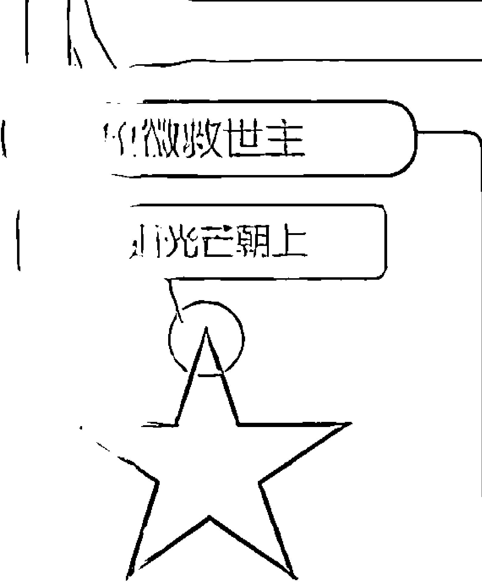

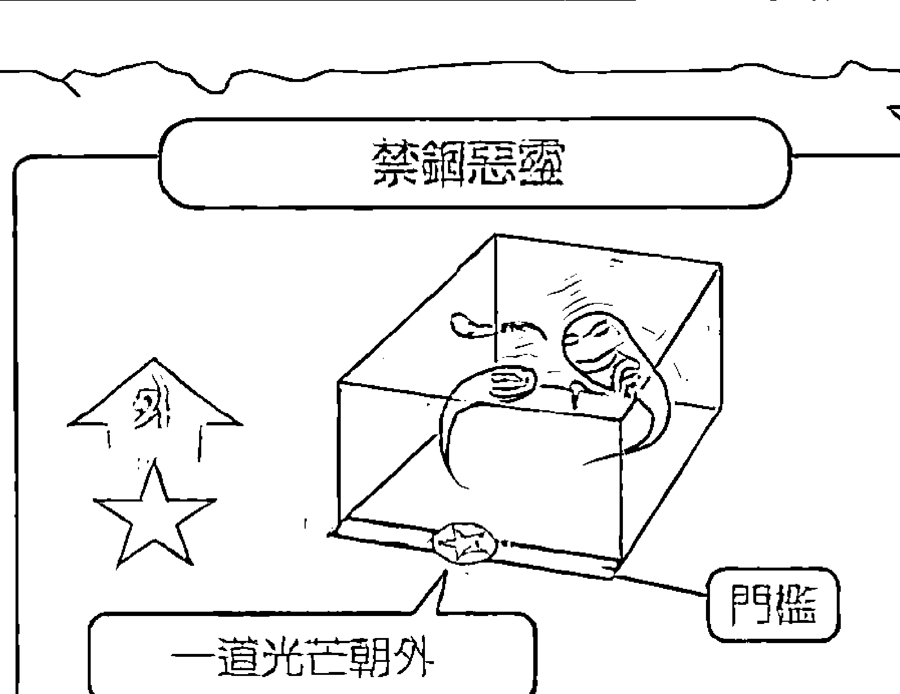

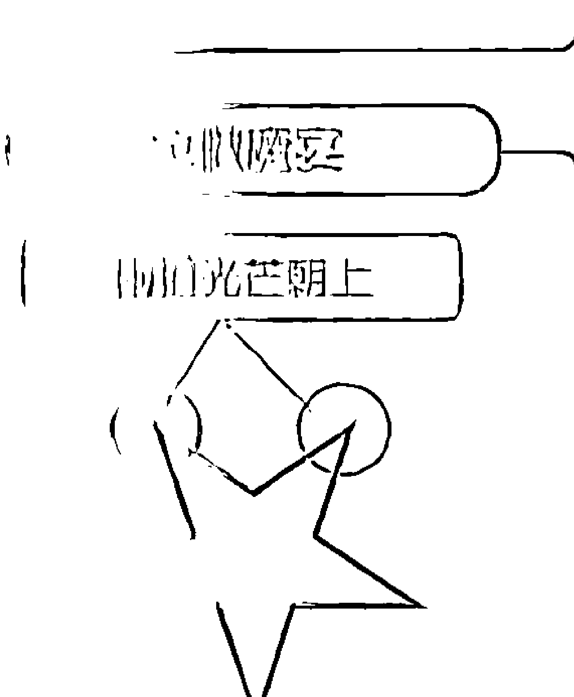

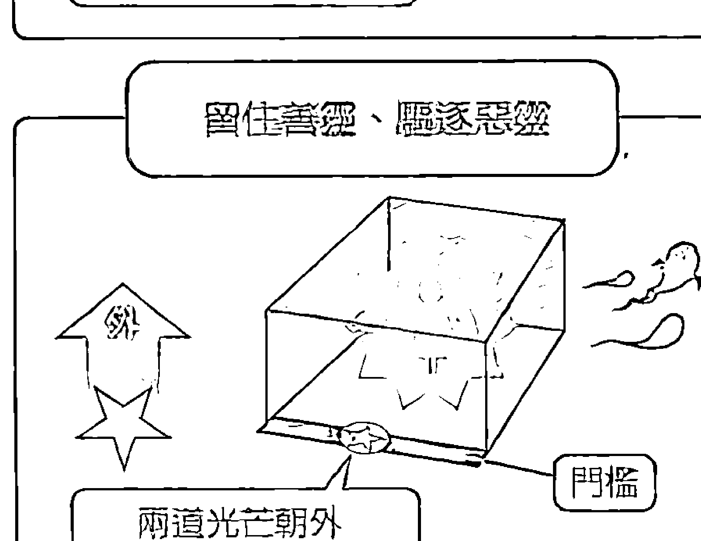

## 黄金黎明

The Hermetic Order of the Golden Dawn

黄金黎明是承襲薔薇十字團與共濟會源流之魔法組織，其儀式魔法乃以達成至高的完整性為目標。

### ◎孕育近代魔法之魔法團體

黄金黎明是近代魔法發展史中最具影響力的魔法組織，乃威廉·韋恩·威斯科特、麥逵格·瑪瑟斯、威廉·羅勃特·伍德曼三人1888年設立於倫敦。此三人均為共濟會會員，同時也是英國薔薇十字團的會員，是以黃金黎明亦承襲了共濟會與薔薇十字團之思想源流，同時還受到赫密斯主義⁽¹⁾、伊利法斯·利未的著作、埃及魔法等各方面影響。

黃金黎明雖以儀式魔法之實踐為目的，但那並非召喚惡魔、尋找寶藏那般低俗的目的；黃金黎明之目標在於達成至高的完整性，並傳授「神秘哲學原理與赫密斯主義魔法」以求達此目標。黃金黎明從某個角度來看可說是間神秘學的學校，會員只要通過試驗便能不斷進階達到更高的位階，所以熱心的會員多半忙於研讀學習，還要準備各式各樣的魔法用品和護符以純化、提升自身的靈。

黃金黎明從設立到1890年代中期乃其黃金時期，其間陸續於倫敦、布拉福⁽²⁾、愛丁堡⁽³⁾、巴黎等地設立了神殿。1896年會員人數已達315人，其中亦不乏名人諸如威廉·巴特勒·葉慈⁽⁴⁾、阿爾傑農·布萊克伍德⁽⁵⁾、阿瑟·梅琴⁽⁶⁾、伯蘭·史班克⁽⁷⁾、愛德華·布爾沃李頓⁽⁸⁾等著名作家，以及偉特版塔羅牌的製作者A.E.偉特⁽⁹⁾、被譽為20世紀最偉大魔法師的亞歷山特·克羅利等人。然則黃金黎明約莫從1900年起便內部紛爭不斷，終於分裂成好幾個教派。

## 黃金黎明的思想

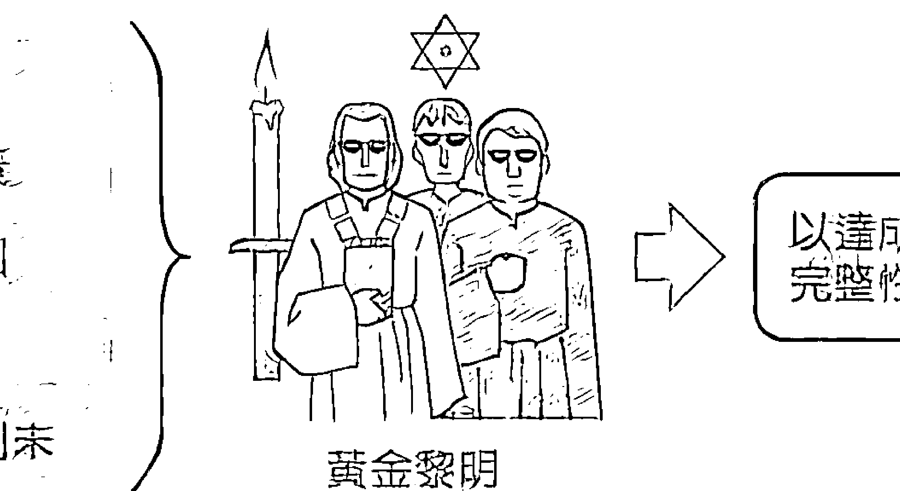

> 黄金黎明是以非常高级的魔法为目标。

## 有名的成员

黄金黎明之中不乏许多作家、魔法师等名人。

| 創立者 | 成員 |
| :--- | :--- |
| 威廉·溫恩·威斯科特 | 威廉·巴特勒·葉慈 |
| 威廉·羅伯特·伍德曼 | 阿爾傑農·布萊克伍德 |
| | 阿瑟·梅琴 |
| | 伯納·史托克 |
| | 愛德華·布爾沃李頓 |
| | A.E.偉特 |
| | 亞雷斯特·克羅利 |

## No.085 麥達格・瑪瑟斯

Macgregor Mathers

黃金黎明的創始成員麥達格・瑪瑟斯對建構該團體之魔法體系有不可或缺的貢獻，但他卻也因為傲慢而被逐出黃金黎明。

### ○打造黃金黎明魔法體系的功臣

麥達格・瑪瑟斯（1854~1918）是為構築黃金黎明魔法理論體系做出極大貢獻的魔法師。此外他還埋首於大英博物館、巴黎兵工廠圖書館涉獵相關資料，將重要魔導書譯成英語出版，是在魔導書歷史中留下了不滅足跡的人物。

瑪瑟斯本名撒母爾・黎德・瑪瑟斯（Samuel Liddell Mathers），1854年出生於倫敦，父親死後移居海岸城鎮波茅斯。那時附近有位名叫費德烈・霍爾的共濟會會員，瑪瑟斯因受其影響而為神秘思想著迷，並於1882年與霍爾一同加入了「英國薔薇十字教會」。後來瑪瑟斯甚至懷抱著自己是蘇格蘭貴族後裔的血統妄想，從此以格連斯特拉伯爵（Count of Glenstra）麥達格自稱。

1885年喪母後瑪瑟斯移居倫敦，正式執筆展開神秘主義與魔法的相關著作。1887年他發表《褪去面紗的喀巴拉》，1889年出版堪稱決定版的英語版《所羅門王之鑰》，1898年於巴黎兵工廠圖書館發現《亞伯拉梅林的神聖魔法書》希伯來語版，將其譯成英語出版。此外，1903年他又出版了《雷蒙蓋頓》第1章〈哥耶提雅〉的英譯版本。

瑪瑟斯與同志共同創立黃金黎明便是在前述期間的1888年，他很快就成為該結社的三位首領之一，並獨力完成黃金黎明的大半儀式以及教材。但由於性格太過傲慢，使得瑪瑟斯於1900年遭黃金黎明驅逐，結社亦因此分裂；其後瑪瑟斯創立A∴O∴（阿爾法・歐米茄）繼續從事活動，而黃金黎明也因一度統一也終究未能實現。

**麦达格·玛瑟斯** → 黄金黎明的重要魔法师。  
同时亦是著名的魔导书研究者。

### 玛瑟斯的经历

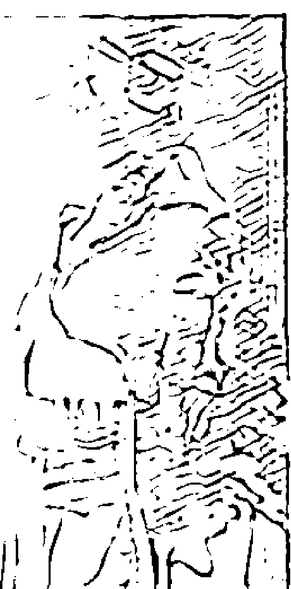

**本名** 撒母尔·黎德·玛瑟斯 (1854~1918)

-   从少年时期便著迷于神秘思想。
-   1882年加入「英国蔷薇十字教会」。
-   以格连斯特拉伯爵麦达格自称。

### 玛瑟斯的功绩

-   正式展开执笔活动。
-   发表自身著作《褪去面纱的喀巴拉》。
-   与同伴创设黄金黎明。
-   发表《所罗门王之钥》英译版。
-   将《亚伯拉梅林的神圣魔法书》英译出版。
-   因傲慢遭黄金黎明驱逐，组织分裂。
-   将《雷蒙盖顿》第1章〈哥耶提雅〉英译出版。
-   以A∴O∴（阿尔法·欧米茄）继续活动。

> > 玛瑟斯不光是黄金黎明的灵魂人物，他在魔导书的历史中同样也是个不可或缺的人物。

## 亞雷斯特·克羅利 Aleister Crowley

原為瑪瑟斯弟子的克羅利著有《律法之書》與《第四書》等作品，並且對女巫崇拜、惡魔教會等現代魔法運動造成了莫大的影響。

### ○對現代魔法運動造成極大影響的魔法師

著有《律法之書》與《第四書》等魔法書的亞雷斯特·克羅利是20世紀最惡名昭彰的魔法師。克羅利1875年出生於英格蘭瓦立克郡（Warwickshire）雷明頓（Leamington），剛好就是伊利法斯·利未辭世的那年，於是克羅利便相信自己是利未轉世而來。其父是富裕的釀造業者，還是位嚴格的基督教徒，克羅利卻反抗父親的教育、喜歡與邪惡的人為伍；據說他的母親還曾經說過克羅利便是《啟示錄》所述那頭666的邪惡的獸。

1898年克羅利離開劍橋大學後立刻加入黃金黎明，成為麥邁格·瑪瑟斯的忠誠弟子，然而兩人卻於1904年前後開始反目，克羅利也離開了黃金黎明。當時克羅利宣稱瑪瑟斯派出吸血鬼攻擊自己，而克羅利則是送出別西卜及其麾下49名惡魔攻擊瑪瑟斯，兩者間展開了極為激烈的魔法攻防戰鬥。

克羅利先是於1904年著作《律法之書》、為新宗教迪拉姆建立原理教義，1907年又自創魔法結社銀星（A∴.A∴.），1912年就任德國東方聖殿騎士團（O.T.O.）的英國分部長，並以性魔法師的身分展開活動。

克羅利最後失去所有財產、成為不幸的流浪者，1947年逝於英格蘭，卻在死後獲得了更多的支持者，並且對現代的魔法運動也留下了直接影響，譬如創立女巫崇拜的傑若德·加德納與惡魔教會的安東·桑德·拉維便都繼承了克羅利的精神。

## 亞萊斯特·克勞利

《律法之書》、《第四書》的作者。

20世紀惡名鼎鼎的魔法師。

對女巫崇拜、惡魔教會等影響頗巨。

### 克羅利的經歷

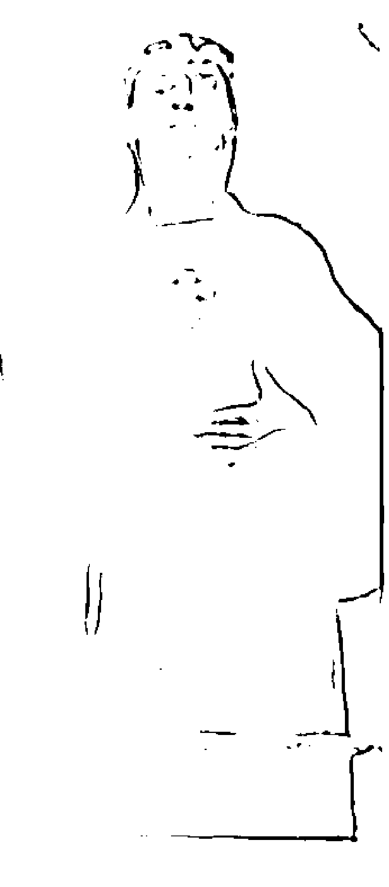

-   **1875年**：生於英格蘭。
-   **1898年**：畢業於劍橋大學。同年加入黃金黎明，成為瑪瑟斯的忠誠弟子從事活動。
-   **1904年**：與瑪瑟斯反目，脫離黃金黎明。同年著作《律法之書》，創設新興宗教迪拉瑪。
-   **1907年**：設立魔法結社「銀星」（A∴A∴）。
-   **1912年**：成為德國的東方聖殿騎士團（O.T.O.）的英國分部長。

晚年成為不幸的流浪者，1947年死於英格蘭。

### 死後獲得更多的支持

女巫崇拜

傑拉爾德·加納

惡魔教會

安東·桑德·拉維

然而，克勞利之影響力亦及於女巫崇拜、惡魔教會等現代的魔法結社。

以「做你想做」為根本教義之新宗教，以發現個人真正意志為目標。

## No.087 《律法之书》

LIBER AL VEL LEGIS (THE BOOK OF THE LAW)

迪拉玛教奉为经典的魔导书《律法之书》乃克罗利以自动笔记写下守护天使爱华斯所示神谕记录而成的作品。

### ○行汝所欲则自成律法

《律法之书》是20世纪最恶名昭彰魔法师亚雷斯特·克罗利（请参照P.184）所创宗教迪拉玛教的经典，也是讲述与神一体化魔法的魔导书。按照克罗利自身的说法，那是种「拥有宇宙规模的魔法术式」（摘自《律法之书》解题·植松靖夫译文）。不过《律法之书》内容满是各种寓意与象征，读来艰涩难解，正如书中第3章第63节写到「愚者即便阅此《律法之书》及注解必不得理解」。

《律法之书》从执笔缘起便已经是神秘万分。1904年，当时已经离开黄金黎明的克罗利与拥有千里眼能力的妻子萝丝·凯利（Rose Kelly）正在开罗，某日其妻突然遭神灵附身，要他召唤埃及神话中的神明霍露斯[1]。克罗利依言执行召唤仪式，召得守护天使爱华斯出现，克罗利受神灵附身后便以自动笔记[2]记下了爱华斯讲述的220则神谕。如此写成的便是《律法之书》，其中也包括著名的「行汝所欲则自成律法」神谕。

这样的一部作品，中伤诽谤当然也很多。不过克罗利的弟子，也就是日后成为魔法结社「东方圣殿骑士团（O.T.O.）」[3]大师的肯尼斯·葛兰特曾经指出克罗利《律法之书》等作品所记载众神「蛮名」及许多神秘仪式都出现在后世的《死灵之书》作品中。这个所谓「蛮名」是由葛兰特提倡的魔法概念，主张无法发音、唸不出来的神名拥有惊人的魔法威力。倘若真是如此，那就代表《律法之书》对克苏鲁神话的《死灵之书》亦有影响。

## 何謂《律法之書》？

《律法之書》
克羅利所創迪拉瑪教的經典。
與神一體化的魔導書。

## 《律法之書》的內容

守護天使愛華斯講述的220則神諭。

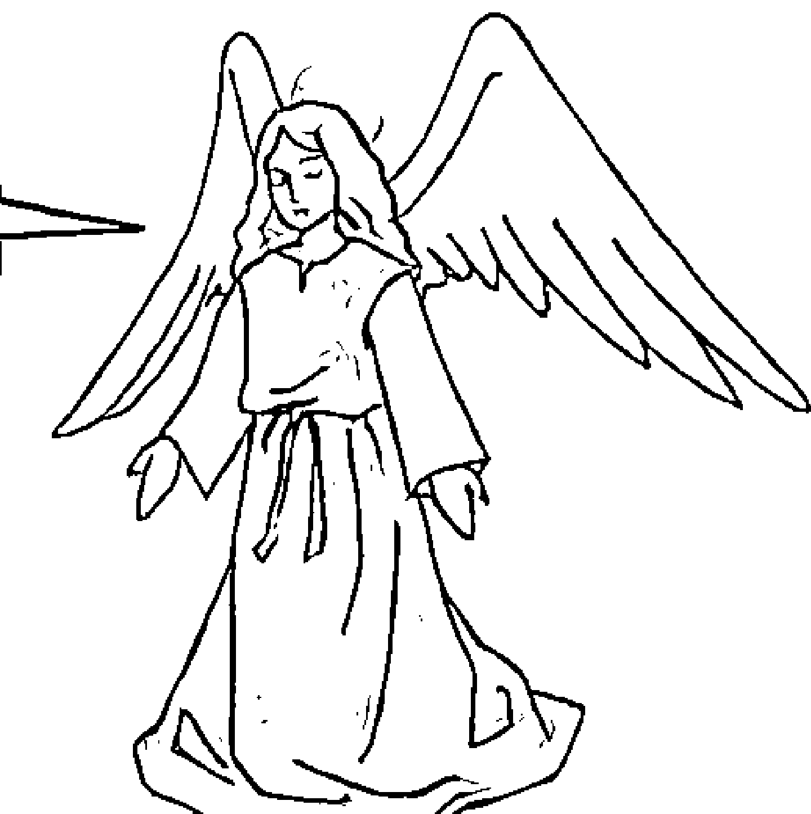

> 行汝所欲則自成律法。

據說克羅利是以自動筆記將其記載下來的。

## 《律法之書》的缺點

充滿寓意與象徵，艱澀難解。

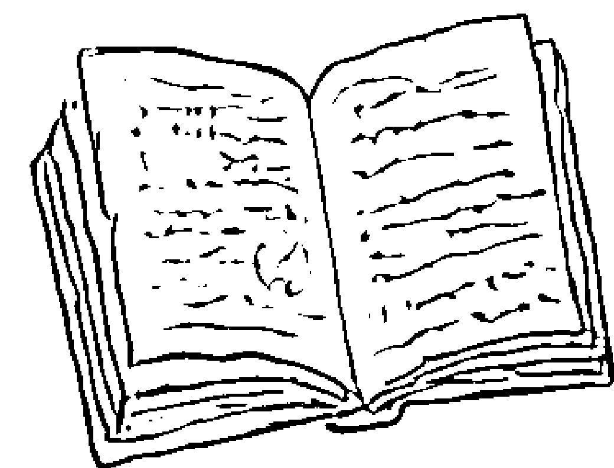

> 愚者即便閱此《律法之書》及註解必不得理解。

第3章第63節

## 《律法之書》的影響

甚至對克蘇魯神話的《死靈之書》亦有影響。

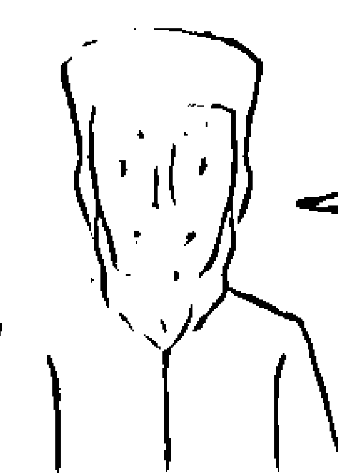

> 至少克羅利的弟子肯尼斯·葛蘭特是這麼想的。

愛華斯（Aiwass）將《律法之書》傳予克羅利的守護天使。據說他是埃及神霍魯斯的化身，也是許多「秘密首領」之一。直到現代仍有魔法師喚作「愛華斯」。

## 《第四書》

Book Four

魔法書《第四書》是由克羅利的最高傑作《魔法─理論與實踐》等四個部分所構成，是部如假包換的高等魔法書。

### ○除提升自我、與神合為一體以外別無其他

《第四書》是譽為20世紀最大魔法師的亞雷斯特・克羅利所著魔法書。

提到克羅利，或許大部分人會立刻聯想到黑魔法、性魔法之類的，然則此書所載魔法卻是承襲黃金黎明傳統的正統高等魔法。換言之，此書乃以提升自我、與神合一為目標。

此書由四個部分構成，第1部《神秘主義》是「瑜伽」的解說。所謂瑜伽是印度的神秘主義，乃透過瞑想和呼吸法以圖與宇宙合一，克羅利是將瑜伽吸收至西洋魔法體系中並予以理論化。

第2部《魔法》是論魔法的實踐儀式，舉出各種魔法道具並具體解說其意義及使用方法。

第3部《魔法─理論與實踐》為魔法的實踐者詳細解說不可不知的重要事項，諸如魔法宇宙論、「聖四文字」的術式、論「祓禊」、論「召喚」等。舉例來說，這第3部裡面有這麼段敘述：

> 「【唯一而至高的儀式】便在於【與守護聖天使知識交涉】之達成。這可以使完人沿垂直線向上提升，稍有偏離垂直線就會傾向黑魔法。除此之外的任何操作均屬黑魔法。」

也就是說，克羅利主張與守護天使交涉乃是與神一體化的前提，但有稍許偏離此目的者，那就是黑魔法、就是邪惡的魔法。從這段敘述就應該可以清楚地知道，克羅利的魔法乃是屬於正統的高等魔法。

第4部《迪拉瑪（法）》是克羅利所創迪拉瑪教之解說，其中亦述及《律法之書》的內容。

## 《第四书》

克羅利所著魔導書。旨在與神合為一體的高等魔法書。

## 《第四书》的内容

| 类别 | 描述 |
| :--- | :--- |
| 神秘主義 | 就理論面解說透過呼吸、冥想法與宇宙合一的印度神秘主義——瑜伽。 |
| 魔法 | 旨在與神合為一體的高等魔法書。 |
| 理論與實踐 | 詳細解說魔法宇宙論、「聖四文字」的術式、論「祓禊」、論「召喚」等施行魔法的重要事項。 |
| 迪拉瑪（法） | 克羅利所創迪拉瑪教之解說。 |

## 《白魔法與黑魔法》的區別

根據第3部《魔法——理論與實踐》的記載，善的魔法（白魔法）與邪惡的魔法（黑魔法）的區別極為分明。

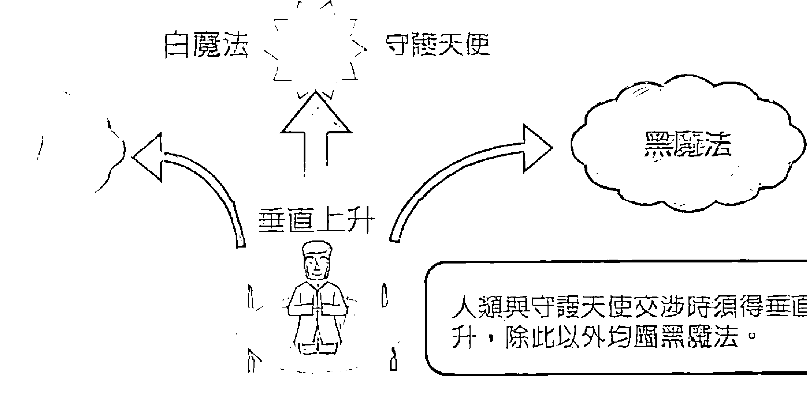

> 注：《第四書》的第1部、第2部在日本有名為《神秘主義與魔法》的獨立書，另外第3部則是有《魔法——理論與實踐》譯作。

## 《神秘的喀巴拉》

The Mystical Qabalah

《神秘的喀巴拉》是20世紀最偉大的魔法師之一狄昂·福瓊講述如何鑽研猶太教喀巴拉奧義「生命之樹」的攻略方法。

### ○黄金黎明流的喀巴拉魔法書

《神秘的喀巴拉》是20世紀最偉大的魔法師之一狄昂·福瓊寫的魔法書傑作，被譽為是魔法喀巴拉的最佳解說書籍。其內容是在解說猶太教喀巴拉奧義「生命之樹（Sephiroth）」的攻略方法。「生命之樹」是由編號1～10的10個球體（Sephira）及連結其間的22條小徑所構成。第1球體「王冠」（Kethe）是宇宙中神的最初顯現、是從神身體流出的神靈，第2球體「智慧」（Chokmah）則是神靈呼出的氣息，如此依序距離神愈來愈遠，最後形成第10球體「王國」（Malkuth），而這便是人類生存的世界。在這當中，喀巴拉術師便是要從「王國」出發，利用這22條小徑習得各球體奧妙，朝全宇宙的最高存在「王冠」前進。換句話說，魔法喀巴拉是從肉眼可見的、物理的現實界出發，途中經過精妙的靈的世界（星光界），最後達致超越前述境界之存在的魔法；它並非只知道一股腦地去追求與究極的絕對者合一，而是種必須不斷提升自我、一一通過各個階段然後才能達到究極境界的精神修行。

只不過，福瓊的魔法喀巴拉跟猶太教的喀巴拉卻也不盡相同。福瓊是承襲黃金黎明源流的魔法師，是以黃金黎明的方式將猶太教的喀巴拉重新詮釋。

然則此書解說相當精彩，甚至福瓊的弟子W.E.巴特勒遜曾經說過取得《神秘的喀巴拉》作為教科書並且靈活運用乃是什志於西洋喀巴拉者的至高命令。

## 《神秘的喀巴拉》概要

狄昂·福瓊的傑作。

魔法喀巴拉的最佳解說書籍。

## 《神秘的喀巴拉》的内容

猶太教喀巴拉奧義「生命之樹（Sephirath）」的攻略方法。

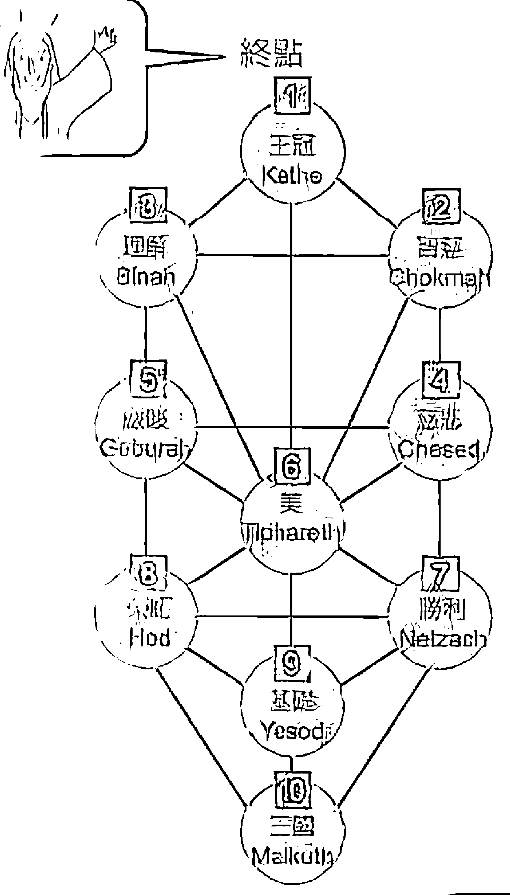

## 生命之樹

「生命之樹」是由編號1~10的10個球體（Sephira）和其連結各球體的22條小徑所構成，象徵整個宇宙。喀巴拉術師須以「王國」為起點，利用22條小徑以到達全宇宙最高存在「王冠」為目標。

> 《神秘的喀巴拉》說過「生命之樹」是「從肉眼可見的・物理的現宵界出發，途中經過精妙的靈的世界（星光界），達致超越存在」的魔法。

## 《影子之書》與新興宗教女巫崇拜

### ‘Book of Shadows’ and a new cult, Wicca

新興宗教女巫崇拜的魔導書《影子之書》是崇拜信仰猶太、基督教問世前諸多古老神祇之巫術實踐手冊。

#### ○記錄自身所學的魔導書

《影子之書》是1950年代誕生於英國的新興宗教女巫崇拜(Wicca)的魔導書，是部巫術的實踐手冊。

女巫崇拜的創設者傑若德·伽納（1884～1964）認為近代初期歐洲那些成為獵女巫對象的人絕非惡魔的崇拜者；他們其實是古代異教的信徒，他們歷經基督教長達數個世紀的迫害存活了下來，傳承古代女巫教團的儀式以及信仰。1939年，伽納在新福雷斯特發現殘存下來的女巫集團並且入教，那時伽納便得到了一本自己專用的《影子之書》抄本；據說古代異教的儀式便是如此藉由抄本的代代相傳始得以傳諸後世。

然而以上其實是伽納捏造出來的虛構說法，現如今就算女巫崇拜信徒也並不一定相信其所記載的內容確實是從古時代代流傳而來，而且我們還知道第一本《影子之書》其實是伽納的創作。反正重點是，他們所信仰的是古代的異教就是了。

所謂信仰古代異教指的就是崇拜猶太、基督教以前的古老神祇。今日的女巫崇拜雖有各種不同宗派，不過普遍都重視他們喚作黛安娜或阿拉迪亞（Aradia）的女神。他們會組成名為女巫團（coven）的13人小團體，由女巫大祭司領導；基本上每人派發一本《影子之書》，起初書中什麼都沒寫，必須在加入女巫團以後自行將學到的咒文、儀式、歌謠等記錄下來。是故，現在亦有各種不同版本的《影子之書》存在，其中尤以伽納草創女巫崇拜最初期的信徒朵林·瓦蓮特所著版本最為著名。

《影子之书》→ 女巫崇拜（Wicca）的实践手册。

## 何谓女巫崇拜？

传承古代女巫教团仪式及信仰的女巫集团。

> 不拘泥于基督教，信奉古老神祇。

> 重视女神黛安娜或阿拉迪亚。

> 以名为女巫团的小团体从事活动。

教团分发空白的《影子之书》，信徒须于接受女巫团教义过程中将其记录下来，完成《影子之书》。

> 《影子之书》便如此代代相传，使古代信仰得以流传至今。然则所谓女巫崇拜其实是杰拉德·加德纳于1950年代创立的新兴宗教。

成员男女皆有。

## 瓦莲特的《影子之书》
### Book of Shadows? By Doreen Valiente

加德纳爱徒瓦莲特公开原属秘密的《影子之书》，将女巫崇拜的七个仪式公诸于世。

## 储蓄宇宙能量的魔法圆

朵琳·瓦莲特（生年不详～1999）是加德纳创设女巫崇拜当初的开宗信徒，是名女巫。她诗才洋溢，对加德纳创造的女巫崇拜魔法实践手册——魔导书《影子之书》的发展亦有莫大贡献。

瓦莲特公开自己的那本《影子之书》是1978年的事情。女巫崇拜中的《影子之书》原属个人秘密、不应公开，但据说加德纳死后却有人散播自行修改的女巫崇拜仪式；为杜绝此类赝品，身为加德纳爱徒的瓦莲特才决定将自己的《影子之书》公开。

瓦莲特在这部《影子之书》当中记载到巫术崇拜的七项基础仪式，即魔法圆的设定仪式、自我入信仪式、圣别仪式、满月女巫会仪式、魔宴仪式、女巫团入信仪式、女巫团的咒文。另外，书中也收录有上述仪式所须的七芒星、安德烈的鲁纳文字、绳索咒、召唤月亮女神、召唤角神、歌谣与舞蹈等相关说明。

女巫便是要透过这些魔法仪式实现自身愿望，不过笔者必须强调的是，这些愿望绝非邪恶，因为彼等的最大愿望便是与自然、宇宙合为一体。尽管他们会在各种仪式中使用魔法圆，但这些魔法圆并非要保护自己免受恶魔侵害；对女巫来说，魔法圆是宇宙能量集中的聚集处，作用就跟巨石阵差不多，而这也就是为何女巫会拒绝令人类与自然对立的犹太·基督教、崇拜古代异教神明的原因。

## 《女巫之书》的内容

朵琳·瓦莲特

加德纳的爱徒。
1978年公开自己的《影子之书》。

## 瓦莲特《影子之书》的内容
### 巫术崇拜七个基本仪式的解说

- 魔法圆的设定仪式、自我入信仪式、圣别仪式、魔宴仪式、女巫团咒文、满月女巫会仪式、女巫团入信仪式

仪式用到的七芒星、安德烈的鲁纳文字、绳索咒、召唤角神、歌谣与舞蹈等相关说明。

### 巫术的目的是？

> 与自然、宇宙合为一体！

> 女巫欲藉此实现自身愿望，不过这些愿望绝非邪恶。

收录于瓦莲特所著《女巫圣经》（国书刊行会出版）。

## No.092
## 《撒旦圣经》
### The Satanic Bible

恶魔教会的魔导书《撒旦圣经》崇拜的撒旦（恶魔）并非单纯的撒旦，而是遭基督教或社会权威否定诸存在的象征。

### ○ 否定基督教形式恶魔的恶魔崇拜

《撒旦圣经》乃安东·桑德·拉维（1930～1997）于1969年所著、翌年出版即大为畅销的魔导书。本名霍华·史丹顿·李维的拉维出生于芝加哥，高中辍学后一面在夜店弹奏风琴为生，一面学习神秘学知识，至1960年代已经成为旧金山的著名黑魔法师，并于1966年设立「Church of Satan」（恶魔教会）；拉维为恶魔教会汇整自身思想及信念所写成的，便是这部《撒旦圣经》。

然而《撒旦圣经》却并非从题名所能想见那般是部恶魔崇拜的作品。关键就在于拉维所指撒旦并非基督教的恶魔，而是遭基督教或社会权威否定的诸存在的象征；拉维反而还否定神灵等超自然存在，所以自然也对一般所谓恶魔持否定态度。

那么拉维所谓的恶魔又是什么呢？那是种内蕴于自然之中的隐藏力量，也可以说它就是人类的欲望本身，是以「暴食、色欲、贪婪、悲叹、暴怒、懒惰、自负、傲慢」的基督教七宗罪都被他视为美德。

可是光是重视人类的欲望并不代表那就是单纯的人本主义，因为拉维的恶魔崇拜拥有普通人本主义所无的仪式和教义。

《撒旦圣经》便是针对这些仪式教义以及附属咒文、道具等相关知识的解说，是以《撒旦圣经》虽然拥有魔导书的形式体裁，其魔法用意却是要解放人类的欲望，而非召唤恶魔。

## 何谓恶魔教会？

安东·桑德·拉维设立于1966年。

### 恶魔教会的思想

### 人类的欲望

### 隐藏于自然之中的力量

### 对抗基督教或社会权威否定其存在的象征

> 恶魔教会是将这些解放人类欲望的力量奉为撒旦崇拜。

> 不过恶魔教会信仰却也并非寻常人本主义，仍然拥有仪式和教义。将这些汇整起来便是《撒旦圣经》。

《撒旦圣经》

汇整恶魔教会思想的经典书。
亦有仪式教义、咒文道具的解说。

## No.093《撒旦仪式》
### The Satanic Rituals

《撒旦仪式》是《撒旦圣经》的续集，通篇对恶魔教会的九个仪式有详细说明。

### ○甚至受到克苏鲁神话影响的真实魔法书

《撒旦仪式》是安东·桑德·拉维以《撒旦圣经》续集于1972年发表的恶魔教会魔导书。此书蒐罗了《撒旦圣经》说明未尽完全的恶魔教会各种仪式，甚至还有「撒旦圣经指南」的副标题。
其内容通篇都与魔法仪式相关，对恶魔教会的九个仪式有详细说明：第1个仪式题名为「作为心理剧的黑弥撒」、第2个「恶魔的第七诫解」、第3个「梯形的法则」、第4个「秃山之夜」、第5个「火时代的巡礼者」、第6个「洛夫克莱夫特的形而上学」、第7个「恶魔的洗礼」、第8个「窒息空气之仪式」、第9个「未知的知识」。这些全部都不是个人规模的仪式，而是由少数几人或多数人团体共同执行的仪式。
一般认为此书拥有诺斯替教、喀巴拉思想、赫密斯主义、共济会思想等思想背景，不过从仪式题名就不难发现，《撒旦仪式》还有个很有趣的特征便是此书甚至还受到洛夫克莱夫特创作的虚构克苏鲁神话影响。
题名为「洛夫克莱夫特的形而上学」该章节中收录有名为「9天使的仪式」以及「克苏鲁的呼唤」等仪式，前者「9天使的仪式」便是克苏鲁神话当中所述说远古种族的仪式；换句话说，此仪式颂扬的是阿瑟特斯、奈亚鲁法特、曼戈索陀斯、舒伯-尼古拉斯等克苏鲁神话小说里的诸神，内文记载参加者踏进将六角形一分为二而成的魔法梯形并执行仪式之程序，还有献给诸神的赞颂歌曲。

## 《撒旦仪式》概要

《撒旦圣经》的续集指导书。
详细解说恶魔教会的九个仪式。

### 九个仪式是指？

- ① 作为心理剧的黑弥撒
- ② 恶魔的第七诫解
- ③ 梯形的法则
- ④ 秃山之夜
- ⑤ 火时代的巡礼者
- ⑥ 洛夫克莱夫特的形而上学
- ⑦ 恶魔的洗礼
- ⑧ 窒息空气之仪式
- ⑨ 未知的知识

「洛夫克莱夫特的形而上学」当中「9天使的仪式」如左图所示，是首领和参加者在密闭房间里面对面朗颂克苏鲁神话精神的仪式。

> 《撒旦仪式》是部受到虚构克苏鲁神话影响的有趣魔导书。

## No.094
### 虚构的魔导书
### Fictional Grimoires

20世纪的魔导书多了《西格桑手抄本》、《死灵之书》等奇幻文学里的虚构魔导书问世，深受大众喜爱。

### ○对现实魔导书亦造成影响的虚构魔导书

20世纪的著名魔导书跟过去的魔导书有着决定性的差异，这个差异就在于奇幻文学所创造出来、存在于作品世界中的虚构魔导书。

此类魔导书起源自小说家W.H.霍吉森（1877～1918）所创《西格桑手抄本》。这是1910年至1914年间霍吉森创作的短篇小说集的主角——幽灵猎人私家侦探汤玛斯·卡纳基经常拿来参考的魔导书，小说中指其为14世纪的作品。这个短篇集里面还另外有部名叫《萨阿阿玛阿阿仪式》的魔导书；私家侦探卡纳基便是利用这些魔导书使以免受邪恶灵的侵害，进而解决事件。

1924年则又有史上最著名、影响力最巨的虚构魔导书诞生，那便是小说家霍华·菲力普·洛夫克莱夫特短篇小说《印达罗斯的魔犬》中登场的《死灵之书》。其后《死灵之书》不断在各种小说中出现，其本质亦渐趋明朗。同一时间，洛夫克莱夫特的作家朋友们又根据他创造的世界观为基本前提创作出其他小说，使得「克苏鲁神话」这个全属虚构空想的神话世界不断扩张。除《死灵之书》之外，又创造出《无名邪教》、《哀邦书》、《妖虫的秘密》等多部充满魅力的虚构魔导书。

更有甚者，洛夫克莱夫特假想神话及魔导书造成的影响不仅限于虚构世界。正如同恶魔教会的魔导书《撒旦仪式》中收录有赞颂克苏鲁神话众神的仪式般，已经造成了虚构魔导书进而影响到真实魔导书的奇妙现象。

## 魔导书新潮流

奇幻文学登场的虚构魔导书人气高涨。

### 虚构魔导书的起源

- 《西格桑手抄本》、《萨阿阿玛阿阿仪式》

小说家W.H.霍吉森短篇集《幽灵猎人卡纳基事件簿》当中，私家侦探卡纳基用来自保免受邪恶神灵侵害的魔导书。

### 受欢迎的虚构魔导书
### 「克苏鲁神话」提及的魔导书

- 《死灵之书》
- 《哀邦书》
- 《那卡提克手札》
- 《葛拉奇的启示》
- 《无名邪教》
- 《妖虫的秘密》
- 《拉莱耶》
- 等

这些都是以霍华·菲利普·洛夫克拉夫特所创世界观为前提所产生的神话世界魔导书，记载世界的奥秘以及远古种族召唤方法等内容。

> 这些虽然是虚构的魔导书，但20世纪却有虚构魔导书影响真实魔导书的现象发生。

## No.095
## 《西格桑手抄本》
### Sigurd Manuscript

神秘的魔导书《西格桑手抄本》记载了结合防御恐怖恶灵攻击的图形以及五芒星之魔法图制作方法。

### ○记载抵御妖魔方法的魔导书

《西格桑手抄本》是英国小说家W.H.霍吉森（1877～1918）所著短篇集《幽灵猎人卡纳基事件簿》当中私家侦探卡纳基非常倚重的魔导书。根据小说内容，这部魔导书推测是14世纪的作品，是以古英语写成的。

卡纳基是在系列作品的第2部短篇小说《妖魔的通道（The Gateway of the Monster）》当中首次提到这部魔导书的。故事中，卡纳基便曾经参考《西格桑手抄本》制作结界对抗出现在古老宅邸房间中的妖魔，是用粉笔画出圆周和五芒星图所制成的。除此之外，卡纳基还参考《萨阿阿玛阿阿仪式》多设了一个结界，他用水在粉笔画成的圆周内侧另外画了一个圆，然后用许多缺口向外的新月图形链接这两个同心圆；卡纳基还在新月缺口处各自插上一支蜡烛，并且在五芒星的五个顶点放置用亚麻布包住的面包块，接着又在五芒星的夹角处放置五个装水的壶。又，卡纳基甚至还准备了用真空管制成的电子式五芒星，重叠放置于粉笔画成的五芒星之上。当晚卡纳基便是如此方得抵御以恐怖惊人攻势来犯的妖魔。

从故事里我们可以知道，《西格桑手抄本》中记载有如何防御恐怖恶灵攻击的方法。另外，从其他则故事也可以知道这部手抄本还有记载到「结界中不可用火」或「绘制结界不可用太多颜色」等防御恶灵的注意事项。不过卡纳基自己却几乎不提这部魔导书，使得这部魔导书的整体形象至今仍然处于团团迷雾之中。

## 《西格桑手抄本》概要

《西格桑手抄本》 → 《幽灵猎人卡纳基事件簿》里的魔导书。

### 小说里的西格桑手抄本

以古英语写作的14世纪魔导书

记载如何制作结界以防御恐怖恶灵攻击之方法

结界部分是《西格桑手抄本》的结界。另一部分则是《萨阿阿玛阿阿仪式》的结界。

> 私家侦探卡纳基便是利用如此复杂的结界抵御恐怖妖魔的攻击。

## No.096 《萨阿阿玛阿阿仪式》 The Samaa Ritual

《萨阿阿玛阿阿仪式》除各式各样的驱魔印记以外，还记载有驱逐妖魔的最强咒文「不世知最终章」。

### ○强力咒文「不世知最终章」

《萨阿阿玛阿阿仪式》是英国小说家W.H.霍吉森（1877～1918）所著短篇集《幽灵猎人卡纳基事件簿》当中，受到私家侦探卡纳基与《西格桑手抄本》同等倚重的魔导书。此书与《西格桑手抄本》同样首次出现于系列作品的第2部短篇小说《妖魔的通道（The Gateway of the Monster）》，卡纳基是用它来绘制第2结界、补强《西格桑手抄本》的第1结界（请参照P.202）。又，根据其他短篇亦可得知道这本书还另外记载有各式各样驱魔的印记。

其中威力最强大的似乎是则名为「不世知最终章」的咒文。作品中并未揭露此咒文之具体内容，但短篇小说《吹哨的房间》曾经描述到此咒文救了主角卡纳基性命的场面。这件事发生在古老城馆的一个房间里，那是个每到夜里就会传来恐怖口哨声的房间。某天夜里卡纳基侵入那个房间时，只见墙壁作巨大嘴唇形状、忽地膨胀并向卡纳基袭击而来；就连卡纳基也不禁因为恐怖而瑟缩，此时不知从何传来了唱诵「不世知最终章」的声音。究竟是谁唱的咒呢？这个答案直到故事最后仍然是个谜，但卡纳基便是因此得以从窗口逃出生天，保住了性命。

尽管《萨阿阿玛阿阿仪式》时时派上用场，故事却并未说明这是部什么样的书。根据《吹哨的房间》内文，此书似乎是从前施行「拉阿阿耶耶魔法」的反人类宗教僧侣唱诵的经典，但那是什么宗教、是什么时代均不得而知，几乎可以说是一无所知的神秘魔导书。

## 《萨阿阿玛阿阿仪式》概要

《萨阿阿玛阿阿仪式》→《幽灵猎人卡纳基事件簿》里的魔导书。

### 小说里的《萨阿阿玛阿阿仪式》

使用的「拉阿阿耶耶魔法」的反人类宗教僧侣唱诵的经典。

※何时的何种宗教均不得而知。

有可与《西格桑手抄本》搭配使用的结界。

※详情请参照P.202。

有威力强大的「不世知最终章」咒文。

## # 《无名邪教》
### Unaussprechlichen Kulten or Nameless Cults

相传《无名邪教》是游遍全世界、获得无数神秘知识的德国作家冯容兹所著，是写满令人血液都要结冻的恐怖记述的魔导书。

## ## ○内容恐怖到令人血液都要结冻的黑暗魔导书

《无名邪教》是克苏鲁神话体系中的其中一部虚构魔导书，首见于罗伯·E·霍华（1906～1936）的短篇小说《夜之末裔》（1931）、《黑石之秘》（1931）。
克苏鲁神话里是这么说的：
德国作家冯容兹（1795～1840）将生涯奉献给被视为禁忌的诸领域研究，他游遍全世界、获得无数的神秘知识，然后写下了《无名邪教》（通称《黑色书籍》），并于1839年的杜塞多尔夫出版了少部厚皮革铁框装订的印刷品。
书中井然有序的章节与无法理解的章节混然并处，其中却充满着令每个读者血液为之冻结的恐怖记述。此书大半内容是在讨论当时黑暗宗教的仪式与咒物，其中也包括了「黑石」的相关记述。这个石碑位于匈牙利山区某个名叫史崔戈伊卡伐的村落附近，是个拥有许多奇怪传说的玩意儿。
然而此书还另外引发了更加恐怖的事件。出版隔年，作者冯容兹就变成了一具脖子留着巨大爪痕的尸体，陈尸于完全封闭的密室之中。当时他带着为这本书准备的进一步详细手稿，手稿却被撕碎弃置于陈尸的房间内，就连把这份手稿拼凑起来并且读过的冯容兹挚友——法国人艾历塞克斯·拉迪奥也在火烧毁这份手稿以后用剃刀割断喉咙自尽了。由于这个事件太过出名，使得拥有此书者陷入恐惧、纷纷焚书，所以目前全世界仅剩下极少数完整的《无名邪教》而已。

> > *杜塞多尔夫（Dusseldorf）：德国西部北莱茵—西伐利亚州首府，城中心大部分在莱茵河右岸，位于科隆西北34公里，为莱茵-鲁尔综合工业区的行政文化中心。

## 《无名邪教》

「克苏鲁神话」里的魔导书。

首见于R.E.霍华短篇小说《夜之末裔》、《黑石之秘》。

### 小说里的《无名邪教》
### 德国作家冯容兹的著作

- 1839年仅印刷出版少部。
- 以厚皮革和铁框装订。

### 《无名邪教》的内容

- 书中井然有序的章节与无法理解的章节混然并处。
- 充满令每个读者血液为之冻结的恐怖记述。
- 大半内容是在讨论当时黑暗宗教的仪式与咒物。
- 「黑石」相关记述。

### 恐怖事件如影随形

- 出版隔年，冯容兹密室遭受杀害。
- 替冯容兹整理手稿的挚友艾压塞克斯·拉迪奥离奇自杀。

## 《哀邦书》
### The Book of Eibon

这部极北之地大魔法师哀邦以札思语写成的魔导书收录有就连《死灵之书》都没记载的秘密知识。

### ○超古代极北之地大陆的魔导书

《哀邦书》是存在于克苏鲁神话世界中的其中一部魔导书，首见于克拉克·艾希顿·史密斯（1893～1961）的短篇小说《乌伯·沙丝拉》（「奇诡故事」1933年7月号），而洛夫克莱夫特的小说也曾经多次提及这部作品。此外，近年以克苏鲁神话研究家罗伯特·M·普莱斯为中心的作家们也正在实际创作《哀邦书》这部作品。

克苏鲁神话当中，《哀邦书》是极北之地的大魔法师哀邦以极北之地的语言札思语写成的。极北之地是曾经存在于地球最后一次冰河期开始的1个世纪前的极北大大陆。大魔法师哀邦住在这大陆北方的穆苏兰半岛，信奉札特瓜；相传札特瓜是地球诞生不久后从塞克拉诺修星（土星）飞来的神，在极北之地等地区受到广泛崇拜。

《哀邦书》内容蒐罗超古代的有害神话、仪式、礼拜式、邪恶咒文等，据说里面还有些就连《死灵之书》都没记载的秘密知识。此外，此书还收录有以札特瓜为首、人称旧日支配者（Great Old One）的诸多神祇相关传说。

根据近年罗伯特·M·普莱斯等人创作的《哀邦书》，此书是由五个部分构成。第1书是古代魔法师们的故事集，第2书是魔法师哀邦自身逸闻，第3书是旧日诸神的系谱集，第4书是旧日诸神的祈愿文集，第5书是旧日诸神的召唤法等，记载了形形色色的哀邦魔法仪式及咒文。

## 「克苏鲁神话」里的魔法书

首见于C.A.史密斯的短篇小说《乌伯·沙丝拉》。近年作家罗伯特·M·普莱斯等入手写陈创作《哀邦告》。

## 结构

- 1. 第1书 古代魔法师的故事集
- 2. 第2书 魔法师哀邦自身逸闻
- 3. 第3书 昔日诸神的系谱集
- 4. 第4书 昔日诸神的祈愿文集
- 5. 第5书 昔日诸神的召唤法等，涵盖了形形色色的哀邦魔法仪式及咒文

## 魔法书里的「哀邦告」

极北之地大陆魔法师哀邦。

古代极北大陆极北之地大魔法师哀邦以礼思语写成。记载了古代的有害神话、仪式、礼拜式、邪恶咒文等内容。也有关于古代诸神和相关传说。

## 《妖蟲的秘密》

Mysteries of the Worm (De Vermis Mysteriis)

《妖蟲的秘密》是因女巫罪名遭處刑的鍊金術師路維克・普林在獄中寫成的魔導書，內容收錄他從埃及及附近地區蒐集的禁忌知識。

### ○召喚外星魔寵的咒文

《妖蟲的秘密》是克蘇魯神話當中的一部虛構魔導書，首見於1935年羅伯・布洛奇的短篇小說《來自星際的怪物》（《The Shambler from the Stars》）。

故事裡面說道，寫下《妖蟲的秘密》的是位名叫路維克・普林的人物。他是傳為第9次十字軍唯一生還者的鍊金術師，1541年以女巫罪名於比利時遭處死刑，這本書是他處刑前夕在獄中寫的。後來這本書被秘密帶出監獄，隔年在德國科隆「傕發行了少部的拉丁語版。一說那是本鐵製封面的黑色大書。《妖蟲的秘密》發行後立刻遭教會立為禁書，總而言之其中一本就出現在舊書店的書架上，就這樣進入了故事的敘述者「我」的手中。

此書共分16章，寫的是普林於埃及附近獲得的諸多禁忌知識，還有召喚奇怪諸神的咒文和魔法。除此之外，還有眾蛇之父依格、黑韓、蛇髮拜提斯等世人不知的諸神相關記載。

其中有段「提比・馬古納・因諾米南杜・西古納・斯底拉姆・尼古拉姆・艾多・布法尼佛密斯・沙多瓜耶・希基拉姆……」的文字，就是用來召喚星際魔寵的咒文。

不過這段咒文還是不要唸為妙。《來自星際的怪物》裡面說「我」的朋友沉迷於解讀此書，一個不小心就把這段咒文唸出聲音來了。突然間就聽見窗外虛空響起哄笑聲，他的身體便在空中迸出鮮血、裂成數塊，來自星際的駭人魔寵也果真現身了。

## 《妖虫的秘密》概要

《妖虫的秘密》「克苏鲁神话」里的魔导书。首见于罗伯·布洛奇的短篇小说《来自星际的怪物》。

### 小说里的《妖虫的秘密》

### 《妖虫的秘密》里面写了什么？

- 作者普林于埃及附近获得的诸多禁忌知识。
- 召唤奇怪诸神的咒文和魔法。
- 众蛇之父依格、黑辉、蛇发拜提斯等秘密诸神相关记载。
- 来自星际魇龙的召唤咒文。

### 作者路维克·普林是谁？

- 炼金术师。
- 第9次十字军的唯一生还者。
- 1541年以女巫罪名于比利时遭处死刑。

## 《死靈之書》

Necronomicon

《死靈之書》乃瘋狂詩人阿巴度・亞爾哈茲瑞德所著禁忌魔導書，內中記載名為舊日支配者之古代神明以及該宗教的諸多秘密儀式。

### ○ 克蘇魯神話的最重要禁忌魔導書

《死靈之書》是克蘇魯神話中最重要的禁忌魔導書。首次於小說《汀達羅斯的颱犬》提及這部魔導書的洛夫克萊夫特，後來又多次在自身作品中寫到這本書，並於1927年透過名為《死靈之書的歷史》的短作揭開了這部作品的歷史概要。至於《死靈之書》的內容，洛夫克萊夫特只給了幾個神祕的提示，其他就只能任憑想像了。

不過近年又有《魔導書死靈之書》（喬治·黑伊著 / 1978年刊行）或《死靈之書—亞爾哈茲瑞德的流浪》（唐納·泰森著 / 2004年刊行）等試圖重現《死靈之書》內容的作品，可作想像的參考。

克蘇魯神話說《死靈之書》是西元730年前後由葉門的瘋狂詩人阿巴度·亞爾哈茲瑞德所著，原題名為《屍聲之書》。亞爾哈茲瑞德在巴比倫廢墟、古埃及首都孟斐斯的地下洞窟以及阿拉伯沙漠住了10年之久終於獲得敘智，並且發現比人類更加古老的種族，從而開始崇拜玀戈·索陀斯和克蘇魯等一班被稱為舊日支配者的神明。換句話說，《死靈之書》裡面寫的便是這些神明以及其宗教的秘密儀式。前述的唐納·泰森則表示，書記載了「棲息於高空天球層彼方生物、失落的都市、遺忘記憶遺忘之地相關報告」、「如何從屍體中召喚死者亡魂、問出隱藏於世界根底之秘密的方法」、「如何抑制對人類造成威脅、棲息於星球中並擁有恐怖力量之生物的方法」等內容。

### 神话里的《死灵之书》

710年前后疯狂诗人阿巴度·亚尔哈兹瑞德所著。曼戈一索托斯、克苏鲁等名为旧日支配者的古老神明，以及该宗教的秘密仪式。相似亚尔哈兹瑞德在古代遗迹中住了10年之久，方才获得了这些知识。“克鲁苏神话”中最重要的禁忌魔法书。首见于洛夫克莱夫特的短篇小说《汀达罗斯的魔犬》。

### 《死靈之書—亞爾哈茲瑞德的流浪》（匹茲·泰絲希 / 2004年刊行）则是说……

- 栖息于高空天球层彼方生物、失落的都市、回人类记忆遗忘之地相关报告
- 如何从尸体中召唤死者亡魂、拷问出隐藏于世界根底之秘密的方法
- 如何抑制对人类存续造成威胁、栖息于星球中并拥有恐怖力量之生物的方法 等

新的神话每周新作品问世便会不断进化。

## 《伏尼契手稿》

Voynich Manuscript

克蘇魯神話亦曾提及的《伏尼契手稿》是全世界實際存在的作品當中最神祕的一部，自1969年起便由耶魯大學收藏保管。

### ○收藏於耶魯大學的真實神秘作品

《伏尼契手稿》是英國作家柯林·威爾森在克蘇魯神話系列小說《賢者之石》、《洛伊加的復活》當中所提到以暗號寫成的《死靈之書》手抄本。

此處提到的《伏尼契手稿》其實是篇譽為「全世界最神祕的書冊」且實際存在的手稿。因為它太過神祕，所以就連寫些什麼都搞不清楚，不過克蘇魯神話的作家們可能也受到了這部作品的刺激影響。

此事發生在1912年：波蘭的革命家維佛·麥克·伏尼契被放逐至西伯利亞以後來到歐洲成為書籍商人，並且在羅馬近郊一個屬於耶穌會系統的城鎮發現了一本裝在木箱中的神奇書本。那是本共約230頁的手稿，密密麻麻寫滿了從沒看過的文字、裸體女性沐浴的插畫和許多看似藥草的植物插畫。

這便是後世稱為《伏尼契手稿》的神祕書冊，伏尼契認為這是13世紀的作品，應是大阿爾伯特或者羅傑·培根的作品。他確信這本書曾經一度成為約翰·迪的藏書，後來輾轉到了魯道夫二世。伏尼契請專家鑑定過後，便以16萬美金的價格求售，可是這本手稿實在謎團重重，結果找不到買家，1969年以後交耶魯大學保管，如今仍然可供眾人閱覽。其內容到現在還沒有被解讀出來，亦有說法認為此手稿可能是愛德華·凱利為詐騙約翰·迪而偽造出來的。

## 《伏尼契手稿》

克苏鲁神话提及的魔法书。作者柯林·威尔森於小说《贤者之石》、《洛伊加的复活》中提及此书。实为实际存在的书稿。

## 实际存在的《伏尼契手稿》的传说

- 1912年书籍商人W.M.伏尼契发现於罗马近郊城镇。
- 书中共约230页的手稿。
- 内容从未见过的文字、裸体女性沐浴插画、许多看似药草的植物插图等内容。
- 传说是爱德华·凯利为诈骗约翰·迪而伪造的书稿。

## 所羅門王 星陣圖一覽

以下列舉《所羅門王之鑰》所載44個星陣圖。這些星陣圖在《所羅門王之鑰》的魔法當中扮演著相當重要的角色。關於星陣圖的詳細解說、製作方法請參照第2章的No.037與No.038兩節。又，以下說明乃是依《The Key of Solomon the King (Clavicula Salomonis)》（S. L. MACGREGOR MATHERS英譯/WEISER BOOKS）為依據。

| 行星 | 编号 | 描述 |
| :--- | :--- | :--- |
| 土星 | 第3星阵图 | 夜间召唤土星精灵派得上用场的星阵图。不过此星阵图必须在魔法圆当中制作。 |
| 土星 | 第4星阵图 | 主要用于招致荒废、破坏、死亡的魔法。又，倘若藉此星阵图从南方召唤精灵，那么灵就会带来重要的情报。 |
| 土星 | 第1星阵图 | 使灵恐怖畏惧的星阵图。出示此图则灵就会屈服，只要对着此图跪拜祈祷便能使灵服从。 |
| 土星 | 第5星阵图 | 此星阵图能保护夜间召唤土星精灵的施术者，还可用来驱逐看守财宝的灵。 |
| 土星 | 第2星阵图 | 适于对敌时使用的星阵图。尤其能在遭遇傲慢的灵之际挫其锐气。 |
| 土星 | 第6星阵图 | 这是用来防止象征周围邪术者名字的星阵图。只须念其名，邪术者就会避退而近身。 |
| 木星 | 第1星阵图 | 此星阵图记载的众天使拥有震动宇宙之力，加以运用便能引起地震。 |
| 木星 | 第4星阵图 | 获得财富和名誉、建立财产的星阵图。须于属木星的日时取银板篆刻天使巴列之名制作。 |
| 木星 | 第3星阵图 | 此星阵图用于召唤木星精灵，尤其是名字记载于星阵图周围的灵，其中包括掌管宝物的天使帕拉歇尔，他会告诉施术者获得宝物的方法。 |
| 木星 | 第5星阵图 | 此星阵图拥有强大力量，能以特别的幻影带来启示。《创世纪》中族长雅各便是因为此星阵图的力量方才看见了连接天国的梯子。能助人在获得心里不安的同时得到荣耀、名誉、威严、财富等美好事物的星阵图。须以燕毛笔书写处女羊皮纸制成。 |
| 木星 | 第6星阵图 | 对此星阵图表示敬意，并重复唱诵周围所刻诗句“是故，汝将不死”便能免于地上的一切危险。保护召唤精灵者的星阵图。只须在灵现身以后出示此星阵图，灵就会立刻服从。 |
| 木星 | 第7星阵图 | 重复唱诵此星阵图所写诗句（《诗篇》第113篇第7节）便可不致贫困。还能驱逐看守宝物的灵、获得宝物。 |
| 火星 | 第1星阵图 | 能召唤此星阵图上面刻的四名火星精灵：万迪茨尔、巴札格姆、艾姆白和伊修列尔。 |
| 火星 | 第5星阵图 | 以处女羊皮纸给此星阵图便能使恶灵服从。此星阵图对恶魔来说便是如此无法抵抗的恐怖。 |
| 火星 | 第2星阵图 | 纵涂于患部便能治疗疾病或伤口的星阵图。周围刻有约翰福音第1章第4节的“生命在他里头，这生命就是人的光”字句。 |
| 火星 | 第6星阵图 | 极大防御力的星阵图。持此图者无论受到何等殴击都不会受伤，甚至敌人还会被自身武器所伤。 |
| 火星 | 第3星阵图 | 能引起战争、恼怒、不和与敌对心的星阵图。同时也拥有能使反叛诸灵畏惧的力量。刻有全能神的各种名字。 |
| 火星 | 第7星阵图 | 须召唤火星精灵并于属火星日时取处女羊皮纸与蝙蝠血绘制。出示此图便能转眼招来冰雹与狂风。 |
| 火星 | 第4星阵图 | 拥有战争中伟大美德与力量的星阵图。是以持此星阵图与人战争是必胜无疑。 |
| 太阳 | 第1星阵图 | 此星阵图刻有全能神沙代利克的样貌。出示此图便能使所有事物服从，甚至天使也恭敬地进行下礼。 |
| 太阳 | 第2星阵图 | 太阳精灵本性极为傲气高慢，不过此星阵图和其他太阳星阵图都拥有抑制这些精灵自矜心与傲慢的力量。 |
| 太阳 | 第6星阵图 | 正确制作此星阵图便能拥有隐形能力。 |
| 太阳 | 第3星阵图 | 写有12个圣四文字泰特拉格拉玛顿。配合太阳第1、第2星阵图使用：便能赋予人获得王国或帝国、名声与荣耀的力量。 |
| 太阳 | 第7星阵图 | 即便被关进牢狱、铐上脚镣，只要使用这个于太阳日时以黄金雕刻而成的星阵图便能立刻获释，变成自由之身。能使肉眼看不见的诸灵现出形状。将星阵图从包裹布中取出的瞬间，就可以看见他们。 |
| 金星 | 第1星阵图 | 此星阵图写有诺伽希尔、阿切利亚、索柯迪亚、南迦列四名天使的名字，能对金星精灵、尤其是这四名天使发挥极大的力量。能召唤精灵将人从某场所移动到另一场所的星阵图。无论距离多远都能在瞬间移动抵达。 |
| 金星 | 第2星阵图 | 持有此星阵图者非但能获得恩宠与名誉，还能达成所有跟金星有关系的愿望。 |
| 金星 | 第3星阵图 | 出示此星阵图便能使他人爱上自己。施术者应选在金星之日的金星之时，也就是1点或8点召唤此星阵图的天使莫纳且尔。 |
| 水星 | 第2星阵图 | 此星阵图的精灵拥有违反自然的力量，而且还能轻易回答别人怎么都想不到的事情。不过要见到他们却是非常难的事情。 |
| 金星 | 第4星阵图 | 此星阵图威力强大，能强制金星精灵服从，还能使任何人出现在眼前。 |
| 水星 | 第3星阵图 | 此星阵图能使水星精灵、尤其是图中所写精灵拥有力量，他们是科卡维尔、茱欧利亚、沙瓦尼亚和柯马歇尔。 |
| 金星 | 第5星阵图 | 只须将此星阵图出示于人，则该人便会激烈地爱上自己。 |
| 水星 | 第4星阵图 | 能使人理解并变得所有知识，是能使人精通一切秘术的星阵图。另外还能号令科灵命其速遂执行命令。 |
| 水星 | 第1星阵图 | 此星阵图写有天使列加黑尔与阿朵尔的名字，能发挥召唤天空之下任何精灵的伟大力量。 |
| 水星 | 第5星阵图 | 凭此星阵图命令水星精灵便能打开紧闭的门扉，能去往任何方向而不受阻挠。 |
| 月亮 | 第1星阵图 | 此星阵图中画的是门的象形文字图形。持此图召唤月亮精灵者便能打开任何紧闭门扉、去到任何地方。 |
| 月亮 | 第2星阵图 | 能保护持有者免受邪恶存在袭击、不致有肉体或者精神伤害。持此图者只消呼唤天使苏菲尔之名便能获得药草与咒石的相关知识。 |
| 月亮 | 第3星阵图 | 此星阵图对所有水灾都有效。另外，月亮精灵在魔法周围刮起狂风恫吓施术者的时候，此星阵图便能立即将其平息。 |
| 月亮 | 第4星阵图 | 持此星阵图便能在睡眠中得到想知道的资讯。另外还能以司掌破坏与损失的天使伊亚卡迪耶尔之力对付敌人。 |
| 月亮 | 第5星阵图 | 携带此星阵图对旅行有很大作用，非但夜间不会遭遇强盗，还能保护持有者免于所有种类的水灾。 |
| 月亮 | 第6星阵图 | 此星阵图乃于画月亮的时刻雕刻银板制成，将其沉入水中便能使天空降下大雨，这个雨会一直下到从水中将星阵图取出为止。 |

# 注釋附錄

## No.002

- 希臘化時代 (Hellenistic Age)：西元前4世紀下半葉，馬其頓的亞歷山大大帝征服了全希臘，並在帝國擴張的過程中將希臘文明傳播至東方。西元前4世紀末至西元2世紀，史稱希臘化時代。
- 紙莎草紙：以紙莎草 (Papyrus) 製成的紙張。這種禾草狀水生植物從前栽培在埃及尼羅河三角洲地區，收取其莖，將髓切成薄片，壓乾成薄而光滑的條，壓在一起，乾後即成光滑而薄的書寫面。

## No.003

- 別西卜 (Beelzebub)：又譯為巴力西卜，意思為「蒼蠅王」，腓尼基人的神，新約聖經中稱巴力西卜為鬼王，聖經中七宗罪的「貪食」。但是在拉比 (Rabbi，猶太教的宗教領袖) 的文獻中，別西卜這個名字也以「蒼蠅王」的意思在使用，被視為是引起疾病的惡魔。
- 阿斯摩丟斯 (Asmodeus)：又名阿斯瑪代 (Asmadai)、阿斯莫德 (Asmoday)，原形似為波斯傳說中的艾什瑪 (Aesma)，所羅門王72柱魔神中排第32位的魔神，在惡魔學中佔有重要地位的存在。外表被描述具有中人類、左公牛、右公羊的三頭騎龍國王，為地獄七王之一，統馭72個軍團。其姓名中的意義為基督教中七宗罪的「色慾」，多半被解釋為破壞夫妻感情的存在，乃情欲之魔神。
- 利維坦 (Leviathan)：亦譯為鱷魚、力威亞探、里外雅堂，《希伯來聖經》中的怪物，形象原型可能來自鯨及鱷魚，有著「扭曲」、「漩渦」的含義，而在基督教則是與七宗罪中的「嫉妒」相對應的惡魔。外表為海中的巨大怪獸，而且大多呈大海蛇形態。

## No.004

- 伊比利半島 (Iberian Peninsula)：歐洲西南部半島，屬於西班牙和葡萄牙二國。東北的庇里牛斯山脈形成與歐洲其他部分的天然分界。南端以直布羅陀海峽與北非相隔，西岸和北岸接大西洋，東臨地中海。葡萄牙的羅卡角 (Cape de Roca) 是歐洲大陸的最西點。
- 斯堪的納維亞半島 (Scandinavian Peninsula)：北歐大半島，包括挪威和瑞典兩個國家。北起巴倫支海 (Barents Sea)，東瀕波羅的海。南臨卡特加特 (Kattegat) 海峽和斯卡格拉克 (Skagerrak) 灣，西傍挪威海和北海。主要為塊狀山構成，為古波羅的地盾的一部分。

## No.009

- 希臘化時代：請參照P.222注釋附錄No.002 *1。
- 亞歷山卓 (Alexandria)：又譯亞歷山大港，埃及第二大城市，是以其建立者亞歷山大大帝命名的，托勒密王朝的首都，古希臘文化中最大的中心。古埃及亞歷山大圖書館（Library of Alexandria），又稱古亞歷山大圖書館，在歷史上曾經是世界上最大的圖書館。

## [14-1(07)(0)]

- 馬西利奧·斐奇諾（Marsilio Ficino，1433～1499）：義大利哲學家、神學家和語言學家。他對柏拉圖和其他古典希臘作家的作品翻譯和注釋促成了佛羅倫斯柏拉圖主義的文藝復興，影響歐洲思想達兩個世紀之久。
- 阿古利巴（Heinrich Cornelius Agrippa von Nettesheim，1486～1535）：中世紀德國最具代表性的魔法師，乃喀巴拉之大家，終生輾轉旅居於歐洲各地。儘管曾被斥為異端飽受攻擊，阿古利巴卻依舊深信魔法是通往真理的最佳方法。
- 喬凡尼·皮科·米蘭多拉（Pico della Mirandola，1463～1494）：義大利文藝復興時期柏拉圖主義哲學家。接觸希伯來神秘哲學以後，他就成為以神秘主義理論擁護基督教神學的第一位基督教學者。

## 注釋說明

- 大阿爾伯特時代：請參照P.222注釋附錄No.002*1。
- 大阿爾伯特（Albertus Magnus）：中世德國的主教、神學家、哲學家（1193？- 1280）。Magnus是「偉大的」的意思，並不是他的姓。大阿爾伯特有一本名為《大阿爾伯特秘密之書》（The Book of Secrets of Albertus Magnus）的魔法書。不過這本書寫的儘是些召喚靈體的方法，沒什麼特別重要的內容，是否真為大阿爾伯特所著，仍有待證實。
- 教宗利奥三世（Leo III）：義大利籍教宗（教皇），登位後一反前代教宗亞德連（Adrian）在東方拜占庭皇帝與西方查理曼之間保持獨立的政策，倒向法蘭克，承認他是羅馬人皇帝。
- 亞歷山大圖書館：請參照P.223注釋附錄No.010*2。
- 瑣羅亞斯德教（Zoroastrianism）：西元前7世紀興起的波斯宗教。奉光明之神阿胡拉·馬茲達（Ahura Mazda）為主神的多神教。生於西元前10世紀的先知查拉圖斯特拉（亦稱瑣羅亞斯德或查拉圖斯特拉）30歲時「發現」真理，此後致力於向波斯人傳播教義。古伊朗地區的遊牧民族一直有崇拜火焰的宗教儀式，後來瑣羅亞斯德教說火焰乃光明之神阿胡拉·馬茲達之子，稱作「聖火」。瑣羅亞斯德教別名「拜火教」便是由此而來。
- 弗拉維奧·約瑟夫斯（Flavius Josephus，37～100？）：猶太歷史學家，66～70年猶太人起義的軍事指揮官。著有《猶太戰爭史》（Bellum Judaicum）、《上古猶太史》（Antiquitates Judaicae）。身為歷史學家，他的知識比較膚淺，年代也常有錯誤，並且往往誇大和歪曲事實。
- 亞歷山大圖書館：請參照P.223注釋附錄No.014*2。

* 36區惡魔：日語原稿36惡魔名查無原文的實在太多，而且與譯者查到的英語資料出入也不少，茲將Rosemary Guiley所著《The Encyclopedia of Demons and Demonology》所列36區惡魔整理如下表：

| 1 | 13 | 25 |
|---|----|----|
| Ruax | Phobothel | Rhyx Anateth |
| 2 | 14 | 26 |
| Barsafel | Leroel | Rhyx, the Enautha |
| 3 | 15 | 27 |
| Artosael | Soubelti | Rhyx Axesbuth |
| 4 | 16 | 28 |
| Oropel | Katrax | Rhyx Hapax |
| 5 | 17 | 29 |
| Kairoxanondalon | Ieropa | Rhyx Anoster |
| 6 | 18 | 30 |
| Sphendonacl | Modebel | Rhyx Physikoreth |
| 7 | 19 | 31 |
| Sphandor | Mardeo | Rhyx Aleureth |
| 8 | 20 | 32 |
| Belbel | Rhyx Nathotho | Rhyx Ichthuron |
| 9 | 21 | 33 |
| Kourtael | Rhyx Alath | Rhyx Achoneoth |
| 10 | 22 | 34 |
| Methathiax | Rhyx Audameoth | Rhyx Autoth |
| 11 | 23 | 35 |
| Katanikotael | Rhyx Manthado | Rhyx Phtheneoth |
| 12 | 24 | 36 |
| Saphthoracl | Rhyx Atonkme | Rhyx Mianeth |

## No.018

- 1. 密特拉教 (Mithraism)：從前盛行於敘利亞和小亞細亞地區等地，主神密特拉 (Mithra) 原是伊朗地方的太陽神。
- 2. 戴克里先 (Diocletian, 245~316)：羅馬皇帝 (285~305年在位)。家世不詳。其父可能是解放的奴隸。

## No.019

- 1. 帕多瓦 (Padua)：意大利北部威尼托 (Veneto) 區城市，位於威尼斯西面，巴奇格萊恩 (Bacchiglione) 河畔。相傳羅馬的帕多瓦城是由特洛伊英雄安特諾爾 (Antenor) 所建。詩人但丁也曾經在此居住。
- 2. 魔寵 (Familiar)：中世歐洲女巫的爪牙、魔法寵物。魔寵乃由與女巫締結契約的惡魔 (或其僕從) 變成，負責從中慫恿、協助為惡。據說惡魔大部分會變身成貓狗、蟾蜍或雞等農民身邊常見的動物。

## No.020

- 1. 克拉科夫 (Krakow)：波蘭南部克拉科夫省境內的省級市，位於維斯杜拉河兩岸，為波蘭第三大城市，重要的鐵路樞紐，可通往華沙、柏林、布拉格和維也納。整個14世紀是波蘭的政治經濟中心，也是英國和匈牙利間的主要貿易點。
- 2. 海德堡大學 (University of Heidelberg)：位於德國海德堡的一所國立高等學校。1386年由選侯魯珀特一世 (Rupert I) 仿照巴黎大學建立，並與德國其他大學一樣，由學院基金會捐贈基金。現有神學、法律、醫學和哲學等學院，還附設有許多機構、研究班以及各學院診所。
- 3. 威登堡 (Wittenberg)：德國薩克森-安哈爾特 (Saxony-Anhalt) 州城市。在柏林西南，瀕臨易北河。威登堡大學為選侯智者腓特烈在1502年建立，因教師有馬丁路德和梅蘭希頓(Phillip Melanchthon)而出名，1817年併入哈雷大學。

Wikipedia 027：保祿四世(Pope Paul IV，1476~1559)：義大利籍教宗(1555~1559在位)。他重用自己的姪子，偏聽他們的計謀。他處理宗教改革問題的方法同樣招致禍害。《奧格斯堡和約》(Peace of Augsburg)是容許神聖羅馬帝國內基督教與天主教共存的第一個法律基礎，他也不予承認。在他的主持下，1542年成立的羅馬宗教法庭成為恐怖統治的肇始。原天主教內許多人懷疑宗教改革運動在一定程度上由猶太人鼓起，他贊成這種看法，於是在羅馬限制猶太人居住範圍，強令猶太人永遠佩戴身分牌，禁止他們與天主教徒交往。

Wikipedia 082：聖潔：基督教為某些神聖用途，曾藉由儀式來潔淨人或物，以與普通世俗的用途區別。厄羅興(El)：又譯為伊勒、以利，在西北閃語中，是神明的意思。跟阿卡德語的ilum是同義語。在迦南人與黎凡特的宗教中，埃爾(亦作厄羅興)是最高的神明，眾神之主，人類以及所有受造物的祖先。許多跟上帝有關的稱呼許多都源自這個字根。傘形科(Apiaceae)：芹目(Apiales)的一科，約250屬。分布廣泛，產地多樣，主要產於北溫帶。

Wikipedia 088：香膏：請參照P.225注釋附錄No.032*1。乳香(Frankincense)：含有揮發油的芳香膠質樹脂，在古代用於祭壇，現在仍是種重要的香用樹脂。乳香產自橄欖科乳香屬(Boswellia)樹木，特別是索馬利亞和南阿拉伯半島的各種乳香樹。樹幹上割開數個切口，乳香以乳狀液汁滲出，接觸空氣後變硬。洋乳香(Mastic)：一種芳香的樹脂，由洋乳香樹樹皮切口的軟質滲出物所構成。主要用以製成金色的清漆，用來保護金屬及繪畫。洋乳香分解蒸餾出的亞麻子油中後稱為溶油，用於油畫調色。在牙科洋乳香可用作黏合劑。

Wikipedia 100：海綠(Anagallis foemina)：俗名海綠、火金姑。毒參(Water hemlock)：傘形科毒芹屬約10種有毒植物的總稱。廣布北溫帶，在歐洲最為人熟知的種是毒芹(C. virosa)，這是種沼生多年生草本植物，有劇毒。喜鵲(Magpie)：雀形目鴉科數種長尾鳥類，最熟悉的種類是黑嘴喜鵲(Pica pica)。黃楊(Boxwood)：一種堅實沉重、木紋細緻的木材，取自錦熟黃楊及其近似小樹。

※5 聖別：請參照P.225注釋附錄No.032※1。

## No.041

- ※1 接骨木 (Elder)：亦稱elderberry。五福花科接骨木屬約10種植物的統稱。大多原產於兩半球溫帶或亞熱帶森林地區。主要為灌木及小喬木，是重要的森林樹種，灌木種是重要的庭園栽培植物。
- ※2 唐木：此屬日語說法，乃指熱帶產的數種上等木材，如紫檀、黑檀、白檀、鐵刀木等，因為從前日本此類木材幾乎都是來自中國，故名。
- ※3 黃檀木 (Rosewood)：產於巴西、宏都拉斯、牙買加、非洲、印度等地的熱帶樹種，可作裝飾木材。黃檀木呈深紅褐色至紫褐色，多條紋，夾有黑色的樹脂層，可以拋光，但它的油脂性不利加工。心材雖然很粗大，但不能成方材或板材，因為這種樹在達到成熟年齡以前，心材就開始腐朽，致使中心部分出現空洞。家具和鋼琴製造業一度對黃檀木的需求量很大，製造木琴的材料至今仍然運用黃檀木，不過由於產量減少，也受到限制。
- ※4 聖別：請參照P.225注釋附錄No.032※1。

## No.042

- ※1 肉豆蔲 (Nutmeg)：又名肉蔻、肉果、玉果。由肉豆蔲 (Myristica fragrans) 種子製成的香料。該植物為熱帶常綠喬木，雌雄異株。原產於印尼的摩鹿加群島 (即香料群島)。肉豆蔲具有獨特的刺激性芳香及溫和稍甜的味道。通常用於多種焙烤食品、糖果、肉類、香腸、醬汁、蔬菜和蛋酒等飲料調味。磨碎的肉豆蔲可製香粉，羅馬人用以製薰香。
- ※2 垂榕 (Ficus benjamina)：是桑科榕屬的植物，分佈於不丹、緬甸、越南、索羅門群島、菲律賓、印度等地，生長於海拔500~800公尺的地區，多生長於濕潤的雜木林中，目前尚未由人工引種栽培。
- ※3 亞伯拉罕 (Abraham)：一譯「亞巴郎」，原意為「萬民之父」，《聖經》故事中猶太人的始祖。猶太人原居住在幼發拉底河上游烏爾 (Ur) 地方，約在西元前2000年時，亞伯拉罕帶領部族遷居迦南 (今巴勒斯坦)。
- ※4 以撒 (Isaac)：《舊約聖經》所載以色列人第二代列祖。是亞伯拉罕和撒拉 (Sarah) 所生的獨子，又是以掃 (Esau) 和雅各之父。撒拉雖然經過了生育年齡，但蒙上帝恩眷而生以撒。後來，上帝命亞伯拉罕以以撒為犧牲獻祭，亞伯拉罕準備遵從上帝的指示，但上帝開恩保住了以撒的性命。
- ※5 雅各 (Jacob)：希伯來語作Yaaqov，阿拉伯語作Yaqub。亦稱以色列 (Isarael，希伯來語作Yisarael)，阿拉伯語作Israil。希伯來人的祖先，祖父是亞伯拉罕，父母為以撒及黎貝加。以色列人傳統上以他為本族的祖先。據《舊約・創世記》 (25：19) 所載，雅各是以東人的祖先以掃的孿生弟弟，兩人代表兩種不同的社會階級，雅各是定居的牧人，而以撒是居無定所的獵人。

聖別：請參照P.225注釋附錄No.032※1。

## No.043

- 以馬內利 (Immanuel)：意為「上帝與我們同在」：天主教漢譯為厄...是聖經上出現的一個名詞，由2個希伯來語單詞「אֵל」（上）和「עִמָּנוּ」（與我們同在）組成。基督徒相信以馬內利就是先知以賽亞所預言的彌賽亞。
- 埃洛希姆·基勃 (Elohim Gibor)：埃洛希姆 (Elohim) 是希伯來語名詞埃洛哈 (Eloah，神) 的複數形。《舊約全書》中的希伯來人的上帝埃洛希姆是權威的複數形式。埃洛希姆·基勃意為「力量之神」、「全能的神」。

聖別：請參照P.225注釋附錄No.032※1。

- 緝拿草 (Valerian)：是種多年生耐寒開花植物，在北半球每年6月至9月是其花期，會開出芬芳的白色或粉紅色花朵。當花朵被放在花瓶裡時，其散發出來的香味因過於濃烈，會令人難以忍受。

聖別：請參照P.225注釋附錄No.032※1。

聖別：請參照P.225注釋附錄No.032※1。

聖別：請參照P.225注釋附錄No.032※1。

聖別：請參照P.225注釋附錄No.032※1。

- 鳥獸、昆蟲等動物雌雄交配。

請參照P.225注釋附錄No.040※4。

- 香桃木 (Myrtle)：桃金娘科香桃木屬植物的統稱，常綠灌木，主要產於地中海地區，有些見於澳大利亞和紐西蘭。普通香桃木原產地中海區和中東地區，而美國東南部和北美溫暖地區已引種栽培。
- 諾斯替主義 (Gnosticism)：此字源自希臘語中代表智慧的「Gnosis」一詞。一個與早期基督教同時期在地中海沿岸誕生的宗教思想運動。不少人認為諾斯替教乃基督教的異端，但它原本就是個獨立的宗教運動，而其中也有吸收部分基督教教義的基督教式諾斯替教（或稱基督教諾斯替教）出現。
- 赫爾墨斯主義 (Hermeticism)：乃指基於假借赫密斯·特里斯密吉斯托斯 (Hermes Trismegistos) 名號著作之古代神秘主義諸文獻而衍生的哲學・宗教思想。

- 1. 新柏拉圖主義 (Neoplatoism)：新柏拉圖主義有古希臘哲學的最後潮流之稱，乃立足並孕生自3世紀的普羅提諾 (Plotinus，約205~270) 哲學。普羅提諾提出世界之根源性存在「太一」 (to pan) 假說：他主張「太一」下方的存在皆是由「太一」流溢生成，而人類的靈魂本來就保有「太一」的特性，是以生而為人應當以回歸根源為要務。
- 2. 阿古利巴：請參照P.223注釋附錄No.010*2。

- 1. 斯圖加特 (Stuttgart)：德國巴登—符騰堡州東北部一行政區；北面和東面與巴伐利亞州接壤，南與圖賓根交界，西與卡爾斯魯厄 (Karlsruhe) 毗鄰。

- 1. 托萊多 (Tolcdo)：西班牙卡斯提爾-拉曼查自治區城市，托萊多省省會。在馬德里西南偏南67公里處，瀕臨塔古斯河。

- 1. 大公 (Grand Duke)：介於國王和公爵之間擁有獨立主權的王子的稱號，也是俄國皇族中某些成員的稱號。

- 1. 雞血石 (Bloodstone)：亦稱血滴石。二氧化矽礦物玉髓的深綠色變種，其中普遍分布有鮮紅色碧玉結核。所以拋光面在深綠色底面上出現紅色斑點，由於這些斑點類似血滴，故名。

- 1. 大阿爾伯特：請參照P.223注釋附錄No.014*2。
- 2. 巴貝多島 (Barbados)：貝巴多為加勒比海中的獨立島國，位於向風群島 (Windward Islands) 以東約160公里處。
- 3. 橋鎮 (Bridgetown)：西印度群島中巴貝多島國的首都和唯一港口，1628年創建。古老和新式建築物高低參差，曾歷遭火災，1854年霍亂流行使2萬人喪生。

- 1. 拉普蘭 (Lapland)：北歐一地區，大部分位於北極圈內，從挪威、瑞典、芬蘭北部延伸至俄羅斯的科拉半島。西接挪威海，北臨巴倫支海，東瀕白海。拉普蘭得名於薩米人 (Sami，或稱拉普人 (Lapp)) ，此民族散居此地已數千年。拉普蘭跨越數國邊界，不存在任何行政

## [114.101/10]

- 阿古利巴：請參照P.223注釋附錄No.010※2。
- 魔寵：請參照P.224注釋附錄No.019※2。
- 小數術（Numerology）：每個希伯來文字都有各自的數值，將所有文字轉換成數值計算加總變成個位數（唯11與22不須再計算），再用最終所得到的數值進行占卜的技術。也是喀巴拉的密碼技術數值換算法的基礎。

## [114.101/11]

- 阿古利巴：請參照P.223注釋附錄No.010※2。
- 聖別：請參照P.225注釋附錄No.032※1。

## [114.101/12]

- （tablet）：古代帝王以至大夫士所持用木、象牙等製成的手板，可以記錄。

## [114.101/13]

- 參照：請參照P.224注釋附錄No.019※2。

## [114.101/14]

- 巴塞爾（Basel）：瑞士的第三大城市，僅次於蘇黎世和日內瓦。坐落於西北的三國交角，西北鄰法國阿爾薩斯，東北與德國南北走向的黑森林山脈接壤，而萊茵河在此東注北湧穿城而去，將巴塞爾一分為二，較大者位於西岸稱為大巴塞爾區，小巴塞爾區則位於東岸。
- 赫西俄德（Hesiod）：希臘語作Hesiodos，拉丁語作Hesiodus。希臘最早的田園詩人之一。在西方文化中，他最早把勸誠或教訓寫入詩中。他的著作《神譜》（Theogony）記述諸主宰神之間為爭奪權力而進行的血腥鬥爭，而另一部著作《工作與時日》則說明人類在塵世間的處境在各個「銀的時代」還是同樣悲慘的。
- 荷馬（Homer）：傳為古希臘兩大史詩《伊里亞德》和《奧德賽》的作者，這兩部大史詩是整個古典時期希臘教育和文化的基礎，而且迄至羅馬時代和基督教傳播時期，它又成為仁愛教育的支柱，所以荷馬是最有影響力的人物之一。
- 西比爾（Sibyl）：亦譯「西比爾」。希臘傳說和文學中的女預言家。傳說她為年齡極長的婦女，能在狂亂恍惚的狀態中占卜未來，但她始終是一位令人知的神秘人物。
- 畢達哥拉斯（Pythagoras）：數學家、哲學家，生於希臘薩摩斯島。他相信靈魂轉生，肉體是靈魂的監獄。認為宇宙的一切根本原理是數，某些圖形具有神秘意義，數學可用來淨化心靈，進行其教義修煉將能同神靈契合為一。
- 阿波羅尼俄斯（Apollonius）：泰安娜的阿波羅尼俄斯（Apollonius of Tyana），活躍於羅馬帝國境內的庭法师。
赫密斯 (Hermes)：宙斯之子，担任众神的使者，是财富与幸运之神，同时也是窃盗、赌博与诡计之神。
亚瑟·爱德华·韦特：请参照P.153用语解说。
德鲁伊：包含两种意思，分别是德鲁伊 (Druid) 以及德鲁伊教 (Druidism)。德鲁伊 (Druid) 为古代塞尔特 (Celt) 民族的神官，乃西方蓄有白色胡须身穿长袍的魔法师形象之原型。在塞尔特语里面，「daru」指的是橡树，「vid」则是知识的意思。若采意译法，则德鲁伊就是「橡树贤者」的意思，即「通晓树的道理之人」，拥有把人变成动物以及与神明精灵及动物对话的能力，可以透过鸟飞行的方式、祭品内脏的外观预言未来。德鲁伊阶层比王权拥有更大的力量，通常会以指导者或参谋身分参与政治事务，且不仅掌管祭祀，同时也是医师、魔法师、占卜者、诗人、以及其所属部族的历史记录者。而神秘的教义也以口传的形式加以传承，不留任何文字资料，所有的知识都必须强记在脑海里。德鲁伊向人们传扬灵魂不灭以及轮回转世的教义。

## No.076

- 1. 亚利 (Arioch)：弥尔顿《失乐园》有同名造反天使，译作「亚利」。在描述大逆不道之天使·撒旦于天国进行叛乱的第6卷中登场。
- 2. 梅菲斯特 (Mephistopheles)：即梅菲斯特。

## No.077

- 1. 亚瑟·爱德华·韦特：请参照P.153用语解说。
- 2. 孟斐斯 (Memphis)：埃及都市名，是下埃及的主要都市，在上下埃及统一后曾经成为埃及的国都。于埃及初期王朝时代 (第1~2王朝时代) 称作「美涅费」(Menefer)，别名「白壁之都」，亦即现在的米德·拉希那 (Mit Rahina)。

## No.078

- 1. 科隆 (Koln)：德国西北部北莱茵-西伐利亚州西南部行政区科隆的最大城市和行政中心，是德国最大交通枢纽之一和主要商业中心。高度工业化。
- 2. 圣别：请参照P.225注释附录No.032*1。
- 3. 魔炮：请参照P.224注释附录No.019*2。

## No.080

- 1. 威登堡 (Wittenberg)：德国萨克森-安哈尔特 (Saxony-Anhalt) 州的城市。在柏林西南，濒临易北河。据传浮士德当初便是在威登堡做魔法师。
- 2. ABRACADABRA：请参照P.226注释附录No.041*4「驱病符」。
- 3. 托莱多：请参照P.228注释附录No.059*。

## 注081

玫瑰十字团 (Rosicrucian Brotherhood)：克里斯蒂安·罗森克鲁兹 (Christian Rosenkreutz) 为开祖，将人类引向正途的运动。设有名为「看不见的大学」(Invisible College) 的特殊教育机构，潜藏于历史暗流之中。关于玫瑰十字团是否存在仍有待商榷，不过现在却有许多以玫瑰十字为名的团体正在活动当中。

共济会 (Freemason)：据传乃中世的石工工会发展而来，继承某种神秘仪式 (很可能是玫瑰十字团的智慧) 的结社。然而现存的共济会只是纯粹的慈善团体。共济会在日本也有分舍 (Lodge)，并且实际登录在电话簿里。

## 注082

斯威登堡：伊曼纽·斯威登堡 (Emanuel Swedenborg)，瑞典的神秘思想家。以自然科学家身份起家，留下辉煌的成绩。1745年以后，发现自己的使命是要通过与灵界进行交流、解释圣经当中层面的涵义，以《论天堂及其奇迹和论地狱》等作品对启蒙主义时代的欧洲造成影响。

雅各·伯麦 (Jakob Bohme)：1575~1624。德国哲学神秘主义者，文艺复兴和宗教改革后理性运动中最有影响的领袖之一。曾经从宗教那里得到有助于消除该时代紧张气氛的真知灼见，即「万物都不外乎是相反的对立原理。

圣马丁：路易·克劳德·德·圣马丁 (Louis Claude de Saint-Martin, 1743-1803)，法国魔法结社耶苏·科恩 (Elu Cohen) 成员。

帕拉塞尔苏斯 (Paracelsus)：对炼金术造成莫大影响的炼金术师兼医师。在中世纪从阿拉伯传入欧洲的时侯，只不过是种用来炼成金属的技术性炼金术。帕拉塞尔苏斯却主张炼金术的真正目的并非炼成黄金，而是制造有益人体健康的医药品，开创今日所谓的「医疗化学」学门，对后世带来极大变革。

发光以太 (luminiferous aether、aether或ether)：或译乙太、光乙太，是古希腊哲学家亚里士多德所设想的一种物质，为五元素之一。19世纪的物理学曾视之为一种曾被假想的电磁波的传播媒介。但在相对论提出后，这种理论便因不成立而完全被摒弃了。

## 注083

请参照P.227注释附录表格*2。

哈德斯菲尔德 (Huddersfield)：英格兰约克郡西骑克夏都市郡的都市区，位于里兹西面一个河谷的广阔浅滩，有艾尔河的一条小支流流经。

爱丁堡 (Edinburgh)：苏格兰首府，位于苏格兰东南部，其中心位置福斯湾 (Firth of Forth) 南岸，即西向嵌入苏格兰低地的一个北...

威廉·巴特勒·叶芝 (William Butler Yeats, 1865~1939)：爱尔兰诗人，爱尔兰文艺复兴运动的中心人物之一，曾获1923年诺贝尔文学奖。作品多描述爱尔兰传说、风俗及山川。著有诗集《塔》、《阴春月》、散文集《瑞典的慷慨》、剧本《凯蒂琳女公主》等。

阿尔杰农·布莱克伍德 (Algernon Henry Blackwood, 1869~1951)：英国神怪故事作家。著有《空房子》(The Empty House, 1906)、《沉默的约翰》(John Silence, 1908) 和《神怪故事集》(Tales of the Uncanny and Supernatural, 1951)。晚年在英国电台和电视台讲鬼怪故事，很受欢迎。

阿瑟·梅琴 (Arthur Machen, 1863~1947)：威尔斯小说家、散文家。1902年在彭生的莎士比亚剧团当演员，其作品《多梦的山丘》(1907) 抓到古罗马城堡和威而斯的神秘故事，就这他以伦敦为背景的短篇小说也很富有浪漫色彩，并表现出他对工业化时代以前的依恋之情。

伯简·史托克 (Bram Stoker, 1847~1912)：以《吸血鬼德古拉》留名英国文学史的爱尔兰作家。和他当初他便是因为得到黄金黎明支丁些支部创办者J.W.布洛迪·英尼斯 (John William Brodie Innes) 建言，才于1897年完成这部闻名全球的名作。

爱德华·布尔沃-李顿 (Edward George Bulwer-Lytton, 1803~1873)：英国政治人物、诗人、评论家。主要以多产小说家闻名。著有《佩勒姆》(Pelham, 1828)、《庞贝的末日》(3卷, 1834)、《哈罗德：最后一个撒克逊人》(Harold, the last of the Saxons, 1848) 等作品。

A.E.韦特：请参照P.153用语解说。

## No.085

波茅斯 (Bournemouth)：英格兰汉普夏历史郡多塞特 (Dorset) 地理部署一政区和海滨度假城镇，濒临英吉利海峡。1810年开始有多塞特伯爵在此避暑并住宅。

## No.086

- 666：在西方是恶名数目，在《圣经·启示录》中，666是魔鬼的数字。此说法最早见于Mark of the Beast。《圣经》原文上写的不是「六六六」，而是「六百六十六」。
- 银星 (A∴A∴/ Astrum Argentium / The Order of Silver Star)：1908年克里利所创的魔法秘密结社。刚开始传授些承继于黄金黎明魔法，但渐渐地偏向瑜珈、性魔法，最后终于放弃了仪式魔法。
- 东方圣殿骑士团 (O.T.O.)：「O.T.O.」为德语「Ordo Templi Orientis」简称，英文为「The Oriental Order of the Templars」。近代德国的魔法结社，由卡尔·开尔纳 (Carl Kellner) 创立。曾经正式引入坦陀罗教之先例，克里利也深受其影响。

## No.087

霍路斯 (Horus)：埃及的天空之神。奥赛利斯与伊西斯之子，在奥赛利斯之后继承了埃及的王位。

自动笔记 (Automatic Writing)：指特笔的手不受本人意志控制，而动作写出常事者连想都没想过的内容，乃附身现象的一种。

东方圣殿骑士团 (O.T.O.)：请参照P.232注释和附录No.086※2

## No.080

- 新森林 (New Forest)：亦称新福里斯特。英格兰汉普郡行政区和区。
- 戴安娜 (Diana)：罗马的月亮女神，相当于希腊神话中的阿蒂蜜斯，原本是树木女神，同时也是多产女神。

## No.091

- 类别：请参照P.225注释附录No.032※1。
- 满月女巫会 (Esbats)：满月女巫会为新异教女巫崇拜特有，于满月之夜举行，与魔宴相较之下规模较小。
- 请参照P.178注释。
- 鲁尼文字 (Runes)：基督教传入北欧前，古日耳曼民族多神教社会中使用的咒术文字。
- 巨石阵 (Stonehenge)：全世界最有名的巨石建筑物。一般相信巨石阵是古人建造的神殿或天文观测设施。

## No.092

- 克苏鲁神话：请参照P.227注释附录表格※1。
- 旧日支配者 (Old Ones)：早在人类诞生亘古以前便飞抵地球、建立起高等文明的章鱼状生物。地球所有生命都是从他的原形质细胞衍生而来。除以上名称以外，漫画《邪神传说》译作「古代怪物」，《西洋神名事典》则译作「老伙计」。
- 阿撒托斯 (Azathoth)：疯狂的宇宙真正造物主。伴随疯狂乱打的笛鼓，在无限漆黑中，高坐在翻滚沸腾的混沌中央的宝座，乃饥饿态和盲目痴愚的白痴神王。
- 奈亚拉托提普 (Nyarlathotep)：身为「外来神明」的强壮使者，却连自己的主人都可以公然嘲笑的克苏鲁神话恶作剧神祇。
- 犹格·索托斯 (Yog-Sothoth)：他既是开门的钥匙，同时也是守门者。除无法逃脱开启的宿枢之门外，完全不受时空任何限制的最强大「外来神明」的别名。
- 莎布·尼古拉斯 (Shub-Niggurath)：舒伯-尼古拉斯是克苏鲁神话中少有几位女性神格的「外来神明」，《死灵之书》等禁断魔法书将其记为「难以名状之物」赫斯提的妻子。此处乃采《恐惧传说》及《克苏鲁神话》等名。《西洋神名事典》译作「夏伯尼古拉斯」。
- 巴风特 (Baphomet)：今日最为人所熟知的羊头恶魔。他的名字的来源据说是由异教宗教的敌人指称穆罕默德（Mohammed，又作Mahomet）而来。
- 极北之地 (Hyperborea)：极北之地是在冰河时期灭亡的北方大王国，位于斯山地底洞窟或黑暗神明居住栖身的领域。
- 克苏鲁 (Cthulhu)：外形如同长着毛的巨大青蛙，长相酷似蝙蝠，...的神明。

## No.099

- 1. 魔炮：请参照P.224注释附录No.019*2。
- 2. 众蛇之父依格：古代姆大陆和美洲大陆受崇拜的蛇神。依格每年逢秋就会转趋狂躁，甚是可怕，但通常不要去加害蛇类的话，依格倒还算是位相当温和的神。

## No.101

- 1. 大阿尔伯特：请参照P.223注释附录No.014*2。
- 2. 罗杰·培根 (Roger Bacon)：培根是最早记录火药制造法的欧洲人，还提出飞行机器和动力船等构想，后世奉其为实验科学先驱者，另一方面他对占星术、炼金术亦颇感兴趣。
- 3. 约翰·迪 (John Dee，1527～1608)：伊莉莎白时期全英国最顶尖的知识份子，也是位魔法师。不过时至今日，他身为一位曾经记录天使的语言——天使语的神秘学家身分，已远较学术方面的成就来得有名许多。
- 4. 鲁道夫二世 (Rudolf II，1552～1612)：神圣罗马帝国的皇帝，终其一生支持拥护炼金术与魔法，是位人称「德国的赫密斯·特里斯密吉斯托斯」的人物。大力支持魔法，许多魔法师皆聚集于其门下。
- 5. 爱德华·凯利 (Edward Kelley，1555～1595)：曾经担任约翰·迪的助手与大天使乌列 (Uriel) 进行接触，亦通晓炼金术，后来和约翰·迪决裂。

## 中英日名词对照索引

### 他修练

| 名词 | 英文 | 日文 | 页码 |
| :--- | :--- | :--- | :--- |
| A.:.O.:.（阿尔法・欧米茄） | Alpha et Omega | A.:.O.:.（アルファ・オメガ)派 | 182 |
| ABRACADABRA（护符） | ABRACADABRA | アブラカダブラ | 170 |
| KALEMARIS（护符） | KALEMARIS | カレマリスの護符 | 170 |
| W. E. 巴特勒 | Walter Ernest Butler | W. E. バトラー | 190 |
| W. H. 霍吉森 | William Hope Hodgson | W. H. ホジスン | 200, 202, 204 |

### 日间

| 名词 | 英文 | 日文 | 页码 |
| :--- | :--- | :--- | :--- |
| 「九天使的仪式」 | Ritual of Nine Angels | 「9天使の儀式」 | 198 |
| 入浴 | Bath | 入浴 | 60, 64, 66 |
| 匕首 | Poniard | 短劍(ポニヤード) | 88 |
| 十字路 | Crossroad | 十字路 | 68, 148 |
| 十诫 | Ten Commandments | 十戒 | 38 |

### 雨间

| 名词 | 英文 | 日文 | 页码 |
| :--- | :--- | :--- | :--- |
| 大阿尔贝特 | Albertus Magnus | アルベルトゥス・マグヌス | 34, 40, 140, 214 |
| 《大阿尔贝特》 | Grand Albert | 『大アルバール』 | 140 |
| 《大魔导书》 | Grand-Grimoire | 『大魔導書』(グラン・グリモワール) | 8, 32, 50, 108, 132, 134, 136, 138, 148, 176 |
| 巫覡 | Wicca | 巫女宗(ウィッカ) | 192 |
| 《魔女的圣典》 | The Wicca Bible | 『魔女の聖典』 | 195 |
| 集会 | Coven | カヴン | 192, 194 |
| 匕首 | Knife | ナイフ | 96, 100, 136, 164 |
| 「小宇宙魔术」 | Microcosmos Magic | 「小宇宙魔術」 | 158 |
| 《小阿尔贝特》 | Petit Albert | 『小アルバール』 | 32, 50, 109, 132, 140, 142, 176 |

### 天雨间

| 名词 | 英文 | 日文 | 页码 |
| :--- | :--- | :--- | :--- |
| 五芒星 | Pentagram | 五芒星(ペンタグラム) | 9, 114, 178, 202 |
| 六芒星 | Hexagram | 六芒星(ヘキサグラム) | 114 |
| 《天使拉吉尔之书》 | Sefer Raziel HaMalakh | 「天使ラジエルの書」 | 36 |
| 空的31的精灵 | 31 Aerial Spirits | 空の31の精霊(天空の31精霊) | 110, 116 |
| 天界魔术 | Astral Magic | 天界魔術(アストラル・マジック)(天体魔術) | 14, 16 |
| 写本 | Handwritten Copy | 写本 | 20, 28, 53, 102, 124, 200, 202, 214 |
| 文艺复兴 | The Renaissance | ルネサンス | 26, 50, 108, 112, 117, 150, 152, 172, 174, 176 |
| 文艺复兴魔术 | Renaissance Magic | ルネサンス魔術 | 27, 109 |
| 方位 | The Directions | 方位 | 54, 70, 72, 78, 110, 116, 120, 131 |
| 4 | | | 94 |
| 火灾（祭品） | Fire (as sacrifice) | 炎(生贄の) | 104 |
| 火盆 | Brazier | 火桶 | 71, 84, 92, 136, 138 |
| 以马内利 | Immanuel | イマヌエル | 94, 100 |
| 以诺 | Enoch | エノク | 34, 36 |
| 《出埃及记》 | Book of Exodus | 「出エジプト記」 | 38, 95 |
| 占星术 | Astrology | 占星術 | 13, 16, 52, 82, 157, 160 |
| 古蓝朵 | Guland | グランド | 130 |
| 召唤 | Summon | 召喚 | 8, 12, 26, 42, 46, 48, 54, 58, 70, 72, 74, 80, 90, 93, 104, 106, 108, 110, 112, 114, 116, 118, 120, 122, 126, 128, 130, 132, 134, 136, 138, 144, 148, 150, 152, 156, 160, 162, 164, 166, 168, 170, 174, 176, 180, 186, 188, 194, 196, 201, 208, 210, 212 |
| 召唤仪式 | Ritual of Summon | 召喚の儀式 | 72, 166, 186 |
| 召唤魔法 | Conjuration | コンジュレーション | 26, 48 |
| 召请魔法 | Invocation | 召喚魔術 | 48 |
| 《召魔之书》 | Ars Theurgia Goetia | 「アルス・テウルギア・ゲーティア」 | 110, 116 |
| 司掌天使 | Ruling Angel | 支配天使 | 118, 121 |
| 史崔戈伊卡伐 | Stregoicavar | シュトレゴイカバール | 206 |
| 史尔加特 | Surgat | スルガト | 130 |
| 四大元素（的天使）（的灵） | Four Elements | 四大元素（の天使）（の霊） | 52, 54, 83, 116, 118, 144, 151 |
| 外套 | Overcoat | 外套 | 8, 64, 66, 86, 151 |
| 布尔佛尔 | Burfol | ブルフォル | 168 |
| 弗利莫斯特 | Frimost | フリモスト | 130 |
| 札包特 | Tzabaouth | ツァバオト | 73, 94 |
| 札特瓜 | Tsathoggua | ツァトゥグア | 208 |
| 《汀达罗斯的魔犬》 | Hounds of Tindallos | 「魔犬」 | 200, 212 |
| 生命之树 | Sefiroth | 〈生命の木（セフィロトの木）〉 | 190 |
| 白魔法 | White Magic | 白魔術 | 106, 168, 180 |
| 《皮卡特里斯》 | Picatrix | 「ピカトリクス」 | 16, 150, 172 |
| 皮科·德拉·米兰多拉 | Pico della Mirandola | ピコ・デラ・ミランドラ | 20 |
| 矛 | Lance | ランス | 80 |
| 伊利法斯·利未 | Eliphas Levi | エリファス・レヴィ | 106, 174, 176, 178, 180, 190 |
| 伊勒沙代 | El Shaddai | エル・シャダイ | 190 |
| 《伏尼契手稿》 | Voynich Manuscript | 「ヴォイニッチ手稿」 | 210 |
| 光荣之手 | Hand of Glory | 「栄光の手」 | 109, 140, 142 |
| 共济会 | Freemason | フリーメイソン | 174, 180, 182, 190 |
| 印刷本 | Printed Copy | 印刷本 | 28, 100 |
| 印记 | Sigil | シジル | 8, 13, 60, 82, 84, 100, 102, 111, 112, 116, 118, 126, 152, 156, 162, 164, 166, 168, 170, 200 |
| 印章 | Seal | 印章 | 8, 100 |

- Companions 仲間 62, 70
- 《地狱的三重胁迫》 The Threefold Coercion of Hell 「地獄の脅圧」 46, 109, 162
- Guardian Angel 守護天使 166, 186, 188
- Guardian Angel Aiwass 守護天使エイワス 186
- Anton Sander LaVey アントン・サンダー・ラヴェイ 174, 184, 196, 198
- Johannes Trithemius トリテミウス 116
- Doreen Valiente ドリーン・ヴァリアンテ 192, 194
- Necronomicon 『死霊秘法』(『ネクロノミコン』) 174, 186, 200, 208, 212, 214
- Parchment 羊皮紙 22, 28, 52, 64, 72, 82, 86, 98, 100, 102, 130, 164, 169
- Natural Magic 自然魔術 26, 106, 150
- Alfonso Lui Constans アルフォンス・ルイ・コンスタン 176
- Alexis Ladeau アレクシス・ラドー 206
- Planet 惑星 16, 54, 56, 58, 82, 102, 108, 118, 126, 151, 152, 154, 160, 172
- The Ethiopic Book of Enoch 『エチオピア語エノク書』 36
- Sigsand Manuscript 『シグザンド写本』 200, 202, 204
- Magic of Sybil 「シビル魔術」 159

## II. 関連

- Gerald Gardner ガードナー(ジェラルド・ガードナー) 174, 184, 192
- Bram Stoker ブラム・ストーカー 180
- Clark Ashton Smith クラーク・アシュトン・スミス 208
- The Call of Cthulhu 「クトゥルフの呼び声」 198
- Cthulhu Mythos クトゥルフ神話 174, 186, 198, 200, 206, 208, 210, 212, 214
- Bibliothèque de l'Arsenal アルスナル図書館 182
- Beelzebub ベルゼブブ 12, 40, 134, 138, 164, 167, 168, 184
- The Whistling Room 『口笛の部屋』 204
- ハム 36
- Mysteries of the Worm (De Vermis Mysteriis) 『虫の神秘』 200, 210
- The Gateway of the Monster 「妖魔の通路(The Gateway of the Monster)」 202, 204
- Hebrew ヘブライ語 18, 20, 85, 90, 122, 166, 182
- Disciples 弟子 62, 64, 66, 68, 70, 72, 74, 86, 90
- Days of a Week 曜日 56, 128, 130, 156
- Shaddai シャダイ 18, 98, 100
- Dion Fortune ダイアン・フォーチュン 190
- Detective Thomas Carnacki ディテクティブ・トーマス・カーナッキ 200
- Hubbard ベカルド 130
- 《那卡提克手札》 Pnakotic Manuscripts 『ナコト写本』 201

## 八劃

- 乳香 Frankincense 乳香 84
- 《亞伯拉梅林的神聖魔法書》 The book of the sacred magic of ABRAMELIN the mage 『術士アブラメリンの聖なる魔術書』 166, 182
- 亞利 Ariel アリエル 139
- 亞里斯多德 Aristotle アリストテレス 34
- 亞麻衣服 Clothes of Linen リネンの服 67, 86
- 亞斯她錄 Astaroth アスタロト 113, 130, 134, 138, 167, 168
- 亞瑟·愛德華·偉特 Arthur Edward Waite アーサー·エドワード·ウェイト(A.E. ウェイト) 153, 158, 164
- 亞雷斯特·克羅利 Aleister Crowley アレイスター·クロウリー 48, 174, 180, 184, 186, 188
- 亞迦蒙 Amaimon アマイモン 130, 167
- 《來自星際的怪物》 The Shambler from the Stars 『星から訪れたもの』 210
- 取得受靈看守之寶物的方法 How to get a treasure possessed by the Spirits 靈が守る宝物を手に入れる方法 80
- 咒文 Spell 咒文 8, 12, 26, 40, 42, 52, 54, 60, 72, 75, 86, 90, 92, 95, 96, 98, 100, 104, 108, 110, 112, 116, 118, 120, 126, 132, 138, 144, 148, 151, 156, 160, 162, 164, 178, 192, 194, 196, 204, 208, 210
- 《夜之末裔》 The Children of the Night 『夜の末裔』 206
- 帕多瓦 Padua パドヴァ 44
- 帕拉塞爾蘇斯 Paracelsus パラケルスス 176
- 忠心的愛犬 Loyal Dog 忠実な愛犬 62
- 所羅門王 King Solomon ソロモン王 12, 34, 37, 40, 48, 50, 110, 112, 114, 116, 118, 122, 130, 132, 138, 154, 164
- 《所羅門王之鑰》（《所羅門王的大鑰匙》） The Key of King Solomon (The Greater Key of King Solomon) 『ソロモン王の鍵』(『ソロモン王の大きな鍵』) 8, 10, 14, 26, 28, 32, 40, 48, 50, 52, 54, 56, 58, 60, 74, 76, 78, 80, 82, 94, 102, 106, 108, 128, 138, 158, 164, 176, 182
- 所羅門王之鑰大咒文 The Great Charm of the Key of Solomon ソロモンの鍵の大呪文 130
- 所羅門王72惡魔 72 Demons of King Solomon ソロモン王の72悪魔 110, 112, 154
- 所羅門王的大咒文 The Great Charm of King Solomon ソロモン王の大呪文 132
- 《所羅門王的小鑰匙》（《雷蒙蓋頓》） The Lesser Key of King Solomon (Lemegeton) 『ソロモン王の小さな鍵』(『レメゲトン』) 8, 10, 48, 50, 108, 110, 112, 114, 116, 118, 120, 122, 164, 180
- 《所羅門王的遺言》 The Testament of King Solomon 『ソロモン王の遺言』 12, 40
- 所羅門王的魔法圖 The Magic Circle of King Solomon ソロモン王の魔法円 114, 180
- 拉阿阿耶耶魔法 Incantation of Raaec ラアアエエ魔術 204
- 拉美克 Lamech ラメク 190
- ラーメン（ペンダント） Lamen (Pendant) ラメン（ペンダント） 116
- 『ルルイエ異本』 R'lyeh Text 「ルルイエ異本」 201
- 東方聖堂騎士団（O.T.O.） Ordo Templi Orientis (O.T.O.) 184, 186
- 東西南北 North, South, East and West 東西南北 128, 130
- ボーンマス Bournemouth ボーンマス 182
- ケネス・グラント Kenneth Grant ケネス・グラント 186
- ヘンルーダ Common Rue ヘンルーダ 72
- ローブ Robe ローブ 62, 87
- アブドゥル・アルハザード Abdul Alhazred アブドゥル・アルハザード 212
- アバノのピエトロ Pietro d'Abano アバノのピエトロ 34, 44, 108, 156
- アグリッパ Agrippa アグリッパ 26, 234, 108, 150, 152, 154
- アドナイ Adonni アドナイ 18, 66, 73, 74, 80, 84, 90, 96, 100, 102, 114, 139
- アリトン Ariton アリトン 167
- アリベク Alibeck アリベク 109, 164
- アラビア魔術 Arabian Magic アラビア魔術 15, 16
- アラディア Aradia アラディア 192
- アポロニウス Apollonius アポロニウス 158
- 「アポロニウス魔術」 Magic of Apollonius 「アポロニウス魔術」 159
- アガリアレプト Agaliarept アガリアレプト 134
- アグラ Agla アグラ 68, 84, 100, 139
- アスモデウス Asmodeus アスモデウス 12, 40, 167, 168
- アーサー・マケン Arthur Machen アーサー・マケン 180
- アルベルトゥス・パルヴアス・ルシウス Albertus Parvus Lucius アルベルトゥス・パルヴアス・ルシウス 140
- アルマデルのタブレット Almadel Tablet アルマデルのタブレット 110, 120
- 『アルマデルの魔導書』 The Grimoire of ARMADEL 「アルマデルの魔導書」 168
- アルジャーノン・ブラックウッド Algernon Henry Blackwood アルジャーノン・ブラックウッド 180
- アギ Agi アギ 72
- 教皇パウルス4世 Pope Paul IV パウルス4世 50
- 「アルス・パウリナ」 Ars Paulina 「アルス・パウリナ」（「聖パウロの術」） 110, 116, 118
- エイボン Eibon エイボン 208
- 『エイボンの書』 The Book of Eibon 『エイボンの書』 200, 208
- 契約書 Contract 契約書 138
- ウィリアム・バトラー・イェイツ William Butler Yeats ウィリアム・バトラー・イェイツ 180
- ウィリアム・ウィン・ウェストコット William Wynn Westcott ウィリアム・ウィン・ウェストコット 180

## 《律法之书》 LIBER AL vel LEGIS (THE BOOK OF LAW) 「法の書」

- 拜提斯 Byatis バイアティス – 210
- 星光界 Astral Light アストラル・ライト – 190
- 星能 Astral energy アストラルエネルギー – 178
- 星陣圖 Pentacle ペンタクル – 9, 62, 70, 72, 74, 82, 84, 98, 102, 112, 120, 130, 152, 156
- 柯林・威爾森 Colin Wilson コリン・ウィルソン – 214
- 洪諾留三世 Pope Honorius III ホノリウス3世 – 34, 128
- 《洪諾留的誓約書》 The Sworn Book of Honorius 「ホノリウスの誓約書」 – 128
- 派蒙 Paimon パイモン – 113, 130, 167
- 洛夫克萊夫特 Lovecraft ラブクラフト – 174, 198, 200, 208, 212
- 「洛夫克萊夫特的形而上學」 The Metaphysics of Lovecraft 「ラブクラフトの形而上学」 – 198
- 《洛伊加的復活》 The Return of Lloigor 「ロイガーの復活」 – 214
- 《紅龍》 Red Dragon 赤い竜 (Dragon rouge) – 132
- 約瑟夫斯 Flavius Josephus ヨセフス – 40
- 約翰・迪 John Dee ジョン・ディー – 214
- 約翰・威爾 Johann Weyer ヨーハン・ヴァイアー – 112, 152
- 約翰・席伯 Johann Scheible ヨハン・シーブル – 124
- 約翰・喬治・浮士德 Johann Georg Faust ヨーハン・ゲオルク・ファウスト – 46, 109, 162, 170
- 耶和華 Jehovah エホバ (Jehovah) – 18
- 耶和華 YHWH YHWH – 18, 70
- 耶洛姆 Elohim エロイム (Elohim) – 18, 73, 80, 139
- 耶洛姆・耶薩ム Eloim Essaim エロイム・エッサイン – 148
- 迪拉瑪 (迪拉瑪教) Thelema セレマ (セレマ教) – 184, 186, 188
- 《降神之術》 Almadel 「アルマデルの術」 – 110, 120
- 降靈術 Necromancy 降霊術、ネクロマンシー (死霊術) – 66, 106, 152, 170
- 香 Incense 香 – 62, 68, 74, 78, 80, 84, 86, 88, 90, 92, 94, 102, 104, 150
- 香水 Perfume 香水 – 62, 96, 140
- 香味 Smell 匂い – 54, 92
- 香草 Herb ハーブ – 64
- 修道士 Monk 修道士 – 26
- 原動天 The Primum Mobile 原動天 – 56
- 唐納・泰森 Donald Tyson ドナルド・タイソン – 212
- 《哥耶提雅》 Goetia 「ゲーティア」 – 110, 112, 114, 192
- 埃及魔法 Egypt Magic エジプト魔術 – 159, 190
- 埃吉姆 Egym エギム – 190
- 埃洛希姆・基勃 Elohim Gibor エロヒム・ギボール – 190
- 埃爾 El エル – 18, 66, 68, 73, 80, 84, 90
- 席爾卡爾德 Silcharde シルカルデ – 190
- 澡索草 Hyssop ヒソップ – 64, 66, 68, 80, 90
- 《浮士德》 Faust 「ファウスト」 – 190
- 浮士德博士 Dr. Faust ファウスト博士 – 46, 109, 162, 170

## 【魔導書】

- Fleurety フルーレティ – 134
- Nebiros ネビロス – 184
- Ubbo-Sathla ウボ＝サスラ – 208
- Extraordinary Experiments and Operations 特別な魔術儀式 – 76
- Grimorium Verum (True Grimoire) 真正奥義書 – 109, 164
- Mysticism and Magick 神秘主義と魔術 – 182, 189
- The Mystical Qabalah 神秘のカバラ – 190
- Papyrus パピルス紙 – 10, 22, 38
- On オン – 84
- Fennel フェンネル – 94
- Shem セム – 36
- Verbena バーベイン – 94, 142
- High Magic 高等魔術 – 106, 122, 174, 176, 188
- Dogme et ritual de la haute magie 高等魔術の教理と祭儀 – 176, 178
- Great and Powerful Sea Ghost 強大なる海の霊 – 46
- Animal Magnetism 動物磁気 – 176, 178
- Decan デカン – 12, 41
- Places for performing magic 儀式を執行する場所 – 68
- The Place for the Ceremonies 魔術儀式を行う場所 – 60
- The Grimoire of Pope Honorius ホノリウス教皇の魔導書 – 8, 26, 32, 50, 108, 128, 130, 176
- Mephistopheles メフィストフェレス – 46, 162
- Pythagoras ピタゴラス – 158
- Magic of Pythagoras ピタゴラス魔術 – 158
- Sacrifice 生贄 – 52, 104
- Book Four 第4の書 – 184, 188
- De Occulta Philosophia オカルト哲学 – 108, 150, 152
- Occult Philosophy Book 4 オカルト哲学 第4の書 – 26, 108, 152, 154, 156
- Homer ホメロス – 158
- MacGregor Mathers マクレガー・メイザーズ – 53, 166, 174, 180, 182, 184
- Clay Tablet 粘土板 – 10, 22
- Gerald Gardner ジェラルド・ガードナー – 174, 184, 192
- Lemegeton レメゲトン – 168
- Qabalah カバラ(カバラ思想) – 14, 18, 37, 126, 142, 150, 176, 178, 190, 198
- Invocation 喚起魔術 – 48
- George Hay ジョージ・ヘイ – 212

## 非三啊

- 尋回被盜物品的方法 The Experiment for Things Stolen 盗まれた物を取り返す方法 – 78
- 惡鬼 Cacodaemon カコダイモン – 159
- 《惡鬼的偽王國》 Pseudomonarchia Daemonum 「悪魔の偽王国」 – 112, 152
- 惡魔教會 Church of Satan 悪魔教会 – 174, 184, 196, 198, 200
- 斯維登堡 Swedenborg スウェーデンボルグ – 176
- 湯瑪斯·卡納基 Thomas Carnacki トーマス・カーナック – 200
- 《無名邪教》 Unaussprechlichen Kulten or Nameless Cults 「無名祭祀書」 – 200, 206
- 然德基爾 Zadkiel ザドキエル – 168
- 短劍 Dagger 短剣(ダガー) – 68, 70, 72, 88
- 筆 Pen ペン – 22, 28, 53, 60, 68, 72, 86, 96
- 筆記用具 Stationery 筆記用具 – 96
- 菲奇諾 Marsilio Ficino フィチーノ – 26
- 雅各·伯麥 Jakob Bohme ヤコブ・ベーメ – 176
- 飲食（祭品） Food (as sacrifice) 飲食物(生贄の) – 104
- 馮容茲 Friedrich Wilhelm von Junzt フォン・ユンクト – 206
- 黃金黎明 The Hermetic Order of the Golden Dawn 黄金の夜明け团 – 48, 153, 158, 164, 166, 174, 180, 182, 184, 186, 188, 190
- 黃道 Zodiac 黄道 – 13, 58
- 黃道十二宮 The 12 Signs of Zodiac 黄道十二宮 – 110, 118, 120, 151
- 《黑母雞》 Book of Shadows 「黒い雌鳥」 – 32, 50, 109, 144, 146
- 《黑石之秘》 The Black Stone 「黒い石」 – 206
- 「黒書」 Svarteboken Black Book 「黒い本」 – 170
- 《黑羽》 The Black Raven 「黒い大カラス」 – 162
- 黑韓 Dark Han 暗きハン – 210
- 催眠術 Mesmerism メスメリズム – 176, 178
- 塞克拉諾修 Cykranosh サイクラノーシュ – 208
- 塔羅牌 Tarot タロット – 176, 178, 180
- 奧林匹亞精靈 Olympian Spirits オリンピアの霊(7霊) – 158, 160
- 「奧林匹亞魔法」 Olympian Magic 「オリンピア魔術」 – 158
- 愛華斯 Aiwass エイワス – 186
- 愛德華·布爾沃·李頓 Edward George Bulwer-Lytton エドワード・ブルワー=リットン – 180
- 愛德華·凱利 Edward Kelley エドワード・ケリー – 214
- 新柏拉圖主義 Neoplatonism ネオ・プラトニズム – 108, 116, 172
- 楔形文字 Cuneiform Writing 楔形文字 – 22
- 極北之地 Hyperborea ハイパーボリア – 200
- 準備期間 Preparation 準備期間 – 64, 87
- 煙 Smoke 煙 – 16, 84, 92, 104
- 瑜伽 Yoga ヨーガ – 106, 180
- 《禁書目錄》 Index Librorum Prohibitorum 「禁書目録」 – 30
- 節制 Moderation 節制 – 64, 80
- 聖水 Holy Water 聖水 – 26, 62, 67, 72, 74, 88, 90, 92, 94, 96, 104

### II 聖職者

- Tetragrammaton テトラグラマトン – 18, 70, 100, 114, 188
- St. Cyprianus 聖キュプリアヌス – 42, 170
- The Grimoire of St. Cyprianus 聖キュプリアヌスの魔導書 – 32, 42, 109
- Consecration 聖別 – 72, 84, 88, 90, 92, 94, 96, 100, 102, 152, 166, 194
- Leo III, Saint レオ3世 – 34
- St. Martin サン・マルタン – 176
- Notoria 「名高き術」 – 110, 120
- Clergy 聖職者 – 24, 34, 170
- Revelations of Glauki 『グラーキの黙示録』 – 201
- Orders to Spirits 霊への命令 – 74, 114
- Lucifuge Rofocale ルキフェージ・ロフォカーレ – 132, 134, 136
- Lucifer ルシファー (ルシフェル) – 130, 134, 138, 164, 167, 168, 170
- Lucidarius 『ルキダリウス』 – 44
- Ludvig Prinn ルドウィク・プリン – 210
- Lumen レイメン – 152
- Lemegeton (The Lesser Key of King Solomon) レメゲトン (ソロモン王の小さな鍵) – 8, 10, 48, 50, 108, 110, 112, 114, 116, 118, 120, 122, 164, 182
- Moth モース – 86
- Prophetical Magick 「予言魔術」 – 158
- Sage セージ – 94
- All-Night Vigil 徹夜行 – 60
- Hazel Tree ハシバミの木 – 90, 100, 104, 136
- Johann Wolfgang von Goethe ゲーテ – 46
- Eshat エスバット – 194
- Zoroaster ゾロアスター – 36, 146
- Magot マゴト – 167
- Magog マゴグ – 130
- Wilfrid Michael Voynich ウィルフレッド・マイケル・ヴォイニッチ – 214
- Hesiod ヘシオドス – 158
- Magic of Hesiod and Homer ヘシオドスおよびホメロス魔術 – 158
- Hermeticism ヘルメス主義 – 106, 172, 180, 198
- Magic of Hermes 「ヘルメス魔術」 – 159
- The Arbatel Of the Magic (Arbatel de magia veterum) アルバテルの魔術 – 108, 158, 160
- Astrum Argentium / The Order of Silver Star シルバースター(A∴A∴) – 184

### II 儀式魔術

- Ritual Magic 儀式魔術 – 26, 108, 151, 152, 180

剑 Sword 剑 ...........................................................................26, 72, 80, 90, 154

《影子之书》 Book of Shadows 影の書 ................................................................192, 194

德里奥 Del Rio デル・リオ .............................................................................142

德鲁イ Druid ドルイド .................................................................................159

摩西 Moses モーゼ ...................................................................... 34, 36, 95, 98, 109, 124, 126

《摩西之钥》 The Key of Moses 『モーゼの鍵』 ................................................................38

《摩西的神秘月之书》 The Secret Moon-Book of Moses
 『モーゼの秘密の月の書』 ...........................................................................38

《摩西第八书》 The Eighth Book of Moses 『モーゼ第8書』 ........................................................38

《摩西第八书、第九书、第十书》 The Eighth, Nineth and Tenth Books of Moses
 『モーゼ第8、9、10書』 ................................................................................38

《摩西第六书、第七书》 The Sixth and Seventh Books of Moses
 『モーゼ第6、7書』 ................................................. 32, 38, 109, 124, 126

《摩西隐秘之书》 The Hidden Book of Moses 『モーゼの隠れた書』 ................................................38

撒巴夫 Sabnoth サベイオス ..................................................................................18

《撒旦圣经》 The Satanic Bible 『サタンの聖書』 ........................................................... 196, 198

《撒旦仪式》 The Satanic Rituals 『サタンの儀式』 ......................................................... 198, 200

撒母耳·李德尔·玛瑟斯 Samuel Liddell Mathers
 サミュエル・リデル・メイザース .......................................................................182

撒迦纳苟亚 Satanacia サタナキア .........................................................................134

欧洛马西斯 Oromasis オロマシス ...........................................................................146

欧迦斯 Oriens オリエンス ................................................................................167

《贤者之石》 The Philosopher's Stone 『賢者の石』 ...........................................................214

鞋 Shoes 靴 ................................................................................... 64, 86

鲁纳文字 Runes ルーン文字 ....................................................................... 14, 20, 194

鲁道夫二世 Rudolf II ルドルフ2世 ...........................................................................214

羽毛笔 Crow Pen カラスペン .................................................................................96

墨水 Ink インク ............................................................ 22, 28, 52, 82, 86, 96, 102

## ----イ-サ--ゴ--

〈导论〉 Isagoge 「イサゴーゲ」 ..........................................................................158

燕毛笔 Swallow Pen ツバメペン ..............................................................................96

穆尔半岛 Mhu Thulan ムー・トゥーラン半島 ...............................................................208

《逝去面纱的喀巴拉》 The Kabbalah Unveiled 『ヴェールを脱いだカバラ』 182

挪亚 Noah ノア ................................................................................................36

华特·史丹顿·李维 Howard Stanton Levey
 ハワード・スタントン・リーヴィ ...........................................................................196

霍华·菲力普·洛夫克莱夫特 Howard Phillips Lovecraft
 ハワード・フィリップス・ラヴクラフト ............................................ 174, 198, 200, 208, 212

头冠 Crown 冠 .................................................................................................86

## ----ウ-ジ--ナ--

桧树 Juniper ヒヤクシン ...................................................................................104

玫瑰十字团 Rosencruse バラ十字団 ................................................................. 174, 180

《隐写术》 Steganography 「秘密通信法(ステガノグラフィア)」 ........................................144

黛安娜 Diana ディアナ .....................................................................................102

## 【仪式】

- Fasting 断食....................................................60, 62, 64, 68, 86, 130

「サアアマアア典儀」 The Sanamaan Ritual 「サアアマアア典儀」....................................................200, 202, 204

「サルガタナス」 Sargatanas サルガタナス....................................................134

Fumigation 煙薫(くんじょう)....................................................84, 89, 90, 100

## 【人物】

- 「ロバート・E・ハワード」 Robert E. Howard ロバート・E・ハワード....................................................206

「ロバート・ブロック」 Robert Bloch ロバート・ブロック....................................................210

「ロバート・M・プライス」 Robert M. Price ロバート・M・プライス....................................................208

「バジル」 Basil バジル....................................................94

「ロジャー・ベーコン」 Roger Bacon ロジャー・ベーコン....................................................214

「レハベアム」 Rehoboam レハベアム....................................................54

## 【道具】

- 「トレジャーハンター」 Treasure Hunter トレジャーハンター....................................30, 32, 42, 109, 144

「葦のナイフ」 Reed Knife 葦のナイフ....................................................98, 100

## 【魔术】

- Talisman タリズマン(護符)
................................8, 16, 18, 20, 22, 24, 42, 52, 111, 126, 140, 144, 166, 168, 170, 180

Sickle 円形鎌(シックル)、鎌....................................................68, 70, 84, 88

Magic Water 魔術水....................................................66, 94

Magic Wand 魔法杖....................................................8, 26, 53, 90, 132, 136, 138

「ヘプタメロン」 Heptameron 「ヘプタメロン」....................................................44, 108, 156

「魔術書聖別」 The Consecration Ritual of Grimoire 魔術書聖別の儀式..102

「魔術教則本」 A Book of the Institutions Magick 「魔術教則本」....................................................158

「魔術理論と実践」 Magick in Theory and Practice 「魔術ー理論と実践」..188

Magic Staff 魔法枠....................................................90

Magic Circle 魔法円
..8, 22, 26, 48, 68, 70, 72, 74, 78, 80, 84, 88, 100, 104, 111, 112, 114,
.......118, 126, 128, 130, 136, 138, 148, 156, 162, 164, 166, 194, 202

Magic Sword 魔法の剣....................................................78, 80, 90

「魔導書の目的」 Purposes of Grimoire 魔導書の目的....................................................30

「魔導書の作者」 Author of Grimoire 魔導書の作者....................................................34

「アル・アジフ」 Kitab Al Azif 「アル・アジフ」....................................................212

Hexdoctor ヘックスドクター....................................................124

Valerian バレリアン....................................................94

## 【其他】

- Khopesh 三日月刀....................................................70, 88

Hydrokinler 吸水器....................................................67, 94

## 参考文献

- 魔术的历史 エリファス・レヴィ著 / 铃木�的司訳 人文书院
- 魔术的历史 J.B.ラッセル著 / 野村美纪子訳 荒地书房
- 魔术的历史 リチャード・キャベンディッシュ著 / 株正行訳 河出书房新社
- メフィストフェレス 近代世界の恶灵 J.B.ラッセル著 / 野村美纪子訳 筑摩书房
- 魔法——その历史と正体 K・セリグマン著 平凡社
- 魔女と魔术的事典 ローズマリ・エレン・ギリー著 / �的木正纯・松田英盐訳 原书房
- 魔道书ソロモン王の键 虫干団著 二见书房
- 圣书 旧约圣书概观つき 新共同訳 日本圣书协会
- ルネサンスの魔术思想 D.P.ウォーカー著 / 田口浩一訳 平凡社
- 宗教と魔术の历史(上下) キース・トマス著 / �的木正纯訳 法政大学出版局
- 黑魔术 リチャード・キャベンディッシュ著 / 株正行訳 河出书房新社
- ジョン・ディー エリザベス朝の魔术师 ピーター・J・フレンチ著 / 高桥�的訳 平凡社
- キリスト教神秘主义著作集第16卷 中井姿子・本間邦雄・冈部�的三訳 教文馆
- 涩�的龙彦全集2 �的�的龙彦著 河出书房新社
- 原魔术のアメリカ アーサー・ライアンズ著 / 广�的美�的・�的木光幸・和田大作訳 德间书店
- 世界で最も危険な本物ークリモワールの历史 オーウェン・デイヴィーズ著 / �的佐和通訳 柏书房
- The Grimoire of St. Cyprian Clavis Inferni Stephan Skinner, David Rankine著 GOLDEN HOARD PRESS
- The BOOK OF BLACK MAGIC ARTHUR EDWARD WAITE著 WEISER BOOKS
- Grimoires—A History of Magic Books OWEN DAVIES著 OXFORD UNIVERSITY PRESS
- THE GOETIA—THE LESSER KEY OF SOLOMON THE KING S.L.MACGREGOR MATHERS英訳 / ALEISTER CROWLEY监修・解说 WEISER BOOKS
- The Key of Solomon the King (Clavicula Salomonis) S.L.MACGREGOR MATHERS英訳 WEISER BOOKS
- THE BOOK OF THE SACRED MAGIC OF ABRAMELIN THE MAGE S.L.MACGREGOR MATHERS英訳 DOWER PUBLICATIONS, INC.
- THE GRIMOIRE of ARMADEL S.L.MACGREGOR MATHERS英訳 WEISER BOOKS
- THE SIXTH AND SEVENTH BOOKS OF MOSES JOSEPH H.PETERSON英訳 IBIS PRESS
- The Satanic Rituals/Companion to The Satanic Bible Anton Sandor LaVey著 AVON BOOKS
- The Satanic Bible Anton Sandor LaVey著 AVON BOOKS
- CEREMONIAL MAGIC & The Power of Evocation JOSEPH C.LISIEWSKI,PH.D.著 FALCON PUBLICATIONS
- ENOCHIAN MAGIC for BEGINNERS Donni Tyson著 Llewellyn Publications
- 高等魔术の教理と仪式(教理篇) エリファス・レヴィ著 / 生田浩作訳 人文书院
- 高等魔术の教理と仪式(仪式篇) エリファス・レヴィ著 / 生田浩作訳 人文书院
- アレイスター・クロウリー著作集1神秘主义と魔术 フランシス・キング监修 / 岛弘之訳 国书刊行会
- アレイスター・クロウリー著作集2トートの书 フランシス・キング监修 / �的原宗秀訳 国书刊行会
- アレイスター・クロウリー著作集别卷1アレイスター・クロウリーの魔术世界 フランシス・キング监修 / 山岸映白訳 国书刊行会
- 法の书 アレイスター・クロウリー著 / 岛弘之・�的松�的夫訳 国书刊行会
- 魔术 理论と実践 アレイスター・クロウリー著 / 岛弘之・�的松�的夫・江口之隆訳 国书刊行会
- 世界魔法大全3 石榴の园 イスラエル・リガルディー著 / 片山久訳 国书刊行会
- 世界魔术大全5 魔术の复元 ケネス・グランド著 / �的松�的夫訳 国书刊行会

# 國家圖書館出版品預行編目資料

圖解魔導書 / 草野巧著；王清銘譯.--初版.--臺北市：奇幻基地出版：家庭傳媒城邦分公司發行；2013.05 [民102.05]
面；公分.-- (F-Maps : 011)
譯自：圖解魔導書
ISBN 978-986-5880-10-1 (平裝)
1. 趣味心理學

# F-Maps 011

# 圖解魔導書

- 原著書名 / 圖解魔導書
- 作者 / 草野巧
- 譯者 / 王清銘
- 企劃諮詢人 / 楊秀真
- 責任編輯 / 張世國
- 行銷企劃 / 周丹穎
- 業務企劃 / 戴子嫻
- 業務經理 / 李振東
- 總編輯 / 楊秀真
- 發行人 / 何飛鵬
- 法律顧問 / 台英國際商務法律事務所陳明通律師
- 出版 / 奇幻基地出版
- 城邦文化事業股份有限公司
- 台北市104民生東路2段141號8樓
- 電話：(02)25007008 傳真：(02)25027676
- 網址：www.ffoundation.com.tw
- e-mail：ffoundation@cite.com.tw
- 發行 / 英屬蓋曼群島商家庭傳媒股份有限公司城邦分公司
- 聯絡地址：台北市104民生東路2段141號2樓
- 書虫客服服務專線：02-25007718；25007719
- 24小時傳真專線：02-25001990；25001991
- 服務時間：週一至週五上午09:30-12:00；下午13:30-17:00
- 劃撥帳號：19863813；戶名：書虫股份有限公司
- 訂書服務信箱：service@readingclub.com.tw
- 歡迎光臨城邦讀書花園 網址：www.cite.com.tw
- 香港發行所 / 城邦（香港）出版集團有限公司
- 香港鰂魚涌駱克道193號東超商業中心1樓
- 電話：(852)2508-6231 傳真：(852)2578-9337
- e-mail：hkcite@biznetvigator.com
- 馬新發行所 / 城邦（馬新）出版集團 Cite (M) Sdn Bhd
- 41, Jalan Radin Anum, Bandar Baru Sri Petaling, 57000 Kuala Lumpur, Malaysia
- 電話：603-90578822 傳真：603-90576622
- email:cite@cite.com.my

- 封面設計 / 黃聖文
- 排版 / 浩瀚電腦排版股份有限公司
- 印刷 / 高典印刷有限公司

2013年 (民102) 5月2日初版

售價 / 330元

ZUKAI MADOUSHO
By KUSANO Takumi
Illustrations by FUKUCHI Takako
Copyright © 2011 KUSANO Takumi
All rights reserved.
Originally published in Japan by Shinkigensha Co Ltd, Tokyo.
Chinese (in complex character only) translation rights arranged with Shinkigensha, Japan through THE SAKAI AGENCY.

著作權所有・翻印必究

ISBN 978-986-5880-10-1

| 廣告回函 |
| 北區郵政管理登記證 |
| 台北廣字第000791號 |
| 郵資已付，免貼郵票 |

104台北市民生東路二段141號11樓
城邦文化事業股份有限公司城邦分公司 收

每個人心中都有一本不可少的文學百科
奇幻基地官網：http://www.ffoundation.com.tw
奇幻基地粉絲團：http://www.facebook.com/ffoundation/

# # 讀者回函卡

謝謝您購買我們出版的書籍！我們誠摯希望分享您對本書的看法。請將您的書評寫於下方稿紙中（100字為限），寄回本社。本社保留刊登權利。一經使用（網站、文宣），將致贈您一份精美小禮。

|   |   |   |   |   |   |   |   |
|---|---|---|---|---|---|---|---|
|   |   |   |   |   |   |   |   |
|   |   |   |   |   |   |   |   |
|   |   |   |   |   |   |   |   |
|   |   |   |   |   |   |   |   |
|   |   |   |   |   |   |   |   |
|   |   |   |   |   |   |   |   |
|   |   |   |   |   |   |   |   |
|   |   |   |   |   |   |   |   |
|   |   |   |   |   |   |   |   |
|   |   |   |   |   |   |   |   |

姓名：_________________________ 性別：□男 □女
生日：西元______年______月______日
地址：_________________________
聯絡電話：_________________________ 傳真：_________________________
E-mail：_________________________
您是否曾買過本作者的作品呢？□是 書名：_________________________
您是否為奇幻基地網站會員？□是 □否（歡迎至http://www.ffoundation.com.tw覽）

# 圖解魔導書

# 草野 巧

1956年出生於秋田縣。畢業於早稻田大學文學系文史學科，曾師從神山、青木...成為自由作家。著有《能顯...等》

# 王清銘

...大學文研究所畢業。翻譯作品《...》...等

# # 圖解叢書
## VISUAL MAPS

手持幻想地圖，踏入知識奇幻的旅程。

系列已出版：

- 圖解鍊金術
  薩野 孫◎著 售價300元
- 圖解近身武器
  大波 熊間◎監 售價280元
- 圖解太空船
  伊格 芳迪哇、維迦 碩◎監 售價300元
- 圖解魔法知識
  維仁 礪◎監 售價300元
- 圖解克蘇魯神話
  森村 誠◎著 售價320元
- 圖解陰陽師
  村上 規康◎著 售價300元
- 圖解吸血鬼
  綠川 綾、浦川 雅弘◎著 售價200元
- 圖解天國與地獄
  薩野 孫◎著 售價280元
- 圖解火鳳凰與火龍王
  川原 泉◎著 售價350元

www.cite.com.tw
全國最大出版集團網路書店
立刻上網，好康等著你！