浓缩人类文明的100个象征符号

The Secrets of the Universe in 100 Symbols

Sarah Bartlett

[英] 莎拉·巴特利特 —— 著

阎明玉 王敏 —— 译

## 天使神秘学院

- ※ 专业占卜预测机构
- ※ 神秘学培训机构
- ※ 水晶能量研究中心
- ※ 官方淘宝：http://strc.taobao.com
- ※ 官方微博：http://weibo.com/715104687
- ※ 新书发布QQ群：316790219
- ※ 购买更多好书请联系院长大天使

**大天使**
天使神秘学院 院长
QQ：715104687
手机/微信：13641926204

微信公众平台：strc2011

## 制作说明：

本书由《天使神秘学院》出重金从台湾购入的原版书籍扫描制作完成。为达到最好阅读效果，特地把原版书全部切开后，再经由专业扫描设备高精度扫描完成，并经过一张张的PS后期处理最终成书，其间花费大量的人力、物力以及时间，只为能给大家提供经济并优质的神秘学学习资料而努力。

本学院强力谴责某些机构和个人，把本学院花心血制作完成的电子书籍，包装后直接放在自家淘宝网上低价倾销的行为，以谋取不劳而获的经济利益。如果长此以往最终将无人愿意再为大家花心思制作电子书，那以后可能大家再无新书可读。

为让大家以后能够读到更多的好书，也为了本学院的良性发展。本学院恳请大家尽量做到如下几点：

- 一、尽量在本学院的网站购买电子书籍。
- 二、请勿用技术手段把电子书内的水印及加密去掉。
- 三、在收到电子书后小范围传阅即可，千万不要公开传播，更别挂到淘宝网上低价销售。

同时为答谢广大支持者，学院电子书将做如下调整：

- 一、学院会把一些早已收回制作成本的电子书折价销售。
- 二、最新制作的电子书籍会开放打印功能，大家购买后有条件的可自行打印成书。

天使神秘学院
2017年6月

## 符号中的历史

浓缩人类文明的100个象征符号

北京联合出版公司
［英］ 萨拉·巴特利特——著  范明瑛 王敏雯——译
天使神秘学院官方淘宝：http://strc.taobao.com
获取更多好书，请加微信：13641926204 或 QQ:715104687

图书在版编目（CIP）数据

符号中的历史 / (英)萨拉·巴特利特著; 范明瑛, 王敏雯译. — 北京：北京联合出版公司, 2016.7 (2017.3重印)
ISBN 978-7-5502-7899-8

Ⅰ. ①符… Ⅱ. ①萨… ②范… ③王… Ⅲ. ①世界史—文化史—通俗读物 Ⅳ. ①K103-49

中国版本图书馆CIP数据核字(2016)第129347号

The Secrets of the Universe in 100 Symbols by Sarah Bartlett
Copyright © 2015 Quintessence Editions Ltd
Simplified Chinese edition copyright © 2016 United Sky (Beijing) New Media Co.,Ltd.
All rights reserved.

北京市版权局著作权合同登记号：图字01-2016-3884

## 符号中的历史

- 作者：(英) 萨拉·巴特利特
- 译者：范明瑛 王敏雯
- 出品人：唐学雷
- 策划：联合天际
- 特约编辑：边建强 高晓华
- 责任编辑：李征 刘凯
- 封面设计：汐和

北京联合出版公司出版
(北京市西城区德外大街83号楼9层 100088)
北京联合天畅发行公司发行
北京利丰雅高长城印刷有限公司印刷 新华书店经销
字数242千字 787毫米×1092毫米 1/16 15.75印张
2016年8月第1版 2017年3月第6次印刷
ISBN 978-7-5502-7899-8
定价：88.00元

未经许可，不得以任何方式复制或抄袭本书部分或全部内容
版权所有，侵权必究
本书若有质量问题，请与本公司图书销售中心联系调换
电话：(010) 82060201

联合天际Club
官方直销平台

天使神秘学院官方淘宝：http://strc.taobao.com
获取更多好书，请加微信：13641926204 或 QQ:715104687

# THE SECRETS OF THE UNIVERSE IN 100 SYMBOLS

## 目录

### 导言 8

### 自然世界 15

- 维纳斯图 16
- 彩虹蛇 18
- 手印 22
- 裘达库拉的岩石雕刻 24
- 狮身人面像 26
- 圣甲虫 28
- 鸽子 32
- 药轮 36
- 莲花 38
- 鸢尾花图腾 40
- 彩虹 44
- 凤凰 46
- 龙 48
- 幻象蛇 52
- 蝴蝶 56
- 哈雷彗星 58
- 犄角神 60
- 妖魔星，或称作“恶魔之星” 62
- 阳物图腾 64
- 纳斯卡线条图 66
- 骷髅头 68
- 图腾柱 70

### 神祇的世界 75

- 新月 76
- 浇奠 78
- 夜后 80
- 全知之眼 84
- 太阳神的马车 86
- 亚伦的护胸甲 88
- 赫尔墨斯石碑 90
- 约柜 94
- 天命石板 96
- 风神和雷神 98
- 命运之矛 100
- 光环 102
- 八仙过海 104
- 经文匣 106
- 甘奈施 108
- 乌拉卡之杯 112
- 生命树 114
- 历法石 116
- 拴日石 118
- A’a雕像 120
- 魔鬼雕像 122

### 符号和系统 125

- 易经 126
- 卍字 128
- 楔形文字 130
- 唵 132
- 五角星 134
- 阴与阳 136
- 三曲腿图 138
- 双蛇杖 140
- 安卡 142
- 洛书 146
- 象形文字 148
- 鱼形椭圆 150
- 黄金比例 152
- Sator 方阵 154
- 零 156
- 所罗门之结 158
- 纸牌 160
- 生命之轮 162
- 生命之花 164
- 脉轮 166
- 曼陀罗 168
- 斐氏数列 170
- 土占 172
- 玫瑰十字 174
- 伏尼契手稿 176
- 维特鲁威人 178
- 无限 180
- 世界的和谐 182
- 一笔画六角星 184

## 神秘世界

- 闪电人纳玛冈 188
- 萨满 190
- 迷宫 192
- 费斯托斯圆盘 194
- 甲骨文 196
- 天文历 198
- 厄琉西斯秘密仪式 202
- 邪眼 204
- 巴尔斯曼 208
- 佩塔利亚板 210
- 圣器 212
- 密特拉密教 214
- 抹大拉的马利亚 216
- 伊斯塔比符文石 218
- 翡翠板 220
- 空行母 224
- 零点 226
- 天体等高仪 228
- 黄道圈 230
- 天使拉结尔之书 232
- 上帝之印 234
- 沙画 236
- 女士与独角兽挂毯 238
- 塔罗 240
- 占卜历 244
- 炼金术之门 246
- 共济会跟踪板 248
- 罗亚 250

## 导言

> 象征的确能够捕捉某种肉眼难以看见的本质，有如点燃灵性火焰的明灯。
> ——叶芝

**人类总是渴望通过神话、传说、艺术、建筑，以及信仰系统，表达人生的核心体验，例如童年、男子气概、生殖力、死亡、献祭与爱。世上各种文化利用共通的象征表达这类体验，不分地域及年代，超越了语言的藩篱。**

“象征”（symbol）一词源自希腊文 *symballein*，意即“汇集”，代表几件事在同一时间发生。利用浅明易懂的象征，将奇异神秘的现象与日常事物串联起来，能很快阐明真相，使人明了。

20世纪初的瑞士心理学家与精神科医师卡尔·荣格曾说：“每一种心理表达都是象征，条件是我们先假设：这类征除了本身意义外，也代表我们目前不明白的某种事物。”这也说明了象征何以充满神秘力量，引人入胜。电光石火间，心灵便可透过直观的方式或记忆，“看见”“了解”或“忆起”宇宙的真相或隐秘的事实。荣格认为所有人通过集体潜意识相互连接，每个人的心灵都能进入这个知识宝库。他深信每个人都承继了前人获得的知识，就像我们会遗传到祖先的外貌一样。

本书是一本附有精美插图的入门书，精心选取100种神秘物体、图案、雕像以及文学和艺术作品的主题，介绍其起源、用途、意义及目的，从中探讨自古以来不同文化留给我们的谜团。从阿兹特克历法石、命运之矛到神圣药轮、埃及象形文字以及印第安纳瓦霍族的沙画，我们仔细呈现、分析每处遗迹、每种表现方式与暗藏的密码，为你展示世界各地过去文明的信仰与习俗。

可叹的是，本书介绍的部分内容，仍有数种无法确知真正意义。历史学家、密码专家、语言学家与各种语言的译者，无不孜孜矻矻想破解15世纪意大利的伏尼契手稿。同样位于意大利，建于17世纪的炼金术之门，门上刻着令人费解的符号，据说是点铅成金的配方，迄今亦无人破解。

这本有趣的小书分成四章，首先带你一览自然世界。远古时代的早期象征往往受到动植物或山川景色的启发，如凤凰、彩虹蛇、莲花等。本书将呈现这类象征的数种面貌，探讨原始意义及后来演变的含义。

第二章介绍神祇的世界，众神把他们的绰号、图案和相关联想赋予凡人，因此有了新月、光晕、全知之眼与十字的象征意义。当国家之间的贸易日益频繁，象征也跟着远赴异国，比如犄角神科尔努诺斯出现在公元前 2 世纪斯堪的纳维亚半岛某处沼泽的冈德斯特尔普大鼎上，而在几千英里外的印度河流域出土的帕舒帕蒂图章（公元前 2500—公元前 2400）上，也刻着形貌相似的吠陀时期天神楼陀罗。

第三章探讨符号与编码系统，包含神秘数字、神圣几何图案、曼陀罗、符咒和自然界的图案。早期书写系统，如苏美尔人的楔形文字，从刻在黏土上的简易记号或象形文字发展成容易检索的符号系统，后世的字母有受其影响。随着数学与文字的发展，思想也在不同文化间传播。每个字母都有一个神圣的对应，而象征层面的意义——无论是文学或哲学上，在文字作品中串联起来，一如在艺术作品中的连接。莎士比亚的作品便是一例，从人物、情节到语言运用，充满象征意味的典故俯拾皆足。这一点在悲剧《奥赛罗》（1565年）中有充分展现，主人公递给苔丝狄蒙娜的手帕象征他的爱情，而手帕上绣着的草莓象征贞洁。在数学方面，几何比例可见于达·芬奇的著名素描《维特鲁威人》（约1490年），我们也可以在古代世界各地的建筑设计（如埃及与希腊）中窥见类似原理。

第四章揭示了占星学、黄道十二宫、塔罗牌与预言的神秘世界里使用的象征语言。神秘知识具备强大的力量，自古以来，这类知识就掀起许多争议，也深深令人着迷。1633年，英国占星家威廉·力利出版了第一本黄道星座预言的历书；同一年，伟大的意大利数学家及天文学家伽利略提出地球绕太阳旋转的理论，被指控散布异端邪说。两人均被视为激进分子，为一己的信念备受责难。神秘象征也经常乞灵于神祇、灵魂，因此本章介绍许多神秘物体，如中国的卜卦甲骨、希腊佩特利亚出土的金箔，皆属于这类用途。

从古至今，人类内心总会希望使用一种只有部分人了解的话语系统，唯有自己、弟兄或同一部落的人能够知晓秘密。有些秘密组织，如蔷薇十字会或共济会会员，会以外人听不懂的语言沟通，以免其仪式或信仰流传出去。想守住自己的秘密，又想窥探他人的秘密，往往演变成皇帝或国王之间的权力游戏。文艺复兴时期，法国王后凯瑟琳·德·梅第奇与英国女王伊丽莎白一世均曾资助、保护当时地位最高的祭司。有资料称，英国数学家及神秘学家约翰·迪伊曾用一面黑曜石镜子，映照出伊丽莎白一世王国的未来。法国医生与预言家诺查丹玛斯，则在巴黎罗浮宫对凯瑟琳王后泄露天启的预言。

你会发现全书各章都有几张插图页，展示了某一文化某一群体的12种主要符号或象征，可能来自自然界、神话世界、数学领域或神秘世界，并解释了其中的意义。例如，列出了12个希腊天神，画中的宙斯携带雷电，海神有三叉戟，阿耳忒弥斯手上有弓箭，均绘出了各自的特征并加以说明。其他还包括12幅美洲印第安的动物图腾、寻常鸟类与花卉、印度神明、炼金术的象征图符、护身符、黄道十二宫图的12个星座，以及塔罗牌的基本牌。并从历史、文化、神话学或宗教层面探讨了每一个象征的意义。

> 威廉·布莱克在《天真的预言》（约1803年）一诗中写道：
> “一沙一世界，一花一天堂；双手握无限，刹那是永恒。”
> 这几句话总结了象征的力量，说明象征不仅激发每个人心中的情感与灵感，也诉诸神性，以及人类共有的经验与记忆。

## 自然世界

自文明发轫以来，人类便一直在沟通——除了通过语言之外，也通过在山洞里或大自然间均发现过的记号与图形。人类首先受大自然启发，发明了具有象征意味的语言。而自然界的一草一木、花鸟昆虫，在人类眼中则是神灵或超自然的化身。这些神以象征形式存在，多与动植物界有关。印度神明甘奈施有着一颗象头，玛雅的坎马卓兹被视为地下世界的蝙蝠神，猫头鹰则是希腊女神雅典娜的象征。许多星座都与动物有关，大多数黄道十二宫的符号中也有动物，美索不达米亚（两河流域，即今日的伊拉克地区）文明与希腊文明的影响以及对大自然的尊敬，可从这里窥知一二。现在我们的集体潜意识中仍有大自然的原型象征，如鸽子代表和平，阳具代表男子气概，大蛇在各地文明皆代表生命的循环。

### 维纳斯图

#### 法国阿尔代什省的肖维岩洞（约公元前30000年）

早期描绘阴户的岩洞艺术，也许是第一个生殖力的象征

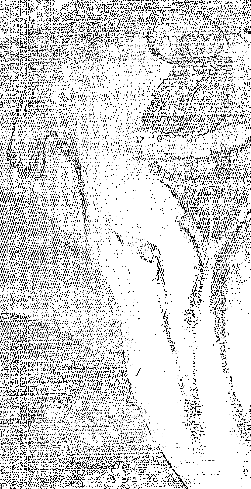

公元前几万年，早在埃及人发明象形文字之前，远古时代狩猎采集的人便已在欧洲各地的洞穴留下记录。在法国阿尔代什省地区深幽的石灰岩峡谷与陡峭的悬崖之间，有一处极其特别的洞窟遗迹，于1994年出土，被认为可上溯至公元前30000年甚或更早，或许是目前洞穴彩绘或绘画遗迹中发现的第一个生殖力象征，之后流传到其他地区。

肖维岩洞上方某处悬崖约于29000年前开始坍塌，过了约8000年，落下的崖石封住了洞口。岩洞中有许多间小室，布满了优美、壮观、富于艺术创造力的图案，包括马、马鹿、美洲野牛、麋牛、黑豹、大熊、雄狮及土狼，全绘在洞壁的墙板上，栩栩如生。在众多动物图形当中，有一幅牛头野兽，下方却是女性躯体的下半身和夸张的三角部位。此外在大批掠食动物中间，杂以黄赭色的手部线条和有图案的圆点，以及形似棍棒的符号，如一个扭曲的P字。棍棒究竟代表何种意义，历来不乏学者热烈讨论，也有主观诠释的空间。有人认为，这是从侧面看过去的女性上半身，也有人觉得是早期阳物的象征。

在肖维岩洞发现的最重要图像是“维纳斯与男巫”，位于最里面的叫作“大餐室”的房间。一块石灰岩圆锥体从高度约7米的天花板上悬垂下来，只差1.1米就碰到地面。锥形石灰岩上以黑炭画着“维纳斯与男巫”图像。

### 维纳斯与男巫

维纳斯的三角部位约等于人平视的高度，位于构图中央，据说比她的男伴——男巫或人形野牛早了几千年画成。“男巫”（sorcerer）一词是考古学家用来形容拟人形象的，多代表萨满巫师。肖维岩洞的男巫与晚期希腊神话中的牛头人身兽相似，充满野蛮的猛烈力道。维纳斯形象应是岩洞最早的装饰图画，属于旧石器时代晚期文化（相当于法国旧石器时代前期）。其后出土于中欧与东欧地区的维纳斯小雕像，可能源自这段时期的洞窟艺术，比如法国多尔多涅地区发现的“罗塞尔女神”（约公元前25000年），亦有夸大的女性阴户，象征生育的力量。法国旧石器时代前期距今37000至27000年，特色是以骨头为工具，以燧石切割。维纳斯形象恰恰证明了肖维岩洞绘画是现存最古老的画作。

岩洞里一系列动物图像令人目不暇接，展现了真正的旧石器时代艺术，透过图像与象征，呈现了当时人们的日常生活与信仰系统。其中一间小室里有一幅宏伟的猫头鹰画像，俯视着下方岩石上的大熊头颅，一般认为这是一种神圣仪式，洞窟里凶猛的熊被捕获，同时受到尊崇。不论是熊、狮、黑豹或马，都和超自然的灵或雷电、雨、太阳同样神圣；这类图腾或许便是最早揭示泛灵论信仰的象征；神圣力量通过万物展现，可能是动物，也可能是雷电或太阳。

> > 目前认为洞窟艺术的图案与圆点是最早的书写形式，早在象形文字发明前便已存在。

### 彩虹蛇

#### 澳大利亚卡卡杜国家公园（公元前25000—公元前20000）

#### 力量强大的原住民作品

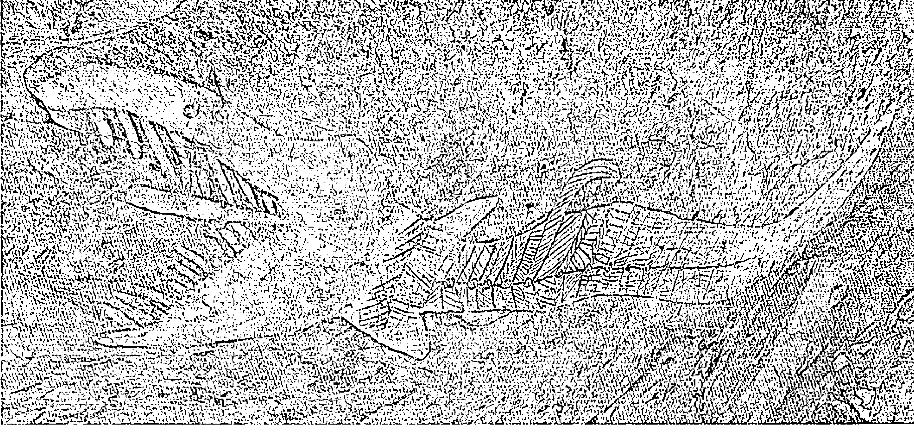

诺兰吉岩画所绘的彩虹蛇有两排尖长的利牙，看来比尤比尔岩上的巨蛇更凶恶。

澳大利亚卡卡杜国家公园的尤比尔岩有一处遗址，名为彩虹蛇画廊。这里有着简单却生动的原住民岩画：岩石表面绘着一条蜿蜒而过的长蛇。虽然这条蛇并非真有七种颜色，却活泼有力地呈现出宇宙创世的样貌，当地原住民称这一时期为“梦世纪”。此岩画堪称最古老的原住民艺术画作之一，时至今日，彩虹蛇对澳大利亚原住民而言，仍有文化上的影响力。

传说中，彩虹蛇是从水中洞穴冒出来的，或在“梦世纪”的年代从天而降，孕育生命和水，使大地繁荣昌盛。当它在这块大陆逶迤而过后，所经之处变成了溪谷、山脉、河渠，形成这片古老大地的神圣面貌。

彩虹蛇横越大地时，一面行吟高歌，歌中诞生了岩石、植物、动物以及人类。这些肉眼所不能见的神圣路径，遍及整个澳大利亚，被称为“歌之版图”或“梦的途径”。而在各地不同版本的神话中，彩虹蛇有公有母，甚至可能是雌雄同体；名字也各不相同，包括琼龙格尔（Julunggul）、孔梦格尔（Kunmanggur）、昂加尔（Ungar）或尤龙格尔（Yurlunggar），不一而足。

有些学者认为，将蛇与彩虹联系起来象征四季循环，也说明了水在人类生活中的重要性。天空出现彩虹时，据说彩虹蛇便会从一个水坑游到另一个水坑，确保各地水源充足。大蛇蜿蜒着游过大地，地貌上便形成山谷和河道，这说明了为什么有些水坑即使在旱季时，也从不干涸。若非凭借大蛇的力量，天空不会降下甘霖，土地终将干裂。彩虹蛇也与月晕息息相关。月晕被认为预示着降雨，还具有神奇的医治力量。石英晶体与扇贝都与大蛇有关，往往充当召唤大蛇显灵仪式的道具。直到今天，澳大利亚北部阿纳姆地的原住民仍信誓旦旦地说，天边彩虹、贝壳的内壁或水洼的折射光中，都能见到大蛇的身影。

彩虹蛇也与人血有关，特别是和月经有关。古人以原住民地母神库纳皮皮之名进行血祭仪式。库纳皮皮跟随彩虹蛇来到人间，创造了人类、植物、动物与昆虫。传统上，女性月经对彩虹蛇而言是神圣之事，原住民的彩虹蛇神话中最为人所知的是娃娃拉格（Wawalag）姊妹的故事。据说娃娃拉格姊妹带着小孩，在这块大地上跋涉。半路上身怀六甲的姐姐生产，血流进了巨蛇所居的水洼。蛇循着气味找到这对仍在小棚屋中酣睡的姊妹，从门口游了进去，吞下这对姊妹和两人的孩子。之后蛇被一只蚂蚁叮咬，只得吐出姊妹，因而创造出阿纳姆地。至今，小棚屋仍只许女子进去，但观光客不受限制。

### 非洲神话

彩虹蛇在数个非洲神话系统中，包括贝宁、尼日利亚、刚果，均与生命创造密不可分；此外也出现在海地、波利尼西亚、巴布亚新几内亚的神话中。目前认为澳大利亚原住民约在距今五万年前，从非洲迁徙到澳大利亚。假如此说无误，那么很有可能是他们带来彩虹蛇的原型意象，可能通过口述故事，也可能形成了集体潜意识。随着时间推移，古代居民在这块大地上开枝散叶，形成了几百个部落，拥有各自的语言及文化。

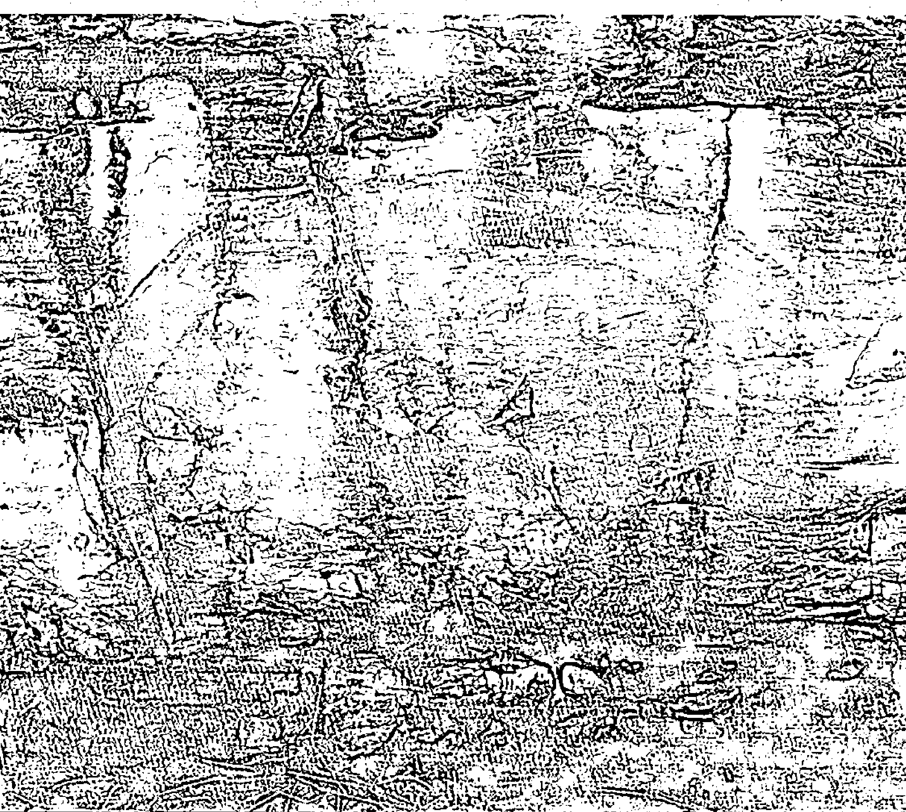

居住在非洲贝宁的丰族人管彩虹蛇叫阿依达-维铎（Ayida-Weddo），替阴阳同体的创造神那那-布卢库（Nana-Buluku）撑住天空。另一则西非神话形容一条巨蛇盘绕了七千个圈托住地表，保护土地，不让其坠入深海。巨蛇将星星撒落在苍穹之上，射出雷电到大地，让地球到处有圣水流动，滋养无数生命。降下第一场甘霖时，天空出现了彩虹，彩虹与蛇交配，两者创造出的灵性甘露，变成女人的乳汁、男人的精液。蛇与彩虹带给人类血与生命——或者说月经与生育密不可分，也造就了西非原始宗教伏都教血祭的圣礼。

> > 据说橘色彩虹蛇停在尤比尔岩上，“唱出”了世上万物的生命。从此，这里变成了女性圣地。

时至今日，澳大利亚及非洲原住民仍十分尊崇彩虹蛇。他们通过歌谣、音乐及舞蹈，反复传诵梦世纪时代的巨蛇一口吞下娃娃拉格姊妹的故事。澳大利亚每年都举行彩虹蛇音乐节，而古代神话意象在原住民艺术家的作品中俯拾皆是，可见今日的艺术家仍深受神话启发。

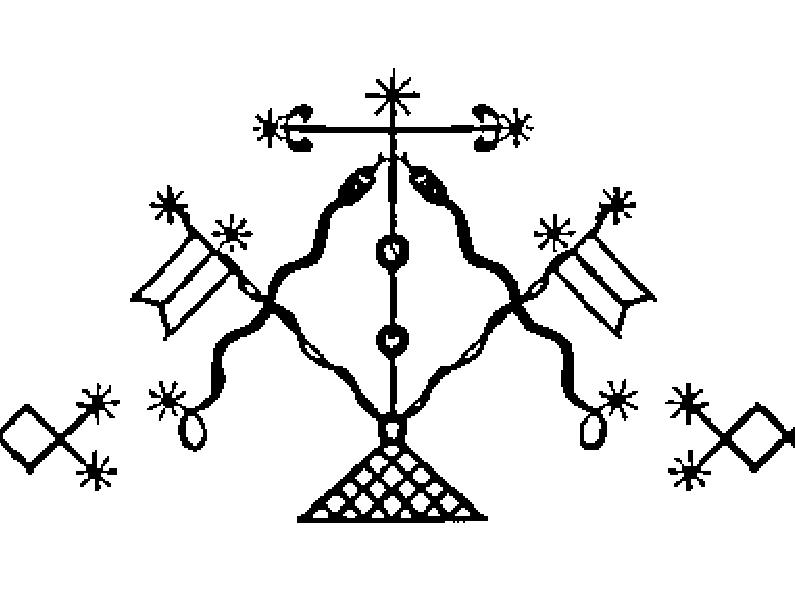

阿依达—维铎的神圣图腾，总是与她丈夫天空神丹巴拉的图腾结合为一。

### 巨蛇

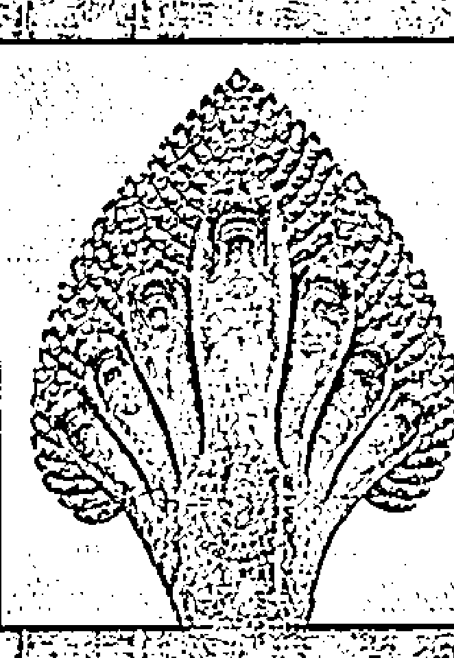

### 目邻龙王

目邻龙王是统领那伽蛇神一族的国王。当年释迦牟尼在菩提树下证道时，天色忽然间变暗。目邻龙王从地底现身，用眼蛇颈部的皮盾保护释迦牟尼免遭风雨吹打。雨停之后，大蛇向释迦牟尼躬身行礼，回宫殿里去。

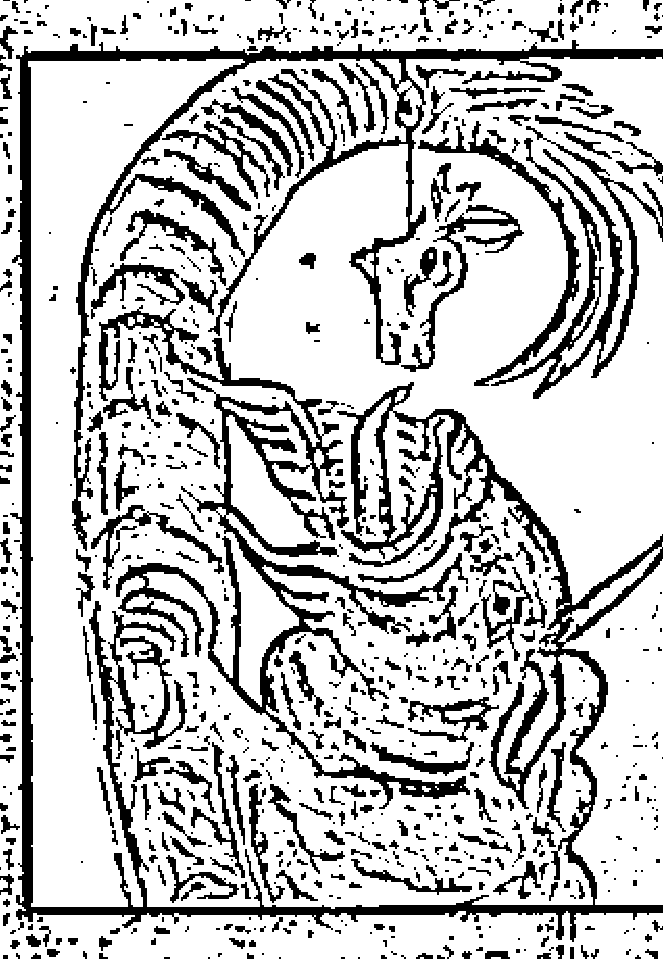

### 耶梦加得

耶梦加得是北欧神话中邪神洛基与女巨人安尔伯达之子，后来主神奥丁将他扔进海里，他变成身驱庞大的海蛇，能够围绕地球一圈，咬住自己的尾巴，从此被称作世界巨蛇。一旦他松开尾巴，世界就会灭亡。

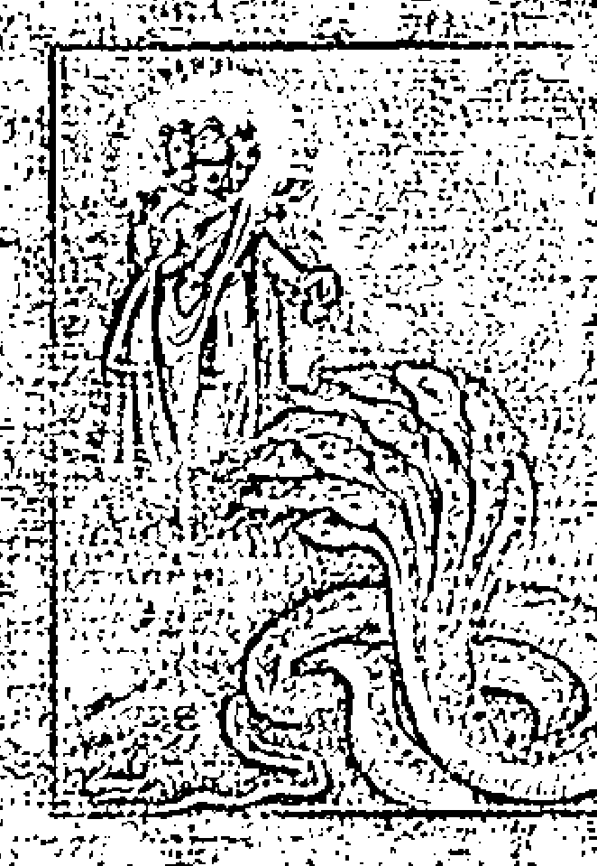

### 舍沙

印度叙事长诗《摩诃婆罗多》提到，舍沙是那伽族的王子。印度教创造神梵天非常欣赏他，委以驮负地球的重任。舍沙得知消息后，钻进地球的洞中，一路潜行到地底，将地球高举过头。后来变成巨蛇。相传奎师那曾在他身上睡觉。

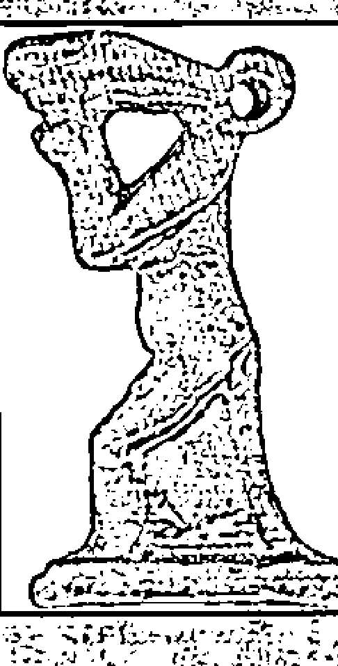

### 涅赫勃考

涅赫勃考是埃及仁慈的蛇神，是远古蛇神的原型之一。他与太阳神有渊源，早在开创天地之前，于混沌的水中泅泳。太初伊始时，他变成了太阳神，同时也是保护法老今生与来世的神。涅赫勃考通常以双头形象出现。

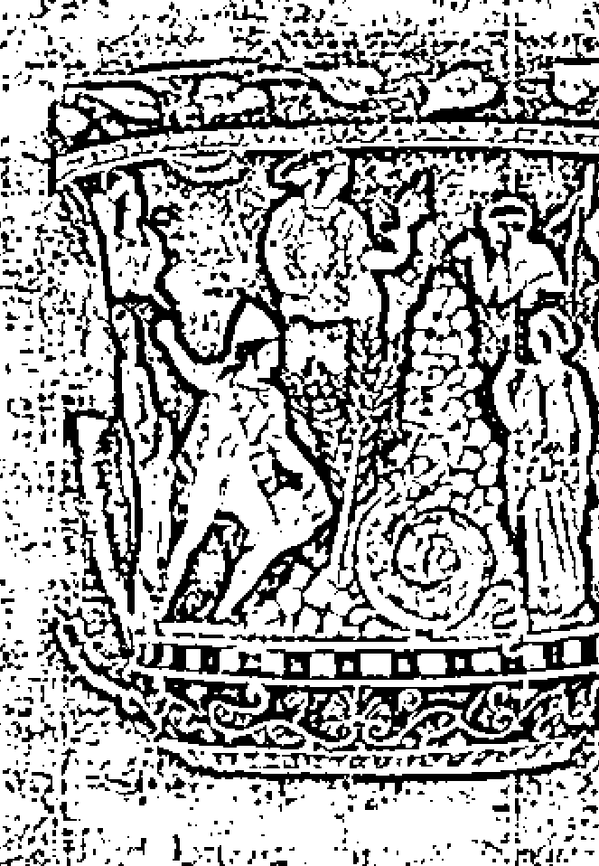

### 巨蟒皮同

在古希腊青铜时代，巨蟒是住在德尔斐的地龙，最初是赠给大地女神盖亚的神谕。后来皮同与太阳神阿波罗结下冤仇，最终被阿波罗消灭。阿波罗将德尔斐变成传达神谕之地，而皮提亚（阿波罗神殿的女祭司）从死蛇腐烂的尸体上求得力量。

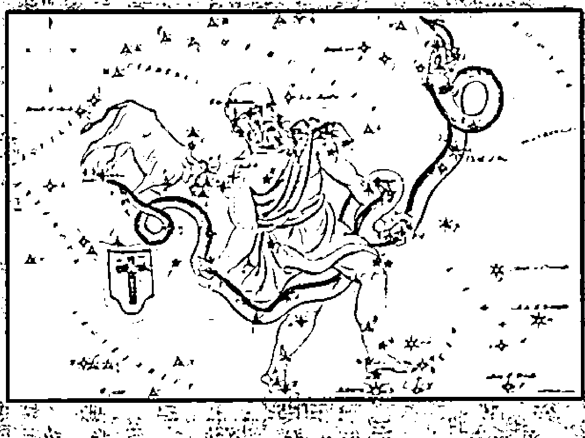

### 巨蛇座

巨蛇座与蛇夫座相连，通常以两种姿态出现：一是在夜空中围绕着蛇夫座，二是直接穿过蛇夫座。蛇夫座是特洛伊祭司拉奥孔的化身，他曾警告特洛伊人别拉木马进城。后来拉奥孔被一对海蛇所杀，其中一条便是巨蛇座。受海神波塞冬指示，前去惩罚他。

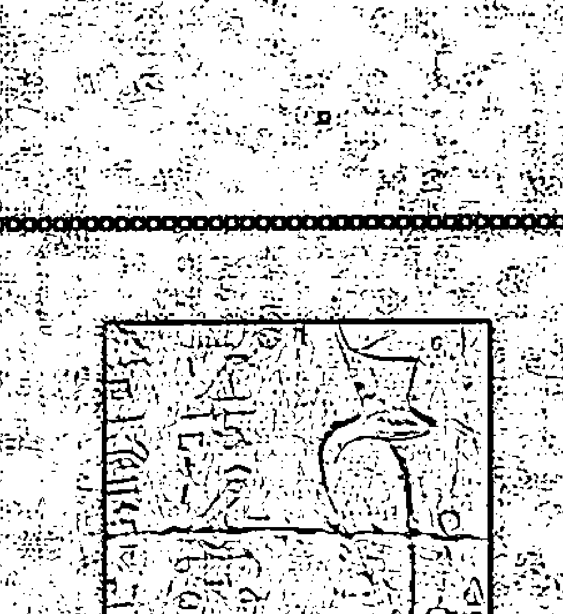

### 瓦吉特

她守护土地，也保护历代国王及分娩中的妇女，形象是蛇首女身，或身有剧毒的埃及眼镜蛇。普遍认为她是女神，在位于波瓦古特的神庙宣达神谕。后来希腊的神话传统，或许便是源自这份埃及神谕。

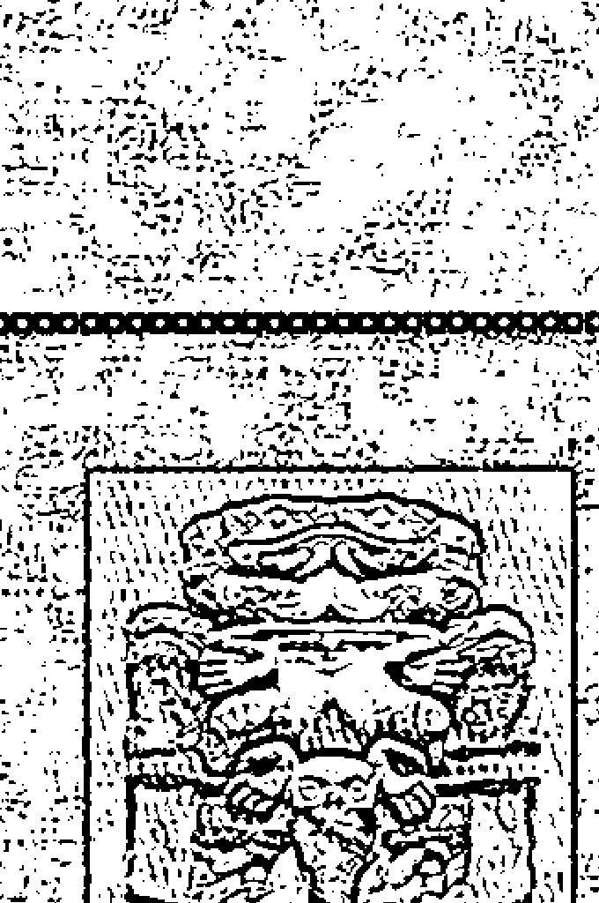

### 科阿特立库

这位诞下月亮、星辰与太阳的阿兹特克女神名叫科阿特立库。众所周知，她是“蛇之淑女”，裙摆以无数蛇身编织而成。太初之时，她被当作祭品遭到斩首，死后身上冒出两个蛇头。她象征吞噬一切的地母神，体内同时有子宫与坟墓。

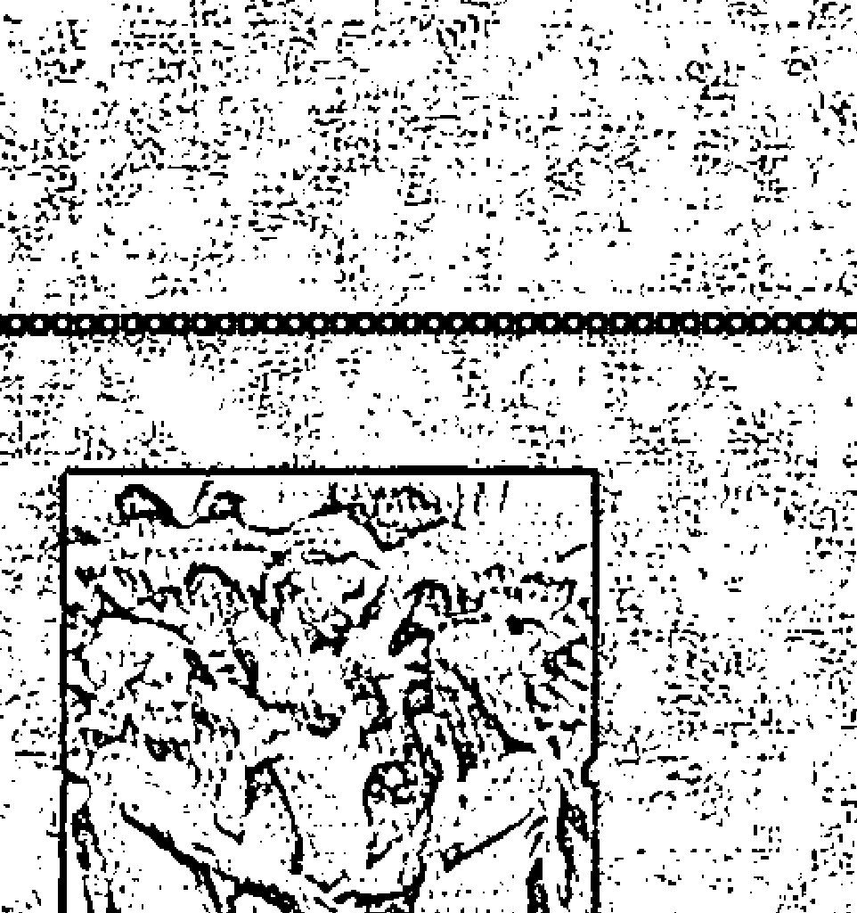

### 伊甸园之蛇

尽管上帝警告过亚当，别吃分辨善恶树上的果实，但蛇不住地怂恿夏娃，于是她摘下果实递给亚当吃。上帝发现后，将两人逐出了伊甸园。蛇被罚肚腹贴着尘土，生生世世在地上爬行。

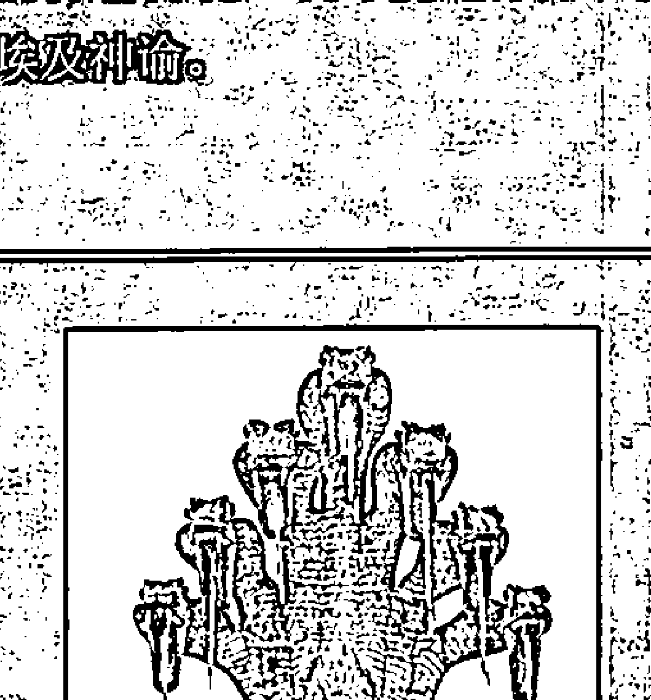

### 那伽

那伽是印度蛇神的统称，经常与大鹏金翅鸟争斗不休。《摩诃婆罗多》中详细叙述了他们奇幻壮阔的事迹。八蛇王之一瓦苏奇属于湿婆所有，帮助神祇从乳海深处攫取长生不死的甘露。

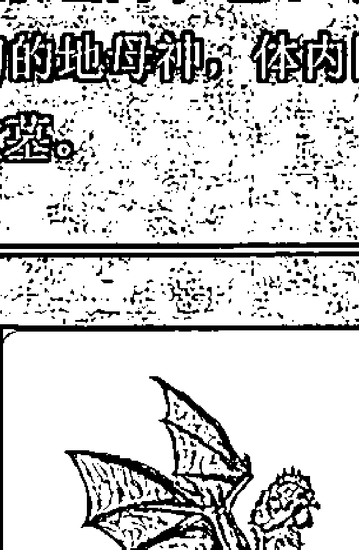

### 巴西利斯克

根据中世纪欧洲传说，巴西利斯克是由一只小公鸡从蛇（一说是蟾蜍）的蛋中孵化出来的。翻开中世纪的动物寓言集，巴西利斯克被描述得十分可怖，任何生物被它看上一眼就会死亡。但不止一则传说提到，巴西利斯克听到公鸡啼叫，或望见镜中的自己就会死去。

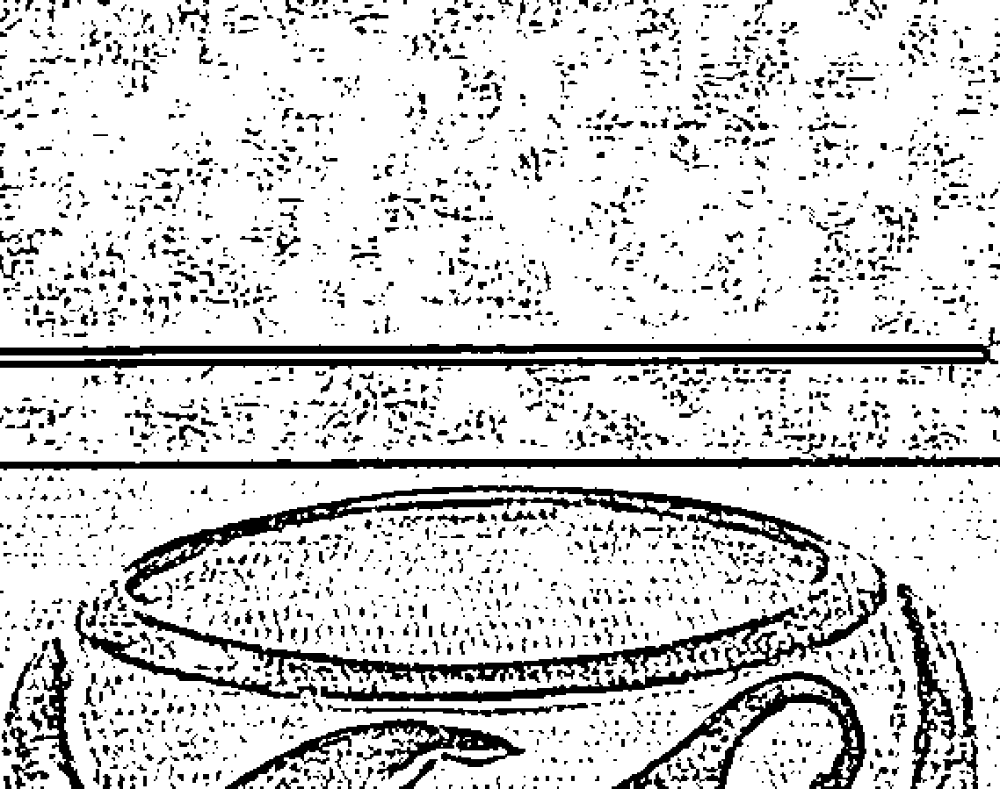

### 阿凡尤

此神阿凡尤属于特瓦族，是水的守护神。他的形象多变，有时头上长角，有时身披羽毛，象征流动的水，或锯齿状闪电。美国西南部或新墨西哥的峡谷河流上方的洞穴石壁上，有不止一处阿凡尤的画像。

### 手印

### 阿根廷巴塔哥尼亚地区的手洞（约公元前 7000 年）

#### 狩猎与采集部落的手印及手形图案

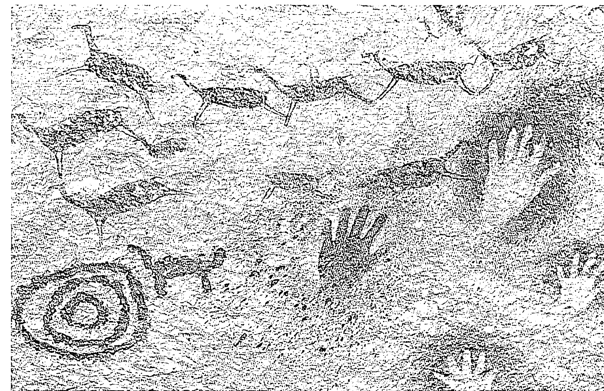

在巴塔哥尼亚内陆河谷的一处荒僻洞穴，穴壁上有数百个手印，说明古代游牧民族在这一带游猎时，会在此稍做停留甚至过夜。

手洞（Cuevas de las Manos）是一处岩画遗址，上面不仅记载了猎人的故事，画出所捕获的猎物，还有为数可观的手印与手形图案。许多学者认为，手印是到访山洞的人留下的记号，可以看作是名片、快照或自画像，提醒后代猎人，前辈曾来过这里。也有学者认为，这些涂绘或压上的手印，只相当于青少年的手掌大小，推测是在此举行入会仪式或成年礼，庆贺他们成为男人。19 世纪有一批欧洲人到此定居，因而发现了遗迹，认为他们——特维尔切人，可能是巴塔哥尼亚地区狩猎与采集部落的祖先。

他们——特维尔切人，可能是巴塔哥尼亚地区狩猎与采集部落的祖先。洞中墙壁上有林林总总的图画和手印，因此洞穴也有各式各样的名字。科学界都认为这些洞穴是南美洲弥足珍贵的遗迹，证明初期狩猎采集部落的存在，可上溯至公元前 7000 年。这些洞穴深藏于圣克鲁斯岛西北方的沙漠内陆，位于偏远的河谷，离最近的城镇佩里托莫雷诺大约 163 千米。整个地区（包括佩里托莫雷诺国家公园）处处可见考古学与古生物学遗址。河谷间一片静寂，唯有巴塔哥尼亚幽咽的风声和鸟鸣，几处矮树丛在峡谷间蔓生，为四面耸立的光秃山脉增添了一抹可喜的绿意。距今9000年前，这些以狩猎采集为生的人，在巴塔哥尼亚的河谷间追逐猎物时，都曾到手洞里休息。

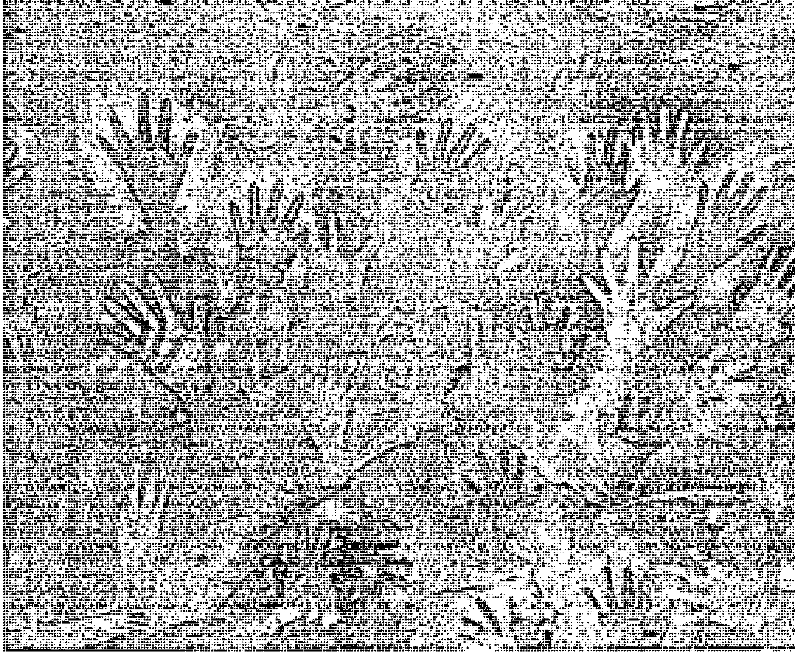

直到公元700年，手洞里还有人住。洞内的图画大多强调如何诱捕猎物，而非猎物本身。其中一幅图画，岩石上的缝隙代表猎人们追捕猎物时，来到一处山洞。几只动物被人围在中间，有些困在陷阱里。有些被猎人以绳球扔中——这种工具用来当作套圈，由连在一起的几根绳子组成，末端绑着石头，动物的脚一经套牢便动弹不得。

### 三种文化

洞穴绘画属于三种不同的文化。洞穴艺术的源头可追溯至公元前7300年。石窟内部主要岩画有五处。后期绘画往往叠加在早期的绘画上面。最早的一幅画中，画着长途跋涉的猎人捕获了一只原驼（类似羊驼，是当地居民主要的食物来源）。

大约公元前7000年前，出现了第二次文化，特色是许多手压印。此文化大约持续到公元前3300年，此时绘画风格更加纯熟，杂以一些动物和拟人的神祇形象。

最后一种文化始于公元前1300年，使用的颜料更趋鲜红，图案多半是抽象的几何图形，或描绘得栩栩如生的人或动物。一般认为这类画作出自历史上著名的特维尔切人，这些狩猎采集的先民居住在巴塔哥尼亚地区，直到第一批西班牙商人来到这里定居为止。特维尔切人属于游牧民族，冬天时住在低地，以鱼和甲壳动物为生。春天一到，便大举迁徙到巴塔哥尼亚的中央高原或安第斯山脉，在那儿度过夏天，猎捕高原上的动物。

部分手印可以追溯至公元前1300年，但在这些手印之下更早的图案则可一直追溯至公元前7000年。

19世纪以后，巴塔哥尼亚地区纷纷开始发展大型牧场，繁衍牛群，特维尔切人的游牧生活就此告终。尽管他们已走入历史，但留下的红手印变成了永恒不灭的印记，证明过去曾有过一支民族，依四季变化而居，猎捕动物却又对它们表达敬意，例如原驼便象征了某一古代民族每日与大自然苦苦搏斗的精神。

手洞中的岩画不仅仅如此，也有几何图案、锯齿形、红点，以及太阳、蜥蜴、蜘蛛、怀孕的动物、幼兽，甚至恶灵。有些考古学家认为，穴顶上的点点代表天上的星星或捕猎游戏：小孩朝上扔彩球，把穴顶当作投掷的目标。

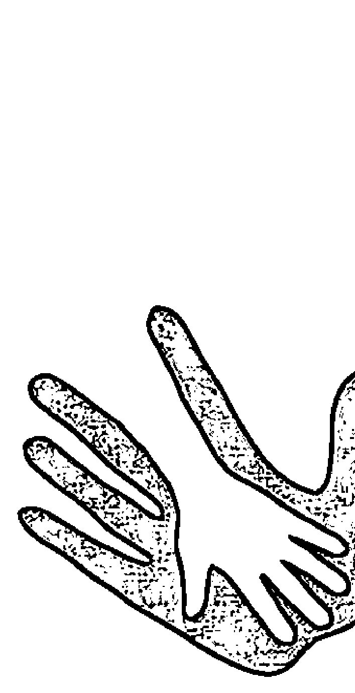

古时候住在手洞的人是最早记述历史的人，借由艺术表达早期的信仰与生活方式。

据说洞穴手印是古代猎人留下的个人印记。

### 裘达库拉的岩石雕刻

#### 美国北卡罗来纳州的杰克逊郡（公元前3000—公元前1000）

#### 切罗基族（美洲印第安人的一支）与灵界沟通的圣地

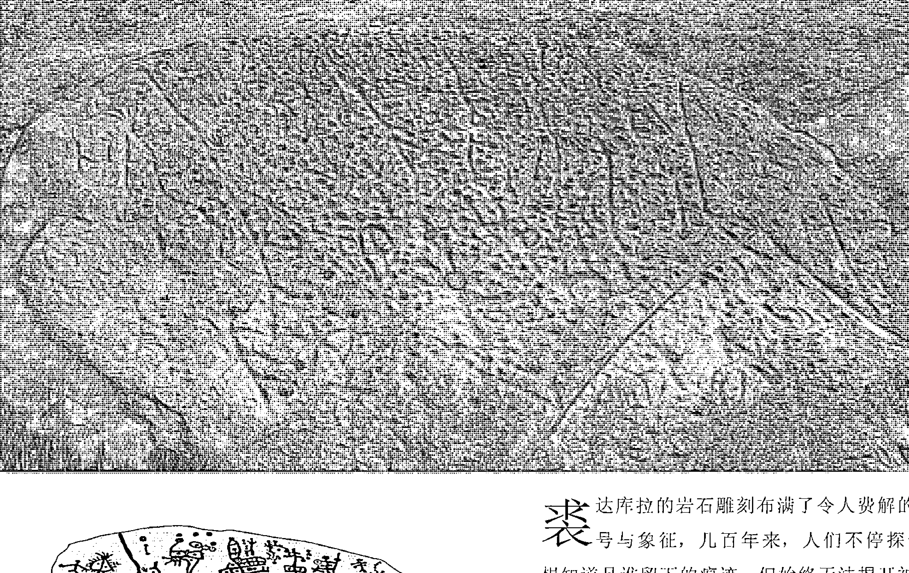

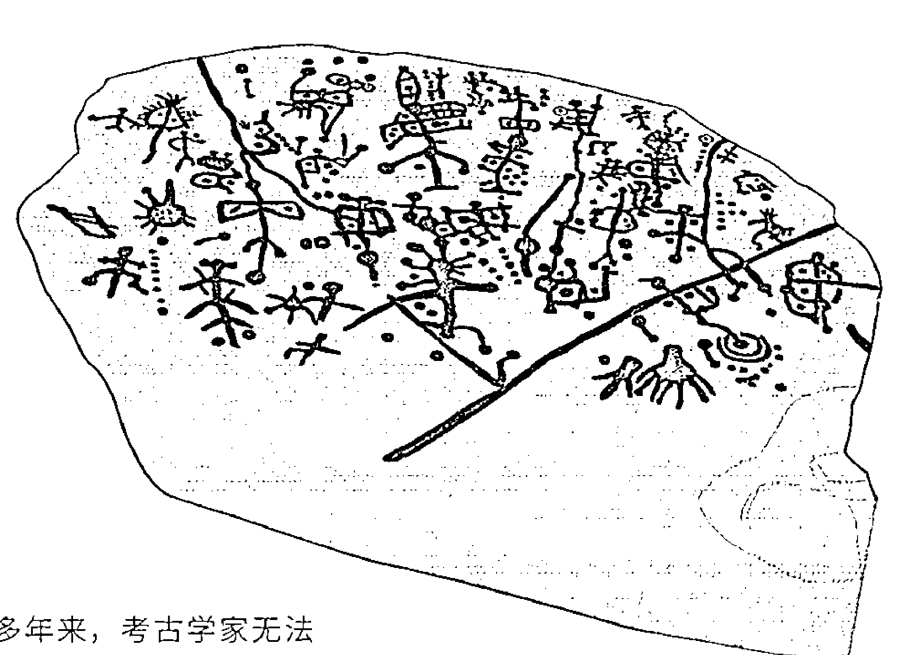

裘达库拉的岩石雕刻布满了令人费解的符号与象征，几百年来，人们不停探索，想知道是谁留下的痕迹，但始终无法揭开神秘的面纱。大石属于皂石，可上溯到几千年前。不久前，北卡罗来纳州邀集一群考古学者前来审视这块巨岩，学者们普遍认为上头的雕刻出现时期比切罗基人更早，推测时间在公元前3000年至公元前1000年之间。这群考古学者认为，几千年间，有好几个原住民族来到这里，雕刻碗、烟斗和祭祀用的器皿，这里甚至可能就是举行仪式、祭典的圣地。石上较小的图像或许是前人到此一游后信手乱刻，也可能是美洲印第安萨满巫师所刻的魔法符号。

多年来，考古学家无法厘清这些奇异刻痕出自何人之手，更加不确定是信手乱画，抑或是神秘象征。也有考古学者认为，巨石上刻的是本地地图，图中有通行的河流，标志着贸易及旅行的路线，包括小田纳西河和南塔哈拉河。河流位置与现代精确地图十分相近。

美国东南部有几处岩石雕刻，裘达库拉岩石是北卡罗来纳州杰克逊郡中数一数二的大石雕。巨石上布满各种图形，纠结缠绕，很难辨别清楚。但位于此地的其他岩石都找不到类似图案，如抽象线条、人与动物、条状和圆点，以及日月星辰、几何图形等。部分符号或图形与墨西哥琼塔尔一带的玛雅人常用的象征非常相似，如巨大的太阳。琼塔尔族的神话充满代表超自然力量的水、红树林中的野兽和生物，岩石上也有几处类似的图案。当然这种图案可能四处流传，但有可能传播到这么远的地方吗？

根据切罗基族较为近期的传说，石上的符号是住在邻近山区、善于猎捕的斜眼巨人苏卡路留下的。一天，他从自己居住的山巅跳下来，落在这块皂石之上，石上就此留下他双手各有七指的抓痕。此外，好几种版本的传说是巨人来此找切罗基人。他们比普通人高出一倍，双眼长在接近头顶的地方，斜着看人。切罗基人给他们起了个名字：苏卡路（Tsunil’ kālù），意思是斜眼巨人。巨人们住在遥远的地方，那儿是太阳沉落之处。他们到访时，往往受到切罗基人的热情款待，住上几天才回西方去。

> 传说中苏卡路（或斜眼巨人）以猎捕之神的形象出现，切罗基人举行狩猎仪式，求他庇佑。

暗号。这些信息或指示也可能是画给不同部落、氏族的人看，标示出河流与地形之间的路线。

裘达库拉岩石上有好几组图形，均由七个点、轮辐、圆圈和十字形组成。四和十这两个数字，在切罗基人的神话、故事与仪典中反复出现。“四”代表土、风、火和空气，也代表东、南、西、北四大方位。“七”则代表切罗基七大氏族。轮辐的七根辐条，则表示四个基本方位以及另外的三大方位，即上（上界）、下（下界），以及中心（我们目前所居之处）。

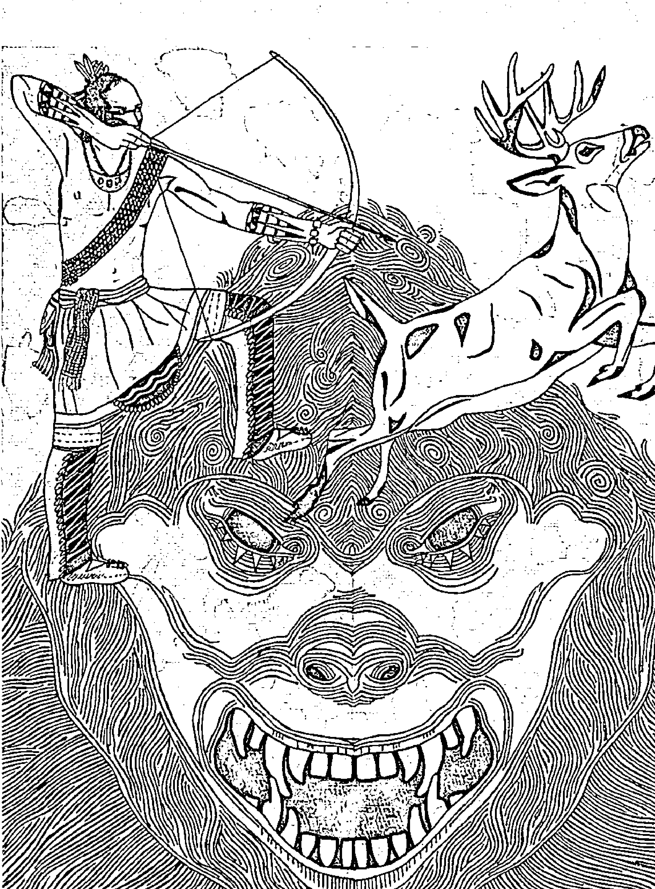## 狮身人面像
#### 埃及吉萨（公元前3000—公元前2500）
象征法老具有太阳与狮王的威力

狮身人面是世上最为人所熟知的象征之一，但学界至今仍针对其起源争论不已。

近东文明自古以狮身人面象征太阳。依照传统，历代法老的陵墓中均有以国王面貌为本的狮身人面像。法老与狮子的关联代表国王与赛可麦特——太阳神“拉”的女儿——结合，她在画像中多以母狮头形象出现。狮身人面既是太阳的象征，也与“日出日落之王”哈玛基斯有关，象征再生与复活。狮身人面的双重本质后来也反映了基督的双重本性，亦即人性与神性。狮身人面和其他太阳象征一起被放在早期基督教的陵墓里，代表神圣的世界之光。

大多数学者认为，吉萨的巨大狮身人面像大约建造于公元前2500年，其时由古王国时期的海夫拉王执政。另外一派则认为它代表膜拜太阳神的信仰中心，建造于公元前3000—公元前2500年，那时吉萨高地尚未大规模兴建法老陵寝。埃及的狮身人面变成了法老的象征——代表太阳与狮王。动物与法老结合成为超凡的存在，不但象征陵墓的守护者，而且代表神圣力量，以及法老统治国家、保护子民的智慧。后来又变成谜、真相与完整的象征。吉萨遗址有根石柱，据说上面的碑文刻于公元前1400年图特摩斯四世时期，列出了太阳神“拉”的三种面貌，亦即凯布利、拉和阿托姆，古埃及人后期膜拜的便是这位面貌多变的太阳神。

### 狮身人面的演化

狮子女神，亦称为狮男，是距今3200年法国旧石器时代前期的雌雄同体，是目前所知最早的人身狮头像。但其身体究竟是男是女，迄今仍无定论。此外，古代亚述的拉玛苏，或舍杜（如右图），最早绘于公元前3000年，那拉玛苏是能驱逐恶灵的守护神，往往将其描绘成有双翼的狮子或公牛，加上男人的脸。印度教的人狮则被视为毗湿奴的化身，具有人形躯体，但脸长得像狮子，也有爪牙。众所周知，人狮是“伟大的保护者”，信徒有危难时会挺身相护。波斯神话中有一种名为咧嘴狮的生物，红狮的身躯加上人头，长着三排尖牙，有时加上蝙蝠翼，声音嘹亮；有时头上出现角，背生双翼，甚至有龙或蝎子的尾刺，能射出毒液，让猎物动弹不得，再囫囵吞下肚。

舍杜是埃及狮身人面像的前身之一。这只美索不达米亚怪物是有翅膀的公牛，顶着一颗人头。

长期以来，狮身人面象征谜团，自罗马时代以来，也是欧洲绘画主题之一。

### 希腊的斯芬克斯

希腊的斯芬克斯以狮身女人头的神话怪兽为原型，背上也有一对老鹰翅膀。根据俄狄浦斯的神话，斯芬克斯坐在希腊底比斯城城门上方的悬崖上，经过的旅人必须解出他所问的谜题，才能进城。要是答错了，就会被斯芬克斯掐死、吃掉。谜面是：“哪一种动物早上有四只脚，中午有两只脚，晚上又变成三只脚？”俄狄浦斯解开了谜底，回答道：“是人，婴儿用双手双脚爬，长大后以两只脚行走，老了就拄拐杖走路。”听到俄狄浦斯说出正确答案，斯芬克斯便从高处岩石上跳下来摔死了。有些版本说有第二道谜题：“世上有两个姊妹，姐姐生下妹妹，而妹妹又生下姐姐。这两姊妹是谁？”答案是“日与夜”，因为这两个字在希腊文里都是阴性。自从希腊时代以来，斯芬克斯变成谜、门槛、从生到死的隐喻。

希腊的斯芬克斯在文艺复兴时代重新抬头，深受欧洲装饰艺术青睐，有时还会被当作法国的斯芬克斯。在18世纪初的晚期巴洛克艺术、19世纪浪漫主义与象征主义艺术运动中最为盛行。

由于斯芬克斯是神秘事物的守护神，因此共济会以其为会徽，各分会教堂前皆有斯芬克斯的华丽雕塑，官方文件上方也印有其图形。但并非自创立以来便沿用至今，而是晚近才开始，用来当作装饰，并不是特殊信念的象征。

### 圣甲虫
#### 埃及（公元前2613—公元前2160）
#### 象征复活或再生的神圣图形

图坦卡蒙的金坠子嵌以彩色玻璃和次等宝石，由三种象征组成：筐状的绿松石代表天神，天青石制成的甲虫代表凯布利，镶着红玛瑙的小圆盘则象征太阳神“拉”。

古埃及人认为圣甲虫代表昆虫之圣者，因此圣甲虫是当时极受欢迎的象征。圣甲虫的图纹源自凯布利，是太阳神“拉”的面貌之一，之后圣甲虫便成为重要的护身符，皇室与亡者皆有佩戴。今日已成为珠宝设计的常见图案，较为老派的埃及人认为服用圣甲虫的干燥粉末，可以助长男性雄风。

凯布利（Khepri）常被描绘成有一颗甲虫头的男性，有时直接以甲虫形象出现。他代表旭日，含有人类文明曙光和古埃及创造神话的深刻寓意。“kheper”一词，在埃及文中代表“从无到有”，而凯布利身为太阳神“拉”的一种面貌，不但带来阳光，而且让这个世界成形。但他为何有一颗甲虫头？这样的形象又是如何演变成护身符的？

历来考古学家与学者认为，智慧的埃及人将观察到的甲虫奇异行为记录下来，注意到甲虫无论去哪里，都会边走边滚动一坨动物粪便，不久之后，便从中孵化出幼虫。由于幼虫刚孵出便已完全成形，正如太阳每天都从地平线那一端升起，古埃及人认为它们和太阳神一样，具有神奇力量。于是，它们变成创造生命的神圣象征，就像凯布利一样，保证太阳每天都会升起。

正如古代埃及的宗教与再生、复活息息相关，甲虫这种习性被用来代表新生，象征太阳每天一点点移过天空，升起又落下。正如甲虫滚动粪球，凯布利每天推着太阳横越天空，到了晚上，便推到冥府。有时画中的凯布利有颗甲虫头，坐在太阳船里，沿着地平线前进，不但将日变成夜，夜变成日，而且作为冥界之神度化亡灵，引领人的灵魂前往来世。

### 护身符

圣甲虫从古王国时期开始被当成护身符，赐人以平安，时间为公元前2613—公元前2160年。这类护身符多半以宝石雕成，镌刻成图章款式，再刻上法老和工匠的名字。佩戴护身符主要是避免被恶灵盯上，通常具有公务或政治上的用途，但后来也用于墓葬装饰。

所谓“心形圣甲虫”，是以黑色或墨绿色宝石雕成，如碧玉或颜色浓重的红玛瑙，长度通常介于4到12厘米。心形圣甲虫若非放在木乃伊的心脏位置，就会以金丝穿起来，像饰物那样挂在木乃伊脖子上。圣甲虫护身符上刻着亡者的名字，以及一句摘自《埃及亡灵书》中的重要咒语。咒语告诫亡者保存初心，在接受神明审判时不要供出不利的证词，否则灵魂便会飘荡到可怕的地府，无法被引渡至来世，也无法获得永恒的宁静。

自公元前760年起，木乃伊的胸前会缝上一只两旁打洞、大而平坦、翅膀张开悬于两侧的圣甲虫护身符，通常以蓝色彩陶或蓝色宝石（如天青石）制成。

最近动物学家艾米丽·贝尔德带领瑞典隆德大学的研究团队，致力于研究小昆虫的导航方式。甲虫会头朝后看着后方的地面，靠后腿推动粪球，沿着完美的直线前行，每隔一会儿便停下来，跳上粪球顶端跳一支小舞。贝尔德认为小甲虫是爬上去看太阳，将光线当作指南针，确认目前所在位置。古代埃及人是否已经了解到，甲虫停下来是为了利用太阳光呢？现在还不清楚甲虫何以备受尊崇，但自古以来被当作护身符使用，同时与太阳——一切生命的源头有关，甲虫变成了一种原型象征，直到今天仍能激发无穷的想象。

> 曼伯克沙夫二世的“心形圣甲虫”，空心金底座上嵌着一枚碧玉凿成的圣甲虫。上头的象形文字摘自《埃及亡灵书》，是一段咒文，提醒心勿与亡者作对，好让灵魂永享安宁。

这座花岗岩打造的圣甲虫（凯布利）雕像位于埃及卢克索卡纳克神殿群，可上溯至新王国时期（公元前1570—公元前1070）。

### 古代埃及的象征

#### 日常护身符
此物与爱神哈索尔密不可分，是一面系上串珠的小铜牌，最早由哈索尔的女祭司佩戴，后来变成如项链一般的护身符，能招来好运、驱退恶灵。有时与亡者同葬，继续在来世保护主人。

#### 巴
巴是长着人头的鸟，象征个性，为构成灵魂的五要素之一。另外四个要素是艾布（意指心脏，也暗喻内心）、沙特（阴影，是身体的倒影，因而也具备肉身一部分的本质）、朗（人的名字）和卡（死时离开肉身的灵魂）。

#### 丘
丘（意为“山”）象征两座山峰，如同一对帐篷所撑起整片天空，尼罗河从中流过。河西岸的山峰叫作玛努，东侧的山叫巴克胡，各有一只狮子雄踞其上，每日守护着太阳东升西沉，不受干扰。

#### 曼荷德
曼荷德是一种盛放黑、红色色粉的浅碟，系上水罐和笔。三者是古代作家的必备工具，通常见于君王或达官显贵的画像，有时表示他们识字，有时则用以表示他们是作家的赞助人或金主。

#### 涅赫贝特
象征上埃及的白秃鹫叫作涅赫贝特。据说秃鹫具有神秘力量。因公秃鹫与母秃鹫无明显差异，多半认为它们是单性生殖，不靠交配诞有下一代。白秃鹫与国家颇有相似之处，孤独而不可侵犯。

#### 卡
古代埃及人认为，在维系生命的五种灵气中（巴、艾布、沙特、朗和卡），卡是其中的精髓——尽管卡在生者断气时离开了身体，只吃喝留在亡者的墓中或坟墓前的供品，就能继续在来世活跃。

#### 双皇冠
双皇冠是两层皇冠（通常为红白交杂），代表一统的埃及，引申为普遍的统一。双皇冠经常被描绘成有地形标记（攻击姿态的眼镜蛇，象征下埃及和保护女神瓦吉特），以及白秃鹰（象征上埃及与其守护神涅赫贝特）。

#### 芮利特
顶上有冠毛的田凫，翅膀过长，无法飞行。在埃及的象征系统中，这种鸟代表一般人。田凫在多种视觉艺术中均时跨在有权有势者的脚下，可能是暗示普通人臣服于权势。因此，此鸟公认是政治意味浓厚的激进象征。

#### 撒
此象征可用来代表四处迁徙的牧人卷好收起的毯子，或古代水手常用的漂浮救生衣，因此意味着保护。通常当作护身符，放在掌管生育的河马女神陶尔特的脚下，祈求孕产平安。

#### 贝斯
小矮神是分娩的保护神，据说能吓退伤害新生儿的恶魔。贝斯是邪恶力量的死对头，令埃及的敌人和所有的邪灵闻之丧胆。据说在家宅内佩戴镌刻贝斯的护身符，蛇或蝎子都不敢近身。

#### 十字符号
十字符号又称作伊西斯结，因为大家都觉得其形状很像穿斗篷时，系在颈间的搭扣。十字符以宝石或彩色玻璃制成，能在许多坟墓中找到。迄今仍不解其意义，但研究埃及的专家推测极可能是复活或永生的象征。

#### 巫沙布提
巫沙布提，这种形似木乃伊的小雕像放在墓穴里，表示在来世为亡者服务。地位最高的埃及人墓中放着401个这样的手工艺品，每一个代表一天，多出来的36个代表工头。显然到了来世，阶级制度仍与今世一样牢不可破。

### 鸽子
#### 美索不达米亚地区（公元前2400—公元前1500）
#### 公认是和平与爱的象征

旧石器时代的人供奉全能的大母神，往往以鸟类当作祭品，其中鸽子最能代表她多产及孕育生命的能力——不单是因为鸽子的求偶行为，也因为它们一旦结合便终生厮守，在鸟类中甚是少见。不止一位考古学家曾在苏美尔族定居的美索不达米亚地区发现大母神塑像旁有栩栩如生的鸟类雕塑，时间可上溯至青铜器时代（公元前2400—公元前1500），足以证明鸽子的象征古已有之。

此崇拜传到希腊克里特岛，当地将大母神塑造成头上有鸽子栖息的形象——塞浦路斯的罗马钱币绘有群鸽栖息在神殿屋顶的图像。希腊神话里，阿芙洛狄特（爱与美之神）主司爱情，人们献上贡品，希望女神能够赐予爱情上的好运。她的画像也常有鸽子相伴。得墨忒耳（丰饶女神）是希腊版本的大母神，同样与鸽子密不可分。

有一则希腊神话是这么说的：两只黑鸽从底比斯出发，一只飞到多多纳的橡树林，一只飞到了利比亚。抵达多多纳的黑鸽宣布，不久之后，当地将宣告神谕。第二只鸽子以阿蒙神形象出现。阿蒙神是埃及生殖之神，亦为统领众神之王，素为当地人所崇拜。栖息在林间的神谕之鸟被当作祭品献给宙斯，后来女祭司说它们婉转的轻啼传达的是宙斯的旨意，应视为预言。

19世纪浪漫主义画家威廉·布格罗笔下的维纳斯，被鸽子环绕。

另一则神话来自公元前4世纪的叙利亚，主角是塞米勒米斯女王，她是德珂朵女神在凡间的女儿。德珂朵生下凡人女儿后羞愧难当，弃女儿于不顾，纵身跳入亚什克隆一带的湖泊，自溺而死。她就此变成一条鱼，后来变成掌管鱼的女神。一开始，塞米勒米斯先由鸽子哺喂，直到一名皇家的牧羊人西玛斯发现了她，将其养育成人。后来她嫁给了尼努斯国王。某次尼努斯征战亚洲，胜利而归，却因箭伤过重而死，因儿子年岁尚幼无法登基，于是塞米勒米斯出面摄政，征服了亚洲多个地区。据说位于叙利亚古城马柏的阿塔耳伽提斯女神神殿，便是由塞米勒米斯下令建造。殿内雕塑的女神头上有只黄金鸽子栖息。

19世纪的浪漫主义运动对希腊、罗马神话情有独钟，致力于重述这些古代神祇、女神、仙女、半人半兽的森林之神以及天使的故事，告诉世人，即使经过了几千年，神话形象的意义依旧不减。许多象征母亲与爱的古代女神，如维纳斯（或阿芙洛狄特），流传的形象都有鸽子相伴，显然与早先美索不达米亚的女神伊丝塔、阿施塔特和大母神一脉相承。

### 基督教义中的鸽子

不少基督教教士透过文字，将异教的神明、象征与神话融入教条，同时针对其中一部分加以改变，好符合信仰系统。这类充满象征的联想（如和平鸽的形象），早已纳入集体潜意识，后来融会成基督教教义。

《创世记》有一则相当有名的故事：挪亚在大洪水之后释放鸽子去寻觅陆地，鸽子衔着一根橄榄枝回来，代表附近有干燥的土地，寄寓着希望。对古希腊与罗马人来说，橄榄枝代表和平，因此早期基督徒很快将橄榄枝的意象与鸽子结合，代表神圣的爱。此后鸽子又与圣灵结合，变成天神的使者。天使报喜节那一天，是鸽子将上帝的旨意传达给马利亚。整个中世纪时期，教堂里不论是长凳、圣洗池外缘甚至圣礼的容器，均凿有鸽子图案当作装饰。公元2世纪时，基督教出现一支旁支教派“真知派”，将鸽子视为女性圣灵（亦即智慧女神索菲亚）的象征。

总的说来，尽管鸽子的寓意起源于古代神话与信仰，但直到今日，仍是和平、善良与爱的原型象征。1949年于巴黎召开的世界和平大会选择毕加索的石版画《白鸽》——以传统画法呈现，嘴上并未衔着橄榄枝——当作和平的象征。

> 鸽子经常出现在基督教堂的彩色玻璃中，象征圣灵以及神圣的爱。
> 鸽子在全世界都是和平的象征。

### 鸟类

#### 鹰
鹰通常与太阳神有关，象征权力、天空、王室与智慧。在中国，见到不止一只的鹰预示将有战争。对阿兹特克人来说，鹰是诸神的信使。古代埃及人则认为鹰代表灵魂的飞越，而天空之神荷鲁斯的形象，便脱胎自状似鹰的象形文字。

#### 兀鹫
在中美洲神话中，兀鹫之眼代表太阳本身，象征神界隐秘的光。安第斯兀鹫能预示天气，带来雷霆闪电、智慧、远见、预言、天启与创造的力量。许多人认为加州兀鹫具有超自然力量。

#### 信天翁
四处飞行的信天翁常常被认为与海洋航行相关，西方人认为它象征死去水手的灵魂。据说杀害信天翁会带来厄运。英国诗人柯勒律治的《老水手之歌》(1798年)便是吟咏此事。对毛利人来说，它代表美、权力、平衡与自由。

#### 戴胜鸟
古人见到此鸟便联想到魔法或超自然，正是此鸟把示巴女王的秘密告诉了所罗门王。对阿拉伯人来说，戴胜鸟是圣鸟，任何病都治得好。这种鸟死了之后，用其血液可写下符咒，而血干燥后可佩于颈间当作护身符，不受邪恶之眼的侵害。

#### 猎隼
对美洲印第安人来说，猎隼象征男性气概与太阳的能量，标志着精神自由，也有人认为是祖先派来的信使。中世纪以来，贵族以其为狩猎的象征，因此猎隼也与王孙贵族联系在一起。古埃及时，猎隼象征神圣君权。

#### 蜂鸟
北美洲霍皮族和祖尼族会在水罐上画蜂鸟的图案，认为这种鸟上通神明，能为人类带来雨水。印第安切罗基人有则神话，说一名萨满巫师把自己变成蜂鸟，好找到众人渴望的烟草植株。这种小鸟在图腾族谱中代表生命的轻盈与恢复力。

#### 猫头鹰
古代希腊人认为猫头鹰是智慧女神雅典娜的化身，也是雅典卫城的守护者。它陪伴在专司黑夜与冥界的魔法女神赫卡特身边。由于它是昼伏夜出的猛禽，因此罗马人认为它与邪恶有关，但罗马秘教圈子仍认为此鸟象征智慧。

#### 鹤
在遥远的东方，鹤象征长寿和忠贞。古代中国人认为这种鸟来自仙界，认为它们背上驮着古代圣贤，在不同世界之间飞来飞去。古希腊人则视鹤为太阳神阿波罗的象征，他会乔装成此鸟造访人间。

#### 渡鸦
北欧神话中的主神奥丁豢养了两只渡鸦，飞到人间监视人类的所作所为。渡鸦代表智能与智慧，而早期美洲人认为此鸟是创造者的象征。渡鸦在欧洲民间故事中是能变化身形的巫婆。印度神话中的渡鸦则是死神的信差。

#### 秃鹫
由于专吃腐尸，玛雅人将秃鹫视为能够起死回生的动物，因此这种鸟变成净化与转化的象征。美洲印第安传统深信秃鹫代表周而复始，与循环的主题息息相关，有如每日升起的朝阳。

#### 燕子
古希腊认为燕子与主司爱情的阿芙洛狄忒有关，能带来好运与幸福。古罗马人则认为燕子象征来不及出世的孩童的灵魂。现代基督徒认为燕子象征了牺牲、重生与新的开始。

#### 麻雀
此鸟可能预示好运或厄运。西方将麻雀视为神的恩惠，但也暗示死亡将至。在印度尼西亚，倘若有麻雀进入人家，那一家人便认为近期会有婚礼。女子若在情人节那天见到麻雀，就表示她嫁给穷人才能获得幸福。

### 药轮

美国怀俄明州比格霍恩山（公元前1500—公元500）

与灵界沟通的美洲印第安遗址

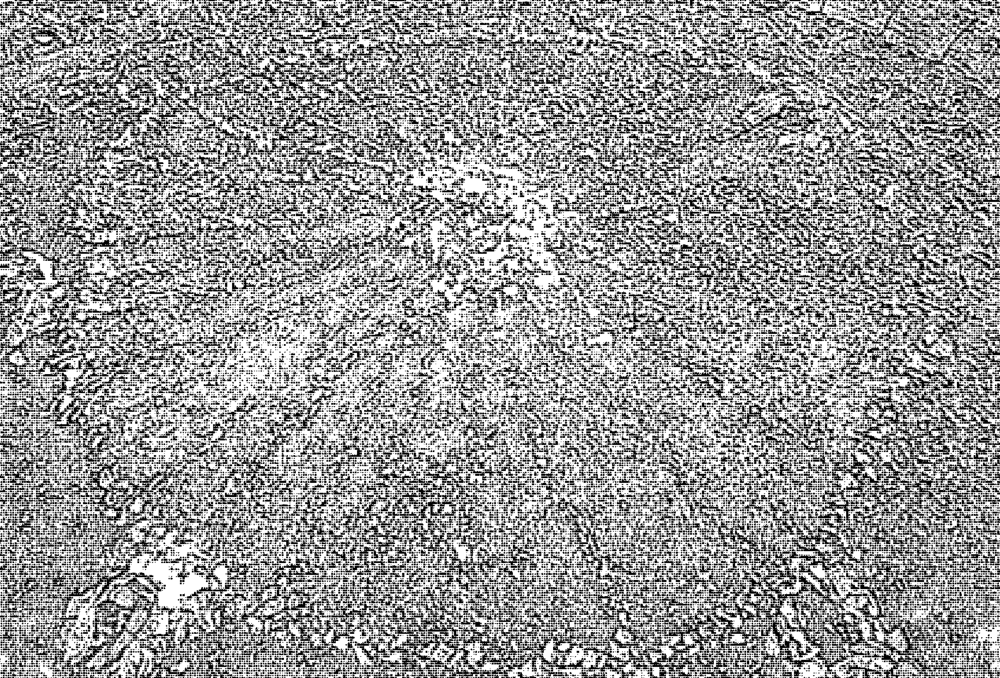

根据美国印第安传统，药轮（图为比格霍恩山的药轮）象征“伟大的神灵”，又称哇卡坦卡，是赋予万物活力的生命动力。

石砌神圣药轮分布于美国北部与加拿大南部的广袤平原上，当中有些直径超过12米，大得惊人。对美洲印第安人来说，位于比格霍恩山的史前巨大石雕是展现其宇宙观的神圣遗址。推测是阿兹特克人于公元前1500—公元500年打造，约300年前才被克劳人的猎人们发现，但这群猎人害怕药轮散发的能量。消息在大草原上传开，其他原住民部落纷纷感到惊慌。克劳人认为，地球上的始祖来自下方冥界，他们穿越由巨型石堆堆成的通道，以幽魂之姿在地球上出现。克劳部落利用药轮举行仪式，都说药轮是一个叫作“伤疤脸”的男孩所建。仍在襁褓的他跌入火堆，全身严重烧伤。后来伤疤脸长成了少年，前往深山探索。他在山中斋戒，建造药轮。旅途中，他遇见攻击幼雕的野兽，将其驱逐。于是大雕攫起了他，让他的脸恢复光滑，当作报答。

大部分美洲印第安部落都认为圆形或圆轮代表哇卡坦卡，意即“伟大的神灵”。对美洲印第安人来说，“药”字的意义与今日大相径庭，是指自然界与生俱来的生命力，或者能让个体趋于完整的内在力量。根据美洲印第安人的灵性哲学，药轮代表连接与和谐，是地表上一切众生和平互动的主要象征。学者均认为药轮用于仪式或典礼，有证据显示部分药轮上有旋转舞动的痕迹；其他药轮可能用于灵视探索的仪式。

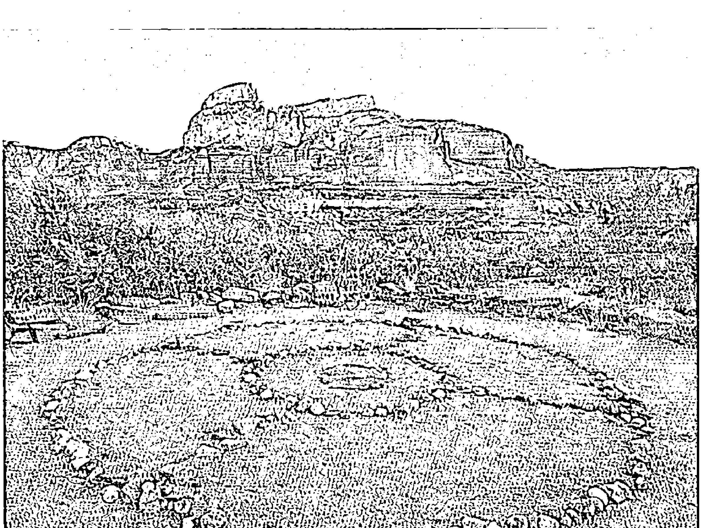

#### 天文学

20世纪美国天文学家约翰·艾迪提出一项理论，认为有些药轮在天文学上具有重大意义，轮子上最长的辐轴可能是指向某一时间的某颗星辰，因此药轮是用来标示一年内的特殊日子。巨岩或大石块在地上排成圆形，有时四颗以上的石头排成一列，代表一段辐轴，或是圆形的一部分。那时的人也认为药轮是用来标示地理方位，或与某一地平线相对的太阳、月球、恒星和行星的种种活动。石块垒高之处，可能是举行重要庆典或讲学的地点，也可能是某一特定文化的部落向造物主表达谢意的圣地。

药轮通常与四个方位有关，也同父天、母地、精灵树相关，因此用以代表各方面的健康和生命循环。一般来说，东、南、西、北四方位各有其代表颜色，如黑、红、黄、白。四大方位的象征不限于此，也代表出生、青年、壮年、老年等人生阶段，春、夏、秋、冬一年四季，火、空气、水、土等自然元素，或者雕、熊、狼、水牛等动物；甚至祭典用植物（如烟草、白菖蒲、鼠尾草和柏树）、天气形态、人类特质，都拿来与之对应。药轮可以以不同形式展现，但主要出现在艺术作品中，如绘画或岩画，也有建立于大地之上的实体药轮，比格霍恩山一带的药轮便是一例。

时至今日，遵行美洲印第安仪式与魔法的信徒、追随新时代运动或巫术的人，或新异教团体的教众，仍在不同层面上使用药轮，援引其象征力量。这个环代表着完全达到平衡的大自然生命力与个人力量，象征世间万物莫不紧密相连，构成完整的宇宙，是萨满巫师的地图或哲学系统，为我们指引方向，或在我们踏上心灵之旅时，充当垫脚石。药轮不但能指引方位，而且能让人们与自然能量达成一致。

> > 位于美国亚利桑那州的新时代药轮。尽管有些天文学家提出此轮可能是星际图，但是多数人认为它代表灵界与现实世界的界面。

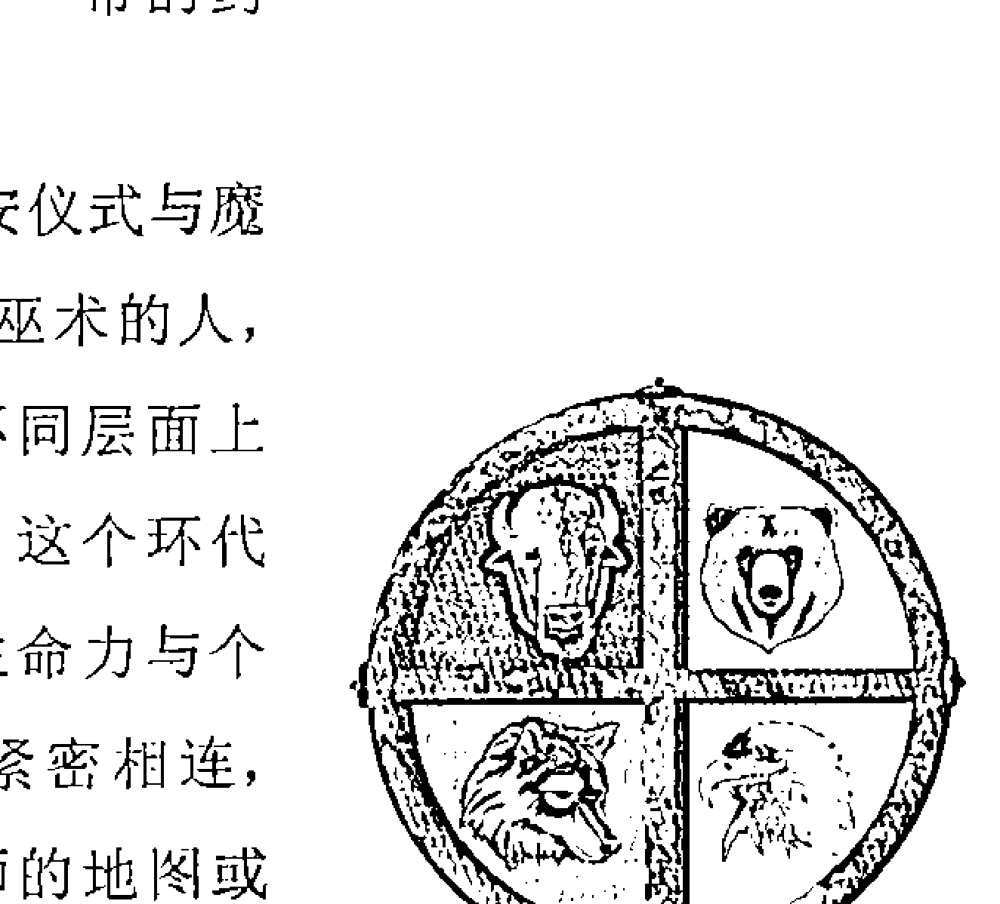

> > 药轮划分成东、南、西、北四个方位，各有相呼应的动物、颜色和自然元素。

### 莲花

印度（约公元前 1400 年）

自古以来，莲花在佛教中象征纯净，在印度教义中代表圣洁的爱

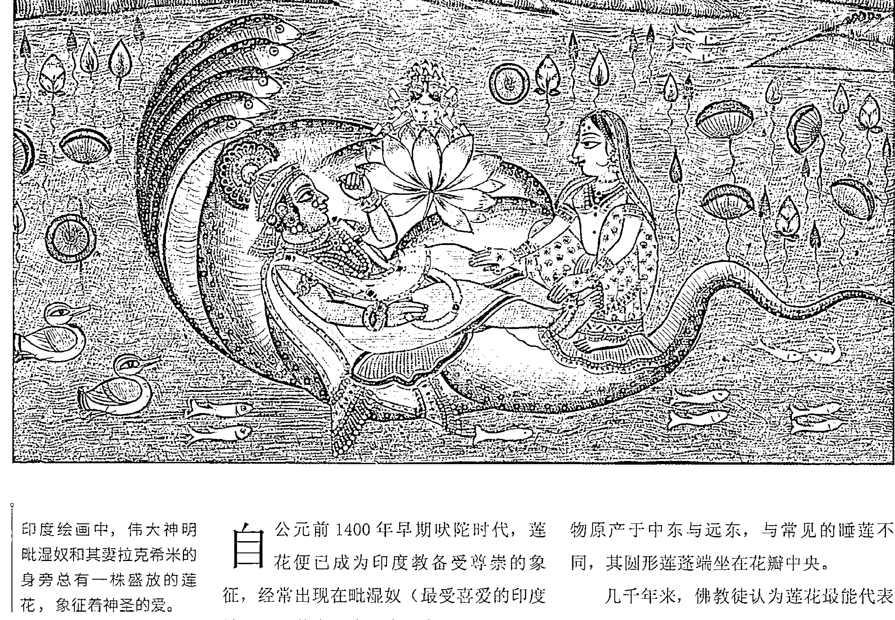

印度绘画中，伟大神明毗湿奴和其妻拉克希米的身旁总有一株盛放的莲花，象征着神圣的爱。

自公元前 1400 年早期吠陀时代，莲花便已成为印度教备受尊崇的象征，经常出现在毗湿奴（最受喜爱的印度神明）和其妻拉克希米的身边，为人所津津乐道。莲花从污泥遍生的池塘中冉冉升起，追寻光明与空气。朝阳初上，美好的莲花缓缓绽开八片花瓣，轻巧地浮在水面上，仅有数厘米高度。这种多年生水生植物原产于中东与远东，与常见的睡莲不同，其圆形莲蓬端坐在花瓣中央。

几千年来，佛教徒认为莲花最能代表纯净，印度教徒则认为它象征神圣的爱。由于它生于黑沼，朝光明之处茁长，因此多少世纪以来，成为克服困难、突破逆境的象征，也象征了精神、灵魂或自我的再生。

印度教中有许多神祇，无论男女都与莲花密不可分，有的端坐在盛开的莲花之上，有的手持莲花。毗湿奴的称号是莲花眼大神，画像中，他的身旁总有一朵粉红莲花，以及身为财富女神的妻子拉克希米。创造神梵天则诞生自毗湿奴肚脐上的那株莲花。

在古埃及，莲花象征太阳与创造，在许多埃及象形记事的图画中，从太初的水面上升起，据说是混沌之神努恩生下太阳神“拉”。莲花也象征复活，《埃及亡灵书》中便有许多符咒，能将人转化成莲花，使其重生。上埃及的象形文字与艺术中爱用莲花，下埃及则偏好纸莎草。到了帝国时期，莲花与纸莎草开始以缠绕的形式呈现，代表上埃及与下埃及的统一。

#### 佛教传统

佛教视莲花为纯净的象征，代表人的智慧与灵性启迪的一面。观想时常念的六字大明咒——中文参考发音为：唵嘛呢叭咪吽，意即“向持有珍宝莲花的圣者致敬”。有人认为，尚未绽开的花蕾象征前世的灵魂，未来有可能舒展绽放，拥抱神圣的真理。传说中，释迦牟尼足迹所到之处，会留下朵朵白莲花，蕴含灵性觉醒与晓悟之意。一般来说，红莲在佛教传统中象征爱意，与发自内心的热情。

罕见的蓝莲花算是睡莲的一种，而非真正的莲花，图坦卡蒙的坟上便由祭司撒满了蓝莲花。古代埃及图纹中就出现过珍贵的蓝莲花，如神庙内精美的横梁雕饰，或宫室墙上的藻绘。蓝莲花由于含有一种叫作“脱水吗啡”的镇静催眠物质，会使人像服了药一般昏沉恍惚，因而象征神圣的力量。古代埃及人也会少量服食，当作春药。

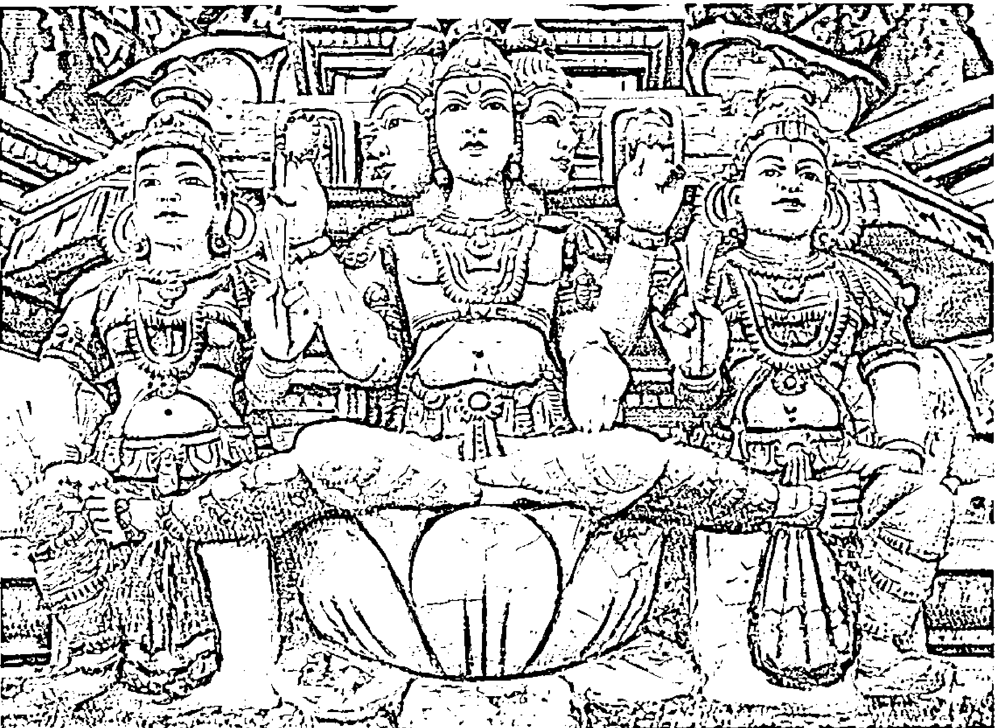

希腊神话也提到了莲花，是奥德修斯的故事。当时他带领一支船队，其中一艘船迷航了，暂且在一座岛上停泊，岛上居民就是俗称“吃莲花的人”。他的水手也跟着吃起了莲花，或许便是蓝莲花，从此沉睡不醒。丁尼生受到启发，写下了《食莲者之歌》（1832年），从此莲花有麻醉之效的美名流传下来，成为精神觉醒的象征。

据说莲花的八片花瓣隐喻着八个主要方位，亦即东、西、南、北、东北、西北、东南、西南，各自统治划分成八等份的宇宙，印度教称之为“方位守护者”。莲花在瑜伽中代表脉轮系统，不同花瓣代表不同的脉轮能量中枢的功能，在身体内以肉眼不可见的方式周流不息。尽管脉轮只有七种，但第八片花瓣代表顶轮与圣界合二为一的境界，唯有真正了悟、参透玄机的人能够到达。莲花花瓣舒展之际，心灵也随之开展、觉醒，逐渐超脱，上达灵性的领域。

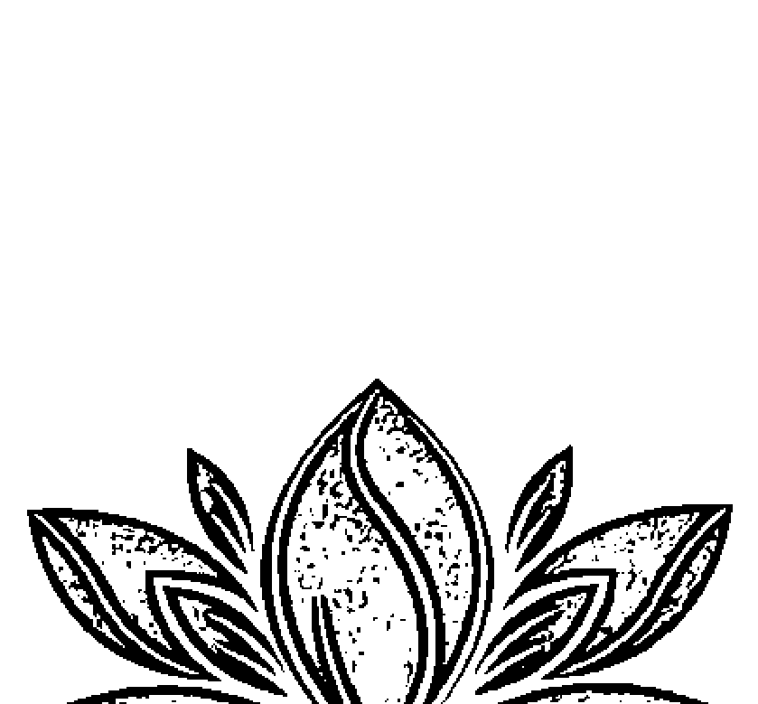

#### 鸢尾花图腾

##### 埃及与美索不达米亚地区（公元前900—公元前300）

常见的装饰性绘画图纹，代表纯洁

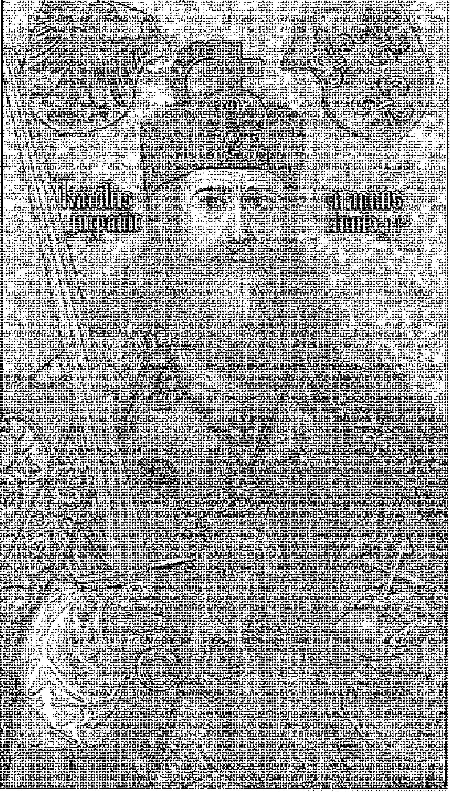

此画出自16世纪画家阿尔布雷特·丢勒之手，画中有查理大帝以及鸢尾花图腾。

鸢尾花图腾脱胎自鸢尾花形状，历来广泛运用于装饰用器皿，被当作权力与重生的象征。

鸢尾花图腾从很早开始便是法国国王的象征，普遍认为此装饰意象是以紫色鸢尾花为本的图案，在古美索不达米亚及古埃及陶器上均可见到，甚至古巴比伦于公元前6世纪兴建的伊丝塔城门，上面也有这种图形。印度与埃及艺术都以此花象征生命和复活。

法国的鸢尾花图腾可能起源自生长于河边、沼泽、潮湿阴凉处的黄白品种鸢尾花。有些学者认为，古代法兰克人在进入高卢前，原本住在靠近卢茨河的荷兰，河岸旁植满野生鸢尾花，法兰克国王或许是從这样的日常环境中选择了一种意象，当作权力的象征。但也有历史学家指出，德文的鸢尾花拼法是 Lieschblume，鸢尾花（fleur-de-lis）之名便由此而来。

但学者普遍认为，鸢尾花图形与法国国王的渊源，始自公元496年克洛维一世加冕之时。之后他皈依基督教，受洗典礼上用的也是鸢尾花油。传说中，天使翩然降临，蘸一点小瓶中的鸢尾花油为他膏抹，自此之后，鸢尾花油变成圣洁的标志。后来受膏的法国国王，如公元8世纪时的查理大帝，均深信他们和克洛维国王一样，拥有上帝赋予的神圣权力。位于罗马的圣乔瓦尼教堂内，一幅完成于公元9世纪的嵌花图案，描绘了圣彼得将军旗递给胜利归来的查理大帝。军旗上的尖顶饰显然是矛头，同时又跟鸢尾花图案很像。或许是因为军旗与查理大帝有这段渊源，所以鸢尾花图案变成了法国王室的象征。从那时起，鸢尾花图案一跃而为法国纹章中的重要图形，具有宗教、政治、王室、徽章、象征等多重意义的图标。

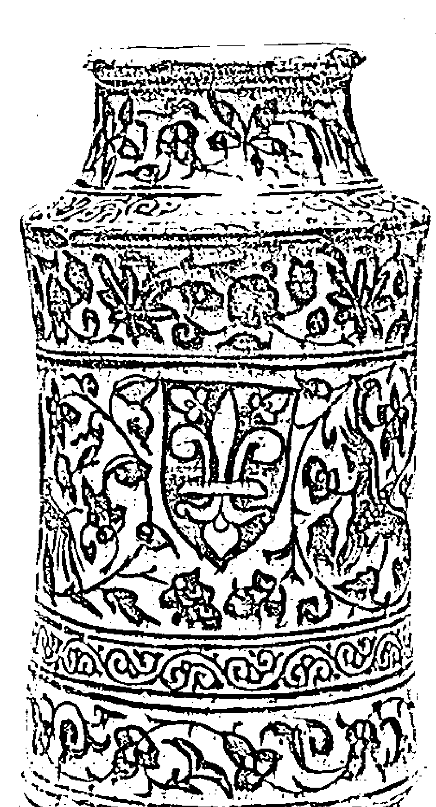

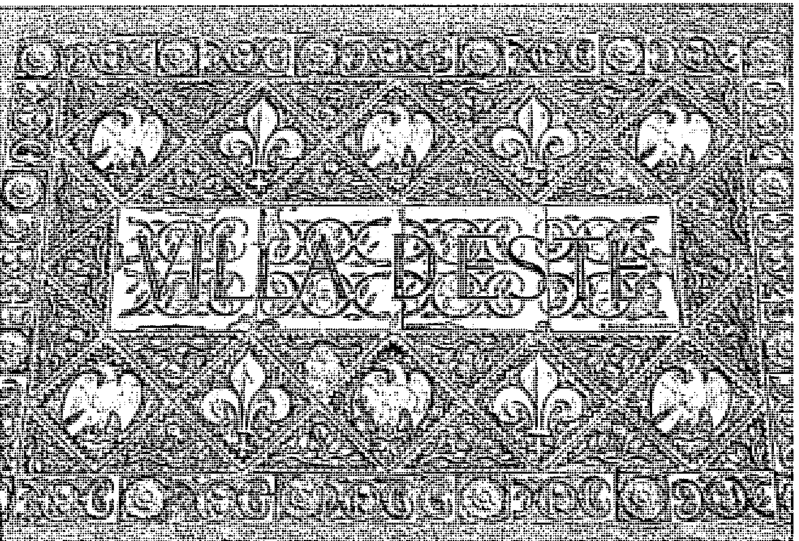

#### 彩虹女神

早在鸢尾花和法国国王建立起渊源之前，古埃及人便认为它是权力的象征，故此狮身人面像的额头和法老的权杖上，都有这个标记。公元前1479年，图特摩斯三世为表彰自己攻下叙利亚的战绩，下令在属他的神殿墙壁上画满鸢尾花。

鸢尾花的名字取自希腊神话中的彩虹女神伊里丝。她就像彩虹一般，搭起天堂与人间的桥梁，帮助众神与凡人沟通。伊里丝原是奥林匹斯山的信使，却又带领终须一死的凡人前往天堂。古希腊人会用至爱的坟前种植一株鸢尾花，以示对彩虹女神的崇敬，祈愿女神能带领逝者离开危险四伏的冥府，到达极乐世界。鸢尾花被视为圣花，具有医治力量，古希腊人用以入药。早在公元前1世纪时，当时的名医迪奥科理斯便提出，鸢尾花的根配上蜂蜜、醋或葡萄酒饮用，可治咳嗽、感冒、消化不良及坐骨神经痛。

位于罗马，建于文艺复兴时代的埃斯特别墅墙上的瓷片拼贴，可见鸢尾花是这个家族的标志之一。

基督教将鸢尾花与百合视为圣母马利亚的象征。13世纪时，法国国王路易四世称，此花花瓣有三，代表的是信念、智慧与骑士精神，也象征上帝赐予法国的恩泽。

之后法国和其他欧洲统治者前往新大陆开拓殖民地，这一说法传到了其他国家，鸢尾花图腾出现在加拿大魁北克省的旗帜上，蒙特利尔与三河城同样把鸢尾花放在市旗上。美国的圣路易斯、底特律、新奥尔良和巴吞鲁日，亦以鸢尾花装饰市旗和盾徽。2005年，卡特里娜飓风席卷新奥尔良，之后该市以鸢尾花当作灾后重建、民间支持的标记。

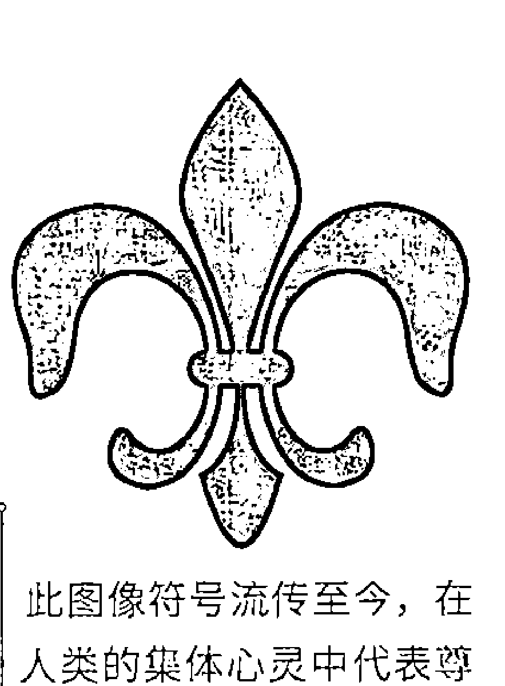

此图像符号流传至今，在人类的集体心灵中代表尊贵、智慧与信念。

### 花卉

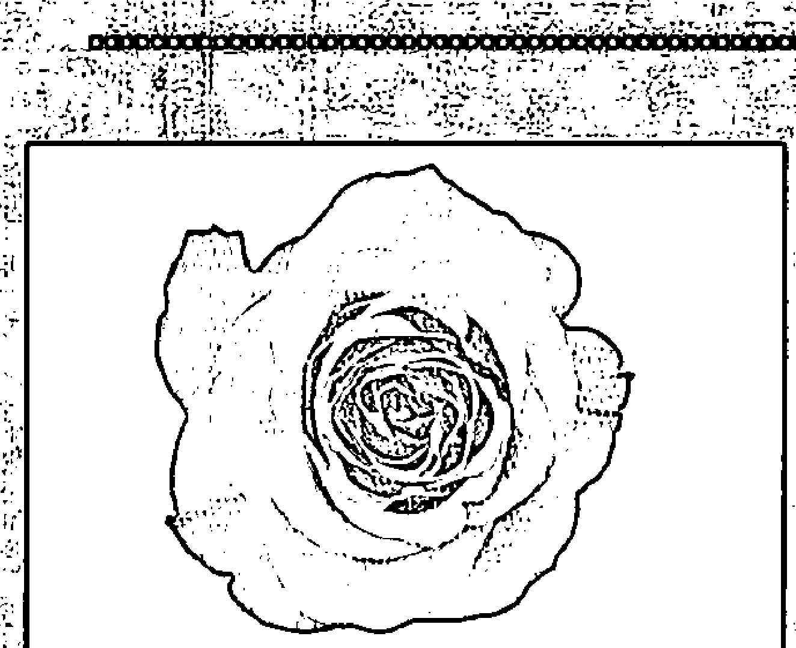

#### 玫瑰

古代女神，如彩虹女神伊里丝、爱与美之神阿芙洛狄特，均被视为具有玫瑰的特质，包括祭司、美好、热情和圣洁的爱。罗马时代的宴会厅天花板上绘有白玫瑰，提醒宾客此处所说的话不可外传。因此，拉丁语“秘密”拼作“sub rosa”，亦即在玫瑰下方。

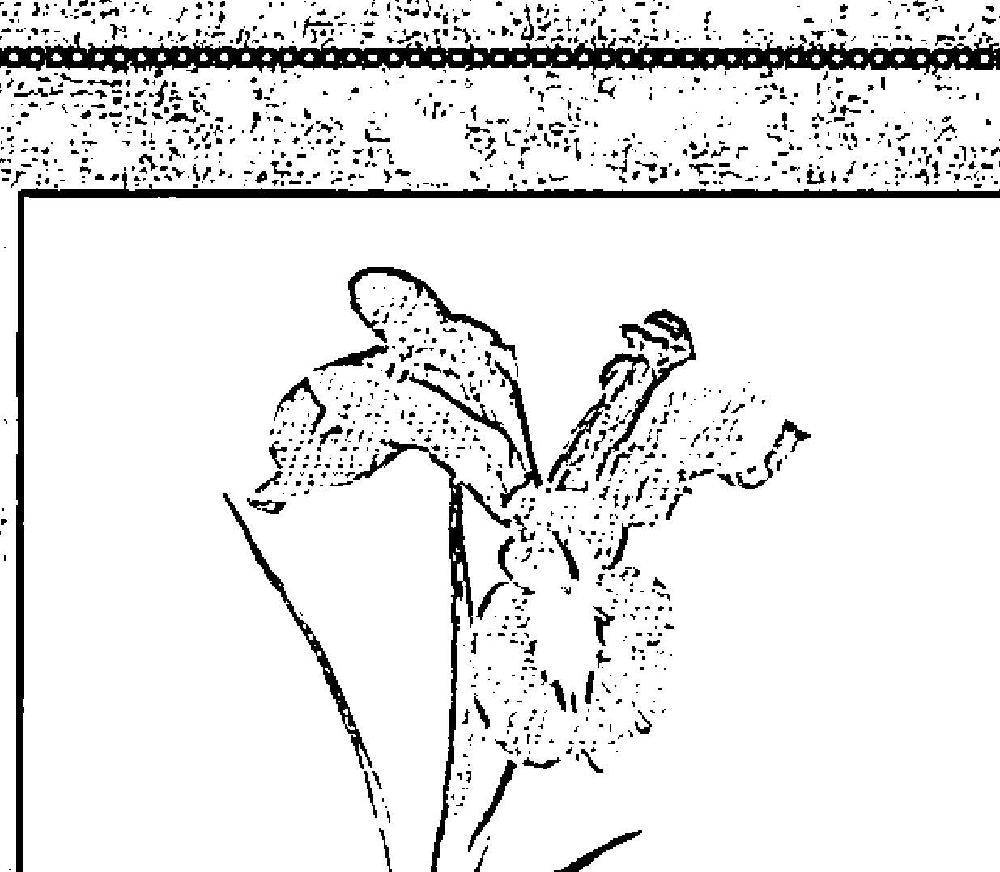

#### 鸢尾花

希腊神话将鸢尾花视为彩虹的化身，代表信息、希望、爱的保证与赋予光明的权力。中国人认为鸢尾花代表孤独之美，古埃及以其为复苏，而对法国人来说，鸢尾花图腾（是鸢尾花，不是百合）象征信念、智慧与勇气。

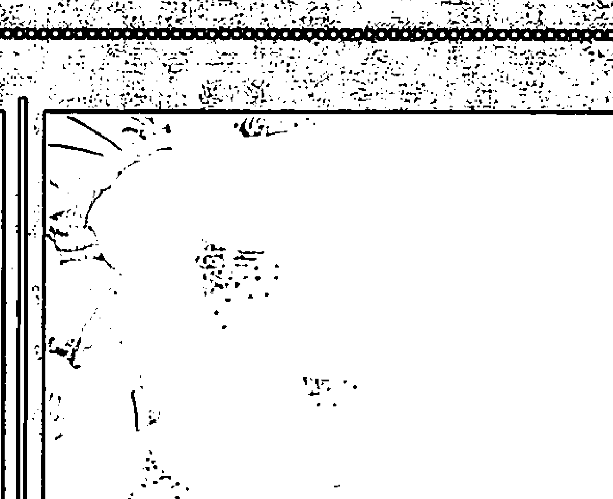

#### 樱花

樱花是日本的国花，花谢时，一树的花同时落地。对日本武士而言，樱花象征生命的短暂与无所畏惧的精神。日本人认为樱花树具有苦行的美感，以及无论寿命长短，如实接受人生的自重与优雅。

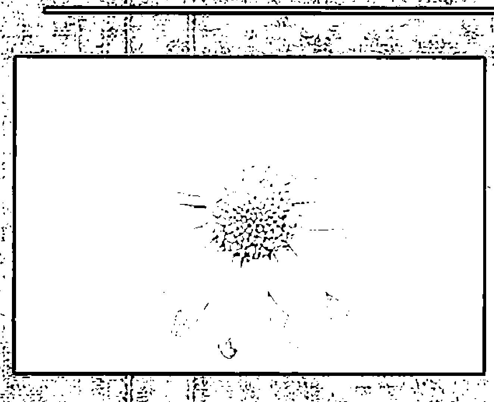

#### 雏菊

此花始终与太阳息息相关，富有谦逊、俭朴和纯真之意，也象征忠贞不移的爱。在中世纪欧洲，年轻女孩以此花占卜爱情：一一摘下花瓣，口中念着：“他爱我，他不爱我。”数到最后一朵花瓣，就是答案。

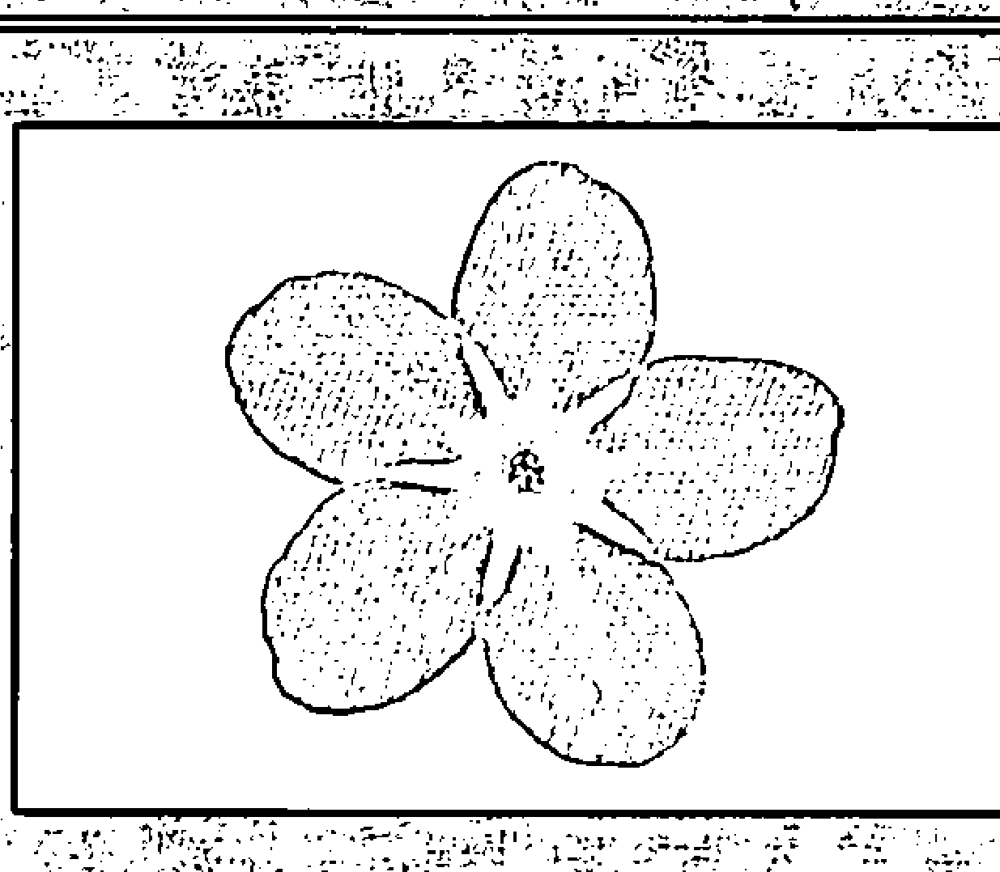

#### 勿忘我

勿忘我的花语是怀念与忠实，名称的由来众说纷纭。基督教有则传说：有一天，上帝在伊甸园散步，注意到一种蓝色小花，问它叫什么名字。小花轻声回答：“主，恐怕我已经忘记了。”上帝回答道：“勿忘我，但我不会忘记你的。”

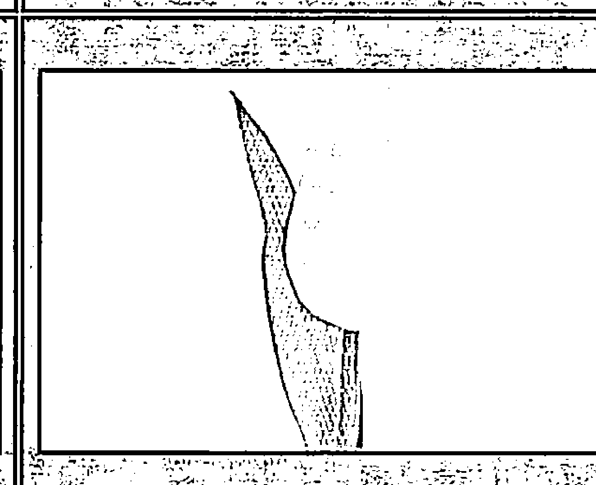

#### 郁金香

郁金香原是奥斯曼帝国的标志，古代波斯视其为爱的象征。16世纪引进欧洲后，此花变成富豪的地位象征，只因唯有有钱人才买得起。红色郁金香意味着难以抗拒的爱，追求者将此花递给心仪对象，表白爱情。

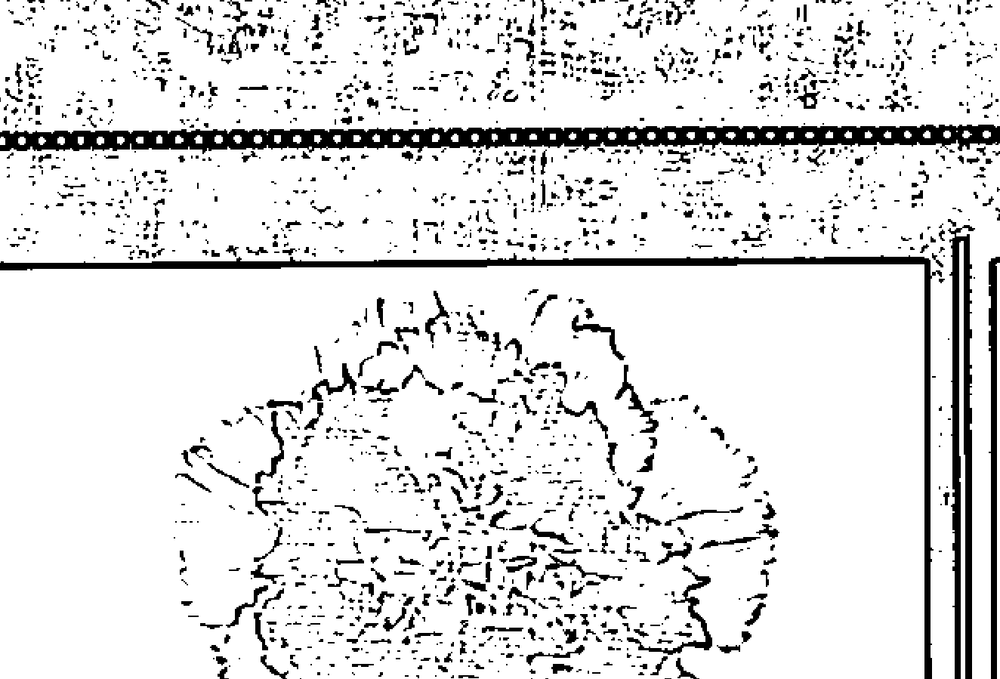

#### 康乃馨

根据基督教传说，玛利亚一见到耶稣背上十字架，便开始哭泣，泪水落下之处开出了康乃馨。十字军东征时，不少战士得了瘟疫，就以康乃馨叶子混合葡萄酒，能够缓解高烧。文艺复兴之后，康乃馨被认为象征爱、生殖、婚姻与母性。

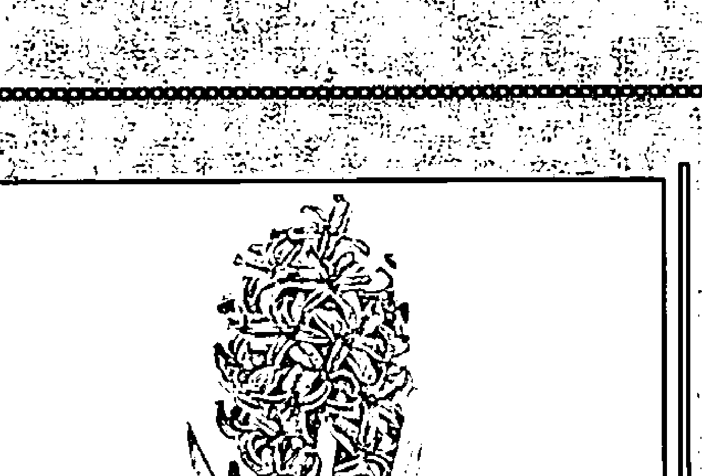

#### 风信子

阿波罗的同伴雅辛托斯意外死亡后，流出的血变成了花朵，于是阿波罗以他的名字为其命名。紫色的风信子象征宽恕、坚定与审慎。19世纪时的恋人若是口不择言，往往互赠此花致歉。巫术则用此花驱赶邪恶力量，不受诅咒所害。

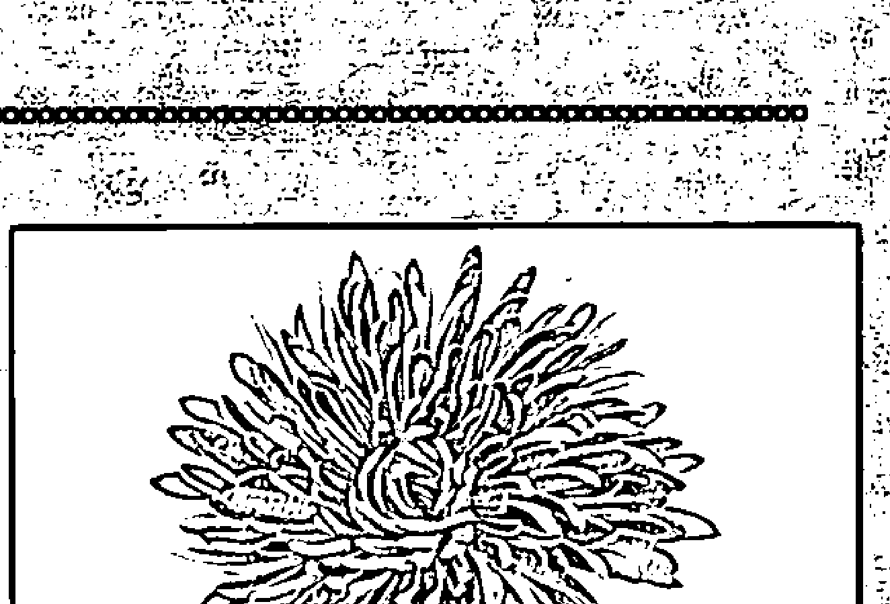

#### 菊花

在遥远的东方，此花有长寿、富贵和幸福的寓意。欧洲流传着一则传说：耶稣基督乔装成乞丐，受到一个贫穷人家的款待。翌日早上，门回放着两朵白菊花。德国人习惯在平安夜摆上菊花，欢迎基督到来。

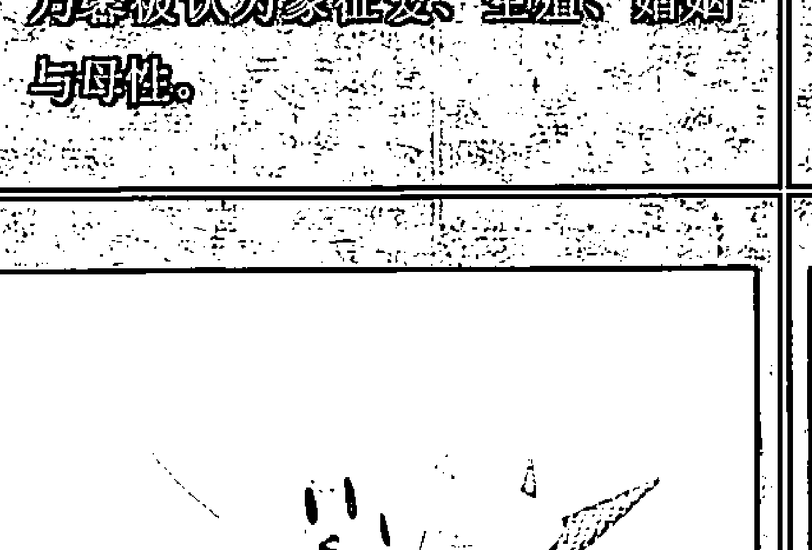

#### 百合

百合，在中国是和平与纯洁的象征，也有富足丰裕的意涵。古希腊神话中，此花是希腊女神赫拉的象征，她滴下的乳汁灌溉了世上最早的百合花。基督教也有传说：百合原是黄色，直到某天圣母玛利亚弯身摘下一朵，于是变成了白色。

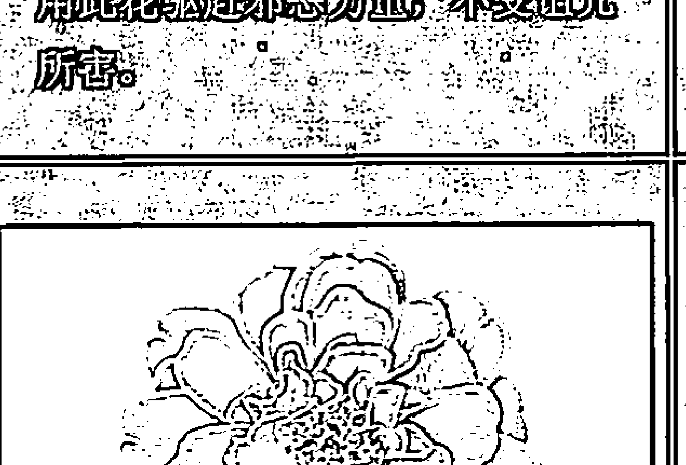

#### 金盏花

金盏花，过去曾被称为“回光药草”，此花向来与太阳能量关系密切，象征活力、生命力与热情。中国人将其看作长寿的象征，印度人认为此花代表奎师那。早期基督徒称金盏花为“玛利亚的黄金”，那时会把此花置干玛利亚的雕像旁。

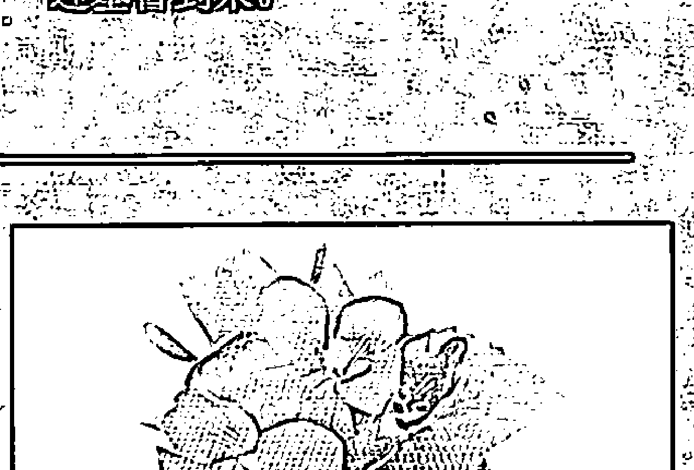

#### 紫罗兰

雅典人认为紫罗兰是雅典城的标志，当初水边仙女给建立此城的人一束紫罗兰，表示祝福。紫罗兰也可用来驱邪，同时象征忠诚。赠人以蓝色紫罗兰，表示坚贞不移，而白色紫罗兰暗喻勇敢追求的心意。

### 彩虹

希腊（公元前8世纪）

广为流传的象征，代表希望

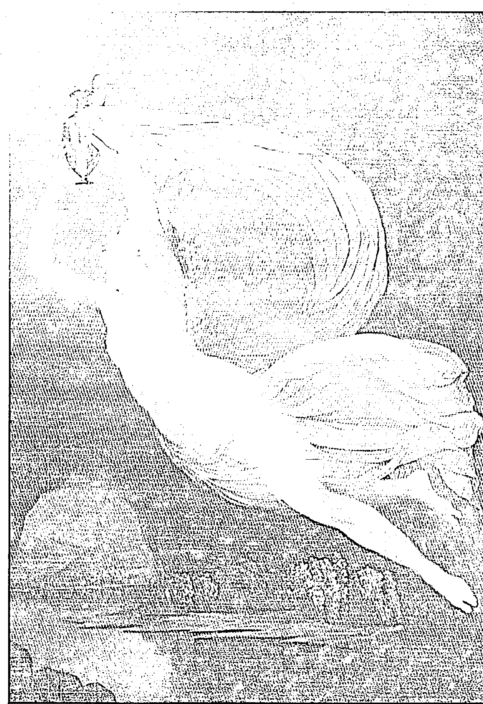

脚步迅疾的伊里丝是诸神的信使，也是光之女神，但她的几个姊妹是令人退避三舍的魇身女妖，号称黑暗女神。伊里丝听凭众神差遣，在许多神话故事中担任中间人，传递消息。譬如宙斯在珀尔塞福涅遭到劫持、侵犯后，请伊里丝当和事佬，找得墨忒耳说情。赫拉也派伊里丝去告诉身在克里特岛的斯巴达王，海伦与帕里斯私奔回特洛伊的不幸消息。

伊里丝嫁给了西风神仄费罗斯。欧里庇得斯笔下的悲剧《赫拉克勒斯》中，她与掌管疯狂的女神丽莎一块儿出现，诅咒英勇的大力士赫拉克勒斯发疯，他在神志不清的情况下，杀死了三个儿子和妻子墨伽拉。伊里丝也出现在维吉尔所写的埃涅阿斯纪中，奉朱诺之命，在迦太基的狄多女王死前替她拔掉一撮头发，如此一来，她的魂魄就能够自由，飘到来世。

苏美尔族的长篇叙事诗《吉尔伽美什史诗》将彩虹描述成伟大的女神伊丝塔佩戴的宝光璀璨的项链，她除下这串项链朝天空扔去，提醒自己永远记住那一场卷走她所有儿女的大洪水。北欧神话中的彩虹是燃烧的大桥，又称彩虹桥，连接众神居住的“仙庭”与凡人所在的“中庭”，唯有诸神和在战役中捐躯的战士能走过彩虹桥。这座桥最终在世界毁灭之日，亦时间的尽头，崩塌了。印度教认为彩虹是雷雨之神因陀罗手上的弓；

盖伊·海德的油画作品《伊里丝带冥河的水去奥林匹斯让诸神起誓》（约1793年），描绘女神来往于天堂与地府之间，传递消息。

世上大部分神话都把彩虹视为通往天堂的桥梁，联系肉眼可见的世界和神界，亦是希望、和平的标志。其中影响最深、最具说服力的象征，莫过于彩虹的化身——希腊女神伊里丝。

日本传统神道教则认为，彩虹是先祖灵魂重返人间的桥梁。

彩虹不仅本身具有意义，其颜色亦颇值得玩味。密宗视彩虹的七彩组成了纯粹的光色，也是顿悟前的最末一个阶段，亦即冥想境界。对伊斯兰教的信徒来说，虹的光谱同样具有深刻意义，不同色调代表神明的不同特质在物质世界的显现。印度教以七种颜色代表七重天。

中亚的萨满法师通灵时，往往穿上七色袍子、披风，或戴上加羽毛的头饰。中美洲神话中，印加人深信彩虹是雷电雨水之神尤拉帕所戴的羽饰皇冠，人们深感害怕，不敢逼视天际的彩虹，甚至用双手掩住嘴巴，以免惊呼出声。因为只消说出一个字，尤拉帕就会降下闪电。

许多文化，如澳大利亚原住民，将彩虹视为创造地球的母蛇。在非洲神话与中国民间传说中，彩虹均以大蛇之姿出现。中国的八仙之一最后变成彩虹，蜷曲如睡着的蛇。美国印第安纳瓦霍部落在旗子上绣以彩虹图形，用以象征主权，并表示所有部落融会成“彩虹国”。毛利人的彩虹神卡胡库拉能庇佑战事顺利，亦是人类必死的象征，意指通往天堂的路。

《圣经》中亦有彩虹，在挪亚方舟之旅即将结束时出现，隐含上帝与人类重归于好。在《创世记》中，上帝对挪亚说：“我把虹放在云彩中，这就可作为我与大地立约的记号了。”

根据爱尔兰民间传说，来到彩虹的尽头可以找到一罐黄金——是一群调皮男妖藏在那儿的。这群妖精是很有趣的鞋匠，爱把金币贮在罐子里，藏在彩虹尽头。当然彩虹尽头不可能触及，因此传说中的黄金永远无法到手。

遍观各民族神话、艺术和文学，均十分珍视彩虹，当作神的示现、启发与和平的象征，同时也代表扫荡一切的暴风、及时雨或两个世界之间的桥梁。虹横跨天空，令人惊叹的存在，预示好事即将发生，激起我们内心的好奇与喜悦。

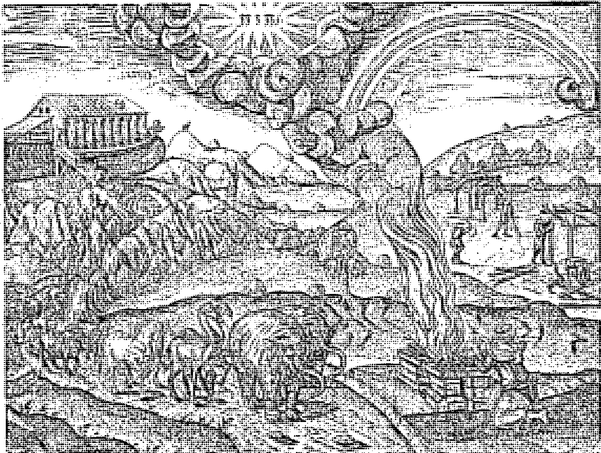

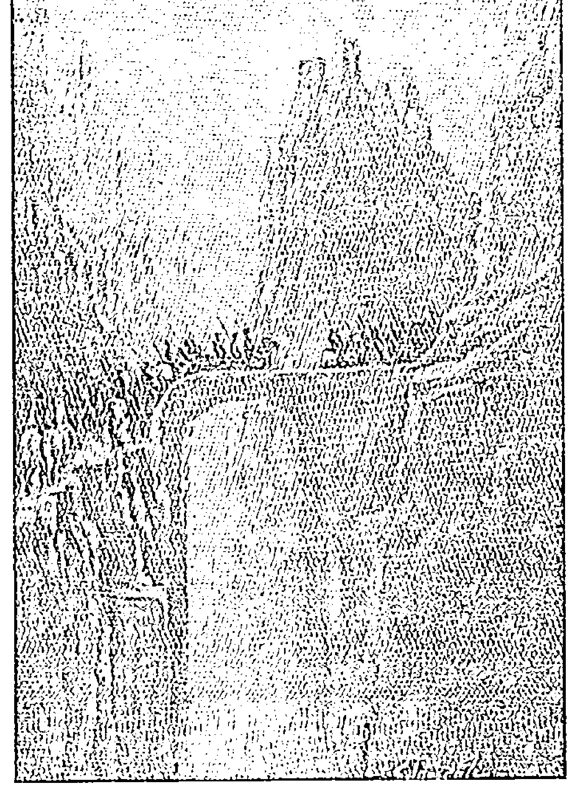

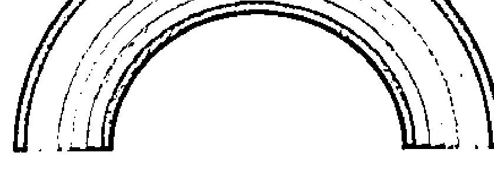

> 挪亚见到天边出现一道彩虹，上帝告诉他，这是他与大地所立的盟约（此为版画，仿雅克·勒莫因·德·莫古创作的水彩画所作）。

> 不同的宗教或神话均认为，虹的七种颜色各自象征某种神圣本质。

> H.A.盖尔贝的《世界史诗的故事》（1916年）的卷首插画，画的是北欧神话中的彩虹桥，或称燃烧的大桥。

### 凤凰

#### 希腊（公元前800—公元前146）

神话中的鸟，象征复活与再生

凤凰在文艺复兴时期的欧洲，是神秘圈子里极具力量的符号，连伊丽莎白一世也佩戴凤凰吊坠。

凤凰的起源可上溯至公元前9世纪，其时希腊作家赫西奥德形容这种神话中的鸟“辉煌无比”。不过许多学者坚称，凤凰源自埃及神话中的贝努鸟，又叫作东方紫鹭。尼罗河一年一度发大水时，这种鸟懂得栖息在地势较高的地方，总能安全脱身。当它从洪流上方轻巧掠过，像极了太阳在水面上移动。此鸟的别名是“上升者”，相传是太阳神“拉”的灵魂，在下埃及的赫利奥波利斯广受尊崇。此城于公元前332年被亚历山大大帝征服后，希腊人便称其为“太阳之城”。有一则神话是这么说的：在太阳神“拉”神庙的圣域旁，有一棵圣树起了大火，贝努鸟从大火中出世，高飞之后，栖息在由“奔奔石”砌成的圣柱上，一待就是一千年。每逢有信众到此参拜，祭司便指给大家看，众人都说这是至高无上的圣地。另一则故事说，此鸟是在地狱判官奥西里斯复活后，从他的心脏跳出来的。希腊神话有许多此鸟的故事。有的说它自焚而死，从灰烬中重生；也有的说它复活之后，成为真正的鸟。赫西奥德笃信此鸟每隔十万年轮回一次，时间一到，便自焚而死，火化成灰，而后幼鸟从余烬中再生。后来基督教出现后，选择凤凰当作基督牺牲与复活的象征。

中世纪的艺术创作与文学作品往往将凤凰描绘成如太阳一般，有七道光芒及光轮，强调此鸟与希腊神话的太阳神赫利俄斯有关，因太阳神的形象亦有光晕。公元1世纪时，罗马作家和历史学家老普林尼形容凤凰“头顶有羽冠”，戏剧家以西结说它与公鸡有几分相似。到了文艺复兴时期，凤凰与皇室和紫色联系起来。约1575年，尼可拉斯·希利雅德为伊丽莎白一世画了一幅肖像，当时民间偷偷流传伊丽莎白一世是“童贞女王”的说法。

尽管好几幅肖像中均有许多象征，暗喻她的未婚身份，其实背后仍有更大的谜团。画中的女王大约四十出头，统治时间即将过半，身上佩戴着精致的凤凰坠子。人们多认为女王特意选择凤凰，算是向朝臣公开保证，她打算革新王朝，无论是否继续保持童贞。

在秘教方面，炼金术士菲利普·锡德尼爵士与占星家约翰·迪伊，都是伊丽莎白一世的重要顾问。两人都很清楚，依文艺复兴时期的炼金术，凤凰与鹈鹕皆象征人的灵魂往不朽飞升的最后阶段。因此神秘的凤凰适合用于象征长寿且看似不朽的英国女王。

> 基督教视凤凰为重生的象征，也代表基督复活。

### 神话中的鸟

- **迦楼罗**

  神话中的大鹏鸟，同时出现于佛教与印度教神话。通常以金身白面的人形出现，嘴如鹰喙，背生红翅。据说这位古代神祇本形巨大到能遮蔽日光，与蛇族那伽为世仇。

- **凤凰**

  中国神话中的鸟，集百鸟特色于一身，亦象征六种天体：头颅代表天空，眼睛代表太阳，背代表月亮，翅膀象征风，双足象征大地，尾巴则是行星的象征。

- **西莫鸟**

  常见于伊朗艺术作品，是一种有翅膀的鸟形生物，身躯庞大，背得动大象或鲸鱼。大致以孔雀为蓝本，通常具有狗头、狮爪，有时以人面出现。伊朗传说中，认为此鸟年代久远，曾经历过三次世界大劫。

### 龙

#### 中国（公元前 475—公元前 221）

象征祥瑞之气，如知识、力量及好运

龙是中国神话生物，传统上代表祥瑞的正向力量，历代皆以其为中国皇帝的象征。传说中提到，中国人的祖先有虞氏是一条龙，而其后代都是有虞氏的化身。周朝时（公元前 1046—公元前 256），不同的龙被赋予不同特质，其中最重要的是生有五爪的青龙，象征天庭与帝王的力量，也代表太阳、喜悦、丰饶与知识。

中国民间故事里，龙族通常与控制水势、降雨、飓风或洪水有关。一般人认为它们统御着流动的水，如瀑布、河流或海洋。龙族多半以水柱、狂风、旋涡或巨浪的面貌出现。龙是大水与天气的统治者，出场时头上多半戴着海草编成的图纹，或波涛巨浪构成的图纹。四大龙王各有职司：东海龙王管辖东海，南海龙王统御南海，西海龙王是西海之王，至于北海龙王则统筹北海之事。

今日的中国仍以龙为权柄、力量和好运的象征，而且是风水之术的吉祥图案。由于龙常在广阔乡间移动，能够汇集大自然的能量，进而翻云覆雨，有时降下甘霖，有时却毁灭庄稼。依风水之说，龙也决定了地理形势，因此楼宇及家具若能按照“龙纹”摆置，龙掀起的能量就能充塞于大地之间，源源不绝。

中国以龙代表九，也是风水学上非常吉利的数字。一种称为“九龙壁”的墙，可见于历代皇宫及御花园，遍及北京、山西大同，甚至香港。这类墙面上绘满了九条龙的图纹，能为该城带来财富、权势与繁荣。历法上与地支相应十二生肖，其中最吉利的一年就是龙年，龙年出生的人运势最好。据说属龙的人意志强悍、大胆进取、性情傲慢，但通常很成功。古往今来，世界各国的龙经常从古代神话中的巨蛇演变而来，当中有不少故事提到巨龙被凡人或半神半人的英雄所征服。流传在中东一带的神话曾提及胡瓦瓦，这种擅长喷火、生有尖牙的怪兽最早出现于《吉尔伽美什史诗》。印度神话中亦有怪龙乌里特那，最终为因陀罗所杀——《黎俱吠陀》中有这段记载。欧洲中世纪民间传说中，屠龙英雄济济一堂，包括贝奥武夫、西格德，以及崔斯坦。但此处的龙并不是祥瑞，反而代表了邪恶力量。根据《启示录》第12章，天使米迦勒打败了七头怪龙，此龙是撒旦的化身；此外，七颗头暗示七宗罪。大部分西方国家的传统视龙血为致命剧毒。自中世纪以来，西方最为人熟知的文学和艺术主题之一便是英雄屠龙，其中最为人津津乐道者首推圣乔治，他从恶龙口中救出了利比亚公主，最后还用剑杀死怪兽。

> 意大利画家乌切罗的《圣乔治大战恶龙》（约完成于1470年）描绘圣乔治的故事，暗喻基督教（圣乔治）战胜一切邪恶（恶龙）。

龙的象征亦正亦邪。

### 神话中的怪兽

#### 巨兽

巨兽状似河马，最早出现于《约伯记》，后来亦有别的记载，众说纷纭。一开始是神话中的生物，也有说是大象、河马、犀牛，甚至鳄鱼。此怪兽被造物神所杀。时至今日，巨兽(behemoth)一词用来比喻庞然大物或威力无穷的生物。

#### 人马身

希腊神话中的半人半马怪物，有人类的头、双肩和上半身，主要躯干则似马形。一般认为用来象征人的两面：野性粗野的一面，以及文明礼貌的一面。其中最著名的是喀戎，他是备受尊敬的医疗圣手，但讽刺的是他医治不了自己的病，最后成为天上的人马座。

#### 奇美拉

这种喷火怪物源自古代小亚细亚，全身上下由三种动物组成：狮子、山羊和蛇。通常被描绘成狮头、羊身，以及末端是蛇头的尾巴。它是吐火巨人提丰与蛇妖厄喀德那的后代，兄弟姊妹也都是怪兽，如冥界的三头狗刻耳柏洛斯便是。

#### 萨提

萨提是半人半兽的森林之神，经常陪伴在酒神狄俄尼索斯身边，模样似马，长着尾巴和马耳，有时也露出马的生殖器。到了罗马时代，萨提慢慢变得像山羊，拉丁文学作品将其描述成上半身是人，下半身是山羊，山羊尾巴也取代了原本的马尾巴。

#### 蛇发女妖

蛇发女妖原本是早期希腊文学中凶恶的女怪，后来用来指头发由活生生的毒蛇组成的三姊妹。蛇发女妖面容狰狞，见到她们的人无不化成石头。最有名的是美杜莎，死于珀尔修斯之手。

#### 九头蛇

九头蛇源自古代的希腊水怪，长了数不清的头。据说砍掉其中一颗头，会再长出两颗。蛇怪的气息有毒，血液也有剧毒，就连留下的足迹也能致人于死地。赫拉克勒斯奋勇斩杀勒拿湖边的九头蛇，先砍下一颗头，以剑刃蘸取毒血，然后以火烧灼伤口，让它再也无法长出新的头来。

#### 狮鹫

狮鹫是古代希腊神话中的怪物，有狮子的身躯、后腿和尾巴，加上老鹰的头、翅膀和爪子。狮子是万兽之王，鹰则统领万鸟，因此狮鹫被认为是雄伟而尊贵的生物，象征给予保护的神圣力量。

#### 梦魇兽（男梦妖）

梦魇兽是古代的恶魔，以男性躯体示人，而且在不同的神话或民间传说中，都会趁黑夜潜入女子香闺，与其欢爱。梦魇兽也有女性版本，称作女梦妖。传奇魔法师梅林，据说就是凡间女子与男梦妖交欢后生下的孩子。

#### 弥诺陶洛斯

弥诺陶洛斯是人身牛头怪物，顶着公牛头，配上人身，住在克里特岛的克诺索斯宫的中心。建筑师代达罗斯奉米诺斯国王之命设计了这座迷宫，用来囚禁这只可怕的怪物。它是米诺斯王后和用以祭祀的牛生下的子嗣，最后被雅典英雄忒修斯所杀。

#### 摩伽罗

摩伽罗是印度神话中的海怪，据说是水中生物，身体前部似象、鳄鱼、雄鹿或小鹿，后侧则像鱼或海豹，有时更长着孔雀尾巴。摩伽罗也是恒河女神恒伽，以及海洋之神伐楼拿乘坐的船只，往返于烟波浩渺的水域。

#### 天狗

根据日本神道教传统，天狗长得像猛禽，同时具备人与鸟类的特征。最初所画的天狗有鸟喙，但后来跟人越来越像，多了一管异乎寻常的长鼻子。但佛教传统则将天狗看作专门惹是生非或心怀怨恨的鬼怪。

#### 雷鸟

根据北美传说，雷鸟是威力无穷的超自然生物。据说它只要扇动庞大的翅膀，就能激起气流，使雷声大作。它的目光闪动，就会带来大规模的片状闪电，而当发红光的蛇蜿蜒下降到地面上，就会出现一道道闪电。

### 幻象蛇

#### 墨西哥（约公元前400年）

幻象蛇是通往灵界的大门

第15号门楣上的浮雕，刻着王后瓦克吞夫人手上握着放血的器具，与召唤自冥界的睡莲大蛇（闪电神凯威尔的众多化身之一）深切交谈。

饱鲜血后焚烧，此时袅袅轻烟中会出现幻象蛇，代表先祖显灵。

今日墨西哥的亚斯奇兰，是古代玛雅大城，也是众多神殿群的遗址。殿门上方，建于公元8世纪的石砌门楣上，刻绘着玛雅人的日常生活。其中第15号门楣刻的便是鸟豹四世统治时期举行的一场放血仪式，王后抬头凝望着幻象蛇，左手端着碗，碗内放着黄貂鱼脊骨、黑曜石打造的小刀和一张染上鲜血的树皮。仪式进行时，碗内的火焰不断升腾，烟雾弥漫，蛇的下颚处依稀幻化出古代战士的模样。在父亲巴鲁姆二世一手打造出盛世之后，鸟豹四世继位，却始终不得民心，常得费力地维持统治地位。这场放血仪式便是用来证明鸟豹四世是合适的接班人。

第24号门楣刻着另一位国王，盾豹，手握火炬，面前跪着王后艾莎克夫人，她手上拿着一段布满尖刺或凸起的绳索，穿舌而过，鲜血随之滴落，一滴滴落在前方桶子内的纸张上。她的鲜血引出一条全身扭动的巨蛇，蛇芯吐出处，是一名宛如战士的先人显灵。

#### 玛雅神话

幻象蛇源自玛雅早期神话，位于灵性世界树的中心。不止一则神话故事提到，大蛇是太阳、星辰等天体攀越天空的阶梯。另一方面，蛇会蜕皮，也因而成为更新与再生的象征。蛇的确备受尊敬，难怪中美洲的主神魁札尔科亚特尔是以羽蛇的形象现身；事实上，这个名字本身就是“美丽的蛇”之意。经由放血仪式，国王证实了自身能够与幻象蛇——也就是灵性世界的中心——沟通联系，扮演着串联现实世界和精神世界的角色。

20世纪30年代，有些考古学家注意到，伯利兹的玛雅凯克奇族人依然在萨满巫师的入门典礼上，举行类似的召唤幻象蛇的仪式，但已不再放血。他们认为，新人会在迷离恍惚的状态中，与巨蛇欧嫡直接沟通。唯有历经此状态，新入会者才算完成入会仪式，同时掌握身为萨满的必备知识。

幻象蛇是玛雅信仰的重要象征，同时也是现实世界与神祇、生者与亡者之间的沟通渠道。

### 玛雅人的神

#### 阿坎

阿坎是沉醉、美酒和酿造“巴尔曲”（一种浓烈的蜜酒）的神。他的名字有打嗝或呻吟之意，因此往往和玛雅的醉神连在一起，俨然是一对好友。阿坎略带疯狂，爱喧闹，被视为庆典之神。

#### 巴卡布兄弟

巴卡布兄弟是掌管风的神明，在地球的四个角落撑起了世界，分别叫作木卢克（东方）、坎（南方）、伊希（北方）与夸阿克（西方）。木卢克和坎带来正面能量，而伊希与夸阿克施展负面的破坏力。远古的神明利用这股汇流，创造出人类，以及有形与无形的世界。

#### 坎马卓兹

坎马卓兹是玛雅神话里的阴间蝙蝠神，专门吸食在仪式中被斩首或撕成碎片的人的鲜血。史诗巨作《波波尔·乌》中曾提到坎马卓兹咬下乌纳普（双胞胎英雄之一）的头，但乌纳普的兄弟帮助他死而复活，还打败了坎马卓兹，把他赶走。

#### 胡纳库

胡纳库没有形体，肉眼无法看见，据说代表其子伊察姆纳的某一个方面，也是掌管水、生命和纺织的圣母艾沙茶罗之夫。部分神铭形容他是“太阳之眼与耳”，一如基督教的上帝，无所不在，无所不晓。

#### 胡拉侃

暴风神胡拉侃只有独脚，号称“天空之心”。他在长篇史诗《波波尔·乌》中被描述成世界的至高神明，透过意念创造生命的形体，参与人类的创造，下令发洪水，淹没较低等的生物，后来又演变成旋风之神。

#### 伊察姆纳

他身兼文字、医学、科学、艺术与农业的导师，同时创造了历法，教导人们种植玉米和可可。他是医治圣手，能起死回生。同时与预言家扎玛有关，他奉伟大女神之命，亲携宗教经典到伊萨马尔城。

#### 恰克

恰克拥有至高无上的权力，掌管风雨及雨季，与农耕及繁衍有关。他身为风雨之神，负责看管丰沛的水源，例如水井和泉水。他也是天空之神，与下界的诸位神明势不两立，被认为是温柔慈爱的神，尽管性情捉摸不定。

#### 艾克曲瓦

艾克曲瓦又叫作艾克·亚历，原先称为“山之神”。他掌管商旅之事，保护旅人、商贾和战士。他总以黑皮肤男人的形象出现，下唇甚厚，肩上搭着一个袋子和一支矛。他也是可可树及可可制品的保护神。

#### 库库马茨

库库马茨又称库库尔坎，最为人熟知的名号是羽蛇科亚特尔(意即羽蛇)。早在公元前1世纪，中美洲大城特奥蒂瓦坎就开始供奉他。库库马茨是让世界成形、创造人类的13位大神之一。

#### 伊希切尔

伊希切尔是家喻户晓的彩虹女神，妇女若想求子会加以供奉。她身兼医治女神与战争女神，表示生杀大权都掌握在她的手中。远古时代将其描绘成双手有爪，身边堆满白骨，或以白骨为饰。

#### 伊休妲

伊休妲的颈上缠着绳子，是自杀女神，特别针对死于上吊者。她以腐烂女尸的形象出现，用一根天庭垂下来的绳套吊死。凡是自杀者都由伊休妲立刻护送到天堂去，无须经过阴间。

#### 基尼奇·阿豪

众所周知，太阳神有一张“太阳脸”，有时也叫作基尼奇·阿豪，是痊愈与医学之神。有人认为，胡纳库是基尼奇·阿豪与西班牙天主教上帝的混合体。较早的神话故事中，曾提及他是圣母艾涉奈罗的配偶。

### 蝴蝶

#### 墨西哥特奥蒂瓦坎（约公元前200 年）

##### 代表蜕变的普世象征

伊兹帕帕洛特在阿兹特克绘画中，是个骨瘦如柴的女子，有一对豹爪和蝴蝶翅膀，翅的顶端有刀子。她常用来代表地母形象较为黑暗的一面。

大约建于公元前200年的特奥蒂瓦坎古城，无论是神殿或普通楼房的门楣或墙壁上，都有蝴蝶图样的雕刻。有的蝴蝶有美洲豹的猛爪，另外一些蝴蝶被认为是战士亡魂重返人世的化身。古代中美洲崇敬色彩鲜艳的凤尾绿咬鹃（阿兹特克鸟），常被画成有蝴蝶翅膀，后被称为“绿咬鹃蝴蝶”。萨巴特克人和玛雅人的文明中都能发现美洲豹与蝴蝶结合，或其他鸟和蝴蝶结合的意象，象征战事与死亡。对阿兹特克人而言，伊兹帕帕洛特（意为黑曜石或有爪的蝴蝶）是黑夜锐猛的战士女神。古代希腊人与罗马人同样尊敬蝴蝶，理由却不同。希腊女神普赛克（Psyche）掌管灵魂，古代的拼花镶嵌图案通常将其描绘成有蝴蝶翅膀的女神，丈夫厄洛斯经常陪在身旁。“Psyche”的意思是“灵魂”或“蝴蝶”，不难理解为何欧洲人认为灵魂与蝴蝶具有某种象征性的连接。

凯尔特人深信，蝴蝶是人类的灵魂，出发去寻找自己的母亲。在日本，一只蝴蝶象征虚荣，但两只蝴蝶象征婚姻与爱情。日本人有个迷信，倘若有蝴蝶飞进你的房间，停在竹帘子上不走，表示你最爱的那个人要来看你了。古代中国人的道家观点，认为蝴蝶象征改变与蜕化。道家有一则传说：哲人庄子在河边睡着了，梦到自己变成了一只蝴蝶。当他醒来，不知自己是否真的醒来，抑或仍在梦中。他不禁怀疑，究竟是庄周梦蝶，还是蝶梦庄周。

银河蝴蝶代表宇宙间通过意识而存在的一切生命。

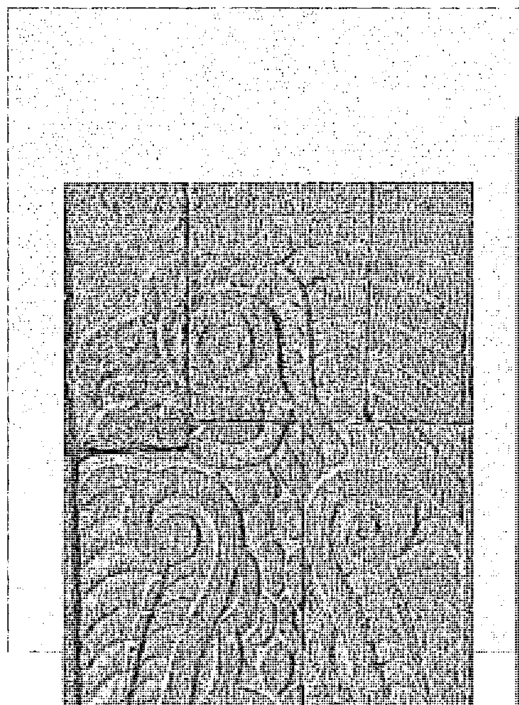

特奥蒂瓦坎的蝴蝶宫里的雕刻，刻的是神话里似鸟的蝴蝶神，亦即绿咬鹃蝴蝶。

> 梦蝶，还是蝴蝶梦见自己变成了庄子？

美国印第安人的传统中，认为蝴蝶是喜悦、变动和转化的象征。霍皮族人的年轻处女会把头发打成有如蝴蝶翅膀般的发辫，表示目前仍是单身，也没有婚约。

从卵子、幼虫乃至变成蛹，蝴蝶一生的变态历程相当特殊。破茧而出的那一刻，挥动翅膀显得无比辉煌。作为自然界改变与成长的绝佳例证，蝴蝶成为普世认可的蜕变象征，自然毫不令人意外；许多民族甚至认为它是灵界与现世的媒介。

### 神秘学院的课程

- 课程一
- 课程二
- 课程三
- 课程四
- 课程五

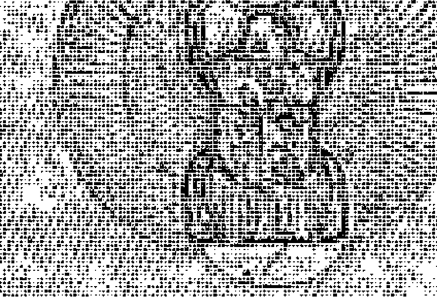


### 哈雷彗星

#### 美索不达米亚地区，巴比伦（约公元前 164 年）

##### 同时是善与恶的象征

关于哈雷彗星，最早的记载可上溯至公元前 467 年，当时古希腊有观测彗星的记录，细究其降落时间、位置、周期，以及流星雨特色，种种迹象指出便是哈雷。但目前唯一流传下来的早期记录，是公元前 164 年出现的那一次，刻在两块残缺不全的巴比伦泥板上，由伦敦的大英博物馆收藏。之后，公元前 87 年也出现过一次，同样记载于巴比伦人的泥板上，上面说连续一个月，每天都能看到彗星。自此彗星开始暗喻事件的发生，或被认为具有重大影响。此次露面，是亚美尼亚国王提格兰大帝的权力象征，缀以曳尾的流星图纹的皇冠也刻在钱币上。或许这也造就了他王中之王的地位，标志新盛世的到来。公元前 12 年，哈雷再度出现，只比传统推断耶稣的诞生日晚了几年，因此，多年来，许多天文学家与神学家都认为，彗星或许能够解释伯利恒之星的故事。

> 古代巴比伦泥板记载了在耶稣基督降生前 100 年左右，哈雷彗星降临地球。

哈雷彗星以离心方式绕轨道一圈只需 200 年，甚至更短。它是唯一肉眼可见的彗星。约 76 年的周期表示，这也是唯一让大多数人一生有缘见到一次甚或两次的彗星。由于具有这种独特的性质，出现时多半壮观璀璨。哈雷彗星不但预示着厄运，也代表光辉美好的未来。


遍观历史，不同的文明皆认为，一旦天空出现异象，就表示有好事或厄运到来。像流星雨、日食、月食、彗星、北极光、飓风、龙卷风，抑或两颗行星并列于天幕之上，等等。古代人认为彗星是灾星，因为每次难以预测何时会在天际出现，其中以哈雷彗星名头最大，既是厄运、晦气的象征，也代表奇迹。如同日食、月食，彗星降临也是值得注意的事件，一向为城邦统治者、国王或预言家所重视。因此，彗星便成为有大事将要发生的兆头，不论好坏。

欧洲黑暗时代留下的史料甚少，但彗星被当作预兆一事有了重大改变：1066 年哈雷出现，普遍认为代表灾难降临。同年，英格兰国王哈罗德二世在黑斯廷斯一战阵亡，诺曼底公爵威廉征服英国，成为新的统治者。


役中吃了败仗并战死。然而彗星对战胜者威廉一世来说，却是个好兆头。贝叶挂毯上面绣的彗星是颗炽亮的星球，现存的记载形容它有金星的四倍大，而亮度大概是月亮的四分之一。

按照占星学家和预言家的说法，哈雷于1222年再度回归，届时必将有更惊人的事件发生。据说成吉思汗曾认为彗星就是他的本命星，而朝西运行的轨道给了他灵感，他决定西征，铁骑一路往欧洲东南部而去。然而也有可能，成吉思汗根本不关心星象之事：无论天象如何，他一心只想征服大部分的文明国家。

1456年，克什米尔地区有人目睹了哈雷彗星，针对此事，梵语诗人（同时也是克什米尔几位苏丹的传记作者之一）锡维拉有相当详尽的记载。依他之见，彗星掠过天空代表厄运将至，预示当时的苏丹辛因·阿比丁即将倒台。同一年，埃塞俄比亚当时的皇帝扎拉·雅库伯（1434—1468）见到天空发出异光，又从多数历史学家口中得知是哈雷彗星，于是兴建一座“光之城”，迁都于此，直到执政结束为止。

最早意识到彗星会周期性出现的人是艾德蒙·哈雷爵士。他利用牛顿的万有引力定律，以及开普勒的行星运动定律，推测哈雷彗星将于1758年回归。1910年，哈雷再次露面，但在那之前，同年1月，另一颗彗星先行出现，令人大感错愕。经媒体大肆渲染，这种现象变成了世界末日的预兆。两颗彗星结伴而来，可能招致双倍的霉运或晦气，因此巴黎市郊举办宴会，庆祝哈雷彗星再次通过，和世界末日降临。有些人害怕彗星的尾巴充满致命剧毒，世界可能会因此覆灭。有记者写文章建议既有钱又明智的巴黎人，不妨租一艘潜水艇，驶到北海躲避几天，等彗星过了再回家。

彗星及其他天体活动均被视为某种预兆，即使在今日，也有人把日食、月食仍看作是极其重要的征兆，暗示不久之后将有事情发生。

贝叶挂毯上绣着哈雷彗星于1066年出现的景象，英国占星家认为，这表示哈罗德国王将遭遇不测。


### 犄角神

#### 丹麦（公元前152—公元前150）

象征繁殖、成长、大自然和新生


这件制作于公元前2世纪，描绘详实的银器，是在丹麦一处泥炭沼泽中发现的。推测上面的图案也许与巴尔干半岛的色雷斯人、不列颠群岛的凯尔特人，甚至印度文明有关。

浮凸于令人赞叹的银制器皿——冈德斯特尔普大鼎上的犄角神，叫作科尔努诺斯。他是凯尔特族的神，属于多神的异教信仰。科尔努诺斯身边常环绕着动物，如雄鹿，有时也与生有山羊角的大蛇、公牛、狗和大老鼠一起出现。因他与自然生灵息息相关，所以，常有学者形容他是“动物之王”或“野生动物之神”，但他同时被认为性情平和，是象征丰收的自然之神。学者们不约而同地推测科尔努诺斯的形象，或许源自盛行于整个欧亚大陆的秘教神明，之后透过密宗瑜伽和西伯利亚的萨满教流传下来。有趣的是，在印度河流域的摩亨佐达罗出土的帕舒帕蒂图章（公元前2500—公元前2400）上，也刻着形貌相似的犄角神。推测有二：其一，画的是早期印度教湿婆神，他还有个称号叫“帕舒帕蒂”；其二，画的是吠陀时代的楼陀罗，执掌狩猎与野生动物。科尔努诺斯的名字最早是以拉丁文出现在方形断面的石灰岩浅浮雕上的，名为“船夫之柱”。同一块浮雕上刻有好几位神，包括高卢神与罗马神。这块高卢罗马的纪念碑可上溯自公元1世纪前期，原本矗立于鲁特西亚神殿，也就是罗马治下的高卢人的巴黎。此科尔努诺斯雕像呈坐姿，双腿交叉，头上的鹿角仍未完全长成，两只角上都披挂着坚硬的金属颈圈。石上的主要题词是献给朱庇特的。其他神像雕刻旁也刻有献词，但部分已经模糊不清，或残缺不全。这些神祇排在朱庇特后头，依次为塔沃斯、弗坎努斯、伊苏斯、科尔努诺斯、卡斯特、苏克鲁斯，以及福耳图纳。一般认为科尔努诺斯原本是以交叉双腿的坐姿呈现。


### 源自埃及

这位犄角神很可能是脱胎自埃及神话，譬如牛头女神哈索尔，或甚至更早的前王朝时期（旧石器时代晚期）的埃及畜牧女神芭特。王朝时期的埃及开始崇拜头上有公羊角的阿蒙-拉（又称阿蒙神）。公羊是男性雄风的象征，因其发情时极其猛烈。阿蒙神头上的角也代表东方与西方，或日头升起又落下，埃及人认为是太阳神“拉”从天空这一端跨到另一端才有的现象。由于亚历山大大帝于公元前332年征服了埃及，因此在画像中常以有角的阿蒙神形象出现。阿蒙神神殿的祭司将亚历山大看作阿蒙神之子，给予盛大欢迎，之后阿蒙神演变成宙斯。这位结合宙斯与阿蒙的神祇，变成了别具一格的神明，脸上蓄着大胡子，两只公羊角十分引人注目，也有自己的信众，独享配祀。

大刀阔斧地整顿异教徒，因此古代神祇（如希腊酒神狄俄尼索斯）的信仰逐渐销声匿迹，而犄角神科尔努诺斯也遭到妖魔化，他的信众后来被控施行巫术，与魔鬼签订契约。

不同文化当中的犄角神——包括科尔努诺斯，全都意味着丰饶、成长、大自然与重生，至今巫术崇拜与其他新异教信仰仍然供奉这种神明。这类信仰体系认为有角神象征一年四季，隐含生生死死的无尽循环。科尔努诺斯也与大自然、草莽未辟的荒野、生殖力、狩猎，以及生命循环有关。尽管这位神祇的形象曾历经变化，但头上必定有角，有时是羊犄角，有时是多分叉的鹿角，有时候甚至加上一颗兽头。此外，家乡在阿卡迪亚乡间的希腊牧神潘也是著名的有角神之一，臀部及腿状似山羊，另有一对羊角，是自然、高山、狩猎与牧歌的象征。同其他有角神一样，他也是繁衍的象征，代表春神。


这块赤土陶瓦烧成的埃及阿蒙神塑像，在公元1世纪时由罗马人打造。


星象学上的金牛座符号是由公牛头和牛角组成，与许多上古神祇都有渊源。

### 妖魔星，或称作“恶魔之星”

#### （约公元2世纪）

##### 预示血腥残暴的恒星


成令人怖畏的蛇发女妖，只消与她眼神相对，就会化成石头。珀尔修斯奉命前去砍下美杜莎的头，而且只能通过雅典娜拿给他的闪亮盾牌观察她的倒影。他砍下女妖的头之后，只见她体内跃出了有翼的天马和手持黄金剑的巨人，而头颅滴下的鲜血，幻化成两头蛇，象征二元、对立、难以预测，因为它能够任意用一端的头攻击。珀尔修斯手持美杜莎的头，敌人纷纷化成石头动弹不得；之后女妖的头被交给雅典娜，女神将它放在自己的盾牌上，叫作“神盾”。近年来，女权主义者和心理学领域均认为美杜莎头颅被斩状甚是恐怖，代表女性的愤怒。

星象学中恶名昭彰的恒星——妖魔星，位于珀尔修斯代表的英仙座星群中。古人认为妖魔星是天空中最邪恶的星星。

妖魔星，或恶魔之星，不论在中世纪与文艺复兴时期的欧洲，还是阿拉伯世界里，均被视为星象巫术的 15 颗恒星之一，能够辟邪，而且与蛇头女怪美杜莎渊源最深，取名自阿拉伯文，意即“恶魔的头”。因其星象变幻莫测，所以有人说此星是用来描述美杜莎令人骇怖的蛇头。亚历山大时代的天文学家托勒密，曾于公元 2 世纪发表一篇文章，称妖魔星是被珀尔修斯杀死的蛇发女妖尔修斯，于是从那时起，它俨然成为文学艺术作品中斩首而死的象征。

希腊神话中，美杜莎原先是智慧女神雅典娜神殿里的处女祭司，美丽聪慧，充满魅力，一头金发，众人无不夸赞。但海神波塞冬受到肉欲驱使，在神庙中侵犯了她。雅典娜得知此事后，既恼怒又忌妒，痛责美杜莎污染了圣地，同时将美杜莎变

自古至今，许多文化不约而同将妖魔星视为残虐暴力的象征。希伯来人认为，这组三合星当中有一对食双星，因此叫作“撒旦之首”；阿拉伯人与此星取名为“恶魔之首”；中国人称此星为“大陵五”，陵即坟墓。占星学上认为，妖魔星在恒星中属于某种大灾星。早期文艺复兴时期的巫术与星象学，均将其列为 15 颗伯西尼恒星之一。
伯西尼恒星群是驱邪巫术所用的象征，此名源自阿拉伯文 Bahman，意指“根”。当任何一颗恒星与一颗或更多的行星排列成一直线，就能源源不绝灌注特殊的力量。每颗恒星皆与一种宝石、一种植物相对应，将这三者加以结合，用在仪式魔法上，就能导引出这颗恒星的影响力，加持护身符。行星轨道面与恒星之间的夹角不超过六度时，影响力特别巨大，最适合进行仪式魔法。

16 世纪时，魔法家暨占星家哥内留斯·阿格里帕撰写《神秘哲学三书》，当中讨论到这 15 颗恒星，记载其特殊魔力，并详列出每颗星的神秘象征。他罗列出 15 颗恒星，一一说明在哪个时间举行仪式魔法最有利，以及各自对应的宝石、植物和行星组态。虽说目前仍不清楚此类魔法的起源，但 20 世纪初期的埃及学权威——瓦历斯·巴奇，认为此类魔法源自古代苏美尔文化。

### 诠释星象

当月亮与上升的昴宿星团（古人视其为一组恒星）连成一线，便是召唤精灵（demon）——那时 “demon” 一词指的是自然界的精灵，而非邪恶力量——或亡者灵魂的时刻，祈求大自然揭示奥秘，重现失落已久的真相。

古人认为，恒星毕宿五（金牛座主星）上升且与月球相连时，可添增尊荣富贵。但妖魔星自古就和灾厄脱不了干系，被形容成 “能依你心所愿，降灾于人”，也能 “使人心生憎恨”。方法很简单，只要拿合适的宝石，加上提炼好的药草或植物，用与所居星辰对应的金属打一只指环，将其绑在石块上，接下来魔法师会把药草放在指环之下，写下几句重要的题词，摆上神秘象征，譬如施行妖魔星巫术时，就会把黑色蓖麻汁混以同分量的苦艾汁，置于宝石下面。
古代观星者在凝望夜空亮度平稳的星群时，早已注意到这颗异乎寻常的仿佛在眨眼的星星。妖魔星如此奇特，也难怪名声不佳，毕竟古人对任何奇特、不断变动、难以捉摸的事物都容易感到害怕，并由此衍生出种种迷信。


现代人知道妖魔星是变星，亦即亮度会增减。此星依固定周期趋明转晦，每循环一次耗时两天二十小时四十九分钟，整个历程肉眼清晰可辨。这是因为它是食双星：由双星组成，互相绕着对方转动。从地球上遥望，双星的轨道平面几乎与我们的视线平行。因此，当较暗的星星掩住较亮的那一颗，妖魔星的亮度最微弱，明灭不定，就像是夜空中一眨一眨、不怀好意的眼睛。

英雄珀尔修斯举起亮闪闪的盾牌杀死了美杜莎，后人认为她被砍下的头变成闪烁不定、让人害怕的妖魔星。


妖魔星的象征符号据说能使人心生憎恶。

### 阳物图腾

#### 英格兰多塞特郡，赛那阿巴斯 (183—1650)

#### 象征男子生殖力与雄浑气概


像离多塞特郡赛那阿巴斯古意盎然的小村不远，刻在朝西的山丘之上。十几个世纪以来，流传着许多关于巨人的传说，解释他何以跕立在此，又是如何来到这座山坡的。有人说他来自丹麦，是真正的巨人，跑来茶毒本地居民，吃掉他们的羊。某天晚上，赛那阿巴斯的村民趁他在山坡上熟睡，把他杀了，再沿着他的身形轮廓，以掘土方式画线，把他永远标记在山坡之上。至今仍有居民信誓旦旦地说，巨人到了晚上就复活，走下山丘，去附近的小溪喝水。

中世纪时期，人们会在巨人头顶上方的土地上立一根五月柱，还没有孩子的夫妇便绕着柱子跳舞，祈求顺利怀孕。据说夫妻若在巨人上方燕好，也能治愈不孕症。甚至有传闻说，生不出小孩的妇女只消在巨人阳物旁边的地上睡一晚，之后就能怀上小孩。其他故事不胜枚举，包括年轻女子沿着巨人身形走三圈，便能拴住爱人的心。

这个阳物傲然昂立的神秘巨人，大约是在罗马人统治英国时期，在草地上刻画而成。

赛那阿巴斯巨人像拥有勃起的巨大阳具和睾丸，被认为是关于男性生殖力的异教象征。尽管目前仍不确定巨人像雕成于哪一年，但从中世纪开始，许多人便慕名到此求子，举行相关仪式。巨人十分醒目，以站姿呈现，达55米高，是以凿穿草皮，一直凿到白垩层的方式刻画，形成如沟槽般的线条，堪称欧洲最著名、最具煽动性的阳物象征。

### 希腊与罗马神话

史学家认为，赛那阿巴斯巨人像也可能是希腊罗马神祇赫拉克勒斯的形象，他在公元180—192年期间，曾与本地的神明相混为一，受异教徒供奉。当时，统治英格兰的罗马帝国皇帝康茂德，深信自己是赫拉克勒斯投胎转世，很有可能在英格兰弄出一个教派，当作一种自我夸耀。但另一派学者提出不同见解，认为巨


这只上古希腊时期的装饰花瓶（1813—1824年由兰伯特伯爵收藏）上刻绘着希腊神祇，由左至右分别是穿越疆界之神赫尔墨斯、酒神狄俄尼索斯、生殖之神普里阿普斯。

人脱胎自希腊神话中面目丑陋的天神普里阿普斯，他被逐出奥林匹斯山，下贬人间，来到山坡之上。普里阿普斯尚未出世，仍在阿芙洛狄特的子宫里时，就被赫拉诅咒性无能且心地龌龊——谁叫帕里斯胆敢说阿芙洛狄特比赫拉更美丽，她非报复不可。后来普里阿普斯被贬斥至人间，与潘及森林之神同时成为生殖之神。他长期不举，郁郁寡欢，忽然有一天女神赫斯提亚来找执掌草地的仙女，他一见便心神荡漾，不能自持。赫斯提亚躺在那里睡觉，他打算硬来，却在最后关头被突如其来的驴叫声吓到，导致不举，叫声惊醒了赫斯提亚。他从此痛恨驴子，后来在罗马文化中，不少驴子为了献祭被他屠杀。希腊人认为阳物具备独立的心智，比较像动物，和人类的心智是分开的。阳具以竖起的形态出现，在日常生活中并不少见。许多人认为，普里阿普斯勃起的雕塑可以转移邪灵之眼的凝视。旅人走过他的雕像，往往抚摸生殖器部位，好平息他的怒火。雅

典人将普里阿普斯与“穿越疆界之神”赫尔墨斯融为一体，这位混种神祇头戴翼盔，足蹬有翼凉鞋，胯下的阳具昂然勃起。远溯至古埃及时期，阳物在敬拜奥西里斯的仪式中相当重要；此外，埃及生殖神“敏”也常以阳具勃起的形象出现。古代罗马文化也常以阳具为象征，制成阳具形状的护身符是很受欢迎的饰品，此外置于花园中的普里阿普斯雕像也相当受欢迎，保护家宅平安、多子多孙。罗马小男孩身上常佩戴一种护身符，套上阳具形状的驱邪物，直到成年为止。生性好色的普里阿普斯不仅在罗马人的情色文学与艺术作品中被刻画成形象滑稽的小丑，而且在一般人眼中，更是男人气概与权力的象征。


古往今来，阳具都是男性雄风与权力的象征。


公元3世纪的护身符，想必是当成饰物佩戴在身上。

### 纳斯卡线条图

#### 秘鲁，纳斯卡沙漠（约公元500年）

刻在沙漠上的地画，有动物图案和几何图形


神明借此表达内心的不满，所以他们决定放弃卡瓦奇，改觅新地方举行宗教仪式。

在卡瓦奇，等级较高的祭司比较像萨满巫师或魔法师。有一则传说中说祭司在半空中飞行，指挥工人描绘纳斯卡线条，形容得活灵活现。位于南美大草原另一端，与卡瓦奇遥遥相对的是文迪拉城，很多人认为这些线条是神圣通道，连接城市与维系生命所必需的水源。

从空中鸟瞰，神秘线条显得特别清楚，因此有人认为线条具有天文学或占星术上的意义。另外一派看法是，线条是古代不明飞行物的杰作。相传线条是对天空、山脉之神表示崇敬，多半用于仪典上，向大自然众神祈求水源丰沛。

### 动物图形象征

纳斯卡线条图是一系列绵延无尽的线条，主要是动物图形，诸如猴子、兀鹰、鹭、蜘蛛等，但考古学家迄今仍不解意义何在。

2000年前，炎热、漫天风沙的纳斯卡沙漠建起了大城卡瓦奇，当作举办仪式及庆典的圣地。沙漠里干燥的岩石上遍布各种几何形状、鸟兽图样或奇异图纹的蚀刻，称为纳斯卡线条。但背后的理由是什么？

卡瓦奇原是肥沃绿洲，但公元4世纪时，两次天灾让大城受创惨重。首先是一场洪水，切断了城市的供水系统，接着又发生大地震，不少神殿崩毁坍塌，之后卡瓦奇不再是宗教中心。纳斯卡人深信天空、高山、河川，乃至洪水、地震，无一不是受神明指挥，因此认为这两次天灾是

遍观安第斯山脉一带，动物象征主义相当盛行，其中纳斯卡线条由形形色色的动物象征组成，比如猴子、蜘蛛、狗、蜂鸟、兀鹰、鹭、鲸鱼，以及鹈鹕。古代住在安第斯地区的人，认为看到蜘蛛爬出洞穴，表示即将有雨。蜘蛛因擅长结网，具备亦善亦恶的习性（有些品种有毒，有些则善于捕食害虫），广受古代人尊重，变成了沉默力量的象征。在中美洲，部分原住民部落将蜘蛛当作神明供奉，譬如吐丝后结出人生之网的“玛雅伟大纺织神”。

纳斯卡人认为，蜂鸟是神明派来的信

差，因为它是唯一能够倒着飞的鸟，宛如从神界飞到现实人世。整个安第斯地区的人都认为，蜂鸟是重要的灵性指引，也是死而复生的象征。传说中，它在寒夜里死去，却在旭日东升时苏醒。

天空之王。兀鹰在高空俯视着大地，它的飞行航线变成了河流或肥沃平原。

> 安第斯地区许多部落文化，不约而同地认为蜂鸟能在两个世界间飞行，把上天的旨意传达给人类。

亚马孙地区有许多猴子，也招来丰沛的雨量。然而不少文化将猴视作人类性格的象征，例如模仿、奸诈狡猾、表里不一、贪婪等。猴子的形态多变，比如与南美洲相隔一道海洋的印度，出产一种长尾猴，生性勇敢却狡猾，印度教徒喜爱它，封为猴神，也是衍生的变种之一，曾帮助罗摩打败残暴无道的国王罗梵那。

今日秘鲁南部与智利北部的海岸地区是地球上极为干旱的地带。这个培育了纳斯卡文化，四面环山的小盆地，有十条河流发源自安第斯山脉，一路向东流去，其中大部分会在每年的某些时刻断流。这十条如美丽缎带的河流，河水充沛，很适合孕育人类早期文明。但目前看来，因气候变迁剧烈，这些珍贵的河流终有一日会完全干涸。

对纳斯卡人来说，鹈鹕和鹭都是水湄的象征，与它们和平共处，或加以崇拜，能保佑风调雨顺，或使河水涨满。兀鹰堪称此处最大的地画之一，正如其他鹰或雕那样，往往一飞冲天，目光锐利，被视为

此处几乎所有动物的图形，如蜘蛛、蜂鸟等，都是单一线条的绘画，线条笔触显示有可走的路径。考古学家据此推测，这些线条原本只是单纯的图像，经过一段时间的演变，才变成仪式中的走道，或庆典上的行进行列，借以祈求动物神明的恩泽，降下甘霖，好维持土地蓬勃的生机。


> 蜂鸟睡眠时体温下降，但日出时体温随之恢复，因此被视为复活的象征。

### 骷髅头
中美洲（600—1250）

全世界多个文明都以此代表死亡


阿兹特克族把俘虏来的士兵头骨排列在架子上，如墨西哥大城特诺奇蒂特兰的大神庙前的骷髅头墙，借此炫耀战功。

全世界多个文明与宗教，皆视骷髅头为死亡象征。中美洲文明就有一面边墙摆放为数众多的骷髅头，又称作“骷髅头架子”，公开展示各式各样的人类头盖骨，多半取自战役中丧生或当作献祭的人头。由木头杆子组成类似鹰架的结构，先在头盖骨上打洞，再一一挂到架子上。骷髅头架子的形成时间，介于公元600—1250年之间。

阿兹特克人胜利归来时，喜爱夸耀战利品，当中有士兵的人头，也有贵族的人头。敌人战败被捕后被用作上天献祭的贡品，通常是被活生生扒开胸膛，掏出血淋淋的心脏，再把死尸推下去，或扔到神庙台阶下面。参加仪式的人围在神庙前方的广场，负责把手、脚和头颅从身躯上切下来，将手、足赏赐给带回俘虏的有功战士，有时头颅会先剥皮。战士会吃掉俘虏的手、足，表示敬意，同时也象征赋予权力的意涵。最后用木杆穿进头颅的孔洞里，高悬于架上。

充满神话与宗教意涵的叙事诗《波波尔·乌》（亦即《人民之书》），讲述了一对双胞胎英雄的故事，一个叫乌纳普，一个叫什巴郎克，被贬黜到阴间去寻访遭弑的父亲。阴间神明杀死了乌纳普，砍下他的头，挂在球场旁的葫芦树上。当初兄弟俩就是从这座球场走进了阴间，因此葫芦树变成死亡象征，时常可在中美洲装饰艺术中见到。


直到今天，每逢墨西哥重要节庆“亡灵节”，仍经常有骷髅头以不同样貌出现。亲朋好友在这一天团聚，纪念、缅怀已逝的家人，为他们祈福。骷髅头制成了面具和头骨，甚至有头骨形状的糖果、巧克力，无不大受欢迎，而且会把受赠者名字刻在额头部位。骷髅头糖果可以送给生者和亡者当礼物。

印度教的死亡女神迦梨，经常以戴着骷髅头花环的形象出现。有则印度神话提到，她从难近母的额头里跳出来，手持骷髅头圆顶的拐杖，颈间围着骷髅头项链，披着老虎皮。

墨西哥亡灵日多以骸骨及骷髅头的图腾装饰，同时不忘送礼给祖先，当作祭祀。

能把妖魔拉克塔维拉的众多分身一个个吃掉，再吸干真妖的血，踩着被屠戮者的尸体，在战场上跳起舞来。20世纪时，德国纳粹党卫军的集中营守卫，制服上也绣有骷髅头图案。

相较之下，骷髅头也有寓意较为正面的象征。罗马有一处地窖，深藏于地下礼拜堂内，当中藏着上千名教士的骨骼和头盖骨，收集于1528年至1870年间。头盖骨以及人体其他部位的骨头，装点了整面墙壁，洋溢着巴洛克和洛可可风格。乍看之下，或许觉得太过诡异，但访客仔细思考，便能够领悟到人终归一死的道理。骷髅头像是在强调，我们必须把握住生命的每一个片刻，好好地生活。同样，骷髅头戴上玫瑰花圈编成的皇冠，象征“把握当下”（carpe diem）——原文是拉丁文，引自罗马诗人贺拉斯的诗，有及时行乐之意。

毒药瓶上印有骷髅头和两根交叉白骨的图案，让人一看就知道有毒。此外也用来指海盗。航行在公海上的船只，最不想看到的应该是绘有骷髅头和两根交叉白骨的海盗旗吧。

在海洋上，骷髅头和两根交叉白骨是众所周知的标志，代表危险或死亡，至今仍沿用不衰。

### 图腾柱
北美洲（约 1500 年）

印第安人的巨型木雕，诉说着一则则故事


图中的图腾柱位于加拿大不列颠哥伦比亚洛基山脉地区。图腾柱上多半刻着神灵或具有代表性的传说故事。

> “图腾柱”（Totem）极可能是源自印第安族的阿尔冈琴语系的“odoodem”一词，意为“家族亲属”。氏族或部落将内心的想法或信念，一一刻在大木杆上面，变成图腾柱。美洲印第安人基本上认为万物有灵：换句话说，他们深信自然万物，无不与魂魄相通，不论是自身的灵魂，还是某种无所不在的神秘力量，抑或两者皆有。图腾柱可能随着部落文化各异，略有不同，但主要仍用于记述耳熟能详的传说或神话、氏族系谱、显赫的祖先或值得记录的大事，以及精神象征。有的柱子用以宣扬文化概念，有的则是工艺精湛的装饰品。有几种图腾柱属于丧葬建筑的一部分，将棺椁与雕有纹路的支柱或嵌入的凹壁相融合，永远追思。有些图腾柱则刻着故事，或是宣扬萨满巫师的威力，或是表彰不同氏族或家族的卓越事迹。部分历史学家认为，史上最早的图腾柱出自海达族之手，该族居住于阿拉斯加与不列颠哥伦比亚之间的地区。

太平洋西北地区聚集的原住民部落中，随处可见巨木做成的壮观木雕。大部分图腾柱子是以西部红杉雕刻，但这种木材不耐潮湿气候，容易腐朽，这也说明了何以从1500年开始就有图腾柱，但在1900年前雕刻的图腾柱，却鲜少能够保存下来。

#### 美洲印第安族的神灵

**克奇纳**
霍皮人和普韦布洛人认为克奇纳是创造生命之神。克奇纳代表真实世界万物的精魂或化身。克奇纳神可能是大自然任何生命的示现，从备受敬重的先祖、某个地点、质地、自然现象到某种概念，无所不包。

**马尼图**
对阿尔冈琴人来说，马尼图是精神世界最根本的生命力。居住于五大湖地区的海司瓦圣人认为，马尼图依附在蒸汽屋里的石头上。一旦点着了炉子，热气蒸腾，将迫使马尼图离开石头，使人体充满能量。

**哇卡坦卡**
意即伟大的神灵。苏族部落的人认为哇卡坦卡具有形体，容易与人亲近，能渗入物质世界的每一道纹理当中。

许多美洲印第安部落都特别尊崇的神话英雄或战士，进而影响了他们的社会或文化。也许是某个先祖、英雄、战士，甚至具有超自然力量的动物，衍生出各种神话情节及象征，而部落里的人通过对图腾柱的认同，更加了解自身的文明、文化与创造。其中，尤以动物祖先最常出现在图腾柱上。雕琢精巧的某种动物形象，不但表示部落以它的精神为本，也给予部落某种意义与信念。譬如雷鸟象征权力，青蛙意味着昌盛，熊则代表力量与保护。图腾动物非常神圣，一旦杀害就是犯了禁忌。人脸雕刻常出现在阿拉斯加一带的图腾柱上，多半是森林里的野人，男女都有，代表在林间走失或淹死在溪流、大海里的先祖的魂魄。

世界各地较有名的原住民部落，不少都有类似图腾柱的创作物。例如中国东北地区的吉人、日本北部的阿伊努人、新西兰境内的毛利人，以及印度的贡德族。毛利人用“地柱”（色彩鲜艳的木雕）来划分疆界或标志具有神圣意义的地方。地柱通常雕琢华美，颇具艺术美感，散布在新西兰各处。如同图腾柱，每根地柱上都刻着有关部落文明的故事。值得一提的是，地柱反映出祖先、环境与毛利人的名声地位三者之间的关系。印度的装饰柱也用以象征部落的声誉，如贡德族的新郎，一旦决定婚约，娶亲前就会雕一根柱子，当地叫作“蒙达哈”，竖在部落外围的房屋前面，直到举行婚礼为止。柱子象征新人的爱情忠贞不渝、子孙绵绵。

> “星辰之柱”是19世纪时，离瓦氏“鹰之部落”首领艾尼特拉斯为了举行庆祝领养仪式，命人雕刻的屋前柱。


### 美洲印第安动物神灵


#### 狐狸

狐狸住在光与暗的交界，能够同时看清两个世界。它动作迅捷，心智灵敏，教会我们面临任何情况，都必须善用直觉与知识，迅速应变。包括霍皮人与切罗基人在内，许多部族都认为狐狸代表的药轮具有强大的疗愈能量。


#### 马

对美洲印第安人而言，马代表自由，以及伴随而来的力量。有人想追求马的精神，表示他们内心最大的渴望是自由。马赐予原住民善于奔跑的力量，使他们领悟到，他们也能迈入前所未见的领域，奔腾活跃，得到更好的发展。


#### 水獭

水獭活泼不羁、好玩耍，体现了遍及宇宙的爱，而非一己小爱。它们提醒我们要彼此相爱，分享活着的喜悦，也教会我们如何在问题之海和情绪的波涛中，自在地泅泳，象征摆脱怒气、忌妒、恐惧等负面情绪。


#### 郊狼

郊狼是美洲印第安传说、歌谣或仪典中不可或缺的主题，通常隐含“骗子”之意。郊狼几乎没有适应不了的环境，但最喜欢北美大草原、山地和矮丘。郊狼的药轮是“老师”，我们得牢记，正确运用知识，便是智慧。


#### 渡鸦

部分原住民部落提到渡鸦时，常常指“守密者”。黑檀木般的色泽常比喻黑暗。这种神奇的鸟将消息和祈祷传递给幽灵，只找能够保守秘密的人。品种众多，形态各异，代表的药轮是“改变”。


#### 美洲狮

美洲狮敏捷、凌厉、迅捷无比，其药轮是不要贸然冲刺，要学会悄悄靠近，善用智慧和耐心。它的教训是，做个深谋远虑的领导者。但是，一旦你决定行动，就必须瞄准目标，不容有失，如同美洲狮动身扑向猎物，从来没有失误。


#### 海狸

海狸具备捍卫家人的能力，家庭观念很强烈。它传达的信息是：尽量忙碌，保持活跃；多用头脑想办法，但必须注重实际，必要时，欣然接受改变；努力达成目标时，善用团队力量；经常提醒自己，解决方式可能不止一种；要懂得运用身边的资源。


#### 水牛

体形较小的森林水牛，和它生活在平原上的表亲，不论在日常生活还是祭典上，都深受原住民尊崇。平原地区的印第安人认为水牛象征神圣的生命，以及造物主在大地上赐予我们的无穷恩典。水牛还象征了自我牺牲与公共服务。


#### 熊

北美原住民深信“大谜团”存在于熊的灵魂里面。许多美洲印第安部落都有熊的氏族和仪式，熊也代表药轮的西边方位，意味着直觉、转化、直观知识、能处理内在灵性的广阔旅程、梦境、以及洞察力。


#### 乌鸦

乌鸦守护着仪式魔法与蜕变能力，也是法律的神圣看守者。乌鸦的药轮是：地位在人类创造的法律之上的、判断更高层次是非的“直接知识”。属于乌鸦药轮的人是幻想大师，能接收灵界的信息。


#### 雕

美洲印第安人把雕看成圣界的信使，把我们的祈祷传送给造物主，然后带回礼物与卓越识见。相当多的部落文化认为它象征勇气、识见、力量与坚忍。雕须在荒野中独自锻炼，才能展翅翱翔。这告诉我们，人生有踽踽独行的时刻，我们得坦然面对生命的境遇。


#### 蜘蛛

美洲印第安人口耳相传，第一个捕梦网是由蜘蛛婆婆织就，为小朋友捕挺噩梦。蜘蛛婆婆是充满智慧的老师，能编织许多故事。她独特的编织图案代表通往自我内心与创造的许多条路径。其药轮是连接和精神的统一。

位于爪哇的普兰巴南寺庙群被联合国教科文组织评为世界文化遗产，大智慧的印度象神甘奈施俯视着人们走过。


## 神祗的世界


随着文明进展，宗教信仰日趋成熟，人们建造起更多的神殿，供奉各自的神明。众神不分男女，继续依照社会的需要，扮演好自己的角色。只不过女神的地位一落千丈，像生殖女神伊丝塔和她的侍女莉莉丝，被心怀忧惧的希伯来大族长说成是恶魔。祆教率先出现，其后是基督教和伊斯兰教，众神的世界变成了一神世界，独力对抗邪恶。基督教早期神父以异教神祇为本，加以转化，使他们有的变为圣神，有的变成了魔鬼，法国雷恩堡的神秘雕像便是佳例。古代知名的工艺品据说具有宗教力量，例如天命石板、圣杯、约柜、命运之矛，历代君王无不倾力寻找这些象征君权神授的宝物，好遂其一统世界的野心。那时的人认为，若能好好利用宗教圣物，就能把世界改造成自己想要的样子，拥有超越神的力量。

### 新月
法国韦泽尔谷（公元前22000—公元前18000）
最早的女神雕像之一，手中握着一枚月牙


罗塞尔女神手持月牙，既是女性生殖力的象征，也代表依月相周期的变化狩猎，非常重要。

1911年，法国多尔多涅地区一处石灰岩洞窟里，出土了新月形的浅浮雕，同时发现了另外三处上古时期的雕刻，足以证明早在父权文明发展出形形色色的神殿之前，史前文明已有女神崇拜，此处发现的女神是大地、月亮和天空的化身。石窟位于凸出悬崖的下方，十分隐蔽，俯瞰着山谷，相传古代主要在此举行仪式，推测属于旧石器时代晚期，大约在公元前22000年。洞中雕刻包括一名头上覆着网的女子、一名较年轻窈窕的女子，以及身形丰满，宛如维纳斯的雕塑。当中最引人注目的莫过于罗塞尔女神：45厘米高的女子雕塑，乳房、肚腹和大腿都很丰满，生殖器轮廓明显；女子的右手握着状似大牛角之物。有趣的是，此物上面刻着13道直线。不少学者认为，直线可能代表月亮渐亏或渐盈，也可能仅表示第13个朔望月。事实上，一般认为此物并非牛角，而是月牙，或称作上弦月。姑且不论是生殖女神，抑或是月亮女神，据说月牙状雕刻指的是女人一年内的平均月经次数。上古文明基本上都崇拜月亮，以月亮周期划分时间。眉月渐圆，直到变成了满月，记录着成长与更新；满月之后开始亏蚀，月牙逐渐缩小，象征封闭、暂歇和静止。月牙在吠陀文学作品中象征大母神，当中提到“信徒对手持月亮的女神躬身行礼”。美索不达米亚地区的大母神几经演变，成为象征繁衍与爱情的女神，如伊丝塔（一说伊南娜，意即圣女）。到了相隔遥远的西方，大母神又变成西布莉（罗马的自然女神）、阿娜希塔（波斯的水神），甚至变成印度的众神之母阿底提、埃及的尼罗河女神伊西斯，以及希腊爱与美之神阿芙洛狄特。

在早期社会中，月亮的圆缺周期被视为神圣力量的体现。许多文化将月亮女神与生育、丰收和命运联系在一起。例如，巴比伦人崇拜月神辛（Sin），认为他掌管着时间与历法。古希腊人则将月神与阿尔忒弥斯（Artemis）和赫卡特（Hecate）等女神关联，赋予其狩猎、魔法和跨界的象征意义。这种对月亮的崇拜往往与女性角色和社会结构紧密相连，暗示了早期社会中可能存在的母系传统。

月亮的周期性变化，特别是其从新月到满月再回到新月的过程，常被用作计时和安排仪式的基础。在许多古代文明中，祭祀活动会根据月相精心安排，以期获得女神的庇佑。这种对月亮的依赖和崇拜，进一步强化了女性在社会中的神圣地位和影响力。


对早期巴比伦观测天象者来说，这个八角星星代表金星，或晨星伊丝塔。

### 母系社会


这是渐渐亏蚀的下弦月，暗示此时事情即将告一段落，是好好休息、潜心反省的时候。

针对这类女性雕像代表的意义，有人提出不同的见解。部分历史学家指出，月亮是指“丰收的号角”，象征繁衍、丰饶，但另一派认为它是乐器，因此象征萨满教透过音乐与咏唱的仪式所产生的强大力量。但目前有大量证据显示，上古时期崇拜大母神的文明不在少数，皆与大地、丰饶（生殖）、月亮或星辰有关。此外，欧洲各地也发现许多维纳斯塑像。种种线索似乎告诉我们，旧石器时代曾出现过母系社会。月亮是母亲的象征，加上与大地的关系，常见于古代各地的文明。有意思的是，爱什塔（Ashtar）和伊丝塔（Ishtar）两个名字来自梵语，分别是“女性”和“星星”之意，执掌权柄的女神多半是“来自星星的女子”。

因月亮掌管时间，所以古人常根据月相周期，选定良辰吉时，举行神秘仪式，向女神敬拜，祈求打猎顺利，或有好收成。之后，月相变化逐渐与行星、太阳的运转周期结合。相传新入会者进入黑漆漆的洞穴，参加这类仪式，会从中发现神秘智慧，比方在罗塞尔发现的小女神像。据说这种智慧必须从女神手中获得，其象征刻在石头上，提醒人类，她具有无所不在的力量。


《狄安娜女神》（1898年）出自画家埃伯特·埃德费尔特之手。罗马女神狄安娜是非常有名的月亮女神。

### 浇奠

#### 埃及（公元前3500—公元前1500）

是一种向神献祭液体的仪式


> 埃及的纳赫特神坛桌大约打造于公元前1800年，上面以浅浮雕方式刻着面包等供品，也有奠酒情景。

倒出某种液体献给诸神或先人，以表敬意或思念，称作浇奠仪式，在许多古代宗教中都很常见，至今仍有部分文化延续此做法。希腊、罗马人最常用来浇淋的是葡萄酒，兑上一点儿橄榄油；但印度人多用酥油，也就是澄清奶油。浇奠仪式多半将液体从金属或陶制的平口钵中倒出，淋在地面、祭坛或石头上。

目前看来，浇奠源自古埃及，原本只是以液体向神明或先祖致敬，祈求大地丰收。但到了公元前3000年，浇奠仪式变成了古希腊人每日必做的事。信神的人无论在餐前、一日之始或结束，或是想感谢亡灵的庇佑，都必定倒一些液体，以表心意。

有一种浇奠叫作“奠酒”，是以固定仪式倒出罐中或碗里的葡萄酒。倒完之后，器皿中的余沥由献祭者喝掉。早在荷马史诗时代，一般人饮酒前得先向天神宙斯、奥林匹斯山的其他神浇奠，有时甚至不忘对英雄或葡萄园的精灵致意。酒水倒在地面上，意思是请亡者或冥界神明享用。《奥德赛》一书中，奥德修斯在地上挖了个坑，在坑旁淋上蜂蜜、葡萄酒和水，向天神致祭。浇奠时，将酒水淋于祭坛或刻有不同人物或象征的桌面之上，期待象征灵验，进而有神迹出现。

罗马文化有执掌奠酒之神，名叫利珀尔·佩特（或称父神利珀尔）。艺术作品描绘浇奠仪式，是在祭坛或特殊的桌子上进行。在端出牲礼之前，依惯例会先以葡萄酒浇奠，淋在火焰熊熊的祭坛之上。钱币上印的帝王或神祇形象，也常是在行奠酒之礼。

从印度教到西伯利亚的萨满教，但凡举行敬拜仪式，传统上都必须施与浇奠，才显得尊重。把液体献给神祇，或洒于地面，是深植人心的方式，象征对大地以及赐予我们生命的神明的反馈。直到如今，仍然是祭祀、给予和尊敬的象征，传达我们对绵绵恩泽的谢意。


今日南美洲印第安族的盖丘亚、艾马拉人，喝一杯前仍习惯泼一些在地上，表示对大地之母帕恰玛玛的敬意。日本神道教则用清酒或米酒浇奠，叫作“神明之酒”。奠酒之礼对古代犹太教来说也相当普遍，《创世记》中曾有记载：“雅各就在上帝与他说话的地方立了一根柱子，就是石柱，在它上面献浇酒祭，又浇油。”

在西非许多地方，他们向先祖浇奠，多半是为了请其参加各种典礼、仪式，尤其是公开的节庆活动。这时会先由族中长辈带头祷祝，再洒棕榈酒及水用来祭奠。东欧和俄罗斯有个古老传统，将伏特加洒在先人的坟茔上，而中国人则是以双手端起来酒或茶，从右到左缓慢均匀地洒在供桌或墓碑之前。这样做不但是为了纪念亡者，而且表示欢迎神明享用祭品。印度寺庙中，毗湿奴和其他神祇也能配给浇奠之礼，但酒中常混合其他液体，如牛奶、酥油、蜂蜜或糖。


于希腊科林斯出土的皮特撒版画（约公元前540年），上面描绘着在坛前奠酒的祭祀队伍。

这幅在意大利庞贝古城神秘庄园发现的壁画（公元前60—公元前50），刻画了酒神狄俄尼索斯正在主持入会仪式。

### 夜后

#### 伊拉克（公元前1800—公元前1750）

古代有翼女神的浮雕，有权杖和戒指的神圣符号


> > 依照犹太教《圣经》，夜后浮雕（公元前19世纪）上的神秘女神是一切邪恶的化身。


> > 莉莉丝代表各种黑暗或阴柔的事物，直到今天仍是邪恶的象征。

苏美尔人的赤土陶瓦雕版，原本叫作伯尼浮雕，如今称为“夜后浮雕”。但关于其上雕刻的人物是谁，真正的含义又是什么，至今仍争论不休，未有定论。一般认为这名容貌出众、华丽动人的女神，背生双翼，脚上有爪，有狮子和猫头鹰相伴，若非莉莉丝（亚当第一任如恶魔般的妻子，在希伯来神话中饱受贬抑），便是伊南娜——生殖女神伊丝塔的早先版本。

伊南娜与伊丝塔都有大母神的影子。苏美尔神话中的伊南娜，早在公元前4000年便在乌鲁克受人供奉，之后传到亚述帝国，变成了伊丝塔。也有人说，莉莉丝是伊南娜的侍女，或许代表伊南娜的某一面。因雕版上有猫头鹰、狮子和兽爪等意象，所以有几派主张与信奉伊南娜有关；此外，目前收藏于巴黎罗浮宫的伊丝塔花瓶上，也有类似图案。部分学者持不同看法，认为浮雕上刻的是苏美尔传说中的女恶魔莉莉图（莉莉丝的前身），也是目前仅有的关于她的雕刻。从公元前3450年左右，开始有乌鲁克文明起，直至公元前3200年，第一批犹太人从比布鲁斯一带迁徙到黎巴嫩为止，这段时期的人特别害怕女妖魔莉莉图。但近年大英博物馆提出了不同的研究看法，主张雕像人物既非莉莉丝，亦非伊南娜或伊丝塔，而是伊南娜的妹妹——冥界女神厄里斯克革。

有则故事提到，伊南娜降临下界，却被厄里斯克革困住，脱不了身。伊南娜迫于无奈，只得牺牲自己的丈夫杜木兹，换取自由。厄里斯克革利用姐姐待在冥界的时间，趁机夺走她身上的权杖和戒指，也就是夜后浮雕上的神圣符号。一说浮雕刻的便是厄里斯克革邪恶无情的夺权故事，只是呈现方式较为隐晦。

夜后浮雕之所以被认为是恶魔，或冥界人物，主要是因为她的翅膀并未张开，而且浮雕的背景原本被漆成黑色。倘若此说法正确，那这块浮雕无疑是世上唯一象征意味浓厚的女恶魔厄里斯克革的雕像。

尽管如此，莉莉丝仍然充满神话色彩，许多神话故事通过父权社会的角度，将她描述成黑暗、邪恶、阴柔的象征。她最早出现在犹太教《圣经》里的《以赛亚书》第34章第14节，名字变成了“夜晚女巫”“尖叫的猫头鹰”或“夜兽”。《死海古卷》的《圣者之歌》列出一串怪物的清单，她也名列其中。到了公元6世纪，无论是刻在碗上还是绣于护身符的召魔文字，都把莉莉丝描述成骇人的女恶魔。只要把碗倒放在家里的某处，便能教恶魔动弹不得。怪不得在尼普尔，几乎每一户犹太人家的地下，都能找到这样一只陶碗，好驱邪避凶。至于护身符，常由孕妇、孩童甚至年轻男子佩戴，以免被莉莉丝缠上，诱发男人的情欲，铸下大错。她还是专杀孩童的女巫，会掐死脆弱无助的婴孩，或杀害仍在娘胎的婴儿。

犹太神话发展到公元8—10世纪时，莉莉丝变成亚当的第一任妻子，但因不愿屈从于亚当，离开了他，改而与大天使萨麦尔结合。另外一些记载上说，莉莉丝是魔王阿斯摩太的恋人，后来成为其妻子。关于其起源或夜后的真正所指为何，也许永远不会有确切答案，但莉莉丝身为恶魔的象征，直到今天仍持续影响艺术、文学，甚至电影的创作。


英国浪漫派画家约翰·柯里尔笔下的莉莉丝（1892年）不仅被认为是最美的莉莉丝，还展现其阴暗幽邃的吸引力。

### 美索不达米亚众神


#### 阿达德

暴风之神阿达德常被描绘成手握闪电，暗示他的力量凌驾于暴风威力之上。身为巴比伦人及亚述人的共同神明，他变成了苏美尔人口中的伊西库尔。身旁带有狮子、龙或公牛陪伴。阿达德的妻子是女神沙拉。


#### 恩利尔

恩利尔掌管空气、风、高度与距离，他也协助创造了人类。但他很快受不了人的喧闹，打算用一场大洪水淹死人类。但有一个凡人名叫乌塔那匹兹姆，幸得天神埃阿相助，免于此难。恩利尔气消了以后，便赐乌塔那匹兹姆永远不死。


#### 安努

安努是苍天神，亦为众神之王，统筹诸神、幽灵与恶魔之事。安努住在九重天之上。普遍认为他有权力裁判地下世界的人，而他创造星辰，是为了令其摧毁恶人。诸神之一——伊拉来，身兼他的随从与国务大臣。


#### 马杜克

传说中有个叫马杜克的凡人，踏上寻找永生之旅，但巴比伦著名的保护神也叫马杜克。公元前18世纪，这座城市变成了政治中心，马杜克的地位日益崇高，最后变成众神之首，供奉在埃萨吉拉神庙。


#### 那布

那布是抄录与写作之神，同时负责保管记录人类命运的天命石板。有时候也以生育之神或水神身份受人膜拜。他的象征物是写字泥板和专用的铁笔。


#### 奈格尔

奈格尔具有毁灭力量，因此是瘟疫、战争和太阳之神，被指派为冥界女神厄里斯克革的丈夫。在文学、绘画作品中，被描绘成战争与瘟疫之神，代表盛夏，是美索不达米亚一年当中最死寂的季节。他也是掌管亡灵的主神。


#### 恩基

恩基是天神力量“密”的保管者，他的象征是两条交缠的蛇。画像中的他，经常戴着鳄鱼皮包裹的有角圣冠。恩基被视为塑造世界的主要神祇，也是智慧与一切魔法之神，同时掌管新鲜水源，包括大海、湖泊以及地下水。


#### 巴乌

巴乌别名宁丁诺格，原本是宁恒的女神，后来成为医治女神。治疗仪式中常见到狗在一旁陪伴。那时的人认为狗的唾液能使伤口痊愈，施行医治的同时，也常借用狗的身体部位。在大洪水之后，巴乌吹一口气，人类因此起死回生。


#### 伊丝塔

伊丝塔司掌爱情、战争、繁衍与性欲，在美索不达米亚北部广受崇拜，许多亚述帝国的城市也为她兴建雄伟的神庙。巴比伦的伊丝塔城门上铭刻着属于她的两大象征：一头狮子和一颗八角星星。巴比伦的万神殿中，她是金星维纳斯的天神化身。


#### 宁莉尔

宁莉尔是风之女神，有一天在水边被恩利尔出其不意地侵犯，怀孕产下未来的月亮神。恩利尔遭受处罚，被贬谪到下界，宁莉尔跟他一起同赴冥界。后来恩利尔乔装成守门人，再次让她怀孕，这次她生下了儿子奈格尔，就是后来的死神。


#### 沙玛什

沙玛什掌管律法、正义与救赎，身份是太阳神，与自然界另外两股力量：月亮与生生不息的大地，鼎足而立。一如太阳驱散黑暗，沙玛什让错误和不公义无所遁形。据说，他能拯救人逃离魔鬼的折磨，不再受罪。


#### 辛

月亮神“辛”被视为万神殿的主神。在那个时代，月亮及其盈缺变化的周期对文明发展的影响既深且广，包括农耕、季节、星象预测等。“辛”是众神之父，也是造物主，他高超的智慧促进了巴比伦天文观测的发展。

### 全知之眼

#### 埃及（约公元前1450年）

古埃及的装饰艺术图案，象征保护和康复


最终总算找到了兄弟，阿图姆喜极而泣，泪珠滚滚而下，变成了地面上的人类。为了酬答她的辛劳，阿图姆将瓦吉特放在头上，等于戴上了眼镜蛇皇冠，即俗称的蛇形标记，众神和人类对她既害怕又敬仰。瓦吉特被描绘成埃及眼镜蛇，有时以女人头蛇身出现，供奉在波瓦吉特的神庙里，神谕灵验至极，无人不晓。波瓦吉特是为了尊奉瓦吉特而兴建的城市，后来传遍埃及和希腊的神谕传统，可能便源自此地。

> 现存于伦敦大英博物馆的彩陶护身符，刻着遭赛特刺穿的荷鲁斯的左眼。

数千年来，人的眼睛始终是巫术与宗教喜爱的象征或主题，被视为一种全知力量，能唤起太阳能量，促进生命力，给予保护，帮助痊愈。最早的全知之眼发现于古埃及，荷鲁斯与太阳神“拉”在神话中威名赫赫，因此当时许多护身符或坠饰都镶上他们的眼睛，驱邪避凶。上古埃及的人认为，瓦吉特之眼最有力量，因有蛇首女神瓦吉特与另一位凶猛女神巴斯特（庇护战士或巫术）的加持。到了帝国时期后期，瓦吉特指的是月亮，或荷鲁斯的左眼，因而变成泛指命运的神奇之眼。造物神阿图姆生下女儿瓦吉特作为他的全知之眼，因此他派女儿去寻找另外两个儿子——泰夫努特和舒。她上天入地，

瓦吉特是埃及天空神荷鲁斯之眼的化身。严格说来，有两位神祇叫作荷鲁斯。眼盲的荷鲁斯被混沌之神赛特杀害，转世后变成伊西斯与奥西里斯之子荷鲁斯。稍早他在与赛特争夺王位时，被赛特弄坏了一只眼，幸赖妻子哈索尔治愈。因为这个缘故，荷鲁斯之眼便成为痊愈与复原的象征。荷鲁斯也是鹰头战士，后来奥西里斯接手统管冥界，他就变成奥西里斯在上界的代理人。荷鲁斯的身份与赫尔墨斯颇为相似，能在两个世界间斡旋，引导亡灵接受奥西里斯的审判。

#### 死者之眼

自中王国时期（公元前2000—公元前1785）开始，棺柩经常画上两只眼睛，这种做法直到希腊罗马统治时期仍然盛行。


古埃及代表皇室权力、保护和健康的象征。

死者面朝左方躺着，因此画在棺材左侧的双眼，代表允许死者回望这个已经离开的世界，进入来世，那是他们永恒的归宿。

到了新王国时期，陪伴亡者前往另一个世界的指南手册——《埃及亡灵书》的内页都有眼睛的小插图，其中《阿尼手卷》中把眼睛画成葬礼与巫术时用的护身符。埃及的眼睛护身符多以小片水晶、宝石或贵重石头刻成，能趋吉避凶。此外，几乎每种护身符都有各自的符咒，往往依照矿石的魔法特性，缝制成不同的护身符。尽管有些精巧的护身符会随贵族下葬，和木乃伊一起放进坟墓，但对于平民，通常是画在亚麻布或莎草纸甚至皮肤上。

殡葬用的护身符常做成荷鲁斯之眼的样式，佩戴在死者身上，祈求保护，安然抵达来世。备受敬爱的法老王舍顺克二世的防腐尸体上，系着镶满“瓦吉特之眼”的黄金、红玛瑙和天青石手镯。

“眼”有时也当作计量药物或谷子的小单位，以几分之几表示。眼睛的每一区块，都代表某种比例，据此测量物体的大小。譬如虹膜代表四分之一，眉毛则是八分之一。

再往后，神秘派巫师（如泰勒玛秘教组织的人）开始使用荷鲁斯之眼，这一派的人认为1904年是荷鲁斯时代的开端。此秘教由英国神秘学者亚莱斯特·克劳利于20世纪初创立，中心思想是“凭借你的意志而行”。据传是当代许多企业或政府幕后操控者的光明会，同样以眼睛象征知识的掌控、幻影、支配和权力，画在一个三角形里面，标志着魔法力量，显然在所有代表神圣知识力量的象征中，“全知之眼”的威力不容小觑。

这幅出土于埃及底比斯王后谷的壁画里，瓦吉特被描绘成巨大的眼镜蛇，头上有光晕。


青铜塑像残片，看得出荷鲁斯头戴象征上、下埃及的双层皇冠。


### 太阳神的马车

#### 丹麦川姆沼泽（约公元前1400年）

北欧象征，用以形容太阳活动周期和新生


发现于丹麦某处沼泽的青铜马车雕塑，据说代表太阳被母马载着越过天空。

这座雕塑刻着一匹马拉着载有太阳的马车，不但象征成长、阳光、生命与新生，而且标志着太阳活动周期，以及每天日头升起又落下的规律。这座令人惊叹的青铜雕塑，于1902年在丹麦尼克宾西兰岛上的川姆沼泽出土。居然会在北欧发现年代如此久远，由马匹拖曳的辐条车轮马车雕塑，委实很不寻常。此外，目前出土的同类马车文物中，它的年代最早。代表太阳的圆盘仅在右侧覆上金箔，据推测是象征太阳一日之内从东到西，被牵曳过天空。饰以金箔的那一面代表太阳的发光面，而未覆金箔的阴暗面，则象征太阳在黑夜时自西向东的旅程。

在古埃及神话中，日光船，别称“太阳帆船”，是家喻户晓的象征，代表太阳神“拉”驾船横越天空。实际高度达43.5米的胡夫船，在公元前2500年左右，被埋入吉萨大金字塔（又叫胡夫金字塔）旁的深坑。其他文化亦有太阳神，如希腊的太阳神赫利俄斯驾着马车，吠陀经典中的太阳神苏利耶则是乘着由七匹马拉动的马车。有则神话故事说，赫利俄斯之子法厄同被其他神祇嘲笑，说不信他父亲是真正的太阳神，除非他拿出证明来。赫利俄斯不知其中缘由，答应儿子什么都可以给他，于是法厄同坚持要驾一天太阳马车。但当他拉住辔头，却发现自己无法驾驭那几匹马，地球因此快要被烧掉，此时宙斯为了避免灾难，用一道雷电劈死了法厄同。

### 北欧神话

- 北欧神话
- 主题: 太阳女神苏尔的故事。
- 主旨: 展现北欧神话中，太阳神的神话。
- 简述: 苏尔，是北欧神话中的太阳女神，驾着太阳马车，每天从天空东头到西头。
- 引言: 神话是人类对自然现象的想象和解释。
- 要点: 太阳神的故事在世界各地的神话中都有出现。
- 关键词: 太阳女神、苏尔、太阳马车、北欧神话。
- 相关: 希腊神话、埃及神话。


北欧神话靠口述流传下来，直到中世纪才有文字记载。其中提到苏尔是太阳女神，每天驾着并辔马车（两匹马分别叫亚维克及亚司维），从天空这一头跨越到另一头。相传出土于川姆沼泽的青铜制马车雕塑和浑似太阳的圆盘，就是苏尔的象征。

中世纪时期的冰岛神话故事集《埃达》，提到苏尔和月亮女神玛妮是一对姊妹。

学界对印欧文化的女神起源，分成几派意见。若考证中亚地区的太阳神传说，比如印度的苏利耶，似乎是苏尔一脉相承下来的版本，当然不见得是苏尔亲自驾着太阳马车，越过西伯利亚大草原传布到中亚地区去。斯拉夫神话提到太阳神达兹伯格有两个女儿，都叫作索亚。拂晓时分，由最早的那颗晨星打开宫殿大门，让太阳马车出去；夜幕低垂时，再由黄昏之星开启殿门，让马车进来。

西方艺术普遍认为太阳是男神，但世界各地都能发现太阳女神的遗迹，如阿拉伯的阿勒特、澳大利亚的比拉和瓦洛、斯里兰卡的帕提尼等。居住于安纳托利亚的希泰族崇拜乌如西姆，巴比伦人则尊崇沙帕舒，亦皆是太阳女神。原始美洲大陆上，切罗基族的太阳神是尤尼兰努西，北极圈一带的因纽特人敬仰马利纳，密瓦克族许多部落则崇拜希吉拉斯。

公元2世纪希腊罗得岛的德拉克马银币，上面刻着太阳神赫利俄斯的图像。

有翼太阳圆盘在古埃及图像学中，象征生命与毁灭。

### 亚伦的护胸甲

#### 以色列（公元前1400—公元前1300）

古代犹太教祭司穿的神谕宝甲


《大祭司亚伦》（19世纪）出自画家威廉·埃蒂之手，描绘亚伦穿上祭司的长袍，佩戴隆重的护胸甲，上头嵌了12颗宝石。

以四排珍贵宝石，每一颗宝石外围镶以黄金。这副胸甲是一种胸兜（Hoshen），这个词既描述了功能，也描述了它的形状。部分学者认为，这个词汇源自希伯来文的“hasuna”，意思是“美丽的”，但也可能与“sinus”有关，意谓“包着某物的兜”。

胸甲与大祭司所穿类似半身兜的法衣相连，以金链系住法衣肩带上的黄金扣环，再用蓝色缎带绑好法衣下半部的黄金扣环。胸甲就像是背部镂空的马甲，里头有内袋，装着“乌陵”和“土明”，用以卜知神的旨意。吊诡的是，没人真的知道乌陵和土明究竟是何物。学者推测应该是把两样东西放进囊中，手伸进去触摸，用留在袋中（或扔出来）的东西来占卜。可想而知，乌陵和土明都相当细小扁平，刚好放进囊中，也许是木板或骨头。大多数专家认为，乌陵意味着有罪，而土明代表无罪，据此看来，或许可以推断两物是用来判定是否有罪——选到了乌陵代表有罪，若选到土明，表示是无罪的。

古代阿拉伯及波斯也有类似的占卜决疑之物。将两支箭拔去箭头或羽毛，放于器皿，其中一支写着“可以行动”，另一支写着“禁止”，放在圣堂中。无论何时，只要有人对于该不该结婚、该不该踏上旅程，或有其他重大决定委决不下，就由负责圣堂的神职人员随意抽出一支，筒上所写文字便是神明的旨意，回答信徒求解的问题。

根据《圣经》上的说法，护胸甲的珠宝必须以12种不同宝石镶嵌，各代表以色列的某一部落，部落名称便刻在小石头上。

后期圣徒运动的创始人约瑟夫·史密斯仿效此做法，采用类似小物诠释《摩门经》一书的含义，相传该书原本刻在黄金页片上，藏于纽约某处小丘。这些金页片的外观像极了一副石头眼镜，同时固定于胸甲之上，后来史密斯以“乌陵”和“土明”称之。史密斯的母亲形容它们像两枚平滑的三角钻石，史密斯本人也说他利用两者接收神的旨意。后期圣徒派的信众深信，史密斯的乌陵和土明与《圣经》上所说的功能毫无分别，但目前仍无证据显示，《圣经》曾用来解释陌生经文。史密斯表示，“乌陵和土明”可译成“光明与真理”。

### 赫尔墨斯石碑

#### 希腊（约公元前 1300 年）

置于路旁的石碑，充分展现赫尔墨斯的权力


赫尔墨斯石碑是一种四边形石雕，通常放在户外，当成边界标志、路标、里程碑或纪念碑。最上面刻着一个大胡子男人的头，有的露出半截上臂，有的没有。石碑下方刻着勃起的阳物。包括古希腊作家保萨尼亚斯在内的众多历史学家，均指出早期希腊人崇拜各种石块或岩石，尤以希腊古典时代为然，喜欢把石头凿刻成象征众神的雕像。

石碑指的是象征希腊贸易与沟通往来之神赫尔墨斯的石像，但古代掌管疆界和繁衍的神明也叫赫尔墨斯，且因身为乡间之神，专门保护牛群及牧场。象征丰饶的赫尔墨斯，免不了跟代表阳具的众神——狄俄尼索斯、潘和普里阿普斯——牵扯在一起。很可能这个风格化的大胡子神，是从散落在乡间各处的木雕或石雕演变而来，象征掌管神秘婚姻之神狄俄尼索斯。根据古希腊宗教的教规，神秘的“新娘”得先加入狄俄尼索斯的神秘仪式——喝酒或服用其他迷幻药物，使人身心解放，再引领到圣殿去，成为女祭司或庙妓。这类庙宇多藏在树林或栗树丛生处后方，木头刻成的狄俄尼索斯小雕像围着果树排成一圈，象征保护，并赋予力量。

古典时期雅典在艺术、建筑上均有长足的进展，赫尔墨斯石碑几乎从乡间绝迹，改放在家宅门口或路旁，希望能借助赫尔墨斯的力量。其时，赫尔墨斯在神界有新角色，变成过渡、贸易、道路与旅行之神，也是阳物力量的象征。

赫尔墨斯最后受封为十字路口之神，和另一位神明共同保佑人们在面临岔路时，能做出正确决定。来自地府的希腊女神赫卡特原先便是掌管道路路旁和十字路口，希腊人常在路口摆几块小蛋糕，敬献给赫卡特。有时蛋糕上会插着一支蜡烛，以免赫卡特在黑夜中迷路，无缘享用供品。据说古印度教神明怖畏尊也在村庄边缘，守护着每一个路口，因而路口往往竖立着石雕（有些刻成阳具形状），表彰他身为疆界之神，引渡两个世界的功劳。若能善加抚慰，他还能为人们指引未来的方向。非洲掌管道路方向的神明众多，包括安苏、雷格巴、爱勒拈、恩敦巴和恩齐拉，同时指引人们获得精神力量与智慧。

阿尔卡美涅斯于公元2世纪时，复刻一座公元前5世纪的石碑，刻画古希腊的贸易与沟通往来之神赫尔墨斯。

赫尔墨斯石碑多充作装饰用途，常在罗马人的豪华别墅或花园中见到。这幅发现于意大利庞贝古城金手钏别墅内的壁画名叫《有赫尔墨斯和喷泉的花园》。

### 大地与地貌风景

东方传统多以石头象征大地，例如玛尼石便是指上头刻有藏传佛教的祈祷文六字大明咒“嗡嘛呢叭咪吽”的大、小石头或鹅卵石。玛尼石放在道旁、河边或小径上，有时也沿着墙边放，堆成小丘，对某处的神灵献祭。玛尼石不仅见于佛教传统，也能在凯尔特人、美洲印第安人和非洲部落等泛灵论文化中找到。喜马拉雅山脉周围便曾发现顺着岩层侧缘刻成的石板，状似玛尼石。

许多美洲印第安部落都认为岩石是大地之母的骨头。澳大利亚原住民则认为外露的岩石、山石景观与高山，如位于北领地的艾尔斯岩，皆是梦世纪时代的神圣之地，各自有其独立的精神。中国人则以山谷为丰饶、庇护、女性的象征，代表道家阴阳之说的“阴”。其他宗教如犹太教及基督教，则视山谷为死亡幽谷。

基督教与伊斯兰传统中，以沙漠代表隐居和启迪，但在许多其他信仰中，认为沙漠代表苟活、荒凉、空虚与奋力求生。美洲印第安部落认为洞穴是子宫与新生的象征，通往宇宙的中心；对其他传统来说，如希腊神话，洞穴是地狱大门或通往冥府的入口。

罗马神墨丘利和赫尔墨斯职司相同，多以戴着有翼头盔的形象出现。

### 希腊众神


#### 宙斯

宙斯是奥林匹斯山众神之王。在克里特岛长大，成年之后，姐姐墨提斯要他去救出被父亲克洛诺斯吃掉的其他兄弟姊妹。宙斯乔装成倒酒的人，递给父亲一杯毒酒，克洛诺斯喝下后，一股脑儿吐出肚中的众神，于是众神和宙斯联手，推翻了父亲的统治。


#### 赫尔墨斯

赫尔墨斯是脚生双翼的信使，在天廷和人世之间奔波，同时是冥界之神，将灵魂引渡到冥界。他身兼诡计、盗贼、田界、写作、旅人和商业之神，因此在文学作品《伊利亚特》《奥德赛》，以及珀尔修斯与普罗米修斯的神话故事中都有提及。


#### 厄洛斯

厄洛斯先于宙斯存在，后来等同于罗马爱神丘比特。在古代是象征勃勃生命力的神明，而在希腊化时代之前，更是最早的阳具之神，但他受攻讦与误解，后来在奥林匹斯众神殿中变成了阿芙洛狄忒之子，父亲可能是宙斯、阿瑞斯或赫尔墨斯。


#### 海神波塞冬

波塞冬（大海与湖泊之神）所持三叉戟的威力，丝毫不逊于宙斯的雷电。独眼巨人把三叉戟给了波塞冬，好对付泰坦神族，于是波塞冬又起了山脊、海底暗礁、岛屿甚至大陆。这一役结束后，三叉戟成为他最得力的武器。


#### 雅典娜

雅典娜是从宙斯的头里面生出来的，因此对宙斯忠心耿耿。她最早是卫国的战争之神为人所知，其后因保卫国家广受信徒欢迎。她因掌管希腊智能受到敬仰，但其女性智慧鲜少有人提及。打造特洛伊木马的灵感也来自她。


#### 狄俄尼索斯

天神宙斯与凡人塞墨勒所生的儿子，由山中一群仙女悉心养大，以免被宙斯善妒之妻赫拉所害。他经常跟森林之神萨提和生性狂放的侍女在一起，在世界各处游荡。掌管人生重大抉择，意即在关键时刻，究竟是失去理智而受欲望摆布，抑或能够抵挡诱惑。

#### 阿芙洛狄忒

掌管欲念、繁衍、爱与美的女神。乃从早期女神伊南娜和伊丝塔演变而来。她是火神赫菲斯托斯的妻子。身为性爱女神，她同时引诱凡世男子与天庭男神。她的名字意为“生于泡沫”，象征诞生的方式。

#### 冥王哈迪斯

泰坦神族遭到推翻之后，哈迪斯成为统领冥府的神，又叫作普鲁托，掌管珍贵宝石、金属，以及地底下埋藏的财宝。哈迪斯只有在色欲熏心时，才会造访上界，曾拐走珀耳塞福涅，后来又爱上美丽少女琉刻。

#### 得墨忒耳

得墨忒耳赐人以丰饶，也是掌管农业与丰收的女神。她是悠久传统的一部分，是古已有之地母神，最为人熟知的故事是女儿珀耳塞福涅被冥王掳去，希腊关于四季流转的哲学就是这么来的。

#### 阿波罗

阿波罗是光明、箭术和艺术之神，也掌理神谕发布之事。他答应赐给卡珊德拉预言能力，前提是她愿意接受他的追求。但她初次与他相遇，便拒绝了他，于是他赐予她预言能力，却下了诅咒，当作报复——无论她说什么，都没人相信。

#### 赫拉

赫拉象征理想的妻子，她与宙斯结合，成为一夫一妻制的原型。她庇佑世间所有的妻子，后来变成了病态忌妒的象征，起初是因为众神划分宇宙的权限时，遗漏了她，致使她心生怨恨；后来又因宙斯太多风流的事，所以她不断使出凶残手段对付那些女子。

#### 阿尔忒弥斯

阿尔忒弥斯是阿波罗的孪生妹妹（一说姐姐），是希腊神话中的狩猎女神，等同于罗马女神狄安娜。掌管野生动物、分娩、年轻女子和妇女。画像中的她经常携带弓箭，以狩猎之姿现身。鹿、熊、鹰、丝柏均为供奉她的圣物。

### 约柜

#### 以色列耶路撒冷（约公元前 970 年）

其中放着刻有十诫的石板


洛伦佐·吉贝尔蒂的青铜浮雕《以色列人从天堂大门抬出约柜》（1425—1452）作品细部。

相传约柜里藏有刻了十诫的石板，根据《圣经》记载，约柜是在以色列人离开埃及之后一年，依照上帝在西奈山给摩西的图样打造出来的。约柜沿路运送时，覆以兽皮及蓝布，严密遮掩，不使人发现，即便是祭司或利未人也看不出来。

约柜不仅是藏有十诫石板的神奇圣龛，也妥放着亚伦的魔杖和一罐吗哪：一种以色列儿童在荒野上行走时，赖以为生的食物。《圣经》上说，约柜以洋槐木打造，覆以金箔。脚夫举起饰以黄金的长木杆，抬着约柜前行。柜身上刻着智天使和炽天使，保护一路运送平安。天使是上帝的信差，在西方艺术与宗教中始终是重要象征，有守卫和保护的寓意，在现今文化中仍相当普及。

《圣经》上记载，以色列人不管走到哪里，都要抬着约柜，因它具有神圣力量，所以，倘若被心怀不轨的人偷走，声称约柜是他们的，后果非常严重。耶路撒冷圣殿建成之后，这座约柜便入殿祀奉，除了大祭司，不许任何人接近。然而某一天，柜子突然不见了，引起后世考古学家、历史学家和一众信徒诸多揣测，都想知道神圣约柜目前的下落。有人说藏在耶路撒冷的某处地道，另一派认为应该在约旦的尼泊山山顶。根据埃塞俄比亚的官方记录，早在所罗门王时代，约柜便已不在耶路撒冷，而是被所罗门王与示巴女王之子梅内利克运到了埃塞俄比亚，由某一支犹太教派收藏了800年，之后被圣殿骑士团所夺，以为它是圣杯，还迫使犹太人改信基督教，后来这些犹太人将约柜藏在教堂里。到了20世纪60年代，才在阿克森姆建造马利亚锡安修院，作为收藏约柜之用。直到今日，仍供奉在修院旁的藏宝室。

### 炽天使与智天使

炽天使和智天使不仅保护约柜，也守护人们的平安，从未在西方艺术中缺席——从古代拜占庭艺术的有翼天使，到19世纪浪漫派绘画中精致多变的天使形象。犹太教徒、基督徒和穆斯林都认为天使是神的信差，象征无上的纯洁与仁爱，但也有阶级之分，不同阶级各有执掌，亦有各自的象征意义。

公元5世纪时，学者狄奥尼西奥斯（身兼亚略巴古城的法官）将天使分成三个等级：第一级由炽天使、智天使和座天使组成，第二级包括主天使、力天使与能天使，第三级是权天使、天使长和天使。

炽天使跟上帝最亲近，常在上帝宝座边飞舞，唱赞美歌，象征光明与爱。智天使曾将亚当、夏娃逐出伊甸园，因此象征上帝的意志。《圣经》中明确列出七名天使长的名字，代表上帝在这世上的意志，也将重要信息传达给人类。加百列，通常带着一只喇叭，他向处女马利亚预告耶稣降生一事。拉斐尔象征医治与审判。米迦勒负责保护以色列，也能够把撒旦逐出天堂。此外还有容易与智天使混淆的小天使，亦即“丘比特模样的小男孩”。艺术作品经常描绘这些有翅膀的小男孩，象征纯洁无瑕。早在文艺复兴时期便受到欢迎，到了巴洛克时期，开始出现在家具雕饰或建筑的外墙上，经常涂上厚厚的金粉，表示与天堂有渊源。

西方艺术作品喜欢描绘智天使与炽天使，这幅雕版画刻着天使守护约柜。

约柜两旁有横条或杆子可以扶稳前行，象征来自神的力量。

20世纪末以降，人们又燃起对守护天使的兴趣，许多书籍、网站专门讨论天使心灵疗法，探讨疗愈成效。2002年，有网站称受访的350人都认为自己曾透过某种形式和天使接触过，包括看到幻影，仿佛被碰触、推挤或举起，闻到奇香扑鼻，或听见有人在说话。宣称自己看到异象的人，对天使容貌的描述各不相同：或有翅膀，或看起来特别光灿夺目，或是只出现一道光。

### 天命石板

#### 尼尼微（现今伊拉克北部，约公元前7世纪）

能赋予持有人神圣力量的石板


相传天命石板上的神谕具有不可思议的力量。19世纪40年代，英国探险队在今日伊拉克的尼尼微古城，亚述巴尼拔图书馆遗址周围，发现了为数众多的刻有楔形文字的巴比伦石板。这座图书馆是公元前7世纪，奉最后一位统治亚述帝国的君王亚述巴尼拔之命兴建，遂以其名字命名。这几千块石板被带回大英博物馆珍藏，许多铭文陆续于19世纪70年代翻译出来，当中有些是诗篇，也包含《埃努玛·埃利什史诗》，从创世神话说起，延伸到马杜克的传奇故事、吉尔伽美什的英雄事迹、伊南娜被降谪到下界的寓言，以及不同的洪水传说。这便是传闻中的天命石板。

马杜克从凡人变成神的史诗故事中提到，天命石板是从古代的海蛇女神迪亚玛特手中传给她的得力助手金古。她和马杜克打得难解难分时，先把石板牢牢系在金古的胸前，告诉他，从他口中吐出来的话都会成真，金古从此具备神奇能力。但不久之后，马杜克使出全力打败了迪亚玛特和支援她的盟友，从金古胸前护甲中偷走了天命石板，放在自己胸前，从此众神对他俯首帖耳，唯命是从。

这块石板是一组24片中的第三片。这一组石板刻着关于人类的残疾或缺陷，以及如何看待这类残缺。

其他版本的美索不达米亚传说，则认为天命石板结合了神谕和星象，能预言未来之事，影响事态的发展，拥有石板代表握有无上的权力。譬如闪族之一的阿卡德人有一则神话故事，说石板是“暴风鸟”安朱从天空神恩利尔手中盗来，只因安朱相信自己能够决定众生的命运。亚述神话则认为，天命石板是主神阿舒尔的宝物。

这块石板象征世上最早的神谕，而神谕和星象图象征国王、法老王或预言家的权力——不仅仅是洞悉一己命运的权力，更重要的是，能够预先知道他人的命运，甚或国家的未来。最早的神谕是刻在石板上，后来透过祭司之口宣达，变成了最重要的预言，卜知文化、政治、战事等方面的走向，影响了后世文化，包括希腊、罗马文明。

### 希腊神谕

希腊最早的神谕是献给大母神，如多多纳的狄俄涅。狄俄涅是天神迪奥斯的前身，之后迪奥斯又演变成宙斯。同样，地母神盖亚之子皮同原本是一条巨蟒，死于阿波罗的箭下，传达神谕的力量也在德尔斐被偷走。此神谕传统极可能源自古埃及，女神瓦吉特经常以蛇头女人的模样出现，还有女主祭在位于布托的著名神庙宣示神谕。

“神谕”(oracle)一词是从拉丁文中的“orare”而来，意思是“说”，指的是祭司或女祭司说出预言。回到古代的美索不达米亚，当时迪亚玛特就是这么对金古说：“把天命石板挂在胸前，你所说的话必然成真。”从这一点看来，迪亚玛特、金古和马杜克是最早吐露神谕的人。传达神谕的人不同于先知，因先知是透过鸟鸣、兽的内脏或其他迹象解释来自上天的征兆。相传阿波罗在德尔斐透过皮提亚转述的神谕，绝对灵验。她只在每个月的第七天转达上天的预言，因为七这个数字最能代表阿波罗，尤其是在一年当中较暖和的月份。当时比较有钱的人不想去德尔斐苦苦排队，又渴望神谕能赐予正面的旨意，无不额外以兽肉拜祭，讨阿波罗欢心。

德尔斐的神谕在以男性为尊的希腊文化中造成了相当的影响，无论在公民事务或宗教层面上，都算是至高权威。传达阿波罗神谕的女祭司回答外国人、国王或哲学家提出的种种问题，包括政治、战争、责任、犯罪、法律等议题，甚至有私人问题或家庭纠纷。与天命石板相似的是，神谕始终被视为神圣力量的象征，只有少数人得以知晓。

这尊红土陶器约制成于公元前440年，上面描绘着雅典国王埃勾斯来到德尔斐请示神谕，由一旁坐着的女祭司忒弥斯加以解说。

以黄金眼镜蛇打造的皇冠（公元前600年）是女神瓦吉特的象征。

### 风神和雷神

#### 日本（约公元前660年）

早期神道教的风神和雷神


神道教流传的神话中，有几千个“神”，从高等的神到较低等的魂灵都有。但风神和雷神因为与最初的创世神有渊源，始终是数一数二的重要神明，所以地位非比寻常。

相传太古之初有两位神明：伊奘冉尊与伊奘诺尊，携手创造了大地和日本，接着造出雷、电、风、雨。之后，伊奘冉尊被放逐到阴间，雷神也代表了两大创世神永无止境的争斗。日本的民间传说中，叮嘱小孩在雷雨交加时藏好肚脐眼，因为雷神不仅喜欢吃肚脐，还会躲在里面。风神的一边肩头上背着大袋子，里头塞满了几千种风，从徐徐微风到暴烈的飓风都有。他每到一处，就选择一种想吹的风，风势的强弱取决于袋口打开的大小。

雷神是家喻户晓的神明，启发了日本现代通俗文化中的角色，曾出现在角色扮演电子游戏《最终幻想Ⅷ》（1999年）中。此外，电视剧《魔弹战记龙剑道》（2006年）中，变身战士在报上姓名后，喊一声“雷神”就表示“醒来”或“站起来”。

#### 其他天气之神

所有多神信仰的文化都有掌理风、雷、闪电的神明，但大多数天气之神缺乏统一描述，而是依当地气象或文化差异有所不同。印欧文化所及的地区，往往视雷神为主神，如希腊神话的宙斯、北欧神话的索尔、印度教的因陀罗。宙斯同时掌管闪电、律法、秩序和命运，还必须打造极乐世界，好让英雄和善人的灵魂得以安歇。

有的雷神化身成女性，如非洲约鲁巴族的鸥亚，拥有多种象征意义，既象征风的战士精神，也代表繁衍、烈火、魔法和雷电霹雳。她还能创造出飓风和龙卷风，保卫幽冥地府。她是龙卷风神（据说她翩翩起舞时，衣裙飘动就形成了龙卷风），也象征闪电和其他毁灭力量。除了毁灭，她也是改变、过渡与混乱之神。有些神话说她住在墓园的入口，与地府的大门相对，这说明了她是过渡之神。

遍览全世界神话，有的风神令人厌恶害怕，如巴比伦的魔神帕祖祖，代表西南风，也会带来干旱；但也有令人喜爱的风神，如埃及神话里的风神“舒”，能使万物安定。


德国画家温格的《索尔与巨人的战斗》（1872年）画作细部。北欧神话中的雷神索尔在天庭里怒气冲冲地挥舞着铁锤，与巨种族鏖战，场面混乱。


### 命运之矛

#### 以色列耶路撒冷（公元1世纪）

耶稣在十字架上受刑后，侧腹又遭长矛戳刺


相传命运之矛拥有强大的辟邪力量，别名圣矛、圣枪、朗基努斯之枪或朗基努斯之矛。其时，耶稣被钉在十字架上，有人用矛刺进耶稣侧腹，故有此名。《约翰福音》上记载，罗马人原想打断耶稣的腿，执行称为“断脚骨”的刑罚，让犯人死得更快，但在场的士兵都觉得耶稣已经断气，犹豫着是否该断其脚胫，这时有个叫朗基努斯的士兵举矛刺其侧腹，确定耶稣已死。

至于这把命运之矛的去向，说法莫衷一是，传说中持有矛枪者，就能够统御世界。最早提及这把矛枪的人，是公元6世纪时来自皮亚琴察的朝圣者安东尼厄斯。他在描述行经的耶路撒冷圣地时，突然看到锡安山的长方形柱廊教堂中，放着“我们的主所戴的‘荆棘之冠’和曾刺中他腹部的‘矛枪’”。自那时起，历代许多君主、国王纷纷宣称自己拥有这把矛枪。

有件收藏于奥地利维也纳霍夫堡皇宫中的帝国宝库的文物，显然颇具历史，是神圣罗马皇帝留下的遗物之一。在法国大革命期间被带到维也纳，以免毁于战火。英国冶金学者及技术工程类作家罗伯特·费若博士曾于2003年1月在维也纳鉴定这把矛枪。他被赋予前所未有的权利，不但能在研究室里检验矛枪，而且获准移去绑住矛枪的金、银镶带。费若及其他学者专家都推断矛枪极可能制造于公元7世纪。但上面的铁钉（据说是十字架上的钉子，被钉进鞘里，再以小黄铜锁撬开来），不论是长度或形状，都与公元1世纪时罗马人用的铁钉吻合。

> 珍藏于维也纳霍夫堡皇宫的矛深受历代君主重视，认为持有它的人必将统治世界。

传说1938年德、奥合并，希特勒从维也纳拿走这支矛枪，不过在第二次世界大战后，由美国乔治·巴顿将军送回奥地利。到了近代，“命运之矛”一词常用以形容矛枪本身的神秘力量。崔佛·罗夫司若夫特1973年出版《命运之矛》一书，声称希特勒发动第二次世界大战，只为了偷走这支他日思夜想的矛。根据另外一则传说，失去了矛将死于非命，预言的确应验了——希特勒自杀，巴顿将军在军营附近出车祸丧命。

### 具象征意义的武器

另外一些武器也具有象征意义。古代的人用匕首宰杀人或动物，当作祭典中的牲礼，因此匕首象征以流血方式平息神明怒火。东南亚人所使用的匕首称为“克里斯小刀”，意味着绝对真理。剑在世界各国均象征皇室权力、军事力量以及荣誉，甚至连基督教圣徒在画像中也都佩着剑。


位于佛罗伦萨的圣马可教堂、多米尼克修道院中的壁画（约成于1440年），出自安基利科修士之手，描绘士兵朗基努斯以矛枪刺耶稣，察看其是否已死。

中世纪时的欧洲法庭，骑士或武士受封，由国王或统治者以剑轻碰其右肩，授以新的军衔，象征位阶晋升。

箭矢本身不只是有力的阳具象征，也代表狩猎追逐的男性力量。弓象征精神力量及纪律，在印度或其他东方信仰中，也代表女性拉弓射箭的力量，暗示被男人占有。对基督徒而言，锐利的箭则是《圣特蕾莎的沉迷》中的一个象征。济安·劳伦佐·贝尼尼于1645—1652年间，为胜利圣母教堂旁的科纳洛礼拜堂刻了这一形象的大理石像：圣女见到耶稣显灵，同时天使以箭矢刺进她心脏后再拔出来，隐含情欲象征。


### 光环

#### 阿富汗毕马兰（约公元50年）

#### 神性与圣洁的普世象征


围刻着佛陀形象，是现今阿富汗地区（古代犍陀罗国西北地区）出土甚早的古物。盛装圣物匣的皂石盒上刻有铭文，称匣内装的是佛陀圆寂火化后的骨头。但曼森找到圣骨匣时，盖子和骨头早已不翼而飞，只有烧毁的小颗珍珠、宝石和次等宝石穿成的项链，以及四枚钱币。

光环又称为光晕或晕轮，常见于艺术作品中的人物，用来象征神圣的渊源，有时也运用在统治者或英雄身上。印度教、佛教和伊斯兰教的宗教画作，人物的头部甚至身体周围，有一轮红光或火焰跳跃着，便是光环。光环不拘任何颜色，但因为象征光亮，多半描绘成金色、黄色或白色。

“光环”（halo）一词源自希腊文，原意是“打谷场”，是微微倾斜的圆坡面，供奴隶或牛绕着圈子打谷，之后引申成神圣的明亮圆圈。荷马描写希腊神话英雄，形容他们头部上方有光晕，而纽约大都会艺术博物馆收藏了一只公元前5世纪的希腊

于毕马兰出土，可上溯至公元1世纪的黄金圣骨匣镶有宝石，穿着长袍的佛陀头上有光环。

19世纪30年代，英国探险家查尔斯·曼森在离阿富汗贾拉拉巴德不远的地方，发现了一只黄金圣骨匣，雕刻典雅精丽，长袍飘飘的佛陀头上有一圈光晕。正是这个光晕，如今已成为神性或圣洁的象征。圣骨匣装在盒子里，里头还有钱币，币面刻着西徐亚国王的头像，约可上溯至公元50年。然而小盒本身雕镂精美，学者推测应是100年后所刻。这只圆筒形的小匣是由纯金打造，嵌以半透明的铁铝榴石。雕琢精细的盒子周

这尊日本彩绘木雕佛陀是室町时代（1333—1568）的作品，光环象征圣洁。


> 居斯塔夫·莫罗所绘的《圣殇》（1854年）画作细部，基督和圣母马利亚笼罩在金色光晕之中。

花瓶，描绘珀尔修斯斩杀美杜莎的情景，英雄身上散发出微微光芒。其他神话人物，如掌管疯狂的女神丽莎、阿喀琉斯的母亲忒提丝，全身有光束或光晕围绕，太阳神赫利俄斯头上的光轮明亮辉煌，宛如王冠。

苏美尔神话里曾提到“蜜轮”，形容它是“神明、英雄甚至是国王散发出来的肉眼可见的灿光”。其后袄教的图像学说此轮是“神性的辉光”。不论在中国或日本，自有佛教艺术以来，都以光晕描绘佛陀形象。中国西藏艺术则以不同颜色的晕轮代表不同阶级或意义：橘色代表僧侣，绿色代表佛陀。光环的起源或许已不可考，但目前已证实是神性的原型象征。

大约公元4世纪时，光环被纳入早期基督教艺术形式，配合最早的耶稣基督形象。起初许多人视其为基督神性的象征，但天主教另有诠释，认为光环意味着灵魂浸润在神圣恩典的光辉中，与肉体达成统一，愉快和谐。

无论是早期拜占庭或罗马帝国内的基督教，光环的象征范围都甚广，上自圣徒、圣母马利亚，下到先知、天使，甚至拜占庭皇帝。然而16世纪文艺复兴鼎盛期，教会的文化控制力量日趋衰微，许多意大利画家摒弃光环而不用。除了流于公式化的矫饰绘画或巴洛克艺术，圆形光晕极少运用在神话人物身上。

到了19世纪，光环几乎已从西方艺术作品中绝迹，直到象征派画家居斯塔夫·莫罗以及乔治·弗雷德里克·瓦兹崛起，他们的作品着墨于神话故事或灵性题材，笼罩在神秘主义的氛围中，光环才又出现。在莫罗1854年的名作《圣殇》中，基督头部上方有一圈光环，象征神性；而他另一幅饱含寓意的作品《朱庇特与塞墨勒》（1895年），描绘神周身发出烈焰般的红光。在神秘主义画作《居住在最深处的女子》（1885—1886）中，瓦兹重现了光晕烘托全身的象征。上述充满惚恍迷离气氛的画作，使光环重获重视，再现古人眼中那道珍贵的“肉眼可见的灿光”。


> 从早期拜占庭艺术，直到19世纪末，光环始终是神性的象征。

### 八仙过海

#### 中国（100—900）

#### 各具神通，能长生不死，广受民间崇仰


从古至今，道教信仰以追求长生为至高无上的目标，而这八位凡人得道的仙人，因各有神通，所以吸引信众敬拜。八位神仙，或称得道仙人，各拥不同的法力和宝物，经常下凡显神通，帮助凡间的好人起死回生，或取恶人性命。

### 八仙的神通

一般认为钟离权（一称汉钟离）是八仙之首，手摇神奇蒲扇，有时拿一颗桃子。相传他发现了仙丹妙药，能救治病人，甚至起死回生。

精通秘术，看来年岁甚大的张果老手拈凤毛，叼一根竹管，经常倒骑驴子，据说能日行千里。他象征智慧，专门保佑膝下犹虚的夫妇怀孕。

吕洞宾钻研道家思想，学问精深，使一口斩妖除魔的宝剑。画中的吕洞宾常手持拂尘，能治百病。学子赴考前拜吕洞宾，能金榜题名，平安顺利。

八仙中衣饰最华贵的是曹国舅，画中形象是手持玉板，有时加上一把羽扇。据说他与宋朝皇室有亲戚关系，所以代表显爵与名望。

李铁拐（有时叫铁拐李）常以拄拐杖的乞丐形象示人，手上的葫芦不仅可以枕着睡觉，还装有仙丹灵药。他身旁常有鹿相伴，一般认为八仙中数他神通最大，象征仙家智慧。他手中的铁拐是生性快活的

> 摘自艾德华·T.C.韦尔纳所撰《中国神话故事与传说》（1922年），这幅插图描绘道教八仙追寻长生的故事。

翻开中国神话，神灵、仙人可谓族繁不及备载，但起源甚早的八仙当属最受喜爱、最神通广大的神明。八仙可能源自早期道教思想刚刚萌芽的阶段，在公元2—10世纪，因象征长生而备受尊敬。

韩湘子给他的。后者手持一管洞箫，有时放在嘴上吹奏，是象征痊愈的仙人。

蓝采和穿一袭蓝衣裳，手捧花篮，赐予年轻女子好运。

八仙中仅有的一名女子是何仙姑。何仙姑手持荷花，成仙时仍未婚，是宜室宜家、婚姻美满的象征。

八仙跟许多神仙一样，原是古代道教的象征，但八仙的事迹很快流传开来，变成脍炙人口的民间故事。直到今天，八仙依然是十分重要的神明，如同其他塑造了中华文化的神仙，大型庆典赛会都少不了八仙。


八仙是家喻户晓的民间故事，因此陶瓷上常镌刻八仙图，如图中的梅瓶（约1350年）。

**书名：八仙过海**

**出版方：** 后浪出版咨询（北京）有限责任公司
**出版发行：** 北京联合出版公司
**字数：** 120千字

**策划编辑：** 张丽
**特约编辑：** 张霖
**责任编辑：** 刘凯
**封面设计：** 王敏
**版式设计：** 王敏

**图片说明：**
本书由英国ARCTURUS出版公司授权出版
版权所有·侵权必究

**内容简介：**
八仙是中国民间广为流传的道教八位神仙。八仙之名，明代以前众说不一。有汉代八仙、唐代八仙、宋元八仙，所列神仙各不相同。至明代吴元泰《八仙出处东游记》始定为：铁拐李、汉钟离、吕洞宾、张果老、曹国舅、韩湘子、蓝采和、何仙姑。

**ISBN：** 978-7-5502-9703-5

### 经文匣

#### 以色列（200—500）

存放经卷的宗教用品


今日犹太教徒仍佩戴经文匣，既当作护身符，又提醒自己不要忘记当初上帝引导以色列孩童走出沙漠的神迹。

犹太人将经文匣佩挂在胸前，时时提醒自己，是上帝引领以色列的孩童离开埃及。拉比犹太教主要法典《塔木德》中明令，犹太教徒晨祷时，须将经卷佩在身上。经文匣，又叫护符匣，希腊文原意是“护身符”或“咒文”，通常放在黑色方形皮革盒子里，再用皮带绑住头部，或系在手臂上。

子里，再用皮带绑住头部，或系在手臂上。犹太教徒认为佩戴经文匣是极大的荣誉。盒子里装着《圣经》的四段手抄经文，经文上写明了信徒必须将神圣话语置于手掌、手臂或双眼之间。这四段经文分别摘自《出埃及记》第十三章前十节、第十三章第十一到十六节，以及《申命记》第六章第四到九节、第十一章第十三到二十一节。经文匣若佩在手上，则四篇经文抄写在同一张羊皮纸上；但若是佩在头上，就会分开抄写，抄录成四份经文。一如所有的宗教用品，无论是制作或佩戴经文匣，均有清楚具体的规定。经文匣必须由受过专门训练的人制作，通常会再附上拉比的证书，证明制作程序无误。这是为了保证一件具有崇高宗教意涵的宝物，在各方面皆无可挑剔。引自《圣经》（又称《妥拉》，意为律法或训诲）的经文得选用合适的羊皮纸和墨水，依犹太教规定抄录下来，过程中丝毫不得马虎，只要犯下一丁点儿错误，经文就白动作废。例如经文文字顺序必须完全正确，倘使之后发现了某个错字，也无法修正，因为即使重写上去，字的顺序已然混乱。羊皮纸上总共写了3188个字，誉


这个方盒只能由真正了解其精神意义的专家细心打造。

写员可能得花上15个小时才能写完。此外，誊写员必须先在犹太教的浸礼池沐浴净化，才能动手抄录。《妥拉》包含了《旧约》前五部，是犹太教的律法之书，教徒在会堂集会时，摊开此神经典卷诵读，字字句句充满力量，是最神奇的护身符，普遍相信它能治好孩童或孕妇的病。

经文匣必须全黑，从上往下看，盒子必须方方正正，上面的缝线也必须方正妥帖。不仅如此，依犹太律法，缝线和皮革也得符合要求。先将经文匣绑在较不常用的那只手臂上半部，口中默念祝祷词，一面用皮带缠绕手臂七圈。至于头上的经文匣，只消先在那人的发际线下方1厘米处（显然没有考虑男人发线后移的问题）松松地绑好，念完祷词后在后脑勺束紧，打一个结就可以了。至于绑在手上的经文匣皮带，在念到《何西阿书》第二章第二十一到二十二节时，必须绕过中指三次。


> 由《旧约》前五部书组成的《妥拉》是教徒集会时诵读的神经典卷。

### 犹太经文匣

经文匣是用于放置《妥拉》经文的皮盒，通常有黑、白两种颜色，黑色经文匣通常用于安息日和其他节日，白色经文匣用于赎罪日。


- **用途**：经文匣的主要用途是放置《妥拉》经文，确保经文的神圣和安全。在祈祷时，犹太教徒会佩戴经文匣，以示对上帝的虔诚。


- **制作**：经文匣的制作需要严格按照犹太律法进行，使用特定的皮革和缝线，确保每个细节都符合规定。


### 甘奈施

#### 印度（300—400）

印度的象神，代表智慧


一座建于公元9世纪的象神雕像，据说只要碰触被人手磨得光滑的象鼻，再摸自己的额头，灵感智慧就会增长十倍。

甘奈施身上流传着许多传说，有的说他生下来就长了一颗象头，但大部分版本都说他原本是人头，后来才换成象头。最为人津津乐道的是，女神帕尔瓦蒂创造了他，替她守门。帕尔瓦蒂对丈夫湿婆不尊重她沐浴的隐私很气愤，决定动手解决此事。她搓下自己身上的檀香粉末，捏出个男孩，再为他注入生命，告诉他，他是她的孩子，得在她洗澡时替她看守大门。湿婆回家时，发现竟有陌生男孩站在门口，不让他进门，勃然大怒之余，砍下他的头。帕尔瓦蒂无比悲痛，湿婆为了安抚妻子，便让他起死回生，但头既已砍下，只好以象头代替。湿婆还让甘奈施变成受人敬拜的幸运与成功之神。

甘奈施常以人身象头的形貌出现，其中一颗象牙断裂，另一颗完好。他的特征除了象头之外，还有大肚腩和环绕全身、俨然如一条蛇的螺纹。印度教的造像规定甚是严格，甘奈施通常有4只手，象征神圣。有时候画成6、8、10、12甚至14只手，每只手各持一个象征。总共约有57个象征。

甘奈施的头象征生命的本源，亦即灵魂，代表人类生命最高层次的真相，而其

画像中的象头神甘奈施有八只手，手握数个重要象征，如斧头、赶牲口的棒子和水果。

甘奈施在笈多王朝（公元4—5世纪）时期，变成独当一面的神明，甚受民间喜爱，代表了聪明智慧；若是供奉得宜，不但能够替人排除障碍，而且会特意在路上设置障碍，帮助人们面对难关、通过考验。印度尼西亚的普兰巴南寺庙群有

肉身则象征幻象，或人的凡躯。象头代表智慧，象身是“唵”，象征宇宙之音。甘奈施握在手中的象征包括：一根棒子，用来鞭策人们朝永恒之路迈进，也替他们搬走挡在路中间的障碍；一根套索，能套住所有困难；碎裂的象牙表示牺牲；玫瑰念珠代表追求知识必须持之以恒；遍绕甘奈施腰部的蛇，代表弥漫于世间的生命力。甘奈施在大乘佛教中既是象神，有时也是印度恶魔的化身。甘奈施化身为佛教象神时，多半以跳舞姿态出现。

### 日本的甘奈施

象神在日本变成了“欢喜天”，是一对男女象头神以站姿交合，深拥对方。女象神头戴冠冕，身穿补缀过的僧衣，和一袭红色袈裟；男象神身着黑布衣，松松地披挂下来。他的象鼻和象牙都较长，通身呈棕红色，而她通体洁白，脚踝搁在他的脚上，他的头斜倚在她的肩上。这一对象神很可能是受到印度密宗佛教的影响，画像中，甘奈施身旁有众多妾妾围绕。

有一则关于欢喜天夫妇神的故事，说的是印度马拉凯拉一地的国王只吃牛肉跟樱桃萝卜，后来这两样食物愈变愈少，他开始大啖死尸，最后以活人为食。就这样，他变成了大魔神象神，号令一支恶魔军队，叫作“恶魔象神”。于是人们向观世音菩萨祈求，她化身成女魔神引诱象神，使他欢喜无限，最后在与她交合时，变成了一对男女象头神，也就是欢喜天。


此画（1870 年）于印度德干高原东部出土，描绘了将象头赐予甘奈施的湿婆和帕尔瓦蒂。


日本的象神欢喜天，是一对男女象头神。


印度象征“唵”代表宇宙间超越本体（或称为梵）的自性本有的实相，无论是否彰显于外。

## 印度众神

### 梵天

梵天住在须弥山，位于天界之巅，距离尘世约几千里之遥。梵天代表所有活过的生命，不受时间或空间的束缚。因为梵天是世上所有的一切，所以大部分时间都在冥想，好维持宇宙间的生机。在画中，梵天多半骑在天鹅或孔雀上面，或端坐在莲花之上。

### 湿婆

湿婆是毁灭之神，却也是仁慈的侍奉者，愿意替恶棍和被放逐者主持公道，拥有无坚不摧的武器，如令人沮丧的第三只眼（天眼）、象征闪电的三叉戟和一口宝剑。每当宇宙进入下一个轮回时，湿婆就会睁开眼睛跳舞，摧毁眼前所有的事物，让整个宇宙毁灭，直到新天地出现为止。

### 毗湿奴

毗湿奴是保存维护之神，象征恒性。其妻是拉克希米，两人同住在遍地鲜花的天庭。毗湿奴拥有数百个化身，好下凡拯救众生，其中特别重要的分身是摩竭（鱼）、俱利摩（陆龟）、筏罗诃（公猪）、罗摩（英雄）、奎师那，以及佛陀。

### 拉克希米

拉克希米是深受妇女喜爱的幸运与财富女神，起初是吠陀神话中的昌盛女神。拉克希米能任意化身成她想要的模样，去尘世中任何一个地方，甚至能钻进人体内，为与那部分身体有关的人生带来好运。

### 难近母

难近母能够驱策全宇宙的力量，是一切战争能量的化身。她在某次众神集会中赫然出现，锐不可当，扫荡宇宙间的恶魔，不仅除了魔王杜尔迦，还除去体形庞大的恶魔玛黑萨。

### 奎师那

奎师那是毗湿奴的第八个化身。来到这世界主要是为了消灭魔王刚沙，但后来变成极受欢迎的神明，是教徒虔心信奉的主神之一。他既重视美感，又追求内欲，爱上了放牛女孩拉达，是唯一与凡人坠入爱河的神明。

### 提毗

提毗，别名伟大的女神，是湿婆的正妻，或许出现年代早于梵天、湿婆和毗湿奴。提毗是“女神”之意，身兼多种角色，如维持和平的世界神母（乃圣母）。身为湿婆的配偶，她也是萨蒂（美德）与萨蒂后来转世的分身帕尔瓦蒂（甜蜜）。

### 迦梨

迦梨是掌管时间与变化的女神，刚开始化身为降魔伏妖、铲除邪恶的女神。她饮光受害者的血，甚至想进一步毁灭世界，却遭湿婆拦阻，她因此大为光火，踩住他的胸膛。但当她意识到他躺在她的脚下时，怒火就平息了大半。

### 塔拉

印度神话中的塔拉是毗诃破提（祈祷主，亦是众神的上师）的美丽妻子，后来月亮神苏摩垂涎她的美色，拐走了她，因而引发战争。梵天说服了苏摩，把塔拉送还给毗诃破提，但后者发现她已怀孕，不肯再认她为妻，但她诞下的孩子实在美丽，他竟说那是他的孩子。

### 因陀罗

据说有1000只眼睛、1000个睾丸（但没人看见过）的因陀罗，不但贪吃、好色，而且爱喝苏摩酒，因此往往性情暴躁。艺术作品中，经常将他描绘成骑着披上盔甲的大象，或乘着战车的战功赫赫的主神。他对性与美食的胃口极大，是形象淫猥的神明，但后期传说故事喜欢以他为主角。

### 旃陀罗

旃陀罗原本是吠陀时期的月神，驾着十四匹白马拉的战车在天上驰骋。他年纪甚轻，容貌白皙美好，手持棍子和一朵莲花。根据印度神话，他在牛奶海诞生，出生时全身光灿无比，众神几乎睁不开眼，便派他到天上去当月亮。

### 阿耆尼

阿耆尼有数千个不同化名，是层级最高的火神，不论是心中的欲望之火还是天边闪电，都归他掌管。画像中的他，有时是浑身闪闪发光的王子，骑在圣公羊上；有时驾驶战车横冲直撞。阿耆尼有两张脸、满口金牙和14根舌头，肌肤通红，全身被烟雾裹住，头发带火。

## 乌拉卡之杯

### 西班牙莱昂，圣伊西德罗皇家教堂（1080年）

相传是耶稣在“最后的晚餐”上用过的圣杯

> 自12世纪起便存放在莱昂的圣伊西德罗皇家教堂，一般认为这只杯子是真正的圣杯。

2014年，中世纪历史学者玛格丽塔·托雷斯与专研艺术的史学家荷西·欧蒂沙·狄里欧合著的《圣杯之王》(The King of the Grail)出版了，叙述某位西班牙历史学家在开罗找到了两份中世纪时期以阿拉伯文写成的埃及文件，说圣杯在11世纪时被带到莱昂。两位作者主张，自那时起，一直保存于莱昂的乌拉卡之杯便是真正的圣杯。早在套理论提出之前，神秘圣杯最早出现在12世纪未完成的浪漫小说《圣杯骑士》中，是作者切雷蒂安·德·特罗伊斯杂揉凯尔特信仰与基督教知识写成的小说。此书是亚瑟王传奇文学的重要里程碑，叙述亚瑟王骑士四处寻访圣杯，但只有加拉哈特精神纯洁，预先知晓圣杯的下落。这是一篇寓言故事，象征对永生的追寻。

中世纪晚期的作家还为“圣杯”(grail) 一词发明假语源，说此词是“sangreal”一词的讹误，因为古代法文的圣杯拼作“san greal”，而“sang real”意指皇家血脉，后者暗示传说中的圣杯不只是个酒杯而已。

### 故事版本与各种理论

12世纪晚期至13世纪，切雷蒂安的小说引起了众多评论家和文本润饰家的注意，包括德国诗人沃尔夫拉姆，他信誓旦旦地说圣杯是天上掉下来的宝石。12世纪后期开始将圣杯、亚利马太的约瑟、最后的晚餐，以及耶稣在十字架上被钉死联系在一起。法国诗人罗伯特·波隆在诗中写道，约瑟从已化作鬼魂的耶稣手中接过圣杯，和一众追随者送到英国去妥善保管。后来的作家还详述约瑟如何用圣杯承接耶稣受难时的宝血。

数百年来，圣杯归属的传说一直在各种团体中辗转流传，包括自从圣杯故事盛行，便深具影响力的圣殿骑士团，据说曾将圣杯藏在新苏格兰。各派学者各持己见，有的宣称圣杯埋藏在罗斯林教堂的地底下，有的则说藏在英国塞默塞特的格拉斯顿伯里丘那一泓泉水间。更有传说指出，历代保管圣杯的人选名单早已注定。较近期的记载提到，19世纪时，德怀尔家族的爱尔兰后裔将圣杯偷运到美国，如今收藏在明尼苏达州南部的小修道院里，由其后人看管。

艾德华·伯恩琼斯的系列画作之一《寻找圣杯》（1894年），描绘了加拉哈特和鲍斯、珀西瓦里一道寻访圣杯，但只有心思纯净的加拉哈特能发现圣杯的下落。

提倡阴谋论的数名作家发表了一系列文章，证明耶稣和抹大拉的马利亚便是法国王室墨洛温家族的先祖，因此后人直到今日仍暗中保管圣杯。从这层意义来说，圣杯其实是披露两人身世的一系列古代文件。

上述研究启发了好几本现代畅销小说，最知名的莫过于丹·布朗2003年出版的《达·芬奇密码》。正如迈克尔·贝京特、理查德·利、亨利·林肯等人所著的畅销书《圣血，圣杯》（1982年），不约而同指出圣杯并非真的杯子，而是抹大拉的马利亚的子宫和尸骨，加上一份记录耶稣生平、教诲与子孙系谱的古代文件。丹·布朗在小说中暗指耶稣只是个怀抱理想的普通人，而圣杯一开始是埋在罗斯林教堂的地底，数十年前才由保管人挪到位于巴黎罗浮宫门前的玻璃金字塔，埋藏在金字塔地下密室。

## 生命树

### 意大利奥特朗托大教堂（1163—1165）

镶嵌图案，关于生命的寓言

生命树的意象在欧洲教堂并不少见，但绘于奥特朗托教堂地板上的生命树，不但面积最大，而且包罗万象。着手制作的教士是潘达雷欧内，最底下有他的签名。1163年，他奉大主教乔福纳伽之命，把当地和诺曼甚至托斯卡纳一带的工匠都请来，到了1165年，主要树干连同树枝，密密匝匝地铺满了整面楼板。

镶嵌图案十分丰富，有《圣经》上的人物（包括亚当、夏娃）、战功彪炳的国王（如亚历山大大帝和亚瑟王）、最后审判的画面、神话巨兽、四季各自该忙的工作，以及相对应的黄道十二宫。另外建造挪亚方舟与巴别塔的情景也刻画得栩栩如生。20世纪90年代初期，启动了一项长期计划，将上述镶嵌图案意欲表达的故事，翔实记录下来。

奥特朗托位于意大利最南端，该镇曾于1480年遭土耳其人攻占，满城被劫掠一空。原本有800人抵挡土耳其大军，但最后全部杀头，便是有名的奥特朗托烈士，他们的头骨供奉在大教堂祭坛旁的玻璃神龛内。尽管土耳其大军摧毁了教堂外墙，却没有破坏内部，不朽而珍贵的生命树镶嵌才得以保存下来。

奥特朗托大教堂的生命树镶嵌巨作，全欧洲无出其右，约16米长。镶嵌图案从教堂入口一路延伸到祭坛，宛如饰满彩色珠宝的拼花地毯，总长约16米。在树枝和叶片之间的空隙，描绘着该隐和亚伯、参孙等《圣经》故事，也有非基督教的神话场景，如希腊神话中的阿特拉斯、罗马神话的狩猎女神狄安娜。此外也有丢卡利翁与皮拉（希腊版本大洪水故事的叙事者）在一条大鱼的背上获救的画面。

16个圆形浮雕座上刻着充满晦涩象征的中世纪动物寓言故事，历历分明，如同一组首尾相连的故事，树枝高处则刻满了本地生物或珍奇异兽。树根处却刻着两名陌生人，显然是一男一女，倚在大象身上休息，另有一只穿长统靴的猫、头上顶着西洋棋棋盘的大胡子半人半马动物，以及有翼的狮头狮旁边写着“PASCA”一词。

### 学术界观点

大教堂中的镶嵌图案究竟所指为何，至今学者仍相持不下，但基本上应是生命的隐喻，亦即透过图画呈现宇宙万物的生命形态——曾经有过以及将来会出现的生命。有一派认为是记录不同国家的历史事件或想法，其时，拜占庭和欧洲势同水火，就像中世纪时的教堂运用视觉装饰艺术，教育前来做礼拜的教众。另一方面，生命树镶嵌也呈现基督教的教诲，如善恶之争、人类处境的善与恶，以及人最终的精神归宿。但这片镶嵌作品究竟是人生的道德面貌、历史事件的记录，抑或只是反映出创作者的幻想世界，以及对文化的热爱？

生命树是常见的象征，许多宗教均认可其意涵，如印度教经文以菩提树象征无垠的宇宙；宣扬犹太教神秘观点的卡巴拉教材也曾提及圣树，象征生命、智慧与天地创造；古埃及的圣树是小无花果树；北欧神话有白蜡树，是世界之树；佛教徒尊崇菩提树；玛雅的吉贝树张开枝叶，撑起了整片天空。

奥特朗托的镶嵌作品是生命的普遍象征，又具备多层意涵，包括鉴照过去及当今之事，加以记录，与后辈子孙分享生命的意义。许多学者试图发掘生命树意象背后的深层意义，从卡巴拉的文义阐释到神秘的异端之说，甚至有突发奇想，认为可能是寻访圣杯的完整地图。或许潘达雷欧内只是单纯记录历史事件，但各界学者及历史学家至今仍觉得部分象征模糊晦涩，难以索解。

> 帕西诺·狄·波纳奎达所作的生命之树（约1310年），描绘耶稣受十字架钉刑，隐含生与死的意涵。

> 许多秘教皆运用生命树意象，象征宇宙同出一源。

## 历法石

### 墨西哥（1427—1479）

此历法象征太阳纪及每一纪的神明

阿兹特克历法石，又称“太阳历石”，是阿兹特克最有名的雕刻作品，但从西班牙16世纪征服中南美洲后，便深埋于墨西哥市，直到1790年因大教堂修复工程，方才重见天日。太阳神托那蒂乌的脸在巨石中央闪闪发光。石像直径达三米半，厚度近一米，相当宏伟，而且四周雕满了图形与符号。圆周边缘缀饰着四个先前的太阳神，

> 阿兹特克历法石与太阳周期、太阳纪和当时统御的太阳神有关，主要用于祭祀仪典。

以及阿兹特克历法的21天周期。托那蒂乌双手有爪，各捧住一颗人类心脏，另以一把祭祀用的石刀象征他的舌头。祭祀仪式比其他仪式更经常举行，确保太阳持续在天上运行。这套刻在石头上的历法不只有阿兹特克人使用，早在哥伦布发现美洲大陆之前，墨西哥中部的许多部落也用这套历法。日历主要分成两种：以365天为一周期，叫作“太阳历”（以年为单位），以260天为一周期，叫作“神圣历”（以日为单位）。一个太阳年由360个有名目的日子，加上5个没名目的日子组成，多出来的这5天被视为不吉利，最好逃回家避风头。一年划分成18个时期，各20天，有时被拿来跟儒略历相提并论。西班牙人沿用这套历法，称作哈布历。当时的人认为太阳历（或年历）是参考太阳运转周期，适用于农耕，而以日为单位的神圣历，专供宗教仪式所用。有专家表示，日历年从遥远过去的某一天开始算起，亦即当昂宿星团在黎明前乍现于东方时，问题出在地球自转轴因重力作用逐渐漂移，形成岁差，这时就必须采用固定的某一点当参考点，如冬（夏）至或春（秋）分。

太阳神托那蒂乌周围的四个方块，代表过去的四个太阳纪和他们的神明。每一个“纪”都因地球和人类毁灭而结束，直到下一个新纪，新生命再现。右上方块象征“四美洲豹纪元”，是第一个太阳纪的毁灭日，一共持续了676年，之后野兽吞噬了人类的文明。左上角方块代表“四飓风纪元”，达364年之久，最终飓风横扫整个世界，苟活的人变成了猴子。左下方块代表“四暴雨纪元”，历经312年，直到一阵火雨再度摧毁文明，幸免于难的人却变成火鸡。右下方是“四洪水纪元”的标志，持续了676年，后因洪水泛滥，将人变成了鱼。普遍认为，一旦发生地震，第五太阳纪便将告终。

尽管叫作“历法石”，但是考古学家认为此石主要用来充当放置祭品的祭坛，较少用于星象或天文用途。其他说法包括巨石中央的图形是创世神话中的大地女神。另一派认为巨石有地理上的意义，四个方形应该是指地球的四角或四大方位，而圆周传达出时空的意义。有一派认为石头可能有政治意涵，暗喻特诺奇蒂特兰城邦是世界的中心，比其他文明更加强大。

时至今日，历法石图形仍常见于墨西哥人与奇卡诺人（住在美国的墨西哥人）的民间艺术中，俨然是文化认同的象征。

## 拴日石

### 秘鲁马丘比丘（约1450年）

印加人认为拴日石能拴住太阳，使其依时序绕行天空

印加人观测天文，一年内择取几日进行象征仪式，把太阳系在大石上，如此世界便不致倾覆。

从马丘比丘遗迹往上走，来到一片荒凉高地，就能看到神圣的拴日石，与太阳巧妙地连成一线。每逢南半球冬至，这块大石便会对准太阳。除此之外，大石还能准确预测春分和秋分，及其他重要的节气。印加人深信拴日石能拴住天上的太阳，好让太阳按一定的路径绕天空一匝。他们还认为自己是太阳特意拣选的子民，在过去的文明遭遇劫毁，萎靡不振时，只有他们能开创新文明，因此自称“太阳之子”。对印加人来说，太阳是极其重要的象征，既代表被太阳选中的子民，又是赋予生命的造物主。

马丘比丘是一座了不起的古城，这座城从山下无法望见，因此他们自给自足，过着遗世独立的生活。古城周边围绕着梯田，种植农作物，自然涌泉灌溉作物，能够养活所有人。印加人似乎在此举行秘密的祭典仪式。尽管有人说此处是上流人士的度假胜地，也有人说是牢房，但这里很有可能是举行宗教仪式、敬拜太阳神因蒂的地方。

### 拴日柱

拴日石又叫作拴日柱，以便在春分或秋分时拉住太阳。每年3月21日及9月21日，正午时分的太阳直射石柱，周围一丝阴影也没有。在这一刻，太阳“用尽全身力气坐在石柱上”，形同被系在岩石上。印加人举行仪式，以便挽住太阳留在大地上，这样一来，世界就永远不会倾覆。印加人认为，一旦拴日石遭到破坏或碎裂，神明就会离开。16世纪时，印加帝国最后一任皇帝阿塔瓦尔帕，最初以恭迎创世神维拉科查的礼仪，迎接西班牙征服者皮泽洛将军，认为他是神的化身，来赐给他们荣耀。等他发现铸下大错时已经太迟，印加帝国已经灭亡，只有马丘比丘不曾被西班牙人发现。

马丘比丘俯视奔流不息的乌鲁班巴河，比河水平面高600米有余，遗迹包括宫殿、澡堂、神庙、储存室，还有100多间房屋，全都保存良好。马丘比丘僻处高山，云遮雾绕，许多游客表示，仿佛有种与神明相见的感觉。甚至有传说，若以额头碰触拴日石，便能看清灵界的一切。

> 发现于秘鲁海岸的早期纳斯卡棉斗篷，设计图案形似太阳神因蒂（公元100-公元300）。

## A'a雕像

### 法属波利尼西亚，鲁鲁土岛（18世纪）

#### 创世神的雕像

完成于18世纪晚期的木雕作品A'a雕像，在法属波利尼西亚鲁鲁土岛出土。雕像上的神正在创造其他神祇和人类，因此身体上覆满了30个小型神明和人的形体。雕像本身中空，背面有一块能移动的小木板，拉开来是个小匣，里头原本放着24个小像，不过皆已于1882年消失损毁。专家无法确定A'a代表的是什么神，但他无疑是非常重要的创世神，推测是万物之父兰吉。

波利尼西亚神话里，兰吉与帕帕是万物的起源，分别代表天空神和地母神，紧紧拥抱，将对方箍住，仅剩一点儿黑暗的空间，生下来的儿子居住其中。儿子一个接一个长大了，渴望活在光明里，因此策划杀死父母，解决这个困境。但有个儿子名叫泰因，不同意这么做，提议把父母分开就好。食物之神朗哥试图将父母推向两边，但没用。海洋之神坦格罗与掌管野生植物的兄弟见状纷纷加入，但几个儿子费尽力气，始终无法拆散恩爱的兰吉和帕帕。此时，森林与鸟类之神泰因仰躺在地，竭力伸展双腿，好不容易才将父母分开。

#### 敌对的疆域

A'a雕像或许与掌管海洋生物的坦格罗有关。坦格罗之子逃加有两个小孩，一个是鱼类祖先，另一个是爬虫类祖先。当时所有的鱼都害怕天地分开，溜进大海躲藏，爬行动物也纷纷爬回森林里，寻求森林之神泰因的保护，坦格罗对此深感不满，认为泰因不该收留庇护两个小孩。坦格罗与泰因之间的纷争，表现为毛利人认为海洋和陆地是壁垒分明的疆域。去海上捕鱼或航行时，须举行仪式向坦格罗祈求；而在陆地上生活，则需祈求泰因庇佑。

> 18世纪制作的雕刻木匣，如今已知上面刻的是A'a神，可见创世神的象征对原住民来说十分重要。

The request was rejected because it was considered high risk## 唵
#### 印度（公元前6世纪）
##### 古老的梵文符号，代表创世时圣灵之力的颤动

梵天、毗湿奴和湿婆是创世初始的三相神，与神秘之音“唵”共鸣。

唵（om），有时也称为嗡（aum），是神秘的真言，出自吠陀的神圣经文《梨俱吠陀》。这个梵语字源自印度，在印度教、佛教和耆那教中，都是神圣的。唵的音节也称为“aumkara”，意思是“嗡声”；梵文有时候称之为“pranava”，意思是“大声作响的”。多数印度教经文都以唵开头，因此在朗读吠陀经文或祷告的前后，都会吟诵神圣的真言。最早描述唵的文字，出现在吠陀经文合辑《奥义书》中，形容唵是含纳一切的神秘实体。唵也广见于印度艺术，是通用的印度哲学、宗教象征。创世初始，神圣、无所不包的意识，最初原始萌动的迹象，就是“唵”声。创世之前的一片空无，称为“shunyakasha”，意思是“无天”。无天的状态不是空无一物，而是万物皆以隐秘潜沉的形态存在。

印度教派中的往世书印度教，认为唵（aum）是三神合体的神秘称呼：“a”代表梵天，“u”代表毗湿奴，“m”代表摩诃提婆，就是大家熟知的湿婆。这三个字母的声音也象征三部吠陀经文：《梨俱吠陀》《娑摩吠陀》和《夜柔吠陀》。根据印度教哲理，“a”代表创世，也就是梵天的金卵孕育出存在的万物；“u”说明毗湿奴以头上的莲花平衡梵天，保存世界；“m”象征轮回的终点，梵天在此沉睡，湿婆也在此时吸气，让存在的万物分崩离析，回归本质。唵，也是包含所有声音、文字、语言、真言的原音。

有些印度教学派认为，当人获得真正的知识时，获得知识的人和知识是没有分别的，人就化身为知识。唵的本质，就是指出最终的真相，即万物归一。

认为唵代表的是三相一体，也暗示人类的存在是“虚幻”。吟诵唵提醒人们，若要看破被称为现实的面纱，必须学习了解永恒的本质，存在于现实的幻象之外。超脱生死投胎的轮回，即“解脱”或“得三昧”，就能成为整体的一部分。

#### 唵的真言

今天有许多西方心灵团体，经常用取自吠陀经文中的唵，当成诵词或真言，辅助冥想，促进心灵发展。例如，发出唵声，是练习各种不同的瑜伽时常见的一环。唵是至高无上的真言、神圣字词中最高贵的，用来冥想宇宙的本质。吟诵时，使用的呼吸技巧可以用到整个肺部。胜王瑜伽经，就是阿斯坦加瑜伽的基础，将唵视为神的声音。

藏传佛教中最深奥的真言，就是常常刻在玛尼石上的“唵嘛呢叭咪吽”，意为“唵，至莲花中的珍宝，吽”，常写在经书卷轴或转经轮上。唵在各种形式的道教或锡克教中，也是活跃的符号，有时被翻译为“如此”，类似希伯来礼拜结尾的“阿门”或是德鲁伊教的“awen”。锡克教的“Ek Onkar”符号，意为“神为一”，是唵的符号的不同版本，融合了代表疗愈与保护的符号。

### 五角星
#### 乌鲁克，美索不达米亚（约公元前4000年）
##### 重生、再生、转生的神圣符号

古代美索不达米亚乌鲁克的五角星符号，象征宇宙，其历史可追溯至公元前4000年。

部分已知最早的五角星，出土于美索不达米亚的乌鲁克，年代可追溯至公元前4000年。在苏美尔文中，五角星及其衍生的楔形文字，意为“宇宙之境”。甚至在约公元前2500年的早期的苏美尔文献中，五角星的图案当成文字使用时，可以是角落、角度、小空间、凹洞、洞等意义。20世纪30年代，在伊朗苏萨发现约公元前2000年的楔形文字陶板，学者研究后深信，巴比伦人通晓至少一种近似计算五角星面积的数学公式。

希腊文中，“pentagram”（本书译为五角星）的词源，来自“五”或“线”，有时会和“pentacle”（本书译为五芒星）、“pentangle”当成同义词使用。五角星的意义，一说是五个角代表五元素的希腊文字首。五角星是最常见的几何星形，被当作晨星或黎明使者——不论是代表《圣经》中的伯利恒之星还是维纳斯之星，都是重生、再生、转生的象征。不过，古希腊哲学家毕达哥拉斯及其追随者，似乎还把五角星用作魔法或神秘的符号。他们会在身上画五角星，就像基督徒会在身上画拉丁十字一样。不论何时，毕达哥拉斯只要在街上遇到人，他就会画一个五角星，并问候“祝你健康”。

中世纪时，五角星被当成基督教符号，象征基督身上的五道伤口。在14世纪的英国传奇故事《高文爵士与绿骑士》中，主角高文爵士的盾牌上，就有五角星的纹饰。这个作者不详的浪漫故事，把五角星的由来归功于所罗门王，认为五角星是了解世界的关键。为了进一步说明这层意义，高文爵士有灵敏的五感、灵巧的五指，坚信基督五道伤口带来的救赎，从马利亚在基督身上获致的五种喜乐得到勇气，也身体力行骑士精神的五种美德。

文艺复兴时期记载魔法召唤与施咒之术的魔法书中，介绍了魔法师脖子上佩挂五芒星，既是保护的象征，也是权威的象征。魔法师约翰尼斯·特里特米乌斯认为，在布魔法阵之前，应先在脖子上佩挂五芒星。特里特米乌斯建议，五芒星可以画在羔羊皮纸上，或是刻在方形银板上，从脖子垂到胸口。文艺复兴时期的魔法师阿格里帕与其他魔法师，认为新柏拉图主义与毕达哥拉斯学派的五元素，得自五角星的五角，让五角星是魔法符号的广泛认知得以延续。共济会虽然将五角星视为基督由圣灵降生为血肉之躯的象征，但仍会借用五角星在毕达哥拉斯派中的象征。

至19世纪中叶，各派神秘学者对五角星的含义，已发展出各自不同的解释。五角星一角朝上，代表精神凌驾物质四元素，且本质“良善”。重量级的法国神秘学作家伊莱·李维指出，若五角星的另一面朝上，就是邪恶的。他用星芒朝下的五角星，象征与撒旦信仰有关的恶魔巴风特，从此，倒置的五角星就成为黑魔法的经典标记。

五角星也常用作保护象征。例如中世纪传统中，所罗门王的印戒呈五角形；所罗门派魔法书、现代威卡巫术或其他巫术传统中，也有各式各样的五芒星。虽然学术圈大多认为五角星和五芒星是同义词，但威卡巫术和其他现代异教系统对两者做了区分。例如，五芒星指的是外围有圈的五角星。这种画在圆盘上的五芒星，可能会用在祭坛上，或是自成一个神圣空间。

中世纪法文中的“五芒星”可以指任何有法力的护身符。塔罗牌的四种花色中，一种是钱币，有时是五芒星，花色就是圆盘上画着五角星。这种时候，五芒星代表的是地球元素或物质显现出来的神性。

意大利秘密组织烧炭党，是共济会的支派；五角星就是他们用的象征符号之一。

### 阴与阳
#### 中国（公元前4世纪—公元前3世纪）
##### 古代道家二元理论的象征

合一生气蓬勃的系统。万物皆有阴阳两面，阴阳调和则得和谐与健康；在古代道家的修行中，还可以得道，即万物存在之根源。

阴象征阴柔的原则，包括缓慢、轻柔、顺从、分散、冰冷、湿润、被动，也与水、土、月、夜晚相关。相对的，阳是阳刚、有力、迅速、坚硬、扎实、专注、炎热、干燥、主动，与火、天、日和白昼相关。

中国的星相学与道家哲学密不可分，利用阴阳、金木水火土五行和农历12生肖，预测个人的星座运势。60年一甲子的周期，以天干地支搭配计算。天干对应五行，代表五行阴或阳的样貌。地支对应12生肖，即鼠、牛、虎、兔、龙、蛇、马、羊、猴、鸡、狗、猪。在越南，猪被猫取代。因此，一甲子之首是属阳、属木、属鼠的甲子年，60年后才会再轮到同样的甲子年。

因为12生肖的12可以被2除尽，因此每种动物只能代表阴或阳。例如，龙为阳，蛇为阴。双数结尾的年为阳年，单数结尾的年为阴年。

因为生肖根据农历计算，所以不论阴年、阳年，大年初一的日期，对应公历的话，每年都不一样，通常在1月到2月之间。所以，如果在1981年2月2日出生的人，应该会以为自己生肖属鸡，性属阴。但实际上，1981年春节在1月5日，所以此人应属狗，性属阳。

大家很熟悉阴阳的符号，阴是黑底白点的部分，阳是白底黑点的部分。古代道家哲学认为，这两种显然相反但又密不可分的能量，各指山北阴处（阴）与山南阳处（阳），同属一山。

阴阳象征二元性，例如：
- 光明与黑暗
- 高与低
- 热与冷
- 火与水
- 生与死
- 男性与女性
- 日与月

#### 人格特质

阴或阳可以根据一年的五行属性，软化或加强人格特质。例如，若对应到的年份属火或属金，因为它们是坚强意志和自我中心的能量，所以可以激发勇气和韧性。阴同样能增强能量，但会将能量内化，更内敛、更多自我审视。属阴属金或属阴属火的人，通常是极富创造力的艺术家或思想家；属阳属金或属阳属火的人，则是为自己或为其他理由奋斗的战士。

阴阳之道也常在传统中医里应用于人体。体内阴阳调和，当然就健康。

珠母镶嵌的中式家具，表现双龙护阴阳之符。藏于越南海防博物馆。

#### 出生年份对应的阴阳五行

| 生肖 | 阴阳 | 五行 |
| :--- | :--- | :--- |
| 鼠 | 阳 | 水 |
| 牛 | 阴 | 土 |
| 虎 | 阳 | 木 |
| 兔 | 阴 | 木 |
| 龙 | 阳 | 土 |
| 蛇 | 阴 | 火 |
| 马 | 阳 | 火 |
| 羊 | 阴 | 土 |
| 猴 | 阳 | 金 |
| 鸡 | 阴 | 金 |
| 狗 | 阳 | 土 |
| 猪 | 阴 | 水 |

### 三曲腿图
#### 爱尔兰，纽格莱奇墓（约公元前 3200 年）

有 5000 年历史的爱尔兰纽格莱奇墓外，有一块入口石，上覆奇特的三曲腿图案。

三曲腿图的螺旋代表神圣唯一的力量，加上阳刚和阴柔法则的融合。

三曲腿图，古希腊词源意为“三腿的”或“三次”，由三个互连的螺旋组成，凯尔特文化或欧洲铁器时代的艺术和装饰，常可以看到它的踪影。其他许多早期文明中也可以看到三曲腿符号，如迈锡尼水瓶和水器上的装饰、吕基亚铸造的钱币、希腊陶器上战士持有三曲腿纹饰的盾牌。基督教的出现，使三曲腿图有了新的意义，代表圣父、圣子、圣灵的三位一体。直到今天，世界各地凯尔特血统的基督徒，仍常把三曲腿图当成信仰的象征。三曲腿图在西西里被称为“trinacria”，是西西里的象征。三曲腿图是古代岩石艺术的一种图样。约 5000 年前，冬至降临时，一大群神父、好事者和领主挤进爱尔兰神秘的纽格莱奇墓，钻入通道和内室中。纽格莱奇墓可行占星、通灵、宗教、仪式诸般魔法。当太阳在深冬时节再次爬上天空时，就是举行特殊庆典的时刻，感谢太阳在新的一年带来勃勃生机。三曲腿图的三螺旋图案，就刻在墓室通道、菱形入口石和周围几块路沿石上。三这个数字，在全世界都是神圣的象征，具有魔力。希腊神话有命运三女神、美慧三女神、三蛇发女妖、复仇三女神，阿波罗的女祭司坐的是三脚凳、地狱的看门犬是只三头犬。凯尔特神话和早期的印度哲学认为，三是神奇的数字，除了代表融合阳刚和阴柔之力外，还加上唯一，即神的本体。具有三重意义的本体以神秘的方式呈现，但仍然尊崇宇宙的法则，因此也与各种魔法或咒术有关。

凯尔特神话认为，三曲腿图象征过去、现在、未来在当下合而为一。这样的观念可能来自少女、母亲、老妪三女神合而为一的三体女神布莉姬，或是印度神话中早期的三相神。三曲腿图也是当代凯尔特重建主义异教运动的主要象征符号，用来代表该运动的宇宙观中各种三件一组的事物。

#### 各种与三相关的事物

| 三相 | 三位女神 | 三神 |
| :--- | :--- | :--- |
| 印度：三相神（梵天、毗湿奴、湿婆） 凯尔特：太阳的一日三相（青年、成年、老年） 基督教：耶稣的三个阶段（诞生、受难、复活） 炼金术：硫、汞、盐 | 希腊：美惠三女神（欧佛洛绪涅、塔利亚、阿格莱亚） 北欧：诺恩三女神（乌尔德、诗蔻蒂、斯库尔德） 凯尔特：布莉姬（少女、母亲、老妪三相） 罗马：维斯塔贞女 | 一神教：圣父、圣子、圣灵 北欧：奥丁、托尔、弗雷 凯尔特：卢格、达格达、努阿达 印度教：梵天、毗湿奴、湿婆（三相神） |
| 三形 | 三曲腿图 | 三首 |
| 双螺旋或三叉戟 三曲腿图 三角形 三叶结 | 凯尔特符号 代表三位一体 太阳的移动 循环与轮回 | 凯尔特神像 代表全知全能 三位一体的体现 三倍的力量与智慧 |

### 双蛇杖
#### 希腊（约公元前 3000 年）
##### 众神使者携带的魔杖

双蛇杖是具有神奇力量的权杖，象征赫尔墨斯（墨丘利）的特质，因此进一步象征贸易、职业或与贸易和职业相关的各种工作。古典时期晚期，双蛇杖衍生出代表水星的符号，用于占星术和炼金术，后来也用来代表水银，也象征印刷。

另外，因为和单蛇、不带翼的阿斯克勒庇俄斯之杖搞混，所以双蛇杖还被误用为健康保护和医疗的象征。

双蛇杖有双蛇缠绕，有时上端还有翅膀。罗马的造像中，墨丘利——就是希腊神话中的赫尔墨斯，常左手持双蛇杖。墨丘利不仅是众神的使者，还是商人、牧羊人、赌徒、骗子和小偷的指引者和守护神。据说，双蛇杖可以唤醒沉睡的人，让清醒的人睡去。用在将死之人身上，死者会走得很安详；用在已逝者身上，可以起死回生。

希腊使神赫尔墨斯是带领灵魂到死后世界的引灵人，也是魔法、商人、边界和旅途的守护神。赫尔墨斯呈现的样子，多半都手持双蛇杖。常替天后赫拉传信到人间的彩虹女神伊里丝，也会拿同一支双蛇杖。许多神话学者和历史学家都认为，赫尔墨斯是从古巴比伦神祇发展而来的，可能是阴曹地府的蛇神。根据这一派的观点，双蛇杖象征的是赫尔墨斯自己的早期形象——美索不达米亚神明宁吉什兹达。在一只约公元前 2000 年的祭酒瓶上，宁吉什兹达站在由两位神祇守护的圣树两旁，他身后的树上挂着一只装有生命之水的水桶，还有一条蛇从树上伸出头来。

双蛇杖，权杖上有两蛇缠绕，象征圆满、协议、和平。

青铜制成的墨丘利雕像（1550 年），出自詹波隆那之手。墨丘利手持双蛇杖，有起死回生的法力。

吉什兹达被画成两只缠绕手杖的蛇。不过，许多早期希腊哲学家认为，赫尔墨斯是从埃及神祇托特发展而来。托特掌管魔法、沟通、占星、哲学、知识、天文与科学。后来，在秘教或神秘传统中，赫尔墨斯和托特被合并为神秘的传奇人物——赫尔墨斯·特里斯墨吉斯忒斯。

希腊神话中说，因为瞎眼先知提瑞西阿斯的失败，因此赫尔墨斯得到双蛇杖。提瑞西阿斯在库勒涅山上，看到两条蛇在交媾，就用手杖打死了母蛇。提瑞西阿斯立刻被天后赫拉变成女人，直到七年后杀掉公蛇才得以恢复。他那根有变形能力的手杖，后来落入赫尔墨斯手里。另一则神话说，赫尔墨斯（墨丘利）看到两条蛇正缠斗得你死我活，他用手杖把两蛇分开，带来和平，因此双蛇杖与圆满、协议有关。

### 阿斯克勒庇俄斯之杖

荷马的作品告诉我们，赫尔墨斯把七弦琴给了同父异母的兄弟阿波罗，交换阿波罗的双蛇杖。蛇成为赫尔墨斯与阿波罗间的关联，后来又与阿波罗的儿子、希腊医疗之神阿斯克勒庇俄斯有关。阿波罗、赫尔墨斯、阿斯克勒庇俄斯与蛇的关联，是从古典时期之前的古代巨蟒匹松的传说转化而来；后来兴起的古典神话中，匹松被阿波罗斩杀。

阿斯克勒庇俄斯之杖，也称为蛇杖，是阿斯克勒庇俄斯挥舞的单蛇杖，与疗愈和医学有关。蛇杖的象征沿用至今，代表医学和健康照护。阿斯克勒庇俄斯从他死去的凡人母亲子宫中获救后，阿波罗将还是婴儿的阿斯克勒庇俄斯交给人头马奇龙。奇龙抚养阿斯克勒庇俄斯，并教导他医术。据说，一条蛇为了报答阿斯克勒庇俄斯的仁慈，舔净他的耳朵并传授秘密知识。古希腊人认为，蛇是神圣的生物，代表智慧、疗愈、复活。从此以后，阿斯克勒庇俄斯就带着一根单蛇盘绕的手杖。

18世纪的版画，出自马丁·恩格尔布雷希特之手，描绘了一名医生手持阿斯克勒庇俄斯之杖。

### 安卡
#### 埃及（公元前 3000—公元前 2500）
##### 古埃及通往阴间的钥匙

精致的镀金镜盒，状如安卡。为开罗美术馆中图坦卡蒙陵墓的馆藏。

镜盒上部两面的圆圈边缘以及垂直的部分，刻有铭文，说明图坦卡蒙的名字、称号、与特定神明的关系。盒盖上对应的地方——带圣甲虫的旁边，刻着王座的名号。两边各有一条蛇，蛇头上顶日盘，尾部末端是象形文字中代表永恒的符号“shen”。名号下面是一朵莲花。这件镶嵌着玻璃和半宝石的作品，据说说明了关于太阳神诞生的神话。有趣的是，埃及象形文字中，“安卡”（ankh）不但意指“生命”，而且指“镜子”。

#### 起源

有的理论认为，安卡源自古时性与生殖力的象征符号；其他学说则认为，安卡代表常见的凉鞋带，因此能召唤活动的力量，即生命。在为埃及王朝使用前，安卡可能是个有特定宗教或神话重要性的结。确实，有些学者同意，安卡象征空气和水这些赐予生命的元素，水在尼罗河三角洲极为珍贵。也常看到安卡被当成“生之气息”献给法老。

著名的英国考古学家沃利斯·巴奇认为，安卡源自女神伊西斯腰带扣环的象征符号。这发展成另一个独立的已知符号：提耶特，或称伊西斯之结。伊西斯之结常与奥西里斯的象征节德柱一起出现；两者并列，象征生命的两面。提耶特也称为“伊西斯之血”，做成护身符时，材料通

安卡的形状，像一个十字上面加一个圆圈。

安卡，或称“生命之钥”“尼罗河之钥”，拉丁文是“crux ansata”，意为“带把手的十字”。它不仅象征生命，在墓穴艺术中，还代表永生。1922 年，埃及学家兼考古学家霍华德·卡特，在帝王谷发现图坦卡蒙的陵墓，陵墓中找到一个形如安卡的镀金镜盒。镜盒中原本有镜子，但早在遗址出土前，镜子就被盗墓者偷走了。

长得像阿努比斯的神明，手持保护用的安卡；画在墓穴内壁上的安卡，常被认为是通向来世的钥匙。

安卡常是红色的石头，例如玛瑙或碧玉。安卡常被当成护身符佩戴，有时单独佩戴，有时加上表示“力量”和“健康”的两个象形文字。金属打磨的镜子，也会做成安卡的形状，可能是为了好看，也可能是象征观者眼睛可见之外的永恒世界。

神庙中有许多装饰性图案，呈现拟人化的安卡，手持鸵鸟羽扇站在法老身后。相似的图案还有水器中倒出成串的人形安卡，降临到法老身边，象征水的重生力量。早期宗教仪式的祭酒器，有时也会做成安卡的形状；其他器具，如汤匙、乐器，也会做成安卡的形状。

埃及诸神的画像，常画着手提安卡上端的圆环，或是一手一个安卡，手臂交叉在胸前。许多古代神明的画像中都有安卡，例如卜塔、沙提、泰芙内特、奥西里斯、拉、伊西斯和阿努比斯。也有图画描绘安卡符号在阴曹地府中是生命的象征，由日盘阿托恩献给皇后娜芙蒂蒂。死人通常被称为“ankhu”，石棺被称为“neb-snky”，意思是生命持有者。

在米诺斯和迈锡尼文明的考古遗址中，也发现了类似安卡的符号。这个符号结合了象征圣洁的圣结，和象征母系社会的双刃斧。双刃斧基本上源自女神崇拜，在米诺斯文化中极受崇敬。在克里特岛克诺索斯宫两尊著名的阴间蛇形女神像上，也可以看到这个符号。两尊蛇形女神在胸部之间，都有一个凸出打圈的结。安卡在古塞浦路斯象征金星，常出现在古塞浦路斯铸造的钱币上。

克里特岛克诺索斯的米诺斯神像上，发现了类似安卡的符号。

#### 十字

#### 凯尔特十字

凯尔特十字符号，结合一个基本十字和一个环绕交叉处的圆圈。当基督教取代欧洲古老的异教信仰时，旧式的凯尔特十字便与基督教十字结合。很多独立式的石制十字架都是这个造型，尤其在爱尔兰特别多。

#### 十字

基本十字，也称为拉丁十字，是全世界主要的基督教符号。据说十字符号在基督教出现前数千年就已经存在，象征神圣之火，或太阳每月遵循四个主要方向运行的轨迹。也有人将它解读为原始雅利安文明的标志。

#### 十字苦像

十字苦像（拉丁原文“cruci fixus”，意为“钉在十字架上的人”）是基督在十字架上的形象。西方十字架苦像通常用雕塑的人体，东方东正教则是绘制或浅浮雕的人体。十字架要变成十字苦像，一定要是立体的。

#### 水手十字

水手十字，别名船锚十字，形状类似加号，末端两侧像锚一样凸出，是象征新开始或希望的符号。水手十字也称为圣克莱门特十字，纪念圣克莱门特被绑在锚上，扔进海中殉教的故事。

#### 巴斯克十字

巴斯克十字又名“劳部努”，来源不详，以前可能一度用来标示动物或灵魂疗愈者之墓。16世纪末，劳部努成为流行的巴斯克装饰元素，放在木箱或坟墓上。十字的每条分支只要用圆规画三次就可以完成。

#### 科普特十字

科普特十字是基督诺斯底教派采用的符号，可能受埃及安卡的影响。旧式的科普特十字通常包括一个与十字呈比例的圆圈。对科普特教派而言，这个圆圈代表上帝永恒持久的爱，反映在基督的受难、头戴的光晕和复活中。

#### 圣彼得十字

据说，圣彼得自己要求被倒钉在十字架上，因为自觉不配以与基督相同的方式赴死。因此，许多基督教教派用倒过来的拉丁十字象征羞辱。圣彼得十字有时也被称为撒旦十字，有些信仰用它代表北欧神话中的索尔之锤。

#### 凯乐十字

罗马帝国君士坦丁大帝看到异象：天空中有一道光，光中有救世主名字的象征，中间是代表基督名号的两个字母。他把异象做成军队的徽章。凯乐十字有许多不同的版本，包括基督徒用的基督教符号，提醒人们不忘与邪恶的征战。

#### 马耳他十字

在意大利，这个符号与马耳他的医院骑士团有关。马耳他十字有八个角，看起来像四个V形组成的。它的设计沿袭了第一次十字军东征时用的十字架，后来也成为阿马尔菲现代的象征符号。阿马尔菲是11世纪崛起的一个意大利小型共和政体。

#### 太阳十字

太阳十字、日光十字或轮形十字，都是指被圆圈环绕的十字。史前文化，尤其是新石器时代或青铜器时期，常常可以在各种象征系统中看到这种十字。现在，有些信仰用它代表太阳与四个象限，或是年历之轮。在天文学中，它是代表地球的符号。

#### 布里吉特十字

这个小十字与爱尔兰基尔代尔的圣布里吉特有关。材料通常是灯芯草或稻草。十字中心是编织而成的方块，往外是四根末端被绑住的轴柄。许多仪式都与十字的制作有关。根据习俗，布里吉特十字可以保护住家不遭火焰或邪恶侵入。

#### 亚美尼亚十字

亚美尼亚十字结合十字与花形装饰或元素。在亚美尼亚基督教中，石制的独立十字架常采用这种设计，上面还有富丽的装饰，如花环、线结或其他图案——石榴、葡萄、树叶等植物。

### 洛书

#### 中国（公元前2200—公元前2100）

看风水、占天命用的数字方块

洛书是风水各元素和谐与平衡的重要符号。

| 4 | 9 | 2 |
|---|---|---|
| 3 | 5 | 7 |
| 8 | 1 | 6 |

神妙的数字方块，大量用在秘教或秘经中，也成为普及的数学谜题。

风水是居家或自然景观上物品方位、理气或宇宙能量流动的学问，而洛书是风水中重要的图案。风与水两种能量的平衡，可以带来祥瑞之相。

传说4000年前，中国发生大洪水，人们开始向洛河神献祭，希望平息他的怒火。每次献祭，河里都会浮出一只乌龟，龟壳上有奇特的数字或图案：不同数量的圆点分布在3乘3的九宫格中，每一横列、直行、对角线的圆点总和都是15。东方世界认为15是具有魔力、强大的数字，原因之一是新月到满月、满月到新月之间正好间隔15天，一年24节气也依此制定。人们极为重视节气，古代传统的卜筮之法，用节气决定何时宜播种、翻土、盖房。

八卦是从洛书衍生而来的古老系统，至今仍用在风水中。八卦代表任何事物外显的能量分布，例如城区、景观、房屋、房间或床铺。八卦的每个方位对应到房间或景观不同的部分，也对应到金、木、水、火、土中的一种元素。风水师可以用对应的元素加强某方位的力量，协助在办公室或住家创造正面和谐的能量。五行代表整个环境散发出来的气，也和阴阳属性及八卦能量共同运作。

#### 相生相克

这套元素体系依据的是相生与相克的循环。相生指的是木生火、火生土、土生金、金生水、水生木。相生的元素是兼容的，因此火和土兼容。相克指的是木克土、土克水、水克火、火克金、金克木，相克的元素是不兼容的，所以金和木不兼容。

火呈动态，不断活动，带来光明和意识，与红色相关。木有神奇的能量，树木和植物在许多文化中，都是生长与生育能力的象征。土的能量和养分、当下、自然、和平有关。金与沟通、繁荣有关，方位为西方、西北方，深受中国古代的方士与术士喜爱，他们以最正面的方法善用金的能量，就是拿来造钱。水流动不停，象征自省、直觉的能量，与感受、情绪、生命的黑暗面有关。

八卦通常有卦辞。根据各卦的方位与洛书数字，对应到九种能量或道。因此南方是火，主司功名；西南是土，主司婚配与爱情；西方是泽，主司子嗣与创造；西北是天，主司沟通、师友；北方是水，主司职业；东北是山，主司学识；东方是雷，主司家庭与福祉；东南是风，主司利禄。八卦中央通常是太极，是宇宙间赋予生命的能量。

> “风水罗盘，罗盘上精细绘制了星宿、五行、周天、八卦，及其他计算景观或住房运势的信息。”

> “南宋画轴，描绘人们向洛水河神献祭。”

### 象形文字

#### 埃及，底比斯（公元前 1275 年）

强大符号构成的古老书写系统

“阿尼的莎草纸”展现了精细、富有装饰性的象形文字。现藏于伦敦大英博物馆。

埃及象形文字是世界上最古老的书写系统之一。象形文字与苏美尔楔形文字的不同之处，就是象形文字的起源更新鲜为人知。人们认为象形文字是神祇托特发明的，因此每个字都是具有魔力的强大符号。“象形文字”在埃及文中，意为“神的文字或话语”。

在埃及，但凡君王、官员或书吏等社会上重要人物过世时，都有人整理一份通常称为“死者之书”的文件，帮助死者通过地府进入死后世界。死者之书是一种传统丧葬文件，以象形文字和图画描写魔咒、咒语、诗歌；早期写在物品上，后来写在莎草纸上。埃及人认为，知道某种物品的名称，让人有驾驭该物品的能力。因此死者之书记载了许多神秘的名字，都是在死后世界可能遇到的事物，让死者有神明的能力。

美丽的“阿尼的莎草纸”上有象形文字和图画，是为底比斯书吏阿尼整理的手稿。阿尼很可能是在为自己准备这份文件，因为他知道文字的魔力对死后世界而言非常重要。手稿中包括诗歌、对奥西里斯的赞美、献给托特的颂词、致敬之文，以及墓室里的文字和咒语。

象形文字符号分成三大类：第一种是表意字，代表词素（词素是语言中无法分割的单位，例如“图书”的“书”）；第二种是表音字，代表至少一种声音；第三种是指定字，不具备发音作用，只为放在尾阐明字义。因为象形文字系统不写出元音，所以辅音相同（但元音不同）、意义不同的字，会用同样一串字形表达。

#### 象形文字的种类

埃及学者传统上将象形文字按照外形分为圣书体、僧侣体、世俗体。圣书体一定用在大型纪念碑上。僧侣体大量使用在手稿和绘画中，与圣书体相比，较为不正式。世俗体是非常潦草的字形，从公元前 600 年起，取代僧侣体成为日常生活用的字体。纯圣书体的书写方式，尤其在正式文件中，没有被取代，而是与其他字体共存。

| 字母 | 象形文字 | 图形 | 意义 |
| :--- | :--- | :--- | :--- |
| A | [象形文字图片] | 埃及秃鹫 | 坚强的人格 |
| B | [象形文字图片] | 脚 | 热爱旅游 |
| C K X | [象形文字图片] | 篮子 | 幸运 |
| D | [象形文字图片] | 手 | 友善的 |
| E | [象形文字图片] | 芦苇叶 | 有骑士精神的 |
| F V | [象形文字图片] | 毒蛇 | 有目的的 |
| G | [象形文字图片] | 水蛭架 | 稳定的 |
| H | [象形文字图片] 或 [象形文字图片] | 庭院；亚麻灯芯 | 具有艺术性的 |
| I | [象形文字图片] | 两击 | 单眼的 |
| J | [象形文字图片] | 眼镜蛇 | 聪明的 |
| L | [象形文字图片] | 狮子 | 从容的 |

| 意义 | 图形 | 象形文字 | 字母 |
| :--- | :--- | :--- | :--- |
| 有智的 | 猫头鹰 | [象形文字图片] | M |
| 纯净的灵魂 | 红色泉冠；水面 | [象形文字图片] 或 [象形文字图片] | N |
| 乐观的 | 套索 | [象形文字图片] | O |
| 创造能力 | 柳条椅 | [象形文字图片] | P |
| — | 山丘 | [象形文字图片] | Q |
| 多话的 | 嘴 | [象形文字图片] | R |
| 独立的 | 折起的布料；门闩 | [象形文字图片] 或 [象形文字图片] | S |
| 爱吃 | 面包 | [象形文字图片] | T |
| 顽固的 | 鹌鹑幼鸟 | [象形文字图片] 或 [象形文字图片] | U W |
| 公平的 | 两片芦苇叶 | [象形文字图片] | Y |
| 多变的 | 腰带 | [象形文字图片] | Z |

圣书体一直沿用到公元前 5 世纪的波斯王朝、亚历山大大帝征服埃及，以及随后的马其顿与罗马时期。希腊和罗马作家认为，圣书体区分了真正的埃及人与外来征服者。另外，因为圣书体是神圣的文字，所以这套复杂又理性的系统具寓言性，甚至是魔力，传达神秘的知识。

公元 5 世纪时，埃及祭司赫拉波罗写下《象形文字集》，解释了大约 200 个象形文字图形。在这之后，虽有人试图了解象形文字图案，但皆一无所获。经过 16 世纪的欧洲学者约翰内斯·贝卡努斯、17 世纪的阿塔纳斯·珂雪和 18 世纪的丹麦考古学家约根·索伊加等人的努力，才将象形文字译出。1799 年，尼罗河三角洲发现以花岗闪长岩刻成的罗塞塔石碑，提供了学者缺乏的重要信息。经过许多学者先后解读，最后法国埃及古物学者让-弗朗索瓦·商博良终于判读出神秘碑文的意义。

> 埃及学者直到 16 世纪才开始破解埃及象形文字。

1799 年发现的罗塞塔石碑，终于使学者得以破解神秘的文字。

### 鱼形椭圆

#### 希腊（公元前 6 世纪）

灵界与感官世界的交会

对古埃及人而言，鱼形椭圆起初是象形文字 “Ru”，象征女性阴道是生命之灵进入有形世界的通道。生于公元前 6 世纪末的毕达哥拉斯，据说长期在埃及与亚历山大学派的神秘主义者接触。毕达哥拉斯后来发展出的观点，认为这个神秘符号代表灵界和感官世界的交会，两个在创世之后就存在的世界。毕达哥拉斯学派认为，鱼形椭圆是 “对子” 或 “成双” 的象征，是 “一元” 演化出的宇宙表现出来的样子。

在神话中，鱼形椭圆很早就与重要的印度教女神约尼和女性生殖力连在一起。约尼意为阴道或子宫，象征印度教神圣的母神夏克提。她的配偶是以林伽或阳具为象征的湿婆。神圣母神通常和鱼、贝壳、海洋和渔民联想在一起。在古代的神话中，神圣母神常以人鱼或海妖之姿现身。

20 世纪鱼形椭圆的例子，当属圣杯井的井盖内侧装饰。圣杯井位于英格兰萨默塞特郡格拉斯顿伯里地区，是热门的新异教圣地，信奉神圣女性力量的朝圣者络绎不绝。井盖内侧的鱼形椭圆由精细的锻铁雕花构成，并被一把剑或是矛一分为二。凯尔特神话认为井是通往性灵世界的门户，而鱼形椭圆就代表两个世界交会兼容之处。井盖的设计者，是建筑师兼考古学家斐德列克·布莱·庞德。1919 年，井盖被当成礼物送给格拉斯顿伯里修道院。

在各种应用于哥特、中古世纪和文艺复兴建筑的神圣几何形状中，最普遍的是鱼形椭圆，即两圆交会重叠的形状。在数学上，它也奇异地包含了其他几何形状，如三角形、四边形、四方形、五芒星、多边形。“鱼形椭圆” 的原文是 “vesica piscis”，直接翻译，意为 “鱼的容器”。

哥特建筑中，许多教堂的拱顶，例如法国的兰斯大教堂，都以鱼形椭圆为基础。建筑师采用这个形状，显示与毕达哥拉斯理论的关联，即数字是反映神性的神圣体系。中古世纪共济会用的封印、苏格兰长老会的旗帜，都可以看到鱼形椭圆。

基督教艺术或描绘基督身处于容器中的早期作品，也常看到鱼形椭圆。在基督教艺术中，鱼形椭圆通常被称为“mandorla”，是意大利文的“杏仁”，代表马利亚的子宫，也代表天堂与人世在耶稣的体内结合。同样，鱼形椭圆在基督教中，代表世界间的通道，或是天堂与人世的交会处。它在拜占庭、罗马和早期中世纪的教会，都是很受欢迎的装饰，被艺术家和建筑师大量使用。在东正教教会，杏仁形椭圆用于描绘超越时空的神圣时刻。

> 鱼形椭圆被当成基督徒间的秘密符号，以躲避罗马人的迫害。

> 英格兰格拉斯顿伯里的圣杯井，井盖上的鱼形椭圆设计，代表凯尔特文化中通往性灵世界的门户。

> 四个半径相同的圆圈彼此相扣，形成五个鱼形椭圆，也是另一个几何符号“生命之花”的基本图案。

**意义和用途**

| 意义 | 用途 |
|------|------|
| 代表生命、重生、生殖等 | 用于建筑装饰、宗教符号等 |

刻，例如复活、显圣、马利亚“沉睡”或死去，通常画成数个呈同心圆状的颜色，而非单一的光晕。

鱼形椭圆有一个很有名的版本，即耶稣鱼（ichthys），希腊文的意思是“鱼”。耶稣鱼由两条交叉的弧线构成，交叉后两线继续延伸，状似鱼的侧面。早期基督徒把它当成秘密符号，现在则被当成鱼的符号或耶稣鱼。当信奉基督教的贸易商开始被罗马人迫害后，他们会在沙土里面画半个鱼形符号，看看他们的交易对象是否认识这个符号。如果对方是基督徒，就可以画完鱼形，交易也可以由此开始。但不久后，精明的罗马人发现了这个秘密符号，等于发现大批可供处决的基督教殉道者。罗马人改信基督教后直到今天，鱼形符号仍常用在徽章或图案中。耶稣鱼的中间常写着五个希腊字母，意为“耶稣基督、圣子、救主”。

### 黄金比例

#### 希腊（约公元前500年）

##### 艺术和建筑中的数学比例

意大利艺术家雅各布·德·巴巴里的画作，《卢卡·帕奇欧里修士的肖像》（1500年），展现修士对几何学的兴趣。

卢卡·帕奇欧里修士发现了以“Φ”为名，与神圣比例有关的奇特数字。

称黄金比例的数学魔法，古典时期就应用在神殿、教堂、大教堂的建造上。中古世纪的建筑师把黄金比例当成标准方法，应用在如法国沙特尔大教堂等令人惊叹的建筑上。虽然建筑师对几何学都很有兴趣，但中古世纪的艺术家，对黄金分割或数学这门学问都缺少兴趣。然而，15世纪末，与文艺复兴时期著名画家交好的方济各会数学家卢卡·帕奇欧里，重新发现黄金比例的秘密。他的著作《神圣比例》（1509年），是一本关于数字Φ的专著；而替这本书绘制插画的，正是不负艺术家之名的李奥纳多·达·芬奇。帕奇欧里的另一位艺术家好友是雅各布·德·巴巴里，他的画作《卢卡·帕奇欧里修士的肖像》（1500年）描绘了帕奇欧里修士对几何学的热爱。

画作中，精通透视法的帕奇欧里修士，正在研究几何学，桌上放着他的著作和欧几里得的书。一位身份不详的学生随侍在侧。桌上摆满了几何仪器和工具，包括石板、粉笔、圆规，和一个小型12面体的模型。吊在天花板上的是水装了一半的小斜方截半立方体——帕奇欧里用它来演示欧几里得的定理。

希腊数学家欧几里得是写下黄金比例定义的第一人。他写道：“当一条直线被分成两段，且直线全长对长段的比，等于长段对短段的比，则该直线就称为按中末比分段。”

然而，希腊数学家兼神秘主义者毕达哥拉斯，是证明黄金比例为人体比例基础的第一人——人体的每个部分，都可以和其他部分形成黄金比例。他对人体比例的发现，影响了希腊建筑师，所有主要建筑的构成元件，连装饰上最小的细节，都是依照这个比例而建的。

黄金比例也称为黄金分割（拉丁文为“sectio aurea”）、黄金中项，或是神圣比例、神圣分割（拉丁文为“sectio divina”）、黄金比重、黄金切割、黄金数字。随着文艺复兴的来临，人们重新发现黄金比例的神奇力量，多位重要艺术家都将黄金比例和矩形运用在作品中。

黄金比例不但出现在达·芬奇的《蒙娜丽莎》（1503—1506）中，而且米开朗琪罗和拉斐尔也以黄金比例进行创作。例如，米开朗琪罗的《大卫像》（1501—1504），从肚脐相对于整体身高的位置，到指关节在手指上的位置，都符合黄金比例。米开朗琪罗的画作《圣家庭与圣约翰》（1507年），因主要人物的位置和五角星或黄金星相符而受到瞩目。拉斐尔的《被钉在十字架的基督》（1502—1503）中，主要人物排列成黄金三角，可用来定位出图画中隐藏的五角星。

达利《最后晚餐的圣礼》（1555年），展现对黄金比例的运用，使耶稣成为整幅画的焦点。

### 黄金矩形

20世纪，柯布西耶或达利之辈的建筑师、艺术家，使用黄金矩形，让作品在美学上符合黄金比例。黄金矩形就是长边对短边的比为黄金比例的矩形。达利的名作《最后晚餐的圣礼》（1955年），显然运用了黄金比例。画布的尺寸为黄金矩形，画中巨大12面体是透明的，因此各边看起来呈黄金比例。12面体悬在基督头顶与后方，成为作品最显眼的部分。建筑师也常常在作品中使用黄金分割。纽约的联合国大楼（建于1952年）共10层高，其宽度与高度的比，恰成黄金比例。多伦多的西恩塔（建于1976年）建成时，是全世界最高的独立建筑，它的设计就采用黄金分割：塔的总高度为1815.4英尺（553.33米），瞭望台的高度为1122英尺（342米），两者高度比恰为1.618。虽然许多人认为鹦鹉螺的构造是精准的黄金螺旋，但其实两者有细微的差异。鹦鹉螺可以按照螺旋形状分解，螺纹每转180度，就会形成一次黄金比例。但是，标准黄金螺旋的构成方式，是一组螺纹每转90度就按黄金比例放大的黄金矩形。鹦鹉螺螺旋的头几圈，已经表现出每隔180度展开一次黄金比例的规律。所以，鹦鹉螺其实不是黄金螺旋，而是对数螺旋。大自然中，许多螺旋也都是对数螺旋。

米开朗琪罗的《大卫像》（1501—1504）完全符合黄金比例。

### Sator 方阵

#### 意大利，庞贝（公元79年）

##### 驱邪避凶的方阵

教徒的护身符上、墙上或家里，都可以看到这个保平安的方阵。但是这些奇特的字母，还隐藏了更深奥、神秘的意义。

庞贝城废墟中发现的Sator方阵。早在基督徒用它驱邪避凶之前，就具备魔力。

这些拉丁字母构成的组合，有许多诠释。其中“arepo”这个单词，学者百思不得其解，只能认定这是某人的名字。因此方阵文字最简单的解读，是“农夫Arepo扶住、操作轮子”，常被翻译为座右铭“一分耕耘、一分收获”。方阵上的字母也可以看成是十字的一部分：移动字母的位置，排成“pater”和“noster”两个字（基督教祷文开头的两个字），就可以形成十字。剩下的两个“A”和两个“O”，被当成希腊字母中的阿尔法（alpha）和欧米伽（omega），是与《启示录》经文“昔在、今在、以后永在”相关的符号。

现在许多学者认为，Sator 方阵与公元1—4世纪罗马帝国人民信奉的神秘宗教密特拉有关。密特拉教派的高阶祭司，被称为“pater”，因此“pater noster”和方阵中隐藏的十字，象征较早期的密特拉教秘密仪式。另一派理论认为，第一个字“sator”变化自“Saturn”（撒顿），方阵文字因此可以翻译成“撒顿勤奋地拉动太阳马车的轮子”。这句话指向的是更早期的信奉土地之神撒顿的教派。撒顿是与播种相关的神祇，统治黄金时期。

欧洲许多地方都曾发现魔法方阵，例如意大利的锡耶纳大教堂内、法国吕贝隆奥帕德旧区的墙上。意大利卡塔尼亚老城区的但丁广场上的本笃会修道院，有一幅精细的大理石方阵。在瓦维秀罗修道院，方阵文字以奇异的方式排列，形成五个同心圆，每个圆再分为五个扇形。13世纪时，瓦维秀罗修道院曾被圣殿骑士团占领，而这个奇特的版本透过五个圆圈以及‘rotas’这个字的象征，强调宇宙的一元性。

数字，加起来是666。有些人认为这是魔鬼的数字，有些人则认为这是与神相关的数字。有一派说法指出，庞贝城中刻着Sator方阵的墙壁，原是一家店铺。店主是贸易商，专卖袋子给疲惫的罗马旅人。‘4’象征隐藏的秘密，所以如果从第四个字母开始读，方阵的文字是‘Orare pote neto pera rotas sat’。这句话不是回文，而是加密的讯息，意思是‘你可以祈求（或要求）正确数量的轮子在你的袋子上’。只看字面意思，这家店也许卖轮子给顾客加装在袋子上；但更深一层来看，这是一则加密讯息，要传递给希望追求宇宙真相的人。讯息透露，拥有正确数量的‘轮子’或秘密，‘扛袋子的人’，即讯息中的‘你’，就会被带上启蒙之路。

方阵与神秘的密特拉教有关，可能是高阶祭祀仪式的一环，或对神祇撒顿的部分供奉。这幅公元2—3世纪的浮雕，描绘的就是密特拉教。

中世纪的欧洲，Sator方阵常被基督徒写在门廊上方或不同的物品上，驱邪避凶。人们认为，字母位置呈奇特格状的Sator方阵，是具有强大力量的回文；回文不受魔鬼影响，因为当魔鬼企图破解回文的咒语时，会被重复的字母搞得糊里糊涂。

在法国，最早运用Sator魔法方阵的例子记录在公元822年的卡洛林《圣经》里。这本《圣经》原是圣日耳曼德佩修道院的财产。根据一份13世纪欧里亚克的羊皮纸，说明方阵显然能帮助孕妇生产；15世纪，方阵扑灭了希农城堡的大火。各种神奇事迹中，最不可思议的，是一个里昂人的描述：他的疯病得以痊愈，是因为吃了三块写有魔法方阵的面包皮。

Sator方阵隐藏了各种可能的密码。人们试图解读隐藏其中的讯息，钻研几何公式和数字命理，只是为了揭开宇宙真理的秘密。例如，字母、行数以及对应的命理

方阵与基督教神秘信仰有关。‘pater noster’形成十字，也是基督教祷文的开头。

### 零

#### 印度（约公元458年）

##### 表示没有任何程度或数量的符号

零是最后一个被发明或发现的数字。学者对零深深着迷，因为它无所不包，但其实又空无一物。在佛教和早期的印度教中，零代表空。在古希腊，哲学家通常也是数学家，还常略通各种宇宙学的课题。对他们而言，把零当成数字，似乎让人非常困惑不安，不免自问：“无怎么能是一种东西？”这个自相矛盾的论点，在整个西欧引发更多神学和宗教的论辩，一直持续到中世纪。甚至，希腊哲学家埃利亚的芝诺提出的激进悖论，相当程度上也依赖零难以界定的本质。希腊数学家兼哲学家毕达哥拉斯认为，零代表的不是数字，而是完美的形态。

在找到零的代表符号之前，公元前4世纪的印度人用空白代表零；后来也是印度人最早开始用实际的数字代表零的概念。约公元458年的印度耆那教文献《罗克维巴伽》，使用包含零的十进制系统，用“shunya”或是空代表零，是已知最早的记录。使用零的规则，首次出现在公元628年印度数学家婆罗摩笈多以宇宙为题的著作中。婆罗摩笈多不仅想到零，还想到了负数以及计算负数的代数规则。最后，约在公元825年，波斯学者花剌子模合并印度和希腊关于零的概念，成为今日所知的零。花剌子模的算学著作，在12世纪时终于翻译成拉丁文；他新创的阿拉伯数字系统，也进入了西方世界。

公元7世纪的印度数学家婆罗摩笈多，是把零与负数引入代数的第一人。

公元2世纪的希腊莎草纸，显示早期对零的使用。

零在古印度哲学中被当成空白。

#### 巴比伦的零

早在希腊人对不存在的数字提出公设理论的几千年前，巴比伦人已经用空白标示不存在的位数。但是他们知道，这个无的概念只是缺少代表的数字。在一块出土于基什，年代约为公元前 700 年的石板上，书吏贝尔邦阿伯鲁用三个钩代表零。公元前 300 年，后期的巴比伦人用两个倾斜的楔形代表“无”。公元 130 年，受巴比伦人影响的希腊天文学家兼数学家托勒密，用一个小圆上面加一杠的符号代表零。因为这个符号被单独使用，而非拿来填补空位，所以托勒密也许是欧洲最早把零当数字使用的人。

更早以前，在约公元前 1740 年，埃及人在会计文件中，用象形文字代表零。他们用的“nfr”符号，一指美貌；二是在计划或绘图时，代表墓穴或金字塔的测量基准。玛雅文明使用零的时间，也比西欧早了至少 1000 年。约公元前 36 年的玛雅历法，用蜗牛壳般的螺旋符号代表零。甚至罗马人也用“nulla”这个字代表无；到了约公元 720 年，这个字被简写成“N”。

不管是外行人还是哲学家，似乎总会被零迷惑。零如同一个魔法圆圈，好像无所不包，但其实代表的是空无一物。但是，今日我们了解的零，在有代表数字之前或之后引发种种困惑，是完全合理的。它就像一颗种子，代表有零之后的潜力与可能性，以及有零之前的发展历程。毕达哥拉斯和中国人都认为，数字是理解大小宇宙和谐的关键，如果没有零这个重要的数字，数学这门科学，就不可能发展成今天的样子。

> 古埃及的“nfr”符号，用以标示零以及美的事物。

-   1. 在巴比伦楔形文字中，零可能由三个倾斜的楔形组成，用作占位符。
-   2. 托勒密的天文学著作中使用了零符号，可能是在一个圆圈上加一条横线。
-   3. 玛雅文明使用贝壳形状的符号来表示零。
-   4. 古埃及的“nfr”符号既表示“美”也表示“零”或“完成”。
-   5. 印度的零符号（点或圆圈）通过阿拉伯学者传入欧洲。
-   6. 印度数学家婆罗摩笈多给出了关于零的运算规则。
-   7. 零在十进制位值制记数法中至关重要。
-   8. 零的引入极大地简化了算术和代数运算。
-   9. 零的概念在哲学和宗教中也有深远意义。

### 所罗门之结

#### 约旦（公元6—7世纪）

##### 具多种象征意义的装饰图案

意大利阿奎莱亚主教教堂马赛克地板上的图案，是所罗门之结的绝佳例子。神秘主义人士认为所罗门之结代表永恒。

所罗门之结由两个封闭、交错的圈组成，看起来像锁链的两节，互相卡在恰当的角度上。所以如果平放所罗门之结，两个圈上下互相交错，会形成四个交会点。大部分以所罗门之结为灵感的艺术品中，两个圈上下交会的部分，会成为中央方块的四个边；交会后形成的四个圈，则朝四个方向扩展。

所罗门之结得名的缘由，学者尚无共识。可能在中东地区，与《圣经》中的所罗门王及他著名的智慧和神秘力量有关。

加州大学洛杉矶分校的福勒艺术史博物馆，有庞大的非洲馆藏，包括19世纪和20世纪的约鲁巴传统玻璃珠饰皇冠与面具，上面就有所罗门之结的装饰。12世纪初期，为爱尔兰高王康诺特王制作的康十字上镶嵌着珠宝，被认为是当时最出色的铁制装饰艺术作品。康十字除了要摆放在长杆顶端，也被设计成圣物匣，就是一种特别的匣子，里面装的碎片，来自钉死耶稣的十字架。圣物匣的功能，让康十字成为更受重视的礼器，无疑也是十字做工精细、外形优雅的原因。康十字在十字交叉处，装饰着两个很小的所罗门之结符号，就在石英晶体覆盖的空槽两侧。空槽中以前曾装着真十字架的碎片。康十字从康诺特移到梅奥郡的康修道院，它的名字也由此而来。

12世纪的游行十字，人称康十字，上面装饰了两个所罗门之结。

#### 象征意义

对约鲁巴人而言，所罗门之结通常意味着皇室身份，出现在皇冠、长袍和其他仪式性物品上。在非洲，所罗门之结还出现在库巴人用拉菲草编织的开赛丝绒上。库巴人认为所罗门之结有神秘的意义。西非阿坎族人把所罗门之结的符号，用在神圣的阿丁克拉布上。阿丁克拉是一套符号系统，代表特定的字句。阿坎族人的所罗门之结，意思是“一颗老鼠屎坏了一锅粥”。阿丁克拉符号中还有一种黄花的符号，代表当地植物 fofoo（鬼针草，学名为 Bidens pilosa L.），花瓣掉落后会结出黑色多刺的种子，象征忌妒的人。另有一个蕨类形状的符号，意思是“我不怕你”。

中世纪时，意大利一个名为科马西尼的石匠团体，采用所罗门之结作为保护符号。源自罗马时期的所罗门之结，本已经充满神秘意味与保护力量。共济会的符号系统也吸收了所罗门之结，宣称是承袭自科马西尼公会。所罗门之结没有明显的开头和收尾，因此在许多文化和信仰中，都代表不死和永生，类似佛教中更为复杂的无尽结。

无尽结的图案，时常出现在佛教、中国，甚至凯尔特的艺术和装饰中。在佛教中，象征信徒选择的精神之路与所有永恒事物的流动，也等同于心智的流动和轮回——生、死、重生之苦的无尽循环。因为没有起点或终点，所以无尽结也象征佛陀坐在菩提树下顿悟的智慧和启示。

凯尔特的装饰结工艺常用在十字架或泥金装饰手抄本上。这种断开又重新接上的穗编法源自北意大利和南高卢，约公元 7 世纪时传到爱尔兰。学者已经辨认出八种基本编结，几乎所有的凯尔特装饰结图案，包括无尽结，都以这八种编结为基础。

所罗门之结以各式各样的形态，出现在原住民的布料、长袍和显贵之家的器物上。非洲约鲁巴人的器物就是一例。

双所罗门之结，复杂的双结编织法，看起来好像只用了一条线。

### 纸牌

#### 中国（618—906）

##### 贸易、娱乐、占卜皆可用的纸牌

这套 15 世纪的佛兰芒游戏纸牌，证实纸牌早已用于娱乐。

中国人早在公元 7 世纪，就已用原始图案的纸牌赌博。图中是 1400 年的纸牌，可见纸牌发展的情况。

游戏纸牌据说是在中国唐朝（618—907）时“发明”的。根据记载，唐代的同昌公主会玩“叶子戏”，可能是一种纸制的骨牌，而非真正的纸牌；但公元 821—824 年间唐穆宗在位时，穆宗已会洗、发真正的牌。公元 960—1279 年，宋代学士欧阳修记录，纸牌的发明正好跟纸的发展同时，人们发明了纸，代替了卷轴。

中国古代用于游戏的马吊牌，有四种花色：钱、索、万、十，花色和数字写在牌上。学者认为，这些牌可能是真正的纸币，被拿来赌博或交易。现代麻将方块的设计，可能就是从这些最早的纸牌演化而来的。

到了 14 世纪初期，欧洲也可以看到游戏纸牌，可能传自埃及或中东。这种牌类似塔罗牌，有四组花色：剑、棍、杯、币（也称盘或五芒星）；至今传统的意大利、西班牙和法国纸牌，仍沿用这四种花色。早期的埃及式纸牌，一副共 52 张，分剑、棒、杯、币四种花色，每种花色有 10 张“点数”牌（点数即牌面上花色符号的数量），3 张“宫廷”牌。

14 世纪末期，游戏纸牌已经迅速传遍欧洲，但只有富豪用得起成套的纸牌。

最早的纸牌是手工制作的，非常昂贵；但在接下来的 50 年间，用木板刻印装饰布料的技巧，也应用到了纸张印刷中。当时，游戏纸牌甚至可以和宗教图像媲美，成为木刻印刷最普遍的用途。约 1418 年起，纽伦堡和奥格斯堡的职业制牌师，开始制作、印刷成套的纸牌；但是 1423 年前的印刷纸牌，一副都没有保存下来。

有一位人称“游戏纸牌大师”的无名刻板师傅，是版画印刷史上首位重量级名人。他的纸牌版画作品为他赢得了标志性的地位。15 世纪 30 年代到 50 年代，这位可能也是画家的刻板师傅，活跃于德国西南地区。很多人都想查明他究竟是何许人也，但最后都无功而返。不过，他制作的五种花色成套纸牌仍然保存至今，这些独特的版画现藏于巴黎的法国国家图书馆，以及德累斯顿的印刷绘画博物馆。

15 世纪中叶，纸牌花色开始变化。一副牌通常有四种花色。在德国，心、钟、叶子、橡实成了标准花色，并在德国东部和东南部沿用至今。意大利、法国、西班牙纸牌用剑、棍、杯、币四种花色。世界各地最常见的黑桃、红心、方块、梅花花色，源自 15 世纪 80 年代的法国。游戏纸牌很快成为大受欢迎的活动。1534 年，法国作家拉伯雷知道 35 种不同的纸牌游戏，包括西班牙的比齐克牌戏、后来发展成惠斯特牌的意大利普利麦罗牌戏、英国的克里比奇牌戏，还有阿米什的尤克牌戏。

乔治·德·拉图尔的画作，反映出纸牌游戏如何大行其道。拉图尔是 17 世纪的法国巴洛克派画家，画作追求戏剧性烛光照明的场景，创造强烈的明暗对比。在全欧洲不分贵贱、风靡纸牌的时代，拉图尔在通俗的场景中，画出老千、江湖郎中、算命师和骗子。到他的名作《拿着梅花A的老千》（1630—1634）问世时，游戏纸牌和纸牌的符号在西方世界已经广为人知。

大洋另一端的新世界，在到达新大陆后的数十年内，清教徒家庭的爸爸自己制作纸牌。美国的纸牌爱好者还创造了圆角的纸牌、王牌（原本是尤克牌戏中的特殊牌）、叠片工艺和多种纸牌游戏，包括扑克牌、皮纳克尔、桥牌。

《拿着梅花A的老千》（1630—1634），乔治·德·拉图尔画出17世纪的欧洲，是老千和赌徒大赚一笔的地方。

黑桃、红心、方块、梅花的纸牌花色符号，数世纪以来都维持不变。

生命之轮

#### 中国西藏（1000年）

##### 生死轮回的象征

生命之轮，也称轮回之轮，象征世间众生大多不得超脱的生死循环。生命之轮常画在藏传佛教寺庙或僧院的外墙上，将佛教哲理教给较少进行哲学思考的乡下人。轮回之轮有时也称“六道轮回图”或“投生之轮”。

传说，佛陀创造了第一幅生命之轮的图画。故事是这样的：乌扎衍那王，又名优填王，送了一件珠宝镶饰的长袍给摩揭陀国的频毗娑罗王。频毗娑罗王担心没有同等价值的东西可以回赠，就去向佛陀求助。在佛陀的指示下，轮回之轮的第一幅图画完成了。佛陀要频毗娑罗王将图画送给乌扎衍那王。据说，乌扎衍那王研究图画后，顿悟得道。

#### 动物化身

轮心上三只动物的图像，通常是鸟、蛇、猪，代表贪、嗔、痴三不善根，或称三毒。印度观念认为，猪睡在最脏的地方，给什么吃什么，是最笨的动物，所以猪代表痴。蛇很容易就被激怒，被轻碰一下就会攻击，因此代表嗔怒。鸟代表贪（或欲望、执念）。许多生命之轮的图画中，蛇和鸟是从猪的嘴里出来的，象征贪、嗔皆源自痴。蛇和鸟也被画成紧抓着猪的尾巴，象征贪、嗔会助长更多的痴。

> 藏传佛教的生命之轮也称为“投生之轮”，是寺庙或僧院墙上的装饰，例如中国青海省同仁县的隆务寺。

生命之轮的第二层，以两个半圆象征因果报应。一个半圆（通常是光）是心满意足的人，移往更高的境界或更上界。另一个半圆（通常是暗）是境遇悲惨的人，被往下带到下一境界或更下界。第三层是六道轮回，生死循环。六道分别是天道、修罗道、人问道、畜生道、饿鬼道、地狱道。第四层是十二因缘，说明老死、六入、受、爱、识等因缘此生故彼生之法。

从中心往外的头三圈，象征贪、嗔、痴三毒，会导致正面或负面的行为。这些行为与行为招致的后果，就是因果报应。因果会引人进入六道，代表轮回中各种不同的苦难。第四层和最外层象征十二因缘，也说明三毒和因果报应这些苦难的源头，如何在轮回中制造生命。

手拿生命之轮的威猛人像代表无常，轮上方的月亮代表超脱轮回。佛陀手指月亮，表示超脱是办得到的。最常看到的人像是死神夜摩，代表整个轮回都是无常的；生命之轮内，无常存者。夜摩头戴五个骷髅的冠顶，象征五毒；经常身披虎皮，象征无畏。夜摩的第三只眼象征看透无常，他的四肢则象征生、老、病、死的无尽苦难。

象征生死轮回、超脱轮回、追求顿悟的佛教符号。

佛教的法轮有八只轮辐；八代表复兴、再生。

### 生命之花

#### 埃及，阿拜多斯（约公元 2 世纪）

交叠圆圈组成的几何图形反映古老的信仰

生命之花及其后代生命种子的图案，都与天使梅塔特隆、圣经先知以诺、宗教符号鱼形椭圆以及波罗米安之环有关。波罗米安之环是三个交错的圆圈，通常用来象征三位一体，不过确切的来源仍待查证。

埃及阿拜多斯的赛提一世主神庙，建于公元前1290—公元前1279年赛提一世在位期间。神庙后方有一座名为“Osirion”的奇特建筑，比神庙早了至少1000年。Osirion的某些石块上，刻有几个圆圈相扣的图案。这种由多圆聚集组成的蜂窝状设计，称为“生命之花”，在几何设计的发展历程中都可以见到。

在Osirion发现的图案旁边，有极难察觉的文字，或许可以说明图案的缘由。这些文字包括希腊字母“θ”“ε”“λ”，还有希腊文“Theos Nilos”，意为“尼罗河之神”。另一个字母似乎是古希腊字母“ς”，后来偶尔会当成符号用在希腊数学文件中。

考虑到建筑圆柱的高度，这些图案应该是神庙已被遗弃、Osirion开始被沙砾覆盖时，才画上去的。近期的研究显示，这些符号最早可追溯至公元前535年，极可能完成于公元2—4世纪。

生命之花常与生命之树连在一起。世界各地的神话和哲学都熟知生命之树的意象。当代卡巴拉教派认为，生命之树和生命之花是创世的蓝图。许多文化都将世界树作为宇宙轴心，连接天界、人间和冥界，象征生生不息。

《万物》（All That Is，2012年），詹姆斯·怀博的压克力颜料画作，描绘生命之花——所有存在事物的基本图案。

据说，生命之花是宇宙中一种极为神圣的图案。生命之花由至少七个交叠、半径相等的圆构成，每个圆的圆心与其他圆的周长交会，最多可交六个圆。不过，周围环绕的圆不需要清楚或完整地画出来；有些年代久远的符号，只有一个圆或六角圆。13个圆组成的图形，称为生命之果，每个圆代表现实的一个方面。生命之花与生命之果，让人们知悉从人体到银河的一切。生命之果据说是宇宙的蓝图，是一切存在事物的基础，包含每个原子的设计、每个分子的架构、每种生命的形态。

埃及阿拜多斯名为 Osirion 的建筑，有好几个生命之花的图案，据说是随手画上去的。

生命种子，是可以与果树生命周期对照的几何图形的一部分。

某些新世纪团体认为，生命种子象征六天创世，符号是七个圆形成六组对称的图案。这些圆形成的图案，就是生命之花图形的基本元件。据说，第一天创造的是鱼形椭圆，第二天对应生命三环，即波罗米安之环的创造，然后每过一天就多加一个圆，直到累积七个圆形成生命种子。新世纪团体也把两圆相扣形成的鱼形椭圆，解读为印度宗教中常见的女性象征约尼符号。

生命之花蕴含许多数学和几何学法则，代表宇宙的关联性。送别人生命之花，不论是刻在珠宝上或画成图案，就像送给对方一件包含整个宇宙的珠宝。异教的观点认为，生命之花包含了某种阿卡西记录，记载所有生物的基本信息，以视觉呈现贯通万物的生命连接。

生命之卵参考了生命之花的设计，但比较简单，通常包含七个相扣的圆。据说生命之卵的形状，和刚生成一小时的多细胞胚胎是一样的。

梅塔特隆立方体是五个柏拉图多面体的几何排列。有人认为，生命所有的有机结构，都是以这五个立方体为基础。

#### 梅塔特隆立方体

梅塔特隆立方体（犹太教中，梅塔特隆是后来化身为大天使的以诺，诺亚的祖先。以诺也出现在《以诺二书》这类的伪经中）描绘了五个立方体，人称柏拉图多面体，可以由生命之花衍生而成。据说，这五个几何立方体，是所有生命的源头、模板；因为是建构有机生命的基础，所以极为重要。矿物、生气勃勃的有机生命形态、声音、音乐和语言中，都可以找到这五个立方体结构。梅塔特隆立方体也被当成神圣的图案，用来驱除恶灵。

### 脉轮

#### 印度（公元6世纪）

#### 疗愈和性灵发展的体系

图为印度巴德岗18世纪的丝画《湿婆往世书》，描绘梵文世界中古老的七脉轮系统。

梵文“chakra”的意思是轮子。多数东方性灵传统，都将脉轮当成治愈自我、疗愈他人，或性灵发展的基础。脉轮与脉，皆属于细微身而非肉身。脉轮是脉的交会点，而脉是细微身的能量通道，生命的力量，或称生命气，就在其中运行。据说，不论我们有没有察觉到脉轮，脉轮都一直维持在活动状态。能量从海底轮运行到头上的顶轮，也是至高顿悟之境的过程中，会引发不同的心境。多数人的细微身能量由较低的五个脉轮掌控。谭崔瑜伽的目的就是要锻炼细微身，引发能量，启动两个较高的脉轮。不同经文和教导内容，提到的脉轮也有所不同。密续经文指出，人的细微身中有许多脉轮。不过大部分传统经文都认为，人体有七个极为重要的脉轮。

##### 七脉轮

海底轮位于脊椎骨末端，在最后一节椎间盘与前方耻骨之间，感应到红色时会颤动，与接触地面的感觉有关。海底轮提供坚实的基础、安全感，也控制身体的基本需求。生殖轮位于肚脐下方，距肚脐约一手掌宽，主宰性欲、创造力、情绪状态，感应到橘色时会颤动。脐轮位于肚脐和胸骨间，与黄色相关，是个人力量的主座。心轮位于胸骨之后，脊椎之前，感应到绿色和粉红色时会颤动。心轮是温暖、亲爱之情的中心，主宰真挚的同情、爱情与精神力量，也导引我们自爱、爱人与被爱的能力。心轮也将身体、心智与性灵连接。喉轮位于喉咙下半部，主宰思考、沟通、音乐、言语、书写，感应到蓝色时会颤动。眉间轮，也称第三眼，位于额头中央，感应到靛色时会颤动，主宰灵感、想象、通灵能力。最后一轮是顶轮，位于头顶，是真正精神力量与启示的中心，感应到紫色时会颤动。智慧由顶轮进入，带来宇宙意识赐予的珍宝。

奥地利哲学家鲁道夫·斯坦纳认为，脉轮系统是动态、持续进化的。他描述由上层脉轮开始往下的一系列发展，而不是由下往上。斯坦纳还说明了如何通过锻炼思想、感受、意志，发展脉轮。也有人认为，脉轮会显现在肉体上。19世纪末，一位具有影响力的通神协会成员利德比特，认为顶轮与松果体有关。更近期的作家盖瑞·奥斯本，形容脉轮就如同精神层面的内分泌腺。研究恐惧、愉悦等情绪背后生理成因的心理生理学，认为脉轮是生理引发情绪反应过程的一环。

> 每个脉轮都与天文学上的星球、神祇、药草和特定的晶体有关，有助于各方面的疗愈。

#### 脉轮简介

-   **顶轮**：位置：头顶；元素：思；功能：思考，意识。关系：宇宙意识，与神性联结，与松果体有关。颜色：紫色。顶轮是脉轮系统的最终点，是一个连接点，连接个人意识与宇宙意识。
-   **眉心轮**：位置：眉心；元素：光；功能：直觉，洞见。关系：与脑下垂体有关。颜色：靛蓝色。眉心轮是第三眼，是直觉和洞察力的中心。
-   **喉轮**：位置：喉咙；元素：声音；功能：沟通，表达。关系：与甲状腺有关。颜色：蓝色。
-   **心轮**：位置：心脏；元素：空气；功能：爱，同情。关系：与胸腺有关。颜色：绿色。
-   **太阳神经丛轮**：位置：胃部；元素：火；功能：意志，自信。关系：与胰腺有关。颜色：黄色。
-   **脐轮**：位置：脐部；元素：水；功能：情感，性。关系：与生殖腺有关。颜色：橙色。
-   **根轮**：位置：脊椎底部；元素：土；功能：生存，稳定。关系：与肾上腺有关。颜色：红色。

### 曼陀罗

#### 印度尼西亚，爪哇（公元9世纪）

印度教和佛教的宇宙象征，通往性灵世界

公元9世纪建成的婆罗浮屠寺庙，位于印度尼西亚爪哇。从上空俯瞰寺院，就如同巨大的曼陀罗，极为独特。

曼陀罗（Mandala）取自梵文，原意为“圆圈”，是宇宙的象征符号。印度教和佛教的仪式、灵修都会用到曼陀罗。多数曼陀罗的基本结构，是一个有四道门的方形，外有圆圈围绕，或是内含圆圈。每道门的形状大致类似字母“T”。有些性灵学派会借由曼陀罗集中注意力，或把曼陀罗当成精神引导工具，或用曼陀罗建立神圣空间、协助冥想、转换意识状态。在日常生活中，“曼陀罗”一词，可以用来称呼任何以象征手法代表宇宙的计划、图表或几何图案。

爪哇的婆罗浮屠佛寺，风格奇特，堪称公元9世纪的建筑大观，在佛寺建筑中独树一帜。从上方俯瞰，佛寺就像一幅巨大的曼陀罗，代表佛教的宇宙观暨心境本体。

婆罗浮屠佛寺发现于19世纪，在层层火山灰和郁郁丛林中，隐藏了数百年。它被遗弃的原因至今仍不得而知。

婆罗浮屠佛寺有九层平台，下六层是方形，上三层是圆形。上层平台有72座小舍利塔，围绕中央一座大舍利塔。舍利塔呈钟形，上有许多镂空装饰；塔内供奉佛像，共有504座。最上层中央是主圆顶建筑，周围有72座佛像，都供奉在镂空的舍利塔内。婆罗浮屠寺是世界上最大的佛塔群，也是规模数一数二的佛教纪念建筑。对朝圣者而言，依循特定方向绕行婆罗浮屠寺，就是一次冥想与启示之旅。他们会按照阶梯和走廊的引导，往上爬到最高层。每一层平台代表启示的一个阶段。

曼陀罗象征宇宙，传统上以须弥山为中心，大陆环绕周围。外圈的火焰代表智慧，八个天葬台环绕，代表佛教告诫众生时时莫忘死亡的训诲。天葬台是专供人体分解腐化的地点，让人们面对、体现生命无常的本质。圈内是曼陀罗宫殿的墙壁，据说神祇和佛陀就在宫内。

曼陀罗不一定都是圆形的，里面可能包含三角形或方形等其他形状，还可能有动物、花朵和植物。然而，曼陀罗通常在美学上是赏心悦目的，结构简单或复杂，都取决于设计者。艺术作品中，描绘印度教神祇所坐的盛开莲花，也被当成是曼陀罗。

基督教有不少类似曼陀罗的“轮状”象征符号，例如光晕、荆棘冠冕、沙特尔大教堂的迷宫。迷宫代表从外在世界前往内在神圣中心并寻获神性的旅程。许多新世纪宗教信徒认为曼陀罗是神秘、具有魔力的宇宙地图，它的结构让人先注意到中心，然后才注意到外围。瑞士心理学家荣格以一己之力探索无意识状态。曼陀罗在心理、性灵层面的意义使他深深着迷。他认为一个图形在创造出来的那一刻，反映了人的内心状态。荣格对印度哲学著述的熟悉，促使他用“曼陀罗”一词描述这些圆形的图画。在他的自传《回忆·梦·思考》（1963年）中，荣格写道：

> > “每天早上，我会在笔记本上画一个小圆圈，仿佛我当时内心的情境就反映在这个圆圈上……后来我才慢慢发现曼陀罗到底是什么……它是自我，是人格的全部；如果一切顺利，应该是和谐的。”

14世纪的中国丝绸挂毯，上面曼陀罗的形态是藏传佛教的宇宙，以须弥山为中心。

曼陀罗常由追求性灵或心理启示的人绘制。

### 斐氏数列

#### 意大利（1202年）

#### 自然界处处可见的数列

花朵、水果、树枝、繁衍的蜂群，都有斐氏数列隐藏其中。

斐氏数列首见于中世纪算数著作《计算书》。此书作者是意大利数学家比萨的李奥纳多，他后来以小名斐波那契闻名于世。《计算书》是描述印度与阿拉伯数字合并的早期西方著作，传统上称此系统为“阿拉伯数字”。该书呈现阿拉伯数字系统的价值，最终成功地说服贸易商、数学家和一般大众，阿拉伯数字是更为优异的系统。

斐波那契以理想化的（即生物学上不切实际的）兔子数量增长来解释斐氏数列。假设野外有一对刚出生的兔子，一只公的，一只母的。兔子出生满一个月就可以交配，所以母兔在两个月大的时候，就可以再生下一对兔子。这些兔子都长生不老（刚刚说了，它们生存在一个理想化的世界），每一对在满一个月大时，都会交配并生下一公一母的小兔子。斐波那契问：一年后，总共会有多少对兔子？

##### 斐波那契公式

第一个月月底，第一对兔子交配，此时仍然只有一对兔子。第二个月月底，母兔生了一对小兔子，现在野外有两对兔子。第三个月月底，原本的母兔生下第二对兔子，野外变成有三对兔子。第四个月月底，原本的母兔又生下一对小兔，第二个月月底出生的母兔也生了第一对小兔，野外现在有五对兔子。第n个月月底，兔子的对数等于新出生兔子的对数（即第n-2个月兔子的对数）加上上个月存活的兔子的对数（n-1）。这就是第 n 个斐波那契数字。

斐氏数列常出现在植物学或生物学领域，例如树木分枝的模式、树枝上树叶的分布、凤梨的幼果、朝鲜蓟的花、松果的排列、蜜蜂的族谱。斐氏数列的数字规则很简单，从0开始，接着是1，然后是2、3、5、8、13，下一个数字是前两个数字的和。依照这个规则，数列的数字如下：

- 0+1=1
- 1+1=2
- 2+1=3
- 3+2=5
- 5+3=8
- 8+5=13

斐氏数列也是大众文化的主题。在丹·布朗的小说《达·芬奇密码》中，斐氏数列的数字是打开保险箱的密码；一则讯息里有次序错乱的斐氏数列，暗示讯息其实是字谜。

| 1 | 2 | 3 | 4 | 5 | 6 | 7 | 8 | 9 |
|---|---|---|---|---|---|---|---|---|
| A | B | C | D | E | F | G | H | I |
| J | K | L | M | N | O | P | Q | R |
| S | T | U | V | W | X | Y | Z |  |
| 1 | 2 | 3 | 4 | 5 | 6 | 7 | 8 | 9 |
|  | 甲 | 乙 | 丙 | 丁 | 戊 | 己 | 庚 | 辛 |
|  | 壬 | 癸 |  |  |  |  |  |  |
|  | 一 | 二 | 三 | 四 | 五 | 六 | 七 | 八 |
|  | 九 | 十 | 千 | 万 | 兆 | 京 | 垓 | 秭 |
|  | 穰 | 沟 | 涧 | 正 | 载 | 极 | 恒河沙 | 阿僧祇 |
|  | 那由他 | 不可思议 | 无量大数 |

历史上常见数字与字母的关联，若再与神秘学结合，就称为数字命理学。西方的数字命理学之父，是在约公元前590年前出生的希腊哲学家兼数学家毕达哥拉斯。毕达哥拉斯认为，数字有自己的语言，从古代巴比伦人、中国人、希腊人、埃及人和希伯来人各自发展出独特的数字占卜系统后，人们就认为数字是蕴含宇宙能量的强大符号。

今天数字命理最常见的运用方式，是将数字系统的语言以编码的方式与字母系统结合。每个字母都对应到1到9中的一个数字。单字、名称或整个句子，只要把对应的编码数字拆解成单位数，都可以用这套编码系统解读、分析。

### 土占

#### 叙利亚（1241—1242）

#### 占卜、预言用的土占器具

在 13 世纪的叙利亚，穆罕默德·伊本·胡特鲁克·毛斯里做了一个奇特的工具，用途和许多其他中世纪发明的古怪工具一样，是用来帮助魔法师占卜预言的。转动盘面时，会露出原本随机散布的圆点，让占卜者解释或进行预测。这种土占方式在当时大为流行，重要性不亚于占星术或其他占卜方法。

在中世纪的欧洲，知名的魔法师兼占星师科尼利厄斯·阿格里帕，从古代萨满图形中，发展出 16 个神秘符号。阿格里帕的土占符号和道家的易经一样，与天文学的概念、星球，以及相关的水晶互相对应。这些符号被用在仪式中，通过水晶的震动调和，驾驭地球的正面能量。土占也使用地球针灸法。地球针灸和中医针灸的原理相同，用来校准地球的经络，为环境创造平衡。

在中世纪和文艺复兴时期，土占是非洲和欧洲最流行的占卜形式。和土占相关的书籍持续出版，直到 17 世纪多数神秘学派式微或转为暗地进行后才稍停。这种转变不仅是因为基督教蓄意铲除各种形式的魔法，还因为理性时期的到来，比起异教信仰与神秘方术，人们更愿意相信理性和科学。文艺复兴时期，土占和通灵术、手相、水占等，同列七大“禁术”之一。

土占的缘起，一般被认为是来自贸易商带入中东地区的东亚秘术知识。土占源自古代中东地区的萨满巫师。他们在沙上画出神秘的图案，召唤地球能量。土占的名称出自古希腊文，意为“借土地占卜”，是一种让环境与神圣地球能量和谐一致的方法。

16个符号原本的名称，传统上以阿拉伯文命名；但是，神秘文献中提到神话故事君王坦坦阿辛地，则暗示来源可能是印度。

阿拉伯文献记载，古代先知易德里斯在梦中见到天使吉卜里勒，并请求天使给予启示。吉卜里勒便在地上画了一个土占图案。先知询问图画的意义，吉卜里勒便将土占之术传授给易德里斯。易德里斯身怀土占奥秘，求见坦坦阿辛地。后来，坦坦阿辛地以土占为题完成的著作，流传于神秘学派的圈子中，最后落到哈拉夫·巴尔巴里手上。他旅行至麦地那并皈依回教。哈拉夫·巴尔巴里承认他了解卜筮之术，并称回教出现前的先知也通晓土占，只要学习土占，就可以知道先知所知的一切。

#### 土占之法

传统上，土占是用手或棍棒在沙地上绘制图案，不过用蜡版和尖笔，或是一般的纸笔也可以。占卜时不一定需要仪式性的物品。现代土占的方法包括计算机式的随机数字产生器、数墙砖、丢一把数量不明的石头到平面上、数马铃薯的芽眼、从袋中抓一把豆子，或是其他创意十足的数字编排机制。有些土占者会用特制的纸牌，每张牌代表一个土占图案，洗牌之后抽四张牌。也有人用专门的机器产生完整的土占图表，类似流传在埃及或叙利亚的土占器具。

传统的阿拉伯土占，会在沙地上画16条随机的虚线；在非洲，另一种土占方法则是朝空中丢一把泥土，观察泥土落下的样子。源自西非的伊发，是一种古老的土占术，所用的16个图形同阿拉伯和西方世界用的一样，但是意义与名称不同。

虽然土占和中国的风水源自不同的传统，但现在“土占”通常也包括风水，甚至包括印度堪舆——印度堪舆术类似中国风水，是一套讲究物品摆放或房屋建筑须与当地能量调和的系统。土占的定义随时 代而有所变化，因此今天所称的土占，可以指任何与土地有关的精神及心灵仪式，或伪科学的实践。

> 15世纪末，魔法师兼占星师科尼利厄斯·阿格里帕设计了魔法符号，以驾驭星辰的力量。


### 玫瑰十字

#### 日耳曼（14世纪）

#### 与玫瑰十字会有关的符号


17世纪，丹尼尔·莫格林的版画《玫瑰十字圣殿》，充满隐晦难解的象征性图案。

玫瑰十字与半虚构的人物罗森克洛兹有关。罗森克洛兹是卡巴拉教信徒、炼金术士，据说是玫瑰十字会的创立者。传说他在14世纪，挑选一群神秘智者组成了这个秘密社团，打算“准备新阶段的基督信仰，用于即将来临的时代”。

玫瑰十字通常是中心有一朵白玫瑰的十字，源自拉丁文“rosae”和“crux”。

现代玫瑰十字会等团体，认为玫瑰十字出现的时间早于基督教。其他教派认为，玫瑰代表沉默魔法，十字象征上帝之爱与兄弟之情。其他自称承袭玫瑰十字会的神秘教派认为，玫瑰十字是精神性欲的象征。还有一些教派认为它是贤者之石——炼金术士的终极目标。

1618年，玫瑰十字会成员、炼金术士丹尼尔·莫格林写下《玫瑰十字智慧之镜》一书，书中一幅版画极为奇特，成为了解玫瑰十字会神秘符号系统的基本图案。画中是一栋奇特的带翼圣殿和其他古怪的图案。这幅版画也和其他炼金术版画一样，充满神秘难解的象征，例如停泊在山上的船、天鹅和流星。圣殿下有轮子，表示它可以去任何地方。一条绳子将圣殿从天堂悬挂下来，因为它是由上帝的旨意移动。左边窗户上有精细绘制的玫瑰，右边窗户上则是十字。

这幅版画是当时神秘教派运动的表征之一。在基督教看起来坚不可摧的表面下，玫瑰十字会或炼金术一类的神秘流派仍蠢蠢欲动。许多现代玫瑰十字会成员认为，玫瑰十字会起初是赫尔墨斯团体，从文艺复兴伊始就相当活跃。其实，玫瑰十字会成员只不过是延续存在已久的神秘传统，源自历来文学、政治、艺术、宗教和科学领域的天才、贤者与饱学之士。

#### 赫尔墨斯运动

赫尔墨斯主义源自传奇先知赫尔墨斯的著作，对新柏拉图主义和文艺复兴思想有极大的影响。赫尔墨斯运动在1300—1600年间兴起，主要信条为万物之间互相连接，魔法师可以召唤超自然力量以控制或操纵自然；人可以自己成事，不再仰赖上帝垂怜。这种思维对新“科学家”有很大的影响，他们亟欲得知魔法、炼金术、占星术或相关法术的秘密。玫瑰十字正代表了它的追随者，即一群基督教神秘主义者与赫尔墨斯魔法师。

19世纪，美国共济会成员阿尔伯特·派克认为，玫瑰十字教导人们三件事情：第一，上帝恒久不变；第二，灵魂永恒不灭；第三，一旦救主降临，邪恶注定将绝迹。他认为十字架符号原本与安卡有关。安卡是古埃及象征生命的符号。玫瑰对罗马的黎明女神奥罗拉而言是神圣的，因此它也象征光明回归、生命复苏，是创世首日的黎明，也是死而复活。十字和玫瑰的结合，代表永恒生命的降临、救世主的到来。


#### 黄金黎明会

赫尔墨斯派的黄金黎明会，通称黄金黎明，是19世纪末期，英国一项致力于研究、实施魔法与秘术的运动。黄金黎明在精神保护或冥想准备的仪式中，会使用玫瑰十字。以红玫瑰与黄金十字的象征意义为基础，玫瑰十字是黄金黎明第二支派的重要符号。黄金黎明的玫瑰十字，在设计上采用多种符号，包含元素星辰、黄道、希伯来字母、炼金术法则、重要几何象征（如六角星和五角星）、生命之树、拉丁文缩写INRI等。INRI意为“犹太人的王，拿撒勒人耶稣”。

黄金黎明玫瑰十字上的符号，依据元素而排列。风是黄底的紫色五角星和其他符号；火是红底的翡翠绿五角星和其他符号；水是蓝底的橘色五角星；地是茶色、橄榄绿、黑色的底上有一个白色五角星。


### 伏尼契手稿

#### 意大利（1404—1438）

#### 尚未破解的符号


伏尼契手稿中满是奇特、尚无法辨识的符号，据说出自15世纪一位无名的神秘主义者之手。

带有插画的伏尼契手稿，是用一套无人知晓的文字系统书写而成。根据碳定年法，这份手稿创作的年代是15世纪初期，据说是在文艺复兴时期的意大利完成的。手稿似乎有几页已遗失，剩下的手稿中包含古怪甚至富有喜剧性的插画，如裸女在浴缸中嬉戏，或是奇幻的花草与植物。

1912年，波兰书商威尔弗里德·伏尼契买下这份手稿。随后，包括经历过两次大战的美国与英国译码员在内的密码专家以及业余爱好者都仔细研究过这份手稿。虽然神秘主义者宣称了解它，翻译专家和语言学家企图解读它的语言，但至今仍无人破解手稿的文字，成了密码史上声名狼藉的案例。伏尼契手稿十分神秘、隐晦难解，因为无从理解其中意义，导致产生许多猜测，但过去几百年中提出的各种假设都未获得证实。因此也有许多人怀疑，伏尼契手稿可能只是一个疯子所写的胡言乱语。

每张手稿右页的右上角都有编号，从1到116，可能是后来持有手稿的人写上去的。虽然有好几处页码缺漏，但很可能手稿曾经至少有272页。手稿中有超过17万个图形形状文字，图形与图形间有狭窄的间隔，大部分的图形都只有一画或两画。文件中除了少数只出现一两次的字之外，大部分的字母都由20到30个图形组成。人们发展了各种转录字母，企图找出伏尼契手稿的图形形状文字与拉丁字母间的对应，以利分析，然而，所有的努力都告失败。语言学家意识到，手稿的语言不同于任何欧洲语言。字母在单字中的分布也相当奇特：有些字母只出现在字首，有些只在字尾，有些只在中间。伏尼契手稿古怪的特色，例如重复两次或三次的字、奇幻的插画、缺乏历史文献参照，都说明它可能只是恶作剧。如果无人能解开手稿的谜团，那么也许它一开始就没有意义。也许它是反其道而行的骗术，假装要用各种障眼法蒙骗读者。然而，也有一些理论认为，手稿仍有些许意义。

#### 编码理论

根据以字母为基础的编码理论，伏尼契手稿的内容，是以欧洲语言写成的有意义的文字，但被故意弄得隐晦难懂。这种观点是大部分20世纪译码计划的假设，包括20世纪50年代初期，由美国国家安全局译码专家组成的非正式译码团队，亦以此为假设。相对的，以编码手册为基础的编码理论认为，伏尼契手稿的“文字”也许可以从像字典一样的手册中查阅。这种理论的主要证据，是手稿中许多字的内部结构和长度分布类似罗马数字系统；在当时要编码的话，参考罗马数字系统是很合理的选择。但是以手册为基础的编码系统非常笨重，不灵活，只适用于简短的讯息。

1499年，日耳曼僧侣兼神秘主义者约翰尼斯·特里特米乌斯描述的隐写术，是在一则讯息中隐藏另一个讯息的技术。以隐写术为出发点的理论认为，伏尼契手稿的文字本身大多没有意义，但在不起眼的细节中，例如字与字之间或插图中，隐藏了有意义的讯息，但至今尚无人发现。较后期的理论中，有的认为伏尼契手稿是藏宝图，有的说它是青春永驻的秘方，或是魔法手册，还有人认为它是威尔弗里德·伏尼契自己伪造的文本。

伪造说一派怀疑，伏尼契购买大量古代羊皮纸典籍，并运用他在莫斯科学习得的化学知识，复制中古世纪的墨水和颜料。甚至有记录显示，伏尼契曾在伦敦大英博物馆研究一本名为《古代墨水略观》的书。但是伏尼契宣称，他是在罗马城外一所耶稣会神学院中偶然发现这份手稿的。手稿附有一封信，据称是神圣罗马帝国皇帝的前御医马尔奇在1665年写的。信上说明，手稿原本属于鲁道夫二世，即1576—1612年统治神圣罗马帝国的皇帝；作者可能是伊丽莎白时代的炼金师罗杰·培根。伏尼契将手稿称为“罗杰·培根的密码手稿”。

尚未被解读的手稿，似乎是描绘浴缸的场景。手稿现存于美国耶鲁大学古籍善本图书馆。


伏尼契认为手稿出自罗杰·培根（上图）之手。

#### 维特鲁威人

意大利（1490年）

人体与宇宙整体对称的象征


达·芬奇的《维特鲁威人》（1490年），反映了古典人体比例的最佳范例。

达·芬奇惊艳四座的《维特鲁威人》（1490年），图画旁边附有文字说明，是源自罗马建筑师维特鲁威的著作。维特鲁威描述，古典建筑法则中，人体是比例的主要依据，并通过研究发现，从数学上而言，理想的身形应该是八头身。他把这些发现写在著作《建筑十书》（公元前15年）的第三册中。

达·芬奇以笔和墨水绘制的著名图画中，描绘了同一个人的两个身形：两身形重叠，手脚展开，被一个圆圈、一个方块环绕。这幅图画和附注文字也被称为“比例准则”或“人的比例”。不同的手脚位置，组成共16种姿势。双臂水平展开、两脚并拢的姿势，被认为是重叠在方块上的图画；而手脚呈大字形展开的姿势，则重叠在圆圈之上。

达·芬奇是最具代表性的文艺复兴人。和同时代的许多人物一样，达·芬奇的作品奠基于艺术、神秘主义、魔法和科学的结合。《维特鲁威人》不仅成为文艺复兴时期的文化标志，还完美呈现了达·芬奇对比例的深刻认识。它凸显了赫尔墨斯派的信条“一花一世界”，即人就如同宇宙的镜子。达·芬奇也认为，人体的运作就是宇宙运行的缩影。

达·芬奇的附注文字是镜像文字。虽然可能是某种形式的编码，但达·芬奇本人是左撇子，所以也可能只是因为写镜像文字更方便。字对他而言比较容易。当他用墨水由左往右写时，字迹可能被手弄糊——镜像书写就可以避免产生脏兮兮的墨迹。附注文字的第一段中，达·芬奇重申维特鲁威的原文，说明测量人体比例的方法。维特鲁威解释，一掌有4指宽、一足有4掌长、一前臂有6掌长、一人则有4前臂高；一步有4前臂长，一人有24掌高。第二段文字记载：“如果你打开双腿，直到你的身高减少1/14，并把双手举到手指和头顶在同一水平线的位置，此时张开的四肢以肚脐为中心，且两腿间的空间会形成一个正三角形。”


达·芬奇在第二部分的文字中，载明维特鲁威提出的各种比例，例如手的长度是身高的1/10、阴茎的起始点是身高一半之处、脚的长度是身高的1/7，以及“下颌到鼻子的距离、眉毛到发线的距离，都与耳朵相等，为脸长的1/3”，被后世的肖像画家奉为金科玉律。

在维特鲁威之前，世界各地就已有许多运用几何比例的古代建筑，包括埃及和希腊的建筑。后来中世纪欧洲的教堂也融合了象征性的几何学，而印度与喜马拉雅地区的性灵团体，以曼陀罗和神圣数字为设计概念，建造寺庙。

#### 解剖学

达·芬奇的绘画，是仔细钻研前人文献，加上他自己实际观察人体的成果。在画圆圈和方块时，达·芬奇的观察正确——虽然圆圈的中心是肚脐，但方块的中心和圆圈的中心不同——以解剖学而言，位置应该更低。中心位置的调整，是《维特鲁威人》的创新，也是同一主题的其他绘画所不能及的独到之处。达·芬奇不同于维特鲁威的另一个地方，就是他把手臂画在使指尖与头顶齐平的位置，不像维特鲁威画的角度较低，手臂形成通过肚脐的线条。

在神圣几何学中，好些几何形状和比例被认为具有象征性和神圣意义，用以创造宗教符号和架构的复杂系统，牵涉空间、时间和形式，成为举世皆知的图案。维特鲁威在人体中看到这个比例。然而，《维特鲁威人》这幅画，或说它的作者，进一步深究神圣几何的比例，使人自身成为一个微型宇宙。《维特鲁威人》是对称的指标性象征，也可以进一步推及宇宙的对称。

不论神圣几何比例对建筑和艺术的影响为何，人们都仍然好奇，画中的男子究竟是谁。有人认为是画家本人，有人认为是耶稣被钉在十字架上的样子。另有学者和艺术史学家认为，《维特鲁威人》其实影射的是施洗者约翰。据说，达·芬奇深信施洗者约翰比耶稣更为崇高，但他对自己这种不同于主流的宗教观严加保密。在达·芬奇所处的时代，他绝不可能宣扬这种主张，也许因此他才决定把异端信仰偷偷藏在画作中。


### 无限

#### 意大利（1584 年）

#### 无限度、无止境的代表符号


> 上图的衔尾蛇，源自中世纪末拜占庭希腊炼金术士的手稿。

1584年，无限符号首次出现在意大利哲学家、占星术士与神秘主义者乔尔丹诺·布鲁诺的护身符画作中。布鲁诺提出无限宇宙的概念，即“有无数的太阳，且有无数的地球绕着这些太阳旋转，如同七大行星绕着我们的太阳旋转。星球上有生命栖息”。在布鲁诺所处的时代，认为地球和其他星球绕着太阳旋转，就已算是异端，更何况是认为宇宙中尚有其他太阳，而且无限大。

这个8的符号，有时用一条蛇盘过自己身体来表现。源自埃及人对大蛇的崇拜，许多文化以及波斯、米诺斯、希腊的装饰艺术中，都可以看到它。无限的概念有时以8这个符号来表现交错、相反的无尽循环其实是一体的、相同的。就像道家的阴阳，阴中有阳、阳中有阴，代表万物永恒的融合。

约翰·瓦利斯是在1655年为无限符号赋予数学意义的功臣。他没有解释符号选择的理由，但数学圈认为，瓦利斯选择的符号是罗马数字1000的变体，这个符号有时会被当成“许多”的意思。也有人认为它衍生自希腊文最后一个字母“ω”。在数学上，无限符号代表潜在的无限性，而非无限的数量。另外，书籍装订时如果用了无限符号，表示这本书是用无酸纸印刷，可以保存很久。

#### 衔尾蛇

神秘主义把各式各样的衔尾蛇，当成无限的符号。衔尾蛇这种古老的图案，就是一条蛇咬住自己的尾巴。人们认为它象征宇宙永恒的循环、凌驾一切的二元性，与相反事物的融合。衔尾蛇在古埃及出现后，就成为宗教和神话象征系统中的重要符号，常常出现在炼金术著作中，代表炼金术成品的循环本质。已知最早的衔尾蛇图案，出现在公元前14世纪的《阴间谜之书》，一份在图坦卡蒙墓穴中发现的古埃及丧葬文件，描述了拉神的所作所为和他在阴曹地府与奥西里斯的结合。文件中的一幅插图画着两条蛇，嘴里叼着尾巴，盘在一尊大神的头部和脚边。大神名为“隐藏时间者”，可能代表拉与奥西里斯的合体。衔尾蛇此处呈现的形象，是“围绕者”护卫蛇神迈罕。这幅插画和文字，指明时间的起点和终点，和时间循环不断的本质。图中间有七名崇敬之神高举绳索，显然是要把圆盘从位在中央的大神体内拿出。

衔尾蛇也出现在埃及文化的其他方面。如同许多其他的埃及蛇神，衔尾蛇可以是代表毁灭的蛇神阿佩普，或是守护之神瓦吉特。衔尾蛇符号一直存在于埃及王朝，之后也常出现在希腊罗马时期的魔法护身符上。早期莎草纸手稿、公元2世纪的《克娄巴特拉炼金术》中，有一幅著名的衔尾蛇图画。炼金术士克娄巴特拉（Cleopatra）是当时少数的女性炼金术士之一。她绘制了一幅著名的图画，描绘衔尾蛇环绕“hen to pen”几个字，意为“一即一切”。克娄巴特拉是少数能制作贤者之石，或称万灵丹的炼金术士，并因此远近闻名。


无限符号也出现在莱德伟特塔罗牌中的几张牌上，包括魔法师牌和力量牌。


### 世界的和谐

#### 日耳曼（1599年）

#### 以音乐和几何和谐为基础的宇宙理论

约翰尼斯·开普勒以《世界的和谐》（1691年）进一步阐释象征性颤动与神秘的天体音乐。


日耳曼天文学家、占星术士约翰尼斯·开普勒的肖像。

大约1599年，日耳曼天文学家约翰尼斯·开普勒很想出版他的著作，阐明他以哥白尼系统为基础发展的新理论：地球和其他行星，以椭圆轨道绕着太阳旋转。在当时，这种理论被视为离经叛道、妖言惑众。开普勒明白，如果书中提到关于天体和谐关系的理论，可能会让跟天主教会同一阵线的学者起疑，或群起挞伐。虽然开普勒的理论和毕达哥拉斯的神秘和谐大不相同，但他在音乐比例上进行的几何论述，得以让开普勒建立音乐和声与星球角速度的关系。他的天体运行模型也精明地提出合理证据，证明上帝是这背后的几何设计大师。

毕达哥拉斯曾经提出，太阳、月亮和行星都会根据轨道运行，产生独特的颤动，而这并非出自上帝的原意。他还说明，地球生命的品性，反映了人耳听不见的天体之声，而非由上帝决定——这是彻头彻尾的异端邪说。所以开普勒低调地在自己的实验室里发展理论，也就不足为奇了。幸好开普勒后来搬到了布拉格，成为神圣罗马帝国皇帝鲁道夫二世的谋臣，而鲁道夫二世则正是因为资助神秘方术而声名不佳。1619年出版的《世界的和谐》，是开普勒毕生的心血，天文学最重要的法则“三大行星运动定律”也由此发展而成，改变了天文学与科学的走向。

行星具有音乐性的和谐，是中世纪哲学中就已存在的概念。大学传授的“musica universalis”，意为“天体音乐”，是一种传统的哲学比喻。“musica universalis”认为太阳、月亮和行星运行的比例是一种音乐；虽然听不见，但它是一种象征性的颤动，也可以当成数学或宗教概念。

#### 和谐运行

音符频率高低与发音琴弦的长短成比例——毕达哥拉斯是第一个发现这种现象的人。他还发现和谐音之间的音程会形成简单的数字比例。

毕达哥拉斯的发现使开普勒深深着迷，并试图寻找合理的解释。特别须注意的是，当他提到“和谐”时，指的不是音乐上的和谐，而是定义更为广泛的和谐，包含天体与地球万物运行。开普勒把《世界的和谐》分为五个篇幅较长的章节：第一章是一般多边形，第二章是形体的兼容，第三章是音乐和谐比例的缘由，第四章是天文学的和谐机制，第五章是行星运动的和谐。

开普勒发现了行星运动的物理性和谐：行星在轨道上运行时，最大角速度与最小角速度间的差距，大约是和谐比例。例如，以太阳为测量定点的话，地球的最大角速度，在椭圆形轨道离太阳最远的和最近的点，有如“mi”到“fa”一个半音（比例为16：15）的差距。开普勒解释为何地球的和谐有微小的差异范围：“地球唱mi、fa、mi，你甚至从音节就可以听出，苦难（misery）和饥荒（famine）在我们的家园肆虐。”

开普勒的天体合唱团，是由火星担任男高音、土星和木星担任男低音、水星担任女高音、金星和地球担任女中音。水星有很大的椭圆形轨道，能够制造最多的音符；金星只能发出一个音，因为它的轨道接近圆形，而非椭圆形。根据开普勒的理论，这些星球只有极少数的时候，可以唱出完美的和声；史上唯一出现过完美和声的时刻，也许只有创世伊始。开普勒建构在音乐与几何和谐之上的宇宙理论，成为行星运动法则的开端，为后来牛顿的万有引力理论奠下基础。


> 开普勒发现了行星间角速度的和谐比例，并由此发展出极为重要的行星运动法则。

### 一笔画六角星

#### 英国（20 世纪）

##### 与生命关键相关的神秘符号


19 世纪，赫尔墨斯派黄金黎明会的玫瑰十字符号，启发了阿莱斯特·克劳利发展出自己的符号。

一笔画六角星就是一笔能画完的六芒星或六角星。标准的六角星无法一笔不断地画完，而是必须分成两次，以两个三角形相叠而成。一笔画六角星可能是赫尔墨斯派黄金黎明会设计的，但密教人士阿莱斯特·克劳利宣称，一笔画六角星为其发明，他的精神哲学泰勒玛也以一笔画六角星为象征。

一般的六角星一样，代表大宇宙与小宇宙的结合。不过，因为它是一笔画成的，同时创造了神性世界与物质世界，并进一步凸显了两者最终的结合。一笔画六角星对黄金黎明会成员执行仪式而言，也很方便，只要用魔法器具在空气中画出六角星符号即可。


赫尔墨斯派黄金黎明会的一笔画六角星，将太阳放在上面的角，月亮放在下面的角，四种元素放在其他四个角。它也和泰勒玛哲学的符号中，一笔画六角星中间通常会有一个五瓣的花朵，象征五角星。1904 年，克劳利与妻子萝丝·伊迪丝在埃及经历一次性灵体验，让克劳利认为自己是新世纪的先知。“泰勒玛”(Thelema)在希腊文中是“意志”的意思，特别指人类天性中的渴望。克劳利的泰勒玛法则是“遵从汝之意志而行，即为法则。爱为法则，遵从意志而爱。”克劳利为发展教派，大量著书立论阐明其法则，这些著作合称为“泰勒玛的神圣之书”。他也采用了瑜伽、东方与西方的神秘主义以及卡巴拉教的思想。一笔画六角星仍然是泰勒玛系统的象征，也出现在某些版本的托特塔罗牌中。

1904 年，阿莱斯特·克劳利在埃及获得深度性灵经验后，认为自己是先知。

一般的六角星是强大的符号，代表大宇宙（上帝、宇宙、至高能量）和大小宇宙（人类、地球、物质能量）间的关系。通常六角星的形状是两个交叠的正三角形，一般人称它为犹太教的大卫之星。

#### 卡巴拉教的六角星

卡巴拉教中，朝上的三角形（象征火元素）代表物质渴望企及、回归神性，朝下的三角形（象征水元素）表示神性降格为物质。当两者在六角形的中央相会，达到平衡与美，对应到卡巴拉生命之树的华美轮。天文卡巴拉的六角星尤其强大，因为一个角不仅代表一个卡巴拉质点及这个质点与其他质点的关系，还代表拥有同界力量的行星。例如，六角星的红点，对应的是激进、批判的质点权能轮与暴力、任性的火星。


三角形，在许多传统中都象征女性或女性欲。在古印第安、希腊和罗马，它代表女性阴部，也代表水元素。在炼金术中，六角星代表完成，表示结合所有炼制贤者之石的必要元素。朝上的正三角形象征火，朝下的正三角形象征水。穿过水平线朝上的三角形代表风，穿过水平线朝下的三角形代表地球。印度教中，六角星代表男女的结合；犹太教中，它则是众所周知的大卫之星。共济会的三角形符号，底部象征时间长短，两边代表光明与黑暗。整个三角形代表各种特质，包括信仰、希望、慈爱，还有性灵发展。在某些流派中，角对角摆放的正三角形代表地球与天的交会，或男女的结合。在印度，它代表湿婆的沙漏形手鼓达马鲁；达马鲁的声音拉开创造世界的序幕。


一般的六角星，由两个正三角形构成，反映精神与物质世界的结合。

泰勒玛哲学思想中，一笔画六角星中间通常有一朵花，象征五角星。

中国的甲骨文是刻在兽骨上的讯息，是古代帝王用以占卜命数吉凶的系统。


## 神秘世界


人们为了更加了解神明世界所发挥的创造力，形成了神秘世界。古代的人们发展出具有魔力的符号，召唤神祇或守护神，祈求多子多孙、四季丰收。但随着文明的发展，人们开始利用这些符号操控超自然和自然世界，企图与神力合而为一。这些丰富的符号象征系统，通常都被当成秘密一样小心地保守着。因为行星和恒星似乎能影响人类，古代的文明就企图驾驭这种影响力。占卜师或预言者观察天空或自然中的图形，认为它们是未来事件的预兆。占星术、塔罗牌、魔法、占卜或其他密教法术，各自发展出一套象征符号的语言。文艺复兴时期的知名人物约翰·迪伊和乔丹诺·布鲁诺，也发展出他们自己的秘密符号。后来，密教势力遭到教会迫害，被迫转为地下活动；直到20世纪初期，人们才重燃对神秘主义的兴趣。

### 闪电人纳玛冈

#### 澳大利亚卡卡杜国家公园（公元前2万年）

##### 早期原住民崇拜的创世神灵


神话图案，反映早期社会对自然、闪电、风雨等神灵与神明的崇拜。

画作中央的形体，是创世始祖纳蒙捷克。他与自己的妹妹私通，因此被放逐到天上。人们只能在黑夜看到他化身为银河中的一个黑点。纳蒙捷克右边是闪电人纳玛冈，在创世神话中也占有重要地位。包围他的白色带状物是闪电，连接脚踝、头和手。根据古代的梦世纪故事，纳玛冈与家人来自海洋，旅行横越澳大利亚达数百年，沿途把他的力量留在许多地方。在最后一趟旅程中，纳玛冈向西来到诺兰基岩附近的悬崖。他从崖上俯视，然后拿出一只眼睛放在崖边，静候暴风雨季。据说，从冈瓦登哈迪观景点可以看到的一块大圆石，就是纳玛冈的眼睛。

在主要画作中，闪电人纳玛冈被自己的白色闪电包围。

澳大利亚卡卡杜国家公园诺兰基岩的安班班岩棚上，有古代的岩石壁画。画中最显眼的，就是创世神灵纳玛冈。他预告危险暴风雨季的到来，被人们尊崇为创世始祖之一。原住民早在公元前2万年，就已经占领北领地这片遥远的砂岩悬崖。安班班岩棚上，有极佳的原住民闪电人状如祈祷的螳螂，用带电的棍棒划开季风时节风雨交加的天空，并以斧头击打云层造成雷鸣。当他降临人间时，会用斧头劈开树木、削去屋顶。纳玛冈每年都在10月下旬到来，雷鸣电闪整个雨季后，在隔年3月离去。原住民听到最后一声响雷，就知道是纳玛冈在说：“该走了，但我明年会带着更多回来。”

纳玛冈和妻子巴金产下了一支长相怪异的后代种族，就是名为阿如的蚱蜢。每年11月闪电人降临时，这些蚱蜢就会四处乱跳。原住民非常崇敬阿如，因为据说阿如在梦世纪赐予他们语言、信仰和文化架构。诺兰基岩附近有三处主要遗址。根据传说，当两个创世始祖化身为短耳岩袋鼠，从东部旅行至西部时，创造了这个地方。两只袋鼠通过诺兰基岩，穿过安班班沼泽，并往上钻入岩石，留下两道裂缝。据说像弥弥一类的神灵会栖息、停留在岩石的裂缝中，避免被强风击毁。安班班岩棚上翔实、精美的岩石壁画，描绘了弥弥神灵细瘦、脆弱、拉长的身体。据说，弥弥教导澳大利亚原住民如何狩猎、处理袋鼠肉、升火。现在，清晨和傍晚时分，常可以看到岩袋鼠在诺兰基岩出没。

#### 梦世纪

梦世纪既是创世初始，也是神灵开始赋予大地形体的时期。考古学家认为，以狩猎采集为生的人，在公元前5万年冰河时期，就已经定居在澳大利亚，形成小型聚落。当西方的开垦者在18世纪末期抵达时，澳大利亚可能有超过300个小型聚落，各有自己的语言。超越时空的梦世纪中，神灵在世界上塞满动植物，以及未来将诞生的一切，为日常生活注入神秘色彩。梦世纪和土地的关系极为亲密，其中所有的东西，都被赋予了梦世纪自己的元灵：就算是一块石头、一处凹洼，都有神灵注入；看起来空空如也的沙漠，地貌上也被赋予了名为“djang”的神灵。最知名、神圣的djang地点，就是北领地的艾尔斯岩。


> > 诺兰基岩上的大圆石，据说是闪电人的眼睛，提醒人们，他每年都会回到此地。


> > 弥弥神灵是精灵，身形细瘦，可以躲在岩缝间避开强风。

### 萨满

#### 法国拉斯科洞穴（公元前15300年）

##### 与占卜、治愈、精神世界有关的形体


拉斯科洞穴中的鸟人场景，据说描绘的是仿佛处于恍惚状态的萨满，在异界遇到了动物灵。

在许多原住民文化中，萨满巫师是受人敬重的魔法师、聪明的医生，能够超越有形世界，进入精神世界。萨满教信仰认为，所谓的‘现实’充满看不见的力量，包括神灵和恶灵，为万物带来正面或负面的影响。这些神灵在各个文化或社会中，扮演重要的角色。萨满巫师可以脱离肉身，进入精神世界，也可以治愈疾病，与精神引导者沟通——精神引导者通常是动物。一旦入教者成为萨满，会拿到与文化需求有关的特定魔法护身符。萨满要穿梭精神世界，首先进入恍惚的状态，方法包括自我催眠、使用死藤水一类的药物、快速击鼓、汗屋、视觉探索，或其他仪式。

法国拉斯科洞窟群的主要洞窟内，在不显眼的地方，有一座高达6米的竖井，竖井底部有一幅惊人的图画，画在只能容纳一人观赏的空间中。图中描绘的显然是血淋淋的狩猎成果：闪闪发光的方解石晶体岩壁上，一头硕大的黑色野牛身负重伤，似乎摆出攻击的姿势，尾巴愤怒地四处甩动。一支带钩长矛穿过野牛的身体，刺得它肚破肠流。野牛面前有一个棍形的人体，脸上带着鸟头，看起来似乎跌倒在地。有些学者将这幅图画解读为单纯的狩猎意外；不过，现在有许多人认为，图画描绘的是陷入狂喜恍惚状态的萨满。勃起的阳具，代表他意识状态的改变。

按照这一派的诠释，画中的鸟头杖可能是某种仪式礼器；肚破肠流的野牛，可能是萨满在异界遇到或杀死的动物灵。在欧洲100多个有壁画的洞穴中，只有一些有类似的神秘图画，描绘人与动物的合成体，可能就是变形者或萨满。

法国学者认为，拉斯科岩洞公牛大厅中的象征性图案，代表巨幅的星象图。岩壁群像中，主要形体上关键的圆点，对应星辰在旧石器时代的位置。有人认为，公牛、鸟和鸟人的眼睛，代表织女星、牛郎星和天津四，就是现代天文学家所称的夏季大三角。考古天文学家认为，星辰的排列显示时节是夏至。但是否还有其他神秘故事隐藏其中？

鸟人倒在地上，阳具勃起，一只手指向野牛，另一只手指向鸟头杖，或是坐在手杖末端的一只鸟。这个鸟形萨满是在接触野牛的灵魂、学习死亡的奥秘吗？还是这是萨满仪式的一环，是部落呈现死亡的手法？有些人类学家已经发展理论，认为这些图画可能代表某种神秘的仪式，举行仪式之后可以改善未来狩猎的成果。这派理论的证据，就是洞穴中同样的位置有一群动物的重叠图案，暗示在洞穴的这一区祈求狩猎出击能满载而归的话，会比较成功。

#### 巫师图画

另一幅著名的萨满图画，是被命名为《巫师》的岩洞壁画，年代为公元前13000年，位于法国阿列日省三兄弟洞的“圣殿”内。一般认为画中人物是变形体的萨满，或是主要神灵，无法判断是否重要。因为圣殿的岩壁上还有其他装饰图案，所以魔法仪式可能是在这里举行的。法国考古学家亨利·布勒伊手艺精湛，画了许多岩洞壁画的素描。他在20世纪20年代描绘的巫师，有带角的人形躯体和勃起的阳具，影响了后来许多与巫师有关的理论。布勒伊宣称，这幅岩洞壁画画的是萨满或魔法师；英国考古学家玛格莉特·莫瑞则认为它是“首幅对地球神明的描绘”。布勒伊和其他学者后来也采用此说。布勒伊图画最常见的诠释，是认为它呈现了萨满执行确保狩猎满载而归的仪式。


布勒伊画的巫师。一般认为他是穿着仪式服装的萨满，祈求狩猎丰收。

#### 萨满符号

萨满占卜未来，可以灵魂出窍，神游异界，并用魔法行医。以下是几个主要的萨满符号。

- 雨伞棒
雨伞棒可以用来驱离恶灵，或在祈雨仪式中模仿雨的声音。上面常刻有鸟的象征图形，例如乌鸦，以增加力量。

- 兽骨
兽骨作为服头，装饰在头饰或珠宝，在象征意义上，可以赋予萨满特别的能力。例如，雄鹿的鹿茸与生殖力有关。

- 鼓
鼓由兽皮制成，上有强大的魔法符号标识，是占卜用的工具。萨满摇动鼓上的铃，铃落在哪个符号上，哪个符号就预示了未来。


### 迷宫

#### 克里特岛，克诺索斯（公元前1860—公元前1814）

迷宫般的通道图案以囚禁、迷惑为目的


意大利布雷西亚代森扎诺别墅的地板上，有公元4世纪的罗马马赛克花纹，可见迷宫图案十分流行。

迷宫最初问世，是在克里特岛的克诺索斯宫，即米诺斯文明的中心。克诺索斯宫是政治与仪式的中心，以房间、起居空间、室内外的精美壁画以及其有高度装饰性的陶器组成的迷宫闻名。宫殿建于法老王阿蒙涅姆赫特三世（公元前1860—公元前1814）在位期间，后来在公元前1380年—公元前1100年间的青铜器时代晚期，遭到遗弃。

希腊神话中，统治克里特岛的米诺斯国王，就住在克诺索斯宫。国王下令，要手艺精妙的工匠代达罗斯建造一座迷宫，监禁他的怪物儿子米诺陶洛斯。根据荷马描写的米诺陶洛斯神话，雅典王子忒修斯航行至克里特岛，被迫与牛头人身的米诺陶洛斯对战。国王的女儿阿里阿德涅爱上了忒修斯，在忒修斯进入迷宫前，阿里阿德涅给了他一个线球，线的一端绑在入口处的大石上。忒修斯一边进入迷宫一边松开线球；杀了牛头人身兽后，他就可以循线回到迷宫入口处。后世作家如奥维德，称代达罗斯建造的迷宫布满机关，连工匠本人都找不到出路。

有些迷宫的路线是一笔画成的，有些迷宫是由好几条路线、许多让人迷惑的通道组成，克诺索斯的迷宫则是后者。部分新石器时期或青铜器时期留下来的岩石上，刻着迷宫般的图案；一些陶器上，也有迷宫般的图案或刮痕。出自意大利特拉利亚塔、公元前7世纪晚期的一只爱屈利亚酒壶，画着一个全副武装的士兵，骑马远离一座迷宫；图画外圈环绕着“TRVIA”（意为特洛伊）的字样。中世纪晚期，威尔士和康沃尔的牧羊人，会在草地上建造一笔画迷宫，迷宫路径最终通到中央。牧羊人称这种迷宫为“Caer Droia”，意思是特洛伊城，或转弯之城，可能象征苦修之旅，与异教神话和伤亡惨重的特洛伊围城有关。

迷宫风行整个罗马帝国，被认为是保护的象征；市政厅或别墅地板的马赛克常以迷宫为花纹。迷宫也会建在户外，给儿童作为游戏之用，或用于测试士兵的马术技巧。不过，在中世纪，迷宫符号逐渐等同于神秘经验。

中世纪，教堂或主座教堂的神职人员，常利用迷宫练习舞蹈，他们沿着迷宫的通道，轻踮脚尖、两步踏并或旋转。迷宫以巧妙的形式，反映了中世纪知识分子精神信仰、生活与哲学的复杂性。迷宫是以彩色大理石和瓷砖，在教堂和主座教堂的地板上铺设而成，最有名的是法国沙特尔大教堂的迷宫。这座一笔画迷宫在 13 世纪早期建成，一直保存到今天。朝圣者造访教堂，“走过迷宫”，如同走过一条性灵之路，直达象征耶路撒冷的迷宫中心。通过这种方法，信徒经历了一趟象征性的圣城朝拜之旅，对神性有了个人的体验。

在英国和德国，从中世纪晚期开始，人们就以切割草皮的方式，将迷宫建造在村子的绿地和郊区山坡，或是城镇的公共草地上，如埃塞克斯的萨佛伦·沃尔登。迷宫一度遍布各地，常用作乡村节庆的跳舞场地。莎士比亚在《仲夏夜之梦》中，也对迷宫有所着墨。但是至今尚存的遗迹，英国只有八处，德国只有三处。欧洲其他地方，例如斯堪的那维亚偏僻的岛屿上，有可容人行走的岩石迷宫，与渔民的迷信有关。瑞典南部和俄国北极地区的史前墓地中，也发现了迷宫。


迈锡尼酒杯，又称基里克斯杯。酒杯上的细部花纹，描绘忒修斯在迷宫中心杀掉牛头人身兽。现藏伦敦大英博物馆。


克诺索斯发现的古克里特钱币上有迷宫。


法国沙特尔大教堂举世闻名的铺石迷宫，于 13 世纪建成。

### 费斯托斯圆盘

#### 克里特岛（公元前 1700 年）

精美象征符号的意义仍为未解的谜


> 费斯托斯圆盘的两面都有图案状的文字和符号。虽然人们已经辨识出某些符号，但至今仍无法确认其中意义。

费斯托斯圆盘是一个奇特的圆形陶盘，两面都刻有符号，大致呈螺旋状排列。这些符号与已知书写系统的任何符号都不同。1908 年，人们在克里特岛南部的古城费斯托斯发现圆盘，其年代约为公元前 1700 年。克里特岛其他地方都没有发现类似的工艺品，因此推测费斯托斯圆盘可能来自外地。

米诺斯人是娴熟的航海贸易商。他们在克里特岛建立的米诺斯文明，从公元前 2700 年延续到公元前 1500 年。不过，米诺斯文明的文化触角，伸展范围远超过克里特岛，遍及古埃及帝国、塞浦路斯、迦南、黎凡特沿岸和小亚细亚。2009 年，以色列特尔卡布里的迦南宫殿在进行考古挖掘时，发现了米诺斯风格的壁画和许多其他工艺品。

费斯托斯圆盘上刻画的某些符号，也许可以提供重要线索，说明图形化文字的意义和来源。一个符号描绘了一顶带有羽饰的头盔，后来为非利士人所用；还有一个符号描绘的形状，类似小亚细亚吕基亚人所用的石棺。比较精细的图案，用事先做好的图形状文字印章，按顺时针方向压制在软陶土上，呈螺旋状排列到中心，然后再以高温烧制圆盘。

圆盘上有 241 个图案，共 45 个不同的图形状文字，其中许多都代表浅显易懂的日常生活用品，例如船、盾牌、短棍，还有人形、鸟、昆虫、鱼和植物。此外，还有一条出现了18次的短对角线，每次都出现在字组最后一个字的下面。圆盘有几处显出书吏修改的痕迹，好像他必须重印文字，或把新的符号插入其他文字间。

圆盘上的文字分为61组，至今仍未发现明显的解读或诠释方法。有人猜测，这些图形化文字可能是音标，或是类似埃及的象形文字。另一派理论认为，圆盘是具有仪式礼器或宗教法器功能的工艺品，因此并不代表发展成熟的书写系统。印章的使用意味着有大批量制作的能力，因此可能有其他尚未被发现的圆盘。

有些考古学家声称，圆盘是领受宗教福泽的证明。另一派学者则认为，圆盘是永久性的记录，或是具有贸易功能：船只行驶在克里特岛周围时，船长必须携带圆盘，并在每个港口把贸易或供货需求记录在圆盘上。

至于图形化文字的意义，可能是秘密讯息、祷文、叙述、冒险故事、动员令或几何定理。较普遍的想象是，费斯托斯圆盘是用于治疗仪式的口诀、魔法祭典的咒语、农夫的农民历，或某种形式的日历。也有人认为，这些符号是某种桌上游戏标记，描绘太阳神与月亮女神的旅程，具有天文学与神话学意义。

### 米诺斯符号

兴起于公元前3500年的米诺斯文明，除了是贸易强国，也是崇拜女神的国度。米诺斯符号，例如蛇、公牛、罂粟，都与母神有关。母神也称万兽女神。米诺斯艺术常描绘的跳牛，很可能是某种仪式的一环。其他常见的符号包括米诺斯灵兽和双刃斧。米诺斯灵兽是虚构的神话生物，有时被描绘成狮首或河马首，在各种宗教仪式中占有一席之地。它常以奠酒者的形象，与水罐一同出现在图画中。宰杀献祭公牛的双刃斧，或称双头斧，是强大的符号，用来装饰克诺索斯宫的墙面或陶器。


双刃斧，又称双头斧，是米诺斯女神的象征。女神掌管克诺索斯与其中的迷宫。


### 甲骨文

#### 中国（公元前1500—公元前1000）

#### 占卜用的刻字兽骨


甲骨文是现存最古老的中文书写文件，记录了商朝帝王贵胄提出的问题，希望卜官或贞人可以为未来指点明路。学者通过分析甲骨文和其他工艺品，得以拼凑出中国早期文明的许多细节。通过甲骨文，学者已经可以确定当时帝王或统治者的名字、政府的形式，以及军事历史、宗教信仰与仪式和社会行为。祖先崇拜和祖灵是多数中国古代信仰的核心。因此，第一个建立朝代的商朝皇室，认为他们的权力来自与祖先的精神联系，并通过甲骨文交流，也就不足为奇了。战争胜利、狩猎丰收、农畜兴旺，都仰赖皇室祖先的庇荫。疾病、横死、谋杀、天灾，都是无法进入冥府的亡灵在作祟。崇拜祖先，可以确保他们赐福人间，而非危害苍生。

19世纪末，在中国安阳进行的考古挖掘中，发现1万多片甲骨文，主要是牛肩骨和龟壳，刻有中文古字。这些骨片在公元前1500年—公元前1000年用于占卜，但其后数世纪以来，它们的秘密都藏在城市街道之下。根据当地传说，1899年，一位医师在寻找“龙骨”时，发现了这些骨片。这位大夫本想将骨片磨碎，调制灵丹妙药，以救治病人膏肓的患者。

中国甲骨文是一种极早期的占卜方法。图中甲骨现为英国剑桥大学图书馆金璋馆藏之一。


商朝的甲骨文，回答商王的许多问题，预示商王的未来。

甲骨文的内容，显示御前卜官要回答的问题五花八门：“王会有王子吗？”“明天会下雨吗？”“若派兵千人征战，是否能胜利而归？”甚至“久旱不雨，是某祖先害的吗？”书吏或卜官把问题刻在兽骨上，并在兽骨的另一面凿几个小洞，然后把烧热的铁棍戳进这些小洞中，直到兽骨裂开。卜官解读这些裂缝形成的图案后，把答案和最后的结果刻在另外一面。

考古学家发现，在兽骨过火前，有时会被人蓄意钻洞，确保兽骨会以特定方式裂开，卜官就可以修改问卜者想知道的结果。因此，若卜官想拉拢统治者或皇室，这种方法保证占卜的结果可以让卜官和问卜者都满意。


#### 其他先知

在古印度，先知被称为“Akashvani”，泰米尔语称“Asariri”，意思是“来自天上的声音”，传递神明的讯息。先知在许多史诗故事的重大事件中，都扮演关键角色。例如在《罗摩衍那》中，黑天邪恶的舅舅康萨从先知那里得知，他的妹妹提婆吉的第八个儿子将杀死他。现在印度仍有几位 Akashvani 让一般人问卜。

尤卡坦玛雅人的预言祭司，玛雅语称“chilanes”，直接翻译就是神祇的“喉舌”。传统知识大全《预言祭司巴伦之书》的作者就是一位预言祭司，他准确地预测了西班牙人的到来，以及相继而来的灾难。


解读兽骨上的图案或裂缝，诠释据说来自神明的讯息。

### 天文历

#### 巴比伦，美索不达米亚（公元前 1500 年）

#### 呈现巴比伦人对星体运行的理解


破晓前升起、出现的三颗星；在之前“偕日升”（与太阳同升同落）的时期，是无法看到这三颗星的。圆形图表或是圆盘，被轴线分成 12 等份（有点像现代的星座图），代表一年的 12 个月。同时，圆盘也被水平地分为三个区，代表天空的北、中、南方位。北半球由神祇恩利尔掌管，赤道属于安努，南半球是恩基掌管。周长各在南北 17 度的地方，因此太阳在每一区正好会停留三个月的时间。

“一栏三星”石板的基本功能，是连接月份和特定的天文现象，例如特定星辰的偕日升。在公元前 1000 年前，这些星辰图并不包括太阳每年通过黄道星座的路径。当时人们还无法辨识黄道星座，也尚未替它们命名，但已经可以认出一些星群，例如昴宿星团、猎户座和大熊座。虽然一些巴比伦工艺品上的狮子和蝎子指的可能是星座，但对黄道的理解以及黄道在天文学和占星学上的功能，都是后来才发展出来的。

金星石板和一栏三星石板，显示巴比伦人在公元前 1000 年，就已经认出好几十颗星星，并画出它们在天空运行的路径。人们开始把天空分区，并意识到行星路径的复杂性。虽然巴比伦人缺乏几何路径、曲线、圆圈，但他们的系统仍在希腊天文学问世的数世纪前，画定并预测许多天体的位置。

约公元前 1500 年，巴比伦开始出现一种早期的天文历，刻在陶板或石板上。根据数十载孜孜不倦的观察，人们用这些早期的石板记录了金星的运行和可见时间。观察地点通常是神庙的塔楼或阶梯形金字塔，例如巴比伦的马杜克神庙。在金星石板之后，约公元前 1300 年，另有一批记录星辰位置的文献制作完成，这些文献有时被人同星盘混淆；但更广为人知的名称是“一栏三星”石板。

“一栏三星”石板上，记录着每个月

亚述星象盘（公元前 650 年），据说具有天文魔力，也可能是一种早期的占卜形式。现为伦敦大英博物馆库云吉克馆藏的一部分。

巴比伦人认为，星辰是“夜之众神”，并由此发展出星辰运行与人类行为之间的关联。星辰代表的不是无法挽回的命运，而是征兆：只要诠释得宜，就能避凶。巴比伦人认为，这是神明向人类传达讯息的方式；而研究行星的语言，就是古代天文学的基础。公元前9世纪的沙玛什石板，描绘日神坐在王座上，手握神圣公义的指环与短棒。陪伴国王的是两个“ummanu”（征兆侍臣），王座下有两个“apkallu”（神灵），向人类揭示神圣的智慧。

公元前5世纪前后，巴比伦天文文献开始以黄道十二宫描述太阳、月亮、行星的位置。现在这些文献成了必要的定位参考，描述恒星或行星的位置，可以用在白羊座5度、狮子座20度之类的说法。各星座宫描述的是天空30度这块想象出来的固定范围，它们的名称是哪里来的呢？许多人提出不同理论加以解释，最有可能的是，这些星座宫的名字取自古代神明，是重要的教派或仪式的化身；或是来自美索不达米亚神话中的象征——在这些神话中，神都以半人半兽的拟人化形象出现。狮子、山羊、鱼等星座宫，可能代表这些古代神话动物的原型。


1799年的天文历，由乔治·马盖茨设计，可以预测前后6000年的事件。


这块石板记录了一位巴比伦国王可喜可贺的时刻。当金星和月亮升到天空中由利的位置时，国王由两位征兆侍臣陪伴，敬拜日神沙玛什。

### 黄道十二宫


#### 白羊

白羊座以羊为代表，是火象星座之首，与冲动的能量、男性雄风和勇气相关，守护星为火星。白羊座的人较自我为中心、独立、固执己见。白羊座常先做再说，一向被认为是冲动任性的象征。


#### 金牛

土象星座金牛，代表坚忍与力量。金牛座的人占有欲强，被激怒时反应粗暴，但同时也有懒惰、慢吞吞、易受感情刺激等特质。金牛座可能非常在意物质安全，随时都在设法获得财富。


#### 双子

黄道星座中的双胞胎，代表生命的二元性：光与暗、上与下、黑与白等。双子座善于适应环境、擅长沟通，但情绪通常变幻莫测，精神时好时坏。双子座身边的人，都会觉得好像在跟至少两个不同的人相处。


#### 天平

风象星座，也是十二星座中唯一以无生命的东西作为象征的星座。平衡与和谐的天平，和正义、妥协有关。不过，因为天秤座想衡量每件事情，做出完美、面面俱到的判断，所以也以优柔寡断闻名。


#### 天蝎

天蝎的符号长得像“M”，带着一条箭头状的尾巴，代表蝎子和它致命的刺。天蝎座的人情绪强烈、忧郁、爱记仇，绝不让人好过。天蝎是黄道十二宫的第八宫，水象星座中最神秘的星座，与色欲、性欲、死亡和其他禁忌有关。


#### 射手

射手座以人头马（一半是人，一半是马）为代表，好动，急于大步迈进，探索新领域。箭代表野心、梦想和希望，向异想天开的目标进发。射手座的人通常以哲学的态度、极为宏观的视野看待人生。


#### 巨蟹

螃蟹状的符号，代表转换角度，以及极为坚忍不拔的特质。一般而言，巨蟹座的人带有坚硬的外壳，以保护内心脆弱的一面，非常情绪化、很黏人，不过一旦找到另一半，就会对伴侣完全忠诚。


#### 狮子

狮子座的符号很明显就是一只狮子。这个暴躁的火象星座，也可以像猫咪一样乖顺。狮子座的人通常带骄傲、优雅、重视感官、喜欢享乐。狮子座就像猫中之王，想要成为注意力的中心、众人目光的焦点；如果不能如愿，就可能撒泼，逼别人就范。


#### 处女

处女座的符号是黄道十二宫中唯一的女性形象。土象星座的处女座，传统上和健康、卫生，以及各式各样的服务和治疗有关。处女座的人常常极为在意自己的健康，擅于发掘真相，过滤细节和信息。


#### 摩羯

土象星座摩羯的主星是土星，代表符号是山羊。传统上，摩羯座的行为可能会像家里养的山羊，或是像野生的山羊。如果像家里的山羊，就是永远绑在绳子上，绝不冒险跨出自己的领土范围；如果像野生的山羊，就是能看到机会，越爬越高。因此，摩羯座的人可能野心勃勃，或害怕改变。


#### 水瓶

水瓶座思考、谈论、分析所有的事情。他们可能感情淡淡，但对正义和人权有强烈感受。水瓶座是理智的风象星座，从瓶中倒出的水，象征沟通，表示水瓶座从人格特质中，源源不绝地倒出心智能量和原创想法。


#### 双鱼

两条鱼朝着相反的方向游动，代表双鱼座内心的挣扎：一方面渴望精神救赎，一方面需要个人成就。双鱼是黄道十二宫的最后一个星座，常被认为包含了其他所有的星座。双鱼座就像一座海洋，充满其他星座的人格特质。

### 厄琉西斯秘密仪式

#### 希腊（公元前1500年）

#### 著名的神圣宗教礼拜与仪式程序


1819年的法国版画，采用古希腊花瓶风格；描绘的场景和仪节，为厄琉西斯秘密仪式神秘的入教式。

古希腊的秘密宗教仪式中，最有名的就是厄琉西斯秘密仪式。它是得墨忒耳与珀耳塞福涅密教的入教式，每年在依洛西斯举行。这些仪式可能源自以得墨忒耳为主神的古老农业社会密教，在公元前1600年—公元前1100年的迈锡尼时期，就已经有人奉行。

比较后期的神秘仪式，象征珀耳塞福涅被哈迪斯绑架，得墨忒耳寻找女儿最后终于团圆的神话故事。仪式遵循三阶段的程序：沉沦（失落）、寻找，最后珀耳塞福涅从地底世界超升，得以与母亲团圆。三耳麦束是仪式的主要象征，代表生殖力、成长、丰收，也代表沉沦、寻找和超升。

仪式的具体细节，包括神庙中的祭坛、祭品、游行、诵经、舞蹈，以及入教者所经历的启示和情感体验，都被当成秘密。入教者认为，他们会像俄耳甫斯密教的信徒一样，在死后获得奖赏。秘密仪式包括意识状态的改变，进入恍惚状态。女祭司会看到异象，入教者会被要求与死后世界的灵体交流。有些学者认为，厄琉西斯秘密仪式的力量和长久流传，是因为使用了能引发幻觉的迷幻物质；仪式的本意，是要提升人类超越人的境界，成为神或神性本体，并因此获得永生作为报酬。得墨忒耳与珀耳塞福涅的关系，是古希腊哲学中关于死亡、重生、生命与季节循环更迭的关键。得墨忒耳在哀悼女儿的失踪时，让大地停止孕育生命，万物都必须与她同哀。众神插手，决定允许珀耳塞福涅在地底世界与哈迪斯共处六个月后，可以回到地面与母亲团聚六个月，聊慰母亲。得墨忒耳在这个故事中代表了被动攻击的力量。

这个神话故事在公元前650年首度由荷马的诗歌传诵。诗中描述，得墨忒耳的女儿珀耳塞福涅在与朋友摘花时，被哈迪斯强掳，带到哈迪斯称王的阴曹地府。得墨忒耳悲痛万分，四处寻找女儿。因为她太过悲伤，不再看顾作物，造成大饥荒，无人献祭敬拜众神。因此宙斯准许珀耳塞福涅在指定的时间里回到地面。


#### 小仪式和大仪式

一年一度的小厄琉西斯秘密仪式，举行时间是早春时节的花月，又称安特斯月。参加小厄琉西斯秘密仪式的人有四种：祭司、女祭司、传谕者（诠释神圣秘密的人，通常是高等祭司）与入教者。只有已入教的人，才知道名为“kiste”的神圣木箱中和名为“kalathos”的带盖篮子中装的是什么。如同厄琉西斯秘密仪式的许多方面一样，箱中和篮中到底装了什么，至今无从得知。不过，一位研究学者写道，kiste 里面是一条金色的神秘蟒蛇、一颗蛋、一根阳具，以及对得墨忒耳而言神圣的种子。

为了要具备入教资格，参与者要宰杀小猪献给得墨忒耳与珀耳塞福涅，然后在伊利索斯河中，仪式性地净化自身。完成小厄琉西斯秘密仪式后，参与者才有资格目睹一年一度的大厄琉西斯秘密仪式。每隔四年，会举办一次特别盛大的大厄琉西斯秘密仪式。

公元170年，爱柳西斯的得墨忒耳神庙被萨尔马提亚人摧毁。后来奥勒留皇帝重建神庙，成为唯一获准进入神庙的世俗之人。随着基督教在公元4到5世纪渐成主流，厄琉西斯秘密仪式的地位不再崇高。罗马最后一位异教皇帝尤利安，在皈依厄琉西斯秘密仪式后，企图重振仪式。但最后，狄奥多西一世在公元392年禁绝秘密仪式，也使尤利安成为最后一位入教的罗马皇帝。公元396年，哥特国王亚拉里克进攻希腊，在圣地杀烧掳掠时，也将厄琉西斯秘密仪式剩余的参与者和神庙消灭殆尽。到19世纪时，秘密仪式成为浪漫派艺术家重要的灵感来源。例如伊芙琳·迪·摩根，就深深着迷于得墨忒耳与珀耳塞福涅母女的困境。


### 邪眼

#### 希腊（公元前7世纪）

#### 带来伤害与厄运的不祥图案


这幅罗马马赛克，位于安提阿的邪眼之屋，描绘了一只邪眼被强大的护身符攻击，包括阴茎、蛇、蝎子、狗、三叉戟和宝剑。

邪眼是他人恶意的眼神或脸色。在许多文化中，人们认为挨了邪眼的人，会遭遇伤害、厄运与不幸，因此世界各地都有抵挡邪眼的护身符。不过，这种抵挡邪眼的护身符被取了个容易混淆的名字，也叫邪眼。邪眼一词，也用来称呼某些人具备的能力，意图伤害或诅咒他人。

邪眼的信仰，可追溯到公元前7世纪的古希腊。赫西奥德、柏拉图、普鲁塔克、老普林尼等人，都在著作中提到邪眼。各地的人们都害怕斜视或眯眼的人，希腊渔夫则认为眼睛有缺陷的人都很可疑。许多地中海或亚洲部落及文化，也有邪眼的信仰；中东多数地区，还有爱琴海与埃及部分地区，仍然经常可以看到以眼睛为主题的符咒或装饰。它们也是观光客买纪念品时的首选。


罗马帝国时期，人们认为不只有个人能拥有邪眼的能力，整个部落的人，尤其是本都人和西徐亚人，据说全都能发送邪恶力量。一幅在安提阿发现的公元2世纪的马赛克中，邪眼被三叉戟和剑刺穿，被乌鸦啄食，被狗吠叫，被蜈蚣、蝎子、猫和蛇攻击。带角、有巨大阳具的矮人，手持两根交叉的棍子。图中的希腊文“KAISU”，意思是“还有你”（也一样），暗示这幅马赛克是用来防范邪眼诅咒的。

在近东，保护、驱邪的护身眼，名为纳扎尔，常被当成坠饰佩挂。

#### 阳具护符

在多数传统中，护身用的邪眼应该要把歹毒的凝视反射、引导回心怀恶意的人身上。似乎只有近东地区的人会用反制邪眼力量的护身符纳扎尔，保护自己不被带有毁灭力量的忌妒目光伤害。在北印度，邪眼被称为“burinazar”，护身手链、刺青或其他物件，都可以抵挡邪眼。

阳具护符通常带翼，在罗马文化中非常普及，遍见于珠宝、钟、风铃或灯饰。这种符咒名为“fascinum”，源自拉丁文“fascinare”，意思是“施咒”，用来抵挡邪眼。有一幅罗马马赛克，描绘了一根阳具朝脱离身体的眼睛射精，表现 fascinum 驱除邪眼的力量。位于今日利比亚的大莱普提斯，也有多件浮雕作品以此为主题。其中一件公元前1世纪的红陶雕像，是两个状如阳具的小人，正在把一颗眼珠锯成两半。人们认为 fascinum 专门替儿童（主要是男童）驱邪，普林尼记录了在婴儿脖子上佩挂阳具护符的习俗。另外，也发现以阳具做装饰的戒指，尺寸较小，一看就知道是给儿童佩戴的。

墨西哥和中美洲的人认为，婴儿因为招他人忌妒，特别容易受到邪眼威胁，因此婴儿常常会佩戴手链作为保护。典型的手链上绘有眼睛般的圆点。另一个预防性的做法，就是让仰慕者触碰婴儿或儿童，减少忌妒的心思。同样，某人如果穿了一件可能招致忌妒的衣服，可以邀请其他人碰碰衣服，以去除忌妒。

带有蓝色与白色同心圆（通常从里到外依序是深蓝、浅蓝、白色、深蓝）的圆盘或圆球，代表邪眼，是中东常见的驱邪护身符，也常见于地中海地区船只的船首。


墨西哥乡下的传统办法是，治疗者拿一只生鸡蛋，在受害者身上划过，吸收邪眼的能力。然后把蛋打在一杯清水里，放在受害者的床底下；检查时，如果发现蛋好像被煮熟了，表示受害者已经获得治愈。治疗者的超自然力量将邪眼转移到了蛋上，受害者因此能马上好转。

邪眼符号，世界各地广为人知的驱邪护身符。

### 护身符


### 法蒂玛之手

法蒂玛之手别称汉姆扎，是中东和非洲很常见的掌状护身符。在回教中，它的名称取自穆罕默德的女儿法蒂玛。法蒂玛之手是一只张开的右手，为广泛流传的保护象征。在伊丝塔神殿的美索不达米亚工艺品中，首次以护身符的形式出现。


### 上帝之眼

在墨西哥，这个护身符的制作方式，是用彩色纱线缠绕在两根以直角交叉的棍子上。具有魔力的上帝之眼，象征特殊能力，可以看见、理解肉眼察觉不到的东西，也可以用来驱退邪眼带来的诅咒或威胁。


### 康玛露塔

康玛露塔是一种意大利民间的护身符，通常佩挂在脖子上。它结合了多种护身符，挂在本应是芸香枝的环上——人们认为芸香具有魔力。这些魔法护身符通常包括玫瑰、持杖或铃的手、燃烧的心、十字和新月。


### 小角

小角是一种意大利的幸运护身符，可以保护佩戴者不受邪眼影响。这种弯曲、角状的护身符，通常是用金、银或兽骨制成，形状似羚羊角。在意大利南部某些地区，则形似当地出产的辣椒。


### 御守

御守是传统的神道护身符，通常是一个锦缎小袋，里面装有精选的纸片或木头，上面写着符文或宗教性的召灵文。一旦打开小袋，御守就会失去保护能力。御守一年一换，以祛除前一年的霉运。


### 兔脚

兔脚在全球的文化中都相当常见，被当成护身符或幸运符佩挂、携带。欧洲人从公元前7世纪起，就开始使用兔脚。凯尔特人认为，兔子必须在特定地点，由身有异状的男人（斜视或独腿等）宰杀，取得的兔脚才有效用。


### 门框经文盒

门框经文盒是一个小匣子，里面装着写了两段妥拉经文的纸。所有犹太建筑的入口，都必须挂经文盒。经文盒是一种强大的保护符号，犹太人习惯在经过时，亲吻或触摸经文盒。盒内经文的背面写有“Shaddai”（伊勒沙代），是犹太教中上帝的代称。


### 哈奴曼

东南亚各地的人都会把印度猴脸神哈奴曼做成护身符，当成坠饰佩戴在身上。据说，哈奴曼神庙可以保护周围区域不受恶魔邪灵骚扰。危险的山路上，也常可以看到哈奴曼的雕像，保护旅人免于意外。


### 护符玉

这种毛利坠饰是挂在脖子上的，通常用绿玉刻成，有时候也用其他绿色的石头做原料，例如玉。坠饰刻的通常是毛利传说中的第一个人类Tiki。人们把护符玉当成护身符，借它召唤人类始祖的力量。


### 红绳

红绳与神秘的卡巴拉教有关，犹太人常佩戴鲜红或深红的细绳，驱除不幸和邪眼。红绳的原料通常是简单的羊毛线，做成手链或腕带戴在左手上。绳上打了七个结固定，然后以希伯来文赐福，让它具有神圣力量。


### 符咒

古罗马时期的魔法中，Fascinum代表神圣的阳具，常与咒语一起使用，以召唤神明法瑟勒斯的神圣保护力量。它能平抚忌妒，抵挡邪眼。阳具护符通常带有，在罗马文化中非常普及，通常见于珠宝、风铃或灯饰。


### 驱魔圣牌

驱魔圣牌也称圣本笃圣牌，据说有强大的驱邪功能，因此天主教徒会佩戴圣牌当护身符。15世纪起，圣牌背面刻了拉丁文“Vade retro satana”，意为“撒旦退散”，此外还刻有其他驱邪的咒文。

### 巴尔斯曼

#### 塔克（公元前5世纪—公元前4世纪）

##### 举行仪式、诠释预兆、施法的魔杖

公元前5世纪一公元前4世纪的波斯还愿金牌，描绘了一个魔法师手持巴尔斯曼。


古波斯巴尔斯曼魔杖用的棍棒或树枝，既有实际功能，也有深层的象征意义。它与古代祆教的治疗行医有关。许多已知信奉祆教的地区，都有古典文献、岩石雕刻和工艺品，描绘贤者手持巴尔斯曼枝条，极具指标性。因此，从中亚到帕米尔高原，巴尔斯曼都是辨识贤者与祆教信仰的主要象征。

起初，巴尔斯曼的树枝是取自具有疗效的重要植物，例如石榴、桃金娘、月桂、柽柳、柳树和杜松。在宗教仪式中，巴尔斯曼枝条会放在 Mah-rui（意思是月亮脸）上。Mah-rui 是一对铁架，约 23 厘米高，形状像新月。

祆教中用的枝条数量，会依据仪式而变化。耶斯那的庆典要用 23 根枝条，其中 21 根绑成一束，1 根放在 Mah-rui 的底座上，称为“zorno tae”，是盛水碟的枝条。最后 1 根枝条，放在盛了水和牛奶混合液的碟子上。Vendidad 仪式需要 35 根枝条，其中 33 根绑成一束，另外两根的功能和上述一样。以庆典向离开的灵魂致敬，要用 5 根枝条。在晋升祭司的仪式中诵念 Mino Navarbaj，需要 7 根枝条。


巴尔斯曼，原文“baresman”，又称“barsom”，是古代祆教仪式中所用的神圣树枝束，人们认为它建立了肉体世界和精神领域间的连接。把巴尔斯曼当成魔杖使用时，原始法则得以借其展现自身。它也可以接收精神力量，并将精神力量引导向外。它是最早的魔杖，后来用在诠释预兆、施法抵御诅咒。

巴尔斯曼常由不同数量的树枝构成，代表在祆教正式的庆典中，需要多种不同的特质。

今天，巴尔斯曼由铁棍而非树枝组成，在祆教仪式和仪节中，代表蔬菜的创造与“Amesha Spena Amertat”，意为永恒的生命与不死的精神。巴尔斯曼象征的特质，包括力量、良好的健康，与战胜疾病。


这座浅浮雕出自伊朗的塔克·布斯坦，描绘了公元3世纪萨珊王朝的皇帝阿尔达希尔的登基仪式。随侍在阿尔达希尔身边的祭司，手持巴尔斯曼，让整个仪式变得神圣。

中古世纪的魔法文献指出，若要加强魔杖的力量，就要使用与所施咒语对应的强化物质。魔杖所用的木头，以及相关植物的能量，可以用半宝石或药草引导出来。据说榛树、橡树、月桂、杨树、柳树等植物，都是拥有强大魔力的树木。例如，根据文艺复兴时期的密教信徒科尼利厄斯·阿格里帕的说法，杨树对木星而言是神圣的，进一步延伸适用于蓝宝石、翡翠、绿碧玉等宝石；而木星的植物包括罗勒、薄荷、莨菪。起初，巴尔斯曼只会被仪式性地拿在右手，因此同样地，中世纪的魔法施行方式，也是右手持杖召唤神灵；如果要请神灵离开，就会用左手拿杖。


威卡教也使用魔杖，通常代表风元素；还有，像黄金黎明或卡巴拉教派等神秘团体施行仪式性魔法时，也会使用魔杖。魔杖通常用来引导宇宙或性灵能量，功能类似仪式匕首，但是用在截然不同的地方：仪式匕首通常用来下令，魔杖则是邀请或召唤的器具。魔杖传统上都由木头制成，例如榛木或橡木，也可以用金属或水晶制作。


使用魔杖的大多是现代的女巫、萨满，或要是进行仪式、治愈、施法的人。有些学者认为，魔杖可能源自阳具象征，或是中亚萨满用的鼓棒——萨满在治愈或魔法仪式中，会用鼓棒点鼓。

圣座 Mah-rui。巴尔斯曼在仪式中和仪式后，都放在这上面。

### 佩塔利亚板

#### 意大利（公元前3世纪—公元前2世纪）

##### 被当成护身符的小金板


金色的俄耳甫斯佩塔利亚板，引领灵魂安全通过阴曹地府，找到秘密泉水，获得与众神一样的永生。现藏于伦敦大英博物馆。

19世纪，人们在意大利南部的古城佩塔利亚附近，发现这块精致的小金板。这种板子是进入死后世界的通行证，类似古埃及的死者之书，放在死者的身上或附近；有时会卷起放在小匣中，置于死者颈部，作为引导护身符。佩塔利亚板写有神秘的俄耳甫斯经文，指点入教者如何穿过希腊的阴曹地府，确保死者可以得到人人企盼的回报，在极乐世界享清福。经文如下：

> > “汝将在哈迪斯之屋左侧，发现一涌泉，旁有一柏树。勿靠近此泉。在记忆之湖湖畔，汝将发现另一口涌泉，冷水汩汩而出，前有守卫。言：‘汝必已知，吾乃土地与繁星穹苍之子，然吾族乃乌拉诺斯。啊，饥渴焚烧吾身，吾将萎败。速取记忆之湖流出之冷泉予吾。’守卫将允汝饮用神圣涌泉之水。继而，汝将跻身英雄之列，同登尊贵之堂。”

俄耳甫斯教是希腊的神秘宗教，由来是神话诗人俄耳甫斯为挽救情人欧里狄克，勇闯地底世界的故事。俄耳甫斯的音乐，可以打动任何东西，包括石头，传奇之名不胫而走。人们认为，俄耳甫斯创作了俄耳甫斯诗歌，还把供奉据称是俄耳甫斯遗骸的神龛，当成神谕之所。俄耳甫斯能施法、预见未来，甚至被认为以竖琴手的身份，与伊阿宋和众勇士同登阿尔戈号。

在俄耳甫斯教的宇宙观中，时间、别名艾雍，创造了宇宙的银卵。破卵而出的法涅斯，产下了宇宙。有些传说提到，宙斯后来吞下法涅斯，夺取原始宇宙的力量，重新分配给新一代的奥林匹斯众神。法涅斯的形象，是一个俊美、带金色双翼、雌雄同体的神祇，身上有蟒蛇盘绕。诗人说法涅斯不具有实体，甚至连众神的眼睛都看不见他。

### 俄耳甫斯的归来

俄耳甫斯从地底世界归来的故事，是俄耳甫斯密教的核心。俄耳甫斯的情人欧里狄克掉进毒蛇窝，致命的毒牙刺入她的脚跟。俄耳甫斯难过得不能自己，奏出悲伤、哀悼的旋律，让仙女和众神都同声一哭。俄耳甫斯启程前往地底世界，用音乐说服了冥王哈迪斯，同意让欧里狄克跟着俄耳甫斯回到人间。但是有个条件：俄耳甫斯必须走在前面，而且在两人都到达地面前，不可以回头。如果他回头了，欧里狄克就会永远消失。俄耳甫斯开始往回走，欧里狄克跟在后面。为了确定欧里狄克是否跟着他，俄耳甫斯回头一看，欧里狄克从此消失无踪。

从此以后，除了阿波罗，俄耳甫斯唾弃对所有神明的崇拜。一天清晨，俄耳甫斯来到酒神狄俄尼索斯的神谕殿堂敬拜太阳，却因为没有向酒神致敬，而被疯狂的酒神女祭司撕成碎片。俄耳甫斯的头颅顺着河流漂到地中海沿岸，被风和海浪带到莱斯博斯岛。岛民埋葬他的头颅，为他建了神庙，以纪念他。

有人猜测，俄耳甫斯密教认为俄耳甫斯是与狄俄尼索斯一样的人物，甚至是酒神的化身，因为两者有诸多相似之处，包括都曾经一游阴间，丧命的方式也相同。俄耳甫斯教信徒认为，人的灵魂是神圣不朽的，但注定要活在投胎转世的循环中。若能在生活中遵循美学意识，举行秘密入教仪式，就能保证不仅最终可以从“苦难的循环”中超脱，还可以与众神交流。

俄耳甫斯的故事遍及西方文化，许多艺术表现形式都采用俄耳甫斯故事为主题。在音乐领域中，有海顿、李斯特、斯特拉文斯基等作曲家；在艺术领域中，有前拉斐尔画派的约翰·威廉·沃特豪斯，和象征主义画家古斯塔夫·莫罗。


### 圣器

#### 印度（公元1世纪）

##### 在印度宗教谭崔中给予性灵和魔法的益处


首度提到圣器的，是一幅公元7世纪的印度尼西亚题字。圣器在传到印度尼西亚之前，可能已经在印度流传了很长的时间。

圣器（sri yantra）也称圣轮（sri chakra），上面有三角形互相交错、环绕中心，并由中心发散出去。中心称为bhindu，代表实体宇宙和超自然源头的交会处。这个美丽、复杂的神圣图案，数千年来都被用作敬拜、冥想的神秘物品。

圣器的几何图形由9个三角形组成，每个三角形和另一个三角形共享一点。要正确绘制圣器难度很高，因为若改变一个三角形的大小或位置，就必须连带改变其他许多三角形的位置。

4个朝上的等腰三角形代表湿婆，或是男性。5个顶点朝下的等腰三角形，代表夏克提，或是女性。因此圣器也代表神圣男与女性的结合。三角形被两个圆圈环绕，一圈有8个花瓣，另一圈有16个花瓣，代表创造之莲与重要的生产力。外框不连贯的线条，说明这个图案是庇护之处，四周的开口通往宇宙四界。9个三角形相连，总共产生43个小三角形，形成一张网，象征整个宇宙，或是象征创造的子宫。整个图案传达的是“不二”，即“非二元”性。

字首“sri”，说明对这个神圣图案的敬意，表示yantra是吉利的、慈悲的、有益的、良善的，可以促进繁荣。圣器常被称为chakra raja，意思是“脉轮之王”，让它成为精进性灵修行的最佳器具，是最适合进行性灵追寻的场域。

印度教谭崔门派认为，穿着、描绘圣器，或专注于圣器，能带来性灵或魔力上的益处。立体的圣器称为meru chakra，由岩石晶体或金属制成。如果用金属做原料，传统上通常是银、锑、铜、锌、锡的合金。立体的meru chakra可以增进有益能量的流动，常常上覆金箔。

以夏克提为中心的宗教Shri Vidya，认为女神至高无上、超越宇宙，宇宙不过是女神外显的样貌而已。她以圣器的神秘形态受到人们敬拜，而圣器代表的是呈现Tripurasundari（意思是“三城的丽女神”）样貌的女神。Tripurasundari也称为Shodashi（意思是“16”）、Rajarajesvari（意思是“后中之后”），还有Lalita（意思是“弹奏的女性”）。

- 图案中的形状，离中心越远、靠边缘越近就越大，象征进化的过程，也代表个人意识的成长。
- 在谭崔哲学中，一旦进化圆圆满完成，就必须反转整个过程，回归整体。
- 谭崔哲学认为，身体是最完美强大的yantra，也是内在觉醒的工具。

Yantra的中心是bhindu，代表所有形体样貌的核心，即湿婆；由核心迸发而生的宇宙万物，即夏克提。图案中的形状，离中心越远、靠边缘越近就越大，象征进化的过程，也代表个人意识的成长。朝向里面，代表靠近性灵中心的过程。


在谭崔哲学中，一旦进化圆圆满完成，就必须反转整个过程，回归整体。Yantra因此代表进化，和与之相反的退化，或说回归原初。谭崔也融合了古老的信仰，认为大宇宙反映在小宇宙中，表示在每个人中都可以找到宇宙；同样，适用于宇宙的法则，也适用于个人。

谭崔哲学认为，身体是最完美强大的yantra，也是内在觉醒的工具。也就是说，每个yantra包含的意义，既是象征个人的性灵之路，又是普世的性灵之路：向外发展的成长，与向内和神性结合。多数yantra现在也被当成心理符号，对应人类意识的内在状态。

#### 谭崔瑜伽

谭崔瑜伽中用到多种不同的yantra，认为yantra等同于佛教的曼陀罗。谭崔哲学认为，宇宙是纯粹意识呈现出来的样貌，主要是男性法则湿婆，他有能力存在，但没有能力改变。第二个方面是夏克提，是女性，朝气蓬勃、精力充沛。夏克提是宇宙的母神，一切形体皆创造自夏克提。湿婆是纯粹的整体，而爆炸性的夏克提能量，从整体中创造宇宙的一切；宇宙持续展开并受女性法则的塑造。


### 密特拉密教

#### 意大利（公元1世纪）

#### 有七级入教仪式的神秘宗教


密特拉密教最具代表性的图画，就是密特拉宰杀公牛的场景，如本图所绘。壁画位于意大利马里诺。

希腊人信奉如厄琉西斯秘密仪式一类的密教，但他们不是唯一有密教的民族。罗马人的密教称为密特拉，在公元1—4世纪时达到鼎盛。密特拉（Mithra）原本是古波斯神祇，罗马人称他为密特拉斯（Mithras），也赋予他全新、独特的形象。

虽然罗马人认为密教来自波斯，但当代学者无法证明波斯的密特拉崇拜和罗马的密特拉密教有相似之处。现在一般认为，密特拉斯的密教，是罗马帝国宗教世界独特的产物，也是早期基督教的竞争对手。

密特拉斯信徒的主要聚点在罗马。他们有一套复杂的七级入会系统，包括仪式圣餐、秘密问候方式，以及在地下神庙碰面。罗马帝国幅员所及的欧洲地区，还有许多神庙保存至今。大量的考古发现，包括纪念碑和艺术品，都有助于现代学者了解罗马帝国时期的密特拉教。描绘密特拉斯的著名场景，包括从石中诞生、宰杀公牛、与日神共宴。

密特拉密教最具代表性的象征，就是密特拉神庙中常见的赤裸狮头像（leonto-cephaline）。狮头像被一条蛇（有时两条）缠绕，蛇的下颌常放在狮头上。据说蛇代表生命的循环、行星和太阳的周期。狮子的嘴巴大张，因此表情有点狰狞。狮头像通常有两对翅膀，手持两把钥匙（有时只有一把）和一根权杖。钥匙可通往黄道之门，灵魂透过黄道之门，自无垠的时间飞升或降临。这只奇特凶恶的野兽，似乎是通往宇宙永恒之门的钥匙掌管人。


赤裸狮头像被认为是宇宙之钥的守护者。

狮头像有时会站在画了对角线十字的圆球上，四只翅膀上偶尔会有代表四季的符号，胸前刻了一道闪电。雕像的底座围绕着几样特殊的东西，包括瓦儿肯的铁锤、火钳、公鸡和墨丘利之杖。

有些学者认为，狮头像象征入会者经过“火”的洗礼。事实上，洗礼时用的不是水而是蜂蜜美酒，并在附近焚香——象征火。人们认为，狮头像镇守神庙，狮子代表太阳，是所有生命的源头。

#### 入会仪式的等级

圣耶柔米记载了密特拉密教的七级入会仪式。罗马奥斯提亚区的菲利基斯西姆斯密特拉神庙中，有一幅马赛克描绘了这些等级，上有与各等级相关的象征符号或行星符号。每一等级旁边都有字，将各等级交给不同的行星之神守护。

等级越往上升，重要性越高。初级是 Corax（乌鸦或渡鸦），象征符号为双蛇杖或烧杯，由水星、墨丘利守护。接着是 Bridesman（男傧相），象征符号是灯、钟或面纱，由金星保护。第三级是 Miles（士兵），象征符号是头盔、长矛、胸甲，由火星守护。第四级是 Leo（狮子），由木星守护，象征符号为花环、月桂、雷电。第五级是 Perses（波斯人），由月亮守护，象征符号为悬挂的小袋、镰刀、月亮、星辰和弗里吉亚帽。第六级名为 Heliodromus（日跑者），象征符号为赫利俄斯之鞭、火炬，以及太阳的图案，由太阳守护。最后一级为 Pater（父亲），身着珠宝镶边、金丝绣线的精致长袍，象征符号包括斗篷、石榴石、红宝石戒指、主教法冠和牧羊人手杖。

罗马附近菲利基斯西姆斯密特拉神庙地板上的马赛克，描绘入教的不同阶段以及相关符号。信徒会逐渐进阶到最高的等级。

要进入更高一级的入教者，必须承受特定的磨难或试炼，可能包括暴露在高温、低温环境或遭威胁。英格兰诺森伯兰郡卡洛堡的密特拉神庙中，发现了一个公元3世纪初期的“试炼窟”。

密斯拉斯常见诸雕像的形象是从石中诞生。此雕像中，他已长为成人，一手持匕首，一手持火炬。

目前为止，人们已经发现 400 处密特拉神庙。这些考古地点发现的证据，显示仪式离不开宴饮，包括餐具和兽骨等残余食物。从樱桃核可以确认，宴饮庆祝的季节应是仲夏（6月底7月初）。密特拉神庙都建在地下，通常是挖开罗马别墅下面的地基，再在上面搭建拱顶，或改建天然的洞穴。密特拉神庙在罗马帝国内相当普遍，罗马、伊斯特拉、达尔马提亚、英国，以及莱茵河、多瑙河沿岸，有为数众多的密特拉神庙。

抹大拉的马利亚

以色列，耶路撒冷（公元1世纪）

成为复杂女性象征的圣经人物

古多·雷尼的《抹大拉的马利亚的忏悔》(1635年)，呈现马利亚较为圣洁的一面。现藏于美国巴尔的摩华特斯美术馆。

《圣经》中关于抹大拉的马利亚的故事不仅让人困惑、零碎不全，也非常模糊，因此教会神父很轻易就可以把她塑造成忏悔的罪人。但抹大拉的马利亚的神秘传奇，无疑绝不仅是一种崇拜，因为她对耶稣教诲与追随造成的影响，似乎比一般认为的程度还高。确实，许多学者企图证明马利亚是耶稣的妻子或情人，也是他王座背后的力量。

贝赛尔的厄曼诺写了一篇《反异端论》，文末所附的一份文件，虽然没有署名和日期，但据说应该出自厄曼诺之手。这份文件批评了清洁派教徒在宗教上替马利亚与基督的关系背书。“他们在秘密聚会上教导信徒，说抹大拉的马利亚是基督的妻子。基督曾对这个撒马利亚女人说：‘你去叫你丈夫也到这里来。’她就是犯下通奸罪的女人，基督解救了她，以免她被犹太人投石。她与基督在神庙、井边和花园三处碰面。基督复活之后，首先对她现身。”近期，从她和耶稣真正的关系、两人是否有孩子等问题，发展出许多阴谋论：也有一派认为，耶稣和抹大拉的马利亚确实留下血脉，他们的后代也一直存活至今。

圣马克西曼·拉·桑特博墨这个小镇，在13世纪末成为朝圣中心，因为据称在大教堂的地下穴室中，发现了抹大拉的马利亚的石棺。这些据称是马利亚的遗骸依然保存至今，最引人注意的是展示出来的头骨。大教堂每年吸引上千朝圣者，许多朝圣者也会造访深山里的洞穴，据说是抹大拉的马利亚的隐居之处。

16世纪初期，日耳曼雕刻家格雷戈尔·艾哈特用椴木刻了一座马利亚的雕像。这尊中世纪晚期的雕像诉诸感官，神秘而具有冲击性，不但呈现马利亚精神上的优雅与神秘感、哥特晚期的风格，而且较接近文艺复兴初期理想的世俗女体。这一点在马利亚头发的呈现上特别明显：长发丰润，金光闪闪，还有遮盖身体的方式恰到好处，让她不至于全裸。雕像刻画的马利亚，是自我否定的神秘主义者，住在桑特博墨深山一处孤独的洞穴中。传说她在山中时，只以头发蔽体。

传说中还提到，马利亚在圣地遭受迫害后，带领兄弟拉撒路以及耶稣的几位门徒，乘小船穿过地中海。一行人奇迹般地到达法国海岸一个小渔村，名为海边的圣玛莉，然后一路行至马西利亚（马赛），并在此传教，让普罗旺斯大部分人都皈依基督教。根据基督教传说，马利亚生命中最后30年都像隐士一般地过着隐居生活，忏悔她的罪过。她在洞穴中，每天都会被天使带升至天空，聆听天堂的歌声。

艾哈特的雕像现藏于巴黎罗浮宫美术馆。这座雕像原本吊在德国奥格斯堡道明修道院的天花板上，被天使举着，封藏在铁笼中。雕刻家本人也住在这座修道院。这座雕像是精致的象征，代表抹大拉的马利亚身为女人的一切特质，是情人、母亲、妓女、圣女等女性角色的原型。古往今来的艺术家企图捕捉的，就是这种复杂的女性象征。

确实，人类将各种特质，不论好坏，投注在女性身上，包括抹大拉的马利亚、阿芙洛狄特和莉莉丝等女神，还有当代世界较近期的象征性人物，例如玛塔·哈利和玛丽莲·梦露。她们都具备捉摸不定的特质，前一刻很乖，下一刻就变坏；有时是圣女，有时是情人，有时是母亲。瑞士心理学家荣格，称这种女性原型为“阿尼玛”(anima)，男性原型则为“阿尼姆斯”(animus)。荣格从历史与神话中，看到女人可以是圣女或妓女，或两者兼备。这种蛇蝎美人常见于艺术、文学、电影中。直到今天，群体无意识的直觉中，仍认为女性既能滋养，也能毁灭。

16世纪，格雷戈尔·艾哈特的马利亚木制雕像，结合赤裸的虔诚与女性的感官之美。现藏于巴黎罗浮宫。

抹大拉的马利亚的遗骸，据说放在这座公元4或5世纪的石棺中。石棺位于法国圣马克西曼·拉·桑特博墨的抹大拉的马利亚大教堂。

伊斯塔比符文石

瑞典，布莱金厄（550—790）

占卜用的早期符文雕刻

伊斯塔比符文石是瑞典最具代表性的立石遗迹之一，上覆符文雕刻，可能是为纪念某位战士与其后裔。

符文是一种密码。“rune”（符文）这个词，其实源自古哥特词语“runa”，意思是秘密。首先使用符文的是最早期的日耳曼部落，他们用符文加强魔力、召唤神明。后来，维京人也开始使用符文。这些凶猛的北国战士，又称“狂战士”，在上沙场之前，会把符文刻在剑上，认为神的文字会让他们所向无敌。符文也常刻在人称立石的大型石柱上，警告旅人提防该地的力量。许多人会把符文刻在私人物品上，例如梳子、盒子、珠宝、房屋，把符文当成护身符。许多在北欧发现的大型立石上，都刻有符文的谜语、爱情魔咒或咒语，以驱除邪恶或保佑旅人。

伊斯塔比符文石是现存最古老的丹麦符文石，位于布莱金厄，在今天的瑞典境内。石上符文写道：“缅怀哈利沃法佛。哈如沃法佛之子哈苏沃法佛谨刻此文。”布莱金厄是重要的符文遗址，有四块符文石提到符文魔法和咒语的使用。一块石头上的符文写道：“毁石者将承受隐藏的符文魔法之力。”

罗马历史学家塔西佗记载，日耳曼民族非常看重随机算卦与占卜未来。他写道，日耳曼民族砍下结着坚果的树枝，削成木片，画上不同的记号，然后把木片随机地丢在白布上。祭司或占卜者会向神明祝祷，看向天堂，然后依次捡起三块木片，根据木片上的记号做出解释。每个符文的名字都具有意义，表示早在它们被用作记录或传信的字母之前，就已经有魔法上的重要性。

符文记号共24个，可以分为三组，每组各有特定的力量，以北欧神明弗雷、海姆达尔和泰亚为名。弗雷是丰饶女神，海姆达尔是众神的守护神，泰亚是战争之神。根据北欧传说，战士之神奥丁为了寻求智慧、探究生死，禁绝食欲，不吃不喝，在知识之树尤克特拉希尔上倒吊了九天九夜，获得了符文的知识。此后，符文知识随着维京人闯荡四海，传遍了全世界。

今天使用的符文，一般源自古弗萨克文，由北欧最常用的象征符号构成。符文的名字，据说取自原始印欧语，是住在东欧草原、印度次大陆边缘的部落发展出的语言。现在符文仍是一种常见的占卜形式。符文石通常会放在小梃或袋中，然后丢在一个圆圈里；有时会直接从袋中拿出特定数量的符文石，一次一个，然后以特定方式排列，形成自我发展的预言。

12世纪的挂毯，描绘以符文作为象征的重要北欧神祇奥丁、索尔和弗雷。挂毯来自瑞典海尔辛兰斯科格教堂。

#### 符文克文文字的意义

| 符文 | 含义 | 符文 | 含义 | 符文 | 含义 |
| :--- | :--- | :--- | :--- | :--- | :--- |
| ᚠ | 财富 | ᚢ | 牛 | ᚦ | 雷神 |
| ᚨ | 神 | ᚱ | 旅程 | ᚲ | 火焰 |
| ᚷ | 礼物 | ᚹ | 喜悦 | ᚺ | 冰雹 |
| ᚾ | 需要 | ᛁ | 冰 | ᛃ | 年 |
| ᛈ | 祈愿 | ᛇ | 紫杉 | ᛉ | 祖先 |
| ᛊ | 太阳 | ᛏ | 信念 | ᛒ | 白桦 |
| ᛖ | 马 | ᛗ | 人 | ᛚ | 水 |
| ᛜ | 玩笑 | ᛞ | 日 | ᛟ | 遗产 |

象征奥丁、索尔和弗雷三神一体的北欧符号，外圈环绕符文。

翡翠板

东地中海（公元6—8世纪）

揭开永生的关键

> 翡翠板是极为重要的文件，影响多数西方的魔法、占星学与神秘主义。

**TABULA SMARAGDINA HERMETIS.**

**VERBA SECRETORUM HERMETIS.**

传奇先知赫尔墨斯（Hermes Trismegistus）的名字，结合了希腊神明赫尔墨斯（Hermes）和埃及掌管书写、魔法、知识的神明托特（Thoth）。据赫尔墨斯所言，翡翠板不仅揭开了点铅成金的秘诀，还在更高的程度上，透露灵魂转生与永生关键的奥秘。这份神秘文献也称为祖母绿板，或“Tabula Smaragdina”。重量级的物理学家如牛顿、弗卢德，还有赫尔墨斯派的学者、占星师、玫瑰十字会成员，都遵从翡翠板的中心哲学“一花一世界”。翡翠板被欧洲炼金术士奉为炼金术之基石，也被赫尔墨斯派视为圣经。

尽管有人声称，翡翠板的历史可追溯到上古时期之前，但一般认为它来自阿拉伯世界，在公元6—8世纪间书写而成。板上文字最早的文献记录，是“Kitab Sirr al-Khaliqa”，意为“创世奥秘与自然艺术之书”，本身就是一部早期作品的合辑。该书作者为公元8世纪的神秘主义者波利纳斯——别名泰安纳的阿波罗尼亚。他形容翡翠板为古代赫尔墨斯智慧的美好作品，还声称他在泰安纳一尊赫尔墨斯雕像下的地洞中找到了翡翠板：地洞中有一具陈旧的尸体坐在黄金宝座上，手里拿着翡翠板。

12世纪，翡翠板首度由雨果·冯·桑塔拉翻译成拉丁文。板上文字也出现在13世纪一本放大版的“Secretum Secretorum”，意思是“谜之谜之书”，又称“Kitab Sirr al-Asrar”。人们在牛顿的炼金术文件中，发现另一个由牛顿翻译的著名版本，现藏于英格兰剑桥的国王学院图书馆。其后虽有无数的翻译、诠释、评论，但原始翡翠板或文件的位置和来源，始终不得而知。

翡翠板上象征性的文字，表达了多重意义。人们认为这些文字与炼制贤者之石有关，是炼金术士的“magnum opus”（伟大工作）；也和大宇宙及小宇宙的交流有关。翡翠板成为中古世纪和文艺复兴时期炼金术的支柱。发表评论和翻译的人，除了牛顿，还有特里特米乌斯、罗杰·培根、大阿尔伯特等人。特里特米乌斯把赫尔墨斯的“一物”，和世界灵魂画上等号。约翰·迪伊、阿格帕、杰哈德·冬恩等炼金术士，都采纳了这种对赫尔墨斯文献的诠释。翡翠板流行了很长一段时间，它成为唯一在西方广受瞩目的非希腊文赫尔墨斯智慧语录。

许多人认为原来的文本仍然藏在某处，等着“人类做好准备”发现它的所在位置。其中的文字应该是写在一大块平整的翡翠或绿色碧玉上。翡翠板是赫尔墨斯派的主要文献，赫尔墨斯文集的一部分。赫尔墨斯文集是一套神秘的文献，揭示“三倍伟大”的赫尔墨斯秘不外传的智慧，以及控制、操控自然与星辰的秘术，像是魔咒和召唤咒。文集编排的方式，是由赫尔墨斯将神秘的智慧，传授给迷惑的学徒。翡翠板文字最后也提到，赫尔墨斯所谓的智慧或哲学，分成三个领域，即炼金术、占星术、神通术。神通术就是能召唤神力的仪式。

虽然赫尔墨斯主义被宗教法庭所驱赶，转为地下活动，但多数的西方神秘传统，都源自赫尔墨斯哲学。19世纪，因为人们对精神主义产生兴趣，所以赫尔墨斯魔法得以复兴。赫尔墨斯派黄金黎明会等团体，会施行赫尔墨斯魔法；玫瑰十字会和共济会也深受影响。

> 意大利的锡耶纳大教堂地板上的马赛克，描绘了赫尔墨斯穿着魔法师袍，向学生揭示他三倍伟大智慧的奥秘。

#### 牛顿的翻译

此为千真万确，绝无矫饰之言：
在下者犹如在上者
在上者犹如在下者
皆为创造世间一物之奇迹
万物皆出自一物之沉思
万物皆生自一物之转化
日为父月为母
自风中生出 自土中育成
世间一切完美之父在此
若化为土则无损其力
小心翼翼
分离土与火 纠细与粗糙
自土地飞升至天堂
再由天堂下坠至土地
高尚与低贱之物 其力皆归汝所有
汝将坐拥全世之荣光
幽暗与黑暗皆避汝而行
一物之力 涵括万物之力
皆因其化简为零 无坚不摧
由此创世
转化由此而生 方法尽在其中
吾名曰赫尔墨斯
手握全世三域哲学
日之运行 吾言尽于此

古代炼金术符号

锑
这个符号代表与铅具备相同外表和物理性质的金属，但化学反应不一定相同。符号进一步衍生出其他含义，代表人性中的兽性倾向，或人人都有的丑陋本性。传统上，炼金术士用这个符号，提醒自己身上潜藏的直觉性动物力量。

砷
砷是一种有毒的化学类金属，其化合物可制成农药、除草剂、杀虫剂或其他合金。医学或魔法药剂都会使用砷的符号。据说，某种砷和硫的合成物，能够诱发启示带来的恍惚状态，或是哲学思维。

铜
铜是一种带红色的金属，公元前8700年的工艺品中就可以看到它的踪影。在盛产铜矿的塞浦路斯，人们把铜和女神阿芙洛狄特连在一起。铜的符号也是金星的行星符号。炼金术中，铜可以引发爱、平衡、女性之美与艺术创造力。

镁
镁是一种坚硬、轻盈的银白色元素（比铝轻1/3），暴露在空气中会轻微氧化。镁一旦着火会很难熄灭，这种性质也使镁与永恒、灵魂不灭、精神提升连接在一起。

磷
这种非金属物质，在黑暗中能从自身内部发光，一接触到空气就会自燃。磷在17世纪首度被发现时，让炼金术士迸发各种想象。这种神秘、具有魔力、充满神奇可能性的元素，被视为是“生命不可或缺之火”。

银
在炼金术中，银和铅常被当成工作起头时的初始物质。银的炼金术符号与月亮有关，也代表女性特质、直觉、内在智慧与冥思。人们认为，如果把这个符号做成护身符，就可以驾驭深厚的艺术表现力。

金
金是全世界最昂贵的一种元素，闪亮、沉重，具有延展性，又非常柔软，代表表面面俱到、毫无破绽的完美，也象征人类的目标：获得心智与精神的圆满。对中世纪的炼金术士而言，点“铅”成“金”不仅是物理变化，也是精神的转化。

铁
据说，铁是宇宙中第十多的物质。铁的符号在占星术中代表火星。因此，铁主司生理力量，主要象征男性能量。在神秘教派的圈子中，铁代表控制动物性冲动的必要，同时抵挡内在的火焰。

铅
铅是一种密实、柔软、具高度延展性、白中带蓝的金属，抗蚀性极佳。以炼金术符号而言，铅是最强大的黑暗初始物质，是炼金工作中首先使用的基本物质。铅的符号与土星和点铅成金的挑战相关。

硫
硫是生命的基本元素，也被当作是超越的炼金术符号，代表人类本性的多面性，以及对于顿悟的永恒追求。这个符号也代表神圣的三位一体。硫、盐、水银，被认为是三种天造物质。

锡
主星是木星，象征生命的气息。单独使用这个符号的话，它的效力会比与其他炼金术符号合用时弱，象征个别的炼金术士必须召唤许多不同的力量，帮助自己达成目标、获得启示，一个人单打独斗是做不到的。

火酒
又称“生命之水”，通常由酒提炼出的酒精制成，也可以说是“有生命”或“有精神”的水。这个符号暗指人类，因为人体大部分由水构成，但充满了精神。也代表人人都必须找到的、内心最深处的自我。

空行母

印度（公元9世纪）

正向面貌带来欢愉与灵性的女性神灵

19世纪的神庙旗帜上，有舞蹈中的空行母，身挂头骨项链。

空行母，梵文为“Dakini”，意思是“天空舞者”。空行母原本是古印度的女性神灵，负责带死者的灵魂到天上。根据传说，空行母能用眼神瞬间俘获凡人的心。空行母的面相多变，可以是神灵、引灵人，也可以是天使，通过诱惑和勾引，考验修行者对佛教谭崔的领悟和坚持。公元9—12世纪，空行母神庙在印度兴盛。神庙位于偏僻的地点，大多在山顶，呈密闭环形，上无遮檐，正对天空。沿着内圈有64个神龛，供奉精致的石雕，代表母神能量的各种方面。神龛排成圆形的曼陀罗，中间是湿婆的神像，象征宇宙的意识、瑜伽戒律的核心。空行母的形象，大多为年轻、光裸、呈舞蹈姿势的身躯，一手拿装了经血或仙丹的头盖骨杯，一手拿弯刀。她经常身戴头盖骨做成的长链，肩扛三叉戟，头发不加整饰，从背上披散下来。空行母在尸体上舞蹈，象征完全掌控自我与无知。修行者经常声称，听到空行母舞动时头骨项链撞击的声音。头骨项链刻画空行母的黑暗面，莲花复叶则代表空行母和平的一面。空行母不仅是欲望的对象，也是宇宙能量的持有者，带来欢愉和灵性。她们是灵感的使者，被派去诱导谭崔入教者，放弃自我中心的生活，立志追求性灵之路。如果门徒能向空行母证明自己的价值，就可以成为谭崔大师，飞升到空行母的天堂——启示至福之地。空行母美丽、裸体的形象，考验瑜伽大师控制自己性欲的能力。谭崔性交涉及象征性的、想象的或是真人的空行母。真人空行母通常是受过谭崔瑜伽训练的女性。

谭崔的性有三重目的：繁衍、欢愉和解放。追求解放的人会超越高潮，寻求更高形式的狂喜。谭崔引入、实行性交仪轨，包括缜密的准备和净化仪式。性行为可以平衡参与双方体内的宇宙能量，在个人人格与认知沉浸在神性中时，达到高潮。谭崔信徒从多种不同的层面理解这些行为。男女参与者身体的结合，代表湿婆与夏克提（男性与女性法则）的融合，带来调和一致的力场。在个人的层面上，每个参与者也都经历了自身湿婆与夏克提能量的结合。

#### 房事之道

古代道教信徒，是所谓房中术的专家。这些技巧称为“合气”或“合精”，修行者用以强身健体、延年益寿。

道教著作《房中补益》说明，某些时间特别适合交合，某些时间应避免交合。弦月、满月、大风、大雨、大雾、大寒、大暑、雷电霹雳、天地晦冥、日月薄食、虹、地动等日，都不适合交合。如果在这些时间交合，则损男之精，伤女之神；若怀上孩子，则必颠痴顽愚、喑哑聋赜、挛跛、不寿不仁。

性交地点也很重要。日月星辰火光之下、神庙佛寺之中、井灶圊厕之侧、冢墓尸柩之边，皆不可。

道教鼓励修行者，不要只与一女交合，且应挑选美丽的女伴。

尽管男性必须要让女性尽享鱼水之欢，但女性仍然被视为物品。因为女性会导致修行者散精损寿，所以古代文献常将女性当成“敌人”。

> 18世纪末、19世纪初的专辑画作，描绘湿婆与夏克提水乳交融，行谭崔性仪式。

> 名为“众佛之空行母”的骇人陶像，手持匕首与盛满血的头盖骨杯，象征空行母摧毁邪恶和无知的力量。现藏伦敦大英博物馆。

#### 零点

法国，巴黎（12世纪）

神秘的灰先生雕像曾伫立于此

巴黎罗浮宫旁边的零点石板。人们认为站在这里许愿，可以带来好运。零点也曾是一座神秘雕像伫立的地方。

巴黎圣母院大教堂前的广场、教堂左边出口往西5米的地上，有一块铜牌，写着“法国道路的零点”。1924年，老巴黎委员会在广场铺石间放了这块铜牌，标示法国所有的距离都从此处——首都巴黎的中心开始计算。

人们认为零点铜牌是许愿的幸运之地。情侣在这里接吻，满月时有人在这里跳舞，或是祝福所有以此处为起点的测量终点。也有人认为，如果观光客站在这里，代表他们将会重游巴黎。但是，零点地标远不是表面上这么简单。

这个地点一直到18世纪，都有一座神秘雕像伫立。没人知道雕像最初是何时出现在广场上的，但雕像的年代可以追溯到罗马帝国之前。12、13世纪，当人们大兴土木建造圣母院之际，他们称雕像为灰先生（Monsieur Legris）。“le gris”在法文中是“灰色”的意思。但是为什么叫这个名字，却无从知晓。多数学者认为，因为腐蚀和污染让石像表面灰扑扑的，所以才被取了这个名字。

中世纪时，大教堂周围都是狭窄的庭院、木造房屋、山形屋顶的建筑，点缀着烟囱和风向计。中世纪杂乱的木架小屋和小店像一叠纸牌一样，紧紧地挤在一起。这些木架房屋有雕刻的梁柱，每个街角都有放置神像的神龛。

灰先生的雕像，放在某商店街底的石柱上。雕像是一个手上拿书的人或神，身边有一条蛇。历经多年的风吹雨打，石像的面貌几乎已经难以辨识。遇到想在错综街道中找路的朝圣者，当地人会指着面目模糊的雕像告诉他们，灰先生会指明方向。

历史学家和学者对雕像的身份提出各种解释。有人说雕像是赫拉克勒斯，或希腊医神阿斯克勒庇俄斯；有人认为是耶稣基督、丹麦天主教圣人巴黎的纪尧姆、巴黎的守护圣女圣日内维耶、罗马界石与旅途终点之神特耳米努斯；另有一说，认为雕像是旅行与贸易之神墨丘利。

赫尔墨斯派信徒认为，雕像是尽知宇宙奥秘的哲人赫尔墨斯。他们创造了一套秘方，透过丰富的符号图像和炼金术隐喻，传递这些神圣知识。对炼金术士而言，灰色象征五元素之中的火，也是炼金过程的一环，以获得神圣知识。雕像的别名是“Maitre Pierre”，在炼金术士口中，指的是贤者之石，天人合一的关键。

1625年，雕像上一句罗马刻文，以拉丁文重刻在喷泉池中：“靠近吧，改头换面的人。如果我的水不够，到神庙去，你召唤的女神会为你准备永生之水。”17世纪时，灰先生也被称为“Vendeur des Jeunes”，意思是斋戒推销员。这句话可能只是基督教提醒信徒要斋戒、祷告，要上教堂献身给圣母马利亚。

1649年，当时年轻的路易十四，还在腐败的枢机主教马萨林羽翼之下。反皇派分子发的政治讽刺传单，标题是《来自圣母院斋戒者的预言》，内容详列“治疗”法国因枢机主教和国王而一蹶不振的处方。也许这座雕像也曾是代传神谕的先知？

1748年，当局决定扩大广场，拆毁了许多房屋，雕像在这项工程中一并被毁。取而代之的是一块三角形的地标，中间有圣母院的纹章。当时，奥地利王位继承战争（1740—1748）尚未结束，这块地标成了“零点”：要测量从巴黎中心，到沿着一排界碑（每块约隔1.2英里，相当于2公里）部署的军事哨站和军营网络的距离，就从这里出发。

人们认为灰先生是先知、使者、炼金术士、英雄赫拉克勒斯，或罗马神祇特耳米努斯。

### 天体等高仪

#### 伊朗（1144 年）

#### 占星家计算星座运势的利器

1144 年的天体仪，据说出自伊朗的伊斯法罕，为全世界第三古老的天体仪。

中世纪时，中东占星家也是天文学家。当时 2D 平面的星象图，成为计算星座运势常见的工具，让占星家不用花大把时间计算星辰的位置。中东的占星热潮，源自美索不达米亚西北部的萨珊城市哈兰。哈兰是神秘主义、赫尔墨斯哲学、占星学、魔法的重镇，到文艺复兴时期，都持续影响西方的魔法流派。哈兰学者也是曼代教派最后的守护者。曼代教是中东在伊斯兰教出现前的信仰，与星辰崇拜有关，视赫尔墨斯为先知；到了 11 世纪，不敌基督教和伊斯兰教。到了 13 世纪，美索不达米亚学者将占星学和哲学基础融合，星象图成为占星家或天文学家技巧显见的象征。星象图大部分的信息，都源自古代希腊裔埃及数学家兼占星家托勒密；不过美索不达米亚占星家建立了一套自己的技术和观察方法。

中世纪占星家之间流传着一则故事，说明托勒密如何意外发现星象图。有一天托勒密外出骑马时，带着一个铜制的小星象仪。星象仪掉到地上，被托勒密的马踩得扁扁的，成了第一个 2D 星象图。将星象图归功给托勒密也许是对的，但细节也许不尽如传说所言。虽然托勒密熟知将星辰球体投影到平面的技术，但没有证据显示，在希腊化时代的埃及，已经有这样的工具问世。

环形球仪，也称球形等高仪，地球外面围绕环形骨架，代表天文特征，例如天体经度线。

#### 早期等高仪

对页图中这个球形等高仪，为铜雕嵌银，是很少见的立体宇宙模型，让占星家、航海家、天文学家用以观察、测量。等高仪上标出公元1世纪亚历山大时期，托勒密发现的48个星座；1025颗星星用银点表示位置，不同的大小代表观测者看到的不同亮度。仪器上有 “Yunus b. al-Husayn al-Asturlabi” 的签名，并说明尤纳斯（Yunus）重新计算了星辰的坐标，纳入自托勒密到尤纳斯这段时间内发生的变化。以天文数学为科学基础、金属工艺为表现手法，这座球形等高仪是上乘的天界模型，不仅呈现人类对宇宙已知的知识，还代表学者们发展古典科学和占星学，最后传入西方世界的过程。

很快，占星家开始被军事领袖收入麾下，因为在战事中，用老旧星图和文件来预测战争结果太费时，这些东西又脆弱。因此等高仪大行其道，占星家可以带着它上战场，在马背上观测，决定战争的结果。

11世纪，西方的等高仪知识从西班牙传入欧洲。15世纪，法国的仪器制造商让·夫索利开始在他巴黎的店里卖等高仪、便携式日晷，以及其它当时的科学仪器。事实上，等高仪可能是天文钟的前身。布拉格旧城的广场上就有一个著名的天文钟。

星座图，或称平面等高仪。因为携带方便，后来取代了球形天体仪。

### 黄道圈

#### 意大利，佛罗伦萨（1207年）

#### 大理石地板上的黄道象征新时代的来临

多数中世纪教堂都是东西向，遵循基督的脚步——太阳般的基督取代了异教的日神，以及每日由东向西穿过天庭的轨迹。圣米尼亚托大教堂与其他中世纪教堂的方位不同，呈西北到东南走向，十分古怪。虽然教堂方向没有对齐日出方位，但地板上的黄道圈，尤其是金牛座的符号，完全对准了太阳。甚至，加密文字中暗示的，就是金牛座象征的坚持与忍耐。

长3米的刻文，是一组复杂的中世纪密码。根据中世纪天文学家记载，1207年5月28日，一群行星汇集在名为金牛的星座中，在清晨的天空升起。天文学家预测，这个金牛座星群在数千年内都不会再出现。事实上，石匠的刻文中不仅记载他大作完成的日期，还记录了这个罕见天文现象的日期。更重要的是，刻文透露了金牛座在天文上校准了那个特定日期，标示出新时代的开始，而大理石黄道圈则是新循环的象征。

13世纪初期，意大利神学家约阿基姆预言，反基督将降临，世界将终结。这种说法大为流行，弄得人心惶惶。金牛座校准天体的象征，代表的不是世界的终结，而是持久、永恒之世的开始。此外，新循环的世界，将会对皈依高深难解世界的信徒，揭示神秘的真相，开始敬拜太阳的治愈力量。这个神秘真相，就是隐藏在圣米尼亚托大教堂大理石镶嵌与墙壁上的未解之谜。

佛罗伦萨圣米尼亚托大教堂地板上的黄道、大理石地砖与讲坛，还有装饰性雕刻，全是由一群神秘石匠完成的，其中一位还留下“Joseph”（约瑟夫）的刻字。大教堂的石制门廊、正面外墙和墙上，装饰着异教和基督教的符号。然而，这些杂乱又不寻常的图案主题，都以大理石黄道以及一旁的文字为中心；文字注明时间、日期和与星群相关的行星。但是它也包含了多重隐藏意义的加密讯息。例如，有人解释，大教堂本身的象征意义，就是连接神界和尘世的门户。

圣米尼亚托地板上的黄道，不只是以与月份相关的活动和星座图案作为装饰，还有更深层的秘密隐藏其中。

金牛座的符号直接校准日出，代表新时代的开始。

有人认为，约瑟夫与其他石匠是某个神秘团体的成员，熟知基督教卡巴拉与古埃及智慧的奥秘。有一则故事是这么说的：1207年，反基督与世界末日预言正传得沸沸扬扬。某个早晨，当太阳在佛罗伦萨升起时，约瑟夫正在大教堂中，用手擦去大理石地板上拉丁文字的石屑。他站起来，对于工作完成感到高兴时，太阳正好从东边的窗户斜照进教堂中殿，明亮的光线，直接照在精细的大理石黄道圈中心，他花了几个月才完成的作品。黎明带来的不是世界的终结，而是新开始。

#### 其他黄道作品

欧洲各地许多基督教教堂和主座教堂，都可以看到奇特的黄道符号，包括墙面浮雕、马赛克、地板纹章，甚至彩绘玻璃窗户。在教会视占星学为异端，加以禁绝之前，占星学是日常生活的一部分。12星座或星群代表的不是与星辰魔法相关的高深神秘特性，而只是一年中的月份，以及每个黄道月份的例行活动。

法国的沙特尔大教堂就是很好的例子。教堂中有一扇1217年的黄道窗户，西翼和北翼也有与黄道相关的雕像。同样，巴黎圣母院的西玫瑰窗和西侧墙面的拱门上，也有完整的黄道符号，旁边还有每个月份的活动与相关罪行。另外几座法国教堂，也可以找到一些保存至今的黄道符号与相关活动。勃艮第的阿瓦隆拥有最好的作品。意大利奥特朗托的教堂，以教堂中殿东侧的黄道马赛克闻名。英格兰坎特伯里大教堂中，两侧原有汤玛斯·贝克特神龛的地方，地板上镶嵌了一组让人屏息的铜制黄道符号纹章，描绘月份、活动、罪行、美德。

希腊罗马的星辰文化没有被正统犹太宗教接受，转而向非拉比神秘犹太教派寻求支持。例如，以色列基利波山脚下，靠近贝特谢安的伯艾法聚会所，就是犹太教吸收希腊罗马黄道的绝佳例子。12个黄道符号在外圈，太阳神赫利俄斯在内圈尽显光华。外圈有12块镀板，每块对应到一个月，还有配合该月黄道星座的象征符号。紧邻黄道圈外的四个角落，有四尊男性形体，象征四季。似乎不论有组织的宗教怎样用尽方法想驱逐异教信仰，黄道都会渗透到宗教艺术与建筑，如同在天上般完美地呈现。

佛罗伦萨圣米尼亚托大教堂的讲坛，与地板上的黄道圈，都是由同一批石匠完成。

1573年的壁画，位于意大利圣塞韦里纳教堂，描绘了13世纪的意大利先知约阿基姆。

### 天使拉结尔之书

#### 西奈半岛（13世纪）

#### 中世纪卡巴拉魔法的执行手册

> 《天使拉结尔之书》囊括完整的魔法护身符与印记，用来施行保护咒语、制作治疗平安符。

与《天使拉结尔之书》有关的传说，说明它本是包括世间所有知识奥秘的著作，由天使拉结尔传授给亚当：大天使拉结尔站得离上帝的宝座很近，因此写下了所有上帝说的话。亚当和夏娃吃了禁果后，拉结尔特意把书给了亚当，让亚当能更了解上帝。其他大天使很生气拉结尔把知识给了人类，就把书从亚当那里偷来，扔进海里。上帝决定不处罚拉结尔，而是派了另一个天使去海里把书捞出来，还给亚当和夏娃。

根据某些说法，这本书最后传到以诺手里，后来以诺成为大天使梅塔特隆——天界宝藏的守护者，可能把自己的著作也融合到拉结尔之书中。以诺之后，大天使拉斐尔把书给了挪亚，挪亚运用书中的智慧，建造了方舟。据说，《天使拉结尔之书》后来落入所罗门王手里。

多数历史学家认为，《天使拉结尔之书》出现于13世纪，但是取材自更古老的文献。这本中世纪著作的编纂者，可能是犹太神秘主义者沃木思的以利亚撒，融合数本卡巴拉的神秘著作而成。这部大典后来分成五册，有的形式是神秘的创世故事，不过大体而言是详尽的天使学，列出黄道、数字解经、上帝之名、护身咒的魔法用途，以及写魔法治疗平安符的方法。根据沃木思的以利亚撒所写，拉结尔教导亚当语言和灵魂的力量，解除肉体与有形世界的禁锢。拉结尔教亚当，人只要使用“魔法”，不论是数字解经，还是通过护身符召唤行星的力量，都可以主宰自己的生命，而不是坐等命运的摆布。数字解经是一套亚述、巴比伦的数字命理系统，为犹太神秘主义者采用，赋予数值、字或句子，让字或数字具有魔法性质。希伯来文每个字母，包括字音和字母的位置，都有深奥的象征意义。

#### 卡巴拉

拉结尔的书在日耳曼文艺复兴魔法中盛名远播。它和另外一本护身符魔法手册《Picatrix》，都被教会视为异端。文艺复兴时期，许多密教信徒在进行神秘探索时，都会结合异端思想、基督教信仰、神秘卡巴拉。卡巴拉是古老的犹太智慧，反映宇宙和人生的运作。“卡巴拉”（Kabbalah）字面上的意义是“领受”，教导人们如何领受人生的圆满。

中世纪卡巴拉信徒认为，万物都通过质点与上帝相连，质点就是上帝的十种延伸。这些延伸，使所有层级的创造，自上而下，都是源自同一美好的生命之链。根据鲁利安卡巴拉的宇宙观，质点对应到四界中每一界不同层级的创造，四界又包含在更大的四界中，每一界包含十个质点，每个质点又包含十个质点，以此类推，无穷无尽。这些都是创世时，从造物主延伸而来的。今天，卡巴拉是一种普及的神秘主义形式，是蓬勃发展的犹太自由思想新流派、非犹太的西方神秘精神学。

### 上帝之印

#### 英格兰，伦敦（14世纪）

#### 占星家约翰·迪伊创造的魔法印记

“印鉴”的拉丁文。另一个也许跟拉丁文“segulah”有关的希伯来文，很清楚地说明印记是什么。“Segulah”意指类似护身符的“字、动作或有性灵感应的物品”。印记通常是一个画在纸上的符号，但也可以做成三维的实体。不论复杂或简单，印记的设计和创造，都会有精细、神秘的意义附着其上。印记通常由许多不同元素组成，天文符号与相应的行星都有自己的印记。

迪伊是名副其实的文艺复兴人，代表关于文艺复兴的一切，包括神秘学与文学的复兴、艺术、对真理和神圣知识的追求，还有对科学革命的追求，最后一点似乎与文艺复兴精神——黄金时期的再现，完全背道而驰。对迪伊而言，科学的发展就是发现宇宙中等待人类发掘的储藏，而人们正用多种不同的方式，探索宇宙的奥秘。许多被尊为现代科学开山鼻祖的大师，例如哥白尼、第谷·布拉赫、开普勒、牛顿，都对神秘世界很感兴趣。

迪伊和同时代的科学家、哲学家一样，对魔法略有涉猎，他最感兴趣的一本书，是僧侣特里特米乌斯的《隐写术》，说明天使魔法。迪伊曾经透过灵视者（灵媒或通灵者）接触神灵。到了1582年，爱德华·凯利进入他的私生活，让天使变得更容易召唤。凯利似乎对迪伊有很大的影响。

> 上帝之印。最初出现在14世纪的魔法书中，后来为16世纪的占星家约翰·迪伊所用。

上帝之印（Sigillum Dei），是伊丽莎白时期的数学家、占星家、魔法师约翰·迪伊在与天使交流时所用的器具。迪伊从14世纪的魔法图形，发展出上帝之印，由两个圆形、一个五芒星、三个七边形构成，形状上标明上帝及天使的名字。迪伊创造这个多面向的象征性地图，据说可以召唤天使的力量。

根据古代文献，印记是护身符，让施法的魔法师拥有大天使之下、万物之上的能力。印记“sigil”一词来自表示影响力的拉丁文“sigillum”。1587年两人分开时，凯利不仅已经成为著名的炼金术士、自成一家，还说服迪伊换妻。

迪伊搜集具有反射能力的物品，作为神秘研究的工具。他的收藏中，有一面黑曜石镜子。阿兹特克的祭司会在占卜、穿梭地底世界、与死者灵体沟通等不同仪式中，使用精雕细琢的镜子。这些镜子与特斯卡特利波卡有关——特斯卡特利波卡是阿兹特克的统治者、战士与巫师之神，名字可以翻译为“烟雾镜”。迪伊的黑曜石镜子是用火山玻璃精雕细琢而成，是埃尔南·科尔特斯在1527—1530年间征服墨西哥后，带回欧洲的诸多珍宝之一。

中世纪魔法师使用印记召唤天使、魔鬼和其他神灵。每个对象都有自己的印记，代表他的本性，类似精神标记或蓝图。印记不论在好人或歹人手里，都是强大的魔法工具。中世纪魔法书（咒语书）和魔法文件中，充斥着一页接一页的印记，最著名的是名为《所罗门的小钥匙》一书。这本作者不详的17世纪著作，完整收录了地狱中72个妖魔的印记。

此书亦名《Calvicula Salomonis Regis》，分为五册。其中一册指导魔法师，如何制作专为以灵视接触天使而设计的蜡板，或是用水晶球或其他反射性物质“看”性灵世界。另外一册则是成篇的祷文，让魔法师可以瞬间增长学识。

一旦个中好手学会如何运用印记，也适当地注意仪式和结果，他就很快有能力凌驾他所操控的东西。后期自诩为专家的人，如密教信徒阿莱斯特·克劳利，会在他们的神秘魔法探索中运用印记。威卡巫术仍然在用印记魔法施咒，吸引个人想要的东西。

#### 沙画

#### 北美（1400年）

施行治愈、仪式性魔法时，画在地上的魔法图案

> 纳瓦霍沙画，描绘“旋转原木”故事，常被认为是名为夜路之歌的治疗仪式。

> 不管从哪个方向看 sikku kolam，通常都是对称的。Sikku 的意思是“结”。

美国西南部的纳瓦霍人，以沙画和沙画在治疗与仪式魔法中的功能而驰名。沙画艺术是把彩色的沙或矿物、水晶做成的粉状颜料，倒在平面上，构成固定或不固定的图画。不固定的沙画，在全球许多社会族群中，已有悠久稳固的文化历史，常是为了宗教或治疗仪式而准备的暂时性、仪式性画作。例如，中国西藏的喇嘛、佛教的和尚、澳大利亚的原住民，还有中美洲人民在某些基督教的圣日时，都会使用沙画。纳瓦霍沙画，是行医者在纳瓦霍传统木屋的地板上，或是仪式举行的地方作画。行医者以高超的控制和技巧，让彩色细沙从指间徐徐地落下，制作出沙画，底下是鹿皮或油布也没有问题。据专家研究，沙画有600到1000个传统图案。纳瓦霍人不把画作视为静止的物品，而认为它是具有精神的活物，应该尊敬以待。一个仪式可能有超过30种不同的相关沙画。沙画的颜色通常来自沙子原本的颜色：白色是压碎的石膏，黄色是黄土，红色是砂岩、木炭，还可以混合木炭和石膏做出蓝色。其他上色成分包括玉米面粉、花粉、磨成粉的树根和树皮。

#### 沙画

沙画通常是为了治疗或其他仪式性目的而作。多数沙画都有 yeibichai 的图案。yeibichai 是创造纳瓦霍人的超自然生物，教导他们如何与宇宙和谐共存。作画时，行医者会吟诵请求 yeibichai 进入画作中，帮忙治疗病患。

同样，在 15 世纪的日本，佛教艺术家会制作盆石。在纯黑漆器托盘上，撒上干的彩色细沙和鹅卵石，然后以鸟羽为刷，移动托盘上的沙子，形成海景或地景。这种日本佛教托盘绘画，可能演化自藏传佛教喇嘛制作的复杂、颜色艳丽的沙坛城，或是印度的地画。

地画图形取自古代魔法图案和抽象设计，融合后代的哲学和宗教主题。画中符号可能包括鱼、鸟及其他动物形象，代表人兽合一。其他使用的图案包括日、月及其他黄道符号，代表宇宙和植物的力量。为了特殊场合制作的仪式性地画图案，例如婚礼地画，常会一直延伸到街上。这些巧思创造出来的图案，许多都是由母传女，代代相传。

波浪图案惊人的沙画，出自澳大利亚尤埃杜木原住民之手。全世界许多文化中都有沙画。

沙画通常出现在仪式、治疗或庆典场合，是许多原住民文化中神圣艺术表现形式之一。它们常常在完成后被有意地抹去，象征着生命的短暂与自然的循环。

### 女士与独角兽挂毯

#### 法兰德斯（15 世纪）

#### 呈现神秘第六感的一系列挂毯

神秘的第六张挂毯，被认为代表第六感，或是灵魂如何连接星辰的神秘象征。现藏巴黎中世纪博物馆。

这一系列美丽的15世纪挂毯，出自法兰德斯地区，在今天的荷兰和比利时境内。作家兼考古学家普罗斯佩·梅里美在法国利穆赞地区的布萨克城堡发现了这批挂毯。挂毯被当成中世纪重要的艺术作品，并因此闻名。最后在1882年，被巴黎中世纪博物馆收购为馆藏。

五幅挂毯都描绘了感官世界的诱惑，图中有一位不知名的女士，身边有狮子和独角兽，和兔子、狗、猴子、鸟等其他常见的动物。但是，第六幅挂毯的意义，引发诸多争论，因为它描绘的是神秘的第六感。有些说法认为，第六幅挂毯挂在另外五幅的对面，代表某种不明的神秘精华，可能是灵魂，或是只有挂毯主人才能理解的深奥谜语或秘密。挂毯中，骑马比武大会的帐旌上，写着“Amon seul desir”，通常译为“我唯一的欲望”或“我心所欲”；但这句话也有可能是拿“seul”玩文字游戏。法文中的“seul”意思是“唯一”；但早期撒克逊、日耳曼、佛兰芒语中，“soul”(灵魂)可能会拼成“seola”或“seula”。挂毯上织的文字，可能指灵魂，而不是自我的欲望。“Desir”一词，在14世纪的法国，意为“色欲”；不过“desire”(欲望)一词，源自早期拉丁文，意思是“星辰的”。换句话说，这句话可能是某个秘密或神秘的诱惑，也可能是透露灵魂与星辰的关联。

图中女士究竟是正把项链从匣中拿出还是放回，也是学者热烈争辩的主题。某些历史学者认为，她不想被自己的感官或欲望引上歧途，决心保持纯洁美善，因此收起了诱人的珠宝。其他人则认为，她愿意接受诱惑，走上歧途。

许多历史学者认为，这一系列的挂毯，影射的是宫廷之爱。中世纪时，宫廷中的女士会被英勇的骑士当成偶像一样崇拜，乐手、诗人和吟游诗人徘徊在欧洲的宫廷中，歌咏、诉说爱情故事。骑士赠送信物、密函，花大把时间幻想心中渴慕的美人；这些美人常都已经嫁给贵族，可望而不可即。当时单相思风气盛行，女士的性诱惑力，虽然被天主教会斥为邪恶，但骑士或富有骑士精神的恋人，往往把这种力量理想化。对美人的渴望越强，她就越遥不可及，整段单恋也就越为色情。

独角兽有丰富的魔法象征意义。在古希腊早期的神话中，独角兽拥有超自然的力量。到了中世纪的基督教神话中，独角兽成了神秘的野兽，只能由处女驯服；它也成为神秘象征，代表“女士”跟圣母马利亚一样纯洁，而它自己则代表复活后的耶稣。然而，在大众的想象和欧洲的宫廷中，这些古老的神话故事随着宫廷之爱的象征意义延续。挂毯中，独角兽代表恋人，或是身着闪亮盔甲的骑士，把头放在女士的大腿上，象征臣服于她的力量。在一张挂毯中，独角兽把脚掌放在女士的大腿上，看向镜子中反射出来的欲望。

描绘吟游诗人的15世纪泥金手稿。出自阿方索十世的《圣母马利亚歌曲集》。

这些挂毯显然是为让·拉·维斯特制作的。让·拉·维斯特是一个富有的贵族，1489年蒙宠入宫，到处都能看到他的家族纹章。让·拉·维斯特家族用财富买到贵族头衔，据说挂毯就是用来炫耀让·拉·维斯特腰缠万贯，或是隐讳地表达他对妻子以外某位女性的爱慕。不管原因为何，这组挂毯显示的浪漫情怀和爱情的象征符号，可以和基督教神秘主义结合，多种不同的比喻也可以互相呼应。

独角兽，拥有超自然力量，为基督教采用，当成复活的象征。

### 塔罗

#### 意大利（15世纪）

#### 普世通用的象征符号原型语言

塔罗源自公元前数千年的古埃及，当时吉萨和阿拜多斯还是神秘法术和神明崇拜盛行的中心。密教信徒创造象征符号，形成秘密语言，只有同是信徒者才能理解。不过，最早的塔罗牌，出现在15世纪的意大利。文艺复兴让人们重燃对古代高深奥秘的兴趣。在意大利，人们制作出各种塔罗牌，包括献给15世纪米兰公爵的精美的维斯康提-索佛萨塔罗牌。

塔罗牌通常一副有78张，充满象征意义和图案。早期的塔罗牌张数与现在不同。每张牌有名字、数字、特定图案，合起来创造出每张牌的意义。塔罗牌其实就是利用象征符号原型构成的一种普世通用语言。

塔罗牌的组成，是22张主牌，又称大阿尔克那，加上四组花色、每组各14张牌的小阿尔克那。22张大阿尔克那代表普世原型，而小阿尔克那代表原型表现在日常生活中的形态。阿尔克那“arcana”，是拉丁文“arcanum”的复数型，意思是“秘密”，所以大小阿尔克那指的就是大的或小的秘密。

原型是本质、基础、蓝图，或行为、人格、感受、经验、想法的原始模式。古往今来，已经有某些字、象征、密码被用来描述这些原型。根据心理分析学家荣格所言，人们会对这些原型产生共鸣，是因为这些原型存在于个人和群体的无意识中。

18世纪的法国语言学家与共济会成员安东·古德杰伯林，认为“塔罗”(tarot)一词，源自埃及智慧之神托特(Thoth)的名字。他进一步指出，22张主牌的基础，是一组古老的写有神秘智慧的陶板；这些陶板是从惨遭火噬的神庙遗址中找到的。这些《托特之书》列出某种神秘语言，利用象形文字和数字，可以接触所有神明。

古德杰伯林还发现，象形文字“tar”，意思是“路”“道路”，“ro”意思是“君王”。因此合在一起，意思是“生命的君王之路”。从石雕中也发现证据，证明法老王会用托特陶板探究自己的未来。许多学者同意，自从希腊人征服亚历山大城后，埃及的神秘主义者和占卜者可能就把这些象形文字翻译成欧洲人可以理解的图案。有些19世纪的学者倾向认为，“tarot”一词，一部分是重组拉丁文“rota”的字母后形成的。“rota”意为“轮子”，在神秘主义圈中，意思是解读塔罗牌后，就会看到变异循环、永无止境的结束与开始。

塔罗牌中的大阿尔克那牌，描绘了许多简单的形像，例如死神、魔法师、倒吊人，塔罗牌老手可以轻易地做出解释。

#### 塔罗牌

##### 愚者

和天王星、数字“0”有关，暗示问卜者已经有冒险的打算。愚者永远乐观，代表新开始、非传统的生命追寻，以及不顾一切、勇往直前的冲动。愚者提醒人们，抗拒有时比冒险更糟糕。

##### 魔法师

魔法师站在桌前，一手拿着魔杖指天，一手指地。此牌与水星和数字“1”有关，象征实践想法，让梦想成真。它暗示时机已成熟，应该多加思虑，适应变化的环境，准备以计划说服他人。

##### 女祭司长

女祭司长牌与月亮、数字“2”、隐藏的事物、秘密相关，通常暗示秘密即将被揭发，可能是问卜者的秘密，或是问卜者亲朋好友的秘密。或者，这张牌也意味着聪慧的女性或治疗者，对将来将有良善的影响。

##### 倒吊人

这张奇特的牌，意思是从另一个角度看待真相，代表进行意料之外但可以带来益处的事情。事实上，就像头下脚上的倒吊人一样，从迥异的角度看待事物，就是成功的关键。倒吊人脚表示我们可能要放弃陈旧的信仰、想法或感受，才能快乐。

##### 死神

虽然死神牌常被当成末日的预兆，但其实只是关起一扇门、打开一扇窗。它代表分岔的路、关上的门、丢掉情绪的包袱、不可避免的改变。代表其他门将会开启，新的情绪、际遇将带来幸福。

##### 塔

塔本身代表我们个人的世界。但牌上的闪电，象征意料之外或外部发生的事件改变我们的生活，或迫使我们重新思考人生。这张牌暗示，时机已成熟，应该快点适应改变，接受身边的挑战和混乱，我们才能进步。

##### 教皇

教皇牌代表受宗教人物或传统权威人士影响。问卜者如果抽到这张牌，必须遵从或信任其他人所说的话，或听从大师、挚友的建议。它也代表按照期行事，将是正确的道路。

##### 恋人

天使守护着一对赤裸的恋人。有些塔罗牌组中，恋人牌中还有第三个人，好像非做出选择不可。恋人牌与双子座、情侣有关，暗示恋情影响极大，未来将必须做出重大抉择或承诺。

##### 命运之轮

这张牌代表转折点，生命中改变的循环，以及我们同时被命运和自己的自由意志影响。我们必须做出选择，开启新的旅程，并把握机会加入潮流。命运之轮也代表我们迎来的是好运或厄运，取决于看待运气的观点。

##### 星辰

古人利用星辰辨明方位。如果问卜者抽到星辰牌，表示可以信赖宇宙以完成目标。星辰牌与水瓶座有关，暗示进步，重振自信，迎来灵感与“看见光明”的时刻。

##### 审判

审判牌意指时机已到，应该活过来，不受过去束缚，重新审视自己拥有的及没有的，并接受事实。它也带表示我们可以丢掉旧价值，接受新价值。很快地，我们将会卸下罪恶感、自我破坏、指责的重担，迎来新开始。

##### 世界

世界牌代表完成梦想。抽到世界牌的话，表示世界尽其在我，应该要完成计划、获得奖赏。现在该做的，就是对自己的计划充满信心，并与宇宙合二为一。

### 占卜历

#### 墨西哥（1520年）

描绘神圣占卜历法的阿兹特克抄本

波旁尼克手抄本的第13页，从底行的1地震、2燧石/刀、3雨开始，揭示13日的周期。

阿兹特克文化中，女神特拉佐蒂奥托是“食污秽者”，吸收罪恶，赦免罪人。

1520年，西班牙当局下令制作波旁尼克手抄本，写在一张14米长的单页树皮纸上。纸的材料，是被认为具有魔力的榕树。手抄本可以分为三部分，第一部分是现存最精美的神圣占卜历书之一。纸张大部分的页面都画着主神或神明群，其他地方则有13日周期循环的记号，和13个其他的图形化文字与神明。祭司可以利用这26个象征符号，创造星座运势，预测未来。

波旁尼克手抄本原本是40页的风琴折文本，但是最开头两页和最后两页已经遗失。它和所有前哥伦布时期的文本一样，基本上都只有图画，后来才加上西班牙文。文本的前18页（如果没有缺失，应该是20页），明显破损得比后面的页面严重，很可能表示这些页面常被翻阅。以260日为周期的阿兹特克历法，分成20个13日周期。波旁尼克手抄本原本的第13页，画的是第13个13日周期，受到女神特拉佐蒂奥托的庇佑。页面左上角的女神穿着剥下的人皮，生下玉米之神圣特奥托。

手抄本的第二部分，记载中美洲52年的循环，按顺序标明52个太阳年元旦的日期。这些日期与9个夜神有关。第三部分着重各种仪式，尤其是在52年循环要结束时，会以新火仪式做结，表示一个循环的结束，另一个循环的开始。

#### 博尔吉亚手抄本

中美洲的博尔吉亚手抄本，被认为是现今发现最好的阿兹特克仪式、占卜手稿。一般认为，博尔吉亚手抄本是在西班牙人征服墨西哥之前完成的。首位已知的拥有者是18世纪晚期的枢机主教斯特凡诺·博尔吉亚，手抄本也以他命名。博尔吉亚手抄本以兽皮制成，折成39张，总长度达11米。除了最后一张，每张都是双面绘制，共有76页，从右向左读。

前8页列出260个日期计算（tonalpohualli）的符号，每个13日周期的13个符号排成一列，横跨两页。某些日期上有脚印符号，占卜符号则在日期符号的上方或下方。第9页到第13页分成四区，每区包含20个日期符号之一、该日期的主神和相关符号。

第14页分成九部分，每一部分有一位夜神，旁边有日期符号，以及相应的正面或负面符号。

第29页到46页显然是一场旅程，不过因为图案复杂，又缺乏参照文件，因此产生各种解释，包括真实发生的天文和历史事件、羽蛇神变成金星的过程、地底世界之旅、创世故事等说法。

第71页描绘日神托那蒂乌从一只被斩首的鸟身上获得血液。13只日鸟围绕在四周，每只鸟代表13日周期中的一天。

这些前哥伦布文本，是记录早期阿兹特克文化的上乘之作。多数文本都包括占卜历，以及必须举行仪式的特定日期和循环。后来的文本，例如波杜里尼手抄本，描绘传奇性的阿兹特克旅程，是记载阿兹特克统治者与历史的珍贵社会记录。

> 博尔吉亚手抄本中，日神托那蒂乌被13只日鸟围绕。阿兹特克祭司会用这些鸟占卜未来。

### 炼金术之门

#### 意大利，罗马 (1678—1680)

现存唯一带有炼金术刻文的门，通往古老的庄园

古城罗马东边的埃斯奎里山，有一扇奇特的封起来的门，通往以前曾在此矗立的帕隆巴拉庄园。这扇门名叫“Porta Alchemica”，意思是炼金术之门，是庄园五道门中唯一幸存至今的。

在17世纪中期，庄园为佩查堡侯爵马西米利亚诺·帕隆巴拉所有。帕隆巴拉是玫瑰十字会成员，又是罗马精英圈的人，拥有充足的财富和社会地位资助炼金术士。他常在庄园中举办聚会，邀请志同道合的重要人物为座上宾，包括古怪的瑞典皇后克莉丝汀，她在退位后长住罗马；还有杰出的占星家乔凡尼·多美尼科·卡西尼、著名学者阿塔纳斯·珂雪，以及来自米兰的年轻医师兼炼金术士朱塞佩·波利。波利在耶稣会学院习医，结果因为研究炼金术而被退学。

有几则传说描述了波利和炼金术之门的关系。某则传说提到，波利在侯爵的资助下，进行一系列实验，要找出神秘的贤者之石和点铅成金之法。然而，在他知道宗教法庭已经盯上他之后，一天晚上，他突然消失了，留下许多写了神秘符号的纸张，无人能解读。侯爵叫人把这些神秘符号刻在波利的实验室门口，然后再移到外门去。

炼金术之门四周环绕着符号、印记、拉丁刻文，据说根据这些线索，可以找到制作金子的秘方。

根据另外一个出自1802年历史记载的故事，波利在庄园的庭院里待了一晚，寻找能够制作金子的神秘药草。隔天早上，他穿过门廊仓皇离去，留下几块金箔，是他成功施行炼金术转化出金子的成果。他还留下了一份文件，里面满是谜语和魔法符号，据说秘方就在其中。侯爵看到这些符号和谜语十分恼怒，就叫人把它们刻在庄园的五道门上和墙上，希望某天有人可以破解这些符号和谜语。

#### 用计谋杀

在另一个阴险的故事中，神秘的皇后克莉丝汀，在她罗马的居所瑞阿利欧宫，自建了一个秘密炼金实验室。据说因为波利的帮助，克莉丝汀找到了制造金子的秘方。为了庆祝这项发现，1678年至1680年间，波利和珂雪合建了炼金术之门。门是由珂雪的建筑师好友——大名鼎鼎的巴洛克画家兼雕刻家济安·贝尼尼设计的。贝尼尼把炼金实验的秘密刻在门上。据说，波利因为怕贝尼尼、侯爵和珂雪从符号中参悟炼金秘方，因此在1680年11月28日用计毒杀了三人。波利似乎不愿分享秘方，于是带着炼金知识逃走，确保无人能破解秘密。

门上环绕的六个印记旁，都有奇异的文字。例如，土星／铅的印记旁写着：“当汝屋中乌鸦生下白鸽，汝可谓智者。”火星／铁的印记旁写着：“可用水灼烧、用火淘洗者，将成就地上的天堂，及珍贵的天堂乐土。”金星／铜印记的旁边写着：“若汝得令土地翻覆而飞，则借其源，汝将令滂沱大水成石。”底部的硫酸旁边写着：“打开土地为真实智慧的神秘之举，得赐救赎予世人。”

门阶上有一句回文“SI SEDES NON IS”，山左读到右，意思是“如果坐，就不会继续”。但是如果由右读到左，“SI NON SEDES IS”，意思是“如果不坐，就会继续”。不管从左到右还是从右到左，这句话都暗示，如果坚持不懈，就可能找到贤者之石。这段刻文也显示，这道门可能代表玫瑰十字会的门槛。为了获得最纯净的灵魂，成员跨过门，象征跨过门槛。根据玫瑰十字会的原则，要理解炼金术的秘密，跨过门槛是不可或缺的要求。

门两边的人像本来不属于庄园，而是在奎利那山附近找到的。奎利那山上原本有祀奉埃及神祗伊西斯和塞拉比斯的大型神庙，1888年为建造维托利奥广场，这些神像被移走，搬到炼金术之门旁。也许对尚存未解之谜的炼金术之门而言，他们确实是相衬的守护神。

### 共济会跟踪板

#### 英格兰（1700年）

#### 描绘共济会的象征纹章


18世纪早期，共济会成员带着工具，包括梯子甚至是蜂箱等物品，来到共济会会所，分配工作，利用工具描绘共济会的秘密。因为会所（通常是酒馆里的付费房间）中不容易放工具，所以较有艺术天分的共济会成员，开始把物品变成符号画在跟踪板上。起初是用粉笔或炭笔画在地板上，后来画在大理石小方块或更大的画布上。画好的布，有时长度超过1.8米，可能会挂在墙上或放在地上。如此一来，它就能在入会仪式中发挥功能。


证据显示，会员最先画的是简单的正方形、矩形（或双矩形）或十字形边界，然后再画上其他共济会符号。有时候画物品的符号，有时候用实际的物品，轮流替换。作品完成后，新会员常被要求用抹布擦掉画迹，执行保守秘密的义务。

每次聚会重画符号的冗长工作，逐渐被可拆卸的“地布”取代。地布上面附有符号，可以展露不同的部分。到了19世纪中叶，跟踪板已变得相当普及，现存至今有许多不同的样式和设计，有些放在地面展示，有些要垂直展示；如果画在帆布上，可以用画架展示。入会者仪式上，高阶共济会成员会发表例行演说，必要时，可以边说边指向画好的符号。

一组三块的板子，对应到共济会的三个阶级。虽然它们没有被正式承认，但已被接受为工艺共济会的一部分。有时其他阶级也有跟踪板。不同的共济会流派已经发展出标准的阶级仪式，共济会不再创造新的跟踪板，而是倾向采用标准设计。然而，跟踪板仍然会出现在三级工艺共济会阶级中；一些所谓更高阶的阶级中，也会看到跟踪板。

共济会从不教导砌石技术，或是其他石匠工艺，而是把作品当成道德发展的象征或比喻。这些象征包括三角板，可以让入会者和成员走在服从职责与道德的道路上。圆规是一个重要的共济会标志，象征上帝为世界绘制计划。圆规和三角板合在一起时，也就是有两个三角形象征符号时，这种能量的结合，代表日、月或其他相反物体的能量合二为一，就像道教的阴阳符号。同样，水平仪象征平等正义，常在仪式中与铅锤规合用。铅锤规也是会所中资浅看守者的纹章。

握手与秘密抓握方式，都是具有象征意义的手势。据说真正的共济会会员在握手时，会用大拇指按压对方的第一个指节顶端；中指和无名指分开，手像狮爪一样呈V形抓住对方的手，是高阶会员的象征手势。

披着神秘外衣的共济会，常被认为是故意掩盖真实意图的精英主义社团，其由来有二：第一，中世纪时，全欧洲有许多石匠受雇于皇室或教会，建造教堂、主座教堂、城堡。石匠有两种：处理原石的“粗石”石匠，还有处理软质石材的“毛石”石匠，切割、塑形、制作建筑设计需要的石制成品。最后，毛石石匠组织行会，创造关于酬劳、执业标准、道德等相关规定，再由行会逐渐发展出会所。

另一个共济会入会者听到的故事，说明共济会起源于圣经时代，与公元前967年在耶路撒冷建造的所罗门王神庙有关。所罗门王神庙成为共济会最有力的象征之一，某些共济会学者认为，这是因为这座神庙是最完美、雄伟的建筑。根据传说，建造神庙的人，就是今日共济会的先人。所罗门王聘请了一位伟大的石匠海勒姆监工。海勒姆宣称他发现了神庙所有的秘密，但拒绝透露，因此被三位“粗石”石匠谋杀。所罗门王发现，建筑师一死，秘密就永远无人知晓了。故事还说，所罗门王自己多加了一个秘密，就是“mahabone”这个词，意思是“伟大的会所之门敞开”。现在一般认为，这句话是晋身共济会第三级的通关密语。

这幅1805年的版画，是根据1745年共济会成员葛巴农的版画作品而成，描绘了入会仪式。

#### 罗亚

海地（18世纪）

代表自然界不同方面的伏都神灵


《围绕圣树的伏都仪式》（1963年），杰拉德·沃辛绘制。人们在仪式中召唤、敬拜自然界中万物的元灵。

> 伏都文化中的神灵，或称罗亚，会以多种不同的方式呈现。至高上神格兰美特（或称大师）之下，有许多罗亚。这些祖灵代表自然界的不同方面。不论是河流、海洋、爱、诞生、树木、饥饿，还是其他抽象概念，这些神灵都有力量影响他们所代表的东西，变得更好或更坏。多数伏都教的信徒，会在仪式开始时，在地上画出特定罗亚的符号（称为“veve”），召唤罗亚。人们会在地上撒粉构成符号图案，如玉米面粉、小麦面粉、树皮，或其他粉状物，构成一条连续线，或是好几条线。海地伏都通常拿玉米面粉和木屑混合使用。

罗亚有两种：一种是好心的神灵 rada，据说来自非洲；另一种是坏心的神灵 petro，爱记仇，据说源自加勒比海。召唤 rada，据说会带来具有益处的白魔法，召唤者也会制作名为 wanga 的符咒或护身符保平安，以及爱情灵药和具有疗效的香膏。伏都的黑暗面，是通过巫术和黑魔法，召唤 petro 神灵，也导致人们把伏都和所有邪恶的东西联想在一起。

每个罗亚都有不同的符号，各由独特的图案构成，象征他们不同方面的能力。信徒通常会以食物敬拜罗亚，例如面包、糖果、象征性的动物牺牲，而罗亚则以好运、抵御恶灵为回报。

Veve 符号据说源自加勒比海原住民信仰，或是西非刚果人的信仰。其他理论认为，这些符号可能源自恩西比底书写系统；原本流传于尼日利亚南部，后来随大西洋奴隶贸易传到海地，演化成符号。每个罗亚都有自己独特的符号，不过，地区的差异也使同一个罗亚的符号有所不同。符号也可以以网版印刷、画作、缝纫、挂饰、艺术品和旗帜的形式呈现。

#### 海地伏都

伏都 (voodoo) 一词源自西非词语“vodun”，意思是“神灵”。伏都基本上是一种海地的宗教，始自18世纪奴隶时代，结合了许多不同非洲信仰的元素。这些元素因为奴隶的保存和与基督教仪式结合而生气蓬勃。伏都信徒替神灵取了基督教名字，但保留原始的象征记号。伏都与黑魔法、邪灵有关，至今外界仍以怀疑的眼光看待伏都。

海地伏都中的神灵雷格巴老爹，是所有神灵和人类之间的中间人。他站在性灵的十字路口，允许（或拒绝）人们与罗亚对话。他的符号是其他神灵的引路明灯，在施行仪式或治疗时，也象征雷格巴老爹在场。雷格巴老爹一定是仪式开始或结束时召唤的神灵，因为要有他的准许，凡人才能和罗亚对话。他就像灵界的守门人，开启、关闭俗世与灵界之间的门。

海地人认为雷格巴老爹是沟通之神，召唤他也有助于讲话或思考过程的治疗。西非、古巴、巴西的约鲁巴传统中，有个叫依里加的神灵，与雷格巴老爹有关，因为两者都扮演同样的角色，都是十字路口之神。但依里加与雷格巴老爹不同的地方是，依里加是个骗子神灵。雷格巴老爹常与欧伦米拉联系在一起。欧伦米拉是预言之神，教导人类如何使用伊法预言。伊法预言是约鲁巴人实行的一种占卜系统。在贝宁和尼日利亚，雷格巴老爹的形象年轻、阳刚，带角和阳具勃起。他的神龛通常位于乡下村庄的门口。


另一个重要的海地伏都罗亚萨美迪男爵，是性与死之神。信徒如果被萨美迪男爵附身，会大跳如陷入恍惚状态的舞步，跟在扮演男爵的资深信徒后面。这个原本是阳具崇拜的仪式，后来发展成死亡之舞，因为男爵的狂欢，到了冥界就结束了。男爵传统的形象是身穿黑衣、头戴礼帽，不过较近代的作品中，男爵则戴着太阳眼镜，指间把玩着烟嘴。


某些非洲人会把雷格巴描绘成年轻、带角的男性，阳具勃起，如同图中雕像。现藏阿姆斯特丹热带博物馆。

t(顶部) r(右侧) b(底部) c(中间) l(左侧) br(底部右侧) tr(顶部右侧) bc(底部中间) tc(顶部中间) bl(底部左侧) tl(顶部左侧)

2-3 © Fridmar Damm/Corbis 4-5 21/Shutterstock.com (r) © The Trustees of the British Museum 6-7 AridOcean/Shutterstock.com 8 Werner Forman Archive/Bridgeman Images 9 Richard I'Anson/Getty Images 10 © Corbis 11 jejim/Shutterstock.com 12 Danita Delimont/Getty Images 18 © Marc Dozier/Corbis 19 Richard I'Anson/Getty Images 20 (tl) ostil/shutterstock.com 21 (bl) Khomkrit Phonsai/Shutterstock.com (bc) KUCO/Shutterstock.com 22 REX/Eye Ubiquitous 23 (t) Photoshot (b) Eduardo Rivero/Shutterstock.com 24 Pius Lee/Shutterstock.com 25 (b) siloto/Shutterstock.com 28 (l) © Sandro Vannini/Corbis (r) © The Trustees of the British Museum 30 (tc) Werner Forman/Contributor/Getty Image (bc) Werner Forman/Contributor/Getty Images (br) © ancientnile/Alamy 31 (br) © Heini Schneebeli/Bridgeman Images 33 (t) Nancy Bauer/Shutterstock.com (b) Ksanak/Shutterstock.com 34 (t) Tairy Greene/Shutterstock.com, lynea/Shutterstock.com, Hein Nouwens/Shutterstock.com (b) Morphart Creation/Shutterstock.com, lynea/Shutterstock.com, Yudina Anna/Shutterstock.com 37 © George H.H. Huey/Corbis 38 © The British Library Board 39 (t) Pikoso.kz/Shutterstock.com (b) 21/Shutterstock.com 40 Duncan Walker/Getty Images 41 (tr) DEA/W. BUSS/Contributor (b) veronchick84/Shutterstock.com 42 (t) topselleri/Shutterstock.com, Africa Studioi/Shutterstock.com, jreikai/Shutterstock.com (b) Kucher Serhii/Shutterstock.com, Bo Valentino/Shutterstock.com, Blinka/Shutterstock.com 43 (t) vivanm/Shutterstock.com, Volosina/Shutterstock.com, oksana2010/Shutterstock.com (b) Evgeny Karandaev/Shutterstock.com, Nujalee/Shutterstock.com, Volosina/Shutterstock.com 44 © Nelson-Atkins Museum of Art 45 (b) Mary Evans Picture Library (t) Service Historique de la Marine, Vincennes, France / Giraudon / Bridgeman Images 46 © Heritage Images/Corbis 47 (l) Glownonconcept/Shutterstock.com (c) © Mary Evans Picture Library/Alamy (b) ezlock/Shutterstock.com 49 (t) National Gallery, London, UK/Bridgeman Images (b) Sushko Anastasia/Shutterstock 50 (tr) Neftali/Shutterstock.com 52 Werner Forman Archive/Bridgeman Images 53 Travel Ink/Getty Images 54 (tr) Jef Thompson/Shutterstock.com (bl) tschitscheri/Shutterstock.com 56 (b) tschitscheri/Shutterstock.com 57 (l) Bill Perry/Shutterstock (br) shiva3d/Shutterstock.com 58 © The Trustees of the British Museum 59 French School/Getty Images 63 Timur Kulgarin/Shutterstock.com 64 © Skyscan/Corbis 65 (t) The Art Archive/Bibliothèque des Arts Décoratifs Paris/Gianni Dagli Orti (r) Dragana Gerasimoski 67 (t) tr3gin/Shutterstock.com (b) John T Takai/Shutterstock.com 69 (t) REX/Design Pics Inc (b) Christos Georghiou/Shutterstock.com 70 © imageBROKER/Alamy 72 (tr) Jef Thompson/Shutterstock.com, Olga_i/ Shutterstock.com (br) Shutterstock.com, Mur34/Shutterstock.com, flankerd/Shutterstock.com 73 (tr) Pogaryts'kyy/Shutterstock.com, sharpner/Shutterstock.com, Greg291/Shutterstock.com (br) Markus Gann/Shutterstock.com, Billy Read/Shutterstock.com, Yagello Oleksandra/Shutterstock.com 74-5 © Luca Tettoni/Corbis 76 Musee des Antiquites Nationales, St. Germain-en-Laye, France/Bridgeman Images 77 Private Collection/Photo © Christie's Images/Bridgeman Images 78 The Art Archive/ Musée du Louvre Paris/Gianni Dagli Orti 79 (b) © Massimo Listri/Corbis (t) The Art Archive/National Archaeological Museum Athens/Gianni Dagli Orti 80 Fine Art Images/Heritage Images/Getty Images 81 Wikimedia Commons/Atkinson Art Gallery Collection 82 (bc) The Art Archive/Jane Taylor 83 (br) The Art Archive/Musée du Louvre Paris/Gianni Dagli Orti 85 (l) Valley of the Queens, Thebes, Egypt/Bridgeman Images (r) Werner Forman Archive/Bridgeman Images 87 (t) Private Collection/Ancient Art and Architecture Collection Ltd./Bridgeman Images (b) tschitscherin/Shutterstock.com 88 Sunderland Museums & Winter Garden Collection, Tyne & Wear, UK/© Tyne & Wear Archives & Museums/Bridgeman Images 89 (t) Zurijeta/Shutterstock.com (t) 123dartist/Shutterstock.com (tc) Palys/Shutterstock.com (bc) © Steve Sant / Alamy (b) Imfoto/Shutterstock.com 90 The Art Archive/Archaeological Museum Istanbul/Gianni Dagli Orti 91 (t) Photo Scala, Florence, Courtesy of Ministero Beni e Att. Culturali (b) Tribalium/Shutterstock.com 92 (tl) StockStudio/Shutterstock.com (tr) Bikeworldtravel/Shutterstock.com (bl) fridhelm/Shutterstock.com 93 (tl) StockStudio/Shutterstock.com 94 Archive Timothy McCarthy/ Art Resource, NY 95 © adoc-photos/Corbis 96 © Sandro Vannini/Corbis 97 (t) 2006 © BPK, Berlin/Photo Scala, Florence (b) © Erich Lessing 101 Werner Forman Archive/Statens Historiska Museum, Stockholm 102 (t) © Erich Lessing (b) © 2014. DeAgostini Picture Library/Scala, Florence 104 Private Collection/Bridgeman Images 105 Philadelphia Museum of Art, Pennsylvania, PA, USA/Gift of Mrs. S. Emlen Stokes, 1964 / Bridgeman Images © 2014. 106 Photo Scala Florence/Heritage Images (t) © 2014. Photo Scala Florence/Heritage Images 107 (b) Shutterstock.com 108 © Dinodia Photos/Alamy 109 (t) © The Trustees of the British Museum (b) © Victoria and Albert Museum, London 111 (tl) © 2014. Image copyright The Metropolitan Museum of Art/Art Resource/Scala, Florence 112 CESAR MANSO/Stringer/Getty Images 113 Birmingham Museums and Art Gallery/Bridgeman Images 114 © 2014. Photo Scala, Florence 115 (t) Galleria dell'Accademia, Florence, Italy/Bridgeman Images (b) Artishok/Shutterstock.com 116 (t) jejim/Shutterstock.com (b) Eugene Zagatin/Shutterstock.com 117 UniversalImagesGroup/Contributor 118 steve estvanik/Contributor 119 (t) © Heritage Images/Corbis (bl) Michael Langford/Getty Images 120 © The Trustees of the British Museum 121 (t) © The Trustees of the British Museum 122 © adrian davies/Alamy 124-5 © adrian davies/Alamy 127 (r) westlaker/Shutterstock.com 129 (t) Private Collection/J. T. Vintage/Bridgeman Images. 133 De Agostini Picture Library/Bridgeman Images 135 (t) Vector/Shutterstock.com (b) DEA/A. DAGLI ORTI/Contributor/Getty Images 136 (t) Print Collector/Contributor/Getty Images (b) Svitlana Amelina/Shutterstock.com 137 (t) Werner Forman Archive (b) Yurumi/Shutterstock.com 138 DEA/G. NIMATALLAH/Contributor 141 De Agostini/G. Dagli Orti 142 © Robert Harding/Robert Harding World Imagery/Corbis 143 BasPhoto/Shutterstock.com 144 (tr) vladmark/Shutterstock.com 147 (t) Kachalkina Veronika/Shutterstock.com 148 © The Trustees of the British Museum 149 tramway5/Shutterstock.com 151 © Guy Edwardes Photography/Alamy 153 (t) © The Gallery Collection/Corbis (br) © Arte & Immagini srl/CORBIS 160 (r) © 2014. Image copyright The Metropolitan Museum of Art/Art Resource/Scala, Florence 161 (b) Sergey Kandakov/Shutterstock.com 162 © Christophe Boisvieux/Corbis 163 (t) Photogrape/ Shutterstock.com (b) Benchaporn Maiwat/Shutterstock.com 164 James Wyper/All That Is/2012/Acrylic on Canvas, 36 x 36 in./ jameswyper.com 165 (tl) © Jim Henderson/Alamy 166 Private Collection/Archives Charmet/Bridgeman Images 167 (t) Nila Newsom/Shutterstock.com (b) kumarworks/Getty Images 168 © Charles & Josette Lenars/CORBIS 169 (t) © 2014. Image copyright The Metropolitan Museum of Art/Art Resource/Scala, Florence (b) Real Illusion/Shutterstock.com 170 (t) © DILEEP CHANDRAN/Alamy (b) © Bettmann/CORBIS 171 (t) © Doug Chinnery/Alamy (b) tschitscherin/Shutterstock.com 175 (t) French School/Getty Images (b) National Library of Ireland 178 © Corbis 179 (br) DEA/A. DAGLI ORTI/Contributor/Getty Images 182 (b) Nicku/Shutterstock.com 183 Print Collector/Contributor/Getty Images 184 (t) Private Collection/ Bridgeman Images (b) Keystone/Staff/Getty Images 185 (t) The National Library of Russia, St. Petersburg, Russia/Photo © Zev Radovan/Bridgeman Images 186-7 Werner Forman/Contributor/Getty Images 188 Auscape/UIG 189 (t) Robert Francis/Robert Harding (b) Steve Turner 190 AFP/Stringer 191 UniversalImagesGroup/Contributor 192 DEA/ G. DE VECCHI 193 (tl) © The Trustees of the British Museum (tr) akg-images/John Hios (b) Sonia Halliday Photographs/Bridgeman Images 194 Leemage/Contributor 196 Werner Forman/Contributor/Getty Images 197 © British Library Board. All Rights Reserved/Bridgeman Images 198 © The Trustees of the British Museum 199 (t) GEORGE BERNARD/SCIENCE PHOTO LIBRARY (b) NEW YORK PUBLIC LIBRARY/SCIENCE PHOTO LIBRARY 202 Bibliotheque des Arts Decoratifs, Paris, France/Archives Charmet/Bridgeman Images 203 (b) LANTERIA/Shutterstock.com 204 (t) © World Religions Photo Library/Bridgeman Images (b) muratcankaragoz 206 (tl) Liukas/Shutterstock.com (bl) Dario Lo Presti/Shutterstock.com 207 (tl) Sean Pavone/Shutterstock.com 208 © The Trustees of the British Museum 210 © The Trustees of the British Museum 211 Photo © Christie's Images/Bridgeman Images 213 © Oriental Museum, Durham University, UK. 214 Marzolino/Shutterstock.com 215 The Walters Art Museum, Baltimore, Maryland, USA 224 The Art Archive/Private Collection Paris/Gianni Dagli Orti 225 (t) Album painting/Werner Forman Archive/Bridgeman Images (b) © The Trustees of the British Museum 226 De Agostini Picture Library/C. Sappa/Bridgeman Images 231 The Art Archive/DeA Picture Library/G. Nimatallah 235 Werner Forman Archive/Bridgeman Images 236 © Geoffrey Clements/Corbis 237 © Charles & Josette Lenars/CORBIS 238 © Leemage/Corbis 239 © The Gallery Collection/Corbis 240 © 2014. Photo Scala, Florence 241 akg-images 244 © The Trustees of the British Museum 250 Private Collection/Bridgeman Images

### 智能文档处理实战

陈新吾 编著

#### 基于OCR、知识图谱与大语言模型的实践

电子工业出版社
于2024年7月出版

+   - 北京
- 杭州
- 武汉
- 西安
- 深圳


