# 清醒夢完全手冊

從清醒做夢輕鬆獲得洞見、療癒及個人成長

Everyone's A Lucid Dreamer

How to Use Lucid Dreaming for Insight, Healing & Personal Growth

## 天使神秘学院

- 專業占卜預測機構
- 神秘學培訓機構
- 水晶能量研究中心
- 神秘學資料庫
- 官方微信：strcdts
- 微信公眾平台：strc2011
- 讀書交流QQ群：
  - 占星塔羅占卜師交流群：814594478（加入密碼：PDF）
  - 神秘學其他綜合群：659338717（加入密碼：PDF）

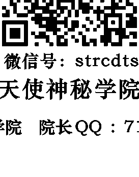

微信號：strcdts
天使神秘學院

天使神秘學院 院長QQ：715104687

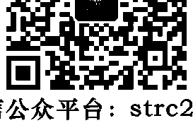

微信公眾平台：strc2011

## 製作說明：

本書由《天使神秘學院》出重金從台灣購入的原版書籍掃描製作完成。為達到最好閱讀效果，特地把原版書全部切開後，再經由專業掃描設備高精度掃描完成，並經過一張張的PS後期處理最終成書，其間花費大量的人力、物力以及時間，只為能給大家提供經濟並優質的神秘學學習資料而努力。

本學院強力譴責某些機構和個人，把本學院花心血製作完成的電子書籍，包裝後直接放在自家淘寶網上低價傾銷的行為，以謀取不勞而獲的經濟利益。如果長此以往最終將無人願意再為大家花心思製作電子書，那以後可能大家再無新書可讀。

為讓大家以後能夠讀到更多的好書，也為了本學院的良性發展。本學院懇請大家儘量做到如下幾點：

- 一、儘量在本學院的網站購買電子書籍。
- 二、請勿用技術手段把電子書內的水印及加密去掉。
- 三、在收到電子書後小範圍傳閱即可，千萬不要公開傳播，更別掛到淘寶網上低價銷售。

同時為答謝廣大支持者，學院電子書將做如下調整：

- 一、學院會把一些早已收回製作成本的電子書折價銷售。
- 二、最新製作的電子書籍會開放列印功能，大家購買後有條件的可自行列印成書。

天使神秘學院
2019年1月

> 每天的生活，都是靈魂的精心創造

Everyone's A Lucid Dreamer : How to Use Lucid Dreaming for Insight, Healing & Personal Growth

Copyright© 2013 by Robert Waggoner

Chinese language translation copyright © 2019 by Seth Publishing Co., Ltd

內在探索 19

# 清醒夢完全手冊

作者——Robert Waggoner & Caroline McCready

譯者——楊孟華

總編輯兼翻譯召集人——李佳穎

責任編輯——管心

校對——謝惠鈴

美術設計——唐壽南

發行人——許添盛

出版發行——賽斯文化事業有限公司

地址——新北市新店區中央七街26號4樓

電話——22196629 傳真——22193778

郵撥——50044421

版權部——陳秋萍

數位出版部——李志峯

行銷業務部——李家瑩

網路行銷部——高心怡

法律顧問——北辰著作權事務所

印刷——鴻柏印刷事業股份有限公司

總經銷——吳氏圖書股份有限公司

地址——新北市中和區中正路788-1號5樓

電話——32340036 傳真——32340037

2019年 5月 1日 初版一刷

售價新台幣 380 元 (缺頁或破損的書，請寄回更換)

有著作權・侵權必究 (Printed in Taiwan)

ISBN 978-986-97130-6-1

賽斯文化網站 http://www.sethtaiwan.com

Robert Waggoner & Caroline McCready
羅勃・魏格納 凱洛琳・邁克瑞迪 著
楊孟華 譯

# 清醒夢完全手冊

從清醒做夢輕鬆獲得洞見、療癒及個人成長

Entirely Clear Dreaming
How to Use Lucid Dreaming for Insight,
Healing & Personal Growth

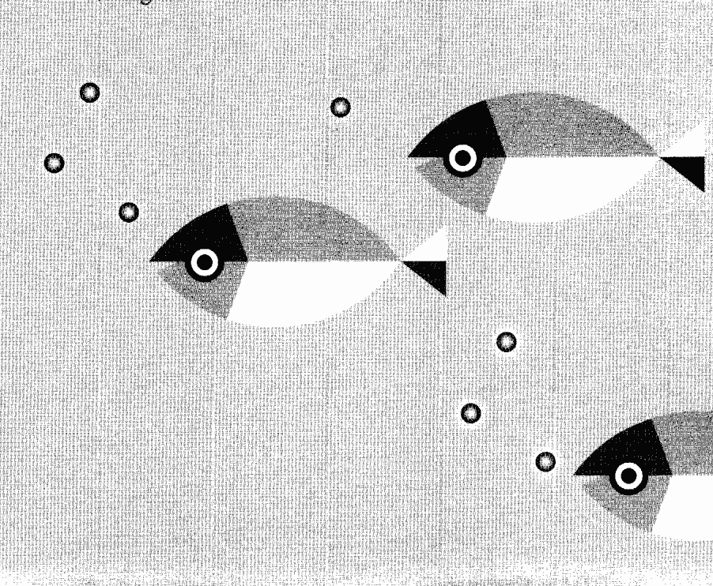

## 關於賽斯文化

我是個腳踏實地的理想主義者。賽斯文化，是為了推廣賽斯心法及身心健康理念而成立的文化事業，希望透過理性與感性層面，召喚出人類心靈的「愛、智慧、內在感官及創造力」，讓每位接觸我們的讀者，具體感受「每天的生活，都是靈魂的精心創造」（You create your own reality）。我們計畫出版符合新時代賽斯精神之書籍、有聲書、影音商品及生活用品，並提攜新進的身心靈作家，致力於賽斯思想及身心健康觀念的推廣，期待與大家攜手共創身心健康新文明。

發行人 許添盛醫師

# 清醒夢完全手冊——從清醒做夢輕鬆獲得洞見、療癒及個人成長

關於賽斯文化

## 〈前言〉踏上清醒覺知的旅途

- 第1章 清醒做夢的科學證據：睡著卻仍有意識的悖論 001
- 第2章 探索清醒做夢的無限潛能 017
- 第3章 我的清醒夢初體驗與賽斯觀點 033
- 第4章 清醒做夢的暖身操 041
- 第5章 基本誘發技巧 057
- 第6章 穩定與延長你的清醒夢 083
- 第7章 夢空間裡的移動——辨識你的心理覆蓋 099
- 第8章 瞭解夢中物件與夢中場景 127
- 第9章 與複雜夢中人物的互動 147
- 第10章 善用意圖的魔法與臣服的力量 165
- 第11章 異常情況的回應 181
- 第12章 實驗與探索內在空間 201
- 第13章 修復：清醒夢中的療癒 217
- 第14章 清醒生活、賽斯及內在互通的一體 229
- 註釋 244
- 愛的推廣辦法

## 〈前言〉踏上清醒覺知的旅途

羅勃・魏格納

一九七五年，我教會自己清醒做夢（或，在夢中覺知到自己在做夢），然後記錄了一千個以上的清醒夢。同時，我也接觸到珍・羅伯茲所撰、總稱為賽斯資料的一些想法。當我一路想修練成更好的清醒做夢者，我也一路看到賽斯資料裡的真知灼見如何地幫助我更深入瞭解夢的國度，並提升了我的清醒夢。眾所皆知，賽斯的基礎洞見就是：你的思維、信念、覺知和預期，會反射在你所有的經驗（醒時與夢中）裡，並合力創造這些經驗。

因為我的另一本書《清醒夢：通往內我之門》探索了清醒做夢的神奇經驗與潛力，許多人開始想要一本能誘發且穩定清醒夢、簡單的「工作手冊」。一旦能在夢中成為清醒覺知，你便踏進了洞見萌發和自我蛻變等不可思議的潛能寶庫。

我力求在這本工作手冊裡提供多項必要工具，讓你不但能清醒地做夢，也第一手地去調查這非凡的狀態。連同這些來自多年親身體驗所提煉出來的導引，你將從我們這些同在清醒夢裡遨遊的同事和朋友中，找到珍貴的深刻見解和技巧。請用心地專注於這本導引手冊（千萬不要衝進衝出），因為當你發現自己已在夢裡且成為清醒覺知時，你將需要能夠回想並有效運用這些訣竅和技巧。

清醒做夢是一種心智動態，經常會把我們的信念、假設、感覺和期待反射回來。當你放開膽量、愈加深入去探索清醒做夢，你將發現這樣的探索，也鼓勵你以更批判的眼光去檢查你的某些信念與假設。事實上，你可以藉由清醒做夢體驗到另一種型態的教育，一種在心靈和已經驗實相之本質內的教育，然後激發足以蛻變你自己及醒時生活的諸多洞見。

在某些夢和清醒夢中，我們似乎可以遇見其他人。這本書的靈感正是來自其中的一次清醒夢聚會：幾年前，我在一次特殊的清醒夢中遇見一位亞洲人，他站在一個其亮無比的光圈之前，告訴我一件簡單的事：「賽斯呼喚你。」我醒來後，心想：這個亞洲人是誰？閱讀當天早上的電子郵件時，我看到一封陌生人的來信，問我是否知道賽斯文化，以及許添盛醫師的工作。點進那個連結後，我看到了前一天晚上出現在我清醒夢中的亞洲人；那是許醫師。

清醒做夢有一段悠遠且美麗的歷史。自從我的另一本書出版，許多人寫信給我，說出他們因而獲得身心療癒、進入未知資訊，甚至體驗威力強大之概念的故事。然而，要開始成為清醒做夢者，你需要一本導引手冊。本書是一本簡潔的指南，將引導你進入一件真的很神奇的事，從而瞭解實相及你的全我本質。我謹在此誠摯地感謝許醫師和賽斯文化即將出版本書的中文版，把改變生命的資訊帶給全世界的華語人士。祝願你們清醒覺知的旅途一路豐盛。

## Chapter 1: 清醒做夢的科學證據：睡著卻仍有意識的悖論

以最簡單的詞語來說，清醒做夢的意思是：在夢境中明白自己正在做夢。美國心理學學會二〇〇七年版的《心理學辭典》裡，有個更為正式的定義：「清醒夢，一種睡眠者在夢中覺知到自己正在做夢且或許有能力影響該夢境之走向的夢。」

事實上，當你在夢中成為清醒覺知時，你甚至會發現自己正大聲宣布：「等等，這是個夢。我正在做夢！」

我第一個自發的清醒夢發生在十一、二歲時：我在公立圖書館的書架之間，然後我看到一頭暴龍沿著走道慢慢走過去！我先是提高警覺，然後我想：「等等，恐龍早就絕種了。」這時，我幡然醒悟：「這必定是一個夢！」我知道我在做夢。

即使這個例子很簡短，你也可以看到大多數清醒夢的有效成分：

1. 觀察到或經驗到不尋常的事（例：暴龍）。
2. 批判地反思或分析此一經驗（例：恐龍已絕種）。
3. 得出「此刻正在做夢」是最有可能之解釋的結論（例：這必定是一個夢）。

基本上，清醒做夢是你反思式覺知（reflective awareness）的勝利顯現；亦即你醒來，且理解你的真實狀況！試想想在一般的夢中，你通常如何反應：你只是接受。不管發生了什麼，你隨波逐流。然後你編造故事，把行為與事件合理化；其中毫無批判式的覺知（critical awareness）與分析。因此，當你看見「暴龍」，你通常只是感到害怕並跑開。在一般的夢中，因為你縮減了你的批判式覺知，便也無法在夢中感覺到自己的存在。

西藏僧侶對做夢有個很棒的譬喻。他們把一般夢的經驗比喻為跛子騎瞎馬。在這個譬喻中，跛子是人無覺無知的龐大心靈，坐在活蹦亂跳、不受控制的瞎馬或夢的能量上。騎士（人的心智）若能克服這項不足，清醒地覺知過來，就能指揮瞎馬或夢的能量，用來幫助個人的蛻變和靈性洞見的產生。

本書大多數的篇幅將聚焦於你可用來提高覺知，以及對你的經驗做出批判式反思的技巧與練習。你可藉由這些練習，增加你在夢境中清醒與覺知的機會。事實上，根據許多人的報告，光是閱讀並想著要在夢中清醒覺知，就足以在當晚的夢中清醒過來。

所以，當你在夢中發現自己正在做夢，然後你有了清醒的覺知。這時，你可以做許多奇妙的事：

1. 有意識地決定要執行什麼行動。
2. 擺脫醒時狀態的限制——你可以像超人般飛翔，像哈利・波特那樣施展魔法，也可以穿過水泥牆壁，或針對醒時的問題與許多其他事務，尋找創意十足的解決方式。
3. 與夢中人物互動。
4. 執行個人與科學的實驗。
5. 探索夢空間，或你潛意識裡的內容。
6. 改善醒時生活裡的技能。

當這些例子暗示了清醒做夢的許多可能性，其為個人、科學和社會帶來的真正潛能才真正驚人，而它們將在第二章做更完整的討論。

### 清醒做夢的證據

清醒做夢的科學證據是一個頗具洞見與創意的神奇故事。一九七〇年代中期，英格蘭赫爾大學一位研究睡眠與夢的研究生齊斯・賀恩（Keith Hearne），認識了宣稱自己經常做清醒夢的年輕人亞倫・沃斯利（Alan Worsley）。賀恩對他的描述感到非常好奇。但身為科學家，他開始思考該如何設計一個能為大家所接受和承認的實驗，並提出清醒做夢確實存在的科學證據？後來，他想出了一個很聰明的解決方式。我們睡覺時，身體的功能是癱瘓的。可是，研究資料顯示，我們做夢的時候通常會有快速動眼（Rapid Eye Movement）。賀恩心想，清醒做夢者能不能利用眼睛打信號，告知外界：正在做夢的他是清醒而且有意識的？如果可能，這將是做夢、意識與心理等幾類科學的重大突破。所以，他帶著亞倫・沃斯利來到睡眠實驗室，將多種波動描寫器（polygraph）貼在沃斯利的眼睛上，記錄他做夢時的快速動眼。然後，賀恩要沃斯利在發覺自己做著清醒夢的時候，左眼動幾下，然後右眼再動幾下。一九七五年四月，事情發生了。沃斯利在睡眠實驗室睡覺，他發現自己在做夢，而且清醒地覺知到。這時，他想起實驗的設計，便依照約定的次數移動他的左眼和右眼，告訴研究者，他已在夢中成為清醒覺知。①實驗室裡的其他儀器證實，他的身體確實正保持睡眠的狀態，雖然他的心智有意識，也以事先約定的信號移動了眼睛。研究員齊斯・賀恩從記錄紙上看見了事先約好的快速動眼證據，後來寫下他的感想：「這就像收到来自另一個世界傳來的信號。在哲學上、科學上，都太震撼了。」②

大約三年之後，並不知道英格蘭這項實驗的美國史丹福大學博士生暨清醒做夢者史蒂芬・賴博格（Stephen LaBerge）也在思考，科學家要如何替清醒做夢提出證據？他瞭解到清醒做夢者可以藉由事先約定的眼動模式做信號（一如齊斯・賀恩得到的結論）。一九七八年，他安排自己在睡眠實驗室入睡，賴博格在夢中發現自己清醒時，便從左到右動了幾次眼睛打出信號，機器記錄了這些證據。他在接下來的二十個晚上，於睡眠實驗室重複了這項以眼動信號證實清醒做夢的確實存在的技術。③

他的研究論文先是被頗有聲望的《科學》雜誌拒絕刊登（一位審稿人堅決不相信人可以在夢中成為清醒狀態），然後又被《自然》雜誌拒絕（他們並未審查他的研究，只憑題目便判斷它「不足以吸引大眾的興趣」），賴博格終於讓這篇研究清醒做夢的科學論文在同業的雜誌刊登出來。④

他後來跟清醒做夢這個迷人的科學新領域建立密切的連結，從事了許多相關的研究。

### 清醒做夢的神經學

清醒做夢者的腦看來是怎樣的？而那又能讓我們對覺知的本質（夢中的以及醒時的），更瞭解多少？

十年來，清醒做夢者在功能性磁振造影（fMRI）機器裡做夢（他們會戴上特殊耳機，消去機器的噪音，以便入睡），供研究者從事許多主題的研究，也在頭皮上貼了有十九個觸點的腦電波儀（EEG），進行另外的實驗。這兩項研究都對清醒做夢時的腦部功能，提出了類似的證據。

用最通俗的詞語來說，研究人員發現：清醒做夢發生時，與做夢有關的腦區顯示出正常的活躍，而通常與醒時意識有關聯的某些腦區（例如前額及腦的前額葉部分）也呈現出活躍的波動。基本上，你的腦部活動證實了清醒做夢者的經驗：你在夢境裡，知道那是一個夢，而且你能清醒地引導並操控你的思考過程。簡單地說，你在夢裡有著清醒的意識。

以十九顆腦電波儀記錄清醒夢之研究小組的結論是：「……清醒做夢的腦波是醒時狀態和快速動眼期的混種，尤其在前額葉的部分⑤，但又具有可另做定義和測量得出的差異。」他們也評論道：「因為夢中的清醒覺知可以自我誘發，它除了是研究腦的意識狀態的大好機會，也展示出主動干預可以如何地改變腦部的意識狀態。」以他們的觀點，清醒做夢不只讓我們瞭解醒時與做夢之間、特殊的腦神經狀態，也描繪了兩者同時並存的情況。

邁克斯・普蘭克精神醫學學會（Max Planck Institute of Psychiatry）研究小組的實驗，結合了腦電波儀和磁振造影，其中一位研究員麥可・柴克（Michael Czisch）對《每日科學》雜誌評論他們的研究結果：

正常夢和清醒夢的腦部基本活動大致相同……只是大腦皮層某些部分的活動，會在清醒夢出現時突然地顯著增加。牽涉到的大腦皮層部位，包括通常負責自我評估功能的右背外側前額葉，負責評估我們自己的思想和感情的額極區。向來被認為與自我認知有關的楔前葉，也特別活躍。⑥

這個研究小組因使用磁振造影的數據，得以聚焦於腦內部表現活躍的特殊區域。它的結果清楚地顯示，清醒做夢激活了大腦皮層與自我評估、自我認知，及檢查思想與感情相關的區域。⑦

這些神經學研究打從根本證實了幾千年來清醒做夢者的論點：

### 清醒做夢有多常見？你多常在夢中變得清醒？

《夢研究國際雜誌》曾在幾個國家研究學生的清醒做夢。當心理系學生被問到是否曾在夢中覺知到自己在做夢（亦即，清醒做夢），其中的一個研究獲得以下的結果：

雖然，科學對可能從這種狀態發展出來的技巧、創意、實際的生理變化，和獲得心理洞見的非凡潛能，幾乎仍未加以調查。不過，既然清醒做夢者的數量持續增加，而且經驗豐富之清醒做夢者也越來越老練，實驗和探索相關理論的深度勢必會更加深入，而結論當然也是。

1. 你可藉由自願的動作在夢中達成清醒的覺知。
2. 當你清醒做夢時，你有能力覺知或後設認知（metacognition，或「元認知」），對自己的思考過程，包括記憶、感知、計算、聯想等思考的思考。
3. 當你清醒做夢時，可以在那獨特的夢狀態中指揮你的行為。
4. 當你清醒做夢時，可以評估你的活動，並從得到的反應學習。

| 國家 | 百分比 |
|------|--------|
| 美國 | 七一% (肯定的答覆) |
| 德國 | 八二% |
| 荷蘭 | 七三% |
| 日本 | 四七% |

關於大學年齡的清醒做夢者，研究發現大約二○％宣稱他們經常做清醒夢（亦即，每月至少一個清醒夢）⑧。若詢問那些固定拜訪清醒做夢論壇、對清醒夢非常有興趣的清醒做夢者，我們很驚訝地發現，大多數人平均一個月一到八次，只有偶爾較不活躍。考慮到我們一個晚上做五個以上的夢，或一個月大約一百五十個夢，清醒夢的比例似乎相對偏低。

研究也顯示，清醒夢在年紀較輕的學生身上更為普遍。有項研究，《兒童的清醒夢：英國圖書館研究》作者：麥可・雪瑞德等（Michael Schredl, et.al），這些研究人員在英國的圖書館發放調查，收到三千五百七十九份來自六到十八歲兒童的回覆。他們對「是否做過至少一次清醒夢」這題，肯定的答覆是四三・五％。⑨

二〇一二年有一份更為深入的研究，《睡眠研究雜誌》針對六百九十四名六到十九歲的德國中小學學生，調查以下這個假設：「清醒做夢主要在童年及青春期發生」是否屬實。這個由娥蘇拉・佛絲（Ursula Voss）所領導的研究發現：「清醒做夢在年輕兒童很常見……」

根據這些年輕人的報告，他們大約51.1%做過清醒夢。

有個使用問卷和一對一訪談的研究小組，要求兒童舉例說明他們的清醒夢。得到以下的

#### 例子：

口述者一（七歲男孩）：我夢見自己和朋友正在踢足球，當我看著我的腿，我發現它們變形了。然後我理解到，這一定是在做夢，因為它們怎麼看都不像是我的腿。這時我抬起頭，看見我在一個巨大的足球館內，而且我能夠和我最愛的足球隊（成人足球隊）一起踢球。我可以跑得非常快，比我醒時快了許多。

口述者三（十歲女孩）：有人正在追我。我和我的女性朋友在一起。追我的人站到我面前，想要殺我。這時我理解到它只是個夢。所以我使那個人消失，突然間周遭也不再黑暗。

研究人員發現這些學生之中有許多人展現出影響夢境走向的能力，即使「這些學生並未受過訓練，而且清醒夢乃隨機發生」。他們也常描述，當他們在夢中清醒時，常用來飛翔，或處理具有威脅性的處境。

如果你有孩子、孫子或姪兒姪女，問他們會不會在夢境裡發覺自己在做夢。你可能會對他們有許多人做過清醒夢而感到驚訝！

珍妮·蓋肯巴赫博士（Jayne Gackenbach, Ph.D.）的研究想調查清醒做夢者的個性與性別差異時，最初看來是女性比男性多很多。更深入檢視數據之後，則顯示那是因為女性報告的夢比較多，所以清醒夢也較多。數量的差異按比例調整之後，性別的差異也大幅消失。不過，強烈的夢回憶絕大多數都與清醒夢有比較多的連結。

蓋肯巴赫博士的另一項研究顯示，擁有良好立體空間能力和場獨立性（field independence）較高的人，在清醒做夢時比較有利。美國心理學會發行的心理學詞典對「場獨立性」的定義是：「個人慣於仰仗內部參照物（身體感知線索）多於外部參照物（環境線索）的一種認知型態。」在清醒夢中，我們常面對異於尋常的處境，和不斷變化的空間，所以慣於依賴自身之內部方向感的能力，可以在夢中的操控過程中，更好地支持我們。

我有時會替《清醒做夢經驗》（Lucid Dreaming Experience）這本季刊訪問富於清醒做夢天分的人，詢問他們第一次清醒夢的經驗。我發現有少數人約在五歲左右開始（多數清醒做夢者描述，他們的第一次清醒夢出現在青少年期或之前）。他們之所以記得這麼早的日期，通常是因為他們利用清醒做夢來處理重複出現的兒時惡夢。

例如，一位挪威的清醒做夢者琳恩·薩維森（Line Salvesen）描述，她第一次在挪威一本雜誌閱讀到清醒夢的報導時非常驚訝：因為她還以為每個人都這樣做夢！以她的情況，她憶起很小的時候就用清醒夢來對付重複發生的惡夢。之後，她發現幾乎每天晚上的每個夢都很容易獲致清醒覺知。如今，她運用她的技巧在睡眠實驗室協助研究人員調查清醒做夢。

年齡更加成熟才學會清醒做夢的，也大有人在。我為另一期《清醒做夢經驗》訪問到泰德·梅森傑（Tad Messenger）這位男士，他在五十二歲才經驗到「第一次」清醒夢。依他描述，之後的清醒夢便相對增加。他的技巧是在一段長期的靈修之後出現，他宣稱「這好像開了一扇門」，後來只要他有意愿便常能清醒做夢。

德國研究人員梅蘭妮·桑德力克（Melanie Schädlich）和丹尼爾·厄來齊（Daniel Erlacher）調查清醒做夢者如何實際運用他們的技巧。她的研究結果發現81.4%的清醒做夢者描述他們在夢中四處飛翔、跳舞，玩各種遊戲，看來廣義的「玩樂」最得這些清醒做夢者的青睞。第二普遍的運用是「改變惡夢」，佔了63.8%。清醒做夢者，尤其女性，最常理解到她們能在清醒做夢時，以某種方式應用她們的覺知，並改變惡夢的情節。前五名的應用方式，接下來的順序為29.9%的「解決問題」，27.6%的「創意發想」，以22.3%的「練習技巧」。清醒做夢者發現，在清醒夢的頻譜中，從瘋狂的玩樂到嚴肅

#### 練習

現在你已瞭解清醒做夢的定義，那麼你可曾做過清醒夢？如果有，請花點時間寫下你第一個清醒夢，或你記得的第一個清醒夢。

的工作都能發生。不幸的是，社會大多忽視或貶低做夢，甚至對清醒做夢的存在，及其科學證據視而不見。即使頗高比例的年輕人描述他們曾經做過清醒夢，卻很少人瞭解此一獨特狀態的神奇潛能。倘若個人、科學界和社會能對清醒做夢的無限潛能有更多概念性的瞭解，清醒做夢者的數目將顯著增加。

接著，寫下一個平常的夢。兩相比較。當你清醒做夢時，有怎樣的不同？

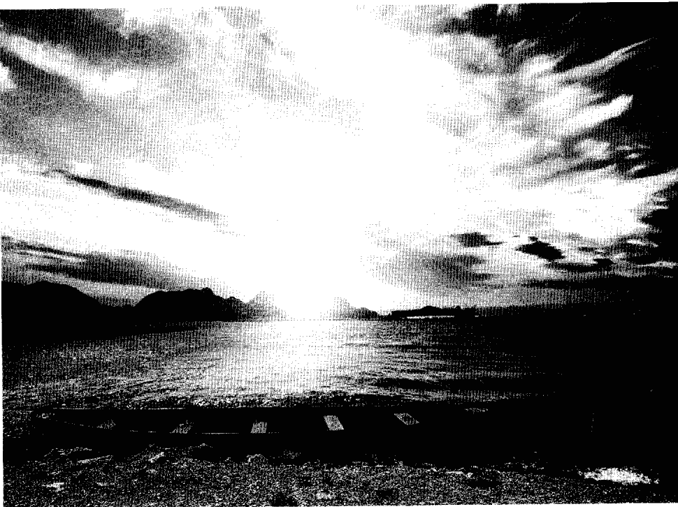

## Chapter 2

### 探索清醒做夢的無限潛能

聽到「為什麼有人想做清醒夢？」這樣的問題，你會立刻懷疑詢問者從沒做過清醒夢！
對許多人來說，清醒做夢早就是他們所知最非比尋常的冒險，也是最自由自在的感覺。
事實上，人們在夢中清醒時，他們總是自發地體認到清醒做夢者所謂的「清醒狂喜」。他們會突然感受到這強大的能量和主控的感覺，外加極大的覺知感（或稱「後設覺知」，覺知到自己的覺知）。那感覺很神奇。

然而，清醒做夢還有許多實際並強大的目標。下列表清醒做夢值得深入探討的六個理由，以及表達該重點的六個清醒夢：

### 一、體驗樂趣／歡愉／自由——做你想像得出來的任何事

夢的開始是我和許多人在某個家庭派對裡。不久，我發現自己並不認識這些人，而這個發現促使我在夢中清醒。既然清醒了，我開始飛過各個房間，並且因為用腦力四處移動家具而樂得哈哈大笑。

既然我的飛翔控制力似乎很高超，我決定往星星飛過去。我對著夜空快速地飛上去，經過許多星球！最後我停在一個無重量空間裡。它無比安靜。我四下張望，看見一顆星球，周遭有一個圈圈環繞著它。這時，我注意到圍繞這顆星球轉動的四個月亮中的兩個，也有橘色

### 二、通往內在的創造力——音樂、藝術、文學或科學

不管你在生活中聚焦於哪個領域，都可以運用清醒做夢的魔力，以清醒的覺知替你特別有興趣的事物汲取內在的創意。

- 請想想，光是普通夢就有以下的創造力：1

保羅·麥卡尼——在一個夢中，收到暢銷金曲《昨日》的曲調。

理查·華格納——在一個夢中，收到歌劇《崔斯坦與依索德》。

奧古斯特·凱庫勒——打了個瞌睡，夢見苯的分子結構，開啟了有機化學界的新境界。

在清醒夢中，自由和歡愉的感覺似乎都頗為神奇與壯觀。你或許會認為「啊，這是頭腦在玩把戲，是好玩的幻想」，請繼續往下閱讀，看看人們怎樣把清醒夢應用於實際的目標，以及科學如何運用清醒夢去實驗性地探索心靈的本質。

我在這個清醒夢中醒來，感覺無比神奇！

奧圖·勒偉——帶著一個可以解釋神經脈衝化學反應的實驗設計醒來，後來獲得諾貝爾獎。迪米崔·門捷列夫——在一個夢中，看見元素週期表。伊利亚斯·哈維——想發明新的縫紉機且努力了好幾個月，後來夢見並明瞭如何可讓縫針正確工作。威廉·華特——在一七八二年的一連串夢中，看見液態的鉛掉進水中，形成完美的球體。他以此開始實驗，發明了製造子彈的新方法。即使是谷歌的聯合創辦人賴瑞·佩吉，也曾在二○○三年對密西根大學畢業生演講時，提到做夢的重要性。二十三歲時，他是密西根大學的文科博士生，他做了個夢，這是他的描述：『我突然醒來，發現自己在想：如果我們可以下載整個網頁，只留連結……我抓起筆開始狂寫！②他不可能想像到，這個夜間創意延伸出多麼龐大的一家搜尋引擎公司。在這些例子裡，藝術家、科學家和發明家，應用來自夢裡的創意，創造出美好的音樂、解決複雜的科學問題，並創建了幫助世界社群且自己也獲利良多的新創事業。現在，我們來想像一下：如果你能有著清楚的覺知、在一個清醒夢裡，刻意地去尋找創意、答案和新的發明，那該能有多大的成就？

居住在加拿大蒙特婁的藝術家達斯汀·盧卡斯（Dustin Lucas），如此描述他運用清醒夢波取自己的內部創造力。當他在夢中清醒，有時他會打開畫廊的門或一本書，要求看一幅他要畫的畫。他也憶起，他曾發現自己在沙漠裡，覺得奇怪之餘，便確定這是夢境。既然清醒了，他注意到自己的手上拿著素描本。突然間，他看見眼前的沙上出現一幅非比尋常的畫面，他便開始素描。他後來寫道：

我正在畫素描，有個人從身後過來，用全宇宙最完美、最漂亮的句子對我說話；它解釋了萬物的存有，以及一切都會以做夢的方式回歸自身。聽到這些字句，我非常興奮，開始讚嘆描述者的天才，他轉身面對著我，說：「別再吹捧我，只需充分理解我。」然後，我醒來：完美的字句消失，但沙上的圖畫則蝕刻在我的記憶中。❸

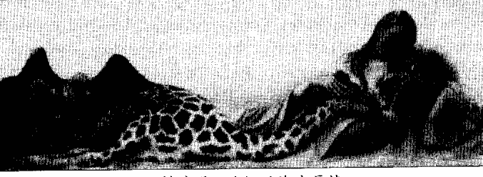

當我在一場「國際夢研究協會」（International Association for the Study of Dreams，簡稱IASD）的會議現場看到他的畫，以及相關的清醒夢時，我問他：「畫這幅畫時有怎樣的感覺？」他告訴我，那就好像他早已畫過。既然他在清醒做夢時已看過，完成的過程便比一般作畫時快速且容易許多。他把這幅畫定名為「複製時間之沙裡的海市蜃樓」。

我曾有一年半的時間，每隔幾個月在愛荷華公共廣播電台主持一個節目。有一次題目談的是「夢、清醒夢與創意」。歡迎經歷過在夢中解決問題，或夢境為他們帶來創意的聽眾，打電話進來。

兩位清醒做夢者叩應進來分享他們的故事。第一位是職業的搖滾音樂家兼作詞者，他說他用清醒夢尋找並發現新的歌詞。另一位清醒做夢者說，他寫小說，是愛荷華作家工作坊畢業的高材生。他說，只要遇到寫作的瓶頸，他就設法做個清醒夢。一旦在夢中清醒，他會把書中的角色找來，問他們：「這本小說有什麼問題嗎？」他說，他們有時會給他神奇又透徹的意見，協助情節往下走，直到該書完成。

另一位更實際的例子，來自史蒂芬·賴博格與霍華德·瑞格德合著的《夢境完全使用手冊》（Exploring the World of Lucid Dreaming）。書中的一個例子是位程式軟體設計師，他用清醒做夢解決困難的軟體編碼。在這個案例裡，這位設計師一旦在夢中清醒，便呼喚愛因斯坦坦來跟他一起推敲編碼的問題。一旦弄出了綱要，他便要夢中的愛因斯坦消失，自己花點時間記住這份綱要。醒來之後，他會以最快的速度寫下他還記得的編碼。這位清醒做夢者如此描述：「我把這個記錄帶去辦公室，它的正確度通常高達99%。」 倘若你在今晚的夢中清醒過來，你會想要體驗什麼樣的新創議題，或者想要解決或調查什麼事？夢中潛意識腦的深度，早已為千禧年的藝術家和發明家帶來無數的驚喜，也確實實地改變了這個世界。清醒做夢有什麼好處？你可以意識清楚地從你的內在繆思汲取靈感，並從它無邊無際的豐盛寶庫中要求協助。

### 三、情緒及心理療癒——陰影、創傷後壓力症候群、恐懼、焦慮等

約有十二年的時間，我與清醒做夢者友人露西·吉利斯（Lucy Gillis）合力編輯現在名為《清醒夢交流》（Lucid Dreaming Experience）的雜誌（我們的粉絲戲稱它為LDE）。

每期我們都設法訪問一位經驗豐富的清醒做夢者，看他們怎樣將清醒做夢應用在生活裡。

有一次訪問讓我永生難忘。一位名為賀普（Hope）的清醒做夢者告訴我，她原是航空公司的機械師，正在修理一架波音七六七時，飛機的繁鏈鬆脫，滾過並壓碎了她的腿。後來醫生截去一條腿，她則在醫院躺了半年才復元。

夜復一夜，她開始重複做著被追趕的惡夢。這些惡夢變得「難以忍受」，她甚至害怕入睡。有一天，她發現一本清醒做夢的書並想起小時候做過的清醒夢，以及有意識飛翔的喜悅。她看書的同時理解到，可以利用清醒做夢來結束她的惡夢。

她看書的同時理解到，可以利用清醒做夢來結束她的惡夢。

這是他所描述、結束這些可怕惡夢的關鍵性清醒夢：

這個夢是最重要的：我像往常那樣，恐懼地拼命狂奔。我知道有東西在後面追我，但我不確定那是誰，或什麼東西。就在我不斷奔跑的時候，或許我突然想起：「嘿，我可真能跑啊，但我不是只有一條腿嗎？」就在這一刻，我知道我在夢中，這讓我有點興奮。我明白有東西追我，但我突然不再害怕。我不跑了，轉身注視朝著我靠近的魔鬼。它的樣子既醜陋又可怕，因為看到我不再奔跑也慢了下來。當它靠近我，我對它揮了揮手，露出大大的笑臉，然後跳起來、飛走。那感覺實在太棒了，我一定終生難忘。魔鬼甚至在我揮手和微笑的時候，露出了困惑的表情。當我飛走，我乾脆好玩地到處飛飛逛逛。後來我只需閃開追逐我的任何東西、然後飛走，這樣幾次之後，它們似乎知道繼續追我也沒用了。

開追逐我的任何東西、然後飛走，這樣幾次之後，它們似乎知道繼續追我也沒用了。

心理學家稱這種反覆出現的惡夢，是「創傷後症候群」常有的症狀。如今，已有治療師教導他們的案主使用清醒做夢去克服反覆出現的惡夢。⑥⑦⑧一如賀普的實例，治療師經常發現案主只需在一場惡夢中清醒過來，便常能阻止或大幅降低惡夢的再次發生。

自從我的第一本書《清醒夢：通往自我之門》出版之後，更多的清醒做夢者因為明白了清醒做夢可能可以協助他們處理諸如恐懼、焦慮和情緒等其他問題，而寫信告訴他們的經歷。

例如有位清醒做夢者不敢搭飛機，可是她想來參加「國際夢研究協會」的一場會議。她寫信問我，清醒做夢能不能協助她克服這項恐懼。我回信鼓勵她在下次的清醒夢裡找一架清醒夢飛機上去搭乘，看看感覺如何。這位清醒做夢者嘗試了四、五回，發現她的恐懼感真的降低了。終於在醒時生活裡，她買了機票來參加會議，還刻意選了靠窗的機位，想要「比較清醒夢中的經驗和醒時真正搭飛機時，看到的風景有沒有不同」。她一路平安，如今再也不害怕搭乘飛機。

其他人也寫信來說，他們用清醒做夢處理內在的一些議題，因而更有能量也更喜悦地在生活裡往前邁進。甚至有治療師告訴我，他們如何使用這本書裡的想法，幫助案主獲得重大突破。在夢的層次裡覺知，我們就擁有一個既有活力又充滿創新思維的環境，能夠從中獲取洞見、演練行為，與設法解決難題。

### 四、促進身體健康

在賴博格的研究中，他從清醒做夢者的行動以及它們在身體上的效果，注意到清醒做夢的外顯事件如眼動、流汗、肌肉緊張等，通常是體內也有某些活動正在進行。❾根據這個從清醒夢境影響身體的基本概念，加上使用深層催眠及觀想來做身體療癒的研究，清醒做夢者已經把這個想法更加發揚光大，用以探索在清醒夢中做身體療癒的可能性。從艾德·凱洛格（Ed Kellogg）博士提供的個案，可以看到清醒夢療癒的簡單實例。❿

安妮的兩隻腳底長了很痛的雞眼，走路的每一步都會痛，怎麼醫治似乎都無效。有一天，她清醒做夢團隊的老師說出他以清醒夢成功治療自己的經驗，建議她在下個清醒夢裡試試。安妮回憶她的療癒清醒夢：

光線似乎有點奇怪。我想著我的腳，因為我走路的時候，腳會痛。所以我在一個應該是木頭立方體的物件坐下。然後我想到我可以（在清醒夢中）治療我的腳。此時，周遭的空間全掉進我坐著的黑色空洞裡。我記得我用的是我（睡前）觀照出來的一個白色光球。

果然，白光出現在我的手邊。我把雙手放在腳上，首先是右腳。白光進入腳內，從裡面發出金色的光。我保持在原位數秒之後，移到左腳。過程也一樣。然後，我把兩隻腳都放下來，並理解到我已經做了我醞釀要做的事。事情真是神奇，也有點嚇人。這感覺太強烈了，我隨即醒來。

在那晚之前，安妮因為腳上的六個雞眼，每走必痛。清醒做夢後的早晨，她看著她的腳，所有的雞眼都在晚間變成了黑色。它們在十天之內全數脫落，且沒再復發。她現在已經痊癒，走路都不痛了。

以安妮為例，你看到的是一個治療型清醒夢的戲劇化成功案例，身體的病痛在清醒夢之後獲得顯著改善。當你以理智去思考，你會發現醫學機構真的可以對清醒做夢進行一些研究，當成治療的另一種選擇。何妨想像一下，研究單位找來一群罹患例如皮膚病或疣這類頑疾的人，教導他們清醒做夢；然後是另一群有相同問題的「控制組」，並不教導清醒做夢的療癒技巧。一年之後，哪一群人獲得最多改善？類似的簡單研究，可以開始證實清醒夢狀態確實蘊含很大的療癒潛能，以及清醒做夢者的確可以習得有效的方式，用以療癒自己。

本身也是清醒做夢者的艾德·凱洛格博士，對於以清醒夢進行身體療癒有極為深入的探討，並歸納出清醒夢對療癒的協助可分為三個面向：一、治療，二、診斷，以及三、處方。

在診斷型清醒夢中，清醒做夢者得知已有的疾病或即將出現的疾病，其確切的本質；因為個人或醫療機構有時會對一些症狀的真正來源並不確定。最後，在處方型的清醒夢中，清醒做夢者得知能促進療癒的特殊事項；它也許是某種特殊的藥物、食譜、運動或其他具有療效的協助，它們會具體或象徵性地出現在清醒夢中。從歷史上來說，清醒做夢者將身體的療癒列入考慮其實已經很多年。一九八七年，清醒夢研究者史蒂芬·賴博格偕同珍納·蓋肯巴赫替《無所不知》（OMNI）雜誌設計了一項針對清醒做夢者的調查，其中曾詢問是否利用清醒做夢來做身體療癒。他們收到許多顯然有效的、在清醒夢中獲得療癒的自我報告。12 蓋肯巴赫在她那篇〈清醒做夢在身體療癒的潛能〉專文中，寫道：「聲稱獲得療癒的病痛，包括反覆頭痛、經期痙攣、蕁麻疹、腳踝扭到、肌肉拉傷、韌帶撕裂和皮膚癌。請記得，《無所不知》雜誌這些讀者所描述的，都不能稱為奇蹟，不過他們或許足以顯示：個人在這種仍被稱為夢的加強版心智想像中，不只可以憑直覺知道自己的健康狀態，甚至可能加以影響。最起碼，我們可以在這些案例裡找到某些共通性，暗示了明顯的夢中療癒模式確曾出現。」13 賴博格於顯示清醒做夢行動在身體過程上的精神物理學關係的努力，以及凱洛格對無數清醒夢身體療癒個案的探索，都在告訴我們這個領域的潛能。當許多個人持續報告新的成功案例，醫藥界卻仍忽視賴博格與蓋肯巴赫三十年前即已碰觸的這個讓人興奮的領域。

### 五、心理洞見——個人、社會與科學

在《夜光：清醒夢者協會通訊》中，一位清醒夢者A.T描述了一個跟「相信與不相信之重要性」有關、改變其生命的清醒夢頓悟。在她的夢中，她用二十五分錢租了一對翅膀。她使用它們輕易地在夢裡到處飛翔，直到她想「這也太可笑了，一對廉價翅膀居然可以支撐我」，才剛這樣想，她便開始往地面墜落！
相不相信翅膀力量的爭戰，終於使她清醒過來，並領悟到：「這是一個夢，是我相信自己能飛，我才能飛——而不是任何人工裝置，或其他外力的支持。」在清醒夢裡學到這個教訓後，她明白了清醒夢告訴她的：「信念」才是重點。
在醒時生活的下一個星期，A.T去面試一個工作。面試途中，她感覺快沒希望了，然後突然想起這個夢，以及自我相信的重要。有此領悟之後，A.T說：「我開始用積極自信的口氣敘述我的善於應變以及對工作的盡心盡力。」你猜怎樣？她被錄用了。

因而改變且改善了醒時生活情況的驚心動魄故事。清醒做夢能讓我們知道，如何跟潛意識合作以改善生活處境的確切方式。清醒夢經常能讓我們看到一些自我設限的信念和疑慮，必須先將之解決，個人的進展才可能往前邁進。

德國心理學家保羅·索雷（Paul Tholey）於一九五九年仍為大學生時，自行學會了清醒做夢，之後便針對清醒做夢有非常深入的探索。後來，他首創利用清醒做夢為運動練習的平台，藉此改善個人的技術水平。⑮他教導例如滑雪與雪板運動員清醒做夢，然後鼓勵他們在清醒夢的狀態裡練習。事實上，他建議他們把技巧發揮到極限，獲得新的感官運動技巧；既然知道這是在一個清醒夢裡，所以他們不可能受傷。回到現實世界又有怎樣的結果呢？大多數人的運動能力、信心和競爭力都有長足的進步。

兩位研究人員丹尼爾·厄來齊和麥可·雪瑞德，複製了索雷在運動訓練上的發現，讓清醒做夢者執行一個簡單的遊戲：把銅板丟進兩公尺外的杯子裡；先是在清醒夢裡，然後在醒時。可以在清醒夢裡完成的人，醒時的表現也隨之改善。報告寫道：「這項研究的結果顯示，在清醒夢中的彩排，可以加強之後於醒時世界的表現。」⑯

### 六、靈性成長／智慧

在許多智慧傳統裡，清醒做夢的修行可導向靈性的洞見與成長。例如，十一世紀的佛教僧侶那若巴（Naropa）認為「夢瑜伽」（清醒夢為其主要技巧）是開悟的六大法門之一。根據藏傳佛教傳統，清醒做夢可從心智真正的本質教育我們，將更大的覺知帶進我們的經驗，使我們得以看穿心靈現象裡的慣性反應和我們的角色。憑藉著深入的練習，清醒做夢可以帶領個人經驗到「不二」，一種主觀—客觀不再存在的特殊狀態。
藏傳苯教喇嘛丹津·旺賈仁波切（Tenzin Wangyal Rinpoche）解釋道：「能圓滿執行夢瑜伽者，乃已帶著獲得自由的正確觀點及不二心，準備進入死後的中陰身狀態。」就本質上來說，清醒做夢擔起支持的角色，澄清頭腦、打破反射性心智連結、協助修行者超越輪迴。
你也可以在佛教之外的智慧傳統裡，遇見討論清醒做夢之潛能的作品，著名的有蘇菲、道教、印度教以及許多原住民的薩滿傳統。在每一種系統中，清醒做夢都被認真且嚴肅地當成獲致靈性洞見、開悟與個人成長的強大法門。
當然，個人並不需要皈依於任何傳統，也可以在清醒做夢的狀態進行靈性的修行。以下是我個人修行、冥想（簡言之，放空心思）進入一次清醒夢的例子：

我沿著山徑前行，因為它很奇怪，所以我領悟到自己在做夢。我思考要做什麼時，想起一位朋友曾經問我，是否試過在清醒夢中進行冥想？想到這件事，我在山徑停住，以單盤的方式坐下。張著眼睛，開始冥想。
我的頭腦逐漸寧靜下來。突然間，眼前的夢景開始撕裂，許多白光從撕開的洞中射過來！越來越多的夢景消失，我在光中停留片刻。然後我決定：「或許我該閉上雙眼。」現在我閉上眼睛，再度冥想，短短幾秒內我經歷到一場非常清明的覺知，自我全不存在的擴大感，以及與一體合而為一的超自然感覺。
當有人問你：「何必麻煩做什麼清醒夢呀？」你可以描述清醒做夢所可獲致的深刻、巨大、不可思議的可能性：

- 一、好玩
- 二、汲取創意
- 三、尋求情緒療癒
- 四、提升身體健康
- 五、獲得心靈洞見
- 六、經驗靈性成長

## Chapter 3

### 我的清醒夢初體驗與賽斯觀點

記得那是一九八一上半年，我坐在我的大學圖書館閱讀史蒂芬．賴博格刊登於《今日心理學》雜誌、公布清醒做夢之科學證據的那篇文章。我的感覺是無比神奇、如釋重負和快樂。終於啊！終於有研究人員設計出能證實清醒做夢確實存在的方法。六年之前，我運用了某些睡前技巧（將在第五章討論）成功誘發了清醒夢，跌跌撞撞闖進了這個領域。看到賴博格的文章時，我已經歷過一百多次清醒夢，但之前若試圖跟任何人討論這神奇的現象，聽到的回答大多只是「啊，你夢見了你在做夢」，或直接斥為不可能。如今有了賴博格的研究，這些清醒做夢的經驗顯得難以搖撼地有效，也在科學上受到承認。在早期那些年代裡，清醒做夢者必須自給自足。我沒有其他清醒做夢者可與之討論、尋求建議，或分享彼此的發現。每項在清醒夢境得到的發現或心得，僅只來自我個人對某次具啟發性之清醒夢的仔細分析，或充滿教育意義的失敗。一九八一年之前幾位作者所建立的少許資料，雖僅針對怎麼做和做什麼提供最粗淺的概念；但清醒做夢的美好與神奇，卻已如深具吸引力的熱帶島嶼，使我渴望盡可能地一再重返。從一開始，清醒夢的「真實」感，便已讓我目瞪口呆。一旦在夢中清醒，你可以像檢查一只晚餐盤般檢查物件的細節，並在將它翻轉過來且看見盤底的印章時莞爾一笑。或在一個清醒夢中，你可以停下來感受夢中一件T恤柔軟的棉質觸感，並對它與醒時摸起來的感覺完全一樣而備感神奇。將清醒夢中的實相與醒時實相比較與對照，總是帶來許多驚喜。

雖然，清醒做夢似乎是模仿醒時狀態的某種內在實相，但它所遵循的卻是截然不同的一套規則和道理。我曾在許多清醒夢中快樂地拋開地心引力，四處飛翔而玩得不亦樂乎，但總也謹慎地避免弄得過度興奮，或注視某項物件過久（這是大多數清醒做夢者經由實驗與錯誤學到的兩項規則）。不過，在這種遊戲式地運用清醒夢的過程裡，我仍學會如何更加專注與集中心智，建設性地使用期待和信念的力量，並善加約束個人的意圖。回頭去看，一切之所以以如此美好，或許就是因為我的遊戲心態；玩玩心智、玩玩清醒夢，直到我開始悟出兩者之間的關聯。

一九八一年之後，事情開始改變。討論清醒做夢的文章定期出現在全國性刊物上。《夢網路快報》（Dream Network Bulletin）這本小雜誌冒了出來，提供清醒做夢者一個分享經驗及技巧的園地。我也利用電子郵件與其他的清醒做夢者聯繫。慢慢地，我開始理解：清醒做夢者的經驗其實有共通的面貌和原則。即使每個清醒做夢者各自認為每次經驗的內容和象徵似乎都很獨特，但某種自成架構的規則和道理，持續存在於這些清醒夢的報告裡。這個隱藏的架構告訴我們：做夢以及潛意識確實有其遵循的規則與結構。宣稱夢只是「諸多神經元混亂及任意迸發之現象」的那些科學家，對於夢充滿原則性的本質，幾乎一無所知；而全世界的清醒做夢者似乎早已自然地發現，而且都有了共識。隨著我逐漸且更加清晰地掌握清醒做夢的原則，在夢中保持清醒覺知便也更為容易。在此之前，我跟所有清醒做夢者一樣，都必須拼命保持清醒，同時努力地避免犯錯，以免被丟出或失去清醒覺知而回到普通夢境。一旦清醒夢能夠拉長，探索得更深或進行一些小實驗，也就更容易了。我最大的轉捩點出現在學會清醒做夢的第十年。那時，我加入了一個高天分清醒做夢者團體，在大約三年的期間，這個團體試著每個月執行一項清醒夢的實驗。我們每個月在清醒夢中嘗試這個實驗，再把結果寄給主事者，此人則加以彙整再送回給每位成員。一九八五年三月的這個實驗很簡單：找出夢中角色所代表的意義。我進入某棟建築物後清醒了，跟隨一位女士進入場景似辦公室的地方。站在那裡時，我想起實驗目標，看向周遭的四個夢中人物。我決定直接詢問身著三件式西裝的老人：「你代表什麼？」這時，一件非常奇怪的事情發生了。有個聲音從他的上方轟然而出：「後天養成特質！」這個來自上方的聲音，以及它並不完整的答案讓我有些驚訝，我又問：「什麼的後天養成特質？」它似乎咀嚼了片刻，然後聲音又轟然而出：「快樂給予者的後天養成特質！」我認為找出夢中人物之代表意義的目標已經達成，所以我要自己醒來。

那天上午，我憶起前一天有件令我困擾的事，一位女士在某個慈善場合對我說：人們之所以捐錢給她的機構，乃是因為他們想要自己的名字出現在該機構的年度捐款名單上。因為她實在接受得太不快樂，我記得我從她身邊走開時，有點嘲弄地想：「老天一定更愛只因快樂就給予的人。」這位夢中人物似乎是我日有所思的結果。

不過，這個清醒夢裡也發生了重大的事。我第一次猜想：清醒夢的背後是否存著一個很有智慧的覺知？沿著這條線往上走，我開始略過清醒夢中的人物，直接對這個隱藏的「覺知」發問。難以置信的是，它也都有回覆。我因而了解：清醒做夢成為一條通往不可思議之美、洞見與神奇的路。

### 珍・羅伯茲和賽斯的觀點

大約在我第一次做清醒夢的一九七五年，我剛巧開始閱讀珍・羅伯茲寫的一本名為《靈界的訊息》的書。我憶起每次看到名為賽斯的「能量人格元素」發聲，我都實質地感受到他說法裡的力量和能量。那些文字彷彿有生命，而賽斯觀點的深度、洞見和實用，也總是令我嘆為觀止。
就實用的層面來說，賽斯認為「做夢」是非常重要的活動，足以替我們的醒時生活帶來積極又正面的衝擊。
……在夢境裡，每個人都在解決他自己的問題或挑戰。做夢時，一個人努力解決引起他生病的問題，「能」治癒他自己的病。做夢時，飢餓的人「能」發現找到食物的方法，或獲得買食物的方法。做夢是個實際的活動。（《未知的實相》卷二，七二一節，練習單元十五）
賽斯常對做夢的重要和意義，以及它對醒時生活的衝擊多所評論。他說，我們（個人及群體）在夢中思考要帶到醒時生活的可能事件，然後決定我們想要經歷哪些。我們在某些夢裡將衝突和困擾的議題解決掉，它們因而沒有轉變成健康的問題。我們也會在夢裡收到新的領悟、啟發，甚至新的發明，並在睡醒後回憶起來，把它們當成天外飛來的靈感。賽斯如此堅信：「許多理念、重大的進步和實用的發明，老早在夢的幽深世界裡等待，直到有人願意在他的實相架構裡承認它們為可能。」

賽斯同時也宣稱，經由研究心智及其過程，例如怎樣創造夢中的影像，我們得以了解，我們怎樣在物質宇宙中，下意識地協助了實相的創造。做夢的過程自然地顯現合力創造你所經歷之實相（醒時、做夢或清醒夢皆然）的思維、信念、感覺和期待。在清醒夢中，你可以看到這個過程的發生。除此之外，做夢也允許不同面向或不同層面的自己相互溝通，個人因而能接收到来自他／她的更高覺知所給予的有用指引或洞見（後面篇章將更深入闡述這個觀點）。

賽斯強烈支持清醒做夢的想法（第一次出現在一九六六年五月十六日，第二五九節），認為可藉由它來瞭解實相真正的本質，並為死後的心理空間預作準備。「當你學會把醒時覺知帶進夢境，我們可以說，你正到達青少年期。當你跟隨我們的類推，抵達所謂的成人期，那時你將會有如你在操縱客觀實相一般成功地操縱夢實相。」（《早期課6》）因為在夢實相裡，相對地比較自由，清醒做夢者可以探索時間、空間與其他次元，為死後經歷與其他更多的情況預作準備。

根據賽斯的說法，清醒做夢的好處甚多：「你獲得了一個真正的彈性，及對自己存有的一個擴大的覺察，並且打開了在你清醒的和做夢的實相之間溝通的管道。這是指比以前要更能好好地利用無意識的知識……」（《個人實相的本質》六七○節）賽斯在這些敘述裡建議：清醒做夢協助每個人檢視其外在與內在的自己，從而帶來智慧、個人的能量和更大的整合。這樣的結果可形成一個更為擴大的覺察，所謂「無邊際的心靈」（Spacious Mind）。當一個人深入探索做夢實相並在多年之後成為能在夢中嫻熟工作的高手時，賽斯稱呼這人為「夢——藝術的科學家」（《未知的實相》卷一，七〇〇節）。夢——藝術的科學家學習夢如何開始和結束，常見之夢的象徵符號的基本意義，主宰不同層次和不同種類之實相的法則，以及最重要的：如何在夢的狀態中清醒過來，成為有意識的做夢者。本書從很多面向，將成為清醒做夢高手——或以賽斯的說法，成為一位夢——藝術的科學家——的方法，介紹給讀者。在夢狀態中清醒，你將擁有許多機會去探索各種不同的觀點和可能性。你不需要相信我的說法，你可以在清醒夢裡親自實驗，自行驗證我的各種講法。其實，我希望科學界也能認知到，他們可利用清醒做夢來做諸多情緒與身體的療癒、搜尋空間與時間之外的資訊，並探索人格的意識等等的更大本質，並針對這些面向去做研究。我力求從我最初十年的洞見裡提取精華，呈現在這本書裡。你如果能深入掌握這些想法，便能快速品嚐到內在經驗的美好、進入它的浩瀚，並看到做夢狀態如何帶你進入你無邊際的自己。

### 清醒做夢的暖身操

強而有力的夢回憶與清醒做夢有正相關性。當你輕易即可憶起夢境，便表示你對做夢的覺知和記憶也增加了。那麼，就讓我們從大範圍的角度簡短檢視，為了促使你能清醒做夢所該做的準備。

事實上，每個人每天晚上大約做五或五個以上的夢。我們每天大約用兩小時或每天百分之九的時間做夢。這表示在你這一生裡，每十一年就有整整一年處於做夢的狀態。然而，幾乎每次我主持工作坊時，總有人舉起手告訴我：「可是我都記不起來，怎麼辦？」

在科羅拉多一場展示會上，有位年輕人問了同樣的問題。我提出大多數人不記得他們的夢的兩個主要理由：一、他們覺得夢沒有價值，所以不值得記住，或者二、他們被夢境嚇到，決定不要想起那些夢。

年輕人告訴我，他二十六歲，大約十年沒有做過夢。我問他：「你十六歲時，有什麼事發生嗎？」他困惑了片刻，突然恍然大悟：「啊，我的爸媽鬧離婚，過程非常可怕。」我告訴他，我們有時會有意识或下意識地決定「不要」記得我們的夢。不過今晚睡覺前，他可以告訴他的內在覺知，他現在已經準備要記得他的夢了。

第二天早上，他興奮地從會場向我跑來，說：我在睡前告訴我的內在覺知：我已準備要記得我的夢。就在我入睡之後，我看到夢中的影像——它們像幻燈片那樣，一張張刷過去！感覺起來，好像整晚都在做夢。我好快樂！

他在過去的十年當然也曾做夢，只是他不允許自己看到那些夢。

對於那些想要清醒做夢的人來說，改善你的夢記憶，似乎是個很有價值的練習。理想的狀態是，你一天至少要憶起一個夢（愈多當然愈好），然後你才開始進行本書各項清醒做夢的練習。

如果你回憶夢境的能力並不強，不妨在睡前建議自己：「我會在我醒來之後越來越容易憶起我的夢。」這樣或許會有幫助。你也可以告訴自己，做了一個夢就醒來一次。如果這樣太過分，就在睡前建議自己，你會記住「今天晚上最重要的那個夢」。

在極少數的情況，記不住夢的第三個原因是：你服用了藥物，或你有睡眠中呼吸暫停的問題。在密西根安妮雅伯鎮的一場書店讀書會裡，有位參加者說，呼吸暫停的現象（睡眠時呼吸會暫停，或呼吸總是很淺）使他很難記住他的夢。此外，有些常用的處方藥物也會對夢的回憶有負面影響，藥物的使用說明書通常都會顯示它有哪些副作用。如果你有需要用藥的情況，請尋求適當的醫藥指導。

### 憶起夢境的重要訣竅

清醒做夢若要成功，你醒來的第一件事應該繞著這個問題打轉：「我剛做了什麼夢？」 或者你應該本能地伸手去拿筆（或錄音機）趁記憶猶新時記下最靠近的一個夢。

- 1. 在床邊置放筆和筆記本或錄音機。
- 2. 夜間每次醒來，養成立刻回想「我剛才夢見什麼？」的習慣。專注地回憶你的夢。
- 3. 每次醒來都安靜地做點筆記，寫下能讓你在早晨醒來後憶起夢境的關鍵字（例如：恐龍、圖書館，等等）。
- 4. 早上醒來後寫下你的夢，即使只有片段。在頂端寫下日期。
- 5. 給自己充足的睡眠時間。夢會隨著夜深而越來越長，增加你在夢中成為清醒覺知的機會。
- 6. 抱著遊戲的心態。當夢給你線索、幫助你意識清醒時，去感知它。看你多接近清醒做夢。

有些人告訴我，他們在睡前多喝一杯水，因而半夜必須醒來。他們真的醒來時，第一件事就是回想最後那個夢，然後當他們重新入睡，便把注意力集中於下個夢要成為清醒覺知的意圖。

有些人也留意到，研究顯示：某些維生素B和葉酸有助於提升記憶的整體表現。所以，他們會在睡前服用維生素B（尤其是B12、B6和葉酸），或在平日的餐飲加入富含這些營養素的天然食物。如果你做了這些嘗試，請留意其效用。你的夢有沒有變得更清晰？更逼真？或更容易想起來？你有感覺更覺知嗎？

有些人為了一起他們的夢，發展出一些不大可取的習慣。例如，睡前把手機放在身邊，然後頻繁地醒來去檢查最新進來的簡訊或電子郵件。或者更糟的，任由手機在夜裡響起或發出嗶嗶聲，因而干擾了正常的睡眠和做夢。這個習慣養成之後，他們醒來的第一件事，常常是檢查手機。結果，他們有時會抱怨記得夢境的能力反而變差了。

另外一些不大可取的習慣，包括服用會抑制做夢或不利於憶起夢境的物質，例如喝酒（會減少睡眠中的快速動眼期），以及某些藥物。如果你不確定你的晚間活動會不會影響你的做夢，不妨試著改變晚間生活習慣幾天，然後觀察是否對夢的憶起有害或有利。

### 清醒做夢的層次

許多人認為清醒做夢是一翻兩瞪眼的事；有就有，沒有就沒有。但我們從經驗可以發現，清醒夢其實有不同的層級。艾德·凱洛格博士根據他自己的經驗建立了一套「清醒連續體」（Lucidity Continuum），以表達清醒夢中的覺知程度。我列了個簡明版在下面，不過有興趣深入研究的人可參考這個連結（http://www.improverse.com/ed-articles/kellogg/），細看完整的系統及其他層級。

把清醒做夢的層級當成電燈的調光開關，或許更容易理解。在最低層級時，光幾乎沒有作用，覺知的變化似乎也非常暗或非常微小。不過，當你把調光開關略微轉大，清醒覺知或光線也隨之增加。一旦火力全開，你便抵達全然的清醒，感覺到一股很強烈的覺知。所以由下往上，清醒覺知可以有這些層級：

**前清醒**：你留意到某種怪異，那是你在醒時的物理實相也會認為不大尋常的。例如，你可能在夢日記上這樣寫：「我妹妹瑪麗來參加我兒子的畢業派對。我記得那時曾想，這不可能，因為我妹妹住在東京。我開始懷疑我是不是在做夢，但決定先去招呼派對裡的其他賓客。」或者在你的夢日記寫下：「我的馬有六條腿。我將馬鞍放到牠背上時，覺得非常奇怪。」

**次清醒**：你隱約感知自己似乎在做夢，但並不理解這是什麼意思，也不曾對它的含意採取行動。

**半清醒**：你已明白你在做夢，但大多數時間只是順其自然，沒做太多的調整。你的夢日記是這樣：「我看見瑪麗亞阿姨，但又想起她已在三年前過世。我媽要我去準備客房讓她住，我去了，但是利用夢的魔法替我工作，既然我已經知道我在做夢。」

**清醒**：在此情況時，你完全理解你在做夢，並在夢中採取行動，做出主要的選擇和決定。某一則夢日記的記載足以說明：「看到小時候住在梅得里鎮的房子時，我知道我在做夢，因為那房子老早不在了。所以我決定抓起我的狗一起飛翔。我們飛過城市的上方，經過大教堂。我看到山坡上有個很好玩的東西，就飛過去察看。」

**完全清醒**：你明白自己在做夢，且有相當程度的主導能力，也能輕易憶起你想要執行的實驗。你可能會在夢日記上這樣寫：「現在，我清醒了，我想：『昨天我和麥可討論過什麼實驗？噢，對了，他要我試試，能不能藉由在清醒夢中前往一座高樓的頂樓再從邊緣往下看，來克服我的懼高症。』於是，我打量周遭，看見一棟非常高的建築，然後決定：既然我不可能受到傷害，我要去到最上面！」

**超級清醒**：在此情況的清醒做夢者表現出極高程度的個人能量、思維的清晰度、記憶力、創造力，以及夢的操縱力。夢的報告可能這樣說：「我們掉落而且穿過牆壁時，我知道我在做夢。我覺得精力非常充沛，腦筋也很敏銳，並決定往夜空騰升而去。我停下來回憶我的計畫，然後大喊：『讓我重回幼稚園的教室。』突然間，清醒夢的場景改變，我發現自己……」

### 常見清醒夢及其教訓

在我清醒做夢的早期，很快就學習到一個重點：每個清醒夢都有個教訓要給清醒做夢者。我們若能仔細檢視我們的清醒夢，都能學到重要的教訓，教導我們怎樣在夢中清醒，怎樣保持清醒更久，以及如何成功地操縱清醒夢。

且來看看這些新手的報告，以及他們學到的教訓：

我們會在後面的章節教導你掌握清醒夢覺知的訣竅，以便安穩地留在清醒夢裡。閱讀清醒夢報告時，你會留意到覺知的各種層級。事實上，這些層級甚至可能在一個清醒夢裡起伏。所以，你的清醒覺知隨時可以增加或減少，端看你的行動和專注的程度。

- 一、我看到小時候的好朋友，領悟自己在做夢，因為我知道她住在遙遠的柏林。重逢讓我太過興奮，清醒夢就突然結束了。
  教訓：清醒夢狀態有些規則。在第一個例子中，有些清醒做夢者發現，如果他們感覺到極端興奮，清醒夢將變得不穩，終將崩塌。所以，這些清醒做夢者學著把他們的情緒控制在正常的範圍，保持夢的穩定。身為清醒做夢者，永遠都要在清醒夢突然結束前，立刻思考發生了什麼事。若能注意到清醒夢崩塌之前發生的事，將來就可以避免舊事重演。

- 二、發現自己在叢林裡，但我想不起如何來到這裡。這時，我明白我必定在做夢。我開始到處探索。我注意到一隻非常奇特的蝴蝶，身長約六十公分。我從沒看過這麼大的蝴蝶，就一直瞪著牠。清醒夢開始不穩，似乎有些搖晃。突然間，它就結束了，我也隨即醒來。
  教訓：全世界的清醒做夢者都已學到，應該避免長時間凝視物件。許多人發現只要注視大約五秒鐘，清醒夢便會崩塌。所以，不要緊盯著看。改個方式吧，你可以養成時不時就移開視線或面對奇特影像也只瞥視一下的習慣。務必從那些清醒夢中好好學習！

- 三、我在公園散步，注意到我的步幅很長，一步將近兩公尺！這使我想到：「嗯，我在做夢。」我走開，跟夢中的人物談話。然後我看到有個人正在吹笛子，誘使蛇翩翩起舞。我覺得很有趣，便看著他，甚至忘了我在做夢。蛇對著我移動過來，我開始擔心，便跑開了！

教訓：覺知的波動，幅度很大。你可能因為缺乏注意力和關鍵的覺知，而失去「清醒覺知」。如果你任由自己著迷於夢中的事件，便可能完全失去清醒覺知，悄悄地溜回普通的夢。請保持覺知。

四、嗨，羅勃，我有個問題。在我的夢裡，只要我開始做不當或不好的事，我就會突然出現。她會瞪著我，讓我覺得很不舒服。即使我知道我在夢裡，也拼命想要擺脫她，但她就是不走。你知道這是什麼原因嗎？或者你有沒有任何建議？謝謝！——傑森（寫信到我第一本書網站來的清醒做夢者）

教訓：潛意識會採取某些行動來表達並反映我們的內在信念、衝突和感覺，或最近的信念系統。傑森只要做了他認為「不當或不好」的事，代表他內在衝突和自我譴責的象徵——他母親——就會出現。

以此為例，我們即可明瞭：創造清醒夢經驗時，意識心和潛意識心都扮演了一個角色（這也解釋了他那面帶指責的母親的突然出現）。

傑森雖然已成為清醒覺知，夢事件的出現依然與他的感覺、思維與信念相連結。所以請瞭解清醒做夢者並無法控制清醒夢。清醒做夢者會與意識心及潛意識心感應到的夢中元素及人物互動（我感覺，這樣的用意是要教育並指導我們）。只要傑森能解決他的罪惡感，那位以指責姿態出現在夢中的母親，就不會再以相同的態度出現。

五、我看到一個時針和分針逆著走的時鐘，我想：「這是做夢！」然後我想起曾在廣播節目聽過一位清醒做夢專家說：「在清醒夢裡，地心引力不存在。」突然間，我往天花板飄去，而且下不來！

教訓：我們的「信念系統」會影響我們的行為，以及我們跟夢的關係。如果我們相信地心引力，這個信念便會在你的做夢經驗中產生作用。如果你改變心意，不相信地心引力，那你在清醒夢中就不再受它影響。

六、我在夢中清醒後，開始宛如游泳那樣、擺動雙手在空中飛。我越飛越高。然後我看向地面，突然擔心是否飛得太高。才剛這樣想，我已開始下降，並掉到地上！

教訓：清醒夢經常反應你當時的「信念系統」。你的思維可以擴展或限制你在清醒夢中的行為。因此，留意你的信念。如果你相信某些身體動作（例如游泳似地擺動雙手）可幫助你移動，那麼它就有幫助。而如果你相信你掉落的危險，而且「專注」於這個可能性，那你等於是在把這個潛在的可能性激發了。要能成功地清醒做夢，必須採取一套更寬闊、更有彈性的信念，能把清醒夢當成有著開放之心靈規則的心靈環境。

#### 練習

寫出一個清醒夢。認出你從中學到的兩個教訓。

教訓：一如我們在這些實例裡看到的，清醒夢裡也常有意外事件。例如夢中人物看來比清醒做夢者更有覺知，或做出一些意料之外的事。這應該能協助你理解並接受：存在於清醒夢中的，除了期待與模式，還有許多未知。

- 七、在清醒夢中覺知後，我決定跟一位夢中人物說話。我問他：「你知道我正夢見你嗎？」他回答：「你怎麼知道不是我夢見你？」我說：「嗯，你看，我能飛。」我開始飛。他說：「可是，我也能飛。」他也飛了起來。我覺得非常困惑。

- 八、我四下打量這座小村莊時，在清醒夢中成為覺知。我往一位衣著華麗的女士走去，問她：「妳知道這是個清醒夢嗎？」她看著我，然後走開。我大喊：「嘿，回來！我正夢到妳呢！」但她仍逕自往前走。

### 清醒夢的任務報告

我父親是飛行員，每次飛行任務之後，都必須寫報告；指揮官想知道機組員的表現，哪些地方需要改進等等。所以，來建立自己的習慣吧，每次做了清醒夢之後，也寫下你個人的任務報告。

- 每次做完清醒夢，都自我詢問以下幾個問題：

- 1. 我這次是如何清醒的？
- 2. 我可曾在前一天做了什麼特殊的事，因而幫助我成為清醒？（例如：鋪了新的床單，曾在戶外使勁工作？）
- 3. 清醒夢中哪些事很順利？
- 4. 有什麼意外事件發生嗎？
- 5. 我如何應付不尋常的事件？
- 6. 我還能做出其他的回應嗎？
- 7. 這次清醒夢如何結束？
- 8. 我原本可以怎樣來延長清醒夢？

藉由深入思考我們的清醒夢，我們將發掘到能使清醒夢更長、更穩定、更讓人滿意所必須的重要教訓。於此同時，你或許可以瞭解你的清醒夢之所以增加的重要模式。

### 清醒做夢：影響或控制？

清醒做夢者並不控制清醒夢。當你閱讀大部分的清醒夢，便會發現清醒做夢者「影響」一夢或做夢。雖然他們可能沿襲醒時生活的方式，會控制個人的行為與專注，但是他們並不控制那個夢（一如你並不控制你醒時的生活，或控制你行駛其上的高速公路）。

在早先的「常見清醒夢及其教訓」一節裡，你看到清醒做夢者影響和操縱夢境的許多例子，不過清醒做夢者對夢境並沒有全然的控制力。

以傑森的清醒夢為例。他那狀似指責的母親在他做出壞事時出現，如果他真能「控制」夢境，他就不會讓她出現了。可見，傑森可以在夢裡主導個人的行為，但整個夢的過程並不由他「控制」。

以另一位清醒做夢者為例，他穿牆而過，發現牆的另一邊是有著帆船的美麗海灘。海灘和帆船是誰創造的？那些並非清醒做夢者有意識的創造或決定，他只飛過牆壁，發現它們在那裡。顯然，清醒做夢者可能經驗和影響許多事，但並不控制清醒做夢經驗裡的每個面向。

在我的第一本書裡，我用了這個譬喻：「水手不控制海洋。只有愚蠢的水手會說這種話。同樣的，清醒做夢者也不控制夢。好比水手在海上，我們清醒做夢的人在更大的做夢狀態之內，指揮我的感知覺察力。」⑤ 有些問題似乎要歸功於科學家所謂的「確認偏誤」（confirmation bias），亦即人易於選擇性地蒐集有利細節，來支持自己已有的信念或假設。在我們的情況則是：當一個人相信清醒做夢的意思就是「控制」夢境，他或她將指出他們顯然能加以控制的事例，並全然忽視許多意料之外的行為與不受控制的事件！確認偏誤常使得我們對清醒做夢的本質，得不到正確的理解。

因此，請記住：清醒做夢者「影響」他們的夢，也主導自己的行為，但是並不「控制」清醒做夢。這個想法現在看來好像是個很學術的觀點，然而能有所瞭解，在你對清醒做夢這議題走得更深入時，將非常重要。

### 練習：以「清醒連續表」為遊戲來激勵自己

設定想要完成的目標向來能使任務更為有趣，也更有成就感。以下是幾個你可以利用清醒連續表，來激勵自己達成清醒做夢覺知的方式。

首先，想出某個可以使你更有動力的事，或許是特別的飲料、食物或活動（例如去看一場電影），用來獎勵自己。在此寫下這個獎項：

接著，針對每個層級給分：一分是做了前清醒夢，二分是次清醒夢，三分是半清醒夢，四分是清醒夢，五分是完全清醒夢，六分是超級清醒夢。（請注意：如果你很難憶起你的夢，那麼只要一個晚上憶起三個夢，就給自己一分！）

好啦，且來想想你目前做夢和清醒做夢的層級。上星期你得到幾分？如果你沒有任何一個夢符合前清醒夢或更高，那麼你的上星期就是零分。不過如果你注意到上星期間你做過一個清醒夢（四分）和一個次清醒夢（二分），這就等於六分！

現在，為下星期設立目標。條件是：一定要達到目標分數才獎賞自己。
初學者或許可以訂下三分的目標。偶爾做清醒夢的人或許會以六分為目標。任何選擇都行，只要它能延展你的天賦。

不管妳採取什麼方式，重點要有趣！每天早上都仔細檢討你的夢日記，看自己是否贏得清醒夢的分數。

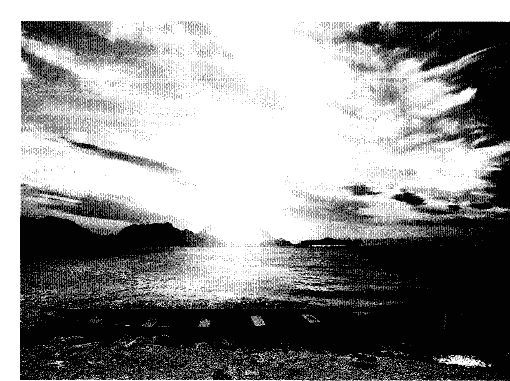

## Chapter 5

### 基本誘發技巧

看到這裡，你應已理解這些基本概念：

- 1. 清醒做夢的意思。
- 2. 清醒做夢的科學證據。
- 3. 清醒做夢的六項好處。
- 4. 清醒連續體和清醒的層級。
- 5. 常見清醒夢，及可從中學到的教訓。

現在，我要把我（及成百上千清醒做夢者）獲致清醒覺知的技巧介紹給你。雖然我將提供許多技巧，但仍強烈鼓勵你一個月只試用一項技巧，以便真正學會這項技巧的訣竅。請不要在多項技巧之間跳來跳去。

且讓我從自己成為清醒覺知的第一項技巧開始，也就是「找到雙手之卡斯塔尼達技巧」我的修改版。

一九七五年，我讀了卡洛斯·卡斯塔尼達所寫《巫士唐望的世界》。卡斯塔尼達原是南加大人類學研究所的學生，專研可改變心理與精神狀態的植物，在尋訪原住民老師途中，認識了亞奎族的薩滿唐望。唐望開始教導卡斯塔尼達質疑傳統的西方理論，以新的方式檢視他所經驗的實相。卡斯塔尼達成為唐望的學徒，學習了許多新的修行方法，支持他對這個世界採用與眾不同的觀點。
在《巫士唐望的世界》這本書裡，唐望建議卡斯塔尼達做一件簡單的事，因而可在夢中進入覺知的狀態：「今晚在你的夢中，你一定要看著你的雙手。」卡斯塔尼達抗議說不太可能，唐望告訴他：「想像所有你可在夢中完成的不可思議的事（當你在夢中覺知）......但要預先選好一樣東西，然後在做夢時找到它。我建議雙手，是因為雙手永遠都在。」①
才高二的我非常好奇，不禁懷疑真的可以在夢中找到自己的雙手嗎？唐望的建議如此簡單，端看有無嘗試的意願。我接受了書中的暗示，加上年輕人的不知天高地厚，相信暗示當然有力量，我創造出「找到雙手之卡斯塔尼達技巧」的修改版。使用了三個晚上之後，我做了第一個、刻意誘發的清醒夢——一切是如此不可思議！
這些年來，我已讓這技巧愈加完美，以下就是它的基本練習。為求達到最好的結果，我鼓勵你每天晚上持續進行：

- 1. 坐在床上，心靈沉靜下來。
- 2. 輕柔地看著你的兩隻手掌，用充滿愛心的態度告訴自己：「今晚做夢時，我將看到我的雙手，並明白我在做夢。」感覺是放鬆的。
- 3. 繼續輕柔地看著雙手，重複默念：「今晚做夢時，我將看到我的雙手，並明白我在做夢。」
- 4. 允許雙眼自然失焦或變成鬥雞眼。保持沈靜，緩慢重複這暗示。允許腦袋逐漸空白，當你看著雙手並重複這暗示。
- 5. 大約五分鐘後，或者你真的太想睡了，安靜地結束練習。
- 6. 當你在夜裡醒來，溫和地憶起看到雙手的意圖。你夢見自己看到雙手嗎？
- 7. 在夢中的某個點，你的雙手可能突然出現，你要立刻做此連結：「這是一個夢！」你的雙手可能跳到你眼前，或你注意到自己正伸手開門或正在攀爬手扶梯。看到雙手並明白自己正在做夢時，務必保持鎮定，清醒地開始探索夢中環境。

我一絲不苟地連續練習了三個晚上。第三天晚上時，我發現自己步行於高中的走廊；突然間，雙手出現在我眼前！我想：「我的手！這是一個夢！」發現自己真的可以在「做夢」時成為清醒覺知的感覺，無比神奇。事物感覺起來如此真實，看起來也很真實，但我知道它們全都是我夢到的。我主動尋求的第一個清醒夢，成為一次奇異的冒險！

那次之後，許多人把他們「找到雙手」的經驗告訴我。有人說他們在自己伸手去開門或攀爬手扶梯時看到雙手，然後想起：「我的手！那麼，這是一個夢！」也有人說他們看到雙手，卻發現手指多於五隻，因而覺知到自己在做夢。還有一個人說，他的雙手突然出現在眼前，開始輕拍他的臉，直到他覺知過來。最後是加州一位女士告訴我，她在睡前看著她的雙手，丈夫問她做什麼，她於是對他解釋；那天晚上，她的雙手突然出現在他的夢裡，使他成為覺知的狀態。

我相信這個卡斯塔尼達技巧之所以有效，是因為它建立於一個類似伊凡·帕夫洛夫之「刺激與回應」的聯想連結之上。記得帕夫洛夫如何地在每次餵狗時搖鈴嗎？當食物的出現與鈴聲建立連結之後，狗只要聽到鈴聲就自動出現反應（例如，流口水）。以我的情況，看到雙手便意味著想起：「這是一個夢！」從行為心理學的研究來說，重複練習這個技巧，加強了刺激（看到雙手）與心理反應（「這是一個夢！」）的連結。因此，為求達到最好的結果，你必須在每天睡前練習。也可以在白天時提醒自己幾次，每次大約十五秒；只是看著雙手，重複默唸：「今晚做夢時，我將看到我的雙手，並明白我在做夢。」

許多個月之後，我注意到：如果我能在思考過程中完全解離或腦袋全部放空（即使只有片刻），效果最好。在卡斯塔尼達的傳承中，這牽涉到停止「內在對話」。就在我不斷重複這個暗示時；突然間，部分的我好像跟這一切完全脫離，進入平和的靜止或放空狀態。雖然部分的我仍在重複這個暗示，另一部分的我成為完全的靜止。在這樣的一些夜晚，我幾乎都會在夢中清醒過來。所以你也可以嘗試這項簡單的技巧，在看著雙手的同時，盡力去達到「關閉內在對話」這個更高目標。

### 善用暗示的力量

清醒做夢一個常見又簡單的技巧，涉及睡前主動的心理暗示（mental suggestion）。它的核心概念是：暗示能激發內在的允許機制，和內在的接受。每個人都可以從正面的暗示受益。著名催眠專家米爾頓·艾瑞克森（Milton Erickson）那句「無意識永遠都在聆聽」的話，說明了這個簡單的事實。善用暗示的力量，允許自己進入清醒做夢的神奇之境。

人們喜歡這個技巧的理由之一是，他們可以在睡前執行。他們不用在睡到半夜時起來做任何事，除了回憶剛做的那個夢。如此，他們既可練習清醒做夢，也可一夜好眠。

練習之前的預備動作是，設法清空你的腦袋。想像你的這一整天有如眼前畫在黑板上的一幅畫。現在，拿起板擦，開始擦掉它。擦掉這一天的殘像。放鬆。

睡前，沉思般地對自己重複我列於下面的幾個暗示之一，為時四到五分鐘。用這個暗示淹沒你的整個思想，使得它不容忽視，並成為你入睡之前最突顯的意圖。暗示句：「今晚在我的夢中，我將明白我在做夢，並成為清醒覺知。」或：「今晚在我的夢中，我將具備批判性的覺知力，當我經驗奇特的事，我將明白我在做夢，並成為清醒覺知。」或：「今晚在我的夢中，我的一部分將保持覺知，然後在我做夢時通知我，因而讓我明白自己正在做夢。」（例如：當你將要搭乘早班飛機，你的一部分甚至會在鬧鐘響前的一分鐘把你叫醒。）

使用這些暗示時，想像並感覺自己的確成功了，會有很大的幫助。所以，當你晚上做時，想像自己第二天早上快樂地在日記寫下你的清醒夢！有如你已達到目標，充分感覺你的成功。任由這個暗示自由地滲透你的思想。

只要你喜歡，儘管修潤這些字句。有人覺得動詞「將」太過咄咄逼人，寧可改為「允許」；因而成為：「今晚在我的夢中，我允許自己具備批判性的覺知力，當我經驗奇特的事，我允許自己明白我在做夢，並成為清醒覺知。」盡情修潤這些字句，直到你感覺舒服和喜歡。

#### 練習

圈起你喜歡的暗示句，寫下你喜歡的理由：

### 催眠與清醒做夢

現存之清醒做夢的研究，有些曾以催眠來提高清醒夢的發生率。約瑟夫·丹恩博士（Dr. Joseph Dane）一九八〇年代以維吉尼亞大學的學生所做的研究顯示，他們對以催眠的誘發清醒夢是有反應的。②而這些學生之前並沒有任何清醒做夢的經驗。

他對一組學生使用催眠暗示：「今晚，你將關掉夢中的自動駕駛，以覺知飛翔。今晚你做夢時，你將有辦法辨識出自己正在做夢。某件事將在夢中發生，觸發你的覺知，你將記得你在做夢。」

對另一組學生，他則建議他們在夜晚的夢裡尋找一項個人化的象徵，用以幫助他們在夢中清醒。丹恩的報告提及，有位女學生在當晚夢到身穿披風的女人。第二天晚上，她又看到這位女超人並明白這是她的夢中人物，因而成為清醒覺知。

### 辨識與請求夢境徵兆

在《夢境完全使用手冊》這本書中，作者史蒂芬·賴博格打造了「夢境徵兆」（dreamsigns）這個名詞，用以表示那些在一個夢裡顯得「格格不入」因而可以標示出我正在做夢的事物。❹ 夢境徵兆異於尋常的本質，常可觸發清醒做夢者明白他們正在做夢。

這項研究發現，能找到個人夢境符號（經由催眠的暗示）幫助自己清醒做夢的人，都做了威力強大的清醒夢。丹恩發現，「他們經驗到的品質層級遠高於我們在實驗室裡的一般期待。」❸ 丹恩也發現，擁有個人夢符號的清醒夢比沒有的人更長也更有趣。

整體說來，使用催眠鼓勵清醒做夢的研究皆顯示，受試者大多在幾個夜晚之內便出現清醒夢。看來，催眠或自我催眠對清醒做夢者確有正面的幫助。

難免地，誘發清醒做夢的催眠 App 當然會出現。然而，使用這些涉及催眠的誘發方式前，請做些調查。常見的催眠暗示：「你正沿著長長的樓梯往下走，每走一步你都更加放鬆。」這在醒時的狀態似乎沒有問題，但它也可能配合夢中的情境，其象徵性的能量可能誘發負面的暗示。

例如，有位清醒做夢者報告，他在睡前聆聽這種催眠式的誘發裝置，然後在夢中沿著樓梯往下走，可是越走越害怕。

#### 夢境徵兆的類別：

賴博格將這些「能誘發清醒狀態並促使做夢者去想『這是一個夢！』」的夢境徵兆，歸為四類：

- 1. 內在覺知：你有一種特殊的想法、強烈的情緒，感覺到非比尋常的感覺，或出現變造過的認知。例如，你發現光的品質似乎怪怪的，然後明白這必定是個夢。
- 2. 動作：你、其他夢中人物，或夢中的事物，做了在醒時生活非比尋常或不可能的事。例如，你飛了起來，並明白這只在夢中才有可能。
- 3. 外型：你的外型、夢中人物的外型，或夢中的事物，出現了奇特的形狀、畸形或變形。例如就在你的眼前，你母親先是個小女孩，然後是少女，然後是她現在的年齡，你因此覺得奇怪並明白這必定是個夢。
- 4. 內容：夢裡的地方或處境頗不尋常。例如，你發現自己在一場宴會裡跟英國王子夫婦說話，並猜測自己怎會獲邀，這時你自然恍悟：「這必定是個夢！」

如果你已做過清醒夢，請辨認出觸發你成為清醒覺知的那個或多個夢境徵兆（例如，你發現自己並非「走」下樓梯，而是「飄」下去的，接著你因而明白：「這是個夢。」）並寫下來：

雖然賴博格建議，可以從你的夢日記裡挑選一個夢境徵兆，但我覺得大多數人挑選的並不是真的可以激發高程度的覺知。所以，我反倒建議你主動「要求」一個專為你量身訂做的夢境徵兆，方法如下：

請求夢境徵兆。找個你覺得你已準備好的晚上，真誠地向宇宙請求一個夢，它將提供你一個清晰的夢境徵兆，幫助你成為清醒覺知。請求你將立即掌握那個夢境徵兆，並在早上仍能辨識出來。在我們的週末工作坊裡，幾乎所有學員都找到了夢境徵兆。使用這種經過醞釀的請求，你的內在覺知自然會將夢境徵兆呈現出來。

所以，當你做出請求夢境徵兆的特殊行動後，寫下那個夢境徵兆是什麼？請記住，夢境徵兆可能是內容、外型、動作或內在覺知。你的夢境徵兆可能是一種情緒，也可能是一樁不可能的事件，或一種蛻變。

詳細寫下這個夢境徵兆「如何」觸發你成為清醒覺知。例如，如果你在你的夢中看到一隻飄浮的長頸鹿，是什麼觸發你發覺自己在夢中？長頸鹿本身？或動物飄浮於空中這個事實？

最重要的，透過暗示在睡前鼓勵你個人的夢境徵兆出現：「今晚在夢中，當我（例如：看見動物飄浮），我將明白自己正在做夢，並成為清醒覺知。」

#### 「啊」符號，或喉輪的光

有個可能已經使用了數千年的古老夢境徵兆，是在睡前觀想：喉嚨底部有蠟燭的光或特殊的光。基本做法是，想像一支點燃的蠟燭從你的喉嚨底部升起，這熒熒燭光代表「覺知之光」。專注於這個觀想畫面，懷著「覺知之光」將帶你進入你的睡眠覺知且你將在夢中清醒過來的意念入睡。在腦海中清晰觀想著這蠟燭。有些佛教傳統（藏傳佛教）教導一個異曲同工的法門。5大致來說，他們會要求你想像有道白光從你喉嚨底部一朵紅色蓮花的中心放射出來。那道白光來自蓮花中心一個白色的「啊」（梵文／藏文的種子字，音「啊」）。在睡前清晰地看著紅蓮花中心裡、發出白光的這個字。懷著成為清醒覺知的意念，繼續專注於這個觀想，入睡。我總是能成功地運用這項基本技巧，並在做夢時，驚訝地看到燭光般的火焰從喉嚨底部升起。只要看到喉嚨底部的燭光，我立刻明白我必定是在做夢。這似乎成為清醒覺知一個很棒的方法。

### 初學者常見的五個問題

- 一、我最可能在哪個時間點清醒做夢？

清醒夢可能在睡眠的任何時刻發生；然而，根據大多數人的報告，清醒夢最常出現在夜裡的最後兩次「快速動眼期」，或在睡眠的最後幾個小時。清醒夢協會的通訊刊物《夜光》曾敘述：清醒夢平均發生在入睡之後三百九十四分鐘時，或以基本睡眠為七到八小時的人來說，在他們入睡後的六．五個小時。

#### 二、清醒做夢者會不會在早上時覺得很累？

不會。通常當你做完清醒夢醒來時，你會感覺神清氣爽、精力充沛，整個早上臉泛清醒之光，或感受到一種滿足感。

#### 三、清醒做夢會傷害我的普通夢嗎？

不會。大多數對清醒夢有興趣的人都發現，清醒夢反而有助於做夢，因為現在他們能夠憶起更多的夢。同時，大多數的清醒做夢者也發現，清醒夢只佔了他們總做夢數的大約百分之一（一晚五個夢乘以三十，等於一個月一百五十個夢；所以即使是高天賦清醒做夢者，一個月也大約是七、八個清醒夢。）以這方式來看，大約百分之九十五的夢仍保持它們的原樣。

#### 四、我應該嘗試哪種技巧？

每個月嘗試一種技巧，觀察它是否適用於你。先思考哪種技巧吸引你，使用一個月。我之所以提起「找到雙手」這項技巧的理由之一，是每個有意在夢中清醒的人都能很容易在睡前練習。半夜裡也幾乎不必想著它。當你睡前練習之後，只需要等雙手出現，且立即反應：「我的手！這必定是個夢！」

#### 五、「實相核對」（reality checking）是什麼意思？你能舉些例子嗎？

所謂「實相核對」，是指一項更能幫助你相信自己正在做夢的動作。例如，如果你在夢中清醒過來，並決定去做一個「實相核對」的動作，那麼你可能試著飄浮於空中，藉以證明你確實是在做夢。如果你做了，那麼這個「實相核對」的嘗試，就能讓你知道你在做夢。其他的方式或許是拉拉手指，看看它有沒有變長，或是把手伸進牆壁或桌子裡。有些人喜歡重複閱讀一段文字，看字句有沒有改變，如果字句改變了，就表示這是一個夢。另一個練習是捏住鼻子，然後發現你甚至不需要呼吸。只要感覺不那麼確定，都可以做幾個「實相核對」的動作來幫助你相信你正在做夢。

### 賴博格的MILD技巧

史蒂芬·賴博格博士堪稱研究清醒做夢的先驅學者，他認為「憶起意圖」對誘發清醒夢似乎特別重要。賴博格在他的團隊裡，發展出一種他稱之為「清醒記憶誘發法」（簡稱MILD）的技巧，它有四個基本步驟：

1. 記憶（Memorize）：半夜裡自動醒來時，練習去記住最後一個夢的細節。你只需躺在床上，仔細回憶最後一個夢。
2. 想像／嵌入（Imagine / Insert）：賴博格建議，就以剛剛憶起的這個夢為溫床，開始想像你在這個夢中某個合適的點成為清醒覺知。觀想自己在這個點清醒覺知。
3. 清醒（Lucid）：接著，藉由此暗示：「下次做夢時，我要認清我在做夢。」意圖在下個夢裡成為清醒覺知。
4. 做吧（Do it）：採取以上行動，抱定成功的決心。懷著在下一個夢裡清醒覺知的預期，重新入睡。

第一次聽聞這套技巧時，我已有六年清醒做夢的經驗。開始使用MILD技巧後，我的清醒夢次數經常加倍。雖然賴博格認為記憶是最主要的元素，但有些人覺得MILD裡，角色扮演和重新觀想有相同的重要性。

#### MILD練習的三個預備動作：

1. 將最近的一個夢寫在下面。
2. 在你的夢故事中認出可以促成清醒覺知的地方（例如奇怪的事件、不可能的動作，或不合理的地點），畫個大X。
3. 以這個大X為起點，彷彿你已經因此而成為覺知，重寫這個夢。例如：你可能夢見自己置身紐約中央公園，看見一頭身上長了翅膀的大象。在這個不尋常的點畫上X，然後繼續重寫。「看見這頭長了翅膀的大象後，我想：『等等，大象沒有翅膀！這一定是個夢！』然後想起自己曾經希望能在清醒夢裡飛翔。我四下打量，看到了帝國大廈。我把焦點放在這棟建築的頂樓，然後開始像超人那般往頂樓飛去。能夠俯瞰地面。

重新寫下你若清醒覺知後的夢：並測試自己可以飛多遠，真的很棒！

再度提醒，你需在夜裡自動醒來時執行MILD的四個動作：憶起最後一個夢，想像自己在某個點覺知，接著清醒地暗示自己：『等我再做夢，我想要能辨識我在做夢。』在你重新入睡後，堅定地去做。

### 保羅·索雷的判別反思技巧——建立清醒夢思維模式

德國的完形心理學家保羅·索雷，於一九五九年發展出一個有助於在夢中清醒覺知的方法。連續十天、每天自問十次：『我在做夢嗎？』然後又問：『我怎麼知道？』他很認真地思考這兩個問題，也相信這些問題會轉化到他做夢時的思維模式裡。問了個把月之後，他在夢中見到一位已過世的親戚，然後他問：『我在做夢嗎？』

這個自問法被稱作成為清醒覺知的判別問題法，或判別反思技巧（Critical Reflection Technique）。⑦ 有人建議用紅色馬克筆在手上寫個「C」字（代表Conscious「覺知」），白天時一看到時就自問：「我在做夢嗎？」也有人創造出實相核對的APP，它可隨意發出嘩聲，敦促你詢問自己的覺知狀態。你可以隨即做個「實相核對」的動作，例如試圖飄浮。希望這種堅持不懈的自我詢問與判別，能轉化到你做夢時的思維模式裡。當你自問「我在做夢嗎？」然後做個實相核對，再發現自己飄浮起來，因而明白：「這是一個夢！」以我之見，保羅·索雷這個想法，也是我稱之為「建立清醒做夢之思維模式」（Developing a Lucid Mindset）的具體而微之作。我是在思考為何極少數超級高手能那麼頻繁地清醒做夢（一年一千個以上）之後，有了這個想法。我留意到許多超級清醒做夢高手，描述他們先是不斷地重複著兒時的惡夢，並為了逃避這些惡夢而成為清醒做夢者。在這之後，他們便有了判別夢境的能力，並成為清醒覺知。「建立清醒夢之思維模式」的意思是：建立起一個不斷提醒自己檢視意識環境或覺知狀態的心理習慣。它的切入點有時涉及記憶（例如：我正在做什麼？）、警覺性（例如：魔鬼會不會害我？）、地點（例如：我在哪裡？），這些人不斷地檢視或分析他們的現狀，迅速地成為清醒覺知。

### WILD —— 清醒導入清醒夢

你確實可以利用白天的自我詢問來提高覺知，從而建立清醒夢思維模式。我早已依據賽斯資料的建議，養成「眼前世界是我的心智合力創造出來」的思考習慣。每當有任何事情，我立刻自問：「這件事為何發生？是我的什麼信念，把這件事吸引到我的生命經驗裡來？」後來，當夢中有奇特的事發生，我會想：「這件事為何發生？它怎會被吸引到我的生命經驗裡來？」「而後明白：「這似乎太奇怪了！這必定是個夢！」

你如果想「建立」清醒夢思維模式，不妨找個能吸引你的心智習慣，使你樂於不斷檢視你的思考環境，或覺知狀態。你必須一天多次地主動檢視，使它成為你的思維模式。然後，這種新的思維模式也將進入夢中，使你能更細密地檢視周遭事物，引導你明白：「這是一個夢！」

貝佛莉・凱利斯基・哈特・督爾索 (Beverly Kedzierski Heart D'Urso) 長年擔任賴博格主要的研究對象，因為攝影小組常需熬夜等著拍攝她清醒做夢，她決定減輕大家的負擔，乾脆請他們在快速動眼期比較頻繁的黎明時刻才來。她發現自己若自然醒來（但不張開雙眼、平靜地等待場景出現），通常比較容易從醒時狀態直接進入清醒做夢的狀態。不同的攝影小組拍攝到她在夢裡用眼睛告知她的清醒覺知。

貝佛莉記得是賴博格把這個行動命名為「清醒導入清醒夢」（Wake Initiated Lucid Dreaming，簡稱WILD），因為這跟他自己的MILD很類似。任何能幫助你帶著醒來的覺知直接進入睡眠、然後把夢轉為清醒的技巧，都可以稱為WILD。

許多方式可以幫助你成功，例如賴博格建議的這個「數數字技巧」。

練習：選個你覺得昏昏欲睡的時間，如例行的午睡。當你閉上眼睛逐漸入睡，可以默數：「一，我在做夢。二，我在做夢。三，我在做夢。」以此類推。最後，你或許會發現自己在一個如夢似幻的狀態，默數：「二十一，我在做夢。」並明白你的確在做夢！

另一個方法是採用疏離觀察者的態度。閉上眼睛，以安靜的心情任由自己開始飄走，被動地觀察在周遭移動與變化的色彩，等待夢影像的形成。維持旁觀的心態。當一個夢逐漸形成，任由心智進入想像的環境，主動建立你的清醒覺知。

艾德·凱洛格以入睡時專注於呼吸的方式成功了。他利用入睡時專注於吸氣與呼氣，帶著這份覺知跨進睡眠，再發現夢影像已經形成。然後透過心智的努力，他把這份覺知移進夢裡，成為清醒的覺知。

有時我會覺得，把覺知移進夢裡，其實就像把覺知拉進一個新的空間。那也有點像把自己從附近的空間拉進一個房間，或者從一個洞裡爬進更寬闊的空間。有些人會覺得像是穿過一條隧道。但你要有心理準備，一旦來到夢的空間，要從「觀察者」的角色，轉化為更主動的「參與者」。

### CRAM —— 不斷重複與確認法

與上述的技巧類似的是，我也曾運用不斷確認「我想在夢中清醒過來」的意念，成功地做了清醒夢。我因而把這個方法稱為不斷重複與確認法，或CRAM（Constant Repetition and Affirmation Method）。當你入睡，或在夜裡醒來再重新入睡，安靜地對心智表達你的意圖：「我將在今晚的夢裡清醒過來。」（或類似的簡單意念。）不斷且持續重複這個意念。

讓這意念淹沒你的腦海，成為你重新入睡時最主要的意圖。做這項練習時，保持輕鬆且平靜的態度，帶著腦海裡的主動意圖進入睡眠狀態。思緒如果飄開，輕緩地把它帶回這溫和且持續的重複裡。

### WBTB —— 回籠覺技巧（或「小睡轉清醒夢」）

許多清醒做夢者各自注意到（也得到「清醒學院」一項研究的證實），回籠覺技巧（Wake Back to Bed Technique，簡稱WBTB）也被稱為小睡轉清醒夢技巧，簡潔的做法如：

1. 提早在平常醒來的兩小時前醒來。
2. 在接下來的十五到四十五分鐘裡保持清醒，閱讀或思考清醒做夢。
3. 帶著要在夢中清醒過來的意圖重新入睡。

使用這個技巧的許多清醒做夢者，在這段回籠覺中的清醒夢相較於基準線，皆有大幅增加。事實上，研究顯示，清醒做夢的機會增加了五到十倍。⑨

有些人喜歡在帶著清醒做夢的意圖重新入睡前稍做靜心，或閱讀與清醒做夢有關的書。

也有人報告他們花了九十分鐘才又入睡，所以請找出對你有效的時間。有些原本就容易失眠的人，會在輾轉許久之後才又睡著並且做清醒夢。

WBTB技巧的成功，引出了幾個不同的改良版，著名的有丹尼爾·洛福（Daniel Love）在他的書《你在做夢嗎？》（Are You Dreaming?）裡提出的循環適應技巧（Cycle Adjustment Technique），此外，有些人覺得多階段睡眠，或把一整天只有單次醒與睡的模式，改為分段睡眠，對清醒做夢很有帮助。

### 夢的再進入

你可曾在做了個美妙無比的夢之後，希望可以重返夢中？其實，你是可以的。全世界有許多做夢和清醒做夢者，已經辨識出能讓你「重返」剛醒來那個夢的特有行為。在你從一個夢或清醒夢醒來後，你可採用這些步驟讓你重返夢中：

1. 保持醒來時的姿勢，最好是醒來後完全不動。
2. 閉著眼睛，以看圖片或電影的方式，重新想像夢的結尾（或最後的十五秒）。
3. 允許那影像成為真正的看見（你可在這個點重返夢中）。
4. 或選擇一個物件或夢中人物來投射你的覺知。
5. 開始從這個有利的視角清醒地思考這個夢。通常，清醒夢會在這個點重新啟動，繼續清醒做夢，彷彿你只是在看錄影帶時往前快轉了十秒。

### 懷著遊戲心練習

如果你不練習，所有的技巧都沒多大價值。所以，找個吸引你的方法踏進來。懷著遊戲和好玩的心態。不要擔心有沒有立刻成功，畢竟事實證明，沒人是立刻成功的。只需留意你正越來越靠近。

在工作坊裡，我看到人們願意參加就是很大的努力了。有些人從未做過清醒夢。有些人已達退休年紀，想要學習一些好玩的新事物。難以置信的是，他們許多人都成功了，並在成功時快樂地慶祝。

我希望你能更仔細地檢視你的夢。或許你曾來到清醒覺知的邊緣？你有沒有覺得某些事怪怪的？或者一個樂於伸出援手的夢中人物開始以特殊行為使你質疑你周遭的環境？這些夢聽來都很靠近一個準清醒夢，它也向你說明，你提高清醒覺知層級的意圖，已經進入你的潛意識。

任何小步驟和小細節都值得注意。因為你很可能就在某個晚上，看見例如恐龍走過圖書館書架之間這種事件，或者你的雙手突然跳到你的眼前，或者你個人的夢符號，然後你將明白這一切都通往一個結論：「這必定是個夢！」

### 基本誘發技巧

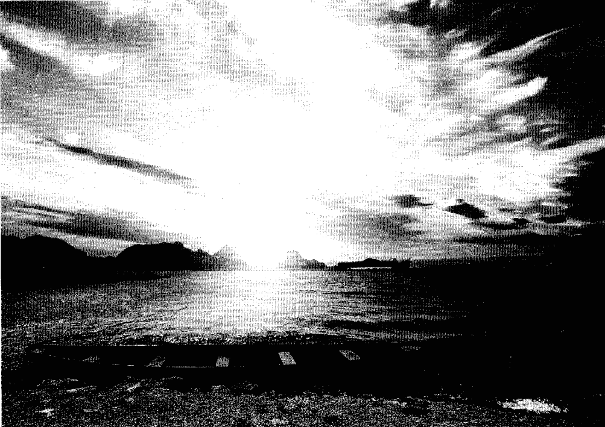

## Chapter 6

### 穩定與延長你的清醒夢

### 一、調整情緒

當你歡欣鼓舞地宣稱：「嘿，這是一個夢！」接下來呢？許多清醒做夢初學者能否成功，取決於這三十秒的反應。在關鍵時刻，採取這四個重要步驟可以確保你進入一個綿長而刺激的清醒夢。我稱之為MEME步驟：一、調節情緒（Modulate your emotions），二、加強覺知（Enhance your awareness），三、保持專注（Maintain your focus），最後是四、建立意圖或目標（Establish your intent or goal）。

如果你因在夢中清醒覺知而太過興奮，採取以下行動之一讓自己鎮定下來：
- A.告訴自己「鎮定下來」，降低興奮的感覺
- B.觀想某件很無聊的事，例如你的雙手、雙腳或地板，或任何情緒中立的場景
- C.把能量集中於一件簡單的工作，以降低感官的情緒層級

既然已有許多人發現，情緒過度激動常造成清醒夢的結束，請盡力嘗試不要太過興奮。

如果你真的很激動，援引上述方法之一降低情緒能量，留在清醒夢裡。

話雖如此，你有時還是很想做些真的很刺激或情緒力道很強的事。碰上這種情況時，我會勸你選個長清醒夢的末段去執行，因為強烈的情緒有可能結束你的清醒夢。

### 二、加強覺知

對初學者來說，在剛清醒時加強你的覺知，似乎是個很好的基礎練習。若要加強覺知，可考慮做以下這些事：A. 你可以執行「實相核對」（例如：飄浮起來，或把手伸進一面牆壁，或拉長你的手指，等等），B. 採用一項固定化的儀式，例如以搓揉雙手來活化並刺激你的觸覺，C. 對你的夢大聲叫出一個建議，例如：「增加清晰度！」或：「更多的覺知！」
我記得有些清醒夢剛開始的時候，光線似乎非常昏暗。當我大叫：「增加清晰度！」或「更多的覺知！」之後，夢中的光線立刻大有改進，好像有人聽到我的要求，調整了光線的亮度。倘若你在夢中清醒時光線昏暗，可以試試這個方法。
獲得提升的覺知會使你的下一個目標：更長的專注，較容易達到。

### 三、保持專注

所有令清醒做夢新手困擾的議題中，保持專注似乎是最主要的挑戰。對有些人來說，當他們在夢中清醒過來，對於「知曉」他們存在一個夢裡，總感到極為神奇。然後，他們開始在夢裡探索，找到非常有趣的事物或情況，或夢中人物。當他們開始注意這些事物、情況或人物時，很可能會失去他們的覺知及他們對清醒的知曉，又溜回沒有覺知的夢境。

不管醒時或做夢，覺知都很重要。只因為你在夢中清醒，並不表示你將能保持清醒。你必須在清醒夢發生時參與它，同時保持著清醒的覺知。

保持專注需要「積極」認知你正在做清醒夢，這能讓你保持「覺知到自己是覺知的」，而維繫住清醒夢。你必須同時做到兩件事：保持在夢中；以及，覺知自己在夢中。

你必須同時在兩個層面下功夫：一層是保持對做夢的覺知，一層是與夢中事件及人物互動。

有些清醒做夢者會執行某種重複動作來提醒自己，他們繼續做夢。例如每隔十五秒就反覆對自己說「這是一個清醒夢」，或在固定的間隔重複執行一個動作（例如，飄浮）。

有個朋友告訴我，她有時會在她的清醒夢中唱某一首歌，這能幫助她集中能量，保持在夢中的清醒。對大多數人來說，這也能幫助保持積極主動；因為做決定的過程讓你持有主動的力量，做到有意識的慎思和清醒覺知。

力求專注時，有件事必須小心，那就是切忌在清醒夢中盯著物件太久。許多清醒做夢者發現，不知怎地，若注視物件超過四或五秒，會使得清醒夢境開始動搖，終至崩塌。如果你想檢視某個事物，看一下後先移開視線，幾秒鐘之後再回來看。例如，你可以注視著一幅畫，再看看手，回來看畫，以此類推。

### 四、建立或表達意圖或目標

我尤其要鼓勵初學者：為了保持專注，不妨在清醒夢中建立一個簡單的意圖，或想要完成的目標。完成你的第一個目標後，立刻再建立新的意圖或目標，再去完成它。這一系列的簡單目標，可以是例如：碰觸牆壁、碰觸手臂、捏捏手臂，然後對一個夢中人物說話、問它代表什麼、聆聽它的回答等等，這些都是對初學者很有效的嘗試。選擇你覺得有趣的一些目標！
把這個技巧想成「專注於一個目標；重新專注於一個新目標」。藉由不斷地專注於新目標，你因而能保持積極的覺知狀態，主動地維繫住這個夢。當你無法主動專注於目標時，兩件事可能發生：一、你失去你的清醒覺知，沉迷在這個夢中，或者二、新的夢中人物或活動（可能來自你潛意識層面的覺知）隨興地進入夢中，你覺得它們很有趣，因而失去了清醒覺知，重回普通夢境。
高階一些的清醒做夢者，或許會在此時憶起醒時狀態所設計好的一個目標或實驗，例如：為職場碰到的困難尋找解決方案，把療癒的能量導向身體的不適，或體驗在清醒夢中靜心的滋味。一旦回想起來，你便可以試著去實踐這個目標。也有人純以探索為目標，他們也真的在整個清醒夢的過程，鉅細靡遺地檢視迎面而來的每樣事物。

### 在醒時狀態事先計劃清醒夢裡的實驗

如果你在清醒夢裡執行實驗，最好在醒時狀態做好計畫。為什麼？根據一些報告，人們有時會覺得要在清醒夢中決定如何執行實驗並不容易。有些報告則說，他們很容易因為在夢中清醒而樂昏了頭，做的都是些沒法在醒時狀態證明自己曾清醒做夢的實驗。事先做好計畫，你便能確切明白自己要做什麼，以及怎麼做。

例如，對清醒夢之療癒潛力做過深度調查的艾德．凱洛格博士，為了要能在他的下一個清醒夢中，實際且確切地執行他在醒時狀態計劃要執行的一個療癒實驗，設計了一個方法。

1. 他在醒時狀態把他要做的事用〈哥哥爸爸真偉大〉之類的押韻童謠背誦下來：

> 「療癒能量真偉大，用神力治療肺病。」

當他在夢中清醒，因為醒時完成的準備，便能輕易憶起童謠，以及他的任務。凱洛格體會到，這個醒時狀態的行為，使他一旦在夢中清醒，更容易想起他的實驗或意圖，也能更加專注。在醒時便設計好方法，清醒做夢者不再對做什麼或怎麼做，有所遲疑和猜測。他能直接明白目標，且採取行動。

#### 練習

1. 列出你想在清醒夢中執行的三個目標：
2. 選擇三個目標之一，描述你打算如何完成？如果創造出一個句子或許能幫你專注，哪個句子可以涵蓋你的意圖？請寫下來。

### 停留在清醒夢的進階技巧

清醒做夢者運用許多方法，延長一個即將崩塌或結束的清醒夢。清醒夢即將崩塌的信號包括夢境開始動搖和模糊，或出現太多情緒。清醒做夢者通常會「知道」或感覺到，此時若不採取行動，清醒夢就快結束。

以下所描述的技巧，似乎是可以在眼看著夢境就要崩塌，或許仍可保持其活躍的幾個方## 法：

- 一、在卡洛斯·卡斯塔尼達的書《巫士唐望的世界》裡，他的薩滿導師唐望告訴他，要他在夢境即將崩塌時再次看著他的雙手，可「重拾」做夢的力量。②我曾在好幾個情況成功使用過這個方法。我把注意力調回雙手幾秒鐘，發現那帶來非常平靜和專注的感覺。當時所在的清醒夢因而重新建立，我的探索或實驗也能繼續。

- 二、原地旋轉——史蒂芬·賴博格發現，清醒做夢者可用「原地旋轉」或「往後倒」來延長或創造一個新的清醒夢場景。他發現當清醒夢即將崩塌，因旋轉而創造新清醒夢的比例為百分之八十五。③既然清醒夢中的動作都會有相對應的生理效果，賴博格猜測旋轉或許啟動了（跟平衡有關的）前庭系統，因而影響做夢的過程，並延長該清醒夢。他把這個練習教導其他人後，也注意到為了符合他們的預期，預期的力量怎樣地帶他們前往新的夢境。

- 三、如果看到夢境或觀想的影像逐漸消失在閃閃發光的黑色虛空，趕緊抓住夢中的某樣東西，你可以抓住你的夢身體或夢中的某樣事物，而且是緊緊地抓住，並專注地去感覺那個東西。即使夢的視覺影像已經完全消失，你發覺自己身處在一個閃亮的黑色虛空裡。如果你能保持覺知，夢境極有可能重新出現在你的周遭。一點一點地，新的清醒夢影像會再出現。不同的清醒做夢者曾經發現，在這個虛空狀態，碰觸某樣東西的「觸感」會使專注力保持活躍。也有許多人發現，只要保持腦筋活躍，也能讓你維持住狀況，直到新的清醒夢在周遭出現。那或許需要一、兩分鐘，但只要你堅持，就能看到一個夢場景的誕生。

- 四、有些清醒做夢者描述，他們藉由短暫地閉一下夢中的眼睛，或者掉落下來，曾經成功地保住清醒夢。顯然這些動作可幫助某些人延長似乎要崩塌的清醒夢，或創造另一個新的清醒夢場景。

### 穩定與延長你的清醒夢

當你想從清醒夢醒來，大多數只需決定醒來或想要醒來，便能很容易地辦到。他們只需告訴自己醒來，就醒來了。真的就這麼簡單。

其他人知道，只要在清醒夢中持續注視一項物件五秒鐘，他們就會醒來。也有其他人知道，如果在清醒夢中涉入某些可能會太激動的行為，他們極有可能醒來。

總體來說，清醒做夢者在醒來這方面沒有太大問題。多數人比較關心如何停留在清醒夢裡，因而總是避開可能導致清醒夢結束的行為。當清醒夢結束，通常會有三件事發生：

- 一、最可能的是，你在床上醒來。
- 二、你處於假醒狀態。
- 三、你發現自己處於沒有任何影像的狀態（例如：黑光閃閃或虛空），然後醒來。

假醒狀態是一種相信自己已從清醒夢醒來，但仍繼續做夢的經驗。例如，你做了很美的清醒夢，弄得自己太過興奮，以為即將醒來，然後發現自己仍躺在床上——卻看見你的清醒夢已經寫在夢日記裡。是誰寫的？這才發現，你還在做夢！明白你仍在做夢，你通常會立刻在真實世界醒來。

有人會利用假醒狀態去做『實相核對』，再開始另一個新的清醒夢。經驗豐富的清醒做夢者也已瞭解，即使發現清醒夢似已結束，但自己還躺在床上，這就可能是『假醒狀態』。

既然如此，每次你相信已從清醒夢醒來時，不妨做個漂浮或拉長手指的『實相核對』。你或許會發現手指真的變長了，然後便可以利用這個假醒狀態繼續你的清醒夢探險！

清醒夢的第三種結束方式涉及體驗清醒夢的崩塌，發現自己的覺知在一個視覺空曠空間或所謂『虛空』裡，雖為黑色但閃閃發光，因而被很多人描述為閃亮的黑空間。許多人覺得這個空間非常放鬆。它讓人想起古早電視機於所有頻道都結束播放之後的那種黑。如果你讓覺知持續保持在這個虛空的狀態裡，可以看到一個新的清醒夢在你的周遭浮現。

總體來說，多數初學者或許會告訴你，許多清醒夢的長度不超過五分鐘。中級的清醒做夢者或許會發現自己可以停留到十五分鐘。經驗豐富的人可超過這個時間，有些實驗室觀察到，根據做夢者用眼睛做的信號，有些清醒夢可一直延續並長達五十分鐘。

#### 從清醒夢醒來——清醒夢如何結束

請注意，有經驗的清醒做夢者經常自願地縮短他們的清醒夢，因為太長的清醒夢很難記住所有事件。當他們執行清醒夢的實驗，通常會令自己只要得到實驗結果就醒來，以便輕易憶起那些結果。能否清晰記住細節，是辨識清醒做夢的挑戰，既然如此，一旦得到你私人實驗的結果，不妨要自己在仍能清晰地記住結果時醒來。

### 清醒夢裡的身體感官

清醒做夢的感官經驗有許多有趣的面向。

我們沒在睡覺時，一切都要仰賴眼耳鼻舌身這些身體的感官。你從樹上摘下蘋果，感覺它的重量並看到它表面的色澤。你摸著果皮，聞到果香。當你切開蘋果，咬一口並開始咀嚼，你品嚐到香甜多汁的果肉。如果你想把它扔掉，你會聽到它「咚」一聲落在地上。對你來說，這些感官經驗證實了蘋果的實相。

清醒做夢之所以美妙，部分與清醒夢裡的感官實相有關。通常，你在清醒夢中的感覺似乎與醒時同樣真實。你的手臂摸起來很真實，你最愛的T恤摸起來就像你的最愛。你的朋友約翰也與醒時狀態時的他很像，包括兩顆門牙之間的小縫。因為這些相似性，你必須更保持警覺，並覺知你存在於一個夢中（如果你需要說服或重新說服自己，當然可以做個類似飄浮的「實相核對」。然而，你可以賦予這些「感官工作人員」新的角色，把它們當成協助你保持信念、期待和感覺的「協力廠商」。即使你尚未給予指令，它們通常都已遵守。不過，既然已在夢中清醒，你大可刻意去實驗並比較兩者的感官經驗。例如，清醒夢中的蘋果跟醒時同樣香甜好吃嗎？一首名曲在清醒夢中聽來也同樣讓你感動嗎？還有清醒夢中的親吻呢？更好？更壞？或哪裡不一樣？身為清醒夢探索者，在清醒夢中測試你的感官知覺，並與醒時的感覺相互比較，是個值得完成的目標。替每個感官做個詳細的比較吧：

- 視覺
  - 哪些相似？哪些有差異？
  - 醒時或清醒夢裡的顏色看來會比較深和比較豐富嗎？
- 觸覺
  - 哪些相似？哪些有差異？
  - 事物的表面看來相同嗎？重量呢？
- 味覺
  - 哪些相似？哪些有差異？
  - 東西的甜鹹酸苦有關係嗎？
- 嗅覺
  - 哪些相似？哪些有差異？
  - 味道的香或臭有關係嗎？
- 聽覺
  - 你經由頭腦或耳朵聽到？或兩者皆是？
  - 哪些相似？哪些有差異？

這些感官知覺會在清醒夢狀態超越正常的範圍嗎？或更為縮減？感官經驗會隨著你改變對它的想法或信念而改變嗎？例如會因為你相信可以看得更遠就看得更遠嗎？

如果你想進行更多的『比較和對照』，不妨在清醒夢中繼續調查其他的知覺，例如溫度、痛感、平衡和動作。與醒時相比較，它們在清醒夢中有怎樣的變化？更進一步的，你能利用清醒做夢成為你所感知到的物件嗎？變成蘋果而存在的感覺是什麼？

#### 加分練習

現在你已比較並對照了身體感官在醒時與清醒夢中的情況，試試你能否藉由信念和期待的力量，改變你的知覺經驗。例如，在清醒夢中吃橘子，並告訴自己：「我想要這個橘子的味道類似香蕉。」

「或者在一個清醒夢中用力捏自己：「我想要這個橘子不感覺到痛。」

當你企圖藉由期待改變知覺經驗，結果如何？橘子的口感會像香蕉嗎？如果你很有意識地不要身體感覺到痛，用力捏它是否真的不痛？

擴而大之，期待對清醒夢中感官經驗的影響，會到怎樣的程度？若我們認為感官是永遠報導事實的記者，這樣的發現又使我們對感官的本質有怎樣的理解？

所以，當你醒時，你或許感覺凡事都得仰賴這些身體感官，但在清醒夢裡，你看到感官經驗被心智活動的力量加以重塑。你想得起任何在夢中或清醒夢中看來似乎很普通的內在心智過程嗎？例如，不用說話就能得到訊息的感覺？或者似乎超越你醒時知識，但你卻經驗到的一個概念？在賽斯資料裡，這些額外的能力被稱為「內在感官」，那是在清醒做夢的狀態很容易進入的一種情境。清醒做夢讓我們能夠看到，心智在不同狀態的複雜深度。

在本書的第二部分，我將比多數討論清醒夢的書更加深入地探討清醒夢的內部，當下的清醒夢經驗。藉由檢視看得到的夢中物件、場景和人物，外加你意識和無意識的心智活動，你將更加瞭解哪些事可以協助你營造出清醒夢。有了這些洞見之後，你便能踏進清醒夢的神奇潛能之中，增加你的個人成長、促進健康和蛻變。

### 穩定與延長你的清醒夢

### Chapter 7

### 夢空間裡的移動——辨識你的心理覆蓋

馬克·海特曼斯基（Mark Hettmancczyk）是德國一位研究運動科學的學生，他知道自己的泳技並不出色。嗯，或許連這個說法都有點太誇獎他。消息來源指出，馬克的游泳教練對他說：

> >「海特曼斯基先生，你簡直是塊石頭，永遠無法成為傑出的泳者。」

不過，馬克恰好擁有教練並不擅長的一項技巧：經常做清醒夢。

既然游泳課排在週一和週四，他開始在清醒夢中練習游泳，以便考試時能有更好的成績。他先利用網路觀賞游泳高手的影片，然後在夜裡的清醒夢中回憶那些資訊，並模仿更好的泳技和姿勢。只要他能進入清醒夢，他幾乎每次都用來練習游泳。例如，馬克會重點式地練習如何將右手以更有效率的角度插入水中，並因為在清醒夢中不必擔心換氣或喝到水的問題，而能更加專心和放鬆。

來到學校後，他也商請游泳教練給他課外的指點。教練看著他游，對他的進步神速感到驚訝。而且，他似乎每一堂課都變得更好。清醒夢「石頭」逐漸展現他成為游泳高手的潛力。

馬克可能不會把他在清醒夢中做的每件事都告訴教練。想像一下：馬克在清醒夢中把游泳池的水轉變成優酪乳，再轉變成蜂蜜，希望較濃稠的液體能增加阻力，藉以加強耐力。他會在某些情況清醒地游過空氣和肥皂泡泡，以便練習正確的划水姿勢，並觀察自己移動過的空間。他甚至描述，他曾在一整池的小熊軟糖裡練習游泳。

海德堡大學的清醒做夢研究者梅蘭妮·桑德利克（Melanie Schädlich），針對馬克藉由清醒夢改進游泳技巧的事訪問他。桑德利克的報告裡說，馬克也運用技巧在一個清醒夢中改變他的視點。例如，他可能從上方觀察正在游泳的自己。或者把覺知放到側面，去看自己的泳姿是否還需要改進。馬克利用這些新的視點去學習並協調游泳時複雜的身體動作。

馬克·海特曼斯基藉由清醒夢推展他的醒時意圖。他從游泳石頭變成泳技和速度都很傑出的泳者。此外，他也以身作則地教導了其他人（例如認為他「永遠成不了出色泳者」的教練），只要懂得徹底運用和掌握，清醒做夢擁有非凡的潛力。

你如何學會在清醒夢中移動，經常能顯示你對這個特殊狀態有多深的理解。以馬克為例，他有一個明確想要達到的目標，並運用他的清醒做夢技巧去操縱「空間」來為他所用。在清醒夢中，游泳池裡可以裝著你以意識投射出去的任何東西：優酪乳、蜂蜜、空氣、肥皂泡泡，甚至小熊軟糖。你有意識的投射，可以主動改變你經驗的環境。

不只這樣，馬克還運用他的清醒做夢技巧去做另一種投射。他把覺知投射給教練，得到他的泳技已有改進的觀點。他也把覺知的視點移到上方和側面。這些投射顯示了清醒做夢者以主動的投射力量操縱空間及其中的覺知能力。

當然，大多數清醒做夢者將需要一些時間，才能練習和發展這種主動且活躍運用投射技巧的能力。事實上，你必須優先處理的，很可能是想也沒想就投射到清醒夢中的「被動的」投射，或習而不察且沒有經過檢視的一些信念、感覺，以及未經測試的一堆假設。你可以稱這種鮮少受到注意的心理活動為：清醒做夢者的「投射心理覆蓋」（Projected Mental Overlay）。在醒時世界裡，心理學家有時會報告「心理投射」的極端情況發生在他們的案主身上。例如，一名偏執人士徹底相信郵差（及其他的公務員）全在秘密監視他。一名永遠懷疑自己快要生病的疑病症患者（hypochondriac）會把普通的身體不適或鄰居的咳嗽，視為潛在的身體威脅。一名內向的人在家庭聚會裡感覺到孤立與忽視，即使已經有人找他聊天。你可以看到這些信念經常往外投射，覆蓋於日常生活的每項事件之上。例如，那位偏執人士看見郵差跟鄰居史密斯太太有說有笑，接下來便確信她已成為政府的線民。此人的信念系統便在如此的不知不覺之中，被這些簡單事件的解釋所形塑並證實。而這樣的信念系統，會在他看事情時加上各種色彩。極端的案例容易引起注意，但我們可能很少去注意自己如何習而不察地，把覆蓋於我們的心智、心理與心靈之上的想法、信念、感覺和預期，投射到其他的個人、文化及情況之上。它們看來似乎只是微不足道的假設與偏見，但它們也會影響我們對生命的觀點、解釋和反應。很多時候，我們並非跟真正存在的世界互動，而是跟存在於我們心理及哲學概念裡的世界互動。

### 第一：夢空間很大程度反映你的想法、期待和信念。

可見，這裡有兩個非常重要的教訓：

看到沒？她才想起『清醒夢裡，地心引力不存在』，就開始飄浮了。

來！

且讓我們先來看看幾個跟清醒做夢空間有關的例子。還記得第四章，常見清醒夢學到的教訓嗎？細讀這個清醒夢，再看當這位女士改變她的投射心理覆蓋後發生的事：

> > 『我看到一個逆著走的時鐘，心想：『這是一個夢！』然後我想起曾在廣播節目聽到某位清醒做夢專家說：『在清醒夢裡，地心引力不存在。』突然間，我往天花板飄去，而且下不來！』

你的信念系統也會對清醒做夢時的內在空間，產生關鍵性的作用。你所投射、覆蓋於心理上的那些想法、信念、感覺和預期，會疊加在清醒夢中的人、物、背景和事件之上。但你甚至不會去注意到。所以，要成功地清醒做夢，你得看清這種投射如何作用，以及它所要告訴你的、與清醒做夢有關的潛規則。

### 第二：當你改變想法、期待和信念（或你的投射心理覆蓋），你的經驗通常也會改變。

映出來。

清醒做夢者的內在才剛想起「地心引力」在清醒夢中沒有作用，她立刻往天花板飄去。她並不需要揮動手臂或命令自己往上飄，只需改變對情況的信念，她的經驗立刻把新想法反映出來。

但，在那之前的片刻又是怎樣？那時她的夢中雙腳好似扎了根立在地板上。這裡，我們看到了「投射心理覆蓋」看不見但恆常存在的主動本質。她先是經驗到來自意識或潛意識的信念，這個信念系統不可見地「覆蓋」了她的夢空間。然後，當她檢視想法，想起清醒夢中沒地心引力，她立刻體驗到新悟的信念，輕而易舉地飄向了天花板。

在清醒夢中，你的投射心理覆蓋會從自身往外輻射，影響了你（觀察者）以及你所觀察到的經驗。你可以在一個清醒夢中改變想法、信念和期待，來證實這個說法。如果你的清醒夢隨著你改變想法而改變，那麼你可以很保險地得到其中必有連結的結論。明白這個連結，對你的夢中與醒時覺知都會有很大的啟發。

當你清醒做夢時，經常可以注意到：人的思維本質是很微妙也很細緻的。例如，你看到一個夢中人物穿著讓你想起黑幫老大的皮大衣，此一聯想使你擔心這個人物會不會帶來危險。接著這個人物轉過身來，手上好像拿著刀。你於是決定趕快飛走。

#### 初學者在心理空間的移動

將替你清出一條成為清醒做夢高手的通衢大道。

從許多方面來說，你的內在有一架看不見的投影機，它將你的信念、感覺和期待等心理能量向外投射，反應到你所經歷的任何夢境。那些心理能量經常與夢中事物及背景結合，以便你能時時刻刻地經驗到。一如那位喜愛游泳的清醒做夢者馬克·海特曼斯基，的確可以用運用投射的力量，讓它協助你達成主動設定的目標。不過，瞭解這些被動的投射心理覆蓋，

然而，你也可以改變清醒夢中的想法和期待，改而決定許多好人也穿那種皮大衣。隨著這個新的投射心理覆蓋，你碰上的很可能就是一位身穿皮大衣的友善好人。你的夢中經驗反應了那個片刻的「你」，而那些經驗更是諸多本質細緻的心理反應所創造出來的。

對許多清醒做夢者來說，在夢中飛行的喜悅及神奇的自由感，總是能帶來難以形容的快樂。在夢中有如小鳥或超級英雄般自由地翱翔於天際，感覺是非常美妙、不可思議與絕對的刺激。然而，對有些初學者來說，飛行也可能很叫人焦慮。

我還記得我的第一次嘗試。我在前院的無花果樹旁成為清醒覺知，決定試著飛翔。但我對怎麼飛毫無概念，那就往上跳吧，結果竟只懸掛在離地約一公尺半的地方，不上不下。滿頭霧水的我決定以蛙式開始划動手臂，感覺也前進了些。我划了大約一分鐘，突然想看自己到底前進了多少。我低頭往下望，發現自己在離地大約五公尺的高處。這讓我害怕自己會跌下去。轉眼間，我往下掉，隨即撞到有如橡膠的柔軟地面。真的是。在那些早期的日子裡，我也試過企圖在清醒夢空間裡飛翔的其他方法。有時，我學小鳥拍翅，通常能繞個小圈。有時是預跑一小段路，取得動能後伸出雙手當成飛機的翅膀飛出去，直到我失去動能而撞擊地面。這些嘗試似乎都很短命，也不算什麼成就。

如此這般試了幾年之後，我突然靈光乍現：在空中游泳、拍打手臂或預跑再滑翔，都需要身體出力才能移動。但這只在物質環境才有道理，所以當我在一個清醒夢裡覺知時，我需要做的反倒是拋開需要體力才能前進的想法。

想在清醒夢的心理空間聰明又快速飛翔，你需要把移動方式的想法，從必須耗費體力，轉換成「心想事便成」的方式。清醒做夢發生在一個以心理相互呼應即可成事的空間。懂得操縱心理狀態，在心理空間的移動反而更加容易。放開那些需要體力才跑得快、游得遠的限制性想法，能解開你自己對夢空間添加的束縛。

你能選擇什麼來嘗試第一次的心理操縱？何不提醒自己，地心引力在清醒夢中並不存在。在。試試看，當你停下來想：「我正在一個清醒夢中，所以地心引力並不存在。」你感覺到

在一個清醒夢中，當你緊抓一個物理上的信念或潛意識地期待它會發生，那麼它也就緊緊相隨。不過，在夢空間的實相裡，你可以實驗以心理原則為基礎的新型態物理學。既然地心引力這種物理現象在夢境並不存在，你將學到：根據「心理物理學」，蘋果是因為觀察者的意識（例如：心理的信念與期待）才掉下。如果你不想要蘋果掉下，甚至更進一步地，「你不想要自己掉下」，那麼你只需改變想法（例如：你的信念和期許），然後看看結果會怎樣。

#### 情緒的角色

雖然清醒夢中沒有物理的地心引力，但心理和情緒的重力（例如：專注於恐懼，對能力的懷疑）卻是存在的。一如許多的清醒夢初學者，我注意到自己也曾在早期的清醒夢中優雅且輕易地飛翔。我翱翔於空中再潛往地面、左傾右斜，做著連哈利波特都會羨慕的轉圈和翻滾。為什麼清醒夢裡的飛翔有時如此容易，有時卻那麼吃力？

回想那些輕而易舉的經驗，我發現當我期待會有困難，困難就出現。或者當我害怕掉到地上，我通常就是掉到地上。所以我的感覺和期待從我投射出去，覆蓋了那個夢，成為清醒夢經驗裡的重要元素。

相反的，當我感覺心情愉快、精力旺盛，我的飛翔便有如我是天空之王。或者，當我期待我將有一趟神奇的飛行，那麼我通常也會有一趟神奇的飛行。而且，當我絕對確信夢境裡沒有地心引力，我可以上飄、下移、側滑，甚至在空中漫步。在清醒夢中駕馭飛行，涉及某種心理的自我駕馭，而情緒扮演了意圖和信念是否一致的內在指標。

這些洞見碰觸到清醒夢裡情緒的另一個面向：衝突感。這樣說吧，你在夢中清醒，突然想要抽菸，雖然你在醒時世界已經戒菸。如今，在清醒夢中，當你起身要去拿菸的時候，你感到內在有些衝突。突然間，你注意到你幾乎無法動彈！那感覺好像在濕水泥中行走。這是怎麼回事？

內在衝突有時會以在清醒夢中難以移動表現出來。社會心理學家庫爾特·勒溫（Kurt Lewin）稱呼這種內在的兩難為「趨避衝突」，因為你同時想做又不想做。在清醒夢裡，難以行動的本身反映出現想做卻又擔心的內在情緒衝突。在你腦海中的負面能量或負面結果越多，行動就越困難。

再次地，這兩項重要教訓能幫你架構你的清醒夢經驗：

- 第一：夢空間很大程度反映你的想法、期待和信念。
- 第二：當你改變想法、期待和信念（或你的投射心理覆蓋），你的經驗通常也會改變。

第二：當你改變想法、期待和信念（或你的投射心理覆蓋），你的經驗通常也會改變。你或許要花上一些時間才能看見，要在清醒做夢的心理空間成功地移動，有賴幾個不同的組成元素，例如你的信念、期待和情緒。雖然，你的感覺通常與信念同步，但你很可能擁有一堆相互衝突的大小信念卻不自知。當你的信念相互衝突，心理能量的表現就不再清晰，進而阻礙了你那些傳統式的移動或進展。

### 運用信念投射的力量

有趣的是，清醒做夢者常利用信念的投射在夢空間裡移動。這要怎麼做呢？基本上來說，你將飛行或移動的力量投資於某個夢中物件，而且強烈地相信這是可行的。然後，你再利用這個新近被加持了力量的物件，帶著你在清醒夢中到處飛行。

舉例說明，我在許久之前的一個清醒夢中注意到一隻很大的藍色拖鞋（平常的兩倍大）。因為某些理由，我決定這隻藍色拖鞋可以飛，也可以帶我前往我想去的任何地方。我真的這樣相信。我碰觸這隻藍色拖鞋，突然它便帶著我飛了起來！帶著我去我想去的許多地方。我覺得神奇，因為這隻藍色拖鞋的速度真的很快。

醒來之後，我領悟到，雖然拖鞋確與移動和走路有象徵性的連結，但我對它的飛行能力的信念，才是必要的因素或有效的成分。若無這個信念的加持，藍拖鞋就只是藍拖鞋而已。可是，在清醒夢中被一份真誠的信念加持之後，藍拖鞋變成了一艘火箭。

另一個情況是，我在夢中清醒後注意到附近有架飛機。瞭解將信念投射到夢中物件的威力，我決定只要我碰觸飛機，它就能載著我在夢空間裡遊玩。我碰觸了飛機，它飄離地面開始載我去我聚焦的地方。只要我保持著相信，飛機也毫無困難地載著我去不同的地方。

信念投射的力量也在一位女士的夢中產生作用。她在清醒夢中租用了一對廉價的翅膀，她抓著翅膀到處飛，最後得到一個結論：只要她懷疑這對廉價翅膀，她就掉到地上。不過，當她相信牠們的飛行能力，她便能在清醒夢的空間任意翱翔。

她的故事說明了投射心理覆蓋可以如何戲劇化地 (dramatically)，或夢幻地 (dreamatically) 影響我們的經驗。你可以相信一點點，也可以相信很多。你可以懷疑一點點，也可以懷疑很多。你經常無意識地把你的心理能量投射了出去，但是你也可以很有意識、很有覺知地投射它。不管所採取的是有意識或無意識的立場，任何心理能量通常都會被投射，然後再反映回到你的經驗裡。

> 一如《反暴戰士盟》(The Adventures of Buckaroo Banzai) 這部電影的男主角巴克魯・本裁扼要闡訴的：「不管你去哪裡，你都在這裡。」在我們的討論裡，你可以把這句話改

#### 練習

在一個清醒夢中，看看周遭、尋找看來跟移動有正面連結的某個事物（例如滑板、卡車、汽車、飛機、腳踏車等）。有知有覺地，把它相信它會載著你在夢空間到處跑的意識轉移上去，賦予它移動的力量。然後堅信不移，讓它帶你去想去的地方。結果如何？

#### 加分練習

如果你真的很想挑戰自己，試著把你的投射放到並不適合移動的象徵之物，例如船隻的錨、一顆巨石或一棟摩天大樓。把它相信它能帶著你在夢境裡遨遊的信念轉移過去，賦予它移動的力量。然後堅信不移，讓它帶你去想去的地方。結果如何？

如果你能讓例如帝國大廈之類的摩天大樓，變成讓你騎著跑的掃帚，在夢的空間裡翱翔，那麼你就真的掌握了將信念投射到物件上的想法。恭喜了！

### 心理學與比馬龍效應

有趣的是，心理學的確研究過信念與期許在真實世界的力量，也就是知名的「比馬龍效應」（Pygmalion Effect）。一個經典的比馬龍效應案例在針對小學生成績的研究時發生。

研究者告訴某些老師，新的測試成績證實某些學生的進度將會超前。其實，這些學生乃隨機挑選，學習潛力並沒有比平均值更好或更差。

最後的結果？被老師相信成績將會超前的學生，的確比控制組的成績更好。顯然教師對學生能力的信念和期許創造了一個環境，促使學生達成目標。

與比馬龍效應相反的是「高萊姆效應」（Golem Effect），它暗示低期許通常會導向明顯的退步。我們一般把這些效應稱為「自我應驗的預言」（Self-fulfilling Prophecy），也就是我們常有意識或下意識地幫著把已經相信和期待的事創造出來。因為期許力量的本質是如此地到處滲透，科學實驗為了避免偏見，只要可能，總是採取雙盲研究和類似的保險措施。

不管是醒時、做夢，甚至清醒做夢，信念和期許總是往外投射，並覆蓋在經驗之上。你可以在清醒夢中更容易看到，因為只要信念與期待改變，幾乎會立刻在清醒夢中顯化出來。

明白這種潛意識的作用之後，應該使你對自己醒時的信念與期待更加覺知，經常主動地檢查腦袋裡正在想些什麼，並拋開那些沒有創造力的、限制性的信念和期待。

身為清醒做夢者，你可以玩整套的體能遊戲：在夢空間游泳，像小鳥那樣拍動翅膀，或快跑然後滑翔。或者你可以操縱你的頭腦，主動將信念的力量投射到合適的物件或跟飛翔有連結的象徵物，運用這信念的力量帶你通過清醒夢。在這個行為讓你學到重要的「清醒夢訓練」後，你可以嘗試更進階的方式，成功地穿越內在空間。

#### 穿越內在空間的進階技巧

根據科學說法，我們的物理宇宙包含了大約百分之九十五的空間。剩餘的百分之五，大多含有電漿或例如從太陽噴發出來的離子化氣體。當它們成為我們所想的實體物時，大約只佔不到百分之一的空間。奇特的是，我們花費大部分的時間專注於這百分之一的對象物，卻不曾去思考那百分之九十五的空間。

當你在清醒夢中漸有進展，處理空間將需要更多的注意力。如果你想在清醒夢中飛越廣袤的原野前往遠方的城堡，要怎樣才能不因揮動手臂而累死自己？

清醒做夢時，若身處小房間內，朝著站在另一邊的朋友走路或游泳過去，似乎很合理。但如果在一個廣闊的開放區域，你想去探索遠方的城堡，我建議你使用一種我稱為「有意圖地集中焦點」（Concentrated Focus with Intent）技巧。它要求你記住並練習這簡單的三個步驟：

1. 在清醒夢中保持覺知，專注於你想去的地方。
2. 藉由感覺到那個地方加深你的專注，想像你正在碰觸它，觀想那特殊的地方。
3. 集中好焦點後，放開一切，用意圖把自己送過去。

此刻就在你的腦海裡嘗試這個練習：想像你已在夢中清醒。你看見幾百公尺外有座宏偉的城堡，它的砲塔是金色的，藍色旗幟飄揚其上。看到了嗎？現在，把注意力放在旗杆上。用你的想像力去碰觸它或感覺它，隨便你。然後放開一切，要你自己過去。通常，你會發現自己像變魔法似，優雅且輕易地飛了過去。只需幾秒鐘，你將站在砲塔上，握著旗杆勝利地遠眺周遭。

你也可以在醒時練習這種主動式想像。在日常生活中多留意四周，當你看到某個適當的地點，例如電線桿的頂端、摩天大樓的凸架、教堂的圓頂，不妨回想「有意圖地集中焦點」的三個步驟。專注於你想去的確切地點，想像你正在碰觸或感覺它，然後以意圖把自己送過去。白天的練習與感覺可讓你熟而生巧，那麼下一次的清醒夢中執行起來就輕而易舉了。

使用這種心理方法操控夢空間時，你不必考慮如何抵達的機械問題。只需要把注意力集中於你想去的地方，想像你已經碰觸到它、感覺到它，然後放手前去。你集中起來的注意力，以及你想要前去的意圖，提供了所有必須的能量，自然地把你帶了過去。使用這個技巧，你可看到在內在空間裡，心理原則怎樣地發揮功效，以相對容易的方式移動你的覺知。二〇〇二年八月，我在一個清醒夢中運用了「有意圖地集中焦點」的基本想法：

我告訴朋友：「我們來飛翔吧！看我怎麼做。」然後我抓住她的手臂，我們一起飛了大約十五公尺。後來我們又做了幾次，都飛了大約十五公尺。她的技巧越來越好。

最後我告訴她，想在清醒夢中自由飛翔，妳必須「看見妳已身在妳想去的地方」。我指向遠方的一輛車，說：「看見妳在那裡，然後飛過去。這很容易的。」我開著玩笑，甚至一起笑起來。接著我們毫無困難地飛了過去。後來我們經過一道大門，進入一座有如迷你天堂的美麗花園。

閱讀清醒做夢老手的記錄，經常可發現你從沒料到的新鮮又神奇的想法。看他們如何完成，以及那些行為背後的理由，常能擴展你的信念系統，或更願意去實驗這些想法。從基本上來說，清醒做夢的可能是無限的，但要克服對它的限制性觀念，卻可以是持續不斷的挑戰。除了自己的信念系統，你或許會發現，你也承接了文化甚至科學方面的許多限制性信念。一如幽默文學家馬克．吐溫在他的旅遊名著《老憨出洋記》（Innocents Abroad，直譯為：「無知的出國者」）裡所描述：「對那些心懷偏見、頑固又心胸狹窄的人來說，旅行是致命的事；而光為了治療這些毛病，我們又有太多人需要出去旅行。」光為了這個理由，清醒做夢者也該聰明又廣泛地旅行到許多地方去，讓你那些信念系統的相對本質接受一些測試。

不少清醒做夢的老手討論過在清醒夢中移動的種種方法。參與賴博格許多清醒夢實驗的貝佛莉．督爾索博士，憶起她剛開始在清醒夢中玩空間遊戲的情況。例如，她並不去想如何飛往遙遠的巴黎，而是堅定地相信在清醒夢中轉個身，便可仔細探索身後的艾菲爾鐵塔。她說這個方法對她非常有效。不久之後，她反而有些懷念空間移動時的過程。

貝佛莉又說，她在另一次的清醒夢中，突然很想去尋找某位住在巴哈馬群島的朋友。她思考要怎麼過去，隨即決定飛過去太遙遠。後來，她決定把覺知放進附近的電話線，利用它作為前往目的地的管道，同時想著：「我可以無限縮小，有如電的本身進入電線裡，快速抵達那邊。」她感覺她的覺知有如電子行經電纜，快速穿過電話線，最後清醒覺知地出現在巴哈馬群島的場景裡。一九七五年第一位在齊斯·賀恩的實驗室、以眼球打信號說明他已清醒覺知的英國清醒做夢者亞倫·沃斯利，曾為文描述他對操控空間方面的探索。他並不在做夢的水平線上飛往另一個地方，而是用「意志力」命令那個地方來到眼前，也的確看著事情這樣發生。他發現：夢中的物件和環境並沒有基本上的固定位置。沃斯利的舉動顯然是來自「空間只存在清醒做夢者的腦袋」這個觀點。既然如此，何不放棄任何體能的努力，也別耗費氣力去做物理形式的移動，他只專注於操控空間這個「想法」。既然空間是心理的，那麼「遠」和「近」在清醒夢中有何意義？在清醒夢的內在空間裡，是什麼把兩個物件分開來？有些清醒做夢者採用另一版本的「信念投射」，將信念投射到夢中的物件，創造出移動的通道。例如，某位清醒做夢者相信：走入鏡子就可以前往他想去的另一個地方。有次在夢中清醒，他堅信走入鏡子便能到達日本。而經過鏡子之後，他通常也發現周遭的環境像在日本。另一些清醒做夢者的方式略有差異。他們看著鏡中的倒影，直到看見想去的地方，這才跳進鏡子裡並發現他們就在那個地方。所以，如果他們在鏡子裡看見莫斯科紅場的洋蔥頂教堂時立刻跳進去，就會發現他們身在紅場。本質上來說，鏡子映照出另一個空間的通道，或者另一個心理空間。清醒做夢者對鏡子的使用當真無奇不有，使得《清醒夢經驗》這本雜誌甚至用了一整期的篇幅，做了針對這個主題的報導。

偶爾地，清醒做夢者會遇見天然存在於清醒夢中的「蟲洞」或通道。踏進去後常是經過一條光的隧道，然後跳進一個新的夢或新的清醒夢環境。有時，我會碰上知識淵博的夢中人物告訴我：如果我把覺知移進某個「空間」或「地方」，通常是在我的正右方，我將進入一個新夢或新清醒夢。當我這樣做時，常遇上通過光隧道的蟲洞效應，最後進入一個全新的夢或清醒夢。

琳達・麥斯安吉羅（Linda Mastrangelo）是位清醒做夢者，她寫了一篇與通道有關的論文，適切地命名為〈愛麗絲的魔鏡：清醒夢中探索其他次元的通道〉。文中寫到她使用通道的獨特經驗：「長時間下來，我驚訝地發現，就在我做清醒夢之前，常有個通道或『開口』出現在外圍右側的某個地方。所以，我會在睡覺前刻意且重複地對自己說，只要我往右看到通道，我就成為清醒覺知。我甚至練習刻意地把眼睛轉向右邊。」一如夢遊奇境的愛麗絲，麥斯安吉羅也發現鏡子是進入另一個夢空間的有力工具。

在這些事件裡，清醒做夢提供了擴展的空間感，讓人看到夢之內部空間的本質，加上三次元甚或多次元的移動，任由你從一個次元到另外一個次元。有時，從這類清醒夢經驗之一醒來，感官之間的轉換亦即覺知的移動，是必須跨過好幾個次元，才能從做夢的行為移回醒時世界。誰知道？現代的物理學家或許能在未來的某一天，藉由在清醒夢中與心理空間玩遊戲，而探索到實相的本質。

### 與心理覆蓋玩遊戲

在清醒夢的心理空間裡，心理動作（例如使用信念、期待、專注、意圖和意志力等）似乎比體能動作更合適，也更有效用。如果你發現自己在清醒夢中使用體能動作，那麼你顯然相信體能動作是更為合適的選擇。倘若這樣，你的投射心理覆蓋就可能使你對其他的心理操縱方法視而不見。

先有這樣的認知後，思考下面列出的清醒夢情境，如果你覺得做夢者的反應是體能動作較多，就圈「體」，如果大多是心理動作，就圈「心」。

1. 當我明白我並不住在舊金山，我在夢中覺知，看了看四周，我對這個清醒夢的細節和斑斕的色彩感到很驚訝！注意到金門大橋就在大約一英里外，我決定飛到橋頂上去。這時，我開始：
   - 以最快的速度預跑，以便有足夠的速度滑翔過去。（體／心）
   - 我明白必須專注於橋頂，利用意圖讓自己上去。（體／心）
   - 以蛙式游過去。（體／心）
   - 既然整個場景是我腦海的創作，所以我用意志力命令金門大橋過來。（體／心）

2. 在夢中覺知後，我決定探索這棟奇怪的宅邸。我來到門口將它推開，眼前卻只見一堵厚厚的磚牆。這時，我想穿過這面牆，所以我決定：
   - 到處尋找鐵鎚，用來敲破磚牆。（體／心）
   - 明白磚牆不過是夢中物，走過去就是。（體／心）
   - 對著夢宣告，等我關門再打開，牆就消失無蹤。（體／心）
   - 找幾個壯漢來替我把牆推倒。（體／心）

3. 看見過世已十年的外婆，知道這是個夢。我想在夢中治療膝蓋的關節炎。這時，我決定：
   - 找個夢中的醫生給我一顆藥，或開立處方箋。（體／心）
   - 創造出一個療癒光球，輪流放在兩邊膝蓋上。（體／心）
   - 問外婆知不知道治療關節炎的偏方。（體／心）
   - 專注於兩邊膝蓋，同時說：「來自我具療癒神力的雙手，我膝蓋上的療癒光將要發威！」（體／心）

回頭檢討你的反應。模仿體能的動作當然也有效，但你也必也看見，相較於心理動作，後者的省力許多。

理論上來說，我們在清醒夢中可以擁有無限的選擇。然而，當我們採取行動，卻總是根據我們舊有的假設，或投射的心理覆蓋。幸好，我們的信念、感覺和期待（心理覆蓋）是可以改變的，而且是立刻改變，所以我們知道：我們有與生俱來的自由和力量去影響我們的經驗。這個小測驗是否已讓你看出，投射心理覆蓋如何限制了你的反應，或把你困在體能真實的反應模式裡？

### 移動與期待效應

有時，你的信念會因為當時碰上的情況而調整；這時你會看到，你對情況的期待總是對你的經驗產生強烈的影響。例如，你相信你的身高一般。可是，如果你跟一群籃球隊員搭乘同一輛巴士，你想你會有怎樣的感覺？你當然會在那時覺得自己太矮，甚至堪稱嬌小。

我稱這種普通信念因情況而起的突然改變，為期待效應（Expectation Effect）。我的經典例子是：清醒夢中，我輕易地飛過一堵牆，但要回去時，卻發現它好像既結實又堅硬！突然間，我預期這會有困難。而沒錯，清醒夢裡的鏡子立刻映照出我的擔憂，結果我當然就穿不過去，而卡在牆裡。幾秒鐘後，我告訴自己，這太荒謬了吧，又輕易地把自己從牆內推出來。

期待效應的意思就是，「你當下期待什麼，就會十足十地得到什麼。」許多人在清醒夢中得到的教訓都跟如何管理期待有關。如果你期待女主人身姿誘人，突然間她便像個誘惑女神。如果你期待交通警察很難搞，突然間他便要你交出證件！既然有了這樣的認知，你大可將你的期待翻轉為更積極正面的事。

#### 翻轉「期待效應」的練習

在你的下一個清醒夢中，跟期待效應玩點遊戲吧。只要發現自己處於可以激發期待的情境，就運用期待效應去改變原本預期的典型結果。在清醒夢中，如果你看到一個嬰兒在嬰兒車裡，翻轉你的一般期待，改為「期待」這個嬰兒開口跟你討論政治、經濟或高等數學。在清醒夢中，如果你遇見了一個朋友，翻轉你對這位朋友個性的期待，改為期待他有不同的行為。

在清醒夢裡，如果你看到街上有個可憐人，翻轉你的一般期待，改為「期待」他拿出一堆錢來送你。

如此這般地跟你的信念、期待及其他的心理程序玩過遊戲後，你將逐漸瞭解，它們在幫助你的日常存在更有意識、更為覺知，並學習更為清醒地活著。

### 專注——何物及何地抓住你的注意力？

且說你發現自己在倫敦，從皮卡迪利廣場地鐵站的出口走出來。當你來到地面，你專注的焦點會是什麼？

或許因人而異。一個飢腸轆轆的人可能專注於餐廳。一名觀光客可能專注於劇院的霓虹燈。一位商人可能專注於報攤的《財經時報》。一個小孩可能專注於鴿子。

在清醒夢中，你的專注有助於決定你將經驗到什麼，以及你跟周遭環境的關係。你的專注有助於選擇你的能量要往這個空間的哪裡去。你的專注很可能源自習慣、需求或個人的價值觀，但不管你使用什麼內在羅盤，你大概就是會往你專注的方向去。

我們已瞭解在內在空間飛翔和移動時，專注是多麼重要。專注於你的目標，幾乎就都能達到目標。如果你專注的是地面，或專注於你害怕掉到地面，那你很可能就會掉到地面。如果你專注於城堡的砲塔，那麼你的專注應該就能輕易地把你送上砲塔。你的專注在哪裡，能量就去哪裡。所以，起心動念都要謹慎，把專注放在你真正想去的地方！

在清醒夢裡，專注也有不一樣的感知層級。初學者通常容易只專注於周遭那些看來清楚明顯的事物。中級的清醒做夢者除了專注於清楚明顯的事物，應該還能外加它們所延伸的意義（例如，皮卡迪里廣場的延伸之意，可以是擴及白金漢宮等的倫敦各觀光景點）。而經驗豐富之清醒做夢高手，很可能把注意力放在比清楚明顯與延伸之意更遠的地方，遠及清醒夢所能觸及的無限潛能，甚或完全忽視周遭的環境，逕自進行他們的實驗等等。你可以看到清醒做夢高手怎樣學習更寬廣地利用專注力，不怎麼受到感官環境的束縛。

你專注於某件特殊事物的原因，很可能因為那是你當時的興趣，但科學研究指出，你的文化社會化與信念系統也微妙地影響你對一個空間裡的事物專注與建立關係的「方式」。理查·奈斯比（Richard Nisbett）教授的書《思維版圖：東西方思維的差異及理由》（The Geography of Thought: How Asians and Westerners Think Differently... And Why），藉由許多研究顯示，光從第一次看一幅畫作，東西方人士的觀點與思維程序便會創造不相同的經驗。研究團隊使用例如眼球追蹤的技術以及詳盡的問卷調查，發現到不同文化的兩個團體看畫的方式極為不同。西方人傾向於更專注於主題，幾乎完全忽略背景，而東方人看畫比較全面性，會注意到背景如何替前景的各個物件提供襯托的作用。

對清醒做夢者來說，這類的洞見指出：成長的文化背景與社會化，可能在清醒做夢者解讀夢中內容時，扮演著一個看不見的角色。除了投射心理覆蓋這表面的層次，你其實會看見更深的文化面向，影響著你的觀點以及你對周遭世界的解釋。

當你在清醒夢的空間裡遊戲，你或許會注意到這個空間的雙重作用：一是用來將物件與你、以及物件之間彼此分開並具體化的空間；二是允許你和一樣物件（或多樣物件）之間、以及物件之間可以有無數物件存在的空間（幾乎可以用數學眼光來看的空間）。何妨在未來的一個清醒夢裡，將你的專注力從物件上移開，開始單獨地注意著空間。刻意地在你的夢中沿著走廊跑動，敞開每一扇門。這樣做，會「創造」出更多空間嗎？且在你以遊戲的心態通過、擴展或崩壞夢空間的同時，去看看「空間」的最後疆界可以讓你學習到什麼。

### 實相建構的原則，或經驗的建構？

在這一章裡，我們把重點放在如何穿越及操縱內在空間的許多重要議題。對初學者來說，困難之處在於放開穿越與操縱心理空間時難以去除的體能慣性思考（例如必須游過空間、拍打手臂、跑步等等）。這種習而不察的投射心理覆蓋常使得初學者很是焦慮，直到他們明白解決之道其實早就存在於他們的信念系統及思維裡面，而不是在「外面」的清醒夢境。

當你發展清醒做夢的技巧時，你真的會對這些習而不察且長久默認的假設、感覺和信念（亦即我們的內在心理覆蓋）越來越有覺知。清醒做夢幫助你「清醒地」看見信念、期待及意圖的力量，並明白它們所身負之揭發與掩蓋事物基本特質的雙重角色。更進一步地，它也充分證明：個人的限制性信念可以在醒時與夢中都極其有效地阻止你活得更加充實。

我們已在這一章討論過信念、期待與專注這三個創造實相的原則，我們將在未來的篇章繼續檢視意圖、意志力等其他原則，以及它們如何地協助我們創造經驗，與帶領我們看見覺知的更大實相。

## Chapter 8 瞭解夢中物件與夢中場景

社會心理學家庫爾特·勒溫（Kurt Lewin）觀察到：「你若真的很想瞭解一件事，試著去改變它。」當你開始改變一套系統（例如你的家庭、你的學校、你的事業，或你的鄰居）中的某件事，整個系統都會有所反應，並暴露出原本未被注意到的連結、關係及關聯。藉由觀察那項改變，細心的觀察者將對潛藏於系統之下那些動力的本質，以及系統究竟如何運作，得到更深的洞見。

因為清醒做夢允許有意識的考慮與實驗，你真的可以「改變」清醒夢裡的許多面向。何妨試試你能「停止」清醒夢裡的動作，或重播那個夢嗎？你能去除夢境的顏色嗎？當你一試圖去改變它，就會看到夢境之下的系統或做夢所反應的母體，因而更接近勒溫所謂的瞭解。

下面的這項練習，我們要參考佛教夢瑜伽的課程。在三或四年學習夢瑜伽之哲學與修持的訓練期間，這些學生得到清醒做夢的基礎指導。一旦在夢中清醒，老師總是鼓勵學生去變更體驗的類別（categories of experience）。學生從變更或改變清醒夢的體驗，對自己的心靈活動如何影響整個夢境，獲得了更深刻的瞭解。

在這個練習裡，我們只先考慮在夢中清醒時可試著改變的前四個類別：尺寸、數量、特質和速度。若想對所有十二個類別有更深的瞭解，請參閱丹津旺賈仁波切所著之《西藏睡夢瑜伽 ①》。

在藏傳佛教的夢瑜伽傳統裡，參與者的目標是哲學洞見的運用、各類修持方式，及追求心靈與專注，便可以看到體驗的彈性特質。

- 速度：在清醒夢中，你可加快或減緩事物的速度。練習在清醒夢中調整速度。例如，你能揮揮手而讓清醒夢變成慢動作嗎？你能讓你的清醒夢快轉嗎？當你在清醒夢中適度地運用
- 特質：當你在清醒夢中經驗到某種特質或情緒時，暫停片刻，做個轉換吧。你能把堅硬的鋼轉變成麵條般柔軟的金屬嗎？當你看到某種通常會讓你感覺憤怒的事物時，你能否將你的感覺轉化為慈悲與瞭解嗎？
- 數量：乘或除——如果你看見一項物件，例如一朵玫瑰，那麼請你有意識地將它變成兩朵、三朵、四朵或十幾朵。在清醒夢中，如果你看到很多東西，例如樹林的許多樹，你能把一千棵變成十棵，或甚至只有一棵嗎？
- 尺寸：增或減——在夢中清醒覺知後，開始去改變物件或體驗的大小。你能把娃娃屋變得像博物館那麼大嗎？或把波音七四七飛機縮小成蝴蝶的尺寸？

最終的開悟。上面所提的修持方式重點是要教導參與者瞭解：心靈在共創體驗時的角色，也
就是要對心靈的本質有更透徹及深刻的認知。
相比之下，西方的清醒做夢者興趣和哲學則有所差異，方法或許類似但目的卻不相同。
以完形心靈學家保羅・索雷觀察到他可以在清醒夢中減緩速度為例，他便想到這個能力也可
運用於物質世界，例如幫助運動員學習新的技巧，以及更容易適應新環境。例如，著名的國
際級馬術選手史賴克・索林思基（Sladko Solinski）便曾寫信給索雷，解釋他如何運用清醒
夢去準備一場馬術比賽：

在一次清醒夢中，我讓我的馬以絕對正確的圖形和姿勢完成比賽的要求——不管是在馬
場馬術的沙上或越野賽的賽道。我以慢動作方式進行，在執行某些特別的動作組合時，適時
地給予我的馬兒他所需要的「協助」。我在清醒夢中正確且完整地「騎」過賽道好幾次（三
到九次）。因為這些體驗，我獲得充分的「身體知識」讓後面的比賽幾乎是自動地完成，完
全不必刻意去做任何努力。

索雷的結論是，在清醒夢中操縱速度的能力，替運動員和競賽者提供了很大的利基。他們能先在夢中以慢動作練習，統合好整個身體的覺知，然後在醒時世界成就更好的表現。

當清醒做夢的這項實用價值確實存在時，它同時也告訴我們，參與者的更大專注力、心智結構與哲學觀念是如何重要。有人可用清醒夢的技巧提升他的運動水準，另一個人則可以運用類似的技巧獲致心靈的洞見。

這些夢瑜伽的練習（改變尺寸、數量、特質、速度）也能幫助清醒做夢者瞭解，這些對象（或投射的心靈能量）與做夢者的覺知或心識的流動是有連結的。清醒做夢者並不以能用身體感官操縱夢中物件為目標，一如夢瑜伽的修持者必定也得先瞭解心理投射的本質，才能加以操縱。

對初學者來說，在清醒夢中抓起娃娃屋，把它延長和變大似乎更為容易。在第一個層次時，初學者先把娃娃屋當成幻相，卻又感覺他一定得動用體力，才能把它變大。中級的清醒做夢者或許已能瞭解，在這個次元裡，心靈能量是可以用心靈來操縱的。所以，中級清醒做夢者可能會用心靈能量「抓起」娃娃屋的一角，把它拉大。

然而，即使是清醒做夢老手有時也需花點力氣才能改變夢中物件。《清醒夢交流》雜誌一篇訪問清醒做夢者喬依·費圖（Joy Fatooh）的文章裡，她曾提起佛教這種視夢中物件為幻相、試圖在清醒夢中加以改變的修行：

即使在夢中，我也不是總能心想事成。我有時也得刻意欺騙自己才能忽略幻相物看來很結實的特質。例如，有一次我看到花瓶裡有朵紫色的花，我想讓它數量加倍。但那朵花異常頑固，我像小孩那樣在沙發上跳起跳落，每跳一次，花也只肯增加一朵！③

若把勒溫「你若真的很想瞭解一件事，試著去改變它」的觀察當成指導原則；請注意，當喬依試圖讓瓶裡的花加倍時，她發現是自己的意圖所參雜的情緒使花朵增加。或者更明確地說，是她的意識啟動心靈能量的轉換過程，灌注到形體／物件（亦即新的花），藉由情緒的加溫來加速過程的進行。利用試圖改變此一意識系統裡的某件事，你收集到重要的洞見，得知真正在系統表面下運作的方式。

喬依雖然看到她的意識活動和花朵增加的關係，你仍可能猜測：那麼清醒做夢者意識焦點之外的形體或物件，又是怎麼出現的？例如，清醒做夢者飛過一堵牆之後，看到牆的另一邊有城堡和白馬，那麼這城堡和白馬又是誰或什麼力量讓它們出現？或者，再更廣泛的，我們也可以想一想，夢境中各式各樣的形體、物件和場景，又是怎麼發生的？是清醒做夢者的覺知所創造出來的嗎？或是做夢者的潛意識？或是其他？這些夢中物件是誰或什麼力量創造的的？

### 堅定的磚牆

當你在夢中清醒並碰觸附近的磚牆，常能感覺到它清涼、塊狀的材質。雖然感覺起來和看起來都像磚牆，但你的清醒覺知應可幫助你理解它真正的本質。就本質上來說，磚牆是心靈能量或投射的思維所「形成」。只要你伸手穿過去或直接穿牆而出，就可以證實。

既已瞭解磚牆是心靈能量的投射，清醒做夢者通常便能更輕易地操縱它，與它建立更深刻熟慮、更有覺知的關係。例如，你可以創造出一隻巨大的拳頭，把牆打掉。但如果一堵新牆又在原地重現，那是怎麼回事？還有，因為你用了額外的情緒打掉這一堵牆，原地反而出現另一堵更巨大的磚牆怎麼辦？那麼，我們又該如何解釋這股投射的心靈能量？

有位清醒做夢新手對我說過一個磚牆不斷重現的故事。我記得，她說她注意到某件奇怪的事，而在夢中清醒覺知。然後，她想在夢中往前走，但眼前突然出現巨大的磚牆，擋住她的去路。她同時也發現她背了個很重的背包，使得她無法快速前進。

每次她已快越過磚牆，就有一堵新牆出現來阻擋她！

她問了個簡單的問題：「這事為什麼發生在我身上？」不斷出現的磚牆的確很討厭，但這個例子也說明了清醒做夢的深度和複雜；既然清醒做夢者並不是「控制」夢境，但做夢者跟更大範圍的覺知（在此是不斷出現的磚牆）仍是與更大的覺知有關的。你可以把磚牆當成心靈能量的投射，但它必定跟你有關。當它不斷地重複出現，你必定要去思考，究竟是誰或什麼事情或什麼力量，投射出這股如今阻擋著你的心靈能量？

聽著她的清醒夢，我覺得其中有信息。既然只要她想前進，磚牆就出現，顯然磚牆象徵性地代表了障礙。或許她沉重的背包也有某種象徵，是她對自己能力或價值的沉重擔憂？

顯然，她的夢象徵只對她有意義，而我們只能猜測。總體上來說，她描述在清醒夢中嚴重受阻（這真的少見，因為大多數的清醒夢者總是感覺極為自由和歡快）而且身負重擔（這也很少見，因為清醒做夢者通常描述自己身輕如燕）。

在類似的例子裡，清醒做夢老手或許能體悟到幾件事：

- 1. 牆牆的存在是心靈能量的投射。
- 2. 牆牆的存在也是個象徵或信息。
- 3. 它的一再出現暗示它有更深的意涵，應該給予更有覺知的反應。
- 4. 清醒做夢者給予「適當反應」後，該象徵通常便會消失，因為議題（或心靈能量等式）已改變。

我們在此看到了解夢、夢的象徵符號，以及接觸更大之覺知範圍的價值。如果你發現在清醒夢進程中碰上磚牆以及它所暗示的意義，那麼你應該能學到重要的教訓。如果你發現自身負重物以及它可能暗示的意義，那麼你應該能學到重要的教訓。然而，如果你看不出夢象徵可能的意涵，就比較可能在清醒夢中跟這個議題溝通的象徵信息搏鬥。而且，類似的夢極可能在第二天晚上再度出現，信息將以類似的或新的象徵把該議題（行動或表達的受阻）重新表達，因為它想尋求解決。

對於那些走在清醒做夢道路上的人來說，對夢的象徵意義有所瞭解，似乎是非常重要的技巧。以下幾位作者所寫與解夢有關的書，提供了頗有價值的洞見，或許值得參考：蓋兒·戴蘭妮（Gayle Delaney），《你是做夢大師》、《桃色夢境》），派翠西亞·嘉菲爾（Patricia Garfield），喬婷娜·萊斯里（Justina Lasley），德瑞莎·戴西歐（Teresa DeCicco）。

這些書的每位作者都同意，每個夢象徵對每位做夢者似乎有其獨特的意義（請注意，賽斯在《靈魂永生》與多本賽斯書都提到這個想法，而夢作者蓋兒·戴蘭妮以這個想法為出發點，寫了很多本與解夢有關的暢銷書）。同文化的人會對某些象徵有相同的連結，但每個夢象徵仍跟個人的生活經驗有獨特的關係。例如，對嚮往航海的人來說，夢到帆船的意義或許是冒險和自由；但如果你曾是海難倖存者或你不會游泳，夢到帆船就可能有完全不同的意義。

在這一章的最後，我們將列出喬婷娜·萊斯里能協助做夢者快速對夢象徵意義有更深洞見的過程表。

面對夢中物件的處理，清醒做夢者是比較佔便宜的，因為他們對磚牆有更全面的覺知，也更容易想出創意十足的回應。例如，她可以想著它的重現並詢問：「嘿，磚牆，你代表什麼？」並收到潛藏議題的線索。

或者她也可以問：「磚牆，我必須瞭解什麼才能到你的後面去？」因為態度正確，清醒做夢者可能會聽到口頭的或看到化為影像的回答，例如一個全然信任的畫面。醒來後，清醒做夢者可能會真的「領悟」，瞭解到她的信念或情緒必須改變。

有個「領悟」的例子是這樣的，有位女士不斷夢見她被三個女人狂追。她的治療師明確地教她如何在夢中清醒，並鼓勵她面對那三個女人，問清楚怎麼回事。她有個晚上在夢中清醒，並發現追遂只是夢中發生，她憤慨地轉向三個女人，質問：「妳們是誰？為什麼追我？」三個女人的回答是：「我們是妳的焦慮，是妳找我們來的。」等她醒來，她明白真的必須下點功夫去釋放焦慮。

從這些清醒夢的問答可以看到意識心（conscious mind）與無意識的覺知打交道時，經常能得到新的也更有建設性的瞭解。

長的時間才能明白那個象徵或議題，並做出適當的回應。
卡爾·榮格（Carl Jung）在他的書裡稱呼這種意識心與潛意識覺知打交道、成功化解對立雙方，獲致新理解的過程為「超越功能」（Transcendent Function）。你可以在一些清醒夢中看到，超越功能活躍地協助做夢者迎向難關或衝突之局，設法去瞭解潛意識要提供的到底是什麼，直到做夢者終於明白且採取適當回應，並在夢中（或醒後）解決那項議題。
有件事似乎很有趣，創傷症候群的受害者一旦成為清醒覺知，通常會報告原本不斷重複的惡夢戛然而止。那就好像潛意識認為在夢中，清醒覺知是對付那些投射型惡夢的適當回應。潛意識只要收到適當回應，夜間的考驗立刻終止。在夢中成為清醒覺知的這個行動似乎滿足了某種內在需求，惡夢因而不必再重複出現，這或許有點像電腦表格等待正確的回應，它一旦發生，就往不同的畫面移動。
你會在本書的其他章節讀到，清醒做夢者的適當回應滿足了潛意識後，議題直接消失，帶出立即的解決和創意十足的新組合。如果是一般的夢，做夢者可能需要許多夢才能手忙腳亂地找到適當的回應，但某些清醒做夢老手對夢的象徵意義及需要具有積極的瞭解，似乎可以在一個清醒夢的空間就加以解決。

### 夢中場景與投射的心靈能量

當你成為清醒覺知，看看周遭場景或環境。如果你接受大多數的夢中物之所以存在是心靈能量的投射這個基本想法，那麼夢中的場景、環境和背景應該也是心靈氣氛或情緒氣氛的投射。

當你覺知，首先來思考光的質地：光線看來明亮又愉快，或昏暗不明？環境光線的質地跟你當時的心境有關嗎？或者，如果你能改變當下的氣氛，場景的光線會有怎樣的回應？

還記得那個針對德國年輕人的清醒夢研究嗎？一名德國女孩在心裡改變情緒後，清醒夢的場景和氣氛也立刻改變，使我們得以窺見改變的基本作用。

> 口述者三（十歲女孩）：有人追我。我跟我的女朋友在一起。追趕者突然站在我面前想殺我。然後我明白這只是個夢。所以我要那人消失，突然間就不再那麼黑暗了。

注意她所描述的光線。顯然在追逐者想要殺她的恐怖段落裡，周遭的氛圍是黑暗的。不過當她成為清醒覺知，並趕走壞人，「突然間就不再那麼黑暗了」。並不需要清醒做夢者採取任何直接行動，光線似乎隨著可怕物件的移除自然改善。效果上來說，一旦她的情緒輕鬆，夢中的光線反應她的情緒，也跟著更為光亮。許多清醒做夢者說他們在繁星點點的夜間場景醒來。我做過一個在夜間翱翔的好夢，看到超美的月亮是平常的兩倍大。所以，黑暗的夜也可以是很愉快的，尤其當黑暗與環境「感覺」很搭的時候。因為這個理由，夢工作常把做夢者在該場景的感覺納入考量，因為它象徵性地暗示了思維與情緒在其中的分量。我想起另一個也是很有趣的清醒夢，我在午夜的墳場快樂地跳舞。雖然墳場是個第一眼看來頗為怪異的場景，但我卻有種埋葬過去、埋葬束縛，與甩開限制性影響的感覺。所以這個場景與我的回應，反映了我讓事情隨風而逝、帶進蛻變與新生命的快樂和輕鬆。一位心思細密的清醒做夢者將會注意到重複的場景，並去觀察它們與當時的心靈與情緒狀態有沒有關係。

然而，許多清醒夢也發生在未知的場景（你無法在醒時實相找到的地方）裡，你或許需要去探查它與你所知之場景的關聯，或它的文化意涵。如果你的清醒夢在以下這些場景發生；請思考你跟它們有什麼特質、議題或情緒方面的關聯？

- 1. 你的銀行（這個場景會讓你想起財務議題嗎？）
- 2. 你的小學教室
- 3. 警察局
- 4. 當地醫院
- 5. 華盛頓特區
- 6. 白色沙灘

當你思考每個場景，你發現都與它們有個人或文化的連結。白色沙灘或許帶出輕鬆愉快的回憶，而小學教室則可能是自覺渺小又困惑的記憶。每個已知場景都可能有好幾個層次的個人意涵與連結，可以為你的夢或清醒夢帶來深刻的洞見。我記得一個清醒夢，它發生在小時候住家屋外的某個特殊角落。在這個清醒夢中，我看見某人落入非常不幸的遭遇，並聽見他們抱怨其他人。醒來之後，我開始思考這個場景。然後我想起院子的這個特殊角落是我年輕時每年夏天舉辦拳擊比賽的地點。明白這一點後，夢中諸人在這個地點相互表現出的攻擊性也就不難理解了。

當你發展你的做夢與清醒做夢技巧，你或許會注意到每個夢場景的其他事，以及它心靈上、情緒上和象徵性喚起的事物，這是作家尼格爾·漢彌爾頓（Nigel Hamilton）注意到的。

❺請在做了一個清醒夢後，思考與場景有關的各種問題：

- 1. 場景看來是受到限制或無限開放的？
- 2. 環境看來是明亮繽紛的或無趣的，或黑白的？
- 3. 這地區給人很有價值的感覺嗎？欣欣向榮／活躍，或無聊／單調，或荒涼與異常破敗？
- 4. 場景對你的發展是友善與支持的嗎？
- 5. 一旦你的想法、感覺或行動有所改變，場景也會反應這種改變嗎？（例如，你成為清醒覺知，並明白你能從沒有門的房間出去，隨即發現自己在一個美好的空曠場景裡。）

當你在清醒夢裡思考場景時，你有可能對夢的整體情緒意涵或其象徵評論得到更為開闊的觀點。然而，場景的可能有無數種，那麼以上的問題對於你所有的清醒夢或許都不合適；話雖如此，夢場景通常仍包含了某些意義，或替清醒夢提供了彼此有所關聯的意義。

### 練習夢繪圖

有些清醒做夢者利用夢中場景，當成幫助他們成為清醒覺知的線索。怎麼做？一如在第五章發展清醒夢思維模式的部分曾簡短提起，這些清醒做夢者開始專心留意他們醒時與夢中生活的地點，採用的是所謂夢繪圖（dream mapping）的過程。

為了加強清醒做夢時的思維模式，他們每天好幾次自問：「我在哪裡？我如何來到這裡？」然後，他們主動檢視場景和來時路，藉以決定這個地點比較像夢場景，或更像醒時世界。到了晚上，這一系列的個人檢視可能被突然帶進一個夢境，這時他們繼續再問那兩個關鍵問題：「我在哪裡？我如何來到這裡？」這兩項重要檢視有時會促成或啟發他們的清醒夢覺知——當他們發現自己無法解釋如何抵達當下這個地點。

類似夢繪圖的想法，來自烏克蘭的一位清醒做夢者奧蘭珊・薩維尼科（Oleksandr Savsunenko）曾在國際夢研究協會（IASD）⑥解釋，她節取薩滿傳承的做法，繪出她的薩滿旅程與內在領域。這些清醒做夢者會把每天晚上去的夢地點根據「感覺」找出它與家（位於格子繪圖紙的中心）的相對位置畫出來，而形成一張真的地圖。

回到醒時世界後，他們會回憶場景，例如有個工業區應該是在家的東南方，便畫在地圖上。隨著這張夢地圖的持續繪製，一旦發現他們返回以前的夢去過的地方，也記起這地方只存在於夢中，那麼他們現在必定是在做夢，因而覺知過來。在夢繪圖的過程中，地點的功用是用來提示與啟發做夢者進而成為清醒覺知。

有時在夢的情境裡，認真的夢繪圖者也會發現，他們身在一個未曾出現過的新場景。新場景的新鮮感總是能鼓勵他們，以批判的眼光檢視他們究竟怎樣來到這裡。這麼一想，通常便導向在夢中的清醒覺知。

數月甚至數年的夢繪圖之後，夢國度（dream state）逐漸建立了非常堅固的存在值。事實上，他們會在清醒夢中回憶他們的夢地圖，主動前往那些有特殊項目（例如蟲洞）或強大夢中人物曾在以前的清醒夢出現的地點。出於好奇心，這些夢繪圖者有時也會把自己的記錄和地圖拿出來比較，且發現個人的夢地圖常與其他人有所交集（例如工業區常常位在地圖的東南方）。他們藉由專注於地點，學到將自己的內在空間做出定位，因而在夢中清醒。

至於從未繪製地圖的我們，仍可以從留意周遭區域而成為清醒覺知。下面是可能促進清醒覺知的場景舉例：

#### 醒覺知的場景舉例：

- 1. 坐在小學教室的桌前令我明白我已經大學畢業，而且不再上學；成為清醒覺知。
- 2. 駕車駛過非洲莽原很高的草叢好像有點奇怪；成為清醒覺知。## 夢場景與戲劇

有些夢工作者感覺，大多數的夢有三個基本部分，跟戲劇很像。第一部分，夢先呈現議題或衝突。你在中間這部分體驗到你對該議題或衝突的回應，它有時會很深入。最後，夢要結束前，通常會有某種解決方式出現（不一定具有建設性）。把夢當成一場三幕的戲劇，有時會在夢象徵與夢傳遞資訊或教育的本質方面，提供你一些洞見。

清醒夢研究者珍妮·蓋肯巴赫注意到一件有趣的事，她說清醒做夢者有幾項傑出的特質，其中之一是他們都有高度的空間感和場獨立性（field independence），亦即光靠內在方向感的指引（而非外在或環境的線索）就能在空間裡活動的能力。看來，要於內在空間趴趴走，顯然跟內在方向感很有點關係。

- 3. 看見地上有雪，我自問今天的日期，五月中旬；成為清醒覺知。
- 4. 回到家鄉，看見一處我很確定現已建起房子的停車場；成為清醒覺知（雖然多年之後，這個地點又成為停車場）。

夢中場景與夢中物件不同，夢中物件蘊含或代表特殊模式的心靈能量，夢中場景呈現給你的，則是心靈氛圍的廣泛快照。不過，一如醒時世界的氣候，夢中場景也是可以改變的，尤其在一個你「專注於改變」（你要藉由改變思維或感覺來改變它）的清醒夢中。不妨把夢中場景當成象徵性的表達方式，比較可以幫你看見更大的前後關係。加強你對夢象徵的瞭解，能幫助你以更高明的技巧和敏捷度在你的夢與清醒夢中來去自如。以下所列作家喬婷娜·萊斯里的幾項練習，可讓你對夢中物件和夢中場景所表達的象徵信息獲得新的理解。一如中文「隸書」這兩個字對你可能毫無意義，但是對於受過中文訓練的人來說，它不只有意義且承載了重要的信息。身為清醒做夢者，這樣的練習可以幫助你迅速領會夢中經常出現的象徵語言。

### 喬婷娜·萊斯里練習 7

#### 挑選並重新定義夢中的名詞

這個練習非常有威力，可幫助做夢者瞭解畫面如何代表他自己的某個面向，或他醒時生活的情況。

- 要求做夢者回頭看以前寫下的夢，將夢中的名詞列於紙張的左邊。
- 在每個名詞旁邊以三個短句描述這個名詞。例如，「狗」的旁邊可能寫：愛玩耍的、服從的、無條件的愛；「房屋」的旁邊可能寫：我住的地方、感覺安全的地方、備受保護的地方。
- 用描述短句取代原來的名詞，重寫整個夢境。（可能得用上一些連接的短句，例如「情況是」、「我住的地方是」、「那一部分的我是」。）
- 鼓勵做夢者不要被「寫得正確」卡住，重點是要經由這些練習發掘意義、增進理解。
- 所以，如果你做了個簡短的夢，「我發現自己往辦公室走，快抵達時，我看到我的狗離開辦公室，跑開。」你可用短句取代所有的名詞，重寫這個夢。
- 重寫的夢或許會是這樣：「我發現自己往工作和賺錢的地方走，快抵達時，我看到我愛玩耍的、服從的、無條件的愛，離開我工作和賺錢的地方，跑開。」
- 你對自己的夢如法炮製時，獲得哪些深刻的認識？

## Chapter 9

### 與複雜夢中人物的互動

我記得電影明星金·凱特羅（Kim Cattrall, 電視影集與系列電影《慾望城市》著名女星）第一次對我微笑。我走在街上，往左邊看時，她身穿比基尼正要過街。我對她微笑，她也對我微笑。因看到明星而暈頭轉向的我心想：哇，運氣真好，居然看到金·凱特羅本尊，而且穿得那麼清涼。這時，我突然一震。金·凱特羅幹嗎來到我住的小鎮，而且身穿比基尼在街上走？

現在你應該可以猜到接下來的事，我明白這是我在做夢也隨即在夢中完全清醒。我不再理會金·凱特羅這個夢中人物，清醒覺知地往街上飛去。

就一般的文化觀點來看，夢中人物通常代表你向外投射的、你自己的某個面向，好讓你在夢中處理它。也有人說，夢中人物代表一個原型或無意識的模式，或某些與生俱來之特質的放大。例如，金·凱特羅所代表的可能是性感、女性意識或一些其他的特質。在文化觀點裡，我在夢裡的覺知碰觸到我這一部分的投射，目的是要我對資訊更有覺知、解決情緒議題，或適應不斷變化的生命環境。

你可以在一些清醒夢中找到證據，支持這個普遍為大家所認同的文化觀點，例如我自己在二〇〇五年四月的這個夢。首先是場景的設置，我發現自己和我大哥坐在南方一棟古老農舍的廚房桌旁。該農舍的主婦把豆子放進我的盤子時，以不滿的眼光看了看我身後的某人。

我轉頭看見一名高而苗條的黑人女性站在我身後。這似乎有點奇怪，所以我再度看向我哥哥，然後明白這是個夢。

既然已經覺知，我站起來，想要知道這一切的意義。我清醒地舉起那黑人女性放到我的身前，問她：「妳是誰？妳是誰？」她看著我，但她的回答嚇了我一跳。「我是被你拋棄的一個自我面向，」她說……（我體會到這是真話，思考著該如何回應，並決定完全接納她。才剛這樣想，事情就發生了。）她似乎往上蒸發，以一閃即逝的光能量進入我。

在這個例子裡，我努力想找出適當的回應，終於決定帶著愛的全面接納似乎最為恰當，而讓我意外的，夢中人物的影像霎時瓦解為一縷繽紛的光能量，進入我的軀體，帶來振奮的感覺。

醒來之後，我感覺到不一樣；但我還是花了大約一星期才真正明白。事實是，做完那個夢之後的每一天，我都在思考是不是該試著寫一本跟清醒夢有關的書，即使數年之前我已經試過而且放棄了。可是現在，我非常意外地感覺到我已具備完成這本書的能量和信心（它的結果就是我的第一本書，《清醒夢：通往內我之門》）。

當你在夢中覺知，要與夢中人物打交道時，你其實擁有非常獨特的能力。一位清醒做夢者有能力做到以下的事：

- 1. 與夢中人物對話，聆聽它必須說的話。
- 2. 對夢中人物提問，觀察它的反應（可以問它代表什麼，等等）。
- 3. 對它所攜帶的資訊給予更深思熟慮的回應。
- 4. 邀夢中人物進行活動，例如飛翔、解決問題及更多。
- 5. 將你的感覺投射出去，作為對夢中人物的回應。
- 6. 或者完全理會夢中人物，做另外的事。

對某些人來說，我這個清醒夢應該就是榮格學派所謂的「個人化」（individuation）或心理整合的過程，一個人覺知到自己失去連結的部分，尋求將它整合進來，成為更完整的人格或自我。它的方式經常就是對個人身分的無意識部分變得更有意識，然後將這些能量整合起來。
當我看到站在身後的女人，也發現她是站在我身後的陰影裡。榮格認為被忽視、被否認或被壓抑的自我或陰影，經常就真的站在這個人身後陰影幢幢的位置。明白這一點後，陰影等於也在清醒夢中暗示我，有些事情需要我的注意；因此，我的問題正足以建立她的身分。清醒做夢似乎是個自我整合的良好工具，因為更大的覺知提供了機會，以更周延和更具建設性療癒的意圖，將無意識的各個部分連結起來。不過，為了接受和瞭解整合的過程，有時得運用科學去看穿夢中人物的複雜本質。幸好，清醒做夢能助一臂之力。德國研究者保羅·索雷一九八九年出版了一篇論文，<藉由清醒夢觀察夢中角色的意識與能力>②。這是他以九位男性清醒做夢老手與他們的夢中人物互動時，做的幾項「印象學取向」（phenomenological experiments）實驗的結果，這些實驗包括要求夢中人物畫圖、寫字、說出押韻的字、創作短句及解決算術問題。九十二個清醒夢的結果顯示，有些夢中人物同意進行任務，大多數也都成功完成，只有算術的部分，只要數字超過二十，成績都很差。索雷這篇論文一開始便有以下的觀察：「在清醒夢中，夢中角色有時會讓人覺得他們有自己的意識。他們的行為和語言皆合乎邏輯，彷彿無所不知，行為的表現也有特定的目的和感覺，但他們真的有自己的意識嗎？」藉助於他的實驗，他感覺到一旦在治療中使用清醒做夢，「與夢中角色溝通的時候，應該把它們當成理性的存在。」更多跟夢中角色溝通之能力有關的研究，最近也在德國發生。三位研究者塔德斯·史丹伯瑞（Tadas Stumbrys）、丹尼爾·克來齊（Daniel Erlacher）與史蒂芬·史密特（Steffen Schmidt）對男女清醒做夢者提出數學問題，促請他們要求清醒夢中的人物執行。他們的報告：

> 「只有三分之一的答案是正確的……讓人驚訝的是，夢中角色的乘除較好，加減較差。」

③ 有些夢中人物拒絕做測驗，其中一位甚至哭了起來。研究者注意到：

> 「有位參與者描述他不斷地做實驗（在實驗時間之外），後來覺得夢中角色在他重複執行實驗的時候，成績比較好。」

在另一個類似的研究《清醒夢中創意解決法的探索性研究：初步發現與方法考量》，兩位研究者塔德斯·史丹伯瑞與麥可·丹尼爾發現，相對於邏輯性的問題，夢中人物更善於解決天馬行空型的問題。④ 雖然一般的文化觀點常把夢中人物當成只是某種象徵，但許多清醒做夢者的體驗，已鼓勵科學以更深思熟慮的態度探索夢中人物複雜的本質。

更為深入的研究可能得出

> 「夢中人物的覺知、行為和對話能力其實差異很大」

的結論。多位清醒做夢者報告，他們的夢中人物不喜歡或曾抗議被稱為夢中人物或夢中角色。勞勃·胡斯（Robert Hoss）既是《夢的語言：經由畫面與顏色得到的自我瞭解》的作者也是清醒做夢者，他以自己為例。他在夢中清醒後要求：

> 「讓我看我需要知道的。」

清醒夢閃爍成為白光，我發現自己在一座演講廳裡，面對二十來位夢中角色授課，主題為清醒做夢。我與學生熱烈討論夢中的互動，以及身為夢中角色是怎麼回事。感覺課程進行了約四十五分鐘。

這時有位女同學舉手，說：「等等，如果我只是你夢中的角色，那為什麼此刻之前的人生我都記得？我有丈夫和小孩，我也記得我的整個人生。」既然是互動的討論，我轉向其他同學：「多麼有趣的問題；你們有多少人記得此刻之前的生活？」六名學生立刻舉手。然後，非常緩慢地，每個學生開始思考，也慢慢舉起他們的手，直到全部的二十多個都說他們記得那一刻之前的生活。我驚訝地醒過來。

清醒做夢者談起這類夢中人物時，經常稱呼他們為「獨立的傢伙」（independent agents）。你可能會發現這位獨立的傢伙談話、思考和行為極端叫人驚訝，也不符合你的覺知心理覆蓋。然而這些狀況之外的經驗，反倒能增添對清醒覺知的許多瞭解。以下只略舉幾項可能學到的事：

- 1. 有些夢中人物看似獨立、意識清楚，跟清醒做夢者壁壘分明。
- 2. 有些夢中人物的表現，好似清醒做夢者的夢經驗，是它與他合力創造的。
- 3. 有些夢中人物並不同意清醒做夢者的評估；例如，它們把夢空間當成真正的體驗平台。

> >保羅·索雷注意到這類夢中人物的複雜本質，所以寫道：「為了避免誤解，我們永遠無法憑經驗去證明另一個夢中人物是否清醒覺知，只能說從他們的言語和動作看來似乎是。我也不同意有些夢中人物對自己的行為是『有意識的』。」

- 4. 夢中人物的表現有時創意十足、出人意表，完全不符合我們的心理模式或預期。

索雷的觀察及許多清醒做夢者的遭遇，暗示了夢中人物並非只是大家認為的、單純的象徵投射，這樣才能解釋夢中人物的複雜、獨立和顯然有自己的意識。即使這批獨立的傢伙比例或許不大，但它們的存在說明了更深入調查的必要。

身為清醒做夢者，你可能遇見過促使你覺知的某種夢中人物（除了金·凱特羅之類的女明星）。它們或許是以下的這幾類：

- 1. 質疑你目前處境或體驗之本質的夢中人物。這些夢中人物促使你用更加批判的方式思考事情，因而能促使你在夢中覺知。例如，夢中人物可能問你：「我們上次見面是什麼時候？」然後你搜過枯腸，才領悟那是在昨晚的夢中（但願因而成為覺知）。
- 2. 也有夢中人物直白地告訴你，你正在做夢。有些清醒做夢者叫人驚訝地描述，夢中人物不只直說甚至還提供證據（例如，夢中人物開始飄浮）。
- 3. 不斷改變外表的夢中人物。例如，你可能看到某個夢中人物頻繁地變裝，一下子身著女王的華服，一下子改為簡單的洋裝，再換為內衣。當你注意到這一點，你會覺得奇怪，然後知道自己在做夢。
- 4. 一看就不一樣的夢中人物。你或許會夢到藍皮膚的夢中人物，或者眼睛的顏色千變萬化，然後明白自己在做夢。
- 5. 你確知已經過世的人。許多清醒做夢者描述他們在看到確知已過世的人之後，成為清醒覺知。如果對他提問，過世者有時會說出清醒做夢者不知道的資訊。

當夢中人物的作用是來催化你的批判性思考，促使你質疑自己是否正在做夢，你會看到他們以關鍵性的角色，改變了我們的覺知。不只這樣，有些夢中人物甚至在做夢者覺知之前，已經顯得很清醒。索雷注意到這個奇特的轉折點，寫道：「我們可以此為例，說明夢中人物不只比（清醒做夢者的）夢中自我更早有覺知，其覺知的程度甚至比（清醒做夢者的）夢中自我後來達成的更高。」

某些夢中人物比清醒做夢者擁有「更高程度之清醒覺知」這一點，恰恰顯示了夢之內在領域的深度和複雜度。究竟是清醒做夢者把夢「做」了出來，或是夢中人物早就先於清醒做夢者而存在？尤其那些竟指揮旁觀的清醒做夢者採取行動的夢中人物，我們又該如何定義？在這些案例裡，是誰做了這個夢？

許多清醒做夢初學者與夢中人物對話時都不太成功。他們在清醒夢中的問題常常只得到茫然的瞪視、不著邊際的回應，或困惑的表情。幾次的單邊對話之後，許多清醒做夢者相信夢中人物說不出什麼聰明的話。

索雷的感覺是，清醒做夢初學者常常無法與夢中人物物理性對話。這是因為大多數的夢中人物愛玩文字遊戲，且使用的常是清醒做夢者的夢中自我先無法瞭解的隱諱或涉及多重重義的字。

「人物的回應常能在後來顯示出它們有邏輯上的意義」，雖然在清醒夢中當時似乎顯得有些荒謬。⑦

### 成功對話的實用規則

以下的指引，應可為清醒做夢者帶來更有變化也更有趣的夢中對話：

- 1. 詢問開放式的問題。「你代表什麼？」或「你是誰？」之類的問題可帶出有趣的對話。不要對夢中人物說，你認為它是夢中人物。或許它也當你是它的夢中人物。
- 2. 不要使用帶有偏見的假設侮辱夢中人物，例如：「你知道你是我夢出來的嗎？」大多數夢中人物聽到這樣的話，只會毫無興趣地瞪著你。
- 3. 用點時間思考它的回應。倘若語言的回答沒有意義，要求對方澄清。有時答案會以場景或夢符號的改變出現。
- 4. 明白夢中人物的覺知各有不同。甲人物可能比乙人物看來更為健談和知識淵博。
- 5. 為了練習，不妨要求知識淵博的夢中人物解釋不同物件在夢中的象徵意涵。以語言說明或指出特定物件，詢問它們可能的象徵意涵。
- 6. 若因過世之夢中人物出現而成為清醒覺知，同時想做個實驗，不妨詢問答案雖不為你所知、但後來會很容易核對的問題。也可以問它是否想告訴你什麼。
- 7. 懷著開放和渴望學習的感覺去進行這些對話。放掉原有的假設，看看你能經驗到什麼。

#### 思想——形式或更多？

保羅・索雷經由清醒夢明白，創造原本不存在的夢中人物是可能的。根據他的解釋，他基本上是吹口氣把它們直接創造出來：「例如當我在（清醒）夢中感到生氣或害怕，我可以用嘴把怒氣或恐懼吹出來，創造出一個外表跟這情緒有連結的夢中人物。」他的做法是，懷著對夢中人物的預期，表達情緒的本質，然後一個新的且具備那些性格的夢中人物就形成了。

在索雷的第二次嘗試中，他仰仗與情緒連結的預期喚出合適的夢中人物，他寫道：「創造夢中角色的間接方法，包含採取一些會促發強烈情緒（例如愧疚感）的動作。」他以自己的一個清醒夢為例：

我在密閉的房間打倒一個夢中人物，想知道是否會因此而受到懲罰。我強烈認為會像上次那樣，有不愉快的事衝著我來。雖然緊張，但我鎮定地等待。不過，並沒有任何事情發生。我偷偷感到得意，準備離開那個房間。然而，就在門邊，有個兜帽拉得很低的巨人立刻撲上來，引發我強烈的恐懼。⑨

你也可以回想傑森的例子。他在清醒夢中做了錯事或不當的活動後，他那面帶指責的母親就會突然出現。傑森的活動似乎潛意識地引發了內在的信念衝突，導致愧疚的感覺和能量產生，轉化成恰到好處的象徵符號——一面帶指責的母親。索雷很有意識地注意到，既然他的潛意識預期會受到懲罰，因而創造出一個與懲罰相等的夢中人物。

我把這種夢中人物歸類為「思想——形式」（thoughtforms），或由清醒做夢者意識或潛意識的心靈能量及其更大的覺知，所創造出來的夢中人物。思想——形式顯現的夢中人物是最基本的層級（這或許能解釋傑森的母親為何無法回答他的詢問）。換句話說，思想——形式經常代表了夢劇場裡、新的心靈能量的投射。

我想起自己青少年期的一個例子。我在父親當著我一位朋友的面批評我時，我從夢中清醒。明白自己正在做夢後，我針對父親害我沒面子的事兇了他一頓。突然間，並非出自我清醒的意圖，有個警察出現，帶走了父親。

在這個例子裡，警察的出現是一種潛意識的思想——形式（很像傑森的母親），並非經由清醒做夢者的請求，而是由清醒做夢者的思想和情緒所激發。他在我情緒殺球的結尾突然出現，提供了這夢中人物乃來自心靈／情緒的線索，以及它們之間的等價關係。就某個層面來說，你可以把夢中的一個思想——形式，當成表達某一特殊感覺或想法的形象代表。然而隨著時間過去，你將擁有更多與這個特殊感覺或想法有關的夢和人生經驗，那時你可以替你的夢中人物增添心靈／情緒的能量，可能可以協助它往更有深度和更詳盡的方向演進。一旦反覆夢到或經驗到類似的衝突，反射到思想——形式的能量也會增加，終而形成它在夢境這個內在平台上，相對永恆以及由能量所化成的本質。當思想——形式越來越有能量，細節越來越多，更有深度、更有活力也更具體後，它或許能在某個點、在它自己的系統裡，成就出某種形式的自我意識（類似灌木的分枝被重新種植後，瞭解到自己有新的機會長成它自己，即使原來的存在仰仗著母株）。在這個心靈的培養皿中，思想——形式逐漸發展，或者不發展——端看心靈／情緒能量或它代表的議題是否對著它而來。只要足夠的能量持續增加，它就有潛能在夢的領域裡提升到「獨立的傢伙」這個層次。我常在清醒夢裡玩味這個想法，有時會宣佈：「屬於我的思想——形式的，必須立刻消失！」這些時候，我是想要所有來自投射的夢中人物全都消失。通常它們也會照辦。但偶爾也會有些夢中人物不肯走，甚至用難以置信的眼光瞪著我，似乎要我認清牠們早已從我的思想過程獨立而出。

偶爾會有清醒做夢者報告，重複出現的夢中人物，牠們通常是來提供如何在夢中操縱事物的忠告、資訊和評論。牠們經常具有教育的功能。也有清醒做夢者描述，他們的夢中人物自稱「領路人」或「守護者」。有些清醒做夢者則描述他們見到已過世的心愛之人，雙方的談話跟在實體世界見面時非常相像（請參照我的書《清醒夢：通往內我之門》第十七章）。

許多人會認為，已過世的夢中人物只代表了一個象徵、一個記憶或一個感覺的投射，用來讓做夢者測試他們是否知道自己在做夢。有些清醒做夢者，例如在一九一三年打造了「清醒做夢」（lucid dreaming）這個詞的荷蘭科學家菲德瑞克·范·伊登（Frederik van Eeden），曾描述一位已過世的夢中人物提供了後來證實為真的資訊。在范·伊登的案例中，他已逝的姊夫出現在他的一個清醒夢中，警告他未來的一項財務損失，後來果真發生了。

你可經由清醒做夢看到夢中人物的知識水平、覺知程度和行動能力，幾乎都不一樣。有些似乎只是更大覺知組合裡的片段體，或思想——形式（這也是有些夢中人物無法完成創意任務或數學題目的原因），有些則是比較成熟的獨立傢伙，或已類似做夢者的次要人格。

#### 练习

在梦中清醒觉知后，寻找一个比较警醒的梦中人物。如果当时的状况合适，不妨与你的梦中人物进行以下的互动：

- 见到一个梦中人物时，礼貌地问：“你代表什么？”并等待回应。回应如果合理，做出适当的回答（或用它来成长、疗愈、创作等等）。如果回应不合理，寻找行动或外表明显更有觉知的梦中人物再度尝试。
- 见到一个梦中人物时，拿起或指出梦中的一样物件。请教梦中人物：“这代表什么？”它的回应或资讯看来合理吗？
- 在一个清醒梦中，指着一样物件请梦中人物告诉你那是什么？你看到的和梦中人物看到的一样吗？
- 见到一个梦中人物时，请它给你一个跟“猫”或“塔”或你当时想到的任何字押同韵的字。如果梦中人物看来很有才，请它告诉你一首诗或押韵的短句。
- 在清醒梦中，邀请梦中人物做简单的乘法，例如5乘7或3乘4。试着留意你的有无预先想出答案是否重要？
- 你若见到一个特别机灵或以前见过的梦中人物，询问：“我们下次在梦中相见时，能不能请你提醒我成为清醒觉知？”聆听它的回应。
- 如果身边是一群梦中人物，宣布：“属于我的思想——形式的，必须立刻消失！”看看结果怎样。

但种种可能的其他仍值得你去思考这些梦中来访者的更多可能性。总而言之，它们的存在只是更让我们瞥见做梦的复杂性，甚至神秘性。清醒做梦可以教导我们许多事，如果愿意用各种实验认真去探索，将可以对潜意识和意识究竟如何工作，得到新的见解。

身为清醒做梦者，随时都该留意梦中人物复杂且多变的本质。不管你是从它们警醒的行为、深思的眼睛或别具深意的评语看出这一点，梦中人物都值得你以善意和敬意相对待。永远都要记得把爱、慈悲和体谅投射到烦躁的梦中人物之上，这可以改变情况。

## 第10章

### 善用意图的魔法与臣服的力量

无数研究过非清醒做梦的科学家早已提出证据，证实睡眠和做梦能自然地增强创意。这里是两个有趣的例子：

一、《美国国家科学院院刊》（Proceedings of the National Academy of Sciences）刊载，圣地牙哥加州大学一个由丹尼斯·凯（Denise Cai）所率领的研究小组，针对七十七位参与者提出一个需要使用“创意问题解决法”（creative problem solving）的单字联想测验。允许睡眠进展到快速动眼期的参与者，比起只安静休息、并未来到快速动眼期的对照组，成功完成测验的人数增加了百分之四十。这个研究显示，正向结果的出现是因为“快速动眼期增强了创意型问题解决法所需之联想网络的形成，及无相关信息的整合……”❶

二、二〇〇四年的《自然》杂志（Nature），德国吕贝克大学一组研究人员进行的研究，要求参与者解决一道困难的数学题目。间隔八个小时后，参与者回来解决另一道相似但应该更简单也更容易的题目。在这八小时休息时间里曾经入睡的参与者，有六成用了更简单的方法完成解题的工作，但是没有睡觉的参与者只有两成达标。❷

不只科学研究显示睡眠与做梦可以加强创意问题解决的完成，常见的平民智慧也总是告诉我们：“思考着问题去睡觉吧，明天再来看！”然而，在清醒做梦中，你并不需要等待和希望创意出现。你可以有觉知地去探测这个天生自然的创意状态，且直接去体验它，尤其当你还使用了『意图』这个力量。

意图可以带着清醒做梦者，立即进入清醒梦里不可思议的创意和发明。你可以跨越醒时头脑的限制，碰触到内在的创造力、你的无意识，甚至你的缪思。但你要怎样在清醒梦里使用意图？一九八三年这个简单的清醒梦，使我对意图的力量有了更大的认识：

我发现自己在一间教室里，但我突然想起我早已自大学毕业，所以我必定是在做梦。感觉有点晕，我看向教室四周，并做了个宣言。我大声说，我打算出门到走廊去，等我回来，我希望看到更多美女。

我面带笑容走出教室。关上门后，心想：『要等多久，美女才会出现？』大约三十秒后，我打开教室的门。大约十五位美女站成一个U字形，每位都很独特（金发、棕发、红发、娇小、高挑等等）。不只这样，她们全都坦荡荡地一丝不挂。最后这个细节并非我原先的意图，但这个惊喜其实还挺愉快的。
好啦，这个清醒梦的『意图』有点淫秽；毕竟，我那时才二十郎当岁。不过，想想发生的事；我宣布『意图』，然后离开现场，等待我的『意图』实现。在短短三十秒内，我得以见到奇特又详尽的一幕，但创造者是……？我？我不记得曾创造任何事。我甚至没做任何思考，“嗯，我们需要高矮不一的五位金发美女，三位红发，几位娇小的棕发佳丽，黑发的来几个也不错。噢，她们必须拥有……”我只宣布了我的意图。

那么，是谁或什么回应清醒做梦者的意图？起初，答案似乎很明显：你的潜意识或无意识，回应了你的意图。

倘若没错，那么这答案暗示了潜意识或无意识部分的你：

- 拥有足够的觉知，接收意图所发出的要求。
- 有能力执行意图的意思。
- 几乎立刻就能创造出意图想要的形式，而且非常详尽。
- 当你返回梦中场景，这些形式已经以吸引人的方式摆放好，供你做个人的密切检视。

如果是潜意识或无意识回答了清醒做梦者所宣称的意图，那么清醒做梦者遇见的，显然是一个有求必应、创意十足且使命必达的那个层次的自我。不只这样，当这个自我在清醒梦中回应意图的召唤时，它同时也呈现自我另一觉知层次确实存在的科学证据，并略微表现它与你的关系。

你常可在清醒做梦者的网上论坛，碰见许多运用意图的案例。有人意图在另一个房间看到例如布莱德·彼特之类的明星，另一人则意图遇见例如乔治·华盛顿等的历史人物。有人意图捡一辆重型机车来骑，而另一位浪漫型的清醒做梦者则意图找到独角兽（也真的找到了）。意图为清醒做梦开了魔法之门。

藉由在清醒做梦里主动操纵意图，你可探索清醒做梦及思考的深度。我刚才已经举过“限制型意图”的例子，我向梦（或某事）宣布我的希望或意图（我想看到更多美女在这里……）。我给意图一个限制，且说出我想要看到的特殊事物或行动，然后等待回应。

然而，意图实现的真正魔法，发生在当你修饰这个过程、勇于去探索“开放型意图”或“不受限意图”的时候。在“限制型意图”里，你已指定想想或想体验的事物。但在“不受限意图”里，你不再指定体验的确定本质，而是要求某件“答案存在于你意识知识之外”的事。结果，不受限意图有时会带领清醒做梦的“你”超越你醒时所知的一切。

我们先来看一个限制型意图的例子：

我看到保罗时，他有一头红发。但我知道他根本没有头发，所以我明白我在做梦。清醒觉知后，我观察四周，看到一栋类似车库的建筑，决定我想要在里面找到一辆红色法拉利。我宣布：“当我走进那栋建筑，会找到一辆红色法拉利。”我进去了，果真找到一辆非常棒的红色法拉利。我跳进驾驶座。皮革的感觉如此完美，所有的设备也应有尽有。我启动钥匙，感觉引擎发出怒吼。

> “当我走进那栋建筑，会找到一辆红色法拉利。”

所以在限制型意图里，清醒做梦者定义或指定他/她想要的物件或事件（如红色法拉利）。

## 清醒梦：

现在我们来思考一位朋友提供给我的不限制意图的例子。她说她的清醒梦“没有意义”，我建议她藉由不受限意图去体会清醒做梦的创意。以下是经过我编辑后缩短版的清醒梦：

> “没有意义”

一头狮子正在追我。我躲到岩石后方。狮子跳过岩石对着我冲过来，这时我想：“狮子不会在堪萨斯市区乱跑！这是一个清醒梦！”我站起来，命令狮子不准动。然后我想起罗勃的建议，对这个梦大喊：“给我看到重要的事！”

> “狮子不会在堪萨斯市区乱跑！这是一个清醒梦！”

> “给我看到重要的事！”

突然间，一条蓝色长廊出现，底端处有位白发妇人，我走过去探查。那是我的曾祖母。她在十五年前、我还小的时候过世！我们开始谈话。最后，她说：“告诉妳母亲，怀想我家后面的房间。”我说：“什么？”而她又说一次：“告诉妳母亲，怀想我家后面的房间。”我醒来。

在不受限意图里，清醒做梦者提出问题或要求时，寻找的是一个富有创意的开放式或不受限的答案／回应。所以不受限意图并不去定义或指定某个回应；它让回应保持开放。

上面那个清醒梦之后，我的朋友打电话给她母亲，说出梦见曾祖母以及曾祖母要母亲“怀想她家后面房间”。那位母亲突然开始哭泣，告诉女儿，她小时候最快乐的时光都是在那位曾祖母家后面那个房间度过的，那时每星期一次，所有的孙辈集合在那里玩扮演国王、王后等等的扮装游戏。

运用不受限意图，回应将不受到醒时自己的方向所限制，你发掘到的事例，将超越醒时自己的知识范围，及醒时自我那饱受限制的创意观点。善用不受限意图，你得到的资讯可能来自无意识，或所谓“内我”这个层次的觉知。等你醒来，你通常会看到它后面的巨大创意，有时这个回应还可以获得证实。

## 臣服与超越

史蒂芬·赖博格在他的第一本书《清醒做梦 (Lucid Dreaming)》中陈述：“在经由清醒做梦进行自我成长的路上，可能会有陷阱。其中最主要的是，尚未完全成长的清醒梦自我可能会有误解，并误用觉知带来的力量企图去控制梦境。”

既然有此特殊的可能，赖博格建议清醒做梦者考虑：『把控制权从你『想』的你，交给真正的你。』对此，他提出几种方式，协助清醒做梦者放下操纵。你可考虑在清醒梦中这样做：

- 若有宗教倾向，你可以在清醒梦中宣布你臣服于“上帝的意志”。④
- 若觉得太宗教，可在清醒梦中宣布：我臣服于“最高的力量”。
- 如果认为这些都太过分，那么只在清醒梦中宣布你不会做任何指挥的行为。

赖博格描述，他有过的“这辈子最满意的体验之一”，是他在一个清醒梦中向“最高的力量”臣服，突然间，他发现自己飞越时空，经过各种宗教象征，抵达一个充满了爱的力量“神秘巨大王国”，他不由自主地开始吟唱赞美的歌曲。不少清醒做梦老手都曾对只是决定“臣服”之后的各种神奇发生备感惊讶。
我曾替《清醒梦经验》这份线上杂志访问一位清醒做梦高手兼治疗师玛丽・季默（Mary Ziemer），她利用清醒做梦做很多事情，包括灵性的成长。❻在这样的过程里，她经常臣服于她的清醒梦，再任由体验带着她走。我把来自个人、玛丽这篇文章以及许多清醒做梦者的经验，归纳出以下几个指导方针：

- 在清醒梦中，放下任何对结果的有意识的期待、意图或控制。
- 辨认出你基本的信任和包容感。
- 承认你可能感到到的任何恐惧，并穿越它。
- 在清醒梦中表达你臣服的意图。
- 允许不寻常的经验发生；你或许会发现自己行经一个什么影像都没有的空间，或者你可能放开你的梦中身体，成为某种观点；允许这些经验发生。
- 若感觉到内在出现自发的反应，随顺自然地表现出来。感觉那种信任感。

臣服的想法，当然会带出这个议题：清醒做梦者究竟是要对谁或对怎样的存在表示臣服？赖博格最初也并未去定义他意图臣服的对象，只写道：“它究竟是你自我的一部分或你的超我，并不是此刻需要解决的问题。”但在后来的书中，他这样说：“超越这世界的自我模式，清醒做梦者必须让出对梦的控制，对远超过自我的某事——臣服。”❼距离赖博格提出在清醒梦中臣服的想法，已经快三十年。自那之后，有些清醒做梦者来到想要解决“究竟是你自我的一部分或你的超我……”的那个点，以及臣服所面对的那个“远超过自我的某事”又是什么意思。当你在清醒梦中臣服或练习不受限意图时，对象究竟是谁或什么，这些问题其实具有心理学领域里很重要的基本的重要性，因为这些清醒梦案例所显示的，似乎正是意识觉知有求必应的那个层次。

#### **谁做出反应？什么做出反应？**

清醒做梦其实很有潜力成为一项革命性的心理学研究工具，用来探讨做梦心灵和我们的更大心灵。清醒做梦者似乎可以藉由运用开放式意图或不受限意图，发现强力的证据，用来证实我们其实拥有一个有求必应、敏捷又积极的内在觉知，甚或更大觉知。

心理学家卡尔·荣格调查梦、梦境人物、无意识与心灵的本质，长达数十年。他的文章与想法，不断地为心理学和心理治疗带来多方面的巨大冲击。从他的作品不难得知，他似乎感觉无意识可能具备有意识的觉知；果真如此，它需要表现出某些特性：

> “我们不知道这个无意识如何作用，不过既然它被推测为是一种心灵系统，那么意识有什么，它也应该都有，包括：感受力、统觉、记忆、想象力、意志力、情感性、感觉、反省能力、判断力等等，全都以潜意识的形式存在。”

当清醒做梦者在清醒梦中，以意图对着看不见的觉知提出问题与要求，这九个特性（亦即感受力、统觉、记忆、想象力、意志力、情感性、感觉、反省能力、判断力）都出现在回应里。多份清醒梦报告似乎都对荣格所建议之“无意识心灵系统里具有另一层意识”提出证据支持。

荣格接下去的思考是这样的：

> “如果无意识包含了目前已知之意识的所有功能，那么我们就面对了一个可能性，也就是说无意识也跟意识一样，拥有一个主题、某种自我……这就带出我真正的重点：有个与意识并存之第二个心灵系统存在的事实，不管我们怀疑它拥有什么特质，这个事实具有革命性的绝对重要，将可急遽改变我们对世界的看法。”

式的支持。

### 使用不受限意图

许多曾使用“臣服”或开放结局式意图的清醒梦报告，都显示出拥有荣格所列出之特质这个内在觉知的存在。这些报告等于也为荣格所称“具有革命性的绝对重要，将可急遽改变我们对世界的看法”这个“第二个心灵系统”存在的证据。

赖博格虽未明确定义他臣服行为的对象，只写道：“它究竟是你自我的一部分或你的超我，并不是此刻需要解决的问题。”但荣格或许在无意中提出了解决之道，而清醒做梦者则以在梦中使用臣服和不受限意图，为荣格的理论提供了证据。清醒做梦或许被心理学和物理学所忽视，却或许能成为解决“有个第二心灵系统与意识并存”这个议题的无价工具。（译按：请参考赛斯书“架构二”）

清醒做梦者使用开放式意图或不受限意图的巧妙各自不同，说法也互异，即使大家都自称“臣服”。不受限意图的使用有许多面向及可能：

- 你注意到清醒梦经验似乎大多数是醒时自己与内在觉知（或内在自我）的合力创作。
- 你明白可以在清醒梦中提出深思熟虑的问题，并决定“内我”的知识与反应敏感度的

#### 练习

思考你想藉由在清醒梦中使用意图去做怎样的探索。现在，写出六个简单的要求，但其中的三个是限制型意图（例如，让我在开门后看见一辆红色法拉利），三个为不受限意图（例如，嘿，梦境，让我看些重要的东西吧）。这会允许开放式反应产生出来。只列出你相信为可能的要求。

- 你可以要求去体验一些观念，例如：“让我感觉无条件的爱！”或“让我体验哪个简单的恐惧限制了我的成长。”
- 你可以要求创意的表达，例如：“让我看到此刻我所能画出、最不可思议的艺术作品！”或“让我听见我写得出的、最美的新歌歌词！”
- 你可以寻找关于新发明的资讯，获得解决真实世界之间题的方法。
- 你可以用它去探索时间的本质、空间和意识／头脑的本质，以及自我与大我之间的界线。

### 既成的或限制型意图

在使用限制型和不受限的两种意图之后，你知道这两种意图将造成多大差异的结果。当你说得很明确，你的内在觉知通常也会给你一个详尽的“思维模组”，它的外表、感觉，甚至气息和味道几乎都跟实体版一模一样。这个内在觉知会立刻回应你明确的意图，甚至自行加上你未说出口的隐讳情绪，例如一丝不挂（并未明说，但情绪上暗示了）的美女（明确的意图）。

或许“清楚明确的意图”（specified intent）是导出“思维模组”（mental models）的媒介。在你那有如心理学山脉的头脑里，你拥有巨大数量的思维模组，几乎想像得出的形状、尺寸、品项和次元都有。想像一头白色的熊。再想像一头白色的熊在沙滩上喝鸡尾酒。再想像一头白色的熊在沙滩上喝鸡尾酒，牠的身前有一颗巨大的苏联导弹。只要你愿意专注地想像，你的头脑完全可以敏捷地想像出这些模组。

然而，当一位清醒做梦者使用非明确意图，她也开启了未知回应的可能，让她或许因而超越“思维模组”，得到一个原创的、甚至在她所知范围之外的不可思议体验。使用非明确意图的清醒做梦者，得以进入本自丰盛的更大创意（科学已证明它存在）和发明的天地。从某方面来说，在清醒梦中使用非明确意图，等于容许此人踏出醒时自己的所知，去认识这个更大的觉知。

情绪缜密的人或许会开始猜测，你怎么知道，你怎么知道你的非明确意图所做出的结果，的确来自本源的创意或发明？你怎么知道，它不是随机回应或混乱体验的结果？

清醒做梦者之明确型意图所获得的成功回应，通常都看得出：回应它的这个层次的觉知，力求应有尽有地达成此一明确要求。在那些不受限或非明确意图的案例里，清醒做梦者与外部观察者常能看见：意图引出了一个真的非常原创、非常别出心裁的回应（看不出随机或混乱的痕迹）。不过，第三种情况也可能出现，那是当更大觉知断然拒绝清醒做梦者的明确型意图，但这也正说明任何回应之后都有创造性智慧的额外支持。

让我提供第三种情况的一个例子：一位清醒做梦老手帕斯珂（PasQuale）同意与在她那颇受欢迎的清醒梦论坛www.LD4all.com进出的网友，携手进行一项实验。这群人设立了一个目标，打算利用清醒梦找出宇宙的开始和结束。帕斯珂在梦中清醒过来，忆起这个任务，她要求：“让我看到宇宙的开始和结束！”她听见一个声音回应：“宇宙没有开始也没有结束。宇宙是个永远存在的圆。”你从这里看到一个简单的例子，亦即内在觉知驳斥了清醒做梦者的要求，并提出它这样做的正确理由。我们在这一章节里试图指出，明确或限制型意图通常只会供应你所要求的：一辆红色法拉利、一头独角兽等等。然而，当你敞开來，提出非明确或不受限的意图，那时你的更大觉知会改用富有教育和原创的态度来回应你。因为使用了不受限的意图，你得以跟你的更大觉知，发展出一段知识渊博的关系，并窥见心灵真正的深度。

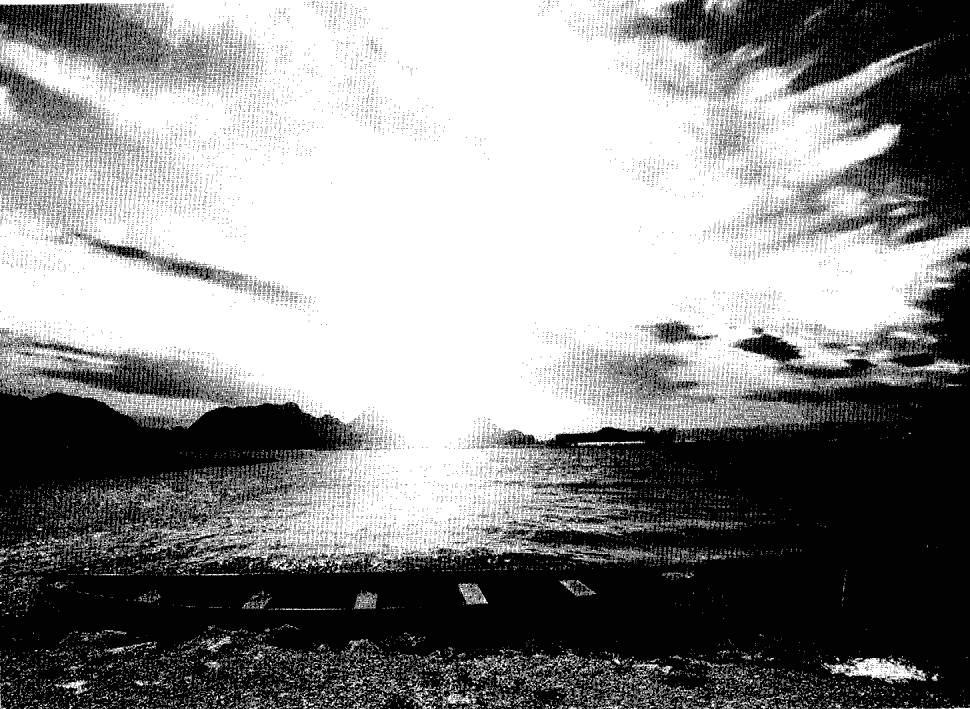

## 第11章

### 异常情况的回应

著名科学家路易斯·巴斯德（Louis Pasteur）说：“机会眷顾准备好的人。”你因再三阅读这本工作手册，替你的心智“准备好”随时接受清醒做梦的眷顾。此外，你也藉由完成书里的诸多练习，确切思考了碰到各式清醒梦境时该如何回应。

大多数人碰上创意十足又有建设性以及愉快又满足的清醒梦时，几乎都不需要任何指导。我们大都会很自然地拥抱在这类清醒梦中出现的能量和温馨正面的情绪。而且，我们还会带着神奇的感觉与更深入体验这内在领域之美的希望醒来。

然而，当你遇上困扰的、激动的或重复出现的清醒梦境，那么脑袋里预先有些策略应该大有益处。甚至，当你极其偶然地、发现自己遇上了惊恐的事，心里早有回应之道也会很有帮助。

让我们来看看几位清醒做梦老手的例子，以及他们碰上困难的情况时，如何回应。为清醒做梦者社群创建了LD4all.com这个活泼网站的帕斯珂·奥腾（PasQuale Ourtane）曾提起她身陷一个可能很恐怖情况时，她的回应：

> > “我在梦里被二战的德国士兵追逐，他似乎要逮捕我或什么。我跑下一座桥，藏在角落时。这时我明白自己在做梦。”

### 異常情況的回應

一旦在夢中清醒，帕斯珂明白她不必害怕，也明白只要能瞭解追逐她的究竟是什麼，就會有很大的收穫。請注意她的反應是叫夢中人物過來，移除分開的感覺。還有，也請注意她如何要求夢中人物協助定義它自己。最後，再請注意她以多麼誠摯的態度（擁抱夢中人物）回應了這個認知。

你可以從這個案例得出幾項通則：

我問她：「妳是誰？」
她回答：「我是妳未知的恐懼。」
我在夢裡變得非常激動，還哭了起來，我擁抱她。
我明白了自己「對未知的恐懼」已經使我「逃離」真實的生活。

我高喊：「我在這裡！過來抓我呀！」他來了。但原本兇神惡煞般的軍人已經變成小孩似的女人。

「我想知道是誰在追我和為什麼追我，」我對自己說。

- 1. 遭到追逐時，尋求資訊和瞭解。
- 2. 面對夢中人物或情況，以開放的態度詢問對方。
- 3. 真心誠摯地回應新出現的資訊。

清醒做夢者在清醒夢境裡幾乎無所不能：飛走、打鬥、中止這個夢，等等。不過，你需要明白，每個回應都有衍生的後果。你如果飛走，那豈不毫無收穫？如果跟它打鬥，你又能學到什麼？如果中止整個夢，那麼相關的互動會有什麼結果？

當你注視常常出現的惡夢情況，你怎麼做？做夢者的回應通常有兩種：打或逃。逃離魔鬼，或奮力戰鬥。對一個在夢中已清醒覺知的人來說，打或逃似乎是虛假的二分法，或自我設限的二選一套路。清醒做夢原本就對許多新的可能是開放的。清醒做夢者總是能充滿希望地看到到處都是更多的選擇，和無窮無盡的回應方式。事實上，許多夢中和醒時的惡夢之所以獲得解決，都是因為人們找到了新的創意回應。在極端的打或逃之間，存在著許多的可能性。

> 保羅・索雷曾描述一個有趣的清醒夢 ②，正好說明了深思熟慮的回應有多麼重要：
我被老虎追得無處可逃的時候，成為清醒覺知。我要自己鎮定，站穩腳步，然後我問：
「你是誰？」老虎嚇了一跳，轉變成我父親，並且回答：「我是你父親，我正要告訴你應該怎麼做！」以前我會企圖打他，但這次我努力與他對話。我告訴他，我不會任由他指使。我拒絕了他的威脅和羞辱。但從另一方面來說，我也必須承認父親的某些批評是公正的，並決定依言改變我的行為。這時，我父親轉為友善，我們握手。我問他能不能幫助我，而他鼓勵我用自己的方式單獨努力。然後我父親好像溜進我的身體，任由我獨自在夢中。

顯然，索雷曾在其他的夢中「打他」，但現在已可理解對話更有機會帶來成長。索雷寫說他拒絕「他的威脅和羞辱」，同時又聽出某些批評似乎也很「公正」。然後，索雷根據這些認知，做出改變自己行為的內在決定。突然間，父親轉為友善，他們握手。接著，索雷尋求父親的協助，也基本上接受了父親的形象，然後他「溜進我的身體」。

總之，索雷這個清醒夢的行為提供了以下幾個指導原則：

- 1. 對清醒夢情境採取深思熟慮的回應，面對攻擊性的處境時，考慮除了簡單的「打或逃」之外的選擇。
- 2. 以開放的態度詢問夢中的攻擊型人物。
- 3. 聆聽且接受有效的觀點；同意改變。
- 4. 請求夢中人物的協助；如果可能，接受夢中人物。

在下個案例裡，一位清醒做夢老手也面對了與索雷類似的處境，但選擇了另一種回應方式：

我在兒時家中的客廳。我聽見父親吼叫。他好像非常生氣，而我很害怕。我想要找他，但不知道他在哪裡。現在，我看到了。他經過走廊要到客廳來，看來大約八呎高。他的表情很生氣。我明白這是一個夢，也想起我應該表達我的愛，而不是戰鬥或逃跑。我走過去擁抱他。他轉變為我小時候最愛的狗狗。

> 以下的例子（經同意而使用）來自《一夢成真》（A Dream Come True）這本書，作者是住在明尼亞波利市的清醒做夢者大衛·肯恩（David L. Kahn），它說明了新的回應方式：

對恐怖的人物或負面的能量，表現出愛、慈悲、接受和瞭解。❸一旦清醒做夢者的回應是投射出慈悲，生氣的或可怕的人物或物件經常就分解了或改變形狀。
就在我寫作後面的這幾個章節時，來自菲律賓的一位清醒做夢者珍妮佛寄了個有趣的夢和一些問題過來。首先是清醒夢，然後是問題：

昨天晚上，我看見我和兩個男人同行，然後突然看到某種有光的窄巷，然後瞭解那是一條通道。我立刻想要弄清楚那是什麼，再通過它。當我走過去，我突然明白我必定是在做夢。
所以，我轉身對那兩個男人說：「我在做夢！」
突然，其中之一衝過來緊抓我的雙臂，但我退後並掙扎。我並不害怕或恐懼，我記得我傳給他愛的思維，或希望我足夠專心，能傳給他愛的思維，但我的專心似乎分裂成兩半，一邊要給他愛的思維，一邊又想掙脫他加諸於手臂的力量，而且我感覺他正擠壓我的胸膛……
我等待這個男人分解或消失，一邊給他愛的思維。我拼命想要專心，但很困難，因為我的注意力分成既要抵抗他的力量，又要靜心（冥想愛的思維）。但我並不不怕他，也不擔心會發生什麼。然後，夢境轉變為我在上課。

> 珍妮佛問：「這是我的恐懼浮上檯面嗎？或者，這是外來的能量？我要如何區分？

來這個夢以珍妮佛上課結束，似乎也很恰當，因為這個經驗應該會是很有價值的一課。細看她的清醒夢，你能說出珍妮佛在這個清醒夢裡還能做其他更有創意的回應嗎？以及，她在清醒夢中的專注看來是統一或分裂的？ 珍妮佛後來明白，她其實可以問夢中人物：「你代表什麼？」或「你是誰？」藉此努力獲得一些瞭解。藉由瞭解你所面對的人事物，要在清醒夢境成功解決它就比較容易。 她同時也注意到抵抗和努力傳送愛的思維，把她往兩個方向拉扯。這有點像同時踩著煞車和油門，完全不同的回應，對真正的改變和解決毫無助益。若能集中焦點應該更好，也更有能量。最後，聆聽來自內在的忠言似乎很重要，因為你可能因而得知更有創意的回應之道。 請大家要理解，在清醒夢中投射出愛與慈悲，需要真的懷有很聚焦的同理心。必須是原汁原味、有深度的慈悲所投射出去的情感，夢境和夢中人物才會有回應。小幅度的情感只會得到小幅度的回應。掺雜了焦慮的慈悲，會出現不同的反應。對他人受的苦真能感同身受者，則會加強這個回應的連結。在充滿爆發力的夢境中，這些情感是任何人都偽裝不了的。 當你表現出真正的慈悲、接納與瞭解，它似乎也會從你的內我引出同等深度、純度和強度的回應。來自內心的真誠回應，幾乎可轉化每個情況。在帕斯珂和索雷的清醒夢中，你可以看到他們都單純且真心想要理解幻化成「可怕納粹軍人」、「小孩似的女人」以及「父親變成的老虎」的究竟是誰，而這單純的想望，將可怕的能量轉化為比較親切的事物。肯恩的例子更為明顯，他將愛清醒地投射給可怕的人物，並眼看著他轉變為「我小時候最愛的狗」。

這些放之四海而皆通的回應涵蓋了極多的可能性，即使每位清醒做夢者面對的都是自己獨特的議題。總之，請更為清明地思考怎樣才是最好的回應，養成在清醒夢中總是先深思熟慮才做出回應的習慣。思考以下的問題應該有幫助：

- 1. 我的回應看來是直覺的或慢想的？
- 2. 我的回應看來是慣性的嗎？
- 3. 我的回應看來是出於恐懼嗎？
- 4. 我的回應看來有建設性嗎？
- 5. 我的回應將能成功地解決事情嗎？

### 慣性反應

清醒做夢的時候，你當然也可以像醒時生活一樣，拋開神奇的創意潛能不予理會，逕自掉進平日的例行模式或慣性的處理方式。慣性反應有許多面向：慣性行為（例如：清醒夢性行為）、慣性情緒（例如：自我防衛）、慣性思考（例如：我的需要最重要）等等。

在清醒夢中翻雲覆雨，起初聽來很迷人，但不斷地執著於此，最後可能很無聊，因為那將妨礙你在清醒做夢的自然成長與發展。當你來到無聊的那個點，請往前探索清醒做夢的深度。甚或更能幹的，調查一下隱藏在你這慣性行為背後的意義，更清晰地瞭解自己的行為。

有時，這些習慣和慣性思考，似乎是某種出自恐懼或擔憂的防衛機制，例如以下這個來自《清醒夢交流》的例子（獲要求匿名的當事人同意使用）：

> 二〇一一年七月九日，甲做夢者，〈飛翔與尋找〉
（在夢中清醒）我在一片類似大學校園的樹林與草坪下降。天氣似乎很晴朗。我想創造一點風。風來了，我感覺微風拂過面頰，也看到枝葉隨風搖曳。然後我突然想尋找「上帝」或「最高力量」，但也懷疑會有任何值得信服的事發生。我起飛離開，因為穿越幾道牆而失去視效。我感到些許不安。什麼事都沒發生。我想或許是我害怕自己無法承受。

然後我在一個房間，有個女人對我說，我該閱讀某位作者的書。我聽過這位作者，但沒聽過這本書。她說我害怕果真體驗神聖之後的發生，害怕牠會改變我的生命。她把推薦的書遞給我。

請注意這位清醒做夢者的心智活動是怎樣的相互衝突。清醒做夢者先是想要臣服，想要尋找「上帝」或「最高力量」，但也同時感到「懷疑」。這種內在衝突導致「什麼事都沒發生」，以及有點害怕「無法承受」。然後，夢中人物說「我害怕果真體驗神聖之後的發生，害怕牠會改變我的生命」。

你可在此看到一個清醒做夢者如何身陷慣性的懷疑思考，因自我設限而破壞了可能的成長。因為無法以真正的開放程序回應，這位清醒做夢者感覺到尋找「最高力量」所衍生的威脅，阻礙了真正的調查。

此種情況展現了接納與抗拒之間的巨大距離。在清醒夢中全然接納一個議題，可以帶來全面性的思考、回應和解決。可是，当你全然地抗拒這個議題、人物或問題，任何解決都不會發生，但心靈能量依然存留下來（而且，很可能會替必將重返的陰影增添能量）。當然，所有居於接納與抗拒之間、層次不一的表達，也都會有等同的內在能量與之對應。

不過，最主要的議題還是在檢視你的慣性行為、情緒和思考。如果你在清醒夢中注意到自己總是飛快離開所有的衝突，何妨自問為什麼？或者，你若在清醒夢中注意到你總是避開所有形式的放手或臣服，何妨探索其中的理由，同時檢視這些習慣是否也存在於你醒時的生活。發掘你專有的內在信念系統。然後運用你所得到的知識，去做有建設性的改變，讓新的創意、想法和行為有機會出現。正如古希臘人的名言：「瞭解自己」。你的全然自我乃得以完整。

多年的清醒做夢之後，我為自己建立了一個原則：越有感覺的能量或情緒，越是需要去探索（不管它看來很正面或很負面）。這樣做的理由是因為我早已明白，清醒做夢的本質都是通往療癒、教育和解決內在衝突。清醒做夢的觀點越是寬廣，越是能從它所引發的貼心與慈悲回應裡，得到更多的瞭解。經由清醒做夢，我可以看到一條根本的、有機的道路，通往更大的整合與和諧；而不是以偏概全、來自外部的規則與回應的系統。

理想上來說，清醒做夢應該要能鼓勵人們發揮靈活的天性，以及聆聽心靈與直覺的能力。在有些清醒夢中，你能「意識」或「感覺」到直覺想提示你新方式的回應，或是加入更多的開放、創意或慈悲。清醒做夢老手都懂得去信任這些內在的提示和洞見，把它們當成為數幾乎無限的可能回應裡的某種指引。

> > 以下這個來自史考特・史貝羅（Scott Sparrow）的清醒夢案例，正足以說明深思熟慮型回應所擴展的力量。5它有點像某種現代寓言，光在一個清醒夢中就克服了好幾個層次的自我抗拒，彰顯了新的信任、接納和無懼所包含的蛻變神力。
>
> 我單獨在一棟木屋中，屋門打開。三個人物進來，並肩站在門口：吸血鬼德古拉、狼人和科學怪人。我警覺起來，但這事件的古怪性質使我相信我必定是在做夢。明白這只是夢，以及我可以要他們離開後，我說：「你們只是一個夢，走開！」他們立刻消失。
>
> 再次落單之後，我心想：「或許我應該做的事是帶著光臣服。」所以，我叫他們回來。
> 門再次打開，他們回來了。我對自己說：「我帶著光臣服。」立刻地，內透粉紅的白光將我包圍。因為光線太亮，我幾乎看不見那三個人物。
>
> 這時我想：「或許我應該邀請他們進入光中。」所以說：「請走進光裡面來。」他們往前走，光線充滿了我，而我體驗到一股巨大狂喜的愛。跟隨著這個夢，我在接下來的好幾天都沉浸在備受恩寵的狀態裡。

清醒做夢者原本排斥這些魔王，他的行為來自恐懼。然後他重新思考，並以關上的門作為某種象徵性的保護，雖然這個保護會使他無法「看」清楚（一個有趣且透露他害怕的細節）。最後，他離開排斥與害怕，往接納靠攏。邀請魔王「進入光裡面」，而光也突然充滿了他，並使他體驗到「巨大狂喜的愛」。

在這個例子裡，清醒做夢者充滿創新思維的天性清晰可見，當他三次重新思考、更改他的回應方式，他的體驗也隨之改變。當最後的回應容許甚至更多的圓滿、解決和整合時，能量也更全然地迸發。清醒做夢能帶出這種與當下時刻一致的臨在感，也就是艾克哈特・托勒在《一個新世界》（A New Earth by Eckhart Tolle）所寫：「內在與當下時刻一致會開啟你的意識，並且讓意識與整體一致。而整體，也就是生命的完整性，就會經由你展現。」⑥

有的時候，事情會由夢中人物帶路，而身為清醒做夢者的你則必須決定如何回應，一如凱莉・費洛普 (Kelly Frappier) 的這個清醒夢⑦：

我不記得所有細節，只記得我明白自己在做夢後的部分。我看見我母親（過世已十年）坐在椅子上對我微笑。我因為明白她已過世，而成為清醒覺知。 我在夢中哭了起來，母親也哭了。那就好像再次跟她道別。我看著她，越哭越難過。然後，她開始做鬼臉。她活著的時候，這樣做常使我大笑。我開始大笑，她也笑了。某種平靜在這個夢裡，夢中人物顯然認出做夢者是清醒覺知的，因為她開始「扮鬼臉」（像她在生時那樣），這替原本甚為哀傷的清醒做夢者帶來歡笑和平靜的感覺。 我們難免猜測，這個母親形象的出現是否出自清醒做夢者的內在需求，或是過世者的靈魂覺得有必要來協助女兒克服哀傷，因而出現在她的夢中。 的感覺籠罩下來。 接著我醒過來。 我並不相信我控制了這個夢，除非那是潛意識的，不過這真的是一次神奇的經驗。

### 信任與恐懼

做了多年的清醒夢，我對偶爾在清醒夢境聽見隱形的聲音（我猜那是我更大的覺知）對我說：『信任，無事值得害怕。』我還是會感到很驚訝。 更讓我震驚的一次是，當我驚訝且重視地往上看，這幾個字竟然有如巨大的廣告橫幅，懸掛在我清醒夢中的天空。 以好玩心態做著清醒夢的新手或許對這幾個字不以為意。 但倘若更加深入清醒做夢，你確實會發現自己偶爾會處在一個能量很強、概念甚深、變化多端的奇特情況。 有時候，我會因擔憂而走開。 然而，醒來後，我又明白其實可有不同的回應，或許那個情況的確反映著一個需要被解決的內在議題。我知道是我的恐懼擔任起隱形籬笆的角色，阻止我自由移動。若要獲得更多自由，只需面對我的恐懼，學習如何去克服。通常，這些面對並克服單純恐懼的清醒夢最有意義，也最充滿能量（一如那位邀請德古拉、狼人和科學怪人與他一同進入光中的清醒做夢者所體驗到的）。

所以，當你更加深入，應該看得出發展無懼或信任的感覺，似乎是很有價值的。雖然清醒做夢給了你自由，也容許你跑開、不去面對事情，但你最後必會看到面對恐懼的價值。 當你克服了一項恐懼，即使是很小的一項，你的自我便增添了信心，內在的信任也將隨之綻放。記住：信任，無事值得害怕。

### 大畫面

有時，清醒做夢者的信念、預期和感覺這些「投射心理覆蓋」之中，會攜帶著清醒做夢終極目標的「大畫面」。

對某些靈性修行者來說，這也許意味著「開悟」，而對也在路上的其他人，則可以是「全然的自由」或「整體」。

清醒做夢者這種終極目標的大畫面想法，在心理學、薩滿傳統與其他道途也都存在。

擁有一個靈活的開闊目標，通常來說是很不錯的。然而，一個目標導向的清醒做夢者，必須在尋求自我挑選之目標（ego-selected goal）的同時，避免落入對重要議題冷漠和盲目的情況。利用清醒做夢追求開悟的過程中，如果與憤怒有關的重要議題在清醒夢裡出現，這時該怎麼辦？例如，清醒做夢者注意到每次他清醒覺知後，便看見憤怒的衝突場面或憤怒的夢中人物。

因為深深地投入於開悟的目標，清醒做夢者重複忽視這些憤怒的場景，認為它們並不符合他的目標。他只聚焦於光明的、和諧的、真相的清醒夢。然而，憤怒的影像堅持不去，能量越來越強大，甚至形成主動的干擾。這時，清醒做夢者就一定要回應了。

來到這個點時，這些憤怒的夢中人物或許已讓這個目標導向的清醒做夢者相信下列三種情況之一：

- 1. 這些憤怒的夢中人物打算阻止他往真正的目標前進。
- 2. 他必須與它們及它們的黑暗憤怒大戰一場。
- 3. 最麻煩的，他的的確正與黑暗力量拔河之中。

這個例子說明了，目標導向的清醒做夢者在努力朝終極目標衝刺的時候，可以怎樣地忽視合理又正當的個人議題，直到這些被忽視的議題變成擁有獨立意志的超大陰影人物。不幸的是，當議題變到那麼大又有力量的時候，清醒做夢者幾乎都無法承認和接納它們是他個人的投射，反而去尋求外部的其他解釋。當你閱讀本書且進行書中的練習時，請你明白：如果你打算利用清醒做夢達成深刻的蛻變目標，務必要先用點時間去清理個人內心裡面的問題，和那些限制型的信念。

古希臘羅馬神話有許多跟神和平神有關的故事，祂們都擁有許多不可思議的神力和天賦，可是祂們也經常忽視了祂們的弱點，或誤用祂們的力量。這些具有警世意味的故事，正可用來當成真正的「清醒夢教訓」。然而，當你使用清醒做夢作為瞭解你的自我與大我的方法，且也腳踏實地一一解決了內心的議題和限制性的信念，那時你便開啟了一條更加洞澈與清晰的探索之路。目標、架構、理想都有其確切的價值，但如果你用它們去遮攔或限制你，那它們反而是有害無益的。

#### 練習

寫出一個要求你有所回應的夢或清醒夢。

- 1. 列出你照例會做出的三個慣性回應。
- 2. 寫出你想得出的三個超棒回應。
- 3. 列出三個超棒和慣性之間的中間型回應。

看看這樣的練習可擴展出怎樣的可能，並增加你的心理靈活度。因為必須去思考可替代的其他可能，你也擴展了慣性思考和期待的輪廓線。

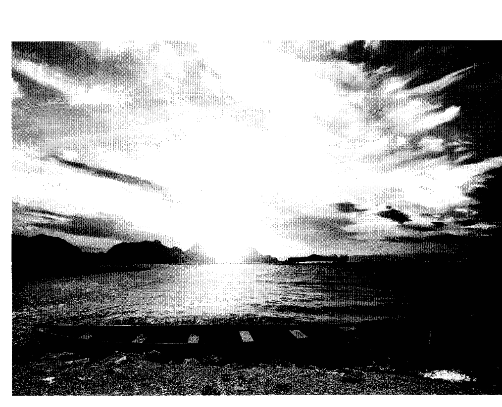

# Chapter 12

# 實驗與探索內在空間

根據某些歷史傳聞，第一個電話鈴聲之所以出現，來自發生於亞歷山大・貝爾 (Alexander Graham Bell) 身上兩個幸運的意外。第一個也比較少人知道的「黃金錯誤」，發生在貝爾閱讀德國物理學家赫爾曼・馮・亥姆霍茲 (Hermann von Helmholtz) 一篇以德文寫成的〈論聲音的感覺〉。貝爾誤解了一些文字，以為該文章說母音的聲音可以藉由電線傳送。後來，貝爾曾提及這個錯誤的價值：「它給了我信心。如果我看得懂德文，我那些與電相關的實驗，或許永遠也不會開始。」❶

更為出名的幸運意外，發生在一八七六年三月十日的貝爾實驗室。那天貝爾不小心灑了一些蓄電池酸液，他叫著：「華生先生，過來。我需要你！」在鄰近房間的華生聽見貝爾的聲音其實是經由電話線傳過來，而他回答了世界上的第一通電話。

溝通實驗史上同樣有趣的事件，是義大利人古列爾莫・馬可尼 (Guglielmo Marconi) 在一八九五年創造出一個可以使用的無線電報機。現在，「聲音」可以不用沿著相連的電線，就可以傳達很遠的距離。當他寫信給義大利的郵政與電報部長，請求他資助這項最新的裝置，據說部長的回信依其要求寄到「隆格納」去了，而隆格納其實是羅馬近郊的一所瘋人院。沒有收到回音的馬可尼為了尋求協助，乃於一八九六年搬到更願意支持他的英國。一八九七年，他已受邀到世界各地去展示這項傑出的裝置。

號讓人知道他正在做清醒夢。想想清醒溝通過程的機制：清醒覺知的做夢腦誘導實體腦打信號告知外界，此人的心智已在夢中清醒，方法是在夢中清醒過來的做夢腦要夢境中的夢眼睛左右移動，造成實體眼睛的移動，而記錄快速動眼期的多種波動描寫器，則把這些信號描寫了下來，成為清醒做夢的科學證據。這些眼睛信號證實了果然有清醒做夢這回事，以及清醒做夢者跟他的身體以及外面的世界都有溝通。現在，且讓我們把時間快轉八十年，想想某個睡覺中的人居然宣稱，他可以用眼睛打信號讓人知道他正在做清醒夢。想想清醒溝通過程的機制：清醒覺知的做夢腦誘導實體腦打信號告知外界，此人的心智已在夢中清醒，方法是在夢中清醒過來的做夢腦要夢境中的夢眼睛左右移動，造成實體眼睛的移動，而記錄快速動眼期的多種波動描寫器，則把這些信號描寫了下來，成為清醒做夢的科學證據。這些眼睛信號證實了果然有清醒做夢這回事，以及清醒做夢者跟他的身體以及外面的世界都有溝通。然而，清醒做夢讓我們理解，清醒做夢者也跟內在夢境界域裡的人物、物件、場景及另一層次的第二覺知（亦即賴博格決定要對之「臣服」的）有所溝通。你在這個界域裡發現：夢中人物代表什麼意義，可以解決個人議題，練習運動技能，尋找創意等等。清醒做夢告訴我們，夢境可以是個「內對內」的溝通平台，可以獲取資訊，並做能量的交換。一如馬可尼的突破性發展，身為內在溝通的革命型新工具，清醒做夢也展示了它的實際功能。清醒做夢打開了針對做夢、潛意識以及更大覺知，進行科學探索與實驗的巨大新領域。②在這個章節裡，我想檢視在清醒夢中進行實驗，或者你也可以說：在心靈實驗室進行實驗時的執行方式和陷阱。同樣的，清醒做夢者需要思考會影響實驗結果的種種事項，以及如何執行一項實驗，即使在它出錯的時候。

### 做夢時的搜索引擎

在夢中清醒覺知，任何你想得到的題目都可以拿來實驗，即使那些題目超乎你的經歷、想像或思維模式。當然，限制好像存在，但有些「限制」其實只存在於你和你的信念系統裡。所以在這個心靈實驗室裡，瞭解其他清醒做夢者如何完成對他們潛意識腦的內容的調查、探索和溝通，是很有幫助的。

一九八五年五月，艾德·凱洛格做了個清醒夢，使他洞察一個收集清晰資訊的技巧；他後來稱為「能進入所有資訊的夢時搜索引擎」。他將這些洞見系統化成為「清醒夢資訊技巧」（Lucid Dream Information Technique，簡稱LDIT），後來寫了篇文章發表於《夢網絡快報》。❸ 他在新版上❹回憶最初的靈感來源，然後解釋他的技巧：

我在清醒夢中用銀碗向幾位做夢者解釋孵答案的技巧。基本上，這技巧包含以下的步驟——首先清醒做夢者決定一個問題，詢問他／她目前最需要知道的資訊。此一特殊問題決定之後，做夢者將銀碗倒扣，有意識地聚焦於這個問題。然後等待幾秒鐘，讓答案具體化，接著他們把碗翻過來，將在碗裡找到寫好的答案。我帶領做夢同伴走過這個孵答案的技巧好幾次，每次都能得到清晰而獨立的答案。我曾為自己詢問，政府某單位有無可能批准未來的研究經費，得到的答案是『再見』！我當然知道，這表示我不會再從這個單位得到更多經費（不幸地，後來也證實為真）。那次之後，我做過許多LDIT的變化型實驗，覺得它可以細分為四個步驟：

- 1. 找個媒介物讓答案得以具體化（例如：關起的抽屜或空白的紙張）；
- 2. 提出問題，等待幾秒鐘（這非常重要）；
- 3. 拉開抽屜（或把紙張翻過來，等等）看看具體化的是什麼；
- 4. 記住你所看到的，要自己從清醒夢實境醒過來，正確且完整地在醒時實境把夢中得到的資訊記錄下來。

我如果拉開抽屜，有時會發現一張字條或一幅圖畫，有時則是象徵了答案的一或多個物件。如果是一篇讀物，我必須第一次就全部讀完，不然重讀的效果通常不好。有些具體化媒介物很優，最好的則能給出一針見血的答案，讓你回到醒時世界時很容易回想並記錄下來。例如，你可以問個問題，然後把夢中的紙張翻過來，或翻開一本夢中的書，或扭開夢中的電腦，甚至在夢中的電腦上打字再按壓輸入，要求它展示答案。找到合適的媒介物或許需要你這邊的一些巧思—— 並不是每個夢場景裡都有空的抽屜、白紙或銀碗！為了使用LDIT，我需要在整個解答過程中保持清醒的頭腦，有意識地保持著覺知，並在返回醒時世界後清晰地回想答案。

我覺得LDIT在收集有如天啟的資訊時非常好用，而且收到的資訊品質通常都很高。但這並不表示我得到的答案都有用。例如有一次我要要求投資方面的資訊，結果得到一塊刻有楔形文字的泥板！我已經把LDIT當成清醒做夢時的搜索引擎，問過從遙視目標到投資意見的所有問題。不過，以我的建議，初學者最好從使用LDIT詢問如何改進個人或所愛之人的健康與療癒方面的問題開始。

基本上來說，清醒做夢者本來就會使用意圖去要求資訊，以及資訊出現的地點。例如，你可要求想要的資訊或意圖在你打開隔壁房間的門時，出現在房間裡。或者你可要求想要的意圖在你轉身時，出現在你的身後。在有些情況，當我說：「讓我看到……」我的要求會在頭上的天空具體化，或以整個視覺場景的變形來顯示結果。

清醒做夢者早已學到措辭的重要，所以有些人才會在醒時世界想好每個字要怎麼說。所以，如果你要求：「當我轉身，我要尋找（look for）答案。」那麼你很可能整個清醒夢都在尋找。但如果你要求：「當我轉身，我就會看到（look at）答案。」那麼很可能你轉身就看到了。所以，請記住，即使是小到像介系詞這麼小的差異，也會改變你意圖的方向，導致重大的改變。

理智的做法是，為了可以更為信賴，清醒做夢者應該建立一套成功的記錄。如果你搜尋資訊，而答案似乎清晰易懂、可信度有八成，那麼你知道你有八成的成功率。然而，如果你發現你要求的資訊半數以上以楔形文字或無法理解的符號出現，那麼你或許得在要求資訊的過程（例如：清晰意圖的表達），或你的信念系統與心理覆蓋（例如：害怕你可能發現的）兩者之一，下點功夫。

此外，你需要理解，在使用LDIT和不受限意圖的過程裡，問題或要求通常是提向夢中那看不見的更大覺知（你要稱為潛意識也行）。清醒做夢者只是把問題或要求說出來。重點是：你是向你的「更大覺知」（隨你怎樣定義這個字詞）尋求資訊。

相較之下，你要向大多數的夢中人物提出同樣的問題或要求時，則不妨謹慎些。清醒做夢者經常報告，他們很難瞭解夢中人物的回應。因為，夢中人物所代表的可能是比你更小的面向，它們的覺知通常也比你更少，因而它們所提供的答案常是混亂不清的。就效果上來說，向夢中人物尋求答案的成功率似乎低於更大覺知。當然例外總是難免，例如你個人認識的已過世人物或學識淵博的夢中人物；但總體來說，避免向普通的夢中人物詢問重要問題或要求答案。

### 取消實驗

既然清醒做夢者可在夢中執行的實驗幾乎無奇不有，那麼做夢者即使宣布「取消」或「停止」一個實驗仍不算失敗；能瞭解這點是很重要的。如果發現情況讓你很不舒服，大可下令取消或停止。

即使清醒做夢老手偶爾也會發現自己陷入困境。他們想弄清楚一個概念，並要求去體驗它，可是當概念顯露，許多能量、資訊和材料跟著出現，有時情勢會變得有些緊張。我自己就發生過一次，那時我想瞭解「氣」是怎麼回事，然後就看見各種很神奇的解釋在我的眼前具體化。起初我有點擔心，然後又明白，我的更大覺知幾乎不曾把我扯進經驗能力不堪承受的事件，所以我放下憂慮，耐住性子開始觀察。最後，在一個快樂的片刻，我與「氣」合而為一，感覺到不可思議的感覺。

對某些人來說，在一個清醒夢中宣稱：「讓我體驗神聖恩典。」結果可能是概念性地體驗到這種叫人屏息的力量與美好。在這些情況裡，你若覺得無法承受，不妨發出可以改變此一體驗強度的命令。清醒做夢者小傑福瑞・畢克（Jeffrey Peck, Jr），同意分享他要求體驗「神聖恩典」時經歷的清醒夢。

#### 二〇一二年七月九日 清醒夢

我在河邊和幾名小孩吃餅乾。這似乎有點奇怪，我因此成為清醒覺知，從河邊走開。我走過停車場，看見一所很小的學校。我大聲喊出我的要求，但我的聲音似乎被周遭壓了下去。我聚集所有的意志力和情緒，對著上方的夢空間大喊：『讓我體驗神聖恩典！』我聽見一個奇怪的聲音，接著我的頭上出現漩渦。我掉進某種虛空裡，然後感覺到強烈的一體和平靜感。我看見太陽系及整個太空在我眼前展開。我瞭解這是超級智慧，或眾所稱呼的上帝、道、大梵天、宇宙靈魂、基督、宇宙設計者，一切的一切。我感覺到強大的存在和虛空。同時，我又可以感覺自己躺在有如水泥的黏性物質之上，手下抓著狀似泥灰或黏土的東西。這個經驗在我感覺身處一個客廳時結束。我不知道接下來要體驗什麼，所以我大喊：『讓我體驗極樂！』聲音和漩渦再次出現。我預感到這會很強烈，趕緊在一切發生之前取消這項要求。我的視野開始扭曲變形，不久後便醒來了。如你所見，他原本決定尋求第二次經驗，但本能地知道感覺可能太過強烈，所以決定取消要求。結果，體驗停止而他醒來。容我再次提醒，你的概念型體驗很可能以意料之外的轉變要求和極端強烈的情況呈現。清醒做夢者需要明白這一點，以便必要時大聲說出你的意圖，中止當時的過程。

也曾有少數清醒做夢者報告，看不見的聲音宣稱他們的要求需要三思。有位清醒做夢者描述，在要求體驗一個現代物理學的高深概念之後，一個看不見的聲音告訴他，此時嘗試這個實驗似乎太不聚焦也太紛亂。那聲音繼續建議他，在更為清晰和更警醒時再做。

此外，有些清醒做夢者或許尋求獨特的資訊（例如：生命的意義），然後當答案以一些奇怪的數學方程式和幾何圖形飛過空間時，感到非常困惑。有些清醒夢實驗或許需要你事先要求，以你所能瞭解的方式確切回覆。

凱洛琳·邁克瑞迪（Caroline McCready）在某次清醒夢中要求體驗「超越我的投射」之外，或她的成見之外的經驗：

例如在一個清醒夢境裡，我對天空喊道：「讓我看到超越我的投射之外的意識。」我立刻被吸進宇宙裡，周遭的星球和星星都以純然的光與意識的形式呈現。那裡沒有任何物質，只有光以及本質為光的意識。那感覺如此真實，即使現在想起，我依然起雞皮疙瘩。當我衝過太空，有個男性的聲音不斷地重複：「最小等同最大。」

### 清醒夢究竟多清醒？

哈佛醫學院心理系黛德莉·巴瑞特博士（Deirdre Barrett, Ph.D.）曾以「清醒夢究竟多清醒」這個問題做了一個研究。⑦ 巴瑞特博士使用五十個清醒夢常見的主題檢視各類清醒夢，引證其中的一些清醒做夢者真是「不大理性」。她也沿用四個推論來檢視清醒做夢者的報告，認為真正「清醒的」清醒做夢者，應該可以覺知到以下的四件事：

如你所見，有時夢中的經驗感覺起來是如此出人意表、意義深厚和不可思議。你難免會想，自己的經驗是否與他人各自得到的經驗類似？的確可以使用類似的過程、意圖和語詞，去檢驗是否會得到相同的經驗。而且，有些與醒時實相有關的實驗，也不難驗證清醒夢中得到的資訊是否正確。清醒做夢者可以用這種方式去查核資訊的來源是某種集體無意識，或心靈境界。

我越過我們宇宙的「邊緣」，許多純意識的光球圍繞著我，這些濃縮的意識，密度比星球和星星更大。當我越來越高，光球的分布也越來越廣，多到它們開始融合，並噴發越來越多的光。那真的非常之美。我的上方只有純然的光和無限無邊的意識。

- 1. 夢中見到的人是夢裡的角色。
- 2. 夢中物件不是真實的；同理，行動也不會在醒後實現。
- 3. 做夢者不必遵循醒時生活的物理條件也能達到目標。
- 4. 醒時世界的記憶是完整的，而非遺忘或虛構。

若曾閱讀一些清醒做夢者自己寫的報告，你應該也會同意巴瑞特博士的看法。看清醒做夢者想以揮動手臂在夢中飛翔，的確有點傻氣。或者看看你自己的清醒夢報告，對於自己怎會「要求夢中的姊姊替我記錄清醒夢的內容」，然後明天早上要交給我「感到好笑」。

然而，在清醒夢境裡，你每分每秒都活在信念或投射心理覆蓋所形成的動態母體之內。

你的各種行動在這個「動態母體之內」看來都很周延、聰明而且理智，所以基本上它們似乎是理性或「清醒」的。可是，當你醒來，並引用醒時的信念系統時，相同的行動看來或許顯得錯誤、可笑或不理性。能夠瞭解這一點是很有幫助的，你因而可以根據自己的反應和行動回頭去檢視當時的信念系統（或投射心理覆蓋），不管是醒時或做夢時的。

清醒做夢老手並不會對巴瑞特博士的研究結果感到意外，他們見過信念系統如何產生作用，也明白清醒覺知可分好幾個層次。在艾德・凱洛格的層次模式裡，「清醒覺知」之上是

### 設立實驗

論，越是有覺知。 最好以心靈力量來操控，也可以看穿限制型的心理覆蓋，從而把情況的本質適度提升到更高的程度。巴瑞特博士在她的研究中證實，越是有經驗的清醒做夢者對她所整理出的四個推論，越是有覺知。

因為清醒做夢的動態本質（可將個人的信念系統反射回去給他們），每個人在執行他的實驗時都應該小心。基於這個理由，若能在清醒狀態設計好實驗的整個綱要和程序（如有可，也請有經驗者協助），似乎是比較好的。你可在醒時仔細檢視實驗的程序，避免可能的錯誤，以及一般認為的限制，例如：記憶大量數據資料。 有經驗的清醒做夢者可以指出實驗的一些困難，例如一次完成多項任務。首先，要記住所有的任務已經很不容易，還要不讓答案混淆並在醒後記錄資料，一次實驗多項任務其實吃力又不討好。又例如清醒做夢者事前已懷疑實驗的前提，也不認為它可能達標，那麼這個實驗也容易遭遇困難。 還記得那項針對夢中人物與他們的數學能力的德國實驗嗎？研究結束後仍繼續執行實驗你可能碰上已經清醒做夢才想要進行實驗，有時你的假設和信念會使你無法從事基本的科學協議（例如：可驗證性、測量值等等）。雖然你可能獲致結果，但醒後你可能明白即興的實驗有重大缺失，因而限制了結果或使結果失效。為了這些理由，所有清醒做夢者應該在醒時深刻思考他們的實驗，然後才去清醒夢中執行。

你也可能碰上已經清醒做夢才想要進行實驗，有時你的假設和信念會使你無法從事基本的科學協議（例如：可驗證性、測量值等等）。雖然你可能獲致結果，但醒後你可能明白即興的實驗有重大缺失，因而限制了結果或使結果失效。為了這些理由，所有清醒做夢者應該在醒時深刻思考他們的實驗，然後才去清醒夢中執行。

那麼它很可能就會影響你的行動和方向。所以，為了得到最好的結果，請在醒時即預先檢視你的實驗，解決相關的一些議題。

念系統的本質都應該在實驗開始之前列入考慮的範圍，因為如果你「懷疑」實驗的可行性，

自己的一個清醒做夢者報告，後來的夢中人物成績比較好。所以，這是顯示清醒做夢者已克服了自己的不相信？或者，更富含接納性的思維模式允許更厲害的夢中人物出現？有時，連你信

以下這份建議清單，對想要在清醒夢中執行實驗的人，應該是有幫助的：

- 1. 同意以對自己完全誠實的態度處理清醒夢中的事件與結果。
- 2. 以真誠的好奇心對待實驗。對它敞開。記下信念系統的任何衝突。
- 3. 醒後製作詳盡確實的記錄。避免假設。描述事情力求清晰，尤其是你在清醒夢中用以表達意圖及所得之回應的每個字。
- 4. 在清醒做夢之前準備好周延的實驗任務。初學者最好不要設計出太過複雜或必須牽扯到許多背誦的實驗。
- 5. 當你得到實驗對象的回應，帶著結果立刻醒來，趁記憶猶新時寫下。
- 6. 練習這些實驗並建立「追蹤記錄」。檢視實驗記錄，得出正確性的整體層級。
- 7. 明白從清醒夢境帶著資料回到醒時世界，有時會有以下的問題：虛假的開悟、資訊超載、神秘的象徔回應、記憶限制等。但，熟能生巧。

對實驗者來說，解釋你的結果又是另一套全新的議題。我們鼓勵你把結果看成是一個正確性的連續體。為什麼？有些實驗容易成為是非題，對錯的機會各半。然而，如果你決定在清醒夢中詢問一個廣泛的問題，因而得到一個廣泛或象徵性的回應。這時怎麼辦？你要如何評估此實驗究竟成功或失敗？即使是迪米崔·門捷列夫（Dmitri Mendeleev）夢見他看見元素週期表之後，也對來自夢境的記憶做了一些調整。

從清醒夢醒來、撰寫報告時，不妨自問你是否覺得該資訊看來可靠、清晰並可理解？當你執行實驗或答案具體化的過程，有無感覺任何衝突或不確定？

### 溝通

亞歷山大·貝爾及古列爾莫·馬可尼等溝通界先驅者的故事提醒著我們，新形式的溝通有時需要花費可觀的努力與工作，才可能移除「靜電干擾」，獲致高度的方便、實用和正確性。換句話說，溝通若要臻至完美，需要時間與努力。當清醒做夢擔負起在我們內在進行的無線、無管也毋須晶片的溝通大任時，清醒做夢溝通的清晰度，或許需要仰賴清醒做夢者調整自己的信念、期待與意圖這類不那麼具體的事項。

同樣的，當你探索光纖溝通的歷史，便可得知這個行業的未來繫於加強光纖電纜的純淨度。需有高純度的光纖電纜，資訊才能避免破碎與不連續。一旦研究出確保光纖純度的有效方法，經由光旅行過光纖而獲致的溝通，就成為全世界的實相了。

所以，在你的清醒夢實驗裡，檢驗你自己。把衝突的信念、負面的期待、分裂的意圖，當成致使內在溝通充滿靜電干擾與斷訊的不純淨物。身為清醒夢探索者，這樣的檢驗能協助你的思維、信念、期待和意圖更為清晰。這方面清晰之後，內在溝通似乎也就更清晰了。

## Chapter 13

## 修復：清醒夢中的療癒

希臘人在整個地中海區為執行醫治與療癒的半神療癒者阿斯克勒庇俄斯（Asclepius）建造了三百多座神廟。各處神廟的石灰石底座都刻有許多以奇蹟式獲致療癒者的心得，供前來祈求的病患與傷殘者閱讀，伊達魯斯地方的這座神廟牆壁就刻了這樣幾句話：「我是瞎子克勞狄厄，阿斯克勒庇俄斯出現在我的夢中，治好了我。」

古希臘人的歷史描述，做夢能通往不可思議的醫治和迅速的療癒，尤其當患者渴求且醞釀此一療癒的發生。伊達魯斯這座神廟可供一百六十人留宿，這些人都是來尋求阿斯克勒庇俄斯或祂的五個女兒之一前來夢裡探視與醫治，這五個女兒分別是帕娜西亞（Panacea，綜合治療）、海吉亞（Hygieia，衛生與純淨）、依阿索（Iaso，復原）、亞瑟斯科（Acesco，療程）和雅格拉西亞（Aglaea，健康增進）。祂的女兒有時會出現在夢境，勸告做夢者去吃某種醫藥植物或藥草，或不可繼續在有毒的河水中沐浴，他們的健康因而獲得改善。

時至今日，這些古時候的故事聽起來似乎既離奇又有趣。阿斯克勒庇俄斯彷彿已被人遺忘，但我們的確記得柏拉圖將之與阿斯克勒庇俄斯傳承連結的希波克拉底（以及「希波克拉底誓言」）。然而，古希臘人顯然比現代的許多人更加瞭解睡眠與做夢對健康的影響。

根據哈佛醫學院睡眠醫學研究部門的報告，做夢期間的腦波活動、呼吸和心跳的頻率都跟醒時同樣多變。事實上，睡覺時的腦波甚至比醒時更加活躍。同樣的，腸胃的消化、細胞修復、成長荷爾蒙的釋出等等生理過程，甚至是睡時比醒時更為活躍。他們的評論是：『睡眠（或做夢）快速動眼期內，神經與生理系統的可觀變化，其中的理由目前仍不得而知，它可能是與快速動眼期連動之神經系統活動的副產品，或許跟夢境的內容有關。』（2）簡單來說就是，你的『夢境內容』或許會在你的腦和身體裡面造成顯著的神經和生理變化。

如此一來，清醒做夢者在夢中清醒覺知後，能不能有意識地利用操縱夢境的內容來醫治身體？

你已在第二章讀到，清醒做夢者安妮療癒腳上痛苦雞眼的例子。她有天晚上在夢中清醒，想起想療癒雞眼的目標。她在兩手之間創造出一個療癒光球，再把光球分別放在兩隻腳上，意圖醫好自己的腳。她看見腳在光中越來越亮。第二天，她醒來。所有的雞眼在一夜之間變成黑色，且在後來的十天裡一一掉落。

明顯的療癒案例還有很多。季玲這位女性清醒做夢者的經血流個不停，醫生告訴她若不能盡快停止，必須切除子宮。季玲在幾天後的夜裡，在夢中成為清醒覺知，憶起療癒身體的計畫。她正準備依照計畫，用夢中的手伸入夢中的子宮、止住它的出血時，突然直覺地感到應該先療癒她的心。所以，她先按住夢中的心療癒它後，再置放於夢中的子宮上療癒它。她感覺到寧靜的感受。等她醒來，經血停止，子宮也不必切除了。（3）

艾德·凱洛格是生化學的博士，也對清醒做夢的療癒很有興趣，他報告說，有一次扁桃腺受到感染，又紅又腫。他尋求療癒。在夢中覺知後，他憶起自己的療癒計畫，便將療癒的自我肯定短語專注地指向紅腫的部位。等他醒來，他說他的扁桃腺看來幾乎正常，百分之九十五的感染也在後來的幾小時消失。④這幾個成功的案例都有某些特點。第一，他們都以療癒為目標直接出手。例如，有人創造出療癒光球，或把療癒能量放進夢中的手，或把療癒的信念聚焦於受影響的部位。他們的專注、期待和夢中的動作全都一致，造就成功的清醒夢療癒經驗。第二，他們「相信」可在清醒夢中療癒自己的病痛。

有個並未成功的清醒夢案例是很好的對比。一名清醒做夢者決定找個夢中的醫生來治療她。當她終於找到一位醫生，對方卻回答：「我好累，而且時間太晚了，妳總是星期五才來。」整個清醒夢中，醫生和護士都不斷建議清醒做夢者去吃某種食品，但她總是拒絕。清醒夢的結尾是她呼喊醫生回來幫她，但他置之不理。這名清醒做夢者醒來之後，情況並沒有改善。⑤你可以從這個簡單的例子，看到一個重要的教訓。這位清醒做夢者可悲地找別人來醫治她，而非採取行動直接療癒自身的病痛，她顯然相信醫療必須由他人來做。我們可以從她的行為清楚看到這個限制性信念，不是嗎？

你可以用這些例子和教訓來助自己一臂之力。如果你有哪裡不舒服，不妨預先計劃一次清醒夢療癒體驗。你在計畫中決定要以哪些直接的行動療癒自己。上面的故事已提出幾種備用行動：

- 創造出療癒光球
- 把療癒能量投射到夢中的手上
- 在清醒夢中使用肯定的短語或唱誦

這些醒時計畫正顯示你對自我療癒的積極信念，也會幫助你在夢中清醒時回憶起採取你要行動的意圖。

清醒做夢的美好在於它允許科學實驗，即使清醒做夢已是薩滿或佛教徒或其他人早已使用了好幾千年的技巧。我們多麼希望能看見，嚴謹的醫學研究小組找來二十位身有單純疼痛卻怎樣也醫不好的人，設立一個簡單的實驗。研究員可以教導其中的十人帶著直指疼痛的療癒意圖清醒做夢，同時讓另外的十人成為控制組。一年之後的分析，即可決定哪一組的療癒狀況比較好。

也有些清醒做夢者報告，他們的療癒得到其他人的協助。例如，清醒做夢者或許想要瞭解生病的根本原因，然後會在夢中被告知，或有夢中人物或超越夢境之外的更高覺知讓他知道，他不該吃某些食物，或應該服用哪些藥。

《清醒做夢經驗》二〇二三年十二月這一期刊登了另一例子，有個清醒做夢者報告，一位非常高大的夢中人物宣佈他是來幫助她的。這位女士想起她需要療癒手術的後遺症，這位高大人物拿出一支小小的光棒交給她，要她放在需要療癒的部位。她照做了。在她的下一次回診中，醫生告訴她，她已完全康復。

這讓我想起曾來參加工作坊的一位男士。他描述長期患有一種少見的腸胃不適，醫生既無法解釋也不能幫助他。我在工作坊裡鼓勵他為下一次的清醒夢做好行動計畫，看能不能治好自己。我當然也鼓勵他及所有的學員留意他們在清醒夢境裡的直覺，因為他們的更大覺知可能會給予重要的指引（一如那位流血不止的女士突然感覺需要先療癒她的心）。大約一個星期之後，他在工作坊的課程裡說出一個神奇的清醒夢。他在前一晚的夢裡清醒過來，憶起想要治療腸胃痼疾的意圖。當他開始唱誦，希望手上有光可治癒病痛時，他過去世十五年的祖母突然出現。她請求先療癒她。他說他把手上具有療癒力的光能量導向她，她的臉上出現美麗又欣喜的亮光。然後他把雙手轉往自己的軀幹，導引療癒的光回到自身。我請他說說祖母的事，以及她怎會跟這一切有關。他說祖母曾在自己的國家目睹發生於戰爭期間的許多恐怖又可怕的事件。他覺得這些情緒上的傷害一直埋藏在她的心裡，或許他接收了她的焦慮和缺乏安全感。總之，工作坊之後的幾個月，他寫信告訴我，他在一次清醒夢中靜心。也提起工作坊之後他的腸胃問題就消失了。

史蒂芬・賴博格先是證實清醒夢中的事件可使身體產生對應的效果：夢中眼睛的移動帶動實體眼睛的移動，夢中緊握的手也使實體手臂肌肉收緊等等；於是清醒夢療癒似乎只是科學研究之餘，自然發生的副產品。他甚至有過一個實驗，指示睡眠實驗室的清醒夢者從事夢中性行為，以便測量他的各種生理數字，好跟醒時的性行為做個比較。並再次發現，清醒夢性行為幾乎與醒時性行為的各種數字一致。對身體來說，夢中事件似乎也會造成相對應的身體變化。

看到這些科學實驗，會讓人更容易接受病痛可在清醒夢中獲得療癒的可能性。因而在閱聽到成功的療癒案例時，也就更容易接受了。然而，有些人就是有概念上的障礙。他們可以接受清醒做夢能影響做夢者的肌肉或眼睛動作，可是用來治病？那未免太過神奇。

我們可以從一個數學概念的演化來思考。我們都能接受二加二等於四，四加四等於八，以此類推。可是，你要如何讓只瞭解簡單算術的人去瞭解乘法的二乘四等於八？從簡單算術到乘法，在概念的移動是很大的一步，即使乘法乃是簡單算術的應用與延伸。同樣的，清醒夢中的身體療癒，也是清醒做夢者一般的夢所引發的身體變化，加上清醒做夢時的意圖兩者結合的結果而已。清醒夢中的療癒只是程度的變化。就概念上來說，假如清醒做夢者本來就能影響他的身體到某種程度，那麼在清醒夢中將療癒的意圖聚焦於身體，當然可以有相當程度的療癒效果（例如：降低症狀的嚴重性、加快療癒的速度、病痛有建設性的改善等）。

### 情緒療癒

情緒顯然會影響身體，尤其是慢性的情緒衝突、焦慮或憂鬱等情緒。醫藥科學早已顯示，長期的憂鬱和負面思考可以造成提早的死亡、更多的健康問題和其他的不幸議題。相反的，樂觀的心態（尤其是面對挑戰或最近的健康問題）帶來更長、更圓滿的生命，也使心臟問題、癌症、免疫系統等等問題會有更好的治療效果。樂觀的心態對於情緒與身體本身都是有益的。

我們在第二章看到，心理治療師如何運用清醒做夢去幫助創傷後症候群的人處理反覆出現的惡夢。多數研究都已注意到，只要能在惡夢中成為清醒覺知，通常都能切斷這些反覆的惡夢。

然而，你也可以運用清醒做夢去克服恐慌症，例如那位害怕飛行的女士，直到她在清醒夢中上了飛機、克服了恐懼。後來，她就不再害怕飛行了。其他的清醒做夢者也對例如懼高或害怕公開演講等問題如法炮製。在每個案例中，他們只需在夢中清醒，置身合適的情境，逐漸適應它（有些甚至可以享受它）。假以時日，他們通常都會發現醒時的恐懼，基本上消失了。

我有位極為擅長清醒做夢的同事，告訴我她有長期性的焦慮。她問我清醒做夢是否會有幫助？我說我認為有，並建議她在下一次清醒做夢時宣告：『我想要一個星期沒有焦慮！』再來看看結果。她後來告訴我，她完成了，然後醒來，感覺自己像個小女孩，那是她未受到焦慮困擾的時期。我要她每次都把『一星期』放進她的要求，看看她是否喜歡及有無影響她的醒時生活。

她在幾次的清醒夢中如法炮製，開始感覺像個不一樣的人，更加的平靜與平和。一個月後，她去見固定看診的心理醫生，他立刻問她：『妳發生了什麼事？』他已看出她不再受焦慮所擾。她說她利用清醒做夢減輕了這個問題。

某些讀者則會覺得清醒夢太過罕見，難以看到療癒價值。所以，我在此提供一個取材自賽斯資料、使用睡覺和做夢達成療癒目標的簡單替代方式。這個方式使用簡單但非常有力量的暗示（suggestion）技巧，它源自賽斯資料的這個想法：『暗示能形塑夢，夢的本身再以行動來執行……以好的訓練和好的知識善用暗示，將允許你改變身體的每個細胞。』

使用暗示，讓我們容易擁有清晰的意圖。例如這樣的一個暗示：『今晚睡覺時，我的身體將修復到它天生該有的健康與活躍狀態，而我醒來將感覺煥然一新且能量充沛。』這樣的意圖就很清晰。當你在睡前這樣做時，將使這個意圖在你的腦中思維裡非常清晰，從而帶入夢中。即使記不住你的夢也不大有關係，重要的是你已暗示了一個清晰的意圖。如果你用了這個暗示，接著便該注意身體在早晨的感受。你有感覺煥然一新和能量充沛嗎？如果有，那便表示暗示已被接受並積極地執行了。此外，使用暗示時，你可以召喚各個層次的自我過來幫忙。例如，賽斯曾說起睡前的這類暗示：「明天我在辦公室專心工作時，我的潛意識將專心於一一一（為我的情緒和外表帶來健康的改變）。」

暗示也可以用來幫助感覺的表達。在我們的家庭、關係與工作環境裡，要表達真正的感覺似乎很困難。有時，我們甚至與真正的感覺越來越疏離，因為我們真的太習慣壓抑它們了。然而，若要達到最全然的健康狀態，能夠表達我們的自我和創造力，是非常重要的。

我們以下的建議應該會對這些案例有幫助：「我今晚做夢的時候，要允許自己充分表達我的感覺，我的方式不會傷害任何人，且對自己和每個人都有幫助。」

賽斯注意到我們有時會在夢中彼此溝通，所以加入這樣的評語是重要的：「我的方式不會傷害任何人，且對自己和每個人都有幫助。」

最近，我跟一位每天晚上都使用這個暗示已快一個月的女士一起工作。她告訴我，這個方法改變了她的生命，使得她更加快樂，甚至更年輕。在她的醒時生活裡，她感覺無法表達自我，也無法表達她對丈夫及生病的女兒所感覺到的沮喪和焦慮。使用了一個暗示後，她的同事對她現在的幽默和正面能量都稱讚有加。甚至她女兒的狀況也突然開始大幅度地改善。她自己則感覺更加平靜和滿足，因為她感覺的心靈能量已在我層面獲得了表達（而不是受到壓抑或否認）。

我本身也曾經使用夢中暗示幫助自己修復與一位家人的關係。我與妹妹在通電話時因為某個議題意見不合，她氣得撂下狠話說再也不跟我說話了，而且還掛我電話。接下來的十天都沒有她的消息，我決定採用這個夢中療癒。我在睡前對自己說：「今晚睡覺時，我想用既不傷害任何人又對每個人都最有利的方式，解決我跟妹妹的問題。」請注意：我並沒有用這個意圖要她同意我的立場，或堅持我一定對；我只暗示我們的問題將獲得解決。我重複這個暗示許多次，然後入睡。第二天，電話鈴響。是我妹妹。她告訴我，她還是覺得她對，但我或許也有一點道理，所以我們或許該同意雙方可以有不同的觀點。她的反應顯示，夢中療癒之法阻止了這個問題在我們的生命中擴大。只是睡前一個解決問題、深思熟慮過的暗示，內在的改變隨之發生，事情也獲得解決。

若能清醒做夢，當然是身體與情緒療癒很棒的方式，但我們所有人都可以運用睡前暗示的強大力量，在每天入睡時做出建設性的改變。這些暗示可以改變我們的情緒氛圍，以及我們的身體狀況，畢竟這兩者原本就有著密切的連結。經過深思熟慮後所使用的暗示，可以幫助修復我們的身體，及心靈裡天生自然的和諧、能量和健康的感覺。

## Chapter 14
## 清醒生活、賽斯及內在互通的一體

二〇〇六年夏末，我挑了張舒適的椅子坐下來靜心。我隨即理解自己進入得很深，甚至「意識」到那裡的內我（很像在清醒夢中意識到夢與內我後的那種覺知）。在這次的醒時靜心裡，我決定去接觸我的內我，我問道：「好吧，內我，你有什麼要告訴我的嗎？」我聽見一個非常清楚的回答：「我要你寄一萬元（美金）給家鄉的保羅・霍金斯。」什麼？一萬元。我立刻決定從靜心裡出來。我坐在椅子上推敲，為什麼會聽見這句話？我的朋友保羅住在離我八小時之外的老家，半年前我返家探親人時見過他，他看來還好啊。為什麼我會在此時聽見這句話？

第二天，我坐在原來的椅子上再次靜心，這次也走得很深。但這次我不只感覺到我的內我，還有保羅已過世的母親。我探問：「現在你要告訴我什麼，內我？」再次地，我清楚聽見：「我們想要你寄一萬元給你家鄉的朋友保羅・霍金斯。」這次的口氣似乎更加緊急。我也再次立刻從靜心裡出來。我開始推敲這個寄錢給家鄉朋友的奇特要求。這會是什麼意思？我決定告訴妻子。我說如果我連續兩次夢見同一件事，我知道一定得有所行動。但這兩次都發生在靜心的時候。我感覺保羅必定出了什麼事，但我覺得應該在處理這麼大的一筆金錢之前，先跟她討論。

我的妻子是個聰慧的女人，在大學擔任教務長的工作。她聽完之後說：「或許你可以先寄一張一千元的支票給保羅，附上一封信告訴他，如果他真的需要更多錢，我們也會幫忙。」我當天就開了支票並寫信寄過去。

幾天之後，電話響了。那是保羅，可是我幾乎無法瞭解他在說什麼，他的聲音非常激動。等他終於鎮定下來，他說一個星期之前，他去了母親的墳墓對她說，如果再沒有人幫他，他要自殺了。我非常擔憂地問：「保羅，怎麼回事啊？」

他告訴我，他八六高齡的父親幾個月前摔跤，跌斷了髖骨。自那之後便住進了療養院，那裡的人說會幫助他重新學習走路。可是保羅發現他們並沒有幫他，而除非採取某些行動，不然父親將再也無法走路。看著父親的健康一路惡化，保羅心如刀割。他對我說，如果他有一萬元，家裡就能加建方便殘障者使用的衛浴設備，把父親接回家來自己照顧。而州政府將提供每星期四十小時的協助，讓他可以安心上班。

我對他說這是一件高尚的事，也把其餘的錢寄給他。特殊功能的衛浴間建造了起來，他的父親跟他一起住了六年半，後來也恢復了走路的能力。神奇的是，我看到我的朋友在這個過程裡的蛻變。他深深地學習到愛人、耐心、接受和其他的許多功課。

至於我呢？我學到的重要事情是：當我們「醒悟」到更高意識的存在，並允許它與我們溝通，似乎就進入了「內我」與內在的明白。倘若我們移動我們的意識到某種層次，不管是醒時或夢中，並帶著開放和接受的精神與之接觸，這個事實都會變得清晰起來。內我的協助是我們每個人天生都能接觸到的。

### 領悟即自由

你有時會在工作坊中聽到「領悟即自由」（Realization is liberation）或「自我領悟即自由」這種說法。

突然又驚人的領悟也在清醒做夢的片刻發生：「我知道這是夢。」在那一刻，你立即從已被擴展也（從某種意識來說）更為自由的觀點，去看你正在體驗的夢境。但這個自由的觀點，能以什麼方式幫助這個人？

在清醒夢的領悟裡，你常可擁有不再感到恐懼的自由。如果你看見類似科學怪人的噩夢型人物，你知道你不必害怕它會對你造成外在的傷害。在清醒夢的領悟裡，你也可以不再覺得受到限制，因為你知道你可以飛翔或輕易穿越障礙。而且在那種清醒領悟裡，你會發現自己擁有更大的明白，因為你可以輕易抵達醒時自我無法抵達的地方，並積極去體驗你更大覺知的浩瀚。

如你所見，清醒夢中的領悟有不同的層次。領悟有時似乎膚淺或深刻、具體或普遍，但它通常指向更大的深度，和顛覆性的洞見。正如你所注意到的，往往只是一個頓悟或對其他議題的思索，你便移動得更深而進入這個自由又敞開的潛能之庫。至於你要從中汲取多少，則取決於你、你的意圖、你的清晰度和洞見的力量。

領悟必定可以帶你通往免於恐懼和限制的路，並接受你的意識及無意識與之更加全然整合的、更大的一體。理想上來說，練習清醒做夢的終極目標，就是帶領你看見更大的自我如何地幫助你「建構」經驗，以及它又如何地合力創造了你醒時生活裡的實際經驗。

所謂「清醒生活」，這個概念所要表達的就是：醒著的時候擁有更大、更積極的領悟——你可隨時領悟到，你的醒時經驗經常是來自你的假設，以及／或者你的投射。既然清醒做夢讓我們看到，關鍵性的覺知贏過了基本設想（亦即：你經驗到的實相其實是一個夢），以及通常看不見的思維、感覺、信念、期待和意圖這些投射的心理覆蓋，會輻射到你所感知的經驗之上，清醒生活（相對於「清醒做夢」）便是鼓勵你在醒時以更清晰的眼光去看見你的假設和投射，以便清醒覺知地活著。

還記得租了一對廉價翅膀、直到她相信翅膀的力量才能在夢境裡飛翔的女人嗎？醒時生活裡，她因工作面試而煩亂時，憶起這個清醒夢的原則，決定在接受面試時打內心裡強烈地相信自己。當她用嶄新的自信積極相信自我，使她不再投射出自我挫敗的思維，而達成目標、得到了工作。她在那一刻經歷了清醒生活。

還記得帕斯珂這位意圖逃避納粹軍人的清醒做夢者嗎？她在夢中清醒覺知後，大聲喝問是誰在追她。然後她得知真正正在逃避的是她「對未知的恐懼」，並立即瞭解這恐懼如何影響她的醒時生活。她學習到：逃避恐懼並不能解決它們，只是延遲另一次遭遇。帕斯珂在清醒做夢中學到深思熟慮之後去面對恐懼，通常能帶來立即的解決；事實上，是恐懼前來尋求解決。一旦看見恐懼如何毫無基礎地限制了自己，她決心改變在醒時生活裡對事物的回應。在這些覺知的時刻，她體驗到「清醒生活」。

還記得當我在一個清醒夢中感覺有人在身後，我舉起她問道：「妳是誰？妳是誰？」她回答：「我是被你拋棄的一個自我面向。」我決定以最誠摯的心接受她，她化成彩色光束進入我的身體，替我帶來強烈的能量。一星期之後，我突然明白我真的感覺精力充沛，急於完成幾年前認為不可能而中途放棄的第一本書。在那一刻，從以前的障礙所釋放出來能量，推動我的創造力抵達新的層次，我體驗到自己正「清醒生活」。

清醒生活能助你從未受到檢驗的假設和未被注意的投射解放出來，例如：醒時恐懼造成的受限效應、限制性信念、破壞性期待，和慣性意圖。清醒生活能讓你看到，這些解放出來的相同原則（清醒做夢時，它們似乎如此明顯地存在於潛意識）通常也適用於你的醒時生活。清醒生活，等於提供了一個新的方式，能因為你如此誠實地檢驗了當下的思維、感覺、信念、期待和意圖，並看到它們如何映現在你的經驗裡，因而容許新的創造力、新的自我實現感覺與成長的出現。

當你嘗試清醒生活，應該看得出真正的功夫大多是內在的工作，而外在情況則是內在議題的重要提醒，與反射式的回饋和指引。所以，在一場清醒夢中，因某些議題或你內在衝突信念的反射，你凝聚出一個攻擊型的夢中人物。明白這個道理後，你往內心搜索它跟哪件事有著怎樣的連結，以及哪種回應（希望是充滿慈悲、理解和決心的）可在此刻圓滿地解決這個議題。當你往內看，它們通常是一起的，而你會突然明白哪種內在變化需要表達，以便解決並整合這些能量。當你表達這些變化，結果經常以反射式的回饋呈現，顯示內在系統如何回應你的行動。

所以在醒時生活裡，清醒生活能如何幫助你回應長久被你忽視的創作企畫案？或者你焦躁的女兒？或者你慘遇瓶頸的同事？在這些時刻，即使你的回應（立基於某件富有建設意義之事即將發生的嶄新信念或期待）似乎只是宣稱：「我在這裡，我們談談吧。」都可能是一個重要的突破，尤其是當你以前的習慣都是逃避、忽視、否認或拒絕。你的這個新回應，反映出你能在該時刻運用清醒生活所帶給你的洞見。

許多清醒做夢者發現，他們從清醒夢中得到的教訓和心得，也適用於醒時生活。他們注意到，清醒夢中那些期待與信念的投射力量，與他們醒時生活未受注意所投射到人事物的期待、假設和信念是一致的。正如那些被告知新學生資質非凡的老師，他們只能因相信學生會有更好的表現而提高預期，不然便是依據信念而期待學生表現不佳。你逐漸看到你的期待指導著你的行動。明白這個簡單的重點後，不妨深入檢討你對相關人事物之期待的本質。當你發現一些沒有建設性的期待例子時，想想你或許已無意識地投射了多少能量到這個領域，就像一個夢也是因為你用期待支持著才存在的。如果你不喜歡這些期待的結果，打從心底改變它們，看看有沒有更富創意的新回應、發展或機會湧現出來。看見生活得以更為清醒的無限潛能。

我已在整本書裡放進了清醒做夢和一般做夢的許多練習。現在我要分享一個清醒生活的練習，正確執行之後便能強力見識到，你的內在生命、投射心理覆蓋以及你醒時體驗的實相，彼此之間的關聯。你不必做夢或清醒做夢都可以進行這項練習。

### 改變醒時生活之信念與期待的練習

1.  從你的自我挑出你認為中性的面向或風格。事實上，這些面向或風格是如此中性，以致你幾乎不認為它們跟你的自我有關。例如，你或許認為你並不是個很好笑的人，雖然你有時也有點好笑。所以你覺得這個面向堪稱中性，跟一般人無異，也很少想起這個風格。另一個例子，你或許覺得你的外表不難看但也不特別迷人。又或者，你覺得你的活力屬於中等層次。不管你所挑選的是哪種自我風格，總之必須是你覺得不好不壞也不怎麼關心的。

2.  現在，以這個中性風格為目標，你將要把能量投射上去，去幫助它成長和進化。一天十次告訴自己：「現在你擁有大量的這項風格。」所以，你可以告訴自己：「我是城裡最好笑的人。人們認為我非常好笑，不管我說什麼他們都哈哈大笑。」或者你可以每天十次告訴自己：「我在異性眼中非常迷人。他們認為我漂亮、誘人、美呆了。」練習的一部分：用一分鐘去想像其他人對這個新信念的回應。看見或聽見他們聽到你幽默談吐後的歡笑聲，或讚美你光芒四射的外表。

3.  不要告訴任何人你正在做什麼。這個實驗只有你知道。記得要每天十次、每次一分鐘，不斷地告訴自己這個風格正積極地形成。在你的腦海中把它誇張地放大！要玩得很高興！允許自己接受這個風格所帶來的感覺。

假如你開始把玩這些「中性」風格，並賦予它們心理力量，那麼你很快就會看到，我們所有人都無意識地變成了投影機。藉由各種難以捉摸的細微行動，甚至是心電感應，你把你所專注的、附加了能量的心理覆蓋，輻射到你的經驗之上。不可思議的是，外在世界也會有所回應，並加以證實。
在這項清醒生活的練習裡，我之所以提議選用某項中性風格，是有重要道理的。

4.  如此這般把心理能量投射到這項原本中性的風格兩、三天後，你應該可以注意到「醒時夢」的回應。突然間，你會聽見人們聽見你說起某件你並不覺得特別好笑的事後，哄堂大笑。不必刻意去弄明白怎麼回事，只須想：「沒錯，我本來就是城裡最好笑的人，他們只是反應出我明知存在於我心靈裡的能量。」開始去留意，這個世界多麼頻繁地以評述或贊同來回應這項能量滿溢的風格。

5.  不斷地在心理上確認這項風格。體認到，藉由改變信念和期待而去改變清醒夢的過程，也是改變清醒時經驗的方法。

### 瞭解你自己

中性議題來玩，比較容易把能量放上去投射，因為你對它沒有衝突的議題。（例如，這樣會不會不道德？我母親會贊同嗎？）一個中性的議題也比較容易接受心理能量，從而允許改變更快發生。然後，一如清醒夢回應清醒做夢者新的期待和信念，你的醒時世界也會開始對你加注了能量（新的期待和信念）的那項中性議題給予回應。

相對之下，你整天掛念且覺得惱人的情緒或關係難題，就連結了很多心理能量。當你決定投射全新的期待或心理能量到這個難題上時，通常會因為能量的抗拒而很難產生立即的改變。因為這個理由，我們的清醒生活練習才要從一個簡單又中性的議題開始，它更容易接受能量，也不會頑強地抗拒。瞭解這個重點後，你可以開始對那些中性的個人風格、家中或辦公室裡比較無所謂的議題，以及中性的內我關係下功夫，在你的頭腦裡秘密地增加它們的力量，然後檢視結果。一旦明白這方法對中性議題是有效的，你便可以逐漸加深程度，進入更具挑戰性的議題或關係。

清醒生活讓你知道，若要明白醒時（或夢中）的經驗，必須先檢驗你的假設以及意識裡的內容。正如現代物理學所建議的，你，這個觀察者是非常重要的。身為觀察者，你在你的經驗等式上是不可或缺的，正如沒有做夢者就沒有夢中的事件。
採用這個清醒生活練習的人，有可能經驗到一些有趣的事件，例如意料之外的「同時性」（synchronicities）。卡爾·榮格創出這個名詞，用以定義「真實事件暫時性的巧合發生」，或「並無典型因果關係的事件卻同時發生」。曾與沃夫岡·包力（Wolfgang Pauli）及其他量子物理學家有過互動的榮格感覺到，同時性暗示著實相之下有隱藏的架構，或者某種類型的集體無意識。
清醒做夢提供了新的甚至是更好的實驗方式，讓人們得以探索與調查生理與心理雙方面的很多重要問題。與認知、經驗、時間、空間、封閉的系統、能量、次元、心靈的本質等相關假設，都能進入清醒夢來進行個人或科學的實驗。遠在一九七〇年代的第一個科學實驗，不只證實了清醒做夢的存在，也為意識（亦即清醒做夢者的思維）足以影響能量和物質，提出了明確的證據。
本書主旨除了告訴初學者，如何在夢中清醒覺知、瞭解清醒做夢的本質並在夢中加以操縱之外，也想協助讀者建立一個基礎，因而能更深刻、更周延地探索自我，及已體驗之實相的本質。為了達到這個目的，我重新架構許多清醒夢的經驗，把它們轉化成從做夢者與做夢者的更大覺知中心往外輻射的心靈能量探索，反映在夢中也通往與更大心靈的動態溝通。

在把清醒做夢重新架構為心靈能量探索的過程中，它也引介出研究意識的新競技場與實驗工具。愛因斯坦的物理學告訴我們，物質等於能量。這張椅子看似為實體物質，但愛因斯坦讓我們看見椅子同時也以能量的形式存在。
我仍在思考，清醒做夢的「心靈物理學」能否是物質等於能量這個方程式的延伸，還有，能量是否等於意識？如果是，那麼這三種形式：物質、能量、意識，從基本上來說則彼此相等。如此一來，意識就不再是物質或能量的偶發現象；而是，意識從一開始就與物質和能量密不可分。這事如果成立，物質、能量和意識將形成更複雜的一套新物理系統。然後科學界和精神界將攜手探索我們生存的實相。
賽斯說：「你的夢經驗代表了一個樞紐實相，就像輪子的中心，而你的物質世界是輪幅。透過夢境的本質，你與所有其他同時存在的你統合起來……有一個感覺，認為研究夢實相會使你離所知的世界更遠，反之，它會使你以最實際的方式與那世界相連。」（《未知的實相》卷二，七二一節）
賽斯使用了一個有趣的譬喻，將我們的夢實相與實用的輪子中心（用來插入輪軸）兩相比擬。一方面，那中心似乎空空如也，卻有將我們與全時空所有的同時性存在連結起來的功用。老子在《道德經》裡面寫出了空的重要：

> 三十幅，共一轂，當其無，有車之用。埏埴以為器，當其無，有器之用。鑿戶牖以為室，當其無，有室之用。

經由「輪子中心」去經驗做夢與清醒做夢，你將可探索自己的個人實相，以及實相的更大本質。有些讀者或許會使用清醒做夢去追尋創意、問題的解決方式甚至新穎的發明，其他人或許使用清醒做夢來改善情緒和身體的健康，當然總也有人更進一步地運用清醒做夢去探索實相真正的本質。只要技巧地加以運用，清醒做夢可以跨越許多領域，也有許多用途。

做夢與清醒做夢之路，經常都像是認知的探險，通往更大的自由與解放。在這條路上，你將預見你的信念、期待、感覺、意圖和心理習慣，它們都將袒露出來任你仔細檢視。藉由有時深思熟慮、有時遊戲好玩的回應，你將有所進步，並學習到跟自我、心靈與實相本質有關的許多功課與心得。這些覺知與領悟都將改變你的經驗，通常也會使得這些經驗更加神奇。

倘若你發展出更深的洞見，甚至可以把清醒夢覺知當成一把利劍去切開各種不同的幻相，然後或許可以創造出一個足以體驗最純粹本源實相的條件。這條清醒做夢之路究竟要走多長與多深，全賴你和你對此一未知覺知的反應。

身為探索過這條道路且學習到很多的人，我謹在此祝福你踏上這覺知的旅程時一路順利。又或者有如賽斯更為簡潔扼要的說法：「你就是真理。那麼就發現你自己去吧。」
（《靈魂永生》，五六節）

## 註釋

## 第一章

> 1 Keith Hearne. *Lucid dreams: An electro-physiological and psychological study*. Unpublished doctoral dissertation (1978). University of Liverpool, UK.

> 2 Quoted in "Conscious Dreaming" by Chandra Shekhar. *Science News 2006* (Santa Barbara: University of California): http://nasw.org/users/chandra/Clips/lucid_dreaming.htm.

> 3 Stephen LaBerge. *Lucid dreaming as a learnable skill: A case study. Perceptual and Motor Skills*, 51.3 Pt 2, (1980): 1039–1042.

> 4 S. LaBerge, *Lucid Dreaming*, (Los Angeles: Tarcher, 1985), 66.

> 5. Ursula Voss, Romain Holzmann, Inka Tuin, J. Allan Hobson, Lucid Dreaming: A State of Consciousness with Features of Both Waking and Non-Lucid Dreaming Sleep. Sleep, 2009 September 1; 32(9): 1191–1200.

> 6. Max-Planck-Gesellschaft. “Lucid dreamers help scientists locate the seat of meta-consciousness in the brain.” ScienceDaily, 27 Jul. 2012. Web. 29 Oct. 2013.

> 7. Martin Dresler, Renate Wehrle, Victor I. Spoormaker, Stefan P. Koch, Florian Holsboer, Axel Steiger, Hellmuth Obrig, Philipp G. Sämann, Michael Czisch. Neural Correlates of Dream Lucidity Obtained from Contrasting Lucid versus Non-Lucid REM Sleep: A Combined EEG/fMRI Case Study. Sleep, 2012; 35 (7):1017-1020.

> 8. Daniel Erlacher, Michael Schredl, Tsuneo Watanabe, Jun Yamana, Florian Ganzert, The Incidence of Lucid Dreaming within a Japanese University Student Sample, International Journal of Dream Research, 1, 2, October 2008.

> 9. Julia Stephan, Michael Schredl, Josie Henley-Einion, Mark Blagrove, TV Viewing and Dreaming in Children: The UK Library Study, International Journal of Dream Research, 5, 1, April 2012.

> 10. Ursula Voss, Clemens Frenzel, Judith Koppehele-Gossel, J. Allan Hobson, Lucid dreaming: an age-dependent brain dissociation, Journal of Sleep Research, Vol. 21, 6, 634–642, December 2012.

## 第二章

① Deirdre Barrett, The Committee of Sleep, (New York: Crown Publishers, 2001).

⑮ Melanie Schädlich, Daniel Erlacher, Applications of lucid dreams: An online study, International Journal of Dream Research, 5, 2, Oct. 2012.

⑭ DreamSpeak Interview with Tad Messenger, Lucid Dreaming Experience (ISSN 2167-616X), 1, 1, (June 2012).

⑬ DreamSpeak Interview with Line Salvesen originally appeared in the December 2008 issue of The Lucid Dream Exchange.

⑫ Gaackenbach, J., Heilman, N., Boyt, S., and LaBerge, S. The relationship between field independence and lucid dreaming ability. Journal of Mental Imagery, 1985, 9, 9-20.

⑪ Jayne Gackenbach and Jane Bosveld, Control Your Dreams, (New York: Harper & Row, 1989), 113.

> 2. Larry Page, Transcript of 2009 Commencement address to the University of Michigan http://googlepress.blogspot.com/2009/05/larry-pages-university-of-michigan.html

> 3. Dustyn Lucas, personal communication.

> 4. S. LaBerge, and Howard Rheingold, Exploring the World of Lucid Dreaming, (New York: Ballantine Books, 1990), 178.

> 5. DreamSpeak Interview with Hope, originally appeared in the March 2011 issue of The Lucid Dream Exchange. http://www.dreaminglucid.com/issues/LDE58.pdf

> 6. Henry Abramovich, The nightmare of returning home: A case of acute onset nightmare disorder treated by lucid dreaming, Israel Journal of Psychiatry and Related Sciences, 32 (2) (1995), pp. 140–145.

> 7. Andrew Brylowski, Nightmares in crisis: Clinical applications of lucid dreaming techniques, Psychiatric Journal of the University of Ottawa, 15 (2) (1990), pp. 79–84.

> 8. Victor I. Spoormaker, J. van den Bout, E.J.G. Meijer, Lucid dreaming treatment for nightmares: A series of cases, Dreaming, 13, no.3, (2003): 181–186.

> 9. S. LaBerge, Lucid Dreaming, (Los Angeles: Tarcher, 1985), 90 "[O]ur research indicates that

> E. W. Kellogg III, “Lucid Dream Healing Experiences: Firsthand Accounts”, presented at the Association for the Study of Dreams (ASD) Conference, Santa Cruz, CA., (July 1999).

> E. W. Kellogg III, “Lucid Dream Healing Experiences: Firsthand Accounts”, presented at the ASD Conference, Santa Cruz, CA., (July 1999).

> Jayne Gackenbach and Jane Bosveld, Control Your Dreams, (New York: Harper & Row, 1989), 113.

> J. Gackenbach, The Potential of Lucid Dreaming for Bodily Healing, Lucidity Letter, 7, 2, (Dec. 1988).

> Nightlight: the Lucidity Institute Newsletter, 1, 1. (Winter, 1989).

> Paul Tholey, Applications of lucid dreaming in sports, Lucidity Letter, 9 (1990), pp. 6-17.

> Daniel Erlacher, Applied Research Practicing a Motor Task in a Lucid Dream Enhances Subsequent Performance: A Pilot Study, The Sports Psychologist, 24, 2, p 157-167.

> Tenzin Wangyal Rinpoche, The Tibetan Yogas of Dream and Sleep, (Ithaca, New York: Snow Lion Publications, 1998), 82.

## 第四章

> ① Michael Schredl, and Daniel Erlacher. (2007). Self-reported effects of dreams on waking-life creativity: An empirical study. *Journal of Psychology*, 141, 35–46.

> ② Matthew Ebben, Anthony Lequerica, Arthur Spielman, Effects of pyridoxine on dreaming: a preliminary study. *Perceptual and Motor Skills*, 94, 1, pp.135–40.

> ③ Alcohol reduces REM Alcoholism: Clinical & Experimental Research. “Reviewing alcohol’s effects on normal sleep.” *ScienceDaily*, 22 Jan. 2013.

> ④ E. W. Kellogg III, “The Lucidity Continuum”, *Electric Dreams* 11, 10 (October 2004). Retrieved from http://www.improverse.com/ed-articles/kellogg/

## 第五章

> ① Carlos Castaneda, *Journey to Ixtlan: The Lessons of Don Juan* (New York: Pocket Books, 1974), 98–100.

## 第六章
- ① E. W. Kellogg III, Lucid Dream Healing Experiences: Firsthand Accounts, presented at the ASD Conference, Santa Cruz, CA, (July 1999).
- ② Carlos Castaneda, Journey to Ixtlan: The Lessons of Don Juan, (New York: Pocket Books, 1974), 112.
- ③ S. LaBerge, Lucid Dreaming, (Los Angeles: Tarcher, 1985), 120-1.
- ④ S. LaBerge, Lucid Dreaming, (Los Angeles: Tarcher, 1985), 117.
- ② Joseph Dane and Robert Van De Castle, A comparison of waking instruction and posthypnotic suggestion for lucid dream induction, Lucidity Letter, 3, 4, (1984).
- ③ Jayne Gackenbach and Jane Bosveld, Control Your Dreams, (New York: Harper & Row, 1989), 34.
- ④ S. LaBerge, and Howard Rheingold, Exploring the World of Lucid Dreaming, (New York: Ballantine Books, 1990), 34.
- ⑤ Tenzin Wangyal Rinpoche, The Tibetan Yogas of Dream and Sleep, (Ithaca, New York: Snow Lion Publications, 1998), 104-5.
- ⑥ S. LaBerge, Lucid Dreaming, (Los Angeles: Tarcher, 1985), p 140.
- ⑦ Paul Tholey, Overview of the Development of Lucid Dream Research in West Germany, Lucidity Letter, 8, 2, (Dec. 1989).
- ⑧ Beverly D'Urso, personal communication.
- ⑨ Lynne Levitan, Get Up Early, Take a Nap, Be Lucid, Nightlight, Vol 3, 1, (1993).

## 第七章
- ① Melanie Schäidich, personal communication.
- ② Robert Rosenthal, and Lenore Jacoben. Pygmalion in the classroom: teacher expectation and pupils' intellectual development. (New York: Holt, Rinehart and Winston, 1968).
- ③ Beverly D'Urso, DreamSpeak Interview, The Lucid Dream Exchange, vol. 29, 30, 31 and also located at http://www.durso.org/beverly/My_Lucid_Life.html
- ④ Alan Worsley, Personal Experiences in Lucid Dreaming, Conscious Mind, Sleeping Brain, p. 4.
- 3. Joy Fatooh, DreamSpeak Interview, The Lucid Dream Exchange, March 2008.
- 2. Paul Tholey, Applications of lucid dreaming in sports, Lucidity Letter, 9 (1990), 6–17.
- 1. Tenzin Wangyal Rinpoche, The Tibetan Yogas of Dream and Sleep, (Ithaca, New York: Snow Lion Publications, 1998), 123.

## 第八章
- 7. Richard Nesbit, The Geography of Thought: How Asians and Westerners Think Differently... And Why, (New York: Free Press, 2003).
- 6. Linda Mastrangelo, Alice's Looking Glass: Exploring Portals in Other Dimensions in Lucid Dreams. Presented at the International Association for the Study of Dreams (IASD) PsiBer Online Conference, (2013).
- 5. Lucid Dreaming Experience (ISSN 2167-616X), 2, 2, (September 2013).
- 4. Ursula Voss, Clemens Frenzel, Judith Kopphele-Gossel, J. Allan Hobson, Lucid dreaming: an age-dependent brain dissociation, Journal of Sleep Research, Vol. 21, 6, 634–642, December.
- 322, eds. S. LaBerge, J. Gackenbach, (New York: Springer, 1988).

## 第九章
- 1 Robert Waggoner, Lucid Dreaming: Gateway to the Inner Self, (Needham, Massachusetts: Moment Point Press, 2009), 17-18.
- 2 Paul Tholey, Consciousness and Abilities of Dream Characters Observed During Lucid Dreaming, Perceptual and Motor Skills. 68:2, 1989, 567-578.
- 3 Tadas Stumbrys, Daniel Erlacher and Steffen Schmidt, Lucid dream mathematics: An explorative online study of arithmetic abilities of dream characters, International Journal of Dream Research.
- 5 2012. Nigel Hamilton, Awakening Through Dreams: The Journey Through the Inner Landscape, (London: Karnac Publishing, 2014).
- 6 Oleksandr Savsunenko, Findings of Lucid Dreamers in the Ukraine, Presented at the International Association for the Study of Dreams Conference, Chicago, IL. June 2009.
- 7 Justina Lasley, Honoring the Dream: A Handbook for Dream Group Leaders, (DreamsWork, 2004).

## 第十章
- 4 Tadas Stumbrys, Michael Daniels. An exploratory study of creative problem solving in lucid dreams: Preliminary findings and methodological considerations, *International Journal of Dream Research*, 3, 2, 2010.
- 5 Paul Tholey, Overview of the Development of Lucid Dream Research in West Germany, *Lucidity Letter*, 8, 2, (Dec. 1989).
- 6 ibid.
- 7 Paul Tholey, Consciousness and Abilities of Dream Characters Observed During Lucid Dreaming, *Perceptual and Motor Skills*. 68:2, 1989, 567-578.
- 8 Paul Tholey, Overview of the Development of Lucid Dream Research in West Germany, *Lucidity Letter*, 8, 2, (Dec. 1989).
- 9 ibid.
- 10 Frederik van Eeden, “A Study of Dreams”, *Proceedings of the Society for Psychical Research*, 26, (1913).
- 1. Denise J. Cai, Sarnoff Mednick, Elizabeth M. Harrison, Jennifer Kanady, Sara Mednick, Proceedings of the National Academy of Sciences, June 23, 2009 10130–10134.
- 2. Ulrich Wagner, Steffen Gais, Hilde Haider, Rolf Verleger, Jan Born. Sleep Inspires Insight, Nature, 427, (22 January 2004), 352-355.
- 3. S. LaBerge, Lucid Dreaming, (Los Angeles: Tarcher, 1985), 239.
- 4. Ibid., 244.
- 5. Ibid., 245.
- 6. DreamSpeak Interview with Mary Ziemer, Lucid Dreaming Experience (ISSN 2167-616X), 1, 4, (March 2013).
- 7. S. LaBerge, Lucid Dreaming: A Consise Guide to Awakening in Your Dreams and in Your Life (Louisville, Colorado: Sounds True, 2009), 65.
- 8. Carl G. Jung, "The Relations Between the Ego and the Unconscious" in The Basic Writings of C. G. Jung, edited by Violet Staub de Laszlo, (New York: Random House, 1993), 196.
- 9. Ibid., 196-197.

## 第十一章
- 1 Pasquale Ourtane, DreamSpeak Interview, *The Lucid Dream Exchange*, March 2007.
- 2 P. Tholey, "A Model of Lucidity Training as a Means of Self-Healing and Psychological Growth," in *Conscious Mind, Sleeping Brain*, eds. J. Gackenbach and S. LaBerge (New York: Plenum, 1988), 263-287.
- 3 David L. Kahn, *A Dream Come True: Simple Techniques for Dream Interpretation and Precognitive Dream Recognition*, (New York: Cosimo Books, 2007).
- 4 Anonymous lucid dream originally appeared in the September 2011 issue of *The Lucid Dream Exchange*, 20-21.
- 5 G. Scott Sparrow, "Lucid Dreaming: A Path of Transcendence or Transformation, or Both?" Presented at the annual conference of the International Assn. for the Study of Dreams, Asheville, North Carolina, July 1, 2010. Used by permission.
- 10 R. Waggoner, *Lucid Dreaming: Gateway to the Inner Self*, (Needham, Massachusetts: Moment Point Press, 2009), 146.

## 第十二章
- ① Reference for this story on Alexander Graham Bell at www.pbs.org/wgbh/amex/telephone/peopleevents/mabell.html
- ② S. LaBerge, *Lucid Dreaming*, (Los Angeles: Tarcher, 1985), 66-7.
- ③ E. W. Kellogg III, A lucid dream incubation technique, *Dream Network Bulletin*, 5, 4, (1986),16.
- ④ E. W. Kellogg III, The Lucid Dream Information Technique, *The Lucid Dream Exchange*, December 2004.
- ⑤ Jeffrey A. Peck, Jr, personal communication.
- ⑥ DreamSpeak Interview with Caroline McCready, *Lucid Dreaming Experience* (ISSN 2167-616X), 2, 1, (June 2013).
- ⑦ Barrett, D. (1992). Just how lucid are lucid dreams? *Dreaming*, 2, 221-228.

## 第十三章
- 1. Emma J. Edelstein, Ludwig Edelstein, Gary Ferngren, Asclepius: Collection and Interpretation of the Testimonies, (NNN: John Hopkins University Press, 1978), 27.
- 2. See ‘The Characteristics of Sleep’ at http://healthysleep.med.harvard.edu/healthy/science/what/characteristics.
- 3. Keelin, The Lucid Dream Exchange 32 (September 2004): 5.
- 4. E. W. Kellogg III, Ph.D, Kellogg III, E. W. (1989). “A Personal Experience in Lucid Dream Healing”. The Lucidity Letter, 8(1), 6-7.
- 5. The Lucid Dream Exchange 24 (September 2002): 20-21.
- 6. Lucid Dreaming Experience (ISSN 2167-616X), 2, 3, (December 2013), 33.
- 7. Jane Roberts, The Early Sessions, Book 5 of The Seth Material, (Manhasset, NY: New Awareness Network, 1999), 28.

## 第十四章
- 1. Jane Roberts, The “Unknown” Reality: A Seth Book, Volume 2 (Englewood Cliffs, New Jersey: Prentice-Hall, 1979), 461-2.
- 2. J. Roberts, Seth Speaks: The Eternal Validity of the Soul (New York: Bantam Books, 1972), 456.

## 愛的推廣辦法
看完這本書，是否激盪出您內心世界的漣漪？如果您喜歡我們的出版品，願意贊助給更多朋友們閱讀，下列方式建議給您：

- 1. 訂購出版品：如果您願意訂購一千本（印刷的最低印量）以上，我們將很樂意以商品「愛的推廣價」（原售價之65折）回饋給您。
- 2. 贊助行銷推廣費用：如果您認同賽斯文化的理念，願意贊助行銷推廣費用支持我們經營事業，金額達萬元以上者，我們將在下一本新書另闢專頁，標上您的大名以示感謝（每達一萬元以一名稱為限）。請聯絡賽斯文化或財團法人新時代賽斯教育基金會各地分處，我們將盡快為您處理。

### ●愛的連絡處
如果您認同本書的觀念及內容，想要接受我們的協助；如果您十分認同本書的理念，想依循本書的觀念成為一位助人者的角色；如果您樂見本書理念的推廣，而願意提供精神及實質的協助；請與財團法人新時代賽斯教育基金會各地分處連繫：總管理處
電話：02-89789260
E-mail: ho_ad@seth.org.tw
新北市新店區中央五街四十六號二樓

新店辦事處
電話：02-22197211
E-mail: xindian@seth.org.tw
新北市新店區中央五街四十六號一樓

台中教育中心
電話：04-22364612
傳真：04-22366503
E-mail: edu10731@seth.org.tw
台中市北區崇德路一段六三一號A棟十樓之一

台北辦事處
電話：02-25420855
E-mail: taipei@seth.org.tw
台北市中山區長安東路二段四十九號六樓

新北辦事處
電話：02-26791780
E-mail: xinpei@seth.org.tw
新北市樹林區柑園里學成路四九五號

新竹辦事處
電話：03-6590339
E-mail: hsinchu@seth.org.tw
新竹縣竹北市光明六路東二段二一八號

嘉義辦事處
電話：05-2754886
E-mail: Chiayi@seth.org.tw
嘉義市民權路九十號二樓

台南辦事處
電話：06-2134563
E-mail: tainan@seth.org.tw
台南市中西區開山路二四五號十樓

高雄辦事處
電話：07-5509312
傳真：07-5509313
E-mail: kaohsiung@seth.org.tw
高雄市左營區明華一路111號四樓

屏東辦事處
電話：08-7212028
傳真：08-7214703
E-mail: pintong@seth.org.tw
屏東市廣東路110巷11號四樓

賽斯村
電話：03-8764797
傳真：03-8764317
E-mail: sethvillage@seth.org.tw
花蓮縣鳳林鎮鳳凰路300號

賽斯TV
電話：02-28559060
E-mail: sethtv@seth.org.tw
新北市新店區北新路一段193號7樓之3

香港聯絡處
電話：009-852-2398-9810
E-mail: Enquiry@hkseth.com
香港九龍旺角花園街111號利興大樓5字樓D室

深圳市麥田心靈文化產業有限公司
許添盛微信訂閱號：SETH-CN
微信：chinaseth
電話：86-15712153855

新加坡賽斯基金會籌備處
電話：869-957-652
E-mail: andelynch@gmail.com

馬來西亞賽斯學苑
電話：012-250-7384
E-mail: sethlgm@gmail.com

澳洲賽斯身心靈協會
電話：006-432192377
E-mail: ausethassociation@gmail.com

台灣身心靈全人健康醫學會
電話：02-22193379
傳真：02-22197106
E-mail: tshn2075@gmail.com
新北市新店區中央七街116號四樓

# 賽斯文化網 www.sethtaiwan.com 改版上線新氣象 提供好康與便利

# 優質身心靈網路書店

睽違許久的賽斯文化網，為了提供更方便與完善的服務，終於以嶄新面貌重現江湖囉！電子報亦同時重新改版發行。而賽斯文化電子報，除了繼續每月為網站會員帶來剛出爐的新書新品訊息，讓大家能以最迅速的方式獲得賽斯心法以及身心靈修行的第一手資訊外，更將增闢讀者投稿專欄，讓大家能共同分享彼此的學習心得與動人的生命故事。

只要上網註冊會員，登錄成功後，立即獲贈100點購物點數，購買商品亦可獲贈點數，點數可折抵消費金額使用。另有各種不定期的優惠方案、套裝系列及精美紀念品贈送等活動，如此優惠的價格與好康，只有在賽斯文化網才有，大家千萬不要錯過了！

## 五大優點最佳選擇

- **優惠好康盡掌握**
  網站定期推出最新的獨賣優惠方案及套裝系列，可獲最多、最新好康。
- **系列種類最齊全**
  最齊全的賽斯心法與許醫師作品系列各類出版品，完整不遺漏。
- **點數累積更划算**
  加入會員贈點，每項出版品亦可依價格獲贈累積點數，可折抵購物金額，享有最多優惠。
- **最新訊息零距離**
  每月電子報定期出刊，掌握最即時的新品、優惠訊息與書摘、讀書會摘要等好文分享。
- **上網購物最便捷**
  線上刷卡、網路ATM等多元付款方式與宅配到府服務，輕鬆又便利。

# 賽斯文化
## 特約點

- 台北
  - 佛化人生 台北市羅斯福路三段325號6樓之4 02-23632489
  - 政大書城台大店 台北市羅斯福路三段301號B1 02-33653118
  - 水準書局 台北市浦城街1號 02-23645726
- 中壢
  - 塾腳石中壢店 桃園縣中壢市中正路89號 03-4228851
- 台中
  - 唯讀書局 台中市北區館前路5號 04-23282380
- 斗六
  - 新世紀書局 雲林縣斗六市慶生路91號 05-5326207
- 嘉義
  - 鴻圖書店 嘉義市中山路370號 05-2232080
- 台南
  - 金典書局 台南市前鋒路143號 06-2742711 ext.13
- 高雄
  - 明儀圖書 高雄市三民區明福街2號 07-3435387
  - 鳳山書城 高雄縣鳳山市中山路138號B1 07-7432143
  - 青年書局 高雄市青年一路141號 07-3324910

# 依爾達
## 特約點

- 台北
  - SMOR GAFE 台北市中山區吉林路299巷6號1樓 02-25860080
  - 食在自在Spaco Café 台北市大安區羅斯福路二段101巷10號 02-23632178
- 桃園
  - 大湳鴻安藥局 桃園縣八德市介壽路二段368號 03-3669908
  - 彭春櫻讀書會 桃園縣楊梅市金山街131號7樓 0919-191494
- 新竹
  - 新竹曼君的店 新竹市東南街96巷46號 035-255003
- 台中
  - 賽斯興大讀書會 台中市水南街81號 0932-966251
- 彰化
  - 欣蓮欣香香鍋 彰化縣大村鄉福興村學府路32號 0912-541881
- 台南
  - 賽斯生活花園 台南市安南區慈安路205號 06-2560226
- 高雄
  - 天然園 高雄市林園區林園北路264號 07-6450406
- 花蓮
  - 海蒂斯民宿 花蓮縣吉安鄉東海15街80巷19弄40號 0981-855-566
- 美國
  - 北加州賽斯人 sethbayarecgroup@gmail.com
- 馬來西亞
  - 賽斯學苑 sethlgm@gmail.com 009-60122507384
  - 沙登賽斯推廣中心 pc.choo8@yahoo.com 009-0122292686
  - 賽斯舞台 sethjblibrary@gmail.com 009-6013-7708111
  - 檳城賽斯推廣中心 SethPenang@gmail.com 009-60194722938
- 新加坡
  - 新加坡心聚點 queenichen83@hotmail.com 009-6590921515
- 大陸
  - 江蘇無錫讀書會 wangxywx@126.com 13952475572

獲取更多好書，請加微信號：... 店鋪：http://... 以上地點有我們全書系出版品喔！

# # Seth 賽斯身心靈診所

#### 院長 許添盛醫師

本院推展身心靈健康的三大定律：
一、身體本來就是健康的。
二、身體有自我療癒的能力。
三、身體是靈魂的一面鏡子。
結合身心科、家庭醫學科醫師和心理師組成的醫療團隊；啟動人們內在心靈的自我康復系統，協助社會大眾活化人際關係，擁有更美好的生活品質。

| 許醫師看診時間 | |
| :--- | :--- |
| 週一 08:30-12:00；13:30-17:00 | 門診預約電話：(02)2218-0875 |
| 週二 13:30-17:00；18:00-21:00 | 院址：新北市新店區中央七街26號2樓 |
| 個別心理治療時段(需先預約) | 網址：http://www.sethclinic.com |
| 週二及週三 09:00-12:00 | |

- 癌症身心適應
- 失眠、憂鬱、焦慮
- 家族治療、親子關係
- 人際關係、夫妻關係

- 躁鬱、恐慌、厭食暴食
- 過動、自閉、拒學
- 自我探索與個人心靈成長
- 生涯規劃諮詢

獲取更多好書，請加微信號：strecdts

店鋪：http://st...

# # 賽斯管理顧問

我們提供多元化身心靈健康服務
包含全人教育、人才培訓、企業內訓
身心靈課程規劃及諮詢等
將身心靈健康觀帶入一般大眾的生活之中
另也期盼能引領企業，從不同的角度
尋找屬於企業本身的生命視野及發展遠景

- **門市** 提供以賽斯心法為主軸的相關課程諮詢及出版品(包含書籍、有聲書、心靈音樂等。)
**賽斯文化講堂**
1. 多元化身心靈成長課程及工作坊 ——— 協助人們實現夢想生活、圓滿關係，創造生命的生機、轉機與奇蹟。
2. 人才培訓 ——— 培育具新時代思維，應用「賽斯取向」之心靈輔導員、全人健康管理師、種子講師等專業人才。
3. 企業內訓 ——— 帶給企業一種新時代的思維及運作方式，引領企業永續發展、尋找幸福企業力。
**心靈陪談** 賽斯「心園丁團隊」提供一對一陪談服務，陪伴您面對生命的無助、困境與難關。

許添盛醫師
講座時間
週一
PM 7:00-8:30
工作坊、團療
(時間請來電洽詢)

網址 http://www.sethsphere.com
電話 02-22190829
地址 新北市新店區中央七街26號3樓

### 回到心灵的故乡——赛斯村工作坊

#### 许医师工作坊

在赛斯村，每月第三个星期六、日，由许医师带领的工作坊及公益讲座，所有学员不断的向内探索自己，找到内在的力量，面对及穿越生命的恐惧、困难与疾病，重新迈向喜悦、幸福、健康的生命旅程。

#### 疗愈静心营

赛斯村精心安排的疗愈静心营，主要目的是将赛斯资料落实在生活里，由痊愈的癌友分享他们疗愈的经验，并藉由心灵探索、团体分享等各种课程，以及不同的生活体验，来协助每位学员或癌友成长、转化及疗愈。

赛斯村是一个静心的好地方，尚有其他许多老师的课程可提供大家学习。欢迎大家前来出差、旅游、学习、考察兼玩耍，一起回到心灵的故乡。

地址:花莲县凤林镇凤凰路300号
电话:03-8764797
所有课程详见赛斯村网站: www.sethvillage.org.tw

### 心靈的殿堂 賽斯學院
需要您慷慨解囊：一起播下愛的種

賽斯鼓勵每一個人都應該去建立內在的「心靈城市」...

賽斯村就是賽斯家族內在的「心靈城市」，就是心中的桃花源，就是我們心靈的故鄉。
在這裡沒有批判，沒有競爭，沒有比較，充滿智慧，每個生病的人來到這裡就能得以療癒，每個失去快樂的人來到這裡就能重獲喜悅，每個生命困頓的人來到這裡就能找到內在的力量，重新創造健康、富足、喜悅、平安的生命品質。

「賽斯村-賽斯學院」由蔡百祐先生捐贈，從心中藍圖到落實為一磚一瓦的具體建築，民國103年第一期工程「魯柏館」及「約瑟館」終於竣工；在這段筆路藍縷的興建過程中，非常感謝長久以來各方的贊助與支持，「賽斯學院的建設計畫」才能順利進行。

第二期工程「賽斯大講堂」即將動工，預估工程款約三仟萬，期盼您的持續贊助與支持--竭誠感謝您的捐款，將能幫助更多身心困頓的人找回生命的力量！

#### 服務項目

- 住宿 ◦ 露營 ◦ 簡餐 ◦ 下午茶 ◦ 身心靈整體健康觀講座 ◦ 身心靈成長工作坊
- 賽斯資料課程及讀書會 ◦ 個別心靈對話 ◦ 全球視訊課程連線
- 企業團體教育訓練 ◦ 社會服務

#### 捐款方式

| 項目 | 詳情 |
| :--- | :--- |
| 一、匯款帳號 | 006-03-500435-0 銀行：國泰世華銀行 台中分行 戶名：財團法人新時代賽斯教育基金會 |
| 二、凡捐款三仟元以上 | 即贈送「賽斯家族會員卡」一張，以茲感謝。 (持賽斯家族卡至賽斯村住宿及在基金會各分處購買書籍、CD皆享有優惠) |

### 財團法人新時代賽斯教育基金會
www.seth.org.tw

#### 宗旨

基金會以公益社會服務為主，於民國九十七年三月正式成立。本著董事長許添盛醫師多年來推廣身心靈理念：肯定生命、珍惜環境、促進社會邁向心靈普遍開啟與提昇的新時代精神，協助大眾認知心靈力量對於健康的重要性，引導社會大眾提升自癒力，改善生命品質，增益家庭與人際關係，進而創造快樂、有活力的社會。

#### 理念

身心靈的平衡，是創造健康喜悅的關鍵；思想的力量，決定人生的方向。所以基金會推展理念，在健康上強調三大定律，啟發大眾信任身體自我療癒的力量；在教育方面，側重新時代生命教育觀念的建立，激發生命潛力，尊重每個人的獨特性，發現自我價值，創造喜悦健康的人生。更進一步建設賽斯身心靈療癒社區，一個落實人間的心靈故鄉。

#### 服務項目

- 身心靈整體健康公益講座
- 賽斯資料課程及讀書會
- 全球視訊課程連線及電子媒體公益關懷
- 個別心靈對話及心靈專線
- 心靈成長團體及工作坊
- 癌友/精神疾患與家屬等支持團體
- 企業團體教育訓練規劃及社會服務

> 若您願意提供我們實質的贊助，歡迎捐款至基金會：
捐款帳號：006-03-500490-2　國泰世華銀行——台中分行
郵政劃撥帳號：22661624

加入「賽斯家族會員」：凡捐款達三千元或以上，即贈「賽斯家族卡」一張，持卡享有課程及出版品…等優惠，歡迎洽詢總會

#### 基金會據點

- 總管理處：新北市新店區中央五街46號2樓 (02)8978-9260
- 新店辦事處：新北市新店區中央五街46號1樓 (02)2219-7211
- 台中教育中心：台中市北區崇德路一段631號A棟10樓之1 (04)2236-4612
- 台北辦事處：台北市中山區長安東路二段49號6樓 (02)2542-0855
- 新北辦事處：新北市樹林區柑園里學成路495號 (02)2679-1780
- 新竹辦事處：新竹縣竹北市光明六路東二段218號 (03)659-0339
- 嘉義辦事處：嘉義市民權路90號2樓 (05)2754-886
- 台南辦事處：台南市中西區開山路245號10樓 (06)2134-563
- 高雄辦事處：高雄市左營區明華1路221號4樓 (07)5509-312
- 屏東辦事處：屏東市廣東路120巷2號 (08)7212-028
- 賽斯文化：花蓮縣鳳林鎮鳳凰路360號 (03)8764-797

#### 心靈魔法學校 -賽斯教育中心啟建計劃

每個人都有不可思議的心靈力量，無分性別與年紀。啟動心靈力量，可以幫助人們自幼及長，發揮潛能，實現個人價值，提升生命品質，明白我們都是來地球出差、旅遊、學習、考察間玩耍的實習神明！

##### 理想

賽斯心靈魔法學校，是基金會實踐心靈教育的具體呈現，整合十幾年來推廣賽斯心法的經驗，精心設計一套完整的人生學習計畫，從入胎、誕生至臨終，象徵人類意識提升的過程。讓賽斯引領每一個人回到心靈的故鄉。

##### 現址

只要每個人一點點的心力，就能共同創造培育「心靈」與「物質」同時豐盛的魔法學校。第一期建設經費預估四千萬，懇請支持贊助。賽斯教育中心預定地，設置在台中潭子區，佔地167坪弘文中學旁邊(中山路三段275巷)

##### 共同創造

賽斯教育中心啟建計畫 贊助專戶
戶名：財團法人新時代賽斯教育基金會
銀行：國泰世華銀行-台中分行(013)
帳號：006-03-500490-2

獲取更多好書，請加微信号：strcdts

店鋪：http://strc.cr.cx

# # 百萬CD 千萬愛心

## 請加入賽斯文化 百萬CD推廣行列

自2006年10月啟動「百萬CD，千萬愛心」專案至今，CD發行數量已近百萬片。這一系列百萬CD，由許添盛醫師主講，旨在推廣「賽斯身心靈整體健康觀」，所造成的影響極其深遠。來自香港、馬來西亞、美國、加拿大、台灣等地的贊助者，協助印製「百萬CD」，熱情參與的程度，如同蝴蝶效應一般，將賽斯心法送到全世界各個不同角落——隨著百萬CD傳遞出去的愛心與支持力量，豈止千萬？賽斯文化於2008年1月起，加入印製「百萬CD」的行列。若您願意支持賽斯文化印製CD，請加入我們的贊助推廣計畫！

### 百萬CD目錄

1. 創造健康喜悅的身心靈
2. 化解生命的無力感
3. 身心失調的心靈妙方（台語版）
4. 情緒的真面目
5. 人生大戲，出入自在
6. 啟動男人的心靈成長
7. 許你一個心安
8. 老年也是黃金歲月
9. 用心醫病

### 贊助辦法

在廠商的支持下，百萬CD以優於市場的價格來製作，每片製作成本10元，單次發印量為1000片，若您贊助1000片，可選擇將大名印在CD圓標上；不足1000片者，可自由捐款贊助。 您的贊助金額，請劃撥以下帳戶，並註明「贊助百萬CD」。 賽斯文化將為您開發票，並請於劃撥後來電確認。

# SethTV 賽斯公益網路電視台 www.SethTV.org.tw

這是一個24小時無國界的學習與成長，連結網路科技，傳播心靈無限祝福的能量！

## 2016年 7月 1日 開幕了

賽斯公益網路電視台SethTV播映許添盛醫師及賽斯家族推廣的賽斯心法，提供全人類另一種"認識自己"及"認識世界"的新觀點。
打開視野，擴展生命本自具足的愛、智慧、慈悲、創造力與潛能！

### 邀請您成為賽斯公益網路電視台的「守護者」
共同為人類意識的擴展，美好的未來盡一份心力

您可以選擇：
1. 每月定時贊助
2. 自由樂捐
3. 成為贊助發起人
每月一百元不嫌少，讓我們匯聚個人的力量，成為轉動世界的能量！！

### 贊助方式

| 項目 | 內容 |
| :--- | :--- |
| 戶名 | 財團法人新時代賽斯教育基金會 |
| 銀行代號 | 013 |
| 銀行 | 國泰世華銀行 台中分行 |
| 帳號 | 006-03-500493-7 |

## 台灣身心靈全人健康醫學學會 Taiwan Society Of Holistic Medicine

秉持著推廣身心靈三者合一的新時代賽斯思想健康觀念 培訓具身心靈全人健康思維之醫療人員與全人健康管理師 提升國人身心靈整體醫療照護，創造健康富足的新生

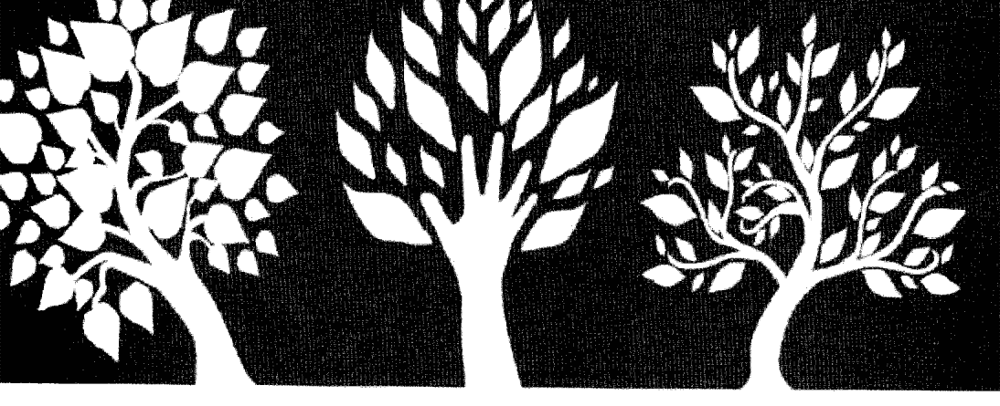

### 期望您加入TSHM會員給予實質支持

- 一、醫護會員：年滿二十歲以上贊同本會宗旨之醫事人員或相關學術研究人員。
- 二、團體會員：贊同本會宗旨之公私立醫療機構或團體。
- 三、贊助會員：贊同本會宗旨之個人。
- 四、學生會員：贊同本會宗旨之大專以上相關科系所之在學學生。
- 五、認同會員：認同本會宗旨之個人。

感謝您的贊助，讓TSHM推廣得更深更遠

本會捐款專戶：
銀行：玉山銀行（北新分行）ATM代號：808
帳號：0901-940-008053
戶名：社團法人台灣身心靈全人健康醫學學會

服務電話：(02)2219-3379
上班時間：每週一至週五上午10:00至下午6:00
獲取更多好書，請加微信號：strcdts
地址：231新北市新店區中央七街26號四樓

### 心情。筆記

Note:

### 心情。筆記

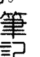

### 國家圖書館出版品預行編目(CIP)資料

清醒夢完全手冊：從清醒做夢輕鬆獲得洞見、療癒及個人成長 / Robert Waggoner, Caroline McCready著；楊孟華譯. -- 初版. -- 新北市：賽斯文化, 2019.05

面： 公分. -- (內在探索：19)

譯自：Everyone's a lucid dreamer : how to use lucid dreaming for insight, healing & personal growth

ISBN 978-986-97130-6-1（平裝）

- 1. 夢
- 2. 潛意識

175.1 108004475

### 成為清醒做夢高手

本書從很多面向，將成為清醒做夢高手——或以賽斯的說法，成為一位夢─藝術的科學家——的方法，介紹給讀者。在夢狀態中清醒，你將擁有許多機會去探索各種不同的觀點和可能性。你可以在清醒夢裡親自實驗，自行驗證作者的各種講法。希望科學界也能認知到，他們可利用清醒做夢來做諸多情緒與身體的療癒、搜尋空間與時間之外的資訊，並探索人格的意識等等的更大本質，並針對這些面向去做研究。

作者力求從三十多年的清醒夢經驗和洞見裡提取菁華，呈現在這本書裡。包括：清醒地決定在夢境該執行哪些動作、探索夢境空間（或你的潛意識內容）、與夢中人物互動、執行個人與科學的實驗、解除醒時狀態的限制（例如：飛翔、穿牆而過、充滿創意地解決醒時議題）。你如果能深入掌握這些想法，便能快速品嚐到內在經驗的美好、進入它的浩瀚，並看到做夢狀態如何帶你進入無邊際的自己。

本書帶著你從清醒夢的初學者到成為專家，並真確地讓你的夢、創造力和內在能力發揮到極致。不論你是清醒夢新手，或已經體驗「啊，我在做夢！」這種不可思議的片刻，都能從本書學到：來自科學研究與數十年探索的珍貴訣竅與技巧。

