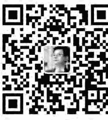
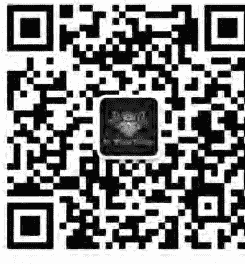

## Dreams Speak

## 潜入梦境，挖出最棒的你

梦是先知，是天生的智者。
改变，就从做个梦开始。
用心倾听梦的语言，
改变你的命运，
找回那个最聪明的自己。

特瑞莎·杜克特 Therese E. Duckett 著 蔡永琪 译

## St. Royal College
天使神秘学院

-   ※ 专业占卜预测机构
-   ※ 神秘学培训机构
-   ※ 水晶能量研究中心
-   ※ 官方淘宝：http://strc.taobao.com
-   ※ 官方微博：http://weibo.com/715104687
-   ※ 新书发布QQ群：659338717
-   ※ 购买更多好书请联系院长大天使

大天使
天使神秘学院 院长
QQ：715104687
手机/微信：13641926204

微信公众平台：strc2011

## 制作说明：

本书由《天使神秘学院》出重金从台湾购入的原版书籍扫描制作完成。为达到最好阅读效果，特地把原版书全部切开后，再经由专业扫描设备高精度扫描完成，并经过一张张的PS后期处理最终成书，其间花费大量的人力、物力以及时间，只为能给大家提供经济并优质的神秘学学习资料而努力。

本学院强力谴责某些机构和个人，把本学院花心血制作完成的电子书籍，包装后直接放在自家淘宝网上低价倾销的行为，以谋取不劳而获的经济利益。如果长此以往最终将无人愿意再为大家花心思制作电子书，那以后可能大家再无新书可读。

为让大家以后能够读到更多的好书，也为了本学院的良性发展。本学院恳请大家尽量做到如下几点：

-   一、尽量在本学院的网站购买电子书籍。
-   二、请勿用技术手段把电子书内的水印及加密去掉。
-   三、在收到电子书后小范围传阅即可，千万不要公开传播，更别挂到淘宝网上低价销售。

同时为答谢广大支持者，学院电子书将做如下调整：

-   一、学院会把一些早已收回制作成本的电子书折价销售。
-   二、最新制作的电子书籍会开放打印功能，大家购买后有条件的可自行打印成书。

天使神秘学院

## Dreams Speak

## 潜入梦境，挖出最棒的你

特瑞莎·杜克特 Therese E. Duckett 著 蔡永琪 编

> 謹以本書獻給我美好的家人、朋友以及所有曾與我分享夢境的人。倘若沒有你們的支持與貢獻，本書不可能付梓成書。

## 目次

-   前言 6

## 第一部：梦境理论

-   第1章 我们的多重心境 10
-   第2章 我们为何会做梦 22
-   第3章 治疗与梦境 27
-   第4章 梦中的灵魂塑造 43
-   第5章 梦的层次与语言 46
-   第6章 处理梦境 60
-   第7章 梦境符号与意象 72

## 第二部：个人无意识心境

-   第8章 四大元素 79
-   第9章 梦中的人物 101

## 第三部：集体无意识心境

-   第10章 梦中的动物 108
-   第11章 梦中的鸟 117
-   第12章 梦中的食物 125
-   第13章 梦中的建筑物 131
-   第14章 梦中的服饰 142
-   第15章 交通工具与旅程 149
-   第16章 死亡之梦 163
-   第17章 创伤与梦境 180

-   第18章 原型意象 195
-   第19章 英雄／女英雄 247
-   第20章 原型景观 264
-   第21章 原型生物 268
-   第22章 树的原型 281

## 前言

> 在一日工作结束之际，
> 在营营奔走之后，
> 置身于属于你的一人世界中，
> 梦世纪的人们啊，我们在做什么呢？
> ——摘录自玛丽·爱伦·史密斯（Mary Ellen Smith），《我的母亲》

我们都会做梦。然而，做梦的技巧在于如何记住梦境，让梦境支持我们走过生命之旅。如果你就是记不住梦境，这或许是受到某些干扰而丧失了能力，比如压力、药物、创伤、疾病或睡眠不足。不过，记不住梦境最常见的原因，往往是我们不认为梦境值得记住，导致梦的肌肉（dream muscle）无从发展。想要记住梦境的意图，确认了梦的存在，还可增加做梦的频率与了解梦境的意义。梦的地位提升后，梦就开始与我们合作，在我们的生命旅程中引领并协助我们。古希腊人与古埃及人就是明白做梦意图的重要性，才会兴建多座梦神殿来达到疗愈效果。

快速动眼（REM）睡眠的大量研究证实我们每个人都会做梦，而梦就是在快速动眼期产生。我们每晚约有九十分钟的快速动眼睡眠，经过证实这段睡眠有益于心理健康。研究显示，缺乏快速动眼睡眠，可能会产生情绪压力或精神疾病与幻觉。梦是人类的一大资产，却未受到应有的重视，还往往被贬低为无济于事的某种想象。“那只是你的过度想像罢了”、“你总是爱做梦”这类的话，你听过多少遍了？然而，想像却是一切事物的起源，伟大的心理学家卡尔·荣格（Carl Jung）认为，凡事必先经过梦想方才存在。本书主要是为了让读者透过梦境，初步了解自己的内在智慧。一旦学会使用这个智慧，并开始理解梦境语言后，你就会发现你的生活方式开始产生变化。当然，这并不是说你的生活将会变得比较轻松，因为你可能必须做困难的抉择，甚至可能要做痛苦的抉择。然而，当你开始倾听内在的智者之言，你将会获得许多回馈，例如你可能会发现，你活得更真实；拥有更多自信说出真相；对自己的决策更有信心；和别人在一起更果断；对别人与自己更有怜悯心；身心感到更平衡。此外，因为老旧、未处理的痛苦经验终于获得妥善处理及分类，所以你的记忆力与其他认知功能也有明显的改善。我们的梦境语言与我们的生活息息相关，因此每个梦境通常都有一些独一无二的特质。正如詹姆斯·希尔曼（James Hillman）所说：“每晚都要以新的材料来喂养你的灵魂。”然而，我们的梦并非只是个人体验，同时也具有集体的功能。有史以来，人类便共享知识、智慧与经验，由此产生的集体无意识的梦境，既反映了我们的历史，同时也影响到了未来。集体无意识的梦境具有鲜明的特性与能量，提醒我们有一幅更大的图画，以及我们在那幅图中虽渺小却重要的地位。

本书的撰写不只是为了确认梦的存在，同时也要提升梦的地位，让梦成为每个人生命中的得力助手。第一部探讨的是一些梦境理论，包括梦为何物？梦对我们的身体、情绪与心灵健康有何贡献？如何培养梦的肌肉？第二部强调个人无意识心境，以及产生自心境的梦境符号。第三部探讨集体无意识心境，同时也讨论这个古老、普遍心境的原型符号。此外，本书也区分了源自个人无意识心境与集体无意识心境的梦境，并举大量的例子说明两者之间的歧异。

其实，我是在梦中看到这本书及书名后，才开始着手写书的。后来我所做的梦以及他人的梦，又进一步引导了我。在此，特别感谢所有贡献梦境与我分享的朋友。

你的梦在对你说话，你只需要用心倾听。现在，你也能从梦境获取最大益处，只要你：

-   • 有做梦意愿；
-   • 培养回想梦境的能力；
-   • 留意梦境细节；
-   • 尝试理解梦境讯息。

## 第一部

# 梦境理论

-   我们为何会做梦？
-   梦源自何处？
-   如何辨认重要的梦境？
-   梦境符码与意象透露出何种讯息？

# 1 我们的多重心境

> 心境位于想像之中，而非想像位于心境之中。
> ——詹姆斯・希尔曼（James Hillman）

本书试图让读者了解梦境起源的神秘领域，也就是无意识心境的领域。我要特别指出的是，无意识心境原本就是无法通过有意识心境或自我来加以了解的。我们或可通过梦境一瞥天生智慧所内蕴的无穷无尽宝藏，但这终究只是一瞥而已。话说回来，有时仅仅一瞥就足以带给我们无限的智慧洞见，或是改变我们的态度或生命。因此，在此我无意解构无意识部分，扼杀无意识的神秘，而是要分享我个人的浅见，让大家了解这个涵盖你我、你我内心皆有的美妙能量库。本书的主要几个问题为：

-   我们为何会做梦？
-   梦源自何处？
-   如何辨认梦的本质？
-   如何辨认重要的梦境？
-   我们的梦对于集体无意识心境或宇宙灵魂（Universal Soul）有何贡献？

## ◆ 例 —— 泰德的梦

泰德正开着巴士驶进未来，突然看见两个熟人站在路边。他明明知道该继续开车，不要理会他们，却还是调头回去，看看他们需不需要搭便车。但是，巴士调过头后，周围突然笼罩着一片迷雾，几乎看不清眼前的路。巴士突然间被两个庞然大物挡住：一条是盘身蜷绕的黑色巨蟒，另一条是红绿相间、有许多小头的巨龙／蛇。那条红绿大龙／蛇的一颗头钻进了巴士，紧接着是一场龙车大战，最后以龙头脑浆四溢收场。梦醒后，泰德觉得应该要先清理自己的行为（巴士），才能继续往前行。

泰德做这个梦时，已设法戒酒多年。现在，泰德觉得他总算有足够的毅力可以戒掉酒瘾。他接受咨商很久了，但这是他第一次觉得自己能戒酒成功。为什么他现在觉得可以摆脱酒瘾呢？哪里不一样了？他只是做了个梦而已。但泰德认为这个梦境意义深远，而他也走到了转捩点。没错！他面临了恶龙的挑战。他并未在此时摧毁恶龙，但是他与恶龙对抗，使得恶龙元气大伤。当我们梦到原型意象，比如龙、其他怪物与超级英雄，我们就接触到人类集体无意识的最深层部分。“普遍意识”（Universal Mind）联系我们彼此，并容纳了人类所有历史的能量。梦使我们与这个集体意识重新连结，因此能够与集体意识内的力量连结。

## 什么是意识？

> 我们的意识的确不会自己产生，意识源自于未知的深处。意识于孩提时代逐渐苏醒，接着于每日清晨在沉睡的无意识状态中醒来。意识就像是日复一日从原始的无意识子宫中诞生的孩子一般。
> ——荣格，《人及其象征》（Man and His Symbols）

> ❶ 引自詹姆斯·希尔曼一九八三年的著作《原型心理学概述》（Archetypal Psychology: A Brief Account）。

身为人类，我们同时经历了多个生命。一个是处理日常工作、别人看得到的外在生命。我们的感官与人脑协同合作提供经验的意义时，现实就出现在我们眼前。这些经验储存在我们的记忆中，因此可以了解要如何做、如何享受生命并存活于这个世界。另一个是别人看不见也不懂的内在生命，内在生命是主观的。别人可能偶尔瞥见我们的内在生命，但多半时候是我们所独自体验。我们通过思考、感觉与直觉察觉到内在生命。我们也可以推理出，为何我们会有这些思考与感觉，因为这些思考与感觉是在我们自己的体验情境下对我们产生意义。之后，这些思考与感觉会影响到我们如何过外在生命的方式。尽管内在与外在生命的差异颇大，但是会彼此交互影响。第三个生命也和另外两个生命交互影响，只不过我们没有察觉到这个生命罢了。因此，第三个生命往往称为无意识自我。这个生命可以与我们的外在生命共同存在，然而我们没有意识到它做了什么。当我们发现自己莫名其妙地坏了兴致，或是恐惧展开我们所希望的关系，或是毫无理由地怀疑某人时，第三个生命就有可能显露而出。那是思考之下的怀疑，或是直觉之下的某种感应。这个部分几乎决定了我们看待世界与言行举止的方式，不过，我们并未察觉到这个部分。而这个生命，也是我们极致危险与极致力量所在之处。亚蓝・皮斯（Allan Pease）在《身体语言》（Body Language）一书中，确认了无意识讯息在沟通联系方面的力量。他指出话语只占讯息全部影响力的百分之七，而我们说话的音调、变化及其他声音则传达了百分之三十八。高达百分之五十五的讯息是通过非语言来传达的，同时也是这非语言（无意识）层面影响了我们对于正在和我们沟通者的感觉。过去一百多年来，弗洛伊德与荣格等心理学家都确认了意识的作用，并提出诸多学术用语以便他人进一步开疆拓土。弗洛伊德与荣格为有意识与无意识定义出了一个架构，帮有意识挑战、驳斥及用科学方式来验证他们理论的其他人奠定基础。新理论因此获得发展，我们也可通过新的方式感受自我。

关于意识，目前尚未有一致的定义，不过就如大卫·迈尔斯（David G. Myers）在《心理学》（Psychology）一书所所说的，意识往往被描述为我们“对于正在发生的感受、想法与感觉的选择性注意力”。此外，有意识的状态往往与无意识状态有所区隔，形成二元对立。迈克尔·巴尔巴托（Michael Barbato）对于濒临死亡的人有大量研究，他驳斥二元对立的说法，指出：倘若我们接受有意识是吸收及处理资讯并予以妥当回应的觉察状态，那么按定义来说，无意识就应该是毫无觉察、毫无资讯处理并无法采取适当行为的状态。

> ——《临终照护》（Caring for the Dying）

巴尔巴托在他的研究中证明二元对立并不正确，麻醉或昏睡中的病患仍然以相似于快速动眼状态的大脑节律吸收及处理资讯，而梦主要就是在快速动眼期发生。研究同样也显示“大脑在快速动眼睡眠阶段，比一般清醒有意识期间更为活跃。”（巴尔巴托《临终照护》）。

其他研究显示我们在睡眠中历经五个有意识的阶段，其中包含了快速动眼睡眠。这五个阶段都有明显的脑波电子活动、生理反应与连带行为。比如说，人在熟睡的非快速动眼期（NREM），由于肌肉麻痹，所以几乎不动，很难叫醒，眼球也不会转动。此外，梦游、夜惊与尿床主要都在这个阶段发生。

然而，单就大脑功能来描述意识，将会限制我们对于身为人类的思察，妨碍我们发展更贴切的理论。自从牛顿提出重力法则后，重力法则便主宰了科学界，但是机械论无法对所有问题一体适用，因此我们有必要质疑其正确性。牛顿物理学认为宇宙与人类都是客观描述的确切物体，但是牛顿物理学无法探索另一类的有意识状态，无法说明那些经历过濒死、灵魂出窍与昏迷者的不同感觉状态。

此外，还有许多梦境的种类，无法单就有意识的大脑来解释。比如说，预言式的梦境就无法以记忆来解释；而清明梦（Lucid dreams）则是另一个例子，做梦的人清楚知道自己在做梦。清明梦是非常高阶的做梦型态，需要具意识的清醒心境与睡眠中不同的意识阶段相互合作。清明梦要如何套用我们既有的梦境理论？为了要了解我们的梦，并确认梦的效力，我们必须以不同角度审视意识，并将无意识状态视为某种意识。

此外，可别忘了睡眠时进入的普遍意识（Universal Consciousness）。

> 史伯丁（Baird T. Spalding）在其经典大作《远东大师的生活与教诲》（The Life and Teachings of the Masters of the Far East）强调睡眠的重要性，认为睡眠可提供我们接触全意识（Complete Conscious）心境的机会：
> 意识在睡眠中变得博闻通晓，耳目皆开，能够知晓一切。这就是为何我们在睡眠中，往往能办到清醒时办不到的事。白天时，我们掩藏意识以便从事外部活动……睡觉时，全意识便可运作。这也就是为何心理分析认为理性、正确使用做梦状态时，做梦状态会比清醒状态更为重要。

除了这五个存在于睡眠中差异极大的意识状态之外，研究显示我们还有其他的意识状态，包括了：

-   睡眠或清醒间的过渡阶段
-   冥想与深层放松时的意识
-   意识的转换与变异状态，包括神秘经验、濒死经验、灵魂出窍经验与临终幻觉。
-   清明梦
-   嗑药时的意识状态

因此，我们显然有必要扩展既有的观点，不将有意识与无意识看成是觉知与无觉知的状态之分。此外，我们也得纳入许多不同性质的其他觉知状态。

## 意识与能量

同时，我们还有其他的重要考量。研究显示，人类的意识层次彼此差异极大，依据能量系统、气场或灵量场（auric fields）的发展与平衡程度而有不同。科里安特殊照相术（Kirlian photography）② 有助于证明神秘主义者与灵视者所言：

> 每个有生命的有机体周遭都有能量场，不断与宇宙的能量场互动。
> ——《手上的光》（Hands of Light）

现代科学认为人类有机体并非只是由分子构成的物理构造，也像所有其他事物般由能量场所构成。我们在移动，从稳定坚固的世界里移动到动态能量场的世界。我们也像海水一样涨潮、退潮。我们也在不断变化。

我们的能量场包括了：

-   能量体，包括我们的乙太体（ethereal body）、情绪体或星光体（astral body），心智体（mental body）与灵性体（spiritual body）或因果体（causative body）。
-   脉轮（Chakras），或称能量体系。
-   经脉（Nadis），亦即能量通道。

> ② 又称灵光照相术，是俄罗斯科里安（Davidovich Kirlian，1898-1978）在一九三六年发明的摄影技术，可以清楚地照出物体的放电花纹。

每个能量体都有各自的振动频率，也就是说，这是意识的质性层次。我们对任何现象的觉知，仰赖于能量体的频率程度，以及脉轮接收、转换与散布不同形式生命能量（prana，维系所有生命的重要能量）的能力。身体的能量通道（亦即经脉），负责接收生命能量。比如说，乙太体（最靠近身体的那一层）的振动频率比灵性体低，提供的是截然不同的功能。

意识的概念复杂多变，每个存在的事物都有其意识。因此，做梦时，我们可以进入好几层的“意识”，而非仅限于在“无意识”层次运转。此外，我们所进入的特定状态，可

前面已提过梦中的意识只是许多种意识之一，有其表达方式，现在我们该来探索无意识心境了。提到无意识，就一定要提到弗洛伊德和荣格的理论。一百多年来，这两位大师对于心理学思维的影响可说是无远弗届。

十九世纪末与二十世纪初期，荣格与弗洛伊德开始质疑并改变精神疾病的意义，因而引进了新的治疗方式。两位精神医学家想了解精神病患的内在状况，而不只是描述病患的心理疾病症状而加以汇总统计而已。比如说，他们认为精神病的症状、歇斯底里、特定的疼痛种类与异常行为都有其象征意义。他们相信，表露出来的症状只是“无意识”心境所要传达的方式之一。荣格写道：

> 我发现偏执看法与幻觉都蕴含意义。性格、生活史、希望与欲望的模式都藏于精神病背后。我们若是不了解这点，错都在我们身上。——《人及其象征》

不过，弗洛伊德与荣格对于无意识的内涵以及我们处理这些内涵的方式，却持有不同的看法。弗洛伊德认为我们会无意识地试图保护自我，不愿探究内情，并采取所有的防御机制，以求达到否定状态。他认为梦与此否定过程相互合作，通过符号隐瞒真实的意义。做梦过程是与疾病有关，而非与健康有关。

荣格则认为，我们无意识地想变得更完整、更个体化，从无意识中浮现的内容就是要协助这个整合过程。荣格认为只有当有意识心境与无意识心境之间的能量不平衡时，或是我们没发现自己出现无意识冲动而被左右时，无意识心境的内容才会变得危险。荣格选择面对自己的无意识冲动（以幻想方式存在），并展开他的英雄之旅。他认为我们的有意识心境与无意识心境随时都在运转，只是我们没察觉到罢了：

> ——《人及其象征》

提到无意识心境，荣格认为个人无意识与集体无意识两者的内涵与表达方式截然不同：前者操控我们的个人无意识信念、期望与行为印记，而后者则掌控我们的历史、文化与人类印记。两者都有其表达方式：前者通过做梦者可以了解的符码，而后者则通过原型意象与普遍的动机。大致而言，除非我们刻意且有能力地去接触无意识心境，否则我们是察觉不出这两个状态所蕴含的有力内容、资产或能量；集体无意识心境更是如此。做梦便是其中一个接触方式，其余接触方式有曼陀罗法、涂鸦、创作等。

我们都看到、听到、闻到也尝到许多东西，但当下却没有注意到。这或许是因为我们注意力转移他处，或是因为感官的刺激太微弱，不足以留下有意识的印象。然而，无意识却留意到了这些东西，而这类潜意识的感官察觉都对日常生活极为重要。我们虽然并未有所察觉，但是无意识却影响到我们对事物和人的反应。

榮格認為理想的心理健康或人格，是不同意識狀態的整合。整合可以釋放無意識的有力能量，並更為平衡地流向意識心境。同時，能量也必須從有意識心境流向無意識心境。心理分析認為，無意識心境是我們心靈能量的寶庫。

這是一種有助於擴散性思考的聯想策略，利用一幅九宮格圖，將主題寫在中央，然後把由主題引發的各種想法或聯想寫在其餘八個空格內。

# 我們為何會做夢

夢像一面鏡子，在我們準備好觀看某個事物時，夢就照出我們或許該留意的事物。夢境所透露的，是我們真正的而不是假裝的想法和感覺。我們每個人的內部都有個獨特的氣壓計，幫助我們監測生活的每個層面：身體、情緒、心靈、精神與社會層面。可惜的是，我們鮮少用到這些氣壓計，更別提知道這些氣壓計的存在了。這些氣壓計，亦即我們的夢境，從未獲得應有的認同。夢境是多層次的，我們隨時都有可能進入某個層次，有時還會同時進入好幾個層次，這在清明夢特別明顯。夢境也能納入世俗與更高層次的混合經驗。在最基本的心境層次，也就是佛洛伊德所謂的前意識（Pre-Conscious）心境，夢讓我們有機會反思日常生活，以及每天的感覺、資訊與活動。接著，我們把這些經驗放進有意義的檔案裡，以備日後參考。若是不再需要用到這些經驗，也可以置之不顧。我們總是在夢中分析、評斷、區別、計畫、創造、發展並且展現經驗，我們也總是在改變。因此，我們當然需要用些睡眠時間，來整理、合併有意識心境在清醒時所執行的多項任務。

隨著年齡增長，我們更瞭解周遭的環境，同時也面臨多項挑戰，比如：身體的變化，個人、社會與文化的價值，母語的複雜與微妙，以及我們在世上的行為舉止等等。此外，當我們試圖探索我們是誰、人生之旅的走向以及如何適應這個世界時，我們可能就處在一個意識的「存在層次」。換句話說，我們的周遭與內在隨時都有許多事發生，而這些資訊都必須經過處理。

夢會協助我們處理；夢也像一面鏡子，在我們準備好觀看某個事物時，夢就照出我們或許該留意的事物。這個準備度因素在此過程中非常重要。此外，由於有意識心境無法左右夢的內容，我們通常可以仰賴夢境作為參考。就如蓋兒·戴蘭妮（Gayle Delaney）在《夢境突圍（Break Through Dreaming）》一書中說，夢境「透露我們真正的想法和感覺，而非我們假裝的想法和感覺。」

夢能以深遠、私人的方式與我們對話：引領我們、警告我們逼近的危險、消除我們的疑慮，並且真切地回應我們該如何走人生的道路。榮格與愛德加·凱西（Edgar Cayce，著名的睡眠靈媒）認為，我們所有的生命階段都可在夢境中揭露，指引我們達成較高層次且更為平衡的身體、心理與精神生活。夢的唯一索求，就是我們的聆聽。

## 快速動眼期的夢境

睡覺時，我們不斷通過意識的各個層次。夢通常出現於快速動眼睡眠期，有時候會出現在非快速動眼睡眠的其他階段，比如深層睡眠，但是這並不常見。然而，請別忘了，我們在睡眠狀態並非毫無意識。大腦本身可能會關閉它在清醒時所知道的現實，但是並沒有停止運作；大腦只是採取不同的運作方式罷了。睡眠時的「無意識」，只是用不同的覺知力、特質、意義、語言和架構所感受到的另一種意識。此外，快速動眼睡眠的做夢意識，也與非快速動眼睡眠的做夢意識截然不同，兩者與清醒時的意識也全然不同。

### 快速動眼睡眠的目的

經證實，快速動眼睡眠對我們有諸多好處。比如說，大量證據顯示：快速動眼睡眠儲存新學得的資訊並鞏固記憶。我們發現，新生兒比任何年齡層的人花更多時間在快速動眼睡眠；此外，越早出生的早產兒在此一階段的睡眠會待上更多時間。快速動眼睡眠，也經證實會隨著年齡增加而減少。某個睡眠實驗指出，擁有較多快速動眼睡眠的學生，其學習速度優於正常快速動眼睡眠的學生。其他睡眠研究也顯示，若在進入快速動眼睡眠週期的開始階段不斷醒來，身體及／或心理可能會生病。若是缺乏快速動眼睡眠，我們也會覺得疲勞、易怒、集中力變差及健忘。若是許久都沒有快速動眼睡眠，則有可能會產生幻覺。非快速動眼睡眠對於我們的身體健康極為重要，而快速動眼睡眠則對我們的心理健康至關緊要。

### 快速動眼睡眠與大腦的可塑性

除了心理方面的功能之外，美國睡眠科學學會（American Academy of Sleep Science）也認為快速動眼睡眠可能對大腦的可塑性（brain plasticity）有所影響。據諾曼·多吉（Norman Doige）在《改變，是大腦的天性》（The Brain that Changes Itself）一書中所定義，大腦可塑性指的是大腦透過建立不同的神經元連結與幹細胞來改變大腦的能力，尤其是海馬迴的神經元連結與幹細胞。神經科學的頂尖科學家馬可仕·法蘭克（Marcos Frank）專門研究快速動眼睡眠與非快速動眼睡眠，以及兩者與大腦可塑性之間的關係，他主張在快速動眼睡眠時，「學習時所建立的神經元活動模式會在快速動眼睡眠時重複，強化了神經元連結的改變。」

科學家現在已確認了大腦的再生能力，這從最近幹細胞移植的研究便可證明。由於以新的方式看待大腦，用來描述大腦與大腦活動的比喻也隨之改變。比如說，之前將大腦比喻為人生旅程中必須填滿的「內部配置有限的複雜機器」，或是「死氣沉沉的容器」。

現在，神經科學家轉而認為大腦擁有彈性、可塑性，因此具有改變與治療的能力。這個觀點具有醫學、心理學與精神上的重要意義，也影響了我們看待自身內部處理過程的方式，比如思考、想像與做夢。現在這些都被視為有助於大腦的成長與可塑性，也因而對健康有益。因此，包括諾曼・多吉在內，有越來越多的科學家認為夢的狀態有利於改變大腦的可塑性。

最後要提到的是，「反彈效應」（rebound effect）機制也顯示了快速動眼狀態的重要性。我們若是缺乏快速動眼睡眠，那麼在恢復正常睡眠模式之後，反彈效應就會彌補損失的快速動眼睡眠；大腦似乎知道必須趁機彌補損失的快速動眼睡眠。有趣的是，酒精、巴比妥與安非他命等藥物都會抑制快速動眼睡眠。但是，如果停止服用這些藥物，也有可能會經歷快速動眼期的反彈，而引起夢魘與焦慮。

# 治療與夢境

> ——羅伯·摩斯 (Robert Moss) ，《有意识地做夢》 (Conscious Dreaming)

夢境在夜間讀出你的身體、情緒與精神健康。在追溯、比較這些報告時，你可以監測你的健康狀態、人際關係，並看出是否走向或遠離你的大目標。

羅病夢境警告我們若是不改變生活方式，健康有可能會受到影響，愛莉絲的例子就很明顯。離婚後，愛莉絲的生活變得一片混亂，吃不好也睡不好。筋疲力盡、壓力沉重的她，卻裝作沒事般繼續過日子。愛莉絲告訴我，她要做的事太多了，若是因為喉嚨痛就去看醫生，簡直是浪費時間、浪費金錢。愛莉絲要把錢和時間花在更「棒」的事情上，她是這麼想的。

愛莉絲的個人無意識心境卻有不同看法，於是透過兩個連續夢境傳達出兩個緊急訊息。第一個訊息是象徵性的，她的貓因為血液疾病而奄奄一息。但是，她卻誤解了這個夢境，認為指的是其他事情，而沒有多加細想。然而，第二晚，她在夢中直接聽到指令：「去看醫生。」她也在夢中看到黑板上用大字寫著同樣的訊息。當然，愛莉絲聽從了這個指令，當天一早就預約去看醫生了。幸好她這麼做，她的血紅蛋白非常低，醫生要她在二十四小時內住院治療。醫生告訴愛莉絲，她若是不小心照料，後果會更嚴重。因此她開始留意起自己的健康，自此，她生活中的其他領域也逐漸有了改善。

在夢到這個警示夢的前一年，愛莉絲做了另一個讓她困擾的夢：她看到自己變成刮掉魚鱗的煙燻魚。她告訴我，那陣子很愛吃葵瓜子；而這條煙燻魚似乎凸顯出，她必須戒掉這個擾人的古怪癖好。愛莉絲和我討論這些夢時，發現自己能夠從夢中獲得個人健康的相關資訊，但是她卻沒有為自己的健康負起責任，直到幾乎太遲了，她才有所行動。

然而，愛莉絲接下來的健康夢境，卻顯示她有意為自己的健康負起責任。她覺得眼睛受到感染，因為她的左眼劇痛，連摸到左下方都疼痛不堪。她告訴我，她在睡前請求她的無意識心治療療眼疾，接著，她全心全意地將氣能 (pranic energy) 引至眼睛周圍。醒來時，她發覺眼睛的感染已清得一乾二淨，也比前幾週舒服許多。她那天晚上的夢境非常有趣，同時也顯示她和內在的治療師有所接觸。她將這個夢稱為「水瓶裡的醫師」，並寫在她的夢境日記裡：

## ◆例——爱莉丝的梦1

我必须勒死一个危险的宝宝。这很难办到，因为那个宝宝就是死不了。接着，我出现在一个房间，葛拉翰（我先生）、苏（我女儿）和道格（我儿子）都在房间里。葛拉翰头发很长，留著胡子，但是发色较淡。他说他变了，现在想回归他的根本，也就是简单的生活方式，而他会继续留发蓄鬚。接著，我身边又出现了一个宝宝。这个宝宝不断地说：“医生来了！”并指著梳妆台上的水瓶。我发现那个水瓶很大，接著看到水瓶旁有张简陋小屋的照片。这个宝宝说：“医生会帮我们。”接著，我的儿子、另一个人和我就搭著一条小船驶向非洲，到一个应该是叫做摩博（Maub）的地方。然后，我发现有许多内含古老符码的方块散落在一张非洲地图上。其中有个图案特别引起我的注意，我认为那个图案叫做“迦楼罗”（Garuda），但我不是很确定。这个图案是蛇在一个三角形里。我跟我儿子说：“这是我最爱的符码。”我儿子看起来很开心。

这个梦的威力庞大，爱莉丝因此觉得她在水瓶里找到了自己的医生。对于爱莉丝来说，医生出现在水瓶里的梦境非常重要。在原型女性主义的象征符号里，水瓶（罐子）代表大母神（Great Mother），而爱莉丝多年来常常梦见水瓶。库博（J. C. Cooper）在《傳統符號圖繪百科全書》(An Illustrated Encyclopedia of Traditional Symbols) 描述水瓶為：

> 就像花瓶般，是女性、接納的象徵，是佛像腳邊的吉祥徵兆之一，暗示戰勝生與死，還有精神上的勝利。

這個夢境告訴愛莉絲，只要我們跟隨無意識心境的引領，都有能力達到深層的自我療癒。她也認為她在夢中注意到的那個非洲符號非常重要，儘管她不記得那個符號的細節，當時也不明白符號的意義。後來，她發現「迦樓羅」指的是印度神話中的金翅鳥，象徵蟒蛇與大鵬鳥之間長期的緊繃狀況。同時，這也是精神啟蒙的符號：

> 迦樓羅誕生了兩次，第一次是由原始之母產下蛋，接著當蛋孵出時，蛋內的生命就重生了。「兩度誕生」與啟蒙有關——孩童英雄就是「兩度誕生」。
> ——喬帝·薩希 (Jyoti Sahi) 《孩童與蟒蛇》(The Child and the Serpent)

愛德加·凱西有「睡眠先知」的稱號，他在睡眠中透過星靈體之旅與夢境為人看診。據稱凱西能在「睡眠」狀態下，為成千上萬的人正確診斷出他們的身體、情緒與精神問題，總計有一千零九個實例。我們或許沒有凱西為他人診斷身體毛病的能力，但是，如果我們能夠學習聆聽我們無意識心境所透露的訊息，或許可以預防許多疾病。透過夢境，我們可以

-   何谓接受治疗？
-   如果你有某种疾病，你的病具有何种「价值」？

现在，请你花点时间思索「治疗」二字对你的意义，同时也想想下面这些问题：

嘉菲德也建議我們可以刺激自己的內在治療師，在睡前請求他/她在夢中顯現，建議我們如何做才能促進療癒的功效。

> ——《共通夢之钥》(The Universal Dream Key)

全球知名的心理學兼解夢專家派翠西亞·嘉菲德（Patricia Garfield）對此做了大量研究，她發現在罹病或身體受傷期間或之後，夢中有時候會出現受傷或瀕死的動物、被破壞的植物生態、傾頹的建築物以及其他毀滅的相關意象。當病患開始好轉，則會出現相反類型的意象；比如夢中出現健康、活力四射的人，往往是玩耍嬉戲的小孩或新生寶寶、開花的植物、新蓋或重建的建築物、新衣服以及新車。

聯繫自己的「內在專家」，還有誰能比這個內在專家更瞭解我們自身的歷史、個性與生命意義呢？這就看我們是否要扛起責任，聯繫並利用我們內在所具備的神奇資產。愛莉絲的內在專家讓她明白她需要去看醫生，因而阻止了可能會發生的嚴重後果。

# 遠古的孵夢神殿

-   治療是怎麼發生的？
-   你認為治療是源自何處？
-   你希望需要治療的是自己內部的何處？
-   你準備好要接受治療了嗎？
-   如果你已完全痊癒，會如何？

> 最後一個問題特別值得深思。狄帕克·乔普拉（Deepak Chopra）在探討健康時，指出：治療……不需費力，只要有勇氣做自己，所獲得的回報將是無窮盡的……超越心境的疆界是心境難以領悟的深遠目標。如果你開始探究你的深層本質，你會發現，真正持久的治療源於做自己並觀察發生了何事……健康不只是健康的身體與健全的心靈……還有內在潛能的完全擴展。『我是宇宙』，這是一個健康的人的初始直觀（primary intuition）。

古希臘與古埃及人認為夢是身體、心靈、精神成長與健康的基礎，因此特別敬畏夢。他們興建神殿用來孵夢或刺激做夢。約在西元前一千一百年，古希臘約有三百二十座夢神殿，最有名的是希臘醫神阿斯克勒庇俄斯（Asclepius）神殿。阿斯克勒庇俄斯的象徵是一條盤繞在木棒上的蛇，目前仍廣泛作為治療象徵。若要在神殿內召夢或孵夢，事先要做許多準備工夫，包括禁止食用某些食物、禁酒與性交，還要睡在周遭爬滿蛇（對人無害）的環境裡。這些儀式往往都會奏效，但是我相信並不是儀式本身使人做夢，而是牽涉到的心理因素所造成，比如：

-   做夢者想要做夢的意圖
-   治療的強烈渴望
-   相信夢的療癒功能
-   全程都全心全意
-   透過事後的談論，向夢致敬。

古希臘與古埃及人對無意識的力量深信不疑，這正是讓無意識元素變成有意識，且讓有意識心境回饋給他們「深層之神」的關鍵，由此而促進療癒效果。換句話說，這是一個雙向過程，有意識心境確認了無意識的領域：兩者彼此合作。這種信任，讓個人的完整性往前邁進了一大步。榮格採納了這個看法，將治療視為變成完整的一個過程，例如更接近我們的全部自我。

## 個體化與完整性

每個人的欲望，就是想變成完整的人，讓意識人格與無意識合而為一。榮格

> 「認為渴求個體化是一個人的基本直覺，驅使人尋求完整與圓滿……重要的是過程——這樣的過程可以讓人變得更成熟，賦予生命趣味與意義。」
> ——約翰·桑福德 (John A. Sanford)，《夢與療癒》 (Dreams and Healing)

## 創傷導致的失衡

創傷是極大的壓力，可能會對心靈產生毀滅性影響，將我們的內在自我摧毀得支離破碎。創傷反應可以比喻成打亂了成千上萬片的拼圖，必須等拼圖全數找回後，再加以重新組合。打亂與重組都是極度傷痛的一個過程，經歷巨大創傷的人可能需要大量且密集的支持，讓支離破碎的部分隨著時間逐漸癒合。

創傷治療過程會交替發生兩件事：首先，無意識心境可能會關閉創痛記憶，導致創傷者無法宣洩情感；接著在毫無預警的狀況下，創痛者可能會出現侵入性的影像，比如倒敘畫面或夢魘。由於這個交替發生的過程可能會持續許久，而有意識心境又往往無法加以控制，因此尋求一個瞭解創痛運作的治療師從旁協助就非常重要了。侵人性影像的威力可能會特別大，而引發極度焦慮。假如我們不能夠瞭解自己的情況，就可能會產生像是「被龍吞噬」的感受。

無意識心境也可能會「氾濫成災」，比如精神病發作，或者使用海洛因、大麻一類的麻酔藥或迷幻藥時。焦慮是家常便飯，因此我們必須特別注意有意識與無意識心境之間能量的平衡流動，如此才能擁有健康的心理。培養聯繫夢境的能力，可以激勵這個能量的穩定流動，確保有意識與無意識能量之間的平衡。

# 夢境與療癒

你可以運用夢中的所有事物。從夢裡，你可以重新整合你失去的人格。每個夢境的每一小塊都是你自己。如果你能妥善運用，這會再度成為你的一部分。你不會越來越貧乏，而是會越來越富裕。

> ——弗利茲·波爾斯（Fritz Perls）

榮格認為夢中出現的符碼是調和及重新結合我們心靈內部對立的工具，也能夠傳達無意識的能量給有意識心境。因此，若是我們認可自己的夢境，再花點時間瞭解夢的訊息，就能為自己的治療過程增加能量。此外，雖然無意識的資訊龐大，夢也可以作為安全觀察無意識內容的一個媒介。夢之所以具有這個能力，是因為夢能夠：

> 一塊一塊地打破本我的內部巨大力量，讓我們能夠逐步整合無意識心境，不至於因無意識心境而不堪負荷。——約翰·桑福德，《夢與療癒》

從無意識心境（尤其是集體無意識心境）所取得的內容往往有所矛盾，因此所呈現的內容有可能是毒藥，也有可能是我們的最佳助手。如果我們不瞭解藏在情緒之下的象徵性或原型能量，將會對我們遺害無窮。但假如我們能察覺，那就具有治療與轉變功效。希特勒時期負面運用古老的神秘符號：卐字，呈現的就是無意識毒害及摧毀的一面，儘管是無意識層次，卻影響了普羅眾生。就是因為這個影響，榮格提出下面的質疑：

> 我們難道看不出，全國上下現在都在接收一個古老的符號，甚至是古老的宗教形式？看不出大眾情緒如何以災難的方式影響及徹底改變個人的生活？
> ——《簡明版榮格讀本》(The Portable Jung)

蛇是常常被提到的矛盾夢境符碼，同時也是一個原型的治療符號。

還記得第一章一開始所提到的泰德的夢境嗎？泰德過去多年來飽受情感創傷，當時與他自己還存在著疏離感。他之所以喝酒，就是想忘掉困擾，但是這麼做卻又加深了那道隔閡。酒精讓泰德暫時忘掉他的問題，得以獲得片刻喘息，但是麻痺情緒並非他需要的解決辦法。沒錯，情況確實更加惡化，沒了錢也沒了自尊後，罪惡感反而更強烈了。在泰德挺身對抗他的原型龍之後，他更常做夢，漸漸地，夢境內容比較不恐怖，也比較不具挑戰性了。當他開始整合透過夢境所傳達的無意識內容後，他開始回歸自我，不再遠離自我了。換句話說，他開始整合自己以往零碎的部分。心理諮商帶給他一個嶄新的面向，藉由夢的協助，泰德開始這個重新整合的過程。

愛莉絲迷上吃葵瓜子時，她做了另一個夢。

## ◆ 例——愛莉絲的夢 2

躺在床上時，有個東西黏到我身上，感覺就像是我需要那個「東西」，也仰賴那個東西一樣。然而，這個東西變得越來越強，也越來越大，從我身上吸取能量，打算將我摧毀。我必須使勁全身力量，才擺脫得了那個東西。

當我們準備好聆聽無意識心境的聲音時，無意識心境會以各種面貌呈現在我們眼前，和我們說話，直到我們真的聽進心坎為止。有時候，無意識心境的聲音聽來殘酷又苛求，尤其是緊急狀況非得聆聽時，或是當我們處於人生某處能夠安全處理無意識心境的訊息時。愛莉絲的治療之旅是在婚姻結束後開始的，當時她的情況是必須處理不斷出現的夢境訊息。

許多和愛莉絲一樣曾經歷嚴重感情創傷的人，都做過一些夢，以試圖治療或重整分崩離析的自我人格（因為創傷而分離的無意識部分）。心靈試著找回不見的部分，完整地感受無意識，最後再整合無意識，以便創造一個嶄新的、有意義的全貌。最棒的治療師，往往是那些曾經透過重建自我拼圖而治療自己的人。

我對創傷的影響一直都很感興趣，也協助了許多歷經創傷的求診者。但是我從沒察覺到自己也需要治療，一直到某個氣氛啟發了我的自我治療過程。此後，我的夢成為我進行自我治療時的重要工具，逐步協助我挖掘需要檢視、接受及整合的過往片段，讓我能夠移動下一片拼圖。這些夢境不僅內容相關，影響力更是重大。

當羅蘋準備好面對痛苦的過去時，她搬到鄰近拜倫灣（Byron Bay）的一個美麗村鎮。她說搬家之舉如同是難以抗拒的衝動，同時也是在新家時，她的無意識心境啟動她做了許多夢，治療她過去的創傷。羅蘋認為會做這些夢，是因為她的居住環境有助於治療。

外，她也覺得她做了充分的自我治療工夫，能夠處理夢境內容。羅蘋和我分享她所記錄的第一個夢境，這個夢明顯揭露了她的創痛，同時也告訴她該如何治療這個創痛。

## 例 —— 羅蘋的夢

我經過一群圍觀的人身旁。中間那個人拿著鈍鈍的剪刀剪東西，原本我以為剪的是小嬰兒的臍帶。他們聽到嬰兒痛苦的尖叫聲，彷彿都很開心似的。我走了過去，我不想牽涉進去。

接著我發現我轉了個彎，聽到有個嬰兒痛苦的尖叫，聲音十分淒厲。嬰兒就躺在結霜的地上，寒冷、赤裸且渾身慘白。我心裡想：「希望他死了，這麼痛苦，我希望他死了。」

我等了等，接著走到嬰兒身邊。我以為嬰兒現在已沒有意識了，但他還活著。我看著他，發現他是剛才被剪後棄置在一旁的那個嬰兒。就在我看著嬰兒時，我發現他的小雞雞被剪掉了。我渾身不舒服，原來被剪的並不是我原先以為的臍帶。

我抱起小嬰兒，但和他保持一段距離。心裡想著：「我得幫這個小嬰兒取暖、餵他吃東西，想辦法治療他被剪掉的部位。」我知道我必須扛起責任照顧他。

羅蘋六個月大時，墨爾本下了一場大豪雨，她六歲的哥哥溺死在皇家兒童醫院工地積滿雨水的大坑裡。那時是七月，正值隆冬。媽媽幫羅蘋洗過澡，才擦乾羅蘋的身體，兩個警察就找上門，告訴媽媽哥哥的死訊。媽媽驚慌失措出了門，忘了寶寶還光溜溜地躺在桌上，一去好幾個小時。

羅蘋因此感染肺炎，後來緊急送醫治療，在醫院住了好幾個星期，奮力求生。好不容易康復可以出院回家了，面對的卻是感情已然麻木的父母。羅蘋告訴我，從她哥哥死去那天，她就被雙親疏忽了，這讓她感到很孤單。即便她周圍總有許多人圍繞著她，她還是有孤單寂寞的感覺。難怪羅蘋所做的第一個創傷治療夢境，內容就是「身體殘缺且受凍的嬰兒」。

這個殘酷的夢境不只要求她審視敏感、受傷的自我，更要她扛起責任自我治療。要讓她殘缺的那個部分「死去」，原本不是件太困難的事。但是，顯然事情不是這樣簡單，反而是需要她去完整地接受這個殘缺的部分。在這個夢裡，雖然羅蘋與這個部分仍保持距離，卻代表她已經有所進展了（「我轉了個彎」）。她覺得隨著時間流逝，她能夠更完整地接受她受創的部分。

在這個夢之後，羅蘋的心靈開始剝除包覆著她堅韌意識的層層表皮，強迫她審視自己最深沉的創痛，正因為如此，後來羅蘋做了許多惡夢。一開始，羅蘋感到百思不解的是，夢裡的小嬰兒為何是個男生，但是她後來明白了她的心靈何以選擇這個符碼。夢往往一次就包含了好幾個意義，羅蘋認為生殖器的療癒，代表她能以男性驅使的工作力來打造自己的路，成功學習如何獨立生活。也就是說，透過女性的孕育原理來整合她內在的男性力量。

羅蘋之後的行為證明了這點：她開創自己的事業，接著又在全新的環境裡單打獨鬥，同時也變得更堅強了。她買了一間占地上百英畝的小屋，在此與世隔絕的幽靜之地，她開始面對夜間的陰影，以及開始除去她所必須擺脫的層層心靈（有意識與無意識心靈活動的總和）束縛。

這些陰影就是她的夢魘，由於羅蘋已做好準備，這些惡夢來勢洶洶。

我認為「做好準備」這個因素十分重要。如果你做了惡夢，切記要在惡夢發生時尋求協助。感情創傷的惡夢提供了我們一個為受創心靈治療及整合的機會；然而，這些惡夢也可能會劇烈到讓我們無法再做夢，直到我們先採取安全措施，協助我們處理如洪水般湧人的回憶後才能再做夢。這就是為何躲過納粹大屠殺的多數倖存者，會遲至戰後幾十年才開始做惡夢。此外，有許多倖存者從未做好準備去面對，因為那時的經驗，恐怖到連他們的睡眠意識都無法再次經歷。惡夢是焦慮的夢，它指出某件事出了問題，不論你是否有過創痛過往。

不同於榮格的是，佛洛伊德認為夢中出現的符碼是為了要掩飾夢境的真正意義。這個理論之所以會出現，或許是因為佛洛伊德的患者多半是受到精神虐待及／或性侵害的女性之故。在佛洛伊德的年代，一般不認為這類侵害有可能發生，尤其更不可能發生在家裡。當時的社會尚未做好準備去面對男人可能會對家人做出這類侵害的事實，於是將這類女人貼上精神異常的標籤，或是認為她們有性壓抑的幻想。佛洛伊德透過女病患的象徵性夢境所見證到的，可能就是她們對抗這類侵害的嘗試。

# 4 夢中的靈魂塑造

詹姆斯·希爾曼認為做夢就是為了塑造靈魂。他不認為夢是從無意識心境延伸至有意識，而認為夢是透過靈魂深處打造其模式，以便擴展心靈。希爾曼以炒菜鍋做比喻，強調夢中活躍的化學過程：

夢藉由想像將一點一滴的生活事件炒作成心靈的材料：象徵、濃縮、擬古。做夢提煉出生活中的事件，並塑造成靈魂，同時更夜夜餵養靈魂新的材料。

對希爾曼而言，夢屬於底層世界，也屬於底層世界的神。影像與神話就是在此世界塑造，靈魂也在此處發展。靈魂的目的就是為進入存在的黑暗心靈層面挖出一條道路，在此可不斷體驗自我的死亡。夢讓我們可以接觸靈魂，並讓我們屈服於靈魂。我認為這個論點非常重要，有必要再重述一次：在我們無意識的狀態中（包括在夢中），我們都在餵養我們的宇宙靈魂（Universal Soul），而宇宙靈魂也在餵養我們。

> ——希爾曼（James Hillman），《夢與底層世界》（The Dream and the Underworld）

此外，由於夢境讓我們與自身的精神現實（psychic reality）接觸，希爾曼認為夢境只應在精神情境內審視。「夢之功」的任務並不是要具體化夢裡那些移動、深不可測的意象，這麼做反而會殺死那些意象；其任務是要持續反思那些意象。反思能讓夢持續在靈魂裡運作：

倘若我們思索對我們很重要的夢境，那麼隨著時間流逝，只要我們思索得越久，我們就會挖掘出更多夢裡所包含的意義，也能想出更多不同的詮釋。每回重新思索夢境，原本的確信與把握就有可能轉變成無法釐清的複雜深奧，就連最簡單的意象都深不可測。這個無窮無盡、層層環繞的深度，便是夢展現其愛意的一個方式。

因此，希爾曼對於夢之功提出了以下幾個問題：

- 究竟夢到了什麼？
- 夢裡究竟提到什麼？
- 究竟體會到了什麼？

> ——《夢與底層世界》

如果讓夢述說它的故事，不論選擇何種方式述說，夢都能以它所需要的方式擴張並移動。這賦予了夢境生命。剛開始要瞭解「夢之功」時，似乎不容易辦到，因為我們比較有可能隨手拿起一本解夢書，並深信我們已獲得了答案。此外，多次探索夢境內容會讓我們察覺到原先忽略的部分，那些部分就可重獲重視。畢竟，夢之功的目的是要協助意象的流動，而不是將那些意象當成具體內容，視為固定的俗套意義。我和希爾曼一樣，都認為質疑夢境比解讀夢境更為重要。因此在本書中，我提出了許多疑問，這些疑問可以幫助你多面關照夢境裡的諸多部分。

# 5 夢的層次與語言

夢境是多層次的，我們隨時都有可能進入某一個層次，有時還會同時進入好幾個層次。夢境能納入世俗與更高層次的混合經驗，讓我們有機會反思日常生活以及每天的感覺、資訊與活動。

## 活動中的意象

你是否曾經做過極為震撼且創意十足的夢，但是你卻不以為意？你是否認為那只是你的過度想像，彷彿想像只是為了編造故事而存在？不幸的是，我們的社會往往藐視想像，認為想像不切實際，或是不把想像當成一回事。然而，想像是一切事物的泉源。凡事必先經過想像，才有可能成形。我們來看看想像的英文：Imagination，拆解字面來看，指的就是「活動中的意象」（images in action）。目前的研究顯示，想像的重要性與其影響不只對我們的身體有作用，更影響著我們的生活方式。比如說，某個實驗要求受試者閉上眼睛想像某個物體，受試者對此活動的大腦反應與看到實際物體的大腦反應相同。也就是說，大腦掃描顯示受試者的視覺皮質對這兩個活動有相同的反應。

倘若科學到現在才承認人類大腦的驚人可塑性，以及想像力的重要性，那麼我們若要瞭解比大腦還複雜的心靈本身，可就千里路迢迢了。心靈的疆域寬廣不可測，我們要如何測量心靈的深度、高度、寬度與複雜度呢？人類心靈究竟始於何處、止於何處？心靈的邊界在哪裡？我們又要如何界定？就像夢與思想一般，我們的想像力也顯示出身體與心靈的連結，而身心這兩者間的疆界卻往往模糊不清。正如諾曼・多吉所言：

> ——《改變，是大腦的天性》

長久一來，我們敬畏地看待我們的想像生活，視為尊貴、純淨、無形且非人世間的，跟有形的大腦毫無瓜葛。現在，我們則無法如此確切地劃分兩者的界線。「無形」心境所想像的所有事物，都留下了有形的蹤跡。每個思維都以微小的程度改變了大腦突觸的實際狀態。每一次你想像手指按琴鍵彈鋼琴，你就改變了大腦裡千絲萬縷的神經。

既已強調了身體與心靈之間的關係，現在我要談的內容恐怕看來有些自相矛盾。我現在要談的是佛洛伊德與榮格所定義的心靈層次，以此架構協助你瞭解你的夢境，並大概瞭解一下夢境源自何處。畢竟，如同第一章所述，意識有許多種程度、層次與頻率。個人

## 無意識心境的夢境層次

夢似乎是多層次的，也就是說，夢可以出現在佛洛伊德與榮格所定義的三個層次中的任何一個，或是以混合形式出現。這也就是為何我們對於夢會有這類的混淆。看似重要、彷彿源自集體無意識心境的夢境可能含有一個人的象徵；也就是源自個人或前意識心境的。我提到的這兩位夢境先驅的理論，是為了要提供讀者一個起跳點，開始思索並瞭解夢境。我知道我可能會因此幫了倒忙，畢竟夢的複雜程度遠高於此。夢往往是多層次的，一個意象可同時連接至許多層次。因此請你記住，以下內容只是個模式，並非實際的架構，只是用來幫你開始理解夢境的一個梗概介紹。接觸到是夢境的哪個部分。

佛洛伊德提出了意識心境與無意識（潛意識）心境，並提出位於意識邊緣的前意識心境：一般性的日常經驗即在此透過夢來處理。榮格更進一步提出，無意識心境是由兩個截然不同的心境所構成：個人無意識心境與集體無意識心境。榮格認為夢中浮現的意象，可以透露出我們所象徵符碼。在接下來對於每個層次的個別敘述裡，請牢記這一點。這三個層次分別是：

- 第一層：前意識心境
- 第二層：個人無意識心境
- 第三層：集體無意識心境

我們知道，跟我們有意識的清醒生活有關的夢境是源自於我們的前意識心境。這些夢境反映並強調我們日常生活的活動。約翰·桑福德稱這類夢境為：

……日常家務打掃。這些夢境可能會分類出前一天發生的事，或是幫我們預備第二天要發生的事。這些尋常的夢境可以協助我們盡可能有意識地去過日子，並且能在混濁狀態中保持所謂的「集中精神」。

> ——《夢與療癒》

大多數跟我們生活相關的回憶、事實、動機、想法與意象都源自這個層次，且往往會給予清晰又直接的陳述，比如說愛莉絲的夢要她去看醫生。這個夢境也以大寫粗體字的形式呈現，讓她得到這個訊息。

## 第二層：個人無意識心境

源自個人無意識心境的夢境，包括半遺忘的回憶、壓抑的創傷以及不被認可的動機與衝動。這便是佛洛伊德所謂的本我（id），以英文來說就是「the Id」。佛洛伊德認為個人無意識心境既原始又本能，因此需要加以控制。正因為如此，佛洛伊德認為無意識心境的內容必須用象徵符碼來偽裝。

相反的，榮格認為個人無意識心境蘊藏豐富，而心理要健康必須允許任何有助於心理健康的事物出現。榮格認為心靈不會壓抑或掩飾這些能量，而是將這些能量帶給意識。

## 第三層：集體無意識心境

集體無意識心境往往稱為「大心」（Great Mind）或「普遍心」（Universal Mind），涵蓋了我們所有人，將全人類連結在一起。在某些文化裡，集體無意識心境可能稱作「本源」（Source）。薩滿（Shaman）所用的術語，則稱為「非凡界」；對某些人而言，這是靈魂的國度。然而，儘管我也視其為靈魂與心靈之地（或是非凡界），但是為了本書的目的，在此我以榮格所定義的「集體無意識」稱之。因此，請容忍我有時會以其他方式提到這個領域。重點是，我們不應陷進術語的泥淖中。

源自集體無意識心境的象徵符碼稱為原型，這些符碼往往擬人化為男神與女神、神奇的生物，或透過我們心境投射至外界的其他意象。比如說，遠古文明運用神話投射他們的價值觀、思維、情緒與行為，神話繼而維繫價值觀的存續。然而，榮格認為這些男神、女神與原型反面角色往往是我們內部能量的投射，或是代表我們所不曾擁有的自身。我們的夢境，讓我們可以和這些原型能量相連結。

那些經由千千萬萬人類經驗所形塑的思想與行為的直覺模式所在地，就是我們現在所稱的情緒與價值觀。

> ——大衛·方坦納 (David Fontana)，《夢境的例句》(The Secret Language of Dreams)

榮格認為集體無意識為：

集體無意識心境是非個人且跨個人的，同時也跨越了時間與空間。榮格認為集體無意識心境是「所有演化為有意識心境的本源」。此外，我們也對這個「大心」有所貢獻，這是雙向的關係。正如神秘的愛德加·凱西所言，這是「人誕生後所有心靈活動總和所滋養的思維之流」。榮格的觀點與凱西相似，但是榮格認為我們的行為也對此思維之流有貢獻。榮格認為集體無意識為：

## 其他的夢境經驗

有些夢境種類並不符合佛洛伊德與榮格所提出的分類。這些夢境並不具有個人或集體的本質，而是似乎存在於個人所知的現實之外，具有另一種生命主題。做夢的人，可能會覺得自己已同步過著與他們已知生活無關的另一種生活。

泰拉許久以來就過著這種生活。孩童時代，泰拉最初所畫的都是女巫被綁在木樁上焚燒的圖案，她也經常夢到狼群追逐她而驚醒。這些年來，泰拉常常夢到自己周遭是一群威力強大的女人——一個充滿女魔法師的「移動世界」，並且覺得自己在這些夢裡參與了善惡兩方之間的爭鬥。其中有些事件，和原型的歷史事件有關。此外，儘管泰拉的夢之旅觸碰到原型主題，但對她而言，這些夢卻真實地宛如她在夢境人生中以另一種不同的現實生活著。有人可能認為這類夢境是以記憶為基礎的，但是泰拉不認同這種解釋，因為她的夢境就如同是正在發生的現實一般。泰拉述說了以下的夢境，她稱這個夢境為「神殿之眼」。

## 例——泰拉的夢

一開始，我是個年輕女孩。我那時已不是個孩子了。我用不同的方式進入世界——好像和詩歌與事物有關。因此，我被領進女魔法師或女巫的不同世界。在那裡，每個人都是女人，每個人都有不同的力量。我過去見過的一堆女人，全都在這個夢境裡。有個威力不同凡響的女人，看起來就像是我的花藝老師。在夢中，她對我微笑。我開始彈起鋼琴，就在這時，我的大腦產生變化了。我像是白雪公主之類的人，擁有無可比擬的力量，但仍在我學習我的天賦。我是純粹的靈魂。我和另一個擁有黑靈魂的女孩搭檔。這個女孩個頭嬌小，大約十四歲左右，美麗而調皮。她擁有陰暗無比的能量。我們前往「移動城市」，那兒有點詭異、古老。擁有黑靈魂的女孩和我引領著彼此，我們穿越那個世界所有令我驚恐之地，我非常害怕。接著，她看到某個景象，開始尖叫起來。緊接著，我也看到了那個景象，有個女人周圍都是外星球生物，她的臉與身體也被外星球生物占據了。這個女人雖然沒有眼睛或嘴巴，卻一直在尖叫。她的肚子被吸空，全身癱軟無力。我看著這一幕，覺得自己就像在另一個世界。我必須去這個看起來像是大神殿或太空船的神殿。這個神殿有種古埃及的感覺，上面還有一隻巨大的眼睛。我若要進入殿堂，必須讓他們看見我才行，而他們果然看見我了。我知道在那兒並不安全，這是最黑暗的地方，而那擁有黑靈魂的女孩和我一起進去。這是那個尖叫著無臉女人的所在之處。我全身僵住，但又覺得我必須進去。瑪麗安也有類似的奇異經驗，但她變成了一頭狼。以下是她寫的夢境內容：

## 例——瑪麗安的夢

我躺在床上，突然間，有股力量席捲全身。我無法說話，但是我感到自己變成一頭大黑狼，眼睛閃閃發出金光。我知道那就是我，因為我從鏡子裡看到我自己。我見到也記起許多過去不曾見過的事物，這些影像清晰且栩栩如生。

這些夢境、這些變調的有意識經驗，要如何套進佛洛伊德、榮格兩人所描述的夢境架構呢？此外，成千上萬人所經歷過的靈魂出竅、星靈體之旅的夢境經驗，又要放在哪個架構呢？在星靈體之旅的夢境裡，做夢者可以自由穿梭至各地：已知與未知的地方、已知的世界之內與之外。具有靈視能力的人、神秘主義者與薩滿，可針對這個現象給我們答案。比如說，著名的神秘主義者查理斯·韋博思特·李德比特（Charles Webster Leadbeater, 1847-1935）描述星靈體（能量場的一層）為「睡眠時自我運作」的媒介，能足以不同的程度離開實際的身體，一切端看做夢者的發展程度。他寫道：

睡眠時，「自我」在此媒介運作，通常他人可見到（已經打開內在視界的人都可看到）「自我」盤旋於床上那個實際身體的上方。「自我」的外觀卻有極大差異，端看「自我」屬於哪個發展階段……這個星靈體對於任何有關慾望的思維或暗示都非常敏感，不過喚醒這個星靈體立即回應的欲望，可能會比其他慾望來得高。

> ——羅伯·摩斯，《有意識地做夢》

薩滿對於做夢中的身體，其觀點相似。羅伯·摩斯是薩滿導師，之前曾擔任古代史與哲學教授，他寫道：

> 美國原住民易洛魁人 (Iroquois) 對於夢的傳統看法，與現代西方社會所盛行的觀點全然不同。易洛魁人認為「大」夢以兩種方法出現。睡覺時，做夢的心境由身體釋放而出，不受時間與空間的限制。做夢靈魂現在可以四處穿梭，進入未來或回到過去，到遠離睡眠者身體的地方，進入現實的隱匿層面，在此有可能會遇見心靈導師與祖先。
> ——《夢是怎麼一回事》(Dreams, What They Are and How They Are)

> 夢境是潛意識的展現。所有（個人）的狀態都必須先經過做夢之後才能成真。
> ——埃爾西·西克里斯特 (Elsie Sechrist)《夢，你的魔鏡》(Dreams: Your Magic Mirrors: With Interpretations of Edgar Cayce)

# 先知／預知夢境

夢不只能超越不同的意識層次，同時也能超越時間。夢能穿梭古今，篩選過去的事件，將這些事件與各種可能性組合為現在與未來。因此，預知型的夢境可以描述成未來的回憶。杜內教授（Professor Dunne）提及愛因斯坦的重力理論時說：

所有的時間，不論是現在、過去到現在或是未來，都像是一條河流。你可以操縱這條河流在你的夢裡往前、往後或是左右流動。

我們從歷史中可看到許多預知型夢境的例子，許多有名或無名的人，比如成吉思汗、希特勒與拿破崙，都曾善加利用這類夢境。先知或預知型夢境可以警告我們將要來臨的災難，而有可能讓我們避開或做好心理準備，預防將要發生且超出我們可以掌控的事情。

例如，據說許多人都曾在二次世界大戰開打前就夢過二次大戰會發生，包括榮格在內。《夢的力量》（The Power of Your Dreams）作者蘇茨·霍比奇（Soozi Holbeche）認為預知型夢境之所以會發生，是因為我們的自我疆界融入了我們的夢境，因此「夢可調整成進入『等待發生』的想法與事件」。從我們對於某個夢的認同感，以及覺得有必要聽從夢境傳達的警告，我們就可區分出幻想型夢境與預知型夢境。

席薇亞離婚前一年做了個夢，夢見她和友人凱倫都遭遇不可抗的人生巨變。此外，這個夢還透露凱倫的巨變將會是個大災難，就連席薇亞也愛莫能助。

## ◆例——席薇亚的梦

我和我最好的朋友凯伦站在她的家里，她们家有两层楼高，感觉上就像一座塔。突然间袭来一场暴风，我们都被卷了出去，砖块往下掉，房子倒在我们周围。我有种感觉，那栋房子就是凯伦和她生活中的所有事物。我觉得她的婚姻快结束了，而她完全无法控制这情况。凯伦陷入歇斯底里，而我尽我最大的力量不让她受伤。我跳进车里，驱车前行。但是，我却往后开去，撞到水坝的墙。我正想着水就要淹过来了，却看到水坝干枯无水，里头站着我的先生（克瑞格）。我以为他会因为我的粗心而没顶，这时我突然想到，我的车根本撞不倒那面墙。我不需要负责任，凯伦正经历的那场暴风才是祸源，而不是我。那场梦的六个月后，凯伦的先生约翰为了另一个女人离开凯伦，凯伦伤心欲绝。十年后，凯伦因心脏病发作突然离世。席薇亚的婚姻则在那场梦的十八个月后结束，她恐惧先生无法从她的“粗心”中幸免于难。席薇亚必须学着不要将先生的生死看成是自己的责任。这个梦带给席薇亚非常多的讯息，让她做好准备面对所有的这些事。

# 入眠前与初醒时的梦

其他不符合弗洛伊德与荣格所定义的梦境经验种类，包括入眠前梦境、初醒时的梦境与清明梦。入眠前梦境，指的是我们就要沉入睡乡前偶尔会出现的幻觉；而初醒时梦境，指的则是我们刚醒过来前所做的梦。这两种经验都没有其他梦境所具备的叙述性角色与情绪，也因此往往称之为幻觉（vision）。

# 清明梦与正在做梦的身体

本书对于清明梦不会多加阐述，因为这类梦属于更复杂的一种梦，远比本书所探讨的内容深奥得多。清明梦指的是做梦者在梦中仍保有意识，这需要许多技巧、练习与控制。许多神秘主义者与萨满教徒都想达到这种做梦状态。不过，虽然梦境本身对于萨满教徒极为重要，但是他们所发展出来的做梦技巧，却远远超过于记住梦境、理解梦境，甚至于意识到梦境，他们的做梦技巧是透过：

注意、辨别、区分、面对与跟随任何时候都有可能出现的奇特次级历程，萨满教徒总是能获得活力与新生。

> ——阿诺德·明戴尔（Arnold Mindell），《萨满身体》（The Shaman's Body）

> ❶ 卡罗斯·卡斯塔尼达（Carlos Castaneda, 1925-1998）出生于南美洲，年幼时随父母移居美国。曾跟随老印第安人学习巫术长达三十多年，著有《做梦的艺术》（The Art of Dreaming）、《巫士的传承》（The Second Ring of Power）、《内在的火焰》（The Fire from Within）等书。

肯恩·伊格尔·费勒（Ken Eagle Feather）在《追寻自由》（Tracking Freedom）一书中，讨论了卡罗斯·卡斯塔尼达（Carlos Castaneda）❶所提出的梦境层次理论。费勒认为做梦共有七个层次，或者可以说七個梦境入口；而清明梦是位于这个复杂做梦层次里的第一道入口。其他的入口为：

- 做梦之旅
- 做梦身体
- 做梦的身体之旅
- 分身（The double）
- 远距传送
- 内在的火鑠

## 第5章 梦的层次与语言

# 6

## 处理梦境

> 梦是我们必须着手处理的事实。 ——《荣格自传——回忆·梦·省思》（Memories, Dreams, Reflections）

你读这本书的理由，或许是你想要知道梦境、了解梦境。但是，在我们探索开启梦意识的一些技巧之前，你必须明白，这个过程可能既艰困又具挑战性。你必须下定决心勤加练习，比如睡到半夜，当梦要求你注意时，你就得在奇怪的时间醒过来；你可能要改变你的生活，以容纳梦的讯息，并让你有所成长；你也可能会面对你的阴暗面：一直以来你所要隐藏，不让自己或他人发现的那个部分。

因此，处理梦境需要你下定决心，诚实面对自己的成长过程。有时这并不容易办到，有时你必须放弃生活中的某样事物。对荣格而言，这意味著丧失了他在科学及专业界的可信度，因此孤单寂寞难以避免。在你继续读下去之前，请好好想想以下的几个问题：

- 如果你开始对自己的内在生活负责，会出现哪些改变呢？
- 你是否已经准备好，要透过梦境接受你的无意识心境？
- 你是否需要做些改变？
- 如果你决定不要做灵魂所要求的改变，会出现什么后果？
- 你是否想要改变？
- 你是否正处于可做必要改变的人生阶段呢？
- 你的改变对于你自己和他人有何意义？
- 你在此过程中可得到何种收获？

荣格在接纳他的无意识冲动（亦即幻想）前，也经历了这个两难困境，最后他决定让自己“投身其中”。荣格认为只有在意识与无意识心境两者之间的能量失衡时，或是在我们没发现无意识冲动而让它支配我们时，无意识心境的内容才会变得危险。荣格的无意识冲动以幻想之姿出现，他选择面对无意识冲动，开始他的英雄之旅。不过可别忘了，荣格的人生任务是尽可能了解无意识的过程。

> 荣格说道：“这么做是理所当然的，我不可能要求我的病人做我自己都不敢做的事。”
> ——《荣格自传——回忆·梦·省思》

当荣格质疑自己是否发疯时，正常家庭生活与职业提供了他所需要的稳定。对我而言，支持我的是我多年来自身的符号语言不断获得的知识；而我的稳定也源自于我分享我内在之旅诸多不同阶段的一群特别朋友。你是否有朋友或家人，可以和你一起分享这个旅程呢？如果没有，找个谘商师或参加梦支援小组，都会很有帮助。知识也是很棒的资源，包括一本你用来描述自己做梦经验的做梦日记。写日记能公开原本隐藏的资源，

## 架构的重要性

如果你决定要透过梦境展开自我发现之旅，务必要先做些安排，毕竟接纳你的全部自我（包括自我的诸多阴暗面）有时会很恐怖，这点对于曾经历过创痛的人更是重要。但是，即使你不曾经历过你的意识所记得的个人创痛，还是得先做好安排。梦境的内容有可能源自集体无意识心境，而原型意象有可能威力庞大、挑战性高且令人恐惧。比如说，你可能会遇到神秘的怪兽。

很少人需要像荣格那样深入研究，对你而言，可能只是要学习你的梦境语言罢了，或者只是要确认如果你学着了解梦的语言时，你的梦境确实会带给你重要的讯息。然而，执行“梦之功”的好处是，你可能会更有信心以自己的方式过生活。你比较不会受到自身文化、社会与传统的原型所驱使，而是由你的内在核心或灵魂指引着你。

## 回想梦境

除非睡觉时出现干扰，否则一般人都会做梦，但不是每个人都会记得梦境。如第二章所

讯，因而减轻其强度与力量，并善用释放的能量。

当你透过梦境开放自己面对内在生活时，最好也要做些肢体练习，倘若心里受不了，这些练习就可派上用场。荣格练的是瑜伽。太极也很有帮助，特定的呼吸技巧也是如此。

采取客观、科学的方法接近这隐藏的领域，对你也有所助益。换句话说，请多了解梦与象征主义，尤其是原型符码，以便做好事前准备。关于原型符码，我最常参考的是库博

的《传统符号图绘百科全书》一书。这本百科全书汇编了一千五百个常见的象征符码。

这本书让我确定我没发疯，我梦中出现的符码确实有其深远的普遍意义。荣格对于无意

识的科学研究方法，也曾帮他探索这个全新的领域。荣格写道：

我的科学是唯一能让我摆脱混乱的方式。否则的话，这些材料会让我陷入灌

木丛中，如同丛林藤蔓般将我勒死。我小心翼翼地试图了解每一个意象、我

> ——《荣格自传——回忆・梦・省思》

心灵目录的每一件事物，并尽可能以科学方法将之分类。最重要的是，我试

着在现实生活实现它们。

述，在没有干扰的情况下，我们每晚都有约一个半小时的快速动眼睡眠时期，而这正是大多数梦产生的时段。如果你没有这段睡眠，请务必寻求医疗协助，因为创伤、忧郁、紧张、压力、疾病、医疗、药物与酒精，或睡眠中止症等睡眠失调症状，这些都有可能影响你的做梦睡眠。如果你的生活正常，却无法记住梦境，或许是因为你过去曾做过“无意义”的梦，而导致你缺乏兴趣或轻忽梦的重要性。记不住梦，也可能是因为缺乏训练回想梦境的技巧。有些梦境的确荒谬，毕竟我们一整晚做了许多不同种类的梦。有些可能是“打扫清理”的梦，将当天的经验......一处理后，放到适当的“房间”或“档案夹”里，腾出空间。也有些梦似乎源自另一个现实，另一个空间。然而，经过日复一日的练习，你就能分辨出其中差异，认出哪些是重要的梦。当梦受到认可及重视后，梦就会变得越来越有意义，尤其在你了解属于你个人的象征符码后，梦会更有意义。记住梦境的能力就像是使用肌肉......一样，你越常锻炼肌肉，肌肉就越强壮；回想也是如此。如果你认为做梦不重要，也不在乎做梦的过程，那么你仍然会做梦，但是你不会了解你的梦境。想不起来做了什么梦，导致记忆力变差的原因，还包括压力、睡眠品质不良、创伤或疾病。回想梦境的过程繁复，需要用到大脑的不同构造，以及左、右半脑的合作。毕竟，这是有意识的大脑正试图回想起无意识的过程。

## 一、回想的意图

回想梦境的第一个任务是：要有做梦意图。意图有可能是开始写做梦日记，并在床边放一把手电筒。如此一来，如果梦在快速动眼睡眠的某个阶段唤醒你时（绝对会发生），你就能马上记录梦境；你也可以选择在快速动眼阶段醒过来。快速动眼睡眠通常可以轻易辨别出来，因为此时眼睑会跳动。回想梦境的另一个重点是抓住快速动眼周期，这些周期相隔约九十分钟，随着睡眠时间会逐渐增加。但是，最好的快速动眼睡眠通常是在一夜好眠醒来后发生，因此如果你偶尔睡久一点，那会比较容易回想起梦境。比如说，大多数人发现周末时比较容易回想起梦境，那时他们能比平常睡得久一点，也比较放松。

## 二、准备一个优质睡眠

适合安眠的睡眠环境非常重要，比如说房间温度要适当。让自己睡一场好觉，尤其是快速动眼睡眠，这非常重要，因为我们的大脑喜欢习惯与调节。建立一些固定的睡前仪式，比如说可以读些你所记录的梦境，最后再写些字表明当晚想做梦的意图。如果你回想不起来某个梦，可以写下当天的想法或感受，接着再写些字表明你想要回想起梦境的意图。写东西需要左、右脑的配合，因此藉由这个阶段，可激励有意识与无意识心境彼此合作做个梦。渐渐地，养成的习惯可能会让“梦境回想”成为一种自动调节。不妨跟

别人谈谈先前做过的梦，这也会刺激梦境回想的机制。比如说，接受谘商的人往往会在开始进行谘商时做意义深远的梦（参见第十七章）。当你和某人提到梦境，而那个人又提出相关问题时，梦会如同复苏一般。
培养出能够在睡前放松的习惯，这也非常重要，如此脑波才能在进入δ睡眠与快速动眼睡眠前，从当天出现的β波移到我们刚入睡时的α／θ波（入睡前状态）。
如果你上床睡觉时，你的内心还是如野马奔腾，肾上腺素仍在灌注，脑波就很难度过必要的睡眠周期，那么你就无法拥有健康的睡眠了。如果你的思绪还在四处乱跑，最好想办法清除，而不是试着去回想梦境，否则你会非常沮丧，或许还会出现放弃的念头。我也建议你不要在有压力、紧张或激动的情形下，进行回想梦境练习。
如果你能专注精神沉淀心境，让左、右脑彼此合作，那就一定会有所帮助。这类例子，可能包括冥想特定物体、用立体声耳机专心听音乐，或是在沉入梦乡时专注于远处的某个声响。你会找到适合自己的方法。在你渐渐察觉到内在世界（感觉、思维、知觉、想象）时，再将注意力集中在外界的某个事物，这种催眠技巧可以刺激脑半球的合作。如果你办得到这点，你可能会突然看到不知源自何处的自发影像。这些称之为人眠幻觉或入眠前心像，表示你正处于催眠状态。
如果你看到这些影像，或是看到脑袋里闪过一道白光，不要去解读影像或感觉，请跟着

## 三、醒来时

在理想状况下，如果你以自己自然的步调醒来（睡到自然醒，而不是被闹钟吵醒），那么你会经过所谓的“初醒时”阶段。这和刚才所讨论的入睡前状态相同（α／θ疆界）。如果你的时间充裕，这时最适合练习梦境回想技巧，因为你仍一脚跨在无意识世界，同时又已注意到了外部世界。但是，若要维持这个状态久一点，千万别移动，也不要睁开眼睛。如果你移动或睁开眼睛，脑波就会改变，进入日常生活所运用的β波模式（我们有意识的警醒状态），那么除非你很擅长回想梦境，否则你很有可能会忘记这个梦。在这个放松、半睡眠的状态下，试着不要去想接下来这一天的任何事，请让你的心境轻轻地飘移到你正在做的梦，或是有可能正要做的梦。请保持心境的开放与畅通。不管

如果什么都没发生，就请享受这种空想的感觉，静静地提醒自己，梦境回想技巧会逐渐改善。这个阶段也属于出神的恍惚状态，因此你是自动地将这个感觉放进心境里。不

继续下去。这些影像让你明白你的左、右脑半球正在“同步进行”，而你正处于入眼前的睡眠状态，也就是说，你正在穿越睡眠的关口。请享受这个状态往往会出现的温暖模糊感觉，轻轻提醒自己，今晚你想要记住梦境。我认为入眼前的临睡状态（通常只有两分钟之久）对大脑的可塑性有帮助，因为在这个阶段，我们最能够改变我们的心境。毕竟，催眠状态与大脑频率有关。

## 四、训练你的记忆力

回想梦境时，我们必须有意识地接近无意识的内容，因此我们必须启动、强化记忆系统。正如先前提过的，压力、焦虑、忧郁与疾病都有可能影响我们的记忆能力。处理与接近记忆的过程复杂，需要运用好几个大脑功能，包括边缘系统里的海马回、视觉皮质等等。压力会透过压力荷尔蒙的分泌，影响到上述功能，例如葡萄糖皮质素（glucocorticoid）会逐渐影响海马回，继而影响到处理及检索记忆的能力。因此，减轻压力极为重要。你或许也想训练视觉记忆：先注视某些物体，接着闭上眼并试着回想这些物体的细节。找个时间，闭上眼睛并试着回想当天的一些关键事物。比如说，回想你在公园吃中餐时身边的大树。那是什么树？有没有什么特征？冥想时将焦点放在某个物体上，这有助于左、右脑的同步运作；而这些训练，对于梦境回想都很重要。

## 五、记录你的梦境

允许你自己去回想，只是梦境回想过程的其中一个步骤而已。上床睡觉前，你可以清楚地说出回想梦境的意图。写下梦境也是个有用的策略，因为记录梦境时，你会用到专司分析的左脑支援，对你就会有其他好处，包括左右脑半球的平衡。你要花多久时间才能回想起梦境，只要你运用这个机会之窗，有意识地接近α／θ脑波

分析的左脑支援，进而支援你的梦境回想肌肉。写日志也能确保做梦的体验，并能探索属于自己的象征符码、做梦的模式及主题。主宰分析与直觉的左、右半脑会学习彼此合作，而非各据一方。就算你一开始记不住梦境，还是可以记录醒来后的感觉。比如说醒来时，你可能很快乐或不安，却不知原因何在。只要接受这些感觉可能和梦有关就好，这样也会对你有帮助。 梦境最好能尽快记录下来，如果没办法马上记录，先写个小纸条，方便日后回想梦境。一开始想到什么就写什么，不用理会文法与内容。如此一来，记忆就能自由流动，不受大脑妨碍。我发现那些所谓的文法错误，本身就蕴藏着重要线索。比如说，洁西卡记录了以下内容：“我梦到一个老友出现，但是有道墙围绕着我。”她后来发现这个错误的重要性，并重新诠释这句话的意思是：她的朋友看见她的四周围绕着墙。当时，洁西卡认为这句话比较贴切。在思索梦的意义前，务必要先集中精神重拾梦境的体验。如果梦境内容似乎荒谬可笑，也不要嗤之以鼻、不予理会。毕竟，正如荣格所言，梦境是我们必须着手处理的事实。请让梦里的内容引领你。 帮每个梦境下个简洁的标题也很有用处，这能让梦境主题浮现，领悟梦里比较显著的重点。此外，也请记得要记下日期，如此便能回溯某个梦境，并掌控你的进展，尤其能看出梦境主题之间的关联性。记录梦境之后，请写出你对那个梦境的感觉或想法。请你先仔细反思梦境，在那之前，不要请别人帮你解梦，也不要翻阅解梦书。如果遇到困难，

可以随意画些涂鸦，这能刺激右脑，继而刺激梦境回想。学习总是需要花时间、心血、耐心与毅力，学习回想梦境也是如此。请将你的梦境想像成种子。这些种子可能种在你的梦意识里，但是除非你有灌溉浇水，赋予种子能量，否则种子会死掉。如果这真的发生了，你可能会说：“瞧！我就是不会种植。”事实上，只要你想做，你绝对可以灌溉那些梦的种子。

# 梦的意义

如果你一开始就仰赖别人帮你解读你的梦境符码，那么你就失去接触自己发展符号语言的大好机会了。不过有时候，梦里出现的原型资讯在你看来可能毫无意义。这时，适时参考一本研究原型符码的好书，可就获益良多了。无论如何，多了解原型符码还是一件好事。但是，引用这类资讯时，保持警觉非常重要。你必须问自己，书中的描述对你是否适用。许多梦境都是以与人类历史有关的原型主题为基础，但是这些符码对你来说未必有同样意义。以下两个问题非常适合用来探索梦境：

- 你为何会做这个梦？
- 你为何现在做这个梦？

当我不确定某个梦境的意义时，我有时会请求我的无意识心境在后续的梦里提供更多细节。由于梦渴望被认可，因此我的请求往往会在后续的梦里成真。后梦里的象征符号可能会有所变动，但通常会出现和先前梦境相关的线索协助我们。这并不是说，梦的讯息是一次性的。研究梦境的专家发现，我们每晚所做的梦里往往有三、四个梦是和同一个基本困扰有关，不过出现的象征符号不相同。请记住，梦就在那儿引领着你。梦希望获得你的认可，因此梦往往会详细阐述梦境主题。比如说，当海伦必须摆脱与某人的感情纠葛时，她做了一连串的梦，帮她达到这个任务。海伦梦到一条水管连接到她男性的水龙头；梦中的任务就是拉掉水管，连到自己的水龙头。后来，海伦又梦到她必须从同一个男人的家里拿走自己的手机。这两个任务都在梦中达成后，她发现她已经能够彻底把他忘记。

# 7 梦境符号与意象

> > ——希尔曼，《重新审视心理学》(Re-Visioning Psychology)

如果你已开始记住你的梦，真是可喜可贺！若是你仍记不住你的梦，也别就此放弃！记住，你所付出的时间与心意才是重要的。只要努力不懈，就能心想事成。相反的，如果你记得你的梦，你现在或许会纳闷，要拿这些梦怎么办？这一堆恼人的象征符号或讯息，就像是尚待解码的符码一样强力放送，想尽办法取得你的注意力，但是要如何解析呢？同时，我必须再说一次，请耐心温柔地对待你自己。发现（或再发现）你内在的象征语言与其意义层次，必须花点时间与耐心。如果你不了解梦中出现的象征符号，或是那些符号似乎难解，那也无所谓，我们未必一定要理解后，才能产生深层的内在变化。有时，光是让意象穿梭于无意识之海就够了。希尔曼认为我们如果试图将这些象征符号具象化，反而有可能会毁坏我们的符号。希尔曼写道：

一旦我们质询意象的意义，要求将意象解释为概念，那么我们就糟蹋了想像。角落里盘身虬结的蛇不能解读成我的恐惧、我的性欲，或是未能杀死蛇的恋母情结。

我这么写似乎有点矛盾，毕竟本书讨论的就是梦境符号，但也并非完全如此。赋予符号固定的意义（具象化），或放任符号按其需求流动，两者之间的差异悬殊。据说荣格与弗洛伊德的学术合作之所以终结，就是因为两人对于符号的构成要素看法不一。弗洛伊德指派固定的意义给梦中所出现的意象，比如说刀、枪与剑用来代表性欲的物件。相反的，荣格认为符号是“凸显自己的无意识内容”。库博则指出：

> —— 《重新审视心理学》

许多解梦书的问题在于提供固定的意义，并未明确指出书上所写的意義都只是“可能的”意义，有可能会随着时间而改变。荣格写道：

> —— 《传统符号图绘百科全书》

符号绝对不只是个形式，当它做为迹象时，只有在符号所成长的土壤（亦即宗教、文化或形而上的背景）下才能理解。符号是通往比它本身及使用者更重要之领域的钥匙。

無意識的語言是一種「仿佛」語言，每個夢境都有可能被「這就像是你今天的靈魂一樣」這樣的話語所取代。
——約翰·桑福德，《夢與療癒》

當我們具象化夢境符號，賦予夢境符號固定的跡象或徵兆時，我們就阻斷了自己進一步接觸夢境更深層意義的機會。如此一來，我們不但沒有縮減有意識與無意識心境之間的隔閡，反而擴大了兩者間的距離。

無意識心境主要是以符號、意象及比喻來思考，偶爾才以文字思考。Symbol（符號）這個英文字源自希臘文symballein，指的是「扔在一塊」，而這正是符號所做的事。符號將許多影像或意義扔在一塊，賦予接收者獨特的經驗。符號比說出的文字還要重要，而且是：

最古老、基本的表達方式，揭露現實的層面；其他表達方式則無法揭露現實。

我們每日的清醒意識用文字來進行思考，能夠理性、邏輯地分析，並且加以概念化。然而，無意識心境主要是以符號、意象及比喻來思考，偶爾才以文字思考。Symbol（符號）這個英文字源自希臘文symballein，指的是「扔在一塊」，而這正是符號所做的事。

符號不僅僅是無意識心境的語言，而是源自某個情況的能量形式，擁有自己的生命。符號不只是形式，同時也是事件（event）。符號也屬於真實的世界。我們所感知或致力的事，都是某個事物的符號。此外，每個夢見的符號都蘊含著做夢者專屬的活力與力量。

符號也能超越無意識心境，以便提供意義給有意識心境：符號能給未知、不熟悉的事物賦予意義，並協助我們超越日常心境的限制。正如喬瑟夫·坎伯（Joseph Campbell）所言...

符號學有趣之處在於它具備了四項功能。榮格則提到第五項功能，並稱之為「超越功能」❶。

> ——《坎伯生活美學》（Reflections of the Art of Living）

坎伯進而指出，我們若能辨認出導致思維或感受窒礙的符號，我們就能移除心靈裡的個人窒礙。他認為，只要發現自己困頓或受限，就該找出那個介入的符號，亦即仍影響我們的符號。辨認出那個符號後，往往就能消除及超越那個符號。

榮格也鼓勵患者冥想某個符號，聯想與符號有關的文字，以便接觸符號較深層的意義。一旦開始集中精神在符號上，就能獲得新的洞見，而更具意義的符號也會出現得更頻繁。我是在敞開心胸看待夢中出現的符號，並請求無意識心境進一步闡述這些符號後，

> ❶ 指具有統一人格中所有對立傾向，趨向整體目標的能力。

才有了上述發現。我不斷出現許多很棒的動態符號，這些符號總是不斷地演化、散布，如樹根般越來越深入無意識心境的土壤。大衛·方坦納以鑰匙為喻，描述這個過程：這就像是每個符號開啟了一扇通向無意識的門，其他符號也因而得以浮現。符號就像是橋樑，連結我們的身體與心靈、心境與事物、感覺與思維能力、知識與生命。榮格認為符號能夠結合相反的能量，比如生命與死亡、黑暗與光明、統一與崩解。榮格也認為符號影響了人類思維與存在的每個層面；因此符號是人類心境的基礎。他相信符號會成為我們思維與感覺的一個恆久挑戰。此外，庫博也在書中指出，符號不是個別的創造，而是傳達了普世心靈或更高層次的真理，同時可「傳達出那些受到語言限制而語意模糊的真相，或是傳達出那些太難表達的真相」。符號是我們的普遍語言，用以呈現出那個理型世界（world of ideas）。符號，也能傳達那些無法直接表達的深層直覺智慧。

> —— 《夢境的例句》

## 第二部

# 個人無意識心境

- 地、水、風與火四大元素各自象徵什麼？
- 如何解讀夢裡出現的具象實物？
- 如何從死亡之夢中找到轉變的契機？
- 夢如何發揮療癒功能？

源自個人無意識心境的夢境位於第二層次。這些符號往往和你有關，也是為了你好才傳達出來的訊息。這些夢境通常與你所想、所念的有關，比如人際關係、健康、財務、情緒等等。第二層夢境的內容與表達方式往往含糊不清，因為這些夢境反映的是主宰你精神生活的困惑。不過，由於你自己就可連結這個階段的許多象徵符號，因此能發展出豐富的資源，協助你處理那些困惑。比如說，夢裡的車子可能指的是你的健康；而如果車子在行駛中，那可能是指你做事情的方法。只要你持之以恆地練習做夢技巧，漸漸地，你就能學會如何辨認自己的符號訊息。

弗利茲·波爾斯是完形心理學（Gestalt psychology）的創始者，他認為夢的每個部分都很重要：「如果能善用夢裡事物，這會再次成為你的一部分。你不會越來越貧乏，而是會越來越富裕。」

在接下來的章節，我會提供一些例子讓你順利開始。我所提到的象徵符號是四個元素：地、水、風與火，分別透露關於身體、情緒、思維與心靈的訊息。其他提到的象徵符號，還包括動物、鳥、食物、建築物、衣物與車輛。但請記住，這些都只是例子而已。

終究，你會為你自身的符號發展出意義。只要持之以恆地記錄夢境，就會發現屬於你自己的符號語言。

# 8 四大元素

只有你自己才瞭解你的歷史，只有你才知道你在這個世界的獨特生存之道，也只有你才明白夢中符號所代表的意義。

我們人類複雜難懂，透過身體、情緒、智力與心靈來體驗世界。這些截然不同的狀態在神秘難懂的文字裡，比如希伯來文代表傳承之意的卡巴拉（Qabalah），往往分別以地、水、風與火四個元素呈現。夢裡可能會出現這四個元素的其中一個，藉以強調必須處理的狀態。藉由觀察這些元素，我們往往能得到線索，體悟我們人生之旅的特性。

## 土元素: 我們的肉體

夢境若是出現土壤之類的意象或符號，往往透露出我們健康或身體發展的狀況，也有可能告訴我們在此身體層面的旅程近況。畢竟，我們都和地有所連結。大地是我們的家，當我們死去，我們的肉身就會回歸大地。

當你開始瞭解夢境時，你為夢境符號所提供的意義才是重要的。許多夢境解讀會隨著時間出現，有些意義也互通。但是，最終你還是必須學習自己解讀那些出現在夢裡的意象與符號。我在書中提到別人與自己的夢境為例，但是這些都只是例子而已。任何象徵符號必須切合你的狀況，因為你是符號的作者。畢竟，只有你自己才明白你的歷史，只有你才知道你在這世界的獨特生存之道，也只有你才明白夢境符號所代表的意義。

當你開始回想、聆聽你的夢境，你可能會覺得自己像是外星人或外國人探索嶄新的領域一樣。陌生人在全新環境所做的第一件事，往往是環視自己周遭的地形。因此，試著問你自己以下的問題，這或許能幫你在全新的夢境領域裡，找出自己的路：

- 夢中的地形看起來如何？
- 有高山或丘陵嗎？
- 如果你人在山谷裡，山谷是否很深？
- 是否有峽谷？
- 那個地形有何特色？
- 環境貧瘠或肥沃富庶？
- 是否有樹？如果有，樹很多嗎？
- 你在森林裡嗎？
- 你站在什麼東西上面或裡面？
- 是泥土、泥地、岩石或沼澤？
- 土壤的狀況如何？
- 是否有岩石、石頭、寶石或水晶？
- 是否有花？
- 如果有花，那是什麼花？什麼顏色？

### ◆例——席薇亞的夢

比如說，愛德加·凱西認為夢裡出現泥地可能表示某人的生活缺少堅固的根基，泥地也有可能和身體方面的危險有關。許多年前，當席薇亞的婚姻狀況走下坡時，曾夢到她的房子底下有一條大蟒蛇，就在泥漿底下。席薇亞和克瑞格的婚姻基礎並不穩固，因此泥漿是當時她的無意識心境所呈現的恰當象徵。數年後，席薇亞又做了另一個夢。

我看到我的爛泥巴水池中的水漸漸空了，就像放空游泳池的水一樣。水流得很快，快到濾網都撐不住了。這時，有人叫我往上走一點。有人告訴我，池子清空後，馬上又要裝滿水了，所以我得離開這裡。

## 丘陵與高山

有時候，出現的景觀符號可能會很明顯，比如說，你夢見自己躊躇走在懸崖邊緣。這可能是警告你要遠離生活中的某個狀況，或是要檢查你的身體健康情況。丘陵與高山往往代表人生的垂直運動，也就是我們走向或遠離目標的能力。由於高山比丘陵難攀登，因此高山往往強調挑戰性與困難度較高，但是當障礙克服後，獲得的成就感也更大。

因此，如果你夢到丘陵或高山，記得要注意：

- 你是往上爬或往下走？比如說，往上爬山可能暗示你快要達到重要目標，而站在山頂可能是指你已達到目標。或者朝著山下或丘陵往下走，可能表示你已達到設定的目標，現在正要回到正常的生活。
- 是否有東西擋路，或是路面開闊、無障礙物？
- 途中你只有一個人嗎？
- 如果你不是孤身一人，是誰陪伴著你？
- 坡面有多陡峭？
- 你在哪兒？比如說，你在丘陵或高山底部？還是在半山腰？

席薇亞結束她的婚姻並先後失去兩個人生至交後（其中一位是凱倫，死於無預期的心

## 樹木

樹一向是個具有力量的普遍象徵符號，是風、地與水這三個元素的具象化呈現。樹根深入土壤（地），樹枝伸向天際（風），而樹木則仰賴水以存活（水）。正因為如此，夢到樹木可能源自個人無意識心境或集體無意識心境，而後者屬於較為效力的原型夢境種類，這在本書第三部會有更詳盡的探討。我們對於樹木的態度不同，賦予樹木的意義也不一樣。因此個人無意識心境，會依據你的態度與樹木對你的意義來傳達夢境內容。關於樹木夢境，以下是你可能會提出的一些基本問題：

- 你夢到的是某種特定的樹嗎？
- 那是什麼樹？
- 那棵樹對你有何意義？
- 那是棵大樹，還是小樹？
- 那棵樹健康嗎？愛德加·凱西認為健康的樹代表我們滿意自己的成長，而枯萎的樹則代表我們忽視了可能需要處理的心靈本質。
- 在夢裡，那棵樹的哪個部位比較占優勢？比如說，樹幹可能代表你的身體，樹根代表你的潛意識，而樹枝代表性靈方面的抱負。
- 你注意到樹上有葉子嗎？還是葉子掉光了？
- 樹上有果實嗎？凱西認為樹上的果實代表生活充實；果實也可能代表夢想與目標成真。
- 有沒有看到樹枝？樹枝可能與我們的健康或個性有關。比如說，粗樹枝可能暗指溫暖可愛的個性，而緊密交纏的樹枝則暗示個性封閉。
- 是否有看到樹根？樹根往往象徵我們與大地之母的連結。
- 如果有看到樹根，樹根是沿著土表延伸，還是深入地底？比如說，從下面席薇亞的夢境可以看出，席薇亞必須切斷與外界的情感連結來保護自己赤裸裸的情緒，她才能再回到那個世界：「我看見自己在樹下的空洞裡。這是我的房子。接著，出現了一些階梯，我知道這些階梯可以帶我離開。」
- 有一棵以上的樹嗎？
- 是叢林嗎？凱西認為叢林通常代表混濁、困惑。比如說，當菲利普雜事纏身、困惑不解時，夢到了下面的夢。他在夢境日記裡寫著：「我覺得這個夢暗示我要除去我的懷疑、不安全感，找出正確的優先順序。」

### ◆例——菲利普的夢

我的房子周圍種著許多樹，然而有些樹長得太大、太靠近房子，許多樹都種得太密集。我得砍掉一些樹，不要讓房子被樹包圍住。

- 你和樹的關係為何？也就是說，你是在看樹或在爬樹？如果是爬樹，夢境可能是要告訴你，你朝向目標及夢境的運作狀況。

## 植物

樹與花之類的植物往往代表生死輪迴。從種子開始，繼而成長茁壯、結新的種子、最後枯死。植物源自土壤，需要土壤，因此植物也與掌管土壤、肥沃與植栽的大母神有所連結。植物往往象徵漸進的變化，提醒我們凡事皆無恆態。夢中出現植物時，請留意以下所述特徵，這對你會有很大的幫助：

- 夢中出現什麼植物？
- 植物處於何種狀況？
- 這些植物是剛種下的嗎？
- 植物正要死掉或枯萎？
- 植物長得太過茂密嗎？
- 植物生長在井然有序的環境中，比如成排成列嗎？

### 例——喬安娜的夢

我正在看我新組合的美麗盆栽，這時，我聽到我婆婆和布萊恩（我先生）走來，於是我躲了起來，想聽聽他們對我的盆栽創作有何評價。他們根本就沒注意到一旁的盆栽。

因此，夢裡出現的植物可能暗示你對生死的態度，或是透露你過生活的方式。植物也可能是意味著你的創造力，或別人對你的創造力所抱持的態度。
喬安娜是個創意十足的女性，全心全力為家人布置溫馨美好的居家環境。但是，她的先生與婆婆卻不欣賞喬安娜的居家布置技巧，就如以下夢境所示。

## 花

大多數人都喜歡花。收到花時，會有種被愛、受到重視的感覺，我們也喜歡送花表達對某人的喜愛。因此在我們夢裡，花可能代表我們送給自己的禮物。此外，由於花美麗、脆弱又短暫，往往被視為女性美、年輕、活力與無常的象徵。

愛德加·凱西認為花就像樹木與植物，也是我們心靈狀態的象徵。有趣的是，我們認為不同的花代表不同的情緒或狀態。比如說，玫瑰往往代表美與愛，蓮花可能代表性靈的啟蒙，而百合有時可能與死亡或復甦有關。因此夢到花時，請留意花的種類及狀態，這可看出你在生活與創造力方面的進展。席薇亞離婚後，她的生活陷入絕望的空虛中，這時她做了一個對她很有幫助的夢：「有個正待栽種的花園，我正決定要在整好的土地上種哪些花。土裡一無雜草，只有泥土。」

這個夢告訴席薇亞，她雖然經歷了切膚之痛的「死亡」，但是她能以她想要的方式重新展開生活。她的「土壤」或靈魂，現在已準備好做她想要做的事（也就是說，栽種她所選擇的花）。席薇亞領悟到她正處於人生的特別階段——一個空虛、一無所有的空間或「空檔」，而這正是希爾曼所謂「塑造靈魂」的先決條件。席薇亞擁有無窮的可能性，未來就看她要如何創造了。

## 石頭、岩石與寶石

石頭與岩石是基本的地元素，為我們的生活提供一個物質架構。我們用石頭、岩石建造我們的家園與籬笆，設立疆界及提供安全。我們也用石頭與岩石鋪路，以便行走。同時，石頭與岩石也是煉金象徵，代表轉變的首要原則（例如：哲學家的石頭①）。水晶代表的是這個煉金過程的最高層次。正如庫博所言，石頭與岩石代表一純淨、性靈的完美，還有知識或自我啟蒙。因此我們夢中的石頭、岩石或水晶，可能指稱我們自我修持的過程，或是我們在這永不休止的心靈演化中的位置。例如，當席薇亞懷疑自己是否活得下去的那些年裡，她做了幾個關於水晶的夢：有些水晶正要成形，有些則已成形，向她保證以後的日子會過得好好的：

### ◆例——席薇亞的夢

我發現一些形狀美麗的水晶，全部排成一列。有個水晶透著明顯的彩虹顏色，有個水晶是紫色的，還有個水晶是綠色的。除了已經成形的水晶外，還有個像果凍的晶囊，在夢中我將這個晶囊詮釋為新生的水晶。

## 水元素：我們的情緒

在菲麗希特尚未離婚的許多年前，她做了個夢，夢中傳達的訊息是：「街道的盡頭會有一些水」。菲麗希特離婚後，確實心中百感交集，千絲萬縷的結有待解開。夢中的水往往代表某人的情感狀態或經驗，比如說水的承載或流動方式可能暗示某人的情緒狀態：河流可能代表流動的情緒；水壩承載著情緒；海洋是汪洋浩瀚的情感；水涯是表層情緒，而浪潮是勢不可擋的情緒。難怪菲麗希特分居前幾年常常會夢到浪潮。

### ◆ 例 ── 菲麗希特的夢 1

我們一家人在車裡，一陣大浪湧來把我們捲走。但是，我們倖存下來了，又繼續開車往前走。我又夢到了一陣浪潮想沖走我們，但是並沒有成真。這兩個夢都在警告菲麗希特，她的家庭將會被密集且壓倒性的情緒所襲擊，但是他們會撐過去。菲麗希特離婚後，她做了另一個關於水的夢。這回，她回首凝視過往，注意到這個過程的過渡面：

> ① 哲學家的石頭（*Lapis philosophorum*），是指中古歐洲煉金術士所要尋找的一種寶石，可以調配出一種特殊溶液，再經過不同的排列組合，就可能把鉛塊變成黃金。

## ◆例——菲麗希特的夢2

我和家人在一起，包括賽門在內。孩子年紀都還小。暴風雨來襲，海水上升。夢一開始時，海水位於正常的海灘高度。然而，我知道我必須盡我所能將家人帶往高處。我們的東西都移走了，我必須確保大家都到了另一層。就在我們往上走時，海水幾乎升到了我們新窗臺，但是我知道我們都會平安無事。接著，暴風雨過去。遇難者的屍體被海水沖刷到岸邊，全身結著冰，戴安娜公主（已逝的威爾斯公主）是其中一個。我同時也感覺到那些屍體會解凍。

菲麗希特告訴我，這個夢讓她重新審視她的離婚過程，以及離婚對家庭的深遠影響。此外，菲麗希特也注意到她對於家庭的崩解有著感情上的責任。戴安娜公主的結冰影像，代表菲麗希特在婚姻裡的感情狀態：凍結！但也透露包裹著她的厚重冰塊將會融化，釋出許多受到壓抑的深層情緒。

榮格認為海洋的夢境與無意識心境有關。比如說，在夢中面對大海，可能意味著你已準備好面對無意識的過程。從大海浮出的生物，可能代表試圖釋放的巨大原型力量。菲麗希特離婚前，也出現過以下夢境：「我看到水面浮出一隻巨大的章魚，每個人都害怕死了。」

### ◆例——雪莉的夢

我和另一個女人站在一起，我們注意到一艘大船開過海灣。我驚呼這艘船真大，至少有三個錨位之多。這艘船正在航行。然而，我們身旁池子裡的某個東西引起了我的注意，水面漂浮著一個大而扁的東西。我往回走，不知道踩碎了什麼，那個東西很小，浮了起來。我跟身邊的女人說：『我們得撿回那個東西。』那個東西很像是潛水艇的頂端，她願意遊過去撿拾那個小碎片。她游過去時，我看到我的左邊有個約莫七歲大的小女孩，躺在爬滿蜘蛛的地面，完全沒人理她。她看起來快要死了，全身一團糟。我和身邊的人跑到小女孩身旁，清掉蜘蛛，將她扶起來。我們找到一個小帳篷，她本來只有一個人孤零零地，後來出現了一個小男孩。我們打算要幫她，很快地，她有了知覺。

在意識的層次，菲麗希特當時並不確定這個夢境的意義，但是她事後覺得，不管他們有多害怕，她都必須面對那深不可測的能量。這再次凸顯，當內部靈魂運轉時，未必要出現具有意識意義的夢境。不論我們是否有意識地覺知，內部靈魂都會持續運轉。儘管如此，有意識的理解卻可大大支持這個過程，讓能量在有意識與無意識心境之間自由移動。因此在出現水的夢境裡，重要的是要探索夢中自己與水的關係。比如說，如果你正在水中游泳，有可能是你在情緒或感情方面進展順利。相反的，如果你溺水了，你可能要立刻改變局面，或可能覺得某方面力有未逮、束手無策。夢見張帆乘風而行，可能暗示你的情感進展順利；如果是夢見潛水艇，則可能透露你的情感必須經歷過深層的潛意識情緒。下面關於雪莉的夢境就是如此。

潛水艇是沉入海底深處的運載工具。因此，潛水艇可能代表你最深層的情緒，也就是在你個人無意識心境內尚未碰觸到的情緒。在上述夢境裡，正如航行而過的大船所示，雪莉感覺到就要發生令人激動的大事了。但是，她必須先導正自己的某個部分，這個部分的損害程度高過她自己所瞭解的。這個夢也強調她會經歷三個「錨位（berths）」 (birds)。畢竟，夢也非常善於玩弄文字遊戲啊！

### 例——羅蘋的夢

羅蘋（她之前曾夢到身體殘缺的小嬰兒）適應了新南威爾斯的生活後，做了一個對她而言毫無意義的夢。羅蘋將這個夢命名為「水的險峻攀爬」：

不知何故，我必須離開新南威爾斯的朋友，去幫我的車子取水。我忘了拿走我們該在那兒碰面的說明紙條，但是我知道大概的路線，而且我知道那是個美麗的地方。在取水途中，我看到最棒的景致：奇妙的丘陵與山谷。接著，我看到那條我必須開車上去取水的路，看起來像是一條狹窄、蜿蜒的長橋。我一定有開到頂端的加油站，因為我花了大約七美元。我問那位太太，為什麼我要花這麼多錢買水，因為水通常是免費的。那位太太回答說，因為這是特別的純水。

接著，我問她往下開的路，那條路看起來很危險。她說，那一點也不危險，她總是開那條路。但是，她說她可以幫我開車下去。

這是預示羅蘋將會搬回老家墨爾本的一組夢中的第一個夢。這個夢也讓羅蘋放心，不論財務或情緒，她都能達成返鄉之旅。又一次，羅蘋的無意識心境向她保證一個完全沒有設想過的事件，那時的她甚至一點返鄉的念頭都沒有。

## 風元素：我們的思維

夢裡的風元素往往象徵心靈活動，包括溝通、思維、智能與想法。風元素往往代表的是意識心境：知覺的領域。瑪麗安娜花了許多個月為她正在寫的書尋找及拼湊點子。在下述的夢中，瑪麗安看到自己被這個心靈活動所包圍，但是她也發現，在她下面是個安全堅固的基地。

### ◆◆◆例｜瑪麗安的夢

我似乎在一個很大的灰色金屬墊上，墊子稍微往下傾斜。我走到墊子邊緣看過去，嚇得倒退坐下，緊緊抓住身後的東西。我看著邊緣，發現身邊似乎什麼東西也沒有。我的四周深不可測，什麼東西也沒有，只有風／天空或無限的空間。我從邊緣抽身回來時，心裡並不害怕，只是有點擔憂，因為我原本並不知道裡有這麼高，一下子就衝到邊邊去。我也發現有個男人舒服地躺／坐在同一個平台上。穿著黃色針織衣的他，咧嘴對我笑著，似乎是被我的滑稽行為逗笑了。我告訴他，我其實不怕高，而且如果早知道我會從那麼高的地方俯瞰，我會更小心地走近邊緣。那我就不會被嚇到了。

夢裡的關鍵是風元素，因此要觀察的是風的狀態。下列問題對於以風為主的夢境相當有幫助：

- 夢中風勢是否很大？是強風或暴風？如果是亂流，可能意味著緊張焦慮的心境；強風可能顯示你對某個原則相當狂熱；而北風則可能暗示有安全上的威脅。
- 夢境是否很平靜？微風可能暗示和平、冷靜與愉悅，也可能暗示你心中的某個想法或概念開始左右你。
- 是否看到雲？

如果看到雲，又是哪種雲？凱西認為根據雲的狀態，可以看出雲的數個意義。雲會因氣壓不同而不斷改變外形。比如說，凱西認為羽狀雲或微雲可能是要對做夢的人示警。

- 雲裡充滿水氣或是空無一物？

夢見從某物或某人吸進新生命時，可能意味著你正和更高層次的意識結合。稍微從心理學的層面來看，夢到風也可能意味著展開全新且深層的自我覺知。然而，如果你夢到的是龍捲風或旋風，這意味著你的思維可能會產生劇烈變化。康博認為風代表著：

性靈；宇宙的重要呼吸；心靈維繫生命、聚集生命的力量，因此和風有關的象徵性連結是繩索、線。

> ——《傳統符號圖繪百科全書》

由於空氣是飛行的媒介，在空中飛行可能透露出我們心靈「旅行」的能力。因此飛行的夢境，也可能意味著你的認知過程，而飛行方式則可能暗示你與那些過程的關係。比如說：

- 飛行的目的是
- 你是怎麼飛的？
- 你是否能在飛行中全程掌控？
- 你是否享受夢中的飛行？
- 飛行對你的意義為何？

## 火元素：我們的性靈

火是能量，溫暖我們的身體與家園。在火的前面，我們往往會感到滿足。火是陽性能量，代表公開、正面與意識。火也往往代表我們的性靈。作為象徵符號，火承諾的是開拓新機會。熱情往往與火相連，但火也可燒毀我們。當火勢無法控制，這意味著做夢的人必須掌控好放縱的熱情、憤怒或野心。比方說，許多年來，保羅一直對自己的工作感到不滿。下面的夢境，顯示他必須盡早對此採取行動。

### ◆例——保羅的夢

從飛機上故意甩落一個很大的汽油桶到我們的花園。這個牢固的桶子不易漏油，非常堅固耐用。然而，桶子裡卻是熊熊燃燒的火。桶子雖然堅固，但是我覺得它就快爆炸了。

當戴安娜正在處理從母親那兒獲得的負面訊息時，她做了以下這個夢。這個夢顯示戴安娜必須徹底除去從母親那兒得到的那些已經內化的訊息。那輛老舊的嬰兒車意味著，現在這些訊息都已過時了。

### ◆例 — 戴安娜的夢

我住的房子著火了。逃出去後，有人對我說：『我對你母親的事感到很遺憾。』我母親在房子的另一端被火吞噬了，救難人員發現她蜷曲在一輛老式的嬰兒車裡。

以下是夢到火後可以提出的幾個問題：

- 什麼東西著火了？
- 火勢如何？
- 火勢是否可以控制住？
- 如果火勢控制住了，這是必然的結果嗎？
- 燒掉了哪些貴重物品？
- 你希望那些貴重物品被燒掉嗎？

### ◆例——羅蘋的夢

許多年前，當羅蘋結束一段重要的感情後，她常常夢見火。失去這個朋友，羅蘋告訴我，她的情緒複雜混亂且難以承受。她心力交瘁，不知道自己是否還活得下去，甚至不知道自己是否還想活下去。現在回想起來，羅蘋認為這個男人走進她的生命，接著又走出她的生命，這是要強迫她轉變、成長並接納自己的靈性資源。失去這個朋友後，羅蘋墜入情緒的煉獄，被迫面對自己內心的惡魔，以便變得更為「完整」。這也難怪火會主宰她的夢境好一陣子。

我走在陡峭的斷崖上，斷崖上是一片枯草。總之，那是很容易著火的草。我選了一條路往下走，對我而言，這條路非常陡峭。但是，就在我開始往下走時，火苗竄起。我扛在身上的水管卻一滴水也沒有，無法撲滅那條路上的火。我必須走回一開始往下走的地方，但是往下一看，我看到一個超大的冰箱。我得爬上冰箱往下滑，就像用繩索垂降一般。冰箱後面有一道高牆，與冰箱成直角（裡面有個空隙）。我知道我可以這樣滑下去。

這個夢預示羅蘋的靈魂不是墮落，就是死亡。要存活下去，就必須克服那條寒冷、寂寞而艱困的路，首先她必須要有存活的意圖。另一個方向是她起初想走的路，但是那條路會帶她走向無法承受的悲傷哀慟。那是一條自我摧毀之路。幾個月後，這個夢幾乎成真：羅蘋點燭冥想時，差點意外燒掉房子，那時她就下定決心要救贖靈魂。羅蘋告訴我，當時她做了一連串的夢，要她改變計畫回家，回歸她以為已經拋諸身後的生活。梅莉莎敘述了下面的夢境，這個夢和她自己、兩個女兒、姊姊與媽媽有關。那時她懷疑自己的能力，需要有人點出她的內在力量。

### ♦例——梅莉莎的夢

我夢到媽媽的房子附近失火了（房子周圍都是火，火焰離房子不到一公尺）。媽媽家附近沒有其他房子。我們全都奪門而出，往下衝到丘陵底部的湖邊，火就在背後追著我們。我們得越過橋，但是就在我們行經橋面時，有個「男人」想擋住我們。我們闖過那個人，大家手牽著手跳到湖另一端的紮實地面。

這個夢境出現許多意義深遠的象徵符號。梅莉莎認為這個由地元素（紮實地面）、水元素（湖）與火元素交織成的主題，意味著她必須清除內化的男性訊息，正如夢中所示：

## 本章精彩回顧

當你夢見地、水、風與火這四個元素中的任何一個元素時，可能分別聯繫到的是生活的四大重要部分：身體、情緒、思維或性靈。這類夢境可以指引我們瞭解這四大部分中某個部分的狀況，或是告訴我們需要做那些事來改變情勢或狀況。比如說，雪莉夢見水下有潛水艇，表示她必須要先清除某些深層的潛意識訊息，然後才能展開新旅程。羅嬪則是必須做重要的性靈抉擇，選擇戰勝強烈的情感而活了下來，不要被強烈的感情（夢中以火為代表）牽著走。

# 9 梦中的人物

> 大体来说，你通常在梦中遇见的是巧扮成千万种模样的自己。
——爱德加·凯西

想像每晚睡觉、做梦时，你成了自己人生戏码的导演与制片人，剧本源自於你所有层次意识所浮现的多个主题。梦境剧本里的许多角色都是精挑细选，要告诉你关於你自己，以及你跟世界之间的关系。这些角色往往是你认识的人：有些演员和你这一世有著密切的关係，有的人可能还是来自你遥远的前世。他们可能有著各种不同的目的。
如果他们源自於你的前意识，可能只是要让你处理、解决最近的事情，或是做短期的计画（参见第五章）。如果这些人物是从个人无意识心境冒出，那可能是要凸顯那些你必须辨别或发展的某种特色或特质。然而，梦中人物往往描绘的是你可能并不喜欢的个人层面，因而更容易将此投射到别人身上。

《梦的力量》（Dream Power: How to Use Your Dreams to Change Your Life）一书的作者辛西亚·里奇蒙（Cynthia Richmond）写道：

> 我們每個人生活中最重要的關係也往往最受到忽略，那就是我們與自己的關係。

我們都是多面向的，具有需要關注的多重人格或能量，最後會尋求整合。這和多重人格失常無關，不會在某個時刻出現我們不記得或不承認的明顯個性。這種失常，缺乏一個可以協調不同能量的媒介核心或自我。

我個人認為，每個人內部都有不同的能量，這些能量會依據我們的狀態、健康與社會脈絡而在不同時刻顯現。我們可將這些能量想像為心情，或是在特定場合浮出表面的部分個性。榮格就辨別出自己所擁有的兩種鮮明個性：個性一號與個性二號。他形容個性一號是他實際的、科學的與事業導向的那部分，而個性二號則是他神秘與質疑的那一面。

> 魯米（Rumi）是十三世紀的詩人與神秘主義者，他的文字優美地傳達了這一點：

生而為人就像一間客棧。

每日清晨都有新的旅客報到。

歡喜、沮喪、卑劣，

> 某些時刻的瞬間感悟，
就如不速之客來訪。

## ♦ 例 — 瑪麗的夢

- 夢中出現幾個人？
- 這些人物彼此關係良好，還是彼此有紛爭？以瑪麗的夢為例，她的「男性」部分給她的「女性」部分一些建議：

我的頭倚著這男人的大腿。顯然，我深愛著他。但是，他突然起身走開。我問他為什麼走開，他說妳不要向別人下跪。那個姿勢就像是莫希甘印第安人（Mohican Indians）被斬首一般，非常卑賤。

- 那些人物彼此的关系如何？
- 你和梦中人物的关系如何？
- 如果梦中只出现一个人，那个人在你生活中有多重要？
- 你是否觉得互动良好，相处起来很舒服？
- 你喜欢那个人吗？
- 如果你喜欢那个人，你喜欢他的哪一点？这可能是你内部要培养或认可的特性。
- 你是否讨厌那个人？
- 如果你讨厌那个人，你是否承认自己有个始终不愿承认的部分？
- 那个人属于你现在的生，还是过去？梦中出现与过去的连结，往往是因为有尚未解决的事，或是你必须记取教训加强能力或技巧。
- 那个人的年纪为何？如果是青少年，可能要提醒你成年之后所失去的事物，例如对人生、能量或自发性等渴望。相反的，如果是以负面的形式出现，可能是要提醒你的行为表现得太幼稚。
- 梦里的人如果是上班族，或许这个梦和你需要完成的工作或任务有关？
- 那个人的性别为何？比如说，艾胥黎告诉我，他梦见一个认识的男人穿著女人的衣服。他说，梦中他让这个男人穿著女人衣服，是为了削弱这个男人的气势。

## 例——黛安的梦

我正在為一小群觀眾演出，我的任務是大聲念出這齣戲的綱要。但是我沒辦法看稿，燈光太昏暗，看不清楚字。我出了一堆錯，大家沒看完就氣憤離場了，但是我還是繼續努力演出。從黛安的夢裡，可以明顯看出夢裡的人物反映的是我們眼中的自己。事後回溯起來，這個夢再明顯不過了。黛安告訴我，她先前一直過著「錯誤」的生活，沒有真正活過。可悲的是，當時她並沒有看出這一點，至少她沒有意識到，還是在「努力維持著」。黛安寫道：「如果我繼續執導「錯誤」的劇本，我就會毀了我自己（觀眾離場）。」

## 例——珍妮的梦

我正在指導鄰居。她是一個三十五歲左右的女人，大家叫她安琪拉。我和這位女士的唯一接觸，就是討論和我們所住這條街有關的議題。所以說，我和安琪拉不太熟，我們的溝通只限於實際的層面。我正在指導安琪拉——我有個天然的建構物，看起來像是以石頭築造的水景。我似乎在要求她做出類似的建構物。接著，場景轉換。現在正在看安琪拉的成品，那可以說是美國或昆士蘭最可笑、最俗不可耐的遊樂園，就像是大量製造的廉價品，毫無創意可言。換句話說，就是缺乏靈魂。我又驚又氣。我要安琪拉解釋為何沒有遵照我的指示，她說她已取得了郡的許可證，所以就做了。她根本就不理解我的要求，但是她卻覺得自己做對了。接著，她交給我一張一千兩百元的帳單。我簡直氣壞了！我覺得這女人毀了我的期許，卻要我為這不一致、毫無品味的東西付錢；這樣一個東西完全不符我的創意期許。我不知所措。我看到自己的影像不斷地旋轉，無法擺脫這局面。

### 以下是珍妮對這個夢境所寫的心得：

這個天然建構物或是水景，代表我真正的本質（靈魂）。我在指導安琪拉，我靈魂的這個層面正在試著表達，對著那個不完全有意識、一直過著老套虛假生活的我說話——那個一直遵循或滿足所謂社會價值觀或「規範」生活著的我。這個夢告訴我，我有多麼不滿意這個狀況。這個夢把我驚醒，告訴我：若是我在不能認清並依照真實、無條件的自我過日子，我就得付出代價——也就是失去了我的真正本質、我真正的面貌。當我的行為被制約時，我一直壓抑著沮喪之情。

## 本章精彩回顧

與人有關的夢境往往提供我們有用的資訊，讓我們瞭解我們與別人的關係；同樣重要的 是，也透露出我們與自己的關係。在出現人物的夢境裡，無意識心境似乎往往知道哪個 人可代表我們必須自我認同的那個部分。比如說，瑪麗發現她一直把心力花在男人身 上，而黛安與珍妮則下了結論，瞭解她們沒能真正地過自己的生活。這三個女人在承認 夢境所提供的洞見後，都做了徹底的改變。

# 10 夢中的動物

夢中的動物提醒我們，要與我們所屬的大自然以及大自然的宇宙能量連結。

約翰·桑福德認為我們的意識人格與「自然」人格之所以產生歧異，都是因為文明的發展所致。歧異的症狀往往包括緊張、焦慮及神經系統方面的障礙。他認為動物可以提醒我們這個歧異，以及可以著手改善之處。

大衛·方坦納則認為夢中的動物：夢中的動物可能扮演多種角色。牠們可能是提醒我們自身的直覺本能、與周遭環境的連結——在困境時，我們可汲取或發展的既有動物類資源；或是我們必須在環境中尋找的動物類資源。有時候，夢中出現動物是要透露我們的恐懼、不安或弱點。夢裡的動物往往被視為特別有力量，在不同的文化裡，動物通常具有這類共通的意義。

> 往往引起我们注意自我遭到贬损或压抑的层面，并让我们接触到集体无意识内部的轉變能量。
——《夢境的例句》

夢裡的動物提醒我們，要與我們所屬的大自然及大自然的宇宙能量連結。榮格認為「自我與周遭環境、甚至宇宙的關係，可能就是我們心靈的『核原子』和整個世界的內外部所交織而成。」一童話故事與神話中往往會有動物與鳥，協助或指引英雄／女英雄完成旅程。我們每個人或多或少都走在英雄之路上：新生寶寶經由分娩忍受著進入這個世界的挑戰，接著要面對每個發展階段的挑戰。在我自己的夢裡，我從這些有用的資源獲得許多指引。有時候，這些夢提醒我，我擁有充分的資源可用來解決某個情況，或是凸顯我可能需要發展的資源。

以下是針對動物夢境可以仔細思索的問題：

- 你和夢中動物的關係為何？
- 這個動物幫助或支持你嗎？
- 如果這個動物幫助、支持你，是用什麼方式？
- 你怕這個動物嗎？
- 如果你怕這個動物，你是跑開？或不願恐懼地擁抱接納牠？
- 這個動物的長處與特性為何？
- 這個動物是否有殼？
- 牠是野生動物或飼養動物？
- 這個動物可能教導你何事？
- 這個動物在做什麼？

以下是動物的一些共通特性，但是這些內容只是作為夢境解讀的起始點，並非夢境解讀的定論。所有動物就像我們人類一樣，有優點也有缺點。畢竟，所有事物都有界線不清之處。以胡狼來說，牠是食腐動物，和死亡有關，但同時也是環境中的清道夫，可以清除死屍可能攜帶的疾病。獅子可測試我們的勇氣，或凸顯我們在這世界運用力量的方式，或是凸顯為何我們無法運用力量。動物還有其他可以辨識的特性。因此，我要再次強調的是，請注意夢境的一般描述，但是也請針對夢中動物培養自己的見解，因為你和夢中動物的關係才是重點：

- 熊往往代表力量
- 公牛往往代表力量與生殖
- 貓往往代表感官知覺與女性
- 乳牛往往代表女性或提供牛奶與營養的媒介
- 狗往往代表忠誠
- 大象往往代表耐心、记忆力佳、忠诚与力量
- 山羊往往代表能量与活力
- 刺猬往往代表棘手的局面或人
- 马往往代表能量与变动
- 袋鼠往往代表母性与力量
- 羔羊往往代表纯真
- 狮子往往代表尊贵、力量与勇气，但也可能象征本我以及我们本质中较残酷的一面。
- 猴子往往代表恶作剧、麻烦与不成熟
- 老鼠往往代表胆怯
- 公牛往往代表力量
- 兔子往往代表繁殖力

當芭芭拉結束一段充滿暴力的關係後，感情特別脆弱，這時，她記錄了以下這個夢境。芭芭拉的個人無意識心境，總結了她的受虐關係。長期以來，那個和她有關係的男人不認同她的諸多能力，而她則封閉自己對那個男人的情感，以保護自己。芭芭拉夢中的烏龜就是她自己。現在，芭芭拉的無意識心境告訴她，如果她想維持自尊與創造力，就必須完全地遠離那段關係。此外，那個夢還充滿著急迫感，而芭芭拉也對這感覺有所回應。

## ◇例——芭芭拉的夢

一個男人殺死了我的烏龜。因為我的烏龜摸到另一隻烏龜的脖子，那個男人就把我的烏龜砸成碎片。緊接著，烏龜變成一個寶寶，那個男人想傷害她。寶寶朝著那個男人笑得好開心，我心裡想，他怎麼會想傷害這麼美麗的人呢？但是他的確這麼狠心。我要保護她，帶她逃跑。

約翰覺得他的人生沒有實質成就，直到他夢見了一頭大象。這個夢點醒約翰：事實上，他達到了許多成就，只是並非用他過去的標準來衡量。

## ◇例——約翰的夢

我和一個約莫十八歲的年輕男孩在一起，這個男孩正在秀他的新車給我看。那輛車是白色的，背面看起來像是家電用品。接著，我坐進車裡試車。我赫然發現，所有的基本駕駛功能，例如方向盤、排檔等，都安置在汽車的乘客位置。車子的所有功能都在另一側，我真不知道要怎麼從駕駛座開那輛車。在那個男孩開著他的新車離開後，我才驚訝地發現，原來那是一頭灰色的大象。

汽车通常象征我们穿越人生旅程的方式。约翰梦中的年轻人就是十八岁时的他，那时他刚买了第一辆车。儘管他已不是当年的年轻人了，那头大象还是点醒了他，这些年来他成长了不少，变得更有耐心、更有智慧，内在力量也更强了。

谭雅过去一直很怕失去隐私与个人空间。这个恐惧源自在孤儿院度过的童年，在那里毫无个人空间与自由可言。同时，她的心碎经历也加深了她的恐惧感。谭雅告诉我，因为工作需要，她总是在必须保护自己与想要协助他人之间不停挣扎。她的梦境显示了这个恐惧。她梦到四周都是墙，或是有道紧闭的门，不让她与旁人接触。童年时，谭雅为了求生存，竖起了一道巨大、无法穿透的心灵之墙。此外，身为社工人员，谭雅必须设立界限，否则她可能会带进太多客户的问题而伤害自己。谭雅的墙因而具有双重目的。

但是，躲在坚固的墙或是紧闭的门后面以保护自我，这样并无法拥有健康的关系。因此，谭雅的人生任务之一就是突破自己与他人之间的藩篱，同时要维持自我的坚强感。

然而，只要曾经参与疗愈能力团体的人都明白，这个任务相当困难。以下的动物梦境对谭雅而言非常重要，因为这个梦告诉谭雅，她可以对别人敞开心房，同时还能保有安全感。对她来说，这个梦的意义似乎相当明显。谭雅觉得自己已到了一个情绪发展的阶段，可以在个人与职业层次上，安心地打开“心”之门而不会受伤（狮子可能也代表心）。这个梦让谭雅明白，这些年来，她已培养足够的“狮子特性”，能够敞开心怀。

## ◆例——譚雅的夢1

夜已深，我和另一個人正在關門，這時我突然發現，女兒並未關掉外面的暖氣。我走出門關了暖氣，有隻猴子趁機鑽了進來。接著，我看到一群尖牙利齒的猴子想闖進屋內。我嚇壞了，想把門關住。突然之間，有一頭獅子衝出了屋子，猴子全都趕緊逃走。

譚雅後來又做了一個與獅子有關的夢，這個夢凸顯她人性的不同層面，也是她必須忘懷的部分：

## ◆例——譚雅的夢2

我看見一頭橘色的獅子、一個小孩和一個女人，全部坐在一起。突然間，獅子發怒抓起寶寶和女人，張起大口就要吃他們。我決定拔刀相助，從獅子爪牙救回孩子與女人。不知何故，我必須要拿劍把獅子與他們切開。這個任務分成三個部分。我先從那女人較大的部分開始，正要切開她那兒的一小部分時，我想到接下來我必須集中精神在那個孩子身上。雖然很危險，我還是成功救出那個孩子。夢醒時，我還沒救出那個女人的第三個部分，但是我覺得我已救出最重要的部分了。

## ◆例——克莉丝汀的梦

狮子这个象征符号可能源自个人无意识，或是更深远的原型表征。难怪长久以来，在许多宗教传统与不同文化的神话中，都可看到狮子这个符号。狮子也是一种矛盾的象征：正面而言，狮子可代表权力、高贵、力量、公正与勇气；负面而言，狮子可代表残酷与暴虐的力量。

这几年来，猫在克莉丝汀的梦里扮演多种角色。比如说，有一次她梦见自己是只小猫咪，被某个女人一脚踩死。又有一次，她梦见她看着一只白猫快乐地绕着一条深色的蛇打转。第三个梦，则是看到某张双人大床上有许多只猫。这些梦凸显了克莉丝汀的内在状态。在以下的梦境里，有人粗暴地将一只怀孕的母猫往克莉丝汀的额头扔，这时刚好有某个东西诞生了：

我正坐在后面回廊，享受着壮丽的景观。有只小猫砸到我的头上，我觉得是丢到我的额头上。那只猫怀孕了，被丢出时，发出尖锐的叫声。我的头感觉到猫咪的温暖；接着，我只看到一片白，然后在那片白中，我看到一个大细胞。我入神地看着在细胞内游泳的小单位：染色体在细胞内游泳。细胞中间是个白色的方形物。我起初以为那是水晶。

对克莉丝汀来说，这个梦谈的是新开始或新生命，透过两个意义深远的意象来呈现：怀孕的母猫与新细胞的形成。克莉丝汀对于解释自己的梦境意义一向很在行，但是往往怀疑生活会因此有所改变。然而，这回猫咪被粗暴地丢到她的额头上，暗示着她不能避开这个讯息。这可是直接砸到她的脸呢！

## 本章精彩回顾

动物往往代表我们的直觉，因此，也代表我们可仰赖与汲取的资源。动物梦境也可凸显我们一直停滞不前的部分。比如说，谭雅的狮子梦凸显出她矛盾的生活方式。在谭雅的第一个梦里，狮子显示她的脆弱与被动，第二个梦则显示出她的侵略面。谭雅必须看出这个失衡状态。谭雅告诉我，她总是以被动／挑衅的方式跟别人相处。因此，你的动物梦境可能相当坦率，而你可在这坦率中获得改变的机会。

# 11 梦中的鸟

> 我们并不是拥有人类经验的人类。
我们是拥有人类经验的灵魂。
——德日进 (Pierre Teilhard de Chardin, 1881-1955)

在许多文化里，鸟象征更高层次的自我，同时也代表美、欢乐、爱与灵魂自由的成就。
在萨满文化里，鸟代表的是灵魂，并可带领灵魂前往天堂。因此，鸟会被视为拥有神奇力量的动物，也就不足为奇了。鸟作为灵魂的象征，具有黑暗面与光明面，往往是现于困境或人生转折者的梦中。

- 梦中出现的是什么种类的鸟？
- 鸟在做什么？
- 你对那只鸟的感觉如何？
- 是领域性强的鸟类吗？
- 高飞或低飞？
- 是海鸟吗？
- 属于原型吗？
- 是笼中鸟，还是自由飞翔的鸟？
- 是活鸟，还是死鸟？
- 鸟羽是什么颜色？
- 只有一只鸟，还是成群的鸟？

梦中的鸟往往凸显的是你目前的性灵状况，或是点出你该做哪些改变以确保性灵的成长。有时候，梦境可精准说出你的近况，或是指出若没做一些必要的改变，你会发生什么事。

克莉丝汀按照时间顺序记录下五个与鸟有关的梦境，这些梦凸显了她的改变过程。就像神秘的火凤凰代表重生、复活及永恒不死的普遍象征一样，克莉丝汀也觉得她必须浴火重生。

浴火重生可能意味着我们必须以某种方式「死亡」，展开一趟神秘的「绝地」之旅。

这段旅程充斥着不确信感，考验着我们的勇气、承诺以及对自己的信任。

克莉丝汀的第一个鸟梦警告她，她将会以某种形式「死亡」。这个梦境带有预言性质，符合后来在一千公里外发生的真实事件，而这事件也将会对她造成冲击。在这个梦中，对于她即将发生的性灵「绝地」之旅，也蕴藏着丰富的象征主义：

## ◆例——克莉丝汀的梦1

我坐在火车上，看着窗外。我看到一只蝙蝠，爪子上有一只猫头鹰，而猫头鹰的爪子还抓着另一只鸟。那只鸟的嘴里有只死掉的小鸟或老鼠。她们全都从窗户飞进火车里，停在我的大腿上后又飞了出去，只留下死鸟或死老鼠。接着，我往右边看过去，看到地面的纸张上有一只小猫咪（我）。这只小猫咪的身长大约五至八公分，非常瘦小。接着，有个女人走过去，一脚踩死小猫咪。然后我看到小猫咪的尸体流出精髓或液体，尸体开始皱缩，终至消失。醒来后，我有股被蔑视践踏的感觉。库博《传统符号图绘百科全书》认为猫头鹰：「具有矛盾特性：既是智慧之鸟，又是黑暗、死亡之鸟。」以克莉丝汀的情况而言，猫头鹰确实具有矛盾特性。这个梦让克莉丝汀一直耿耿于怀，觉得体内有「精髓」流失。这个梦揭示她坠入黑暗中，必须展开追逐更多智慧的内在之旅。蝙蝠也和这趟「绝地」之旅有关。然而，一直要到许多年后，克莉丝汀才能够接受这次体验的智慧。在这个梦的几个月后，克莉丝汀又做了另一个梦，这个梦显示她必须承诺自己在心灵的成长上多加努力，并开始对此负责任。当时，她以为这个梦意味着要她改变实际的日常生活，她也照做了，而且是大刀阔斧地改变。直到多年后，克莉丝汀才领悟到，实际生活的改变启动了她与更深层心灵的链接。毕竟，我们所面对的现实与心灵生活是彼此交互作用的。但是，这个梦境是自我承诺的真正起点，而她为了这个承诺花了不少代价。克莉丝汀称以下这个梦境为「更大的鸟笼」：

## ◆例——克莉丝汀的梦 2

我在看小鸟笼里面的小鸟。我觉得这只鸟很可怜，决定该是分期付款买个更大、更好、更明亮的新鸟笼给小鸟住的时候了，现在这个鸟笼顶多只有一公尺高。我看了一些鸟笼，高度约莫一点八公尺，宽度是现在鸟笼的三倍。那些鸟笼更明亮，而且周围还有其他的鸟，但是我的小鸟无法跟这些鸟交谈。我想要分期付款买个一百二十块的鸟笼，打算每周付个十块，十二周后全部付清取货。后来，我和一个叫做玛丽的朋友谈起这件事，她说想看看我喂小鸟吃什么，但我从没想过要喂食小鸟。我看到一些黏乎乎的东西，我的小鸟就是以那种东西维生。我觉得很惭愧，但话说回来，我正打算给我的小鸟更多的自由。

谈到这件事时，克莉丝汀说玛丽是个非常坚强的女人，对于心灵活动十分热衷。因此，玛丽代表克莉丝汀自己的心灵部分，现在她必须要真正拥有自己的心灵部分了。克莉丝汀显然没有照料好这个部分，幸运的是，宇宙一直看顾着她到现在。那时，她觉得生活的各个层面都被团团围住了，她必须要搬到「更大的鸟笼」。有趣的是，尽管新鸟笼比较大，她还是处于囚禁状态。显然的，当时的她还需要鸟笼这个外在的架构或界线。

克莉丝汀针对生活的实际层面做了必要改变，却一直忽视最需要改变的心灵层面。这时，她做了第三个鸟梦。这个源自集体无意识心境的梦，显示她必须召回她的心灵力量。克莉丝汀将这个梦命名为「雷鸟」，在这个梦的一年后，克莉丝汀的生活又有了些变化，这时，她又做了另一个梦。

## ◆◆◆ 例 —— 克莉丝汀的梦 3 ——「雷鸟」

我走在田野里，有只比我更大的巨鹰绕着我飞。起初我很害怕，向上帝祈求保护，然后我就让巨鹰绕着飞。这让我想起古老的阿兹特克族（Aztec）对老鹰的描述。老鹰的羽毛如同雷鸟般散开，总之就是威力无比。接着，我捡起一张纸，开始走回家，纸上画的是一只老鹰。有个男人走到我前面，拿走我手上的纸，说那张纸是他的，他有发票可证明。不过，他要我明天跟他在市中心碰面，还说那张纸的内容价值两万元。我不确定他的约定是否当真，觉得他的语意暖昧不清，因为他并没有告诉我碰面的时间和地点。

## ◆ 例──克莉丝汀的梦 4

我和女儿在一起，她有一匹马。我们必须涉水而过，她说马儿可用两个方法越过水面。放眼望去是一大片水面，然后我看到我们必须推的手推车。推车里面有只老鹰，正挣扎着要朝后方飞出去，却不断撞到后墙。老鹰一直反复拍翅。尽管牠困在推车内，却正朝着某个地方前进。我想，老鹰最好不要再挣扎了，至少此时还有些移动，牠这么做是浪费精力。有趣的是，老鹰的翅膀是黑色的，十分巨大且有力。克莉丝汀目前已回到老家，放弃了一份好事业及她所深爱的环境。许多因素促使她返回老家，而且这么做似乎理所当然。她必须先当受薪阶级一阵子，获得一些财务上的安全感。这个梦以优美的方式描绘出克莉丝汀当时的沮丧与囚禁感，但现在不一样了，因为她觉得命运对她另有安排，要带领她到别处。她必须学习信任这个过程，单纯地顺势而为。两年后，克莉丝汀又做了第五个鸟梦。她将这个梦命名为「突破自由的黑乌鸦」。

## ◆ 例 克莉丝汀的梦 5

我正往下走在蜿蜒的路上。每个人走的方向都跟我相反，我百思不得其解；然后我注意到另一边小路的右方起了骚动。有人想抓住一些大鸟，这时似乎刚抓到一只。接着，我看到这只被抓的黑色乌鸦往上窜飞。就在我看着乌鸦飞走时，却惊恐地看到牠被一个乌笼罩住了。乌鸦并未因此受挫，牠啄破乌笼顶端，飞了出去。我欣喜若狂。接着，远处又出现一阵骚动，这回是在我的左侧：大伙儿正在帮一位女士庆祝。四处飘着气球，音符流泄而出。我问旁人怎么回事，得到的回答是：「妳以为呢？」我猜她要结婚了。接下来，我注意到有个人想抓鸟，还看到一栋华厦，里头到处是白猫。我不确定这些白猫和鸟有什么关联，但是我猜白猫是黑乌鸦的另一面。其中有只猫躺在双人大床上。这些猫都很美丽。看到这些白猫安然无恙，我不禁松了一口气。

乌鸦在许多文化里通常与死亡有关，他们能够预示远离尘世，因此被描述为「死亡之神」。他们也与预兆有关，有时则是战争的象征。然而，当我们处于过渡期，或是寻求心灵成长时，常常会在梦中与乌鸦相遇，例如禹瑟夫·坎伯在《千面英雄》(The Hero with a Thousand Faces) 中重述的英雄神话「爱斯摩的乌鸦」。

克莉丝汀有着类似的梦境。她不认为梦中的黑乌鸦像一般乌鸦一样是个恶兆，反而是释放或自由的象征。梦中乌鸦没有被抓到，能够靠自己的力量保持自由，为此她深感开心。克莉丝汀认为婚宴、乌鸦与猫咪都有关联，就像是炼金的过程。有趣的是，克莉丝汀所做的第一个鸟梦，梦里有只死鸟丢在她腿上，接着有人踩死了一只小猫咪；而在最后一个鸟梦中，则出现许多猫咪和自由的乌鸦。当克莉丝汀还想不通最后这个梦境的部分内容时，她感觉到无意识心境似乎出现了一些变化，她醒来时觉得有好事发生了。

## 本章精彩回顾

我们的鸟梦往往威力无穷，因为鸟梦代表的是灵魂之旅。这些梦会显示出来：你是否「如你所是」地活在这个世界上。埃及等许多远古文明，对于梦境中的鸟特别敬畏，比于火凤凰、朱鹭。克莉丝汀一连串的鸟梦凸显了她的灵魂之旅，威力格外惊人。她的第一个鸟梦出现在感情受创之后，这个事件让她多年来都像是处于「死亡」之地。做了这个梦后，尽管她仍觉得「受到束缚」且「微小」，却有了重生之感。她对自己的心灵层面负责，但还是恐惧自己的力量，这从她的第二个梦可看出。那个力量（老鹰）不顾她的抗议，不断拉扯着她（在推车里）；而她最后一个梦则具有自由与整合感（黑乌鸦与白猫咪）。因此，你的鸟梦不仅可让你透视你的灵魂，更可让你明白障碍为何。

# 12 梦中的食物

食物维系我们的生命。我们仰赖食物以求生存、健康、快乐。在我们的梦里，食物可能代表我们的身体、情绪、智力与灵魂等四大状况的生存、健康与快乐。

原本我并不打算将食物纳为重要的梦境符号，直到乔告诉我，他做了一个充满能量的梦，梦中他在啃苹果。他的梦，使我想到食物作为梦境符号的重要性。当乔梦见啃一颗大苹果时，他认为那颗苹果和他的内在力量有关。乔告诉我，梦醒后他非常开心，就好像是他的梦境生活发生了大事。我立刻明白这颗苹果所蕴含的重要原型象征，确实在我们的心灵之旅中威力强大。夏娃代表的是我们的女性面，她尝了禁果后，再将那颗苹果送给亚当——我们的男性面，于是我们的无意识之旅就此展开。由尝了苹果，我们有机会探索人类的整个领域，包括善与恶、光明与黑暗以及男性与女性。

乔称这个梦为「啃苹果」：

## 例——乔的梦

一群外星人入侵。有三个外星人特别庞大，充满能量。有位看起来「正常的」女士走过来与我一起跳舞。她告诉我，在那三个能量庞大的外星人里，有两个外星人特别具有灵性，所以我不需要担心。对我而言，了解这点很重要。接着，我在厨房里，她给我一颗很大的苹果，约莫篮球大小。我啃着苹果，这是我尝过最美味的苹果，真甜。我向她要食谱，以便和别人分享，但是那时我们被别的事所吸引了。外头，那群具有灵性的人逃到森林里，好像被追赶似的。

我从厨房可以看到他们躲在阴暗的森林里。他们很安全，因为他们的第三眼亮着灵魂之光，既可保护他们，又让他们能看清敌人。

这个梦让乔觉得他可以更加开放自己的内在智慧。此外，他在梦中也获得保证，此时他不需担忧周围的危险，因为他的内在视野，亦即「第三眼」，可以保护着他。当我们透过梦境接触内在生活时，最后往往也发展了我们的直觉智慧。

正如禁果代表的意义，苹果是矛盾的。一方面，苹果代表了知识、智慧、繁殖力、爱、享乐与预测；另一方面，苹果也可能代表欺骗与死亡。有趣的是，苹果始终是有史以来最有力的原型符号，在许多知名故事与神话中都有正反两面的象征。比如说，白雪公主吃了毒苹果而沉沉入睡一百年。安徒生写这个故事时，优美地叙述了灵魂死亡及清醒的原型之旅。白雪公主吃了毒苹果，让大母神的负面（坏女巫）「杀死」她的某个部分，白雪公主的某个层面于焉转变，只有真爱能唤醒她。许多希腊神话也将苹果纳为重要的符号，视为胜利、健康与不朽的象征。

## 不同食物的意义

食物维续我们的生命。我们仰赖食物以求生存、健康、快乐。在我们的梦里，食物可能代表我们的身体、情绪、智力与灵魂等四大状况的生存、健康与快乐。以基本食物的面包来说，往往和我们身体的生存有关；而蔬菜与牛奶，也被视为梦中的基本食物符号。菲丽希特离婚后，财务并不稳定，当时她做了许多以蔬菜维生的梦，例如：「我梦见一个直径一点八公尺的马铃薯，心想：『这够我吃上一阵子了。』」

相反的，蛋糕则被视为「奢侈」的事物。法国玛丽皇后就是因为无法认清十八世纪法国人民受压迫的情况而被送上断头台，她最有名的一句话是：「就让他们吃蛋糕吧！」这句话凸显出她漠视人民困境到了何种程度。

一直以来，黛安不断在处理源自母亲的负面内化讯息，她提到下面的梦境：

### ◆例——黛安的梦

我又回到年轻时候，刚下课回家。我弟弟在家里，家里一团乱。家人留给我们一盘美味的奶油蛋糕，但是我犹如窒息般难受，心里想着：「我再也受不了这个样子了。」

### ◆例——史黛拉的梦

我买了一块巧克力蛋糕，看起来像是巧克力，上面有葡萄干和坚果。我对这个蛋糕很满意。但是，店家却慢吞吞地拿给我。

这两个梦凸显出我们无法让某个符号具体化，反而应该要让符号自然而然地演化。以下

- 是关于食物的几个一般性问题：
- 梦中的食物是否和维持生存有关？如果是，那个食物是否足以让你维生？
- 如果那个食物与生存有关，那么是你的身体、情绪、智力或灵魂所需要的呢？
- 食物的品质如何？
- 是否有人和你一起分享？
- 那个食物是你自己准备的，还是别人送给你的？
- 梦境讯息是否具备原型特质？以蛋这个意义深远的普遍符号来说，几乎世界各地的神话中都可见到，蛋具备我们的生命潜能，往往代表子宫、诞生与不朽；而果实往往代表的是我们梦中较高层次的粮食，同时也被视为生殖力与创造力的象征。难怪我们常用「结果」来形容胜利。

玛丽安写好书稿后，出现以下的梦境：

### 例——玛丽安的梦

我盯着芒果树瞧。芒果树欣欣向荣，枝叶繁盛，结着大小不一的果实。果实全都挂在同一个高度，像是一堆悬挂着的水果。就在我盯着看时，所有果实（不论大小）开始同时成熟。我看着果实上有条黄线往下移动。在那条黄线之下，仍是一片芒果绿。那条线以合理的速度移动。我从来没见过完全变黄的芒果，但是我的印象中，那些果实正在迅速成熟。

以下是有关梦中果实的几个问题：

## 本章精彩回顾

梦见食物可能具有个人意义与原型意义。不论梦中食物是用来维生，或是你未必要却赏心悦目的食物，关于食物的梦境都可能暗示你当时的生活品质。菲丽希特梦到马铃薯时，正与金钱奋战，她的梦保证她能活得下去。黛安没有财务困扰，只是感到人生空虚；而玛丽安梦到芒果同时成熟，透露她很快就能瓜熟蒂落。乔的苹果之梦带有原型的感觉，激励他持续当时的学习。

- 果实的颜色为何？例如红色往往象征爱情、欲望与繁殖力，橘色代表好运与繁殖力，并且与太阳有关。
- 果实的形状为何？圆形果实通常意味着永恒与地球。布鲁斯—米特福德（Miranda Bruce-Mitford）在《绘本符号与象征》（The Illustrated Book of Signs and Symbols）一书中提到：「由于椰枣的外形与丰硕的数量，在北非沙漠地区代表生命与丰收。椰枣被视为男性繁殖力的象征。」
- 果实的触感如何？
- 果实的大小？像葡萄那么小，还是像西瓜一样大？
- 是否有种子？比如说石榴里有许多种子，因此往往象征繁殖力。

> 由于椰枣的外形与丰硕的数量，在北非沙漠地区代表生命与丰收。椰枣被视为男性繁殖力的象征。

# 13 梦中的建筑物

与建筑物有关的梦，往往会凸显我们生活中的活动、健康状态、情绪与心理健康，还有不同层次的心境变化。

建筑物往往代表我们的活动、身体或心境不同层次的状况。建筑物的类型往往透露出线索。比如说，大部分的人都曾梦到我们所住的房子，而房子就是代表房子，别无他意；但是有时候房子却暗喻着我们当前的生活经历或发展的状况。因此，如果你梦见你的房子，你就有机会一窥自我或生活状况，当然，除非梦中的房子单纯就是指房子而已。不久之后，你就能领悟建筑物的意义。倘若你有记录梦境的习惯，慢慢地，你就会看出变化。以下建筑物的意义可作为起点：

- 法院：你的评断能力。
- 博物馆：过去的看法或活动或记忆。
- 工厂：你的创意面。
- 图书馆：你摄取知识的能力。
- 教堂：你的心灵面。
- 帐篷：缺乏稳定性或渴望自由。
- 消防局：需要熄灭的能量／热情。
- 购物中心：交换能量、想法等等。

## ◆例——彼得的梦

建筑物的不同房间也具有不同的功能，可能与身体的不同部位或功能有关。比如说，我们在厨房炒菜、在卧室睡觉、在我们的起居室休息或娱乐。走廊、楼梯与门可能将房间链接在一起。例如从以下的梦境可以明显看出，彼得必须修补过去的一些思维：

我刚走进我父母的房子。就在此时，有辆摩托车经过房子。突然间，摩托车骑士调过头骑进来。一切发生得太突然了，我不知所措。他进来看我整修的天花板。我才刚刚刷过一层漆，所以颜色有点参差不齐。但是，我知道油漆干了之后，漆色会很均匀。我注意到我已整修的那个大区块（像是个大方块），接着又注意到一个较小的区块。

梦中的建筑物可能也有不同楼层，代表我们心境的不同层次。阁楼或楼上可能代表我们的性灵，客厅可能代表我们的有意识心境，而地窖或地下室往往代表无意识心境。建筑物的不同特色，可能凸显你的某件事或你的人际关系，例如紧闭、肮脏或干净的窗户；紧闭、上锁或上门的门；天花板的洞；或是凌乱的厕所。荣格就是从房屋之梦与梦中房子的诸多楼层归纳出集体无意识心境理论，他描述那栋房子既陌生又熟悉。因此，从梦中建筑物与其各个部分，你可以了解你自己的许多层面。请留意梦中的以下信息：

- 梦中建筑物的种类或特征
- 建筑物的状况
- 你是在建筑物内，或是从外面看着建筑物？
- 建筑物的楼层数
- 你在哪一层？
- 有花园或小径通往建筑物吗？
- 建筑物入口的状况
- 当我们看向外面世界的那个或那些窗户
- 建筑物是否完整，或是正在兴建中？
- 有走廊连接各个房间吗？
- 有尚未完工、尚须修整的房间吗？

天花板、地板與牆壁的狀況
- 夢中特別強調門嗎？如果是，強調門的哪些特徵？
- 有許多房間嗎？
- 你是否隱約覺得有密室？
- 是老建築嗎？

隨著夢境回想技巧的進展，你可以自行增加問題。

## 例 —— 菲麗希特的夢1

一個用一根柱子支撐著的鐵皮屋頂。這就是我的房子，或者說是我僅存的房子。我原本的家沒了。有人告訴我，這很穩固，我可以在周圍興建我的新家。看時，房子爆炸了」。分居兩年後，菲麗希特夢見：

## ◆例——菲麗希特的夢2

我和一個人走在小徑上，那個人對我說：「那不是妳母親嗎？她和你長得很像，只是比較老而已。」我看著她，發現那個人真的是我媽。我知道她要走進我的房子，所以我試著打掃乾淨。我發現我把看起來像是碎牛肉的東西放到廁所裡，廁所地板上淹滿了水，也有可能是尿。我發瘋似地想打掃乾淨。她從那裡走進我的房子（經過廁所），我覺得渾身不自在。突然間，會客室的桌子擺滿了幾乎全空的瓶子。我覺得一陣噁心。我覺得房子變得很髒，我拼命想打掃，但這似乎很難辦到。我覺得他們根本不尊重我的房子。

在上述的夢境裡，菲麗希特注意到她必須打掃繼承自母親以及自身的雜亂。此外，她也得學會區別這兩者。夢中充斥著絕望、無助與無望。然而，許多個月之後，她做了下面的夢，夢中的挑戰性任務顯示她進步了許多。

這幾年來，菲麗希特忠實地記錄夢境，留意到在她的清理過程中出現了特定的符號，例如她可以用水沖洗的馬桶。在最後一個夢裡，菲麗希特不再扮演受害者的角色，已開始宣示她的權利。菲麗希特的付出與魄力，使她獲得了兩條麵包的報酬。

## ◆例——菲麗希特的夢3

我住在一間很大的開放式老房子裡，但是裡面一團亂。有些人來我家，搶走我的家。之前我為自己做了一堆三明治，有個女人卻在吃我的三明治。她要把三明治都拿走，我跟她說那些是我的。接著，我發現我得全心全力打掃房子，把東西放回原位。這麼做之後，我覺得很舒服。最後當我看著廚房的長椅時，我發現那個女人留給我兩條麵包。

羅蘋的房子之夢，和菲麗希特的截然不同。當時羅蘋內在狀態的象徵符號非常簡單，那是美國印第安人的圓形帳篷。她告訴我，做這個夢時，她的住家佔地一百英畝，其中有個前任屋主用來冥想打坐的圓形帳篷。帳篷的簡單造型代表羅蘋渴望的簡單、自然的生活方式。然而，那時的住家環境雖然平和寧靜，可是她的生活卻是一團亂。

這個夢顯示她必須移除阻擋她的「帳篷」，找到一個真正的支撐點。這也的確發生了。她必須離開她深愛的單純美麗環境，以便找到她自己內在的平和。

## ◆例——羅蘋的夢1

我在某個地方，想去某處辦事。但是我發現這任務很難辦到，因為要通過太多雜亂的東西。路上有許多障礙。接著，我發現我和三個人待在印第安人的圓形帳篷裡：兩男一女。他們全身赤裸，似乎是要呈現他們真實的內在自我。他們一起抬起帳篷，要幫我做我必須做的事。

帕梅拉·波爾（Pamela Ball）認為夢中的帳篷暗示著：

> 我們覺得自己一直四處奔波，無法定居扎根。不論我們在哪兒定居，都只會是短暫的。

回首往事，這個帳篷的意義完全正確。羅蘋必須找到自己安身之處，建立外在的安全感，才能找到自身的安全感。但是，她必須不斷搬遷才能找到那個地方，讓她可以自由自在、無拘無束、安安靜靜地過著生活。正如夢中所述，羅蘋的任務就是要保持開放的態度體驗人生，才能找到安全感。下面的夢境充滿著開放、信任與新鮮的感覺，和羅蘋的個性有點不同，這從蓋好的開放式房子可以看出：

> ——《萬夢解析》（10,000 Dreams Interpreted）

## 例——羅蘿的夢 2

我在一棟只有支架的房子裡。天花板的框架有一些大洞，屋頂架構則是層層交疊著，屋頂還沒架上去。天花板很高，而房子是長方形的。我意識到我之前是住在查理和我所擁有的房子裡，而這裡是我的新房子。有人說就要下雨了，我心想我得找些板子來遮雨。走進這棟開放式房子，我驚訝地發現，儘管房子是開放式的，但是房子裡面很溫暖又可防風遮雨。

## 例——薇歐蕾的夢

再來看看薇歐蕾的夢。工作繁忙又快要離婚，這些壓力讓薇歐蕾幾乎喘不過氣來，在法院宣佈如何處理她的財產前，她做了這個夢。

我住在三層樓的大房子，房子的天花板出現一道裂縫，裂縫越來越大，我待在某些房間時，覺得很不安全，尤其是有一個房間更讓我不安心。那個房間的屋頂下陷，使得房間的門不論是開或關都變得有點困難。我擔心房子最後會崩塌，那可是三層樓的水泥和混凝土啊！這是豪華的住宅，有個很大的玄關／娛樂區與天窗。我想，如果我待在這裡，房子塌下時，我就不會受到太大的傷害。

薇歐蕾是個非常有見地的女人，她馬上將這個夢聯想到她正在處理的離婚官司。於是薇歐蕾在日記上寫道：
我覺得那個大娛樂室／玄關的安全只是指表面上的我（沒有很多層），基本上房子不會有事，就算裂開，也不會造成太多傷害。房子輕巧、寬敞、窗戶通往外面，上面還有天窗（彩色玻璃的喔！）。我害怕的是裡面的房間，更擔心門口天花板的裂縫會導致結構性的毀損（逃往內在自我，或是逃離內在自我），出現的那道裂縫，其實指的就是我自己的基礎有問題。世界的重量、焦慮與壓力都將要對「自我」產生嚴重的傷害，而我卻無法應付。我對自己欠缺安全感，正常來說，在外界紛擾之時，自我會是個避風港（我完全沒有自殺的念頭，只是心理與身體都非常、非常地搖擺不定，就像是建築物本身一樣）。關閉通向內在自我的門（關閉其他的影響），一向是我心靈或靈魂可做的選擇……我想，這個夢告訴了我，我的心靈出了問題，可能是因為長期壓力所致。我也覺得之前從事的研究與即將開庭的法院訴訟都是催化劑……我的應對之道就是花越來越多的時間待在娛樂室裡，我覺得那裡帶給我較多的安全感，並且忽略或是不去那些隨時有可能崩塌的「不安全」地方（有三層混凝土的內部房間）。因此，我避開研究，並且做可以讓我沉浸其間的事情，例如待在花園裡，可能是和朋友一起，或是做所有不需要面對恐懼的事情。有趣的是，因為就在我領悟到這點時，我就得到如何應付的工具。

## 教堂

教堂或靈性禱告之地往往是原型，做夢者會有格外深遠的經歷。珊娜是位心理學家兼藝術治療師，她做了這類的夢境。教堂讓她連結到自己的豐富創意，多年後，她仍覺得這個夢不斷地顯露訊息，而她也不斷有自我領悟：

### 例 — 珊娜的夢

教堂內有一條松木做成的原木走道，就像是穿越雨林或國家公園時腳下所踩的那種走道，這樣就不會直接踩在地面。這條走道的兩側盡是小型壁龕，擺著藝術作品。這些作品都有相同的藝術概念、主題，是藝術家採用同一媒材且屬於同一個藝術時期的作品。因此，這些作品彼此都有關聯性，並可看出邏輯上的演變。每個壁龕都極具美感，是創意十足的藝術之作。這是個充滿活力與能量的地方。厚實的牆壁就像乾草堆成的房子，而挖鑿的壁龕則與陳列的作品相得益彰。

## 本章精彩回顾

與建築物有關的夢，往往凸顯我們生活中出現的活動、健康狀態，或情緒與心理的良好程度，以及我們心境的不同層次。根據我們所經歷的活動，我們的心境往往會建立明顯與這些活動有關的符號，比如法庭代表官司，或教室代表學習等等。然而，當你夢見房子時，通常指的是你的健康狀態或你的感情關係。菲麗希特一連串的房子夢境就可見出端倪，離婚後，她終於開始檢視她的自我，比如她從雙親處學來、未曾處理的被扭曲的自我感。此後，菲麗希特就能夠釐清自己的行為了。彼得的夢和菲麗希特類似，但是他獲得的訊息更為明確，讓他明白必須做個大掃除：清除掉他從父母繼承而來對自己的負面思維。

# 14 夢中的服飾

我們常常會依據他人的穿著為他們貼上標籤，因此當我們夢到服飾時，我們的個人無意識心境可能就是以此為符號，透露出我們內心對他人或對自己的真正看法。

我們所穿著的服飾，往往透露出我們外顯或想隱瞞的訊息。服裝有可能說出我們的社會地位、文化價值、生活年代、個人風格、個性（或缺乏個性）、情緒，甚至是專業形象。我們也會看場合穿衣服，萬一穿錯衣服，可能會失了面子又失禮。許多人會跟著當前的潮流穿衣打扮，就是為了能符合規範；而有些人可能會刻意奇裝異服，以抗議規範或彰顯個性。此外，衣服也是我們身體的一種掩護，保護我們抵禦不適的天氣或其他危險情況。

我們常常會依據他人的穿著為他們貼上標籤，因此當我們夢到服飾時，我們的個人無意識心境可能就是以此為符號，透露出我們內心對他人或對自己的真正看法。服飾也可能指出我們希望別人如何看待我們，或是不想被別人看出的內心世界。因此，夢中的服飾往往代表我們希望呈現給外界看的角色、外觀或面具。愛德加·凱西甚至指出，夢中的服飾往往代表我們有意識心境的狀態。因此，在夢中你可能會想問問自己：

- 夢中的服飾是否有特定目的？
- 如果有特定目的，此服飾是否具有保護功能，或只是炫耀賣弄？
- 你是部分或完全裸露？
- 如果你有裸露身體，是否會覺得無助、引人側目，或感覺裸得很自在舒適？
- 這服飾的類別為何？
- 夢中的服飾是否代表某個活動？例如泳衣可能透露我們與水（情緒）的關係，而消防員的制服可能代表必須滅火（熱情等等）。
- 夢中的穿著是否代表你對這個世界的態度、信念或變動？例如無邊便帽可能有宗教象徵或想法，有邊的帽子則可能代表我們的思維過程與心境。鞋子保護雙腳，讓我們能安全地到處逛；而外套、雨衣與手套則能幫我們禦寒。
- 是新衣，還是舊衣？新衣服通常表示你的生活有了新的形象或角色，而舊衣可能暗指你需要以新形象或新方式做事情。
- 夢中的服裝是否有性別取向？穿著異性服飾可能意味著你正承擔著與異性有關的角色、活動或特質，或是你可能必須改變自己。
- 那身打扮是否舒適？會不會太緊或太鬆？
- 那身打扮是否符合你所處的年代與文化，或是另一個年代與文化？如果是古裝，可能與相關年代有關，或是凸顯你與那個年代的關係。對某些人而言，這可能與前世生活有關。
- 你對那身打扮的看法如何？
- 那身打扮是否符合夢中的場合？
- 衣著的顏色、質感或設計，在夢中是否很重要？
- 如果很重要，是什麼顏色、質感或設計？

菲麗希特在婚姻結束前六個星期，做了這樣的夢：「我家房子的正中間有個洞，洞又寬又深。我有一些衣服掉進洞裡，我看到我的黑色長褲掉進去了。我心想，如果以後沒有那條黑長褲可穿，那我要穿什麼呢？」

菲麗希特告訴我，做那個夢前，她的體重增加，那條黑長褲是她唯一穿得舒服的褲子。因此，菲麗希特擔心她會沒有衣服可穿，沒有可以保護她的衣物，而她會變得很脆弱。

這個夢也透露出她的角色會經歷巨大轉變，而這也確實發生了。菲麗希特經歷了「自我死亡」的劇烈過程。她用來面對外界的面具已不再適用；而她在這個世界的自我感，也在接下來幾年出現巨大變化。

> 庫博的《傳統符號圖繪百科全書》對於這個洞有極為有趣的看法：
一無所有，空空如也。同時洞也象徵深度與高度。地裡的洞是女性繁殖力的本質，是所有「空」事物的共同象徵。

菲麗希特離婚後，好一陣子都不好受，沒有注意到身體的鐵值偏低。就在她發現鐵值過低前，做了一個夢，夢境顯示她很快就會恢復她的能量水準：「我又回到二十多歲，穿著我的紅色套裝（迷你裙配上夾克）。感覺很棒！」事隔多年，她又做了一個夢，夢境顯示她還得進一步「自我」打掃，或是清理她對自己的認知：

## ◆例——菲麗希特的夢

我要搭公車去某處。才坐上車不久，我就得開行李箱拿東西。令我驚恐的是，行李箱裡是一堆垃圾：裡頭有不搭配的舊衣、鐵絲衣架，完全沒有我需要用的東西。我差點就想下車回家，重新整理行李箱，但是我沒有這麼做。『昨晚我為什麼沒有打包行李箱？我為什麼認為行李已打包好了？』事隔多年才做了這第二個夢，顯示改變並非一蹴可幾，就算再怎麼努力，也可能要耗盡多年工夫才能達成。菲麗希特在夢境日記上寫著：「我對這個夢的第一個感覺，就是我必須做好展開新旅程或改變的準備。第二個想法則是我必須清除所有的「垃圾」，不留一絲一毫無用之物。

在這個夢裡，菲麗希特的個人無意識心境提供给她面對未來的智慧，那就是準備好過新的生活。幾週後，有個機會讓她到了一個鄉村小鎮，就在那時，她決定要更接近大自然。在此之前，她必須做好更多準備，不僅是實際上的準備，也包括感情層面。

下面是喬的夢境，服飾仍是主角，透露的是喬的心靈本質，同時也激發喬的靈感。帕梅拉·波爾認為：「夢中出現的大師，代表的是無意識心境的智慧。」

## 例——喬的夢

這個夢告訴我離開險境的方法，就是接受我的心靈本質。我看見一堆三十公分長的冰塊／水晶，我知道我必須拿一些加在飲料裡喝。我看到水晶融化成水。後來，有位女士給我看她為達賴喇嘛所做的衣服。我認真看了其中的一件，金黃色的衣服上鑲著藍色綴飾，真的很高貴。接著，我看到達賴喇嘛穿著這件衣服。

下面的夢境則建議米拉要如何處理危機，並瞭解該穿什麼衣服來應付那個處境。夢中要米拉穿上紫色衣服，而紫色往往與第七脈輪的「頂輪」或第六脈輪的「眉心輪」有關，同時也代表我們的性靈與保護。

## ◆◆ 例 ── 米拉的夢

我被追趕著，巨蛇就是那個「追逐武器」。突然間，我的孫女怪聲怪調地跟蛇說話，那條蛇就從我旁邊溜走了。我問她究竟是誰，她說她並非來自「白光」，而是自由的化身。接著，我飛了起來。我有個任務要執行，但需要他人協助。有個女人協助我，她旁邊的男人也在幫我。但是，當我看著那個抽菸的男人時，他的頭不見了。我把這件事告訴那個女人，接著又有另一個女人過來幫我。我穿著一件紫色的開襟毛衣，而原本的女人穿著紅色的開襟毛衣。新來的女人也穿著一件紫色開襟毛衣，我告訴她，我還需要一件紫色衣服才能完成任務。

## ◆◆ 例 ── 席薇亞的夢

起初我和克瑞格待在一個像城堡的地方，可能是一棟豪宅。接著，我獨自一人坐在五棵棕櫚樹下。當我決定要回家時，我發現我的家不見了。我現在只有一個大碗和一條毯子。我無處可去。我不知如何是好，也不知道該走去哪裡。接著，場景改變了，我看見自己成了一個滔滔不絕的女人，正和一個女人講話。然而，她告訴我，唯一和我的說服力不搭的就是我的那雙破鞋子。

## 本章精彩回顧

在夢中，鞋子的狀態通常與我們人生之旅的進展有關，跟交通工具幾乎共享相同的符號意義。以席薇亞的夢來說，在夢中她覺得自己大有進展，直到她看著她的鞋子。而席薇亞在夢境日記中寫道，她感到『鞋子代表必須改變的一些模式』。

如果你在夢中意識到你或他人的穿著打扮，要記得問問你自己，你對那身打扮有何看法。如果你喜歡你的穿著，代表你可能很滿意自己在這個世界的整體形象。或者，你覺得自己打扮過度了？或是太過簡樸？你是時尚教主，還是追逐潮流的人？在你的夢中，你是否不確定該穿什麼衣服？菲麗希特夢到黑長褲掉到洞裡時，她正處於過渡期，當時的她不知道自己是誰，因為她的舊身分已經死了，這從她不知道該穿什麼衣服可以看出。相反的，喬看見達賴喇嘛穿著他喜歡的那件衣服。他希望能像達賴喇嘛一樣，但又覺得還有好長一段路要走。因此在這個夢裡，並不是喬穿著那件『高貴』的衣服，而是達賴喇嘛穿著那件衣服。

# 15 交通工具與旅程

在我們的夢裡，交通工具往往代表我們人生旅程的狀況，就如夢中所搭乘或觀看的交通工具種類一樣。

◆ 例 ─ 凱希的夢
凱希離婚前幾年做了好幾個夢，讓她做好準備面對這件人生大事。下面的夢境是在她分居、離婚前所寫，這正是以符號作為掩飾的預示夢，透露她就快要分居了。

火車就要來帶我和孩子們遠離亞歷克斯。火車開了很久，終於抵達火車站。我們費了一番功夫，才把我們的配備放上火車。這時，一切還是那麼不真實。火車總算出發了。

這正是凱希的親身經歷。她花了好幾年時間才得以啟齒，告訴亞歷克斯他們的婚姻已經結束。當她終於鼓起勇氣面對他時，又花了七個月才順利辦妥分居事宜。這七個月是她人生最艱困的日子，他們都處於不真實的狀況。「這時，一切還是那麼不真實。」

## 火車

凱希的無意識心境選擇以火車作為交通工具，這是非常有趣的事。無意識心境所顯現的交通工具提供了線索，讓我們知道事情會如何呈現或進行。火車行駛於無法變更的直線路徑上，我們可以下車，但是必須等到火車抵達下一站才可以下車。夢到火車時，做夢的人鮮少是擔任火車司機，我們通常是乘客。

### 例——亞倫的夢 1

我在火車上擔任一場重要板球賽的裁判。投手將球投在走道上，打擊手以正常的方式擊球。這場球很難打，因為火車上擠滿了人，同時也因為外野手位於不同的車廂，他們抱怨看不到球，更別提接球了。更複雜的是，火車經過狹長的水面，水面有許多艘遊艇。遊艇正在競賽，而我也應該擔任遊艇賽的裁判。在整個活動裡，火車繼續沿著筆直的鐵軌行駛。亞倫的詮釋是，那時他想操控許多困難而複雜的問題，其中包括正在協商的離婚。然而，儘管他看到這些問題雜亂無章，他還是覺得他仍擁有控制權。此外，他的人生雖然充滿許多混亂與活動，但是他覺得他還是在正軌上，正如火車持續筆直地行駛，外力絕對無法改變火車的行駛方向。

就在亞倫離婚前三天，他又做了一個夢。他將這個夢命名為「和愛蜜麗在火車上」：

### ◇例——亞倫的夢2

這是另一場『火車』之夢。愛蜜麗（十六歲的女兒）和我搭某人的車子出去。我不知道是誰開車，總之，他們讓我們在彷彿是墨爾本的郊區中心下車，好讓我們可以搭火車回家。我們到了車站，在上火車前，我們必須要在一段冗長彎曲的斜坡上推火車。才推了一半的路程，火車就倒在在一旁，差點壓到我們。我們搜尋火車的出發地點，看到有一班火車正要開出。我們進入擁擠的車廂，車廂裡只剩下兩個空位，有點像是雙人座。雖然其他人努力往雙人座推擠過去，但是我們還是搶先一步。坐下後，火車就出發了。

自從十天前記錄了第一個夢境後，亞倫認為他的人生已出現重要的變化。他覺得這個夢更清楚，沒有像第一個夢這麼混亂。不過，在這個夢裡，他與女兒的關係是主題，而處理兩人關係則是主要的考量，畢竟這是他們兩人的旅程。在這個過程一開始，兩人之間的關係並不好，甚至有點危險。但是，他們最後搶到火車僅剩的兩個位置，而且是雙人座。對亞倫而言，這個結局顯然非常重要。因此對亞倫來說，火車的象徵意義喚起了他對離婚的混亂感與難受，但是現在他更清楚自己的人生，也擁有更多的掌控力。

## 汽車

如果我們的無意識心境選擇另一種交通工具，比如汽車，作為旅程的代步工具，那又代表什麼意思呢？汽車和火車的不同之處在於汽車可行駛在許多不同的路面上，我們可以坐上車並改變方向。如果走錯了方向，我們可以輕鬆地調轉回去，風險並不大。坐汽車並不會像搭火車那樣有被鎖在既定路線的感覺，也不用和那麼多的人一起坐車。汽車也可代表我們的身體，因此汽車之夢的要素和火車之夢截然不同。以下的問題可供你一窺旅程或健康狀態：

### 例——菲麗希特的夢 1

我和賽門上了車，我要沿著街道開過去。突然之間，街上出現一堆又高又恐怖的障礙物，一直塞到路底。有些地方很暗。街道盡頭有些水。我還是開到了街尾，但是是一路上膽顫心驚。

- 是誰開車？
- 你是乘客嗎？
- 還有誰在車上？
- 車子開得有多快？
- 你覺得安全嗎？
- 你可以下車嗎？
- 你是否想下車？
- 車子是什麼顏色？
- 車況如何（輪胎、煞車等等）？
- 路上狀況如何？
- 燃料是否夠開到目的地？
- 路上有障礙嗎？
- 是否有紅綠燈？如果有，是紅燈或綠燈？

## 公車

菲麗希特告訴我的這個夢，是在她離婚前許多年前所做的夢。這個夢指出菲麗希特是駕駛，所以分居與否全由她來決定。這個夢也警告她會有許多似乎無法超越的障礙，她會感到不知所措。這個夢也告訴她，她會有好一段時間處於陰暗的低潮期。上述一切果然都發生了：離婚是菲麗希特主動提出的，她也遭遇許多障礙，讓她束手無策。這一切使她處於黑暗期好一陣子，不只是分居的階段，多年後還是走不出來。

### 例─菲麗希特的夢 2

> 我在公車上，公車沿著陡峭的山坡往下狂飆。山坡到處都是很深的裂縫，但是公車司機繼續狂飆，彷彿他是開在平坦大道一般。司機認為如果停車或慢慢開車，會比持續以現在的速度開車更危險。

當他們終於分居後，菲麗希特的生活變得一團亂。有好一陣子，她覺得無法掌控她的生活，而是生活掌控著她。菲麗希特好幾次擔憂她的財務、心情與身體狀態會撐不住，但是她知道她必須撐下去。她常常覺得回到她所拋棄、但更安全的婚姻狀態會比較輕鬆，但是她也明白她就是辦不到。夢中以公車作為交通工具的符號，這一點極為有趣。公車和火車一樣，可搭載許多乘客；而她的分居與後續的離婚也波及到許多人。此外，坐公車和搭火車一樣，我們通常都是乘客，因此必須仰賴許多超出我們控制之外的其他因素，才能安全抵達目的地。

傑米的公車夢和菲麗希特的夢不同。在父親過世前一個月，十六歲的傑米做了以下這個夢，夢中點出在父親死後，他極度缺乏安全感：

### 例─傑米的夢

我不記得怎麼坐上了公車，但是我注意到公車上所有的板子都是被子做成的，只有車輪是金屬做的。被子潔白、柔軟、簡單（沒有花樣）。車身和地板都是用薄被子做的，而椅子則像是一個個坐墊，似乎非常堅固耐用。我覺得很不安，擔心地板隨時會陷下去，碰到底下的路面。

## 卡車

夢到卡車可能會引發許多不同的意義與感覺。對某些人而言，卡車可能代表路上的力量。對我而言，卡車通常在我人生旅程出現困境時來到我的夢中。我覺得卡車龐大、笨重、吵雜，但是卡車是威力龐大的交通工具。我完全不懂卡車，也不敢開卡車，尤其是在狹窄的道路上。以下的夢境呈現出我陷於困境時的感受：沉重、壓力與困惑，但也帶給我存活的希望：

我在一條狹窄的路上開著一輛大卡車。我一度不確定我要開向何方。有個警察要我停車，檢查我的車燈。接著，他啪地打開某個東西，車燈亮了。那是日光燈。接著，我看到前方我要開的路，那是一條祥和安靜的路。

## 交通工具的改變

夢中的交通工具偶爾會改變，這表示生活就要有所變動。換句話說，交通工具的改變意味著生活路線的改變。

### 例─羅蘋的夢1

柯玲（我那愛批評的朋友）要我載她到她家，但是那一帶變了，我找不到她家。她奚落了我一番。我開到一塊圍起來的土地調轉車頭，她說道：「真笨。妳怎麼可能調轉車頭？」我看了看了車子，看到車子變成了一輛摩托車。

這個夢不只預料羅蘋會再次搬家，同時也暗示她可採用一個簡單的方法執行。這的確就是三個月後發生的事。

對羅蘋而言，摩托車向來都代表極致的自由，同時也代表簡單、輕巧、不嘈雜。摩托車也可以騎在汽車無法行駛之處。夢中出現以摩托車作為交通工具，這是告訴羅蘋只要她輕裝便行，就可以搬家。當羅蘋回到維多利亞時，她隨身攜帶的東西非常少。在她安定下來之前，她的家具都放在儲藏室。返鄉的關鍵在於夢中所透露的簡樸。這個主題又在她後來的夢裡出現：

### 例─羅蘋的夢2

我知道我還不應該上車，但是我的時間急迫。我上了車，但是煞車失靈。我無法停車，我開著車衝下陡峭的山坡，操縱車子到一塊空曠的草地上。我在那兒下了車。我後來看車子時，車子已變成摩托車，摩托車上還放著兩個手工編織的嬰兒跳跳椅。

### 例─羅蘋的夢3

我在一艘油駁船上，船上有許多人。我知道駁船下有舵輪，但是我看不見舵輪。我是乘客，但是我不知道我要去哪裡。有人告訴我可參考墨爾本街道目錄。

夢見輪船或任何航行的船隻，都提供我們旅程的另一個面向。輪船航行於水面上，因此，輪船與水的關係可能透露出我們旅程的情緒體驗。在做了「改變方向」的夢兩週後，蘿蘋的無意識心境又再次告訴她，她會搬回家，並且讓她知道一切會很順利。蘿蘋稱這個夢為「去墨爾本」，因為夢中明顯出現了墨爾本街道目錄（墨爾本地圖）。接著，又有人告訴我得找到大「C塔」。C塔那兒可以指引每個人，又叫做「中心聯合網」（Centre Link），意思是「家庭中心」。突然之間，駁船進入一個開放的水道。我看不見C塔，但是船在一片開闊清澈的水面，周遭只有幾艘小船而已。我不知道舵輪到哪兒去了，之前我覺得是在駁船底下，但是我覺得我現在能更輕鬆地過自己的生活。

### 例─瑪麗安的夢

我搭了一艘豪華的私人遊艇出海，坐在上層甲板，周圍有一群人站著。我記得他們都是男人，我的兒子提姆則靠著我的頭站著。這真是美麗晴朗的一天，看不見一片雲。我覺得很安全，感覺受到了保護。我詢問是否可以躺下，他們說可以。我記得我們要開到海邊，遊艇似乎開得很快。奇怪的是，我怎麼沒有摔倒，完全沒有顛簸感。船的速度很快，乘風破浪而行。我們從開闊的海面進入，越過沙洲。海水洶湧，但我還是感覺不到任何一點顛簸感，或是速度減緩了。我們現在航行在河面上，那個開船的人真的是全速前進。我們是以平常兩倍的速度向港口奔駛。陸地飛奔而過，我不知道船可以開這麼快。我還躺在甲板上，心想我最好要緊緊抓住，因為我們正以右旋曲線橫掃過港口。我抓住扶手以免因阻力而倒向旁邊（因為我們正以超高速航行），我只感到一點點拉扯的力量，所以我再次放開手。我欣喜若狂。

這是瑪麗安在出書之前所做的夢。她不是會記得夢境的人，但是這個夢真的很特別，她知道她必須注意這個夢。她明白她的生活就要產生劇烈的變化，但是她覺得能夠應付人生新旅程的步調，她也覺得她的書會出版。

## 飛機

我們心境所做的飛機之夢具有多種特性，包括我們飛行的速度與我們的目的（目的地）。飛機是穿越空中的交通工具，凸顯的是我們看待事物的方式。愛娃夢到下面的夢境時，她正在挑戰舊有的負面思維，可說是徹底地改頭換面：

### 例─愛娃的夢

我和湯姆克魯斯（演員）一起搭乘輕型飛機，我們想逃出危險之地。湯姆是駕駛。但是，當飛機起飛時，一片濃霧籠罩著我們，我們只能堅信可以穿越大霧。突然間，霧散了，我已經不在飛機裡了。相反的，我看著湯姆開著飛機在空中翻筋斗又往下直衝，就在快擦撞到山丘與高山時，他猛地又調轉機頭往上開走。

夢醒之後，愛娃認為這個夢必定象徵某個意義，因為那時她正計畫要人生的改變。她覺得她的無意識心境選擇湯姆克魯斯作為夢裡的主要角色，那是因為他在電影「捍衛戰士」（Top Gun）裡飾演一流駕駛員。愛娃覺得這個夢保證她會順利處理這些變化衍生出來的風險；她也覺得這個夢正在提醒她，儘管當時她有許多不確定性與混亂，她可以信任自己的思維過程，處理好人生的各種問題。

## 本章精彩回顧

在我們的夢裡，交通工具往往代表我們人生之旅的狀況，正如夢中所搭乘或觀看的交通工具種類一樣。一般而言，當我們夢見火車或公車時，會有種被命運牽引的感覺；但是，當我們夢見汽車時，我們有可能是司機，因此比較有控制自己命運的感覺。摩托車則有更多的自由感，但是也帶來了更多風險。船隻往往描述的是我們的情緒起伏，正如船隻與水面的關係所示。飛機和風元素有關，可能描述我們邁向目標的思維過程。然而，請記住這只是通則；你創意十足的無意識心境會選擇對你有意義的象徵符號。比如說，那輛完全沒有實體支撐、僅用棉被做成的公車，凸顯出十六歲傑米強烈的不安全感。

# 16 死亡之夢

> 既有生，必有死。先有老死，才有生命的復甦。垂死並非生命的結束，而是自某個意識過渡到另一個意識的狀態。

——埃爾西．西克里斯特，《夢，你的魔鏡》

## 死亡：轉變符號

死亡與垂死之夢往往與生活的轉變有關，並非實際的身體死亡。任何轉變皆為「死亡」經驗，正如何物必須死亡，才有另一物誕生的空間。例如兩個人結婚，共同展開新生活，兩人都經歷了單身身分與單身生活的死去。生、死緊緊相繫；誕生即是子宮生命的死亡。死亡之夢往往意味著我們必須面對的挑戰，或是我們因應新事物所需做的調整。然而，死亡之夢往往要告訴我們的是：我們正經歷覺知的變化，或是某個人生發展階段的重大事件，例如自青春期進入成熟期。死亡之夢也可能顯示我們正從某個意識狀態過渡到另一個意識狀態。下面三個夢是韋恩在兩星期內夢見的，從夢中可看出意識狀態的過渡。

### 例─韋恩的夢 1

在第一個夢裡，我和一些家人走出去。我不太確定是誰，但是我覺得其中有我爸爸和我太太。我們走向另一棟建築物時，我抬頭看見太陽。太陽開始閃閃發光，接著，我發現太陽右下角出現一個黑點，之後同一個角落附近又出現另一個黑點。我心想，一定有什麼東西撞到太陽，不然就是爆炸了。我覺得很害怕，但並沒有被嚇壞，只是感到憂慮又無助。我指著那些黑點給大家看。

韋恩的夢境顯示他的無意識心境正在運作。夢中以他正要走去的建築物與太陽作為象徵，太陽往往代表我們的意識與活躍的男性面。在大多數的神話裡，太陽等同男性的能量，往往象徵宇宙力量與宇宙之父，例如宙斯等等。相反的，月亮通常被描述為女性起源，甚至被頌揚為大地之母。

在這個夢裡，太陽是「黑暗蟒蛇的獵殺者」，但是卻為黑暗所侵略，這意味著女性無意識層面正在增加。畢竟，黑色往往代表女性、直接領悟的智慧心（intuitive mind），而太陽「爆炸」意味著韋恩的心靈將產生激烈的變化。韋恩並不確定這即將發生的轉變：他覺得憂慮無助，因為他即將展開新的人生重要階段。然而，透過他自己的覺知，他之後就能夠幫助他人變得更有察覺力：「我指著那些黑點給大家看。」在接下來的夢境裡，這個主題更加清晰。

### 例─韋恩的夢2

這個夢在監獄內或是監獄外展開。保羅·紐曼穿著牢服，有個女人穿著十八世紀末期的長袖緊身棕色外套。每個人都戴著一頂寬邊帽。他們正要逃獄。這時，我變成保羅·紐曼的角色。我回頭看到古代的獄卒走了過來，我趕緊開溜。我看見那個女人從小懸崖下掉落，喪生於懸崖底部。接著，我朝著鐵軌跑去，有列火車正奔馳而過。火車開過我身旁，我記得我一邊追火車，一邊想著：「我趕不上火車了，火車太快了。」但是我辦到了！突然之間，我置身於最後一節的開放車廂，車廂上有移動式廁所，我坐在其中一個廁所裡準備逃亡，最後逃了出去。我在這個夢裡並不害怕，比較像是個觀察者。

這個夢暗示韋恩一直以落伍的方式思考，更重要的是，他用落伍的方式向世界表達自我。然而，這一切都將會改變。穿著十八世紀末緊身服飾的女人（衣服很緊），頭上戴著一頂寬邊帽（思維），可能代表韋恩的靈魂（內在的女性面），或是他必須改變對女性的態度。韋恩若要改頭換面成為如保羅·紐曼這樣的人，就必須清除這些內化的舊式女性訊息——「喪生於懸崖底部」。逃離獄卒，甚至躲在廁所裡，可能象徵韋恩必須清除或根除向世界表達自我的舊有態度或方式。

演員保羅·紐曼屬於公共領域，而且相當知名。此外，演員會出演許多不同角色，因此韋恩或許正要擔負新的角色：公共的角色。保羅·紐曼的角色，也可能象徵韋恩此後會更擅長對外表達他的內在世界。這個夢也顯示如果韋恩逃出自設的牢獄，對直覺（黑暗）面更開放，也就是說允許黑點變大，那麼他就會有所轉變（如：老死）。

兩週後，韋恩做了這組夢的最後一個夢。他的內在告訴他就要發生變化了（死亡）。

### 例─韋恩的夢 3

> > 我遇到一個男人，他身上有本解夢書。我問他關於太陽的第一個夢，我並未描述這個夢境，但他似乎知道這個夢境。接著，他看了看他的書，對我說：『這個夢說的是死亡。』

知名心理學兼解夢專家派翠西亞·嘉菲德（Partricia Garfield）指出：『一般而言，當你夢見某人意外死亡，那個人的死亡意味著你的某個部分不再能發揮作用。你的某個層面當時並不『活躍』，已經不再活動，彷彿已『死亡』。』在珊蒂的夢裡，這一點也很明顯。

### 例─珊蒂的夢

三個女孩正在逃離某人或是某事物，她們全都是十來歲。她們潛入海裡游走。有個看起來最無辜單純的少女受到驚嚇，在海邊徘徊不定。接著，她游了出去，但是為時已晚，她被某個東西吞了進去。在此之前，我也聽到爆炸聲。

當珊蒂還是少女時，她某個部分還很單純、天真、害怕。這個害怕的少女部分必須死亡，她才能在成年後做出非常困難的決定。珊蒂告訴我，她花了很大的勇氣探究心境的無意識層面，亦即跳入海裡。

當夢中有人死去，你可以提出的問題如下：

- 是誰死了？
- 對你而言，那個人代表什麼？
- 那個人的外貌、個性？
- 你對那個人的死亡有何感受？
- 那個人何處讓你反感或是吸引你？
- 為什麼那個部分必須死亡？
- 如果你讓那個部分死亡，你的生活會有何不同？
- 如果你不讓那個部分死亡，你的生活又會如何？

有時候，由於懶散、缺乏觀察力或是情勢所迫，我們可能會慢慢地扼殺我們自己的重要部分。我們的夢境可能會凸顯這點，讓我們在懊悔為時已晚之前，先想辦法解決。此外，就算事態似乎已嫌過晚，我們也夢到某個部分已死去，但是我們還是可以想辦法彌補。我們的各個部分構成了種種不同的能量，而這能量是絕對不會被摧毀的。因此，如果你夢到某人垂死或是被殺，下面是進一步的問題：

- 你是否希望這個部分繼續閒置下去？
- 你是否已經讓你的某個部分死去，但是現在必須重新啟動這個部分，也就是說將這個部分帶回你的生活？
- 你看到自己的這個部分垂死或是死去，心裡有什麼感覺？
- 你是否曾獲得警告，如果你不處理這件事，你自己的某個重要部分可能會因而死去？

多琳在下面的夢裡必須處理這些問題，她稱這個夢為「執行長」。多琳的第一個感覺就是，這個夢說的並不是她公司的執行長，而是代表她某個被否定的部分（被囚禁、關在外面）。如果她不承認或不釋放這個部分，這個部分將會被扼殺。

### 例─多琳的梦

我在清掃垃圾，有人幫我的忙。我把空的盆栽放進盒子裡，另一個人則扛走一些家具，把那些家具放進小卡車。接著，我看到執行長自信滿滿地大步走回家。為了某個緣故，我正在他家，和他家人聊天。我看到執行長站在上鎖的玻璃門外，等著家人開門讓他進去。然而，他的家人卻不理会他。他們不希望他回家。執行長看起來很虛弱無助，他繞到後門，但是他們仍然不理會他。接著，我注意到房間裡有監獄欄杆。他的家人（我覺得她們都是女人）告訴我，她們出門時，會把他鎖在那兒。他們接著指給我看一道牆，她們會把牆拉下擋住欄杆，把執行長藏起來。那是畫出來的牆。沒有人會知道執行長在那兒。我覺得這樣很不好、很可悲。接著，電視上出現新聞說，實業界巨頭（執行長）死了。每個人都很震驚。當電視上秀出執行長的會客室時，我很驚訝地發現，那不是我去他家看到的會客室。

然而，隨著時間流逝，她開始對這個夢有了別的看法：可能與工作、人際關係、自信／消極行為、權威性等等有關。這個夢可能具有數個意義，多琳開始對那個矛盾的男性能量的「死亡」感到困惑。一方面，她的這個部分似乎必須關閉；另一方面，關閉這部分似乎又不對。但是，我們必須強調的是，不論我們賦予某個夢境何種意義，無意識心境都會辨認出夢境的真實意義，因此不論我們有何詮釋，夢都會持續運作下去。有時候，最好要改變我們自己的方式，讓夢境管道流動，而不要受限於詮釋而滯礙不前。

### 示例警的夢境

大部分的死亡之夢都和我們生活的轉變有關，有時可能會浮出某個夢示警，提醒我們必須小心提防某件危險的事，或是留意可能會造成身體死亡的事。歷史上有許多名人的例子，在死亡之前，自己或別人都先夢見了。比如說，美國林肯總統常常做同一個夢，夢中他看見床頭鏡子裡有兩個自己：其中一個反射出健康的自己，另一個則是他的鬼魂。如果你做了示警的夢，不論那個夢是否具有象徵性，在你開始擔憂前，請一笑置之。如果那個夢感覺像是示警，重要的是要承認那個警告。夢醒時，你可能會憂心忡忡，覺得這個夢有股急迫感。我做過許多示警夢，也非常感激做了這些夢。幾年前的某個示警夢不僅救了我的命，恐怕也救了許多的人。那時我住在一個小鎮，周圍就是國家森林。我要上班前，做了以下的夢：「我開著一輛大車。突然之間，我失去控制，車子受損嚴重。我存活了下來，但是我注意到我拉著的那條後面的繩子已完全磨損了。車子後面的所有東西都解體了。」這個夢讓我深感困擾，因此我以特別慢的速度開車上班。我全心全意注意著前方的路，完全不敢看路旁的美麗森林。幸好我開得慢，因為就在我開過九彎十八拐的某個彎時，一隻大袋鼠猛地竄出，落在車子的正前方。我的直覺是立刻將車輪轉彎，避開袋鼠，最後我做了一百八十度的大轉彎。不過，因為我放慢了正常的速度，而且專心一致地開車，因此奇蹟地沒撞上袋鼠（袋鼠後來又跳著穿過道路），安全地停車。如果我撞上袋鼠，或是翻轉車子，就會因為當時在路上的位置和當天的時間而造成連環大車禍。

## 死亡：過渡的符號

> > 以下這個夢警告愛琳，要她注意內部某層面的死亡：「我看見有顆頭在海面上下擺動。她死了。」

與過渡性死亡有關的象徵符號，就其本質而言，往往是原型的。比如說，夢見搭渡輪橫越黑暗河流，可能和神秘冥河（Styx）有關，而火鳳凰則可能代表死亡與浴火重生。黑色往往與死亡或過渡性儀式有關，比如說黑色衣服或黑色簾幕，可能暗示目前不需要的某些部分之死。如果你夢見象徵過渡性的成長，你之後會有許多資源指引你。韋恩的夢境就是最好的例子。另一方面，如果那個夢感覺像是示警，重要的是要承認那個警告。

## 为身体死亡做好准备

我们的社会尚未真正拥抱死亡，其中有个主要的原因是，许多人不知道该如何面对这个巨大的转变。这真的很可悲，因为这种态度会在垂死者与照顾他的人或所深爱的人之间筑起了一道墙。甚至照顾重症患者的医生与医疗专家，也往往不愿提到病人将不久人世的话题。这和我们当前的医疗焦点都放在拯救病患、延长性命有关；死亡意味着失败。当所有的治疗都宣告无效时，医疗专家不知该如何陪伴垂死病患，因为他们并未受过相关训练。这些专家无意中成为沉默的密谋者，不给垂死病患机会，让他们能以有意义的方式看待自己的生活、处理他们必须解决的问题，甚至是接受死亡。如果能为死亡做好准备，家属甚至可以缩短伤痛时间。

有多少医疗人员会询问垂死病患的梦境？我实在很怀疑。我认为让垂死者谈谈他们的梦境有许多好处，不只对本人大有益处，周围的人也同样能受惠。这种做法，让他们有机会表达未能交待清楚的枝枝节节；同时也能让垂死者有机会接触内在力量，帮助他们度过身体的重大转变。透过讨论患者的梦境，家人也有机会参与病患的旅程，因为家人濒死亡而关闭的沟通管道也会因此重新开启。此外，如果病患家属也能说出他们的梦境，或许也能减轻他们哀痛的深度与时间。

对安妮来说，探索她的梦境帮助她应付弟弟即将离世的事实，同时也让她找到自己忽视的愿望。安妮自己则有忧郁症多年。下面的梦境，让我们两人有了第一次的咨商：

### 例─安妮的梦

我和宠物蛇爱咪在一起。接着，出现了两条蛇，一条母蛇和她的宝宝。就在我把爱咪拉离牠们时，牠们开始攻击爱咪。这两条蛇有毒又危险。我很怕牠们会杀死爱咪。我跑进卧室，打开衣橱，找到衣架上挂着的白色袋子。我把爱咪藏在袋子里，把袋子打了结，只留一个小孔让爱咪呼吸。我进入玄关，想抓住那两条蛇。我不想伤到牠们，只想让牠们远离爱咪。最后，我抓到那条小蛇，把牠放到外面。接着，我抓到母蛇，并放了牠。我回到衣橱，把爱咪拿出袋子。

安妮分析她对这个梦境意义的感觉时，写道：

> > 爱咪代表大卫，我试着保护牠，不为暗藏的变化或损害所伤。其他蛇代表变化与损害，甚至死亡，因为那些蛇想要杀死爱咪（大卫）。白色袋子代表纯洁与死亡／和平。我希望大卫能在安全的环境安详地离开人世。如果我没有帮助大卫，他就会痛苦、困惑、毫无意义地死去。白色袋子高高挂着，远离## 喪親、喪友之夢

我們所認識或深愛的人過世後，我們會經歷哪些哀痛反應，這無法預測。我們的各種複雜反應受到許多因素影響，包括我們和死者的關係、親疏、過世的方式，以及我們和死者關係的曖昧程度。我們的夢境往往可透過下列所述協助我們度過悲痛：

有個罹患乳癌的女人，我們見面的四週後她就過世了。那時她告訴我，她常常夢見一隻毛色黑白摻雜的貓蜷伏在她腿上睡覺，她覺得那隻貓很令人欣慰。另一個垂死的男人害怕睡覺，因為他做了個惡夢，看見自己站在地獄門口。幸運的是，安養院有個很有智慧的人問他，是否想讓他的天主教神父為他舉行最後的儀式。後來，儀式安排妥當，而他就在儀式完成後平靜地辭世了。

這是安妮提到的第一個夢，這個夢充滿許多細節。安妮的無意識心境擁有自己豐富的象徵符號，清楚凸顯出安妮發生的事、她的恐懼以及她的任務。這個夢也保證她可以靠著自己的力量達到既定任務。做了這個夢後，安妮的憂鬱症開始好轉。

任何傷害，就像大衛戰勝了恐怖的死亡。鋪著地毯的玄關昏暗、狹長，有著深色的鑲板，這是間老舊的房子（就像是爺爺的房子）。抓蛇的感覺很恐怖。衣櫥是白色的，燈光明亮。

凸顯我們可能沒注意到的關係層面
- 讓我們調適不明確或困擾的感覺
- 幫助我們接受死亡
- 讓我們做好準備繼續生活

### ◆例——賈欣塔的夢

對九歲的賈欣塔而言，下面的夢幫她調適曾祖母布勃逝世的一些模糊不清的感受。一方面，賈欣塔不希望曾祖母離開人間；另一方面，她想繼續前進，再次享受她的人生。這個夢有趣的是，氣球飛走象徵了這個含糊不清的狀態。賈欣塔寫道：

我看見布勃。以下是夢的情節：我在玩我的氣球，氣球開始飛走。我跑去抓住氣球，這時候我看到布勃。我說：「嗨，布勃。」之後我才想到，布勃已經過世了。我大聲尖叫。這個夢很恐怖，但是看到布勃真好。

瑪格麗特・葛恩（Margaret Gerne）長期收集一位傷心婦女的夢境，凱瑞特與藍博格（Cartright and Lamberg）描述瑪格麗特的調查結果，他們認為做夢的三個階段都透過這個婦人獲得驗證。第一個階段，她的夢中通常只有往生者，這讓她哀痛逾恆。第二個階段，夢境指出「處理工作」正在進行，其他人開始出現在她的夢裡。最後，她不再做夢。儘管這只是某個人悲傷過程的研究，但是這似乎是我們大多數人的普遍模式。在失去親友或創傷事件後，似乎大多數人都會發現，他們的心境不斷回到創傷的經驗，以便填補那失去的部分。比如說，「如果用這個方法治療，他會死嗎？」或是「如果今天早上我沒有跟他發脾氣，那會怎麼樣呢？」在第一階段，似乎每個細節都必須經過仔細檢視，這樣才能轉移到第二階段。第二階段往往是處理所有的資訊，讓他們能慢慢地釋懷。然而，這可能要花許多時間，有時候會長達許多年，這要看與親友逝去有關的一些因素而定，例如親密程度、死亡方式等等。當夢境減少時，代表做夢的人開始重拾正常的生活；並且也要開始適應沒有往生者的日子。

## 悲痛時常做的一些夢

哀痛欲絕的人常常會不斷夢見往生者，往生者的影像似乎非常清晰逼真，以至於做夢者認為摯愛的人仍在人世。儘管這會讓悲痛者思緒不安，但是這彷彿是：無意識心境的某個部分必須一再重複這些經驗，作為確保情緒穩定的安全閥。一直要到無意識心境接受死者已逝的事實，才會停止重複這些經驗。

> ——大衛·方坦納，《夢境的例句》

以下是經歷喪親之痛的人，可能會出現的夢境：
- 尋找往生者
- 往生者逐漸消失在遠處
- 往生者穿門而過，揮手道再見。
- 往生者復活
- 灰燼或灰塵的主題
- 空錢包

在下面的夢裡，賈欣塔的母親榮麗也慢慢接受了布勃過世的事實。對榮麗而言，布勃就像是她的母親一樣：

### ◆例——茉麗的夢

布勃死了，躺在棺材裡。棺材是咖啡色的，裡面鋪著白緞。布勃從腳到脖子都用木頭覆蓋著。她的棺材有輪子，擺放在銀色的不鏽鋼軌道上。我走向前，對她說道：「我們今天要帶您去春谷（Springvale）。」她醒過來看著我，說道：

> > 「別擔心我，我很好。照顧好妳自己和大家就好。」我覺得她很快樂。接著，殯儀館的人走向我，說道：「我們現在得帶走她了。」就在他們將她推走時，我可以看到遠方所有的人都在拍手，在空中揮舞著手，嚷嚷著要祖母過去。他們全都在鼓勵祖母。然後，她就消失了。

榮麗曾向她的祖母布勃保證祖母臨終時，她會陪在身邊，因為布勃很怕孤單死去。不幸的是，榮麗無法遵守這個承諾。布勃斷氣四分鐘後，榮麗才趕到醫院。因此，榮麗的悲痛因為這沒能遵守的承諾而格外複雜（她控制不了自己的情緒）。但是在榮麗的夢中，布勃要榮麗安心，說她自己很快樂，要榮麗「照顧好自己和大家」。榮麗也看見許多人等待著布勃，她明白布勃並不孤單。這個夢對榮麗而言非常重要，榮麗因此得以繼續自己的生活。

夢見自己或深愛的人過世，這通常是個象徵，並意味著夢會成真。倘若你聆聽夢境，你會漸漸地瞭解其中差異。比如說，韋恩做了一連串的夢，每個夢都強調死亡是象徵性的，而他必須讓自己的某個部分死去，因為那個部分現在已經「過時」了。珊蒂有類似的經驗，但是她知道必須死去的那個部分就是她的恐懼與稚氣。示警的夢境，往往具有不同的特性與急迫性。比如說，我感覺到我夢中的急迫性，也很感恩我注意到了這個急迫性。倘若你察覺某人快死了，而你或那個人又夢見這個過程，那麼談論這個夢境往往會獲益良多，因為談論夢境能產生某種型態的紓解。比如說，安養院的男人就是因為和我談論他的夢境，才能聯絡上他的神父，最後他才能安詳離世。同樣的，悲痛的夢境往往可讓我們接受親友死亡的事實。

## 本章精彩回顧

# 17 創傷與夢境

> > ——凱瑞特與藍博格，《黑色夢境》（Crisis Dreaming）

的確，危機凸顯了夢境在我們生活的重要功能。

創傷是面對龐大壓力的感受，產生的原因包括我們的身體、心理健全或社會連結受到強大的威脅。不論是源自外界的威脅，例如目擊謀殺，或源自內部的威脅，例如確定罹患致命的疾病，其中所牽涉到的壓力都可能極為嚴重，以至於造成名為「創傷後壓力症候群」（Post Traumatic Stress Disorder）的創傷反應。

「創傷後壓力症候群」包括許多症狀，其中一個症狀是無法克制地反覆回想起事件（瞬間經驗再現），以及不斷出現與該事件有關的沮喪夢境。這些夢的程度、強度與頻率可能與我們一般的夢不同。這些夢就像是惡夢，會製造焦慮，可能出現嚇人的意象。然而，這些夢通常很明顯，往往會出現和創傷事件相關的意象，儘管有可能是以另外面目出現。創傷夢境的內容、頻率與強度不一，有可能會根據我們的年齡、創傷的嚴重程度、創傷經歷的時間長短、可取得的支援體系以及我們是否做好準備處理夢境有關。例如凱瑞特與藍博格寫道：

當創傷事件既強烈又持續很久時，我們的做夢心境可能必須先關閉，直到心靈感到足夠安全後，才能再次做夢。許多二次大戰受到納粹迫害的倖存者便是如此，他們當時無法做夢，直到他們接受多年的大量治療後才能再次做夢。常做夢管道再次開啟後，他們仍然得忍受惡夢的煎熬。這凸顯了在我們夢生活裡常常運作的安全關效應，換句話說，在我們已能處理惡夢時，往往才會出現惡夢。這個準備因素是我們夢生活的重要層面。

經歷過創傷後，我們可能會感到自我內部部分崩離析，彷彿我們早期自我的某個部分已然崩裂。一個四歲的小男孩為我揭示了這一點，他最深愛的祖父最近過世，而小男孩不斷反覆畫著祖父爆炸的圖案。他可能覺得自己快要崩裂了，卻因年齡過小而無法辨別或明確表達出來。

> > 兒童時期遭遇性侵害者所做的惡夢比較不會是事件的重演，但是經歷創傷後壓力症候群的人所做的夢就會比較像是事件重演了。這或許是因為性侵害往往是在語言與記憶技巧成熟之前發生，這樣的記憶會是支離破碎的。夢可能只專注於某個經歷的一個層面而已。
> > ——《黑色夢境》

榮格認為創傷之夢對於重建碎裂的自我不可或缺，因為創傷之夢能冷靜地持續複製創傷內容，「一直到引發創傷的因素筋疲力盡為止。」

我和經歷創傷的求診者諮商時，常常鼓勵他們談論夢境。我之所以這麼做，有下列原因：
- 把夢境告訴他人，可減低夢的強度。
- 談論有助於理解事件，因而填補感官或想像的差距。
- 夢境得以在安全的環境中具體化。如果沒有將事情悶在心裡，而是開誠布公，夢境就不會那麼恐怖。
- 讓做夢者瞭解有人已準備好聆聽、分享他們的痛苦經歷，因而確認了他們的經歷。
- 談論夢境讓身為諮商顧問的我得以瞭解患者發生的事，更能看出患者所處的治療階段。我能夠查明那些反覆出現的惡夢是否出現變化，並判斷這類變化的種類與性質。
- 如果是侵略性或暴力行為所導致的創傷，夢境可提供工具探索某些創意方法，來減輕施暴者對做夢者的影響。比如說，受創者想像他們在夢中讓施暴者畏縮害怕。
- 記憶得以被處理，因此能促進海馬迴的再生。

創傷夢境治療的目的是要讓做夢者擁有更大程度的個人掌控力，能從無助的狀態轉變為堅強的狀態。在舊的意義碎裂後，做夢也讓做夢者能取得新的意義。

## 夢境為整合的指標

> 無意識似乎不只是透過夢境釋放情緒，同時也試圖引起有意識心境的注意，透過夢中活動與／或角色的變化來維持心靈與情緒的穩定。
——埃爾西・西克里斯特，《夢，你的魔鏡》

### ◆例——席夢妮的夢

狼蛛是橘色的，我記不得夢境的其他部分，因此我只能說說我的感覺。事實上，我有蜘蛛恐懼症，但是那隻蜘蛛並沒有什麼好害怕的。我不記得狼蛛是否有移動，但是牠那機械化、僵硬的樣子似乎動彈不得，感覺上是用金屬合金做成的，因此動作像機械。這隻狼蛛非常陽剛且厚實，說到這，我想到過去的一些事，包括和我父親、母親之間的事以及我十幾二十歲的青澀歲月。

### ◆◆◆ 例——莎琪的夢1

下一步是以具體形式體驗創傷，彷彿你回到了創傷事件當下。那些感覺極為痛苦，所以你可能早已無意識地推開它們。莎琪的例子正好說明了這個過程。莎琪四歲時遭到父親的身體與情緒虐待，但是她一直壓抑著。然而，當這些事件隨著回憶出現時，卻是透過她的生活呈現出來。儘管莎琪聰明又漂亮，卻有著強烈的不安全感、自尊心低落，而且經常無法達到他人的標準。莎琪女兒快滿四歲的那一個星期，她做了一連串的夢，讓她得以認出受壓抑的創傷原因，因而轉變了她的內在狀態。

這個夢和蘇西的媽媽凱特有關（莎琪最要好朋友的媽媽）。我們在一個狹長的房子裡，就像是我住的那間房子。我進入屋裡，蘇西、她妹妹和凱特都在。凱特告訴我她剛生了寶寶，但是我連她懷孕都不知道。凱特告訴我，她要去採一些藍莓做果醬，問我是否可以照顧一下寶寶。寶寶剛生下，大概只有我的拳頭那麼大。她好漂亮，有著陶瓷般的臉龐與大大的藍色眼眸，讓我想到柔依（莎琪的四歲女兒）剛出生的樣子。不知何故，只剩我一人在屋內，我想盡辦法要好好照顧寶寶。夢裡我既是個母親，但同時我也不是母親。我抱著寶寶，但是方法不對，寶寶的脊椎／肩膀突出，我嚇壞了，只能等著凱特回來時告訴她。我沒有弄死寶寶，但是我讓寶寶變成畸形。陶瓷娃娃不再完美，變成畸形了。

凱特回來後，我畏縮地告訴她實情。他們不敢相信我居然做了這事，要我離開他們家，不許再過來。他們趕走了我。凱特憎恨地看著我。她得了憂鬱症，我聽說她自殺了。我毀了她的人生和世界。

> 聽說她自殺了。我毀了她的人生和世界。

莎琪接著告訴我，她四歲時添了一個妹妹克莉絲蒂。那時，她試著要親近新生寶寶，想在她身邊做對的事，於是在克莉絲蒂的臉上蓋上毯子，卻讓她差點窒息而死。莎琪的爸爸剛好進房間，對她所做的事十分生氣，於是用力打她。在那之後，好多次莎琪想好好做事，最後卻陰錯陽差出了意外而遭到嚴厲處罰。就像多數遭到虐待的小孩，莎琪自責地認為是自己讓父親不斷發脾氣，不明就裡地產生罪惡感。四歲的孩子無法看清其實那是父母的錯，並不是自己的錯。孩子通常會將錯誤內化成自己無用的訊息，認為是他們「很壞」，而不是父母的錯。可悲的是，這內化的訊息可能會延續至孩子的一生。當然，除非那個訊息能帶到有意識心境，經過妥善處理，繼而再予以轉變。

幸運的是，莎琪內化的訊息透過這個夢抵達有意識心境，她才能夠具體化這個訊息，認清這並不是她的問題，而是她父親的錯。接下來，莎琪又做了一個夢，夢中顯示她的心靈出現了巨大的變化：

### ◆例——莎琪的夢 2

我看見柔依最要好的朋友妮莎和她繼父在一起，妮莎的媽媽不在。那個繼父拉皮條又吸毒，專和人人畏懼的黑社會打交道。我擔心妮莎會受到牽連，因為她媽媽和這男人有瓜葛。不知何故，我成了她的守護者。同時，她的繼父希望我成為他們那個世界的一份子。窗戶上有欄杆，非常陰暗，但是我看到代表娼妓的粉紅色霓虹燈。這傢伙不斷跟著我，我一直想逃出他的手掌心。我擁有許多力量。我的威力龐大，遠遠超過他的估計。這傢伙在追趕我，他丟彈性金屬球到我腳邊。我似乎牽扯進一個扭曲的現實，但是我比他強壯聰明，能夠打敗他。這一切都在湖邊發生。那兒有許多水，但是我沒有看見任何一棵樹。後來，我在一個房間裡，裡面有許多我的東西與能量，這房間有我的裝飾風格。霓虹燈在外面閃爍。我怕他還在追我，但是我更怕他會抓住妮莎。我聽到妮莎在叫我。我必須挖地道救出她。當我到了她那兒，眼前是一片白色，感覺非常簡陋。她的窗戶上有欄杆，我覺得那個男人要用推土機夷平她所在的地方。我抓住妮莎，破壞欄杆逃出來。我們逃進黑暗裡，感到終於自由了。

#### 第三個夢是在兩天後出現。這個夢點出莎琪生平的治療過程：

### 例——莎琪的梦3

这是晚餐之類的圓桌會議。除了我父親和他的合夥人，在場的還有我的合夥人和我。我告訴我父親我現在的生活情形，讓他明白他對我做了什麼事。有個場景是我告訴他：「你不可以再這樣對我。」他的合夥人哭著離開房間。我爸爸還是否認，我說道：「不，這就是我的感受。」接著，我起身離開房間，我的合夥人和我一起離開。我父親單獨留在那兒。
莎琪告訴我，在這最後一個夢之後，她感到前所未有的豁然開朗。莎琪面對父親這個施暴者，讓他清楚明白她必須告訴他的事。莎琪終於認清她的幼年經歷，重新看待所有的事情。
在這三個夢的過程中，莎琪重訪了她那段痛苦的日子，自己痛苦的那個部分（四歲的女孩），並遠離那個形同禁錮、單調冷漠、見不得光的生活。莎琪的內心擔當起薩滿的角色，完成了這個任務。透過這個內在之旅，莎琪也為過去生活找到新意義，以自己的自我形象重寫了屬於自己的人生劇本。

## 創傷意象的調整步調

在第二個夢境裡，莎琪抽離自己的人生故事。她的心靈選擇女兒的四歲朋友妮莎來代表莎琪四歲時的自己，而妮莎的繼父則代表莎琪的父親。創傷之夢常常會出現這種現象，彷彿心靈允許這類議題浮現，但是會以較不具威脅性的其他角色替代。

在最後一個夢裡，莎琪已經能夠以成人的身分面對父親。她也告訴我，在那個夢裡，她並不怕她的父親，只覺得他年老力衰；而莎琪也為他感到難過。

莎琪還有一件事必須處理，那就是當她被虐待時，母親並沒有安撫她的情緒。莎琪母親的角色也抽離夢境，而是由第一個夢裡的凱特與第二個夢裡妮莎的母親作為代表。莎琪寫道：「凱特得了憂鬱症，自殺了……我毀了她的人生和世界。」莎琪似乎也為母親的置之不理而感到自責，雖然夢中並未直接呈現這一點，而是認清她並不懂自己的內心。然而，莎琪利用她自己內在的母親，復原了她那不完整的的孩子。

創傷治療，往往需要找到並整合迷失的自我。比如說，莎琪必須復原自己內在那個「秘密」的四歲孩子。為了要辦到這點，她必須面對自我、父親與母親的形象。她必須以新的方式看待自己與父母，才能找到自我與人際關係的新意義。

我在工作中發現，光靠認知與行為技巧並無法產生創傷事件後所需要的整合。比如說，

## 身體對心理治療的反響

自我對話與正面肯定，在短期內確實有可能協助解決焦慮感，但是真正長久的改變似乎是源自於心靈深處，亦即無意識心境。夢，是促進這個治療過程的一個有用工具。如果你經歷過創傷與隨之而來令人窒息的惡夢，務必要找諮商師談談。但是，你也可以透過自己的夢境運作來幫助自己，請牢記以下的問題：
- 你是否做好準備要來處理創傷之夢呢？
- 如果你做好了準備，你已經有了哪些支援？
- 是什麼阻礙你做夢？
- 夢中誰是你的敵人？
- 夢中凸顯的是哪個感官：視覺、顏色、聲音、味道、觸覺、身體感覺、情緒等？
- 夢中你躲避的是什麼？
- 你覺得這個夢要告訴你什麼事情？
- 你覺得夢中必須要做什麼改變，你才會有豁然開朗的感受？
- 如果你可以重寫夢境，你會改變哪個部分？

研究顯示，幼年創傷會大幅改變海馬迴的大小，而海馬迴是負責將短期記憶轉變為長期記憶的一個機制。某研究比較兩組憂鬱症成人後發現，孩童時曾經歷過創傷的憂鬱症患者，其海馬迴比沒有此種經歷的憂鬱症患者，足足小了百分之十八，兩者間的差異極為驚人。

## 本章精彩回顾

經歷過心理創傷的人往往會做惡夢，或是依稀覺得自己做了惡夢。當心境試圖理解及處理因資訊超載而原先無法理解及處理的事物時，就會做惡夢。因此，受過心理創傷的人可能會長期處於焦慮狀態，無法活得從容自在。倘若你惡夢連連，或是有可能做惡夢，請記得尋求協助，最好是進行心理諮商。一旦自己有信心可以開始處理無意識心境的活動，可能很快就會發現惡夢內容與強度已經有所變化，成為你更能操控的夢境。當海馬迴將這些經歷處理並歸檔到整齊的小隔間，舊有經歷不再一片混亂後，你的心境與身體會開始彼此合作。比如說，席夢妮剛開始接受諮商時，就做了第一個治療的夢。她怕蜘蛛，但是她的心境卻用了這個象徵符號，不過卻是以滑稽、幾近機械性的方式來呈現，以此強調她大半生所承擔的創傷。這也讓她得已開始處理先前一「浮動」的記憶，將之放進適當的檔案夾。從此以後，她的回憶開始有了改善。

上述研究結果可能令人不安，但好消息是，研究也顯示，透過諮商與夢境的連結，記憶可以重建並發揮作用，海馬迴也會再生。接受心理治療後，多數人會發現身體的健康情形也開始好轉。通常求診者注意到的第一件事，就是他們的認知技巧（思考、專注力與記憶）有了改善。通常還會感覺到能量增加，因此會有更多的動機與熱誠參與較健康的活動。睡眠通常也會隨著療程而日益改善。因此，當事人通常會發現自己的快速動眼睡眠期延長了，而且開始做夢，也記得夢境。接著，新記憶建立起來了，並經過進一步處理及強化。海馬迴現在就可開始治療及再次成長，有可能促成更多記憶的連結與處理，同時也會促成新記憶的形成。因此，大腦開始自我重組，而先前就存在的創傷循環現在也開始減弱了。

創傷之夢有可能以另一種形式出現：透過一連串獨立又相關的主題，例如莎琪的經歷。她直到找出最原始的創傷事件（更重要的是，勇敢面對父親之後），才不再夢見這一類的夢。

## 第三部

# 集體無意識心境

首先，（讓我們）問一個顯而易見、卻遭到忽視的問題：夢屬於哪個神秘領域、哪個神？這個問題的假設是：一旦我們知道夢的「屬地」，我們就會更明白夢究竟想要什麼？夢的意義為何？以及我們要拿夢怎麼辦？

> ——詹姆斯·希爾曼，《夢與底層世界》集體無意識心境的夢以最高的符號層級（第三級）運作。榮格認為這個層級的夢都是「大」夢，因為這些夢的威力極為龐大。或許有人會覺得很難夢見這個層級的夢，而忽視了這些夢。但是，這些夢要求被聽見。這類夢境訊息汲取自我們內部深層的普遍智慧，而這智慧能夠超越我們的個人無意識心境。有史以來，集體無意識心境便不斷演進，領先語言的發展。這個「前語言」層面，或許可以解釋為何集體無意識心境的訊息都以象徵符號傳達。希爾曼在其著作《夢與底層世界》反對集體無意識心境的這個概念，他認為靈魂是產生意象、上演神話的底層世界，這些描述與榮格對集體無意識心境的定義有些許相同。榮格認為集體無意識心境包括直覺與原型，後者由原始意象與情緒組成。

> 榮格寫道：
> 提到原型，就非得要這兩者同時發生才行。如果只有意象，就只是毫無結果的文字圖案。但如果賦予情緒，意象就會獲得光明（或心靈的能量）；變得有活力，流洩出某種結果。

在第三部中，我們將探索一些主要的古老原型象徵符號。我們將著重在大地之母等原型角色，還有蛇、龍等生物。同樣的，仍舊舉夢境實例參考，來探索這些原型，以便做更詳盡的敘述。此外，我們也將探索靈魂之旅的原型地圖：「生命之樹」。

# 18 原型意象

> 不論是以直覺或神祇來表述原型，都難以一言道盡。一個直覺修正另一個直覺，一個傳說延伸至另一個傳說，一個神祇牽連著另一個神祇。
> ——詹姆斯·希爾曼，《夢與底層世界》

集體無意識心境的內容主要由原型構成，也就是榮格所說的「黑暗的原始心靈，真實卻無形的意識之根源」。原型英文 archetype 源自希臘文的字首 arche，意思是第一、原創或原始。原型涵蓋我們的情緒、意義與想像模式。榮格視原型為可操控我們的龐大自發力量。然而，榮格也認為原型操控我們的力量多寡，在於我們對於原型的忽略程度。相對的，較多的注意力賦予我們更多的自由，我們較能釋放、轉換或運用原型的能量。

希爾曼認為原型比較傾向於：

> 暗喻而非事物……我們比較容易以意象描述原型……原型讓我們沉浸於文本的想像風格……就讓我們將原型想像成心靈功能最深處的模式，想像成主宰我們對自己與世界觀感的靈魂根源吧！
> ——《夢與底層世界》

原型透過神話、宗教、哲學、曼陀羅與夢呈現，同時也無意識地透過我們的投射與神經行為傳達出來。

榮格有次夢見自己身處於一棟兩層樓的房子，雖然他隱約覺得那是他自己的房子，但是卻認不出來。此後，他開始構思集體無意識心境理論。榮格從二樓展開旅程，他發現自己正往下走向一樓，這兒的裝潢風格屬於十五世紀。接著，他走下通往地窖的石階，又走進一個房間，房間的牆可回溯至羅馬時期。榮格從地板搬開一塊石頭，繼續往下走進一個低矮的洞穴，他在洞穴內找到兩顆非常古老、已快解體的人類顱骨。就在那時候，他領悟這個夢要揭露的是「文化史的基礎是層層意識累積的歷史」。我的夢，因此構成某種人類靈魂的結構圖。「後來，榮格認定這個夢為原型夢境。」

如果你做了一個夢，既無道理可言，又無任何關聯性，卻威力強大不容忽視，榮格可能會告訴你，這個夢是源自集體無意識心境。榮格會對這個夢的內容極感興趣，因為他會認為你已跟強烈的能量源頭接上線，有機會做強而有力的治療。當我們將源自集體無意識心境的能量帶給意識時，就比較能以積極正面的方式釋放、轉變或運用能量。能量本身是中性的，使用它的方式才是重點，而積極運用能量的關鍵在於察覺它。如果我們察覺不到這股能量，能量就會反過來掌控我們。希爾曼說：

> 關於原型概念，有一點非常重要：那就是原型的情緒依附效應，意識令人眼花撩亂，以至於無法察覺到自己的立場。
> ——《夢與底層世界》

我們只要想想不同文明之間的種族屠殺，或從更世俗的程度思考社會成見的形成、維持方式即可。正如約翰·桑福德所言：

> 當我們看不見內在的原型力量時，這些力量會塑造我們成為制式的模型，我們就會變得和每個人一樣。當我們和原型沒有個別關係時……原型往往會產生刻板的行為模式。原型傾向於製造思維與行為永遠大同小異的人類。
> ——《夢與療癒》

由於我們內部的「集體人類」威力強大，許多人可能終其一生都認為自己十分獨特且有教養，但是事實上，我們都受到共通規範的制約，自由意志少得可憐。因此認清我們內部的原型能量，有助於我們逃出共通規範的約束。最後，我們將能從自我核心掌控力量：真正發自內心的掌控。

## 神話與童話

神話幫我們在清醒意識與宇宙奧秘之間做連結。如果你曾為某個童話故事或傳說深入迷，代表你已經進入集體無意識心境的原型國度。安徒生寫灰姑娘與白雪公主之類的故事時，便闖入了原型的世界，尤其是大地之母原型的正反兩面。這似乎是當時主要的原型主題，毫不意外地，影響我們的故事與神話都是原型的。幸運的是，歷史上的每個說故事高手都能夠展現我們的內心。

原型故事是全人類共享的語言，其意義深遠的意象與主題為世界各地的神話、宗教與符號體系帶來活力，還包括那些意義深遠的夢境。像安徒生一類的作家跟我們多數人的唯一差異，就在於他們能夠連結到原型寶庫，並瞭解如何傳達原型。然而，如果我們想這麼做，也可以透過我們的夢境進入原型寶庫。

原型的資訊往往透過英雄、女英雄、神祇、神話怪獸與善惡力量呈現，這些都是與我們的意識心境有關的意象。從夢的強度與能量，可以察覺是否屬於原型之夢。在大多數情況下，原型夢境會讓你覺得你從自己之外的來源獲得了智慧。不論我們將這個來源稱為「心靈真相的儲藏室」，或稱之為「我們自己心靈所未接觸的層面」，那都不重要，重要的是，我們知道這個來源真的存在。

## 孩童的夢境

孩童的夢境往往源自集體無意識心境，因此往往都會出現原型意象。這其來有自，畢竟兒童故事裡到處都是神奇又古怪的主題，涵養出了榮格所謂的孩童「自己內部本質的神秘感」。此外，孩童尚未建立龐大的個人無意識心境儲藏室，無從汲取經驗，所以才連結到集體無意識心境。榮格的精神科同事有個八歲女兒，她拿給爸爸看的聖誕節故事畫本，讓榮格發現了這一點。畫本中她畫出了她自己的十二個夢，每個夢都充滿有力的原型內容，這些內容絕非她這樣年紀女孩的意識所能知曉的。泰德的龍之夢（見第一章）就是如此。他的挺身一戰其實就位於意識的最深層：集體無意識心境，因此要戰勝酒癮的最有力方式，就是透過與那個心境有關的象徵符號。我們甚至可以認為泰德的追求是屬於性靈方面的，因此需要妥當的暗喻工具。值得注意的是，當泰德夢見多頭龍時，他根本就不知道有這類原型意象存在。他後來才訝然發現，七頭龍具有雙重意義。一方面，七頭龍是：七罪的象徵。另一方面，七頭龍是龍（或蛇）與代表宇宙數字的神秘數字七的綜合體。七頭龍以其最意義深遠與最完整的形式代表創造力。

> ——大衛·方坦納，《象徵的名詞》(The Secret Language of Symbols)

我記得我五歲時，曾反覆夢見被女巫追逐，而亞倫（兄弟第十五章）小時候則經常夢見埃及及獅身人面像，直到許多年後他才明白那個怪物是什麼東西。

韋恩的四歲兒子卡拉翰告訴韋恩他做的夢，這個夢也是原型。韋恩提起兒子的夢：「他彼得潘，虎克船長開著割草機輾過他。他站起來後往下看看自己，他看起來像是被壓扁的紙盒。」

彼得潘是孩子的現代神話英雄，也難怪一個四歲大的孩子會夢到彼得潘。有趣的是，卡拉翰能從集體無意識層次認出這個不願長大的角色某個層面的本質，這也是卡拉翰自己當時的特性。這個夢呼籲卡拉翰的父母，必須擴大卡拉翰的興趣。

薩滿文化，比如馬來西亞的賽諾族（Senoi），認為孩童的夢具有力量，據說每天都會和孩子討論他們的夢。這個溝通不僅教導孩子夢的價值，同時也讓他們發展夢能力（包括夢境回想）；而更重要的是，他們還教導孩子要勇敢迎戰夢中的敵人。因此這些孩子可望成為內心堅強的個體，有能力進入所有層次的意識，或是賽諾族所說的「其他領域」。有趣的是，薩滿研究者珊德拉·英格曼（Sandra Ingerman）表示，「薩滿」原本指的是「在黑暗中察看的人」。這意味著協助孩子做夢可促進他們的心理發展，並提供孩子許多未來可用的內部資產。

## 重要的原型角色

你自己的心靈拼圖，是由個人無意識與集體無意識心境的小碎片所拼湊而成：後者十分明顯且威力強大。原型資訊所具備的智慧早在我們個人存在之前就有了，可以回溯到人類之始。原型符號多彩多姿，往往由我們在神話與傳說中所讀到的角色與動物為代表。當夢中出現的象徵符號與你的日常生活完全不相容時，就可知道你進入的是原型世界。這些夢中有巫師、女巫、龍、吸血鬼與許多其他的童話角色。因此童話故事、神話與傳說的主要原型意象，往往包括了許多用來指引我們的態度、信念與行為的原型，例如：

- 正、負面形象的大母神
- 正、負面形象的大父神
- 陰影原型
- 搗蛋鬼（惡精靈）原型
- 人格面具原型
- 聖童原型
- 智者原型
- 阿尼瑪（Anima）與阿尼瑪斯（Animus）

① 阿尼瑪（Anima）是男性潛藏的女性特質，而阿尼瑪斯（Animus）則是指女性潛藏的男性特質，這是榮格提出的人類原型的其中兩個。

## 英雄／女英雄

我們可以將這些原型能量分門別類，大多數原型能量對於做夢者都具有特定的主題。比如說，我的個體化之路，一路走來總是必須對抗負面的大地之母、我的陰影、搗蛋鬼惡靈、人格面具原型與阿尼瑪斯。多半時候，當其他原型能量遭到對抗並整合時，聖童原型會成長進化。智者原型則協助我的進程。這個過程就好像我不斷地走下迴旋梯，開啟通向這些能量的入口，首先我必須面對打開這些入口的挑戰，之後才能繼續前進。然而，負面的大地之母卻是我這個旅程的主導原型，只因為我的母親圍於她自己童年的經驗而在感情上一直與我疏離。

## 大地之母

從古至今，大地之母一向就是個強而有力的原型：

> 大地之母是原型女性；所有生命的源頭……包含的原理；她象徵宇宙生命的所有階段；統合所有天上與陰間的元素；她是天后、聖母、路之開啟者，握有繁殖力之鑰，看管生、死與重生的大門。
> ——《傳統符號圖繪百科全書》

## 兩極化的大母神

榮格認為萬事萬物都有正負兩個面向，兩者要彼此尋求妥協。若無邪惡，就不會有神；若沒有醜，就沒有美可言。大母神包容萬物，接納一切，不偏頗。塔羅牌的女祭司清楚地凸顯出這一點，牌面上的她坐在二元性對立的黑柱與白柱之間，強調她意識到她擁有的力量凌駕於所有事物，包括她自身的負面能量。埃及的農業及生育女神伊西絲（Isis），則傳達出大母神的平衡特質。在生命之樹上，大母神代表的是第三個圓圈「瞭解」（Binah）。她坐在樹端左邊的柱子，根據我們所在的路徑化身為許多面貌。大母神矛盾地具有善惡的雙重狀態，可能以正面、滋育的能量現身，也可能以負面、毀滅、貪婪的能量現身。在大多數文化裡，大母神分裂為正反兩面，因此形成了兩極化——非善即惡。

### 正面的大母神

大衛·方坦納認為正面的大母神是創造者與滋養者，往往偽裝成：「自然之母，美麗的大地之母、各種生育女神，甚至是母牛或母狼等動物。」

大地之母的女神原型可上溯至數千萬年前，幾乎每個文化中都可發現大母神或女神原型的例子。正面大母神可能被描述成天上的、處女的、神聖的與實際的。她帶來豐收，以聖母、埃及的愛神及豐饒女神哈托爾（Hathor）、古希臘大聖母神西蓓莉（Cybele）、豐收女神狄米特（Demeter）等形象為代表。在塔羅牌裡，她就是女皇。

### 负面的大母神

負面的大母神可能具有誘引、毀滅、主宰及占有等負面能量，代表性的原型角色通常有黑聖母、印度破壞女神迦莉（Kali）、腓尼基人崇拜的豐饒女神阿斯塔特（Astarte，利用破壞來重建地上的秩序）、夜魔女莉莉斯（Lilith）、夜之女神赫卡特（Hecate）、紅髮女巫賽斯（Circe）、蛇髮魔女梅杜莎（Medusa），或女巫、鳥身女妖或蜘蛛等等。

許多兒童故事都以負面大母神為主題，因為我們必須和解的通常就是大母神的負面。美麗無辜的公主被迫離開生母，由邪惡的繼母或女巫養大。她可能像長髮公主一樣被囚禁，或像灰姑娘遭到奴役，或像白雪公主昏睡不起。公主的任務是逃離負面大母神的掌控，或獲得真愛之吻而重新甦醒。

此外，負面大母神往往憎惡公主的單純及善良。夢中出現這類意象時，表示我們可能正在對抗我們自己的負面女性層面。

> 哈洛克（Roger Horrocks）在《缺席的母親》（The Absent Mother）中寫道：在男人與女人的女性層面內，我們必須對抗並意識到潛在的毀滅／惡意／不道德元素（莉莉斯），以及愛／創造力的層面。夏娃（往往代表負面）與瑪利亞（代表正面）是我們的兩位母親，她們是西方文明的眾神之母（Magna Mater）、萬事萬物、大地。

在凱拉的夢裡，大母神的正反兩面都顯而易見，顯示凱拉正在這股能量中掙扎：

#### 例——凯拉的夢

一開始我是個農夫，和我的兩個孩子住在一間裝著乾草的糧倉。我感到很平和。我的友人安德雅也出現在夢裡，她出身富裕。不知何故，我必須離開糧倉，原因好像與安德雅跟她的家人有關。我進入一間看起來像教堂的建築物樓上，那裡有像大教堂的天花板，但是光線很暗。屋內有許多迴廊，一層又一層。現在只有我一個人，我想找個地方。我看到我祖母的畫像，對此感到心安。突然之間，有個黑衣女人從畫像中走出來，我一股腦地想逃離她。我想逃離她，但她緊追著我。我得踏入黑水，才能逃走。蠟燭漂浮在水面上。我知道水很深，因為我踩不到水底。我全心全意地想逃離這個黑暗幽靈。我心中的力量幫助了我，我看見我自己越過水面。

這個夢明顯出現了一些有力的原型符號。夢一開始，凱拉可能將自己與正面的大母神聯想在一起。凱拉感到非常平和，當她看到祖母的畫像時，再次感到這股祥和力量。但是，凱拉明白她必須離開這個地方，遠離她自己的這一面，才能擁抱自己的另一面。正如她所說：『我必須越過黑水，才能抵達另一岸。』但是，為了擺脫暴虐的黑聖母，凱拉必須進入黑聖母的國度：「黑水」。換句話說，她必須體會黑聖母的感情，才能遠離黑聖母。在這個有力的原型夢境裡，凱拉讓自己擁抱她的女性陰暗面；而這個夢顯示，她擁有足夠的光或智慧可以辦到，正如「蠟燭漂浮在水面上」的意象一樣。此外，凱拉也運用她「心中的力量」，確信會有個圓滿結果。這個夢裡出現了許多女性象徵。水象徵大母神與無意識心境，教堂也是。黑色也屬於這兩個領域。

#### 例 — 喬安娜的夢 1

我在一棟大房子裡，房子的主人是個法力高強的女巫。她瞞騙了每個人，但是我知道她的計謀，並發現她的領地有著特別的設計，讓她可以掌控所有邊界，沒有人能夠逃走。接著，我開始在各個房間逃竄，最後逃到一間有黃金門把的房間。房裡有個長相平凡的女人，她問我要去哪兒，我說我要走了。她叫我契莉。當下我才驚覺我處於危險之中，女巫知道我的一舉一動。門把變得非常難轉動，門很難打開，但是我辦到了。

這是喬安娜婚姻結束後幾年所做的夢。喬安娜常常覺得自己是個受害者，事情不如她意時，總是怪罪她的父母和別人，她不知道其實許多事都應歸咎她自己。畢竟，自己的不幸總是比較容易推到他人身上，甚至怪罪上帝。喬安娜要坦然而對的，就是她的受害者心理。她必須認清她的命運握在自己手裡。透過她所劃定的界線，她已經能有效地做到，而她正是這些界線的主人。當她終於能認清自己可以靈活建立起自己的立場時，這時只要她願，就能夠重新開創新局。最後，她終於挺身對抗她內心的女巫。

#### 例——喬安娜的夢2

喬安娜後來又做了主題相似的夢。這一回，負面的大母神變成了一隻黑色的大蜘蛛。這是大母神的常見象徵符號，象徵大母神的摧毀能力：

我的房子裡有隻巨大的蜘蛛，在地板上橫行霸道。大蜘蛛旁邊還有一隻比較小的蜘蛛。我想找出方法擺脫蜘蛛，但就是無計可施（黑蜘蛛上面有黃斑）。我想把黑蜘蛛驅逐出去，但是黑蜘蛛就是趕不走。在另一個場景裡，我想要關上門（通向另一個房間的門），讓蜘蛛無法跟著我，但是被我關在門後的是那隻比較小的蜘蛛。

喬安娜認清這個原型的力量，雖說過程並不容易，但她終於能夠開始釋放自我。女巫是女性直覺與力量的原型表徵，代表的是我們的神奇自我。幾個世紀以來，女人畏懼這個特別力量，因此喪失了這個神奇自我。這個長相平凡的女巫之所以能夠瞞騙人們，凸顯出喬安娜這一生都在自欺欺人。她不斷扮演這個平凡的角色，最後傷害的是她自己內在的力量。她禁錮、遏制自我，因為這麼做比較輕鬆、安全。她通向自由的路是轉開『黃金把手』，也就是說，認清她這個世界的內在力量與真實性。

#### 例 黛德麗的夢

有個和我年紀差不多的女人，她的女兒十六歲。這個女兒病了許久，而過度保護女兒的媽媽，不希望女兒擁有自己的生活。突然之間，德古拉吸血公爵抓了她們兩個。我看到他抓住她們飛到天空，就在我盯著看時，德古拉卻變成了大天使。

負面母親可能欠缺力量、過度保護或憎惡女兒的機會與才能。黛德麗記錄下面這個夢境時，已經分居了好幾年，有好長一段時間深陷在悲傷的情緒裡不能自拔，她勉強打起精神：

> （許多女性）會按照原型的恐怖母神觀點，來回應其女性力量及她們自己的母親。她們無法從母親生活的歷史階段、家庭背景與當時婦女可得的機會來客觀看待母親。因此，她的失敗內化成內在負面母親的一部分。
> ——莫琳·穆多克 (Maureen Murdock) 在《女英雄之旅》(The Heroine's Journey) 一書指出，女人生命的某個時刻必須對抗負面之母，以取得自己的內在力量。她指出：

喬安娜的任務是看出自己的這個部分，儘管她並不想這麼做。她想把蜘蛛關在門後，卻行不通。蜘蛛霸占了地面。同樣重要的是，喬安娜注意到蜘蛛背上有黃斑，這可能代表和蜘蛛有關聯的煉金歷程。

黛德麗下意識地總是希望女兒得到最好的，總是想保護女兒。但是，她這個從集體無意識心境浮現的夢卻告訴她，她的悲傷導致她對女兒過度保護的態度，而這個態度卻反而削減了女兒的活力。黛德麗告訴我，就她有記憶以來，母親就有嚴重的憂鬱症，黛德麗就在憂鬱症陰影的籠罩下長大。現在，黛德麗無意識地傳遞相同的能量給她的女兒，她延續了這個承繼自母親的悲痛模式。然而，這個夢也透露黛德麗與女兒會超越這個繼承而來的模式，這從德古拉變成大天使可見出端倪。

大母神的象徵符號包括：
- 螺旋或同心圓
- 牛角
- 藍色長袍
- 塔狀皇冠
- 群星
- 新月
- 水
- 庇护、保护与包围的所有东西，例如洞穴、土堆、门、庙、教堂、房子、城市与墙。
- 所有中空与可盛装东西的容器，例如杯子、花瓶、水罐、瓮、酒杯、篮子等等。
- 莲花、水仙、玫瑰、牡丹、胡芦泻根、雪松等植物。
- 鸽子、燕子、鹳鸽、天鹅与鹅等鸟类。圣母就和鸽子有关。
- 熊
- 数字七，也是大母神的数字。

## 大母神的重點整理

大母神可以說是最有力量的原型，代表與生命力有關的所有事物：我們培育或滋養他人、自我，以及我們被培育、滋養的方式。大母神代表的是我們與生命本身的關係、我們的創造力、我們生產與繁衍的能力。正面的大母神代表所有與此原型有關的善；而負面大母神則與其相反，代表毀滅與無效。神話與故事一再上演著這兩個原型力量之間的衝突；而在我們夢裡，負面大母神則較常出現，因為我們總是不斷演化，永遠未能臻於完美。因此你的夢，可能會傳達圍繞著這些原型所產生的掙扎與衝突。這點在凱拉的夢裡就非常明显，她在夢中接納了內在的負面原型能量，藉此來擺脫它。正如她在日記上所寫的：「我得踏入黑水，才能逃走。」喬安娜夢裡的任務是認清這個負面部分是常見的（那個女人「長相平凡」），她也認清每回她自認為是「受害者」時，她的負面大母神就在作用。

母神都会变得很活跃。如果你做了与大母神有关的原型梦，可能暗示你正在挑战或改变身为女性的某些固有讯息，或者是你必须要这样做。

## 大父神

在生命之树上，身为帝王（智慧，Chokmah）的大父神坐在大母神（了解）的另一端。就像大母神，大父神也具有必须协调的双重本质。身为幕后的原型力量，大父神是伟大的威权与力量之一，这股力量可正可邪。纵观人类历史，暴君因滥用这股力量而造成许多毁灭、混乱与荒芜。这股原型能量是动态的，与企图心、物质富裕、公正、承诺、歧视、秩序与架构有关。

### 正面的大父神

这个原型意象的正面形式，通常由传说中的智慧国王或神话中的大神为代表，前者如亚瑟王，后者如古希腊神话的最高天神宙斯。

### 负面的大父神

大父神原型的负面形式可能是暴虐、邪恶的暴君或怪兽，一心想要摧毁灵魂。希腊神话中吞噬自己孩子的克罗诺斯（Chronos），或是专横、愤怒、恐怖的食人魔，都是负面大父神的代表例子；而希特勒则是负面大父神原型的近代例子。孩子需要父亲的教导，以便让自己有能力面对未来，能在世界上独立生存。然而，如果孩子受到这个原型力量的负面影响，他们的自尊可能会被摧毁，甚至就此失去自尊。孩子会内化源自父母的讯息，下意识地学习运作这些讯息。可悲的是，这些讯息往往未受到任何质疑。

◆例——萝宝娜的梦 1

萝宝娜对于人际关系所做的不当决定，多半要归咎于源自她父亲的内化讯息。当她做好准备要认清这些讯息，以便改变那些讯息的毁灭性倾向时，她的梦提供了她处理这些讯息所需要的洞见与工具。例如下面这个梦境就凸显出她早已内化的感觉，但现在她也开始质疑了：

> >“我爸爸在拍照。但是当我打扮好，准备要照相时，他却不理我，反而拍了一张我没做好准备、看起来很丑的照片。我问他，为什么他只注意到我很糟糕（负面）的时刻。”

几年后，萝宝娜又做了下面这个梦，她察觉到这些内化讯息的毁灭本质，但是直到现在，她才想要清除这些负面讯息。有趣的是，萝宝娜所需要的资源都是“女性”的：花瓶是大母神的容器；水代表所有阴性、情绪化的事物；黑色袜子则暗指无意识的保护。

◆例——维多利亚的梦 1

维多利亚记得小时候她及兄弟姊妹都受到父亲的情绪虐待。她父亲常常醉醺醺，一喝醉就骂人。有一次话疗时，维多利亚告诉我下面这个梦境：

我和现在一样的年纪，但是我的某个部分却很年轻。我正在做某种整修工作，而我爸爸在一旁皱着眉头。他拿着一根钉子，钉子就在树桩上的麻雀上方。我一句话也不敢说，怕他会对麻雀下手。他走开，回来时拿着一把钉枪。麻雀没有飞走，牠好可爱、无辜（比我的手掌还要小）。麻雀的灵魂离开身体。我爸爸……

◆例——萝宝娜的梦 2

我走进一间屋子。屋子的地基下躺着一个男人，那个危险的男人想要伤害我。我必须小心提防他，并把他从房子底下清出去。我得停下片刻，因为我必须捡起路上的三样东西。第一样是一个玻璃制的立体花瓶。我认为花瓶上有个图案贯穿，这个花瓶坚固又漂亮，而且刚好可以放进我摩托车的车箱。另外两样东西是一些黑色袜子和一瓶水。我不确定我有没有把那瓶水放进车箱里，但是我知道我把花瓶和袜子都放进去了。

例——维多利亚的梦 2

我和姊姊、某个人一起去猫王的别墅。有些小事情开始变得很诡异，就像周围有鬼似的。怪异的事情接二连三，例如地板融化等等。起初我很害怕，但是我不敢露出一丝情绪，免得进一步刺激到鬼。接着，我开始看到一些恐怖的影像，他们是以前来过这间鬼屋的人。我感觉，这情形就像是想引领我发现这个房子的秘密一样。接下来，我开始想像我、我姊姊和一些人在油漆房间，想把事情处理好。那个鬼很生气地说：“你们如果再继续油漆，就有得瞧！”（我看到大家的眼睛上都是油漆）。后来，我发现那个小恶魔其实是个小女孩，这个愤怒的小女孩假装是猫王的鬼魂。

维多利亚的父亲就和克罗诺斯一样：虽然是无意识的，却一心想摧毁孩子的美丽与纯真。维多利亚告诉我这个梦时，说她很高兴做了这个梦，因为现在她终于了解有问题的是她的父亲，而不是她。现在她彻底清除了这个问题。几周后，维多利亚做了另一个梦，这个梦让她吓了一大跳：

> 用钉枪把麻雀钉在树桩上，麻雀痛苦无辜地坐着。我开始尖叫：“我恨你，我恨你。”— 我觉得他亵渎了美、纯真与自由。

维多利亚突然领悟，她就是梦里那个危险又愤怒的小女孩。她以前总是不表露任何情绪，以免激怒别人。她的心境把她的父亲描述成记忆里的鬼，而不是她生活中真实的人，这显示父亲的影响力是以无形的层次显现。

《万梦解析》的作者帕梅拉·波尔指出，梦中出现鬼魂是因为我们

> “可能再次体验过去的回忆或感觉，以便了解我们自己的行为。透过接触流逝的事物，我们可以在此时此刻采取适当的措施。”

这正是维多利亚所做的事。虽然她儿时所受的虐待已经是过去式了，现在却不时透过强烈的愤怒与想要操控别人的心理而在她的日常生活中上演。在做这个梦之前，维多利亚从来没看出自己具侵略性的处事方式，远因竟然是她与父亲的关系。在这个梦之后，鬼魂失去了原来的隐藏力量，而维多利亚后来也重新修补了与父亲的关系。

维多利亚的梦也显示，无意识心境及有意识心境并非在同一个时间框架下运作。过去、现在与未来，全都存在于我们的无意识心境之中。因此，一旦维多利亚认清自己受制于以往未处理的无形回忆时，就能够继续往前进。

### 大父神的重黙整理

大父神原型通常被描写成具有正负两面的庞大太阳性能量。其正面意象可能是睿智的国王，或者是公正、强而有力又勇于任事的统治者或老板。其负面意象可能是暴君，罔顾他人的福祉，满脑子只想着权力。这个原型的负面能力具有摧毁力量，不尊重他人，也不认同他人。在这个原型能量下长大的孩子，在人际关系上往往优柔寡断，其行为与沟通风格会在侵略性与消极性两端摆荡。当维多利亚看出她就是“那个装成猫王鬼魂的愤怒小女孩”时，她找到了其中的关联性，并从此肯定了自己在这个世界的长处与力量。因此，如果你梦见负面的大父神原型，代表此时正是你打断扼杀你成长的暴虐锁链的好时机，并能发展出全新、更健康的处事方式。

## 阴影原型

阴影原型往往是我们自己不想成为或不想拥有的部分。荣格认为阴影原型是我们本质的原始、直觉面，我们一厢情愿地认为我们已褪去或除去这些本质，但它们还是静静待在我们无意识心境的深处，等待某日无预期地爆发出来。佛瑞德·艾伦·沃尔夫（Fred Alan Wolf）是畅销书《秘密》的作者之一，他在探讨成瘾时，认同了阴影的力量：我们称这些控制力为欲望或冲动。当欲望或冲动战胜我们时，我们就会觉得失控；若是继续压制我们，我们就要面对的就是所谓的“成瘾”。在这些时刻，我们深信是有人在暗中操纵；有股力量施加在我们身上，而我们却无法控制它。

> ——《灵魂与物理》（The Spiritual Universe）

荣格认为，如果我们无法认清及拥有阴影原型，那么它就能摧毁我们。因此，当泰德在梦中对抗龙时，他所要对抗及拥有的是他的成瘾习性，同时也希望因此能解决他的酗酒问题。阴影原型的背后力量，就是它的未知特性。就社会层次而言，阴影原型以暴力、憎恨或偏见来显现；就个人层次而言，阴影原型可能也会透过愤怒、无预警的暴怒或毫无来由的暴力来展现。史蒂文森 (Robert Louis Stevenson) 一八八六年的经典名著《变身怪医》(Dr. Jekyll and Mr. Hyde)，以及约翰·贾德勒 (John Gardner) 的《格林德尔》(Grendel)，就是描写阴影原型的两个著名例子。

在梦里，阴影原型可能是以同性人物现身，往往令人畏惧又惊恐。此外，由于无法完全消除阴影，梦中的阴影会以迅速恢复的棘手角色为代表，但也有可能是兄弟姊妹或某个人（会指出我们所不愿面对的事物）。阴影原型的占有本质，常常引发强烈的恐惧、愤怒与义愤填膺。但是当阴影原型浮现在你的梦里时，重点是要将之视为整合的正面手段。你必须给自己机会去面对你内心所要面对的事物，并把它们带进有意识心境，如此就能降低笼罩在你身上的阴影力量。就正面意义来说，阴影原型可以让我们接触到：

直觉与本能的黑暗泉源……所有那些引领人们迈向新发展、新形式、新目标的创造力……（因此）阴影既具有“危险的特质”，又是“珍贵的资产”。

> ——大卫·泰西（David Tacey），《荣格》（Jung）

在下面这个梦境，莎拉遇见了她的阴影原型。她是个温柔端庄、处事得体的女人，很少说脏话，她说自己一辈子都没有说过 crabs（阴虫）这个字，对她而言，这个字就像是外星语言。但是在这个梦里，她却能用自己厌恶的言行举止来自我保护。她不情愿地承认，她很骄傲能透过自己的阴暗面来保护自己。

◆例 — 莎拉的梦

我又回到十七、八岁，和我的父亲、继母住在一起。夜已深，我一个人在家。我注意到我继母走时将所有门窗都打开了。我去关前门时，发现前门碎成了好几片，根本不能用了。我觉得很没有安全感，就走到外面的夜色中，因为我觉得外面比家里还要安全。我看见一个鬼鬼祟祟的男人向我走近，我对他粗言相向。我跟他说，他若胆敢碰我，他就会得阴虫。我说得粗鲁又大声，令人讨厌。我很惊讶自己居然可以这么轻易地说出这种话。但是，我知道只有这样才能摆脱他。

## 捣蛋鬼（恶精灵）原型

> 愚者自知愚， 彼即是智人。 愚人自谓智，
> > 实称真愚夫。—— 《法句经》

捣蛋鬼（恶精灵）有时被视为阴影原型的一个层面，或是原型的反英雄。就和炼金术里的变型物汞一样，捣蛋鬼（恶精灵）可随意改变自己的形状或消失。他代表幻觉的世界，可能以小丑、弄臣或魔术师的模样现身，嘲弄我们的造作，或以狡诈的玩笑与恶意的恶作剧来讥笑我们。捣蛋鬼（恶精灵）也可以是梦中泄露我们计划，或破坏我们梦想的邪恶人物。他的奸诈狡猾难以毁灭，但是就像阴影一样，这个原型也可以视为转变的象征，因为他让我们质疑现状，或是引领我们远离自满状态：

根据希腊传说，赫尔密斯神（Hermes）是灵魂的引导。在古希腊故事里，赫尔密斯也是骗子、小偷、发明家、幽默大师，更重要的是，他是将死者亡灵带入阴间的接引神……塔罗牌中代表赫尔密斯的是大秘仪（major arcana）的第二张牌魔术师。在塔罗牌里，二代表制造分裂或划定疆界，并且象征创造力。因此，身为魔术师的赫尔密斯，能够透过无中生有来导引能量的流动。乱中生序、序中生乱，需要捣蛋鬼（恶精灵）巧变戏法，他总是以令人惊讶的方式搅乱事物的既有秩序。因此，捣蛋鬼（恶精灵）是混乱的制造者，他穿越有序的世界到混沌的世界；而当他穿越回去时，就成了秩序的创造者。

> > —— 沃尔夫，《灵魂与物理》

当某个状况必须现出原形，或我们必须看清某个幻影背后的真面目并予以对抗时，捣蛋鬼（恶精灵）往往会出现在梦里。爱狄丝察觉到她在下面的梦境中对抗的是捣蛋鬼（恶精灵）的原型：

◆例——爱狄丝的梦

我和一群人在餐厅里。餐厅老板（或主厨）决定要将我的桌子搬到房间里。我不懂为什么。接着，我和同桌的其他人都点好了餐。服务生送餐点给所有人，我的餐点最后才送上桌。每个人的盘子装满了看来美味的沙拉和蔬菜，但是我的盘子里只有一块肉。我很不高兴而开始抱怨，但服务生也不理我。接着，演员茱莉亚·罗勃兹出现了，她想吃顿大餐，但是服务生也不理她。茱莉亚·罗勃兹决定自己动手解决，想要枪杀他。但是服务生拿出相机当作防护盾，还不断嘲笑她。茱莉亚采用另一个策略，她告诉服务生，她会开车载他去兜风。服务生接受了提议，他们兜风玩得很愉快。回来时，服务生下了车，却连一句谢谢也没说就走了。后来，我看到两个男人分别坐在泡沫状的大热气球上，在南极洲上相撞；我看到热气球在空中爆炸。

这个梦对爱狄丝而言意义重大，因为她这一生总是不获他人认同。茱莉亚·罗勃兹出现在梦里，强调不只是爱狄丝个人有这种被否定的经验，而是所有女性都有这种待遇，不论她们的地位为何。在此，捣蛋鬼（恶精灵）强调有史以来的性别不平等。梦中的第二个主题是幻影，身为演员的茱莉亚透过表演的虚幻世界获得名声；捣蛋鬼（恶精灵）在大泡泡里弹弹跳跳，则暗示不平等只是即将爆破的幻影。此外，这个幻影的场景是寒冷、坚硬、冷漠的南极洲，正如寒冷的冰块，这点强调冰块可能会融化。

下面的例子，是另一个求诊者意识到捣蛋鬼（恶精灵）原型的梦。他写道：

> > “有个魔术师在变戏法，没有人明白他怎么办到的。然而，我的心灵之眼却看出了他的戏法，于是我告诉了他。他很惊讶居然有人能看穿他。”

### 捣蛋鬼（恶精灵）原型的重点整理

当你在梦中见到捣蛋鬼（恶精灵）原型，那一定是你务必要正视的事情，或是你要违心被迫去审视的事情。这个原型提醒你，世界并非如表面所示：世界存在着幻影。比如说，爱狄丝总是感到自己不如人，觉得自己低人一等。但是，捣蛋鬼（恶精灵）提醒她（透过否定知名女演员），她和其他女性，一样都受到同样的待遇，而这个不平等的泡沫很快就会爆破。

### 人格面具原型

就像衣着的梦境代表的是我们选择要呈现给世界的形象，而在集体无意识心境中，人格面具原型同样具有这样的作用，但是呈现方式更为强烈。人格面具是我们把自己呈现给外在世界的方式，我们戴上这个面具以便处理我们清醒时的生活。我们需要我们的人格面具塑造我们在这个世界的形象，但是如果我们太融入这个假面具，我们可能会遇到一些问题。荣格认为在梦中，人格面具原型可能会以稻草人、流浪汉、隔绝的景观或被社会排斥等呈现；而梦中的裸体往往代表人格面具的丧失。

比如说，席薇亚解决财务困境后，做了下面的梦：『我看到这个全身缝缝补补被遗弃的女人，她身上甚至还带着一些缝线。她谢谢我帮了她的忙。』

## 圣童原型

圣童是引领我们朝向个体化发展的新生力量，象征真实的自我、我们生命的完整。在梦里，圣童通常以婴儿或幼儿面貌现身：纯真脆弱，却拥有庞大的转变力量。

### 例 — 金姆的梦 1

有个女人抱着一个胖宝宝。那个胖女人从我身边抢走宝宝，她偷走了我的宝宝，而我也让她这么做，因为我觉得我不是个好妈妈，我甚至没有想办法夺回宝宝。宝宝和那个胖女人在一起似乎很快乐，所以我心想宝宝和她在一起会比较好。接着，宝宝在舞台上跳舞、唱歌，跑到舞台前面的角落，完全不是宝宝会做的事。然后他叫我，叫我这个真正的母亲过来带他。他在恳求我。当我听到宝宝的恳求时，我的心又欢喜又痛苦。宝宝继续叫着，观众以为恳求是演出的一部分。但我知道并非如此，这是个哀求。宝宝受困于这个局面，接着，宝宝和那个胖女人坐在一辆失控的公车上。我知道如果没有人去救他们，他们就会没命，但是我起初只是冷漠以对：“喔，反正我又帮不上忙。”然后，我看到他们坐在脚踏车上，有人跳上脚踏车追他们，救了他们一命。

◆例——金姆的梦 2

金姆是在某地独处时开始做起了圣童梦，这是她第一次接收到这么少的指令。在接下来几年里，她不断梦见必须夺回“她的宝宝”的主题。金姆按照时间顺序记录她的梦境，因此她能看出她慢慢地朝向整合与治疗之路前进。对于金姆而言，这个梦具有双重意义，但是重要的是，这个梦点醒了金姆：她必须夺回那个与她分开的小宝宝。这是受创伤的人往往必须经历的过程，一切就看金姆是否要扛起责任，但是当时她的自尊心很低，因此对她来说，忽略这个恳求会比较轻松容易。一年半后，金姆做了下面这个梦：

我躺着床...。我周围的能量变得非常冷，四处乱窜。有股邪恶的感觉，而我躺着动弹不得。但是，这次我一点也不害怕。我只知道我必须用尽全身力量起床。

◇例——金姆的梦 3

通常在我梦见危险时，我会请求大天使麦克（Archangel Michael）或上帝保护，但这回我甚至没这么做。我只是用尽力气起床，而我也办到了。接着，我观察这间很大的卧室，窗户打开着，还有质地很好的白色窗帘。我穿过走廊到另一间卧室，这间大卧室里的双人床上有个小宝宝痛苦地扭动、呻吟着。我凝视着宝宝皮肤，发现那就像是老人的皮肤般正在恶化。宝宝处于恍惚状态，充满着我曾经拥有的相同能量。我抱起宝宝，而我知道宝宝不会有问题的。我的下一步要决定的是，到底要和宝宝留在那张床上，还是带宝宝回到我的床上。两个方法都行得通，因为我现在有了宝宝。

金姆说她梦醒起床时，心情很激动。她知道有件很特别的事发生在她身上了。她面对了自己的恐惧，敢冒险进入宝宝长久以来所待的房间——那个宝宝就是她分裂的自我。她全然地接纳了宝宝，扛起全部责任。

接下来几周，金姆拟订计划以改变她的人生方向，其中包括再次返回老家。两年后，金姆又梦了这个主题的第三个续集。这个梦里的男人在四周后过世：

我在起居室的床垫上睡觉，起居室另一端还有个癌症末期的年轻男人也躺在地面的床垫上睡觉。我不解他为何会在我的房子里。然后，我听到一个声音，感觉有只小手摸着我的脖子。我打开灯，看见我的宝宝，宝宝约莫六个月大。我感到震惊、罪恶且丢脸，因为我完全忘了她的存在。接着，我注意到她刚刚是推开起居室的门进来的，我很惊讶她竟然开得了门。我同时也感觉自己对她充满了感情。我把宝宝抱在怀里看着她，这时，那个年轻男人被我吵醒。他说他不知道我有个宝宝，问我宝宝一直都待在什么地方。我感到非常自责，无法回答他。接着，我们看她的皮肤，皮肤上覆盖着一层绿色苔藓，仿佛她已受冻许久。我觉得很糟糕。宝宝好像希望我能带她回到她长久以来所待的那间寒冷房间（未使用的卧室）。那个男人问我他可不可以抱宝宝，而我觉得他也想问可不可以带她走。我说：“不行，”因为我必须照顾她。

这个梦似乎和两年前所做的梦很类似，却蕴含了一些意义深远的差异。在上次的梦之后，金姆的生活有了大幅改变，她为自己的健康与生活扛起责任，也开始认真试着治疗受伤的心灵。然而，当金姆想办法要取得财务上的稳定时，她必须暂时藏起自己“脆弱”的部分。她伸张自己的权利，但仍将她个人及情绪的需求摆在一旁。金姆也为情绪失落而感到悲伤，并尽其所能地往前迈进。现在她已下定决心往前走，而她也这么做了。她相信她一直都在自我教育，但她其实没有做到。这个梦的场景非常重要，因为这是在金姆自己的家里，表示她必须面对自己的一些破坏倾向。现在，金姆必须对抗她自己的阴影与破坏性。金姆觉得梦里的年轻男人代表对生死的质疑。男人让她面对抉择——是要留住她的宝贝始终（也就是她的创造力、生命力），或是让他带走。金姆选择接纳宝宝，但是比之前的梦更有爱意，在这个梦里她深爱怀中的宝宝。这个梦的另一个深刻差异是宝宝找到了金姆，宝宝运用本身的资源与能力找到金姆，感受到她的存在。这是第一次金姆梦到宝宝向她伸出求助的手。身为母亲的她似乎现在受到需要，如同她需要自己脆弱的那个部分，难怪金姆梦醒后会百感交集。

然而，金姆明白这个梦包含她生活的另一片拼图，也就是她和母亲的关系。莫琳·穆多克在《女英雄之旅》一书探讨母女之间的隔阂，这种情形既个人又普遍。就个人而言，此隔阂显现为一种被滋养、滋养自己、接纳自己的女性本质与其意义的深度空虚。就集体与社交层次而言，这个隔阂显示我们父权结构里的失衡力量、灵性需求遭到忽略、大地之母的堕落，以及对女性角色的缺乏尊重。

即使千万年来一向如此，但是我们再也无法对这个失衡状态置之不理。全人类的部分治疗过程就是要恢复女性在这个世界的模式，比如以女性方式滋养、创造并表达。一旦女人被认为与男人处于对等地位时，大地本身就能治疗。在今日的社会里，我们试图从男性观点来理解治疗。

人的觀點來為我們自己定位，而不是從我們必須看待自己的方式。只要看看女人怎麼對待自己，就可看出上述論點：暴食、厭食、成癮與「完美母親」症候群都是例子。

金姆告訴我，她從來沒有感受到被照顧的幸福，也從來不會照顧自己。她盡力做好母親的角色，但是現在回想起來，她與孩子之間還是有某種程度的感情隔閡。現在，她對此感到非常傷心，必須隨時提醒自己，她只能付出她所擁有的。金姆很年輕就當了媽媽，當時並沒有做現在進行的治療工作，也沒察覺到與孩子的隔閡。雖然治療與整合的代價可能會讓她悔恨先前的不足，但是及早糾正總比一切太遲來得好。

有許多女性和金姆一樣，她的母親因為某個緣故無法時時刻刻陪在身邊。其實這並不奇怪，因為我們母親自己也沒能受到同等的妥善照料，正如她們的母親一樣。沒有時間、貧窮、戰爭或家庭要求都是原因。我的重點不是指養育孩子，而是指女性缺少奧援，我們這個以男性為主的社會並不認同女性角色的重要性，甚至完全漠視女性的意義。幸運的是，女性自己開始指出這個不平衡，並且逐漸做出一些必要的改變。此外，當女人做這些改變時，男人也才能接受自己本質的女性潛在特質，變得更完整。

因此，當金姆夢見她的孩子向她求援時，這就像在她的靈魂深處搭了一座橋，她彷彿獲得原諒，同時也原諒了一切，難怪金姆會在四天後做了下面這個夢。金姆夢醒時十分驚恐，躺在床上聆聽像是木頭斷裂的聲音。金姆終於明白，她母親的靈魂已經破裂，怎麼可能為她的女兒付出心力呢？完全沒有可以給她的了。金姆的母親已被摧毀，不只是因為人生所經歷的悲痛，她所受的虐待也毀了她。在那寂靜、悲傷的瞬間，金姆原諒了她的母親。

### ◆ 例——金姆的夢 4

有個男人帶我的母親到臥室，她以為那會是充滿愛的偶遇。但是結果並非如此，那個男人用盡全身力氣踢我母親的心，踢碎她的心。我聽見破裂聲，知道她的心毀了。

在做這些夢的五週後，金姆又做了另一個夢。這個夢凸顯金姆的心靈治療又往前邁進了一步，而且可能是最重要的一步。金姆夢醒後，覺得她現在已經完全接納了那個內在的孩子，同時心裡也充滿了喜悅與愛意。

### ◆ 例——金姆的夢 5

我抱著寶寶，我們在房間裡開心瘋狂地跳舞。接著，我看見年輕時的媽媽，身穿紅色洋裝，抹上紅色唇膏。她很吃驚的樣子。

這個夢告訴金姆，在多年來積極治療下，她已完成了療程與整合。在意識層次中，她相信自己已改變了她的受創史，也改寫了自己的未來。幾個月後，金姆做了另一個夢，也和這個主題有關：「我夢見我不顧一切地在照料這個小女孩。」

# 聖童原型重點整理

夢到聖童原型，通常顯示心靈內部的深層治療及心境上的返老還童。這個治療往往帶來洞見、諒解、同情心並原諒他人與自己。聖童之夢通常會循序地一再出現，出現時機則端視：你是否致力於治療？你的環境如何？治療時機恰當與否？

以金姆來說，她第一次夢見聖童時，並不相信自己能夠取回心靈失去的部分。然而，當她的夢境隨著時間慢慢揭露，就可看出她對此重要任務的確實付出。因為她的付出，將她的聖童與她的心靈整合在一起，同時她也對自己的母親產生憐憫之心。

# 智者原型

如果夢中角色代表的是我們更高層次的意識狀態，我們往往可以看出夢見的是智者原型。這個人可能會以老先生或老婦人、魔術師、醫師、教授、牧師、老師、父親或其他權威人物的型態現身，也有可能是以女祭司、巫師或巫醫型態顯現。

智者是矛盾的原型，可能象徵成長、治療、魅力，也可能代表衰退、摧毀或反智。智者原型永遠引領著我們邁向或遠離更高層次。在下面的原型夢境裡，老婦人對海倫傳達了重要訊息：

## ◆ 例 —— 海倫的夢

有個老婦人躺在座位上過世了，頭上戴著一頂浴帽。老婦人認識的女人決定拿掉浴帽，因為老婦人已經過世很久了。當那個女人拿掉浴帽時，她的頭突然斷掉且流出液體，而過世的老婦人則睜開了眼睛。那對湛藍色的眼睛直盯著我，她告訴我，我的能量是陽性的，而我在世上的最後一個任務就是整合天與地。當我看著她的雙眼時，只看到燦爛的太陽。

# 阿尼瑪與阿尼瑪斯

> 每個男人的內在都有個女人，每個女人的內在都有個男人，你的內在是完整的。
> —— 亞斯科夫—諾維奇（Dolores Ashcroft-Nowicki）

榮格認為我們每個人都擁有全部的人類潛能，包括正反兩面的男性與女性能量。女性內在有稱為「阿尼瑪」的女性集體意象，而男性內在則有稱為「阿尼瑪斯」的男性集體意象。

當然，這位睿智的老婦人就是海倫長久以來休眠或「死去」的部分。現在該是由「她所認識的女人」來點醒她的時候了。智者賦予海倫的智慧是整合她自己的意識與無意識過程，並想辦法表達出來，也就是說，讓「液體」流出來。

> ——《光明道路：穿越生命之树的体验之旅》（*The Shining Paths: An Experiential Journey through the Tree of Life*）

每個男人或女人會根據外在形式尋找自己的內在形象。當他或她找到最相近的人時，便陷入了愛河。有時因為這幻影的力量……做了錯誤的決定。這是因為你有個錯誤的自我形象。

這些女性或男性的潛質，通常從我們所欣賞的異性或所選擇的伴侶類型就可看得出來。因此許多偉大的愛情故事都圍繞著愛人分離、重聚的主題打轉，畢竟這正是我們的靈魂之旅。亞當與夏娃正是象徵男性、女性能量分離的故事，同時也象徵我們為了獲得智慧而造成的自我與本我分離。尋找我們那個相反的部分，是重返自我的一部份，而這通常就是指尋找理想的伴侶（另一半）。亞斯科夫——諾維奇描述這個尋找為：

在對兩性而言，這兩個相反的能量永遠在尋求被認可、確認並整合進人心靈，以取得平衡。在我們的人格中，男性阿尼瑪可能以喜怒無常、多愁善感與直覺來呈現，而女性阿尼瑪斯則可能透過對任務的承諾、成功的抱負或掌握權力的欲望來顯現。在神話裡，這些正、負面能量往往投射到我們的英雄與壞蛋身上。比如說，正面阿尼瑪可能以美麗的女神為代表，而正面阿尼瑪斯則以大力士海克力斯（Hercules）一類的英雄為代表。相反的，負面阿尼瑪可能藉由工於心計或殘忍的女人形象展現，而負面阿尼瑪斯則可能透過暴虐或懦弱的男性形象呈現。

# 夢中的阿尼瑪與阿尼瑪斯

我們的夢不斷地協助我們恢復失衡的認知態度。因此，夢中出現明顯或模糊的阿尼瑪或阿尼瑪斯時，通常代表我們必須認清某件事物，並將之整合進入我們的心靈以達成平衡。當男性忽略其內在的女性性格時，阿尼瑪就可能顯現；同樣的，當女性忽略其內在的男性性格時，阿尼瑪斯就會出現。除了恢復平衡的任務之外，當我們必須認清我們投射在異性身上而非本身的特點時，阿尼瑪與阿尼瑪斯都有可能會自我顯現。

阿尼瑪可能會顯現為等待援救的受困公主，而阿尼瑪斯則成為身著燦爛甲胄的騎士，冒著危險要拯救公主。倘若我們忽視或沒能認清他們的含意，這些原型可能會對外投射，轉而尋找一個理想的愛人，或不實際地將這些原型與伴侶或愛人對號入座。如果我們的關係是建立在內在阿尼瑪或阿尼瑪斯的投射，那麼一旦美麗幻影褪去，關係很可能就會崩解。

這些凸顯出認清並擁有自己的負面阿尼瑪或阿尼瑪斯的重要性，如此我們才不會因為把這些原型投射至他人身上而受困，進而造成最後的幻滅。因此，一旦夢中出現這些意象時，我們就有許多機會一瞥阿尼瑪或阿尼瑪斯的狀況或特性。有了這樣的洞見，我們就可能避免掉入相關的陷阱中，因此更能夠針對我們的心靈做出必要改變。夢中出現阿尼瑪或阿尼瑪斯時，可以問問自己以下這些有用的問題：

- 夢中是否出現男性或女性能量？
- 那股能量是如何顯現的？比如說那個人物是不是你認識的人，或是原型？
- 是正面的阿尼瑪／阿尼瑪斯嗎？如果是，哪些凸顯的特性是你運用的？
- 是負面的阿尼瑪／阿尼瑪斯嗎？如果是，他們揭露了哪些事情是你可能必須認清或處理的？
- 你對那股能量有何感受？
- 那股能量的狀態或特性為何？
- 你獲得哪些關於自己的資訊？
- 根據所得到的資訊，你必須做哪些因應改變？

與阿尼瑪或阿尼瑪斯相關的夢境，可能和第九章所討論的夢境相似。但是就強度與神秘感來看，這兩類夢境並不相同。這類意象的威力往往非常龐大，通常會感受到強烈的情緒反應。有時，這些意象甚至看起來牽強附會、不切實際，例如塔裡的公主或屠龍騎士是原型意象，而非個人意象，暗指其男性／女性角色是從集體無意識心境浮現的，其正面或負面形式都和阿尼瑪或阿尼瑪斯有關。這些意象也會對你產生巨大影響，堅持讓你聽見他們的聲音。

# 正面的阿尼瑪斯

正面或高尚尊貴的阿尼瑪斯是女性內心的男性特質，用以鼓勵、支持女性成長中的自我。

> 我。約翰·桑福德指出，正面或高尚的阿尼瑪斯：以賦予生命的形象出現，引領女性邁向個體化，透過外在活動來支持她，以指導女性穿越自我成長的迷宮。——《夢與療癒》

當女人成熟時，正面阿尼瑪斯通常會隨之改變。如果是年輕的女孩，正面阿尼瑪斯往往是體格健壯的男子，接著會變成浪漫的角色，之後成熟為父親角色或是靈性導師；這從女人所欣賞的男性類型就可看出。

## ◆ 例 席薇亞的夢 1

某個年輕的非洲女孩住在約莫一英畝的土地上，土地上有她賴以維生的東西，例如青草與藥草。那片土地上沒有樹木，她只能靠這土地上的食物維生，但是能吃的東西實在不多，而她從來沒有離開過那片土地。有一天，有個陌生的年輕男孩告訴女孩，她可以離開那片土地，探索不同的食物。男孩問她是否喜歡生活在這片狹小的土地上，她說她只熟悉這塊土地。男孩與女孩一起住下來，慢慢介紹女孩認識不同的事物，直到她準備好離開那片土地。

席薇亞結束婚姻生活前幾年，正面阿尼瑪斯小心地要她做好準備，應付將要來到的變化，告訴她還有別的生活方式：

這些年來，我的正面阿尼瑪斯以許多不同面貌出現在我的夢中，指引並協助我建立我的自信、凸顯我的內在資源，以協助我度過某些時刻，或顯示我必須開發的資源。無意識心境似乎總能明白該顯現哪些適當的意象，清楚將訊息傳達至我的心靈。

幾年後，正面阿尼瑪斯以強而有力的魔術師形象出現，告訴席薇亞她能以自己選擇的方式過日子：

## ◆ 例——席薇亞的夢 2

屋裡有兩個男人，我不知道他們是誰。我拿著幾年前朋友送我的生日禮物——一塊小小的黃銅魔術師護身符，這個魔術師已經有了生命，變成真人一般大小。魔術師的力量如此龐大，讓我們都嚇了一大跳。

在下面的夢境裡，阿尼瑪斯以席薇亞前夫的面貌出現。奇怪的是，這使得她開始正視自己，清出了許許多多沒營養的想法：

## ◆ 例——席薇亞的夢 3

我在房間裡，克瑞格在幫我打掃。我在房子的中間。我們把那個房間裡外都打掃乾淨了，接著，他在房間四周安裝上鏡子，房間看起來寬敞多了。然後我看到了排水孔，便拿起水管沖洗所有鏡子。

# 負面阿尼瑪斯

受虐的女人，夢中往往會出現負面的阿尼瑪斯，例如暴君或懦弱的男人。如果是這種情形，表示這個女人可能會不智地選擇開始一段讓自己不斷受虐的關係，或是成為施暴者，削弱阿尼瑪斯的力量。當然，這是無意識的行為。就意識層次而言，她可能會納悶何以她總是與暴力型的男人交往，或是交往中的男人不支持她的感情需求。若是無法認清內在的原型能量，她可能會一直持續這個模式。

當艾琳開始心理諮商後，跟我討論的第一個夢境就出現了這個扭曲情形：

## ◆ 例——艾琳的夢 1

我看到這個痛苦的小動物想要被放下，但是沒有人要把牠放下。我很生氣，覺得很殘忍。我注視著這個痛苦不堪的小動物，後來有個女人出現在家畜圍欄裡。她告訴我，現在比較冷，她很高興能待在圍欄裡。

## ◆ 例 艾琳的夢 2

艾琳原本認為她永遠都找不到理想伴侶。她小時候受到父親虐待，早早打定主意，絕對不和與父親類似的男人交往。但是她的每段關係最後都告吹了，每個交往的對象都有若干問題。

即使現在的交往對象沒什麼問題，但艾琳心裡還是預期某件事會出錯，也因此她總認為反正最後一定會失敗。上述夢境對艾琳的意義深遠，夢中痛苦的小動物就是她內在受創傷的男性部分，她雖然挺了下來，但仍不斷受到傷害。艾琳也坦承，她覺得待在寒冷的柵欄裡，比解決這悲慘的狀態要安全多了。

在我的工作中，往往會發現那些認真看待夢境的人，通常會發現夢境似乎會與他們合作，進一步提供他們更有意義的洞見；而這就發生在艾琳身上。艾琳說出那個夢境後，開始做了一連串的夢，引出許多深邃、潛在的議題。艾琳稱下面的夢境為「愛上無助男人的女人」，在這個夢裡，她總算看出為何她會毀了所有關係：

我的前男友和一個女人在一起，但他並不自在。女人留著一頭金色短髮。他正在觀望，不確定怎麼做。我看到那個女人和某個男人在床上，那個男人就像是木偶，手指頭都斷了。男人別過頭不看床那端的女人，神色慘然。那個女人深愛著這個殘缺的男人。

艾琳看出那個深愛著殘缺男人的女人就是她自己，她希望自己的男性部分以及生命中的所有男人都很無助且「殘缺」，如此她才能控制（他們）。艾琳明白如果她繼續讓阿尼瑪斯軟弱無力，她就永遠無法擁有正常的關係。這個夢對艾琳而言是個轉捩點。

下面的夢則強調菲麗希特必須釋放負面的阿尼瑪斯，她稱這個夢為「被否定的老男人」。像這樣被來自集體阿尼瑪斯那些過時、否定的訊息所束縛的女人，不只菲麗希特一個：

## ◆ 例──菲麗希特的夢

夢一開始是一架直升機，但是我記不住細節。我看著我的尿液，知道我懷孕了。

我不清楚誰要負責，也不確定我對懷孕的看法。我見到一些認識的人，告訴他們我懷孕了。他們非常關心。我看見有一個人告訴我，我的孩子們都長大了，我也老了，所以未來會比較辛苦。我知道會很困難，也知道有另一個孩子在我身邊。接著有人告訴我，雖然日子不好過，但是上帝會把寶寶送給那些有能力承擔這個任務的人。然後我看到我認識的一位老先生，他很快地指出房間內他覺得漂亮的女人。顯然，他是我很在乎的人，但是我覺得他忽略我懷孕的這個天賜的禮物，也否定了我。他必須搭電車，但我們被圍裙綁在一起，所以我也必須和他一起搭電車。接著，我要求拿掉圍裙，我下了電車，讓他自己離開。

# 正面阿尼瑪

正面阿尼瑪是男性無意識的內在女性原型，在夢裡，這個原型會以正面的女性形象現身，例如女神、女王或美女。扮演的角色是協助男性接觸情緒、直覺與靈魂，使男人變得更有「靈魂味」。當男性對其內在的阿尼瑪回應時：

> 他就能夠培養出溫暖及真實的感情，接納他的女性特質，比如自發性、感受性與其他感官與調適的特性。
> —— 帕梅拉·波爾，《萬夢解析》

# 負面阿尼瑪

> 男性阿尼瑪的個別性格是由他的母親所形塑而成。如果他覺得母親對他有負面影響，他的阿尼瑪往往會出現煩躁、消沉的心情，以及不確定、不安全與易怒等特質。
> —— 榮格

法國人將負面阿尼瑪描述為致命的女人（femme fatale），在神話、電影與小說中往往被塑造成女巫或女祭司。換句話說，女人和這個無意識的力量有關。許多男人不願正視他們的負面阿尼瑪，不願將之視為等待被認識及轉變的陰影部分，反而將他們的內在本質投射至女人身上，而不認為自己擁有這個層面的內在本質。歷史不乏女人遭受迫害的事件，而這些女人都是這個負面阿尼瑪的投射。比如說，十六世紀有許多女人因為巫術名而遭到火刑。

在男人的夢裡，阿尼瑪可能會以致命女人的身分現身，試圖誘惑男人，也有可能是一個衣衫襤褸或衣著過時的女人。前面第十六章中，韋恩的負面阿尼瑪就是一個穿著十八世紀服飾的女人。這個夢顯示，韋恩必須清除他對女人的一些過時的內化訊息，也包括他自己的女性部分。如果男人可以接受自己的陰暗面，因而清除內部的負面阿尼瑪，其陽剛面反而會增加而不是減少。

## ◆ 例——多琳的夢 1

我注意到屋內有間監獄，光線昏暗。那家人告訴我，她們離開時，就會將他（那個虛弱無助的男人）關在裡面。接著，她們還給我看那面假牆，拉開假牆就可以看到藏匿他的監獄。那是用畫的牆。沒有人會知道他在那兒。

# 隱藏中的阿尼瑪／阿尼瑪斯

阿尼瑪或阿尼瑪斯可能會隱藏身分，變成一個陰影人物，完全脫離意識。這可能會產生危險，因為我們可能會不斷傷害我們的人際關係，卻認不清我們所做的行為，更別提我們這麼做的理由。

在多琳的「執行長之夢」裡（見第十六章），這點更顯而易見：

夢見這個夢時，多琳先前已經做了許多內在工作，對於這個夢有著複雜的感覺。一方面多琳很興奮，因為這個夢顯示她逐漸接觸到了深層議題的核心。另一方面，多琳也很傷心，因為她驚覺她的某一部份內在自我已被囚禁了如此之久。多琳告訴我，過去這些年，她常常夢見以不同面貌現身的這個「黑暗部分」，但是直到現在她才明白其中意義。

下面是多琳在「執行長之夢」的好幾年前所做的一個夢，凸顯出這個「黑暗部分」已默默伴隨她許久：

## ◆ 例——多琳的夢 2

我在黑暗中跑馬拉松，就快要跑到家了。我感覺我的小屋就在附近。有輛卡車跟著我，開頭燈指引著我的方向。但是，後來我發現身旁有個男人騎著摩托車，卻沒開燈。他完全置身在黑暗中。

在下面的夢裡，多琳終於到了轉捩點，她已做好準備要面對這個「黑暗部分」。這個夢以簡單的情節觸及到她許許多多的生活議題，這個夢對她訴說了一切。重要的是，她現在讓自己在黑暗的阿尼瑪斯地內面對阿尼瑪斯，亦即置身在安全的修道院之外。此外，她開始想要找到他。藉由寶寶的協助（她發展中的創造力）來到了溝壑（她無意識心境的深處），寶寶要她帶領男人到她所在的環境（她的意識心境）。多琳只是蹲在牆後，沒有尋求修道院的庇護。她從牆的有利位置（也就是半保護的位置）觀察男人。

## ◆ 例——多琳的夢 3

我正在照顧一個孩子，我做得很好。但是，孩子的媽媽回來看我到底做得如何時，寶寶卻大便落了滿地。沒有一件事是對的。我想幫寶寶換尿布，卻找不到尿布。他媽媽罵我說：「妳算是個什麼樣的媽媽？」我說：「我是個好媽媽，妳回來後事情才變成這樣。」她說：「我聽說了妳和妳那個可惡男朋友的事。我說：「接著我幫寶寶完美地包好了尿布（現在成了我的小孩了），我們離開了那個地方。我們在黑暗中走著，突然來到一個陡峭的懸崖。我看到下面溝壑裡有個男人正朝著我們走來。我的寶寶說：「我們往回走吧。」我同意了。所以我往後跑下階梯，跑向（現在是）修道院之類的建築物，同時留意那個也走向修道院的男人。我往後跑時，他在我的左手邊。我們抵達時，我跟走出來的一些人說（我覺得他們都是女人）：「進去裡面。」我警告她們那個男人要來了。不知何故，寶寶和我都沒進去，只是安靜地蹲在牆邊（斜坡），看看會發生什麼事。

幾個禮拜後，她做了下面這個夢，夢裡出現相似的主題。但是現在她更勇敢了，勇於一探自己的這個未知部分。在夢中，雖然他們玩的是貓抓老鼠的遊戲，而他全身都有水底裝備保護，但是阿尼瑪斯還是被迫公開現身。此外，塔象徵大量的變化，因此多琳明白她的生活曾因為這次的確認而出現許多變化。

## ◆ 例 —— 多琳的夢 4

我看見海面升起了一艘潛水艇。我知道潛水艇裡頭有個男人，我想見這個男人，所以就在那兒等他出來，但是他卻沒有現身。我決定要騙他出來，並躲在一座塔後，就在我先前所站的地方。那個男人走出潛水艇，跑進塔裡，所以我可以觀察他。他一身水底配備，包括氧氣罩及防護衣。他跑的時候，我發現到他很削瘦，右臂突出。他朝著塔跑時，我跟著移動，以免他看見我。他從塔裡的樓梯跑上去找我，接著我就醒了。

# 整合阿尼瑪／阿尼瑪斯

> 愛人並非終於在某處相遇，
> 他們一直都在彼此心裡。
> ——魯米

我們找到並確認是原型的男性／女性能量後，下一步就是要整合這些能量。榮格認為這是個體化過程的頂點：煉金連結 (alchemical conjuntico)。太極是古老的符號，描述陰（女性）、陽（男性）能量之間的平衡。

琳達·胥爾士·李歐納德 (Linda Schierse Leonard) 在《婚禮途中》(On the Way to the Wedding) 一書中，描述終極的婚禮是結合：

兩個非常不同的人尋找著他們生命中的意義。每一個靈魂婚禮帶領我們到靈魂的場所前。這就是靈魂的婚禮、內在的婚禮、莊嚴神聖的婚姻，榮格認為這象徵的是個體化過程的頂點……是極致與終極結合的象徵，是煉金術的象徵……最後，這個神聖婚禮代表的是異性透過愛的結合。

### ◆ 例

克莉絲汀的夢 1

許多年前，克莉絲汀做了一個跟婚姻有關的夢，她認為夢中指的是真正的婚姻。她和我探索這個夢時，才瞭解到這個夢告訴她，她必須做更多的內在工夫，以便達到內在平衡：

我的婚禮就要開始，但是不知何故，我卻要去看管食物，食物在婚禮開始前就消耗殆盡了。沒有人幫我，我看不到新郎或正式的婚宴。他們都在我視線所及以外的另一個房間。沒有一件事是對的。接著，我的一位阿姨（已經過世了）出現了。她問我在那兒做什麼事，為什麼沒有去做好婚禮的準備？她給我一面鏡子，我看著身上穿的婚紗，明白我在為大家張羅食物時，婚禮很有可能會搞砸了。然後我看著我的臉，我的鼻子上有白色的乳液，臉上有食物。

### ♦例——克莉絲汀的夢2

下面的夢境在第十一章曾經提過，克莉絲汀明白她已做了必要的內在工作，「煉金術」婚禮可能會在現在舉行。克莉絲汀覺得她就是夢中要結婚的那個女人，這個夢暗示她已進入自己心靈的陰影處，並整合了她內部的阿尼瑪與阿尼瑪斯。夢中躺在雙人床上的白貓正是她的女性直覺本質，黑烏鴉也讓她明白這個意義（黑烏鴉與白貓）。以下是這個夢的相關部分：
接著，遠處又出現一陣騷動，這回是在我的左側：大夥兒正在幫一位女士慶祝。四處飄著氣球，音符流洩而出。我問旁人怎麼回事，得到的回答是：「妳以為呢？」我猜她要結婚了。接下來，我注意到有個人想抓鳥，還看到一棟華廈，裡頭到處是白貓。我不確定這些白貓和鳥有什麼關聯，但是我猜白貓是黑烏鴉的另一面。其中有隻貓躺在雙人大床上。這些貓都很美麗。看到這些白貓安然無恙，我不禁鬆了一口氣。

## 阿尼瑪／阿尼瑪斯的重點整理

夢中的集體阿尼瑪凸顯的是我們可能需要或不需要的女性能量，而集體阿尼瑪斯則是凸顯我們需要或不需要的男性力量。我們都或多或少受到各自文化的影響，言行舉止都遵循著由性別主宰的成規，而此成規也為我們所處的社會帶來安全性與可預測性，同時也維繫了現狀。但是，其缺點便是讓我們越來越狹隘，而導致失衡。夢中集體阿尼瑪與阿尼瑪斯的角色，就是要凸顯不平衡的存在（個人與集體的不平衡），可能也會顯示我們該如何矯正。例如，如果有個女人憑一己之力開創了一番天地，在某些文化中會認為這個女人是反常、不合常規的；但是在我們的夢裡，阿尼瑪斯將此視為正常、健康的事而予以鼓勵。以席薇亞的夢來說，正面阿尼瑪斯告訴她應該如何破除舊習，開創新的存在方式。而在艾琳的夢裡，她被迫審視不平等的關係。在韋恩的原型夢境裡，他必須檢視對女性的過時觀點，採用不同的態度。夢見婚禮或是相反符號的結合，通常是強調阿尼瑪與阿尼瑪斯的整合，藉此成為一個身心平衡、個體化的人。

# 19 英雄／女英雄

> 未通過夜晚小徑，就抵達不了拂曉。
>
> ——紀伯倫 (Kahlil Gibran, 1883-1931)

世上最普遍的神話應該是英雄之旅，這是與每個人都會有關聯的神話。英雄／女英雄之旅是自我不斷想找到自我，以便培養自己的覺知能力。僅僅降生到這個世界就是一了不起的壯舉，而我們人生的每個發展階段也是如此。我們的自我持續努力著要在這個世界存活下來，發展及獲得力量，以及過著充實的生活。

神話、傳說與童話故事，一直以來總是為我們提供自我所需要的某些任務模式。神話描繪的角色往往投射出我們內在的原型能量，這是我們自我所希冀的形象，或者相反的，這是自我所不想擁有的形象。我們都崇敬英雄或女英雄，嚮往能像他們一樣。不論英雄／女英雄是像大力神海克力斯一樣的過去神話，或是像蝙蝠俠一樣是近世的創意，英雄／女英雄的功能通常是擊敗邪惡、拯救世界。說到投射，所謂的邪惡往往是我們內部所未擁有（更別提所承認）的陰暗面，這些陰暗面往往被描述為英雄／女英雄四處尋找、意欲殲滅的惡魔、龍與其他奇怪的神話生物。

榮格認為那些在英雄神話裡通常被描繪成像神般的角色是：整個心靈的象徵性表徵，更大、更完整的認同以提供自我所欠缺的力量。他們的特殊角色暗示英雄神話的重要功能在於個人自我意識的發展，是否察覺到自己的優缺點，讓我們做好準備面對人生的艱鉅任務。

> ——《人及其象徵》（Man and His Symbols）

神話與傳說，向來都是我們集體無意識心境的外在投射。我們可從描述的故事、相關的探索與遇見的角色，瞭解某段歷史的集體思維。但是，對於我們大多數人而言，在我們靈魂之旅的某個時刻，必須從心靈內部對抗這些原型能量，而非從外部對抗。這是我們自己英雄／女英雄之旅的呼喚。神話與傳說提供我們這段旅程所須用到的工具。這個從事冒險的呼喚一開始可能是個輕微的刺激，或是對於我們已知的生活有些不滿。就某個程度而言，這可能是我們尋求完整性或個體化的信號。因此根據榮格的理論，英雄／女英雄之旅是進入我們未知領域的旅程，以獲得壓倒原型陰影的力量。

喬瑟夫・坎伯認為英雄之旅分為三大部分：離開已知的生活、完成任務及最後的回程。

> 他寫道：
你離開你所在的世界，進入更深處或走向遠方或爬上高處。在那兒你會遇到你的意識，在先前居住世界所欠缺的事物，接著就要解決問題，你可以完全改變之前的生活，或是帶著這份恩典返回原來的世界，並試著在再次回到社交世界後維繫這個恩典。這並不容易辦到。
——《坎伯生活美學》

## 墮落的呼喚

如何才能知道你的內在世界要求你在旅程中找到自己遺失的部分或寶藏？線索往往在於「深處」的意象，這可能包括巨大的洞或隧道、地下通道或山洞、深井或海底深處。但是，有時候光禿禿的沙漠或陰暗的山谷也可能暗示了這個墮落。羅蘋婚姻觸礁前一年，好幾次夢見房子底下有大洞：「我們房子底下和旁邊出現了一個大洞，洞越來越大。我失去洞裡的所有東西。」

這很有可能是羅蘋的無意識心境強調她未來的內在墮落之旅。就內在層次而言，這就彷彿要她留意未來某個部分可能會空虛或一無所有。就在婚姻觸礁一年後，羅蘋夢見她將

### 例——羅蘋的夢 1

我和一些人在一起，他們想勘查一個和安寧療護（死亡）連接的地下通道。他們自己跑走了，留下了我。有兩個人平安回來，但是我聽說有兩個人在那個地下通道裡發瘋了。我跟那兩個倖存下來的人一起去淋浴，洗淨頭髮上的泥濘。接著有人告訴我，在地底通道中發瘋的是我的女兒。就這樣，我必須救她出來。然而，另外兩個人不想和我一起去。我擔心女兒，帶了一條毯子就出發。要離開時，我看見一頭熊，我問他可不可以幫我。他說可以，但是必須先去上個廁所。
這個夢警告羅蘋，走到地底進入無意識的領域可能會導致精神上的死亡，甚至還有可能導致心理疾病（畢竟，「有兩個人在那下面發瘋了」）。但是，因為她的女兒比她先進去，她必須找到女兒，幫助女兒。羅蘋需要一條毯子，這代表旅途中需要溫暖、保護與指引（熊的支援）。多年後，當羅蘋回想起這個夢時，她對這個夢所蘊含的原型符號深感驚訝，這個符號是她先前所不瞭解的。羅蘋甚至有可能只是把它當成做了一個詭異的夢，從未有過別的想法。那時她不知道熊是母親女神的古老象徵，或是代表靈性的力量。羅蘋並未意識到，在英雄之旅中，熊代表啟蒙或一種成長儀式。但是羅蘋的無意識心境會瞭解，並因此而安心。羅蘋女兒在地下道的事也非常有趣，因為她的女兒好幾年都處於困難、痛苦的階段。然而，另外一個意義也隱喻著：她已喪失需要喚回的天真。墨多克在《女英雄之旅》一書寫道：

> 失去女兒即代表失去了自己的年少青春、無憂無慮的部分。這是改變焦點的時刻：從外在世界的外在投射，轉變為內在之旅與下半生的工作。羅蘋女兒在地下還有第三個可能意義，那就是要讓她找到自己的陰暗面，如此她才不會將這些陰影傳遞給她的女兒。夢往往以一個象徵符號來傳達好幾個意義，她現在懷疑這三個意義都交織成一個符號：她的女兒。

## 墮落

做了這個夢之後兩年，羅蘋夢見她的第一個墮落之夢。警示之夢過後兩年才出現墮落之夢，可能暗示她必須要先做好許多內在功夫，才能開始夢中的墮落之旅。毫無疑問，這個夢對羅蘋的衝擊很大。那是她的夢，但是露骨的原型內容卻暗示這也是人性之夢：「有這麼多人在如此陡峭的路往上或往下走著。」這是指墮落至「陰暗之地」或所謂的地獄。羅蘋並不想走這趟旅程，但是她的「女兒」一定要她這麼做。

### ## 例

羅蘋的夢 2

我在家裡, 我的女兒和我住在一起。我覺得我前夫在第一段時間也和我住在一起。有些大學朋友來看我, 我帶著這三位訪客參觀我家時, 心裡覺得很驕傲, 覺得自己和他們一樣有價值。但是當我指向臥室時, 有位訪客注意到我前夫和我分床睡, 讓我頓時覺得自己一無價值。接著, 我留下三位客人在家裡, 去買點麵包之類的東西給他們吃。我女兒和我一起騎腳踏車, 騎在一條幾乎是垂直的小路往上或往下走著。我抬頭看著天空, 看見有隻狗頭戴腳踏車安全帽, 某個東西托著牠, 讓牠在天空盤旋。但是我不知道是什麼東西托著小狗。後來我突然明白過來, 那是一顆斷掉的頭顱, 那是為了那條狗而砍下獻祭的。我又朝上看了看, 那顆頭上還飛著另一隻狗, 好像那隻狗在監視著那顆頭一樣。那隻狗還活著。接著, 我女兒和我騎到了山谷, 那裡是沙漠。到處都是人, 但感覺上他們很原始, 但同時也有現代人。我女兒要我看那三個圓圈, 裡面還留著昨晚獻祭的灰燼。女兒指著最大的火堆, 對我說道:「這可能就是那隻狗被獻祭的地方。」我不想看, 我想回到客人身邊。但女兒一定要我看。我一眼看過去, 對面有個懸崖, 在懸崖上用那隻狗的血寫著:受害者。接著我就醒過來了。

然而，羅蘋也受到她其中一個女兒的影響，她必須面對女兒的受害者心理，釋放她自己對女兒的專橫性格。在她的意識上，和她的客人待在家裡要愉悅多了，但是她的英勇面對卻必須對抗這一點。現在她不能再逃避現實了，懸崖上有著用鮮紅色血所寫的『受害者』字眼。勇敢面對受害者心理，其實是羅蘋尋求自我解放的第一步。一年後，羅蘋做了下面的夢：

### ◆例——羅蘋的夢 3

我在一個隧道裡，看見有個男人站在上下隧道的通路間，也就是隧道的最低點。那個男人是『死神』。當我看著他的背後時，他的頭上出現一道光環，接著就消失不見了。

這個夢告訴羅蘋，她仍在地底，就要接近隧道的最低點了。然而，羅蘋不需要感到絕望或恐懼，因為死神代表精神方面的轉變；而羅蘋也知道，隧道盡頭就有光源。那時她所做的第二個夢，也凸顯這個墮落會是精神方面的轉變。

羅蘋後來發現『J』字母的含意，在塔羅牌中代表審判與意識覺醒，同時也代表生命之樹裡第三十一條路徑的符號。

### ◆例——羅蘋的夢 4

我看見天空有三個圖案式的符號。我看著第一個符號時，覺得那一定是某個人所做的。接著我看著第二個圖案，納悶著怎麼有人能在天空畫出那種顏色、對稱感與清晰度。接著，我領悟到那是上帝的訊息。接著，我看到了第三個圖案，我知道那一定來自上帝之手。我覺得那是希伯來文的字母『ב』，字母是紅色的，裡面就像有火焰一樣。

當時，羅蘋的外在生活出現了許多大變化，她拋下她所認識的每個人與每件事。她離家搬到數千公里外的地方，儘管新的居住環境很不錯，但是她卻經歷許多不同層次的『死亡』。在離家一年半後，羅蘋墜落到了她的最低潮。就在這時，她接納了許多原型能量：陰影原型、負面大母神、負面阿尼瑪斯與惡精靈。羅蘋說當時的自己就像活在精神煉獄裡，而她的夢也不斷提醒她這一點。孤單、混亂、背叛、財務困難與無法遏止的悲傷陪她度日，那的確是她靈魂的黑暗期。

儘管如此，羅蘋直覺認為，她必須捱過去。內心有股強烈的衝動要她完成這趟旅程，雖然她或別人都不瞭解這股衝動為何，但是她卻勇敢地跟隨這股衝動。

## 深淵

深淵是我們墮落之旅的最深最低點，也是不少作家在文章中所提到的煉獄。德·貝克 (Raymond De Becker) 在《理解夢境》 (The Understanding of Dreams) 書中寫道：

> 「對自我的瞭解，唯有墮落至陰間才能臻於完美。」

當然，就神學善惡觀而言，地獄與陰間並不一樣，但是對心理學來說，兩者之間的關係也確實存在。地獄與冥府屬於地下世界與亡者的領域，也就是說，地獄與冥府也象徵古老的集體無意識。

羅蘋在這個階段經歷許多恐怖的夢境，她稱下面這個夢為「地獄之旅」：

### ## ◆ 例——羅蘋的夢 5

我必須飛到某處取得某個東西。剛開始，由一個朋友導航飛機。我們消失不見，她帶我穿過一棟建築物，路上都是蛇。我們低飛至地面，到處都是張開大口要咬我們的大蟒蛇。我很害怕，要她快點，她卻要我放慢腳步，接近於走路的速度。我得要求自己不要受到影響。克服恐懼後，我們來到某處，這裡到處都是大鱷魚，鱷魚齜牙咧嘴對著我們的飛機或是對著我們。我朋友加快速度，鱷魚卻伸長著身子靠近我們，接著又像橡皮筋一樣彈了回去。

這時，羅蘋認為她的陰影原型無情又苛求她。就好像她的靈魂火山爆發一樣，釋出所有之前隱匿的危險、威力龐大的所有東西。然而，這爆發的過程雖然痛苦不堪，但是也導致了內部的深層轉變。羅蘋瞭解了喬瑟夫·坎伯下面這段話的含意：

> 從深淵底部傳來救贖的聲音。真正的轉變訊息即將來臨之際，正是最黑暗的時刻。
——《坎伯生活美學》

## 找到寶藏

慢慢的，羅蘋結束了內在的爭戰，整合了失去的部分。儘管她找到了那個「內在小孩」（Inner Child），但是她的夢境生活開始出現變化。羅蘋找到寶藏，或是喬瑟夫·坎伯所說的恩典，那個寶藏便是羅蘋自己內在的「我」。羅蘋首度認可了她生活在這個世界上的權利，因此她下定決心要好好活著，真正過忠於自己的生活。她也認可她擁有情緒安全與財務安全的權利，可以享有快樂，可以愛人。這個寶藏便是她找到了人性中的神聖火花（Divine Spark）。

雖然很難找到寶藏，而且過程痛苦，但是保存寶藏並毫髮無傷地帶著寶藏返回也很困難，充滿新的挑戰。然而，羅蘋在那時領悟到，如果她有力量一次又一次地置身於自我毀滅之路，那麼她也有力量離開那條路。這份深刻的體悟讓她明白，她不再是受害者了。現在，她不再因為所經歷過的或未來可能會經歷的不幸、失敗、情感感受創或受虐，而埋怨上帝、父母或他人。她必須在這些過程或事件中認清自己，也就是說，她不能不再將陰影投射至他人身上，或是使用否認一切的方法。相反的，她必須接受任何過程中的自己，並對此負完全的責任。羅蘋也必須積極進行改變。

## 做好帶回寶藏的準備

就像羅蘋展開旅程之前的所有先前階段，羅蘋又獲得了一些指引：

### ## ◆ 例 —— 羅蘋的夢 6

我夢見我必須露出我的光。我已經穿過一條狹長危險的通道，從某一個房間來到另一個房間，我沒打開這間新房間的燈，那是我的錯。和我在一起的人說，最好打開燈。沒錯，我四周都有危險，但最好是打開我的燈。

羅蘋的下一個夢顯示，在這段旅程的此刻，她必須冷靜，必須要清楚思索：

### ◆例——罗苹的梦7

我在一个阴暗的地底下，我知道里面有动物，就像是个动物园。我看不见动物，但是我可以感觉到他们。我不喜欢那个地方的感觉。突然之间，我好像被往上拉，就像是被真空吸住一样。接着，我发现自已被诱捕到一面大网子里。我看到得到也感觉得到周围的网子，我知道不能慌张，所以态度冷静。我的直觉要我冷静地思考如何推开网子，我想尽办法办到了，挣脱了这面网子。

罗苹后来发现网子象徽的是负面大母神。下面的梦境也再次告诉她，思维清晰或专注力对于她的返回之途很重要，因为失去焦点可能会让她精神崩溃（精神病医院）。这个梦也凸显出，罗苹必须仰赖自己的内在力量来逃离大海：

### ◆例——罗苹的梦8

我开车前往某处。我没有集中精神，我发现我来到一家精神病医院，我不记得以前看过这家医院。我知道走错路了，于是找另一条路，而我也找到了。不幸的是，我在海边，我的车子朝着大海倒退。我必须跳下车，自己推车。

當羅蘋獲得她最重要的寶藏（她自己），她內心督促著要她回家。當時她終於奠定事業的基礎，所以這個寶藏看來並不合理。然而，這個聲音越來越強烈，好幾個夢境都給了她線索，告訴她要如何返家鄉。她也得知她會得到精神、情緒與財務的資源，讓她能夠辦到這一切：

> 有人要我想象我緊握著星星的光束。我這麼做時，感到全身充滿了能量。同時我的房間內也充滿能量的活力，五顏六色進發，但是並非同時出現。

### 例 羅蘋的夢9

此外，另一個夢境告訴羅蘋，她能夠帶著寶藏（她的寶寶）毫髮無傷地順著原路返回：

我正在過一條危險的橋，橋的兩邊崩塌，台階殘缺不全。我帶著寶寶，必須過橋。那座橋很美，造型像是雪梨港灣大橋，頂端有著弓形支架。我拋下一辆大卡车，但是我知道卡車必須到橋的另一端，而我和那輛卡車有某種因緣。我必須比卡車先過橋。就在我走在那座橋的搖晃台階時，有個男人幫我。我帶著寶寶實實走在橋上時，彷彿橋都固定住了。然而，我走到橋的另一端時，卻不知該往哪個方向，我想著以前去過的地方。接著我明白我掉了鑰匙，我必須要有鑰匙才能繼續前進。我也擔心那輛卡車的事。

家，也沒有收入。她的過去消逝無蹤，不確定是否還有未來可言。她覺得自己的某個部分似乎死去了，好長一段時間都活在一個毫無意義又陌生又空虛的地方。羅蘋也拋棄了她珍惜的生意計畫。奇怪的是，這個夢告訴羅蘋，她能夠順利回到她之前的世界，正如她所見到的，越過橋後，橋會自己修補完整。更重要的是，羅蘋帶著她的「寶寶」。

但是，在這段空虛期，羅蘋一度必須將她的寶寶放在一邊，以建立她的安全感。這表示她得接受領薪水的穩定工作，並且暫時放棄做生意的計畫，這讓她非常失望。然而下面的夢境顯示，那只是暫時性的。

## 例——羅蘋的夢 10

羅蘋稱這個夢為「找到我的安全感」：

我試著帶寶寶／孩子走下台階。台階已毀損，我無法帶著孩子一起走。因此我下去時，請別人幫我看著孩子。我不知道我必須完成什麼任務。我往下走時，看見地上有我那個塞滿錢的錢包。這是先前我掉的，於是我撿回錢包，繼續走著。

後來我進入一個房間，有個人則把我的寶寶帶回來給我。

## 準備好離開地底

返回家鄉二年後，羅蘋終於獲得信號，她快完成了這趟墮落之旅了。那時，羅蘋已相當適應地底，也學著信任引領她的那個男性部分。因此，下面的夢境讓她非常激動：

### 例——羅蘋的夢11

我前往某處，不過我不太確定要去哪兒。我需要有人帶我到我必須去的那棟建築物，後來我發現那是在地底下。我朝房子內的男人走了過去，他身邊有個小男孩。男人說他會告訴我怎麼去，不知何故，我就是相信這個帶我穿越這個地方的男人。他帶著路，我跟著他走。小男孩陪著我走，但是有點跟不上我的步伐。男人非常靈巧地跑過地底，他非常熟悉地底世界，知道捷徑。我很驚訝我腳走路也很自在。突然之間，我來到了通道。男人不見了，但是我小男孩還跟著我。我注意到一個像是蛇的化石，男孩好像說那是「猩猩蛇」，但是我不太確定。那個化石又長又大，沿著入口附近的圓木成一直線。我覺得它不會傷害我，因為它看起來像是化石（古老），但是我經過時還是必須小心。突然之間，我到了地底世界的外面。我看見公車站附近有剛才那個帶路的男人和一些人，他對我揮揮手，喊著：「妳現在可以自己走了。」夢中生活所發生的英雄／女英雄之旅並非一夜之間就可完成，這需要時間，而且通常需要一段很長的時間。羅蘋告訴我，她的第一個警示夢與上面這個夢相隔七年之久。她已## 例——蘿蘋的夢12

從夢境經歷瞭解到，無意識的過程十分真實且強而有力。但是，她的內在之旅尚未結束。幾週後，她又經歷了這個系列的最後一個夢，她稱這個夢為「爆炸的井」：

我在某個建築物頂端一個類似水井的構造上面往下看，有個年輕男人和我在一起。我們先前曾一起處理這個構造。但是，我突然撞倒放在旁邊的蠟燭。蠟燭掉到這個深井的底端，爆炸成一團火焰。接著，火焰冒出井口，我倒一桶水到井裡，把火撲滅了。在這段過程中，我又把同樣放在井旁邊的紫水晶撞倒到井裡，我覺得很傷心。突然之間，那個和我一起的年輕男人把紫水晶丟回來給我。我不知道他是如何到井底把紫水晶丟回來給我的。

在這個夢之後，蘿蘋偶然發現下面這段德·貝克的文字，他把井描述成兩個截然不同元素的連結：

（井）連結了風（空氣），因為井收集了從空中掉下來的雨水；也連結了土壤，往下進入井的深處。只有火與這個美麗的象徵無關。

> ——《理解夢境》

由於這個夢也強調了火的符號，蘿蘋明白這個夢整合了所有的四大元素，而她也處理到

## 本章精彩回顧

> 在本章中，我提供了不少英雄／女英雄的相關細節，因為我們的日常生活都以不同的程度經歷了這個原型。然而，就我們的精神層次來說，這個原型往往牽扯到許多階段，以下是喬瑟夫．坎伯的定義：

- 墮落的呼喚
- 墮落
- 深淵（最低點）
- 找到寶藏（我們之前遺失的東西）
- 帶著寶藏返回

這個原型在我們夢中如何自我揭露，在羅蘋的夢中可以清楚看出。羅蘋認為這些夢歷時許久（七年），而我們從中可以清楚看出喬瑟夫．坎伯所描述的所有階段，從最初墮落的呼喚，一直到取得內在智慧的最後階段。此外，羅蘋也發現她所有的夢境全是她旅程中的有力嚮導。

問題的核心了。從井底丟回給她的紫水晶顯示的是，她經歷了一段煉金過程。現在她因為這段旅程充滿了力量。她的夢境促使她展開旅程，引領她回歸到她「自己」這個家。

# 原型景觀

如果你能回想起原型夢境裡的景觀，通常就能對你所求之物更有洞見。

## ◆ 例——瑪麗安的夢

夢見原型夢境時，觀察夢境的景觀或背景會很有幫助。比如說，在羅蘋的第二個夢（見第十九章）裡，她發現自己已往下走進一個荒無的「沙漠山谷」。她覺得那就像是地獄一般。當她的夢境改變，景觀也會跟著變化。瑪麗安做了下面的夢時，也接觸到了集體無意識心境：

這個夢像是狂想曲一樣，充斥著各種各樣奇怪的生物與景觀。我和一個女人在某個島上。我知道那是恐龍島，因為我到處勘查過，發現島上蜿蜒山脊的岩石線條看起來就像是恐龍的背部。我們必須離開，但是要離開只有兩個選擇。

我覺得她可以從水路離開，途中可能困難重重，因為必須要穿過一道拱形物，還有一隻可能會攻擊人的食肉鳥（外形像貓頭鷹，但渾身是刺，還有像青蛙的嘴巴），海底還有一條詭異的金屬魚，魚嘴可透過六角形風琴彈簧往上穿過木船抓人。我親眼見到那條魚追逐一個十幾歲的小男生，看起來他無法即時離開水面了。但是他卻做到了。那個女人有一把雷射槍，她可以用這把槍看東西。我建議走另一條路，要穿越我們身後那座山。我說她可以越過那座山，她打開雷射槍想知道山的高度和距離。我發現那座山高聳立著，像是一座巨大的岩石山。往山頂看去都是陡峭的岩石（就像是童話故事裡的山），山勢高而險峻，我看不見山頂。我知道這座山很高，因為雷射槍發出雷射許久，卻還沒有讀取到數據。

瑪麗安告訴我這個夢時，她覺得這個夢就某方面而言意義深遠，但是並不確定原因何在。這個夢相當清晰，還存在著一種永恆感。我問她這個夢的細節，比如岩山有多大，她描述的神情彷彿就像直接看著山一樣。她知道這是個威力龐大的夢，但是她不知道這個夢有何意義。夢境內容確實荒誕無稽。

瑪麗安不明白她已接觸到集體無意識心境，也就是涵蓋地球所有歷史、甚至有可能還包括未來的一種普遍心境。集體無意識不受時間束縛，瑪麗安的夢清楚呈現出這一點。她必須離開恐龍島，而她用雷射槍幫她完成旅程。當夢中的景觀充滿神話、魔力，並含有主宰神話與童話故事的元素時，我們可能進入了這個特別的意識（集體無意識），我們正常意識中的重力、時間與架構在此全盤被推翻。

這個夢提醒瑪麗安她正處於探索內在的當下，而且她能夠完成這趟旅程，因為她擁有必要的資源幫她墮入深處，並爬上高處。她有一把「可看見事物的雷射槍」。瑪麗安必須跨越她的個人無意識心境，才能明白這一點。

教堂、神廟或任何代表我們心靈層面的地方，都可以見到原型景觀。這類建築物具有強而有力的特性，許多地方可能烙印著複雜、明顯的符號以吸引我們的注意力。在菲兒受戒成為佛教徒前所做的夢裡，可以明顯見出端倪：

## ◆例——菲兒的夢

我在一間很大的寺廟裡，牆上掛著西藏佛教的圖像，廟裡有好幾千人。我倚靠著食堂的木質餐具櫃站著，櫃子上都是精美的雕飾；櫃子的某個部分往上延伸到牆壁，看起來像是沒有鏡子的舊式衣櫃，但是它真的非常大，應該是黑檀木或奧勒岡赤楊做成的。上師達賴喇嘛站在我身邊微笑著。我相當激動，也十分快樂。我們正在談話，但是我記不得談話的內容了。我只知道那是一段非常愉快的時光。我望向左側，那兒有兩扇類似西藏廟宇的大木門，木門上有非常華麗的雕飾。我走向木門看出去，門外煙霧瀰漫，是轟炸，有人竄逃尋找遮蔽，也有人在哭。我看見兩個小孩坐在地上，我衝過去抱起最小的孩子，他大概只有幾個月大。我手裡牽著另一個孩子，拉著他走進廟裡，心裡想著：「上師，您們在外頭做什麼？您們應該待在廟裡才安全。」這兩個孩子都是上師，只是年紀不同罷了。我把他們拉進安全之地，裡面金光四射，穿透著人們。達賴喇嘛來到我身邊，為我祝禱。他的手輕觸著我的額頭，我感到一股驚人的力量進入我的身體，不由地往後退了幾步。然後我就醒了，心裡非常平靜安詳。

## 本章精彩回顾

如果你能回想原型夢境裡的景觀，通常就能對你所求之物更有洞見。由於集體無意識心機能夠超越時間與空間，因此夢中的地形可以提供與時空相關的一些跡象。比如說，瑪麗安的夢讓人感覺到過去與未來都涵蓋在一個夢境場景裡。而菲兒的原型夢境，則提醒她精緻之美不應從大小或華麗度來看，其實在最小的細節裡才可看出巧奪天工之美。菲兒也覺得這個夢境，豐富了她的靈魂。

菲兒的夢境雖然以廟宇為中心，但是她也注意到其他的許多符號，比如引起她注意的那個餐具櫃上華麗的雕飾。

# 21 原型生物

> > 集體無意識本身便是由蛇作為象徵。——喬帝·薩希，《孩童與蟒蛇》

## 蛇的多重象徵意義

夢中的蛇，通常是我們夢裡所遇到的最有力量的象徵符號。正因如此，許多文化的神話與宗教體系都以蛇來象徵治療、靈性成長或毀滅。比如說，基督教的理論就立基於夏娃受到蛇的誘惑；而希伯來卡巴拉的教義，則是描述生命之樹上盤繞的蛇與我們意識層次之間的關係。 在印度教中，象徵啟蒙的眼鏡蛇與毀滅、再生之神濕婆（Shiva）有關。因此眼鏡蛇或蛇是極為複雜的符號，跟龍擁有許多相同特性。七頭龍／蛇的塑像，有時會放在佛陀後方，描述佛陀靈魂的再生與追求。在大母神身邊也可以見到蛇，許多女神也如此。 蛇還具有許多其他意義，包括「生與死、光明與黑暗、善與惡、智慧與盲目的熱情、治療與毒藥、守護者與毀滅者，以及精神與肉體的再生」（庫博《傳統符號圖繪百科全書》）。許多文化中，常將蛇當成陽具崇拜的符號，也和受孕有關。蛇向上通過脈輪或脊椎神經，被描述為意識的擴張，例如靈量（Kundalini）的增長，因此可作為個人性靈覺知程度的有力符號。

脊柱基部的蛇相當於佛洛伊德所謂的「原欲」（libido）。這是人類的重要能量，人的成長過程便是將此能量從脊柱的基部向上移動至更高的意識中心。這個移動被形容是螺旋上升運動，事實上，蛇應該在中央脊柱盤繞三圈半，而脊柱本身可分為三十三塊。

### 蛇的毀滅面

娜歐米透過夢境修煉她的內在時，做了下面的夢，當時她讓具有毀滅性的無意識內容進入她的意識，以便清除那些內容。這個夢裡的蛇代表某些毀滅性的傾向，顯示她不只意審視這些負面的能量，更重要的是，她的堅強足可對抗這些能量，雖然她還是會害怕：

> > ——《孩童與蟒蛇》

#### 例——娜欧米的梦

我看見遠處有條蛇，我很怕蛇會來追我，然後蛇真的追了過來。牠以最快的速度過來，開始爬到我身上。我可以感覺到那條蛇，我非常害怕。蛇就要咬我的手臂了，我以為牠已經咬了，但是牠只是纏繞著我的手臂。接著，我用另一隻手抓住牠，開始解開牠的纏繞。蛇想要咬我，我覺得牠要殺我，於是把蛇頭朝著鏡子猛力摔打。那條蛇又長又細，不斷想縮回去，但我仍不鬆手，繼續往鏡子猛摔，蛇終於一命嗚呼。

娜歐米的力量來自勇敢審視這些無意識的內容，也就是「將蛇頭朝鏡子猛力摔打」。

### 轉變與治療的符號

若沒有蛇（代表無意識生命），創造的活力要哪裡來？若沒有孩子（代表誕生進入意識），世界的進程要怎麼轉變？

> > —— 貝德．格里佛斯（Bedo Griffiths）

蛇的意象，往往象徵集體無意識心境裡的矛盾特質。夢中被蛇咬傷，是暗示我們難以抗拒無意識心境，可能是正面也可能是負面意義。如果我們忽略我們的無意識內容，咬傷可能是在警告我們，我們被某些不願承認的內容所阻礙。然而，如果能讓那些相同的內容浮出表面，並讓那些內容成為有意識，那可能就暗示著治療與轉變。榮格認為，其實蛇是最常見的超然性符號。

當班必須對抗他無意識心境的內容時，蛇是他對抗的主要象徵。在這段過程一開始，他夢中的蛇雖然小，卻陰險且深具威脅性。多年來，班想辦法要壓扁或逃離蛇，因為他覺得自己不夠堅強，無法實現人生必須做的個人變化。然而，蛇並未被他壓扁或摧毀。這些訊息持續而來，事態越來越急迫，班終於承認了這些訊息。我按照時間順序編排班的夢境，從這些夢境中可以看出班這幾年來抗拒變化的心意有了轉變：

#### ◆ 例 — 班的夢 1

我在某處上廁所，我的腰部纏繞著一條圓形的蛇。蛇的尾巴被牠的牙齒緊緊咬住，看起來一動也不動。那條蛇非常長，頭非常小。我撬開牠的嘴巴，把蛇尾拿出來，然後就走開了。後來，我發現那條蛇還活著，牠追著我不放，不過我先跑了一段距離。那條蛇接著爬上牧場裡的一些小迷你馬身上，開始吞食迷你馬，而我繼續逃跑。

幾個月後，班又做了兩個和蛇有關的夢，這兩個夢相距不過數週：

#### ◆例——班的夢2、3

我的寶寶被一條藏匿在花園裡的大蛇咬傷了。接著，就在我們開車去醫院時，那條蛇又想要鑽進我們的車子。我用雨刷把牠夾死，再把死蛇扔在地上。

我砍斷一條大蛇的頭，接著又壓碎牠。我們帳篷裡還有另一條非常細的蛇，我們正要抓那條蛇。

多年後，班又做了另一個夢，夢中有條巨蛇逼著班承認牠，但是班尚未做好心理準備：「房子底下有條巨蛇，就在爛泥堆底下。我打算封住所有的洞，讓蛇無法進來。」

許多年後，班又在幾週內做了兩個有關蛇的夢。這些夢的影響力非常大，以至於他無法再忽略他的恐懼。班稱第一個夢為「冰箱裡的蛇」，班抗拒變化的事實終於在這個夢裡受到質疑，同時也開始發生衝突：

#### ◆例——班的夢4、5

安妮和我正要把兩條大蛇放到我們冰箱底部，因為我們聽說死蛇可以讓冰箱運轉得更有效率。安妮把蛇放進冰箱裡，但是我為這整件事感到很緊張。我心裡想著，殺死他們是大錯特錯。但是一小時後，我聽見我的左手邊發出冒泡的聲音，接下來就發現那兩條蛇變成了原來的兩倍大，推開冰箱的門。一條大蟒蛇塞滿了我房子的下半部，接著牠打破玻璃，我被迫要看著牠。

做這兩個夢時，班正因為婚姻而猶豫不決。他告訴我，他和安妮兩個人是很有效率的一對夫妻，而婚姻也提供了不少安定感。班需要這份安定感，因此才會繼續維繫這段婚姻。另一方面，班覺得他需要成長，需要更多的自我解放與自我覺知。在「冰箱裡的蛇」這個夢裡，班似乎無法再忽略或包容蛇所增加的能量。幾週後，班告訴安妮，他要結束兩人的婚姻。在班的最後一個蛇夢裡，出現了威力無比的轉變：

#### ◆ 例 — 班的夢 6

安妮在我們家附近的公園鋪設了一條紅磚路。我看著那條小路，發現有條蛇躺在路的右側，優美地沿著小路成一直線。接著我發現公園的草坪上都是蛇，有些蛇長達數百公尺。我的孩子和我行經公園時，必須要非常小心才不會踩到他們，而我們也順利辦到了。但是，我注意到那些蛇身上都有塑膠保護膜，心裡想：「以後要開車繞過公園，我不要再看到那些蛇了。」然後我的孩子和我和回到了家裡，我們家有許多迴廊。我走到其中一條迴廊時，發現那裡也有蛇，而且塞滿了走道，各種大小、顏色都有，其中有些蛇的長度非常驚人。我摸索著到了卧室，發現床上、床下都是蛇；到處都是蛇。但是，我們並不覺得害怕，只是覺得蛇很討厭。我們希望房子是我們的房子，不想和蛇分享。我們失去了所有空間，因此我們想到我們的貓，不知那些貓能不能解決這些問題。後來，我們發現蛇實在太多了，貓也無法趕走。此外，那些蛇也太大，我們的貓應付不來。接著，我毫無懼色地直視一條較小的蛇。我很納悶那些蛇是怎麼進來的，我兒子說有人打開地下室的門，而這個地下室似乎非常大且老舊。我建議我們現在可以把門關上，接著我就醒了。

這真是非常驚人的一個夢，透露班這些年來做了許多內在工夫。蛇是他心靈的無意識部分，是他必須面對、承認但不需恐懼的部分。這個夢也顯示，我們的夢境內容往往會慢慢地測試我們的恐懼程度，就好比是我們在自我測試一樣，以便在賦予的任務裡確認我們的程度可以應付。班的夢裡有許多這類的跡象。這個夢一開始只有一條蛇，但是班並未像過去的蛇夢那樣逃開。接下來是公園裡有許多大蛇，但是這些蛇身上覆蓋著塑膠材料。班的心靈正在對抗著那些蛇，但仍選擇放置保護膜在蛇身上。然而，班並未逃跑。在第三階段，蛇一無掩護，班能夠直視小蛇的眼睛。

### 超然的符號：銜尾蛇

銜尾蛇是古希臘與古埃及神話的原型符號，這種生物沒有腳，不會獵捕，靠吃自己的尾巴而活，從死亡中再生，因此用以代表完整、再生與永恆。這個意象強調的是終點也是起點，同時也暗示圓滿與身心和諧。銜尾蛇代表瓦解之後的「再度整合、自我消耗及再生的力量；外在循環；週期時間與無限空間」（庫博《傳統符號圖繪百科全書》）。

在提筆寫這本書的二十年前，我做了下面這個夢，那時我才認同我的夢境生活不久。然而，我心中明白這個夢境源自我的集體無意識心境，因為這個夢具有普遍主題，而且牽涉到「每個人」：

到處都是蛇，不論我們去哪兒都可看到。廁所裡有蛇，臥室裡有蛇，水龍頭裡也有蛇爬出來。世界充滿各式各樣的蛇，非常恐怖。這個夢的結局可能最令人驚駭。每個人都被船載到海灘，但是有一圈蛇包圍著大家。這些蛇全都用頭和尾巴串連在一起。每個人都必須待在圈圈裡。這時，我突然不怕蛇了，甚至試著撬開某條蛇的頭和尾巴。那條蛇的頭又大又醜，看起來似乎洞察所有事物，而牠正對著我齜牙咧嘴。

① 銜尾蛇（Ouroboros）是自古流傳至今的一個符號，原意是「自我吞食者」，形狀是一條蛇（或龍）正在吞食自己的尾巴，因而形成了一個圓環。

### 治療的符號：蛇杖

當無意識力量獲得釋放，且相對的能量獲得調節後，就會出現治療、再生與更新。蛇杖是普遍的治療符號，以雙蛇纏繞於權杖上為標誌，其中一條蛇代表治療層面，另一條蛇則代表我們惡意、毀滅的層面。因此健康與疾病可視為神秘的順勢療法，因為大家都明白大自然本身就能戰勝大自然。在下面的夢境裡，譚雅必須讓自己接受逝去父親的協助。她的父親因個人的失敗而傷害了女兒年幼的心靈：

#### ◆例——譚雅的夢 1

我和一群人坐在一起。有個男人坐在我旁邊，他的膚色泛黃。不知何故，我並不信任這個男人，於是要求保護。接下來，我在一個房間裡，有個女生和我在一起，感覺上我是在少年之家的某個臥室裡（譚雅小時候住在少年之家）。有個男生想進來。我覺得是剛才那個男人，但是又有種感覺他是我爸爸。另一個女生打開門，有條小蛇（約莫三十公分長）咬了我。我必須找我爸爸幫我消除蛇的咬傷。有人找到他，他來了而且知道怎麼處理。我覺得很奇怪，居然是我爸爸必須幫我消除咬傷，因為一開始蛇會咬傷我就是和他有關。然後，我發現我在少年之家的走廊上跑了起來。跑的時候，我看到地板上留有蛇的符號。

### 直覺的符號

蛇往往代表我們原始、直覺的本質。如庫博《傳統符號圖繪百科全書》所言，蛇代表：無法控制地湧現生命力；潛在的能量；生氣勃勃的精神。蛇是天堂、人間、地獄之間的協調者，和天空、土壤與水有關，尤其是和宇宙之樹有關。直覺能量，比我們的性欲或感官本質還要重要。直覺能量是我們的基本、原始能量。正因如此，直覺能量充滿了創造力與力量。當我們接觸到直覺能量時，會感到更有活力、更具創造力及力量。在下面的夢境，這一點尤其明顯。瓊安做這個夢時，已經有許多年壓抑著自己的直覺本質。她在日記中寫道：

#### ◆例——瓊安的夢

我看到一隻鱷魚在天空飛翔，擔心牠等一下要怎麼降落。我想牠應該會掉落在地面上。但是，每次在鱷魚看起來快掉下來時，牠很快就能恢復平衡。雖然牠的身材和大小很難達到平衡，但牠總是能安全飄浮在空中。後來鱷魚在降落地面時，變成了一匹馬，輕鬆地穩住腳步。接著，我發現景觀變成開闊的牧場，那匹馬奔馳至遠處，看起來非常自由。

蜥蜴是尚恩夢境生活的主題。蜥蜴代表的意義，因文化不同而有差異。比如說，基督教視蜥蜴為邪惡的象徵，而古埃及與古希臘人卻認為蜥蜴代表神聖的智慧與好運。當尚恩做了下面的夢時，蜥蜴顯然是他必須摧毀的負面符號：「一隻蜥蜴追了我好久，我受不了了。我砍掉蜥蜴的頭，殺了牠。」在尚恩的另一個蜥蜴之夢裡，「蜥蜴人」試圖毀了他，代表尚恩必須遠離的事物：

#### ◆◆例——尚恩的夢

> 我往下看著地面，看見一隻大蜥蜴。蜥蜴變成一個男人，開始追趕我。接著我飛在空中，就飛在蜥蜴上方。飛行時，我還帶著一根大棍棒。那個蜥蜴人開始往上跳，想要抓住棍棒。他差點抓到了，但是他底下的地面卻往下掉了一層，於是他的手抓空了。

### 龍

龍通常與「自我」（ego）的英雄神話有關，象徵情緒的內在世界與英雄自我必須克服的無意識。尤其是許多基督教神話特別畏懼這股有力、原始的龍的能量。然而，在其他文化裡，尤其是東方文化，卻尊崇龍為威武尊貴的力量，可用於毀滅或創造。在泰德的夢裡（見第一章），龍被描述為他必須對抗的強大原型力量，以克服他長久以來的酗酒問題。雖然泰德過去因酗酒而差點毀了自己，但是他現在已經能夠用創意的方式使用同樣的能量，再度開始重拾畫筆。

大衛 · 方坦納認為龍擁有象徵性的能力，可以將「古老世界的四大元素，整合為激發想像、在我們夢境出沒的單一存在」。龍透過蛇的形式代表土、牠的翅膀代表風、魚鱗代表水，而噴出的火焰代表火。如果你夢見龍，你應該感到與有榮焉，因為你可能接觸到了深層且有力的原型力量，有可能是創造力，也有可能是毀滅的力量。

### 其他原型生物

神話中充斥著傳說中的神秘原型生物。當我們夢見與現實無關的古怪生物時，可能是遇見了原型生物。倘若那些生物是混合種，也就是包含兩種以上的動物象徵，往往要傳達的都是正面意義。兩個原因如下：

牠們居住在跨越這個世界與其他世界的領地中，因此不僅能在抵抗黑暗勢力時幫助人類，也能夠擔任神祇的傳信者及內在智慧的來源。

> > —— 大衛 · 方坦納，《夢境的例句》

因此，倘若某個神話怪獸出現在你的夢裡，或是在夢裡的某段話裡曾經提到，請特別留意其訊息。比如說，在愛莉絲的夢裡，她夢見蛇的符號與「迦樓羅」的字眼，但是當時她並不知道這個字的意義。後來，愛麗絲發現迦樓羅代表大鷹與蛇之間永恆的交戰時，她就明白了這個夢的象徵意義。

## 本章精彩回顧

我們夢中的原型生物，往往是我們英雄之夢的重要指標。換句話說，原型生物讓我們明白這趟旅程所處的階段、我們可能肩負的任務，以及我們完成該任務時可能要面臨的挑戰。這些原型生物往往被描述成爬蟲動物，因為爬蟲動物古老且原始，具有驚人的生存能力。蛇是夢中經常出現的原型生物，蜥蜴、鱷魚與短吻鱷也是常見的原型代表。龍更是夢境、神話與民間傳說中普遍的原型生物；在本書第一章，泰德就夢見他必須對抗多頭龍。原型生物有許多不同的象徵意義，例如夢見蛇可能意味著：

- 你正面對著所尋寶藏的守護者
- 你的直覺本質與能量
- 超越（銜尾蛇）
- 對抗你的恐懼
- 治療
- 轉變
- 你正經歷衝突

# 22 樹的原型

> 老樹或植物代表的是精神生活的成長與發展，不同於一般以動物為象徵的本能生活。
—— 榮格

樹是另一個可回溯至人類歷史開端、意義深遠的原型符號，也代表我們對於個體化的追求。樹是個普遍的符號，連結天、地與水，因此許多文化都把樹當成與宗教性、神祕性及神話等教義相關的主要符號。在某些文化中，樹還代表宇宙組織的軸心。在印度教的教義裡，樹是宇宙的中心，也是通往更高層次意識的階梯。印度教大神黑天（Krishna）與祂的愛人站在卡鄧伯（Kadamba）樹下，他還爬了上去。

至於偷吃智慧之果（蘋果），則暗喻人類體驗善惡的二元性以便超越的渴望。在基督教裡，智慧之樹象徵性地存在於伊甸園中，代表我們透過善與惡追求心靈智能。

## 世界或宇宙之樹

世界之樹在大地生根，枝葉伸展於天空，顯示的是意識與無意識心境的全面平衡；陽與陰；心靈與靈魂；男性與女性。在薩滿教義裡，樹包含三個層次，樹幹代表宇宙軸心（axis mundi），連結上層與下層的非現實世界；根深入土壤，代表集體無意識的底層世界：枝幹延展進入上層的非現實世界。印度教教義也將宇宙描繪成一棵大樹，樹根深入地下世界，樹幹位於人類世界與土壤中，而枝幹往上延展進入天堂。據說佛陀就是在智慧之樹下獲得啟蒙。因此，樹是神聖中心，象徵大甦醒（Great Awakening）、佛陀本體。樹根「穩定扎入……花朵是道德行為……結出正義的果實」（庫博《傳統符號圖繪百科全書》）。

### ◆ 例——莫妮卡的夢

從莫妮卡的夢可以清楚看到她心靈的高度與深度：我下班開車回家時，看到道路右側並肩長著兩棵大樹。這兩棵樹像山一樣高，枝幹粗壯厚實直達天際。兩棵樹枝葉繁茂，中間只有一丁點縫隙。我注意到巨大的樹根從地面開始延展，可以感覺到這些樹根扎入土壤深處。

## 生命之樹：卡巴拉

卡巴拉是希伯來文的生命之樹，被描繪成上下顛倒的樹，樹根長在天上，而樹往土壤伸展，又名倒生樹。因此，生命之樹是以身體形式象徵心靈的創造力量。生命之樹代表我們現實的二元本質：黑暗與光明、生與死。卡巴拉也是暗喻的符號系統，結合理論與實踐智慧，反映上帝與宇宙的玄義。性靈追求者的任務就是理解並接納這段旅程所遇見的任務或教訓，以促進心理與性靈的轉變。符號系統是：

> —— 大衛・方坦納

我們現實的符號地圖，代表心理與感情範疇的地貌，對內在之眼揭露自……符號系統只能在我們熟悉其所有面向後，才能揭露出全部意義。就和交響樂的音符一樣，系統裡的每個符號都具有各自的意義，但同時也和其他符號有關聯。整體比各個單元的總合重要得多。

### 生命之樹的架構

根據卡巴拉的教義，生命之樹①涵蓋了四個世界：原型界、創造界、形成界與活動界

- ① 生命之樹的十個質點分別為王冠（Kether）、智慧（Chochmah）、障礙（Binah）、慈悲（Chesed）、嚴厲或力量（Geburah）、美或平衡（Tiphereth）、勝利（Netzach）、宏偉（Hod）、基礎（Yesod）及王國（Malkuth）。

（物質界），同時也包括三支柱、十個質點（sephira）與二十二條路徑（path）。左邊支柱代表負面的女性能量，右邊支柱代表積極的男性能量，而中間支柱則代表左右支柱兩股力量的和諧平衡。每個追求者必須全面發展出所在質點的神格或屬性之後，才能進入下一個質點。十個質點透過二十二條路徑連結在一起，每條路徑描繪出希伯來文的一個字母，各自包含其自身的符號系統：

> ——艾蜜莉·比齊（Emily Peach）·《塔羅牌玄機》（Tarot Predictions）

# 生命之樹的符號

生命之樹包含許多其他的符號系統，包括占星學、塔羅、數字、顏色、動物等等。智慧之蛇是生命之樹的守護者，纏繞著每條路徑。因此，如果夢到與樹有關的夢境都不應輕忽，尤其是當蛇也一起出現於夢境時，因為我們可能會接收到關於我們心靈之旅的重要訊息。

數年前，馬修曾夢見生命之樹的原型夢境，雖然在做這個夢之前，他研讀卡巴拉已有多多年，但是他當時並未辨認出來：

## ◆例——馬修的夢

我正在爬樹。在靠近樹頂端的中間部分時，我突然變得動彈不得。忽然間出現了某些枝幹，讓我可 以往上爬。我看見一條盤身纏繞的大蛇盯著我瞧。接下來，我人已不在樹上，而是正在被一頭獅子追趕。我試著用障礙物保護自己，但是獅子有個獨角獸般的犄角，牠正用犄角鑽開障礙。

當天早上，馬修在日記上寫道：「我之所以跑離蛇與獅子獨角獸，或許顯示我尚未能對抗這些符號。」馬修覺得他獲得了一些線索，明白他處於哪個質點上，以及他因此所必須面對的挑戰。蛇在樹的中央，距離樹頂約三分之一的樹身之處，馬修告訴我，那個位置的質點稱為「提芭瑞絲」（Tiphareth），然後他發現獨角獸與獅子通常都是用來描繪衝突能量的符號：獨角獸代表女性的陰性能量，而獅子則代表男性的陽性能量。馬修害怕這個結合的符號（獅子像獨角獸般擁有犄角），顯示馬修必須對抗他自身失衡的能量。

「提芭瑞絲」質點位於生命之樹的中央支柱上，因此「提芭瑞絲」代表平衡及和諧。獅子與獨角獸在馬修的夢裡優美地結合成一——獅子獨角獸。做這個夢的後兩年，馬修又做了一個夢，夢裡他不只離開質點往上移動，而且那個質點正是他所猜測的「提芭瑞絲」：

## 本章精彩回顾

# 其他與樹有關的符號

許多文化都對樹崇敬有加。比如說綠人（或樹人）就與男性能量有關，以其樹根使女性土壤肥沃結實。相反的，因為樹具有保護與遮蔽的特性，也有許多文化將樹視為女性符號。

某些樹種更和神祇有密切關係。比如說，對英國督伊德教徒（Druids）來說，橡樹就很重要，他們深信橡樹代表至高無上的神威與陽性；希臘神話認為橡樹與天空之神宙斯／邱比特有關；古希臘人認為橄欖樹與海克力斯有關，棕櫚樹、月桂樹與阿波羅有關，而葡萄樹則與酒神有關；古埃及人認為無花果樹代表繁殖力。

樹向來被視為一種強而有力的原型符號，在古老的密傳教義、神話、民間故事中，樹都佔有一席之地。樹的非常構造各自具有以下任務：枝幹伸展至天空，樹根深入土壤，樹幹則連結兩者。如果你做了與樹有關的夢，但不確定這個夢源自集體無意識心境（亦即集體無意識

原型夢境）或源自個人無意識心境，那麼請回想夢中還出現哪些事物。比如說，你是否在夢中對抗了其他的原型生物，正如馬修夢中的經歷。如果沒有，請留意夢的特性與強度。原型夢境想要被人記住，不容我們忽視它；因此，原型夢境通常都強而有力且難以淡忘。

國家圖書館出版品預行編目資料
潛入夢境，挖出最棒的你 / 特瑞莎·杜克特 (Therese E. Duckett) 著 ; 蔡永琪譯. --初版. 臺北市 : 橡實文化, 大雁文化, 2010.01, 288面 : 15 x 21 公分
譯自 : Dreams speak : but what are they really saying ?
ISBN 978-986-6362-25-5 (平裝)

1. 夢 2.解夢
175.1
99026878

BC1011

# 潛入夢境，挖出最棒的你

- 作者：特瑞莎·杜克特 (Therese E. Duckett)
- 譯者：蔡永琪
- 特約主编：莊雪珠
- 版面設計：舞陽美術·張淑珍、張祐誠
- 封面設計：黃聖文

- 發行人：蘇拾平
- 總编辑：周本驥
- 副总编辑：顏素慧
- 行销：郭其彬、王綬晨、夏瑩芳、邱紹溢、呂依徽
- 出版：橡實文化
  大雁文化事業股份有限公司
  台北市中正區重慶南路一段121號5樓之10
  電話：02-2311-3678 傳真：02-2311-3635
  E-mail信箱：acorn@andbooks.com.tw
- 发行：大雁文化事業股份有限公司
  台北市中正區重慶南路一段121號5樓之10
  4小時傳真服務：02-2311-3635
  讀者服務信箱：andbooks@andbooks.com.tw
  劃撥帳號：19983379；戶名：大雁文化事業股份有限公司
- 香港发行：大雁（香港）出版基地·里人文化
  地址：香港荃灣橫龍街78號正好工業大廈25樓A室
  電話：852-24192288 傳真：852-24191887
  Email信箱：anyone@biznetvigator.com

- 初版一刷：2011年1月
- ISBN：978-986-6362-25-5
- 定价：280元

# 放著夢不管，就太可惜了！

每個人都會做夢，但懂得挖掘夢土寶藏的人，實在太少了！你的夢裡藏著驚人的秘密，一旦你懂得如何傾聽夢的語言，解讀出自己的夢境符碼，就能擦亮被蒙蔽的眼睛，隨時直透內在智慧要傳達的真實訊息。