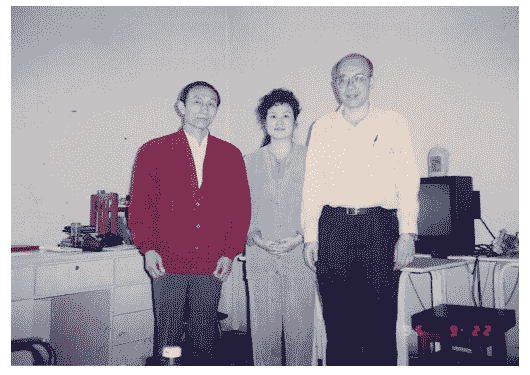
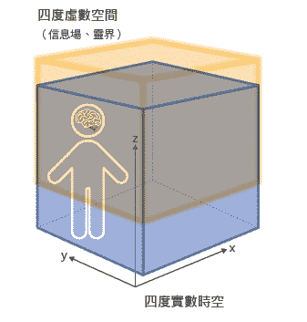
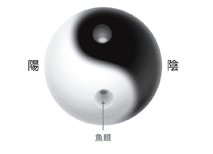
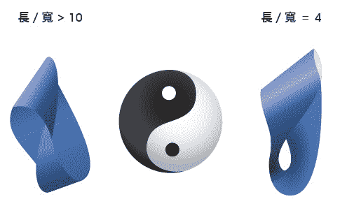

# 一、灵界在哪里？

在国内物理学界近十位学者的见证下，

发现我们所处四度时空的物质世界之外，

似乎还有一个世界的存在，

当年我把这个世界称作信息场，

也就是俗称的灵界。

## 二十世纪末宇宙大尺度谜团的重大发现──暗能、暗质

二十世纪末的一九九八年时，两组天文学者宣布了一项石破天惊的发现：我们的宇宙充满了一种能量可以抵抗银河间的万有引力，导致宇宙正在加速膨胀，这股能量叫做暗能（dark energy），被当年科学上最重要的期刊之一《科学》（Science）选为当年度「科学的突破」（The Break of Science）。五年以后的二○○三年，美国的威尔金森微波非等向性探测卫星（WAMP）[1]以探测宇宙微波背景辐射所得的数据，再配合其他数据如史隆数位巡天计画（SDSS）[2]所得的上百万个银河的资料，再度证实宇宙具有大量的暗能，也被二○○三年《科学》期刊选为当年度「科学的突破」。

##### 宇宙充满了大量暗能

大约是一百三十六亿年前，宇宙从混沌中以大霹雳的爆炸方式产生了时间与空间，喷出的能量转化为基本粒子、原子、分子以致物质星云的出现。星云之间的万有引力会逐渐减缓当初时空爆炸膨胀的速度。但是物理学家从观测星空发现，离我们远去的银河系内变星[3]的光强度却比预测的强度要弱，也就是它们的距离比我们预测的还更远，它们离开我们的速度比预测的要快，显示「宇宙正在加速膨胀」。而在短短的十三年后，也就是二○一一年的诺贝尔物理奖就颁给领导发现宇宙加速膨胀现象的三位物理学家──伯马特（S.Perlmutter），施密特（B.P.Schmidt）及瑞斯（A.G.Riess），这个暗能竟然占了宇宙能量的百分之七十三，并具有斥力[4]的性质。

另外，从一九七○年代宇宙学物理学家从螺旋银河的旋转速度到了银河边缘仍不下降的现象，发现宇宙存在大量的暗质（dark matter），具有引力的性质，占宇宙能量的百分之二十三。而正常的能量，也就是我们现在已知的科学所能了解的能量只占宇宙能量的百分之四。表示我们对大尺度真实宇宙的认知完全不清楚，「暗质、暗能的物理本质到底是什么？」──成了大尺度宇宙的最大谜团。

> 编注1威尔金森微波非等向性探测卫星（Wilkinson Microwave Anisotropy Probe，WMAP）
> 
> 是美国太空总署（NASA）的人造卫星，目的是探测宇宙大爆炸后四十万年残留的辐射温度。
> 
> 编注2史隆数位巡天计画（Sloan Digital Sky Survey，SDSS）
> 
> 是利用美国新墨西哥州的一架直径二点五公尺的望远镜，对北半球天空进行的巡天探测，可拍下北半球的全天星空图影像，让我们了解星系的距离、演化。
> 
> 编注3变星
> 
> 指亮度与电磁辐射不稳定且经常伴随其他物理变化的恒星。
> 
> 编注4斥力
> 
> 指物体之间互相排斥之力，和引力相反。

## 宇宙小尺度谜团的重大发现──超光速的量子纠缠

描述微小尺度量子世界的「量子力学」是二十世纪最成功的两大物理理论之一，用来描述基本粒子、原子及分子的世界；另外一个理论是「相对论」，用来描述宇宙的重力。今天的网路、手机及电脑文明就是量子力学发展的成果。但是量子力学所描述量子世界的本质，例如哥本哈根诠释[1]引发的争议，经过了九十年，直到今天还是不能完全令人满意，最大的争议有三项：

第一，描述粒子行为的波函数解Ψ（,t）[2]或量子场论中的量子场都是复数函数，**过去没有人了解复数的含意，因为复数不能被测量，能被测量的物理量必须是实数**。

第二，任何粒子或物体的运动必须满足薛丁格（Schrodiger）方程式或狄拉克（Dirac）方程式，这是一个决定论（deterministic）的方程式。也就是在时间为零的时候，如果知道粒子的位置及速度，那么到时间t的时候，粒子的位置及速度就可以计算出来，但是哥本哈根诠释却把波函数的平方当作粒子出现的或然率，非常的不合理。

第三个最严重的是发现超光速的量子纠缠[3]现象。有连结的两量子系统，处于混沌不定叠加的状态，不论两者相距多远，只要其中一个或一部分被仪器测量而确定状态时，另一个也瞬间被决定，其之间讯息的传递是远超过光速的，违反相对论的结论──光速是所有速度的上限，因此被爱因斯坦提出EPR悖论[4]批评为「幽灵般的超距作用」。

由此可见，充斥在我们生活中的奈米尺度的宇宙也是充满谜团，正等着我们一一解开。

> 编注1哥本哈根诠释（Copenhagen Interpretation）
> 
> 是量子力学的一种诠释。根据哥本哈根诠释，在量子力学里，观测创造实像，在没有观察之下，量子系统处在一种叠加状态。
> 
> 编注2Ψ（,t）
> 
> Ψ是粒子的波函数。ｒ是粒子的位置，ｔ是时间。
> 
> 编注3量子纠缠（quantum entanglement）
> 
> 在量子力学里，当两个粒子彼此产生交互作用后，其自旋或极化方向纠缠在一起有一定的关系（比如自旋相反），这个关系随着两粒子远离而不会改变，此现象称作量子纠缠。
> 
> 编注4 EPR悖论
> 
> 一九三五年，爱因斯坦与波多尔斯基及罗森联名发表「量子力学能完整地解释真实的量子世界吗？」的论文，反驳哥本哈根诠释的正确性，被称为「EPR悖论」。

## 宇宙中尺度谜团的重大发现──信息场（灵界）

二十世纪末第二项石破天惊的发现，发生于一九九九年人体特异功能研究的手指识字领域。

人体特异功能像心电感应、遥视、念力等，从古以来历史上就有大量的记载，是宇宙中尺度的人体所发生的谜团，在西方正式的科学研究是从一八八二年的英国开始，称之为超心理学（Parapsychology）。到现在，虽然经过了一百三十年的研究，也发表了大量的科学文献，但是仍不受主流科学界、尤其是物理界的重视。

东方的研究主要是从一九七九年中国大陆开始了手指及耳朵识字、念力等特异功能研究。同样的，因为手指识字现象超越现代科学的框架，不能用现代科学解释，因而不受主流科学界的重视，但是它的重要性却是比暗能、暗质有过之而无不及。

##### 手指识字及念力是宏观的心物合一

我从一九九六年开始重覆中国大陆自一九七九年起训练儿童手指识字及念力研究成果，经过反覆测量了几十位九到十七岁青少年手指识字的能力，证实他们能用手指触摸内容含有文字或图案的折叠纸条，而在脑中看到这些文字或图案。

文字与图案的出现，有时是一个部分接着一个部分依序出现，有时是整个字或图形会同时出现在大脑内的一个萤幕（第三眼）上。当手指识字能力训练娴熟以后，有少部分儿童可以训练出念力，用意念折弯铁丝，我们认为这种手指识字及念力功能的产生是宏观的心物合一现象。

就在一九九九年，我们有了重大的发现。**在国内物理学界近十位学者的见证下，我们发现用一些与宗教或历史上神圣人物有关的特殊字样如：「佛」、「菩萨」、「耶稣」、「孔子」、「老子」、「唵嘛呢叭咪吽」或符号「卍」、太极图，这些青少年会在脑中用第三眼看到亮光，或是发光的人像、庙宇、十字架，有时会看见暗的人影或听到声音，与以往总共超过八百次手指识字的结果完全不同**。但是一旦破坏神圣字汇，例如：将佛字删除一笔一画，或加一撇成为「彿」字，则异象消失，只会看到被破坏的字汇。这个现象相当于网路世界的网址概念，神圣字汇就是网址，可连结到一个网站，表示在这个世界之外，似乎有一个信息的网路世界存在。

为了确认这些现象不是由于小朋友对神佛认知的崇敬之心所导致大脑产生的幻觉，我们改用藏文、希伯来文等小朋友不认识的神圣字汇来测试，结果一样产生异象，看到亮光、亮人等；一旦破坏神圣字汇，则异象消失，小朋友只能看到被破坏的字汇。这证实了异象不是大脑产生的幻觉。　　

我们在一九九九年后又经过了五年的实验，发现我们所处的四度时空物质世界之外，似乎还有一个世界存在，当年我把这个世界叫做信息场，也就是俗称的灵界。因为里面有许多高智能的神灵存在，可以连上它们的网站而且进去参观。而这个信息场似乎是由不同的信息网站所构成，而神圣字汇就是与对应信息网站连接之网址。

至于手指识字时，是否能藉点入这个网址而与网站连上取回信息，还要看小朋友大脑之功能而定。这个功能就好比网路的浏览器，高功能的小朋友表示手指识字正确率高，浏览器之版本很新，可以看到各种网站之信息。功能较差的小朋友，大脑浏览器之版本较旧，只能看到有旧版信息之网站，因此能产生异象之神圣字汇较少。由此观察，我们开始了解物质的宇宙与信息场世界构成了一座错综复杂的网路世界。

## 特异功能研究揭示的四大谜团

我从一九九三年开始研究特异功能中的手指识字，一开始就观察到一个现象，手指识字要能够成功，小朋友的大脑一定要先打开「第三眼」，也就是天眼。

天眼开启时，就像大脑里面突然有一个像电视萤幕的画面被打开，会遮住正常的视觉，然后可以看到色彩或字形，天眼出现一阵子后会消失再又打开，把文字或图案一步步展示出来。

当时我没有读过神经生理学，因此到台大附近的书店把看得到的教科书都买回家仔细研读，我想，「手指尖有感光细胞吗？」，查了几年文献都找不到。而且我们的纸团通常都放入暗袋中，袋中根本没有光或是极微弱的光，基本上没有光源，如何将黑暗的信号送给大脑看？更重要的是，有的小朋友隔着塑胶盒，根本没有碰到纸，也一样看得见，信号显然也没有经过眼睛的视神经系统。那大脑为什么可以先看到颜色，再一步步看到字形？我经过了几年思索，对手指识字的原理一直困在原地打转，连一小步也无法前进，终于我决定放弃现代的神经生理学，因为它对了解手指识字毫无帮助。

##### 放弃现代科学的架构，另起探索炉灶

一九九五年，我认识了中国地质大学人体科学研究所的高功能人孙储琳女士，她具有超过六十种不同的念力，想了解她的潜能可以参考《是潜能？还是特异功能？》一书。根据她的说法，特异功能要想成功，一定要先开天眼，然后把目标物如花生、钱币、汤匙等调入天眼，与目标物沟通、操控、以意念改变目标物，当天眼中的变化完成后，再将信号送回物质的目标物，等待目标物的变化完成后，念力就成功了。因此，不能打开天眼绝对无法产生念力，看了她令人瞠目结舌的实验结果，我知道念力是无法用牛顿力学来了解的，一定要放弃现代科学的架构，另起炉灶才有可能真正搞清楚特异功能的物理机制。于是在我心中渐渐形成了必须解决的四大谜团：

> 谜团1天眼的物理及生理机制为何？天眼与一般意识有何不同？特异功能为何需要开天眼才能成功？
> 
> 谜团2在手指识字及念力现象中，天眼扫描及传递信号的管道为何？
> 
> 谜团3灵界在这些特异功能操作的过程中扮演什么角色？真实的灵界在哪里？
> 
> 谜团4暗质、暗能、量子谜团、意识、特异功能是不同的现象吗？还是存在着统一的架构可以解释所有的现象？

## 二○一二年世界末日的生命启示

二○一二年的世界末日说是一个关于地球末世论的传说与谣言，它宣称在美洲过去的马雅文明中长达五千一百二十六年周期的马雅历将于二○一二年结束，因此预言了地球、世界和人类社会在西元二○一二年十二月二十一日之前后数天之内，会发生全球性的灾难性变化，此说法与太阳风暴、地球磁极反转等谣言结合，成为二○一二年十二月民间疯狂轰动的大事。

当然，最后地球安然无恙地度过这几天，戳破了这项传说。**不过，有一项用来解释这项传说的说法却深获我心，末日说并不是指地球会毁灭，而是指地球会跃升至舍弃过去一切的文明，譬如昨日死。二○一二年起，人类会由一个比较落后的文明觉醒，而逐步提升到一个比较高等的意识及文明的境界**。

##### 信息水的启发

一九九九年，由于手指识字研究因而发现了灵界，我于二○○○年七月把自己从一九八八年起所做的气功及特异功能如手指识字、意识微雕、生物意识工程等十二年的研究成果整理出书──《难以置信：科学家探寻神祕信息场》。

出版两个月后的有一天，我的一位同事国企系的汤教授来问我，王永庆董事长的女儿王瑞华及她的夫婿长庚生物科技董事长杨定一博士看了我的书，觉得很有兴趣，想请我吃个饭大家聊一聊，那时候我恨不得把自己的发现与所有对此有兴趣的人分享，自然很快答应了。

一见面之下，我发现杨博士及夫人都很年轻，那时大概才四十出头。杨博士先给了我几篇他一九八○年代在洛克斐勒大学做免疫学研究时，在世界顶尖期刊《科学》（Science）、《自然》（Nature）所发表的论文，其中描述了白血球会产生一种特殊的蛋白质武器「穿孔素」杀死肿瘤及受病毒感染的细胞的机制。我想，他的目的是告诉我，他不只是做生意的商人，而是学有专精的学者及科学家。于是，我把过去十二年的奇遇及做特异功能的所见所闻，包括信息场的发现，详细地讲述给两位听。

杨博士静静地听完以后，淡淡地说：「我也讲一些我的研究给你听听。」接下来，我所听到的故事简直匪夷所思，不但有信息场的探索，比我发现的还要深入、还要更根本；他特别问我一些有关水的特性，尤其是经过特殊处理的水的一些奇妙的性质，像超流态[1]会从杯子中爬壁而出、向你走来，好像具有意识，我完全没有听过。并告诉我一些古埃及流传下来有关水的知识。杨博士还让我见识一下这样的水做成的产品，并滴一滴在我的舌头上，我感觉这滴水一碰到舌头，瞬间消失于舌头皮肤之下，不会停留在舌头上一段时间。据杨博士告诉我，有时一滴水就可以治疗一些疑难杂症。另外，他也提到微量元素的神奇效果，这些现象及故事真让我听得瞠目结舌，回去以后几天睡不着觉，但是由于自己是外行无法验证，也只能记在心头。

隔了两年，有一次我让一位道家朋友Ｗ先生试了这瓶水中的一滴水，没想到五分钟后他竟然打起瞌睡来了，他说这滴水从舌头直接钻进大脑意识中心，关掉了他的意识，让他昏昏欲睡。另有一次，我让一位治因果病的灵疗老师试了一滴，她感觉这滴水在胸口附近的食道徘徊，上上下下好像有意识一样，在等待机会钻进大脑，让我对这瓶水产生了极大的好奇心，但是也无法更进一步了解这个特殊现象。

##### 超意识的天眼如何形成？

二○○○年开始，我对于病患使用灵疗方法来治病产生了兴趣。那一年在因缘巧合下认识了一位灵疗者，亲自观看了灵疗过程，让我开始相信因果轮回的存在。**很多的病其实是业障病，来自多次前世所累积的因果业力，因此我自二○○四年起，开始做拜忏的功课，每天做一圈一百零八拜，把功德忏悔回向给累世的冤亲债主**。做完功课，才开始一天的活动，吃早餐、漱洗、准备上班。

我记得就在二○一一年十二月二十八日，当天早上做完拜忏以后，我突然灵光一闪产生了一个念头︱︱十二年前在二○○○年时，杨定一博士告诉我有关水的奇异特性，所给我的特殊水制品，可能就是天眼的成因。几天之后，进入二○一二年元旦，我就突然像开了窍一样，对于困扰了我二十年的手指识字、念力等特异功能谜团，好像在理论上打开了一个缺口，终于可以开始往前走一小步了。

**我们的大脑里像身体一样满布生理食盐水，约占百分之七十左右，如果大脑有一小部分生理食盐水在手指触摸纸团的刺激之下进入特殊的超导态或量子态，天眼就形成了**。剩下的问题是，这个天眼要如何与外面的世界如纸团或目标物接触？是经过手指还是其他管道？如果是离体识字，纸团放在离身体一段距离之外，根本没有用到手去触摸，又该如何解释？当时我猜测，可能是天眼形成了宏观的量子波，穿出人体把纸团或目标物包围起来，强迫纸团或目标物进入心物合一状态，此时信息往大脑送就可以识字，当大脑用意识操控目标物就可以产生念力。但是又想不通量子波如何强迫其他物体进入量子状态的方法。

二○一二年中，我看到云南大学物理系朱念麟教授写的一篇文章，描述他训练儿童的念力实验的结果，获得深刻的启发。他把火柴装在一个不透明的塑胶盒子中，由一位小朋友离体用念力把火柴搬运出盒子，成功搬出后，却不知搬到哪里去了，好像进入一个隐态空间消失无踪。等了一段时间后，又要求小朋友把火柴搬回来，只见开天眼的小朋友说：「火柴出现了，飞来了」，但是没有人看得见火柴，小朋友用手去打飞行中的火柴，还说火柴会闪避，似乎火柴出现了意识，可是一旦被打到，火柴就会显身掉在地上。由此可以知道，透过意识搬运出去的火柴是藏在信息场或是灵界，只有天眼才看得见，一般人的正常眼睛是看不见的，朱教授因此把信息场叫做「隐态空间」，因为信息场是一个意识的世界，所以火柴在信息场才似乎有了意识，可以闪躲人的拍打。

而且，天眼似乎可以把目标物送入信息场藏起来，让这些火柴信息可以在信息场自由飞翔，一旦受到撞击就会物质化，而显身在物质世界。只是当我解答了一个目标物藏身的问题，却引发出更多的问题，比如天眼如何把目标物送进灵界的管道，我还是不清楚，灵界在哪里？

> 编注1超流态
> 
> 当物质如氦气在低于临界温度2.15K时，其液体会进入宏观的量子状态，流动时没有摩擦力，叫做超流态。

## 真实宇宙，包含实数空间与虚数空间

二○一三年初，我的研究兴趣转向南氏去过敏疗法[1]，尝试去了解为何当病患手握过敏原的信息水制剂，加上刮通经络及十几个关键穴道后，一天不接触过敏原就可以把身体过敏现象消除。其关键就是去证明抗原抗体分子的生化反应，不需要直接接触，而是分子的时空结构X信息可以穿墙破壁经由另外一个管道来完成。

二○一三年六月，我从台大校长卸任休假一年，终于有时间可以好好地把二○一二年以来所有对特异功能、宇宙实像的思考理论整理成一套逻辑比较完整的架构。那一年真是愉快，我好像回到了大学时代，行住坐卧都沉浸在解谜的氛围中，常常早上醒来就有一些新的观念出现，所谓日有所思、夜有所梦是也。

##### 真实的宇宙是复数时空

我曾于一九九五年去北京，拜访中国地质大学人体科学研究所的沈今川教授及高功能人孙储琳女士（如下页图1-1所示），并合作研究特异功能四年，因此推荐给汉声杂志社的总编辑吴美云女士出书。吴女士曾于二○○一年及二○○四年内两度邀请我去北京，与沈今川教授及孙储琳女士以对话录的方式来谈孙储琳的六十项特异功能，她的成长历史、功能的出现与操作的细节，以及特异功能理论的架构等问题。

书稿在二○○五年初已经完成，但是不巧的是，我在二○○五年六月就任台大校长，不方便再出这方面的书籍，因此我要求这本书要在我卸任台大校长以后再出版，获得吴总编同意，结果一等就是八年。

二○一三年六月底，我从台大校长卸任以后不到三个月，在九月初的时候吴总编就把二○○一年完成的书稿寄来要我校对。

我看到十三年前的对话录，不禁百感交集，特异功能的研究由于超出了现代科学的框架，就必须忍受主流科学的霸凌与压迫，与四百年前的伽利略所面对的宗教压迫是没有两样的，只是他面对的是生命的死刑，而我面对的是主流科学界的各种攻击。

图1-1　与沈金川教授、孙储琳女士探讨特异功能研究

|  |
| 1995年9月，我第一次到北京中国地质大学人体科学研究院访问沈今川教授及特异功能人士孙储琳女士，看到他们多年来的研究成果。 |

包括我选台大校长期间，外界曾利用媒体、学术杂志、甚至动用诺贝尔奖得主的批评来打压我。并在我当选校长一年后继续发动事端，假借研究伪科学的理由，找我学生论文的麻烦，种种侵扰行为足以列入史册，为这个时代主流科学界的行为留下见证。

在校对过程中，我赫然现在二○○一年的对谈过程中[2]，我已经提出实数空间以及虚数空间的这种概念。

在物理的世界中，其长度、时间都是可以测量的，而可测得的物理量都是实数，也就是物质的世界就是实数空间。而二十世纪一九二○年代出现的量子力学所描述的粒子是一个波函数，很不幸的是，波函数是一个复数，包含了实数及虚数，物理学家看到这个结果觉得很困惑，怎么描述实际粒子的波函数竟然是个不能测量的复数，于是把这个复数平方后又变成实数，表示粒子出现的或然率。但是如果粒子真的就如复数波函数所描述的，牵涉到一个实数空间和一个虚数空间，那么表示除了我们所身处的实数空间的物质世界之外，还有一个跟实数空间成共轭状态而我们测量不到的虚数空间，看到这里我豁然而通。

**一九九九年我们做手指识字实验时所发现的信息场，其实就是虚数的时空，原来我们真实的宇宙是一个复数的时空，有实数也有虚数**。我在二○○○年左右就形成了这样的概念，只是没有继续琢磨、完善这个模型。

##### 量子心灵概念的形成

二○一三年十一月，我受邀去云南昆明参加第二届人天观学术研讨会，这是中国大陆自一九九九年取缔法轮功以后，导致特异功能研究沉寂十多年来少数举办与特异功能研究有关的研讨会，其中发表的论文有不少在讨论过去三十多年来大陆所做的特异功能研究。会中我碰到了很多二十多年前做特异功能研究的老朋友，大部分研究者都已经退休了。

其中一位四川大学物理系的吴邦惠教授在演讲时提到，她在一九八○年左右，提出了量子波函数的复数ｉ代表意识的想法，并给钱学森[3]写了一封信提出这个概念，受到钱学森的鼓励，但是最后发展不下去而不了了之。

我听到她的演讲真的像五雷轰顶，我发现的信息场也就是虚数时空，是个充满了意识、神灵及信息网站，如火柴进入虚数时空后，也会产生意识可以闪躲人的拍打，不就是指明虚数ｉ代表意识吗？这时，量子心灵或量子意识的概念自我心里油然而生，**原来意识就是指量子状态出现，万物皆有灵，只要物体进入宏观量子状态，虚数出现，意识就出现了，这个宇宙的真相已经呼之欲出了**。

从昆明回来后，我加快了理论的建构过程，提出「复数时空」及「量子心灵」两大假设是破解宇宙之谜的关键，剩下的问题是「如何进入虚数时空？」、「灵界在哪里？」。

二○一三年年底十二月二十四日，我请道家朋友Ｗ先生晚餐，向他提到我这几个月在复数时空及量子心灵理论架构上的突飞猛进，但是最大的困扰是，实数空间通往虚数空间的通道究竟在哪里？

**他提醒我，中国传统的太极图其实是一个三度空间的圆球，阴阳两界各占一半，经过鱼眼交换能量而达成平衡**。突然之间他点醒了我，复数时空理论架构中实数时空与虚数时空如何沟通的问题，它们必须要经过一个涡漩的时空结构来沟通，让信息从阴到阳、或从阳到阴。其中最可能的涡漩通道，应该就是粒子的自旋，它的物理原理我们在半年后才从已发表的广义相对论文献中发现。

由于每个基本粒子包含夸克、电子、质子、中子，其中都有自旋，自旋方向不是朝上就是朝下，自旋角动量[4]不论质量为何，都是ћ/2，其中ћ是普朗克常数除以2π。因此每个粒子都有进入虚空的通道，通道无所不在。

二○一四年一月六日我把正式论文《复数时空：解释暗质、暗能、意识与特异功能的统一架构》[5]投到国内学术期刊《佛学与科学》，被接受后于二○一四年三月刊登出来。

> 编注1南氏去过敏疗法
> 
> 这种疗法是先利用肌力测试，找出导致身体过敏的过敏原，然后经过二十分钟的刮经络、按摩穴道治疗后，接下来一天二十四小时内，只要不再接触过敏原，就可以完全去除过敏，恢复健康。详细论述请见《科学气功》。
> 
> 编注2「是特异功能，还是潜能？」的大师对谈
> 
> 请见《是特异功能？还是潜能？》，第一百七十四页。
> 
> 编注3钱学森
> 
> 浙江省杭州市人，世界闻名科学家，中国空气动力学家，科学院、中国工程院院士。
> 
> 编注4自旋角动量
> 
> 一九二八年，英国物理学家狄拉克证实每个基本粒子都具有自旋角动量，不管粒子质量多大，自旋向上或向下的角动量大小都是二分之一的ћ，是普朗克常数ћ除以2π。
> 
> 编注5《复数时空：解释暗质、暗能、意识与特异功能的统一架构》
> 
> 请见《佛学与科学》期刊，第十五卷第一期，第十三到二十八页。

## 提出两大假设：复数时空与量子心灵

在《复数时空：解释暗质、暗能、意识与特异功能的统一架构》论文中，我提出两大假设：

##### 第一假设：复数时空

**真实的宇宙其实是一个八度的复数时空，除了目前所知的四度实数时空（阳间）以外，还有一个充满意识及信息的四度虚数时空（可称作信息场或阴间、灵界）存在（如图1-2所示）。**

为什么要用八度而不是像超弦理论[1]用十一度空间呢？主要考虑的因素是平衡，阴阳必须要平衡，否则会像不平衡的化学反应一样，会进行动态反应一直到平衡为止。既然实数空间有长宽高加上时间是四度时空，自然虚数时空也必须是四度。这种双重世界的概念在中国儒释道的体系早已传承悠久，西方也已转化为政治及宗教制度，例如由国王管理人民的俗世事物，由教皇管理人民的精神属灵事物。

图1-2　宇宙是八度的复数时空

|  |
| 八度的复数时空，是由四度的实数时空及四度的虚数时空组合而成。四度的实数时空就是「阳间」，四度的虚数时空就是「阴间」（灵界）。人类大脑中的灵魂可以跨越实虚两界。 |

实数时空与虚数时空虽然关系密切，为同一复数时空的实部及虚部，但是其间存在实虚障碍（阴阳两隔），仅仅藉由许多不同尺度的特殊时空点交换能量，这些连结点都是漩涡状的时空结构，也就是三度空间中太极图上的鱼眼结构（如图1-3所示）。

我假设实数时空与虚数时空就是太极图上所尝试描述的阳及阴，两者相生相克，其能量经过鱼眼（漩涡的时空结构）互相沟通，因此实数及虚数时空中都有许多的鱼眼具有漩涡结构可与另一时空接通，让能量互相交换。除非物质小于漩涡尺寸或进入特殊状态，否则不能随意穿越。　　

一般物质存在于四度实数时空中，可以由四个座标（x，y，z，t）来定位，描述其运动。但是当物质如基本粒子、光子或物体进入微观、宏观量子状态，必须用复数场来描述其量子状态时，当复数物质波出现，物质波不受漩涡尺寸限制，就可以透过漩涡连结点穿隧进入虚数时空。

图1-3　太极时空中，鱼眼是阴阳沟通的涡漩通道

|  |
| 在3D太极的时空结构中，鱼眼是阴阳互通的涡漩通道。经由无数鱼眼的漩涡时空结构，方能达成阴阳两界的沟通。 |

在虚数时空中，物质波的波速u与实数时空中物体的速度v满足此方程式uv＝c2，c为光速。当物体在实数时空的速度小于光速时，（v＜c），则物质波的波速在虚数时空的速度会大于光速（u＞c），因此量子状态的物质波可以很快地传布到广袤的虚数空间，也可以撷取过去及未来的讯息。此时最大的变化是物质的意识成分（虚数部分）被唤醒。**我认为虚数时空的意识、神灵及无数的信息网站都具有能量，相当于质量的存在，而这些质量就是暗质，具有引力的特性**。暗能，一般被认为是由广义相对论中的宇宙常数所提供，也就是真空能量所产生的斥力。我认为复数时空中实数时空与虚数时空经由数量巨大的漩涡连结点紧密黏在一起，虚数时空的膨胀可以带动实数空间的加速膨胀，导致暗能的出现。因此，虚数时空的存在回答了我提出的第三个谜题：「灵界在哪里？」，也提出宇宙大尺度谜团如「暗质、暗能到底是什么？」的解答。

##### 第二假设：量子心灵

我提出的「量子心灵」的科学假设认为：意识是一个量子现象，由于虚数时空充满意识及信息网站，虚数ｉ在数学里只是一个符号，但是在物理上它代表了意识，因此我认为复数量子场或量子波函数中虚数ｉ的出现把意识带进了物理学。量子力学早已把意识带进了物理，只是没有朝这方面探讨、解释。虚数部分与意识有关，这就是量子心灵的意义。

实数空间的物质要打破实虚障碍进入虚数空间的关键有二：

第一个方式是物质的尺寸要远比自旋漩涡口的孔径小，而且正好撞上连结点的通道口，得以进入虚数时空消失，而会在不同时间、在不同地点由另一漩涡连结点出口显现。类似百慕达三角洲飞机或船舰的神祕失踪事件。

第二个方式是物质只要进入复数物质波或量子场状态一出现，就可以渗入虚数时空。我认为这个复数的物质波就是进入虚数时空的钥匙。此时物质尺寸不再重要，量子波可以渗透穿隧经过很小孔径的漩涡时空连结点（漏斗口）进入虚数时空。因为量子物质波在虚数时空的速度可以远高于光速（u＞c），因此量子可很快地传布广袤的空间，也可以撷取过去及未来时间的讯息。光子比较特殊，在实数空间的速度及虚数空间的波速都是光速c。

在复数时空中的波函数导致在实数空间无法确切地测量粒子的动态性质，如位置及动量，因为其游走于实数及虚数时空，在虚数空间与所有物质的虚像产生随机碰撞，因此测量时当复数波函数崩溃回到实数时空后，只能得知其在位置r出现的或然率。两个量子所产生的量子纠缠现象是发生在虚数时空，因为它们都经过自旋通道钻入了虚空，虚空里信息的交换及传导是可以超光速的，因此量子纠缠信息超光速并不违反相对论。所以，复数时空的概念彻底解决了近百年来对量子力学本体论的迷惑，也就是量子力学所描述的「量子世界的本质到底是什么？」的问题。

> 编注1超弦理论.
> 
> 超弦理论认为组成世界的物质包括原子、电子、夸克等，都不是由实体物质构成的，而是由万物的基本单位「弦」的震动所构成。「弦」的不同振动方式会形成不同的粒子，粒子又构成了世界。并且弦的振动是一种能量到实体物质的转化，因此万物的本质只是振动的能量而已。过去，人类对维度的探索仅止于四度，超弦理论诞生后，人类认知的维度变成十度空间加上一度时间即十一度时空，人类生活在三度空间中，因此无法感知高维度的存在，就像听不到超声波、看不到红外线。

## 粒子自旋能划破时空，连结阴阳界

每个粒子都有自旋，是一九二○年代量子力学发展前所测量到电子的特性，而且只有两种可能，一个自旋向上、一个自旋向下。自旋角动量的大小是ћ/2，其中ћ是普朗克常数除以2π，当时的物理学家为了解释自旋现象，尝试用了古典的图像。

若一个电子的质量为已知，尺寸可以估计，将其看成一个古典的实心圆球，那就可以计算出电子要转多快才能产生实验所量得的自旋角动量，结果发现旋转速度必须要超过光速，违反相对论，因此在大物理学家包立（Pauli）的警告下，主流物理学家从此噤声，认为电子自旋是纯粹的量子现象，没有古典的图像。

当然，一九二八年英国物理学家狄拉克（Dirac）所推导的相对论量子力学，自动得出粒子的自旋角动量只有向上或向下，大小为ћ/2，与实验一致，更加深了自旋是量子现象的信仰。但是也有少数非主流物理学家证明自旋是一团有能量的量子波在狄拉克场下的旋转行为，多少恢复了部分古典的图像。

二○一三年，俄国的广义相对论大师Alexander Burinskii提出，自旋由于粒子过度旋转（超光速）把时空撕裂划出一个奇环口，形成两片断裂的时空，这个划破时空的举动打开了阴阳两个世界的通道。

**本来阳间与阴间像是一张纸的两面，这张纸是无穷大，阴阳互不来往，但是只要纸上钻了一个小洞，或划破一道小口，则阴阳通道出现**。如果一个化学键有两个电子一个自旋向上、一个自旋向上，则会撕裂两道口子，时空分裂为四片。在极小的空间中，四片断裂的时空要两两相连接以维持一个稳定的时空结构。Burinskii声称会以莫比乌斯带（Mobius Strip）的方式连接（如图1-4所示）。

当一条长方形纸条的头尾正常相连，就会形成一条有宽度的圆圈，但是头尾相连时，其中一头转了一百八十度再相连，就形成莫比乌斯带，图1-4展示的模型就是不同长宽比的纸条形成莫比乌斯带的3D几何构造。

很明显的是，当长宽比等于四，形成的3D拓朴结构就是一个3D太极图，有两个洞口一个向上、一个向下，代表两个不同自旋造成的结果，一个由阳到阴，另一个由阴到阳。这也解释了量子力学里的包立不共容原理（Pauli exclusion principle）──为什么同一轨道两电子的自旋必须不同，因为这样一来才能形成稳定的太极时空结构，以及稳定的分子结构。

图1-4　3D莫比乌斯带（Mobius Strip）

|  |
| 将一条长方形纸条其中一头转了180˚再头尾相连，就形成莫比乌斯带。当纸条长宽比等于4，形成的结构就像是一个3D太极图，有两个洞口一个向上、一个向下，代表一个由阳到阴，另一个由阴到阳。 |

奈米尺度的漩涡时空结构就是基本粒子的自旋，只有两种状态，向上及向下，一个由阳旋入到阴，一个由阴旋入到阳，这解释了为何一个空间内的量子轨道只容许两个自旋相反的电子，因为可以形成稳定的三度空间太极时空结构，这也解释了量子力学里的包立不共容原理的物理成因。因为在空间轨道内放入两个自旋相同的电子会造成不稳定的时空结构。

二○一三年三月二十一日，欧洲太空总署（ESA）网站公布了普朗克卫星收集了五年的宇宙微波背景辐射数据[1]。这是一百三十六亿年前从宇宙诞生的大霹雳爆炸后约四十万年，初始尘埃散开到电磁辐射可以向宇宙发散后的残留分布能量。这张图显示出两个不正常的特征：一个是两半球温度不对称，南半球温度稍高，另外一个是南半球出现一圈圆形的冷点。仔细一看，其实这张图显示了一个巨观的太极图，冷点就是鱼眼，清楚显示实数时空是由虚数时空爆发出来。当然现代宇宙学认为我们的宇宙是由真空能量爆发出来，名称虽然不一样，实质上则同为从虚空产生。

二○一五年九月十一日，美国太空总署（NASA）的天文物理学家发现一个双重黑洞星体[2]的产生速率是我们太阳系所在银河的一百倍，各大媒体公布的想像图像，就是平面太极图的两个位于鱼眼位置的黑洞互相作用之结果，表示大量的能量在黑洞附近产生，这也显示出太极的时空结构有很多异常现象产生。

总而言之，复数时空及量子心灵两大假设的提出，可以开始合理的解释暗质、暗能、量子力学的谜团，以及意识的本质，特异功能研究所引发科学四大谜团的第四个谜团似乎获得了解答，但是要如何去理解宇宙中尺度的谜团「特异功能」呢？这要等到第四章才能加以讨论。

编注1

|  |
| 宇宙微波背景辐射数据 |

编注2

|  |
| NASA发现双重黑洞星体 |