# 二、耳朵及手指识字的实验启示

如果有一天，

能教会盲人用手指或耳朵来「看」，

用触觉来取代眼睛，

人类社会中，将不再存在「盲」这种残疾。

## 发现人体潜能――耳朵与手指识字

眼睛可以观赏五彩缤纷的世界，耳朵可以听见虫鱼鸟兽以及大自然所发出的各种声音，手指可以摸出物体表面的平滑凹凸与冰凉热烫。这些能力是一般人所拥有的基本能力，一点也不稀罕。但是，如果可以用手指「看」图案，也可以用耳朵、腋下、膝盖「看」图案，就代表着触觉的信号跑到了大脑中枢的视觉区域，那它所代表的意义就非同小可了。

##### 盲人点字时，触觉信号会牵动视觉

一九九六年四月，英国《自然》杂志刊登了一篇文章，日本国家生理科学研究所的定藤规弘教授（Dr.Norihiro Sadato）的研究群，利用正电子发射断层摄影数（PET）及区域性大脑血流量之测量发现，**当已有点字经验的盲人用手指触摸盲文（Braille）上凸出的字体时，在大脑左右半球的视觉皮质区会有激发反应，这是科学界第一次发现盲人在摸点字时，触觉信号会传入视觉皮质，造成不同感觉信号互通之现象**。

但是定藤规弘教授等人又同时发现，当盲人不是摸点字，而是在摸一片均匀的凸出小点时，则触觉信号不会传入视觉皮质。而正常人在摸点字时，视觉皮质的血流量会减少，视觉区不但没有激发，反而会受到抑制。这与一般脑科学家过去的认知是相符的，五官的感觉是不会互通的，眼睛瞎了，并不会造成听觉或触觉受损，而听觉的损伤，也不会影响到眼睛所观察的世界。

##### 发现会耳朵识字的儿童

不过，早在一九七九年，四川省大足县就发现了一个十一岁的小男孩，名字叫做唐雨，他具有耳朵识字的功能。若在一张小纸片上随便写一个字，然后将纸片折叠或揉成一小团，塞入耳朵中，他可以在几分钟内在脑中看到这个字。

这件事情经四川省的地方纸媒报导后，引起了很多人的兴趣，不少四川省各地区的小学老师就在班上试试小朋友有没有这样的能力。结果不到一年，四川各地方纷纷报导具有耳朵听字能力的小朋友，且有数百名之多。

这结果引起了北京大学生物系陈守良副教授的兴趣。他于一九七九年底在北大开了一个儿童潜能训练班，有五到十四岁的四十名儿童小朋友报名参加，各实验不同的天数，结果其中十五位参加了四天以上训练的儿童，有八成出现了手指识字功能；其他受到三天以下训练的儿童成效较差，平均下来总共有十六名小朋友出现了手指识字的功能。

一九八○年，杭州大学的田维顺教授等人对杭州四所小学及四所中学的一千两百二十二人做了四个小时的诱发测试，结果发现以九岁的儿童手指识字功能出现的比率最高可达到百分之二十。随着年龄的增减，出现手指识字功能的儿童比率递减。十岁及十一岁的儿童，出现功能的比率均为百分之十四左右；十二岁的儿童，出现功能的比率为百分之七；十三岁的儿童，出现功能的比率为百分之四；十四岁以上的一百五十位学生中当中，只有一位出现识字功能，如左图2-1所示。

**由此可见，我们随着年龄的增长，学习的知识越多，当大脑松果体逐渐钙化，产生手指识字能力的可能性就越低。**

图2-1　对小学生、中学生手指识字功能的测试结果

| 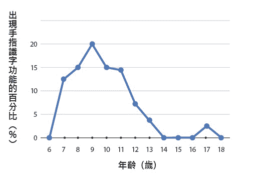 |
| 1980年，田维顺教授等人对杭州4所小学及4所中学的1222人，做了4个小时的诱发测试，结果9岁小孩出现手指识字的比率最高。 |

上海市高校人体科学联合研究组的邵来胜等人，从一九八二年起，对上海各高等校院的学生与老师及地区的工人，举办了「特异功能诱发训练班」，结**果发现文化程度比较低的群众中，比较容易诱发成功，特异功能提高速度也比较快**。

比如，在一九八六年一月，其训练对象是十一名男女工人，年龄在十八到二十岁。学历在小学程度的有两人，国中程度的有九人。每天训练一小时，总共训练十八天。结果到了最后一天，每个人不但出现识字功能，还掌握了隔空把盒子内嵌施以念力弯曲的潜能，最厉害的人还能把铁丝折断，甚至搬运到远处。这些具体的实验数据在在都显示了，手指识字功能的人体潜能确实存在。

## 手指识字，突破现代脑科学认知

手指可以摸出字来？耳朵可以辨认图案？任何人第一次听到这种事情，总会嗤之以鼻，把它打入怪力乱神之流。一九八七年，当我开始参与国科会所推出的气功研究时，也抱着同样的态度。随着气功研究的深入，接触到越来越多的科学论文及大陆与日本媒体的报导，逐渐感受到这些现象，可能不但不是怪力乱神，还是人体科学的尖端领域，不过还是希望亲自做实验来证实。

##### 第一次接触到能用手指识字的人

我第一次接触到具有手指识字功能的人，是一位十一岁的高桥舞小妹妹，时间是一九九三年。高桥舞小妹妹的父亲是日本人，母亲是台湾人。她在台中的一个国小读到五年级后移民美国，由于外祖父母在台湾，因此她每年都会回台省亲。

高桥舞的母亲在她十岁那年，由于看到日本电视台的报导有手指识字这种事情，因此也让她试了一下，结果发现她也拥有这项功能，她的母亲兴奋之余也非常的重视，每天让她练习几次，因此当我们第一次碰面时，她的手指识字功能已经非常的稳定。

记得第一次见面的时候，是一九九三年暑假八月十七日的下午，地点在台中的朋友家。归国省亲的高桥，扎着一条长长的马尾，穿着牛仔短裤及短袖汗衫，由妈妈及外祖父母带着前来。面貌清秀的她面对陌生人显得有点腼腆，问她话时只是点头及摇头，偶尔会跟妈妈及阿嬷小声说两句。

开始做实验时，我先在隔壁饭厅的桌上用不同颜色的笔写了二十张纸条，并将每一张纸折叠几次，务必要做到从外观上看不到任何字的痕迹，然后拿进客厅，由在场的朋友从中间抽取一个交给高桥小妹妹，因此无人知道内容。

高桥用右手接下纸团后，摸了十三分钟也看不见，这时她的母亲拿出一个深绿色的布套，上缘系有细的尼龙绳，把高桥的右手套入布套，再把套口的细绳抽紧，让套口紧紧贴在手腕上，再在手腕上打了一个蝴蝶结。

根据高桥母亲的说法，这是当初训练高桥认字时，为避免她打开纸团或从纸团外偷看之用，时间久了，她也习惯了，不戴布套反而不容易「看」到字。

我带了一台V8摄影机，全程拍摄她脸部及手的动作。也许是加了布套后更胸有成竹，只见她坐在沙发上东看看、西看看，左手有时会去捏那套在布套中的纸团，不到一分半钟就说：「看到了棕色的田字。」她在一张空白的纸上写上田字。结果打开一看，是红色的「田」字。字形完全正确，颜色稍有差池（如七○页图2-2所示）。

接下来，我们又做了三次实验。第二次实验时，将纸条用白纸盒盖住、再用双手盖住白纸盒，她先看到「日」字，再看到右边的月字，知道是「明」字，完全正确。第三次实验时，用布套套住她的手，她在一分二十秒时看到黑色的「天」字，完全正确。第四次实验时，用布套套住她的手，还将纸团用胶带黏住，她经过十五分钟还看不到，因而放弃。第五次不戴布套，十三分钟后仍无法看到而放弃。总共五次实验中，有三次成功，两次失败。

**当时，我并不知道失败的原因，只是觉得百分之六十的成功率，有点不可思议。因为当初选择写下的文字或图案，没有任何限制，倘若每一次实验纯粹是用猜的，猜中机率大概大于千分之一**。而现场又是完全双盲的状况，没有任何人知道高桥小妹妹手里所拿纸条的答案。

图2-2　高桥舞11岁手指识字的实验结果

| 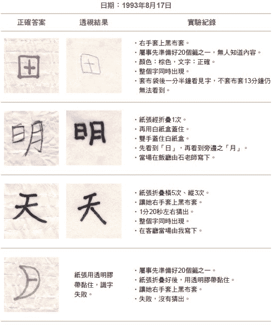 |

回台北的路上，我怀着满心的惊喜与疑惑，但五次的实验样本还是太少，仍不足证实此事的真实性。但如果手指识字是真的，其中信号传递的机制又是什么呢？一个对现代脑科学认知挑战的现象，已经浮现在眼前。

## 专家见证，手指识字的科学实证过程

有了第一次的接触以后，我们利用高桥小妹妹回国省亲的机会，每次利用二到四天的时间，对她手指识字的能力作了详细的研究。第一回是一九九三年十月，第二回是一九九四年八月，第三回是一九九五年九月，第四回是一九九六年五月，第五回是一九九七年八月。

##### 制作手指识字的实验题目

在正式实验之前，我们必须先制作题目。在第一及第二回实验时，我们均裁下五公分乘上十公分的长方形白色纸条，然后用红、绿、蓝、黑四种颜色签字笔，在纸条上写上单色或多种颜色的文字，包括单个或多个中文、英文或画上图案、写上算式等，然后沿长边对摺后，以零点六到零点八公分之宽度，由中心往外叠六次，形成一个五公分长之细长条纸卷，再在三分之一处各向内摺一次。为了达到摺好之纸团务必无法由外观看到任何字形及颜色的地步。有时，外面会再用胶带黏贴，或再加一张纸包扎。

每回实验时，我们准备的纸团均超过五十个，由实验现场的来宾在另一房间当场书写再折叠。第三及第四回实验，则裁下三公分乘上十公分之长方形纸条，一端剪成尖锥状。折叠时则从尖锥处摺起，摺向另一端，其目的在了解手指辨认图案之方向，是由内向外或由外向内。

##### 专家见证下的实验过程

每次在实验现场，旁观的教授、学生、医生或有兴趣的人士，包含记者都在十人以上，有一到两部摄影机从不同角度拍摄，以记录实验详情。

第二及第三回实验时，使用红外线摄影机记录手掌的温度，并观察她的手在布套或黑盒内触摸纸团之动作。

实验开始时，我会随意请一位在场人士，任选一个纸团交给高桥小妹妹，没有人知道纸团内容为何，以达到双盲的效果。高桥小妹妹在右手拿到纸团以后，大部分情况下，要在右手套上一个深色布套，套口有绳子可以将套口缩紧绑在手肘上，如后面九六页的实验照片所示。布套内的余光只有一般白光或灯光的万分之一。有时会在布套上再罩一个黑纸盒，让余光强度再降一百倍以上。此时可以说纸团处在完全黑暗之中，不可能由眼睛直接看到纸上的颜色或任何字形、图案。

在前三回的一百次实验中，有二十五次，让高桥小妹妹戴上眼罩阻绝光线，以了解眼睛在手指识字过程中所起之作用。有部分实验不戴眼罩，但在暗室进行，暗室之余光也只有开灯时之万分之一。一旦绑上布套，即开始计算时间，到高桥小妹妹声称「看到」颜色或字，则停止计时。此时，小妹妹选择所看到颜色之签字笔，在白纸上写出答案，并描述看到的景象。我会请在场人员协助脱掉布套，打开纸团做比较，并详细记录实验过程中所发生的状况，有时会请小妹妹将看到字形出现之顺序，一笔一画地写出来。

## 除了手指识字，还能用耳朵听字

朱小妹妹是我亲自做过实验中一位具有耳朵听字功能的小朋友，她出现特异功能的过程相当传奇。

一九九四年暑假，当时在台北市光复国小就读三年级的朱小妹妹与班上其他五位同学一起参加了一个旅行团，到大陆去玩。在访问上海交通大学的时候，刚好碰到交大正在开班，训练小朋友耳朵听字功能，看到台湾小朋友来访，于是邀请大家一起来参加训练。

朱小妹妹将第一个纸团放在耳朵内，花了四十多分钟才看到，不过答案错了；于是再塞一个纸团，十多分钟后又看到了，这次完全正确。不可思议的是，从此她不但耳朵能识字，手指也可以识字，甚至把纸团放入不透光的底片盒，她也可以只摸盒子而看到内部纸团上的字。

同行的五位同学中，另外一位同学也出现了识字功能，不过错误率较高。这**显示在十二岁以下的小朋友当中，手指或耳朵识字功能具有相当的普遍性**。

##### 验证耳朵识字功能

回到台湾以后，好几个电视台邀她们几位同学上节目示范手指识字功能，我也是看到电视节目，才知道有这么一位小妹妹，于是在一九九五年四月邀请她来台大从事比较严格的实验。

那是一个星期天上午，她的母亲带着她及妹妹来到实验室，根据她母亲的说法，她平常没有练习，但是想「看」的时候就「看」得到。于是我们将事先准备好的几十个纸团，随机选了一个就开始了实验，当然在场没有任何一个人知道纸团的内容。

只见她双眼凝视前方，好像陷入深沉的思考，两手不停的转动及戳揉纸团，经过十分三十秒只见她微微一笑，点点头说看到了，随即拿起绿色的笔在纸上写了一个「弓」字，结果完全正确（如左图2-3第一列所示）。字形在她脑中出现的顺序，也是出现一部分再消失，然后再出现，这些字像拼图一样拼完后会散开再组合，并不稳定。我推测她是因为平时没有练习，不熟悉技巧的缘故。

图2-3　朱小妹妹的识字实验结果

| 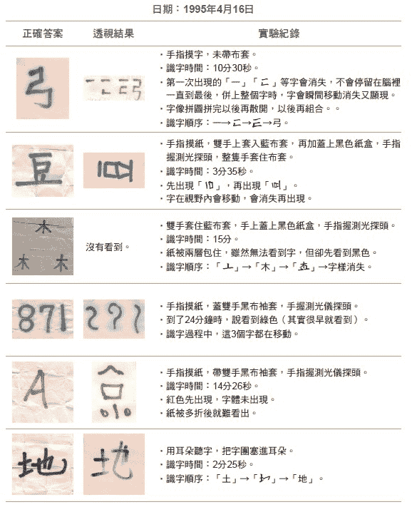 |

第二次实验，让她看蓝色的「豆」字，结果只花了三分三十五秒她就看到了，不过转了九十度，成了横躺的豆，如上页图2-3第二列所示。表示字在她脑中的萤幕上会移动散开再重组，仍不稳定。接下来，第三次实验（如图2-3第三列）花了十五分钟，第四次（如图2-3第四列）花了二十四分钟，第五次（如图2-3第五列）花了十五分钟，不是看不完全，就是自己添加了一些内容。这时已近中午，朱小妹妹有些疲倦及不耐烦，于是又试了一次耳朵听字（如图2-3最后一列），结果只花两分二十五秒就看到黑色的「地」字，答案完全正确。

对朱小妹妹而言，识字功能只是好玩，比较不能适应长时间严格的测试，包括摄影机的拍摄、手上戴上布套及握住测光探头等要求。因此，直到一九九七年二月，我们才有机会对她做第二次测试。令人惊讶的是，朱小妹妹平日并不练习，两年后手指识字功能似乎更强，一般简单的认字实验，她两三分钟就能看到，但是仍然不稳定。这与「不练习会退化」的一般现象是不同的，显示她具有多种部位的识字功能，可能是来自天生的。

## 让大脑打开天眼的特殊生理机制

高桥小妹妹在手指识字时，右手要套上布套或用黑纸盒罩住才看得快、看得对，这是当初母亲训练她时，为了避免她打开纸团或从纸团外偷看所用。时间一久，她也习惯了，不戴布套反而不容易「看」到字。

比如，在前三回合总共一百次实验中，有九十一次之中，她手戴布套或仅以黑盒子罩住双手，结果其中五十五次完全正确，占百分之六十的成功识字率。其中二十次颜色对了，但字形没有看完全；其中十次字形完全正确，但颜色不对；完全失败只有六次。但是，在剩余九次双手完全没有遮蔽的状况下，识字结果竟然没有一次完全正确，反而有五次完全失败。显然，遮住双手是高桥小妹妹手指识字成功的关键因素。

##### 用手「触摸」黑暗中的纸团

她的右手在布套里究竟怎么触摸纸团呢？在一九九四年八月的第二回实验中，我们想到可用红外线摄影机来拍摄她双手在黑盒内的动作。由于手有温度会在红外线范围产生大量的黑体辐射波长，因此虽然在黑盒内的可见光很微弱，用一般摄影机无法拍摄，但是用红外线摄影机可以将手部的动作看得很清楚。果然，我们从萤幕上可以清楚地观察到，高桥小妹妹用双手不断地翻转纸团，触摸纸团的稜线，但是没有打开纸团，而且盒内的光线只有一般正常亮度的万分之一，即使用眼睛去看也看不见。

为什么高桥小妹妹不戴布套反而「看」不见字形呢？我们从红外线摄影机萤幕上看出端倪。萤幕上影像的颜色代表温度，在不戴布套的状况下，我们发现高桥小妹妹的手背及手指温度会从蓝色的摄氏二十八度，在三分钟内迅速上升至黄色的摄氏三十四度以上，在这种情况下，即使超过三十分钟也看不到图案。但是，这时如果握一罐冰汽水，让手温降低到摄氏三十度以下，则在一分二十五秒后就看到了图案。为了理解手温上升的原因，我们又做了如下的实验：

首先，第一次实验时她没戴布套，拿了纸团三分钟后，手温上升到摄氏三十四度以上。这时，我们用黑盒将她双手盖住，两分钟后将黑盒拿开，直接从红外线摄影机读出手背的温度，发现已经降到三十二度；在用黑盒盖住双手的两分三十秒后，她已经看到图案，打开黑盒，我们发现她的手温已经降到摄氏二十九度以下，显然盖上黑盒有降低手掌温度的功效。

从物理上来分析，原本室温二十五度，在手掌附近盖上一个纸盒，纸盒内的温度受到手温的加热，会比环境的温度二十五度还高，在纸盒内温度的提升下，又会影响手温比在室温下稍高。但是，结果手温却下降五度以上，这显然是心理因素的影响。

高桥小妹妹一旦脱下布套，因心里没有把握而紧张起来，导致手温上升，就不容易成功。**因此我们学到，在训练小朋友开发手指识字功能时，一定要创造一个轻松的气氛，去除他们紧张的心情，才会产生比较好的结果**。

##### 心理安定，才能打开天眼

如八三页图2-4的第一列所示，第一次实验是高桥小妹妹双手先不罩黑盒，所以一直看不到图案。到约第七分钟时，再替她罩上黑盒，在四分三十八秒后她就看到图案。

第二次实验时，起先不戴眼罩，也不戴布套，经过五分五十四秒后戴上黑色眼罩，但到了九分钟还是什么也看不到，于是在九分二十五秒时，将手盖上有洞的黑纸罩，接着随即换成盖上全黑无洞的黑纸罩，再过一分二十三秒就看到了，结果稍微有些错误。

第三次实验时，在开灯的情况下，一开始不戴黑布套，经过十分钟后她什么也看不见，于是我们把灯关掉，再过十分钟还是什么都看不见，此时她手上温度已超过摄氏三十五度。这时我们用冰块将两手降温后，擦干手上水滴，让她再继续搓纸团，结果四分二十五秒后就看到图案了。

第四次实验时，在开灯的情况下，手上不戴布套也不罩黑盒，她过了十四分钟什么也看不到，但是在她罩上黑盒后的五分八秒时，就能看到图案，识字结果完全正确。

从这些实验结果，很明显地说明戴上布套或罩上黑色盒子可以安定高桥小妹妹的心理，让手掌微血管收缩、降低温度，导致一种特殊的生理机制能够让她在大脑打开天眼，扫描手上纸团把信息送回大脑。

图2-4　高桥小妹妹在不同状况下的识字结果

| 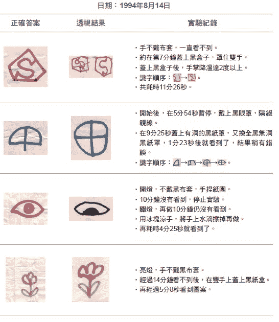 |

## 在大脑里「看」电视──了解天眼扫描的顺序

手指触摸纸团所获得的信号，如何在大脑中呈现呢？

根据大陆北京大学、上海复旦大学的研究以及一些特异功能人士的主述，都是大同小异地先在脑中出现了一个萤幕，图案、纸的颜色或纸团的形状会先出现在萤幕上，有时会消失再出现，然后颜色收拢形成图案，或纸团逐步打开又合拢，最后完整的字形被伸展开来，就像看电视一样。这种脑中出现萤幕，显出图案之现象叫做「屏幕效应」，也有很多学者称之为「开天眼」。

**就以高桥小妹妹来说，字或图案的出现，是一个部分接着一个部分出现的，而且萤幕第一次出现，一定是显现文字的色彩**。比如一九九三年十月二十七日做实验的结果（如八六页图2-5所示）。首次实验时，让她看红色的「茹」字，第一次开天眼后，脑中萤幕出现一片红色，然后红色消失，等了一会儿，第二次萤幕出现时，上面有一个红色的「口」字，然后萤幕又消失了。第三次萤幕出现的时候，在红色口字的左方多了一个「女」字，也就是红色的「如」字出现，瞬间又消失了。第四次萤幕出现时，整个红色的「茹」字出现，一会儿又消失了。等到第五次萤幕出现时，是红色的「茹」字，她就知道已经全部看到了，此时拿起红色的笔写出答案。

有时，她看到的字或图案并不完整，连续两次萤幕出现的图案都没有新的变化，她就以为全部看到了，实际上还有些讯息没有出现。图2-5的第二列实验显示的就是她还没有看完全的例子。纸条上的字是「WATER」，但是她看到的是「TEP」，只看到最后三个字，将R看成P，R下的一撇还未出现。接下来第三次实验如第三列的蓝色「料理」两个字所示，识字结果就完全正确了。

图2-5　高桥舞手指识字实验

|  |

二○一六年，我们对高桥小姐手指辨识颜色及字汇的能力又做了一些测试（如下图2-6所示）。纸上正确答案的「位」字，是由黑、红、蓝三只色笔写的，透视结果完全正确。

第一次开天眼时，她看见一片黑色，表示「位」字左方单人部首的黑色信息被扫描进天眼。九点二十六分五十二秒第二次开天眼时，她仍然看见颜色有两种，上面是红色，下面是蓝色，表示「位」字右半边的红蓝两种颜色信息被扫描进天眼；上面为红色，下面为蓝色，表示颜色的排列顺序没有错误，也没有混合。接着，她以红黑蓝的顺序把「位」字组织起来，最后透视结果完全正确。从这些程序展示了天眼扫描的机制，对我们之后第四章解释手指识字的物理过程提供了丰富的细节。

图2-6　高桥舞手指识字实验

| 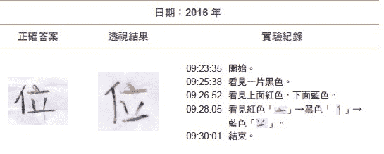 |

## 光线明暗，会影响颜色辨识功能

高桥小妹妹手指识字是在布套内极微弱的光线环境下做实验，竟然能产生与视网膜神经在强光下完全一致的色彩反应。那么她的眼睛到底有没有看到光？对手指辨识图案的影响就值得研究。

##### 没有光，天眼无法辨识颜色

我们用戴眼罩或在暗室做实验来隔绝眼睛的作用，为了避免在不同的实验条件下干扰到数据的分析，我们只考虑高桥小妹妹脑中看到字形出现的实验。

结果发现，在开灯不戴眼罩之情况下，所做的五十三次单一颜色的图案辨识，颜色完全正确。一戴上眼罩，二十一次实验中有四次颜色错误，错误率达到百分之十九。而在暗室中所做的三次实验，虽然图形正确，但是颜色全错。

由此可以了解，若眼睛看到光线，的确对颜色辨识有所帮助，其主要原因是：因**为正常双眼所看到的亮光送进大脑后是用来照亮屏幕之用**，而产生颜色感知。如果眼睛盖上眼罩或在暗室没有送入亮光到大脑，屏幕上一片黑暗，天眼扫入纸上的颜色信息，自然无法产生颜色感受，但是形状信息不须亮光照射就会呈现。

## 大脑认知习惯，会影响手指识字结果

在实验过程中，我们发现了一个有趣的现象，认知心理显然会影响实验的结果。比如有一次请高桥小妹妹认绿色的「线」字，原来写的字形里左边「系」部下面为草写只有一撇，但是高桥小妹妹先看到热字下面的四点，然后再看到左边的丝字偏旁，最后呈现在天眼的是丝字下面加上三点（如左图2-7第一列所示）。又如她将英文字「HAPPY」看成「Happy」，「SUN」看成「Sun」。原本是全部大写字母，都被看成第一个字母大写，其他全是小写，与她平常写字习惯相符，**显然文字信息要先经过大脑记忆部位比对，再根据过去的文化经验转换后，才显示在屏幕中，所以有些变形**。

图2-7　高桥舞的认知干扰了手指识字结果

| 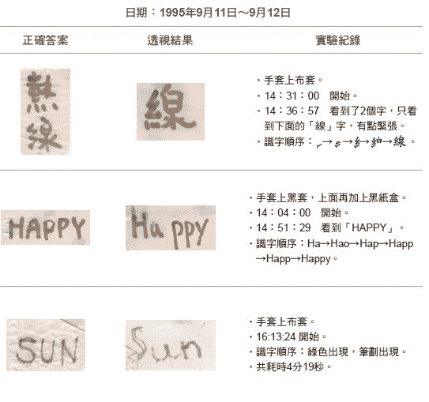 |

另外一个有趣现象则对日后我们解释手指识字的物理机制有决定性的影响（如左图2-8所示）。例如，第一列案例是我们在白纸写上「王后」两个字，但是把后字下面的口字挖洞，天眼上对应口字的位置会出现黑色框框，表示纸上本身不会发出光的部分会在屏幕中相对位置出现黑色。

第二列案例中，将「吃讨」两字中「吃」的口字偏旁剪开后反折到纸条后面，从正面看起来变成「乞讨」，再将纸张摺叠起来做手指识字，结果天眼上看到的是「吃讨」，答案没有错误。

第三列案例中，在纸张里贴上一小块不会发光或反光的宽黑胶带，从天眼看起来就是黑色。

另外我们在透明纸上写字来做实验，高桥小妹妹发现屏幕的背景变成一团黑色，不像以往都是明亮的白色背景，但是在透明纸背后垫一张白纸一起折叠后，则背景又恢复明亮。显示用透明纸与挖洞或黑胶带一样，似乎无法提供亮度信号给天眼，表示若无法提供亮度或颜色信号给眼睛的图案，将来在天眼上也是呈现黑色。

图2-8　手指识字时，在纸上挖洞或贴上黑胶带的结果

| 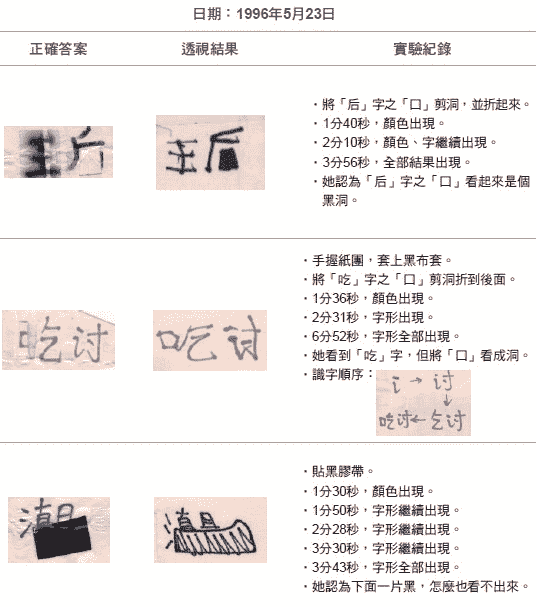 |

## 开天眼时，身体的生理变化

当天眼屏幕出现的时候，高功能人的身体是不是会产生生理的变化呢？答案是肯定的。

##### 手中电压与天眼萤幕开启，互为因果

在高桥小妹妹一九九五及一九九六年的第三及第四回实验时，为测量她两手电压的变化，我们在小妹妹两手各贴一电极，直接记录两手电压差随着时间变化的情形，实验的情况如九六页图2-9上方的两张照片所示。

实验时，会让高桥小妹妹手上握一按钮，天眼出现时按一次，天眼消失时按两次，实验的部分结果如图2-9下方的橘色曲线所示。

结果我们发现，天眼出现前两秒钟左右，双手开始出现电压，然后一个尖峰约二十到六十毫伏（mv）的电压出现，如图2-9下方图表中的黑色斜线所示，这一段时间叫做「酝酿时间」。接着，**从天眼打开到消失只有一到两秒的时间，也就是天眼一闪而逝非常短暂，这段时间内，她脑中会「看到」字形出现。**

直到二○○二年，她的功能增强以后，天眼可以开启到十至二十秒钟，双手电压也可以保持到几十秒钟，与天眼开关时间一致。显然脑中放电会导致手掌产生电压，这与脑中屏幕出现有一定的因果关系。这些数据让我们知道天眼出现、消失与双手电压差的发生顺序。

图2-9　手指识字时的电压变化

| 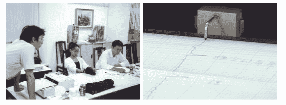 |
| 手指识字时，让高桥舞的双手贴上电极量电压，同时描绘在纪录纸上。 |

| 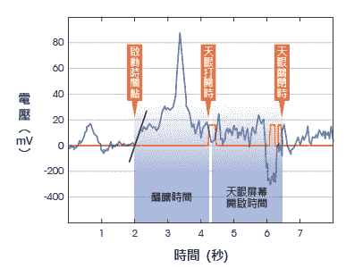 |
| 天眼出现前2秒，双手出现一个尖峰约20∼60毫伏的电压，如黑色斜线所示，这是「酝酿时间」。从天眼打开到消失只有1~2秒，这时，她脑中会看到字形。 |

##### 主观认知下的客观实验

在一九九七年第五回合的实验中，我们去荣民总医院神经血管内科去做脑血流流量的测试，用都卜勒超音波探头贴在头部的左右太阳穴（如下图2-10所示）。

结果发现高桥小妹妹用右手识字，在看到屏幕之前，右边中大脑动脉血流速度大幅降低百分之二十（如下页图2-11所示）。左半球脑血流速度在实验开始二十秒后从每秒八十公分（80cm/sec）的速度冲上每秒一百公分（100cm/sec），接着掉回每秒八十公分（80cm/sec）。

图2-10　高桥舞在荣民总医院测量大脑动脉的血流速度

| 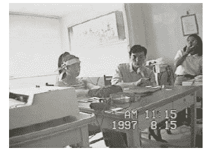 |
| 用都卜勒超音波探头，贴在高桥舞头部的左右太阳穴。 |

图2-11　用右手手指识字时，左右大脑动脉血流速度之变化

| 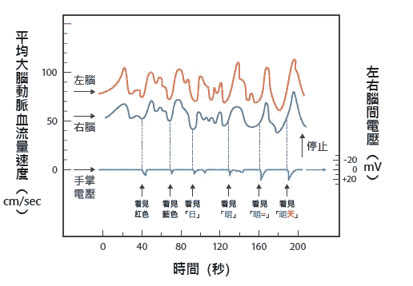 |
| 识字时，第一个出现在屏幕上的是红色。第二次打开萤幕时，她看到蓝色。接着看到蓝色的「日」字；蓝色的「明」字；红色的「二」出现在蓝色的「明」右边；最后出现「明天」后结束，透视结果完全正确。 |

这表示大脑活动量由高降低，保持约十五秒钟后开始反弹，在血流量降至最低点开始反弹之际，双手掌出现了电压脉冲约十毫伏（mV）左右，右手为正电压。接着屏幕出现，第一个出现在屏幕上的是红色，接着血流速度反弹到高点，并开始重复下降到反弹的过程。每当血流速度降到最低点，手上就会出现电压，接着屏幕打开，她能看到一部分图案。第二次打开屏幕时，她看到蓝色，表示这张纸上有红色及蓝色两种颜色的图案；接着看到蓝色的「日」字、蓝色的「明」字、红色的「二」出现在蓝色的「明」右边，接着出现「明天」后结束，透视结果完全正确。

当高桥小妹妹改用左手识字时，左中大脑血流量则大幅上升约百分之二十，在上升过程中双手会出现电压脉冲，左手电压为正。因此虽然屏幕效应是一个主观的认知过程，但是伴随的生理变化是可以用仪器来测量的。

后来，我们也去新光医院测量手指识字时脑波的变化（如下页图2-12所示），量出的结果如一○一页图2-13所示，第一列及第二列为不同实验状况下脑波在全大脑的分布图。

第三列是大脑枕部（视觉处理部位）的脑波经傅立叶转换后的频谱图。横轴是频率，纵轴是强度。一般人的频率在十四到三十赫兹的是β波，八到十三赫兹是α波，四到七赫兹是θ波，四赫兹以下是δ波。

图2-12　高桥舞在新光医院手指识字时测量脑波

| 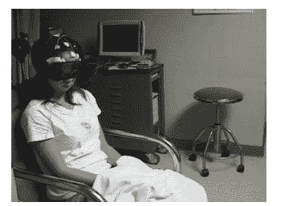 |

从第三列最左边第一张图来看，是眼睛闭上（EC，eye closed）的状况，其中红色的α波非常强，与一般人相同。第二张图是眼睛闭上在算数（EC，cal），例如计算二十七乘以三十五时，α波受到打扰稍微下降一些。第三张图是眼睛闭上在想风景（EC，image），例如想日月潭风景，红色α波受到打扰再稍微下降一些。

第四及第五张图是眼睛打开注意看外面景象（EO，focus）或随意看看（EO，nofocus），红色α波振幅受到严重干扰几乎消失。第六张图是眼睛打开一点点勉强看到外面的字或景象（EO,smalleyes），α波也受到严重干扰消失。第七及第八张图，只要戴上眼罩，则不管是闭眼或张眼都看不见外面景象，α波变得很强。

图2-13　手指识字时，在不同状况下的脑波分布和频谱图

| 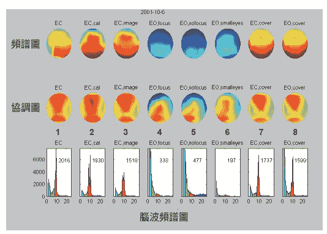 |
| 从最下列第7、第8张图中可看出，当高桥用手指识字看到纸上的文字或图案时，眼睛并没有打开，看不到外面景象，因此α波会变得很强。 |

**这些现象告诉我们，α波是一个严格的生理指标，可以让我们辨认受试者有没有看到外面的景象**。我们想证明的是当高桥用手指识字看到纸上的文字或图案时，眼睛并没有打开，因此α波会变得很强。

左图2-14就是实验的结果，为手指识字时大脑枕部O1、O2及顶部T5、T6脑波频谱图，每一条线为十秒钟的数据，红色尖锋为α波振幅，黄色区间为酝酿期，双手有电压出现，紫色为开天眼区间。很明显的是，开天眼时，她脑中的α波振幅仍然很大没有变小，表示眼睛是闭着没有看到外界的文字或图案，但是天眼却能看到正确的图案。

##### 测量高功能人的大脑各部位活动

一九九八年，我们也用功能性磁造影（functional magnetic imaging，简称fMRI）技术测量了高桥小姐手指识字时大脑各部位的活动情形（如一○四页图2-15所示），并将大脑切割成十二条细长紫色线分隔的区间，包括视丘、松果体、胼胝体等部位。

图2-14　手指识字时的脑波频谱图

| 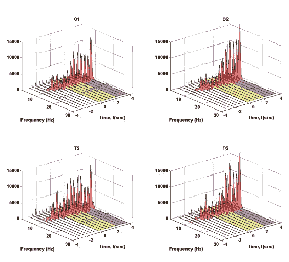 |
| 红色尖锋为α波振幅，黄色为酝酿期，紫色为开天眼期。从图中可看到，开天眼时，高桥的大脑α波振幅仍然很大，表示眼睛闭着，但天眼却能看到正确图案。 |

图2-15　手指识字时，用fMRI测量大脑各部位活动情形

| 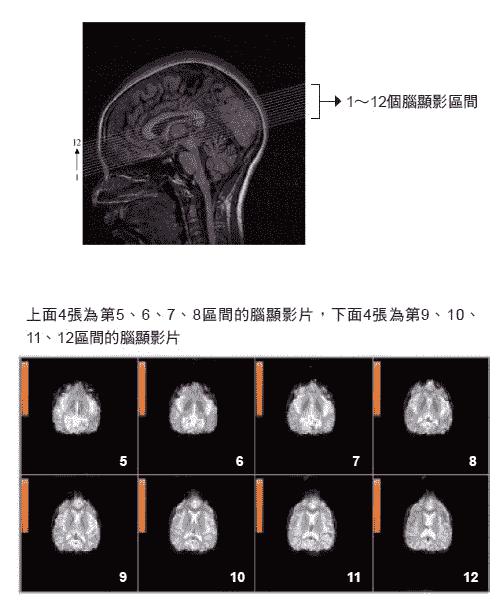 |
| 红色部位是开天眼前后信号变化较大的部位。从第7张脑显影片可看到，左脑听觉部位有变化，第8张起，脑中央部位一些区域有很大的变化。 |

高桥一手操控按钮，开天眼时按一下作为信号，帮助分析数据。

如右图2-15下方显影图所示，上排是第五、六、七、八的四片区域；下排是第九、十、十一、十二的四片区域，以及开天眼前后信号变化图，红色部位是较大的变化。很明显的是，从第七张左脑听觉部位有变化，第八张起中央部位一些区域有很大的变化。

下图2-16中，大脑蓝色区块内显示的是第八片红色区域实际信号的变化图，右图中的橘色是高桥舞小姐开天眼时按下的信号，总共开了两次天眼，纵轴是fMRI信号在天眼打开时变化的百分比。

图2-16　大脑蓝色区块内，开天眼前后的FMRI信号变化百分比

| 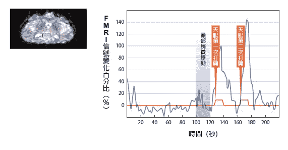 |
| 图表中蓝色区间为头部稍微移动的区间，但与第一次开天眼时间无关。第二次开天眼时信号变化达到140%。 |

第二次开天眼时，她信号变化竟然达到百分之一百四十，远高于一般正常信号变化百分之一到三的五十倍。第一次测量时，所有专家没有人相信这个数据，都认为头有动。但是经进一步分析发现她头稍微移动的时间并非第二次开天眼的时间，如蓝色区间显示。后来第二次作实验时，信号反应还是一样巨大，才说服大家这是真的信号。一○四页图2-15第九、十片脑区虽然信号变化较小，但是还是比一般信号要大得多，所以我们初步判定天眼开的部位是在下图2-17红圈的位置，很接近大脑中后扣带皮层（posterior cingulate cortex，简称PCC）部位。

图2-17　开天眼时，fMRI信号反应最强区域

| 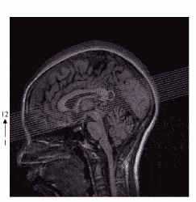 |
| 红圈位置，为开天眼时的反应部位，似乎很接近大脑中的后扣带皮层。 |

## 手指识字能力，可经训练开发

我自己在一九九六年七月第一次开了一个儿童潜能训练班，想要验证大陆研究单位所声称的儿童可以训练出手指识字功能，有七到十三岁间的十五位小朋友报名参加。经过四天，每天两小时的训练，结果真的有三位小朋友出现了手指识字的功能，占全部儿童的两成，包括同时有识字和念力功能的王小妹妹。

随后我每年暑假开训练班，以四天每天两小时的时间训练小朋友。一直开到二○○四年总共开班九次，二○○五年六月我因接任台大校长，为避免争议就从此不再开班，由我指导过的硕士学生担任宜兰松山国小的邱老师继续下去，直到去年仍然每年暑假开班。

我从一九九六年到二○○四年九次开班中，总共有一百七十六位小朋友完成四天的训练，其中有四十一位出现显着的手指识字能力（统计出错机率P＞0.05），大约有百分之二十三的儿童出现功能较高的表现。其中三十三位儿童，约百分之十九的儿童出现了高功能能力（统计出错机率P＞0.001）。其年龄分布如左图2-18所示，八到十一岁的孩子出现高功能的比例都很高，十二岁以后就不行了，人数较少。

**这些事实显示，经过短时间训练，有相当比例的一些小孩能把识字时的手指触觉的信号送回大脑视觉区，重组成有意义的影像。这些现象对现代脑功能的认知提出了严峻的挑战。**

图2-18　9次训练班中，出现手指识字功能的41位小朋友的年龄分布

| 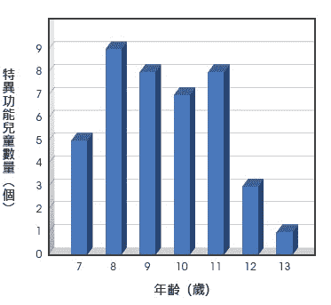 |
| 8∼11岁的孩子出现高功能的比例很高，12岁以后就不行了，人数较少。
 |

##### 获得手指识字实验成果的回应

我在一九九三年发现高桥小妹妹具有手指识字功能以后，华视的电视节目「早安今天」曾到我的实验室来拍实验过程，在电视上播了两集；我常想是否有哪个国小老师看了影集后会受到启发在自己班上试了试小朋友的能力，然后把结果告诉我。直到二○○二年十二月，那时我正在美国史丹福大学休假进修，有一天打开电子邮件看到下面这封来信：

> 李教授您好：
> 
> 我是一位小学老师。八年前，偶然机会得知教授从事人体潜能的研究。于是，我大胆地请班上的学生（五年级生）一同实验以「耳朵听字」。果然，有令我讶异的情形出现。有一些同学，真的能做到以耳朵听字。
> 
> 八年之后，我又进行同样的实验（大约十五分钟）。这次，我带的班级是六年级生。同样的，有些许的同学（六到七人）可以猜出塞在耳朵中的纸条的文字。可是这些孩子都未曾接受过任何人体潜能训练，却也能有同样的能力，个人感觉相当的有趣。心血来潮之余，特别写封信与您分享。耽误您宝贵时间阅览这封信，实属不该，恳请海涵。
> 
> > 敬祝　平安
> > 
> > 一个小小的小学老师　敬上

**我当场热泪满面，真的有一位「大大」的小学老师在一九九四年看了电视节目后，做了这个实验，获得了正面的结果，八年后重复实验仍然获得正面的结果。大自然展现了祂的真面目给认真求道的信仰者。**

从美国回来以后，我找到了这位老师，是台北市百龄国小的赖俊贤老师，我把他班上出现功能的四位小朋友带到我的实验室测试，果然都有不同程度的识字功能，这些小朋友都是天生的，没有经过任何的训练。

##### 超过十五岁，仍能开发潜能

手指或耳朵识字能力主要集中在十三到十五岁以下的儿童，一般认为这是因为大脑松果体在十三到十五岁开始钙化的缘故。**问题是天眼似乎并不是在松果体，而是在松果体后方的五到十公分处，这似乎暗示年轻人仍有机会开发出手指或耳朵识字功能**。我在二○一六到二○一七年也在台湾大学电机系尝试开发约一百位二十多岁的台大大学生及研究生，只用了两次每次半小时的训练，加上课余的影像视觉自我训练，也有百分之三的同学出现了耳朵识字的功能，令人兴奋。原来年纪超过十五岁还是有机会开发出耳朵识字功能。

手指识字及耳朵听字在人体科学上是很大的突破，例如：一个盲人如果能教会他用手指或耳朵来「看」，用触觉来取代眼睛，则人类社会中将不再有「盲」这种残疾。如果我们能找出触觉信号传递及重新组织机制而改以机器来做，则这部机器将是新一代最具威力的医学检验仪器，可以轻而易举地看到身体内部器官表面的影像。

## 发现念力的存在

王小妹妹是我亲自训练出来，具有手指识字功能的小朋友之一，也是唯一一位训练出念力的小朋友。

一九九六年七月，她报名参加儿童手指识字训练班，结果在第一天历经一个小时、三次实验后就出现了功能反应；在接下来三天的实验中，识字正确率高达百分之七十以上。

为了找出练习的频率对识字功能的影响，我安排了每个月训练一个半天约三小时的计画，请王小妹妹的母亲带她来训练，结果发现在训练完的第一个月，正值八月时，她兴致很高又逢暑假，所以常常练习功能，识字正确率可以维持在五成以上。但是九月开学以后，她上了国小五年级，除了念书以外，又参加了许多活动，没有时间练习手指识字，功能大幅衰退，到了十月时识字功能完全消失。

为了恢复她的功能，我利用一九九七年二月寒假期间，又集训四天，结果王小妹妹的功能在第一天就恢复了，识字正确率高达七成以上。这样的状态保持了两个月，到四月中，又由于疏于练习而衰退到一成的正确率，我只好在暑假七月底，再度以集中训练让她恢复，并跟她父母商量，让她每天练习半小时，当作是练习弹钢琴或绘画一样，作为一种技艺来培养她；并要求她改正姿势，以往是趴着头闭眼来识字，要矫正成抬头睁眼，结果经过一段时间的练习，她不但矫正了姿势，识字功能也越来强。**这里阐明了，一般小朋友「不练习会退化」的现象。但是对天生有功能的小朋友如高桥小妹妹则不适用**。

##### 第三眼，是超出五感之外的感知能力

这种手指识字的生理过程，到底是不是经由触觉传递到大脑，再经过边缘系统渗入视觉中枢转换为视觉的呢？我们把折叠的纸条封入一个完全不透光的底片盒，让王小妹妹摸着盒子练习，一开始她「看」不到，但是经过四、五次的训练，她可以逐渐看到模糊的影像，但是好像有一层雾挡在前面。随着训练次数的增加，雾也逐渐消散，看得越来越清楚了。接着我把纸条折叠后，外面再包一层铝箔并放入底片盒，王小妹妹也是一开始看不见，经过几天的训练后就逐渐看到了。

经过底片盒、铝箔层层的阻挡，触觉早已与纸张失去直接的联系，但是大脑感知的透视力仍然能穿透重重障碍，在没有光线的环境下把纸上讯息撷取出来，**它必然是超出五种正常感觉能力（视觉、听觉、嗅觉、味觉、触觉）之外的另一种感知能力。由于识字时脑内会出现屏幕，打开天眼，表示这是双眼之外第三只眼睛的功能，可以称之为「第三眼」**。

##### 念力，心想事成的惊人力量

根据大陆各研究单位训练儿童手指识字的经验，当儿童训练到天眼可以穿越重重障碍，甚至离体不碰纸条都可以建立联系管道把纸上信息调入天眼，就可以开始训练把信息管道反向，用意念操控信息产生变化，再送回物体产生念力。

一九九八年一月，王小妹妹的天眼已经可以穿透底片盒、铝箔纸、把包在铝箔里纸条上的文字信息撷取出来。因此我就开始训练她的念力，把一段铁丝放入底片盒，她用手握住盒子，把铁丝调入天眼中，用意念把铁丝折弯，不会弯的话就在天眼上想像用手、剪刀或钳子等工具来折弯。

一九九八年五月十七日，在严格的实验条件下──包括把已放入铁丝的底片盒贴上封条、还让实验者签上名字。结果，王小妹妹在十九分钟内尝试把一小段铁丝折成一个三角形，最后打开底片盒一看，如左图2-19箭头处所示，铁丝的确折了两个弯；但因念力控制还不够好，两个弯不在同一平面上，有一些离开平面。这个力量显然不是牛顿力学的力量，而是意念的力量，大自然再一度地显示祂的神祕力量。

中国大陆云南大学物理系的朱念麟教授与罗新教授自一九七九年就开始训练儿童手指识字的能力，待手指识字能力纯熟以后，就开始训练他们念力，是特异功能研究的先驱者。一九九九年法轮功事件以后，停止训练超过十年；二○一○年后，朱教授逐渐恢复训练工作。

记得在二○一三年六月，我从台大校长卸任后，十月去云南大学参加「人天观研讨会」，听到朱教授发表论文，报告儿童念力训练的成果，令人叹为观止。如左图2-20所示，朱教授所训练的一位儿童，把放在不透明塑胶盒内的火柴，以意念想像用剪刀剪成五到六节，全程录影监控；做完后，打开一看果然被剪成一节节小火柴棒，断面有剪刀剪过的痕迹。所谓心想事成，念力惊人的力量由此可见。

图2-19　王小妹妹使用念力

| 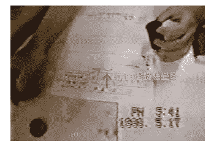 |
| 如箭头处所示，王小妹妹用念力将一小段封在底片盒内的铁丝折弯。 |

图2-20　云南大学朱念麟教授的念力实验

| 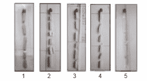 |
| 高功能儿童将放入不透明塑胶盒的火柴用意念剪断成5∼6节。 |

## 美国的绝地武士营──六成儿童潜能被开发

二○○二年九月，我利用半年休假的时间到美国史丹福大学电机系进修半年，当了半年客座教授，不但享受了加州温暖的阳光、和煦的气候，还看到了好些二十多年没有见过面的朋友及学生。想当年大学毕业以后，大部分的同学都出国深造，各奔东西散居在美国各地，见面并不容易，不像现在的学生刚好颠倒，大部分留在台湾。此一时也彼一时也，也见证了台湾这二十年来的经济成长与进步，大幅缩短了与美国的差距。

我一九八二年学成归国，回到母系台大电机系任教，当时出国风气仍盛。刚开始几年所教导的学生，也大部分出国了，有很多在美国已有很好的事业与成就。就在我客座的史丹福大学电机系里，就有一位我过去教过的女学生在当教授，这位孟教授的研究室和我在同一栋大楼，每个星期都碰得到面。

这些朋友、学生知道我在做一些「特异功能」的研究，愿闻其详，因此在湾区安排了两场公开的演讲，谈谈气功、手指识字、念力、信息场与神灵。每场都是在中国餐馆举行，先吃饭再演讲，每次席开十多桌，有上百人参加，许多多年未曾谋面的朋友、学生就在这些场合碰面，事后的反应大致良好。

孟教授和她同班同学KC显然被「手指识字」现象迷住，一直要我在湾区也办一场手指识字训练营。她们同学的小孩年龄差不多就在六到十三岁之间，正是最容易练出功能的年龄。老实说我的兴趣不大，因为这些小孩的家庭背景太一致了，不像在台湾受训练的小朋友来源广泛，我认为这些孩子开发出功能的比例恐怕不高。KC锲而不舍，不断以电子邮件打动我，并准备好大部分的后勤工作，终于在预定开始的前一个星期，我正回台主持一个国际会议时，才敲定了之后训练营的地点──在史丹福大学电机系的会议室。

KC的同学中和负责找小朋友报名，结果他动员了同学的小孩、他夫人音乐班的学生，加起来共二十一名来参加训练营，这些小朋友全部在美国出生，大部分学过中文，不过所学有限。有些小朋友像凯文一样，一听内容觉得无聊不愿意来参加，他妈妈好说歹说均不为所动，结果妈妈心生一计，告诉凯文这是「绝地武士营」（Jedi Camp），凯文是电影《星际大战》（Star War）迷，一听是训练绝地武士，马上欣然同意，高高兴兴、满怀希望地来到训练营。

我的训练有一套标准程序，先花半小时向家长及小朋友介绍「手指识字」的现象，加强他们的信心，接着打坐十分钟让小朋友心静下来，尝试脑中成像以确定他们的幻想能力，然后就开始了训练。

出乎我的意料之外，包括凯文在内，第一天就有五位小朋友开发出了功能。湾区消息传播得很快，接下来几天，有的家长闻风而至带小朋友加入，有的有事退出，四天下来只有十五位小朋友从头到尾全勤。其中有九位小朋友显现出了手指识字的能力，比例高达六成，远高于我在台湾训练最高三成五的纪录，令我难以置信。家长们更是议论纷纷，惊叹不已，原来手指识字是真的。我也突然了解到，原来我就像是星际大战争中绝地武士的师父尤达（Yoda）。

## 磁场，对手指识字的影响

二○○三年二月，我结束史丹福大学的客座回国以后，KC继续利用周末训练功能最强的小朋友凯文（Kevin），三月中KC寄了一封电邮给我，告诉我他发现了一个奇特的现象，**当凯文手指识字时，如果手中握了一块磁铁，脑中看到的图像会被放大**。我看了以后觉得很惊奇也很兴奋，我从事手指识字研究近十年，完全没有想到特异现象会和物理性的磁场产生交互作用。

为了证实这项观察，我于二○○三年四月二十日及二十三日分别请了T小姐及徐小妹妹来重覆这项实验。T小姐的实验结果如下页图2-21所示，果然没有磁场时，天眼所看到的字与正常的字大小感觉差不多，但是当把样本压在S极上，天眼所看到的字会被放大，压在N极的样本的字会稍微缩小；当磁场达到4KG（四千高斯），透视的数字会胀大到超出天眼的屏幕范围。如一二三页图2-22显示的是徐小妹妹的实验结果。果然不错，在没有磁场时，天眼所看到的字与正常的字大小差不多，但把样本压在S极上，天眼所看到的字会被放大，压在N极字会稍微缩小。这项实验证实南极S极会把天眼的字放大，这个现象的原理是什么呢？

图2-21　T小姐将样本压在磁铁S极、N极的手指识字实验

| 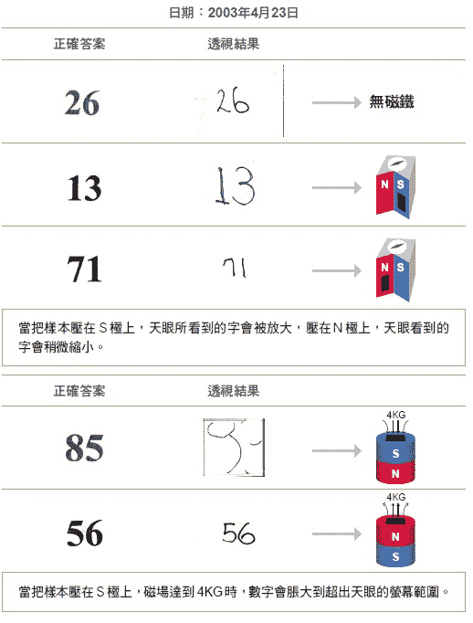 |

第四章中我会提出证据，证明天眼会钻入虚空扫描物体的虚像，因此磁场的S极磁场显然会钻入虚空，与在虚空的天眼产生交互作用。磁铁的磁场是磁性原子自旋所产生的，自旋角动量会在实数时空打洞，而基于「角动量守恒定律」，磁矩与自旋角动量方向相反，因此S极会面向孔洞而导致一部分磁场穿入虚空，N极背对孔洞因此磁场大部分侷限在实数时空，以致与天眼的作用较小。

图2-22　徐小妹妹手指识字时的磁铁效应

| 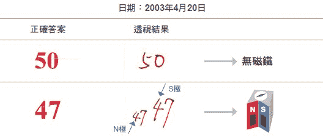 |
| 无磁场时，天眼所看到的字与正常的字大小感觉差不多，当把样本压在Ｓ极上，天眼所看到的字会被放大，压在Ｎ极上，字会稍微缩小。 |