# 三、发现虚数时空，探访神灵网站

三位小朋友透过手指识字，

在辨认佛字时都产生了异象，

在众多物理学者的见证下，

灵界的神祕面纱突然被打开了，

多么撼人心弦的戏剧效果。

## 面对物理学会的挑战

一九九七年，我的手指识字实验已经做了四年，也开班训练儿童手指识字成功，有几位儿童出现了手指识字功能，显示这个现象是一个普遍存在的人体潜在能力。

那时中国时报邀请我写一个专栏叫做「人身极机密」，每周一篇，于是我从西方的超心理学及东方的气功开始，写到现代所发现的耳朵听字、手指识字及特异功能，总共四十多篇。没想到触犯了一些物理界的学者，认为我公开散布怪力乱神现象，混淆社会视听，造成不良影响，导致后来很多年都会藉各种机会找我麻烦。

到了一九九九年，物理学会终于忍无可忍决定到我实验室亲自做手指识字实验。并且开出两项条件：第一，实验样本要他们准备，我说没有问题，只是样本要遵守一些规范；第二，要准备一间大教室，因为物理学会要在网站上公告周知，会有很多人来，这也没有问题，因为我通常使用的台大电机二馆的一四二会议室本来就很大，容纳三、四十个人本来就没有问题。

实验准备进行三天，从八月二十六日到二十八日。面对物理学会的踢馆行为，为避免实验当天小朋友临时生病或心情不佳、有状况而做不出来，我特别安排了三位小朋友应战，包含T小姐、王小妹妹及陈小弟弟，他们手指识字程度不一，有强有弱，只是没有想到第一天实验就出现了不可思议的现象，前所未见。

##### 发现佛字的殊胜

八月二十六日下午两点半钟左右，物理学会会长带着十多位物理教授及两位心理学教授，抱着一大箱约一百个样本，来到台大电机二馆的一四二会议室，根据定好的规则开始做实验。一开始T小姐实验进行得很顺利，大部分样本都看得见，就或然率来看，用猜的根本不可能，何况她根本没有看过任何样本，无从猜起，但是一些经过特殊处理的样本，像被包了铅盒的纸团，她就看不见了；其他两位小朋友有些字条也看对了，显示出手指识字功能有些普遍性，大家都被实验说服了，手指识字现象是真实存在的并没有骗人，大家都沉浸在一片欢乐的气氛中。

下午四点钟左右，在场的物理系陈教授突然给了T小姐他新写的一个样本，如左图3-1第一列所示。

结果T小姐看到蓝色的「光」字，打开一看，正确答案是「佛光」两个字，她漏看了一个佛字。

陈教授指着佛字说：「这个字很殊胜，她大概看不见。」我马上回答，她看字有时候会漏字，没有什么了不起，再试试看就好了。

过了一阵子，陈教授又给了她一个纸团，从下午四点二十九分开始做实验，如图3-1第二列所示。每一次她手掌出现电压，表示天眼打开一次，我们就记录时间及她看到的景象。

**她先看到有一个东西闪过去，在四点三十四分时，看到一个人在屏幕上闪闪发光；四点三十七分时，看到「发光的人好像在对我笑」，接着所有萤幕都消失了。**

我在旁边大惑不解，怎么会出现前所未见的景象，什么字都看不见，只看到亮光、亮人，赶紧把样本打开一看，原来是个「佛」字。一时全场观众为之沸腾，交头接耳，不知发生了什么事，我只感觉到震惊，极度的震惊，似乎一个神祕的世界在我们面前打开了。

图3-1　Ｔ小姐第一次看见异象前后的纪录

|  |

后来我常常在想，到一九九九年八月，我已经和T小姐做了六年、超过六百次的实验，竟然从来没有想到要试试宗教的字汇，当然也还好没有试过，才会造成物理学会来踢馆时，竟然帮我们证实灵界的存在，产生这么大的戏剧效果。

实验第二天从八月二十七日起，我决定把所有样本换成与宗教有关的字汇，看看还能找出什么有趣的结果。

上午的实验结果如左图3-2所示，做了三次实验，下午的实验如一三四页图3-3所示，也做了三次实验。上午第一个实验从十点半开始，如图3-2第一列所示。T小姐在七分钟内画出了一排奇怪的符号；打开样本一对，除了前面三个符号外，其他完全正确，原来是藏文，只是反了过来。十点四十分开始，第二次实验如图3-2第二列所示。很快地，她脑中出现了很亮的萤幕，然后开天眼时除了亮萤幕外还听到声音，有宏亮的笑声，听起来非常开心的样子，最后剩下亮萤幕而结束。打开样本一看是个「佛」字，我感觉到非常高兴，因为实验可以重复，遇到佛字就会看见一片明亮而且出现异象，表示不是大脑天眼一时的失误，而是真的有奇妙的变化发生。十点四十九分开始了第三次实验，如第三列所示。她五分钟就写出了E＝mc²，完全正确没有出现任何异象，表示这个公式不是神圣字汇。

图3-2　8／27上午的神圣字汇实验结果

| 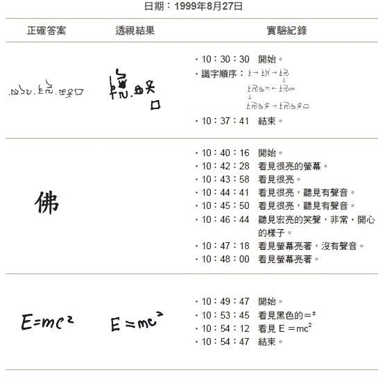 |

下午四点四十三分，我们开始了第一次实验，如一三四页图3-3第一列所示。她四分钟就画出了一条鱼，基本上正确，只是样本中鱼的嘴巴原来是尖的，她画成了圆弧状。四点四十八分开始了第二次实验，如第二列所示。很快地，三分钟后就出现亮的萤幕，我想大概又是神圣字汇。**接着出现了惊人的一幕，T小姐抬头看了看前方三公尺外清大物理系的曾教授说，有一个亮人站在你身旁，手攀在你的肩膀**上。接着她又看看站在信号纪录器旁边的我说，那个亮人跑到我和陈教授中间，低头在看纪录器，在笑。我心里一惊，赶快看看旁边的纪录器，却什么也看不到。然后实验结束，我打开样本一看，又是「佛」字，我心里变得很笃定，神圣字汇必引发出异象。

第三次实验时，样本是由一位在场的物理学家给的，他闻风而来，看了一阵子觉得实验有些不严密，我们随机抽取的纸团放到T小姐手上，再到套上黑布套绑好带子约要二十秒的时间，他怀疑这时T小姐可以从折叠纸团的背面隐约看到文字，是偷看到的，不是真的有手指识字现象。当然我们通常都是用两张纸紧紧包扎，背面是看不见的，不过这是合理的怀疑，必须用严格的实验排除。过去我们用红外线摄影机观察过T小姐在暗袋中的手指识字过程，证明她只是抚摸摺叠字条边缘，没有打开字条就可以看到里面的内容。

这一次物理学家用费曼图[1]来验证，他画了很多圈，让摺叠过后的字条即使从背面看二十秒钟，绝对数不出来到底有几个圈，这是非常精彩的设计。T小姐只花了五分钟就画了出来，物理学家一数说有九个圈，打开样本一看，说他自己画的只有八个圈，T小姐多画了一个。旁边的陈教授仔细一看说不对，你也是画了九个圈，只是第一个红墨水太多变成了实心，空心八个加上实心一个也是九个圈，与T小姐画出的一样。两个人辩论了一阵子后获得共识，九个圈是对的。我惊出了一身冷汗，我知道T小姐那时天眼只能开两秒钟一闪而逝，怎么来得及数清楚到底有几个圈，我问她说，你真的有数吗？她回答说，我没有数，有个声音告诉我是九个。这个声音就是在灵界照顾她多年的师父，看到人间有人要欺负她，暗中帮了她一下忙。

> 编注1费曼图（Feynman diagram）
> 
> 美国物理学家理察‧费曼创立的一种形象化方式，方便将量子场中各种粒子相互作用的过程呈现出来。

图3-3　8／27下午的神圣字汇实验结果

| 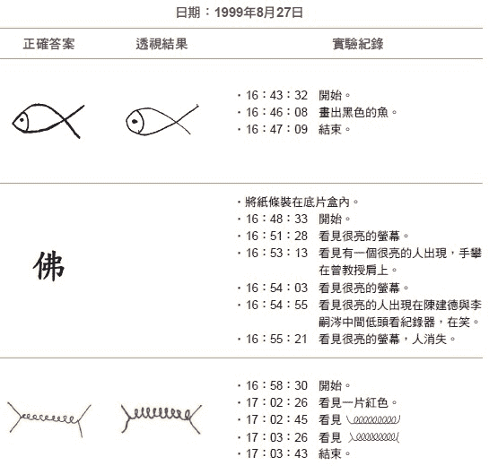 |

实验第三天，八月二十八日又有新的异象出现，一三六页图3-4展示的是上午所做的实验。第一次实验从十点二十六分开始，结果显示在第一列。起初，大脑天眼萤幕中出现一朵粉红色的花亮亮的，好像浮着像莲花比较大，有人站在莲花上，看起来很亮，像女生穿白衣，彷彿是观音菩萨。我打开纸条一看，是「菩萨」两个字，所以菩萨也是神圣字汇。

接下来，第二次实验从十点三十八分开始，结果显示在一三六页图3-4第二列。

三分钟后，天眼萤幕就出现白白亮亮的背景，接着佛教「卍」字符号出现，背景一片光亮，显示这是属于神圣字汇的样本。

我统整这三天有关字汇含佛字的结果，如一三七页图3-5所示。

用「佛光」实验，只看到光字；用「佛山」实验，只看到「山」字，都看不到「佛」字；我用「比佛利山庄」实验，只看到「比利山庄」，也看不到「佛」字；用「佛米级」实验，看到黑色的米字左边出现亮亮的；用「埃佛勒斯峰」实验，看到黑色的「勒」字及「斯」字，然后一片亮亮的。在天眼萤幕中，**其他字都看得见，但碰到「佛」字就一片亮光，显示「佛」字的殊胜性**。

图3-4　8／28上午神圣字汇实验结果

| 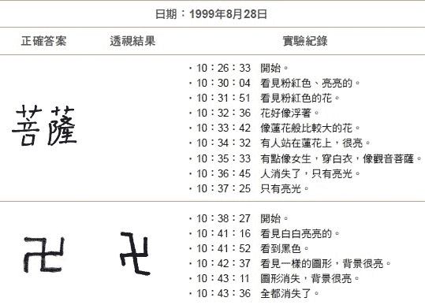 |

图3-5　统整与佛字相关实验

| 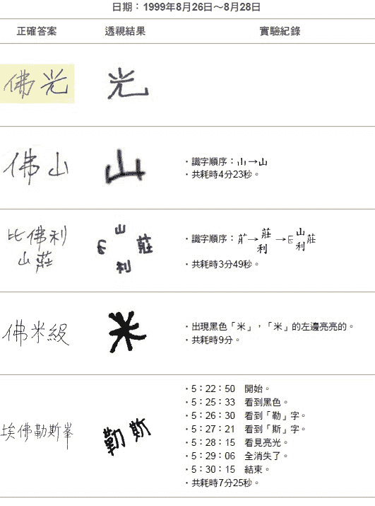 |

## 每个人潜在的「功能版本」都不同

在实验的八月二十六日到二十七日之间，除了T小姐外，其他两位小朋友──王小妹妹与陈小弟弟用手指识字看佛字的结果又是如何呢？

左图3-6显示的是王小妹妹的实验结果，她的手指识字能力已经纯熟到可出现念力了。在八月二十六日第一次测试佛字结果时，也出现了异象，如图3-6第一列所示。她看到了一间寺庙的大门口站了一个人。

第二天再试佛字，结果她看到一个模模糊糊的人操着台语口音，要她加油，她觉得好像看过他的样子，我们后来判断可能是她已经过世的外公。

一四○页图3-7显示的是陈小弟弟测试的结果。实验时，一开始用普通字测试，结果答案有对有错。除了蓝色「步」字错了，其他字都对了。陈小弟弟看佛字时，看到一位和尚穿着黑夹克走出来，内里的白衣上写了一个佛字。他看到了佛字时，感觉也看了一场电影。所以佛字会造成异象，对有手指识字功能的人来说是一个普遍的现象。

图3-6　用「佛」字实验时，王小妹妹看见的异象

| 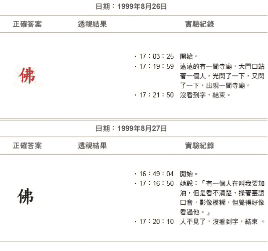 |

图3-7　用「佛」字实验时，陈小弟弟看见的异象

|  |

二○一三年十月，我去昆明参加第二届「人天观学术会议」报告这些奇特的结果时，大陆的同行还不太相信，他们早我们十多年开始研究手指识字，怎么都没发现信息场或灵界，却让我们这些后进者给发现了？

不过，自二○一四年起，大陆昆明的云南大学及江苏的扬州大学训练孩童手指识字时，均看到了类似的现象。他们看佛字时，就出现了亮光菩萨；看「太上老君」时，出现一朵云上面站了一个仙人。这证实了我们的发现，也花了近十五年的时间。

**为什么同样的佛字，不同的人却看到不同的异象？后来大陆高功能人士孙储琳女士用佛字做实验时，我领悟到，这就好像网路的浏览器一样，与功能人的高低有关。**

功能高的人浏览器版本很新，可以看到比较新、比较深入的内容，比如孙女士有六十种以上不可思议的念力功能。她看佛字时会看到万道金光，像涡漩一样愈转愈亮；她看「佛山」时，会看到一座晶莹剔透的琉璃山，非常的漂亮。而T小姐看佛山两字只能看见山字，看不到佛及亮光，表示浏览器版本较旧。因此刚练出功能的小朋友看佛字是看不到异象的，必须等到功能较精进，达到某一程度之上，才能看到亮光、亮人等异象。

## 发现神灵的信息网站与网址

为了继续找出哪些字汇是神圣字汇，我们试了佛教的各种神祇，结果如左图3-8所示。第一列是试「阿弥陀佛」的字样时，看到亮亮的萤幕，有听见声音但听不清楚；第二列是试「药师佛」的字样时，不但看到亮亮的萤幕，还闻到中药的味道；第三列是把「佛」字删除变成「药师」，则异象消失，可以看到「药师」两个字；第四列是试「弥勒佛」的字样时，看到很亮的萤幕。

很显然的是，诸佛都是神圣字汇。因此高功能人可以看见很亮的萤幕、听到声音、闻到味道。

为了了解扭曲佛字的识字后果，我们把佛字破坏，如一四四页图3-9所示，从删除一笔或一画，到换部首，将字与偏旁分开，或加一撇改成「彿」字，结果所有的异象都消失了，高功能人只能看到被破坏后的字。

图3-8　用「诸佛」做手指识字时，感受到的意象

|  |

图3-9　佛字被破坏后的实验结果

| 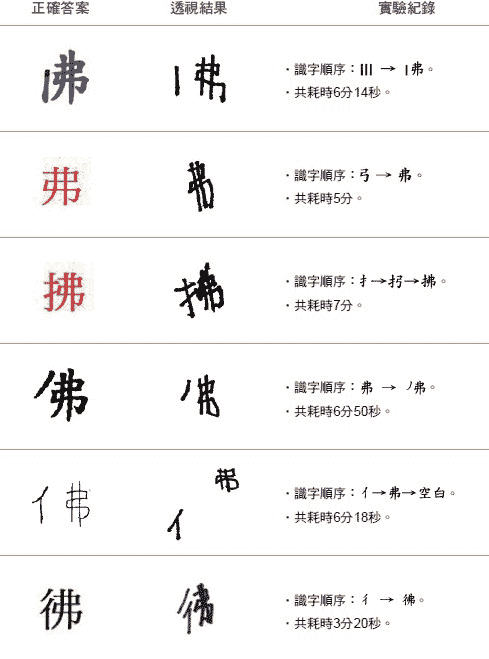 |

这个现象强烈暗示：「佛」字是一个网址，天眼可以扫描这个网址而连上佛的网站看到异象；一旦破坏网址就变成普通字，天眼就连不上网站，只能看到破坏的字。**好像这个物质世界之外还有一个信息场存在，或者说是灵界存在，里面充满了神灵及神灵的网站。利用手指识字辨识网址，我们就有机会连上网站参观其网页。二○一四年后，我把这个信息场或灵界称作虚数时空**。原来虚数时空如同一个网路的世界，其中充满了意识、神灵及祂们所创建的网站，而连结网站的网址就是神祇的圣名。

## 是大脑的幻觉，还是外界的信息场？

当然有人会质疑小朋友用天眼所看到的异象会不会只是大脑的幻觉？出于他们对神圣人物的崇敬，用天眼扫描这些字汇的时候，就像做梦一样产生各种幻觉以迎合崇敬之心。这种可能性必须用实验来排除，因此最简单的方法就是用小朋友不认识的文字来做实验。

##### 想连上外国神祉网站，须用原文

我们在做密宗神圣人物的实验时，就注意到一个现象，如左图3-10所示。不论是龙树菩萨或是莲花生大士这些创建密宗的圣者，以及二臂黑袍金刚等密宗的守护神，在手指识字实验时都会出现文字而不会出现异象。

图3-10　用密宗中文神圣字汇的实验结果

|  |

这让我们困扰了相当久，不知道密宗的神灵为什么不让T小姐连上网站。

直到有一天，我忽然觉悟到密宗都是西藏人，他们不懂汉文，因此它们的网址必定是用藏文而不是汉文。于是我去请问藏文专家，取得藏文的写法，当然T小姐是不懂藏文的。左图3-11及一五○页图3-12就是实验的结果，图3-11的第一列是藏文的玛哈嘎啦，二臂黑袍金刚是密宗的守护神，结果T小姐没有看到字，而是脑中出现异象、看到发亮的萤幕。为了确定起见，我把最后三个字剪掉，如图3-11第二列所示，这不是对玛哈嘎啦不敬，而是做科学研究。结果T小姐没有看到异象，而是一笔一画地把藏文描出来了。**显然原来的藏文是网址，你认不认得并不重要，而是能让天眼直接连上玛哈嘎啦的网站；而破坏的藏文已经不再是网址，因此可以全部认出来**。一五○页图3-12三列都是藏文的莲花生大士，能让天眼连上了有亮光的网站。

图3-11　用藏文玛哈嘎拉的实验结果

| 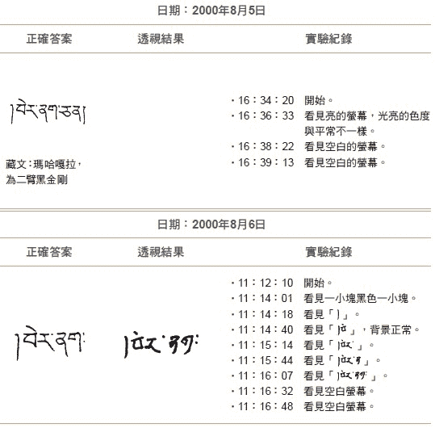 |

图3-12　用藏文莲花生大士的实验结果

| 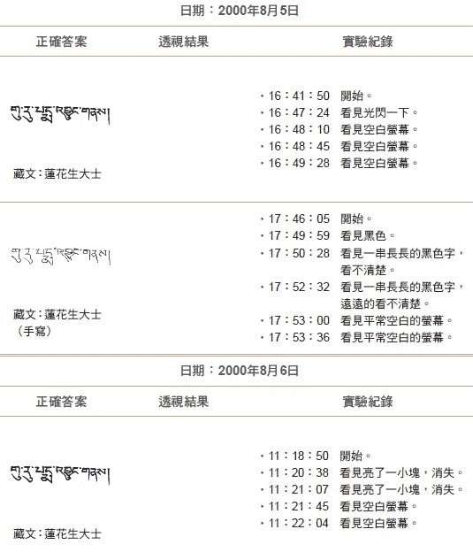 |

##### 用上帝之名，出现点点光亮

一五二页图3-13是T小姐用希伯来文神圣字汇的测试，当然T小姐不认识希伯来文。这是摩西当年在山上遇到上帝，要他带希伯来人出埃及时，他问上帝是谁？上帝用希伯来文的回答：「我是上帝。」

如图所示，二○○○年十二月二十九日的实验结果中，T小姐看见萤幕的亮度非常强，接上了希伯来人的上帝网站。二○○二年重做一次实验，结果出现一点一点、小小的一排光亮。

**由这些实验很明确的证明，功能人认不认得神圣字汇并不重要，重要的是只要用神圣字汇就可以让天眼连上神圣的网站**。这表示异象并不是大脑的幻觉，而是有另外一个网路的世界存在，一个充满了信息的网站，这就是灵界，就是虚数时空。

图3-13　用希伯来文的实验结果

| 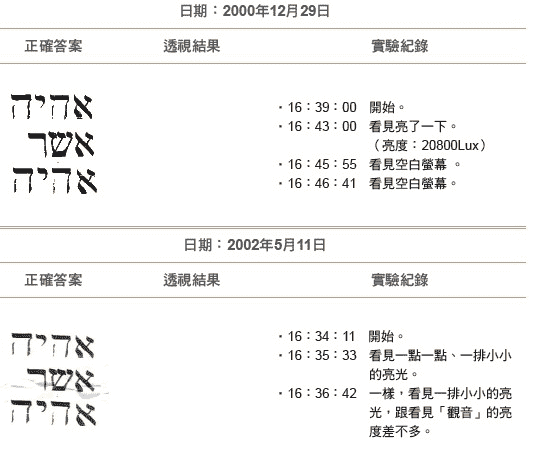 |

## 参观天堂与药师佛的网站

既然神灵在灵界都有网站，见诸一般人间的网站内容都很丰富，那么灵界的网站一切由心造，可能有更丰富的内容可供意识去参观，因此我们就想去神灵的网站游览一下。问题是所有神圣字汇都能接上神祕网站的首页，每次看到首页的亮光、亮人，看多了也没有意思，该如何进入其他网页呢？我认为可比照人间早有的写法，用首页的网址后面加一斜线，再写上次页的网址。

##### 看见光亮的十字架

二○○二年一月十三日，我们请T小姐用手指识字辨识「耶稣／SAM」，如一五五页图3-14第一列所示。

耶稣是天堂首页的网址，SAM是Samuel的简写，根据韦伯氏（Websters）大字典解释，Samuel在希伯来文的意思是「上帝的名字」。因此我们去天堂的目的是希望看到上帝。结果，她先看到一个绿色的十字架，十字架是空空的、后面很亮，看起来像个大门，应该是天堂的首页。

我请她尝试走进十字架大门，她走向十字架，十字架很大，但是她走不进去。我突然想到「阿里巴巴四十大盗」的故事，要说出密语如「芝麻、芝麻、开门！」才走得进去，我又不是基督徒，不知道什么是密语，但是基督徒祷告完毕后要说「阿门」，像是密语，于是我请T小姐说「阿门」，结果她一说「阿门」，所有亮光、十字架都消失了。原来「阿门」是结束语，与上帝沟通完毕，要结束的时候就说「阿门」。于是我去请教基督徒，我该说什么？他建议说「哈里路亚」，赞美主！

于是二月二十八日做实验时，我把「耶稣／SAM」后面再加一个「哈里路亚」。结果T小姐来到十字架大门前还是进不去，我请她唸「哈里路亚」，结果十字架绕过去穿过身体，全身浸在光芒中，她又从后门出来了。我就怀疑是不是要信了基督教，天堂才让T小姐进去？

五月十一日，我们再度用「耶稣」做识字实验，又连上亮亮的十字架大门，如上页图3-14第三列所示，但还是进不去。这问题要到两年后的二○○四年八月七日才获得解答，**别人的家园原来就不能随便去参观的，神灵的网站与人间一样，要先预约、挂号或请问，等到对方同意了才能进入参观**。

图3-14　Ｔ小姐尝试连上天堂网站

| 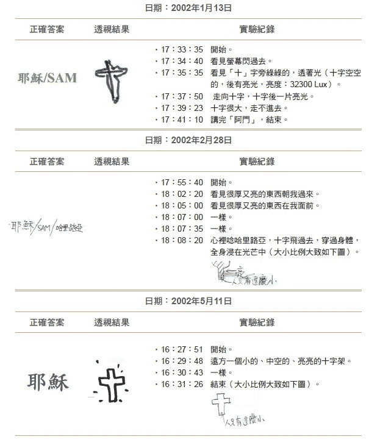 |

如下图3-15所示，我们在纸条写上「耶稣」，加上斜线，问了一句话「可以进入天堂？」，结果看门的亮人就让T小姐从天眼进入天堂，她看见一条发光的道路，后面有一群发光的人，看起来非常寂静安详，可能都是天使。

由此我们知道了参观神灵网站的规矩，从此就可以遨游诸神的网站。

图3-15　Ｔ小姐第一次参观天堂网站的内容

| 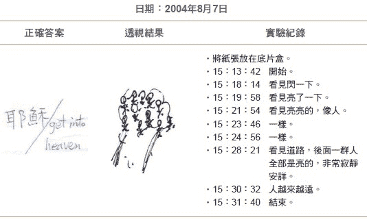 |

##### 参观药师佛的药园

二○○二年九月二十九日，我们就尝试去参观药师佛的网站。

T小姐的天眼一下就连上了药师佛的首页，如下页图3-16上方的图1所示：有五个一排的亮圈，一排一排地往下方延伸，中间的圆圈亮度较弱，可能是从中间的光亮照亮外面。于是她心中默想：「我可以进去看吗？」此时一位高大的亮人出现（约比常人五到六倍大），祂问：「你要看哪一个？」我猜这位高大的亮人就是药师佛。T小姐答：「第八个。」经由药师佛一指，T小姐就看到一片植物园，金光闪闪，由图3-16中间的图2的植物组成。接下来，T小姐再问：「可否再看一个（药园）？第六个。」药师佛说：「最后一个，不能再看了」，一指就看到另一片植物园，如图3-16下方图3所示。蔓藤般的植物由上垂下，软软的、半透明、飘来飘去，尖端发光，看了感觉非常美好。Ｔ小姐又问：「可否不摸字条，就进去看那些美好的景象？」药师佛回答：「可以，但我不一定在」，祂太客气了，客人来祂要亲自接待，其实我们希望祂不需亲自接待，有徒弟带我们就可以了。T小姐又请教药师佛：「可否告诉我第六及第八个药园的名称？」药师佛答：「说了，你们也不知道，不说」，大概觉得我们层次太低，对灵界事务不熟，不想告诉我们。

图3-16　第一次参观药师佛的药园

| 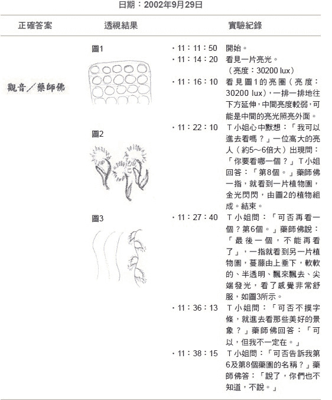 |

二○○三年三月三十日，我们又去参观了药师佛的第一个药园，实验结果如下页图3-17所示。

从大脑天眼萤幕中，只见一团光向着T小姐冲过来，一个一个的亮光排成五个各一排。

T小姐要求看第一个和第三个药园，结果只有亮一下，什么也没看到。

T小姐要求再看一次，结果从第一个亮光中出现一片都是绿的植物，如图3-17下方图2所画，生长着一大片很绿的植物，是有左右两个圈的蕨类植物，圆圈的形状右大左小，一排一排的整齐排列。

二○○三年十月二十八日，我们又去参观了药师佛的一个药园，如图3-17第二列所示。T小姐先看到一片亮光，进去药园后，看到一点一点、一排一排的亮点，像蕨类植物，但是只有一个圈，圈下面有一个亮点，然后又见一片亮光。

图3-17　参观药师佛不同的药园

| 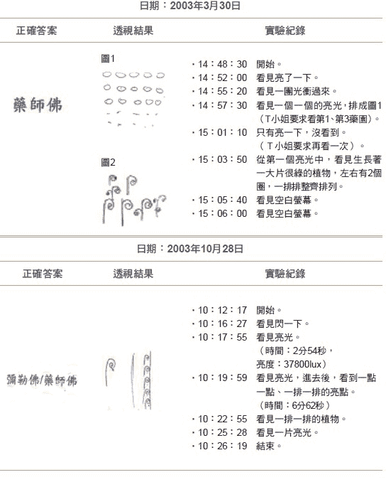 |

二○○三年三月二十八日，T小姐又去了药师佛网站，这次去参访了药店，如下页图3-18所示。

T小姐先看到亮光才进入网站，于是请问药师佛：「可否看第六排或第七排之药园？」，药师佛回答：「好啊！」

T小姐再问：「可否采药？」，药师佛回答：「还不行。」

T小姐再问：「可以看药店吗？」，药师佛回答：「可以啊！」

只见药师佛带着徒弟及T小姐走进药店，里面金光闪闪的，都是药柜及药瓶，放满了信息药。

T小姐问：「可否拿药？」，药师佛回答：「你们现在不需要。」

T小姐说：「陈教授生病需要药。」，药师佛回答：「这一颗你拿拿看！」

T小姐说：「可是拿不下来。」

结果突然间我们在场每个人都闻到一股中药味在实验室瀰漫，这应该是来自药师佛网站的中药信息，经过T小姐天眼而散发出来。

T小姐再试一次无奈地说：「太远了，拿不到」，我们想：「可能时候还未到」。

图3-18　参观药师佛网站的药店

| 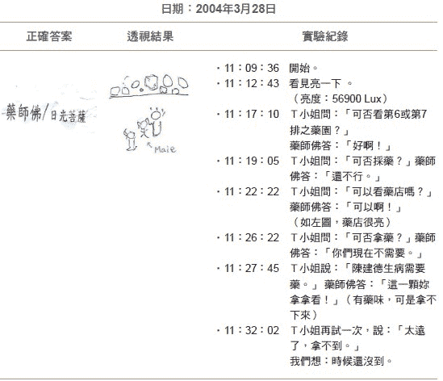 |

二○○四年八月八日T小姐去参观药师佛网站时，碰到了其他灵体，如下图3-19所示。首先她看到天眼萤幕亮了一下，接着看到一堆亮的植物，以及一个没有发光的人，很瘦、带着斗笠，正在采集植物，T小姐问他：「你住哪里？」他没有回答。

T小姐再问：「你为何来采药？」，那个人就摸肚子，表示肚子不舒服。接着萤幕闪了一下，T小姐被赶出药园，进不去了，再试还是进不去，就结束了实验。显然那个灵不喜欢她问东问西，把她赶出了药园。

图3-19　参观药师佛药园时，遇见其他灵

| 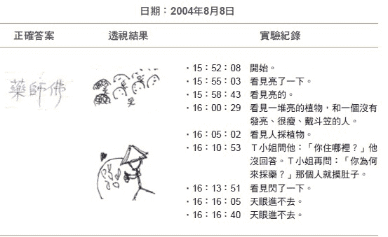 |

## 天堂庭园，用圣经中的圣名命名

我们做T小姐遨游神灵网站的实验时，用的是双盲实验。每次实验的主持人会制作十个样本，代表可各自到不同神灵的网站参观；正式实验时，由第三者任意抽出一个样本，因此没有人知道是去访问哪一个神灵的网站，T小姐、主持人及选择样本的人都不知道。实验中只有记录T小姐看到的景象，实验完成后也不会马上打开样本，而是放在一边，直到十个样本完全做完以后，才逐一打开样本。

##### 无意中进入天堂网站

一六六页图3-20所展示的是二○○四年十二月二十四日时，一次很特殊的经验。

首先，T小姐看到萤幕亮了一下，接着看到有一团人影，像是看门人。而且好像有听见声音，但听不太清楚。接着，她听到声音在问：「Which one?」用的是英语，我一看马上猜测是连到了药师佛网站。因为好像只有药师佛网站才有很多药园，需要问：「是哪一个？」T小姐回答：「First!」，表示第一个药园。接着，看到有一个人摇头，表示不行，于是T小姐回答：「随便一个！」接着，听到那人生气地说：「No,you have to pick one.」，意思是不可以随便，你要选择一个。我在旁边建议选择第十个药园，没想到那个人回说：「No,it's wrong!You have to give a name.（你错了，你必须给个名字。）」，我心想上一次我们问名字，您也不告诉我们，我们怎么给名字？真是奇怪。

于是T小姐回答说她不知道，随便给她看一个好了，结果天眼闪了一下，听到一个声音说：「OK,maybe just a little bit.（好吧！就一点点吧。）」结果，T小姐看到有一条亮亮的水流，岸边白白雾雾的，T小姐问：「That's it?（就这样吗？）」那人回答：「A lot more,Today,That's it!（有非常多，但是今天就只有这样！）」

我打开样本一看，大吃一惊，原来这不是药师佛网站，而是天堂网站。**原来天堂是用名字来命名庭园，不像药师佛网站是用数目来命名庭园。我虽然不是基督徒，但是也至少知道天堂中有一个庭园那就是伊甸园（Garden of Edan）**。

图3-20　Ｔ小姐访问某神灵网站之后才发现是天堂

| 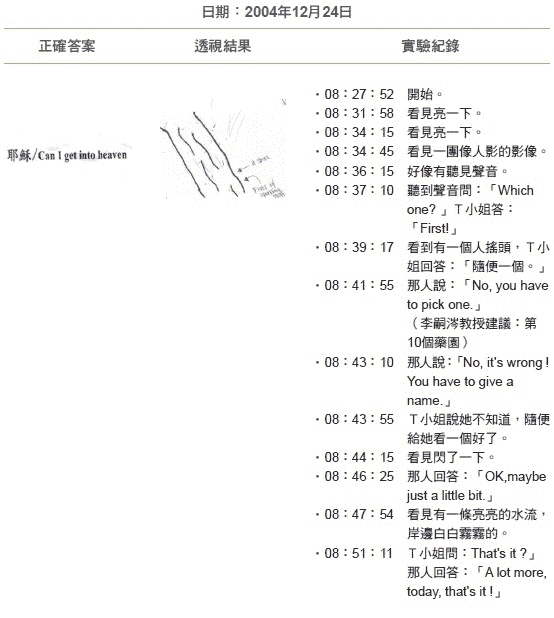 |

##### 重访伊甸园

不过再去伊甸园的经验，要等到十年以后才能实现，因为我从二○○五年当了台大校长，为了避免造成争议，只好等到二○一三年六月，我从台大校长卸任后才再度恢复了手指识字的实验。

二○一四年三月六日，T小姐尝试去参观伊甸园，我用的样本是写「耶稣／Can I get into Garden of Edan」，这次很顺利没人阻挡，一次就进了伊甸园，如下图3-21所示。T小姐看见一片景色，下半部整片很亮、非常漂亮的蓝绿混和色彩；上半部是淡金黄色，整个景象非常漂亮，接着就没有影像而结束了。

图3-21　Ｔ小姐访问天堂的伊甸园

| 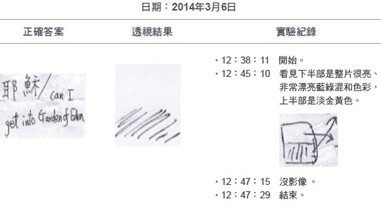 |

所以伊甸园还在天堂里，希望未来还可以去参观其他先知或天使的庭园。我们并非基督徒，但是只要有礼貌、客气地询问，得到允许，天堂守门人都会让我们进去参观天堂，不像人间的基督教有时会敌视非教徒，这应该不是耶稣本来的态度。

实验中发现很有趣的一件事是：用中文的「耶稣」，总是可以连上天堂，表示它是神圣字汇，我猜想这是因为「耶稣」的发音与原来的发音近似之故。耶稣用的母语是阿拉米文，现在叙利亚南部有些区域仍在用阿拉米文，阿拉米文「耶稣」的发音（Yeshua）与中文蛮接近的。

## 参观西方极乐世界诸佛的网站

##### 进入佛的国度

二○○四年十二月二十四日，我们请T小姐用手指识字实验尝试去参观阿弥陀佛的西方极乐世界，于是先去预约，如下页图3-22第一列所示。

我们用的样本是「阿弥陀佛／预约进佛国」结果阿弥陀佛的回答是：「明天」。第二天十二月二十五日，我们就依约进佛国，如图3-22第二列所示，用的样本是「阿弥陀佛／依约进佛国」，这样就不会冒昧突然闯入，引起阿弥陀佛不高兴。结果T小姐的天眼从九点零三分起闪了一下，九点零六分起一直闪一直闪，显示很不稳定，进不去佛国，直到九点零八分才成功进入佛国。

图3-22　Ｔ小姐参观阿弥佛陀的网站

| 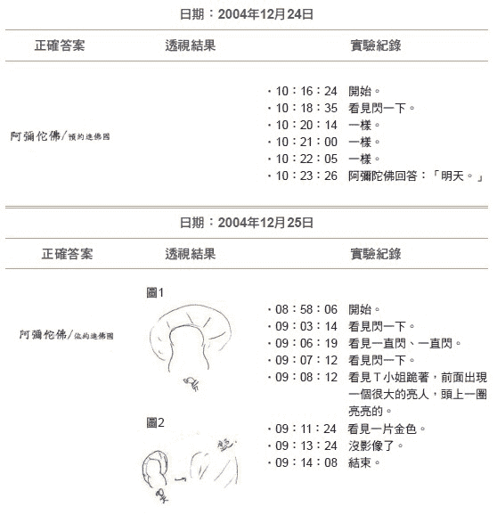 |

T小姐在天眼中看到自己跪着，前面坐着一个很大的亮人（头的后方挂着一个亮亮的圆圈），就像我们常看到的阿弥陀佛画像，T小姐的大小还不及亮人的脚趾头高；接着，高大的亮人站起来，带着小小的她走进佛国，然后佛国就变成一片金色的世界，整个过程就结束了。

**原来西方极乐世界是一个金色的世界，阿弥陀佛就坐镇在里面。**

##### 欲参观弥勒佛的网站

二○○四年八月六日，我们请T小姐用手指识字实验尝试去参观弥勒佛的网站，于是先去预约，如下页图3-23第一列所示。我们用的样本是「弥勒陀佛／预约进佛国」，结果弥勒佛的回答是：「Maybe」，好像不太欢迎我们的样子。

不过当天下午我们就再度试试看去连上弥勒佛网站，但是因为是双盲实验，我们并不知道是去弥勒佛的网站。

下午两点十分开始实验，但是七分钟内天眼萤幕都只是闪一下、闪一下，或亮一下，到了下午两点十九分时，才看见一个很大很亮的圆，接着看见数个发亮的圆，六个排成一圈，我以为是连接上药师佛的网站，才有几个小亮圈。四分钟后，T小姐又再看见全部的亮圈随着顺时针转了一圈后就全部消失了。于是，我们讨论着药师佛的网站中这次看到的怎么跟以往不同。

图3-23　Ｔ小姐参观弥勒佛的网站

| 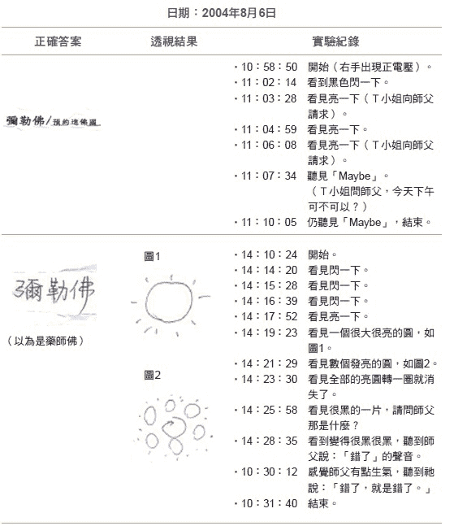 |

在下午两点二十五分时，在天眼萤幕上，T小姐看到黑的一片。T小姐请教天上的师父：「那是什么？」接着天眼萤幕变得很黑很黑，她听到师父说「错了」的声音，感觉有些生气；最后听到师父说：「错了，就是错了」，就结束了。

我们打开样本一看，原来是弥勒佛，不是药师佛。怪不得我们讨论药师佛，师父要生气地说：「错了」。

##### 参观观世音菩萨的网站

二○○四年十二月二十四日，我们想参观观音菩萨的网站，前去预约，T小姐用的样本是「观音／预约进观音网站」，如一七五页图3-24第一列所示。

上午九点四十分开始做实验，八分钟后，她的天眼亮一下；九点五十三分时，她看到一个白白的、瘦瘦的又高高的人，站在某个东西上面说：「晚一点。」就飘走了，接着又补充一句：「今天晚一点。」就结束了。

显然来的是站在某个东西上面的观音菩萨（我猜应是莲花），但是今天太忙了，因此先去闻声救苦，我们做实验不是那么紧急，今天晚一点来就可以了。

我们第二天十二月二十五日依约用「观音／依约进观音网站」的样本，让T小姐进入观音的网站参观，如左图3-24第二列图所示。

上午九点十七分实验开始，在二十一分时，她天眼亮了一下；在二十三分时，T小姐从天眼看见她跟着瘦高并身穿白衣的人，穿过莲花满布的地方，走到岸边，池塘里满是莲花。接着观音就飘身到莲花上打坐，与平日我们常看到的观音莲坐图类似。九点二十六分实验结束。所以在观音的国度里，不管陆上或水上都满布着莲花，是一个莲花的世界。

图3-24　Ｔ小姐参观观音菩萨的网站

| 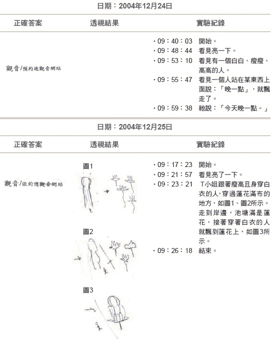 |

##### 参观文殊菩萨的网站

二○○四年十二月二十五日，我们也预约进了文殊菩萨的网站，如左图3-25所示。

实验从上午九点四十五分开始，在四分钟后，T小姐天眼闪了一下，过了两分钟后，天眼又亮了一下，她看见一个亮亮的东西，但跑掉了；九点五十四分时，墙上有个微微发亮的东西，里面排得密密麻麻的，排列得很整齐；九点五十七分时，T小姐看见一根手指指着墙上的字，应该是文殊菩萨的手指。接着，就冒出一串珠珠，每一颗珠珠中都有一堆字；十点零二分时，所有景象都没了，实验结束。

**所以文殊菩萨网站的墙上，所写的都是密密麻麻的佛经。文殊代表智慧，佛经都记录在网站中，因此高功能人是有机会把这些原始佛经下载到人间的。**

图3-25　Ｔ小姐观文殊菩萨的网站

| 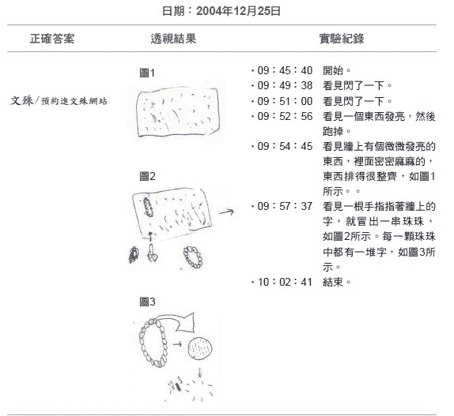 |

## 遇见圣贤──进入老子与孔子的网站

当我们于二○○○年八月五日的手指识字实验，第一次以「老子」一词给T小姐测试时，她在天眼中先看到了一个暗的人影，背景正常，接着人影消失，然后「老子」两个字出现。此后百试不爽，一碰到「老子」两字，都是先出现暗的人影，再出现「老子」两个字，如左图3-26第一列及第四列所示。由于看到异象，表示「老子」两个字是神圣字汇，我们可以藉由手指识字接上祂在信息场的网站。

其实老子在信息场有网站并不令人讶异，从《道德经》第二十五章的内容可以看得出来：「有物混成，先天地生。寂兮寥兮，独立而不改，周行而不殆，可以为天下母。吾不知其名，字之曰道……」老子知道，在天地出现之前，就有一种混合物的存在，非常的寂静不会改变，一直的运行不缀，是天下万物产生的源头。祂不知道这个混合物的名字，就把它叫做「道」。这个「道」，很像西方宗教里所信奉的「上帝」，是宇宙一切万物之母。我猜想，这就是我们所发现的「虚数时空」。

图3-26　「老子」与「孔子」字汇的实验

| 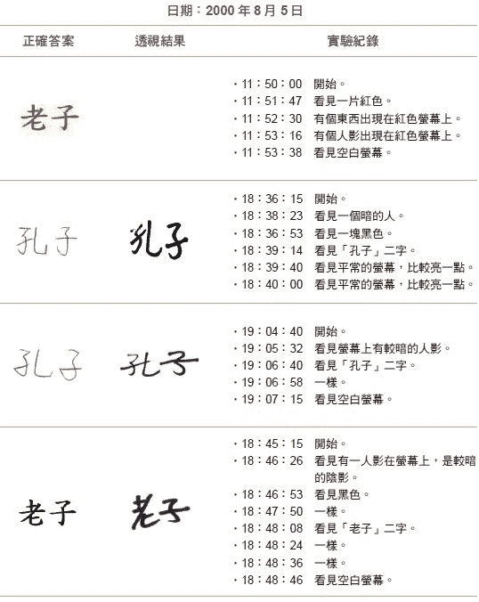 |

老子显然是有练功的，从《道德经》上「致虚极，守静笃……」的境界，就知道老子深得练功的精髓，因此他练到高深的阶段而能连上虚数时空是自然的结果，他能在虚数时空创造出一个网站似乎也不足为奇了。

只是他呈现在T小姐天眼上的影像是暗的人影，不像「佛」、「菩萨」、「济公」或「耶稣」等字汇会导致亮光、发亮的人影或亮光的十字架，好像境界上差了一些，比较接近人界，而不属于神佛的境地。

如果一个人修练自身的境界，以幼稚园、小学到硕士、博士的阶段来比喻，我猜想老子修练的境界可能到了高中、大学的阶段，比起神佛的硕博士境界可能还有一段距离，因此只出现暗的人影，而非亮的人影。

##### 意念摄影，照下天眼中的影像

北京中国地质大学人体科学研究所的沈今川教授及功能人孙储琳女士曾合作过一段时间的「意念摄影」实验。

他们把长方形的拍立得相纸放入相机，不用相机镜头，而是把向外曝光的一面用一片钢板挡住。做实验的时候，孙女士把手掌按在钢板上，把脑中天眼上的影像直接投射在相机中最上一张拍立得的相纸上。成功后，把相纸由相机抽出，等一分钟显影后，再把相纸上的护套撕开，影像就在相纸上出现。

五年来，他们已成功地拍下数百张的念摄照片，其中有一些是老子的照片。

根据孙女士的说法，她在心里呼喊「老子」这两个字后，天眼中就飞入一些影像，看得不是很清楚，隐约可见是一个老人，有胡须、头发稀疏，或站或坐，或是在练拳，或在打坐，有各种姿势。她选了一个打坐的姿势投射到拍立得相纸上。沈教授把这些念摄照片送给了我一份，如下页图3-27所示，我一看之下大为振奋，只见照片中一片黄色的光芒下，衬托出一个老人打坐的身影，这不就是T小姐藉由「老子」两字所看到的「暗的人影」吗？

孙女士藉由意念、T小姐藉由手指识字，都经由关键字「老子」，而连上了信息场中老子的网站，看到了首页的内容。我们何其有幸，没有开发出功能，却能在有生之年藉由念摄的实验，看到信息场中老子网站的首页。

图3-27　意念摄影下的老子打坐显影图

|  |
| 透过「意念摄影」，拍下的老子影像。隐约可见一个老人正在打坐。 |

##### 孔子的显像

老子自己练功，也在虚数时空建有网站，那孔子呢？

《论语‧雍也》篇第二十一章，子曰：「务民之义，敬鬼神而远之，可谓知矣。」《论语‧述而》篇第二十章，子曰：「子不语：怪力乱神。」一般人认为孔子是不相信有鬼神的。因此当二○○○年八月我们做手指识字实验，第一次以「孔子」一词给T小姐测试时，她竟然看到异象，让我们大为震惊。

她在天眼中先看到了一个暗的人影，接着人影消失，然后「孔子」两个字出现。没想到异象出现的过程竟然与「老子」两字实验的结果完全一样。此后百试不爽，一碰到「孔子」两字，都是先出现暗的人影，再出现「孔子」两个字。

**原来孔子在信息场中也建立了网站，其在信息场的地位似乎与老子完全一样。**

我们再试了「孟子」与「庄子」，结果没有产生任何异象，两个字汇都直接被写出来了，这表示亚圣就不行了。好像只有一个大门派的开创者，才有足够的力量在信息场创立网站。这到底是怎么一回事？是孔子自己也有修练到至高境界而能建立网站？还是如心理学家荣格所声称的「集体无意识」所造成，是中华民族对孔子的集体信仰与崇拜，在信息场中塑造了一个网站？

##### 孔子真的不信鬼神吗？

孔子真的不信鬼神吗？《论语‧述而》篇第三十三章中提到，有一次孔子生病，子路要替他祈祷，孔子反问：「你真的做了吗？」子路说：「我是向上下各方的鬼神祈祷。」孔子就说：「那我早就在祈祷了。」**显然在孔子那个时代，生病是要在上层的心性及信息层面下工夫，把不良的状况调整过来就能治病，他们似乎是相信有一个形而上的世界存在**。

孔子作《系辞传》有云：「形而上者谓之道，形而下者谓之器。」人体、器物、动植物属于形而下的容器界，容器之上还有一个形而上的世界（道）。

根据佛光大学宋光宇教授的新书《论语心解》，有更进一步的阐述。比如学《论语》都是由〈学而〉篇开始，但是要学什么？是学当时仅有的诗经及书经，还是学「圣人之事」？依照传统儒家的「内圣外王」理念，应该是学习圣人之事。内圣就是内心要像古代圣王一样的有敏锐空灵的知觉能力，外王就是要用这知觉能力去觉察外在宇宙的运行原则，也就是用「道」来治理国家。以现代的科学语言来说，儒家学习的方法是与信息场沟通，然后引天地的智慧来治理国家。

那么「敬鬼神而远之」、「子不语：怪力乱神」又是怎么一回事呢？

《论语》中各篇章节的安排，上下都有逻辑的关系，一句话有时会和上下文互相呼应。孔子说：「务民之义，敬鬼神而远之，可谓知矣。」指的是把该做的事做好，尊敬鬼神但是又不完全依赖祂，保持个人思考空间，就是「知」。整句话不但没有否定鬼神的存在，只是要不完全依赖祂。另外，「子不语：怪力乱神。」则是和上文呼应：「我非生而知之者，好古，敏以求知着也。」孔子说出他的特质：「我不是天生就懂那么多事，而是在心性安定和空灵状态下，敏锐地觉察各种事物及现象，才会知道这么多的事。」孔子是指在诉诸安定心性，并长时间的敏锐观察时，要特别的小心，不要妄言「怪力乱神」之事。是呼应上文的状况下，才需要不乱说怪力乱神，并没有否定鬼神的存在。

原来孔子所教导我们的，并不只有人间的王道，还有天人合一的学问、沟通信息场的学问。而且他似乎还能从信息场撷取资讯，自然他在信息场里拥有网站是水到渠成、理所当然的。

## 民间神明的启示

##### 神灵是出自集体潜意识，还是真的存在？

台湾各地都有庙宇，有大规模的佛寺、道观，也有在路边的一个小庙，供奉各式各样的当地神灵，接受成百上千的信徒长期的膜拜，祂们真的在信息场设有网站吗？我们可以经由手指识字辨识关键字，而连上网站的首页吗？祂们的网站有没有设密码或防火墙？经过T小姐的手指识字实验，我们获得一些初步的结果。

从天眼中可看到异象的神圣字汇如下：

关公：最先会有严肃的感觉，接着字汇就出现了。

玉皇大帝：会出现一点点亮的萤幕。

掌司人间禄籍的文昌帝君：看到有些暗、有些白的花纹出现在萤幕上。

妈祖：看到有一点亮的人。

济公：看到一个亮人或亮的萤幕，发亮的程度只比佛或菩萨略低。

禅宗初祖达摩：看到有一点亮的萤幕，和以往看到的都不一样。

在这些字汇中，「关公」是三国时代蜀国的大将，本身并没有修练成道的纪录，后来与吴国战争中被所吕蒙所执不屈而死。被后来的皇帝封为「关圣帝君」，建庙接受民间的祭祀与膜拜，至今有一千多年。祂在信息场的网站，不像是自己的功力所建造，倒像是由中华民族的集体意识所塑造。

「文昌帝君」原为梓潼帝君，姓张，名亚子，居四川七曲山。仕晋战殁，人为立庙，唐宋屡封为英显王。道家谓梓潼掌文昌府事及人间禄籍，故元加封为帝君，这均出于道家之附会。但是历史上文昌帝君甚受读书人的敬奉，至今仍受到许多考生的垂爱，每当联考季节来临，还是有很多考生纷纷前往文昌帝君庙祭拜，祈求考试顺利。看来「文昌帝君」的网站也是由民族的集体意识所塑造出来的。

**由此来推论，若是一些神灵像佛菩萨般神通广大，自己有能力建立网站，再加上人间大规模的祭拜，有可能形成滚雪球效应，塑造出超级网站。**

我们也注意到，T小姐无法连到很多道家仙人或真人的网站，像八仙、张三丰、司马承桢[1]等，让我们困惑了一段很长的时间。慢慢地我觉得原因有两个：

第一，网站的照顾非常耗费人力，要有人修改版面、回答问题、更新资料。可是一般道家人士都是散仙，独善其身、离群索居，很少有大量徒弟，建立网站困难，维护更是困难，因此可能根本没有网站。

第二，经我询问一位真正的今之道士，W先生得知有可能是我们不知道网站的密码之故。道家认为天地实像阴阳交错，微妙平衡得以永存，不是一般人应该知道的事情，否则容易扰动天地平衡恐有大灾难。因此不建网站，不能随便让开天眼却不具德性的人知道太多的天地祕密。

##### 与天沟通，务必诚意正心

我们也发现神明名字的撰写，一定要工工整整，不可乱写。像有一次，一位参与手指识字的研究员，写了「妈祖」一词，不过是大「妈」小「祖」，「妈」字比「祖」字大了六倍，结果T小姐看到的亮人长得和正常「妈祖」不一样。

原来神圣字汇的形状在连网时也扮演重要的角色，不同的字形显然在连网时重组了网页的内容，或扭曲了传输的资讯。

还好妈祖是海神，是救苦救难的菩萨，也许不太在意网址被故意扭曲。要是碰到一个魔头时，也许就会遭到不好的报应了。**与天沟通，务必诚意正心，规规矩矩地写神圣字汇，以保平安**。

> 编注1司马承桢
> 
> 道教上清派茅山宗第十二代宗师。

## 十年后，重游诸佛的网站

由我们的手指识字实验发现，虚数时空中充满了神灵的网站，只要找到正确的网址，就可以连上网站的首页；但是要进去网站参观其他网页则必须先预约，经过网主的同意，则可以按约定时间前去参观。网主有空还会亲自接待，有时还会碰到其他的灵也去参观。

我们与T小姐用手指识字实验游历诸神的网站实验，到二○○四年告一段落，因为我二○○五年六月接任台大校长，为避免造成外界争议，因此停止了实验。直到二○一三年六月，我卸任台大校长以后，才逐步开始恢复相关实验。不过要到二○一六年二月，经过了十二年之久，我才恢复拜访诸神的网站实验。

时隔十多年，T小姐已经从美国普渡大学兽医医学院毕业，是美国加州正式执业的兽医师，可以与动物直接沟通，功力比十年前有大幅的增进，看到的景象以及与诸佛的关系已经与往日不同，我们就以去「药师佛」、「阿弥陀佛」及「观音」的网站来说明，如下页图3-28所示。

二○一六年二月二十二日下午十五点二十七分开始实验，如下页图3-28第一列所示。

T小姐的天眼在两分钟及八分钟后各亮了一下，接着出现一片很深的光亮，但什么都没有，延续了两分钟，在十五点三十七分时还是看不到东西，这时T小姐听到药师佛用中文讲：「让你感觉」，六分钟后，她感觉头的左边麻掉、不舒服，我们决定停止实验。药师佛要T小姐用感觉的方式去感受，而不是让她去看药园。

隔天二月二十三日，则是去参访阿弥陀佛的西方极乐世界，如图3-28第二列所示。

实验在下午十六点九分开始。一分钟后，T小姐看到很亮的影子；在十六点十二分时看到很亮、很大的一个形状，将整个萤幕占满，我们想应该是阿弥陀佛。一分钟后，看到亮人在很远的地方，T小姐问祂说：「可以打招呼吗？」亮人缩小而去，实验就结束了。显然T小姐曾接近光亮而巨大的阿弥陀佛，但只看了一眼，阿弥陀佛就远去了。不像二○○四年（如一七○页图3-22所示），T小姐是跪在阿弥陀佛面前，尚不及祂的脚趾高度，比较卑微。

图3-28　Ｔ小姐再度访问诸佛的网站

| 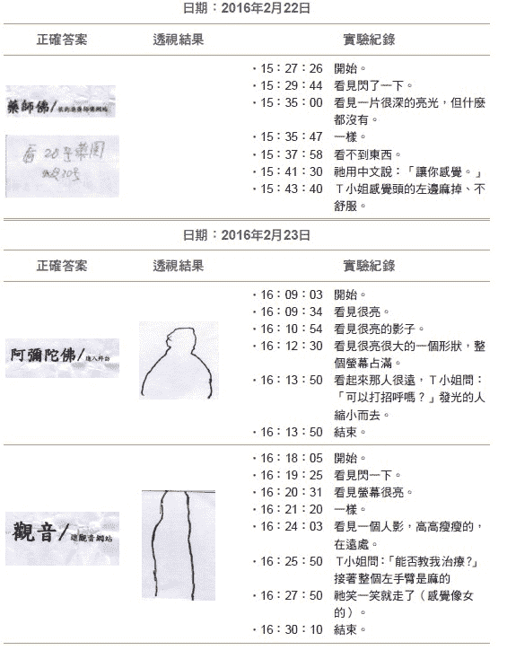 |

同日，T小姐也去访问观音菩萨的网站，如右图3-28第三列所示。

实验从下午十六点十八分开始，两分钟后，她从天眼中看到萤幕很亮；在十六点二十四分时，看到一个人影，高高瘦瘦的，在远远的地方；一分钟后再看见祂，T小姐问：「能否教我治疗？」接着就感觉到整个左手臂是麻的；在十六点二十七分时，亮人笑一笑就走了（感觉像是女的），实验就结束了。那位亮人高高瘦瘦的，应该就是观音菩萨。此时，T小姐就用麻掉的左手抚摸在场背痛了超过一个月的陈博士。

第二天我问陈博士效果如何？他说昨天晚上背痛就好了、不痛了，被观音菩萨所施展的神奇力量治愈了，很显然的，T小姐现在的地位较接近诸佛了，不像十年前比较卑微。

总之，从古至今不论东西方各种宗教都知道灵界的存在，我则在一九九九年八月二十六日起，从物理学会来踢馆的手指识字实验中，因为测试佛字才偶然发现了灵界的存在，创造出撼人的戏剧效果。当时我为了避免用「灵界」这个辞汇，会引起主流科学界反射式的反对，因此改用「信息场」（information field）来取代；直到二○一四年，为了架构宇宙的实像复数时空，我才把信息场改为虚数时空。