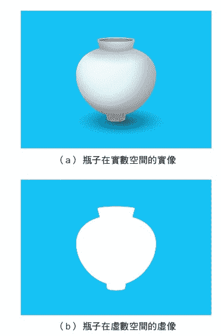
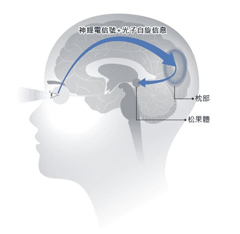
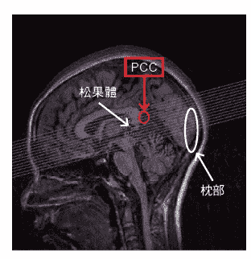
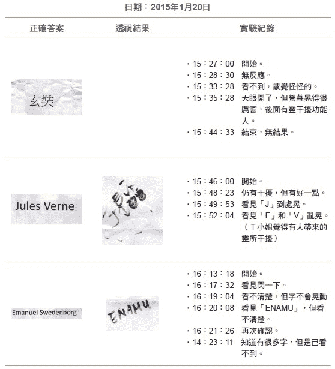
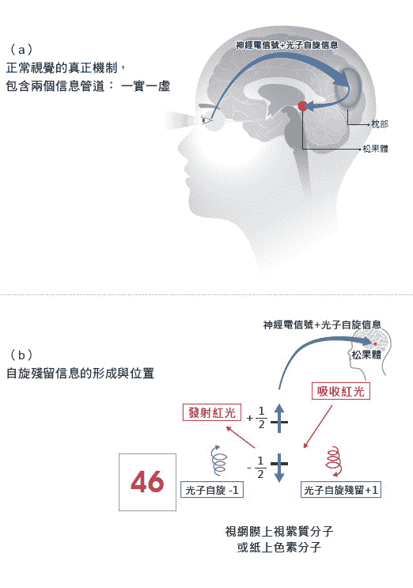
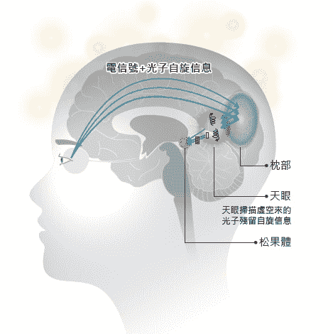

# 四、一物两象与特异功能原理

粒子自旋割裂时空的结果，

创造出「一物两象」的神祕现象。

原来任何物体在虚空还有一个一模一样的虚像，

天眼就是在扫描虚像。

## 探究特异功能的物理机制

我在第一章中提出新的宇宙模型，认为真实的宇宙是八度的复数时空，除了我们所熟知的四度实数时空（三度空间、一度时间），也就是「阳间」以外，还有一个四度的虚数时空在旁边，也就是「阴间」，是意识的世界。

我也提出意识的物理，认为心灵是量子现象，量子状态必须要用复数的函数来描述，虚数ｉ的出现代表意识的出现，因此量子态就是物质进入心物合一的状态。

由这个统一架构，我们可以去解释宇宙大尺度的谜团，例如暗质及暗能的本质，我们也可以真正了解宇宙小尺度量子力学的谜团，例如决定论的薛丁格方程式竟然会得出粒子或然率的分布，量子纠缠是以超光速方式在两量子间传递信息等等。至于宇宙中尺度的谜团，例如特异功能的手指识字、念力等不可思议的现象，要如何利用新的宇宙模型去解释呢？其中须先了解的关键步骤是：天眼要如何去搜寻纸条或要操作的物体，把这些外界的信息送回大脑，让大脑的意识去看或去操作呢？

##### 解开「一物两象」的神祕现象

二○一四年以前，我的猜想是天眼这个量子现象会穿出大脑，经过身体扩散到手握的纸条，或穿出身体到达离体的物体，把它们笼罩起来，强迫它们进入心物合一的现象，再把想要获得的资讯传递回来。但是如何强迫纸条或物体也进入量子状态，我则想来想去，找遍现有的科学论文，也找不出任何可能的物理机制来。

二○一四年我提出复数时空以后，为了找出实数与虚数时空沟通的管道，大胆假设两个时空是由无数大大小小的涡漩通道所联通，两个相邻的正反通道（一个由实到虚，另一个由虚到实）会形成立体的太极结构，其鱼眼部位就是通道，而最小的通道就是基本粒子的自旋。**所有在实数空间的物体由于都是由原子构成，原子中每一个基本粒子也都有自旋，都有通往虚数时空的通道，因此在虚数时空中皆会出现一个形状一样的虚像**。这虚像是自旋通道在虚空出口的组合，形状与实物是完全一样的，因此造成「一物两象」的神祕现象。任何一个实数时空的物体，在虚数时空都有一个形状一样的结构，后来我渐渐发觉这个虚空的结构竟然在手指识字及念力的作用上扮演了重要且关键性的地位。

左图4-1（a）显示的是一个在实数空间的玻璃瓶，左图4-1（b）显示的则是玻璃瓶构成的原子内自旋通道在虚空出口所组合成的虚像，两者形状一样或互补，因此「一物两象」表示：任何一个实数时空的物体在实虚两空间都有一个形状一样的结构。只有神圣字汇例外，如：「佛」、「观音菩萨」、「耶稣」、「药师佛」、「弥勒佛」等，其虚像已经被这些神圣人物在虚空的意识所修改成大圆、多排的小圆、十字架等不同结构。

同样的，我们要问：虚空中的物体或能量形式在实数时空也会产生实像吗？

我认为要看能量的结构形式，虚空中的能量形式如果不包含自旋通道，无法与实数空间沟通，则不会产生实像，是属于暗质及意识的纯能量。但如含有自旋时空结构，其通道出口则会在实数时空形成一个没有物质存在的影像（鬼影）而已。

做手指识字或念力实验时，当受试者打开天眼以后，天眼的量子状态进入虚数时空扫描字汇或物体的虚像，带回天眼形成影像，而被大脑觉知中心辨认出来。要想真正了解手指识字的物理机制，首先要了解接下来会谈到的正常双眼视觉的物理机制。

图4-1　一物两象的虚实共存

|  |
| 任何一个实数时空的物体，在虚数时空都有一个形状一样的结构。 |

## 正常视觉的生理机制

根据现代生理学，大脑看到外界景物的视觉过程中，首先需要光源。光源会发出的可见光光子（电磁波）打到景物后反射进入眼睛；或者景物本身会发光，发出光子或电磁波，不同的频率代表不同的颜色及能量，这些光子被视网膜的锥状或杆状细胞壁上的视紫质（rhodopsin）分子所吸收。视紫质分子吸收光子后，分子的形状会改变、弹离细胞壁，引发一个神经脉冲信号送往大脑，信号在眼睛正后方的大脑枕部做先期处理后，再送往大脑视觉其他部位处理，最后送进视觉中枢，被觉知产生视觉，如左图4-2所示。

锥状细胞有三种，各感知不同波段颜色的光子。一般神经生理学专家相信，大脑对颜色的感知就是由三种锥状细胞接收信号混合而成的。

图4-2　产生正常视觉的生理机制

|  |
| 眼睛接收到景物的光子，引发一个神经脉冲信号送往大脑枕部，做先期处理后，再送往大脑视觉其他部位，最后送进视觉中枢，被觉知而产生视觉。 |

但是手指识字或耳朵听字实验的结果显示，天眼同样可以看见文字的颜色与形状，不过完全不需要经过视网膜上的锥状或杆状细胞来吸收光子导致神经电信号传导的过程。这项事实清楚的表示，即使是正常视觉，其颜色或是视觉的产生，其实是靠另外的管道，而非现代神经生理学所描述的神经电信号这唯一的传递机制。

也就是说，正常视觉其实靠两个管道传递视觉信号。其中一个就是现代神经生理学所描述的神经电信号管道；但是不幸的是，大脑中枢觉知部位并不是在解读大脑不同神经电流信号的组合，而是在解读神经电信号所携带的另一种信息「光子自旋残留信息」，而感觉出颜色产生视觉。

我在下一篇将提出另外一种信息的本质，这可以统一解释为何两种视觉都可以看到颜色及字形。

## 从手指识字实验所观察到的规律

根据过去大量文献记载，以及我们自己手指识字的实验结果，可以观察到实验成功的几项规律，任何理论想要解释手指识字现象，就必须先解释这些规律：

规律1

大脑中天眼出现时，绝大部分会遮住正常视觉，也就是小朋友正在看的房间内正常的景象会被突然出现的天眼遮住，背景消失。其他少数几位小朋友有时发现天眼萤幕中的字会与正常视觉重叠，比如看见字似乎被贴在对面的墙上，或出现在做纪录的大哥哥、大姐姐脸上。

规律2

如果字是彩色的，天眼打开时常常最先看到颜色。不同颜色可能会同时出现，排在同一个画面上，或会分几次在天眼中出现。每次会先出现一种或多种颜色，然后才是有颜色的字，一部分、一部分地出现在天眼上，如第二章图2-6所示（请见八十七页）。

规律3

当受试者戴上眼罩遮住双眼时，虽然能看得见字的形状，但是会增加颜色辨识的错误率。在暗室做实验虽能看见模糊字形，但是都看不见颜色，这表示正常双眼看见亮光，并利用亮光信息来照亮天眼，是辨识颜色成功的必要条件。

规律4

有时外灵会来到实验现场，干扰实验的结果，让受试者看到的字翻转、跳动、颠倒或缺少一部分。

规律5

只有看神圣字汇时，是看不到字汇，而是看到亮光或亮人，并能连上虚空中神圣人物的网站首页。功能比较差的受试者会连到不同的世界，看到不同的景象，但是看不见神圣字汇。

规律6

纸上如果挖了洞，天眼会在挖洞的位置看到一个黑框，如第二章图2-8所示（请见九十三页）。

## 开天眼，会遮住正常视觉

我们用功能性磁造影（fMRI）技术测量T小姐做手指识字时的大脑功能影像，发现天眼最可能的位置是位在大脑的后扣带皮层（Posterior Cigulate Cortex，简称PCC），这是大脑处于静态下（resting state），其预设模式网络（default mode network，简称DMN）的主要部分，也是负责大脑认知的一部分，如下页图4-3的红圈位置所示。

**此部位是位于大脑后方枕部与笛卡儿所认为掌管视觉的松果体之间**。这解释了天眼一开会遮住正常视觉的现象，因为枕部的正常视觉信息被PCC部位的天眼挡住，无法送进视觉中枢（也许是松果体）。

图4-3　天眼在大脑的位置

|  |
| 因天眼一开，枕部的正常视觉信息被后扣带皮层（PCC）部位的天眼位置（红圈所示）挡住，无法送进视觉中枢，所以天眼一开会遮住正常视觉。 |

## 天眼扫描虚像，而非实像

二○一五年以前，我一直认为天眼是扫描物体的实像；直到二○一四年提出复数时空的架构，而推导出「一物两象」的概念后，新的问题马上出现了。既然物体在实数及虚数时空的影像完全一样，天眼到底是在扫描纸上文字、图案的实像还是虚像？

##### 天眼是扫描虚像，才会被灵干扰

直到二○一五年一月二十日的手指识字实验，我才确定是扫描虚像。

如二○九页图4-4第一列所示，T小姐于下午三点二十七分开始实验后，一直开不了天眼，看不到文字，但是感觉怪怪的；到三点三十五分时天眼打开了，但是萤幕晃得很厉害。T小姐感觉她身体后面站有一个灵体在干扰她的实验，但是灵体处在虚空，我们什么也看不见，于是实验在下午三点四十四分结束。

接下来的实验于下午三点四十六分开始，如图4-4第二列所示。

在下午三点四十八分天眼打开时，萤幕仍受到干扰，但有好一点；三点四十九分时，天眼看到有个「J」字母到处晃，接着又看到有「E」和「V」两个字母乱晃，T小姐觉得是现场观众中有人带来的灵所干扰。

很显然的是，灵体是处在虚空，只有当天眼穿入虚空扫描虚像时，才有可能被虚空的灵干扰。是灵体在拨动英文字的虚像，让「J」、「E」和「V」字乱晃。由这些实验结果，我们才确认天眼是穿入虚空扫描虚像，不是在实数空间扫描实像。

图4-4　Ｔ小姐手指识字实验，受到外灵干扰

|  |

## 产生视觉的第二种管道──光子自旋残留信息

由于手指识字第三项规律所描述：让功能人正常双眼看到亮光，是手指识字辨识颜色成功的必要因素，这些双眼看到的亮光在大脑内可以照亮天眼的萤幕。因此光子本身必定带有与颜色相关的信息，可直接与天眼萤幕作用，让天眼亮起来，而不是间接经由神经电信号来照亮天眼。

我相信正常视觉的产生需要靠两种信号，如左图4-5（a）所示，信号一实一虚。第一种实数的信息是现代神经生理学所熟知的神经电信号，但它只是扮演载体的角色，而是把另外一种更重要的虚像中的自旋挠场信息带入给大脑神经中枢觉知。

图4-5　正常视觉的真正机制

|  |

我认为大脑中枢觉知部位，也许就是笛卡儿所称的藏有灵魂的松果体，它是在解读另一种信息，也就是光子所携带的自旋挠场信息（自旋为1）。这个自旋挠场信息是一个漩涡的时空结构，其挠率是由电磁波频率所决定的。光子信息中，其频率代表颜色及能量，这些光子被视网膜的锥状或杆状细胞内的视紫质分子自旋为-1/2的轨道吸收变成+1/2，再让吸收的能量转换成神经电信号送往大脑。

当入射眼睛的光子被杆状或锥状细胞内的视紫质分子吸收消失后，自旋为+1的挠场涡漩时空结构并不会马上消失，仍残留在当地视紫质分子附近，如上页图4-5（b）所示。这个带有频率信息的自旋挠场所残留信息会跨越阴阳界，被接着产生的神经电信号带着送进大脑，最终送达视觉中枢觉知部位（松果体）。

所以，视觉意识中枢真正在解读的是自旋挠场的残留信息，不同挠率的自旋会被觉知成不同的颜色，这个机制就可以用来解释手指识字的原理，如左图4-6所示。

图4-6　手指识字的物理机制

|  |
| 虚空中，不同挠率的自旋会被觉知成不同的颜色，意识中枢（松果体）真正在解读的是自旋挠场残留信息，才能感知颜色的存在。 |

我认为天眼是脑内生理食盐水溶液在大脑后扣带皮层（PCC）的局部地区进入了宏观量子状态，天眼遮住了正常视觉的信号，包括了双眼所送入的神经电信号及其所携带的自旋残留信息。而这时天眼所生成的复数量子波，则藉由分子自旋通道进入虚数空间，扫描纸上文字的虚像结构。

因此，彩色的字，如二一一页图4-5（b）纸张中红色的数字46，在实数空间由于其红色色素分子不断地吸收及放出红色的光子（自旋为1）。每当放出一个自旋为-1的光子（色素分子自己的自旋会从+1/2变为-1/2），就会留下一个自旋为+1的残留信息跨越阴阳界，留在色素分子附近，因此色素分子附近布满了红色光子的自旋挠场残留信息，此自旋划破时空仍然可与虚空沟通。

由于实验时会把折叠的纸张放入暗袋，此时光子已经消失，只剩下自旋残留信息能和虚空沟通，因此天眼量子波扫描虚空字形时，首先会把残留颜色自旋信息扫回天眼，因为实数时空中没有物质（光子已消失）可以羁绊住它，因此天眼第一次打开时，会出现一片单一颜色，或不同颜色排列在一个画面上，如第二章图2-6所示（请见八十七页）。有时一次扫回一种颜色，要开天眼几次，才把所有不同的颜色扫描传回。接着，才把字汇形状的时空结构信息一部分、一部分地扫描传回，而自旋颜色信息开始排列对应于形状信息的位置。

此时倘若正常眼睛没有看到亮光，天眼的字形是黯淡无色的。正常眼睛看到的亮光中所携带的大量、不同颜色的自旋挠场残留信息经过天眼送往松果体被觉知时，会被天眼挡住无法通过。这时神奇的事情发生了，也就是**天眼从摺叠纸张扫回的自旋信息，如果与正常眼睛看到亮光所送往松果体的自旋残留信息频率相同者会产生共振反应**。

例如外界景象中，红色亮光自旋信息在天眼部位碰到纸上残留的红光自旋信息，就会产生强烈共振，而可以通过天眼，让松果体的觉知看见一片红光；如果纸上有洞，天眼在此区域没有任何被扫描回来的色光残留信息，则正常双眼看到的亮光信息会被天眼挡住，而不会产生任何共振而通过，则松果体觉知部位只会看到一个黑洞。

当手指识字辨识神圣字汇时，如「佛」、「观音菩萨」、「耶稣」、「药师佛」、「弥勒佛」等，其虚像已经被这些神圣人物在虚空的意识所修改成大圆、多排小圆、十字架等不同结构，与神灵网站的首页一致。由于这些字汇的虚像已经被神灵改变，因此手指识字时，天眼扫描虚像时，看不见字汇，而是看到被改变的影像如圆形亮光、亮人，或是影像所联通的神灵网站的首页，或其他虚空的世界。

## 念力的运作机制

根据我们与高功能人士做念力实验的结果，可以得出下面一些规律：

> 规律1
> 
> 念力成功的要件是要先把准备施作的物体信息调入天眼。例如做花生起死回生、返生发芽实验，先要把花生虚像信息调入天眼。此时花生意识出现，要征询它的意见是否同意做实验，如果花生同意就可以发出「返生」指令，花生内部分子就开始逆时针旋转，由外向内，直到转入中心，花生就返生了。接着下令「发芽」，花生内部分子就开始顺时针旋转由内而外，花生的芽就逐渐长出，长好以后再把天眼中的虚像送回实像的花生，让花生真的能发芽。
> 
> 规律2
> 
> 用念力弯曲或剪断铁丝、火柴，或在火柴上写字时，都要利用工具，这些工具可以在天眼中用意念创造出来，再把完成的作品送回实物，则实物就开始变化，如第二章图2-20所示（请见一一七页）。云南大学朱念麟教授所训练的小朋友，把火柴封在不透明的塑胶盒，天眼把火柴虚像扫描入大脑，然后想像出一把剪刀，用剪刀把火柴剪成五到六段，再把天眼中剪断火柴的影像送回盒中的火柴，等到实验完成打开盒子，火柴果然已经被剪成五到六段。

**同样的是，天眼是先把物体虚像扫回大脑，物体虚像表示意识，当物体意识被唤醒，会进入心物合一状态**。这些心物合一的物体可以被意念在虚数时空做远距传送，叫做搬运功能，也可以被操作变化成各种不同型态。当功能人把物体虚像操作变化后送回实物，也就是心物合一状态崩溃回复物质状态，此时实物就会逐渐变化成天眼操作后的结果状态。

##### 所有实物，都有通往虚数时空的通道

所有在实数空间的物体由于都是由原子构成，原子中每一个基本粒子都有自旋，都有通往虚数时空的通道，因此在虚数时空中都会出现一个虚像，是自旋通道在虚空出口的组合，形状与实物是完全一样。因此「一物两象」代表任何一个实数时空的物体在实虚两空间都有一个形状一样的结构。虚空中的能量形式，如果不包含自旋通道，无法与实数空间沟通，则不会产生实像，是属于暗质及意识的纯能量。但如含有自旋时空结构，其通道出口则会在实数时空形成一个没有物质存在的影像（鬼影）而已。字汇及物体虚空的结构在手指识字及念力的作用上扮演了重要的地位。我们提出手指识字及念力的可能机制，可以解释宇宙中尺度的人体内所出现的特异功能谜团。