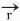
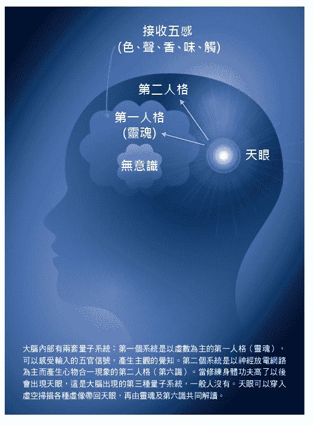

# 五、心灵与意识的科学奥祕

每个人都有「自我意识」，

每天睡觉时「我」就不见了，

每天早上醒来时，「我」又回来了，

好像没有太大的改变，

这个「我」的物理现象是什么？

## 探索科学的最后疆界──意识

每一个人都有自我的意识：「我」是和别人不一样的，每天睡觉的时候，「我」就不见了，但是每天早上醒来，「我」又回来了，好像没有太大的改变，这个「我」的物理本质到底是什么呢？

在唯物论的哲学笼罩在现代科学对宇宙解释的阴影之下，物理学家或者医师们对大脑心灵的物理解释都是敬而远之，认为意识是第二性的，只是第一性的物质里的大脑复杂神经网路所涌现的性质，并不具有独立性。比如：两个氢原子和一个氧原子化合成水分子，水是生命所需，但是其物理化学特性如沸点、凝固点、介质常数与氢原子或氧原子完全不一样，是复杂的三原子合成系统所涌现出来的新性质。而意识又比化学反应更复杂了，因此不属于物理研究的范畴。所以当人死了以后，当物质大脑毁坏了，意识也就消失了。因此科学家总是推托地说：意识是科学的最后疆界（The last frontier of science），而不去处理。因此在一九九○年以前，心灵与意识是属于心理学及哲学的研究范畴。

二十世纪初期，着名的心理学家荣格（Carl Gustav Jung）认为意识的核心是自我人格（Ego），并分成两种。第一人格就是灵魂，掌管五官的感觉、个性、七情六欲；第二人格为第六识，会受到教育、环境、文化及记忆的影响。佛教两千年来的唯识学就在分析大脑意识的结构，把它分成八识：包括色生香味触法六识、第七识莫那识及第八识阿赖耶识。

##### 意识的物理诠释

一九九四年起，意识的物理开始萌芽，英国的物理学家罗杰‧潘若斯（Roger Penrose）与美国亚历桑纳大学的骨科医师史都尔特‧汉默若夫（Stuart Hameroff）共同提出意识的物理，认为意识的基础不在神经活动电位上，而是发生在神经元内担任骨架功能之微管束（microtubule）的物质进入有序的量子状态。

脑神经细胞壁是由许多可形成量子穿隧效应[1]的微管束组成，当感官受到刺激输入时，便会产生有序的量子状态，而且是不同量子状态的叠加态（superposition state）[2]。当时间流逝，外在环境如重力会影响这些量子态之演化。不同状态之物质由于分布于不同时空，所以会导致引力能量差E，等于两状态的时空间隔S（物理常数如光速、万有引力常数令其为1），则叠加状态会崩溃显现唯一确定的状态，意识就在客观缩陷（Objective Reduction，简称OR）时产生。也就是当量子态扩散到重力之变化满足某些策画的条件下（orchestrated），宏观的量子波会客观地陷缩（Orchestrated Objective Reduction），简称为客观缩陷机制（Orch OR）。

在宏观量子态崩溃的一瞬间，大脑的意识就产生了，接着小部分的微管束又开始进入量子态，意识就逐渐消失了，等待下一次的客观缩陷机制再产生新的意识。因此大脑的念头是一波接一波，周而复始。

**我认为他们的模型已经接近意识的本质，不过相反的是，意识的产生是形成叠加的量子状态时产生，客观缩陷时消失。**

因为叠加的量子状态是复数状态，这时虚数意识可扫描进入量子状态的神经网路架构，产生意识的内容如：记忆、思想、判断、行动。有时埋藏在神经网路的经验会产生抑制力，让我们不要冲动，或给予建议、限制行动。有时量子波会钻入虚空，让我们在遨游宇宙时空时获得灵感，产生创新的思想。并在量子波客观缩陷以后，又恢复实数空间运作，等待下一次微管束的有序量子状态出现，也就是意识的出现。

这个模型经过二十多年的推展及实验的探讨，有越来越多的学者开始接受这个模型，当然也有一些反对的学者，比如纽约大学的哲学家戴维斯‧乔莫斯（Davis Chalmers）。在二○一八年四月于美国亚历桑纳州土桑市举办的「二○一八意识的科学」（2018 The Science of Consciousness）会议上，他以简单的逻辑挑战客观缩陷的机制，认为它用来解释意识并不完备、需要修正。

我的意识理论萌芽于二○一三年，如本书第一章所描述（请见三十六页）。二○一四年，我提出真实宇宙的两大假设，其中第二个假设是量子心灵，认为意识是一个量子现象，可以用复数函数来描述，虚数i的出现，表示意识出现了，所以我非常支持潘若斯及汉默若夫的假说──认为神经微管束会进入量子态，这也许是我提出量子心灵的生理基础。

只是我的理论认为物质在量子态才会产生意识，但是量子态的崩溃造成客观缩陷机制反而会导致意识消失，而不是产生意识。因此当我在二○一八年四月「意识的科学」大会上听到哲学家乔莫斯对客观缩陷机制的批评，非常兴奋，会后写了一封信给乔莫斯教授表达支持，并投稿了一篇论文。

不过意识只是一个抽象的概念，必须要有内容，比如说我会生气骂人、我懂慈悲爱人、我会理性思考、会计算、能记忆起以前发生的事情、决定下一步的行动，我个性倔强孤僻等等，都有其丰富的内涵，问题是这些意识的内容在物理上是以什么方式呈现？用复数波函数可以表达这些内容吗？荣格的第一、第二人格，佛教的八识如何以量子心灵的方式来呈现呢？且让我们先回顾一下哲学及心理学对意识的诠释。

> 编注1量子穿隧（Quantum Tunnelling Effect）
> 
> 根据量子力学，微观粒子具有波的性质，如电子等微观粒子能够穿过本来无法通过的「墙壁」的现象。
> 
> 编注2量子叠加（Superposition State）
> 
> 量子力学认为微观事物的运动和状态均是不确定的，如果将其推广到宏观世界，各种不确定的事物均可以被认为是处在多种状态的叠加状态。

## 西方哲学对意识的认知

西方心灵哲学的概念是从笛卡儿（RenéDescartes）的心物二元论（Mind-Brain Dualism）开始。

笛卡儿本人多才多艺，他出生于十六世纪末的一五九六年，去世于一六五○年，是法国着名哲学家、数学家、物理学家。他对现代数学的发展做出了重要的贡献，因将几何座标体系公式化，而被认为是解析几何之父；他留下名言：「我思故我在」，提出了「普遍怀疑」的主张，是西方现代哲学的奠基人，他的哲学思想深深影响了之后几代的欧洲人，开拓了理性主义哲学。

笛卡儿主张心与物为两种不同的实体。「心」指的是一种思维的主体，也就是藏在大脑的松果体中的「灵魂」，掌控日常生活中的思想、记忆、行动、情感等；「物」指的是日常接触到的一切占有空间、有形的外在事务，包含大脑。

但是此种说法很难解释心物的交互作用，比如心会影响身，可指挥行动，内心忧郁会导致身体的疾病。在这样的架构下，为了解决心会影响身的矛盾，又发展出心物同一论（Main-Body Identity Theory），认为心是大脑所产生的东西，因此本为同一种东西，但是又很难把心化约成大脑，比如爱、恨、思想、个性、要如何分解成神经网路的放电行为。

为解答这些疑难，有人认为心物虽然都来自于物质，但有完全不同且无法化约的性质，因此发展出性质二元论（Property Dualism）。更极端的则是发展出唯物论（Materialism），认为大脑才是实体、为第一性的，心灵是大脑复杂系统所衍生出的现象、为第二性的、不具根本性，人死了、大脑消失了，自然意识也就消失了；或唯心论（Idealism），认为心才是实体意识、是第一性的，物质是心灵造成的成品。只是唯心论很快就受到现实世界的检视，你心中想要一个苹果，当然不会无中生有出现一个苹果，纯粹的唯心论在物质世界中显然是讲不通的。当然，后来物质科学的发展逐渐把唯物论推上了哲学的高峰，似乎成为诠释这个宇宙的最高指导原则。

## 西方心理学对心灵的认知

现代科学对意识的探讨研究以二十世纪初心理学家荣格（Carl Gustav Jung）最为深入。他的博士论文是研究他会通灵的表妹，中老年后他自己也曾发生过通灵的体验，因此他对灵界或集体潜意识有特殊的感情。他所描绘人类心灵的广大内在世界，被誉为发现心灵世界的哥伦布。

就莫瑞‧史坦（Murray Stein）所着《荣格心灵地图》（Jung's Map of the Soul）所描述，人类意识中首要特征就是「自我」（Ego），意识是醒觉的状态，它的中心就是「我」，它是进入我们称之为心灵的辽阔内在领域的入口。

**荣格在他的作品《基督教时代》（Aion）对自我的定义如下：「它彷彿是构成意识场域的中心，就它构成经验人格这个事实而言，自我是所有个人意识作为的主体」。**

自我指涉的是，个人拥有一个展现意志、欲求、反思和行动中心的经验。心灵的内容与自我的关系形成了意识的标准。自我是代表心灵内容的主体，是一面心灵能自见自觉的镜子，心灵内容如感情、思想、知觉或幻想被自我掌握和反映出来的程度，就是它被意识到、归属于意识的程度。

意识之外的无意识不只是未知的事物，它更是「心灵层面的未知」，它一旦浮出意识，便与已知的心灵内容没有什么不同。**无意识包含所有意识外的心灵内容，自我是意识的特殊内容，也就是意识是比较宽广的范围，所含的内容不只自我而已**。

意识就是觉识，是一种清醒的状态，一种观察、纪录周遭和内在活动的状态。意识的内容如思想、记忆、情绪、熟悉的意象、人物与脸孔，事实上比意识本身更虚幻脆弱。比如一个人虽有意识，但是可能完全丧失记忆，意识就像一个房间，围绕着暂时停驻其中的心灵内容。意识先于自我，自我则变成它的终极中心。

##### 一号人格与二号人格

自我基本上不是由意识习得的内容，它一直是现成的、与生俱来的、不是滋养、成长或学习下所发展的产物，每个婴儿生下来就具有了，否则就是先天盲、先天聋或智障。

荣格对心灵的描述，认为在许多不同的意识内容之间，有一个连络的网路，它们都直接或间接地连结不同意识内容到自我这个中央机体上。

自我是决策及自由意志所在，它根据意识内容去安排优先顺序，产生行动。

当人类的自我与意识发展到一定阶段后，就逐渐由个人成长与教育的文化世界来定义塑造。这是一层环绕中央自我的自我结构，透过家族成员的互动与学校教育，小孩会逐渐融入文化之中，并学习它的形式与习惯，这层自我也就变得愈来愈厚。荣格称自我的这两项特征为「一号人格」与「二号人格」。

一号人格是天生的核心自我，比较静默，类似于道家所描述的「元神」，或是一般所称的「灵魂」。具有视觉、听觉、嗅觉、味觉、触觉五种基本觉知能力，以及个性、感情如七情六欲，也可控制身体简单的活动，像刚出生的婴儿所具有的能力。

现代的心理学把一号人格称之为「能知觉的」或「非凡的」意识（Phenomenal Consciousness）。一号人格比较是直觉的、有喜怒哀乐的、感性的、艺术性的，能总览全局，一号人格像是右脑的功能。

而二号人格的自我是大脑透过学习架构出来的。藉着大脑神经网路的生长与外界互动回馈，导致新的连结，产生对各种内在思想的觉知、记忆，并会随着时间演变。从出生到成长过程中经由文化、亲人、学校及环境所学习到的自我层次，比较活跃外放，是一号人格自我执行身体功能的一部分。二号人格无时无刻都在处里日常生活的现实如各种纷乱的思绪、记忆、解决问题、产生行动，类似于道家所描述的「识神」，逐渐裹着第一人格变为厚实。既计画未来也烦恼未来，追悔过去。二号人格的日常心灵会不断地判断、设想、记忆、回顾过去、受到各种文化、环境、规范所控制，以及对社会的配合等等，像是左脑的功能。现代心理学把它称作「可接近」的意识（Access Consciousness），像电脑一样有逻辑程序可循。

**自我意识是心灵的表层，会受到个人与外在环境撞击产生的干扰，以及情绪反应所制约**。但是还有许多干扰因素不是外在的，而是内生的冲击，也就是「无意识」或「潜意识」的干扰。无意识分成个人无意识及集体无意识，在个人无意识中充满了各式各样的情结。也许与前世的经验有关，经过催眠回溯可以浮现于意识中。集体无意识或本我（Self）是荣格有过通灵经验后逐步发展出来的理论架构。

## 佛教唯识学对意识的认知

佛教经典《杂阿含经》提出六根、六尘及六识的概念来理解意识。

六根是眼睛、耳朵、鼻子、舌头、身体、大脑，也就是六种觉知所使用的感官；六尘是六种感官接受到的物理及生理信号，如颜色（色尘）、声音（声尘）、香气（香尘）、味道（味尘）、压力温度（触尘）等，而产生六种意识，也意谓着由大脑来解读这些信号所产生的觉知。

法尘则由意根（大脑）来互动后产生，所以法尘即为前五种感官与前五种尘境，互动后产生的五种经验（佛教称之为「识」）。再经大脑整合后，产生的认知（为意识，或称为第六识）。因为各人长久以来经验习性认知的不同，使得遭遇同一情境，却每人个个感受不同。

唯识论认为心与物都不是唯一的实体，这个世界既不是唯物的、也不是唯心的。但也不是心与物皆为实体的二元论。唯识论认为这个世界唯一的实体是「阿赖耶识」，心灵及物都是由「阿赖耶识」所创造出来的，所以心与物是对等的，物并不比心更基础。但是「阿赖耶识」是否是一个纯粹的意识，如果答案是「是」的话，那就与唯心论没有分别，因此「阿赖耶识」是一种心物合一的状态，既非心亦非物。

## 意识的物理

我在第一章所提出的量子心灵模型如何用来解释这些哲学与心理学的历史上所架构出来的框架呢？

我认为意识在大脑里是一个量子现象，就像神经微管束耦合[1]进入宏观的量子状态，可以用复数函数来描述。虚数ｉ的出现，表示意识出现了，但问题是意识只是一个抽象的概念，实际上意识具有丰富的内容，比如说我会做逻辑性、理性思考、计算数学、记忆起以前发生的事情、决定下一步的行动，我个性倔强孤僻等等，都有丰富的内涵，这些内容在物理上是以什么方式呈现？复数波函数可以表达这些内容吗？

二○一四年，有一天我在仔细观察复数波函数Ψ（,t）在描述粒子在位置r及时间t的行为时，突然出现一个疑问：实数部分的函数R及虚数部分的函数Im到底在意识上扮演什么角色？

Ψ（,t）＝R（,t）＋i Im（,t）

由量子力学的哥本哈根诠释来看R2＋Im2，代表粒子出现的机率，也就是粒子在实数空间出现机率的几何分布，似乎这个在实数空间的几何分布代表了意识的内容，也就是实数部分所导致的时空形变（弯曲或扭曲的几何结构）就是心灵的内容，虚数抽象意识扫描形变的实数时空形成的心物合一的复数量子状态就形成心灵的内容。神奇的是决定物体空间几何分布的是广义相对论，虚数的意识来自量子力学，所以结合量子力学与广义相对论的时空结构后所描述的物理现象竟然就是意识的内涵，原来科学的最后疆界就是在于结合广义相对论及量子力学。

##### 如何解释第一人格与第二人格？

每个人的自我意识（Ego）也就是第一人格是与生俱来的，可以称之为灵魂。它似乎与虚数时空的神灵一样，是量子心灵的虚数部分，没有实数物质的部分，所以在实数世界看不见、摸不着也量不到，但是灵魂仍有复杂的内涵，比如个性、嗜好、爱憎、欲望等等很多是与生俱来的。

我认为量子的灵魂实数部分并非由有质量的物质所构成，而是由许多微小的自旋涡漩时空组成的大型复杂时空几何结构，这个自旋时空结构被虚数意识扫描而产生个性、嗜好、爱憎等心灵内容。比如，**一个人性格非常固执不会转弯抹角，因为他的灵魂实数部分的自旋时空结构就像一棵松树不容易弯曲；一个人个性圆滑懂得随环境而变来变去，因为他灵魂的实数部分就像一棵柳树可以随风而倒**。这一部分其实也是佛教第七识莫那识（我识）的物理本质，莫那识躲藏在灵魂当中占了一个角落，随着灵魂而轮回转世，也属于潜意识的一环。

五官的感觉如视觉、听觉、嗅觉、味觉、触觉，是灵魂觉知的天生本能，不是可以学习而获得的技能，因此被称作「可觉知」或「非凡的」意识，婴孩一出生就具有这些能力，否则就是天生盲、天生聋等天生的缺陷。

这五种感觉到底怎么运作的，现代神经生理学有详尽的解剖及神经生理的推论。但是就像第四章所讨论的手指识字现象，为了解释神奇的手指识字现象，我们发现正常的双眼视觉其实包含了两个信号，一个是神经生理学所描述的神经电信号，但是不提供灵魂觉知的信息；其主要功能是负责运送另一个产生视觉的真正信号：光子被视网膜视紫质分子吸收而消失后残留的自旋挠场信息，挠场旋度决定灵魂看到的颜色。通常波长是在可见光范围，在四百五十到七百五十奈米之间，而自旋信息的空间分布决定了文字或图案的形状。

同理，嗅觉及味觉也是鼻子及舌头上受体分子向大脑传送了两种信号，一个是神经电信号，携带另外一个信号是造成味道分子的某个重要分子键振动的光子残留自旋挠场信息，波长属于红外线可测到的三到十微米范围。

听觉是耳朵的耳蜗内发毛（Hair Cell）细胞向大脑传送了两种信号，除了内发毛（Inner Hair Cell）传送的神经电信号以外，它也携带了第二种信号──是外发毛（Outer Hair Cell）内的马达蛋白分子（Prestin）高速机械伸缩运动所造成的时空扭曲信号。所以，灵魂听到的声音曲调来自后者，而非神经电信号。

触觉信号也来自两个管道，一快一慢。快的是神经电信号的传递，例如真皮内A-β、A-δ、C神经可以感觉温度的高低；毛囊、莫克尔细胞则可以感知触觉及压力的大小。

痛觉由粗神经传导，被脊椎内痛觉阀控制。但是由幻肢痛的研究发现，一个被截肢的病人在已经没有肢体的部位仍然会感受到剧痛。一般正统医学相信，这是大脑中枢神经系统感觉到神经信号因传递到不存在的肢体对应部位不顺畅而导致的疼痛。但是幻肢痛可以用红外线照射处理，并让不存在的肢体其剧痛部位而获得缓解。实际上，剧痛部位根本没有神经存在，结果用红外线照射这些部位竟然可以舒缓疼痛。这让我们了解到，痛觉有另外一个传递的管道，但是速度很慢，这个管道就是人体的经络体系。如果经络产生时空结构扭曲会导致慢性疼痛，其关键是人体二十四小时的节律所产生的「子午流注」现象所传递的信息，这个信息在中医称做「气」；在十二经络巡行每两小时走一经络时，把经络扭曲不顺畅的信息带入大脑灵魂，而感觉到疼痛。

我在《科学气功》一书第五章有详细介绍「南氏去过敏疗法」，一天二十四小时可以去除过敏，就是用到「子午流注」气行经络的现象。

由这些分析我们知道：**第一人格灵魂是一团量子意识，以虚数成分为主，实数部分充满了各种自旋残留信息所组成的几何结构，代表个性、七情六欲、五官所送进来不同的旋度自旋信息，它会产生视觉、嗅觉、味觉，扭曲震动的时空结构，让我们产生痛觉或听觉**。灵魂在婴孩时学习操控各种神经系统，其介面叫做「魄」。等技术纯熟后，魄落入潜意识，不再进入底下所讨论的第二人格（第六识）的范围，比如操控自主神经体系的交感及副交感神经，就不再是由第六识所能控制。

荣格的第二人格以佛教唯识论来说，就是第六识是学习得来的，大脑的神经网路连结随着时间从文化、教育、环境学习到的经验刺激逐渐增加或修改网路而变得越来越复杂，大量的记忆、逻辑、知识经验均埋藏在网路之中。每当外界对五官的刺激送入大脑，大脑开始理解思考与经验对比做出判断、付诸行动，这时大脑神经放电所形成的网路形成一个三度空间的几何架构。因此，网路中大量微管束形成的宏观量子心灵经过扫描这个复杂的三度空间几何架构，而产生了判断、行动，这就是第六识的物理及生理基础。读者正在读这本书用到的记忆、逻辑及判断也大部分是大脑内的第六识所掌控。

##### 如何解释潜意识、莫那识、阿赖耶识与天眼？

意识之外的潜意识或无意识不只是未知的事物，它更是「心灵层面的未知」，它一旦浮出意识，便与已知的心灵内容没有什么不同，无意识包含了所有意识外的心灵内容。一般而言，刚出生的婴孩灵魂必须学习处理掌握与生存有关的所有的神经系统，例如：饿的时候或不舒服的时候要哭、要表达出来引起大人的注意，才能解决切身的问题；慢慢的长大以后，要学习站立、走路、操作玩具、要学习发音说话、了解别人的意思、行为要被矫正。当灵魂要学习的、要掌控的事情越来越复杂、越多元，最有效率的做法是将灵魂划分成不同部门而分工。某一小块掌控四肢平衡与动作神经系统、某一小块掌握语言发音神经系统、某一小块掌控逻辑演算与认知。灵魂与不同功能的神经系统之间，必然形成了多个有效率的介面，我把这个介面叫做「魄」，也就是中国道家所称的「魂魄」是也。一旦「魄」的操控自如达到纯熟，就从意识落入潜意识，不再受到意识的关注，以减轻灵魂的负担。

比如骑自行车，一旦学会如何平衡身体，就一辈子不需要再关注这件事，一上自行车就可以骑了。潜意识可以自动平衡身体，操控脚踏踏板行进；开车也是一样，有时一边开车还可以做其他事，但分神很危险最好不要做，这也表示如果小时候的生活习惯不好，一旦落入潜意识要再改就困难了。

潜意识里最神奇的是第七识莫那识，是一个人个性的根源，来自前世的经验，要经过催眠或花精疗法才能引发出这些经验与情绪。其物理的基础是落在量子灵魂的实数部分自旋挠场的几何空间结构上。若这个人个性很扭捏，表示这个几何结构坑坑凹凹，不平滑也不漂亮。

**佛教常说人身难得，劝人要利用人身来修行，应该就是要利用修行反馈去修改量子灵魂的实数部分几何结构，修成漂亮圆滑的几何图形跳出轮回。**

之前曾提到特异功能要能成功的必要条件是大脑要开天眼。天眼既非第一人格的灵魂，也非第二人格的第六识，它是第三眼，属于另外一种量子现象，我相信它是大脑某部分的生理食盐水因刺激而进入的宏观量子状态，如第一章所说明。

天眼一旦形成，就可穿隧进入虚数时空，遨游有形及无形界，把虚空的景象带回来给灵魂看。因此若把唯识论的第八识「阿赖耶识」当作量子的复数心灵，也就是灵魂加上天眼，则一切心灵哲学所面对的心物二元论或一元论所产生的矛盾都能迎刃而解。

复数量子心灵既有「物」的成分（实数），也有「意识」的部分（虚数），两者合作构成心灵的内容。当物质进入物质波的量子状态，物质的虚数意识被唤醒进入心物合一的状态，也就是「阿赖耶识」的状态时，心与物是对等的，物并不比心更基本，当量子波塌陷又回到物质的状态，心灵收敛隐晦而消失，变成一个纯粹的物体。

**故唯心论的「一切为心造」只发生在充满意识的虚数时空，实数物质世界是一个唯物论的世界，只有物体进入量子态，发生心物合一现象时，心灵才会出现。**

图5-1　心灵的结构

|  |

整个大脑心灵的结构，如下页图5-1所示。

因此我们大脑内部一般有两套量子系统：第一个系统是以虚数为主的第一人格（灵魂），可以感受输入的五官信号，产生主观的觉知，七情六欲，可以扫描内部的各种残留自旋几何结构，展现个性。第二个系统是以神经放电网路为主、能产生心物合一现象的第二人格（第六识）。当修练身体功夫高了以后会出现天眼，这是大脑出
现的第三种量子系统，一般人没有。天眼可以穿入虚空，扫描各种虚像带回天眼萤
幕，再由灵魂及第六识共同协调解读。

从第二章图
2-7
（请见九十一页）所显示的手指识字结果可以看出，样本上大写的
红色英文字汇如「HAPPY」其虚像被天眼扫描回去之后，灵魂看到颜色为红色。第六
识则根据过往学习的经验，把第一个英文字母保留为大写的H，但是第二个以后的英文
字母则改成小写，结果看成红色的「Happy」。

> 编注1耦合（coupling）
> 
> 在物理学中，指两个或两个以上的体系或两种运动形式间，通过相互作用而彼此影响以至联合的现象。

## 催眠术或催眠疗法所显示的心灵结构

催眠术是由会催眠的施术者藉由语言暗示或手段诱唤受术者的精神，呈现一种特殊的状态。这时受术者消除了普通状态下种种自发杂乱的思绪，心境呈现一种寂静状态。此时如果施术者发出种种暗示，受术者会毫不犹豫忠实地执行，而出现种种被催眠的现象。

施术者所给予受术者的暗示，不只能一时影响受术者的精神和身体；待受试者清醒后，或醒后若干时日，还是会受到暗示力量的影响。因此，催眠疗法被一些精神科医师用来治疗精神疾病，例如美国魏斯医生（Brian L.Weiss）的《前世今生：生命轮回的前世疗法》及台湾陈胜英医生的《与灵对话：前世今生、梦境与潜意识的奥祕》，就是利用催眠带领病人回到前世，了解今生问题产生的根源，而使病情获得纾解。

##### 催眠，唤醒的是第一人格（灵魂）

催眠的原理有许多种理论，其中比较重要的是「第二人格说（潜在精神说）」。也就是运用荣格的理论，认为人除了第一人格（灵魂）外，还有第二人格（第六识）。第六识负责处理平日纷乱的思绪、解决问题、付诸行动等精神活动，催眠把第六识催入睡眠状态，让第一人格（灵魂）开始发挥作用，控制身体活动。由于第一人格负责五官的觉知，可以直接接受施术者下的语言指令，要求身体做出各种简单反应动作，像婴儿一样，但是不得醒来，只有当施术者下令醒来时，受术者才会醒来。醒来以后，受术者的第六识会完全不记得指令及身体活动，有时候在语言暗示下，甚至能产生遥视、遥感等特异功能，如果施术者要求其记得整个过程，醒来后就会记得遥视、遥感的内容。

这些催眠现象显示与生俱来的第一人格（灵魂）中隐藏了前世的记忆与经验，不会被第六识知晓，一般日常生活状态下不会出现在第六识的精神意识中，催眠者的暗示也躲在灵魂中，控制着第六识而不被其知晓。**睡觉时第六识的精神意识消失，让第一人格灵魂开始活动，所以做梦时也许会出现这些前世的记忆**。但是有些前世的创伤经验会逐渐引发身体或精神产生类似的问题。这些隐藏的记忆与经验很可能就是无意识的范畴，或无意识中所谓的「情结」。第六识从我们出生开始累积，随着文化教育、各种环境或情绪冲击而逐渐厚实。我们每天在处理的思绪、活动、情感、冲突等等，主要是靠第六识（相当于人体的执行长），第一人格的灵魂则隐身幕后（人体的董事长），只有碰到重大决策问题，才出面与第六识共同处理。第六识完全不知道躲在第一人格里的「无意识」的存在，但是他下很多决定时，却受到无意识的干扰，或间接经由第一人格灵魂的指挥。

催眠师利用语言暗示，让受术者安静下来，集中精神去压抑其他思绪感觉，放松全身肌肉，也就是减少大脑纷乱的量子场不断产生及崩溃过程，让第六识的精神意识从紧张状态松懈下来，进入休息入眠状态，但又没有真正的睡着，听觉还保持清醒，但这时是由第一人格灵魂掌控全局。

前世今生疗法就是催眠师用语言带着受术者的心灵时间倒流，由现在逐步回溯到婴儿、甚至妈妈的子宫内，此层意识是包裹着无意识中前世的记忆及经验，因此心灵再往前回溯，就可以回到前世找出问题，获得解答来调整无意识的结构而解决病症。

##### 五官感觉，可由灵魂感知

**五官感觉是可以直接与灵魂沟通的工具，所以我们常说「眼睛是灵魂之窗」，意谓着平常将五种感觉器官所接收到的「色生香味触」五种觉知经由灵魂来解读**。启动特异功能时，当功能人的天眼一开，会把正常视觉信号挡住，此时灵魂开始利用天眼进入虚空，扫描虚像带回天眼由灵魂解读。用脑造影技术（fMRI）可以看到功能人天眼打开时，听觉部位活化，可以听到虚空的声音。

我相信当催眠受术者进入催眠状态时，第六识会被关掉，灵魂可直接经过听觉与施术者沟通，但不像第六识会根据大脑网路所储存的经验，会逻辑思考而反驳、会反抗。灵魂没有反抗意识，会完全接受命令。灵魂可以直接控制身体，做出催眠师所要求的简单动作，接受施术者的暗示，而在第六识甦醒以后，还会干扰他的理性思考与判断。

##### 真正的觉知，来自灵魂

我们从分析五官的觉知经验与手指识字的物理机制中发现，五官各送出了一实一虚两个信号进入大脑，一个是实数的神经电脉冲信号，也就是现代神经生理学所描述的以为是产生觉知的信号。实际上神经脉冲信号与觉知没有直接关系，只是扮演载体的作用，把另外一个游走于阴阳介面的自旋挠场残留信息带到灵魂，由灵魂来觉知五官的感觉。

在复数时空的架构下，现代神经生理学只告诉了我们一半的故事，只有物质世界的故事，而另外一半的故事才是导致真正觉知的机制，却是摸不着、看不见地发生在另外一个虚空与实空交界的介面上。