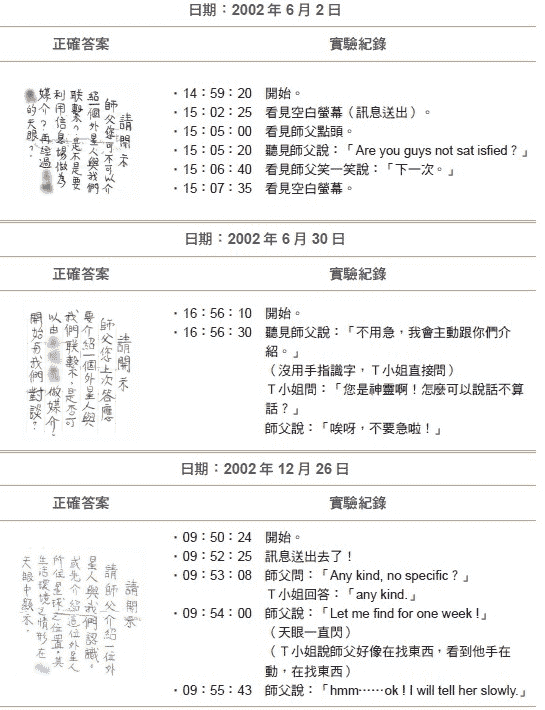
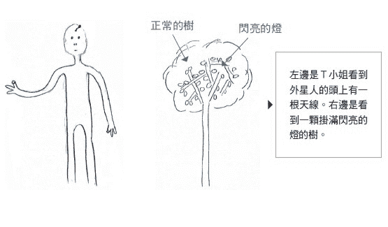
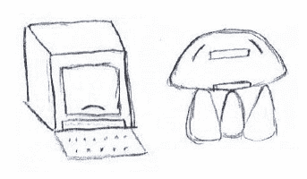
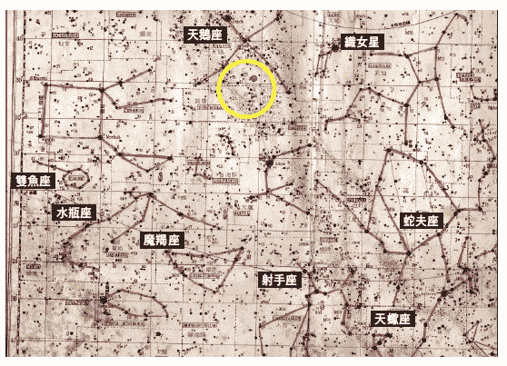
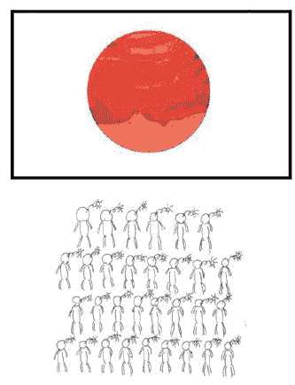
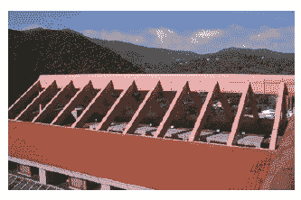
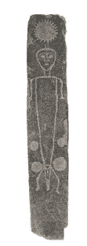
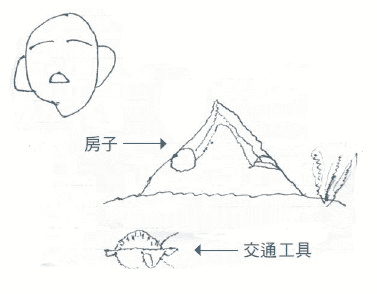
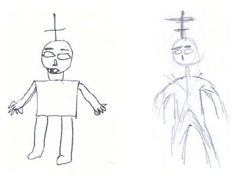

# 六、星际通信新科技──寻找外星人

外星先进文明科技领先地球的关键，

是外星人掌握了意识的物理，

能够制造仿照天眼的仪器，

自由进出虚数空间遨游宇宙，同时创造出瞬间科技。

人类未来学习的典范，就在天上无数的外星先进文明中。

## 寻找外星智慧计画

外星文明是否存在，是每一个地球人心目中存在的疑问。银河系有上千亿的恒星，有为数更多的行星，要说银河只有地球是唯一有生命存在的行星，没有其他演化的生命存在实在是不合理。

近二十年来，天文学的巡天计画（Panoramic Survey telescope and Rapid Response System，简称Pan-STARRS）的发展，更找出了越来越多类似地球环境的行星，有液态水、温度适当，可以孕育类似地球的生命系统。因此外星文明的存在，对一般人而言似乎愈来愈无庸置疑。

事实上好莱坞大导演史蒂芬‧史匹柏一九七七年执导的科幻电影《第三类接触》（Close Encounters of the Third Kind），就是与外星人接触的科幻电影的里程碑之一。不只是因为它特别的影响力，也因为《第三类接触》将外星人描述为温和友善的，这与其它早期的电影大不相同。一九八二年史蒂芬‧史匹柏执导的外星人来到地球的电影《E.T.》，更是轰动全球，也引发了科学家寻找外星人的热潮。

一九八○到一九九○年代，美国哈佛大学开始了寻找外星智慧计画（Search for ExtraTerrestrial Intelligence，简称SETI）。一九九二年，美国政府曾经补助航空暨太空总署（NASA）做了一年SETI计画，后来被参议院砍掉经费。期间内，为了增加电脑运算的速度，还发展出网格计算（grid computing）的技术，号召所有对天文有兴趣的人士，在晚上睡觉时把个人电脑接上网路，让SETI总部可以将无线电望远镜所扫描到的天空资料分割开来，分别利用几十万、甚至上百万的电脑来各自进行计算，可以大幅提高分析数据的效率。我记得当时读高中的女儿就加入了这个计画，每天晚上打开电脑连上网路聊尽自己一份力量。不过这个计画以失败告终，因为找不到有意义的无线电信号。

二○一五年，俄国一位因投资网路成功的亿万富翁尤里‧米尔纳（Yuri Milner）为了纪念一九六二年他出生时第一位进入太空的俄国太空人尤里‧加加林（Yuri Alekseyevich Gagarin），捐款美金一亿元给英国剑桥大学物理学家霍金（Stephen William Hawking）来主导寻找外星人计画。其中包括设计一个奈米风帆，携带着微型摄影机，用雷射光加速航向最接近太阳的恒星──半人马座的α星，拍照传回地球，估计要花二十年的时间。**试想半人马座的α星距离地球四点三光年，用无线电波传送信号，就要花八点六年才能来回一次。更不要说更远的恒星了，耗时更久。也就是说用无线电波来与外星人通信是没有意义的事情，除非找到更快的方法**。

问题是爱因斯坦的相对论指出，我们宇宙中最快的速度是光速，若想超光速，看来问题是无解了。而我们所发现的虚数时空，也就是灵界，是没有时间、空间以及速度的限制，看来利用灵界是解决星际通信的唯一的办法。

寻找外星人计画的另一项工作，是用无线电望远镜搜寻太空中有意义的无线电波信号，类似三十多年前的SETI计画。问题是地球上人类的文明在一九○一年马可尼（Guglielmo Marconi）才发明用无线电波横越大西洋通信的技术，因此十九世纪以前的文明，是不可能用无线电波去联络的。一百多年后，也许人类又会发现更先进的通信工具，如量子或挠场通信这种可以穿越虚空作为星际通信的工具，而不再使用电磁波。因此使用无线电望远镜，只有可能找到与人类现在一样使用电磁波为主要通信工具的文明，比较先进或落后的文明都找不到。

## 运用天眼，寻访外星人

二○○二年六月，我们想到可以利用天眼穿越虚空，到远方的先进文明世界去参观，但是要怎么做呢？

我们想到可以恳请T小姐在灵界的师父帮忙，带领T小姐的天眼意识，去找到先进文明所在之位置，以及观察外星人生活的情形。于是在六月二日我们开始实验，用纸条写下问题，由T小姐以手指识字方式送给她的灵界师父，如下页图6-1第一列所示。

T小姐问：「师父，你可不可以介绍一个外星人与我们联系？是不是要利用信息场作为媒介，再经过天眼？」

手指识字三分钟后，T小姐天眼一开，把问题送出去了；再过三分钟后，师父在天眼出现，以「点头」表示同意，接着用英文抱怨我们：「Are you guys not satisfied?（你们这些家伙还不满意吗？）」表示我已经告诉你们那么多的祕密还来烦我。

图6-1　以手指识字向Ｔ小姐师父提出访问外星文明的请求

|  |

我赶紧捧师父说：「您大德大能、法力无边，我们有心求道寻访外星人，您就帮帮我们吧！」

一分钟后，祂笑一笑说：「下一次。」实验就结束了。

到了六月三十日，我们再次进行手指识字实验，在纸条上写下问题。

T小姐问：「师父，你上次答应要介绍一个外星人与我们联系，是不是可以开始与我们对谈？」

师父说：「不用急，我会主动跟你们介绍。」

显然祂忘记了，我们开始责备师父。

T小姐问：「您是神灵啊！怎么可以说话不算话？」

师父说：「唉呀，不要急啦！」

我听见祂有点生气了，不敢再逼，以免祂真正生气不带我们去联系外星人了。

等了半年，师父仍然没有主动介绍，于是在二○○二年十二月二十六日，我们再次进行手指识字实验，在纸条上写下问题。

T小姐问：「请师父介绍一位外星人与我们认识，或先介绍这位外星人所住星球的位置，其生活环境情形在天眼中显示。」三分钟后，回答来了。

师父答：「Any kind?no specific?」

师父答应了！狂喜之下我马上回应：「no specific!」讲完后就后悔了，应该去看先进文明的星球，不需要再去看恐龙独大的世界。一分钟后，师父的回答来了。

师父答：「Let me find for one week!」他需要一个礼拜时间去找。

接着，我注意到T小姐手掌上量到的电压不停地出现一个又一个脉冲，表示天眼一直在闪，我问怎么回事？T小姐说看到师父的手在动，好像在找东西，我猜祂是在虚空的触控平板上拨动银河星系图，找一颗适合我们去参观的星球，就像我们转地球仪一样，在找地球上某一国的位置一样。果然一分四十秒后，师父的回答来了。

师父答：「hmm……ok!I will tell her slowly.」

祂已经找到了，但是会慢慢地让T小姐看。

果然不错，二○○二年底，师父带T小姐的意识去看了一个外星文明，T小姐把外星人画了下来，如左图6-2左方所示。她看到的外星人有两个眼睛、两个鼻孔、一个嘴巴、两个耳朵但没有耳廓，有双手双脚，但手只有三个手指，其中一个指尖硕大，就像好莱坞大导演史蒂芬‧史匹伯所拍的电影《E.T.》里面的外星人，我突然怀疑起史蒂芬‧史匹伯是否像我们一样也看过外星人。

T小姐向我们这样描述她看到的外星人：「看不到脚」、「行动真的很快」、「皮肤很黑有些发亮、像是穿着一层外套」、「他头上像是有一根天线，因为我注意到外星人没有手机，但是自言自语，好像是在通信」。

到了十多年后，我才明白为什么看不到外星人的脚？为什么行动很快？因为他们脚上都穿了步行器，能快速来回摆动行进所致。

接着，T小姐看到一颗时髦的树，上面挂满了闪亮的灯，如下图6-2右方所示。树的周边一片黑暗，没有阳光像是晚上。这倒很像地球人类文明中晚上在树上挂灯的习惯。

图6-2　Ｔ小姐所看到的外星人及树

|  |

后来，T小姐又看到一个像魔术盒的机器，如下图6-3左方所示。她看到外星人用手指在键盘上打字，突然有一个东西从魔术盒出来，外星人一下就把这个东西放入嘴巴吃掉，速度太快看不清楚。

于是我们请问师父这个机器有什么用途？师父回答：「这是他们所发明的，可以获得任何东西。」

哇赛！这不是哆啦A梦（机器猫小叮当）的任意机吗？我突然开始怀疑哆啦A梦的作者藤子不二雄是否也去过外星参观？显然外星人输入食物名称后，食物就送出来了，被外星人一口吃掉。

接着，T小姐到了外面空旷的地方，又看到许多三只脚的机器，如下图6-3右方所示。于是我们请问师父这个机器有什么用途？师父回答：「交通工具。」像是小飞碟。

图6-3　Ｔ小姐看到的外星机器

|  |
| 左边是魔术盒的机器，可让外星人获得任何东西。右边是如同小飞碟的交通工具。 |

参观完后，我开始透过T小姐，请教师父一些关于这个星球文明的问题。

我问：「这个外星人所居住的星球是在我们的银河系中吗？」

师父答：「YES!」

我问：「是在哪一个星座？」我摊开星座图。

师父接连回答：「Twenty,Thirty.Go up and little left.Pretty close.」

Twenty,Thirty.指的是天球上的赤经赤纬，如二六一页图6-4所示，此星球所在地在天鹅座（Cygnus）。旁边是织女、牛郎及天津四所组成的夏天大三角。后来我用天文物理界所用的Sky-6星座软体，不断放大附近的恒星群，再由师父经过T小姐天眼指认为一颗距离地球四百三十八光年的中等恒星的行星，也就是电磁波来回一次要八百七十六年。如果从宋朝时发射一个电波信号去打招呼，要到现在才能收到回音，再次表明用电磁波做星际通信是毫无意义的事情。

我继续经由T小姐请教师父问题。

我问：「他们的科技层次如何？可以进入信息场到地球来吗？」

师父答：「比你们好。是的！他们可以来地球，来过好多次了。」

我问：「他们吃的东西与我们是否不一样？」

师父答：「Yup!不同。」

我问：「他们的遗传基因是否也是DNA？」

师父答：「他们也有这些东西。」

我问：「下次来地球时，我来接待可以吗？」

师父答：「哈哈！没那么容易，时间不对。」

我想了很久，为什么时间不对？后来终于想通了，如果今天有消息说外星人要来地球了，地球文明可能马上会崩溃。外星人能穿越时空阻隔而来，显然科技远比我们进步，地球人绝对不是对手，整个社会将因恐惧而迅速崩解。他们什么时候来地球不会造成恐惧呢？只有当人类的穿戴式科技发展到把手机淘汰，每人用头上一根或两根天线代替手机，这时天鹅座的外星人就可以来了，他们可以隐身人群之中，谁也不知道，就比较不会造成惊恐与混乱。

图6-4　外星人所居住的星球位置

|  |
| 图中小红点为外星人星球的所在位置，该星球在我们银河系的天鹅座。 |

## 外星世界的独立验证

当然，T小姐一个人用天眼所看到的外星世界并不能说服其他人，因此需要另外独立的验证，于是我前往北京中国地质大学人体科学研究所，找到沈今川教授及大功能人孙储琳女士重复这个实验。

孙女士的神奇且惊人的念力可以参考《是潜能？还是特异功能？》一书，她功能强大不需要师父协助，自己可以遨游宇宙。她也不认识T小姐，不知道我们曾经做过的实验。因此我带着星座图请她去天鹅座的外星文明去看看头上有一根天线的外星人。没想到她一转头停了两秒就说看到了，我一算两秒钟的天眼意识来回走了四百三十八光年一次，因此意识在灵界的速度至少是光速的三乘十的七次方倍快。

但是，孙女士说：「我看到的外星人头上有两根天线，不是一根。」

我说：「上次我们明明看到的是一根，怎么会变成两根，是不是看错了？」

只见孙女士回头一下，天眼意识又去了外星一趟。

孙女士说：「我去问了外星人，上次李教授看到你们是一根天线，为什么你现在是两根天线？」外星人跟我说：「你看，一根天线缩进头部就只剩下一根了」。

我问：「他们怎么沟通的，有用语言吗？」

她说：「没有，都是心电感应。」

这下出现新的状况了。虽然孙女士证实外星人头上是一根天线，但有时会有两根，这也需要重复验证；回到台北后，我也请T小姐再去天鹅座的星球看看，是不是真的像孙女士所讲的一样，外星人头上有时是两根天线，有时是一根？

二○○四年三月二十八日做手指识字实验时，T小姐的天眼意识跟随师父一起去到天鹅座的外星，她发现师父可以跟外星人讲话。外星人一下子头上两根天线、一下子只有一根，表示外星人可以跟灵界师父沟通，比我们人类强太多了。后来到另一个地方，那里有一群外星人都是两根天线，抬头在看东西。后来又到一个有萤幕的房间，里头有三到四个外星人，但是看不清楚萤幕。于是我请T小姐问师父，外星人何时头上只有一根天线，何时有两根？师父回答说：「要接受信号时，就有两根天线。」

这下让我陷入极度困惑中，外星人科技远比人类高，干嘛多此一举用两根天线来一发一收，我们人类用的手机只要用一根天线既可发射也可接收，真是太奇怪了。

几个月后我突然了解到我搞错了，师父所谓的接收信号，是接收意识的信号，不是接收电磁波的信号，原来外星人早已了解意识的物理，因此制造出一根意识天线，插在头部直接与外星人意识沟通，可以做星际通信及与神灵沟通之用，功效强大。另外一根天线应该是普通的电磁波天线，是作为星球内部通信之用，这也解释了为何师父与外星人沟通的时候，有一根天线也就是意识天线要一伸一缩；不用意识的时候，就只剩一根电磁波天线。

二○○四年一月一日，我们去文化大学晓风纪念馆的八楼做手指识字实验，T小姐的天眼意识又跟师父去参访天鹅座的外星文明，如二六六页图6-5上方所示。她看到一个大萤幕，外星人排列得整整齐齐在看萤幕上的红橘色球体，还在讲话，重要的是他们头顶上的天线顶端是亮着的，像一个圆球，如图6-5中间绘图所示。我请T小姐问师父。

T小姐问：「萤幕在做什么？」

师父答：「可以看到宇宙中任一星球。」

哇！这可能是此星球的太空总署，外星人发展出的意识技术已经可以把宇宙中任一星球调到萤幕上，让外星人品头论足讨论是不是要去探险。我突然想到是不是可以把地球调上他们的萤幕，让他们看看地球的文明，引发他们兴趣来到地球探险。

T小姐瞬间看到萤幕上出现蓝色的地球，外星人突然涌入，动作快速，瞬间排成一列列，头顶上的天线是亮着的。T小姐问师父能否把萤幕拉近，师父瞬间消失。她看到地球景象不断拉近，外星人的说话声音越来越大，突然T小姐看到红色屋顶出现，是一根红色主梁由下方两根两根成三角的红色短梁架住，那就是晓明纪念馆的屋顶，如下页图6-5最下方照片所示。我意识到外星人的萤幕景象逼近我们实验室了，于是我马上命令所有在场的学生挥手向外星人打招呼，我相信外星人看到我们了，只是到今天已经十四年了，还没有丝毫迹象显示他们对地球有兴趣。

图6-5　Ｔ小姐观察外星人聚集

|  |
| T小姐看到外星人排列得整整齐齐在看萤幕上的红橘色球体，重要的是，外星人头顶上的天线顶端是亮着，像一个圆球。 |

|  |
| Ｔ小姐从外星人萤幕上看到的红屋顶，就是文化大学晓明纪念馆的屋顶。 |

二○一四年年底，湖北省博物馆将镇馆文物运到台北历史博物馆来展览，叫做「武当山展」，展出湖北省出土中国历代历史文物及武当山道家传承各种文物。我找了一天下午与内人一同去参观，进门口的第一块石碑（如图6-6所示）吸引了我的注意，这块长方形石碑在湖北省秭归县（屈原的故乡）出土，是距今四千七百年至五千八百年，也就是黄帝之前两百年至一千三百年前的文物，被称为中国第一块先民祭拜太阳神的证据，因为石碑中央上方有一个像太阳之物，称为太阳神纹石碑。

图6-6　中国出土的第一块太阳神纹石刻

|  |
| 石碑中的太阳神很像人类，只是头顶有一个尖尖之物，就像识字实验时看到的天鹅座外星人。 |

**太阳神很像人类，只是头顶有一个尖尖之物，考古学家不知道是什么东西。太阳神脚上套有一个架子，头顶的火球还会落在身体四周，我仔细一看不禁大感振奋，这不就是天鹅座的外星人吗？**

头上尖尖之物就是天线，天线顶端还有火球，就是意识天线放电的现象，可以与星际通信或神灵沟通。

我回家后立刻请T小姐及孙储琳女士去看天鹅座外星人的脚到底长什么样子。两人都回报说外星人脚上穿了一个步行器，像节拍器一样快速地来回拍动，很难看清楚。我马上理解到这是考古学上极为重大的发现，证明了天鹅座的外星人在五千多年前曾来到秭归，显然把他们的科技成果传授一些给当地人民，从此融入中华文化的一部分，到底是哪一部分，未来可以详细研究。

而她们看到的外星人有两个天线、火球及步行器让我突然了悟到这就是《封神演义》中哪咤的原型，哪咤脚踏风火轮头上两个髻，原来早年传说的神仙，可能就是外星人的缩影，突然之间我对神话传说产生了无穷的敬意。首先进文明中的外星人到了地球，展示了他们的高科技，被先民视为神仙而留下了传说。

原来地球并不是封闭的生命体系，高科技的外星人也许早就来到了地球，做了许多实验，包括基因转殖的实验，就像我们人类现在所做的一样。这让我开始对达尔文的演化论产生了怀疑，演化论有一个基本的内在假设，这个假设就是：「地球是一个封闭的生命体系，没有外太空来的智慧体系干扰」，显然这个假设已经崩溃。

## 柏拉图《理想国》的外星文明

二○○四年，中国地质大学的高功能人孙储琳女士在她外星师父的带领下遨游了一些外星文明，其中一个文明竟然是柏拉图在他的着作《理想国》中所描述的世界，如左图6-7所示。这颗星是猎户座SAO 100012恒星的行星，离地球有一百九十七点七九光年之远。

外星人双手双脚都很短，脚是方形的，身体外套了金属壳，如图6-7左上方所示，中间为外星人所住房子，下面为他们的交通工具。由金属颜色判断，有金银铜三种金属，金壳人最少，似乎地位最高，银壳次之，铜壳人数最多，地位似乎最低。穿金壳的外星人似乎是国王贵族，穿银壳的像是武士及统治阶层，穿铜壳的像是百姓。为了验证这项观察是否确实，我请T小姐也去同一星球观察，的确她也看见到处穿着金属壳的外星人还在战争。生病的时候，外星人的铜壳还会变成绿色，好像生了铜绿。

柏拉图的着作《理想国》中有一段在描写理想的社会组成型态：社会必须有一些掺金质的、掺银质的及掺铜质的人组成，最好不要混杂。这一段话在一九八○年代美国史丹福大学校园中曾经引发文化论战，认为柏拉图提倡阶级主义，不适合现代社会，准备把《理想国》踢出校园，不得做为通识教育的教材。但是这段话显示出在两千四百年前柏拉图或许曾跟我们一样利用开天眼的人遨游外星文明，希望找出可以作为人类学习的社会型态，写入他的着作，影响西方文明高达两千年。

所以人类学习的典范在哪里？就在天上无数的外星先进文明中。

图6-7　猎户座SAO 100012星系的外星人

|  |
| 左上方是外星人，中间是外星人的房子，下面是外星人的交通工具。 |

## 外星的瞬间科技

孙储琳女士去访问的五个先进外星文明中，发现外星人都已经发展出「瞬间科技」，也就是用小杆子一挥，或是手指一弹，东西就瞬间出现了。孙储琳女士及T小姐的天眼都曾到后发座SAO82313星系去参观看到的外星人，头上都有一根天线，与天鹅座外星人很像，如左图6-8所示。她们要什么东西就用小杆子挥一下就可以了，就像西方神话中的小精灵一样，拿个仙女棒点一下，东西就出来了。原来中西的神话都在传述高科技外星人的先进科技，人类当时做不到，只能视为仙人。

图6-8在后发座SAO 82313星系的外星人，左方是孙女士所绘，右方是T小姐所绘

|  |
| 孙女士及Ｔ小姐到后发座SAO82313星系参观时看到的外星人，头上都有一根天线，与天鹅座外星人很像。 |

## 外星通信新科技

从外星人所发明的瞬间科技，我们了解到由于外星人了解意识的物理，因此可以做出意识天线，让意识穿入虚空，不仅可以遨游宇宙，与神灵沟通，在虚空中还可以「心想事成」，创造出任何东西，再把它物质化，瞬间在实数空间创造出物体，成就了瞬间科技。

我们人类要想与他们连系，至少要找到可以穿隧进入虚空的工具，很幸运的是，我们现代科技至少有两种工具可以用，一种是量子纠缠现象，另外一种是挠场，也就是时空扭曲的场，都可以穿入虚空。

量子纠缠不能用两光子纠缠，因为在虚空中它的速度仍然是光速，必须用两个原子纠缠，位在实数空间速度慢，其进入虚空的相对速度可远远超过光速，达成星际通信目标，当然通信前必须双方订定通信的标准，否则根本不可能传送或接收有意义的信号。

第一套通信的标准必须要靠像孙储琳女士一样的大功能人，直接与外星人沟通，建立如摩斯码一样的标准。有了标准就可以像四十年前我们留学美国时，都是以电报来快速与家里通信，电报用的就是摩斯码。等到星际通信技术成熟以后，逐渐发展出意识翻译器，就可以与外星人直接交谈。另外一种挠场通信，就必须等待我未来的书来解释如何达成。

##### 现代文明未来的发展方向

我提出的两个模型：复数时空以及虚数代表意识两个模型的提出，已经替宇宙大中小尺度的谜团架构出一个统一解释的平台。这本书中我尝试用这个平台提出谜团的解释，虽然不一定完全正确，但总是打开了一扇门。希望有兴趣的读者可根据这个平台来解释你工作领域碰到的难题。我相信这种理解已经指出现代文明发展的方向，并引领我们找到外星人。