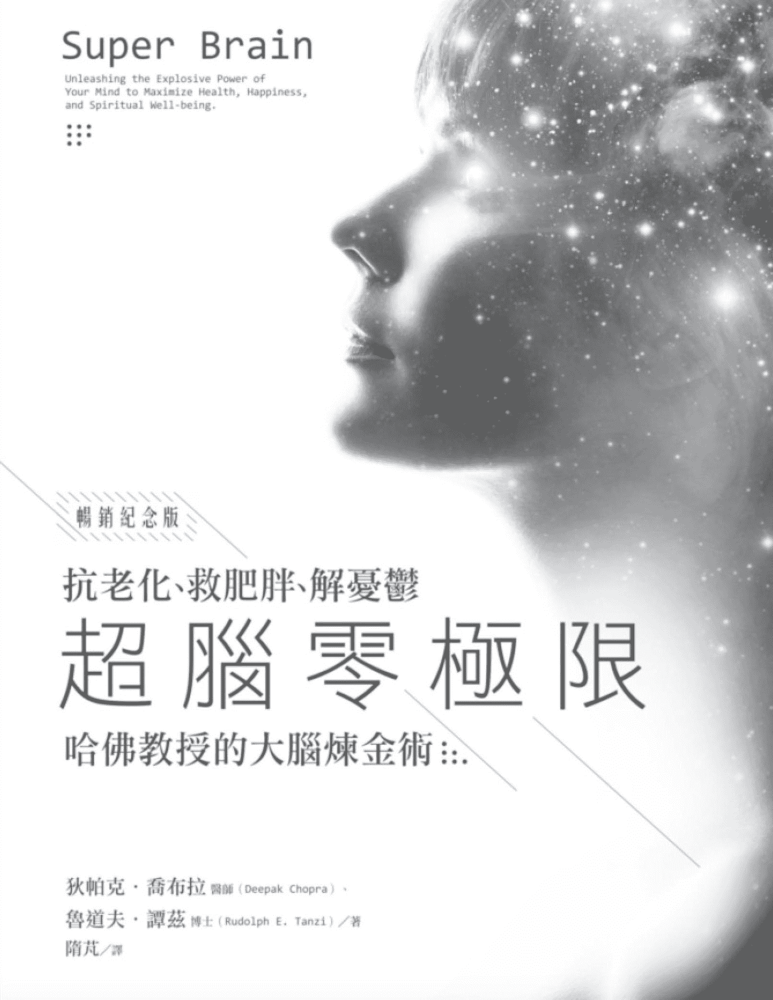
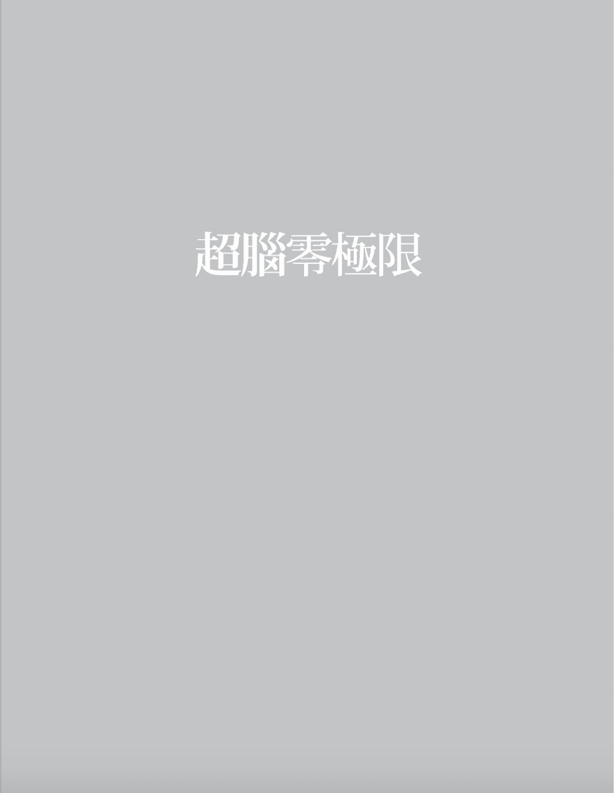
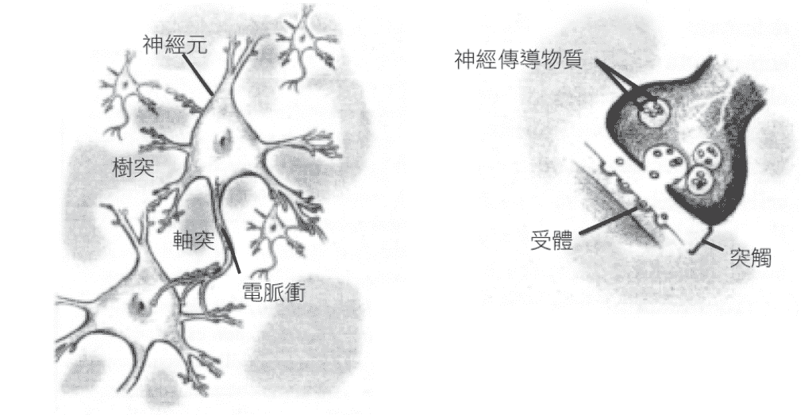
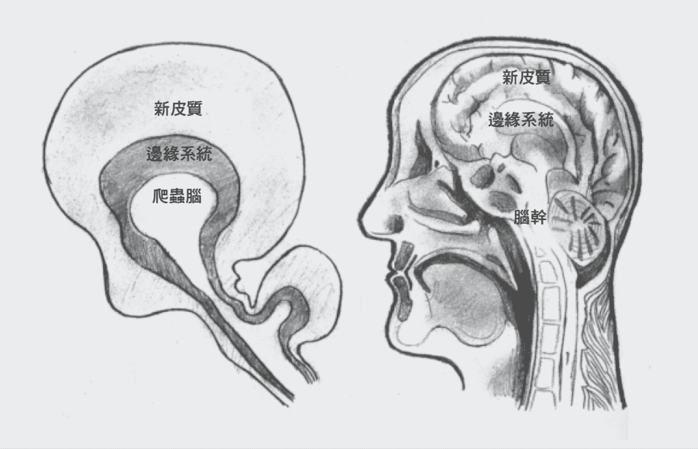
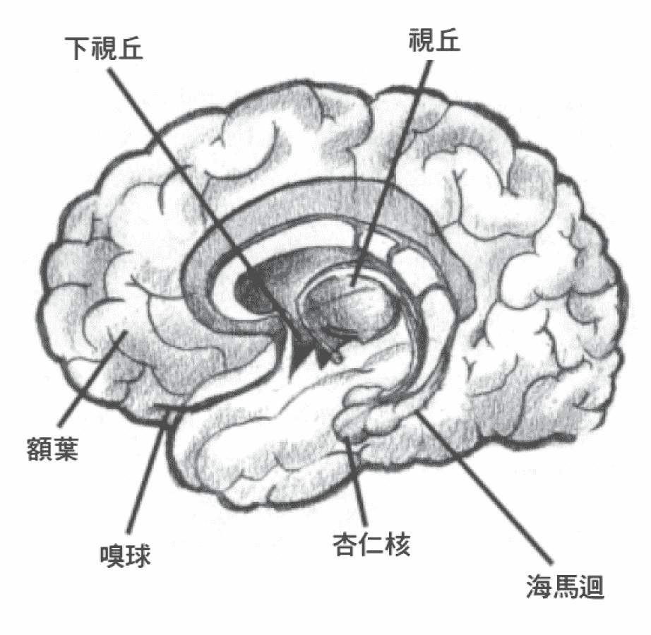
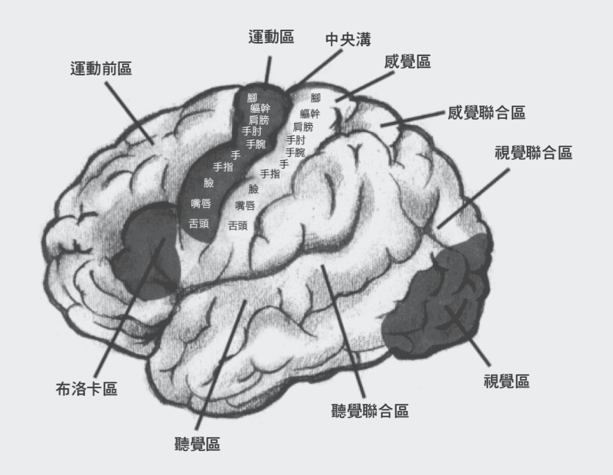
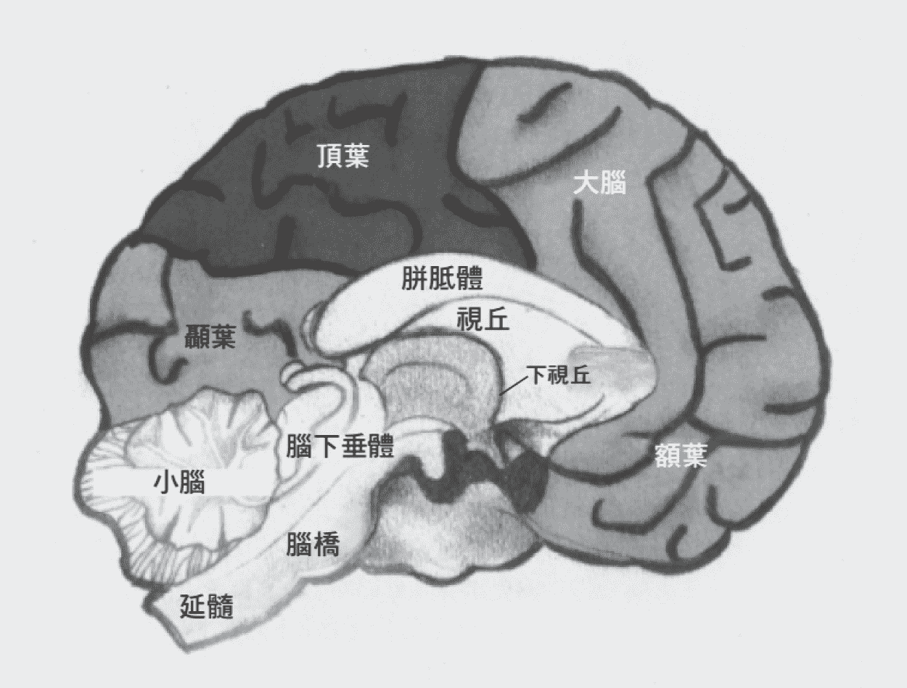

# 超脑零极限

 

# 序 心智是骑士，大脑是马，而握着缰绳的是你

超级大脑的完整影响，可能还要几十年后才会被人了解。我们先请读者跟大脑建立新的关系，试着支配大脑错综复杂的神奇能力。最能驾驭大脑的人，也是一个具启发能力的领导者，我们希望你能更加接近这样的角色。如果你能做到，你将会是推动未来前进的浪潮，把人类大脑的演化又向前迈进了一步。

神经科学依然沉醉于属于它的黄金年代，一古脑儿地寻找跟特定行为相对应的大脑活动区。这个计画成果丰硕，但也不乏矛盾；当你试着把心智简化成一种生理机制，矛盾必然会发生。人类不是被大脑操控的木偶，但神经科学家却依然无法做出最后决定。例如，最近的药物成瘾研究把焦点放在古柯硷、海洛因与甲基安非他命对吗啡类受体注 1 所造成的伤害。这种伤害被认为是永久性伤害，而且会让人渴望更高剂量的药物。每一个有毒瘾的人吸毒吸到一定程度后就不会再有快感，继续吸毒只是让自己感觉正常而已。

这个残酷的情况提供了更有力的证据：是药物支配了吸毒者，而不是吸毒者支配了药物。有些专家引述此类研究，宣称毒瘾不可能戒除，因为有毒化学物质会紧抓着吸毒者不放。但是成功戒毒的大有人在，他们挺身与遭受蹂躏的大脑对抗，成功发挥了意志力。「我可以打败它」，这样的呐喊有时成功，有时失败。但是这个呐喊来自心智，而不是大脑。这展现的是选择及自由意志。神经科学家不喜欢选择与自由意志，所以我们非常努力地想透过这本书让大家再度重视它们。

我们的第二个目标是让大家相信高阶意识的存在。我很高兴能有机会与一位杰出的研究者合作，因为现代人显然需要事实佐证才愿意接受启迪。事实就在眼前，而且多得不得了。大脑会跟随心智的引导，甚至一路走向上帝。在大脑送出的所有讯息之中，最微妙的讯息虽然静默无声，却暗示着神性的存在。很多人都没有注意到这些讯息，因为沉默在嘈杂的日常生活中很容易就被忽略。此外，昌明的科学也让大家更难以去相信上帝─这个在实体世界中不留痕迹的无形存在─是真实的。

如果你凡事只用有形证据来测量，世界上有太多无形的东西会被你忽视，比如爱与同情心。完成这本书之后，我终于理解：对再平凡不过的生活来说，上帝并非奢侈的存在或附加的存在。在宗教组织之外（虽然已有许多人摒弃了宗教），人们需要意识做为源头。

如果什麽都没有，我们将会像第一部《超人》里的女主角露易丝．连恩一样，从摩天大楼顶端被抛下来，一路往地面坠落。看见她坠楼的克拉克．肯特冲进电话亭，第一次换上他的超人装。他一飞冲天接住露易丝，说道：「别担心，小姐，我接住你了。」露易丝害怕地睁大眼睛，她大叫：「那谁来接住你？」

同样的问题也适用于意识。它需要某样东西或某个人的支持，而这个某人就是无限的意识，我们一向称它为「上帝」。如果没有上帝，祂就必须被创造出来。为什麽？请仔细想想「大脑第一」的理论，倘若意识真的像这个理论的拥护者所说的只是源自大脑里的化学交互作用，所以我们根本不需要上帝，原子跟分子自己就能把心智照顾好。

但是我们的论点是大脑不可能创造意识。从来没有人能证实有一种神奇的力量，可以让盐、葡萄糖、钾和水学会思考。现代人觉得古人崇拜树灵、山神、图腾等神灵是原始、民智未开的表现；没错，我们的祖先认为凡是物体都有心智，但神经科学宣称思想来自大脑的化学物质，这不也是一种万物有灵论吗？

事实恰恰相反，是意识（心智的无形代理人）创造了大脑，而且打从第一个能感知这个世界的生物出现以来，一直都是意识在支配大脑。随着意识的演化，它会调整大脑来配合它的目的，因为大脑是心智唯一的有形代理人。

用这种方式扭转神经科学的见解，一开始当然会令人震惊，但是这麽做能让上帝重生（当然上帝从未死去）。请你暂时放下你对上帝原本的想像，然后想像一个所有特质跟你一模一样的心智。它会思考，会创造；它喜欢各种新的可能性；它能爱也懂得爱，而且它最爱的就是生命本身。这就是上帝的心智。这个心智之所以具有争议性，是因为它没有固定的位置。它跨越所有疆界，无边无际。它无所不在，超越过去、现在和未来。每一个灵性传统都认为这就是上帝。然而，这样的观念已随着时间消逝，现在我们把上帝当成信仰，而非一个本该如此的事实。

心智一直都在，而且弥漫了整个宇宙。如果这个想法太难接受，那就想想中世纪用天然磁石来航海的人：磁石吊在线上，指着北方，是原始的指南针。如果你告诉那时候的航海员磁力无所不在，不是只存在一颗石头里，他会相信你吗？

今天我们假设每个人都有心智，它就像握着磁石的航海员一样紧握着一片珍贵的意识。但事实上，我们共享着同一个心智，虽然它存在于每一个小小的人类身上，却没有失去无边无际的状态。

我们与自己的想法和渴望紧密相依，所以才会常把「我的心意」（my mind）挂在嘴边。但意识可能是一种场域，就像电磁场一样，蔓延全宇宙。这些电子讯号渗透进大脑，但是我们不会说「我的电力」，而是说「我的心意」。量子物理学的先驱欧文．薛丁格（Erwin Schrödinger）曾在不同的场合针对这个议题直接发表看法，以下是其中三个：

「分割或增加意识毫无意义。」

「事实上，只有一个心智。」

「意识是没有复数状态的单一存在。」

如果你觉得这听起来还是太抽象，可以想想虽然我们为了方便而把空间跟时间切割成小段，但其实宇宙只有单一的空间和时间。

总有一天科学会追上这些议题。这是无可避免的，因为事情已经起了头。丢一颗石头到池塘里，没人知道涟漪会扩散到多远。一个多世纪前推动量子革命的马克斯．普朗克（Max Planck），曾说过一句奇妙又神秘的话：「宇宙早已知道我们即将到来。」心智场至少跟宇宙一样年代古老，而人类大脑却是演化的产物。大脑接下来将会如何演化？没有人知道，但是我愿意相信下一步就是大跃进，好让我们都能接受源自古梵文的一个词：Aham Brahmasmi，意思是「我是宇宙」。这看起来像是跳回到过去，但是吠陀先知的这句话出自一个更高层次的觉察力。无论经过多少时间，「我是谁？」都是一个亘古不变的大哉问。如果现代人能追上古老的智慧，必能造成惊人的结果。有何不可呢？

无论是佛陀、耶稣、圣哲或开悟的印度智者，他们的大脑都已到达一个高度，足以启发好几世纪的人类。但是从生物学的角度来看，他们的大脑跟现在任何一个健康的成年人毫无二致。佛陀的大脑跟随心智的引导，这就是为什麽每个伟大的灵性导师都宣称任何人都能完成他们走过的旅程。问题在于你是否愿意跨出第一步，并留意大脑接收到的微妙讯号。既然我们的大脑已经调谐到量子的层次，当然能接收到宇宙的任何讯息。所以，上帝并未偏心伟大的圣徒、贤者与先知，他们只是比你我更勇敢，大胆跟随引领他们找到觉察力源头的线索。

如果过去那些受到启迪的智者精通科学语言，他们可能会说：「宇宙是一个不停流动着、不可分割的整体。」当然这句话不是古代圣哲说的，而是出自一位有远见的英格兰物理学家大卫．波姆（David Bohm）。这句话的意思等同于「你不可能踏进同一条河的同一个地方两次」。神秘的谜团摇身一变，成为科学上的假设。

我是一个乐观的人，我希望能在十年后看见意识被科学全面的接受。把我们困在凡尘俗世里的障碍，是我们自己制造出来的。有些障碍把世界区分成「里面」跟「外面」；有些障碍把人类心智独立出来，视为宇宙独一无二的产物，并认为若少了人类心智，宇宙就没有了智慧─这就是现行宇宙论的主张。然而，思辨的火花让越来越多的宇宙学家开始大胆探索新方向，这个新方向是：宇宙拥有智慧、创造力及自我觉察力。这样的宇宙的确会知道我们即将到来。

本书触及了许多困难的观念。不过，有一个观念是其他观念的基础，那就是：创造实相是每个人的任务。这个世界没有真实的样貌，也不可能永远固定不变。实相会不断演化（谢天谢地），最大的线索就在你的大脑里。实相一个接一个被装进大脑里，爬虫脑的实相还在我们的大脑里，但是透过演化，它被纳入更高阶的实相中，每一个实相都对应到一个新的生理结构。

此时此刻，每一个人的大脑都映照出自己的实相。你的心智是骑士，你的大脑是马。骑过马的人都知道马会畏怯，会抗拒辔头，会害怕，会停下来吃路边的青草，或是快速冲回家。骑士紧紧抓牢缰绳，但是大部分时候情况都在他的掌控之中。当原本的印记、冲动、驱动力和习惯想要反客为主时，就会出现这些插曲，这时候我们会紧紧抓住大脑的缰绳。马儿再怎麽横冲直撞，疯狂的程度都比不上大脑。药物上瘾、精神分裂症与许多其他病症的生理偏差，都是不争的事实。

然而多数时候，主控权都在心智手里。我们一直都握有意识的控制权。大脑一旦受到启发，潜力无穷无尽。如果有人因为不相信有超级大脑而背弃它，那就太可笑了，原因是：如果你能看见自己尚未开发的潜力，就会明白你已经拥有了一颗超级大脑。

狄帕克．乔布拉（Deepak Chopra）

* * *

注 1：吗啡类受体或称鸦片受体（opiate receptor），是人体的快乐中枢，适量刺激可让人产生愉悦感。

 

# 序 支配大脑，就能支配你的现实

把心智与大脑连结起来是很棒的事，一旦两者之间失去了关联，情况就会变得很可怕。我的专业领域是研究大脑的黑暗面，在「阿兹海默症基因计画」中，我的实验室持续寻找相关基因，目前已找到一百多个与最常见、最严重的失忆症有关的基因。写这本书，让我有机会后退一步用较宽广的角度来思考大脑。你对心智了解得越多，你的大脑研究就会出现更多新的形态与可能性。

癌症研究者急切地想找到治愈癌症的方法，他们背负的时间压力之大不亚于阿兹海默症。随着平均寿命增加，阿兹海默症患者也会越来越多。美国已经有五百多万名病患，全球患病人数有三千八百万。如果无法发展出预防疗法，到了二○四○年，美国的阿兹海默症患者预计将会超过一千四百万人，而全球则超过一亿人。

目前的基因研究是最有希望根除阿兹海默症的做法。如果能找出影响阿兹海默症患病风险的所有基因，就能及早可靠地预测某个人的患病风险。风险最高的人，可能必须在三、四十岁就接受症状前检验，因为在记忆力衰退的症状真正出现之前几十年，大脑就已经开始发生变化了。在阿兹海默症残酷的推展过程中，大脑的记忆与学习能力都会遭到破坏。我们当前的希望是能为高危险族群找到疗法，在失忆症出现之前中断阿兹海默症继续发展。

一旦找到有效的药物，我们希望能赶在认知衰退的临床症状出现之前预防阿兹海默症。这种所谓的「药物遗传学」（pharmacogenetic）策略，依据的基础是「早期预测─早期发现─早期预防」。如果能把这三种做法连结起来，或许就能在阿兹海默症出现前加以预防。这种全面性的策略可追溯到在襁褓期施打天花疫苗的年代，后来又延伸到不吸菸来预防肺癌。同样的策略也适用于其他与年龄有关的常见疾病，例如心脏病、癌症、中风和糖尿病。

阿兹海默症跟生活形态有没有关系？这个问题目前还没有完整的答案，但是我个人认为有此可能。心智是我们的下一个希望，生活形态的任何改变都是从心智开始。一开始你必须具备改变的意愿，然后你必须带领大脑制造新的神经网络来支持你的决定。我们已经知道大脑适用「不用就会消失」的原则，尤其是想要一辈子保持敏锐和完整的记忆力更是如此。我跟狄帕克携手合作，深入研究心智与身体的关联。当我们想出「大脑理想的生活形态」时，并不专指阿兹海默症，也不认为阿兹海默症的患者是因为错误的生活形态而罹病。大部分的疾病都是基因与生活形态的综合结果，但是有些遗传因子光靠健康的生活也难以克服。

几乎每个人身上都有增加或减少阿兹海默症风险的基因变异，这些基因变异搭配环境因素，就会决定你今生罹患阿兹海默症的风险有多高。主要的风险因子涵盖各种可能，包括沮丧、中风、大脑创伤、过胖、高胆固醇、糖尿病，甚至连寂寞也是风险因子。

影响阿兹海默症致病风险的基因分为两类：一是必然性基因，二是易感（易致病）基因。有一小部分的患者（不到百分之五）患病时不到六十岁，通常是三种相关基因的其中一种发生突变，这三种基因已被我跟同事发现。带有这种遗传型突变的人几乎都会在四、五十岁时发病，幸好这种基因突变很少见。大多数的案例是六十岁以后才发病，病患身上的基因变异会影响他们的易致病性。这些变异不代表他们一定会发病，但是这种基因变异会随着年龄增加而提高或降低致病风险。

好消息是在多数的阿兹海默病例中，生活形态有可能战胜基因遗传。大部分与年龄相关的常见病症都有类似的基因图谱，例如心脏病、中风与糖尿病。特定的行为能否对应大脑活动的特定模式，进而及早治疗？有些自闭症研究人员也在问这个问题，他们想知道能否在幼儿出现自闭症迹象之前，就从幼儿抬头的特定方式看出自闭症的前兆。民众还不知道大脑研究最大的进展之一，就是把焦点从突触（两个神经元的接触点）转移到神经网络。数十年来，神经科学一直专注研究单一突触如何运作，这方面的研究既辛苦又费力。想像一下试着在闪电出现时让它停下来，只是这种闪电比天上的闪电还要微小数百万倍。重要的突破来得很慢，他们冷冻大脑组织，取出后来称之为神经传导物质的讯息传递分子。神经传导物质羟色胺与多巴胺的研究，使各种病症的治疗有长足进步，包括忧郁症与帕金森氏症。

但是研究突触的进展却很有限。举例来说，忧郁症就分为好几种类型，每一种都有它独特的化学特质。但是广效的抗忧郁药物不是针对某种类型的忧郁症来对症下药，即便病患都有悲伤、无助、疲惫、睡眠不规律、食欲不振等症状，A 患者与 B 患者的忧郁症也可能类型不一样，因为忧郁症所形成的神经网络会因人而异。

所以才会出现一种系统化的方法，观察的是整个网络模式而不只是突触。这就像检查家里电箱里的保险丝，跟你检查整间屋子的配电系统是不一样的。但是你的大脑不是配电系统，它的神经网络是有生命的、动态的，而且紧密交织的，如果其中一条线路出现变化，整个神经系统都会与之呼应。

听起来也许抽象，但是神经网络理论确实开启了许许多多的可能性。我们主张大脑是一个流动的过程，而不是东西。因为思想与感觉都是流动的过程，就像观看两个镜像宇宙一样（无意识的心智可被视为跟「黑暗」物质及能量一样，神秘地控制着这个宇宙所发生的事件）。你的神经元会跟发生在你身上的任何事情同步，连你的基因也参与其中。你的基因并非端坐在每个细胞里冷眼旁观，而是会根据你生命中所发生的各种事件去开启和关闭，改变它们的化学输出。行为形塑生理机制，以这个观念所进行的研究，已经证实生活形态的正面改变，包括饮食、运动、压力管理与静坐禅修，会影响四百到五百个基因，说不定还要更多。

该怎麽做才能预防或阻止阿兹海默症发生呢？遵循对许多病症都有好处的生活形态是个着手的好方法，就从运动开始吧。我有一位好同事叫山姆．西索迪亚（Sam Sisodia），他在动物实验中（种入人类阿兹海默基因的老鼠）发现，让老鼠每晚用滚轮跑步可以大幅降低大脑病变。运动确实可以促进大脑降低乙型类淀粉蛋白的基因活性注 2。流行病学研究也证实适度运动（每周三次，每次一小时）可降低罹患阿兹海默症的风险。有一个临床实验指出，在发病后每周做两次六十分钟的剧烈运动可以延缓阿兹海默症的发展速度。

第二个关键是饮食。基本原则就是：对心脏有好处的饮食，对大脑也有好处。使用大量初榨橄榄油的地中海饮食，搭配适量红酒与黑巧克力，可以降低阿兹海默症风险；而更简单的预防方法是少吃。在动物实验中，限制热量摄取能增加寿命，减少大脑病变（最近也有一说：初榨椰子油能治疗和预防阿兹海默症，但是尚待更多数据佐证）。

阅读本书，你将学会第三种方法。这是一种智能上的刺激，可以刺激大脑生成新突触。每一个新突触都能强化原来的突触。就像你把钱存在银行里一样，生成越多的突触，就越不容易在罹患阿兹海默症之前把突触用光。阿兹海默症会找上各种教育程度的人，对高中辍学生和博士一视同仁，有些研究指出教育程度越高越不容易患病。但也许比智能刺激更重要的是参与社会的程度，社会互动的程度较高，患病风险就较低；而寂寞则被列为阿兹海默症的风险因子之一。

如果阿兹海默症能像癌症一样被治愈，那就太棒了。十年前的癌症治疗重点是早期发现，然后用药物、放射线与手术治疗。美国中央疾病管制局在二○一二年所做的估计，约有三分之二的癌症可透过积极的生活形态、避免过度肥胖和不吸菸来预防。其他癌症中心的评估数据更高，在九○％到九五％之间。

化学、基因、行为与生活形态等各个战线都出现了进展的迹象，这点令人相当兴奋。但是这些迹象，不足以让我写一本超级大脑的书。在我这个领域里，只要技术纯熟，且能在某种疾病一个非常特定的小部分严谨分析，开拓属于自己的科学优势，就能获得成功。你只要停止推测，奉行「闭嘴，计算！」这句格言，就可以在科学界走得很长远。自然科学对它的地位引以为傲，但是我也曾亲眼见过这种自豪变成傲慢自大，尤其是对于有人想用形而上学与哲学来发展科学理论时。这种对无法计算或化约成数据的事情嗤之以鼻的普遍心态，我认为说穿了就是心胸狭隘。就算心智无形又难以捉摸，科学也不能漠视，何况科学本身还是心智的产物呢！所有最伟大的科学发现，通常都源自于过去的白日梦。

「超脑」是两位严谨、有医学背景的调查者努力的成果，我们尽可能深入去探看心智与大脑的关联。对一个「硬底子」的大脑研究者来说，要采取「意识第一」的立场是非常大胆的一步；但是我渐渐演化的思想带领我走到了这一步，就像在我之前的伟大人物怀尔德．潘菲与约翰 ．埃克尔斯爵士注 3 一样。我认为神经科学家不能忽略意识这个介面，因为一味坚持「大脑第一」只是在保护地盘而已，有违科学家追求真理的精神。

事实是，意识不只是大脑里的电子互相碰撞而已。我投入阿兹海默症的研究是为了解决一个生理难关，但同样重要的驱动力是我的同理心，尤其是在我看过祖母罹患阿兹海默症而过世之后。发病时，不管是患者本人或亲友都非常绝望，就算是早期，症状也令人害怕。最初是「轻微认知障碍」，听起来似乎没什麽，但是出现时的影响却一点也不轻微，因为病患会开始记不住日常活动，也没办法一心多用。到了连文字都很难以记忆的时候，说话和书写会变得越来越困难。

但是更可怕的是那种上不了岸的感觉，一旦发病，就会一步步迈向死亡。旧的回忆消失，新的回忆也无法形成。最后病患连自己生病了也不知道，这时候的照顾责任会落在近亲身上，据估计现在约有一千五百万名无偿的照顾者。这个可恶的心智小偷，让许多人受尽痛苦。

亲眼目睹过这个疾病冲击的人都会同情不舍，但是我们可以把怜悯与绝望变成截然不同的观点。何不将阿兹海默症当成一种鞭策与激励，在老化到来的几十年前用最好的方式来使用我们的大脑？阿兹海默症扼杀了老年人过充实生活的梦想，在打败这个疾病之前，我们每个人可以打赢另一场仗，那就是从童年开始就好好利用大脑。这就是超级大脑的愿景，也是这本书对我最重要的意义。

身为物种之一，我们每天都应该对大脑这个神奇的器官心存感激。你的大脑不只是把这个世界传送给你，更重要的是，它也为你创造了这个世界。如果你可以支配大脑，就能支配你的现实。一旦心智释放深层的力量，你就能拥有更强大的觉察力、更健康的身体、更快乐的个性与无止境的个人成长。关于大脑的再生与重塑能力，未来一定会有让我们惊讶的新发现。重塑是生理上的改变，而这些改变只是回应心智的意图。我们不能忘了这个真相：人类因心智而存在，而大脑为心智服务，就像一个最忠心又亲密的仆人一样。

鲁道夫．谭兹（Rudolph E. Tanzi）

* * *

注 2：目前临床普遍认为大量的乙型类淀粉蛋白沉积在脑中，是造成阿兹海默症的主因。

注 3：怀尔德．潘菲（Wilder Penfirld），有神经外科之父的尊称，曾绘制一幅人类体感觉皮质图谱。约翰．埃克尔斯（John Eccles），澳大利亚神经生理学家，一九六三年因在突触研究取得进展而获得诺贝尔医学奖。

 

亚里斯多德告诉我们，人们的脑袋只是为了冷却血液而存在，没有参与思想的过程。对某些人来说，这话倒是真的。

─威尔．柯皮（Will Cuppy , 1884-1949）

 

# 第一部
突破人类极限

如果你想要的是无所不能，就要让大脑相信，你真的无所不能。

因为大脑很强，你的心智能力更强。

 

## 1 零极限，大脑的黄金时代

人类大脑最独特的一点，在于只要它觉得自己可以做到，就一定可以做到。要记住，大脑随时都在偷听你的想法，而且边听边学习。

我们对人类大脑有多少认识？本书两位作者在一九七○与一九八○年代接受医学训练，当时这个问题的答案是「少得可怜」。那个时候流传这样的话：「研究大脑就像为了要了解美式足球的规则，而把听诊器放在休士顿巨蛋体育馆的屋顶上一样。」

人类大脑包含大约一千亿个神经细胞，形成从一兆到一千兆个称为突触的接头。为了回应你的周遭环境，这些接头处于不断重组的状态。这是一个微小却惊人的自然奇迹。

面对大脑，每个人都感到敬畏，所以才会有人称大脑为「三磅重的宇宙」（the three-pound universe）。如此形容大脑非常贴切。大脑不只诠释世界，还能创造世界。少了大脑，视觉、听觉、触觉、味觉与嗅觉所接收到的一切都会失去意义：早上咖啡的香气、家人之间的亲情、工作时的灵光一闪等等，这些都是为你个人量身打造的经验。

因此，我们立刻想到一个关键问题：如果你的世界独一无二、专属于你，那麽源源不绝的创意到底来自何处？是你，还是大脑？如果是你，就表示你可以随时打开通往更多创意的大门；如果是大脑，就表示创意可能存在着巨大的生理限制。也许是基因绑住了你，也许是有害的记忆或过低的自尊阻碍了你。也许是因为有限的期待压缩了你的觉察力，即便你自己并没有发现。

就现有的各项证据而言，「无限潜能说」与「生理限制说」都有可能成立。相较于过去，现在的科学界正以惊人速度累积新证据。我们已进入大脑研究的黄金时代，每个月都会出现新突破。尽管有这麽多令人兴奋的进展，但是这对生活一切都仰赖大脑的个人来说有何意义呢？这是不是意味着你的大脑也进入了黄金时代呢？

我们发现出色的研究与日常事实，两者之间存在着很大的落差。我想起医学院以前曾经流行过的话：「每个人都只使用了一○％的大脑。」严格来说，这种说法并不正确。一个健康成年人的大脑神经网络（neural networks）随时随地都在全力运作，就算用最精密的大脑扫描方式，也难以区别正在写《哈姆雷特》独白的莎士比亚，跟初次创作十四行诗的新手诗人有何不同。光看大脑本身，不足以读出全貌。

## 大脑扮演的四个角色

如果想为自己的大脑创造黄金时代，就必须用全新的方式运用天赋。生命会不会变得更有活力、更具启发性或更成功，并不在于神经元的数目，也不在于灰质注 4 的神奇力量。基因有其作用，但就像大脑其他部位，基因也是动态的。每一天，你都会踏进大脑环境里电子与化学活动的无形风暴，同时扮演大脑的指挥官、发明家、老师与使用者的角色。

☉ 身为指挥官，你把当天的指令交给大脑。

☉ 身为发明家，你为大脑创造前所未有的新路径与连结。

☉ 身为老师，你训练大脑学习新技术。

☉ 身为使用者，你负责维持大脑的良好运作。

除了我们每天所使用的大脑──姑且让我们称之为基础大脑（baseline brain）──之外，还有所谓的超级大脑（super brain），这两者在扮演这四个角色上都有差异，而且是很大的差异。即便你没有直接思考「今天我要下什麽指令？」或「我想创造哪些新路径？」，但是你确实做了这些事。以你量身打造的世界需要一位创造者，这个创造者不是你的大脑，而是你自己。

超级大脑，指的是一个把大脑使用到淋漓尽致的全知创造者。大脑具备无穷尽的适应力，你有机会把指挥官、发明家、老师与使用者的四个角色扮演得比现在更成功。

指挥官：你对大脑下的指令不像「删除」或「跳至页尾」等电脑指令，这些是内建在机器里的机械式指令。大脑指令会被一个有生命的组织接收；你每次下指令时，这个有生命的组织都会随之改变。当你想着「我要吃昨天吃过的培根蛋」时，你的大脑不会有丝毫改变。反之，如果你想的是「今天早餐要吃什麽？我想来点不一样的」，你会突然打开一间装满创意的宝库。创意是一种有生命、会呼吸、随时更新的灵感，电脑完全望尘莫及。为什麽不善加利用创意？只要你想，拥有奇迹般能力的大脑就可提供源源不绝的创意。

有了这个概念之后，现在让我们来说明一下你跟大脑之间的关系，以及这样的关系如何建立。请看下面列出的情况，有哪些跟你的情况相呼应？

基础大脑

✓ 我不会要求自己今天的表现，要跟昨天有太大的差异。

✓ 我是习惯性的动物。

✓ 我不常用新的事物刺激头脑。

✓ 我喜欢熟悉感，这是最舒服的生活方式。

✓ 老实说，我觉得家庭、工作与感情生活只是无聊地一再重复。

超级大脑

✓ 我觉得每天都是崭新的一天。

✓ 我会小心不染上坏习惯；就算有坏习惯慢慢形成，我也可以轻松戒掉。

✓ 我喜欢即兴发挥。

✓ 我讨厌无聊，我觉得无聊就是一再重复。

✓ 生命中有许多领域的新事物都很吸引我。

发明家：你的大脑会持续演化，这是大脑独一无二的现象，也是大脑最神秘的特色之一。心脏与肝脏从出生到死亡，基本上都不会有太大变化，但大脑可不一样。大脑会在一生当中，不断演化改善。发明新事物让大脑去做，你就会变成新技术的来源。有一项惊人理论的口号是「一万个小时」，意思就是只要专心做一件事一万个小时，就能学会相关的专业技术；就算是绘画与音乐等过去认为只能靠天分的技术也一样。如果你曾经看过太阳马戏团的表演，你或许会以为这些厉害的表演者都来自马戏团家族或外国表演团体。其实除了少数表演之外，太阳马戏团里的表演者都是一般人，他们在蒙特娄的特殊学校里学习每项表演的技能。从某个角度来说，人生就是在学习一连串的技术，一开始学的是走路、说话和阅读，而我们所犯的错误，就是限制了这些技术的进一步发展。比如说，有了蹒跚学步、走路、跑步和骑单车所用到的平衡感之后，只要再花一万个小时（或更短的时间），你就能走高空钢索了。当你停止要求大脑每天练习新技术时，你对大脑的要求其实几乎等于零。

看看下列哪些情况，跟你现在的情况一样？

基础大脑

✓ 我现在的成长大不如前。

✓ 学习新技术时，总是半途而废。

✓ 我不愿意改变，有时甚至害怕改变。

✓ 我紧守着自己擅长的事情，不愿意超越。

✓ 我长时间花在被动的事情上，比如看电视。

超级大脑

✓ 我一辈子都在不断成长。

✓ 学习新技术时，我会尽最大的努力。

✓ 我迅速适应改变。

✓ 一开始尝试新技术时表现不好也没关系，我喜欢的是接受挑战。

✓ 活动让我成长茁壮，我很少放空。

老师：知识并非来自事实，而是来自好奇心。好老师可以为学生灌输好奇心，改变他的一生。你也可以对大脑做一样的事情，但是最大的差别是：你既是学生，也是老师。为自己灌输好奇心是你的责任，时候一到，你自己将会受到启发。要提醒你的是：不是大脑受到启发，而是你自己受到启发后，触动了大量的反应去点燃原本处于睡眠状态且毫无好奇心的大脑（大脑也可能是处于渐渐衰退的状态。证据显示，一辈子维持活跃的社交活动以及对新知的好奇心，有助于预防衰老与大脑老化）。你必须像个称职的老师，监控错误、鼓励优点，注意学生何时准备好接受新挑战。你也必须像个聪明的学生，对于不了解的事情要保持开放的态度，不要故步自封。

下列有哪些情况跟你一样？

基础大脑

✓ 我的人生步调相当稳定。

✓ 我对自己的信念与想法很执着。

✓ 我让别人去当专家。

✓ 我很少看教育节目或去听演讲。

✓ 我已经很久没有受到启发的感觉了。

超级大脑

✓ 我喜欢改变自己。

✓ 我最近改变了某个长期的信念或想法。

✓ 我至少精通一种领域。

✓ 我喜欢看教育节目或参与当地大学的教育活动。

✓ 我每天都从生活中感受到启发。

使用者：大脑没有所谓的使用者手册，但是大脑一样需要保养、修复及适当管理。有些养分是生理性的，比如现在很流行的健脑食品──某些维他命与酵素，但大脑也需要心理上的保养。酒精与香菸是有毒的，让大脑接触这类东西等于是在虐待大脑，而愤怒、恐惧、压力及忧郁也是一种虐待。写这本书时，刚好有个新研究说每天处在压力下，会使得前额叶皮质──大脑负责做决定、矫正错误及评估状况的部位──停止作用。这就是何以交通阻塞会令人抓狂的原因。除了持续的压力，愤怒、沮丧与无助等情绪也是前额叶皮质罢工的迹象，显示它不再压抑所负责控制的原始冲动。我们经常告诫自己：要当大脑的主宰，别让大脑主宰你。「发飙的驾驶」就是被大脑主宰的典型例子，其他例子还包括有害的记忆、心灵创伤、戒不掉的坏习惯等，而其中最悲惨的是失去控制的上瘾症。

看看下列情况，哪些跟你的情况类似？

基础大脑

✓ 我最近至少在生活的某个面向上失控。

✓ 我的压力太大，但我只能忍受。

✓ 我担心自己会得忧郁症，或是已经忧郁症上身了。

✓ 我的人生可能会走上我不希望的方向。

✓ 我的想法会变得太执着、小心翼翼或焦虑。

超级大脑

✓ 我觉得自己处于主导地位。

✓ 我用走开与放手等方式，主动避开产生压力的情境。

✓ 我的心情总是很好。

✓ 除了偶发事件，我的人生一向朝着我希望的方向前进。

✓ 我喜欢自己的思考方式。

虽然你没有大脑使用手册，但是你还是可以让大脑持续成长、达成目标，以及取得个人的满足感与新技术。虽然你没有发现，但是你的确有能力快速改变自己使用大脑的方式。我们的终极目标是让大脑受到启发，超越所扮演的四个角色。你是超然的存在，因为你将扮演观察者，静静旁观大脑所做的每一件事。当你有能力扮演安静的旁观者时，就不会受到大脑活动的羁绊。只要安住于全然的平和与觉照之中，就能找到关于神、灵魂与来世等永恒问题的真相。我们有理由相信这是真的，因为当心智想要超越时，大脑已准备好跟进了。

### 心智跟大脑，一种全新的关系

一九五五年，当七十六岁的爱因斯坦辞世时，世人对这个二十世纪最着名的脑袋充满了好奇。当时普遍认为爱因斯坦的天赋异禀一定有某种生理上的原因，所以就解剖了他的大脑。爱因斯坦的大脑推翻了大脑越大、思考能力越强的期望，因为他的大脑重量比平均值还轻了一○％。那时正是开始探索基因的年代，关于新突触连结（synaptic connection）如何形成的先进理论，还要再过几十年才会出现。

虽然我们看不到基因如何运作，但是可以观察神经元的特化突起──轴突（axon）与树突（dendrite）的生成，这是能让脑细胞彼此连结的线状延伸物。现在我们已经知道，直到生命结束之前，大脑都会不断形成新的轴突与树突，这种特质为防止退化带来无穷的希望（大脑产生这类新连结的能力十分惊人，即将出生的胎儿每分钟会长出二十五万个脑细胞，相当于每分钟形成数百万个突触连结）。

尽管如此，我们依然跟当年急着告诉全世界爱因斯坦拥有古怪大脑的记者一样天真，因为我们仍旧把重点放在生理特性上，人类与大脑之间的关系没有得到足够的重视。想想学校里那些充满挫折感的学生，每间教室里都有这样的学生，他们通常会坐在最后一排，行为模式令人鼻酸。

首先，他们会试着迎头赶上其他孩子，但失败之后，不管是什麽原因，都会开始感到气馁。于是他们不再努力赶上那些成功的孩子，下一个阶段就是透过行为来发泄，例如发出噪音捣乱或恶作剧来引起注意，因为每个孩子都需要关注，就算是负面的关注也好。慢慢的，这些孩子会发现这麽做毫无益处，发泄的行为只会带来更多的否定与处罚。这时就会进入最后阶段：阴郁的沉默。他们不再努力跟上课业，其他孩子则觉得他们反应又慢又笨，跟大家格格不入。学校变成令人窒息的监狱，而不是充实生命的场所。

这种行为的循环模式，对大脑的影响不易察觉。我们现在知道婴儿出生时，大脑的发育已达九○％，而且已形成了数百万个备用的突触连结。刚出生的头几年，几乎都在排除未使用的连结，以及建立新连结来学习新技术。我们可以推测，总是充满挫折感的孩子中止了这个拣选及重建的过程，他们没能学习有用的技术，所以未使用的大脑部位就日渐萎缩了。沮丧会造成全面性的影响，包括大脑、心理、情绪、行为与未来人生中的机会。

大脑要正常运作，需要不断刺激。但是显然的，刺激的重要性还不如孩子的感受，而感受是精神与心理层面的问题。沮丧的孩子与大脑所建立的关系，不同于获得鼓励的孩子，两者的大脑反应也完全不一样。

心智与大脑要以全新的方式连结，其中的关键是来自一个人的决心、目的、耐心、希望与勤勉，而与生理无关。我们可以用以下这十个原则来总结这种关系。

1\. 建立关系的过程需要回馈回路（feedback loop）。

2\. 这些回馈回路具有智慧及适应力。

3\. 大脑处于平衡或失衡的动态之中，但是整体而言会趋于平衡，也就是所谓的恒定性（动态平衡）。

4\. 我们透过大脑进行演化和发展，并由我们的意图来引导。

5\. 自我反思会把我们往前推向未知的领域。

6\. 大脑的许多区块同步协调合作。

7\. 我们有能力监控觉察力的许多层面，但我们通常只专注其中一个层面，例如清醒、睡眠或作梦。

8\. 已知世界的所有属性，例如影像、声音、触感和味道，都是心智与大脑交互作用下的神奇产物。

9\. 意识来自于心智，不是大脑。

10\. 只有意识才能了解意识。单靠大脑分析事实，所得到的制化式说明不足以了解意识。

这些都是重要的概念，还需要进一步说明，在此先提出来让大家有个初步认识。光是把第一个原则里的「回馈回路」这四个字拿出来，就能把医学系的学生唬住一整年。我们的身体是一个由无数微小回路组成的巨大回馈回路，每个细胞都会互相对话并仔细聆听回应，这就是回馈的单纯本质。

就像你家客厅里的恒温器会侦测温度一样，温度太低就打开暖气，温度上升，恒温器也会在接收到讯息后把暖气关掉。身体里同样也有类似的控制装置。一旦你出现某个想法，大脑就会把讯息送到心脏，如果这是一则兴奋、恐惧或其他类似状态的讯息，就会导致心跳加快。这时大脑会送出一个反制讯息（counter-message）让心脏放慢速度，万一回馈回路故障了，麻烦就大了，因为心脏就会像一辆高速行驶却煞车失灵的汽车一样。

再举一例说明。服用类固醇的病人以人工类固醇取代内分泌系统所制造的天然类固醇，服用的时间越长，天然类固醇就分泌得越少，久而久之，肾上腺就会萎缩。心跳加快时，肾上腺会发送减缓心跳的讯息，如果病人突然停止服用类固醇而不是慢慢减量，在肾上腺还来不及重新生长前，身体可能会无法煞车。在这样的情况下，假设有人在你身后大吼吓你一跳，就会使你的心跳加快到失控。结果就是心脏病发作。

像这样的可能性，让回馈回路变得有趣。大脑回馈还有其他更为有趣的应用方式。比如说，一个普通人接上生物回馈装置（biofeedback machine）后，可以快速学会控制原本是自动运作的生理机制，例如降低血压或改变心跳，还能引发静坐禅修和艺术创作时才会出现的α波状态。

但是，不一定要靠生物回馈装置，你才做得到。试试以下的练习：看着自己的掌心，边看边用心感受。想像掌心温度越来越高，持续凝视掌心，全神贯注提高掌心温度。你会发现手掌颜色越来越红。注意力持续集中，掌心就会变得越来越热、越来越红。西藏喇嘛使用这种简单的生物回馈回路使身体变得暖和，这种高级禅修的技巧叫做「吐默」（tumo）。

西藏修行者会练习「吐默呼吸法」，以呼吸、意念来增强丹田蕴藏的热来暖和身体，整夜坐在寒冷的冰洞里冥想，身上只穿着单薄的僧袍。这种简单的回馈回路令人好奇不已，因为单靠心中的意念就能做到的事情，可能无穷无尽。比如说，佛教僧侣的慈悲心状态，要大脑前额叶皮质产生生理变化才会出现。值得注意的是，他们的大脑并不是自主完成了这件事，而是遵循了来自心智的指令。我们由此跨越了一道疆界：当回馈回路维持正常的心跳频率时，呈现的是一个不由自主的机制：它利用了你。但是如果你刻意改变心跳，例如想像有人跟你耍浪漫，就变成是你利用了它。

透过这个概念，我们可以决定人生要过得快乐或悲惨。

以中风病患为例。现在，就算是严重的中风患者也有很高的存活率，部分要归功于更好的医疗品质。但是，生存不等于复原，能使中风患者从瘫痪状态复原的药物，目前尚未出现良好的成效。就像那些沮丧的学生一样，中风患者的复原程度似乎也取决于回馈回路。在过去，中风重症者只能坐在轮椅上接受医疗照护，使用没有中风的另一侧身体，因为这是阻力最小的方法。相反的，现在的复健方式，则是积极使用阻力最大的那一侧身体：如果病人的左手瘫痪，治疗师会叫病人只用左手拿咖啡杯或梳头。

一开始就做到，当然不可能，光是要举起瘫痪的手就很困难了。但是只要病人不断重复使用瘫痪的肢体，就能建立新的回馈回路，让大脑慢慢适应并制造新功能。目前，我们已经在密集复健的病人身上看见良好的复原成效，他们可以正常走路、说话及使用四肢，就算这些功能早在二十年前就已经萎缩，依然成效惊人。

### 超级大脑的超级任务：使用大脑的方式决定了你的未来

以上我们所要说明的，只有一件事，那就是：超级大脑在生物学与经验这两个世界之间搭起了一座桥梁。生物学擅长解释的是生理过程，却无法说明主观经验的意义与目的。

身为沮丧的学生或瘫痪的中风病人，到底是什麽感觉？以这个问题为衡量标准，生物学的资格就只能排在末尾。想了解自己就必须了解这两个世界，否则我们将陷入生物学的一大谬误─人类受到大脑控制。不管心智与大脑理论之间有哪些争论，我们的目标很明确：我们要支配大脑，而不是被大脑支配。

神经科学的重大突破都指着同一个方向：人类大脑的能耐远远超过每个人的想像。事实上，大脑之所以发展受限，是我们自己困住了大脑，而不是大脑本身的生理缺陷，这点与旧观念完全相反。例如，在我接受医学与科学训练时，对于记忆的性质完全无解。当时流行一句话：「我们对记忆的了解程度，就像脑袋里装满了木屑。」幸好后来出现了大脑扫描，让研究人员可以即时观察大脑「发亮」的区域，也就是受试者想起特定回忆时神经元放电的区域。或许我们可以这麽说，现在休士顿巨蛋体育馆的屋顶换成透明玻璃了。

但记忆依然难以捉摸。记忆不会在脑细胞留下任何生理痕迹，没有人知道大脑如何储存记忆。但我们不能因此就为大脑的记忆能力设限。

有个年轻的印度数学天才做了一场示范，她被要求把两个长达 32 位数的数字相乘，而且只能用心算。在听见题目几秒之后，她给出了一个 64 或 65 位数的答案。一般来说，多数人如果只看一眼，平均只能记住六或七位数。哪一种记忆力才算正常？是一般人或这个数学天才？与其说这位数学天才的基因比较好或拥有特殊天赋，不如问自己一个问题：你有没有训练大脑的超强记忆力？市面上有训练记忆力的课程，普通人接受训练后也可以背诵钦定版︽圣经︾，他们使用的基因与天赋也是与生俱来的。关键就在于：你是如何与大脑建立关系的。只要设立更高的期待，你也可以进入功能更高的境界。

人类大脑最独特的一点，在于只要它觉得自己可以做到，就一定能做到。当你说：「我的记忆力不比从前了」或「我今天什麽事都记不住」，就等于是在训练大脑满足你的负面期待。期待变低，结果自然变差。超级大脑的第一个信条就是：大脑随时都在偷听你的想法，而且边听边学习。如果你一心想的是限制，大脑就会受到限制；但倘若你扭转想法又会如何呢？如果你告诉大脑，说它没有任何限制又会如何呢？

把大脑想成是一架钢琴，钢琴上有完整的琴键等你去弹奏。无论是初学者或是鲁宾斯坦（Arthur Rubinstein）等世界级的钢琴大师在琴键前坐下，这架钢琴的构造都是一模一样的，但是弹出来的音乐却有天壤之别。初学者只能让钢琴发挥不到一％的能力，而钢琴大师却可以把钢琴发挥到淋漓尽致。

如果没有这些音乐大师，我们永远也不知道一架钢琴能发出这麽美妙的音乐。大脑，也一样。幸好有大脑功能的研究报告提供了惊人的案例，让我们得以看见尚未开发的潜能如何从无到有。

这些天才接受大脑的扫描研究，他们的能力显得更惊人也更为神秘。以挪威的西洋棋天才卡尔森（Magnus Carlsen）为例，他年仅十三岁就赢得西洋棋界的最高头衔。他曾在一场快棋赛中把前世界冠军卡斯帕洛夫（Garry Kasparov）逼到和局。「我既紧张又害怕，」卡尔森回忆道，「否则一定可以打败他。」到了这个等级，对弈时必须立刻自动在脑中搜寻记忆中的数千场比赛。

虽然我们都知道大脑里不是装满了木屑，但是一个人要如何在装满个别棋步（高达上亿种的组合可能）的巨大仓库里，抓出对的回忆完全是个谜。卡尔森小时候在电视上示范下棋，他同时与十位对手快棋对弈，而且他还背对着棋盘。也就是说，他必须把十个棋盘都牢牢记住。每个棋盘上都有三十二个棋子，而且每一步都只能思考短短的几秒，卡尔森展现了记忆力的极限（或只是极限的一小部分）。一般人难以想像的超强记忆力，卡尔森的大脑做来却不费吹灰之力。他说，记住棋步的感觉再自然不过了。

我们相信每一种伟大的心理成就，都是指引方向的路标。没有考验过大脑极限并要求它超越极限之前，你永远不会知道大脑的能耐。无论你使用大脑的方式多麽没有效率，有件事是肯定的：使用大脑的方式决定了你的未来。人生是否成功取决于大脑，道理非常简单：因为所有的经验都来自大脑。

我们希望超级大脑可以尽量发挥实用功能，因为它能解决基础大脑难以或无法解决的难题。本书每章结尾都有「超脑的解决方案」，针对人生最常见的挑战列出许多创新的建议。

* * *

注 4：灰质（gray matter）是中枢神经系统的一部分，负责对信息进行深入处理。

 

## 2 强者恒强，打破大脑的五大迷思

当我们记不住把钥匙放在哪里时，不见得是老化的现象，而是缺乏学习，因为一开始我们就没有学习或记住钥匙的位置。

用全新的方式与大脑建立关系就可改变实相。神经科学家的研究越深入，越能够发现人类大脑所具有的隐藏能力。大脑处理生命中的原始资料，可以实现你的任何渴望，完成你描绘的任何愿景。只要改变信念，就能打开这个能力。不要自我设限，因为大脑做不到自己觉得做不到的事情。

以下五种迷思，已被证实会成为改变的限制和阻碍。直到一、二十年前，这五种迷思仍被视为金科玉律。

### 迷思一：受伤的大脑无法自我疗愈

现在我们已经知道大脑有神奇的疗愈能力，过去没有人知道这件事。

大脑意外受创时，例如车祸或中风，神经细胞会受损，细胞之间的连结（突触）也会消失。长久以来，人们相信大脑一旦受伤，患者就只剩下部分的大脑功能可以使用。但是过去二十多年来的研究已有重大发现，并有大量的研究证实了这项发现：当神经元与突触因为受伤而消失时，附近的神经元会修补损失并尝试重新建立连结，修复受损的神经网络。

神经元与突触

神经细胞（神经元）有能力创造现实感，是真正的自然奇迹。它们互相连结，形成庞大精密的神经网络。大脑的神经元数量超过一千亿个，有高达一千兆个称为突触的连结。

神经元伸出虫形的线状延伸物，称为轴突与树突，它们在突触的缺口之间传递化学与电子讯息。一个神经元有许多树突用来接收其他神经细胞的讯息；但是神经元只有一个轴突，拉长后超过一公尺。一个成年人的脑细胞有超过十万英里长的轴突与无数个树突，足以绕地球至少四圈。

神经元的突起部位包括主要的神经干（轴突）与无数的线状树突，一旦受损，附近的神经元会进行「补偿性再生」（compensatory regeneration）。在脑细胞所组成的复杂神经网络中，再生作用会修复失去的连结。

回顾过去，我们难以理解科学界为什麽会认为大脑缺乏其他神经所具备的修复能力。早在一七○○年代晚期，科学家就已经知道周边神经系统注 5 的神经元具有再生能力。一七七六年，苏格兰解剖学家克鲁辛格（William Cumberland Cruikshank）从狗的颈部切了一段半寸长的迷走神经（第十对脑神经）。迷走神经沿着喉部的颈动脉延伸至大脑，负责调节重要的生理功能，包括心跳、流汗、说话时的肌肉动作以及呼吸时张开喉部。如果迷走神经的两头被切断，结果足以致命。克鲁辛格只切断了一头，他发现断裂处很快就被新的神经组织填补。但是当他把研究结果交给英国皇家学会时却遭受质疑，因此这份报告延宕了几十年都无法发表。

当时也有其他证据显示，像迷走神经这样的周边神经被切断时会自动疗愈。就像有一道很深的伤口让你的手指失去感觉，一段时间后感觉会慢慢恢复一样。然而长达数世纪之久，人们却相信中枢神经系统（大脑与脊髓）缺乏同样的能力。

中枢神经系统的再生强度与速度，确实比不上周边神经系统。然而，由于「神经可塑性」（neuroplasticity）注 6，让大脑可以在受伤后重塑和重组连结。这种重组就是神经可塑性的功能定义，也是目前最热门的讨论主题。「神经」指的是「神经元」，而「可塑性」指的是具有适应力。过去的理论是婴儿会在发育过程中自然而然地建立神经网络，一旦建立完成，大脑就不再改变。现在的观念是，大脑里又长又细的神经细胞会根据经验、学习与伤害不断重新配置。疗愈与演化密不可分。

此时此刻你的大脑就正在重组，并不是只有伤害才能启动重组机制，只要你还活着就行了。你可以透过新的经验来触发神经可塑性；另一种更棒的触发方式是学习新技术，而且学习的热情越多越好。光是让老年人照顾宠物，就能提高他们的生存意志。事实是大脑可以改变，但别忘了神经元只是你的仆人。解剖刀让我们看到了神经突触与基因的变化，但是真正为老人注入活力的，是有了新的人生目标与关爱对象。

神经可塑性比意志力更强大。神经可塑性可以把想法化为现实，因为想法会促生新的神经元形成。在过去，支持这种现象的论调会遭到嘲笑，使用「神经可塑性」这个词的神经科学家会受到排斥。说不定，现在也有许多不被接受、被视为毫无意义的新兴观念，会在数十年后成为重要的主流观念。现在，神经可塑性已克服艰难的起步阶段，成为备受瞩目的新观念。

心智的力量可以战胜物质，这件事对一九八○年代的我们影响甚钜。狄帕克．乔布拉医师钻研身心连结的精神层面，推广静坐禅修与另类医疗。他深受一句话的启发：「想了解自己过去的想法，看看现在的身体状况就知道。想预测未来的身体状况，看看现在的想法就知道。」

对于在哈佛医学院神经科学研究所攻读的鲁道夫．谭兹来说，这项打破传统的发现简直如获至宝。当时他服务于波士顿儿童医院，他试着把会制造阿兹海默症大脑毒素的基因分离出来，这种毒素叫乙型类淀粉蛋白（amyloid beta protein），简称 Aβ胜肽（A beta peptide）。这种黏稠物质会在大脑中慢慢堆积并与神经元结合，使神经元退化瓦解。鲁道夫积极阅读每一篇与阿兹海默症和有毒类淀粉蛋白相关的研究，其中包括阿兹海默症的乙型类淀粉蛋白，以及与狂牛症相关疾病有关的普恩蛋白（prion amyloid）。

有一天，他在一篇论文中读到阿兹海默症病患的大脑如何处理堆积的乙型类淀粉蛋白，试着重塑负责短期记忆的受损区域：海马回（hippocampus）。海马回是位于颞叶的一个组织，形状很像海马。用两手的拇指跟食指各比一个 C，再把两个 C 面对面交扣在一起，差不多就是海马回的形状。

大脑可能试着绕过严重受损的区域，此一事实让鲁道夫对自己日夜研究的疾病改观。当时他的实验室在医院四楼，一九八五到一九八八年，他专注研究阿兹海默患者大脑中导致乙型类淀粉蛋白过度堆积的基因。他与同事瑞秋．奈弗（Rachel Neve）每天埋首研究，实验室里经常播放奇斯．杰瑞特（Keith Jarrett）的音乐，一个堪称人类史上最棒的爵士钢琴乐手。

鲁道夫很喜欢杰瑞特的演奏会，因为他的演奏会总是有精采的即兴表演，杰瑞特自己的用词是「随兴发挥」。换句话说，这是完全自然流露的表演方式。鲁道夫认为杰瑞特演奏音乐的方式，跟日常生活中的大脑一模一样：根据生活经验，在当下以最富创意的方式做出回应。智慧在当下自我更新，记忆换上新的一页。鲁道夫在四楼那间小小的实验室里发现了第一个阿兹海默症基因「淀粉样蛋白前驱蛋白」（amyloid precursor protein，简称 APP）时，杰瑞特一定是他的灵感来源。

就是在这样的背景下，一九八六年出现的一篇关于大脑组织再生的论文，为阿兹海默症患者带来希望。那天特别冷，鲁道夫坐在哈佛医学院图书馆三楼的书库区，呼吸着熟悉的陈旧霉味，有些科学论文已经数十年不见天日了。

《科学》（Science）期刊中有一篇关于阿兹海默症的新论文，作者是吉姆．格狄斯（Jim Geddes）等人，光是论文的标题就很令人好奇：︿阿兹海默症海马回电路的可塑性﹀（Plasticity of Hippocampal Circuitry in Alzheimer's Disease）。浏览过这篇论文后，鲁道夫立刻换了一把十美分的硬币，因为影印机是投币式的，当时电子期刊尚未问世。他跟瑞秋一起仔细读完这篇论文后，两人目瞪口呆对望了许久才大叫：「真是太酷了！」大脑自我疗愈的神秘能力，就此进入了他们的生命。

这个重大研究的关键，在于阿兹海默症的初期症状之一是短期记忆出问题，因为大脑中储存感官讯息（sensory information）的关键突触被切断了，就像克鲁辛格切断狗的迷走神经一样。

更精确地说，大脑中有一小团神经细胞叫做内嗅皮质（entorhinal cortex），你接收到的所有感官讯息都会经过这个中继站，再传到海马回短暂储存（如果你还记得鲁道夫的研究伙伴叫做瑞秋，就是海马回发挥了作用）。

假设你购物完回到家后，很想告诉朋友你看到一双很适合她的红鞋。那双鞋的模样先经过内嗅皮质，再经由一种叫做穿透路径（perforant pathway）的神经轴突传到海马回。阿兹海默症患者不记得那双鞋子，生理学的原因就在这里。他们的大脑，在通往海马回的穿透路径区含有大量的乙型类淀粉蛋白神经毒性物质，阻断了感官讯息的传递。雪上加霜的是，同一个区域内的神经末梢会开始萎缩并失去功能，把穿透路径切断。

内嗅皮质里那些应该在神经末梢快速生长的神经细胞迅速死亡，因为它们失去了用以维系生命的蛋白质的供应。患者会渐渐失去短期记忆力与学习能力，最后罹患失智症。这样的结果极为严重。有句话说：忘记车钥匙放在哪里，不代表你得了阿兹海默症；但如果你忘记车钥匙是什麽，肯定得了阿兹海默症。

格狄斯等人这项深具影响力的研究指出，在神经元大量死亡的区域发生了神奇的变化。邻近的神经元开始生成新的神经突触来弥补死去的神经元，这种神经性适应作用称为补偿性再生。鲁道夫终于发现了大脑最奇妙的特性之一，就好像从玫瑰丛里摘下了一朵玫瑰，旁边的树丛就为它再开一朵新的玫瑰。

鲁道夫对人类大脑的超强能力与韧性深感敬佩。他心想，绝对不能小看大脑。神经性适应使大脑拥有奇妙的适应力及高超的再生力，就算是被阿兹海默症摧残的大脑也出现了希望，只要能够及早发现并启动神经性适应作用就行了。这是未来最具发展性的研究之一。

### 迷思二：大脑配置无法改变

事实上，硬体与软体配置的界线随时都在改变，我们从出生到离世都具备重新配置大脑的能力。

神经可塑性获得证实之前，医学界或许曾听过瑞士哲学家卢梭（Jean-Jacques Rousseau）的理论，他在一七○○年代中期提出大自然并非静止不动或是像机器一样，而是有生命且随时变动的。他更进一步提出大脑会根据经验持续重组，因此人们应该像锻链身体一样锻链心智。从各方面来看，这可能是第一次有人提出人类大脑具有弹性与可塑性，而且有能力适应环境变迁。

一直到了二十世纪中期，美国心理学家卡尔．莱胥利（Karl Lashley）才提出这种现象确实存在的证据。莱胥利训练老鼠在迷宫里寻找食物奖赏，然后再一点一点切除老鼠的大脑皮质，看看老鼠何时会忘记之前记住的资讯。因为大脑组织很脆弱，再加上动物的行为完全依赖大脑，所以莱胥利假设只要切除一小部分的大脑皮质就会导致严重的记忆损失。

让莱胥利震惊的是，切除了九○％大脑皮质的老鼠依然能够征服迷宫。这是因为当老鼠在练习走迷宫的时候，会根据所有的感官生成各种多余突触。大脑的许多部位会互相影响，形成多个重叠的感官联合区（sensory associations）。换句话说，老鼠不只用眼睛在迷宫里寻找食物，也同时用了嗅觉与触觉。随着大脑皮质一点一点被切除，大脑会产生新的神经轴突，形成新的突触来接收其他的感官资讯，透过依然存在的线索来找出食物，无论这些线索有多微小。

这是我们对大脑「配置」无法更改，有所存疑的第一个有力证据。大脑的电路没有电线，这些电路是由有生命的组织组成的。更重要的是，这些电路会随着思想、记忆、欲望和经验而改变。狄帕克记得一九八○年有一篇颇具争议的医学文章，半开玩笑地命名为︿我们真的需要大脑吗？﹀（Is the Brain Really Necessary?），内容讨论英国神经学家约翰．罗伯（John Lorber）的研究。罗伯研究一种叫做「水脑症」的大脑疾病，也就是脑室累积了过多的脑脊髓液，这会导致脑细胞死亡，而引发身心发展迟缓及其他严重伤害，甚至死亡。

罗伯曾在更早发表的文章中，提到两个天生没有大脑皮质的婴儿。尽管身上有如此罕见且致命的缺陷，这两个婴儿似乎发育得很正常，从外表上看不出任何损伤。其中一个婴儿存活了三个月，另一个活了一年。如果这两个案例还不够特别，罗伯在雪菲尔大学（Sheffield University）的同事还曾介绍他认识一位头部特别大的年轻人。这个年轻人取得了一级荣誉的数学学位，智商高达一二六，完全没有水脑症的症状，过着正常人的生活。但是电脑断层扫描的结果却显示，根据罗伯的说法，他「几乎没有大脑」。他的颅骨下只有一层薄薄的脑细胞，厚度仅约一公厘，剩余的颅内空间充满了脑脊髓液。

这是一种骇人的病症，但是罗伯并未退缩，他记录下六百多个病例。他依据积水多寡把受试者分成四组，最严重的病例仅占总人数的一○％，他们的脑室有九五％的空间充满了液体。这一组受试者有一半严重发展迟缓，另一半的智商却破百。

毫无意外的，怀疑的声浪群起挞伐。有些人说罗伯一定误判了电脑断层扫描的结果，但是罗伯保证自己的证据正确无误。还有人质疑他并未测量受试者剩余的脑重量，他讽刺地回应：「我不确定那个数学系学生的脑到底是五十公克或一百公克，但是显然的，他的脑重量远远不到一．五公斤。」有些认同这项研究的神经学家宣称，这样的研究结果证实大脑「大而不当」，因为有许多重叠的多余功能。但是也有人反对这种论调，认为这种说法是「因为不了解，就用多余来自圆其说」。目前这个现象依然是个谜，但是我们的讨论不能忽略这项研究。这是不是心智力量驾驭大脑的极端案例，就算是大幅缩减的脑容量也不例外？

当然，我们不能只考虑大脑受创的案例，有一个更近代的神经重新配置的例子。加州大学旧金山分校的脑神经科学家麦克．莫森尼克（Michael Merzenich）与同事一起训练了七只小猴子，要牠们用手指寻找食物。实验方法是把香蕉口味的小颗粒放在一片塑胶板的小格子里，这些小格子称为食孔，有些宽而浅，有些窄而深。猴子找食物时，把手指伸进宽而浅的食孔当然更容易成功。然而，到最后每只猴子的技术都变得很好，无论手指要探得多深才能拿到食物都难不倒牠们。

研究团队扫描了猴子大脑中控制手指动作的体觉皮质（somatosensory cortex）注 7，希望能藉此了解学习技巧的经验，是否真的改变了猴子的大脑。实验结果相当成功。体觉皮质与其他区域建立新的电路，增加未来找到更多食物的机率。莫森尼克认为随着大脑各部位之间展开新的互动，神经重新配置会创造新的电路。在这个神经可塑性的例子中，「一起放电的神经元会串连在一起」。在日常生活中，如果我们刻意学习新事物或是用新方式去做熟悉的事（例如走新路线去上班，或是不开车改搭公车），都能改变大脑的电路或提升大脑的能力。身体的运动能锻链肌肉，心理的运动则能创造新的突触来强化神经网络。

还有许多例子，可以证明大脑不可变动的传统观念并非事实。中风患者不一定要因为血管破裂或阻塞所造成的脑部损伤而一生受困，不得动弹。当某部位的脑细胞死去，附近的脑细胞会发挥补偿作用，维持神经电路的正常运作。用更个人化的方式来说明就是：你对小时候住的房子了若指掌、记得自己的初吻、珍惜自己的朋友，这些都要归功于你用一辈子的时间所建立的高度个人化神经电路。

有一位汽车技工在车祸中飞出车外受到严重的脑部创伤，这个例子刚好可用来说明大脑神经重新配置的神奇能力。他全身瘫痪，只能靠眨眼和微微点头来沟通，却在十七年后自动脱离半昏迷状态。他在一个星期内快速复原，不但恢复了流畅的说话能力，四肢也可以稍微活动。接下来一年半，他的大脑神经成像提供了明确的证据，显示他的神经已发展出足以恢复大脑功能的新路径。健康的神经细胞生成了轴突（主干）与树突（无数的线状分支），建立新的神经电路来弥补死去的神经细胞。这是神经可塑性的最佳证明！

关键就在于，大脑不是「固定配置」，它的弹性（可塑性）不可思议。神经可塑性的神奇过程，让你能够透过思想、感觉与行为随心所欲地发展。

### 迷思三：大脑的老化难以避免且无法回复

为了反驳这个过时的观念，保持大脑年轻、维持心智敏锐的新方法日新月异。

「新老年」（new old age）运动的风潮方兴未艾。过去的老年人消极又阴沉，总是坐在摇椅上任由身心慢慢衰退。现在的情况恰恰相反。老年人更加期待的是积极有活力的生活，因此老年的定义已不同于以往。有一项针对战后婴儿潮出生者的调查，询问他们「老年从几岁开始？」答案平均是八十五岁。随着期待提升，大脑显然必须赶上并满足新老年运动的需求。过去的理论是大脑固定不变，随着年龄渐增，脑细胞会持续死亡而且无法再生，因此大脑老化难以避免。

现在我们知道大脑是可塑性很大的动态器官，脑细胞会随着年龄增加而必然减少的这种旧观念已被推翻了。三十岁后老化的速度差不多是每年一％，但是每个人的老化过程都不一样。就算是基因一模一样的同卵双胞胎，到了七十岁，两人的基因活性模式也会大不相同，而且两人的健康情形可能会因为生活方式的差异而天差地远。生活方式不会增加或减少与生俱来的基因，但是几乎每个生活层面都会改变基因的活性，包括饮食、压力、感情、工作与周遭环境等等。没有任何一种老化的因素是无法避免的，无论是心理或生理功能，都有人是越老越进步。有些股票经纪人已经九十高龄了，依然可以操作复杂的交易，而且记忆力越磨越利。

问题是有太多人习惯墨守成规。随着年龄渐增，我们对学习新知变得越来越意兴阑珊。年纪大了，小小的压力也会让我们心烦意乱，而且受压力影响的时间也会拖得比较久。过去老年人身上常见的「因循守旧」，现在可以用心智与大脑之间的连结来解释。有时这个伙伴关系会由大脑主导。比如说，同样是在餐厅候位，年轻的客人可能会久候不耐，但是入座后怒气就会全消；反之，年长的客人入座后极可能还是忿忿难平。这是因为他们对压力产生了不同的生理反应，而这种反应就是由大脑主导。同样的，老年人在接收到外界太多感官讯息输入时，比如喇叭声四起的车阵、拥挤的百货公司，大脑功能或许会显得不如以往。

然而大部分时候，心智与大脑的关系都是由心智主导的。我们会随着年纪增加而简化我们的心智活动，通常是做为一种防御机制或安全网。有把握的事情能带给我们安全感，所以我们会尽量避免学习新事物。在年轻人眼中，这类行为叫做易怒及顽固；但是真正的原因，却要追溯到心智与大脑之间的双人舞。对许多老年人来说，这支舞蹈的音乐变慢了。最重要的是，他们不该离开舞池，否则会导致心智与大脑双双沦陷而逐渐衰退。少了新刺激，大脑停止生成新的突触，只是不断复制既存的电路。在这个向下沉沦的心智活动中，大脑皮质里每个神经元的树突与突触都会越来越少。

幸运的是，我们可以用意识去抉择。你可以选择时时刻刻注意大脑被引发出来的念头与感受；你可以选择不管几岁，都要维持上升的学习曲线。透过这样的做法，就可以产生新的树突、突触与神经路径来促进大脑健康，甚至击败阿兹海默症（这是最新研究结果的建议）。

再来看看关于老化的不可逆性。随着年龄渐增，许多人会觉得自己的记忆力也每况愈下。不记得走进房间要做什麽时，我们会开玩笑说自己老了。

鲁道夫有一只可爱的猫，像狗一样，主人走到哪儿就跟到哪儿。鲁道夫曾经不只一次地从客厅的椅子起身走进厨房后，突然忘了进厨房要干嘛，只能跟一路尾随他的猫咪面面相觑。我们也许会认为这种短暂的健忘是跟年龄有关的记忆流失，但其实只是因为缺乏学习──学习把新资讯留在脑中。很多时候我们因为对手边的事情感到疲乏或一时分心，于是单纯的注意力不集中就造成缺乏学习的现象。当我们连把钥匙放在哪里这种简单的事情都记不住时，就表示我们一开始就没有学习或记住钥匙的位置。身为大脑的使用者，我们在放下钥匙时并未把这个讯息记录下来或留在短暂记忆里。你不可能记住你根本没想要记住的事情。

只要你时时警惕，就算老了，大脑也能永保健康。你要做的是期望自己一定会保持警惕，而不是害怕大脑受损或老化。鲁道夫是阿兹海默症的重要研究者，他认为制造大众对老化的恐惧有害无益。

期望，对大脑具有强大的影响力。如果你预期自己一定会丧失记忆，而且每次短暂健忘就惊慌不已，这表示你正在干扰大脑原本自然又不费力的记忆过程。从生物学的角度来说，有高达八成年龄超过七十岁的老人并未出现严重的记忆丧失问题。我们的预期应该符合这项研究结果，而不是暗自为了没有事实根据的说法感到恐惧。

如果你对人生感到无所谓或疲惫，或是对每一个时刻的体验都变得意兴阑珊，你的学习潜力将会受损。神经学家可以指出短期记忆的突触在哪里，这是生理上的证据。但是在大部分的情况下，心理活动凌驾于生理证据之上：我们绝对无法记住我们相信自己已经忘记的事情。

情绪是巩固记忆最强大的工具。小时候，我们学习东西不费吹灰之力，这是因为小孩子对学习拥有自然而然的热情。无论是喜悦或新奇、害怕或恐惧，这类情绪都会强化学习效果，而且会让你永生难忘。（你可以回想起自己的第一个嗜好或初吻吗？你还记得第一次投票选民代时投给了谁，或是十岁时邻居开哪一个牌子的车子？通常前者一下子就能想起来，但后者就比较不容易了，除非你从小就是个政治狂和汽车迷。）

有时候，帮助孩子学习的惊喜因素，在大人身上也同样适用，关键在于强烈的情绪。比如，我们都不可能忘记九一一攻击事件发生时，自己正在做什麽。我们对记忆力所知有限，就大脑功能而言，我们无法解释为什麽强烈情绪能让记忆被详尽地储存起来。不过，某些强烈的情绪可能会引起反效果，例如童年遭受性侵等严重创伤反而会受到压抑，只有透过密集治疗或催眠才能回想起来。想解决这些谜团必须先回答以下几个基本问题：什麽是记忆？大脑如何储存记忆？如果记忆会在脑细胞留下生理痕迹，那是怎样的痕迹呢？

在答案出现之前，我们相信关键在于行为和预期。当你重拾童年对学习的热情及兴奋时，就会生成新的树突与突触，记忆力也会变得像年轻时一样强。此外，积极回想过去的记忆（也就是搜寻记忆，正确无误地回想过去）也有助于发展新突触，这麽做也可以强化旧突触，未来也更容易回想起相同的记忆。我们责无旁贷，因为我们是大脑的领导人兼使用者。你不是你的大脑，你的能力更强。这一点绝对不能忘记。

### 迷思四：每天会有数百万个脑细胞死亡，死去的脑细胞无法被取代

脑细胞死亡与新生的机制相当复杂，但可以确定的是，大脑拥有可以发育成脑细胞的干细胞，而且这种能力一辈子都存在。别害怕心智能力会随着年龄消失，因为大部分的研究结果都是正面的。

人类大脑每天会有八万五千个皮质神经元死去，大约每秒失去一个神经细胞。但是这个数量极微小（仅占 0.0002%），大脑皮质约有四百亿个神经元。以这个速度算起来，大脑里的神经元数量要减半得花六百年！从小到大，我们就被灌输脑细胞一旦消失就永远无法被取代的观念（青少年时期，父母曾用这事来警告我们不要喝酒）。然而，几十年来的研究却发现神经元永久消失并非事实。罗彻斯特大学（University of Rochester）的研究人员保罗．柯曼（Paul Coleman）发现，一个人二十岁与七十岁时的大脑神经细胞总数没有显着差异。

长出新的神经元有个学术名称叫「神经生成」（neurogenesis），这种作用最早在二十年前的鸟类大脑中被发现。例如，斑胸草雀在发育期和为了求偶学唱新歌时，牠们的大脑会变得特别大，新生成的神经细胞可以加速学习。等草雀学会新歌后，许多新生神经细胞随即死去，大脑又回到本来的大小。这个过程称为程式性细胞死亡（programmed cell death）或细胞自毁（apoptosis）。基因不但知道何时该产生新细胞，例如长出恒牙取代乳牙或因应青春期的变化；基因也知道何时该让细胞死去，例如脱去皮肤细胞、血球每隔几个月就会死去等等。

为求生，必先死。你或许无法接受这样的想法，但是你的细胞完全了解。

这些重大发现出现之后的几十年来，研究人员开始观察哺乳动物大脑中的神经生成，尤其是用来储存短期记忆的海马回。现在我们知道，海马回每天会生成数千个新神经细胞。沙克生物研究所（Salk Institute）的神经科学家佛来德．盖吉（Fred Gage）研究后发现，运动与来自环境的充足刺激会让老鼠生成新的神经元。同样的情况也发生在动物园里，被关进笼子里无所事事的大猩猩与灵长类动物会变得死气沉沉，如果把居住空间换成有树木、秋千及玩具的宽广环境，牠们就会变得比较健壮。如果我们知道如何安全诱发人类大脑进行神经生成，或许就能有效治疗脑细胞死亡或严重受损的情况，包括阿兹海默症、脑部外伤、中风与癫痫；当然也就不用怕年龄老大，大脑会失去健康。

芝加哥大学研究阿兹海默症的山姆．希索狄亚（Sam Sisodia）发现，运动与心理刺激能预防老鼠得到阿兹海默症，这些老鼠的细胞里带有人类阿兹海默症的突变基因。其他以囓齿动物为对象的研究，也让大脑未来的发展性充满希望。只要每天运动就能增加新生神经细胞的数量，跟积极学习新事物有一样的效果，同时还能增加新细胞与新连结的存活率。反之，情绪压力与创伤会促生糖皮质激素（glucocorticoid），这种毒素会抑制实验动物的神经生成。

我们可以放心抛开一天损失数百万个脑细胞的迷思，其实就连父母口中酒精杀死脑细胞的警告也只是片面事实。偶尔饮酒，甚至酗酒都只会杀死极少数的脑细胞，不过酗酒还是会导致其他健康问题。真正会因为饮酒而消失的，其实是树突，不过研究结果似乎显示这样的损失大都是可回复的。

目前的重点是随着年龄增加，大脑中跟记忆和学习相关的关键部位会继续生成神经细胞，而运动、刺激有趣的心理活动（例如阅读本书）、社交活动等都可以刺激神经生成作用。

### 迷思五：原始反应凌驾于高等脑

所谓原始反应，包括恐惧、愤怒、嫉妒、攻击。

数千个世代以来的基因记忆（genetic memory）已铭刻在我们的大脑里，所以主管本能的低等脑（lower brain）依然跟我们同在。它会制造原始的、而且经常是负面的冲动，例如恐惧与愤怒。但是随着大脑不断演化，我们学会透过选择与自由意志来控制低等脑。正向心理学这个新领域也教导我们，要如何运用自由意志来增进幸福，克服负面情绪。

关于前面四个迷思的反驳言论，想必多数人或多或少都曾耳闻过，然而似乎有越来越多人接受了第五项迷思的说法。「原始冲动是人类行为的原动力」，这样的论述可用科学、道德与心理学加以解释。一言以蔽之，就是「人性本恶是受到了上帝的惩罚」，有太多人相信这个论点完全或部分为真。

让我们检视一下看似理性的立场，也就是科学论述。人类与生俱来的基因记忆提供了生存所需要的本能，而演化的目的是确保物种繁衍。我们的本能需求与情绪冲动携手合作，叫我们去收集食物、寻找栖身之所、追求权力与繁殖；我们的本能恐惧，帮我们避开对自己与其他人类有危险的情况。

因此演化论点被用来说服我们，发号施令的是与生俱来的恐惧和欲望，凌驾于演化更成熟的高等脑。这个理论是由高等脑创造出来的，高等脑竟然创造出一个自贬身价的理论，实在是太讽刺了。本能反应的确内建在大脑结构中，有神经科学家相信某些人天生就有反社会、犯罪或愤怒成瘾的倾向，某些人天生就带有焦虑、忧郁、自闭或精神分裂的因子。

但是只强调低等脑会忽略了一项有力的事实：大脑拥有多重面向，如此才能允许各种经验发生。哪个经验最重要，并不是自动化的过程，也不是基因设定的结果。欲望与克制、选择与强迫，一直处于动态平衡的状态。接受生物学是不可改变的宿命，这完全否定了人类存在的目的：只有在走投无路的情况下，才能屈从于命运。但是，这个低等脑说了算的论点，却把屈服变成第一选择。我们怎麽能够允许这样的论点存在？把祖先顺从于人类的恶行，归因于亚当与夏娃在伊甸园的背叛，甚至用基因遗传的论点归纳出同样无可奈何的屈服结论，而且还披着科学的外衣。

尽管我们每天都感受到恐惧和欲望，这些都是我们对世界的自然反应，不必被它们所控制。当一个沮丧的驾驶被困在烟雾弥漫的洛杉矶高速公路上，他所感受到的「战或逃反应」，跟他的祖先在非洲大草原猎捕羚羊或在北欧碰到剑齿虎的感受完全一样。这种压力反应是一种本能驱力，虽然是与生俱来的，却不会让驾驶们全体下车逃走或互相攻击。佛洛伊德曾经说过，文明的存在取决于人类能否克服原始冲动，让更高等的价值观普及于世；这听起来很有道理。但是，他也悲观地认为人类会为此付出惨痛代价。因为我们只是压抑低等冲动而不是消灭它们，也没能坦然面对我们的深层恐惧与攻击冲动。其结果就是爆发大规模的暴力行为，例如两次世界大战，因为被压抑的能量会以可怕而失控的方式带来破坏。

我无法在此提出一个完美的答案，但是我们绝不能把人类视为动物本能的傀儡，因为这种看法有失偏颇。高等脑就跟低等脑一样真实存在、力量强大，而且发展得够成熟。大脑中最大的电路就是高等脑与低等脑之间的回馈回路，这些电路都具有适应性，可以加以锻造。如果你是职业曲棍球队里专门挑衅对手的「打手」，你可能已选择把你的大脑电路形塑成有利于进攻的状态；但是选择权永远在你手上，如果有一天你对自己的选择感到后悔，你可以归隐到佛寺里静修，参悟悲悯心，把大脑电路导向更新更高的境界，选择权永远在你手上。

除了极少数的例外，选择的自由并不会受到预设程式（preset programming）的阻碍。「是大脑要我这麽做的」，这句话几乎成了每种讨人厌行为的标准藉口。我们可以意识到自己的情绪，并有能力选择是否要接受这样的情绪。对躁郁症患者、有毒瘾或恐惧症的人来说，这事说来容易做来难。但是大脑的健康始于觉察，也结束于觉察；你选择的每一步都取决于自我觉察。

大脑的能量随着觉察流动，能量一停止流动，你就会卡住了。这种卡住的感觉是一种幻觉，但是发生的当下却是非常真实。想像有个人极度害怕蜘蛛。各种恐惧症都是固化反应（卡住也是其中之一），有恐蛛症的人一看到蜘蛛就会陷入莫名恐惧。低等脑会触发复杂的化学反应，荷尔蒙流入血液使心跳加速、血压上升，肌肉做好攻击或逃跑的准备。他的眼睛会牢牢聚焦形成隧道视觉（tunnel vision），只看得见所恐惧的事物，蜘蛛在他心中变得无比巨大。恐惧反应如此强大，使高等脑也受到蒙蔽（高等脑清楚知道多数蜘蛛是又小又无害的）。

这是被大脑主宰的最佳实例，大脑强迫你接受虚假的现实。事实上，所有的恐惧症都是一种对现实的扭曲，高度不会直接造成恐惧，同样的，开阔的空间、搭飞机或各种会引发恐惧症的事物都不会。真正的原因是：恐惧症患者自己放弃了使用大脑的能力，才会陷在固化反应之中。

恐惧症可以成功治愈，方法是带着觉察去面对，恢复对大脑的控制，这才是大脑应该扮演的角色。其中一种技巧是请患者想像自己害怕的事物，例如请恐蛛症患者想像一只蜘蛛，并在心中让蜘蛛变大或变小、靠近或远离。这种移动恐惧对象的简单练习，可以有效消除它所诱发的恐惧，因为恐惧会使心智暂停作用。治疗方式要循序渐进，接下来可以把蜘蛛放在玻璃箱里，请患者在不会感到恐慌的情况下尽量靠近玻璃箱，患者可以经由改变距离，重新掌握控制权。他会知道除了逃走，他还有更多选择。

高等脑显然可以超越人类最根深柢固的本能恐惧，否则就不会有人去登山（惧高）、走钢索（惧怕坠落）和驯服狮子（惧怕死亡）。然而，尽管我们不愿意承认，事实上我们每个人都像一想到蜘蛛就全身冒冷汗的恐蛛症患者一样，只是使我们屈服的恐惧不是蜘蛛，而是日常生活中经常出现的事：失败、羞辱、被拒绝、年老、疾病与死亡。讽刺的是，有能力克服恐惧的大脑，竟然也会使我们终生沦为恐惧的受害者。

所谓的低等动物，却享有免于心理恐惧的自由。当猎豹攻击羚羊时，受惊的羚羊会奋力求生；不过据我们所知，一旦附近没有掠食者时，羚羊会生活得无忧无虑。反之，人类的内心世界却一直在担惊受怕，而自寻烦恼会导致生理问题。一旦大脑成为我们的主宰，我们要付出很高的代价。但是，一旦你开始反过来主宰大脑，你将会受用无穷。

### 超脑的解决方案 1：记忆力衰退

我们一直强调你需要与大脑建立新关系，这在记忆方面尤为重要。

如果你觉得每个记忆的小缺口都是老化的警示迹象，或代表你不够聪明，那麽你心中所相信的事情就越有可能成真。

每当你抱怨「我的记忆力不行了」，就是在向大脑强化这则讯息。在心智与大脑的天平两端，多数人总是急着责怪大脑。但其实他们应该反省的是习惯、行为、注意力、热情与专注力，而这些都是心智的范畴。

一旦你停止好奇或不再学习新事物，就等于放弃了强化记忆力。这是一个简单的原则：你把注意力放在哪里，那里就会成长。因此要加强记忆力，你必须注意你的人生如何开展。总之，随着年龄增长，现在的你与过去的唯一差别，就是必须做更有意识的自主决定。

专注力记忆练习

☉ 对生命与各种人生经验充满热情。

☉ 热切地学习新事物。

☉ 专心注意你必须记住的事情。

☉ 大部分的遗忘，其实源于缺乏学习。

☉ 主动回想过去的记忆，尽量不要依赖清单等记忆捷径。

☉ 期待自己的记忆力完整无缺。不接受别人对你降低期待，不把记忆力衰退视为理所当然的「正常」现象。

☉ 不要责怪或惧怕偶尔的记忆缺口。

☉ 就算无法立刻记起来，也不要以为你已丢了这段记忆。多点耐心，多花个几秒让大脑的记忆存取系统发挥作用。专心回想跟记忆有关的人事物，很有可能就会唤起记忆。所有的记忆都与之前的记忆有关，这正是学习的基础。

☉ 尽量拓展各种心智活动。玩填字游戏、记住要购买的日常用品，使用的是记忆系统里不一样的区块，这两种记忆也跟学习语言或回忆新朋友的脸不一样。积极锻链各种记忆，不要只选最轻松的那一种。

上述练习可以用来加强心智与大脑之间的连结。每天都要练习。你的大脑永远不会停止注意你在对它说什麽，而且总是迅速回应。狄帕克有位老友是医学编辑，从小到大都很得意自己拥有超强的记忆力。他说他并非像照相机一样能过目不忘，他的做法是（套用他自己的话）：「随时打开天线。」只要他随时关注自己的存在，就可以快速而确实地读取记忆。

最近这位先生刚过六十五岁，而他大部分的朋友也差不多到了这个岁数，他们开始互相打趣什麽事会让自己觉得老了（例如，我的记忆力跟以前一样好，只是它不再提供当日取货服务）。他也开始注意到自己偶尔会有记忆缺口，但是在工作上，他的记忆力毫无问题。下面是他的亲身体验：

我没有太担心记忆问题，我决定开始写购物清单。在那之前，我从未如此做过。我总是直接去购物，把要买的东西记在脑子里。就算我必须为空空如也的厨房买几大袋日常用品，也不用写清单。

当我使用购物清单后不久，就发生了一件惊人的事。在短短一两天之内，我开始记不住自己想要买的东西。只要没有清单我就会非常无助，在杂货店的货架间走来走去，希望一看到马铃薯或糖浆就能想起我到底要买什麽。

起初我一笑置之，直到有一周我居然去了超市两次都忘了买糖。

现在我正在戒掉使用清单的习惯，虽然我还是很想看清单。但清单，是一种很容易让人产生依赖的东西。

从他的例子记取教训，坐下来思考有哪些事情只要多加注意就能少用辅助工具。我们的专注力记忆练习很有用，最寻常的事情看似微不足道，其实非常重要。

你能否戒掉对清单的依赖呢？试着带购物清单上超市，但是不要看清单。尽量靠记忆买东西，最后才参考清单是否有漏掉。当你一样东西也没漏掉时，就可以完全戒掉使用清单的习惯了。

你可以停止责怪自己的记忆缺口了吗？下次当你说出「我什麽都记不住」或「我真的老了」的时候，请特别提醒自己要有耐心、再等一下。只要你期待记忆出现，它们几乎每次都会如你所愿。

别再阻挡你的记忆。读取记忆的过程很脆弱，忙碌、分心、忧虑、压力、睡眠不足造成的疲劳，或是同时处理许多事而不堪负荷时，都会阻碍记忆的读取。责怪大脑之前，先查看这些情况是否存在。

打造一个适合记忆的环境，也就是与上述障碍完全相反的环境。换句话说，你必须舒缓压力、睡眠充足、生活规律，不要一心多用造成心理负担。规律的生活习惯有助于记忆，因为大脑进行重复作业时比较轻松。散漫又杂乱的生活方式会使大脑感官超载，造成无谓的伤害。

如果你随着年龄增长而感受到记忆力衰退，不要惊慌，也不要认为这是必然的老化而顺服。请努力透过心智活动来刺激脑部功能，现在市面上也有一些软体及相关书籍，例如杜克大学神经生物学家赖瑞．卡兹（Larry Katz）的着作《健脑操》（Neurobics）等，都以有系统的方式来训练大脑。虽然透过锻链大脑扭转轻度到中度记忆损失的故事仍欠缺科学依据，但是这些故事读来还是相当振奋人心。

最后，请把这些练习当成习惯，习惯成自然。大脑本来就应该遵循你的指令，你越放松，对心智与大脑的伙伴关系就越有利。最棒的记忆力，就是能让你放心依赖的记忆力。

* * *

注 5：人类的神经系统可以概分为中枢神经系统及周边神经系统（peripheral nervous system）两大类，中枢神经系统包含脑、小脑和脊髓，而周边神经系统则可再细分为躯体神经系统及自律神经系统。

注 6：研究认为大脑具有自动重建来应付外界工作的能力，使大脑的内部结构与组织能够达到最佳的工作要求。

注 7：大脑表层结构，负责侦测及接收来自身体各部位感觉的资讯，比如触觉、温度及疼痛。

 

## 3 超脑英雄

本章要跟你说的是三位超脑的代表人物：你要学爱因斯坦使用大脑的方式，还要像个新生儿一样吸收及整合各种资讯，最后还要效法佛陀扩展你的意识。

我们已破除了一些错误的迷思，因此通往超级大脑的道路似乎更加明确了。但是我们眼前还有另一个新障碍：复杂度（complexity）。大脑的神经网络不仅是身体的电脑，也是你人生的电脑。它会吸收并记住每一个经验，无论是多微小的经验都不错过，再跟过去的经验比较后储存起来。你会说：「怎麽又是义大利面？上礼拜已经吃过两次了。」这是因为大脑每天都在储存资讯，而且不断跟昨天的资讯做比较。同时你会慢慢发展出好恶，你会觉得无聊、渴望变化，于是结束一个人生阶段后再准备进入下一个阶段。大脑能使这一切发生。

它不断把新资讯与过去的经验串在一起，你每一秒都在重塑及淬链自己的神经网络，而你所体验到的世界也一样。这样的能力，就连世上最大的超级电脑也望尘莫及，却被我们视为理所当然。

大脑不会被无穷无尽的工作给吓倒。你对它要求越多，它的能力就越强。大脑可以生出一千兆个突触，每个突触都像一具微小的电话，随时都能打给线上的任何一具电话。生物学家、诺贝尔奖得主杰若德．艾得曼（Gerald Edelman）说大脑里的神经电路数量，可能高达十的一百万零一次方，这个数量相当惊人，已知宇宙的粒子数量据估计也只有十的八十次方！

你或许认为你现在正在读这个句子，或是正在确认窗外的天气状况，其实并非如此。你正在做的事情，在脑内引发的神经效应是超越全宇宙的，这是事实，不是科幻小说。偶尔这个事实会入侵某些人的日常生活，并带来惊人的结果，出现这种情况时，复杂度可以是朋友也可以是敌人，甚至同时扮演两种角色。

世界上有一小群具备相同神秘症状的人，这种症状直到二○○六年才被世人发现，并称之为超忆症（hyperthymesia）。超忆症的英文字根 thymesia 是希腊文「记得」的意思，另一个字根 hyper 的意思则是「过度」。超忆症的人会记得每件事情，拥有完整的记忆。他们聚在一起会玩类似这样的心理游戏：你这辈子最棒的四月四日是哪一天？然后每个人都快速翻阅心中的记事簿，他们不需要任何提示卡，因为他们可以看见这辈子每一年的四月四日发生了哪些事。不到一分钟，就会有人说：「肯定是一九八三年，那天我穿了一件全新的黄色无袖洋装，下午跟我母亲在沙滩上喝柳橙汽水，爸爸在旁边看报纸；六点钟我们去一家海鲜餐厅吃龙虾。」

他们对一生中的每一天都拥有完整且准确的记忆。目前研究人员已找到七、八个有超忆症的美国人，但是超忆症并不是病。这些人都没有脑部损伤，有些人记住生命里大小细节的能力是突然出现的，某一天原本普通的记忆力就突飞猛进了。

超忆症的诊断需要通过看似不可能的记忆力测试。比如说，有一位女士的测试题目是一出喜剧的主题曲，这出戏在一九八○年代只在电视上播了两集。然而，只看过其中一集的她，却能一听见主题曲就说出那出喜剧的名字。还有一位受试者是个棒球迷，她的测试题目是说出匹兹堡海盗队与辛辛那提红人队多年前某一场赛事的比数。「这道问题是个陷阱，」她答道：「匹兹堡海盗队因为飞机发生故障，根本没有抵达球场，比赛因此取消。」

我们在上一章讨论过记忆力，而超忆症是把一种人人都有的能力发挥到超凡入圣的境界，只不过它依然充满了人性。比如说，有一位受试者被问到自己是否喜欢滴水不漏的记忆时，她叹了口气说：「我记得每一次我妈妈说我太胖的情景。」有超忆症的人都说回忆过去有时候很痛苦。他们避免回想最糟糕的人生经验，这种记忆对任何人来说都很不舒服，但是他们的记忆却特别清晰，就好像再度身历其境一样。通常他们无法控制完整记忆的出现，只要听到一个特定日期，脑中就会自动播放当时的画面，而且会跟正常的视觉画面同时出现。（「就像萤幕上的分割画面一样，我一边跟别人交谈一边看见其他画面。」一位受试者说。）

你我都没有超忆症，那麽超忆症与超级大脑的目标有何关联呢？这就是复杂度的问题了。科学界已研究过完整记忆与大脑的记忆中心，发现某些超忆症者的记忆中心特别大。人类目前对于超忆症的成因还不清楚，但研究人员怀疑超忆症与强迫症有关，因为有超忆症的人通常也会有强迫症的行为；也有人怀疑超忆症与各种注意力缺陷的病症有关，因为拥有完整记忆的人阻挡不了源源涌入的回忆。也许他们只是没有开发遗忘的能力。研究人类大脑最重要的一件事，就是你不能只看部分而略过了全貌。

要避开复杂度这个问题，最好的方法就是彻底改变它。如果你的大脑可以超越宇宙，它的潜力一定超越任何人的想像。我们可以把一千亿个突触留给神经科学家去研究，只挑出三种大脑功能，正常的大脑可以在这三种功能的表现上达到颠峰。这三种功能各有一位代表人物，他们是超级大脑的英雄，只是你或许没有从这个角度看过他们。

### 超脑一号英雄：适应力英雄

代表人物：爱因斯坦

我们的第一位英雄是伟大的物理学家爱因斯坦，但是他会入选并不是因为智慧过人。就像多数天才一样，爱因斯坦是成功的典范。他们比一般人更聪明、更有创造力，如果能一探他们成功的秘密，无论我们所追求的目标是什麽都能取得更大的成就。

拥有高度成就的人，不可能只靠七个习惯就达到目标，他们使用大脑的方式才是成功的关键。如果你拒绝仿效爱因斯坦使用大脑的方式，那就代表着你正在缩减自己的成功机会。问题不在于拥有「好基因」，任何人都能学会爱因斯坦使用大脑的方式。

关键就是适应力。

超级大脑会利用你与生俱来的能力去适应环境，适应力是生存的必要能力。在所有的生物之中，人类已适应了地球上的各种环境。就算面对最恶劣的气候、最古怪的食物、最凶猛的疾病或大自然中最可怕的危机，我们都有能力去适应。人类祖先智人（Homo sapiens）的适应力就已经超强了，只是我们把这种能力视为理所当然，直到有人把适应力带到全新的境界，才又引起我们的注意，爱因斯坦就是其一。

爱因斯坦的适应方式是勇敢面对未知并加以征服。他的专业领域是物理，但也如同一般人一样，每天都要面对未知。生命充满了意料之外的挑战，为了适应未知，爱因斯坦培养了三种能力，同时也避开了三种障碍：

三种能力：放手、弹性、放松心情

三种障碍：习惯、制约、停滞不前

要评估一个人的适应力，可以看他在面对困难时，放手、保持弹性与放轻松这三种能力有多强。反之，看一个人如何受到习惯与制约的支配而停滞不前，就能看出他的适应力有多差。过去的负面记忆，比如打击和挫折，不断告诉我们自己能力有限。但爱因斯坦抛开了包围他的旧思考习惯，他放松心情让新的解决方法透过想像与直觉自动浮现。他学着去了解问题的每一个面向，然后承认未知的可能性。

这跟大家对爱因斯坦的看法不相符应，一般人都把他想像成顶着一头乱发的天才，忙着在黑板上狂写数学公式。但是，让我们从个人角度来检视他的事业。正如爱因斯坦自己所说的，他最大的动力是：在大自然之前心存敬畏。这是一种心灵层次，他说了解宇宙奥秘就好比聆听上帝的心声。爱因斯坦把宇宙视为谜团，他摒弃了过去的习惯，不再把宇宙视为一台可以拆解零件与测量的巨大机器。这是牛顿的物理观。值得注意的是，爱因斯坦彻底改造了牛顿理论中最基本的概念，例如重力与空间。

爱因斯坦曾告诉年轻学子：「别担心自己数学不好，我的数学保证比你们更差。」他这可不是谦虚。他的创造方式比较像在做梦而不是一板一眼的推演；他是在「看见」时空的运作方式后，才花了很大的力气想用数学去证明。

碰到新问题时，你可以选择老方法或新方法来解决。老方法是最容易遵循的途径。想像一对经常吵架，谁也不愿让步的老夫妻，他们当然充满了挫折感与无力感。吵架的结果就像例行公事，各自重复自己所坚持的意见，一再抱怨，然后一样无法接受对方的观点。那麽有没有一种新方法，可以让这对老夫妻不再吵架呢？

他们都被卡在旧有的行为模式里，因为这些行为早已在大脑中建档。但是，他们也可以试试以下的新方法来使用大脑：

如何培养适应力

1.停止重复从未奏效的老方法。

2.后退一步，思考新的解决方式。

3.别再绕着问题打转：答案绝对不在那里。

4.解决让自己停滞不前的问题，不用担心其他人。

5.过去的压力被触发时，立刻走开。

6.看穿合理愤怒的本质，这只是伪装成正面的毁灭性愤怒。

7.重建磨损的连结。

8.你的能力比你自以为的还强，所以要勇于任事。

9.别再执着于是非对错。从更宽广的角度来看事情，你会发现孰是孰非的重要性远远比不上快乐。

上述步骤以心理学为根据，可以创造一个让大脑改变的空间。重复会让旧习惯在大脑里生根，而放纵负面情绪是阻断正面情绪最可怕的方法。所以每当一对老夫妻重复同样的吵架戏码时，憎恨的情绪会在大脑里更加根深柢固。讽刺的是，虽然爱因斯坦在物理学上擅长发挥超强的适应力，他却认为自己是一个失败的丈夫和父亲。一九一九年，他与第一任妻子分居五年后终于离婚；他们曾在一九○二年生下一个女儿。他有两个儿子，其中一个患有精神分裂症，最后死于疗养院；另一个儿子童年饱受父母分居之苦，二十年来与父亲关系疏远。这些情况都让爱因斯坦非常痛苦。纵使他是天才，但情绪比理性思考更加原始且迫切。思想快如闪电、稍纵即逝，情绪却以缓慢的步调侵噬一个人，而且几乎难以察觉。

把情绪与理智分开完全违反自然，因为两者无法分离。大脑扫描证实当人们自以为在做理性决定的时候，大脑的边缘系统（limbic system）会亮起；边缘系统是低等脑的一部分，在情绪方面扮演重要角色。这是无法避免的事实，因为大脑电路是一个紧密连结的网络。

研究显示在心情好的时候，我们会愿意支付不合理的价格消费（美金三百元一双慢跑鞋？有何不可？我今天心情棒呆了）。但是，感到忧郁的时候也会愿意多付钱（美金六块钱一包巧克力饼干？有何不可？它会让我心情变好）。重点是，就算我们怎麽找藉口，我们的确依照情绪做决定。

适应力也包括意识到情绪的影响力，而不是否定它，否则你的大脑就有机会反客为主。经济学家马丁．舒比克（Martin Shubik）办了一场特别的拍卖会，拍卖物品是一张美金一元的钞票。你可能会以为得标金额就是一块美金，其实不然，因为这场拍卖会规定，出价第二高的人必须把自己的出价金额如数支付给拍卖商。也就是说，如果得标金额是两块美金，但是你的出价是一块半美金，你必须白白支付拍卖商一块半美金。

实验开始，受试者的出价远远超过美金一元。最后剩下的竞标者是两位男学生，他们感受到竞争压力，两人都想让对方吃吃苦头。双方都不愿意败下阵来，不想成为被处罚的失败者。无论动机是什麽，非理性的因素让双方把出价金额越喊越高（双方都没有喊出天价，最后因为其中一位出价者没钱而结束竞标）。

同样有趣的是，在决策过程中试着消除情绪因素的受试者也都失败了。目前还没有人研究过如果受试者完全以理性做决定的话，会有怎麽样的结果。

因为卡住的情绪、习惯、记忆与信念而坚持己见，会让我们付出很高的代价。

重点：如果你想在任何领域取得成功，就要变成爱因斯坦──尽量施展大脑的适应力。

适应力已经增强的迹象

☉ 可以自嘲。

☉ 知道眼前的情况超乎自己的了解。

☉ 不再把意见相左的人视为敌人。

☉ 愿意诚心参与协商并接受结果。

☉ 认为「妥协」带有正面意义。

☉ 可以在放松性警觉注 8 的状态中保持悠然自在。

☉ 用全新的方式看世界，并为此感到喜悦。

### 超脑二号英雄：整合力英雄

代表人物：新生儿

我们的下一位英雄不是名人或天才，甚至算不上天资过人，而只是个普通的新生儿。婴儿是身心健康的典范，他们身体里的每个细胞都充满了活力，眼中的世界充满无限惊喜，每天，甚至每分钟，都能发现全新的世界。婴儿之所以如此健康，并不是因为他们一生下来就有好心情，而是因为他们的大脑时时刻刻都在进步，随着世界的拓展而改变。无论你是不是婴儿，只要今天与昨天有了不一样的新体验，那麽今天就是一个全新的世界。

婴儿不会封闭自己或困在老旧的窠臼里。无论昨天大脑吸收了什麽都会留下来，同时继续拓展新的经验：走路、说话、学习联想与感觉。长大后，我们会对童年时的天真感到怀念，而有一种失落感。有什麽东西是婴儿期拥有很多，而长大成人的我们却完全失去的呢？

关键就是：整合力。

在所有生物之中，就属人类最擅长吸收各种资讯并加以整合；也就是说，我们能够整理出全貌。此时此刻的你也像个新生儿一样，正在过滤数十亿笔原始资料组织成一个完整的世界。这里所说的「过滤」（sift）是由精神科医师丹尼尔．席格（Daniel Siegel）所提出的，这四个字母分别代表：

S ：感官知觉（Sensation）

I ：想像（Image）

F ：感受（Feeling）

T：念头（Thought）

所谓的实相（reality）必须透过下列管道才能建立：用感官去察觉它（例如疼痛或愉悦）、用视觉画面去想像它、用情绪去感受它或思考它。这样的过滤随时都在进行，却神秘无比。现在，请在心里想像美丽的日落。没有任何光子打在你的视网膜上，但就像真的注视日落时一样。没有任何光源照射你的视觉皮质，它和大脑的其他部位一样淹没在黑暗中。但是微伏特电压把离子沿着你的神经元来回传送，却神奇地制造出明亮的画面，让你领略到了日落之美，还有一连串跟日落有关的联想（大脑如何透过生理机制把这个画面与你的想像串在一起，这是心与脑连结的主要谜团）。

把一笔笔原始资料整合成真实的画面，这个过程可直接追溯到细胞层次，因为大脑所做的每一件事都会传到身体各处。当你觉得忧郁、想出好点子或认为自己有危险的时候，全身的细胞都会参与。严格来说，这个发挥作用的回馈回路一次整合了心智、身体与外在世界。涌入的资料刺激神经系统，接着产生反应，这个反应被通报给每一个细胞，细胞再回传自己对这个反应的看法。

婴儿是完美的回馈机器。你可以从婴儿身上学到如何加强整合出属于你的个人实相，只要有意识地发挥婴儿大脑与生俱来的功能就可以了。

如何整合回馈

☉ 尽量接收越多资讯越好。

☉ 不要因为成见、僵化的信念与偏见而关闭回馈回路。

☉ 不要用否定的态度去审查涌入的资讯。

☉ 把别人的观点当成自己的观点来检视。

☉ 把握生命中的每样东西，当个自给自足的人。

☉ 解决心理障碍，例如羞耻与罪恶感；它们会扭曲现实。

☉ 在情绪上释放自己─高弹性的情绪管理是对抗僵化的最佳防御武器。

☉ 不要埋藏秘密─它们会躲在心灵的阴暗角落。

☉ 每天都乐于重新定义自己。

☉ 不要追悔往事，不要害怕未来。这两者都会透过自我怀疑带来痛苦。

不管用什麽方式，你的观点会创造你的现实。没有人能完美到可以毫无偏见地整合世界，但是婴儿让我们知道如何让自己的现实更加全面。打从一出生，我们就懂得把世界视为一个整体，而当我们把经验切割成片段时，这个整体就被打破了。于是我们脱离了现实，反被现实的错觉愚弄。

举一个现实错觉的极致例子。一个坐拥极权的独裁者，利用恐惧与秘密警察来维持他的权力，不是向敌人行贿，就是在深夜里让他们偷偷消失。通常当民众群起反抗时，会让独裁者大感震惊，甚至一直到被暴民罢免或杀害之际，他依然相信自己没做错，以为受压迫的人民还很爱戴高高在上的压迫者。

但其实，在每个人的内心深处，只要拥有无限权力，人人都可能变成独裁者，就像黑巫术在被迷惑的人眼前蒙上一层纱。但我们每个人的现实错觉与黑巫术无关，只不过是无法整合的结果罢了。

我们天生拥有创造整体的能力，但是我们却选择了否定、压抑、遗忘、粗心、选择性记忆、个人偏见与旧习惯。这些影响都很难克服，其中一个原因是惰性。但是除非你能重拾每个新生儿与生俱来的整体感，否则你就无法感到平衡、安全、幸福与和谐。这就是维持身心健康的关键。

要做一个完全整合的人，就必须拥有三种婴儿与世界互动的能力，避开三种折磨成年人的障碍。

三种能力：沟通、保持平衡、看见全貌

三种障碍：孤立、冲突、压抑

当你处于整合的状态时，无论是身体或心智的整合，你就可以敞开心胸沟通。你知道自己的感受并能把它充分表达出来，你吸收周遭的人所放出的讯号。但是，有很多成年人都有沟通障碍，他们对各种事物感到疏离：自己的感受、其他人，以及每天去上班要应付的工作。他们内心冲突挣扎，因此他们学会压抑真实的感受与渴望。这些感受不只是心理因素，也会影响大脑，进而影响身上的每个细胞。

重点：如果你想回到自然的身心健康状态，就要把自己变成新生儿。把你的经验整合成一个整体，不要继续活在疏离与冲突之中。

整合力已经增强的迹象

☉ 打造出一个安全空间，让你能放心做自己。

☉ 邀请其他人进入这个安全空间，让他们也能放心做自己。

☉ 渴望了解自己。

☉ 审视被你否定的领域，接受残酷的事实并面对现实。

☉ 与自己的黑暗面妥协，不要把它当成秘密的盟友或可怕的敌人。

☉ 诚实评估并治愈罪恶感与羞愧。

☉ 有更高的使命感。

☉ 觉得受到启发。

☉ 愿意为别人付出。

☉ 层次更高的实相似乎唾手可得。

### 超脑三号英雄：扩展意识的英雄

代表人物：佛陀

意识是我们使用大脑最重要的目的，有些人把意识提升到很高的境界。我们的三号英雄是内在成长的典范，他们是全世界的心灵导师，其中之一就是佛陀。佛陀代表了圣人、贤者与有远见的人，完美展现专属于人类的特质：彰显生命的意义，并进一步渴求生命的最高意义。意义来自内在，超越生命的残酷事实。得自五种感官的原始资料，本身毫无意义，看看旧石器时代的穴居人，你绝对想不到他们的大脑能想出数学、哲学、艺术与更高的理性。那些能力藏在大脑深处，佛陀出生在两千多年前贫穷艰困的印度，他的出现代表我们的内在还有更多尚未发掘的力量，只要我们有探索生命意义的渴望，就能有为者亦若是。

关键就是：扩展意识。

无论此刻你正在经历怎样的事情，前提是你必须带着觉察去经验它们。有意识才能成为人类，唯一的问题在于意识的高低程度。如果拿掉宗教与神秘主义的色彩，佛陀展现的更高意识状态，其实每个人都有。有一句古老的印度谚语，把意识比喻成挂在门口的灯──可以同时朝内照亮屋子，也朝外照亮世界。意识让你同时觉察到「外面」与「里面」，保持觉察能在两者之间建立关系。

这样的关系是好是坏？天堂与地狱，都是人类心智创造出来的产物，我们用我们的方式想像出天堂和地狱的样貌。有一句充满智慧的格言说：「万象存乎一心。」但是思想从何而来？无论是危险的思想，或是令人安心又可靠的思想？思想来自无形的意识。对心智来说，觉察力宛如用来进行创造的子宫。为了活得充满意义，你必须设法提升意识；唯有如此，才能成为命运的主宰。

如何扩展意识

☉ 要更重视（随时）保持清醒、觉察力与机警。

☉ 抗拒一致性。思考与行为不要跟别人一样。

☉ 珍视自己。不要等待别人的认可来肯定自己；与其等待外来的肯定，不如积极帮助他人。

☉ 透过艺术、诗和音乐，扩展心智的视野。广泛阅读全世界的经典与圣书。

☉ 质疑自己的核心信念。

☉ 努力降低小我，跳脱「我、我的」的限制。

☉ 把人生可达成的最高意义当作目标。

☉ 相信内在成长是一个永无止尽的过程。

☉ 无论你对心灵道路的定义为何，请带着真诚与希望上路。

意识是奇妙的东西；我们都有意识，却永远不够多。但意识也是无穷无尽的。佛陀主张意识永无止境，因此佛陀自己超越了宗教的藩篱。成为伟大的心灵导师要拥有以下三种能力，并避开三种障碍。

三种能力：进化、扩展、随时能接收启发

三种障碍：束缩、僵化的限制、顺从

这些字眼没有太多的宗教意味，它们提醒我们的是：面对存在时，要保持更深刻的觉察。据传佛陀本来是一个困惑的求道者，名字叫悉达多，他的国王父亲希望儿子能成为伟大的领导者。为了抑制悉达多的心灵渴望，父亲把他关在皇宫的高墙里，让他过奢华的生活，不准他接触到寻常百姓的苦难。这个故事隐喻的，就是我们如何对待自己的觉察力。我们把自己束缩在自我的高墙后面，拒绝让目光穿越僵化的心理界限，顺从地追求消费社会所提供的娱乐与物品。

更高的意识不见得是处于灵性状态，它是一种扩展状态，灵性会在适当的时间出现，这取决于在开始扩展意识之前的你有多束缩。充满压力与悲伤的人生，会使觉识变得束缩，这是一种求生反应；就像一群羚羊会在狮子接近时紧紧挨在一起。你必须知道这种束缩虽然会产生一种原始的安全感，却会让人紧绷、恐惧、持续警戒与不安。只要扩展意识，你就可以成为门口的那盏灯，抛开恐惧去展望世界，抛开不安来检视自己。

重点：如果你想追求的是内在成长，就用佛陀的方法去接近意识。扩展觉察力，让目光越过心中筑起的高墙。

意识（层次）有所提升的迹象

☉ 可以说出关于自己的真话。

☉ 不再认为善恶势不两立，愿意接受灰色地带的存在。

☉ 比较容易原谅别人，因为你很清楚其他人的来历。

☉ 对世界比较有安全感，你知道世界随着你的心境改变。

☉ 比较不会感到孤单和寂寞，这表示你的快乐握在自己手上，而不是来自别人。

☉ 不再像过去一样容易感到恐惧。

☉ 觉得现实充满了各种可能性，你渴望探索。

☉ 在宗教、政治与社会地位上，摆脱「我们、他们」的对立成见。

☉ 面对未知不会让你有威胁感或恐惧感，未来源于未知而不是其他地方。

☉ 在不确定中看见智慧。这种态度自然会使生命宛如行云流水，事情不必要非黑即白。

☉ 明白存在本身就是奖赏。

超脑英雄们不同于超级英雄，他们是自我改变的真实典范。我们相信持续不断地开发超级大脑能使你的大脑更健康、功能更强大，让情绪与思想发挥应有的效果，为你创造出你深切渴望的真实世界。你将不再认同大脑里一再循环的模式，或是因为这种模式而处处受限。你将可以体验到层次更高的觉察力，也会对自己真正的能耐有更强大的感觉。

### 超脑的解决方案 2：忧郁症

使用大脑而不是被大脑利用，这个原则可用以对付忧郁症。

忧郁症是被大脑利用的最痛苦例子，是十五岁到四十五岁的美国人常见的心理问题。一位曾经罹患忧郁症的人说：「我觉得自己好像要从高空坠落一样，那种惊慌感日复一日，我甚至不知道自己到底在害怕什麽。」忧郁症患者觉得自己是大脑出差错的受害者。

忧郁症被归类为情绪病，原因是大脑无法对内在与外在压力做出适当反应，但忧郁症所造成的影响会遍及全身。它会导致睡眠失调、破坏身体的自然节律、降低性欲和食欲，对任何事都兴趣缺缺。患者在社交场合上会感到孤单，无法理解别人在对他们说什麽，也无法表达自己的感受。

这些遍及全身的症状都与大脑有关。患者的大脑扫描结果，显示出一种独特的模式，大脑的某些部位反应过度，但某些部位又反应不足。通常忧郁症影响的是前扣带回皮质（与负面情绪和同理心有关）、杏仁核（主导情绪产生及对新状况做出反应，忧郁症患者通常无法对新事物做出适当回应）与下视丘（与性欲、食欲等本能欲望有关）。这几个部位环环相扣连成了一个忧郁症电路，要恢复正常，必须为这个网络带来正面的影响。

忧郁症都有一个触发事件（导火线），但是这个事件可能微小到未被察觉。一旦触发了第一次，大脑就已产生改变；所以未来触发忧郁症的事件会变得越来越微小，最后几乎完全不需要任何触发。到了这个阶段，患者已经变成失控情绪的囚犯，失控的情绪会导致情绪病。

你感到忧郁吗？我们经常使用这个名词，但是伤心或消沉都不同于忧郁。无论是急性忧郁症（短期）或慢性忧郁症（长期）的诊断依据，都是情绪不再正常地来回摆荡。你无法摆脱悲伤、无助和绝望的感觉，也无法对周遭的事物产生兴趣；就连日常活动也会使你感到不知所措。

佛洛伊德认为忧郁与悲伤有关，两者的状态很相似。在许多情况下，忧郁会像悲伤一样随着时间慢慢淡去。但是如果一直持续，患者每天都会以为痛苦永远不会消失，觉得自己的人生彻底失败，甚至可能找不到活下去的理由（八○％的自杀原因，是忧郁症严重发作）。

长期忧郁症患者通常无法明确指出症状开始的时间或原因，如果家族里有忧郁症病史，他们可能会觉得这是基因遗传。他们也可能无法确定自己是从什麽时候开始无法摆脱伤心，或会无来由地感到绝望。忧郁症与自闭症都是被视为与基因关联性最高的心理疾患，高达八○％的患者，家族里都有忧郁症患者。但是在大多数的情况下，基因只代表一个人比较容易有情感疾患，无法保证他一定会得病。基因与环境的双重影响，才会刺激精神疾病发生。

许多忧郁症患者会说他们的问题不是忧郁本身，而是一种无法消除的疲惫感；也有人说过忧郁的反面不是快乐，而是活力。疲惫感会加深忧郁。一旦你拿出有意识的觉察与坚定不移的企图心，决定不要再受大脑支配，就可以在面对外在世界时拥有内外一致的情绪与反应。

你是大脑的领导者，可以主动重新设计自己的神经化学（neurochemistry），甚至是基因活性，不再受到情感疾患的束缚。

关键在于让大脑中卡住或失衡的部位恢复活动，一旦成功，你就可以慢慢把大脑导回自然的平衡状态。这是我们想要协助推动的目标，也是最全面的做法。

忧郁症三步骤

大脑受过训练后，对于它自己的任何反应都会觉得很正常。有些忧郁症患者调适得很好，所以当朋友、医生或治疗师说他们有忧郁症时，都会很惊讶。

基因与大脑化学物质失衡对忧郁症的影响，至今依然众说纷纭。然而初步的研究却发现，忧郁症病患的基因与其他人毫无差异，而且抗忧郁药物矫正化学物质平衡的作用也不甚明显。值得注意的是，忧郁症患者在接受心理治疗并畅谈自己的感受时，大脑会产生变化，而这种变化跟药物引发的变化很像。因此这里又出现了另一个谜团：让患者尽情说话，为什麽会跟药物产生一样的生理效果呢？没有人知道答案。

如果你遇到一个餐桌礼仪很差的年轻人，你觉得原因可能是什麽？你可能猜测他的这种行为来自童年，再慢慢变成一种习惯；习惯之所以会持续下去，是因为他觉得没有必要改变。如果说，忧郁症也有同样的特性呢？那麽，我们就可以回溯忧郁症发展的步骤，再一一导正这些步骤。

让我们把忧郁症视为一种固定行为，固定行为有三个组成要件：

1\. 一个早期的外在原因，通常发生后就被忘记了。

2\. 那个原因所引发的反应。因为某种理由，那是一个不健康或未经检视的反应。

3\. 久而久之就变成自然的习惯。

我们不妨改变一下心态，不要把每一种忧郁形态都视为疾病，尤其是轻度到中度的忧郁症（当然重度的慢性忧郁症仍然应该被视为严重的情感疾患）。如果你因为经历了不愉快的离婚过程而感到忧郁，这不是生病；如果你因为失去亲友而悲伤或因为失业而情绪低落，也不算是生病。有人失去挚爱的配偶时，我们可能会说：「她悲伤得不能自已。」但悲伤是一种自然的情绪，随着悲伤而来的忧郁也很自然。这告诉了我们一件事：忧郁是一种自然反应，但反应有可能会出差错。

忧郁之所以出错，有三个罪魁祸首：

1\. 外在原因：外在事件可能会让任何人感到忧郁。二○○八年经济严重衰退期间，有六○％的失业者说失业令他们感到焦虑或忧郁，被解雇超过一年的工人比例特别高。如果你让自己长时间承受足够的压力，就更有可能感到忧郁。长期的压力可能来自无趣的工作、乏味的恋情、长时间感到寂寞、与社会隔离以及患有慢性疾病等。就某种程度来说，忧郁的人只是在回应恶劣的情况，无论这种情况是发生于现在或过去。

2\. 反应：单靠外在原因还不足以导致忧郁，除非你以特定的方式做出回应。忧郁的人很早就会开始采取扭曲的反应，如果出现下列反应，就表示他们的生活出问题了：

☉ 都是我的错。

☉ 是我不够好。

☉ 怎样做都没用。

☉ 我早就知道会出问题。

☉ 我无能为力。

☉ 这只是迟早的事。

幼童出现以上任何一种反应时，会以为这种反应很正常。他们会把自己对现实的观点传达给大脑，大脑则会配合演出，把现实变成心智想看的画面。幼童几乎无法掌控自己的生命，他们又小又脆弱，因此缺乏爱心的家长可能会制造出上述反应，进而导致严重的家庭悲剧，例如死亡。但是当成年人出现这些反应时，通常是现在受到过往的侵害。

3\. 忧郁成习惯：一旦你制造出一个忧郁反应，当你面对来自外在世界的新压力时，原先的这个反应会强化下一个反应。被初恋男友抛弃，你自然会害怕第二个男友也会弃你而去。有些人可以处理这种恐惧，但是有些人的恐惧却越滚越大。她们没有勇气去找第二个更体贴忠实的男友，而是把责怪与恐惧都转向自己的内在，并持续做出发自内在的忧郁反应，久而久之，这些反应就会变成习惯。

改变过去

当忧郁成了习惯，就不再需要任何外在触媒。忧郁症患者对自己的忧郁感到忧郁，一切似乎都蒙上了灰色的薄膜，完全乐观不起来。这种被打败的状态，代表大脑已经形成了固定的路径。当忧郁反应被内化之后，就像闷烧的煤炭一样，稍微搅动就会燃起熊熊火焰。就算是爆胎或支票跳票等小事件，也没有「这件事该不该烦心」的思考空间。

忧郁反应已然建立，连好消息也会让忧郁症患者感到悲伤，他们总是在等待难以避免的坏事发生，因为他们被困在忧郁的习惯里。大脑失衡的原因可以追溯到心智活动，忧郁症患者的大脑扫描似乎符合两者之间的关联。在治疗过程中畅谈忧郁症病况的患者，大脑中亮起的部位跟抗忧郁药物发挥正面作用时一样。说话，就是一种行为。

如果行为能帮你摆脱忧郁症，我们可以合理地假设，行为也可以让你走入忧郁症（目前我们暂且不谈生理因素，或是医学上所说的器质性病因所导致的忧郁症，例如疾病、老年失智、不良饮食与环境毒素等等。只要修正生理因素，通常忧郁症就会自动消失）。既然这个说法听起来合理，那麽关键就在于如何避免忧郁反应，以及如何逆转已经出现的忧郁反应。我们可以利用刚才讨论过的三种忧郁症成因，思考一下如何预防与治疗。

外在事件

「你有看新闻吗？我对世界的现况深感忧郁。」

外在事件会让我们忧郁，但事实上，它们在造成忧郁症的原因中力道最弱。如果你很容易陷入忧郁反应，失业可能会让你感到忧郁；但如果你不是这样的人，失业也可能会让你变得更坚强。坏事难免会发生，但是有些因素会让坏事变得更糟糕：

☉ 反覆出现的压力。

☉ 难以预测的压力。

☉ 无法掌控的压力。

想像一个施暴成瘾的家暴丈夫，他已经打老婆好多次了，老婆无法预测他何时会突然发怒，也无法拿出坚强的意志和力量离开他。这样的女人很容易罹患忧郁症，因为她具备了重大压力的三个因素：重复发生、难以预测且无法掌控。

如果她持续处在这样的情境下，身心系统将会开始停止作用。这是轻微电击老鼠的实验所观察到的结果：研究人员以随机的相隔时间重复电击老鼠，而且没有提供逃避的方式。这种电击不会造成伤害，但是老鼠很快就放弃挣扎，行动也变得迟钝而无助，最后走向死亡。换句话说，牠们被诱发的忧郁症极度严重，彻底摧毁了生存意志。

这对于想避免忧郁症的你来说，代表了什麽意义？

首先，不要再让自己接触反覆发生的压力，例如恶劣的上司、施暴的丈夫或任何一种日渐增强的压力。其次，避开难以预测的压力。没错，人生无常，但是我们能接受的未知还是有限度的。一个动辄暴怒的上司，令人无法承受。随时会被顾客责骂或摔门的业务工作，很多人做不来；可能会外遇的配偶，则是另一种难以预测的压力。

相反的，你应该增加可预测的日常行为来对抗压力，比如安稳的睡眠、定期运动、稳定的关系，以及可依赖的工作。固定习惯不只在大方向对你有好处，也可以训练大脑正向思考来避免忧郁。

没有情绪疾病的人碰到问题，有能力想清楚哪些问题该解决、哪些问题该忍受，而哪些问题应该敬而远之。但对感到无助与绝望的忧郁症患者来说，一旦碰到压力通常会很消极。因为看不到解决压力的有效方法，所以他们不愿做出可能有用的关键决定，于是什麽决定也不做，当然也无法解决问题。

如果你知道自己有忧郁症倾向，必须更快速且直接地处理问题，因为拖得越久，忧郁反应就越有机会盘根错节。我指的是一般情况下的压力，例如工作上的潜在冲突、青少年回家超过门禁时间，或伴侣没有完成自己分配到的家事等。忧郁症会使你对这些微小的触发事件过度敏感，让你感到无助而放弃。但是如果你能在这个阶段出现前及早采取行动，就会有足够的空间处理日常压力，也会有足够的能量执行决定。学习如何快速做决定，忽略那些叫你不要兴风作浪的细小声音。你并不是在兴风作浪，而是在忧郁反应出现之前拦截它。

忧郁反应

细微难察的忧郁症成因，比外在压力更难解决。

如果你不想太胖，一开始就避免发胖要比减肥容易得多。忧郁症也是同样的道理。学会正确回应压力，比矫正错误的反应要简单得多。正确的反应与高弹性的情绪处理有关，能让你释放压力，而不是把压力留住。想要消除错误反应，你必须重新训练大脑。既然有人能成功减重，被训练出忧郁反应的大脑当然也可以重新接受训练。

我们都有将失败或惨剧归咎于自己的自我挫败反应（self-defeating responses），我们不喜欢这些反应给我们的影响；而用更好的反应来取代，需要时间与努力。以忧郁症来说，患者改变自我挫败的信念有助于复原，这是目前已获得认可的做法。信念像软体程式一样重复着同样的指令，只是信念更加狡诈，会随着每一次重复越钻越深。

以下是忧郁时会自动出现的几个根深柢固的反应，你可以试着用替代信念来反制：

1 都是我的错。其实，你可以这麽想：在尚未判断错在哪里之前，这不是我的错，也不是任何人的错，也许根本没人有错。也可以这麽想：或许怪罪没有任何好处，我们应该把焦点放在如何解决。

2 我不够好。其实，你可以这麽想：我很棒，我不需要跟别人比较；这不是谁好谁坏的问题；「够不够好」是相对的；我明天会变得更好，我正在慢慢进步中。

3 怎麽做都没用。其实，你可以这麽想：我一定会想出办法；船到桥头自然直；我可以请求帮助；如果这种方法没用，一定还有别的方法；悲观无法帮我找到解决之道。

4 我就知道事情会出错。其实，你可以这麽想：不，我一点也不知道；我只是担心会这样，但事情会过去的；只有在对未来有帮助时，才值得去回顾过去。

5 我束手无策。其实，你可以这麽想：我可以想办法解决；我可以找人来解决；我永远可以选择离开；我必须把情况了解得更透澈；认输对改善情况毫无帮助。

6 这只是迟早的事。其实，你可以这麽想：我不相信宿命论，这事无法预测；事情总会过去；不会天天下雨；相信宿命，等于剥夺了我的选择权。

当然并非所有的替代信念都能次次见效，你必须懂得变通。忧郁反应的阴险手法，是用同一把刷子去粉刷所有的情绪。修理车子的变速箱让你感到无助（谁不是呢？），但是早上起床时也有同样的无助感，这是忧郁症的征兆。想要学会变通，对付忧郁反应时，你必须以其人之道还治其人之身。

怎麽做呢？如果你的自动反应总是与伤心、无助和绝望有关，拒绝接受这样的反应。给自己一分钟时间，深呼吸，再看看我们列出的替代反应。从里面选一个对你有用的反应。这需要时间与努力，但是绝对值得。学习新反应会产生出新的神经路径，也会打开新的门。什麽样的门？当你忧郁时，很容易感到孤单、寂寞、冷漠、懒散、消极、不愿意改变，而这些新的门会有完全相反的效果。使用新的回应方式能帮你抗拒来自陈旧信念的诱惑，你不再感到孤单，因为你会发现其他人对你有帮助；你不再感到消极，因为你会发现自己做主对你有好处。

另一个策略，是把看似强大无比的忧郁反应切成可以处理的片段。最好的做法是一次跨出一步，选择你觉得自己可以处理的片段。惰性是忧郁症最好的朋友。在你做正面的事情之前，一定有障碍需要跨越。不要让小小的障碍，变成喜马拉雅山。

就算是强迫自己跨越最小的障碍，也会鼓励你的大脑用新模式取代旧模式。当你接受来自源头（真实的你）的新刺激时，你正在扩展自己的觉察力，这就是真实的你。躲在忧郁症面具后面的，是与固定反应有关的行为，而你的核心自我（core self）可以主导这个疗愈的过程。简而言之，单靠你自己就有足够的疗愈能力。忧郁症制造出你的能力已被完全剥夺的假象，但事实上，一旦你找到开口，就可以一步步找回真实的自己。

忧郁习惯

假如你曾经跟酗酒的人或任何一种瘾君子共同生活过，就会知道他们的行为像钟摆一样。清醒或没有吸毒时诚心忏悔，永远不想重拾旧习惯。可是一旦面对酒精、毒品、暴饮暴食或怒气的诱惑，所有的改过意图立刻烟消云散。意志力消失，习惯取得掌控权，只有立刻满足瘾头才是最重要的事。

忧郁也会上瘾，悲伤与绝望成为你的主人。「我没有办法」，是瘾君子和忧郁成性的人常挂在嘴边的话。在许多情况下，「好的我」与「坏的我」会互相角力。在酗酒的人身上，「坏的我」爱喝酒，「好的我」不喝酒；在忧郁症患者身上，「坏的我」悲伤又绝望，「好的我」开心又乐观。但事实上，忧郁的影子无所不在。就算是最快乐的时刻也只是故态复萌的前奏，「坏的我」终究会获胜，「好的我」只是它的一个卒子。

这是一场赢不了的战争，每一次胜利都只是暂时的，钟摆不断来回摆荡。既然赢不了，何必挣扎？击败任何固定习惯的秘诀就是停止跟自己对抗，找到一个和平的内在空间。用心灵上的术语来说，那个空间就是真实的自我。

禅修，可以打开通往真实自我的道路，全世界的传统宗教都主张人人都能找到安详、平和、宁静、喜悦以及对生命的崇敬。当人们皱着眉头说他们不相信禅修的力量时，我的回答是：他们一定不相信大脑的力量。因为四十年来的大脑研究，已经证实大脑会因为禅修而改变，还有更新的证据显示基因也会随着禅修而改善：正确的基因被打开，而错误的基因被关掉。

想要挑战忧郁反应，光是求诸内在是不够的。你必须启动真实的自我，把它带到现实世界里来。在你能证明新反应与新信念的效果之前，旧反应与旧信念依然会稳固地占据你的意识。你对它们非常熟悉，它们也知道怎样回来最快。因此，戒除忧郁习惯必须内外配合，方法如下。

内在功课：改变你的想法与感受

☉ 禅修。

☉ 检视自己的负面信念。

☉ 抗拒面对挑战时的自我挫败反应。

☉ 学习增益人生的新反应。

☉ 提高生命的视野并加以遵循。

☉ 辨识出自我批判，并向它说不。

☉ 别再相信恐惧没有什麽，你不可小觑恐惧的力量。

☉ 不要误把情绪当成真实。

外在功课：改变你的行为

☉ 减少会产生压力的情况。

☉ 找到让自己有成就感的工作。

☉ 远离会让你更忧郁的人。

☉ 找到接近你心目中典范的人。

☉ 无私付出时间与精神，慷慨给予关心。

☉ 有良好的睡眠习惯，每日轻度运动。

☉ 把注意力放在人际关系上，而不是吃喝玩乐或无止尽的购物。

☉ 找个成熟、情绪健康的人来重新教育自己，这些人懂得爱也懂得包容，而且不会任意批判。

求助医疗体系的忧郁症患者很多，但是有多少人正朝向复原迈进？多数人都把希望放在药物治疗上，再不然就是陷入疲惫的放弃状态。对某些病患来说，药物确实可以缓解症状，但是目前的研究已经证实，对轻度到中度的忧郁症患者来说，抗忧郁药物的作用跟安慰剂差不多（平均只有三成的患者有改善）。随着忧郁症的程度加深，药物效果越显着。

刚才讨论的三要素：外在事件、忧郁反应及忧郁习惯，提供了一个全新的方法。它们会给你力量，让你可以逆转形成忧郁症的情况。我们的意思不是忧郁症的原因已经找到了，毕竟忧郁症与生活的其他面向都息息相关。正因如此，你必须改变生活里的许多面向，而且一定要有意识地去改变。

有时摆脱忧郁症没有那麽难，比如逃离一个糟糕的工作，或是一段痛苦的婚姻，直截了当。有时忧郁症就像一层迷雾，令人难以掌握，但是迷雾终究会消散。最好的消息是，真正的你从来不会感到忧郁。只要你踏上寻找真实自我的道路，你的成就将远远超过治愈忧郁症。你将会走入光明，用全新的方式看待人生。

* * *

注 8：放松性警觉︵relaxed alertness︶是一种高效率的学习状态，使学习者处于低威胁与高挑战结合的学习环境下，自信又自在地去探索新思想。

 

# 第二部
创造实相世界

控制心与脑的连结，就能改变一切。

摆脱大脑的自动驾驶模式，主动出击，美梦就能成真。

 

## 4 你的大脑，你的世界

你的愿景决定了你的人生方向，但首先它必须启动大脑，然后才会有行动、各种可能性、机会、好运气，以及实现梦想所需要的一切因素。这个过程，就是「创造实相」。

当你阅读本书的时候，你会发现心智、大脑与身体其实密不可分。生命是一个连续的过程，你把过程掌控得越深入，距离超级大脑的目标就越接近。像鲁道夫这样的研究者在观察神经可塑性的数据时，可能会对大脑创造新路径的方式感到惊奇。但是更令人惊奇的，是心智可以创造物质。

这件事正在大脑中发生，而且一秒钟发生数千次。无论是赢乐透时的兴奋感，或是诗人布朗宁（Robert Browning）在听见歌鸫婉转啼声后所感受到的「美妙而无忧无虑的狂喜」，这些经验都需要靠大脑找到相呼应的生理反应。狂喜需要脑部自然产生的化学物质，就像每个念头、感受与感官觉知一样。神经科学已证实了这一点。

我们想要告诉你的是，如何获得真正的掌控能力，因为「大脑」与「心智」的关系不是前者待在颅腔里，而后者自由自在地流动。这样的差异性是人为的，而且会引起误解。心智与大脑是一体的，而超级大脑的诞生取决于一个控制开关，而你要学的是如何操作这个开关。

真正的力量存在于觉察力那微妙的世界里。上台领取奥斯卡奖的人通常会说：「这是美梦成真！」梦想很微妙却充满了力量。你的愿景决定了你的人生方向，但首先它必须启动大脑，然后才会有行动、各种可能性、机会、好运气，以及实现梦想所需要的一切因素。我们称这个过程为「创造实相」。

这是一个持续不断的过程，虽然科学很关注大脑的产物：突触、电位与神经化学物质，但这些都只是表面的陈述。现实，来自一个更微妙且无形的层次。

那麽，你如何控制现实的创造呢？以下是一些相关的游戏规则：

创造实相的规则

☉ 你不是你的大脑。

☉ 你创造出你所看到与感受到的世界。

☉ 感官觉知不是被动的。你不是单纯地在接收一个已然定型的既成现实，你更是在形塑它。

☉ 自我觉察力会改变你的认知。

☉ 觉察力越强，你掌控现实的能力就越强。

☉ 觉察力有能力转变你的世界。

☉ 你的心智与宇宙的创造力是在非常微妙的层次上融合在一起。

我们将会一一说明这些规则。创造实相是一种自然而不费力的过程，却神奇得令人难以相信。当你在心眼中在某处看见了一朵玫瑰，宇宙也在同一处创造了一颗星星。让我们告诉你这句不可思议的描述为什麽千真万确。

### 你不是你的大脑，你是大脑的主人

创造实相的第一个原则，就是「你不是你的大脑」。我们已经知道，对忧郁症患者来说，了解这一点至关紧要（其实这对任何一种情感疾患的病人都很重要，例如焦虑症）。当你重感冒时，再怎麽难受你也不会说「我是感冒（I am a cold.）」，你说的是「我得了感冒（I have a cold.）」。但是，忧郁症患者不会说「我得了忧郁（I have depression.）」，而是「我很忧郁（I am depressed.）」。对很多感到忧郁和焦虑的人来说，「我很」二字变得极为强烈。当你认为自己很忧郁时，世界会反应出你的感受。你不会因为看见柠檬，就以为自己是黄色的，忧郁症也同理可证。心智利用大脑创造出了黄色，就像它创造出忧郁症一样。从生理学角度来说，心与脑存在着紧密的连结，若你能控制这个连结，就能改变一切。

如果是大脑决定你的身分，「我是一颗黄色柠檬」和「我很忧郁」，这两句话同样合理。那麽，我们要如何分辨两者之间的差异呢？为什麽你知道自己不是一颗黄色柠檬，但是忧郁症患者却痛苦得想要自杀呢？有一部分的差异来自情绪，在此可用生物学来解释。海马回与杏仁核关联密切，负责管理情绪记忆与恐惧反应。在人类受试者接受功能性核磁共振造影时（fMRI，即时观察脑部活动的扫描方式），让他们看恐怖的脸孔，造影结果显示杏仁核会像耶诞树一样闪闪发光。恐惧反应涌入高等脑，高等脑会花一点时间才知道无需对这些可怕的照片感到恐惧。失控的恐惧，就算没有实际根据，也可能会造成长期的焦虑与忧郁。

增加神经细胞可以抵销这种作用。最近的研究指出，海马回里新生的神经细胞能够抑制杏仁核所诱发的负面情绪。舒缓压力的活动，例如运动与学习新事物，都会促进神经细胞的生成，并形成新的突触与神经电路。像这样的神经可塑性，可以直接调节情绪、预防忧郁，因此成年人的海马回产生新的神经细胞，有助于解决神经化学物质失衡所造成的情感疾患，例如忧郁症。

在神经科学方面，这还是一个新观念，但在现实生活中有许多人早已发现慢跑可以让心情变好。有些研究指出百忧解等抗忧郁药物，有部分作用也会促进海马回的神经生成（也就是制造新的神经细胞）。

聪明的读者会说，我们好像在自打嘴巴。如果百忧解会让心情变好，那麽吃药刺激大脑出现正面反应有什麽不对？

首先是，药物无法治愈情感疾患，只能减轻症状。一旦病人停止服用抗忧郁药物或镇定剂，被压抑的情感疾患就会复发。其次，所有药物都有副作用。第三点，药物的疗效会随着时间减退，所以剂量必须逐渐增加才能达到原本的效果。最后，有研究指出抗忧郁药物的疗效没有制造商宣称得那麽神奇，而且多数的忧郁症患者透过心理治疗也能达到同样疗效。我们的文化把药丸当法宝，但事实上，聊天谈话也可以治疗忧郁症。

实相会随着大脑的改变而改变。忧郁症患者不只活在悲伤的情绪里，也活在一个悲伤的世界里。阳光染上一层灰色，所有颜色不再明亮；而没有情感疾患的人，眼中的世界会更生动。红灯是红色的，因为大脑说它是红色的，但在色盲者眼中，红灯却是灰色的。糖是甜的，因为大脑说它是甜的，但是对失去味觉的人来说，糖一点也不甜。此外，还有其他更微妙的特质在发挥作用。如果糖会让你想起你是个糖尿病患者，你对糖的滋味里会添加个人情绪；如果红灯让你想起过去不愉快的车祸经验，你也会对红灯添加情绪。

事实上，你所见到的所有现象都是个人化的，外在世界的每一种特质都是由你所创造出来的。你的大脑不是创造者，它只是一个翻译工具，真正的创造者是心智。

我们需要拿出更多证据，才能说服你现实是由你自己所创造。这是因为世人不知道心智如何与「外面的」世界互动，所以难免心存怀疑。

一切的关键，在于神经系统的经验。人类没有翅膀，因此无法体会蜂鸟的经验。蜂鸟的大脑调节出每秒八十下的振翅速度，以及每分钟超过一千下的心跳，人类无法体会这样的经验，你只能看着鸟类世界纪录大呼惊奇。

为了探索现实世界，神经系统必须随时监控新的经验，同时控制身体的其他部位。水鸟天生就会潜水，帝王企鹅可以潜入一五八四尺的深海，德国的游隼是俯冲速度的纪录保持者……，鸟类的生理结构可以达到这些极限，关键在于牠们的神经系统，而不是翅膀或心脏。鸟类的脑，创造出飞行的实相。

这个论点可以进一步用来了解人类的大脑，因为我们的心智拥有自由意志，而鸟类的觉识（姑且称之）纯粹依靠本能运作。对人类来说，在现实创造上大跃进是有可能的。

但是我们要先指出狄帕克特别强调的一件事：说大脑「创造」念头、经验或感觉是不正确的，就像我们不会说收音机创造了莫札特。大脑的角色就像收音机里的电晶体，它提供了一个传递思想的生理结构，就像收音机能让你听见音乐一样。当你看见一朵玫瑰、闻到它的香气、轻抚它丝绒般的花瓣时，大脑中会出现有关玫瑰的各种关联，透过 fMRI 可以观察到这一切。但是你的大脑并没有看见、闻到或摸到玫瑰。这些都是经验，而且是只有你才会有的经验。这一点很重要，你不只是你的大脑。

一九三○年代有一位脑外科医学先驱叫潘菲尔（Wilder Penfield），他发现用微弱电力电击大脑的运动皮质区会使肌肉动起来（后来大量研究以这个结果为基础开枝散叶，比如电击记忆中枢能看见清晰的记忆，电击情绪中枢可以触发各种感情）。不过，潘菲尔后来发现心智与大脑这两者的区别才是关键。

潘菲尔刺激运动皮质区的局部区域，使病患的手臂突然举了起来。他问病患发生了什麽事，病患说：「我的手臂举起来了。」然后潘菲尔请病患举起另一只手臂，再问他发生了什麽事，病患会说：「我举起手臂了。」透过这个简单又直接的实验，潘菲尔展示了一个大家都知道的事情：手臂举起来，跟自己举起手臂两者大不同：想要举起手臂的行动来自心智，而不自觉举起手臂则来自大脑受到触发。

这个差异听起来也许有点鸡蛋里挑骨头，但是非常重要。对大脑下命令的心智才是真正的创造者，就像收音机播放的音乐是由莫札特创造的一样。你并非被动地接受外面世界的一切，而是扮演主动创造的角色。如此一来，你才能真正地开始学习创造实相。

创造力是创造新事物的基础。毕卡索经常把左右脸画在同一侧，与人脸一点都不像，因此有些人认为毕卡索画错了。还有个笑话说，有个一年级老师带学生去现代美术馆参观，他们站在一幅抽象画前面，老师说：「这应该是一匹马。」站在最后面的小男生大声说：「那牠为什麽不像马？」

抽象画「犯错」是为了创造新事物，而毕卡索用全新的方式观察人脸。因为认知可以不断地适应新环境，如果你能给毕卡索一个机会，这样的你也许能扭曲自己的视觉，用非比寻常的方式观察人脸。出现不安的情绪时，你可能会哈哈大笑或紧张发抖，或觉得毕卡索的抽象风格很美。新的方式刺激你，而你会成为它的一部分。大脑允许每个人创造新事物。如果大脑是一台电脑，它会储存资讯、用不同的方式整理资讯，并且用飞快的速度加以计算。

但创造力不仅于此。创造力把生活中的原料变成全新的面貌，而且是前所未见的面貌。如果你连续五天晚餐都吃微波食品，你可能会觉得很腻、会抱怨、会怀疑生活为什麽一成不变。但是，你也可以选择改变。此时此刻你正在拼凑自己的世界，就像玩拼图一样，每片拼图都由你掌控。

创新─如何改变你的认知

☉ 为自己的经验负责。

☉ 对固定反应心存怀疑，无论是自己的或别人的反应。

☉ 挑战老旧的制约，它会带出无意识的行为。

☉ 注意自己的情绪与情绪从哪里来。

☉ 检视你的核心信念。把它们摊在阳光下看清楚，丢弃会让你卡住的信念。

☉ 问问自己排斥现实的哪个部分。随时征询周遭人的观点，并尊重对方对当下情况的理解。

☉ 发挥同理心，透过别人的观点来体验世界。

这些要点都以自我觉察为中心。在你做任何事的时候：吃早餐、做爱、思考宇宙、创作流行歌曲……，你的心智只可能处于以下三种状态的其中一种：无意识的、有觉察的与有自我觉察的。处于无意识时，心智是被动接收来自外在世界源源不绝的资讯，反应最小且毫无创造力。处于觉察状态时，你会注意到来自外在世界的输入资讯，你会挑选、决定、分类、处理，选择接受和拒绝哪些资讯。处于自我觉察状态时，你会反省你在做什麽，问自己：「这对我有何意义？」这三种状态无时无刻都同时存在。我们不知道蜂鸟是否也如此，当心跳每分钟超过一千下时，牠会不会想：「我累吗？」这是一个出于自我觉察的问题。或是牠会想：「我的心脏真的跳得非常非常快吗？」这是一个单纯的觉察问题。在不知道答案的情况下，我们暂且假设蜂鸟没有自我觉察力，甚至没有觉察力。牠的一生可能都在无意识的状态中度过。

### 无意识的、有觉察的及有自我觉察的

人类处于这三种状态中，你可以在任何时刻决定由哪一种状态主导。超级大脑的关键在于减少无意识的状态，增加觉察与自我觉察的状态。请思考一下刚才那张清单的第四项：注意自己的情绪与情绪从哪里来。前半句与觉察有关，后半句则与自我觉察有关。「我很生气」是出于觉察的一个想法，而暴怒是无意识的。这就是何以我们可以容忍发生车祸的人在车祸现场暴跳如雷，不会把他们的气话当真，会等他们平息怒气、冷静下来之后再说。有些国家的法律会原谅无意识的犯罪行为，对所谓的冲动型犯罪给予宽贷。如果你的妻子与另一名男子被你抓奸在床，你一气之下把对方勒毙了，这是一种缺乏觉察的无意识行为。

觉察固然好，但自我觉察更棒。「我很生气」最多只能让你做到控制愤怒，而知道自己的愤怒来自何处是一种自我觉察。你能藉此了解自己的行为模式，自我觉察会考量过去的发怒经验并没有带来好结果：或许你的另一半因此离开你，或是有人报了警。一旦自我觉察开始运作，现实就会转变。一旦你开始取得掌控权，转变的力量就会开始出现。

动物世界的确存在着觉察力。大象会聚在死掉的象宝宝旁边，牠们驻足停留，紧紧挨着失去宝宝的母亲，甚至一年后还会回到同一个地点。如果人类之外的动物也具备同理心，那麽大象显然会对彼此感同身受。就我们所知，从墨西哥飞行数千英里到明尼苏达州的小小蜂鸟，可能很清楚应该飞哪一条路线，方法包括观察路标、星星的移动，甚至是地球的磁场。

但是自我觉察只会源于自己（不过自我觉察并非人类专属。当狗狗在地毯上撒尿挨骂时，会露出羞愧的模样，这也是一种自我觉察的反应）。我们都会意识到自己处于觉察状态。换句话说，自我觉察的层次超越了大脑单纯的学习与记忆。

化约论神经科学没能解释意识如何让我们区分自己与大脑活动。化约论收集数据、揭开事实，鲁道夫在研究时也使用化约论，因为他的主要研究领域是阿兹海默症与相关的基因。但是化约论神经科学没有解释，体验到感觉与想法的到底是谁。觉察与自我觉察之间存在着鸿沟，「我被诊断出阿兹海默症」这句话来自觉察，没有觉察的人不会注意到自己的记忆出了差错；而「我很讨厌也很害怕自己有阿兹海默症」则源于自我觉察。因此这个疾病的现象涵盖了三种状态：无意识的、觉察的与自我觉察的，但是却无法解释我们与这三种状态之间的关系。大脑只是静静做着它的工作，这个关系要靠心智来建立。

当然「知道自己处于觉察状态」，也是因为有大脑才能办到。以化约论的观点来说，我们不会说自己知道觉察与自我觉察可能存在大脑地图里的哪个位置，它们很可能不会局限在某个特定部位。这个谜团尚未解开。大脑会制造你能认同的感觉与想法，超级大脑却要你发挥观察者或目击者的能力，把自己从大脑传递的念头与感觉中抽离出来。

如果愤怒成瘾的人不能退一步观察自己发作时发生了什麽事，就表示他的愤怒完全失控了。他没有意识到愤怒来自何处，也不知道如何处理愤怒，除非他能做到某种程度的抽离。在大脑扫描的过程中，大脑皮质的各个中枢会发亮或变暗，这要看受试者能否控制自己的情绪。但是对许多人来说，一想到要从情绪中抽离，就会联想到枯燥乏味、毫无热情的人生。

但是，情绪会随着你的状态而改变。

无意识：处于无意识状态时，发号施令的是情绪。情绪随意出现，任意行动。荷尔蒙受到触发，通常会造成过多的压力反应。如果过度沉溺其中，无意识的情绪会导致大脑失衡。高等脑的决定中枢被削弱，恐惧与愤怒的冲动会让你失控。于是可能会出现毁灭性的行为；情绪性的习惯会被编进固定的神经路径里。

觉察：处于觉察状态时，你能够说出「我觉得……」；说出这句话，就是让该种情绪走向平衡的第一步。高等脑提供判断力，全面观察情绪。记忆会告诉你这种情绪过去造成的结果是好是坏。随着高等脑与低等脑的电路增加输入，一种更完整的状态会随之出现。当你不再情绪失控并且可以说出「我觉得……」，就表示你已经完成抽离的第一步了。

自我觉察：当你处于觉察状态时，你可以成为任何人。但是当你处于自我觉察状态时，你会变得独一无二。从「我觉得……」，变成「我对……有什麽看法？」、「这会带我到什麽地方？」、「这代表什麽意义？」，生气的人几乎不需要自我觉察就能在此停止发怒。年复一年斥责下属的易怒上司当然知道自己在生气，但是少了自我觉察，他不会知道他对自己和其他人做了什麽。他可能会在某一天下班回家时，才讶然发现妻子已经离家出走。一旦自我觉察开始出现，你可以毫无限制地提出关于自己的问题，问自己有何想法与感受。自我觉察是扩展意识的关键，当意识扩展时，生命将拥有无限的可能性。

情绪不是自我觉察的敌人。每一种情绪都是整体的一部分，我们需要情绪来为事件增添意义。情绪会让记忆留在心中，记住浪漫的初吻比记住那天晚上无铅汽油的价格要容易得多，因为情绪是一种「胶水」，并不是超然的。但是检视整体情况时需要超然的心态，这样才能从情绪中抽离出来（所以不是每个人的初吻都以怀孕收场）。这麽说，听起来也许会客观得近乎冷酷，但是超然也有属于它自己的喜乐。当你的经验不再那麽充满情绪性时，你可以超越经验达到更高境界，发现生命中的一切都充满意义。

只要注意你的想法与感受，你就能开始创造新路径；这些新路径上除了愤怒、恐惧、快乐与好奇之外，也有各种心灵上的感受，例如幸福感、悲悯与美好。创造实相没有上限。当我们把现实看成是理所当然时，我们真正接受的并不是「外面的」世界，而是我们自己的「内在」限制。

### 蜘蛛很恶心？你被小我的干扰操控了

如果自我觉察有所谓的「敌人」的话，它的敌人就是小我（ego）。当小我僭越了应有的功能时，就会严重压抑觉察力。小我的功能有多重要，只要观察一下大脑就知道。在不断演化的神经网络中，上千亿个神经元重塑上千兆个突触，于此同时，你的小我让你以为大脑风平浪静，其实不然。但是少了这种恒久不变的感觉，你将会暴露在大脑喧闹狂乱的重塑过程之中，因为大脑随时都在回应你的每一个经验，无论清醒、睡觉或作梦（睡着时大脑仍活跃着，不过这些活动大都是未解之谜）。

一旦新的经验被记录在大脑中，小我就会将新经验同化。新经验一发生，你的经验档案室里又增添了新页。这间档案室，从婴儿期就开始累积欢乐与痛苦、恐惧与渴望等人生经历。你必须明白大脑的重塑随时都在产生影响，恒常不变只是小我造成的错觉。

鲁道夫与妻子朵拉在女儿莱拉出生后，决定在莱拉一岁之前绝不让她独自哭泣、无人看顾。有些父母对这样的决定会不以为然，他们说这样会宠坏宝宝，而鲁道夫夫妇也会睡眠不足。但他们还是把这个决定贯彻到底。对莱拉和每一个人来说，婴儿期是神经网络奠定基础的时期。虽然这个过程肉眼看不见，但是人类的世界观就是这样逐渐成形的。甚至到了多年后碰到欢乐或痛苦的经验时，新经验都会先拿旧经验比较一番后，才在记忆中找出适当的位置安放。

鲁道夫夫妇想为莱拉的大脑建构一个幸福、安全感与包容一切的基础，而不是不满、被遗弃和拒绝。当然，这种方法不只是宝宝一哭就马上照顾这麽简单。对婴儿期的宝宝来说，父母就是全世界。随着莱拉渐渐长大，包容与关爱的世界观已深植在她心中。世界不是固定不变的，因为我们会把感受到的世界变成自己的世界观，再形塑成我们眼中的世界。因此，说备受保护的莱拉以后无法面对残酷现实，这种论调并不成立。她和我们每个人一样，都会根据自己在脑中建构的想像去面对这个世界。

整合各种经验的这种功能必须仰赖小我，但是小我很容易过度膨胀，「本位主义」（egotism）就是用来形容极度的自我中心。每个人都会陷入小我的两难处境。没有小我，你做不了事；但如果把每件事都个人化，就很容易变成小我的妄想。「我、我的」凌驾于其他考量之上，本位主义者没有坚强的个人价值观（小我好的一面），而是只懂得扞卫自己死守不放的偏见与歧视（小我坏的一面）。小我伪装成自我，但其实觉性才是真正的自我。当你说出「那就不像我了」或「我不想思考这件事」或「这件事与我无关」时，就是把一种经验阻隔在外；你不愿意让你的觉察力接受新事物，不愿意敞开心胸去创造有无限可能的现实。

如此狭隘的心态会导致大脑活动减缓或失衡，这一点从大脑造影就能看得出来。新的经验等于新的神经网络，它们能促进大脑重塑，维持大脑的健康。相反的，当人们告诉自己：「我喜怒不形于色」或「我不喜欢想太多」时，等于关闭了大脑的某些部位。而小我会把这些想法合理化来限制个人的觉察，进而限制了大脑活动。

有些男人会认为「我是男人」，所以「情绪不外露」。姑且不论情绪能提供丰富的存在感，这种态度本身就违反了演化论。大脑利用情绪来满足我们的本能需求，目的是为了保障生存。你必须善用情绪来强化自己对于个人目标的热情，用理解能力来拟定策略，最后你必须跳出情绪面，才能取得达成目标所需要的冷静。换句话说，你必须先拥有恐惧和欲望所制造的热情，再具备与自制和纪律有关的理性思考。以美国着名飞行家查尔斯．林白（Charles Lindbergh）来说，他必须拥有打破纪录飞越大西洋的动力与热忱，同时保持足够的冷静与客观才能驾驶飞机。我们，也跟他一样。

大脑一直处于变动状态之中，当它接收到指令，要它忽略或改变它本身的自然运作过程时就会失去平衡。限制觉察就等于限制大脑，也把现实僵化成固定模式。

限制觉察的几个典型想法

☉ 我不是会做……的人。

☉ 我想待在舒适区里。

☉ 这麽做很丢脸。

☉ 我就是不想做，不需要任何理由。

☉ 让别人去做吧。

☉ 我很清楚自己的想法，不要改变我的想法。

☉ 我知道的比你多。

☉ 我不够好。

☉ 做这件事有失身分。

☉ 我会长命百岁。

以上有些想法会增加自信，有些则会降低自信；但是所有的想法都在扞卫一个形象。小我真正的功能是帮你打造出一个坚强、有活力的自我（下一章会有更多相关讨论），但是当小我在不必要的时候跳出来保护你时，就只是为了遮掩恐惧与缺乏安全感。中年男子突然买了一部红色跑车，中年女子一发现鱼尾纹就花钱整形，都是缺乏安全感的行为。但是扞卫小我的行为比这些更微妙难以察觉，通常连我们自己都没有发现。如此一来，我们就无法创造现实，反而会强化让我们有安全感的旧有实相。有些人的安全感来自强烈的自尊，有些人的安全感来自谦逊。你可能会用外在的虚张声势来伪装内在的自卑，或是用羞怯来掩盖自卑。没有固定的公式可以遵循，但是如果你回避某些经验，就没有机会知道自己错过了什麽。

然而，比每一次经验更重要的，是大脑在接收、传递与处理经验时惊人的敏捷度。就算你拒绝参与，你视而不见的事情依然影响着你，只不过这种影响是无意识的。我们都看过有些人对亲近的人过世无动于衷，但哀伤其实仍发挥了影响力，只是外表看不出来而已。就算小我决定「我要无动于衷」，这种看不见的暗潮汹涌也不会就此消失。

创造实相是一条双向道：你创造实相的同时，实相也在形塑你。你的情绪与思维能力一直都在跳着双人舞，塑造出你的个性与自我。这些都会让你更加了解你是谁，以及在某个当下会对生命做出何种回应。

此外，打从你住在子宫里开始，每一种感官经验都在生成突触，突触组成记忆，为你的神经网络奠定基础。那些最早形成的突触塑造了你，仔细想想你看见蜘蛛时的反应。理论上，你可能会有任何反应，但事实上你会有什麽反应已经刻划在大脑里，久而久之就会变成自然反应。「我觉得蜘蛛很恶心」或「我不怕蜘蛛」或「我怕死蜘蛛了」，这些都是你的个人选择，但是它们也塑造了你。这个过程再自然不过了。但是当小我出手干预，把个人反应当成一种真实时，问题便产生了：「蜘蛛很恶心」、「蜘蛛是无害的」、「蜘蛛很可怕」……。这些事实的陈述完全不牢靠，因为它们把个人的主观评断当成「客观的」事实。

现在，你可以用其他字眼来取代「蜘蛛」，例如「天主教徒」、「犹太人」、「阿拉伯人」、「有色人种」、「警察」、「敌人」等等。偏见化为事实陈述（那些人全一个样），但真正的根源是恐惧、仇恨与防御心态。虽然小我的影响很微妙难以察觉，但是只要提出几个简单的问题就可以反击它。比如问问你自己：

我为什麽会这麽想？

我真正的动机是什麽？

我是不是一再重复同样的说法／想法／做法？

质疑自己能让你持续进步。你可以更新自己的回应，让自我觉察尽量吸收新讯息。处理更多新讯息能刺激大脑自我更新，而当心智接收到更多来自大脑的回应之后，扩展的程度会超乎你的想像。凡事一固定下来就必定有限制，保持动态才能让你无限扩大。超级大脑可以把限制完全移除，前进的每一步都会让你更加接近真实的自我，让你在自由状态中创造现实。

### 超脑的解决方案 3：肥胖

用全新的方式使用大脑，这很适合拿来解决肥胖问题。

三分之一的美国人口有肥胖问题，而过胖比例则超过四分之一。除了疾病引发的肥胖之外，这个常见的问题，其实症结在于我们的选择。美国人每年平均消耗一五○磅的糖，每十餐就有一餐吃麦当劳，而且餐点的份量也逐年增加。你会以为这些糟糕透顶的选择如此明显，我们肯定会赶紧想办法改正。但事实恰好相反，就连大量的公共健康警讯也似乎毫无帮助。过胖问题已严重到不合理的程度，因为理智完全无法阻挡它。

基础大脑到底出了什麽差错？过去认为这属于道德问题｜肥胖是个性脆弱的一种表现，这种想法源自于中世纪把贪食列为七大原罪之一。在他们的观念里，许多肥胖的人会怪罪自己缺乏意志力，要是他们能停止自我放纵就好了！他们必须停止用食物处罚自己，进而陷入恶性循环：吃东西会变胖，让你的自我形象变糟；你觉得自己很可悲，只好吃更多东西来安慰自己。

做决定是一种有意识的行为，但习惯不是。在这个简单明白的前提下，我们开始从大脑的角度来检视肥胖问题。大脑里无意识的部分产生了对食物的需求，可是高等脑并不想要这些食物。暴饮暴食之后悔恨自责，悔恨自责之后又继续暴饮暴食，这种循环其实也可归因于生理因素。让你感受到饱足感的天然荷尔蒙可能受到抑制，或是被让你想大吃大喝的荷尔蒙击退。食物本身没有问题，无论淋上热焦糖的圣代或二十四盎司的腰肉牛排有多诱人，都不足以让人上瘾。

那麽真正的问题到底在哪里？答案，大家应该都很熟悉。许多因素都会影响到饮食与健康，而且随时都有新因素被提出。根据专家说法，肥胖的原因包括：

☉ 自尊不足。

☉ 身材形象不佳。

☉ 过度肥胖的家族史。

☉ 遗传倾向。

☉ 幼儿期养成饮食坏习惯。

☉ 不健康的速食，以及使用大量添加物与防腐剂的加工食品。

☉ 越来越少摄取全营养食品。

☉ 社会对「完美」身材的特定印象是多数人无法达到的。

☉ 经常节食，体重却一直上上下下，导致根深柢固的挫败感。

这些令人沮丧的情况累积在一起之后，基础大脑很快就会承受不住，就导致了大家所熟知的挫败行为模式。全然的挫折感与困惑让节食计画连连失败，失败则引发了更多的挫折感，也让你更想寻求各种减肥花招与捷径：挨饿、习惯与不切实际的幻想形成不合理的压力，蒙蔽了高等脑的决定能力。

减肥不复胖？好好控制大脑的行为吧

超级大脑要如何改变这些根深柢固的模式？首先，我们必须中止脂肪战争。研究显示，虽然有许多人靠节食减重，但是百分之百都会在两年后复胖。成功减掉大量体重的人都说，他们有一辈子天天都要对热量提心吊胆的心理准备。大脑的化学机制在此发挥了作用，当节食的人减掉的体重超越以往时，通常会感受到更强烈的饥饿感。澳洲研究人员认为原因是生理变化。节食成功的人开始复胖时，胃部的脑肠肽（ghrelin）比节食前多出了二○％，脑肠肽就是所谓的「饥饿荷尔蒙」，会促进食欲。《纽约时报》在二○一一年十二月的一篇报导说：「依然肥胖的身体会以为它们快要饿死了，所以它们超时工作好把减掉的体重补回来。」大脑透过下视丘调节新陈代谢的设定值，节食似乎也会影响这项功能。恢复正常体重的人每日所需要的热量，比长年维持理想体重的人少了四百大卡。

为了摆脱挫败感，肥胖的人需要的不是一颗新的大脑、更好的新陈代谢设定值，或是平衡的荷尔蒙。换句话说，这些因素都不是答案，还有更重要的东西：平衡。

当大脑中与冲动行为有关的区块被加强，而理性决定的部位被削弱时，就会发生大脑电路失衡的情况。负面模式一再重复也会危害决定机制，因为当你责怪自己或觉得自己很失败时，低等脑会再次凌驾于大脑皮质之上。选择让自己更坚强的行为，有助于恢复心理平衡，例如不再把食物当作情绪慰藉来大吃大喝。一旦平衡恢复了，大脑自然会想要一直保持平衡。这种平衡称为恒定，是自律神经系统中最强大的机制之一。

大脑的独特之处，在于它有两套控制模式。平常以自动驾驶模式处理的流程，如果你想用自己的方式去处理，意志力和欲望就会接手。你想要再吃一块派或是半夜打开冰箱找东西吃，可是你靠着一股决心抗拒了欲望。这不是意志力，而是抗拒。

无论你抗拒的对象是什麽，它都不会走开，这才是最大的障碍。欲望与对自己有益的做法在你的内心展开拉锯战，而失败的注定是你。在自然状态下，意志力会与抗拒站在不同边。你随心所欲时，演化了数十亿年的意志力会支持你。恒定是身体想要的运作方式，每个细胞都为了保持平衡而经过精良的设计（这正是为什麽一个细胞通常只储存足够生存数秒的食物，不需要额外的储量，因为在身体的整体平衡中，每个细胞都能持续获得滋养）。

超级大脑可以控制大脑的行为。我们的口号是「使用大脑，而不是被大脑使用」。体重问题也包括饮食失调症，一个罹患厌食症的女孩就算站在镜子前面，看到镜子里的人瘦骨嶙峋，在她眼中看来，自己依然「很胖」。身为饮食失调症的患者，进入大脑后方视觉皮质的原始资料如何并不重要，她眼中看到的身材是来自她自己的想像。这种情况也发生在每个人身上，唯一的差别是我们在镜子里看见的是符合脑中正常形象的倒影。但是仍有很多人看见不实倒影，尽管他们的身材完全处于正常范围之内，却总觉得自己「太胖」。反之，当然也有人拒绝接受事实，不愿承认自己增加了太多体重。（《纽约客》杂志刊登过一幅有趣的漫画，一位妇人问丈夫：「老实告诉我，我的身体会不会让我看起来很胖？」）

关键是先让大脑回复平衡，再用它的能力去平衡一切：荷尔蒙、饥饿、渴望与习惯。你的体重存在于你的大脑中，因为你的身体存在于你的大脑中。也就是说，大脑是所有身体功能的来源，而心智是大脑的来源。

你必须用新的方式来跟大脑建立关系，才能拥有超级大脑。多数人都处于失衡状态，因为他们的大脑拥有很高的适应能力：无论身体发生什麽事，大脑都会产生补偿作用。极度肥胖的人与肥胖和平共处，在肥胖所带来的限制下过正常生活、成家立业、享受美好的恋情。但是他们也有悲惨的一面；失衡带来更多失衡，形成永无止尽的恶性循环。他们必须停止适应肥胖，把大脑当成问题的解答，而不是问题本身。

正确的减重意识

☉ 停止与自己对抗。

☉ 不要计算热量。

☉ 别吃减重食品。

☉ 把生活中失衡最严重的部分（例如情绪、压力或睡眠）重新恢复平衡。处理让你失衡的问题。

☉ 把到达转捩点当成要专注的目标。

☉ 让大脑负责恢复生理平衡。

只有在你很渴望按习惯行事的那个当下，才有可能改变习惯。饮食也一样。当你半夜想吃披萨或偷吃冰淇淋时，发生了什麽事？如果你能回答这个问题，就是改变的好时机。

1 你觉得肚子饿或是需要抚慰情绪

这是两种基本情况。当你去拿食物时，问问自己处于哪一种情况。

．肚子饿：如果是这种情况，进食是自然的身体需求，满足这项需求，饥饿感就会消失（让饥饿感消失所需要的食物远低于吃饱），只要几百大卡就能满足短暂的饥饿感。一餐饭的热量约为六百大卡。

．抚慰情绪：如果是这种情况，情绪跟饥饿感同样真实。但是如果你习惯用吃东西来忽略情绪或掩盖情绪，请停下来思考你所感受到的情绪是哪一种：

☉ 无力感与疲惫

☉ 挫折感

☉ 压力

☉ 心烦意乱

☉ 焦虑

☉ 无聊

☉ 缺乏安全感

☉ 不安

☉ 愤怒

一旦你找到了自己的真实情绪，最好能大声告诉自己：「我现在充满挫折感。」或「我现在觉得很疲惫。」

2 找出自己的情绪后，就去吃东西吧

不要跟自己对抗。「我不该吃东西」与「我必须吃东西」的内在角力是永无止尽的，这场战争要结束，必须有一方占上风。弄清楚自己是真的饿了或是抚慰情绪，然后就放心去吃吧！

3 等待时机

如果你确实遵守在吃东西前先问「我有什麽样的情绪？」，有一天你一定会等到心智告诉你新答案。「我不需要吃东西」或「我根本不饿，干嘛吃东西」，你不需要预测这个时刻何时到来，当然也不要强迫它非出现不可。但是你必须做好准备，保持警戒。你会希望自己能够摆脱习惯，这样的迫切需求确实存在，只不过现在它暂时没有你的饮食习惯来得强大。

时机出现时要好好把握，然后就把它抛到脑后。

4 学习更好的处理方式

抚慰情绪只能让情绪暂时消失，情绪一定还会回头来找你。你不必用吃东西的方式来处理情绪，还有其他的处理方式；而且一旦你学会其他方式，吃东西的冲动就会减弱，因为你的身体与心智会知道你不是只有一种主要的处理机制。

其他处理技巧包括：

☉ 勇敢说出自己的感受，不要害怕遭到反弹或责难。

☉ 找个适当的倾听对象，最好是具有同理心、没有偏见、公正超然的人（需要靠你获得金钱、地位或晋升的人不是适合倾吐的对象）。

☉ 找一个你信任的人，遵循他的指导。完全靠自己太孤独，而且容易产生扭曲的观念。

☉ 想办法消除内在的恐惧或愤怒，这两种基本的负面情绪是任何成瘾行为的源头。

☉ 用对待外在生活的认真态度去对待内在生活。

☉ 对自己有足够的信心，就不需要放纵自己。缺乏信心让你想要放纵自己，引诱你偏离正轨的原因不是食物的香气。

5 建立新的神经网络

习惯是依赖大脑网络的心理老把戏，一旦建立，就会自动做出回应。当一个人对抗暴饮暴食的冲动时，大脑会「记住」暴饮暴食是它该做的事。它会自动并强烈地遵循老习惯。你必须为大脑提供新的方向，也就是建立新的神经网络。你无法在吃东西的冲动出现时建立新网络，但是有很多其他时间与方法可以建立新的大脑模式。

没有人会因为必须抚慰情绪而乐在其中。这种感觉太有挫败感，让你想起自己的脆弱。但是情绪本身也不想获得抚慰，它们要的是满足。透过与人分享、展现自己最好的一面，可以满足你的正面情绪（爱、希望、乐观、欣赏、认同）；而透过释放，则会满足负面情绪。你的身心系统把负面情绪视为毒素，而把它们藏起来、转移、视而不见，或试着克服它们，这些都只会徒劳无功。负面情绪只有离开或留下来两种，没有第三种可能。

一旦情绪被满足时，大脑就会改变并形成新的模式，这就是我们的主要目标。

此外，你也需要停止内在的挣扎、冲突与困惑，因为它们会让你的好、坏冲动互相角力。这时候禅修就相当有用。禅修为大脑提供一个休息的地方。不必要带有宗教方面的联想，这个地方能为大脑提供改变的基础。禅修时的你不用再去遵循任何习惯、模式或制约。当大脑明白这件事后，就会更加乐于体验禅修。因此过去的那些冲动将不再出现，反而会出现更多平衡、清明与自由的时刻。

你的大脑必须成为你的盟友。如果不是，它就会一直跟你作对。

一个清明的内在是关键。只有当你真的洞澈了，才有可能改变。你没弄明白的事情会一直跟着你。既然我们不会失去理解的能力，就永远都有机会改变。

这个解决方案的目标，不在于计算你减去了多少重量。当你训练大脑辨认出与暴饮暴食有关的情绪、冲动与不满之处，你迟早会获得使用大脑的信心，而不是被大脑使用，这是一个重要的转捩点。你可以轻松选择不要暴饮暴食。你将拥有明确的目标，自然而然地做对自己有好处的事。我们将在本书中多次讨论两个主题：一个是使用大脑而不是成为大脑的奴隶，另一个是不要勉强发展新行为。这两个主题，是形成超级大脑的关键原则。

 

## 5 无限升级，你的大脑正在演化

超忆症、超读症、超多语……，这些让人瞠目的超级表现，证明了我们为大脑设定的标准实在太低了。身为人类，我们可以把标准提升到超越以往的高度，让有意识的演化，发展出超级大脑。

你所做的每一个有利决定，都有助于大脑演化。在某种程度上，这是一个缓慢的过程，从最原始的动物大脑发展成高度精密的人类大脑，必须耗时数亿年。从演化论的观点来看，这是独一无二的演化过程，必须经过漫长的基因随机突变才得以完成。但是我们认为：因为人们的选择会制造出新的神经路径、突触与脑细胞，所以人类也会因为个人选择而进行第二种演化。在人生目标的驱动下，大脑的重塑，有助于达成个人成长。如果你选择的是不断成长与进步，代表你正在主导属于自己的演化。

超级大脑是有意识的演化产物，是生理与心智合而为一。二十岁以前的生理发展是自然的过程，一切都会自动发生，因此你无法选择让乳牙脱落，也不用去学习让视觉聚焦。但是有很多功能，取决于心智与基因的交会。除了极少数的超读症（hyperlexia，两岁前就能阅读）特例，多数孩童在三岁时还无法阅读，但到了四、五岁，就会对阅读产生兴趣，而且大脑也已经做好了准备。他们发现纸张上面的黑色笔画具有意义。学习外国语言也有最适年龄，一般会在青少年时期的晚期达到颠峰。

过去神经科学家都相信大脑是稳定不改变的，他们认为学习与演化并不一样。但是，如果大脑会随着学习而改变，那麽学习跟演化等于是同义词。最近有则新闻提到纽约市有个十六岁的高中生提摩西．多纳（Timothy Doner），他在二○○九年举行犹太成年礼之后，决定开始学习现代希伯来文。他请了一位家教，课程也进行得很顺利。提摩西与家教老师讨论以色列政治，因此激发了他学习阿拉伯语的兴趣（阿拉伯语被认为是全球前五大最难学习的语言之一），于是他参加了大学的暑期阿拉伯语课程。

报导说：「他说他花了四天学会字母，一周后就能流利阅读。接着他又学了俄语、义大利语、波斯语、斯瓦希里语、印尼语、印度语、欧吉布威印第安语、普什图语、土耳其语、豪沙语、库德语、意第绪语、荷兰语、克罗埃西亚语跟德语。大部分都是靠自己看文法书籍与 iPhone 上的字卡软体学会的。」提摩西把自己说各种语言的影片传到网路上，很快就吸引了一批国际粉丝。他发现自己是个精通多种语言的多语者（polyglot），超过这个程度就称为超多语者（hyperpolyglot），这种人可学会数十多种语言。「理查．斯密考特（Richard Simcott）的一支影片启发了提摩西，他是英国的一位超多语者，他在影片中连续说了十六种语言」。

超多语者这个词的字头「超」（hyper）意指「过度」，这个字在本书中经常出现（比如记忆力的「超忆症」、学习外语的「超多语者」），这证明我们为大脑设定的标准实在太低了。其实，我们没必要觉得卓越的表现不寻常，而用「超」来暗指奇特或甚至错乱。我们认为人类可以把标准提升到超越以往的高度，有意识的演化可以发展出超级大脑，而超级大脑一点也不奇特、错乱或异常。远古时代的人类祖先应该完全看不懂纸张上的黑色笔画代表什麽，但是这些早期智人的大脑已经演化到足以发展语言及阅读的程度。他们需要的只是时间，以及出现一个孕育语言的文化。我们跟他们的大脑构造，基本上一模一样。

对两个世代以前的人来说，现代生活的复杂程度已是超乎想像了。而未来，又会出现哪些令人惊奇的事物呢？

### 那是谁的脸？

提摩西只花一个月就能学会一种新语言的基本原则，甚至学会印度语或德语的腔调，这表示只要在最佳时刻训练大脑，就能使大脑早已具备的技巧突飞猛进。但是大脑早已具备的技巧又是什麽？科学一步一步找出答案，而且几乎总是在解决医学问题时发现答案。

其中一个显着的案例是「脸孔失认症」（prosopagnosia）。头部曾经受伤的二次大战返乡士兵中，有些人无法辨认家人或任何人的长相。他们可以精准描述各种特征：发色、眼睛、鼻子的形状，等他们描述完再问：「你知道这个人是谁吗？」他们的反应总是困惑地摇摇头。

起初科学家认为脸孔失认症跟头部创伤有关，早在十八、十九世纪，医生就已在病人身上发现这种奇特的心理缺陷。但是在接下来的五十年里，医生发现脸孔失认症可能跟体质有关，只有大约二％的人有这种症状。极端者，甚至连自己的脸都认不得，着名的神经学家奥立佛．萨克斯（Oliver Sacks）曾针对这个主题写了一本书，他在书中透露自己也有脸孔失认症。有一次他无意中撞上了一个人，后来才发现他正在向镜中的自己说抱歉。

无论是因为受伤或遗传，脸孔失认症患者的梭状回都有缺陷。梭状回位于颞叶，是脑中一个专门处理脸部讯息的部位，与辨认脸孔、身形、颜色和文字有关。奇怪的是，患者通常得花很多年的时间才会发现自己有这种缺陷。他们会用「我不擅长记住长相」为藉口，依赖其他的感官线索来辨认朋友，例如声音或打扮，而不是真的记住对方的面貌。 一位患者说，有一次他最好的同事改变了发型，结果他却把她当成陌生人，直接擦身而过。

脸孔失认症似乎已被视为是一个老生常谈的病症，可以精准追溯到大脑的一个小小区域。已有大量证据证实大脑天生就会帮我们辨认脸孔，大脑后方的五个视区会无意识地记录影像，我们如果想有意识地看见这些影像，视觉讯息就必须传到前方的大脑皮质。当这条电路无法正常运作，就无法辨认影像（其中有一个视区专门辨认地点，这个视区有缺陷的人可以详细描述一栋房子，却无法认出眼前的房子就是自己的家）。

动物已经具有基本的适应能力，演化让牠们拥有超凡的辨认能力：带着食物回家喂宝宝的南极企鹅，可以在密密麻麻的数百万只企鹅里直接找到自己的宝宝（一般的解释是企鹅父母已牢记宝宝的叫声，但是可能也使用了其他感官）。

但是，也有与脸孔失认症完全相反的情况。有些人有「脸孔超认症」，不过目前针对这种现象的研究还很少见。

有脸孔超认症的人几乎记得他们看过的每一张脸孔，他们会对路人说：「你还记得我吗？十年前你在梅西百货卖过我一双黑色鞋子。」被攀谈的人当然不会记得这件事。这种情况实在太惊人，因此有脸孔超认症的人经常被误会是跟踪狂，因为跟踪是最容易被人接受的解释。此外，岁月也无法骗过脸孔超认症者，把好莱坞明星七、八年前尚未成名时的照片拿给他们看，他们立刻就能认出照片里的人是谁。研究人员问其中一位受试者是怎麽办到的，她耸耸肩说：「对我来说，脸孔变老只是表面上的改变，就像棕发女子把头发染成金色或改变发型一样。」八十几岁的老人尽管皱纹满面，脸部特征依然跟三年级的学校大头照一模一样。

如果脸孔失认症是一种大脑缺陷，那麽脸孔超认症呢？想回答这个问题，就必须先了解人类如何辨认脸孔。我们不像脸孔失认症患者一样，必须藉助其他感官线索来弥补缺陷。当你碰到某个年纪的女性，你不需要一一确认对方的眼睛、头发、鼻子和嘴巴后才说：「喔，她是我妈妈。」你立刻就能认出她，这是几乎一出生就具备的能力。好吧，就算母亲是特例，也无法解释这种神秘的禀性。大脑会组成完整的全貌，也就是所谓的完形注 9，因此辨认脸孔是一种综观的生理能力，而不是拆开来辨认个别特征。

事实是，光子刺激视网膜细胞后，被传到视觉皮层的讯息不带有任何影像。视神经把影像变成没有形状与光度的神经讯息，然后神经讯息会经过至少五、六个处理步骤，区分出明暗、侦测轮廓、解读形状等等，处理结束时才会完成辨认。但是当你说「喔，她是我妈妈」时，没人知道你的大脑到底是怎麽认出她的。这六个处理步骤无法解释这种能力。研究人工智慧的电脑专家试着设计可以辨认脸孔的电脑，做法是输入各种脸孔模式线索。但目前仅取得一些初步的结果。我们可以毫无困难地辨认出一张脸孔稍微失焦的照片，而同一张照片却会难倒最聪明的电脑。

不过，如果你把一张脸孔的照片上下颠倒，你一定无法辨认它，无论这张脸孔的主人是你的家人、名人，或甚至是你自己。你可以打开任何一本杂志自己做个实验，把杂志上下颠倒，那些名人的脸孔就会变成无法解开的谜题。但是电脑的脸孔辨识系统却不会受此限制，不管正反它都能轻易辨认。

为什麽演化会让人类拥有脸孔超认症的潜力，却不让我们有能力辨认上下颠倒的脸孔呢？

我们的答案不只与大脑有关。我们认为心智不需要辨认上下颠倒的脸孔，因此大脑从未发展过这种能力。演化论者一定会觉得这个答案很荒谬。

从严格的演化论观点来说，心智、演化的引导或意志，都是不存在的，所以一切都来自基因的随机突变。从事基因研究的鲁道夫居然愿意把心智纳入考量，这一点实在很不容易。他相信大脑的成长与发展，和心智是相辅相成的。心｜脑连结的快速变化图，就是证据。如果神经可塑性证实了行为与生活形态可以改变大脑，那麽用「演化」来形容这个过程并不夸张。随着人类的演化，大脑和基因也会慢慢出现变异。

人类的发展包括先天与后天两个因素。在某些情况下，先天因素的影响力比较强，比如有些音乐天才两岁就会弹奏巴哈的《赋格曲》，但是后天的学习也能让人学会音乐。主张个人倾向全部来自基因遗传的阵营，只看到片面的真相；而认为天赋不重要的敌对阵营，宣称只要经过一万个小时的练习就能复制天才的能力，这种说法也只对了一半。

让我们回头看看沉迷于学习数十种语言的多语者。人类必须仰赖基因与一些定义模糊的能力（例如智力与专注力），才能学会新语言。但是后天因素，例如练习，也是训练大脑学习新技术的必要条件。那麽耐心、热情或甚至兴趣等必要条件，应该归类为先天因素或后天因素呢？每年在爱荷华州博览会用奶油雕刻乳牛，这是基因的影响吗｜｜人类发展出非常特定、甚至非常怪异的各种兴趣。

更神秘的是遭受损伤或生病的大脑，表现竟然可以超越健康的大脑。这种案例称为学者症候群（savant syndrome），现在已被视为一种自闭症类型，不过有时也与右颞叶受伤有关。学者症候群患者过去被称为「白痴学者」，他们缺乏简单的日常生活能力，但是具备其他的超凡能力。例如，就算从未上过钢琴课，音乐学者症候群的患者可以弹奏只听过一次的乐曲，包括非常复杂的古典乐。日历学者症候群患者可以立刻说出任何一个日期是礼拜几，甚至是西元三三二三年一月二十三日。

此外，还有语言学者症候群。有个男孩生活无法自理，独自一人上街就会迷路，但他自学外语，直到一次校外教学时才被发现他的语言天分。当时男孩迷路了，找到男孩时，他正冷静地为两个陌生人翻译，其中一个说中文，另一位说的是芬兰语。中文、芬兰语和阿拉伯语，是全球公认学习难度最高的语言之三。更令人惊讶的是，男孩在学习中文的过程中，一直都把中文课本拿反了。

诸如此类的奇特案例看似惊人，但是演化对每个人都一视同仁。大脑是最独特的器官，因为它随时都在进行量身打造的演化。以大脑的生理机能来说，一个学习阅读的五岁孩童正在演化，他建立新的路径，把鹅妈妈童谣里的文字给予具像化。成年人学习管理愤怒、开飞机或培养同情心时，他的大脑也在演化。

改变能创造出无限的可能性，也充分展现了演化的作用。

### 本能、情绪、智能及直觉，一分为四的大脑

目前的科学观念倾向认为是大脑控制了心智。神经科学会把「我改变了心意（I changed my mind.）」跟「我改变了想法（I changed my brain.）」当成同一件事，但是大脑不具有意志或意图，心智才有。

尽管高等脑负责做选择及决定，但大脑一样不具有自由意志。神经科学试着简化一切，用大脑解释了所有的人类行为，甚至还有期刊文章以「陷入爱河的大脑」与「神经元里的上帝」为题，以谬误的论点主张爱与信仰皆来自大脑。

我们认为这种观念并不正确。比如说，当你听到收音机里的静电噪音时，你会说「收音机的声音怪怪的」，而不会说「贝多芬的音乐怪怪的」。因为你很清楚心智（贝多芬）不同于把心智带入实体世界的接收器（收音机）。神经科学家都是聪明又优秀的人，他们为什麽没能看出如此基本的差异呢？

其中一大原因是唯物主义，现今的世界观主张一切动机都是具体有形的。心智不是具体有形的，如果把心智摆一旁，就能够以全然具体的观点来研究大脑。我们希望可以让读者相信，大脑的存在目的就是充当心智的工具；但是我们也必须承认，透过基因所进行的演化构成了大脑，给了人类一个分区清楚的接收工具。我们的主旨是：你可以引导自己的演化方向，但是我们不能抹煞已经发生过的演化结果。

为了简单说明，我们把大脑功能分成以下四个演化期，分别形成了大脑的四大区块：

1.本能（Instinctive）

2.情绪（Emotional）

3.智能（Intellectual）

4.直觉（Intuitive）

苏布拉慕尼亚斯瓦米宗师（Satguru Sivaya Subramuniyaswami）在着作《与湿婆融为一体》（Merging with Siva）中说，这四大区块是心智运作的四种方式，这本书让鲁道夫印象深刻并大受启发，当时他正要开始探索心智的古代传统与现代大脑研究之间的关联。

在人类的演化过程中，大脑的本能区出现得最早（也就是所谓的爬虫脑，数亿年来未曾演化），接着出现的是负责各种情绪的区块（边缘系统），然后是最近才刚被发现能发挥高阶思考功能的区块（大脑新皮质，最早在哺乳动物身上发现，没有任何先例）。人类的大脑皮质有九○％由新皮质构成。

一九六○年代，美国神经生理学家马克林（Paul D. MacLean）率先提出「三重脑理论」注 10。在还没有人成功找到大脑结构中专司直觉的区块之前，许多神经科学家宁愿把这个议题束诸高阁。对大脑研究来说，如果上帝不存在于神经元里，麻烦就大了。

三重脑

在三重脑的模型中，最古老的区块是爬虫脑，也就是脑干，专为了生存而存在。爬虫脑有维持生命所必需的呼吸、吞咽与心跳等各种控制中枢。它也会引发饥饿、性欲及战或逃反应。

接着演化的是边缘系统，包含了情绪脑与短期记忆。源自恐惧和欲望的情绪，演化成爬虫脑的本能驱动力。

最后演化的是新皮质，这个区块主掌智能、决策与高阶推理。爬虫脑与边缘系统驱使我们做出生存所需要的行为；新皮质代表达成目标所需要的智力，同时也为情绪和本能冲动踩煞车。对超级大脑来说，最重要的就是新皮质。新皮质是自我觉察、自由意志与选择的核心，不但能使我们成为大脑的使用者，也可以让我们成为大脑的主宰。

### 大脑的本能区

存活了数十亿年的单细胞生物可以对环境做出反应，例如有许多单细胞生物会游向亮处。以这样的反应做为起点，最老的大脑区（也就是本能大脑）逐渐演化。本能大脑所对应的行为，是基因为了生存而内建的。经过了数亿年的演化之后，这些行为已升华为本能。恐龙体型庞大，但是牠们的行为只需要一颗豌豆大小的大脑就够了。

只拥有此类大脑的动物，例如鸟类，也可以展现出非常复杂的行为。非洲灰鹦鹉的爬虫脑，赋予牠模仿数百个字的能力，如果目前的研究正确无误，牠还能够明白这些字的意义。但是如果你凝视蜥蜴、鸵鸟、青蛙或老鹰的眼睛，一定看不见任何情绪。这种毫无情绪的眼神可能很吓人，因为我们会以此解释眼镜蛇的无情攻击或掠食者猛扑猎物。在演化的阶梯上，本能的位阶高于情绪。

本能脑为身体提供自我防卫的冲动，例如饥饿、口渴与性欲（有一位作者用「皮肤饥渴」来形容性渴望，从本能脑的角度来说，如此直接的说法其实非常贴切）。本能脑也包含所有的无意识功能，例如调节消化系统与循环系统，也就是每一种自动运作的生理功能。

现代社会无所不在的焦虑感，部分源自我们的本能脑，它不停地强迫我们去注意恐惧，彷佛那攸关我们的存亡。本能脑只会制造冲动，不懂得如何判断冲动。比如说，看牙医不会致命，但恐惧可能会迫使你从牙医诊所的诊疗椅上跳起来逃走，你没有这麽做，是因为大脑的其他区块会介入。

如果你观察自己，你会发现你与本能脑之间达成的停战协议令你相当不安。忽略冲动会使你烦躁、缺乏安全感、焦虑。鲁道夫记得自己刚进大学时，父亲因为心脏病发而过世，当时他在日记中不断写到排山倒海而来的焦虑感，以及身为青少年的一些强烈渴望。当后青春期的荷尔蒙飙升时，鲁道夫对于自己竟然无法忽略这些冲动而深感困惑。着名的美食作家费雪（M.F.K. Fisher）曾经说过一个小故事：有个男子因为妻子骤逝而哀痛不已，他沿着太平洋海岸公路来回开车，沿途只要见到餐馆就会进去点一客牛排。

鲁道夫理智上知道焦虑引发了渴望，让大学一年级的他只想跟朋友出去狂欢，这是一种寻求社会认同、外在认可与同侪地位的非理性需求。但是他抗拒不了玩乐的冲动，因此牺牲了读书的时间。大学一年级变成一场看似永无止尽的战役，他想努力维持自律留在图书馆念书，但是多数战役还是由本能脑获胜。

焦虑一直占上风，直到一九七九年情况发展到紧要关头，当时他大四。时间是除夕夜，地点是时报广场，鲁道夫站在拥挤的群众里。空气中充满了紧张气氛，因为伊朗革命领袖柯梅尼胁持了五十二个美国人质，年轻人成群结队咒骂伊朗，扔掷啤酒瓶。鲁道夫离开兄弟会的同伴，在人行道坐了下来，背靠在地铁入口的栏杆上，他感觉到周遭的敌意使心中的焦虑感攀上了高峰。

面对这样的个人危机，在本能脑似乎又要开始占上风之际，也是最可能出现剧烈转变的时刻。比如说，战场上的士兵可能会在枪林弹雨中，突然感受到内在的平静与祥和。此时此刻在时报广场上的鲁道夫，突然发现自己的焦虑全都来自最基本的恐惧和欲望冲动。恐惧制造了他对安全感的怀疑，欲望制造了需要获得满足的需求，而且完全不在乎情况是否合宜。

当时鲁道夫还不知道大脑拥有紧密整合的电路（几十年后他才发现这件事），但是他已经亲身感受到这个现象。恐惧和欲望彼此之间并不陌生，恐惧让你对减缓恐惧的活动产生欲望，而欲望让你害怕自己无法或不应该满足欲望。科学家与诗人为我们证实了本能脑所制造的冲突确实存在：佛洛伊德讨论过无意识的性冲动与攻击冲动所具有的威力，这些无以名状的力量非常原始，他称之为「本我（id）」。

本我非常强大，佛洛伊德治疗病患的口号是「本我在哪里，自我就在哪里」。原始冲动的破坏力在这世上并不少见，恐惧随时准备冲撞理智的大门。

莎士比亚观察自己追求异性的行为后，说欲望是「把精力浪费在可耻的放纵上」。这句十四行诗的诗句也许可用来分析大脑结构，因为它指出了冲动与理智之间的冲突。

把精力浪费在可耻的放纵上

在未满足之前，欲望是狡诈、残忍的、

是血腥、千夫所指的，

是粗鲁野蛮、极端、冷酷，且不可信赖的。

这段诗句贴切地描绘出当性欲凌驾一切时，人类的原始冲动与可能行为。如果让发情期以头部互撞的两只大角羊来写诗，一定也会用类似的诗句来形容自己那无法控制的冲动。但是身为人类，莎士比亚却带着悔恨来回顾欲望：

一旦满足后，就立刻觉得可鄙；

猎取时毫无理智，一旦得手

又无来由地悔恨，像吞进了诱饵一样。

他把自己比喻成动物，受到陷阱里的诱饵引诱。欲望的满足带来全新的视角，让他陷入了自我谴责。为什麽会布下陷阱？莎士比亚没有责怪对方。他说布下陷阱的是人类的天性，目的是为了使我们疯狂：

追求时疯狂，得到时也一样……

享受时让人狂喜，事过后尽是惆怅。

全诗到此从本能脑转换成情绪脑，也就是人类大脑的第二个演化阶段。伊莉莎白时代的诗人总是充满激情，爱恨皆然，莎士比亚在放纵过后唤醒了高等脑。他的高等脑观察了这些疯狂行径后，提出了令人悲伤的寓意：

世人皆知，却无人懂得

要如何躲避这通往地狱的天堂。

在这种内心挣扎的时刻，大脑参与了这场心理战的每个层面。对鲁道夫来说，在时报广场的那个时刻，导致行为被恐惧和欲望绑架的原因似乎变得清楚了。但在街上对伊朗叫嚣的年轻人就像他自己（虽然他只是个消极的旁观者），因为那些人同样也受到恐惧和欲望的驱动。任何一位优秀的心理学家都会告诉你，对于权力和地位的本能欲望会制造焦虑，焦虑来自害怕遭到拒绝与失去。成功的欲望越强烈，对失败的恐惧就越强烈；而一旦恐惧出现，就可能导致失败。本能脑把我们困在渴求却不可得的困境之中。

正如大脑的任何一区，本能也有可能失去平衡。

如果你太过冲动，愤怒、恐惧和欲望就会失控。这会导致草率的行为，以及事后的追悔莫及。然而，倘若你过度控制冲动，人生就会变得冷漠而压抑。这会导致人际关系的疏离，以及缺乏基本动力。

本能脑的几个基本重点

☉ 本能在你的人生中不可或缺。

☉ 对待恐惧与愤怒要有耐心，但不要过度放纵。

☉ 不要说服自己抗拒冲动与驱力。

☉ 不要因为罪恶感而压抑想法与感受。

☉ 随时注意恐惧和渴望，觉察力有助于平衡恐惧和欲望。

☉ 正因为你很冲动，所以不要总是冲动行事，记得要让高等脑也动起来。

#### 超脑的解决方案 4：焦虑

焦虑会建立错误的假象，堆叠让人心生恐惧、但实际上却完全无害的事情。心智会加剧恐惧。假如心智可以消除恐惧感，危险就会消失。

首先，人活在世上不可能毫无恐惧，但是恐惧会使人不知所措、制造痛苦。正、负面的想法在你的脑中纠结。对漂浮性焦虑症注 11（这是现代社会最常见的疾病之一）患者来说，短期的解决方式是使用镇定剂。我们已经警告过药物治疗的缺点，尤其是副作用；但最根本的问题，在于药物无法治愈情感疾患，包括焦虑症。悲伤是普遍会有的情绪，而忧郁症是不健康的异常情绪；恐惧是普遍会有的情绪，而漂浮性焦虑症则会啃蚀你的心灵。佛洛伊德曾经说过，焦虑是最不受欢迎的情绪。医学研究发现，只有少数几种情况是身心系统无法应付的：无法缓解的慢性疼痛（例如带状疱疹或末期骨癌）是其中一种，而焦虑症是另外一种。

所谓「漂浮性」是指恐惧并非来自特定的威胁。在自然情况下，恐惧反应是具体且有目标的。犯罪行为的受害人描述，当攻击者的武器在他们的视线范围内越变越大时，他们会进入一种高度警戒的敏锐状态，心跳会随之加速。这些恐惧反应来自低等脑，一般认为杏仁核会触发担心或焦虑感。但，这不是我们要的答案。

当你无时无刻都感到焦虑时，整个大脑都会参与其中。恐惧有明确的目标，但焦虑无所不在，难以捉摸。漂浮性焦虑症患者深陷在焦虑之中，却不知道自己为何焦虑。

这种经验就像觉识边缘弥漫着一股臭味，无论你怎麽假装没闻到，臭味都不会消散。要治疗焦虑症，却找不到攻击目标，因为臭味已经渗透各处。换句话说，焦虑症患者创造出扭曲的现实，任何事物都有可能触发焦虑症，永远都有让他们感到害怕、担心或备受威胁的事物。解决之道不是对抗自己的恐惧，而是停止认同自己的恐惧。

唯有了解恐惧为什麽如影随形，才有机会成功摆脱焦虑。正面、自然的恐惧，会在你逃离剑齿虎或杀死猛象时烟消云散，不会造成一丝心理负担；但负面、无特定对象的恐惧，却会在心中逗留不去。这种纠缠有许多面向。

焦虑为什麽会挥之不去？

☉ 同样的忧虑反覆出现，导致恐惧反应停留在大脑中。

☉ 恐惧让人信服。当你相信了恐惧确实存在，就会被它掌控。

☉ 恐惧唤醒记忆。你的恐惧跟过去的负面记忆相似，而负面记忆会唤醒过去的恐惧反应。

☉ 恐惧使人沉默。也许是因为感到羞耻或有罪恶感，你不会谈论你的恐惧，于是恐惧日益恶化。

☉ 恐惧令人难受，所以你会把痛苦藏到看不见的地方。但是压抑的情绪不会消失，你越抗拒它，它就越顽强。

☉ 恐惧使人软弱，你觉得自己对它无能为力。

前面讨论忧郁反应时，我们说过行为会变成习惯，这也可以用来形容挥之不去的情绪。但焦虑具有更多元的面貌。恐惧会伸出许多触角，每一根触角都很不健康。想要消除恐惧，就必须拆解恐惧，并单独处理每个部分。你可以拆解恐惧，因为你的实相由你创造。

1 同样的忧虑反覆出现，导致恐惧反应停留在大脑中

反覆性会加深及固化情绪反应。如果你下班后必须在夜里走过危险地区，反覆经历这件事会让威胁感更强烈。但有时候，反覆也会让你习惯这件事。与坏脾气的父母一起生活，孩子可以预测父母何时会暴跳如雷。然而，反覆性一点也不单纯。就像这些孩子，往往会在多年后发现父母的愤怒，早已对他们产生严重的影响。在这个例子中，焦虑是因为他们内化了这种反覆的过程；受害人把自己变成加害人，不断重复「害怕」的讯息。

了解自己正在扮演加害人与受害人的双重角色，对解除焦虑有所帮助，问题是长期忧虑的人没能看清这一点。他们重复同样的担忧（万一我没锁门怎麽办？万一失业怎麽办？万一我的孩子吸毒怎麽办？），同时也相信这样的担忧是有用的。即使亲朋好友的反应日渐不耐烦，也无法终止这种错觉。他们会因为别人的不在意而加深自己的忧虑，觉得自己有责任为每个人担心。

心智作茧自缚，没能认清长期忧虑对自己毫无益处，也不知道一再重复过度的恐惧所带来的负面影响。这成了打不开的僵局：为了逃避可能导致灾难的巨大威胁，你宁愿忍受些许痛苦。此外，某种奇妙的想法也发挥了作用：忧虑的人会反覆吟诵咒语般的话来驱赶威胁，比如：如果我一直担心失去所有的钱，这件事也许就不会发生。

想要终止反覆性所造成的影响，就必须运用觉察力，有意识地这样想：

☉ 我又来了，老毛病又犯了。

☉ 我担心时都会很难受。

☉ 我现在就必须停止担心。

☉ 未来无法预测，担心未来毫无意义。

☉ 这麽做，对自己没有好处。

有个女人深陷在痛苦的婚姻之中，她为自己感到害怕，也觉得前景堪虑。她不敢独处，害怕孩子会站在老公那一边，害怕老公会在朋友面前说她的坏话，也害怕她的工作会受到影响。这样的她活得很焦虑，日复一日把忧虑堆叠在自己身上。

然而，事实却与她的忧虑大不同。孩子与同事都很爱她，而且她在工作上表现出色。虽然丈夫想要离婚，但他却愿意让出大笔财产，也没有说她坏话或强迫朋友选边站。问题其实很单纯：她对未来感到焦虑不安。幸好她的闺中密友看穿了她的问题模式：「你每次想到未来就害怕，别再想了。我已经认识你很久了，你两年前、五年前、十年前担心的事最后都迎刃而解。这次一定也一样。」

这样的保证，一开始对她当然没有用。她的反覆忧虑已经成为习惯。但是她的闺中密友并不气馁，一而再地告诉她：「你一想到未来就会害怕，那就别想了。」就这样过了几个月后，这个说法终于打动她了。

身陷自毁式担忧的人，从一开始就知道旧的思考模式没有用，他们挣脱焦虑的方式不是停止心理过程，而是用新的自觉去打败焦虑：「这种恐惧不是真的，是我自己创造出来的。」

2 当你相信了恐惧确实存在，就会被它掌控

如果你相信某事是真的，这件事就会紧黏着你不放。当合适的对象跟我们说「我爱你」时，我们都愿意相信是真的，这样的记忆能让你维持多年的信心，甚至长达一辈子。但是相信不等于真相，最典型的例子就是怀疑。如果你怀疑另一半有外遇，就算有再多的证据显示他没有外遇也说服不了你，因为你太相信自己的怀疑了。妒忌是发展到病态程度的极度怀疑，当情人变成妒忌的奴隶时，他们会什麽都不相信；长期下来，真相是什麽就不再重要了。

焦虑是最有说服力的情绪，原因之一是演化让大脑自动对「战或逃反应」做出回应。如果战场上有枪口正对着你，加速的心跳会明确地告诉你现在该做何反应。但如果你是焦虑症患者，恐惧的声音告诉你的并非事实。它发挥说服力使你相信恐惧，即使根本没有什麽值得害怕的事情。摆脱焦虑，就能获得疗愈。只要你能对自己的恐惧说：「我不相信你，我不接受你。」恐惧就会渐渐消失。

这时心智必须领导大脑。当大脑碰到可怕的外在事件时（例如空难、恐怖攻击），会做出恐惧的反应；但这些事件的照片或其他强烈的刺激也会触发相同的恐惧反应。反射反应有发言权，会跟我们说话。但是心智会区分事实与假象，当心智带领大脑脱离焦虑时，它会提出以下的想法：

☉ 没有坏事发生，我可以处理这个情况。

☉ 最糟的情况发生的机率极低，现在并不是最糟的情况。

☉ 我并不孤单，只要有需要，随时都可以寻求协助。

☉ 焦虑只是一种感觉。

☉ 这种感觉合理吗？

☉ 现在一切都没事，我也没事。

只要像这样制止恐惧的声音，就能降低恐惧的说服力。如果你每次都这麽做，反覆性不但伤不了你，反而对你有帮助。每一次的实际评估都会让下一次的评估变得更加容易。焦虑不具有信服力，因为你已经看穿你的警戒状态与现实不符。

3 你的恐惧跟过去的负面记忆相似，而负面记忆会唤醒过去的恐惧反应

现实发生于此时此刻，但没有人只活在此时此刻。无论你怎麽努力活在当下，大脑学习新经验的方式就是把每一个经验与过去做比较。记忆非常有用，它让你不用每次骑脚踏车就必须重新学习，这是记忆自然且正面的运用方式。但记忆也有破坏性的一面，它会点燃焦虑，让你成为过去的囚犯。旧伤口的印象与创伤不应该具有如此强烈的心理影响，可惜这种影响难以避免，因此也挥之不去。就像作家马克吐温的妙语：「曾坐在滚烫炉盖上的猫，绝对不会重蹈覆辙，甚至连冷炉盖也不肯坐。」

上面那段话，你可以用「大脑」取代「猫」，因为大脑也是可以训练的。一旦大脑接触到某个痛苦的经验后，未来又遇到类似的情况，大脑就会给一条特许路径去记起这个痛苦。这是一种有用的演化特征，它让小孩子把手伸进火里一次就不会再犯。但是反射是不经思考的，所以过去的记忆会跟现在的经验融合在一起。

举例来说，儿童心理学家把「告诉孩子他该怎麽做」与「告诉孩子他是什麽样子」做了区分。孩子很容易忘记第一种陈述─谁还记得过马路要先看清楚左右来车？但是第二种陈述却会逗留不去，一旦你告诉孩子「你很懒惰」或「永远没有人会爱你」或「你就是这麽糟糕」，这些话会留在他的脑海里，很可能一辈子不会忘记。我们小时候必须透过父母的话来了解自己，如果父母亲用毁灭性的话语形容我们，这些老记忆只能透过有意识的疗愈才能摆脱。

透过以下的新想法，就能有意识地去面对挥之不去的记忆：

☉ 我的行为像个小孩。

☉ 这是我很久以前的感觉。

☉ 什麽样的感觉比较符合现在的情况？

☉ 我可以像看电影一样回顾记忆，不会把记忆的内容当成现实。

☉ 我害怕的只是一段记忆。

☉ 眼前的实际情况是什麽样子？

记忆是不断发展的人生故事，无意识的强调过去的故事毫无益处。你必须主动加入新的故事，就算是很小的故事也没关系。记忆极度复杂，但是它很容易触发一个简单的反应：

发生了 A 事件。

↓

我记起以前发生过令我不愉快的 B 记忆。

↓

我做出 C 反应，而且每次都是这样。

这个简单的模式适用于各种情况，比如回家过圣诞节、在电视上看见反对党的政客，或是被困在车阵里。就算你无法控制 A 事件与 B 记忆，但是你有机会改变 C 反应。你可以在反应出现时加以调整，检视它，移除被激发的负面情绪，在得到你想要的反应之前不要规避。在这个连锁反应中，A、B、C 可能同时出现，尽管如此，你依然可以有意识地打破这个连锁反应；一旦打破，记忆就不会继续阴魂不散地缠着你。

4 因为感到羞耻或有罪恶感，你不会谈论你的恐惧，于是恐惧日益恶化

把恐惧放在心里被视为传统美德，尤其是男人。男人不愿承认自己的恐惧，因为他们怕被其他男人瞧不起。女人之间讨论情绪，社会接纳度比较高，所以女性比较容易表达情绪。但是分享情绪也必须小心，因为我们的表白或怨言会被迫局限在社会可接纳的范围内。在罪恶感与羞耻感的影响下，最难受的事情几乎都会被深埋在心里。

因此受虐儿通常会安静地承受虐待，一点也不足为奇，而沉默则让虐儿行为得以持续。受害人觉得自己会受虐，一定是自己做错了事。当问题从「虐待」转到「焦虑」后，就能看出心智扮演的双重角色：它一边责怪孩子做错事，一边告诉孩子他受到虐待，而去谴责施虐者。这是一种双绑（double bind）的两难困境，让我们仔细看看这种心理陷阱怎麽让孩子陷入困境。假设有个生气的母亲想要打孩子，她带着微笑哄骗孩子说：「到妈妈这里来。」孩子听到这话的同时，也看出妈妈很生气，马上就要惩罚他了。两个冲突的讯息互相碰撞，形成双绑困境。

说出恐惧就能打破僵局。不想挨打的幼儿可能会畏缩不前，拒绝走向母亲。他还没有成熟到会说：「虽然你假装温柔，但是你让我感到害怕。」如果你感到焦虑，你可以纾解你的感受，但是要说出恐惧需要有个诉说对象。你需要的不只是一位聆听者，而是一个密友，一个也经历过相同恐惧的人。这个人的进步程度必须比你多出几步，他必须能感同身受，让你知道恐惧是会结束的。换句话说，他也有过焦虑症的经验。善意的朋友未必能帮你，他们的反应很可能是批判你，跟罪恶感及羞耻感站在同一阵线（「你很后悔生下宝宝？我的天啊，你怎麽会有这种想法？」）。

想要拥有成熟的情绪，就必须先知道想法不等于行动。想法再糟糕，也不等于会实现。但罪恶感分辨不出这两者之间的差异。因此，如果想要打破沉默，你必须透过观察另一个人的反应来学习，然后告诉自己拥有任何想法都没有关系。重点是，摆脱想法所引发的焦虑。想要寻找一个够成熟的密友，你必须先建立以下的想法：

☉ 我不想跟罪恶感同在。

☉ 沉默让罪恶感越来越严重。

☉ 无论等多久，焦虑都不会自动消失。

☉ 一定有人也经历过我现在的情况。

☉ 不是每个人都像我一样觉得我很糟糕，甚至可能会有人对我感同身受。

☉ 真相的力量足以释放我。

精神病学最独特的发现之一，就是等待治疗的患者在接受首次治疗之前就已经有了改善，而且改善的幅度不亚于他们期待从精神科医师得到的帮助。在鼓起勇气接受治疗之前，这些忧虑的人已经克服内在保持沉默的压力。跨出这一步，本身就已具备疗愈力量。

5 恐惧令人难受，所以你会把痛苦藏到看不见的地方。但是压抑的情绪不会消失，你越抗拒它，它就越顽强

避开痛苦是有效的。人类不是旅鼠，如果你的朋友用激将法要你跳进采石场的大坑，你不必因为他们这麽做就跟着跳。但是这种避开痛苦的简单战术，会在大脑里反击。你应该听过一个心理实验：「不要想着大象」，当别人叫你不要想大象时，你的脑袋反而会先浮现大象的图像，光是「大象」两个字就足以刺激大脑产生联想。这对人类的生存来说相当重要，环环相扣的联想是我们的学习方式。此时此刻，你正在把书页上的文字与你看过的文字进行联想，如此你才能决定要不要吸收和接受这些文字。

然而，恐惧会把痛苦与痛苦联想在一起；这些联想令人难受，只要听见别人提起，你就会非常用力地把痛苦推开。佛洛伊德认为，把感觉、记忆与经验推开就是压抑，而且会徒劳无功。尽管眼不见为净，但是你不想面对的联想依然潜伏在暗处。荣格追随佛洛伊德的脚步，相信人类会创造一层错觉迷雾，好让生活不会变得太痛苦。他用「阴影」一词来形容那些被推到心灵角落的恐惧、愤怒、妒忌与暴力。

表面上看来佛洛伊德似乎错了，许多人都是否定高手，他们不愿面对痛苦的真相，把令自己后悔的各种经验隔绝在外。但是阴影会在暗处不断送出讯息，压抑的感觉会像鬼魂一样悄悄出现。有时候你之所以感到焦虑不安，是因为恐惧正在试着挣脱而出。但是压抑很难缠，你可能会因为担心无法守住秘密而焦虑，或是因为你知道总有一天纸包不住火，又或者回避痛苦的感觉太难捱。

压抑的解药有两种：一是敞开心胸，二是诚实以对。

如果你能敞开心胸面对所有感受，而不是只肯接纳正面的感受，你就不需要再压抑了，你将不会再有需要藏起来的痛苦小秘密。如果你可以诚实以对，你就可以确认自己的感受，无论它是多麽令人不舒服。但是在这方面，世上没有完人。当佛洛伊德宣称所有的幼儿都在隐藏母亲或父亲对自己的性吸引力时，全球为之震惊。如果这是一个放诸四海皆准的秘密（当然也很有可能不是），那麽压抑就是一种普遍的现象。我们不需要分析这种深层的心理学议题，疗愈才是重点。为了找到说出秘密的勇气，你需要一个超脱的态度。一岁幼童尿床时不会扭捏不安，因为这个年纪的人对尿床不会有罪恶感。四岁孩子如果尿床会挨骂，所以尿床时会遮遮掩掩；而四十岁的大人尿床，就会陷入无法自拔的超尴尬状态。

说出自己压抑多年的感受，最怕的是你的倾诉对象会用评判的态度来回应你，这时候，你可能会希望自己没有开口。另一方面，在我们想要赤裸灵魂的时候，卑鄙的罪恶感会让我们找到错误的倾诉对象。这是因为我们仍在扮演受虐者与施虐者的双重角色，我们所找的倾诉对象不是出乎意料地批判我们，我们之所以挑中他们，正是因为我们知道他们一定会批判。所以我们必须先打好地基，准备好以下的想法：

☉ 我知道我心中有秘密，这使我感到痛苦。

☉ 说出秘密很可怕，但唯有如此我才能得到疗愈。

☉ 我想卸下负担。

☉ 如影随形的秘密让我太焦虑。

当你心中藏着秘密，尤其压抑着你所不认同的秘密情绪时，就会以为自己不可能去原谅。原谅太遥不可及，跟你此时此刻感受到的焦虑相比，原谅显得非常虚幻。切记，原谅是最后一步，而不是第一步，你必须一步一步走向它。你对自己的责任就是原谅自己，然后想出通往疗愈的下一步，就算只是一小步也没关系。你的第一步可以是看书、写日记，或参加线上的互助团体。你可以停止注意恐惧，并学习接受自己真正的感受：它们都是生命中的自然现象。

6 恐惧使人软弱，你觉得自己对它无能为力

害怕的人很容易因为恐惧而手足无措。在美国内战盖茨堡之役中冲上山丘的两名士兵，跟面对失火房子的两名消防员，可能都感受到同样的恐惧。他们大脑所产生的变化，是可以具体测量的。但如果其中有一位是老鸟，他们就不会因为恐惧而手足无措，他们面对恐惧的方式，跟从未面对过炮火或从未冲进火场的菜鸟不同。换句话说，光靠身体的恐惧反应不足以把人吓呆。

恐惧让人呆若木鸡的能力，既神秘又变化多端。经验老到的攀岩者在享受再普通不过的攀岩过程时，很可能会突然连一寸也无法前进。他在岩壁上动弹不得，因为他的心智不再忽略坠落的危险，它会突然想到：「天啊，看看我在什麽地方。」最直接的坠落恐惧发挥了影响力，无论这位攀岩者已成功攀过这片岩壁几次都没有用。他会用全新的方式来评估攀岩经验。

你可以选择对自己有利的方式，来诠释任何一笔原始资料。因此，你才会决定在儿童游乐场上对抗霸凌，或是在摔马后又爬回马背。既然你的大脑不是你，所以大脑的反应也不是你。罗斯福总统曾说过一句至理名言：「我们唯一的恐惧，就是恐惧本身。」摆脱任何恐惧的方式就是比它更强，不要让它唬住你。举二○○八年底美国房市泡沫化为例子，就是因为经济学家没有把恐惧系数放进公式里，所以才会在经济突然衰退、银行业崩盘时，让许多人吓得呆若木鸡，不知所措。根据现有资料来看，当时的经济情况应该不至于衰弱到导致数百万人失业。

心智、大脑与身体紧密连结。恐惧会造成各种症状，例如肌肉无力、倦怠、失去热忱与动力、食欲不振、失眠等等。想像一下，正值午夜，你发现自己只用手指抓住悬崖边缘，在一片漆黑中，你很害怕自己会坠崖而亡。这时有人靠过来说：「别担心，其实这里的高度只有两尺。」你对恐惧反应忽然有了不同的看法。挂在悬崖边缘当然会惊慌无助，但是一旦恐惧消散，整个身体都会随之改变。就算恐惧还在，知道自己安全无虞也会通知大脑让你恢复到正常状态。

焦虑，让你以为自己处在巨大的危险之中，身体没有变阻器可以调节恐惧反应，它只会打开或关掉。就连对数字十三的恐惧─「十三恐惧症」─也会让你以为自己快挂了。治疗恐惧症有一种直接又有效的疗法，那就是让患者大量接触恐惧对象，以便阻断过度的恐惧反应。

有个病人十分害怕老鼠药和电线，只要看见其中一样就会陷入惊慌。恐惧症发作时，他会丧失理智。治疗师要他坐在椅子上，帮他打了镇定剂。趁他睡着时，治疗师在他脖子上挂着老鼠药的空盒子，身上捆满了电线。患者醒来看见自己的状况，立刻疯狂尖叫。从他的恐惧症反应看来，他觉得自己快死了。恐惧症患者会为了逃避恐惧不择手段，但是这位患者无处可逃。恐惧让他发狂，但是时间一分一秒过去，他还活得好好的，他找到了一处开口，恐惧症不再全面掌控他，因为他不再那麽惧怕它了。

我们不是在推荐这种疗法，这并非我们想要传达的讯息，但是我们必须解除恐惧所触发的恐惧。

如果你想克服对焦虑的恐惧，就必须建立以下的想法：

☉ 我不会死，不管这件事有多可怕。

☉ 我必须面对自己过度的不安全感。

☉ 既然我知道我一定可以存活，就算不逃离恐惧也不会怎样。

☉ 我可以面对恐惧，并去做让我害怕的事。

☉ 我越常面对恐惧，就越能控制恐惧。

☉ 只要能再一次控制恐惧，恐惧就会消失。

这是摆脱焦虑症的最后一步。但是在我们建议的步骤中，你可以从任何一个步骤开始。目标只有一个：前往一个更抽离的地方。恐惧症证明了事情的真相不足以强大到征服恐惧，把几只无害的蜘蛛放在恐蛛症人的身上，他们可能会惊慌到心脏病发。那麽，什麽力量会比事实更强大？那就是知道实相由你创造，这才是关键。知道现实是如何被创造出来，你会回复清明，获得自由。你已经入侵了大脑的工厂，宣布现在这里由你掌控。实相创造者，回来了。

* * *

注 9：完形（Gestalt）的原意是形状、图形，源自一群研究知觉的德国心理学家，他们发现，人类对事物的知觉并非根据此事物的各个分离片段 ，而是以一个有意义的整体为单位。

注 10：马克林认为人脑包含：（1）最深部的脑干（生命中枢）；（2）脑干外侧的大脑旧皮质（本能与情绪中枢）；（3）外层的大脑新皮质（智能中枢）。

注 11：漂浮性焦虑症（free-floating anxiety），因为焦躁感觉捉摸不定，没有具体对象，所以称之。

 

## 6 情绪脑：处理情绪与记忆的中枢

每种情绪都有个名字，比如羡慕、妒忌、骄傲等等。人类热中为情绪命名，因为整个人类世界都围绕着情绪建立起来。

本能脑发展出恐惧和欲望，经过情绪脑的深思熟虑后，再由智能脑安排规画。这些结构配合心智的命令，来处理性欲、着迷、愤怒、贪婪、妒忌、仇恨与憎恶。这些感觉在演化的过程中，都与生存息息相关。爬虫动物的「战或逃反应」，代表牠们的大脑有固定的反应路径，而人类的演化并未摆脱或甚至取消相同的回路（就如早期哺乳动物的尾巴并没有完全消失，只是缩小成脊椎末端的退化骨一样）。

相反的，人脑是在旧组织上增添几层新组织，新旧组织会不断整合，而不是把旧组织丢掉。痛苦或不安的老记忆驱动着恐惧，而愉悦和喜乐的老记忆则驱动着欲望。演化是推和拉两种力道并行，我们无法确定追求欢愉的渴望何时会结束，而逃避痛苦会何时开始。莎士比亚对自己的性欲或许曾自觉羞愧，但是他并不希望性欲被剥夺。以恐惧和欲望为基础的各种情绪，其实是携手运作的。举例来说，害怕被社群排斥的恐惧，其实与对权力和性爱的欲望息息相关，可让个人与整个物种生生不息。

情绪的急迫性不亚于本能，但是有一个新发展正在发生，佛洛伊德称之为本能驱力（instinctual drives），因为它们太原始而难以命名。每种情绪都有个名字，例如羡慕、妒忌、骄傲等等。诗人说爱情像一朵鲜艳的红玫瑰，这证明了人类有多热中为情绪命名，而且整个世界都围绕着情绪建立。情绪，是迈向觉察力的第一步。

本能与情绪之间的冲突让我们知道，人类在经过了诸多痛苦和困惑之后，已在演化过程中获得学习能力。你必须留意自己的恐惧和欲望，它们没有内建的控制系统，就像爬虫脑一样。复杂的边缘系统是我们的情绪中枢，但它也掌管着隐晦的关联，比如长期记忆和嗅觉。闻到香水或巧克力饼干的味道，能让过去的记忆源源不绝涌现，就像诗人普鲁斯特（Marcel Proust）把沾了红茶的玛德莲蛋糕放进口中时一样注 12，因为边缘系统整合了嗅觉、记忆与情绪。边缘系统在爬虫脑之后演化，但依然是较早的演化阶段。所有的四足动物，包括早期的两栖动物，似乎都有发展成熟的边缘系统。不同于嗅觉，情绪可能是比较近期才发展出来的；又或者情绪早已存在，只是等到语言出现后才有办法为各种情绪命名。

### 情绪制造记忆，在细胞留下印记

我们以为低等脑很原始，这是错的。你可以「嗅出」麻烦，这种确定感连高等脑都觉得钦羡。低等脑不带一丝怀疑或犹豫，它无法抗拒自己的感觉。没有人谈论性驱力的智慧，但是受本能驱动的情绪的确拥有智慧。这类情绪代表某种能够带领我们走向快乐的觉察力。多年前，在「奇客」（geek）这个名词出现之前，大学就已开始吸引了一批擅长写电脑程式、沉迷所学的年轻人。他们夜以继日地编写程式码，数位时代就是建立在他们的夙夜匪懈上。

但是这些二十几岁的年轻人交替得很快，针对这个现象，一位顶尖大学的学院院长感叹地说：「我们无法阻止这些男孩走到校舍的另一头，他们一碰到女孩就会自动消失。」

二进码输给了人性。随着情绪脑的出现，觉察力也开始跳脱生理生存的限制。边缘系统的各个部位，例如海马回与杏仁核，都已经过精准的脑功能区定位：透过功能性核磁共振造影，这些部位可以找到相对应的功能。如果精准的造影结果，会让神经科学家们想宣称边缘组织就像本能一样支配着人类，他们最好放弃这样的想法。本能脑的演化目的是为了生存，因此必须支配我们。想一想，有谁会在每餐饭后，还要选择需不需要消化？谁又希望在看见前方车子突然回转失控时，要先停下来想想才能做出反应？生活中绝大部分的功能之所以处于自动驾驶状态，是因为它们必须如此。

但是情绪，就算是自动涌出的情绪，也代表着某种意义；而意义正是我们都想掌控的东西。也许有人会说：「没办法，每次看到《北非谍影》的结局我就是会哭。」话虽如此，但是选择看电影的是我们自己，看电影的理由之一就是在毫无风险的情况下感受到强烈的情绪。看见《北非谍影》的结局或《老黄狗》主角被射杀时，男人也可以放心哭，即便他自认为成年男人不该为此哭泣。电影是边缘系统的度假胜地，不只是因为大脑需要哭一哭，也因为在适当的情况下我们都需要哭一哭。情绪脑本身感受不到任何情绪，只有在你使用它时，你才会感受到情绪。

然而，被包覆在情绪脑里的是新冲突，也就是我们已经讨论过的：记忆。记忆是让情绪长存最强大的方式，情绪一旦留下就难以消除。我们已经讨论过一种情绪挥之不去的情况：焦虑症。在梵语中，挥之不去的经验被称为「印记」（samskara）。这是过去行为所留下的痕迹或果报，这些用词对西方读者来说也许有些陌生，但是每一种东方的宗教传统都深植于一种普遍的困境：挣脱固有制约的掌控。因为记住了昨日痛苦的固有制约，就会在今日继续制造痛苦。留下果报印记在情绪脑中，有一个繁复的过程。

你是否相信因果业报无所谓，但你的神经系统确实时时刻刻都在留下印记。你喜欢和不喜欢的每样东西，都是凭藉着过去的印记（我讨厌花椰菜，我爱吃芦笋，或是我讨厌她、我爱你），这不只是在处理资料而已。我们应该问问那些把人脑比喻成电脑的人这样一个问题：电脑是否爱吃花椰菜？或电脑是否反对法西斯主义？情绪引导偏好，而电脑没有情绪。

留下印记的过程毫不费力，你可能以为消除印记也很容易；有时候确实如此。说错话时，你可以纠正自己：「忘了我刚才说的吧。」而听你说话的人也会这麽做。但是印记的影响却很持久，就算用尽全力也不一定能加以消除─创伤如影随形。我们对记忆的了解很有限，边缘系统里找不到记忆的足迹；但是鲜明的记忆，却能自然而然地留下来。

你必须对情绪保持开放的心胸，珍视自己的感受。但是当情绪开始占上风时，就需要更多的演化。尤其是，我们认为你应该当自己情绪的见证人。但这意思并不是当情绪出现时，你应该袖手旁观，看着自己生气或陷入惊慌。情绪想要发泄，就像本能一样，它们非常任性。但是你不应该火上加油，让情绪失控。比如说，火冒三丈时，就不需要再往上添加汽油。透过观察自己的愤怒，就可以在自己与情绪之间制造出一道缝隙。当你观察自己：「这就是我生气的样子」，「我」和「生气」就会被区隔开来。这样小小的抽离，就能让情绪失了气势。你永远都可以选择大脑的任何一部分做为自己的伙伴，这样的伙伴关系，决定权在你。

情绪跟大脑的任何一个面向一样，都有失控的可能。

如果你太过情绪化，就会失去洞察力。你的感受会说服你，只有它们最重要。过度的情绪令人筋疲力尽，会耗尽身心系统全部的能量。如果你沉溺在情绪里太久，就会沦为情绪的囚犯。

反之，当你过度控制自己的情绪时，你就会疏离了生活中的感受。这会造成错觉，以为一切只要靠智能就够了。倘若你忽视隐藏的情绪有多麽强大，会让你的无意识行为面临风险。压抑情绪，也与疾病有强烈的关联性。

情绪大脑的几个基本

☉ 让感受自由来去，感受来来去去应该是自然而然的。

☉ 不要为了证明自己是对的、别人是错的，就一直紧抓着负面感受不放。

☉ 正视自己的情绪弱点。你是否太容易坠入爱河？太容易失控、发脾气？太害怕琐碎的小风险？

☉ 当弱点出现时，请仔细观察它们。

☉ 问问自己此时此刻的反应是不是真有必要？如果答案是否定的，这种多余的感受就会慢慢恢复平衡。

### 大跃进之前

在这个阶段，我们来到了演化上的大跃进，也就是高等脑出现了。像生命的意义这一类的大哉问诞生于大脑皮质，它就像哲学之王一样凌驾于低等脑之上。国王会被推翻，大脑也不例外，低等脑会不断想要提出本能的、甚至是原始的要求，夺回主导权。无论是在地球上或在宇宙里，演化最大的跃进就是创造出大脑皮质。

我们将有专章讨论大脑皮质。现在，我们先回头再来看看本能脑与情绪脑。它们能够对外在世界做出高度复杂的反应，光是如此就值得我们尊敬。如果有一只老虎在追你，本能脑会立刻释放特定的神经化学物质，提高你的生存机会。

这种神经化学「鸡尾酒」花了数百万年才调出完美的配方，其主要成分是肾上腺素。肾上腺素是大脑释放一连串化学物质时的第一剂，它会引发特定突触的电化学活性（electrochemical activity），一边叫你快跑，一边调整心跳与呼吸来配合最佳的生理表现。它也会极大化你的专注力，让你可以承受老虎的追逐并智胜老虎。它甚至会让你感到愉快，还会压抑饥饿、口渴或甚至排泄这些基本的需求。

当这些可能会让你分心的因素消散后，你就可全身心地应付逃命与生存。举个例子来说，学生时期如果有人想抢走你的午餐餐费，你会不假思索地立即反抗。但如果霸凌你的人是个大块头，你会立刻溜之大吉。

边缘系统

边缘系统位于大脑皮质下方，掌管情绪、短期记忆，以及与饮食、性爱相关的欢愉感受。边缘系统分为两个部位：一是视丘与下视丘，二是掌管短期记忆的杏仁核与海马回。

杏仁核会根据经验所引发的情绪反应，来决定哪些记忆应该被储存下来。海马回负责短期记忆，并把短期记忆送到大脑皮质的适当位置长期储存。阿兹海默症影响最大的就是这个部位。边缘系统与处理嗅觉的嗅球紧密相连，正因如此，嗅觉可以触动强烈的记忆。

为了确保生存，演化修正了本能脑与情绪脑之间的联盟关系；但是如果矫枉过正，这种联盟可能会变成我们最可怕的敌人。这是因为本能脑与情绪脑都具有「反应性」，会无意识地引起一种激发或唤醒状态（state of arousal）。任何外在刺激（比如枪响、前方的车子紧急煞车、美女或帅哥对你抛媚眼等），都会自动触发反应，而这个反应会触发「本能与情绪联盟」。

鲁道夫想起他童年被霸凌的经验，这个经验将带领我们进入下一个主题：高等脑。他读小学时很害羞又不擅长运动，相反的，他的双胞胎姊姊安妮从小就是个体育健将。当他在校园里遭到霸凌时，安妮会站出来保护他。让女生保护已经够令人沮丧了，而且那个女生还比他更强壮。

更重要的是，「战或逃反应」没能获得满足，因为两种反应都没有机会实现。逃走会让小孩子失去自尊，挨打则会使他感到丢脸。但是鲁道夫用了一种奇特的方式，复制了一个原始的演化问题。

早期的人类必须想办法过群居生活，如果每次肾上腺素叫他们逃他们就逃，或是反过来叫他们作战他们就浴血奋战，那麽人类社会永远也不可能成形。鲁道夫必须想办法解决同样的社会困境，于是当其他男孩一次次找他麻烦时，他渐渐懂得利用智能来对付。

一开始的主要助力是策略。鲁道夫念三年级时，有个恶霸同学故意找他打架，还跳到他的背上用力捶打。安妮在一旁观战，准备随时介入。但是，这次鲁道夫没有惊慌失措，也没有试着把恶霸摔在地上，他想了一个办法。他发现后面有一棵大橡树，于是他全速向后跑，让恶霸猛力撞上树干。恶霸被撞得无法呼吸，摔倒在结冰的地面。这个惨痛的记忆让那个同学谨记在心，再也没找过鲁道夫的麻烦。换句话说，尽管鲁道夫的本能脑与情绪脑已经警告他眼前情况危急，但是他的智能脑终于想出一个不战不逃的策略。

我们可以想像早期人类可能也有类似的发现。当你的对手开始思考时，你也必须如法炮制。作战的策略必然会导向一个终止战争的策略，而坐在火堆旁分享渔猎和采集的收获，必然会产生形成社会的动机。不是只有外在刺激，才能引发演化上的智能大跃进。

我们身体的每个细胞都有与生俱来的智慧，我们无法限制细胞智慧的深远影响，细胞智慧对我们现在的身体组成扮演着关键角色。细胞一起生活，互助合作、彼此感应，而且不断地互相沟通。只要有一个细胞变成不合群的叛逆分子，免疫系统就会介入；如果免疫系统介入失败，就可能发展成癌症─这是身体里的终极反社会行为。在某种意义上，高等脑只是努力追上每个细胞都知道该怎麽做的工作。尽管如此，智能脑的大跃进，为人类的生活增加了上千倍的可能性。

#### 超脑的解决方案 5：个人危机

许多人面对个人危机的反应是恐惧，这是本能。但是你可以选择一种更为整合的方式，也就是同时运用你的高等脑和低等脑。个人危机只是一种比例被过度放大的挑战，每个人的生活都会碰到挑战。当挑战变成危机，这种黑暗的时刻无人能够逃脱。许多转捩点都发生在灾难迫在眉睫之时。

人生的结局取决于你如何处理最黑暗的时刻，它们会变成转捩点或是挫折？这就是所谓的智慧发挥功能的时刻，因为多数人在做重大决定时，都是跟随着冲动，或是与冲动恰恰相反的习惯。他们感觉到情绪翻腾，当心智混乱时，情绪也最为强烈。史考特．派克（M. Scott Peck）的着作《心灵地图─追求爱与成长之路》（The Road Less Traveled）的第一句话非常有名：「人生困难重重。」这句话不假。但是智慧是战胜困难的诱因，能把挫折与失败变成转捩点与突破。

每当事情出了严重差错时，问你自己三个问题。这三个问题可以重整混乱的心智，让大脑得以有条有理。

要问自己的三个问题

1.这是我应该解决的、忍受的或走开的问题吗？

2.有没有成功解决过相同问题的人可以谘询？

3.该如何深入内心，寻找解决之道？

反之，也有三个你不应该钻牛角尖的问题，因为这三个问题会造成自我挫败，加剧心理混乱。

不要问自己的三个问题

1.我怎麽了？

2.我要怪谁？

3.最糟的情况是什麽？

这些问题可以套用的情况不计其数，从感情问题到严重的车祸，从致命疾病的诊断到孩子因吸毒而被捕。令人伤心的真相是，有太多人一直在他们不该问的问题上钻牛角尖，只有极少数的人会认真思考正确的问题，进而采取正确的行动。让我们一起来看看我们能否改善这种情况。

1 这是我应该解决的、忍受的或走开的问题吗？

首要之务就是以合理的方式找到正确方向。因此，你应该问自己：「这是我应该解决的、忍受的或逃离的问题吗？」只有当你能清楚而理性地回答这个问题，你的眼睛才不会被情绪反应所蒙蔽。如果不能厘清这个问题，你就会被大脑中的「本能与情绪联盟」左右。你可能会屈服于冲动，或不得不依赖固有的习惯，但是你真正需要的是新想法，一个适合眼前危机的解决方法。

糟糕的情况经常导致糟糕的决定，因此如果想要做出正确决定，你必须先厘清内在的困惑。停下来仔细思考，并向你信任的人请益，寻求解决之道是一连串行动的第一步。如果看不见解决之道，就问问为什麽。答案也许是你必须抱持耐心，忍受艰难处境；或是你必须抽身走开，因为任何人面对相同处境都无法解决。财务问题有时是可以解决的，但有时你不得不忍受，除非情况越来越糟，以至于你不得不以申请破产的方式抽身。请注意这个顺序是有其必要的。过去负债被视为道德缺失，债务人会被关进监牢，在那样的社会中，债务人既无法解决困境，也无法逃离困境。

不要用批判与惩罚性的道德态度来困住自己。一般来说，寻找解决之道与抽身离开，感觉起来都有风险，所以多数人会忍受现况，甚至连充满危机的情况也愿意忍受，例如施暴的配偶或过胖引起的心脏病征兆。只有少数人（二十五％以下）会因为情绪问题而寻求专业协助，而多数人（七○％以上）都说自己处理情绪问题的方式是更常看电视。

如果面对困境时不要摇摆不定，也许有些方式就能奏效。今天还充满希望地想找到解决之道，甚至还采取了几个实际的行动；但隔了一天就意志消沉，把自己当成受害者，决定继续忍受现况；到了第三天，他们又对痛苦的生活感到厌倦，只想快点逃离。这样的心态只会造成自我挫败。多头马车，绝对无法解决事情，因此你必须先厘清现况，再根据自己看见的现况采取行动。

行动：一冷静下来，就要坐下来检视危机。写下替代方案，画出有三个栏位的表格，一栏是「解决」，一栏是「忍受」，一栏是「逃离」。在每个栏位中写下理由，仔细权衡每一个理由，然后请你所信任的人看看这张清单并提供意见。一旦做下决定就必须坚持到底，直到出现了指着新方向的强烈征兆为止。

2 有没有成功解决过相同问题的人可以谘询？

面对困境，你不能孤军作战，但是我们的情绪反应肯定会使我们变得孤立无援。我们会害怕又沮丧，缩进自己的壳里面，放不下羞耻心与罪恶感。一旦这些有害的感受根深柢固，我们就更有理由封闭自己。所以，这时你应该问的问题是：「有没有成功解决过相同问题的人可以谘询？」

求助经历过相同危机的人，可以同时达到几个目的。首先，你拥有可以遵循的典范、一个了解你眼前困境的知己，以及躲进孤立状态以外的另一个选择。受害者总是觉得孤单无助，所以你应该去找曾经跟你面临过相同危机的人，他已证实你不需要成为眼前困境的受害者。

我们说的，当然不是指握着彼此的手，分享悲惨经验，甚至也不是什麽心理治疗。这些做法可能都有好处（或毫无益处），但跟曾陷入黑暗又成功走出来的人谈谈，却是不可取代的。哪里才能找到这样的人呢？多问问。当你觉得负荷过重、压力过大时，愿意帮你的人比你想像的多。网际网路有许多即时讨论危机的论坛，以及各种资讯来源的连结。但是无论是线上或当面讨论，千万不要只是集体发牢骚。在面对强烈的情绪时，我们很容易依赖任何一个愿意倾听的人。

先停下来，后退一步。你有获得适当的反馈吗？每次讨论后有没有正面的、有帮助的收获？对方是不是真诚地支持你？（只要你愿意张开眼睛，就能看得出来。）分享情绪只是个开头，你必须看见情绪疗愈的迹象，以及一个真的能解决危机的方法。

行动：寻找一个愿意倾听的知己、互助团体、线上部落格或论坛都可行，现在的选择比以前更多了。你要找的不只是一个好建议，而是一个你信任的人，唯有这样，对方才能感同身受。写下他们建议的解决方法，亲身验证他们说的话。每隔几天就更新笔记，直到解决方法开始发挥作用；如果没效，就回头寻求更好的建议。

3 该如何深入内心，寻找解决之道？

最后，你必须正面迎击危机。能否把坏事变成好事完全操之在你，没有人会永远在旁边帮助你，而且无论你喜不喜欢，危机都会占据你的全部心力。你会发现你的内在世界突然充满威胁、恐惧、错觉，以及一厢情愿的想法、否定、心不在焉与冲突。「里面的」世界不改变，「外面的」世界绝对不会改变。因此，你要问自己：「该如何深入内心，寻找解决之道？」

你要想办法进入高等脑，让智能与直觉来帮助你。但是这需要你自己的允许，也就是你愿意更深入你的内在。我们还没深入谈到高等脑，在这里先以鲁道夫与狄帕克所深信的理念略加说明：解决方法的层次，与问题的层次绝对不同。知道了这一点，你就能逃脱人们经常受困的许多陷阱。

在问题的层次上有些什麽呢？毫无新意的想法，只会让你原地踏步；旧的制约，让你一直选择昨日的陈腐做法；大量无用而顽固的行为，以及拖拖拉拉……这张清单还没完。但最重要的真知灼见是：觉察力不是只有一种层次，而且在你更深层的觉察力里有尚未开发的创意与洞见。

你的高等脑具备创造新解决方法的潜力，但是这需要你的配合。很多人会说：「我必须好好想一想。」这是好的开始。对更深的层次来说，这是一个允许进入的过程。你必须想办法放松心情，当然面对危机时要放松并不容易。每个人都有想抓狂的时候，持续的压力会导致持续的担心，累积的焦虑会点燃低等脑，使低等脑的反应更加强烈。只有高等脑才能区隔心智与本能情绪反应。

那麽，如何加强高等脑的功能呢？信任和经验都有帮助。如果你曾经因为突然找到解决之道而有过恍然大悟的时刻，这种时刻一定会再出现。如果你很珍视洞见，这也有帮助。生理上的压力会妨碍高等脑，因此你可以布置一个适合突破的环境，每天安排一段静思的时间，闭上双眼，调整呼吸，让身体慢慢沉静下来。尽量让自己好好休息，远离会让你自觉脆弱的压力来源。

在宁静中寻找答案。有些人会祷告，但这不是唯一的方式。你可以问精神层次更高的自我，或专注地抱持一个清楚的意图，然后让自己完全放轻松。答案一定会出现，因为心智永远找得到沟通管道。有些人的说法是：向宇宙抛出一个问题，就能刺激宇宙做出回应。总之，世世代代的智慧都已证实有创意的解决之道一定会自动出现。

第一个阶段：恐惧消散，你觉得自己坚强到足以对抗危机。

第二阶段：知道该怎麽做。

第三阶段：明白这段经历的意义何在。只要你愿意，高等脑就能自然而然地为你解惑。

行动：找一个可让内心平静下来的空间。远离忧虑，不要陷入混乱之中。这种对心灵有益的环境能带领你前往解决方法的那个层次，同时远离发生问题的层次。

你不该问的三个问题会一直缠着你不放，除非你能有意识地把它们推开。我们都会因为罪恶感而自责，也会为自己的不幸去责怪他人，或是想像一起毁灭的情况。这三个不该问的问题就是如此，一旦我们屈服，它们就会对日常生活造成伤害。在你心智清明的时刻，要提醒自己这些想法都是自我惩罚。厘清想法，打破想要掌控你的本能情绪反应。

现在你是否面临了什麽样的问题呢？你要做的是，在眼前的黑暗中看清道路，绝对不屈服于恐惧和绝望。记住，千万不要沦陷在困惑与冲突之中出不来。

* * *

注 12：普鲁斯特在他的小说《追忆似水年华》中，提到他吃了玛德莲蛋糕后，回忆不断涌现。

 

## 7 从智能到直觉

智能脑帮我们分析状况，直觉脑帮我们做出瞬间判断与决策。你靠分析股市行情赚钱，是智能脑的功劳；你会一见锺情，则是因为直觉脑牵线。

如果人类大脑的演化停止在情绪阶段，依然是令人惊叹的奇迹。藉由极度微妙的情绪，把人类凝聚在一起。但是大脑的演化没有在这里止步，因为人类的心智还想要更多。光有爱与随爱而生的妒忌、钦慕、感激、占有欲等等感受还不够；光是能够把爱增强成热情或削弱成柔情也还不够。心智想要留住爱，想要记住我们爱了谁、何时产生爱，以及为什麽爱。只有人类才会写下这样的诗句：「我是如何爱你？请让我细数。」注 13 这是否只是一种理性游戏？不是的，这是为生命增添一层丰富色彩的方式。

### 有意识地运用智慧──我们的智能脑

当你提出「我为什麽喜欢 A？」或「我为什麽讨厌 B？」时，就是运用了「智能」这个演化程度更高的面向。大脑演化出智能，主要目的就是反击以恐惧和欲望为基础的固执迷思。理性思考让你可以计画如何取得你想要的东西，每一个人的生活都被理性思考主导。但是，理性思考也可以发挥制衡情绪的作用。你的情绪与智能在神经生物学的层次上互相协调，兴奋性神经传导物质（例如谷氨酸）与抑制性神经传导物质（例如甘氨酸）就像阴和阳不断调和。

从个人经验来说，情绪与智能之间持续的交互作用，制造出永不间断的内在论述（internal discourse），只要你处于清醒状态，论述就会在你大脑中播放。在有些人身上，论述会以内在独白的形式出现，大脑在取出记忆、习惯与制约的时候自己会「说」个不停。但是有些人的论述比较像内在的对话，旧的想法与新的想法互相角力。他必须决定自己要选择哪一个想法：是大脑的既定反应，或是全新而未知的回应。这可能会是个问题。

有些人希望人生里只有智能、没有情绪，对这样的人来说，这是一场非常艰辛的角力。杰西．李佛摩（Jesse Livermore）是美国「咆哮二十年代」（Roaring Twenties）典型的股市投资客。一八七七年出生在麻萨诸塞州，老照片里的他，眼神空洞、表情阴沉，但他却是世界上首批金融家之一。

除了在股票行情表上操控数字，他一辈子没有做过其他工作。他为了数字而活，而且以高度精准的方式过着规律的生活。他每天早上八点零七分出门，当时的交通号志都由站在箱子上的警察手动控制，每当他的豪华轿车出现时，第五大道上的每一个号志灯都会变成绿灯。

一九二九年十月二十九日是可怕的黑色星期二，那天股市崩盘，李佛摩的妻子猜他失去了全部财产，就像他们所有的朋友一样。她叫仆役们把家具搬出豪宅，李佛摩回家时只剩下一间空荡荡的房子。事实上，相信数字的他，那天的获利还超越以往。这似乎是一则智能获胜的好故事，但是一九三○年代华尔街开始接受规范，少数投资客随意操控股市的掠夺年代已经结束了，李佛摩难以接受新的局面。他的买卖变得毫无章法，也从一开始的沮丧进而陷入忧郁。一九四○年他走进私人俱乐部的浴室，朝自己的头部开了一枪。至于他的财产最后下落如何，一直没有公诸于世。

我们的智能会自然而然地提出问题，并寻找答案。人类心智对知识有源源不绝的渴望。我们走在平行的双轨道上，一条轨道让我们体验发生在身上的每一件事，另一条轨道则对这些体验发出质疑。大脑最后演化出来的大脑皮质，负责的是全面思考，包括决定、判断、深思熟虑及比较。对神经学家来说，皮质是大脑最神秘难解的部位，比如神经元如何学会思考，或更神秘的，它们如何学会思考何谓「思考」？

这是你每天都在做的事情。你有了一个想法，然后你会深思这个想法的意义。听起来似乎非常抽象，现在就让我们从大脑的角度来拆解吧。

本能：「我饿了。」

情绪：「嗯，来个香蕉奶油派挺好的。」

智能：「吃下这麽多热量好吗？」

在智能层面，你拥有无穷无尽的选择。你可以问自己：「谁做的香蕉奶油派比较好吃？」或「我真的想吃香蕉奶油派吗？」或「这是不是因为我怀孕了？」你爱怎麽想都可以，甚至包括最夸张的想法（香蕉被摘下来的时候会痛吗？）、最有想像力的想法（我想写一本童书，内容是一个小男孩碰到一个会说话的香蕉奶油派），或是这两者之间的任何想法。

人类对智能感到自豪，过去人类一直不相信其他动物也可能具有智慧，这个想法直到最近才迅速改变。比如说，几乎没有鸟类会在白雪覆盖的大峡谷北侧过冬；有些鸟类秋天时会收集种子并埋在地下，牠们取出松果里的松子埋进土里，看起来似乎是随机掩埋，等冬季暴风雪过后，鸟儿仍可在积雪覆盖的地方，把每一颗松子取出来。而且每只鸟儿只会挖自己埋的食物，不会盗取其他鸟儿的。

动物拥有智慧的例子不胜枚举，但是我们依然相当肯定只有人类才拥有智能。看大脑的结构就知道，以体重比例来说，人脑算是非常大了，而高等脑更是大得不成比例（九○％的皮质是新生成的新皮质，这代表经常思考和做决定；而海豚的大脑约有六○％用在听力上，因为海豚是依赖水下声纳活动的动物）。尽管低等脑的冲动驱动着我们，例如性欲、饥饿、愤怒与恐惧，但是高等脑才是一切的主宰。

高等脑意味着自我觉察的到来。我们针对思考所举出的每个例子，都用「我」做为开头；「我」是使用大脑的有意识的存在。大脑的本能区与情绪区都存在于无意识的世界里。在我们看来，动物的智慧也是完全无意识的。每年五月出现同一个月相的那一天，都会有数十万只鲎鱼爬上北美大西洋的海岸产卵。数亿年来的这一天，牠们会从深海中慢慢聚集。接下来的几天内，会有一种叫做红腹滨鹬的候鸟在迁徙途中来到这片沙滩，用散在沙滩各处的鲎鱼卵填饱肚子。

红腹滨鹬是一种身上有棕色斑点的小型鸟类，每年都会飞行数千英里到南半球的火地群岛（Tierra del Fuego）过冬。没有人知道红腹滨鹬为什麽要在南北极之间飞越九千三百英里，跑到北极去养育雏鸟。我们也不知道红腹滨鹬如何让迁徙的时间配合五月最后一次满月或新月，刚好在德拉瓦湾（Delaware Bay）沙滩上满布鲎鱼卵时抵达，这也是红腹滨鹬迁徙过程中唯一的一餐。牠们的目的地是加拿大的南安普敦岛（Southampton Island），这里风大又荒芜，几乎找不到食物，富含脂肪的鲎鱼卵让红腹滨鹬储存了足够的能量并得以存活。如此复杂的安排似乎意味着：本能一点也不单纯或原始。本能可以做到智能难以想像的事情。

自然世界真的是无意识的吗？这是否是我们一厢情愿的想法？但有件事可以肯定：人类大脑的智能会把本能冲动、情绪以及从经验中获得的知识融合在一起。如果某人有不快乐的经验，智能会试着寻找更好的经验，或甚至采取极端的方式来终止痛苦，例如自杀。尼采有句话虽然令人沮丧却也发人深省：「人类是唯一需要被鼓励努力活下去的动物。」这句话也可用更正面的方式来说：「人类拒绝被低等脑主宰，甚至连生存也一样。」

智能脑利用逻辑与理性思考，以小心谨慎的方式活在这世上。当本能脑使你做出发自内在的自然「反应」时，智能脑给你机会做出谨慎的「回应」。「回应」（response）的英文源自拉丁文 responsum，意思是做出负责任的反应。对任何情况做出回应，都必须先了解情况，而反应则不需要。了解不能只针对单一事件，同时也要把社会背景纳入考量。你必须对其他人感同身受，透过沟通来建立有意义的关系。当然，智人当初可能没有这些高等的特质，同样也能过着社会化的生活。黑猩猩也是社会化的动物，牠们在人类祖先超越灵长类动物六百万年之后，也超越了其他的灵长类动物。

看着黑猩猩的双眼，你会以为牠似乎有思想。但黑猩猩没有责任感，尽管牠们很聪明，但是无法继续延伸学习曲线。如果你在实验中把食物藏在两个盒子里的其中一个，让黑猩猩在一旁观看，如果牠记得哪个盒子放了食物就可以把食物吃掉；黑猩猩只要试过几次就能成功。但如果你改变实验：把两个盒子放在黑猩猩面前，如果牠把较重的盒子递给你，你就给牠食物做为奖赏。就算试了六百次，黑猩猩的表现也不会比瞎猜来得好。但是一个三、四岁的孩子，很快就会知道他应该选较重的盒子。

我们也会分享学习成果。人类社会依赖教导传承，只有非常特别的大脑才能做到，也就是可以立即把经验变成知识的能力。经过数百万年的演化，有些猴子已学会用石头砸破硬壳坚果，高等灵长动物（例如黑猩猩）会用长棍把树洞深处的鸟蛋掏出来，或是把洞穴里的蚂蚁引出来。但是这些技巧仍属于原始能力。经过训练的红毛猩猩会从复杂的塑胶容器里取出食物，这种容器有好几个会动的零件，必须照顺序移动才能打开。红毛猩猩可以快速解开谜题，但是牠们有个瓶颈：牠们无法教其他红毛猩猩也解开相同的谜题。

教导不能只靠示范，还必须透过语言。复杂的语言加速了大脑的演化，因为它促成了更精密的沟通模式。语言也让我们能够进行符号思考，当你遇到红灯停下来的时候，并不是因为你听见了「停」这个字；而是你把红色与「停」联想在一起，红色是一个象征符号。

听起来虽然简单，背后却有巨大的含意。比如说，有阅读障碍的孩子会有学习困难，他们的大脑在子宫里发育时出现了缺陷，会把文字与字母的顺序弄混。但是已有人发现透过有颜色的字母，就能避开这个缺陷：A 是红色，B 是绿色，以此类推。透过这种符号联想就能学习语言，因为大脑视觉皮质的其中一种机制被用于新功能，也就是辨识色彩的能力。人眼辨识微妙差异的能力相当不可思议，我们的眼睛能辨识一千万种不同波长的光。没有人知道这代表我们能区分几种颜色，但是至少应该有几百万种。

这种想像力与创造符号的伟大天赋，也有可能适得其反。源自古印度的太阳符号「卍」如果画在犹太教堂的墙上，可能代表亵渎或甚至代表仇恨。想像也可能阻碍现实。「电影女神」这个词之所以被创造出来，是为了让大众想像好莱坞演员并非常人。结果大众更加渴望一窥形象背后的真相，挖出来的真相越庸俗越污秽，大家就越兴奋。

长久以来，人类一直把心智区分成本能、智能与情绪。神经科学现在可以标定出这三者在大脑中各自的区块。但是我们必须记住，这些区块只是被创造出来的模型，因为自然的复杂程度是很难理解的。事实上，我们不断创造现实，这个过程会用到大脑的每个区块，而且每个区块也会不断进行交互作用。

如同大脑的其他面向，智能也会失衡。如果你太偏向智能，情绪与本能就会失去立足点。这会导致过度刻意的行为，以及不切实际的想法。

如果你不发展你的智能，它就会卡在不够成熟的思考模式里。这会导致非理性行为，也会让你受到各种有缺失的论点所害。你会变成外在影响力的一颗卒子。

智能脑的基本要点

☉ 智能代表心智最新的演化面向。

☉ 智能从不会单独发挥作用，它会与情绪和本能结合在一起。

☉ 智能会帮你理性面对恐惧和欲望。

☉ 回应世界意味着对世界负责。

☉ 理性思考如果忘了自己的责任，会导致毁灭性的结果（所以才会出现原子弹、破坏生态系统等事情）。

### 珍视人类的价值——直觉脑

智能是你与生俱来的权利，包括对意义永不满足的需求。但是直觉来自截然不同的需求：对价值观的需求。是非、好坏都是基本需求，大脑天生准备好接受这些价值观。从很小的时候开始，宝宝似乎就在这方面展现出直觉行为。甚至在学走路之前，当母亲手上的东西失手掉落时，宝宝就会想要帮她捡起来：助人是一种内建的回应。我们可以让两岁的孩子看一出有好人跟坏人的玩偶戏；好人会一起玩、互助合作，坏人则自私又爱抱怨。看完后问孩子最喜欢哪一只玩偶，他们一定会选「好人」玩偶，而不喜欢「坏人」玩偶。我们已演化出有道德感的大脑回应。

大脑皮质各区块的功能

大脑主要由大脑皮质构成。大脑皮质是高等脑，负责许多与身为人类的联合作用有关的功能：接收和处理感官讯息、学习、记忆、思想和行动的启动，以及行为与社会整合。

大脑皮质是大脑最晚演化出来的部位，由总面积约三平方英尺的神经组织所构成，由内而外分为六层。「皮质」这个字的拉丁文意思是指「树皮」或「外皮」，这层组织摺叠许多次，才能塞进头骨里面。大脑有数量庞大的神经元，约有四百亿个。

大脑皮质包括三个主要功能区：一是接收和处理五种感官讯息的感觉区，二是控制自主运动的运动区，三是负责智能、认知、学习、记忆与高阶思考的联合区。

但是直觉是否存在，却一直受到质疑。吊诡的是，智能会把本能视为非理性的迷信。鲁伯特．沙尔卓克（Rupert Sheldrake）是一位有远见的英国生物学家，他花了好几十年的时间做实验，想要证实直觉的存在。他的实验包括感觉到自己被注视（通常是来自身后）这个常见的经验。我们的脑袋后面有长眼睛吗？如果真的有，这就是一种直觉能力，而沙尔卓克的实验证实了确有此事。但令他痛心的是，他的研究结果却引来争议，沙尔卓克本人深感无奈，因为怀疑论者根本不屑仔细阅读他的研究结果。

但是人类有直觉，是无庸置疑的。你人生的每个面向都要仰赖直觉，包括同理心。当你走进一个房间时，你可以感觉到里面的人是否很紧张，或是在你进去之前曾吵过架，这就是直觉。你的直觉会告诉你这个人嘴里说 A 这件事，但意思却是 B；或是看似圣洁的人是否隐藏着不可告人的秘密。

同理心的定义是了解并对他人的感觉感同身受。在人类的祖先「智人」身上，随着沟通能力大跃进之后，同理心成为社会生存的一个关键要素。出于同理心，为人父母者愿意在其他人忙着打猎采集时帮忙照顾大家的小孩。现在，同理心依然帮助我们过着群居生活，促进人际互动，是遏止自私攻击与竞争的必要工具（这是社会努力要维持的平衡状态）。

从更广义的角度来看，同理心为道德论据与利他行为铺好了路。同理心不同于同情心，因为同情心不会深入到分享对方心理状态的程度；同理心也不同于情绪感染，在情绪感染的情况下，你不确定这是自己的情绪，还是因为受到其他个性强烈的人所影响。

从神经层次来说，大脑被同理心启动的主要部位是扣带皮质。扣带皮质就像一条位于大脑皮质中间的带状物，被视为边缘系统的一部分，处理的是情绪、学习与记忆。在生理上，产生同理心的位置就在这里。女性大脑扣带回中与同理心联合作用的部位，比男性的大脑更大；而精神分裂症患者的这个部位通常较小，他们被孤立在自己的情绪之中，对其他人的感受产生错觉妄想。

大脑皮质各区块

大脑皮质由许多不同的脑叶组成。枕叶位于大脑皮质后方，视觉皮质就在枕叶里，大脑在这里传递和拦截眼睛所接收到的讯息。左视觉皮质连接到右眼，右视觉皮质连接到左眼。枕叶前面是颞叶，这里是为了生存而由原始本能驱动的情绪，包括恐惧、欲望、饥饿与性欲等。这里也控制着听觉与平衡。大脑的这个部位如果受损或功能失常，可能导致无法控制食欲和性欲。

在颞叶前方和上方的是顶叶，这里处理的是感觉讯息与空间定向，能让你知道自己身在何方。最后是在顶叶前面的额叶，负责调节运动控制力和运动，也会调节我们的社会行为。假如额叶受损或长肿瘤，病患可能会病态失控而成为极端的暴露狂，甚至成为性骚扰者。

大脑皮质左右两半，由一个称为胼胝体的神经纤维束连接在一起。胼胝体让左右脑可以彼此「沟通」，缺了胼胝体，可能会出现「异手症」，病患连自己的手都不认得，甚至引发两手的战争。胼胝体下方是边缘系统，视丘和下视丘就在这里。视丘与感官认知有关，同时也调节运动。下视丘调节荷尔蒙、脑下垂体、体温、肾上腺和许多其他活动。

大脑的另外两个主要部位是小脑与脑干。小脑位于后面，负责控制动作的协调、平衡与姿势；脑干（延髓与脑桥）是大脑最古老的部位，连接大脑与脊髓，负责调节心跳、呼吸与其他的自主行为。

控制生理作用的大脑功能（从心跳到恐惧反应到免疫系统）集中在大脑皮质、小脑或脑干等几个特定部位，这些部位会互相沟通，建立一个错综复杂的平衡与协调机制，这是所有大脑活动不可或缺的组成部分。比如说，当你看见一朵花时，你的眼睛接收到的视觉讯息会传到大脑后方的枕叶皮质，但在那之前，同样的视觉讯息会先经过大脑的其他部位，让你的动作也能根据视觉讯息做出反应。

这些部位的数百亿个神经元以极度平衡与和谐的状态携手合作，就像演奏美妙音乐的管弦乐团一样运作，没有任何一种乐器会太大声或走音。平衡与和谐是大脑成功运作的关键，它们也是宇宙维持稳定的关键。

同理心也与「镜像神经元」注 14 有关，这种神经细胞也存在于低等灵长动物的身上，例如猴子。猴子「依样画葫芦」是学习新技巧的关键行为，可从神经元上获得解释。猴子宝宝，甚至是哺乳中的猴子宝宝，一看见母亲抓取食物送进嘴里时，大脑中负责抓取、撕裂食物及咀嚼的部位就会发亮；牠们的大脑反映了眼睛所见。我们无法用人类婴儿做实验，确认同样的情况是否也会发生在人类身上，但是极有可能如此（镜像作用可能会有负面影响，例如当幼童看见家暴等负面行为时，也会触发同样的大脑模式。受虐儿长大后经常成为施暴者，因为这种行为的印记非常深刻）。

没有人知道镜像神经元的完整功能，但是它们似乎在社会依附中扮演关键的角色；这样的过程让我们获得安全感与滋养，也让人际关系中的苦恼获得缓解。有一种神经传导物质叫做神经胜肽，这是大脑里调节社会依附的小分子蛋白质，包括催产素、类鸦片胜肽与泌乳素都是神经胜肽，它们会调节同理心反应。

催产素会激发母性行为，让一个人感到「充满了爱」。把含有催产素的药剂喷入鼻腔，已证实能减缓受试者的社会压力反应与大脑恐惧反应。催产素也可以增加彼此之间的信任，让你对他人的脸部表情更加敏感。因此催产素扮演的角色相当关键，它的另一个名字更有名：「爱的荷尔蒙」，但是我们不能从字面上断章取义。爱是一种复杂的行为，对大脑各处的许多反应都很敏感，不会只来自一种荷尔蒙。

有人问我们：心智与大脑的界线到底在哪里。曾经疯狂坠入爱河的人都能证实，这种神秘的现象因人而异。人类大脑已演化出一种生物结构，这种结构源自低等动物的交配，但对于自己如何去爱、受到怎样的人所吸引，我们会做出各式各样的不同选择。生理需求给了我们爱的冲动，但是它无法支配大脑。

这些议题都可回归到自由意志，我们相信自由意志才是人生真正的主宰。但是神经化学物质的确可以控制情绪，包括爱与同理心。关于这一点，我们可以从两方面来解释。

首先，我们可以说我们无法控制自己的感觉；我们是神经化学的奴隶，几乎或完全没有自由意志。另一方面，从超级大脑的角度来看，我们可以说大脑是一种无比精准的器官，可以随时制造出我们需要的情绪。大脑需要刺激的触发，但是这种刺激可能非常微妙。一位女人碰到有魅力的男人时，她的反应取决于她是否「待价而沽」。如果她不是，大脑的爱情机制就不会被触发；如果她是，情况就相反。无论是哪一种情况，大脑都不会帮这位女性做决定。尽管情绪的影响力无庸置疑，但是其制造目的还是为了满足我们。

这就是直觉的功能。直觉超越情绪与智能，让你看见事情的全貌（心理学家称之为完形）。在职场上，负责人不必佩戴「我是老板」的名牌，有各种蛛丝马迹（声调、大办公室、权威感）交融，形成我们靠直觉感受到的全貌。我们说自己「感觉得出」某种情况，但这与情绪的感觉完全不同。这种感觉让你知道此刻同时发生的每件事，你无需一一去拼凑每一种情绪讯息或智能讯息的片段。

以下情况都属于直觉：

☉ 一见锺情。

☉ 知道对方在说谎。

☉ 觉得事出必有因，虽然原因尚未浮现。

☉ 口是心非的讥讽。

☉ 因为笑话而哈哈大笑。

如果直觉独立存在于大脑的某个特定部位，或许就不会有这麽多争议。可惜，事实不然。最普遍的说法是右脑负责直觉，左脑理性而客观，但是这种二分法禁不起严格的检验。不过直觉很强的人都被证实了有以下特征：

☉ 无需经过理性思考就能迅速做出决定，而且决定都相当正确。

☉ 会注意微妙的脸部表情。

☉ 仰赖洞察力，也就是不需要等待原因得出结论，就能直接了解状况。

☉ 创意跳脱常规。

☉ 擅长判断个性，也就是很会看人。

☉ 相信并遵循最先出现的本能，也就是所谓的「一眨眼」或瞬间判断。

对任何一个相信直觉的人来说，最后一项的瞬间判断最令人好奇。传统上，我们更加重视其他的判断方式。年轻人被告诫要三思而后行，但事实上，我们都是瞬间就做好决定。所以才会有人说第一印象最重要，而发生在眨眼之间的第一印象威力也最强大。最近的研究显示，第一印象与瞬间判断通常最为正确。经验丰富的房产仲介会告诉你，买主走进一间房子三十秒就能判断这间房子适不适合。

长期以来，大家都以为口头形容一个人的五官会比较容易记住对方的长相。「那个女孩有一头棕色长发、皮肤白、鼻子又挺又俏，还有蓝色的小眼睛」，这样的描述应该会让这张脸留在记忆中。但是实验结果却恰恰相反。有一项实验是快速闪过一连串的照片，请受试者在认出某张脸时按下按钮。实验前快速瞥过照片的受试者，表现得比有时间口头描述照片的受试者更好。直觉上来说，这样的结果似乎非常正确，因为我们都知道何谓牢牢记住一张脸，不需要透过理性一一拆解五官。当受害者说「那张脸再过一百万年我也认得出来」时，我们也相信他所言不虚。

实际上，想拥有第六感的人都需要直觉。感官非常单纯，是透过看、听和触摸去感受周遭环境的一种原始方法。更重要的是，你靠「感觉」度过一生；你跟着直觉走，知道什麽事对你好，什麽事对你不好；知道职涯目标在哪里，避开死路一条的工作；知道谁会爱你几十年不离不弃，谁只是匆匆过客。如果你问成功者如何达到顶峰，他们通常都会给你两个答案：一个是运气好，另一个是在正确的时间出现在正确的地方。然而几乎没有人能解释怎麽做，才能在正确的时间出现在正确的地方。但如果我们把直觉视为一项真正的本领，那麽这些成功者或许就是最擅长「凭感觉」过日子的人。

预知未来也是直觉，我们全都具备这项能力，千万不要把这种能力当成超自然现象。在一项实验中，让受试者迅速浏览一批照片，其中包括致命车祸或血腥战场等可怖照片。受试者一边看照片一边接受压力反应监测，例如心跳加速、血压上升、手心冒汗等。当受试者看见可怕的画面时，必定会触发压力反应。但是却出现了一个奇怪的现象：他们的身体在可怕画面出现之前就已经出现了压力反应。这表示他们的身体在预测未来，或者说得更准确一点，是他们的大脑在预测未来，因为只有大脑能触发压力反应。

我们的意思不是指大脑的某个面向优于其他面向，但是我们不应该因为顽固的怀疑或偏见就彻底否定某个面向。在受控制的环境中所做的实验，应该能提供智能脑可以接受的客观证明，因此如果已有数百项认知心理学研究都证实了直觉确实存在，社会就不应该用怀疑，甚至负面的态度来看待直觉，这样有失公允。你有直觉吗？你的直觉告诉你，你有。

如同大脑的其他面向一样，直觉也会失衡。

太相信直觉，会忽略理智。这会导致冲动的决定与非理性的行为。

如果忽略直觉，会失去察觉全貌的能力。这会导致盲目决定，因为你过度依赖合理化的行为，就算这些行为明显有错，你也看不见。

智能脑的基本要点

☉ 你可以相信直觉。

☉ 靠直觉来生活，不要用理性评估，会过得好些。

☉ 瞬间判断是精准的，因为直觉不需要经过高等脑的处理。

☉ 理智的速度比直觉慢，但是我们却常用理智来确认直觉，因为我们被教导理智比较可靠。

☉ 直觉脑的预知能力不设限，一切取决于心智想要大脑完成什麽任务。

### 催生超脑：整合四重大脑

个别分析过大脑的四个面向后，再把它们组合起来，会得到怎样的结果呢？那就是：一个用来创造实相、拥有无限可能的超级棒工具。达成健康、幸福与成功的最好方式，就是平衡大脑的四个面向。当你偏重于某个面向，大脑就会失去平衡。遗憾的是，我们很容易就会偏重大脑的某个面向，进而鼓励这个面向主宰大脑。当你说「我一直很伤心」，就表示你认同情绪脑；而当你说「我一直很聪明」，就表示你认同智能脑。同样的，当你的行为被无意识的冲动牵着走时，就可能会被本能脑主宰；而当你喜欢赌一把或冒险时，就可能会被直觉脑掌控。只要重复次数够多，你所偏重的大脑区块就会渐渐占上风，不被看重的区块就会开始萎缩。

问题是，你在任何一个区块都找不到真实的自己。你是每个区块的总和，而所有的区块都由心智控制。大脑的主宰者简称「我」，也就是自己。「我」可能会忘记自己的角色，沦为情绪、信念、冲动等因素的奴隶。在这种情况下，是你的大脑在支配你，而且不是出于恶意或为了取得掌控权─而是你训练大脑支配你。你的每个想法都是指令，你也许会很难接受这个观念，但事实如此。站在一幅印象画前面，丰富的色彩与轻松的气氛会立刻吸引住你。由视觉皮质处理的原始资料不会训练大脑，但是当你心想「我喜欢这幅莫内画的大教堂」时，你正在对大脑下指令。换句话说，你在训练大脑，而且这个过程并不简单。

当你心想「我喜欢 X」时，无论这个 X 是莫内、香蕉船或是你未来的结婚对象，你的大脑都会进入全面整合模式。

☉ 大脑记得你喜欢什麽。

☉ 大脑记得欢愉的感觉。

☉ 大脑记得欢愉来自何处。

☉ 大脑记得未来要重复相同的欢愉。

☉ 大脑在记忆库里添加一笔独一无二的记忆。

☉ 大脑把新记忆跟所有的旧记忆进行比对。

☉ 大脑把欢愉的化学反应送到全身的每一个细胞。

以上只是大脑进入整合模式的简短版流程。把这些资讯整合在一起，是人类心智最了不起的成就。我们分分秒秒都在这麽做，却无法解释我们是如何做到的。我们的目的，是扩充大脑的全面整合模式。

我们的内心深处都知道，喜欢博物馆里的每一幅画会比只喜欢少数几幅画更好。每个画家都有他独到的看法，欣赏他们的作品时，就等于打开心胸去接受他们的看法。甚至在内心更深层的地方，我们都知道应该去爱每一个人，而不是只爱身边亲近的人。但是扩展大脑的情绪中枢是危险的，令人害怕。通常我们会认同跟自己最像的人（种族、地位、教育程度、政治立场等等），跟最不像我们的人感觉最疏远。

随着年纪渐增，你的好恶会更加狭隘，这表示你拒绝让大脑发挥全面整合的能力。社会心理学有个很有趣的实验。他们从科罗拉多州的波尔德城（Boulder）找来十位受试者，波尔德是一个政治风气开放的城镇；再从科罗拉多斯普陵（Colorado Springs）找来十位受试者，这是一个风气保守的地方。现今美国社会的问题之一就是政治立场壁垒分明，人口分布是这个问题的原因之一。过去政治看法相左的人居住在同一个地方，所以胜出的候选人可能会赢五到六个百分点。

但是二次大战后出现了一个决定性的改变。自由派的人搬去自由派支持者较多的地方，而保守派的人则搬去保守派支持者较多的地方，选举结果当然会一面倒。波尔德与科罗拉多斯普陵的实验，就是想试试这个现象能否改变。两组受试者在各自的小组里讨论政治议题，并且针对自己对每个议题的感觉打分数。举例来说，如果题目是堕胎或同志婚姻，他们会用一到十分来表达自己对这个议题的支持或反对程度。

他们请一位波尔德代表到科罗拉多斯普陵组旁听，而科罗拉多斯普陵也派代表到波尔德组旁听。两个代表都可以针对自己的立场进行论述，寻求看法对立的人支持自由主义或保守主义，并在一个小时后请受试者再针对各议题打一次分数，看看听过反方意见后，有没有软化他们的看法？你可能以为这样的结果是必然的，但恰恰相反。听完自由派的看法之后，保守派对议题的看法变得更加保守。同样的，自由派也更加支持自由派。

评估这些实验结果，可能会令人感到沮丧。你或许以为倾听来自反方的观点会让人打开心胸，但是有些神经科学家从这些实验结果发现，这种「敌我」观念早已内建在大脑里。对立是我们定义自己的方式，我们需要敌人才能生存，因为敌人的存在使早期人类磨练出自卫与战争技巧。

我们强烈反对这样的解释。这种说法忽略了一个基本事实，那就是心智可以克服既存的大脑模式。以波尔德与科罗拉多斯普陵实验为例，以封闭的心态去听反方意见，以及下决心要好好了解反方意见，两者之间天差地远。

狄帕克的朋友说过一个好笑又带点感伤的小故事。这位朋友出生在北卡罗莱纳州的一个小镇，镇里有一家百货公司叫柏斯坦（Bernstein's），这是个犹太名字，但镇里也有非犹太裔的家族姓氏叫同一个名字。「非犹太裔的家族说自己的名字发音是柏斯丁，而百货公司的发音是柏斯坦。」这位朋友告诉狄帕克。为什麽？朋友无奈地说：「这样大家才不会搞错偏见的对象。老实说，我的家人从未遇过任何犹太人。」

我们拒绝相信歧视就内建在大脑中。仔细检视大脑的生理构造，你会发现大脑是一个高度整合的器官，各个部位的神经细胞都不断地在彼此沟通。在生物学家眼中，所有的特质，包括大脑在数百亿神经元之间的沟通能力，都简化成两个主要目的：一是物种的生存，二是个人的生存。但是现在的人类不接受单纯的生存目的。如果我们只以生存为目的，就不会对穷人慈悲，不会为病人盖医院，也不会关照残障的人。

维护每个人的性命，使我们超越了达尔文适者生存的演化论。我们分享食物，也可以接受没有后代的婚姻。简言之，演化变成一种选择，而不是出于自然需求。大脑正朝向一个更全面的方向前进。

我们最喜欢用一句话来形容这个趋势：「智者生存」。只要你愿意，你也可以选择透过有意识的选择来进行自我进化。

大脑的成长：如何参与下一个演化大跃进

☉ 不要在生活的任何层面煽动冲突。

☉ 尽量保持平和。如果暂时做不到，就先走开。

☉ 珍视同情心。

☉ 用同理心取代责怪或嘲弄。

☉ 不要总觉得自己都是对的。

☉ 跟不同于自己的人做朋友。

☉ 心胸宽大。

☉ 戒除物质主义，重视内在成就。

☉ 每天提供一项服务，一定有你可以付出的地方。

☉ 对有困难的人表达真诚关心；不要忽略不快乐的迹象。

☉ 抛弃敌我思想。

☉ 如果你是生意人，请秉持良心赚钱，给道德与获利同样的比重。

以上这些都不是遥不可及的理想。因治愈小儿麻痹症而享誉全球的乔纳斯．沙克博士（Jonas Salk），也是一位有远见的慈善家。他想出一个「超生物学世界」（metabiological world）的观念，意思是一个超越生物学的世界。这是一个由身为现实创造者的人类来决定的世界：我们的言行思想全都超越生物学之上。那麽，我们做这一切到底为了什麽？沙克认为，我们有一个最重要的目标：全力施展我们的潜力。只有全面整合的大脑，才能带领我们达成这个目标。标榜智能的科学，排除了主观的感觉、本能与直觉。对大部分的物理学家来说，宇宙的存在毫无目的；宇宙只是一台巨大的机器，里面的组成部分就是用来被研究的。但如果你全面整合大脑，你会发现宇宙的存在当然有其目标，那就是孕育生命与生命所带来的经验。随着你自己的经验变得更丰富，宇宙实现目标的能力就更强。这就是大脑最初开始演化的原因。

### 超脑的解决方案 6：找出你的个人力量

如果每个人都拥有创造实相的能力，为什麽还有这麽多人活在不满之中？实相创造应该带来一个你想要的现实，而不是你莫名其妙置身其中的现实。但是你必须先拥有创造实相的力量，才能做到这一点。跟任何事一样，个人力量也必须经过大脑的洗礼。一个有力量的人会同时具备许多特质，每个特质都是经过训练才存在大脑中：

什麽是个人力量？

☉ 自信。

☉ 良好的决策能力。

☉ 相信直觉。

☉ 乐观的看法。

☉ 对他人具有影响力。

☉ 具有高自尊。

☉ 把渴望化为行动的能力。

☉ 克服障碍的能力。

如果有人觉得自己无力改变现况，一定是缺少了上述的一项或更多项因素。也许你以为充满力量的人，天生就特别有自信或具有领袖魅力；但事实上，多数大权在握的执行长，个性都很沉稳安静，是个有条理的人，他们学会了改变现况以达成目标的秘诀。一开始，他们跟其他人没有两样；差别在于反馈。他们内化每一次小小的成功，强化每一个新的机会。他们用吸收经验、提高标准的方式来训练大脑。

反观经常有无力感的人，他们训练自己去吸收负面经验，对大脑来说，这是同样的过程，因为神经元对于成功或失败的讯息都一视同仁。就现况来看，无力感的人很多，而榨取个人力量的社会趋势却越来越强大。无论让你挣扎的原因是经济衰退、强势的配偶或日常工作缺乏成就感，你都必须找到力量。更重要的是，智慧传统代代相传、一再重复，每个人身上早就蕴藏着无穷尽的力量。

在我们讨论个人力量之前，让我们先厘清什麽不是个人力量。个人力量不是用来为所欲为的武器，也不是压抑对自己的不满而去达成世人艳羡的理想；不是金钱、地位、财产，也不是其他有形的物质。有些含着金汤匙出生的继承人，无力感比一般人更强烈。这是因为：跟力量有关的问题都是「内在」的问题，也就是你跟自己的关系。

我们已经知道什麽不是个人力量，接下来我们来看看五个找到真实力量的步骤：

1.停止把力量拱手让人。

2.检视为什麽当个受害者「有好处」。

3.让自己变得更成熟。

4.顺应进化趋向或个人成长。

5.相信在每天的现实生活之外，还有一个更高的力量。

以上各点都取决于一个把它们贯穿起来的观念：你所看见的现实，是由无形的电流建构而成的，这些电流流经你的内在、身边及你的全身。

「内在」的你受到身体的创造力与聪慧所支持，也就是内在的智慧；而「外在」的你则是受到维持宇宙的演化力量所支持。认为自己与这些力量无关，而是孤单又软弱地坐在一颗属于自己的泡泡里，是导致无力感的最根本错误。让我们来看看重新找回个人力量泉源的每个步骤吧。

1 停止把力量拱手让人

无力感不会因为单一事件而产生，不会像是有一群野蛮人突然冲进门，还一把火烧掉你的房子。这是一个渐进的过程，在多数人身上，这个过程缓慢到难以察觉。事实上，它们非常乐意你把力量拱手让人。为什麽？因为失去力量，似乎就能轻松讨人喜欢、被接受及被保护。你会在什麽情况下，自动放弃个人力量：

☉ 想要讨好别人，求得别人认同时。

☉ 想顺从群众意见时。

☉ 认为其他人比你重要时。

☉ 出现比你更有力量的人时。

☉ 心怀怨恨时。

这些行为都会发生在心理层面，所以是你看不见的。当女人不知不觉地让出力量时，似乎本就应该安份地待在背景里，接受大家的意见，为了孩子而活，任由强势的配偶用残酷的方式对待她。无论牺牲是大是小，都会降低了她的自我价值；而少了自我价值，她也会降低对大脑的期待，进而削弱了大脑的能力。

所有被隐藏起来的力量都是自我的力量。如果自我价值一点点流失，取而代之的就是接连不断的妥协、假姿态、习惯与制约。你的大脑接受到这样的训练后，会把生命视为慢慢腐朽的过程；少了挑战，创造实相就会变成例行公事。自尊过低会成为过滤器，阻挡不断传入、鼓励你迈向成功的讯号。

突破：想要停止拱手让出力量，就要抗拒随波逐流的冲动。学会为自己发声。别再拖延你一直不敢做的小事。每天都要给自己一个取得小小成功的机会。察觉自己的成功，记住这些成就的时刻。别再把自我否定看成是美德。无止尽的退让，是缺乏满足感的根本原因。别再心怀怨恨，把能量浪费在长期愤怒上。下一次你感受到威胁时，问问自己如何把威胁变成机会。

2 检视为什麽当个受害者「有好处」

当自我价值开始一点一点流失时，你很快就会把自己变成受害者。在这里，我们所谓的受害者是指「无私的痛苦」，说自己不重要，就可以把自己承受的痛苦变成美德，宛如烈士。如果你有一个崇高的精神目标或宗教信仰，当烈士是好事；反之，如果你没有一个崇高的目标呢？大部分的受害者都在不值得的祭坛上做了无谓牺牲。

这样的牺牲，你根本不需要

☉ 为别人的错背黑锅。

☉ 掩饰自己受虐的事实，无论是身体或心理。

☉ 默许自己被公开贬损。

☉ 让自己的孩子不尊重你。

☉ 不说真话。

☉ 压抑自己的性欲。

☉ 假装去爱。

☉ 做自己讨厌的工作。

耽溺在上述任何一种无谓的牺牲，都会让你更容易遭受坏事的打击，因为受害者心态一旦在大脑里变成习惯，就会让你的反应受限，不管碰到怎样的情况，你都会无意识地走上第一线。这是一种非常危险也非常强大的期待。

受害者总是能为自己的困境找到「好」理由。他们原谅施暴的配偶，因为宽容是崇高的；他们纵容吸毒的瘾君子，因为包容与接纳也是崇高的。只要退一步观察，就会发现这些受害者其实都是刻意惹祸上身，最后的结果就是无力感。受害者总是被欺凌的对象，只要你想扮演受害者的角色，到处都能找到让你耗尽力量的施暴者、瘾君子、愤怒成瘾的人、控制狂和小屁孩。

突破：首要之务，就是知道你的角色由你决定。你没有受困在宿命、命运或上帝的旨意里。对圣徒来说受苦是神圣的，但是在日常生活中当个受害者却是个糟糕的选择。改变你的选择。认清哪些人是你主动邀请的施暴者，请采取行动开除他们。别再拖延，也别再找合理化的藉口。如果你觉得自己受到任何虐待、伤害、贬损或欺负，请面对现实并尽快逃开。

3 让自己变得更成熟

人类是唯一不会自动成熟的动物，这个世界到处都是未能走出童年和青少年期的成年人。成熟是一种选择，走入成年期是一种生命成就。在媒体的轰炸下，人们很容易误以为年轻才是人生高峰；事实上，年轻（从十三岁到二十二岁）是最没安全感、压力最大的人生阶段。想要得到个人力量（与幸福），最具有决定性的关键计画就是变成一个成熟的大人。

这个计画会长达数十年，但是随着你通过每个路标与转捩点，满足感也会越来越强烈。悔恨、不满和忧郁的老年人，对过往岁月心满意足的老年人，两者之间存在着极为明显的差异。到了七十岁，一切都拍板定案。想要跨出迈向成熟的第一步，你必须先有个目标。对我们而言，这个目标的具体呈现就是「核心自我」。塑造现实的，就是你的核心自我。

拥有核心自我是什麽感觉？

☉ 你知道真正的自己是谁。

☉ 你不会觉得受制于人。

☉ 你不会为了获得别人认可而活；就算不被认可也不会伤心。

☉ 你有努力的长期目标。

☉ 你为了自尊与自我价值，克服难关。

☉ 你尊重他人，他人也尊重你。

☉ 你了解自己的情绪，不会受到他人的情绪影响。

☉ 你充满安全感，喜欢你所归属的地方。

☉ 人生经历带给你智慧。

拥有核心自我，就是成为你人生故事的编写者；相反的，身为受害者是活在别人的故事里。核心自我会设立目标，所以它会走在你的前面带领你。你不能期待马上就赶上核心自我，就像幼稚园的学童无法了解当大学新鲜人是什麽感觉。我们使用「核心自我」而不是「成熟自我」，这是因为「成熟」通常带有贬义，往往暗示一个人的生活一成不变又无趣。事实上，如果你能年复一年朝着启发你的愿景前进，你的人生旅程会变得更加丰富。愿景创造机会让你取得满足感，因此核心自我是巨大的力量来源，你的未来也由此而生。

突破：首先，别再拥护肤浅的行为，转向拥护有深度的计画，以成为完全真实、成熟的自己为目标。坐下来，写下你的个人愿景，拟定能为你带来成就感的最高目标。寻找拥有相同愿景且获得成功的人。一旦你知道要往哪里去，通往目标的路就会靠着内在指引而自动开展。让这件事自然发生，刚刚出现的潜力需要一天天加强。

4 顺应进化趋向或个人成长

这一章所讨论的大脑进化已说明得很清楚，未来的进化是一种选择。你的大脑并未受到达尔文演化论的束缚。你的生存不受威胁，受威胁的是你的成就感。选择自动成长，意味着你将面对未知。这条路一开始走起来摇摇晃晃，每个人多少都会感到不安，但是这种不安感会被沉着与真正的知识取代。

但是少了进化就无路可走，只剩下毫无目标的漫游。进化是一种宇宙力量，它是漂流的星状尘云团在地球上创造生命的原因，也是创造力与智慧的来源。你想出的每一个好主意，你的每一个豁然开朗的时刻，都证实进化在无形中发挥作用，它在幕后指引着人生。

我们强烈相信宇宙支持着每一个人的自我进化，但同时你也可以主导自己的成长。关键是渴望。我们都渴望更多更好的事情发生在自己身上，如果这些更多更好的事情有助于成长，就表示你正在主导自己的进化。如果你渴望的事情有可能帮助他人，那麽达成目标的机会就更高了。

如果你只考虑当下的感受是好是坏，那麽渴望将会是一个不可靠的向导。你需要更大的参考架构。印度文化在「法」（Dharma，善行）与「非法」（Adharma，恶行）之间做了明显区分。「法」包含了所有自然而然护持生命的特质：幸福、真理、责任、美德、奇妙、敬仰、尊敬、感激、非暴力、爱、自我尊重。对个人来说，以上所有特质都有利于进化，但你必须选择你要的优先特质。

另一方面，不好的选择──「非法」，那些不会自然而然护持生命的特质，包括愤怒、暴力、恐惧、控制、武断、严苛的怀疑主义、恶意行为、自我沉溺，以及习惯、偏见、上瘾、偏执与无意识的制约。能够统一东西方传统智慧的，就是了解什麽是「法」、什麽是「非法」。前者带你走向开悟与自由，后者则通往更巨大的痛苦与束缚。

渴望何以会促成进化？

☉ 渴望不会重复过去，充满新鲜感。

☉ 渴望帮助很多人，不只是你。

☉ 渴望带来满足感的容光焕发。

☉ 渴望满足深层的希望。

☉ 渴望不会让你后悔。

☉ 渴望会轻松而自然地开展。

☉ 你不会跟自己或外在力量角力。

☉ 满足渴望对其他人和你自己都有好处。

☉ 渴望打开了更多的行动空间。

☉ 随着满足感的提升，渴望也扩展了你的觉察力。

突破：遵循「法」的道路走。「法」是终极力量，因为如果进化是万物的正途，那麽身为个人的你也不例外。诚实检视你的日常生活与每一个决定，问问自己如何增加「法」的选择，并减少「非法」的选择。就这样一步一步贯彻你自我进化的信念。

5 相信在每天的现实生活之外，还有一个更高的力量

到目前为止我们所描述的一切，如果缺乏一个更高的现实观点就无法实现。此刻，让我们把宗教与任何跟上帝有关的指涉都放在一旁；更重要的是，你有机会超越负面角色，去扮演现实创造者的角色。无论是什麽让你陷入无力感的状态，如果你预想自己会永远陷在这样的状态里，就绝对不可能重新获得力量。

幸运的是，超越痛苦的力量一直都存在，这是你与生俱来的。即便只拥有一丝丝的意识，也能与那支持进化、创造力及智慧的无限意识产生连结。这些都不是偶然，也不是少数幸运儿才拥有的特权。当你主动要求与更高层次的实相产生连结时，这个连结就会出现。

一窥更高层次的实相

☉ 你觉得受到看顾和保护。

☉ 你觉得获得照顾。

☉ 你认为生命中的幸福宛如恩泽。

☉ 活着让你充满感激。

☉ 自然使你感到敬畏。

☉ 你曾看到或感觉到一道微妙的光芒。

☉ 曾经有某种神圣的存在感动过你。

☉ 你曾体验过纯粹的狂喜时刻。

☉ 奇迹似乎可能发生。

☉ 你感受到你的人生有个更高的目标。人生没有偶然。

更高层次的实相离我们有多近？打个比方好了，请想像自己被困在网子里。所有的网子都有网眼，所以找个网眼穿过去吧。更高层次的实相，就在那里等着你。

有个妇人的丈夫非常跋扈，让她充满了窒息感与无力感。她从未外出工作过，为家庭奉献了二十年的青春。但是当她踏入绘画的世界后，她跳出了那张网。绘画不只是消遣，还是逃离路线。后来她找到了欣赏她作品的买主，此时她的内在发生了转变。她的现实从「我被困在这里什麽也不能做」，变成「我比自己所想的更有价值，看看我创作的这幅画多麽美丽」。

突破：意识中随处都可以找到逃离路线，只要你留意觉察力里所隐藏的潜力并紧紧抓牢，就能成功脱困。想想看，人生中有哪些事情是你渴望已久，却一直没能实现的？你必须再次检视这些选择。如果你追求自己所珍视的目标，更高层次的实相就会重新建立与你的连结。这个新连结会在你的「内在」产生喜乐与好奇，让你更期待明天的到来。而「外在」发生的效应，则是无限扩展的可能性，并在你几乎不抱期望时跳出来支持你。

以上我们所讨论的，说穿了都是某种形式的逃离路线。所有的逃离路线都会回到核心自我，也就是那个天生就是实相创造者的人。那个人与个人力量无关，真正重要的远远超越个人：那是创造的荣耀、本质之美、爱与同情的中心特质、发现新事物的心智力量，以及让人突然感受到上帝存在的顿悟。这些通用面向就是你真正的力量之源。它们是你，而你也是它们。

* * *

注 13：摘自勃朗宁（Elizabeth Barrett Browning）诗作《我是多麽爱你》（How do I love thee）。原文是 How do I love thee? Let me count the ways.

注 14：镜像神经元（mirror neuron）可以让观看者在脑中直接反映出他人的行为，就像照镜子一样。

 

## 8 寻找永恒的幸福

幸福也有保鲜期？为什麽许多人都不相信有永恒的幸福？既然我们是天生的实相创造者，当然就能主动打造自己的天堂。

倘若你能创造实相，理想的实相应该是什麽样子呢？首先，这会因人而异。你的大脑会不断重塑，以配合你对人生的希望，让你成为独一无二的存在。幸福？你可能以为这是最重要的目标。但是对幸福的渴望，立刻就暴露出一个严重的缺点。虽然我们是天生的现实创造者，但是多数人并不擅长为自己创造一个幸福的实相。

直到最近正向心理学这个专门领域兴起，才有人深入研究何谓幸福。研究结果有好有坏。受试者被要求预测什麽事情能让他们幸福时，他们列出的事情都很表面：金钱、婚姻、孩子。但是实际情况并非如此。对年轻的母亲来说，照顾幼儿是极大的压力来源；有一半的婚姻以离婚收场；金钱能买到的幸福，仅限于让物质生活获得保障。贫穷当然是不幸福的原因，但金钱也是。在拥有足够的金钱以保障基本需求之后，继续累积财富不会让人更快乐。事实上，增加的责任感以及失去财富的恐惧，反而会令人不快乐。

令人惊讶的是，即便得到了自己渴望的东西，多数人也不会从中获得原本想像的快乐程度。成为专业领域的翘楚、赢得竞赛或赚到百万元，看起来都是很棒的未来目标，但是达到目标的人都说追求梦想比实现梦想的感觉更棒。竞争会变成一个永无止尽的过程，而回报会随着时间减少（一项针对顶尖网球好手的研究发现，他们的动力不是获胜的喜悦，而是落败的恐惧和失望）。那麽幻想一夕致富、永远不用工作的人呢？有一项针对乐透得主的研究显示，在实现发财梦之后，大部分的乐透得主都说他们的生活反而变得更糟。有人无法适应大笔财富而散尽钱财；有人人际关系变得紧绷，也有人放任自己的行为，例如沉溺赌博或任性投资。不可避免地，所有的乐透得主都要面对一个局面：不断有陌生人或亲戚想要分一杯羹。

如果我们这麽不擅长预测幸福，那该怎麽办？

现在的心理学趋势都说幸福不长久。问卷调查显示有高达八成以上的美国人说自己很幸福；但分别检视后，研究人员发现大家体验到的只是短暂的快乐、暂时的幸福状态，完全谈不上永远。因此，有许多心理学家主张幸福是可遇而不可求的。

但是我们并不赞同这种看法，我们认为问题出在创造现实。如果你有更强大的能力去创造属于你的实相，永恒的幸福就会随之出现。

一步步走上永恒的幸福你应该做的是：

☉ 乐于付出。照顾他人，关心他人。

☉ 做自己喜欢的事。

☉ 设定值得努力的、必须花好几年才能达到的长期目标。

☉ 打开心胸。

☉ 培养情绪韧度。

☉ 从过去中学习，然后放下，活在当下。

☉ 规画未来，甩开焦虑、恐惧和担心。

☉ 建立紧密、温暖的社交连结。

一步步走上永恒的幸福你不该做的是：

☉ 把幸福寄于外在的奖赏。

☉ 把享受幸福的时间拖延到未来。

☉ 期待别人给你幸福。

☉ 把幸福跟短暂的欢愉划上等号。

☉ 追求越来越多的刺激。

☉ 让情绪成为习惯且挥之不去。

☉ 拒绝新体验。

☉ 忽略内心紧张与冲突的迹象。

☉ 耽溺于过去或恐惧未来。

在消费主义导向的社会中，我们很容易会做出以上不该做的事，因为它们有一个共通点：把幸福与短暂的欢愉、外在的奖赏串连在一起。下面我们要说的这个故事，主角是布蓝登．葛林姆修（Brendon Grimshaw），他对幸福必定拥有非常敏锐的直觉，因为他创造了属于他自己的天堂。

### 天堂也可量身定做

葛林姆修出生于英格兰的得文夏郡（Devonshire），本来在南非当记者，一九七三年离职。他的惊人之举是花了八千英镑买下塞席尔群岛（Seychelles）的一个热带小岛─中岛（Moyenne Island），就在印度和非洲之间。九年后，他决定搬到岛上居住，岛上除了他，只有一个塞席尔的当地帮手。这位现代鲁宾逊要面对的现实十分艰巨。他没有懒洋洋地躺在沙滩上，岛上的矮树丛非常茂密，他刚到岛上时，椰子落下时根本不会掉在地面上。

葛林姆修一边清理矮树丛，一边聆听这座岛的声音─根据他本人的说法，这是他种植新植物的方式。他发现中岛很适合种植桃花心木，所以一开始他引进了几株，现在已有七百株桃花心木了，而且高度有六十到七十英尺。不过跟他徒手种植的一万六千棵树相比，这只是其中的一小部分。他为稀有的塞席尔大陆龟提供庇护所，现在已经有一百二十只大陆龟。鸟类也纷纷来到这个受到保护的乐园，其中有两千只是这座岛的新访客。

二○○七年，葛林姆修的帮手死了，八十六岁的他是岛上唯一的管理人。据说曾有人想提供中岛五千万美元，却被他拒绝了。越来越多人造访塞席尔，他们看到桃花心木就联想到家具，看到洁净的沙滩就想到有钱的度假客，这总让葛林姆修摇头叹气。就算有一天他死了，中岛还是会维持着保护区的状态。葛林姆修本人黑焦干瘦、满面风霜，头戴渔夫帽、穿着短裤在岛上走来走去，但是却充满了活力。他满足的状态几乎符合上列清单的每一项幸福要素。他全心全意付出，做着他热爱的工作；他设定长达数年的目标；他不依赖任何外在人事物的认同。

在这个永恒幸福的故事中，唯一缺少的幸福要素就是社交关系。但是对某些人来说，孤独是更能丰富人生的朋友，葛林姆修就是如此。他的人生也符合全面整合大脑的概念，融合了大脑原本应该被满足的每一个需求，包括：

☉ 与自然世界建立连结。

☉ 当个有用的人。

☉ 让身体动起来。

☉ 找到让自己满足的工作。

☉ 实现人生目标。

☉ 拟定超越有限自我的目标。

没有一个大脑区块负责整合这些需求，以便塑造出一个完整发展的人类；相反的，是大脑要整合每一个区块。你是一个完整的人，这样的感觉是幸福感的来源。关于大脑整合最可靠的研究出自丹尼尔．席格医师（Daniel J. Siegel），他毕业于哈佛大学，任职于加州大学洛杉矶分校，他从神经生物学的角度研究人类情绪与心理状态。席格开创了一种有趣的研究，检视人类主观心态与大脑之间的关联。他的研究目的是治疗，不同于那些扫描数千个大脑在特定状态下有哪些部位会发亮的学术性研究。他希望自己的病人能够痊愈，而他主张要痊愈，就必须根据忧郁、强迫、焦虑等症状一路追溯到大脑中造成阻碍的特定区域。

既然每个想法与感受都会记录在大脑中，因此我们可以合理推断忧郁和焦虑等心理症状之所以会出现，就代表了记录的线路有瑕疵；也就是说，有一条神经路径不断重复这些讨厌的症状或行为。它就像一片别无选择，只能不断重复相同讯号的微晶片。但是神经「线路」是可以改变的，心理治疗就是其中一种方法；席格的方法是谈话治疗搭配他的「脑中枢」理论。

席格的目标是一个能让人维持幸福感的健康大脑，他认为大脑每天都需要健康的养分。他的方法跟我们不谋而合，因为他开的处方是每日都提供养分的「健康心智拼盘」（healthy mind platter），也就是健康心智促进健康大脑的概念。在这个心智拼盘上，席格与同事大卫．洛克（David Rock）放了七道「菜」：

1.睡眠时间

2.运动时间

3.专注时间

4.内省时间

5.休息时间

6.玩乐时间

7.联系时间

这些简单的处方有多年的大脑研究当基础，但是科学研究渐渐发现，生命的每个层面都可回溯至大脑，因此席格的心智拼盘所提供的养分，对身体的重要性远胜于任何传统形式的规劝。你的大脑具有强大的整合天分，但更重要的是，如果大脑被使用得更全面，它也会透过整合变得更健康。

### 实际运用

让我们仔细看看这七种养分会带来哪些好处，我们把它们分成内在养分与外在养分两类。

内在养分：睡眠时间、专注时间、内省时间、休息时间

内在养分针对的是主观经验。对大脑来说，健康的一天就是遵循自然循环的一天。充足的睡眠让你获得充分休息，高度专注之后有足够的休息时间让大脑恢复平衡并找到一个舒适的休息空间。在休息时间里不做任何吃力的心智活动，让心智和大脑尽量保持单纯状态。此外，你也要安排一段时间做一件许多西方人都忽略的事情：透过禅修或自我反省去检视内在。这段时间最为珍贵，因为它开启了进化与成长的道路。

你的内在世界发生了哪些事情？多数人，如果他们够诚实的话，每天专注地花八小时在工作上，然后回到家想办法放轻松，什麽都不要想，直到上床睡觉为止。如果他们无法从工作获得满足感，就只能在工作时尽量专注，然后从逃离中寻找内心真正的乐趣，用看电视、打电玩、菸酒来逃离挫折感。

但是席格指出，这样的大脑会被卡在两种「功能障碍」之间：一是混乱，一是僵化。如果你的内在世界一片混乱，你会觉得无所适从。冲突的情绪难以消除，冲动难以抗拒。一旦混乱失控，恐惧与敌意就会在心智里任意游走，导致有时无法对自己的行为负责。我们用许多模糊的字眼来形容这样的人，例如喜怒无常、一团糟、歇斯底里、失控、呆滞等等。我们试着用这些字眼来形容错乱的困惑状态。

我们用错误的方式来制衡混乱，那就是僵化。僵化的人非常压抑，他们的行为遵循固定模式。他们不允许自己随心所欲，也讨厌（其实是偷偷害怕）发自内心感到快乐的人。僵化会带来一成不变的行为，例如年复一年都为同一件事争吵的老夫老妻。僵化发展到了极端，会对其他人严厉批判，用严苛的惩罚执行规定。我们对僵化的人会用上这些字眼：龟毛、一丝不苟、顽固、难搞、专制、道德警察等等。这些字眼都在形容压抑、一板一眼的生活形态。僵化，可以获得社会认同，因为它感觉起来比混乱更安全。每个社会都有法治组织，却没有一个社会拥有「即时行乐」组织。但平心而论，被紧紧束缚的内在世界也会带来实质的痛苦。

席格把整合的大脑放在混乱与僵化之间，而它确实能够解决这两种情况，也因此内在养分有其必要性。稍后我们会详述内在养分对心灵的影响。这里我们要强调的，是每天都应该遵循的自然循环。举例来说，睡眠研究早已证实成年人每天需要八至九小时的优质睡眠。一夜好眠之后，大脑需要自己慢慢醒过来，花一点时间从睡眠的化学状态转变成清醒的化学状态，这两种状态截然不同。

睡眠可以缩短，这是一个迷思。对大脑来说，周一至周五每天只睡六小时是永久的损失，你不可能在周末把睡眠补回来。用闹钟叫你起床，同样有害无益。大脑会在深层睡眠中经历一连串的脑波变化，随着每次变化慢慢靠近清醒的状态。在醒过来的过程中，你会在深层和浅层睡眠之间来回数次，每一次大脑都会分泌多一点清醒所需要的化学物质。如果你切断这个过程，或许你自以为已经完全清醒，但事实不然。晚上熬夜打电玩的孩子隔天早上走进教室时，第一堂课基本上仍处于睡眠状态。只睡六小时的成年人在上班的前四到六小时还能正常运作，但是接下来就会一蹶不振。损失一小时的睡眠就会削弱驾驶技巧，削弱的程度相当于喝了两杯酒精饮料。

多数人都知道睡眠很重要，但是我们的社会风气并不鼓励我们睡眠充足。我们长期睡眠不足，甚至还以此为傲，因为这代表生活过得精采扎实，为工作全然付出。但是心智拼盘告诉你：真正的奉献应该是让大脑保持平衡以取得最佳表现，这意味着你要认真执行内省时间、休息时间与睡眠时间。我们工作过度、刺激过度的这个社会，却忽略了这三件事情。

外在养分：运动时间、玩乐时间、联系时间

外在养分针对的是外在活动。内在养分与外在养分密不可分，因为所有的大脑活动都是内在活动，而所有的行为都是外在活动。一般来说，只要与他人互动就是一种外在养分。你们谈天、聊八卦、联络感情；你上餐厅吃饭，满怀希望在酒吧里穿梭；你建立家庭，找事情跟家人一起做。许多社会学家都提过，家庭生活是旧日社会的日常重心，在当时，家人会在夜里一起围着火炉而坐，而且每一餐都是全家人一起吃。

现代人的生活已经大不相同了。今日，家人就像星星分散的星座，只有偶尔和短暂的互动。大家都有自己的空间，各自在城市的不同角落活动，不会被局限在家里。汽车让每个人拥有更强的行动力，但是中央空调可能才是形塑现代社会最强大的力量。过去，当你走进房间睡觉时，房间冷飕飕，所以到了晚上，你会跟家人挤在家里有火炉的一、两个房间里；至于被现代人视为家庭核心的厨房，除了贫穷的家庭之外，一般都是仆人出入的边陲地带。

疏离使我们更难取得外在养分。我们在数位年代发现大脑出现了新的改变，这个年代的人已适应了日甚一日的疏离。年轻人把时间耗在玩电玩与社交网路工具，他们确实强化了某些技巧：打电玩与使用电脑所需要的手眼协调，却忽略了与他人面对面互动所需要的神经路径。不断更新相簿与评论的脸书，显然已被视为一种现代的「人际关系」。真正的人际接触，已失去其必要性。

如果抛开批判的眼光，你会发现社交网路代表了一种新的共同心智，也代表了一个透过共同行为串连起数亿人的全球大脑。无时无刻在推特贴文，所产生的连结感是确实存在的，这种属于某个大团体的归属感同样也是真实的，二○一一年阿拉伯之春注 15 抗议行动的消息能够即时传到世界各地，就是这种效应。很多人对社交网路抱持着乐观的态度，相信这能让世界变得更好。对压抑的中东社会来说，有些人甚至认为伊斯兰教神学家的竞争对手将会是 iPad。换句话说，这是传统压迫势力与释放心智的科技之间的一场竞赛。

「联系时间」在数位时代迅速膨胀，而「玩乐时间」只要打开 Wii 就可办到，那麽最容易被忽略的就是「运动时间」了。大脑需要体能运动，虽然我们都以为这个器官只从事心理活动，但大脑监控着身体，所以你的大脑也参与了生理上的刺激。生活中到处都会有占用你运动时间的事，遗憾的是，这些事情都对大脑有害。情绪低落会让人关闭内在，做什麽事都提不起劲；如强迫症般地使用电脑取代了户外运动，长期久坐，身体不会健康。久坐不动，几乎已成为一种生活形态病的病因，会提高罹患心脏病与中风的风险。

走出户外运动的呼吁，大家似乎充耳不闻，而且已经造成了负面影响：美国人与欧洲人越来越少运动，也越来越胖。美国中央疾病管制局二○一一年的一份报告指出，有高达四分之一的美国成年人说自己完全不运动。这个数字在美国南部与阿帕拉契亚区（Appalachia）增加为三○％；他们把「沙发马铃薯」视为可悲的现实情况，但是却只有二％的人达到每日建议的运动量。美国政府针对十八到六十四岁的成年人所建议的每周运动量是温和运动两个半小时，或是一小时十五分钟的激烈运动；儿童与青少年（六到十七岁）的建议运动量比较大，每天至少一小时激烈运动，通常透过学校的体育课就能做到。但是上体育课的人数正在持续减少。

美国东北部、西岸、科罗拉多州与明尼苏达州的居民最常运动（区域差异的其中一个原因可能是同侪影响。如果同侪里有人爱跑步，你跑步的可能性就比较高）。但是这些都是自我评估的数据，接受访查的人可能会虚报运动时间，所以这些数据可能过度乐观。

缺乏运动必定会导致一种结果。三分之一的美国成年人体重超过正常值，另外三分之一有过度肥胖的问题。仔细想想就会发现，运动与大脑有直接的关联。大家都知道运动能促进心血管健康，运动显然也会让肌肉更为结实。但我们容易忽略的，是连接大脑与身上每个细胞的回馈回路。当你丢球、在跑步机上跑步或沿着河岸慢跑时，你身上的无数个细胞也正在「看见」外在世界。大脑传递的化学物质发挥跟感觉器官一样的作用，接触外在世界并提供来自外在世界的刺激。

从坐着不动到做温和运动（例如散步、园艺、用爬楼梯取代搭电梯），对健康大有益处（逐渐增加运动量对健康有益，最重要的一步就是离开沙发）。你身上的细胞想要成为世界的一部分，这一类的话以前听起来可能显得荒诞，当时的主流医学认为身心之间毫无关联，因此医界对于「软性」的心理学说法充满敌意，认为药物和手术最为重要。药物与手术只需要在疾病与病因之间找到一个简单的因果关系，比如感冒病毒导致感冒，而结核菌导致肺结核。然而对我们来说，打破简单的因果关系至关重要，因为唯有如此，才能带我们找到健康所需要的整合大脑，也就是超级大脑。

以下就让我们仔细检视一种折磨过许多人的疾病，以及这种疾病必经的身心整合路径。这种疾病就是心脏病。

### 建立关联

心脏病与大脑的关联很晚才被发现。一九五○年代，美国开始出现大量的早发性心脏病案例，主要发生在四十到六十岁的男性身上。心脏病与中风的死亡人数暴增，医生也发现有越来越多的男病人抱怨胸腔疼痛，而且原因通常都是心绞痛，这是冠状动脉阻塞的主要症状。十九世纪末、二十世纪初，着名的威廉．奥斯勒医师（William Osler，约翰霍普金斯医学院的创办人之一）发现，原本一个月几乎碰不到一个心绞痛病患的情形，忽然之间却暴增为一天有五、六个心绞痛病患。

为了解释心脏病为什麽会流行起来，心脏病医生把焦点放在一个生理原因上：他们认为原因是美国人饮食的脂肪量大增，相较之下，美国人祖先的饮食中有较多的全麦食物与蔬菜。其中有个因素似乎具有坚实的科学根据：胆固醇。于是大规模的宣导活动开始展开，建议民众少吃红肉、鸡蛋和其他胆固醇较高的食物。这个宣导活动看起来不太成功，美国人的饮食依然富含脂肪，只不过胆固醇被恶名化成了一个可怕的名词（他们忽略了血液里八成的胆固醇都是身体自己制造的，而且形成细胞膜不能没有这种类固醇）注 16。降低「坏」血脂肪，增加「好」血脂肪，这样的健康诉求促成了一个价值百亿的产业。打从一开始，就没有人认真考虑过大脑可能是心脏病发作的原因，之所以如此，是因为当时大脑传递讯息到心脏细胞的模型尚未建立，而压力还是一个很陌生的用语。

当时有几位专家从一开始就对胆固醇的「恶名昭彰」有所怀疑，他们说针对阵亡韩战士兵的尸体进行验尸之后，发现这些二十岁出头的年轻人已有足以引发心脏病的胆固醇凝结在冠状动脉上。为什麽他们没有心脏病发作？没有人知道答案。在分析过《佛莱明罕心脏研究报告》（Framingham Heart Study）的大量资料之后，有专家提出不愿意正视童年心理问题的二十几岁男性，比正视童年心理问题的同龄男性更容易出现早发性心脏病。但是那个年代对这种「软性」理论嗤之以鼻。

当时没人相信「你怎麽想」会与心脏病有关，所以他们决定选择胆固醇这个现成的罪魁祸首（我们不在这里探究这个假设的漏洞，我们要澄清的是摄取胆固醇未必会增加血液里的胆固醇含量，生理因素原本就很复杂，而且复杂程度与日俱增）。甚至当 A 型人格与 B 型人格的心理学论点终于广为接受时，大脑因素依然被排除在外。这个流行的理论是：A 型人格容易紧张、要求高、完美主义、容易生气、没有耐性，对控制上瘾；B 型人格比较轻松、耐受力高、个性稳定、有耐心，对错误比较有包容性。因此，结论是 A 型人格比 B 型人格容易心脏病发作。的确，A 型人格似乎更有可能制造压力，当时还有这样一个笑话：如果你有个 A 型人格的老板，会心脏病发的人不是他，而是你。

然而，事实证明我们很难界定一个人是 A 型人格或 B 型人格。虽然医界不用「人格」这个词，却开始讨论 A 型行为与 B 型行为的差异。

压力与行为终于被纳入考量了，你一定以为大脑应该会变成主角，你错了。原因是当时还没出现能够解释外在压力如何影响身体的模型。

到了一九七○年代晚期，随着讯息传递分子（messenger molecules）的发现，这条路径也开始慢慢浮现。讯息传递分子是一组化学物质，能把情绪、压力与忧郁症一类的情感疾患变成生理现象。当生物学家指出神经胜肽与神经传导物可以跳过神经元之间的突触时，人们开始听到更多关于脑细胞的资讯。羟色胺与多巴胺变成家喻户晓的名词，它们与大脑化学物质失衡有关（例如羟色胺太多或多巴胺太少）。一个伟大的发现时代即将到来，而关键性的突破是这些化学物质不但跳过突触，还在血液里流动。身体里的每个细胞都有像钥匙孔一样的受体，而大脑中负责传递讯息的化学物质则像一把对号开锁的钥匙。这个模型很复杂，简单来说，就是大脑把自己的想法、感受、情绪与大致的健康状况告诉了全身各处。身心（心智与身体）之间的关联终于被找到了。

现在大家普遍都已接受心理因素会增加心脏病的风险，这些因素包括：

☉ 沮丧　　　☉ 焦虑

☉ 个性　　　☉ A 型行为

☉ 敌意　　　☉ 社会孤立

☉ 长期压力　☉ 严重压力

对于心理上的痛苦，你的心脏也会参一脚，产生动脉阻塞的反应。健康专家不再只专注于预防疾病，他们也开始讨论更正面、影响更深远也更全面的主题：身心健康。大脑成为化学交响乐团的主轴，与数百亿个细胞一起演奏。当它们处于完全和谐的状态时，就能促进身心健康，增加幸福感。反之，化学失衡会增加疾病、老化、忧郁、免疫力降低与生活形态病的风险，其负面影响不只是心脏病与中风，也包括过度肥胖、第二型糖尿病等等，甚至可能包括大多数的癌症。

我们完全支持席格对于健康大脑来自健康心智的观念。一个追求高等意识的心智会带来更多好处，尤其是在幸福层面上。当你照着内在养分与外在养分的清单操作时，就能提供大脑适当的滋养。

即便如此，幸福依然是难以捉摸的。养分无法定义一个愿景或长期目标，这是你身为实相创造者的任务。你必须跨越另一个疆界才能得到你的渴望─一个没有人能抢走的个人天堂。

### 超脑的解决方案 7：自我疗愈

现在的情况跟二十年前不同了，身心之间的关联一再获得证实。这是有根有据的事实，但是如何更进一步用心智来疗愈身体，依然颇具争议。我们没有身心版的灵丹妙药，没有一种做法能保证有成效。虽然几乎在每种癌症的病患身上都观察到了自发性缓解的情况，甚至黑色素瘤等最致命的癌症还有比例最高的自发性治愈率，但是这种现象仍然相当罕见（有些研究估计美国每年的案例少于二十五件，目前还没有广为接受的计算方式）。

让医生大呼惊奇的是，自我疗愈不是寻求奇迹治疗下的结果，而是像呼吸一样自然，治疗的关键是：找出最适合现在身体情况的生活形态。

有助于疗愈的生活形态

☉ 做对健康有益的建议适当运动量。

☉ 维持体重不过胖。

☉ 减少压力。

☉ 注意忧郁与焦虑等心理问题。

☉ 睡眠充足。

☉ 饮食健康均衡，不用无谓地补充维他命与矿物质（除非你有贫血或骨质疏松症，而医生建议你补充某种营养素）。

☉ 避免摄取有毒物质，例如酒精或尼古丁。

☉ 减少饮食中的动物性脂肪。

☉ 强化身心的关联。

这些都是老生常谈的原则，但是效果不会因此而打折。最好的疗愈方式就是预防，没有捷径可以取巧。上列清单的最后一项「强化身心的关联」，效果应该最强大，对许多人来说这是全新的领域。我们已经提过对大脑有益的每日心智拼盘，接下来我们要进入更难以言明的领域，也就是透过身心关联来疗愈疾病。

做自己的安慰剂

身心疗愈最常见的研究方式就是安慰剂效应（placebo effect）。安慰剂在拉丁文里的意思是「我会好起来」（I shall please.），很适合用来形容安慰剂效应。医生告诉病人，他开的处方是强效药，保证一定能够舒缓症状，而病人服用后也确实得到效果。但事实上，医生开的药只是一种无害也无药效的糖锭（这种效果不仅是药物，你只要相信，任何事情都能成为安慰剂）。病人为什麽会觉得他好多了？因为是他的心智叫身体好起来。要做到这一点，心智必须先相信疗愈即将会发生。

安慰剂效应平均有三成（有三成病患会产生效果），最大的问题在于：第一步必须要欺骗病人。医生必须误导病患，而这已证实是一种严重的道德障碍。尽管研究发现在某些情况下（例如轻度到中度的忧郁症），安慰剂的效果跟药物一模一样，但任何一个有医德的医生都不会故意不让病患得到最好的照顾，而只让患者服用无害的替代品。反过来想，这也意味着，许多药物的效果也跟安慰剂效应一样难以预料。同样的药物用在所有病患身上都会有相同的效果，根本就是一个用药迷思。总之，安慰剂效应推翻了大家的怀疑，它是一种「千真万确」的疗法，可以减缓疼痛，减轻症状。

现在我们要提出一个最重要的问题：你能否在不需要欺骗的情况下当自己的安慰剂？如果你吃下一颗糖锭，也知道它没有任何缓解作用，一切是否就到此为止了？当然不是。安慰剂效应之所以能达到自我疗愈，端看心智能否摆脱怀疑。因此你不用被骗，只要你能深入了解身心的关联，而不是抗拒它，就能重演安慰剂效应。

当自己的安慰剂，就是透过大脑传递讯息来打开疗愈系统。所有的疗愈，到最后靠的都是自我疗愈。医生的作用是帮助身体精密的疗愈系统（包括免疫系统、发炎反应、荷尔蒙、基因等等），但实际上疗愈如何进行却不可知。

以身心关联的角度来看疗愈，应该具备以下五个基本情况：

1.心智对复原有帮助。

2.心智不会助长生病。

3.身体会不断与心智沟通。

4.这种沟通对身心健康有帮助。

5.一旦自己信任所接受的治疗，就会放手并让疗愈反应自然发生。

当安慰剂效应发挥作用时，会出现以上这五种情况。病人的心智与治疗携手合作且充满了信任，身体也会察觉到这样的信任感。这是一种开放式的沟通，因此全身细胞都会参与疗愈反应。疗愈系统是个非常复杂的整体运作，我们只能视为一个整体来做说明。目前为止，我们也只知道其中的某些部分如何运作，例如感染时的抗体与免疫反应。

要怎麽做才能有意识地实现这五个情况？至少我们可以做到不恐惧、不怀疑、不失望、不绝望，这些心态都会对身体发出自己的化学讯息。如果你相信糖锭可以治愈你，这样的疗愈讯息也会产生效用。但是我们不能因此说受益于安慰剂效应的那三成病患是对的，其他没有作用的七成病患是错的。因为每个人的病史不一样，而且我们对疗愈系统的了解也太少，无法准确评估。如果我们假设是深层的负面感觉阻挡了安慰剂效应，这种情绪非常复杂且通常是无意识的，那麽这两种病患之间的差异就不会有简单的解释。

最大的自我承诺是「我会好起来」的心理意图，这也是安慰剂效应能奏效的原因。想成为自己的安慰剂，必须要有跟典型安慰剂效应一模一样的条件：

1.你对正在发生的情况充满信任。

2.妥善处理自己的怀疑与恐惧。

3.不会送出互相冲突的讯息，导致它们纠结不清。

4.打开身心沟通的管道。

5.抛开自己的意图，让疗愈系统自行发挥作用。

如果只是手指割伤或瘀青一类的轻微症状，每个人都很容易放手不管，心智不会用怀疑与恐惧去干扰疗愈。反之，如果面对的是重大疾病，怀疑和恐惧的干预就很明显，这就是为什麽禅修或团体谘询会对病情有帮助。与身陷相同困境的人分享心中的焦虑，也是消除焦虑的一种方式。

许多人会用错误方式来面对疾病，例如一厢情愿或是否认。恐惧会带我们走进虚幻希望的死胡同，在这种情况下，心智根本不听身体在说什麽，反之亦然。要做到能相信身体说的话，你需要经验。你必须接受相当程度的身心训练，这需要时间。已有充分证据显示，注重运动、饮食与禅修的正面生活形态有助于降低心脏病风险。这样的组合，能减少阻塞冠状动脉的硬化斑。但是改善不会发生在一夜之间，你需要耐心、持之以恒与时间。

诊断出罹癌之后，一般人难免惊慌失措，急切地想要寻找任何可能有用的疗法。然而，生病后立刻开始祈祷或禅修几乎总是徒劳无功，因为病得越重，恐惧越深。如果能在生病前就有处理焦虑的经验，效果会好很多。换句话说，我们要在麻烦出现前，先强化身心关联。

倾听并了解身体的声音，这是个重要的任务。你最需要做的，是让心智跟身体再次成为好朋友，回到最自然的同盟状态。其中一个方式是闭上眼睛静坐，单纯地感受身体。

让任何感受自然出现。无论是舒服或不舒服的感觉，都不要做出反应，只要放松去感受就行。留心感觉来自何处，你不会只有一种感觉或感受。你会发现你的觉察力会到处游走，一下子注意到脚或胃，一下子注意到胸部或脖子。

这个简单的练习能重建身心关联。有太多人习惯只注意身体最明显的讯号，例如疼痛、僵硬、恶心或其他难以忽略的不适感。你必须同时加强自己的敏感度与信任感。你的身体会微妙地察觉出哪里生病或不舒服，随时都在发送讯号，你不应该害怕这些讯号。

就算你有意识地要忽略细胞里发生什麽事，但在你的觉识之下，无意识的资讯依然会偷偷交换讯息。对疗愈系统来说，恐惧反应非常不切实际，即使是面对癌症的可能性。因为你的免疫系统每天都会消灭成千上万个异常细胞，而且每个人身上都有抑制肿瘤的基因（目前还不知道触发这种基因的方式为何）。最近美国政府已不再建议年轻女性每年都要做乳房摄影，其中一个考量是二十二％的乳房小肿块都会自动变小消失。

一旦能证实身体里每个细胞都能透过化学讯息与其他细胞沟通，自我疗愈就能大鸣大放。把有意识的心智放进大脑回路中，可以加强细胞之间的沟通。瑜伽大师光靠意念就能改变自己的自律反应，例如降低心跳和呼吸，或是精准地增加皮肤温度。你我也有同样的能力，只是我们不知道如何有意识地运用这些能力。你可以练习让掌心的某一点变热，即便你从未尝试过，但你一定做得到。

我们可以大胆地说安慰剂效应也是同样的道理，都是一种自主反应，只要我们愿意学习就能加以利用。割伤或瘀青不需要思考就能自行痊愈，如此来看疗愈系统似乎是非自主的，但有些病患吃了糖锭后完全靠自己的力量止痛，这又表示意念极有可能会对疗愈发挥作用。

我们这里谈的不是正面思考，如果只是把负面情绪藏起来，就太流于表面了。我们要倡导的是一种生活形态，一种能强化身心关联的生活方式。

提醒：大脑与安慰剂效应的关联虽然重要，但直到最近才有深入研究。我们想要提醒读者的是：本书就像公开论坛，读者群的健康问题各异，因此我们不建议任何人停止传统医疗或拒绝医疗协助。安慰剂效应仍是一种神秘现象，本节旨在探讨这个现象，而不是告诉读者如何奇迹似地自我疗愈。

* * *

注 15：自二○一○年十二月突尼西亚一些城镇爆发动乱以来，阿拉伯世界一些国家的民众纷纷走上街头，要求推翻本国的专制政体。这些运动多采取公开示威游行和网路串连方式，影响之深、范围之广，吸引了全世界的高度关注。

注 16：动物组织中最常见的类固醇就是胆固醇，是细胞膜的主要成分之一。

 

# 第三部
启动超级大脑

终止老化，大脑的微整形每天都在发生⋯⋯

新老年运动要许你一个应允之地，让你不用再勉强不服老。

 

## 9 训练大脑对抗老化

老化开始得不知不觉，一旦开始就不会停止，白头发、皱纹、松垮的皮肤、逐渐消失的记忆︙︙。现在你可以喊停，拜神经学与心理学的研究之赐，一个自然的抗老化运动正在成形。

想要走上超级大脑掌握的应允之路，我们必须先解决一个古老谜团。世上最古老也最巨大的谜团，就是老化。直到不久前，依然有人相信神奇的长生不老药、灵丹或青春之泉可以让人逃过岁月的蹂躏。诉诸于神奇力量，显示出心智有多麽困惑。老化是一种普遍现象，无论来得早或晚；但从医学角度来说，没有人是真正死于老化。死亡发生时，身体里至少有一个关键系统会先衰竭，然后其他系统也渐渐随之衰竭，而对于死亡，呼吸系统几乎无役不与，多数人死亡的直接原因就是呼吸停止。然而，一个人也可能死于心脏衰竭或肾脏衰竭。事实上，当关键系统衰竭的那个瞬间，身体里几乎所有的遗传物质都还活得好好的。

我们如何避免某个关键系统拖垮其他系统？你可能一辈子都要留意自己的身体状况。预测极为困难，有几个因素让人无法预见老化过程的终点。

### 未知因素 1：老化非常缓慢

老化从三十岁左右开始，每年以大约百分之一的速度发展。如此缓慢的速度使我们无法确实观察细胞的老化过程，直到多年后才会看见老化的影响，而且老化影响也因人而异。若从生理与心理退化的每个层面来看，有些人反而年纪越大情形越好。透过充足的运动，他们可能变得比年轻时更强壮；极少数的幸运儿记忆力到了九十岁不减反增。老化像是一支杂牌军，有些细胞冲得快，有些细胞慢慢来，但是整支军队都以龟速悄悄前进。

### 未知因素 2：老化独一无二

每个人的老化都不一样。同卵双胞胎的 DNA 一模一样，但是到了七十岁，他们会有截然不同的基因侧写。他们的染色体不会改变，但是数十年的人生经历会使他们的基因活性以一种独特的模式不断开启和关闭。经过每个细胞一天一天、一分钟一分钟的调节后，他们的身体以无法预测的方式各自老化。大致说来，我们出生时是另一个人的基因复制品，但死去时，每个人都是独一无二的。

### 未知因素 3：老化是无形的

你在镜子里看见的老化：白头发、皱纹、松垮的皮肤等等，都是细胞层次的变化结果。但是细胞非常复杂，每秒钟可以处理数千种化学反应，这些反应都是固定且自动化的。根据身体组成元素的原子特性，不同的分子会互相链结；身体有六大组成元素：碳、氢、氮、氧、磷与硫。如果把这些原子放在烧杯里摇晃，它们会在千分之几秒内自动产生化学反应。单独存在的磷非常易燃，如果跟氧激烈碰撞就会爆炸。但是经过数十亿年的演化，有生命的组织体发展出复杂精细的组合方式，所以不会出现这种粗糙的反应。你细胞里的磷不会爆炸，它会进入一种叫做腺苷三磷酸（简称 ATP）的有机化学物质中，这种辅酶是与酵素结合、传递能量的关键要素。

生物学家可以穷其一生研究这种复杂的细胞内分子运作机制，但是控制这每一个反应的机制依然是看不见且未知的。只要细胞运作顺畅，就无需去检查背后的控制因素，但显然其中有一种化学性的智慧发挥了作用。既然 DNA 是生命密码，所以我们也可以说每一个进入细胞的物质都以 DNA 做为起点和终点。因为老化，让细胞不再以完整的效率运作，于是那个无形的要素就浮现了。原子不会出错，会出错的是细胞，出错的原因与方式无法预测，只有在出错时才能往回追溯。

无论你采取哪种方式对抗老化，大脑都会参与。身体里没有任何一个细胞是孤岛，所有细胞都不间断地接收来自中枢神经系统的讯息。有些讯息对细胞有益，有些对细胞有害。每天吃乳酪汉堡会传递某种讯息，吃清蒸花椰菜会传递另一种讯息；婚姻愉快传递的讯息，也不同于寂寞孤单。我们想传递给每个细胞的讯息当然是不要老化，而这就是抗老化的希望之所在。如果你可以尽量增加正面讯息、减少负面讯息，对抗老化绝非不可能。

抗老化是持续一辈子的巨大回馈回路。回馈回路这个词在本书中一再出现，这是因为科学对回馈回路的作用越来越了解。二○一○年，加州大学戴维斯分校与旧金山分校做了一项联合研究，结果令人相当兴奋，他们发现禅修静坐会增加一种称为端粒酶（telomerase）的重要酵素。在每一条染色体末端都有一个叫做「端粒」的重复性化学结构，功能很像句子结尾处的句号，它会关闭染色体的 DNA 并帮助 DNA 保持完整。近年来，端粒的磨损被认为与身体机能老化有关。有缺陷的细胞分裂会导致端粒变短，而压力会使细胞的遗传密码降级，风险随之而生。拥有健康的端粒似乎很重要，而好消息是禅修可以增加端粒酶（补充端粒的重要酵素）。

相关研究听起来技术性很高，似乎只有细胞生物学家会感到兴趣。但是加州大学的这个研究，进一步把禅修的心理好处与端粒酶做了结合。运动与健康的饮食似乎也有助于维持端粒酶的高含量；令人惊讶的是，高含量端粒酶所属于的回馈回路会制造个人的幸福感与处理压力的能力。这个发现支持身心医疗的最基本原则，那就是：每个细胞都在偷听大脑说话。肾脏细胞不会用语言进行思考，它不会对自己说：「我今天上班累死了，快被压力搞垮了。」但是它会用无言的方式参与这个想法。禅修带给心智幸福感，同时默默地把这种感觉散播出去，透过像端粒酶这样的化学物质传给你的 DNA。这个回馈回路滴水不漏。

身心关联确实存在，不同的选择会造成不同的结果。确定了这两个事实，抗老化的大脑已掌握无限希望。

### 预防与风险

因为不知道老化的原因，所以医学上把老化当成一种疾病来对待。细菌会导致细胞受损，老化也是。我们应该把重点放在维持身体健康与功能的正常运作。生理上的抗老方式，跟生活形态病的预防很类似。我们先来复习几个重点，经过了几十年的公卫宣导之后，这些重点看起来都很熟悉，但是对身体健康依然很重要。

如何降低老化风险

☉ 饮食均衡、少吃脂肪、糖与加工食品。最好的饮食是地中海式的饮食：用橄榄油取代奶油、用鱼类（或豆类蛋白质）取代红肉、全麦食品、豆荚类、综合坚果、新鲜水果与富含纤维的蔬菜。

☉ 避免暴饮暴食。

☉ 每周温和运动三次，每次至少持续一个小时。

☉ 不抽菸。

☉ 不喝酒；如果要喝酒，最好喝适量的红酒。

☉ 系安全带。

☉ 预防家庭意外发生（湿滑的地板、陡峭的楼梯、消防安全、路面不平的人行道等等）。

☉ 睡眠充足。随着年纪渐增，午睡也有帮助。

☉ 维持固定的习惯。

生理方面，预防老化的方法不断改良更新。以过度肥胖为例，在美国与西欧这已是很常见的情况。一直以来，过胖被视为许多病症的风险因子，包括心脏病、高血压与第二型糖尿病。现在有一种特定的脂肪（即腹部脂肪），被点名为最危险的脂肪。脂肪非常活跃，不像奶油是惰性物质，而且腹部脂肪还会送出对身体有害的荷尔蒙讯号，也会改变新陈代谢的平衡。遗憾的是，光靠运动无法摆脱腹部脂肪，必须透过全面的减重和长期运动计画才行。摄取充足的纤维似乎也有助于对抗腹部脂肪。

我们在这方面的知识非常丰富，真正的问题在别处，那就是实践。知道什麽对自己有好处，跟真正去做是两回事。抗老化的建议一直都有运动这一项，但是我们的社会却渐渐养成了一个久坐不动的风气。只有不到二○％的成年人有做到维持健康的建议运动量，还有很多人十餐中就有一餐吃麦当劳，那是高脂高糖的食物，几乎完全没有纤维和蔬菜。

当你的大脑只有错误选择的线路时，身体力行更为困难。有些味道，特别是咸、甜、酸，立刻就能吸引我们选择尝试，反覆品尝之后，它们就会变成我们偏好的味道。只要重复次数够多，我们就会自动寻找这些味道，成为无意识习惯的受害者（零食产业有个说法叫「咀嚼节奏」，用以形容一个人不断把爆米花、洋芋片或花生送进嘴里，直到袋子空了才停手。这是终极的无意识行为，也是零食业者最喜欢的行为，却是非常可怕的饮食习惯）。

健康专家年复一年不厌其烦地告诫民众要改变不良习惯，可惜功效不大。自己唠叨自己的效果更差，因为你对自己越失望，就越有可能更沮丧。一旦感到沮丧，通常会发生两件事：其一，你会变得麻木，懒得再跟自已对抗；其二，你会想要减轻不适，通常的做法是透过娱乐，你可能会看电视或寻找唾手可得的立即享乐，比如吃零食、甜点。如此一来，想要改善的初衷反而导致更糟的结果。如果碎碎念真的有用，美国早就变成慢跑之国，超市里的有机产品区也会人满为患了。

老化是一个非常漫长的过程。上一堂压力管理课、几个月的瑜伽、吃一阵子的素食……，在缓慢的老化过程中都只是萤幕上的几个小亮点。想要预防老化，就必须打破无法贯彻的问题。

### 有意识的生活形态选择

贯彻的秘诀不是展现更多的意志力，或是责怪自己不够完美。贯彻的秘诀是：不费力地改变。凡事出于强迫，最终都会失败。抗老化不是一天就能毕其功的，无论你现在如何抗老化，都必须持续数十年之久。所以丢掉纪律和自制的想法吧。有些人是预防方面的圣徒，他们一天只摄取一汤匙脂肪，因为这是维持心脏健康的理想摄取量；无论台风下雨，他们都坚持每周要激烈运动五个小时。这些圣徒一方面启发我们，一方面却让我们更加沮丧，因为他们提醒了我们，我们依然落后这些圣徒百里之遥。

你绝对有可能做到不费力地改变，方法是建立一个适合做有利抉择的模式。这里所说的「模式」，其实是指日常生活的安排。每个人都有自己的模式，有些人的模式比较容易让他们做出正确的选择，有些人则相反。例如，在他们的模式里，柜子里不放零食，家里没有电视或电玩。但是，如果你每天慢跑只是因为家里没有任何娱乐，这意味着你对自己太苛刻了，毕竟心理健康比生理健康更重要。建立模式会更具体也更持久，这就是为什麽我们需要身边有人能支持我们最喜欢的行为。

真正的秘诀是住在一个能让心智自在做出正确选择的模式里，而不是让心智觉得它必须做出错误的选择。

正面生活形态模式

☉ 结交好朋友。

☉ 不要孤立自己。

☉ 拥有可以共度一生的伴侣。

☉ 参与对社会有价值的活动。

☉ 习惯会传染，亲近拥有良好生活形态的人。

☉ 遵循人生目标。

☉ 留些时间玩乐与放松。

☉ 维持满足的性生活。

☉ 处理会带来愤怒的问题。

☉ 做好压力管理。

☉ 处理反应性心智的负面效应；当负面反应出现时，先停下来后退一步，做几次深呼吸，观察自己的感觉。

我们已经在讨论中提出了许多对大脑有益的理想生活形态要素，而同样的要素也能促进长寿，其中的连结非常简单：众志成城，单独行动容易以失败收场。配偶或终生伴侣能帮忙注意你的饮食（「你今天不是已经吃过一片饼干了吗？改吃红萝卜吧。」），好过独自在超市里走来走去，然后冲动地拿了一周份量的冷冻食品。一个每周跟你一起上健身房三次的朋友所带来的动力，会比你一边看《NBC 足球之夜》一边对自己再三保证一定会去运动更有用。你必须尽早建立自己的模式，然后确实执行。已有研究显示突然丧偶会导致孤僻、忧郁、更高的疾病风险和寿命减短。但是，如果你除了配偶之外，也有自己的社交圈子，发生这种不幸事件时就不会摔得太重。

老化最负面的影响应该是惰性，也就是说，我们一直重复做同样的事情。从中年后期开始，新事物就被我们慢慢抛到一边。我们被消极攻占，失去了学习动力。有无数的老年人都发现自己被惰性困住。

狄帕克记得有一对夫妻在妻子满五十岁之后离婚了。她把每年的生日视为里程碑，一个全新的开始。孩子们都已准备去上大学，她的工作也很稳定，所以她想开创从未探索过的生活领域，那是过去背负家庭责任时她无法实现的深层梦想。

「我先生跟我每年都会做一件事，」她说，「我们会单独去度周末，评估我们的婚姻。我们的方法很有系统，就是列出婚姻中的每一项要素：性爱、工作、没有说出来的计画、怨恨等等。我们两个都是按部就班的人，在我满五十岁之前，我们评估了婚姻中的每一个层面，发现每个层面都在十分里至少拿到八分。我觉得很幸福，很有安全感。」

因此，某天晚上她坐下来，把未来二十年如何维系婚姻的计画告诉先生。她先生是个成功的商人，他看着她说：「我不想改变。有必要吗？我们都会变老，我想坐在安乐椅上等孩子的电话。」

这出乎她的意料，就在她不注意时，她的另一半已经被惰性悄悄征服了。他一辈子都把工作放在第一位，退休后，他认为已经没有值得追求的目标。「我已经把该做的事都做完了，何必超越过去？光是重复同样的事情就已经够吃力了。」

这对夫妻接受谘商，但是两人的观念依然天差地远。离婚前夕，两个人虽然失望，却也对自己的选择感到满意。做太太的可以自由自在追求新梦想、建立新生活；做先生的也安于过去的光环，满意地回顾过去。他们都是聪明人，拥有高度的自尊与自信心。

但是随着时间过去，当五十岁变成六十岁、七十岁、八十岁的时候，哪一个人的选择比较好呢？妻子在支撑自己五十年的模式上另外建立了新模式，而丈夫相信船到桥头自然直。人生没有定论，但是大部分的心理学家会预测妻子长寿的机会比较高，而且也比较有可能随着年龄增长，过得更充实、满意。

### 如果不老化，追求永恒是否能成真？

我们已谈过「新老年运动」的关键，这是提倡以正面态度面对老化的社会运动。过去二十年来，老年人的形象已有大幅改变。再也没有人认为六十五岁就该退休养老，大部分战后婴儿潮出生的人也都还不想从工作岗位上退下来。何谓老年？年龄门槛也创下新高。就某种意义来说，这是我们的文化崇尚年轻所带来的正面作用。没有人想面对不再年轻的事实。最新一波的老年趋势是要做正面的生活形态改变，而且越快越好（当然也要越平等越好。美国收入中上的人口越来越长寿，平均寿命快速逼近八十岁；但是这个趋势却没有延伸到收入中下的人口，他们的平均寿命不到七十岁）。

那麽下一步是什麽呢？我们觉得抗老化必须超越生理，甚至超越心理。最棒的人生来自于有成就感，这才是我们想要延续的人生。至于抗老化之所以难以想像，那是因为无数个世代以来，人类在观察中得出了一个结论：所有动物都会老死。但是这个放诸四海皆准的观察，却是错误的。有件事是千真万确的：细胞可以长生不老，或至少是接近长生不老。这会不会是一个契机，让我们能建立更新、层次更高的人生观？

数十亿年前演化出来的蓝绿藻，现在依然存在，它们没有死去，只是不断分裂；住在水中的阿米巴原虫和草履虫等单细胞生物也是如此。当然，恶劣环境会让几十亿的原始生物失去性命，但是这种大自然的意外不能与自然寿命相提并论。单就细胞形式来说，许多细胞的自然寿命是无限的，只有在细胞集中组织成复杂的植物与动物体后，才会面临死亡的可能。人体红血球的寿命大约三个月，白血球消灭入侵的细菌后立刻死亡，表皮细胞会随风飘逝……所有细胞都活到了该活的寿命。身体的每一种组织都各有不同的寿命，我们的寿命就是这数百种不同年限的平均值。尽管如此，延长寿命依然有很大的余裕和弹性。就算是地球上最老的人，身上还是有可以生成新细胞的干细胞。

你身体里的细胞仍保留着原始生命形式的所有机制（比如细胞分裂），但同时它们也不断在演化。像哺乳动物这样复杂的生物已演化出原始生物所没有的救命功能，免疫系统就是其一。人体面临着许多对蓝绿藻毫无威胁的危险，但是在演化的过程中，人类用高创意的方式去扞卫、因应，克服了每一种危险而活了下来。卫生的改善是让人类寿命延长的最大原因，污水处理与干净的饮水是人类演化的一大跃进。医学进步当然也是寿命延长的重要原因之一，而且仍在持续发展中。

我们每个人都在两股力量之间拉扯，双方都抢着要进入我们的未来。其中一股力量是演化，能把寿命延续得更长；另一股力量是熵注 17（entropy），会导致生理机能随着时间衰退。老化是一种高度复杂的能趋疲形态，它不像星星先燃烧殆尽后，再戏剧化地爆炸形成新星或超级新星。

这是相当复杂的情况，事实上，每个人都可以根据偏好去选择要创造或是要毁灭。能趋疲不是既定的宿命，你没有理由不可以选择每天演化。毕竟，我们与永恒之间的真正连结就是透过演化，从一百三十八亿年前发生大爆炸开始，演化就不断驱动着生命。在早春的某一天，当树木鼓起勇气相信冬天已经过去时，请你走出户外，摘一段玫瑰丛里新生的枝芽来瞧瞧，你会发现每一个嫩芽都为了迈入未知的未来而努力生长着。尽管嫩芽看起来非常脆弱，但是它正在重复永不止歇的创造行为。这就是生命充满自信的生理迹象。

你，就是宇宙正在生长的嫩芽。一个人能存在于此时此刻，是永恒时间所促成的，这永恒比最古老的银河系还更为悠久。下一刻宇宙要前往何处？只有你自己才能选择。你的成长由你负责，但是你的选择不会只影响到你。永恒已经把它自己放在我们手上，它在等待你的决定，无论你的下一步要往哪里走，现实都会紧紧跟随。如果你觉得我们夸大其辞，甚至是在胡言乱语，请好好想想你的细胞正在做什麽。少了细胞与永恒的连结，生命无法存在。

### 超脑的解决方案 8：寿命最大化

当细胞老化时，你也在老化，这是生物学的基础。但是在演化过程中，细胞渐渐具备强大的生存能力。细胞与永恒不变的化学过程相连结，这样的过程至少跟宇宙一样古老。讽刺的是，就算你的生活形态大错特错─长期抽菸、吃一堆脂肪和糖、从不运动─被这些糟糕选择牵连在内的大脑，依然为达到永恒的生命而努力。脑细胞就像其他细胞一样，为了打败时间而发起战役，这场战役从还是子宫里的受精卵就开始了，而且每分每秒都在发生。

现在有明确的方法，能让你实现寿命最大化的愿景。幸运拥有长寿基因的情况非常罕见。有许多研究检视特定的基因突变，探讨某些东欧犹太家族特别长寿的原因，他们可以活到百岁以上，父亲、母亲、兄弟姊妹全都是百岁人瑞（同一个世代的家族里有一个以上的百岁人瑞，过去从来没有类似的历史纪录）。关键似乎是他们的基因使硬化斑不会在动脉堆积，硬化斑堆积在动脉上是心脏病与中风的主要原因。目前要把这种基因优势转移到他人身上，可能性似乎遥不可及。

已开发国家的人均寿命不断攀升，日本女性是世上最长寿的人类。美国人口的平均寿命每十年都有增加，原因显而易见：卫生和医疗的改善是关键。儿童传染病受到遏止，心脏病发作的急诊处置与中风的复健治疗大幅改善，还有抽菸人口下降，都对平均寿命增加有所贡献。那麽延长寿命就只剩下最后两个障碍了，一是缺乏运动，二是过度肥胖。换句话说，只要我们认真预防，采取正面的生活形态，就能为长寿提供适当的生理基础。虽然只有极少数人能成为百岁人瑞（大概是三万分之一），但是有越来越多的人可以迈向健康的八十岁与九十岁人生。

要让现况有长足进展，找到治愈癌症与阿兹海默症的方法是首要之务，这两种疾病都会对老年生活带来痛苦与折磨。心脏病依然是美国人的主要死因，虽然在治疗上已有进步，但是医界尚未找到心脏病的肇因。堆积在冠状动脉上的硬化斑看起来就像阻塞水管的食物残渣，一旦平滑的血管壁上出现了一个小伤口或病变，脂肪小粒子就会乘虚而入。这个过程打从年轻时就开始了，虽然我们都熟知心脏病的风险因子，例如高胆固醇、抽菸、不运动的静态生活形态、A 型行为与压力等等，但是风险不等于病因。

目前，我们还无法确定长寿的原因是什麽，是基因、风险因子或药物？想当然耳，制药公司铁定支持药物能促进长寿的说法。老年人平均会服用七种药物，每一种都有副作用。吃药很简单，医生开药也很简单，但是过去十年来，忧郁症、心脏病与关节炎盛行的药物治疗在经过仔细检验后，都被发现效果不及广告，但危险却甚于广告。结论是，对药物的依赖性让大家不愿积极采取没有副作用且确实有益的预防措施。

我们想要探讨的是个人化的长寿方法，也就是诉诸你自己的身体。这需要自我觉察才能做到。一方面，你这一生已经累积出好恶、习惯、信念与制约；另一方面，你的每个细胞都已演化出了智慧。抗老化需要这两方面的互相配合，这也是智者生存的最佳范例。

经过亿万年的演化，细胞已产生了智慧；你同样也能演化出智慧，方法是利用自我觉察的天赋，去留意生物机制如何解决你在日常生活中碰到的最深层问题。

1 细胞互相分享与合作，没有一个细胞是独行侠

你是人类社群的一份子，共存是最自然也最健康的生存方式。细胞同样乐于接纳这个不言自明的道理，它们聚在一起形成组织与器官，并从中获益良多，大脑就是一个最神奇的例子。但是我们都会受到单打独斗的诱惑，因为自我想要谋求更多的好处，所以它会攀亲带故，排斥外人（有一本教人如何致富的经典着作，检视那些白手起家的百万富翁的人生，最后做了一个令人沮丧的结论：他们大部分都是「讨厌的小气鬼」）。但是，细胞不会受到这种个人英雄主义的误导。

我们并不想说教。但有些研究确实发现，社会连结具有神奇的感染力。社会科学家从《佛莱明罕心脏研究报告》的庞大资料库中发现了一个惊人事实，在这份长达三十二年的心脏病危险因子检验报告中，发现过胖会像病毒一样到处散播。在家庭、同事与朋友形成的社交网络中，如果你跟有体重问题的人交好，你可能出现体重问题的机会比一般人高。「根据数据显示，如果一个人变得过度肥胖，他的朋友也会变得过胖的可能性是五十七％（这表示检视社交网络比检视肥胖基因更容易预测过胖问题）。如果同胞手足里有人过胖，兄弟姐妹过度肥胖的机率是四○％；如果配偶之中有一方过胖，另一方变得过胖的机率是三○％。﹂

研究人员利用统计法，比对麻州佛莱明罕的一万两千零六十七个居民；他们发现宛如病毒般的过胖行为也适用于其他心脏病危险因子，例如抽菸或沮丧。如果你有朋友抽菸，你抽菸的机率就比较高；如果你有朋友戒菸，你做出同样正面改变的可能性也比较高。但是最奇妙的是，就算你与对方没有直接接触，这种感染力依然存在。比如说，你朋友的朋友有过胖、沮丧或抽菸等问题，即使你们不认识，你染上这些习惯的机率还是会高一点点。

当然，有些社会科学家无法接受这样的关联性，但是目前尚未有人发现比这项研究更适合用来解释行为感染力的模型。重点是：把自己放在正面的社会环境里，对身心都有帮助。我们的细胞以一种尚未被完全了解的方式明辨是与非。一九八○年代，哈佛大学做了一个经典的心理学研究，他们请受试者看一段德蕾莎修女在加尔各答照顾病人与孤儿的影片，结果显示受试者看影片时，血压与心跳都降低了。

更进一步的研究出现在二○○八年，密西根大学的社会心理学家莎拉．孔瑞思（Sara Konrath）针对一万名密西根州居民做了长寿研究，这批受试者从一九五七年高中毕业后就开始参与这项健康研究。孔瑞思把重点放在过去十年曾当过志工的受试者身上，她的发现非常有意思：当志工的人比没当志工者长寿。在两千三百八十四名没当志工的受试者中，四．三％在二○○四年与二○○八年之间去世，但是同时期无私当志工的受试者，死亡率只有一．六％。

这里的关键字是「无私」。研究人员问受试者为什麽要当志工，并非每个人的答案都包含无私成分。有些人的动机是因为考虑到其他人，例如「我觉得帮助别人很重要」或「对我最熟悉的那些人来说，当志工是一个重要活动」。也有些人的答案跟自己有关，例如「当志工是逃离个人问题的好方法」或「当志工让我更喜欢自己」。为了自我满足感去当志工的人，死亡率跟没当志工的人差不多（四％）。有许多研究都支持无形的身心系统会对生理产生影响，这个研究只是其中之一。你的细胞知道你是谁，也知道你的动机。密西根大学的研究是第一次发现，当志工的动机会影响平均寿命的长短。

从自我中心的自私心态转变成社会分享心态是一个过程，会有类似以下的历程：

我想被人喜欢和接受。

↓

我喜欢独享自己的一切，其他人因此排斥我。

↓

我们可以一起成功或各自失败。

↓

我可以放心分享，不会受到伤害。其实分享会让人开心。

↓

当我付出时，我发现自己也有收获。

↓

拥有越多，就越能付出。

↓

奇怪的是，付出越多越感到充实。

↓

最有满足感的付出是自我奉献。

↓

我从慷慨付出获得最深层的连结感。

人生中的一切都是这样，从第一步到最后一步的过程不是一条直线，而是一条蜿蜒的道路，而且每个人走的路都不一样。学习分享玩具的三岁小孩无法了解什麽是慷慨的精神，有些人一辈子都不会了解，无论经过多少年。然而，打造一个遵循这条学习弧线的自我，与细胞的自然设计相符应，因为这是与生存攸关的分享与合作。但以自我层次来说，生存通常不是重点；重点是透过情感的建立与联系能得到什麽奖励，这是建立和平社会的基本过程。

2 细胞会自我疗愈

当你有了自觉性时，你会知道如何修复自己所受到的伤害。这对细胞来说再自然不过了，但疗愈依然是最复杂难解的生理过程，我们只知道疗愈确实存在，也知道生命仰赖疗愈。细胞很幸运地无需思考如何疗愈，它们一看到任何损伤，修复机制就会自动启动。在身心层次，也有基本的并行机制。当我们说时间会修复所有的伤害时，谈的就是一种自发过程，无论这个过程有多麽痛苦。比如说，悲伤会自己走完全程，没有人知道崩溃的情绪到底是如何疗愈的。

但是有很多疗愈并非自发性的，很多人从未走出悲伤。大部分的时候，疗愈是一种有意识的行为，你随时都在检视内在，然后问自己：「我过得好吗？」不能保证你一定能找到答案，而当内在的伤害一碰就痛的时候，光是面对它都令人难以忍受。自我疗愈意味着克服痛苦，找到让自己再次完整的方法。这个过程看起来应该是这样的：

我很痛，我需要帮助。

↓

我依然很痛，我依然需要帮助。

↓

为什麽痛苦不会走开？如果我不去正视它，也许它就会消失。

↓

我试着抽离，但是我已准备好要面对内在的痛苦。

↓

可以挺身面对出错的地方。

↓

也许我可以为自己做点什麽。

↓

这种痛苦想告诉我一些事，是什麽事呢？

↓

我想我了解了，现在痛苦正在慢慢消失。

↓

我觉得松了一口气。疗愈是可能的。

↓

我相信自己有能力疗愈。

哭着找妈妈帮忙的小孩子没有其他资源，他们无法了解最后一个阶段：我相信自己有能力疗愈。但是疗愈是巨大回馈回路的一部分，这个回路把身心连结在一起。就算只是短暂地试着疗愈自己也没关系，越常做，能力就越强。战胜最深层的创伤是心灵上的胜利，少了这种胜利，生命将会非常残酷，因为伤害难以避免。只有透过打造一个自我，你才能向自己证明生命并不残酷，因为战胜痛苦是可能的。透过自我觉察，你会了解疗愈是维持生命最强大的力量之一。

3 细胞需要不断获得滋养才能存活

细胞的生存来自于完全信任宇宙的支持，这样的信任非常坚定，所以一个正常细胞储存的养分与氧气只够让它存活三、四秒，因为养分会不断进入细胞。凭藉着这种坚定的信任，细胞可以把所有时间和精力用来推动生命向前进：成长、繁殖、疗愈和操作所有的内在机制。此外，细胞无需刻意选择对自己有益的东西，因为所有养分都对它们有益，它们没有时间犯错或去尝试有风险的生活形态。

接下来的这种普遍看法遵守不如不遵守好。在我们的文化中，刺激、冒险和危险都是正面的字眼，而平衡、调和与中庸听起来就很乏味。我们把反抗视为与生俱来的权利，所以我们总是刻意忽略均衡人生的好处；而在我们反抗时，细胞却在受苦。但智慧不只是单纯的教诲。每个人都珍惜犯错的权利，而演化又是非常宽宏大量的。你永远有退路可走，回头过着对自己有益的人生。最重要的，是要知道什麽对你来说最有利，然后投注你的精力。

当你这麽做时，热情也会变成均衡人生的一部分。所有的细胞应该都对生命充满热情，毕竟它们确实竭尽所能地存活与繁殖。好好坐下来，把三件可以增加人生热情的事情写下来鼓励自己，再把这张纸放在皮夹里随时拿出来提醒自己。不用去管细节，但你的养分必须兼顾心智与身体两方面。因此，这张清单应该包括：

1.你最大的愿景

2.你最深层的爱

3.你的能力极限

愿景给你目标和意义，爱给你活跃的情绪和持久的热情，而能力极限带来的是必须花几年时间才能做到的挑战。把这三个基本要素结合在一起，就能达到真正的幸福。就像智慧的每个面向一样，你要走的是一条能滋养人生的路。这条道路走来应该像这样：

我猜我已经够幸福了。我的人生跟坐在我旁边的人一样好。

↓

我只希望日子不要一成不变又呆板。

↓

我内心深处藏着梦想。

↓

也许我不需要害怕挑战自己的极限。

↓

我值得更好的人生品质与幸福。

↓

我愿意顺从至高的喜乐。

↓

我的心愿开始实现。

↓

真是难以置信，宇宙站在我这边。

这是一条培养信任的弧线，细胞天生就有这种信任，但是我们却放弃了这样的信任。对多数人来说，信任很早就碰到障碍。他们失去了孩子身上那种单纯的信任，孩子的生存完全仰赖父母提供食物、衣服与支持。转变发生在新的信任出现的时候，那就是你可以自力更生。在这种转变的过程中，你必须学习停止对外在的信任（我相信妈咪和爹地），转而开始信任内在（我信任我自己）。这种困难的转变显然会碰到许多挫折，因此经常保持觉察才能持续演化。唯一能够持续一辈子的真正养分来自于内在，你不能一直把信任寄托在他人身上，因为他们可能会离你而去。但如果你相信的是自己，就不会有这种风险。这条路从「我可以自己完成」到「我够好」，再到最后的「我得到来自宇宙的支持」，是一条最有价值也最了不起的道路。

4 细胞永远停不下来，停滞就会死掉

许多危害到日常生活的问题不会影响到细胞，为了生存它们必须保持正常。幸运的是，细胞永远不会被卡住。血液就是细胞的世界，那里就像一条充满化学物质的超级高速公路。肉眼看起来，血液长得好像都一样，都是一种略微黏稠、温热的鲜红色液体。但是从分子的层次来看，血液变化万千。细胞永远不知道这条超级高速公路上会出现什麽，战场上的士兵、刚被诊断出罹癌的病人、坐在喜马拉雅山洞穴里的瑜伽大师，还有新生儿的血液，化学特性完全不同。

细胞为了回应这个瞬息万变的世界，它们必须有即刻的适应能力。大脑不得不成为适应力最强的器官，因为身体里所有的工作，无论多麽微小，都要向大脑回报。因此，如果你被卡在行为、习惯或顽固的信念里，就会对大脑造成阻碍。医学花了很长时间才接受这种阻碍可以有多严重，早在二十年前就有身心研究试图寻找心理与疾病之间的关联。许多医生在科学证据尚未出现时，就已开始怀疑有些病患的人格使他们特别容易罹癌。研究结果出炉，他们发现了所谓的「疾病人格」，特色是情绪压抑和紧张不安；但是他们没有找到「癌症人格」。也就是说，心理问题好像会让你容易得到任何一种疾病，从感冒到类风湿性关节炎到心脏病，但这样的发现没什麽用处。

但是我们可以从另一个角度来看这个发现。既然我们已经知道脑细胞和身体其他细胞都应该保持动态、弹性，并且随时要因应做改变，因此与其找出哪一种行为容易罹癌，不如把重点放在如何才不会卡住。改变需要学习，不是每个人都能自然地把改变当朋友看待，而且年纪越大越会抗拒改变。接受改变的过程通常是这样的：

我就是这样，谁也没有权利改变我。

↓

熟悉感创造出我的舒适区。

↓

我的日常生活似乎了无新意。

↓

我发现别人做的事情比我多，或许我压抑了自己的好奇心。

↓

我不能坐等生命带给我新的东西，我必须主动出击。

↓

新事物开始带来乐趣。

↓

我可以在改变的过程中创造舒适区。

↓

我热爱动态的生活，这让我充满活力。

细胞不需要经历这样的过程，演化让细胞自然而然地就维持动态。但是在个体层次，你必须克服卡住的状态，原因非常明显且基本：你原本就是为了演化而设计的，因为这是人体的运作方式。与天性携手合作一开始可能会遇到阻碍，但是只要坚持下去，就会变成最轻松的生活与成长方式。

5 内在与外在世界永远保持平衡

细胞不会被卡在自己的内在世界里，也不会对未来感到紧张或焦虑。它们不会后悔（但是它们会储存过去的伤疤，问问酒鬼的肝脏或忧虑成性的人的胃就可知道），也不会抱怨，所以我们很容易就以为细胞没有内在生活，其实它们有。内在与外在的界线，就是细胞膜。从许多方面来说，细胞膜就像是细胞的迷你版大脑，因为细胞膜上有数以千计接收讯息的受体。这些受体允许某些讯息进入，把某些讯息拒于门外。就像漂浮的荷叶一样，它们向世界敞开怀抱，但是根却深埋在水面下。

细胞里的根让各种讯息前往需要它们的地方。当你感受到否定或压抑、刻意抗拒某些感觉和情绪爆发，或是感受到上瘾症与执拗习惯的拉扯，这些感觉都可以追溯到细胞膜。受体随时都在改变，以维持内外世界的平衡，这是适应力的另一个特色。狄帕克总是说我们不只拥有经验，还会新陈代谢经验。每个经验都会变成化学编码讯号，用来改变细胞的生命。这种改变可大可小，一次可以持续几分钟，也可能长达好几年。

当一个人封闭他的内在世界，也不再让内在世界与外在世界互相对应时，问题就会随之出现。这里有两个极端：一个是精神病，扭曲的思想与幻觉变成唯一的现实；另一个是反社会人格，没有良知也几乎没有内在世界，全副心力都用在剥削「外面」的人。两个极端之间，还有各式各样的行为。内在和外在世界会因为各种防卫机制而失衡，换句话说，我们用了某种过滤器来区隔外在世界与我们对外在世界的反应。人们使用的过滤器包括：

☉ 否定：出现问题时，拒绝面对自己的真实感受。

☉ 压抑：对感觉渐渐麻木，这样一来，「外面」的世界就伤害不了你。

☉ 禁制：强行限制自己的感受，背后的逻辑是压抑感受比较安全，也比较能被社会接受。

☉ 疯狂：与禁制恰恰相反，任凭感觉恣意乱窜，不考虑来自社会的反弹。

☉ 受害者心态：不让自己得到快乐，因为其他人不会给你快乐；或是接受痛苦的负担，因为你活该。

☉ 控制：在内在与外在世界都架设了藩篱，不让任何人闯进去。

☉ 支配：沉溺在自己的权力幻想中，压迫比自己弱小的人。

那麽，如果没有这些过滤器会怎样呢？简言之，你将拥有情绪韧度。针对健康的百岁人瑞所做的研究发现，他们的长寿秘诀就是有能力保持韧性。百岁人瑞也跟大家一样会碰到挫折与失望，但他们似乎比较容易恢复，不让过去变成沉重的负担。情绪韧度意味着没有明显的防卫机制，因为有防卫机制的人会紧紧抓住创伤、心怀怨恨，跟压力合而为一而不是抛开压力。你每一次的防卫，都会对身体造成负面影响。

细胞不会用这些扭曲的方法，相反的，它们有流入和流出的自然生命节奏，而且会因应外在事件来做反应。如果你想恢复这种节奏，就需要觉察力的帮助。每个人都各有自己的心理重担，我们也都想保护内在的自我不受到伤害，或是因为内在世界太混乱而不愿面对，这就是人性。但通往平衡的道路是存在的，就位于「内在」和「外在」之间，走这条路的历程可能是像这样的：

这种感觉很糟，我不想处理它。

↓

表露自己的感受是危险的。

↓

世界是可怕的地方，每个人都有保护自己的权利。

↓

我明天再处理这些问题。

↓

情况好像不会自己变好。

↓

也许我需要面对被我藏起来的态度和压抑的感受。

↓

我已经反思内省过了，有很多地方需要努力，这没有我想像得可怕。

↓

放下过去的问题，感觉很轻松。

↓

我开始觉得更自在，也更有安全感。

6 毒素与生病组织要能立刻被发现并处理

如果细胞知道我们如何过日子，对于我们面对毒素的容忍程度一定会万分讶异。细胞天生就会立刻赶走或对抗有害物质，免疫系统的主要任务就是把有害的入侵者跟无害的入侵者分开，肾脏的任务是过滤血液里的毒素。你的肠子里有大量的细菌群落，它们的存在有其必要（抗生素会一视同仁地消灭身体里大部分的细菌，暂时影响你的消化作用，这种影响可能很剧烈）；血液里还有各式各样的生物化学物质。免疫系统和肾脏已演化出分辨好坏的能力，我们身体的智慧经过精密调整后，可以找出毒素并对抗。但是同样的教训，人类却很难学会。

过去主流医学轻忽了自然饮食，也没有积极反对食品添加物，他们甚至还帮了民众健康一个倒忙。那时候，肉类和乳制品开始大量添加荷尔蒙以加速肉品的生产与乳牛的泌乳量，使得民众健康开始出现可疑的改变，例如女孩经期提早、乳癌发生率上升（乳房组织对异物非常敏感，很容易把异物误认为荷尔蒙讯号）。即便到了现在，一般医生依然很少接受营养和饮食教育。但身为医生，应该挺身一起反对空气、水和食物受到有毒污染。

水污染与未经适当处理的污水，已证实会让我们更容易罹患各种传染病并缩短寿命。但是我们对于寿命与「正常」食品添加物之间的关联，却缺乏有系统的研究。政府依法监督杀虫剂的使用，但是违法的情况却很少受到追查和起诉。强大的市场力量推销速食、快速上市的牛肉、高糖饮食与各种防腐剂，我们不需要等到有人研究也能指出哪些添加剂有毒、哪些没有。高脂高糖的饮食本来就是高风险饮食，谨慎是我们对待食物最好的态度，而自然饮食当然是首选。为什麽不选择毒素最少又能轻松做到的饮食呢？

我们不该把极端合理化，到目前为止，还没有任何研究指出服用大量营养补充品或只吃有机食品的人，会比饮食均衡的人更长寿。虽然毒素很可怕，但是均衡饮食会比基于恐惧采取的纯粹饮食更好。

法律规定杀虫剂的使用必须随着上市日的接近而逐渐减量，而且加工贩售之前必须将杀虫剂清洗干净。无论任何情况，要吃蔬果前一定要先洗过，这应该是标准做法。不要全然相信食品业者的说法，他们再三保证我们吸收的防腐剂、添加剂与杀虫剂的数量很低，不会伤害身体。但是一辈子累积下来，你的饮食绝对会影响健康。这就足以让我们保持警戒了。

饮食品质提升是实践预防老化的大趋势之一（要是速度能加快就更好了），更大的问题来自危害身心健康的无形毒素。这些毒素，大家一样早就耳熟能详：压力、焦虑、沮丧、家暴、肢体暴力与情绪虐待。这些毒素看不见也吃不到，要度过的难关却一样：无法贯彻。人们过度忍受有毒的生活形态；他们的行为对身体产生巨大的负面冲击，或是承受来自家人、朋友与同事的类似行为。解决之道就是觉察力，诚实地站在镜子前面，找出赶走隐形毒素的方法。这个过程应该是这样的：

我又强壮又健康，想吃什麽都可以。

↓

好像没有出什麽问题。

↓

以前的嬉皮跟杞人忧天的人才会崇尚「自然」。

↓

我查过了，毒素比我想的还多。

↓

现在注重安全，将来才不会后悔。

↓

想要拥有健康的明天，今天就必须改变。

↓

只要努力，我也可以戒掉加工食品。

↓

我值得拥有健康的身心。这需要努力，但努力是值得的。

排除生命中的无形毒素虽然步骤不同，但是大同小异。你的想法会从「我可以忍受」变成「我的人生受到损害」，最后变成「我值得拥有健康的身心」。正确的心态跟惰性一样威力强大。我们可能会花好几年时间忍受毒素，因为心智找不到改变的理由。承认这些负面力量的确很强大，并尊重它们。你不需要为了净化人生就发动正面攻击，只要大前提是朝着正确的方向演化就够好了。细胞花了数十亿年演化出来的智慧，值得你好好深思。

7 死亡是细胞生命周期的一部分

细胞能做到一件让我们既羡慕又难以理解的事：它们倾注所有能量维持生命，可是却不怕死。我们之前提过细胞自毁，这是一种内建于基因的机制，会告诉细胞何时该凋亡。但是大部分的时候，细胞只是不断分裂，不会经历我们所恐惧的死亡。它们把自己变成新一代的细胞，所以不会死去。透过显微镜观察细胞的有丝分裂，你会发现转世再生就在你的眼前上演。人类对死亡抱持着不确定的态度，但是这几十年来，人类社会对死亡的恐惧已逐渐减少了，尤其是一九六九年伊丽莎白．库伯勒｜罗斯（Elisabeth Kübler-Ross）的划时代着作《论死亡与临终》（On Death and Dying）出版后，对死亡的观念更是有长足进步。

细胞的智慧完全符合世上伟大导师的教诲：生与死不对等，但也不是两个极端。死亡是生命的一部分，而生命跨越一切。有生必有死，但是在宇宙的大计画中，死亡只是过渡到另一种生命的工具。生生不息是自然恒常的主轴。但是当人们开始比较各自的宗教信仰，甚至为了教条式的真理大动干戈时，这些主轴就会引发争议。但细胞无关乎神学，大自然也一样。

怀疑论者会反驳任何以信仰为基础的人生观，他们说宇宙是冰冷、不具有人性的，由随机发生的事件支配，而且对人类的存在漠不关心。奇怪的是，信仰与怀疑论之间的拔河，似乎不会影响一个人对死亡的态度。死亡是非常个人的经验，它超越了信仰。虔诚的信徒在死亡面前也会怕得全身发抖，怀疑论者也有可能平静面对死亡。由库伯勒｜罗斯率先深入讨论的基本重点，就是：死亡是一个分阶段度过的历程。现在这几个阶段，我们也早已耳熟能详：悲伤、否认、愤怒、讨价还价、沮丧与接受（狄帕克认识一对照顾八十九岁老母亲的姊妹，母亲接受临终照护时，两姊妹各自坐在床的两边轮流大声阅读《论死亡与临终》，希望能藉此抚慰老母亲，而母亲闭上双眼静静聆听。忽然，她们发现母亲已经过世了。其中一位女儿不觉惊呼：「可是现在才刚到第四阶段！」）。

从那时到现在，关于库伯勒｜罗斯对于死亡阶段与顺序的见解是否正确众说纷纭。但是更重要的一课则是：死亡应该是动态的，就像生命一样，这是一个随着你的进入而逐渐演化的过程。有些文化，例如藏传佛教，会为死亡提供大量的准备，他们拥有高度复杂的宗教神学，涵盖各种天堂与地狱（这些所谓的「中阴身」 比较像灵魂离开肉体之后的意识状态）。西方没有这样的传统（除了美洲原住民），每个人都必须自己思考死亡这件事，而我们也必须这麽做。害怕死亡对身体有害，原因不是死亡有什麽黑暗力量，而是因为任何形式的恐惧都有害。

别忘了，回馈回路会不断传递讯息给细胞。好消息是死亡的痛苦主要来自心理层面，而你有办法移除这种痛苦。自然是站在你这边的。多数垂死的病人都能接受死亡，临终照护员经常发现最焦虑、压力最大的人反而是家属。此外，把老化与死亡划上等号也太过随便，也不正确。老化的是身体，死去的是自我。因此，自我意识最强烈、曾经深入思考「我是谁」这个大哉问的人，面对死亡时最能保持冷静。

我们将针对如何找到真实自我或核心自我提出更多讨论。这个议题非常重要，因为全世界的传统智慧都说死亡无法影响真正的自我，圣保罗之所以会说「进入死后的世界」（dying unto death），这就是真相。我们想要强调的是，死亡是生命的一部分，就像身体里的每个细胞也都早已经历过死亡一样。跟死亡和解的过程，可能是这样的：

我不去想死亡的事，这样做毫无意义。

↓

最重要的是过好此时此刻的人生。

↓

总之，我内心不相信自己可以活到寿终正寝。

↓

老实说，我不去思考死亡是因为死亡太可怕。

↓

我看过朋友、家人或宠物死去，我知道总有一天自己也必须面对死亡。

↓

我对这件事变得比较平静了，我可以面对死亡，不会逃避。

↓

每个人都会死。最好能平静勇敢地面对它。

↓

我感受到死亡引起的隐隐作痛，是面对它的时候了。

↓

我对死亡的意义很有兴趣。

↓

把死亡视为自然的生命阶段是有可能的，我已经做到了。

获取智慧是一辈子的事。「新老年运动」与老化的正面影响研究都鼓舞了我们，让我们将老化归类为成熟的过程之一。老年人的记忆力与智力测验结果或许不如年轻人，但是他们有丰富的人生经验做后盾。比如说，在困难的情况下做决定，包括开除员工、告诉朋友他的另一半有外遇，或是面对家人被诊断出重病，老年人的表现往往比年轻人出色。这些情况都需要成熟以对，虽然情绪智商也有其作用，但是没有任何一种智商比得上成熟。你必须体验过人生之后，才能成熟。何不像你的细胞一样，配合演化去体验人生？

* * *

注 17：又直译为能趋疲，用以解释一个封闭体系会因能量递减而趋向衰退。

 

## 10 在终点之前，开发大脑之旅

一旦心智苏醒过来，看见了光明的同时也面对了实相，大脑就会展开生理上的转变。张开灵魂之眼看世界，可以重塑大脑的神经回路，让你能洞澈假象，拥有更多的身体自主性。

开悟是什麽感觉？灵魂是伸手可及的吗？每个人都感觉得到上帝吗？对许多人来说，回答这些问题就像试着捕捉独角兽，是一个永远无法实现的美丽梦想。独角兽在中世纪代表完美的恩典，这种顶着螺旋头角、全身雪白的马儿是基督的象征，寻找牠的过程就是寻找上帝的内在旅程。如果你能找到正确的路，神话就能变成真实。

开悟需要经历一段内在旅程，目的地就是上帝，而且这是可以实现的目标。不过除了上帝之外，还有其他目的地。启蒙最早的用词是梵文的「解放」（moksha），可以翻译成「解脱」。从什麽东西解脱？受苦、俗世、疼痛、轮回、假象及因果业报。事实上，数百年来，东方宗教提供了许多弥足珍贵的目标。虽然解脱被视为一个切实的目标，而且是每个人都应该追求的，但令人沮丧的真相是：开悟的人少之又少。与独角兽并行，令人不安。

我们想把开悟的追求过程，解释为大脑的自然路径。几个世纪以来，在有人建立身心关联之前，人们并不知道所有的经验都跟大脑有关；当然我们现在已经知道了。无论你看见的是一台烤面包机或一只鳖，都必须启动视觉皮质。看见天使也一样，就算你是以心眼看到。对视觉皮质的神经元来说，清醒和做梦都可以看见画面。画面可以存在于「里面」，也可以存在于「外面」，只要与视觉有关都会刺激大脑的这个部位。不只是天使，想看见上帝、撒旦、灵魂、祖先的灵魂或任何一种灵性经验，你的大脑都必须能够显示它、吸收它及理解它。我们说的不只是视觉皮质，整个大脑在灵性方面都还是处女地。

### 苏醒的大脑

开悟确实存在（也确实可以办到）的线索近在眼前，有一些我们常挂在嘴边的说法都跟开悟有关：清醒过来、灵光乍现、面对真实。这些都是更高阶的觉识状态存在的线索。开悟的人只是比我们走得更远。一旦开悟，你将会完全清醒，拥有清明的了解，并将面对究竟实相。你的大脑不再混沌呆滞，它会一起进入开悟状态，变得警醒、活泼、有创造力。

这是一个剧烈的转变，难怪中世纪会把「苏醒」放在宗教词汇里。在《新约圣经》中，「得见光亮」（to see the light）指的是「看见上帝的光亮」。当耶稣说：「我是世界的光」（I am the light of the world.）（〈约翰福音〉8 章 12 节），他的意思是人们可以在他身上看见神性，不只是血肉之躯，而是上帝的一部分。上帝是至高无上的光明，一双全新的眼睛（也就是灵魂的眼睛）就能觉察到他。但是任何一种感知，无论是神圣的或诗意的，都牵涉到大脑运作上的改变。

当这样的改变发生时，你将会用全新的角度看万事万物，包括你自己。耶稣叫他的门徒们不要把自己的光藏在箩筐里，因为他们也是上帝的一部分。他们必须用灵魂的眼睛看自己，也要让世人看见他们的转化。宗教试图独占个人的转化，想把它变成教友专属的经验，但这是一种深植在身心关联之中的普世过程。当我们说「面对现实」的时候，我们指的是看见事情的真实面貌而不是假象。开悟的人，他们的心智从一切假象中释放出来了，清明地看见了究竟真实，即便是寻常事物突然间都充满了神性。

你的心智一旦被唤醒，看见光明也面对实相了，大脑就会展开生理上的改变。神经科学无法完全追踪这些改变，因为可以接受测试与扫描的对象真的少之又少。高阶意识渐渐瓦解，进展也非常缓慢。一个人是否真的看见天使难以判定，因为神经科学家无法解释大脑如何看见东西。就如我们说过的，当你看见最寻常的东西时，例如桌椅或书本，大脑里不会出现那些东西的任何画面。正因如此，关于视觉和其他四种感官的理论依然进展有限，大致上还停留在猜测阶段。

但是开悟的证据虽然零散，却是相当正面的。数十年来，印度瑜伽大师已在科学的见证下做出惊人的生理表现；一群称为苦行僧的圣徒，透过身体的极度痛苦来表达虔诚，并用来加强自我掌控力；还有一些人，他们躺进密封的箱子里再埋在地底下，却能生存好几天，因为他们可以把心跳和呼吸降低到趋近于零。也有人每天只需摄取极少的热量，或是展现超乎常人的力量。透过特定的灵性仪式，瑜伽大师和圣徒都能控制自己的自律神经系统；也就是说，他们可以有意识地改变通常无法控制的身体功能。

见证这种极端的自我掌控力非常神奇，但是跟开悟相比，这种程度算是小巫见大巫。因为开悟过程中，大脑将会看见一个全新的世界，一旦大脑开始改变时，你会被美妙与狂喜所充满，一连串的「啊哈！明白了」（aha）经验紧接而来。每一次「啊哈！明白了」，就会有一个旧的认知被推翻。

### 「啊哈！明白了」：一连串的内在体悟

☉ 我是万物的一部分。

推翻了你是一座孤岛的观念。

☉ 我受到看顾。

推翻了宇宙空无又冷漠的观念。

☉ 我很满足。

推翻了生命是个挣扎过程的观念。

☉ 我的生命对上帝是有意义的。

推翻了上帝很冷漠（或不存在）的观念。

☉ 我无拘无束，是宇宙之子。

推翻了人类只是无垠宇宙中一颗小尘埃的观念。

这些「啊哈！明白了」不会同时出现，它们是开悟过程的一部分。这是一个自然不费力的过程，所以每个人都会有苏醒时刻。认知不难改变。电影里（偶尔也会出现在现实生活里）有个女人对一个男人大叫：「等一下，我们不只是朋友。你爱上我了！我怎麽会没发现？」这个苏醒时刻，无论在电影或现实生活里都足以颠覆一个人的人生。就算没有颠覆人生，至少这个人也会经历内在的转变。心智和大脑不再用「我们只是朋友」的方式去算计世界，转而赞同一个突然被「你爱我」闯入的世界。开悟的过程也一样。当实相 A（俗世）被「啊哈！明白了」的那一刻改变后，你的人生也开始遵循不同的规则，也就是符合实相 B（在这里，上帝真实存在）的规则。

渴望更多意义与充实感的人会很想进入实相 B。如果有人能百分之百保证上帝的存在，放弃俗世将会感觉到喜乐和解脱。他们不再感到痛苦、怀疑或害怕死亡，也不用再为罪恶、地狱或诅咒担心受怕。宗教透过满足我们逃离俗世陷阱的渴望而壮大，让俗世看起来令人舒适安心。

上帝存在的唯一保证来自直接的体验，你必须感受到神性的存在或上帝的力量，不管这些用语对你的意义为何。令人惊讶的是，上帝在开悟的过程中影响力相对较低，开悟主要是感知的提升：清醒过来，看见光明，然后面对现实。如果你以为开悟者就像是某种逃脱大师，一个灵性版的胡迪尼神秘地从俗世的假象里逃脱，那你就错了。开悟的真正目的是让世界变得更加真实。你以为自己是一座孤岛，这就是假象。当你发现自己与生命之网紧密相连时，还有什麽比这个更真实的呢？

开悟有不同程度，你不会知道下一次的「啊哈！明白了」何时出现。只要你学会新的觉察方式，各种情况都有可能出现顿悟。狄帕克在一场研讨会上碰到一位着名的神经科学家，她说自己待在鸟类的世界比在人类世界更加自在。这句话是什麽意思？这似乎不是妄想。这位女士很了解神经科学，她头脑聪明、口齿清晰。

她的经验很像驯马师对马儿轻声细语：调整频率进入其他动物的神经系统。若是十年前，这句话听起来肯定古怪极了。要如何才能像金牌驯狗师凯萨．米兰（Cesar Millan）一样从狗的角度思考，或是学会蒙提．罗伯兹（Monty Roberts，第一个对着马儿低语的驯马师）像马一样思考？答案是：敏感度与同理心。经常保持自我察觉，我们就能把觉察扩展到别人的感觉里。感受别人的喜悦或痛苦，一点也不神秘。

我们也能对动物感同身受，证据就是如果你用马和狗的语言对牠们低语，就能几乎毫不费力地训练牠们，完全不需要鞭子、口套或粗暴的对待。当你了解动物的神经系统如何看待世界时，你就不需要「驯服」牠们了。你可以根据动物大脑的运作方式，轻松改变牠们的行为。

回头来看这位爱鸟的女士，她和鸟类频率一致的证据就是有好几种野鸟敢放心地停在她的肩膀上，吃放在她手上的食物。据说圣方济（Saint Francis of Assisi）也有这种能力，传言是否属实？就某种意义来说，是的。圣徒把万物视为上帝的一部分，这种能力让他们对所有生物都能感同身受。圣徒的神经系统发生了改变，这样的改变代表心智已能接受：我跟这个世界、所有生物和平共存。我不是来这里伤害牠们的。

动物能察觉我们的善意，这很神奇吗？我们的宠物知道应该对谁吠叫、应该让谁拍拍牠的头。人类的神经系统与其他生物也有共通性。这些理论听起来很枯燥，但当一只鸟儿停在你的掌心时，感觉却是美好的。

狄帕克描述自己与这位爱鸟女士碰面的情况，但那时他还没有「啊哈！明白了」的领悟。直到狄帕克提出一个天马行空的问题时，鲁道夫才让他茅塞顿开。这个问题是：既然人类的 DNA 有六五％跟香蕉一样，我们能不能对香蕉感同身受或跟香蕉沟通？他想到的是克里夫．巴克斯特（Cleve Backster）的着名实验：巴克斯特把电子侦测器接到盆栽上，发现当主人吵架或压力很大时，植物的电场也会改变，道理就跟测谎器一样。最惊人的发现是当主人考虑把植物砍掉时，植物的电子反应最为激烈。

鲁道夫的回答是当我们尝到香蕉的甜味时，舌头上的受体会与香蕉所含的糖分结合，因此在化学的层次上，我们的确参与了香蕉的实相。香蕉也提供我们与受体链结的蛋白质，这种蛋白质跟人类的蛋白质很类似。所以我们跟香蕉以「分子」的形式进行沟通。同样的，当你消化香蕉时，它的能量会被转换成你的能量，这种关联比沟通更亲密。当你分析人类全部的 DNA 时，会发现九○％以上来自我们体内的共生细菌。有很多人类 DNA 都跟细菌 DNA 很类似。提供我们能量的主要胞器叫做粒线体，事实上，它就是由共生细菌所组成，是为了提供能量才与人类细胞结合的。因此，我们都交织在基因的生命之网上，这张网构成能量、基因与编码化学讯息的矩阵。没有任何一部分是独立或孤单的。狄帕克就是在这一刻恍然大悟。有越来越多的人体验到这种茅塞顿开的感觉，证据就是越来越壮大的生态保育运动。人类开始抛开错觉，不再以为地球可以任由我们为所欲为而不会带来悲惨的后果。无需臭氧层与海洋温度上升的明确数据，古代的印度圣哲早就在开悟之旅中有了同样的体悟。他们说：「世界在你之内。」不管是我们的细胞或香蕉的细胞，都可以发现：生态与支持生命的每个活动相互交织。

### 证据在哪里？

在怀疑论者看来，当一个人相信上帝时，大脑就会制造出错觉来欺骗自己，让自己相信并接受所有的灵性象征。在怀疑论者眼中，物质现实是唯一的实相（石头摸起来很硬，所以石头是真实的存在）。所有的灵性经验都是虚妄不实的，更不用说同样遭到怀疑的耶稣、佛陀、老子与无数受世人崇敬数千年之久的圣哲。对顽固的怀疑论者来说，这些全都是一派胡言。里察．道金斯（Richard Dawkins）是英国演化生物学家及科普作家，他说自己是专业的无神论者，还为年轻人写了一本书叫《现实的魔法》（The Magic of Reality），讨论何谓现实这个伟大的议题。他告诉读者：想知道什麽是真相，要使用我们的五种感官；碰到太大、太遥远的东西（例如银河系）或太小的东西（例如脑细胞和细菌），就要借助仪器来补强感官，例如望远镜和显微镜。你会以为道金斯会警告读者感官不一定可靠，例如眼睛告诉我们太阳早上升起、黄昏落下，但是他没有提出这样的警语。

根据道金斯的说法，情绪和直觉都不可靠，而最大的骗局就是「上帝错觉」（意即相信上帝存在是错误的。但显然他的看法不能代表所有科学家，问卷调查的结果显示，科学家相信上帝的比例与上教堂的频率还比一般民众高）。

物质主义与灵性、真相与信仰之间的裂缝已存在了好几个世纪，而大脑也许可以弥合这道裂缝。对于禅修所做的可靠研究，证实大脑已能适应灵性经验。把生命奉献给灵性活动的藏传佛教僧侣，他们的前额叶皮质呈现出较强的活性；他们大脑的γ波频率是一般人的两倍。大脑研究者在僧侣的新皮质发现了前所未见的现象，所以把灵性当成错觉或迷信，无疑与科学本身相抵触。

问题不在于怀疑论，真正的问题出在现代生活与灵性旅程之间的不协调。无数人都渴望着能感受上帝，用一生时间探索内在或许能有收获，但花一辈子来探索内在的人少之又少。从中世纪的「信仰时代」到现在，灵性需求早已改变；上帝已被束之高阁，开悟也显得太困难、太遥远、太不切实际。但大脑可以帮助我们。用现代语汇来重新定义「开悟」，可以称它为「最饱满状态」，而这又是怎样的一种状态呢？

☉ 生命可以不那麽费力。

☉ 渴望更容易达成。

☉ 痛苦与苦难都会变少。

☉ 洞察力与直觉会变得更强大。

☉ 神的灵性国度与灵魂可以真实体验。

☉ 觉得自己的存在深具意义。

这些目标提供一个实际可行的过程，能让我们逐渐向前迈进。开悟是全面的转化，而不是立即转化。你是大脑的使用者及领导者，大脑也跟着你一起经历生理上的变化，达到个人转化的新阶段。以下是你应该追求的，而这些一点都不陌生，它们是此时此刻存在你的觉察力中的各种面向。你所需要做的，就是扩充这些面向。

启蒙的七个程度

1.内在的平静与抽离逐渐增加：你更能专注于外在的活动。

2.越来越有连结感：你不再觉得孤单，与他人的联系更强。

3.更深的同理心：你对其他人的感觉感同身受，你关心他们。

4.清明出现：你不再感到困惑和冲突。

5.觉察力越来越敏锐：你更容易分辨人事物的真伪。

6.真理自动显现：你不再相信传统的信仰与偏见。外来的意见不再令你动摇。

7.至高的喜乐在生命中滋长：你爱得更加深刻。

不要想一鼓作气地全面拓展觉察力的各个层面。每个层面都会根据自己的节奏，时机到了就会自动出现，完全不需要外力。有的人可能在感觉更清明之前，就早早地达到了喜乐状态；有的人刚好相反。开悟会随着你的本性开展，而结果也会因人而异。

关键的第一步就是要有想开悟的心，这种渴望与转变息息相关。

如果你想要改变自己，也就是进入开悟过程，那麽你的大脑需要做些什麽呢？如果它能立即且轻易地改变，就不存在所谓的障碍了。事实上，已有成千上万渴望改变自己的人达成了目标。他们的大脑会不断自我转变。正如你不可能跳进同一条河水的同一个地方两次，你也不可能进入大脑的同一个地方两次，个中道理就是；它们都在流动。大脑是过程，不是东西；它是动词，不是名词。

我们最大的错误，就是相信转变很困难。想像一个曾经让你大悲大喜，进而改变你的经验。这个经验可能是正面的，例如坠入爱河或升官；也可以是负面的，例如失业或离婚。无论是哪一种，对大脑都会造成短期和长期的影响。这与记忆有关，因为大脑有特定的短期与长期记忆区，但影响不止如此。大悲大喜的经验会改变你的自我感、自我期待、对未来的恐惧与希望、新陈代谢、血压、对压力的敏感程度，以及每一种由中枢神经系统监控的功能。总之，大悲大喜的经验会改变你。

一部好电影就足以造成神经系统的剧烈改变。好莱坞卖座电影一再突破观众的临场感，提供身历其境的刺激。蜘蛛人用黏黏的蜘蛛丝在纽约市的人造峡谷里荡来荡去，天行者路克则驾驶着小船进入死星，用几十种炫目的特效来改变你的大脑。

当你走出电影院时，影响依旧如影随形；内心的激动没有随着看完电影而消失。你依然在心中亲吻着那个女孩、打败坏蛋，跟胜利的英雄一起昂首阔步─对神经元来说，这些经验都不是虚假的。它们是如此真实，因为你的大脑已经被改变了。一部电影就像一台改造机，人生也一样。一旦你接受改变是自然的过程，而且每个细胞都没有置身事外，你就离开悟不远了。

当然在电影里抱得美人归的情况，现实生活中并没有发生。你的大脑被骗了一下下，但是你没有。你让自己回到现实（在这里，爱情经常让你纠结）。这就是关键。把注意力带回到真实人生可以当成一种灵性练习，也就是所谓的「正念」。「正念」可以成为一种生活方式；当「正念」成为你的生活方式时，转变也可以成为一种生活方式；而且过程不费力得令你超乎想像。

### 「正念」之道

此刻你觉察到什麽？也许你的注意力全放在这张书页上。但是一旦提出「你觉察到什麽？」这个问题，你的感知力就会醒过来。你会注意到各种事情：你的心情、身体舒不舒服、房间里的温度和亮度等等。这个把注意力拉回到现实的转变，就是「正念」。

你随时都可以把你的觉察力拉回到现实，不需刻意为之，也不需要超人的意志力。但是「正念」的感觉不同于一般的觉察。我们的觉察通常会专注在某样特定的物品或工作上，我们也是这样训练我们的大脑：只看眼前的东西但对背景视而不见，这就是觉察本身。只有在受到巨大冲击时，觉察力才会注意到背景。想像你跟一个看来很专注的人约会，他（她）的眼神从没有离开过你，倾听你说的每一个字。很自然的，你会迷失在这种愉快的感觉里。然后他突然说：「抱歉，你知道你的牙缝里有菠菜吗？」

那个当下你的觉察力转换频道了，你受到的冲击把你从愉快的错觉里赶了出来。但回到现实并非总是令人不悦的。想像你即将跟一位 VIP 碰面，满心的紧张和焦虑；在你跟他握手之前，有人在你耳边说：「大老板听说你很厉害，很想把这个合约交给你。」这时就会发生另外一种转换：你从焦虑状态转换到比较有信心的状态。这种转换的能力就是「正念」。

这样的能力会自然而然出现。或许只要耳边几声低语，就能马上触发戏剧性的改变。荷尔蒙可以告诉我们部分答案，但是我们仍不知道大脑如何瞬间转换它的实相。不过，拥有这种能力跟让大脑掌控这种能力完全是两回事，差别就在于「正念」。不要靠外力冲击把你拉回到现实（无论是愉快或不愉快的冲击），而是要靠你自己的力量。我们可以把「正念」定义为「对自己所觉察的做觉察」（awareness of awareness），只是听起来太难理解；更简单的解释就是可以随心所欲地回到现实。

遗憾的是，我们都放弃了这种能力的一部分。人生中有些领域可以让你放心地投注专注力，有些领域则是禁止进入。女性通常喜欢谈论自己的感受，并且抱怨男人不肯、不愿意或无法跟她们分享。男人通常比较喜欢把注意力放在工作、运动和其他目标上，只要不触及情绪痛处就好。但是在东方的灵性传统中，却有一个多数西方人很少思考的领域：对自己所觉察的做觉察，以佛教用语来说，指的就是「正念」。

每当你自我反省时，就是在使用「正念」。约会或面试前，你可能会检视一下自己有多紧张。生产时，当医生问产妇：「你还好吗？」她就会开始注意疼痛是否太激烈。透过这种非常基本的「正念」，你检视自己的心情、情绪、生理感受──所有用来填满心智的东西。如果把心智掏空会如何？你面对的会不会是可怕又冰冷的空虚？不会。一个伟大的画家可能会在某天醒来时，发现他的画全部被偷走了，但是他仍拥有比任何杰作更珍贵的无形东西：创造新杰作的能力。

「正念」就是这样，那是一种具有创造潜力的状态。一旦把心智掏空，你就拥有最大的潜力，因为这样的你正处于完全的自我觉识状态。曾有一位音乐迷去找着名的心灵导师克里希那穆提（J. Krishnamurti），陶醉地不停赞叹某一场演奏会有多优美。克里希那穆提的回答充满了智慧：「的确很优美。但你是否在用音乐来使自己分心呢？」真正的「正念」是用来检查自我觉察力程度深浅的方法。你现在应该已经知道，超级大脑倚赖的是自我觉察力的成长，因此「随时保持正念」非常重要，「正念」是生活之道。

缺乏「正念」的人似乎也具有对外界无感与自我中心两种特性。他们太过自我中心，以致无法与他人产生关联；同时也对许多社会情况缺乏敏感度。对比之下，自我中心与「正念」是截然不同的。这两种心态都是由新皮质所创造，但是感觉大不同。以自我为中心的人几乎都会耽溺在错觉之中，认为世界是绕着他们的形象而转动。我们不是在批判这一类的人，因为他们的观点都是被消费主义社会所训练出来的──怂恿我们去买能让我们更漂亮、更年轻、更时髦、更愉悦、更能够让人暂时逃离的东西。

自我中心：想法与行动都受制于「我、我的」

你专注的是可以达成或拥有的东西，设立目标，然后达成目标。「小我」觉得大权在握。你的选择带来的是可预测的结果。「外面」的世界有法治来维持秩序；外在的力量很强大，不过是可以被驾驭和管理的。

典型的想法

☉ 我知道自己在做什麽。

☉ 我自己做决定。

☉ 情况在我的掌握之中。

☉ 我相信自己。

☉ 如果我需要帮助，我知道该去哪里求救。

☉ 这件事我很擅长。

☉ 我喜欢接受挑战。

☉ 人们可以依赖我。

☉ 我正在建立良好的人生。

正念：你的心智具有反省功能

「正念」从内在来检视你的身心健康。自知之明是最重要的目标；你不用靠可以拥有的东西才能证明你自己；你珍视且经常依赖洞察力及直觉，而不是逻辑与理性；同理心会自动冒出来；智慧渐渐浮现。

典型的想法

☉ 这个选择感觉没错，另一个没有给我这种感觉。

☉ 我能融入情境之中。

☉ 我知道其他人的感受。

☉ 我看见一体两面。

☉ 答案自动出现。

☉ 有时我会感到自己受到鼓舞，那是最棒的时刻。

☉ 我感到自己是人类的一份子，在我眼中没有人是外人。

☉ 我感到解脱。

「正念」的状态跟其他状态一样自然。忽视「正念」将会制造不必要的问题。

举例来说，几年前鲁道夫急着要完成几个实验，然后赶七点钟的飞机离开波士顿：他要在一场重要的国际研讨会上担任开场的主讲人。但是他被困在尖峰时刻的车阵里，最后不幸地错过了飞机。候补机位不确定，但如果没有搭到最后一班飞机，他就必须面对缺席的尴尬。鲁道夫变得焦虑又愤怒，他想向柜台人员怒吼，明知毫无益处却很想这麽做。不知不觉中，他认同了大脑制造的强烈负面感受。

当然多数人会认为在这种情况下，出现这样的感觉再自然不过了。但是更健康的做法是短暂体验过沮丧之后，就让「正念」接手。往后退一步，就有机会观察到错过飞机触发了他的本能／情绪脑，在身体制造出一个十足十的压力反应。少了「正念」，你只能坐等压力慢慢消退，甚至驻留不去；遗憾的是随着时间一年一年过去，我们的身体更容易产生压力，小事件的复原时间也越拖越长。让压力自己慢慢消退不是健康的做法，因为压力会引发更多压力。

观察负面情绪如何刺激大脑，鲁道夫可以更积极地处理这个情况并从中学习。更重要的是，他不需要成为心智反应的受害者。透过这个事件，我们可以归结出「正念」的几个好处：

☉ 你可以用更好的方式处理压力。

☉ 你可以摆脱负面反应。

☉ 控制冲动变得更简单。

☉ 你打开了一个做更好选择的空间。

☉ 你可以为自己的情绪负责，而不是责怪他人。

☉ 你可以活得更有重心、更平静。

怎样做才能培养「正念」呢？简短版的答案是禅定练习。当你闭上眼睛、深入内在的时候，就算只有短短几分钟，大脑就有机会重新设定自己。你不需要费力寻找重心；只要你给大脑机会，大脑就会自己恢复到平衡、冷静的状态。同时，在你禅修时，你的自我感也会发生改变。你不用去辨识情绪、感受与感官感觉，而是把注意力放在寂静上面。当你做到时，刺激你的压力就不会再逗留。一旦你停止认同压力，它就更不容易紧抓着你不放。

相较于三、四十年前，现在大家对禅修都不陌生，而且还有许多更高阶的禅修技巧。建议从最基本的技巧练起，前后对照往往会很惊人。选一个安静的地方调暗灯光，坐下来闭上眼睛，务必要让自己心无旁骛。

坐下后做几个深呼吸，让身体尽量放松。静静注意自己的呼吸，轻轻让注意力跟随着呼吸，就像坐在安乐椅上聆听夏日微风。不要强迫自己专注，如果你的思绪飘走了（一定会发生），慢慢把觉察拉回到你的呼吸上。如果可以，五分钟后再把注意力转移到心脏，让它在那里停留五分钟。无论是哪一种方式，你都会有新的心得：「正念」的状态是什麽感觉。

想要做更深入的禅修，可能需要用到一句简单的真言（mantra）。真言可以把心智带到更微妙的层次。安静坐着，深深呼出几口气；当你觉得自己沉稳下来了，在心中默念真言「Om shanti」。你想重复念几次都可以，不一定要有节奏，这不是在心里诵经。也不用跟随呼吸，只要在你发现注意力慢慢飘离时重复念诵真言即可。你不需要安静地在心里默念，它会自己慢慢静下来；当然也不要在心里大声念。如此静坐十到二十分钟。

禅修新手一定会问，怎样才能知道静坐发生作用了？如果你的生活让你耗费太多能量，你的身体会迫切需要休息，所以静坐时往往会睡着。这不是禅修失败了，只是大脑会自动取用自己最需要的东西。如果你是一大早就开始静坐，将能体验觉识看着自己的那种宁静。十到二十分钟后，你会发现专注变得更从容、轻松也更自在。

我们说过禅修是简短版的答案，我们还要考虑禅修以外的时间。你如何在禅修以外的时间做到「正念」？其实这个原则大家都很熟悉：不费力的改变。要你一整天都保持专注及「正念」是不能强求的，但是你可以温和地采取偏好「正念」的行为：

☉ 不要把自己的感觉投射在他人身上。

☉ 不要参与负面情绪。

☉ 感受到压力时，先走开。

☉ 不要把注意力放在愤怒与恐惧上。

☉ 如果出现负面反应，先由它去。当你准备好时，退后一步做几个深呼吸，观察自己的反应，但不要沉溺在其中。

☉ 当你有情绪性的反应时，先不要急着做决定，等你找回专注力后再说。

☉ 面对感情时，不要用吵架来出气。等双方都觉得平静和理性时再讨论问题。这麽做可以避免在情绪高涨时，造成不必要的伤害。

事实上，「正念」是一种不带责怪或评判的自我监督。如果你不自我监督，可能会碰到各式各样的困难。「我不知道我为什麽会那麽做」，这是缺乏「正念」的人最常说的抱怨，另一句就是「我失控了」。这种人常在冲动过后才来自责及后悔。

从大脑的观点来看，在你自我监督时，会带来一种更平衡的状态。在现代生活中，大脑的原始反应几乎已完全不适用。但它们没有消失，依然以为人类需要对抗掠食者、赶走入侵的部落或逃离威胁。在演化过程中，高等脑已发展出第二种更吻合实际威胁程度的回应。但是对多数人来说，这些威胁几乎不存在。尽管低等脑的原始反应依然会不断出现，但是你不需要它们，它们只是内建的生物机制而已。

当低等脑不合时宜地做出回应时，你可以拿真实情况提醒自己─这里没有威胁─来化解它的回应。光靠觉察力就能减少很多种压力反应，不过「正念」的效果更好。花了一些时间禅修之后，你会更平衡更平和，开始处在一种「轻松的警醒」状态。这将会帮你打开一条通往无法用其他方式获得的灵性经验之路。古印度《曼都卡奥义书》（Mandukya Upanishad）里有一段可爱的描述，用来形容「正念」的必要性：

住在同一个身体里的小我和自我，就像栖息在同一棵树上的两只鸟，牠们是亲密的好朋友。第一只鸟吃的是生命里又甜又酸的果实，第二只鸟只是静静看着。

当你越来越容易进入「正念」状态时，你会把意识的两面看得更清楚，它们就可以变成上面所描述的亲密好朋友。总是不安而活跃的那个我（小我），不再因为冲动和欲望而行事；而另一个我（自我）则单纯地幸福着。能够发现自己的内在充实又满足，不需要任何外来刺激就能找到快乐，这将会是很大的成就感。我们称之为「真实自我的融合」。

### 超脑的解决方案 9：找到神

在这里，我们想要揭示的是「神是否存在」这个古老的两难问题。「正念」可以派得上用场，因为说到信念与希望时，觉察力是关键。「我希望」、「我相信」跟「我确知」之间存在着大鸿沟，不只是与神有关的事如此，在觉察里面发生的一切也是如此。你的另一半有外遇吗？你能否胜任主管的职位？你的孩子会吸毒吗？答案都不出以下这三个选择：你希望、你相信或你知道你有了正确答案。既然神是这道选择题中最难的一个，我们就以他（她）做为讨论主题。

就心灵层面来说，答案应该是信念，但是信念的力量似乎有限。几乎每个人对于神都有自己的决定：存在或不存在。但是我们的决定通常不太可靠，而且非常个人。「神不存在，至少我认为祂不存在」，应该是比较精确的回答。你如何判断深层的灵性问题有没有一个你信得过的答案？每个人心中的神都一样吗？

小时候，我们会问最基本的灵性问题。这些问题很自然就出现了：「神会看顾我们吗？」「奶奶死后去了哪里？」孩子们太小，不知道这些问题同样令父母感到困惑。他们得到安心的答案，短暂地满足了他们。如果告诉孩子说奶奶到天堂去陪爷爷了，他就会睡得比较好也比较不伤心。但是随着你渐渐长大，这些问题还会再度出现。你会发现父母的答案虽然出于善意，但是他们从未引领你找到答案，不只是有关神的问题，还有爱、信任、人生目标与存在的深层意义等等。

面对这些问题，你只能希望、相信或知道答案是：「我希望他爱我」、「我相信另一半是忠实的」、「我知道这段婚姻很稳固」。这几句话截然不同，但是我们却因为无法区分「我希望」、「我相信」和「我确知」而深感困惑，它们好像都一样。我们暗自希望它们是一样的，我们不敢张开眼睛去看实际的情况。

实相是一个灵性目标，也是心理目标。灵性的道路会带你离开未知状态（我希望），到达更坚定的安全状态（我相信），最后来到真正的了解（我确知）。无论这个问题是感情、神、灵魂、高等自我、天堂或离世的灵魂都一样。这条路从希望出发，随着信仰而变得强壮，最后在确知中变得坚定。

在那些充满怀疑的时刻，许多批评者试图破坏这个过程。他们说你不可能真的知道神、灵魂、无条件的爱、来世和许多其他深奥的事物。这些怀疑者在毫无根据的情况下，蔑视这条道路。如果你回顾自己的过去，你会发现自己也曾多次走过这条道路。你小时候希望自己变成大人，二十几岁的时候相信自己可以变成大人，现在你知道自己是个大人。你希望有人会爱你，你相信总有一天会有人爱你，现在你知道他们真的爱你。

如果这个自然的过程还没发生过，一定是哪里出了错，因为人生的发展本来就是从渴望走向满足。当然我们都知道陷阱在哪里。你可以告诉自己「我一定能功成名就」，但事实上这只是一个希望。离婚可能代表你不知道对方是不是真的爱你。成长过程中怨恨父母的孩子，通常不知道应该信任谁。梦想和承诺破灭的例子多到不胜枚举，但通常都不会跳脱这个过程。渴望会把人生推向满足；你现在所希望的事，总有一天你会知道。

正念的某些面向，在这里发挥了作用，而且似乎是放诸四海皆准。对任何一个不想被困在不能实现的希望及不切实际的信念里头的人来说，「正念」的这些面向很重要。你只能相信自己真正知道的事情。

你如何知道？

真正知道某件事，会符合下面的情况：

☉ 你不接受别人的意见，靠自己的力量发现答案。

☉ 你没有太快放弃；尽管跌跌撞撞，你还是坚持探究到底。

☉ 你相信自己有找出真相的决心与好奇心。似是而非的事实无法让你满足。

☉ 你真的知道内心的成长，它让你变成一个不一样的人，现在的你跟以前的你迥然不同，一个深陷爱河，一个不是。

☉ 你对这个过程有信心，不会让恐惧或沮丧阻碍它。

☉ 你会注意自己的情绪。正确的道路给人确定感，又明确又清晰。未知令人作呕且发出臭味。

☉ 你超越逻辑，进入直觉、洞察力及智慧等真正重要的领域。对你来说，它们是真的。

这个情境之所以放诸四海皆准，是因为从寻求开悟的佛陀到任何一个学着谈恋爱或寻找终身伴侣的人，都经历了相同的过程。把这个过程拆解之后，关于人生、爱、神与灵魂等大哉问就不再难以解决了。

你可以一次处理一种情况。你是否愿意接受二手意见？你是否怀疑自己的决定？爱是不是太痛苦、太令人困惑而使你不想深入探究？这些都不是无法克服的阻碍。它们都是你的一部分，因此你们是最贴近彼此也最亲密的。我们还可以更明确点：想一个你想要解决的问题，一个对你有深刻意义的问题，可以是哲学性的「我的人生到底有什麽目的？」，也可以是灵性的「神是否爱我？」或是感情问题，或甚至是工作上的问题。选一个有点难度的问题，它让你感到困扰、排斥及进退两难。你一直希望能找到答案，但到目前为止还没找到。

无论你怎麽选择，要找出你可以相信的答案必须经过一些步骤。

从希望到相信到确知

步骤 1：明白人生一定会向前进。

步骤 2：仔细想想真正知道一件事情的感觉有多棒，而不是只是希望与相信。不要退而求其次。

步骤 3：把你的两难困境写下来。列出三张清单，分别是你希望的、相信的及知道为真的事。

步骤 4：问问自己为什麽你会知道你所知道的事情。

步骤 5：把你已经确知的事情套用在你所怀疑之处，也就是那些现在只有希望及相信的事情。

神或灵魂，对多数人来说都是神秘难解的问题，需要做信心的一跃才能突破。大脑喜欢前后连贯且有条理的运作方式，就算面对的是灵性也一样。步骤一跟步骤二是心理准备，后面三个步骤则让你清理心智，打开门迎接「确知」。现在就让我们用这些步骤来探索神。

步骤１：明白人生一定会向前进

用灵性术语来形容，前进意味着想要与神达成协议。你觉得自己是值得的，也知道一个慈爱的神会对人生带来哪些好处。这与着名的「帕斯卡的赌注」（Pascal's wager）完全相反；帕斯卡说你最好赌上帝存在，如果你现在不相信但后来上帝却是真的，你可能会被打入地狱。问题是帕斯卡的赌注以恐惧和怀疑做为基础，两者都不是有益的灵性成长驱动力。你应该思考的是，知道上帝是否存在之后会带来多大的充实感，而不是如果押错边会有多悲惨。

步骤２：仔细想想真正知道一件事情的感觉有多棒

把寻找神当成一个真实的经验，而不是信念的考验。当你感到怀疑或不安时（每个人面对神都有这种感觉），不要忽视这些感觉。敞开心胸，接受所有针对神的指控并非事实全貌的可能性。尽管人生中有各种苦难，包括那些让慈爱的神看似不存在的惨剧（种族屠杀、战争、原子武器、暴君、罪行、疾病和死亡），但是这些都不足以拍板定案。慈爱的神依然可能存在，只是祂允许人类犯错后再用自己的步调学习。但是不要急着下结论。采取正确的态度，去解决人生中的暴力、罪恶感、羞耻心、焦虑和偏见（这些都是全球问题的根源）。与其哀叹人类苦海无边，不如追求个人成长更有好处。

步骤３：把你的两难困境写下来。列出三张清单，分别是你希望的、相信的及知道为真的事

这里的重点是避免以偏概全及人云亦云。很多人一开始会毫无根据地支持或反对神，再根据眼前的情况改变赌注（有句俗谚说：「散兵坑里没有无神论者。」同样的道理，午夜过后的单身酒吧找不到几个虔诚的信徒）。列出你的希望、信念与真正知道的事情，你一定会让自己很惊讶。一旦你决定开始思考灵性问题，你会发现它们很有意思。这麽做还有另一个好处，你可以让思考变得更加敏锐清晰，这对高等脑也有帮助。思考是存在于新皮质部位的技巧，当然也包括思考神。

所以，坦诚点吧。你是否偷偷相信神会处罚罪人？你是否希望祂不会这麽做？如果两个答案都是肯定的，请分别写在两张清单上，一个放在希望清单上，另一个放在相信清单上。你认为你见证过慈悲或宽容之举吗？如果有，请放在知道清单上。做为灵性探索的起点，这是一个坦诚以对的练习。慢慢列出清单，完成之后把清单收起来，以后再拿出来参考；这是个好方法，可以用来检视自己的进展是否符合实际。

步骤４：问问自己为什麽你会知道你所知道的事情

直截了当地说：「我知道自己知道什麽。」这句话耐人寻味。许多人是想都不想就让信念根深柢固，没有思考这些信念到底来自哪里。你相信上帝（如果你相信的话），是因为你的父母这样告诉你，还是上主日学时慢慢接受的？也许你的信念，是因为你急切地希望天上有个人可以看顾你。但是说实话，你连上帝是男是女都不知道，而所谓的天上可能是宇宙的任何地方、没有地方或每个地方。

想要真正了解上帝（或其他的神），最好的方式当然是透过个人经验，但是所谓的个人经验包罗万象，超出你的想像。

☉ 你有没有感觉过神性或光明的存在？

☉ 你有没有感觉过自己被全方位的爱所包围？

☉ 你有没有毫无来由地感受到至高的喜乐或喜悦？

☉ 你有没有感受过安全和被爱，就像整个宇宙都接受了你的存在？

☉ 你有没有体验过深刻的内在平静、力量或了悟？

你会发现「上帝」或「神」这个字眼不一定与扩展觉识的经验有关（你希望大脑可以了解并记住扩展的觉识）。在问卷调查中，多数受试者都说他们曾在周围的其他人身上看过光，而且许多人都体验过疗愈或正向思考的力量。重点不是你有没有看过上帝；重点是你的实际经验可能会引导心智进入一个超越物质的世界。

在你思考你所知道的实际人生经验时，不妨也思考一下经文典籍与它们的作者。如果你知道自己喜欢读《圣经》或鲁米注 18 的诗，如果你曾经在一个充满灵性的人身旁或在一个神圣的地方感受到平静，那麽你一定知道某种真实的存在。只要多加留意并强调这些经验的意义，就可以在这张灵性之网上找到一席之地，就像你在人生之网占一席之地一样。

步骤 5：把你已经确知的事情套用在你所怀疑之处

如果你已经采取了前面四个步骤，你的心智应该相当清楚你目前的希望、相信和知道的各个状态。能做到这一点就已经好处多多，因为这为改变的任何迹象提供了基础。改变需要意图，如果你告诉大脑你想要寻找神，你的认知能力就会开始增强（当你想找个人谈恋爱时，不也这样吗？你会突然用更敏锐、不一样的眼光去看周遭的人，看看陌生人能否成为恋爱对象）。

神喜欢主动参与，也就是说灵性成长不是消极被动的。你必须在灵性上敞开心胸，说到做到。这不同于一般信念，所以不是许下上教堂的新年新希望（当然我们并不反对你这麽做），或是一夕之间突然决定要过圣徒的虔诚生活。这些是终点，不是起点。重点是如何采取让神有可能成真的行动。

我们叫这样的行动是「微妙行动」，因为它们发生于内在。想一想下列的微妙行动，以及你如何适应它们。

若神真实存在，你会有哪些行为？

☉ 禅修。

☉ 敞开心胸接受灵性的存在。注意自己是否有出于反射的存疑或封闭倾向。

☉ 看见人们的好。当你不喜欢的人碰到坏事时，不八卦、不幸灾乐祸、不窃喜。

☉ 阅读各种有熏陶作用的诗与经典。

☉ 透过东西方的灵性传统深入了解圣徒、智者及先知的一生。

☉ 有烦恼时，先消除焦虑、减轻负担。

☉ 为创意的解决方法保留余地。不要强求或再次落入掌控的需求。

☉ 全然感受每一天的喜乐，就算只是看着蔚蓝的天空或闻一朵玫瑰花也一样。

☉ 花时间跟小孩子相处，感受他们的生命朝气。

☉ 帮助有需要的人。

☉ 得饶人处且饶人，你的生命会变得不一样。

☉ 想想让你满怀感激的事与这种感恩的心情。

☉ 感到愤怒、妒忌或忿恨时，退后一步深呼吸，看看自己能否放下。如果做不到，至少试着推迟你的负面反应。

☉ 要慷慨。

☉ 期待最好的结果，除非有证据显示还有需要帮助、改进或批评之处。

☉ 找到一个方式去享受自我的存在。处理那些会妨碍你快乐的障碍。

☉ 诸善奉行，诸恶莫作。

☉ 找到自我实现之路（无论你对自我实现的定义为何）。

这张清单提供你明确的做法，让神不只是一时激动的模糊情绪或危机上门时才去思考的主题。我们避开了宗教，不是因为我们反对任何信仰，而是因为我们的目标与宗教不一样。你想温和地训练你的大脑去注意并重视新的实相，你可以选择要不要参与这个实相。请注意如果你想要调整自己，加入这张巨大的灵性经验之网，你的大脑已经做好适应的准备了。

就某种意义来说，关于上帝或神，最简单的建议，影响最深刻。每天至少一次，放手让神或你的灵魂或某个你所选择的高等智慧去处理生活里的某个情况，看看生命能否把自己照顾好。毕竟引领人生方向的不是天堂里的上帝或万神殿里的诸神。生命会自己演化，神只是我们为看不见的力量所贴的一张标签；这些力量在我们的内在蓄势待发。下面是伟大的孟加拉诗人泰戈尔的诗句，阅读这些诗句时，请留意自己有什麽感受：

听啊，我的心，聆听世界的轻声低语。

这是它跟你做爱的方式。

或是这两句：

沙漠多麽渴望一叶青草的爱！

青草她只是摇摇头，微微一笑，然后随风飘逝。

如果你从中领略到一丝温柔与神秘，你内在的某个地方已经被触发了，就像被神触动一样。两者之间没有差别，只是这些经验会不断成长，直到神性变得千真万确。这是属于你的恩典，无需他人的认可。

* * *

注 18：鲁米（Rumi）是十三世纪伊斯兰神秘主义的重要诗人。

 

## 11 实相的错觉

我们的五种感官所接收的信息，有可能遭到扭曲而呈现全然不同的世界样貌。因此，我们无法证明眼前所见的一切就是真实。反之，既然感官可以愚弄我们，我们也可以反其道而行，自己创造实相。

如果不考虑大脑最深处的谜团，就无法完整地探索大脑。你生活中的分分秒秒都与这个谜团有关。想像正在度假的你正凝视着大峡谷，太阳光子从悬崖上反弹，先碰到你的视网膜再进入大脑。电子互相碰撞的化学电子活动，启动了视觉皮质。但是你对这个激烈却细微的过程毫无觉察，你只看见鲜明的色彩与形状；令人赞叹的峡谷就在你眼前，你听见来自峡谷的呼呼风声，感受到炙热的沙漠太阳晒在皮肤上。

此时此刻所发生的事情难以形容，因为这个经验的每个性质，在大脑里都找不到。大峡谷闪耀着明亮的红光，但无论你怎麽努力寻找，你的神经元里都找不到半个红点。其他四种感官也一样。你感觉到风吹在脸上，但是大脑里找不到微风；无论你身在撒哈拉沙漠或北极，大脑都不会改变它摄氏三十七度的恒定温度。所有一切只是电子撞击电子，如此而已。既然电子无法看、无法摸、无法听，也无法尝和闻，所以你的大脑也不行。

以谜团来说，解开这个谜团的困难度太高了。如果你坚持使用物质化的模式来了解这一切，就无法解释你对周遭世界的意识。但是以电子和化学反应为基础的模式（也就是物质化模式），却是神经科学持续研究的方向。关于大脑生理运作的新数据不断累积，引起人们极大的兴奋。如果我们可以完全确定心智与大脑的关联如何制造出我们所见、所听、所触摸的世界，将会更有帮助。

狄帕克有一次以「高层次意识」为主题发表演说，一位心存怀疑的观众站起来提问，他先介绍自己：「我是个科学家。」接着说：「这全是无稽之谈。上帝在哪里？你无法提出上帝存在的任何证据。开悟可能只是一种自我错觉。你无法证明超自然现象确实存在。」狄帕克毫不迟疑地回答：「你也无法证明自然现象确实存在。」他说得没错。山、树、云看起来都很真实，但没有证据显示实体世界真的如我们所见，因为我们还不知道电子碰撞如何产生五种感官知觉。

树是粗硬的吗？对啃食树木的白蚁来说，不是。天空是蓝色的吗？对许多色盲动物来说，不是。已有研究发现乌鸦身上有一种独特的能力，牠们会辨识不同人的脸。几天或甚至几周后再看见同一张脸，牠们仍会有所反应。但是这个看似非常人性化的能力，在鸟类身上一定有截然不同的用途，但是什麽用途我们只能想像，因为我们的神经系统只能理解属于我们的现实，无法理解鸟类的现实。

我们的每一种感官都有可能遭到扭曲，而呈现全然不同的世界样貌。假如这里所说的「样貌」指的是事物的模样、声音、气味、味道与触感，结论可能令人相当不安。除了大脑里出现的样貌非常不可靠之外，我们也无法证明眼前所见的一切就是真实的。

爱因斯坦用了另一种说法，他说宇宙不是最不可思议的存在，最不可思议的是我们察觉到它的存在。这件事是每天都会发生的奇迹，而且当你越往下探究就越奇妙。意识可以说是一个「困难问题」，这个词因为研究心智哲学的专家大卫．查默斯（David Chalmers）注 19 而流行起来。

如果我们让意识扮演主角，而不是大脑的配角，也就是说你（亦即你的心智）才是大脑的支配者，这个「困难的问题」就会变得容易。如果是你在告诉大脑该怎麽做，那麽说心智凌驾于大脑之上一点也不夸张。我们也说你是实相的创造者。如果你不只是随时都在重塑大脑，也不只是在大脑里释放化学物质，而是积极地在大脑中创造一切，你就可关闭这个无意识的循环。对心智来说，这是一个比较激进的角色，但是有远见的认知科学家与哲学家都采取了这样的立场─意外地带来了许多好处。

这个「困难问题」很抽象，但是我们没有人可以把这个问题丢给专业的思想家。今天会发生在你身上最棒和最糟的事情（以及两者之间的任何情况），都是觉察力的果实。你每天都为这个大计画添补内容，时间长达一辈子；姑且就叫这个计画为「建立自我」吧。每个人都有权利觉得自己是独一无二的，但是建立自我所输入的信息有正面也有反面，它们都会登录在你的觉察力里。建立自我的基石是用「心智材料」（mind stuff）做成的，所以我们不应该像在说你有肾脏或皮肤一样，也说你「有」意识，而应该说你「就是」意识。一个发展完整的成年人就像一个会走路的宇宙，由思想、渴望、冲动、恐惧和累积多年的偏好所组成。

好消息是登录并储存所有经验的大脑，一旦运作平顺的身心伙伴出现失衡、疾病与失常时，就会送出讯号告诉你哪里需要改变。我们可以把最明显的讯号分成正面与负面两大类。

### 建立自我

以下有多少讯号符合你今天的情况？

正面讯号

✓ 内在的平静与满足

✓ 好奇心

✓ 开放的心胸

✓ 安心感

✓ 目标明确，为目标奉献

✓ 被接受和被爱的感觉

✓ 新鲜感，包括生理与心理

✓ 自信心

✓ 价值感

✓ 警醒的自我觉察

✓ 没有压力

✓ 承诺、保证

负面讯号

✓ 内在冲突

✓ 无聊

✓ 疲惫，包括身心两方面

✓  忧郁或焦虑

✓ 愤怒、敌意、对自己与他人批判

✓ 对自己的人生意义感到困惑

✓ 感到不安、没有安全感

✓ 超级警戒，对持续的威胁保持警觉

✓ 压力

✓ 自我价值感低

✓ 困惑、怀疑

✓ 冷淡

不管你现在处于人生的哪一个阶段，从你的童年时期开始，你的大脑都会一直送出这些讯号，不停让它们互相角力较劲，渐渐形塑出你的自我。

社会引导我们打造自我，但是每个人也都会在社会框架里创造出独特的「我」。这是个复杂的过程，而我们对它几乎一无所知。我们以为依靠本能就能创造自我。我们在成千上万个状况中摸索前进，七拼八凑出一个架构。我们花二、三十年建立这个架构，但是没有人真的知道我们如何变成现在的自己。这整个过程需要好好改进。既然创造自我的一切都发生在意识中，你就有理由去好好解决此一「困难问题」。前路当然艰困，一定会碰到棘手的争论，但最后对于身心的健全发展一定会向前跨越了一大步。

### 原子里的鬼魂

从牛顿的年代开始，物理学的基础信念就是实体世界坚固而稳定。因此现实从「外面」而来，是被赋予的。爱因斯坦说这个信念就是他的宗教。有一次他与另一位伟大的量子物理学家尼尔斯．波尔（Niels Bohr）在薄暮中散步，两人谈到关于现实的问题。在量子时代出现之前，科学界从未考虑过这个问题；量子出现后，被称为原子和分子的微小粒子逐渐消逝，变成旋转的能量云，但就连那些云都难以捉摸。比如说，像光子与电子一类的粒子在空间里没有固定的位置，但它们遵循机率法则。

量子力学认为没有任何东西是固定或确定的。比如说，有极微小的可能性，重力不会让苹果从树上掉下来，而是让苹果左右摇摆或往上升；虽然这样的反常现象不适用于苹果（苹果不会往下掉的机率微乎其微），却适用于次原子。它们的行为非常奇特，所以测不准原理的发明人海森堡（Werner Heisenberg）才会说了这句名言：「宇宙的奇特不但超越我们的想像，也超越我们所能想像。」

在爱因斯坦的晚年，宇宙的奇特让他深感不安。其中有一个争辩的论点与观察者有关。量子物理学说基本粒子往每个方向延伸形成看不见的波，直到有观察者看见它们为止，而只有在这时候粒子才会存在于时间和空间里。他与波尔散步时，波尔试着说服他量子理论符合现实，此时爱因斯坦指着月亮说：「难道当你没有看着月亮时，月亮就不在那里了吗？」

从科学史的进展看来，这场争论输的是爱因斯坦。罗森布鲁姆（Bruce Rosenblum）与柯特纳（Fred Kuttner）在他们见解深刻的着作《量子之谜》（Quantum Enigma）中提出说明：「一九二三年的物理学家们终于被迫接受了波粒二象性注 20：光子、电子、原子─基本上是任何物体─可以很紧密或很分散。你可以从这两种相反的情况选择你要的呈现方式。」听起来像科学术语，但是关键句却很平易近人：「一个物体的物理现实取决于你选择如何去看它，物理学早已与意识相遇却不自知。」

实体世界并非来自外在所赋予，这个事实早已经过一再验证；此外，这个事实也对你的大脑很重要。让月亮变得真实的一切因素：洁白的光芒、表面的阴影、阴晴圆缺、绕行地球的轨道等等，都是透过你的大脑才出现的。现实的每个面向都诞生于「里面」成为经验。甚至连科学（无论它如何努力保持客观），都是发生在意识里的活动。

物理学家每天都忽略了他们在量子领域意义重大的发现。他们去上班开的是汽车，不是能量云。一旦停车，他们也会停下来，不会飞到看不见的波里。同样的，脑外科医师切入灰白质的时候，他们也接受手术刀下的大脑是存在于时间与空间里的确切物体。因此，我们若想要超越大脑的层次，必须进入抛开五种感官的无形国度。如果现实来自外在，我们完全没必要这麽做；但它绝对不是。在此引述着名英国神经学家埃克尔斯爵士（John Eccles）的一句话：「我希望你们能明白自然的世界里没有颜色、没有声音，完全没有这一类的东西；没有质地，没有形状，没有美丽，没有气味。」

想像一个没有颜色、声音和质地的世界，可能会让你不太舒服。把颜色解释成光的震动也无济于事─震动用来测量光波，但无法解释我们看见颜色的经验。测量是简化版的经验，无法取代经验。科学排斥经验的主观世界，因为主观世界变换无常、难以测量。假设 A 喜欢毕卡索的画，B 讨厌他的画，这是两种完全相反的经验，但你却无法用量化方式来测量孰重孰轻。大脑也帮不上忙，因为这两人视觉皮质的同一个区块都被启动了。

当一切瞬息万变时，哪里是坚实稳固的基础？你不可能住在一个不可靠的错觉世界里。以我们之见，出路就是：了解科学只是被它现实的错觉所愚弄了。科学排斥爱、美与真等主观经验，并用应该比较可靠的客观数据加以取代；藉由这样的方式，科学误把震动等同于颜色，把大脑里电子的碰撞与思考划上等号。这都是错误的。实相的错觉必须打破，唯有抛弃陈旧的假设才能做到这一点。

扫除实相的错觉：必须抛开的旧信念

☉ 大脑创造意识。事实上，刚好相反。

☉ 物质世界坚固又可靠。事实上，实体世界瞬息万变、难以捉摸。

☉ 视觉、听觉、触觉、味觉与嗅觉都与「外面」的世界相符合。事实上，所有的感官都是意识制造出来的。

☉ 实体世界对所有生物来说都一模一样。事实上，实体世界是神经系统的镜像。

☉ 科学是经过实证的事实。事实上，科学只是把意识以经验整理后用数学方式表达。

☉ 生命应该遵循常识和理性。事实上，我们应该尽量利用觉察力在生命中摸索。

这些就是我们先前说过一定会出现的棘手争论，但是在量子现实出现后，令人安心的实体世界早已消失。面对已成定论的事实，法国理论物理学家伯纳．埃斯帕纳（Bernard d'Espagnat）宛若主持丧礼的牧师般带着哀伤语气说：「世界由独立于人类意识的物体所组成，这样的学说与量子力学和经过实验证明的事实相抵触。」

这件事为什麽值得你我关心呢？一旦我们每个人都与现实而不是错觉和平共存，世界将充满更多的可能性─事实上，是无限的可能性。我们实在无需悲伤。心智一直以来都有惊人之举，而现在它终于有了自我实现的机会。

### 人类的知觉意识：感质

人类何其幸运，拥有一个能适应我们任何想像的大脑。用神经科学的术语来说，我们感受到的颜色、声音与质地可以合称为感质（Qualia），这个拉丁文的原意是「特质」（qualities）。颜色是感质，气味也是。爱的感觉是感质，因此活着的感觉也是。我们就像震动的天线，把亿万笔原始资料变成喧闹、色彩丰富的世界─一个由各种特质组成的世界。所以每一个经验都是感质经验。

根据量子物理学的理论，物体必然没有固定的特质。岩石不是硬的，水不是湿的，光不是亮的。所有这些都是意识创造出来的感质，而大脑只是一件处理工具。物理学家去上班开的是汽车而不是能量云，这不表示无形的能量云并不存在。能量云存在于量子层次，时间、空间与填满空间的一切在此诞生。除非你的大脑接触到量子世界，否则你无法感受到时间，也无法感受空间或空间里的任何存在。

你的大脑是一个量子仪器，而在五种感官的层次之下，你是一股创造的力量。时间是你的责任，空间也需要你，但不是因为你它才能存在，而是需要你让它存在于你的世界里。如果这听起来令人困惑，下面有一个好懂的例子。大部分的人都忽略了第六感，这是你身体存在的感觉，包括手臂与腿的状态与姿势，这种感觉又称为本体感觉（proprioception）。要感受到身体的存在，需要的是肌肉内的受体与内耳的感觉神经元（sensory neuron），再搭配小脑控制的平衡感。这是个复杂的电路，一旦电路中断，会给人一种脱离肉体的怪异感。例如，他们会不知道自己的右手臂到底是高举、平举，或是垂放在身侧。这种病例非常少见，也令人好奇。要让缺乏本体感觉的人感受到自己的身体，其中一种方法就是坐在打开车顶的敞篷车上。让皮肤上的受体取代他们丧失的第六感，侦测到吹拂过身体的风。

换句话说，被风包围的感觉让这些人有了空间感。既然这种感觉出现在大脑里，可知空间的存在需要仰赖大脑。就算微中子注 21 有神经系统，也分辨不出人类的空间感，因为这种次原子粒子能够快速穿过地球而不会减慢速度；对微中子来说，地球只是一个空洞的空间。

同理可证，时间也需要大脑，最简单的例子就是睡着时，时间也随之停止。这里所谓的停止不是指时钟全都停下来，等你早上睡醒时才继续摆动，而是指「你的时间感」停止了。

如果把大脑正在处理的所有特质全部拿走，「外面」的世界就不再拥有任何物理特性。就像着名的德国物理学家海森堡所说：「原子或基本粒子本身不是真实的，它们构筑一个有各种潜在性或可能性的世界，而不是充满东西或事实的世界。」当原子与分子消失后，只剩下这些「潜在性或可能性」的创造者。那麽，谁是这个难以捉摸的无形创造者？答案是：意识。

发现我们自己就是创造者，让我们对未来充满期待。我们需要更多的了解。加州大学尔湾分校的认知科学家霍夫曼（Donald D. Hoffman）是一位认知专家，他想出一个有用的词：「意识主体」（conscious agent）。意识主体透过特定的神经系统来认知现实，但不必然是人类的神经系统。其他物种也是意识主体，牠们的大脑同样也与时间和空间联系，只是联系方式不同于人类。南美洲树懒一天只移动几英尺，这个步调对我们来说很缓慢，对树懒却不一样。树懒觉得自己的时间很正常，而对每秒振翅八十下的蜂鸟来说，牠的感觉也一样。

现在，我们要挑战让现实错觉变得强大的核心信念之一：客观世界对所有的生物来说都一样。霍夫曼用专业语言对这个信念展开攻击：「认知经验与客观世界的特性既不一致也不相似，而是提供一个因物种而异的使用者介面去认识世界。」其中的「使用者介面」借用自电脑用语，但如果你了解这个逻辑，这些话对你来说一定再清楚不过了。

把宇宙想像成一个经验而不是东西。晴朗的夏夜凝视繁星点点的夜空时，你会觉得宇宙浩瀚无垠，但是你看到的星星连宇宙的亿万分之一都不到。如果没有一个无限的神经系统，就无法理解宇宙。因为人类大脑拥有一千兆个突触，所以我们的大脑离无限也不远了。如果你一定要跟突触一一沟通，那麽你将永远无法看、听或触摸任何东西，因为仅仅是张开眼睛就需要同步处理数千个讯息。因此自然为我们设计了一个捷径，很像你在电脑上使用的快捷键。如果你想在电脑上删除一个句子，只要按下删除键就行了，不需要进入电脑内部或改写程式，也不需要重新安排数位编码里成千上万个零和一。只要按一个键就行了。

同样的，当你创造感质的时候，例如糖的甜味或绿宝石的光泽，你不需要进入大脑里面或改写程式，你只要打开眼睛就能看见光，还有更美妙的─整个世界突然出现在你眼前。

霍夫曼的论点使他成为勇敢的众矢之的。攻击他的是一整支庞大的科学家军团，他们都宣称意识是大脑制造出来的。霍夫曼跟他们持相反意见，他说：意识创造大脑。两个阵营都很难提出证据。「大脑第一」的阵营必须证明原子与分子如何学习思考；「意识第一」的阵营必须证明心智如何制造原子与分子。霍夫曼的立场很巧妙（我们衷心感谢他谨慎的论证），那就是他不需要忙着解释什麽是究竟实相（ultimate reality），一个颠覆理性的问题。神是究竟实相吗？你的宇宙来自无限的多重宇宙吗？几千年前柏拉图说物质的存在是奠基于看不见的形态，他是不是误打误撞提出了正确的观念？

有太多理论互相冲撞，但如果你跟使用者介面（自然所提供的捷径）紧黏在一起，能否找到究竟实相就不重要了。物理学家可以一边开车去上班，一边知道汽车其实是无形的能量云。最重要的是，神经系统创造出一个生活可赖以依循的样貌。就像时间与空间只为你而真实，万事万物也一样。笃信宗教的人与无神论者也可以心平气和地坐下来一起喝茶。关于究竟实相的争论还会持续很久很久，在此同时，我们每一个人都将继续创建属于自己的现实─希望我们的表现会越来越进步。

### 追逐那道光

如果你能接受你自己就是意识主体，我们支持你。但是还有一个问题让人不得安宁。意识主体到底在做什麽？在《创世记》中，上帝说：「要有光」（Let there be light.），于是光就出现了。此时此刻你也在进行同样的创造行为，只是你不需要真的说出口（上帝可能也没说出口）。在你张开眼睛的那一刻，最基本的创造材料─光，就这样静静地成为现实。如果你把光变成现实，你是怎麽做到的？

让我们回到一百三十八亿年前。大爆炸发生时，宇宙从虚空里蹦了出来。物理学相信宇宙中的每一颗粒子以每秒几千次的速度快速进出虚空。这个虚空有好几个名字：真空状态、宇宙的前状态、机率波场域；但是基本概念都一样。比宇宙更为真实的是无限潜能场。《创世纪》并未停在量子场的层次，而是包含了所有过去、现在和未来的事件，还有我们能想像到的一切情况。这就是为什麽需要一个无限的神经系统才能感知到「真正」的实相。

相反的，我们把大脑勾勒的样貌称之为实相，尽管这些样貌非常受到限制。人类眼中唯一的世界反映出人类神经系统的演化结果，而大脑描绘的样貌也在演化。物理学家眼中的火，不同于克罗马侬人注 22 眼中看到的火（他们可能崇拜火）。忽然之间，我们明白了为什麽当大脑往更高层次演化时，低等脑没有被舍弃或跳过。神经系统的每一个旧版本（可追溯到在池塘里游向光线的单细胞生物身上最原始的感觉反应），都被收起来纳入现在的大脑之中。多亏了高等脑的新皮质，让你可以欣赏巴哈的音乐，在黑猩猩的耳里，巴哈的音乐应该是乱糟糟的噪音。反之，如果有个疯狂的听众突然射杀大提琴手，你的爬虫脑会为了保命，让你发挥原始的战或逃反应。

人类大脑并非独力演化的，而是随着存在于意识里的世界样貌而演化。使用者介面会根据使用者的需求而不断改进，在这个当下，最新版的介面由你支配，因为你正在参与人类演化出最新的「世界样貌」。

根据霍夫曼的理论（他称之为意识现实主义），「客观世界系由意识主体与其认知经验组成」，向「外在」说再见，迎接「内在」的到来吧。事实上，两者在源头早已合而为一，而意识可以轻松游走在现实的两端。接下来你真的要系好安全带了。事实上，没有所谓「外在」的世界或「内在」的世界之分，只有感质经验。原子和分子不是东西，它们是用数学方式来描述经验；空间和时间也是经验的描述。这些全都不是由大脑负责的，因为你的大脑也只是心智的一种经验。

这种想法当然是大跃进，但是它能赋予我们一种尚未被透露的力量─因为我们的父母和社会都没有告诉我们，我们到底是谁。我们是感质的源头，我们是意识的看管者，我们不需要屈服于自然的力量；相反的，我们手中握着让自然屈服的力量。尽管我们的心智有限，我们依然下达「要有光」的指令，就像上帝用祂无限心智所做的一样。但是知道这一点，并不能开启这股力量。如果你站在铁轨上，面对迎面而来的火车，喃喃自语着：「这是我创造的实相。」你的心智不会阻止火车头撞上你小小的身躯，接着而来的是不幸的血淋淋后果。

但古代的印度智者没有被火车头吓跑（如果当时有火车的话），他们宣称这世界只是一场梦。如果你在梦里被火车撞到，感觉可能会跟现实生活中被火车撞到一样，但是你终究会从梦中醒来。差别就在于此。对我们来说，从梦中醒来似乎很容易，也是自然不过的事，但要从现实世界中醒过来似乎绝无可能。我们住在这个我们称之为现实的表象世界里，这里的行为准则遵循着牛顿的运动定律。但，这就是最后定论吗？

曾有一位巫师握着徒弟的手，并告诉他要握紧。「看见那边那棵树了吗？」巫师说完后，突然纵身一跃，带着徒弟跳到树顶。当他们落地时，徒弟觉得浑身不舒服。他头晕脑胀、胃部翻滚，接着开始反胃作呕。巫师在一旁平静地看着他。这就是心智看见自我错觉时的反应。心智无法相信在现实生活中也能像在梦里一样跳到树顶。

我们知道梦境发生在脑海里，却忽略清醒状态也发生在脑海里。但是一旦心智发现自己所犯的错误，新的实相就会降临。你或许看过卡罗斯．卡斯塔尼达（Carlos Castaneda）注 23 的着作，知道这是他与着名的印第安巫师唐望（Don Juan）的故事 。当然任何神智清楚的人都知道，他的作品是虚构的故事。

然而，开悟的关键就是从梦中苏醒过来，就如我们在上一章所提过的。这是吠檀多（Vedanta）的基础，吠檀多是印度最古老的灵性传统，影响遍及全亚洲。吠檀多的一个关键概念是 Pragya paradha，意思类似「智能的错误」。这个错误是忘记你自己是谁。因为我们把自己视为孤独的存在，所以我们屈服于世界的样貌，任由无心智的自然力量支配我们。我们并非鼓励你跳到树上或站在铁轨上，清醒状态自有它的规则与限制。整个感质论点，其目的是回到认知最自然、基本的行为，让大家知道实相并非来自外在。我们所认知的，是神经系统经过演化去察觉到的世界。

要把理论化为行动，就让我们一起来看看这个新观点可以如何改变你的人生。

强化介面

☉ 所有可知的现实都少不了意识，你可以创造任何质地（感质）。

☉ 每一个人早就在创造感质了，秘诀在于如何加强这种能力。

☉ 想要加强这种能力，必须更加靠近创造的源头。

☉ 创造的源头是一个有无限可能性的场域。

☉ 这个场域无所不在，也在你的觉察力之内。

☉ 找到纯粹觉察的源头，就能掌握住各种可能性。

这个过程代表的是流传数千年之久的智慧，传承自历代智者，他们是意识界的爱因斯坦。当你返回到自己的源头─纯粹的意识，你就能重新掌控感质。如果你接收到与人生有关的负面讯息（可能是「里面」的负面想法或「外面」的负面事件），这些都是感质。而这也意味着改变意识就能改变它们。

重新掌控感质，是同时重塑大脑与个人实相的关键。东方传统里的智者与先知一定会面带微笑同意这个论点，淡然地说：「这是当然。」但在物质主义的时代，这个论点却让人瞠目结舌。

或许现在就有读者觉得我们是一派胡言。他们明明正在读一本与大脑相关的书籍，但突然之间大脑就消失不见了，被一种无孔不入的意识所取代。怀疑论者绝对不会相信（别怀疑，我们已跟他们有过激战了）。他们不会放弃「意识就是大脑」的顽固坚持。但是霍夫曼没有退缩，他把本书的基本前提─你是大脑的支配者，而不是被大脑支配─发挥到了极致，他说的是：「意识创造大脑的活动，还有这世上的所有物体。」换句话说，我们不是学习如何思考的机器，我们是学习如何制造机器的思想。一旦你接受了这一点，实相的错觉就会被打破。

### 意识在大脑之外

看到这里，你会支持哪个阵营的论点呢？如果你相信大脑是意识的创造者，那麽物质主义者的每个论点都会获胜。而且不只是物质主义者，还有相信大脑制造心智的无神论者。此外，还可以加入那些不反对上帝，只是单纯接受岩石是粗硬的、水是湿的等自然现象的人；这些常识性的经验支撑着我们的日常生活。但是真相迟早会浮现，如果意识真的凌驾于大脑之上，证据一定会出现。

我们先来看看实验的证据。早在一九六○年代，相关研究的先驱杜安（T. D. Duane）与贝蓝德（T. Behrend）就已证明距离遥远的两个人可让彼此的脑波频率调到一致。实验方法是让同卵双胞胎做脑电波图（EEG，当时核磁共振造影等现代的大脑造影技术尚未问世）。

为了验证双胞胎心电感应的传闻，也就是他们能感应到彼此的情绪与生理感受，而且不受距离影响，研究人员改变了其中一位受试者的脑电波图的图形，观察对另一位受试者有何影响。十五对双胞胎之中，有两对双胞胎当其中一个闭上眼睛，自己和另一个双胞胎的大脑都会立刻出现α波，问题是另一个双胞胎并未闭上眼睛，而且是坐在一个明亮的房间里。

他们是不是共享心智，就像某些（不是所有）同卵双胞胎感觉到的一样？有其他惊人的小故事也支持这项发现。劳瑞．杜西医师（Larry Dossey）在他探求真理的着作《一心》（The One Mind）中援引了杜安与贝蓝德的研究，还用了一个故事支持其研究结果：

有个例子是同卵双胞胎罗斯与诺利斯．麦克霍特（Ross and Norris McWhirter），他们在英国很有名，两人合力编辑了《金氏世界纪录大全》（Guinness Book of Records）。一九七五年十一月二十七日，罗斯在自己北伦敦的家门口遭到两个枪手射中头部与胸部。根据当时跟诺利斯在一起的朋友说，诺利斯在枪击发生时突然反应激烈，彷佛头部也被「一颗隐形子弹」射中。

相关研究证实一个人的心智可以跟另一个人连结，就像脑波互相影响一样（鲁道夫跟姊姊安妮是异卵双胞胎。令他惊讶的是，每当他突然想打电话给安妮时，她都刚好身体不舒服或心情不好。不知道为什麽，他就是能够感应到有什麽不对劲）。不只是双胞胎，正在哺乳的母亲与宝宝、治疗者与病患也会有相同的感应力。在物质主义的框架下，大家都对所谓的灵疗者嗤之以鼻；但是杜西医师在书中引用了一个针对夏威夷原住民灵疗者的研究，做这项研究的人是洁妮．亚克特柏格博士（Jeanne Achterberg），她是研究身心关联的心理学家，对原住民的灵疗者经常远距治疗病患的传闻非常感兴趣。

二○○五年，在经过两年探访之后，亚克特柏格与同事找到了十一个夏威夷灵疗者，他们从事传统疗法的平均资历是二十三年。研究人员请灵疗者选一个曾被他们成功治疗且自己能够感同身受的病患。这个病患将在一个受到控制的环境里接受治疗。灵疗者用各种方法描述自己的治疗方式，例如祈祷、传送能量或好的意图，或者只是透过想法为病患送上最好的祝福。亚克特柏格用「远距意念」（distant intentionality，简称 DI）来称呼这些方式。

每位病患都与各自的灵疗者隔离开来，同时接受功能性核磁共振造影侦测脑部活动。灵疗者每隔两分钟送出远距意念，开始的时间由他们自己决定，病患不可能预测远距意念何时送出，但是他们的大脑可以。在实验（传送）期间与对照（未传送）期间之中，十一组中共有十组出现了显着差异。远距意念传送时，受试者的功能性核磁共振造影发现大脑的特定部位「亮起来」，这表示代谢活动增强；而非传送期间并未出现这种现象。杜西写道：「大脑被启动的部位包括前扣带区与中扣带区、楔前叶与额叶区。发生这种情况的机率是万分之一。」

佛教与其他东方宗教传统，都把慈悲心视为人类心智共有的情况。这个研究提供这种观点一个有力的支撑：即一个人可以把慈悲心远距传送给另一个人，产生可测量的生理效应。同理心的连结确实存在，它们可以穿越分隔「我」和「你」的空间。当然这种关联是看不见的，这是一种延伸到大脑之外的无形关联。

虽然有超过八成的受访民众依然相信上帝的存在，但相信人与人之间有某种连结的想法却不会自然出现。如果上帝存在，那麽祂一定有心智，而我们也不可能去争论上帝的心智是由人类大脑创造出来的。就算物理学、大脑研究及数千年来圣哲与先知的经验都提出新事实的证据，但熟悉的世界观被动摇还是会让人们极度不舒服。既然新的事实能让每个人都受惠，就让我们一探虎穴，看看大脑为什麽不可能制造意识。

二○一○年一月，身兼博学家、无神论者与医生等角色的雷．塔利斯（Ray Tallis）向「大脑第一」这个顽强的观念提出挑战。他在《新科学人》期刊（New Scientist）发表了一篇文章叫做〈为什麽在大脑里找不到意识〉。身为「神经怀疑论者」，塔利斯抨击让科学家相信大脑创造意识的基本证据：透过功能性核磁共振造影发现，当心理活动进行时，相对应的大脑区块会发亮（读者现在在这方面都已有相当的了解）。塔利斯在文章里提出了几个我们强调的论点。

科学家被灌输的第一个观念就是相关不等于因果。收音机播放音乐时会亮灯，但是收音机并没有制造音乐。同理可证，我们看见大脑的某些区块发亮，也不代表大脑活动创造出想法。

神经网络安排和传达电子活动，但是它们并未进行思考。

电子活动不等于拥有经验，拥有经验的是意识。

打铁趁热，塔利斯接着提出了以下几个非常有力的挑战。科学无法解释我们为何能一边看见全貌，一边又能随心所欲地挑出我们想要的细节，比如你可以在茫茫人海中看见一张自己熟悉的脸孔，塔利斯说这叫做「未经搅拌的融合」。塔利斯写道：「我的视野是一个拥有许多层次的整体，但同时也维持着多样性。」没有人能说神经元具备这种能力，因为它的确没有。

塔利斯说，你不可能要求大脑「储存」记忆，化学与电子反应只发生于此时此刻，上一分钟放电的突触不会留下任何痕迹，更别提是遥远的过去。放电后，穿越突触的化学讯号又恢复到原本的状态。大脑可以加强或削弱某些突触，这个过程叫做「长效增益作用」（long-term potentation）。这也是为什麽有些记忆根深柢固，有些却不会。问题是大脑是否具备记忆能力，或者记忆是由意识负责的吗？盐只有搅拌时才会溶化在水里，它不会储存一九八九年在水里溶化的记忆。

塔利斯发现了更基本的问题，例如自我─大脑中没有发现「我」的位置，而「我」正是拥有经验的人。你只知道自己存在，但没有任何一个大脑区块会亮起来，因为维持自我感不需要消耗热量。事实上，如果怀疑论者需要眼见为凭，他在扫描大脑后也会同意大脑中没有「我」，但是无论大脑扫描结果如何，「我」确实存在。大脑完全由「我」支配。「我」不需要身历其境也能创造世界的样貌，就像画家不需要跳进自己的画里也能画出一幅画。说大脑创造自我，就像说画创造画家一样。这种论点说不通。

另一个问题是行为的触发。倘若大脑真如某些物质主义者所说的，是一部生物机器（有位人工智慧专家说过一句名言，他说大脑是「肉做的电脑」），这部机器如何做出全新的、出乎意料的选择？就算是全世界最强大的电脑，也不会说「我想放假一天」或「我们聊聊别的话题吧」。它只会遵循既定的程式。

一部用神经元组装成的机器怎麽会改变心意、拥有自发性的冲动、拒绝合理的行为，或做出其他心血来潮的事情？它不会也不能。自由意志再度登场，但严格的决定论者必定不以为然。举个例子来说，我们走进一家中国餐馆，看菜单选择菜色，但假如大脑里的每个反应早已由化学和物理法则决定好了（这是大脑科学家所坚称的），那麽你下个礼拜或十年后会点什麽菜一定不是你所能操控的。这不是太荒谬了吗？我们只是物理法则或盲目假设的囚犯吗？

塔利斯的论证威力十足，但是很容易被贬为哲学而非科学（这不禁让人想起异想天开的科学家最常被训诫的一句名言：「闭嘴，乖乖计算」注 24）。不回应这些挑战，神经科学一样可以继续发展下去，他们用来自我扞卫的回应是：这些谜团迟早都会解开。无疑地，许多谜团即将解开（鲁道夫也有贡献）。除非有证据显示原子和分子能学着思考，否则科学的真貌将会出现致命缺失。

我们已经完成举证，跨越了举步维艰的荆棘田。剩下的就是告诉你如何主掌感质，把负面讯号变成正面讯号。更重要的是，你可以欣然迎接自我进化的下一步。

### 超脑的解决方案 10：幸福感

幸福很难，要用言语解释更难。但如果你想要体验幸福感（定义是身体上的健康及心理上的满足），大脑必须传送正面讯息而非负面讯息。何谓正面？这不只是指你碰到快乐的经验时令人愉快的神经脉冲，而是攸关细胞存活的大事。让我们把正面定义为一种感质状态。假如生命的特质持续增强，你感受到的画面、声音、味道与质地也会不断转换；但不是变成混乱的状态，而是朝着幸福感的大方向前进。

幸福感的构成元素由你创造及维持，而且要从「里面」控制。假设有两个人，他们的工作、收入、房子、社会背景和教育都一样，多年后两人都累积了不少经验，但是他们处理经验的方式必定不同。到了五十岁，A 先生觉得疲惫、不安、有点无聊又愤世嫉俗。他对人生的热情已经开始消散，也想知道有什麽新事物能让他重新振作。反之，B 先生依然感到年轻又有活力，他看见了新挑战。如果你问他，他会说五十岁是人生最棒的阶段。

这两个人的幸福感显然差了一大截。为什麽会出现这种差异呢？从大脑来说，所有的经验都必须经过化学路径的处理，就像新陈代谢一样。每个健康细胞里的化学过程看起来都一样。如果你去计算每一个水分子、葡萄糖分子、盐分子穿过细胞膜的新陈代谢量，你会发现每个分子的新陈代谢量都很接近；你会以为不同的两个人对于经验的处理也会一样。但其实不然。经验的新陈代谢（这就是你大脑正在做的），取决于生命的特质而非数量。这正是我们会如此强调感质的原因。

幸福感是一种状态，在这种状态下，在大脑里进行的新陈代谢会有以下的特质：

☉ 你隐约感到一切都很好。

☉ 你接受自己一切都好。

☉ 新的经验带来新鲜感。

☉ 你很享受该种经验的滋味。

☉ 你每天都很看重正面的可能性，并努力对抗负面的臆测。

这些都是大脑登录的特质，而非大脑制造的特质，原因很简单：大脑无法拥有经验。只有你才可以拥有经验，所以这些生命的特质是你加上去的，无论是正面或负面都一样。

脑细胞会偷听你的心情、信念、愿望、希望与期待，所以才能侦测你的生命特质。神经科学无法测量这个过程，因为神经科学处理的是化学与电子活动的数据。尽管这些改变非常微小，但是生命特质会随着时间留下生物标记。每个人的大脑都有主观状态的印记，例如忧郁、寂寞、焦虑、敌意与压力。讽刺的是，在脑部造影上，正面状态留下的印记比较浅也比较普通。只有在碰到特殊情况时，你才能看见脑波不寻常的改变，例如长期禅修。不管幸福感高或低，都可追溯到每一天、每一刻、每一秒的经验如何进行新陈代谢。

经验也要新陈代谢

结论是：注意微妙的主观线索就可改善你的幸福感。你有多常听见别人说：「这样做合理吗？」为什麽心理学家越来越认同立即反应要比长期的理性考量更为可靠？这应该不算新发现。我们按照人类的天性活了大半辈子，但让你能在人生中摸索前进的微妙本能却很容易被你忽略。你的心智会带着你跳进各种对你有害的次要反应，这些反应包括：

☉ 否定：我不想要这种感觉。

☉ 压抑：我对真正的感觉眼不见为净，现在不太清楚它们在哪里。

☉ 审查：我只留下好的感觉，不好的感觉必须走开。

☉ 罪恶感与羞耻心：这两种感觉太痛苦，我必须尽快赶走它们。

☉ 受害者心态：我很难过，但是这是我活该。

这些都是我们熟悉的心理机制。发挥到极致，就是好几百万人要接受心理治疗的原因。不幸的是，你会觉得自己大致上还好，并持续一点一点地破坏自己的幸福感。我们的人生充满善意的谎言、逃避、批判、自我克制及看似无害的小错觉，但是就像中国的水刑一样，负面影响会一点一滴渗入。如果你看见有个人活得很苦或很空虚，通常不会是单一的戏剧性事件所造成。幸福感是被慢慢消蚀掉的。

幸福感取决于你的神经系统是否运作正确。你不可能一一检查在神经系统里进行的所有过程，因为一眨眼时间里就有无数个过程发生。尽管如此复杂，但你依然可以开始注意微妙的线索。古印度传统认为，每个经验都隐含着三种微妙的线索。

☉ 质（Tattva）：经验的各种特质或面向。

☉ 味（Rasa）：经验的滋味。

☉ 情（Bhava）：经验呈现于外的情绪调性。

让我们看看这三种线索如何被包裹在每个经验里。想像正在度假的你坐在沙滩上，这个经验的特质会是：温暖的阳光、海浪的声音、摇曳的棕榈树──在沙滩上的综合感受。这个经验的滋味就比较微妙了。假设对你来说，这个经验甜美又放松，那就会让你的身体像是漂进了这个沙滩场景里。最后是这个经验所呈现于外的情绪，它完全与上述情况无关。如果躺在沙滩上的你觉得很寂寞，或是刚刚跟另一半吵架，沙滩对你来说跟度蜜月的新婚夫妻就全然不同。

幸福感是在微妙的层次上创造出来的。因此，原始资料透过五种感官进入你的大脑后，会变成有益或有害的讯息端视你所添加的特质、滋味与情绪。我们不是要低估大脑，因为它本来就是身心回馈回路的关键角色。有些神经网络能让你自动做出正面或负面反应，但是神经网络只是辅助；每一个经验发生时，最重要的还是那个诠释经验的人。

微妙而重要的感觉

与其时刻担心你的人生应该如何如何，不如试试另一种做法。学会仰赖你最全面的一种力量，那就是感觉。感觉是由一切事物的微妙基础所构筑而成。让我们举一个「味」（生命的滋味）的例子来说明。古印度传统医学及身心灵的知识─阿育吠陀（Ayurveda，意思是生命的智慧）说，世上有六种味道：甜味、酸味、苦味、咸味（常见的四种味道），以及辣味（包括辣椒及葱蒜的味道）与涩味（茶、青苹果与葡萄皮的味道）。

但阿育吠陀所指的「味」，不只是指舌头的味觉，还涵盖更微妙、渗透力更强的生命的滋味。这从英文对于味道的用法更容易看得出来。

我们除了说蔬菜味道「苦」（bitter），也会用同一个字来形容激烈的争执、伤感的离婚、苦涩的记忆与感情。

我们除了说柠檬很「酸」（sour），也会用同一个字来形容妒忌的心理状态、心情、刺耳的音乐和枯燥无味的工作。

这六种「味」似乎都源自经验，就像渗透人生的一个味觉家族。在阿育吠陀的医疗观里，甜味失衡会导致过胖、脂肪增加，也会导致心理上的无精打采和焦虑。这是个大议题，三言两语难以说明，但是任何人都能检视自己生命的滋味，然后评估其中的差异，例如甜的经验跟酸的经验有何不同。

至于「质」（或特质），与一个人的关联则远远超过五种感官。例如，红色是一种可以测量的可见光波长，也可以代表热、愤怒、热情、残忍和警告。绿色也不只是光谱另一端的波长，它可以代表冷静、抚慰、新鲜和春天。相较于被科学简化成数据的特质，这些人类特质才是存在的基本。如果你看见红色就觉得头晕，看见春天的第一抹新绿会感到愉悦，你的反应不是来自光的波长，而是来自特质、滋味与情绪的综合体，它们一起建构成经验。

面对如此盘根错节、无法分次处理的经验，哪一种方式最能够带我们走向幸福？你可以增加能够强化生命的元素，梵文称之为 sattva，通常翻译成「纯净」（purity）。随着你开始精炼自己的各种感官感觉，「纯净」生活将会发挥全面性的影响：

如何纯化你的感觉

☉ 为生命增添甜味，减少酸味和苦味。

☉ 降低自己与他人之间的紧绷感─以尊重、尊严、宽容及和谐做为互动基础。

☉ 尽量以爱做为行动的出发点。富同情心（但不要形式化，你不是一个微笑机器人）。

☉ 重新找回对大自然的敬畏感；到户外欣赏大自然的美。

☉ 保持内在平静，不要增加周遭气氛的躁动不安。

☉ 不要践踏他人的微妙感受。切记每一种状况都带有感觉与情绪，你应该予以尊重。

☉ 不要诉诸暴力；不要杀害或伤害其他生物。

☉ 乐于付出，对待世界就像家人一样亲近。

☉ 不疾言厉色地讲真话。

☉ 做你知道是正确的事情。

☉ 寻找神性的存在。

这样的生活简单又有规律，可以避免骚动与混乱，而且留有很大的个人诠释空间。比如说，你可以自行决定什麽事情会让日子过得更甜美。印度的传统观念，觉得饮食最重要，他们偏好甜美的「味」。「纯净」食物会让身心更轻盈，以素食为主，包括水果、牛奶、谷物、坚果和其他甜食。

但生命不可能永远甜如糖。吠陀智者的本意不在于区分「味」的好坏（每一种「味」都包括苦与涩，在经验的新陈代谢中都有一席之地），他们的目的是把正面讯号传给大脑，再接收正面的讯号。既然大脑是意识创造出来的，「纯净」的源头就是觉识。如果你采行纯净的生活是因为你想要这麽做，而且你觉得这种生活很舒服，你的大脑将会自我调整得更好。最好的调整当然是自动自发，但是你必须先灌输才行。慢慢地，你就可以放手让神经系统自行运作，全心信任它将会让你的细胞、组织和器官充满幸福感。最后的结果，带来的是一个更快乐、更健康、心灵更充实的人生。

* * *

注 19：澳洲哲学家查默斯把意识研究分为简单与困难两大类，相对简单的问题是大脑如何处理各种感官刺激讯息，困难问题即脑如何产生感官觉知的主观经验。

注 20：波粒二象性（wave-particle duality）是指某物质同时具有波的特质及粒子的特质。

注 21：微中子（neutrino）充斥于整个宇宙，被视为人类所设想到的最细小的物质，对粒子物理、天文物理及宇宙学等领域的发展深具影响。

注 22：克罗马侬人（Cro-Magnon）是生存于旧石器时代晚期的原始人类。

注 23：卡斯塔尼达自称他于一九六一年攻读人类学学位时，为了毕业论文而结识一位被他尊称为唐望的老印第安巫师，并成为老巫师的门徒，陆续出版了多本相关书籍。

注 24：此话出自英国理论物理学家保罗．狄拉克（Paul Adrien Maurice Dirac），原文是 Shut up and calculate。

 

谢辞

这本书仰赖许多人的支持与协助，他们如同我的家人。这个新家族随时伸出援手、情感真挚，从来不会在感恩节的餐桌上吵架。在「乔布拉中心」（Chopra Center）的卡洛琳（Carolyn）、费丽莎（Felicia）和托利（Tori）把我照顾得无微不至，连我自己都没办法做到。写作方面，我要特别感谢茱莉亚．派斯托尔（Julia Pastore）、蒂娜．康斯特伯（Tina Constable）与塔拉．吉尔布莱德（Tara Gilbride）。我衷心感谢你们各位，当然还有我的家人，直到永远。

狄帕克．乔布拉（Deepak Chopra）

 

谢辞

如果不是我挚爱的妻子朵拉（Dora）、美丽的女儿莱拉（Lyla）对我的无尽支持、建议与启发，相信我无法顺利为本书贡献心力。在我的人生中，我一直都很幸运，有重视爱及身心发展的家人一路陪伴。感谢茱莉亚．派斯托尔、蒂娜．康斯特伯及塔拉．吉尔布莱德愿意分享我们的热情与愿景，让我们得以完成这本书。

最后我要感谢狄帕克，他是最棒的合作伙伴。在一起写这本书的过程中，我们成为情同手足的好朋友。狄帕克对这个世界的灵性与科学层面都有独到的精辟见解，加上他无懈可击的表达能力，都让这本书的写作过程充满喜乐。

鲁道夫．谭兹（Rudolph E. Tanzi）

 

# 专有名词中英对照

二～四划

乙型类淀粉蛋白 amyloid beta protein

十三恐惧症 triskaidekaphobia

三重脑 triune brain

下视丘 hypothalamus

小脑 cerebellum

中枢神经系统 central nervous system

内嗅皮质 entorhinal cortex

五～七划

布洛卡区 Broca's area

本能驱力 instinctual drives

本体感觉 proprioception

正念 mindfulness

甘氨酸 glycine

回馈回路 feedback loop

多语者 polyglot

安慰剂效应 placebo effect

扣带皮质 cingulate cortex

扣带回 cingulate gyrus

灰质 gray matter

低等脑 lower brain

杏仁核 amygdala

谷氨酸 glutamic acid

八～十划

受体 receptor

周边神经系统 peripheral nervous system

幸福感 well-being

延脑 medulla oblongata

放松性警觉 relaxed alertness

泌乳素 prolactin

法（善行） Dharma

爬虫脑 reptilian brain

非法（恶行） Adharma

前扣带回皮质 anterior cingulate cortex

前额叶皮质 prefrontal cortex

突触 synapse

突触连结 synaptic connection

海马回 hippocampus

神经元 neuron

神经可塑性 neuroplasticity

神经生成 neurogenesis

神经科学 neuroscience

神经胜肽 neuropeptide

神经传导物质 neurotransmitter molecules

胼胝体 coprus callosum

讯息传递分子 messenger molecules

高等脑 higher brain

十一～十四划

细胞自毁 apoptosis

顶叶 parietal lobe

梭状回 fusiform gyrus

唤醒状态 state of arousal

普恩蛋白 prion amyloid

程式性细胞死亡 programmed cell death

视丘 thalamus

视觉区 visual area

视觉联合区 visual association area

超忆症 hyperthymesia

超读症 hyperlexia

轴突 axon

催产素 oxytocin

嗅球 olfactory bulb

感官知觉 Sensation

感觉联合区 sensory association area

意识主体 conscious agent

新皮质 neocortex

腺苷三磷酸（ATP） adenosine triphosphatase.

脑下垂体 pituitary gland

脑干 brain stem

脑肠肽 ghrelin

补偿性再生 compensatory regeneration

运动皮质区 motor cortex

电化学活性 electrochemical activity

漂浮性焦虑症 free-floating anxiety

端粒酶 telomerase

十五划以上

忧郁症 depression

熵（能趋疲） entropy

学者症候群 savant syndrome

树突 dendrite

桥脑 pons

淀粉样蛋白前驱蛋白 amyloid precursor protein

禅修（静坐） meditation

脸孔失认症 prosopagnosia

糖皮质激素 glucocorticoid

额叶 frontal lobe

边缘系统 limbic system

镜像神经元 mirror neuron

类鸦片胜肽 opioid

觉察力 awareness

听觉区 auditory area

听觉联合区 auditory association area

体觉皮质 somatosensory cortex

颞叶 temporal lobe

 

# 版权

BX0007

超脑零极限：
抗老化、救肥胖、解忧郁，哈佛教授的大脑炼金术

Super Brain：Unleashing the Explosive Power of Your Mind to Maximize

Health, Happiness, and Spiritual Well-being

作者：狄帕克‧乔布拉（Deepak Chopra）、鲁道夫．谭兹（Rudolph E. Tanzi）

译者：隋芃

责任编辑：田哲荣

封面设计：斐类设计

内页构成：舞阳美术

校对：蔡昊恩

发行人：苏拾平

总编辑：苏拾平

副总编辑：于芝峰

主编：田哲荣

业务：郭其彬、王绶晨、邱绍溢

行销：陈雅雯、汪佳颖、余一霞

出版：橡实文化 ACORN Publishing

地址：10544 台北市松山区复兴北路 333 号 11 楼之 4

电话：02-2718-2001 传真：02-2718-12588

E-mail 信箱：acorn@andbooks.com.tw

网址：[www.acornbooks.com.tw](http://www.acornbooks.com.tw)

发行 大雁出版基地

地址：10544 台北市松山区复兴北路 333 号 11 楼之 4

电话：02-2718-2001 传真：02-2718-1258

读者传真服务：02-2718-1258

读者服务信箱：andbooks@andbooks.com.tw

划拨帐号：19983379 户名：大雁文化事业股份有限公司

印刷：中原造像股份有限公司

二版一刷 2019 年 5 月

定价：420 元

ISBN：978-957-9001-93-9

版权所有．翻印必究（Printed in Taiwan）

如有缺页、破损或装订错误，请寄回本公司更换

SUPER BRAIN © 2012 by Deepak Chopra and Rudolph E. Tanzi

This translation published by arrangement with Harmony Books, an imprint of Random House, a division

of Penguin Random House LLC through Andrew Nurnberg Associates International Ltd.

Complex Chinese edition Copyright © 2019 by ACORN Publishing, a division of AND Publishing Ltd. All

rights reserved.