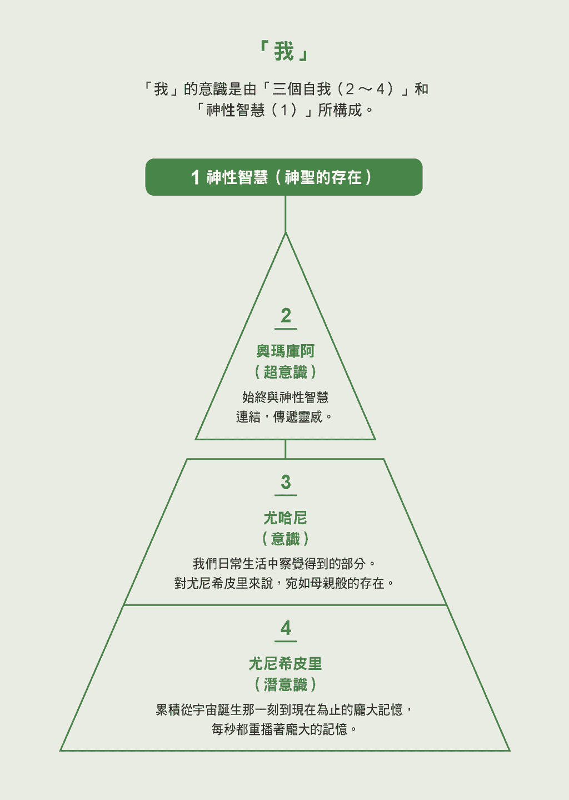
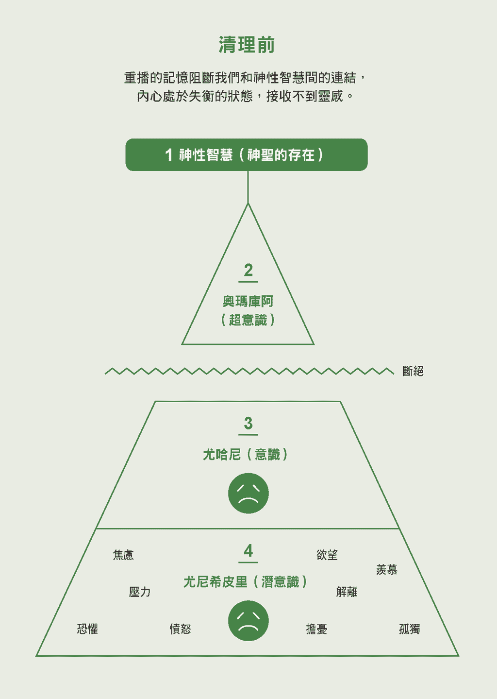
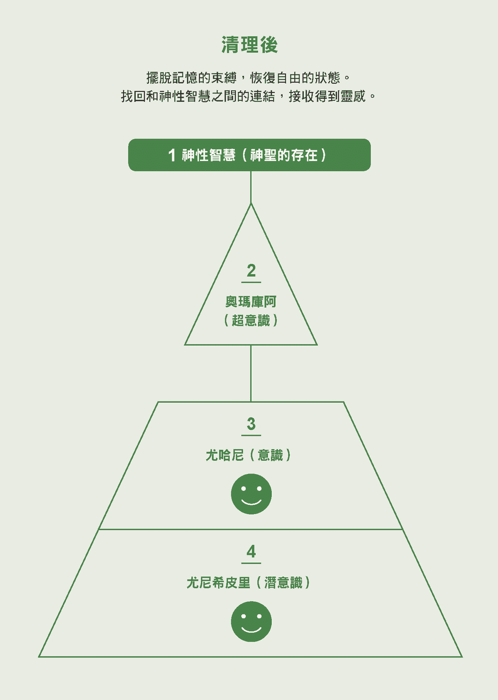
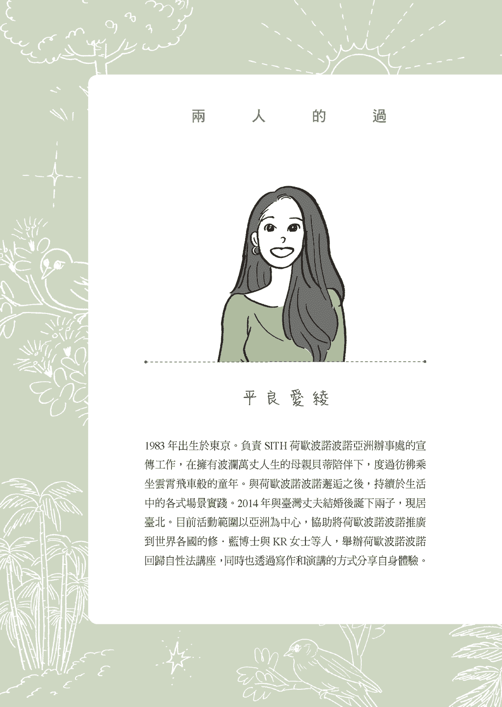
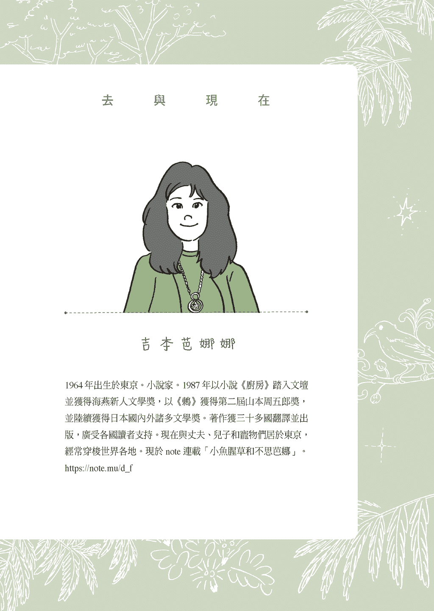
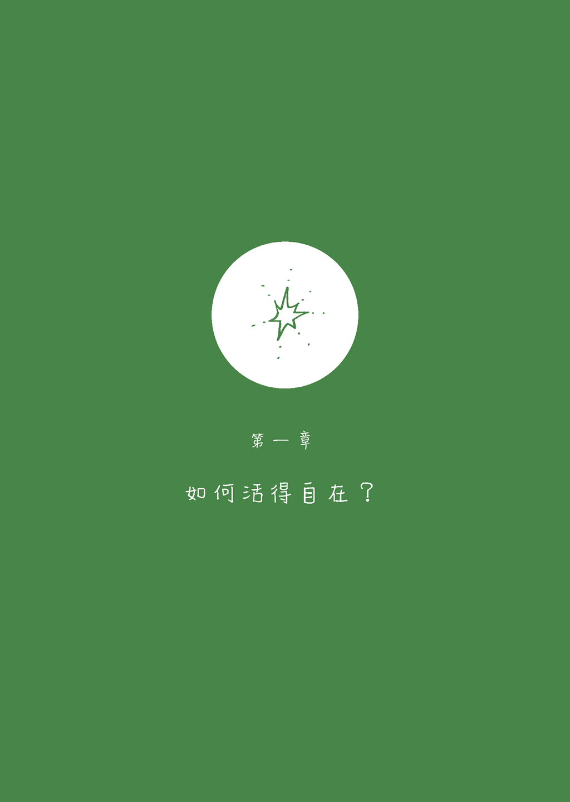
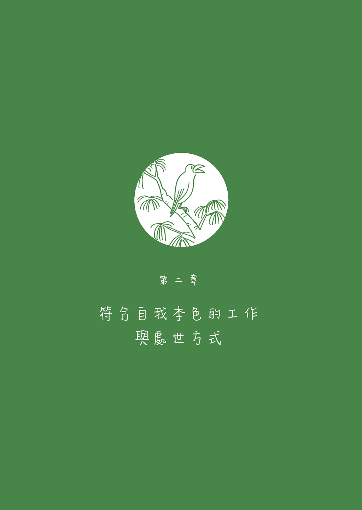
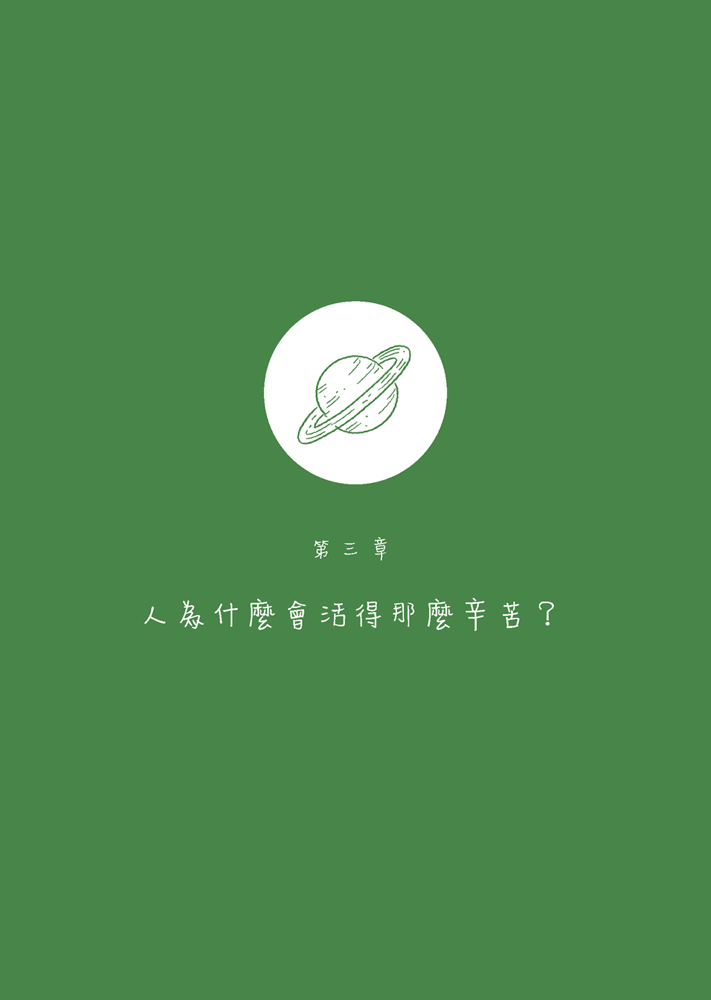
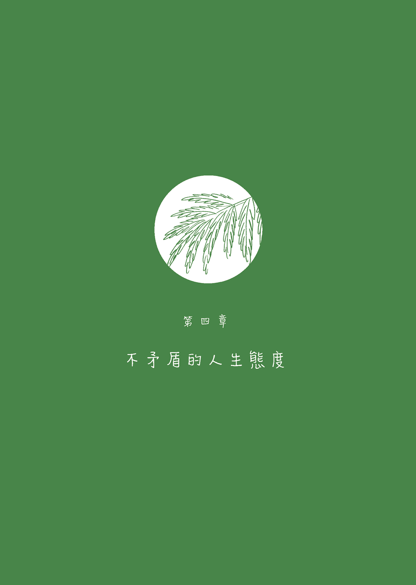
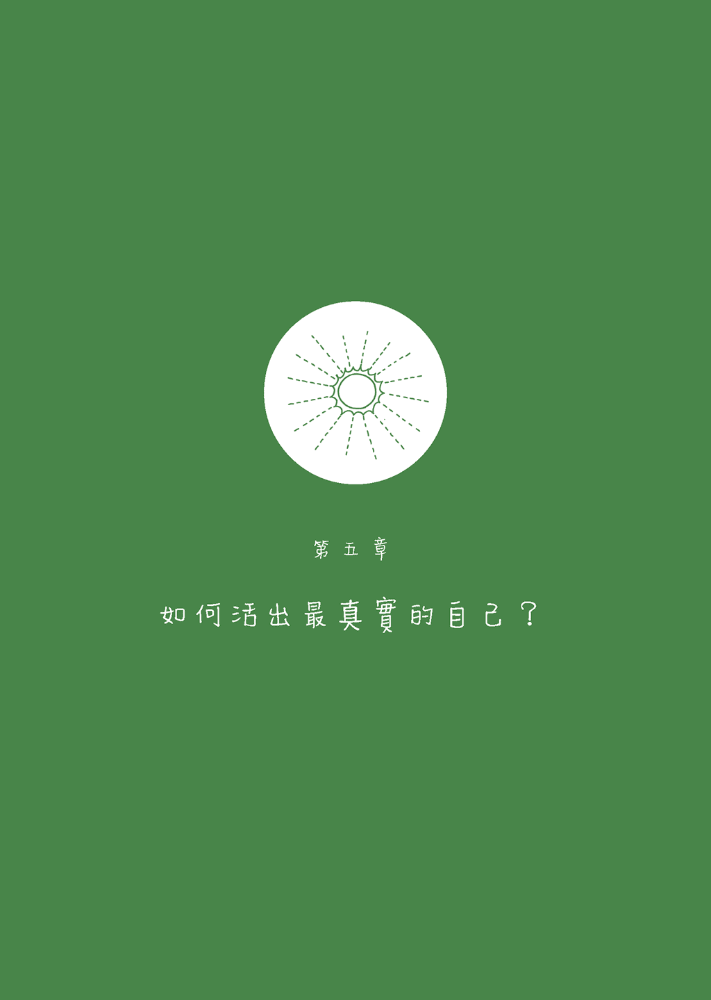

# 内在小孩快乐你才快乐

# 〈序〉让内在小孩带我们回到原本的自己 平良爱绫

〈序〉　让内在小孩带我们回到原本的自己
平良爱绫

开头的小说是吉本芭娜娜女士约十年前（按：二〇一〇年八月）刊登于杂志《Grazia》的短篇小说。

那期杂志发售时，我恰好刚开始实践「荷欧波诺波诺」，当时我依然如往常一样，对尤尼希皮里（潜意识、内在小孩）释出的讯息充耳不闻。

就在这时，我看到了这篇小说。主角逐渐察觉到尤尼希皮里存在的情景是如此逼真，令人安心且充满爱怜地倒映在我的内心。为了提醒自己尤尼希皮里无论何时都和我在一起，我不时反覆阅读这篇小说，就象是护身符似的。

我第一次遇见吉本芭娜娜的著作是在十岁，那时我常去图书馆，有一天顺手拿起了书架上的《鸫》。

当时我心中的想法，始终无法和现实取得平衡，苦闷难平，而故事中角色们的心境转变，与他们所做的一个又一个选择，深深地抚慰了我。

从此我成为全世界「吉本芭娜娜迷」的一员，她笔下的字字句句伴我成长，一路至今。

十几年前荷欧波诺波诺课程在日本开办时，芭娜娜莅临了东京的会场。

尽管最爱的作家就在眼前，我却不可思议地没有丝毫紧张，芭娜娜纯粹的存在让我感受到：「啊，原来这就是所谓的连结。」

只要清理荷欧波诺波诺所说的「过去的记忆」，就能在完美的时机，与对自己而言真正重要的信息与真正重要的人，没有任何摩擦、化为一体。那种感觉十分不可思议，彷彿碰触到整个庞大的流动。

自那时起，我便开始和芭娜娜来往。

芭娜娜不会以自我中心或世俗成见来对待别人，她总把人当成是一个有生命的生物，正因爱之深，所以用锐利且真实的话语，让人们察觉自己在不知不觉间积聚于世界的、内在的淤塞与谎言（荷欧波诺波诺称之为「记忆」）。

将荷欧波诺波诺推广到全世界的修．蓝博士说过：「爱和记忆，我们只能两者择一。」和芭娜娜在一起的时候，无论何时我都很清楚自己当下选择的是哪一方。

越是清楚选择哪一方，越有办法活出「真正的自己」，每一天的生活将自然而然且自由自在地发生变化。

不过，我们有时很难摆脱自我欺骗和想给人留下好印象的习惯。越是明白真正的自己，越有机会重新正视过往人生中的点点滴滴、在这些事件中对自己的忽略，以及对周遭人们所造成的伤害。

这令人相当痛苦，有时会想就此逃离，或是想彻底脱胎换骨、变成一个完全不同的自己，反而因此过于努力，把事情弄得一团糟。

进行本书对谈时，我正处于这样的状态。这场对谈简直就是在协助我清点人生大小事。

在对谈中，每当我想到：为什么现在、以及一直以来的我会这样呢？将之美化或因此贬低自己时，便会在芭娜娜出于爱的严厉话语（tough love）下察觉到：「啊，记忆又重播了！」我重新找回我的尤尼希皮里，回到无可取代的此时此刻。

本书如实记录了我在这反覆的过程中，不断清理的样貌。

倘若你觉得「活得很不像自己」「生活充满拘束」，即使只是微不足道的小事也好，不妨当作和尤尼希皮里闲聊一样，听听内在小孩的声音吧。

只需这么做，随时都能重新回到原本的自己。尤尼希皮里将告诉我们回归原点的方法。

谢谢你拿起这本书。

我的平静

# 荷欧波诺波诺是什么？

荷欧波诺波诺是什么？

「荷欧波诺波诺」在夏威夷语是「导正错误」的意思。

导正失衡的现象，找回原本的完美平衡，是夏威夷自古流传解决问题的方法。

获颁夏威夷州宝的传统治疗师、已故的莫儿娜．纳拉玛库．西蒙那，将其发展为任何人都能自行实践、不需透过他人之力的荷欧波诺波诺回归自性法（Self I-dentity through Ho'oponopono，现在的正式名称）。

主要的实践方法是「清理」，也就是消除我们累积的记忆。

实践荷欧波诺波诺的关键在于记忆储存库「尤尼希皮里」。

尤尼希皮里又称为内在小孩，它不只保存着我们儿时的记忆，更累积了宇宙诞生那一刻到现在为止的所有记忆。你的个性和习惯，全都来自尤尼希皮里所储存的记忆。

举例来说，尤尼希皮里让你看到的重播记忆会用以下方式显现。

现在你对什么事物或工作感兴趣？什么事会让你感到伤心与愤怒？为什么你喜欢那位歌手，却对别的歌手不感兴趣？

你在家中所处的位置、现在从事的工作、居住环境、对朋友说的某句话耿耿于怀的原因、运用金钱的方式，也都来自记忆。

甚至是说话方式、紧张时不自觉做出的举动……

每当尤尼希皮里播放长久累积的庞大记忆，我们都会透过当下的体验感受到（下文「我」图中的３）。这时只要清理记忆，就能以灵感的形式，取得神圣的存在「神性智慧」（下文「我」图中的１）原本便赋予你、对你而言最完美的信息。

一旦摆脱记忆的束缚，便能透过原本的自己，找回适合自身的真正富足、人际关系，以及身体与心灵上的健康。

因此，藉由聆听尤尼希皮里的声音，重视自己、不忽视自己，并确实清理，便能消除不需要的记忆，找回真正的自己，用你的节奏与步调，发挥专属于你、独一无二的能力。

照顾尤尼希皮里，本身就是最棒的清理。

其中一种清理方式，便是默念最具代表性的四句话。

谢谢你

对不起

请原谅我

我爱你

当你感受到问题时，在心里默念这四句话，便能消除记忆。

清理不限于感受到问题时。透过日常生活中的每分每秒清理自己，可以摆脱过去记忆的束缚，在当下这一刻活出真正的自己。这就是荷欧波诺波诺。

# 两人的过去与现在

# 第一章 如何活得自在？

什么是尤尼希皮里的话语？

　爱绫　荷欧波诺波诺解决问题的关键是「照顾内在小孩尤尼希皮里、和它说说话」。

　　　　对芭娜娜来说，这是怎么一回事？麻烦妳为我们说明。

芭娜娜　人刚出生时，如实呈现本身的样貌，但不知不觉就变了样。这就像一位有天分的棒球选手，身旁跟着成群的教练。

　　　　说个比喻，小孩穿上漂亮的黄色鞋子，兴高采烈来到学校，却被老师骂：「不能穿黄色的鞋子。」回家后父母却又赞美：「这双鞋真可爱。」不禁令人疑惑：「到底要听谁的？」如此情景充斥每天的生活中，这些小事大大打击了我们面对世界的方式。

　爱绫　我完全能体会。

芭娜娜　接着，隔壁邻居的妈妈又说：「你的鞋子真的很可爱，但你看看我们家的小孩，他的鞋子破破烂烂的，光是你出现在眼前，就会让他难过。」越体贴的小孩，这时内心的动摇越强烈。

　　　　小孩的内心受到打击：「咦，难道我不该高兴吗？」但回到家，再次听到父母说：「这双鞋子真的好适合你。」于是，越来越不知道该如何是好。

　　　　这个世界有太多的教练，而我们突然被抛到这样的世界上。

　　　　如果这时能思考：「我是怎么想的？」回溯到最原始的状态，便能明白自己是因为父母说这双鞋很棒，才认为这双鞋很棒，还是自己本身就喜欢这双鞋？——必须自行察觉这一点，否则永远得不到答案。

　爱绫　至今有数不清的人给过我建议和各种意见。

芭娜娜　所以，如果想知道「我究竟是怎么想的？」唯有和尤尼希皮里对话才行。

　　　　「以后遇到这种情况我就配合对方，但其实我的真实想法是这样。」我想，能在心中和尤尼希皮里讨论的人，拥有一定程度的幸福快乐生活。

　　　　总之，世界上能给出答案的人，只有自己。

　　　　「其实我本来就觉得太花俏了。」「就是说啊，和衣服搭配起来，显得很突兀。」「决定了，以后不要在那人面前穿这双鞋。」「以后去〇〇家，记得别穿这双鞋。」如果能像这样和自己对话，应该就不会偏离到哪里去。

　爱绫　感觉就像和尤尼希皮里聊天一样，聆听自己的心声。

芭娜娜　我们本就该比任何人更清楚自己的心声。而且，和自己对话的时间越多，越容易与自身连结。

　爱绫　和自己对话是如此重要，我们却往往以其他事物为优先。

芭娜娜　我想，多半只是因为大家都不和自己对话。

聆听尤尼希皮里的时机

　爱绫　即便如此，如果一直处于不习惯的人际关系或环境，有时会变得摸不透自己。

芭娜娜　依循身体感觉是最有效的感测方式。

　　　　例如，「这个人明明人这么好，为何每次相处总觉得疲惫？」身体真的会告诉我们很多事情。

　　　　还有象是，「明明之前一直想来这里，实际到访却感到浑身不舒服」。

　　　　我觉得，只要顺着身体的感觉，就不会有问题。

　爱绫　自从我遇到荷欧波诺波诺后，我深刻体会到每天是否确实接收尤尼希皮里的声音，象是，「其实那时我心里真的很不舒服。」生活的样貌会产生很大的差异。

芭娜娜　仅仅这么做，事物便会全然不同。人们或许会说：「不舒服的感觉还是在吧？」实则不然。

　爱绫　有次一位久违的朋友邀我聚餐。受邀让我很开心，头脑浮现正面的念头，但同时也隐隐觉得好麻烦。这时，我察觉到自己的心声。

芭娜娜　有所察觉，比什么都重要。

　爱绫　当我有所察觉时，简直像置身于某种战斗场景。我的心中确实筑起了「防护墙」，即使身在群体中，也没有太多无谓的信息进入内心，还有办法在恰到好处的时机离开现场。由于处于「被尤尼希皮里保护的状态」，便能自然而然、以符合自我本色的方式，平静下来。

芭娜娜　事物的发展变得恰到好处、顺畅无碍。

　爱绫　这也有助于减轻日常生活的压力。

　　　　因为喜欢这个人、因为对方是朋友、是家人，基于这些理由而硬逼自己待在现场，忽视尤尼希皮里的声音，一旦如此，便有部分事物不再顺利运转。

　　　　妳有过这样的经验吗？

芭娜娜　有。自觉很重要。只要有所自觉，就能确实反思：「开什么玩笑。」「我到底在做什么？」我们应该重视自己的这些感受。

　爱绫　我想，如果能像ＫＲ女士 1 那样直来直往，也比较容易找到自己真正想做的事。

芭娜娜　我也觉得非得直率到那种地步不可。ＫＲ女士总是直截了当地说「我不想待在这里」「我不想要这样」，有时我甚至会想「也太过了」，但双方并未感到异样的压力，所以后来也觉得未尝不可。

　　　　再说，有些人很懂得如何离开，我想这也是其中一项重要元素。

　爱绫　荷欧波诺波诺也认为，时机很重要 2。

　　　　要在每日每刻清理相当困难，有时难免会忘记。不过，即便做不到时刻清理，至少也该对自己最真实的感受有所自觉，和尤尼希皮里说「其实我不喜欢这个」，并清理这分感觉 3。

芭娜娜　这正是「和尤尼希皮里对话」。

　爱绫　这么做，即使面对不感兴趣的地点或对象，也能不可思议地度过自在的时光，或者事情会往理想的方向运转。

芭娜娜　自然而然就会有事无法前往了。

　　　　所谓的无法前往，不是因为不想去而不去……

　爱绫　自然而然就去不了了。

芭娜娜　回过神来才发现：「咦？怎么不知不觉就不再去了？」

　　　　感觉会像这样进展得十分顺利。

　爱绫　刚才妳提到，每天要接纳尤尼希皮里的声音。特别设置一段静心或写日记的时间，也属于此类吗？

芭娜娜　这也是不错的方法，每种做法都殊途同归。即使只有一瞬也好，尝试深入理解自己的感受，便会产生不同的结果。

　爱绫　与其特地挪出时间内省 4，倒不如像刚才提到的那样，当我们身处群体而感到烦躁时，和自己说说话：「啊，感觉有点烦躁。」

芭娜娜　「我果然不太喜欢这种事物。」如果能像这样随时和自己对话，也就不需要静心或写日记了。

　　　　而且，人心可以若无其事地说谎，有办法在日记写下「今天真开心」的违心之论。这样写日记可就没什么意义了。

　　　　「其实我很讨厌这样，一点也不开心。你呢？」像这样，光是和自己对话便已足够。

灵感和微调

　爱绫　对了，妳曾因勉强自己做些什么而偏离原有的道路吗？

芭娜娜　每天都会。所以我每天都一点一滴地调整。

　爱绫　会出现什么讯号？

芭娜娜　其实都是很细微的讯号，这时会心想：「啊，今天好像做得太过了。」

　　　　例如，我会利用做菜来转换心情，倘若出现一点微小的讯号，便会顿时明白：「啊，超出极限了。」当我想着，「既然都做到这个地步，干脆来炸点什么吧」的时候，一旦感觉到讯号表示：「等等，这超出我的能力范围，一定会筋疲力竭，做得也不好吃！」我就会进行「微调」。

　　　　或许因为不断微调，使我的人生格局变得很小。

　　　　但总的来说，我想微调终究是最重要的。

　爱绫　当意识开始运作、流动有一瞬间停止，就是清理的讯号。如果这是蓝图 5 为我准备的、属于我的工作，即使不特别留意，身体也会自动动起来。

　　　　当事情超过自身能力所及或欲望涌现的时候，问问自己：是什么让我产生这个念头？内省并清理，事物便会开始流动。

　　　　荷欧波诺波诺也非常重视这一点。

芭娜娜　我想起一件和欲望有关的往事。曾经有人以一千万日圆的价码委托工作给我，我回覆：「不用，四百万日圆就好。」并非我清心寡欲，是因为我承担不起这个金额背后的代价。

　　　　但我认为我的工作价值有四百万日圆，我总是留意是否取得适当的平衡。

　　　　如果我觉得这份工作值一千万日圆，我会坦然接受。但感觉这个一千万还包括后续的部分，我不想连同后续一并承担，所以主动要求降价。要做出这种判断极其不易，但当下我的直觉闪现一个数目，我心里清楚，如果不照这个数目来，硬是反其道而行，不会有什么好下场。

　爱绫　这种判断方式、掌握的时机和态度……

芭娜娜　我想，这就是荷欧波诺波诺说的灵感 6。

　　　　可是人类很愚蠢，往往不由自主地从这个角度着眼：「要是多了六百万，就可以如此这般。」不自觉地对自己说谎。

　　　　要是不小心往那方向偏去，终将得不偿失。我过去尝过太多教训，再清楚不过。宇宙的设计可是很精密的。

　爱绫　我想，要做出这样的决定并不容易，但可能是因为让妳选择灵感、坚信灵感的那股力量，渴望看到那个「看不见的广阔世界」。

芭娜娜　应该是因为尝过太多教训，身体学会了这个道理。

　爱绫　或许再加上妳每天都进行微调，才淬炼出这种感觉。

芭娜娜　我常微调过度，陷入如同仓鼠不停踩着滚轮的状态。有时会叮嘱自己：「看得更广一点。」

　　　　但出人意料的是，眼光放得极远的人完全看不到小细节，令我不禁感叹无形之中真有股平衡。正因为有人注意小地方，才需要有人专看远处。

　　　　我想，在整个宇宙的平衡中，也许我就处于这样的位置，得学会放弃。

感受到「有哪里不同」的能力

　爱绫　我要分享一件平凡的小事。每天我都会带女儿到公园玩耍，重复一样的事物固然有其优点，但有时总觉得哪里不对劲，彷彿自然而然陷入了某种「模式」。

芭娜娜　对，这就是人类的特质。只要每天都和相同对象在一起，便可能缠上像污垢或雾霭般的东西。

　爱绫　这绝非坏事。

芭娜娜　虽称不上坏，却令人沉重。

　爱绫　每当我感受到雾霭缠绕，便马上清理。

芭娜娜　或是暂且远离。

　爱绫　我在台北的家附近，找到了两、三间我满喜欢的咖啡厅，决定每天早上花两个小时待在咖啡厅喝喝咖啡，一边工作。但有时待在咖啡厅，感觉好像哪里怪怪的，隐约觉得不太舒服。

芭娜娜　乍看之下没有丝毫改变，对吧？

　爱绫　外在环境完全没变，却总觉得「今天不太一样」。

芭娜娜　确实会有这种情况，我认为能察觉到变化非常重要。出乎意料地，这甚至是一切事物中最重要的。「每天早上都在自己喜欢的咖啡厅工作，是我理想中的生活。」比起这种冠冕堂皇的理由，心中的细微感受：「咦？今天想法变了」更为重要。

　　　　也许打从一开始，人类心里便存在不想老化而死去的心情，为了对抗这分恐惧，刻意不去正视这种感觉，只想不断反覆做同样的事。这是人类的本能之一，也因为如此，自然就不想受情绪驱使。心中某处妄想着：只要每天都做一样的事，死亡就不会来临。

　　　　不过，变化本就正常不过，再加上只要活在世上，每天的身体状况与心情势必都不同。在变动和不动的事物间取得平衡，或者说采取非一成不变的行动，也许更贴近人的本能。

　爱绫　我会在脑中说服自己：「妳搞错了，这是因为每天都能去相同的地方所带来的幸福感觉。」但记忆还是自顾自地重播：「不想改变」「好想延年益寿」「死亡好可怕」。

芭娜娜　人们追求稳定的心态根深柢固。就像人人回到家都会感到安心是一样的道理，维持在相同状态也能让人安心。人作为一种生物，会有这种心态也无可厚非。

　爱绫　可是，如果忽略偶尔浮现的「不想陷入某种模式」的感觉，硬是「不管怎样，今天还是要去」，从那天起，内心便会陷入忧郁状态。

芭娜娜　想必是灵感在诉说：「有哪里不太一样喔！」

　爱绫　从这些细微的心理运作和身体感觉，感受到有哪里不太一样，真的很重要。

芭娜娜　据「绑绳锻鍊法 7」的老师所说，即使将绑绳绑在和服腰带上，人们依然感受得到绑绳的存在。而且，光是用绑绳固定躯干，轻轻缠在膝上，就有办法走得更远。

　　　　大家听了可能会说：「这跟绑绳有什么关系？」其实不然。正因为人是如此敏感，每分每秒都有细微变化，要是感觉变得迟钝，反而会有危及生命之虞。

　　　　人类的感觉意外地敏锐。

　爱绫　可是，要敏锐感受各种细微的变化，总觉得很累……

芭娜娜　不累，反而更轻松。

　　　　不过，若生命持续处于危险状态，便会感到疲惫不堪；而一直保持相同状态又能使人安心，因此这两种想法彼此拉锯、达到平衡。最后人们便开始欺骗自己：「别想太多，所谓不好的预感不过是错觉罢了。」

　爱绫　的确如此。尽可能清理当下的各种情绪，感受种种变化，再一一做出选择，就能逐渐找回与周遭的和谐状态。

芭娜娜　其实，比起「固定不变、强迫自己不去正视事实」这种出于恐惧的本能，每天进行细微调整反而更贴近人类的本能。

如何活出自己的步调？

　爱绫　过去每当刚认识的人问我：「妳从事什么职业？」我总是不知该做何回答，心中纠结：「该说演讲方面的工作呢？还是荷欧波诺波诺回归自性法办事处的宣传工作兼台湾地区负责人？」

　　　　但最近情况有所转变，不太有人问我职业了。

　　　　我不知道是因为对方看到我的时候，隐约觉得一问便会一发不可收拾？或是打算之后再慢慢调查，现在暂且不问那么多？从我的角度来看，让我苦恼的情况减少了，演变出全新的结果。

芭娜娜　我能体会这种感觉。或许可以报上「平易近人的女老板」，这样一来，大家也会「喔～」一声轻易接受（笑）。尤其是面对那些说明起来很费事的对象。对于往来机会较少的人，大家为了省事，本就会含糊带过。

　　　　毕竟人生是朝四面八方敞开，谁也不知道何时会发生什么事。既然不明白，唯有自行想象，开创属于自己的道路。

　爱绫　「我是平易近人的女老板！」这种话说得出口吗？

芭娜娜　举个例子，妳的公婆本身也是企业经营者，如果妳能诚恳坦率地表白：「不好意思，虽然我身为人妻，但毕竟也需要经营事业，无法把丈夫和家里照顾得面面俱到。」这样或许各方面便会意外地圆融许多，对方也会理解妳的处境。

　　　　之所以说不出口，是因为妳的婚姻观蕴含某些强烈的执着。

　　　　执着会成为一个人最大的弱点。所以这种情况真的很复杂。

　　　　妳肯定本能地感觉到要是被控制在某个范围内，就会停止成长。

　　　　而且，妳还强烈渴望向对方表明这个想法。

　爱绫　我这种类型真的很麻烦（笑）。

芭娜娜　不，这样才能不停成长，不断登峰造极。

　　　　所以，才要用简单明了的方式说明：「我的行程的确是如此忙碌，否则公司便无法顺利运转。」若能学会这种算不上「技术」、却宛如「魔法」般的表达方式，就会轻松许多。这么一来，便能开拓属于妳的独特道路。

　爱绫　我新婚的那段期间，各方面都不像现在这样顺利，当时向妳讨教，妳在电子邮件中简单回覆：「只要一直保持现在的步调、做法和态度，到了四十岁的时候，有天妳会惊觉各方面都变得心想事成。」光是看到这段话，我整颗心都轻盈了起来。

芭娜娜　只要掌握其中一项诀窍，就会一口气顺利许多，所以肯定会在某一刻领悟到：「啊，原来是这样！」

　　　　感觉妳的未来会演变成这样——当妳表明立场：「看来各位的做法是那样，但我不会这样做。」人们的反应先是诧异，但马上便会接受：「算了，她这个人就是这样。」

　　　　就象是妳的女儿先开口说：「我不要。」接着妳说：「那我也不要好了。」我想象得到，妳将逐渐学会用这种方式转身，开创未来的人生。

　爱绫　唯有一边清理，一边实践。

对快乐的执着

　爱绫　对了，之前的书籍对谈 8 时妳曾这么说：

　　　　「我一直觉得尤其是年纪比我小的年轻一代，对开心的事物有种强烈中毒的情况。

　　　　「虽然说，我能做的也只有不断清理内在，不过，我察觉现今社会普遍存在这样的现象，大家觉得若不是非常开心就称不上是开心，觉得发出越大的声音喧闹表示越好。

　　　　「我最近开始希望能用各种方式告诉大家，即使不做任何事也可以很开心，开心是种深刻细腻的感觉。」

芭娜娜　对。

　爱绫　打从那时起，我便察觉到自己在日常生活中，有时会浮现对快乐的执着。

　　　　每当我察觉内心处于这种状态，只需实践荷欧波诺波诺的清理步骤，就能找回内心的平静。

　　　　我也感觉到，在内心容易陷入强烈迷惘或纷乱的时刻，日常清理还能发挥事前预防的效果。

　　　　简言之，荷欧波诺波诺就是帮助人「活出真实自己」的方法，藉由放下对快乐的执着，让清理变得更容易，身心也更轻松。

　　　　请问芭娜娜，妳是在什么情况下，感受到年轻一代对快乐有着异常执着的呢？

芭娜娜　特别是三十多岁的人，强烈散发着「和别人在一起的时候，如果不表现得很开心是种罪过」的氛围。

　爱绫　罪过？

芭娜娜　对，彷彿已经到了罪孽的程度，紧绷得一触即发。两个人也好，一群人也罢，好像不炒热气氛就会不安。

　　　　普普通通地开心进入店里，普普通通地悠哉享受愉快的时光，反而相当少见。而那些表现得很开心的人并非真的有活力，只是表面上热络而已。

　　　　不过，也许这是东京特有的现象。

　　　　像我每次去博多，大伙儿在居酒屋喧闹，耳朵却一点也不感到疼痛。真正开心时的欢声笑语，不会令人感到刺耳。

　爱绫　我偶尔会和父亲一起去东京闹区，不知为何每次他都神情慌张，行色匆匆。我经常思索「要怎样才能避免让父亲感觉不自在？」明明他才六十五岁上下，还不到老爷爷的年纪。

　　　　但是他来台湾找我时，却显得轻松自在，举手投足间流露出个人风格，这样的父亲让我感到安心。虽说也有可能是因为旅游的缘故。

芭娜娜　和年长的人相处真的比较轻松。

　爱绫　我好像又变回了小孩，父亲展现出父亲的架式，以人生前辈的身分引领我前进。那段时光让我产生这种强烈的感觉。当时的那种快乐，不是勉强自己大声喧闹的快乐，而是渗透了彼此共度的时光。

芭娜娜　一种慢火微温的快乐。

　爱绫　对，慢火微温这个形容太贴切了。父亲回去后，我仍一直深深觉得太好了，真的好开心。

　　　　这时我想起妳说的「对快乐的执着」，我暗自思索，对快乐的执着和这种慢火微温的感觉到底差在哪里，结果想到了和朋友聚会的时候。

　　　　我每次回日本和朋友相聚，心里深处都有「一定要让他们开心、留下美好的回忆！」的意识。

芭娜娜　好像双方都在强迫自己快乐。

　爱绫　也许这股压力就是来自对快乐的执着，不是那种慢火微温的感觉，正因为这样，才让内心陷入纷乱的状态。

孤独与寂寞的原因

　爱绫　我每次回东京都会感到这股无形的枷锁，或是接收到他人施加的期待，这种感觉究竟从何而来？

芭娜娜　我想，应该是因为这个城市的人原本都是从外地来的。

　　　　从各地聚集于此，才给人一种生疏冷漠的感觉。

　　　　东京本是旧城镇，我有一次和同为东京人的朋友聊到，走在路上撞到肩膀会发出「啧！」的声音，或是会说「请不要把婴儿车带上电车」的人，基本上都不是土生土长的东京人。

　　　　虽然不能完全断定，但我认为可能性很大。

　　　　也许，现在的东京人不得不虚张声势，表现出「很快乐」或「在这里过得很好」的模样。

　爱绫　或许真是如此。这个城市无法将心声轻易传达给别人，非得做出夸张的肢体动作或提高音量，否则对方常会听不到。

　　　　比如说去高级餐厅，如果不秀出「某些东西」，服务生永远不会过来点餐。

芭娜娜　我也觉得。因为大家都有一丝不对劲，整个城市也变得充满不对劲 9。

　爱绫　不过，我去下北泽 10 找妳的时候，却能保持悠闲的心态而不过度亢奋，因为我敬爱的妳就住在那里，在那里清理，度过每一天。

芭娜娜　可能是因为我只带妳去我常去的店和原本就熟悉的地方，但真的已经变成「我的下北泽」了！在台北和妳相聚时，也给我同样的感觉。

　爱绫　荷欧波诺波诺认为土地也拥有意识和自性本我 11，土地记得过去所有的历史，记得在这块土地上发生过的事情，记得某个人某天的感受。

　　　　我们会在不知不觉间接收土地的信息与情绪，我也会在不知不觉间将种种情绪带到每片土地上。

　　　　所以我总是用自己的方式清理第一次踏上的土地。

　　　　我们和生活于该片土地的人们相处时，之所以感到安心，是因为和土地的看守者（caretakers）12 走在一起，就像和训练有素的导览员爬山一样，令人安心又雀跃，这是很自然的现象。

　　　　反过来说，如果在没清理的状态下，轻率匆忙地前往某处或和某人见面，即使不是在陌生的地方，仍会感到莫名焦躁与寂寥……

芭娜娜　或许变成了冷漠无情的地方。

　爱绫　如果没做任何心理准备，或是内心充斥许多尚未处理的记忆，就这样来到一片新的土地，可能会不自然地扮演起别人的模样，感觉很不自在。例如心想，到时要和这个朋友见面，我要特地表现出什么样子，或是表现得像某个人。

芭娜娜　也许大家都这么想，所以才会有点紧张。

　　　　每个人居住的地区，都是他所挑选的、喜欢的地方，所以从自己喜爱的人挑选的眼光所看到的城市，也会有特别的感觉。因此在没有妳的陪伴下，台湾在我眼里看起来完全不同。从这层意义看来，也许东京正是充满「很少与人交集」之人的地方。

　　　　例如我丈夫之前在惠比寿 13 工作，当时我常撞见妳和前男友约会。

　爱绫　真的常常巧遇（笑）！那时的我做事实在很鲁莽。

芭娜娜　不会，你们两人都很有魅力。

　　　　包括常在那里和妳巧遇的因素在内，那时惠比寿对我来说格外亲切，是日常生活的一部分。但自从丈夫的工作迁移位置后，惠比寿在我眼中突然间变成净是上班族、吵杂且寂寥的城市。

　爱绫　毕竟陆续盖新大楼，氛围不太一样了。

芭娜娜　感觉已经变成完全不一样的地方了。再看到时感受到的不只有怀念，还有深深的孤独感……

　　　　也许从外地来到东京的人，都怀有这样的心情。

不了解自己，就无法活得快乐

　爱绫　我一个大学朋友老家在东北地区，后来在东京工作。

　　　　我每次回日本都会和她见面，但发现她变得越来越没自信了。

　　　　每次见面都感觉她原本替周遭带来和煦氛围、随性且悠闲自得的部分，慢慢消磨殆尽……

　　　　究竟是我内在的什么记忆，让朋友在我眼中呈现这样的景象？我总是清理 14 看到这幅景象的自己。

　　　　我很喜欢那个女孩，也喜欢东京，毕竟那是我从小长大的地方。所以我开始想，到底为什么会变成这样？

　　　　生活在大城市，究竟该怎么温柔守护自己原有的重要部分？

芭娜娜　确实如此。

　　　　但大前提是，我们没办法改变自己以外的任何人。

　　　　不管我们做什么，只要当事人不想改变，谁也无法改变他。

　　　　我想，妳朋友是被东京的繁忙步调所吞没，才出现转变。

　　　　我也有过这种经验。有个要好的年轻女性朋友，因为向往东京的生活而来到东京，在旧市区展开新生活。

　　　　她和左邻右舍来往频繁，隔壁的阿姨会跟她说：「下雨了，我帮妳把衣服收进来。」将她的衣物装在塑料袋，放在家门口，或是托她照顾孩子。这样的环境让她感到很自在。

　　　　但有一天，她似乎觉得不能再这样下去，这和住在乡下没什么两样。

　爱绫　她想改变了。

芭娜娜　会改变的人真的会变，但是她变得不上不下。「不上不下」是个重要的关键字。也许可以说，这样的人并不享受改变的过程。

　　　　现在回想起来，要是我当时能表达得更好一些，调整平时与她相处的态度，也许就能帮到她了。

　　　　后来那个女孩开始流连夜店，搬到社会人士云集的涩谷繁华地区。如果她是住在下北泽这种地方倒还好，但偏偏是涩谷，晚上则到六本木的夜店……

　　　　我知道如果用世俗的眼光来论断非常残酷，但我还是要说，不了解自己，就无法活得快乐。

　　　　那个女孩长得非常可爱，但外表不是那种爱去夜店玩的类型。我思索「派对人 15」的特质便发现，若不是特别想让别人注意自己外貌的人，过不了那种生活。

　　　　这种人总是藉各种名义开派对。他们希望这样的生活方式能持续一辈子，所以不去想除此之外的任何事物。「等到这样的生活面临终点，再去考虑其他东西就好」，抱着这种心态快乐度日。我认为这样很厉害。

　　　　所以，很多人向往那样的生活方式。我也觉得很正常。

　爱绫　我刚上大学的那段时间，也常去夜店。

芭娜娜　有个大原则：这种人在夜店门口接受检查时，不管打扮得如何都会抱着「看看我吧！」的心态，将外表与内心向外展示出来。如果不是这种类型的人，去这类场所肯定无法玩得尽兴。

　爱绫　正是如此……

芭娜娜　妳的外表非常亮眼，但其实是个内省的人，妳在夜店有没有觉得好像也没有那么快乐？

　爱绫　原来那时我无法完全享受其中，是因为这个原因啊！

芭娜娜　我那个年轻朋友去到那类场所，因为本身并不外向的内在性格而发生了一些不愉快的事情，逐渐变得一蹶不振。

　　　　如果她当时一感到不适合便就此抽身，回到旧市区，又能重拾美好的生活。

　　　　不过，从乡下来到东京的人，内心往往隐约觉得如果不好好享受都市的繁华，就不象是住在都市。

　　　　我问那个年轻朋友：「夜店好玩吗？」她总是回答：「好玩啊，有很多漂亮的人，而且我也喜欢跳舞。」我想，既然这样那就阻止不了她，看来她想变成像模特儿那样的人。

　　　　所以，虽然追寻向往的事物很重要，但是，如果不好好注视最重要的、那个内向又可爱的自己，那就太可怜了。

　爱绫　荷欧波诺波诺也告诉我们，「向往 16」充满许多需要清理的部分。

　　　　如果错把向往的事物当成是自己真正的模样，就会陷入窘境。

芭娜娜　真正适合去夜店玩的人，开心跳完舞就会马上回家。

　　　　我有另外一个朋友，长相普通、不起眼，但总是穿着花枝招展的服饰，热爱音乐和夜店，甚至会一个人去夜店玩，而且还不是去跳舞。她会在舞池来回奔跑，没跟人说上半句话，跑个几圈就回家。连酒都没喝。

　　　　我觉得这整件事蕴藏着某些讯息。

　爱绫　也太厉害了！

芭娜娜　明明年龄相仿，为什么这个女孩能用这种方式享受乐趣，那个女孩却总是说着：「昨天又被人欺负了」「不知不觉就被大家抛下」，败兴而归。

　爱绫　现在她找到真正想做的事了吗？

芭娜娜　她结婚了，过得很幸福，不再混夜店。正因如此，假如她内心隐约感到「在东京生活真难受」，我会很难过。因为我和她在一起时觉得很幸福。

　　　　我想，有一天她会打从心底领悟到：「啊，其实和旧市区的阿公阿嬷相伴，和邻居的小孩玩耍嘻闹，才是适合我的人生。」还有，在旧市区吃吃荞麦面、唱唱ＫＴＶ，这样的生活真的很棒。

　爱绫　老实说，感觉好像在讲我当时的情况。

　　　　经常出入夜店的那段时期，令我印象最深刻的不是在店里玩乐的情景，而是门口的检查人员将人阻挡在外的方式给我的异样感和不快的心情，到现在我还是能轻易回想起来。察觉到这一点，我就明白当时果然是在勉强自己。当然还是有些开心的回忆。

芭娜娜　不过，年轻时，去夜店就会遇到朋友，所以不自觉就会想去。我以前也是。

　爱绫　对，其中还包括我当时的男朋友。那时的夏天令我难受。夏天原本是我最喜欢的季节，但那一、两年完全没享受到夏天的美好，成天只闻到酒精的味道。

芭娜娜　看来那个人真的不适合妳。

　爱绫　当时那种勉强自己的感觉，我的身体到现在还记得。如今回想起来，眼前还是瞬间一片灰暗（笑）。

芭娜娜　得大肆清理才行（笑）。

　爱绫　真的。因为我带着这份悲伤的记忆，所以就算经过无数年月、到不同地方生活，仍会在每个地方看到那个悲伤的往昔。

芭娜娜　是啊。

　爱绫　最近我在台湾发生这样的事。

　　　　有一天我从外面工作回来，赶上最后一班捷运，搭上通往地下的手扶梯，眼前站着看似刚交往不久的年轻男女，他们身旁还有一个女孩，是他们的朋友，看起来心情非常糟糕。

　　　　那一刻，我透过那个女孩，看到了埋藏在内心某处的怅然记忆。从搭上手扶梯到走下来的这段期间，心里都是孤零零的感觉。我甚至想冲去握住那个女孩的手。此时的我是「过去某一刻的我」，内心某处总是怀抱着这股难过的心情。

　　　　即使到了不同地点、过了很久的时间，还是会浮现这种感觉，看来我的内在依然留有这份记忆，于是只能不断清理。

我们有「轴心」吗？

　爱绫　刚才妳提到不了解自己，就无法活得快乐，我深有同感。同时也再次察觉，当时的我长期压抑自己真正的心情。

　　　　我母亲平良贝蒂 17 性格和我彻底相反，她在十五岁的年纪就一个人到六本木的夜店玩。

芭娜娜　太酷了。

　爱绫　只是一个劲地跳舞，跳完就回家。和刚才那个在夜店奔跑的人很像。

芭娜娜　看来是一样。

　爱绫　离婚后分开住的父亲，和她属于不同类型，但我从小也听他讲了很多年轻时期去迪斯科舞厅快乐又潇洒的往事，所以我也越来越向往这个世界。

芭娜娜　向往夜晚的世界。毕竟时代不同，也许能玩得更开心。

　爱绫　我的外婆 18 也曾开拓西麻布和六本木一带的夜生活，所以我们家族算是和这方面很有缘，但我和母亲与外婆的个性又有着根本上的差异。

　　　　我会想，为什么当时我没办法享受其中，哪里出了问题？

芭娜娜　毕竟祖孙三代各属不同类型，真的会忍不住这么想。

　爱绫　以前我时常反问自己：「是不是不小心露出阴暗的一面了？」「是不是应该表现得更开朗一点？」

　　　　出社会后，还是经常出现这种思考习惯，就在我内心始终无法平静时，遇见了荷欧波诺波诺，想起原本的自己。虽然我又花了很长一段时间，才将打从心底感到自在的自我真正融入生活中……不过，头脑和身体都变得越来越轻松。

　　　　但是，偶尔见到当时的朋友，又会回到不断勉强自己的那个状态，开始向往亮丽耀眼的世界。

　　　　每次产生这种感觉时，我都不断清理，慢慢地，我开始能融入以前无法融入的那群人的对话当中，也不再像以前总是被现场的调性牵着走，多了一股以自我为中心的节奏。

芭娜娜　与其说是长大了，不如说是重拾「自己」。不过，这样应该也能好好享受夜店的乐趣了吧！

　爱绫　我变得能在不戴任何有色眼镜的状态下做选择，真的是太好了。否则实在不堪负荷。

　　　　现在回想起来，那个圈子要求人们「明明不喜欢却要装作很喜欢」，这一点实在很不对劲。在那种「在场的各位肯定都很喜欢这个」的氛围中，无法自由做选择。我感觉很多年轻人都是这样。

　　　　即使到了现在，和年纪比我轻的朋友聊天时，我仍会因为生活中不再有华丽耀眼的夜店派对活动而感到烦躁不安。如今不必实际去夜店，也能从社群媒体看到别人发布相关动态，或许反而更令我焦虑。

芭娜娜　不只是夜店这种亮丽耀眼的圈子，每个圈子都有各自的规矩。就像讲求自然的自然派也会主张「不该穿这种衣服」「这个牌子比较好」。

　　　　不管做什么，常有各种死板的规矩。

　爱绫　如果我在自然派的圈子里，可能又会因为没办法确实遵从规矩而想东想西，或是因为与其他人格格不入而暗自神伤。

　　　　说起来，妳给人的感觉不属于特定类别，总是自由自在地旅行于各个国家或文化之间，而且，不论到哪都不会偏离轴心，也不会强迫别人做些什么。

芭娜娜　也许是这样。因为人是不会变的，怎么强迫也没用。

　爱绫　妳不会强迫别人呈现怎样的色彩，所以和妳在一起，彷彿置身于宽敞的空间，感觉轻松自在。

芭娜娜　我也讨厌别人叫我配合。时间是世上最宝贵的东西，我不想浪费时间。

　爱绫　妳拿捏彼此距离的方式堪称绝妙，我每次都从妳这里学到很多。我以前觉得，如果喜欢彼此就应该拉近距离、相互理解，但是妳让我明白，其实不必如此。

芭娜娜　我想，应该是因为我有「写小说」这个轴心。

　　　　在家写小说是我的轴心，虽然也能做其他事情，但我只从轴心的角度出发。如果每个人都有各自的轴心，不论身在何处都能享受其中。

　爱绫　妳所说的「轴心」就好比前面提到的蓝图。蓝图设计极为精密，每个人的蓝图都不尽相同。

　　　　荷欧波诺波诺认为，清理能帮助我们遇见真正的自己。而「蓝图」便存在于活出真正自己的这条道路上。

　　　　因为妳始终遵循蓝图，所以不管我在哪个国家见到妳，不管妳处于怎样的情况，都能维持自然的步调，且总是保有新鲜感。

要选择怎样的处世方式？

　爱绫　我刚结婚的那段时间，对于要适应新家庭、新环境和不同的生活方式感到非常烦恼。这时妳告诉我：

　　　　「『看来对方是这样想的，不过我则是这么想。』只要用这种方式思考就好了。」

　　　　这个建议给我很大的帮助。在「看来对方是这样想的」后面，加上一句「不过……」，如实接纳对方的想法。而假如我对此做出任何解读或判断，便立刻清理。荷欧波诺波诺也反覆强调：

　　　　「为了让自己自由，我们要单纯地接纳『对方就是对方』。正如树木活出树木的生命，我也活出我自己。」

　　　　如果不这么做，积欠的负债将以现实生活中的问题型态显现。妳让我回想起这一点。

芭娜娜　关于这种情况有不同的称呼方式，象是「业 19」「原因与结果 20」等。

　爱绫　在不知不觉间替自己套上的既定观念和思考习惯，让生活变得多么不自由，只要多加留意并观察自己和他人的相处方式，便不禁愕然。

芭娜娜　不由分说地配合众人，毕竟比较轻松。

　爱绫　但是，如果一直这样下去，势必再次面临不自由的状况。

芭娜娜　是啊。会呈现怎样的问题，端看对自己的哪部分说谎。归根究柢，关键在于选择怎样的处世方式。

　　　　举个例子，我第一次见到妳的时候，因为妳是荷欧波诺波诺讲座教室里最闪耀的一位，于是我在笔记上写道「平良爱绫非常亮眼」（笑）。

　爱绫　该说感谢还是什么好呢……

芭娜娜　不过，妳的身上却被许多「框架」紧紧框住，象是「宛如从小在国外长大的风格」「貌似在餐饮业工作了很长的时间 21」，甚至包括化妆在内的一切都困在框架当中，感觉不到丝毫的轻松自在。所以，妳现在看起来比那时自在多了。

　　　　会有这种想法，或许也是因为现在已经认识妳，知道妳是什么样的人。不过，我觉得妳现在比当时更顺从妳的灵魂。

　　　　外表传达的讯息非常强烈，如果用服装展现出自己的生活型态，便只会吸引到同类前来搭话，也比较容易接触到相关行业的人。

　　　　若能以这种方式找到合得来的朋友，是件既自然又美好的事；但如果合不来，便会不断往坏的方向发展。人类社会正是这么形成的。

　爱绫　其实我非常极端……那个时候拚命用化妆、高跟鞋和服装来包装自己，虽然自有其中的乐趣，但同时也消耗大量能量，直到后来幡然醒悟：「过得自在一点不是很好吗？」从此一百八十度大转变，整个人放松下来，才变成现在这样的我。

　　　　再加上在台北生活，更容易发展成这种状态。

芭娜娜　我明白。我在台北的时候，也变得相当随兴，天气热就干脆穿夹脚拖出门。

　爱绫　不过，可能是因为太不想再回到过去那种疲惫的生活，我有时会施力过当，刻意穿着不引人注目的服装。这个时候，我又陷入了框架之中，便再次清理。

芭娜娜　这种细微的调整确实相当重要。

　爱绫　当我定义自己「我就是这样」的时候，代表又陷入僵化的状态。这种状态下的频率和穿着高跟鞋时期的我没什么两样。

芭娜娜　出于对艺人的仰慕而抱着单纯的心去模仿，或基于「因为想做，就马上去做」的单纯心态而展开行动的能量，能让我们活得自在快乐。

　　　　但如果做得太过火，用「我仰慕的对象不会做这种事」来束缚自己，事物便会开始偏离常轨，整个人就此萎缩。

不做违心之事

　爱绫　我们可能为了让自己更耀眼动人，用头脑定下各种规矩，例如该怎么做、要表现出什么样子，但实践荷欧波诺波诺后，这些规定会逐渐消失。

　　　　所以，持续清理可能会让人失去「亮眼」的状态。不再在意他人眼光，只穿自己喜欢的颜色。

芭娜娜　有时我们喜欢的颜色很朴素，所以或许会做出和色彩顾问 22 完全相反的选择。

　　　　可能会变得很不起眼，别人也或许会说：「感觉你以前比较亮眼。」

　　　　不过，如果这才是真正的自己，这么做反而比较自在。由于比较容易让人从外观看到内在的部分了，因此也能遇到意气相投的新朋友。

　爱绫　而且，因为不偏离轴心，和人相处起来也更轻松。但是，可能又会在某些状况下出现新的向往事物，或是觉得现在的自己又有哪里怪怪的……

芭娜娜　如果这样，再抱着玩游戏的心情，染成金发，打扮得时髦亮丽就好了。人生真的充满自由。

　爱绫　不去定下严严实实的规矩，在清理的过程中聆听尤尼希皮里的声音，顺从内在想要的打扮风格，是否就是诀窍所在？

芭娜娜　我想，不必把自己套上某种色彩。

　　　　并不是说只要清理就会变得时髦亮丽，也不是说只要清理就会变成有钱人。如果不小心误会这一点，就会感到痛苦，无法形成好的业。

　爱绫　ＫＲ女士说，我们应该彻底清除所有业，逐步打扫内在部分，不替自己加上无谓的枷锁。

芭娜娜　我也觉得这是最快的捷径。

　爱绫　ＫＲ女士看上去那么自由随兴，再加上她原本就长得漂亮，自然也显得亮丽，但其实她非常注重「每天尽可能减少身上的业」。

芭娜娜　我深有同感。说白了，这就是我们唯一要做的事情，也就是不做「违心之事」23。

　爱绫　而且，ＫＲ女士的做法看起来一点也不辛苦。

芭娜娜　不做勉强自己的事情，也就不会产生业。

　爱绫　不勉强自己、不做违心之事，确实是简单明了的判断依据。

　　　　除此之外，还有什么方法能避免产生业？

芭娜娜　别在不必要的时候做不必要的事情。

　　　　例如肚子不饿却去吃东西之类的，绝对不要做这样的事。如果平时都依循灵感的指引，便不会去做不必要的事情，也就不会形成业。

　　　　我想，说这是人生准则之一，也不为过。

记忆就是思考的习惯

　爱绫　我一直很清楚自己对金钱方面抱有自卑感。

　　　　从小每天都看到大人为钱的事吵架，因此国中以前我便深刻体认到金钱所带来的好处，以及一旦没钱，人们会争吵不休的道理。

　　　　我在东京的赤坂长大，很多同学的父母都是大地主、大老板和大使馆官员，生长在富裕的家庭。而我们家住在那一带的香菸杂货店二楼。因此从小便清楚感受到自己和其他人的生活有很大的差距，不知道从什么时候起，我开始觉得丢脸。

　　　　随着年纪增长，我渐渐明白自己为什么觉得丢脸。于是我总是偷偷摸摸出门、偷偷摸摸回家，避免被别人看到。

　　　　但最大的问题在于，我对生活感到羞愧所带来的痛苦，不断折磨着自己。

　　　　现在我正透过清理，一点一滴清除当时的结痂。有时我以为已经清除干净了，却又在某些情境下猛然显现。

芭娜娜　确实如此。从外在看来，妳已经完全清理妥当了。

　爱绫　国中毕业以后，家庭经济方面总算稳定下来，我先生也是在生活稳定的环境成长，但如今，我有时会忽然回想起从前那股乱糟糟的心情。

芭娜娜　像有一次妳拿著名牌包，我说「不错耶」，妳却面露哀伤，以愧疚的神色说道：「我其实是为了某某原因买的。」

　　　　每次看到妳这样的反应，我都心想，妳从小到大生活曲折，见过形形色色的人，有过许多艰辛的遭遇。如果妳从一开始就生活在视名牌包为理所当然的世界，就不会说出这样的话。

　爱绫　我总是不自觉地表露出内心的种种。

　　　　像我每次接触到经济富裕人士的金钱观，总会瞬间勾起心里阴暗沉重的某个部分，于是便不自觉地产生抗拒反应。这时我会自觉，原来心里还是存在这些记忆，接着开始清理。

　　　　这样的情况恰恰反映了我目前的生活样貌，因此每当我一察觉到便立刻清理、一察觉到便立刻清理。

芭娜娜　你们夫妻俩就好像《老公老婆不登对》（Dharma & Greg）24 的主角。妳的经历过于丰富，见过太多不同的情景，所以才无法让自己进入特定模式。

　爱绫　因为经历过各种不同的时期，所以我不知道哪种状态才是最适合我的模式。我总是马上忘记自己是什么样子，所以与我先生如此在各面向都相对稳定的人一同生活，我才不得不面对这件事情。

芭娜娜　有钱人的生活方式……也不是说乖僻，总之有一套相应的价值观，会认为「既然进入了这个圈子，请遵守这些规矩」，而这些规矩既详细且严谨。

　　　　妳始终难以融入这样的世界，但对于从事需要面对社会大众的工作来说，这其实是个很大的优点。

　　　　所以，会产生「难受的感觉」反而是件好事。

　　　　假如妳可以轻而易举地融入他们的圈子，或许现在妳早已不再工作，专心当个贵妇了。所以我觉得难受的感觉是很棒的要素。心里存在抗拒感，表示懂得质疑任何事物。

　　　　那些从不质疑任何事物的人，如果看到妳的态度，应该也会被迫不得不去正视原本不看的部分。

　爱绫　这让我想起荷欧波诺波诺有句话：「『记忆』是实际体验到的所有事物的真正原因，从宇宙诞生那一刻起便记录着一切事物。」

　　　　不要认为小题大作就把细微的感觉埋藏心中，而是忠于自己的感受，稍微感到哪里不对劲，便立刻清理。

　　　　也许多亏如此，我才没有采取强硬的态度对抗，而是让双方逐渐习惯新的事物，产生自然的变化。

　　　　我的公公是个极度看重家庭伦理与国家文化的人，这让成长过程没有这样经验的我，一开始相当不适应，感觉很不自由。但其实他这样的处世态度在我养育第一胎时带给我很大的正面影响，现在我相当感谢他。起初对新的家人所产生的异样感，让我有机会清理内在对家庭模式坚不可摧的执着与伤痛，这是比什么都珍贵的宝物。

　　　　修．蓝博士 25 和ＫＲ女士也常说：「记忆没有好坏之分，任何体验都带着记忆，我们要做的只有清理。清理后，你将遇见属于你的宝物。」

芭娜娜　他们反覆强调：「好事也要清理。」

　爱绫　妳曾把荷欧波诺波诺说的「记忆」替换成「思考习惯」这个词，我觉得这个说法非常简单易懂。

　　　　像我每次接触到富裕人士时，都会出现特定的思考习惯。我深切体认到，透过每天的清理逐渐消除这种思考习惯，等于是在引领我走向自由。

芭娜娜　思考习惯会接二连三地涌现。但不厌其烦地反覆清理，反而才是通往自由之路。

　爱绫　是啊。心中的自卑感并不是非得消除不可，我们也能在每次察觉到「啊，原来我抱着这种自卑感」的时刻清理，和自卑感共处。

　　　　在这个过程中，我亲身感受到，对现在的我来说不必要的东西正逐渐消失。

自始至终相信自己

　爱绫　像我会在无意识间对物质富裕产生抗拒感，妳是否也有过这种，虽称不上防卫本能，却不假思索油然而生的抗拒？

芭娜娜　我是超级负面大王，根本已经到了超级敏感的程度（笑）。连我儿子都说：「妈，妳的想法怎么这么负面？」

　　　　不过，我觉得这种思考方式拯救了我。我平时自然有在清理，但还是会遇到令我觉得「应该不用做到这种程度吧？」的情况。

　　　　是还称不上防卫本能，没有到那么严肃的地步。但我有时会觉得，特别着眼于事物的风险部分果然是对的。从某个角度来看，这就是所谓的负面思考。

　　　　现在一时之间想不到具体的事例，大概就像，每个人都说「那个人很不错」，但我却不会这么想。每当我这样想，之后那个人肯定就会爆出某些负面事件，让我不禁觉得负面思考果然是对的。

　　　　虽然别人会说：「不用把事情想得这么糟啦。」我当下也会觉得：「也许他说得没错，事情应该没这么糟。」但是最后事情总如我所料，有时我甚至会想：「是不是因为我的缘故，才把事情导向坏的方向？」

　　　　我甚至觉得，是不是我透过记忆唤起负面意义的蓝图？但其实不然。

　　　　我眼中所见，只是单纯的事实。在我眼中，石头就是石头，草就是草。倘若直接描绘出这幅画面，便不可能看到纯粹建立在美好幻想上的景象。

　　　　培养出这种程度的自信后，反倒不觉得事物本身有负面或正面之分，有分别的是心境才对。

　爱绫　心境？也就是心情或氛围，对吧？

芭娜娜　总之，我觉得世上没有负面的事情，也没有负面的状况。世界只是如实呈现原本的样貌。

　　　　举个例子，「不但中了乐透，还收到别人送的一辆车」，其实不是什么正面的事，只是客观呈现的事实。

　　　　不过，这件事可能让我产生喜上眉梢或不知所措的心情。不管心情有多好，要是牙齿痛起来，心情就会顿时转为负面。如此而已。

　　　　如果感觉莫名烦闷，只要把心中的烦闷一扫而空就好；如果觉得玩得太过火、心浮气躁，试着冷静下来便是。

　　　　我想，一步步重复这个步骤，就是所谓的清理。

　爱绫　ＫＲ女士曾说：「心情是一种记忆。」

　　　　只要感觉到自己浮现任何心情，不分好坏，一律清理。回到零的状态。

　　　　有一次某个国家的出版社邀请我和ＫＲ女士享用豪华晚餐，我有点紧张，当时ＫＲ女士也告诉我：「心情是一种记忆。」

　　　　于是我马上清理，内心很快地沉着下来，有办法看清在场每个人的相貌、声音与特色。那次的经验让我体认到，就算心情大好，也要避免沉溺其中。

　　　　对了，妳刚才提到，不要勉强改变自己负面与敏感的部分，这种态度是否也等于是照顾尤尼希皮里 26？

芭娜娜　换句话说是这样没错。

　　　　还有，「自信」其实是自始至终相信自己，这是不二法门。如果用荷欧波诺波诺的话来说，会是——

　　　　「只要和尤尼希皮里拥有良好的关系，自信便不会动摇，常保自信。」

　　　　如果能确实贯彻这一点，就算发生任何事情，例如看到令人震撼的事情、受到极大的打击，讲得极端一点，被人侵害、亲人意外死亡等，普遍让人认为「发生这种事实在难以接受」的事物，都有办法面对。当然，还是需要一些时间。

　　　　我想，若能耐心多花点时间，和尤尼希皮里培养良好的关系，从中获得自信，也就等于是在照顾尤尼希皮里了。

　爱绫　我想，这番话能带给那些正面临问题的人们无比的勇气。

1 Kamaile Rafaelovich。荷欧波诺波诺回归自性法（ＳＩＴＨ）创始人莫儿娜女士的头号弟子。目前于夏威夷欧胡岛与爱犬一同生活。在夏威夷经营不动产事业，并为实践荷欧波诺波诺的个人或经营者提供咨询与身体工作，以及进行荷欧波诺波诺的演讲活动。

2 比如说，当此刻感觉不舒服时，便立刻清理。修．蓝博士说过：「如果莫名在意眼前某样事物，或不知为何心神不宁，只要对着这份感觉清理，便能回到当下。」（爱绫）

3 于此刻所在的地点，对着此刻心中浮现的情绪与想法，默念四句话：「谢谢你、对不起、请原谅我、我爱你。」修．蓝博士曾提到默念这四句话时的重点是：「不带感情也无妨，只须像按下计算机的删除键一样，单纯地默念。」（爱绫）

4 回顾自己的想法与行为并反省。

5 每个人与生俱来的，宛如地图或设计图般的东西。记载着自身的才能、特质、该去的地方、该从事的工作、该邂逅的人、该吃的食物与该看的书等。

6 当我们清理记忆而处于「真正的自己」的状态，需要的信息便会从大自然（神圣的存在）向我们流过来。时时刻刻都沐浴在灵感之光当中的状态，就是真正的自己。当这份流动遭记忆阻断时，我们便会体验到问题。此外，我们每一天、每一刻都能自由选择「灵感」或「记忆」。

7 设计者为平衡训练师小关勋，藉由一根绑绳来调整身体平衡的身体调整法。这项方法运用在体育界与照护及医疗领域。做法是使用日本百圆商店贩售的绑绳或綑绑行李的绳子缠住身体，再稍微活动一下，便能调整身体平衡，舒缓僵硬、疼痛与倦怠等问题。

8 《荷欧波诺波诺的奇迹之旅》对谈部分。

9 每当察觉到不对劲的感觉，都是清理的机会。其中一种清理方式是，反覆念着荷欧波诺波诺最具代表性的清理工具四句话（「谢谢你」「对不起」「请原谅我」「我爱你」）。

10 位于东京世田谷区，许多年轻人聚集的区域。有许多古着服饰店及咖啡厅。与静谧的住宅区相邻，离市中心也很近，通勤颇为方便。

11 荷欧波诺波诺告诉我们，人类、动物、植物、土地、海洋、山峦、河川、铁与空气等一切万物都拥有自性本我（I-dentity）。

12 只要细心对待某个土地或地点，仔细清理在该土地和自己之间体验到的事物（感到美丽、老旧、可怕等感觉，或是在该地点遭遇或目睹到的意外事故等），自然便能照顾到自己与这片土地。像这样清理的人，便是这里所说的看守者。

13 位于东京都涩谷区的热门城镇。「二〇一九年最想居住的城镇排行榜」（RECRUIT 居住公司调查结果）第二名。

14 荷欧波诺波诺的首要观念是：「即使眼前发生某些状况，问题的真正原因其实是看到并体验到这个现象的、自己内在的重播记忆」。我该做的第一步，便是先清理「在我眼里，我的朋友在都会生活中丧失自信」的认知。（爱绫）

15 亦即 party people。不单指喜欢开派对的人，更指那些寻找各种名义聚在一起纵情享乐的年轻人。

16 荷欧波诺波诺认为，羡慕或向往某样事物是重播的记忆使然。心生向往之情并非坏事，只要清理向往的原因，便更容易前往最适合自己的地方或目标。每当心里产生「〇〇真帅、真吸引人」的想法时，便默念「谢谢你、我爱你」。

17 生于冲绳。五岁因母亲再婚而搬到东京六本木。自洛杉矶的学院休学后，为了替母亲的事业提供经济援助，从事模特儿工作并同时担任日式酒店陪侍。然而，由于始终无法摆脱经济方面的不安而感到绝望，导致精神状况不稳，为了恢复原有状态而寻求灵性疗法的协助。之后，经历结婚、生产与离婚，成为带着两个小孩的单亲妈妈，并以灵性疗法为主轴展开自身事业，提供个人与企业的咨询服务。（爱绫）

BETTY'S ROOM

[`bettysroom.asia/`](https://bettysroom.asia/)

18 我的外婆平良多惠子为了促进女性独立，二战后于冲绳开设客群锁定为美军将领的夜店，以及专供国外上流人士居住的冲绳国际饭店。此外，与前琉球政府行政主席大田政作一同建立位于现今那霸的国际通（又名：奇迹的一英哩）。而后搬至东京六本木，用上述事业赚得的积蓄于六本木开设「银马车 CLUB」，大获成功，包括石原裕次郎在内的众多名人皆曾光顾。（爱绫）

19 不论做了好事或坏事，最后都将回到自己身上。因果报应与自作自受现象的运作原理。

20 一切原因皆伴随结果出现，任何结果不会毫无原因地发生。又称因果关系。

21 开始实践荷欧波诺波诺时，任职于餐饮业的公关部门。（爱绫）

22 让专业人士检测自己的皮肤、瞳色与发色，以此判断自己适合哪些颜色。选择这些颜色的服装或化妆品，便能让自己显得更美。

23 散文《不做「违心」之事（暂译）》（吉本芭娜娜／日本角川出版）。

24 美国于一九九七～二〇〇二年播出的喜剧影集，剧情描述上流阶级的菁英律师贵格和瑜伽老师妲玛之间趣味横生的婚姻生活。缔造极高收视率。

25 伊贺列阿卡拉．修．蓝（Ihaleakala Hew Len）。发展性精神医学的研究者与指导者，同时在患有精神疾病的罪犯与发展障碍者及其家属之间的工作领域上也颇富盛名。长年与联合国、联合国教科文组织、世界和平会议、夏威夷教育协会等各式各样的学会团体，一同进行荷欧波诺波诺的相关演讲与推广。荷欧波诺波诺回归自性法（ＳＩＴＨ）的权威。

26 对内在小孩说话、聆听它说话与进行清理，都等于是在照顾尤尼希皮里。

# 第二章 符合自我本色的工作与处世方式

用乐趣作为判断依据

　爱绫　有次我和多年不见的老同学聚会，有同学对我说：「对了，我记得以前妳想当《寻找世界奇观！》的奥祕猎人 27。」

芭娜娜　不错耶，很适合妳！

　爱绫　老实说，知道以前说过这种话，我感到很羞愧。

　　　　当时我隶属于一家演艺经纪公司，之所以加入，并不是我真的怀抱着好想当艺人的梦想，而是因为母亲的朋友、也就是所谓的业界人士，对正在就读国中、身材高瘦的我说：「爱绫，妳应该很适合当模特儿喔！」

　　　　与其说我对模特儿工作感兴趣，倒不如说是在一群亮丽且干练的大人「去嘛、去嘛」推波助澜的气氛下，抱着兴奋雀跃的心情加入了经纪公司。

　　　　之后我拍摄了几支电视广告，看过广告的新朋友会说：「喔～原来妳是这样的人。」从这个面向定义我这个人。

　　　　就这样，我进入了一个能轻易忘记自己真实样貌的世界。从结论来说，我并不适合这个行业。

芭娜娜　我想，妳也不是真的不适合，只不过妳很喜欢吃东西，恐怕没办法当模特儿。

　爱绫　对啊（笑）。芭娜娜身边聚集了来自各行各业的专业人士，有的人适合吃那行饭，有的人则不适合；有的人在该领域表现杰出，有的人则否。我想，这两者的存在有着决定性的差异。

　　　　如果拥有存在感，就算途中绕了许多远路，仍能当上那门领域的专家，或是步上迈向专家之路。假如没有，不管长得多美，都很难在演艺圈生存。

　　　　只要稍微接触那样的环境，就能切身明白这个道理。

　　　　而在明白道理的过程中，会持续感受到「哪里怪怪的」「很难受」的感觉。我就这样一直待在这个圈子，厌恶感持续增强，但比起厌恶感，别人看待我的方式越来越僵化，使我动弹不得的感觉更加强烈。

　　　　当时的我不懂得和尤尼希皮里说：「你感觉怎么样？」「你想做什么？」只是一味在意「我在别人眼里是什么样子？」花费所有时间证明自己的价值。这时，我勉强找到的目标就是奥祕猎人。这是一份很棒的工作，但我却勉为其难地以此为目标，对这份工作实在失礼。

芭娜娜　感觉在演艺圈，这还算是妳勉强能接受的工作类型。

　爱绫　前阵子发生了这样的事。一位设计童装的朋友需要童装模特儿拍摄服装型录，向我探听：「有没有认识不错的童装模特儿？」当下脑海顿时浮现我女儿在公园一起玩的朋友。当然也先经过对方母亲的同意。虽然那个女孩平常在公园时非常害羞，到摄影机前却判若两人，整个人闪耀着光彩。

芭娜娜　看来那个女孩很适合当模特儿。

　爱绫　她看起来非常开心，活力四射。

　　　　看到这幅情景，我心想，蓝图果然存在。或许这听起来只是适不适合的问题，但人终究要在适合自己的地方、做适合自己的事情，处于毫无压力的状态，才能让周遭的人感到幸福，体会到没有丝毫抗拒感、没有丝毫勉强的，魔法般的时光。

芭娜娜　没错，也不会形成不必要的业。

　爱绫　对啊，结束后也会感觉轻盈畅快。

　　　　在场的人没有谁输，也没有谁赢。每个人各自在各自的位置，用自己的方式、轻松无碍地完成该做的事情，一切流畅地运行。我不禁感动，再没有什么比这更美妙的事了。

　　　　所以，尽可能保有真实的自己，便是在真正意义上活出荷欧波诺波诺的真谛。即使日常生活中微不足道的场景也无妨，我想好好实现这个状态。

　　　　以前我还不懂得和自己的内在对话，只是不断为自己寻找退路，强迫自己去想「如果非得找出工作的意义，应该就是这个吧」。

芭娜娜　演艺界真的不容易。如果妳没在那个年纪经历过那些事情，等到长大才进入演艺圈或时尚界，一定会更艰辛吧？或许当时就将这种心情升华，也算幸运。

　　　　不过，制作荷欧波诺波诺相关的 Mook 书籍时，妳当模特儿的经验便派上用场了，照片看起来非常自然，多亏妳拥有相关经验。

　　　　所以，虽然当下很难受，只要充分享受人生的每一刻，对未来肯定有帮助，我想，这些经历并非无用。

　爱绫　无论何时，内在都保有愉悦的弹性空间，真的非常重要。

芭娜娜　就算工作或家庭有不如意的事，如果能把「乐趣」当成判断依据，事情总有一天会回归该有的样貌。

　　　　例如说，也许会因此被公司开除，但只要把乐趣作为判断依据，即使乍看之下处境变得更糟，事物终将遵循着流动，船到桥头自然直。

　　　　只要内在平静，每分每秒都选择「微小而快乐的事物」，事物势必会回归至应有的样貌，不需要的东西终将消失。

　　　　我觉得这一点非常重要。

「框架」是最大的敌人

　爱绫　有一次妳和一名年轻女性谈话，我刚好在旁边。

　　　　她对妳说：「做这份工作的我，不是真正的我。等到存够钱，我要辞掉工作，开始做珠宝设计。」

　　　　原本我以为妳会附和，在背后推她一把，不料妳却说：「现在妳之所以做不了想做的事情，是因为妳没去做，再加上妳还有不足的地方。」

芭娜娜　其实，从她的表情就能看出大概。再说，如果真正想做珠宝设计，早就展开行动了。就算在不如所愿的公司上班，下班回家也会去画珠宝设计图。

　　　　我自己也是如此。只要休息个两星期左右，就开始觉得「真想写点什么……」，不知不觉提笔写起东西。

　　　　反过来说，我常会想，大家嘴上说「我想做这个、我想做那个」，但真的有实际去做吗？

　　　　我总认为，没办法不去做、整个人为之着迷，自然就会「实际去做」。明明没那么着迷，却说「这是我真正想做的事情」，本身就不合理。

　爱绫　后来，妳又接着说：「因为妳认定妳是这个样子，所以妳必定在人生的各种面向感到『虽然这不是我真正想做的事情，但是无可奈何』。将这幅景象展现在别人眼前，使妳的人生极度不自由。」

　　　　这番话给我当头棒喝，我心有戚戚焉。害怕失败而什么也不做，其实也属于一样的情况。

芭娜娜　我觉得失败也未尝不可，无关乎年轻与否。如果说得出「啊，试过后发现我不是这个料」，心里是十分畅快的。历经无数失败，才是人生的精髓所在。

　爱绫　当时妳还说：「奋不顾身地全心投入后，会失败终究会失败。但是，与其什么都不做，始终觉得『其实我应该是那样的』，每天宛如行尸走肉般地去上班，不如给自己更开阔的空间，『虽然我想做那样的事，但现在基于经济考量，选择在这里工作。不过，在这里还是能挥洒自己，希望大家也能和我一起享受现在的时光』，将空出的这段时间彻底为自己所用，也是一种挥洒人生的方式。」

芭娜娜　否则就糟蹋在公司 28 的时间了，对公司和工作团队也很失礼。

　爱绫　每次回想起这件事，当我对现在所处的环境有所不满时，就会想起清理的重要，重新调整情绪与心境。

芭娜娜　如果每当有所觉察时，都能确实对宇宙表达自己的心声，便不会再误入不恰当的地方。

　　　　如果不直截了当地表达自己，始终会走向不对劲的地方。这可说是一大法则。

　　　　我还是得用「框架」这个词来形容。当一个人有想实现的梦想、想追求的目标时，无意识替自己设下的金钱观与外表方面的框架，便是自己最大的敌人。

　　　　心理励志领域经常谈到这方面。举个例子，很多人总说「真希望明天可以马上去巴黎」，但其中大半的人说什么都不会马上买机票。他们口中说着「明天要工作」「下周要参加法会」，就是不肯真的飞去巴黎。然而，实际上并非不可能。就算一毛钱都没有，也可以向人借钱，或挑选便宜机票。明明不是不可能的事，却不实际着手行动，当然不可能实现目标。

　　　　因为，他们为自己设下框架。

　　　　「我不可能临时前往机场搭飞机」「我不会没计划就去旅行」「母亲从来没这么做，外婆也从未这么做」，框架五花八门。因为相同生活圈的人往往也带有类似的框架，于是使得人越来越难破除框架。

　　　　不过，要改变也非常简单。象是染金发、剃光头等。只要这么做，别人对你的看法就会跟着改变，于是你也能就此改变。如此简单。

　　　　反覆持续下去，最终就能实现梦想。

　　　　毕竟，每一次尝试都推动了一些什么，一步步地接近「自己」。

　爱绫　这就是帮助我们接近真实自己的方法。

答案就在现实生活中

芭娜娜　我想举个实际的例子。不是批评，而是单纯的疑问。有个年轻男子在大学主修绘画，想精进自身的绘画风格。「我想画画。但首先要解决的问题是，房子该租在哪里？」他陷入犹豫。不久家里出事，为了解决问题，他休学回到老家，结果就不再画画了。

　　　　如果是我，不管发生什么状况，大概都不会动摇，也不会回老家。虽然我也会质疑自己，连老家出事也不回去，是不是有点不近人情？但我肯定只会想着「好好完成想做的这件事」，全心全意写小说。脑中会马上浮现具体的构想：等到完成这部小说后，再来找房子。

　　　　于是我不禁觉得，画画其实不是他真正想做的事情。

　　　　不过，如果他渴望「以画画为生」，就会与这种生活态度产生巨大矛盾，因此趁早断念还比较好。如果不想让人生留下遗憾，最好这么做。

　　　　反之，如果喜欢的只是过程，那就该选择能享受过程的职业。

　爱绫　过程？

芭娜娜　不是一个人完成作品，而是和别人同心协力完成，过程中有欢笑、有泪水、

　　　　有冲突。就算神明不断指引他，叫他以此为目标，但是，人实在很难拆除自身框架。

　　　　也许因为他从小的生长环境接触到大量的画作，对绘画心生向往，不小心误以偏离自身的生活态度为志向。

　　　　因为打从心底深深欺骗自己而弄错方向，所以才会接二连三地犯错，彷彿一具受人操纵的傀儡。我想，每个人都可能陷入这种情况。

　　　　如果是我，早已开始动笔写作，所以会单纯感到困惑。毕竟人生苦短，不是吗？比起寻找住处、比起老家的问题，我更想以写小说为优先。

　　　　举例来说，有次我为了接受健康检查而影响到写作时程，脑海便自动浮现应变方案：「看来不快点写不行，得加紧脚步。」在这短短的一瞬间，我立刻思索：「本来打算五年后再写的，但如果现在得马上写了，该怎么做？」于是又一次深刻体认，这正是我想做的工作。

　爱绫　如果没有想做到这个地步，代表只是单纯的向往。

芭娜娜　所以，向往是很危险的心理状态。在现实生活中，更容易听到出于向往的回答。

　　　　每次听到有人说「我想做这个」「一直对这领域很向往」「我应该有能力做到」，我都觉得，这与凝视自身本质所做出符合实际的判断，有着些许不同。

清理「向往」的心情，便能松绑框架

　爱绫　「向往」与「怀抱梦想」，意外地是扰乱内心平静的重要因素。我透过荷欧波诺波诺察觉到这一点。

芭娜娜　一般来说，人们把这些称为好事。

　爱绫　令人按捺不住心中的骚动。

芭娜娜　忍不住兴奋叫喊。

　爱绫　实践荷欧波诺波诺一段时间后，便会明白这些也是记忆。

　　　　「受伤了」「出车祸了」「钱包掉了」这类乍看之下是负面、扰乱内心的事物，我们很容易去清理。但出乎意料的是，见到一直很仰慕的人时内心纷扰的程度，和这些负面事物不相上下。

芭娜娜　心头小鹿乱撞的状态，实在称不上平静。我们应该尽量避开与自己步调不合的情况。

　　　　但我们必定会遇到步调受到扰乱的情况，这就是人生。这时，能否维持应有的状态，便是我所关注的重点。

　爱绫　像我第一次见到妳的时候，就开心得不得了。妳是我从小喜爱的作家，我一路看妳的作品长大，可以见到世界级的小说家，让我兴奋到近乎异常的程度。修．蓝博士看到我这么兴奋，就叫我清理。

　　　　不光是对憧憬的人如此，面对憧憬的工作、憧憬的生活方式也是。随着清理的时间越久，框架便逐渐扩张，直至卸除。或许会和原先想的有点不同，但更有机会遇到真正适合自己的事物。

芭娜娜　就像河水汨汨涌出。

　爱绫　对。不必到远处寻找，也不必以远处为目标，在蓦然回首时会忽然发觉：「哦，不知不觉就变成这样了」「原来是这种感觉啊」。

芭娜娜　我明白。

　爱绫　修．蓝博士曾说：「如果拥有『憧憬的事物』，这就是你该清理的项目。不过，并非意味这是你人生的指南针。」

　　　　一旦拥有憧憬或梦想，就开始清理。只要聚焦于这些事物，超越人类理解程度的好事便会增加。用「好事」来形容甚至还嫌轻描淡写了。

芭娜娜　真的是自然而然地发生。

　爱绫　自然而然、在不带一丝勉强的状态下，框架逐渐拓宽，最终消失。

　　　　说起来，「憧憬」往往把自己困在小小的空间里。

芭娜娜　这也是种框架。自己所创造的框架，往往来自憧憬。而憧憬大多奠定于自己的生活圈、周遭的经济状况或第一份工作。如果保有真正的自己，并不会做出这种选择。

何谓「我的平静」？

　爱绫　憧憬也可能成为扰乱内心平静的要素。

芭娜娜　追根究柢，对我来说比写作更重要的事，便是保有内心的稳定。这正是荷欧波诺波诺所说的「我的平静 29」。所以对我而言，扰乱内在平静的事物就是应该清理的项目。

　爱绫　荷欧波诺波诺的讲师经常提到「Peace」，通常被翻译为「平静」。

　　　　麻烦妳用自己的话，为我们说明「Peace」所代表的意思。

芭娜娜　类似「和谐」的意思，但又不是……或许该说是冷静的状态。内心清明澄澈，平静如水。

　　　　电影导演大卫．林区（David Lynch）30 有时会在执导电影中轧一角，每次看到他都感觉内心受到抚慰，这是因为他长年静心，内心平静的缘故。

　　　　但不知为何，我看到其他平时有在静心的人，却感觉不到平静。

　爱绫　确实如此，我有时也会遇到这样的人。

芭娜娜　于是我倏然想起我很尊敬的富翁，定居峇里岛的「富豪哥」丸尾孝俊 31 说过的话：「我想，这些问题在于『心里只有自己』。『只顾及自己一个人』是有问题的。

　　　　「虽然『只要自己高兴就好』也是一种幸福，但是不是有哪里不太对？」

　爱绫　我深有同感。

芭娜娜　有次丸尾在他的电子报分享这则读者的问题。

　　　　「我经营一间非常小的店，上门的顾客人都很好，经济上姑且还过得去，这样的生活十分幸福且充实。不过，钱真的不多，店里的空间也很小。这样的平静，你怎么看？」

　　　　丸尾开门见山地答覆道：「因为你的人生宗旨是『只管自己高兴』，所以才没有乐趣，不是吗？我觉得这样不对。」

　　　　于是我想，那些平时有在静心却让人感受不到平静的人，问题就出在这里。

　　　　真正的平静，不会让别人感觉不对劲。真正的平静不需特别重视效率，便能自然以极佳的效率运作。而且，还能帮到别人。

　　　　我想，这就是所谓的依循宇宙流动。

　爱绫　也很像依循神圣蓝图而活的生命样态。

　　　　无论如何高喊自由，如果内在留有唯独当事人才知道、清除不完全的记忆，在这样的状态下做出的表达与行动，就会自然显现某些导致冲突的要素。

　　　　修．蓝博士常说：「无论看起来多么华丽、美丽、正确，各自的尤尼希皮里都能看透彼此，对方的尤尼希皮里看得到我们内在的问题。」

芭娜娜　虚伪的华丽像在强烈呼唤着：「看看我。」如果魅力不是从这个人的内在自然涌现，便会让人感到压力。这股压力使我们不自在。

　　　　如果让人感到自然，便代表内在平静。平静不会伤害到任何人，有办法和任何人相处，我很想达到这样的状态，却遇到很多困难。我想，这些困难也是人生的一部分。

　　　　不过，至少我们都拥有身体，身体的舒适往往能带来平静。舒适的环境、舒适的气温、舒适的交通，对身体有极大的益处。

　爱绫　的确。毕竟掌控身体的是尤尼希皮里。

　　　　不论是对自己、还是对别人，只要能时刻顾虑到身体的状况，便能避免不小心做得过火。

　　　　而这也等于是和尤尼希皮里对话。

改写设定值

　爱绫　话说回来，在保有内心平静的同时，该怎么做才能迈向适合自己的未来？

芭娜娜　最好先满足自己的期望。也就是说，每天认真生活，在不知不觉中抵达的地方，就是自己该去的地方。

　　　　而除了「不知不觉所在的地方」以外的地方，就不是真正该去的地方。

　　　　人们总是对眼前的事情心不在焉，老在盘算明年的目标，但其实唯有着眼「我今天、在这里过得如何？」才能迈向属于自己的未来。

　爱绫　修．蓝博士常说：「好好察觉，在今天、在此时此刻『活出真正的自己』有多么珍贵。」

　　　　持续在日常生活中清理「现在」，同时也能清理过去与未来的记忆。因此，我们都该回到现在并实际清理。

　　　　活出今天的自己，将连带影响到下个月、明年、十年后的自己，所以应该着眼于如何活出现在的自己，不受框架所困。

芭娜娜　我每天都深切体认到这点。毕竟喜欢的东西就是喜欢，讨厌的东西就是讨厌，我们就是透过这些选择，一步步确立未来的模样。

　　　　宇宙按摩师 Primi 耻部 32 说过：「只要改写设定值，要改变就很简单。」

　　　　我从小非常喜欢Ｑ太郎 33，还在身上刺了Ｑ太郎的刺青，就知道有多喜欢了。结果不知不觉也变得和Ｑ太郎一样，总是吃着零食，打混摸鱼。我常想，「糟糕，竟然成真了」，也会觉得，「如果这是我的梦想，那我已经实现梦想了，但好像有哪里弄错了。不过，确实成真了。」

　爱绫　哈哈哈。

芭娜娜　至于我想不想改写成Ｑ太郎以外的模样又是另一个问题了。言归正传，Primi 耻部说：「只要改写自己的设定值，就会逐渐往新的样貌发展，因此要实现某件事情其实十分简单。」我对此深有同感。

　　　　有人的设定值是「家里很穷、吃了很多苦」——当然不是说妳——「所以每天不得不工作十二个小时」，或者「因为母亲说：『妳要当个规规矩矩的女生』，所以不管天气多热都必须穿裤袜」，许多人无法摆脱这些如影随形的设定值。

　　　　不过，其实这些框架都算不上多严重的问题。就像我前面说过的：「只要你明天顶着光头去上班，一切都会焕然一新。」不过如此。

　　　　这和有没有勇气无关。纯粹是因为自己的框架已经坚不可摧，深植潜意识当中，所以你做不到。而要让空气重新流动，其实很简单。

在父母的影响下形成的框架

　爱绫　我想，自己设下的框架，有很大部分来自父母的影响。

　　　　以我为例，我父母的个性分属两个极端，两边都称得上是特异分子，尤其是我母亲，性情十分刚烈，小时候我总是因为她而对人满怀歉意。只要母亲在场，气氛稍微变僵我就感到很抱歉。从小就有这样的怪习惯。

　　　　像妳前面提到包包的事，或许也是如此。每次有人称赞我，我都近乎反射地觉得很抱歉。

芭娜娜　不过，做母亲的经历过人生的风风雨雨，培养出一套依循直觉的独特生存姿态，因此，做子女的还是说「对不起」比较轻松。所以，不用勉强自己改变。在特殊的家庭环境成长，既有坏处也有好处。

　爱绫　从一些小习惯，到用餐方式、挑房子的方式，原生家庭的影响实在巨大。

芭娜娜　是啊。这影响已经深入内心最深处，几乎可以说是一种「诅咒」，有利有弊。换个中性词来说，就是一种「暗示」。虽然想解也解不开，但至少要察觉这也是一种框架。

　爱绫　妳是否曾察觉到受父母影响所产生的框架，并尝试摆脱？

芭娜娜　我觉得父亲 34 带给我的影响全是正面的。

　　　　不过，他自始至终都过度赞颂庶民精神，对于这一点我始终无法完全认同。或许是因为我不曾经历那个「以身为庶民为荣」的时期，我的成长背景正值民众开始闹事的年代，所以我觉得过度倾向民众不尽是好事，这跟父亲的理念相左，也是我唯一不赞同父亲的部分。

　　　　父亲对于「平民至上」理念的强烈坚持，始终在我心中挥之不去。直到最近，我总算才逐渐看清自己的色彩。

　　　　至于我对母亲的感觉，和妳很像。母亲说话很直，因此我总是不断向人道歉：「对不起，我母亲说话太直接了。」

　　　　很容易脱口而出「对不起」这一点，我们可说是惺惺相惜。我母亲常做出过于大胆的发言，我总是想制止她：「别说了！」

　　　　虽然我平时会注意自己的用词，但还是像到母亲，容易把话说得太苛刻。也许到了已经改不掉的境界。

　爱绫　简直心有戚戚焉（笑）。

芭娜娜　举个例子，她曾对我男友的母亲说：「我一点也不想象妳这样，周末花上一整天的时间刷锅子。」

　爱绫　我母亲有时也会说出这种尖锐的话（笑）。

芭娜娜　一般人往往避重就轻，会含糊带过地说：「那个人本性不坏，只是跟我的频率对不太上。」但贝蒂（爱绫的母亲）绝不会这么做。这点我母亲也一样，真的让我吃了很多苦。

　　　　如果对她说：「不用把话讲到这个份上吧。」她很有可能会答道：「反正都说成这样了，一辈子再也不会见面，倒也无所谓。」只是，她身边的人可就遭殃了。

　爱绫　曾经有人说我的言行举止很像母亲，我大感诧异，没想到我心里也存在这样的框架。

芭娜娜　或许如此。不过，我觉得不必那么努力摆脱这样的框架。

　爱绫　每当我有所察觉便立刻清理，但就是改不掉。

芭娜娜　我想，重点在能否保持内心开阔，别过度紧绷、闷得透不过气来。只要能维持这个状态，事物便能在某种程度上顺利流动。

　　　　就我看来，人们对事情总是抓在手里不肯放开，拚尽全力紧紧抱住。话虽如此，我也会出现这样的问题。

　爱绫　对我来说，这也是极须清理的项目。

我在哪里可以发光发热？

　爱绫　对了，常有人向我诉说这样的烦恼：「找不到真正想做的事」「不知道哪里能让我发光发热」。

芭娜娜　我举个简单易懂的例子。拿朋友当成负面案例，实在不好意思。

　　　　我有个朋友非常会做菜，她最厉害的地方不是做得多好吃，是动作很快。她能在常人嫌太晚、不愿做菜的时间做菜。象是三更半夜回到家，累得要命，打算直接倒头就睡时，她只要有来做乌龙面的念头，便能马上从累瘫的状态坐起身来，动手做乌龙面。一般人几乎都做不到，我真的觉得这是她的才能，但不知为何，她就是不想投入餐饮业。

　　　　她说：「这对我来讲根本没什么，算不上什么才能。」但在我眼中却很伟大、不得了，佩服之至。每每夸她，她从未听进去：「没有的事，这很稀松平常。」她的心全都在造型师、理财、信息科技这类，她所「向往」的领域打转。

　　　　「即使凌晨三点才到家，仍然有办法做乌龙面的我，就是真正的我。」如果她能这么想，肯定能结识更多人，看见各种不同的生活样貌，但她只是一味追求自己没有的东西。我想，所谓人的「向往」正是如此。

　　　　那么，为什么人只想追寻向往的领域？一路追究下去，最后就能找到根本的原因：因为讨厌真正的自己。

　爱绫　要遇见妳所说真正的自己，必须放下向往的情感吗？

芭娜娜　对。只有不断清理，才能遇见真正的自己。

　爱绫　不管多累，都能轻松动手做菜，简直就像身在宇宙流动当中一样。

芭娜娜　我想，这个人的例子应该很容易明白。旁人看来啧啧称奇，心里直想「怎么办到的？」的事情，对当事人来说却是理所当然。因为我们身在框架之中，所以应该透过清理来拆除框架。

　　　　简单做个总结：透过清理来拆除框架，最终能帮助我们遇见真正的自己，一步步活出真正的自己。所以，找不到想做的事情、不知道能让自己发光发热的舞台在哪的烦恼，可说如出一辙。

　　　　每次我在演讲回答类似问题时，都把全体人类比喻成一个人的身体。

　　　　世上有着形形色色的人，做着各式各样的事情，但是如果你想一个人包办时尚模特儿和乡下欧巴桑的角色，简直像在说：「我不要当屁股，我要当头。」「我不要当女人的乳头，当男人的乳头比较好。」

　　　　「根本是无理取闹。」恐怕全身上下都会这么说吧？

　　　　如果肝脏说「我想当肾脏」，不做份内的工作，全身上下都会受到牵连。

　　　　所以，与其烦恼「为什么我是指甲？」，不如去想「因为我是庞大身躯的其中一小部分，所以才是指甲」。「看来我是肛门」，如果能这样想，即使身为肛门附近的细胞，还是有很多肛门附近的伙伴，不是吗？这么一来，其实还是挺有趣的。

　　　　我们实在不该说：「真羡慕你的位置在耳朵附近。」如果肝脏说「我也想做过滤的工作」，我们也会告诉它：「不行，你要负责分解有害物质。」对吧？

　　　　我想，神明对我们应该也有相同的想法。位于肛门四周的位置，也有肛门四周的肌肉才能领略的乐趣，那是肝脏与肾脏完全不能体会的。每个地方绝对都有自己的优点，所以，为什么那么想移植到别的部位？

　爱绫　就算这样，还是会忍不住和别人比较、羡慕他人，认定某些事物才是自己最大的幸福。

芭娜娜　其中一个原因，是被洗脑，另一个原因是实在不满意、不能接受自己所在的地方，却也不打算凭借自身力量改变现状。

　　　　尽管如此，只要明白「我有属于我的独特能力，这能力可能和记忆所追求的目标大相迳庭」，便能稍微轻松一些。

　　　　肝脏的工作就是分解毒素，肾脏的工作则是过滤物质，睫毛的工作是防止沙尘进入眼睛，各司其职，既然被安排在这个位置，能做的也就只有充分发挥自身能力，除此之外别无他法。

　　　　人们错把跨越界线当成有上进心。之所以如此，是受到资本主义社会的毒害，也因为日常生活中充满各种激发自卑感的事物。

　　　　所以人们能做的，唯有自行清理，回到原初的自己。

　　　　我想，宇宙的运作机制并不是那么残酷无情，不是非要自我否定才活得下去。至少我们还是受上天眷顾，应该尽可能享受这份恩赐才对。

　爱绫　我新婚期间和公婆一起住，来到一个前所未有的环境，我感觉我的一举一动在他们眼里都显得很奇怪，因此住得颇不自在。

　　　　当我察觉到这一点，便开始在意。我会刻意改变自己的行为，或认定「我果然就是待不惯这里」而变得更加顽固，抑或摆出卑躬屈膝的态度，弄得自己身心俱疲。

　　　　公婆都亲切地说：「把这里当自己家。」原本我对宽敞华宅的想象，是能享受悠闲美好的生活，但实际上住进去才发现有相应的生活方式。

　　　　大冰箱里只放着当天要吃的新鲜食材，没办法随时抓一口当零食享用，更别说饭后的洋芋片了。买洋芋片放在家里，公婆会担心我的健康，当我特别意识到这一点，心态便益发偏执，就算吃起洋芋片也索然无味。

　　　　我陆续试了许多方法，最后以饭后出去散步为由，到附近的便利商店买啤酒和下酒菜，直接在用餐区肆无忌惮地大吃大喝。虽然现在回想起来很好笑，但有天被出来遛狗的婆婆碰巧遇见，我当时真的只能苦笑。当下我立刻清理，询问自己：是我内在的什么记忆，让我经历这般不自由的情况？我才发觉我会特别意识这些规矩，而在对此产生反应的状态下，不管做了多少努力，势必又会感受到不对劲。只要不去清理尤尼希皮里让我看到的事物，必定会再度出现让我感到不对劲的事物。

　　　　时至今日，我依然不时遇到问题，并反覆修正。这就好比有人对我说：「快点像心脏那样，按照规律的节奏跳动。」我试着模仿心脏的所作所为，但终究只能尽到「食指」的能力。现在我已经逐渐察觉到这一点，而我也对这些愿意接纳「与他们不一样的我」的新家人，抱有越来越多的感谢与爱。

芭娜娜　「没办法，毕竟那个人就是那个样子。」如果别人能如此看待自己，意外地也等于是接纳了自己的独特性。

　爱绫　的确。首先，还是要从此时此刻开始清理，这才是真正对现实生活有帮助的方法。

芭娜娜　只要掌握自己的特性，待在能发挥自身特性、适才适所的位置，也就不容易产生不可思议的业。我想，凡事不外乎如此。

形形色色的人生

芭娜娜　有次作家兼流行病学者三砂千鹤 35，聊到她的异国婚姻甘苦。她和妳一样，都远赴丈夫的国家生活，不仅如此，她丈夫还是当地的名门望族，文化上有很大的差异。

　　　　三砂的丈夫是巴西人，别人问：「异国婚姻很辛苦吧？」她却答道：「不会，这一点我倒是无所谓，反而很期待跟着他看看当地的生活。」当时我心想，世上原来也有这样的人。

　爱绫　哇！

芭娜娜　她还说，大学时曾在暑假期间去四个国家，开学后和同学聊起：「这个夏天我去了衣索比亚、刚果、巴西和古巴。」「在那里看到的蝎子啊……」「我还在森林观察大猩猩……」

　爱绫　真是自由奔放！

芭娜娜　她看似热爱自由，谈到婚姻却表示：「虽然我很擅长安排自己的生活，却完全不懂得如何安排婚姻生活，我喜欢百分之百听从另一半的话。」

　　　　三砂和巴西前夫离婚，带着两个儿子回日本时，好不容易因离婚而重获自由，却觉得找不到一个人生活的理由，于是又透过相亲再婚。

　爱绫　明明如此独立，却很向往婚姻生活。

芭娜娜　她提到照顾卧病在床的第二任丈夫时表示：「我一点也不以为苦，总想替他做点什么。」按摩技术号称天下第一的三砂，却被丈夫嫌道「最讨厌按摩了」。为了丈夫的健康着想，特地做炖菜、搾果汁，丈夫还是说：「我只吃老妈炖的菜」「果汁还是伊藤园的最好」。

　爱绫　太令人伤心了，明明是太太辛苦亲手做的。

芭娜娜　她说：「他真的不懂得活用我的能力，明明我这么方便。」

　爱绫　真是个好太太！

芭娜娜　后来她的丈夫出院，她直接在家里照顾他，生活变得自由许多，她却说「我果然不太适合这种自由的生活」。

　　　　她是如此坚强独立，什么都难不倒她，但在婚姻和男女关系上却有极为保守的一面。我不禁感悟，有的人自由奔放、富有魅力，也有人与此相反，世上确实有着各式各样的人。因此，这个世界的构成是如此精巧。

　　　　我由衷觉得，每个人都有各自擅长的东西，所以不必去做不擅长的事情。

　爱绫　只要明白世上有着形形色色的人，便能抱着「好了，我的位子就是这里」的心态，坦然地迈向适合自己的道路。

芭娜娜　对，强求不来。

　　　　不过，因为三砂百分之百活出自己的本色，所以她算是极端的例子。

　爱绫　也许极端正是关键所在。如果总是和那些与自己相近的人比较，就算想活出自己的样貌，最后仍会回到相同的框架中。

芭娜娜　乍看之下，一切的差距看起来似乎很小，又会觉得自己真的办得到吗？

　爱绫　对。会觉得是不是我不够努力？网络社群更是如此，本应遥不可及的事物变得一清二楚，便容易拿来和眼前的自己比较。

芭娜娜　感觉似乎近在咫尺，所以会不自觉套用在自己身上。

　爱绫　对，很容易引起内心的焦虑：「我是不是应该再努力一点呢？」

芭娜娜　忍不住觉得，这个人打扮得这么漂亮，我也要打扮得漂亮一点。但其实这么做并不恰当。

　爱绫　像我听到三砂这样迷人女士的故事，也会忍不住心想：「啊，我是不是也该配合先生家的做法呢？」但或许我这么做并不恰当。

芭娜娜　我想，正因为这样，每个人的人生才各不相同。

　爱绫　而且，在清理并活出自己的过程中，有时猛一回首，便会惊觉事物正逐渐改变。

芭娜娜　我们只需坦然接受。这么做也能脱胎换骨，看到全新的景色。

如何安然度日？

　爱绫　前面有提到，我从小因为家里的关系，每天过得心神不宁。至于芭娜娜的成长环境，我擅自猜测，妳从小家里应该每天都有许多人来来去去，这是否也是另一种不同形式的痛苦？

芭娜娜　对，很难受。家里总有不认识的人在，就算认识，终究是外人。家里老是有外人，这点令人很受不了，特别是在青春期。再说，我也想要拥有属于自己的时间，所以很难受。

　　　　我国小有个朋友的家庭环境很特殊，家里经常出现变动，她却能活出自己的本色，真的很厉害。当时我打从心底尊敬她，当然现在还是很尊敬。

　　　　她父亲有很大的野心，像赌博一样接二连三地投入新事业，有时把她托在兔女郎酒吧 36；也曾忽然进口健康食品贩卖，还曾连夜潜逃。

　爱绫　真是充满冲劲。

芭娜娜　对。她母亲非常漂亮，偶尔会盛装打扮示人，有次还带我到兔女郎酒吧。小孩看到兔女郎只觉得好玩。总之，她父亲不断拓展新事业，所以家里经济状况时好时坏，相差甚巨。

　　　　她是钥匙儿童，父母几乎不在家。有时住在气派的大厦，有时住在小到不行的公寓，还曾住在一个她称为「阿姨」的人家。虽然始终居无定所，但她不管身在何处，总是沉着冷静。

　爱绫　真不得了。

芭娜娜　有天她突然说：「我后天要搬家。」「咦？那妳要转学囉？」「不用，搭电车还是到得了学校。」那么远的距离，小学生有办法自行通勤到校吗？我惊讶万分。

　　　　那天我们还是一如往常，傍晚一起看电视，一起吃洋芋片。她平常都自己做饭，煮晚餐时顺道做了我的份，我们一起悠哉地吃晚餐。然后她说：「啊，都快〇〇点了」，便打开抽屉，将这格抽屉的物品装到一个纸箱里，再将下一格抽屉的物品装到另一个纸箱，不把东西装满同一个纸箱。「这样的话，一到新家就能马上把东西放回柜子里。」

　　　　我看了很惊讶，当下深切体认到，她早已对此习以为常。

　　　　当时我从未搬过家，于是问她：「搬家不会难过吗？要和邻居分开，还见不到原本的朋友。」她却答道：「一点也不会。搬到全新的地方感觉很好玩，不是吗？不知道下一个家是什么样子，真期待。」

　　　　墙壁的挂钟上有张很小的纸，上面画着图，边角用图钉钉住，她对我说：「我拿不到，妳可以帮我拿吗？」

　　　　虽然当时我个子比她高一些，但那高度我也搆不太到，因为看起来也不像什么重要的东西，所以我问她：「怎么不留在这里？」她却回答：「我住在这里的期间，一直很珍惜它。」于是搬了张椅子，努力取下这张纸。看她这样，我便说「我来拿吧，我比较高」，帮她拿了下来。这时她说：「一定要把这张画带走。」

　爱绫　看来这张画对她来说很重要。

芭娜娜　她有着小孩的心和宛如大人般的心，两者交错给人的辛酸感觉，我记得非常清楚。

　　　　对她来说，有个野心勃勃的父亲宛如理所当然，生长在这样的环境，她不会凭自己的好恶判断事物，也不轻易论断好坏。

　　　　看到她那次搬家的样子，当时我童稚的心也想着：「她这次是不是要搬到超级小的家？」结果却是无敌大豪宅，还多了上一个家没有的皮制沙发。我心想，为什么那样匆忙地搬家，是搬到这么豪华的房子？但我没有多问。我只是在这个过程中明白她经历了太多事情，才形塑出如此沉着冷静的性情。

　爱绫　沉着至此，实在了不起。

芭娜娜　有次我们家和几个朋友家一起去滑雪，也带上她。途中电车非常挤，已经接近完全客满的状态，乘客挤得像沙丁鱼一样。

　　　　我的反应很直率，不停抱怨道：「好讨厌这么挤的电车。难道我们到越后汤泽的路上，一直都要这样吗？」

　　　　她一句话都没说，也没有故意表现出开朗的样子，只是静静地在拥挤人群中，随着列车摇晃。

　　　　父亲看到她的模样，对我说：「从她的态度就能清楚看出，她至今是如何度日、生活在怎样的环境。虽然像妳这样坦率表达也很好，但我觉得她真的很了不起。」

　　　　我始终忘不了父亲的这番话。

　爱绫　妳父亲真厉害，看到了她这部分……

芭娜娜　对。母亲曾反对我和她做朋友，她说：「那个女生家里状况不太稳定，令人感到不安。」父亲却说「她是个好孩子」，对她抱持肯定的态度。

　　　　现在我一年大概只会和她见一次面，但父亲去世时，不在乎繁文缛节的她却主动问我：「可以参加妳爸爸的丧礼吗？」

　　　　父亲的丧礼只通知极少数的人，按照他本人的意思办在一个简单的小地方，照理来说我应该要拒绝。

　　　　然而我却说：「当然可以，因为我父亲很喜欢妳。」

　　　　不料她说：「我才是。要是小时候没遇到妳父亲，可能早就不在世上了。妳父亲说过的许多话，成为我人生的支柱。」

　爱绫　哇……看来一个大人的接纳，拯救了她。

芭娜娜　还有一个小插曲。我先生在丧礼上看到她合掌的模样，突然开口说：

　　　　「那个人很特别，她合掌的方式不寻常，整个人的姿态都很出众。」

　　　　当时我先生还不知道她是谁。于是我想，会看的人就看得出来。毕竟她乍看之下只是个普通的家庭主妇。

　爱绫　人的一切真的会从细节处显现。后来她的父母怎样了？

芭娜娜　他们搬到九州，把她一个人留在东京。这是她大学时期的事了。她和两个表姊妹一起住在东京，其中一个很喜欢派对，每天都有一群人到她们住处开派对。在那样的生活环境下，她依然在独自一人的世界里悠然自得，她表示：「要是觉得吵，关上门就好了。」

　爱绫　不管身在哪里，总能保持平静。

芭娜娜　另一个同住的亲戚变得有些神经衰弱，一直抱怨道：「每天都吵得要命、受不了家里有陌生男子。」但她却丝毫不在意，依然照自己的步调生活。

　　　　也许因为她从小就有很多机会思考安身之道，因此找到了安定的方式。我想，人真的不能怪家庭环境。

　　　　她的父母算是比较极端，小孩生长在这样的环境，就算人生变得一团糟也不奇怪。但她并没有变成不良少女、胡作非为。

　　　　很多成年人会说「都是因为父母的缘故，我才变成这样」，她却一点也不埋怨。我觉得她真的很厉害，能一直保有自我。

　　　　直到现在，我还是很尊敬她。

　爱绫　好好注视自己，便是关键所在。

芭娜娜　说白了，就是要先了解自己，思索怎样才能让自己安然度日，再展开行动。

　爱绫　荷欧波诺波诺告诉我们，每当发生问题时，询问尤尼希皮里的第一句话是：

　　　　「问题在哪 37？」

　　　　问题的真正原因来自哪里？即使事情发生在外界，也是源于自身潜意识蓄积的记忆。我们要反覆回顾这些记忆，一边清理。

　　　　有时候，这件工作相当艰辛痛苦，但世界将会一口气向我们敞开。

村上春树与森博嗣

　爱绫　话说回来，我偶尔会接触到富裕阶层与上流人士，有时和这些人相处，会让我搞不清楚自己属于哪个类别。

芭娜娜　要是接受世人对他们安上的类别，便会不自觉变得缩头缩尾。

　爱绫　一旦开始退缩，会缩小到惊人的程度。

芭娜娜　我明白，我也常感到渺小。

　爱绫　妳也会吗!?

芭娜娜　每当有住在欧洲货真价实的城堡、过着贵族般生活的人邀请我前往时，我都心想「像我这样的人竟然待在这里，真是不好意思」。有过许多次这样的经验。

　爱绫　原来连妳也会……

芭娜娜　工作上经常遇到这种状况。

　爱绫　我无法想象妳退缩的样子。

芭娜娜　会觉得「我这个穷酸样待在这里，实在很抱歉」（笑）。

　爱绫　我隐约感觉得到，妳没有日本人的框架，是个不可思议的存在。

芭娜娜　我确实不容易让人明白。

　爱绫　是的。

芭娜娜　事情其实很简单。人只要看到他人身上没有简单易懂的品牌标签，便难以忍受。所以我也只好告诉别人「我是小说家」，堂而皇之地面对。

　　　　不过，我总想做些新尝试，所以不想被人分到某个类别。因此，既不担任芥川奖和直木奖的评审，也不去文坛酒吧 38。

　爱绫　真的有文坛酒吧吗？

芭娜娜　有。正因为我未曾去过，才有办法长期持续创作。

　爱绫　一旦被塑造成品牌，人们就会根据这个品牌标签来评断你。

芭娜娜　对。只会被人消费。

　爱绫　受人评判、受人消费，当下的自己便不复存在。

芭娜娜　对于想要维持原创的人来说，活出此刻的自己是不可或缺的。

　　　　不过，品牌也会不断革新，所以我觉得还是有其意义。如果想搭上行销的顺风车，就得用简单明了的方式展示在民众面前。

　　　　但与此同时，本身还是得有创新的部分，否则就无法创造艺术。

　　　　例如，如果因为崇拜奈良美智 39，所以刻意在大型画室描绘大型绘画、让颜料散落一地，仍画不出奈良美智的风格。

　　　　一样的道理，自己的风格极其重要。

　　　　别人觉得很享受的事情，我可能不觉得享受。有些事我觉得很享受，别人却可能受不了。

　　　　知道自己喜欢什么、擅长什么，真的很重要。

　爱绫　妳的风格不受特定形式束缚。最近除了书籍以外，还能透过多种媒介阅读妳的文章，着实令人兴奋。

芭娜娜　森博嗣 40 的作品《星星王子》41 便采用十分特殊的出版方式。

　　　　由于我很年轻便成为小说家，每个编辑年纪都比我大，他们总是告诉我「妳应该要这么做」「请妳表现出怎样的言行举止」，我一一照做，于是形成了某种程度的行为模式。

　　　　虽然后来我凭自己的力量摧毁了既有的行为模式，但在这之前始终认定这套做法。就在这时，我看到了《星星王子》这本书。这部作品森博嗣自行购买了一千本送出，在网络上征求想要的读者，而我便是其中一人。

　　　　我平常不太看悬疑作品，因此对于森博嗣的了解仅止于听过名字的程度，但他写的故事实在很精采。

　　　　我也看了他送出这本书的心路历程。

　　　　他在〈为什么我不收版税？42〉这篇文章写到，之所以这么做，是因为想做些实验性质的事情，同时也写到之后发展不顺利的背后原因所在。

　　　　这时我才恍然大悟：是这样啊，原来可以这样做。我的心变得自由起来。

　　　　我觉得森博嗣这种想法非常了不起，当时用有点卑微的态度写了封礼貌周到的邮件给他，他也给了我相应的反馈。我这才知道原来小说家可以这么做，从他身上学到了很多。

　　　　至于在小说业界的生存姿态方面，要是没有村上春树 43，我就会是个无法「存在」的「存在」。或许就会随波逐流，踏上一般的轨道。

　爱绫　一般的轨道？

芭娜娜　简单来说，就是成为小说家、获得芥川奖或直木奖，然后当上这些文学奖的评审，加入各种学会，和众多小说家来往。我之所以没有踏上这样的轨道，是因为村上春树开创了一套完全不同的做法。

　爱绫　当初怎么会选择不踏上一般的轨道呢？

芭娜娜　就算写得不顺手也无妨，但只要减少写作时间，我就感到难受。

　　　　刚好也在那个时期，村上春树踏入日本文坛，开启了全新的可能性，我才明白，原来可以这么做。

　　　　以前从事小说家的工作，形同以小说家的身分在公司上班。但其实我只想隐身幕后，看到村上春树后，我对此越来越有信心。

　　　　村上春树起初也和各式各样的人对谈，按出版社的要求书写散文，我想，他大概觉得这样很浪费时间。多亏他实际付诸行动，我采取这种做法也变得容易许多。

　　　　一开始我不得不顺从同业和编辑的做法，在不断受到以爱之名的欺压后，最终忍无可忍。我想要像村上春树一样不管其他事物，将省下的心力用在写作上。

　爱绫　看来是看到森博嗣创新式的实验，和村上春树与文坛格格不入的做法后，才有了现在的妳。

芭娜娜　对，他们两人都做出崭新的挑战。我对他们佩服之至，无论如何都想与他们并肩作战。在我的小说家人生中，森博嗣和村上春树都是我重要的老师。

　爱绫　终究是因为妳了解自己。在事物自然的发展过程中，接纳自己真正想做和本来该做的事情，才有如今这般境界。

芭娜娜　但相对地，我也有很多做不到和不做的事，因此有许多事情我无法体会。

　　　　接受这个事实，或许也是人生课题之一。

顺势而为

　爱绫　我很好奇妳现在的工作型态。妳关掉了开设多年的事务所，工作量也随之减少。这应该算得上妳人生中的重大变化。

芭娜娜　老实说，开事务所让我吃尽苦头。聘僱员工的责任太重了，再加上即使身在远方，事务所还是照常运作。既然这样，我处于关机状态的时候，事务所也一起进入关机状态比较好。一开始是先有这个念头，之后才慢慢演变成现在结束事务所的结果。

　爱绫　是怎么下定决心的？

芭娜娜　因为我想，要是再继续下去，一定会把自己累垮。加上小孩已经长大，我可以再度回归夜猫子的生活型态。不过，就在我打算重新回到每天工作到天亮，中午时分起床，做些家事就到晚上六点的步调时，却发现这样一来便无法充分顾及事务所的经营。

　爱绫　也就是说，不忽略细微的变化，与变化做适当的协调。

芭娜娜　小孩年纪还小的时候，没办法过夜猫子的生活，所以即使不适合自己的步调也迫不得已必须如此。后来又因为开设事务所，让我重回夜猫子的作息比原先计划晚了两、三年。

　爱绫　减少今后的工作量，等于是恢复夜猫子的生活型态，是吗？

芭娜娜　对。事务所的员工是白天工作，我不可能等到大家正要下班时才下达工作指令，因此只能选择做不受时差影响的工作。

　爱绫　我也想拥有如此冷静的判断力。明明我没有丰富的经验，却总是忍不住用脑袋思索，认定「这样是最好的方法」。

芭娜娜　改变比维持现状来得困难，但非变不可的时候，一定要改变。

　　　　还有，也得观察情势所需。

　爱绫　情势？可以再讲得具体一点吗？

芭娜娜　以我此刻的情势来说，就是因为想在晚上工作，所以回到夜猫子的作息。我想要建立「在晚上六点以后寄出原稿也没问题」的状态。

　　　　之所以想把写作的工作安排在晚上，是希望打造晚上不和人碰面的生活型态。而仔细观察这样的生活情势，我就无法回到晚上和人对谈、饮酒的生活，也无法回到晚上和朋友相约玩乐的生活，更没办法过着一大早神清气爽地起床、晾衣服的生活。那么，到底该怎么做？想到这里便自然明白，怎样的生活和工作型态才符合情势所须。

　　　　小孩还小的时候，由于我处于「小孩还小」的情势中，因此必须每天都起个大早。既然如此，也必须一并考量所处势态，来决定何时能睡午觉、何时能写作。

　　　　如果我在小孩还小的时候，就刻意采取夜猫子的生活型态，等于做出违反情势的行为，这样一来，事事都无法顺利。当时我想，现在也只能好好享受这种每天早起的生活，于是聘请了许多员工。

　　　　现在，我不必再过这样的生活。对于那些因此遭受牵连的人，我很抱歉，但真的没办法再继续下去。

　爱绫　只要持续清理此刻的生活所带给我们的体验，便能逐渐看清完美的情势流动。

　　　　我想，妳所说的「顺势而为」，应该就是清理出现在眼前的事物，接收随之而来的灵感。

　　　　只要持续清理，必定会接触到灵感。该如何接收灵感？要怎样透过灵感来生活？是许多人会问的问题。

　　　　我曾跟在修．蓝博士和ＫＲ女士身边，近距离看他们是如何接收灵感、如何清理、如何行动。他们就像妳说的那样，一一清理当下身处情势中所产生的「想法」「抗拒」与「担忧」，顺势而为。

芭娜娜　只要仔细观察，便能看清事物的情势。

　　　　不过，假如没有好好看着自己，很有可能接收到错误的灵感。像我现在还是很羡慕那些早上起得来的人。每当我看了那些提倡早睡早起的书籍后，便不自觉地想调整成那样的作息。

　　　　不过，如果能抱着「办不到的事情就是办不到」的心态，干脆地放弃也很好。因此，一旦了解自己，就意外地不会去做些奇怪的行为。一般人对灵感的印象是来得快、去得也快，但我觉得，灵感其实自然而然地位于某些事物的后续方向，不会那么不按牌理出牌。

　爱绫　关于这一点，现在我也深有体会。

　　　　每个人打从婴儿时期便拥有蓝图，之后受到「重播记忆」的影响，逐渐偏离蓝图的路径。每当我们有所察觉，都是清理的机会。

芭娜娜　我们的个性从婴儿时期便已定型，这件事实几近残酷。 我想这正是蓝图。

　爱绫　各种记忆不断累积，阻断流动，使我们看不到前方的去向，忍不住在错误的事情或地方费尽心力。

芭娜娜　一旦处于紧绷状态，便很难接收到各种灵感。其实，比起任何状态，保有真实的自己才是最轻松的。只要不和别人比较，就办得到。

27 日本ＴＢＳ频道的益智节目。节目中奥祕猎人的足迹遍布世界，从酷热的沙漠与热带丛林乃至北极与南极，从当地的各种知识出题考验观众。

28 荷欧波诺波诺认为，公司、办公桌、电梯与计算机等事物都具有意识，且拥有各自的尤尼希皮里。我们没说出口的真心话，彼此的尤尼希皮里都一清二楚。

29 荷欧波诺波诺有名为「我的平静」的祈祷词。

30 美国电影导演。执导过电视剧《双峰》，以及电影《橡皮头》《象人》《穆荷兰大道》等多部作品。

31 人称「峇里岛富豪哥」，深受当地居民仰慕的日本大富翁。以其独特的哲学思想改变峇里岛无数居民的人生，并将此经历撰写成书。二〇一五年堤真一主演的电影《富豪哥教你的事》，便翻拍自这本书。

32 从名人到经营者皆有其拥护者。不光能运气到身体，甚至还能影响到精神层面，这套技术被人们称为「宇宙按摩」。

33 搞笑漫画《小鬼Ｑ太郎》的主角。藤子不二雄的漫画代表作之一。以幽默笔触描写一只鬼怪住在一个普通家庭所引发的各种骚动。

34 吉本隆明。诗人、文艺评论家、思想家。东京工业大学毕业。不断询问自己战争的经历对人生有何意义，一九五〇年代以文学家的角度进行战争责任论与转向论，正式踏入评论界。一九六〇年经历安保斗争后，于一九六一年创办杂志《试行》。一九八〇年代起转而分析消费社会与高度资本主义。对日本战后思想影响甚巨，人称「战后思想界的巨人」。

35 津田塾大学多文化与国际关系系教授。着有畅销书《小姐变成老姑婆?!》等多部作品。

36 以高阶人士为主要客群的会员制聚会场所。

37 夏威夷州宝、荷欧波诺波诺回归自性法创始人莫儿娜曾说：「问题不在外面，清理你的内在才是最重要的。」

38 许多作家与编辑流连的酒吧，每晚聚集于此畅谈文学。

39 享誉国际的艺术家。以斜视的人物为主题的素描与压克力画为人所知，日本当代美术的第二代创作者。

40 小说家、工程学博士。一九九六年以《全部成为Ｆ》获得第一届梅菲斯特奖，正式踏入文坛。该作品经改编为漫画、连续剧与动画，对众多创作者带来深远影响。同时也出版多本散文与书籍。

41 二〇〇二年出版，首本亲自绘图的图画书。

42 收录于文艺春秋「本の话」二〇〇四年十二月号。

43 小说家、翻译家。一九七九年在经营爵士咖啡厅之余写下的《听风的歌》获得讲谈社群像新人文学奖，正式踏入文坛。拥有许多狂热粉丝，不光喜爱他的作品，同时也仰慕他的生活方式、理念与人格特质。这样的人称为春树迷（Harukist）。

# 第三章 人为什么会活得那么辛苦？

宇宙法则

　爱绫　本书的主题是藉由活出真正的自己，实 现属于自己的绝佳人生。有些人讨厌真正的自己，对于活出真正的自己感到不安，麻烦芭娜娜给些建议。

芭娜娜　主题围绕在真正的自己。说起来，大多数人似乎不太想遇见真正的自己。

　爱绫　前几天妳在给我的邮件中提到：「用心眼来看事情，极为困难。」妳现在说的，大多数人不太想遇见真正的自己，是否也可以说成，不用心眼来看事情？

　　　　如果是的话，活出真正的自己真的很难，对吧？

芭娜娜　真的很困难。

　爱绫　荷欧波诺波诺认为在绝大多数的情况下，人们深信的「真正的自己」，实际上是记忆让我们看到的景象。

　　　　荷欧波诺波诺所说的真正的自己，其实是透过清理而摆脱记忆束缚的状态下所显露赤裸裸的、如实呈现的自己，不经意展现出来的部分。

　　　　因此，多数人认定的自己，其实都是「理想的自己」，只是记忆让我们看到的、脱离现实的自己。

芭娜娜　已经和自己脱节的、幻想中的自己。

　爱绫　对。现在我已亲身体会到，当我们意识到这个情况后，透过全盘清理、一一放下，便能逐渐回归到原本的自己。生活周遭出现的种种事物，也会帮助我们回归原本的模样。

芭娜娜　修．蓝博士也说过这是条艰辛的路：

　　　　「这是条艰辛的道路。但是，实践还是比不实践来得好。这条路既不容易，又很困难，但我们要不断实践下去。」

　　　　话说回来，人类是为了什么而诞生？就是为了找到真正的自己。唯有那些想走在这条艰辛道路上的人，才会拿起这本书。有些事情即使艰难，也必须正面迎视。

　爱绫　是啊。

芭娜娜　最近……我看了一本灵异刑警 44 的书。

　爱绫　灵异刑警？

芭娜娜　对，他是听得见许多超乎寻常声音的刑警。

　爱绫　是真实存在的人吗？

芭娜娜　对。他只是个普通的警察，所以起初以为是自己的头脑不正常，为此痛苦不已，曾想过辞职，也曾打算自杀。就在这时，他听到已故双亲的声音说道：「我们身为人类时曾是你的父母，现在成为神明。你的能力对工作很有帮助，以后你要好好运用这个能力，让世界变得更好。」除此之外，他还听到了各式各样的声音，在杀人放火等犯罪现场听到已故之人诉说「我是这样死的」「是我做的，不是我丈夫」。

　　　　虽然这份工作十分艰苦，但他在书中写道，这份能力确实发挥了很大的效果，因此他非常感谢有这种能力。

　爱绫　真是崇高的工作。

芭娜娜　是否要将他所说的奉为圭臬，又是另一个问题，这里暂且不论。

　　　　书中提到，这个世界的法则、或者说宇宙这类眼睛看不见的世界，便是以宛如「肉眼无法看到的气」的好能量作为营养来源，因此人类的存在意义便是尽可能替宇宙制造大量的好能量，而这也是世上所有生物的生存意义。

　　　　他说，好的气能推动宇宙运转。倘若真是如此，人类某种程度就像一种工具，而我也发觉，人便是为此存在。

　爱绫　修．蓝博士和ＫＲ女士也说，究其根本，「我们是神性智慧 45 的工具」。

　　　　「神圣的意志经由『我』而运作，便是最理想的状态。只要让自己处于这种状态，事物便会按最佳状态运转，包含自己在内的一切存在皆能自由。」

　　　　唯有如此，我们才称得上活出真正的自己。

　　　　对了，那本书说要怎么释放好的能量？

芭娜娜　毕竟他以前担任刑警，所以提到的方法不外乎不要杀人放火。

　　　　我想，整个地球就是能量制造工厂，人类则是工具，尽可能创造正面的能量，来协助宇宙运作。也许真是这样。

　　　　我长期钻研卡洛斯．卡斯塔尼达（Carlos Castaneda）所写的巫士唐望系列 46。其实，唐望也说过一模一样的话。

　　　　阿兹特克古文明 47 的传说提到，这个世界是由一只大老鹰所创造，如果在世时努力过活，死后化为好的灵魂，这只老鹰就会来吃掉我们的灵魂。

　　　　简直和那名刑警说的一模一样。

　爱绫　正面能量的制造工厂，这个说法很容易意会。

　　　　对于有好的气在流动的场所、物品或人，人们本是极为敏感。所以，一旦心里持续怀着不满，或长期抱有某些不好的想法，身心状况便会恶化。

　　　　每当察觉到这一点，就要即刻清理，日复一日。

芭娜娜　说得更极端一点，如果杀人与欺骗等坏能量大量形成，便会彻底污染整个宇宙，于是，上帝之类的存在、或者说宇宙，便会遭受负面影响。

　　　　说起来，人类为何不惜痛苦也应该成长？因为我们诞生的目的，就是要创造好的能量。

　　　　我想，那位刑警说的一点也没错，非常合理。

　爱绫　长期从事与人类恶意相伴的工作，自然会明白这个道理。

芭娜娜　或许因为他只讲自己实际看到与听到的内容，反而更具说服力。

　　　　那本书里写道，他盖了自己的房子并栽种草坪，之后开始有蚂蚁筑巢。看到筑巢的蚁群努力的模样，他涌现一股怜爱之情，也深受激励与鼓舞。但蚂蚁数量越来越多，筑起更多的巢穴，破坏他的草坪，甚至侵入家中，最后他迫不得已只好喷洒杀虫剂。

　　　　他接着写道，如果把蚂蚁比作人类，院子比作地球，若我们是天上的神明，那么，我们应该也会采取一样的行动吧？当地球被人类的意念污染，恐怕也会发生一样的后果。

　　　　当心灵位于较低的层次，接触到坏的东西，便会陷入负面循环、变得越来越坏，灵魂便逐渐受到污染。但只要渴望进入好的状态，好的能量就会不断增加，还能获得较高层次者的帮助。

　　　　我想，他所说的和荷欧波诺波诺的想法相差无几。

　　　　之所以举这本书为例，是因为我也有一样的想法。

　　　　为什么人类不惜忍受痛苦，也该寻找真正的自己？为什么非得让自己变得更好？只能说，因为这就是宇宙的法则。

　　　　因此，即使痛苦，也要正视真正的自己，减少自身的杂音，尽可能保有自己真实的样貌，不断成长。

　　　　这么做，不是为了满足一己私欲，而是出于让地球变得更好的本能。

　　　　只要有一个人为了地球、宇宙、环境或这个世界，找回真正的自己，便能对周遭带来正面的影响。对于自身所作所为完全负起责任，便是遇见真正自己的写照。

　爱绫　简直就是「平静从我开始 48」的写照。

芭娜娜　所以，即使讨厌自己也无济于事，我们的人生所能做的，也只有凭自身力量登峰造极。

　　　　把这想成是宇宙法则，应该最容易理解。

　　　　那些对活出真正的自己感到不安的人们，永远只在相同的地方打转，而这正是记忆在重播。

　　　　因为我们人类同时也被赋予永远处于不安的自由。

减少杂音

　爱绫　记忆重播时，我们眼前会不断重现相同的景象，于是便产生那位刑警所说的坏能量，做什么都不顺利。

　　　　每次遇到这种情况，我会用修．蓝博士的简单问句询问自己：

　　　　「这是爱，还是记忆？」

　　　　我们从这两者中做出的选择，将决定人生处于何种状态。即使只是嘴上说说而非真心，从我选择「爱」的那一刻起，流动便不可思议地开始改变。虽然并不会突然间变得幸福美满，但问题的型态将开始转变。就像全盘掌握了细节似的。

　　　　这一刻，清理的机会将到来。只要像这样面对自己，便会接收到相应的讯号。

芭娜娜　对。因为决定面对自己，便会收到明确的讯号。如果只想逃离，就会不自觉摀住耳朵，察觉不到讯号，再次陷入相同的循环。

　　　　这应该就是所谓的习惯或杂音吧？

　爱绫　是的，正是所谓的习惯。陷入记忆循环的习惯，根深柢固得超乎想象，到令人受不了的地步。

　　　　不过，一旦长期待在习惯当中，自然会想摆脱这个状态，呼吸外面的清新空气。这时便能重新回到清理的程序。

芭娜娜　在正视自己的过程中，杂音会逐渐减少。我想，让杂音减少便是人生的目的之一。

　　　　套个简单易懂的说法：「无论哪种天气，云层的上方都是晴天。」只要明白这个道理，阴天与雨天便不足挂心。

　　　　我们的人生有限，因此只能将杂音减少到某种程度，即便如此，还是应该去做。

　　　　如果有人问道：「为什么一定要这样做？」神性大概会说：「如果你想永远重复一样的事未尝不可，不过，你差不多也该厌倦了吧？」宇宙、神明、尤尼希皮里，特别是自己的真实样貌，都不停对我们这么说。

　爱绫　这番话非常受用。

当事物进展得不顺利时

　爱绫　请问芭娜娜，妳平时是如何感受大自然、神明，以及眼睛看不见的、超乎人类理解程度的存在？

芭娜娜　只要实际接触过，身体就会明白「这是真的」。而为了达到这个境界，也必须大量观看常理之外的事物。

　　　　正因如此，注意力绝对不能被这些大量观看的东西所吸引，毕竟大自然存在各式各样的事物。

　　　　不过，当我们置身于近乎「货真价实」的澄净空间时，效率会变得良好。我想，在具有某种合理性的地方，确实蕴涵着宇宙法则。

　爱绫　「效率良好」这个说法很容易明白，这和荷欧波诺波诺形容的一样，置身于庞大流动中、没有一丝压力的状态。

　　　　修．蓝博士说，「disease」（疾病）写做「dis-ease」，也就是缺乏「ease」（舒适、自在）的状态。

　　　　流动受到记忆的阻断，流动变差，便形成疾病。

　　　　疾病不只侷限于身体，还包括内心、人际关系、金钱问题、工作等一切事物。所以，我们要透过清理找回原有的流动。

芭娜娜　效率真的会变好。事物进展得顺利，只能自己亲身体会。但不是说不顺利就是坏的。不顺利表示当事者只是位于这个阶段，或者说，正在学习面对杂音。

　　　　比方说，我认识很多关键时刻总是出乱子的人。

　　　　举个简单的例子，有些人因为天气冷得不得了，所以特别带了围巾和御寒衣物出门，但在最冷的时刻，竟把这些衣物掉在出租车上，或是特地出门才发现今天店家没营业。

　　　　他们安排各种行程时，也是排得紧锣密鼓。从重要的行程往前推，算准一定要在几点起床，结果难以入眠。看到这个样子，我感觉不到一丝自在。他们之所以如此，并非本身喜欢紧凑的行程，反而是超讨厌紧张的安排，但却认定不得不这么做。这种人非常多。

　　　　思考事物时掐得死死的，不留一丝转圜余地，自然会偏离正轨。

　　　　这种人经常发生突发状况，甚至是偏偏降临在他们身上的突发状况。

　　　　我想，世界的组成方式真的很精密，但毕竟不是攸关性命的事情，倒也可以当成是一种游戏，和宇宙或神明玩的游戏。总之，事物的发展实在巧妙。

　　　　不过，如果能真心相信船到桥头自然直，事情往往能意外地发展得顺顺利利。

　　　　所以，尽可能亲身体会这样的感觉，就能让真正的自己与生活更加轻松。

顺从自己的步调，就能遇见自然的自己

芭娜娜　一群女子一起喝酒时，常会急着约下次见面，「哪天再像今天这样聚聚吧！」「三个月后的今天如何？」这有时让我喘不过气。

　　　　简单用一句话来形容这个现象，就是枷锁。

　　　　这种时候，我有百分之九十八的机率都已安排工作，但有时就算有空，我也会说：「那天我有工作，去不了。」

　　　　住在纽约的能量治疗师小林健 49 曾说：「每次遇到这种情况，日本人总会马上回说『那天要工作』，这样很不好。其实可以说『我还没决定那天要怎么安排』。」

　　　　我猛然惊觉，这件事极为重要。我想，他从自己所住的纽约，也就是日本的「外界」，看到许多日本人的言行举止，不禁产生这个想法。

　　　　从此，每当遇到这种情况，我都老实说，「我还不确定那时候的行程」，光是这么做，内心的舒畅度便有天壤之别。

　爱绫　虽然当下需要勇气，但如果自己或对方能怀有这分诚实，双方的关系和未来都能自由地开展。

芭娜娜　我常去意大利，经常前往萍水相逢的人家里，每次我都知道以后绝对没机会再来了。

　　　　基于文化差异，在餐厅用餐后，顺道去对方家里，这是自然的，我一点也不讨厌。只是会心想，啊，我在欧洲去了许多再也不会见面的人家里。不过，对方也会很自然地说：「下次再来吧！」而我也会回道：「我会再来。」

　　　　这幅景象是多么地丰裕，并不会觉得「既然都说了，我得找机会再去一次」。

　　　　我深刻体认到，日本人是很容易产生枷锁的民族，倾向于僵固的状态。也许因为是岛国的缘故，莫名有种闷在里头、不流通的感觉。

　爱绫　如果凡事都要具体设想，「下次要哪天碰面、下次要做这件事和那件事」，马上就会筋疲力尽。

芭娜娜　台湾的束缚感也相对淡薄，或许是南方国度的关系。

　爱绫　这样一说，好像真的比较淡薄。台湾人大多用开朗的态度、轻松说着「下次再约」，之后便若无其事地忘记，直到下次相约前，始终悠哉以对。

　　　　因为台湾人真心且纯真地相信，一定会再见面，所以就算不约定确切日期，也不会感到不安，比较没那么紧绷。

芭娜娜　也许是因为彼此都相信直觉，台湾给我这种感觉。我也觉得在台湾生活轻松许多。

　爱绫　他们不会觉得，若不事先说好「绝对要在这天的这个时间见面」，就会没有下次。没有这种把人逼到无路可退的感觉。

芭娜娜　只会淡淡地想「啊，对方没再约了耶」，便就此作罢，觉得这样也无所谓。

　　　　所以，与此相反的日本，让我感到非常痛苦。

　　　　日本很容易着眼于琐碎的细节。虽然我不能理解这么做有什么好处，但事物确实具有各种形式。

　爱绫　我在使用荷欧波诺波诺的方式清理时，也有这种感觉。不知不觉中，对清理的要求变得很狭隘、繁琐且严格。

芭娜娜　对。清理也很容易变得繁琐。

　爱绫　ＫＲ女士也说过：

　　　　「清理你此刻自然察觉到的体验，对你的尤尼希皮里来说，这是最重要且最能带来安全感的方式。」

　　　　当我们觉得必须清理这个、清理那个的时候，反而表示我们偏离了庞大的流动 50。

　　　　出乎意料的是，包含我自己在内，人们往往会替本应简单易行的清理设下种种规矩。

芭娜娜　例如在欧洲，人们在傍晚出门时总会换套衣服。这不是什么规定，已经宛如理所当然。

　　　　「啊，傍晚了，换套衣服吧。」衣着只要在别人眼中看起来稍微正式一点，差不多有个样子就好。之所以这么做，只是觉得穿Ｔ恤可能有点失礼，并不会为此设下种种繁琐规定。

　　　　但如果日本有了这样的规矩，人们肯定不会抱着愉快的态度，只会觉得麻烦。开始讲究一些奇怪的细节，好像光是穿着漂亮的衣服出门还不够似的。

　爱绫　是啊。

芭娜娜　还有一种情况是我只在日本的素食者身上感受到的，他们一上桌便会急忙宣称「我不能吃这个、这个和那个」。

　　　　但换做国外，都是在快结束用餐时，才有人提起「对了，你是吃素的，难怪你只吃色拉」。国外的素食者不会三番两次地说「这个我不能吃」，而是用寻常的态度说「我不要鱼，只要色拉」，让时间不受阻碍地自然流淌。

　爱绫　我有时在日本的餐厅，也会看到紧迫逼人的对话情景。

芭娜娜　应该有不少人觉得，为什么要用这么恐怖的表情说不？

　　　　在这种沟通状况下，时间和情绪都变得紧绷。

　　　　我觉得，每个人都应该更顺从自己的步调，保有自然的模样。

　爱绫　荷欧波诺波诺认为，有好的一面，必定伴随坏的一面。如果是这样，目光越琐碎狭隘，事情也会变得更狭隘。

芭娜娜　对。一旦设下繁琐的规定，整体便无法顺着流动而行，格局变得狭隘。唯有逐一应对那些发生于庞大流动中的事物，人才能有所成长。

　　　　我盼望每个人都能活得更像自己，活出各自的风格。不论是在外表，还是生活型态。

　　　　每次出国，看到每个人都穿着与自身发色、眼睛颜色与体型相衬的衣服，流露幸福的模样，让我益发坚定这个想法。

　　　　时代变迁，人们好不容易才拥有这份自由。

　　　　现在已经不是女孩到了几岁，就必须相亲、嫁为人妇的时代。人们也可以自由选择职业。

　爱绫　的确，这一点真的很幸福。

芭娜娜　如今好不容易消除了男女的藩篱，人人都能自由做自己想做的事情，却唯独日本远远落后。

　　　　如果狗一直被关在栅栏里，人突然打开栅栏的门，狗会变得很胆怯、不肯走出来。日本的年轻人也给我一样的感觉。

　　　　也许，这正是应该清理的「记忆」。

　爱绫　荷欧波诺波诺说「我们透过重播的记忆，再度体验历史上发生过的一切事物」。如果此刻的生活有不自由、不自然的部分，表示有非常多可以清理的事物。

看不见的束缚

芭娜娜　还有，我也希望人们再多一点单纯的快乐。而不是历经辛苦后，总算获得的快乐。

　爱绫　妳是指单纯的、感官知觉上的快乐。这跟前面提到的「对快乐的执着」，有没有什么关系？

芭娜娜　日本是战败国，这是其中一个重要因素。

　　　　并不是因为大家不努力，才造成这样的结果。那个时代的人民从小被教育「因为日本战败，所以必须服从战胜国」。而下达命令的是位于远方的国度，更强化了必须为了战胜国努力工作赚钱的价值观，加上战胜国的人民本身也活在追求成功的价值观当中，相当于双重的束缚。

　　　　因此，战胜国下达的命令是「勤加工作、勤加赚钱，变得更易于管理」，同时这些国家的人民本身也期许自己「多赚钱、成为有钱人，过上美好的生活」，日本人从小被默默强加这样的价值观，于是自然便有了这个结果。

　爱绫　我从来没这样想过。

芭娜娜　并不只是因为日本人都很死板、很讲究细节，才形成现在这样的样貌。

　　　　这样的结果也不是源于反美的情绪，而是再普通不过、理所当然的结果。只是因为战败而已。

　爱绫　我从来没想到，有时感受到的社会风气，竟然和战败的历史有关。

芭娜娜　还有，从小的教育也告诉我们「不要太过深究历史」。

　爱绫　修．蓝博士和ＫＲ女士总是不厌其烦地说，每当我们出现某些感受时——「我们并不知道这个体验的真正原因，但清理当下的体验，也等于是清理历史。」

　　　　在学校会学到历史，电视偶尔会播出战败纪念周年的特辑，也曾听祖母提起当年的往事，但一直以来我从未想过战争对我们的影响。

　　　　然而，我们的生活建立在过去所有历史之上，造就了现在 51。

芭娜娜　要是太过深究下去，人们自然会群起反抗。从小的成长环境告诉我们，「你们是战败国，所以不该反抗。你们已经拥有一定程度的自由，我们还会聆听你的意见」，所以不得不接受这个观念。

　　　　不过，我们可以自行采取各种做法。可以老实地接受，或在接受的前提下思考该如何行动，抑或选择移民到其他国家。但输了战争、与各国签下各种条约，在遵守这些条约的状况下迈入高度成长期，是谁也无法改变的事实。

　　　　每个人都该好好思考，如何在这样的前提下生存。在这样的背景下长大，形成这样的价值观，情非得已。

消磨掉的本能

　爱绫　我们很容易忘记照顾尤尼希皮里，以物质与金钱为优先考量。这也是受到根深柢固的价值观所影响吧？

芭娜娜　对于物质与上流社会的向往，战败的日本人受到的影响最深。

　爱绫　光是知道这一点，就不易迷失自己。

芭娜娜　这就好比美国梦 52，梦想在家里穿着不能水洗的材质所制成的精美华服，过着有钱人般的生活。

　爱绫　既向往从小看到的那种富足生活，另一方面，又会因为发生某些事件而感到痛楚与悲戚……许多人应该都曾有过这样的经验。

芭娜娜　感觉自己格格不入。

　爱绫　对。也许是因为在多种场合都能略微感受到，生活在战败国背景下所有人的记忆与经历。

芭娜娜　一旦想得太深入，真的就会这样。我想，身为战败国的我们，也自然承继了美国人做的美国梦。

　　　　不过，其实我们欣羡的是超级名媛般的生活。象是芭黎斯．希尔顿（Paris Hilton）53 这样，绝不是葛妮丝．派特萝（Gwyneth Paltrow）54 那种类型。

　　　　我们也向往安洁莉娜．裘莉（Angelina Jolie）55 或惠妮．休斯顿（Whitney Houston）56 那样，经历许多痛苦与辛酸后，过上令人称羡的生活。之所以有这样的向往，也许是在教育过程中所受的影响。

　　　　我们受到两大洗脑：「只要有钱，就能过得更好」和「外表美丽亮眼，就能过上美好生活」。只要真正意识到这点，便能摆脱这些观念的枷锁。

　爱绫　关于这方面，能再说得仔细一点吗？

芭娜娜　举例来说，两间公司合并后，通常会采用较大公司的规定。

　　　　大公司并购了小公司，但小公司本就有套自己的规定，只是被并购后，不得不遵守大公司的规定。

　　　　一直以来依循的条规与美德，从此不再适用。大公司会说：「请你们遵守规定，当初契约就是这样订的。」这和战败国的情况一模一样。

　　　　简单来说，在战争中输掉，等于是同意配合对方的要求。虽然民主国家不会说得如此露骨，但事实就是，这些国家纷纷表示「请做些对战胜国有帮助的事，这就是规矩」，我们便活在这样的时代下。

　　　　当然，美国很大，日本也很大，或许有些人民并未活在这样的框架中，但大致来说，多少都受到影响。所以，日本人为了「祖国」认真工作、促进经济发展——换句话说，日本就像夏威夷州一样。夏威夷有夏威夷的独特文化，但终究还是美国。

　　　　夏威夷设有美军基地，也采用美国法律。虽然日本没有做得这么露骨，但我觉得和夏威夷的情况是一样的。彼此的关系相当于签订合约——「请你听我的话」「好的」——这样的关系。

　　　　我们等于二战经历者的下一代，乍看之下会觉得「虽说是战败，但早就已经过去了」，但其实并非如此。

　　　　除了宪法深受美国影响，台面上还得做出有利于美国的举动。我们都活在这些隐形的条约下。

　　　　我父母那个年代，因为一切从零开始，所以很难察觉到这个情况，但实际上身为战败国，到我们这一代问题便开始显现。再加上现在美国逐渐失去世界第一大国的宝座，影响更是非同小可。

　　　　人们总是说：「明明想选择这样的生活，为什么却落得这般境地？」绝大多数的问题，答案都在于此。追根究柢，都会追溯到「难道我就无能为力吗？」这个问题上。

　　　　对此抱有疑问的人，会自行想办法解决问题，但其实就连想出的解决方式，也都受到从小看的电视与各种事物的影响，终究走往美国梦的方向——「等到赚了钱，就要住到更气派的地方」「要住在宽敞的大房子，还要请帮佣」。因为我们所学习的模板就是如此。

　爱绫　象是日本人无法说「不」，还有很多人连自己喜欢什么都不知道，这些现象也是受到战败的影响吗？

芭娜娜　也和战败一事有些许关系。这个问题的面向太广了。

　　　　美国食物进入夏威夷之前，夏威夷的原住民 57 应该没那么胖。虽然他们原本吃芋头 58 也会自然变胖。

　爱绫　原来是不一样的胖法。这样一想，有点毛骨悚然。

芭娜娜　想必是被夺走了某些东西的缘故。若具有野性、本能与独立心，或是珍惜自身文化与文明的想法过度强烈，势必会走上反美的道路。所以我觉得，他们不得不透过教育消磨掉这个部分。

　　　　我们从小也被消磨掉与生俱来的本能，或许正因如此，每当要发挥日本人真正的本能与感官知觉，总会引发事端。

　爱绫　看来这就是现在的日本社会。

芭娜娜　所以，为了消磨掉这与生俱来的本能，人们长年被要求「遵守这套做法」，于是造就了现在的我们。

　　　　这听起来或许很像反美言论，但并非如此，只是我们确实有这样的倾向罢了。就像失去野性、被拔掉獠牙一样。

　　　　不过，每个人在各自的人生中，一点一滴找回原有的本能，也绝非不可能。这么一来，我们的后代便能开创一个没有国境的崭新时代。

照顾并爱护尤尼希皮里

　爱绫　在已有预设规范的日本社会，或是公司与学校等组织架构中，还有可能「活出自己」吗？

芭娜娜　如果各自回归真实的自己，拥有属于自己的「我的平静」，社会便会不知不觉地改变，回到应该回归的地方。我想，这就是荷欧波诺波诺教诲的核心。

　爱绫　荷欧波诺波诺不断告诉我们「平静从我开始」。

　　　　平静不是建立在记忆之上，而是超越我们理解程度的平静。

　　　　为了准备这次的对谈，我翻阅过去的电子邮件，这时一封修．蓝博士写给我和妳的信件倏然映入眼帘。

　　　　那封信恰好呼应妳刚才说的——

　　　　「照顾并爱护内在小孩尤尼希皮里，能让自己与宇宙通往自由。」（Love and care of the Unihipili makes freedom of the self and the cosmos possible.）

芭娜娜　确实如此，我想这就是宗旨。

　　　　我以前也曾一味仰仗头脑思考。

　　　　美国有对通灵母子，我碰巧在朋友办的一场派对上认识这名儿子，与他交谈。我不时会鲜明地回想起当时的景象。

　　　　「母亲想和你说话。」他对我说，于是我接过电话。他的母亲当时年事已高，现在应该已经离世。

　　　　当时我的工作非常忙碌，因此我告诉她：

　　　　「我很想休息一阵子，所以想生小孩。」

　　　　结果她对我说：

　　　　「妳现在该考虑的不是生小孩的问题。请妳先放轻松。将来妳一定会有孩子，但必须先用轻松的态度面对人生，再说，现在还不是时候。」

　　　　她想告诉我，千万别把生小孩当成手段。

　　　　明明一开始我只说了声「喂」，而且还是用日文说的，为什么她会这么清楚我的状况？不用说，自然是因为她本身拥有这种能力，但如果那时我勉强怀上孩子，就不会遇见我现在的丈夫和小孩。

　　　　之后彷彿身体为我代辩，我累倒住院了两次。

　　　　我想，如果再这样下去，还会继续住院第三、四、五次，于是决定想办法重拾健康，前后做了许许多多的尝试。在这个过程中，遇到了从事罗夫按摩治疗法 59 的丈夫。

　　　　所以，假如我不打算照顾自己，绝不会认识现在的丈夫。

　　　　之后我大约有一年的时间，每天照顾自己。

　　　　去做ＳＰＡ，也做按摩，尝试各式各样的治疗方法。

　　　　就在这时认识了丈夫。因此我深深觉得，真的只有先改变自己，事物才会有所进展。

　爱绫　而且，如果能被自己所爱，亦即照顾尤尼希皮里，事物便会在最佳的时机、以最佳的形态显现！

芭娜娜　「啊，要是怀上孩子就可以休息了，为了给小孩更多的爱，必须拥有属于自己的时间，所以也只能这么做了！」如果像我这样异想天开，小孩自然不可能降临。

　　　　当时的我既不照顾自己，也不爱自己。说起来，让自己置身于如此繁忙的状况，本就是缺乏爱的表现。

　　　　我甚至曾心想，早点死去倒也不错，因为觉得自己活不了太久。

　　　　这和想要小孩的期望相互矛盾。但我始终不停地用头脑思考：趁二十几岁的时候生小孩比较轻松、比较有体力之类的。

　　　　所以现在能明白，这样做根本是大错特错。

　　　　做人生规画时不该像当时的我一样，一味用头脑思考，唯有让自己获得自由才是最重要的。

　　　　虽然这么做的结果，肯定不会与内心的向往百分之百吻合，但能帮助我们重新检视自己，包含「这真的是我向往的吗？」在内的各种问题。

不忘却自身的本能

　爱绫　我想，妳至今应该做过许多不愿意做或痛苦的工作。

芭娜娜　二、三十年来，有太多工作都必须在不想要的时间、去不想去的地方，多少违背我的意愿。

　　　　现在也一样。每次要做不愿意的工作，当天狗狗都会在我的衣服尿尿，或是打破杯子，我甚至想，难道牠是在提醒我？

　　　　但实际上，狗狗这么做反而更为我添麻烦。也因此让我察觉到，实在不该去做那些不合理的工作。

　　　　所以我认为，无论何时都不能做违心之事。毕竟，有太多工作使我必须去见我一点也不想见到的人。

　爱绫　妳的散文偶尔会写到和工作上接触的男性发生一些不愉快的事。我很震惊，竟然连妳都会遇到这种事……

芭娜娜　毕竟出版业也是男性主导的阶级社会。象是和来自九州的男性一起去用餐时，我不被允许先点餐。身为女性且年纪比对方小，自然受到这样的待遇。

　爱绫　可是，妳明明是以作家的身分接受对方的招待。

芭娜娜　在那种环境下，这些全都不重要。从以前到现在，我不时会被一起搭出租车的人袭击或性骚扰。

　爱绫　真的吗?!

芭娜娜　我当然有逃开。

　爱绫　也太可恶了！

芭娜娜　这些人的态度彷彿理所当然。我只能用包包挡在中间，大声喊：「请你住手！」

　　　　再对司机说：「司机，停车！」急忙下车。对方后来当然都没再找我工作，但也无所谓。

　爱绫　好吓人。

芭娜娜　类似的事情发生过太多次，也受够了。我还曾因此受伤。

　爱绫　遭遇这么严重的状况，往往会产生各种副作用，象是人格的某部分变得扭曲，或是用其他形式发泄在别人身上。但妳始终保有自己的世界，可以说是真挚而严格地、平等对待身边的人与后辈。妳是怎么办到的？

芭娜娜　因为我平时要接触各式各样的人，再加上我也不想带给别人不好的「气」。

　　　　我仔细观察了世界上各种不同的交流规则，看过大约一百种「场景变了，规则也跟着改变」的情形后，便明白其实不需要坚持什么。

　　　　这就是所谓的突破框架。

　　　　例如，对我们老东京人来说，即使有外人闯进卧病在床的奶奶房间，也不至于取她性命。但如果地点换成清真寺，异教徒进到不该进入的地方，事情可就严重了。

　　　　我们应该更明白这一点，或者说，必须知道有这样的事情。

　爱绫　我从ＫＲ女士身上学到，将感性运用在日常生活中有多么重要。

　　　　ＫＲ女士无论到世界上哪个角落，永远保有她最真实的模样。但令人意外的是，她也抱着真挚的态度学习各国的文化与历史背景，主动向当地人发问。

　　　　这么做的原因，不是出于兴趣或好奇心，而是为了能平安度过这趟旅程、理所当然具备的态度，彷彿某种求生精神使然。就像参加猎游时，必须具备足够的知识一样，事先了解当地信息，对自己也有帮助。有些事情从我的角度来看没什么大不了，但ＫＲ女士仍会详细看清其中的文化差异。

芭娜娜　我很容易放空，所以更想仔细看清楚其中的差异。

　爱绫　她这么做，并非出于「为了别人好」「想当个善良的人」这种为他人着想的理由。而是作为一个生物，不想以身犯险的本能使然。

芭娜娜　她在这方面真的充满野性，令人赞叹。我不是那么野性的人，但完全能体会。

　　　　我的小孩生在太平时代，因此会一派轻松地说：「我要和朋友去参加游行，吃完饭再回来。」

　　　　不过，我在阿根廷看到了「五月广场母亲」的游行。失去孩子的母亲们固定在每周四到总统府前广场游行。事情的起因是，她们就读大学的小孩某天用轻松的态度告诉她们：「我要去参加示威游行，拜拜。」之后那些参加游行的人全遭杀害。这就是七〇年代的「肮脏战争 60」。

　　　　当时政权刚转移不久，参加游行的人民遭杀害后，尸体被丢弃到森林和海里。看到这幅情景，我的内心便形成了「不该抱着那么轻松的态度去参加游行」的认知。毕竟我曾经活过七〇年代，那是离现在没有多久的过往。

　　　　这是历史上实际发生的事情。我亲眼看到那些一夕之间痛失孩子的母亲，所以当我的小孩说要参加游行，我会阻止道：「你没打算赌上自己的性命，就不该去那种地方。」虽然我不会阻止小孩做任何事情，但唯有这件事说什么也要阻止。虽然人们都说：「这里是日本，不用担心。」但时代总是说变就变。

　爱绫　拥有仔细看清文化差异的的态度与感性，就能够拯救自己。我真挚地收下这番话。

好好爱护小孩

　爱绫　刚来台湾生活时，我每天都因为文化差异而绷紧神经，但自从看到妳因工作来到台湾的活跃身影后 61，我总算对台湾敞开心扉，生活也变得开心起来。

芭娜娜　那真是太好了。妳只身一人到台湾，展开一个人的生活，实在很有勇气。

　爱绫　当时荷欧波诺波诺的书籍在台湾出版，开设课程与演讲的机会随之增加，便在台湾开设了办事处，我因为这个机缘而搬到台湾。就在那时认识了从事出版工作的先生。

　　　　我们进展十分顺利，很快步入婚姻。

　　　　有次在参访一个古城后，每天就不停做着各种怪异的梦，尽管生活悠哉，身心却始终无法放松。这样的日子持续了一阵子，就在那时有机会见到妳，真的很开心。

芭娜娜　台湾的一切都很浓厚，包括残留下来的历史重量。

　　　　我觉得台湾很棒的地方是，他们相当重视小孩，总是说着「孩子是未来的主人翁」「小孩肩负我们的未来」。我对此深有同感。

　　　　我想这是现在日本欠缺的部分。

　　　　日本民众普遍讨厌住家附近有幼儿园，实在让我费解。像妳家也是在幼儿园的楼上。

　爱绫　我居住的社区还在持续开发中，施工的声音和摩托车的噪音 62 让我受不了，但不可思议的是，自从临近分娩起，我便不再介意楼下幼儿园的声音。

芭娜娜　我也不介意。如果那么难以接受，甚至希望小孩搬到其他地方去，不管本身有没有小孩，都是很奇怪的事情。

　　　　虽然不清楚确切为何，但我深信这是某种讯号，是关乎本能、作为生物感到危机的一种状态。

　　　　以前的小孩大声喧闹时，父亲会斥责：「吵死了！」这种现象随处可见，但是和现在的情况又不太一样。如果期望小孩不会吵闹、安静地长大，总觉得不太自然，令人担心。

　爱绫　而且不知为何，相较于日本，台湾的大人带小孩出门时所流露的感觉，远比日本自然。

　　　　还有，据说台湾也进入了少子化的高龄社会，但与日本相较之下，感觉不管到哪、不分昼夜，总是能看到小孩的踪影。

芭娜娜　我好像可以理解妳说的，很自然会在路上看到。

　爱绫　修．蓝博士说过 63：

　　　　「无论是谁的小孩，如果不好好爱护，先别提是喜欢或讨厌小孩，等于用另一种形式体现出我们对待自己生命的方式。每个小孩都是神圣的存在，如果不好好重视小孩，代表自身带有记忆。」

　　　　如果对待小孩的方式有失偏颇，就像在说「我想死」一样，相当于迈向死亡的状态。

芭娜娜　我也这么觉得。小孩肩负着我们的未来，因此包括斥责小孩在内，大家应该共同培育下一代。这和喜欢或讨厌小孩、觉得小孩很吵，完全无关。

　爱绫　从如何对待眼前的生命，便能看出自己的内心状态。

芭娜娜　希望大家都能好好重视小孩。

　　　　毕竟他们肩负我们的未来。我们老年时的社会，是由现在的孩子所建立。

　爱绫　完全同意。

44 《灵异刑警的告白：往生者教我的事（暂译）》（阿部一男着／幻冬舍）。作者为前宫城县警警视正（相当于台湾警察警正阶级的二线四星〔职衔：直辖市副分局长、县市分局长〕与警监阶级的三线一星〔职衔：直辖市大队长、分局长、县市警局副局长〕）。书中记载他藉由连系冥界与人世来协助破案，四年内充满震撼的种种苦恼与心路历程。

45 神圣的存在。一切存在的源头。可以自行理解为大自然、上帝、宇宙等各类事物。灵感便流淌其中。

46 祕鲁裔的美国作家兼人类学家所撰写的系列著作，书中记载了他拜印第安萨满巫师唐望．马图斯为师的经历。以社会学与人类学的田野调查为基础的报导文学。

47 阿兹特克人的首都建于墨西哥谷地中湖泊的小岛上，藉由征服周围部族逐步扩大统治区域，十五世纪统治墨西哥高原一带，成为中美洲势力范围最庞大的城邦联盟。十六世纪初期遭西班牙人征服而随之灭亡。

48 荷欧波诺波诺不断提到的一句话。一切本都是完美的，如果感受不到这一点，只要消除内在「感受不到一切都是完美」的记忆，便能同时消除一切事物的记忆。

49 定居纽约的自然疗法师（Master healing minister）、自然疗法医师。在治疗身体症状的同时，一并治疗其原因。

50 ＫＲ女士还说：「开始实践荷欧波诺波诺后，如果太过躁进地想：『只要不消除所有记忆，就无法幸福！』或是变得神经质，都是清理的好机会！」（爱绫）

51 修．蓝博士说过，清理时必须抱着「我一无所知」的态度。因为，只要拥有「一无所知」的智慧，清理后便能直接对事物的真正原因发挥作用。每当问题发生，我们往往立刻做出判断：「都是出于这个原因」，但其实完全忽略知道问题真正原因与一切历史的尤尼希皮里。因此，第一步便要先具备「我一无所知」的心态。（爱绫）

52 在美国这个自由与平等的国家，不必在乎种族与出身，只要凭借勤奋与努力，便能获得成功或实现伟大的梦想。

53 以闯祸名媛的名号风靡一时。希尔顿饭店创办人的曾孙女，从小成长于富裕家庭。

54 生于演艺家庭，父亲为制作人、母亲为演员。从小生长于虔诚的犹太世家，而后步上演员之路。

55 出生不久，父母随即分居，青春期罹患忧郁症，有自杀倾向。曾担任过模特儿，后成为演员，打败众女星争取到重要角色。

56 与身为歌手的母亲一同在夜店唱歌时被星探挖掘，凭出道专辑轰动全世界。之后因过度服用大麻与古柯硷，于四十八岁辞世。

57 夏威夷原住民的祖先是太平洋诸岛的玻里尼西亚人渡海而来。一七七八年詹姆斯．库克上陆之后，逐渐走向近代化。一九〇〇年成为美国领土。

58 夏威夷传统作物。从玻里尼西亚引进的主食。

59 由生化学者艾达．罗夫（Ida Rolf）博士所创的身体工作。藉由调整包覆全身肌肉的「筋膜」，培养出与万有引力相调合的身体状态，并进一步对「感官知觉」与「动作」发挥作用，以唤醒身体原有的力量。重新检视导致疼痛与身体不适的不良习惯，调整至舒适且轻松的姿势与行走方式。

60 阿根廷国家恐怖主义的屠杀行动。一九七六～一九八三年统治阿根廷的军事政权所进行的国家恐怖行动中，将工会成员、社运人士、学生与记者等人逮捕、监禁、拷问，总计三万人死亡或失踪。

61 全新创作的散文《惆怅又幸福的粉圆梦》台湾先于日本上市（二〇一八年一月），因此有许多机会前往台湾。日文版于二〇一八年七月由幻冬舍出版。该书内容为吉本芭娜娜的个人经历，描写她如何以自己的方式活出丰富生活的点滴。

62 当我们感受到噪音时，便是清理的讯号。我刚到台湾时，三不五时便听到扰人的噪音，每当我对此感到焦躁，便说「我爱你」或对尤尼希皮里说：「想不想去哪玩？」不可思议的是，令我烦躁的事物就此减少，在台湾的生活也轻松了起来。（爱绫）

63 修．蓝博士还说过：「你每天都透过包含人类在内的所有生物、土地与物品，与神圣的存在对话。」每当我感到疲惫，做起事来就容易心不在焉，包括做家事时、不自觉吃太多零食再接着慌慌张张地收拾的时候、关计算机的时候等。这时我会问自己：「我现在正透过洗碗，向神圣的存在传达什么信息？」这么一来，便能察觉自己正用心不在焉的做事态度面对我的人生，于是就会提醒自己回到清理的状态。（爱绫）

# 第四章 不矛盾的人生态度

安定自己

　爱绫　日本人在受邀时，开口说「不」彷彿要人命，于是干脆打从一开始就不去挑战新事物。

芭娜娜　或许是因为大家比较害羞。虽然我是土生土长的日本人，却也不懂为什么有这个现象。

　爱绫　我母亲恰巧相反。她就像狂风暴雨一样，总是非常果断直接，若无其事地说「不」，扰乱现场的气氛。

芭娜娜　她总是很洒脱。

　爱绫　有部分的人一开始会吓一跳，但久而久之便习以为常。我发现有这种反应的人还不少。

芭娜娜　只要步调坚定至此，谁都无法影响她。

　爱绫　是啊。只要内心有讨价还价的空间，对方便会有所期待，弄得双方都疲累不堪。

芭娜娜　我想那是因为并未安定自己。

　　　　妳的母亲不仅安定自己，更拥有交际的智慧，因此非常擅长拒绝。虽然是压倒性的「不」，却给人带来轻松的感觉。我真想向她学习。

　爱绫　如果是我说「不」，就会把气氛弄得很沉重。但如果由母亲来说，对方会轻松回应「喔」「好吧」，就此作罢。

　　　　可能因为母亲这样的行事作风，我从小总是心惊胆跳，无法用单纯的眼光看待事物。

　　　　不过，就像母亲会去夜店自顾自地尽情跳完舞就离开，其实她并不适合作为家长参加我在幼儿园和国小的运动会，但她却会若无其事地来，尽情享受一番，还没结束又自行回去。

芭娜娜　哈哈哈，二话不说就回去了吗？

　爱绫　对。不过，她还是每年都来。就连年幼的我也感觉得到她是自己主动想来的，这让我非常开心。

芭娜娜　我看这本书干脆来采访妳母亲算了。

　爱绫　只要能像我母亲那样，让自己真正感到快乐、选择做自己喜欢的事情，就不会让其他人感到不舒服。

芭娜娜　看来贝蒂（爱绫的母亲）真的十分安定自己。

　爱绫　也许喔。究竟要如何安定自己？平时应该要注意哪些部分？

芭娜娜　我想，平时应该避免在他人影响下做出决定。但真的打从心底做决定时要迅速果决！这就是所谓的取得平衡。例如当别人约你出去时，如果你犹豫的时间很久，那么这次去了，之后就不要再去。或许是这样。

　爱绫　很多人都太在意对方，让事情处于模糊不清的状态，但我母亲没有这样的一面。

芭娜娜　贝蒂光从外表看来，本身的「间距 64」便与众不同。

　　　　走在路上，我和妳比较容易被人问路，彷彿散发出「快点向我问路」的气息。这样的特质，有好有坏。

　　　　我觉得容易被人问路很好，但容易接受对方要求的这部分，应该还是要适当改掉。我每天都对此进行微调。

　　　　用我的话来说，气一旦呈现朦胧不清、模稜两可的状态，便容易发生奇怪的事情、容易捡到奇怪的东西。

　　　　贝蒂没有模稜两可的部分。无论是好是坏，她带给别人的影响十分强烈。

　　　　光是站在那里，便足以让人明白「这个人身上没有一丝多余」。既然如此，也就不会有奇怪的人前来搭话，不会遇到奇怪的事情。

　爱绫　以妳的工作性质而言，经常有人委托工作给妳或提出各种要求，妳是怎么掌握间距的呢？

芭娜娜　我会保有自己的空间，如果对方压迫到这分间距，我会一刀两断。

　爱绫　一刀两断？

芭娜娜　这也无可奈何。所以，我总是心想「不要再进来了」「快点明白我的意思！」

　　　　不过，对方终究还是压迫到间距。话说回来，我认为人作为一种生物，看清彼此的间距是种基本能力。

　　　　狗和猫也一样。睡得正甜时，如果别的生物太过接近，便会出现抗拒的反应，不是吗？

　　　　其实我们不需要看气氛，但一定得掌握彼此的间距。

　爱绫　气氛和间距，原来两者有这么大的差异。我有了全新的领悟。

芭娜娜　这和「这个人现在心情很差，先不要接近他」的情况不同。这是人类和人类、灵魂和灵魂之间的间距。如果不懂得掌握，最后就会引发纠纷。

没有丝毫谎言与虚伪的人际关系

　爱绫　在校园生活中自然会学到如何观察气氛，但掌握间距的重要性却反而被忽略。请告诉我们锻鍊这项能力的祕诀。

芭娜娜　其实我也不太清楚。问贝蒂应该最快吧？啊，不过她的做法应该就是一刀两断（笑）。

　爱绫　对，斩钉截铁地一刀两断。

芭娜娜　我想问问关于贝蒂的事情，她是如何把话说得斩钉截铁？象是「请你不要再打电话给我了」，这样吗？

　爱绫　有很多不同形式，但都有个共通点，她从有想法到讲出来为止，中间只经过极短的时间。基本上就是很坦率。

芭娜娜　坦率、有话直说吗？

　爱绫　不做任何修饰。像我今天早上久违地见到母亲跟一个与她和好的人在一起，莫名地松了一口气。

芭娜娜　哈，好像不应该笑才对。但是很值得参考。

　爱绫　那位女性比母亲年长，两人是朋友，或者说是灵性疗法的同好，有段时间总是和母亲一起参加国内外的各种讲座。我也常在一旁听她们聊天，两人感情非常好。

　　　　不过，母亲不是那种每天都要和谁在一起的类型。

芭娜娜　对，她给人的感觉不像会和别人腻在一起。

　爱绫　有一天，这个阿姨知道母亲情绪低落，时机不对还是联络了她。

芭娜娜　每天都想试着跟她见面？

　爱绫　对。那段时间母亲的爱犬和另一名友人接连去世。

　　　　母亲告诉那位阿姨，现在心情不好谁都不想见，但阿姨出于好意想给母亲各种建议，于是又打电话过来。

　　　　大约打到第三通，母亲终于接起电话说：「对不起，我已经说过现在不想见任何人，既然妳这么不尊重我，我不会再和妳见面了。」从此再也不接对方的电话。

芭娜娜　不接电话？

　爱绫　对，对方打电话来完全不接。

芭娜娜　她那段时间想必非常苦恼哀伤。

　爱绫　她说：「我该说的都说了，过去曾和妳一起度过许多美好的时光，所以现在什么都别说了。」

　　　　不过，母亲有意思的地方就在，她总是会在最好的时机和应该和好的朋友和好。

　　　　有次母亲得了难以治疗的疾病，忽然想起这位阿姨。阿姨长期接受癌症治疗，因此当母亲切身感到身体真的很难受时，便不自觉地想起她，于是打电话过去问候：「妳好吗？」大概是这样的感觉。

　　　　然后她们就言归于好，那位阿姨也没有多问什么……

芭娜娜　不会钻牛角尖。

　爱绫　对。一般来说应该会犹豫，毕竟是母亲自己说要绝交，话还说得那么重。要是我，应该会纠结许久。

芭娜娜　真了不起。

　爱绫　看到她们久违相会，我打从心底松了一口气。马上愿意和母亲见面的阿姨也很了不起。

芭娜娜　太好了。坦率果然很重要。

　爱绫　不过，我很怕看到别人伤心的样子……

芭娜娜　我也是。

　爱绫　看到别人伤心的样子，我可能会整整一星期卧床不起……

芭娜娜　我能理解，我也想改掉这一点。总是忍不住跟着对方一起难过。

　爱绫　不过，比起我会因此乱无章法地胡来，母亲能在发生状况后，在该言归于好的时候和好，反而拥有更庞大的好能量。

芭娜娜　对，我由衷这么觉得。

　爱绫　今天她们见面时，我接收到非常好的能量，没有谎言与虚伪的关系真是美妙。

芭娜娜　确实十分美妙。

保持诚实

　爱绫　不过，我小时候真的发生过一件很严重的事。

　　　　国小班上有个转学生，基本上都不来学校。她的母亲是赤坂的艺妓，和我们家一样是单亲家庭，我们因此成为好朋友。

　　　　她的价值观和学校的同学不太一样，所以和她相处起来总觉得很放松。她母亲和我母亲也熟络起来，我兴奋得不得了，因为一直以来梦想中那种双方家庭感情融洽、密切往来的情景终于实现了！

　　　　不过，她们家的人有一种喜欢奇特事物的特有气质，只愿意接受特别的人事物，因此对于不是这样的我们家来说，感觉越来越不自在。彼此间的良好气氛也逐渐消失。

　　　　上了国中，我们依母亲的意思搬到神奈川县的秋谷 65。一方面，我很希望搬家后还是能继续和她们家往来；另一方面，人际关系总是分分合合、无法长久的母亲，能和我朋友的家人相处融洽，从小孩的角度来看，就像找到一线生机似的，让我特别高兴。

芭娜娜　的确。

　爱绫　有一次，朋友和她的母亲与姊姊，三人来我们秋谷的家玩。就在我以为照情况看来，她们晚上会在我们家过夜时，朋友的母亲开始大力游说某项生意，而我母亲则频频拒绝……

芭娜娜　想找妳母亲一起做生意？

　爱绫　恐怕是。或许是因为母亲不留余地直接拒绝，让她心里感觉不舒服，于是开始对母亲养育小孩的方式指指点点，彷彿是为了保护我和弟弟般，开始教我母亲应该怎么带小孩。不过，在我母亲眼中，这形成一股不好的流动。

　　　　当时我觉得「这个人明明这么为我们着想，妈妈怎么可以这样」，在一旁看得胆战心惊。

芭娜娜　小时候往往把情分看得比什么都重要。

　爱绫　对。最重要的是，我觉得她是为了我才这么说的。

芭娜娜　象是「妳这样做，爱绫实在太可怜了」之类的。

　爱绫　对。但也许是出于生物本能，从母亲的角度来看，利用小孩来达成目的可说是触犯她的禁忌。

芭娜娜　我明白。

　爱绫　于是母亲当场就说，「对不起，请妳们回去」。但对方可是千里迢迢来到秋谷的。

芭娜娜　是啊，横须贺的边陲地区。

　爱绫　对，那时是傍晚六点左右，已经差不多要吃晚餐的时间……现在我还记得很清楚，那时屋外的夕阳非常美丽，屋内的气氛却越来越紧绷。

　　　　要是我父亲肯定不会这样做，就算只是表面工夫，也绝对会把对方留下来吃饭，但母亲却对她们一家三口说，「对不起，请妳们回去」。我想从中阻拦，她却对我说，「爱绫，别说了」。

芭娜娜　让我长见识了。

　爱绫　后来怎样我已经忘记了，想必是哭个不停、和母亲闹脾气。母亲的性情和我完全相反，她总能快速转换心情，对自己做的选择没有任何迷惘。看到她的态度，让我觉得更伤心，哭了整晚。

　　　　不过，现在我已经长大，回头看这件事，发现她们一家人比较容易在人际关系上越界。母亲其实是想保护特别容易受他人影响的我，用她的方式做出种种考量。现在的我已经能理解这一点。

芭娜娜　嗯，对啊。这个故事很有参考价值。

　爱绫　不过，我从母亲身上学到最多的是，该和好的就会和好，该分开的一定会分开。不用讲道理，自然便能明白。

　　　　我从至今的所见所闻了解到，人世间有些缘分怎么都无法摧毁。我也在工作场合看过类似的情况。

芭娜娜　做起来的确不容易，但还是尽可能诚实比较好。

　　　　我觉得越是在意对方，越会逐渐消磨掉彼此的某些部分。

内在没有半点虚假

　爱绫　我在带小孩的时候，常会想起童年时期和母亲的点点滴滴，促使我思考，究竟该怎么养育小孩。

　　　　妳是否会决定「绝不对小孩说某些话」或「绝不对小孩做某些事」？

芭娜娜　恰好相反，我尽量避免做出这种决定。

　爱绫　提醒自己千万别这么做吗？

芭娜娜　我会保有弹性空间，失败再重新来过就好。我们毕竟是人，常会急着出手干预，但我认为，在一定程度内都能重新来过，因此会每天观察状况并适当调整。

　爱绫　就算决定「不要对小孩说这样的话」「不要对小孩做这样的事」，还是很难做到耐心地聆听小孩说话。

芭娜娜　一旦决定了什么，一切便会往错误的方向发展。

　爱绫　看来这也是「间距」的问题吧？

芭娜娜　归根究柢，还是间距的问题。只要能分辨「这是认真说的」「这是说着玩的」，便知道该怎么应对。

　爱绫　我从小对母亲有诸多不满，但她从未制止我发表意见。

芭娜娜　她一定很尊重妳。

　爱绫　从妳之前提到的听起来，妳父亲也是如此。他非常尊重小孩，充分肯定妳的存在价值。

芭娜娜　我的小孩不是很出色，各方面总是应付了事，没有什么突出的优点。也许我不适合养育小孩，或者说在某些方面，就像小孩养小孩一样。

　　　　首先，我以「他不会当上班族」为前提来带他。我割舍得很干脆。

　爱绫　想必是透过冷静的双眼、而非「记忆」来观看，才做得到。

芭娜娜　如果是个性认真的小孩，我也会用严谨的方式教育他，但他的性情过于自由奔放，因此我想他肯定当不了上班族。看清小孩的个性很重要。

　爱绫　要是我的话，很难做出决定，怕会做出错误的判断……

芭娜娜　我明白，我也是这样。但贝蒂应该能马上决定吧？

　爱绫　对。我很笨拙，即使用头脑理解后，还得实际尝试许多次并说服自己，最后才敢勉强开口说「不」。换做是母亲，大概会在心里浮现「不」之前，眼前便出现某些讯号。

　　　　例如有次我们要装修房子，母亲很快便感觉到装修业者的负责人有些不对劲。不过，她也没有到处说负责人怎么样，而是找联络相关事宜的弟弟，深入追究各种疏漏。

　　　　弟弟和我一样，从小因为无法和别人建立深刻的情谊，对人际关系十分向往，所以不太愿意深入追问对方，还因此和母亲起了争执。

　　　　有一天他去施工现场，发现公用通道上堆了许多废弃物，出现种种杂乱无章的迹象，之后装修业者也频频出状况，让我们终于有明确的理由开口中断合作。

　　　　这已经超过我们单方面推测的阶段，而是对方主动导向不得不结束合作的局面。我想，母亲早就料到会走到这一步。

芭娜娜　一旦埋下纷争的种子，必有萌芽的一天。妳母亲看得到那颗种子，终将迎来有足够理由开口说不的局面。

　爱绫　只要母亲或多或少感觉到不对劲的事情，最后必定会出状况。乍看之下，她这个人似乎很容易和人起冲突，但实际上却是用最短的路径解决问题。

芭娜娜　最短路径。这是重要的关键。

　爱绫　说来难为情，我和弟弟交往过的对象都曾在母亲面前暴露说谎的部分。

　　　　举个例子，弟弟的前女友乍看之下是个很体贴、有礼貌的女孩，我和弟弟的朋友都很喜欢她，但和母亲见面时就暴露出不检点的一面。虽然她住的地方距离我们家很远，却被母亲撞见她和一名男子状似亲密地走在路上，于是母亲便老实对弟弟说：「我不喜欢她。」

　　　　同样的情形也发生在我身上。母亲告诉我真相的时候，我还认定只是她的错觉，将事情一拖再拖，但最后证明母亲是对的。

　　　　事实上，母亲比任何人都不用有色眼镜看事情，因此真相最后总会被她察觉。

芭娜娜　她果然是人生的专家。我也想以此为目标。

　爱绫　不过，我感觉妳也有透澈评断状况的力量。

芭娜娜　我完全不行。我是会把伤痕拖得很久、越弄越糟糕的那种类型。很容易吸收别人的能量和情绪，我想贝蒂也是一样。

　爱绫　这取决于是否能摆脱这种心情、不受影响。

芭娜娜　对，这就是关键。

　爱绫　母亲即使遇到状况，还是常说「不要紧」。

芭娜娜　很像她会说的话。

　爱绫　母亲外表比较抢眼，对和她起冲突的人来说，感觉象是激进分子。

　　　　但其实母亲的生活意外地安静。在没有人看到的地方，有着对母亲来说、对她的内心来说「重要的规矩」。象是每当有渺小的生命消失，母亲便会花费许多心力、以自己的方式为其安葬。

　　　　妳也曾在散文中写道，离开饭店时会将房间整理干净，就象是净化空间一样。但妳不会告诉任何人，只有自己的心里知道净化的方法。

　　　　母亲每天也在各个地方实行这个步骤。虽然直接询问她，很有可能遭到她本人否定就是了……

芭娜娜　嗯、嗯。

　爱绫　在没有任何人论断的地方，只有自己的灵魂知道「对」与「错」。她在这种地方不断累积善行，因此不会受到任何人的迷惑。

　　　　我想，内在没有半点虚假是她很看重的一点。

芭娜娜　真的很棒。

　爱绫　不过，从女儿的角度来看，她真的是个很出格的人，可不能光用好话来形容她便了事。

芭娜娜　应该把这本书名改成「贝蒂解惑之书」，直接找贝蒂来对谈才对！

　爱绫　妳也曾在书里写过，事情终究只有自己才能评断。世上有些东西，必须用更宏伟的眼光来判断。

芭娜娜　无惧于随之而来的人际冲突。

　爱绫　母亲也说，这并不可怕。

芭娜娜　我一开始很怕和贝蒂见面，感觉她能看透所有事情。明明我没做什么亏心事，心脏却怦怦跳。不过，从某次起就不再害怕了。

　爱绫　为什么呢？

芭娜娜　大概是因为，那时的我对自己撒了许多谎。

　　　　还有，我觉得贝蒂也变了。妳母亲一开始有种更神祕的阴暗部分。

　爱绫　现在也还是有阴暗的部分，不知道为何变了。

　　　　不过，开始聆听尤尼希皮里的声音之后，事物确实会出现变化。

芭娜娜　和尤尼希皮里拉近距离后，会发生许多彷彿被手术刀切到般的事情。

　　　　伴随强烈的疼痛，多余的部分硬是被取出。

　爱绫　实践荷欧波诺波诺以后，感觉到的不只是变得越来越幸福，或内心越来越平静这么简单。

　　　　流动会迫使我们看到该看到的事物，以及改变应对的方式。

　　　　于是，内在会跟着改变，面对人生的态度也随之改变。

芭娜娜　我也这么觉得。

消除小小的谎言与坏心眼

芭娜娜　《生命的光辉：福尔佛特博士谈自然治愈力（暂译）》是我非常喜欢的一本书。作者是福尔佛特博士 66，他曾向整骨疗法（Osteopathy）67 创始者学习，本身也是整骨疗法的名医。整骨疗法和我丈夫从事的罗夫按摩治疗法一样，治疗者都拥有极其敏锐的手指，只需碰触身体便知道哪里有毛病。他一直活到九十几岁才离世。

　　　　整骨疗法师必须经过严苛的训练，直到有办法分辨一叠纸下方的一根头发的位置，才能获得认证。

　　　　福尔佛特博士写的这本书，有个故事我印象特别深刻。

　　　　他有次去一家店购物，收银员故意找错钱。想必收银员心里是这么想的：「这个客人年纪这么大了，多收他一元，他也不会发现。」

　　　　他说当人做出这样的事情时，承受的一方不会受到影响，反而是施加的那方将留下微小的伤痕，总有一天将以某种形态显现出来，就像前面提到的业一样。因此他告诉我们，千万别做这样的事情。

　　　　我深有同感。

　爱绫　虽然称不上犯罪，但我们在过往人生中对他人说过的细微谎言、有意伤害他人所做的种种坏事，真的会在心里久久无法消失。

芭娜娜　对。不但不会消失，还会以别的形态显现。我想，人生的运作机制真的非常精密。

　爱绫　每当我要做出某些重大决定时，这部分总是会显现出来，阻碍我活出真实的自己并阻断自然的流动。

芭娜娜　肯定会的。

　爱绫　因为内心残留着曾经有过的小小谎言与坏心眼，所以才没办法信任自己。

芭娜娜　我很明白这种感觉。

　爱绫　因此无法做出关键性的决定。

　　　　然后，我又要提到母亲的事情……

芭娜娜　我看这本书真的取名为「贝蒂解惑之书」好了。这是第几次提到贝蒂了？

　爱绫　母亲肯定做过许多会被人说「贝蒂实在太伤人了」的言行举止，但其实她本人大概没有恶意。

芭娜娜　喔，这很重要。

　爱绫　或许可能有自觉，但程度极微。

芭娜娜　嗯，我也觉得。

　爱绫　母亲心里肯定存在某种宛如法则般的东西，就象是她和神性智慧之间的某种约定，例如不对自己说谎、绝对不刻意伤害对方等。她非常忠于这些约定，因此总能快速做出重大的决定。

芭娜娜　我明白。这实在太重要了。

　爱绫　每当母亲对人说「不」，看在我眼里都好像一起爆炸事故，但或许这么做反而能将彼此受的伤害控制在最轻微的程度。

芭娜娜　我也这么觉得。我想，这就是爱。

　爱绫　我也要像福尔佛特博士说的那样，每天努力消除小小的谎言与坏心眼。

芭娜娜　这是最重要的。只要做得到这点，人生便会以惊人的速度向前推动。

　　　　只要内在没有矛盾，就不会发生太严重的事情。我想，我们可以拥有这样的自信。

　爱绫　人生的运作机制真的很精密。

芭娜娜　不过，如果能做到这点，便能昂首向前。只要这么想，就轻松许多。

　爱绫　看似严苛，实则简单。如果想活出自由，从现在起便能立刻付诸行动。

不留足迹

　爱绫　记忆使我们创造出残留心中的小小谎言，以及就结果来看，在他人身上留下伤痕的业，让此刻的我们不自由。

芭娜娜　如果对自己没自信，便会不自觉地用这种方式证明自己活着。

　　　　抱着「不需要特地用针一样的东西勾住他人」的生活态度，最能减少人际冲突，同时也不违反自身的流动。

　　　　举个例子，我有时会在校对样本 68 看到校对人员 69 用红笔纠正，「我去的时候不是这样」，这种人修改我的原稿时，会写出类似「我去北海道时没看到月亮」这样的话。如果他写的是「这个时间没有航班」，既是工作所需，也是客观事实，倒没有问题。但偶尔会看到校对者加入「我」这个字。我想，这也属于相同的情况。

　爱绫　这么一来，肯定会留下些什么。不管是在内心，还是在那个当下。

芭娜娜　对。这些人「想要留下什么」，就算是讨人厌的事物也好。所以，每当我遇到这样的校对人员，我会向对方说「真的很抱歉，你这样改我会搞不清楚」，然后更换校对者。

　　　　人际关系也经常出现这种状况。就算会给对方留下坏印象也无妨，只想让对方注意到自己、想留下自己的足迹。

　爱绫　想留下自己的意念，就像钉子一样刺进去，让现场的自然流动出现淤塞。

芭娜娜　对。感觉无法顺畅流动。

　　　　而且，以我举的这个例子来看，这样做便显得不专业，也搞砸了最重要的东西。

　爱绫　我偶尔也会做出这样的事情。明明只要轻松带过就好，却想留下点什么。每当我稍微察觉到这样的心情，就会当场——至少也会在事后——大量清理。

　　　　修．蓝博士经常举美国原住民的例子：

　　　　「他们尽量不在踏足的地方留下脚印。」

　　　　若能像避免留下脚印般消除记忆，自由就能重新回到所有人的身边。

芭娜娜　我非常明白这种感觉，这就是自然的状态。

　爱绫　举个例子，一开始只是抱着想让对方高兴的心态，用非常单纯的愉快心情挑选礼物，却因为出现重播的记忆，于是将礼物送到对方手上时，开始表现出很兴奋的样子。我常这样。

芭娜娜　只要是人，都有过这种经验，绝不可能消失。不过，如果能尽可能减少这些情况，就再好不过了。

　爱绫　如果能减少这些情况……

芭娜娜　就会产生巨大的变化。

　　　　人总是伤害彼此。而且人们往往认为，正是因为这些伤害，才造就了友情，这就是感情、羁绊，无可厚非。但其实错了。

　　　　唯有不从别人那里拿走、也不被人拿走什么，才能让彼此富足。

64 有时觉得自己和对方的距离或空间很近，对方却可能觉得很远。反之亦然。根据内心状态、所处情况或当下的对应方式，和对方之间的距离或空间也有所不同。

65 位于三浦半岛西侧，靠近鎌仓与叶山相邻的城镇。风光明媚的滨海地区。

66 在美国治疗过成千上万名患者，执业生涯横跨半世纪的治疗师。

67 将人类的自愈力发挥到极致的医学。

68 出版界的专门用语。

69 抓出文献或原稿中的错误与有疑义处。

# 第五章 如何活出最真实的自己？

培养人际关系的方法

　爱绫　最后一章，要请芭娜娜谈谈有助于大家活出真正的自己，建立人际关系、重整心情的方法，以及挑选伴侣等多种层面的问题。

　　　　首先是人际关系。我每次和妳见面都会受到某种刺激，接着内心又会平静下来。之所以如此，或许是触碰到妳内在的宁静所致。

　　　　而且，妳看起来总是向着某些事物敞开心房。

芭娜娜　也许是向可能性敞开。

　爱绫　妳不断地挑战各种事物。不过，妳的举动却不喧闹，总是有种宁静的感觉。

　　　　彷彿图画书里登场的旅行者。

芭娜娜　以探险家为例，一般人心中的探险家是慷慨激昂地前往未知的地区，但真正的探险家会在前一天整装待发时，把绳子重新绑个一百次，或是无数次清点装备是否齐全。唯有经过这番朴实无华的流程，才足以应付探险所需。

　　　　就像攀登富士山时，光着双脚可办不到。身体能力特别出色也许另当别论，但一般来说睡眠不足也不行。唯有做足事前准备，经过各种训练，最后才能踏上探险的旅途。

　　　　「要去探险囉，耶！」用这种态度去探险的人，我一个也没看过。反而每个人都很朴实无华。

　爱绫　对。旅行时遇到的背包客和登山者，都给人朴素而安静的感觉。

芭娜娜　行事张扬的都是外行人或新手，厉害的人只会和人聊些平淡、不起眼的事情，例如在背包某个有意义的地方上锁，或是一般人想不到的封箱胶带，意外地可以捆包各种物品，所以旅行带着封箱胶带很重要等。

　爱绫　前面提到「美国原住民尽量不在踏足的地方留下脚印」。我长期看着修．蓝博士和ＫＲ女士，他们两人和人道别时，都不会在对方身上留下「某种东西」。

　　　　我感觉他们在人际关系方面，不会在别人心里留下强烈的印象与激动之情，甚至连惆怅与依依不舍的感觉都没有。

　　　　经过彻底清理之后，只会留下平静的情绪和往下一步开展的流畅氛围。

　　　　妳在面对人际关系时，也有类似的情况吗？

芭娜娜　硬要说的话，就是不会太放纵情绪。

　爱绫　完全理解。

芭娜娜　我不清楚其他人的情况如何，至少我会表明自己无法承受步调太快的事物。

　爱绫　说起来，我会不小心忘记自己的步调，或忘记拿捏彼此的距离。经常配合对方的节奏，只求能应付当下的局面。

芭娜娜　我也经常忘记，所以每当看到别人，总会有股新鲜的感觉。

　爱绫　那么，和别人见面时，妳会特别注意哪些部分？

芭娜娜　每当我和有点合不来的人见面，度过一段还算美好的时光后，有时会梦到对方露出另一种面貌。我一定会看到对方身上「不对劲」的地方，因此最后得到的结论是：再怎么想也无济于事。

　爱绫　那么，和这些人相处时，要怎样才不会迷失自己的步调，尽可能自由地共度这段时光？

芭娜娜　首先，如果自己心中有枷锁或框架，在注意礼貌的同时，也要记得好好注视内心的运作。

　　　　特别是人际关系，总会发生让人不敢置信的事情。不管活了多少岁月，就算绝对相信自己的感觉，还是会出现让我惊讶道「真的假的？」的盲点。

　　　　例如和我很亲近、给人感觉非常好的人，却到处说我坏话。或是处处替人着想的人，背地里却以诈骗为生。

　　　　即便如此，也能立刻会意过来：「仔细想想，其实我一直都觉得这个人肯定不是那样的人，所以发生这样的事情，并非不可思议。」

　　　　还有，我也经常留意他人是否有过度的笑容、过度的怒气、过度的快乐。我一直认为，反弹回来的力道真的很可怕。

　　　　让人觉得「一直笑，不会累吗？」的人，就算当下很快乐，终究会疲惫，也不太对劲。我脑中会倏然浮现这个人回家后，脸上挂着阴沉表情的模样。我比别人要能敏感地察觉：「啊，这不是这个人的全部面貌。」

　　　　除此之外，有些人我实在受不了，每当我嘟哝着，「唯独那个人我不想接近」，大家总是惊讶地问：「咦？那个人的人缘这么好，朋友有上千人，社群网站的按赞数多到不行。为什么呀？」我想，我受不了的这些人，同时也在欺骗自己。但如果是直觉敏锐的朋友听到我这么说，便会马上明白。

　爱绫　人在欺骗自己的时候，将其他人牵扯进来的程度也会加剧。

芭娜娜　对。况且，其他人也会受到欺骗。要是我不小心接近过度的状态，便会丧失自行思考与写作的时间，所以，就算觉得寂寞也不想接近这种人。

　　　　因此，没有过度要素的人际关系最平静，也才能长久。从某个角度看来，这也是维护人际关系的祕诀。快速热络的气氛，一定也会快速冷却。恋爱亦是如此。

　爱绫　我感同身受。刚来台湾生活时，我可以说是这里的新面孔，形形色色的人都对我很感兴趣、主动来认识我，我也逐渐融入其中。

芭娜娜　对，渐渐地。

　爱绫　演变到某种状态时，将他人牵扯进来的方式、受他人牵扯的方式，会在一瞬间让人感觉很兴奋。

芭娜娜　也就是过度兴奋的状态。

　爱绫　确实到了过度的状态。来到身边的人也会跟着喧闹，彷彿半醉的样子……

芭娜娜　像樱桃小丸子花朵盛开 70 的场景一样（笑）。

　爱绫　正是如此（笑）。虽然这样也有相应的乐趣，但当我察觉到这一点时，便得适当的调整。

　　　　话说回来，每当我兴致高昂的时候，母亲都在一旁冷静地看着。

芭娜娜　又是贝蒂。

　爱绫　对，又要提到母亲了。她平常不会干涉我的交友状况，但每当出现这种过度的现象时，她会直接问我：「爱绫，妳喜欢这个人什么地方？」

　　　　明明只是很普通的问题，我却会产生过度的反应。之所以如此，是因为这对尤尼希皮里来说是异常状态，因此即使我克制激动的情绪，说出当下所想，她还是泼我冷水：「原来如此，我倒不这么觉得。」这样的话让我感到不悦，一直被泼冷水，心里很难过。

芭娜娜　当下会感觉很扫兴，但紧接着就能平静下来。

　爱绫　这能让我立刻回到「入口」，因此能冷静下来，透过清理来调整情绪。

　　　　我才发觉，这是因为我在记忆的影响下过于兴奋，才会因母亲若无其事的一句话，感觉被浇了满头冷水。

　　　　对了，在工作领域不也有些人会过度激昂，做出某些刻意的举动吗？或者善于点燃他人的情绪。

芭娜娜　确实。我不会接近这种人，因为燃烧得快、冷却也快。

　　　　当然，新事物与革命性的东西肯定有诞生的价值。

　　　　不过，这种革命性的东西会突然间出现在身边，大家会在不知不觉间合力完成，不是一鼓作气那种。

　　　　如果抱着「来做吧！」的心态，刻意采取行动，便会形成毒品般的效果。像我先前提到的朋友父亲那样，接二连三地投入新事业，人生跌宕起伏。

　　　　也许是我没有远大的抱负才这么想，但也八九不离十了。

重整心情的方法

　爱绫　情绪极度消沉时，要如何用健康的方式重新振作起来、继续迈向未来？请妳给我们一点建议。

　　　　我在台北生活的日子，多少经历过撞墙期。有时就算持续清理，身心状态还是无法轻易回复。

　　　　麻烦妳告诉我们「如何修正轨道，回归到自己的道路上」。

芭娜娜　说到底，还是得全心专注眼前的事物。

　　　　像现在我的脑袋就只有三明治和对谈 71（笑）。别去想其他事情。

　爱绫　专注于眼前的事物。说起来，的确是这样没错。专注于「此刻」。

芭娜娜　再来是动动身体，擦拭地板或物品。

　　　　「柱子的这一角已经这么脏了，另一边会不会也脏了？」全心全意想着这样的事。

　　　　设立零碎的小目标，也是不错的方法。

　爱绫　当头脑陷入记忆中毒时，实际动动身体来打扫、整理，便能帮助尤尼希皮里取得平衡。放任自己处于记忆中毒的状态，家里会乱得像打过仗。

芭娜娜　生活在现代社会，还得学会阻绝信息。例如两、三天不上网，或是去旅行。旅行过程中什么都不要做，这样便能在某种程度上振作起来。

　　　　不过，只身一人到完全陌生的地方旅行，神经会为了求生所需而过度运作，反而疲劳不堪。所以去相隔十间房子远的地方、有熟人所在之处，会比较有帮助。保持约四天才和朋友吃一次晚餐的人际距离，暂时阻绝网络信息，应该是最快的方法。

　　　　象是失恋、有人去世、遭到背叛等情绪低落的时候，只要换个地方，便能确实转换心情。

　　　　安排行程时尽量松散。如果是住饭店或旅馆，由于中午是打扫时间，必须稍微离开。只需在这段期间出门到附近散散步，便已足够。

　爱绫　琐碎的目标，与松散的行程。

芭娜娜　只要稍微置身于这样的环境，整个人就会脱胎换骨。人在情绪真的很低落时，甚至连安排旅行的心思都没有，但只要努力完成这些步骤，决定住宿地点与拜访的朋友就够了。虽然计划旅行算是大动作，但在这种情况下，比较适合采取熟悉的行为模式。

　　　　完全不规画主题与目的地，两手空空地踏上旅途，意外地耗费能量，所以我不建议这么做。唯有在枯燥的日常生活中感到内心麻木时，才适合使用这种方式，而不是在情绪低落的情况下。

　　　　两者有点相似，却完全不同。

挑选伴侣的方法

　爱绫　我认识的很多年轻朋友都会提到，不知道该如何选择伴侣。

芭娜娜　说到理想的伴侣……刚才提到的福尔佛特博士书中，还有一个故事也让我印象深刻。虽然听起来很像欧吉桑的老生常谈。

　　　　「最近的年轻人过度着眼于外表或一时的冲动。其实，相处时能感受到对方彻底接受自己，这才是真正适合的伴侣。」书上写道。

　　　　不一定要有欣喜或心动的感觉，当然也不是郁郁寡欢的意思。而是和对方相处时，感觉得到自己深受信赖、受到真诚对待、让内心温暖的对象。

　　　　这完全说出了我的心声。

　　　　福尔佛特博士有次在机场看到一对在等候班机的情侣，两人之间流通着某种温暖的东西。他看到这幅情景，会心一笑，顿感放松。他心想，这两人真的很适合对方，肯定能长久，从两人之间协调且和谐的状态便能明了。

　　　　他还写到，很多年轻人带伴侣给他看并问道：「这个人怎么样？」他一看就知道，啊，这个人绝对不适合。

　　　　诞生并成长于现代社会的我，要是没看到这篇文章，很有可能也毫无例外地受到「轰轰烈烈的恋爱！」「一见钟情！」「闪电结婚！」之类的事物所迷惑。所以，每当年轻人说要结婚时，我都会从这个角度去观察。

　爱绫　光是听这番话，心里就觉得温暖……

芭娜娜　要不然就得将对方培养成这样的人，耐心彼此磨合，直到进入这种状态。

　爱绫　不管如何修补彼此的关系、一起参加多少活动，此刻自己的内心是否处于温暖的状态，唯独这一点无法说谎。

芭娜娜　对，兴奋雀跃的心情可以在某种程度上欺骗自己。当眼前有个超帅的人，我们会觉得好帅而心花怒放，对吧？但挑选伴侣要找的不是这种感觉。

　爱绫　对。唯有温暖的心情是无法粉饰的。

芭娜娜　这是从内在涌现，不是用头脑思考得来。

　爱绫　我完全同意。

别离的觉悟

　爱绫　再来想请教芭娜娜，我们的人生必定有和父母离别的一天，该如何面对这分不安？妳的双亲多年前去世，我看过妳描写当时状况的散文。随着年纪渐长，我越来越能体会这件事是多么令人难受。

　　　　这几年来我深刻感受到父母真的上了年纪，对于「有天将与他们道别」伴随而来的恐惧与悲伤，已经无法视而不见。

芭娜娜　因为知道那一天终将来临。

　　　　不过，当时实在很难受。大约有一、两年的时间，我真的觉得「要是这种状态一直持续下去，我大概也不行了」。但这期间看似很长，却意外地短暂。

　　　　就和养育小孩一样。起初还在想，他该不会一辈子都是婴儿，结果转眼间就十五岁了。所以，现在回想起来，步上死亡之路也是转瞬间的事情。

　　　　但是，当下确实会感觉一切将永远持续下去。就像「永远得过着早上醒来后翻个白眼的日子」，或「永远都要看着衰老的父母」。

　爱绫　我现在正处于养育小孩的阶段，听妳这么一说，才发觉现在的时光有多么宝贵。

　　　　我父母现在还很年轻，身体状况也很好，但正因如此，我更害怕他们逐渐衰老的模样……

芭娜娜　不过，这段时光彷彿神明赐予般，父母逐渐老去或许才是最快乐的时期。

　　　　因为，我父母本身也充分吟味了年纪渐长所带来的好的部分。现在想起来，那真是一段很棒的时光。

　　　　虽然最后两年过得很悲惨，我哭了又哭。

　　　　但现在想起来，这就象是已经走到最后才有的各种「祭典」，例如深夜待在医院这种平时不会待的地方。

　　　　一旦度过这段时期，父母便永远不在了。

　爱绫　我记得妳的双亲是在同一年过世的。

芭娜娜　我真的很惊讶，没想到连母亲也去世。咦，怎么又到寺庙来？前阵子不是才刚来过吗？当时我的身体疲惫不堪，常常四处奔走，人也跟着累垮。

　爱绫　每次听到这样的话，都让我深刻感受到身体和心灵真的是紧密连结。

芭娜娜　我特别容易受到影响。父亲去世的时候，身心各方面都受到影响。

　爱绫　那时妳父亲几乎都在住院吗？

芭娜娜　反覆地住院和出院。父亲发烧，我也跟着发烧，就像小孩一样。每当幼儿发烧时，我们也会莫名发烧，不是吗？当时也是一样的情况，我和父亲之间产生这样的共鸣。

　　　　身体真的很疲惫，就像祭典当天人们常会熬夜一样。感到害怕的那段时光反而感觉过得比较久。当我想着「父亲要住院了，难道之后都要一直住院吗？」的时候，父亲便出院了。「咦，出院了。」「又住院了。」「啊，接下来到底会怎样呢？」始终提心吊胆。

　爱绫　我现在已经开始害怕父母哪天会变得越来越衰弱。这样的心情，不知道是来自怎样的记忆。

芭娜娜　我也是在这个时期最害怕。父母还健康的时候，才有恐惧的余裕。

　　　　我家的猫也是——好像不该把猫和人相提并论。我家的猫已经是老爷爷了，一想到牠来日无多，就胸口一紧。

　　　　不过，作为生物必将遭遇这种情况。不管是自身离开人世，还是面对他人的离世。

　爱绫　看来妳已经克服了。

芭娜娜　与其说是克服，不如说是感到「啊，过去了」「这也没办法」。既然都这样了，也无可奈何，毕竟过世的事实已经摆在眼前。当时是我第一次感到错愕。

　　　　关于生命，我们总是无能为力。

　爱绫　我经常听到别人懊悔说「当时真该多做些什么」。

芭娜娜　懊悔是没完没了的。不过，感到懊悔也是正常不过。

　爱绫　我现在就已经有很多后悔的事情。在外婆行动比现在灵活的时候，我没有多带她到处走走。虽然她现在还活着，也还走得动。

芭娜娜　不过，外婆自己想不想走又是另外一回事。关于这点，意外地只有当事人才清楚。

　爱绫　还有，学生时期有许多自由时间的时候，我真该对父母更体贴、和他们一起共度各种时光。

芭娜娜　我明白这种感觉。

　爱绫　不过，我还是该回到「现在」，做些现在办得到的事情，象是擦擦地板之类的。

芭娜娜　我父母不是喜欢一起旅游的那种类型，所以我比较没有这方面的懊悔。相对的，每年夏天我们都会一起去海边。

　爱绫　不喜欢一起旅游？

芭娜娜　对。应该说子女带他们出去，他们会觉得不自在。

　　　　反而是去附近熟悉的街道吃饭，更让他们开心。

　　　　我们能做的，只有考量对方的身体状况，做些当下能做的事情。

　爱绫　看来，我们应该清理「做父母的一定很喜欢和子女一起旅行」的幻想与一厢情愿的想法，摆脱「孝顺就应该要这样」「幸福的老年生活就应该是那样」的判断，着眼于现实。

何谓真正意义上的活得自在？

　爱绫　最后要请问芭娜娜，对妳来说，怎样叫做活得自在？

芭娜娜　「活得自在」和「轻松」是两回事。如果说，人生必会遇到困境，那么，我们只会遇到属于自己的困境。

　　　　我人生遇到的困境，想必和妳遇到的不同。唯有充分吟味自己遇到的困境，才有办法给予彼此建议。

　　　　反过来说，唯有在活出自己的过程中，充分经历随之而来的艰辛，才能了解自己与他人的「活得自在」是怎样的情景。

　爱绫　在本次对谈中，妳多次提到「了解自己」。我想，所谓的了解自己，大概就是始终轻柔地、温柔地怀抱着「活出自己的样貌就是这种感觉」的念头。并非强行断定自己是什么样子。

　　　　人生势必会遇到困境，但不管往哪个方向迈进、如何迈进，或即使步上不同的道路，如果能随时想起心中温柔怀抱的「自己」，一切便不足为惧。

　　　　而自己的样貌便是指尤尼希皮里。只要随时和尤尼希皮里在一起，不去粉饰、操控它，只是单纯地拥抱它、和它对话，即便遭遇困境，依然能回到原本应有的状态。妳的这番话，让我更加确信这一点。

芭娜娜　我想，拥有这种敏锐的感性，也是活得自在的体现。

　　　　我觉得所谓的富足，也包括品尝困境，所以我们应该享受人生中的各种困境。绝对不能将别人的框架套在自己身上。一步步解决自身困境的过程，才是真正的富足。据说一辈子在温度适宜的昏暗房间睡觉，能拥有最长的寿命。但如果人生只剩下轻松，就失去意义了。

　爱绫　对啊。以我的情况为例，我在仍未习惯的台北生活，偶尔还是会面临困境，但有时却能在困境中不经意地感受到富足的时刻。

　　　　说起来，最近我也感受到经历困境后所得到的喜悦。事情发生在妳来台湾担任台北国际书展活动的主讲人时，感谢妳百忙之中抽空前来。

芭娜娜　我才该感谢妳们，让我有机会度过这段快乐的时光。

　爱绫　那天我们说着，「啊，今天天气真好，阳光也很舒服」，于是在妳回程班机抵达前稍微散散步。

　　　　班机误点让我们多了一些额外的时间，一起悠哉度过。这是我碰巧得到的幸福时光。

　　　　「神啊，谢谢你。」这是我当时的内心写照。

芭娜娜　是啊。就象是艰难人生中的救赎，或说是人生中的礼物。

　爱绫　「品尝困境的滋味」听起来很沉重，或许在比我年轻的人耳里，没有丝毫吸引力……

芭娜娜　不会的。

　　　　现在这个时代，人们更应该正面迎向自己遭遇的困境。

　　　　如果不重新以活出自己为前进的目标，既无法拯救他人，也无法拯救自己。

　爱绫　这个时代的人们应该正面迎向自己遭遇的困境。

　　　　我在台北的生活经历了许多堪称困境的事情，但因为前阵子出现这段如奖励般的时光，让我有所领悟：「啊，我此刻的人生真的朝着对的方向前进……」

　　　　和妳共同度过的时光，我总能切身感受到尤尼希皮里的存在。

芭娜娜　或许是因为我们两人的友情孕育出了某种东西。而且，时间也悠然流淌。

　爱绫　透过这次对谈，妳严厉而温柔地让我看到我人生中显现的事物真貌。衷心感谢能有这样的机会。

芭娜娜　我才是。谢谢妳让我有机会思考并畅谈各种事物。

　　　　接触到妳和贝蒂的灵魂，总是让我无比喜悦。

　　　　也感谢荷欧波诺波诺。

70 漫画《樱桃小丸子》（樱桃子着）主角小丸子每次兴奋或欣喜时，背景都会绽放花朵。

71 对谈当天的点心是三明治。（爱绫）

# 〈结语〉从各种试误中找到独一无二的真理 吉本芭娜娜

〈结语〉　从各种试误中找到独一无二的真理
吉本芭娜娜

爱绫和我的经济能力、体力与成长环境完全不同，却能衷心祈求他人幸福，在同一件事情上和我有相同的感受。她对我来说，是非常罕见的人。

照理来说，我应该表现得更成熟、更可靠，但每次和爱绫在一起，我都变得像个小孩，超越年龄的隔阂。

至今我从未看过爱绫的直觉出错。我想，她真的拥有稀有的强大才能。

本次的对谈乍看之下没头没尾，但我们两人在有些牛头不对马嘴的对话中，为了寻找真理而仔细凝视事物的单纯态度，足以傲视全球。

爱绫，谢谢妳，让我有机会认识妳。

感谢讲谈社的依田则子真挚地与我们沟通，为了充分完成本书而更动上市日期。感谢我的助理井野爱实，多次陪同我进行对谈。

对于能够深深烙印下「此刻」的我们，逐步找出自身原点、今后将持续成长的「眼前这一刻」，我感到非常开心。

如果你觉得「找不到自己真正的归属」「不管在哪都无法融入」，希望本书能为你烦躁的情绪带来解决的端倪，进而涌现带给周遭人爱与幸福的力量。

前几天爱绫来我家玩，发生了这样的事情。我们家和邻居家之间的隔墙预计拆除，我抱怨道：「好麻烦喔，还得再弄回原状。」这时，爱绫用沉稳有力的声音说：「嗯，但还是得弄回原状才行。」那一刻，深入我心里的麻烦感觉顿时一扫而空。

啊，这个人身上果然流着那位出色母亲的血液。就像现在贝蒂在人们心中的位置一样，爱绫也会逐渐在周遭人与下一代的心中，成为值得信赖的可靠对象。直觉这么告诉我。

人生于世，在成长过程中遭遇各种错误的事物，随着年龄增加而不断累积经验。我们可以在这个过程中，找到对独一无二的自己而言的真理。藉着活出真理，同时也能带给周遭人力量。

我想，就是这么回事。

愿这趟旅途对每个人都是愉快的。