# 四句话变幸福

# 自序

## 见证荷欧波诺波诺的奇迹

本书将与各位分享至今我见证过的美妙奇迹，以及「荷欧波诺波诺回归自性法」的无限可能。荷欧波诺波诺是数百年前开始流传于夏威夷的解决问题方法。每当人们有争执，夏威夷自古以来的做法都是由调解者带领团体讨论，以此让人们的心灵平静，从根本上解决问题。而其关键在于，必须与生命源泉「神性智慧」（神圣的存在）合而为一，从而获得灵感，找回内心的平静。不过，我要介绍的「荷欧波诺波诺回归自性法」（SITH），则是由身为夏威夷州宝的传统治疗师、已故的莫儿娜·纳拉玛库·西蒙那女士以传统的荷欧波诺波诺发展而来。一直以来，夏威夷人都是透过群体对谈来寻找解决问题的方法，但莫儿娜认为不应该仰赖他人，而是要藉由自省引出自身力量，透过尤尼希皮里（潜意识）链接奥玛库阿（超意识）来解决问题。自从我在一九八〇年代初期认识莫儿娜后，便持续运用荷欧波诺波诺进行清理。荷欧波诺波诺最棒的是方法极其简单，随时随地都可以一个人实践。荷欧波诺认为，人们之所以会遇到不顺心的事，问题出在潜意识里的记忆，藉由消除记忆，便能接收来自神性智慧的灵感；只要依循灵感生活，事情就会以完美的状态呈现。我们可以运用「谢谢你」「对不起」「请原谅我」「我爱你」四句话来清理，本书将反复针对这一点进行解说。清理过程中最重要的，要持续和自己的尤尼希皮里交流。荷欧波诺波诺回归自性法看似简单，实则奥妙精深，只要我们活在这个世界上，任何时候都能派上用场。如果能运用在日常生活中，你的人生观肯定会产生一百八十度的变化。

> 衷心祈愿阅读本书的你，能够体验到归零的状态！话不多说，现在就马上开始吧！

二〇〇九年八月

POI（我的平静）

伊贺列阿卡拉·修·蓝

# 阅读本书前，先了解荷欧波诺波诺的基本用语

## 荷欧波诺波诺回归自性法 (Self I-identity Through Ho'oponopono®, 简称 SITH®)

已故的莫儿娜·西蒙那女士，将数百年前流传于夏威夷的解决问题方法「荷欧波诺波诺」，发展成不须透过他人、仅凭自身力量解决问题的形态。本书统称为「荷欧波诺波诺」。

- ◎ 神圣的存在 (Divinity) 意指上帝、宇宙、大自然、生命源头，又称为「神性智慧」。本书统称为「神聖的存在」。

### ○ 超意识 (Superconscious Mind)

总是与神圣的存在融为一体，和人类的潜意识与神圣存在相连，形同沟通彼此的桥梁。夏威夷语称为「奥玛库阿」，对潜意识来说就像是父亲般的存在。

### ○ 意识 (Conscious Mind)

我们日常生活所认知到的意识。夏威夷语称为「尤哈尼」，对潜意识来说像是母亲般的存在。意识每秒能掌握到的记忆，相当于十五位元的量。

### ○ 潜意识 (Subconscious Mind)

不光是自身经历过的记忆，甚至累积了世界诞生至今的所有记忆。潜意识每秒重播一一○○万位元的记忆，投射到现在这一刻。潜意识又称为「内在小孩」，本书则统一使用夏威夷语中意指潜意识的「尤尼希皮里」一词来称呼。

### ○ 清理

意即消除人类的疾病与烦恼，以及潜意识中的所有记忆。

### ○ 零的状态

开悟的境界。放下欲望与执着，顺着神圣的存在而活，处于准备万全的状态。相当于佛教所说的「空」。

### ○ 灵感

清理潜意识中的记忆后，回归到零的状态时，神圣的存在赐予的智慧与资讯。

# 第一章 关于清理

只要清理，便能自然而然开创人生新局。

### 只需专注在清理就好

荷欧波诺波诺回归自性法认为，人们之所以会遇到不顺心的事，原因出在潜意识当中的记忆。痛苦的记忆化为心理阴影，美好的记忆则化为执着，妨碍我们做出正确判断。这个时候，我们应该做的是归零。归零的状态相当于佛教所说的「空」，这样想或许更容易理解。

只要归零，就能消除你在不知不觉间累积的执著、成见、先入为主的想法、偏见等记忆，唯有如此才能发挥你原本就拥有的能力——而清理能帮助你做到。

有些人会想改变自己的命运。但依我所见，这个世界上不存在命运，只存在记忆。因此，「我生病都是命」「我会和这个人结婚，都是因为命运」，这样的说法并不正确。正确来说，其实你是因为祖先自古以来传承了「疾病」的记忆，所以才会生病；因为始终抱有「依赖结婚对象的记忆」，才会认识你的配偶。也就是说，人生中发生的任何事，全都来自潜意识中重播的记忆。但是，无论面对怎样的事情，都要想成是潜意识赋予的清理机会，而不要解读为负面的含意。

清理的四句话是「谢谢你」「对不起」「请原谅我」「我爱你」。无论如何，「我爱你」这句话就涵盖了其他三句话，所以你也可以说「我爱你」。只要持续清理，总有一天你就能感受到归零的状态。

比如说，夫妻间起争执时，透过持续清理，就能消除你的记忆，变得有办法去爱自己，进而去爱丈夫。其实内心深处是担心丈夫的，但一面对他却忍不住意气用事，如果你有这样的情况，请一定要专注清理。

让自己归零，能帮助你安然面对生活。只需要专注在清理即可，不必去想「希望对方改变」或「希望事情能发展成这样」，也不需要钻牛角尖苦苦思索「为什么事情会变成这个样子」「清理到底有什么意义」，只要反复说「谢谢你」「对不起」「请原谅我」「我爱你」就够了。

透过清理，减少灵魂的负债。

### 不清理，就像是处于严重的便秘状态

夏威夷语有句话叫「KUKAI PA'A」，是指各式各样的东西堵在心里的状态，说得简单点，就是心灵上的便秘。任何人一旦长期便秘，全身上下都会不舒服。人类本来就必須把摄取的东西排放出来，否则循环就会阻塞，无法处于顺畅且健康的状态。「KUKAI PA'A」也很像借贷，人在负债的状态下，会陷入动弹不得的窘境，进退维谷。心也一样，倘若只是一味接收他人的情绪与各种事物而不加以消化，心就会沉重起来，问题变得很难解决。容易想太多的人，记忆也比较容易像堆积在肚子里的气体，带给自己负面的影响，所以应该对此有所自觉，更加勤于清理。若想消除便秘，出门健走、做适度运动都是很有效的方法。当你负债时，如果把自己关在家里，闷闷不乐，对偿还贷款也没有帮助。这时应该想办法解决问题，正向思考，实际展开行动。清理有助于偿还灵魂的负债，感觉上和偿还贷款颇为相似。首先要消除负面思考，心无杂念地持续清理，这么一来，灵感终将降临。如果你感觉经年累月的负面记忆一一消失，并将一切事物都看成是自己的责任来解决，剩下的则交给神圣的存在来判断，感觉宛如躺在无重力状态下，就代表你处于没有任何执着与期待的状态，无论发生什么都不会使你偏离轴心，一切事物对你而言都往正确的方向发展，令你感到十分安心，这就是归零的状态。不过，记忆总会在下一刻马上累积，如果疏于消除，立刻就会脱离归零的状态。

另外，现实生活中容易便秘的人，往往會把事情想得很复杂，被记忆牵着鼻子走。身体与心灵是连动的，因此，除了要规律饮食，也要持续清理记忆。

健康的心才能带来健康的身体，没有健康的身体就无法做出正确的判断。希望你能记住这点。

消除存在这世上的所有人、家具、衣服、食物等，你内在的一切记忆。

### 究竟是吃着对身体不好的食物，还是吃着你认定对身体不好的食物？

常有人问我：「有没有什么食物会妨碍心灵的净化？」答案是「NO」。

正如大家想的那样，身为美国人的我，热爱垃圾食物的代表——汉堡。

「咦，吃那种对身体不好的食物，对身心都会造成负面影响吧！」我仿佛可以听见这样的声音，却一点也不担心。

另外，我还嗜抽雪茄，但至今未曾因此罹患疾病。

一般来说，愿意尝试荷欧波诺波诺的人，大多非常注重健康，也就是所谓的「身体意识」。这样的人往往偏好糙米与全麦面包，而不会选择白米与白面包。有的人甚至会少吃肉类，多吃鱼类与蔬菜，不食用任何加工食品，想必是认为未经精制的食物拥有较高的营养价值，人工食物吃不到制作者的用心，或认为这样的食物很危险而有所忌惮。

然而，不好的并非食物本身。假如食用这些食物损害了你的健康，那要归咎于你对食物的记忆。你长年深信某种食物不干净、不健康，这个想法影响了你的饮食，才导致这样的结果。

「感谢有食物可以吃，谢谢你。对不起，擅自认定你是对身体不好的食物。我爱你。」像这样去清理，就能开开心心吃汉堡了。

如果你清楚知道「我真的不喜欢汉堡」，那么，当然不会建议这样清理。

但如果你的心声是「其实我偶尔也想吃吃看」，不妨试试。

无论眼前的食物是否让你感到抗拒，每次用餐前都先对食物说声「谢谢你」，再接着享用。光是这么做，你会感觉原本就爱吃的食物变得更加美味。

另外，也别忘了对制作餐点的人致上感谢的话语。如此一来，食物便会充满喜悦地化为你的血和肉，帮助你维持健康的身体。

清理会带给所有存在的人与物莫大的影响。

### 藉由清理，才能发挥你原本的能力

我们唯一该做的，就是清理因记忆而变得动弹不得的状况。不必去思考任何复杂的事物，甚至应该说，切勿思考任何事物——因为在不断思索的过程中，又会浮现新的记忆。

尽管如此，深思熟虑的你或许还是有疑问：具体来说，清理究竟是怎么回事？清理到底会带来什么改变？

我在此回答这类疑问。如果你念着「谢谢你」「对不起」「请原谅我」以及「我爱你」这四句话，就能消除妨碍神圣的存在赐予你灵感的那些记忆。

这个世界上，有些人认定金钱和性爱是不好的，于是这些人既存不了钱，也无法向喜欢的人吐露心意。深植这些人心里的罪恶感，究竟是何时来的，又来自于谁？也许是受到父母的影响，抑或是儿时经历产生的心理阴影。无论如何，这样的人生都是不幸的。在负面记忆的影响下变得动弹不得，气也呈现混浊的状态。

气就像是人释放出的能量，虽然肉眼看不见，却会对周遭带来极大的影响。有时你会有种「真不想接近这个人」的感觉，其实这不只是直觉而已，而是你感受到了对方的气。在工作上取得成功的人，往往会对金钱上有负面记忆的人敬而远之，于是这些人就与金钱离得更远；对性抱有负面记忆的人，则隐约散发一股阴暗扭曲的氛围，所以也无法觅得伴侣。如此一来，永远无法摆脱不幸的回圈。

如果你想变幸福，请先对尤尼希皮里说话，以消除偏见的成因——内在的记忆。例如对尤尼希皮里说：「你会鄙视金钱和性方面的事物，是我的责任。对不起，请原谅我，我爱你。」你不必特意思考「我的责任」背后的意思，这并非一项罪过。不过，发生在自己身上的一切事物，自己要负上所有责任。既无须后悔，也无须反省。不用多想，只要反复清理即可。这么一来，你的气就会重拾光芒，维持良好的平衡，发挥出你原本的能力。

别停滞不前，动手清理吧。

### 生命意识将藉由你的清理，传承到下一个世代

记忆每分每秒都会不停重播，因此只要活在这个世上，就必须持续清理。记忆就是如此紧密纠缠着我们。假如日常生活中没有致力于消除记忆，凡事都会被过去的记忆牵着鼻子走。

如果清理已经成为你日常生活的一部分，倒没有什么问题，但有些人觉得清理很麻烦，有的人则认为记忆就是记忆，放着不管又何妨。

不过，清理记忆并非只是个人层级的问题。一旦活在此刻的我们放弃清理，记忆的影响力甚至会波及未来的子孙。我们之所以能在地球上活动，是因为从遥远的古代祖先便不断清理的缘故。

有时候，你出生前的记忆会牵动你悲伤的情绪，而这正是潜意识赋予你清理的机会。当你觉知到这一点并进行清理，便能消除记忆，找回内心的平静。你一个人的清理，全世界和平，且影响范围不只现在，甚至连未来也会充满归零的能量。清理记忆的工作必须代代传承下去，每个人都凭藉自己的力量消除自己的记忆，这就是人类的使命。

每天持续清理。

### 时时刻刻消除累积的记忆

其实，困扰我们的记忆还可分为各式各样的种类。

从小被拿来和兄弟姊妹比较的自卑感，坚信「自己也会和父母一样，无法拥有幸福的人生」的错误认知，或是不知不觉在工作或学业上过度努力，导致身体出现警讯等种种压力，全都属于记忆。长年累积下来的记忆，造成人际关系出现各式各样的问题，最糟糕的情况则会形成犯罪的导火线。

记忆一旦放着不管就会逐渐累积，因此我们必须时时刻刻消除记忆。可以说，「人生就是每天不断清理。」

这样听起来，仿佛是花上一辈子的时间，每天除了打扫什么都不做。其实，人生正是如此。很多时候，当你遇见令你感动莫名的事物、深感幸福时，下一秒紧接而来的就是悲剧。当这世上发生出人意料的事物让你错愕不已，若因此胆怯或逃避现实并非良策。我们必须明白，只要活在这个世上，就必须接受发生的每件事，而且克服这些问题本身也是有意义的。当我们让心灵澄澈透明，聆听到神圣的存在赐予的灵感后，便付诸实行。这样一来，任何烦恼与迷惘都能一扫而空。

### 蓝色太阳水

蓝色太阳水又名「奇迹之水」「生命之水」，可以拿来饮用、做菜、加入洗澡水、洗头发或洗脸、洗衣服等，能协助清理讨厌的记忆。

此外，如果在工作桌上放个杯子，装入四分之三杯的蓝色太阳水，就会自动为你清理，提升你的专注力，让工作顺利进行，也能有效清理电脑的电磁波对身体造成不良影响的记忆。

### 蓝色太阳水制作方式

1.  准备市售的蓝色玻璃瓶。有些葡萄酒等饮品也使用蓝色玻璃瓶，可将饮用后的空瓶加以利用。如果没有蓝色瓶子，可以用蓝色玻璃纸将透明玻璃瓶包起来代替。

## 荷歐波諾波諾的清理工具①

- ② 將自來水或礦泉水加進藍色玻璃瓶裡。
- ③ 將裝滿水的玻璃瓶蓋上蓋子。不要用金屬蓋子，請使用塑膠、玻璃或軟木塞等材質的蓋子。如果瓶子原本搭配金屬蓋子，或是沒有蓋子，可以蓋上保鮮膜再用橡皮筋綁住。
- ④ 讓瓶子放在照得到陽光的地方三十分鐘至一小時。陰天或雨天時，放在白熾燈（鎢絲燈）下也能得到同樣的效果，但日光燈的光線無效。
- ○ 藍色太陽水製作完成後，即使倒入其他容器，清理效果也不受影響。
- ○ 若欲飲用藍色太陽水，可在普通的水或飲品裡滴入幾滴。一天喝兩公升是最理想的。無論冷熱都不影響效果，但因為是生水，建議儘早飲用完畢。
- ○ 出門在外沒有藍色太陽水時，可以想像自己正在飲用藍色太陽水，也能達到清理效果。
- ○ 難以控制內心時，可加入一、兩滴新鮮檸檬汁飲用。

## 荷歐波諾波諾經驗分享①

## 「在荷歐波諾波諾的幫助下，父親與事業夥伴治好了酒精成癮問題！」

自營業者 匿名

Mixi上一個朋友的新文章總是讓我很期待。有一天，這位朋友引用了一篇荷歐波諾波諾的文章。
我有在學草裙舞，每堂課結束後，老師會讓學員分享該堂課的感想，並把這段分享時間稱為「荷歐波諾波諾」。因此當我看到這篇文章，立即感到很興奮：「我知道荷歐波諾波諾！」但繼續看下去，才發現內容顛覆了一般認知，跟我一直以來以為的荷歐波諾波諾完全不同。

四句話變幸福！實現奇蹟人生的荷歐波諾波諾

雖然內容完全無法用邏輯來解釋，不知道為什麼卻非常有說服力。我馬上進行內觀：「至今為止，我有什麼一直反覆出現的現象？」這時發現我唯一的問題是和酒精有關。

我從小厭惡父親依賴酒精的壞毛病，懷著逃避的心情結婚，結果就連結婚對象也有酒精成癮的問題。

就在我逃離婚姻回到娘家後，認識的事業夥伴也因為酒精引發諸多問題。

這時我才發現，其實就連我也因為應酬而經常勉強自己喝酒——當我覺察這一點，馬上決定再也不喝酒了。

接著，我立即乖乖反覆唸著「四句話」。

過了大約兩、三天，我發現父親每晚都喝茶，問他是不是身體不舒服，不料他竟回答：「年紀大了，盡量別喝酒。」

過去幾十年來，父親每晚都要喝上幾杯，我是第一次看到他喝茶，太令我驚訝了。現在他也還是一直都喝茶。

## 四句話變幸福：實現奇蹟人生的荷歐波諾波諾

至於我的事業夥伴，雖然還不到徹底戒酒的程度，但飲酒量已經減少到身邊的人都驚訝的地步。今年還順利結婚，明年一月小孩就要出生了。

我的前夫如今已經到了天上，我打從心底深信，實踐荷歐波諾波諾可以讓他獲得清理並上天堂。

從此，面對眼前發生的各種現象，我只是淡然地反覆實踐荷歐波諾波諾。

如今，我的內心平穩而沉靜，除了看電視新聞時，已經沒有機會使用荷歐波諾波諾了（笑）。

我之所以能夠如此，都多虧介紹荷歐波諾波諾給我的朋友，以及將荷歐波諾波諾作為畢生志業、走遍全球加以推廣的藍博士，衷心感謝。

今後我會繼續將上帝賜予的美妙禮物「謝謝你」「對不起」「請原諒我」「我愛你」這四句話推廣給身邊的親朋好友，並充分運用在日常生活中。

## 第二章

一切痛苦與悲傷，都來自潛意識裡重播的記憶。

## 一但帶有記憶，就會想太多

人類的行為由「記憶」與「靈感」決定。只要活在時間的流動中，便不可避免伴隨著記憶，不論是好是壞，擁有的記憶使得人類容易不自覺地想太多。記憶為人類帶來無比巨大的害處。有的人會因為想起討厭的事情導致心裡亂糟糟的，無法專注在工作或任何事物上；有的人會一直想著「要是事情發展到那一步該怎麼辦」，成天坐立難安、手足無措，最終因為壓力過大形成身心上的疾病。記憶存在人類的潛意識中，一有機會就會浮現到意識層面，使人回想起過去發生的事。而靈感又是如何呢？靈感就是靈性的感知，和記憶相形之下較不為人所熟悉。不過，其實靈感也和記憶一樣賦予所有人。靈感從神聖的存在依序傳遞到我們的超意識與意識（請參考45頁的圖示），神聖的存在是一個記憶歸零的空間。也就是說，如果我們能到達歸零的空間，就能達到超脫俗世的精神狀態。
也許你覺得聽起來太玄了，但其實人類都是上帝的孩子，儘管存在個體差異，或根據每個人所處狀況而有所不同，但每個人可說都具備靈感。
將人類的存在看成是左圖中的三角形，應該就很容易理解。潛意識位在最底層，記憶在此沉眠，上一層則是意識，平時我們吃飯、說話、工作都是基於這層意識。意識再上一層是超意識，意指超脫意識的一層意識，當我們與神聖的存在更加靠近時，便會接收到這一層意識。超意識的上方，也就是最高的地方，則是神聖的存在所處的歸零空間。我們的記憶阻礙了神聖的存在帶來訊息，因此必須透過清理來消除記憶。順著神聖的存在賜予的靈感而行，人生就會形成自然的流動，讓我們能夠發揮原本的力量。人類因為記憶積累而忍不住過度思考，招致痛苦與災禍降臨。荷歐波諾波諾便是幫助人類回到歸零的狀態、接收來自神聖的存在賜予的靈感，不可或缺的方法。

## 歸零的空間

靈感會從神聖的存在依序傳遞給超意識、意識與潛意識。

從深陷的過去記憶中解脫。

## 就連取名的方式，也受到記憶影響

這裡來聊聊新生生命誕生之時所取的「名字」。名字本應是嬰兒出生時，雙親或祖父母懷著對嬰兒的期待所取的，但是一個不小心取名者的記憶就有重播之虞。過去有位深受憂鬱症所苦的人來找我，我沒有進行諮商，只是詢問對方的出生年月日與全名，接著清理。當我向對方確認全名時，對方不知為何就開始轉述親人為自己取名時的情形，我由此得知，當年這個人的父母與祖父母等眾多親人都搶著為其取名。直接就結論來說，這個人的憂鬱症是源於名字不單純、擁有多重的含意。一旦擔負來自許多價值觀不同的人們的期待，隨著日漸成長，會開始感受到自己的名字和自己之間不協調的異樣感。無論做什麼事，總是伴隨窒礙難行的感覺，不知到底應該如何是好。這份壓力總有一天會成為導火線，引發各式各樣的疾病。以這個人的情況而言，當事者的潛意識重播著許多人的記憶，導致此人的內心徬徨困惑。名字正是如此容易受命名者的記憶所影響。不只是小孩的名字，像是寵物的名字、建築物的名稱、公司名、書名、歌名等，一切創造物都反映了創造者的念想。倘若抱著隨便的想法、不管對方意願強迫接受或懷著無所謂的心情，記憶便會重播，不會得到好結果。因此，當你要為任何對象取名時，記得先透過清理讓自己歸零。荷歐波諾波諾認為萬物皆有意識，不管是替寵物、小孩或公司取名時，都要詢問對方想取什麼樣的名字。看到這裡，或許你會對你取過的名字感到一股沉重的責任感，擔心自己取的名字是否讓誰受苦，懷疑工作不順利會不會是因為自己取的公司名稱不好——不過，你之所以會產生這份擔憂，也是受到傳承而來的記憶所影響。請你現在馬上開始清理。察覺到消除所有記憶並歸零有多重要，正是讓事物朝好的方向邁進的第一步。

消除記憶、放下記憶。

## 為什麼對金錢 沒有執著的人更加富足？

清理能幫助我們放下記憶。關於清理的重要性，這裡再以金錢的流動為例。清理不只可以修補人際關係，也能調整你周遭的金錢流動。

負債與破產，代表心中累積了對金錢的記憶，兩者都是來自「沒有錢會很麻煩」的過去記憶，導致對金錢有所執著的結果。越是拚盡全力追求金錢上的富足，金錢就離得越遠。

因為過度追求金錢，會使你潛意識中的記憶重播，讓尤尼希皮里感到痛苦。只要記憶沒有消除，就會從中作梗，讓你聆聽不到神聖的存在傳來的靈感，無法做出正確判斷，輕易聽信輕鬆賺錢的小道消息而蒙受損失，或是遇到詐騙。其實靈感總是不斷向我們傳來。
與金錢有關的記憶種類繁多，例如買賣股票賺錢的正面經驗、拿到特別多獎金時的興奮之情，或是家裡遭小偷、借錢給別人後要不回來的痛苦經驗。不管是好的還是壞的記憶，都必須消除。
因為每當你面對金錢問題時，記憶都會重播，致使你無法以平常心看待。
雖說記憶的種類繁多，但與金錢相關的記憶具有特別強大的威力，有時甚至足以毀滅人格，請務必充分清理。
金錢流動順暢的人，不會被金錢的記憶要得團團轉，也就不會被金錢要得團團轉。
「消除並放下記憶」也許會讓你聯想到再也得不到任何金錢，其實並非如此。
金錢反映了你的內在。
人們可以從你的用錢方式和金錢觀，看清你這個人。如果你對人用錢大方，人們也會對你有好感，在你遇到問題時願意出手相助。每個人應該都想和一個在金錢方面守信用的人攜手工作，不是嗎？
當你透過清理消除自身記憶時，消除的並非金錢，而是會藉由消除記憶，確保有足夠的空間來接收神聖的存在所賜予的靈感。

> 日本有句俗諺：「金錢輾轉於天下間（世間貧富無常）。」

這句話精準點出了金錢的本質。這個世界存在看不見的金錢流動，在不受我們控制的狀態下運行。消除記憶、順從自然的流動，就會更懂得包容金錢。

活著的目的，就是消除我們各自的煩惱。

## 煩惱沒有意義。

> 解決煩惱最好的方式，是清理。
荷歐波諾諾認為，活著的終極目的，只在清理。

舉個例子，試想若一位母親有個重度障礙的孩子，會是什麼樣的心理？

誕生在這個世上的小孩，並非全是四肢健全的，生下殘疾小孩的父母往往會自責。這自然是深愛小孩的表現，但如果始終無法抱持積極的心態向前邁進，原因就出在父母一廂情願認定「殘疾是不幸的」這份記憶上。這份記憶先入為主地認定「有先天缺陷實在很不幸」。在意他人眼光而覺得不好意思，或是感覺給人添麻煩而有罪惡感，在這樣的內心深處，隱藏著「我的小孩有缺陷，好可憐」的想法。但是，這樣的記憶必須盡早消除才行。

詢問自己，是內在的什麼記憶，讓你覺得這個小孩是「身障兒童」？此時浮現的所有記憶，請一一清理。擁有單純心靈的小孩將健全成長，還是帶著自卑的心態長大，全都取決於你的清理，取決於你清理了多少記憶。

不只如此，在我的診療處，透過持續清理，原本診斷出患有疾病的小孩得以康復，這樣的案例所在多有。之所以擅自認定疾病是治不好的，也是出於記憶。

說到這裡，各位是否能理解清理記憶有多重要了呢？只要我們以消除所有煩惱為目標，持續清理，不只能消除母親對小孩抱持的執著，勢必還能消除許許多多的人因自身記憶，對他人帶來的負面影響。

只是一直煩惱，就能解決問題嗎？與其擺出悶悶不樂的表情、哭哭啼啼、讓周遭的人陷入窘境，不如忘卻煩惱吧。

煩惱沒有意義，取而代之的是清理。只要著手清理，必然能擺脫煩惱。

## 荷歐波諾波諾的清理工具②

### 「HA」呼吸

「夏威夷」(Hawaii)與「阿羅哈」(Aloha)當中的「HA」，在夏威夷語的意思是「神聖的靈感」。「HA」有活化生命能量的作用。

換句話說，光是說出「夏威夷」或「阿羅哈」，就會化為一種喚醒生命能量的工具，傳達達到潛意識，幫助我們清理。

在向尤尼希皮里說「謝謝你」「對不起」「請原諒我」「我愛你」之前，記得先使用「HA」呼吸，調整心靈的環境以接近歸零的狀態。

### 「HA」呼吸步驟

- 1. 坐在椅子上，脊背挺直。
- 2. 雙腳踩在地上。
- 3. 把兩隻手放在大腿上，雙手各用大拇指、食指與中指圍成一個圈，並讓雙手的圈套在一起（其他手指放鬆即可）。
- 4. 一邊想像神聖的氣息，在心裡慢慢從一數到七，用鼻子吸氣。
- 5. 閉氣七秒。
- 6. 慢慢用鼻子吐氣七秒，想像自己吐出不好的記憶。
- 7. 之後再閉氣七秒。
- ○ ④～⑦為一個循環，重複七次。

過程中要消除一切雜念，專注在呼吸上。

在沒有背景音樂的安靜空間進行。
注意不要彎腰駝背。
通勤中或工作場合等有別人在的地方，無法進行「HA」呼吸。這時，只要在心裡想像自己正在進行「HA」呼吸，也能達到清理效果。

四句話變幸福！實現奇蹟人生的荷歐波諾波諾

## 荷歐波諾波諾經驗分享②

## 「遇見荷歐波諾波諾，改變了我的人生觀！」

福嶋洋子

由衷感謝有這個機會，讓我分享對修·藍博士滿懷感激的親身經驗。謝謝你。

我會遇見荷歐波諾波諾，是因為我的兒子患有恐慌症，固定去一間針灸診所治療，治療師和我聊到他參加了修·藍博士在沖繩開設的基礎課程，他的親身經歷深深打動了我。

過了一段時間，由喬·維泰利所著、日本第一本介紹荷歐波諾波諾的書籍出版，我立刻買回家閱讀了無數次。至今為止，我閱讀了大量靈性方面的書籍，但這本給我的印象特別深刻，和其他書截然不同。我感到非常興奮：「這就是我長久以來一直在尋找的東西！」我明白自己的內心十分喜悅。

無論如何都想見見修．藍博士，想要進一步深入學習——從體內深處湧現這樣的渴望，促使我報名了十月的基礎課程。當時完全沒想到要治療疾病或解決煩惱，只是一心一意想見見博士。

不過，其實我家裡有許多問題。我丈夫經營一家公司，因為銀行信用緊縮，每天四處奔走調度資金，大兒子大學畢業後留學一年，之後近六年都沒有工作，也就是俗稱的啃老族。二兒子離婚後，有了心理創傷。小兒子患有恐慌症，沒辦法一個人出門。

我自己則有子宮內膜異位症。大約從四年前開始，生理痛突然變得像陣痛一樣劇烈，出血量也特別大，演變為慢性貧血。醫院檢查出子宮內膜變形且形成腫瘤，雖然不是惡性，但在子宮內形成一道障礙，醫生診斷這是子宮內膜異位症，會引發劇烈的生理痛和大量出血。
醫生建議我開刀，看到我猶豫不決的樣子，便介紹另一間大醫院，讓我去徵求第二意見，於是我又檢查了一次。ＭＲＩ檢查結果不是惡性腫瘤，但不能排除日後有可能轉壞，因此醫生診斷為惡性子宮肌瘤，建議我動手術，但我還是選擇再看看情況。之後固定每四個月檢查一次，但每個月我都得面對難以忍受的劇痛，於是覺得也許開刀是個好選擇。
後來，我如願見到期待已久的修・藍博士，參加了十月的基礎課程。也許是修・藍博士與工作人員進行清理的緣故，我感到會場充滿愛，洋溢著令人懷念而溫暖的感覺。
在講座上，修・藍博士說：「只要清理就好。面對問題，無須探究原因、思考道理或進行分析。這一切只不過是重播的記憶，只要消除記憶就夠了。」
這席話讓我放下肩上的重擔，心情整個輕鬆起來，淚水止不住地流下。
學習靈性一段時期的我早已明白，一切都是自己造成的。

我的家人之所以處於這樣的狀態，是不是我哪裡做錯了？過去我不斷自我分析、責怪自己，讓自己充滿罪惡感和懊悔。就算知道應該愛護、療癒自己，仍然無法消除負面的思考。
回家後，我開始運用課堂上教的清理工具來清理。
得知柿子葉是清理生殖器記憶的工具，我便將柿子葉放在子宮的位置，反覆在心裡說：「謝謝你、對不起、請原諒我、我愛你。」此外，我也會說「冰藍」接著觸碰植物，使用藍色太陽水，和尤尼希皮里說說話：……我拼盡全力清理，清理已經變成我無意識的習慣，經常是回過神來，才發現自己好像做了些什麼。
結果，我不知不覺認識了許多實踐荷歐波波諾的人。有位治療師多次報名修．藍博士的課程，這個人告訴我「荷歐波諾波諾是種終極療法」，也教了我一些療法，還遇到許多看了荷歐波波諾的書籍後產生共鳴的朋友，我想大家共同清理確實產生了加乘的效果。

就在十月的基礎課程結束後，到十一月大阪的商業課程開始前的這段期間，好幾年找不到工作的大兒子順利錄取，患有恐慌症的小兒子情況也有所好轉，可以一個人搭公車了。不可思議的是，在十月底的定期檢查中，我的子宮內膜並沒有腫瘤，毫無異物。

十一月的生理期，奇蹟似地完全不痛，經血量也很普通。是因為消除了累積在子宮的記憶而歸零，單純回到子宮原本的狀態嗎？究竟發生了什麼，我並不清楚。

連醫生也歪著頭疑惑道：「之前照片裡的那個到底是什麼？」就這樣，安在我身上的「子宮內膜異位症」這個病名就此消失。而我做的只是不去多想，持續運用課程教的清理工具而已。

> > 修·藍博士說：「荷歐波諾波諾非常簡單，但要長期持續卻很困難。」

此刻我內在的記憶仍不斷重播，每分每秒都需要清理。可是，我不再像從前那樣，因為眼前的事物而手足無措，內心始終保持穩定的狀態。因為我要做的只有清理，剩下的就是交給神聖的存在。

能遇見修．藍博士和荷歐波諾波諾，真的好幸福，我心中滿懷謝意。

實在是萬分感謝，在此致上我滿滿的愛。

## 第三章

### 關於活著

活著，就是消除所有記憶的過程。

## 我們有辦法清理潛意識中的正面與負面記憶！

每個人都擁有潛意識，你是否想過潛意識是怎麼回事呢？潛意識不同於我們所能感知到的意識，它是位於內心深處，平時「不會浮現到表層的意識」。

潛意識保存著你經歷過的種種記憶，其中有開心的回憶、感動的事情，也包括遭遇挫折、不快樂的記憶，以及和重要的人離別、巨大的挫折與強烈的憎惡等各種負面記憶。

此外，這些存在潛意識中的過去記憶，不光是你經歷過的事物，還涉及自宇宙誕生起的所有記憶。世界上之所以有接連不斷的戰爭，反覆發生殺人等可怕的犯罪事件，全都是因為人類過去的記憶在我們每個人的內在重播。

# 四句話變幸福！實現奇蹟人生的荷歐波諾波諾

同樣地，你日常生活中面對的一切艱辛與痛苦，也是由你本身的潛意識創造出來的。你讓潛意識中的記憶重播，於是引發了被視為問題的現象。也許你會想：既然出生時內在就已經存在討厭的記憶，那不是無能為力了嗎？不用擔心，因為這些痛苦與悲傷，全都可以藉著清理而消除。就連眼前這一刻，潛意識也正重播著延續自過去的龐大記憶，因此我們只要在此時此刻馬上開始清理就好。持續清理不斷重播的記憶，如此而已。清理的方法非常簡單，只要用「謝謝你」「對不起」「請原諒我」「我愛你」四句話，就能消除過去的記憶，回到乾淨的狀態，也就是歸零。請你現在馬上開始清理。在持續清理的過程中，想必你會發現悲傷逐漸消失。關鍵在於持續不斷地清理。

為自己人生發生的事情，負100%的責任。

### 每件事都是你创造出来的

> 四句話變幸福！實現奇蹟人生的荷歐波諾波諾

請為你看到的一切負責。荷歐波諾波諾認為，不光是自己的事情，包括他人內在發生的問題，原因都出於自己的內在。舉個例子，如果你察覺自己總是在抱怨，請理解為：「是因為我內在的記憶，所以形成了這樣愛抱怨的個性。」假如你是業務員，遭到客戶蠻不講理的對待，請不要埋怨對方，而是去想：「對方會這麼對我，原因出自我我的內在。」倘若你是老師，別敵視班上的問題兒童，要詢問自己：「是我的什麼記憶，導致這個小孩出現問題行為？」假如你是護理師，負責照顧為病痛所苦的病患，請詢問自己：「我的內在是否有些記憶，折磨著這名病患？」

也就是說，你要知道一切和自己有關的事物都不是偶然，要對所有事物負責任。對自己和他人都負上100％的責任，是指將一切都視為自己的問題，予以接受。比如說，另一半任職的公司可能會破產，讓你心神不寧，既然如此，這件事對你來說絕非事不關己。即使是你認為「那是別人的人生，和我無關」的事情，其實也源於你內在的記憶。另一半體驗到的事，同時也是你體驗到的事。這個時候，請你不要害怕，接納一切事物。

如果只是悶悶不樂、鑽牛角尖，深陷負面情緒的泥淖，什麼都不會改變。有時間煩惱，不如二話不說著手清理。因為一旦開始清理，就可以接著踏出下一步。

清理是為了自己。與其替他人祈福，不如將他人身上降臨的災難當成自己的事情予以接受，為了拯救自己、淨化自己，而進行清理。無論何時，請你用這樣的方式看待事物——一切都是從自己的內在形成的。

人生中的任何事物，都起因於你重播的記憶。

## 我在夏威夷州立醫院 精神科病房的經歷

過去我曾以心理學家的身分，受僱治療夏威夷州立醫院精神科病房犯下強暴、吸毒、殺人等重大罪行的罪犯。這棟病房與一般病房隔離開來，總是瀰漫一股肅殺之氣。事實上，患者對工作人員施暴彷彿家常便飯，導致離職率極高，而患者也都上了手銬與腳鐐。

我接受這份工作委託，是為了測試荷歐波諾波諾的效果。照理來說，心理學家一般是採取某些療法或進行諮商，但我完全沒有這麼做，因此一開始大家都無法理解。但幾個月後，效果逐漸顯現。患者與工作人員的表情變得越來越有生氣，大樓內恢復令人舒適的氛圍，「患者不再需要手銬與腳鐐，暴力行為也平息下來，重新開始進行更多生活活動，以便日後回歸社會。」

大家都不不可思議地驚嘆道：「修．藍博士到底做了什麼？」之所以有這樣的反應，是因為沒有人知道荷歐波諾波諾。

我只是單純地清理，並沒有做什麼特別的事，只是在心裡唸著「謝謝你」「對不起」「請原諒我」「我愛你」。

一開始大家都無法理解，為什麼會帶來這樣的變化。「到底在向誰道歉？」「究竟是對誰說我愛你？」各式各樣的疑問迎面而來，我一再回答：「是對自己的記憶。」

記憶是一切現象的根源。過去抱持的偏見、執拗、絕望感……這一切都會形成負面的記憶，在潛意識中格式化並不斷重播。因此，事物才會朝不好的方向發展。

而創造記憶的人正是我、是你，是我們每個人的潛意識。

我沒有為了改變患者而刻意展示力量。因為不是別的，正是我們的記憶造就了眼前的局面。因此我每天反覆對記憶說「我真的很愛你」，持續傳遞愛的訊息。清理的過程中，我內在的記憶和患者的記憶開始彼此共享。這時我的體內感受到疼痛，我將之視為轉化的開端，更加專注於清理。旁人看了都說：「他都不為患者諮商，到底在做什麼？」但是，我相信持續清理便能解決問題。而結果確實就如我相信的那樣。記憶停止重播的同時，問題也得以解決，整棟病房都呈現前所未有的協調狀態。於是，我確定了持續清理有多麼重要。

取得平衡，調整內在的軸心。

## 有時記憶會影響周遭事物 導致失去平衡

取得平衡，是指讓事物恢復原本該有的樣貌或狀態。一旦失去平衡，你可能會感覺身體哪裡怪怪的，或總覺得心情無法平靜。這個時候，請一一清理身邊的一切物品。

經歷悲傷事件的人穿戴的衣服或首飾，因債務所苦的人在痛心疾首下割捨的昂貴物品，依依不捨卻不得不別離的人們所擁有的、充滿回憶的物品等，全都纏繞著他人的強烈記憶。你的命運不光受到你的記憶影響，其他人的記憶也會強烈影響你的命運。

曾有人去世的地方，人們往往會直覺想避開，但其實這時只要確實清理就夠了。

當愛帶來信任，整個環境都會取得平衡。身處這樣的環境，便會被舒服自在的感覺環繞，沒有機會感受到一絲不協調，以及如鯁在喉般的煩悶與不快。

從整體來看，「調整平衡」既是調整自己內在的軸心，也是調和周遭的環境與自己之間的平衡。

只要持續清理，自己與外界都能戲劇化地處於良好的平衡狀態。因為，人只有在協調的環境中才能發揮原有的力量。

順帶一提，平衡在夏威夷語裡叫作波諾（pono）。夏威夷人自古以來便認為，人生中正是有好有壞，才得以調和。

自然界裡有數不清的東西都以相互平衡的狀態存在，例如男性與女性、天空與海洋。當這些事物不再處於波諾的狀態，就需要時常透過清理，將之回復到原本的狀態。

當你迷惘的時候，該做的事情其實十分有限。

## 你早已收下了一份禮物——專屬於你的角色

人生中，存在不屬於任何人、唯獨專屬於你的角色。你從事的職業、邂逅的人、你和家人承受的疾病、你遇到的事件、感受到的事物……這一切都必須是你才行。

身患重病的人都會想：『為什麼被選中的人是我？』是不是因為自己過去做過什麼不好的事？不過，就算一直糾結於此也得不到答案。這個人腦海裡浮現的『過去』，也是『記憶』。每個人都帶著記憶。

而我們終將共享彼此內在的記憶。雖然這個世界上充滿如此多的人事物，但本源都在你的心、其他人的心，都是形成這個整體的一分子。

『為什麼只有自己遇到這樣的事？這個世界真是太不公平了！』請別這麼想。發生在你身上的事物，全都是為了提醒你去面對記憶而存在。記憶一直等著你去愛它。世界是一個相互連結的整體，因此，只要每個人都將各自的試煉作為契機，察覺到清理的重要，加以實踐，世界就會有所好轉。請別忘記，你也是這個世界的一分子。

發生在你周遭的一切都是重播的記憶，必須察覺到這一點才行，但也不需要因此產生罪惡感。罪惡感會導致鑽牛角尖，形成一連串新的記憶。

我一直強調，面對這個情況時，只要像刪除電腦般，機械式地對尤尼希皮里說「謝謝你」「對不起」「請原諒我」「我愛你」就好了。

很多人一開始都會遲疑，沒辦法不帶感情說出「我愛你」。其實，當你不停說著清理的話語，就會逐漸變成習慣，像呼吸一樣自然，經常在心裡重複這句簡單的話。

如果不在思考之前便先行清理，就無法改變現實。

當生活中出現任何變化，請什麼都不要想，只是單純清理。你是為了清理記憶而存在，這就是神聖的存在賜予你的禮物。

即使有辦法選擇，也無法掌控。

## 讓自己順著流動走，才是正確的做法

我們每個人原本都是零，是完美的存在。零是讓你得以活出自我的泉源，然而記憶會不時重播，失去控制。當人產生能掌控一切的錯覺時，可以說是處於自我中心的狀態。

荷歐波諾波諾認為，「就算我們有辦法做出選擇，也無法掌控。」

你有想實現的夢想吧？若想實現夢想，就不該執著於達成目標一事上，而是專注於眼前發生的事物，一心一意地清理。清理「什麼時候才能實現夢想？要怎麼做才能實現夢想？」這類不自覺想東想西的記憶。

至於是否能實現，全都託付給來自神性智慧（神聖的存在）的訊息（靈感）。只要專注消除潛意識中的記憶就夠了，而不是一味等待訊息。同時，你也是無法掌控現實的。舉例來說，很多人對現在的工作不滿意，不是抱怨個不停，不然就是換工作，或是期盼能爭取到更好的待遇。但其實選擇現在工作環境的人，正是自己。如果沒有察覺到這點，逃避現實，認為事情不順利不是自己的問題，便意味著停滯不前。你沒辦法抗拒現實，讓事事稱心如意。不過，我們有辦法清理記憶，讓現實逐漸產生變化。荷歐波諾波諾認為，命運是記憶，卻也能透過清理而歸零，獲得靈感。依循靈感來生活，就是宇宙存在兩種推動我們的能量：重播的記憶與靈感。只有這兩種而已。

# 四句話變幸福！實現奇蹟人生的荷歐波諾波諾

## 冰藍

「謝謝你」「對不起」「請原諒我」「我愛你」這四句話可以清理自己潛意識中的記憶，而觸碰植物時說「冰藍」，則能幫助清理疼痛的記憶。

「冰藍」除了能清理疾病與受傷等肉體疼痛的記憶，還能清理靈性、物理、經濟、物質層面的內心疼痛，以及受到慘痛虐待的記憶。

「冰藍」是指冰河的顏色，想像這個顏色並觸碰植物，對著自己的問題在心裡唸出這句話。

唸著「冰藍」並觸摸銀杏葉，可以對肝臟問題的記憶發揮作用，消除毒素的記憶。

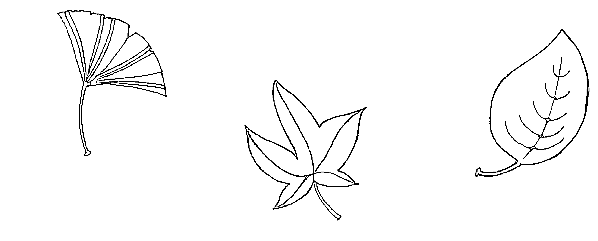

# 四句話變幸福：實現奇蹟人生的荷歐波諾波諾

楓葉有助於改善心臟與呼吸系統，柿子葉可以清理生殖功能與生理痛等婦科問題的記憶。

香水百合能清理對死亡懷有恐懼的記憶，酒瓶椰子能清理經濟與金錢問題的記憶。

另外，將植物製成壓花，夾在隨身攜帶的錢包或記事本裡，也能發揮清理的效果。

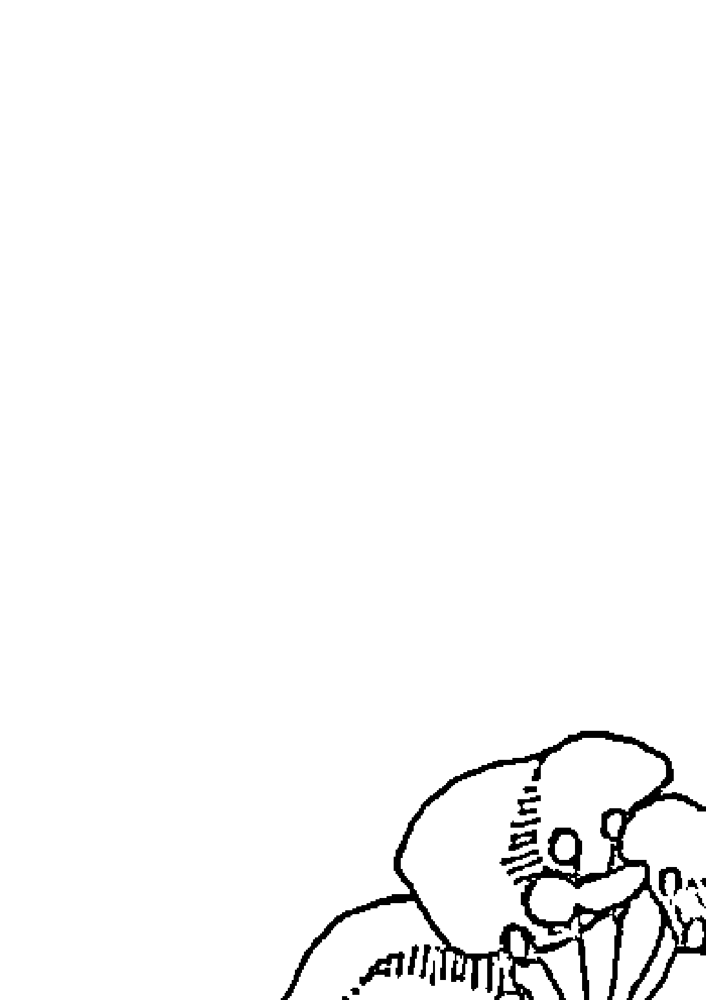

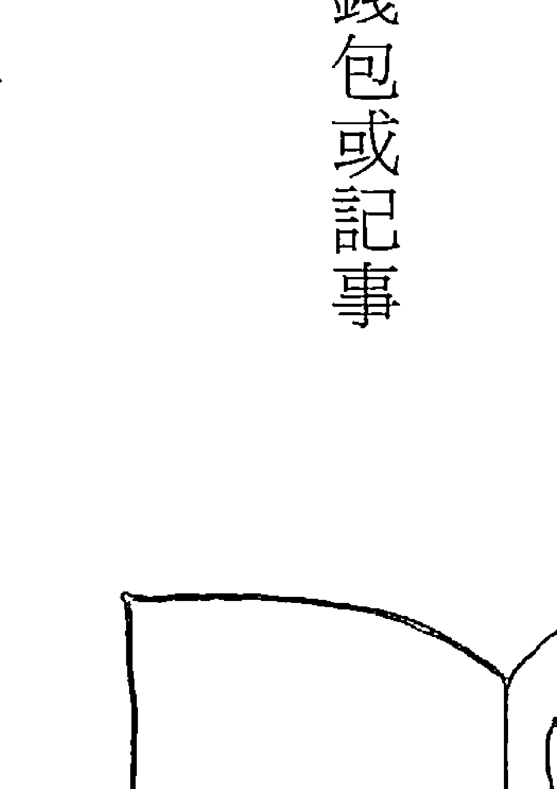

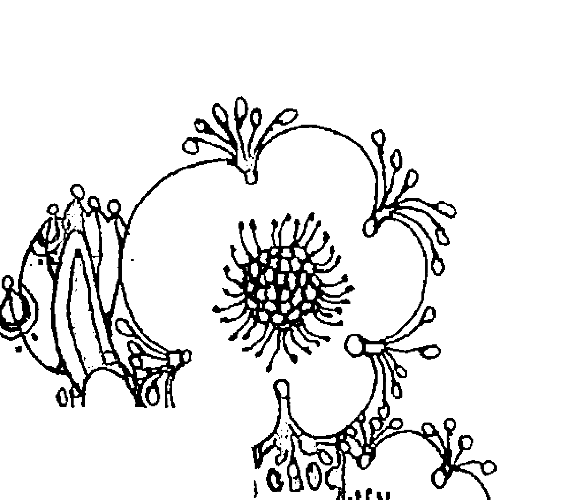

## 荷歐波諾波諾經驗分享③

### 遇見這個世界上「最重要的人（自己）。」

家庭主婦 石川功惠

我失去小孩後陷入茫然若失的狀態，在丈夫的強烈建議下，我見到了修・藍博士。在講座的休息時間，我和他說了兒子因意外去世的事情。博士遙望遠方片刻後，給了我一個緊緊的擁抱並說：

> 「你的小孩已經上了天堂，看起來很幸福，你放心吧。」

接著又說：

> 「為了讓自己從痛苦的狀態恢復正常，你要好好振作，過好自己的生活。」

同時給了我具體的建議。

其實當初參加講座時，我完全不知道修·藍博士是何許人，有過怎樣的事蹟。對我來說，修·藍博士就是個「始終看著別的地方，視線不會和我交會」的初次會面的美國人。這時的我每天沉浸在痛苦與悲傷中，沒想過向外界求助，每天都過得沉重痛苦，思維與感覺全都麻木了。

遠遠地聽到修·藍博士的話語，不知為何身體起了反應，淚水止不住流了下來，但頭腦還是不斷想著，「兒子已經死了，不在這裡了，這件事我再清楚不過了。事到如今，我才不想聽你說這些話。啊！又來了，又是那些聽到膩的安慰話語。」

回到座位後，方才聽到的話語還留在體內，我還是提不起一絲力氣，但身體卻對修·藍博士的那番話有所反應。這時候，我的身上出現了「宛如魔法般」的變化。我不去抗拒修·藍博士的話語，只是任由身體順其自然，不到三十分鐘，心中的「悲傷」便徹底消失了。

在此之前的人生，我一直相信任何事情絕對都有辦法解決。在別人眼中再艱難的事，我睡一覺就成功解決了。不過，無論我如何苦苦掙扎，「和死去的孩子見上一面」、「想要再次緊緊擁抱他，和他一起生活」，這些願望都無法實現。沒有任何方法可以解決問題，不管做什麼，他都不會復活。盼望他能像昨天那樣「存在」我的眼前，已經是「無論做什麼都無法實現」的願望，這讓我對自身力量產生一股「無力感」，我生平第一次體會到這種感覺。最難受的人，是生下兒子的我，是被一個人留下來的、我這個做母親的。僅此而已。無處可逃，進退維谷。有種說法是，幼子離世是給父母的訊息，還常聽到一種說法是：小孩已經完成了自己的使命。所以，如果小孩去了天堂後，父母遲遲無法察覺這份訊息，孩子就會前來告知父母。參加修・藍博士的講座後，我開始感覺到兒子成熟的模樣。有一天，我在睡前試了修・藍博士教的「和尤尼希皮里說話」，向一直身負自己負面部分的尤尼希皮里打招呼，不斷對它訴說。結果，尤尼希皮里突然仿佛從床上往上彈似地，跑到臥室天花板的高度，再抱著我的寶寶從空中降落。

他對著我拼命張口說話，我真的好開心！他確實在另一個世界健康快樂地活著。尤尼希皮里用最簡單易懂的方式，讓我理解「人類不存在死亡」這句話確實是真的。

這個體驗讓我從原本每天只想著「我不惜一切代價，都要追隨死去的兒子」，重新回到日常生活中。我由衷對尤尼希皮里說了「謝謝你」。

我終於遇見了最重要的人——自己。我終於將原本往外的自身能量重新往內聚攏，總算明白了，給自己滿滿的愛是多麼重要的事。我終於能正視尤尼希皮里。

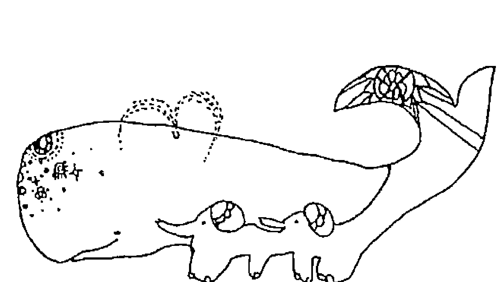

這個原理和操作電腦一樣，當我們要開啟並使用想要的程式時，必須先消除其他程式。如果使用了龐大的記憶體，就很難開啟程式，或是開啟速度很慢，甚至當機。所以當程式使用完畢後，就要一一消除。至於我們自己呢？當然也應該每天「消除」一切才是。

雖然我的兒子走了，但並沒有死去，所以我能感覺到他現在的狀態。因此原本內在對兒子過去的記憶（用來讓自己逃避的），便就此消失。我已經不需要這份記憶，所以得到了充分享受當下這一刻的力量。我可以感覺到，我和我內在的尤尼希皮里一起踏出了嶄新的步伐。

於是我總算能發揮自己原本的能力。唯有消除內在的過去記憶，讓自己從內在散發光芒，才能真正發揮原本的能力。

如今又懷上小孩的我，對這一點有深刻的體認。今後我要好好珍惜「自己」而活。

我察覺到，真正重要的人是自己。照顧重要的人，就是照顧整個宇宙。

> 最重要的人是我——并非身为资讯集合体的我，而是那个位于内在的寂静的我和一切合而为一的我，现在也依然是一体的我们不该忘记，谁才是最重要的。

## 第四章

### 關於愛護自己 照顧自己

第一步先照顧好自己，接著是家人，把其他人排在這之後。

## 懂得愛自己的人，也懂得愛所有人

消除記憶是為了自己，接著是為了家人，最後才考慮其他人。

這樣說，或許你會覺得把自己的幸福擺在第一位，是自私的表現。

不過，當一個人趕不走在自己頭上飛舞的蒼蠅，會有餘力去顧及其他的人嗎？首先要愛自己。你要優先消除自己的記憶，一旦消除了你內在的記憶，也會自然而然消除周遭的人的記憶。

你和你周遭發生的事物，全部源自你重播的記憶。無論是家人的疾病、丈夫的工作等個人性質的事物，都不該認為和自己沒有關係。

想要讓別人轉為正面的心態，這樣的想法也是來自你的記憶。我們不可能改變他人的心態，嘗試透過努力來讓不順利的事情好轉，也是沒有意義的。應該做的是清理自己潛意識中的記憶。僅此而已。

我要再次強調：清理的順序，第一是自己，再來是家人，接著是其他人。

只有懂得愛自己的人，才懂得愛別人。

用慈愛之心對自己，比任何事都重要。

## 別把潛意識視為工具，而是視為人生最大的夥伴

你是否有時感覺自己的心靈與身體非常疲憊？這時也許你會抱著悲觀的心態，認為「我已經上了年紀」「我沒有體力了」，但請在放棄前先清理。不要將你的潛意識看成是問題，而要看成是人生最大的夥伴。這也是荷歐波諾波諾的智慧。請經常對你的身體說：「謝謝你陪著我。」「謝謝你為我呼吸。」並懷著慈愛之心對待自己的潛意識，詢問它：「肚子餓不餓？」「會不會口渴？」我們必須傾聽內心與身體的聲音。心靈與身體緊密連結，疾病不過是記憶罷了，當心裡不舒暢，就會以疾病之姿顯現在身體上。心靈和身體都具有意志，所以要經常對自己的心靈和身體說「我愛你」「一直以來都很謝謝你」，好好愛護它。

> 四句話變幸福！實現奇蹟人生的荷歐波諾波諾

## 愛護自己內在的尤尼希皮里（潛意識）。

## 在你之內，十分重要的存在

無論有沒有小孩，每個人心中都住著一個小朋友，那就是內在小孩，夏威夷語稱為尤尼希皮里。尤尼希皮里總是看著你，同時還不斷想辦法傳遞給你正確生活所需的訊息。簡直就像一個想替母親做點事、幫母親忙的孩童。

如果你幸福，尤尼希皮里也會開心；假如你的內心亂成一團，尤尼希皮里就會疲憊不堪。不只如此，甚至會覺得自己的存在被忽略、不被愛，於是就認為有必要擔任中間人的角色、接收從神聖的存在傳來的靈感，而將自己的內心封閉起來。

尤尼希皮里希望你能快點清理，讓自己輕鬆起來，所以就接二連三地播放記憶，而記憶會以問題的形式顯現。因此，每當你遇到問題或負面的事物，請對尤尼希皮裡說：「謝謝你讓我看到這樣的記憶。」你得拼盡全力愛你內在的尤尼希皮裡，尤尼希皮裡的存在意義就是被愛。始終不要忘記這一點，不時對它說：「傷害了你真是對不起，我愛你。我們一起清理吧。」用這樣的方式清理，消除潛意識中的記憶吧。簡單來說，將愛傳遞給尤尼希皮裡，來自神聖的存在靈感便會降臨在你身上。靈感就像是不停流動的循環能量，只要你持續愛著尤尼希皮裡，這份流動就不會中斷。我們打從出生起，便擁抱著尤尼希皮裡。因此，我們絕非孤零零的一個人。只要敞開心和尤尼希皮裡商量，它就會扮演引導我們走向正確方向的角色。相信尤尼希皮裡存在、憐愛尤尼希皮裡，就等於相信自己、愛自己。

> 「謝謝你讓我看到這樣的記憶。」

清理记忆 || 傳遞愛給自己。

清理之後，就能感受到內在的愛。

## 清理的時候，潛意識會出現怎樣的改變？

前面已經講過，你潛意識中的尤尼希皮里一直守在你身邊。而這裡要用不同的角度，說明對尤尼希皮里傾注愛的重要。

清理記憶、獲得靈感的過程，是由「懺悔」「原諒」「轉化」三要素構成。首先要察覺引發問題是自己的責任，同時請求神聖的存在原諒。這麼一來，神聖的存在就會轉化潛意識，消除阻礙靈感的記憶。於是我們就能收到靈感，而這裡的關鍵在於要明白，我們無法直接與神聖的存在接觸。

45頁的圖說明了人類的結構（自性本我），這裡再對應到夏威夷語的父親、母親與小孩。

最下層是潛意識尤尼希皮里，接納這個小孩的人是上面一層的母親尤哈尼，也就是意識。再上一層是名叫奧瑪庫阿的超意識，說起來就像父親般的存在，負責與上面一層的神聖的存在連結、特別的意識。那麼，使用荷歐波諾波諾的清理方法時，這幅圖會發生怎樣的現象？透過清理消除、淨化潛意識中的記憶，這麼一來，對你而言對的事情、好的事情，就容易依序從潛意識、意識與超意識，傳達到神聖的存在。事物就會開始像毫無堵塞的水管一樣順暢運作。就在你的請求傳達給超意識，神聖的存在收到的同時，一股稱為「Mana」的靈性能量，會從神聖的存在直接傳遞給超意識，再通過意識傳遞給潛意識，消除你的記憶。這麼一來，就準備好接收神聖的存在傳遞的靈感了。接下來要做的，只有側耳傾聽神聖的存在傳來的訊息，在這份訊息的引導下，你會在自然的流動中充分發揮原本的能力，回到零的狀態。四句話變幸福！實現奇蹟人生的荷歐波諾波諾

1. 只要清理潛意識當中的記憶，對你而言對的事情、好的事情，就會依序從潛意識、意識到超意識，傳達給神聖的存在。

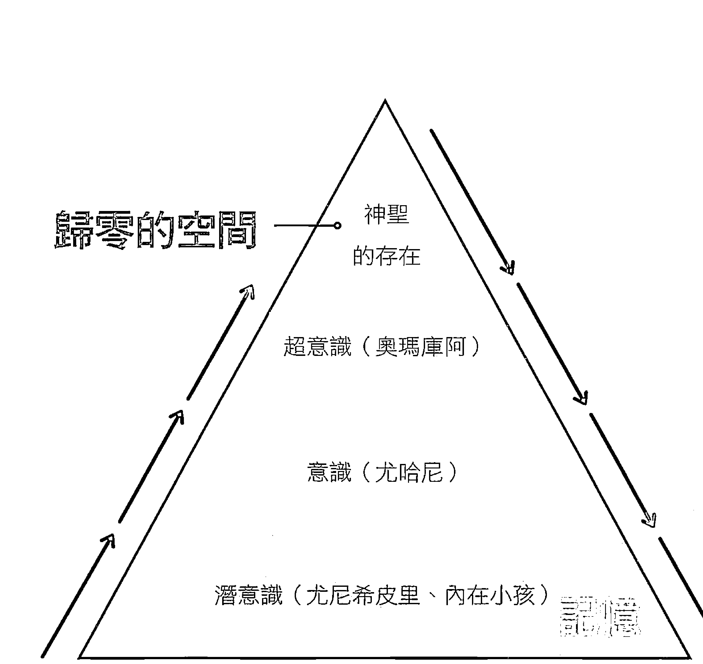

2. 之後，Mana（靈性的能量）就會從神聖的存在，依序傳遞給超意識、意識、潛意識，替我們消除記憶。

每分每秒，回歸到愛（＝零）。

## 愛能跨越時空，連結萬物

愛是活在世上最重要的東西。這裡我們用母親與小孩為例，來理解愛的崇高。

即將成為母親的女性，在對即將誕生的生命滿懷期待的同時，也抱有一絲不安。

而當小孩出生後，腦海裡又會閃過各種念頭：小孩的狀況確實符合預期、或是和預料中不同等。這就是母親。

從受精的那一刻便誕生的奧妙生命，會在母親的胎內度過十個月左右的時間。這段期間母親一直在外界等待著，一邊想像自己小孩的模樣，一邊做著工作和家事。但是，其實早在這個時間點開始，親子間就已經產生連結。母親懷孕過程中感受到的一切都會傳遞給胎兒，與生下來的小孩共享這份記憶。因此，孕期經常煩躁易怒或唉聲嘆氣的母親生下的小孩，往往出生不久就會出現情緒不穩定的狀況。這都是一連串的記憶。動手清理吧。做母親的首先應該為了解放自己的內心而消除記憶，而不是為了小孩。這樣一來，小孩的心也會自然而然穩定下來。也就是說，重複唸著四句話來清理，才是對小孩的愛。只要清理記憶，就能消除對小孩的期待與焦慮，無論生出怎樣的小孩，都能感謝地說「很開心見到你」。

## 四句話變幸福！實現奇蹟人生的荷歐波諾波諾

你的存在就是愛本身，

發生在你身上的所有事情，

都是為了幫助你清理潛意識中的記憶。

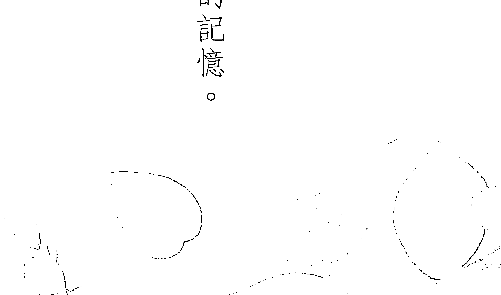

### 如何透過異性，學會愛自己？

你就是愛本身。這句話到底是什麼意思？這裡以經由戀愛或結婚而建構深厚關係的伴侶為例。
因緣際會認識的伴侶，是為了讓你學會愛自己而出現的、難能可貴的存在。
潛意識為了讓你明白對自己負責的重要，讓你們兩人在此相遇。
邂逅伴侶會帶來無比巨大的喜悅，但是無論怎樣的人際關係，總會出現摩擦。
記憶帶來的爭執、因為習慣而導致一成不變、男方要求女方做家事、女方過度依賴男方而無法獨立……不少伴侶都是因為這類原因導致關係失衡，最後破局收場。就這種情況而言，依賴的一方會覺得很輕鬆，被依賴的一方則沉溺於「自己受人依賴」的狀態。

## 四句話變幸福！實現奇蹟人生的荷歐波諾波諾

這種情況最大的問題是，一旦出問題時就會把過錯全部推給對方，自己完全不想負責。這樣的人不會去想：自己為什麼無法獨立？對方為什麼一直依賴自己？只要把過錯歸給別人，就絕對無法獲得救贖。

真正相愛的伴侶應該會想「這個人總是只會依賴我，原因是我自己造成的」或「這個人總是讓我依賴，一定是因為我不可靠，不得已才這樣做」。這時請詢問自己：是內在的什麼記憶，讓自己擔憂「搞不好會失去對方」，接著加以清理。假設你的伴侶出軌了，就算覺得自己是對的、錯的是對方，也要詢問潛意識「是我內在的什麼記憶讓伴侶出軌」，加以清理。

如果沒有察覺到清理的重要，將問題全部歸咎於對方，就這樣分開，日後即使和別人交往，還是會一再重複同樣的事情。因為問題不在對方，而是在自己身上，所以會有這種狀況也是理所當然。

擺脫人生困境，方法只有一個：透過清理，一一消除自己的記憶。只要你改變了，選擇伴侶的方法也會改變。想找到適合自己的對象，就得先愛自己。

## 荷歐波諾波諾的清理工具④

## 刪除鍵「X」

「X」擁有消除上癮、虐待、關係破裂的記憶的力量，因此能調整受到這些事物糾綁的思考，回溯到心理陰影產生的時間軸，重新調整到正確的位置。這意味著擺脫無法控制的負面情緒，引導我們回到原本自由的心，因此有助於保持冷靜、專注於清理。

每當發生問題時，在心裡想像「X」，也可以對潛意識裡的記憶說「X」。

對著工作來往人士的名片、朋友寄來的聖誕卡或賀年卡等，用手指畫「X」，或許能促進彼此的關係。也可以清理導致你擔憂對方健康的記憶。

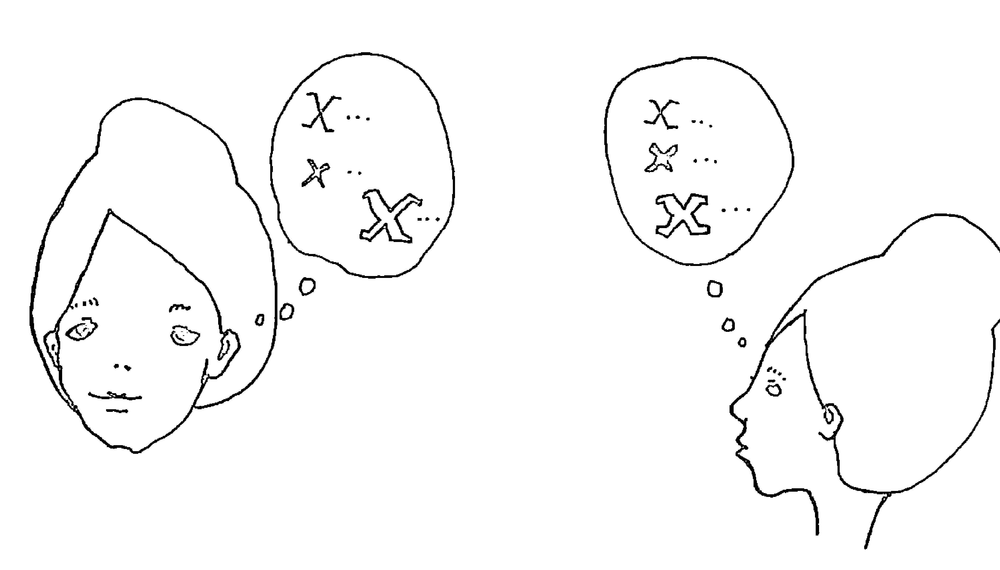

四句話變幸福！實現奇蹟人生的荷歐波諾波諾

### 想像回家的景象

如果人在外地、學校或工作地點產生負面情緒，想像回家的情景就能消除。不管身在何處，都可以在心裡想像自己回到家，整個人放鬆下來的景象。想像玄關綻放的鮮花、停在車庫裡的汽車、從窗戶透出的燈光、一打開大門便撲面而來的味道、寵物在腳邊嬉鬧的模樣等。當你因為對對方有所期待，而這份期待破滅讓你感到煩躁時，可以想像將形成這股煩亂心情的記憶用馬桶沖掉。想像用腳踩沖水閥的那種馬桶（而不是用手按沖水鈕的那種），割捨一切多餘的情緒，反覆踩踏沖水閥，想像討厭的記憶被捲入水中，隨著水流全數帶走的景象。請你養成習慣，每當察覺到自己內在有重播的記憶時，毫不猶豫地想像自己回家的畫面，或是用馬桶沖掉負面念頭的景象。這樣一來，在被記憶牽著鼻子走、心情變得憂鬱之前，就能先行清理。

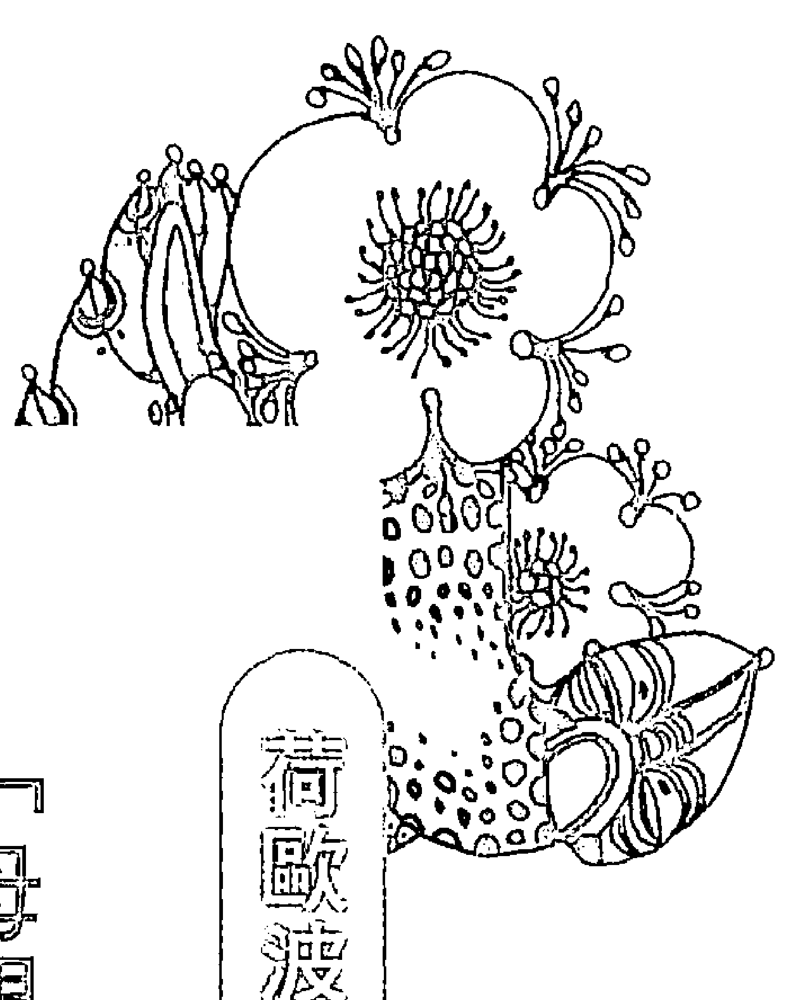

## 荷歐波諾波諾經驗分享④

「母親病危、父親患有精神疾病，父親揹負龐大債務，全都運用何歐波諾波諾解決了。」

日野智子（化名）

二〇〇八年四月，我收到母親病危的消息。母親患有結締組織疾病和風濕，又因為腦出血的後遺症使得右腦的前額葉喪失功能。母親和父親兩個人一同生活，父親則無法控制自己的情緒。我在東京工作，雖說平時都會關心住在北海道的父母，但其實已經多年沒回過老家，只是每天透過電話瞭解父母狀況。雖然母親後來保住了性命，但持續處於昏迷狀態。

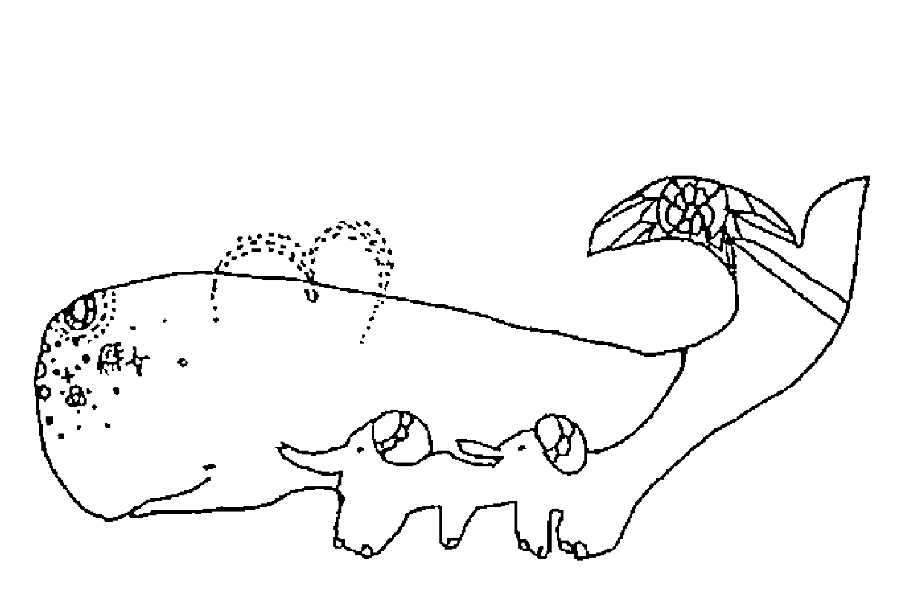

這段期間，信用卡公司開始寄高額的卡費帳單給父親與母親。不久，便有多家公司聯繫我、姊姊和弟弟，儘管對方願意由我們替父母代付，帳單卻與日俱增。

我們姊弟三人隱約感覺到大事不妙。

父親在母親病倒後，後遺症便進一步惡化，再也沒辦法控制自己的情緒，整個人都陷入深沉的悲傷與瘋狂。

我深愛父親，但四月當時每天和父親在一起都害怕得寒毛直豎。父親一直用言語暴力攻擊我。我常想，他會不會哪天就動手打我？

我甚覺得，父親搞不好還會殺了我，每天都過得心驚膽戰。後來父親就這樣住進了精神病院。

我將那些寄給父母的帳單改成我在東京的地址，帳單上的金額與日俱增。就在債務達到一千萬日圓時，弟弟在老家當地找到一位很好溝通的律師。我們姊弟三人合力說服父母，徵得同意後，委託律師替我們進行債務整合。

## 四句話變幸福！實現奇蹟人生的荷歐波諾波諾

這時，一位我很信任的老師告訴我修·藍博士在夏威夷精神病院締造的奇蹟，以及七月要開設課程的事。

我一開始沒多想，結果又有別的朋友也推薦荷歐波諾波諾給我，這時我彷彿悟到了什麼，便參加七月的課程。當時父親在精神病院出現打破玻璃、擾亂醫護人員與其他病患、抓狂、嘔血、厭食等狀況。 到了八月，母親已住院超過三個月，因此辦理轉院。雖然弟弟一家也住在北海道，但距離父母住院的醫院很遠，弟弟和弟媳的疲勞與壓力已經達到最高點。一家人眼看著就要分崩離析。

我能做的就只有清理。每天持續清理。 到了九月，委任的律師聯繫了我。

律師告訴我：「已確認你們超付了原本的貸款金額。如果要提告，會是利多於弊，要提告嗎？」

十一月，我請了一週的假，自從母親病危，這六個月以來首次前往北海

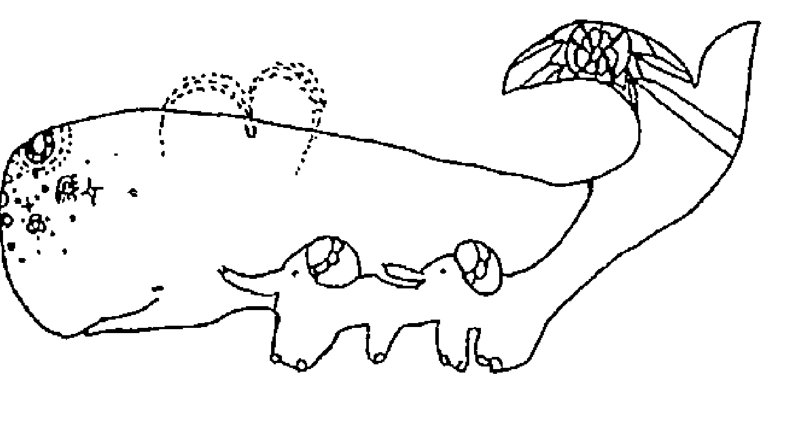

道。這段時間我持續透過弟弟和弟媳的郵件或電話了解父母的狀況，但要實際去看還是怕得不得了。

結果，一度病危的母親，現在已經能夠站立、行走，看到我十分高興。

我們想讓母親轉到醫院附近的照護中心。平時申請遷入都需要經過極其嚴格的審查，但這次面談卻進展得十分順利，院長說「先住進來再確認狀況」，於是就這樣辦好了轉院手續。

接著我去見了律師。

「超付的三百萬日圓會在二〇〇九年三月前列出證明，到時候令尊和令堂可以拿到退款。」律師向我保證。

之後我也去見了父親。父親因為先前被束縛帶束縛了很長的時間，已經無法自如行走，生活必須仰賴輪椅，但看到一家團聚，也非常高興。

我發現父親不再令我恐懼。

現在父親已從單人房轉到四人房，而且可以自己行走，不用坐輪椅了。

母親轉進新醫院後十個月便出院，在醫院附近的照護中心展開新生活，不用再住在病房，而現在她正在考慮是否要參加寫字班或合唱班。

修·藍博士常說：「只是一直煩惱、抱持悲觀的心態，解決不了任何事。」

當時聽到這番話的我，選擇了清理。

感謝朋友這一路上支持我，謝謝男友包容我的任性，謝謝老師讓我認識荷歐波諾波諾，謝謝平良貝蒂持續在日本開設課程，謝謝修·藍博士持續推廣荷歐波諾波諾。真的好感謝你們。

我衷心覺得對不起，請原諒我，謝謝你——還有，我愛你。

### 第五章

### 答案
全在你的心裡

自始至終，你都是完美的存在。

## 存在本身就無比美好

想像一下，你總是連結著一股巨大的力量，所以你是個完美的存在，因為神聖的存在總是不斷將無盡的愛傳送給你。

覺得活著沒有意義的人，其實是上演著「活著沒有意義」的記憶，覺得活著很痛苦的人，則上演著「活著很痛苦」的記憶，其中也有一些人上演著「不想活了」的記憶。不過，其實這些人也是和愛合為一體的存在，只是受到記憶干擾，遮蔽了來自神聖的存在照來的光。只要我們活著，無論何時都感受著神聖的存在的愛——絕不能忘記這一點。

得到悲慘結果的人，擁有得到悲慘結果的記憶。如果一個人看不到愛，問題便是出於這個人自己的記憶，因此只要清理就好。

一旦內心被記憶蒙蔽，任何人都的話都聽不進去。如果你的家人或朋友當中有這樣的人，請理解為「這是受到自己記憶的影響」予以接納，不必覺得「反正我就是什麼都做不到」。最重要的不是陪在對方身邊，也不是強迫對方打起精神，而是清理自己的記憶。

只要持續清理，陷入悲傷情緒的家人和朋友的意識，就會逐漸開朗起來。

所有人都與神聖的存在有連結。只要透過清理察覺這一點，內心就會轉瞬回歸平靜，同時體認到自己是完美的。

千萬別忘記，你不是一個人活著，打從誕生到這個世界的那一刻，你就被看不見的巨大的愛之力圍繞著。請時時刻刻致力於消除使你斷言「自己不是完美的存在」的記憶。

如果你能明白自己是完美的，就更能體會活著的喜悅。

## 四句話變幸福！實現奇蹟人生的荷歐波諾波諾

所有的人、事、物，都是反映你內在的表象。

## 開啟內心平靜的每一天

如果心情能永遠像平靜的海洋一樣，該是多麼幸福啊。就算發生悲傷難過的事情，內心也不會動搖，悠然自得，那就太好了。可惜人很脆弱，馬上就會被記憶牽著鼻子走，無法保持平常心。

痛苦的時候，就算希望有誰來拯救自己、幫自己消除痛苦，也沒有人會來，沒有人幫得上忙。因為面對根本的問題，必須由你自己消除痛苦，否則解決不了。

同樣地，即使你拼命想幫別人解決煩惱、讓對方好轉，自然法則也不會讓你如願。

一路閱讀到這裡，了解荷歐波諾波諾的智慧後，想必有些人會質疑：「要我攬下所有責任，我才不要呢！」——「為什麼我得將別人的不幸，看成是自己的內在造成的？」——不過，你周遭發生的事物，全都是在你的參與下發生的。出自你的記憶，或是你和某個人的記憶微妙地纏繞在一起，於是發生了各式各樣的現象。

這世界上發生的一切事物，全都彼此連繫在一起。如果你記憶中對某些事物存在負面印象，這份記憶就會化為負面的念想，朝不好的方向發展，導致對他人的言行舉止變得具有攻擊性。相反地，如果你的內心狀態彷彿平靜的海浪、澄澈無雲的天空，你發出的意念也會是正向的，接收到這份意念的人也會跟著轉為正向。這份意念在四處穿梭往來後，又會再次回到你身邊，於是你可以找回平靜的心。

早上起床時，小鳥飛上院子裡樹木的枝梢；散步的路上，惹人憐愛的花草宣告季節的到來。除了人類，還有數不清的對象都在傳播愛給你，請你對它們說「謝謝你」「我愛你」。從那一刻起，你就會開始流向對你而言最正確的方向。

## 第五章 答案全在你的心裡

「重播的記憶」和「靈感」——每天推動我們的，只有這兩大元素。

## 我們的內心被兩種看不見的力量推動

宇宙存在兩種能量：「記憶」和「靈感」。
你想和哪一種能量共度人生？答案想必是「靈感」。
靈感能告訴我們該怎麼做才能正確生活，幫助我們察覺自己真實的模樣。
當你在記憶的影響下，宛如戴著起霧的眼鏡，眼前一片灰濛濛，這時靈感彷彿就是神奇的清潔劑。
不過，由於靈感太過捉摸不定，不知道會在何時、何處到來，因此許多人都察覺不到靈感的存在。
可是，能否感覺到靈感，取決於你。
靈感很公平地分配給所有的人。
神聖的存在為我們帶來靈感，而我們也是神聖的存在創造的上帝之子。
想必你有想實現的夢想，或是殷切盼望擺脫一切苦痛。
如果你想讓靈感指引你該怎麼做，現在就動手準備吧。
方法就是清理。

當你想為正在受苦的人做點什麼，
第一步就應該先清理
讓你產生這份念頭的記憶。

## 不要想改變你以外的人

有位女性的丈夫開設的公司經營不順利，她長期為此苦惱。這名女性是家庭主婦，沒有參與公司經營，但因為丈夫心情低落，總是不停嘆氣，所以她也很難過，不知該如何是好。公司員工流動率非常高，起初她以為是丈夫獨斷獨行的管理方式或公司福利給得不好的緣故。

當時她相信必須改變丈夫才行，而這件事只有自己辦得到。但是丈夫並不領情，總是回以不耐煩的態度，情況只是越來越糟，有時甚至還引發激烈的爭吵。

就在這時她接觸了荷歐波諾波諾，便不再想辦法改變丈夫，轉而一心一意為自己清理記憶。雖然她起先半信半疑，但當她反覆唸著「謝謝你」「對不

## 四句話變幸福！實現奇蹟人生的荷歐波諾波諾

起」「請原諒我」「我愛你」，內心逐漸平靜到不可思議的程度，一直以來始終懷著憤怒「我明明那麼設身處地替丈夫出主意」，如今卻覺得似乎不該把公司的問題全都怪到丈夫一個人身上。隨著持續清理，她開始相信丈夫的公司會出問題，其實是自己的責任。是不是因為自己擔心「丈夫公司的員工會不會又辭職」，以及主觀認定「員工一直離職都是因為丈夫的個性太蠻橫了」等重播的記憶，事情才會不順利？自己是不是想著「要是丈夫的公司倒閉，自己也會受到影響」？會不會是因為自己扭曲的記憶，使得自己看不到丈夫真實的樣貌？當她察覺到這些部分後，便以歸零為目標，不再煩惱與迷惘，開始等待神聖的存在帶給她靈感。之後又發生了各種問題，但她沒再給丈夫建議，而是想著，「是我的什麼記憶出問題了？」即使對丈夫蠻橫的態度怒火中燒，她也會對尤尼希皮里說，「總之就先放下這個想法吧。我愛你。」並反覆清理記憶。過了一年左右，公司開始步上軌道，如今已過了五年，公司的規模已成長為當時的數倍。

愛著別人，同時也為自己而活，一點也不矛盾。因為自己的記憶會透過他人反映出來，所以我們要優先考慮自己並進行清理，消除記憶。
不必帶著罪惡感，第一步就先從愛自己開始。

## 第五章 答案全在你的心裡

- 你要選擇哪個？
- 愛或恨？
- 平靜或憤怒？
- 豐饒或貧瘠？
- 家人或孤獨？

## 內心中已期盼進入沒有記憶的狀態

前面的篇章已經說明，各種現象的成因全是來自人潛意識中的記憶。這裡再舉些實際的例子。從引發全世界經濟不景氣的金融問題、破壞地球生態環境等重大議題，到職場上的人際關係問題、夫妻間溝通不良、小孩惹是生非或閉門不出、校園霸凌等教育問題、原因不明的過敏症狀、威脅生命的癌症等疾病、對性方面抱有罪惡感、遲遲走不出工作上的失敗等因過去經歷所形成的心理陰影、不知不覺間對別人產生歧視或偏見等先入為主的想法、長久以來女性對男性抱持的憤怒、兇暴的行為、數以萬計的犯罪……真要算起來根本數不完。我們潛意識中的記憶正是如此影響著地球上每一寸土地。

## 四句話變幸福：實現奇蹟人生的荷歐波諾波諾

記憶不只來自個人生命歷程中經歷過的事物，還包括從最古老的時代代相傳至今的人類共同記憶，因此會在幾乎無意識的狀態下重播，使我們產生錯誤的認知。

不過，如果我們每個人察覺到消除記憶的重要，現實世界勢必會開始改變。舉個例子，用上一篇舉的記憶實例來說，當妻子察覺自己對丈夫有怒氣時，如果不將怒氣的矛頭指向丈夫，而是視為自己的問題，接著進行清理，丈夫的行為便會自動出現變化。

光是察覺到記憶的存在，就能帶動我們做出清理的行為。再者，我們內心深處也在無意識中盼望能進入沒有記憶的歸零狀態。就算感覺很辛苦，持續清理並不是那麼難的事。有時改善現狀的徵兆出現得快到令人驚訝，這麼一來，你勢必會將清理視為每天必做的功課。

我們每個人都要清理，這就是荷歐波諾波諾。請你透過荷歐波諾波諾覺察真正的自己。

與尤尼希皮里連結，就是與自己連結。

## 如果想要提高察覺靈感的敏銳度

在日復一日的生活中，我們很容易被時間追著跑。有句話叫「忘我」，這正是指靈魂被時間奪走的狀態。一旦進入這種狀態，內心會疲倦到連重播的記憶也察覺不到，所以意識也無法與神聖的存在連結，於是就察覺不到靈感的存在。若想消除這份記憶，最重要的就是騰出時間和尤尼希皮里說說話。尤尼希皮里一直等著你用愛來對待它，不過，也許你因為太忙，把它晾在一旁。尤尼希皮里可能會因此感到沮喪，感覺自己是不被愛的，就此消失無蹤。為了再次與尤尼希皮里接觸，我們該做的第一件事，就是找時間和它說說話，再移步到能讓自己放鬆自在的地方。請閉上眼睛，大口深呼吸。尤尼希皮里就在你的內在，等著你照顧它。

# 荷歐波諾波諾經驗分享⑤

> 「千鈞一髮的危機，正是清理的大好機會！」

自營業者 安部知子

感謝有這個機會，讓我能和大家分享像奇蹟一樣發生在我身上的事情。
自從參加基礎課程後，我的人生軌道出現巨大的變化。現在總是很期待遇到在恰巧時機出現的、如同奇蹟般的事情。
我從十二年前開始聽各種商業與靈性講座，範圍不限於日本，甚至還跨足國外，簡直就是一隻到處參加講座的無頭蒼蠅，苦苦追尋某個方法。總覺得說話方式和行為舉止都不再是原來的我。

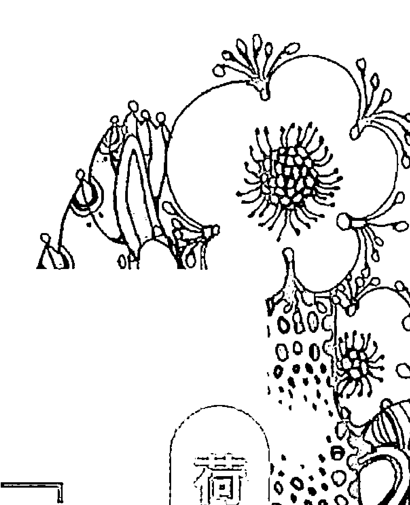

# 四句話變幸福！實現奇蹟人生的荷歐波諾波諾

自從十二年前看了喬・維泰利的書之後，我就決定要用靈性的方法取得事業成功。但不知為何就是不順利，於是我肯定還有其他更好的方法，不斷往外尋找。

某天，我的身體突然出狀況，明明前一天還到國外進貨，一時之間竟頭暈目眩，連站都站不穩，根本沒辦法獨自外出，變得和以前完全不一樣，擔心自己該不會是得了什麼重病。每當我想到這裡，思考就變得越來越負面。但無論怎麼檢查，我都被告知身體非常健康。

有天我在雜誌上的文章得知荷歐波諾波諾，之後接觸了「夏威夷秘法」，便馬上報名講座。我當時的身體狀況非常差，因此我不假思索、沒有懷疑，只是反覆唸著「我愛你」「對不起」「請原諒我」「謝謝你」。

結果，我到現在還清楚記得，身體突然就恢復健康，家人都大吃一驚。這時我腦中突然閃過一件事：官網上寫著一經報名，資料就會寄送到夏威夷，開始清理——這個時間點剛好是講座開始前一週。

擺脫長達八個月原因不明的身體不適，光是這樣就稱得上效果卓越了，但不只如此，我該做的事情還接二連三來到眼前。接著我參加了荷歐波諾波諾的商業課程，雖然這時病好了，但之前因為身體出狀況，不得不取消工作，資金調度因此出問題。當時幾乎已經捉襟見肘，就在這時靈感突然閃現，「對了，去向銀行貸款好了。」「節省不必要的開銷吧。」

我打算搬到房租較便宜的房子，便和叔叔商量，請他讓我暫時將家當寄放，在他家，沒想到叔叔說「你就住下來吧」，直接把他當時住的房子借給我住。叔叔的房子遠比我當時住的還大、還漂亮。叔叔搬到別的地方住，連停車場也一起免費借我用。一想到當時我已經處於四面楚歌的狀態，就覺得這件事真的像奇蹟一般。

想必只要持續清理、順從神性智慧的指引，一切都會往正確的方向發展。我深切明白，眼前所見都來自自己的記憶。

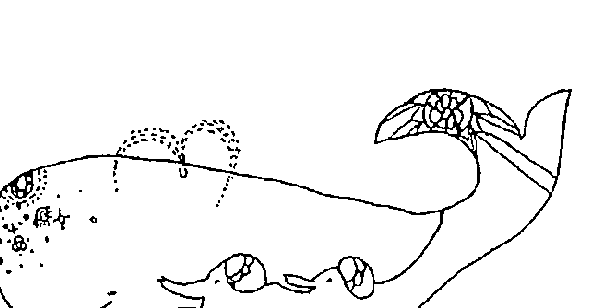

之後我腦海裡浮現從事時尚顧問的想法，但不知該從何做起。就在這時有個朋友來找我，聽我訴說構想後，有條不紊地幫我釐清想法，做成一本簡介。後來我在荷歐波諾波諾的商業課程認識一位女性，她從事的工作簡直跟我想做的事不謀而合，還給了我事業上的建議。正如修．藍博士說的，撰寫創業計畫書時不必用頭腦苦苦思索，只需清理就能被引導到對的事業方向。我現在開設兼顧女性內在與外在的時尚顧問及幸福說話術講座，這項事業是在上述的兩週內規劃出來的。我對接下來的發展滿懷期待。現在的我，捨去看過的大量書籍與講座，只要有荷歐波諾波諾便已足夠。能遇見荷歐波諾波諾真是太好了。既簡單又能自行實踐，不需要仰賴他人。再也沒有這麼棒的方法了。在此致上我由衷的感謝。

# 第六章 來自神聖存在的指引

只要清理，神聖的存在就會指引我們。

# 只遵循靈感而行，忘卻意志

這個世界上存在看不見的巨大力量，那就是向我們灌注愛的神聖的存在。我們在日常生活中不經意感受到的靈感，也是來自神聖存在的指引。

世上有許多人擅自認定「我沒有靈感」。也有人認為，與其仰賴看不到的東西，憑藉意志行動才值得稱道。正因為靈感是股看不見的力量，因此經常受到誤解。人們往往認為，只有極少數的特殊人才擁有陰陽眼、透視等靈能。

我們每個人都能感覺到靈感。你之所以會看這本書，也是出於靈感。也許你是在書店發現這本書，拿起來閱讀，也可能是朋友推薦給你的。無論如何，你都是遇見了這本書後，受到吸引才拿起來閱讀的吧？這個受到吸引的感覺就是靈感。如果你在看了本書後，知道清理記憶的方法，透過實踐而擺脫痛苦，是不是就像神聖的存在送給你的重大禮物？

靈感會化為一股力量，實現你在無意識間的願望。就算是不相信奇蹟的人，奇蹟也會出現在他身上。不過，當你迫不及待地期盼奇蹟發生時，靈感是不會降臨的。一旦有意識地期盼在潛意識中實現願望，就會產生新的重播記憶，反而會造成反效果。

這就是靈感降臨的運作原理。當某個人對自己內在的記憶說「謝謝你」「對不起」「請原諒我」「我愛你」，進行清理，存在潛意識中的尤尼希皮里就會開始理解自己是被愛的。基本上，尤尼希皮里是讓記憶重播的存在，因此你在不停清理記憶的同時，也要記得持續感謝尤尼希皮里，對它說：「謝謝你讓我察覺到記憶的存在。」

你該做的只有這個。不必思考其他事物，只要持續單純地清理。請清理「好想變成這樣！」「好想擁有那個！」等欲望。如果你的內心處於無欲無求、歸零的狀態，靈感勢必會化為禮物，降臨在你的身上。

如果能將日復一日的清理加入每天的節奏，你就不會再鑽牛角尖或卯起來解決問題。置身自然的流動中，明明沒做任何努力，卻能感受到各種問題平息下來並回歸該有的位置，感受到神聖的存在偉大。雖然我們無法掌控任何事物，卻有辦法清理潛意識的記憶。

請不要固執地認為靈感根本不存在，直接開始清理吧。你要做的，只是清理而已。

> > 不必想盡辦法取得成果，也不必苦苦追求成效。神聖的存在自會替我們消除記憶。

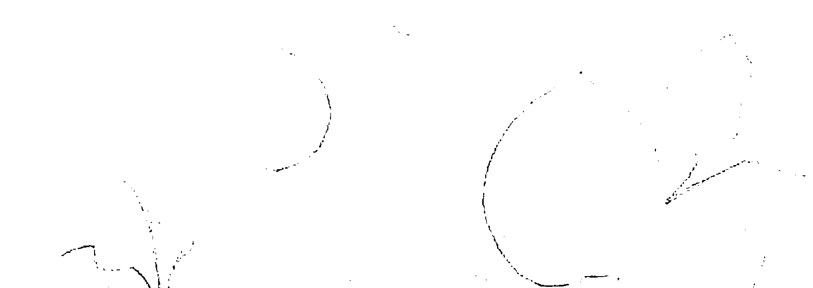

### 清理是一項永無止境的工作嗎？

每當我們遇到問題，自然會期盼事物盡快朝好的方向發展。可是，就算平時持續清理，如果太急著追求成果或效果，這份急切的念想又會創造出新的記憶。

那麼，到底要持續清理到什麼時候呢？我彷彿能聽到有人提出這樣的疑問，還有些人會覺得「好麻煩」。其實，如果用負面意義來看待清理，那就太可惜了。

一項驚人的數據顯示人類的潛意識領域有多麼龐大：如果我們用意識思考的單位是一位元，用來推動我們言行舉止的潛意識的記憶就是一千一百萬位元。明明我們受到一千一百萬位元的記憶操控，卻只能察覺其中的一位元。由此可見，人類的生活是如何被自己無法察覺的記憶玩弄於股掌間。總之，我們的潛意識連結著遠早於我們出生前便存在的、從這個世界誕生開始累積的龐大記憶。

既然如此，就需要持續不斷地進行清理。重要的不只是清理的結果，在持續清理的過程中，你的心會一點一滴出現變化，這才是最難能可貴的。

有時候需要花點時間才能歸零或接收到靈感，但只要進行清理，就能馬上改變任憑記憶堆積的生活方式——這本身便有極大的意義。因此如果把清理看成是一件沒有成就感、很麻煩的事，可就說不通了。清理本來就和吃飯、走路、睡覺，甚至是呼吸一樣，對你的人生來說不可或缺。

請將一切全交給神聖的存在，養成習慣用正向的心情進行清理。這麼一來，你會確實出現改變，想必會讓你每天內心都平靜到令人驚訝的地步。

尤尼希皮里知道，問題出自潛意識裡的哪些記憶、應該消除哪些記憶。

# 每個人都有與生俱來的角色

這個世界上沒有兩個人的人生是相同的。每個人都在各自的人生中，透過經歷形形色色的事物扮演著各自的角色。如果把我們生活的這個世界比作神聖的存在所創造的舞臺，我們每個人都是演員，扮演著各自的角色。既無法找人代演，也無法抗拒被賦予的角色。

舉個例子，假設有一類人的人生以鋼琴為主題，其中有些人是成為鋼琴家，有的則是成為鋼琴老師。偉大的鋼琴家未必能成為培育優秀鋼琴家的鋼琴老師；反過來說，傑出的鋼琴老師也不可能成為知名的鋼琴家，在個人獨奏會上享受觀眾如雷的掌聲。可是，要是覺得其中一方的地位比較高，那就不對了。

也許你瞧不起某些人做的工作，自己才不想做那樣的工作。和這些人相較之下，覺得自己的工作還不錯。不過，這樣做是管太多了。也許對當事人來說，這份工作就是無可取代的。再說，其實只要拚盡全力投入，無論怎樣的工作都是神聖的工作。是記憶從中作梗，讓你沒辦法這麼想而已。

儘管如此，為什麼每個人對工作的感覺都不相同呢？這正代表每個人都被賦予各自的角色。因為人們都演繹著各自的記憶，因此記憶便形成了不同的價值觀。

經常有人不斷投入無止境的追尋自我旅程。過度追求和現在的自己不同的、真正的自己，會變得無法感謝眼前的幸福，內心累積越來越多的不滿。有的人只關心別人怎么看自己，無法對工作本身懷抱熱情；也有人只是為了薪水才做，感受不到工作的意義。這些人的內心蒙上了虛榮和欲望，阻礙了靈感降臨。之所以無法對自己的工作抱持感謝的心情，問題不在工作上，而是因為你不愛這份工作。

這樣的人過度追求內在記憶創造的理想工作，察覺不到自己的錯誤。其實人生之所以不順利，正是因為強行採取違背自己角色的生活方式，卻仍舊不停追逐現實中不存在的青鳥。如果你心裡有點頭緒了，事不宜遲，請馬上對現在的工作說：「謝謝你，我愛你。」只要持續清理，就會逐漸理解自己被賦予怎樣的角色。請下定決心採取屬於自己的生活方式，清理心中的雜念，不去欣羨別人的、追求不適合自己的生活，也不與他人比較而陷入焦慮。這麼一來，你就能看出這份工作究竟是否適合你。如果現在做的工作適合你，靈感就會替你安排下一步發展，迎接新的轉機；假如不適合，也會自然發展為離職的結果。即使是走到離職一途，只要是依循神聖的存在傳遞的靈感，你就不會受到傷害，能夠神清氣爽地迎接新工作。

我們必須說出「請原諒我」。藉由獲得原諒，才能找回自我。

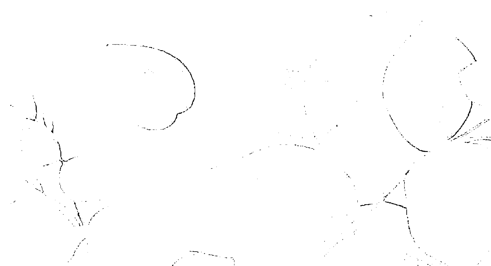

# 什麼都不用多想，只需在心裡說「請原諒我」

荷歐波諾波諾帶來的奇蹟，是讓錯誤的記憶瞬間轉化為LOVE，也就是愛。

只要唸著「謝謝你」「對不起」「請原諒我」「我愛你」來清理，就能消除潛意識裡的記憶，收到神聖的存在傳來的靈感。這一點已經反覆強調過了。

不過，為什麼要說「請原諒我」？有些人會特別在意四句話中的「請原諒我」，擔心是不是自己過去做過什麼壞事，所以才要求得原諒。

其實，並非因為你做過什麼壞事。但是內在重播的記憶，涵蓋我們自宇宙誕生開始無數次轉世的過程中烙下的記憶，因此我們並不知道事物無法順利運作，原因究竟是來自哪個記憶。我不會替來找我諮詢或接受療法的人們進行心理諮商，原因就在這裡。潛意識的記憶比意識的記憶多一千一百萬倍，我不可能明白是其中的哪個記憶使眼前的這個人苦惱。這時若能說出「請原諒我」，也能覆蓋掉無意識間在潛意識中重播的「必須乞求對方原諒才行」的記憶。

此外，當你因人際關係而苦惱時，請理解為：在對方身上感受到的討厭的部分，也存在於自己的內在。這時首先要唸「請原諒我」，清理存在自己內在討厭的部分。這麼一來，對方令你討厭的部分也會跟著消失。「請原諒我」這句話並非是對討厭的對象說的，而是為了讓自己的靈魂成長，對自己內在的尤尼希皮里說出這句話。

我一般會建議人們，在產生嫉妒與占有欲等心情時，對著這份心情進行清理，但有些人在此情況下實在說不出「嫉妒啊、占有欲啊，請原諒我，我愛你」。希望這樣的人可以想想耶穌說的「愛你們的仇敵」，這裡的仇敵就是指記憶。如果這樣還是有抗拒感，請你對尤尼希皮里說「不知道為什麼我們會為嫉妒和占有慾所苦，但是讓我們一起克服吧」，持續用四句話清理。

總之，當我們獲得神聖的存在原諒，就能邁入不受記憶操控的歸零狀態，唯有這時才會明白問題的原因在自己的內在，才能找回原本那個單純的自己。

### 第七章 關於歸零

成為真正的自己那一刻，你會處於好的意義上、空空如也的狀態。當你化為零，才能找回純粹，回歸原本的樣貌。

### 愛時時傾注在你身上

荷歐波諾波諾認為，人們的目標是透過清理而擺脫記憶的束縛，成為懷抱愛的存在。為此，神聖的存在時時刻刻對所有人灌注滿溢的愛。也許有時候你看到有錢人或成功人士，會覺得上帝真不公平，但其實人人都是平等的，有的人生過得充實又豐富。不過，大多數人並未察覺這份神聖的恩賜，不是嗎？正因如此，才需要清理。清理能讓我們感覺到神聖的存在傳遞的靈感。而這一刻，我們也將確信自己身上一直被灌注著愛。內心受到記憶的影響而蒙上陰影的狀態，並不是原本的自己。憂心忡忡想著要是發生這樣的事該如何是好，或是沒自信、覺得自己根本辦不到，抑或自暴自棄地認定反正怎樣都不會成功……記憶創造了這些毫無根據的情緒，許多人被牽著鼻子走，陷入人生的迷宮。但是，「我想這麼做」「必須這樣才行」的記憶，當別人傷害你的時候，在你心中喃喃低語「一定要還擊才行！」的聲音，是你的記憶投影出的現象。唯有歸零，才能明白你真正需要的是什麼。換句話說，當你還抱有「想這樣做」「想那樣做」的欲望時，表示還沒進入歸零的狀態。當你進行清理後，潛意識中重播的記憶以欲望的姿態現身時，請再接著清理。

- 一是清理
- 二是清理
- 三還是清理

也許有人會以為，進入歸零狀態將喪失知識與理性，處於空洞茫然的狀態，但其實歸零時，神聖的存在會給予你所需要的一切。如果神聖的存在告訴你「投入這項事業吧」，帶你進入這樣的流動中，便會一併給你投入這項事業所需的金錢。但話說回來，假如不歸零、找回單純的自己，甚至無法得知真正適合自己的是什麼。

如果你還無法感受到由神聖的存在傳來的愛，請立刻開始清理。 對著妨礙你察覺到愛的記憶，在心裡說著：「記憶啊，謝謝你、對不起、請原諒我、我愛你。」

每個人都有很難克服的記憶，但最重要的是絕不放棄，持續和記憶對峙。

請持續清理潛意識中的記憶。神聖的存在賜予我們的，不是駁倒別人、滿足欲望之類渺小的滿足感，而是龐大的愛。我們要做的是，替自己人生中的各種問題承擔責任，進入歸零的狀態。

零是不存在時間的世界。因為時間不存在，也就沒有區分事物的邊界，沒有執著、不被束縛，是一個完全自由的世界。

# 愛的力量與世界合為一體

想像一下，內心歸零是怎樣的狀態？零是一個不存在時間的世界。沒有劃分人生的界線，空間無限寬廣，也沒有物質與金錢的概念。零的狀態就是佛教的無我境界，是一個完全自由的世界。

我們何時會對人生感到畏懼？我想應該有許多人會回答年邁衰老、死期將至的時候，或是罹患重病感受到死亡不遠之時，總之都是因為感覺人生面臨終結，自己即將消逝而產生恐懼。這也是記憶的一種。倘若明知如此，卻還是畏懼時間的流逝，那便是因為我們的內心深處重播著「死亡好可怕」的記憶。

但是，其實我們不必恐懼死亡。我們都是在神聖的存在創造的舞臺上演出的演員，只是藉由死亡結束我們這一幕的戲分而已，戲碼還會永遠持續下去。

死亡讓我們與今生的肉體告別，而靈魂將永遠活下去。只要透過清理來清除恐懼死亡的記憶，應該就能明白這一點。我們每個人的體內都有靈魂，看似是孤立的存在，但其實靈魂都是一體的。我們的肉體死去後，靈魂會化為光，彼此合為一體，回到神聖的存在那裡，回到歸零的狀態。著手清理吧。「謝謝你」「對不起」「請原諒我」「我愛你」這四句話對消除潛意識中的所有記憶，以及打開你的心扉是不可或缺的。透過清理接收神聖的存在傳遞的靈感後，也別忘了從你的內在釋放愛。帶著愛的你，身上圍繞著一層美麗的氣，這股氣會影響周圍的人們，你的身邊將立刻凝聚一股愛心能量，結合一個意識，這該多麼令人安心啊！沒有人是獨自活著的，也沒有人會因死亡而變成孤身一人。只要透過清理了解這一點，內心就不會再受到流逝的時間束縛。這麼一來，對死亡的恐懼想必定也會煙消雲散。

透過清理，覺察到專屬於自己的香格里拉。

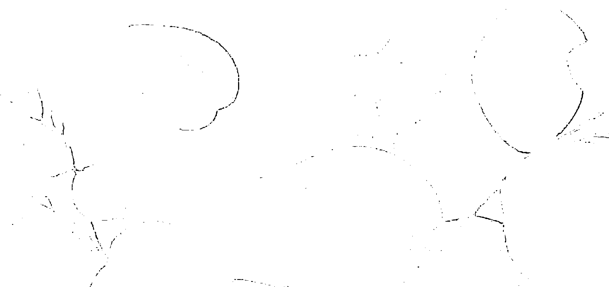

### 內在歸零時，樂園就顯現

有人畏懼死亡，有人則覺得活著很痛苦，抱著悲觀的心態，認為死了反倒輕鬆。人生中確實存在創造出各式各樣問題的記憶，讓你陷入無路可退的境地，想像自己在名為孤獨的沙漠中四處徘徊，心情無比絕望，感覺這簡直就是人間煉獄。可是，那些哀嘆人生像是人間煉獄的人，沒有發現人生不順利都是自己造成的。「反正我是無法幸福的」的記憶占據了內心，引發現象，導致問題產生；這時又因為「都是那個人的錯」的記憶，使你不去反省問題究竟出在哪裡。這麼一來，靈魂便無法成長，開始覺得自己到底為什麼要誕生在這個世界上，也是再正常不過的結果了。

如果能醒悟，發生在自己身上的事物，百分之百是自己的責任，人生就會頓時好轉起來。只要腦海閃過「對了，只要改變自己就好了！」的念頭，可以說就差不多脫離地獄了。接著再透過清理，便能徹底逃脫地獄，甚至能創造樂園。

樂園是斬斷一切煩憂，快樂自在的地方。樂園一詞也可以替換成天堂、天國等詞彙。住在樂園的人們不被記憶牽著鼻子走，光是存在此刻便感到充分滿足，擁抱真切的幸福。

不過，我聽說很少有日本人「對現狀感到滿意」，總是看著更高的地方，想上更好的學校、做更好的工作、賺取更多的收入、過上更奢華的生活。有上進心不是壞事，但這裡的關鍵是，那些無法滿足於現狀、始終想要追求更多的人們，究竟是否確實觀察並充分掌握自己的心。遺憾的是，這些人在我眼裡就是不停奔跑，把自己累得半死。其實他們應該換搭每站都停的列車，欣賞沿途景色，更重要的是要先想想怎樣的生活方式最適合自己才對。

清理的最大目的是消除潛意識中的記憶，為此就應該特別設一個時間專門用來清理，找回從容不迫的心靈。如果一個人的心靈處於真正富足的狀態，不需焦頭爛額忙得半死，就能獲得良好的人脈與有成就感的工作，與此同時金錢也會跟著來到身邊。

因此我建議大家清理。希望各位能明白，只要透過清理消除潛意識中的記憶，就能創造出內心的樂園。但是，請不要抱著拚命努力的感覺來清理。因為「努力是很辛苦的事」的潛意識又會化為新的記憶，這樣清理就沒有意義了。

讓清理就像是呼吸一樣自然，將這樣的清理變成生活的一部分吧。假如你發現一不清理人就怪怪的，就是很好的跡象，表示你心中的樂園正逐漸擴展。

疾病是清理的訊號。

## 消除生病的記憶

前面的篇章已經說明，我們每個人都像是演員，扮演著各自的角色。換句話說，活著就是在演繹記憶。那麼，這句話到底是什麼意思呢？
舉例來說，假設你生病了，這表示你正在演繹生病的記憶。生病很難受，於是你自然會大失所望地想，「為什麼要給我一個生病的角色啊？」我能理解這樣的心情，但其實生病的你該做的事情是清理。雖然不知道是你內在的什麼記憶引發疾病，但你只需對尤尼希皮里說「謝謝你」「對不起」「請原諒我」「我愛你」，進行清理而消除記憶，就能自動消除生病的角色。

不過，只有這樣可能還不夠。有時會有為疾病所苦的人來找我，我做的不只是建議對方清理，還會透過清理來消除自己潛意識中「這個人生病了」的記憶。因為即使對方的意識認為是來找我諮詢疾病的煩惱，實際上卻是知道我的潛意識中存在著使自己生病的記憶，所以特地給我這個機會清理。

不光是我，每個人都會在人生中遇見形形色色的人，任何場合的相遇都是有意義的。更進一步說，每個人和各個相遇的人之間，都處於「必須彼此清理」的關係。就算是在路上被對方踩到腳的關係，也請你理解為：這是潛意識為了讓我們雙方清理，才讓我們在茫茫人海中碰上。

即使是擦肩而過的路人，也是因為潛意識的記憶使我們相遇，所以像是家人、夫妻、朋友、工作夥伴等近在身邊的人，彼此的緣分更是深厚，可以說處於雙方每天都必須清理的關係。

一個人內在的記憶總是與其他存在有所連結。一旦你進行清理，不光是能消除你自身的記憶，發揮出原有的能力，還能帶給其他人正面的影響。荷歐波諾波諾認為只要對著自己清理，周遭的環境也會自動跟著調整到良好的狀態，其根據就在這裡。

## 四句話變幸福！實現奇蹟人生的荷歐波諾波諾

人們會說「與疾病抗戰」，也經常使用「戰勝病魔」這個用語。但是，疾病並非是我們戰鬥的對象，而是催促我們清理的訊號。不要因為疾病而變得神經質，請你理解，疾病是讓我們有機會迎接歸零的狀態，扭轉人生，讓自己活得充滿生氣。請你清理形成疾病的記憶，並接著持續清理，前方的道路便會向你展開。

> > 不管發生什麼事、處於何種狀況，都要持續清理。

## 修·藍博士郵件的簽名檔「POI」是什麼意思？

我撰寫電子郵件時，都會在最後打上「POI」。這句話是「Peace of I」的縮寫，意思是「我的平靜」，也就是不受任何事物影響、完全平和的內心狀態。在日常生活中隨時留心POI，是非常重要的。如果沒有經常清理，記憶就會趁虛而入，妨礙我們做出正確的判斷。舉個例子，當一個人的記憶重播著「沒錢會很痛苦」的時候，對貧窮會懷有恐懼。但沒錢真的很不幸，有錢就會幸福嗎？認為貧窮很可怕的人，會戴著「窮人好慘」的有色眼鏡看世界。一樣的道理，你看到的一切，也是透過你自身的記憶看到的景象。你的尤尼希皮裡讓你透過人生的景象，明白你該清理什麼。

假如你在通勤的路上遇到色狼、被醉漢糾纏、撞見車禍或火災，代表被醉漢糾纏、撞見車禍或火災的記憶正在重播。因此，在前往某個目的地之前，必須先行清理。

當你在工作上不得不與討厭的客戶接洽時，表示對方是特地來讓你看到內在的苦惱。至於那些本身的工作內容就是消除人們苦惱的人，例如客服人員、心理諮商師、醫師、護理師、推拿師等，也是一樣的道理，客戶都是特地來讓你看到你的記憶。

活出真實的自己，便能發揮原本的能力，盡情揮灑人生，而且方法十分簡單。就只是對尤尼希皮裡說「謝謝你」「對不起」「請原諒我」「我愛你」，消除潛意識中的記憶而已。

荷歐波諾波諾是個讓任何人都能自行解決自身問題的實用方法。半信半疑也好，不相信也無妨，希望你能開始著手清理。

## 四句話變幸福！實現奇蹟人生的荷歐波諾波諾

我自己也持續對著這本書，以及對閱讀本書的各位讀者清理。感謝各位透過這本書與我相遇，給我清理的機會。
好了，現在輪到各位開始清理了。只要你歸零、找回原本的單純，就會出現奇蹟。我由衷祈禱，能夠有更多人實踐「荷歐波諾波諾回歸自性法」，踏出邁向美好人生的第一步。

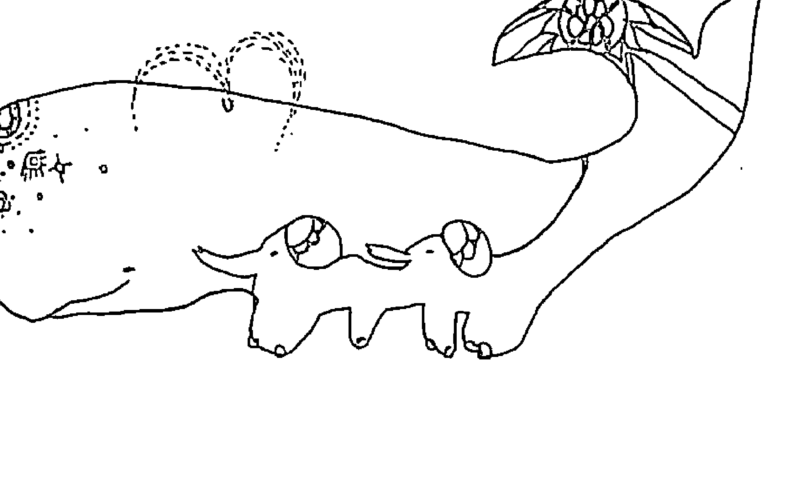

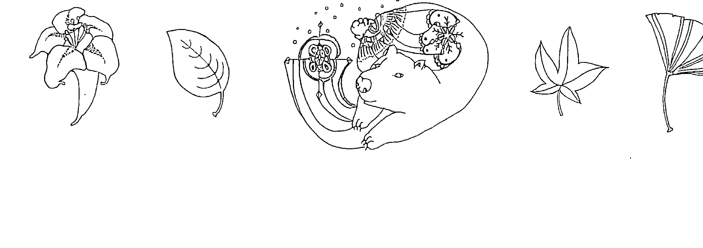

## 第七章 關於歸零

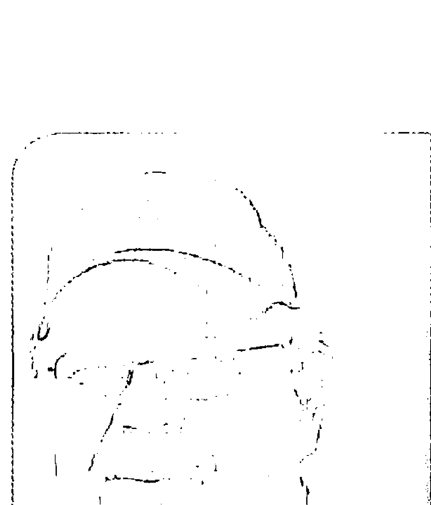

## 荷歐波諾波諾 Q&A

**Q** 「謝謝你」「對不起」「請原諒我」「我愛你」這四句清理的話都要說，不然就沒有效嗎？如果是，一定要按照順序說嗎？

**A** 不需要四句話全說，也不必拘泥於順序。順帶一提，我覺得「我愛你」這句話本身就包含了「謝謝你」「對不起」「請原諒我」，所以我都只唸「我愛你」。另外，有的人一開始很緊張，只說得出「對不起」，即使如此依然有效。

**Q** 說這四句話的時候，是不是發出聲音效果更好？

**A** 並沒有這樣的規則，請依循自己的靈感來說即可。不過，如果在安靜的公共空間唸出聲音，很可能讓周遭的人們感覺不舒服。所以我基本上都建議大家在心裡默唸。

**Q** 早上、中午、晚上，哪個時間進行清理比較好？
**A** 隨時都可以，養成習慣才是最重要的。也可以規定自己，每當焦躁不安、因為別人說的話而感到憤怒、被悲傷籠罩的時候，就固定唸這四句話。一旦養成清理的習慣，只要一有時間就會自然唸起清理的語句。尤尼希皮里總是在看你是否認真清理。如果你持續認真清理，尤尼希皮里自然會記住清理的方法，替我們清理。

**Q** 唸非常多次，會加速消除記憶嗎？
**A** 不會。消除記憶的關鍵不在清理的次數，而在於永遠持續下去。記憶總是不停累積，在我們意識到之前就先重播，把我們牽著鼻子走，所以只要活在世上，就必須持續清理。

**Q** 我需要帶著感情去唸清理的四句話嗎？
**A** 不用。不只如此，甚至不相信清理會帶來奇蹟也無妨，只要機械化地用刪除電腦資料的感覺來做就好。抱著「試試看，沒效就算了」的心情也沒關係，重點是「Just do it!」。

**Q** 清理的時候，要在心裡想像什麼嗎？
**A** 不必想像。有些人有誤解，以為想像理想中的自己或想要的東西，比較容易將心意傳達給神聖的存在，但其實慾望與期待都源於記憶。如果不放下一切而歸零，神聖的存在就不會傳遞靈感過來。

**Q：** 我清理沒有效果，心裡非常著急。
**A：** 是記憶造成了著急的情緒。不必著急，請先清理著急的記憶，讓內心平靜下來，同時也清理你內在期待的記憶。

**Q：** 要怎麼確定是否處於歸零狀態？
**A：** 歸零時沒有外顯的特徵，沒辦法用肉眼看出來，只能感覺到。如果進入歸零的狀態，就能感受到神聖的存在傳來的靈感。

**Q：** 有什麼特別適合日本人的清理方式？
**A：** 基本上清理方式是全世界共通的，不過當我來到日本時，感覺到銀杏葉具有療癒的靈感。而每當感覺自己變得一直分析、愛講道理的時候，我會嚼嚼 GREEN GUM（譯註：鮮綠薄荷口香糖，日本的老牌口香糖，添加葉綠素使外觀呈綠色）。GREEN GUM 也是日本本能協助靈感降臨的清理工具。再來就是蝦子。日本人經常吃蝦，蝦子能消除「遺忘事物」的記憶，也就是阿茲海默症的記憶。

神聖的存在擁有寬大的包容度，不拘泥於清理工具的種類，因此關於清理工具沒有任何生硬的規定。許多 人在消除記憶後，在某些事物上（例如香草冰淇淋、藍莓等）能感覺到靈感，於是擁有專屬於自己的獨特 清理工具。

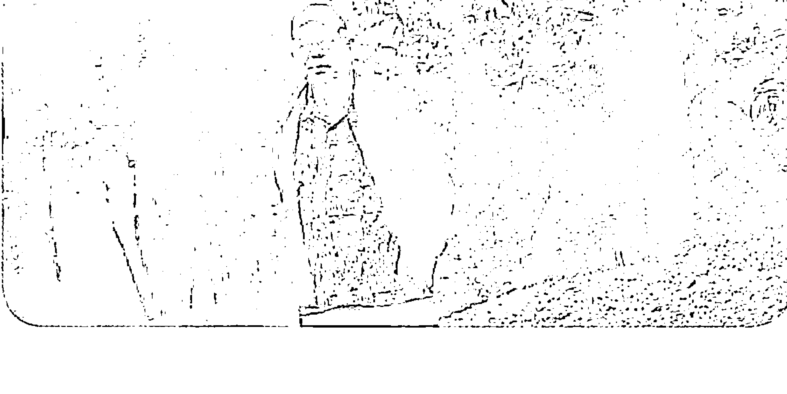

## 四句話變幸福！實現奇蹟人生的荷歐波諾波諾

> > 「人類至今揹負的所有煩惱全都有辦法解決。」

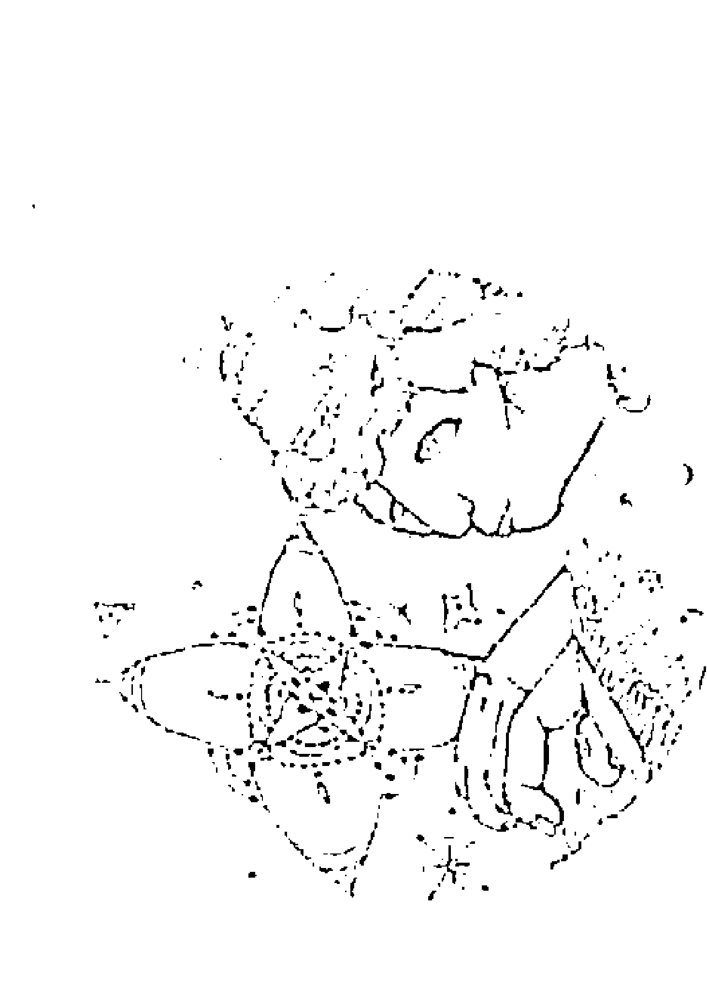

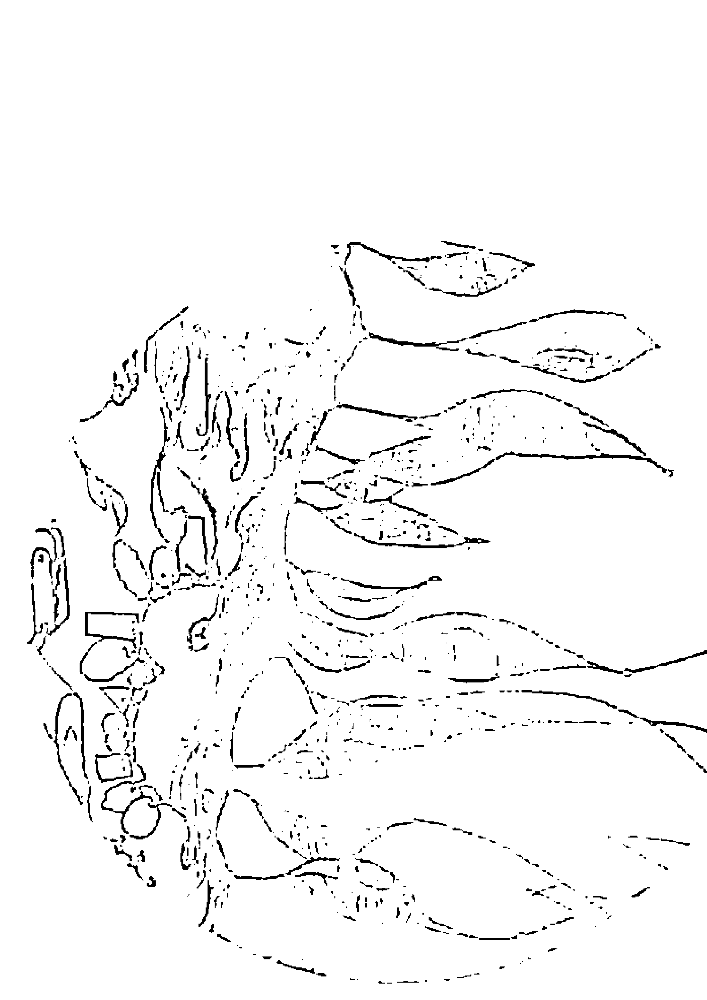

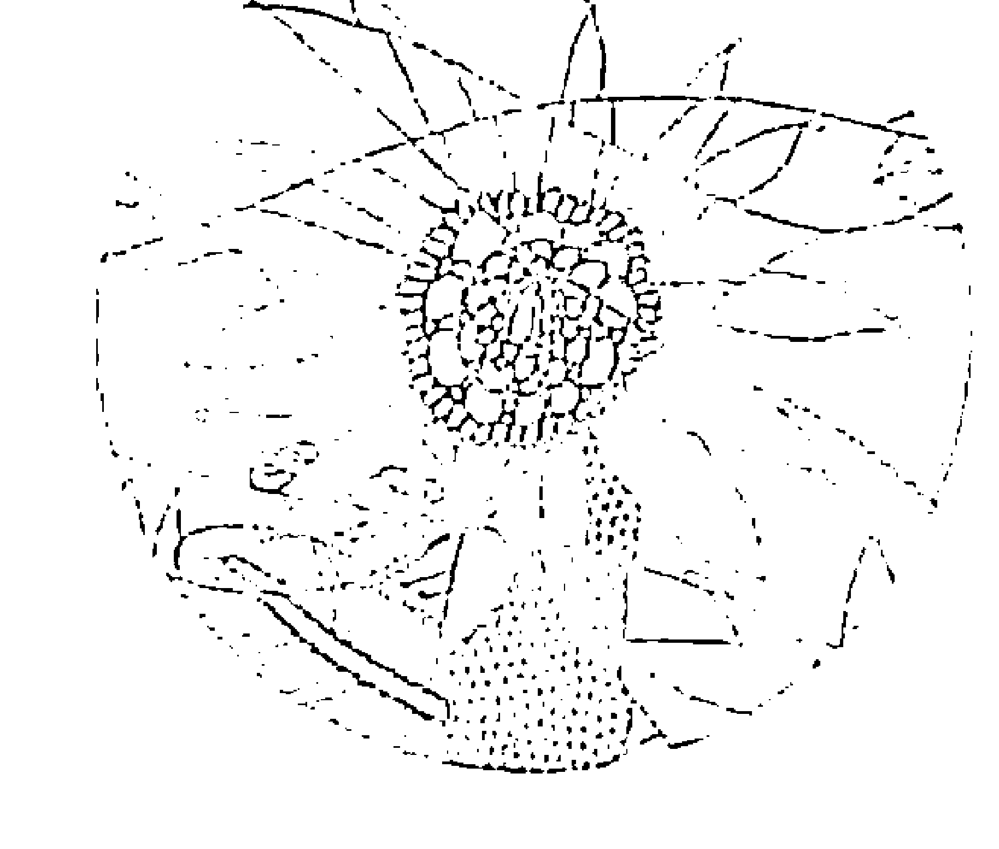

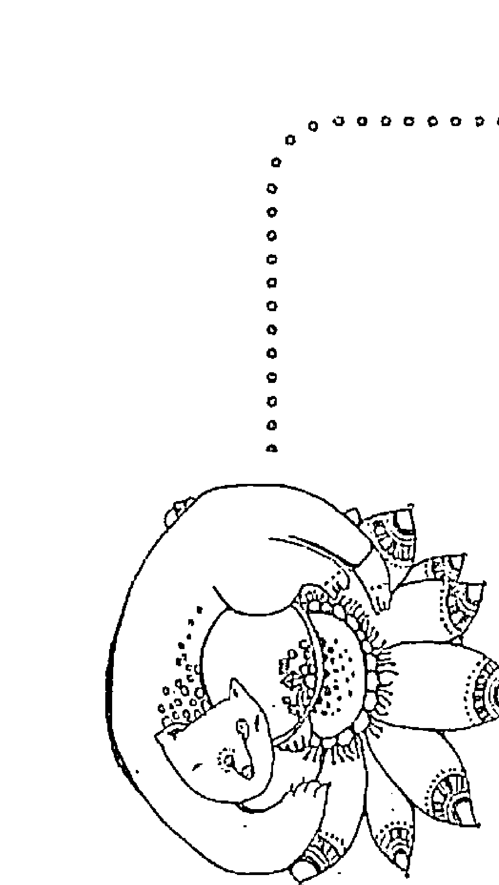

### 西川桃子

三十多歲的上班族，大多數的困擾來自人際關係的問題，同時也發覺自己過於脆弱，無法從父親去世的悲傷中走出來，因此想透過荷歐波諾波諾解救心靈上的問題。

### 三浦奈奈

四十多歲，已婚，自由插畫家。深受丈夫的惡言相向所苦，在尋找解決之策時，接觸到修·藍博士的著作，便持續清理。

### 我能用清理來控制丈夫的家暴行為嗎？

西川
三浦

修·藍博士，很榮幸能見到您，直接和您對話！
真的就像做夢一樣！參加講座的學員都說，一進入會場就能感受到 修·藍博士的氣，光是 這樣就被療癒了，我現 在感覺整個人也變得開 朗起來。

自從決定舉辦這次的三方對談，這段時間我持續清理兩位的名字和出生年月日。不單是針對

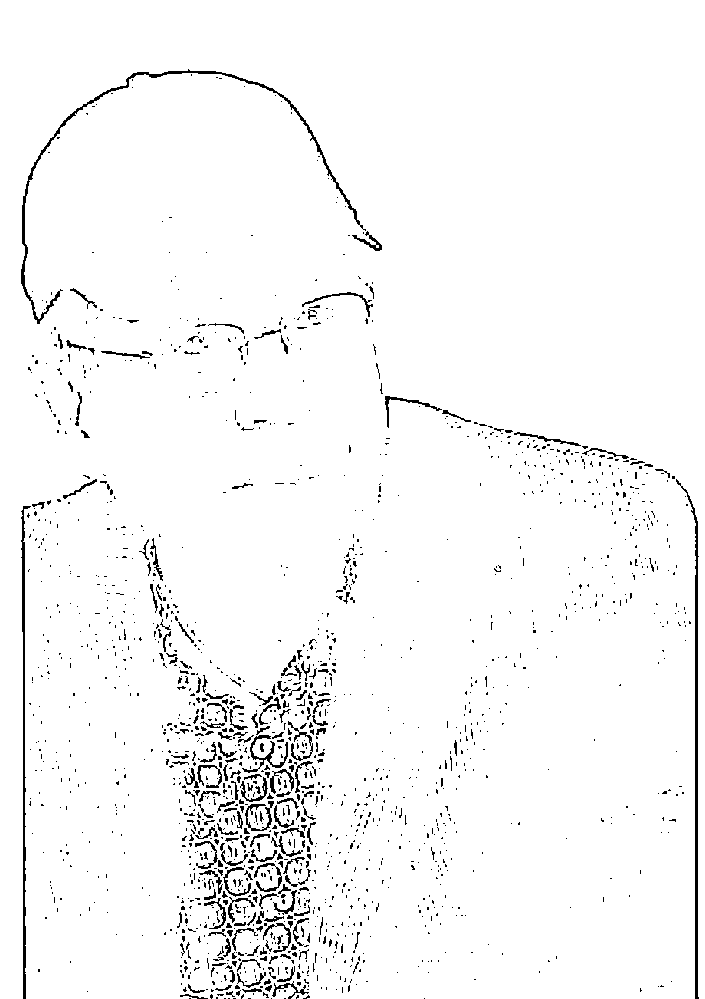

荷歐波諾波諾三方對談

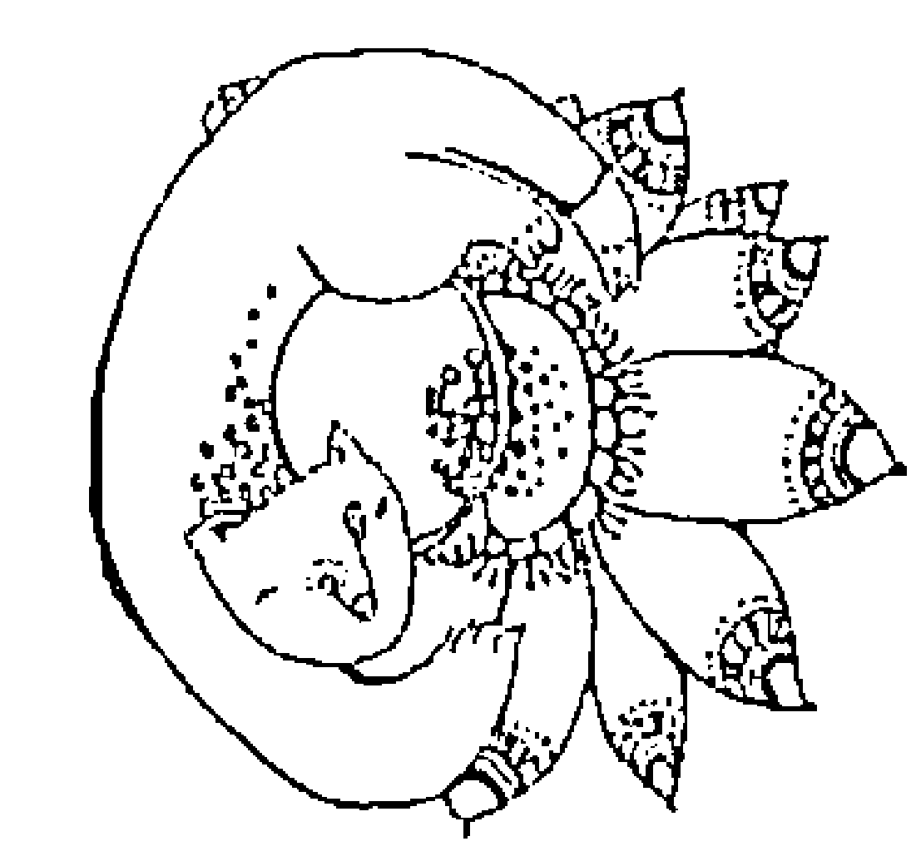

兩位意識裡的記憶進行清理，還追溯到祖先累積的一切記憶。我們今天會像現在面對面，絕非偶然。人們習慣用「有緣」來形容人與人的相遇，其實這是「清理的緣分」。

三浦
夫妻也是嗎？

修·藍
是的。

三浦
和結婚對象相遇，也是為了獲得清理的機會。

西川
咦！？結婚不是為了得到幸福嗎？我一直覺得結婚對象就是讓自己幸福的命中注定之人。

修·藍
這個世界上不存在命運，只存在記憶與靈感。結婚

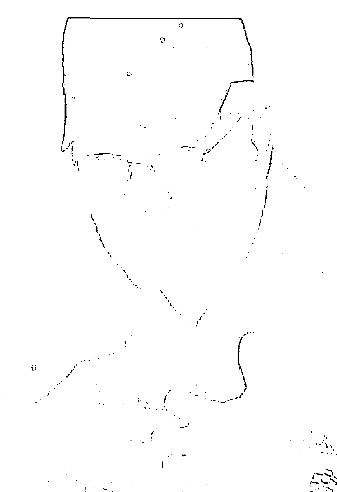

四句話變幸福！實現奇蹟人生的荷歐波諾波諾

西川
就能幸福的這個想法，也是記憶造成的。如果不處於歸零的狀態，就無法接收神聖的存在傳來告訴你「這個人是否適合自己的對象」的靈感。
所謂的歸零，應該就是放下「丈夫能帶給我經濟上的穩定」「只要有配偶就不會寂寞了」之類的盤算與期待。

修·藍
所以，每次認識新的男性時，都必須透過清理來消除記憶。我都建議單身女性在與他人相遇前，就先清理記憶。只要持續清理，來到身邊的都會是適合自己的人。
只要持續清理，來到身邊的都會是適合自己的人。（修·藍）

三浦
已經結婚的話，是不是來不及了？

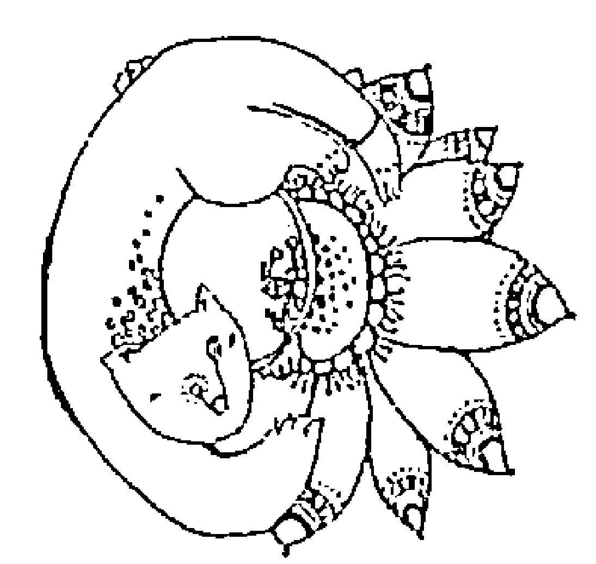

其實我丈夫一直對我惡言相向，讓我很煩惱。我已經受夠了動不動被他罵「混帳東西」「蠢女人」，我做的每件事他都會破口大罵「粗魯死了」「沒教養」，現在總是擔心受怕，處處看他臉色。

西川 三浦 好過分！這種男人真是不可饒恕。

說出來很難為情，自從他對我說「你這傢伙根本算不上是女的」之後，我就變得很執拗，從此沒有性生活。我們談戀愛時他滿體貼的，是我哪裡有問題，他才變成這樣嗎？

修・藍 不必責怪自己，也不必找出答案，只要重複說這四句話，進行清理。

> 請對潛意識說，我愛你。（修・藍）

西川 我覺得三浦沒有錯，問題出在她的丈夫，就算這樣她也必須道歉嗎？

修．藍

這四句話不是對丈夫說的，而是對自己內在的潛意識說：「謝謝你、對不起、請原諒我、我愛你。」

三浦的丈夫口出惡言，是三浦潛意識中「丈夫對我口出惡言」的重播記憶所致，潛意識的記憶從宇宙誕生起累積至今，數量龐大，所以我們不可能看出問題是來自哪個記憶。

雖然我們不知道到底是哪個記憶造成這樣的現象，但只要對潛意識說「我愛你」就好。

三浦

只要我單方面清理就好了嗎？

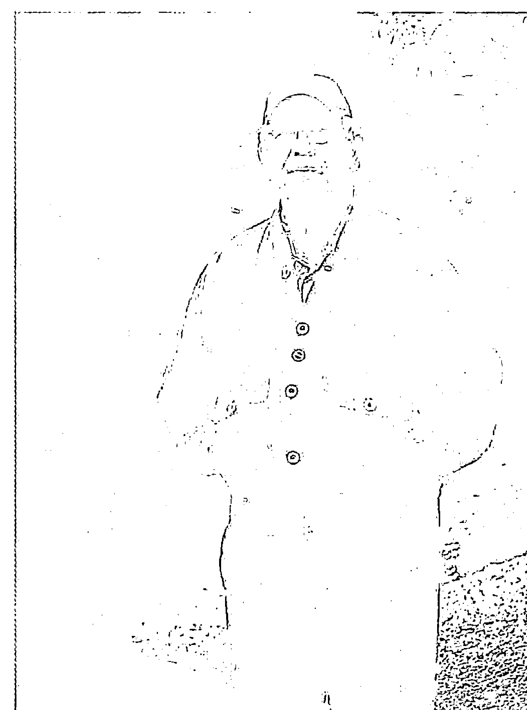

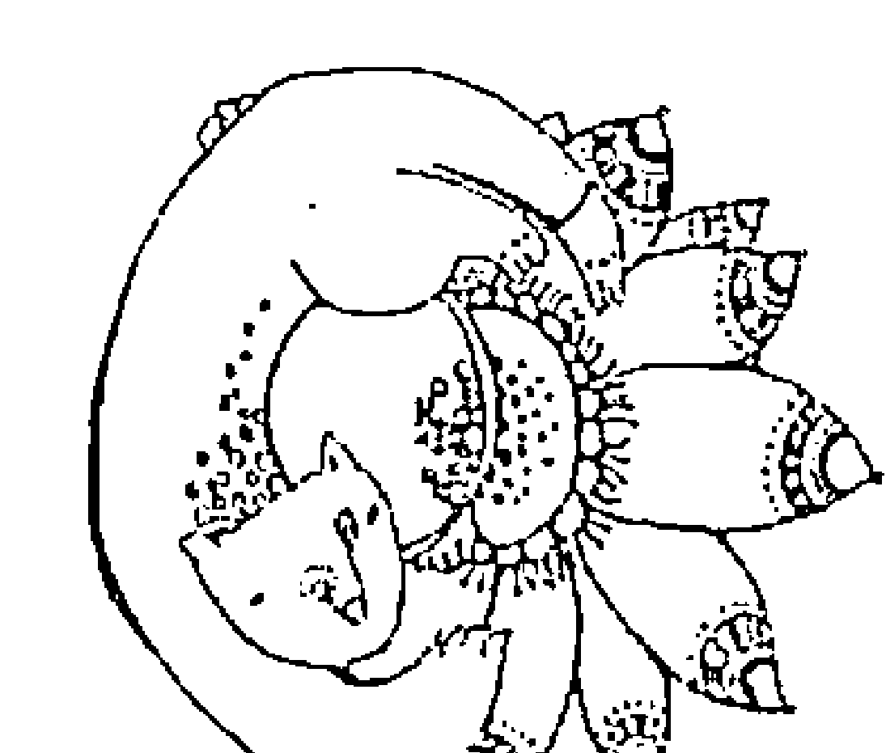

### 修·藍

當然。因為是你的記憶重播，丈夫惡言相向是來自你內在重播的記憶，所以必須將這件事視為自己的責任，清理自己的記憶。

### 三浦

有為數眾多的女性都遭受伴侶家暴或惡言相向，她們一直盼望男方改變，但就實際狀況來看，應該很難讓情況好轉吧？

### 修·藍

問題不在丈夫，在記憶。丈夫的內在鍵入了暴力的記憶。這份記憶可能是來

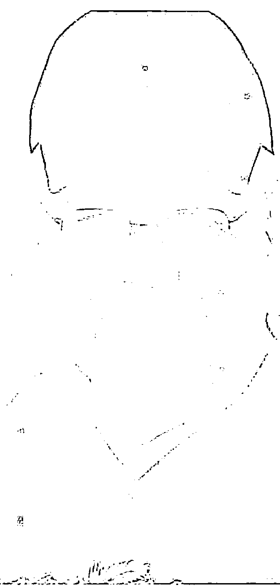

四句話變幸福！實現奇蹟人生的荷歐波諾波諾

### 三浦

### 修·藍

自過去他對女性的厭惡感，也可能是這輩子形成的，對母親的心理陰影。無論如何，都請由你來清理。

進行清理，消除「為丈夫惡言相向所苦」這個阻礙神聖的存在傳遞靈感的記憶，是否就能解決我的煩惱？

假設你現在將這個房間的燈關掉，這樣我們就會置身於黑暗當中。

但是，如果你重新把燈打開，我們又能照到光線了。

一樣的道理，只要你進行清理，進入歸零的狀態，就會帶給周圍巨大的影響。藉由你的清理，你的丈夫也會接收神聖的存在照來的光芒，自然而然察覺到，自己必須改善口出惡言的狀況。只是你要記得，清理不該抱任何期待。

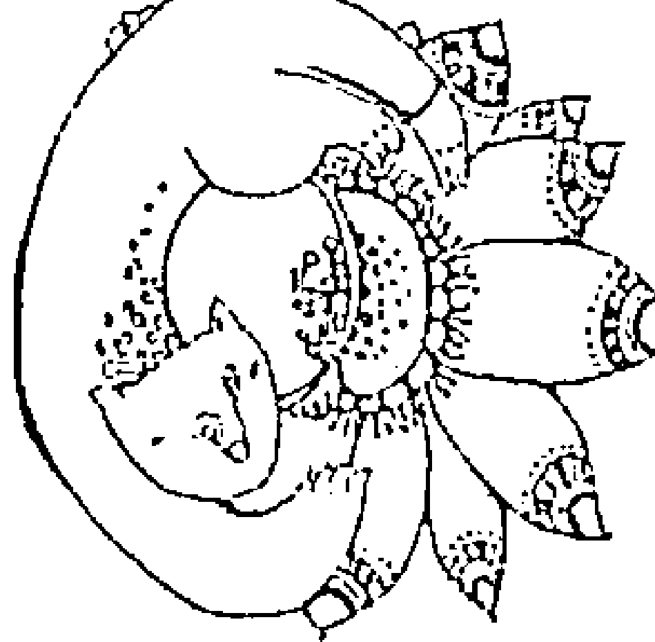

### 現在我很猶豫，是要努力維繫婚姻，還是離婚，為工作而活？

三浦 我看了修·藍博士的書，了解清理記憶的重要後，便一直提醒自己實踐。但每當我因為丈夫出言辱罵，導致內心紊亂、情緒化，總會不小心忘記清理。

修·藍 內心被情緒佔據，忘記重要的事物，這也是記憶造成的嗎？ 是的。如果你在丈夫口出惡言的當下實在很難保持冷靜，可以趁他睡覺時，對著他說：「謝謝你出現在我的人生裡。我愛你。」

三浦 咦！？丈夫睡覺時，我一直以来心里理想的都是「我绝对饶不了你！」之类的负面念头。

> > 猶豫和煩惱都是沒有意義的。如果有這個時間，不如動手清理。（修·藍）

睡眠時意識會沉睡，這時比較容易接觸到潛意識，所以如果你在丈夫睡著時對他發洩負面情緒，丈夫就會對你的負面情緒產生反應。

反過來說，如果這時對他說清理的話，就能讓他不再口出惡言了嗎？

可是，清理不是對你的潛意識做的嗎？我又想再問一次剛才問過的問題，為什麼必須對丈夫的潛意識說「謝謝你」？

修·藍 耶穌說「愛你們的仇敵」，這句話的意思是「仇敵並非荷歐波諾波諾三方對談」

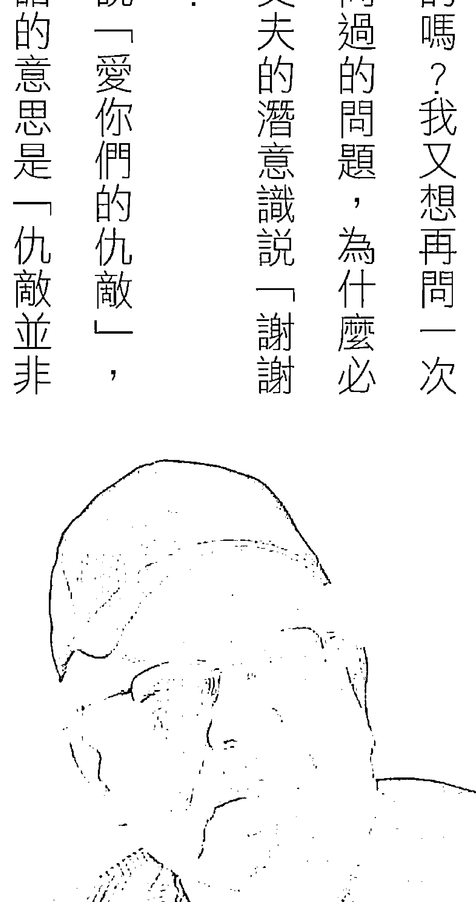

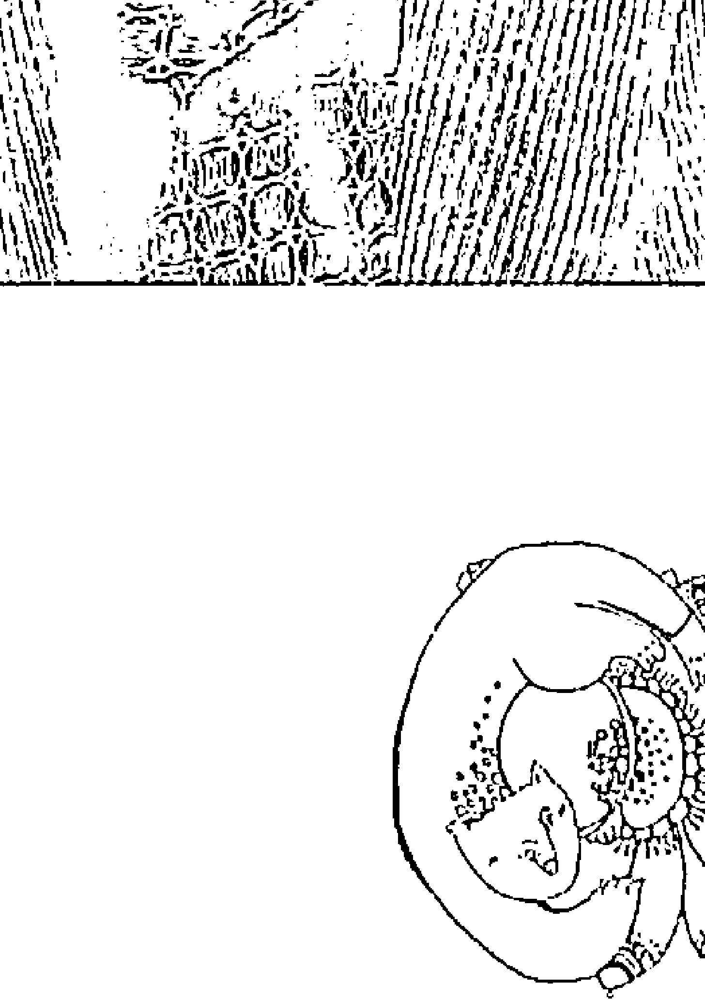

## 四句話變幸福！實現奇蹟人生的荷歐波諾波諾

三浦

攻擊你、惹怒你的人，而是你內在的記憶」。

因此，這個對象並不是丈夫，而是要詢問自己的潛意識：「是自己內在的哪個記憶如此怨恨丈夫？」並且反覆唸著四句話。接下來，你的尤尼希皮里就會替你消除造成眼前問題的記憶，所以你不必自己尋找這個問題的答案。

修·藍

總之，我現在很猶豫，不知道是離婚好，還是該想辦法改善情況，結果都沒辦法專心工作。

猶豫和煩惱都是沒有意義的。如果有這個時間，不如動手清理。這麼一來，自然會形成適合你的流動。

西川

三浦不必費盡千辛萬苦，只要進行清理，就能避免走到離婚這一步嗎？

修·藍

也許進行清理、消除記憶後，依循神聖的存在所傳遞的靈感，會讓你判斷離婚是比較恰當的選擇。

### # 要怎麼走出父親去世的陰霾？

三浦
即使如此，三浦也不會因為離婚一事蒙受打擊，甚至還能鬆一口氣。
其實我也擔心離婚後工作是否能順利，有經濟上的疑慮，所以才遲遲無法下定決心離婚。

修・藍
如果形成的流動認為你適合為工作而活，為此所需的人脈與工作就會千里迢迢來到你身邊。
重要的是清理「想要變成有錢人」「想要取得事業成功」等欲望，進入歸零的狀態。無論如何，現在的你能做的只有清理。

西川
每次我發生難過的事情時，例如和母親吵架、工作上出狀況等，總是神經質地想著「要是父親還活著就好了」，始終無法從父親離世一事中振作起來。因為以前每當我有什麼事，父親就會站在我這邊。

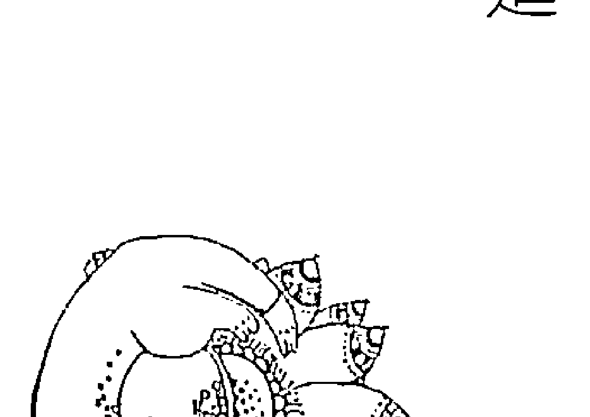

三浦
西川
修・藍

父親是罹癌去世的，當時我忙於工作，趕到醫院後為時已晚，沒能見到父親最後一面，這件事也讓我 很懊悔。
令尊是什麼時候過世的？
五年前左右。
你要清理潛意識中「父親去世我好難過」的記憶，以及「父親過世時我沒有待在他身邊，真的很不應該」等過去的記憶。
舉個例子，有名參加過講座的女性， 兒子突然因為蜘蛛膜下腔出血去世。
她送了兒子最後一程，並沒有陷入被害妄想，去想：「明明我一直都

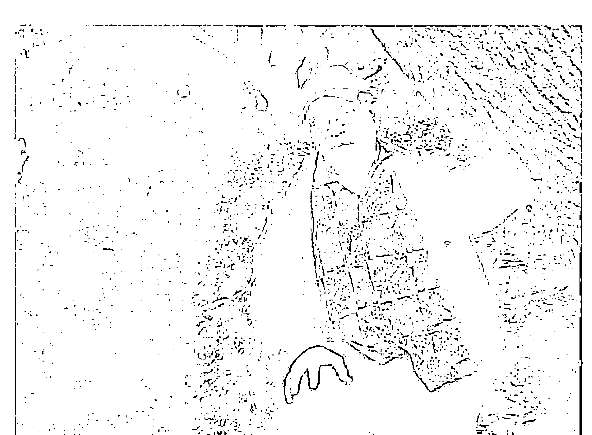

四句話變幸福！實現奇蹟人生的荷歐波諾波諾

有清理，為什麼還會遭遇這樣的悲劇？「不只如此，她還說得出「謝謝你」。這是因為她理解到，今生會和兒子相遇，是因為前世未能確實「道別」，所以她有辦法向神聖的存在表達感謝。

修・藍

西川

我始終想依賴父親，是因為我的內心太軟弱了嗎？

不用去分析為什麼，或是用道理來說服自己，只要清理就好。可以唸四句話，也可以喝藍色太陽水，或使用其他的清理工具。總之，記憶會在我們察覺到「得清理才行」之前，就向我們搭話，所以我們必須隨時進行清理。

三浦

我可以在走路和搭車時清理，但是要隨時保持清理的狀態，你們都是怎麼做的？

修・藍

只要告訴自己的潛意識清理的方法就好了。這樣一來，甚至連我們睡覺的時候，它也會自動替我們清理。

### 荷歐波諾波諾三方對談

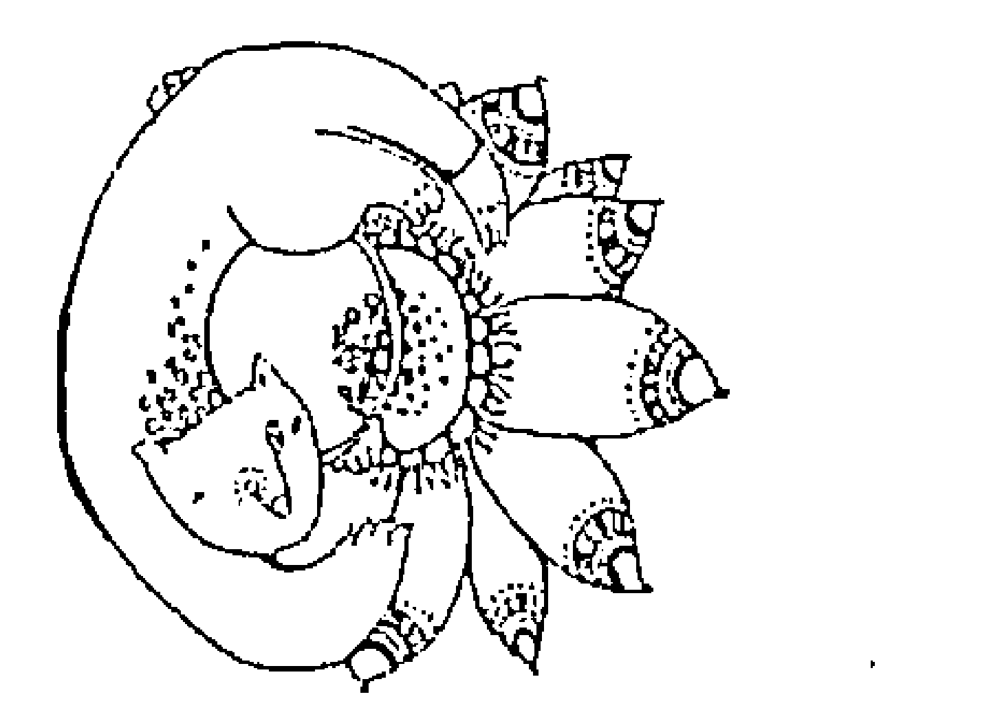

### 清理可以治好憂鬱症嗎？

西川
我的想法總是很悲觀。我是做商品開發的，每當我設計的產品銷量不好，就會非常沮喪，感覺別人會把我貼上沒用的標籤，一想到要去上班就有一萬個不願意。

修·藍
你要清理「認定這是憂鬱症」的記憶。

西川
我看了身心科一段時間，雖然覺得是憂鬱症，但很抗拒用藥，還是想自己克服。清理可以治好憂鬱症嗎？

修·藍
你不是你的錯，也不是同事的錯，一切問題的原因都是記憶。記憶位

我總是在苦思許久後，自暴自棄地覺得「算了啦，不重要」。

能力明顯不如我的人反而受到賞識，讓我氣不打一處來。

我也感覺自己在職場上的人際關係很不好，畢竟同事都是競爭對手，沒辦法和他們訴說工作上的煩惱；再加上我的主管好像討厭我，工作於你的潛意識中。莎士比亞曾說：「你要選擇自由，還是選擇困苦？」這也是我想問你的話。如果你不想選擇困苦，現在就要開始清理。

## 修・藍

就算唸的時候不帶感情也無妨，只要機械化地在心裡唸「我愛你」就好。

### 西川

不知道是不是我太講求道理，我有個疑問，只是對自己內在的潛意識說「謝謝你」「對不起」「請原諒我」「我愛你」，真的就能解決問題嗎？

### 三浦

一開始我也覺得這個方法太簡單了，真的能消除記憶嗎？但是持續一段時間後，發現做起來還真不容易。不分折其中的道理，就無法清理嗎？

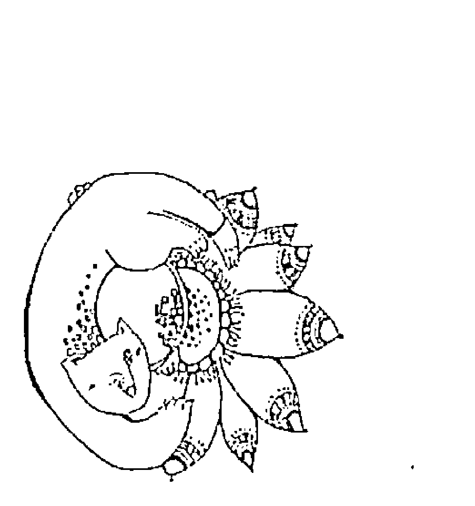

四句話變幸福！實現奇蹟人生的荷歐波諾波諾

就算唸的時候不帶感情也無妨，只要機械化地在心裡唸「我愛你」就好。如果實在做不到，那真的太可惜了。與其滿腦子被害妄想，讓自己悶悶不樂的，進行清理來解決問題，做起來要快得多了。我總是強調「去做就對了」「Just do it！」。

## 產品銷量不好也是記憶造成的嗎？

西川修・藍

我開發的產品銷量不好，也可以理解為記憶造成的嗎？

以前有位擔任電臺DJ的女性問我：「怎樣才能讓我的節目大受歡迎？」當時我也是回答：清理。

「在你每次做DJ說話之前，先在心裡對節目的聽眾說：『謝謝大家來聽我的節目。多虧大家，我才能擁有這份工作，能夠做我喜歡的工作，讓我每天都過得很充實。我愛你們。』像是麥克風、所有必備的機器、參與這份工作的每個人（贊助商與工作人員）、錄音室與椅子等一切事物都具有意識，當然也有記憶，所以要運用四句話清理各項事物。」

這樣一來，聽眾就會受到啟發。接著，DJ自己也會在靈感的幫助下，工作表現出色，於是她所需的事物便會千里迢迢來到她身邊。

**西川**：事先對購買產品的人說「謝謝你」，表達感激的心情，是很重要的。

**三浦**：這也能幫助清理「產品也許會賣不好」的記憶，對吧？

**修·藍**：當你進行清理後，產品就會想著「我好想去那個人的身邊！」，自動降落到顧客的手上。

**西川**：和修·藍博士說話，讓我感覺有了勇氣。

**三浦**：我會把修·藍博士說的「Just do it!」銘記在心，馬上就著手清理。我也會繼續每天清理記憶，離婚的事就抱著「盡人事，聽天命」的態度，交給神聖的存在傳遞的靈感來判斷。

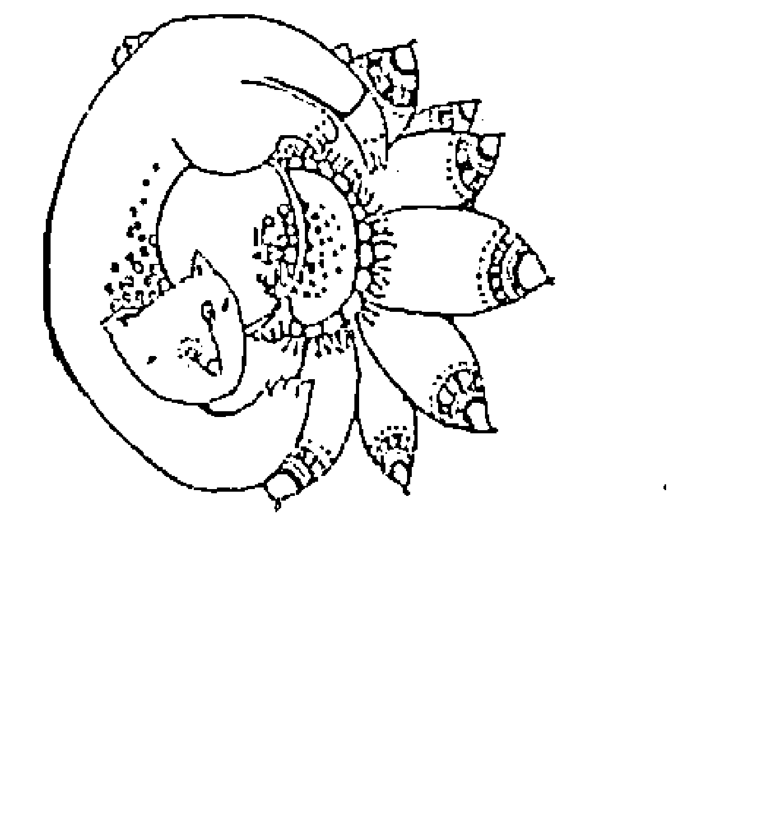

## 修．藍

重要的是每分每秒持續清理，將周遭發生的事百分之百視為自己的責任，一心一意地清理。這麼一來，靈感便會降臨，自己真正需要的事物就會在完美的時機造訪。

### 四句話變幸福！實現奇蹟人生的荷歐波諾波諾

新時代系列 195

四句話變幸福！實現奇蹟人生的荷歐波諾波諾

修・藍博士親授，零極限最佳入門書

+   作者／伊賀列阿卡拉・修・藍（Ihaleakala Hew Len, Ph.D.）、丸山茜（採訪）
+   譯者／邱心柔
+   發行人／簡志忠
+   出版者／方智出版社股份有限公司
+   地址／臺北市南京東路四段50號6樓之1
+   電話／（02）2579-6600・2579-8800・2570-3939
+   傳真／（02）2579-0338・2577-3220・2570-3636
+   總編輯／陳秋月
+   副總編輯／賴良珠
+   主編／黃淑雲
+   責任編輯／溫芳蘭
+   校對／陳孟君・溫芳蘭
+   美術編輯／林雅錚
+   行銷企劃／陳禹伶・王莉莉
+   印務統籌／劉鳳剛・高榮祥
+   監印／高榮祥
+   排版／莊寶鈴
+   經銷商／叩應股份有限公司
+   郵撥帳號／18707239
+   法律顧問／圓神出版事業機構法律顧問　蕭雄淋律師
+   印刷／祥峰印刷廠

2022年2月　初版

> TATTA 4TSU NOKOTOBA DE SHIAWASE NI NARERU!
KOKORO GA RAKUNINARU HO’OPONOPONO NO OSHIE
Copyright © Ihaleakala Hew Len 2009
Copyright © Akane Maruyama 2009
Chinese translation rights in complex characters arranged with EAST PRESS CO.,
LTD. through Japan UNI Agency, Inc., Tokyo
Complex Chinese edition copyright © 2022 by Fine Press, an imprint of Eurasian
Publishing Group
All rights reserved.

> 你本來就應該得到生命所必須給你的一切美好！
秘密，就是過去、現在和未來的一切解答。
——《The Secret 秘密》

+   很喜歡這本書，很想要分享
+   圓神書活網線上提供團購優惠，或洽讀者服務部 02-2579-6600。

+   美好生活的提案家，期待為您服務
+   圓神書活網 www.Booklife.com.tw
+   非會員歡迎體驗優惠，會員獨享累計福利！

## 國家圖書館出版品預行編目資料

四句話變幸福！實現奇蹟人生的荷歐波諾波諾：修·藍博士親授，零極限最佳入門書 / 伊賀列阿卡拉·修·藍（Ihaleakala Hew Len），丸山茜著；邱心柔譯.--初版.--臺北市：方智出版社股份有限公司,2022.02
208面；14.8×20.8公分.--（新時代系列；195）
譯自：たった4つの言葉で幸せになれる!心が楽になるホ・オポノポノの教え
ISBN 978-986-175-657-8（平裝）
1.超心理學 2.心靈學 3.靈修
175.9
110021303

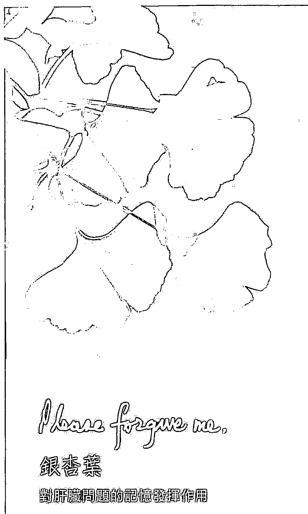

Please forgive me.

## 銀杏葉

對肝臟問題的記憶發揮作用

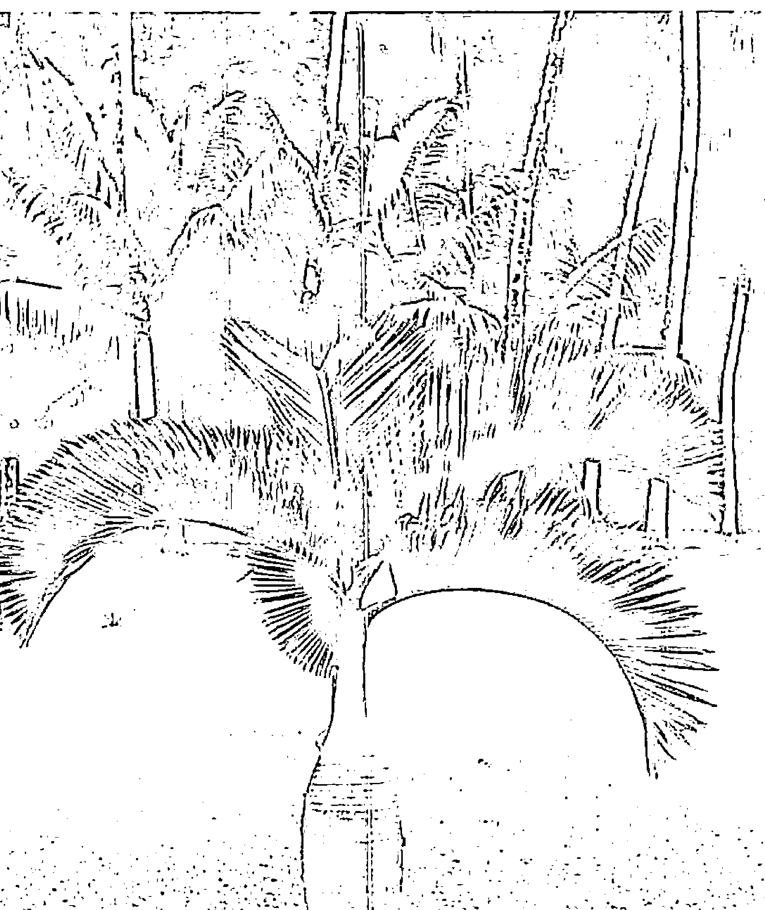

dM Lorry

## 酒氣椰子

清理經濟與金錢問題的記憶

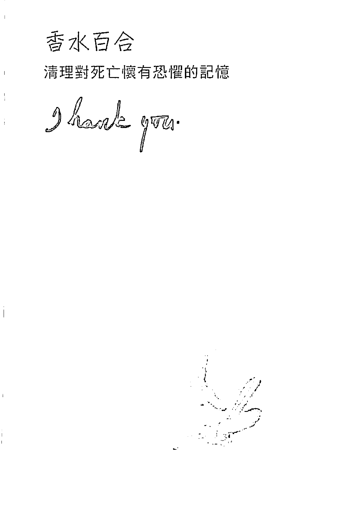

## 香水百合

清理對死亡懷有恐懼的記憶

I thank you.

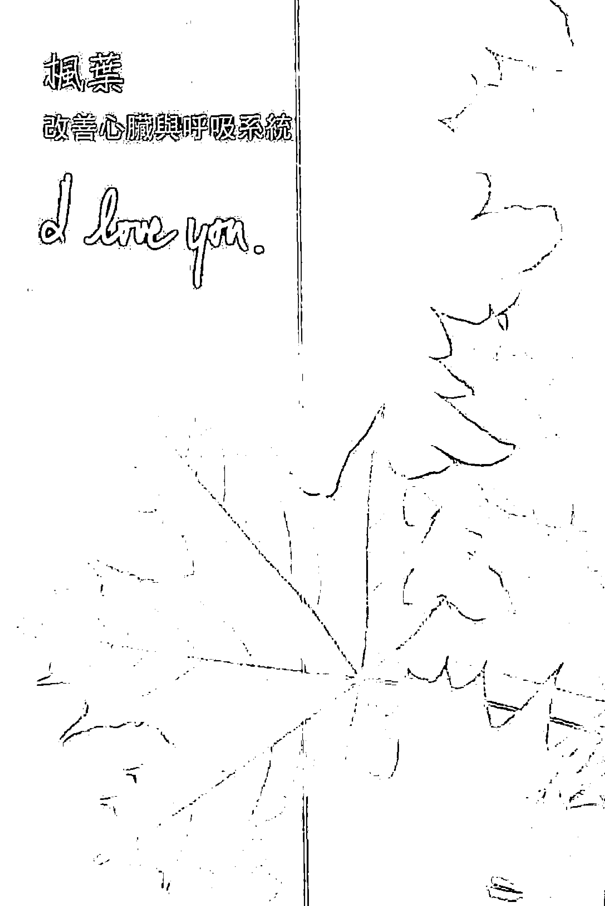

## 楓葉

改善心臟與呼吸系統

I love you.

請沿虛線剪下