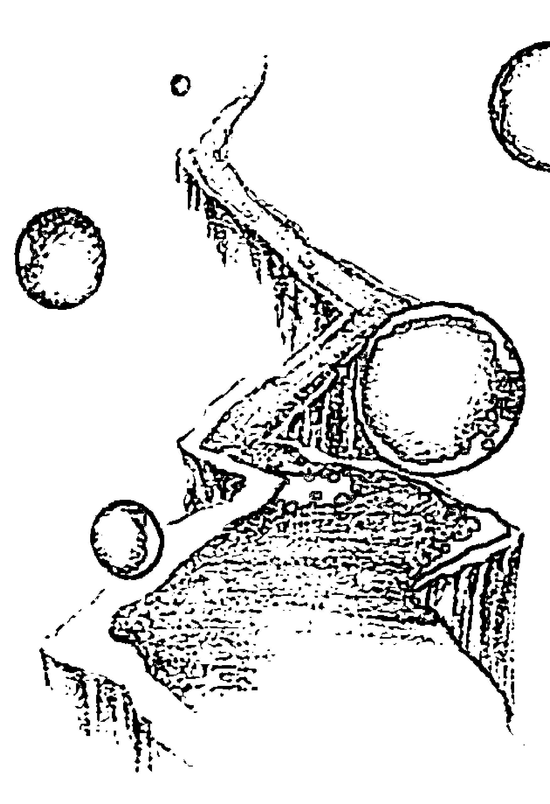
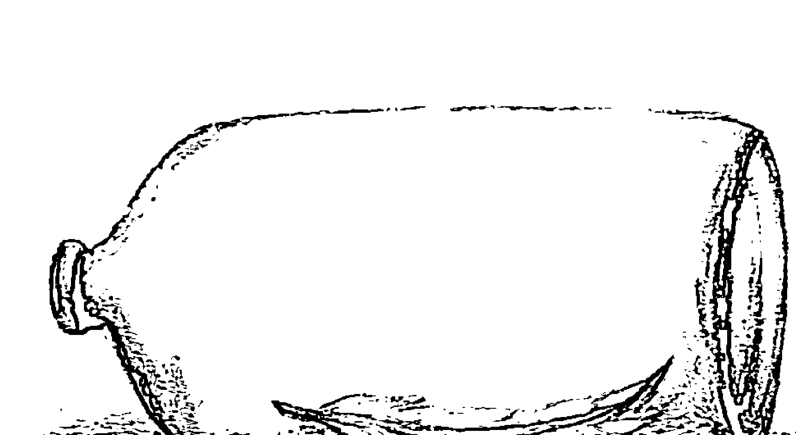
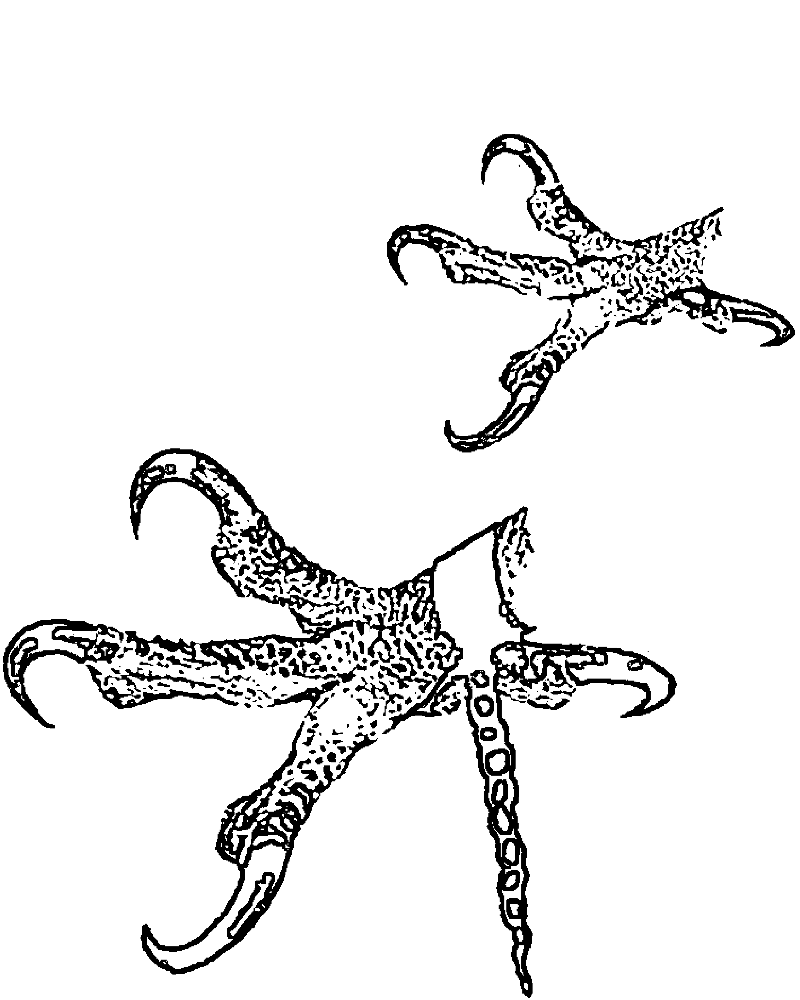
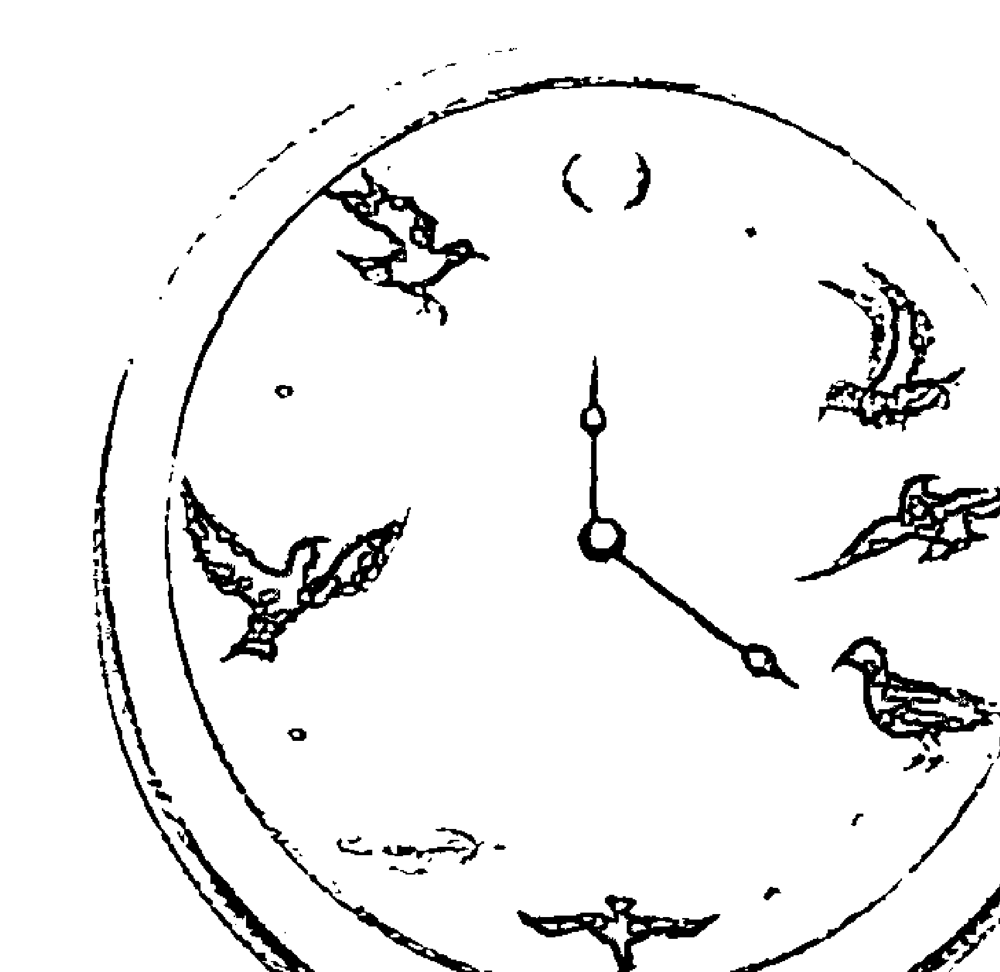
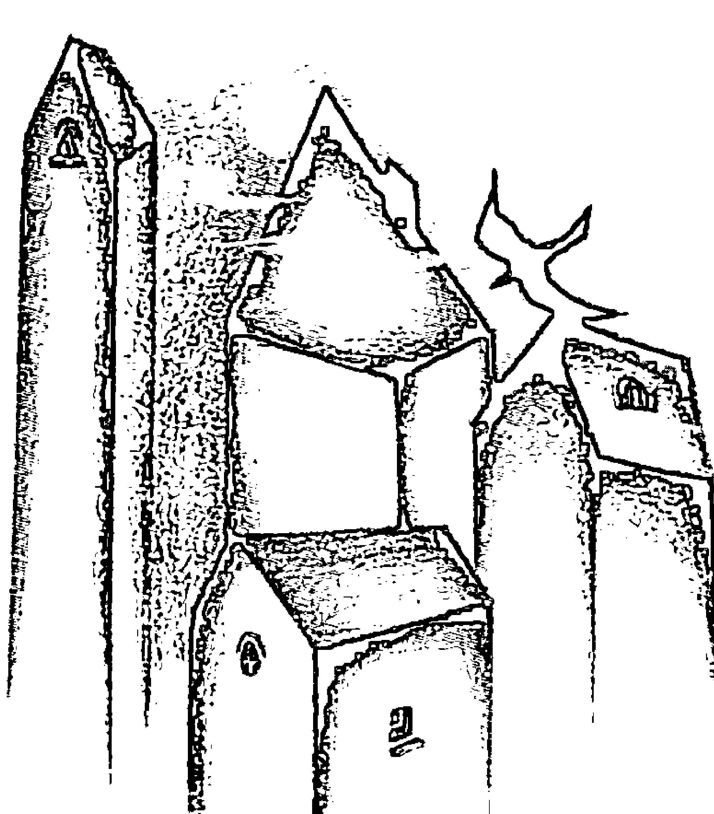
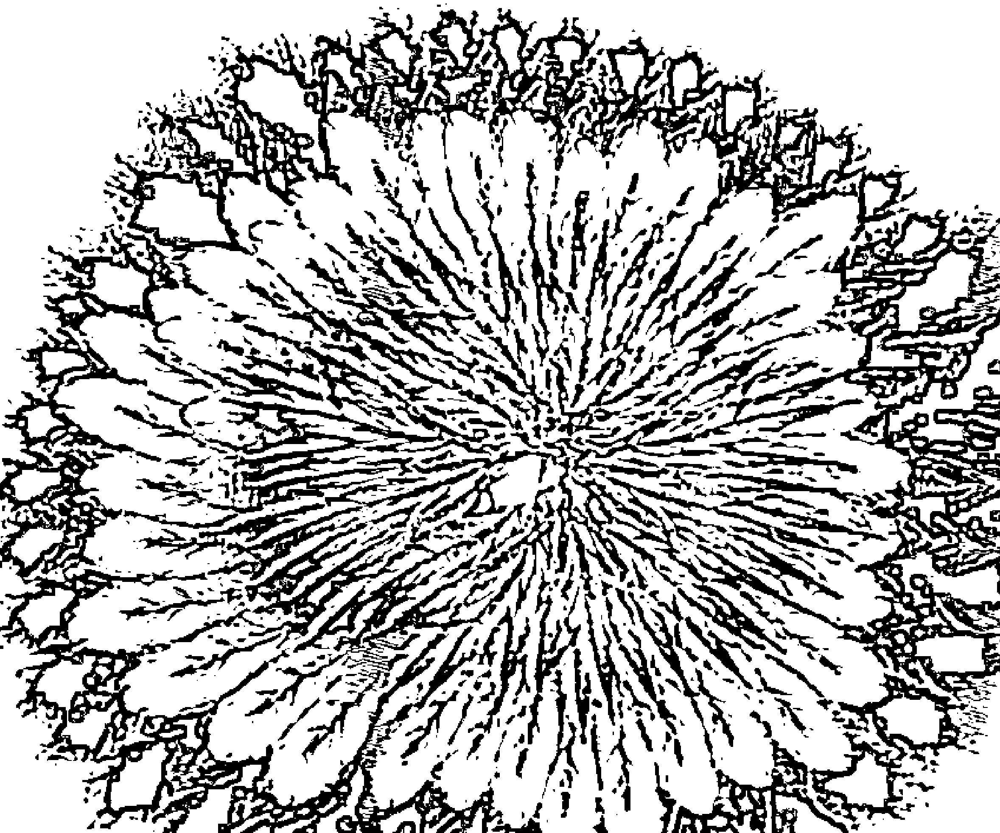
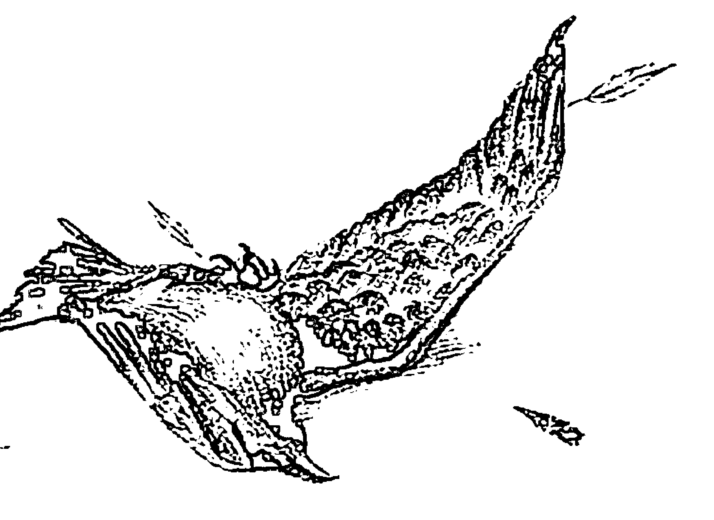
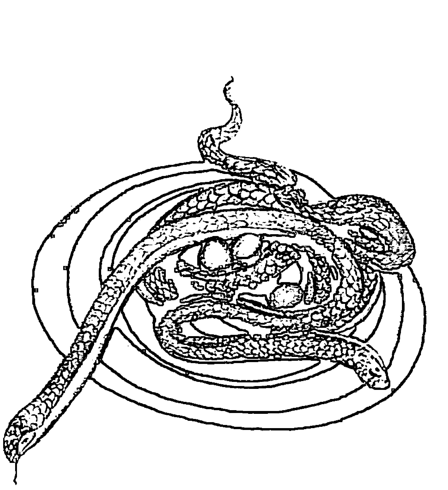

# The Easiest Way to Live

Let go of the past, live in the present and change your life forever

# 零极限

生活篇

[美]玛贝尔·卡茨著

吴品瑜 译

零极限：清理你的人生——荷欧波诺波诺的奇迹

> “荷欧波诺波诺”是一种生活的态度

# The Easiest Way to Live

Let go of the past, live in the present and change your life forever

# 是最简单的方式

生活家

[美]威廉·马丁 著

華夏出版社 HUAXIA PUBLISHING HOUSE

## 图书在版编目（CIP）数据

零极限：生活篇 /（美）卡茨著；吴品瑜译.—北京：华夏出版社，2011.10

书名原文：The Easiest Way to Live: Let go of the past, live in the present and change your life forever

ISBN 978-7-5080-6081-1

Ⅰ. ①零… Ⅱ. ①卡… ②吴… Ⅲ. ①心理健康－普及读物 Ⅳ. ①R395.6-49

中国版本图书馆CIP数据核字(2011)第166530号

The Easiest Way to Live

First published by Your Business Press

Copyright ©2010 by Mabel Katz.

All Rights Reserved.

Simplified Chinese Copyright© Huaxia Publishing House 2011

版权所有，翻印必究

北京市版权局著作权登记号：图字01-2011-4596

出版发行：华夏出版社（北京市东城区东直门外香河园北里4号 邮编：100028）

经销：新华书店

印刷：北京市建筑工业印刷厂

开本：880 × 1230 1/32开

装订：三河市李旗庄少明印装厂

印张：7

版次：2011年10月北京第1版

字数：109千字

2011年10月北京第1次印刷

定价：29.00元

本版图书凡印刷、装订错误，可及时向我社发行部调换

## 推荐序

你来了，你走了，都很美。
你说话，你沉默，都很真。
我爱你的方式，是让你回到你自己。

这些话是我对自己说的。生命是一段学习爱的历程，每一刻到我们身旁的人，都在为我们提供学习的角色，给予爱或是接受爱，但许多人也在这样的过程中感到无力及受到伤害，因而开始恐惧这个历程，更让自己关起心门不敢再去感受爱。是什么造成了这样的局面，让人与人之间有了道无形的墙。比如，当人们新认识一个朋友时，总是几经衡量与观察后才敢放心大胆地交往。向我咨询的个案经常会和我说，他记不起快乐的时光，或是觉得受到的伤害如此之大，怎么可能再去爱人？我想这些全是记忆的因素！

记忆是一种有意识或是无意识的能量，有个别的记忆也有集体的记忆，如《零极限》那本书中所说，每秒钟进入大脑的讯息，有许多是我们没有察觉的，而那些讯息在影响着我们对眼前发生的事的看法及评断，当有了评断就有了对错好坏的分别，而这些也是我们无法敞开心去爱的最重要的原因。

归零真的是很重要的课题，当我们用记忆的框架去看因缘，实在是不公平的，每一个人都是独特的，不同于其他人，每一刻的状态也都在变化，如果我们用以往的经验法则去判断事情的发展，就会让原本的流动路线产生变形，失去它原有的美，这些都是在让我们学习不断归零去看，如果可以把头脑的记忆放下，听从内在真实的声音，在当下找到最自在的位置与身边的人、事、物相处，并用爱的眼光去看，那心中的平静将令人非常喜悦！

我随时提醒自己做这样的练习，既为人，就有人的情感及欲望，这些也是真实的感受，留意感受，学习时时清理，爱发生的一切，信任宇宙的安排都在成就每个人学习爱的历程，我们也在过程中，将自己的能量留在宇宙的量子世界里。若是愈多人能用归零的心去爱，那宇宙的能量将愈趋平静。所以，我真的感受到一个真理，平静要从归零去爱开始。机缘巧合，我曾在上海与本书的作者会面，当时她所呈现的状态，我想也正是这个真理的最佳写照。

徐苡榛
2011年8月16日 于上海宇宙心光

# 零极限（生活篇）

## 推荐序

大家都认为“荷欧波诺波诺”非常简单。毋庸置疑，这也是它的优点和吸引力所在，但是简单并不代表它不丰富，无论是伊贺列卡拉·修·蓝博士、乔·维泰利还是玛贝尔·卡茨，他们都分享了很多的例子和故事，这不难说明“荷欧波诺波诺”是一条通往喜悦生活的途径。人的生命形式千差万别，而本书让我们明白的重点是：“荷欧波诺波诺”不只是在重复那四句话，而是一种对生活的态度。

通过了解玛贝尔·卡茨所分享的她自己与“荷欧波诺波诺”的连结和关系，我们可以看到它对一位身处现代社会的女士的影响有多么巨大。这也让人们认识到它的作用及其可发挥的无限性，由此我们也可以自由地创造自己和“荷欧波诺波诺”的个体性连结。

真诚地希望大家能通过此书，从对“荷欧波诺波诺”的简单了解升华到明了它对我们生活的影响与意义，可以意识到“荷欧波诺波诺”的活力，并且以这份热情让它从一个简单的技巧而被提升为我们表达自己和创造生命奇迹的独一无二的桥梁。

阿希卡 于爱中
云南 昆明

## 推荐序

在这本书里，玛贝尔（夏威夷名Kikiko'ele）分享了许多洞见，以下都是书中的摘要：

- 1. 我是神所创造的，依照神性的爱一模一样“至心纯净”地被创造出来。
- 2. 我投生的唯一目的就是“至心纯净”地做我自己。
- 3. 此生的唯一任务就是清除记忆与谬误，正是这些老旧错误在我的潜意识里不停地回放，才会阻碍我无法“至心纯净”地做我自己。
- 4. 借由远古的荷欧波诺波诺的问题解决方法，我允许神性将我的记忆归零，让我重回“至心纯净”的原初状态。
- 5. 对于将记忆储存在潜意识里并造成我一再经历困境的情况，我为此负百分之百的责任。
- 6. 时时刻刻都可以运用远古的荷欧波诺波诺的问题解决方法，来选择让自己分分秒秒都能重回“至心纯净”的原初状态。
- 7. 问题不存在于外在，我的问题只是记忆在潜意识里回放的方式，它就存在于我自己的内在。

我们存在的唯一目的，就是借由清除那些造成问题的老旧记忆，让它们不再继续于潜意识里回放，而回归到“至心纯净”的原初状态。

两千多年前一位伟大的智者说出“爱汝之敌”这句话，而我们的敌人正是那些回放过去的恐惧、愤怒、悲叹、仇恨、依附与判断的记忆。借由远古的荷欧波诺波诺的问题解决方法，例如：“我爱你”与“谢谢你”，就能为这些错误负起百分之百的责任。

我大力推荐玛贝尔·卡茨的这本书。

> > ——伊贺列卡拉·修·蓝博士
>
> 《零极限：创造健康、平静与财富的夏威夷疗法》的作者之一

## 前言

2009年6月，当我在以色列上完第一堂课之后，我在当地的出版商跑过来告诉我：“玛贝尔，你的那本《最简单的方式》很赞，但你必须再写另一本，因为那本书是2003年的玛贝尔，而不是今天的玛贝尔，你已经在这条路上研究实践了那么久，一定有更多可以分享的内容。”

分享与改变正是我最爱做的事，所以我想了一分钟之后就回答：“好的！”，看吧，我许多年来一直想着要写这本新书，却一再拖延。

就在同一时间，我收到来自世界各国的讯息：“你一定要像你写第一本书那样接收灵感，好好坐下来，并且写下来。” 我没办法只是录音，然后拜托别人抄写我说的话，当然我也不可能找幽灵代笔，因为所有灵感都得透过我而来。

好吧！让我告诉你，一旦我下定决心，许多灵感就源源不断地到来，记录当下的许多美妙灵感与生活体验，帮助我更能活在当下，并允许我最终将书本经验化为真实体验。

我想先从分享一则故事开始，当我的两个儿子还小时，我总告诉他们，他们的工作就是快乐，而快乐的人就是幸运的。我并不认为自己在说这句话时确切知道自己的意思。

或许，现在我能够说得更清楚些。当你快乐时，你就是幸运的，因为你是一个开放的管道，既然身为开放的管道，你就会允许那个比别人更了解你的部分被创造出来指引你。当你打开自己的管道并给出许可，宇宙的舞动就会一直在适当的时间，将你放在对的地方。

当你相信你自己，并且接受生命的本来面目，当你理解了生活中的每一个难题都是你迈向自由的道路，不再坚持自己是对的并一意孤行地下定论，你就自然会感到轻松与快乐。

好运气意味着天时、地利与人和，当你放掉自以为是的方法，通常你就是幸运的，当你停止在脑袋里喋喋不休，并打开自己的心房，就会允许奇迹来到你眼前。

你最需要做的就是相信你的心，发现喜悦、快乐、内在平静与自由的秘密就藏在你的心中。

本书中的概念与讯息仅仅是提醒，你才是唯一能够改变自己生命的人。外头没有任何人可以对你做任何事，你得对自己将这些人与情境吸引到生活中的事负起完全的责任（而不是责怪他人）。本书试图提醒你，你所渴望的光与爱都藏在生命中每一次挑战的背后，当你遇到越多挑战，你得到的祝福就越多。

我们的祖先都知道问题的解决方法是来自上天，所以他们被信任与爱启动，这也让他们看见与经验了奇迹。每一次即便你根本不知道解法到底来自何方，当他们决定放下思考，并允许完美的答案出现时，奇迹就总会发生。

## 前言

这本书包含了许多不同的章节与主题，都是用来帮助你更加有觉察力，他们主要强调以下几个概念：

- 外在不存在任何东西，就只有你和你的念头。
- 你是毫无负罪感的百分之百负责的人。
- 当一扇门关上了，就会有另一扇门自动打开。
- 在生命中的每一个挑战背后，都蕴藏着光。
- 只有你能让自己自由，这种力量只能从你自身释放出来。
- 更多的反对与异议，等同于更多的祝福。
- 当你改变了，所有的事也都会改变。
- 平静从你开始。

在2003年，我写了《最简单的方式》这本书，因为我必须分享我所探索出来的秘密，而这些事都改变了我的生命，我必须与每一个人分享的是：“无需依赖外在的人与事，我们都有改变生命的能力。”

现在，我的热情与使命就是要将你唤醒，让你能改变你的生命，以及找回我已经找到而且也知道你正在寻找的平静、快乐与自由。

当我目睹这些概念改变了许多生命，我就更加肯定这些发现的意义，所以我放下了会计师的高薪工作，环游世界分享这些讯息。

对于大部分的人而言，这本书可能是一个提醒，而对一些人则将是一份确认。不管怎样，如果你愿意敞开、更加柔软，以及放下自以为是的那个你，我非常肯定的是，你将找到自己的答案。不过，请注意一下，有时你的心会选择去做“对的”事，我想问你的是：你想要自己是对的，还是快乐的呢？

如果生命中有些事不如你的预期，或者假使你不那么快乐或平静，我建议你差遣你的心智先出去散散步，然后再用心来念这本书吧。

> > 这本令人震撼的书充满智慧、爱、神性与疗愈方法，确实是灵性疗愈之书的代表作！
>
> ——乔·维泰利（Joe Vitale）
>
> 《零极限：创造健康、平静与财富的夏威夷疗法》、《秘密》的作者之一

## 目录

- 001 推荐序 徐苡榛
- 003 推荐序 阿希卡
- 005 推荐序 伊贺列卡拉·修·蓝博士
- 007 前言
- 001 第一章 你是完美的
- 011 第二章 记忆
- 017 第三章 清除
- 023 第四章 “谢谢你”的力量
- 031 第五章 心智不是用来“知道”的
- 037 第六章 凡事起于一念
- 043 第七章 再次成为孩子
- 051 第八章 原谅
- 057 第九章 期待
- 065 第十章 放下
- 071 第十一章 评断
- 077 第十二章 只骑一匹马
- 085 第十三章 万中选一
- 091 第十四章 情绪
- 099 第十五章 活在当下
- 107 第十六章 惯性
- 113 第十七章 成瘾
- 121 第十八章 恐惧
- 127 第十九章 把自己放在第一位
- 133 第二十章 平静从自己开始
- 141 第二十一章 改变生命
- 147 第二十二章 外表
- 157 第二十三章 快乐
- 163 第二十四章 与人沟通的最佳时机
- 169 第二十五章 爱
- 179 第二十六章 热情
- 185 第二十七章 成功
- 193 第二十八章 金钱
- 201 第二十九章 全力以赴

## 第一章 你是完美的

我是谁？这是最重要的问题，但我们大多数人都不知道这答案有多简单。

重要的是我们都得谨记，我们全是来自于空，因为完美不可能创造出不完美的东西，所以，这完美的光，将我们“完美”地创造出来。完美，意味着没有意见、信念与判断。

我们是完美的！然而，念头、信念、意见与判断是不完美的，这些干扰与局限的程序与记忆，就在生活中的每时每刻，它们通过社会与我们的经验，输进我们的意识里。

当我们觉察到自己并不只是记忆而已的时候，我们就能够开始观察，而不会被结果所捆绑，并且回归到最初的完美状态。

就只是观察你与人们，以及与情境互动的方式，而不要抗拒与响应，当你熟悉了这个过程，你就越来越能够觉察自己的念头、意见与判断，然后与它们保持距离，并且在每一种情境下都能维持平静。当你能够观察，而不将任何情境贴上好或坏的标签的时候，你就能将自己自由释放。

不幸的是，我们最普遍的运作方式，就是在决定、行动或感觉之前，只是等待某些情境出现，我们根据外在的环境，变成某个样子，并相信这就是我们的原貌。结果，我们就任由自己所拥有的物质、环境与外在的因素来定义我们的认知。

为了发现自己和神性、内在平静的连接，我们需要回归实相，并且心领神会地知道，我们已经拥有了一切。这也将让我们成为自己，并开始存在于信任与灵感之中，在此，所有完美的时刻都会回归到我们身上。

无一例外的，当你停止按照自己所处的外在环境来定义自己时，你将接收到更多自己无法想象的东西。一旦你回复到自己真正的本质，开始欣赏自己，人们也就更能欣赏你。人们将透过你的爱而认识你，并且尊重你与你的自信。他们对你的认可，与你的学历或你所拥有的东西都毫无关系，就仅仅与你本身有关。这项方法既简单又顺理成章，一旦你开始释放自己，你就将注意到自己不需要对人们说太多话，他们就已经开始好奇地向你探询：“你究竟对自己做了什么呀？你都做了些什么呢？你看起来有些不一样，好像年轻多了！”

> 玛莉安娜·威廉森（Marianne Williamson）曾说：“我们最深的恐惧，并不是因为我们的匮乏，相反的，我们那最深的恐惧的存在是因为我们无比强大。不是我们的黑暗，而是那个光明让我们感到害怕至极。我们常自问：我怎么有可能是聪明、优雅、英明与伟大的呢？事实上，我们为什么不是呢？你正是上天的孩子，是你把自己给贬低了，这样会让你无法在人间有所贡献，如果只为了让别人在你身边感到安全些，所以就让自己萎缩变小，这样想实在是太愚昧了！我们生来就是要彰显上天的荣耀的，而这荣耀正在我们里面，这可不只在部分人里面，而是每个人都有。当我们让自己内在的光亮闪耀，我们就会不假思索地也允许别人同样这么做。当我们从自我的恐惧中被解放出来，我们的出现也会同时解放了其他人。”

当你成为你自己之后，在你出现时，你就会允许别人也同样成为他们自己。

这一开始或许有些困难，但一旦你有了觉察的经验，也就是回到了零的状态（没有意见、判断与期待），你就会想要经常回到那个状态，哪怕只有灵光一现而已。当你越是经常练习，就越容易保持觉察。当下一个记忆又开始播放，它会迫使你在很短的时间内进行觉察，正因为如此，你就必须给自己下一个机会继续练习觉察并做你自己。

渐渐地，你就会觉得自己像小孩般地自由，只管观察与赞叹这生命的奥妙。你将变得“至心纯净”（译注：基督教里指接近被救赎的状态，马太福音5:1-10 至心纯净的人有福了，因为他必识得上帝），到了一定的阶段，相较于毫无觉察的状态，反倒是保持觉察状态与做自己变得更容易一点。一旦你开始练习，你的身心就会记住那种感觉，这种感觉也会常来找你，这是再自然不过的了。放掉那些不属于你的东西，你就时时刻刻都能到达宁静与喜乐的状态了。

记住！你正在追求的安全感与快乐，并不存在于你所拥有的物质、学历与关系中，它比你想象的那些都要来得更加容易。

没有，绝对没有外在的东西能够让你变得更完整与完美，任何你现在认为必要，而且可以向外求的东西，都只能让你感到短暂的兴奋，这只是一种依附关系，迟早都会消失，或者让你对它们渐渐失去兴趣，而且你可能还会因此受伤。

让自己自由！请相信你已经拥有自己所需的一切，再也不需要其他东西了，放下并且允许内在最了解你的那个部分去指引与保护你。回归到完美的你，你将会发现上天的所在，以及你所需要的每一件事物。它们都在哪里呢？就在你的内在！

### 分享：完美的爱，不完美的关系

十月黄金周，我带母亲去杭州度假，那里的夜暗香浮动，我与母亲很有兴致地在民宿的阳台聊了起来，母亲很好奇，为什么我会开始零极限的练习，我沉默了半晌，脑袋里浮现的是八月中旬在波罗的海度假时，先生嫌我不会赚钱吵着要跟我离婚的情景。那天，我一个人在夜里绝望地独坐在沙滩，失声痛哭。这是我第一次跟母亲透露我的婚姻问题，因为我向来总是强势地认为自己绝不会跟母亲一样在婚姻问题中受苦，更不要她为我担心，我不知道自己当时为什么会说出来，但说出的同时我却如释重负般地痛哭失声起来。

我会开始练习零极限，是因为我第一次感到自己的脑袋再也变不出把戏了，想不出自己到底还要在婚姻里如何改变自己，才能变得更完美以符合先生的期待，我彻底束手无策了，在沙滩上只能仰望着天，对虚空承认了自己无法可想，结果，零极限就来到了我的眼前。然后，我竟在读完书的四天后，马上有出版社邀请我去担任玛贝尔在上海的工作坊的口译，也让我能在她的实践方法里，改变了我的生命。

母亲听完，叹了一口气，抱怨着我们母女的命运，她说自己也搞不清楚，我们到底是出了什么错，才会让婚姻这么失败，并陷入被先生嫌弃的悲惨境地呢？

> “我们该怎么改正错误，或是怎么做，才会让我们更完美呢？好太太的优点到底是什么呢？为什么我们母女俩都没有？”

母亲在黑暗中无力地自问着。

我想到了玛贝尔的这一课——《你是完美的》，就突然自己破涕为笑地说：“我们不要再想‘加’些什么在自己身上了，或许我们本来就已经够完美了，现在只要把那些不属于我们的部分‘减’掉就好了！”

语毕，母亲不解地望着我，却有一种连她自己也没有察觉到的放松到来了，她就像团被太阳晒过的棉被一样，胖乎乎的她笑了起来。自此，当我们两人又一不小心陷入对先生的抱怨时，就会突然不约而同地笑出声来，提醒彼此要“减”去这些不属于我们的记忆。这真是奇妙的感觉，我们好像突然从一个受害者，变成了自己生命的责任人。当我们不再试图去改变对方，而是先清理自己的记忆，神奇的事情开始发生。先生的态度渐渐软化，家里的气氛也轻松了许多。虽然我不知道这能持续多久，但至少我知道了方向——不是向外抓取，而是向内清理。完美，原来就是回归那个本自具足的自己。

心陷入“完美太太的加法”里时，我们就会搞笑地互相提醒：“减减减，减掉不属于我们的部分”，这让我们一下子就恢复了对自己的信心，带着觉察拿起大刀，往自己那些老旧的记忆砍去。

## 第二章 记忆

世界是以信息的形态进行运作的，而我们也是如此被运作的。

我的老师伊贺列卡拉·修·蓝博士曾说，我们是跟随着一整堆事物投生到这个世上的，你知道他指的是什么吗？他的意思是当我们出生时，我们就带着祖先与过去的所有记忆而来，所有事情与情境都不是我们所想的那样，你必须切记，当你为某件现在正发生的事而与他人起了争执时，这些都与当下时刻无关，因为它就仅仅是你记忆的回放而已。

让我来举个例子，当你走进电影院，你就知道电影根本不在银幕上，而是在它背后的投影仪里。生命也是一样的，你所遇到的人群与情境就像是那个银幕，而我们却爱死了自己跟银幕的对话，我们试图说服银幕相信我们才是对的，我们期待银幕去改变，但是银幕却无能为力，银幕根本无法改变。如果我们想让银幕上的事物有所改变，我们得先改变自己，因为电影就在我们自己里面，我们就是那台投影仪。

为什么记忆会回放呢？它们的出现就是为了再次给予我们机会，去承担百分之百的责任，以及选择放下。当我们放下，就是允许神性删除这些记忆，并且将我们自由释放，事实上，我们所声称的问题，根本就是机会。生命就是成长的机会，是它让我们去探索自己到底是谁，因为我们已经遗忘了自己是谁，为什么我们会在这里，以及我们来这里到底要做些什么。我们投生到世间就是为了记起我们到底是谁，并进行修复工作。是的，就是更正错误。这正是来自远古的夏威夷的问题解决方法——荷欧波诺波诺——所要做的，借由承担百分之百的责任，与说“对不起，不管是什么存在我里面，才会创造出或导致这些，都请原谅我。”就能自我修复。

在此，请让我解释一下，所谓的责任与罪责是很不一样的，我不是说我们都有罪，我说的是我们都要负责任。是的，正是我们吸引了每一件事物到自己的生命当中。

我们都在生命里东奔西跑，试图找出我们投生的目的是什么，让我给你透露一些讯息，你的目的就是清理（荷欧波诺波诺），以及放掉那些不属于你的部分，你是超越这些部分的。然而，你得负起责任来进行清除工作。就像莎士比亚所说的：“这里是个大舞台，而我们都是伟大的演员！”（译注：莎士比亚的诗。整个世界像个大舞台，意味着每个人都选择了某个特定的角色来扮演，历经了生老病死的每一个阶段，却毫无觉察、全然无知。）

现在，我能想象你想试图厘清这些事情，但是这里根本不需要你知道或理解，想想看，当你用某个程序运行计算机时，你能想到有多少支持程序也同时在它背后运作吗？同样的，为了使用计算机，你不用知道或者理解每一项进行中的事物，你需要知道的不过是这里有些程序正在运作罢了。在你的现实生活中，你或许不了解事物为什么又是从何而来，或者为什么总会有特定的事物出现在你的生命当中，但是，你也并不需要知道这些，因为你唯一的工作就是放下。

举例来说，当事情在你与他人之间发生，这些都与你们无关，这不过是记忆罢了。你甚至不需要彼此对话、讨论议题，或者怪罪他人，记住！当你看到其他人或问题时，你根本没“真正”地看到他们，你只是又回想起了有关那个人或问题的记忆而已，我们总是透过迷蒙的银幕来看事物，因此总是无法完全明白。因为每件事物都被我们的记忆、判断、信念或理所当然的想法给污染了。

我们唯一的工作就是放下，当我们能够做到，不管我们删除了些什么，也同时能将他人与外在环境的部分一并删除。旁人与环境确实在改变，但并不是他们自己改变的，而是当你释放掉关于这些人的记忆时，你将耳目一新地看见与经验他们。所以，当生命中再次出现某些事物时，确实将它视为祝福、放下、修复与释放自己的机会。现在你只是个奴隶，你或许认为你是自由的，但你就是记忆与程序的奴隶，因为它们告诉你什么是对的、什么是错的，心智将每件事物都贴上了标签，但是事实上根本没有对错可言。心智认为自己知道，但它却一无所知。心智唯一的工作只是选择：放下或者执着；放下或者妄下论断。做或者是不做，这才是问题的关键所在。

## 第三章 清除

放下，因为非常重要，所以在灵性成长上总是一再被提起，然而，它也可能是一个非常可怕的过程，在这本书与其他地方我特别说道，为了达到真正的喜悦与内在平静，我们必须清理与删除我们的记忆与程序。

许多次，在我的工作坊与课程里，人们总爱这样问：“如果我不想删除这段记忆呢？如果这是美好的记忆，而我又不愿放掉它呢？如果我删除了，到底会发生什么事呢？我可能会变得孤单。我能存活下来吗？”显然，许多人都害怕放下。

请你放轻松！首先，让我告诉你：你有很多记忆需要被清理与删除，第二，删除那些在你生命中根本行不通的记忆，将会为你的生命打开更多门窗，并为你带来新的机会，当然也将有更多人伸出援手来帮助与支持你，毋庸置疑，还会有更多人加入清除记忆的行列。

到底该删除哪些记忆？感谢上天！你并不是那位作决定的人，因为你唯一的工作只是给出许可。一旦你决定要对你内在任何在你生命里制造出或吸引了特定的人或情境的事物，承担百分之百的责任，那个最了解你并创造出你的部分，或许我们许多人将这个称为上天，他就会知道你准备好要放掉哪些记忆了。

一项最普遍的疑问是：“为什么我不能毕其功于一役地放掉所有的记忆呢？为什么不能就只是说好吧，我知道了！现在我了解自己得承担百分之百的责任，我也很愿意说：对不起，不管我内在的什么事物制造了这一切，都请原谅我。那么现在就可以将一切都通通消除了吗？”

嗯，事情才不是你想象的那么简单。最重要的是，你得理解我们的身体也是由记忆构成的，假如上天要立刻消除所有记忆，我们的身体可能会因此承受不住。我的老师伊贺列卡拉·修·蓝博士说过，假使这瞬间消除的事真的发生的话，我们的身体就会像一团干皱的梅干。只有我们最完美的那个部分知道我们准备好可以放掉哪些，以及为我们删除哪些记忆，所以，你自己根本不必费神地去理解究竟要放掉些什么。这不是很美好吗？

是的，这一切都跟记忆有关，当某些事出现在生命当中，那不过是记忆的回放，在特定的情况下，你或许会认为自己是在进行灵性工作，以及清除自己与某个人、政府、房子或金钱相关的事物，但事实上，你根本不知道你在清除什么，只有上天才知道。

另外，关于清理工作还有一项最热门的提问就是：“做这件事时，我需要相信上天吗？”答案是否定的，你不需要相信上天，对每一个人而言，这方法无论如何都管用，我们的工作就仅仅是给出许可，你不需要知道或理解到底会发生什么，你必须做的就是相信某些事将会发生。

你或许会想：“我得真正有这个清除的意图吗？我必须感觉它吗？”让我来问你一些事，当你按下计算机键盘上的删除键时，你有这么打算过吗？当你做的时候，必须“感觉”某些事吗？甚至你在做时还得微笑吗？你得感到热情澎湃吗？不！你根本不需要精心计划或者感觉它，你甚至不需要了解在按下删除键后到底会发生什么。你曾经尝试过去了解程序是如何下载到你的计算机吗？不用理解这些过程，它依然会运作得当。使用“谢谢你”、“我爱你”、“对不起，不管是我内在的什么事制造了这一切，都请原谅我。”这些工具，就像敲一下删除键，之后所有事都自动会发生。

> “拜托你！请实践出来，请把话说出来。”

为那些在生命里行不通的记忆与程序，承担百分之百的责任，并且放掉那些记忆与程序，就能帮助我们在对的时间将对的事物给吸引过来。既然心智永远无法了解这部分，你得心知肚明的是，当你允许这一切发生，当你给出许可，当你请求协助，帮助总是会来到的。你必须愿意在心里信任与理解，当你每一次给出许可，转化（这只有上天办得到）就会发生。每一次！我保证！

## 第四章 “谢谢你”的力量

感恩无比重要！想想所有值得你去感谢的事物，例如：你能够阅读吗？你能够自己手捧一本书，并且翻开书页吗？如果你能够读到这段文字，你就能看也能呼吸。今早当你醒来时，你看见了曙光，听到了清晨的所有声响，闻到那空气的味道，在世上的每一时刻都充满着机会，那是一份货真价实的礼物。上天，感谢你！

有时，我们无法领悟到自己有多么幸运。那么请你停下脚步，抬头看看蓝天、树木，或者孩子的笑靥，闻一闻那玫瑰花香。当你开始欣赏周遭的美丽，就会有越来越多的美好事物为你而来，能否这样的关键就在于你是否专注在自己已经拥有的事物上。因为我们忙着对焦于自己所匮乏的地方，而不是对自己已经拥有的事物表达感激，那你就会渐渐遗忘感恩的无限力量。请你务必了解这事实，并且向你的自由之身表达感激。

在荷欧波诺波诺里，我们之所以将“谢谢你”作为清除的工具，原因就在于每一次当我们说“谢谢你”时，我们就承担了百分之百的责任，开始懂得放下，并允许宇宙为我们带来一切我们值得拥有的美好事物。当我们重复说“谢谢你”时，我们就是删除、清理与放掉所有不再适用的记忆，与此同时，我们也允许那些用来解决问题的完美的点子与解决方法，以灵感的形式进入到生命里。没错，你知道吗，许多时候你所寻寻觅觅的，不过就是藏在“谢谢你”这句话的后面？有时偏偏在美好事物要出现时，我们反而畏惧并放弃了。

当我们能够释放掉期待并臣服于生命之流，感恩就会变得更容易一些。许多时候，因为我们对每件事，甚至对灵性清理工作本身都有过多的期待，我们才无法感恩，正因为如此，既然我们都自认为知道什么是对自己最好的，当然也就相信清理是如何运作的，我们还以为自己全盘掌握了事情该何时与如何发生，然后，只要事实并不符合我们的期待，我们就会变得愤怒，并干脆将心给紧闭起来，当我们这么做时，我们就完全与生命的美好绝缘，也放弃了真正投生到这世上的所有机会。然而，敞开自己、变得更柔软，以及释放掉期待，就是看见美好人生的秘密所在。

你或许会发现自己正处在一个有着许多艰难与痛苦的境地，但真相却是上天绝不会给人制造跨不过去的坎，不管你发生了什么事，他永远在那里支撑着你。

但是，我们总是在事件发生时就立刻评断，并且质问宇宙：“为什么是我？” 却怎么也不愿意好好说句：“上天，谢谢你！因为你相信我，也给了我这次难得的机会。”

感恩会改变我们的震动频率与能量，当我们同时全心地感谢，我们就立刻会感到平静，并且变成一块吸引美好事物的磁铁。相反的，当我们只进行负面思考时，我们就看不到解决的方法，同时还常常导致一大堆的问题。

说谢谢也是一种放下的方法，这为我们关上了许多不必要的通道，因为唯有关上这些，我们才能让别人也可以打开机会的大门。机会永远随侍在旁，许多机会触手可及，正等待你放下，并且在心中或者嘴巴上，尽可能多地说句谢谢。这一招真的每次都管用，当你想进行清理工作而说谢谢时，你根本不需要特别感觉它，或者精心盘算。

“谢谢你”就是在你的计算机上按删除键，就像当别人打了你一巴掌，你把另一个脸颊也转过去一样，那是爱的脸颊。而且我们可以肯定的是，爱可以疗愈一切。

### 分享：谢谢你提醒我爱自己的功课

母亲回到台湾之后，很积极地天天写日记，记录着她进行零极限生命实践的点滴，而她也意识到自己需要一张书桌，这是65岁的她，第一次提出个人的要求。但她才开始自己四处逛逛比较价格的时候，父亲就开始在一旁骂她爱花钱，那么老了又不是去上学念书，为什么还要买书桌呢？我很清楚，父亲不准母亲为她自己花一分钱，他认为即便钱不是从他一元钱打九个结的腰包里掏出，也一样是浪费，所以骂到最后他什么难听的话都说得出口。最后是大弟在宜家买了张书桌搬回家，父亲见后自然也是暴跳如雷，闹得全家不得安宁。

“你父亲就是跟我有仇，所以才这样让我不能好好过日子，连一张书桌都不准有。”母亲叹口气说着。

母亲的话才刚说完，话尾还有些毛躁的开衩，好像又要悲叹起自己的命运了，我便赶紧问她：“那他在乱骂人与大吼大叫时，你有没有记得练习你的功课呢？”

母亲停顿了一会儿，马上雀跃不已地说：“有喔！我有记得，当时我在心里就一直跟他说谢谢你、谢谢你，不然我一定又会跟他大吵起来。”

我问她然后呢？母亲说自己也不知道说了几十次谢谢你，后来我父亲就突然停下来走去公园散步了，当晚就没有再提起这件事，她最高兴的是，拥有了自己的第一张书桌，而且她觉得爱自己的感觉真好。

我跟母亲分享说，或许父亲就是要来帮助她完成爱自己的功课，所以，她说的这句谢谢你，是父亲应该得到的。母亲听了哈哈大笑，越洋电话里虽然我看不见她的表情，但能量流动里已经少了怨怼的苦涩，取而代之的是尝到生命甜头后的喜滋滋的感觉。

当你开始欣赏周遭的美丽，就会有越来越多的美好事物为你而来，能否这样的关键就在于你是否专注在自己已经拥有的事物上。

## 第五章 心智不是用来“知道”的

不知道为什么，我们经常非常迷惑，总是认为自己得用知识来填满心智，然而，我们之所以被赋予心智，其实是要将其用在思考自己是该执着还是放下这个问题的。

我们根深蒂固地认为心智是用来储存与了解信息的，我们还根据这种想法来建构自我认知，于是，我们的心智就无所不用其极地把自己变成根本不相关的事物，并且强迫我们去做自己原本不该做的事。

为了打破这恶性循环，我们得了解自己天生就已经是充满智慧的，而且我们的智慧并不是因为心智作用而产生的，我们的灵感也不存在于心智当中，灵感是我们的自然原貌，我们无法解释它从何而来，又如何运作，事实上，我们的念头与行动只能是来自灵感或者记忆这两者之一。

现在，当你保持空无与敞开时，灵感才会来到，但是当你喋喋不休、纷乱思考或满怀忧虑时，灵感就会消失。为了能够发挥你的最大潜能，你必须再次成为孩子，当自己就是那位聪明的孩子，当你不再思考或忧虑，并且敞开自己迎向每个机会时，你就一定会相信自己是被引导与保护着的。你必须回到生命的源头，在那里，你还没被教育成完全忘了自己到底是谁的样子。

我们就是那个把存在给搞得十分复杂的人，我们也是那个自以为知道什么是对自己最好的人，同时，我们还将自己想要的列出一张清单，上头写着想要多少，以及何时想得到，事实上，到底什么对自己有益，我们根本一无所知，最重要的是，我们甚至不知道自己到底是在为谁列那张清单。实际上，我们是在为造物者开出清单，只有他比任何人都清楚我们到底需要什么，以及何时才能得到。这样来看，通常的我们确实是非常傲慢的！

想想大自然，例如凝视着花朵，人类根本不可能创造出这样的美，我们得虚心承认的确有神性智慧的存在，想想你的身体，你根本不需要思考该如何呼吸，或者心脏该如何跳动的问题，因为我们始终身处灵性奇迹之中。

我的老师伊贺列卡拉·修·蓝博士曾告诉我一则有关生命创造的夏威夷故事，这故事是这样的：当上帝创造了地球，并将亚当与夏娃放在地球上时，他告诉他们这是天堂，并要他们无需为任何事担忧，他说可以为他们提供所需要的一切，也同时带给他们一份礼物，就是让他们有机会去选择，并且自己作决定，这份礼物就叫做“自由选择”。所以，他就创造出苹果树，并且告诉他们：“这叫做思考。”你们不需要它，因为我可以为你们提供你们所需的一切，你根本无需忧虑，但是你可以选择跟随我，或者去走你自己的路（思考）。

我想澄清的是，问题根本不在于有没有吃苹果，或者要不要承担责任并说句“对不起”，重点是，当上帝问起亚当时，他推说：“是她要我这么做的”，这就是亚当得自己去寻求生路的开始。我们就跟亚当一样，总是偷吃了那苹果，并且自以为最了解一切，却不愿意理解其实还有别的更简单的方式。

安东尼·德·梅罗（Anthony De Mello）言简意赅地说：“当你变得更有意识也更有觉察力，你就会更加智慧，这才是你们所说的真实的自我成长。知道你的傲慢，它就会被释放掉，并因而产生谦卑；了解你的不快乐，它就会消失，并因此创造出快乐的心境；明白你的恐惧，它们就会消融，因此而显化出来的境界就是爱；了解你的依附情结，它就不复存在，其结果就是自由。

请重回到那个如同童年般地充满美好与惊喜的时光，将心智放在自己原先设定好的目的上，而不是用它来把自己逼疯。一旦你能敞开心房并停止操控实相，美好的事物就会源源不断地到来，而你也将能够重拾喜悦与自由的感觉。

## 第六章 凡事起于一念

我们创造了念头，而所有事都要先透过念头，才能得以存在与显化。在这本书问世之前，总要有人先去撰写；在真的有人登上月球之前，必须有人思考这是否的确具有可行性。凡事要在这物质世界里出现之前，都得先从一个念头开始。

念头是非常有力量的，然而不幸的是，我们的大部分时间都被信念、情绪与依附情节给污染了，无法以空白的状态思考，完全被成见、偏见、恐惧与判断所捆绑，我们能想到的都是根据自己的记忆、程序而来的，这一切到底是如何发生的呢？

当我们还是孩子时，我们听过也看过一些事，可能人们对我们说了或做了些什么事之后，我们就可以根据这些经验来作僵化的决定，到了某个阶段，我们开始相信事实就是这样，然后也这样一路炮制下去，我们不断地复制自己所相信的一切，并且被周而复始地捆绑在里面。

我们异常地依附在自己的意见里，却完全没有觉察到自己所持有的上百万个意见，而且其中绝大多数都是相互矛盾的。最重要的是，我们还有很多过去的记忆在我们的决策过程当中扮演了重要的角色，而且主导了我们生命中到底还会吸引哪些事物进来。

唯一万无一失的创造，其实是透过灵感而来的。然而为了让创造能来自灵感（完美、毫无偏见的看法），你必须在零的状态。你必须回到空，那里正是你的“家乡”。当你在零的状态，就没有思考与责难，你就是一个开放的管道，最让人惊奇的事只在零的状态中才会出现。灵感会带来新的看法与信息，就像发明因特网的人，他根本不知道灵感从何而来一样，但它就是发生了。当你在零的状态，你就是在将自己敞开，迎向生命之流，你允许灵感指导与引领你，许多点子就会应运而生，在此，你是被引导与保护着的，也唯有在零的状态里，所有事都可能发生，这其中当然包括了奇迹。

你或许会想：“我怎样才能知道呢？”是的，许多时候你根本不知道这是从记忆还是从灵感而来，你的工作就只是持续清理（放下），因此，你就能提高让念头来自灵感的机会，所以请尽可能地持续进行清理工作，你或许还是执着或者依附在某些情况中，但我们大部

# 零极限（生活篇）

分的人都是这样，只要继续清理就好，因为我们的最终目标就是要尽可能地敞开自己，并且时时刻刻都能接收到灵感。当更多的机会来到你面前时，当下的大门就会立即为你打开，如果你忙着忧虑、思考、比较与抱怨，你就无法待在生命的顺流里，并且也会因此失去很多机会。

所以，这是另一次机会，你是全天候24小时地在作决定，了解到这个真相，你就会知道，这真是最简单的方式。如果你愿意承担百分之百的责任，你就能真正地将自己自由地释放！

> 唯一万无一失的创造，其实是透过灵感而来的。

## 第七章 再次成为孩子

> > 真的，我得告诉你，除非你转而再次成为一个孩子，否则你将永远无法进入天堂国度。不管是谁，只要能像孩子般的谦卑，他就是天堂国度里最好的那一个。（马太福音18：3-4）

> > 至心纯净的人有福了，因为他将识得上帝。（马太福音5：8）

当我们还是孩子的时候，其实我们了解得更清楚，当时我们是非常有智慧的，我们活在当下并且放任自己去嬉戏与欢乐，少有评断，这样就能够在每一个事物中发现美好。我们的心是敞开与纯净的，并且清楚自己是被独一无二地创造出来的，而且有些事我们就是能比别人做得更好。不管这天分是什么，我们都非常乐在其中，我们绘画、奔跑、说故事或者欢唱，我们在各自的天赋里自娱自乐。

悲哀的是，在生命的早期我们已经学会了说谎，这只是因为自己的天赋本能与他人格格不入，而且我们也不想要与众不同，所以我们放弃掉了这与生俱来的智慧。作为一个孩子，我们总是不断地在追求归属感，为此，我们学习让自己假装是某个连自己都不认识的人，并且停止宽恕，甚至开始学会如何把别人放在优先考虑的位置。

社会很早就教会我们，爱其实并不是无条件的，因为我们相信讨好他人才能生存下去，所以我们变得非常擅常讨好别人，慢慢地，“别人如何看待我”这个问题就变得异常重要，而我们也开始向外寻求认可，更善于与别人较劲，并且在失控状态下忙着根据外在标准而追求完美。一旦我们学会了这一课，我们多数时候都感到无比悲惨。

由于经年累月地承受这些密集的负面训练，这让我们得花上一些工夫才能重返纯真孩童的状态，当我们能释放自己的记忆，特别是那些告诉我们自己已经知道一切的这个部分，我们才能再次重返荣耀。

请允许我提醒你，心智不是用来知道，而是用来作选择的。不管你知不知道，你一直都在进行选择，不管你有多高学历，拥有多少钱，或者来自哪种家庭，事实上，你自己根本一无所知，除非你清楚这一点，否则你永远没有机会。为了重返荣耀，你必须释放你的傲慢，并且变得更谦卑，这对有些人来说，就意味着要忘掉许多知识与自己的大学学历，因为唯有我们才能删除自己那老旧的记忆，也唯有我们才能够再次至心纯净。

诡异的是，我们竟然也能在面对一把椅子时，产生自我优越感，但是，我们与椅子唯一的不同，只在于椅子没有自由选择权。然而，在你所坐的那把椅子与你之间，实际存在的唯一差异就是那把椅子还知道自己是谁，而你却全然无知，这把椅子从来不会质疑自己，它从不会这样胡思乱想：“我是把单人椅？还是双人椅呢？我是木头制的？还是钢铁材质的呢？”这椅子很有自知之明，而我们对自己是谁却毫无头绪。

我们是由三个部分组成：意识（心智或母亲的部分）、潜意识（我们的内在小孩）与超意识（父亲的部分）。既然内在小孩握有所有的记忆，以及当我们进行清理工作（荷欧波诺波诺）时，它与超意识进行了连结，所以在此生我们与内在小孩的关系是最重要的。潜意识是我们内在最完美的部分，它确切地知道自己是谁，并且能够与整个宇宙以及神性，也就是造物者进行连结。

我们必须进行很多的清理工作，才能再次成为孩子，但这旅程开始的第一步便是觉醒，开启这段旅程是绝对值得的，因为一旦我们能更明了，就能够作出更好的选择，我们可以选择放下，重新与智慧联系，并最终回归到信任我们自己的心的状态。

你的心不会欺骗你，它将告诉你什么对你是最好的，而且你不必去做那些让你的心感到不对劲的事。在作决定或采取任何行动之前，请征询一下你自己的心。再次成为上帝的孩子，回到那个你真正能理解得更清楚的状态，因为你知道自己不是孤单的，所以你就清楚自己不必担忧任何事。信任心里的智慧，以及回归到你一直都是的那个聪明孩子的本来面貌就好了。

### 分享：不只是父母的孩子

> “能不能就像孩子般的撒娇？” 一位从事咨询业的友人问我。

这是一个很好的隐喻，感觉自己不仅要做回母亲的孩子，而且还要再次成为人间的孩子。

叙事自疗一段时间之后，我觉悟到自己不该再扮演母亲的“照顾者”，尝试回归到女儿的本位角色，只是陪伴她。当我尝试将过去所目睹的家暴影片消音，也关掉自己内在对母亲的潜在愤怒与“处理不好婚姻问题”的指责与评断之后，掏空了的身心再次看着黑白的无声默片，竟听见母亲抱怨命运与周遭每一个人的背后，其实是绝望的战栗声，与此同时，她也呼喊出自己对爱的期待与希望，甚至是盼望自己能够在原谅他人与自己之后，与爱再度重逢。

我与母亲都希望再度回到天真的孩童时期，单纯地撒娇，以及直接地索取，却不再需要用那些扭曲的情绪与防卫来变相表达需索、乞讨，乃至失望难过。

在浦东机场分别前，看着练习零极限一段时间的母亲，天真纯净地笑着，这给了我很大的鼓舞，仿佛那四十多年家暴的悲情愁苦，瞬间都与她无关了，只要让自己再次成为孩子，在人生道路上就会一直有远足的好心情。

清理、清理、清理，母亲都返老还童了，为什么我不能呢？

## 第八章 原谅

没有什么比原谅更能疗愈灵魂、打开心灵的门窗，以及让人成长了，尽管原谅似乎有些困难，但事实上我们生来就具有这种品性，只是当我们年纪渐长，我们就被规训与教育成无法原谅的人。请注意观察小孩子，你将会发现他们就只是耸耸肩，便能够很容易并快速地放下一切。

首要任务是自我原谅，因为接受与爱自己原来的样貌，是无可规避的，我们必须体会到不管自己做了或没做什么，无论我们有没有说些什么，现在我们会这样都是因为自己知道的并不多，我们必须学习对自己慈悲并善待自己。如果我们都无法原谅、关爱与接受自己，又怎能期待别人也能对我们如此呢？

假如你对自己感到不满，其实并不是你真的对自己失望，那只是从记忆而来，而且你自己再次响应了那些记忆。记忆就是在你毫不知悉的状态下操控着你，同样的，当你对别人失望时，也是一样的道理。你的不安跟眼前的这个人无关，那仅仅是因为你那些回放的记忆才产生的，真正能影响到你的，也不是他们对你所做的一切，相反，是你自己响应了他们所做的事。假如你仔细想想，每个人响应情境与人群的方式都与你的有所出入，这与你个人的“观点”有关，也通常是被记忆掌控的。重要的是，你得谨记在心，别人做每件事也同样是被记忆所操纵与掌控的。

你唯一的责任与力量，就是释放掉那些记忆。当你说话、解释或坚持自己是对的时候，其实能改变的并不多，我得提醒你，当你无法原谅时，根本伤不了任何人，你不过是在伤害你自己罢了。所以，假使你想要自由，那就试着原谅与放下，或许你可以对那个伤害你的人（在心中）说句“谢谢你”，因为他的出现等于给你一次学习放下的机会。

> > 你越是抗拒，它就越顽强存在

这是绝对正确无误的，当你开始放下，其他人也会跟着放下，因为这根本就是一场探戈双人舞。

当事件发生时，你就得承担起百分之百的责任，正因为你内在的某些事物才将这些状况给吸引过来了，这听起来似乎与你毫不相关，或者很难让人理解，但真的是我们内在的某些事物才将特定的情境与人群给吸引过来的，而且他们就是在模仿你对待自己的方式来对待你。我们从来没有被教过要如何原谅，其实我们首先要做的就是爱自己与善待自己。在真实生活中，当我们能爱自己的时候，我们就会吸引也同样爱我们的人来到生命当中。

我想，如果你曾经被人强暴或虐待过，在你读到这段文字时，或许会愤愤不平，但是，我真的很希望你能想一想，或许你本身就是在进化中的灵魂，所以被选中去经历这些困境，或许你正在清偿某种你无法觉察到的负债，不管这些是什么或曾经是什么，为了能够跨越这些障碍并将自己释放，你必须有意愿去承担百分之百的责任，以及接受在每一种情况下，即便你根本看不见端倪，其实都一直有祝福存在的事实。

许多曾经是受害者或被虐待的妇女挣脱出来，成为伟大的演讲者、拥有非凡成就的人与成功的创业人士，他们挣脱困境并且创造出不同。这些怎么可能发生呢？就只是因为他们决定停止抱怨，不再将自己视为受害者，进而从经验中学习与成长，于是让这一切都能成为可能。上天不会给我们过不去的坎，如果你继续把自己视为受害者，你就永远没有机会摆脱困境。

只要我们愿意请求，上天永远等在那里准备给予我们帮助与支持，请谨记上天永远都给我们这项自由选择的机会，所以你得请求，你必须允许上天来帮助你。没错，正是如此！你可以自由选择，如果你累了，感到挫败与了无希望，你可以随时选择改变，我诚挚地希望你能下定决心改变，原谅并将自己自由释放。请记住，你无需告诉任何人，或者告诉对方你要原谅他，因为原谅是给你自己的礼物，为了能感觉原谅的神奇力量，你所做的仅仅是在自己心中原谅，并且放下。

## 第九章 期待

期待也是一种记忆，它们是来自我们自以为是的部分，会告诉我们正确的结果是什么，事情应该如何发展，以及哪些是对的或哪些是错的。想要释放掉期待其实还蛮困难的，期待一旦出现时，我们可以选择释放掉他们并进行清理，这样一来我们就能够像个孩子般完全敞开，为此，我们也允许更多美好的可能发生，当我们放掉期待，我们根本不用操心事情的缘由始末到底是如何来去的。

这样看来，荷欧波诺波诺简直就像魔术一般，一点都没错！当我们在没有任何特殊期待的状况下练习荷欧波诺波诺，我们就能够体验到这股神奇的力量，这也就是为什么当我们使用荷欧波诺波诺的时候，我们只说：“期待神力出现！”与此同时我们也更努力地进行清理与删除记忆的工作，这样就能让我们真的看见神奇力量了。在我们的心智里，我们或许会认为自己实在太清楚神奇力量到底是什么，以及它该如何运作，但是真正的神奇力量是无法因期待而产生的，它们就只是像魔术般地出现了。

你看，我们总是倾向于透过许多特定的滤镜来分析事物，这些滤镜就是依附于我们的情绪、信念与恐惧，而我们的观点才是现实生活中的关键所在，但我们却不知道自己根本看不见实相，只是被滤镜限制了我们该如何观察周遭，因为我们盲目地相信滤镜展现在我们眼前的以及告诉我们的一切，所以我们无法看清全貌，也因而错失了许多机会。我们活在一个根据自己的记忆与信念而建立起来的世界，宇宙持续在运转与改变之中，我们却卡在自己已经坚决相信的事物上。根据吸引力法则，其中最糟的一部分便是到最后我们根本一无所获，却老是一再依赖外在事件与他人来确认我们的观点是正确的，并且认为自己都成了外在环境的受害者。我们被束缚在残酷且错乱的循环里，就像爱因斯坦所说的：

> > “精神错乱的人就是反复做着相同的事，却要求有不同的结果。”

在真实生活中，我们唯一的工作就是释放以及敞开自己去接受一切，就像回到童年时光，你还能记得那些日子吗？然后，我们就能一直自由自在地嬉戏、梦想与欢笑，请看看孩子，当事情有时不如预期，而让他们有些失望时，他们总是比成年人更容易放下，很快就依然故我地重新嬉戏、做梦与欢笑。孩子是活在当下的，他们根本就不会僵滞在过去，或者是为未来烦恼，这才是关键所在。让我们释放掉那些老是教我们应该如何期待的程序，少一点记忆或者期待，再一次像孩子般地玩乐吧！

如果你愿意敞开自己，变得更加柔软并释放掉自以为是的部分，你就能够看见宇宙万物就随侍在旁，过去你始终没发现，那是因为你老是期待事情应该往特定的方向发展。期待是来自于我们对人、事、物与地点的依附情结，我们创造出牢笼，并成为自己的奴隶。

就让自己自由释放吧，释放掉你的依附情结，以及非要获得某些特定结果的期待，接受事情的本来面貌，以及它们所展现的样子，这秘密就在于自由，这意味着你相信自己不再需要任何事物与其他人了，然后你就能享受跟每一个人相处，以及在每件事里都自在的感觉。当你活在当下，并且用孩子的好奇心，毫无判断与个人意见地观察生命，你就会清楚宇宙以它原本的姿态出现，就已经是完美的了。当你学习到活在当下，并且毫无评判地进行观察，你就会变得无比快乐，而这快乐绝对跟你所期待的外在运作方式无关，你将会被囚禁在生命的顺流里，并且经验到玄妙的巧合，这是一种神奇的同步性，在这里所有不可思议的美好都将发生。

下次当毫无预期的事情发生时，请你先停下来，深吸一口气之后，往自己的心里看进去，凝视着自己。如果事情不如你所预期，也毫不执着地观察形势，并清楚地知道你正被某股被自己的记忆与信念加满油的力量操控着，所以当你释放掉期待，你就能够找到自己想要的平静，这是超乎理解范围的平静，你的快乐将不再依赖于预期的结果而存在。

### 分享：期待之外的无限

某日晚餐后，先生有点骄傲地走过来问我：“是不是连什么都不想的呼吸练习，也能让人们听见你的需要？”

我愣着，心想他大概要来跟我分享什么见证，因为前天夜里他焦虑得无法入睡，满脑子想着白天解决不了的事，我建议他将大脑关机，跟他展示了玛贝尔教导的荷欧波诺波诺呼吸法，结果，一会儿他就呼呼大睡了。

“我其实在做呼吸练习时，什么都没想，就只是按照方法做，没想到今天东南亚区域办公室的同事打电话来，说可以帮我训练两位工程师，长期驻上海供我差遣，你知道吗？他可是那种很顽固的人，我永远都不会想到要请他帮忙，没想到他竟然自己打电话给我，而且还主动帮了我这么多！”先生摇着头傻笑，很努力地克制自己的兴奋。我猜，如果他不是标准的理性型德国工程师的话，他一定会狂喜地又叫又跳。

> > “没有期待！我们会获得更多喔！”我意味深长地暗示着。

其实，跟着玛贝尔练习了这几个月以来，我与先生的关系似乎也出乎意料的好，他现在不仅不再质疑我的赚钱能力，而且还时常跑来问我意见，以及练习在遇到不如意时马上说“谢谢你”，这是我们结婚12年来，他第一次把我的话听进去，甚至还立刻关掉理性思维，亲身练习与实践。

我有期待吗？当然没有，而接下来的获得呢？真的只有天知道！

## 第十章 放下

当我放下时，会发生什么事呢？当我们放下，我们就允许自己内在最了解状况的那个部分来解决所有问题。上天给我们自由选择的权利，所以我们可以选择到底是要故步自封，还是跟随他的路。

### 我们该如何放下呢？

我们有非常多的工具可以运用，但是不管我们采用了哪种方法，最根本的就是我们愿意承担百分之百的责任，并且说：“不管我内在有些什么才创造出眼前的一切，都请原谅我。”当我们愿意承担百分之百的责任，以及进行清理工作，超自然力与神性的能量就会即刻降临，并且删除记忆。到底什么会被删除呢？我们根本一无所知，也无需知道，哪些记忆会被删除根本不重要，内在最清楚的那个部分自然会明白我们已经准备好要释放掉哪些记忆了。

你或许会想到底是谁在进行删除工作呢？很好，这些都不是由我们来做，我们只是给出许可，最重要的是，这很像我们在下载计算机程序时所采取的步骤，或者是在计算机桌面上点一下功能图标之后的一切，我们根本无需知道这到底是如何运作的，我们就只要点一下鼠标，灵性的清理工作也是一样，我们就是点一下桌面图示（例如：借着说一句“谢谢你”），然后内在最清楚状况的那部分就会负责一切工作了。

有时，我们或许会想清理某种特定的情境，或者与某些人的关系，无可否认，他们或许正是促使我们行动，或启动了我们的清理工作的按钮，然而真相是我们根本不知道自己到底在清理些什么，而且也无需知道运作的过程。

我们是完美的，但是我们的记忆却完全不是，生活中所发生的每一个事件，都是再一次放下的机会，让我们删除心智上回放的记忆与程序，这样一来，我们就能够不再被过去所掌控，并且经验到自己的完美，而这正是来自宇宙的美好。

放下，意味着我们投生于世，为的就是探索自己到底是谁，并且将自己自由释放。我们可不是为了赚钱、买房子、买车，或者发现一段美好的关系，才来到这世间的。一旦我们能够放下，以上一切都唾手可得。然而，生命的真正目的是为了让自己更能解套，以及再次让自己自由。领悟，就是理解自己所追求的快乐，根本不在于我们拥有或想要什么，唯有将自己自由释放，从依附情结中解套，我们才能随时随地感到快乐与平静。

然而，为什么放下是如此困难呢？

因为我们不知道自己真正是谁，所以放下才会变得那么困难，我们的价值取决于拥有特定的资产、生命中的某些人与特殊情境，我们决定了哪些信念才是对的，并且理所当然地自以为是，正由于我们知道了这一切，就更不想要清醒过来，我们宁愿受苦，也不愿意相信未知。

反讽的是，就我个人的经验来看，当你释放掉自己想要的事物，你就会接收到超过预期的美好，但我并不是说这很简单，我只是想告诉你，这招真的非常管用。请你信任与放下，并且准备好迎接神奇力量，因为一旦你释放掉所有自己不再适用的，就会有很多的奖品正等着你来领取。请你醒醒吧，了解到光是跟自己相处就已经是最幸福的事了，你的快乐根本无需依赖任何人或任何事物。

这个世界是以信息形态来运作的，而我们也是一样，许多数据以记忆的形式，在意识与无意识里一再回放，而许多时候我们根本一无所知，唯一能做的，就是将自己自由释放，找到自己所追求的快乐与宁静的方法，就在于放下这些数据，并且允许灵感（完美的数据）降临，指引你走上正确的道路。

请你明白所有程序（数据）都是掌控在你自己手上的，唯有当你能放下的时候，你才能从它们的操控之中解脱，也只有在这时候，你才能在适当的时间，出现在对的地方。

## 第十一章 评断

- 1. 
- 2. 
- 3. 
- 4. 
- 5. 
- 6. 
- 7. 
- 8. 
- 9. 
- 10. 
- 11. 
- 12. 
- 13. 
- 14. 
- 15. 
- 16. 
- 17. 
- 18. 
- 19. 
- 20. 
- 21. 
- 22. 
- 23. 
- 24. 
- 25.你是否曾经也经历过，有时你去了某个地方，或者看见某个人坐在那里，也许你根本不认识他，但你就是有种强烈的直觉告诉自己说：“我可不要坐在那个人旁边！”同样的，你的情绪只不过被内在程序里的回放记忆加油添醋地加入了一些内容，这项评断的结果，全都是透过你的记忆而来的，对于真正发生了什么事，你根本毫无头绪。

我的老师伊贺列卡拉·修·蓝博士曾告诉我说，当他看见坐在那里的一对又亲又抱的情侣时，他同时也看见他们的内在小孩正扭打成一团。在与他人沟通的同时，我们也不自知地用另一种方式与他们互动着，这也就是有时为什么我们根本不需要用口语沟通的方式，来试图改变彼此的关系，因为当我们清除了个人的记忆，并且选择放下之后，不管删除掉的记忆是什么，也同样是替对方删除了某些记忆。

不幸的是，我们都是透过记忆与自以为是的眼光来看待生命、事件与他人，正因为我们用这样的方式来诠释实相，所以才会匪夷所思地浪费了无数的时间去受苦，我们通常就是宁愿坚持说自己是对的，也不愿意让自己快乐与平静。然而，假如我们想将自己自由地释放，我们就得释放掉那些透过我们扭曲的观点所诠释出来的对世界的看法，这样我们才能观察事情的原貌，就像上天如此客观地看待一切一样。凡事没有绝对的好坏与对错，他们就是自己本来的样貌，只不过是我们在实相上贴了许多标签。

即便当我们得到像“你真的很棒！”或是“你真漂亮”这类的赞美时，也完全由我们自己决定是要接受或者回绝，许多时候我们根本不相信，我们习惯说：“这又没什么，大家都会呀”，并借此来贬低自己。甚至在我们的脑袋里有股声音说：“如果他知道我的其他面向，就一定不会再认为我很行了。”就这样一再看轻自己之后，我们反而得依赖某些人给我们赞美，好让我们自我感觉良好，或者让自己不会感觉不对劲，但是万一对方对我们有了负面的评价，整个世界又像天崩地裂般，其实在我们自己或别人的评断里，都添加了太多重要的意义。

实际上，我们与他人的评断，就只是像那些计算机屏幕上的信息一样，信息的呈现不过就只是要再给我们一次学习释放它们的机会，它们真的就不过是一些等着被删除的数据罢了。发生的事件都在为我们提供机会说：“对不起，不管是我内在的什么将这些状况带入生命里，都请原谅我。”我们的工作真是非常简单，要做的不过是按下删除键，并且停止对着计算机屏幕碎碎念。请你别再浪费宝贵的时间了，这计算机屏幕对此根本无能为力，你还是自己先放下吧！

请你特别注意，即便看起来没发生什么事，这些程序也总会一再地回放，这也就是为什么你必须一直放下的原因。

因为外头根本没有任何人，所以当念头又冒出来时，你只要观照自己，并且释放掉所有的评断就好了。对发生的事件只去观察，却不攀附任何特定的诠释，这样你就能看见事件的本来面貌。如果你想追寻快乐与平静，那就释放掉成见与评断吧。

请你清醒过来，仔细地看与观察，了解自己沉溺在思考、评断与成见之中，并且相信自己已经知道一切。这听起来有些容易，但也确实能够做到，透过荷欧波诺波诺，到某个阶段，上天就能给予我们机会去放下，若非如此，就可能得耗费我们几千辈子的时间才能最终完成。荷欧波诺波诺就像在清偿你的债务，也像将钱存放在利率甚优的银行中。

让自己真的愿意放下吧，你的确能够做得到！评断只会徒劳无功，而放下却能收获无穷。

## 第十二章 只骑一匹马

我读的第一本形而上学的书，是一位非常有名的委内瑞拉作者所写的，她总是这样说话：“许多人、事、物总会一直到来，而你将透过他们的结果来认出他们。”她也说：“不管是谁在教导与说话，你都得超越这个人的形象才能真正看见他。”

这就说到了重点，最重要的你得谨记在心——关键存在于讯息本身，而不是传达讯息的这个人，不管是什么你都得遵从自己的心，最重要的就是不管是谁将讯息传达给你，你都必须一直将心里感到正确无误的部分留下，将不对劲的丢掉。

如果你希望快一点看到成果，你就得专注在实践上，你的潜意识或内在小孩（在荷欧波诺波诺里我们称之为你的尤尼希皮里）就能在你呼吸的同时，也为你进行清理，但是，如果你老是在许多教法之间蜻蜓点水，或者换了一个又一个方法的话，那他/她就没办法进行清理工作了。为什么呢？因为你的内在小孩已经被你完全搞糊涂了，一旦问题出现，他/她根本不知道该怎么办，也不知该指导你用哪些技巧或训练的方法。当你从一匹马跳到另外一匹马身上，只会让你错失许多清理的机会。

因为我们都沉溺于思考与反射响应之中，所以要一直进行清理工作，这对每个人而言都不是容易的事，我们都在昏睡的状态，或者切换到自动驾驶系统，我们的记忆与程序在持续运作中，并且无时无刻不在为我们作决定，为了能够更清楚地选择放下（清理），而不是停留在只是响应周遭的一切，我们必须真正地觉察，如此一来，当我们的内在小孩看到我们一次只骑一匹马，如此全心投入与专注在实践上时，他/她就会自动帮我们进行清理。

你要记得你的内在小孩总是在观察你，他/她根本不听你在说些什么，而是紧盯着你的行动。只有你会阻碍了自己的路，这也就是为什么不管你进行了多少正面思考，运用了多少肯定语句与心像法，到头来你的内在小孩（在生活实相里显化出来的部分）还是无法将适当与完美的事物吸引到你生命里的原因。请别忘记，当你正面思考时（你只是在有意识地觉察到自己能够操纵那每秒15位的信息），其实还有每秒11000000位的无意识信息变成了一种背景资料在运作，重复说着：“我不够好，我得艰苦地工作才能赚到钱，金钱是肮脏的”等。我们对这些念头一点都没有觉察，但是我们那可以储存每秒11000000位信息的内在小孩（我们的潜意识），他/她却很清楚这些信息是从哪里下载来的！这也就是为什么你的内在小孩才是你进行清理工作的好伙伴！

肯定语句与心像法不过是幼儿园级的玩意，假如你清醒过来并理解到念头的力量，你当然可以继续选择玩这把戏，但是如果你厌倦了这周而复始地绕圈圈，也请你明白你真的能够停止这循环，你的工作只是做回你自己，并且放下。

在荷欧波诺波诺里，我们都是来自爱，我们爱我们的敌人（内在记忆回放的部分），但我们却抵抗不了它们，我们无法强迫自己的内在小孩用特定的方式思考或者感觉，我之所以会称荷欧波诺波诺是最简单的方式，那是因为只要你愿意实践，你就会体验到超越理解的自由、快乐与平静，而你唯一要做的就是放下自己对特定结果的期待与依附情结。

但请别误解我的意思，你还是可以继续追寻，一直去上训练课程，一旦你发现了自己要寻找的东西，也就是那种在你身上行得通的方法时，就请坚持下去，而且只骑一匹马似地将全部精力专注在实践上。

### 分享：对内在小孩的身教重于言教

玛贝尔讲课很幽默，总提醒我们要言行一致，不然内在小孩（尤尼希皮里）是很聪明的，就像那个揭穿国王新衣谎言的孩子的故事一样，最后难堪的就是我们自己。同样的，当我们在寻求灵性成长时，也千万别蜻蜓似地到处东学一点西晃一招，她说这样会扰乱内在小孩，让他们无所适从。

于是，我现在更留心自己的“身教”，因为这内在小孩不像我家女儿晚上睡觉白天上学一样，让我还能偷懒一下，内在小孩可是24小时紧盯着我的起心动念与实践行动，这实在让我不得不更认真地依照玛贝尔所教导的各项荷欧波诺波诺练习，并在生活中具体实践。

> > “可不能40岁的女人，最后也只剩下一张嘴而已！”我警告自己。

但是，玛贝尔也鼓励大家，辛苦是有回报的，一旦身教成功后，内在小孩同样会24小时帮我们继续做灵性功课。我最近的感觉是，好像自己是从没断电的工作状态，手上撰写着这本书，本来拖了一年半修改了五版还是稀稀落落，没想到最近竟然写出了整个架构，而内容还会自动上架般地对我微笑。我有时还会怀疑，是不是有谁在夜里打开笔记本帮我偷写了呢？

看来我得更努力地实践零极限，身教的功用真的是事半功倍啊！

## 第十三章 万中选一

当生活中一出现不如意时，我们往往就会觉得自己是位受害者，而有些人则一直都认为自己是受害者，并且相信全世界都在跟他作对。

然而真相是不管发生了什么事，上天总是一直在爱着你的。

当你开始学会放下与信任时，你就会发现自己是万中选一的那一位，是独一无二的。当你学会放下，你就会明白现实中发生的每件事，就是要让你看见上天的用心。而且你会因为自己竟然接收的比想象的还要多而感到非常神奇，这些都是来自于你无法想象的地方，当你知道上天有多爱你，以及他一直都想要让你快乐时，你一定会惊喜万分。

不幸的是，我们才是自己生命中最糟糕的绊脚石，但我们总习惯责怪别人，许多时候我们还会抱怨为何上天让我们这么不快乐与匮乏，但是上天只是一直等着我们给出许可，好让他来接手处理问题，一旦我们给出许可，我们就能允许上天时时刻刻都给我们最好的安排。让我再次提醒你，你对究竟什么才是对自己最好与最完美的安排，根本一无所知，理解这一点之后，你就会很惊讶地发现上天早就为你准备了一切。

可以肯定的一件事就是，假如你给上天许可，你将永远分秒不差地得到自己需要的一切。我知道这样听起来有时会很恐怖，但这正是信任该扮演关键角色的时候，当你开始信任一切，你就将感觉到自己的与众不同。

我想跟你分享一则故事。当我与结婚20年的先生离婚时，我是所剩无几离开的。当时有位朋友建议我去和她一起住，因为两份薪水加起来，才能有足够的条件租到更好、更大的地方。这房子就在加州，但是在签约两天之后，我的朋友打电话告诉我说她改变了主意，并且正准备搬到亚利桑那去，当时我便开始清理（放下），我脑中马上就产生了一个念头，我打电话给房屋中介公司，询问她在租约上是不是可以只放我的名字，而我就是唯一责任方。令我惊讶的是，她竟然同意了，就在我搬进去不久之后，我就开始得到来自四面八方的工作邀约，很快的我就明白自己可以付得起房租，而且还不必跟别人共享我的房子。

八个月之后，房东打电话来说他想卖掉房子，还解释说既然我这么中意这房子，他想给我优先购买权，但如果我一点都没有兴趣，那么我就得在九月之前搬出去。我当然很想买下那房子并且居住在里面，只是该怎么做呢？我根本没有钱付首付，而且我自己是会计师，自然也很清楚自己根本不符合贷款的条件，我的心智告诉我最好现在就打包，但是内在的某个声音却告诉我，这并非最好的选择，就在那个时候我告诉自己：“如果上天认为这是我安身立命的地方，他就会帮我找到贷款，因为我根本不知道可以去哪里借钱。” 我知道自己得从老路退开，闪到一边站着去，并且给出许可，而最好的选择就是放下、信任，并且把事情交给宇宙。

申请贷款期间，曾经有两个人说愿意帮忙，但到最后都放弃了，当时租约也到了期，而我的贷款还是没有着落，所以我就打电话给房东，我决定根本不要烦恼到底该怎样去说服房东，而是以自信并凭借自己的信仰完全臣服于当下的情况，所以我就开始进行了清理工作（放下），然后打电话给房东解释了整件事的来龙去脉，意外的是，房东说：“玛贝尔，这没有关系啦！事实上现在也不是卖房子的最好时机，我可以再续租，你写份延长租约并传真给我，我会签好合约的。” 当我最终买下这房子时，根本不需要自己打电话给任何人来请求贷款。那时，是有一位新的房产经纪人打电话给我说愿意提供协助，于是，就在后来租约到期前，他真的帮我申请到了贷款！

当事情照着我们想要的方式发展时，我们理所当然地觉得自己是万中选一的，但我们必须了解的一件事是，为了能够真正被万中选一，我们也必须首先给出许可，然后跟自己的期待结合，我们必须接受一项事实，那就是“我们对于什么安排对自己是最好的”这件事根本一无所知，所以最好从自己的老路退开并且闪到一边去。

你会不会厌倦老是以受害者的身份来看待自己？难道你所受的苦还不够吗？如果你所追求的喜乐与平静根本不存在于你所认为的地方，你还在等待你的邻居作出改变吗？你还在祈求孩子能够戒毒并且好好做人吗？难道你还在希望上司能给你加薪，而且老公永远忠诚吗？

你真的需要放下那一切，才能真正发现你所追求的平静、自由与快乐。把自己自由释放吧，我们都是上天的孩子，我们都是被万中选一的，即便我们看起来都不一样，但我们其实都是来自同一位天父。很快的我们就会发现这个事实，并且决定释放自己的成见、信念与评断，不用多久，我们也能够停止像个受害者一般的生活，并且感觉到自己真的是万中选一的。

## 第十四章 情绪

情绪是一项非常管用的求生工具，例如，恐惧能警告我们远离或避免危险的情况，但是，如果我们不去释放掉情绪的话，在我们进行自我探索与寻求自由的道路上，它们也同样可能变成一种危险障碍。在本质上，情绪并没有什么错，它们不过是记忆的回放，正因为如此，它们根本不是真实的，如果你想要自由，你必须清楚地了解这一点。

许多时候，情绪之所以发生，主要来自于我们试图取得那些还没到手的东西，以及执着于自己曾经拥有而现在却失落的事物，或者想要逃避那些自己不想碰触的事物。

你想想看，这些都跟依附情结有关，当你相信自己的快乐是来自某些事，或者是某个人时，你就会依附他们，然后让自己变得不快乐。我并不是建议你要从此停止爱你的孩子、家庭或朋友，然而，真正的爱是没有依附情结的，爱是不奢望任何回报的，只要你不再相信自己的快乐是得依靠外在的人、事、物，你就可以是一位充满关爱、值得信赖并且非常可爱的父母、伙伴与朋友。真正的快乐是来自于你的内在。

最重要的是，你必须了解到依附自己的情绪，以及外在的人、事与环境，这些都是我们从童年早期的时候就学会的事，在这个过程里，记忆在心智里不断回放，这是一种超强的程序，这些情绪与依附情结可能会顽强地缠绕与束缚着我们的灵魂，但它们都是虚幻的，它们才不是我们本来的样貌。它们对我们的缠绕与束缚只在我们相信它真实的时候发挥作用，一旦我们清醒过来，并且明白这一点时，我们就会知道自己才是那个能够决定到底需要什么才能让自己快乐的人。因为这个缘故，你得现在就选择到底要快乐与自由，还是在依附情结与悲惨中度日。请记住！即便欢愉的情绪到最后也可能成为一种干扰，因为凡事总有起起落落，欢愉也终究成为过眼烟云，一旦你有了依附情结，你就会在它们消失时悔恨不已。

你知道这有多可怕吗？我们已经制造出情绪依附的恶性循环，我们认为为了情绪健康着想，自己得需要某些事物才行，但是当我们一旦得到之后，我们的情绪仍然依附在生怕有一天会失去它的恐惧之中。

实际上，外在的任何人和事都无法保证我们情绪健康，那不过是你，以及你所拥有的程序、你的决定等，让你决定去相信，自己非得拥有某些事物才能更快乐。

请你停止抗拒这个事实，还是将自己自由释放吧，外在根本没有任何人存在，就只有真正的你。切记！除非你自己把问题称作是问题，否则根本没有问题。问题根本不是问题，然而，你的情绪如何响应问题，才是真正的问题所在。

我想与你分享一篇关于情绪的科学讯息，这讯息摘自吉尔·博尔特·泰勒（Jill Bolte Taylor）博士的书《中风的领悟》，她是位哈佛出身且时有著作发表的神经解剖学家，在1996年时经历了左大脑的数次大量出血，这本书就记录了她从未发表的复健过程记录。这位作者是这么写的：

我将“责任”（作者将responsibility拆开成反应[response]与能力[ability]这两个词）定义为一项能力，在任何时候能够实时地选择要如何响应那些进入我们感觉系统的刺激，尽管有许多特定的边缘系统（掌管情绪）程序可以随时自动开启，不到90秒的时间任何一项程序都能被启动，瞬间爆发，然后完全地自血液中被清除干净。例如，我的愤怒反应就是一种设定好的反应，随时都能自动发作，一旦被引爆，从大脑释出的化学物质会瞬间流窜全身，而我们就会经历一段生理反应。从一开始被引爆的90秒之内，愤怒的所有化学物质会从血液中完全消失，而我的自动化反应也会就此结束。然而，如果在90秒之后，我依然非常愤怒的话，那就是我自己选择要让情绪回路继续运转了。我随时都在作选择，选择到底要继续被困在自己的神经回路里，还是退一步回到当下，并且随着转瞬即逝的生理表征，让反应也跟着消失。

我了解自己可以在心智的层次上，观察与转移我的认知思考，但我始终不明白的是，自己在观察自己的情绪时，竟然还有发言的权利。没有人告诉我只要在短短的90秒里，自己就能被体内的生化物质所擒拿，之后又被放掉，而且光是觉察，就能让我用完全不同的方式来过活。

大多数人不愿意选择快乐的另一项原因，就是当我们感到愤怒、忌妒、挫败之类的负面情绪时，我们就是在脑袋里运作这复杂的情绪回路，而这种熟悉的感觉常让我们错以为自己更强大与更有力量。我知道人们之所以有意识地选择定期使用他们的情绪回路，只是因为这样能帮助他们记得自己到底是谁。

让我问你一个问题，我们如何才能达到纯然的喜悦与平静呢？如果答案是肯定的，那么你就必须远离你的依附情结、情绪、期待与外在的一切，这才是最正确的做法。而最简捷的方法就是了解到，你就是那位正在选择要如何响应情绪的人，这样你就能承担百分之百的责任了。

所以，现在你大概知道了，只要对你的情绪说声谢谢，并借此释放掉它们，就可以把自己自由释放。

情绪是一项非常管用的求生工具，例如，恐惧能警告我们远离或避免危险的情况，但是，如果我们不去释放掉情绪的话，在我们进行自我探索与寻求自由的道路上，它们也同样可能变成一种危险障碍。

## 第十五章 活在当下

想想看，此刻你已经拥有自己所需的一切，假如你还是不快乐的话，那是因为你对焦在自己所欠缺，而不是已经拥有的事物。因为我们的记忆持续地将我们推向过去或未来，所以活在当下真的很困难，我们也很难安住在此时此地。

幸运的是，我们已经为你提供了许多可以活在当下的工具，其中，有三项是最基本的。

第一项就是我们的呼吸，这或许是最容易取得效果的工具，就像我的好朋友，那位爱笑的瑜伽老师齐鲁斯·翁帝奇（Cyrus Ontiki）所说的：“只要你能够呼吸，你就活在当下；一旦活在当下，你就是愉快的。”（英文字的当下[present]与愉快[pleasant]有点谐音），只要你能有意识地呼吸，就能立刻将自己带回到当下。你可曾注意过，当你陷入恐惧、担忧或焦虑时，你首先做的就是屏住呼吸？练习有意识的呼吸，可以让你更能回到当下，并且让身体与情绪更健康。

开怀大笑就是另一项非常好的工具，你可以对着自己的问题开怀大笑，并理解你的问题不过只是自己的记忆忆罢了，你还能够对着你所吸引过来的一切问题开怀大笑，然后释放掉它们。当你正在开怀大笑时，你同时也正在呼吸，并且活在当下。

最后一项，当然也是最重要的一点，那就是感恩的心，只要你能够感恩你所遇到的一切，就能将你拉回到当下，并且立刻改变你的振频与能量。感恩能让所有事，以超乎你预期的方式快速发生，当你改变自己的振频，你就能改变自己所吸引来的事物。

我们的心智总是把快乐一直推迟到未来，却相信自己一定还缺少一些东西，也只有这些缺失的才能让自己快乐起来。我们确实相信外在环境与事物，或者是某个人能够给我们真正的喜悦，然而，这根本就是一种谬误！因为你太忙于“思考”，所以才没能发现自己与生俱来的喜悦，而这才是你的基本权利，现在你就能够让自己快乐！

过去已经成为过去，我们已经无能为力，所以就把它们释放掉，并且允许上天时时刻刻都将最适合你的呈现在你眼前，当我们一旦学会释放，过去就再也无法回放了。

至于未来，它仍旧是个谜，但它也会自我打理，这全看当下你所做的究竟是怎样的决定。只要我们今天就决定放下，而不再持续响应外在的一切，或更乐意清除与释放掉我们的期待、判断与成见，并且紧闭自己的嘴巴，凡事都会在明天有所不同。当我们进行清除工作的时候，我们永远都不会知道究竟什么会出现在眼前，本来某些不愉快的事可能准备好要显化出来了，却因为我们决定用开怀大笑来取代沮丧，而导致它无法被显化。当你愿意承担百分之百的责任，了解到所有的人和事在你生命中出现，都是要给你机会进行修正，并将你自由释放，你就能作出最好的选择，而这绝对会影响你的明天。你被赋予自由的选择权利，上天正等待你作出选择。

谨记！凡事都不是我们所看见的那样，你的实相完全是根据老旧记忆，以及根深蒂固的程序而来，所以下次当某些事伴随某人而来时，你就开怀大笑着说：“多么有趣呀！这又是一次机会！”

# 零极限（生活篇）

## 第十五章 活在当下

我们常常感到负担很重，但是，只要我们能够专注地享受当下与当下发生的每件事时，这负重将会变轻，而且我们也能更加开怀地欢笑。上天是非常有幽默感的，而且比任何人都更了解我们。

让自己成为实相的观察者，而不是一位裁判。超脱才能拯救你，相信我，生命比你想象的更有趣与容易。让自己就像孩子一般没有任何信念，而后随遇而安，活在当下，并仔细观察到底什么会出现，最后还要在它们出现时予以感谢。如果你允许这一切发生，生命就能随时照顾着你，不只是今天、明天，而且是永远。

### 分享：血糖降低的恐慌

我的母亲常常自嘲，说她的身体器官能拿得出来的都被医生割掉了，那些拿不出来的通通又是等待报废的状态。的确，母亲的身体很差，尤其是十年前差点得了尿毒症，之后几乎是药罐不离身。她特别不耐饥饿，血糖控制也不稳定，常常会突如其来地发抖、晕眩，然后急着找食物慌乱塞进嘴里。她总是绘声绘色地说，不知道自己会不会就这样死掉，这真的让人很恐慌，好像要掉进黑洞里。

一日，母亲从浦东的张家浜散步回来，很惊讶地跟我分享刚刚发生的事，她说自己走到河边又突然饿了起来，身上没带糖果或饼干，突然一阵恐慌，就赶紧坐下来，练习玛贝尔教导的零极限呼吸法。她说才练了三轮，手脚就不发抖、发冷了，而且走回家的路上还好有自信，连这一路上的景色似乎都跟她刚刚出来时完全不一样了。

我很高兴母亲跟我分享了这个体验，或许是因为呼吸帮她回到了当下，而不再是困在过去的家暴阴影与对爱的匮乏里，更不是悲观地想着未来，感觉双手空空般的无助状态，或许这些过去与现在的虚幻，都让她感觉自己好像被掏空到什么都不剩，才会在她身体上表现出血糖不稳定，以及非得猛塞食物到嘴里才行。

母亲在上海小住的这几个星期，我看她时时刻刻都能做呼吸练习，或坐或站，有时在阳台边看风景边做，有时则是闭目冥想，我总爱偷看她的表情，她像个孩子似的，有时还会浅浅地微笑着。或许活在当下就是她的零极限补给站，这也鼓励我要透过呼吸，把自己拉回这个丰富的当下。

## 第十六章 惯性

在我们众多的敌人之中，惯性是最糟糕的一个，当我们学习以特定的方式來做事，尽管这一点都不管用，但我们就是会持续这么做下去，因为这已经变成了一种储存在记忆里的无意识的惯性行为。

你知道受苦也是可以选择的吗？实际上，是你自己选择了受苦，各种事都可能发生，也可以來到你的眼前，因为生命本來就是这样，或许你会因此而感到疼痛，但受苦却是可以选择的。问题并不在于伤害与痛苦本身，而是你对它们的反应，受苦都是来自于你对特定结果的依附情结，你得试着去了解这一切都在自己的心智里面，诸如强迫症或评断，都是引发痛苦的惯性，或许你会认为这些无意识的惯性行为根本是无可避免的，但有一项好消息，那就是惯性绝对不是无法避免的，与之相反，你能够放下它们。

为了能打破这惯性，你必须觉醒过來，并且开始观察你到底对自己做了些什么，你必须要有意识，并且了解自己得为生命中所发生的每件事负百分之百的责任。你是生命的决策者，并且时时刻刻都在作决定，你的每一次决定都是根据你的观点与看待事物的方式而定的，而你的观点已被自己的信念、成见与评断给污染了，换句话说，是你制造了所发生的一切，也只有你才能够改变它。

你得开始抛出对的问题，以及在对的地方进行探索，一旦你决定采取这第一步，所有好事与好的机会都将来到你眼前，人们常说当学生准备好了，老师就自然会出现，宇宙就只等着你觉醒过来。每一件事都是因你而起，并且由你结束，因此也就自然只有你才能改变你的惯性了，这件事根本没人可以代劳。许多时候我们总向外去寻找大师，希望他们来告诉我们该如何进行改变，但是你所需要改变的每件事，都是在你自己身上，你是唯一知道用什么方法对你才管用的人。

你或许会在自己修行的道路上找到老师，并且有了依循的方向，而他也给了你信息与技巧之类的，但是，你要是不愿意尝试、练习与实践，那根本没人可以为你代劳。只有你能打破自己的模式与改变自己的命运，在有些情况下，你可能得在感受到最强烈的痛苦之后，才能真正来到那个愿意说出：“够了就是够了！”的临界点。

你必须警觉到是惯性创造了你的命运，如果你不喜欢自己生命的走法，那就先打破自己的惯性，来改变一切的发展吧。这远比你想象的还要更简单，敞开自己的心就能打破习性，而你的心也能迎向各种可能，这实相就在于你愿意为每一个显化在生命中的事物承担起百分之百的责任。就让我们放下预设、立场、评断与成见吧。

也请你让自己离开舒适区域，去感觉那份恐惧，不管怎样，即便是跨出第一步这样一件小事也无人可以为你代劳，或者提前告诉你跨出后的心得，你必须自己去经历一遍，你得让自己到位，即便这可能要你做一些疯狂的事，但这结果却是百分之百有保证的。只要你愿意离开自己的舒适区域，大门永远会为你打开，让你自己再一次感受那份恐惧，并且大跨步走出去。我向你保证，一旦你开始体会到这种敞开心扉、放下与交付给上天的神奇力量，你将知道生命变得容易多了，你还可能会问自己，怎么过去自己都没尝试过呢？

或许接下来你会发现，怎么现在知道的，都不像过去自以为是时多了呢？因为你释放掉老旧记忆之后，才能让新的信息有进入的空间，所以一定会有段混淆期，但这是好现象，这就意味着某些事正要发生。

想想你童年的梦想，你得明白自己就是那个决定要去相信“那些才是梦想”的人，或许别人会告诉你，你这梦想没法供养你，或者你要是去追求梦想就一定会饿死，于是，你那种对追求梦想的决定的质疑，就演变成你无意识的惯性信念，但是当你明白这惯性只不过是你的记忆罢了，而且你能释放他们时，一切就变得容易多了。正是这些惯性让你无法快乐，并让你没法感到自己可以达成对自我的实现，所以你愿意尝试每一种方法来打破你的惯性吗？别人的拒绝，以及人们说你的梦想是不可能实现的，所以尽早放弃吧，这些挑战才是让你打破惯性的绝佳动机，请你记得要对他们感恩，切勿抱怨，就放手做你喜欢的事，并且全力以赴。同时，也请你打破你那有害的惯性，并且离开你的舒适区域，让自己放手去做，并且勇敢追逐自己的梦想吧。

## 第十七章 成瘾

瘾头是一种记忆，所以不管记忆里有什么，我们都能清除掉瘾头，并且释放它们。

你或许会这样想：“我根本没有成瘾的人格特质呀。我没有任何瘾头！”但我想请你再次思考自己的结论。

你知道思考也是一种瘾头吗？我们都对思考上了瘾，除非我们能“把事情给想透”了，否则我们确实很害怕自己可能不大正常，但是在实际情况下，只要我们轻松地放下并且信任宇宙，凡事就能顺理成章并运作得更好。

食物便是另一种被人广为接受的瘾头，这瘾头就是由我们决定自己需要些什么，以及不可或缺什么。许多时候我们用食物来安抚自己，就像止痛药一样，我们通常借由吃来试图逃避一些特定的感觉，或者逃避自己在生命中无法面对的事。

除此之外，也别忘了购物这件事！曾经有多少次你是因为买些好东西就能让自己好受一点，所以才跑去购物的？ 想想看，你有任何瘾头吗？

与其他事情比起来，成瘾或许得花上一段时间才能被释放。当然，念头是个东西，而且有它自己特定的样貌，如果你能看见念头的话，你将会明白瘾头是带个钩环的，正因如此它们才变得更难清除，但这却是做得到的。重要的是，不管发生什么，你都得有耐心并保持平静。

请不要把你的瘾头想成是坏的，记住！你越是抗拒，它就会变得更顽强，你可以尝试着去接受与爱你的瘾头，将你的另一个面颊，也就是那张爱的面颊迎向它。并且对着你的香烟、酒精、人际关系与你自以为知道一切的心智说：“我爱你！”爱可以疗愈一切，想解决难以搞定的事，唯一的办法就是去爱它们。

你一定要有耐心，假如你做好自己的分内事，上天就会做他该做的事，这一切都是按照他的速度，以及最佳的时机来设定的，而不是你所设定的该何时一定要完成。一切都总得透过这过程，而且最重要的是你得避免让自己有任何期待。

如果你能跟尤尼希皮里（内在小孩）一起合作，那就对清除瘾头更有帮助，因为我们的情绪部分，他/她才是那个受苦的人，幸运的是，你自己就能安抚这个部分，跟你的内在小孩聊聊，告诉他/她一切都没问题，而你始终会陪伴在旁，并且顺带提醒他/她，你一定会做到。你还得向他/她保证这次你不会再抛弃他了，而且你也对自己过去对他/她的忽视而感到抱歉。

记住！你正在清除、重新设定程序，并且企望能够成功，所以你得对自己好一些，关爱与接受自己就是在这过程中最关键的部分，只要有爱，我们就能疗愈一切。

一旦你熟悉了这个过程，你将会从完全崭新的观点来观察实相，这样，你也更能超脱出来。当你更加欣赏生命及其周遭出现的宇宙万物，你就更能超脱出来。当你了解瘾头只是你的记忆，并且承担起百分之百的责任，你最终就能改变它。既然它们都是你所创造出来，也是你自己把它们给吸引过来的，你就会发现这些根本不再是瘾头，而且你也能释放掉它们。

### 分享：再见！强迫型垃圾桶

一天，全家在浦东正大广场的猫头鹰餐厅用餐，偶尔吃些不健康但美味的饮食，再加上美式拉拉队的热舞相伴，还真是让人感觉很放松。

只是，当我发现自己又再次清光了每一个盘子，一一消灭家人吃不下的薯条与汉堡时，我突然想到玛贝尔提到的那个大阪的薯条故事，突然，我就停下了三十多年的食物强迫症，笑着跟一直很不能理解我这一行为的家人宣布：“够了就是够了！我不要再强迫自己当垃圾桶了！”结果，他们先是面面相觑，几秒之后，竟全部拍手大笑，好像我得了什么荣誉奖章似的。

我之所以变成强迫型垃圾桶，是自小就被父亲灌输了一个恐怖的观念：“如果你没把桌上的食物吃光，下辈子就会没饭吃！”把眼前的食物吃光，并不是为了食物本身的美味，而是害怕自己在看不见的未来会挨饿。于是，面对多出来的食物，我就像上了瘾一般，非得将它们通通装进自己的肚子里才算安心，即便有时我都快被撑死了，还是硬塞，所以常常发生吃一顿可以抵上好几顿的不正常饮食习惯。我很少因为饥饿而进食，只是觉得自己有义务清理人家吃剩的食物。

现在，“够了就是够了！”这句话不仅是对我的胃说停止，而且还是对我这个成瘾行为说再见！

# 零极限（生活篇）

## 第十八章 恐惧

停止世界的转动！我想要现在就跳开！有时你难道不想要这样尖叫出来吗？但是，我们现在还在舞曲的中段，你总得把整支舞跳完再走吧。与此同时，请你让自己清醒过来，用事情本来的面貌来看待他们吧。我知道要释放这眼前的一切是非常困难的，但是当我们想释放已知以及拥抱未知时，恐惧也是无可避免的。

在这个过程中最好的事，就是你所追寻的一切，以及你的灵魂所渴望的东西，其实它们都存在于未知当中。当然，在你要释放掉自己所认知的实相时，你的确会感到恐惧，但是无论如何你总得试试看。你得清楚这件事，假如你愿意求助，那么帮助自然会呈现在你眼前，既然你有自由选择的权利，那么你所要的仅仅就是提出请求而已。如果你都提出要求了，宇宙是不能从中阻挠的。当你练习荷欧波诺波诺（对恐惧说“谢谢你”与“我爱你”），实际上就是在请求协助，你对自己所创造出来的实相承担百分之百的责任，然后就允许上天牵着你的手，引导并且保护着你，这事没人可以为你代劳，你一点都不孤单，只要提出请求，你就会接收得到。

另外，你还得愿意去观察自己的恐惧，并且知道你自己不是那个恐惧本身，你是超越恐惧的，唯有这么做，恐惧才能马上消失。一旦恐惧消失的时候，灵感就会出现并且引导你走回天堂，哪怕只是一秒钟！当下一个困惑与恐惧的记忆出现时，你只要持续且毫不间断地释放掉它们就好了。当恐惧出现时，就请你帮个忙，记得呼吸与开怀大笑。通常，当恐惧来袭时，我们做的第一件事就是停止呼吸，所以只要记得呼吸，这一小步就可以长效地帮助你驱散恐惧。

想想看，你的确是有个机会毫无恐惧地用上天的眼来观看宇宙的，就像新生婴儿第一次睁开眼睛看见一般，这是重新归零的另一次机会。你真正能释放掉恐惧、困惑、成见与评断之前，你所追求的快乐都在你对它们所说的每一句“谢谢你”与“我爱你”的背后，这是个很好的闹钟设定，提醒你该清醒过来，做些不一样的尝试吧！或者现在就是可以向前进了，赶紧采取行动吧！恐惧是我们自己在心智里制造出来的，而我们的信念又再次让它变得更顽强，一旦我们能认清这个事实，恐惧就会轻松地被消除了。

### 分享：恐惧里的勇气

勇气——并非隐藏恐惧，而是出离恐惧。

在童年目睹家暴中家人走在生死边缘的体验，实在是太震撼我了，所以往后任何突发事件对于我而言，都会连接到那个最深的家暴恐惧，触发自我防卫的生存本能，甚至瞬间出现防卫过当的极端攻击行为。于是，我的害怕让我看上去就像一只凶猛的獒犬，见人狂吼乱咬，都只是为了隐藏自己最深的恐惧。

玛贝尔说过对治恐惧最好的办法就是深呼吸，而我常年气喘加上精神紧张的缘故，肺活量的确比成人的正常值还要小，我知道这都是身心表征的预警，于是，我开始时时刻刻练习玛贝尔上课教导的零极限呼吸法，而我也的确在越来越深的有意识的呼吸里，碰触到自己心底最深处的勇气，那就是即便要冒着会疼痛的恐惧，我还是愿意在事件当下深入对方的心里，与他连接，甚至感受他的痛。这也是我在进入创伤疗愈的灵性阶段最重要的练习，结果我听见父亲是因为害怕失去爱所产生的恐惧让他作出种种暴力的行为；我也看见母亲对爱绝望之后，把自己变成罪责的控诉者；我更明白自己回放了太多的记忆，让自己变成了记忆的受害者。

我现在爱上了零极限呼吸法，是因为它让我找回了那份生命中不可缺少的勇气，即便冒着对痛苦的恐惧，都能勇敢地去与他人进行连接，然后在自己的清理过程中，为自己与所有人一起清除记忆。

## 第十九章 把自己放在第一位

当我们长大了，就总被教导说：把自己放在第一位或者是为自己做些什么事，是非常自私的。为此，我们都变成了取悦众人的人，并且总是在观察别人是怎么看待我的，甚至以为这比我如何看待自己还重要，这实在是个悲惨的错误，并且导致我们的世界有越来越多的不快乐出现。

我的老师伊贺列卡拉·修·蓝博士有天散步回来，告诉我说：“这一刻我真的是非常感动，因为我刚刚才了解到上天要我们做的，不过只是好好照顾我们自己，并且说句：对不起，真的就只是这样而已！”我们最需要做的不过是停止取悦他人，把自己放在第一位。

在这个总教我们把责任向外推，甚至要别人为我们的行动负责的社会，把自己放在第一位的主张，可能听起来有些惊世骇俗。

不幸的是，我们老是在做取悦别人的事，却从未警觉这个做法对自己不管用，对别人同样也行不通。相反的，当我们把自己放在第一位，我们就能允许别人也这样做，并且成全他们去做他们自己。如果我们都无法先帮助自己的话，根本也一点都帮不上别人。我相信许多人搭机旅行时，总会听到这样的机上安全广播，你得先将氧气面罩戴上，才能够帮助别人。你仔细想想看，假如我们忽视自己，把自己排到最后，根本也没有能力再去帮助别人的话，那对别人又有什么好处呢？

对外在的依赖导致我们老在错误的地方寻求认同，总希望别人能支持我们的决定，并且渴望别人也能爱我们，但是我们却反对自己所作的决定，并且一点也不爱自己。因为我们总是在寻找别人对我们的爱与接纳，所以才会把别人放在第一位。然而，一旦我们以丧失自我认同为代价，换取人们的接纳之后，我们才发现自己一点也不快乐。否认与无法真正接纳自己所留下的空虚与坑洞，是用什么都无法填满的。

我们总想着对别人好一些，这样就能得到一些回报，但是当别人无法响应我们的期待时，我们就会变得很沮丧。

事实上，别人无法对你做那些你不允许他们做的

# 零极限（生活篇）是的，同样的，我们要不是对自己做了些什么，别人根本无法对我们这样做。人们就是用我们对自己的方式来对待我们的，这或许有点难以理解，但是我们得为自己吸引到生命里的一切负责，或许我们也不是有意的，但我们就是做了，我们的实相跟别人对我们做了些什么完全无关，实相就是由我们自己所允许的那些事组合而成，这一切都是你老旧记忆与程序的反射，我们能够选择允许这一切发生，或者选择释放掉它们。

所以，唯一能跳脱这个恶性循环的方法，就是无论如何都要把自己放在第一位，这样不仅能照顾自己的需求，还能勇于承担自己的责任。我们都是命运的主人，也只有我们能够透过承担百分之百的责任，原谅他人并允许上天清除老旧记忆，最终将自己自由释放。

许多时候我们感到孤独，并且在错误的地方寻找伙伴与爱，请你相信自己并非孤独的，上天永远与你同在，就如同我的老师伊贺列卡拉·修·蓝博士所说的：“没有什么事可以比得上跟上天一起去闲晃了！”

外在真的没有可以让你快乐的东西，你外在所追求的一切，只会让你暂时感到满意或兴奋，用不了多久，它就会消失，或者你的兴趣也只是一时的，等那件事或者你的兴趣消失了之后，你吃的苦头就会更大。所以，你得一直向内在看去，那里才是真正让你拥有一切的天堂。你得学会真正接受并爱自己，然后你才能够更接纳也更爱他人。

当你能将自己放在第一位，你就不再执着于那个渴求别人允诺的需要，并且让超然于外在环境的喜悦，注满你的心。

## 第二十章 平静从自己开始

我们总是等待问题能够自然消失，也老是希望每件事都能有所改变，但是一旦发现自己并不能根据自己的幻想来塑造外在的话，我们又陷入了挣扎之中。

我们观察每一件事、每一个人的方法，都是根据我们的记忆而来。唯有当我们经历了混乱、恐惧与焦虑时，我们才能够开始清除那些记忆。我们能够释放它们，而且现在更知道他们不过是播放的记忆而已，当你开始放下，并且让上天来帮你删除这些记忆时，也同时帮其他人删除了这些记忆。所以，当你再一次地承担百分之百的责任时，你就能找回心中的平静，并且明白当你释放掉所有不属于你的部分，你就能借由做自己而创造出平静来。

当你开始清理，并释放掉所有不属于你的部分，你就能用不同的角度来欣赏人生，你也会发现自己变得更能敏锐地观察，并且也更能活在当下。突如其来的，你开始注意到树、落叶与海洋，而且是用跟过去截然不同的方式来看。你开始明白自己过去似乎都瞎了眼，当你能够观察世界，而不是执着于某种回忆时，你的心才能真正充满平静。当你释放掉了记忆，你将会用神的眼睛来看待人生。

为了能达到平静，最重要的是你得谨记，人性的本质并非杀戮、劣根或伤天害理，人之所以会这样，都是因为他们不断地响应记忆，而且既然他们无法觉察，自然也就无法逃过这些罪行。当人们做了你不喜欢的事时，你必须变得更警觉，去观察并知道那个人在做这些事的当下，根本都不是自己，他是被回放的记忆所驱使的。所以，假如你能承担百分之百的责任，知道这都是你的记忆，并且乐意进行清除，所有你自己清除掉的那些，在他人身上也都将会被清除。

别忘了，我们的大多数问题都是来自于祖先，许多现在发生的事，与当下无关，凡事都只是记忆而已。

如果人们都不再将自己视为受害者，停止怪罪他人，不再认为自己最了解什么是对自己最好的，或者坚信自己永远是对的，那么你认为这世界会发生什么事呢？大多数人是非常无知与昏沉的，根本不知道自己是谁，如果每个人都愿意承担百分之百的责任，这会发生什么事呢？你曾想过这可能会创造世界和平吗？

让我分享一则实际发生在我身上的故事，许多年前当我在智利传授荷欧波诺波诺课程时，整个训练是周六一整天与周日半天，在周六上课后的第一个中场休息时间，一位巴勒斯坦人走向我并说着：“我根本不赞同你课堂上所分享的观点，当我看到你的犹太姓氏时，更是不想来上课。” 他觉得我根本不能教他什么，然后持续向我陈述他所相信的每一件事，但当他说完话时，我竟对他说我同意他所说的每句话，这可真是出乎他的意料，我还恳请他敞开自己并让自己变得更有弹性，因为我所想的和他所说的都是同一回事，或许我们只是用了不同的名词，结果他接受了我的提议并且决定继续留下来。

隔天早上，当他来到课堂上时，他跟班上同学分享了一则前天晚上所发生的大麻烦（连警察都有介入），以及他如何使用了我在周六课堂中所教的一项工具，连他自己都不相信那结果，他真的很惊讶事情是用如此神奇的方式来进展，的确，在课程结束时，他给了我一个非常大、非常大的拥抱（可不是只有大而已），并且高声叫喊：“这就是中东和平！” 我希望你能理解这是多么意义深远。我并不需要借由谈论、争执、坚持自己是对的或者妄下论断，才能够说服得了他，我做的仅仅是闭上嘴巴，并且在他对我滔滔不绝时，在内心说：“对不起，不管我内在的哪些东西，导致这一切的发生，都请原谅我。”我必须警觉到他根本不在现场，他就只是在我的部分念头与我自己的记忆里。他出现在我眼前，就只是为了让我再次有机会去进行修正。

如果你想要自由与平静，就请你看着自己，并且了解自己不过是建立在记忆之上，你所有的决定都是根据记忆而来，并且是透过记忆而作的评断，你根本是又瞎又聋，只是你自己不知道罢了。许多记忆都是来自你的祖先，这些记忆根本不属于你，总要有人进行清除工作，而原谅就是唯一的方法。当你无法原谅，你就是在伤害自己，而不是别人。同样的，你也得原谅你自己，因为你根本不知道自己在做些什么。

荷欧波诺波诺是一项问题解决方法，它提醒我们来到这世上的唯一原因就是进行修正，而能够在这里，真的就是一份礼物。最终，我们都必须觉醒并且说：“对不起”，这绝对不是因为我们是有错的或是罪人，而是因为我们要百分之百地为此负责。

一旦你能觉醒过来，你就会变得更有觉察力，而且能够不带依附情结地去观察，你也会明白自己正在追寻的平静都是从自己开始是什么意思。

> > 就像甘地曾说过的：“你想看见这世界改变了什么，就让自己成为那个改变吧。”

荷欧波诺波诺是一项问题解决方法，提醒我们来到这世上的唯一原因就是进行修正，而能够在这里，真的就是一份礼物。

## 第二十一章 改变生命

你无需依赖外在的任何人和事，就能改变自己的生命，你之所以不知道，那是因为你已经遗忘了自己是谁。你的力量是内在的，而不是外在的，所以也不需要依赖外在的任何事物，这远比你所想的容易多了，如果你想要改变生命，你所要做的就是愿意去承担百分之百的责任。

不管现在发生了什么，或者看起来像是生命对我们做了些什么，实际是我们正在对自己做些什么。

我们会吸引过来什么，以及我们如何经历生命中所发生的一切，都取决于自己回放的记忆，以及“对着我们唠叨”的程序。这些记忆持续地播放着，不管我们有没有注意到，它们就像一张在你心里播放的光盘，我们的心智总认为自己很清楚地知道，却实际上一无所知，它甚至不知道自己正被记忆所控制。

当我们觉醒过来，才能知道得更清楚，变得越来越有觉察力，而且能够作出更好的选择，最好的选择就是停止把自己看成是受害者，因为我们根本不是也从来不是受害者，如果你把自己当成是外在环境的受害者，那么请你认清一项事实，那就是你顶多是自己念头下的受害者，外在根本没有任何人，一切都是根据你的观点而来，不论你认为其他人正在对你“做”些什么，外在都根本没有任何人。你实际看到的都是你自己关于别人与情况的念头，再说一次，外在根本没有任何人。

正因为你扮演了受害者，而且得为此付出代价，所以着手改变或许就变得有点困难，或许你曾经斩钉截铁地否认了这项事实，但是你之所以能够将自己的力量释放出来，唯一的理由就是扮演受害者也可以给自己某种好处，这让我们能够得到别人的某些关注。也许是我们根本就太怯弱了，所以才不敢坐在自己人生的驾驶座上。同样不幸的，我们始终在找愿意赞同我们的人，并且要他们强化我们的受害者情结。更重要的是，我们的潜意识也会无所不用其极地去证明这才是正确的，然后到处去吸引某些人与情境到生命里，然后他就可以这样说：“看吧！我告诉过你的，男人是不可靠的，女人是恶劣的，或是，钱真的很难赚。”一旦我们相信这些话都是对的，我们就会因为自己老是招致一大堆的麻烦事，而觉得自己真的非常不幸。

然而，当事情发生时，我们可以选择放下，不是去响应，而是停止继续选择将自己视为受害者。放下是一项有意识且更好的选择，它能让我们找到自己所追寻的一切，甚至还可以让我们得到更多。刚开始要打破这惯性可能有些困难，但是一旦知道如何操作，我们就会发现一切都在自己的掌握之中，改变生命也会变得很容易。

再一次提醒你，如果你想将自己自由释放，就请承担百分之百的责任，这能够很容易地改变你自己所制造出来与吸引过来的一切。一旦你能欢迎每一种可能性，再加上你自己内在还有些什么就会把许多事给吸引到自己的生命里，许多答案也会冒出来。最完美的解决方案到来之前，你得先恢复自己的能力，而其中最棒的便是，不管你自己删除了些什么，这些也会在其他人的记忆中被删除，你将会注意到人们的改变，但事实上倒不是他们真的改变了，而是当你改变了，你的实相也跟着改变，你将不需要唠叨太多才能得到自己想要的结果，因为你已经放弃坚持自己是对的这种需求，也不再需要妄下论断了。你更清楚地知道与明了“自己是对的”根本一点也不重要，你的真实自我认知是超越所有问题与争论的，只要将自己从这迷雾里释放出来，你就会发现平静。当你改变时，你将发现世界也同时在改变。

我们或许看起来都不一样，有些人似乎有更多的挑战，其他人则少一点，但我们都有相同的机会，我们都是来自同样的生命起点，也将回到相同的源头。只要你决定觉醒，不再将自己看作受害者，你或许就能开始享受人生，拥有欢乐，回到家这座头等舱里。如果你宁愿紧抓着怨怼不放，你可能就得头晕目眩地走回家去。不管如何，最终只有一件事是谁都无法改变的，那就是我们都得走回老家去（生命的源头）。

## 第二十二章 外表

你到底要告诉自己怎样的故事，才会让快乐与幸福就此消失呢？我们根本就是自己最恶劣的敌人！我们对自己身体外表的不良感觉，能够影响到自己的实相，并且还影响了自己的信心、我们对自己的看法，以及我们认为别人是怎样看待我们的。

瞧瞧镜子，你到底看到了什么？你看见的是一位体型超重的人吗？当你听到“节食”这个词时，你有糟糕的感觉与忧虑吗？你会紧盯着那些因为自己无法吃钟爱的食物所产生的痛苦吗？还有什么比觉得自己超重、无助与不自在，来得更痛苦呢？

在荷欧波诺波诺里，我们认为这些都是回放的记忆，而且这些记忆有强大的力量，我们或许认为自己是自由的，但是这些念头却持续地控制着我们，这些念头总在生活的背景中一再回放，我们得觉醒过来，并且作出更好的选择，觉醒是最具疗效的，是迈向目标的第一步，也是最重要的一步。我们都可以拥有这项选择！

的确，保持节食是需要耗费心力的，你看看周遭的人们总是无时无刻不想着吃、经常聚餐、讨论着要吃些什么美食或者去哪里吃。食物是非常具有社交性质的，不管你走到哪里，食物总是围绕着我们。然而，你猜到了吗？在我们生活中出现的其他人与环境，其实就是给我们的礼物，它们正给我们机会去看见自己必须作出哪些改变与释放，这样一来，你就可以为自己的生活负百分之百的责任了。

所以，这到底要怎么做呢？关键是，你得让自己变得更有觉察力，并且“释放”掉这些记忆，你绝对不可能在心智层次上来做这些事，因为你对脑袋里一再回放的念头，也只能警觉个一两分钟而已，放下的最好方法就是对自己所制造出的实相，承担百分之百的责任。我运用荷欧波诺波诺的许多工具，持续地清除意识与无意识里的记忆与念头。而其中最有效的工具便是对这些记忆说：“谢谢你，我爱你”，然后就能释放掉它们了。

如果我们能跟自己的潜意识（我们的内在小孩）一起合作，这整个清除过程就会更容易一些，因为正是潜意识储藏了这些记忆，也正因如此，内在小孩或者夏威夷语称之为尤尼希皮里（Unihilipili），就是那个将我们的实相给显化出来的部分。与内在小孩建立信任又紧密的亲密关系是非常重要的，这样我们才能改变我们的实相，并且还能使这趟工作旅程能够顺利些。请你谨记，一切都是你的内在小孩在代你受苦，而不是你自己，也就是你的这部分一直在挨饿，并且认为除非自己能吃到香草冰淇淋，否则就活不下去了。

我想与你分享一则最近我与老师伊贺列卡拉·修·蓝博士到日本授课的故事，这对我实在是非常重要。当时我们在大阪，而且我要了一份房间订餐的服务，我点了一份鸡肉，结果来了一碗白饭，所以我只能告诉他们，要不然你们下次干脆用蔬菜取代白饭好了，服务人员说没问题，所以当他们再次送餐过来时，竟然用薯条取代了白饭！我真的很爱吃薯条，我得承认这是我的弱点之一，在过去我总是无法对薯条说不，也老是帮别人吃掉剩下的薯条。是的，让我告诉你，我当时真的放了一根薯条在嘴里，实际上也有机会好好品尝它，但我竟然将薯条给掏了出来，并冲到浴室把整盘薯条给倒掉了，我就是在浴室里把薯条都给丢掉了！是的，我把它们通通扔了！我根本不相信自己竟然做了这件事，我能够做到的唯一理由是，自己真的到了说出：“够了就是够了”的临界点。我向自己保证要全力以赴地好好照顾自己，我也承诺不再伤害自己，对自己的爱就是坚持下去的力量，如果没有内在小孩的帮助，我们无法做到。当我将那根薯条从嘴里掏出来时，我就一直向我的内在小孩保证：“我们做得到的！接下来一切都没问题，我们会很好的。”

然而，你得注意的是，光是改变你的体重或外表，根本无法解决你的问题，这些表征都是“外在”的，你需要改变与释放掉的是记忆与程序，以及你决定要如何看待自己的那些事，否则你的快乐也不过是暂时的。你不能依靠外在环境来带给自己幸福，与你那老是说自己肥胖的记忆一起合作，才是达到快乐最关键的方法。

我的老师伊贺列卡拉·修·蓝博士曾说，并不是食物造成我们的肥胖问题，我们对食物的看法才真正导致了我们的肥胖。

一旦你开始释放掉回放的记忆，你将开始看见成效并且作出更好的选择，这就像是连锁反应一样，当你做了对的事，你就会感到舒服与自豪，并且向前迈进去处理那些被搁置的事情。因为这样，你就会一直感觉越来越好，霎时，你就变得完全停不下来了。

所以，你到底有多渴望得到它呢？你愿意全力以赴吗？虽然要到达你想去的地方，真的非常艰难，但是你能够选择荷欧波诺波诺（放下），实际看到整个实践的全景，并且享受整个过程！只要承担责任与放下，你将真正发现平静与快乐，这快乐不只出现在你看待事物的方式与感觉中，而且还存在于每一件事物上。

## 第二十二章 外表

### 分享：给自己调配一剂心药

母亲四十多年的家暴愁苦，令她落下了一身病，也吃了十几年控制高血压、心脏病与血糖的药，西药控制了某些病症，但也同时扶植了一些副作用的叛军，嗜睡、昏沉、低潮与失眠，有时母亲吞了一大堆药丸之后，会无助、沮丧地等待叛军的到来。

我故作神秘地问她，知不知自己里面有一位更厉害的医生？母亲一下子就心领神会，知道自己还有一个内在小孩，而她恰好能为自己调配一剂心药。

最近母亲重感冒、咳嗽，同时又筋骨酸痛，她告诉我她每次咳到全身疼痛时，就去感觉那个最疼痛的部位，那是在身体的里面，以前她从来没去注意过，她就一直对着疼痛说“谢谢你”。她还补充说，反正自己现在生病，她干脆就利用躺着休息的时间，想到什么就说什么地跟自己的身体各部位聊聊天，虽然还没有听见回答的声音，但她觉得自己这样和自己对话很好玩。

我笑了，想起过去母亲只要一生病，马上就是唉声叹气地把四十多年的受苦经历一口气念完，仿佛为她眼前的身体病痛做了一次翔实的前情提要，只是有时这前情提要实在太冗长了，总惹得我们不耐烦，觉得她好像一朵大乌云，想要躲得远远的，而不是嘘寒问暖地向她表达关心。

现在呢？她找到了自己的方法，慢慢地跟过去那些苦难和解了，生病的当下，在她与自己的身体之间，还有许多未知的力量手牵手地围绕着她，她已经不需要什么线性的前因后果，她就是自己每一个当下的心灵神医。

你到底要告诉自己怎样的故事，才会让快乐与幸福就此消失呢？我们根本就是自己最恶劣的敌人！我们对自己身体外表的不良感觉，能够影响到自己的实相，并且还影响了自己的信心、我们对自己的看法，以及我们认为别人是怎样看待我们的。

## 第二十三章 快乐

我们的实相包含了自己的程序、记忆、信念、依附情结、情绪与期待，这些都是亿万年间所累积下来的，我们在亿万年里都是既瞎又聋，被毒害成瘾，不断地在不对的地方，从不对的人身上寻找爱、认可与欣赏。我们用不对的方式追求成功、权力与物质，相信这一切都能让我们“变得”更快乐。我们倾向于改变别人，因为我们认为只要他们作出改变，我们就会快乐。由于自己的快乐是依附在其他人与外在环境中的，就造成我们持续地将力量虚耗。

人们认为快乐是一种体验，假如我要求你形容一下快乐，你可能会开始列出清单，将你认为只要在生活中拥有或者渴望，就会让你快乐的事物、环境、他人一一罗列下来。然而，当你得到与吸引到这些想要的人、事、物时，我们或许能感受到短暂的满足，但真正的快乐是一种心境状态，跟这种因果推论毫无关联。换句话说，当你纯然快乐时，你是无法解释自己为什么是快乐的，你就只是存在着！

当你渐渐长大，你就被教导说需要某些特定的事物，才能让自己变得快乐，但真相是你已经是快乐的了，你只是不自知罢了。不管你相不相信，不快乐实际上是一种作品，那是由你自己制造出来的心智状态。

我的老师伊贺列卡拉·修·蓝博士总是说，我们已经是完美的了，但我们的记忆却是不完美的。我们的记忆与程序告诉我们需要哪些特定的事物，才能让自己变得快乐，所以我们就倾向于依附这些事物、结果与关系。即便我们试图去得到这些东西，到最后还是发现自己并不快乐，因为我们现在又得挣扎着去保护自己所拥有的一切的，于是，我们就陷在恐惧里，生怕失去我们所依附的事物。更重要的是，我们一直想办法要得到其他事物，而且通常一旦到手，就忘了当初自己多么渴望拥有，并且转移注意力到目前还欠缺的其他事物上。只要我们持续关注自己所依附的事物，就会一直有事物阻挡在快乐的道路上。

如果我们只是因为生命里某些事发生，或者是某个事件或某个人出现，才感到快乐的话，那这根本不是真正的快乐。我们通常说的快乐都只是一种快乐的体验，那只是一个稍纵即逝的满足时刻。

幸运的是，一旦我们在自我防卫的实相里，将自己所制造出的不快乐去除时，隐藏的快乐就将流泻出来。也唯有注意自己并不是那些记忆，更不是那些持续告诉我们得需要外在物质、环境与他人才能感到喜悦的念头，这样我们就能办到。关键是我们得觉察到自己正是那个制造出不快乐的人，那些告诉我们需要某些特定事物才能够快乐的，都只是念头而已！释放掉它们吧！

真正的快乐或许很难感受，但却很容易被辨识出来，回想你自己那些毫无理由的快乐时光，看看孩子们玩耍，你就会看见真正的快乐其实就存在于他们快乐地臣服于每一个当下之中。真正的快乐不是由某些特定的事物所造成，它就是一种存在的状态。

由于觉察是具有疗效的，一旦你觉察了自己的不快乐，不快乐就会因此消失。觉察到你正在对自己做些什么事，就能够将自己自由释放。找机会做你自己吧！做你所爱的事，活到生命里来，并且帮助别人。这些事将提醒你什么才是内在真正的快乐，藏在记忆底层的生存权，被误解的观点，以及持续的忧虑、评断、恐惧与操控。真相是我们生来都是快乐的，这正是我们的自然状态。

请不要愚弄自己，想着自己在银行有了多少定额的存款，或者某个人终于爱上我们之后，我们就能够快乐。别再浪费时间了，人生苦短，而每一刻都在消逝，你拥有的就是当下的每一刻，现在就选择让自己快乐吧！

## 第二十四章 与人沟通的最佳时机

你与别人相处有任何问题吗？你在人际关系上感到挫败，为孩子感到烦忧，或者与上司闹得不愉快过吗？如果是这样的话，我建议你趁他们睡着时，好好地跟他们谈谈。不管你相不相信，这正是将讯息传递给别人的最好方式，而且还非常简单。当他们睡着时，你可以在耳边轻声细语地说：“我爱你，感谢你出现在我生命里。”就是这样！但请你千万不要又开始唠叨地下指令，要他们在醒来该如何表现，他们想听到的不过是你接受他们原来的样子罢了。

我知道你正在想些什么，我们跟这些人又不住在一起！相信我，这招依然管用，如果当他们熟睡而你不在身旁的话。你依然可以在他们睡着时说话，我向你保证他们依然会得到你的讯息。

当我说话给熟睡的人听时，我是直接跟那个永远不会睡着的潜意识沟通，这部分才是你真正要对话的对象，跟人们的心智对谈简直是徒劳无功，而且还会马上导致自我防卫，你根本别浪费时间了，我很确定你尝试过无数次对话，你自己也已经知道这根本就行不通。

通过清理，你就能释放旧的记忆与观点，你的清明判断与觉察都会因此提高。当你的灵性得以成长，并且更加敞开自己与爱护他人时，你也会将清明的判断与觉察引进你的人际关系之中，然后你就能开始看见人们本来的样子，而不是过去你看待他们的样子，同样的，当你理解自己总是透过肮脏的镜子（被你的记忆给染色的）来看每一个人时，你将更加明白人们不得不做的那些事，是因为他们自己根本也不清楚。事实上，我们在每一时刻都在尽自己最大的努力，带着这份理解，你将更能自然地与别人沟通，并且懂得，有时沉默真的是金。

你一定要变得更能觉察，而且注意到自己就是那个将标签贴在事物上，并且认为总是别人犯了错的人。你做这些事都是根据自己的观点，请你明白你的观点都是从信念中来，而你的信念就制造出了你的成见与评断，你的成见与评断制造出坚持自己正确的需要，但是坚持自己是对的，根本无法让你快乐。当你不再用自己的观点与人沟通，并且停止投射出自己非得正确的需要时，你才能看见自己与他人的对话，并能迸出全新的火花。

因此，你现在就能快乐，你能够释放“坚持自己是对的或者是作论断”的需要，你或许已经体验过这种赢得辩论的感觉，那只是短暂的，而你所寻找的感觉是在你自己里面，你根本无法向外求，当你一改变，一切都跟着改变了。

当你练习这方法时，你将看见人们的改变，但并不是你，也不是他们改变了，这一切只是因为你对别人的想法改变了，所以他们就“理所当然”地改变了。

放弃想要喋喋不休、坚持自己是对的，或者是那种想要自我防卫与捍卫自己观点的欲望，去爱人群并且接受他们的原貌。首先开始去关爱与接纳自己，你就会发现去关爱与接纳别人也会越来越容易。

这是一段美好的过程，当我们觉醒时，我们就会同时使别人也觉醒过来，唯有真相能将你自由释放，而且当你变得自由时，别人也将获得自由，但是这一切都要从你开始。

请你明白，在你生命中出现的每一个人，都只是你的念头，而他们都是对你生命的祝福！

## 第二十五章 爱

我们到底还要如何受苦与表达渴望，才能追求我们所认为的爱呢？我们相信痴迷与依附就是爱，而且还坚持这样的观点，为此，我们就制造出永无止境的失落。然而，真正的爱是不会引发痛苦的，相反的，真正的爱是完全地接纳，它没有任何附带的条件，它完全不依赖于外在事件与环境，它是超脱于结果之外的，爱就是爱。当我们像上天一样去爱时，我们的心就会哼唱出旋律，那是没有依附关系或是期待的爱，而这样的真爱能够让我们自由。

因为我们曾与某人有过一段美好的时光，我们就决定相信自己是沉醉在爱里的那个人，然而，事实上我们所认定的爱，真的只是一种迷醉。我们将心寄放在某人身上，而当那人不在我们身边时，我们就感到自己不完整了，那让我们失心般地四处游荡着！我们变得无法活在当下，也没有办法享受当下的每一刻，因为除了专注在那个让我们迷醉的事上，我们根本无所事事。我们变得焦虑并反复地不快乐着，以同样的方式，我们也把金钱混淆成富有、欢愉混淆成爱，我们所执着要拥有的，给了我们暂时的欢愉，而我们却因此变得有所依附，并且自我囚禁在反复焦虑的恶性循环里。

在进入一段关系之前，我们绝对需要放弃老旧的想法，首先，我们必须了解的是，我们所追求的爱根本不在外面，外面没有任何人能让我们快乐；第二，根本没人可以像我们一样爱我们自己，重要的是，我们得去爱与接纳自己的本来面目，最重要的不是别人如何看待我们，而是我们如何感受自己。

在关系经营里，超脱出来是第一要务，

> 迈克尔·贝克威思（Michael Beckwith）博士曾说：“假如你想要某个东西，你反而就要释放它。”

这真是鞭辟入里，我们的依附情结是来自于我们的记忆、程序与信念，如果我们说自己需要某个特定的人才能快乐的话，那不过是我们自己相信的事，但是在这个信念里，我们就会变得有所依赖。这样的互动来自一种感觉，那就是需要外在的他人来让我们显得完整，但真相是我们真的不需要外在的任何物或人。我们已经是完整的了。你可曾注意过，自己反倒能跟那个自己对之并没有依附情绪的人好好享受相处的时光？

这或许听起来有些复杂，但是释放掉依附情绪，真的比你想象中的还要简单，你所要做的只不过是觉醒过来，并且清楚你的程序正控制着你，让你去相信外在的环境、人或事物能让你感到快乐。当你一旦学会如何超脱出来，就会获得非常多，你会感到轻松与快乐，很快的，你就开始吸引到远比你可以想象的还要多的爱。

请你思考一下，每一次不快乐、忌妒或者焦虑的状况，都是依附的结果，超脱出来才能让你真正自由，但我并不是说超脱就要不顾他人想法，或者缺少责任感，超脱不是要伤害其他人的感觉，这项误解来自相同的谬误，也给我们对爱的错误定义添了油加了醋。我们认为自己得坚持、负责与依靠，否则别人就不会爱我们，或者我们相信这才是事情本来的样子，事实上，当我们承担百分之百的责任，以及真正爱自己之后，就自然会很容易地对别人慈善、贴心与负责，因为当我们真正能够爱自己时，爱别人也就顺理成章了。

不幸的是，我们倾向将所有事物推到外在去，你一天／一周／一个月有多少次都在寻求他人的认可与接纳呢？你可能注意过，当你得到他们的认可时，那种自我感觉良好与兴奋的感受是不是很短暂呢？当这样的满足感渐渐消失，实际上只是制造出了一种空虚感。如果你都不能接纳、认可与关爱自己的话，根本没有人可以为你代劳，除非我们自己做到了，否则我们永远都找不到快乐。

有时我们想跳到另一段关系中去，却一遍又一遍地重复着相同的情境，以及吸引到相同的事物，而这就是由我们自己所引发的，除非我们明了它们不过是储存在记忆里而已，否则那些关于自己、他人与情境的念头，就会一再回放。这就是为什么我们老是能吸引到符合每一个成长阶段的“完美搭配”，却不是适当的关系。一旦我们能够释放掉自己的记忆、程序、评断、成见与期待之后，我们就能在对的时间里吸引一段适当的关系。

我要告诉你一件事，那就是完美的关系，能向你展示你的内在还有些什么该释放掉。

超脱出来并释放掉我们的记忆，适用于每一种关系，即使是亲子之间也是如此，当我学会放下，毫无期待地付出，做让自己心里觉得舒服的事情，以及成为自己，我们就能将自己与他人从评断、成见与让我们无法有健康关系的依附情结中，自由地被释放出来，并且变得更平静与更充满爱意地去迎向别人。

第一步就是觉察，你必须了解自己是对依附情绪上了瘾，觉察是非常有疗愈效果的，当你明白自己并不是那个瘾头，这就表示你能马上认知到自己能够超越瘾头，而这一切就取决于你要不要释放。请你理解瘾头同样也是记忆，而且它能够被删除，你所要做的就是承担百分之百的责任，并且放下，你不需要非得知道为什么或如何去做，你只要允许上天来删除掉这些不再适用的记忆就好了。

还有另一种方法，可以帮助自己更能专注于将某些关系或者人群在整个依附关系里释放。寻找替代物，做让你感觉享受的事情，或者做那些让你感到舒服的事，与自然互动就是其中一项很好的例子。你可以在公园或者沙滩漫步，这样的活动可以帮助你重新与灵魂连结，并且更容易放下与进行清除工作。专注在你所热爱的活动本身，将帮助你与真正的自己连结，一旦你到位了，释放掉那些不再适合存在于你生命中的那些事物，这项清除工作就会应运而生。

实际上，我们都把真正的爱与我们所认为的爱（得到赞美、认可与接纳）给混淆在一起了，即使我们对自己所认为的爱手到擒来，也依然不会感到充实。请记住，你所追求的爱，一直都在你的内在等着你，珍爱你自己，将帮助你打开宇宙的爱之门。

### 分享：珍惜爱自己的第一个念头

现在，我和母亲都在进行爱自己的功课，而且还会相互提醒，珍爱自己的第一个念头。

我们母女俩的惯性都是，当第一个爱自己的灵感闪现，我们还无暇感受那份了解自己需求的贴心时，就会让心智抢滩成功，丢出第二个、第三个念头手榴弹，将我们爱自己的灵感给毁灭掉了。【一】

有次，我们母女在客厅看书，我特别点了一盏茶烛，放在莲花青瓷里，光影映成无数多个幻丽且浓淡交叠的莲影，母亲看了心生欢喜，说好美的氛围，在这样的氛围里，她连书都更能读懂了。

> “我回台湾要有一张自己的书桌，再摆一盏烛火，那该多好？”母亲自言自语。随即又补上一句“不好，这茶烛一定很贵，太浪费了。还有你爸一定会骂我，说我虚荣。现在经济大环境不好，还是省一点钱比较安心。

母亲的这件事，提醒的正是我向来对自己的悭吝，总是不愿好好珍惜第一个爱自己的灵感，非得让自己过得很阿信。我在心中默默地跟母亲说“谢谢你”，然后对虚空念着“清理、清理、清理”，相信上天知道我要清除什么，也同时帮母亲。

我快手地将自己的烛台与几个茶烛给包起来，送给了母亲，告诉她爱自己之后，我们才真正有力气去爱别人，对自己有点亮一盏心烛的温柔，也同样有替别人点燃无尽灯火的慷慨。

决定爱自己的母亲笑得很美，我想我自己一定也是。

## 第二十六章 热情

热情是我们的指南针，当我们能够信任并跟随它时，成功就一定能到来。不幸的是，最常发生的情况却 是，因为要去信任热情这件事实在有点诡异与不确定，所以我们就因此陷入了恐惧的境地。

人们已经告诉你很多次，你是多么擅长哪些事，所以 你就只能从事这项工作？我个人也一直被人提醒说我这么 善于处理数字，理所当然要做一位会计师，所以我就是这么 入了行，也花了好久的时间才理解到，这根本不是我的心 所要走的路。因为我们无法享受那份不确定感，所以总是 倾向于去做那些能够带给我们安全感的事，但是之后即便 赚钱时，我们也不了解自己为什么提不起劲，也没什么成 就感，或者为什么自己会感到不快乐。

你可曾觉得自己有时像在跑步机上，哪里也去不 了？这种感觉就来自于你否认了真正的自我认同，我们 认为别人比我们知道的更多，所以我们就对他们言听 计从。我们通常只想要更简单与无害的选项，但不幸的 是，我们通常要花很久的时间，才会发现我们既能实际 投入自己所爱的事情，同时还能赚钱。如果我们做什么 都能按照心里的真正渴望去做，这个世界将有多么不同 呀！当我们感觉自己已经实现了自我时，我们就是更好的人，并且能正面地影响家庭、社会与整个世界了。

为什么有些人就是能比其他人更成功呢？或许其中许多人就是用热情去做了他们所喜欢的事。快乐的人能创造出快乐的企业，而且能吸引更多人到这快乐的地方来工作，假如我们能够平静，别人也会一样平静，热情洋溢的人们更容易吸引到客人。

当我们说自己能够做到时，我们的念头是很有力量的，而且我们真的就做到了；当我们说自己没法办到时，自己真的就没有办法了。但是你千万别认为自己可以控制心智，所以就开始躲避负面的记忆，实际上，在所有的知觉背后，记忆与程序总是播放着悲伤的歌曲，我们对此真的毫无头绪，这就是为这么像“正面思考”那样的简单方法通常都不太管用。唯一能够清除自己记忆的方法，就是承认我们有这些记忆，即便你根本不知道或不明白它们到底是些什么，你只要允许宇宙来删除这些不再适用于你的记忆，就能将它们给赶回源头了。你看，宇宙总是等着我们跨出第一步。如果你愿意开始相信，奇迹就会发生。

当你能依循自己的热情时，就不会出任何错，因为你是听从自己的心，而心是明智的，并且一直都很有耐心地等着你觉醒过来。当你做自己所爱的事情时，钱也自然会出现。想象一下，你可能根本就没想过此刻自己正在做的，就是工作或赚钱，那是因为你实在太热爱它了。

当你做你所热爱的事情时，你就是在生命的顺流里，那就是你最自然的航路，你可以注意到，身处在生命的顺流里，这跟思考毫无关系。当你是在生命的顺流里，你就不是处于思考状态中，你只依循灵感而行动，你是全然地活在当下，也就是在归零状态，那是没有评判与期待的，也不能根据事情应该怎样来预设立场。你可以核对看看，有钱的人根本不是为钱而工作，他们热爱也享受自己所做的事情，他们不称这个为工作，并且愿意全力以赴地去实践他们所爱的事物。他们就是在生命的顺流里，并且被灵感所激发。

当你允许神性来引导你，你就会发现自己在平衡之中，你能在绝佳的时机，得到绝妙的点子与完美的关系，因为成功的某一部分就是找到适合的团队来支持你。你得理解自己并非完美，而且你也不必如此，你是独一无二的，你被创造出来，就是会比别人更擅长某些事，很重要的是，别人也能够做你所不会的事。与别人合作将在你的道路上，让你得到帮助，当你再一次明白你不需要知道任何事并接受上天，才会知道什么是对你适当的，对的情境、关系与想法就会出现在你生命里。你的热情、热忱、忠诚与谦逊会让你持续停留在生命的顺流里，这方法对每一个人都管用，不管你有没有大学学历，或者有没有钱，都没有关系。我们生来都有热情，但我们还需要记得它到底是什么。

认识你自己，找到你真正的热情，并且不管它要带你到哪里，你都能跟随着它。一旦你了解自己已经昏沉了很久，而且开始觉察到这段时间其实都是你用一些自找的念头来阻挠自己，就像“根本都不够用”、“我不值得去拥有这个”与“我不够好”这样的话，因此你将会自动地处生命的顺流里，你的负面程序再也无法阻碍你。你将会发现即便“外在”的事物没有太大改变，你依然没有问题。你将是快乐、自由与平静的。

信任并跟随着你的心，去取得你的热情！如同莎士比亚所说的——做真实的自己！

## 第二十七章 成功

许多时候，我们感到疑惑，并且倾向于用人们在物质上所拥有的一切来作为自己成功与否的标准。

然而，当你了解到成功与外在物质没有任何关系，自己所追求的成功，其实就在你的内在时，你能够快乐与平静的机会就会大大提升。事实上，如果你不能够与自己内在的富有与成功联系上的话，再多的钱也没法让你快乐。

成功是与你能否不去理会外在的人、事、物，坚持做自己，并保持快乐与平静有关，请你牢记，你所寻找的一切都在你自己里面。

真正的成功来自于一个源头，这源头不会根据外在环境而改变，只有知道你自己是谁，并理解了宇宙的真正本质，你的富有就是你的大我认同，那才是真正的你，是你与生俱来的天赋，也是你所拥有的可以为人所不为的能力。这就是独一无二的你，所以，做过这样一番厘清之后，就能够为你带来平静与更多的成功。你会了解到你已经拥有了一切，而且不再需要任何其他东西，然后你就会体验到自己在生命的顺流里，而一切都开始毫不费力地朝你而来。

在我们的意识与潜意识里，总是不断地有记忆与程序播放着，比如告诉我们：做自己喜爱的事，那是不可能成功的，而且还赚不到钱。

热情就是你的指南针，的确，我也知道这需要相当大的信任，要对未知有很强的信任感。你当然不知道自己要前往的确切方位，而且信任自己的心可能也的确有些吓人，但结果都是有保证的。

勇敢追逐梦想或许得卖力工作，但是实际上你不会称它为工作，因为你实在是太喜欢做这件事了，你甚至还愿意自掏腰包来做。为了成功，你必须坚持下去，并知道自己愿意全力以赴，将自己自由释放。

请记住，觉察是具有疗效的，我们必须努力保持觉察，并且毫无评断与成见地成为生命的观察者，我们可以借由注意自己的念头开始，关注自己的行动，并且确定自己能活在每一个当下。让我们的老旧程序不再运转，以及无法控制住我们，这是非常重要的，而要这样做的唯一方法就是重新编辑我们的程序。

我们需要重新改造自己，并且重写生命。凡事都是内在播放的老旧程序的投射，实相不是由别人所造就的，即便我们并不知道我们拥有这些程序，我们还是能够释放掉那些不再管用的程序。我们也无需知道哪些程序得删除，而哪些又该储存，我们要做的就只是承担百分之百的责任，以及轻松地放下。

你到底要注意哪些事，关注哪些人，还要听从谁的话？你真的要告诉自己这办不到，然后借由失败来向世界证明你是对的吗？让我提醒你，你所听到的来自外在的声音，根本就不在外面，那只是你内在播放程序的投射，你愿意释放掉那个不再管用的念头吗？这些念头让你走到了今天，所以就谢谢它们，并且释放掉它们吧。你将会在自我探索的道路上发现许多挑战，请感谢并爱它们，它们将会帮助你走得更远。

有时你需要一点助力，而上天将在对的时间，把适当的人、地点与事物带来给你。

当人带给你，遇到这状况，你就只要放下，而不是僵滞在那些时刻。

当你想要成功，释放掉在心智里回放的老旧记忆与程序是非常重要的，请运用荷欧波诺波诺的工具，并进行清理工作，只要对你的程序说声“谢谢你”，并且允许上天来删掉它们。举个例子来说，你或许还有一些关于需要哪些东西才能够成功的念头，这些就是回放的记忆，有些或许在意识的层次上，有些则是小声地播放着（潜意识），你甚至也没法察觉到你有这些记忆，但是它们的确一直对你唠叨不已。或许你已经成功了，但是因为你从来没有满足过，而且还一直在寻找并专注于自己所欠缺的事物之上，所以你并不知道自己成功了。

如果你愿意释放掉你的信念，你就能够享受生命旅途中的每一步，并且发现你自己已经成功了，因为你不再受成见与评断所独占。将自己自由释放，并且放手去做自己所喜爱的事，你将用更简单的方式吸引成功到来。

### 分享：从未放弃做一位好母亲

我的母亲经历过40年的家暴伤害，或许，从世俗的定义来看，她可能在经营婚姻上并不成功，但是，她却从未放弃做一位好母亲的努力。

练习零极限时，母亲刚开始还是迫不及待地掉入该怎么帮子女的迷思里，例如她一直很自责，为什么她的三个孩子婚姻都不太幸福呢？所以她就特别用力地想要“帮我们”。后来，练习了一段时间，她总算明白原来她要做的是清除自己内在的一切之后，就知道要疗愈的只是一直目睹儿女婚姻问题的自己。她现在的想法是，等我清除了一段时间，我就不会再看见这身为母亲最难堪的事了！

在上海小住时，母亲念书累了，总会很天才地运用那支尾端带有橡皮擦的铅笔，敲敲脑部，身上四周打打，喃喃地说着“清理、清理、清理”，我常偷看她专注清理的模样，竟发现她原来那个因为咬牙的习惯导致唇边线条特别紧绷的部位，突然慢慢地放松了，而且还涡旋成一朵玫瑰似要绽放。我想，母亲真的是在痛苦里孤独地撑了太久，总是绞尽脑汁地想办法，希望我们不要跟她的婚姻一样不幸，只是，许多的答案真的不是心智与一己之力可以办到的，我很高兴母亲在65岁这一年，只是尽心地清理自己，并开始将一切头脑解决不了的问题交付出去。

回到台湾的母亲，开心地拥有了属于自己的第一张桌子，上面摆着蓝色水杯、田子坊买的西藏僧钵、铅笔与Ceeport别针，以及她每天记录生活实验的日记，有天她还喜不自胜地告诉我，她把我们姐弟三人的名字写成漂亮的卡片放在桌子一角，每次瞥到时都会有意识地拿起铅笔尾端的橡皮擦敲几下，同时默念“清理、清理、清理”。

母亲的声音里有骄傲，那是从未放弃做一位好母亲的得意，在经过这么多年的磨难后，在零极限里，她找到了自己的心眼能看得见的成功。

# 零极限（生活篇）

## 第二十八章 金钱

如果你想要获得金钱，就得先放下受害者情结。你务必得终止所有的指责，而且愿意去承担百分百的责任。你必须明了自己得为一切负责，而这一切都因你而来，因为外面根本没有别人，而受害者情结则会让你无法吸引金钱上门，它是会招来贫穷。我们原本都是如此强大有力的，所以假如我们只求收支平衡而已的话，我们得到的就只有那么多。当我们抱怨与指责，也就会因此吸引到更多自己不想要的事物，让自己看起来像个受害者只会虚耗我们的力量。

请你务必了解，富有与金钱是不能画上等号的，我们的富有跟自己到底有没有钱并不相干。

有钱与否无法让你“变得”快乐或不快乐，金钱可不能保障你能够得到快乐，然而，富有却可以让你快乐与平静，这是有保证的，而且可喜的是，我们都生而富有。富有是你内在所有的，这与你拥有多少东西无关，富有便是你与生俱来的理解力、天赋与自我认同，你与生俱来就拥有这些。

举例来说，我们内在关于金钱的信念，在我们与富有的关系上，扮演了极其重要的角色，但是在这个议题上，却有无数的错误诠释。例如：你想“要骆驼穿过针眼，都要比有钱人进入天堂国度还容易些”，（马太福音10.25）这句话是什么意思呢？

我非常肯定的是，这句话绝不是你所想的那样，我实际询问过我的老师伊贺列卡拉·修·蓝博士，他回答我说这句话的真实意思是，你千万别把金钱放在第一位，你应该把上天与爱放在第一位，当你这么做之后，金钱自然会上门，这是真的。

了解你自己对金钱的想法，是非常有力量的，而这可是当务之急，如果你认为拥有金钱是不道德的，或者有钱的人就一定很贪婪，可能还做了什么犯法的事情，那么金钱就会躲你躲得远远的，因为在你的潜意识里，你会认为金钱是很糟糕的，还是不要拥有好了。可金钱本身并没有什么不对劲，富有的人也同样进得了天堂，所以请别担心，就放手去赚钱，而且始终带着信任，以及用上天的方式而不是自己的方式去赚钱。

其实，拥有钱、很多钱根本没有什么错，事实上，

# 零极限（生活篇）

如果你能找到活水源头，就能创造崭新的面貌。以我的例子来看，上天给予我的，远超过我所请求或能够梦想到的，我通常认为上天为我做了某种我自己也不知道的安排，所以我感谢上天赐予我的活水源头，让我能够为别人的生命也创造出不同，我真的由衷感谢这一切。

但是，我得告诉你，首先我将自己的心推到最前线，放弃我那收益颇丰的事业（会计师事务所），然后这活水源头才来到了我眼前，这顺序可不能被弄反了。宇宙总是看护着我们，等待我们先跨出第一步，这一步可能让人感到害怕，但是如果你能够信任一切，让人惊讶的事就会来到你眼前。

如果你现在很缺钱，或许是因为你害怕拥有它，或者实际上也不想要得到钱（潜意识），要这样去理解，可能会让你感到很不舒服，但事实是你或许会相信别人能照顾你，或者你可能只是不愿意全力以赴罢了！

我曾经看过一些案例，有财务问题的人上门来找工作，不管我给他们的建议如何，或者我点出来哪些机会，更不管我打开了哪些大门，他们总是随时准备好似地说“不”，因为这样，所以不行；由于那样，所以不能。这真的是太让人匪夷所思了！

如果你需要钱，那就说：“是的！”别老是对机会说不。在当下似乎不是你想走的路，但是说声是的，是非常重要的。为什么呢？因为当你说是的，你就等于打开了大门，而你永远都不会知道什么人或什么事会来到你面前，并为你提供你正在寻找的一切。

请你停止怪罪经济发展的速度或者你的父母，是你在这个机会面前自己转身跑开的，请你留意一下你是如何投资自己的时间，抱怨是得不到丰厚利息的。

你可以尝试创造出一些价值来，提供服务或产品，帮助人们解决问题，或者让他们更便利地生活。当我们能够帮助别人时，通常我们也会感觉很好，而且当我们能够创造价值时，人们也会跳出来，给我们一些做生意的机会，并且将我们推荐给别人。

人们也喜欢跟乐于工作的人一起共事，你自己也很轻易就能发现，当人们不会在意为你多跑几步路时，你不也是很喜欢他们这么乐意为你服务吗？你不也是更乐意多付一点钱给他们吗？

请你记得，不管你做什么事，你都得全力以赴，在你最能放下自己期待的时候，财富的大门自然会在对的地方与时间为你敞开。

当你又开始责备自己，进行批评或评断时，赶紧清理！你得采取行动并保持信任，特别是要释放掉你对自己的怠慢。在你开始经营企业时，你不需要知道所有的营运细节，我的老师伊贺列卡拉·修·蓝博士总是说，他无法想象上天将我们放在这里，却不为我们提供所需的一切。

释放掉那个老是告诉你说“或许有天我会中彩票”的贫穷意识吧，如果现阶段你真的没有钱，也至少对自己负起责任说，“是我自己选择在现阶段不要拥有金钱的”，然后选择在没有金钱的情况下还能平静。

最后，请你记住我们此生不是为了赚钱而来的，我们都是投生来学习与成长的，在人生的道路上，我们能够拥有自己所需的一切，不管有没有钱都能够保持快乐与平静。

当你能够放下，上天就能够伸出手来为你做些什么，他将引导你走向完满的目标，如果你能与上天同在，那你就没什么需要担心的了。

追随你的心与信任，并一直进行清理工作，一旦你能做到，你就将会发现自己的富有，金钱也会朝你而来，它甚至可能多到连你自己都不知道该如何花掉的地步。

## 第二十九章 全力以赴

当我问你，愿意全力以赴吗？你会回答说：是的。但是举个例子来说，假如你现在没有钱，那正是因为你根本没有全力以赴。而且请你相信我，我不是在建议你去从事任何非法、具有破坏性或是危险的活动。

最近，我特别注意并观察到周遭老是有些跟我抱怨自己缺钱的人。不管我自己内在有些什么，才导致他们缺钱的情况，我为此感到抱歉，并承担百分之百的责任，而且我还想分享自己的发现。

有时，要看到生命的全景是很难的，所以我们才心不甘情不愿地做那些自己不喜欢也不乐意的事情，我们也不愿意长时间或在周末去工作，然而，如果你有机会去问问这些曾经“做到”的人，或者是那些有钱人的话，我非常肯定的是，他们一定会告诉你，他们是做了某些牺牲之后才办到的。

让我们再谈得更深入一点，事实上，当你能看到生命的全景时，你就不会称它为“牺牲”了，因为你不再对此时此地作评断，所以，你对自己要走到哪里，也有了更明确的想法。这过程或许需要花费许多心力与毅力，但是当你爱上你所做的每一件事，你就不会称它为工作，更不可能说这是一种牺牲了。即便当你做那些喜欢的事，你还是得做其中那些你不太喜欢的部分，这是整体的一部分，而且当你明白这些你不喜欢的事会带你到自己想要去的地方时，你就将学会如何去爱这些事。

我们倾向于对每件事都有一大堆的成见与评断，事实上，那些最爱抱怨自己失败了的人，似乎总是第一个跳出来批评别人，他们认为自己才是真正知道别人该做些什么以及如何去做的人，但实际上，他们完全不知道，评断与批评就是他们道路上的主要障碍物。

我们许多人都有“大老板”心态，我们宁愿不要为别人做事，或者某些事就是不愿自己动手去做，因为我们觉得这太麻烦了！听着，人们总说百万富翁都是三更半夜产生的，正是在夜深人静时，根本没人看见他们的努力与全心投入，或是他们到底做了些什么才能达成目标！你愿意长时间地工作吗？在周末也工作？减少一些对你的生命毫无意义的社交生活与了无生气的关系？你知道吗，我们绝大多数人都不愿意这样，然而，我敢打赌，你若有机会问问那些有钱的人，他们就会肯定地告诉你，他们总是长时间地工作，就连周末也一样。所以你看看，你总是在自己作出选择，你能自由地选择自己到底想要些什么，但是你绝不能抱怨结果。现在，就请你停止评断。

当我们被给予一项机会时，我们通常会固执地认为自己根本不想要，我们根本没把自己敞开，去让自己看见机会，去明白它向我们揭露的一切，或者辨识出自己遇上的人。我们通常并不乐意去看自己需要跨出哪些步伐，才能走到自己想要去的地方。换句话说，我们没有意愿去全力以赴，这事实令人很难堪，但是我们真的就是对自己做了这件事。没有人可以让你埋怨，我们自己总是有成见与评断，并且很爱说别人，我们真的是指使别人该做什么与该说什么的专家，却不愿意花时间看看自己。

我们必须在每一次机会出现时，停止自己那种找碴儿的行为，并且放弃那些自己最擅长制造的借口与障碍，这与正面思考无关，真正的问题在于我们是否能贴近自己，我们根本看不到全景，而且最重要的是，我们还认为自己什么都知道！

我们必须全心投入。你或许会说，自己工作已经够努力了，但是你并没有将自己的全部贡献出来。全心投入是非常重要的，有钱代表你是“勇敢的”，你伸展到你的舒适区域之外，并且全力以赴地去得到自己心里面所渴望的（不是你心智渴望的），这就意味着将自己百分之百地给出去，却没有任何预设的态度，而且还要信任你自己的心，知道你将会完成一切。你需要用爱完成你所热爱的事，承担百分之百的责任，并百分之百地全心投入。

你得随时注意你关注的事情，并且愿意作出一些牺牲，或许是工作卖力一点，但一切都顺着心流，只有心能知道得更多，并且能看见全景，它将会帮助你在适当的时候到达你该去的地方。

当你从小就被教导说要将实相给解剖出来，在进行分析后再决定它到底是好的还是坏的，这时要你释放掉评断并看见生命的全景，似乎就有些困难。幸运的是，荷欧波诺波诺为我们提供了许多绝佳的工具，它们并不需要大费周折地解剖与分析就能改变我们的人生，这项远古的夏威夷问题解决方法，让我们自己内在那个更深入的部分在掌握了全景之后，就只等着我们去给出许可，而它将会为我们带来适当的机会。

你要自己愿意清理那些来到你生命里的机会，愿意让自己敞开来，并且停止与机会抗争，以及寻找借口，或者将“不”的弹药上膛随时准备发射。请你释放掉你的成见与评断，那么你将会看到门是如何在你没法想象的地方为你打开。

在这些不舒服的经验最终逼迫你觉醒、改变态度与完成惊人结果之前，你或许还得有许多不愉快的感觉，但是总会有那么一天，你终于说出“够了就是够了”，然后你就愿意释放掉你自以为是的一切。这似乎很骇人，你目前错误的自我认知与现实意识都一定要先死去，这样你才能够变成真正的你。许多人在死之前始终没能发现自己到底是谁，想想这真是大悲剧呀！

你要愿意像瞎子般地体验生命，将所有的感官知觉全打开，留意那些重要的事情，以不同的眼光去看穿生命。如果你能这么做的话，你将以完全不同的方式存在，这种方式可能连你自己都想不到。释放掉那些你以 为自己知道的事，与生命快乐游戏，愿意让自己伸展 开来，即便感到恐惧，最后还是愿意放手一搏去尝试。但 最重要的是，你要心甘情愿地全力以赴！

# 零极限生活

### The Easiest Way to Live:

### Let go of the past, live in the present and change your life forever

- “请原谅”，你彻底宽容了自我和他人。
- “对不起”，你便救赎了曾经的所有错失。
- “谢谢你”，无比真诚地感恩万物。
- “我爱你”，心就汇入了人类博大的精神之海。

我们存在的唯一目的，就是借由清除那些造成问题的老旧记忆，让它们不再继续于潜意识里回放，而回归到“至心纯净”的原初状态。

这本令人震撼的书充满智慧、爱、神性与疗愈方法，确实是灵性疗愈之书的代表作！

生命是我们内在的一项工作，如果我们能够学会放下，并放弃我们自己的方法，一切都会很简单！