# 零极限：创造健康、平静与财富的夏威夷疗法

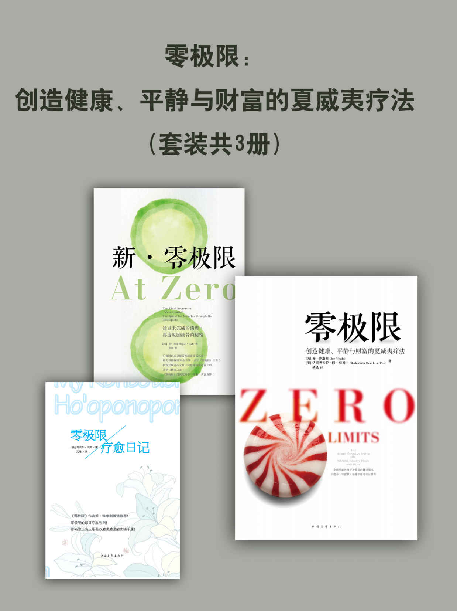

谨将此书献给所有那些愿意敞开心灵，彻底改变人生的人。感谢我在西班牙的代理人朱利安·罗德里格兹，是他点燃了我创作这本书的灵感火花，并与思锐欧出版社一起促成了此书西语版的问世。在此致以深深的谢意。

# 前言　荷欧波诺波诺的转化力

荷欧波诺波诺是优秀的工具，它将平静与康乐带入我们的人生。它让我们明白，经验只是记忆，如蔽日之云，阻碍我们认知真我的记忆。它教我们如何消除过去的影响，更加活在当下，创造我们想要的人生。

我们生活中的一切经遇都起因于记忆，是不断在我们的心智中重演的记忆。那些频繁拖垮我们的记忆大多都不是我们自己的，它们是他人曾经的记忆，其中有相当一部分来自于我们的祖先。

此外，在我们成长过程中，随着时间的流逝，也产生了各种担忧、恐惧与不安全感，接受了许多基于评判与定见的限制性信念。最终，我们偏离了真我，失去了与自然，与神以及与宇宙（源头）的连结。

担忧、恐惧、不安全感、评判、定见和信念皆为“偏误”，荷欧波诺波诺教我们如何去除它们。也正是如此，练习荷欧波诺波诺能够永久性地改变我们的命运。透过荷欧波诺波诺，我们开始以不同的视角来观察与看待一切，更加安住当下，更加处于零频率（zero frequency）——没有担忧、恐惧、不安全感、评判、定见与信念。处于“零的状态”，我们不再像以往那样时时事事都作出反应，而是运用心智、情绪与物质的能量，聚焦于自己真正想要的一切。

荷欧波诺波诺使我们更加有耐心，减少恐惧，更加幸福。它帮助我们越来越清楚地认知自己的真我与使命。最重要的是，它让我们看到，诸多人与事之所以出现在我们的生活中，是为了带给我们新的机遇。事实上，我们经遇的一切都是福佑，即使它们有时看起来并非如此。

一旦我们开始信任自己，便会发现，我们并非孑然一身，人生也并不一定是茫茫苦海。我们学着改掉阻碍自己前行的习性，放下关于过去的负面因素（记忆），重新发现自己真正是谁。当我们意识到自己苦苦寻觅的一切就在我们之内，就会发现，我们“最清楚什么对自己最有益”的那一部分正在等着我们放手，任其自由展现。人生本可以更加简单轻松，是我们使其变得复杂，因为我们自以为知道什么对自己最好，不断地担忧未来，活在过去。

本书主要基于我修习与教授荷欧波诺波诺的体验，以及伴随我的导师修·蓝博士 12 年来所积累的一切。除此以外，还有我个人的人生经验：最初作为母亲，担任美国公司的会计师、商业顾问与税务师，之后则是足迹遍布世界的作者、演讲者、和平大使与工作坊主讲人。这本书撷选了我多年以来撰写的文章，并依循某种关联，如串珠般将它们连在一起。

书中借助实际生活中人人关心、影响广泛的故事与主题来分享我的经验。此外，本书还展示了一点：荷欧波诺波诺对我来说，是当之无愧最简单、最有效的途径。

除了关于荷欧波诺波诺的具体资讯，本书还讨论了会改变您关于“如何面对人生挑战与威胁”的视角的一系列主题。您将学会不再时时事事都作出反应，而是变得越来越觉知与警觉，并因此而变得更加幸福，更加平静。

除了关于关系、金钱、死亡、饮食、抑郁、平静与孩童的主题外，本书还对荷欧波诺波诺的核心概念进行了诠释。此外，附录中还提供了一些关于这一古老哲学的资源。

书中所分享的概念与讯息是简单的提醒，帮助我们看到我们能够凭借自身的力量改变人生，因为我们之外并没有什么人能对我们做些什么。我们对自己吸引来的情境与人负责，而非负罪。这本书试图使人们看到，我们渴望的爱与光就蕴藏在人生的每一个挑战之中。挑战越大，获得的福佑也越大。

我们所有人在生活中所寻求的其实非常相似，比如幸福与平静。寻求的途径有多种，条条大路通罗马，它们的共同特性则是寻找一个独一无二、亘古永恒的真相。当然，我们每个人都要找到最适合自己的道途。荷欧波诺波诺是最适合我的。我知道它非常有效，因为它改变了我的人生，而且也能够改变你的。获得成效的秘密就是练习，练习，再练习。除却练习，谦卑也是必不可少的品质，这样我们才能够信任，能够放下期待，让“神性”引领我们走向幸福与平静。

上次我在以色列举办工作坊时，有人问我是如何将如此多的人吸引到身边的。我看着这个人，发自内心地回答说：

“我清理。除此以外，我不知道应该怎样做。”

# 简介

我们可以问自己的最重要的问题就是：“我是谁？”然而，遗憾的是，我们太过忙碌的生活（挣钱、养家、经营事业和开创新事业），从未静下来想一想自己真正是谁。

我们存在的目的是弥补缺失，放下并不真正属于自己的一切，从而认知真正的自己。当我们放下与消除记忆后，就会重新发现自己的真实本性。我们来这里并不是为了挣钱或建立（亲密）关系，我们是来清理并找到自己的。只要看到自己的真实本性，剩下的一切都会自然而然地发生。

认知自己意指认识到自己是一个独一无二的个体，在某些方面具有胜于他人的天赋。一旦了解了这一点，我们就会发现自己的真我，其他的一切亦会水到渠成。

这是在工作以及生活的各个面向均获得成功与幸福的秘密。认识到这一点之前，我因着追求完美，以他人的期待为马首是瞻而殚精竭虑。我以为物质上的东西能够带来幸福，很少关注自己的心真正想要什么。我只相信自己能够看到、触摸到的东西。直到有一天，我的儿子对我大喊大叫，那愤怒的腔调和我多年来对他喊叫的声音毫无二致。就在那一瞬间，我“觉醒”了。那一刻，我知道，调整自己的时候到了。

我的自我觉察之路将我带至荷欧波诺波诺。它拯救了我的人生！我结束了长达二十年的婚姻，并开始自己创业。我离开了早已习惯的人生轨迹，开始信任内在智慧，遵循自己“更加睿智的那一部分”的指引。我放下了来自自己与他人的定见与评判。如今，我所拥有的远超过自己所敢想象的，在人生中的方方面面都如此。

自小到大的成长过程中，不断有人灌输给我们：只要不完美，就不够好。遵循“旧有程序”，无明地度过一生，这是人性的一部分。有一天，我意识到“我完全能够做自己，无须变得完美”，真是如释重负。如今，我终于能够开始爱自己，爱他人，接纳他人了。

一旦你重新发现自己，找到自己的热忱与必要的自信，就会看到自己的目标。一旦你看到了自己的目标，就会满腔热忱地投入自己所做的事情当中，金钱也会顺畅地流入你的人生。你会在对的时候来到对的地方，并将对的人与机遇吸引到自己身边来。

我知道，修习荷欧波诺波诺会为你带来收获，而且你身边的每一个人也都会因此而受益。修习荷欧波诺波诺，你将学会对自己负起全责，而且你会发现，一旦你负起全责，那通往平静、幸福、爱、丰盛与成功的道途就会变得更加平坦宽广。

你越运用荷欧波诺波诺进行清理，清除不属于你的一切（定见、评判与信念，亦即旧有程序），就越能够深入地探索自己，并变得越来越平静。

要学会将自己置于首位。真相是，对你没有什么好处的事，对他人也不会有好处。你要明白，一个人只有首先学会爱自己，才能够真正地爱别人。还有，将自己置于首位，爱自己，接纳自己，这并不是自私。请记住，他人对你的看法并不重要，重要的是你对自己的看法。

请将自己置于首位！我保证，你并不会像许多人所认为的那样成为一个更加自私的人。恰恰相反，你会变得更加善良、慈悲，更加有爱心。最重要的是，你将变得更加幸福。

就让我做第一个对你这样说的人：“如果你对此尚不理解，那也没什么。”荷欧波诺波诺将带你走上自我觉察之路，带你走向那超越理解范畴的平静。借由荷欧波诺波诺，你会找到真正的自己。这把金钥匙能够助你获得一直以来你苦苦寻觅的爱、金钱、自由、平静和幸福。

荷欧波诺波诺能够帮助你：

● 找到自己的目标与清晰的成功蓝图

● 以开放灵活的态度接纳借由灵感而获得的理想解决方法

● 放下“我知道”，允许直觉与灵感流入

● 消除那些对计划、目标与结果有影响的负面程序

● 探索如何处于零的状态——只有处于零频率时才能够获得理想的结果

荷欧波诺波诺为我们提供了可助我们迅速改变人生的既实用又有效的方法。你无须依赖任何外在的人事物就能够实现自己的梦想。成功与否只取决于你自己，一切尽在你的掌握之中。

莫娜·西蒙那

莫娜·纳拉玛库·西蒙那（1913 年 5 月 19-1992 年 2 月 11 日）是荷欧波诺波诺大我意识疗法的创始人。她于 70 年代创建了太平洋工作坊协会。她是公认的疗愈者，并于 1983 年被夏威夷州政府授予“夏威夷活珍宝”的称号。她曾说：“荷欧波诺波诺这一过程的主要目的是发现自身的内在神性。它是一份意义深厚的礼物，它助我们与内在神性发展互动关系，并学会如何不断地祈请自己在思、言、行上的偏误能够获得清理。清理、清除、再清除并找到自己的香格里拉。它在哪里？它就在你之内。”

荷欧波诺波诺大我意识疗法运用一定的技巧来创建心智的三个部分——意识、潜意识与超意识——之间的互动合作。它助我们重获内在神性（爱），与神性智慧之间的内在连结，从而获得平静、和谐与自由。

莫娜根据这一古老哲学而发展起来的新版本是真正的珍宝。在此之前，为了修习荷欧波诺波诺，整个家族的成员都必须到场。进行过程中设有一个主持者，每个成员都有原谅与被原谅的机会。如今，家族成员散居各地，或者不再像以前那样近，整个家族聚集在一起也不再是轻而易举之事。

伊贺列卡拉•修•蓝博士

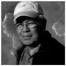

修·蓝博士与莫娜一起工作、旅行、宣讲荷欧波诺波诺多年。莫娜辞世后，他继续更新与发展荷欧波诺波诺，以使其更加简单易行，更加适合当今这个时代。他将这一过程个人化，以使人们能够独自修习，而且不失家族效力。

我们之外没有别人。我们眼中的外在世界只不过是我们关于某些问题——在人际关系与行为处事方面的问题——的想法与记忆的投射。因此需要我们负起百分之百的责任，去清理这些记忆。而且，我们不仅清理了自己，同时也清理了他人：家人、亲戚、祖先甚至是地球。也就是说，清理了一切。你不必亲自来到某人身边以消除问题、请求原谅或者原谅此人。在任何地方都可以这样做。所有的记忆都在我们之内。进行清理时，从我们之内删除的，在他人之内也会被删除。我们无须来到这个人身边，或与其交谈。

# 第一部分　荷欧波诺波诺之关键

## 1. 我的荷欧波诺波诺经验

### 何为荷欧波诺波诺？
2012 年 7 月
远古的夏威夷艺术

或许这是你首次接触荷欧波诺波诺，不过可能已经听说过“秘密”以及吸引力法则。就吸引力法则而言，荷欧波诺波诺是其中一片重要的拼图。

出演电影《秘密》之后，乔·维泰利（Joe Vitale）发现了荷欧波诺波诺与修·蓝博士，他意识到这一原始教导超越了“秘密”。

荷欧波诺波诺是古代夏威夷人解决问题的哲学。我的导师修·蓝博士认为他们是夏威夷最早的居民。正如世界上的其他地方一样，如今的夏威夷人也有着形形色色的信仰，也就是说，并非所有的夏威夷人都修习荷欧波诺波诺。他们中的一些人甚至从未听说过荷欧波诺波诺。

荷欧波诺波诺的意思是修正或改正偏误。根据这一哲学，出现在我们生活中的问题均来自于思想、记忆，以及正在运行的程序（偏误），它们出现的目的是赋予我们放下、清理与消除它们的机会。我们可以从中学会解决问题的方法，亦即，允许我们那具有真知的一部分做工，使其能够修正、改正并达到完美。

你可以将荷欧波诺波诺看作是电脑键盘上的删除键，你唯一需要做的就是按下它。举例来说，打错字的时候，你不会对电脑显示器说：“我已经告诉过你多少次这个字的正确写法了？”你知道显示器对此无能为力。你可以一整天都对它唠叨不停，但它什么都无法改变。就是说，没必要与自己的记忆（旧有程序）谈话，请它们离开，按删除键清除就是了。

如果我们真的想要改变什么，就要先清除它，创造空间，对的资讯才会涌入。荷欧波诺波诺将我们带回“空”，回归“零”，这样灵感自会出现，继续指引我们前行。

莫娜·西蒙那将这一教导带给我们，并将其发展成适用于现代社会的教诲。

修·蓝博士曾对我说：

如果 10 年前我对你说外面没有别人，你会飞快地逃掉。而现在，我们已经愿意对此进行思考，亦即一切皆为我们自己、我们家族的思想（记忆）。外面确实什么都没有，一切都在我们之内，在我们的记忆中。

还记得一天下午，修·蓝博士散步回来，他满眼含泪地对我说：

我刚刚意识到，神对我们唯一的要求就是好好照顾自己，并能够像小孩子那样说‘对不起’，仅此而已。

### 荷欧波诺波诺，胡那（Huna）与“秘密”

有人问我荷欧波诺波诺是否和胡那以及“秘密”一样。

首先，我的回答是：它们并不是一回事。胡那是马克斯·弗里登·朗（Max Freedom Long）1936 年借用的夏威夷语 Huna，借以描述他形而上的理论——新纪元运动的一部分。目前尚未有业已获得认可的夏威夷原始资源将“胡那”这个词与任何秘传体系联系在一起。荷欧波诺波诺来自于古代夏威夷人，他们有可能是夏威夷最早的居民。胡那强迫潜意识吸引来我们认为对自己有益的东西。荷欧波诺波诺则是允准神带给我们有益与完美的东西。荷欧波诺波诺来自于神性智慧（神）。

同样，“秘密”是告诉神我们想要什么，荷欧波诺波诺则是允许神的指引。我们并不对他讲都要做些什么。“秘密”假定我们觉知自己所有的想法，且知道什么是对的，什么是完美的。荷欧波诺波诺则教导我们只有神才知道什么是对的，什么是完美的。

我是如何开始教授荷欧波诺波诺的

1997 年 7 月我首次参加了修·蓝博士在内布拉斯加州奥马哈市举办的工作坊。那次工作坊期间，我邀请他到洛杉矶来。在我参加过几次工作坊后，我意识到，我找到了最简单的途径，是我寻求已久的途径。

与修·蓝博士共同度过的十二年中，我随他一起去过荷兰、比利时、法国、英国、阿根廷以及美国各地。我与他一起举办工作坊，此外还有幸见证了许多不为公众所知的事件。他与我分享了许多清理工具，这些工具是他在进行咨询服务、工作坊、冥想以及在洛杉矶伍德兰希尔斯——我们在那里居住了多年——长距离散步时获得的。

2000 年到 2001 年期间，我内心感到自己可以教授荷欧波诺波诺，其中的一个特殊原因是，修·蓝博士暂时休退，不再授课。我请求“I”基金会（宇宙大我）予以批准。他们进行了冥想——因为荷欧波诺波诺的奥秘无法透过理性思维来加工整理，而是要借由神性来获得。冥想后，他们批准了我的申请。从那时起，我便开始教授荷欧波诺波诺。

自此以后的若干年，我以“I”基金会的名义教授荷欧波诺波诺大我意识疗法。2004 年，我请他们考虑能否允准我使用基金会的资料开办自己的荷欧波诺波诺工作坊。他们再一次批准了我的请求。

玛丽·科勒（Mary Koehler）与我一起在爱尔兰首次举办荷欧波诺波诺工作坊。好笑的是，修·蓝博士也有报名，是以学生的身份参加。

2008 年 11 月，身兼两职若干年以后，灵感告诉我，该放弃洛杉矶税务师的稳定职业了。那时，我不但没有积蓄，还债务缠身。然而，一如既往地，每当我带着全然的信任做出毫无逻辑可言，或貌似不可理喻的决定时，结果总是令人惊叹。

如今，我不再有任何债务，且不断有人邀请我在世界各地教授荷欧波诺波诺。大家都想学习这一古老的艺术，因为我们正在经历与面对的新模式迫切需要荷欧波诺波诺的奥秘。

## 2. 荷欧波诺波诺与记忆

### 你受限于记忆
2010 年 9 月

我们都有诸如“我不配；我的学历不够高；我生于贫困，也会死于贫困”等的限制性想法。或许我们并没有意识到它们的存在，但它们却在潜意识层面上阻碍着我们。因此，我们必须明了，我们所有的问题都只不过是在潜意识层面上不断重播的记忆。它们并不是现实世界中的问题。我们所遇到的困境都源于自己的记忆与想法，是它们在物质层面上创造了我们的问题。

你知道吗，我们 90%的记忆都来自于祖先，而且我们生生世世一直都在积累这些记忆。我们带着这些记忆出生，也因此，我们的问题大部分来自于我们的祖先。举例来讲，假如你知道自己的家族有糖尿病遗传史，你可能会说：“我知道我将来也会得糖尿病，因为这是我家族的遗传病。”然而，在其出现之前，我们就可以消除对家族遗传病的记忆。关于情绪问题、金钱问题、挑战与（亲密）关系的记忆亦如此。

有时，我们作出某一决定的基础或依据是与我们当时的所思所想没有任何关系。人类历史上，源自于前世记忆的资讯自始至终都影响、支配着这个世界。也因此，这对智力而言是如此难以理解。

如果你与某人之间发生了一些事情，事情的本质与你们双方没有任何干系，一切皆关乎于记忆。因此，请永远记住，当你看对方或者你们之间的问题时，你真正看到的并非这个人或者这个问题，而只是你关于这个人或这个问题的记忆。

我们透过烟幕看人生。因此，我们并没有清晰的视景。一切的一切都被我们的记忆，也被我们的评判、信念、定见、期待与恐惧熏染。或许我们以为自己是自由的，而事实上，我们都是记忆与程序的奴隶，它们不断地说服我们什么是对的、错的、好的、坏的。即使处于潜意识层面上，这些想法依然长久地控制着我们，替我们做出各种决定。它们吸引并创造我们的人生，且阻止我们触及自己真正的潜质，阻碍我们找到内在的平静。

现在我有一个问题问你：“放映电影时，电影是在银幕上还是在放映机里？”人与境遇就像电影银幕。我们试图说服银幕我们是对的，并想要银幕改变，但这样并无法改变银幕上正在发生的一切。如果我们想要改变自己银幕上发生的事情，就要改变自己。电影就在我们之内，我们是放映机。

你知道吗，我们大家都想要了解人生的目标。可是，让我告诉你，我们的目标不是了解，而是放下与清理。我们不是我们的记忆，我们是超越自身记忆的，不过我们有责任去清理它们。正如很久很久以前莎士比亚所说的：“世界是个舞台，所有的男男女女都只是演员。”

或许你正在试图理解这些概念，不过并没有什么需要你知道或理解的。试想一下，当你坐在电脑前使用某一程序时，你是否知道还有多少个程序正在后台运行？使用电脑时，你并不需要知道或理解电脑内所发生的一切，知道有各种程序正在运行就可以了。按下删除键亦如此。你无须理解它是如何执行删除功能的。你只需要按下此键，看着它删除就是了！

同样地，或许你并不了解事情的缘由，不了解它们因何发生或如何发生的。你不需要知道！你唯一的工作就是放下与清除。经过清理，在你这里清除掉的，在相关的人与境遇中也会被清除掉。从那一刻起，你会开始看到改变，不过这并不是因为这些人与境遇发生了变化。正在发生蜕变的是你。当你放下自己对他人的定见与评判时，就会以不同的方式看待与体验他人。

如果你人生中再有什么事件或问题出现，请将其看作是福佑，是放下、修正与解放自己的机遇。这是成长与不断发现真我的机遇。“存在还是消亡？”这是真正的问题。

### 你在寻找平静吗？
2009 年 9 月

平静从我开始！我们总是在等着事情自行解决，等着我们的外在世界发生改变。而实际上，如果我们拥有平静，周遭的人与事都会改变。

放下不属于自己的一切，就会找到平静，那源于“做自己”与“了悟真相”的平静。觉醒后，你更有觉知，不带偏见地观察。体验真相时，你的体验会变得截然不同。不仅如此，你开始以崭新的方式欣赏生命。你开始前所未有地感知树木、落叶与海洋。你发现曾经的自己仿佛如盲人一般。一旦你开始欣赏自己，就会慢慢学会以自己过去根本想象不到的方式欣赏一切人、事、物。

放下与静观，而不是受挟于记忆与偏见，如此这般你就能够获得平静。当你放下各种记忆与偏见，就会像神那样看世界，纯粹且没有任何建基于评判与定见的限制性信念。

若想获得平静，就要认识到，负面或破坏性行为并非人类本性。这些行为来自于在人们头脑中重播的记忆。如果某人做了你不喜欢的事，你一定要保持觉知，敏锐观察。要知道那个人在那一刻并不是他或她自己，他的行为只是因着累世的记忆，是他难以逃避的记忆。

## 3. 荷欧波诺波诺之清理

### 这是你的选择
2011 年 4 月

神赐予你智力这一礼物，以使你能够选择，而不是仅仅用来获取知识或者大学学位。选择什么呢？你需要选择的是，跟随神还是自己的记忆与程序。换言之，是选择放下还是受困。

荷欧波诺波诺是一种求助与臣服的方式，是选择依循神而非自己的方式行事。此乃宇宙法则：敲门，门即开；求助，助即来。

放下意味着臣服于造物主——那远比你智慧的心智更智慧，从而他能够启迪、更正与修补，以及做对的事。有的人称其为神，不过称呼并不重要。你需要接纳的是，有一个远比你更智慧的心智，他创造了人类、山峦、花朵、海洋等你与我皆无法创造的事物。

请记住，你一天二十四小时一周七天都在选择，而且你一直在这样做。就是说，你的程序（记忆）时刻在替你做选择，直到你的智力有意识地决定去做一些不同的事情（清理）。

选择清理意味着什么？它意味着，你的智力愿意对那些带来各种问题的记忆负起全责，并放下它们，从而清除它们。清理就是请求神性来改正曾经的错误。这是“允准神性来清除业已无益而且你也愿意放下的能量”的一种方式。一如既往地，神正在等着你允许他做工。

为什么我们无法立刻放下所有的记忆？这并不是那么简单。我们必须明了，我们的身体也是由记忆构成的。如果神一下子将所有的记忆清除，我们的身体就无法继续存在。修·蓝博士曾说：“如果真是这样的话，我们的身体就会变得像皱巴巴的梅干一样。”

### 清理是如何实现的？
2010 年 7 月

智力选择负起百分之百的责任并放下，这正如给潜意识（你的内在小孩，夏威夷语是“尤尼希皮里”）下了一个指令。内在小孩负责贮存所有的记忆，并建立与超意识（你内在完美的一部分，它知道你已经做好放下的准备。夏威夷语是欧玛库阿（Aumakua）的连结。超意识或者说欧玛库阿将你的请求进行润饰，并将其直接呈现给神性智慧（造物主）。

紧接着，玛那（Mana，夏威夷人如此称呼它）或者说神性能量开始流入，在精神、心智、情绪与物质层面上清理你。这一回应是自动的。更棒的是，玛那或者说神性能量也会流入你的家人、亲戚与祖先中。

请谨记一点，智力无法直接与神性沟通。祈愿来自于意识（母亲/智力），然后传到潜意识（内在小孩），接下来再向上移动到超意识（内在神性，我们完美的那一部分），并最终升至神性智慧（神）。我们的智力对神一无所知，它从未见过或体验过神。

清理是一种祈祷方式，一种请求并臣服于神的方式，从而他能够将对的、完美的人事物带给你。这是如何运作的并不重要，即便你自认为能够直接与神交谈，你也一直是透过内在小孩来沟通。你的内在小孩负责建立连结，因此你可以请他或她放下与臣服，臣服于神。

清理基本就是这样实现的。不过你无须理解这一过程，亦无须知道福佑与解决方法来自何处。你只需要开始清理便可。去做就是了！无论你何时进行清理，总会有效果，即使你没有看到或感觉到亦如此。要信任！耐心一些，成为自己人生的观察者。记住，你不是你的问题，你是超越它们的。一定要保持开放。选择放下，像孩童那样快乐，福佑与解决方法自会找到你。

### 至关重要的工具
清理过程
2009 年 7 月

每个工具本身就是一个清理过程。整个清理祈祷已被嵌入每一个荷欧波诺波诺工具中。正是因为这个原因，我们所使用的清理过程会自动运用荷欧波诺波诺来进行清理：我们负起百分之百的责任。因此，我们说“对不起，请原谅，为我内在创造或吸引这种情境的一切请求原谅。”

对谁道歉呢？或许是对你的记忆？你的记忆是你真正的敌人，它们就在你之内。或许你在对自己的潜意识（内在小孩）道歉？也或许你在对自己的内在神性说“对不起”？你永远不会得到答案。你无须知道答案，也无须理解它。你只需要这样做！一旦你的意识或者说智力决定放下，蜕变就开始了。

这些工具就像电脑屏幕上的图标，你只需要双击图标便可，无须了解程序是如何启动的，或者启动后又会发生什么。

你可以运用荷欧波诺波诺的任何工具来进行清理，也能够透过灵感来收集自己的工具。每个工具都是神圣的，尽管有时它们看起来有些荒谬或者过于简单。正如修·蓝博士所说：“除此以外，神不知道还有什么更加简单易行，能使我们着手实施的方法。”

十二年前清理并非这么容易。随着时间的推移，它变得越来越简易。请不要因此而掉以轻心：多年来经过了许多人的一次次清理，它才变得这样简单易行。

### 只是说“谢谢你！”或“我爱你”
2009 年 7 月

通过在心中不断地重复“谢谢你”或“我爱你”就可以进行清理。整个清理祈祷业已涵盖其中。当我们在心中默念“谢谢你”或“我爱你”时，我们就是在放下，并允准神性来解决我们的问题。修·蓝博士总说：“如果我们知道每次说‘谢谢你’或‘我爱你’时都会发生什么，就会一直永远地说下去，持续不断地进行清理（放下）。”所以说，“谢谢你”与“我爱你”就是密码。

我的一次次旅行为我提供了无数次说“谢谢你”的机会。有时，旅行也以“挑战”的姿态出现，比如护照与手机被盗，或者行李三天后才抵达荷兰。那时，我只是说“谢谢你”。问题出现时，说“谢谢你”而不是担忧，是荷欧波诺波诺极其重要的一部分。

说“谢谢你”是一种放下问题并臣服的方式，从而灵感能够出现，带给我们最佳的答案与解决问题的方法。需要我们不带任何执着与期待地说“谢谢你”。要有耐心，保持开放、柔顺与灵活的态度。我们永远无法预知说“谢谢你”会有什么效果，请对神奇敞开心灵。

请记住，出现在我们人生中的每一件事、每一个人都是我们放下并解脱的机遇。因此，一直心怀感激，并明了利用这些机会的权力就在自己手中，这是非常重要的。

现在，我想谈一谈“我爱你”这句话。有人问我：“为什么我应该爱自己的痛苦？为什么我应该爱自己身患癌症这一事实？”请不要忘记，我们所抵抗的，反而会持续存在。对自己的痛苦或癌症说“我爱你”，这是一种放下的方式，而非抵抗。

痛苦与疾病也可能是正向的，是身披伪装的福佑。我们必须要停止抵抗，并放下这些记忆。正如我之前所说，我们的身体是由记忆构成的。我们进行清理是为了获得平静，即使在身处痛苦或者身患癌症之时亦如此。说“对不起”也是一种放下并让神来疗愈我们的方式。神之爱能够疗愈一切。然而，请不要忘记，我们这样做的目的并不是为了让痛苦或疾病离开，这样的话我们的心中就怀有期待，而心怀期待并不是放下。

### 原谅
2011 年 5 月

原谅是荷欧波诺波诺清理主祷词中至关重要的一部分。“对不起，请原谅，为我内在创造与吸引此情境的一切请求原谅。”解脱的唯一方式就是原谅。而且原谅能够为我们开启丰盛之门。

出现在我们生活中的人事物是为了带给我们内心深处原谅并获得解脱的机遇。我们在生活与工作中遇到的那些人代表了我们更需要清理的面向。不过，请一定不要忘记，首要之事则是原谅自己。

原谅使我们能够关上一扇门，从而另一扇更大、更好的门会为我们敞开。它为我们提供踏上崭新道途的契机。这就像是归零，当我们处于零的状态时，一切都是可能的。我们又能够像孩童那样，开放、灵活与好奇。我们将自己从愤懑、担心与期待中解脱出来。正如夏奇拉在她的歌《Waka Waka》中所言：“我们需要从零开始，以能触碰天空。”

如果你终于醒来，知道自己真正是谁，你就不会觉得原谅自己以及原谅他人是难为之事。它比你想象的要简单得多。你无须去学习该如何做，因为你与生俱来就知道该如何原谅，这是你生来就有的本能。

有一点对我很有帮助，那就是意识到，不原谅那些我认为不值得被原谅的人，受伤害的其实是我自己而不是对方。总有那么一天，我们能够足够爱自己，并因此而停止伤害自己。值得一提是，在大多数古代哲学教导中，原谅一直被看作是获得平静与幸福——这是我们所有人都渴望的——的金钥匙之一。

运用荷欧波诺波诺，你无须与对方沟通或者告诉对方你决定原谅他/她。取而代之的则是，你要对自己的内在记忆（程序）——亦即你关于某人或某种情境的想法——下功夫。荷欧波诺波诺的原谅是内在工作，因为正如我们已经认识到的，外在并没有任何人对我们做任何事。这一内在工作简单易行且极具效力，因为从我们之内清除掉的，也会离开他人，尤其是我们的子女、父母、亲戚与祖先。

修·蓝博士总说：“只有当我们如此认为的时候，一个问题才是问题；而且问题并不在于它本身，而在于我们如何对其有所反应。”痛苦是不可避免的，然而是否受其折磨则是可选的。出现在我们人生中的一切情境都是福佑，即便它们看起来并非如此。请对它们说“谢谢你”，将另一边的面颊——爱的面颊——也转向它们（源自《圣经》“有人打你这边的脸，连那边的脸也由他打”，译注）。原谅自己，原谅他人，如此你便能获得自由。

### 照顾你的内在小孩
2009 年 9 月

与我们的潜意识（内在小孩）合作，清理过程会变得更加简单，因为这是我们存储记忆的地方。内在小孩是现实的彰显者，与其建立密切、充满爱与信任的关系是极其必要的，这样就可以改变现实。不仅如此，我们的成长之旅也会变得更加轻松。

你可以随时随地与自己的潜意识沟通，无论是驾车或者排队等候之时都可以这样做。对其尽量频繁地说“我爱你，谢谢你”是非常重要的。与内在小孩沟通的优秀工具很多，比如感谢他或她照料你的呼吸，呵护你的身体，为你的心脏供血。

与内在小孩沟通之际，你就在进行真正的清理。换言之，呵护自己的内在小孩也是一个清理工具。比如你可以想一想自己在物质与情绪层面上有哪些想要放下的人事物，然后带着爱与慈悲请求内在小孩“我请求你，放下吧。”要充满爱意地与其合作，不要像使用肯定句那样带有强迫的色彩。

让我们爱自己的敌人。如我之前所说，它们只是存储在我们潜意识之中的记忆。不要抗拒自己的敌人，爱能够疗愈一切。要记住，你的内在小孩不仅存储记忆与支配身体，还建立与超意识的连结，以及后者与神性智慧之间的连结。你的内在小孩也是你所有人生经历的彰显者。

请与你的内在男孩或女孩沟通，在精神上拥抱并牵起他或她的手。男性也有可能拥有内在女孩，反之亦然，所以说，不要带有任何期待。当你与自己的内在小孩沟通时，你会感受或听到他或她的回应。不过，我再重复一遍，不要带有任何期待。

你任何时候都可以与自己的尤尼希皮里（内在小孩）沟通。你可以告诉他或她：“对不起，为我有意或无意忽略你的那些时刻。我保证再也不会遗弃你。”你的内在小孩真正需要听到的是“我爱你，感谢你对我的陪伴。”

如果你正在寻找一个完美的伴侣，你的内在小孩就是。你所苦苦寻觅的就是他或她。

### 使用什么工具最合适？
2009 年 9 月

使用任何工具都可以，它们是可以互相替换的。清理工具数不胜数，每个人偏好不同，你只需要使用你觉得最适合自己的那一个。遇到问题时可以先问“我如何才能清除它？”你会得到答案，或者被引导着去做貌似奇怪的事情。修·蓝博士说：“即使你听到的建议很荒谬，也一定要执行，因为你并没有听错，神非常有幽默感。”

你越清理，就越能够归零。处于零频率时，你会获得新的讯息与主意。而且你要不假思索地付诸行动。信任自己的灵感，你的内在已有一切问题的答案。

### 肯定句与观想，它们是否也是工具？
2009 年 9 月

你知道吗，意识每秒钟只能处理 16 个比特的资讯，而事实上，你的大脑中每秒钟都有 1100 万个比特的资讯存在。这 1100 万个比特的资讯来自于我前面提到的过往记忆。

使用肯定句或进行观想是在操控这 16 个比特的资讯。这 16 个比特的资讯认为自己知道什么是正确与完美的！借由荷欧波诺波诺，我们学习放下与臣服于神。荷欧波诺波诺清理法使我们对源头（神之宇宙）之善敞开，它能够运用并不为我们所知的那 1100 万个比特的资讯。当我们放下并将其交给神之时，他就能够帮助我们转化，我们甚至无须知道这是如何进行的。

正是因为这个原因，乔·维泰利发现荷欧波诺波诺时曾说：“荷欧波诺波诺超越了‘秘密’”。

肯定句像是在强迫内在小孩，而非以爱待之。举例而言，当内在小孩听我们一遍遍地重复“我是幸福的，我是幸福的”，他或她自会知道这是否是一句谎言。

观想仿佛是说我们比神更加知道什么是正确与完美，或者他是我们的奴仆。借由荷欧波诺波诺及其清理，我们允准神带给我们正确与完美的事物。神并不需要我们为他指明都要做些什么、如何做或者要达成什么目标。还是不要画蛇添足为好。

无论你运用哪一个荷欧波诺波诺工具，都是神在创造。如果你能够看到神所做的工、神所进行的转化，我为你感到开心，不过做工的并不是你。你唯一的工作就是允准，放下，让神去创造。

迈克尔·贝克威斯牧师（Reverend Michael Beckwith）坚称肯定句正如幼儿园里的玩具。我们一早醒来，与它们一起玩耍，并认识到我们的心智是如此强大，直到有一天我们毕业了，发现我们只能做自己。

这就是你真正的工作：真实地存在。如果你能够做自己，你就会在宇宙的指引与保护下自由地行走，它会将你在对的时刻带到对的地方。

无论如何，我们所做的必须要适合自己。我并不怀疑肯定句与观想的作用。我们拥有强大的力量，且是伟大的操纵者。我们运用思想来创造。然而，只是简单地重复“我爱你”或“谢谢你”，然后放下并允准神来做工，这不是更加轻而易举吗？毕竟是神创造了我们，他比任何人都更加了解我们。

我练习放下与臣服已有多年。我向你保证，如今我的生活正如顺水之舟，比任何人敢奢求的还要幸福与成功。我目前的生活完全出乎我的想象，甚至是我做梦都想不到的。

### 应在何时练习？
2010 年 5 月

许多人都问我是否需要进行静坐冥想练习。我的回答是“不”。我的意思是，如果他们的问题是，我是否每天早晚都冥想 15 分钟，我的回答就是“否”。因为，我其实一直都在冥想（练习荷欧波诺波诺）。一年 365 天，一周 7 天，一天 24 小时都练习荷欧波诺波诺。这是必须之举，因为我们的记忆与程序一直活跃于我们的头脑之中，所以我们必须持续不断地进行清理。

让我来打个比方。比如一个 CD 播放器。它正在播放 CD，但因为音量太小，你无法听到声音。我们的记忆一直都在持续不断地播放，不过因为音量太小，我们没有意识到它们的存在。正因如此，随时随地、持续不断地进行清理是如此重要。借由一直不断持续地清理，你能够防止某些事情发生。你永远不会知道你已经关上了多少扇门，又有多少扇门（它们以前一直是紧闭的）为你敞开。因着荷欧波诺波诺，我于每时每刻，前进的每一步以及做出的每一个决定，都一直将神（爱）——而非我的记忆——置于首位。

所以我们的目标应是学习如何持续不断地练习荷欧波诺波诺，即使在夜深人静之时亦如此。荷欧波诺波诺是贯穿我们整个人生的持续过程。最理想的便是，我们一直被指引与保护着，依循灵感而行，而非受役于那些自以为最有智慧的程序（记忆）。

此外，我们有许多需要清理的，我们需要内在小孩能够提供的所有帮助。现在我们来看一看如何在潜意识的帮助下做到一天 24 小时都在持续不断地清理。

孩子并不听家长都说些什么，他们看家长都做些什么。你的潜意识亦如此。当你的内在小孩知道，无论发生什么事情，你都愿意负起全责，且会修习荷欧波诺波诺，而非频繁地在各种灵性修习之间转换时，他或她就会为你清理。你的内在小孩能够自动地为你进行清理，就像他或她无时无刻不在照顾你的身体那样。然而，为了实现这一点，你必须专注于一种修习方式。如果你不断地更换修习方式，你的内在小孩会陷入困惑，问题出现时，他或她会变得不知所措。

处于清醒与觉知的状态时，请尽力而为地进行清理，持续不断地清理。如此这般，你就为内在小孩树立了榜样，当你忘记或因着某种原因而无法清理之时，他或她会帮助你进行清理。

如果你参加过荷欧波诺波诺工作坊，也有收到手册的话，你可以将其置于枕下。潜意识（内在小孩）永不休眠，这会增加你一天 24 小时都在清理的可能性。

你知道吗？参加荷欧波诺波诺培训时睡着其实是好事。头脑往往会倦于思考，潜意识则永不会休眠，而潜意识恰恰能够为我们提供所需要的资讯。

带着忧虑上床休息的话，可能会无法实现清理。因此，我建议你在睡前进行清理，重复地说“谢谢你，谢谢你，谢谢你”以及（或者）“我爱你，我爱你，我爱你。”尤其在你因着某人而感到愤怒、焦虑或沮丧时更要如此。这样，你会睡得更香，你会放下，而且内在小孩在你熟睡之际为你清理的可能性也会增加。梦亦是记忆，是清理的机遇，因此，内在小孩为身处梦乡的你进行清理实在是一件美妙的事。

如果你留意一下忘记清理的次数，你会吃惊的。不过，你会感到你的尤尼希皮里（内在小孩）仍在为你清理。想要做到这一点，就必须要训练你的内在小孩，从而，一旦有问题发生，你会负起百分之百的责任，并放下。

### 成果
2009 年 8 月

需要多久才能看到清理的成果呢？这个问题没有确切的答案。有时你会立刻看到成果，有时时间则会长一些。清理的目的是拥有平静，无论发生了什么事情都如此。清理时，一定不要带着“在某一特定期间内会有具体成果出现”的期待。

你可以拥有平静，即便某个人并未离去或改变亦如此。无论你经济上是否富有，你都可以拥有平静。你是否希望自己无论发生了什么事情都能处于平静之中？那么，请一定不要忘记，一切都会在完美的时刻发生。改变会根据神的计划——而非你的计划——发生，那时你会意识到，这确实是完美的安排。

### 正确的态度
负起全责
2009 年 7 月

正如吸引力法则和荷欧波诺波诺所教导我们的，我们对自己的现实生活负有百分之百的责任。我们负全责的意思是，出现在我们生活中的一切都是我们吸引来的。我们对那些吸引并决定我们命运的想法负责。而且我们知道，我们的想法在很大程度上受控于我们的记忆——自创世那一刻起我们就一直在积累这些记忆。

我想澄清一点，“负全责”并不是说你是有罪的，是个罪人。它的意思是，你对这些不断在你之内重播的记忆（旧有程序）负有责任，也因此，你对借以表达这些记忆的问题负责。

你本自具足。你是完美的。记忆并不完美，但你并非你的记忆。“完美”意味着没有记忆、信念、执着或评判。请记住，没有任何事情是你以为的那样。

记忆的出现是为了赋予我们负起全责并放下的机会。拥有平静的关键是承认我们是负有责任的，然后运用任何荷欧波诺波诺工具来弥补与改正我们的错误。放下的那一刻，我们就允准神性来消除我们的记忆，从而使我们获得解脱。

如果某种情况出现，你能够做到负起百分之百的责任，并明了对方只是显示屏，将你需要放下的那部分记忆展示给你，而你则选择放下，那么你就能够获得解脱，拥有平静，无论身边发生了什么事情都如此。

想象一下，如果人们不再将自己看作是受害者，不再抱怨他人，不再坚信自己总是正确的，这个世界会变成什么样子？上述这一切都是无明的表现。我们麻木无知，根本不知道自己真正是谁。想象一下，如果我们都负起百分之百的责任又会怎样？要知道，从我们之内清理掉的，也会离开他人。这个世界会发生彻底的改变，我们都会重获内在宁静，创造世界和平。

### 作出放下的抉择
2009 年 7 月

“放下”被看作是灵性成长的必要之举，然而，这也可能是一个令人恐慌的过程。许多人害怕放下，因为他们将“放下”与“放弃”混为一谈。

此外还有两种情况，我们说要放下并臣服于神，然而却担忧不已；我们说要放下并臣服于神，却思考不断。

为了能够看到成果，我们需要百分之百地放下，并保持信任。我们必须接纳“神比我们更加知道与了解什么最适合我们”这一事实。我们的工作是放下，臣服于神，且对出现在我们面前的机遇持开放的态度。

我们必须要停止制造一个个标签，比如“这是对的，那是错的；这个很有效，那个没有任何效果”，等等。我们并不知道！我们的智力永远也不会知道！

每一次我们尽了自己的那一份力并臣服（放下），神则会尽他的那一份力（他负责转化）。我们的智力并无法看到或感受到转化的进行，所以它会说“这没什么效果！”。然而，这只是说明了我们还有许多需要清理的地方，因此，我们必须继续清理下去，必须开始信任。

要谨记两个重要的宇宙法则，最省力法则（荷欧波诺波诺）与超然法则（接受一切都是完美的）。

神是简单轻松的，人生也是简单轻松的。是我们将一切复杂化，因为每一次有事情发生，我们都跃身其中并有所反应，而非放下。

我知道，如果你练习荷欧波诺波诺且保持信任，你会看到美好甚至可以说神奇的结果。你会喜欢上荷欧波诺波诺。不仅如此，如果我说“毫无疑问这是最简单的方法”，你也会欣然赞同的。

仅仅知道与了解荷欧波诺波诺并不起作用，秘密在于，带着信任修习它。

如果你是控制狂的话，请放松！放下并非意味着失去控制。恰恰相反，这意味着将控制权交予你内在更加智慧的那一部分。首先，你有许多记忆需要去清理与清除。其次，放下从而清除那些不再有意义的记忆会为你开启更多的门，为你带来更好的机遇，更多的佑助，还有更多的新朋友。

谢天谢地该消除什么记忆并非由你主宰。同样，你也不需要去考虑并专注于正在被清理的记忆。或许你觉得自己正在清理与某人或某种情境（政府、伴侣、金钱等）有关的记忆，但你永远也不会知道自己正在清理什么。只有神才知道。你的记忆像蛛网那样交织在一起，因此，一旦其中的一部分被清除，其他的一切也都随之震颤。你以为自己是因为某个人或某种情境而进行清理，而其只不过是触发器而已。不仅如此，你认为自己正在放下的记忆永远都不是你所以为的那样。

你唯一的工作是允准。一旦你决定负起百分之百的责任，你内在最智慧的那一部分，创造了你且最为了解你的那一部分，被一些人称为神的那一部分，自然知道你已经准备好放下哪一部分记忆。神性会清除它们，并赋予你灵感，助你看到解决问题的完美方法。

### 清理的其他面向
做好清理
2009 年 8 月

尽自己的最大努力好好清理，且不要有任何期待。神正等着你允准他。根本不存在错误的方式，去做就是了！这一过程有几个重要因素：愿意对内在的一切负起全责，放下，明了自己一无所知。

神（爱）了解一切，且能够疗愈一切。你的工作只是允准。这意味着拥有信心。也许这看起来并不那么确定，甚至是不合逻辑的，也许你会因此而感到害怕，但其效果是毋庸置疑的，即使你没有看到或者感受到亦如此。

### 清理时却有更多的问题出现
2009 年 8 月

有可能你开始清理后，却突然发现自己有更多需要清理的。其实它们早就在那里，只不过你没有意识到而已。而现在，一切都变得更加清晰，你的理解也更加深入，神便赋予你更多进行清理的机遇，因为现在的你已经知道该如何去做。不要忘记，出现在你面前的一切都是福佑，都是你成长与发现真我的契机。它们并非考验或惩罚，而是机遇。

### 意图
2009 年 8 月

人们常常问我：“说‘谢谢你’或‘我爱你’之时要带着专注的意图去做吗？必须要感受到什么吗？”那么我也有几个问题：“你按下电脑键盘上的删除键时，也需要带着专注的意图去做吗？按下键时，你是否一定要感受到电脑正在忙着删除？那时你是否也必须要嘴角漾起微笑或者心中充满同情与慈悲？”非也，你无须带着专注的意图去做，或者刻意去感受什么，你甚至无须理解它。意图也同样是记忆。进行清理时，你按照神的方式进行，而非自己的方式。

讲授荷欧波诺波诺之时，我们经常说：“去做就是了，说出它就是了。”对那些将某些人与情境吸引到你生活中的记忆与程序负起全责，并放下，透过说“谢谢你，我爱你”来按下删除键就是了。

你一定要心怀信任，并了知一旦你尽了自己的那一份力（臣服与放下），神就会尽他的那一份力。这是确凿无疑的。

### 期待
2009 年 8 月

当你意识到自己心有期待时，无论它是好是坏，请将其放下。期待也是记忆，也因此，它会阻碍你轻松地得到对的、完美的事物。请放下“我知道什么是对的与完美的”的想法！放下一切期待！回到“单纯的神之子”的状态——这是你本源的状态，并对各种机遇持开放的态度。

### 好的记忆
2009 年 8 月

有人问我：“如果我不想清除好的记忆呢？”那我问你：“你的哪一部分在告诉你这些记忆是好的？是充满评判与定见的那一部分？还是一无所知的那一部分？”我再重复一次：“你渴望自由，想要处于零的状态。零状态意味着没有资讯、没有好坏与对错。处于零状态的你不会忙着说与听；处于零状态的你是自由的。”

你并不知道什么对你来说是完美的，是对的，因此，只有好坏皆放下，允准神来做工，将自己解脱出来。

### 清理与行动
2009 年 8 月

有人问我：“我只是坐在那里清理吗？不用采取任何行动吗？”其实，行动之前、之中与之后，都要试着去清理。

持续不断地清理会为你带来更多的契机，依循灵感而行的契机。要做符合自己内心愿望的事情。即便你已在跟随灵感而行，持续地清理对你也一样有帮助：保持开放与灵活的心态，留意可能开启的一扇扇门。有时，改变方向是明智之举，你越保持清醒与觉知，就越能够看到出现在自己面前的机遇。

### 计划与目标
2010 年 9 月

有人问我，进行荷欧波诺波诺清理的话，是否还可以制定计划与设定目标呢？你想要告诉神什么最适合你，而且他该何时将其带给你吗？神不是你的门房。即便你继续制定计划与设定目标，也不会对你有什么帮助，所以还是放下吧。要保持开放的心态，并留心一切可能出现的新道途、新机遇与新的可能性。

### 荷欧波诺波诺与他人
荷欧波诺波诺对所有人都有效
2010 年 9 月

荷欧波诺波诺对每个人都有效，无论其是否相信，它都如此。我们所进行的个人清理也会影响到周遭的人。那么，你或许会因此而好奇如何为他人清理。

你要知道，你自己才是问题之所在。外面没有别人。如果你觉得身边正有人处于痛苦之中，那是你对此人所受痛苦的记忆与想法。如果你真想帮助对方的话，就要放下那些使你认为此人正身陷困境的内在因素。我已经说过，我们永远不知道自己到底在清理哪些记忆。无论发生什么事情，我们唯一需要做的只是决定自己是否愿意负起全责并放下。

你自始至终都是在为自己而清理。不过，当你为自己进行清理时，从你之内清除的记忆，也会离开他人。如果你想要提供帮助的话，那么就请将问题交给神，他知道都有哪些需要清理。

### 安静地独处
2010 年 9 月

“谈论”不会有什么帮助。谈论就像是抗拒，而我们知道，我们所抵抗的，反而会持续存在。“谈论”会吸引更多的记忆，带来更多我们并不想要的东西。如果我们的言论少一些，也就不会有这么多的问题。

放下，闭嘴，清理，这会增加我们获得灵感的机会。这样的话，我们所说的可能恰恰是对方需要听到的，也可能我们什么都无须说。有时，因着我们的清理，对方也发生了改变，或者得到了灵感。

争论，强辩到底，让对方承认自己是对的，这些都没有什么用。我们可以以清理取而代之，因为从我们内在清除掉的，也会离开他人。许多令人惊奇的事情会因着我们的清理而发生。我们变了，其他的一切也会改变，因为所有导致这些争论的问题只不过是我们的记忆。

有人问我能否与他人共享清理？可是，与谁共享呢？外面并没有别人。问题在于我们自己，我们对自己负责。我们甚至都不知道什么适合自己，又如何将“适合他人的”与他人分享呢？我们所给出的一切都会再回到我们身上，无论是好还是坏。因此，我们并不想给他人错误的资讯或者不恰当的建议。神一直在等待着我们的允准，却从不侵犯我们的隐私，我们也应该以同样的方式对待他人。每个人都有自由选择的权利。

## 4. 接受荷欧波诺波诺培训

### 荷欧波诺波诺讲习班
幕后的故事
2011 年 11 月

报名的那一刻起，培训就开始了，因为你的老师业已开始清理。工作坊之前、期间与之后的清理都是持续的。因此，必须事先深度清理教室，对其进行必要的准备和保护。也因此人们常常告诉我说，他们刚刚报名参加工作坊或者预约做个案就立刻感受到变化。清理总是立即开始。神一直在等待！

举办工作坊的人必须知道如何随时进行清理。正是因为这些准备性的清理，参加者从决定参加培训的那一刻起，就能够受益。

举办者也需要知道如何开启与结束荷欧波诺波诺培训，不要留尾巴。这是非常重要的，否则可能会给人们带来伤害，而非帮助。

做得正确的话，在工作坊期间，你能够放下许多记忆，否则那些记忆需要几生几世才能够清除。事实上，你坐在教室里，这本身就是一种福佑。如果你知道一次工作坊能够清理掉多少记忆（因着工作坊之前、期间与之后的各种清理），你会毫不犹豫地报名参加的。

你知道你的祖先也和你一起参加工作坊吗？你的祖先需要你理解清理的重要性，因为从你之内清除的也会离开他们。

工作坊之后，我们会感到有些疲惫，这是因为我们进行了大量的清理工作。因此，我常常告诉学生：“纵使你觉得仿佛在这里什么都没有做，许多工作都是在你未觉察的情况下完成的。因此，如果你回到家后想要上床休息，那就去休息，这可能正是你所需要的。还是聆听身体的声音，上床休息吧。”

还有一点值得一提，患失眠症或者难以入睡的人常常在第二天告诉我说，他们若干年来就没有睡得这么好过，一觉到天亮。

正如修·蓝博士所说：“工作坊期间我们针对每一个有毒的记忆进行清理。”我知道，我最大的敌人会出现在我的工作坊中，他到来是为了带给我改正与修补的契机。我也知道，因着我所进行的清理，你会得到最适合于你的事物，尤其是保护。

修·蓝博士常常说：“只要你待在工作坊的房间，就会得到完全的保护。一旦走出门外，就全靠你自己了。”

有一次我问他：“我们参加工作坊时，我们的潜意识（内在小孩）在做什么呢？”

他回答说：“参加工作坊时，尤尼希皮里（内在小孩）过得还不错，他们开心地玩牌，做游戏。一旦走出门，情况就不一样了。”

### 帮助他人
2011 年 11 月

我在修·蓝博士那里最先学到的事情之一是，帮助别人并没有什么用处。我们帮助他人，只是使他人失去了学习的机会。他们失去了学习自己过河的机会，而我们则一路上背着更多的石头。并且，我们还需要为此而进行更多的清理，因为帮助他人并非是正确之事，帮助自己才是帮助他人的唯一方法。

最重要的是我们幕后的工作，为工作坊做准备时以及工作坊期间与之后所进行的清理。

牺牲的时代业已结束。修·蓝博士说：“我们并不是为了他人而做，而是为了我们自己。如果我们能够使某个参加者获得清理，此人所清理掉的也会离开我们自己。”所以说，我们所教授的正是我们需要学习的！我总是对学生们说，我比他们更需要清理，我投身于这一工作并不是偶然的。

下面是几点需要注意的事项：

● 参加工作坊的人是我们最大的敌人，同时也是福佑。他们为我们带来新的机遇，从他们之内清除掉的也会离开我们。

● 我们是来聆听的。我们永远也不知道要说些什么。在每一次荷欧波诺波诺的工作坊上，我们既是给予者，亦是接受者。

● 我们必须保持“外面除了我们自己没有别人”的觉知。因此，我们无须帮助任何人，只需要帮助自己。

### 参加工作坊
一种承诺
2011 年 11 月

荷欧波诺波诺是如此简单，以至于人们常常觉得我们有所保留，并未全盘传授给他们。他们想要了解得更加深入。

正如修·蓝博士所说：“我不知道如何使其变得更加复杂，更加困难，以使他们相信我。”不仅如此，他的培训课程总是一模一样的，包含同样的讯息。而更加深入的唯一方法是：尽可能多地参加工作坊，听课，聆听 CD 和远程授课。这是如此简单，我们唯一需要做的就是练习、练习、再练习。不断地提醒也会使之变得更加容易。

我们这些教员也深知自己还有许多要学习的地方，每一次练习与教授荷欧波诺波诺都是我们继续成长的机会。

修·蓝博士常说：“教授荷欧波诺波诺貌似简单，其实并非如此。”如今，经过了十四年的修习以及数百次的培训，我能够理解为什么荷欧波诺波诺并非仅是通过言语来传递。每一次培训都会带来程度上的提升。我们一直在提高，在清理与训练，希望能够为每一次课程都带来真正的灵感与启迪。

因此，我们需要持续地参加荷欧波诺波诺课程，从而能够更加跟随灵感来进行清理与运作。荷欧波诺波诺正如一个不断重新编程的过程，因此，持续不断地接收资讯，不断地重新教育我们的潜意识（内在小孩）和我们自己，是非常必要的。我们都需要被不断地提醒，因为回到旧有习性实在是太容易了。

每一次参加荷欧波诺波诺工作坊，都会越来越深入，懂得更多，获得更多的资讯。更棒的是，我们会清除大量的记忆。每一次工作坊之后，我们都会发现自己清理得更多，并且获得了更多的福佑。

清除那些限制我们，阻碍我们发挥全部潜能的记忆并非易事，因为正如我们已经看到的那样，这些记忆的积累并非仅仅始于我们出生的那一刻，而是远在此前。为了能够获得真正的幸福与自由，我们就必须一直清理。尽管这一过程已经变得更加简单，更加自发自动，但是，如果想要获得持续的效果，就要严肃认真、持之以恒地致力于清理。

每次工作坊之前、期间与之后，我们都能清理掉一些记忆，这会为我们开启新的意识觉知并带来无数的机遇。那些第二次或者第三次参加我的工作坊的人，总有各种令人惊奇的故事与大家分享，他们分享每一次上课所学到的新东西与新体验。我很喜欢人们在课上进行分享，这为大家提供了聆听，敞开心胸，放松，放下“借由智力来理解”之需求的机会。

参加者还提到，他们感觉每一次工作坊都不同。关于这一点，我毫不惊讶。我常常告诉人们：“其意义正在于此。”这就像是重读一本书并获得了之前忽略掉的讯息。每次工作坊我们都有新的收获，因为每次工作坊都是不一样的。

就我自己而言，每次我与我的老师修·蓝博士参加工作坊，结束时他都会问我：“玛贝尔，你今天又学到了什么？”每次我都能够回答他的问题，因为我在每一次工作坊都能够学到新的东西。在我觉得自己能够教授荷欧波诺波诺之前，我已经参加过五十多次工作坊，也至少修习了三年荷欧波诺波诺。

在布加勒斯特举办的一次工作坊上，我对学员说，我刚刚意识到再次参加工作坊的人是真正理解荷欧波诺波诺的人。

确实如此。参加荷欧波诺波诺工作坊之后一去不复返的话，只是因为尚未理解荷欧波诺波诺。如果我们仅仅参加了一次工作坊，就觉得自己已经理解了荷欧波诺波诺，并开始教授它，这恰恰说明我们根本没有理解它。通过互联网学习了荷欧波诺波诺，并认为自己已经了解它，也是并未理解的表现。

再次参加工作坊的人才真正了解这一哲学的深度。这是因为，一旦我们了解了这一道途，就想要走得更深更远。我们想要健康，想要生活中有更多的奇迹出现，喜欢无须任何明显起因亦感到幸福、宁静与自由的状态。也因此，我们想要不断地参加工作坊，想要不断地进行清理。

从前有一个印度人去见佛陀。他对自己说：“我每年都去见佛陀，而且每次都问他同样的问题。如果他真像自己所说的那样无所不知，就应该每次都给我同样的答案。”他真的这样做了。一年又一年，他每次都问佛陀同样的问题，可是每次都会得到不同的答案。有一天，异常失望的他问佛陀：“你不记得我吗？每年我都回来问你同样的问题，可是每次你给我的答案都不同。”

佛陀回答说：“每一年的你都是不同的，我亦如此。我怎么可能给你同样的回答呢？”

尽管荷欧波诺波诺工作坊所讲的内容貌似相同，但每一次都是不一样的。这一过程永远都不尽相同，因为无论是参加者还是降临的灵感，永远都是不同的。

工作坊上的资讯适合参加者，也因此，工作坊结束后分享其内容是无益的。如果某些人没有参加工作坊，这是因为这次工作坊并不适合他们。每次工作坊的内容都受到参与者能量的启发。对于参加者来说，在那里释放出来的一切是在对的时间与对的地点出现的。

参加完第四次或第五次工作坊（在六个月之内）之后，我对我的老师修·蓝博士说：“我清理了又清理，感觉没有什么用处。”他警告我说：“不要期待。”谢天谢地，我听从了内在更加智慧的那一部分；谢天谢地，我坚持了下来。

我只能说，在某一点上，我的头脑还是有所明白的！每次工作坊之后，我也开始看到它们之间的不同。每一次都有更多的门为我敞开。我越清理，就越感到平静与自信，感到自己越幸福。

因此，如果头脑告诉你说你已经了解荷欧波诺波诺，不需要再参加工作坊的话，你只需要说谢谢你，然后继续参加就是了。即便你的头脑强调说荷欧波诺波诺对你没有什么用处，你也不要犹豫，只要有机会就报名参加工作坊。你会收获惊喜的！

永远都要信任你的灵感，而非记忆。不要忘记，你的智力什么都不知道。即便你说自己理解荷欧波诺波诺，你也永远不会理解它，因为它超出了智力的理解范畴。荷欧波诺波诺并非能够借由词语传递到智力的哲学，更确切地说，它是一种精神上的重新编程。但遗憾的是，你无法在一天或者一个周末之内完成这种重新编程，无法仅仅通过一次工作坊就放下你在这一生中，以及生生世世下载到潜意识（内在小孩）里的所有程序。清理、信任与放下，这是一个持续的过程。

荷欧波诺波诺培训不是针对智力，而是针对灵魂的。如果你一直在清理，幸运的话，你会抵达新的高度，在下一次工作坊中能够更加深入，听到以前无法听到的资讯，或者以不同的方式听到它们。如果你并未持续不断地清理，那还有什么比“得到提醒，并看一看自己这一次是否更能放下，让自己更加智慧的那一部分来解决问题”更好的呢？

### 神性与你之间
2011 年 11 月

神性告诉我们：“你行，我行；你至，我至。你若多走一点六公里（源自《圣经·马太福音》，意思是除了分内之事，还做额外之事。译注），我会为你清理道途，不过不会早你片刻。”正因如此，我们做出承诺并致力其中之前，事情有时会显得令人恐慌或者扑朔迷离。

首先，你要迈出第一步，发出充满信心的誓言。我知道，这是一个令人心慌害怕的过程，也因此，找到借口并不难，比如没有时间或者金钱等。然而，只要你致力其中，并充满信任，成功是必然的！一旦你让宇宙看到你充满信任且珍惜出现在自己面前的一切，你所获得的福佑将是你无法想象的。

工作坊运作于神性与你之间。也因此，不付费的话，也不会得益。你所得到的总是与你的付出与努力相对应的。这证明了你看重工作坊，看重自己。你值得，那么就把它送给自己，即便你得碰碰运气，就像虽然心中害怕但还是决定试一试一样。如果你认为自己担负不起，那我说，望而却步才是你担负不起的。让宇宙看到你、信任你的方式有多种。神一直在看着你，回报总是成倍于付出。

### 远距课程
2011 年 5 月

有些人是如此信任荷欧波诺波诺工作坊，他们在家里参加远距课程。而且他们也能够看到效果！正如修·蓝博士所说：“这些人非常聪明，他们知道从参加者那里移除的东西也会离开他们。”当然，只有合格的教员才能使这一切成为可能，整个过程都是在宇宙的支持下正确完成的，事先准备与保护好一切，这样对参加远距课程的人才会有效果。

下面引用了一位参加者的话：

你好，玛贝尔。大家好。我周四购买了在罗马尼亚举行的工作坊课程。第二天，我一如既往地工作与清理，忽然间，我有一种截然不同的感受。我不知该如何描述这种情形，不过我感觉到有什么巨大的东西离开了我的记忆。同时我的心中也充满了自信。我真切地感到，我能够战胜它，而且我并不是在独自面对这一切。这真是太棒了。谢谢你，玛贝尔。感恩我能够远距离参与这次工作坊。这真是一次神奇的人生体验。

爱，

诺伯特，英国

### 他人能够替你做清理吗？
2011 年 11 月

不要花钱请他人替你清理。正如我们在培训中所学到的，除了我们自己关于他人与现实的想法之外，没有什么可清理的！我们都是为了帮助自己而来。让我们保持正确与开放的心态，从而允准神性来帮助我们。其他任何人都无法替我们做这件事。

如果有人告诉你可以花钱请人替你清理，请睁大双眼！那些人真的知道如何清理吗？果真如此的话，他们就应该知道除了他们自己关于他人的想法之外没有什么可清理的！如果他们真的想帮助你，就应该为他们自己清理。

### 孩童可以参加工作坊吗？
2011 年 5 月

当然可以！事实上，我甚至还专门为孩童举办工作坊。而且，很多时候，他们是为了大人来参加工作坊的。

孩子们来参加我的培训，这是我所能获得的最佳礼物。每次我都能从他们身上学到很多东西，很开心他们能来参加我的工作坊。

我从孩子们身上获得了许多的爱与真诚的认可。因为你知道的，他们不撒谎，而且也不会受愚弄。他们更加真诚地面对自身的感受，因为他们还没有形成那些早已主宰我们的定见与评判。

有一次，一个五岁的女孩和父亲一起来参加在布加勒斯特举办的工作坊，他已是第二次参加工作坊了。女孩请父亲再参加工作坊的时候也带上她。工作坊上，女孩时不时在我们面前走来走去。她看着我，紧紧地注视着正在讲话的我。接下来她递给我一张色彩斑斓的美丽图画，这是她专为我画的，上面写着她爱我。当然，听众也看到了这一切，大家都笑了。最后，我问道：“你们以为我收到这些爱的话语，是因为我所说的话吗？绝非如此。她能够看到超越我话语的东西。我讲话时她能够看到我所做的工作（清理），当然还不仅仅如此。”

修·蓝博士常说：“教一把椅子学习荷欧波诺波诺可比教人容易多了，因为人们惯于思考，将智力置于自己之上。我们总是在不停地思考，不断地理解。”

孩童比成人更加活在当下，更容易教授。他们既不会用无益的推理将事情复杂化，也不像成人那样有想要理解一切的需求！教授孩童学习荷欧波诺波诺的过程中，我有许多令人惊叹的经历。

前不久，在一次工作坊后，一位母亲来到我的面前，对我说她儿子想要告诉我一些事情。那个八岁的男孩对我说：

“我对妈妈说‘谢谢你带我来，我要练习荷欧波诺波诺。这样，我长大以后问题会少些。’”

然后这位母亲向我咨询她正在面对的一个问题。我看着男孩，问他：“你会对妈妈说什么呢？”

男孩回答说：“我会告诉她不要太担心，不要把事情看得那么严重。”

于是我建议这位母亲：“下次再有问题，问问你的儿子吧！”

罗马尼亚的一些孩童曾经独自来参加工作坊，因为他们的父母那一天都有事无法参加。即便父母无法同行，这些孩子们也坚持要再来参加工作坊！当然，家长们还是得接送他们。这些孩子们为能够再次参加培训而兴奋不已，不仅如此，他们还有许多感人的故事与大家分享。

在阿根廷，一个小女孩在课间休息时来到我的面前，她问我：“玛贝尔，你怎么这么了解荷欧波诺波诺？”

我的回答是：“我不知道。”

相对来说，与孩童们合作更加容易。当我告诉他们只需要说“谢谢你”来放下时，他们会跳来跳去地重复着说“谢谢你！”。而如果我告诉大人们要重复地说“谢谢你”，他们总会问：“怎么说谢谢你呢？要一直说吗？我需要去感受吗？”就是这么回事，大人们总是试着去理解。可是，并没有什么需要理解的，孩童们知道这一点。

还有，在委内瑞拉，一个五岁男孩在课间休息时来到我面前对我说：“玛贝尔，你知道吗？我有一个朋友，他总是哭，因为我有的东西他都想要。生活中，一个人要为自己所拥有的东西而感恩，而不是紧盯着看别人都有什么。”好棒的一课！

同一年，也是在委内瑞拉，一位母亲说她的儿子改变了主意，不想参加第一天的工作坊。她将他带到我面前，把他介绍给我。我对他说，他不必参加我们的课程，坐在教室后面玩玩具就好。于是他同意留下来。可是呢，他最终坐在了第一排，整整两天的工作坊，他几乎一动不动地坐在那里，只是在课间休息以及进行课上见证分享时才有互动！

第一天的培训内容是荷欧波诺波诺，第二天是零极限（我以荷欧波诺波诺为基础创建的方法）。第二天的课程上，我们寻找自己的天赋与热忱。这个男孩参加了所有的互动练习，而且每次的互动伙伴都是成人。最后，我问谁想与大家分享自己的体验，他多次从椅子上跳起来，告诉大家他将如何运用在工作坊上学到的工具来帮助他人，改变世界。这真是令人称奇！与他一起互动的大人们也都为他所带来的启迪而感到不可思议。

在墨西哥，两个孩童在课间休息时来到我的面前。其中一位将我所讲的一切都画了下来。另一位问我：“我的一个朋友感到伤心又孤独，我能对他说什么呢？”我建议他对朋友说：“他绝非孤单一人，神永远与他同在。”然后我又问：“你觉得你的朋友能理解吗？这样说对他有帮助吗？”他回答说：“嗯，我会告诉我的朋友，他肯定能理解。”

我邀请这两个孩童站在讲台上。忽然，一位女士举手问她该如何帮助自己，因为她眼睁睁地看着丈夫被杀死在自己面前，她无法抹去这一画面。我还没来得及开口说话，刚刚提到的那位男孩不假思索地回答说：

“这是你的错，因为你将这幅画面放在头脑中，还不肯放下！”

我没有什么需要补充的了。

### 该向何人学习荷欧波诺波诺？
2010 年 7 月

人们往往担心荷欧波诺波诺教授者的权威性与质量。许多人写信给我，问我是否曾特别授权某个人教授荷欧波诺波诺，或者我是否有资格授权他人。我明确地回答他们说：我被授权在工作坊上使用一些受版权保护的材料，但我没有资格授权任何人去教授荷欧波诺波诺。

私下认为，没有任何人能够在仅参加过一次工作坊，抑或帮助宣传或组织工作坊之后，就已经做好教授荷欧波诺波诺的准备。请务必对培训本身以及工作坊举办者的资历打一个问号，听从自己的灵感，真正的荷欧波诺波诺培训对准备工作有着相当高的要求。

宇宙中有各种各样的力量在支持着我们提高放下的程度。因着我们专门的准备和多年的训练，以及我们的现场指导和在课堂上负起全责的意愿，我们能够实现更高层次的清理，许多记忆会以我们的名义被清理掉。

我注意到，如果我在传递资讯或者回答问题时没有清理，事后会付出高昂的代价。如果我提供了错误的资讯或解答，它会加倍地回转到我的子女或我自己身上。如果我分享了自己无权分享的资讯，我的子女和我也会因此而受牵连！

关于荷欧波诺波诺的妄用，修·蓝博士在他的信中对我说：

这是并未获得神性授权便教授荷欧波诺波诺的灵性后果……是未经基金会允许便使用受版权保护的材料的灵性后果。我们还是好好清理吧。

他还说：“荷欧波诺波诺大我意识疗法的材料是灵性材料。使用这些材料需要大量的准备与清理。未经基金会允许便使用受版权保护的资料，将其作为蹦床，会有非常负面的后果。与此相反，如果只是将其作为己用，则会受益无穷。选择在你手中。”

我不知道你的想法，私下认为，我有许多记忆需要清理的。我不想为了名声或金钱而积累更多需要清理的东西。从灵性角度来看，这不值得。

我伴随了修·蓝博士 12 年，也私下获得了许多资讯。他给了我很多，也告诉我许多关于我的事情，以及人们如何因着与我合作而受益。不过这并不代表我会利用这些资讯去获取金钱与声誉。你不会在我的书中找到上述资讯。那些资讯是适合于我的，如果我将其与你共享，只会伤害到你。修·蓝博士给予我的一些资讯与工具只会被我永久地珍藏起来。

修·蓝博士分享某些特殊的资讯或工具时，它们仅供我们个人使用，因为与错的人分享资讯只会使双方都受到伤害。如果修·蓝博士在工作坊上分享某些特殊工具，这种工具也仅仅属于参加者。一个人是否来参加某次工作坊，并不是偶然。

如果一个人被允许教授荷欧波诺波诺，参加此人举办的工作坊会为我们带来极大的益处与清理。如果此人经受过良好的训练，灵感会顺畅地流下来，因为教授者已经参加过许多荷欧波诺波诺工作坊并修习了很长时间。就这一点而言，我本人已经参加过至少两百次工作坊。参加完第一次工作坊后，我并没有奔走相告地宣传荷欧波诺波诺。我非常肯定自己才是那个需要练习的人，如果我想要帮助他人的话更是如此。

受过良好训练的教员知道如何准备教室，并将其变成庇护所，这样，教室本身也能够帮助我们清理并保护我们。是的，如果我们在被允许的情况下正确地教授荷欧波诺波诺，宇宙会赐予我们保护盾。也因此，准备充分的教员所教授的工作坊会使参加者有能力清理掉许多东西——否则的话需要花费许多世代才能够清理掉这些东西，当然，所受的福佑也是不可思议的。

每个参加荷欧波诺波诺工作坊的人都会收到或听到不同的资讯。在神的眼中，每个人都是独一无二的，会收到适合于自己的资讯。然而，为了能够实现这一点，教授者必须知道如何归零，并在讲授时持续地进行清理。

如果我连什么适合自己都不知道，又如何能知道什么最适合你？同样，你向我提问之时，如果我没有处于自动清理的模式，就有可能带给你错误的答案，因为那时我的回答可能是来自于记忆，而非灵感。这对你我都没有益处。我们所做的一切都会为自己及家人带来后果。

还有一点很重要，亦即，教授工作坊的人除了荷欧波诺波诺之外，不再修习其他法门，以保证其内在小孩不会迷惑，能够自动地进行清理。

那些缺乏来自神性的灵感却进行授课的人，运用的是有毒的记忆。因此，我希望能够帮助你认识到，拥有恰当的教学经验与清理水平，并专注于同一法门而非各种修习混杂在一起是多么重要。

总而言之，选择荷欧波诺波诺工作坊时，如果你想知道教授者如何，就问一问他或她参加过多少次培训，又从师于何人。问问此人已经修习了多少年荷欧波诺波诺，最后一次参加的工作坊又是何时。还要问一问对方是否仅仅修习荷欧波诺波诺，还是也修习其他法门。选择参加哪一位教员的工作坊时，要放下并进行清理，从而在灵感的指引下做决定。这是你最有力的工具。

请一定要照顾好自己，因为没有人会替你做这件事。询问并跟随你的心。

不要接受赝品！

# 第二部分　荷欧波诺波诺与你

## 5. 走向幸福

### 从智力到灵感
我们必须醒悟
2010 年 3 月

我们的实相涵盖了我们所有的程序、记忆、信念、执着、情绪与期待。无论走到哪里，我们都背着这些沉重的包袱。我们既聋又盲地走过了数百万年。我们已经变得麻木，在错误的地方和错误的人身上寻找爱、首肯与欣赏。我们孜孜不倦地追求成功、权力以及各种物质上的东西，以为自己会因此而变得幸福。我们试图改变他人，因为我们以为如果他们改变了，我们就会幸福。我们不断地贬低自身的力量，因为我们以为自己的幸福取决于他人以及外在的情境。

我们都对自己灌输了哪些观念，并因此而离幸福与康乐越来越远？我们可能是自己最大的敌人！我们对自己的看法影响着我们的实相。你看，潜意识（内在小孩）不惜一切代价地证明自己是对的。因此，它会吸引来各种情境以让我们认为自己不够好，或者不值得拥有某些东西。你能想象在这种情况下我们都会吸引并彰显出什么吗？

荷欧波诺波诺将它们称为“重播的记忆”，它们非常强大。我们以为自己是自由的，然而这些想法与程序却一直都在控制着我们。它们一直在后台运行。我们必须醒悟，并做出更好的抉择。觉知具有疗愈作用，而且这是我们迈向目标的第一步，也是最重要的一步。我们能够选择！

### 智力
2010 年 3 月

毫无疑问，如果我们一定要保护自己的“自我”（ego），坚持妄自尊大，宇宙迟早会给我们沉重的一击，而且还会击在最痛的地方。获得支持以及所需要的帮助有两种方式：不再自作聪明，变得谦卑。

智力为一切的一切都贴上标签，并编写出一个个故事。而事实上，根本不存在什么“对”与“错”。头脑自以为自己知道，其实它一无所知。

荷欧波诺波诺教导我们，智力被创造出来的目的并不是去“知道”，而是去“选择”。“选择”是其唯一的功用。我们拥有选择的力量，选择以“智力想要的方式”还是“神的方式”做事。

我在第一本书《最简单的方式》中提过，我的老师修·蓝博士曾给我讲过一个夏威夷版的创世故事。故事是这样的：

当神创造了地球并将亚当与夏娃安置在那里时，他告诉他们，他们生活在天堂，无须担忧任何事情，他会为他们提供所需要的一切。此外，他还告诉他们说，他会送给他们一个礼物，以使他们能够做出自己的决定：“自由选择”的礼物。于是，神创造了苹果树。

他说：

这棵树叫作思考。你们并不需要它。我能够为你们提供一切。你们无须担忧，但是你们能够选择是按照我的方式，还是你们自己的方式行事。

问题并不在于亚当和夏娃吃了苹果，而在于他们没有透过简单地说“对不起，请原谅”为自己的行为负起责任。当神询问此事时，亚当说：“夏娃让我吃的。”也因此，亚当必须离开那里，踏上劳作之旅！

就像亚当一样，我们一直在一口口吃苹果，一直在劳作。我们深信自己知道什么是最好的，根本没有意识到还有另一种做事方式，一种更加简单的方式。

我们的祖先知道，看到与体验神奇的唯一途径是透过信心。他们明白，只要联合起来便具有面对任何挑战的力量。而且，解决问题的方法来自于上天，因为答案并不在地球上。

遗憾的是，随着我们的成长与受教育程度的提高，我们却离本源越来越远。我们决然地认为，随着知识水平的提高，我们能够解决任何问题。然而，因着种种原因，我们却身陷困惑。我们相信一定要用知识来扩充智力，而事实上，智力之所以被赋予我们，是为了让我们能够在“思考”、“作出反应”或“放下”中做出选择。

阿尔伯特·爱因斯坦曾说：“知道得越多，不懂的东西也越多。”我们一直被教导说智力的目的是存储与理解信息，并以此观念为基础建构自己的认同感。如此这般，我们的智力试图去成为它所不是的，并将我们推离自己的真实本质。若要打破这一恶性循环，就要认识到，我们天生睿智，不过智慧并不存在于我们的头脑之中。我们必须要回到根源，回到我们尚未开始接受正规教育、开始失去真面目的时刻。

创造性也并非来自于我们的智力，而是我们自然属性的一部分。它以我们无法解释的方式降临与运作。究其本质，我们的各种行为只有两个来源：灵感或记忆。

要明辨灵感与直觉。灵感是来自于神（你也可以称其为宇宙）的新信息，新主意。以“互联网”为例，其发明者并不知道这个主意究竟来自何处。直觉则不同，记忆的脉冲创造了直觉。我们的潜意识（内在小孩）借此来提醒我们，某一曾经发生的事情即将再次发生。

只有在我们处于空与开放的状态，没有忙着谈话、思考或担忧之时，灵感才会降临。为了能够触发我们的最高潜能，我们必须再次成为孩童，睿智的孩童。我们要相信当自己停止思考与担忧，且对所有机遇保持开放之时，自会得到指引与保护。

我们将自己的生活复杂化。我们自认为知道什么最适合于自己，并列出一个个清单，上面写满想要吸引到的一切，甚至标明时间与数量……而事实上，我们根本不知道什么对自己最有益，最完美。不仅如此，这清单是写给谁的呢？写给最了解我们需要什么且何时需要的造物主！我们真是自大至极。

承认神性智慧的存在是至关重要的。请看一看大自然，看看那些争奇斗艳的花朵，人类根本无法创造出诸如此般的美丽。再看一看自己的身体。你根本无须去思考该如何呼吸，或者如何维持心脏的跳动。我们的世界真是充满了神奇！

开始重新体验惊奇与欣喜吧，就像孩提时代的你那样。让智力去执行其本初的使命，而不是任其使你发疯。一旦你敞开心灵，不再试图去掌控现实，奇妙的事情就会出现在你的生活中，你也会重新感受到幸福与自由。

安东尼·戴迈乐对此有着明确的阐述：

一旦你开始觉知，就变得更加智慧。此乃真正的个人成长。理解自己的自大，然后放下，由此，你会变得谦卑。理解自己的不快乐，它就会离开，由此，你会处于一种幸福的状态。理解你的恐惧，它们会消融，由此，爱自现。理解自己的执着，它们会离开，由此，自由降临。

真相会使你自由。

### 放下恐惧
2010 年 1 月

《让世界停下来，我要下车！》（一部音乐剧的剧名。译注）有时你是否也想这样狂喊一声？既然演出尚未结束，我们就不能半途而废，不过“放下”能够帮助我们改变舞步与结局。至关重要的是，觉醒并看清事物的本质。我们不能再受控于幻相。我知道，放下我们信以为真的一切是多么令人惶恐。当我们放下已知、拥抱未知之时，恐惧是不可避免的。

学习荷欧波诺波诺能使我们认识到一个美好的事实，亦即，我们所寻求的任何事物，我们灵魂所渴望的，都在未知之中。当然，我们会因着放下自己所知的唯一实相而感到恐惧。尽管如此，如果我们想要获得幸福的话，就必须这样做。

一定不要忘记：如果你肯求助，就会得到帮助。你唯一需要做的就是去“请求”，因为你是拥有自由意志的。如果你不请求帮助，宇宙便不能介入。修习荷欧波诺波诺之时，你所做的其实就是请求帮助。你对自己的实相负起百分之百的责任，并允准神来拉起你的手，引领你，保护你。你并非孑然一身。请求，就必得着。

要时时觉察自身的恐惧，并记住，你并不是你的恐惧，你的恐惧只是重播的记忆；你并不是你的恐惧，你超越其上。如此这般，恐惧自会消散。一旦恐惧离开，灵感自现，将你带回天堂，即便这只是短短的一秒钟！如果犹疑或恐惧的记忆再次出现，就继续放下，一步步地来。还有，在下一次恐惧升起之时，请呼吸。恐惧来袭时，我们的第一个反应便是屏住呼吸。而呼吸这一简单之举非常有益于放下恐惧。

无论恐惧何时出现，都对它说“谢谢你”，因为它为你带来了一次放下的机遇。它是唤醒闹钟，告诉你该起来以新的方式做事了，或者是时候开始行动了。恐惧是由我们的心智创造的，我们对恐惧的信念更赋予其力量。一旦我们认识到它的本质真相，恐惧就会自行消失。

想一想，你确实能够以神的目光看宇宙。一旦你放下自身的恐惧，就会以全新的目光看世界，仿佛刚刚睁开双眼的新生儿。现在你就有放下恐惧，允许宇宙带你从一个全新的起点顺流而行的机遇。

你所苦苦寻觅的幸福就隐藏在每一个“谢谢你”与“我爱你”之后。要不断对自身的恐惧、犹疑、定见或评判说这几个字，从而放下它们。

### 活在当下的重要性
2009 年 8 月

在有一次接受按摩时，我意识到我们根本就没有真正地活在当下。按摩期间，我必须一次次地强迫自己回到当下。我不时地发现自己的思绪又在飘游，不得不进行清理，才能够回到当下，享受当下那一刻。

每次我意识到思绪又在游走并进行清理之后，就会从过去或未来回到当下。我很想专注于当下这一刻，放松，享受按摩，但是我无法防止自己的思绪和情绪将我带走。那次按摩时，我认识到我们都在做着同样的事情，都在错过享受当下时刻的机会。

当下有许多机遇正等待着我们，一扇扇门为我们敞开。然而，我们不去寻找敞开的门，却任由自己的思想飘离当下。我们为自己无法解决的事情担忧：经济危机、经济衰退以及失业状况，或者任思绪将自己带回那些业已无法改变的过去事件中。我们就像木偶一样，受控于记忆，受控于那来自过去的喋喋不休的声音。它们使我们难以享受自己的人生旅途，难以看到周遭那些美好的事物。

你依然活在过去吗？你是否依然受困或执着于过去的某些人事物？是时候放下并开始活在当下了。我们没有时间回顾过去，只有时间活在今天，因为既没有什么事物在阻碍你享受当下的每一刻，你也不需要去理解什么。你现在就可以做出想要“更加有觉知，开始活在当下”的选择。你一直在将宝贵的时间浪费在无谓的事情上。你完全可以选择放下，而不是担心、对付、责备、抱怨与思量。

如果你愿意放下，你生命中的一切都是助你克服困难、面对挑战、完善自己、强化自己的机遇。请将自己从箱子——你不仅自己生活在箱子内也将他人置于箱子中——里解放出来。为自己的人生负起百分之百的责任，这样，一切都会改变，变得更加简单轻松。

我们的朋友赛勒斯·昂提基（Cyrus Ontiki），那位总是兴高采烈、笑容满面的瑜伽教练，告诉我们说，HA 呼吸法是一种完美的呼吸方法。他还说，你无法为过去或未来呼吸。因此，如果你在（有意识地）呼吸，你就正处于当下；如果你正处于当下，你就 OK。

有一次，在我与赛勒斯共同举办的远距课程上，他提到了他与手机运营商客服人员之间的对话。他的幽默使她大笑不止，不可思议的是，他最终竟然获得了三个月的免费服务。笑是放下的另一种方式，这使我们能够跟随宇宙之流，活在当下。

只要我们活在当下并允准宇宙带给我们惊喜，神奇的事情就会发生！活在当下，就是真正地放下。

### 信任的重要性
2014 年 4 月

我永远忘不了萨丽塔，作家米格尔·鲁伊斯的母亲。见到她时，她虽已过百岁之年，但依旧精神矍铄，神智清晰。她告诉我说，许多年前她为美国联邦政府工作，而那时她并没有获得永久居住许可证。有一天，她来上班，看到写有“这间办公室里有没有获得永久居住许可证的雇员”的通告。她立刻意识到：“他们指的是我。”于是她找到老板，将自己的情况如实禀告。她的老板惊讶不已。

那时竟然能够在没有永久居住许可证的情况下为联邦政府工作，这简直是不可思议。可是，我们这些在美国待了多年的人知道，过去这还是可能的，那个年代他们还不像现在这样要求严格。

萨丽塔对我说，她每日都在心中对自己讲：“你一定可以得到你想要的。”“你一定可以心想事成。”

她坚持不懈地每日祷告。直到有一天，她终于有机会向政府部门申请永久居住许可证了。

萨丽塔满怀希望地重新递交了材料，最终在一段时间地等待后，她成功地拿到了永久居住许可证。

感到苦恼与担忧，这是我们无法避免的，但是我们必须要信任，并明白问题终将迎刃而解。也许它们并不会在我们希望的时刻或者以我们所希望的方式化解，但它们会在恰当的时刻以恰当的方式得到解决。我们内在的某一部分深知这一点。这一部分一直都在等着我们允许其采取行动。

为了让内在的这一部分解决你的问题，就要记得在心中不断地重复“谢谢你”这几个字。每当你感到担忧、焦虑或者恐惧，你唯一需要做的就是重复“谢谢你，谢谢你，谢谢你。”

如何才能知道在某个国家生活是否是正确的决定呢？举例而言，如果事事不如意，那么就可能有更好的机遇在其他地方等着我们。我们唯一需要做的就是接受引领。这样的话，我们会将最适合我们的人事物吸引到我们的生活中来。我再重复一遍：“我们并不知道那是什么。”

重复“谢谢你”这三个字的时候，我们就负起全责，并承认是我们内在的一些因素会将某些情境吸引而来。也因此，我们放下问题，成为观察者，而不再是问题的一部分。我们承认所发生的一切都必有其因，都是完美的，即便它们看上去并非如此，即便我们并不理解这到底是为什么。通过在心中说“谢谢你”，我们负起百分之百的责任，然后放下，并成为观察者。

秘密在于：无论发生任何事情都保持平静。大赦法被通过的话，我们说“谢谢你”，未被通过的话，我们也说“谢谢你”；成功通过了考试我们说“谢谢你”，失败了也说“谢谢你”。我们观察并接纳，因为我们相信，如果事情与我们的愿望相悖，这是因为有更美好的事物正在向我们走来。

请谨记，遇到了问题，最糟糕的就是担忧。那么，还是放下并信任吧！

### 避过阻碍
精神抑郁
2010 年 10 月

荷欧波诺波诺是否也有助于疗愈精神抑郁？当然！在进一步讨论之前，让我先说明一点，精神抑郁也是一种记忆，因此，也是能够清理的。

你知道我们许多人都对“感到抑郁”上瘾吗？抑郁症也是一种上瘾症，我们对这种状态早已习以为常，也深知如何变得抑郁，仿佛感到抑郁是再正常不过的事。不仅如此，抑郁有时也会为我们带来“好处”，比如得到他人的关注，或者能让他人来照顾自己。

你知道身陷抑郁其实是一份“苦差事”吗？我们的本真状态是喜悦幸福。其实，只要你保持某一身姿，或者以某种方式活动面部肌肉，你的情绪状态就会随之发生变化。就是说，仅仅透过改换身姿，或者微笑，便能够摆脱沮丧或忧郁！

有时抑郁也可能是因为脱水？真是这样的话，你只需要多喝水就可以感觉好一些。你的身体细胞会复生与扩张。我建议你饮用蓝色太阳水来清除这些记忆，它是针对脱水与抑郁的理想工具。

有一次，一位学生打电话给我，因为她感到非常抑郁。她的状况很糟糕，医生决定让她住院治疗。医生对她说，她不能来参加修·蓝博士和我在圣地亚哥举办的工作坊，因为她的状态不适合驾车。我向修·蓝博士征求意见，他让我将他新发现的清理工具转告给那个学生。几天前，当他为一位正在办理离婚、深陷抑郁的女士做咨询服务时，灵感忽然降临，获得了这一工具。我将太阳水这一清理工具转告给那位学生，结果实在是太神奇了！第二天她就开车来到了圣地亚哥。她满面笑容地出现在工作坊上，并对我们说：“喝了三杯水，我感觉就像重获新生一般。”

而他们本打算将她送进精神病院！

下面是一位学习荷欧波诺波诺的学生写给我们的信：

我叫特丽萨，2005 年 5 月我被诊断为“精神崩溃”。迄今为止，我依然不是很肯定这一诊断是否正确。我唯一知道的是，我先生和一位名叫珍的营养师认为我已经准备好离开这个世界了。

曾经有 5 天之久，我的心跳已达到每分钟 100 次左右。我难以入眠，也几乎无法在房间内走动。我不敢入睡，因为我真的可以感觉到自己的心跳随时都会停止。我一直处于一种惶恐的状态。那时我的儿子只有 2 岁。我们居住在夏威夷。我的医生是一位理疗家。西医对我没有太大的帮助，当理疗医生也感到技穷之际，我除了去急诊以外，没有别的选择。急诊医生将我送进了精神病科。

医生为我开了大量的抗抑郁药和抗焦虑药，因为他们无法找出我的病因。我从未患过抑郁症，也从未吃过抗抑郁药。他们坚持说我患了抑郁症，并为我开出更多的药，药量足以对付一头大象。2005 年到 2008 年之间，我被一次次地收进精神病科。抗抑郁药根本不起任何作用，我的情况变得越来越糟糕。我多次试图自杀，因着那无法承受的痛苦。

遗憾的是，医生的解决方法一直未变：更多的药剂。

移居波士顿后，我阅读了凯蒂·杜卡基斯的书，书中说医药并未能帮助她疗愈抑郁症，还描述了她在马萨诸塞州总医院接受休克治疗的经过。当时我想这或许是我最后的一根救命稻草了。2007 年初，我在奥普拉的节目上看到郎达·拜恩讲述《秘密》，心中便涌起一股热流，我已经很久没有这种感受了。我驱车前往一家书店，并从此开始了观想，以实现我最珍贵的梦想。

然而，我的健康状况一直没有好转，依然承受着病痛的折磨，直到我们又搬家到圣地亚哥。我知道有什么超出我的想象或者说知识范畴的东西在等待着我。可以说搬家到圣地亚哥本身就是一个奇迹。

我开始学习几种不同的能量疗愈方法。2008 年初，我发现了荷欧波诺波诺大我意识疗法。于是我开始修习荷欧波诺波诺并虔诚地进行清理。我不再抑郁，也扔掉了那些令人上瘾的抗焦虑药。自 2008 年 11 月起，我再也没有使用过任何药物。如今，我感觉非常好，而且一直在不断地进行清理，即使现在正在写信的我亦如此。

你忠实的，

特丽萨

我希望，当你的抑郁记忆再次想要占据你的生命空间时，这能助你变得更加有觉知。现在你知道了，你是可以选择的。你可以对抑郁说“谢谢你”或“我爱你”。这样，你就放下了这一记忆，并将其交给神。神知道你抑郁的原因。你现在要做的是放下，并允准神带给你灵感，带给你恰当的解决与治疗办法。那么，请做出放下抑郁的抉择，请不要再吸引抑郁，接过方向盘，稳坐在驾驶座上。

### 成瘾症
2009 年 11 月

瘾症只不过是记忆，因此，我们能够清除它们，放下它们。

或许你会想：“可是我并不具备成瘾人格”或者“我没有任何瘾症！”那么，我想邀请你重新考虑一下这个假定。

你知道思考就是一种瘾症，而且我们都对“思考”上瘾吗？如果未经“深思熟虑”，我们就会害怕自己不能将事情做好。而事实上，如果我们放下，并信任宇宙，事情自会顺畅地进行，效果也会更好。食物则是另一种公认的瘾症。

我们经常用食物来“治疗”自己，就像使用止痛药一样。我们试图通过进食来逃避感受，或者避免去面对生活中的一些问题。还有购物成瘾症！你曾经多少次出去逛街购物，只因为买到心仪的东西会使你心情舒畅？好好想一想吧，你是否也有这些成瘾症？

相对而言，放下成瘾症可能需要更多的时间。如果你能够看到想法的形状（是的，想法也是物质，是有形状的），就会发现成瘾症带着一个个钩子。这些钩子使得它们能够紧紧地抓住你不放。尽管如此，你依然能够卸除钩子，戒掉瘾症。最重要的是，要有耐心，并能够静观它们，与它们和解，然后放下。

请务必不要将自己的瘾症看作是“坏事”。不要忘了，我们所抵抗的，反而会持续存在。试着去爱与接纳自己的瘾症，将另一边的面颊——爱的面颊——也转向它。对烟、酒、（亲密）关系以及你那自认为明白事理的智力说“我爱你”。爱能够疗愈一切。解决困难的唯一方法就是爱它们，停止抗拒它们。

整个过程中，至关重要的是放下你的种种期待。如果你尽自己的那一份力，神也会尽他的那一份力，不过是在最恰当、完美的时刻，而不一定是你认为应该发生的时刻。神知道什么时刻最完美，而且一直都准备好了去尽他的那一份力。要有耐心。不要忘记，你的目的是内心平静，无论身边发生了什么事情都如此。

清理瘾症的过程中，与你的尤尼希皮里（内在小孩）携手合作效果更佳，因为这是你的情感部分，是承受苦痛的那一部分。你应该安慰自己的内在小孩，像对待小孩子那样与其沟通。告诉他或她一切都会好的，你会陪伴他/她，只要你们一起面对，就能够成功。要不断地向你的内在小孩保证，这次你不会抛弃他或她，并为以前让他/她失望而致歉。

你正在删除记忆，重新编程。想要成功做到这一点的话，就要对自己好一些。爱与自我接纳是这一过程中不可或缺的因素。

一旦你掌握了这一过程，就能够从一个全新的角度看待自己的实相。渐渐地，你不再依附于瘾症，也因此能够远离它，并开始欣赏与尊重周遭的世界，那有生命与无生命的一切。

一旦你意识到瘾症只不过是记忆，并负起全责，改变就会发生。你会发现自己并不是受害者，既然你创造并吸引了某一瘾症，也自然能够放下它。

我们的目的是拥有幸福与平静，无论是否有瘾症都如此。我们想要抵达无须任何具体外因亦会感到幸福的境界。一旦你知道如何拥有这种感受，就能够在自己跌回受害者情绪的漩涡之际及时将自己唤醒。一如既往地，你会发现，你所渴望的平静和幸福就在你之内，而不在你所上瘾的事物之中。你会意识到，你并不需要瘾症或其他任何外在事物来感受幸福。一旦你负起全责，并认识到正在重播瘾症的并不是你，而是你的记忆，你就能够对其说“谢谢你”，然后放下。

请谨记在心：你在创造自己的实相，也因此你能够改变它！瘾症只不过是另一个助你放下、成长并找到真我的契机。

### 节制饮食
2010 年 3 月

听到“节食”这个词，你有什么感受？有没有将注意力集中在那种因无法吃到自己想吃的食物而感受到的饥饿之痛？然而，还有什么比觉得自己过重、没有抵御力以及毫无舒适感更痛苦的呢？

节制饮食确实需要付出很大的努力。我们无时无刻不在想着食物。我们约在一起享受美食，“我们吃什么？去哪家饭店？”无论我们去哪里，食物都如影随形地跟着我们。

运用荷欧波诺波诺清理工具并负起百分之百的责任，我们能够清理掉与食物有关的记忆与思想，无论它们是在意识层面还是潜意识层面上。因此，请对这些记忆说“谢谢你，我爱你”。此外，也不要忘记与你的内在小孩建立起牢固、充满爱与信任的关系，以便能够获得成功。我想再强调一下，内在小孩是你的情感部分，是承受痛苦的那一部分，也是认为如果不吃香草冰激凌就活不下去的那一部分！

一旦我们开始放下这些重播的记忆，并看到相应的结果，就会做出更好的抉择，这就像是一种连锁反应。这样做的过程中，我们不仅感觉美好，亦会为自己深感自豪。我们开始将注意力转移到其他事物上，开始去解决那些悬而未决的问题。我们感觉会更好，调整方向，势不可阻地一路前行。

你想要达成目标的愿望有多强烈？你愿意竭尽全力地去做吗？有时我们必须付出努力才能实现愿望。然而，如果我们选择修习荷欧波诺波诺，就能够放下，并任宇宙（神）来帮助我们，引领我们走向成功！

我想与你们分享我上一次去日本时所发生的事情。当时我们下榻在冲绳，订餐时我请他们将饭菜送到我的房间。所订的鸡肉餐配有米饭，我请他们将米饭换成蔬菜，他们答应了。可是，晚餐被送到房间时，我发现米饭竟然被换成了薯条！

我非常爱吃薯条。可以说，薯条是我难以抗拒的食物之一。在此之前我根本无法对薯条说不！我甚至曾吃过别人剩在盘子里的薯条。

那天我将一根薯条放入口中，我甚至已经尝到了它的味道，但我还是将它拿出来，端着盘子跑进浴室。是的，我将薯条全部倒进了垃圾桶！我自己都不敢相信这是真的，我甚至已为吃下薯条找好了完美的借口：盘中剩下的食物是不够填饱肚子的。

那一次，我之所以能够做到这一点，是因为我已经有能力说“够了！”。如果你也能够这样做，就会对自己做出承诺，并竭尽全力去照顾好自己，从而不再伤害自己。你必须要对自己有足够的爱，才有实力这样做。

没有内在小孩的帮助我是无法做到这一点的。将薯条从口中拿出的那一刻，我安慰内在小孩说：“我们能够做到。一切都会好的。不会有任何问题！”

要谨记：仅仅停留在事件的表面，是无法探知其背后的真相的。要改变你生活中的某些面向，就必须去面对那些不断重播、使你困于现状的记忆。

对了，修·蓝博士说，使我们发胖的不是食物本身，而是我们认为食物会令人长胖的想法。就这一点而言，现在的我还在不断地进行清理！

## 6. 人际关系

### 荷欧波诺波诺与人际关系
2009 年

荷欧波诺波诺对所有的人际关系都能够起到很大的帮助作用，尤其是最为亲密的关系，比如亲子关系与伴侣关系。在与子女及伴侣的互动中，我们往往有更多的记忆需要去放下。一旦放下这些记忆，我们就会发生深刻改变。此改变会影响到我们人生中的各个面向，亲密关系更是如此。

毫无疑问，大声说出“我爱你，谢谢你”具有强大的力量。在心中重复这几个字也会产生神奇、令人宁静的效果。如果你的伴侣做了什么你认为不公平的事，或者说了什么让你烦恼的话，你可以试着在心中一遍遍地重复“我爱你，我爱你，我爱你”或者“谢谢你，谢谢你，谢谢你”，直到你想停下来为止；而不是反驳对方，向对方表明立场，并试图去说服对方，让对方认为你是对的。

有时，我们的伴侣会出乎意料地向我们道歉。有时，他们也许会坚持自己的行为，但我们却不再留意，或者其行为不再对我们有任何影响。相对而言，有些亲密关系会显得更加艰难一些，因为我们有更多的记忆需要放下。但请不要忘记，一切的一切都会因着我们对事件、他人、情境的看法及态度而产生改变。

人生正如我们已看过多次且依然不断重播的电影，因为我们一直不停地（对周遭的一切）做出反应。

此处，我想与你分享一位学生于 2009 年 1 月写下的文字，希望你能够从中看到这些工具的强大力量。

一年前，我已经到了实在无法理解妻子的地步。我们很难达成共识，即便是晚餐订什么比萨这种小事都如此。我意识到，我需要帮助。说做就做，我联系了一位在尼加拉瓜的朋友，她对于亲密关系有着丰富的工作经验。我发邮件问她：“我需要做些什么才能理解我的妻子呢？在我彻底失去耐心之前，请给我一些建议。电话或者邮件咨询的话，你如何收费？”她回复说，我的问题需要认真对待，不能掉以轻心。

她说，她需要更多的细节以了解我们之间所出现的问题，并问我在其中起到了什么作用。我回复她说，总的来说，我需要一些帮助，以能够面对妻子生气时所散发出来的负面能量。有时，我实在难以理解一个小小的问题竟能引起她如此强烈的反应。坦白说，我根本不知道自己在其中有起到什么推波助澜的作用。

我那位朋友要去参加在危地马拉举办的会议，因此我只能等她有时间再继续为我提供咨询服务。有一天，我终于收到了她的邮件。她并未涉及我的问题，取而代之的是一个超大邮件，一个关于“保持缄默的艺术”和“威尼斯面具”的 PPT 文件。邮件开头这样写道：“保持缄默的艺术带给我们智慧，适时开言的艺术带给我们朋友。”其中一位收件人无法打开附件中的视频，向大家求助。我并不认识这个人。

然而，本着一颗助人之心，我将资料发给了她。她对此非常感激，我们继续保持着联系。有一天，她发给我一份关于荷欧波诺波诺的西班牙语资料。这份资料是一位巴西人搜集制作的，内容丰富多彩，里面包括一系列解决问题的方法。我并不知道该如何将其付诸实践。因此，她将玛贝尔·卡茨的书《最简单的方式》推荐给我。我在网上搜索这本书时，发现玛贝尔和修·蓝博士将于 2008 年 1 月 23 日举办电话授课。我毫不迟疑地报了名。

与此同时，我阅读了大量有关荷欧波诺波诺的资料。这位来自哥斯达黎加的朋友帮了我很大的忙。她为我提供了大量的资料，供我在课前做准备。玛贝尔的工作伙伴琼妮发给我关于电话授课的资讯时，也建议我说，要在课前、课中以及课后进行清理。所有这一切对我来说都是全新的体验。琼妮还为我提供了一些其他的清理工具。因为能与修·蓝博士和玛贝尔建立连结，我为自己能够参加这次电话授课而激动不已。通话时我一直在心中重复“我爱你”以保持清醒。这次课上我收到关于亲密关系的两个重要的“叫醒电话”：首先，玛贝尔强调说，双方毫无任何分歧的关系并非完美的关系，让你看到自己需要清理的关系才是。我说，我妻子就是这样，她在为我提供清理的机遇。我为此深深地感谢她。

其次，修·蓝博士指明，最重要的亲密关系是与自己的关系。这个观念改变了我的思维方式，我开始关注与觉察自己，而不是试图去理解妻子的所思所为。

远程电话授课结束了，我仿佛获得了解脱！这堂课太棒了，尽管我提出的问题并没有得到具体的回答。我在另一位参加者提出的关于婚姻的问题中得到了答案，我苦苦寻找的答案。不仅如此，我之前向那位朋友提出的问题——有什么去理解我妻子的方法——在此也得到了回答。在某种程度上，我感觉自己那来自心底的问题得到了宇宙的回答：“荷欧波诺波诺正是你一直在寻找的方法。”

那次电话授课后，我成了玛贝尔和修·蓝博士的学生。我妻子不了解荷欧波诺波诺，不过这没关系。如果她对此毫无兴趣与灵感的话，我不会强迫她去运用这一技术。不过，我也不会因此而限制自己不去使用这些工具。我依照玛贝尔的建议进行清理。比如，当妻子生气发怒，我因此而心生烦恼时，就会在心中不断地重复：“对不起，请原谅，为我内在创造此问题的一切请求原谅。我爱你，谢谢你。”如果我心情依然不好，就会一直在心中重复“我爱你，谢谢你”，直到一切又归于平静。

清理之后，无论我们对彼此说些什么，都是那么的神奇与神圣，就像是灵魂与灵魂之间的沟通。这实在是令人惊异，而我唯一需要做的就是对自己的关注与清理。

我使用的另一个荷欧波诺波诺工具是蓝色太阳水。学会如何制作后，我将灌满水的两个蓝瓶子放在窗边。放置整整一个白天后，晚上将它们放进冰箱。我每天至少饮用一瓶。后来我的孩子们让我多制作一些，因为他们也开始饮用，他们非常喜欢喝蓝色太阳水。

值得一提的是，我还使用修·蓝博士推荐的靛蓝碗（indigo bowl）。我在心中将我所有的问题——包括亲密关系上的问题——都放进一个被置于夏威夷哈莱阿卡拉火山口的靛蓝碗中。然后，我用意念将碗中所有东西的颜色都转化成冰蓝色，之后再转化成白色。第二天，我感觉自己仿佛重生了一般。

我是如何知道这对我的亲密关系有所帮助的呢？我承认，这段关系并不完美。不过，当妻子感谢我做她生命中的男人时，我非常开心。而且，现在我们也能够达成协议，一起做规划等。还有，多年来我们一直将全副精力集中在孩子们身上，而去年，妻子与我终于一起去加勒比海度假 5 天，这实在是太棒了。此外，我们也有带孩子们回国旅行，这对于我们全家而言也是一次美好的体验。

上周，玛贝尔让我写一篇文章，与大家分享荷欧波诺波诺如何促进了我的亲密关系，那时我刚刚因为金钱问题与妻子发生了冲突。我心情糟透了。有那么一刻，我暗自犹豫：“现在的我根本不觉得幸福，又怎能告诉玛贝尔荷欧波诺波诺帮助了我？”

显然，这个念头并非来自于灵感，而是来自于存储在记忆中的某些创造了这一问题的讯息。我知道自己必须要放下（清理）。那天晚上，上床睡觉前，我在心中说“我爱你，谢谢你”，并运用靛蓝碗清理我所有的问题，不带任何期待（这一点非常重要！）地进行了清理。第二天，我来到妻子面前，直接对她说：

“对不起。请原谅我制造了这些问题。我爱你，谢谢你。”

她看着我，拥抱着我说：

“对不起，请原谅我的行为。”

一瞬间，冲突之后将我们隔开的那面虚构之墙忽然消失不见，就这么凭空消失了，所有的不愉快也杳无踪影。现在我可以肯定地说，我已经掌握了解决问题的方法。我运用自己的力量来面对一切，其他的则都交给神。对不起，请原谅，我爱你，谢谢你。

艾萨克

荷欧波诺波诺是一个强大的工具，它能够将更多的平静与幸福带入我们的（亲密）关系。有一点很重要，亦即，我们唯一需要做的就是对自己的关注与清理，对方的出现只是为了帮助我们觉察内在，让我们看到自己已经能够放下什么。请不要忘记，你并非问题之所在，对方也不是，记忆才是。

请点亮明灯。不要将事情个人化，或者去做什么假定与推断。没有任何人该受到责罚，要尽自己的努力去放下，而不是卷入其中。

要选择幸福，而不是你对他（她）错。

### 荷欧波诺波诺与孩童
2010 年 3 月

记住几个真相的话，养育子女可能并不像你所想象的那么难，至少，它会变得更加令人满足，更加富有成效。

亲子关系上的问题与困难大多源自受控于存储在潜意识（内在小孩）记忆中的程序。它们一次次地在我们的心智中重播并显化，使我们以某些特定的方式与子女互动。我们的种种反应只不过是重播的记忆。

你是否认为子女来到这里是为了接受你的教育，听你告诉他们什么是对的与完美的？事实上，他们来这里是为了教育你！他们为你带来清除限制性程序的契机。你甚至不知道什么适合自己，又如何知道什么最适合他们呢？

你的子女来到你的生命之中是为了让你看到需要在哪些地方觉察与清理自己。不要害怕与他们一起面对问题。他们与灵感的连结以及他们的睿智会令你深感惊讶的。之所以说他们更加睿智，是因为他们有着纯洁的心灵，且能够更加真诚地对待自己的感受与想法。

孩子们观察你，看你都做些什么，而非听你都说些什么。就我们自己以及子女的康乐而言，爱与接纳都是必不可少的。亲子关系中，我们所能做的“最好的事”就是爱自己，接纳自己，如自己本然的样子。教子女爱与接纳自己本然的样子，使他们无须在错误的地方寻找爱——这并不乏见，这是你能够送给子女的最佳礼物。

爱是羽翼下的风。你要爱自己，幸福地生活，从而以身作则。充满爱的父母会养育出充满爱的孩童，而充满爱的孩童将会创造出充满爱的世界。看到这一真相后（以前我是封闭且持怀疑态度的），我对孩子们说：

“你们知道吗？你们现在就可以幸福。不用像我以前那样等待幸福的到来。”

我还对孩子们说，他们可以将自己置于首位，做对自己有益的事。是的，我明白这听起来似乎有些自私，可是，我发现，如果你事事都取悦他人，或者将他人置于首位（即便是你的子女），对你没有什么好处的事，对他们也不会有好处。

真相是，你好了，你的子女就会好，而非与此相反。我们必须醒悟，因为我们幸福了，我们的子女就会更加幸福。我们无法给予他们自己所没有的东西。

你想知道如何与他们进行更有效的沟通吗？他们唯一想听到的话是：“我爱你，谢谢你来到我的生命中。”有机会就告诉他们这一点。而且，每次他们来到你的心中，尤其是你发觉自己正在对他们的言行作出反应，如果正卷入其中，都在心中对他们说这句话。

对他们说这句话的最佳时刻是在他们入睡之际。潜意识（内在小孩）总能够听到你的话，你的话语会直接进入他们的灵魂深处。即使你的子女不再与你同住，你觉得他们正在梦乡之时，也可以与他们交流。

即便你正在生气甚至是咬牙切齿地说出来，这个方法也依然管用。不要忘记，你只是在按下删除键，因此你完全可以在心中这样做，纵使那一刻你有些言不由衷，也没有感觉到什么，但它依然起作用。

你完全可以放松地做这一切，因为当你这样做的时候，你是在允准某一更加了解他们的力量来呵护与照料他们。你真的无须知道你的子女为什么来这里，是来体验什么，或者什么最适合于他们，神知道！每次你对他们说“谢谢你”或“我爱你”（即便只是在心中说，而且你并没有感觉到什么），而非对他们的言行做出反应，试图去掌控他们，担心他们，你就将子女交给了神，从而神能够引领与保护他们。

还有，请千万不要为了让你的子女乖巧听话，更易管教——来自老师与你的管教，而轻易地使用药物。孩子们大部分的烦恼都是因为我们在沉睡。不要仅仅是告诉他们都要做些什么，请关注他们，倾听他们的诉说，允许他们做自己。你可以鼓励他们聆听我写的儿童书《最简单的成长方式》的 CD。入眠前聆听效果更佳，我向你保证，它比药物更有效。

幸福的孩童不会成为任何人的问题。我们好了，我们的子女就会好。他们正等着我们了解这一真相！对他们的存在以及他们为我们带来的礼物心存感激，美好的结果就在眼前。

我有一个愿望，有一天，人类的不幸将会成为例外，而非惯例。我发自内心地相信这完全是有可能的，在荷欧波诺波诺和神的帮助下，我们能够将其变为现实。孩子是未来，借由爱与接纳来帮助我们的孩子保持喜悦，我们就能够改变世界。这就是改变未来实相的方法。

### 虐待
2010 年 11 月

一些曾经遭受虐待的学生也有参加我的荷欧波诺波诺培训。对他们来说，对曾经发生在自己身上的事负起全责，并看到是他们自己将这些可怕的经历吸引来的，这实在是难上加难。尤其是那些在孩提时代遭受虐待的人更是如此。

尽管这难以接受，但“成为受害者”确实是一个选择。一旦我们负起全责，便能够打破受害者之链，创造改变。

在罗马尼亚的一次工作坊上，我提到了不将自己看作是受害者会产生何等重要的影响。我说，我们对自己吸引到生活中来的每一个人、每一种情境都负有百分之百的责任。此外，出生前我们也选择自己的父母，就像我们在其他事情上做出选择一样。有的学生对我的话表示惊讶。这时，一位女士举手说：“我女儿小时候也是这样说的。”

母女二人都来参加工作坊，于是女儿与大家分享了自己的故事。她说她依然清楚地记得，进入母亲子宫之前，她在闪烁的星空中寻找自己的母亲。直觉告诉她，其中的某一颗星星就是她的母亲。忽然，一颗格外璀璨的星星进入她的视线，她立刻意识到，她找到了自己的母亲。

工作坊后，我就这件事写了一篇文章，不久便收到罗萨娜寄自阿根廷的邮件：

你好，

之所以写信给你是因为我看到了你写的一篇文章。对于那个小女孩的故事，我丝毫不感到惊讶，因为我也有过类似的经历。那是七年前，我清楚地忆起，来到这个世界之前，我忽然做出拒绝出生的决定，并对引领我的人说，我选错了家庭，肯定会失败的。

可是那个人对我说，我不能放弃，我会成功的。而且我并非孤单一人，她会一直陪伴着我。然后她牵起我的手，带我来到一个星光璀璨的地方，并将我留在那里。从那里，我穿过闪烁的星空，进入了地球生活。

希望我的故事会对人们有所帮助。

谨致问候，

罗萨娜

如果我们度日艰难，或者遭受到父母的虐待，我们很难接受是自己选择了他们，因为我们已然忘记自己来自何处。我们怎么可能选择这种经历呢？是的，我们并不是在意识层面上做出这种选择的，不过我们内在的某一部分知道这一切都是怎么回事。

有一天，我收到一封关于某位名人的邮件，她在自己的人生中也经历过异常艰辛的时期。她是奥普拉·温弗瑞，美国一位著名的脱口秀节目主持人，制片，演员，企业家和慈善家。你可以留意一下自己的周围，有许多像奥普拉那样的人，他们曾经有过惨痛的经历，但做出了“不将自己看作是受害者”的抉择，并利用自己的经历帮助他人，进而改变世界。

你是否将自己看作是虐待受害者？那么，是时候醒悟并改变了。你来这里是为了做伟大之事，因为你本就是伟大的人。只是你已经忘记了。或许，你遭遇这些惨痛的经历是为了能够解放自己，帮助那些具有同样经历的人，助他们看到自己是高于虐待的。抑或，虐待者的存在是为了让你看到你是高于虐待的，你的经历或许是赋予你力量的契机，以使你能够帮助他人，为消除历史上漫长的虐待贡献自己的一份力。

我想与大家分享在囚犯中进行的一次调研。调研过程中，不同的人依次出现在囚犯面前。囚犯被问及他们会抢劫哪些人，又会放过哪些人，以及他们是根据什么做出的决定。回答令人震惊，所有的囚犯都选择他们认为不会反抗的人。你看，尽管我们并没有意识到，但我们之内确实有什么东西将某些情境与人吸引到我们的生活中来。

我并不是说你要为自己遭遇强奸或抢劫而庆贺。然而，需要接纳的一点是，你内在有一些东西吸引了强奸犯或抢劫犯，促使他选择了你，让你成为他的受害者。我的建议是，我们承认，我们所选择的某些程序与记忆导致了这一经历，现在它为我们提供了修正错误（也有可能是来自于前世的错误）的契机，助我们从中解脱出来，并开始吸引不同的人事物。至关重要的一点是，不要因此有负罪感，而是负起百分之百的责任，并看清“责任”与“罪过”并不是同义词！

要谨记，问题并不在于其本身，而在于我们如何对其作出反应。而且这也不是关乎于你或者某个人的个人问题，而是关乎于运行在你潜意识（内在小孩）层面上的程序（记忆）。我们来这里是为了修正错误，发现真正的自己，并获得自由。宇宙永远是完美的，出现在我们人生中的所有情境都是身披伪装的祝福。

你之内并不存在什么“坏”的面向。要爱自己，呵护好自己。重要的一点是，原谅自己成为受害者，原谅那个不公平对待你的人，这样，痛苦会逐渐消失，你也不再惩罚自己。放下责怪、耻辱与愤怒之后，你就能够利用这些经历来解放自己，甚至会为他人的人生带来不同。

最重要的是，如果你继续责怨下去，或者相信他人该对你所遭受的虐待负责，那么你肯定会继续吸引类似的凌虐关系。一旦你决定要对自己友善，爱自己，并负起百分之百的责任，你就会停止吸引凌虐关系到自己的生活中来。

### 失去挚爱之人
损失
2008 年 12 月

有时，死亡将我们与挚爱之人分开；有时，随着时间的流逝，我们与某些人渐行渐远；有时，身边的人决定离我们而去。

为什么我们是如此执着与依赖，以至于我们认为失去挚爱之人就无法活下去？为什么我们会因此而失去专注力或自信？为什么失去挚爱之人我们就无法正常运作？或许这是因为我们认为“失去他们我将什么都不是”。

遗憾的是，我们忘记了如下几点……

我们忘了我们远大于自己的肉身，我们的灵魂本质是永恒的。我们所爱的人离世后，相较居于肉身之时，他们其实离我们更近。

我们忘了自己自始至终都不是孑然一身，宇宙（神）一直陪伴在我们身边，等待我们允准他带走我们的悲痛，解决我们的问题。

我们忘了外在没有任何人能够创造我们内在的幸福。我们选择与某人在一起，是因为我们想要这样做，而不是因为我们需要他或她。我们苦苦寻找的一切，我们所需要的一切，都在我们之内。

此外，我们觉得失去挚爱之人的痛苦比我们自身更为强大，身不由己地就陷入其中。如果我们允许自己的记忆在心智中重播，或者它们因着种种原因被激活，就会出现这种情况。此时，能否意识到自己可以做出不同的选择是问题的关键。

我们负有全责，我们内在的一些因素创造、吸引或拒绝了我们人生道途上的某些人、情境与问题，接纳这一点确实不容易。然而，一旦我们接纳了，就会理解，正如我们创造并吸引了这些人事物，我们也是唯一能够改变这一切的人。此外，还有一点很重要，或许我们无法避免“失去之痛”，但是否深陷其中、受其折磨则是可以选择的。我们自己选择了陷入痛苦的折磨，“感受痛苦”有时也会成为一种瘾。

要知道，人们的出现与离开是为了带给我们成长的契机。他们是礼物，是祝福。他们帮助我们认识自己需要做出哪些改变，需要在哪些面向进行内在工作。如果我们决定负起百分之百的责任，不再事事作出反应或者责怨，就能够找到真正的自己，发现自己其实是多么强大。这样，我们就能够了解，无须依赖任何人事物，我们也能改变自己的人生。我们并不需要外在的任何人来带给我们幸福。

离开我们的只是我们关于挚爱之人的各种“想法”。他们的灵魂本质，他们的“真我”并未消失，而是发生了转化。我们都是永恒的。

是的，我知道说起来容易做起来难。不过荷欧波诺波诺能够帮助你消除一直羁绊着你的记忆，为你提供“接纳与吸引更多的平静并放下苦难”的工具。比如，当你感到痛苦之时，可以在心中不断地重复“谢谢你”或“我爱你”。以一颗充满感恩与爱的心对待那些使我们感到孤独、充满需求或变得依赖的感受，才是放下它们，使它们早些消失的方法。

我再次强调一下，我们所抵抗的，反而会持续存在。关键并不在于试图改变某些人或情境，而是在内在找到平静与安宁，无论身边有什么事情发生都如此。

### 死亡
2013 年 5 月

我们都害怕未知。我们既不知道自己真正是谁，也不记得自己因何而暂时来到这里，不记得我们并不等同于自己的肉身。

事实上，尽管我们不愿承认，但很有可能，相较于“死”而言，我们更害怕“生”。我们害怕自己；我们害怕独处；甚至害怕自己的影子。

心智害怕死亡，或许这是因为它已然死去。心智从不活在当下，它无时无刻不在思考那些本不存在的事情。它总是专注于过去，专注于那些生生世世积累下来的一切；或者专注于未来，不断地担心又会有什么事情发生。

死亡即是未知。我们不信任死亡，且对其心怀畏惧，这是因为我们不知道死后会是什么样子。身处恐惧之中的我们忘记了死亡正是新生的开始。我们之内一直在持续着死亡与新生的过程。死与生总是携手而行，互不可缺。此乃生命的过程，而死亡亦是生命过程的一部分。

我们相信生命始于出生，终于死亡，正如相信黎明为始，黄昏为终一样。然而，死亡并不是终点。我们依然存在，每一生就像是某一过程中的每一天一样，我们醒来又睡去，无始无终。

荷欧波诺波诺教导我们，死亡只是记忆。放下并清理它。聆听内心的声音，保持信任，因为我们并不会消失。死亡只是一种转化。

我想与你们分享学生讲给我的两个故事。

在罗马尼亚，一位女士告诉我说，她的小狗死了。她伤心哭泣之时，七岁的儿子问她：

“你为什么哭呢？”

她回答说：

“因为我们的小狗刚刚离开我们。我想它。”

他对她说：

“可是，你为什么哭呢？它会回来的。”

似乎是一年之后（我不清楚所有的细节），他们家中已有五只狗。她儿子指着其中一只狗对她说：

“你看，这就是我们的狗。有一天，它会做一件只有你和它才知道的事情。我不知道具体是什么，不过它会做这件事的，那时你会知道它就是那只狗。”

有一天，这位女士正在喝咖啡，她边与邻居说话，边随手将杯子放在一个很高的架子上。这只小狗爬上去，开始喝杯子里的咖啡。那只死去的狗也经常这样做——喝她杯子里的咖啡。就在那一刻，她知道它又回来了。

在匈牙利，一位女士告诉我，她三岁的女儿对她说：

“妈妈你知道吗，我曾经被淹死，只好回到天使们身边。不过现在我在这里，与你在一起。”

这位女士以为女儿看了什么电影，或者自己虚构了这个故事。可是她忽然想起自己曾经失去一个婴儿。婴儿生下时就已死去，在子宫中因脐带绕颈窒息而死。她意识到她的女儿与当时的胎儿正是同一个灵魂。

这些都说明了我们并不等同于自己的身体。我们业已迷失，也不再知道，但是死亡绝不是我们以为的那样。我们不会消失，而是还原成我们真正的状态：能量。我们远大于自己的身体。

# 第三部分　荷欧波诺波诺、你与社会

## 7. 改变的时代

### 接纳改变，顺流而行
2011 年 8 月

我们实在是顽固至极。我们顽固地关注过去或未来，而非享受当下的时刻。我们抱怨过去，担忧未来，并因此而错过了许多机遇与福佑。

蜕变业已到来，而且会一直进行下去。首次“海啸”便是经济危机，只是我们并未看到呼啸而来的海浪，也没有意识到它的到来。“海啸”已然发生，且会持续下去。各种各样的“海啸”都在向我们走近：社会上、政治上、经济上、情绪上以及大自然中的海啸。

如今，这一切皆取决于你以及你所做的抉择。你想要继续自负下去，继续认为自己智慧过人，坚持自己的所作所为吗？

旧有的行为与思维模式业已过时。如果你不敞开心灵，少些固执，便可能会被下一次“海啸”征服。最糟糕的则是，“海啸”一次次地带给你同样的东西，而选择权就在你的手中，请自由地做出选择。

有时我感到好奇，经过了我们所遭遇的一切，难道我们不想留下来看着地球重新变成天堂吗？至少我想这样。

你是否还记得我在《智力》那一小节提过的、修·蓝博士为我讲述的那个创世故事？荷欧波诺波诺即是选择。你无法脚踏两只船。要么放下（最简单的方式）并跟随灵感（神/宇宙）的指引，要么固执己见，不断地重播旧有记忆（最艰难的方式）。只有两个可能：要么追随灵感，要么追随旧有记忆。

修习荷欧波诺波诺就是让神来指引你。只要你在清理（请求帮助并允准），就无须为任何事情担忧。永远不要忘记，你会得到引领与保护，且会顺生命之流而行，它会在适当的时刻将你带到适当的地方，且有适当的人伴随在你的左右。

一切的一切都遵循着完美的秩序。你唯一需要做的就是放下自己的旧有信念、定见与评判，允许自己接受引领，变得谦卑，并承认自己的无明。

如今，我们正处于一个神奇且激动人心的时代。这一时代要求我们穿越黑暗，以见到光明。至于这一过程是难是易，则完全取决于我们自己的选择。

请再次成为孩童。回归家园（天堂）、做自己、以神而非自己的方式做事的时刻到了。

我唯一的问题就是：“你是想乘坐公务舱直接飞过去，还是自己辛苦地游过去呢？”

### 女性的角色
2013 年 1 月

在这一新时代，我们，作为女性，肩负有重要的责任。我们要以身作则。我们是中流砥柱，是坚实的根基。我们必须要履行自己的职责，与此同时，也要尊重、感谢与请求合作，因为我们无法单独完成这项任务。

我们必须要放下“竞争”的需求，其来自于旧有的定见与评判，正如我们那“一定要强于他人”的观念一样。我们不能再将彼此看作是受害者、竞争对象或者敌人。我们共同的一点是，大家都在寻找平静、自由与幸福。此即我们所寻找的一切。

我们来这里的目的并不是竞争。所以不要再糊涂下去了。大多数情况下，最积极主动的人往往是能力最差的人，而消极安静的人最终反而是最强大的。万事都有平衡。我们必须要放下受害者心态，停止抱怨他人。我们负有全责，一切都取决于我们所做出的决定。

无论女性做什么，或者在何处做事（家内、家外或者商界），与内在更加智慧的那一部分保持连结都是至关重要的。有人称其为第六感，我则称其为灵感。灵感是我们有时能够体验到的那种说不清道不明的感受——“我就是知道”。即便它听起来荒谬、不合逻辑甚至是荒诞可笑的，对于我们女性而言，学着去信任自己的灵感却是极其重要的，因为只要放下并信任，我们就拥有所有问题的解决方法，且能够为这些问题提供正确的答案。

女性是榜样。对生命的体验也是寻找愉悦与爱，并与他人分享。言传身教是学会爱的最佳方式。一位爱自己、接纳自己的母亲，同时也在以身作则地教子女学会爱与接纳自己。因此，女性拥有幸福，就能够做自己所爱之事，在家中以及工作上都能感到自信。

阿尔伯特·史怀哲曾说：“成功并非幸福之匙，幸福乃是成功之匙”。如果你热爱自己所做的事，就会成功。因此，请选择幸福，因为一切皆始于你。你幸福了，他人也就会幸福。幸福的女性亦是成功的女性。

## 8. 通往丰盛之路

### 经济现状
2009 年 7 月

“美国正步入深度经济衰退时期，有可能这是第二次世界大战以来最为严重的一次。”美国剑桥集团总裁，经济界权威人士马丁·费尔德斯坦，在此次经济危机起始时如是说。

如果按照当前的趋势继续发展下去，会有什么结果呢？各种可能性都有，比如油价攀高，股市损失严重，市场跌宕起伏，贷款艰难，全美范围内因无法偿还贷款而被迫拍卖房屋的数目再创新高，美国各大主要行业出现临时解雇与裁员潮等。

观看相关新闻之时，你会有何反应？任“我们正在经历经济衰退”的想法左右自己吗？请重新斟酌一下。

曾有人说：“我们最深的恐惧并非我们自己不够好，而是我们强大到不可估量。”

我们确实对自己决定信任什么，对自己所做的选择——无论是在意识还是潜意识层面上——负有百分之百的责任。我们是如此强大，如果我们认为自己能够做到，就一定会做到，而如果我们认为自己无法做到，也确实做不到。我们总是对的。换言之，经济衰退对你有何影响，是灾难还是机遇，这完全取决于你自己。

你打算专注于各种问题并因此而吸引更多的问题吗？我建议你将注意力转移到机遇上。你会惊讶地发现，你解决问题的能力竟是如此之强。

对的提问会得到对的回答。诸如“为什么是我”之类错的问题只会得到错的回答。想象力、创造性与自信都比知识更重要。这一切皆取决于你。关键在于你的心智是如何运作的。从你的所思所想便能看出你是怎样的一个人。

你知道吗，许多人在经济衰退时期也能够赚钱盈利。经济大萧条时期，许多人赚取了大量的金钱，财产翻番。不仅富人变得更加富有，许多平民百姓亦如此，他们不仅生存了下来，而且走上了富裕之路。举例而言，唐纳德·特朗普在接受 CNN 采访时说，他确实有些担心（担心难以避免经济衰退的影响），不过他又补充道：“这是赚钱的最佳时机，有许多机遇在等待着我们。”

敞开心胸，以全新的方式思考与行动，并相信自己也能够做到的时刻到了。做自己喜欢的事的时刻到了。请跟随内心的声音，而非智力，因为无论你拥有多少个学位，又是多么富有，你的智力依然是一无所知的。事实上，相信这些坏消息并受其影响的正是你的智力。

我们一直都在选择。尽管大多数情况下这些选择都是无意识的，但我们确实一直不断地在选择。我们可以选择相信他们带给我们的坏消息，将自己看作是受害者，心想：“可怜的我，看看他们都对我都做了什么？”也可以选择负起百分之百的责任，对一切开启之门或者契机保持觉知与警醒，这样，你可能就不再继续扮演受害者的角色，甚至还有可能成为未来的新星企业家。

认识到自己负有全责的神奇之处在于，我们因此而做出更好的决定。是否做出不同的选择从而创造改变，这完全取决于我们自己。负起全责的同时也就拥有了自由。既然我们创造出自己的实相，也就能够改变它。

我们能够使新闻这一产业破产，是的，新闻也是商业。其并非为公共服务，而是为了盈利。我们观看各种媒体并相信它们的话，它们便能够从中盈利——因着我们相信并购买其产品的选择！

我们都是大众媒体所传播讯息的客户。如今，借由选择不同的实相而将自己解脱出来是完全可能的。让我们创造自己的实相，而不是他们销售给我们的“实相”。经济衰退之中隐藏着一个礼物，若要获得此礼物并改变人生中所有的苦痛，首要的一步便是愿意对经济衰退以及出现在你人生中的任何逆境说“谢谢你”。这意味着我们认识到自己一无所知，而且，借由说“谢谢你”，我们让内在更加智慧且知道解决办法的那一部分来引导我们走在最适合我们的道途上。不过，我们必须不带任何执着或期待的（在心中）说“谢谢你”，保持开放与灵活。如此这般，礼物自会出现在我们面前。

醒来吧！运用自己的自由意志，并认清思想的力量。你是创造者，透过思想来创造。你的各种想法正如磁铁一般。问一问自己，你现在正在将什么样的人事物吸引到你的人生中来，这样你就会发现自己都有什么样的想法。要知道，你所相信的那些关于经济衰退的想法，以及你所选择的应对方式，会掌控你的命运。很有可能，你正在吸引一次内在的衰退，而这其实是唯一的衰退，这是因为，外在除了我们选择相信的想法之外，什么都没有。

这是“属于你的时刻”，是你抓住机遇的时刻。这些机遇无处不在，只是你看不到它们，因为你选择了去关注新闻。你决定相信这些坏消息，赋予其力量。你以为媒体知道自己都在说些什么，以为它们会为你提供信息，可与此同时，它们也在滋养你的恐惧。

事实是，媒体透过滋养你的恐惧与怀疑来赚取金钱。所幸的是，你现在就可以从自己的恐惧与怀疑中解脱出来。你不必继续相信媒体讲述的故事，并因此而感到匮乏：“太难了，我做不到，我不值得拥有。”

一扇门的关闭往往意味着有更大、更重要的门即将为你敞开。让灵感为你开启这一扇扇门，并展示给你在事业上吸引最适合你的人事物的最简单方式。这是“重新开始”的最佳时刻。出现在你面前的每一个挑战都带给你白手起家、踏上新旅程的契机。就在这一时期，你要更加开放、更加灵活、更加富有创造性。有可能现在正是你开创自己的产品与服务，开始相信自己，成为一个创业者的时刻。这是小商业者创造梦想的绝佳时机！

生命是内在的旅程。如果你对高油价、高房价、总统或经济衰退不满，那就不要坐等别人采取行动。是你负起全责并说“对不起，请原谅，为我内在创造这一实相的一切请求原谅”的时候了。现在就开始在自己身上下功夫，这样，你将能够在不依赖任何外在人事物的情况下改变自己的实相。

### 让热忱成为你的指南针
2009 年 11 月

敞开心灵，看到自己是一个“具有独特天赋的独特个体”的时候到了。了解自己及他人的天赋有助于我们创造出快乐的团队、幸福的家庭与和谐的社区，当然还有更加美好的世界。

信任内心的热忱并随其而行的话，成功是必然的。遗憾的是，我们往往受锢于恐惧，并因此而固步不前，而非在热忱的引领下一路前行。我们并不习惯于“信任热忱”，因此它对我们来说显得有些不确定，属于未知的范畴。你曾经多少次听别人告诉你，说你在哪些方面有天赋，应该去做这方面的事情？就我个人而言，有人建议我说，我比较擅长数字，应该当会计师。我也真的照做了。很久以后我才意识到这并不是我内心热忱之所在。

我们一直不断地试着去做那些能够带给我们安全感的事情，只因为“不确定”会导致恐惧。也因此，我们最终还是选择了做自己并不真正喜欢的事情，却不明白自己因何没有动力，或者为何收入颇丰却并不快乐。

为什么有些人就更加成功？或许这是因为他们所做的正是自己真心热爱的事情。他们忠于自己的热忱。你看，快乐之人创造快乐的事业，而且每个人都喜欢与快乐之人合作。满怀热忱的人更容易吸引到客户。感到幸福的话，我们也会拥有平静；拥有平静的话，我们想要的一切就会自然而然地出现在我们的人生道途上。

只要你跟随自己的热忱，就不会走偏，因为你是在依心而行。你的心不仅睿智，还在耐心地等着你醒来。想象一下，你正在做自己全心热爱的事情，即便没有任何报酬你也会毫不犹豫地投入进去，而现在你却因它而赢得收入，这是多么令人满足！做自己喜欢的事，便是顺遂宇宙之流而行，而非逆流而上。你走在本属于自己的道途上。因此，不要困惑，蒙受这一能量流的承载与“思考”没有任何干系，它来自于灵感。

顺流而行的你，不会去苦思冥想，灵感承载着你。你完全活在当下，处于“零的状态”，没有评判、期待或者关于事情该如何发生的先入之见。请注意，成功之人并不是为了金钱而工作。他们热爱并享受自己所做之事。而且他们往往并不认为自己在“工作”，他们只是想要尽力去做自己喜欢的事情。这些人轻松地御波而行，因为他们聆听并遵循自己的灵感。

一旦你接受神性的引领，就不会失衡。你会在恰当的时刻获得恰当的想法与关系，因为成功的一个重要组成部分就是找到适宜的团队来支持自己。要知道你并不是完美的，而且也不需要变得完美。不过你是独一无二的。在某些面向，你天生就能够比他人做得更好。此外，请一定不要忘记，他人也拥有你所没有的天赋。因此，与他人合作，允许他人贡献其天赋，能够助你更好地发挥自己的天赋。

让我再一次提醒你，如果你认识到自己的一无所知，并接纳“神知道对你来说什么是最好、最适合”这一事实，那些适合于你的条件、关系与主意自会出现在你的人生道途上。你的热忱、激情、信心与谦卑能助你一直地顺生命之流而行。无论你是否拥有大学学位或金钱，这都不重要。你带着某些天赋来到这个世界，你唯一需要做的只是发现它们。

要认知自己，找到自己真正的热忱，并跟随它的引领，无论它将你带向何方。认识到自己其实一直在沉睡之后，你会慢慢发现自己一直在用“资源短缺”，“我不值得拥有”或者“我不够好”等的想法禁锢自己，并继而认识到你就是创造者。当你终于接受“外面没有别人”这一事实之后，你会自动地顺应宇宙之流而行，那些负面的程序也会失去作用。这时，你会发现，外在的人事物并不一定非要发生改变，因为成功与幸福是内在的工作，它取决于你能否找到自己，遵循自己的热忱。

### 金钱：你是否愿意尽己所能？
2009 年 8 月

观察一下那些抱怨自己贫穷的人的态度，你会发现，泛泛而言，他们并不愿意为赚取金钱而付出自己的最大努力。而且，他们往往对金钱以及拥有金钱的人持有一种负面的态度。

未能纵观全貌的话，我们并不愿意去做自己不喜欢的事情。比如，我们拒绝晚上或者周末加班。然而，如果我们询问那些成功或富有的人士，我们会发现，他们几乎都会为了实现自己的目标而付出额外的努力。

如果我们能够窥其全貌，就会看到，辛勤工作并非“牺牲”，因为我们并不会去评判它，而是为自己所做的事情而感到兴奋。此外，如果我们所做的正是自己喜欢的事情，我们并不觉得自己是在工作或者牺牲。

有时，为了达成目标，我们确实需要做一些自己并不喜欢的事情。是为了能够去做自己喜欢的事情，我们常常需要去执行一些自己并不喜欢的任务。然而，只要我们保持对全貌的认知，就会愿意去做这些事情，因为我们知道，它们是我们实现目标的必要阶梯。

脑中充满定见与评判的人并不少。他们总是最先出来批评他人。他们自以为知道他人该做什么，又该如何做。而且，他们并不愿意检视自己，或者变得更加谦卑一些。他们固执的目光使得他们无法看到新的机遇。他们被禁锢在自己对现实的信念中。

荷欧波诺波诺的神奇之处在于，你无须看到事物的全貌，因为你内在那睿智的一部分了知全局，而且它正等着你允许它带给你适宜的契机。只要你能够放下，这一部分就能够助你走出禁锢，让你看到正等在你面前的机遇。

对于每一个出现在你面前的机遇，你都要进行荷欧波诺波诺清理。保持开放，放下自己的定见与偏见，这样，你会在自己最意想不到的地方发现为你敞开的大门。

并非所有人都为了积聚财富而生，我们也不应以他人都拥有什么来决定自己是否幸福。神总会根据我们的人生使命以及我们想在这里学习与体验的东西而赋予我们最适宜的一切。请谨记，我们已经不记得这些，对此一无所知。然而，无论生于富贵或贫穷，我们都能够对这一生的某些经验重新编程，以助我们成长与修正偏误。

我的一位学生——她参加过我在以色列举办的工作坊——发邮件告诉我说，工作坊结束后，她在回家的路上遇到一个讨钱的乞丐。她给了他几个硬币。就在那一瞬间，她脑中闪出一个画面，她看到了这个人的前世。他骑在马上，能看出是一个富有之人。那一世的她是一位乞丐，正在向他讨钱，他从马上扔下几枚硬币给她。

我希望这能助你多些理解，少些反应。我希望这能助你接纳“一切都是完美的”，从而不再关注别人都有什么，不再将自己看作是受害者，或者认为自己是多么的不幸。我可以对你肯定地说，你来这里并不是为了受苦。你能够拥有自己所需要的东西——在你真正需要它们的时候。

重要的一点是，放下“金钱是不好的”的信念。请将其看作是自己最好的朋友以及助你实现人生使命的工具。你来这里就是为了实现这一使命的，我想这一定非常重要，因为只有你才能实现它。

我们并未真正理解神带给我们的讯息。比如，《圣经》中“丰裕”这个词的内涵远大于物质上的富足。埃米特·福克斯对它的诠释是“祈祷所蕴含的效力”。使我们的祈祷得到回应，这是唯一值得寻求的丰裕，因为一旦得到回应，我们所有的物质需求也会得到满足。毋庸置疑，为了生存，我们确实需要某些物质上的东西，但物质上的富足是最不重要的。

举例而言，“精神上的清贫”并不是人们心目中的贫困。精神上的清贫意味着放弃各种成见、固有的思维方式以及偏见，甚至在必要的情况下放下当前的生活方式，它意味着放下一切阻碍我们寻找真相（神）的事物。

你在以下这些面向可能是富有的：生活习性、对他人意见的关心、对嘲弄的恐惧、荣誉、名誉和学位。所有这一切都属于神所说的“财富”，那些羁绊你的财富。你想要从中解脱出来吗？那就要放下上述的一切，选择精神上的清贫以及祈祷上的高效。这会立竿见影，无论是在物质方面还是生活中的其他面向都如此。那时，你将看到确实没有什么可担忧的。你会信任并允准神性来引领你，保护你，并一直这样生活下去。

正如奥格·曼狄诺所言：“我的孩子，财富永远不应是你的人生目标。真正的财富是心灵的财富，而非钱包里的财富。”

让我分享一个故事做总结：

一位妇人走出家门，看到自家花园前坐着三位长髯老人。她并不认识他们，于是她说：

“我并不认识你们，不过你们也许是饿了，请进屋吃些东西吧。”

他们问道：“男主人在家吗？”

“不在。”她回答说。

三人闻言道：“那我们不能进去。”

天色渐暗，男主人回到了家。妇人将白天所发生的事情讲给他听，他说：“告诉他们我已经回来了，请他们进来。”

妇人走出门，请三位老人进屋。

“我们不能一起进去。”他们解释道。

“为什么呢？”她很是好奇。就在那时，其中一位老人指着另外两位说：“他是‘财富’，他是‘成功’，我是‘爱’。你回去与丈夫商量一下，看看你们决定请我们三人中的哪一位进屋。”

妇人回到屋中，将三人的话转告给丈夫。男人非常开心，他说：“太好了！既然如此，我们就邀请‘财富’吧。让他进来，为我们全家带来丰盛。”

妻子不同意：“亲爱的，为什么不邀请‘成功’呢？”

两人的女儿一直在房子的另一边聆听二人的对话，她跑过来说：“邀请‘爱’不是更好吗？那样我们家就充满了爱。”

“还是听女儿的话吧，去请‘爱’来做客。”丈夫对妻子说。

妻子走出去邀请‘爱’。‘爱’站起来，走向房门。其他两位老人也站起身来，跟在‘爱’的后面。妇人吃惊地问他们：“我只是邀请了‘爱’，你们为什么也跟来呢？”

两位老人异口同声地回答说：“如果你邀请了‘财富’或‘成功’，其他两位就会留在外面。不过你邀请的是‘爱’，无论‘爱’去哪里，我们都紧随其后。有爱的地方，就有财富与成功。”

金钱并不是坏东西，而且事实恰恰相反。不过，金钱至上是不好的。如果我们只是为了赚取金钱而努力，那么，这些钱来得快去得也快，我们甚至会直接失去它们。每个人都带着一些独特的才能与天赋出生，我们一定要找到自己的热忱之所在，开始做自己喜欢的事情。

丰盛与繁荣与我们的意识有着直接的关系。当我们知道自己真正是谁，就会看到我们拥有自己所需要的一切。那时，我们就是富足的。敞开心灵并信任意味着允准我们生命中的一切如约而至。

### 庆贺成就
2008 年 11 月

很多时候，受到他人的侮辱时，我们会作出反应，因此而责备或保护自己。而获得赞扬时，我们则立刻响应说，这并不算什么，他人会做得更好。无论是侮辱还是表扬，我们总能选择是否予以接纳。

为什么庆贺他人的成就相对来说更容易一些呢？我们几乎很少庆贺或肯定自己的成功。举例而言，请看一看我们对世界杯美式橄榄球赛所付出的能量与热情。我们将自己的所有问题都暂时抛在脑后，关心与庆祝一场场比赛。

我们也要试着对自己的日常活动投入同样的能量与热情，庆贺我们自己的成就。即便它们看起来微不足道，但这是我们为自己庆贺的一种方式，就像我们庆贺自己支持的球队所攻进的每一个球一样。认识到自己的每一天都是一份礼物，每一刻都是珍贵的，这是非常重要的。纵使有些事情并不如我们所愿，但每一刻都是充满了无数可能性的机遇。我们需要做的只是敞开心灵，庆贺与拥抱自己。

成功并不是终点线，而是一个过程，是我们行走的方式，以及我们所迈出的每一步。看着那些橄榄球队员，我们觉得他们实在是幸运，却忘了成功背后的努力、专注与牺牲。也因此，我们必须专注于自己想要实现的目标。更上一层楼的则是认知自己真正是谁，并发现自己的天赋之所在。一定要对自己所拥有的各种可能性心怀感激，一切都取决于我们自己，取决于我们所做出的决定。最糟糕的行为则是担忧、焦虑并不断地作出反应，因为这会使我们失去自己的宝贵能量，难以轻松地顺流而行。

如果我们想要达成某一人生目标，并想要轻松地将其付诸现实，就要接纳“一切皆为福佑”的事实。我们必须保持专注，不因各种批评——包括来自我们自己的批评——而分散精力。我们必须付出努力，并将注意力集中在生命赋予我们的那些积极正面的事物上。我们的生活中绝不乏感恩的理由。

那些队员说过多次，他们无法解释自己是如何取得胜利或者如何进球的。他们称之为奇迹。这难道不也是我们的愿望吗？无法解释事情是如何发生的，或者问题是如何自行解决的，这是不是很棒？

让我们珍惜并庆贺生命中的每一刻，因为每一刻都是一份礼物，一次凯旋。过去已是历史，未来尚不存在，当下（present）即是礼物。也因此我们称其为 present（英文中 present 既是“礼物”又是“当下”的意思。译注）。请接受它，庆祝它，并对它说“谢谢你”，即便面对困难之时亦如此。

### 时间
最佳的投资
2011 年 10 月

相较于以往，现在更是放下与清理的时候。现代社会的生活节奏越来越快。也毫不奇怪，我们常常感到自己时间不够用，无法完成自己想做的那些事情。当下这一刻是我们唯一的拥有，我们并没有时间去浪费。我们需要进行大量的清理，需要得到一切可能的帮助。

放下，不再后悔过去与担忧未来的时刻到了。重新发现自己真正是谁（我们的天赋与热忱），无忧无虑地做自己喜欢的事，信任与金钱自会流入的时刻到了。

如果我们将自己的时间用来进行荷欧波诺波诺清理，放下而非深陷其中，我们就会以完全不同的方式体验时间。可以说，清理是我们最佳的时间投资。

时间与空间皆为幻相。我们也创造幻相的世界。我们构建了各种框架，而一旦身处其中，却又将其忘得一干二净。如你所知，我们已经忘了自己来这里是为了清理、消除，以及修正偏误。恰恰相反，我们不仅深陷其中，还不停地起反应。我们浪费着如此宝贵的时间。

这就是为什么我们如此难以理解“一切都是完美的”。因果法则一直都在运作，种瓜得瓜，种豆得豆，一切的一切，无论好坏，都会回到我们身上。我们受锢于自己所创造的幻相，并因此而无法理解发生在我们生活中的事情。其实，我们唯一需要理解的是，所发生的一切皆是“果”，导致这些果的因可能来自于前世，很多情况下还涉及我们的祖先。

我们的意识运作于时间中，潜意识则不然。卡尔·荣格说：“梦发生在时间之外。梦中并不存在过去、现在与未来。”如果我们借由自己的潜意识（内在小孩）来运作，时间仿佛就会消失。做自己喜欢之事，便是任宇宙之流承载自己（我们处于“零”的状态），以完全不同的方式体验时间。有时我们觉得时间过得飞快，有时又觉得无比缓慢。时间仿佛是相对的，因着人的感知而变。

时间极其重要，其重要性远大于金钱。我们如何运用时间会决定自己能否吸引丰盛。抱怨及责怪他人或者外在的事件，皆非智慧地投资时间。而进行荷欧波诺波诺清理则是。这是积极主动，未雨绸缪的行为，尽管我们的智力并不这样认为。只要我们持续地进行清理，财富以及其他的一切都会轻而易举地来到我们面前。

是时候停止思考与分析一切了。并没有什么需要你知道与理解的。是时候再次成为孩童了，不再担忧，不再将事事都看得这么严重。

这是属于我们的时代，是改变的时代。请放下抗拒。敞开心灵是此时的最佳选择，因为既有的方式已不再起作用，也永远不会再起任何作用。让我们不再为了证明自己是对的，执意以我们的方式行事而一次次碰壁。享受幸福远胜于不断地去满足“想要证明自己是对的”的需求。

即便你认为自己的处境变得越来越糟，也请不要忘记，黑暗最浓之时正是黎明即将到来之际。

如今，我们能够清除生生世世的积累。放下并信任，你会看到现在正是最佳时机，你所做的一切最终都是值得的。

### 时间的真相：关于时差反应的经验
2011 年 1 月

时间似乎并不是绝对的，而是相对的。我对时差反应的体验就是一个很好的例子——关于时间延展性的例子。

我的老师，修·蓝博士会说，甚至你在自己家中，仅仅从一个房间走到另一个房间就能够感受到时差反应。显然，我们无须离开自己的家就可以对此有所感受。如果我们的各个部分——意识、潜意识与超意识——未能协调一致的话，就是说它们未能在同一时刻抵达同一地点，时差反应就会出现。

举例而言，如果我去欧洲旅行，但并未告诉自己的潜意识我们即将踏上旅程。抵达后，我发现自己的内在小孩依然在洛杉矶看电视，那时的我会感到头晕，身体不舒服。

这些年来，神赋予我许多验证荷欧波诺波诺如何影响时差反应的机会。然而，有那么一个月格外值得一提，我的经历实在是太神奇了。那时，我真正与内在小孩和神进行了必要的沟通，请他们为我提供额外的帮助。我对神说：“如果你想要我去做这些事情，没有问题。不过我需要你的帮助。”并对内在小孩说：“我必须依靠你的帮助。我自己无法做到这一切。”此外，我也有练习一种荷欧波诺波诺呼吸法，此方法非常有效，每小时一次的练习能够助你完整合一地抵达任何你想去的地方。

多亏上述这一切，在短短的五周之内，我的身影出现在委内瑞拉、阿根廷、捷克和危地马拉。我一直在马不停蹄地工作，各种各样的会议、工作坊、视频会议还有一家私人公司举办的活动。老实说，那时我拼命地进行清理，因为我的头脑一直在喋喋不休，对我说我会吃苦头的。它说我的日程安排根本就无法实现，尤其是最后两周（短短 12 天之内穿梭于加拉加斯—洛杉矶—布拉格—洛杉矶—危地马拉城—洛杉矶）。然而，飞抵布拉格（与洛杉矶有 9 个小时的时差）时，我感到神清气爽，立刻就适应了当地的时间。不仅如此，这一期间我一直都处于精神饱满的状态。

回顾那段时间，我认为这是一种美好的体验——不仅仅是对时差反应的体验。我想，神想要让我体验“时间的真相”。时间其实并不存在，这一点说起来容易，却是很难接受的。时间只是幻相，它可能只是头脑中出现的另一个骗局。可谁知道呢？无论如何，我很感谢神和我的尤尼希皮里（内在小孩），感谢他们的帮助！我确信，如果没有我的各个部分以及神性智慧（神）的帮助，我是无法做到的。

一如既往地，我再次验证了，我尽自己的那一份力——亦即放下并请求帮助，他们就会尽他们的那一份力。一切皆始于我自己。

### 给予的重要性
将欲取之，必先予之
2012 年 4 月

给予之时，期待能够获得回报，或者使接受我们“慷慨施舍”的人感到愧疚，认为欠了我们什么，如果是这样的话，还是不要给予为好。以这种方式，我们永远无法获得自己想要的爱、接纳和尊重。它们是无法用金钱买到的，只能赢得。

如果我们觉得这个世界对自己不公平，全世界只有我们才是善良诚实之人，其他的人都在利用我们，而且我们一直认为自己是受害者，那么，就不会有任何一扇门为我们敞开。

有时，人生看起来仿佛是不公平的。有可能你觉得人们欠你的，也有可能你认为别人忘恩负义或者是不对的，所有这些信念都会使你受锢于愤懑或沉陷于傲慢之中。

请放下你对他人的期待，开始在自己身上下功夫，为实现自己的目标——你想要成为的人——而努力。人们并不会听你都说些什么，他们看你都做些什么。因此，以自己的行动为榜样才更有效力。

如果我们倾心给予，且不期待有任何回报，就能够与自己和睦相处，与宇宙和睦相处。不仅如此，如果我们不劳而获，丝毫没有尽力，我们内在的某一部分自会知道这并不是自己“挣来的”，自己并不值得拥有它。甚至，我们还会借由“失去”或“毁坏”它来抵制自己。就是说，只有觉得自己确实有这个能力，且值得拥有，才能够体验到成就感。也因此，我们往往并不珍惜那些免费得到的东西。

真正的利益来自于无私的给予，来自于“做最好的自己”的纯粹愿望。将欲取之，必先予之，除此以外，别无他选。无论是金钱还是物质、情绪或精神上的成果，都要先给予才能够收获。我们所给予的一切，都会成倍地回到我们身上。

若想拥有“辛勤耕耘，含笑收获”的感受，就要离开自己的舒适区，付诸行动。愿意付出，才有收获，且不会立刻失去所得。事事都存在“等价交换”，你必须证明自己确实珍视自己想要得到的东西，必须愿意付出，愿意信任。

请扩展自己，离开自己的舒适区。倾心给予，且不期待。放下过去，放下悔恨与愤怒，准备好迎接宇宙带给你的所有礼物。

### 善行之链
2012 年 1 月

你是否听说过某年圣诞节在洛杉矶凯马特店发生的事情？有人为一位陌生人付了款，那个人发现后，惊讶之余，既开心又感激，于是他为另一位陌生人付了款。这引起了连锁反应，或者说多米诺效应，人们开始一个个为自己并不认识的人付款。

那一年我也想做一些不同以往的事。我想要匿名捐款，而且绝不期待获得什么回报。我想以某种方式带给人们惊喜与快乐。

回到洛杉矶后，我终于找到时间去凯马特店。为他人付款已经为时已晚，那时候人们已经购买了他们心仪的圣诞礼物。店经理建议我买一些预付卡，随机送给人们。我照做了。

此前我将自己的想法告诉了住在瑞士的朋友奥尔加。她说：“请也以我的名义买一些，这个主意太棒了！”

“给予”是可以传染的！

店经理对我说，他可以帮我将卡送出去，不过我决定请神赋予我灵感，告诉我把卡送给店中的哪些顾客。

这实在是一次有趣的经历。有的人怀疑地看着我送给他们的卡，不敢肯定它们是不是真的；有的人迟疑地接过卡，对我表示感谢；还有一些人则是发自内心的感激。我肯定他们都深感惊讶，尤其是付款时发现这些卡确实是真的的时候！我肯定他们会将这件事讲给亲朋好友：一位陌生的女士忽然出现，无缘无故地送给了他们一张价值 25 美元的预付卡。

丹妮斯是我们神圣荷欧波诺波诺论坛的成员，她看到我对上述经历的描述后，在我上次举办的每月问答课上与大家分享说：

“几个月前，我与家人共进午餐时，也有过类似的灵感。我建议说，今年圣诞节不再互换礼物，而是将这笔钱捐赠给真正需要的人。我们也确实这样做了。我有几本圣诞商品目录，我们边翻看目录，边谈论自己可能会购买哪个礼物，以及想将相应的金额赠予何人。我们所有人都度过了一个其乐融融、奇妙无比的圣诞节。”

我想问你：“你愿意做一些不同寻常、出乎意料的事情吗？你愿意随机地、无条件地、不期待任何回报地给予吗？对于送礼物给陌生人你有何感想？”

想象一下，如果我们每个人都为这个世界行一次善，而且此次善举也会像在凯马特店那样引起连锁反应，这将会带来什么样的改变？“给予”会呈几何级数增长。即便现实中并不会如此立竿见影，我们也会借由自己的礼物改变这个世界。

此外，正如我们都知道的，如果我们进行了清理，接受我们礼物的那个人并不是“偶然”被选中的。这也可能是一个修复与改正的契机。

慷慨之举不仅会以意想不到的方式改善给予者的实相，还会带给他“感激的礼物”。是的，确实如此，施与受本就是同时的。

请谨记，我们“给予”的爱也正是我们得到的爱。事实上，我们每天都在用自己的思、言、行创造这个世界。

荷欧波诺波诺亦即对我们所创造的实相负起全责。有因必有果，偶然并不存在。

### 最好的圣诞礼物
2013 年 11 月

圣诞期间，我们心中压力倍增，采购礼品，支付或许本无力负担的花销，而且还要进行庆贺以满足各方的期待。不仅如此，我们可能也会感到悲伤寂寞，思念离我们而去的人；抑或孤独袭身，抹不去那独在异乡为异客的缕缕清愁。也因此，谨记“我们并非孑然一身，‘距离’与‘孤独’只存在于我们的头脑中”是如此重要。我们一直都能够选择自己想要有的感受。只有我们自己才能够改变这一切，开始体验喜悦。

我们还可以做些什么以享受节日快乐呢？首先，静下心来，在寂静中问问自己，这些压力都来自何处？事实上，这是我们自己创造的。无论我们这样做的理由是什么，家庭责任、社会需要抑或只是为了满足自我，我们，只有我们，才能主宰并掌控这一情形。

每年的这段时间真正意味着什么呢？新事物的诞生？内在灵性或情绪的展示期？或许这是进行内在觉察的时刻，也或许是庆贺潜意识（内在小孩）的诞生、放下记忆的时刻。其意义何在，取决于我们自己。

每一年的圣诞假期都为我们提供了回顾过去，为这一年所发生的一切表示感恩的机会。这与所发生的事情是好是坏没有任何关系。事出必有因，此时正是我们看到自己在这一年中都获得了哪些福佑的时刻。

我知道，对于有些人来说，这并不是那么容易。因为，他们也许失业在家，失去了至亲之人，或者健康方面出了问题。尽管如此，我们还是要对自己所经遇的一切表示感恩。我们还健在，还在呼吸，而且生活中还是有一些快乐的，对此表示感恩是非常重要的。为自己所拥有的一切心怀感恩是必要之举。这种感恩的态度正如催化剂，会在下一年将更大的福佑吸引到我们的生活中来。

除此以外，请不要忘记，给予是内在工作，而非外在的行为。物质上的礼物只是表象，真正的礼物是来自于内心的。富于真爱的给予才是精髓，才是真正的礼物。不带任何期待地、无条件地给予才是真正的礼物。这就是秘密！有许多富于创意、价廉物美、充满爱意的物品都很适合作为礼物送给我们的亲人。要让这些礼物成为传递心中爱的工具。只有这种发自内心深处的爱才会被真正地欣赏与珍惜。这一刻就是送出“爱的礼物”的时刻。

## 9. 和平之因

### 平静从我开始
2011 年 10 月

尊重并接纳彼此的不同便会实现世界和平。这意味着能够自由地以不同的方式思考与认知世界，能够对其有着不同的理解，不受限制的理解。

事实确实如此。重要的一点是，负起责任，不再为了出现在我们人生中的挑战与境遇而责怪任何人事物，其中也包括我们自己！

同样，学习接纳，而不是将自己的观点强加在别人身上，接纳各种人、状况、境遇与事件，以其本然的样子，我们就能够拥有平静，无论外在有什么事情发生都如此。放下想要证明自己是对的、为自己辩护、赢得争辩或者说服他人接受自己的观点的需求，就能够找到超出理解范畴的平和。

无论身边有什么事情发生，我们都能够处于平静，因为这一切其实与当时的情境并没有任何关系。

是什么导致战争频发？信念，评判，定见以及记忆。战争冲突只不过是记忆的重播，不仅如此，其中的许多记忆都来自于我们的祖先，已经积累了数千年。我们要点亮明灯，而不是对其作出反应，深陷其中并任其不断地重播。这是终止那些导致战争冲突的唯一方式。我们一定要点亮这盏灯，将自己置于首位（牺牲的时代业已过去）。而且，一旦我们为自己点亮这盏明灯，它也会照亮我们的家人、亲属与祖先。它会照亮每一个人，因为光是没有分别心的。

点亮明灯是荷欧波诺波诺的清理工具之一。你只需要在心中不断地重复“开灯”，无须想象任何画面。使用这一清理工具时，其运作过程如下：你在心中说“开灯”，房间里立刻充满光明。一盏灯为你点亮之际，也同时照亮了每一个人。

除此以外，还有一个非常有趣、值得一提的清理过程，我们可以用它祈祷与创造和平，此即“百合花（flor-de-lis）清理”（后续章节会对其进行详细的介绍）。

事实是，改变自己是改变世界的唯一方式。我可以肯定地告诉你，荷欧波诺波诺是创造改变的“最简单的方式”。

我们依然在不断地运用导致战争的那些程序去平息或制止战争。一旦我们放下并清理掉这些旧有的程序——还有我们祖先的旧有程序，真正的自由就会降临。我们，地球的子民，一定要拥有平静的内心，这样，这个世界才会有真正的和平与安宁。

内在平静是创造世界和平的唯一方式。我坚信那个富于觉知、一切皆为可能的世界的存在。如果你也拥有同样的信仰，请与我一起在这个世界上传播觉知与和平。全人类联合起来共同创造内在平静、传播和平的时刻到了。为了达成这一目标，我创建了一个倡议组织，并将其命名为“内在平静即为世界和平（Peace Within IS World Peace）”。如果你想了解这一组织并加入我们的话，请访问 www.peacewithinISworldpeace。

“内在平静即为世界和平”这一倡议组织为我带来了许多美好的经历。我想与你分享这些经历，并尽可能地提醒你这一组织的存在，因为事实确实如此，和平始于我们自己！

2012 年 9 月，因着这个倡议组织，我荣幸地被阿根廷的一个和平组织——“和平百万年”——授予和平旗帜。借此，我被正式授予世界和平大使的称号。

另一个难以忘怀的时刻是在 2011 年，我在联合国主持一次会议。这是“和平始于我们自己”活动的正式发布会。之所以说“和平始于我们自己”，是因为“内在平静即为世界和平”。那次会议上，我向大家展示了“百合花”符号，这是一个能够助人获得内心平静的简易工具。

2012 年 12 月 17 日到 27 日这段时间，我在以色列进行了一次和平之旅。我们在伯利恒度过了圣诞节，并于此前（2012 年 12 月 22 日）在耶路撒冷庆祝了新时代的到来。此外，我们还举办了一次荷欧波诺波诺清理工作坊（2012 年 12 月 21 日）以放下过去，清理双鱼座时代的古老记忆。这赋予了我在对的地方和对的时刻与对的人一起连结完美能量的机会。这真是一次神奇之旅——在这一特别的时期，在新时代的开始。

世界和平成了我的人生使命，因为我深知荷欧波诺波诺会带来世界和平。我认为，为了能够在这个不乏暴力与仇恨的世界中创造世界和平，就要首先拥有内在的平静。因此，我们的格言是“和平始于我们自己”。内在平静会带来外在的和平，而非外在和平带来内在的平静。

平静从我开始的意思是“对不起，为我内在创造这一实相的一切说对不起；我负起百分之百的责任；我同意自己所经历的一切都是在我之内运作的程序（记忆）所导致的结果。”

请谨记，如我之前所说——而且还会不断地强调，不要困惑，责任会使你解脱。“罪过”与“责任”并不是同义词！

我们需要齐心协力，从信念、定见及评判的禁锢中解脱出来，并以身作则，带动他人。这样，我们就能够共同创造一次爱与和平的“大流行（Pandemic）”。是的，确实如此，和平是可以传染的，我们现在就可以开始传播。

### “百合花图饰”能够助我们获得解脱
2010 年 7 月

第一次去以色列时，我在卡布其诺咖啡的泡沫上看到一个百合花图案。尽管当时心中一动，但还是觉得这可能只是我的想象。我对此并没有太在意，直到我再一次去以色列。

有一天，我独自在特拉维夫海边进午餐。侍者为我端来一杯卡布其诺咖啡，我再次清楚地看到了百合花图案。我身上直起鸡皮疙瘩，心中暗问：“这是一个清理工具吗？”提出问题的一瞬间，感受愈加强烈，我感觉自己浑身上下都是鸡皮疙瘩。接下来，我开始好奇自己能否与他人分享这一工具，那一刻身体的感受甚至变得更为强烈！

这种感觉对我来说并不常见。我是一个典型的阿根廷人，犹太女性，会计师，还是处女座，我一直理性地对待一切。也因此，“智力”一直是我学习与修习的主要课程。然而，在当时那种情况下，我非常肯定宇宙正在试图告诉我什么重要的事情！

尽管我心中非常肯定这是一个清理工具，但我还是决定请修·蓝博士确认一下。以前我也曾经借由灵感获得了一些自己的清理工具，不过我知道，这一个不同以往，它非常特殊。

我询问了修·蓝博士，他的回复是：

百合花图饰是一个清理的过程，它有助于释放关于无休止的战争的血泪记忆，以及对那些导致战争的观念、地域、情境和信念的执着。运用它的方式是在心中不断地重复：“我将百合花置于此情境之上。”

大我的平静

IHHL

那一天的晚些时候，修·蓝博士再次发邮件给我说：“我们的心智一直处在与自我的冲突之中！”

是的，这确实如此。我想，最恐怖的战争就是发生在我们头脑中的战争。我们的想法、信念、定见与评判都有可能是我们最大的敌人。我们戴着有色眼镜——我们自己的感知——观看一切，并以此为出发点来判断对与错。

因此，当你感到幸福快乐之际，阳光仿佛更加明媚，人们对你更加友善，一切也都变得更加顺意。原因很简单，你好了，大家也就好了，平静永远始于你自己。

不要任头脑来说服我们，说什么“苦难与冲突其实更加容易一些”，或者“我们必须要强辩到底”。我们可以运用百合花图案，并在心中不断地重复：“我将百合花置于此情境之上。”

我们大家都需要被不断地提醒，正如修·蓝博士所说：“我们需要所有可能的帮助！”带有百合花图案的别针就像是可以转化一切问题的漩涡。迄今为止，不断有人告诉我它的神奇。也有一些人对我说，他们将带有百合花图饰的不干胶贴在相片、手机、文件夹、电脑、汽车等物品上。此外，一些佩戴百合花图饰手镯的青少年也对我讲过他们那不可思议的经历。

所以，你可以将带有百合花图饰的产品看作是一个提醒，提醒你要活在当下，进行清理并获取必要的支持与佑助。这些标签、手镯与别针每天 24 小时都会为你服务。它们不断地寻找记忆，就像那些一直在电脑中查找病毒的防病毒软件一样。还有，你也可以将百合花图饰放在你的网页上，或者将其作为屏保图片，以不断地提醒自己及他人进行清理。

爱是可以传染的，因此，请帮助我将百合花清理工具传播到整个世界，以清理冲突与战争的病毒。请访问我们的网站 www.peacewithinISworldpeace.com，加入我们的社区，以了解更多的关于百合花图饰的讯息，并学习如何将其分享给整个世界。

让我们大家一起享受那超越理解范畴的平静吧！

### 在维也纳举行的和平运动
2011 年 5 月

在我飞离洛杉矶，去维也纳举办促进世界和平活动的前一夜，我与儿子莱昂内尔一起共进晚餐，他提醒我演讲时要将下面的故事与大家分享：

我想要改变世界

年少时，我想要改变这个世界。我发现，改变世界实在很难，于是我想要改变我的祖国。

发现自己无法改变祖国之际，我开始将注意力集中在自己生活的小镇上。然而，我依然无法改变这个小镇，于是，业已长大的我试着改变自己的家庭。

如今，年事已高的我发现，我唯一能够改变的是我自己。忽然间，我意识到，如果多年前我能够改变自己，便能够影响到自己的家庭。我的家庭与我则可能会影响我们的小镇。而所有这些影响亦可能改变我们的祖国，是的，我本可以改变这个世界。

作者：佚名隐士公元 1100 年

我听取了儿子的建议，在维也纳与大家分享了这个故事。而且，当我在联合国分享自己对内在平静的愿景与信念时，我感觉自己就像那个想要改变世界的隐士一样，我说：“感谢上帝，我已醒来，并为此付出行动。”

如今，我比以往更加相信世界和平是完全可能的。那些来自联合国的参加者也深受触动。他们想要报名，尽一切可能参与这一项目。他们问我都需要什么帮助，以及下一步的计划是什么。哥斯达黎加大使，是我在维也纳所举办的活动的赞助者，安娜·特蕾莎·登戈说：“我们都有能力创造不同，而和平则是这其中永恒的议题。”

唤醒他人，为他人树立榜样是我们的责任。请访问“传播世界和平”网站（www.peacewithinISworldpeace.com/free-widget）并付诸行动！我创造了一些工具以帮助人们保持觉知与清醒（详情请参阅上述网站的内容），从而大家能够一起修习，共同体验，共同传播世界和平。齐心协力的话，我们每天 24 小时都能够运用这些工具进行清理与放下。

我知道你可能会问：“我能做什么？”或许你认为自己非常渺小，没有能力改变什么。你可以的！你比自己想象得更伟大，你能够创造伟大的不同。你来这里是有重要使命的，觉醒的时候到了。

下面这首诗也是莱昂内尔与我分享的。或许特蕾莎修女能够助你看到自己的力量，疗愈并在这个世界上创造不同的力量。这首诗被写在加尔各答特蕾莎修女孤儿院的墙上：

不管怎样，都要去做

人们往往不讲道理、缺乏逻辑且以自我为中心，
不管怎样，还是要原谅他们。
如果你善良友好，人们也许会说你自私自利，动机不纯，
不管怎样，还是要保持友善。
如果你功成名就，你会有一些虚伪的朋友和真正的敌人，
不管怎样，还是要成功。
如果你诚实坦率，人们也许会欺骗你，
不管怎样，还是要做一个诚实坦率之人。
你多年呕心沥血的创造，可能会被人毁于一旦，
不管怎样，还是要创造。
如果你找到了宁静与快乐，他人可能会嫉妒你，
不管怎样，还是要快乐。
你今日的善行，往往明天就会被遗忘，
不管怎样，还是要行善。
把你的至善奉献给这个世界，或许这永远不够，
不管怎样，还是要奉献。
你看，归根结底，这是你与神之间的事，
与他人并不相干。

特蕾莎修女

我知道，你心中明了这是可能的，因此，请加入我们，成为和平之因。你所能做的远超出你的想象。所以，请选择放下，“不管怎样，都要去做”。请永远不要忘记，内在平静即是世界和平。

### 荷欧波诺波诺、《古兰经》与《圣经》
2010 年 12 月

在英国布里斯托尔市举办的工作坊，对我来说是一次不可思议的学习契机。工作坊的组织者是一位来自加纳、身材高大的穆斯林男人。他来机场接我。去宾馆的路上，他的问题使我吃了一惊：

“你是基督徒，对吗？”

当然，我的回答是：“不是，我是犹太人。”

接下来他告诉我说，他的许多穆斯林朋友都会来参加这次工作坊。因此，我们决定过一会再一起讨论一下工作坊上我应该注意哪些言辞，以免冒犯参加工作坊的人。我对此有些紧张，因为我在工作坊时一直都是跟随自己的思路，从不做任何准备。我是一个比较自动自发的人，灵感带给我什么，就讲什么。我所能做的最糟糕的事情就是事先备课或者按照固定的程式讲课。对我来说，跟随灵感顺畅地流动，不设定任何限制是非常重要的。

那天下午我们坐在一起，开始讨论各种注意事项。讨论过程中我忽然对他说：

“我想告诉你，我准备跟随神的指引，无论他想让我讲些什么！”

后来，工作坊上，出乎我的意料，在场的穆斯林人非常开放、灵活、友善，他们愿意聆听我所讲的内容。唯一持异议的人是一位虔诚的女基督徒，最初她质疑我所说的一切，不断地质询这些讯息的来源。

所幸的是，随着工作坊（清理）的进行，她对我的态度也在发生转变。她开始看到我所讲的内容与《圣经》的关联。她不断地引用《圣经》中的话语，因为她已将这些词语熟记在心。她让大家看到，我所讲的内容其实与《圣经》是一致的。工作坊上的穆斯林学生也开始与大家分享《古兰经》，并指出荷欧波诺波诺的概念与他们的圣典亦有相似之处。

培训课以一种非常好笑的方式进入尾声。我们为荷欧波诺波诺、《古兰经》和《圣经》之间的一致性而开怀大笑。大家为发现“不同的宗教其实是殊途同归”而开心不已。

我知道你们之中有些人依然记得我曾经说过，每一次旅行，我都会不断地看到并更加确信我们都是一家人。我们只需要进行更多的清理，并闭上嘴巴静心聆听！其实我们所讲的都是一样的，只是用词不同！

还有我在智利举行的一次工作坊，那一天的经历也是我终生难忘的。几年前，我在那里教授荷欧波诺波诺，这是一次历时一天半的工作坊，周六全天，周日半天。

周六上午第一次课间休息时，一位巴勒斯坦人来到我面前说，他完全不同意我刚刚在课上分享的内容。他还告诉我，其实他根本不想来参加工作坊，因为当他看到我的犹太姓氏时，心想“她知道什么，还能教我？”接下来他滔滔不绝地向我讲述了自己所相信的一切。他说完后，我对他说我同意他刚刚所讲的一切。这真是出乎他的意料。

我请他保持开放，更加富有弹性，因为我认为我们所讲的其实是一样的，只不过使用了不同的词汇。他接受了我的建议，决定留下来。

第二天早晨，他与大家分享了前一天晚上发生的事情，他与警察之间的麻烦！当时，他使用了我周六所教的一个清理工具，结果真让他难以置信。他惊讶事情竟然以如此神奇的方式获得解决。

课程结束之际，他给了我一个大大的拥抱，高喊：“这就是中东和平！”

真理只有一个，我们都在寻找同一个真理，发现这一点是多么美好啊！或许我们看待事情的目光并不相同，但我们都是同一个大家庭的成员，都是同一个“父”的子女。

### 女性与和平
目标：持久的和平
2013 年 3 月

女性觉醒并发现自己真正是谁从而重获自身力量的时刻到了。战争始于男性的心智。因此，女性必须开始关注自己想要创造的未来，以及如何运用自己的力量来创造持久的和平。

我们确实要更加信任自己看待问题的方式，以及自身的感知、创造性与第六感。很多时候，我们明知自己拥有解决问题的方法，但却不会与他人分享，因为我们无法解释这是怎么回事，或者认为这些解决方法并不符合逻辑。

显然，纵使存在着社会经济地位或文化背景上的不同，女性的日常生活体验却是基本相同的——且截然不同于男性。总的来说，在大多数社会中，女性依然扮演着养育者的角色。也因此，在创造持久和平与避免冲突方面，女性天生具有卓越的能力。

让我明确一点，此处我不是在宣讲女权主义或任何与此类似的主张。我探讨的是所有女性都具有的一种自然力量，以及我们必须觉醒，以任其引领我们去发现自己的真实本质、自然特性和创造改变的力量——这是最重要的。

至关重要的一点是，让我们的子女看到人们需要信任、爱与接纳自己，做对自己有益的事——这并不是自私。我们是子女的榜样。请不要忘记，他们看我们都做些什么，而不是听我们都说些什么。我们必须要认识到这一点，才能停止为他们树立软弱与屈从的坏榜样。

拥有自信能够帮助我们吸引更多的平静与幸福。这也会影响我们的生活，影响我们所在的社区以及整个世界。女性扮演着极其重要的角色，因为我们是家庭、社区与世界的基石。我们一定要实现这伟大的改变，这是我们的责任，每个人都要贡献出自己的一分力量。

### 致力于和平的女性
2013 年 5 月

有一次在马拉开波（委内瑞拉的一座城市），我对我的穆斯林学生说，我想请他们为我安排一次与穆斯林女性交谈的机会。他们因此而组织了一次女性聚会，邀请我去分享自己的想法。

举办这次聚会的人并没有告诉参与者我是犹太人。当我告诉她们我的宗教信仰时，她们深感意外。不过，那时她们已经接纳我，认为我是一个与她们想法相似，有共同追求的人。其实这并没有什么可奇怪的，因为我们都是一家人，都祈盼和平。我对她们说：“你看，为战争付出代价的是我们的子女，我们挚爱之人。我们不断地重播记忆，不断地为我们的祖先作战，不断地将我们的子女推向死亡。”

头脑是战争的始作俑者。它并不知道如何创造和平。它自以为智慧，持续不断地重播我们祖先的记忆。中东地区的愤怒与仇恨并非存在于我们的子女身上，而是存在于我们的头脑，以及那些源于我们的祖先且不断重播的记忆。

我们不能用导致中东战争的同一思维模式来解决它们。

在以色列，我发现，不仅有许多犹太人与巴勒斯坦人并肩工作在教育、艺术与媒体行业，许多女性也聚集在一起，组成了自己的团体。这确实使人心中充满希望，因为它再一次说明，本就不存在什么不同，一旦我们放下记忆、信念与评判，就会放下与清除所有那些先入为主的不同。

我想再与你分享一个神奇的故事。我们在以色列的助理与好友芭特格尔发邮件给我，告诉我，她正在洛杉矶。洛杉矶实在是太大了，因此阅读她的邮件时，我想她一定离我很远，我们可能无法相见。出乎意料的是，我发现她的住处离我家很近。

芭特格尔骑自行车来到我的家。这只需要 15 分钟！一般情况下，在这个城市，没有车简直无法出行！这是她在洛杉矶之旅中我们所经遇的第一个“偶然”。

芭特格尔谈到她来洛杉矶所参加的一项活动。这是一个妇女团体所组织的会议，她对我讲述了她们为将巴勒斯坦女性与犹太女性联合在一起所举办的活动。她们的灵感及想法与我多年前的思路一样，而她们正在将其付诸行动！

那时我正在组织一项和平活动，我确信仅凭自己的力量是无法完成的。就在我即将飞往特拉维夫的那一天，这家妇女组织的成员劳里打电话给我，对我说：“你应该见见塔玛拉。”

我从莫斯科发邮件给塔玛拉，告诉她我将去特拉维夫，想要与她见一面。她立刻回复了我。抵达以色列的当天，我收到她的邮件，询问我那一天是否有时间共进午餐。不过我已经与我在以色列的代理人耶尔约好。因此，我提议午餐后一起喝咖啡，她同意了。

耶尔来宾馆接我，我们决定去海边进餐。他信步朝一个方向走去，我则建议往另一个方向走。我们走进一家饭店，选了一张桌子，不过最终还是决定换到对面角落的一张餐桌。落座后，我们开始交谈，点菜，继续交谈。忽然，坐在邻桌的一个人走过来问：“你是玛贝尔吗？！”

并未事先约好，我们却来到特拉维夫海滩的同一家饭店，而且还是邻桌，出现这种情形的概率能有多大？显然，神为我们安排了这次会面。

塔玛拉参加了我举办的荷欧波诺波诺工作坊。除此以外，我们还一起在以色列度过了许多美好的时刻，结识了一些有趣的女性与团体。我将她介绍给我认识的人，那些我认为能够帮助她实现伟大和平使命的人。

如果我们女性有这个意愿且联合起来，并肩合作，就能够使这个世界变得更加和平。

# 附录一

### 荷欧波诺波诺之扩展
2013 年 5 月

前不久我荣幸地获得了一个难得的机会，在西部自治大学与美国学校（二者皆坐落在墨西哥的萨尔蒂约）进行零频率® 培训（我在荷欧波诺波诺基础上创造的一个兼具知识性与实践性的工作坊）。来自西部自治大学的参加者有校长、学院院长、教授以及各个院系的高职人员。来自美国学校的参加者是校长、行政人员及教师。

我必须承认，这是我第一次担心，在这些优秀的大学教授面前我该如何呈现自己。不过我也意识到，他们是开放、乐于接受的人，愿意了解处于“零”状态如何能够帮助他们改善自己、同僚及学生的人生。他们知道这可以帮助他们发现自己的天赋，而且他们能够运用这些天赋来吸引更多的快乐与平静，无论在个人生活还是工作上都如此。与此同时，他们也知道，处于“零”状态能够帮助他们以简单、充满乐趣的方式实现自己的使命。

对我来说，这是一次充满启迪的宝贵经历。这再次证明，接受正规教育的人和其他人所寻求的是一样的，他们中的许多人对新事物持开放态度，愿意接触与认同那些超出自己思维范畴的事物。即便那些受教育程度较高的人也渐渐发现旧有方式已经不再起作用，唯一的解决办法就是心智上的改变，以适应我们大家所面临的新模式。

这是西部自治大学的校长写给我的信：

非常感谢你与我们分享关于零频率® 的经验与知识。我们的员工深感惊喜的是，如此简单的方法——至少你给我们的感觉是这样的——却如此强而有力，它能够促进我们的转化，也因此为我们大学的发展提供了一个极佳的契机。

归零，放下情绪与负面习性能够为我们开启一个全新的世界。这正如从一个新的平台开始新的飞跃，在这个新平台上，我们能够保留自己的知识与能力，不过却删除了我们为自己设定的限制。

伊希尼奥·冈萨雷斯·卡尔德隆，校长

美国学校的负责人豪尔赫·阿拉尼斯·维拉里尔写道：“你的讲习班为我们带来了优秀的理念，它能够助我们在个人生活上以及周遭社会中创造深刻的转变。”

第二天，在我即将踏上前往洛杉矶的飞机时，伊希尼奥·冈萨雷斯·卡尔德隆校长打来电话，邀请我为他的学生们讲授这一方法！

毫无疑问地，我们都在寻找同样的事物，这与教育程度的高低无关。我们于内心深处都在寻找平静、幸福与自由，若要达成这一愿望，就要改变思维方式，将自己从当初自愿进入的、习性与惯例的箱子中解放出来。

我已在布达佩斯、布加勒斯特、马德里、萨格勒布和莫斯科讲授过零频率® ，希望不久的将来我也能够与你分享这一课程。

看到这一能够使人蜕变，使世界变得更加美好的能量之波在不断地扩展与漫延，我的心中充满了快乐。

# 附录二

### 荷欧波诺波诺为我指明了彻底解脱的方向
毛里奇奥的见证故事
2011 年 1 月

● 进入霉运期

如果只能用一句话来形容荷欧波诺波诺的话，我会说：“荷欧波诺波诺为我指明了彻底解脱的方向”。

三年前我开始修习荷欧波诺波诺，这是因为那时发生的一件事（当时的我认为这是一个悲惨事件）：我的妻子被确诊为癌症（“谢谢你，谢谢你，谢谢你”）。

从确诊的那一刻起，我开始演出一部由我智力导演的“悲喜剧”。故事发生在我的故乡哥伦比亚。我挚爱的人们、朋友、熟人等都是剧中的角色。剧情是这样的，一个命中注定的受害者（我）本过着安静无忧的生活，有一天早晨，他的恐惧（记忆）忽然变成了现实：他的妻子被诊断为一种致命性疾病。不仅如此，他在工作上的机遇日益减少，在亲密关系上也陷入了“两个人死守在旱季，等待时机，以重新开始生活”的僵局。

毫无疑问，我甚至将自己确定为这一引人入胜的戏剧的主角，其他的演员（朋友与家人）则按照我所编写的剧本完美地扮演着自己的角色（如今我已经明白事实确实如此，他们确实都是我创造的，遵照我的记忆来演出）。

有一句话在我们家中很流行：“他进入了霉运期。”意思是有连续 7 年的坏运气。我自动地与这一记忆调频，并将其化成我自己的记忆（对不起，请原谅，为了我内在创造此问题的一切请求原谅）。当人类准备进入水瓶座时代时，我则准备好进入“倒霉时代”。这是我的宣言，我的决定，我的智力导演了这一切。这也确定了我的自我即将扮演的角色——剧中的明星。

● 登陆灵性的港湾

幸运的是，我人生的各个面向（工作、关系与健康）都处于不稳定的状态。之所以说“幸运”，是因为我的自我所经遇的风暴极其强烈，它将我抛在灵性修习的海岸上，否则的话，像我这样的人——自我之信条的仆人，坚定的怀疑论者——是不可能进行灵性修习的。如若列举我自我的种种信条，那可是数不胜数，它们塑造了我携带的所有记忆，那些从创世之初到现在为止的累世记忆。

来到灵性修习的海岸上，这里的一切令我震撼，目不暇接，那么多的大师、疗愈者、术士、激励者、灵性导师、星相占卜师、智者、传导者，等等，他们皆自封为了知真相的人，号称自己持有能够帮助人们在有生之年抵达涅槃的种种真知。在针对人生问题的众多解决办法之中，我进行了各种各样的尝试，而且还发明了我自己的精品菜谱，从数千道菜肴中精挑细琢所配成的菜谱。

在这一反复试验的过程中，林林总总的书籍找到了我（是的，它们找到了我），使我认识到外在世界——或者说我所了解的宇宙——是我自己创造的！我也练习过不同的技巧，效果各异。

● 我发现了荷欧波诺波诺

终于，乔·维泰利写的一篇关于荷欧波诺波诺的文章吸引了我的注意力，文章题目是：世上最不寻常的治疗师。

当时的我于内心深处感到，这一神秘的夏威夷解决问题之道能够助我抵达那不可捉摸的涅槃。读过乔·维泰利写的文章后，我怀着满腔热情、如饥似渴地探索荷欧波诺波诺。我祈请宇宙带给我关于荷欧波诺波诺的各种讯息，他回答说：“你的愿望就是给我的指令。”立刻，天门大开，色彩纷呈、浓郁馨香的信息之流倾泻而下。

我开始将网上提供的荷欧波诺波诺工具融入自己的日常练习。最初，此技巧可谓是完美的食材，正适合我的菜谱，助我平息生活中的波澜。哎呀！如果修·蓝博士看到我所改进的技巧，一定会羡慕得眼睛发红……可是，就在我狂热地沉浸于自我提升理论之时，玛贝尔（谢谢你，玛贝尔）所著的书《最简单的方式》出现在我的眼前。从那时起，我的智力与心都开始明白，为了能够解决我的问题，都需要拥有哪些洞见。

此外，随着我运用荷欧波诺波诺工具持续地进行清理，适于我的讯息不断地出现在我的面前，我更是神奇地在网上提供的玛贝尔的访谈与工作坊中找到了许多关于我的问题的答案（再次表示感谢）。对了，玛贝尔，我正在进行清理，以找到能够参加你在哥伦比亚举办的工作坊的最简单方式。

● 战胜恶魔之道

在我学习清理的过程中，一些人开始神奇地出现在我的生活中，向我伸出援助之手。一扇扇门也出乎意料地为我敞开。回顾过去，我意识到，自从我开始进行随时随地的清理，宇宙的救生衣也纷纷而至。遗憾的是，我只是在人生最艰难的时刻才这样做（关于荷欧波诺波诺的最大挑战便是每时每刻都进行清理。也因此，我写下这篇文章来提醒自己。）

专一地修习荷欧波诺波诺之后，我为自己人生所设定的悲剧情节开始进入尾声。如今的我已经明白，我不需要任何人事物来解决我的问题。我唯一需要做的只是对所发生的一切负起全责。既然我创造了自己的实相，那么，我就能够借由清理来修正一切不正确、不完美的事物。如此这般，我就能够战胜恶魔——我于内在携带的记忆。

● 妻子的健康

我的妻子，因其内在智慧，从未以任何方式为她的疾病赋予力量。她从未抱怨与抗拒过，而是静静地经历我眼中的一切悲剧：掉发，化疗，手术，放射治疗后的烧伤等。

我将荷欧波诺波诺讲给她听。当我们开始从中获得关于此病的新洞见时，她笑着确认说，她早知道自己的病只是海市蜃楼，是某一因素的投射。我们唯一需要做的只是停止赋予其力量。

曾有人告诉我妻子，她在某个世代是一位疗愈者。我想这一定是真的。当她将自己提升在问题之上，借由放下来疗愈之时，我却忙着与这一被医生形容为“龙头鼠足的怪兽”的疾病作斗争。所幸的是，我遇到了荷欧波诺波诺，它帮助我放下，也因此，我并未将妻子拖入我的恐惧沼泽之中。

如今，我妻子的健康状况良好。各种定期检查结果都很令人满意。

● 我们的关系

我们找到了能够帮助我们渡过难关的智慧。如今，我非常肯定，我们在一起是因为我们双方都有许多需要清理的地方，我们在这一生相遇相知，并在我们之间修补男女两性之间的紧张关系——从人类出现的那一天起便已存在。荷欧波诺波诺助我们驱散了笼罩在我们关系上的阴云，现在我们之间的关系比三年前亲密了很多。

● 我的职业生涯

妻子的治疗处于最艰难的阶段时，我找到了一份薪水不错且相当稳定的工作，这使我的自我充满了权力感与优越感。然而，此工作是我职业生涯中最惨淡的经历之一，因为我与上司还从未有过如此糟糕的关系。

除此以外，一个个“巧合”使得我处境维艰。我进行了大量的荷欧波诺波诺清理，“好事”发生了，我的意思是，事情的发展与我的期望背道而驰。我与老板的关系没有任何改善。一年的工作合同到期了，并没有续签，而我也不想再继续待在那里。不过我达到了预期的目标，带着尊严离开了。我的新愿望是能够拥有一份独立自主的工作。

一段时间过去了，我依然没有找到工作。我在经济上陷入了困境，不过也因此开始随时随地地修习荷欧波诺波诺。这正是我的致命伤：我只在水淹到脖子的时候才想起来进行持续的清理（“谢谢你，谢谢你，谢谢你”）。

清理很快就带来了结果。我得到一份能够自行安排日程的工作。不仅如此，我学生时代的一个愿望也出乎意料地成为现实。我的两个好友——他们也曾经是我的上司——决定创建自己的咨询公司。这个想法已有十年之久，但每年我们都能毫不费力地找到完美的借口，不去将自己的愿望付诸行动。

然而，当我远离家乡（波哥大）之时，他们忽然给我打来电话，让我回去加入我们的新联盟。今天是我们公司的周岁生日。这一年中，我们的公司经历了六个月的丰盛期和六个月的惨淡期（六个月的丰盛期中我忘记了清理：“谢谢你，谢谢你，谢谢你。”）。

昨天，2011 年 1 月 19 日，我心里有一种强烈的愿望，亦即一定要写下这篇文章。最初，我的意愿是能够将这篇文章发表出来。可是，落笔之际我便已明白，写作本身就是一个清理的过程，果然如此！一字字，一行行，随着文字的延伸，我已能清理的一切纷纷浮出水面。

对了，昨天上午我花了三个小时的时间来写这篇文章，晚上八点，我的一位工作伙伴打来电话，告诉我公司中标一个项目，未来十个月的稳定收入得到了保障。难道这只是巧合吗？

现在我们的公司有足够的工作要做，我们只需要投入行动即可。写下这些文字的同时，我也在进行清理，以找到巩固公司财务状况的最简单方式。

2011 年 1 月 4 日，我的妻子找到了一份为期一年的工作。经历过各种临时工作之后，这一新的救生衣翩然而至。这实在是有趣！仿佛遵循着什么数学规则，经过两个月的极限挑战与持续的清理，我们终于获得了这份礼物！可叹的是，我的智力竟然如此强大，它将我拽离通往涅槃之路，使我彻底地跌入自我的泪之谷。

此处我想说明一点：这些文字是写给我自己的。对我来说，用于写作的这几个小时就像是静坐冥想一样，助我清理内在那些试图维持上述悲喜剧的记忆。

我完全理解，阅读这些文字的人仅存在于我之内。那么，如果有人受到此文的启迪，开始清理可能浮出的一切，他们也是在帮助我获得彻底的解脱。就在此时此刻，我终结自己编导的悲喜剧，让生命之帷幕再次升起，开始新的篇章！现在，我的心中充满了宁静，因为我知道，这个世界，我们的人生舞台，并非泪之谷。恰恰相反，山谷的大门上写着醒目的大字：“平静从我开始。”

毛里奇奥

哥伦比亚

2011 年 1 月 20 日

# 附录三

### 有关荷欧波诺波诺与和平的资源

● 荷欧波诺波诺神圣会员

● www.hooponoponoway.com/memberships

作为神圣的荷欧波诺波诺会员，你将收到每周推送一次的荷欧波诺波诺音频资料、各种灵感与启迪，以及每天一次的社区提醒，由此，你能够每时每刻都活在当下并放下。

事实证明，该论坛荷欧波诺波诺社区的日常支持能够帮助会员们持续地进行清理，尤其是在健康、孤独、金钱或关系等面向面临挑战之时更是如此。

● 世界和平运动——和平始于我们自己

● www.peacewithinISworldpeace.com

“内在平静即为世界和平”旨在将世界各地愿意为和平挺身而出，并确信“平静从我开始”的人们连结起来。

其信息明了铿锵：全人类联合起来创造内在平静从而传播世界和平的时候到了。请付诸行动，加入我们。齐心协力，我们就能够创造不同。

欲了解如何为传播世界和平付出自己的一臂之力，请访问：

www.peacewithinISworldpeace.com/free-widget

● 现在解决问题比以往更为简单

● www.MabelKatz.com/app

现在，因着这一荷欧波诺波诺应用软件，放下你的各种问题从而变得更加可行、有效且充满乐趣！荷欧波诺波诺能够帮助所有的人，因此，请选择幸福与平静，无论周遭发生了什么事情都如此。借由此 APP，你也能够受益于玛贝尔所进行的清理！

放下，放松，并接受引领！

● 想象……四十天之内重建你的人生

● www.MabelKatz.com/40days

玛贝尔带你踏上神奇之旅：一次充满灵感与启迪的旅行，它会支持与帮助你找到走出沙漠，进入充满机遇的丰饶之地的路。

每天早晚各 10 分钟，你就会改善自己的人生。你是否值得为自己每天投资 1 美元？

● 关于荷欧波诺波诺的免费英文资源

● www.MabelKatz.com/resources

在这里你能够找到各种免费的支持与资源：音频、视频、访谈、文章以及玛贝尔的全球行事历。

● 玛贝尔的博客、论坛、时讯与令人惊叹的故事

● www.HooponoponoWay.net/blog/

随时阅读玛贝尔的最新博文与各种资讯。分享你的荷欧波诺波诺体验，并留下评论。

● 零频率® 玛贝尔·卡茨

● 你的自然状态：

● www.TheZeroFrequencyMethod.com

处于“零”的状态时，你会感到幸福快乐，而不再是自己人生的障碍。你活在当下，能够与自己和睦相处。而当你能够与自己和睦相处之时，一切都会变得轻松自在。处于“零”的状态时，你的道途畅通平坦，没有什么能够阻止你，一切皆有可能。一旦你处于“零频率”的状态，一切的一切都会自然而然地发生。

● 借由社交媒体获得灵感

 MabelKatzFanPage  MabelKatz  MabelKatz

● 这本书是否带给你灵感与启迪？

玛贝尔很希望能够听到荷欧波诺波诺以及她所致力的世界和平运动如何影响了你的人生。请拨打电话（818）668-2085 或发邮件给 support@mabelkatz.com，用语音或文字留下你的故事。

如果你喜欢这本书，也希望能够及时了解我们的出版讯息，请写信给 support@mabelkatz.com 或者在 www.mabelkatz.com 注册，订阅我们的免费快讯。

# 关于作者

玛贝尔·卡茨女士生于阿根廷，于 1983 年移居洛杉矶，在那里成为一名成功的会计师、商业顾问及税务师。1997 年玛贝尔开创了自己的公司 Your Business, Inc.，这不仅使她的事业锦上添花，更增强了她的人际沟通能力。她的公司主要致力于帮助各种新老公司进行扩展与成长，成绩斐然。

怀着为洛杉矶拉丁裔社区做出更多贡献的意愿，玛贝尔创建与制作了每周一次的广播与电视节目“Despertar（觉醒）”，以及后来每日一次的电视节目 El Show de Mabel Katz（玛贝尔·卡茨秀）。后者以“带给拉丁裔社区更多的觉知，助人们做出更好的人生抉择”为主旨，将奥普拉·温弗瑞、苏茜·欧曼以及瑞秋·雷节目秀的精华融为一体，精彩纷呈。

因其倾心投入的媒体工作、演讲活动与工作坊，玛贝尔在西班牙语社区享有“拉丁奥普拉”的盛誉。她在事业上以及当地社区的成就也深得各界的首肯，获得了当地以及国家级的各种荣誉与奖项。

尽管玛贝尔在事业及媒体工作上取得了令人瞩目的成就，但她还是决定放弃这一切，追随内心的渴望，带着非凡的天赋与强大的动力，运用自己长期积累且依然在不断学习的荷欧波诺波诺知识帮助世界各地的人们。

玛贝尔跟随修·蓝博士进行荷欧波诺波诺的学习与培训，不断地深入探索。她接触这一每天 24 小时不停运作的远古夏威夷解难之道，探索其“超越秘密的秘密”已有十多年之久，并以此为基础设计了她独特的工作坊，以既实用又简单的方式将其智慧与礼物带给全球的听众。

玛贝尔著有《最简单的方式》《零极限》（生活篇）以及《最简单的成长方式》等书，这些书广享盛誉，深受读者与领导者的赞赏。其著作已被翻译成多种语言，有英语、西班牙语、韩语、葡萄牙语、瑞典语、德语、法语、俄语、中文、意大利语、捷克语、希伯来语、日语、克罗地亚语、匈牙利语、波兰语、塞尔维亚语以及罗马尼亚语的版本。

目前，玛贝尔致力于在世界各地举办演讲与工作坊。她的足迹遍布俄罗斯、以色列、欧洲、中国、中美洲、南美洲以及美国和加拿大。透过分享自己如何运用所学来实现既充实又成功的人生——旅行、演讲与工作相得益彰的生活，玛贝尔帮助大家创造自己所梦想的人生。

此外，玛贝尔也因其为世界和平所做出的贡献而备受赞誉。她曾在美国参议院以及其他重要的政府部门致辞，在维也纳联合国分享自己的愿景，并为具有不同文化背景的听众演讲，其中也包括中东不同种族的人们。

玛贝尔乐于受邀参与为高级主管、经理、职员、个人与儿童举办的主旨发言、演讲、访谈与工作坊。

欲了解关于玛贝尔的工作坊、演讲与访谈的信息，或订购书籍，请与作者联系：

平静从我开始……

“荷欧波诺波诺”大我意识疗法，是一种让个人与内在神性发展出伙伴关系，并在每一个时刻都寻求修正我们错误的思、言、行的神圣礼物。这个过程的本质是自由，从往事中走出来的全然自由。

——莫娜·纳拉玛库·西蒙那

“荷欧波诺波诺”大我意识疗法的创始人

# 推荐序：让生命有不一样的改变

灵性作家　张德芬

“我爱你”、“对不起”、“请原谅”、“谢谢你”这几句话，包含了解决我们人类内外在冲突的所有资源。随着我自己灵性成长进程的开展，我真的发现“忏悔”与“感恩”是两个最重要的成长工具。

感恩是我们都知道的，可是，没有了忏悔作基础，感恩很可能会变成流于表面，甚至带着优越感的虚应故事。而“由衷忏悔”的力量却无比强大，可以穿破一切恩怨情仇以及纠葛不清的负面能量，让感恩的正面光芒可以更加光芒万丈。而有了忏悔作后盾，我们才能真正地做到所谓“宽恕他人”。

所以，不要小看了这几句话，在读这本书的字里行间可以好好体会它们的深意，进而把它们落实在我们的生活中。一段时间之后，你一定可以看到自己的生命有了不一样的改变！

# 作者序：平静从这里开始

伊贺列卡拉·修·蓝博士

敬爱的莫娜·纳拉玛库·西蒙那——“荷欧波诺波诺”大我意识疗法的创始人和第一任导师——的桌上有张贴纸写着：“平静从我开始。”

从 1982 年 12 月，到 1992 年 2 月她在德国基希海姆仙逝这十年来，我跟随并和她一起工作，在此期间，我见证了这种超越思维逻辑可以理解的平静。尽管她躺在床上等待死神的降临，周围一片嘈杂，但是她散发出来的平静是不可思议的。

能接受莫娜十年的指导是我莫大的荣幸，也是我巨大的幸遇。自此之后我一直在运用“荷欧波诺波诺”大我意识疗法，并乐此不疲，感谢我的好友乔·维泰利博士的帮助，是他让这个系统在世界广泛传播开来。

但事实上这个系统只需要从我传到你就行了，因为我们都是一体的，这一切都发生在内在。

# 作者序：宇宙的奥秘

乔·维泰利博士（阿欧·库）

2006 年我写了一篇题为《世界上最神奇的治疗师》的文章，说的是一个心理学家用了一种来自夏威夷的治疗法，在没有会见任何一个患有精神疾病的罪犯的情况下，治好了他们所有人的疾病的故事。早在 2004 年，我就听说过关于这位心理学家和他的治疗法，我花了两年的时间才找到他。之后，我就向他学习并写了那篇流传颇广的文章。

那篇文章在互联网上迅速传播开来。它被一大堆的人粘贴在新闻组和电子邮件上。我网站上的会员非常喜欢它，他们转给了成千上万的人，这些人又转给自己的亲人和好友们。我估计大约有 500 万人读过这篇文章。

每一个阅读过这篇文章的人都觉得难以置信。有些人深受启发，有些人则满腹狐疑，所有人都想知道更多。于是，就有了这本书。

哪怕你非常熟悉我之前的书——《相信就可以做到》——中所说的 5 个吸引力法则，你还是很难理解我即将揭示的不可思议的洞见，至少不会在第一次阅读时就能读懂。我将分享一个简单的流程来帮助理解，为什么我能在没有试图想要什么发生时，获得一些巨大的成就。下面就是其中的一些成就：

*我曾连续 10 年跟南丁格尔-科南特集团洽谈有声书的出版计划，一直没有结果，但在我放弃计划后，《无耻营销力量大》这部有声书诞生了。

*我是如何在毫无规划的情况下从无家可归、家徒四壁的作家成为畅销书作者和网络营销大师的？

*我渴望“吸引”一辆宝马 Z3 跑车的欲望，启发了我一个全新的网络营销点子——它让我在一天之内赚了 22500 美元，并在一年之内赚了 25 万美元。

*在我破产又闹离婚时，我想要收购并搬进得克萨斯州希尔乡村不动产的欲望，让我创造了一天赚了 5 万美元的新生意。

*当我放弃减肥，并敞开自己去接纳新的达成自己愿望的方法时，我反而减掉了 36 公斤。

*我希望成为畅销书作家的愿望，让我在毫无计划，甚至不知写的是什么的情况下，写出了一本位居排行榜第一名的畅销书。

*我甚至在没有祈求、意愿、恳请或是故意安排下，就出现在热门电影《秘密》里。

*我想都没想过，却在 2006 年 11 月以及 2007 年 3 月上了《赖利·金脱口秀》。

*当我在写这些字时，好莱坞的大腕们正在讨论要把我的著作《相信就可以做到》拍成电影。还有一些人正在商讨着为我量身定做一档电视节目。

这些案例还可以列举下去，但是你该看明白了，我生命中发生了很多奇迹。

但是这些奇迹为什么会发生？

我曾经无家可归，现在我却是畅销书作家、网络名人和千万富翁。

到底在我身上发生了什么，才让我获得这些成功？

是的，我追随了我的梦想。

是的，我采取了行动。

是的，我坚持不懈。

但这不还有一大堆的人同样做了这些事，却依然没有成功吗？

区别在哪儿？

如果你审视一下上面列举的成就单，你会发现，其中没有一样是直接由我创造的。事实上，它们的共同之处是：它们都是一种神性精神在计划，而我有时候却是一个不情愿的配合者。

换个说法：在我发现那个神奇的夏威夷治疗师，并学习了他的方法后，他深深地影响了我在 2006 年年末举办的一个称为“超越彰显”的研讨会。在研讨会上，我要求每个人列举出所有他们知道的，可以彰显或者吸引事物来到他们生命中的方法。他们提到了：自我确认、视觉化想象、意愿、身体觉知方法、感受最后结果法、编脚本法、情绪自由技巧或是敲打，还有更多其他的方法。等所有人都一一列举完创造了他们的现实的方法后，我问他们，这些方法是否总是有效，毫无例外呢？

每个人都认为这些方法并非总是有效。

“那么，为什么不总是有效呢？”我问他们。

没人能给出确切的答案。

随后，我分享了自己的观点：“因为这些方法都有局限性，它们是心智的玩具，让你以为自己可以主宰命运。事实是，你并非那个主宰者。然而，当你放下这些玩具，并且活出你内在没有极限的状态时，真正的奇迹便会发生。”

之后，我告诉他们，超越所有这些玩具，在大脑喋喋不休之外的地方，就是我们称之为神性的地方。我接着解释说，生活至少有三个层面，一开始你认为你是受害者，接着你认为你是自己生命的创造者，最后——如果你够幸运——你将成为神性的使者。在最后一个层面上，我将在本书做更多论述，不可思议的奇迹将要发生——甚至你什么都不用去做。

今早，我会见了一位来自催眠师协会的金卡会员，他是一位目标设定专家。他写了十几本书，累计销量达百万册。他知道如何教别人设立目标。他的理念大意是对完成某事要怀有燃烧的渴望，但那是不完整的。我问他，如果某人找不到设定目标的动机，更别说去实现它，那么这时该怎么办？

“如果我知道这个答案的话，”他说，“我就能解决这个世界上绝大多数的问题。”

他继续说：“必须在实现目标的过程中表现得如饥似渴。如果你不能，你就失去了聚焦在目标上的自律性。”

“要是你做不到如饥似渴呢？”我问。

“那你就达不到你的目标。”

“那你是如何让自己如饥似渴或是激情澎湃呢？”

他顿时哑口无言了。

这就是困扰所在。在特定的时候，那些自我帮助和目标设定方法都统统失效。当人们并非想达成某件事，当他们并非想聚焦能量以达成目标时，失效的事实就发生了。人们退缩了。每个人都有在 1 月 1 号下定决心，在 1 月 2 号就忘得一干二净的经历。虽然意愿都很好，但是深层的某些东西并没有和意识上的欲望达成一致。

那么，你该如何去处理那个深层的非“如饥似渴”状态呢？

本书的夏威夷疗法就要派上用场了。它能帮助你清理无意识，也就是障碍之所在。它能清理那些阻止你达成渴望——不论是健康还是财富、幸福等——的潜藏模式。这一切都将发生在你的内在。

我将在本书中阐释这一切。现在，请思考一下下面的内容：

这里有一句来自丹麦作家陶·诺瑞钱德的著作《使用者的幻觉》中的话，它综述了你将要登陆的心理过山车的精髓所在：“宇宙诞生于空无。”

简而言之，零极限就是回归到零的状态，也就是什么都不存在，但一切皆有可能的状态。在零状态里，没有思想，没有言语，没有行为，没有记忆，没有模式，没有信仰，没有任何东西，只是空无。

但是，当空无对着镜子看它自己的时候，你就诞生了。从那时起，你被创造出来，无意识地汲取和吸收信仰、模式、记忆、思想、言语、行为……很多模式追根溯源都来自本体之初。

本书的目的就要帮助你不断地经验奇迹。从此，我描述的奇迹就要降临在你身上。它们将是你独有的，非凡、神奇，且不可思议。

我的灵性之旅难以置信，也难以描述。我成就了比我狂野的梦想更大的事。我掌握了新的技巧，我在自己和对世界的爱的层面，上升到了一个言语无法形容的境地。我几乎活在一个持续敬畏的状态里。

或者，每个人都以自己内在的滤镜来看世界。宗教学家、哲学家、治疗师、作家、演讲者、心灵导师等，都以特定的倾向来看世界。你将在这本书里学到的是，如何用一副新的滤镜来解除所有其他的滤镜。一旦成功，你就会到达我称之为零极限的境界。

务必要弄清楚的是，这是历史上第一本揭示最新版本的夏威夷疗法——“荷欧波诺波诺”大我意识疗法——的书。也请你理解，这只是我个人对这个方法的体验。这本书是带着教我神奇疗法的治疗师的祝福，透过我个人看世界的内在滤镜而完成的。要真正理解“荷欧波诺波诺”大我意识疗法，最好进行为期一周的体验。

最后，将本书的精髓归结为一句话，一句你要学着去用的话；一句揭示了宇宙终极奥秘的话；一句我想现在对你和神性说的话：

“我爱你。”

拿好门票，坐好，灵性之旅的高速列车就要启动了。

抓紧你的帽子。

# 第一章　奇遇开始

愿平静与你同在。

2004 年 8 月，我参加了国家催眠师协会的年会，在会上有个发言，并且负责一个展台。

我很喜欢这些同行、会议主题、这里的能量场，还有这里的网络。

我没有想到的是，一件从此改变我命运的事情会在这里发生。

我的好友马克·赖恩也参加了这个会议，他也是个催眠治疗师。他思想开放、充满好奇心、能言善道，热衷于生命的拓展和对生命奥秘的探索。

我们总有聊不完的话题，从治疗界的大师米尔顿·埃里克森，到鲜为人知的萨满。闲谈中，马克提到了一件让我颇为惊讶的事情：

“你听说过有个治疗师在没有跟被治疗者见面就治好他们疾病的事吗？”

我猛然一惊，我的确听说过一些异能治疗师和远距离治疗师，但马克说的显然是另一回事。他接着说：

“听说这是个心理学家治好了整个医院的精神病罪犯，却从未会见其中的任何一个病人。”

“他是怎么做到的呢？”我好奇地问。

“他使用了一种称之为‘荷欧波诺波诺’的夏威夷治疗系统。”

“荷欧什么来着？”我让马克重复这个名字有十来遍才听清楚。

我之前从没听说过，马克也所知不多。我不仅对此很好奇，同时我也很怀疑。我猜这可能是个传说，难道不见面就能把人治好吗？

马克接着告诉我下面的故事：“为了寻找真正的自我，16 年来，我常常去攀爬加州的夏斯塔山。一次当地的朋友给了我一本小册子，让我终生难忘。那是一本白底蓝字的印刷品，它写的是一位夏威夷治疗师和他的疗法的故事。多年来我一直阅读它。它并没有写那个治疗师是怎么做的，但是它写到他用自己的疗法治好了很多人。”

“那本小册子现在在哪里？”我问道，“我也想读读看。”

“我找不着了，”马克回答道，“不过我有种非告诉你不可的感觉。或许你并不相信我说的，但是我跟你一样，对此非常好奇。我也想知道更多。”

转眼一年过去了。在此期间，我在网络上搜索了很久，没有找到任何关于有人能在不见面的情况下治好病人的报道。当然，还是有不少关于远距离治疗的信息，被治疗者可以不在场，但是我知道那个夏威夷治疗师做的并不是这种。后来我才知道，在他的治疗里根本就没有空间、距离的概念。此外，我不知道如何拼写“荷欧波诺波诺”，因此无法在网上搜索一番。于是，就此作罢。

之后，在 2005 年的催眠师年会上，马克再次提到那个神奇的治疗师。

“你找到任何关于他的东西了吗？”马克问道。

“我不知道他叫什么名字，我也不会拼写那个荷欧什么来着，”我解释说，“我什么都找不到。”

马克的行动力超强。在会议休息时间，我拿出笔记本电脑，找了个网络接口，我们就开始上网搜索起来。没多久，我们就找到了“荷欧波诺波诺”的官方网站：www.hooponopono.org。我浏览了一下，看了几篇文章，对此有了一个大致了解。

我看到一则关于“荷欧波诺波诺”的定义：“‘荷欧波诺波诺’是一种释放内在有害能量，让神性的思想、话语、行为和行动充满你的疗法。”

我完全搞不懂那是什么意思，接着看了点别的。我看到这样一段：

简单地说，“荷欧波诺波诺”的意思就是，“使之正确”或“改正错误”。依据夏威夷远祖的说法，错误来自感染了旧有痛苦记忆的思想。“荷欧波诺波诺”提供了一种方法，它能释放导致失衡和疾病的痛苦思想或错误。

听起来很有趣，但这是什么意思呢？

我搜遍整个网站，想找到更多关于那个不见面就能治病的神奇治疗师的信息，我找到一个名为“荷欧波诺波诺大我意识”的最新的“荷欧波诺波诺”疗法（Self I-Dentity through Ho'oponopono，简称“SITH”）。

我不知道那是什么意思，马克也看不懂。我们继续搜索。我的笔记本电脑就是载着我们在这片新领地上狂奔的骏马。我的指头在键盘上飞快地跳跃着，我们想要找到答案。

我们找到下面这篇文章：

“荷欧波诺波诺”的大我意识
——我对个案身上出现的问题百分之百负责

伊贺列卡拉·修·蓝博士和查尔斯·布朗　著

通常，解决一个问题或者做治疗时，治疗师先入为主地认为问题出自个案而非自身。治疗师认为自己的职责是帮助个案解决问题。是否是这种认知导致了整个治疗领域的集体乏力？

要想高效地解决问题，治疗师必须愿意对出现的问题负百分之百的责任。这就是说，他要愿意承认，所有问题都源于自己内在的错误思想，而非源自个案。治疗师们似乎都没有意识到，每次问题发生时，他们都是在场的。

只有对问题的产生负百分之百的责任，治疗师才有能力对问题的解决负百分百的责任。用最新的“荷欧波诺波诺”疗法，能让一个治疗师把自己内在和个案内在的错误思想，转化为洋溢着爱的思想。这是一种忏悔和宽恕的方法，由莫娜·纳拉玛库·西蒙那导师发展而来。

辛希亚满眼泪水，两道法令纹深深地刻在嘴边。“儿子让我操心死了，”她轻叹一声，“他又开始吸毒了。”在她讲述自己痛苦经历的同时，我开始归零我内在的导致她现在的问题的错误思想。

充满爱的思想替代了错误的思想，将波及治疗师、治疗师的家人、朋友、祖先，还有个案，以及个案的家人、朋友、祖先。最新的“荷欧波诺波诺”疗法能帮助治疗师直接从源头上处理问题，就是把错误的思想转变成爱的思想。

辛希亚的泪水开始风干，紧绷的脸也逐渐开始放松。她开始微笑，整张脸开始绽放。“不知道怎么回事，但是我感觉好多了。”我也不知道怎么回事。说真的，生命就是一个谜，只有爱才能揭示一切谜底。没人知道所有的事。我只好不管，只是去感谢因爱而来的一切美好。

用最新的“荷欧波诺波诺”疗法解决问题时，治疗师首先要专注于自己的角色，让自己能连接上万有的源头，就是别人称之为“爱”或“神”的那一个。一旦连接到位，治疗师就可以呼求爱来修正自己内在的错误思想，正是它们依次造成自己和个案身上的问题。呼求是治疗师忏悔或是宽恕自己的过程——“对不起，是我内在错误的思想导致了我和个案的问题，请原谅我。”

作为对治疗师忏悔或是原谅的回应，爱开始以神奇的方式转变错误的思想。在这个灵性层面的修正过程中，爱首先中和导致问题的错误情绪，例如怨恨、恐惧、愤怒、谴责，或是困惑。紧接着，爱释放掉已被思想中和的能量，让它们处于一种空、虚的完全自由状态。

这些思想变得空无、自由后，爱就将自己填满它们。结果呢？治疗师焕然一新，处处洋溢着爱。个案也洋溢着爱，因此，所有其他一切相关的问题也被爱充满。哪里曾绝望，哪里就有爱；哪里曾黑暗，哪里就有光。

“荷欧波诺波诺”大我意识疗法训练教导人们认识自己、在每个当下如何去处理问题，以及如何在爱中获得重生，成为爱的源头。训练从一个两小时的免费讲座开始，与会者将初步了解，内在思想是如何造成灵性、心理、情绪、身体、人际和财务上的问题的。在周末的训练中，学员将学到：“问题是什么？问题在哪里？如何用 25 种以上的方法来对治不同的问题，以及如何真正照顾好自己。”训练的重要原则是：只有对自己百分之百负责，对自己生活中发生的所有事负责，才能毫不费力地解决问题。

最新的“荷欧波诺波诺”疗法的神奇之处在于，你总会看到全新的自己，每次实践，你都会对爱带来的奇迹越来越感激。

我用下面的洞见，来照料我的生活和人际关系：

1．物质宇宙是我思想的显现。

2．如果我的思想“致癌”，它就会创造出“致癌”的现实。

3．如果我的思想是完美的，它就创造出充满爱的现实。

4．我对我所创造的物质宇宙百分之百负责。

5．我对“致癌的思想造就致癌的现实”的改变百分之百负责。

6．没有所谓“外在”，每件事都以思想呈现在我的脑海里。

马克和我读完这篇文章后，开始疑惑到底哪个作者才是我们要找的治疗师，是查尔斯·布朗还是修·蓝博士？我们一头雾水，一筹莫展。文章中提到的莫娜又是谁？荷欧什么大我意识又是什么？

我们继续找下去。

我们找到更多文章，似乎搜寻的方向更加清晰。比如有个很有启发性的声明：“‘荷欧波诺波诺’大我意识视每个问题为机会而非磨难。问题不过是旧有记忆的重现，是为了再给我们一次机会，用爱的眼光去看、以灵感去行动。”

我很好奇，但我还是没看懂。问题是“旧有记忆的重现”？啊？作者到底想表达什么呢？到底这个“荷欧什么”来着是怎么让这个治疗师治好别人的呢？这个治疗师到底是谁？

我又找到一篇由记者达雷尔·西福特写的文章，里头叙述了他跟这个荷欧什么疗法的创始人见面的事。创始人的名字叫莫娜，她是个卡胡那，意思是“秘密的传承者”。莫娜是透过“呼求帮我们做主的神性”来治好人们的。那神性在每个人的内在，它是神圣创造者的延伸。

或许你已经看明白了，但我们当时都没看懂。很显然，莫娜念叨了些类似祈祷的话语，最终治好了他人。我用心记下要去找她的祈祷词，不过眼下我却有另外一件事要忙：找到这个治疗师并跟他学习他的疗法。我想知道更多的事，想要见到这位治疗师的渴望越来越强烈。尽管我们不得不返回到大会的座席上，我们还是坐堂旷会，继续我们的搜寻。

根据网站和文章来看，我们猜想我们要找的这个治疗师，名字叫伊贺列卡拉·修·蓝。我不知道怎么拼写，更别说发音了。我不知道去哪里找他。网站上也没有他的联系方式，我们试图用谷歌去搜索他，但是毫无结果。我们开始怀疑这个犹如天人的治疗师是否是个杜撰的角色，或者已经退休，抑或早已不在人世了。

我合上笔记本电脑，回到会议大厅。

奇遇就此开始。

# 第二章　寻找世界上最神奇的治疗师

向外看的人，梦游；向内看的人，觉醒。

——卡尔·荣格

回到得克萨斯州奥斯汀市的家中，我还念念不忘那个不见面就能治好他人的治疗师的事迹。他的疗法是什么？这是否只是个骗人的故事？

我在《内在旅程》和《相信就可以做到》两本书里，概述了我在自我成长方面 20 年来的经历，不难理解，我是个多么渴望成长的人。我总是充满好奇心，曾花了 7 年的时间跟随一位颇有争议的精神导师。我遍访了“自助”领域的导师、名人、作家、演说家、神秘主义者和心灵魔术师。由于最近几本书的成功，我和很多在人类发展领域的领头专家成为朋友，但我始终对那个治疗师难以忘怀。他非同一般，别具一格。

我想知道更多。

于是，我又开始搜索。过去我曾经雇佣私人侦探帮我查找失踪的人。我在写《遗失的七个成功秘密》（跟广告天才布鲁斯·巴顿有关的书）时就用过这一招。我正准备找个专业侦探去寻找修·蓝博士的下落时，一件奇异的事情发生了。

一天，当我再度搜索修·蓝博士的时候，我发现他的名字跟一个网站有关系。我搞不明白为什么之前我一直没有搜到，不过现在却有了。

在网站上我还是找不到联系电话，但是却有一个能请修·蓝博士做咨询的电子邮箱。这个疗法看起来怪怪的，不过在这个网络时代，很多东西见怪不怪了。或许想要见到他第一步只能这样，我就先给他发了封邮件。我激动无比、焦急地等着他的回复。他会怎么说呢？他会写些有启发性的话吗？还是他会用电子邮件治疗我呢？

那一夜我失眠了，我急切盼望收到他的回信。第二天清晨，我收到了他回信，内容如下：

乔：

谢谢你来信询问如何咨询。通常，我以互联网或传真的方式提供咨询。要咨询的人提供给我需要咨询的相关信息，比如，对问题的描述，或者写出自己担心的事。我接手并冥想，以获得神性方面的信息。然后将这些信息用电子邮件回复给咨询者。

今天我外出吃午饭时，一个来自夏威夷的律师用传真发来要咨询的信息。之后我就接手，并回复他我从冥想中收到的来自神性的信息。

有关我工作内容方面的信息，你可以从这个网站获知：www.hooponopono.org。

如果有什么能帮到你的，请随时联系我。

愿超越一切的平静与你同在。

大我的平静

伊贺列卡拉·修·蓝博士

一封离奇古怪的邮件。他谈到神性？有律师请教他？我对他以及他的疗法了解不多，还不能有什么判断。我还想知道更多。

我立刻决定用电子邮件找他做一次咨询，这要花 150 美元，对我来说，这不算什么。我终于可以从这个久闻其名的心理学家那里得到回复了，好激动啊！

我想了想该问他些什么。想来我生活各方面都还不错：著作畅销、事业成功、有车有房、婚姻美满、身体健康，过着人人羡慕的幸福生活。我瘦了 36 公斤，对此我很是满意，但我还想瘦 4 公斤。既然这样，我就决定拿这个来咨询一下修·蓝博士，我给他写了邮件。他在 24 个小时内回了邮件，内容如下：

乔：

谢谢你的回复。

当我冥想、内视的时候，我听到的回答是：“他很好。”

跟你的身体对话，跟它说：“我爱你现在的样子。谢谢你一直与我同在。如果我曾经对你有任何的怠慢，请你原谅我。”每天花些时间停下来，以爱和感激之情去拜访身体。“谢谢你带着我行走，谢谢你保持呼吸，谢谢你让我心跳不止。”

将它当作你的生命伴侣而非奴仆来对待，以跟小孩交谈的方式去跟你的身体交谈。它需要大量的水分，当你觉得它或许饿了的时候，可能它感觉渴了。

喝蓝色的太阳水能转变在潜意识（内在小孩）里重复播放的错误记忆，并能帮助身体“放松畅通”。找个蓝色的瓶子，装满自来水，塞好瓶口或者盖上玻璃纸，把它放在太阳或者白炽灯下一个小时以上，饮用，或者在沐浴或冲凉后用它来清洗身体。用这种蓝色太阳水做饭、洗衣服，以及用到任何你要用到水的地方。你可以用它来煮咖啡，或制作热巧克力。

你的邮件写得简洁优美，是一份无法比拟的礼物。

或许我们能再深入探讨，就像两位在旅途中偶遇的驴友，一起扫除回家的障碍。

愿超越一切的平静与你同在。

大我的平静

伊贺列卡拉

我很享受他来信传递的宁静，同时我还想知道更多。这就是他做咨询的方式？他就是这样治好精神病医院的病人的？要是这样，肯定还有什么东西漏掉了。我很怀疑，大多数人都不能接受这是减肥的终极药方，跟我说“你很好”不起作用。

我又回信给他，问他更多。他回信如下：

乔：

平静从我开始。

我的问题是在我潜意识里重播的记忆。我的问题跟任何其他人、地方或状况都无关。莎士比亚在某一首十四行诗里传神地将其描述为“过往遗憾的悲歌”。

当我体验重现问题的记忆时，我就有了选择的机会。我可以深陷其中，也可以请求神性带来改变，释放这些错误记忆，从而让我的心智回到原初的空、虚、无牵无挂的无念状态。当我无念的时候，我就是我的神性大我，就是创造者依照自己的形象创造的受造物。

当我的潜意识处于零状态时，它是无始无终、无边无际、无穷无尽、生生不息的。一旦记忆被起用，它就深陷在时间、空间、问题、无常、混沌、思绪、模仿和操纵中。没有合一，就没有灵感。没有灵感，就没有目的。

当我和别人一起工作时，我经常请求神性转变我潜意识里重播的有关感知、思想和反应的记忆。在零状态，神性以灵感充满我的意识和潜意识，让我的灵魂以神性的方式去了解别人。

当我与神性工作时，记忆在我的潜意识里被转变，也在所有心智的潜意识里被转变，不只是人类，还有矿物、动物、植物，以及所有可见不可见的存在。领悟到平静和自由都从我开始，是一件多么令人愉快的事啊！

大我的平静

伊贺列卡拉

哦，我还是没搞懂。我决定问他，我能否跟他一起工作，以便写一本关于他做什么的书。这似乎是个让他开口说出自己疗法，了解他在精神病医院多年工作事迹的合理方式。我说这能帮助别人，还说我会做绝大多数的工作。我给他发了封邮件并静候回音。他回复如下：

乔：

平静从我开始。

人类累积了认为他人需要帮助或支援的上瘾性记忆。“荷欧波诺波诺”大我意识疗法（SITH）就是用来释放我们潜意识里认为问题起始于“外在”而非内在的记忆。

我们每个人都身不由己地成为“过往遗憾的悲歌”。出错的记忆跟人、地理及情形无关，它们是获得解脱的机会。

SITH 的整个目的就是要恢复一个人的大我身份——一个人与神性智能的自然韵律。在重建这种太初韵律时，零状态开启了，灵魂被灵感所充满。

曾经，就有人想以利益众生之心去跟他人分享 SITH 的信息，但是要摆脱“我能帮助别人”的模式谈何容易。跟人们“解说”SITH，从根本上说，对出错的记忆毫无办法，但是实践 SITH 本身却可以清理它们。

要是我们都发愿清理我们的“过往遗憾的悲歌”，我们就能事事顺心，每个人、每件事都将很好。因此，我们不鼓励人们去分享 SITH；相反，我们鼓励他们丢掉他们关于别人的重担，先让自己轻松自由起来，然后再让其他人轻松自由。

平静从我开始。

大我的平静

伊贺列卡拉

呢，我还是不懂。

我又写了封邮件，问我能否跟他在电话上谈，我说我想采访他。他再次同意，我们约在下周五通话。几天后，我就给好友马克·赖恩传达了这个消息，说我终于可以和那个神秘的夏威夷治疗师通话了，他也兴奋得不得了。

我们都对自己将要学到的东西好奇不已。

尽管我们还不知道我们将学到什么。

# 第三章　我们的第一次对话

每个人都把自己眼界的极限，当作是世界的极限。

——叔本华

我终于在 2005 年 10 月 21 日，第一次跟修·蓝博士通了电话。

他的全名是伊贺列卡拉·修·蓝博士，但他让我称呼他“伊”，就跟字母表上的“E”同音，我恭敬不如从命。我跟“伊”的第一次电话会谈花了一个小时。我请他告诉我，他做治疗师的完整故事。

他说他在夏威夷州立医院里干了三年，那里关押的都是患有极危险的精神疾病的重罪犯。心理咨询师基本上每月一换。工作人员要不是三天两头儿请假，就是干脆辞职不干了。谁要是经过病房都要背贴着墙走路，生怕被病人袭击。那儿可不是个人该去的地方，更别说住在那儿，在那儿做事。

修·蓝博士或者“伊”告诉我说，他从没正式地见过病人，他从没会见过他们。他的确看过他们的档案。当他看那些档案时，他就在自己身上下功夫。当他在自己身上下功夫时，病人们就开始康复了。

我听到的以下内容，更让我心驰神往：

“几个月后，那些加了手铐脚镣的病人也可以自由活动了，”他告诉我说，“有些用药剂量很大的病人减少了用量。还有些被认定是要判无期徒刑的人，最后竟然被释放了。”

我听后肃然起敬。

“还不止如此，”他继续说道，“工作人员也开始喜欢回来工作了。旷工和迟到、早退的事也销声匿迹了。到最后工作人员的数目远远超出需求，因为病人们都获释了，而所有的工作人员都回来工作了。现在，那家医院已经停业了。”

此刻我不禁要问一个非常重要的问题：

“到底你在自己身上做了些什么，导致了周围那些人的转变？”

“我只是清理了我跟他们共享的那部分东西。”他回答道。

啊？我不明白。

修·蓝博士解释道：“对自己的生命完全负责意味着，在你生命中的每件事——只因为它们发生在你生命里——都该你负责。从某种程度上说，这整个世界都是你创造的。”

哇，让人难以接受。为我自己所说、所做的负责还行，但是为在我生命里的每个人所说、所做的负责真是太不可理喻啦。

然而真相是：如果你对自己的生命完全负责，那么你就是对你看到、听到、尝到、触摸到，或是以其他方式经历过的统统负责，只因为它们发生在你生命里。

这意味着，恐怖分子、美国总统、经济体制——任何你体验到的却不喜欢的人、事、物——都该你去治好。从某种意义上说，要不是你内在的投射是这样，它们是不会存在的。

问题跟那些无关，跟你有关。

要改变它们，你得改变自己。

我知道这很难理解，更别说去接受和活出来了。谴责比完全负责来得容易得多。但当我跟修·蓝博士聊天时，我开始意识到：在“荷欧波诺波诺”里，治疗对他来说就是爱自己。如果你想改善你的生命，你先要治好你的生命。如果你想治好每个人——哪怕是个精神病罪犯——你只要治好自己就可以了。

我问修·蓝博士，他是如何治好自己的。确切地说，当他在看那些病人的档案时，他到底做了什么？

“我只是不断地重复说‘对不起’和‘我爱你’。”他解释道。

“就这样？”

“就这样！”

也就是说爱自己是改善自己最好的方法。而当你改善了自己，你就改善了自己的世界。

当修·蓝博士或“伊”在医院工作时，不论发生什么，他都转向神性，并请求释放出现问题的事物。他始终相信神性，而事实也往往奏效。修·蓝博士会问自己：“我的内在发生了什么从而造成了这个问题，我如何纠正这个内在的问题？”

很显然，这种由内而外的治疗方法就是称为“荷欧波诺波诺”大我意识疗法。看来是有个旧版本的“荷欧波诺波诺”在夏威夷传教士里影响深远。旧版本里需要一个引导者来帮助人们，把他们带出困境。当人们挣开了问题的束缚后，问题就自动消失了。但“荷欧波诺波诺”大我意识疗法里并不需要引导者，你只要在自己身上就可以完成。我很好奇，同时我也知道，我迟早会搞明白这是怎么一回事。

修·蓝博士自己尚未整理或出版有关这个方法的资料。我主动提出要帮他写本书，但是他看起来毫不在意。我看到有视频出售，就订购了。他还说让我去读一下陶·诺瑞钱德写的《使用者的幻觉》一书。作为一个书虫，我立刻上网在亚马逊网站订购了一本。书到之后，我就废寝忘食地看了起来。

书中提出：我们清醒的意识并不了解当下发生了什么。诺瑞钱德写道：“事实是，每一秒钟，有数以百万计比特的信息流经我们的感官，但是我们的意识每秒钟最多只能接收到 40 比特的信息量。其他数百万计比特的信息被压缩为意识的经验，而那从根本上说什么东西都没有。”

就算是我懂了修·蓝博士说的，既然我们并没有真正意识到每个当下到底发生了什么，我们所能做的就是交托出去并信靠。那就是对你生命中的每件事负百分之百的责任——每件事。他说他的工作就是清理和归零自己，就是这样。当他清理和归零自己后，整个世界就得以清理和归零。因为他就是这个世界，所有外在于他的都是投射和幻想而已。

看起来有些像荣格学说，你所见的外在世界是自己生命的阴影。但修·蓝博士说的似乎还不是这个，他似乎在说，万事万物都是你的镜子，他又似乎在说，你要透过自己的内在，与神性连接，来修正自己体验过的每件事。对他来说，修正好外在世界的唯一途径就是向神性说“我爱你”，那神性可以被称为上帝、生命、宇宙，或是任何其他具有更高力量的名号。

哇，这次会谈太棒了。虽然修·蓝博士与我素不相识，但他还是给了我充分的时间来聊。同时，也搞得我困惑重重。他已近古稀之年，对某些人来说他是个大师，对另外一些人来说则是个疯子。

我战战兢兢地跟修·蓝博士完成了第一次谈话，我还想多谈几次。我显然没有搞懂他告诉我的东西。抗拒或驳斥他的说法似乎很容易。但他使用这个新方法治好精神病罪犯的故事，实在让我挂怀。

我知道修·蓝博士即将举办一个研讨会，我就询问相关信息。

“我能从中得到什么？”

“你将得到你该得到的。”他说。

哦，听起来像是 20 世纪 80 年代欧哈德研讨会的理念：你将学到你应学到的。

“研讨会有多少人参加？”我问。

“我将持续清理和归零，那些准备好要来的人都会来。”他说道，“也许 30 个，也许 50 个。我也不知道。”

通话结束前，我问“伊”他在邮件里的那个签名是什么意思。

“POI 的意思是‘大我的平静’，”他解释说，“那是不可思议的平静。”

我当时没搞明白他的意思，不过，如今看来却很有道理。

# 第四章　关于“意图”的惊人真相

对于人来说，最重要的是我们主观的内在生命。然而，我们却对它如何产生、如何作用在意识里，并做出行动这些事都知之甚少。

——本杰明·利贝特，《心智时间》

第一次跟修·蓝博士通话后，我极其渴望学到更多东西。我向他打听一周后即将举办的研讨会的相关信息。他并没有试图劝我去，他说，他只是持续地清理和归零，所以只有“对”的人会参加。他并不需要济济一堂。他只想敞开心扉。他信任他的最爱——那比所有人都强大的神性——会做出正确的安排。

我问好友马克·赖恩想不想参加研讨会，我愿意出全部的费用，作为他告诉我这个奇迹和奇迹先生的回报。理所当然啦，马克也欣然接受。

出发前我做了个小小的调查。我猜想这个治疗师的方法，会不会跟一种流行的夏威夷治疗方法“胡那”有关？结果发现它们根本就不是一回事。“胡那”是一位曾是企业家的作家马克斯·弗里登·朗对他的夏威夷灵性体系的命名。他声称那是自己在夏威夷任教期间，跟一位夏威夷朋友学习的秘传体系。他在 1945 年建立了胡那基金会，之后出版了一系列的书籍，其中最畅销的是《奇迹背后的秘密科学》。虽然很不错，但马克斯·朗的体系跟那位治疗师的体系毫不相干。我渐渐意识到，马克斯·朗从没有听说过修·蓝博士实践的那种方法。

随着阅读和学习的深入，我的好奇心更强了。我迫不及待地想要飞去跟那个治疗师见面。

我飞到洛杉矶与马克汇合，再到加州的卡拉巴萨市。马克带我在洛杉矶逛了一圈，我们玩得很开心。但是我们都非常想见到那个我们听说已久的人。早餐时我们挑起了一个深入的话题，我们想的全是那个研讨会。

到达活动大厅后，我们发现大约有 30 个人。我尽力踮起脚来，试图看清每个人的脸。我想看见治疗师，我想看到那个神秘人物，我想看到修·蓝博士。当我的视线转到门的时候，修·蓝博士向我致意。

“阿啰哈，乔。”他边说，边伸出手来。他的声音如春风化雨般柔和，又带着权威和魅力。他穿着卡其裤、运动鞋、开襟衬衫、西装式夹克。他还戴着一顶棒球帽子，后来我才知道那是他的独特标志。

“阿啰哈，马克。”他对我的好友说道。

之后我们小谈了一会儿，他问我们的航班从得克萨斯到洛杉矶，用了多长时间，等等之类的。我立刻喜欢上了这个人，他宁静的自信和祖父般慈祥的气质深深地打动了我。

修·蓝博士喜欢从时间说起，活动一开始，他就开始问我。

“乔，当你把电脑里的某些文件删除了，它们到哪里去了？”

“我不知道。”我回答说。每个人都笑了。我确信他们也不知道。

“当你把电脑里的某些东西清理了，它们到哪里去了？”他问在场的所有人。

“到回收站里去了。”有人喊道。

“没错，”修·蓝博士说，“它们还在你的电脑上，但是你看不到它们了，你们的记忆就像那样。记忆还在你们身体里面，但是已经无法察觉了。你们想做的却是完全地、永久性地清除那些记忆。”

我觉得这非常不可思议，但是我又搞不懂那是什么意思，记忆最终到哪里去了。为什么我会希望永久性地删除记忆呢？

“你们有两种方式来生活，”修·蓝博士解释说，“由记忆或由灵感来主导。记忆是旧有模式的重演，灵感是来自神性的信息。你们都想要灵感。聆听神性、获得灵感的唯一途径就是归零所有的记忆。你唯一要做的就是归零。”

修·蓝博士花了大量时间跟我们解释为什么神性是我们的零状态——我们处于零极限的状态。没有记忆，没有认同，除了神性，空无一物。我们生活中偶尔会有一些出现零极限状态的时候，但是大多数时候我们都让废物，就是他称为记忆的东西一再重演。

“在精神病医院工作时，我看着病人的名单，”他告诉我们，“我会感受到我身体里隐隐作痛，这是共享的记忆造成的，这是导致病人行为出格的模式造成的。他们对此无能为力，他们为模式所困。当我感知到这个模式时，我就清理它。”

清理和归零成了反复谈论的主题。他告诉了我们很多清理和归零的方法，大多数我都不能在此公开，因为这些都是要求保密的。你只好去参加一个“荷欧波诺波诺”工作坊，去学习全部的方法。下面是修·蓝博士用得最多，而且还在使用，也是我现在在用的方法。

你要反复成诵四句箴言，不停念叨，以契入神性：

我爱你。

对不起。

请原谅。

谢谢你。

第一次周末活动过后，“我爱你”的箴言在我脑海里响个不停。如同有时你清晨醒来，脑海里升起一首乐曲那样，我一醒来就听到满脑子里都是“我爱你”的声音。不论我有没有意识，那个声音一直都在，那种感觉很美。我并不知道它是如何清理每样东西的，但是我只是持续地去做。不管怎样，“我爱你”这样的话会坏到哪里去呢？

活动期间，修·蓝博士问我：“乔，你如何区别出记忆和灵感呢？”

我如实回答我没听懂。

“你如何知道，某些人是自己给自己制造了癌症，还是神性给他们制造的，为了帮助他们而临时增设的挑战呢？”

我静默了一会儿，试着去推理这个问题。你如何知道，一件事是经由你的大脑，还是经由神性大脑而来呢？

“我不知道。”我回答说。

“我也不知道，”修·蓝博士说，“那就是为什么你们要持续去清理、清理、清理的原因。你们要清理任何事、每件事，因为你们不知道哪个是记忆，哪个是灵感。你们要归零到零极限的所在，就是零状态。”

修·蓝博士阐述说，我们的心智对世界只有非常小的视野，它不但不完整，还不准确。直到读了盖伊·克拉克斯顿的《任性的心智》，我才认同这一说法。

《任性的心智》一书中提到，实验证明我们的大脑在我们有意识决定去做什么之前，就告诉我们该做什么了。在一个著名的实验中，一位名叫本杰明·利贝特的神经学科学家，把人跟脑电图成像仪连接在一起，这样就能看到人们大脑里发生的变化了。实验显示：在人有意识想做某事之前，一股活跃的大脑波动就已经产生了，亦即表明意图产生于无意识，之后才进入有意识的觉察。

克拉克斯顿写道：“利贝特发现‘意图先于行动五分之一秒，但是在意图之前三分之一秒总是出现活跃的大脑波动’。”

威廉·欧文在他的书《欲望：为什么我们想要那些我们想要的》里写道：“类似于此的实验表明，我们的决定并非产生于意识或理性。恰恰相反，它们生成于我们无意识的心智，当它们上升到意识层面时，我们就据为己有，认为是自己产生的。”

从事这些有争议的、有启迪性实验的本杰明·利贝特本人，在他自己的书《心智时间》里写道：“无意识里产生行动意图的过程，是无法被意识掌控的。只有之后采取行动的过程才能被意识掌控。”

换句话说，拿起本书的行为看似来自于你意识的决定，但事实是，你的大脑先发送了一个信号拿起本书，之后你的意识大脑服从了这个意图，好比是：“这本书看起来不错，我想我会读一读。”你可以选择不看这本书，你会以其他方式来自我合理化，但是你无法控制那让你采取行动的信号的来源。

我知道这些理念让人难以置信。根据克拉克斯顿的说法，“没有一个意图是出自意识的，没有一个计划来自那里。意图是预告，意识里闪现的图像，预示着那些将要发生的事”。

很显然，一个清晰的意图不过是一个清晰的预告而已。

让我迷惑不解的是：思想从何而来？

这个想法让我头脑发热。因为我在《相信就可以做到》一书中写到了意图的威力，我还在电影《秘密》里谈论过它，而现在才知道意图并非我自己的选择，这让我大吃一惊。那似乎是，我认为是我设定了一个意图去做我刚刚在做的事情，而那只不过是已然存在于我大脑里的一个脉冲而已。

问题是，是什么或者谁让我产生意图的？事实上，我之后问过修·蓝博士。“谁在做主？”他放声大笑，并说他很喜欢这个问题。

喔，那答案是什么？

我承认我对意图还是不明就里。我就是靠在内心保持明确的意图要减肥，而减掉了 36 公斤体重的。那么，是我声明了一个意图，还是我只是在回应我大脑的一个信号而减肥的呢？它是一个灵感还是记忆的产物呢？我写信问修·蓝博士，他回答如下：

零状态下无物存在，无问题存在，更无意图存在。

对体重的担心是记忆重演的结果，这些记忆替代了你的零状态。要回到零状态，需要请求神性清理担心体重背后的记忆。

只有两种法则在主导经验：来自神性的灵感和存储在潜意识里的记忆，前者是全新的，后者是老旧的。

相传耶稣曾说：“你要先求神的国（零状态），其他的一切都会加给你的（灵感）。”

零的状态是你和神性的居所……“所有的恩典：财富、健康和安宁都从那里涌出。”

大我的平静

修·蓝博士

在我看来，修·蓝博士只是看着过往的意图，并回到源头，即零状态，那里是没有极限的。在那里，你会体验到记忆或灵感。担心体重是一种记忆，唯一可做的就是爱它，原谅它，甚至感谢它。通过归零它，神性才有机会送出一个灵感来。

真相是，渴望暴食是我的一个模式，这让我大半生都处于肥胖状态。这源于我的无意识。除非我清理它，否则它会继续跑出来作怪。既然它已经浮出水面，我只好持续觉察我的决定：暴食，或否。一辈子玩这种抗争游戏，一点也不好玩。是的，你可以战胜自我放纵的倾向，对它说不。但是，那需要耗费大量的精力和持续不断的努力。迟早，对放纵说不也会成为新的习惯。但是，要做到那个份儿上谈何容易！

相反，通过归零记忆，它将在某一天自动消失。想暴食的思想将烟消云散，只有平静存在。

简而言之，跟灵感比起来，意图只是九牛一毛。只要我持续用意图去做某事，我就是在抗拒存在。一旦我臣服而转向灵感，生命就发生转变。

我不确定世界是否就是如此运作的，我对意图的威力依然不清不楚。我决定继续探寻下去。

我曾跟朗达·拜恩共进晚餐，她是热门电影《秘密》的发起人和发行人。我问了她一件我一直想知道的事：“是你创造了还是接收到了，关于这部电影的点子呢？”

我知道她是接收到了灵感，创作出这部电影的宣传片，引爆了病毒式营销的流行。她曾告诉我，这部电影预告片的点子是在几秒钟内突然闪现的，她只用了 10 分钟就完成了预告片。显然，她接收到了灵感，才创造出历史上最震撼人心的电影预告片。

但是我想知道的是，整部电影的点子是来自灵感，还是出于别的原因引发的。这是我关注意图作用的症结所在：究竟是先声明了意图，创造了改变，还是我们先收到了点子，然后称之为“意图”呢？那就是我问她的问题。

朗达沉默良久，她移开视线仔细思考我的问题，在内在寻找答案。最后，她开口说话了。

“我也不清楚，”她说，“这个点子是突然冒出来的，这是肯定的。但是我做了后面的工作，我创造了它。所以，可以说是我让它发生了。”

朗达的回答很有启发性。点子冲她而来，意味着那是个灵感。既然这部电影如此震撼、如此叫座、如此热卖，我只能认为它是神性的演绎。是的，有后续的工作需要去做，是她完成的，但是这个点子本身却是一个灵感。

有趣的是，在这部电影出炉几个月、获得了前所未有的关注后，朗达给电影里的每一位出演者发了一封邮件，说这部电影现在有了它自己的生命。她并非在声明意图，而是回应灵感并把握随之而来的机会，后来她出版了一本书。赖利·金特地为这部电影的理念制作了一期特别节目。之后有声书也随之出版，续集也在制作中。

如果你从零极限的零状态出发，你根本不需要意图，你只需接收并付诸行动即可。

奇迹随之发生。

我们可以对灵感说不。

朗达本可以对制作这部电影的点子说不，那看似是自由意志。当一个想要做什么的点子出现在你的意识里时，不论是来自灵感还是记忆，如果你能觉知那个脉冲的话，你可以选择做或者不做。

根据杰弗里·施瓦兹的名著《重塑大脑》一书，你清明的意志，即你的选择能力，可以终止出现在你无意识里的脉冲。换句话说，你收到了拿起本书的脉冲，但是如果你愿意，你可以选择不去理会这个脉冲，那就是自由意志，或者，按施瓦兹的说法是“自由不意”。

施瓦兹写道：“几年后，他（利贝特）接受了这个想法，认为自由意志是大脑中思想的看门人，负责把守脑袋里不断涌现想法的闸门。当然，自由意志也无法回避大脑中的道德暗示。”

传奇的心理学家威廉·詹姆斯认为，自由意志产生在你想做什么跟你实际去做什么之间。也就是，你可以说好，也可以说不好，要非常留心才能注意到选择。修·蓝博士教我的是，持续地清理所有的思想，不论是灵感还是记忆，那样，我就可以在适当的时候做出正确的选择来。

我现在才明白，自己减肥成功是因为我选择不去遵循记忆或习惯来催促我多吃少动。通过不理会这一上瘾性的脉冲，我在推动我的自由意志或自由不意的能力。换句话说，试图饮食过量是一种记忆，不是灵感。它来自模式，而非神性。我忽视这个模式或者超越它。我想在修·蓝博士看来，最好的途径是，爱那个模式，直到它消融，最后剩下的都是神性了。

我还是没有搞懂这所有的东西，但是我愿意继续聆听，并选择不去中断任何事，因为它们都是新的。我不知道接下来等着我的又会是什么。

# 第五章　毫无例外？

我是你认为你看到的故事。

——拜伦·凯特，《纸上谈兵》

周末的活动比我预期的要来得深入。修·蓝博士解释说：“你寻求的每件事、你经验的每件事都在你的内在。如果你想改变任何事，你只要在自己内在而非外在做工作就可以了。这个理念就是全然的负责，无人可以怪罪，责任全在于你。”

“但是那些被强暴了的人呢？”有人问道，“或者一场车祸呢？我们并非要对所有的事负责，不是吗？”

“你是否注意到，不论何时有了问题，你都是在场的？”修·蓝博士问，“这个理念就是对每件事负百分之百的责任，毫无例外。你对你不喜欢的事也责无旁贷。你对所有的事都负有责任，记住，是所有的事。”

甚至在精神病医院工作的时候，看到杀人犯和强奸犯，修·蓝博士也对此负起责任。他明白，他们都是由记忆或模式而采取行动的。要帮助他们，他不得不清除那些记忆，唯一可做的就是归零。这就是他说的，他从没有在治疗室里见过任何一个病人的意思。他看着他们的档案，他所做的就是，安静地对神性说：“我爱你，对不起，请原谅，谢谢你。”他用自己知道的方法来帮助那些病人回到零极限的状态。当修·蓝博士在自己的内在做这样的工作时，那些病人就被治好了。

修·蓝博士解释说：“简单地说，‘荷欧波诺波诺’的意思是，‘使之正确’或‘改正错误’。‘荷欧（Ho' o）’在夏威夷语里的意思是‘引发’，‘波诺波诺（ponopono）’的意思是‘尽善尽美’。根据夏威夷祖先的说法，错误源自感染了过去痛苦记忆的思想。‘荷欧波诺波诺’提供了一种释放能量的途径，可以释放痛苦思想和导致失衡和疾病的错误。”

简单地说，“荷欧波诺波诺”是一种解决问题的方法。它只需在你的内在完成。

最新的改良后的方法由莫娜创立，这位受人敬重的卡胡那在 1982 年 11 月把她的方法教给了修·蓝博士。修·蓝博士曾听说有位“奇迹行者”在医院、大学，甚至在联合国发表演说。他跟她见面，见证了她治好了他女儿的带状疱疹后，便抛开一切跟她学习这种疗法。当时，修·蓝博士在婚姻方面也遭遇挫折，最终他离开了家庭。这并不少见，过去就有很多修行者离家出走，跟随一位灵性导师学习的先例。修·蓝博士想学会莫娜的方法。

但是他并没有立刻接受她那古怪的教学。他报名参加了一个她主持的工作坊，却在开课三个小时后离开了。“她在跟灵魂对话，听起来一派胡言，”他说，“所以我离开了。”

一周后他回去再次付了学费，希望这次能尽量完整地听完整个工作坊，但他还是没能做到。她教导的每件事，用他那大学训练过的心智来看是如此疯狂，以至于他又逃课了。

“我又去了第三次，这次我总算全程坐了下来，”他跟我说，“我还是认为她很疯狂，但是她说的某些东西说到我心里去了。我一直跟随她，直到她 1992 年仙逝。”

根据修·蓝博士和其他一些人的说法，莫娜以自我为导向的内在方法能创造奇迹。念诵她的祈祷文在某种程度上能清除记忆和模式。我想学会整个仪式，否则决不罢休。

莫娜在《我是赢家》一书中提示了她的方法：“我早在两岁的时候就开始用旧的体系，后来我修正了这个方法，但仍保留了古老智慧的精髓。”

玛贝尔·卡茨在她的作品《最简单的方式》里说道：“‘荷欧波诺波诺’是一个宽恕、悔改和转变的过程。每一次实践，我们都负起百分之百的责任，并（为我们自己）请求宽恕。我们学到：出现在我们生活当中的每件事，都是我们‘模式’的投射。”

我很好奇，到底莫娜最新的“荷欧波诺波诺”大我意识疗法，跟传统的“荷欧波诺波诺”有何不同。修·蓝博士做了如下的解释：

最新的“荷欧波诺波诺”大我意识疗法：

1．在内在解决问题。

2．只涉及你和大我。

3．只有你自己在场。

4．向大我忏悔。

5．大我给予宽恕。

传统的“荷欧波诺波诺”：

1．通过人与人的互动解决问题。

2．由一位资深成员组织协调整个过程。

3．与问题相关的人均需在场。

4．参与者均需向其他人忏悔，资深成员从中协调可能引起的争议。

5．每位参与者均需向其他参与者寻求宽恕。

在传统的“荷欧波诺波诺”里，资深成员监督解决问题的整个过程，负责去发现每个人看到的问题具体为何。这是传统体系里往往引发争议的地方，因为每个参与者看到的问题都是不一样的。我很喜欢这个新的改良版的方法，因为它只跟一个人的内在有关。你不需要其他人来插一脚，在我看来也合情合理。畅销书《黑暗，也是一种力量》的作者、作家黛比·福特是一名荣格学派的老师，作为她的学生，我已经了解到，改变只能发生在内在，而不是在外在的环境或其他人身上。

“在最新的‘荷欧波诺波诺’疗法中，”修·蓝博士继续说，“莫娜受启发把自我的三大部分包含了进去，这也是大我意识的关键所在，这三大部分是：存在于每一个分子里的实相，称之为尤尼希皮里（Unihipili，孩子／潜意识）、尤哈内（Uhane，母亲／意识）、欧玛库阿（Aumakua，父亲／超意识）。当这个‘内在家庭’合一了，一个人就跟神性合拍了。当合拍发生时，生命就开始流畅。所以，‘荷欧波诺波诺’是先帮助个人恢复平衡，然后再恢复宇宙万物平衡的方法。”

他继续解释这个惊人的方法：

“‘荷欧波诺波诺’真的非常简单。在夏威夷祖先看来，所有的问题都始于思想，但是产生思想并不是产生问题。那什么是问题呢？问题来自于我们充满痛苦记忆的思想，那些有关人、事、物的记忆。”

“单纯的智力工作并不能解决这些问题，因为智力只能理解。理解并不能解决问题。你想要没问题！当你在实践‘荷欧波诺波诺’时，神性接管痛苦的思想，并中和或净化它。你并没有净化那个人、那个地方或那件事。你净化自己跟那个人、那个地方或那件事有关的能量。所以‘荷欧波诺波诺’的第一步就是净化那个能量。”

“接着神奇的事会发生。能量不仅被净化，它还被释放，一个全新的状态会呈现，佛教徒称之为‘空’。最后一步是，你允许神性流入并以光充满那个‘空’。”

“实践‘荷欧波诺波诺’时，你不必知道问题或症结在哪里。你所要做的，就是留意你在身体、心理或情绪上体验到的任何问题。一旦你留意到了，你就要负起责任，立刻开始归零，说：‘对不起，请原谅。’”

我研究过莫娜，甚至找到了采访她的 DVD，我最终找到了她用来治疗他人的祈祷文。她祈祷的内容如下：

神圣的创造者、父亲、母亲、孩子合而为一……从创世之初到现在，如果我、我的家人、朋友或祖先，不论是在思想、语言、行为还是行动上曾经触犯过你、你的家人、朋友或祖先，我们请求你们的宽恕……祈求这种清理、净化和释放，能中断所有负面的记忆、障碍、能量或波动，并把这些不需要的能量转化为纯净的光……这一切就完成了。

我不知道这是如何治好他人内在的，但是我能看到的是它是基于宽恕的。很显然，过去是莫娜，现在是修·蓝博士，他们都感受到，通过祈求宽恕，我们能清理出一条道路，从疗愈走向彰显。阻碍我们获得安乐的不是别的，是缺乏爱。宽恕为爱开了一扇后门。

我感觉这些都不可思议。然而，我不知道实践“荷欧波诺波诺”是如何治好你、我或心理疾病的。我继续洗耳恭听。修·蓝博士继续解释说，我们要对自己的生命负百分之百的责任，这件事毫无例外、没有借口、责无旁贷。

“你能想象，如果我们所有人都知道要百分之百负责任，那会怎么样？”他问道，“10 年前我跟自己打了个赌，要是我能在一天当中不对任何人做出评判，我就给自己买个超大的巧克力圣代，大得可以让我吃到肚子痛的那种，但我从没做到过。我发现我常常抓到自己的小辫子，但是我从没有履行过这个约定。”

嗯，我知道他也是人。对于他的肺腑之言我深有同感。自从我在自己身上下了一番功夫后，我仍然会对某些人或场景不知所措，会唯愿它们有所不同。出现在我生命中的大多数事，现在我都能宽容以对，但是我还远不能做到对每个情景都深爱不拒。

“我要如何让别人理解，我们对问题负有百分之百的责任？”他问，“如果你想解决一个问题，在自己身上做工作。要是问题发生在别人身上，举例来说，就问自己：‘我的内在发生了什么让这个人困扰着我？’人们出现在你生命中就是要困扰你！要是你知道是这样，你就能从任何情景中跳脱出来。如何做到？非常简单：对所发生的一切说：‘对不起，请原谅。’”

他继续解释说，如果你是按摩治疗师或脊椎指压治疗者，要是有人因背痛来找你，这个问题就成了：“我内在发生了什么让这个人出现背痛？”

这种看待生活的新方式，真是让人大脑发晕。在某种程度上，它似乎解释了修·蓝博士是如何治好那些患有精神疾病的罪犯的。他不在他们身上做工作，他只在自己身上做工作。

他继续说，我们的内心原本都是完全纯净的，没有模式，没有记忆，没有灵感，那就是零状态，那里是零极限。但是只要我们活着，就会感染模式、记忆，这就跟有些人得了感冒一样。虽然感冒了，但并不表示我们是糟糕的，我们需要做点什么来清理它。模式都是一个样，我们会感染。当我们看到别人那里有模式，表示我们自己也有。唯一的出路就是清理。

修·蓝博士说：“出离问题和疾病的方式就是，人们愿意对自己在每个当下创造的生活百分之百负责。在古老的夏威夷疗法‘荷欧波诺波诺’里，个体祈请爱来矫正自己内在的错误。你说：‘对不起，不论我内在发生了什么，从而彰显了这个问题，都请原谅。’爱本身就会负责转化其内在彰显了问题的错误。”

他还说：“‘荷欧波诺波诺’视每个问题为机会，而非磨难。问题不过是重演的旧有记忆，再次给我们机会，让我们用爱的眼光去看，用灵感去行动而已。”

真的，我不能公布这个工作坊的细节。我是认真的，我签过一份保密承诺书，那主要是为了保护参与者的隐私。但是我能告诉你的是：要对你的生命全然负责。

我想你以前听说过这个，我也是，但是你从来没有像在这个工作坊里教导的那样去承担责任。全然负责意味着接纳所有，甚至那些步入你生活中的人们，以及他们的问题，因为他们的问题就是你的问题。他们出现在你的生命里，要是你对自己的生命全然负责，那么你也要对他们经历的一切全然负责。（再读一遍，也许你不敢吧。）

这真是个让人大开眼界、脑袋抽风的观念。活出这个理念能转化你的生活，让它从此不同。但仅仅是领会这个百分之百负责的思想，大多数人都还做不到，更别说接受它了。

不过，一旦你接受了这个理念，接下来的问题便是如何转变自己，好让整个世界也随之一变。

唯一可行的方法就是“我爱你”，那是带来疗愈的密码。但这要用在自己身上，而非别人身上。别人的问题就是你的问题，记住，在别人身上做工作帮不了你。他们不需要治疗，你需要，你需要治好你自己。你是一切的根源。

这就是现代化的“荷欧波诺波诺”疗法的精髓所在。

你该停下来，好好回味一下。

当你这么做时，我只会重复：“我爱你。”

周末工作坊里传达的另外一个要点是，你不是由记忆就是由灵感引发行动的。记忆就是思考，灵感就是臣服。我们大多数人都是靠记忆活着。我们对此毫无意识，因为我们基本上都是无意识的。

从这个角度看这个世界，神性从上至下传达了一个信息，到了你的脑中。但是如果记忆在播放，它们一直都那样，你就听不到灵感，更别说据之行动了。结果，神性无法立足。你被自己脑中的噪音搞得疲于奔命，听不见神性的福音。

修·蓝博士画了一张图来阐明他的观点（见图一）。其中有个三角形，他说那就是你，一个个体。在其核心，除了神性空无一物，那就是处于零极限的零状态。

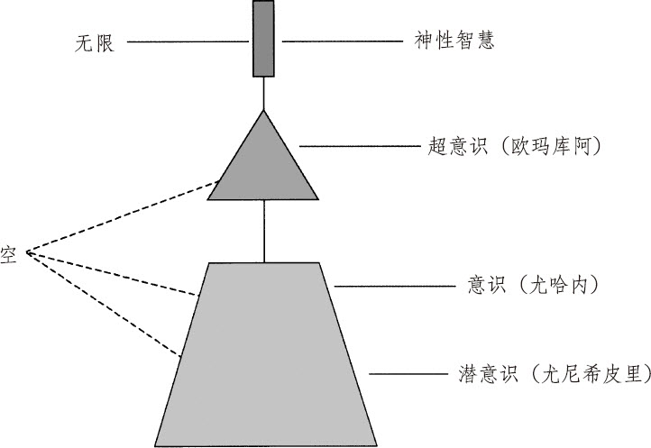

图一　“空”的状态图

你可以从神性那里收到灵感。灵感来自神性，但是记忆却是人类集体无意识里的模式。模式好比是一个信念，一个我们在他人身上看到，并跟其他人共享着的模式。我们的挑战，是要去清理所有模式，以回到零状态，即灵感起始的地方。

修·蓝博士用了许多时间解释，记忆是共享的。当你在别人身上发现了什么你不喜欢的东西时，就是在自己内在也有那个东西，你的任务就是清理它。当你清理干净时，它也会离开别人。事实上，它会离开这个世界。

“世界上最顽固的模式之一是女人对男人的仇恨，”修·蓝博士说，“我持续清理，那就像是给一大片草地锄草一样。每棵草都是模式的一种。某些女人对男人有根深蒂固的仇恨。我们要去爱它，以便释放它。”

我并没有完全搞懂这些。它看起来像是一个普通的世界模型或一张地图。每一个心理学家、哲学家、宗教家都有这样的一个模型或一张地图。我对此颇有兴趣，是因为它似乎能够帮助疗愈这整个星球。毕竟，如果修·蓝博士能治好整个医院的精神病罪犯，还有什么是不可能的呢？

但是修·蓝博士指出，“荷欧波诺波诺”并不简单，它注重诚意。“这并非一个麦当劳式的生命快餐，”他说，“这不是个能立刻兑现你订单的快餐窗口，上帝并不是点单员，你需要持续地聚焦在清理、清理、清理上。”

他提到很多人运用这个清理方法，做到了其他人认为不可能的事。其中一个故事是讲一个美国航空航天局的工程师，因为他们的火箭出了问题而跑来找他。

“既然她跑来找我，我就认为我对问题负有责任，”修·蓝博士解释道，“所以我清理。我说：‘对不起，火箭。’之后，当这个工程师再来时，她解释说，不知何故火箭在飞行过程中修正了自己。”

实践“荷欧波诺波诺”能影响到火箭？修·蓝博士和那个工程师就是那么看的。我跟那个工程师提到这个，她说，火箭本身是不可能自己修正的，肯定是别的什么发生了，那是大自然的一个奇迹。在她看来，那个奇迹是修·蓝博士帮助清理的结果。

我不太相信这个故事，但是不得不承认我没有其他更好的解释。

活动期间有人走过来跟我说：“有个著名的市场营销大师跟你同名。”

不知道他是不是在开玩笑，所以我反问道：“真的吗？”

“是的，他写了很多书，主要关于灵性营销和催眠式写作方面。他很酷的哦。”

“那人就是我，”我说。

这位男士看起来非常窘迫。马克·赖恩目击了这个对话的全过程，他认为那很幽默。

会议上的其他人不知道我是网络名人并不要紧，实际上我在这间屋子里已经出名了。修·蓝博士在活动期间多次叫到我，以至于别人都认为他对我另眼相待。有个人问：“你跟修·蓝博士什么关系？”我说没关系，又问他为什么会这么想，他说：“我也不知道，只是看起来他很关注你。”

我从没有因为另眼相待而感觉被孤立。我喜欢这种关注，并认为它对我很有帮助。修·蓝博士知道我写过不少书，并在网络上小有名气。我确信，某种程度上他知道，我学会这个疗法，会帮到很多人。

当时我并不知道，他是受了神性的启发，在训练我成为自己的精神导师，而非别人的。

# 第六章　我爱你

当你是大我时，你无法抗拒那完美、完全、完整和完好的。当你成为大我时，你会自动以神性的思想、语言、行为和行动体验到完美。如若放任你有害的思想做主，你就会自动以疾病、混乱、憎恨、消沉、评判和贫困体验到缺憾。

——伊贺列卡拉·修·蓝博士

我全神贯注地聆听修·蓝博士的教导，但是有太多我想要，也需要学的东西。通常我像海绵一样，尽量敞开自己去吸纳别人的思想。第一次参加这个活动时，我觉得人生唯一的要务就是对呈现在我眼前的一切说“我爱你”，不论那些我认为是好还是坏。我越能消融自己看到或感觉到的限制性模式，我就越能达到零极限状态，也就能透过我把平静带给这个星球。

马克无法理解研讨会上的教导，他一直想把它放在逻辑的框架下。我很清楚地意识到，心智无法理解到底发生了什么，所以试图想找到一个合理的逻辑解释只会自讨没趣。

修·蓝博士一再强调，每个当下有 1500 万比特的信息产生，但是意识只能处理其中的 15 比特。我们没可能理解发生在我们生命当中的所有事。我们必须臣服，我们必须相信。

我承认很多话听起来非常疯狂。活动期间，有位男士说，他看见墙上打开了一扇门，一个死人从那里飘过。

“你知道为什么你能看到它吗？”修·蓝博士问。

“因为之前我们谈到了灵魂。”有人回答说。

“没错，”修·蓝博士表示肯定，“你们因谈论他们而把他们吸引来。你们并不想去看其他的世界。你们在当下在这个世界里有做不完的事。”

我倒没看到什么幽灵，也不知道那些看见了的人是如何做到的。我喜欢《第六感》这部电影，但仅仅是作为电影。我可不希望幽灵闪现并跟我对话。

对修·蓝博士来说，这显然是司空见惯的事。他说在精神病医院工作期间，在半夜会经常听到厕所里传来冲马桶的声音。

“那里布满了幽灵，”他说，“早些年，很多病人死在看护房里，但是他们并没有意识到自己死了，所以他们继续留在那里。”

“他们还在用抽水马桶？”

“显然是这样。”

如果这还不够古怪，修·蓝博士继续解释说，“要是你能跟某些人谈话，注意他们的眼睛，如果看到眼睛全白，周围有一圈浑浊的薄膜，说明这些人已经被附身了。”

“不要跟那些人说话，”他建议道，“相反，只要清理你自己，但愿你的清理能移除附在他们身上的黑暗。”

我自认为是个思想开放的人，但是这些关于幽灵和附身，以及鬼怪半夜如厕的说法实在让我很难吃得消。尽管如此，我还是咬牙坚持了下来，我想知道这个疗法的终极秘密，那样我就可以帮助自己和其他人获得财富、健康和幸福。只是没想到我还得穿越无形的世界，进入阴阳界，才能到达那里。

活动期间，我们都躺在地板上，做一些练习来启动我们体内的能量。修·蓝博士叫到我。

“当我看着这个人时，我看到斯里兰卡在闹饥荒。”他告诉我。

我看着那个人，不过是个在地毯上伸展身体的女士而已。

“我们要做很多的清理。”修·蓝博士说。

尽管很迷惑，我还是尽我所能地去练习我所理解的。最简单的事就是持续、重复地说“我爱你”，我也这么做了。某天夜里走进洗澡间时，我发现自己有尿道感染的迹象，于是我就对神性说“我爱你”。我很快忘了这件事，第二天早上感染就消失了。

我持续在心里头说“我爱你”，不论发生什么，好的、坏的或是莫名其妙的。不论我是否意识到自己在做，总是尽我所能在每一个当下做清理。给你举例说说那是如何奏效的：

有一天，有人发给我一封让我非常不爽的邮件。要是过去，我就会去按让自己上火的情绪按钮，或是试图找那个人评理，为何给我发这么一封恶心的邮件。这一次我决定用用修·蓝博士教的方法。

我安静地重复“对不起”和“我爱你”。我并没有针对某个人说，我只是唤起爱的灵性来疗愈我内在那创造或吸引了外在境遇的部分。

一个小时内，我收到了同一个人的另外一封邮件。他为他发的前一封邮件道歉。

注意，我没有采取任何外在的行动来获得这个道歉，甚至也没给他回邮件，我只是重复说“我爱你”。莫名其妙地，我治好了我内在潜藏的、你我都共有的局限模式。

实践这个方法并不总是能带来即刻的效果。它也并非是为了达到什么效果，而是为了达到平静。如果你那么去实践的话，你总是会在第一时间获得你想要的结果。

举个例子，一天我的一名员工突然失踪了。他本该在规定日期前完成一项重大工程的。但是他不仅没完成，而且还人间蒸发了。

我很不好受。尽管我知道修·蓝博士的方法，但是我发现很难开口说“我爱你”，只想说“我要杀了你”。我一想到那位员工，就暴跳如雷。

不过，我还是重复“我爱你”、“请原谅”和“对不起”。我并非针对什么人那么说，我只是要那么说而那么说。当然，我没有感觉到爱。事实上，我花了三天时间实践这个方法，才在我里面找到那么一点点近似平静的感觉。

而此时，我的那个员工也浮出了水面。

原来他进了牢房。他打电话来求救，我承诺帮他，在跟他通话时，我继续实践着“我爱你”。我没有看到任何即刻的效果，但我的内在找到了足够的平静，这足以让我高兴起来。而此时，莫名其妙地，我的员工也感应到了。那时他向一个狱警请求使用电话，于是他就打电话给我。跟他取得联系，意味着我得以完成那个紧急的工程。

第一次参加修·蓝博士主持的“荷欧波诺波诺”工作坊时，他称赞我写的书《相信就可以做到》。他告诉我说，当我清理自己时，我的书的波动会提升，每个读到那些书的人都会感应到。简单地说，当我提升了，我的读者们也跟着提升了。

“那些被卖出去的书呢？”我问。我的书曾经是最畅销的书，而且还出了好几个版本，最后还出了平装本。我不知道那些已经买了我的书的人会如何。

“那些卖出去的书并不在外面，”他解释说，他的睿智再次让我折服，“它们仍然在你里面。”

总之，没有“外在”。

以它当前的深度，这个超前的方法值得用一本书来详述，这也是为什么我写这本书的原因。毫不夸张地说，不论你想改善你生命中的什么事，从财务到人际，只有一个地方需要照料：你的内在。

并非每个出席活动的人都能理解修·蓝博士谈论的东西。最后一天活动即将结束时，那些人开始用各种问题炮轰修·蓝博士，所有的都是来自心智的逻辑，比如：

“我的清理是如何影响他人的？”

“自由意志在哪里体现出来？”

“为什么有那么多恐怖分子袭击我们？”

修·蓝博士保持沉默。他看起来像是在盯着我，我坐在屋子的后面。他看起来很受打击。考虑到他传达的整个信息就是没有“外在”，只有你的内在，他似乎觉得，那些人的无知恰恰反映了他的无知。他看起来像是在唉声叹气。我能想象，他那时正在对自己的内在说：“对不起，我爱你。”

我注意到参加活动的很多人都有一个夏威夷名，虽然看起来并不是夏威夷人。马克和我询问他们是怎么回事。他们说，如果你觉得有必要，可以请修·蓝博士给你起一个。通过这种新的自我认同方式，以达到零状态并与神性合一。

我早已了解起新名字的重要性。早在 1979 年我就有另外一个名字，叫史瓦米·阿南达·文殊师利，是我当时的导师给起的。那时我还在与过去苦苦挣扎着，与贫困为战，寻找人生的意义，这个名字帮助我焕然一新。这个名字我用了七年之久。很自然，我会想到修·蓝博士或许愿意给我起个新名字吧。

当我这样问他时，他说他要问问神性。当他感觉获得天启时，他会告诉我他接收到了什么。在第一次研讨会之后约一个月，他发邮件给我说：

乔：

那天我看见一片云出现在我的脑海里。它开始变幻着，缓慢地旋转成柔和的黄色。之后它展开来，像小孩子一样，之后一直走着，直到看不见。而在那看不见的地方，“神奇地”出现了一个名字：阿欧·库（Ao akua）。

我摘录下面的句子作为今天邮件的一部分：

“主啊，愿你赐予我生命，赐予我一颗充满感恩的心吧！”

我祝愿你拥有不可思议的平静。

大我的平静

伊贺列卡拉

我很喜欢阿欧·库这个名字，但是我不知道怎么念，所以我又发了封邮件去问他。

他回信如下：

乔：

A 的发音跟英文“father”里的 a 一样，发“阿”的音。

O 的发音跟英文“Oh”一样，发“欧”的音。

K 的发音跟英文“Kitchen”里的 K 发音一样。

U 的梵音跟它在英文“blue”里的 u 的发音一样。KU 合起来发“库”的音。

大我的平静

伊贺列卡拉

我终于知道怎么读了，我很喜欢这个新名字。我从没在公共场合用过它，只在给修·蓝博士写信的时候会用到。之后，在我新开的博客上，我就用“阿欧·库”来署名。很少有人对此有疑问。我爱死它了，因为那让我觉得，我在以云端遇见上帝的方式，请求神性清理我的博客。

周末的训练在我脑子里临时建立了“我爱你”的理念，我想学更多。我写信问修·蓝博士，他能否到得克萨斯州来给一小圈朋友讲讲“荷欧波诺波诺”呢？这是我想跟他多学点的小算盘。他可以飞到得克萨斯州来跟我在一起，然后讲一小会儿。只要他能跟我在一起，我就能挖出他知道的一切，包括他是如何治好整个医院患有精神疾病的罪犯的事。修·蓝博士同意了，并回复如下：

乔：

谢谢你给我打电话。你不必那么做，但是你做了。我很感激。

我打算在 2 月份来访奥斯汀市，到时候你可以为我安排一个非正式的会谈。会谈的主题可以定位为调查问题的解决方案之类的，就像你在《内在的探险：内在世界新闻记者的告白》中提到的那样。在此次安排中，你不只是采访者，我也不只是被采访者。

在传达信息时，清晰的表达是非常重要的，各种艺术形式可以用来传达信息。举例来说，很多人都只在意问题本身，却不关心问题的起因。一个人如何解决连他自己都不清楚的问题呢？该在哪里去找到这个问题，以便处理掉它？在脑子里？那是哪里？或是在身体里（大多数人都这么看）？或是都有可能？或许它两处都不在。

还有个问题是，由谁或什么来处理这个问题呢？

你在书中提到，有人试图用投票或论坛的形式来解决问题，这种牵扯到价值观的方式也不行。评判或信念是真正的问题吗？让我们看看真正的问题在哪里吧！

这个非正式会谈并不谈论关于好与坏、对或错的方法或观念。它将拨开当前混沌的迷雾。你我哪怕只澄清了一丁点儿，也算是非常不错的了。

当然，每个当下都有其自身的韵律和趋势。到最后，像布鲁图在莎士比亚戏剧《凯撒大帝》中说的那样：“我们要等到日子的终了，才知道最终的结果是什么。”我们也是这样。

告诉我你对安排的提议有什么想法。跟布鲁图对结果不确定那样，我对这个安排也保持不确定。

平静

伊贺列卡拉

我很快给修·蓝博士和我张罗了一个私人会餐。我想大约会有五六个人出席吧。结果，有上百人想参加，其中有 75 个人付费预约了席位。

让我惊讶的是，修·蓝博士向我要了一份出席此次活动的来宾名单，他想清理他们。我并不知道那是什么意思，但是我还是把名单给他了。他回邮件说：

谢谢你给的名单，阿欧·库。

只是清理而已，要名单是为了清理这些人，与上帝一起清理他们。

所以，灵魂消磨身体以度日，

让他消瘦，以便充实你的贮藏，

拿无用的时间来兑换永生，

让内心得滋养，别管外表堂皇，

这样，你吃掉那吃人的死神，

死神一死，世上就永无死亡。

平静与你同在

伊贺列卡拉

修·蓝博士到达奥斯汀市时，我去接他，他见面就问了我一些我生活上的事。

“你在书中写到你的生活（指的是《内在的探险》），说你做了很多事以便找到内在的平静，”他开始说，“到底哪件事有效？”

我想了想说，它们都很有效，但是或许“抉择的过程”是最有效、最可靠的。我解释说，那是种能质疑信念，帮助找出什么是真相的方法。

“当你质疑信念时，你最后会怎样？”

“最后会怎样？”我接过话茬儿说，“最后会得到一个对选择的清晰了解。”

“那种清晰从何而来？”他问。

我不知道他到底想问什么。

“为什么一个坏蛋可以很有钱？”他突然问我。

我被这个问题吓了一跳。我想说有钱跟“坏蛋”是两码事，并没有律法说只有天使才能富有。或许一个讨厌鬼对钱很了解，所以他可以是个有钱的坏蛋。但是，我当时没想起这些来。

我坦白地说：“我不知道，我不认为一个人必须改变自己的个性才能富有。一个人只要拥有接纳财富的思想就可以了。”

“那么这些思想从何而来？”他继续问。

既然去过他的研讨会，我知道这个答案是：“那些思想是人们在生活中感染的模式。”

他接着转换了话题，说我的的确确是个催眠写作专家。他开始接纳由我来写一本关于“荷欧波诺波诺”的书的想法。

“你真的打算让我写这本书了吗？”我问。

“看这个周末过得如何再说吧。”他回答。

“说到那个晚餐，我们到底要怎么做呢？”我问道。我总是想控制局面，以确保自己做得完美，让人们各得所需。

“我从不计划，”他说，“我信靠神性。”

“但是是你先讲还是我先讲，还是别的什么？你是否需要我给你做个介绍？”

“看着办吧，”他说，“不用计划。”

这让我很为难。我希望了解到底我需要做什么。修·蓝博士把我逼向死角，或是活角，那时我并不清楚。他接着说了些比我当时能了解的更睿智的话：

“人类没有意识到的是，在我们活着的每个当下，我们都持续地抗拒着生活，”他开始了，“这抗拒让我们脱离了大我，而那里是自由、灵感，最重要的是神性创造者之所在。总之，我们把人们囚禁在心智的荒野里漫无目的地徘徊着。我们既没留心耶稣基督的教诲：‘不要抗拒。’也不知道另外一个法则：‘平静从我开始。’”

“抗拒让我们持续处于焦虑的状态，我们的灵性、心灵、身体、财务和物质都开始匮乏。”他继续说，“与莎士比亚不同，我们没有意识到自己处于一个持续抗拒，而非随顺的状态。我们每经验一比特的意识，就同时体验至少几百万比特的无意识。然而，这一比特对我们的救恩于事无补。”

那真是个不可思议的夜晚。

他要求去看看我们将要进餐的房间。那是在得克萨斯州奥斯汀市区一家酒店顶楼的大宴会厅里。女经理礼貌地带着我们进了那间包厢。修·蓝博士问我们能否单独待一会儿，女经理同意并出去了。

他问我：“你注意到了什么？”

我环视一周说：“地毯不干净。”

他又问：“你接收到了什么印象？”没等我回答，他接着说，“没有什么对与错。你接收到的不一定是我接收到的。”

我让自己放松下来，聚焦于当下。突然，我感觉到巨大的堵塞、疲劳和黑暗。我不知道那是什么，或代表什么，但我还是跟修·蓝博士说了。

他说：“这间包厢累了，进进出出的人们从没有爱过它。它渴望被感激。”

我觉得有点怪，包厢跟人一样？它也有感觉？

哦，管它呢。

他说：“这个包厢说它的名字叫希拉。希拉想知道我们很感激它。”

我心里嘀咕：“希拉？这个包厢的名字？感激它？”

我并不知道如何做出回应。

他说：“我们要请求在此举办活动的许可，所以我问希拉是否可以。”

我问：“那它怎么说？”说完后感觉这样问很蠢。

“它说可以。”

“哦，那就好！”我回答道，心想我付的订金是不能退的。

他继续说：“有一次我在一个大礼堂准备演讲，我找了个座位。我问：‘是否有谁是我没留意到的？是否有谁有问题需要我关注一下？’有个位子说：‘你瞧，今天有个人在前一个研讨会的时候坐在我这里，他有财务问题，我现在感觉糟透了！’所以我清理了那个问题，接着我看到那个位子直挺了很多。之后我听到：‘好啦！我准备好迎接下一位了！’”

他还跟椅子对过话？

无论如何我都要开放心智，去聆听他这些不一般的方法。他继续说道：

“事实上我在试着教这间包厢。我跟它和它里面的每样东西对话：‘你想学习如何实践‘荷欧波诺波诺’吗？毕竟，我很快就要离开了。要是你能自己实践这个方法不是很好吗？’有些回答说好，有些则说不好，有些说：‘我很累！’”

我记得很多古老的文化都认为每样东西都是活的。吉姆·帕斯芬德·尤因在他的书《清净》中解释说，每个场地往往都淤堵着能量。认为房子、椅子有感受的想法并不应该被视为疯狂。这是个开拓“脑”界的想法。如果物理学是对的，那么只有能量让我们感知起来是固体的，跟房子、椅子对话，就是一种重整能量的新的、清洁的方式。

但是椅子、房子也会说话吗？

那时候我还没准备好接受这个想法。

修·蓝博士看着窗外市区的地平线。高大的建筑、州议会大厦，在我看来，地平线看起来很美。

但在修·蓝博士看来就不一样了。

他说：“我看见很多墓碑，这个城市到处飘荡着亡灵。”

我看着窗外，我没有看见任何坟墓或是亡灵，我只看见了城市。我再次发现，修·蓝博士同时在用他的左右半脑，所以他能看见那些隐藏的东西，并说出来。但我不能，我只是睁着眼睛像梦游一样。

我们在那间包厢里待了约 30 分钟。就我所见，修·蓝博士在包厢里走了一圈，对它清理，请求它原谅，去爱希拉，然后清理、清理，再清理。

在那期间，他打了个电话，告诉电话那头的人他所在的位置，并描述了一番，然后问她怎么看。他看起来像是在确认什么。等他挂了电话，我们在一张桌子前坐下来并开始聊天。

他告诉我：“我的朋友说只要我们爱这个包厢，那么它将允许我们尽情用餐，不限时间。”

我问：“我们如何爱它？”

他回答说：“只要说对它说‘我爱你’就可以了。”

那看起来很傻，对一间包厢说“我爱你”？但我还是尽力去做。我早先就学到，你不必真的感觉到“我爱你”而让其生效，你只要说就好了，那我就说吧。当你说几次之后，你就会有感觉了。

沉默了几分钟后，修·蓝博士又说了些睿智的话：

“我们每个人所拥有的记忆或灵感，对每样东西都有直接和绝对的冲击力，不论是人还是矿物、植物、动物。当记忆在一个潜意识里被神性转化为零状态，那么它就在所有的潜意识里被转化为零状态。”

他停了一下，又接着说：

“所以，无论当下在你的灵魂里发生了什么，它也同时发生在所有的灵魂里。领悟到这些是件多么美妙的事啊！而更妙的是，我们该感恩这一切。感恩我们能呼求神性创造者来终止我们潜意识里的记忆，直到零状态，然后用神性的思想、语言、行为和行动充满我们和所有人的灵魂。”

对此你会怎么回应呢？

我能想到的只有：“我爱你。”

# 第七章　与神性共进餐

最新的“荷欧波诺波诺”是一个忏悔、原谅和转变的过程，是一种以爱和空无来替代有害能量的祈求。爱流经心智，与精神共舞，与超意识合作来实现这一切。之后，爱流入理性的心智，即意识的心智，释放掉思想的能量。最后，它流入情绪的心智，即潜意识，清空有害情绪的思想，以自身充满之。

——伊贺列卡拉·修·蓝博士

有超过 70 个人来参加我跟修·蓝博士的私人会餐，我真没有想到有这么多人对这位神奇的老师感兴趣。他们有些从阿拉斯加、纽约，以及其他地方飞到奥斯汀市来，有些从俄克拉荷马州开车过来。我搞不懂为什么他们都要来。有些人或许是出于好奇，有些人则是《相信就可以做到》的读者，冲着进一步了解我而来。

我还是不知道该说些什么，也不知道如何开始。修·蓝博士看起来泰然自若。他在一张桌子上吃着晚餐，每个人都在捕捉他说的每一个字。我的好友辛迪·卡什曼（她计划成为第一个在外太空结婚的人）和我分享了那天的感受。

2006 年 2 月 25 号，星期六，我到奥斯汀市去听修·蓝博士演讲。晚餐时我坐在他的旁边。他传达的信息是要对生命百分之百负责。我亲眼见证了一个强大能量的转换过程。我们桌上的一个患有哮喘的女士，她不停地抱怨一位男士，叫他不要打电话给医院。修·蓝博士停了下来对她说：

“我只对你感兴趣，我听到神性说，你要多喝水，那会对你的哮喘有帮助。”

她的能量立刻从抱怨转换为感恩。看到这些让我非常兴奋，因为当我看到这一场景时，我在心里默默地批判她：“她在抱怨。”我发现我自己很想远离那些爱抱怨的人们。而修·蓝博士接纳了这个负面能量，并将之转换为爱与积极的能量。

接着，我拿出我的瓶装水，指着酒店的水对修·蓝博士说：“酒店的水不卫生！”

修·蓝博士回答我说：“你知道自己在说什么吗？”

当他这么说时，我意识到我刚刚对水发出了一个负面的能量波动。喔！我很感恩我又意识到自己刚刚做了什么。

他告诉我他是如何时刻清理自己的。当那个女士在抱怨那位男士的时候，修·蓝博士问自己：“我的内在发生了什么让她会这样？我该如何负百分之百的责任？”

他将自己的能量转向神性并说：“谢谢你，我爱你，对不起。”他听到神性回答说：“告诉她多喝水。”

他还告诉我：“我知道如何清理，所以她得到她所需的，我得到我想要的。”

他跟神倾诉，神跟他们沟通。当我清理时，我会像神一样看待他们。

我问修·蓝博士是否能跟他约个时间见面，他拒绝了，因为神性告诉他说我的内在已经知道答案了。

这真是个美好的肯定。

总之，我今晚学到的是：

1．我见证了修·蓝博士是如何将那位女士的能量从抱怨转化为感恩的。

2．我觉察到自己是如何去评判那位女士和水的。

3．我知道了他用来清理自己的体系，以及这个体系的强大力量。

4．我要记得多说“谢谢你”和“我爱你”。

晚餐开场时，我很自然地说起我是如何知道这位神奇的治疗师，以及他治好整个医院患有严重精神疾病的罪犯的故事。我引起了全场人的关注。我邀请人们自由发问，仿佛我跟修·蓝博士在做一个公开的研讨会一样，那架势很像是苏格拉底和柏拉图。说到柏拉图，我觉得自己更像是个“摆那的图”（谐音“柏拉图”的幽默，说自己在那里像个花瓶）。

修·蓝博士开场说：“人们常问我：‘嗯，信念怎么处理？情绪怎么处理？各种问题怎么处理？’我并不回答那些问题，我并不管‘怎么来的’这样的提问。但是你们还是会问我，所以我还是要搞定这些问题！但是接触那些就好像让我接触那些发烫的东西，我只好把手收回来。所以，当有什么事发生了，甚至在它发生之前，我已经收手了。”

“这就像是我在走进这间包厢之前，我一定会跟这神圣的房间交流一番。我问包厢叫什么名字，因为它真的有名字。之后我对它说：‘我可以走进来吗？’它回答说：‘可以，你可以进来了。’但是我们假设这间包厢回答说：‘不行，你这混蛋！原谅我的用词。’那么我就会反观自身，做些我该做的事。所以当我再走进来时，我就会处于完好的状态，就像医生的一句老话说的那样：‘先医好你自己吧！’所以我要确保自己进来时是健康的、没有问题的，哪怕只是一会儿。”

为了方便每个人都能跟他沟通，我打断了他的话。我想让大家都知道修·蓝博士是何许人，为什么我们来到这里。我们在此做的完全是自发的，形式是自由的。我建议大家放轻松，打开心门来交流。因为你永远不知道修·蓝博士会说些什么或做些什么。

他问大家为什么有人会得乳腺癌，无人能答，他自己也说不上来。他指出，每一个当下有上百万比特的信息产生，但是我们每次能意识到的不到 20 比特。这是他常谈的话题，这也是他教导的精髓所在：我们一点也不知道当下发生了什么。

“我们的生命是怎么一回事，科学界没有确定的说法，甚至连数学也解释不清楚‘零’。在查尔斯·塞夫的书《零的故事：动摇哲学、科学、数学及宗教的概念》的结尾，他总结说：‘所有的科学家都知道，宇宙从空无中来，也将回归到空无中去。这个宇宙开始于零，结束于零。’”

修·蓝博士继续说：“所以，我已将自己的整个意识回归到零态，让其空无，没有任何信息。你肯定听过其他类似的说法：空性、空、纯粹。不论你怎么称呼它，我的心智都已经回到零状态。不论发生什么，哪怕我没有意识到，我将要说的方法就是，不停地清理，最终我会一直处于零状态。”

我看得出来大部分人都被修·蓝博士深深吸引住了，但也有些人跟我一样无动于衷。修·蓝博士继续说道：“只有当你的心智处于零状态，创造力才能发挥作用，那叫作灵（零）感。夏威夷语里这个‘灵感’被称作‘哈’。”

“如果你去过夏威夷（Hawaii），‘Ha’的意思就是‘灵感’，‘Wai’是‘水’的意思，‘i’是‘神圣的’的意思。夏威夷的意思就是‘神圣的灵感和水’。夏威夷这个词本身就是一个清理方法，所以不论我身在何处，我会先确认是否有什么需要清理。举例来说，在我步入这间包厢前，我说：‘有什么是我不知道需要我去清理的？我不知道是什么，到底是什么呢？’接着，如果我用这个叫‘夏威夷’的清理方法，那么我就能回到零状态，并且能获得我没有意识到的讯息。”

“只有在零状态……有些事你该知道，心智每次只能为两位主人中的一位效劳。要么它执行你心智中发生的任何思想，这个叫记忆，要么它就执行灵感。”

这个话题越来越迷人。接着，修·蓝博士又更进一步解释说：

“神圣智能是所有灵感的发源地，它在你的内在！它不在外在的某个地方。你也无须到达任何地方。你不需要！你不需要找任何人。它就在你的内在！接下来的层次叫超意识，夏威夷语称之为‘欧玛库阿（Aumakua）’。‘Au’的意思是‘穿越所有的时空’，‘makua’的意思是‘圣灵或神’，这个意思是，部分的你是无时间性、非地域性的。那部分确实知道正在发生着什么。”

“之后你就有了意识心智，夏威夷语里称为‘尤哈内’。接着，你就有了潜意识，夏威夷语里称之为‘尤尼希皮里’。”

“所以，最重要的是要有意识地去问‘我是谁’这个问题，我们正在说什么，我正在跟你们分享的，是关于你的身份的话题，它是由这些不同层次的意识组成的。注意，你必须明白意识层次是空无的！如果意识层次是零状态，那么此时你是谁？你是神圣的存有，那就是零状态。那么，为什么你需要成为零状态？”

“当你是零状态时，存在所有的可能！那就是说，你此时是以神的样子创造的。神性告诉我这些，因此我可以说得更清楚些，但是我希望你们直接得到神性的澄清。”

“当我说，你此时是以神的样子创造的，那意味着你的某一面是空无和无限的。只要你愿意放手那些无聊的东西，让自己处于空，那么灵感会即刻充满你的存在，你就处在自由之乡了。有时，你甚至不知道自己已经到家了，并一直在叨叨：‘家在哪里？家在何方？我已经被清理了！快告诉我如何抵达家吧？我会努力的。’这时，我只能说，大多数时候真相总在你之外！

“当智力被套牢时，它将逐渐被蒙蔽。在夏威夷语里称为‘库凯帕（KukaiPa' a）’。有人知道‘库凯帕’是什么意思吗？它的意思是“智力的便秘”。请宽恕我的粗俗用词。”

有个人问：“但是如果我跟一个人之间有些摩擦，你是说只有我，而非那个人，是需要修正的吗？”

“如果你跟某人之间有问题，那么不是那个人的问题！”修·蓝博士声明，“那只是你对某个浮现的记忆的反应而已。有问题的是那个记忆，和别人没有关系。”

“我辅导过一些憎恨自己丈夫或妻子的人。有一次有位女士说：‘我想去纽约，那样我就会有更好的发展机会。’之后我听到神性说：‘不论她去哪里，她的问题会一直追随着她！’”

修·蓝博士之后解释说，当有人找他预约做治疗时，他会着眼于自己，而不是那个打电话来的人。

“举个例子，我最近接到一位女士打来的电话，她有一位 92 岁的老母亲。她说：‘我母亲这几周患有严重的臀部疼痛。’在她跟我通话时，我就问了神性一个问题：‘我内在发生了什么，导致了这位老妇的疼痛？’接着我问，‘我该如何解决这个问题呢？’这个问题的答案呈现出来，我就照着做了。”

“大约一周后，那位女士又打电话给我说：‘我母亲现在好多了！’这并不意味着问题不会卷土重来，通常一个问题的出现是多种原因促成的。但是重点是我持续在自己身上下功夫，而不是在她身上。”

又有人问，发生在国外的战争呢？他想知道自己是否也要对此负责。更确切地说，他想知道修·蓝博士对此会做些什么。

“啊，我会考虑我的责任是什么！”修·蓝博士毫不含糊地说，“我每天都做清理，但是我不能说，我想去做清理，我想那种事会好起来。只有神知道什么该发生。但是，我只负责我的那部分，就是持续清理，就像清空医院一样。我们夏威夷不再有给杀人犯住的精神病医院了，一个也没有了。我尽我所能地做了我该做的那部分。或许如果我清理得更多，结果会更好。我也是人啊，我已经尽力了。”

我看得出修·蓝博士有些疲倦了，我感觉到他想今晚到此为止。真是个让人终生难忘的夜晚。

但是那晚的故事并没有到此为止。

次日清晨，我、修·蓝博士、伊丽莎白·麦卡尔（《马之道》的作者），还有其他人一起共进早餐。每当我在修·蓝博士身边时，我的内在就会变得异常沉静。或许我感受到了零状态，或许没有，谁知道呢？

某一刻，会突然冒出来一个灵感，例如让我举办一个周末活动，称之为“超越彰显”。我不知道这个点子是从哪里来的，至少我当时不知道。现在我知道它来自神性。但是早餐过后，我又对这个好主意不感冒了。

我有很多事可忙，工程、旅行、项目、健身赛，等等。我可不想再在自己的活动清单上多加一条。我试着不去理会这个点子。我决定静观其变，看它是否会就此消失。

它没有消失，三天后它还在我脑袋里。修·蓝博士告诉我说，如果一个点子在多次清理和归零之后还出现的话，那就照着做好了。所以我就写了一封我平生写的最烂的电子邮件，并把它发给了我数据库里所有的联系人。让我惊讶的是，有个人竟然在我发送完邮件三分钟后，打来电话并登记参加这次活动。她肯定是坐在电脑前，等着看我邮件的吧！

其余的名额很快就登记满了。我只想招 25 个人参加活动，这是我给自己定的上限，因为我感觉对着 25 个人讲比对着 2500 个人讲要来得容易。我之前从没举办过这样的研讨会，事实上，我根本不知道怎么做。

我跟修·蓝博士提到这个灵感以及我的担心。

“我唯一的建议是不做计划。”他说。

“但是我总是会计划一番，”我说，“写出讲稿、制作幻灯片，以及准备讲义，都准备好，才能让我能感觉更加安心。”

“要是你能依靠神性，相信神性会关照你，你会感觉更好，”他断言道，“让我们为此清理吧。”

听他这么说，我知道他的意思，既然这件事已经成为他体验的一部分，那意味着他必须去清理。这再次说明，一切都是共享的。一旦我们意识到了，你的体验就成了我的体验，反之亦然。

我尽量不去做计划。某一刻我向恐惧妥协了，我做了本手册。但是从来没有用上，甚至没再看一眼，当然也没人介意它。

我是这样开场的：“本次活动我不知道要做些什么。”

每个人都哈哈大笑。

“是真的，”我说，“我也不知道该说些什么。”

他们又大笑起来。

接着我给每个人讲修·蓝博士和“荷欧波诺波诺”，以及“你创造了你的现实”这句话的含义是如何超乎他们曾经的理解的。

“在你生命当中，如若有谁是你不喜欢的，”我解释说，“那么是你创造了这个现实。如果是你创造了这个现实，那么也是你创造了那些你不喜欢的人。”

那真是个不可思议的周末。时至今日，当我看着那天活动的集体照时，我依然能感受到那份我们共同分享的爱意。

但对我来说这只是万里长征的第一步。

我还有很多东西要学。

# 第八章　见证

为了找到自己内在的光芒，你要进入那深深的黑暗。

——黛比·福特，《黑暗，也是一种力量》

许多参加了聚餐和“超越彰显”周末活动的人都有了突破。在这一章里，你将读到他们的真实故事，会感受到“荷欧波诺波诺”疗法的威力。

我找了一辈子治疗气喘的疗法，终于到头了……

困扰我 50 多年的气喘和过敏症，在一个不可思议的晚上（2006 年 2 月 25 日），突然奇迹般不再犯了。

那天，当我正轻松地吃着得州风味的墨西哥午餐时，突然感觉内在有一阵“悸动”。那感觉奇妙极了，好像有什么事发生了，而我正在接受治疗。一阵爱的波动淹没了我，停顿片刻后我才继续吃午餐。

那天晚上，酒店会议厅里的空气充满电流，一种无法言说的兴奋在不断沸腾。主讲人修·蓝博士，最后和我同坐一桌。用餐到一半时，我给他讲了一次自己气喘发作的事，稍后他就把这个当作了他谈话的开场。

我很熟悉夏威夷民俗疗法“胡那”的灵性疗愈模式，但我对修·蓝博士的疗法中核心的治疗、宽恕的方法与哲学还不甚了解。修·蓝博士告诉我们，通过读我们的名字进行清理并与我们合一，他正在清理出席晚宴的每一个人。怎么做到的？他是通过表达对每个人的爱，通过请求宽恕，宽恕他和他的祖先在过去或现在，有意识或无意识地对我们及我们祖先所做过的错误行为，这个请求宽恕的范围一直回溯到微生物时代。哇！要清理的可真多！如此一来，他和我们就可以回归到存在于神性里的真实关系了。

隔天，奇迹就开始示现了。我跟一位良师益友以及其妻子相约一起吃午餐。虽然我从外地来，并不曾和他们见过面，而且我必须走过好几个街区才能到达那家餐厅，然而我发现在这段路程中我居然完全不需要使用气喘吸入器，那是最不寻常的第一个征兆。他们说我停车的地方距离餐厅非常远，我告诉他们可能我已经没有气喘了，感觉上似乎是这样。

那天晚上，我很荣幸能跟修·蓝博士共进晚餐。我们谈到“荷欧波诺波诺”的治疗力，而且我现在体验到了，它治愈了我的气喘病，我可以用它去帮助有同样问题的人。他谈到饭前喝水的重要性，那有利于排出毒素和规避环境干扰。阿门！

好事变得越来越好。六个月过去了，虽然这期间我得了支气管炎，但不用吃药就恢复了。而且我再也没有发出喘息声，也不再借助吸入器或任何一种气喘药物辅助治疗。从那时候起，我在家跟猫咪、小狗、小鸟平静共处好几个小时都没问题，不会发出喘息声，也不需要吸入嚣。我肺部的声音跟铃声一样清晰，而这是这辈子我第一次可以深深地、彻底地呼吸。天哪！太神奇啦！

修·蓝博士，虽然你不把这叫作治疗，也不自称是治疗师，而且你会说这都是宇宙和我的灵魂共同做到的，我还是要谢谢你。也谢谢乔·维泰利博士跟我们分享修·蓝博士的智慧，以及那个神奇的疗愈之夜！我永远感激！

玛莎·史尼

＝＝＝＝

还有一个故事：

一个爱尔兰人发现了阿啰哈

十年前，我就开始用“荷欧波诺波诺”来认识自己。对亚洲传统医术和能量系统进行了多年的研究之后，我开始懂得这个来自夏威夷的问题解决方法。

在寻求“开悟”的过程中，我经历过心力交瘁。身为爱尔兰人，我一向认为“布丁的味道要吃过才算真知道”（即空谈不如实证），但从小生长在麻省的南波士顿（一个像钉子一样刚强的爱尔兰劳工阶级社区，在这里，枪声和警笛声就像其他城市里的鸟叫声一样频繁），这里并不常有机会去发掘自己对宇宙的抽象理解。因此，一发现有关于此的免费讲座，我就会马上抓住机会参加。这一次，我希望可以试试这个夏威夷版的生命诠释。

我发现它很不寻常。许多系统都是在运用或移动能量（就像在棋盘上移动棋子一般），“荷欧波诺波诺”却让我认识到该如何擦除那些存在于我的内在，并且有可能显化成外在问题的负面元素（也就是把棋盘上的棋子全部拿掉）。不用说，这勾起了我的兴趣。当时许多观念闪过我的大脑，这一切对我来说都是新的。但在讲座的最后，我决定要给这两个被当作礼物送出的免费方法一个施展与彰显的机会。一整天里我尽量使用它们，甚至在帮别人按摩的时候也如此，我在践行“尝了才知味”的道理。

过去，我从事推拿工作，随着时间的推移，我对治疗的观念发生了转变。在实践那个方法前我知道的是，根据亚洲的传承，一个人的内部出了问题，是能量与经络导致的。当我用了那个方法后，我发现自己对于问题是怎么发生和为什么会发生的看法改变了，而且这跟我之前受过的训练很不同，因为我开始疗愈跟客户的问题无关的东西。当我这么做时，不管是有何种问题的客户都会告诉我，他们几乎都是立刻体验到了效果。于是，我开始更努力地研究，也开始对这个夏威夷技巧有更多的了解。隔年春天，我参加了完整的训练，也开始真正运用这个方法。

有一天，我接到以前客户 J（J 是一位职业心理医师）的电话，她期待我跟她非常担心的一位患者（姑且称为 F）见个面。F 被诊断出有躁郁症，多次企图自杀，所以为了她的安全，她曾有几次被送进医院。我问 J：“我对你做了什么？”她笑了出来，说道：“我知道你能帮助她。你一定要帮助她，如果你不去，她会过不了这一关。”所以我答应了。快结束通话时，J 说 F 曾被一个按摩治疗师袭击过。我问自己：“我要怎么做，才能帮助这位女士呢？”

那晚回家后，我坐了好一会儿，思考着我能做些什么，我该如何帮她改变。内省了一阵之后，我的脑子里不断出现“荷欧波诺波诺”！“荷欧波诺波诺”！那声音就像一张坏了的唱片，一直播个不停。因此我开始以前所未有的方式使用这个方法。在每个疗程的前、中、后之间间隔的很长一段时间里，我都投入马拉松般的心力，而我从不曾告诉 F 我的秘密。我们每次碰面时，治疗室都会充满欢声笑语，空气里也充盈着祥和与平静，因为我已事先进行了清理。总之，F 彻底改变了。她现在是个有能力的女性，可以独自处理自己生活中面临的所有问题。她鲜活地证明了：如果我们负起百分之百的责任，情况真的可以改变。

我的推拿工作也不断向前推进，有了转变，而我几乎不再触碰任何客户。现在，行驶在人生道路上的我，偶尔也会碰到路上的减速带，每次清理后会带来什么总让我感到惊奇。这一路走来并不容易，但我珍视所有过往，因为是它们让我了解了自己是谁。

在“宇宙的自由大我基金会”担任了多年的义工后，我的看法变得更加简单。讨厌的事情总会以各种形式出现，有时可能是家庭问题、压力、评价，有时甚至是战争，而一开始就要你接受这些东西确实很难。不过现在，不是说“为何是我”（带着内疚），我会说“我有责任”（毫无愧疚），然后就通过“荷欧波诺波诺”放下一切，让神接手。

这真的是一件很难很难做到的事。我刚刚说很难了？但我相信有一种平静正在发生，而且我们真的无法领会这平静的完整性，因为有那么多现实同时充盈在我们时间的架构里。我们不应该浪费时间去问“如何”、“为何”、“何时”，不如直接去“做”。

如若追问，我们就偏离了自性。一旦我们以任何形式完全脱离了自性，责怪、反击、抱怨、诉苦，等等，都会使我们看不见眼前的问题，也就是看不见释放自己内在问题的机会。如果我们责怪，这种内在的连接就中断了（就像没交有线电视费，也就看不了节目）。

我们可以选择放弃自以为是，放弃沮丧，对“自性”这一最珍贵的礼物不带任何批判。

如果在清理过程中犯了错误，我会调整好自己，继续从零开始，这又是一个“尝布丁”的机会。

谢谢你。

布赖恩·欧姆·柯林斯

下面是来自路易斯·格林的分享：

亲爱的乔：

再次谢谢你促成了这次与修·蓝博士在一起的聚会，也谢谢苏姗细致的工作，尤其是帮我在凯悦酒店订了一份素餐。我很高兴能跟你和娜瑞莎坐在一起，并跟你们以及其他同桌的人相识。

能坐到前排与修·蓝博士近距离接触真是我的荣幸，他在回答我的疑惑时表现出来的慈祥和宽厚也让我受宠若惊。

我很乐意与你分享在那晚之后的两周里，我经历过的许多神奇事。有件事我一直提醒自己记着，修·蓝博士曾经为了帮助我而向神性呼求过，过去我总是偶尔会实践“荷欧波诺波诺”疗法，现在则是尽可能多地实践，我至今仍受益于他的祈祷。

刚听完音频我就收到“分享与修·蓝博士有关的故事”的邀请函

我要提到的第一个经历是苏姗发来的，邀请我分享那晚与修·蓝博士聚会反馈的邮件。有趣的是，我买了本《有效生活指导手册》并下载了你和修·蓝博士的 MP3 音频。我刚刚从头到尾听完一段录音，就收到了苏姗的邮件。

我的诉讼未公开却全国闻名

第二个经历让人非常难以置信。我在 2 月 23 号飞往奥斯汀市之前，有一件新的诉讼要立案。但在我离开前，因为没有准备好而无法将材料邮寄出去，第二天（2 月 24 号）才从奥斯汀市的邮局寄了出去。天晓得怎么回事，那些资料在邮寄过程中被神奇地弄丢了，直到 3 月 6 号周一那天才到达目的地。

我服务于一个全国性的机构，旨在帮助消费者在全国范围内雇佣律师处理法律事务。上周五下午，一位在康涅狄格州的律师邮寄来一份胶封的在俄克拉荷马州加拿大郡立案的案件概要，他问我在塔尔萨（美国俄克拉菏马州东北部城市）的同事，是否是她立的案。我听说后几乎要晕倒了。天啊！那是我的案子。我给她发了个邮件，并打电话到她的办公室去，问她是怎么找到我的案子的。接着，我试着在谷歌上搜索些线索，花了一个多小时，什么都没找着。

她给我回邮件说，她订阅了法院新闻服务网上的在线服务，里面有线人（和潜伏的谍报者）监视法定的立案模式和来自全国各地的意见和建议，并上报重要、重大或仅仅是有趣的事件。我并没有公开我的案子，但是在这个网站的首页右边栏却刊出了一个头条。讽刺的是，客户的父亲在这天早些时候还到访我的办公室，我跟他诚恳地说，我们很有信心能赢。让我格外费解的是，每天有上千件案子要立案，怎么就我的成了头条呢？

我临时安排的晚餐吸引来的人数创了纪录

我是当地素食主义协会的会员，我们每个月都会聚一次，时间通常定在每月的第二个周六。当我向协会主席询问 3 月份的聚会地点时，发现还没有定下来。我主动提出安排这件事。2 月 28 号周二，我走访了心目中最顶尖的餐厅，发现那里的主管 3 月 3 号周五才能回来。餐厅的员工给她留了我的信息，承诺说她回来后会转告她联系我，但我一直没有等来电话。

第二天，也就是 3 月 1 号周三，我去了一家开业没几个月的泰国餐馆，询问餐馆负责人，能否提供素食者自助餐的服务。我跟他说，根据以前聚会的经验，每次参加人数不少于 20 个人，多时也许会有 30 来个。他说他们可以做，但是要付 100 美元的押金，以免提前购入太多食物，但最后没那么多人来就餐而给餐馆造成浪费的风险。我拿起菜单，菜谱很不错：素食寿司、汤、四道主菜、甜点，还有茶，共 8 美元。经理说他可以跟店主确认，我需要准备订金的支票。3 月 2 号，我们开始接受订位。我写了一封简报，发给协会会长，好让她转发到我们的电子新闻邮件里去。晚餐于 3 月 11 号星期六举行，而我要求大家在 3 月 9 号周四下午 5 点之前给我回复。

通常，会长会在每月的第一天发出每月新闻邮件。大多数人通过电子邮箱收阅新闻邮件，有些通过平邮。我们还会张贴海报在当地的健康食物商店和图书馆。这次时间来不及了，会长没时间发新闻邮件，就简单地把我发给她的信当作通告发了出去，而平邮则在周一的时候通过明信片的方式发送出去。同时我们没有张贴任何海报。我当时就想，要是能召集到 20 个人来聚餐，我就该偷着乐了。

周一那天，“回执”源源不断发来。我收到了数十人的邮件，周二的时候又多了几个人，因此我想，我们可以至少支付 13 个人的押金。然而，周三开始，“回执”如潮水般涌入。到这天结束，报名人数达 37 个人。对我来说，我们似乎遇到了一个新的麻烦，我打电话给那个经理，问餐馆的最大容纳量，他回答说 65 个人。周四的时候，依然有不少报名回执信发过来，到报名截止时，总共有 55 个人报名。那天其实效率很低，我激动不已，每隔几分钟就查看一下邮箱（吸引力法则？）。我打电话给那位经理，问他们能否招待那么多人，他回复说：“没问题。”

周四晚上我去上卡巴拉的课，直到晚上 9 点才到家。我查看了电话留言和邮件，我又收到了更多订座的回复。总人数到了 67 个人。我开始认真考虑该怎么处理人数过多的问题。我的对策是，设法让那些后报名的人来迟一些。周五跟周六又有一些订座的回复。总报名人数高达 75 个人之多。

这次活动超级成功！并非每个订座的都来了，还有少数几个“空降”（有个性）。到我们客满时，餐馆里的能量一直都是出奇的好。这给那些第一次来参加这种活动，吃泰国自助餐的人留下了极为深刻的印象。协会里有些 10 年以上会龄的会员说，这次创造了俄克拉荷马州素食活动的最高聚会人数纪录。让人吃惊的是，座位问题也很好地解决了。有些早来的人用完餐后，要离开去处理某些周六晚上的事务。所以总有空位子为迟来的人预留着。由于第一次有这么多人来聚会，餐馆里的人都非常高兴。

租车的奇遇

为了避免自己的车有额外的损耗，我想租一辆车开到奥斯汀市。我对比了一下费用，发现租一周的费用跟从周三租到隔周周一的费用差不多。我在网上以一个合适的价钱租了一辆中型的车，我当时想的是它要比小型的车坐着舒服。等我到了租车代理处，发现那里只停着很少的几辆车。我碰巧看到他们有两辆橘黄色的雪佛兰古典高顶车（Chevy HHRs），它们拥有很酷的复古风情。我走到租车处，他们告诉我说没有中型的车租给我。于是我就问，我能否租一辆雪佛兰古典高顶车，尽管那两辆车按归类是大型车，但他们还是同意了。我想要是能开着这么一辆橘黄色的跑车到奥斯汀市真是酷毙了，橘黄色可是我的母校得克萨斯州立大学的代表色。

不过，当我准备把它从停车场开到我的办公室时，我发现：虽然这辆车看起来外表光亮，里面却破烂不堪。我想把它还回去。可是，我又需要开着这辆车去我的办公室处理一些事，当天我是没法还回去的。我联系了租车处，想要换一辆普通的小轿车，但是他们说暂时没有我需要的类型，或许第二天凌晨有。

我连夜打理行装，直到次日凌晨。当我钻进雪佛兰，甩进我的手提箱时，我震惊地发现，这辆车的后门竟然有个明显的凹痕。当然，我总是一再缩减额外的保险开支，我记得自己昨天根本就没见到这个，所以我以为这是由我造成的。我心想，管它呢，先用一周再说。我比自己预期的要晚出发，大约是周四的中午 12 点半出发，在下午 6 点半左右到达奥斯汀市。

转眼间到了周六晚上 5 点钟，距与乔和修·蓝博士的聚会活动还有一个小时。我满脑子都是那个凹痕，盘算自己该如何应对。我逛了下北奥斯汀市的购物中心，打算去买个一次性的数码相机，结果一无所获。当我回到车上，开到旅馆，天色开始暗了，而且下起了蒙蒙细雨。我正准备开进一条交通繁忙的街道，感觉突然被撞了一下，车被追尾了。我马上想到的是：“我真是够倒霉了，先是车门凹痕，紧接着是没买到相机，现在又发生这种事。”一个小时内我还要参加晚宴，还得先洗个澡、换衣服。糟糕的是，即使是周六晚上，这里的交通依然拥堵。我拿着出租车登记卡下了车，一个年轻的黑人凑了上来：“我的轮胎爆了，所以刹不住车。”我心想，你跟一个律师谈这种事可不妙。我说：“少废话，这可是我租来的车。”我们走到车后面查看损伤程度，结果都傻眼了。“竟然毫发无损，”他说道，“哈哈，毫发无损。赞美耶稣！”身为一名犹太教徒，我觉得这么说很搞笑，但是我自己看着也觉得不可思议。他说的对，车尾竟然根本没损坏。这车像是用富有弹性的塑料做的。我依然会痛心，但是我不想因此逗留太久并小题大做，只想回旅馆去。我们握手道别。就这样我及时抵达晚宴会场，并与乔和娜瑞莎同桌。

至于如何处理凹痕，我认真地实践了“荷欧波诺波诺”。我一直拖着不做任何处理，直到还车的最后期限，在马上面临逾期要罚款的几个小时前，我才查看电话簿，找到一家不必烤漆就能修复凹痕的店。店里的伙计给了我 95 美元的报价，但是要完全修好，要花几个钟头。要是那样我可得付罚金了，这正是我非常不愿发生的。我问自己该做些什么，答案来得很清晰。诚实以对，打电话给当地的租车代理办公室，说明情况。要是他们想在修理上宰我一把，至少我也知道个底价。于是我打了电话，接电话的人告诉我不必先去修车，先把它送过去再说，他们自己会检查车况的。我说：“好的。”于是开车过去，将车停在回收车道上。客服小姐扫描了车的标号，拿出相应的资料，我告诉她是怎么回事，她给了我一个办公室门牌号。我找到了那个接电话的家伙，他在电脑里输入汽车的认证号码。第二个奇迹发生了：凹痕在他们的车况记载里有。没我的事，哈利路亚！我一身轻松地回了家！

妹妹得到她梦想的工作

与乔和修·蓝博士聚会的一星期后，妹妹打电话给我。她是一家著名大公司某部门的副总裁。猎头公司找上她，问她是否对某个工作感兴趣。根据她的描述，那是她梦寐以求的工作。她不想在电话里告诉我详情，而是把猎头公司寄给她的工作内容用电子邮件转发给了我。看完，我简直快晕倒了。这么说吧，那是家真正的大公司，我只要告诉你那家公司的名字，你就知道我为什么会晕倒了。几个月之后，我妹妹真的被聘用了！

以下是另一个见证：

2006 年 10 月，我参加为期三天的突破课程研讨会时，乔的简要疗法止住了我哗啦啦的泪水。在一个叫作“与人同在”之类的练习中我的泪水止不住地滑落。练习时，研讨会带领人将 7 个人分成 4 排，然后一排排轮流，安静地看着对方的眼睛来练习。当时，我在第三排。

带领人让第一排的人上台面对我们，也就是面对观众。他们看着坐在位子上的我们，我们也看回去。接着第二排的人被叫上台，面对面站在离第一排约 0.3 米远的地方。彼此对视 3 分钟后他们就下台了。接着第二排的人被请回他们的座位上。第一排的人则被留在台上，看着坐在位子上的我们，我们也看着台上的他们。

越临近上台，我的压力越大，我不知道这是为什么。我的手开始流汗，我注意到自己开始变得坐立不安。这项练习看起来简单得很，生活中跟陌生人或朋友交谈时，我都可以注视对方的眼睛，这次也不应该有问题。

接着我想起第一次参加突破课程研讨会时，讨论会的带领人和我们分享过他第一次做这个练习的体验。他说自己在 20 年前参加这个练习时，膝盖抖得非常厉害，以至于有位研讨会的助理必须帮他把外套放在两膝中间，来降低他两腿发抖所碰撞发出的噪音。

回想起他说的话，我想要离开现场。我告诉自己不必继续这个练习，我已经很擅长看人们的眼睛了！但我知道离开房间是不被允许的，因此我开始冒汗并坐立不安。

我们这排第一次上台是要站在离另外一排一小步远的地方，并且看着他们的眼睛。好险！幸亏我不必盯着 50 个人，而只要盯着 1 个人——我以为是这样。就位后，研讨会带领人开始引导我们经历那 3 分钟发现自我的过程。结果仅在 10 秒钟内，我就失控哭了起来，泪水不停地流，我不知道是怎么回事，但就是无法停止哭泣。每次看着对面的伙伴，我就开始啜泣。当我听到：“第三排，请从你们的左边离开。”我便对伙伴说：“谢谢你。”然后离开。

我到底是怎么了？！我本应该是去聆听自己内在的声音要告诉我些什么的，但我什么也没听到！我晕了——一句话也没有，什么也没学到！这是什么练习啊？！我又困惑，又尴尬，当台上的练习在我面前继续进行的时候，我不断回想刚才的体验。“第三排，请站起来，转向你们的右边，然后到台上来。”啊！不要再来一次吧！我的大脑叫着。

现在我们这排再次面对着台下坐在位子上的人。这一次我安然度过了这 3 分钟，因为我没有看着正在看我的人。接下来，第四排被叫上台，一个新伙伴站在我面前，距离我的脸只有一小步远。这一次我面对的是一位和蔼的年长女性，她对着我害羞地笑着。“好，我想这次应该没事。”我告诉自己。但练习一开始我又泪如泉涌。只要一看着伙伴的眼睛，我的眼泪就止不住地流，我只能侧身躲开，而她则小声地安慰我说不会有事的。我对这无缘由、止不住的泪水感到尴尬和困惑。研讨会带领人指引我们聆听大脑里的声音——我们对自己说的话，但我的大脑“一言未发”。

我突然想到，我可以把思想注入大脑，而不是试着去聆听我的思想，反正内在的声音没跟我说话。我想着：“谢谢你，我爱你，谢谢你，对不起，我爱你，谢谢你。”同时再去看我的同伴，我立刻感到被抚慰了，心中充满了对眼前这位女士的感谢与爱。我感觉好多了，泪水也止住了。我看着她，不再流泪。

令我惊讶的是，我的同伴居然开始哭了起来。眼泪顺着她的脸颊滑落，她的头开始轻轻地前后颤动，并咕哝着：“是你把我弄哭了。”我只是不断地把我心中私密的想法传送给她：“谢谢你，我爱你，对不起，请原谅，谢谢你。”诸如此类。接着，我的同伴被请下台，然后我又再次被留在台上，面对台下被指引要注视并评价我和我们这一排的 50 个人。但现在我的内在完全处于一种平静的状态，我已经可以看着那些正盯着我的人了。

事实上，我还去搜索他们的眼神，我只看那些正在看我的人，那感觉好极了！我能自在地跟陌生人相处了！我爱每一个人，并且我真的、真的感激他们。

练习很快结束了。研讨会继续进行，接着有一个短暂的休息时间。那位和蔼的女士，也就是我的最后一个同伴来找我，我们谈论刚才的体验。我告诉她我从不知道自己原来很怕人。她告诉我她觉得我们当时真的有某种连接，而这个研讨会也帮助了她，因为她了解到自己对于接受别人的爱是有障碍的。所以很显然，我必须跟她分享那个我之前和她一起在台上用来让自己停止哭泣的疗法。听完，她哭了。接着我们拥抱，然后各自离开，休息时间尚未结束。

娜瑞莎·奥登

＝＝＝＝

今年年初，我发现有位员工一直以来私拿比她应得多许多的回扣，这给我造成了好几百美元的损失，但她拒绝为这样的行为负责。她工作很努力，在我们这个小镇上，她找不到比我这里待遇更高的工作。我对她有怜悯之心，同时也很愤怒、很受伤。接下来的几天，除了和工作相关的话题，我没办法跟她说话，只能看着她。我不知道该怎么办，便去咨询乔，而接下来发生的事真是太奇妙了。乔谢谢我跟他联络，然后告诉我清除这个能量的具体步骤。首先，我得清楚是我吸引了这个状况——这不是那么容易做到，但这是最起码的。接着我必须宽恕我自己、宽恕那位员工，还有宽恕环绕在这个问题周边的能量。再接下来，我必须设定希望这个状况如何转变的新意图，并且开始重复修·蓝博士的疗愈短句：“对不起，请原谅，我爱你。”结果出人意料。完成这些后，我写信给乔说：

亲爱的乔：

你的建议真是太好了。读完你的建议后，我开车从温柏里到奥斯汀，沿途我完成了你列出的每个步骤，太神奇了。我花了好长时间才理解真的是自己吸引来了这个状况，然后我宽恕了自己、我的员工，以及围绕在问题周边的能量。我设定了新意图，然后多次重复不可思议的夏威夷疗法。当我抵达奥斯汀时，我感觉就像有一吨重的砖头从我的胸口与腹部移开了。

照着乔的建议去做后，我内在的能量完全转化，愤怒与受伤的感觉不见了。真的很神奇，员工和工作环境也好起来了。如果有人问我这个疗法是否真的有效，我会说绝对有效！

维多利亚·谢菲尔

得克萨斯州温柏里

＝＝＝＝

接下来是路易斯安那州什里夫波特市的丹尼斯·基隆斯基提供的见证。

2006 年 10 月，我做了一个梦，跟“荷欧波诺波诺”非常契合。

我看见一个没有监狱的世界，因为实行了“荷欧波诺波诺”的理念，这个世界不再需要监狱。“荷欧波诺波诺”传达出的讯息简单朴素，这个讯息由修·蓝博士、乔、我自己，以及其他实行这个疗法的人一起分享，现在也在全世界的各种课程、研讨会中分享。这些课程教导人们——尤其是青少年——如何通过爱自己去爱彼此。

在梦里，我看到自己出席一个接一个的研讨会，并在会里教导成千上万的人。在这些研讨会中，我启发人们去忆起那个真正的自己、他们的神性，以及如何成为那个真正的自己——也就是忆起他们真实的本性是去爱。

在这个梦里，我看见一个青少年帮派分子用枪指着另一个帮派分子的头，威胁着要对他开枪。受到威胁的那个年轻人刚在学校参加了我的研讨会，当时他一直在谈论一个奇迹，并希望他的同伴也能体验那个奇迹。但他们却已经听到想吐，压根儿不想再听了。

在那个研讨会上，他忆起自己真实的本性，也跟他的帮派成员分享他得到的天启，但他们却觉得受到他讯息的威胁，因为这一切听起来实在太简单，而且也太容易、太像恶作剧了。

你知道吗？在梦里这位年轻的帮派分子参加的那场研讨会上，他走上台，然后朝我的腹部开枪。我倒在地上，血液一直往外流，我请人把这个年轻人带到我身边，然后拥抱他，在他耳边轻声说：“请原谅，我爱你。”我用我生命中所有的爱去拥抱他，然后在他的臂弯中死去。那一瞬间，这个年轻人接收到了这个信息。当他抱着我死去的躯体时，他含着泪水，带着啜泣声轻轻地对我说：“请原谅，我爱你。”刹那间，元神又回到我的身体，我俩都被一道美丽的金色光芒环绕，现场的每个人，甚至周围几公里外的人都能感受到我们共同激发的爱的力量。

当人们觉察到波及的爱的能量时，它变得越来越强大，波及得越来越远。但不是每个人都愿意感受这份爱的能量，那个拿枪指着自己兄弟的年轻帮派分子就不愿意接受这份爱。已获得救赎的那位年轻人对他说：“请原谅，我爱你。”然后拥抱他、爱他，就像他正爱着、拥抱着自己内在最黑暗的部分一样。

接下来奇迹发生了：他俩都被象征着爱的能量的金色光芒充满。那个年轻人慢慢地觉察并接收了这份发送给他的能量。当他接收到，他向对方说：“请原谅，我爱你，兄弟，请原谅。”

你猜接下来会怎样？

他俩被一个由爱的能量所形成的美丽的黄金球所充满。金球越变越大，当它充满整个房间，波及每位帮派成员时，所有人都觉察并接收到了这份爱，然后这金色的爱的能量流向街道，向四周很远很远处流去。而当其他人也觉察到了时，他们便将这金色的爱的能量再次传送出去，于是它变得更大，波及得更远、更广，直到整个地球都充满了爱。

这是黄金时代，是爱的时代。这也就是为什么我们会被赐予“荷欧波诺波诺”这个礼物的原因，它为了让我们想起我们是谁，想起我们真实的本性就是去爱，而我们都希望被爱。

这是个很美丽的梦，不是吗？“荷欧波诺波诺”的故事可以拍成一部很美的电影。我想起《把爱传出去》这部电影，以及它对这个世界所产生的影响。这个世界已经准备要接受“荷欧波诺波诺”了。

＝＝＝＝

从乔·维泰利的“超越彰显”周末活动回来的头七天里，我的生活发生了数不清的奇迹。我像海绵一样吸收所有的能量、课程及信息，而各种成果以闪电般的速度显化出来。

其中的几个具体成果如：新的客户向我涌来；新的合约凭空出现；数不清的合资企业跟我接触；订阅我的商业电子邮件的人增加了三倍（到我写这篇文章为止）；我受邀参加好几个活动，我简直跟不上所有这些从天而降、不可思议的变化。

你想啊，三个月前，我在自己工作的领域还默默无闻。

而这一切都毫不费力地发生，我甚至没有付出什么真正的努力，一切丰盛都是自然而然、毫不费力地流向我。现在每当灵感出现，我会马上采取行动，结果总会令我叹服。

我常常使用“荷欧波诺波诺”的“橡皮擦法”来使我的事业以指数级增长，我一直持续回到空白状态，清理、清理，再清理，因此我迫不及待想看到接下来又会创造出什么。

乔和修·蓝博士，谢谢你们！

永远感恩

艾米·斯科特·格兰特

＝＝＝＝

乔伊斯·麦基写道：

去年，我担任了一个新角色：看护。母亲为了跟自己的女儿们住得近一点，离开住了许多年的家，部分原因是因为我们在生活中也碰到了一些挫折。在那之后没多久，我们家刚毅的、一辈子坚定如山的女家长被诊断出罹患郁血性心脏衰竭和小细胞肺癌。她选择与自己的女儿们共度剩余时光，决定不在 88 岁这样的年龄寻求癌症治疗，所以医生告诉我们，她的日子不多了。

去年 5 月，我参加了乔·维泰利的“超越彰显”周末活动，并在那里得知修·蓝博士这个人和他的“荷欧波诺波诺”疗法，这引起我极大的兴趣。修·蓝博士向内在清理自己，并治好患有精神疾病的罪犯的神奇事迹，对我影响极大。

宇宙是如此慈悲，总在学生准备好的时候为他们提供老师。时机很完美，因为那个周末我主要的疑问是：我该如何帮助我母亲度过她临终的日子？

我当时愿意站在宇宙面前，向它承认我对我的人生负百分之百的责任，这其中也包括对我母亲。所以我开始用自己学到的方法，进入自己的内在，持续不断地清理，再清理。

这对母亲和我产生了简单却绝妙的影响。我母亲一直保持意识清醒，没有痛苦，而且直到最后一刻都能照顾她自己。没错，当她需要疗养院提供的药时是有一些小风波，但她依然可以在家舒适地处理这些状况，而不用赶去医院。这些时刻都是死亡这个过渡期的训练，让我们有时间准备好面对母亲前往彼岸的最后时刻。

而最棒的礼物是母亲的生命进入“延长期”，她比预期多活了许多时日。每天早晨，她都会惊喜地醒来，然后跟我打招呼，开朗地说：“没想到吧，我又多活了一天！”因此我们有时间用言语来表达对彼此的爱，也有时间共同享受悠闲的时光，更有时间好好准备她的“过渡期”，而与此同时，我也体验到了对母亲离开我们这个过程的无惧。她知道她将会去哪里，我也知道。当我们碰到那些呼吸困难的紧张时刻时，我们看到了神的恩典，没有任何恐惧。这是多棒的礼物啊！

“荷欧波诺波诺”练习，加上我的祈祷，改变了我面对生命的方式。当时那种被力量充满的经验，实在太令人惊奇了，现在我依然感受得到。知道我不只对自己的人生，也对其他人的生命扮演着主动的角色，让我时时刻刻、持续地追寻万事万物的源头。

另一篇：

2006 年 5 月参加“超越彰显”周末活动时，我在情绪和财务方面都感到很痛苦，我与一家市值数十亿美元的石油公司谈一份价值 120 万美元的合约，由于石油公司内部的诸多问题导致谈判破裂。

在回家的路上，以及接下来的几天里我一直在说：“我爱你，对不起，请原谅，谢谢你。”到家后的几天，我开始感到虚弱，又打喷嚏又咳嗽。我知道这是身体在进行释放。

之后不久，我与一位营销专家谈论事情。在谈话中，我感觉到身体里突然发生了微妙的转变，我对石油公司事件的认知也随之转变。那位营销专家只是问我，为了减轻工作上的痛苦，单一客户一年里曾付给我的最高金额是多少。

我告诉他是 60 万美元，然后他说：“温迪，你做到了。单凭这一点，你就可以做标王了，有多少人可以声称自己能做到这一步啊？”那一瞬间，我突然看到所有好的一面，而非只是看到坏的一面。与其只关注别人未付给我的 20 万美元，我不如在别人已付给我的 60 万美元中看到价值。

我发现专注于积极层面能点燃我的热情，而且这会立即激发我很多灵感。心灯点亮，我对发生在自己内在的某种巨大的东西心感敬畏。这就像有光围绕着我及身边的一切。

有两年的时间里，我一直像个受害者，对那家公司里的人的所作所为感到愤怒，但转瞬之间，我对他们也心存感激。

之后不久，我的左腿开始疼痛，我不知道发生了什么事。我试过所有方法：按摩、伸展、泡热水澡。然后我去看一位中医，他解读了我的身体信号，跟我说我一直承受着巨大的压力，而那个疼痛与我的胆经有关——怒伤肝胆。

这是能量阻塞引起的疼痛。于是，我接受了四个能量疗程，以释放瘀滞的愤怒，之后疼痛就不见了。

我的身体一直囤积着我对那家大石油公司的愤怒，而当我的认知改变，愤怒也准备好要被释放出来后，它被卡住了。

这次体验的几个月后，我发现那家石油公司负责和我联络的人，也是中止合约的那个人，因为拒绝再伤害另一个人而辞职了。那个部门被解散，而当初由我提供的服务现在由另一个部门接手。

这个能量清理为我清出了一条道路，我完成了自己的电子书，我的新网站也上了线。电子书的出版创造了我之前从没想过的机会。

教大众如何消除电脑工作带来的疼痛，一直是我的梦想。有三个著名的网站（到目前为止）给了我担任驻站人体工程学家的机会，我在这些网站上解答跟人类工程学有关的问题，还可以在上面宣传我的电子书、服务和其他项目。

一家中等规模的公司打电话给我，请我去教他们的员工如何消除疼痛。这份合约量小且短暂，让我仍有时间发展所有持续涌现的新灵感。

此外，我现在还是认证的吸引力法则讲师。

在那个周末过后不久所发生的突破，我敢肯定绝对与“荷欧波诺波诺”有关。它帮助我除了旧迎到新，就是这样。

温迪·扬

＝＝＝＝

另一个故事：

作为一个“主张干预”的人，我帮助客户消除或穿越的最大障碍，就是他们的心理游戏。在詹姆斯·雷德菲尔德写的《塞莱斯廷预言》里，“控制游戏”被定义为：“我们一定要勇敢面对我们控制别人的特定方式。记住，第四个觉悟揭示了人类总是感到能量不足，总是企图控制彼此，以获得流动在人与人之间的能量。”将这一观念纳入强化的干预模型里，可以在客户被目的或结果分心的情况下，为我的疗愈技巧提供一些直觉。

乔·维泰利是第一个将“荷欧波诺波诺”介绍给我的人，尽管他可能并不真正懂它。所以一方面我有心理游戏或控制游戏的概念，而身为一个“主张干预”的人，我需要一个调和这两者的工具，不仅能了解我的客户，也能帮助客户充分恢复运用其资源的能力。

在维泰利博士带领我进入修·蓝博士的世界之前，我尚未架构好我的平衡工具，而“回归到零”正是我需要的工具。在西方世界，尤其是在美国，我们的主流文化，以及它所传递的普遍讯息都是要使我们远离自心，去追求这个疯狂消费世界所提供的华而不实的瞬间满足感。用“从零到六十”来定义一种沉溺于消费世界的情绪变化再合适不过了。

“荷欧波诺波诺”让我懂得，疗愈和真正的满足来自于“从六十到零”。很多形而上学里都包括了“抽离”的概念，但这在我看来并不是一个完整或完美的观念。在某些情况里，尝试做到完美的抽离，只会显得愚蠢。但现在有了“回归到零”的概念，我真的领会了抽离的动力，也知道如何到达那个境界了。

自从在俯瞰科罗拉多河的凯悦酒店顶楼有幸与修·蓝博士碰面后，已经过去 10 个月了，我和家人的生命都发生了转化。我父母和岳父母的行为模式突然有了很大的改变，同时他们发现自己实现了自身的梦想。岳父母买下一栋价值 50 万美元的房子，准备退休养老用，那是我去过的最宁静的地方之一（距乔的家仅仅有一段路的距离）。我母亲努力克服身体与情绪上的障碍，结果她又结婚了，而且对这段黄昏恋感到很兴奋。我突然有了笔收入，让我终于可以离开对我的成长或发挥才能没有任何贡献的领域。我父亲（72 岁）终于挣脱了一个“收入的枷锁”，让他不必每六个星期就要从休斯敦到阿拉斯加的普拉德霍湾（世界上最北边的五个城镇之一）往返一次。我的一位老朋友彻底改变了他的生活方式，来到奥斯汀发展自己的公司，过着全然不同以往的生活。我的小舅子终于搬进了属于自己的家，而我的小姨子和她的先生也从郊区搬进了他们梦想中的房子。我那刚上高中的干侄女在黄金时段的电视剧里出演了角色，而且被提名为舞会皇后，而她母亲则刚有了一辈子最好的赚钱机会。这一切都开始于 2006 年 2 月我第一次听到“荷欧波诺波诺”时，之后陆续开花结果。突然间，在度过了 17 年严肃又枯燥的日子后，我的生活再次变得多彩而又有趣。

生活是一种习惯，所以我一直在培养一个美好生活的习惯。

我并不是“荷欧波诺波诺”的专家，对我来说它还是很新的东西，我也无法预料它会将我的人生带往何处。我感恩维泰利博士在几个月前通过修·蓝博士的演讲打开了“荷欧波诺波诺”的世界。无论是在私人生活还是工作领域，到达零的状态、负百分之百的责任、忏悔和宽恕都是强有力的方式，对我的人生也带来强有力的影响。谢谢你，乔，也谢谢你，修·蓝博士。

布鲁斯·伯恩斯

＝＝＝＝

亲爱的乔：

非常非常感谢你把修·蓝博士邀请到奥斯汀。那个课程真的很棒，让我对生命以及宇宙法则是如何主宰我们的健康和快乐充满了新的认知。请允许我稍微解释一下。

首先我想说，我显然不是“荷欧波诺波诺”疗法的专家。所以如果我写了太多已经被分享过的东西，还请见谅，毕竟这只是我一晚上的经历。

修·蓝博士谈了许多我很关心的话题，例如，前往零的境地。事实上，这似乎也是“荷欧波诺波诺”的核心。身为一个有着多年经验的武术师和气功师，我认为这个清理和清空心智（前往零）的能力，是人类有史以来最伟大的礼物之一。

修·蓝博士提醒我们，以开放的状态生活，清理内在的反应，以及前往零极限是非常重要的事。我完全同意他对生命的观点，也对自己能在这个星球上遇见另一个能分享我所钟爱的真理的人，感到非常激动。

在气功的练习里（内在武术能量练习），有一种特别的呼吸方式能让我们身体的内在能量循环。古代的武术大师发现，我们的身体运行遵循着某种宇宙法则，而当我们学会以一种循环的方式来移动内在能量后，我们就可以获得更高层次的健康，并显著地提升我们的意识。这个过程通常被称为“小周天”。

（简单解释一下：我们吸气，并引导呼吸中的生命能量由身体正面往下，进入下腹部的区域，也就是丹田。接下来，我们再引导那个能量由脊椎往上，最后绕回到身体正面。这个不间断的过程在我们的能量体里创造了一个“小周天”，能提升我们的健康与意识。）

当修·蓝博士用一个图表来解释“荷欧波诺波诺”，并说明人与人之间的沟通与意识最好是以循环的方式流动时，我马上意识到它与“小周天”的相似性。事实上，了解到宇宙以一种之前我不曾理解的方式循环运行，让我异常兴奋。

通过他画的图，我终于了解了大多时候我们是如何试着跟人以双向、线性的方式连接。我们彼此交谈、争论、谈判、用手指着对方，等等，这些都是在水平方向上发生的。

然而，我发现如果我们以一种全然不同的方向运动，我们就能创造出最大的改变，并与他人产生最深刻的连接——那个方向就是一个圆。对我来说，修·蓝博士的图说明，通过前往零，也就是到心智的意识层面之下，我们放下对自己感知到的事物的反应和执着，然后我们开始向上抵达超意识状态，并最终进入神性的觉知。神性能传送给我们清明，而且将充满爱的意念传送给另一个人，基本上就是从他们意识的后门溜进去，让他们得到纯粹、没有被渲染的连接。

我所能说的是，这比任何其他方法都有效。举例来说，上星期我参加了一个商业会议，坐在桌子对面的人提出了一些我最初觉得不公平且自私的要求。我发觉自己因为他而紧绷起来，然后我就想起了那张图，以及往圆的方向移动的好处，于是我决定不再争斗，放下那种紧绷的感觉。

首先，我连接自己的呼吸，然后前往零的状态。我感觉到觉知在我的内在升起（就像我之前描述过的气功练习），然后我的想法立刻改变了。如果当时我把内在的感受说出来，那会是：“我爱你，也支持你，请原谅我对你的刁难。我该如何帮助你，让你有安全感，也让我们俩都得到我们想要的呢？”

接着，神奇的事发生了，我的朋友（我已经不把对方看作敌人或威胁）开始改变，变得更开放、更包容，好像他已经不再因某种内心的冲突而挣扎了一样。在 15 分钟内，我们甚至找到了可以解决之前两难处境的方案，一个对我们双方来说都很完美的答案——那也是一个在我之前的心智状态下绝对想不到的答案。

一旦你发现生命的奥秘，你会看到万事万物是如何连接的，一切都来自宇宙的法则，而其中一个法则就是圆。我记得你在《秘密》这部影片里说过：“宇宙喜欢快。”

我要加上一句：“宇宙也喜欢圆。”当你知道圆要去的方向时，生命必定会流动得更加顺畅。

所以我要再次谢谢你，乔。修·蓝博士的那张“荷欧波诺波诺”说明图真的很有用。这张图，给了我深刻的洞察力和最棒的工具，让我可以察觉到我在强迫，而非放手，让能我从零状态去回应各种状况。

温暖的

尼克·崔斯坦·特拉斯科特

＝＝＝＝

自从参加了 5 月的“超越彰显”周末活动后，每天我都会说：“我爱你，对不起，请原谅，谢谢你。”

没有太多可以明显看到、记录或值得欢呼的改变，因为我现在已然拥有非常美妙的生活了。

当然，我希望我拥有巨大的财富，让我可以随时去探访我在昆士兰的女儿和家人、在巴黎的弟弟，还可以实现我丈夫的梦想，与他一同搭火车旅行。我也希望我的小说可以带给全世界的读者快乐。但这些跟我现在所拥有的比起来，都是次要的礼物。

那些无形的改变才是惊人的。当我说“对不起”时，我真实地感受到我要对当下意识中的所有事物负责，我再也无法把自己跟反对我的人分开。

我从来不曾感受过如此紧密的连接。

举例来说，我对自己在伊拉克的所作所为感到歉疚。尽管我讨厌打电话，但还是会打电话到全国各地，只为能改变我在伊拉克的所作所为。这能帮我自我疗愈。

因为我觉得被宽恕了，所以我很感激。

鹿谷路的停电

傍晚——突然一片寂静

电器的嗡鸣声不见了

像人闭嘴了

我像带电般活着

所有的房间

所有的房子都没了电

街头巷尾

都没有恢复的消息

我们泡了个热水澡

在户外享用红酒与奶酪

低声细语聊天

抬头看星星

难得的、奢侈的

鹿谷路的停电

在加州的亚罗格兰德市

不同于水牛城或巴格达的停电

全脑作家　伊夫林·科尔

自从我跟修·蓝博士和维泰利博士学了“荷欧波诺波诺”后，我发觉自己要做的就是不断地清理。当我清理并回到零状态时，事情就会进行得很顺利。我现在遵照修·蓝博士的教诲不断地清理，不断地回到零。

我曾带一个同事去跟修·蓝博士和维泰利博士见面，后来我们发现彼此有好多共同点，所以当天晚上我们就去约会了。八个月后，我们爱意甚浓。其中的关键是跟志趣相投的人在一起，然后去宽恕并转化。修·蓝博士、维泰利博士，谢谢你们把“荷欧波诺波诺”带给更多人。也谢谢那个完美的聚会，让我遇见一生的挚爱。

克里斯·“丰盛的人”·斯图尔特

＝＝＝＝

随演出到处奔波了好几个月后，开车前往奥斯汀的感觉就像在度假，其意义远超过在巡回演讲中得到 24 个小时的休息。那天晚上是个重要的、值得回想的时刻，甚至在维泰利博士开始主持晚宴前，就已重构了我的实相。

我上一次听伊贺列卡拉·修·蓝博士的“荷欧波诺波诺”演讲已经是一年半前的事了。虽然我从未见过维泰利博士，但我很感谢他将伊贺列卡拉带到一个我开车可达的地方，让我也可以成为奥斯汀活动的一分子。

前往奥斯汀的途中，窗外不停变换的风景和得州小镇的风光快速掠过，之前的“荷欧波诺波诺”演讲的记忆也浮现在我眼前，已遗忘的事再次出现在我的脑海。我已经听过很多次伊贺列卡拉的演讲，回想起第一次，当他以夏威夷语念出开场的祈祷词时，一阵战栗滑下我的背脊。我想起第一次接受“荷欧波诺波诺”培训后，自己在两星期内就得到一本书的合约。实际上，我只是出现在一个出版社的展览会上，谈了一会儿话，并留下了名片。两天之后，一家出版社打电话给我，希望我对他们正在做的一本书提供一些意见，月底我就拿到了合约。

离奥斯汀越来越近，我也回想起六个月前，一位在蒙特利尔的兽医告诉我一个坏消息：我的宝贝猫咪玛雅得了肠道淋巴瘤。它能否活到我去诊所接它回来都是问题。玛雅出院时，兽医觉得运气好的话，我还可以有几个星期跟它“好好道别”。我联络了伊贺列卡拉，请他帮我进行特别的清理，不管我对这个可爱的小东西承载了什么（错误记忆），我都希望能将其清除掉。结果从玛雅被诊断出患有肠道淋巴瘤到现在，已过了一年又三个月。而今在经过好几个月、几千公里的路程以后，它还在跟我一起到处巡游，我已经无法想象自己以前准备好面对它随时会离去的情景了。

在奥斯汀再次见到伊贺列卡拉，就像从水底冲出水面——那是一种类似“回到世界”的感受。然而这也是在我潜心研究佛教、爱尔兰灵性传承、传统精神疗法、梦境解析（这我很拿手）、能量工作，甚至巫术的 25 年以来，让我马上就沉迷其中的最深刻的生命转变练习。

终于抵达奥斯汀，再次与“荷欧波诺波诺”面对面。这是一种清理心田的哲学或传承。我之前努力研习的各种练习、步骤和无止境的分析活动都被清除掉了，这些都是为了了解、修正自己，让自己过该过的生活。我承认，有一部分的我很想跳进那些没接触过“荷欧波诺波诺”的人群里面，告诉他们：“我已经尝试过了。”我开始清理，而那个无端的记忆也不见了。

那天晚上，在维泰利博士介绍伊贺列卡拉之前，有个启示像闪电一样击中了我，我不得不从椅子上跳起来，忍住眼泪，跑去洗手间。那个当下，在奥斯汀一个可以眺望市区地平线的房间里，“荷欧波诺波诺”包围了我，让我拥有了短暂的清明，我知道无论如何我都不想再做巡回演讲了。六个星期后，我和猫咪玛雅正在前往洛杉矶的路上，去向我们在托潘加峡谷的新家——那个房子出现的时机也刚刚好，因为原本要租那个房子的人突然不租了。

七个月后，就在上个星期，当我又在另一个重大改变的边缘摇摆时，我读到伊贺列卡拉写的一句话：“零是家。”于是我用我早已知道的方式清理，并从另一种生活的边缘走下来，而现在我可以说，我没有从边缘坠落下来。

谢谢你给我这个机会，让我分享 2 月份的奥斯汀之旅中浮现的跟“荷欧波诺波诺”有关的改变、启示和想法。

大我的平静

伊丽莎白·凯·麦考尔

＝＝＝＝

在学习并运用“荷欧波诺波诺”疗法以前，我正经历人生中的诸多困境：丈夫不相信我有能力开展一个有前途的事业；另外，在追求更大的梦想与目标的过程中，我感觉特别孤单。

在向乔学习“荷欧波诺波诺”的那个周末里，我遇到一位年轻女性，她跟我有相似的兴趣和目标，于是我们一拍即合，决定联手进行一项商业投资。这个投资极度成功，让我的事业在两个月之内由起伏不定变成蒸蒸日上，所以我们开始计划下一个项目。我觉得我们像是已经认识多年的闺蜜，而非才认识几个月。但最棒，也是最显著的改变甚至在我的事业腾飞之前就发生了——我跟丈夫的关系在短短几周内就改变了。每当我在和丈夫的关系上感到不愉快时，就用这个方法，然后突然间，我丈夫开始重读我的电子书、问我问题，并和我分享他的经验。他在工作中得到重用，也恢复了自尊心和对自己的爱，这些对我们的关系也发生了积极的影响。

我对自己，以及在我面前展开的事物有着不可动摇的信任和自信，自始至终我只是每天花几分钟实践这个简单的方法而已。

谢谢你！

凯利·金

《红热卧室》作者、“喜悦空间”创办人

＝＝＝＝

“荷欧波诺波诺”穿越时空回到过去

我极其热爱动物。

我不只在乎、担心自己养的动物，我爱所有的动物。

几年前，朋友告诉我有个“动物救援网站”。你只要登录这个网站，点击“给饿了的动物喂食”按钮，就可以向庇护所里的动物赞助食物。每点击一次，网站的赞助商就会提供 0.6 碗的食物给饥饿的动物。一天只要点击一次，你就能为那些动物的生存现状带来实际上的改变。过去的五年里，我每天都登录这个网站，没有一天例外。

一个星期六的早上，我正在查看电子邮件，然后照例去动物救援网站点击，以帮助动物。我为自己对这个世界尽了一点个人力量而感到高兴。无意中我注意到一张由该网站其中一家赞助商贴出的照片。

那是一只被关在笼子里的动物尝试咬开栅栏逃出来的照片。它看起来病恹恹的，骨瘦如柴，它全身蓬松的毛都掩盖不了它的痛苦。事实上，它看起来像是被残酷地折磨过，我甚至看不出这是什么动物。是熊？浣熊？我真的看不出来。说真的，我并不想看得更仔细，因为我的恐惧告诉我，这只会提醒自己世界上的痛苦那么多，我能做的却很有限。然而，我不愿意只是为了感觉好过一些而逃避它。

我感到自己内心有股强烈的感觉要去介入这种状况。我能听到那只动物在呼唤我，叫我醒来，求我关注。当我看得更仔细时，我惊恐地发现那是一头被捕捉的、用来抽取胆汁的熊，它已经被关在笼子里几十年了，像这样的熊还有很多。

来自维基百科的介绍为：为了方便“抽取”胆汁，熊被关在比它们身体稍大一点的笼子里。肝脏分泌完胆汁后，经由肝管把胆汁储存在胆囊里，而胆汁就是通过从熊的腹部切到胆囊的开口抽取出来的。有一条管子插入这个切口以取出胆汁，或者用一根不锈钢棍子硬插入胆囊，使胆汁流到下面的盆子里。每头熊每天会被取两次胆汁，每次 10 到 20 毫升。根据世界动物保护协会的报告，在抽取胆汁时，调查人员发现熊会哀号、用头去撞笼子，还会咬自己的爪子，其死亡率是 50％到 60％。过了几年后，当这些熊不再分泌胆汁时，它们会被移到另一个笼子，然后不是让它们活活饿死，就是把它们杀了取熊掌或熊胆，因为熊掌被认为是一种佳肴。

我立刻感觉胃在翻腾，也条件反射似的想宣泄我对这些无知盗猎者的愤怒。我“动用”所有的教养来提醒自己：“羞辱与责怪永远无法改变一个人。幸亏有维泰利博士和修·蓝博士，现在我有了更好的法宝可以运用，即‘荷欧波诺波诺’。”

我开始念诵：“对不起，请原谅，谢谢你，我爱你。”当我一次次重复这个祈祷文，我脑海中出现了那些对熊施暴的人心中被爱、理解和慈悲填满的情形。我看见他们因为被我传送的讯息穿过而灵光乍现，接触到了自己的觉知。当他们的意识被提升，了解到他们手上的血腥无法怪罪任何人，只能怪罪他们自己，我想象他们极度痛苦地跪下来，恳求神和熊赐予他们慈悲与宽恕，宽恕他们对这些美好的生物造成如此巨大的折磨与痛苦。接着，我看见他们释放了所有的熊，给它们迫切需要的药物、照顾和治疗。最后，让这些熊重获自由。

很多人都不知道（就像我之前也不知道一样），使用熊胆汁已经有几百年的历史了，目前是被用在红酒、洗发精和药物里。这个悲剧背后的巨大负担不只包括疗愈当下这一刻，我的清理工作需要跨越很长的时间，直到能回到过去，因为那里也有几百年的伤痛需要被疗愈。

我沉迷于其中，那天足足有好几个小时，我无法专注在其他事情上，只是一直重复说：“对不起，请原谅，谢谢你，我爱你。”

这个全球性的痛苦所带来的沉重无法逃避，也不能被否认。我因为痛苦的感受而筋疲力尽。我觉得悲伤，仿佛我是捕猎那些熊并亲手将它们锁进牢笼里的元凶。

每星期总会有一天，我和丈夫会抽出时间去“约会”，这天他找我去看电影，可我正处于极度的痛苦中，一点也不想出门，但是我知道如果我说“不了，谢谢，我真的没心情去，我很担心那些熊”，那会很不合情理。

于是，我答应跟他出门，但在心里断续进行清理。我们去看布鲁斯·威利斯主演的《勇闯 16 街区》，当时我完全没想到这部电影的主题与我的感受是完全契合的，电影里强调的讯息就是“人类可以改变”。

整个看电影的过程中，我都在实践“荷欧波诺波诺”。在其中的一幕，我注意到背景里有一辆巴士，车身的广告上放了一张泰迪熊的图片，熊的下面写着“送出爱”。

我过去接受的培训会告诉我这是“幻想”，但我现在学到的教导会说：“继续做你正在做的，你此刻就在正确的轨道上！”这是宇宙对我们说话的方式吗？我相信是。

这其实是给我的另一个提醒。那些迫害熊的人并不需要我的愤怒去改变他们，他们需要的只是我的爱。熊需要我的爱，这个世界需要我们的爱。爱可以改变任何人，没有例外。如果我们追求的是没有伪装的疗愈及永久的改变，那么把爱传送到一个危险、丑陋或暴虐的情境，是我们唯一能做的。这并不总是一件简单的事，但答案永远都是“爱”。

当我从过度警觉的状态平静下来，天色也渐渐变暗时，稍早之前的那些恶心、焦虑、愧疚、痛苦和悲伤的感觉终于开始减退。不过在这一天剩下的时间里我还是继续实践“荷欧波诺波诺”，直到入睡。

不久之后，有一天我经过电视机前，听到新闻主播正在播报最近一场救援熊的行动。我心里知道这则讯息是给我的——这证实了我们真的可以在世界的任何一个角落造成其他地方实际上的改变，无论我们身在何处都是如此，甚至是在电影院吃着爆米花看电影的时候也可以。

谢谢你们，维泰利博士和修·蓝博士，以及所有在你们之前把“荷欧波诺波诺”的讯息带进我们生命里的人，它让我们醒悟，并让我们知道自己有疗愈世界并改变世界的力量。

让我们永远铭记：

不再伤害，

爱一切事，

爱所有人。

“荷欧波诺波诺”可以穿越时间……

苏珊娜·伯恩斯

# 第九章　如何更快速地创造成果

你不是因为神性需要而对神性说“请原谅”，你是说给自己听。

——伊贺列卡拉·修·蓝博士

尽管前一章有那么多的见证，我还是很疑惑。我问修·蓝博士为什么我不能立即看到归零的结果。他说：“如果你能看到清理自己和别人清理的结果，你会心存敬畏，而且你会更愿意清理下去。你把整个世界的错误装进自己的脑袋，我也同样如此。”莎士比亚有着惊人的洞察力，他说：“可怜的灵魂，万恶身躯的中心，被围攻你的叛逆势力所俘虏……”（《十四行诗》第 146 首）

莎士比亚提到理性（或说理智）会让人发疯、混乱、糊涂：

无端地追求，可是一到手，
又无端厌恶，像是那钓饵，
专为引上钩者发狂……

——《十四行诗》第 129 首

莎士比亚提到记忆存在的问题：

我唤起往事的种种记忆，
有着甜蜜而静谧的思绪，
为命中诸多的缺陷叹息，
旧恨新仇重新蹉跎时光；
……
我为往昔的惆怅惆怅，
为过去的痛苦而痛苦，
悲伤的过往遗憾的旧账啊，
是还也还不完的账。

——《十四行诗》第 30 首

莫娜说，神性给予生命作为礼物，而生命的意义在于：

清理、清理、清理，找到自己的香格里拉。在哪里？在你心里。

莎士比亚和莫娜是神性的信差，教给我们存在的洞见。

我思想如此开放，可还是不明白修·蓝博士讲的要点是什么，但是我努力听着。我记得自己以前在书里写过一句话：困惑是清晰前的美妙状态。

现在，我正处在这种“美妙状态”中。

很多治疗师来找修·蓝博士，抱怨说他们觉得身体不舒服或感觉无力帮助他人，这些我都能理解。于是，我启动了一个奇迹教练计划。我希望我的教练们能明白疗愈别人的前提是疗愈自己。别人已经够完好了。修·蓝博士通过一封电子邮件解释道：

上周在加州卡拉巴萨市的“荷欧波诺波诺”大我意识疗法工作坊，一名学员在我讲课时，突然大哭起来。

“天哪，我现在终于知道为什么我治疗来访者时肚子不舒服了。我无意识地承担了他们的伤痛，原本可以不用这样，我可以清理这些伤痛的。”

这位学员领悟到了很多治疗师们不明白的事：来访者是完好的。来访者不是问题，治疗师也不是问题，问题是莎士比亚讲的“旧恨新仇重新蹉跎时光”。

错误的记忆在潜意识中重复播放。治疗师和来访者在潜意识里共享这部分。

“荷欧波诺波诺”大我意识疗法是一个解决问题的过程，包含了忏悔、原谅和转变，每个人都可以用于自身。它是一个祈请神性将我们潜意识中的错误记忆清理归零的过程。

它如影随形。潜意识里的错误记忆导致问题重复出现，成为你、你儿子或是任何人的负担。我们的意识或理性对此一无所知。

在这种情况下，“荷欧波诺波诺”帮助人们请求神性把潜意识里面的各种各样的情绪清理和归零。

还有一点需要说明，期望和意念对神性毫无作用，神性只按照自己的方式和时机行事。

我还是不太理解这些说明，而我却感受到了念诵“我爱你”的力量，这是绝对有益的。说“我爱你”能有什么坏处呢？没有，绝对是零坏处。

修·蓝博士曾经说过：“打开神性财富的闸门首先需要清理和归零记忆。只要潜意识中还存有记忆（阻碍/限制），他们便阻碍神性满足你‘每天的饮食’（译注：《新约·马太福音 6:13》著名的祈祷文）。”

我开始觉得“我爱你”这个清理、净化、归零的方法需要共享给全世界。我已经看到它的价值，我和我的一位合伙人帕特·拜恩讨论推出一套特别的有声产品，他很快同意了。他负责写曲子，我负责录制四句话，同时还写了相关文案。

网站和有声产品很快成为我们的畅销产品。更令人欣慰的是它帮人们了解到了这个简单的归零技术。想象一下成千上万人齐声说“我爱你”的壮观场面。

马克·赖恩也加入了，和我一起用修·蓝博士的洞见来创造产品。

马克和我制作了一张潜意识 DVD。它的初衷是让转变自然而然地发生，你只需要把 DVD 放入光驱，坐下来观看就好了。你将听到我或马克的故事，还有些原创的音乐，你会看到美丽的景色，沙滩、白云，等等。而潜意识在你不经意间接受了屏幕上闪现的信息。这些信息像是发给潜意识的电报，帮助你清理所有的愤怒和怨恨，让你感觉到爱。这张 DVD 的目的就是帮助人们去宽恕和爱。

这张 DVD 可以帮助人们清理内心的障碍，随着清理和归零，他们更能体验到零极限的极乐状态。

我发现随着持续清理，创意会一直不断涌现，我将其称之为灵感营销。过去，我会组合现有的资源和思想来创造新产品。现在，只需允许点子冒出来，这样做更有力量，也更没压力。我需要做的就是在创意出现时去执行它。这就是为什么帕特和我录了“我爱你”的录音，也是我和马克制作 DVD 的原因。点子出现在脑中，我采取了行动。

如果你停下来思考这些启示，你会由衷地感到敬畏。我想说的是不断归零比任何事都重要。随着归零，创意不断涌现。有些点子会让你变得非常非常富有。

修·蓝博士提供了许多他自创的、不间断清理的方法。一天，他获得天启，收到一个标志，如下：

他把标志印在名片上，做贴纸和胸牌。Ceeport 的含义是：清理、清理、清理，回到零状态的港口。

现在，由于我十分信服清理和归零是获得最快结果的唯一方法，我戴了两个胸牌。我还把带标志的贴纸贴在所有物品上，我的汽车、电脑、钱包、健身器材，等等。要是不怕别人笑话，我还想在脑门上也贴一张，当然我还可以把它文在身上。

一天，修·蓝博士来我家和我讨论本书的内容，我给他看我的新名片。朋友给我和新车拍了张照片，我靠着那辆 2005 年产的帕诺兹超级跑车，它是亚特兰大手工打造的欧式风格的豪华跑车。我知道照片上的我看上去很自信，甚至有点炫富的样子，但是我不明白这张照片还有多大的力量。

“这是个归零工具！”修·蓝博士看完后说，“你可以通过挥舞名片来清理任何人、事、物，包括你自己。”

不管他说的对不对，我对名片感觉更加满意，更愿意分发给人们。我不时用名片在身前挥舞一下，清理周围的负面信息。修·蓝博士看后笑了起来。

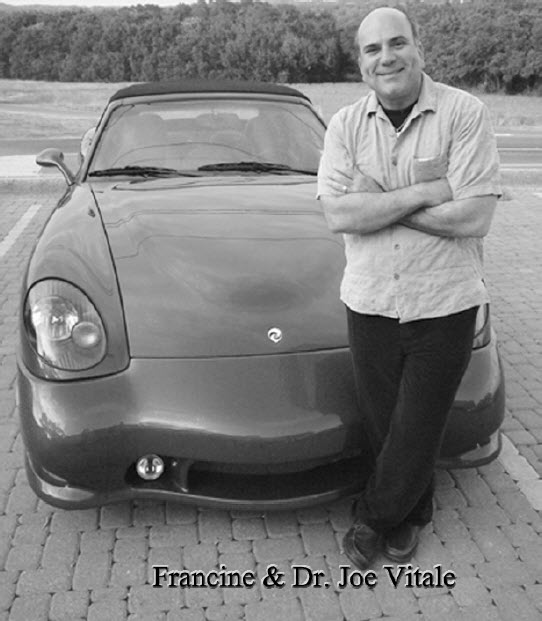

乔·维泰利

修·蓝博士说帕诺兹公司的标志也是一个归零工具，它是一个具有独创性的徽章，上面有旋涡状的阴阳图案和幸运草。他盯着鲜红、白色和蓝色，以及绿色三叶草组成的图形说，这个标志是个强有力的清理工具。我钟爱自己的帕诺兹跑车，想到手扶方向盘的时候，它还能帮助我清理，真是让我喜出望外。

更美妙的是名片上有车的照片，车上有帕诺兹的标志，这就意味着我的名片具有双倍的清理效果。

我确定有人听到这些会认为修·蓝博士脑子有问题。但是不管你是不是认为他疯了，我和很多人利用这些“疯狂的”名片或者贴纸之类的归零工具获得的效果是真实的。罗列这些效果对打消你的疑虑不起作用。毕竟，听到有人为了提高销售业绩，而在办公室里贴 Ceeport 标志，你可能觉得那有点傻或是一种迷信，或许有点安慰效果吧！信则灵嘛！要是信则灵的话，我愿继续信下去。

例如，你会在下一章读到销售员马文的故事，他打破了豪华汽车的销售纪录。他告诉我他“到处”都贴满了 Ceeport 贴纸。

“我把它们贴在办公室里、桌子下面、天花板上、电脑上、咖啡壶上、汽车底下、展示厅里、等候室里，等等。我都是花全价买来这些贴纸，我买了好几百个，然后到处都贴。”

或许是他的信念使清理工具产生了作用。

也或许是工具本身在起作用。

谁知道呢？

一位医生曾跟我讲：“所有的药都含有药剂和安慰剂成分。”

如果我的名片是安慰剂的话，那比很多东西都便宜得多。

所以，如果有效果，就继续做下去。

清理、清理、清理。

# 第十章　如何接收更多的财富

我是“大我”！

我和修·蓝博士举办的第二场研讨会跟第一场不大一样。虽然主题都跟清理、归零模式或记忆有关，但他讲课的方式更轻松，也更随性。开场时他举起一个棒球，问大家这种游戏的意义是什么？

“为了打出一个全垒。”有人回答道。

“为了赢。”另一个人说。

“为了让你盯着这个球。”我回答说。

“正确！”修·蓝博士以他特有的夏威夷口音回答，“为了赢或者打出一个全垒，你要始终盯着这个球。但是，你生命中的棒球又是什么呢？”

全场鸦雀无声。

“是呼吸。”有人答道。

“是此时此刻。”另一个人说。

修·蓝博士发现我们都没抓住要点，他便说出了答案。“生命中的棒球是神性，”他说，“你必须始终聚焦，回到零状态上。没有记忆，没有模式，就是零。”

### 清理、清理、清理。

你在此所能做的只有清理或者不清理。你可以选择所有你喜欢的，但是你无法决定自己是否能够得到它。要相信神性总会做出最适合你的安排。难道你比神性懂得更多？很难吧，所以请放下。

### 清理、清理、清理。

“我的意愿是与神性意志合一。”我跟修·蓝博士说。

“祝福你，乔。”

意愿是限制。你打算给自己找个前排的停车位，你意图要它，但神性却给了你一个一公里外的停车位。为什么呢？因为你需要更多的步行。放下吧。

### 清理、清理、清理。

我们跟修·蓝博士多待了两天，13 个人待在同一个房间里，大家的焦点都放在问题是如何产生的。

“你们总是会有问题的。”修·蓝博士说。我虽然抗拒这句话，但还是把它写了下来。

### 清理、清理、清理。

“问题是记忆的重演，”修·蓝博士说，“记忆就是模式，它们不是你个人的，它们是全体共享的。释放记忆的方法就是传送爱给神性，神性聆听后，会在最恰当的时候以最恰当的方式回应。你可以选择，但你说了不算，神性说了算。”

我不明白。

### 清理、清理、清理。

一位来自菲律宾群岛、爱笑又乐观的小伙子马文，站起来分享自己是如何在一年之内卖出总价值 1.5 亿美元豪华汽车的，实际上他从不试图卖任何东西给任何人，他所做的仅仅是清理而已。

“我所做的就是整天重复‘我爱你’，”他以特别的口音解释道，“在听别人说话的时候，我也在清理。我仅仅只是清理、清理、清理，一直清理。”

“你真的没有做过任何计划吗？”我怀疑地问道。我想至少他该盘算一下如何卖车吧，那可是他的本职工作呀。

“从来没有，”他回答道，“没有任何期待。我只是走出去工作并清理。”

### 清理、清理、清理。

我花了两天的时间，听那些和你我一样的普通人分享的归零故事。这些故事都那么不可思议。只要归零并说“我爱你”，接着世界就变了？就卖了更多的车？就赚到更多的钱？啊？

“你对此负有全部的责任，”修·蓝博士说，“它们都源自于你的内在，所有的都是，毫无例外。你必须对它们进行清理，不然它们就无法清净。”

对恐怖主义分子清理和归零？

### 清理、清理、清理。

对全球经济清理和归零？

### 清理、清理、清理。

对 ________（清理对象）清理和归零？

### 清理、清理、清理。

“既然它是你内在的经验，就得由你来清理它。”修·蓝博士说。

休息期间，我抽空打了个电话回家，想知道妻子娜瑞莎和我们的宠物都在干什么，娜瑞莎惊喜地告诉我，她花了一天的时间给我准备了一个大大的惊喜。她有很多事要忙，似乎不太可能为我做些什么。

“是什么呢？”我问道。

“一个大大的惊喜！”娜瑞莎说。

“说吧。”

“你投胎一万次都别想猜出来。”她笑嘻嘻地说道。

“别让我猜了，我可不想投胎一万次。”

在告诉你之前，还是让我们多了解一下背景。娜瑞莎因为自己手头上有太多的事而备感压力，情绪一直很低落。她正在为我们的一个客户制作视频，还设计了一款软件想要宣传。我不在家的时候，她还要打理房子，照顾家里的宠物。她很少有时间为自己做一天的规划，更别说去完成她的待办事项了。所以当她告诉我以下的内容时，我惊讶不已：

“我拆了你的衣橱，又把它组装好了。”

### 清理、清理、清理。

我震惊了。整理我的衣橱并不在她的待办事项清单上，也不在我的清单上。

“我把所有的衣服、衣架都拿了出来，换上新的衣架，又重新挂了回去，还把所有堆着的衣服都挂了起来。”

这给我的震惊就好比她拿出一张支票单让我填写 500 万美元一样，简直不可思议。

“你怎么会想起要做这些呢？”我问。

“我只是临时起意。”她答道。

真的是她想做这些？可能吧，但是她没有时间啊。真是出人意料。

修·蓝博士说，你清理自己的记忆，之后出现的就是灵感。娜瑞莎大概就是受灵感启发而整理了我的衣橱，这是个“内在清理带来外在结果”的隐喻和证明。

你永远无法计划外在的结果。

再一次，你可以选择，但你说了不算。

之后，在修·蓝博士住的汽车旅馆里，他跟我像师徒一样坐着。不过，这次是他把我当师父。

“乔，你是神最初创造的十个之一。”

“真的？”

我被拍了马屁，但说实在的，我并不懂他在说什么。

“你来此的目的就是要唤醒人们内在的神性，”他说，“你写的东西具有催眠作用，那是你的天赋，不过还不止如此。”

“不止如此？”

### 清理、清理、清理。

“你是生意人中的 J 先生，”他说，“你知道那是什么吗？”

我一头雾水，并告诉他，我搞不懂他在说什么。

“你是生意人中的耶稣，”他说，“带来转变的使者。”

我一边听他说，一边想，这段对话我一定要保密，传出去没人会相信，连我自己都不信。

### 清理、清理、清理。

“我跟随莫娜时，”他回想起自己跟随老师的岁月，他已经教授最新的“荷欧波诺波诺”很多年了，“在前五年里，我认为她疯了。但是，之后的某一天这种想法突然消失了。”

修·蓝博士的谈话风格就是流畅、诗意和富有远见。他似乎是同时运用他的左脑和右脑，而不像我们不是在用左脑就是在用右脑。他从我是商业的救主谈到了莫娜，这种特别的方式非常具有催眠性，我被牢牢吸引住了。我想知道更多。

“你的头上有一个花环围绕着，乔。”他边说，边盯着那我看不见也摸不着的东西，“那个花环是由钱组成的，像美元硬币上鹰的样子。”

不知为何，我迫不及待地想向他展示我戴的一枚戒指，那是一枚来自古罗马、有着 2500 多年历史的金戒指。他把它放在掌心。

“戒指上的文字是拉丁文，”我解释道，“Fidem 的意思是信念。”

修·蓝博士默不作声地拿着这枚戒指，似乎在接受一些图像和印象。我在一旁安静地待着，他像是在调频，让自己与这枚戒指在一个频道上。

“在前世，你曾是伟大的演说家，”他说，“你曾经被围攻并被杀害，这枚戒指能帮助你疗愈这段记忆。”

这很有意思。我经常有一些前世身为传奇演说家的影像，但是我现在却很害怕公众演讲，因为我曾经在公众演讲之后被杀害。我曾经认为那是自我编造的记忆，并非什么前世的。然而，修·蓝博士却在接触这枚戒指后也收到了一些记忆影像。

“我很少戴它。”我老实说。

“要经常戴。”他说道。

他盯着戒指。

“太不可思议了，”他说，“这枚戒指曾经被一个知道‘认识自我’价值的治疗师戴过。”

我更好奇了。修·蓝博士有息风静浪般平静大海的气场，世界在旋转，他却能岿然不动。他的话语来自心底，是什么就说什么。他开始盯着我，又看着我的脚。

“乔，天啊，我该坐在你的脚上，”他说，面露真情，“你与上帝一般无二。”

### 清理、清理、清理。

“我们来此就是为了清理，”他提醒每一位参加我们周末培训的人，“要不断地清理。当所有的记忆都归零了，神性将启发我们去做我们来此该做的事。”

### 清理、清理、清理。

在这个培训过程中，我意识到我只对我作品中的一本做了清理，其他的却没有。我曾经花时间在《相信就可以做到》上，它后来成了畅销书第一名。但我却没有花时间在我其他的作品上，比如有本叫《每一分钟都有顾客诞生》的书就卖得不够好。当我想到这个时，一股暖流直冲我的脊椎，这就是它卖得不如其他作品好的原因所在。

在第一次的培训中，我学到可以用铅笔尾部的橡皮来做清理工具。我可以用这块橡皮去敲击所有的主题，就是这样，它象征着在清理记忆。我拿出一本《有效生活指导手册》，把铅笔放在上头。在接下来的几个月里，我每天都用橡皮去敲击它。无论何时，只要我带着它，我就会停下来，拿起铅笔，用橡皮去敲击那本书。很疯狂，是不是？但是这是帮助我清理这本书有关记忆的心锚。结果，这本书很快就成了畅销书，并在第一名的位置上停留了四天之久。大公司一次都团购好几千本，连沃尔玛超市也进货了，《今日女性》杂志也有专文介绍它。

但我还是没对《每一分钟都有顾客诞生》做任何的清理工作。这本书最后还是出版了，并且差点就上了畅销书排行榜，但没有进入前十名。我还精心安排了一个大型的公众展出，希望能引起大众的注意。它的确引起了一些关注，但却没有引发销售热潮。我把这件事告诉了修·蓝博士。

“想象一下，把这本书浸泡在一杯有水果的水里，”他建议道，“我知道这听起来很疯狂。但是记下今天的日子，把书浸泡在水里，看看会发生什么吧。”

他提到奥普拉，我更惊讶了。

“你想上她的节目？”

我结结巴巴地说希望有一天能上。那个时候我还没上过赖利·金的节目，要上《奥普拉脱口秀》难度有点大。

“你必须清理，否则到上台那天就会卡壳。”

### 清理、清理、清理。

“曾经有两位作家上了她的节目，但在节目现场却说不出话来。”

“我可不想那样。”我叫道。

“你若去参加《奥普拉脱口秀》，那是因为她，不是因为你。”他说。

“这很深奥。”我说。

“你要放弃‘人们为你做事’的思想。他们只为他们自己做事。你所能做的就是清理。”

### 清理、清理、清理。

在我要结束此次旅行离开修·蓝博士之前，我再次问起几年前他身为心理学家为医院患有精神疾病的罪犯治疗的事。

“我想你必须要清楚，”他告诉我，“那并不容易，而且我也并非单打独斗。”

我带着想知道更多的心愿离开了。

### 清理、清理、清理。

似乎每个实践“荷欧波诺波诺”的人都有一个相当神奇的故事可以述说。例如：

亲爱的修·蓝博士：

我最近参加了在费城举办的“荷欧波诺波诺”聚会，用我融化的心致以你我最深的谢意，谢谢你告诉我归家的路。我始终感激神性，也感激你，还有那些帮助你从事这项教学的孩子们。

信后的附件是回馈给工作坊的见证。我想分享给那些想了解“荷欧波诺波诺”力量的人。如果它的公布能帮助更多人，就公布吧。如果对此不感兴趣，就干脆丢了，但愿我的感激已经尽意。

深深的谢意送给你们。

达纳·海恩

费城“荷欧波诺波诺”聚会见证

修·蓝博士以演讲和一些图片开始了这个工作坊，阐述了“荷欧波诺波诺”的宇宙观。他问我们：“你是谁？你知道吗？”我们一起探索那个所有平静的来源——真我的本态，不可思议，永恒又无限，完整却空无……他称之为“家”。之后我们又跟随他一起探索“问题是什么”的本质。“你是否曾发现，”他问道，“不论何处出了问题，你都在场，这告诉你什么了？”就像苏格拉底再世，他鼓励我们追根究底。我不知道的是，为了清理和转化，修·蓝博士正在灵活地挖掘隐藏的记忆和评判。

悬疑升起，我举手提问，并想发表看法。然而时间流逝，我越来越觉得，每次我问修·蓝博士问题，他都让我觉得被奚落了。我感觉被人轻视了，每一个回答都让我恼火，让我感觉是当众受辱。

到周日清晨，我对修·蓝博士愤怒到了极点，我想离开。我认为他是个傲慢自大、控制欲强、独裁专制的人。我在那里坐立不安，怒火中烧，随时都有可能哭出来。

我气到想要离开。我不确定自己是不是真的想就这样一走了之，我起身去了洗手间，因为怕自己真的会在会议室里哭出来。我坐在一个隔间里，周围充满消毒水的味道，我的愤怒转为狂怒。天啊，我连杀人的心都有了。我的一部分并不想释放这怒火，但是又有一部分一直告诉我：“宽恕我，原谅我，我爱你。”

我对着怒火持续重复那句话。接着，我突然发觉那怒火似曾相识，这怒火曾经以其他的形式出现在我的意识里——每当丈夫奚落我的时候，或是每当做律师的母亲坚持她是对的的时候。天啊，她是那种能颠倒黑白、玷污孩子纯真的人。

接着我就懂了，我“知道了”。啊哈！就是它了！这遥远的记忆。我的眼中迸发出喜悦，我高兴地想钻到别人的心里去。这该死的记忆封杀了我的心，还赔上了我的“当下”，而且还牵连了他人：修·蓝博士、母亲、布什总统、萨达姆·侯赛因——任何一个我认定该对此负责的人。这正是修·蓝博士告诉我们的，循环的磁带持续地播放着，一而再，再而三地播放着。

我没有离开，我回到会议室，之后在深深的平静中度过了剩下的时间。我安静地在脑子里重复：“对不起，请原谅，谢谢你，我爱你。”在那之后，修·蓝博士回答问题时，我只感到从他身上散发的浓浓爱意，再也没有之前的情绪了。他根本就没变，变的是我里面的某些东西。

在我回到会议室后不久，修·蓝博士分享了一个他学习“荷欧波诺波诺”的个人经历。他曾经三次质疑过这个课程，每一次他都想，导师真的是“疯了”，每一次他都宁愿牺牲学费后再次返回。难道他知道我在想什么？他知道我刚刚也认为他疯了，而且想要走人？

在接下来的休息时间里，我好奇地去接近修·蓝博士。他极其友善地解释说，远古的男权至上主义的记忆片段开始抬头了，这是个人尽皆知的思想，需要巨大的毅力和努力才能治好。直到回到家我才发现，工作坊已在我内在很深的层面起了疗愈作用。

整个周末，修·蓝博士给了我们一些去理性化的转化工具。虽然心存疑惑，我还是诚心诚意、不带期待地拿着铅笔，重复“露珠”，并且不断地敲打我在一张纸上写的三个词，它们代表了我的问题所在——“电脑”、“儿子”、“丈夫”。再一次，直到回到家，我才了解到这几个词语的威力。

当我回到家时，丈夫和儿子都来迎接我。他们笑嘻嘻地问：“猜猜看，你不在家，我们给你准备了什么？”“一台新电脑？”我猜道。我们的电脑最近一直有问题，售后维修人员花了好几个小时才把它修好，以至于我严重怀疑电脑里有什么古怪。更要命的是，在过去数周里，这台脆弱的电脑带来了几次家庭危机。电脑好坏没关系，我只想要家庭的和谐和安宁。

让我惊讶的是，丈夫和孩子竟然一致同意买台新电脑，前天晚上讨论时，他们原本打算半年后再去买一台 64 位处理器的新电脑。他们问我：“猜猜是什么牌子？”我逐个说出我所知道的每一个品牌：戴尔、惠普、索尼、捷威、康柏……“不是，不是，不是……”他们一个劲儿地摇头。“饶了我吧！”我叫道。

你要知道，与我结婚 30 年的丈夫是个非常固执的人。他有着钢铁般的意志，一旦做了决定就是 100 头牛也拉不回来。在没那么清醒时做的决定，更是 120 头牛也拉不动。他一直是某个电脑品牌的忠实消费者，想让他换个品牌，门儿都没有。所以，当他们异口同声地说“苹果牌”时，我几乎惊讶地倒地。你该明白，我一直想要的就是苹果电脑，但是认为这是我永远无法实现的梦。

对有些人来说，这件事似乎很稀松平常。但是我已经结婚 30 年了，在这期间，我们的婚姻坎坎坷坷，我们都在为在婚姻中平等和谐共处的目标而努力。这个显然不合逻辑的买电脑事件，是一种“放下刀剑”的仪式，只有在战场上刀戈相见的人才懂得。我的意思是说，那就像是你告诉我猫和老鼠能和平相处一样让我惊讶。

我还记得自己拿着铅笔重复“露珠”，并敲击“丈夫”、“电脑”、“儿子”时的样子。30 年的冲突真的就这样烟消云散了？仅仅是重复“对不起，请原谅，谢谢你，我爱你”，就转化了我一生以来一直认定的权威印象——与母亲、电话公司、丈夫之间一直以来的冲突吗？我所知道的是，在这个工作坊之后的两周里，我每天都在虔诚地练习修·蓝博士教给我的内容。儿子的慢性疾病开始好转，丈夫也开始跟我讨论那些我曾经隐藏、压抑的情绪。哦，昨天夜里他竟然说：“亲爱的，如果你喜欢，你可以买台笔记本电脑自己用。”

# 第十一章　怀疑论者想要知道

生命的意义在于每个时刻都能回归到爱。为了实现它，一个人得要知道，他对自己所造就的生命道路负有百分之百的责任。他必须了解到，是他的思想创造了自己生命中的每个当下。困扰并非来自他人、他事、他地，而是来自对这一切的想法。人们必须意识到，根本就没有“外在”这回事。

——伊贺列卡拉·修·蓝博士

在前面提到过，我曾经写过一篇文章名为《世界上最神奇的治疗师》，并贴在我的博客和网站上。它还出现在大卫·赖克蓝的书《101 个改善生命的方法》里。它成了我写过的传播最广、讨论最热的文章。人们把它刊登在新闻组里，转发给他们的朋友，发送到他们私人或公共的邮件里，或以其他的方式广泛传播。很显然，文章里的信息非常鼓舞人。也正是这篇文章，引起了出版商的注意，最终促成我写出这本你正在看的书。

但也并非每个人都喜欢这篇文章。有些人甚至认为，任何人，哪怕是心理学家，都不能治好医院里患有精神疾病的罪犯。有个家伙写信给修·蓝博士，要求给出一个证明来。他想知道修·蓝博士在精神病医院经历的真相。我也想知道，让真相大白于天下吧。下面是修·蓝博士详细的回复：

跟很多的故事一样，这个故事也同样需要澄清一下。

曾经的事实是：

1．夏威夷州立医院是夏威夷州卫生署下属的一家精神病医院，我曾经受聘于该医院，作为带薪的全职心理学家在那里工作了一段时间。

2．我从 1984 年到 1987 年，作为全职心理学家在那里服务了 3 年，每周工作 20 个小时，在那些戒备森严的单元病房里，关着各种类型的重罪男犯：有杀人的、强奸的、嗑药的，还有暴力攻击他人的、抢劫的等。

3．在我 1984 年刚到任时，所有的隔离间里都关满了充满暴力的病人。

4．每天，都有病犯要被戴上手铐脚镣，以防他们伤人。

5．在那里，病犯袭击病犯、工作人员的暴力事件时有发生。

6．病犯们得不到很好的照顾及康复治疗。

7．医院内没有康复性活动。

8．医院外的活动、娱乐或工作也没有。

9．病犯家属很少来医院探望。

10．没有心理医师的许可签证，即使戴上手铐脚镣，病犯也都不允许离开那里。

11．一个典型的病犯会在里面待上几年，一年的花费大约要 3 万美元。

12．在那里，工作人员的病假率很高。

13．医院的环境死气沉沉的，甚至让人窒息。

14．工作人员基本上都是很棒、很有爱心的人。

15．以上我描述的可能是这个国家大多数精神病医院的典型现象。

当我于 1987 年 7 月离开那家医院时：

1．隔离间不再使用。

2．手铐脚镣也不再使用。

3．暴力行为极为少见，通常只发生在新病犯身上。

4．病犯们可以自己照顾自己，包括安排住宿、工作，以及离开医院之前的法律服务。

5．单元房外的娱乐活动，比如慢跑和打网球，也开展起来了，而且再也不用心理医师的许可，也不用戴手铐脚镣了。

6．单元房外的工作也开始了，例如洗车，同样不需要心理医师的许可，也不用戴手铐脚镣了。

7．医院内的工作包括烤曲奇饼干和擦鞋。

8．病犯家属来探望的也多了。

9．工作人员的病假申请也几近消失。

10．由于人们的关爱，他们对一些设施进行重新刷漆和护养，医院的环境得以大幅度改善。

11．工作人员更专注于支持病犯们为自己负百分之百的责任。

12．病犯们从入住到离开医院的时间，从数年缩短到数个月。

13．病犯和工作人员的生活品质也发生了戏剧性的转变：从原来的看护关系发展为家人之间的互相关爱。

作为一名心理医师，我到底在那里做了什么？我使用了“荷欧波诺波诺”大我意识疗法，每一次不论是以往、当时，还是离开那个医院之后，那些我有意或无意经验到的，我都用忏悔、宽恕、转变的心对待发生在我内在的一切。

我没有在医院里给病犯做过任何治疗或咨询。

我也没有参加任何关于病犯的工作会议。

我对自己身为心理医师而引发的经验负起百分之百的责任，去清理我内在的东西和面临的问题。

我是“如是”的创造物，我是完美的，一如所有的人和所有的一切。不完美的是垃圾，是那些抗拒的记忆，是重播评判、怨恨、愤怒和恼火的记忆。天知道，我们的灵魂里还有多少废物。

大我的平静

伊贺列卡拉·修·蓝博士

虽然我还处于学习“荷欧波诺波诺”的过程中，但有时如果我觉得某些人思想够开放，我也会教他们这个疗法。当然，他们是否够开放，是我的投射，并非他们本身。我越清净，我周遭的人就越清净。但这不是个容易被接纳的事实，我们更倾向于去改变外在而非内在。

有一次在毛伊岛，一位房地产经纪人开车带我们去看房子。在路上，我们谈了许多关于治疗、灵性、电影《秘密》和个人成长方面的内容。这些都非常有趣，但有件闪亮的事发生了。

这位房地产经纪人读过我当前最有名的文章，就是那篇关于修·蓝博士和他使用夏威夷疗法“荷欧波诺波诺”，治好了医院里的精神病罪犯的文章。

跟很多人一样，他深受启发。

跟很多人一样，他并不完全理解。

当我们开车巡游这座美丽的岛屿时，我听到这位经纪人抱怨有间房子他死活卖不出去。买家和卖家总是发生争执，引发了巨大的愤怒、怨恨和诸多困扰。销售因争吵而搁浅，短期之内无法结束。显然他对此很沮丧。

我听了一会儿，忽然有股冲动想说话。

“你想知道修·蓝博士会怎么用‘荷欧波诺波诺’来处理这样的事情吗？”

“想啊！”经纪人大声回答，他显然十分感兴趣，“我特别感兴趣，快告诉我吧。”

“那个方法应该很棒。”娜瑞莎说。

“我不是修·蓝博士，”我说，“但是我正在写一本关于他的书，我在上他的课，所以我觉得我知道他会怎么处理。”

“快说吧。”经纪人着急地说。

“修·蓝博士的做法是，去探求自己的内在，去查看到底是自己内在的什么东西共同参与了外在所见的经历。当他在精神病医院工作的时候，他常常查看病人的档案。不论他是否对病人的行为感到排斥，还是有什么其他的感受，他都不是去处理病人，而是去处理自己体验到的感觉。他在清理自己的内在的同时，病人也得到清理和疗愈。”

“我喜欢这个。”经纪人说。

“大多数人都不理解责任的含义，”我继续说道，“人们都爱抱怨。随着成长变得更有觉知，人们才开始对自己的言行举止负责。这还不够，当你变得更为觉知时，你要为每个人的言行举止负责，因为他们都出现在你的体验里。如果你创造了自己的生活，那么你就创造了你看到的世界，包括你不喜欢的部分。”

经纪人笑着点了点头。

我继续说：“在你所面临的情况里，买卖双方做了什么并不重要，重要的是你做了什么。修·蓝博士所做的很简单，就是不断重复：‘我爱你，对不起，请原谅，谢谢你。’他不是对别人说，他是对神性说。目的是清理共享的能量。”

“我也要这么做。”经纪人说。

“但是这么做不是为了得到什么东西，”我说道，“这么做是为了清理共享的能量，以便别人不再经历它。清理的工作，需要一直做下去。”

我停顿了一下。

经纪人似乎理解了，他的眼睛睁得大大的，笑容更深了。

“如果你觉察到了，你就有责任去清理和疗愈。既然你对我提到了这件事，那么我就有责任要清理它，因为它已经成为我体验的一部分了。如果我是自己体验的创造者，这就是我的责任所在。”

我让他慢慢吸收，我们则继续看房子。

几天后我收到了那位经纪人的电子邮件，他说他一直在用修·蓝博士的方法。

就是这样。

一切都是爱。

要持续不断。

你全然负责。

一天，我和敏蒂·赫特在得克萨斯州温柏里主持一场研讨会，她负责一家教会的工作。研讨会的主题是“财富的秘密”。在研讨会上，我教大家“荷欧波诺波诺”的清理方法。一位男士提出一个问题：“我说不出来‘对不起’和‘请原谅’。”

“为什么？”我问。

我从来没有遇到过这种问题，我很好奇。

“我无法想象慈爱的上帝或神性需要我请求宽恕，”他说，“我认为神性没必要宽恕和原谅我任何事情。”

我想了一下，然后知道我该怎么回答。

“你说这些话不是请求神性宽恕你，而是在清理你自己。你是对着神性说，但这些话是为了清理你。”

换句话说，神性已经将所有的爱给你了，而且永不止息。在没有限制的零状态，最接近的描述是——纯粹的爱。它一直都在，而你却不在。通过说“我爱你，对不起，请原谅，谢谢你”，你是在清理阻止你的模式，以达到纯粹的爱的境界。

再次强调一下，神性不要你实践什么“荷欧波诺波诺”疗法，但是你自己需要。

最近我收到一封很让我心痛的电子邮件，是我的一位朋友发来的。她问：“要是一个人读过你的书，看过你的电影《秘密》，还每天看你的博客，她每天都努力工作，却依然贫困潦倒、不幸福，生活充满了失败。你会怎么对这个人解释？我的麻烦一件接着一件，没有尽头。你又该怎么说呢？”

我感受到她的痛苦。毕竟，我也曾经无家可归，也曾在贫困中挣扎了十年。我知道那是种陷入流沙里的感觉。

那么我该对这样的一个人说些什么呢？

过去我会提供一些解决方案。我会说去读读克劳德·布里斯托尔的《信念的魔力》；把《秘密》看七遍；创造你想要的生活愿景；每天花时间冥想；打破自我限制等。

但这些都是从正面改变的方法，据我所知，修·蓝博士也会证实这些方法很少管用。

那还剩下什么可行的呢？

我或你或任何人要如何帮助一个生活在痛苦中的人呢？

根据“荷欧波诺波诺”疗法，唯一的方法是清理我自己。我生命中出现的人，包括给我写信的人，他们都和我共享着模式。他们像是感染了思想的病毒，他们不该受指责。他们像是落入了陷阱，被逼上了绝路，我不能扔绳子给他们，通常他们都不会去用，或者他们只会用绳子把自己吊死。

那么，我该怎么办？

我能做的只有清理自己。随着我的清理，他们也得到清理。我们共享的模式被清理，他们也得到解脱。这些天我一直在做这个工作，这也是很久之前，第一次和修·蓝博士通电话时，他告诉我的：“我所做的就是清理、清理、清理。”

我所做的就是说：“我爱你，对不起，请原谅，谢谢你。”剩下的交给神性去做吧。这不是无情无义，而是最真心实意的事。就在我写这些字的时候，我也在做。

最后，好好玩味一下下面这段灵性的妙语：

写信给我的这个人的故事，也成为你体验的一部分了，那么也就意味着需要你去疗愈了。毕竟，如果你创造了自己的生活，你也创造了这件事，因为这件事也是你生活一部分。我建议你用“我爱你”来疗愈这件事。

随着你的清理，给我写信的那个人，以及所有共享这一模式的人，都会越来越好。

# 第十二章　选择就是限制

我们可以向知晓我们个人蓝图的神性祈祷，祈祷它疗愈所有在此刻阻碍我们的思想和记忆。

——莫娜·纳拉玛库·西蒙那

2006 年 12 月，修·蓝博士飞到得克萨斯的奥斯汀市，和我短暂相处了几天。在机场接到他以后，我们立刻聊起了人生、上帝、模式、归零和许许多多事。他问我近况如何，我说我很高兴见到他。

“有部电影，里面有句台词：‘有些人醒着，他们的生活充满惊喜。’我现在接近这种状态，我的生活中出现了许多神奇和奇迹，让我觉得很兴奋。”我说。

“跟我说说。”他在一旁催促我。

我跟他讲了我特别喜爱的新车，那是 2005 年产的帕诺兹超级跑车，由帕诺兹家族纯手工打造，还有制造者的亲笔签名，每部车还有自己的名字，我的车名叫弗朗辛。我知道修·蓝博士欣赏人们对车的爱。事实上他认为万事万物都是有生命的，他待它们如同待人一样。

我告诉他由于我出演了电影《秘密》，所以受邀参加赖利·金的电视节目。他想知道赖利·金是个什么样的人，我告诉他金是个率直、和善、聪明的人，我很喜欢他。

我又告诉修·蓝博士我的书取得了很大的成功，比如《相信就可以做到》和《有效生活指导手册》。才几分钟，他就看出来我兴高采烈、充满活力。

“从你第一次参加‘荷欧波诺波诺’课程以来，你觉得自己有什么不同了吗？”

我想了一下说：“我不再试图控制一切，我懂得了放手。我只是清理、归零，只把注意力放在回归零上。”

他拍拍我的肩，笑了。他对我所做的深感满意。

我们开始向我的车走去，走了几步，修·蓝博士停了下来，盯着我。

“你走路一蹦一跳的，”修·蓝博士惊讶地看着我说，“你走路像装了弹簧似的。”

“我见到你高兴嘛。”

吃晚饭的时候，我告诉他我对那本关于巴纳姆的书《每分钟都有客户诞生》很失望，它的销量实在不佳。

“乔，你必须爱上它。”

我只是想把书卖出去，我不太明白这和爱能扯上什么关系。

“乔，如果你有三个孩子，其中一个学习成绩稍差，你会不会对这个孩子说你很失望呢？”

“不会。”我说。突然我心里一亮，我的书不就是我的孩子吗？我却埋怨它不如其他孩子。我感受到内在的悲恸，甚至想在餐馆里大哭一场。

“明白了吧，乔，”修·蓝博士说，“你必须爱你所有的孩子。”

我开始觉得很内疚，只因为我的“孩子”表现不好，我就疏远了它，我由衷地感到歉意。我一边开始在心里向神性默念：“对不起，请原谅，谢谢你，我爱你。”一边用心去爱我的书。回到家后，我一看到那本书，就拿起它，将它抱在胸口，爱它，请求它原谅我。

后来，我们开车去得克萨斯州的温柏里市，他说他看到我身体里有个精灵。

“有个什么？”

“一个精灵。”

我早就习惯了修·蓝博士说他看到一些我看不到的东西。他不称之为通灵，而认为是一种当下的天启。

“这个精灵有双大眼睛，一对大耳朵。他喜欢待在你身体里，不愿见人。”

“我有一部分就是喜欢待在家里，在电脑上工作，不想跟别人互动。”

“你还有一部分是喜欢受公众关注的。”

“我有三分之二喜欢上赖利·金和奥普拉的节目，以引人注意。但是还有一部分喜欢待在家里，过隐居生活。”我承认修·蓝博士的说法。

“你的精灵能使你保持清醒。只向往明星生活的人们会发狂，只喜欢独居生活的人们就像井底蛙，你很平衡。”修·蓝博士解释道。

晚上的时候，我告诉妻子娜瑞莎，关于我体内精灵的事。

“你爱出风头的那部分叫什么名字？”她问

“我不知道。”

她想了会儿说：“我想他叫雪碧吧。”

“雪碧？”

“就是，雪碧。很适合你。”

我大笑起来，她说的没错。第二天，我又告诉修·蓝博士我喜欢表现的那部分娜瑞莎取名叫雪碧。他笑得前仰后合，喜欢得不得了。

“雪碧喜欢镁光灯。”他唱了句歌词。

又过了一天，我接修·蓝博士到我家，我开车去接他。我发现他和两位退休的墨西哥女士坐在一起。那两位女士看起来很认真地听着他说的每句话，他挥手示意我过去。我点了咖啡，想坐在修·蓝博士旁边，但他叫我坐在隔壁的椅子上和两位女士面对面。

“跟她们讲讲你是做什么的。”他对我说道。

我给她们讲我的书、我出演的电影，以及我如何帮助人们获得幸福，等等。

“说说你是怎么处理问题的。”

“在过去，我总是处理问题本身，不管是我的，还是别人的。现在我不管问题了，而是清理导致问题的记忆。当我记忆归零时，问题也就得以解决，我也就没事了。”

“乔，你能给她们举个例子吗？”

“我姐姐让我很挫败，她一直靠社会福利生活。上次她家里被盗，身份证丢了，还有一些其他的倒霉事。她一点也不快乐，这让我很挫败。我试着通过寄钱、送书、邀请她看电影，甚至送 DVD 机给她，想要帮助她。她一点也不肯改变现状，但是现在我也不试图改变她了。”

“那你做些什么呢？”其中一个问。

“我清理我自己。我现在明白了她的生活跟她做什么无关。她是陷入了一套正在运行的模式，或叫记忆的陷阱里。她就像被传染了病毒，这不是她的错。因为我知道这一点，因为我能感受到她的痛苦，也就意味着我也有这个模式。我必须清理，随着我归零，她那里的模式也会被清理。”

“你怎么归零呢？”

“我做的很简单，就是不断地说：‘我爱你，对不起，请原谅，我爱你。’”

修·蓝博士解释说“我爱你”包含了可以改变一切的三要素：感激、尊重和转化。我继续讲我认为正在发生的事情：“这些句子就像魔咒一样打开了通向宇宙的门锁。我念诵这些句子，就像念诗。我向神性打开自己，请神性将我归零，归零那些妨碍我回到当下的模式。”

修·蓝博士说他很喜欢我对“荷欧波诺波诺”的理解。

“感染病毒是个很恰当的比喻。世界上就是有这样的模式，我们被感染了。当有人有某种模式时，我们看到了，我们就被感染了。这就是你要负百分之百责任的原因。当你清理自己的时候，你也把其他人的模式清理了。”修·蓝博士停了一下，继续说道，“这世界上有许多的模式，就像长在零极限状态下的野草，要达到零极限，我们要清理的比想象中的要多得多。”

我很惊讶，两位女士似乎听明白了。我们讨论的是让头脑打结的概念，然而她们似乎颇能认同。我不禁想，修·蓝博士就像音叉，两位女士进入了他的频率影响范围，与之产生了共鸣。

早晨的空气清新凉爽，我们在一段满是沙土和石头的路上散步，走了不到一公里。沿途有小鹿在我们身边游荡。我们还遇到了几只狗，它们冲我们狂叫。我们没理它们，继续聊天散步。突然修·蓝博士朝那几只狗挥挥手，好像祝福它们一样，然后说：“我们爱你们。”

那些狗都突然不叫了。

“所有的一切都希望被爱，你、我，甚至是狗。”修·蓝博士说。

有个个头比较小的狗轻轻叫了一声，我想它可能是说“好极了”，或者“谢谢”吧，又或者说“我也爱你们”。

我们的谈话总是发人深省。有一次修·蓝博士说，生命中唯一的选择就是是否归零，这让我大为震惊。

“选择不是来自记忆就是来自启示，”他说，“就是这样。”

我回答：“过去我一直告诉人们，他们的选择是接受灵感与否，那才是自由的意志。神性发来信息，你可以选择是否采取行动。如果你照办，一切安好；如果不照办，你就有麻烦。”

修·蓝博士说：“你的选择只有归零与否。如果你归零，灵感就会来，你就采取行动。你不会去反复考虑，如果你考虑，你就是把灵感和其他的东西进行比较，比较的对象就是记忆。清理了记忆，你就没得选择，你就会毫不迟疑地遵从灵感。就是这样。”

哇！这个洞见给我带来了不小的震撼。我非常后悔以前我告诉别人选择就是自由意志，现在才明白有自由意志意味着你卡在了记忆里。当你在零极限的零状态时，你什么都没有，来什么你就会照做，这样才对。

修·蓝博士解释说：“我们就像是在一个大交响乐团里的乐手，每个人负责演奏一种乐器，人人都有，各不相同。为了演奏好一首曲子，每个人都必须演奏自己的乐器，这样人人都开心。当我们不愿演奏自己的乐器，总是觉得别人的乐器更好时，就会带来问题，这就是记忆。”

我仿佛看到音乐会的舞台总监、营销人员，还有保洁人员，每个人都在努力扮演着自己的角色。

我也想起我认识的一些人，他们似乎对自己是如何成功的感到莫名其妙、毫无概念。出演过《教父》和电视连续剧《欲望之都》的演员詹姆斯·凯恩，我见过他几次。他的演艺生涯对他来说，就像你对我来说一样，是个谜。他是个优秀的演员，甚至可以说是个传奇。但是他所做的就是扮演自己，他在按宇宙的剧本出演。

我的生涯也可以说是这样。有些人把我当作精神导师，他们曾在电影《秘密》里看到我或是读过我的《相信就可以做到》，认为我能跟上帝直接通话。事实是，我不过是出演了自己那部分角色而已。

当人们各司其职的时候，世界就会安然。而如果你想成为我，我想成为你，问题就产生了。

我问：“是谁设定这些角色的呢？”

修·蓝博士说：“是神性，那个零状态。”

我又问：“什么时候设定的呢？”

修·蓝博士回答：“远在你我未到这个世间之前，甚至早于地球上诞生单细胞微生物之前。”

“这是不是意味着我们完全没有自由意志了，我们不过是来饰演自己的角色？”我困惑地说。

“你拥有完全的自由意识，只要在呼吸，你就是在创造，但要达到零状态，就必须归零所有的记忆。”修·蓝博士解释说。

我必须承认，我对这一切还不是很明白。但我了解到的就是要承担起我的责任，做好自己分内的事。如果我负起自己的责任，那么就像是拼图游戏里最后的那一块，找到了自己的位置。但是如果我非要把自己放在别的地方，那就不对劲儿了，整张拼图就无法完成。

“你的头脑会试图去理解这些，”修·蓝博士说，“但是它只能理解百万分之一的信息，你的脑袋无法真正明白全部真相。”

这听起来不是很舒服。

至少我的头脑不喜欢听。

我之前提过，在一次“财富的秘密”研讨会上，我告诉大家：“只要你归零就会有钱，没钱是因为你没归零。”修·蓝博士非常赞同。

“记忆阻碍钱的到来。”他说，“如果你归零了关于钱的记忆，你就会有钱，你准备好接受钱了，宇宙就会送来。记忆的作用就是阻止钱流向你，或是阻止你看到这一点。”

“如何清理这些记忆呢？”

“不断地说‘我爱你’。”

“对钱说吗？”

“你可以爱钱，但最好是对神性说。当你在零状态时，你处于零极限，钱会自然流向你。但是当你处于记忆中，你就是在阻挡它。人们对钱有很多记忆，你清理这些记忆，也就清理了其他人的记忆。”

我们进了一家小吃店，点了咖啡。刚坐下来的时候，里面很清静，很快，陆陆续续有人进到店里来，小店开始忙碌、热闹起来。小店的能量开始提升。

“你注意到没有？”修·蓝博士问。

“有点吵了，人们看上去很开心。”我答道。

“我们带着归零后的自己进来，这个店能感觉到。”修·蓝博士说。

然后，他告诉我在欧洲餐馆吃饭的故事。那里餐馆的生意不好，但是他进去之后，人流开始增多。他在很多地方验证了这一点，于是他去一家餐馆对老板说：“如果我们进来，能带给你更多的生意，这顿饭能不能你请？”老板同意了。从那以后，修·蓝博士经常可以免费用餐。

我注意到修·蓝博士付钱很大方。我们去了一家小店，他买了几个彩绘玻璃作品要送朋友，然后拿出一张 20 美元的票子给售货员说：“这是给你的小费。”售货员理所当然地感到非常惊讶。修·蓝博士说：“这只是钱而已。”

后来在一家餐厅，我也付了很高的小费。服务员张大嘴巴说：“这我可接受不了。”“就是给你的，你能接受。”我说。

再后来，我有了个产品创意，而且肯定它能帮我赚很多钱。修·蓝博士说：“宇宙会回应你的慷慨。你付出，它给进。它还会给你很多灵感。如果你没有慷慨过，宇宙就不会对你慷慨。”

啊哈！这才是财富的真正奥秘！

“我们忘了美元上的那句话：‘我们信靠上帝。’我们印在钱上，却没人相信。”

有一次修·蓝博士问起我和一位医生及一位营养师共同创立营养品公司的事。我们配制了一种降低胆固醇的食品配方，并将产品投放市场，名叫“心脏的秘密”。不久前修·蓝博士还跟我讨论过公司和产品的名字，他对我们的进展很好奇。

“还在进行中，我聘请了一位美国食品与药品管理局的律师来检查我们的网站和产品包装，目前在等他的消息。但是在制作这个产品的过程中，我得到了一个更有趣的产品创意，我叫它 Fit-A-Rita。”

我接着解释什么是 Fit-A-Rita，它是一种纯天然的玛格丽特酒。我是在和朋友们出去喝酒的时候，有了这个创意的。当时我参加了一项健身比赛，所以喝酒对我来说不太合适。喝酒时，我突然想到一个主意：“我们需要给健身的人做一款玛格丽特酒。”一说出来，我就知道这是个好主意。

“你真棒，乔，”修·蓝博士说，“你没有把自己限制在第一个产品上，没有要求事情按照你的期待行事，所以神性给了你一个新的赚钱点子。太多人把自己限制在一个想法上，并试图强迫事情按照自己的期待发展，他们那样做，正是把自己阻挡在财富大门之外。你真棒，乔，你真的很棒。”

修·蓝博士说的没错，我把自己开放给神性，灵感就层出不穷。除了 Fit-A-Rita 外，我还收到一个好点子，做归零垫。在你用餐的时候，你把食物放在上面，它就能帮助你清理食物和你。但是，我们没有就此停步。修·蓝博士也收到一个主意。

修·蓝博士跟我说：“我还没有见过一个网站，人们访问它就可以得到清理。我们给这本书做个这样的网站吧。人们访问它的时候，就可以因为我们灌输的信息而归零。”

于是有了这样一个网站。

一旦你放下你的需求，允许一切自然流经你，赚钱的主意是无穷无尽的。关键就是不断地清理、清理、清理。

“治疗师在会见来访者的时候应该怎么做呢？”我想了解一下有没有很特别的方法可以帮助人们清理。

“就是爱他们。”修·蓝博士说。

“但是如果他们经受精神创伤，治疗师难道不先解决这个问题吗？”我想把修·蓝博士逼入死角，从他那里逼出更多好方法。

“所有人都想被爱，你不也是这样吗？你只要爱一个人，你说什么、做什么都无关紧要。”

“所以不管是荣格学派的人、弗洛伊德学派的人、莱克疗法的支持者还是任何使用其他方法的人，都没关系喽？”

“跟那没关系，”修·蓝博士强调说，“关键是你爱那个人，因为他是你的一部分，你的爱能帮助他们清理、净化，清理他们生活中被感染的模式。”

我并不满意这个答案，但是我明白他的意思了。

“但是那些被诊断为精神病的人呢？”

“曾经有个被诊断为精神分裂症的女士来找过我，我请她告诉我她的故事。你得明白，无论是她还是别人告诉我的事，无论是什么，都不是真正的问题所在。他们的故事只是他们对事情的诠释。真正发生的事，在他们的觉察范围之外，但听她叙述是起点。”

“她说什么了？”

“她告诉了我她的故事。我认真地听着，并不断在心里对神性说：‘我爱你。’我相信无论需要被清理的是什么，都会得到清理。后来，她告诉我她的全名，那是一种中间有连字符的名字。”

“像‘维泰利-欧登’这样的是不是？”

“是的，我就知道这是部分问题所在。如果有人的名字是分开的，那么就会有人格分裂。她需要拥有自己的本名。”

“你让她改名字了吗？”

“不用改，只要告诉她，她的名字是一个词（而非两个），她就感觉很放松、很完整了。”

“那是因为名字的改变起了作用？还是你说‘我爱你’起了作用？”我问。

“谁知道呢？”

“我想知道啊，”我说，“我启动了一个奇迹教练的计划。我想让我的教练们说正确的话、做正确的事，这样才能真正帮助别人。”

他接着解释说，治疗师都自认为他们在帮助和拯救别人。实际上他们的工作是在清理自己在来访者身上看到的模式。他们清理了自己的记忆，也就清理了来访者们的记忆。

“你的那些教练说什么、做什么都没关系，只需要他们不断地去爱他们接触到的人。”修·蓝博士继续解释道，“记住：别人是你的镜子。别人的经历都是和你共享的。清理这些共享的模式，你们就都会好起来。”

“怎么做呢？”

“我爱你。”

我开始有点头绪了。

从我能看懂儿童读物和漫画书开始，我就在思考世界是怎么运作的。以前，《超人》和《闪电侠》都很容易懂。如今，我必须研究科学、宗教、心理学以及哲学，而且还要不断思考。

每当我开始觉得我明白点什么的时候，就会读到某一本书，扰乱我的世界观。这次让我头疼的是巴尔斯卡的《意识的对话》。

如果非要用文字总结一下这本书要传达的信息，我会说，我们所做的所有事，没有一样来自自由意志。自由意志不过是个提示性信息罢了。我们自以为是清醒的主角，我们错了，那不过是自说自话。从某种意义上来说，我们是神性的木偶，被我们内在的能量牵引着。

想象一下：

我写了《相信就可以做到》这本书，书中说要想实现愿望可分为五步，而我和其他人也使用这个方法吸引到了财富、汽车、伴侣、健康、工作，等等，你想得到的任何东西。这一切都跟意图有关，方法就是明确你的意图，然后对来临的机会或内心出现的点子采取行动，让它实现。简单地说，你是操纵者，世界是你的木偶。

那么我要怎么适应这两种貌似互相冲突的哲学，而不会精神错乱呢？

我想可能是这样：

首先，我们生活在一个由信念驱动的世界里面。不论你相信什么，它都会成真。它会伴随你度过每一天，无论在什么情况下，它都会将你的体验框定在你觉得合理的范围里。如果有什么事不符合你的世界观或框架，你就会用一种方法使之合理化，并且强迫它符合你的框架。否则，你就去吃安眠药吧。

其次，我不禁会想，也许这两种哲学都是正确的。我们既是木偶，也是操纵者，但这只有当“自我不在”的时候才行得通。是心智让我们酗酒、暴食、捣蛋、偷盗、欺骗，甚至花大量的时间想搞清楚世界是怎么运转的，是心智阻碍了自然的进程。心智知道自己注定消失，它无法承受这样的结局，便会创造一些让自己感觉良好的瘾头来维系自己的存在。事实上，是心智阻碍了你体验到当下的狂喜。

如果事实如此，所有的方法就一目了然了，我在《相信就可以做到》里面谈到的第三步，实际上是在帮你移除神性计划里的阻碍。

比如说，当你运用情绪释放技巧时（一种用手指轻敲问题以消除你生活中的困扰的方法），你便解决了困扰你的问题。

之后呢？

之后，你就可以采取积极的行动了。

可是，你不是本来就要采取积极的行动吗？

这不就是你之所以知道那件事开始就存在问题的原因吗？

换句话说，采取行动这一步，是神性发给你的信息。你的焦虑干扰了行动，拿走干扰，你就会重回神性。这时，你又是木偶兼操纵者了。

我试着总结一下目前我所理解的东西：

你带着一份内在的天赋来到人世，你可能一开始就知道，也可能不知道，也可能现在还不知道，但是有时候你能感觉到它在你里面。此刻，你的头脑开始评判它。如果头脑评判它是坏的，你就会寻求治疗、解决方法、药物或某种成瘾的东西，来搞定它、隐藏它、操控它、释放它，或者接受它。但是一旦你移除干扰，你便开始依天赋行事。简而言之，你开始成为神性的木偶，同时又是自己生命的操纵者。

你的选择是要不要顺其自然。

这才是自由意志。有人称它为自由不意，是因为你真正的决定是要不要依照冲动行事。

甚至伟大的演员兼营销专家巴纳姆，《每分钟都有顾客诞生》一书的主角，也懂得这个道理。他做事大气，总是依照更高层面的指引。他的墓志铭上写着：“不是因着我的意志，而是因着神的旨意成就。”

他念起即行，不受头脑的干扰，他允许结果以本来的样子出现，并深信这是宇宙大蓝图中的一部分。他采取行动却不期待结果。

这是《相信就可以做到》里的第五步。

（我认为）今晚我明白世界是如何运作的了。

明天我可能又不确定。

我又想看漫画书了。

“每个人都有天赋。”一次散步的时候修·蓝博士说。

“那泰格·伍兹呢？”我知道答案，但是想更深入地探讨一下。

“他也是在神性的大戏中扮演自己的角色。”

“但是他教别人打高尔夫的时候又是什么情况？”

“如果那样，他永远成功不了，他的角色是打球，不是教别人打，教是别人的角色。我们都有自己的角色要扮演。”

“看门人也有？”

“是的。看门人、收垃圾的人，他们也爱自己的工作（角色），”修·蓝博士说，“你不这么想，是因为你在试图扮演他们的角色，但是谁也不能替代别人的角色。”

我忽然想起以前参加过的一个自我成长课程，里面有一句话：“遵行上帝的旨意，你就会幸福。而你正在做的就是上帝的旨意。”

关键就是不要抗拒你的角色。我可能一直想成为一个像米歇尔·马龙一样的作曲家、像詹姆斯·凯恩一样的演员、像弗兰克·赞恩一样的健美运动员、像杰克·伦敦一样的作家。我想在作曲、演艺、健身、写作等多方面都成为行家。但是我的角色是启发者，我写书的目的是让人们觉醒，或者准确地说，是让我自己觉醒。

当我唤醒了自己，也就唤醒了你。

# 第十三章　雪茄、汉堡，以及去除神性

清理能帮你减少心灵的负债。

——伊贺列卡拉·修·蓝博士

有一天，在一个小镇上，修·蓝博士想吃点东西。那天是星期一，因为小镇上的人周末忙着接待游客，所以大部分店铺都会在周一关门休息。我能想到的只有一家叫“汉堡吧”的汉堡连锁店可能会营业。我想修·蓝博士肯定不愿吃垃圾食物，所以我原本连提都不想提这个地方，再加上我的生活方式和饮食习惯的改变，我都不敢开车靠近快餐店，但是我还是忍不住跟他说了那个地方。

“汉堡不错！”他说，显然很高兴要去吃汉堡。

“你真的要吃？”我问。

“是呀，我喜欢美味的汉堡。”

我们开到快餐店，停好车，进去坐下。菜单上自然没什么健康食品可以点。

“我要个双份肉、双份奶酪的白面包汉堡。”修·蓝博士点了自己的汉堡。

我震惊了。在我看来，这些都是导致心脏病的食物，肉、奶酪、精面？难以置信。更令我难以置信的是，我点了一份一模一样的。我想，如果这样的食物对于修·蓝博士这样的治疗师来说是好的，对我应该也是吧。

“你不担心那些肉啊、奶酪啊、面包啊什么的？”我问修·蓝博士。

“不担心，”他说，“我每天早上都吃辣酱热狗当早饭。我喜欢这些东西。”

“真的？”

“食物本身不可怕，你对事物的想法才可怕。”

我以前也听说过这种说法，但是我从来没有相信过。我认为物质比思想来得更强大，但或许我错了。

他继续解释：“在吃任何东西前，我都会对食物说：‘我爱你，我爱你。如果我吃了什么让自己生病了，那不是你的错，也不是我的错，那只不过是个信号告诉我要为此负责。’然后我开始享受美食，因为它已经被清理过了。”

我再一次被修·蓝博士的智慧所折服，也再次豁然开朗。我花了大量时间阅读健康、食品安全方面的文章，在吃上面偏执到连个汉堡都不敢吃了。我决定清理它。很快汉堡来了，我们都吃得很香。

“这是我吃过的最好吃的汉堡。”修·蓝博士说道。他被这个汉堡深深地打动了，他还叫来厨师，并向其表示感谢。厨师显然不习惯有人赞赏他的油炸汉堡，他有点不知所措。

我也是。

我带着修·蓝博士参观我的家，来到健身房时，我有点担心，我把雪茄放在了健身房里。早上健身，晚上再抽雪茄，的确有点讽刺。但是就是这么回事，这是我的生活。我担心修·蓝博士会对我抽雪茄的事有意见。

我向他展示各种健身器材、墙上贴着的健身明星的照片，以及我参加健身比赛所获得的证书。我试着不让他注意到长椅上的烟盒，但是还是被他发现了。

“这是什么？”他问道。

“雪茄。”我叹了口气。

“你边抽烟边健身？”

“不是，不是，我只在晚上抽，”我解释道，“那是我的冥想时间。我会坐在椅子上抽一根，感谢我的生命。”

他沉默了一会儿，我准备听他喋喋不休地说什么吸烟有害之类的话。然后他说：

“我想那感觉应该不错。”

“你真这么想？”我问。

“我觉得你在帕诺兹跑车旁边的时候也应该抽一根。”

“你的意思是手里拿根雪茄在弗朗辛面前拍张照？”

“或许吧，但是我想的是你在洗车、擦车的时候，可以抽一根。”

“我还以为你是在嘲笑我吸烟呢，”我最后告诉他，“有个人看了我的博客，看到我提到过雪茄，回复我说我是在吸食毒药，在摧残自己的生命。”

“我想那个家伙肯定没听说过美洲印第安人轮流抽一根烟斗的传统，”他说道，“或者没听说过在很多部落，抽烟是一种庆祝仪式，也是一种连接、分享，成为一家人的方式。”

我再一次发现修·蓝博士表达的关键：爱所有一切。当你爱上它们，就会发生变化。吸烟只在你认为它有害时才有害；汉堡只在你认为它不健康时才不健康。夏威夷的古老传统认为，所有的一切都是源于思想，爱是最伟大的治疗师。

我终于开始了解他，也明白达到零极限状态多么重要了。

但不是每个人都和我有一样的感受。

一天晚上，在一个远程研讨课程上，我给大家讲了我和修·蓝博士在一起的经历，大部分是本书前面已经分享过的。大家聚精会神地听着，然后问问题，似乎都明白了我所讲的事情。但是结束的时候，我惊讶地发现他们又回到了原来的思考模式。说好了对自己的生活要百分之百负责，结果又开始埋怨别人；都赞同修·蓝博士教的方法很强大，但是又都回到老习惯上了。

其中一个说：“我不想说‘对不起’，因为我说什么就会变成什么。”

我想说：“好的，我们就清理它。”我知道那只是她的一个信念。但是我最后只说：“修·蓝博士说做对你有效的事。”

我承认，开始时这让我很沮丧，但是我很快意识到我必须清理它。毕竟我要对我的生活中发生的事情负百分之百的责任。如果唯一的归零工具是“我爱你”，那么我需要清理我在别人身上看到的问题，因为那也是我的。

这可能是“荷欧波诺波诺”疗法中最难理解的部分。没有外在，都在内在。无论体验到什么，体验都发生在内在。

有个人质疑这种说法，问道：“那 5000 万人把票投给了我不喜欢的总统呢？显然我没法左右他们的行为！”

“你是在哪里体验到这 5000 万人的呢？”我问。

“你问的是什么意思？”他反问，“我看报纸知道的，我在电视上看到的，事实上就是他们投了他的票。”

“但你是在哪里体验到所有这些信息的呢？”

“在我脑袋里呀，它们是新闻啊。”

“那就是在你内在，对吧？”我问。

“是的，是在我内在处理这些信息的，是这样，但是那些人在我外面啊。我内在没有装 5000 万人啊。”

“事实上你装了，”我回答说，“你在内在体验到他们，如果你不朝内看，他们就不存在。”

“但是我能在外在看到他们呀。”

“你是在自己内在看到他们的，”我说，“所有的事情都在你的内在经过处理。如果你不处理，它们就不存在。”

“是不是像这样，森林有棵树倒了，因为没人在，那它就不曾发出声响？”

“是的。”

“这听起来很疯狂。”

“没错，”我说，“但这才是回家的路。”

于是，我决定进一步测试一下他：“你能告诉我你的下一个念头是什么吗？”

他有一会儿没说话，他本想脱口而出一个答案，但却发现自己做不到。

“没人能预知自己的下一个念头，”我说道，“它出现的时候你可以说出来，但是念头都是从潜意识里冒出来的，你控制不了。你唯一的选择就是念头出现的时候，你是否采取行动。”

“我不明白。”

“念头出现的时候，你可以采取任何行动，但念头都是来自潜意识，为了清理潜意识，获得更好的想法，你必须做些另外的功课。”

“比如说？”

“我正在写这样一本书。”我向他推荐你正在读的这本书。

“这本书和我说的那 5000 万人有什么关系吗？”

“除了在你的念头里，他们不在别处，”我说，“全部在你内在。你所能做的就是清理，清理你头脑中存储的模式。随着你的清理，你的思想就会变得更积极、更有生产力、更加充满爱。”

“我还是觉得很疯狂。”

“我会对此进行清理。”我回答道。

很有可能他永远搞不明白。但是如果我要达到零状态，我必须对他的不理解全权负责。他的记忆就是我的记忆，他的模式就是我的模式。事实上，他说出来就意味着我们共享了这些记忆，所以我清理了，他也就清理了。

写到这儿的时候，我在自己的脑海里、在打每个字时、在电脑前，默念着“我爱你”。在我工作、写字、读书、玩乐、聊天，或是思考时，我都默念“我爱你”，是为了不断清理、清理，清理处在我与零状态之间的一切。

你能感觉到这份爱吗？

一天早上，修·蓝博士说他为我想到一个标志，是一个四叶的幸运草。第四片叶子是金色的，像舌头的样子。他花了几分钟给我描述他在脑海里看到的景象。我不确定他是从哪里获得这个景象的，他自己也不知道。

“你得找个设计师帮你把它画出来。”他说。

后来我们一起散步，一起吃午饭并参观了几家店铺。第一家店是做彩绘玻璃艺术的，我们都觉得这些作品很赞。我们正在欣赏店主的作品时，店主说：“要是你们需要设计个标志或草图什么的，我可以帮忙。”

修·蓝博士朝我笑笑，同时碰了下我的肩膀。我也笑了，撞了一下他的肩膀。在零极限状态就意味着同步的事经常发生。

本书写到本章的时候，我不得不停下来为另一部电影的制作接受采访，这部电影类似《秘密》，但重点放在如何运用思想以获得健康方面。我在采访一开始就说，拥有思想不如没有思想。我试着解释人类的零极限状态，处在这种状态，你是让神性疗愈你，而非自己疗愈自己。我不知道为什么要说这些。我有部分想法怀疑自己的理智是否正常，但我还是想到哪儿说到哪儿。

采访结束了，一位观看了全程的女士突然说，她也是通过进入零状态来进行治疗的，原来她是个兽医，并借由进入没有思想的零状态，给生病的动物治病。她给我看了几张患有白内障的小狗的照片，然后又拿出几张小狗治好后的照片。

神性再次证明它拥有所有的力量，而不是我。我能做的就是归零自己，然后我能听到并遵循它的指示。

昨晚我和一位畅销书作家、自我成长领域的精神导师，在电话中聊了一个半小时。我是他多年的忠实粉丝，他的书我都喜欢，而且一直跟进他的信息。因为他也喜欢我的著作，我们最终取得了联系，但是那天的聊天内容让我深感震惊。

这位自我成长领域的专家讲述了他近年来的可怕经历，他被他深爱的人虐待，甚至成了受害者。我很奇怪，他的书都在讲要为自己的生命全权负责，而他怎么能成为受害者呢？

我开始明白，几乎每个人，甚至是自我成长领域的专家，以及那些教导别人如何生活的人们（包括我），都不明白自己在做什么，他们生活中仍有些谜团没有解开。他们形成了一种信念，他们认为过去在自己身上行之有效的方法，将来在别人身上也会有效。但是生命并非如此，我们的生命各不相同，而且一直都在变化。每当你以为自己明白了生命的真谛，忽然峰回路转时，生活会再次超出你的掌控。

修·蓝博士的工作是教我们放手并信靠神性，不断清理所有妨碍我们接收神性的想法和经验。通过不断的努力，我们只有清理掉那些野草般的模式才能更轻松、更优雅地面对自己的人生。

边听着那位自我成长专家的苦难史，我边在心里向神性默念“我爱你”。等结束谈话时，他显然轻松、快乐多了。

修·蓝博士不断地跟我们讲：“神性不是个看门人，你不能要求他什么。你要做的就是清理。”

我喜欢和修·蓝博士在一起，他从不介意我问问题。有一天我问他，是不是有了新的清理方法，毕竟他实践“荷欧波诺波诺”超过 25 年了，想必他已经创造出或接收到除“我爱你”之外的新的清理方法。

“你近来是如何清理的呢？”

他咯咯笑了起来，说道：“去除神性。”

我呆住了。

“去除神性？”我重复了一遍，思索着是什么意思。

“灵感仍距离零状态一步之遥，我被告知必须去除神性才能真正回归零极限。”修·蓝博士说。

“你怎么去除神性呢？”

“继续清理和归零。”

永远、永远、永远，还是回到那四句可以疗愈一切伤痛的话：“我爱你，对不起，请原谅，谢谢你。”

2006 年年底我在波兰华沙的时候，决定给听众们讲讲零极限和零状态。我已经讲了两天的催眠式营销和那本《相信就可以做到》。我发现这里的人们思想开放、富有爱心，而且非常爱学习。所以我讲了本书中的理念：你对自己生命中出现的一切负有完全的责任；疗愈之路只有一条，就是一句“我爱你”。

尽管听众们需要通过翻译来听我演讲，但他们似乎完全理解了我的话，只有一个人问了我一个有趣的问题。

“为什么波兰人整天都在向上帝祈祷、上教堂，但我们还是有战争，城市还是被希特勒轰炸，我们还在帝国铁蹄下生活多年，承受了许多的苦难？为什么我们的祷告不管用，而夏威夷的那个就管用呢？”

我停了一下，思考如何回答，真希望修·蓝博士在我身边，随后我给出了我的回答：

“人们不理解他们说的和感受到的同等重要。大多数人祈祷的时候并不相信上帝会倾听他们说话，或者他们真的会得到帮助。大多人是在感到绝望的时候祈祷，这就意味着他们吸引来更多他们正在感受的东西——绝望。”

问问题的人似乎接受了我的回答，他点点头。但是回到美国后，我给修·蓝博士写了封邮件，问他如何回答那个问题。他回复如下：

阿欧·库：

谢谢你给我这个机会清理我在读到你的问题时出现的感受。

两年前，我在西班牙瓦伦西亚教课，有位美国人在课间来问：“我孙子得了癌症，我为他祈祷，求上帝不要让他死。但是他还是走了，为什么会这样？”

“你求错人了，”我回答，“你应该向自己祈祷，不是为你孙子，而是要请求神性宽恕你心里出现的一切感受。”

人们不承认自己是自身体验的根源，鲜有人把祈求指向正在祈求着的内在。

心灵平安

伊贺列卡拉

收到他如此诚恳的答复，我很欣慰，每次他的话都直指人心。大多数人祈祷的时候，都表现出很无力、很无辜的样子。但是在“荷欧波诺波诺”系统中，一切都是你的责任。祈祷就意味着你请求宽恕因你而导致的周围的一切。当祈祷者与神性相连，剩下的事就交给神性好了，要信靠神性会疗愈你的一切。随着你被疗愈，外部环境也得到疗愈。一切的一切，毫无例外，都是在你内在。

拉里·多西在他的《心风潮》一书中也说明了这一点：“我们必须记住这些时刻，祈祷似一座与上帝沟通的桥梁，绝不可能失败。它百分之百有效，除非我们因为漠不关心而妨碍它成真。”

与修·蓝博士一起工作后，有一件事一直困扰着我。

随着我不断地成长和觉悟，我开始担心自己早期的著作所传达的理念是错的，而且会误导读者。例如在《相信就可以做到》一书中，我十分强调意图的力量。在完成那部书多年后的现在，我意识到意图是个傻子玩的游戏，是个自我的玩具，真正的力量来自灵感。我还知道接纳生命才是幸福的最大秘密，而不是控制生命。太多的人，包括我自己，都试图通过观想和自我确认来操控世界。我现在明白了，根本没必要。随顺生活，并且不断地清理生活中发生的事情，会让你过得更好。

我开始体会到内维尔·戈达德一定有过的感觉，内维尔是我最喜欢的神秘主义作家，他早期的书多是关于通过“将感觉化为现实”去创造自己的生活。他在许多书，例如《法则与承诺》一书中，把这个叫作“法则”。“法则”一词是指你有能力通过感觉影响这个世界，而“承诺”指的是臣服于神对你的安排。

内维尔一开始通过一种他称之为“觉悟想象”的方法，教导人们获得他们想要的生活。用内维尔最喜爱的一句话来说就是：“想象创造现实。”他的第一本书名为《如你所愿》，我后来对这本书做了升级。在书中，他说世界就是在你的掌控之下，告诉神你的愿望，它就会实现。但是在内维尔最后的岁月里，也就是在 1959 年之后，他悟到了更高级的力量：放手，让神性接管你。

问题是，他没法像汽车公司召回汽车那样，收回他早期的著作。我不知道人们有没有生他的气，但我猜不会，他把书留在这个世界，因为他觉得书中谈到的“法则”很管用，可以帮助人们跨跃生命中的障碍。可是我想召回我的书，我觉得我的书误导了人们，我跟修·蓝博士说我觉得自己好像在给这个世界帮倒忙。

“你的书是块垫脚石，”修·蓝博士解释道，“在生命的道路上，人们处于不同的台阶。你的书恰好是有些人在那个当下需要的，他们因你的书而成长，因此可以进阶下一本书。你根本不需要召回其中的任何一本书。它们都很完美。”

每当我想到自己的书，想到内维尔，想到修·蓝博士，想到过去、现在和将来的所有读者，我能说的就是：“对不起，请原谅，谢谢你，我爱你。”

清理、清理、清理。

# 第十四章　故事背后的真相

这不是你的错，但却是你的责任。

——乔·维泰利

我和修·蓝博士的故事还没有结束，因为我依然没有完全搞清楚他在精神病医院里面做的事情。

“你从没见过病人？”一天我问他，“从来没有？”

“我在走廊里见过他们，但从来没有把他们当作是病人请到我办公室里来。”他说，“有一次我见了其中一位，那个家伙说：‘我要杀了你，你知道吗？’我回答：‘我敢肯定你这次也会干得很漂亮。’”

修·蓝博士接着说：“我一开始在那个关有精神病罪犯的州立医院工作时，那里每天都会发生三四起病人互相攻击的事件。那时大约有 30 个病人，他们都戴着手铐脚镣，被隔离关押，或者禁闭在自己的病房里。医生和护士在楼道里都是背靠着墙走路，因为害怕被攻击。几个月的清理后，这里发生了翻天覆地的变化：不再需要手铐脚镣了，不用隔离了，病人们也被允许出去工作或是运动了。”

但是他到底做了什么，从而带来这样的转变呢？

“我内在发生的事导致了外在的问题，我必须对此负起百分之百的责任，”他说，“我必须清理我内在那些有害的思想，并替之以爱。病人没有问题，问题出在我内在。”

修·蓝博士解释说，以前那里的病人和病房都没有感觉到爱，所以他去爱这一切。

“我看到那些墙，它们需要重新刷漆。”他告诉我，“但是新漆黏性不够，容易剥落。所以我就告诉那些墙，我爱它们，之后，有一天有人刷了墙，这次墙皮没有剥落。”

听起来太奇怪了，但是我已经习惯听他说这类事情了，最后我不得不问他那个最困扰我的事。

“所有的病人都被释放了吗？”

“有两个没有，”他说道，“他们俩被转送到其他地方了。除此之外，整个医院的病人都被治愈了。”

然后他又补充了一些事，让我彻底明白了他所具有的强大威力。

“如果你想知道那几年的情况，就写信给欧玛卡-欧-卡拉·哈马古奇。她当时是那里的社工。”

我写了信给欧·哈。她回复如下：

亲爱的乔：

谢谢你给我的这次机会。

这封信是我和埃默里·兰斯·奥利维拉一起回复的，她也是和修·蓝博士一起工作过的社工。

我被分配到夏威夷州立精神病医院的一个新设立的法院所属单位担任社工，这个单位叫作“隔离加强戒护单位”。那里关押着犯有如谋杀、伤人、强奸、抢劫、性骚扰，或以上多种罪名的重罪犯人，同时也是被确诊或宣布疑似有严重精神障碍的病人。

有些病人因患精神疾病被判无罪，但出院后又犯罪，再次被关押；也有些罪犯精神严重失常，需要治疗；还有些需要诊断或评定是否他们有能力继续接受审判（比如他们是否有能力理解对他们的指控和为自己辩护）；有些人是精神分裂、双重人格或者是智力严重低下；有些被诊断为精神病或反社会人格；也有些人装病企图蒙骗法官，使他们相信自己患有以上一种或全部精神疾病。

这些人都是一周 7 天，一天 24 小时，全天候被关押在这里，只有在外出就医或是出庭时，才被允许在有人押送并戴上手铐脚镣的情况下离开医院。他们大多数时间都被关在隔离室里，隔离室的墙壁和屋顶都是水泥做的，卫生间也被锁着，没有窗户。很多人每天都使用高剂量的药物，基本没有户外活动。

意料之中的是“意外”时有发生，病人攻击工作人员，病人攻击其他病人，病人自虐，病人企图逃跑，等等。工作人员的“意外”也很多，工作人员操控病人，乱用药品，请假不来，对薪资不满，工作人员意见不合，心理学家、心理医生和管理人员流动性大，等等。除此之外，医院还有管线和电力等问题。那是个让人紧张、充满暴力、令人沮丧、野蛮的地方，连植物都不长。

尽管后来那个医院搬到一个重新装修且更加安定的地方，里面还有用栅栏围起来的休息区域，但没有人期待它真的能有什么变化。

所以当“另一个心理学家”出现的时候，大家理所当然地认为他应该会先试着推动一些新东西，执行一些更先进的计划，然后再很快离开。

然而这次来的是修·蓝博士，他除了非常和蔼友善，好像没有什么特别之处。他不做评估、检查、诊断，不提供治疗，也不进行任何心理测试。他常常来得很晚，也不参加病例会议，甚至也不按照规定写工作记录，而是推行什么奇怪的“荷欧波诺波诺”大我意识治疗法，说什么要为自己负百分之百的责任，只观照自己，就能清除那些负面的、有害的能量。

最怪的莫过于这个心理学家总是很自在，总是自得其乐，总能听见他的笑声，他和工作人员开玩笑，而且好像很喜欢这里的工作，大家好像也很喜欢他，尽管他看起来不怎么工作。

事情开始有了转机。隔离室开始没人了，病人们也开始照顾自己，并且还开始参与规划、执行自己的治疗方案。用药量开始下降，他们可以不戴手铐脚镣离开自己的房间。

整个医院开始有了生气，变得更加安静、轻松、安全、干净了，也更积极、有趣、有效率。植物开始生长，水管修好了，暴力事件少见了，工作人员也似乎更融洽、更放松、更有热情了。医院再也没有因为员工请病假而导致人手不够的问题，反倒是人员出现了过剩，大家都担心自己会失业。

有两个特别的事情让我印象颇深，至今难忘。

原来有个患有严重妄想症的偏执狂病人，曾在社会上和医院里有严重伤害的暴力记录，而且他进出医院多次，后来因为谋杀被送到我们医院里来。他总让我感觉毛骨悚然，每次只要他在附近，我脖子后的寒毛总是不由自主地竖起来。

修·蓝博士来了一两年后，有一次他在护卫的陪伴下向我走过来，他没有戴手铐脚镣，而我脖子后面的寒毛也没有竖起来，那感觉好像我只是注意到他，却不带任何评判，即使在我们几乎是肩并肩经过彼此的时候，我也没有往常那种随时准备逃开的反应，事实上，我发现他看上去很平静。当时我已经不在那里工作了，但是我还是想知道发生了什么。后来我得知那个病人已经好一阵子不戴手铐脚镣了，并被放出隔离室很久了。而唯一的解释是有几个工作人员在实践修·蓝博士分享的“荷欧波诺波诺”疗法。

另一件事是我在电视新闻上看到的。当时我在休假，看到新闻里出现了那个医院里的一个病人出庭的报道，他曾猥亵并谋杀了一个三四岁的小姑娘。之前他被诊断有精神问题，不适合出庭审判。他接受了多名心理医生和精神病科医生的诊断和评估，诊断结果是他患有精神失常，有可能被无罪释放。他不用入狱服刑，而是被判在监管比较宽松的州立医院里接受治疗，并且可能获得假释。

修·蓝博士和这个病人进行互动，病人还请求修·蓝博士教他“荷欧波诺波诺”大我意识疗法，据说他开始坚持实践，就像他还是个海军陆战队军官的时候一样。现在的他被诊断已经有能力出庭受审，法院也安排了出庭日期，让他为自己辩护。

尽管多数的病人和他们的律师都选择，也可能永远会选择以精神失常为由进行辩护，但是这位病人没有。在出庭的前一天，他解聘了自己的律师。出庭当天，他站在法庭上，面对法官，恭顺且懊悔地宣布：“我必须负责，非常对不起。”没有人想到会出现这种情景，法官愣了好一会儿才反应过来。

之前，我和修·蓝博士与这个病人一起打过两三次网球，尽管这个家伙一直表现得礼貌且善解人意，我还是对他有看法。然而，看到电视上的那一幕，我只感受到了他的温柔和爱，并体会到整个法庭在那一瞬间发生了巨大的变化。法官和律师的声音也变得温和，他周围的人也似乎带着温柔的微笑看着他。这些只是一瞬间的事。

所以后来有一天下午，修·蓝博士问我们有没有人愿意和他打网球之后，跟他学习“荷欧波诺波诺”，我马上跳出来报名，并焦急地希望网球赶紧打完。虽然 20 年过去了，今天我依然对神性通过修·蓝博士完成的事感到敬畏。我永远感激修·蓝博士和他的古怪疗法。

顺便提一下，如果你想知道的话，那个病人被判有罪，法官受其感动，准许了他的请求，判他在自己家乡的联邦监狱服刑，这样可以离他的妻子和孩子近些。

还有，时隔将近 20 年，我一早接到一通以前单位的秘书打来的电话，他想知道修·蓝博士最近是否有时间参加老员工的聚会，这些员工大多数都退休了，几周后我们会有一次聚会。谁知道会发生什么事呢？我会打开天线，收听新的故事。

平静

欧·哈

就是这样，修·蓝博士确实在那家精神病医院成就了一个奇迹。通过实践爱与宽恕，他转化了那些毫无希望的，甚至可以说是被社会抛弃的人。

这就是爱的力量。

当然，我还想多了解一些。

完成本书的初稿后，我寄给修·蓝博士审阅，我想让他确认书中内容的准确性，我还希望他能补充可能遗漏的故事。

他收到书稿的一周后，给我回复电子邮件：

阿欧·库：

这是给你的私人邮件，只给你一个人，是我看完《零极限》初稿的回复。我对初稿还有些建议，会在之后的电子邮件里说。

“你成功了。”莫娜语气平静地说。

“我哪里成功了？”我问。

“你成功清理了夏威夷的精神病医院啊。”

在 1987 年 7 月的那个夏日，虽然我感觉到莫娜话里的果决，我还是说：“我必须提前两周通知他们。”当然，后来我没有那么做。一直没来得及处理，医院里的人也没再向我提起。

我再也没有去医院，甚至没有出席医院为我举办的欢送晚会。朋友们只好在我缺席的情况下送别了我。而送别的礼物则在晚会后被送到大我基金会的办公室。

我珍爱那些在夏威夷州立医院工作的日子，我爱那里的人们。不知从何时起，我从一个心理学家变成了那个大家庭中的一员。

我每周有 20 个小时和那里的工作人员、病人、管理人员、警察，以及医院里可见与不可见的力量紧密地生活在一起，就这样过了 3 年。

隔离室、镣铐、抑制类药物，以及其他控制病人的形式，被当作正规且可接受的工作方式时，我在场。

后来，隔离室和金属镣铐不再使用时，我也在场。什么时候消失的，没人知道。

肢体和语言暴力冲突也几乎消失了，药物使用也减少了。

不知什么时候，病人不需要医生的证明就可以不戴镣铐，出来工作或活动了。

不知不觉间，医院从疯狂、紧张，转变为平静、安详。

而长期人员不足，也渐渐变成人员过剩。

所以我想说，我是医院里亲密、积极的家庭成员，而不是旁观者。

是的，我没有实施治疗，也没有做心理测试，也没有参加员工会议，也不出席病例会议。但是，我确确实实积极参与了医院的工作。

第一次院内工作计划（卖烤饼干）开始时，我在场；第一次院外活动（洗汽车）开始时，我在场；第一次院外休闲活动计划开始时，我也在场。

我没有做一般心理学家会做的事，并不是因为我觉得它们没有用，只是出于某些难以描述的原因而没有那么做。

然而，我会在医院里散步，参与烤饼干，和大家一起到院外慢跑、打网球。

但是我做的最多的事是，在这个医院工作期间，每周的前前后后，在医院的里里外外，我都清理自己，这样持续了整整 3 年。每天早晚我都会清理自己内在跟医院有关的一切，而如果我脑海里浮现跟医院有关的任何事，我会继续清理。

谢谢你。

我爱你。

大我的平静

伊贺列卡拉

我喜欢修·蓝博士的进一步解释，不仅展示了他的谦逊，还帮助我了解到他在医院做过和没做过的事。

我给他回信，请求他许可在书里刊登这封信，以便和读者分享。他回复了一个我最期待的字：行。

我还没有和这位奇人学完，我们决定一起带领研讨会，当然也要合写这本书。起码我现在知道他如何把整个医院患有精神疾病的罪犯都治好了。他用在每件事上的方法就是：在自己身上下功夫。他在自己身上下功夫就用三个字：“我爱你。”

当然，这个简单的技巧，你我都能做到。如果让我总结一下最新版的“荷欧波诺波诺”大我意识疗法的话，那就是：

1．持续清理和归零；

2．依照出现的灵感和机会采取行动；

3．继续清理和归零。

就这么简单。这是有史以来最简洁的成功途径，这也可能是阻碍最少的途径，也可能是到达零状态最直接的途径。开始和结束都是一句神奇的“我爱你”。

这是通往零极限的旅程。

是的，就是“我爱你”。

# 尾声：觉醒的三个阶段

我来地球的工作有两个部分。第一个是去修补缺憾，第二个是唤醒沉睡的人们。几乎每个人都在沉睡，而唯一可以唤醒他们的方法，就是在我自己身上下功夫。

——伊贺列卡拉·修·蓝博士

一天有记者问我：一年后你觉得自己会是什么样子呢？

要是在过去，我会给他一个我希望达成的财务数字，我会谈及我的计划、目标以及意图，我会告诉他我想写的书，或我希望成就的事情，想开创的事业，想买的东西，等等。但是和修·蓝博士一起工作这么久之后，我不再设定什么目标或意图，也不再规划未来了。所以我此刻的真实回答是：“无论我会成为什么样子，都远比我现在可以想象的还要好。”

这个回答，要比以前的看上去深刻得多。它来自灵感，说出这个答案时我也吃了一惊。它也揭示了我当前的思想状态：比起下一秒钟，我更在意当下。当我专注在当下时，未来的一切也清晰地为我展开。有一次我跟修·蓝博士说：“我这些天的意念都以神性的意念为主。”

就在几分钟前，我把记者的问题和我来自灵感的答案说给一位朋友听，他非常喜欢。他已经和我一起实践“荷欧波诺波诺”几个月了，所以他了解事实的本相：当你放下自我及自我的欲望时，你就允许更好的对象——神性——来引领你。

这是全新的我和全新的领悟，都是我内在苏醒的一部分。当然这不是一蹴而就的，而是通过诵念“我爱你”和其他的句子，让我进入更深层的觉知，也就是有些人说的觉醒，甚至是开悟。我觉得觉醒有三个阶段，差不多可以作为生命灵性之旅的地图。它们是：

第一阶段：你是受害者

我们差不多生来就有无力感，并且大多数人会一直维持这种状态。我们认为世界就是要剥削、压迫我们：政府、邻居、社会，还有各种坏蛋，处处刁难我们。我们觉得自己是整个世界种下的因所结的果，我们没有任何影响力。我们挣扎、抱怨、抗议，还聚集起来与掌权的人抗争。除了偶尔参加些聚会快乐一下，总的来说，生活很糟糕。

第二阶段：你获得掌控

不知什么时候，你看了部改变生命的电影，如《秘密》，或者你看到一本书，如《相信就可以做到》或者《信念的力量》，你开始觉察到自己的力量，你领悟到设定意图的力量，你领悟到视觉化的力量，你开始想象自己想要的未来，采取行动，直到成功。你开始经历一些奇迹，你开始体验到一些很酷的结果。总的来说，生活开始变得很不错了。

第三阶段：你开始觉醒

经历了前两个阶段后，你开始意识到意图就是限制。你了解到即使用尽自己新发现的力量，依然不能控制所有的事。你开始觉察到，当你臣服于某种更大的力量时，奇迹开始发生。你开始放手、相信，你开始练习时时刻刻和神性连接，你开始学会了抓住灵感并且依其行事。你意识到对于生命你可以选择却不能控制，你还意识到自己所能做的最妙的事，就是接受每个当下。在这个阶段，奇迹不断发生，时时令你惊叹。总的来说，你时时刻刻生活在惊喜、奇迹和感恩中。

我现在已达到第三个阶段，或许你也是。因为你会和我一起共同驰骋，让我试着更深入地讲讲我的觉醒，也许有助于你为即将发生的体验做好准备，又或者帮你更加清楚地了解目前体验到的状况。

我在修·蓝博士第一次的研讨会上瞥见了神性。与他相处的最初几天，我的心智不再喋喋不休。我接纳这一切，心中涌起一种不可思议的平静，爱成了我的咒语，不停地在我脑中盘旋。

但这次瞥见还有后文。

每当我和修·蓝博士在一起时，我都能感受到平静。我肯定这是一种音叉效应，他的频率影响了我，带我进入平静与和谐的状态。

第二次研讨会中，我开始有了所谓的超自然心灵感应的体验。我看到了人体的气场，看到有天使围绕在人们周围。我还接收到一些图像。我记得自己看到一个隐形的猫绕在娜瑞莎的脖子上，当我告诉她时，她笑了。不管我看到的是真是假，但它确实使娜瑞莎变得开心了，她变得红光满面。

修·蓝博士经常看见人们头上冒出问号，这让他知道在活动中该叫谁。当他看到隐形的符号或者隐形的存在时，他会说：“我知道，这听起来很疯狂，心理医生会把说这类东西的人关起来的。”

当然，他说的没错，不过一旦开始觉醒，就无法回头了。在第一次“超越彰显”周末活动上，我解读了一些人的能量场，他们惊讶极了。我不能说这是天赋，因为这是人人都有的能力。显然我们大脑中某个未被开发的部分被激活并起作用了。现在，我想看就能看见。我跟修·蓝博士讲：“好像万物都在跟我说话。所有的东西都是活的。”他会意地笑了。

第二次“超越彰显”周末活动上，我有了另一次顿悟的体验。我瞥见了开悟，体验到了神性。就好像有一扇窗户被拉开，一瞬间与生命的本源合而为一。这是很难解释的，就像跟你描述外星球上的花一样难。瞥见之后，我消失了，零极限转化了我。这种体验对我来说像是试金石，我可以回味，重新体验。从某种方面来说，这种感觉好极了，我好像有了一张去极乐世界的门票。但另一方面它依然是一种记忆，阻止我体验当下，我能做的只有不断清理和归零。

有时候在会议中，我会放松下来，让眼神发虚，这样我就能够看到表象背后的真相。这就像时间停止了，或者至少是放慢了，让我能感知到潜藏在生命之下的基底。有点像剥落表面的一层涂料后发现一幅大师真迹的感觉，可以称它为天眼通、X 光眼，或神眼。我会说这是“乔·维泰利”（或“阿欧·库”）消失在零状态中，或我眼睛感知到它。零极限确实存在，如是而已。在那种状态里，没有困惑，一切清澈。

我并不住在那种状态里，我还是要回到所谓的现实中来，我依然有挑战。当赖利·金问我，你有没有难熬的日子时，我说有，我还是有的。修·蓝博士说我们永远都会有问题的。“荷欧波诺波诺”提供了解决问题的方法。只要我不断地对神性说“我爱你”，不断地清理，我就能回到零极限状态。

来自零状态的信息，如果用个词来描述的话就是“爱”。所以不断地说“我爱你”，可以帮助我们接通零极限。不停地诵念有助于中和我们觉醒之路上的记忆、模式和限制。当我不断地归零时，我就不断回到纯粹的灵感中。当我依循灵感采取行动，超乎我想象的奇迹就会发生。我所需要做的就是持续下去。

有人认为留意去听脑海里出现的声音的音调，就可以知道是不是灵感。一个朋友曾说：“我知道自我和神性之间声音的区别，自我的声音听起来比较急促，而灵感的声音听起来比较轻柔。”

我认为这是自欺欺人。不论哪种声音都来自自我，即使你在读本书的此刻，还是你在读给自己听。你还在质疑你正在读的东西，因为你已经认同了那个声音，并认为那就是你。不是的，神性和灵感在那个声音之后。随着你不断实践“荷欧波诺波诺”，你就越来越清楚什么是灵感，什么不是。

正如修·蓝博士经常提醒我们的：“这不是一蹴而就的，是要花时间的。”

我再补充几句：觉醒随时可能发生，甚至在读这本书、散步，或是在抚摸一只狗的时候都可能发生，这跟外在的境况无关，只和你内在的状态有关。这一切都起始并结束于一句美好的表达：

“我爱你。”

# 附录一：零极限基本原则

永远的平静，现在、将来、永远

### 一、你无法知道当下发生的事

想知道你周围发生的所有事情是不可能的，在你没有觉察的情况下，你的身体和大脑正在进行自我调整，无数不可见的信号在空中发送。从无线电波到思维意识，这一切你的意识都无从感知，而你确实是自身现实的共同创造者，但这一切都是无意识地发生的，你的意识并不知道，也无法控制这个过程。这就是为什么你可以怀有美好的想法，却依然穷困潦倒的原因。你的意识不是真正的创造者。

### 二、你无法控制每件事

很显然，既然你无法了解周遭发生的一切，你就无法控制这一切。认为世界遵照自己的命令，这是小我的把戏。既然小我无法知晓正在发生的一切，那么让它来决定什么对你最有益，显然不够明智。你可以选择，但你无法控制。你可以用自己的意识，去选择你要的体验，但你必须学会放手，不去管它是否会实现，或怎么出现，以及何时实现。臣服才是关键。

### 三、你可以疗愈发生的一切

无论你生命中出现什么，无论它是如何出现的，都需要你来疗愈，只因它们出现在你的感知范围里。也就是说，“你能感觉到的，你就能疗愈它”。即使是你在他人身上看到的，困扰你了，也需要你来疗愈它。或者如奥普拉所言（这是我听别人说的）：“拥有才看得见。”你可能不明白它为什么出现在你的生活中，怎么找上你的，但现在你看到它了，所以你能放下它。你疗愈得越多，就越能清晰地实现自己的期望，因为你释放了滞塞的能量，能创造其他的事物。

### 四、你对自己体验到的一切负有百分百的责任

发生在你生命中的事，不是你的错，但是你的责任。这个“责任”不仅包括你所言、所行、所想的一切，还包括你生命中出现的其他人所言、所行、所想的一切。当你对这一切负起责任时，别人的问题就是你的问题。这和第三条原则联系在一起，你可以疗愈发生的一切。简而言之，对于现状，你不能指责任何人、任何事，你能做的只有负起责任，接受它、拥抱它、爱它。你疗愈得越多，你越与本源同频。

### 五、到达零极限的秘诀只是一句“我爱你”

让你获得不可思议的平静，从疗愈到彰显的通关口令，就是一句简单的“我爱你”。向神性说“我爱你”，清理你的一切，然后你就能体验到奇迹时刻：零极限。这个爱是爱所有一切，爱你的肥胖、上瘾、问题儿童、吸毒的邻居和伴侣，爱一切的一切。爱会转化阻塞的能量并释放它。“我爱你”如同“芝麻开门”为你开启体验神性的大门。

### 六、灵感比意图更重要

意图是心智的玩具，灵感是神性的指令。时候到了，你会臣服，开始倾听，而不是乞求和等待。意图是以狭隘的自我意识的眼光，试图去控制生命。灵感是收到神性的信息，并采取行动。意图奏效会带来结果，灵感奏效会带来奇迹。你选哪个？

# 附录二：如何疗愈自己和他人，并找到健康、财富和幸福

有两种有效的“荷欧波诺波诺”疗法，可以用来疗愈你或其他人，疗愈你觉察到的任何事。记住：你在别人那里看到的问题，都存在于你的内在，所以，所有的疗愈都是疗愈自己，没人能代替你，只有你自己能完成这一步。整个世界都在你的内在。

第一个方法是莫娜的祈祷文，莫娜用它疗愈了成千上万人，它简单却威力强大：

神圣的创造者、父亲、母亲、孩子合而为一……从创世之初到现在，如果我、我的家人、朋友或祖先，不论是在思想、语言、行为还是行动上曾经触犯过你、你的家人、朋友或祖先，我们请求你们的宽恕……祈求这种清零、净化和释放，能中断所有负面的记忆、障碍、能量或波动，并把这些不需要的能量转化为纯净的光……这一切就完成了。

第二个方法是修·蓝博士喜欢的方式，先说“对不起”和“请原谅”，这样说是要承认有样东西，在你不知情的情况下，进入了你的身体或心智系统中，你不知道它是怎么来的，当然你也不必知道。如果你的身体超重，只要你知道了让你超重的模式，通过说“对不起”，你是在告诉神性，你想请求宽恕内在的自己，是他造成了这样的情况，你不是请神性宽恕你，而是请求神性帮助你宽恕你自己。

在那之后，你说“谢谢你”和“我爱你”。“谢谢你”是表达你的感激，表现你的信任，相信所有的问题都会以对每个相关者来说最好的方式获得解决。“我爱你”让阻塞的能量重新流动起来，让你与神性重新连接。零状态是纯粹的爱，并且没有极限，通过表达爱，你会到达那个状态。

接下来的事，就完全交给神性好了。你或许会获得天启，你要采取一些行动。无论是什么天启，你都要采取行动。如果你不确定采取什么行动，就对你的困惑用同样的方法清理，清理后，你就知道该做什么了。

这就是新一代简化版的“荷欧波诺波诺”大我意识疗法。

# 附录三：究竟是谁在做主？

伊贺列卡拉·修·蓝博士

谢谢你和我一起阅读这篇附录，我心怀感激……

我热爱“荷欧波诺波诺”大我意识疗法，热爱我敬爱的夏威夷治疗师莫娜·纳拉玛库·西蒙那，她在 1982 年 11 月慈悲地与我分享了这个疗法。

本文是根据我 2005 年记录在笔记本里的想法写成的。

2005 年 1 月 9 日

即使不清楚问题的症结所在，却还是可以解决问题——领悟到这一点让我感到全然的解脱与喜悦。

生存的一部分目的就是为了解决问题，这也是“荷欧波诺波诺”大我意识疗法的作用所在。而要解决问题，得先提出两个疑问：我是谁？在生命中，究竟是谁在做主？

苏格拉底的洞见——理解宇宙的本质，要从“认识你自己”开始。

2005 年 1 月 21 日

究竟是谁在做主？

包括科学研究团体在内的绝大多数人，都把世界看作一个物质实体。当前为了找出心脏病、癌症和糖尿病的起因与疗法，而针对 DNA 进行的研究就是最好的例子（见表一）。

表一　因果法则：物质模型

| 因 | 果 |
| 有瑕疵的 DNA | 心脏病 |
| 有瑕疵的 DNA | 癌症 |
| 有瑕疵的 DNA | 糖尿病 |
| 物质的 | 物质问题 |
| 物质的 | 环境问题 |

智力，即意识，认为自己可以解决问题，可以控制让什么事发生或让什么事被体验到。

丹麦作家诺瑞钱德在他的著作《使用者的幻觉》里，对意识进行了剖析，为它描绘了一幅不一样的图景。他引用多项学术研究，尤其是加州大学利贝特教授的研究，结果显示：在意识做决定之前，决定就已经出现了，而意识对此毫无觉察，还认为是自己做了决定。

诺瑞钱德还引用某项研究，显示每秒钟有数百万比特的信息在流动，而意识只能觉察到其中 15 到 20 比特的信息量。

如果不是意识或智力在做主，那么究竟是谁在做主？

2005 年 2 月 8 日

重播的记忆调控着潜意识里体验到的一切。

潜意识会模仿、回应重播的记忆，间接感受一切。潜意识的所行、所观、所感和决定完全受记忆摆布。在毫无觉察的情况下，意识也是通过重播的记忆在运作。研究显示，重播的记忆能够支配意识的体验（见表二）。

表二　因果法则：“荷欧波诺波诺”大我意识疗法

| 因 | 果 |
| 在潜意识里重播的记忆 | 物质的——心脏病 |
| 在潜意识里重播的记忆 | 物质的——癌症 |
| 在潜意识里重播的记忆 | 物质的——糖尿病 |
| 在潜意识里重播的记忆 | 物质问题——肉体 |
| 在潜意识里重播的记忆 | 物质问题——世界 |

潜意识里的肉体和世界多是重播的记忆创造的，绝少由灵感创造。

2005 年 2 月 23 日

潜意识、意识，还有灵魂，都不会自己创造念头、思想、感受和行动。就像之前提过的，体验会与重播的记忆及灵感产生共鸣。

但人们以自己的幻想来理解事情，
完全不顾事情本身的目的。

——莎士比亚

要从根本上认知到，灵魂并不会创造自身的体验，它的理解、感受、行为和决定都来自记忆，或者，在极少数的情况下，来自灵感。

要解决问题，最重要的是要意识到：肉体和世界本身不是问题，而是结果。那么，是在潜意识里重播的记忆在做主吗？

可怜的灵魂，万恶领地的中心，
被自己布下的反叛势力所俘虏。
既已内心憔悴，奄奄一息，
却又为何竭力把躯壳装扮得如此华贵？

——莎士比亚，《十四行诗》第 146 首

2005 年 3 月 12 日

“空”是大我意识、心智和宇宙的基础，是神性智慧将灵感注入潜意识之前的状态（见图一）。

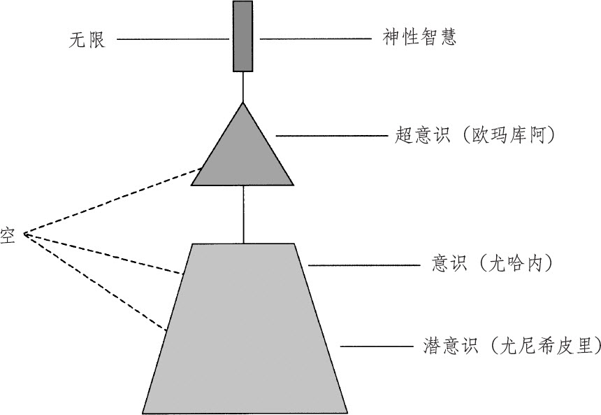

图一　“空”的状态图

所有的科学家都知道，宇宙从空无中来，也将回归到空无中去。这个宇宙开始于零，结束于零。

——查尔斯·塞夫，《零的故事——动摇哲学、科学、数学及宗教的概念》

重播的记忆会取代大我意识的“空”，阻碍神性灵感的彰显。要纠正这样的错位，重新建立大我意识，必须通过神性智慧，将记忆转化成“空”。

清理、清理、清理，找到自己的香格里拉。在哪里？在你心里。

——莫娜·纳拉玛库·西蒙那

岩石造的高楼，铜铸的墙壁，
不透气的地牢，坚固的铁链，
都无法禁锢灵性的力量。

——莎士比亚

2005 年 3 月 22 日

存在是来自神性智慧的礼物，而这个礼物的唯一目的，就是要通过解决问题，重建大我意识。夏威夷有一种通过忏悔、宽恕和转化解决问题的古老疗法，而“荷欧波诺波诺”大我意识疗法就是这个疗法的升级版本。

不要判断别人，否则你们也要受判断；不要定别人的罪，否则你们也要被定罪；宽恕别人，你们也会被宽恕。

——耶稣，《路加福音：第六章》

大我意识由四个部分组成：神性智慧、超意识、意识和潜意识，而实践“荷欧波诺波诺”时，这四个部分都必须完全参与，合而为一地一起工作。问题是来自潜意识里重播的记忆，而在解决问题的过程中，大我意识的每个部分都有自己的独特角色和功能。

超意识里没有记忆，它不受潜意识中重播记忆的影响。超意识总是与神性智慧合一，不管神性智慧如何，超意识都与之相伴。

大我意识通过灵感和记忆运作。或记忆，或灵感，不论何时，潜意识都只能听令于二者中的一个。大我意识一次只能为一个主人服务，而那个主人通常是花刺般的记忆，而不是玫瑰花般的灵感（见图二）。

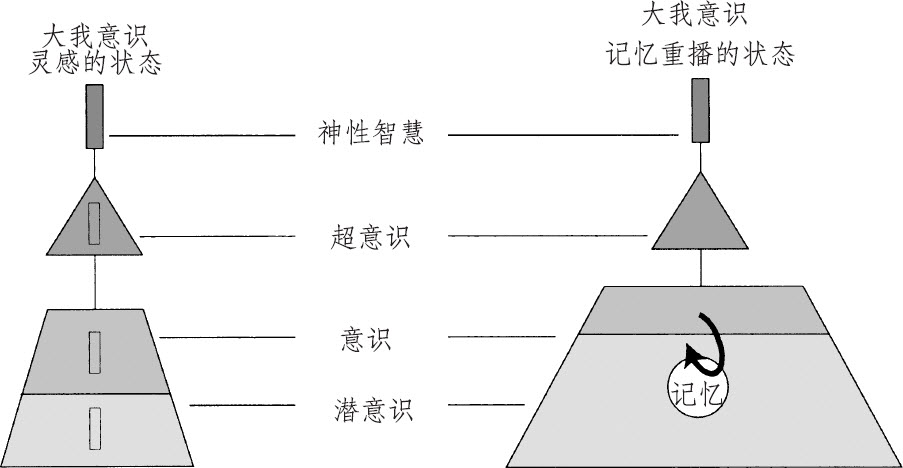

图二　灵感的状态与记忆重播的状态

2005 年 4 月 30 日

我的悲痛只能自己承受。

——约翰·克莱尔

“空”是一切生命和非生命个体意识的共同基底及平衡者，它是可见及不可见的整个宇宙不灭和永恒的基础。

我们相信这些真理是不证自明的，人人（所有生命形式）生而平等……

——托马斯·杰斐逊，《美国独立宣言》

重播的记忆会取代大我意识的共同基础，将心智带离它在“空”与无限中的本来位置。虽然记忆会取代“空”，却无法摧毁“空”。空无怎么可能被摧毁呢？

家有内讧难维系。

——亚伯拉罕·林肯

2005 年 5 月 5 日

要让大我意识时时刻刻保持原样，必须不间断地实践“荷欧波诺波诺”。跟记忆一样，“荷欧波诺波诺”永远不能休假，不能退休，不能睡觉，不能停止，因为……

……在你快乐的日子里不要忘记，

不知名的恶魔（重播的记忆）也正在你背后捣鬼！

——杰弗里·乔叟，《坎特伯雷故事集》

2005 年 5 月 12 日

意识可以启动“荷欧波诺波诺”疗法去释放记忆，或者它也可以让记忆忙于责难或思考（见图三）。

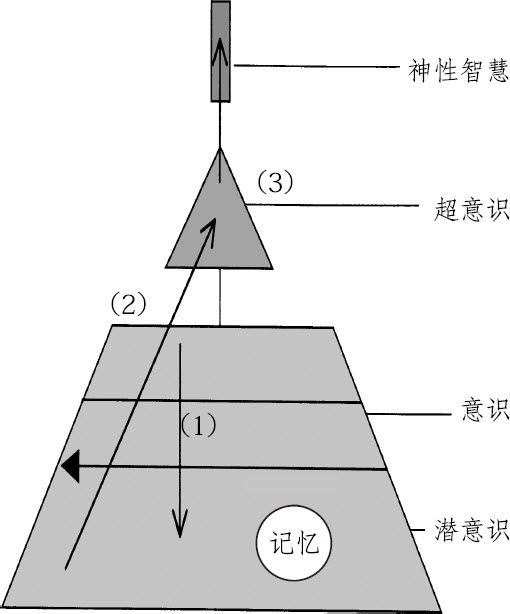

图三　忏悔与原谅

1．意识启动“荷欧波诺波诺”解决问题的流程，祈求神性智慧将记忆转化为“空”。意识承认问题来自潜意识里重播的记忆，而它要为这些记忆负百分之百的责任。这个祈求会从意识下移到潜意识（见图四）。

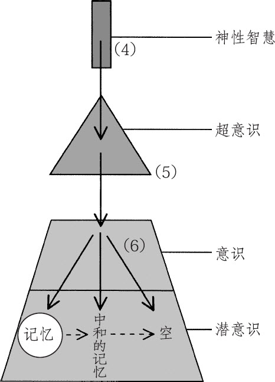

图四　通过神性智慧的转化

2．下移到潜意识的祈求会轻轻搅动记忆，以便转化。然后，祈求会从潜意识上移到超意识。

3．超意识会重新审视这个祈求，并做出适当改变，超意识因为与神性智慧频率一致，所以有能力重新审视，并做出相应改变。之后，祈求会被上传到神性智慧，做最后的审视和考虑。

4．重新审视过从超意识送来的祈求以后，神性智慧会将用来转化的能量传送到超意识。

5．接着，用来转化的能量会从超意识传送到意识。

6．最后，用来转化的能量会从意识传送到潜意识。这个能量会先中和指定的记忆，被中和的记忆就会被释放，仅留下“空”。

2005 年 6 月 12 日

思考和责难是记忆在重播（见图二）。

灵魂在不知道究竟发生了什么的情况下，仍然可以被神性智慧启动。得到灵感与神性创造力的唯一要求，就是大我意识要一直保持原样。而要保持大我意识的原样，就必须持续地清理记忆。

记忆是潜意识的贴身死党，它从来不会离开潜意识去休假或退休，而是不间断地重播且永不止息：

法学家的故事

喔，那突然靠近的忧愁，
向世俗的极乐淋上苦水，
终结了所有现实努力的喜悦！
忧愁替代了我们坚守的目标。
为了你的安全请再三注意，
在你快乐的日子里不要忘记，
不知名的恶魔也正在你背后捣鬼！

——杰弗里·乔叟，《坎特伯雷故事集》

要想与记忆永远绝交，就必须彻底清除记忆。

1971 年在艾奥瓦州，我第二次坠入爱河，接着我的女儿，亲爱的 M，出生了。

看着妻子在照顾 M，我感觉到自己对她们的爱越来越深。现在我有两个最棒的人可以爱呢。

那年夏天我完成了在犹他州研究所的学业，我和妻子必须做出选择：回夏威夷，或是在艾奥瓦州继续读书。

我们在艾奥瓦州的生活才刚刚开始，立刻就又面临了两个困难。第一个困难是，自从我们把 M 从医院带回家后，她就一直哭个不停。

第二个困难是，艾奥瓦州正经历 20 世纪最糟糕的冬天。连续几个星期，我每天早上都要在屋里用力地踹开公寓大门，然后再用手去捶打门的边缘，把埋在门外另外一边的冰块弄掉。

大概在 M1 岁的时候，她的毯子上总是出现血渍。现在我才明白，那时她哭个不停正是因为她的皮肤出现了严重的问题，那个问题直到很久以后才被诊断出来。

许多个夜里，当我看到 M 在断断续续的睡眠中不停地挠痒时，我常常无助地哭泣。类固醇对她一点用也没有。

M 到了 3 岁，血常常不停地从她的手肘和膝盖弯曲处的裂缝中、手指和脚趾关节周围的裂缝中流出，她手臂内侧和脖子周围都被粗糙的硬皮覆盖着。

9 年后的一天（那时我们已经回到夏威夷了），我和 M 以及她妹妹正在开车回家的路上。突然间，在没有事先计划的情况下，我发现自己居然把车调了头，往我位于威基基的办公室开去。

“喔，你们来看我了。”莫娜在我们仨踏进她办公室时轻轻地说。她一边把桌上的文件移开，一边抬起头看着 M。“你想问我什么问题吗？”她温柔地问。

M 伸出双臂，露出蚀刻在她手臂上多年的痛苦与悲伤，那些像写满文字的腓尼基卷轴一样的疤痕。“好。”莫娜回应了一声，然后闭上眼。

莫娜当时在做什么？这个“荷欧波诺波诺”大我意识疗法的创始人正在实践“荷欧波诺波诺”大我意识疗法。1 年后，M 长达 13 年的流血、结疤、痛苦、悲伤和用药都结束了。

“荷欧波诺波诺”大我意识疗法学生

2005 年 6 月 30 日

生命的目的就是要活出大我意识，因为神性完全依照自己的样貌——空和无限——创造了大我意识。

生命所有的体验都是在表达重播的记忆和灵感。沮丧、思考、责难、贫穷、憎恶、怨恨和悲伤就像莎士比亚在他的一首十四行诗里写下的，是“过往遗憾的悲歌”。

意识有个选择：要么不间断地清理，要让记忆不间断地重播问题。

2005 年 12 月 12 日

意识若单独行事，是对神性智慧最珍贵的礼物，大我意识的无知，也是对问题真实面貌的无知，这样的无知对问题的解决不起作用。可怜的灵魂就一直被留在持续又不必要的悲伤之中，多让人难过啊！

意识必须认识到大我意识的礼物——“不可思议的富足”。

大我意识和它的创造者神性智慧一样，都是永生的、不灭的。无知的后果就是世世代代都耗费在毫无意义且永不间断的贫穷、疾病、战争和死亡所形成的错误实相里。

2005 年 12 月 24 日

物质世界是大我意识中记忆和灵感的展现结果。改变大我意识的状态，便会改变物质世界的状态。

究竟是谁在做主？是灵感，还是重播的记忆？选择在于意识。

2006 年 2 月 7 日（跳到 2006 年）

以下是“荷欧波诺波诺”大我意识疗法解决问题的四个步骤，可以通过清空在潜意识里重播的问题记忆，来重建大我意识。

1．“我爱你”： 当灵魂体验到重播问题的记忆时，轻轻地，或是在脑海里对这些记忆说：“我爱你，亲爱的记忆。我很感激有这次机会把我和你们全部释放。”你可以一次次地、安静地重复说“我爱你”。记忆永远不会休假或退休，除非你辞退它。“我爱你”甚至可以在你没有意识到问题的时候使用，例如在你要从事任何活动之前，像是打电话或接电话，抑或是你要上车去某处之前。

要爱你们的仇敌，好好对待仇视你的人。

——耶稣，《路加福音：第六章》

2．“谢谢你”： 这个步骤可以和“我爱你”一起使用，或代替“我爱你”。跟“我爱你”一样，“谢谢你”可以一遍遍地在脑海里重复。

3．蓝色太阳水： 喝大量的水是一个很棒的解决问题的方式，尤其是喝蓝色太阳水。找一个非金属盖子的蓝色玻璃容器，把自来水注入这个容器里，然后把蓝色玻璃容器放在太阳光或白炽灯（不要用荧光灯）底下照射一个小时以上。当水接受过太阳光或灯光的作用以后，你就可以用在很多地方，可以拿来喝、烹调，或者在洗澡的最后用来冲洗身体。蔬菜和水果就非常喜欢被蓝色太阳水洗涤！与“我爱你”和“谢谢你”这两个步骤一样，蓝色太阳水会清空在你潜意识里重播的问题记忆。所以，把记忆喝没了！

4．草莓和蓝莓： 这两种水果可以清空记忆。新鲜或干燥的都可以，也可以是果酱、果冻，甚至是冰淇淋上面的糖浆哦！

2005 年 12 月 27 日（跳回 2005 年）

几个月前，我有了一个主意，想要制作一张让“荷欧波诺波诺”大我意识疗法里面的必要角色“自我介绍”的词汇表。你有空的时候可以多跟它们认识认识！

大我意识： 我是大我意识。我是由四个元素组成的：神性智慧、超意识、意识和潜意识。我是由神性智慧完全依照它自身的样貌——空和无限——创造的。

神性智慧：我是神性智慧。我就是无限。我创造了大我意识和灵感，我将记忆转化为“空”。

超意识： 我是超意识。我负责监督意识和潜意识。意识会启动“荷欧波诺波诺”，向神性智慧祈祷，而我就要审视那个祈祷，并做出适当的改变。我不受潜意识里重播的记忆影响，我和神圣的创造者总是合一的。

意识： 我是意识。我拥有的礼物是选择。我可以让持续不断的记忆支配我和我潜意识的体验，或者我可以通过不间断地实践“荷欧波诺波诺”来释放记忆，或者向神性智慧祈求指引。

潜意识： 我是潜意识。我是创世以来所有记忆累积的储藏室。我是体验以重播的记忆或灵感的形式出现的地方，我是肉体和世界以重播的记忆或灵感的形式存在的地方，我是问题的居所，是重播记忆的住处。

空： 我是空。我是大我意识和宇宙的基础。我是来自神性智慧（也就是无限）的灵感所在的地方。潜意识里重播的记忆可以取代我并阻碍来自神性智慧的灵感流入，但它无法摧毁我。

无限： 我是无限，是神性智慧。娇嫩的玫瑰花般的灵感从我流入大我意识的“空”，却轻易地被花刺般的记忆所取代。

灵感： 我是灵感，我是无限，是神性智慧的创造物。我从“空”彰显到潜意识里，以全新事件的形式被体验。

记忆： 我是记忆。我是潜意识里过往体验的记录。我一旦被触动，就会重播过去的经验。

问题： 我是问题。我是潜意识里再次重播过去经验的记忆。

经验： 我是经验（体验）。我是潜意识里记忆重播或灵感的结果。

运作系统： 我是运作系统。我以“空”、灵感和记忆来运作大我意识。

“荷欧波诺波诺”： 我是一种古老的夏威夷问题解决法，1983 年被授予夏威夷州州宝称号的莫娜·纳拉玛库·西蒙那，为适用于当今社会，而将我更新。我由三个元素组成：忏悔、宽恕和转化。我是由意识启动的祈求，祈求神性智慧清空记忆，重新建立大我意识。我起始于意识。

忏悔： 我是忏悔。我是启动“荷欧波诺波诺”的开端，是意识的祈求，让神性智慧将记忆转化为“空”。通过我，意识承认它对于创造、接受及累积在潜意识里重播的问题记忆负有责任。

宽恕： 我是宽恕。我和忏悔都是意识发出的祈求，祈求神圣创造者转化潜意识里的记忆至“空”。意识不只是感到懊悔，它也祈求神性智慧的宽恕。

转化： 我是转化。神性智慧使用我去中和、释放潜意识里的记忆至“空”。只有神性智慧可以使用我。

富足： 我是富足。我是大我意识。

贫乏： 我是贫乏。我是应该被取消的记忆。我替换了大我意识，阻碍来自神性智慧的灵感注入潜意识中！

# 译后语：人生的〇

胡尧

所有的心灵书籍都在说一个东西，却有两个面向。

这一个东西就是荣格所谓的“完整的心灵状态”；是六祖慧能说的“自性”（“何期自性本自清静；何期自性本不生灭；何期自性本自具足；何期自性本无动摇；何期自性能生万法”）；是催眠大师米尔顿·埃里克森说的“每个人都是 OK 的”；是佛陀开悟后说的第一句话“众生皆有如来智慧德相”；是孟子的“人人皆可为尧舜”；是王阳明的“个个人心有仲尼”；是耶稣说的“天堂就在你心里”；是隆波田说的“不成为什么”；是伊贺列卡拉说的“零极限”……

两个面向，一种是把你当“还不是那个”来看待，另一种是把你当“已经是那个”来看待。

第一种面向，有一个从“不是”到“是”的过程，有过程就有时间的加入，就有思考、努力、艰辛、付出、牺牲、疗愈、释放、宽恕等的介入。这带来了各种人际冲突和问题。以这个面向为基础的解决方法，只会“剪不断，理还乱”。

第二种面向，你已经“是”了，无法再“是”。你如何打开一扇已经开启的门？除非你想玩这个游戏，你会先把门关上，再打开。

同样，你如何才能“是”呢？你得先玩个“你不是”的游戏。于是，就有了各种让自己“不是”的游戏。上演各种问题、困扰、纠结、痛苦，让自己处于“不是”。然后再去找大师、经典、法门……通过不懈的努力，一点点向“是”的方向上挪进。

但是，为了让游戏更好玩，一开始时，你会极力逃避“是”的道路，而去找那些听起来不错，看起来更好玩的道路，让自己觉得可以“掌控”的道路，至少是让自我可以得意一段时间的道路或玩具……

套用一句名言来说就是：“是”的活法是相似的，“不是”的活法各有各的“不是”。要么原地转身 360º，要么经过千辛万苦，绕一个巨大的圆圈，再次回到起点。也就是回到此时此地此我此世界，但你已经不是原来的你了……

以此观之，你所接触的各种大师、经典、法门是哪种？“荷欧波诺波诺”又是哪种？

想更深入理解“这个世界发生的一切都与你有关”，可参看我翻译的另两本书《无量之网》和《你值得过更好的生活》。

如果有缘，将来我们会在最恰当的时空相遇，一起探讨再次更新的“荷欧波诺波诺”（如果它可以被更新一次，就可以永远被更新）。

愿你拥有超越一切理解的平静。

——伊贺列卡拉·修·蓝博士

# 新·零极限

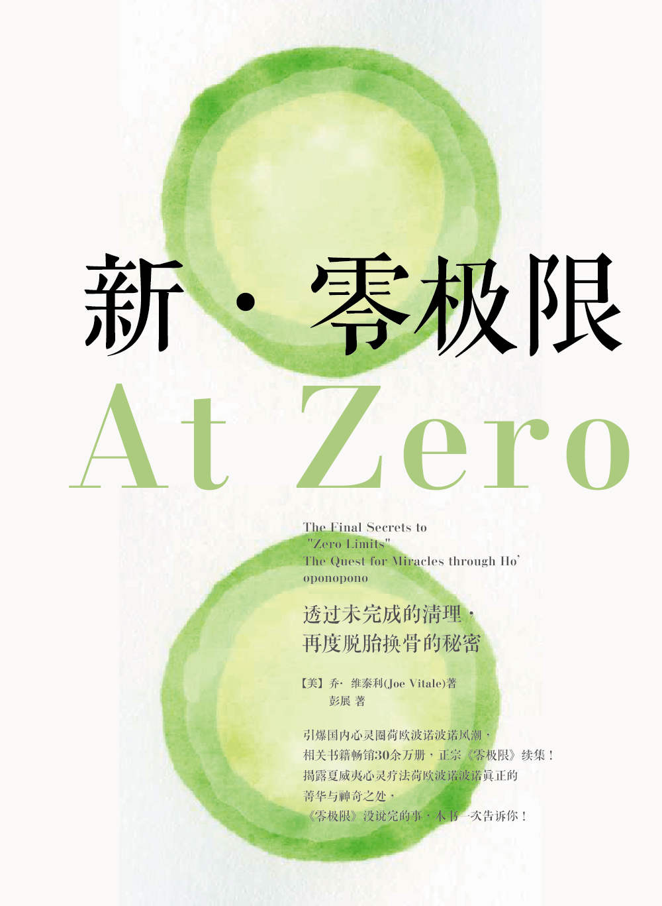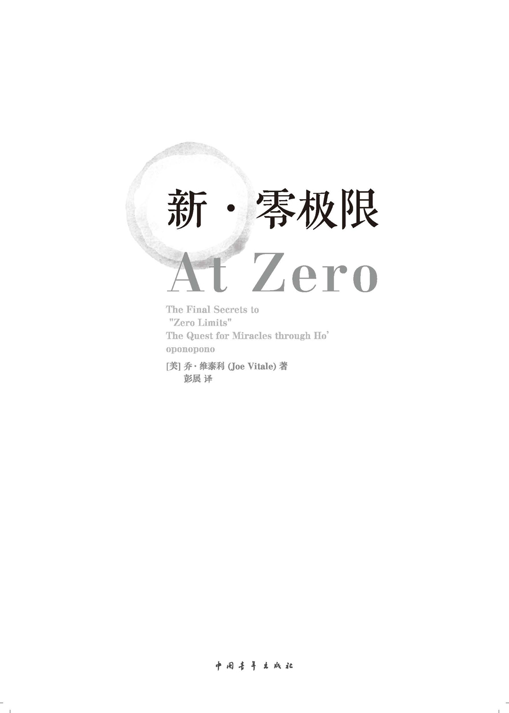

平静从我开始……

在阅读中疗愈，在疗愈中成长

READING & HEALING & GROWING

作者的祈祷

噢，无限的神圣心灵，

通过我挚爱的较高自我，

清理我身心内外所有的负面能量，

让我成为天心临于人世的完美器具。

# 前言：我与莫娜·西蒙那相处的日子

美国 DSF 企业家商学院执行长　戴姆·D．C．科多瓦女爵

当乔·维泰利邀请我分享一下与莫娜·西蒙那——那位了不起的卡胡那·拉帕欧（“以言行做疗愈的牧师”，以及夏威夷民间传奇中的“秘密之传承者”）——的甜蜜往事时，我立刻就感受到那种深沉的平静以及轻盈、明亮之感，那是我在她身边经常感受到的。她真是一个伟大的人，让我联想起自己的外婆阿马利娅。外婆在智利将我养大，对我有着无条件的爱。

当然，你只要待在莫娜身边，无须多时，你就能够感受到她的非同寻常——极为罕见！她仿佛是在流动——她身边的一切都会为她而变。无论有人需要什么，她总是提供支持。在她的眼中，你不仅仅是一具肉身。她是真正的疗愈大师。

1984 年，她搬到了我们位于拉·乔拉农场路的大庄园里，那是加州圣地亚哥县拉·乔拉镇上的一片专属区。在那片产业上有四间独立大屋，她就住在其中一幢最可爱的农家小别墅里，一住就是三个月。

就在她搬到那儿数周之后。每一位来到庄园的访客都会问，我们是不是请了一位新园丁，或者是重新打理了园林绿化——因为每样植物看上去都如此鲜活，如此生动美丽，都散发着高振频。在她身边的大自然都会发生转变——这对于三十岁出头的我来说是一种非常神秘的体验，因为那个时候我才刚开始学习一些普通的灵性法则，管这些法则已经掌控了地球无数年。

有时等我从“你与金钱”的巡回之旅中回来时，她会给我做一些特殊的、高阶的“荷欧波诺波诺”疗愈，以便清理我的能量体。之后，我就会感觉自己像是洗了一个能量澡，那感觉真是非常神圣。她总是鼓励我做这样的清理疗愈，重复说“荷欧波诺波诺”这个神性的咒语，以便将自己的能量维持清澈明晰。

莫娜无疑是特别的。

她的传承源于卡胡那一派，然而她选择将此古老的传承现代化，将古老的“荷欧波诺波诺”疗法（那是夏威夷胡那族的古老教诲）改编成现代版，以便让全人类都能够从伤痛与往事中解脱出来，这些伤痛与往事滞留或潜伏于我们的潜意识层面，却一直影响着我们生命中的每一刻——所以她的方法真的是非常强大。

莫娜的这个要公开夏威夷人世代传承的秘密疗法的决定，并没有让她在某些圈子里面变得有名，相反她还在某些地方遭到了排斥。莫娜是一名爱人类主义者，她支持一切人类，不分种族，皆能获得从无意识行为中解放出来的自由，支持他们清理自己的潜意识。她非常勇敢，目标明确，她一心一意地教导人们如何从自设的局限中挣脱出来，斩断无量劫来累积形成的阿卡索（业力之索），让自己的内在家庭重归和谐：

欧玛库阿：欧（意为浸润或游泳）

玛库阿：父亲（连在一起意为浸润于圣灵的光辉之中）

尤哈内：母亲（意识心）

尤尼希皮里：小孩（无意识心）

我从她那儿学到了仅仅是重复说“荷欧波诺波诺”这个词都能够清理空间。这个方法总是立刻就能将我清理。

但在这儿我要告诉你的是我与莫娜的第一次相遇。

我亲爱的朋友埃里克·史密斯，是夏威夷大岛上的土著，他向我介绍了莫娜以及她所举办的“荷欧波诺波诺”课程，与她同台的还有斯坦·哈里阿卡拉博士（著名的修·蓝博士），他们的这个课程的举办地点是在洛杉矶，大约是在 1983 年的某时。我记得应该是 9 月吧——不仅仅是因为 9 月是我的出生月，而且还因为 9 月太美，全球的 9 月都太美：北半球正是秋季，南半球正是春天。

那是一段非常特别的时光——一个永生难忘的周末。

那课堂里坐满了各种各样的有趣人物，还包括好莱坞型的，比如说演员莱斯莉·安·沃伦（曾经在《威尔与格蓄丝》电视秀中扮演威尔老爸的情人），她非常可爱。

这是一个很好玩的组群，我们紧密地团结在了一起，共享那三天的清理，剪断阿卡索之旅，这些阿卡索都是过去我们执着于某人、某处、某事、某物时被创造出来的。这个清理过程要求我们写下长长的清单：人名，包括我们记得的每个与我们打过交道并且对我们产生过影响的人；我们曾经住过的地方；曾经使用过的交通工具；曾经受伤害的场景以及伤害过别人的场景——包括每一个我们想得起来的丢脸体验、屈辱经历。导师鼓励我们写下所有这些羞辱、指责、内疚等那些埋藏在我们的潜意识中的负面记忆。

所以呢，课程间或有些让人不爽，自然是在情理之中。

特别有趣的是，还要我们写下与之有过性接触的人物名单，正是从这一点上我懂得了保护一个人能量的巨大重要性。与某人发生性行为，让你不仅黏附上了你的性伴侣的能量，而且还黏附上了每一个曾经与他或她有过性接触的人的能量——所以当你跟某个人发生性关系时，你有可能一下子就黏上了数百人的能量！

她跟修·蓝博士真的是非常杰出的导师。他们通过讲述美妙的传奇故事的方式来教学，而这些故事都是发生在他们经年累月以来所帮助过的人们身上。此处可分享的实在太多，但我发现有一个故事极为有趣，就是莫娜非常喜爱的演员汤姆·塞莱克，他在夏威夷岛拍摄的电视剧《私家侦探玛格依》中的明星。

莫娜总是给汤姆·塞莱克做清理。一年前，当我在夏威夷碰到他时，我忍不住想：“这家伙简直太幸福了，能有一个像莫娜这样的大师天天给他做清理！”当他离开影坛数年之后，看到他跟他的新任太太和小孩安享远比影视圈清静得多的安逸时光时，我又忍不住会想：“嗯，是不是‘荷欧波诺波诺’的祈祷没有在他身上发生效用？”所以后来看见他借着电视剧《警察世家》重返影坛时，我感觉非常开心。

莫娜跟我们分享说，演员、名人、体育明星、政客，皆是众人关注的焦点，因此也特别容易受到能量层面的危害，因为所有的投射都指向了他们。这些人有可能会积累下数以百万计的阿卡索，因为无数的关注、性投射、正面与负面投射成天都在蜂拥而至——他们的粉丝用思想将这些东西发射过来，影响到了他们的生命力、个人能力，以及保持能量清澈的能力。

哇，这听上去太震撼了！我开始怀疑这是不是为何美丽的性符号，比如说玛丽莲·梦露，她的人生会如此坎坷的原因！

我开始以非常不同的眼光来看待事物了。

自那个周末以后，我的人生彻底改变了。我感觉自己好像是洗了一生的能量浴，自身的能量从此焕然一新，而我的责任就是要让自己的能量保持纯净，不断地使之纯净。我总是随身带着自己的简化版“荷欧波诺波诺”流程。它就在我的纸质备忘年历背后待着，自从上个世纪 80 年代起就一直在那儿了。我还将它扫描备份，放在我的电脑里、iPad 里、iPhone 里。我们还学会在自己的车里打开“荷欧波诺波诺”教程，以便教导自己车子的潜意识学会自行清理。我忍不住会认为这一招确实管用，因为自从 1976 年（那年我还没学“荷欧波诺波诺”，我的车发生了一个小事故）以后，我就再也没有发生过任何交通意外了！

从此以后，无论我去哪里。都会一路练习“荷欧波诺波诺”，唯一的一次例外是在印度尼西亚的巴厘岛。我在那儿本来也已经开始了练习，但很快就有很强的直觉告诉我说：“不要。”我后来发现自己的这番直觉指引真是不赖。因为巴厘岛有它自己的传统习俗和传统仪式，有着它自己的能量特性。听从我们内在的向导指引总是不会错的。

我最后一次跟莫娜说话是在 1989 年年中。我那个时候的搭档，罗伯特·T．清崎（《穷爸爸，富爸爸》系列丛书的作者）正跟我一块儿返回夏威夷大岛，准备举办我们的企业家超级经典商业学堂培训课程，培训地选在当时的科纳海岸度假村（现在它几经易手，已经换了好几届主人了），那是一块毗邻凯奥霍海湾的美丽物业。

于是我给莫娜打电话，告诉她可以飞到大岛上来（我知道她会喜欢的），帮助我们带领全班进行“荷欧波诺波诺”祈祷。她说：“亲爱的，我太累了……状态不如从前了……还是你自己带吧。”

我有点目瞪口呆。因为这位伟大的卡胡那对我说，让我亲自带领一个公众的“荷欧波诺波诺”清理流程，而且面对的是一群成功的企业家。我感觉有点不太确定，感觉“压力山大”。但她再一次向我保证，让我安心，说那一带的海湾、度假村、整个大岛——都已经被植入了“荷欧波诺波诺”的祈祷程序，所以完全不必担心，我完全能够胜任且能成功。于是我重回平静，感觉自己准备好了，而事实证明，我带领的效果非常棒。这是理所当然啦！当你用“荷欧波诺波诺”在前开道之时，效果怎能不棒！

从那以后，我在我们的课堂上，包括以后的课堂上，都会带领学员进行“荷欧波诺波诺”练习。结果是相当的成功，引发了大批的后续课程，把我们的行程排得满满的。但自那以后，我再也没有跟莫娜通过电话了。

几年之后，我得知她已于 1992 年年初过世了。尽管我有点伤感，因为自己再也无法拿起电话跟她聊天了，也无法再享受她那伟大的疗愈了，无法再就教于她的脚下了，但我却总是能够感受到她的临在——一直如此。

她是，且永远是我生命的强大动力。我发自内心地认为／感觉她的教诲、修·蓝博士的教诲，以及“荷欧波诺波诺”祈祷拥有强大的正能量，将我的生命和事业推向一个又一个的高潮。

下面附上大我的平静之部分祈祷文：

平静与你同在，我所有的平静。

我就是平静，平静即是我存有的状态，

永恒的平静，从当下至永远，绵绵不绝。

我将自己的平静赐予你，我将自己的平静放在你的身边，

不是这个世界的平静，仅只是我的平静，

大我的平静。

她教导我们，每当进入汽车、飞机、火车，或者其他交通工具时，就用三个亿的大我的平静将它包裹起来。对这一招，我坐飞机时记得最牢——所以我睡得很香甜，因为我知道自己是被保护好了的。

我有许多的“荷欧波诺波诺”故事可以聊——多到这本书都装不下了——但请勿担心，因为最近三十年来，我们以诚恳地说，“荷欧波诺波”祈铸成了我最为杰出、最为强大的指导（以及保护）的力量。

“荷欧波诺波诺”这个词我总是挂在嘴边。无论是开心还是伤感，我都一如既往地念诵“荷欧波诺波诺”。我知道，保持自己的内在家庭和谐，对于心灵的平静极为重要，因为心灵层面的清澈明晰是我成功管理全球化的组织所必不可少的，它还帮助我吸引来优秀的生意伙伴（我已经跟他们共事几十年了），吸引来优秀的带课老师，吸引来无数的优秀学员，组建起如今规模不可思议的全球化网络，并让我得到浓浓的爱意，与我深爱的人们建立起来深切的连结。

我的成功与丰盛确实是源于勤奋的工作，以及合理运用商业与意识良策，这些良策也是我所教导给学生的——但毋庸置疑的是，我双翼之下的清风，正是“荷欧波诺波诺”的清理和疗愈。

祝愿你也和我一样。

下面再引用祈祷文的结尾部分：

愿大我不断地祝福“荷欧波诺波诺”清理疗愈中的一切相关众生。

我们都被释放了，自由已经来临了！

我们现在安详地躺在神圣造物主的怀抱中了。

阿啰哈！

# 序言：这一切是如何开始的？

乔·维泰利博士（阿欧·库）

我们以向神性祈祷，因为他知道我们的个人人生蓝图的全貌，向他祈求疗愈我们所有的思想和记忆，正是这些东西此刻将我们限制住了。

——莫娜·西蒙那

我错了，错得离谱。当我写完《零极限》时，我还信心满满地期待全世界向我投来感激的微笑呢，因为我知道书中的故事太振奋人心了。我知道它简直太神奇了，我知道这个故事必须有人将它说出来。

但是我绝对没有想到，人们会恨这本书——甚至会因此而恨我。

修·蓝博士倒是早预料到了。当我告诉他我们的书已完工时，他说：“当它面世时，麻烦就来了。”我不知他这话是啥意思，但他显然比我清理得更多，比我更纯净。他总是处于当下，所以他能够看见未来。后面的故事他已经先知道了。但对我而言，未来的事情尚不可知，眼前一片黑，所以当太阳升起时，阳光太刺眼，照得人生疼。

我是出于两个原因来写这本续集的：一是想要进一步解释《零极限》所传递的信息（也包括自从它出版以后所发生的故事）；二则是想要为大家揭秘更加高阶的正宗的、权威的“荷欧波诺波诺”法门。

我问了一下修·蓝博士关于我的这个想法，请他评论一下。他有点不太愿意开口，因为他已经被“荷欧波诺波诺”界的长辈们“修理”过了，因为这小子居然把他们保守多年的秘密给公开了，所以他是不想再来经历一次那被“修理”之苦了。对他而言，只需要默默地清理就足以拯救世界了。但对我而言，我倒是想玩大点，把“荷欧波诺波诺”的事业做大做强，勇冠所有的“荷欧波诺波诺”教师。我仍然想让全世界都知道这个不可思议的清理疗愈工具。所以我决定独自来写这本续集，这次就不折腾修·蓝博士来合著了。

但在我们深入本书之前，还是让我先来给你大致回顾一下曾经的过往云烟吧，探一探《零极限》之源起。

《零极限》在上市之前就已经火爆了。在我将手稿交到出版社之前，这本书就已经是亚马逊上的畅销书了。这是咋回事呢？著名的网上书店将它列入了预售书目，但在此之前，书中的一段精华摘录已然在网上疯传了至少一年的时间。好几百万人都读过它——于是读者们提前就下了订单，结果《零极限》在出版商接到书稿之前就已然大红大紫了。

下面就是那篇 2005 年在网上疯传的文章，直接导致数百万人都想要订购此书：

## 世界上最奇特的治疗师

三年前，我听说有一位来自于夏威夷的治疗师在没有面对面为任何病人进行正式咨询或诊疗的情况下，就治愈了整个院区患有精神疾病的罪犯。这位心理学家只是查看这些罪犯的档案，然后向内看，看自己是怎样造成了那个人的疾病的，然后他就清理并疗愈自己，而当他在清理和疗愈自己时，病人也就开始康复了。

当我第一次读到这个故事时，我觉得它肯定是个都市传奇。怎么可能有人通过疗愈自己而疗愈别人呢？哪怕是最好的自我成长大师也没法治愈患上了精神疾病的罪犯呀？

这东西于情于理都说不通。简直是不合逻辑，所以我把它放在了一边。

然而，一年之后，我又听到了这个故事。我听说这位治疗师是运用了一种名为“荷欧波诺波诺”的夏威夷疗法。我从未听说过这种疗法，但它的名字却总是在我脑海中盘旋。所以万一那个故事是真的呢？我决定一探究竟了。

我一直以来都知道所谓的“完全负责”，也就是说我应该对我的思想与行为负百分之百的责任。但超越那两者的，则非我能力所及了。我想可能绝大部分人们都会以如此方式来理解完全负责吧。我们对于自己的行为负责，但至于别人的行为，我们负不了责。而这位治愈了那些精神病罪犯的夏威夷治疗师，却要教给我一种全新的、高阶的对于完全负责的做法了。

他的全名叫伊贺列卡拉·修·蓝博士。他和我第一次通电话，大约讲了一个小时，我请他告诉我他进行治疗工作的完整故事。他解释说他在夏威夷州立医院工作了四年，那个收容患有精神病罪犯的病房区是个危险区域，每个月都有心理治疗师辞职，员工也常请病假，或者干脆就不来了。大家经过那个病房区的时候，为了防止被那些疯狂的病人攻击，都会背靠着墙走路。说实话，那里实在不算是一个可以愉快居住、工作或探访的地方。

修·蓝博士说他从未正式看过病人，也不会与他们进行面对面的治疗。他只是同意在那儿有一间办公室，然后他就在里头查看他们的档案。他在看档案的时候会在自己身上下功夫，而当他对自己下功夫时，病人也就开始康复了。

“几个月后，那些戴着手铐脚镣的病人被允许自由走动，”他告诉我说，“而其他本来必须服用高剂量药物的病人，则开始减少药量。然后，那些被认为永远不会有机会获释的人，也被释放了。”

我敬畏地望着他。

“还不只这样，”他继续说道，“医院的员工开始喜欢来上班，翘班或者人员流动率过高的情形也一并消失了。后来，我们的工作人员甚至出现了供过于求的情况，因为一方面病人逐渐被释放，一方面所有员工都愿意来上班了。现如今，那个病房区都被关闭了。”

这时我问出了一个价值百万美元的问题：“你在自己内在做了什么，可以让其他人也发生改变？”

“我只是在不断地清理我自己内在将他们创造出来的部分，”他说。

他的话我听不懂啊。

修·蓝博士解释道：“对自己的人生负百分之百责任的意思是，你生命中的每一件事物，只因为它们出现在了你的生命中，所以就都是你的责任。从字面上来说，整个世界都是你的创造。”

哇，这样的说法真的很难让人接受。为我自己的言行负责是一回事，为我生命中每一个人的言行负责，又是另外的一回事了。然而，事实是：当你对自己的生命完全负责时，那么所有你看到的、听到的、品尝到的、接触到的，或者以任何方式体验到的就都是你的责任，因为它们出现在了你的生命里。

这个意思是说：恐怖分子、总统、经济——任何你体验到的却不喜欢的人、事、物——都要由你来治疗。或者，不妨这么说：要不是从你的内在投射出来，他们原本是不存在的。因此，问题不在于他们，而在于你。要改变他们。就必须先改变你自己。

我知道这很难理解，更不用说接受或实践它，因为责怪远比负百分之百的责任简单。但在我和修·蓝博士的对话中，我开始了解到，对他以及“荷欧波诺波诺”这个疗法来说，疗愈的良方就是要爱自己。如果你想改善你的人生，就必须疗愈你的生命。如果你想疗愈任何人，即使是对那些患有精神疾病的罪犯，也要由疗愈自己做起。

我问修·蓝博士他是如何疗愈自己的。他在查看那些病历时，究竟做了些什么？

“我就是一直说对不起、我爱你，一次又一次。”他解释着。

“就这样？”

“就这样。”

原来，爱自己就是提升自己最好的方法。当你提升了自己，也就同时改善了你的世界。让我给你举个小例子来解释一下那是如何奏效的：有一天，某人发给我一封让我非常不爽的邮件。要是过去，我就会去处理让自己上火的情绪按钮，或是试图找那人评理，为何给我发这么一封恶心的邮件。这一次我决定用用修·蓝博士教的法门。我安静地重复说“对不起”和“我爱你”。我并没有针对某个人说，我只是唤起爱的灵性来清理我的内在，是我这部分需要清理的内在创造出了这个令人不快的外在情境。

一小时内，我收到了同一个人的另外一封邮件。他为他发的前一封邮件而道歉。记住，我并没有采取任何外在的行动来获得这个道歉，我甚至也没给他回邮件。然而，通过重复说“我爱你”，莫名其妙地，我清理了我自己内在那投射（创造）出他来的那一部分。

我后来参加了修·蓝博士主持的工作坊。他现在已经 70 岁了，看上去就像个祖父级的萨满祭师，而且有一种隐士风范。他称赞我的书《相信就可以做到》写得好。他告诉我说，当我清理、提升我自己时，我的书的振频也会提升，每一个读到那本书的人都会感应到的。简单地说，当我提升了。我的读者们也就跟着提升了。

“那些已经被卖出去了的书呢？”

“那些卖出去的书并不在外面，”他解释说，他的睿智再一次地令我折服，“他们仍然在你里面。”

简言之，没有什么所谓的“外在”。

以这种疗法当前的深度，这个超前的高阶技巧值得用一本书来详述。毫不夸张地说，不论你想改善你生命中的什么事情，从财务到人际，只有一个地方需要照料：你的内在。

而当你向内看时，请带着爱意去看。

这篇发表于 2005 年的文章，让全世界都为《零极限》做好了准备，将它推到了最畅销书的行列——甚至在它出版之前。当然，当这本书于 2007 年正式面市时，事情就开始搅七搅八了，可谓是麻烦不断。

有些人仅仅只是读了摘要，就开始发表书评了，而全书显然他们还得等两年才能看见。我的老朋友们，都是我几十年前在休斯敦打拼时的老友了，还有我帮助过的人们，包括那些我曾在工作上或者以建议的形式帮助过的人们，居然齐刷刷地掉过头来开始反对我了。他们指责我瞎编乱造，为了赚钱不惜撒谎。他们说修·蓝博士根本就不存在，是我编造出来的，说他那个疗愈了整个精神病院病人的故事只是一个都市谣传。他们指责我为了赚钱出卖了夏威夷的传统疗愈秘技。还有人指责我为了赚钱而卖书，书中毫无疗愈秘密可言。

跟他们吵起来我们真是赢不了。我感觉受伤了。我非常震惊，并且疑惑。我感觉自己像个受害者。我原本还以为“荷欧波诺波诺”能够赐予我力量呢。

是什么原因让这些人得出了这样的结论？毕竟，修·蓝博士跟我可是一块儿待过很长时间的：我们一起开工作坊，一起合影，一起参加广播秀，一起合录音频版的《零极限》。我们在优酷上还有视频录像。我们的这些事都是在一块儿做的。显然他是真的，过去是真的，现在也还是真的。

还有人甚至连书都没读过，他们不可能读到本书，因为它尚未出版呢，但他们就已经开始评论了，说他们恨我，恨这本书。他们冲我破口大骂，并且试图在我发给客户的订阅邮件中将我拉黑。他们设计出一个电脑病毒，并用我的名字为它命名。还有更多……

是的，我和这本书还是有大量的粉丝的。《零极限》刚出版，就高居畅销书榜首，成千上万，甚至上百万人学到了书中描述的简易疗法，并且改变了他们的人生。人们不光把这个方法用于自身，还在学校里教授它，以及在监狱和医院里教授它，取得了奇迹般的成效。本书被译成了多国文字，我应邀到多国去发表演讲。修·蓝博士的工作坊从最初的每次 30 人，涨到了每次 800 人。他成了一名上师，“荷欧波诺波诺”也成了主流。

但一路走来，也不光只是桃子跟奶油，坏事也有一大箩筐呢。我最好的朋友跟我翻脸，他的太太发送了一封非常没有爱的电邮到我协助创建的一个组群里，猛烈抨击我，大肆诽谤我。字字句句令人生疼，而且这些言辞显然并非出自于真心，显然他们并没有操练任何形式的爱与宽恕——“荷欧波诺波诺”或者其他法门。

这一切是如何发生的？

我的一位朋友说成功会带来污蔑／蔑视。我称之为一种信念，修·蓝博士称之为一个程序。然而我不得不承认，当我人生中最重要的一本书写成出版之后，有些事情确实发生了。我可以称之为清理或清净自己的好机会，但事实上故事远非止于此。现在回首看前尘，我相信这些事情其实都是我觉醒道路上的催化剂。

当我在创作《零极限》时，我说过觉醒路上有三个阶段。但事实证明我的这种说法是不完全的——因为觉醒路上其实有四个阶段。第四阶段是超越零极限的，你会进入神性之所在，你会感受到神性经由你而行于此世。我会在这本新书里详尽解释这四步曲。

在我写完《零极限》之后，我自认为对于人生的掌控能力大幅提升了。结果，我接连遭遇不悦／不顺心的事件，让我感觉自己像个受害者。所有这一切都引领我走向臣服之境，我开始理解何为臣服，我开始理解不断地运用“荷欧波诺波诺”进行清理的重要性了。今天，我已领略开悟（启示）的奇迹。

如果你想要知道更多的关于正宗的、权威的“荷欧波诺波诺”，并渴望从《零极限》终结之处重拾征程，那么你现在阅读本书，可谓恰如其分，算是来对了地方。

如果你对于现代版“荷欧波诺波诺”的源起有点好奇，并且疑惑所谓的修·蓝博士这个疯老头，这个怪老师究竟是何方神圣，那么于本书中你将会找到答案。

但是还请系好安全带哦。如果你觉得《零极限》已然是一趟狂野之旅，那么还请你稍等一等，等读完《新·零极限》之后再做结论。这本书会烧着一些毛发的。它会震动，摇晃并且颠覆你的世界。

如果你感觉准备好了，就请翻页吧。

准备迎接奇迹。

# 第一章　大祸临头

其实并没有所谓的小我。那不过是数据，教据，数据而已。

——修·蓝博士

我把《零极限》的手稿交给了出版商，那是在第二届零极限研讨会上，地点是毛伊岛，时间是 2006 年年末。当时的我感觉可开心了。这本书基本上是自行写就的。我只花了两个星期就完成了，震惊吧？我的其他作品可是要耗时数月，甚至经年累月的，然而这本书仅仅只用了两个星期！不得不说它是一个奇迹。修·蓝博士，作为本书的合著者，粗略地翻了几页，就授权认可了。他说：“神性的声音说了，这书不错。”我很开心，也很骄傲。我没有任何理由不开心和骄傲。但我完全没有想到厄运才刚刚开始。

其实就在那次研讨会上，修·蓝博士就告诉了我，等到书出来，“狗屎会满天飞”。我不知他这话是啥意思，但我一点也不为此担心。我感觉自己有灵感的指引，备受呵护，安全无虞。我的精神头饱满，士气高涨，信心满满。我知道我会持续不断地清理，没有狗屎能飞到我头上。

结果我错了。

研讨会的第一天晚上，就在我们准备畅享欢聚晚宴前，我接到一通愤怒的电话，是我所崇拜的一位作家兼灵性导师打来的。我过去曾寄给她一份《零极限》的手稿，得到过她的认可，但显然她没有读过。而今天她读了这本书，立刻就火冒三丈，从中挑出好几个刺，并表达了强烈反对。她批判的这些点里面，有一个是涉及她的，尽管我的书中并没有点名。但是她认出了书中自己的原型，并因此而痛恨我——立即打来电话，向我的放肆行为表达最强烈的抗议。

我真的不是有心要伤人。书中那一节是关于即使成功人士也会有盲点，也会吸引来混乱的内容。我是以她为例子，可并没有点出她的名字啊！所以当她暴跳如雷时，我感觉非常震惊，因为她经常将自己生命中的挑战实例写进自己的书中，作为教材的案例来引导学生，这些可都不是秘密啊。但人们就是喜欢将自己的不安全感或意义投射到其他东西上面，包括书本上面。她看见了某些她不喜欢的事物，立刻就投射出去，强烈攻击，冲我大光其火，而不是对自己所见之物负起百分之百责任（《零极限》以及“荷欧波诺波诺”的核心观念就是为自己的一切所见负全责）。

因为那个时候我还是她的粉丝（其实现在也是），所以我感觉很受伤。于是我从书中把她的故事删掉了，然而伤痛却恒留。后来，我给她打了电话，解决了这件事情，但整件事件还是令我非常震惊。这件事怎么可能发生呢？如果这就是修·蓝博士预料的那些狗屎事件的前奏，那么现在书尚未出版就搞成这样，等书正式出版之后，岂不是还有更猛烈的狂风暴雨？可惜现在我眼前还是一抹黑，看不见未来。不过非常清楚的是，狗屎已经砸上了电风扇——一旦《零极限》正式出版，狗屎真的就会满天飞了。

如同我在《序言》里提到过的那样，一些人根本没有读过本书（因为那时《零极限》尚未出版），就已经开始攻击《零极限》和它的作者了。他们说我编造谎言，所谓的修·蓝博士和他那神奇的治愈夏威夷精神病院里面身负刑案的精神病人的故事，纯属捏造。有些人谴责说《零极限》不完整，另一些人则谴责说我没有将某场“荷欧波诺波诺”研讨会中的内容分享完全，还把持着秘密待价而沽。他们还指责我说我只是想把自己的其他产品植入书中做广告。还有人说如果修·蓝博士是真的，那他一定是个精神病人。

真是伤脑筋，这件事一提起就让人心烦。好端端的一本书，招谁惹谁了？怎么会有那么多人就像被引爆的炸药库那样反应强烈呢？尤其是本书的创作带着浓浓的爱意，并且完全专注于教导人们爱与宽恕，怎么会招惹那么多人呢？

与此同时，数以千计的人们，在读完本书后，生活发生了巨变。他们打来电话，写来信件，发来电邮，表达由衷的感谢。他们从《零极限》中找到了希望、疗愈和救赎。这让我很开心。但是我后背上插着的那些箭，疼痛依旧。

而且事情不是向着好的方面发展，反而越来越糟了。

我有一位非常要好的朋友，那是一位我曾经辅导过、帮助过、资助过、建议过、激励过的人，他的财务状况曾经一塌糊涂，入不敷出。他也几乎没有网络方面的生意技能，但是我喜欢他，喜欢他的创造力，喜欢他的幽默感。我愿意帮助他，感觉与他共事会很有前途。

我付出了一切，分文不取，来帮助他自食其力，站稳脚跟。我帮助他开创了一项网络生意，建立起一个电邮群。我从产品以及市场营销方面给予他协助。当他在一些特别事务中协助我时，我会付给他工钱，哪怕贴钱做那些事情。他非常感恩，也向我表达了他的感恩，经常在道别时亲吻我的脸，说：“我爱你，乔。”

莫名其妙地踩到大地雷

2009 年，我正准备飞往俄罗斯，去参加一系列的签约演讲，我邀请他与我同往。他可以得到免费的头等舱旅行，我则可以有个伴儿。他还答应我在台上帮忙，因为一个人演讲好几天是一件让人筋疲力尽的活儿，这是典型的双赢啊。尽管我俩都对俄罗斯有点恐惧（因为在我们成长的那个年代，天天都能听见关于前苏联核威胁的宣传——呵呵，又开始说数据了），我们还是打好了包裹，深吸一口气，踏上征程，飞向了星球的另一端。

俄罗斯之行还真不容易，真不轻松。行程排得满满的，可谓残酷的行程安排，几近于折磨人了。

我们的飞机刚一着陆，我就被直接带到莫斯科去做了一场电视秀，我甚至连洗澡和刮胡子的时间都没有。对此我目瞪口呆，简直不知该说什么好了。但因为事先已经签了约，所以无论邀请方让我做什么我都得做，于是我就那样去了电视秀。当天晚上，我又在一家书店里面签了好几个小时的书。接下来两个星期的行程那叫排得一个满呀，可谓是毫无间断，残酷无情。尽管我的朋友到俄罗斯原本是要去支持我的，但实际上他却经常待在旅馆房间里面睡觉，而我则四处奔波不断地演讲，做展示，接受采访，签书，等等。不过这也不会让我感到烦恼，毕竟，他能得到一些休息嘛，我也挺为他感到宽慰的。他值得拥有。

甚至连从俄罗斯离境也演变成了一场地狱大逃亡。

我们发现自己的护照在旅程结束之前就要过期了。有人在申请签证时搞了乌龙，所以我们的旅行文件根本就不完整。我感觉我俩像是陷入了世界大战的影片当中，无论从哪个角度来看都不真实。美国领事馆对我朋友说：“无论你做什么，花多大代价，总之半夜之前请务必离开俄罗斯。”

哦，那一切太惨了。我们被载到穷乡僻壤的小路上，穿过俄罗斯的层层军事哨卡，不停地出示护照，最终被扔在了芬兰的森林里——就在半夜前一点点，还差几分钟护照就过期了。我们接下来还得前往赫尔辛基，找一个新的航班飞回美国（这可花了我大价钱了），亲爱的上帝呀，这可真是不容易呀。

但这还不是最糟的。

我们刚刚安全地回到美国，我朋友就出现了某种融炉反应（核反应堆爆炸）。我们刚到家的 72 小时内，他就给我发来一封电邮，里面有一张令人大跌眼镜的、貌似完全虚拟的账单，时间一直追溯到前两年。每一项他曾经的友情赠送，或者是他觉得有欠于我，所以免费报答的服务，统统都列到这一账单上来了。他说我欠他钱，欠他很多很多钱。我简直都不敢相信这一切是真的。

尽管我们从未协议过这趟俄罗斯之行我应该付给他任何报酬，但我在俄罗斯时告诉过他，我会给他一些报酬的。我在海外的工作从未收到过全额付款，而且为了在最后一分钟我俩能成功地飞回美国，我付出了一万美元的代价。但是毕竟，他在俄罗斯对我的协助，使得我能够从那么艰难的情形中谋得一条生路，所以我是准备好了要给他一个惊喜的，我准备把他钟意的一款汽车过户给他。但他现在回国不到三天就冲我大光其火，让我不得不暂停了转让行动。我真是无比震惊，吓坏了，连骨髓都感到了震撼。我完全无法理解他的行为。

我试着与他面谈。我给他打电话，我给他的语音信箱留言。我想如果我们俩坐下来好好谈谈，或许可以找出到底是哪里出了问题。我一度也提出埋单，好让我俩的关系恢复和平。但他怒气冲冲地发来邮件说：“算了吧。”然后他继续四处泄愤，在网上发文章诋毁我。他私下里写信给我的熟人，甚至我的员工，试图把他们也发动起来跟他一块儿敌视我。他的行为是邪恶的、恶毒的、暗中捅刀的、阴暗卑劣的，一心想要诋毁我的名誉。

这件事情给我带来的伤害非语言所能形容。就好像是你一觉醒来，发现自己的伴侣或者最好的朋友死了，或者抛弃你了。我完全沉浸在悲痛之中，心碎欲绝。怎么可能，我最好的朋友居然会如此邪恶且冷漠地对我，我完全搞不懂了。难道这一切都是为了钱？难道他抛弃了友情，抛弃了生意伙伴，抛弃了心灵的契约，就为了金钱，把这一切都扔了？灵性在哪里？我曾经辅导他学过的“荷欧波诺波诺”在哪里？他的心在哪里？

具有讽刺意味的是，我是通过他才对“荷欧波诺波诺”产生兴趣的。是他听到了某个故事，看到了某个小册子，然后把这个信息反馈给了我。他当时也不知道“荷欧波诺波诺”究竟是什么。而我则对这个题目饶有兴致，想要知道更多，所以才展开了搜寻，一路追踪这个故事的源起、故事背后的神秘人物及详情。最终，我在条条线索的牵引下走向了修·蓝博士，与他会面，并最终写出了《零极限》。

我认为我的朋友应该是理解一些原则的，诸如个人责任、爱与宽恕。毕竟，是我出钱资助他去参加的第一次“荷欧波诺波诺”研讨会。然而，当他的情绪按钮被触动时，无论是源于俄罗斯所遭遇的创伤，还是源于其他，他都没有承担应负的责任，转而指责我，并且变本加厉。在“荷欧波诺波诺”当中，有个专门术语来形容这种情况，叫作“报复性伊诺”（Ino ），意思是心中怀恨，然后故意伤害。这是一种能够想象得到的最严重的对于“荷欧波诺波诺”原则的背叛。

但他就是对我这样做了。

狗屎飞来了。

我清理……清理……再清理。

我从能量层面来看这整件事，看这个戏剧当中我所身临其境的种种纠缠，试着让自己理解我是如何将它吸引过来的。我知道我们的生命是彼此交织在了一起。我们是一场能量之舞。若是一片真空，那么这场舞蹈就根本不可能存在。我的朋友与我共享了某个程序——某种心灵病毒。我尽最大的努力来忆起修·蓝博士的教诲，让自己时刻牢记唯一的脱困良方就是清理，清理，再清理。

我开始为我的朋友感到悲哀。我开始了解他在某种程度上就像是被某个程序俘获了，这个程序掌控了他的思想。我知道他曾经跟家庭成员，以及朋友间有过这样的歇斯底里、崩溃性的争吵，亲眼见过那类事情的发生。但只是没有料到在我俩的关系中也会出现这样的情形，没有预料到这样的狂怒有朝一日也会冲我而来。我真的感觉就像是有个程序操控了他，操纵着他，令他身不由己。我想要帮助他，我想为他带去某种程度的疗愈。所以我一刻不停地从我内在清理这个程序，希望这样也能顺带着从他的内在将此程序清除。

在正宗的、权威的“荷欧波诺波诺”实相中，问题其实与他无关，问题只和我有关。

没有人需要被责备

如果要说有某人有资格称自己为受害者的话，那就是我。如果说任何人有证据证明说我的朋友背叛了我的话，那就是我。我现在都还保留着我们的电邮往来和通信记录，以及他所联系的人们发送给我的邮件，可以证明他公开的，以及私下里的所作所为。若是换个人，们能就会用这些材料来跟他针锋相对了，但是我不会。

正如修·蓝博士经常教导我的那样：“没有所谓的外在世界，一切全都发生于你之内。”我必须强迫自己接受是我自己应当负全责，无论我的朋友做了什么，责任全都在我，而不在他。整场闹剧都是由我内在的程序吸引来的，是由我内在的程序显化出来的，所以我必须强迫自己去找寻这些内在的程序，以及我俩内在所共享的程序，并将之清理掉。

我的朋友搬走了，其实我一直都有感觉他早就想搬走了。他是故意搞出这一幕噩梦般的场景，以便挣脱我俩之间的商业合作关系吗？我猜他可能有经济方面的困难。他是不是需要一只替罪羊？若是的话，那我显然是最合适的人选，方便又顺手。这件事情不能都怪他，因为责怪与真正的“荷欧波诺波诺”完全不兼容。责怪只是一个例证，显示人们是如何在无意义中强词夺理找意义。至于他这么做的动机究竟为何，我真的不知道，而且这根本就不重要。这里的关键点是修·蓝博士预言成真了，狗屎真的是满天飞了。

好了，这场危机是由我和朋友内在共享的程序所引发的，那么我做了些什么来处理这场危机呢？我什么也没做。

我既没有请律师，他没有跟跟任政府职能部门联系。我若是那样做了的话，就太让“爱和宽恕”失望了，就离真正的“荷欧波诺波诺”原则十万八千里了。尽管我的朋友做出了一些可怕的事情，倾尽全力想要毁掉我的声誉（而且他明明知道自己应当百分百负责任的原则，他也知道何谓清理，所以这令我感觉更受伤），但我还是没有报复。

相反，我一直在做清理——我感受到了自己深切的痛楚，那种被背叛、被不公正对待的痛楚，我将它们全都交托给了神性。我严格地按照修·蓝博士教导我的方法来实践。我承担起了百分之百的责任。我承认这糟糕的情形是我自己的创造。我从没有在公开的场合就此事说过任何负面的话，而我在这里和你分享这一事件，不过是为下面到来的一个更大的功课做铺垫。我将整场闹剧放在心内，然后从心中为它做清理。

我另外还运用了一种高阶的“荷欧波诺波诺”清理法，这个方法我会在本书中与你分享。所有的这些方法和努力交织在一起，最终帮助我扭转了对于这位曾经的老友的看法，我成功地释放了自己对他的负面评判背后的能量与张力。整个闹剧消停了。他也不再四处诽谤我了。尘埃落定，生命继续。生意一如往昔，只是我的生活中再也没有他了。我怀念我俩曾经充满爱意的关系，但相较于狂乱而言，我觉得还是自由更可贵。

有趣的是，当我正在写这本书时，他主动跟我联系了，问我是否愿意跟他一起带领“荷欧波诺波诺”的工作坊。这是不是一个信号，说明我的清理工作起到了成效，我俩的关系至此已经恢复了和平？是的。当然，我没有接受他的邀请，没有跟他共同带领工作坊。他已经成了过去，我已经清理了过去，并早已放手。我爱他，原谅他，并祝福他一切顺意。

还是让我们一起向前看吧。

请理解这一点，这场闹剧完全不是我的朋友的错，也完全不是我的错。这场闹剧跟我的朋友与我其实毫无关系，我俩都不该为此而受责备。这场闹剧的真正起因是一个程序。

这是最为核心的一点，必须要高度领悟，完全把握。我为此程序负完全的责任，我已经于自己的内在对此程序变得觉察了。当我清理掉那个程序时，外在的冲突与狂乱也就随之消融了。

这是我们必须学习的第一课，也是我为何会在书中与你分享这个故事的原因。哪怕是对于灵修书籍的作者，或者著名的灵性导师而言，归根结底，无有例外，他们还是得自行实践“荷欧波诺波诺”，以清除程序，清除记忆，清除数据，以此返回纯净之爱的原初状态（含藏万有的空无状态）。正如修·蓝博士经常所说的：“我来此世，只为清理。”

生活总是会向你抛来一个又一个的考题，你在本书中会清楚地看到这一点。生活就是这个样子的。如果你想要从生活的牢笼中越狱，自由的钥匙就是勤加实践“荷欧波诺波诺”。当你说那四句话——“我爱你，对不起，请原谅，谢谢你”——时，你就正在删除程序和信念系统，那些东西甚至是你根本没有意识到的（是藏在你的潜意识层面的），于是你的人生旅程会因此而变得容易多了。你清理得越多，你删除的数据越多，你就会越靠近神性，或者说更靠近零的状态。

就这么简单？这个方法一直靠谱？无论何时都靠谱？为什么人生在变得美好之前往往会变得更糟一点？

跟我在一起，让我们进一步深入这场探险之旅……

# 第二章　你将脱胎换骨

“荷欧”意为做、行动、创造。

“波诺”意为平衡、善良、纠正、完美的秩序。

“荷欧波诺波诺”意为此法能创造出完美的秩序与平衡，从而疗愈某个情境。

——乔·维泰利

在学完初阶的“荷欧波诺波诺”清理法门之后，在学会实践那四句话——“我爱你，对不起，请原谅，谢谢你”——之后，人们常常会抱怨说生活中的负面事件反而增多了，增长量居然超越了正面事件的增长。

这是怎么一回事呢？

想象一杯水，放了一段时间了，当你搅动它时，沉渣泛起，其中有一些肯定会浮到水面上来。你必须持续地清理才能把所有的脏东西去除掉。同理，潜伏在你心灵中的程序，它们也藏得很深，都躲在阴暗的角落里，平时你根本意识不到它们，所以当我们刚开始清理之时，我们会在见到光明之前先见到这些黑暗。但如果我们想要得到清水，就必须把脏东西拿掉。所以，一心清理，照着字面的意思，清理吧。

数据这个词被用于指称那些潜意识中的程序，正是这些潜意识里面的程序阻碍了你，让你听不见自己内在神性的声音。在一次零极限工作坊中，有人问修·蓝博士，请他区分一下小我与神性。修·蓝博士回答道：

首先，没有所谓的小我。你知道吗？没有小我，那只不过是些数据而己。当然数据会自己开口说话，数据会把自己称作小我——但其实根本没有小我。它只不过是些数据的累积罢了。我这样说你能明白吗？有的只是些数据。数据在说话，而且数据通过你来说话，结果你就失去了对于生命的掌控。所以“荷欧波诺波诺”是要让你找到数据，然后清除掉它。你已经是完美的了，而我们的工作只不过是让这些数据统统靠边站，别挡道，这样你才能身处光明之中。

其实只有三种形式的数据需要处理。一种我称之为 IZ，意为无限的空无（无限之零），这是一种中立的状态。另一种是神性降临于空无并带给你以启示（神性入零，启示于你），我称之为 IZI，这就是灵感。灵感意味着你是处于生命的顺流之中，表明你随顺了生命之流，所以你的生活将会是轻而易举、轻松不费力的。第三种数据我们称之为记忆，而记忆跟轻松不费劲恰好背道而驰，记忆的工作就是对抗生命之流，记忆总是喜欢与轻松不费劲的当下状态持续地战斗。所以你会生病（因为你的生命中再无轻松可言，dis-ease，意指“去-轻松”），你开始远离自己，远离自己的真实根源。

你的心灵只可能是处于上述三种状态中的任一种，它不可能同时处于两种或三种状态之中，或者跑到两三种状态之间的过渡地带去躲藏。你没法既在这儿，又在那儿。

当《零极限》面世之后，它会搅动人们，搅动他们的程序。我曾不止一次地提醒自己，并不是那个人在那里爆粗口，并不是那个人在那里态度粗鲁，这表象的背后是数据在作祟，是程序在作祟，是程序让那些人变成了那个样子，让他们没法不抱怨。

肯定你也有过类似的经验。你说出了一些无心之语，你自己都挺奇怪这些话是从哪儿冒出来的。根据“荷欧波诺波诺”的说法，这些话是从你潜意识中的程序里面冒出来的。你事先甚至根本不知道那些程序的存在，直到合适的情境现前，恰好按下了那个正确的按钮。然后，看看吧，它来了——狗屎满天飞。

参照一下我在前一章里面描述的老友的情形，那哥们儿从俄罗斯回来之后就出现了融炉反应（最危险的内爆式核反应），而真正的问题是：“究竟是他在表演，还是那被激活的程序在发威？”我也是从那以后才学到，我们作为人类的一分子，所做的几乎每件事都是受内在程序操控的结果。就我个人而言，我还从未遇见过哪个人是活在觉醒的第四阶段。我在书本上读到过这样的圣人事例，但我显然不在其列。我还在第三阶段趴着呢（臣服阶段）。第四阶段（开悟阶段）不是你想到就能到的，它需要上天的恩宠——而在那之前，我们的大部分行为其实都是受潜意识中的程序推动。

这可不是什么令人惊奇的新发现，神经系统科学已然揭示了我们是多么的无意识。我们的真实能力与控制力远远超乎我们现在的想象，但大部分人对此浑然不知，更别说去开发利用这些能力了。我们走在人生路上，其实就像个机器人一样，被程序操控着，这些程序源于我们的早期教养环境，源于我们继的过往，所以我们的反应模式早就被设定了，前途也是一目了然。

当有人冲我、冲你或冲任何人发火时，那跟你其实没什么关系，跟我也没什么关系，跟任何人都没什么关系，那只是人们的程序发作罢了。下面这句话很难懂：如果你在某人身上看出了某个特质、缺点或错误，那么你身上肯定也有那个特质、缺点或错误。修·蓝博士著名的口头禅就是：“你有没有注意到，每当问题发生时，你都在现场？”

你在现场，因为你正是问题的一部分，或者说得更好听点，你就是那程序的一部分。你内在的程序吸引来另一个人，他跟你有着同样的程序。这就有点像是照镜子，你在镜中见到的其实是你自己；你在生活中见到的一切其实也是你自己。所谓的外在不过是个投影罢了。这就是为何百分之百负责任是如此的重要，因为那只不过是表明你开始承认你所见到的一切，你所体验到的一切，都是你自己的创造（你是自己一切所见所感的创造者）！没有所谓外面的大千世界，根本没有所谓的外在世界，你只可能是在你的心灵之内体验这一切，感知这一切，觉察这一切。外面的世界只是一面镜子而已，它只是一个人人共享的程序而已。当你清理时，你是在清除程序本身，于是你就成了救世主的一部分，你本身就成了解决方案的一部分。

这就是修·蓝博士如何帮助疗愈了整个精神病院的身负刑案的精神病人的秘密所在。他并不是在他们身上下功夫，而是在自己身上下功夫。他只把这些人看成是自己心内某个程序的外在投影。传统的诊疗已经失败了，它们无法治愈这些病人。而修·蓝博士则改变了他们，因为他只是致力于改变他对于这些人的感知，他在自己的知见上下功夫。当他清理了这些投射时（清理了投射之程序根源时），病人就开始康复了。

别让自己成为一栋空房子

你必须了解的是，当你在阅读本书时，看着某个人时，或者体验任可一刻时，你几乎从未有过（当然，几次特殊的经历除外）哪一次，是真正地体验到了对方的本来真相、纯然真相。

2011 年，美国范德比尔特大学的心理学家们研究发现，我们最近所见之景象的记忆会污染我们的视觉感知，由此损害了我们正确理解当下所见之事物的能力，也由此影响了我们对于当下所见事物的正确反应能力。兰道夫·布雷克——这项研究和报告的合著者，也是“心理学界百年经典教授”之一——曾说道；“这项研究表明，一旦我们执着于某个视觉事件一段时间，在记忆中打下烙印后，那么这个烙印就会‘污损’我们的视觉感知力，也就是说只要我们让这款记忆进入脑海，我们（对于当下事件）的视觉感知力就会受到损害。”

举例来说，几年以前，我妻子的汽车在行驶途中着火了。幸运的是，虽然车速很快，但她注意到了烟雾从车中冒出，所以她赶紧停车，下车打电话求援。几分钟之内，她的车就成了一片火海。因为事发之时她离我们家挺近的，所以她给我打了电话，我也迅速地赶到了她的身旁。我们就在那儿肩并肩地看着她的汽车灰飞烟灭。这件事给我俩的震撼很大，可谓是难以忘怀。

事发后一个星期，我俩又看到且闻到了那种烟味。我记得那是一个早晨的早餐时分，她向窗外一望，看见一片雾霭，这景象对我俩而言就像是着火的烟雾。于是我俩吓坏了，赶紧跑出房间，以为会看到房屋失火的景象，结果却没有。那不过是寻常的晨雾罢了。但我俩的创伤性经历，亲眼目睹她的汽车着火这件事，导致了我俩的大脑发出信号，于无烟火之处见烟火。

而且这种情形并不仅仅只限于将某种感知带入当下。是的，如果你刚看完一场恐怖电影，而你脑海中全是电影里的吓人场景，那么会有一段时间，你所看见的每一样东西，都会被染上一层恐怖色彩。你的大脑会自动过滤下一刻进入的信息，因为你当前的记忆中仍然保留着那些恐怖景象。

修·蓝博士教导我说，我们都有潜意识的记忆，这些记忆会影响到我们精神与生理层面的所有福利。他说：“如果你的潜意识里头装了太多的信息，它若是感觉不堪重负的话，它就会想办法离开你。你是知道这一点的。它会装上行李，然后对你说拜拜。于是你的一部分不在了——你的房子就空了。那么当你的房子空下来了，会发生什么事情呢？其他的东西就会想办法来占领它（邪魔附体）。所以最好的办法还是让主人一直都待在家里，不要到处乱跑或者甩手走人。所以你必须要确保自己一直都处于零状态，这样的话你的一部分就不会弃你而去了。”

“肿瘤细胞就是一个失去了自我真实身份的细胞，它不知道它自己真正是谁了。因为它不知道自己真正是谁，所以它才会为祸整个有机体。它会大肆摧毁脏器，它会无法无天。就像你一样，各种各样的事情发生，全是因为你不知道你自己真正是谁了。你的真实身份被你的记忆取代了，你不再安住于零状态，记忆浮上心头，将你的真实身份掩盖。所以你现在陷入了地狱般的混乱状态，各种各样的怪问题都跑出来烦你。这就是魔鬼。”

潜意识中的记忆还有一个更加微妙，却同样显著的方面。比如说，当你去参加某个派对，看见了某人，你第一眼就喜欢上了他，或者你第一眼就不喜欢他，那经常都是因为你头脑中的某个程序。你其实并没有看清那个人本身，只是看见了你自己投射在那个人身上的程序而已。难怪那么多的人会和那些长得像或不像他们父母的人结婚，因为那些早年的影像形成一道掩护层，覆盖了他们当下之所见。

我跟权贵一向合不来，尤其是喜欢和老板们对着干，我讨厌给老板打工。当我小声嘀咕抱怨老板时，我的工作效率会倍增。他们根本不是什么所谓的“高人一等”，只不过他们的工作地位比我高一些，薪水比我多一些罢了。他们并非比我更高，但我的心理倾向却会把他们看成我的父辈。这其实是跟我的父亲有关，他是一位前海军陆战队队员，而我则下意识地将他的形象投射到所有在我面前扮演权威人物的角色身上。我其实并没有看见我的老板，我并没有看见他这个人，我只是把他看成了某个版本的父亲。当然了，我的意识层面并不知道这些。直到后来我花了很大力气，做了很长时间的清理后，我才把这些程序给删除掉了。

不要以为你自己对这种心灵层面的小把戏具有免疫力。当然，你更容易认为这件事会发生在别人身上，而非自己身上。但这种认为本身就是一个头脑的小把戏，让你更加顺畅地逃避责任。事实上，你根本看不见当下此刻的真相。

在你那 3 磅重的大脑里面，有着 1000 亿个神经元，每秒钟都有 1100 万条感官体验（印象）火速地飞奔在你大脑的高速公路上，但其中只有 40 条会进入你的觉知当中。40 条！那么剩下的 10999960 条信息都跑哪儿去了？你的大脑自动将它们过滤掉了，将之归档于“与你的生存无关”的信息类。

那你是依据什么原则来过滤的呢？你怎么知道什么是有用的，应该留下，什么是无用的，应该过滤掉呢？记住这一点；你的大脑是根据它既有的记忆来创建关于世界的图像的。换句话说，你的大脑根据你过往经历所形成的记忆，创建出一块所谓的实相模板，以此来告诉你什么是真实的，什么不是真实的。如果当下此刻实际发生的不符合你头脑中用于判定何为有价值，以及何为真实的那块条文模板的话，你，作为一个有意识的存有，将永远没法知道那些事情确实发生了。那些信息就这样从你的眼前溜走，你根本看不见它们。你的头脑会阻止你（保护你免于）看见它们。你的头脑是一个实相的创造机，只是你可能不知道而已——但现在你知道了。

这下就难怪我会经常碰到人们问这样的问题了：“为什么有的人相信吸引力法则，而有的人不相信？”很简单，相信的人允许那些支持自己信念系统的信息进入觉知之中，而不相信者，以同样的方式，只允许那些否定或排斥吸引力法则的信息进入自己的觉知，以此支持他们既有的信念系统。

真正的“荷欧波诺波诺”将要为我们揭示的是，我们的记忆阻止了我们体验到当下此刻的纯净真相。尽管你可能不想让 110 亿比特的信息瞬间让你超负荷，压得你喘不过气来，但你同样不想让灵感也被阻挡在外，只因它不符合你的世界观。

根据许多科学家的实验证明，只有初生婴儿能看见这个世界初始的纯净模样。他们看见的是未经切割的实相本身，因为他们的记忆库中数据较少，对于来到他们眼前的信息的过滤也较少。正如修·蓝博士经常所说的那样：“让你的眼睛变得像初生婴儿的眼睛，只有那样你才能真正地看见。”

被告求偿 300 万美元，我学到什么？

让我与你分享另一个例子吧，尽管写下这个例子对于我来说并不是件愉快的事。

多年以前，我和我太太发现了一套豪宅，并且非常钟意于它。那真是一套宏伟的宅邸，宛若世外桃源，建在小山丘上，占地 20 英亩，非常切合我们当时之所需。因为它当时的售价实在是太贵了，我们得大额贷款才买得起。我申请了贷款，并且也已获批。我们开始着手最后的产权交割，并计划着要搬进去。我们打算在美丽的新家里庆祝圣诞节，空气中满是兴奋的味道。

但在产权完成交割前三天，银行方面忽然打电话来说他们将在这笔贷款中添加一项附加条款。我的会计与法律顾问告诉我别答应银行，否则贷款合同一签我保准会后悔。这项条款是那时银行界的惯用把戏，好把贷款者拖入经济危机当中。我可不想掉入那个陷阱里，所以我决定放弃购买这套豪宅。我们非常失望，取消了产权交割。

我以为这样事情就结了。

但是我错了。

卖家是两位律师，事实上当时正在闹离婚，但这件事发生后，他们团结一致，联手将我告上了法庭，因为我不买他们的房子了。我简直没法相信这样的事情也可能发生。但因为购房合同中有一条是禁止我撤销合同，所以他们确实有充分理由将我告上法庭。于是我不得不去找律师帮忙，找了三个，终于找到一个愿意帮我的，而且也是我中意的。

这场诉讼持续了将近三年时间。三年啊！这三年里我不得不出庭作证，而反方律师则会问我各式各样的问题，从我为何终止买房，一直追问到我与离世的前妻之间的关系。显然，在这样的聚会场合，什么事情都可能发生。整个过程极度折磨和摧残人。最让我伤心的是他们这么做完全是出于贪婪或者报复，完全没有一丁点爱心。我的心沉到了谷底，因为我发现原来人真的可能被物欲和仇恨驱使，做出如此残酷的行为。

我知道几个减压方法，也知道一些疗愈程序，而且我都一一试过，但没有一个管用。我只好不停地清理，清理，再清理。我清理了几乎整整三年，每日不停。什么也没有发生，或者至少表面看来什么也没有发生。

当修·蓝博士飞到奥斯汀来看我时，那正好是在一场零极限工作坊的前夕，我和他在机场相见，一块儿取行李。当时的情形很有趣，因为我恰好顺景地在行李提取处，跟他谈及了我正在背负的沉重行李。他很专注地听我说着这个故事。

“你的那张名片还在吗？”他问我，他有一次曾经说过我那张名片是个清理工具，就是那张上面有我与名为弗朗辛的帕诺兹跑车的合影的名片。我说名片还在。

“用那张名片来切碎那些起诉你的人的影像，”他解释道，“观想那些人的形象被切割成了小小的碎片，然后消失无踪了。”

他这是教了我一招高阶的“荷欧波诺波诺”清理法。我严格地按照他的指导做了。仍然，表面上仿佛什么都没变。实际上，那两人对我的起诉赔偿金高达 300 万美元。我真是倒吸一口凉气。实际上，他们并没有什么损失，房子依然还在手中，但却向我索赔所谓的潜在房租收益损失。

我把自己的窘境与好友分享，没有人能解释为何这样的事情居然会发生在我身上。然后我回想起我在自己的书《相信就可以做到》中说过的，一旦你学到了那一境遇背后的功课，你将无须再经验那份境遇了。

“功课是什么？”我问自己，“功课是什么？”

经过数月的潜心向内搜寻，我得出结论，我吸引来这个情境，是让我学到阅读合同的功课。我太过于相信我的房地产经纪人了，他确实应该从合同中删除那条后来引发无尽麻烦的条款，而我自己并没有仔细阅读这份合同，尽管当我在合同上签字时心中曾闪过一丝犹豫，但我忽略了这份内在的警报，结果导致了无尽的痛苦。一旦我学到了这一课——遵循内在的感觉指引，阅读合同——我顿感自由。

然后奇迹就发生了。

那对夫妇提出庭外和解。他们不再向我索赔那 300 万美元了，他们也不想再继续这场官司了。于是整场闹剧迅速且和平地终结了，它就那样子结束了。

尽管法律诉讼经常会扯上好多年，但这桩官司在我恢复内在清明的那一刻结束了。这对于我来说，是另一个奇迹。

请注意，我不得不持续地清理，直到我学会那一功课，才清理掉了那个程序。而一旦功课学到手，程序清理完，整场闹剧就谢幕了。但你必须对这场闹剧负起百分之百的责任，方能让清理与学习得以进行。

曾经有一位律师告诉过我；“人类的头脑中有某种东西不允许他们说自己应当为此负责，哪怕铁证如山，他们还是会抵赖、忽略、无视证据，想方设法地为自己开脱。”

这就是为何“荷欧波诺波诺”当中有“对不起，请原谅”这样的语句，就是要让你警醒，意识到自己的责任，无论你正经验到什么，你都应当对它负全责。非常有趣的是，这两句话恰好是大部分人最难说出口的话。这样的陈述对大部分人而言，简直想都不要想。

再一次地，如果你在生活当中遇到某些困难与挑战，或者遭遇坎坷，急需脱困，那都不是你的错，但却是你的责任。

如果你正在跟生活中的某个顽固问题做斗争，拼命想摆脱它，请了解那个问题其实与你无关，与任可人都无关。那个问题只是个程序而已。那个程序在你之内，就像是个细菌或病毒一样。它的表相是物理的，但真相却是心理的。它就是“荷欧波诺波诺”所谓的记忆。我们不知道它是从何而来，也不需要知道，只是需要将它清除掉。

怎样清除？实践真正的“荷欧波诺波诺”就行。但在我继续解释删除旧程序的新方法之前，请让我们一起挖掘一下历史，回顾一下如今我们所熟知的“荷欧波诺波诺”的历史。

看看这个奇怪的方法究竟是从哪儿冒出来的？

# 第三章　莫娜是不是疯了？

现代版的“荷欧皮诺波诺”的全部要点就是删除你自己内在的数据。

——乔·维泰利

莫娜·纳拉玛库·西蒙那是个怪人。修·蓝博士一开初也是这样认为的，他从她的工作坊中逃出来三次。即便他后来又转身回去，但听完她唠叨的那些深奥难懂的关于恶魔、精灵，以及灵性的话题之后，在两年的时间里他还是认为她疯了。但有些东西让他始终跟随在莫娜身边，后来更是让他成了其忠实的门徒，得其亲传的全新现代版的“荷欧波诺波诺”，直到她于 1992 年离世。

1976 年，莫娜将传统的“荷欧波诺波诺”练习法（于组群之内疗愈），改编成了于自身之内疗愈。莫娜被认为是一位卡胡那，意为“秘密之传承者”。但她却没有保守这些秘密，而是公然开班授课，任可人只要交上几美元都可以学到这些秘密。护士们经常请她去清理医院，但不是让她带着簸箕和扫把去。她是去那儿驱散亡灵的，那些家伙半夜起来在门厅里走动，还开动电梯，或者随意地冲厕所。莫娜是去给医院做疗愈，好让可怜的护士们能够保持平静。显然她很擅长这一行，其他医院的护士们也邀请她去清理自家的医院。

尽管莫娜对于传统的“荷欧波诺波诺”很在行（就是那个群体疗愈法门），但她的关注焦点还是在于她自创的、更加看重内在的疗愈法。一方面她依然敬重夏威夷的习俗和信仰，但她知道如果人们好好照料他们的内在世界，他们的外在世界也会相应地发生变化。于是她在传统的夏威夷疗法的基础上创造出了一个现代版本的自助法门。

她常说，只要你剪断阿卡索，或者剪断了对于人和事物的执着，你就自由了。她常把人与人之间那无形的连接，比作电话线网络，另一头连接着阿卡（也就是说你们两人是同一份业力投射出来的两个共舞伙伴）。她认为，当你跟某人、某物，或者某事相处一段时间后，你就会对它形成依恋或执着——那是一种无形的连接，会跟你们俩始终在一起，甚至当你离开了那人、那物、那事时，这份无形的连接还是存在于你身上，同时也存在于那人、那物、那事身上。想象一张蜘蛛网，连接着你和所有你曾经触碰过的事物，你就能够感受到那份混乱。她更进一步说，甚至包括你所购买的古董、你所收到或接受的礼物，上面也有阿卡索。所以你必须小心一点，经常剪断阿卡索，反正她是这样认为的。

我有一次找修·蓝博士在一个篮球上签名，那个他在一场展示会上用过的篮球，而我是想要点他的能量。我还收藏了一些健美明星用过的东西，还有影星史蒂夫·李维斯用过的东西，因为我也想要点他们的能量。但是关于古董，那些家伙都存在了好多个世纪了，我怎么知道它们曾在谁的手里待过呢？所以我必须要有非常清晰的意念——从心里剪断与它们黏附的阿卡索，否则我就有可能让它们的能量大摇大摆地进入自己的家。

莫娜送给世人的清理祈祷文

莫娜认为我们必须剪断所有的阿卡索，方能获得自由，方能自由地接纳神性通过我们运作于世间。当她去医院时，她的 X 光眼（形象比喻），能够看见四处飘落着的不肯离去的亡灵。她的“荷欧波诺波诺”是用来做业力清理的。一旦她释放了这些亡灵与这个空问的连接，它们就会离去。她用的方法是念诵她心仪的清理祈祷文。她将之比喻为神的祈祷文，但更喜欢用它来清理各式纠结。她将这篇祈祷文作为礼物免费地奉献给全世界。修·蓝博士和我现在都还在用它。全文如下：

圣灵，超意识，请帮我找到我对 _____（在空白处填入你的信念、感觉或想法）的感觉与想法的源头。

将我存有的每一层次，每一层面，每一领域，每一面向都带入这个源头之中。

用神的完美真理分析它，消融它。

请穿越时间及永恒中的世世代代，

疗愈因这个源头而起的每件事及相关种种。

请依据神的旨意来行此事，直到我处于当下，

充满了真理与光明。

充满了神的平静与爱，

直到宽恕我所有的意念和错误认知。

宽恕造成这些感受和想法的每一个人，每一个地方，每一个情境与事件。

莫娜说我们若是想要清理某事、某物的话，需要念诵这段祈祷文四次。她觉得若是你能够背诵这段祈祷文，你将会更容易地把它带入你的意识和觉知当中，不过背不下来也没关系，朗诵的效果也很好。

有一次一位医生问她，他的一个病人去世后，他感觉很难过，是不是这份难过也会被留在这位病人的灵魂中。她回答道：“是的。”这话题就有点沉重了。她解释到我们与他人之间是有连接的，而情感会令这份连接加强。如果我们想要释放他们，我们就必须释放自己。而想要释放自己，我们可以实践“荷欧波诺波诺”，念诵上面的祈祷文就好。

根据莫娜的说法，我们都是计算机，体内被植入了大量的程序，并且都不知道这些程序是怎么来的。我们生于一条时间链条上，但出生之日并非这条时间链之始，它的起点远早于此。她相信轮回转世，但她认为我们每个人都是独一无二的。我们降临此世时，绝非白纸一张，我们携带进入此世的信息量大得惊人，虽然肉眼看不见它们。我们的心灵被数据编了程，而大部分的程序数据都是我们不需要的，结果这些不需要的数据程序阻挡了神性向我们启示的灵感之光。

正如她教导修·蓝博士，修·蓝博士又教导我一样，我们唯一的目标就是清理自己的这些数据程序。即便我们与另外某人有过节、有问题，但那个问题是在我们之内的，与对方无关。对于许多《零极限》的读者来说，这是个大问题。他们要么是将它掩饰起来，敷衍了事，要么就是将它误解。然而现代版的“荷欧波诺波诺”，其全部要点就在于删除你自己内在的数据。

莫娜反复地教导，删除程序的方法就是念诵她的祈祷文。重复念四遍就行。她还说别人无须知道你在念，或者你在帮他念，你只需要知道他的姓名就可以了。

实际上，这也是修·蓝博士每次在我们的零极限工作坊开课之前所做的清理工作。他会找我要一张学员名单，一张学员名单对他来说就足够了。他拿着这张名单，看向每一个名字，然后在心里清除他和这些人之间的阿卡索。

更常见的是，他会拿铅笔头上的橡皮擦，轻轻敲打名字，心中默念“露珠”或“清除”。我怀疑他并没有对着每个名字念上一段莫娜的祈祷文——他可能会拿着名单，为他们集体念诵一遍。

在这里有一个要点，我无论怎样强调都不会过分，就是所有做的这些清理，只为一个目的，就是你的内在的平静。别人无论是谁都不重要，除非他影响到了你内在的福祉（内心的平静）。如果某人触动了你的情绪按钮，清理，清理，再清理。

重点在疗愈自己

莫娜最后一次出现在公众面前时（有视频记录的），有人问她能否在另一个人的心里植入某个思想形态。我觉得这个问题很有趣。自从我有过顿悟（觉醒之惊鸿一瞥）经验以来，我就意识到与神性的交流是个双向通道。你一方面可以清理自己，使你能够接收到神性的灵感，同时你也可以清晰地将自己的请求上达天听。

莫娜回答道：“是的，你可以在别人的电脑里植入某个思想形式。”选个答案令我很惊讶，因为修•蓝博士说过：“不要干扰别人（不要试图去操控别人的心灵），否则你会跟他们的业力搅成一团，让你尝到无尽的苦果。”然而此处莫娜女士——修·蓝博士的导师——却说你可以影响到别人。

究竟哪一个陈述才是真的？

两者皆是。你可以清晰地观想出某个意图，以此方式向别人发送一个信息，还可以加入情感，令其效力倍增，并想象它真的进入了那人的心中。但我希望你发送的意愿是善念，是疗愈之念，而且我很确定莫娜也是这个意思。

但这里问题就来了。谁知道对于某人而言，什么才是真正的好呢？我并不知道你的人生时间链，你也不知道我的人生时间链。有的时候看上去仿佛很明显——有人在受苦，帮助他们吧。但我们却看不见更大的画面。他们的苦难或许意味着他们将接收到巨大的人生礼物，这是我们所看不见，也无法预知的。

莫娜的关注焦点是疗愈。我很确定她想让那些思想形式都是正面的，带着正向的意愿。她公开承认确实有黑魔法师在操纵黑魔法。她坦承那些黑魔法师曾经对她施过黑魔法，想要伤害她。她知道有些力量是善的，有些则没那么善良。

实际上，早期的夏威夷卡胡那，经常都是些黑魔法师，据说他们能够“将人咒死”。根据朱利叶斯·斯卡蒙·罗德曼所著《夏威夷之卡胡那魔法师》的记载，黑魔法被施行的次数超过了白魔法。恨的累积超过了爱。更多的是巫毒，而非白光。根本看不见以爱和原谅为主旨的现代版的“荷欧波诺波诺”。那儿是一片黑暗的操控艺术的天下。

斯科特·坎宁安，在其著作《夏威夷魔法与灵性之坎宁安导引》中写道，有些卡胡那“放飞恶灵去执行毁灭任务”。

这当中有一部分其实也很好理解。要知道基督教是在 1820 年才登陆夏威夷岛的，从那时候起，他们开始对夏威夷人进行转化与现代文明化教育工作，将许多习俗都禁止了，比如说著名的呼啦舞蹈。在那以前，恐惧、迷信、妄想（风声鹤唳、草木皆兵）主宰着当地人民。他们被土地、黑暗以及其他的东西吓坏了。暴风之神、土地之神、大海之神将不会伤害到他们，只要他们乖乖地表现，献上祭品，或者聘请一位魔法师或者巫师作法。他们把任可能够保护他们的人看作是拥有魔法能力者。这些力量常被用来诅咒或杀掉某个潜在的威胁。这就是早期的胡那——一项精神武器。

莫娜被认为是最后的几名存留的、真正的、传统的卡胡那之一，但是她将自己的力量都奉献于善行。区别就在于，纵览莫娜的所有教导，她的教导者是关注疗愈你自己。你自己的福利就足够影响到别人了。她有一次走进一家医院，跟院长坐在一起聊天。她告诉院长说，如果他想要让自己的医院变得更有效率的话，他需要先疗愈他自己。她跟他坐在一起，念诵了祈祷文。她说，那家医院第二天就好多了。

对别人行无言之教（无声无息地改变别人）并非什么新鲜事物。菲尼亚斯·帕克赫斯特·昆比，被学界普遍认为是 19 世纪中叶新思潮之父，这股思潮后来演变成为了五花八门的新时代疗愈运动，写道：

一个无可争辩的、哲学家亦尚未解释的事实就是，人们会无意识地相互影响，然而彼此还不自知。依据我治疗病人所采用的原则，类似的例子能够得到合理的解释，并且我们能够充分证明，人类对于作用于其身心的影响力量可谓是完全地无知，所以基于他在因地上的无知，对于结果层面自然也是无能为力，导致他完全地被果境支配。

这也能够帮助解释修·蓝博士是怎样将平静的振动频率带入了一家充满着混乱的精神病院，并且凭借着他的临在，假以时日，就疗愈了病人，而被疗愈者却浑然不知。但他们确实放松了，因着他那超越一切理解的平静。他没有说一句话，就疗愈了他们。

想象与实体一样真实，万物皆有灵

莫娜相信想象的世界跟真实的世界一样坚实。她常说你不需要真的用水来作为清理工具，比如说，你完全可以运用想象中的水来清理。现实中的水跟想象中的水，清理效果是一样的。修·蓝博士常说蓝色的太阳水是一个清理工具，你只需要将普通的水装入蓝色瓶中，然后让它们在太阳下晒上一小时就行了，但莫娜教导说你真正需要的不过是想象出蓝色太阳水而已。所有的清理都发生在心灵层面。

我有一次跟一位资深的“荷欧波诺波诺”练习者做过一次清理活动，他给我发来一封电邮，里面的大写字母位置比较独特，信里说：“开始冥想时，想象一场大大的彩虹雨，落在你的身上，落在万物上。当这些彩虹雨滴融入之后，它就会发生效用，它会分解掉你对于身体状况的担忧记忆。然后它还会进一步将这些分解掉的碎片完全消融。这个过程持续大约几分钟的时间。最后，你会被赠送一块彩虹曲奇。这块曲奇是为你特别定制的，专门用于减肥。经常吃这块曲奇。想象吃曲奇能减肥。然后冥想结束。减肥成功！”

对于莫娜以及其他长期实践“荷欧波诺波诺”的人而言，想象与现实一样真实。而整个清理过程的焦点，都是在你自己身上，不是在别人身上：只有你才是焦点。

在第一次零极限工作坊中，那一场举行于 2006 年，有两位修·蓝博士的老学员，他们坐在房间后面，看上去像是两尊雕塑。他们一言不发，也不显露出任何的感情波动，若不是因为他们穿着西式服装，估计人们会把他俩看成是上个世纪的僧侣。

当我问他们这是在演哪一出时，其中一人回答道：“这是我们的工作。”我的感觉是他俩是来帮助修·蓝博士清理房间能量场的，以便让学员们能够更快地体验到神性的临在。我不相信他俩除了在使劲清理自身以外还做了其他的事情。他们聚焦在自己的福祉上，反而加速了清理我们所有人心中的数据。

记住，唯一的发心是为你自己的福祉。从那个地方，也就是修·蓝博士称之为零状态的地方，你有可能会接收到灵感，指引你如何去帮助别人，但请切记是出发自灵感，而不是出发于小我。

与此同时，清理吧。

莫娜觉得所有的生命都是神圣的。她真的是照字面意思来做的，绝无例外。她将无生命之物也尊奉为有生命之物。她是万物有灵论的忠实信奉者。对她而言，一切万物都是活生生的。她说过，最重要的事情就是尊重所有的生命。

难怪修·蓝博士会谈到桌子、椅子、毯子，还有房子。他会查看它们过得好不好。他将这些都当成是活着的生命。他也是一位万物有灵论者。他寻找一切角落的阿卡索，剪断它们，以允许纯净回归。

以前我总是觉得修·蓝博士有点不正常，因为他会跟房子和椅子聊天，然而随着我自己的吉他藏品越发丰富，我也开始注意到每一把吉他似乎都在对我说话。音乐家们常说吉他中自有音乐（曲目）。当我拿起哈斯和丹顿所造的吉他时，刚把它拿到我手中，我忽然就开始轻轻地弹奏并演唱出一段非同寻常的旋律和歌词。后来它演变成了《鬼火车》，收录在我的专辑《疗愈之歌》当中。但请注意，这首曲子根本就不存在，直到那把吉他将它的信息以某种神奇的方式传递给了我。现在我不再置疑修·蓝博士跟家具聊天了，因为我现在开始跟吉他聊天了。

莫娜甚至走得比这更深。“你可以清理房间，”她有一次说道，“但是土地怎么办？”她解释说土地也是神圣的，也需要得到清理。当建筑施工车开过来，各项机具运作，房屋工程启动时，土地就被亵渎了，所以它也需要被清理。

当我在写这一段时，我收到了一本书稿，作者是马克·安东尼，他是弗罗里达州的一名律师，据说他有特异功能，可以看见常人所看不见的世界。他将自己称作灵媒律师。他的书中写满了证据——从他个人的经验到研究者的实验——证实确实存在着一个常人所看不见的世界，其中也有生命。

莫娜经常被邀请去帮助那些常人看不见的医院中的亡灵，帮助他们了结自己的心愿，让他们意识到自己已经死了，是时候继续他们的进化之旅了。修·蓝博士经常警告说，别把注意力放在鬼魂身上，因为你的注意力会将它们吸引过来。他认为你的唯一责任就是清理好自己。

然而，每当莫娜或者修·蓝博士遇见心愿未了的亡灵时，他们会对这些亡灵进行清理。怎样清理？重复地念诵“荷欧波诺波诺”的祈祷文。对于他俩而言，这段祈祷文就是强有力的清理工具，能够斩断阿卡索，释放数据，从而让所有相关人员皆获自由。有一次莫娜被邀请去清理珍珠港，因为那儿有许多亡灵依然滞留不去。她答应了。

莫娜还相信其实不是你自己在做任何的清理。她解释说：“祈祷文是一份申请，请求释放。”修·蓝博士称之为请愿书，你的清理只是一份请求罢了。而真正做事情的，显奇迹的，是神性之功。有的时候某个人确有业力待偿，那么无论多少的“荷欧波诺波诺”都帮不上忙，除非神性显示，债已偿清。

简言之，清理并放手，清理并信任。实践“荷欧波诺波诺”，并信任神性。相信清理与实践会发生效用。至于其他的，不过是小我的心愿和要求罢了，但小我在这儿做不了主，神性才是主人。

疗愈圈里的许多人会因疗愈对象未被疗愈而指责对方。他们会说你没有做这个没有做那个，所以没有被疗愈全是你的错。很不幸，这些疗愈师带来的伤害远胜于益处。根据现代版正宗的“荷欧波诺波诺”原则，没有人应当被指责。你的问题与挑战是由数据造成的，而你的工作就是要清理那些数据，但至于这些数据是否能够得到清理则并不取决于你。

其实更确切地说，是你的数据在期待看见某种特定的结果。换句话说，期待本身就是一个限制性的信念。信念就是数据。这就是为何修·蓝博士总是不断地当众强调，私下里也强调，他来这里，只是为了清理。至于其他的，就交给神性了。

难怪有些人会觉得莫娜太古怪，因为她无法保证结果。她保证她会做清理，但结果却并不取决于她。

想想这个吧。

然后接着清理。

# 第四章　哪一个才是真正的“荷欧波诺波诺”？

心灵的清澈明晰是你最重要的人生资产。

——修·蓝博士

“荷欧波诺波诺”到底是从哪儿来的？

修·蓝博士说它是源自于其他星系。下面动脑筋的事来了：他告诉我说“荷欧波诺波诺”有可能是源自于利穆瑞阿，那是一个失落的大陆，就像亚特兰蒂斯一样，有可能存在过，也可能纯属子虚乌有。对于我这种希望看真凭实据的作者而言，这两种回答都不太令我满意，可谓没什么价值。

那么真相到底如何？

最初的“荷欧波诺波诺”方法是被用于做家族疗愈的。当家族内部有了冲突，家庭成员间的关系需要清理时，就会用到这个方法。它的确切出现时间与地点不明，但迄今至少已经存在一个世纪了，据猜测是源于玻利尼西亚。

根据《那那艾克库姆》（寻根探源）第一卷记载——莫娜总是喜欢推荐这本书，以便人们了解传统的“荷欧波诺波诺”——“荷欧波诺波诺”本质上是一个家族事件，或者只限于那些与问题关联最紧密的人之间。

这个方法被夏威夷的治疗师、牧师、咨询师以及家族领袖使用，通常都会让一家人围成一个圆圈坐在一起，依次表达出他们的分歧、不满、愤怒以及其他的情绪。这样做的目的是让情绪得以宣泄，心声得以表达，最后大家以宽恕收尾。

这个方法现在也还被使用着，但许多人都开始加入自己的理解和诠释，探究它最正确的模样。许多人都感觉这个方法已经被污损了。根据《那那艾可库姆》（寻根探源）的记载：“当一个多世纪以前，基督教开始传入之后，‘荷欧波诺波诺’就消失不见了。”传统的“荷欧波诺波诺”疗法是遵循以下规则进行的：

●开场普勒（祈祷）。

●陈述想要解决或疗愈的问题。

●每一个成员对于自己思想与行为的详细审查、自醒。

●完全诚实。

●由头领掌控群组讨论并指导整个小组。

●向神与彼此做诚实的忏悔，忏悔自己的错误举动。

●承诺向受伤一方进行补偿。

●结束普勒（祈祷）。

在前基督教时代，做完上述传统的“荷欧波诺波诺”练习仪式之后会献上祭品。后来由于基督教的影响，献祭改成了在做完仪式后吃顿饭。莫娜说做完仪式之后吃水果也行，效果不变。

修·蓝博士与我教授的“荷欧波诺波诺”全都是莫娜传下来的改进版。它的主旨跟传统的“荷欧波诺波诺”是一样的，但不同之处在于它无须别人的参与。它的一切运作全在你之内。莫娜的观点是一切都取决于你自己。修·蓝博士更进一步，说根本无须他人参与。这就是为什么你其实无须教导别人练习“荷欧波诺波诺”或者开发其相关产品。所有你需要的只是这个清理方法，然后你实操就好了。当然，若是有个私人教练在旁边指导你（就像莫娜指导修·蓝博士，修·蓝博士指导我一样），肯定还是会有好处的。

我有一次问修·蓝博士我是否需要接受一下“荷欧波诺波诺”的专业培训。“不用，”他想都没想，毫不迟疑地回答道，“你已经在那儿了。”

我倒是不同意他的观点，所以我继续去拜访一些人，他们要么跟随过莫娜，要么就是跟随修·蓝博士学习过。我想尽可能多地吸取点营养。当然，我这样做的真实效果不过是在我已经超负荷的电脑硬盘上再装入更多的数据。

这下好了，需要清理的东西更多了。

那么什么是真正的“荷欧波诺波诺”？就是你现在实践的这个。

“荷欧波诺波诺”基本上就是一项工具，而非什么一劳永逸，终结一切的宗教流派。它只是一步阶梯，带你更接近于觉醒。随着实践的进行，许多人都围绕着“荷欧波诺波诺”开发出了产品。当然，甚至就连修·蓝博士也有产品出售。比如说，他会出售他的 Ceeport 黏胶纸。这个图案是他接收到灵感而设计出来的。Ceeport 的意思是说：“归零、归零、归零，回到零状态港口。”

他在自己的名片上也印着同样的图案，然后标价 10 美元一张。我总是非常钦佩他的勇气。毕竟，大部分人都是很努力地想让别人接受自己的名片，然而修·蓝博士却是“出售”自己的名片。

修·蓝博士有一次说过，如果有人问他创造一款由“荷欧波诺波诺”灵感启发的产品来出售是否合适时，他的回答：“如果这个点子源于灵感，那就合适。”

根据你自己的灵感，来决定是否运用这些产品吧。但这之前请问一下你自己是否真的需要它们。在“荷欧波诺波诺”中，唯一需要被改变的人就是你自己。当你把这个方法用于疗愈自己的忧伤和愤怒时，无论是谁触动了你的情绪按钮其实都不重要了，这样你在练习的就是真正的“荷欧波诺波诺”。你无须其他的任何东西。

唯一要做的，只是找回自己内在的平静

尽管我巴不得你多买一些《新·零极限》或者《零极限》，拿来自用或者送人，但其实对于那个你所关心的问题，或者正在想方设法面对或逃避的问题而言，唯一需要有所行动的人仅限于你自己。我知道若是建议别人“一起来清理一下吧”会对你很有诱惑力，但那并不是真正的“荷欧波诺波诺”运作的方式。

无论你想要解决什么问题，都无须别人动手。

唯一需要做清理的人，就是你自己。

传统的“荷欧波诺波诺”看上去有点像是这个样子：有人因为某个情形感到生气、难过，或者沮丧，为了解决这个问题，所有人都被叫来开会。在会议中，悲痛得以表达，当然并非总是带着爱意地表达，也并非总是被带着宽恕地接受。团队的首领认为人人都该为此负责，所以会议继续，直到一个圆满的解决方案出台：意思是说整个团队重新恢复了无条件的爱的状态。

现代版的“荷欧波诺波诺”看上去像是这个样子：你因为某个情境感到生气、难过，或者沮丧时，转向自己的内在，感受那份痛楚和疼痛，然后向神性恳求（无论你把神性称作为上帝、盖娅、道、零、自然……还是其他什么名称都可以），请求他帮你移除掉你自己内在的那个程序（数据，思想或者信念系统），是这个程序导致了或者说是吸引来了那个让你感觉难过的情境。你不断重复这样的清理、清洗、删除与修复的练习，直到你恢复平静。

在第一个版本中，你需要并且有赖于其他人。在第二个版本中，你谁也不需要。修·蓝博士、莫娜和我全都是教的这第二种。

举例来说，我有一个朋友，她正因为自己团队里面的某位女士而经历一些不愉快的事情。那位女士的言行举止总是令每个人都很不愉快。但因为我并不在那个团队里，所以我并不知道那位女士四处按动别人情绪按钮的具体事迹，而这一切都不会对我构成困扰。我并没有牵涉其中，但我的朋友显然是陷得很深。

在绝望中，她最后对我说：“我实在没办法了，只好试试‘荷欧波诺波诺’了。”

换句话说，她一直都在试图努力争取解决自己所面临的冲突，通过说什么或者做什么的方式，但那些努力都不奏效。因为她读过《零极限》，知道这个方法，所以在多番努力无效的情况下，开始尝试“荷欧波诺波诺”了。结果，她找到了内在的平静，终于能够睡着一会儿了。

无论那外在的情形如何，她都能找回自己内心的零状态。

下面是另一个例子：几年以前，我的妈妈进了医院急诊室。她已经病了有 13 年了。最后的情况变得比以往糟糕了很多。她在受苦，她的器官在衰竭，全家人都被叫去了。我取消了原定的活动，来到医院陪伴她。

她待在重症监护室里，那是医院的一片隔离区，只有另外五个病人陪着她。其中的三个在我的探访期间离世。当我看到妈妈看上去如此虚弱时，我感觉很无助。我内在的某一部分甚至感觉很愤怒，因为我认为她应当更好地照顾自己。我很难过，并且害怕。我不知该做些什么。即使是医生也不知道该做些什么，只能用机器来尽量延长她的生命，其他的也就无能无力了。我的内心很不平静，我感觉无论自己做什么都无济于事。

这个时候我记起了“荷欧波诺波诺”。我记起它的要点很简单，只要我重拾内在的平静，而我的平静能够帮到她，协助她去做她该做的事情，无论是留是走。我开始在我自己身上下功夫了。反正我也不知道怎样才能帮到她。我知道我很难过，所以我在自己身上下功夫。我必须回到内心的平静。我从自己过往对于疗愈和疗愈者的研究中知道，我自己的好状态会影响到我周围的人。我尽己所能地做了。

我坐在那里，看向自己的内在，不断重复着那四句话：“我爱你，对不起，请原谅，谢谢你。”我并不是对她说这些话，我也没有把它们大声念出来。没人知道我在那儿干什么，他们或许会认为我是在冥想、祈祷，或者只是坐在那儿发呆。我不断地做着这个练习，直到我的探视时间结束。

那已经是好几年前的事情了。我妈妈现在还活着，并且已经回家了。她也不是说一下子就痊愈了，但她依然活着，还能自由呼吸，还能聊天，还能与人分享和交流。她曾有过一段非常糟的日子，也曾享受过精彩的日子。有好几次她都望着我说：“我爱你。”有好几个假期她都回到老宅，跟家人们坐在一起。

我父亲是她的主要护理人。父亲在第二次世界大战期间曾是美国海军陆战队队员，至今已与妈妈牵手走过六十多年了。他视照顾妈妈为己任。所以家里的其他成员和我都会站在一旁，让他做自己感觉最好的事情。同时，我妈妈那延长的生命感觉像是个真正的奇迹。

是我的“荷欧波诺波诺”实践救了她吗？是我的实践给了她这些年额外的寿命？或者我的实践什么作用也没起，只是将我带入了平静？

我不知道该如何衡量它的效果，但我知道我的内在的平静为我赋予了力量，让我能够找到内在的核心，处于当下，或许那才是真正的奇迹。或许我允许那一刻的当下实相浮现，没有评判或要求，也带给了母亲以自由去做她在那一刻当下需要做的：好起来，康复回家。

赖里·多西是一名内科医生，也是一名研究者，他在其著作《疗愈之语》中写道：“研究者们认为，疗愈师若是试着努力让自己完全放下观想画面，放下联想，放下特别的期望与目标的话，疗愈效果反而会最好。”他进一步阐释，最好的方式就是允许“神性的意愿成就神”，这反而会取得最佳的疗愈效果。

正如亨利·沃德·比彻所说的那样：“凡人的力量在于找出神性所行的道路，然后走上那条路。”

当然，这话说着容易做着难。眼睁睁地看着自己的母亲躺在重症监护室里，离死神只有一步之遥，真是让人很煎熬。我想要一个确定的结果：她的康复。但真正的“荷欧波诺波诺”教导我们完美的结果掌握在神性的手中，而不是操之于我。我必须具备这样的信仰，让自己能够放手，只是一心尽力，找到我内在的平静。

让我们沿着这个要点再深入挖掘一下。

# 第五章　这究竟是谁的错？

错不在人，错无关乎于人。错在程序。

——伊贺列卡拉·修·蓝博士

一位朋友来访，他用非常诚恳的问题将我一番轰炸，那些问题还都是从《零极限》中生出来的。

“一个小孩怎么可能有限制性的信念系统呢？”

那个问题源于修·蓝博士的女儿患了一种皮肤病，后来认识莫娜之后，在她的帮助下疗愈了那个可怜的小孩。

我们带着程序降生人间的。后生基因学已然证明，我们祖父辈的所作所为往往会显现于小孩的 DNA 上。我们来此世间，并非白纸一张。我们不是一块纯净的白板，而是带着程序来的，然后还要再从我们父母以及他人那儿下载更多的程序，比如说从文化环境当中下载程序。

我告诉朋友说，我的一位奇迹教练课程的学员，她的一对双胞胎刚生下来几天后，就双双夭折了。这位妈妈心里很内疚，整日疑惑自己到底做错了什么。医生说她什么也没有做错，因为那根本不是她的错。

在另外一个例子里，一位著名的健美运动员心脏病突发。“这是怎么回事？”他很困惑，因为他总是科学饮食，并且坚持锻炼。他每件事都做得挺对。医生解释说，他的心脏病发跟他的作为无关。病症潜伏在他遗传而来的系统里面，是基于他的家族图谱中的先人所为，那时他还没出生呢。他跟这件事一点关系也没有。

我朋友这下子理解了，他总结说：“如果是这样的话，那么我们要清理的东西可真多。”而这也正是“荷欧波诺波诺”的要点所在。因为我们内在有巨量的数据需要清理，所以要不停进行清理。

修·蓝博士有一次在奥斯汀城里散步，那时候我俩正在一块儿开工作坊。他在公车站对一位陌生人说了声“早上好”，而那个人没有反应。修·蓝博士说他当时就上火了，因为他期待着对方一句友好的回应。这个例子充分显示出我们有多少清理工作要做。修·蓝博士已经清理了超过 25 年，然而一个陌生人的怠慢还是让他恼火不已。

不断地清理吧。

你所需要清理的大部分是潜意识层面的东西，那也正是你的程序藏身之处。我也一样，无数的程序潜藏在我的潜意识中。我已经清理了好多年，有时候能够有所突破，会感受到与神合一。但我的功课还没完，清理还不够彻底，你也一样。如果你正在读这段，那就表明你还有更多的工作要做。这并不是对于你我的评判。我们毕竟是凡夫，继承了一堆的程序。没有人应该为此而受指责。但我们有责任通过清理让世界变得更清净和美丽。

清理是为了活在当下

如果你想要与生命合一，感受到当下的满足，那就持续清理吧。我说满足，尽管我过去曾经习惯于说清理的目标是当下的欢乐，并且补充说欢乐是一个选项——直到我与朋友的一次对话，让我开始重新考虑自己的措辞。

马修·狄克逊是一位著名的现代弗莱明哥吉他手，而且他还是我的吉他老师。是他帮助我准备了自己的首张音乐 CD《蓝色疗愈师》。我们一块儿创作了两张流行专辑，都是在“荷欧波诺波诺”的灵感指引下做到的，一张名叫《向零校准》，另一张名叫《归零》。每次他来访时，我们谈的更多的是人生与“荷欧波诺波诺”，吉他与音乐反而退居其次了。

有一天马修即兴讲到了欢乐如流水，一去不回头。他说我们都想要爱，为了得到爱，我们会做各种各样的事情来争取、表现。但是，他说，我们最想要的其实是满足。他的话让我想起了词语：泰然自若，不可动摇。换句话说，我们想要拥有超越一切理解的平静。欢乐或许是一种表达它的方式，满足是另一种。

我们大部分人都不快乐，都不平静，也都不满足。我经常说想要知道你有多么的开悟，不妨去跟自己的家里人待上一段时间。他们知道你所有的情绪按钮。当我们被家里人包围时，无论时间长短，我们当中很少有人会感到满足。我过去回家小住时，总要事先佩戴着一副心灵防护盾。我会很紧张，等待着有人上来批评我或者我的生活方式。然而，这些年我回家心中就平和、平静得多了。我不断地做着清理，而我的家里人看上去也开始转变了。

你不得不清理——不断地清理。那是通向满足的门票，而且其他的奖励也会来到，这些奖励往往会显得神秘且超乎人力所能及（我后面会更多地谈到这些。）你无须给清理定个目标或奖品。想要通过清理来获得某物，本身就是个程序。你做清理是为了能够活在当下，奇迹就在当下，力量也在当下。真正的奖品就是当下。然而，我还真没见过有谁完全活在当下，所以我不停地清理。

它们是从哪儿来的？为什么那四句话会管用？

我实在是找不到任何研究材料证明这四句话的源起。很容易得出的结论是与基督教有关（比如借由“对不起”和“请原谅”来进行忏悔）。另外很明显的是古老的夏威夷迷信也创造出了那些围绕在向神或神明臣服方面的语句，那些神明包括疗愈之神，也包括伤害之神。还有一种诱人的说法是，这四句话是源于心理咨询聚会的成员们：“请原谅我朝你家扔了烂番茄。”然后结语加上一句宽恕的话（“对不起哦”），然后这个人就可能对那个人说：“我爱你。”

无论它们是怎么来的，现在这四句话就是我们在这儿要说的。数以千计的人现在正在重复着它们，以疗愈自己，将自己从一长串的抱怨清单中解放出来。

但为什么这四句话会管用呢？

这个问题可就更难回答了。答案有可能纯粹是因为信仰。安慰剂的疗效本来就很惊人。再加上修·蓝博士那个著名的故事，据说他一个人就疗愈了整个精神病院的病人，最后让那家精神病院都关门了，这四句话很容易就取得了大众的信任，认定它们确实具有某种神奇的力量。

当然，我们也确实不能忽略这个可能性，就是这四句话确有神奇之力。至于这股力量是源于你对它们的信任，还是来自于你的诵念（无论你信还是不信），谁也搞不清。我可以想象科学家设计出一个实验，让一组受试者说这四句话，另外一组不说，结果证明说过的确实取得显著效果，那么我们才可能说这四句话确实有用。但即使是在这样的一个研究当中，还是有太多的变量存在，所以我们得出的结论也不见得就是完全正确的。（可供参照的是，有一次修·蓝博士给我发来一份研究报告，说人们用这四句话来做冥想，结果降低了血压。但这个研究报告的样本采集规模太小，几乎没有什么学术参考价值。）

我经常都在解释，这四句话是用来触发一个漫长的清理过程。比如说，当我说“对不起”时，我真正在想的是：“无论是我内在什么样的程序创造出了这一事件，我都深表歉意。”当我说“请原谅”的时候，我真正的意思是：“请原谅我对于自己的思想活动没有足够的意识觉察。”当我说“谢谢你”时，我的意思是说：“谢谢你帮助我从我的存在之内释放掉了这个程序。”当我说“我爱你”时，我是在回归源头（神性或零极限的状态），并且将我内在的白板擦干净了。

好消息是，现在已经有了更多的清理方法，可供我选用，能够带来更快的结果，我们会在章节中谈到这些新方法。但现在，还是让我们来看看科学是如何支持“荷欧波诺波诺”疗愈背后的理念的吧。

# 第六章　这些程序是从哪儿来的？

你已经是完美的了。

——伊贺列卡拉·修·蓝博士

我很喜欢神经可塑性领域。它振奋人心，为人注入新的力量。它强调你的大脑可以被重塑，就像塑料那样被重塑。你可以自己重新调整设计它的形状，重新为脑神经及回路牵线搭桥——自编自导型的神经重塑。我们可以用这方面的新成果解释“荷欧波诺波诺”的有效性。

根据杰弗里·施瓦茨博士的理论，他在与医学博士丽贝卡·L．格拉丁合著的新书《你并非你的头脑》中写道，你几乎可以改变自己的所有习惯——通过书中介绍的四部曲。现在你终于能够结束你长期以来习以为常的自我打击工作，或者终结其他任何的不良习惯了。你能够从中挣脱出来，重获自由。

我采访了施瓦茨博士，这位医学博士兼心理学家，浑身散发出极高能量的研究者，有着深沉的信仰，并且热爱自己的工作。他是马丁·斯科塞斯的电影《飞行家》的顾问，这部电影讲述的是霍华德·休斯的生平故事。施瓦茨博士现正在帮助像我这样的人们重新给自己的脑神经牵线搭桥，以便我们能够取得自己想要的成果，成为我们渴望成为的人。

他的这项突破性成果的核心部分，是一种领悟，领悟到你并不仅仅只是物质体，你还是某种非物质性的存在。这就是为什么你可以和自己的大脑分离，意识到它，并且切实地改变它、重塑它。

施瓦茨博士是一位科学界人士，他在 2002 年还写过一部非常吸引人的科学作品，名为《心脑结构：神经可塑性与精神力量之能》。他同时也是一位灵性人士，并且不害怕谈及于此。

他并没有宣布思想是从何而来，但他明确指出有一部分的思想会为你服务，而其他的思想却具有欺骗性，归属于欺骗性质的大脑信息。对于这种欺骗性质的大脑信息，你可以学会听见它们，却不听从它们，更不必遵从它们。我告诉施瓦茨博士在我大部分的作品里，比如说《相信就可以做到》中，我所指称的限制性信念系统恰好等同于他所指称的欺骗性大脑信息。这两种思想都不服务于你的最高目标。施瓦茨博士解释说在他针对强迫性上瘾症患者的大量研究中，脑部扫描揭示出这些病人正在服从他们的大脑发射出的伤害自身的指令。所以这个病症并非是这些病人的问题，出问题的只是他们的大脑。（施瓦茨博士在他的第一本书《大脑之锁》中，针对强迫性上瘾症还有更多的阐释。）

但欺骗性大脑信息会影响到我们每个人的生活。我们的大脑并不总是在帮助我们。而施瓦茨博士为我们传递的信息是，无论我们在和什么问题做斗争，你都能够改变它。只是学习这种改变的技艺有点费事。施瓦茨博士的四部曲是一个普世性的解决方案，可以应用在所有的问题上头，你随意指——黑莓或 iPhone 上瘾症、强迫性血拼、易饿症、垃圾食品上瘾症、说谎、拖拉，以及如何不再回头重拾毒品。

换句话说，这些跳入你大脑中的思想，比如说：“‘荷欧波诺波诺’是狗屎！”并非来源于你，而是源于你的大脑。

施瓦茨博士将它们称作欺骗性大脑信息——但除非你能够将自己与它们区分开来，否则你就会感觉它们很像你。而清理则帮助你将它们从记忆中删除。清理能够帮助你绕开他们，这样他们就不会老冲着你开炮了。

改变心智的四部曲

以下就是施瓦茨的四部曲，帮助你搞定这些欺骗性的大脑信息：

第一，重新标注。确认欺骗性的大脑信息，以及那些不舒服的冲动，以它们的真实名称来称呼它们。

第二，重新定义。改变你对于这些欺骗性大脑信息赋予的重要性感知，指明为何这些思想、冲动、欲望会持续不断地侵扰到你。（那并不是我，只是我的大脑！）

第三，重新聚焦。把你的注意力导向某个有益健康的或者富有成效的行动或心理过程——即便那些错误的欺骗性的冲动、欲望、思想、感觉还在那儿烦扰着你。

第四，重新赋值。清楚地看见这些思想、冲动、欲望的本来面目——它们只是由欺骗性大脑信息所导致的感观刺激，它们并非真实的，几乎没什么价值。

你可以锻炼你的身体，也可以锻炼你的心灵。我喜欢将它称作头脑瑜伽。这个信息告诉我们，你可以成为自己大脑的飞行员，而不是它的一名乘客，任由它乱飞撞墙。以施瓦茨博士为代表的神经系统科学的先驱们，其作品与研究令我深受鼓舞。他们已然证明了，通过不懈的坚持、清晰的意图以及正确的策略，你可以拥有你所想要的一切。

更重要的是，你能够来到一个点上，深切地处于当下此地。你完全地体验着当下的一刻，你能够听见神性的轻声低语，你能够了解神性的意图和灵感，并且能够毫不犹豫、毫无畏惧地依照神性的旨意和灵感而行。

在到达那一步之前，清理，清理，再清理吧。

# 第七章　信念的神奇力量：安慰剂效应

（根据剑桥大学的研究表明，在英文句子当中，每一个单词是否拼写正确并不重要，只要单词的首字母与结尾字母的顺序是正确的，那么对于传情达意就不会有什么影响。甚至单词中其余的字母可以任意排序，也不会造成什么问题。这是因为人类的头脑并不会仔细详读单词中的每一个字母，它只是将单词作为一个整体来阅读理解。）

你的大脑被设计成为自行创造捷径，以便理解实相以及找出对你的生存构成威胁的因素。为达此目的，其常用的一个手段就是自动填充空白，正如你在阅读上面那一段无意义数据时所做的那样。然而，这项独特的能力同样也会造成感知方面的问题。你的头脑有可能会犯错——而你则可能对此浑然不觉。

2005 年的电影《控制》，是一个非常好的例子来说明上述的运作机理。电影的主人公是一个反社会分子，被宣判了死刑，并将被注射执行。但他后来有了一个重新活命的机会——成为一项实验的对象（真人版荷兰猪）——去尝试一种新药，人人都盼望着这种新药能够为混乱的灵魂带来平静。演员雷·利欧塔，饰演片中男主角杀手，不太情愿地答应了试尝新药。

过了一段时间，他的性格确实沉静下来了，他开始对自己的反社会行为产生了悔改之意，并真的表现得像是换了一个人。但科学家们很快就发现，其他受试这种新药的人，虽然跟他使用的是相同的剂量，却全都死掉了。然而雷却活下来了，为什么呢？

我不想破坏这部影片在你心目中的印象，所以我只会说——你的期待创造出了你所获得的结果。你根本无须有意识地知道自己的期待是什么样子的。从你过往与身边的人们交往当中，你的期待自然就形成了——你已经不自觉地有了结论性的期待。

正是从这个地方，“荷欧波诺波诺”冲进来了，开始拯救你的生活。

根据修·蓝博士的说法，我们的过去正是我们的程序中的一部分。我们对于生活以及对于彼此的期待，源自于我们从过往的经验中所得出的结论性的期待。换句话说，你几乎从来都没有看清过当下此刻。你是透过一张滤网去看它的。

在电影《控制》中，主角的童年成长阶段充满着暴力。他见证了激情与仇恨的犯罪。他无意识地就得出结论——他的人生就应当是他所看见的那个样子。当然这个结论并不正确，因为生活并非是那个样子。然而他的头脑为他下了结论，而他则无意识地活出了这些结论。

小心你沉重的人生行李

“荷欧波诺波诺”教导我们，你的过去不仅仅源于今生。

修·蓝博士说，我们所背负的数据从阿米巴原虫的时代就开始了，甚至更早，从宇宙诞生以来的生生世世所累积的数据我们现在依然背负着。数据之庞大，远远超越了你今生的意识觉知范畴。你的行李是相当沉重的。你在无数世以前就计划了一趟旅程，拿着背包上路，直到现在你的这个背包都还没有放下。因此，你所看见的，以及你所体验到的，极少是这个当下的纯净真相。

即使是你现在正在阅读着这些文字，你的头脑依然是透过一道由程序预设的滤网来读这些文字，将过滤之后的信息传递给你。如果你的教育养成是要存疑，那么你会以某种方式来读这本书。如果你的教育养成是开放型的，那么你阅读本书的方式又会不同。如果你喜欢我和我的书，你会带着某种既定的期待来读它。如果你不喜欢我或我的书，你阅读本书的方式就会是另一个样子。

好了，这本书究竟在哪里？

如果有那么多种不同的方式来理解这些文字，理解的方式取决于你的个人性数据和你预设的期待，那么这本书的真相究竟在哪里？

下面是另一道头脑测试题，以便进一步阐释头脑是如何沿着这些线索渐行渐远的。请阅读下面的句子，数一数其中有多少个 F：

FINISHED FILES ARE THE RESULT OF YEARE OF SCIENTIFIC STUDY COMBINED WITH THE EXPERIENCE OF YEARS．

这个例子有助于说明你的大脑里面是有系统漏洞的。（顺便一提，一共有六个 F。但你有没有注意到 OF 当中的 F 呢？）

下面再来另一道测试题：摩西在将动物们带入方舟之时，每种动物他装了几只？

除非你以前看过这道题，否则你很可能会答道：“两只。”但是你错了。摩西没有装载过动物，那是诺亚干的活儿。

根据雷·赫伯特的理论，他在其著作《转念之间》中写道，有一项实验在大学生中展开，两组大学生被要求在某项体育活动之前先阅读一下指令说明。其中一组读到的指令说明是用清晰易读的黑色 Arial 字体书写，而另一组同学读到的指令说明则是用画笔字体书写，而且这些字体被设计成“像是某人拿着一支日本画笔写的手书”。

等到学生读完指令说明，接下他们就该去完成那项运动了。第一组学生，他们读到的指令说明是用易读字体书写的，所以他们自然也感觉这项运动很容易，于是欣然前往，顺利完成运动指令。而第二组学生，费老大的力气念完用难读字体书写的同样的指令说明，立刻就感觉这项运动太难了，于是他们直接就抗命不遵，根本没有去运动。

赫伯特写道：“那些挣扎着读完日本画笔书写的指令说明的学生，根本没有心思去运动场了，仿佛阅读过程已经让他们筋疲力尽了。”

请注意：这些学生并不知道指令说明的设计会影响到他们的决定。这事情发生在他们的觉知范围之外。一个小小的字体就影响到了他们所有人。

你的大脑总是在仓促决断。它努力试着变得有效率，保证你的安全，同时它也挺懒惰的。但正如上面的例子显示的那样，这些头脑中的抄捷径行为可能会限制你的能力，让你看不清生活的真相，让你没法在需要的时候做出想要的改变。

“荷欧波诺波诺”邀请你放下过去的程序（正是这些程序创造出了头脑中的漏洞），帮助你宽恕过往的一切所为，从而找到当下此刻中的爱与接纳。它帮助你变得清澈明晰，从而让你能够觉醒于当下。

这是一个难以完成的任务。修·蓝博士不相信我们今生就能把它完成（我觉得他太悲观了——但我的这个评判其实是我的一个数据）。无论如何，该做的事情就是清理。清理这本书，清理你的生活，清理你的期待——清理每一件发生在你身上，妨碍你感受到当下的奇迹的事情。

电影《控制》证明了你会得到自己所期待的东西，即便你的期待深藏于潜意识中。但那只是一部电影。

真实生活中会怎样？

你相信才是关键

我在博客中发了一篇关于相信奇迹的博文。然后有人评论说，想要知道古代的战士上前线时穿戴神奇铠甲以便刀枪不入的事情。他觉得那些战士被奇迹思维冲昏了头，完全不顾现实情形。

我觉得这个评论有点怪。

如果是我要上战场，我肯定会穿上所有我觉得能够保护我的东西，包括神奇铠甲——而且我会迅速地将它们穿戴整齐。我还会在头上粘一些意大利面条，或者是在我的脖子上挂一条小白兔子弹项链，如果我相信它们能够帮助保护我的话。

我觉得如果有东西能够让你感觉更强壮，而你却拒绝不用的话，那实在是有点傻——无论是祈祷，还是礼拜，或者某种装饰品，你随便指定都行。任何能够帮助你平安地从恐怖的战场上归来的东西都是可以接受的。

但让我们稍微深入地查看一下我这位朋友的评论，奇迹思维什么时候变成问题思维了？

从我自己对于安慰剂所做的研究中——所谓安慰剂，定义为“无害的药丸、药片、药物，或者疗程，派发给病人是出于心理效益的考虑，而非为了任何的生理学效益”——已然证明当你相信某物时，你的这份相信本身就有令其成真之功效。

许多令人震惊的科学实验已然证明，当膝盖疼痛的病人被引导并且相信他们已经做过了手术之后——他们会被注射麻醉剂，膝盖上也会有切口，但却并没有真正做手术——他们的膝盖疼痛确实就好转了。

最近还有一项研究显示，安慰剂会起作用，即使在你明知它是安慰剂的情况下也会起作用。

这可不是什么新闻。我在 20 世纪 60 年代就已经知道了信念的力量，那时我第一次读到克劳德·布里斯托的代表作《信念的奇迹》。你的信念会塑造出你的实相（现实）。如果你相信某事对于你或你的世界是真实的，你就会吸引来相应的场景以配合你的这份信念。

当然，这对于负面的信念系统也同样适用。

所谓的“反安慰剂效应”就是指一种负面的期待，它确实会轻易地制造出与之相应的场景来。换句话说，如果你相信事情会变坏，或者某事会产生某种有害的效用，你确实就很有可能将这个期待创造／吸引成为你的现实。

于是一个有趣的窘境诞生了。

如果你的信念如此戏剧性地影响着你的实相，那么如果你的信念与实相之间产生了冲突会怎样？比方说，穿着神奇铠甲上战场是不是一种自欺欺人？尽管现实不如人意，却期待一个正向的结局，是不是另一种自欺欺人？当证据显示一切都好，但你却相信结局会不妙，这是不是一种错误？

有可能。

是的，当你穿上神奇铠甲，或者戴上一枚幸运戒指上战场，的确有可能是在自己骗自己。但是这个自我欺骗也有可能成功地为你凝聚起信念之力，让你的人生一路行来更有力量（如有神助），甚至为你增添了额外的优势，帮助你活下来且日渐昌盛。

换句话说，你的另一个选项是什么？裸奔上战场？无能为力地在命运中游荡？

因为你的信念在此地正是那控制性的要素，所以你有自由选择相信正向的，或者负面的，或者什么都不相信 。（我在此处把什么都不相信写成斜体，是想要强调哪怕你选择什么也不信，其实这也是一种信。）

有人认为一个名为科学的伟大上帝可以终结一切，替代一切，能够掌控实相，然而科学界却不断地涌现出与曾经的结论相抵触的新结论。而当前在安慰剂方面的最新研究成果证明了，你所相信的东西比你身边所谓的现实更重要。

如果科学真能主宰实相，如果科学真的是实相的决定性因素，那么为什么科学家们却经常意见相左，无法达成统一之见？举例来说，为什么有的科学家相信超感知觉，有的科学家却不相信？

嗬，我还以为科学是最终裁决呢。

我现在已经放弃阅读流行科学杂志了，比如说《当代心理学》，因为它总是在刊登一些最新的研究成果，只要是新成果它就登出来。你只需要追踪上一段足够长的时间，你就会找到新的研究成果与旧的研究成果之间的冲突之她，而且这种冲突会不断地涌现。

一句话，到底什么才是真的？

自从我写完《觉醒课程》，并出版了它的音频教程之后，我就已经强调过，所谓的实相其实只是一种幻相。这也并不是什么新观点了。佛陀以及其他大师，尤其是非二元论的教师，也说过类似的话。当你从觉醒的第四个层级上回望之时，你就能看清这场幻相。

爱因斯坦也说过：“实相只不过是一场幻相罢了，纵然这个幻相看上去非常稳固且持续。”

再一次，你是自由的，你可以选择戴着魔法护身符或者神奇铠甲上战场，你也可以选择裸奔。你可以将自己的信念放在奇迹上，也可以放在现实上。

两种选择其实都反映出你的信念，两者从本质而言，都是实相。

毕竟，你所见到的所谓实相都是透过你的感知而观察到的，而这些感知却是由你的信念系统造就的。

相信奇迹，也做好一切必要的动作

如果你曾经见过我，听过我的演说，看过我的照片，或者在电影、电视中见过我，你会知道我总是戴着戒指和念珠。它们当中的一些是为了品牌效应，另一些则真是有秘传之魔力藏于其中——我相信它们对我会有帮助。实际上，只要是在公众面前演说，我都会戴上一块特殊的宝石，它的某些部分是取材自吉比恩陨石，据估计这东西的年龄有 40 亿岁了，比咱们地球的年纪还大。它很漂亮，而且每当我戴上它时都会感觉到特殊的、额外的力量。而且它还是我的妻子娜瑞莎 10 年前送我的礼物，所以它还附带有着情感价值。（你可以看见我戴着它出现在我的书《当下显化或现在吸金》的封面上。

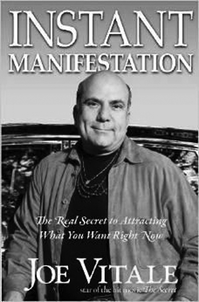

而最重要的部分是，我对它的信念，我相信它会带给我力量。

即便如此，什么才是真正的实相？

说真的，我宁愿相信一个神奇的充满魔力的宇宙，并且见证我的生命不断地绽放出奇迹，也不愿在一个所谓的现实世界中忧心忡忡，害怕任何的风吹草动。

同时，我还点赞苏菲的智慧格言：“相信安拉，但首先还是要把你的骆驼拴好。”回到前面我朋友在我的博文评论中提到过的奇迹思维，它的意思就是说一方面相信你的神奇铠甲，另一方面还是要努力将必要的安防措施做好。

这就是协助创造实相的全部要点所在。是的，确实有奇迹，有魔法，另一方面，也确实存在着你在这个物理世界中的举止言行。而最聪明的做法是两者兼顾，相互融合。

奇迹与魔法可能带来的唯一真正危险，就是你完全地依赖它。

肖恩·埃科尔，在其著作《幸福优势》一书中，建议你佩戴浅玫瑰色的眼镜，但不要佩戴深玫瑰色的眼镜。他是这么说的：“正如其名所示，浅玫瑰色的眼镜可以让我们把真正重要的问题都纳入视野，同时也让我们的注意力大部分都放在正向事物之上。”

我准备引用布鲁斯·巴顿的话来做结语，这位先生是我的书《遗失的七个成功秘诀》的重点讨论对象。他于 1927 年在其著作《一个人能够相信什么？》中写道：

对于生意、国家、自己，以及别人的信念——正是推动这个世界的力量。那么如果我们相信。这个远超其余的强大力量，不过只是运作宇宙之庄严伟力中的一块小碎片，那会有什么不合情理的呢？

简言之，如果我要上战场的话，肯定会穿戴神奇铠甲，同时也会采取其他任何可能的安全措施。神奇铠甲自身可能有力量，可能没有力量，但我对于它的信念却是有力量的。

以另外的一个方式来表达，安慰剂不是真的（药），但安慰剂效应却是真的。

拥有信仰，同时拴好你的骆驼。

哦，还要记得不断地清理！

# 第八章　秘密之镜：意念与灵感的组合

当你感觉信任且安全，你就能够走上前去，说什么都行。你可以轻松地让事情升起落下，消失无踪。信任是第一位的。

——乔·维泰利博士

2013 年年初，我的“奇迹教练”课程的承办公司告诉我，他们想要跟我一起开发一款在线产品。这家公司认为这款产品能够日进斗金，并为我的教练课程产出无数的光辉案例。

我们都不知道这款产品会是什么样子。我们开始给广告写手打电话，双方来了一场头脑风暴。我告诉他们我的工作核心理念是生活如镜，所以我们的产品中或许可以包含一面镜子，作为工具或比喻。从那当中我获得了“秘密之镜”的点子。我感觉这个名字动听易记，朗朗上口。但是我不得不承认，没有人知道，就连我自己都不知道它究竟是什么。

几个月之后，我们决定邀请几个人飞过来，跟我面对面地进行教练辅导课程，而且是在摄像机面前现场直播。就像是真实生活版的电视秀节目一样，我得一边辅导他们，一边接受摄像，而摄像剪辑之后就会成为最终的产品。

正式拍摄那天，我们的布景地选在得克萨斯州温柏里的布鲁斯特比萨店楼上，摄制组成员全部到位。我们甚至还租了一面古董镜，作为那至今尚不知为何物的产品的一部分。摄像机转动起来，我也跟这些人见面了，开始畅谈成功和人生。

截至目前，一切安好。

接下来的环节，是让我跟这些人逐一进行单独会谈，帮助每个人在 30 分钟或更短的时间里取得突破（再一次，现场录像，现场直播）。

我开始有点茫然无措了。

尽管我有着几十年的个人成长经验，兜里揣着许多的秘密“武器和技艺”，但要帮助一个陌生人 30 分钟内脱胎换骨，而且还是面对着摄影机，那就不仅仅是耗神费力了，那简直就是令人崩溃，手足无措。

我开始惊慌起来。

我想：“如果我搞不定这件事会怎样？如果我在摄像机面前像个傻瓜会怎样？如果我帮不了这些人会怎样？我一番努力后他们却每况愈下怎么办？”

然后我就想起明迪·奥德林在她的《如果一切都好会怎样？》一书中教导的“如果-怎样”技巧。她说你得问正向问题，比如说：“如果这一切进展顺利会怎样？如果我真的帮到了他们会怎样？如果这一切都很好玩会怎样？”

这种观念与问题的转变立刻改变了我的能量状态。我感觉开心并更加客观了起来——但我还是需要知道“秘密之镜”法究竟是什么。

救命啊！！！

我走进洗手间，锁上门，望着镜子。

我告诉自己需要一个清理，现在就要！然后我就开始大声念那四句清理箴言。我记得是让自己对神性说这四句话，而不是对小我说。我的恐惧只是些程序，只是源于过去的数据。我不关心它们是怎么来的，也不关心它们为何而来，或者谁该为之负责。我只想把它们给清除掉。

几分钟之后，我深吸一口气，对自己说声“我爱你”，并且无论发生什么我都一如既往地爱自己——然后我就走出门去，进行拍摄了。

“秘密之镜”法三步骤

就在那一刻，我领悟到了“秘密之镜”法。它全然在我心中成形了：它包括三个步骤，包含了镜子、我的引导与教练，以此帮助人们理解自己的问题，领悟如何让自己实现并且显化内心渴求的目标。

它看上去像是这个样子的：

1．我解释了相互冲突的意图。也就是说，你的意识心渴望某事物，然而同时你的无意识心却渴望另一事物。两者之间的矛盾使得你意识心中渴求的目标无法达成。比如说，如果你的意识心渴望更多的金钱，但你的无意识心却认为金钱是邪恶的，那么你就会阻挡金钱的到来。你在无意识层面的冲突意图，源于你的无形却更为强大的存有部分将会起主导作用。

2．接下来我解释“秘密之镜”本身。它是一种想象中的体验，我会辅导着学员从心进入未来，进入一个平行宇宙，进入与我们所关注的问题相关联的过去和未来，去看看未来的自己是如何处理现在看似棘手的问题的。我引导学员使用一面实体镜，让他们望着镜子，望入镜子，并逐步将他们引领进入一种非睡眠状态的禅定之中（他们的眼睛是睁开的）。于是他们可以询问未来的自己，今天我应该怎么办？

3．接下来我会解释何为受灵感启发的行动。这个理念关注如何依据从心中浮现出的灵感而行，这些点子已经显现在你觉醒的实相中了，我们应当以此来指引自己的行动。因为除非有某物动起来了，否则什么事情也不会发生，行动对于成功的重要性无须赘言。

在灵感的启发下，这一整套东西喷涌而出。我放手、信靠、信任。我所辅导的第一个学员，在不到 30 分钟的时间里，对着镜头就发生了改变，整个人焕然一新。而同样的事情发生在了后面每一位学员的身上。“秘密之镜”由此而生。我轻轻地祈祷了一句：“谢谢你。”

几个月之后，在 2013 年后半段，公司将“秘密之镜”正式发布到网上，引来大量的咨询和大批的订单。这项新产品到如今依然畅销。

如何找到治疗疼痛的方法？

下面再来一个故事，继续解释这个要点。

几十年前，我住在休斯敦时，经常去赫曼公园围着高尔夫球场慢跑两英里。因为那个时候的我超重，跑步时脚老撞击地面，形成了很大的跟骨骨刺。它其实就是钙质沉积，一般长在脚后跟部或下部。而我的跟骨骨刺长在两脚跟部后方。它们非常大，大得连我的医生都忍不住要把片子传递给其他同仁，大家都惊讶不已，相互议论和探讨一番。我的案例在医疗诊所圈广为流传，医生们交流研讨着我的 X 光片。但没有一位医生能够缓解一下我的疼痛。

时间一长，那些骨刺变得更加疼痛难忍，搞得我走路都一瘸一拐。然后又诱发了我右脚一处肌肉韧带轻度撕裂。最后让我疼痛难忍，连车都几乎没法开了。但我的内心永远坚信任何疾病都能被治愈，所以我发出了一个清晰的意图，一定要找到治愈方案！

在治愈的路上，我找过医学专家、疗愈师、诊疗师、整脊师、足部专家、运动专家、针灸师、草药医师，等等。我还买过特殊鞋及鞋垫。我还试过用情绪释放技巧将疼痛敲打出体外，还向我的保护天使祈祷，尝试过药剂、药膏，并且还上网搜索释痛良方。

一位足疗师给我做了一项足部类固醇注射，好歹将疼痛止住了一个月。复发后这位医生建议我做手术，但他也无法保证手术能够永久性地解决疼痛问题。所以，我没有选择手术。

我还找到一位江湖医生，他给我的右脚跟部注射了几次糖水，结果奇痛无比，成了我一生中最痛苦的一次就医体验。他说感觉会像是被蜜蜂叮了一口，但我感觉像是某只史前怪物的角戳进了我的脚，而且这只怪物的爪子跟那位医生的鼻子一样大。这次的疼痛令我永生难忘，我整天像只受伤的动物般呻吟着。

虽然这次诊疗依然无效，但我仍不会放弃，但凡有新的机会到来，我都会紧抓不放。当然，每个医生都有自己的诊断意见。有位如士说，我应该做手术。但是跟大部分好心人一样，她也不知道手术是否真的对我合适。所以我只好持续不断地清理，不断地行动，同时小心走我的每一步（确实，我每走一步都疼痛难忍）。

我该怎么办呢？

然后有一天，在一次为转型领导力会议成员所举办的夏威夷闭关中，我看见一张告示，说是海滩上有一场免费的气功治疗。我仿佛听见了“叮呼”一声响。免费与海滩，这两个词在我心中回荡。另外我其实曾经接触过气功训练，那是一种源于中国的内在疗愈艺术，有时被称为气功，所以我对这个东西非常好奇。我感觉很值得去试一试，仿佛这是一个源于灵感之念，于是我真的去了。

林春意是一位有着资格认证的气功大师，同时也是春林气功的创始人。在那阳光明媚的海滩上，他与我见面了，在场的还有另外几个人。我把我的跟骨骨刺与韧带拉伤的症状告诉了他，他眉头一皱，仿佛感受到了我的痛苦。我对他的诊疗其实没抱太大希望，因为他那痛苦的表情仿佛在说他也无能为力。然而，我的这些疑虑根本就是多余的，在整个诊疗过程中我几乎不用出任何力。他让我闭上眼睛，放松下来，聆听近在咫尺的海浪的声音，并且观想爱流向我的跟骨骨刺。我一一照办了。

我虚缝着眼睛偷窥了一下，发现春意先生站在我的脚畔，将他的指头对准我的跟骨骨刺。他的手不断地绕着小圆圈，将他的能量和意念都聚焦于我的脚上。就这样过了几分钟，我的时间观念也模糊了。我其实也没啥感觉，只是放松，顺其自然。大约过了 15 分钟吧，他停了下来，转向另一人。

当我离开海滩，开始走路时，我注意到我的步伐变灵活了，移动行走变得自如了。我不觉得自己是被疗愈了，因为我依然感觉到疼痛，所以我也没想太多。但在接下来的几天里，我的疼痛减轻了，而且我走路的能力大幅提升。这下我开始兴奋了起来。

我在团队离开夏威夷之前，又去找了春意先生，向他表达感激，并问他究竟做了些什么。他非常的友善，告诉我他只是为我的脚发送了能量。他向我要了姓名牌，把它拿在手里，说他会继续向我发送疗愈能量的。

那至少都是两年前的事了。现在的我，疼痛全无，无论是开车还是走路，都没有问题，甚至连健身都不在话下。脚跟处的鼓包依旧，那是我曾经跟骨骨刺的见证。我对自己的脚跟依然很爱护，但也仅止于此了，因为疼痛感已经全部消失了。考虑到曾经那难捱的疼痛，让我在那么长的时间内备受折磨，不得不说现在的状况真是一个奇迹！

而这个奇迹是如何发生的呢？

我下定了某个意图，发誓要治愈疼痛，然后我跟随灵感，在它的指引下我认识了春意先生，然后事情就搞定了。这样的组合，结合“秘密之镜”的创立，为我引出了奇迹般的结果。

但是什么力量允许了所有这一切的发生？我是如何从一片空无中创造出某物来的？我最终是如何疗愈的？

我认为这一切跟有意识的意图、跟神圣灵感，以及针对这两者采取的行动都有关。所以让我们再进一步，看看“荷欧波诺波诺”结合了上述元素之后，会如何运作。

# 第九章　吸引力法则 Vs． “荷欧波诺波诺”

一个清晰的意图——不是出自绝望或欲求，而是以一种小孩般的信任、信念与玩乐之心陈述出来——将会引出令人难以预测、难以谋划的美妙机遇。

——乔·维泰利博士

我的粉丝们喜欢《相信就可以做到》，以及我参演的电影《秘密》，却经常迷惑于如何将吸引力法则与“荷欧波诺波诺”两者结合。他们中甚至有人会认为我是在《零极限》当中向右急转弯了，无法理解我的这一转变。

但我自己却在此处看不到任可的冲突存在——我感觉它们两者相得益彰。我只是更倾向于说意图与灵感皆是我们可以自由选择的对象，而我当然是更喜欢选择后者。

让我来解释一下吧。

有一天，我正走过办公室前的门厅，参加一项市场营销教练计划，碰见一位教练，他问我：“你有兴趣做一些其他的教练计划吗？”

灵感照亮了我的心海。

“我总是想要做一些与奇迹有关的事情，”我说，“或许我们可以来办一个奇迹训练课程。”

我们于是就此灵感进一步详谈，然后一周内我们就建起了一个专用网站。我们原本期待着在未来的 6 个月内吸引 50 名学员，哪知道一天之内就来了 500 个！

这就是灵感的力量！

在 2006 年，我举办了一次私人工作坊，名为“超越彰显”。其间我解释了三种显化你所期待的实相的方法：

1．借由预设：如果你以一种无觉知的状态来生活，那么你将会默许自己的无意识以及他人的行为创造出你的生活现实。而这就是未觉醒的生活状态。

2．借由选择：你可以有意识地陈述自己的意图，它会让你的身体、头脑以及心灵全部聚焦于一点，令三者同心协力地向一个既定方向运作。这种状态会比缺省状态要好一些，因为此刻你相对更觉醒，也更有力量。

3．借由灵感：此处你允许神性或零状态向你传递灵感。它们仿佛全部来自于空无。如果你放松并放手，让自己处于觉知与觉醒的状态，你就能够接收到令你瞠目结舌的新观点。而这是一种令人超级振奋的、更加开悟的生活方式。

意图依旧强而有力。你可以为自己想要的任何事情下意图，但更聪明的做法则是允许神性来赐予你自己所希望的——或者更好——的选项。这就是让灵感来主导你的生活。

让我们从这个角度来看。意图源于你的小我，奠基于你的过往。它们是基于你的头脑认定为可行之物。这就意味着意图是基于你当前所背负的数据的。它们统统都是记忆的产物，它们的本质是内嵌的局限与规条。

另一方面，灵感则可以令你的头脑震撼。

灵感源于一切，即你可以称之为神性、零状态、上帝、道等。它涵括了你的头脑，却远远超越你的头脑。如此你方能超越自己曾经的一切想象。

觉醒的四阶段

还有另一种看待它的方法，就是从觉醒的四阶段的角度来看，我在《觉醒课程》中专门讨论过这一点。当我在创作《零极限》时，我不知道其中的第四阶段（那时的我自己还在第三阶段徘徊）。但确实存在着第四阶段，那就是与神性合一。“荷欧波诺波诺”能够帮助你到达那一点。

如下列出四阶段：

1．你是受害者：大部分人都活在这第一阶段中。无论发生了什么，看上去都是除我以外每个人的错，或者至少是除我以外某个人的错。全世界都是我指责的对象，而我也乐于玩这指责游戏。大部分人都活在这一阶段中，正如梭罗指出的那样：“那是无言的绝望的人生。”

2．你获得掌控：电影《秘密》《相信就可以做到》，以及《想有钱就有钱》这类书籍，全是关于重拾你的力量。你从中学会了下意图、观想以及彰显的法则。这很有趣——甚至会令人激动不已。但到了某个点上，你会迎头撞上某个你无法掌控的东西，通常是死亡或者某个严重的疾病，此处的你又被局限住了。而这将会为你进入下一阶段铺路。

3．你学会臣服：这第三个阶段就是修·蓝博士教导我的“荷欧波诺波诺”阶段。你不再试图掌控世界，不再试图改变世界，你只是努力清除自己的意图，以便让灵感涌入。你开始信任一个已经在运作的计划与进程。你学会让自己调频进入源于神性的生命之流（它位于整个表相世界下面的最深层）。你开始信任它了。

4．你开始觉醒：在这最后的一个阶段中，你的小我完全隐没于神性的心灵（消融于天心之中）。极少有人能够走到这步，但确实有人走到了。从外表上看你无法分辨他人是否开悟，这一步源于恩典。你没法强行令觉醒发生，你无法强行令觉悟发生。觉醒根本不取决于你，开悟亦由不得人。你所有能够做的，不过是清理，清理，再清理，随时做好准备而已。然而，再强调一次，吸引力法则并非被删除掉了，正如对于大学生而言，小学阶段还是必经之路。它是你进化，以及觉醒阶梯的一部分，或者就像近来戴维·霍金斯博士所说的那样，它是你的人类意识图谱中的一部分。它们之间本无矛盾，只是在不同的心灵层面上运作。

我经常说，吸引力法则就像是重力——总是在那里，无论你是否在意它——不停地发挥作用。只是它并非理解生命的全部。比它更强大的工具是灵感。

聪明的做法是腾出时间，允许灵感涌现。这一章就是如此来到的。我停下写作，抽一根雪茄（大概就是这么短的时间），然后放任我的思想漫游向四面八方。你可以称之为一个冥想或是向宇宙发送烟雾信号，但忽然间，我接收到一个灵感，要写上一段关于“奇迹训练课程”之始的故事。这感觉太棒了，于是我停下所有的事情，开始写这一章了。

请注意，我并没有打算要写这一章——我是接收到了灵感才写它的。两者之间的区别可大了。

我的灵感鸡尾酒

几年前，我决定成为一名歌手／词曲作家，因为这项任务列入了我的遗愿清单。我想在自己有生之年尝试一下。我有了这个意图，但那时候我还有着许多的数据、许多的心灵负荷。我不知道如何歌唱，如何弹吉他，或者如何创作歌曲，而且我还不确定自己能学会它们。毕竟，我在学校里被视为差等生，总是和一些失败者们坐在教室的特殊排，而且大学里面的所有课程我几乎都挂过。所以我从来都没有认为自己是聪明的，这叫我如何玩转音乐呢？

当然，我持续地清理。我不断地重复那四句话。我甚至还清理我在清理方面所遭遇的挫折感。我不断地坚持，不断地清理，让自己越发洁净。我把自己的内在魔鬼清理缩水成了一只小老鼠，然后再清理成轻声低语，再清理成几乎不存在的空无。

我还写了一些好歌，比如说《有问题吗？》，就是由“荷欧波诺波诺”所带来的灵感而来的，收录在我的第二张专辑《高视阔步！》中，公众在 iTunes 中评其为心仪之曲，让我感觉很骄傲的还不仅仅是这些，还有好几首原创被评为畅销金曲，比如《今天就是最好的一天！》（也收录在《高视阔步！》专辑中）。

我是怎样实现自己的心愿，从完全的门外汉成长为一名歌手兼词曲作家的？

我是将意图与清理结合在了一起。我让吸引力法则跟“荷欧波诺波诺”并驾齐驱。

我为自己调配了一杯灵性鸡尾酒，令我幸福得目眩神迷。当你听到这个故事时，你就能看见吸引力法则与“荷欧波诺波诺”协同并进的一个实例。

我的意图是要创造出某个作品，但在清理的同时，我也试着对意图放手。我在前面章节谈到的那四个人，我对他们也是用的同样方法：我的意图是想要帮助他们的生话，直面镜头，对他们一边清理，一边放手。

设定意念。

然后清理并放手。

很简单，是吧？是的，这是一项均衡之举。你想要聚焦在你心仪之物上——但却无执着，无强迫，无须求，无绝望。如果心中有任何的负荷，你可以对它进行清理并释放。最理想的状态，就是让自己待在一种“这样岂不是很酷？”的心态中。

关于吸引力法则，人们通常碰壁之处，即在于想要弄明白这件事究竟是如何发生的。他们会设定一个意念，然后就开始疑惑，开始担心自己到底该做些什么，好让意图中的结果能够如期显化。

他们想要搞清楚这件事是怎么办到的——这种想法是错误的。

在《相信就可以做到》中，我写道，当你下定一个清晰意图之后，你的临门一脚即在于对此意图放手，放松下来，聆听灵感之声，在它的指引下采取行动。但这样的话究竟是什么意思呢？

让我用下面的故事来解释一下吧。

2012 年，我和我的私人健身教练斯科特·约克聚在我家，会见了著名的健身运动员兼演员卢·费雷格诺（他曾领衘主演过《浩克》系列，这档电视节目非常卖座）。跟他在一起的这几个小时成了我人生中的最精彩时光。他真的非常迷人，而且开放。我永远都忘不了他，也忘不了这次聚会。

在此以后，我跟斯科特又开始琢磨，下一次该见谁了。

答案浮现了，传奇的化身：阿诺德·施瓦辛格。我俩都读过他的自传《全面回忆》，对他及其成就景仰不已。他那不断超越纪录的成功史令人瞠目结舌。即便是到了 65 岁，他依然未有减速的迹象。他有着新的目标、新的激情、新的计划、新的电影，他的背后似乎有着无尽的驱动力，让他一路向前，成就更多。

我们决定了，我们就想要见他！这就是我们的新意图。

但我们应当如何实现这个新意图呢？

我们可一点也没有为此事应当如何实现而发愁。我们没有制订计划，也没有四处打电话，或者找朋友引荐。我知道自己的一些朋友认识施瓦辛格，我完全可以伸出手去，摇动树枝，过一把寻求引荐的瘾。

但是我什么都没做，斯科特也是。

为什么呢？因为我们没有接收到灵感让我们去这么做。

当我说：“放手，依据灵感而行。”我的真实之意是放下所有的执着、瘾（执迷）和对于结局的需求。而这是需要信仰和信任的。它需要你内心非常的清明，知道自己的意图将会显化，而这份显化有着它自己的节奏、时间与空间上的安排，而且还有着另一种可能性，就是说更好的替代品会出现，取代曾经的意图。所以我们才需要放手，不再质疑，也不再去控制它的发生方式。

这就是不执着——但这还只是方法中的一部分。

另一部分是，与此同时，当你接收到灵感的讯息时，行动吧！

有一天晚上，斯科特正在玩他的 iPhone，浏览下邮件什么的，他的小孩也是一边看电视一边玩耍。然后，斯科特发现有一封邮件，标题是：“想见阿诺德吗？”

斯科特完全不敢相信自己的眼睛！以为这封邮件可能是个玩笑或者垃圾邮件，但他还是查看了一下，发现里面说有个本地人，跟电影圈打得火热，正在筹办阿诺德最新的动作片《背水一战》的首映式。他设立了一项竞赛，20 名获胜者可以观看首映式，之后还能跟阿诺德面对面（还能见到同台明星约翰尼·纳什维尔），进入私人性质的问答环节。

斯科特有点怀疑这件事不靠谱，但是他的灵感催促他展开行动。

主办方要求每位参赛者写一段话，再附上一张照片。斯科特按照要求一一完成，然后就将整件事抛诸脑后了。当天晚上，他就收到了确认邮件，说：“你赢了！”

他被告知可以带一位朋友参加这次活动，所以我就跟他一块儿去了首映式。我们跟其他一些人一起，问了阿诺德许多问题，关于电影（非常棒）、政治（很糟糕）、他的目标（有很多），关于未来（拍电影），关于健身（天天练）等。我们的意图圆满实现了！

你看出来它是怎样运作的了吧？

一个清晰的意图——清晰的陈述，却不带任何的绝望或需求，反而有着一种孩子般的信任、信赖和娱乐的精神——将会把你引向难以策划、难以预期的机遇，超越人力，浑然天成。我们的工作只是在灵感之声显现时，听命而行，就像我们刚才表现的那样。

这就是吸引力法则的运作方式。

你想要什么？你感觉成为什么会很酷？做什么会很酷？拥有什么会很酷？

阿诺德说他爸爸教导他要成为一个有用的人，而这份教导指引了他的整个一生，做一个有用的人。

什么样的意图，在你陈述时既会让自己感觉开心，又能令众生受益？这个问题简直要把吸引力法则累趴下了。所以还是放松吧，别去操心这一切应当如何实现，或者你必须做些什么才能保证它的实现。你只是等待灵感的召唤，然后顺势而为。

什么是你最慈心善念的意图？

将它陈述出来——然后放手，只是带着对于内在驱动力的一份警醒，留意来到你身边的机会。当你感觉到灵感的召唤时，行动吧——如是你的梦想必然成真。

此刻“荷欧波诺波诺”的助益就显现出来了，当你感觉自己陷入了执着、上瘾，或者对某种结果产生了依赖，就需要清理掉它们。你真正需要的是处于零状态，让你的意图变得可有可无，让你对自己的意图不再产生依赖。

修·蓝博士常说，你根本无须下意图。“你只需要做清理，让神性能够流经你就好了。”他如此提醒道。

但这话在我听来还是像个意图。

我有一次问他：“如果你一直清理，会不会浮现出某个行动层面的指引，而你则顺势而为？”

“当然了！”他迅速地回答道，“随着你的不断清理，你就会清除所有的障碍，于是零会告诉你应该做什么。”

再一次，实践“荷欧波诺波诺”就是清除头脑中的杂草，清除传承的记忆，以便你能够听见灵感的呼唤。

随着灵感动起来

灵感有点像是来自于神性的指引。它比你的头脑层面深多了。你可以在自己的身体里面感受到它，感觉仿佛是有一个比你更宏大的存有希望你做某事，会在你的心里轻推着你。

举个例子，有一次我正在和威尔·阿恩茨共进晚餐，他是热门影片《我们到底知道多少？》的制片人。宾主尽欢时，我问威尔：“你现在正在筹备下一个电影吗？”

“暂时还没有，”他回答道，“我还没有接收到我的出发指令呢。”

我明白他的意思。出发指令源于零状态，它会清晰地告诉你该做些什么。这种感觉有点像是电影《福禄双霸天》中的那段著名场景，其中一个主角不停地说：“我们在这里，只是为了完成神指派的使命。”

我的一些歌曲就是如此来到的，它们是由零而发的行军令。那首《幽灵列车》（收录在《疗愈之歌》专辑中）感觉就像是凭空冒出来的。即便是资深音乐人听见这首歌的前半部分，都会问：“这是什么呀？”它听上去仿佛是这个星球上的新东西。它确实是的，源自于灵感，是灵感送给我的礼物。当然，在灵感来临时，我也可以拒绝，将它录制出来。但是，我的决定是听从，将它写下来，唱出来。

我的许多书也是如此来到人间的。显然，在《零极限》的背后，是有着神秘力量推动的。它远超我自己的能力范围所及。那本书只用了短短两星期就完工了。我感觉自己更像是个速记员，而非作者。有一只看不见的手在背后推动着，令我才思泉涌，指导我的遣词造句。那是我唯一一本重读的自己的作品，因为我感觉像是另一个人的作品。当然，它确实是我一个人的作品。（修·蓝博士被列为合著者，但他在公开的现场直播中坦然承认，他从未读过那本书。）

再一次，下意图并没有什么不好。

但是，一个更高端的生活方式则是不断地清理，直到灵感出现，然后把这个新灵感当成是自己的新意图。把这个受灵感启发的新意图当成是你的行军令。到了那个点上，所有你需要做的，不过是一边行动，一边保持超然的不执着态度，对于结果完全臣服，一边不停地清理。

这就是打开通向觉醒之路大门的密码锁之钥——你有欲求，同时你又没有欲求。你有意图，同时又没有意图。你想要某物，同时你又不想要。当你在追求受灵感启发的意图时，你的心态却是全然地放手。

当你开始拥有如此坚定不移的信念时，即便自己毫不知情下一秒种将会发生什么，却敢于相信当下和此刻中的一切存在，那么你距离零状态就又近了一步。如果你感觉这么做有困难，那就运用“荷欧波诺波诺”来清理所有的障碍。所有的疑惑以及不确定之感不过是你电脑中的数据而已。清除它们，你就会自由。

一旦你自由了，你就能够拥有任何你想要的东西，可以做到任何你想做的事情，可以成为任何你愿意成为的样子，但凡你想象得到的心愿都能够实现——但或许你会足够聪明，不再自行谋划，而是转而选择神性对你的一切设想。

记住，持续地清理，再清理将会移除心灵中的一切障碍，允许某个更加宏伟的存有降临。

清理，清理，再清理！

# 第十章　放下意念比设定意念更重要

你并非总是能区分辨别的。很容易我们就把它弄混淆了，以这种或那种方式，迷失了航向。清理，清洗，或者祈祷，每当某个冲动升起时，无论你认为它是源于小我还是神性。

——伊贺列卡拉·修·蓝博士

我曾经跟加兰·兰德瑞博士一块儿吃过几次饭，他是一位杰出的前沿量子场域心理学家和能量疗愈师，他的研究成果被引用在广受高度赞誉的电影《我们到底知道多少？》当中。他是一个迷人的家伙，是一位深刻的思想家。

在我们的一次对话中，他谈及思想和意图是两码事。他的这一论点吸引了我，因为这跟我自己的研究得出的结论恰好吻合。我让他深入地解释一下这个观点。他说，意图是你生命的背景，而思想则在那背景之上来来去去。

他的这个说法跟我在练习白板冥想时的经历惊人的相似！当我练习白板冥想时，我会先在心中下某个意图（也有可能是灵光一闪），然后我会进入白板，并在它那广阔无垠的空无中释放这个意图。（我已经把白板冥想列于附录 B 中了。）此刻任何的念头都是浮云。我们不再需要它，亦无须关注它。

然而，兰德瑞还提供了后续的强大改进步骤。他进一步告诉我在他的量子冥想中，人们可以取得更快的成效，如果他们操练如下三步的话：

1．定下某个意图。

2．放下那个意图。

3．将念头集中在诸如“是的，是的，是的”，“我爱你”，以及“我是如此蒙受祝福”这样的语句上。

这样的做法也许乍看之下对你意义不大，直到你发现，兰德瑞参与了数百项科学研究工作，皆证明此法有效，证明这个新颖的冥想显化法确实有作用。

其关键点有二：

1．放手比下意图更重要。

2．正面语句会创造出一股能量旋涡，吸引来正向的事物显现。

当我们在晚餐期间进一步讨论这个问题时，我们达成共识，即是意图并没有我们最初想象的那么重要。是的，心怀善念，发出美好的意图不失为一种良好的尝试，但却并非必不可少。通过让自己潜沉进入生命的背景能量场，并且让自己的思想环绕聚焦在正向语句上，你会自然而然地创造出符合自己的最高利益的境况。

换句话说，通过学习范式转换（转变自己的基础信念与看待事物的眼光），让自己聚焦并见证当下此刻的奇迹，将会带领你随顺生命之流，于是奇迹将会成为你的生命常态。

当你安居于此时，谁还会需要意图呢？

我们一致同意，进入这神圣的被祝福状态的最佳方式之一，即是感恩。我在自己的多个作品中都多次提到过感恩。当你对于当下此刻的某事、任何事产生感恩之心时，你就成功地改变了当下此刻所散发的频率信号，于是你的未来也将会吸引到更多的让你感恩不已之物。

简言之，你当下的感受会吸引来你下一刻的体验。我经常说，你现在带着情绪情感所思所想之物，很有可能显化在你未来的三日之内。

不管以哪种方式，你都会或多或少，通过自己最其能量的思想，带出你所经历的未来。

这并非什么新东西、新观点——不过是最基础的吸引力法则，提醒我们时刻留意自己的思想。但当你更多地将自己的思想聚焦于正向语句周围——比如说，“是的，是的，是的，”以及“我爱你”——时，你就越发地提升了自己的内在能量振频，从而吸引更多的奇迹进入你的生命中。

在这个秘法中还有更多的内涵。

一位朋友曾经给我写来电邮，说：“神性想让我不停地写。”然而他所写的全是充满评判与负念的话语。这些话语有可能是神性所言吗？

另一位朋友有一次说：“我的守护天使不想让我有钱。”真的吗？这样的话真的是出自守护天使之口吗？

无论你想要显化的背景意图是什么，请将自己的思想提升到你可能想象的最欣悦、最振奋的高度。尽可能地，让你的思想充满爱，充满正能量，让乐观主义的精神遍布你的觉知。这就是为何现代版的“荷欧波诺波诺”总是让人聚焦在“谢谢你”以及“我爱你”这样的语句上。它们能够帮助你归零并安住于零状态。

如何区别灵感和记忆？

让我换个角度来解释这个问题：

你的意图就仿佛是画布上的一幅图案。这幅图案是你希望显化的——所以当你望向这幅图案时，你的念头最好是正向的、积极的，如此方能促成你所渴望的显化。你的整体态度应当是类似于：“我的意愿臣服于你的旨意，愿你的旨意能够成行。”

没有压力，没有最后期限。

当然，每当你获得灵感启发之时，你还是可以相应地采取行动，但此刻的你已不再是被自己必须做点啥的念头所驱使了。

在我创作《相信就可以做到》时，我坚信自己必须下意图。因为它可以将你的能量引向你所中意的方向，并且能够帮助你聚焦。但在练习“荷欧波诺波诺”几乎十年之后，我有过了几次顿悟的经验，然后我意识到意图本身就有可能成为限制。

我有一次上一个广播访谈节目，主持人问及我的下一年规划。若是放在过去，我肯定会回答一些美妙的计划和目标。但那一天，我回答道：“我不知道。无论我现在说出什么样的远景规划，它们全部都是基于我的过去经验，它们限定了我对于可能性的领悟。所以我现在宁可放手，让神性为我带路，我倾向于敞开接受神性给我的惊喜。”

在真正的现代版“荷欧波诺波诺”中，你的清理目标是让自己能够听见神性的声音，而非你自己小我的意图。

毕竟，难道神性所知还不如你那位因循守旧的小小自我？

修·蓝博士对于意图有着他自己的观点。我有一次送给他一份电影《秘密》的拷贝，这部电影改编自《吸引力法则》，非常叫座。他接受并微笑着说：“我会把它放在架子上的。”

我有点吃惊。但随着我的不断成长，我开始越发理解他了。对他而言，意图即限制。因为意图全是些程序，全是些记忆。他可能更倾向于建议：“你无须下意图。允许神性来赐予你惊喜吧。”

但我觉得他可能没想明白这一点：想要跟随灵感的指引，这本身就是一种意图。换句话说，你或许会如此措辞：“我的意图就是跟随神性赐予我的灵感。”

所以它还是一个意图，不过比其他的意图更精微了一点。

让我这么说吧：我创作这本书的意图就是要让神性透过我来说话。

这是一个受到灵感启发的意图，但它还是一个意图，尽管它源于灵感，或者说它允许灵感的自由流动。当我写作本书时，我不断地问自己的较高自我：“这是你想让我说的话吗？是这样的吗？”我一边写，一边不断地核对，确保自己与受灵感启发的意图保持一致。

我知道这样说你可能还是会感觉有点迷糊，所以让我再跟你分享一个洞见吧。

有一次，我和修·蓝傅士行走在土路上，我问他：“你是怎样知道记忆和灵感之间的分别的？”

换句话说，你是怎样辨别你的心愿是来自于你的小我、记忆、程序，还是源于神性的灵感？

修·蓝博士毫不迟疑地回答道：“你是不知道的。”

“那么我们应当怎么做，才能知道什么是正确的当为之事？”

“清理，”他说，“我会对我的决定清理三次。如果之后还是同样的答案，那我就跟随它了。”

清理，清理，清理。

# 第十一章　你要许愿盒，还是礼物盒？

当我开始放弃小我对于生命的掌控时，我说：“好吧，神性。凭我之力，我的生活过得实在不咋地。帮我从困境中解脱吧。为我指条路，我会跟随的。”从那一刻起，我找到了人生的自动扶梯，并一路乘坐，直到今天。

——乔·维泰利博士

比尔·菲利普斯是一个传奇。他写过三本超级畅销书，创办了著名的“为生命而健身”健美锦标赛，为世界带来革命性的营养产品，改变了无数人的生命，并为“许愿”基金会捐赠了数百万美元。时至今日，他依然在克罗拉多州的丹弗基地为人们提供支持，帮助他们获得美妙的健康，实现健美的心愿。

10 年前，我参加了他的“为生命而健身”健美锦标赛，我一口气参加了五轮，一年时间奇迹般地减掉了将近 100 磅！他改变了我的生命！打那以后，我俩就成了最要好的朋友。后来，我参加了他的“转型营”，那简直是从头到脚的改变。现在我已经 60 岁了，却依然在他的帮助下再度改善着我的身体。

我们有一天在一起共进午餐，同桌的还有他那美丽的妻子玛丽亚（她依据比尔的健身方法，6 个月时间减掉了 60 磅），席间他提到了一件令人震惊的事情。

“我知道我会赢得一枚（美国橄榄球）超级杯大奖赛指环，”他说，“我不知道这当如何成真，因为我从来都没有正式地在著名赛事中踢过球。我只是许多运动员的教练和辅导师。但我就是知道这件事情会成真，尽管我提不出任何的证据来支持我的这份信念。”

然而，奇迹果真降临，1998 年的 6 月 15 日，在赛事颁奖典礼上，比尔被叫上台去，组委会为他授予了超级杯指环，以表彰他对获胜球队的大力支持。他的梦想成真了。

但这件事还没完——一年之后他又拿到了第二个超级杯指环。

“这件事情”，他说，“让我觉得人生就像是个许愿盒。”

我觉得这件事很有趣，所以决定深入探索一下。

“你是打算（做点什么事情来）赢得它呢，还是只是一个预感？”我问道。

作为一名深刻的思想家和实修冥想者，比尔向人们传授转变之道（他还写了一本书，名为《转变之道》），他知道生命之深遂，远超眼前所见的色相世界。他望向我，带着微笑，思考着这个问题。

我进一步地阐释心中所想。

“奥普拉说她打小就知道自己就是会成功。安·兰德在六岁时就已经接收到自己一生宣讲的大部分哲学思想了。而我也总是知道自己会成为一名作家。”

我继续说道：“我曾经问过朗达·拜恩同样的问题，她是热播电影《秘密》的制作人，我曾问过她是一直想要制作这部电影呢，还是接收到了灵感，但是她没法回答清楚这个问题。她说她只是‘将这部电影召唤了出来’。但那个创作的念头源自何处呢？是我们谋划出了这些梦境，或者我们只是调频接收到了自己的命运？”

“这个问题真棒，”比尔说。

“或许我们应当少花时间来谋划，多花时间来接收。”我建议道。

他爱这个理念。

我觉得这个理念太重要了，所以此处我准备重复一下它，把它当作某种格言警句：

或许我们应当少花些时间来谋划，多花些时间来接收。

持续清理，让神性为你带路

当我持续实践“荷欧波诺波诺”并让自己变得更清晰之后，我发现在我们每个人的生活中其实都有一股潜藏的生命之流。换句话说，那种感觉就像是神性为我们每个人其实都做出了最好的安排（为我们预定了一个完美的计划），而我们其实是可以通过调整自己的频率，让自己接收到它的。

如果神性正在试着指引我们，我们理当保持安静，好让自己能听见神性的耳畔轻语，感受到他的轻推。这就意味着我们需要更多地进入平静，更多地练习冥想，更多地倾听花草树木，倾听大自然的声音。

我有一次看见修·蓝博士站在地里，双臂环抱，凝望着一些野草。当我问他在干什么时，他回答说：“我在倾听。”这种事情常见于他。他经常走在花园中，倾听树木花草的声音。这是一种古老的夏威夷传统，不仅仅只是让人尊敬各式各样的生命形态，还要让你切实地聆听，聆听它们可能向你说的话、向你传递的信息。

请记住，你当下的实相只是此刻你发生的事，是根据你过去的记忆和信念而来。你处于自动驾驶模式，你的未来某种程度上是可以预测的，因为任何人只要客观地看看你现在的状况，就能大致看出你接下来会走的方向。然而，在这个程式之下的，是神性规划的人生道路，等着你去发现。

偶尔会有人请我根据他们的能量场读出他们的未来。这很容易，因为大部分人脸上都写着他们的资讯。他们的信念和记忆全显现在那里，所有人都看得见——当然，是除了他们自己之外的所有人。我们通常看不见自己的资讯，因为它们跟我们靠得太近了。

难怪修·蓝博士可以坐在那里向大家描述他们的未来——未来会出现的大部分状况，都是他们现在相信的一切造成的。是他们的记忆在播放未来的场景，而不是灵感。对他们来说，那是资讯，不是神性。

修·蓝博士在一次零极限活动中说：“当你清理时，你就改变了自己的路。”

当你实践“荷欧波诺波诺”时，你就清除了潜意识（尤尼希皮里）中的资讯，让你走上神性正在等你的回家之路。你将较低自我中的程式清除后，你的较高自我（欧玛库阿）就能引领你的路。

在那次和比尔·菲利普斯共进午餐时，他的太太玛丽亚问我在 20 世纪 70 年代末如何从困境中摆脱。她对我从破产且默默无闻，到现在拥有富裕的生活和较高的社会名望的过程非常好奇。

我告诉玛丽亚说：“我到图书馆看书，去参加免费的演讲，不断地学习各种自我成长的方法，并且不断地处理和改善我的自尊问题及限制性信念。”

最后我也领悟到，当我不听从内在的指引时，日子就会很糟糕；而当我“听话”时，一切就会顺利很多。这个内在的指引，就是神性在为我带路。

在实践“荷欧波诺波诺”近十年之后，我确信夏威夷人拥有一项很棒的清理工具，让我们能够听见内在那个平静微弱的声音，无论我们称之为神、神性或大自然。

而一切就是倾听这么简单。

与其说生命是个许愿盒，还不如说是个礼物盒。比起将你的信念放进盒子里，更聪明的做法是把头伸进盒子里，看看里面到底有什么礼物。你想要告诉神性该怎么做，还是想接收神性为你准备好的礼物？毕竟就像修·蓝博士所言：“神性不是你的门房。”

比尔不知道该怎么获得超级杯大奖赛指环，但是他得到了，而且是两次。

我不知道该如何成为作家，但我做到了。

是的，你可以为自己的愿望和要求祈祷，并假装意识自我（尤哈内）知道什么对你最好。然而，当神性是一切魔法和奇迹的源头时，你又何必这么做呢？当你懂得将控制权交给神性，遵从神性的提示和预兆时，结果肯定会让你惊喜不已。

持续清理，并接受神性给你的惊奇。

收下这份礼物吧。

# 第十二章　“不吸引”的技巧

数据在说话，而且它通过你在说话——于是你丧失了所有的控制权。

——伊贺列卡拉·修·蓝博士

你最深的恐惧是什么？

这个问题来得非常突然，而且很深刻，令我措手不及。或许是因为我还不太适应晚餐时分进行如此哲学与心理学意味浓厚的讨论吧，而且和我共进晚餐的还是我虽初识却仰慕已久之人。或许因为是卢·费雷格诺正在向我提出这个问题，或许是因为和这位我童年时代的偶像级人物共进晚餐，依然令我谦卑不已，无法相信童年的梦想居然能够成为现实！我实在无法相信这位超级英雄——如山般的巨人，却有着温柔的灵魂以及深刻的思想——正坐在我身边，问我如此深邃的问题。

眼见我长时间沉默不语，他终于忍不住鼓励了我一下：“说吧，你知道答案的。”

“我怕失败，”我脱口说道。

卢笑了。

“你害怕自己会失去一切。”他带着理解说道。

“我还以为自己不怕呢，”我坦承，“但显然这份恐惧仍在。”

他承认他也有恐惧。在某种程度上他害怕在公众面前演讲。因为他从小就有听力障碍，所以总想让自己能够听见，也能够被别人听见。如今他已经可以勇敢地面对数以万计的听众演讲了。他还承认他害怕溺水。

在“荷欧波诺波诺”中，恐惧只是一个程序。就像软件一样，被设置在你的头脑里——无所谓好坏。莫娜，以及修·蓝博士，常将人们比作计算机，只是大部分人都不知道自己被预设了程序。我不知道莫娜是否已经开悟。夏威夷人将她视作珍宝，但这也不能证明她已然觉醒。我打赌她也有尚未清空的预设程序。

运用清理祈祷文，消除害怕失去一切的恐怖

卢的恐惧只是一个预设程序，我的亦然。幸运的是，你能够通过重复莫娜传递给我们的清理祈祷文，轻松愉快地将恐惧清空，就像清空其他你不想要的负面情绪一样。当然，为了达到最佳的清理效果，我们最好是大声读诵，四遍为宜。

我没有和卢讨论“荷欧波诺波诺”的问题，因为我俩聚在一起是想要讨论我们的共同兴趣点，富有传奇色彩的健美运动员，演员史蒂夫·李维斯。“荷欧波诺波诺”并没有进入我们的话题中，但若是我们有机会详谈“荷欧波诺波诺”的话，我们就会有共同的机会清理双方心中的恐惧程序，而具体过程有可能会是如下的样子：

我就是这样的“我”，

我从虚空进入光明，

我是空无，

是超越一切意识觉知的空无，

我是“我”，是万相，是一切。

我在水面上画出一道彩虹，

那是问题永无止息的心智。

我是无形无相的清风，

携带着无可描述的创造原子，

我就是这样的“我”，

圣灵，超意识，请追溯我的感觉之源，

追溯我害怕失去一切的恐惧思想之根源。

将我存在的每个层面、层次，领域和面向带入这个根源。

用神的真理分析并解决它。

请穿越时间及永恒中的世世代代。

疗愈因这个源头而起的每个事件及相关的种种。

请遵循神的旨意来进行这所有的疗愈，直到我处于当下，

充满了真理之光。

充满了神的平静与爱，直到宽恕我所有的妄念和错误认知。

宽恕造成这些感觉和想法的每一个人、每一个地方、每一个情境与事件。

平静属于你，我所有的平静。

这个平静就是我，

这个平静即是我，这个平静就是我当下之所在。

这个平静常在，从现在到未来，直到永远。

我把我的平静赠予你，让我的平静与你相伴。

不是外在世界的平静，只是我的平静。

大我的平静。

通过非常真实的方式，你可以练习反吸引，借用清理祈祷文，如上所示。当你头脑中的某个程序被激活时，它就会吸引来你所爱、所恨或恐惧之人事物——正是你的情绪将它激活。但当你释放了这段程序，打个比方，令其失效，那么你就能释放自己，进入当下此刻，融入当下的喜悦，并允许神性赐予你灵感，甚至唤醒你。

现代版的“荷欧波诺波诺”就是释放掉所有的程序，以便你能够与神合一，或者你可以称之为与零合一。

而诀窍就在于当你觉知到程序出现时，毫不犹豫地删除，这样神性就能够来到你，甚至流经你。

到那个点上你就可以说，正如卢·费雷格诺在某次健美比赛结束后所说的那样：“现在我可以吃我的蛋糕了。”

# 第十三章　新的清理方法

完全负责意味着接纳所有，甚至那些步入你生活中的人们，以及他们的问题，因为他们的问题就是你的问题。他们出现在你的生命中，要是你对自己的生命全然负责，那么你也要对他们经历的一切全然负责。

——乔·维泰利博士与伊贺列卡拉·修·蓝博士

凡是参加“荷欧波诺波诺”工作坊的学员，主办方都会让他签署一份保密协议，这也是我不能在与修·蓝博士合著《零极限》时揭示所有的工作坊所学之秘的原因。直到后来，我跟修·蓝博士合作共同举办工作坊时，我才无须签署保密协议了。我拥有对于这些秘技的版权，所以现在能够向你说出“荷欧波诺波诺”的深层之秘。

在《零极限》中，我主要是给了你一个方法——四句法。那四句话有点类似于咒语、祈祷或祈请。它们是整本书的焦点所在。我在此会再度介绍它们，并且深入讲解，然后再超越它们。

是时候了，可以为你揭晓“荷欧波诺波诺”的高阶秘技了。

每次我跟修·蓝博士相处时，我总是被他反复提醒，关于《零极限》与“荷欧波诺波诺”背后的基本原则：

除了清理，无事可做。

你清理得越彻底，你就越能够从神性处接收到灵感。

记忆和灵感之间我们只能是二选一，而通常情况下我们的选择都是记忆（数据）。

唯一的清理对象就是你内在的感受。

唯一的目标就是自由——进入零状态。

知道这些基本原则是一件事，活在其中却是另一件事了。这就是为何我们可以运用书籍、CD、DVD、清理工具、研讨会，以及私人辅导等形式不一的方式，来提醒我们所有的工作皆发生于自己的内在。

世界由数据构成，而我们需要清理的就是那些数据。但我们只可能是经由内在才能感知到那些数据。换句话说，根本没有外在这一回事。整个宇宙都在你之内。你于内在经验到所有的问题——这也是清理所需要发生的场所。

精确有效的清理五要素

但清理的正确方法是什么？如果清理乃是人生的头等大事，是整个《零极限》的核心所在，那么我们如何才能恰如其分地进行清理呢？

尽管没有所谓的单一的正确路径，但我还是找到了如下的五点核心理念，它们为我提供了优质的服务，并且也为操练者带来诸多益处：

1．注意到某事不对劲了。这有可能是由某思想、某人所引发，某物、某情境，或者某事件所引发。这就是刺激物。在《零极限》之前，你会把这个问题归于外在；在《零极限》之后，你会意识到它原来是个内在问题。没人能让你生气或发怒，你的反应都是从内在升起的，只是你将之感知为源于外在。无论那个问题是什么，第一步始终是注意到你自己感觉不爽了。你生气了，发火了，担忧了，害怕了，或者其他种种的情绪感受升起来了，而它们统统可以归类为感觉不爽了。

2．开始清理这份感觉。不是让你清理那个人、那个思想、那个情境，或者任何外在的东西，问题只限于内在。我是那个感知到问题的人，我是那个必须做清理的人。而清理的方式很简单，只需要说“我爱你，对不起，请原谅，谢谢你”。你说这四句话的顺序可以随意。我每次都是一边感受着问题，感知着问题，一边不停地在心里说这四句话。而我说话的对象则是神性，我是向着神性说这四句话。

3．你还可以使用其他的清理方法。比如说，修·蓝博士曾经解释过蓝色太阳水及其功效：找一个蓝色玻璃杯，各种蓝都行，注入普通的自来水，然后将此瓶放置于阳光下或灯光下（不可置于荧光灯下）15 到 60 分钟。这个过程能够将水太阳化。你可以将它加入饮用水，或其他各种用途的水中。将它用于给宠物补充水分或者用于烹饪都很好。我还喜欢将它加入我的洗衣液中，我甚至在旅程出发前还将它喷洒在我的汽车轮胎上。蓝色太阳水是一个很棒的清理工具。你可以喝它，或者任意地使用它，就像使用普通水一样。

4．放手，直到你接收到新的灵感。修·蓝博士有一次告诉我他在做决定之前会清理三次。如果三次清理之后得到的答案依然如故，那么他就会信受奉行。这就意味着如果我产生了某个冲动想要做某件事情，或者想要以某种方式来解决当前的问题，我应当对此冲动做三次清理，然后再行动。这样才能进一步保证你所采取的行动是源自于灵感，而非记忆。

5．重复以上进程。

每个人都想要清理的快捷方式，以到达零状态，我也是这样的。但这份迫不及待感本身就是绝佳的清理对象。当下就想要，正是典型的记忆回放，不断催促我们立刻获得愉悦满足。这就是数据。神性可是没有时间与紧迫感的。想要事情进展得更快，快过它自然展现的速度，本身就为我们提供了一个上品良机，以供清理。

我总是不断地清理，因为这让我感觉更轻松、更喜悦、更开心，也更健康。这是我移除数据的快车道，令我的存在状态更清净，更加接近于神性。而且这个方法实在、简单、不费劲，同时还完全免费。

修·蓝博士教过我们许多种清理方法，同时我也学到了，清理方法其实可以被现场发明出来，并在灵感指导下的临场发挥。

举例来说，在最后一次的零极限工作坊中，有人说清理就像是心灵的神奇画板玩具。修·蓝博士对这个说法非常赞赏，他说：“我喜欢这个比喻，心灵的神奇画板。你的心灵画板上写着许多数据，包括你的各种问题，然后我们就来摇晃它吧，晃到它消失。我爱这个比喻。我准备把它当成一个全新的清理工具来使用。当我遇到问题时，我会将此问题写在我的神奇画板上，比如说：‘生命的意义是什么呢？’好了，问题写上去了，然后我们就来摇晃它吧！摇一摇它就消失了！太棒了！我自由了，我自由了！”

另外有一次，修·蓝博士看见了我的名片，我在《零极限》书中秀过那张名片，上面有着我的靓车照，车名弗朗辛。他说这张名片也是一个清理工具。

“是吗？”

“是的，”他说，“你可以观想自己的问题，然后用这张名片的锋利边缘将它切碎。”

我的名片真是一项清理工具吗？我不知道，而且直到现在我都不知道。但是修·蓝博士认为它是，而我也经常用它来帮助我清理生活中出现的问题。

雪茄能当清理工具吗？

什么？雪茄是香烟呢！香烟不是有害健康的吗？

但在修·蓝博士眼中雪茄却能够变身成为和平烟斗（北美印第安人用它来表示和睦）或者涂抹棒。我有一次听说约瑟夫·墨菲（他是我喜欢的新思潮作家之一）喜欢抽雪茄。他会说：“我在向神灵发送烟雾信号呢。”我喜欢他的表达法。所以我现在抽雪茄已经变成一种冥想了。我会感觉非常放松，享受，进入深层的状态。

这让我想起一则故事：

一个和尚问师父：“我能在祈祷的时候抽烟吗？”

师父回答：“不行！”

于是和尚聪明地再问：“那我能在抽烟的时候也祈祷吗？”

这次的答案是：“可以！”

所以全都不过是看法问题，就看你对事物怎样理解了。

当我在为上一次的零极限工作坊录制网络促销视频时，我引领观众们进行了一次全新的清理。

我让他们将自己当前所面临的问题想象成为一个能量场，无论那问题是什么，只需将之观想为一个能量场就好了。其实它真的也就是一个能量场，也有人将它称作思想形态。

然后观想出一把刀。用这把刀来切割那个问题能量场，将它切碎。随着问题能量场域的破碎，你确实能感受到它在消融。（在那个视频中，我用的是一把风霸刀，那是西藏的祭祀专用刀。）你也可以依样画葫芦。

本质上，你可以运用任何东西来作为清理道具或工具，甚至于这本书也是一项清理工具。你可能已经注意到了，本书的前几页中有一段祈祷文。它祈祷的是清理本书，以便当你阅读本书时，它能够清理你。或许你已经感受到这份清理了，或许你还没有，但清理确实正在发生。

其实问题只在于你的信念系统。

有一天琳达·曼策，一位来自加拿大多伦多的传奇吉他匠人，准备向我出售一把她手工打造的吉他，二手吉他，最高端的那种。我已经买过她的三把吉他了，我知道她创造的都是精品。于是我要了一张吉他相片，发给我的朋友兼顾问马修·狄克逊。他只看了一眼，立刻就说：“这把吉他是一项清理工具！”

真的吗？

现在这把吉他归我所有了。我给它取名为玛瑞琳，因为她那独特的曲线，而且我承认她的气场很不一般。我爱她！马修跟我一起拿她来演奏，用于我们的第二张专辑《归零》。我们都认为她很特别！

但她真的是一项清理工具吗？

当修·蓝博士说我的名片是一项清理工具时，我就真把它当作清理工具来使用了。我在《零极限》一书中专门讲过它，然后从那儿开始人们就经常问我要名片一览。

比如说在俄罗斯，我的工作坊学员就让我使用名片给他们做清理。他们想让我冲着他们挥舞名片，仿佛那东西是个圣物似的，带着魔法的力量。我照做了。但我知道力量源于他们的信念——而不是我，也不是这张名片。

同样的道理也适用于风霸刀。它们的历史久远，浸淫在无数的文化典故中。但你仍然可以简单地观想它，也能取得同样的成效——就在你的心灵之眼中观想它吧。

当我在创作第二张 CD 专辑《高视阔步！》的时候，我决定运用一个想象练习，帮助我的专辑大获成功。我去了一家图片社，请他们把我的照片放到《滚石》杂志的封面上去，目的在于打造一张逼真的权威杂志封面，然后我天天看着它，以此为我的心灵输入直达成功的程序。我记得杰克·坎菲尔德和马克·维克多·汉森用过这一招，结果他们的《心灵鸡汤》成了畅销书榜中的奇迹。

记住，是你在心灵层面的工作，是你运用心灵能力所进行的工作，以及你为自己的心灵层面所做的工作才重要。奇迹发生的关键在于清理掉自己的数据。如此方能为神性腾出空间，让它的神圣临在能够进入你的生命。所有那些你真心感觉有清理作用的东西就真的会发挥作用，因为你相信它们会如此，你的信念为它们赋予了力量。想想前文中提到的安慰剂的作用。你的心灵能力强大到不可思议。每当你相信某物能够成为一项清理工具时，你其实是征用了你的心灵能力。当然，到达某些特定点时，你会想要超越心灵，直入零状态。我们很快就会谈到这一点。

什么才是真正的清理工具？

有一次我跟修·蓝博士一起上了一个广播电台的节目，有个人打电话进来，向我俩挑衅，他的态度非常恶劣，简直就是存心找荏，鸡蛋里挑骨头。他的态度激怒了我，但修·蓝博士却无动于衷。我想：“怎么有人会恶劣成这个样子呢？”我实在是想不通啊。

在一个广告片中我说我为修·蓝博士感到不幸，因为我实在没有预料到我们在节目中会遇到这样的不友好的问题。我为此向每个人道歉。修·蓝博士回答道：“那事与那人无关，那完全是程序在背后操控。”

那事与那人无关，完全是程序在背后操控。

我的脑海中电闪雷鸣，修·蓝博士的这句话烙在了我的灵魂深处。

每当我们问问题时，包括我前面问自己的，关于什么是清理工具什么不是，其实都是源于程序，或源于数据，它们遮挡在零状态的上面，令神性的面目显得模糊不清。

同样，当人们在我们面前出现了种种生气的表现——大喊大叫，或者哭泣——他们会有这样的感受是因为他们的能量场域中出现了病毒，出现了不为他们所掌控的程序。他们不知道这一点，这是很自然的，因为是程序在掌控着他们。他们成了程序（病毒）的寄主。

面对这样的情况，你可以运用任何你所拥有的清理工具，或者接受灵感的指引自创出一套清理和释放程序的工具。

当我在写作这一章时，我接到了一位朋友的电话。

在接听她的电话前，我感觉欢乐，精神饱满，非常享受创作的过程。但我的朋友却情绪低落，当我耐心地倾听完后，不一会儿我也开始感觉情绪低落了，我感觉自己陷入了她的流沙当中。我从感觉强壮与清晰，变成虚弱与沮丧。

发生了什么事情？

当我的朋友打来电话时，我也被这个病毒感染了——被那程序感染了——就像一位在门诊部候诊的小孩交叉感染了其他候诊病人的感冒病毒。虽然我做了多年的清理工作，但还是不顶用。所以当我注意到这一点时，感觉心烦意乱。但我紧接着就意识到了，我必须对自己的心烦意乱做清理。

对一切事情进行清理，正是秘诀所在。你在任何时刻都保持清理，而清理工具的选择则可以随心所欲。无论你的情绪怎样，平静还是沮丧，你都要持续地做清理。

比如说，当你读到这一段，然后你想：“我不想要对任何事情做清理。”

对此念头做清理吧。

“我不想要对它做清理。”

清理它吧。

“所有的清理都只是在浪费时间。”

清理这个念头吧。

“要是清理无效怎么办？”

清理这个怀疑的念头吧。

“清理若是产生成效了又如何？”

清理这个念头吧。

“我感觉很好，所以我无须清理了。”

清理这个念头吧。

“干吗要清理呢？我已经感觉挺好了呀？”

清理这个念头吧。

“我不理解。”

清理这个不理解的念头吧。

“我想让你来为我做清理。”

清理这个念头吧。

“雪茄烟不可能是一项清理工具！”

清理这个念头吧。

你现在明白我的意思了吧？

你无时无刻地清理，每时每刻都在清理，无论有没有什么问题触发了你的清理。

“但若一切安好，我干吗还要清理呢？

不断地清理会让你的前路更坦荡。

我如今的生活很顺畅，尽管它过去并非总是那样，因为我花了大量的时间来清理它。我没日没夜地清理，包括现在，当我在为你写作这些文字时，我依然在清理。当我清理时，就像是一部道路清洁机，趁着夜色将道路打扫得干干净净，于是第二天清晨你可以很舒服地在上面开车。清理让我的人生道路更清净，你将在后面的一些故事当中读到它。

再一次，任何东西都可以被用来当作清理工具。我相信我的琳达·曼策“玛瑞琳”吉他就是一项清理工具。我也相信我的专辑《太阳将会升起》的封面就是一项清理工具。修·蓝博士相信我的名片也是一项清理工具。

那么什么是真正的清理工具呢？

任何你相信是的东西，就是你的清理工具。

# 第十四章　当有人按下了你的情绪按钮……

所有你需要做的，不过是对着镜子，爱上你自己——无论世界上其他人对你说什么。

——乔·维泰利博士

这里有些事情，你可以将它们跟我们的主题联系起来。

在两年的光景里，创作六张专辑，可绝不是一件容易的事。我请了一些专家来帮助我：丹尼尔·巴需特，他是波特·戴维斯乐队的主唱，同时也是卢比孔工作室的制作人，在录音棚里手把手地教我；盖伊·门罗，他是声乐训练方面的奇才，教导我如何歌唱；马修·狄克逊，这是一位现代吉他僧，也是一位“荷欧波诺波诺”的信徒，教导我如何弹奏吉他，让我的演奏水平提升至梦想般的高度；莎拉·玛丽·麦克斯威尼，是一位极有天分的歌手与歌曲创作者，同时也是一位音乐教练，她是第一个聆听我的原创歌曲并给我以鼓励的人。

我还参加了一个音乐创作的工作坊，主导教师是两位著名的歌手与歌曲创作人，雷·怀利·哈伯德与凯文·韦尔奇。我还聘请了顶级歌手李·库尔特来指导我歌唱与词曲创作技巧。我也聘请了杰伊·弗兰克，他是《硬碰硬》的作者，由他来为我参谋、创作具有市场前景的音乐。

当我正式进棚的时候，我还聘请了真正传奇型的音乐人物，包括摇滚乐名人堂中的明星乔·维泰利（没错，他跟我同名，是最为著名的鼓手），以及贝斯手格林·福库纳加。我还聘请了三位格莱美奖获得者，帮助我录制其中的一张专辑《疗愈之歌》。

所有投入的这些时间、努力与金钱都取得了良好的回报。我的专辑大受欢迎。《高视阔步！》专辑中的单曲《今天就是那一天》一马当先，在 ITunes 以及 CD 宝贝商店（两家顶级的在线音乐商城）中为乐迷所哄抢。其他的歌曲也被选作电影背景音乐。我被乐评界誉为现代版的约翰尼·卡什、汤姆·佩蒂和莱纳德·科汉。Reverberation.com，这是一个音乐家网站，将我评选为 2013 年 3 月的头号本土歌手／词曲作家。

还不错。

所以你可以想象，当我听见自己的一位家庭成员说他不喜欢我的音乐时，我的内心会多么煎熬。

他说他必须诚实（这是他常用的烟幕弹，随后就会是批评的浪潮），建议我还是专注于写书吧。

他还加上一句：“我不是你的粉丝。”

我并没有请教他的意见，但他感觉还是有必要给我他的意见。我感觉很不习惯，我是不喜欢听见这样的负面信息的，即或我的父亲曾多次警告过我，人们确实喜欢评判。“甚至你自己的家庭成员都有可能会反对你。”他有时会这样提醒我说。

这个打击太大了，我简直都无法相信它是真的。我感觉受到了伤害，并且充满疑惑，这事情一直震撼到了我存在的核心层面。显然，我的内在有一个按钮，而他按动了我的按钮，并且一直按住不放。这个问题困扰了我好几个星期。我用尽了我所知道的所有的自助技巧，还是无法解脱，无法释放这份疼痛。

当然，如果我的这位亲戚对于音乐有所了解的话，他的话或许还值得一听。一条普遍性的原则就是，只接受那些已经在专业领域内取得了成功的人士的专业建议。但我的这位亲戚并非是一名乐师，他也不会演奏任何的乐器。他对于音乐理论可谓一无所知，更别提音乐史或者当代流行乐了，但他对我做评判时的那副架式倒像是位专家似的。他那多事的评论给我带来了深切的伤害。

当然，每个人都有权拥有自己的观点。我有一次参加了鲍勃·迪伦的音乐会，我深爱他的歌曲（我甚至还重新创作并录制了乔·维泰利版本的他的名曲《了望塔沿途》，收录在我的《高视阔步！》专辑里），但他的尖叫声让我不爽。即便是这样，我也从未打电话给迪伦向他抱怨什么。我把自己的观点默默地保留在心里。（鲍勃，如果你读到这一段，请原谅我吧。对不起了。谢谢你的音乐，谢谢你给我授权，让我能够重新翻录《了望塔沿途》。你是传奇的词曲作者，我爱你。）

在跟我亲戚纠缠这件事上，我想自己能像音乐人汤姆·佩蒂那样，曾经有个记者采访他，问他说当有人抱怨他的音乐不咋地时他会做何反应时，他回答道：“这是摇滚，老弟，摇滚乐本来就没说一定要咋地。”

但我还是难释重负。

一个程序或者说数据，从我的内在中被激活了，而我的这位亲戚，就是那触动、激活按钮的人。我不知所措，不知应该如何回应这位亲戚的带着侵略性的、完全不请自来的评判了。我圈子里面的大部分朋友都很友好，而我的家人们也大都更有爱，对我更加支持。

通过阅读我也认识到，比如《不受欢迎的力量》中的观点的正确性，也就是说我不必让每个人都满意，我只需要吸引一小群的忠实粉丝就足够了。我甚至在自己的工作坊，以及训练课程中也曾教导过学员说，你只需要让一小撮的人们爱上你，你就会足够富裕了。忘掉那些不爱你的人吧。然而我亲戚的丑陋表现依然深深地刺痛着我。我无法释怀，无法遗忘。

修·蓝博士曾经告诉过我：“问题与那个人无关，问题只在于你对那个人所抱持着的垃圾有关。所以当我在夏威夷医院里跟那些人们工作时，我内在发生的是我不断地经验到评判、愤怒、怨恨，等等。于是我陷入情境与情绪之中，远离了真我，所以我感觉不对，想要重新回到零状态。”

我被提醒到，这个问题与情境，与我的亲戚无关，它只关乎于我俩共享的程序。我的目标是要删除这个程序，这样我俩才能重获自由。届时我将不可能再去在意我亲戚的言行，并且非常可能出现的情况就是，他也会闭嘴。

但我要怎样才能令此愿景成为现实？

灵感带我这样大声清理

当我持续地清理时，我记起一件事情，就是我们不喜欢的别人身上的某个缺点，往往是我们自己无意识中也拥有的，因为我们讨厌自己的这一特质，所以就将它藏在了无意识中。

我回想这位亲戚说的话，他说他不喜欢我的音乐。我把这句话转译成我自己的表达方式，然后自问；“我是这样看待我自己的音乐的吗？我是否相信我的音乐就是这个样子？”换句话说，我是不是自己都不喜欢我的音乐？我是不是并不满意自己作为音乐家的角色？

尽管我非常不愿意承认，但不可否认的是，我自己内在的某个部分确实深具评判性，对我自己的歌唱与词曲创作百般挑剔，就是看不顺眼。有一部分的我原来是认同我亲戚所言的！我亲戚的所作所为不过是说出了我一直以来自我怀疑的话罢了。正如我经常教导别人的那样，外境不过是你自己内心世界的投影。所以我的这位亲戚，就许多方面而言，恰好投影出了我的心声。

这是一个深刻的洞见，尽管我很不喜欢它。我想要把过错归咎到这位亲戚身上，让他为我的不快乐负责。我想要自己的这位亲戚改变。我不想要总是自己一个人独自成长。

但这恰好就是真正的“荷欧波诺波诺”的运作方法：你绝不会向外看，你只会看向自己的内在。

正如卡尔·荣格所言：“向外看的人，梦游；向内看的人，觉醒。”

然而我对此事件的洞见并非止步于此。

后来，当我在健身房做有氧运动时，我接收到了一个灵感，催促我大声地练习“荷欧波诺波诺”，而这是非同寻常的。我在健身时很少聊天，主要是因为运动的强度太大，我已经气喘吁吁了。但这次有个声音对我说：“做吧。”

我想着这位亲戚，以及他的话对我造成的恶劣感受。当我将自己的觉知对焦在自己的感受上时，我开始说出下面一段话来：

我很抱歉，我的存在，或我的程序，或我往昔历史的某个部分，触发了这个关于我和我的音乐的评判。我很抱歉，因为我自己反应过激了，忘记了自己的平静。我很抱歉我的无意识程序引发了这位亲戚对于我的苛刻评判。

请原谅我将这位亲戚评判为麻木不仁的。请原谅我自己对于批评指责的过分敏感。请原谅我的祖辈，无论他们做过什么或想过什么，导致了如今我陷入这个信念系统当中。请原谅我对于自己内在想法的茫然无知。

谢谢你将这份信念与数据带入了我的觉知层面，让我意识到了它。谢谢你聆听我的请求，请求你删除这份数据，从我的心灵当中，从所有的心灵当中。谢谢你帮助我欣赏与感恩我的亲戚带给我这个宝贵的机会，让我得以清理、归零，并从过去和无意识的信念系统中挣脱出来。谢谢你提醒我纵然黑暗无边，爱却一直存在于最深层的核心。

我爱你，我爱我的亲戚，我爱我自己，我爱我的祖先，我爱神性，是他帮助我清除了所有内在的数据和限制，让我得以体验当下此刻的奇迹，体验爱的奇迹。我爱你，我爱你，我爱你。

非常有趣的是，当我大声读完这段“荷欧波诺波诺”的祈祷后，我感受到了自己内在巨大的变化。事实上，这份清理是如此深刻，以至于我几乎想不起来我亲戚曾经对我说过些什么了！

当真正的疗愈发生时，这种情形常会出现。你曾经抱怨的那个情境或事件消失了，一去不返了。你几乎都想不起它来了，即使你想起它来，也再不会有任何情绪围绕着它了。就像是你曾经读过的一段故事，它很有趣，却并非关于你自己。

这就是“荷欧波诺波诺”的奇迹。

通过与我亲戚相关的这一事件，我发现：如果我想要体验到真实的疗愈——真实且迅速——那么我需要大声地说出清理的语句。无论这是意味着我的心灵在大声朗诵时会更加专注，或者我的声音和宇宙的频率共振，或者是我的祈祷被天使听见了（这位天使无法直接读出我的心意），总之，它行之有效，虽然原因未明。

克拉克·威尔克森在其 1968 年出版的《夏威夷奇迹》一书中指出：“据观察所见，此理为真：如果你真诚地说出你想要令其成真的事情，带着深切的情感，并大声地将它喊出来，它就会成真。”

向神性大声喊出我的祈求，成了一项高阶的、简洁的，同时行之有效、必定成功的方法，以获得某项疗愈或成果。我的亲戚以及他的评判已经不再能困扰我了。我不知道他是否喜欢我的音乐，无所谓了。我喜欢自己的音乐，也并不会试图与那些伟大的音乐家们竞争，我只是试着创作。从这个角度而言，我是成功的。

2013 年，我创作的十首歌曲获得了珀斯大奖，那可是正能量音乐界的格莱美奖哦！我肯定做对了某事——无论我的亲戚（以及我自己）先前是怎样想的。我对于潜意识层面的共享程序的清理同时为我的音乐扫清了通向成功之路。

一如既往，答案就是清理，清理，再清理。

# 第十五章　在真实世界创造奇迹的秘密

当你清明之时，你就从思想当中解放出来了。你只是行动。

——修·蓝博士

你怎样才能运用“荷欧波诺波诺”创造出真实生活中的奇迹呢？

2012 年 10 月，我告诉我的朋友兼音乐制作人丹尼尔·巴雷特，说我那创造更多音乐的梦想夭折了。我没有灵感了，与缪斯女神的连接也中断了。开心的是，在此之前，我已经完成了四张疗愈音乐的专辑制作，但遗憾的是，新专辑的创作灵感遥遥无期。

我感觉有点低落。

我们一边谈话，我一边在心里继续实践“荷欧波诺波诺”，反复念诵着那四句话。我感觉自己内在有一个逐渐增强的怀疑，怀疑我是不是在自己骗自己。毕竟，自我贬低在我们每个人的内心里都长期肆虐着，而通常情况下，我们都不知道自己正在做着这档子自我贬抑之事。我是不是也这样呢？

丹尼尔建议我们找个方法出来提升一下我的音乐能量。他不知道确切应当怎样做，但他觉得办法总是有的，我们肯定能找出解决方案。

转瞬间，一个灵感闪过——我找到了一个启动缪斯女神的应急电源的方法。但我不太确定自己是否真的想这样做。

我深吸一口气，说道：“我可以发出意图，在圣诞节前录制 5 首新曲。”

圣诞节还有短短的两个月就要到了。要是在那之前写出并录制好五首新曲，只能说是奇迹了。因为我不只是要从零开始谱曲写歌，而且我刚录制完自己的第四张专辑《疗愈之歌》，身心还处在精疲力竭期。

丹尼尔可是一个节拍都不会错过，他问：“为什么不录上 10 首呢？”

这下轮到我喘气了。他一下子把标杆提高那么多，让我怎么跳得过去呢？之前的两年时间，我录制了四张专辑，这已经是个奇迹了。

但我还是接下了这个挑战。

我们达成一致，我会努力工作，两月之内原创 10 首单曲，然后我们一起录制出第五张专辑。

我们感受到那种兴奋的能量，有了一个令人惊惧且喜悦的共同目标。我们感觉充满期待，充满不确定性，完全敞开并且愿意投入——我们完全不知道一张新专辑如何能从一片虚无之中凭空冒出来。我的清理工作无穷无尽，但在我在此实践“荷欧波诺波诺”的过程中，不断地学到如何清理出一条路来。

记得吗？我没有任何的创作新歌的想法，甚至都没有创作音乐的激情。我感觉自己灵感已经枯竭。然而此刻这个全新的鼓舞人心的意图为我召唤来更多的音乐。这个新目标搅动了我的灵感之源，几天之内我就接收到了新的歌曲。

我简直没法把那创造力的水龙头给关掉！

当我正坐着读书时，可能忽然间会有一首新曲进入我的意识当中。我立刻放下手头的事，将它记录下来。（总是采取行动。）

其他时间，我会感觉有必要考察一下不同的音乐类型，比如说早期或经典的摇滚乐，称之为山区乡村摇滚乐。我只是跟随缪斯的指引，去看看会发生些什么。我很享受这探寻、探险，以及学习的过程。（总是跟随灵感的指引而行。）

几个星期之内我就有了超过 12 首的优质新歌。当然，我从中选择了 9 首，我认为它们已经是非常棒的了。我想把第 10 首曲目留到录音棚，等待灵感的即兴演出。

我感觉自己已经做好了准备，可以录制第五张专辑了！

我的乐队（其实并非我的乐队，只是一群杰出的音乐家组合，曾跟我一起录制了《高视阔步！》以及《疗愈之歌》）又重新聚在了一起。我们于 12 月 18 号进棚，在里面一直待到 19 号，真的就在圣诞节前录制完成了 10 首新曲。

人们常说音乐鲜有如此快速、轻易就能完成的，而且这样的能量强度与专注度也是极不寻常的。但当我们聚在录音棚里时，我们就为奇迹的产生创造出了空间，让层层奇迹围绕在我的新歌左右。

结果就是我的第五张音乐专辑《太阳还将升起》的诞生——这是另一个奇迹。

当我将完成的音乐 CD 拿在手里，倾听由自己原创并演奏的，由这些杰出的音乐家为我提供支持并为之注入生命的音乐，我忍不住喜极而泣。

这份奇迹能够发生，让我现在想起都感觉惊奇。想想吧，这些曲子是如此之棒，音乐是如此引人入胜，信息是如此相关，令再回首的我驻足凝望，心中充满了敬畏与感恩之情。

我的《零极限》电影梦

有一次我问修·蓝博士关于采取行动的问题。

他说：“当你处于清净状态之中时，你不会思想，只会去行动。”

如果你必须思想，那就表明你的内在有两种相互抵触的信念系统正在打架：一个想往左，一个想往右。最理想的情况是你完全处于清净状态之中，心灵纯净无染，心中只有灵感，而行动也轻柔地跟上灵感的步伐。你会行动，而且无须去思考该如何行动，因为此处的行动亦纯净无染。没有任何的干扰，没有任何的狐疑。

我并不是说这会成为一个人生命的常态——哪怕是修·蓝博士有时候也需要冥想以获得答案。有一次我的一位朋友拿给我一个电影剧本，准备将《零极限》搬上银幕，于是我征询修·蓝博士的意见，因为我俩共同享有《零极限》的版权。而他则给我发来一封电邮说：“神性的答复是‘不’。”

你如何能够与神性争辩？

因为我知道，有时候要区分神性的声音与小我的声音，确实有点困难，于是我请求他再考虑一下。他又把这个提案拿来瞅了瞅，想了想，然后再一次地把它给否了。

令人疑惑的是，他没有给出任何逻辑的理由来否定这个剧本。我一直都搞不清楚为什么他会反对。因为这是一个很好的机会，可以把他那不可思议的传奇故事搬上大银幕。将《零极限》拍成电影一直以来都是我的心愿，我想将它拍成电影。我也知道修·蓝博士对于将它拍成电影的想法是持开放态度的，因为有一次他曾告诉过我他想让演员罗伯特·德尼罗来扮演他的角色。但此处修·蓝博士的断然否定，将此梦粉碎。我接受了他的决定，但满腹狐疑。

随着时间的推移，我发现原来的电影制作人有掠夺性开发的倾向，而且喜欢操控。他们想让我说服修·蓝博士，改变他的决定，甚至还想让我运用一些心理学的技巧来达此目的，而我知道修·蓝博士对于这些技巧肯定会一眼看穿的。于是我从此得知，修·蓝博士为什么会对他们说“不”，因为这些电影制作人最终会成为遗憾之选。

我说这些，是为了表明一点，就是他有时候也必须花上一点时间来冥想，因为他也没有现成的明确答案，所以你也无须对自己太严苛。在此提醒一句，请你爱自己。我们每个人都已经尽力了。如果事情没有想象中的顺利，我们可以设定一个意图，请求指引与明示，并根据指引而采取行动。有时候一个否定的答案可能是在保护你，让你做好准备，迎接更大的成功。你必须要相信，你必须对神性有信心。

如果说“荷欧波诺波诺”有其精华的话，那就是全然的信任。相信你自己，相信生命，相信神性。我戴着的那枚古老的金戒指，上面刻着拉丁文的“相信”（Fidem）就是用于提醒自己要有信心。而我随身携带的芥末籽币，我经常送给朋友们仿版的那个，也是用于提醒自己要有信心。

我不知道《零极限》什么时候会被拍成电影，我不知道修·蓝博士的惊人事迹何时会被搬上银幕，但我相信它会发生。我只是不知道它会如何发生、何时发生。就像我在创作音乐专辑时那样——当时我感觉自己才思和灵感枯竭，无力再创作和录制了，但我知道奇迹会发生，而我只需要放手，依据灵感而行，并且永远，永远，永远保持信心。

那就是让奇迹发生的秘密。

或者至少是秘密之一吧。

现在让我们来探索一下更多的秘密……

# 第十六章　零极限活动的秘密

清理是通往“零”和灵感的唯一道路。

——修·蓝博士

修·蓝博士跟我一起带领了三个零极限工作坊，然后他就决定不再四处旅游和演讲，打算退休了。他的决定并未给我带来任何的困扰，因为他以前就经常说：“我只是想好好地打理一下我的花园，结果神性老是将我推出家门。”

我经常觉得自己像是个滑稽的配角，在跟他一块儿合作的工作坊里，修·蓝博士总是拿我寻开心。有的学员称我为漂亮摆设。有的学员会觉得他太严厉，但我从没有这种感觉。我爱他，那时爱他，现在依然。我非常欣赏他那清晰的焦点，于工作坊中从不偏移。他根本不喜欢绕圈子，总是直来直去。

举个例子，有一次他问学员：“如果你正在找寻一门最根本性的技能和资产，以经营某项生意的话，那么这个技能和资产应该是什么？”

学员们给出几个答案，都不能让他满意，于是他就直说了：“我来告诉你什么是最重要的资产，因为如果你不具备它的话，那你就麻烦大了。你可以很乐观，可以做生意，做服务，你可以做任何你想做的事，但最重要的资产却是要内心清明。一旦你达至清明，什么事都能发生，所以内心的清澈、明晰是最重要的生命资产。如果你不清明，而你们大部分人如此，那么无论你做什么买卖，提供什么优质的服务，我都无所谓。”

他接着解释，耶稣与佛陀都是清明之人。他们无须乐观，无须获得更多的信息。他们是清明的，而他们的这份清晰度本身就让他们获得了足够多的灵感。清晰度，他常称之为零状态或空无，正是我们的目标所在。

修·蓝博士有一次对我说：“如果人们能够将神性放在第一位，那么他们想要多少钱就能有多少钱。”

这就像那个著名的故事，我将它写在我的《相信就可以做到》的开篇处，关于为何前往南美之人不如前往北美之人在物质财富和经济利益方面更得以彰显。为什么？因为前往南美之人一心向往的是淘金，而前往北美之人一心向往的是自由——追寻上帝的自由。

他们追寻的是神

人类就整体而言，充满着数据与程序，他们不太敢去全面尝试深刻的生命转变（转型）。只要我们清理、清除掉那些数据与程序，允许神性的灵感向我们耳提面命，奇迹就会发生，可我们就是不敢如此去尝试。我每次想起这一点就会全身颤抖，因为这正是“荷欧波诺波诺”超群能力之所在。

“‘荷欧波诺波诺’只是关于详查我自己的内在究竟有什么事情正在发生，导致我会以某种特定的方式来体验到特定的人物，或特定的想法。”修·蓝博士说道。“然后问题就很明显了——我是否愿意放手让它走？如果我愿意放手，那么美妙的事情就会发生。只要你身处零状态，立刻，奇迹就会发生，因为此处乃是神性的居所，是‘我是’之地。”修·蓝博士补充道。

要做到这一点有多么容易？

你能相信它就像吃饭与呼吸一样容易吗？

HA 呼吸法和巧克力

在一次工作坊中，修·蓝博士演示了一种借由呼吸带走数据的方式：

舒适地坐着，两脚置于地板上，让脊柱轻柔地靠在椅背上。

拇指代表神性，代表你整个存在中的“我是”。你的食指，就是你用来指路的那根手指，代表你作为一个个体的存在。将你内在的神性（拇指）与食指放在一块儿，让你的神性与个体性合而为一。然后将手以这个姿势放置于腿上。

这个方法可以防止时差。若你有心律不齐（有可能是因长途飞行跨越时区所致），此法有助于你恢复正常心律。这个方法的核心理念就是将你带回到正常的律动。

闭上你的眼睛，非常温柔地吸气（通过鼻腔吸气），就像你在正常呼吸中的那样。

现在开始数数，以如下方式呼吸：

1．当你吸气时，数七下。

2．再停七下。

3．再呼气（亦耗时七下）。

4．再停七下，如此循环。

5．每一轮都包含七次吸气，暂停数七下，呼气数一下，再暂停数七下，以此为一轮。一共做七轮——称之为七轮的“哈”。

注：夏威夷（Hawaii）的 HA，在夏威夷语中有“神圣的灵感”及“生命的呼吸”之意。

在我与修·蓝博士共同带领的工作坊中，我们探讨过通过吃草莓、蓝莓所带来的清理效益，甚至包括吃 M&M 糖果所带来的清理效益。当我第一次听见这个观点时，我觉得它听上去蠢透了。但修·蓝博士总是说你无须真的把那颗糖果吃掉，你只要舔舔就行了。

舔一块 M&M 糖？

而不是把它吃掉？

有点难。

如果你跟我一样的话，这任务难得可不是一丁点儿。这让我想起了那位先生，他跑去看精神病医生，因为他感觉自己有点蠢。于是医生给他开了些药丸。这个人服用了一个星期，然后回头又去找医生，说：“医生，可能是我感觉不对，我怎么觉得这些药丸跟糖果没什么区别呢？”

精神病科医生回答道：“好了，你已经变得比上次更聪明了。”

其实问题只取决于你是否相信某物是一件清理工具而已。根据修·蓝博士的说法，哪怕是吃糖和巧克力都可以被用来清理数据。他说我们只是因为自己的看法将之定义为坏罢了。而他个人的一大爱好就是热巧克力，他说：

热巧克力能够清除掉那些将钱放在第一位的记忆。那么，这到底是何意？它的意思是说你应当把神性放到第一位上来。我通过喝热巧克力来清理自己内在的记忆，这些记忆将世界放置于神性之前。你无须说出或做任何事情，只要喝下它就好。你必须意识到巧克力并非问题之所在——你对它的经验才是问题的关键，而你是有能力放下这些经验的。

如果你有任何方面的问题，那全都是记忆惹的祸，不是食物，也不是你身边的人们的错，更不是糖的错。它其实跟糖，以及其他所有的那些东西都无关。有问题的是我们自己的认知，无论那认知是什么，认知才是问题之所在。

如果你无论怎样都得吃点东西的话，那么干吗不吃一些可以清理数据的东西呢？就像是草莓、蓝莓、姜饼或者 M&M 糖？甚至豆豆糖都是清理工具啊，可以帮助你在正确的时间出现在正确的地点。

对于怀疑论者而言，这些方法可能会显得有点跑题了（超越真理之外），但对于现代版的“荷欧波诺波诺”而言，这份怀疑也不过是些冗余数据而已——因为“外面”其实什么也没有。

如果你被某件事困住了，这件事一定是你心智数据库的一部分。每件事情的发生，皆发生于你之内。所以除了你之外，谁还可能有裁决之权？

个人而言，我希望自己能使用任何方法，只要它能行之有效就好。正如修·蓝博士提醒我们说：“我们的终极目标是获得自由。从什么当中获得自由（从何物中解脱）？从过去中解脱，挣脱过去的束缚，如此你才能始终与神性相应，吻合神性之节律。”

就我的经验而言，我相信一个敞开的心灵相比一个关闭的心灵，能让你走得更远。如果我敞开心灵去接受的这个方法能够最终为我提供自由的话，那我就豁出去了。但如果你真的想要检测一下自己心灵的边界（极限/局限）的话，不妨考虑一下那个著名的故事，就是修·蓝博士疗愈整个医院精神病罪犯的故事，想想它是真是假。

抑或它只是一个弥天大谎，欺骗了我们每一个人，包括我在内？

# 第十七章　《零极限》的故事是真的吗？

最令人感觉不可思议的是，我们其实根本没有控制权。控制与意图其实皆为幻觉。到底是谁在做决定？记忆或灵感，它们一个是玫瑰，一个是玫瑰之刺。它俩都可以引领你的灵魂，关键只在于你是闻香而来，或是为挑刺而兴奋。确实如此，不同的品味（关注点）引领出截然不同的境遇。

——修·蓝博士

读过《零极限》的人总爱问这个问题：那个故事是真的吗？

“修·蓝博士真的治好了整个医院的精神病患者吗？如果这个故事是真的，为什么我没有在新闻里面听过呢？有关此事的公共档案在哪里呢？”

我最初听闻此事时，也是持怀疑态度的。但在与修·蓝博士电话交流之后，我就开始信了。后来，我参加了他的第一个工作坊，于是对于他的真实性有了更进一步的确认。我们后来合著《零极限》一书，我还跟他一起举办过三场工作坊，之后我心中所有的疑惑尽消。我知道相信此事乃是更加聪明之举。毕竟，我曾经写过一本书，名字叫《信念》。相信就是力量，而且我对于奇迹的态度是，宁信其有。

尽管如此，作为一名非虚构类作家，我还是需要知道更多，所以当时机到来时，我又一次地提出了这个问题。

“阿欧·库，”修·蓝博士说道，他更喜欢称呼我的夏威夷名字，“我并不是一人成就此事的，而且这件事情也并不容易。”

“每个人都得到治愈了吗？”

“没有，”他回答道，“我们没能治好比利。他被转到另外一家机构去了。”

当我在为《零极限》寻找写作素材时，曾联系过与修·蓝博士同时期在那家医院里面服务的社工。他们坦率地说每当修·蓝博士在场时，他们会感觉到一种无言的平静，但没有人说他是救世主。他们也从未将整个疗愈直接归功于他。没有人说过那些住院病人的治愈，以及精神病院的关闭的直接原因是修·蓝博士及其清理工作。

这个信息反馈不会令我感觉吃惊。

生命是如此地紧密相连，我呼出的气体会影响到你吸入的气体，但你绝不会有意识地望着我说：“嗨，感谢你的呼吸！”

至于媒体从未报道过此事，我也感觉非常好理解。多年以前，美国广播公司的新闻频道曾经采访过我，他们来到我家，面对面跟我做了一个小时的访谈。我们谈及了许多的领域，包括我出版的书籍，以及被我所转化的人们。然而他们根本没有选择任何正面的新闻作报道。相反的，他们删除了所有的正面材料，只是在互联网上播出了几秒钟关于我的镜头，而我在镜头里面显露出笨拙状，因为他们的某个问题让我措手不及，不知如何回答，所以陷入了思考当中。

主流媒体不想告诉你正面的新闻，它们需要让你待在恐惧里，如此你才会买它们推销的广告产品。（我一面说着这件事，一面在做清理。）这就是为何他们总是报道一些恐怖的、悲惨的、不幸的消息。当本地无坏事发生时，新闻电合就从其他地方找来不幸的消息，甚至是从国外弄来一堆苦难的新闻。

而当媒体无法找到足够数量的坏消息时，他们常用的手法就是重播过去的坏消息。事实上，当我正在写下这段话时，我的一些朋友给我打来电话，恭喜我昨晚又上了新闻，而且是美国广播公司的坏新闻——三年前的那段几秒钟的视频再度上线了。

但你真的很难找到（如果不是永远找不到的话）他们在报道的正面的新闻。

毕竟，如果某个主流新闻媒体的头条变成了这样，某个精神病院的病人全体痊愈了，这情形你能想象吗？

精神病人痊愈了——原因不明——让我们来庆祝吧！

如果媒体准备报道修·蓝博士的神奇疗愈，他们的标题或许会是：

怪人什么都没做就治愈精神病患！

简言之，主流媒体并非被设计来做正面报道的，对于奇迹事件的报道亦非其所长。对于最正面的事件，他们都有办法找出负面的角度来加以扭曲，这是他们喜欢干的事。如果我向他们爆料说我的吉他背面现出了一张脸孔的话，或许我能够享受到较高待遇。（事实确实如此。）有人认为这张脸孔带着印度特征。我觉得这个说法不太靠谱，可能另有隐情。然后媒体则可能会说：

佛陀吉他内现踪！

抑或甚者：

耶稣吉他内显灵！

或者是：

《秘密》作者在吉他内看见救世主！

当然，一个奇迹故事若是被宣称为真，那么它当中至少应该包含一定的真实性，才能够发挥真实的效用。虚构的故事，或者更糟，宣称为真实的故事事后若被查证为作假，则会造成伤害。这可跟使用隐喻性的故事性质不同。许多催眠师会讲这种类型的故事，以点出你潜意识中的议题。那是另外一回事，并非撒谎，只是纯属虚构而已。

我记得曾经读过一本书，作者是一位自我成长书籍作家，他写道哈里·胡迪尼，那位著名的魔术师，在其晚年无须表演魔术花招。他说胡迪尼直接上演“真实魔法”。我吓坏了。真相是，胡迪尼晚年一直在致力于证明真实魔法并不存在！他是美国魔术师协会的终身会员，并且一手创办了这个协会，我知道胡迪尼是反对欺骗民众的，他坚定不移地贯彻实事求是的原则和态度。

那么为何这位作者会在他的书中对民众撒谎呢？我不知道，但我对他的这个无故的、无知的，或者有意为之的谎言而生气，所以我把他的书扔到了垃圾箱。我很长时间后才原谅了他。有一位朋友为此谎言打圆场，说：“他讲这个故事的用意可能是想让你相信真实魔法。”然而实情是，这个公然的错误让我无法相信这位作者所说的任何话了。他成了不可靠的信息来源。

怎样看待一个奇迹？

我可不想修·蓝博士的神奇事迹最后变成一个胡迪尼故事，所以我不断地挖掘，试图找出更多的相关信息。我不断地听到某种程度上类似的故事，比如说这一个（我是通过电邮收到了，此处的引用得到了原作者的授权）：

亲爱的的乔·维泰利：

我读过你的书《零极限》，那是在 2008 年的 12 月。我的工作是生命教练和育儿指导师，服务于巴吞鲁日（美国路易斯安那州首府）女子监狱。我每周给三个班上课，每个班的女学员有 20 人。

我在读过你的书后立刻就开始练习“荷欧波诺波诺”。我可以在这些女学生身上看到即刻的变化。我把这宝贵的信息与她们分享，并且买来五本书送给她们，让她们轮流阅读。

她们与我一起分享了许多的成功故事，说她们的看守都在发生转变。上周的某一天，监狱里出了点状况，有点不太平。我可以听见教室外的骚乱声。监狱长进到我的教室里，满脸震惊。他无法相信教室中安宁与平静的氛围，因为整个大环境都在骚动与喧嚣。他告诉我：“我不知道你正在做什么，但请你继续。”他跟我分享了好几次，说这些女学员全都表现得比以前更好了，而且她们现在享受到的优厚待遇是以前根本无法想象的。

而且在我十几岁的女儿身上，连同我丈夫身上都出现了正向的转变。

非常感谢你，将此宝贵的信息传递给我们，把光明传递给我们。

——辛迪·雷-胡贝尔

身而为人，我们都会面临挑战。我们都有需要清理的事情。

有一次，当我们在合著《零极限》时，修·蓝博士来我这边做客。我们开车穿过了许多乡间小路，找寻我通过电话给他预订的酒店。显然，我们迷路了，然后我听见他在叹气。他看上去有点沮丧。他说：“我应当打电话问问路的。”他是这么说的，但他实际上的意思是说我应当提前打电话问问路的。他在我面前所显露的沉闷反映出一个尚未和一切万有合一的常人状态。

另外一次，我看见一张照片，照片里面是修·蓝博士与一个年轻姑娘手牵手在沙滩上漫步。这张照片看着很浪漫，尽管修·蓝博士比那位姑娘大了 50 岁，但这不是问题，因为他们确实有可能在恋爱，而这也显露出他人性的一面。

即便是耶稣也有他人性的一面。作为一个曾经活过、呼吸过的正常人，他的一生行过许多奇迹。据《狂热信徒》的作者所言，耶稣从未被指控欺骗（以骗术行奇迹）。他表演的不是魔术，而是真实的奇迹。他确实被指控以多项罪名，但从未有人指控他是个魔法师。他显然是一个在神性的帮助下行奇迹之人。

平常人修·蓝博士是不是也在做着同样的事情呢？

毕竟，爱因斯坦说过：“我们很有可能行出比耶稣更大的奇迹，因为《圣经》对他的记载包含了诗意美化的成分。”

但我不想回避那个问题：修·蓝博士是否真的治好了那家精神病院里面 99％的精神病罪犯？

我相信确实如此，但证据呢？

让我们这样来看吧：如果我秘密地为你祈祷，为你的福利祈祷，而某一天，你的疾病痊愈了，你会来向我表达感激吗？可能不会吧。因为你根本不知道我在为你祈祷啊？

马修·狄克逊接到一个灵感，想要写一本书，名叫《为别人而吸引》。它的假定是这样的：当某人来告诉你他想要某物，想做某事，或想成为某人时，你就秘密地为他做清理，帮助他美梦成真。你清理自己内在的某样东西，无论内在浮起来的是什么东西，你都清理了它，然后你所碰见的这个人就能够达成他的心愿了。

换句话说，你成了一名专做好事的神秘忍者。你可以只是简简单单地说这四句话，或者用你于本书中学到的高级技巧，或者任意其他的事情，根据你接收到的灵感，以帮助他。

现在，停下来，思考一下：如果某人默不作声地为你做了清理，帮助你实现了心愿，你会为此而感激他吗？当然不会了。你怎么会呢？你根本不知道他为你做过任何事情。他是秘密行动的，于不为人知处乐善好施。

同样的情形也适用于修·蓝博士与这家医院的故事。他对自己的清理发散出一个吸引力场域，影响到了每一个人。他们的情况好转了，但不可能向修·蓝博士表达感激，因为他们不知道修·蓝博士为他们做过任何事情。

主流媒体是不可能报道这类题材的。他们想要的是有形可见的证据，有形可见的因果。如果修·蓝博士开出大药丸，让人们由此康复，那主流媒体是有可能来报道的。（但最有可能的是他们会找出药丸的不良之处，再大肆报道这一点。）

简言之，相信《零极限》的故事，若无更好的理由，仅凭它能带给你创造自己生命奇迹的力量也足矣。

如果这样你还是感觉不够圆满的话，那就清理吧。

# 第十八章　许多领头羊在建立自己的法门

Ua ola loko I ke aloha（爱是生命之源。）

在我们的第二次零极限工作坊中，修·蓝博士站起身来说：“让我来告诉大家如何创建一个法门。”

然后他走到白板前面——总是白板（后面还有更多）——然后在白板正中央画了一个点。“某个人，在神性层面觉醒了，”他说，“他的领悟是纯净的、充满灵感的。”

然后他又在白板上画了更多的圆圈。

“从那儿开始，那位觉醒者试图向人们解释他的经验与启示。”

修·蓝博士继续道：“但是其他人并没有这种经验与启示。所以他们不明白、不理解。他们会自认为自己已经理解，但实际上他们并不理解。然后这些人又四散开去，试图向更多的人们传递与教导自己从未体验过的觉醒。于是，一个宗教就诞生了。”

我完全理解他的话。无论何时，当我考察某个觉醒者时，我总是对他们的追随者感觉困惑。那些追随者看上去从未觉醒。随着时光的推移，我得出了结论，大部分的人们都是羊群成员。他们会跟着领头羊走，而他们的这位领袖人物有时知道，有时却并不知道自己正在走向何方。

在所有的这一切当中，莫娜当置身于何处？修·蓝博士明确表示过莫娜是觉醒者。她将传统的“荷欧波诺波诺”——那个解决问题的方法，过程中大家围坐一块儿，大声地说出分歧，每个人都有发言权，直到宽恕与平静得以成形——然后她将此法演绎为个人的内在修行法门。但是莫娜的觉醒并不能代表其他任何研习此法门的人也会觉醒。

她是觉醒者吗？这个我们可说不好。我们只能假定她是一位觉醒者，而这一假定本身又令整个故事更具吸引力。

那么修·蓝博士呢？我可是跟他待在一块儿无数个小时了，他觉醒了吗？他开悟了吗？或者他也只是羊群中的一员？

有一天早晨我们正在喝咖啡，他说：“你正在得到它。”

我不知道我正在得到什么。在此之前我们好几分钟都没有说话。我的心里一个问题都没有。

在那片寂默当中，我的心中某处敞开了，就像是开了一扇窗户一样。后来我称之为顿悟——瞥见觉醒。它并不代表说我那时候觉醒了，它只是说某人允许我看见了觉醒。是修·蓝博士干的吗？是他激发了我的顿悟？

我相信他是莫娜的忠实门徒，勤勉地练习从她那儿学到的东西，不断地清理，将之做到了他的极致，当然这当中也带着他自己的特质。

清理做到修·蓝博士这分儿上，颇能安定内心。当我们放松时，我们就有可能会觉醒。我在自己的一本书《觉醒教程》中提到过启示来自于恩典。它并不是一种你按按钮就一定会有的体验。你没法宣布：“我正在冥想，若不觉醒誓不起身！”那样的宣誓只可能是来自于小我，而觉醒的要素正是让小我靠边站，别碍事，莫要干扰到觉醒的发生。

但现在请让我们回到如何创建自己的宗教一事。

几年前，我在一次转型领导人会议上为我的同行们做展示，专题讲解“荷欧波诺波诺”。参会者都是个人成长领域的倡导者，最擅长将人们摇醒的那种，他们中许多都是自助领域内的知名传奇人士，其中有许多人曾经在几十年前改变过我的命运，那时的我生意失败，一文不名，成天为生存而挣扎。

当我上台之后，我向他们展示了一块白板——那是我心爱的道具，也是生命的隐喻——然后邀请他们到台上来在白板上写下各自心仪的转变之道。20 分钟后，他们各式各样的答案都已经写在白板上了，我问他们：“现在这块白板怎么样了？”

它被各式涂鸦掩盖，我们已经看不见曾经的白板了。

我到这儿来，就是要说明，各位心仪的转变法门，事实上，却有可能成为阻挡神性灵感的障碍。

然后我告诉他们关于修·蓝博士的故事，讲了那个精神病院的传奇，以及“荷欧波诺波诺”的实践。当我演讲时，我逐渐擦除白板上的字迹。当我演讲完毕时，大家又都能看见白板了。

我们回到了零状态。

修·蓝博士所讲到的法门的建立过程，其实适用于大部分的作家、演讲家、教师、转型工作者，以及其他的人。当然，我们相信自己是在助人——而且我们通常也是在这样做的。然而，从一个更高的层面来看，我们真正想要的是敞开自己，让神性的灵感能够进入我们的心田，让我们能够听见神性的声音。

换句话说，如果我确信，助人之法莫过于猛吃胡萝卜蛋糕（相信我，它当然会对人有所助益），于是每当我听见某个问题时，我就建议大家吃胡萝卜蛋糕。

“荷欧波诺波诺”的信徒们就经常是这个样子。他们忘了“荷欧波诺波诺”只是许多方法之中的一种，它并非方法终结者，并非自助与灵修法门中的最高要义。它只是被设计出来帮助你清除掉干扰项——修·蓝博士称之为程序的东西——让你做好准备，聆听神性的灵感。

我与修·蓝博士合著的《零极限》取得了巨大的成功，让许许多多的人们都开始了解“荷欧波诺波诺”。不幸的是，它也吸引来了一大片的羊群。当然，并非人人都会这样认为，也有一些人，真诚地相信他们正在做的事情。但有没有可能，他们就像是那些觉醒者的追随者——他们的导师确实觉醒了，但信徒们却未必？

如果情形确实如此，那么你还能怎么办？你如何知道自己应当跟随哪位？该买什么东西，或做什么事情？

你只能是清理了。

当你不断地练习清理，你就除掉了心中累积的数据，从而允许心灵之镜清净，而一旦心中纤尘不染，你自然开悟。

写下与你想清理的问题相关的一切

这里还有另一条路，亦能殊途同归。

莫娜有一次教导她的学生：你应该拿出一张纸来，写下每一个人名、地名，或者物件之名，以及你正在清理的一切事物之名。

她说：“你的潜意识对于整个事件的把握比你的意识层面高明多了，所以当你在对问题做了初次描述之后，其实还有许多的挖掘潜力，能够让你揪出更多的内涵来。”

从那儿开始，你对着这张纸念诵莫娜的祈祷文。

举个例子吧。比如说你和另一个人在工作上有着某个问题。首先，你要意识到这个问题其实源于你内在，它只是在你的心里显现成为与另一个人相关的问题。你内在的开关被按动了，而这个外在的人其实只是在配合你扣动扳机。正如修·蓝博士经常所说的那样：“你有没有注意到，每次当问题发生时，你总是在那里？”

然后，写下所有关于这个问题的一切：那个人的名字、你的工作描述、公司名称、工作地址，以及任何你能想起的相关事物。你把所有的这些东西都倾倒在这张纸上。正如莫娜所指出的那样，它会帮助你的内心把握住整个情境。

然后念诵她的祈祷文，最好是大声地念诵，起码念四遍。念完之后，将它撕碎，然后烧掉这张纸片。

平静地生活，期待神性完美地处理具体细节。

它真的就会发生。

“零极限”真的有那么重要吗？回归白板真的那么有必要吗？

修·蓝博士将零状态比作表达神性之法。其他人也经常谈及零状态。对于我而言，零状态代表着真空或空无，其间无有思想、信念，或者任何数据的存在。它是生命的背景见证，能够允许灵感从源头流向你，触碰你。

我知道这样的概念可能会让你听得抓狂，所以我要花点时间来解释一下。

我高中的时候有一位怪老师，名字叫罗恩·波西（我是在俄亥俄州的奈尔斯城念的高中），教我们代数。我初中时期的代数不及格，但在波西老师的帮助下，我高中的代数终于学好了。他是一位非常棒的老师。

他会站在全班的面前，问：“‘0’重要吗？或者‘0’一文不名？”

然后他在黑板上写了一个“1”，说：“让我在这个‘1’后面加上 6 个‘0’，我就有 100 万美元了！”

是的，“零”很重要的。

但你真正想要获得的是进入零的状态。

让我现在就把你带到那儿去。

# 第十九章　“荷欧波诺波诺”的奇迹

如果你想要解放自己的能量，以便能够吸引来更大的你深心渴求的梦想，让自己美梦成真，你所需要做的头等大事就是宽恕你整个人生道路上遇见的所有人、所有事，而最重要的是，宽恕你自己。

——乔·维泰利博士

几十年前，我是印度一位大师的门徒。他勇敢无畏，一生充满着争议。我感觉他是开悟了的。最近我读到了关于他的两本书，一本是他的牙医写的，这位牙医跟他待了好几个月的时间；另一本书是他的经理人写的，这位女经理人帮助他打理业务多年，最后还被判入狱。结果他们当中的一位将之描绘成一个圣人，另一位将他描绘成一个魔鬼。

另外，我还是戴维·霍金斯博士的粉丝。他创造出一种工具名为意识图谱，他的观念也为我带来了帮助。然后，不久以前，我读到一本详尽的科学著作，作者是他的一位粉丝，同时也是他的传记作者，对他充满着热爱。但在该书中，作者证明了意识图谱是不准确的，并证明了霍金斯博士为创立意识图谱所做的实验其实是有缺陷的。

谁才是大师？

这个问题很实际——也很有道理。

毕竟，在一个赋予专家身份太多价值的文化中，我们会看到许多专家意见相左，互相打嘴仗。那么我们应当信谁呢？他们或许不会变成印度喜剧片《库马力》中的那位年轻的印度人，在美国长大，然后假装自己是个大师，还招收了一批信徒，最后将揭穿自己是个冒牌货，说他是他自己的大师。

实际的情况是，我们有时候能够看到自己所崇敬之人的背后场景，就像我在印度大师与霍金斯的例子中所遇到的那样，有的时候我们则没有看到。此处一则有益的提醒是跟随我们的内在向导。毕竟，我们如何知道究竟应该信谁，应该追随哪一位？难道最终我们不是必须相信并追随我们自己吗？

“荷欧波诺波诺”的意义是什么？它的目的是什么？根据夏威夷传统，它说“荷欧波诺波诺”是一种宽恕的仪式。修·蓝博士说我们来此人间只是为了做清理。他的导师莫娜，认为我们来此人间是为了疗愈。从胡那与“荷欧波诺波诺”当中分裂出来的不同团体对此皆有不同的答案。

我也有一个答案。

在我的世界观中，真正的“荷欧波诺波诺”是一种帮助你到达平静的法门。它是一项工具，可以用来删除旧程序、信念系统，以及其他的数据，如此我们就能够安住于当下，并接收到来自于神性的灵感。它的主要目的是原谅所有时间和地点的所有事，以及所有人。尽管我每天都在实践它，但我知道它并非唯一的工具，它只是许多工具当中的一种。

神性就在你里面

在 2013 年，我就“重新忆起的流程”这个主题做了一次专题演讲，这段历程在我跟丹尼尔·巴雷特其后合著的一本同名作品中有更进一步的描述。在那次演讲中，我指着一块大白板说：“那就是你在没有程序时的状态。你是清净的，你是归零的。从那儿，你可以接收到灵感。”

我继续让听众们关注自己的身体。它感觉舒服吗？你有没有某些身体部位的疼痛？我解释说尽管他们能够感觉到自己的身体，但他们并非自己的身体。他们与身体是分离的。他们可以见证自己的身体，但却并非完全是自己的身体。

你现在也可以问问自己关于身体的问题。显然，你也有一个身体，但因为你能够观察到它，所以你肯定不完全是它。

然后我让他们注意自己的思想。他们正在想些什么？当我演讲时，他们的思想也在高速运转着。他们某种程度上正在听我做演讲，但在另一个层面上他们正在不停地对我的演讲做着评论。如果他们能够体验自己的思想，那就意味着在某种程度上他们并非自己的思想。他们能够与自己的思想分离，他们可以观照自己的思想。

那么你呢？当你阅读本书时，你也在思考——但你却并非你的思想。你可以注意到自己的思想，这就表明你与自己的思想并非同一物。

我接下来询问我的听众们，让他们深思一下自己在情绪层面上的感受。比如说，当我的演讲很幽默时，他们会笑；当我的演讲散发出其他特征时，他们会有不同程度与形式的感动。如果他们能够觉察到自己的情绪，那么他们就不可能是这些情绪本身。取而代之的是，他们是观察者。

再一次，你呢？你体验到了情绪。当你在阅读本书时，你可能体验到各种各样不同的情绪。无论你体验到的是什么样的情绪，但凡你体验到了情绪，并且能够描述它们，那就说明你在某种程度上并非自己的情绪。

“如果你不是你的思想，不是你的身体，不是你的情感，”我问道，“那么你到底是什么呢？”在许多的灵性传统中，“见证”一词被用于描述此种类型的背景觉识。在夏威夷的灵修传统和“荷欧波诺波诺”中，这个背景被称作“神性”，有人称之为神，有人称之为大自然。修·蓝博士与我将之称作为“零”。

无论你冠之以何名，那份神性就在你之内，而且它是同一份神性，存于你的朋友与家庭中，存于莫娜中，存于修·蓝博士中，存于我内。修行的宏伟目标就是要与神性合一——那就是开悟、觉醒。当你与一切万有合一之时，你就与生命的本源合一了。

“荷欧波诺波诺”的奇迹就在于它是一个非常简易的方法，能够清除你与神性之间的一切障碍数据。当我指向那块白板时，我其实是指向一个符号。当你在练习“荷欧波诺波诺”时，你其实是在不断地向白板或神性靠拢；当你与之合一时，你就处于平静之中；当你到达那儿时，你就归零了。

我知道有些人会说那背景意识毫无价值，然而，就像我有一次听教皇保罗说的那样：“你所称之为毫无价值之物在我眼中却意味着一切万有。”这一切万有就是神性——而且它深爱着你。它想你过得好，它想让一切最美好的事物都围绕在你身边，围绕着你的家庭，并充满全世界。只要我们成功地删除了那些阻止我们听见神性之声的程序障碍，我们就能够感受到它那无条件的爱，我们就能够体验到当下此刻的奇迹。

那就是“荷欧波诺波诺”的目的所在。

那就是“荷欧波诺波诺”的奇迹所在。

你能够成为自己最好的导师，你就是自己最好的导师。

# 后　记　把握“荷欧波诺波诺”的诀窍

我们活在一个由信念驱动的宇宙中。改变你的信念系统，你就会得到一个不同的宇宙。

——乔·维泰利博士

修·蓝博士经常对我说，当你处于零状态时，灵感就会向你涌来。当你尚未将自己清理干净时，你所得到的则只能是记忆——过去的程序、信念、经验，以及其他那些将你阻挡在零状态之外的数据。

有一天，当我在放松与冥想之中时，我接收到一个灵感，告诉我应当去找一个“洪”金属乐器来。我知道了，但这个灵感看上去非常无厘头，我那时候完全不知道它在说些什么，但既然修·蓝博士如此教导了我们，说当你处在清净状态时，神性会将礼物送上，于是我就如同每一位自尊自爱的现代人士会做的那样，打开网络，用谷歌进行搜索。

搜索结果是“洪”，是一种奇特的乐器，发明者是来自于瑞士伯尔尼的费利克斯·罗纳和萨比娜·谢需尔，于公元 2000 年面世。它其实不能算是鼓——发明者对此做出了迅速的纠正——它是一种全新的音乐器具。

坦白地说，洪看上去有点像飞碟，像艘外星战舰。读者可以想象两个炒菜锅，或者两个垃圾筒盖子，被融铸在了一起，上面再刻上一些凹槽。这种想象中的构型并非惟妙惟肖，但还是能够让人明白个大概。那些凹槽就是调音器，而当你用手敲击时，它会发出一种异世界的、抚慰人心的、神奇的声音。

我想要买一个。

很不幸的是，市场对于洪的需求量太大了，而屈指可数的那几位制造者关门谢客，他们的订单已经排到了几个月之后，甚至好几年之后了。二手洪几乎没有，但我好歹在易趣上找到两个。

其中之一是罗纳与萨瑞尔出品的早期版本，易趣一口价为 8000 美元。这个价格是从最初的 5000 美元竞拍价涨上来的。因为我知道全新的洪售价也不过 1500 美元，所以我不太想花上好几倍的价钱去买一个二手货。

另外的一个洪卖家在意大利，易趣价 700 美元。我内在某个声音说，买吧，于是我就开始研究它的图片，看了一段它的演奏视频，演奏者是某位意大利的艺术家，然后我就决定买下它来。竞拍结果，我赢了。

就在那天晚些时候，我收到一张 1250 美元的支票——恰好是我在易趣上竞拍洪的金额。我把这个巧合当成是一个天启，告诉我就是应该拥有它。因为我先是接收到灵感，告诉我去搜索洪，然后赢得竞拍，再然后收到竞拍款项，我知道这是天意，此洪非我莫属。

为何此洪非我莫属？我跟马修·狄克逊碰面，他是我的合伙人兼吉他教练，并把这个故事讲给了他听。当我一边讲的时候，我一边就意识到我可以用此洪来创作一段旋律，并辅之以我的声音，朗读一段莫娜的祈祷文。这段祈祷文诵读与洪的声音组合，功效极强，能够让人放松，并帮助人们进行彻底的清理。

正如修·蓝博士所指出的那样，当你处于零状态时，神性可以清晰地向你传递信息。我当时根本没有想过要找寻某种乐器，更别说是洪了。我根本不知道世界上居然有洪这种乐器存在，我也没有想过要去创作一首新歌。然而，无论神性给我什么，我都非常敞开——于是意外之喜降临。

修·蓝博士常说，我们都是富裕的，我们已经都是富裕的了，但问题是我们并不知道这一点，因为我们的数据将它障碍住了。我们担心，我们挂虑，我们找各种各样的借口。我们尝试这样那样，基本上都是出自于恐惧。我们很少接触到当下此刻的奇迹，我们极少体验到纯然存在的状态。

而这可谓正是“荷欧波诺波诺”的箴言——本自具足，无须外求。

你所有需要做的，不过是把握住你的洪而已。

最后，正如修·蓝博士在我们的网站 www.zerolimits.info 中所阐释的那样；“‘荷欧波诺波诺’的目标是完全的自由。

当你从一切数据中摆脱出来——再无思想、信念、程序将你掌控——你就可以接收来自于神性的灵感了。

我创作这本书的目的就是要帮助你重获自由。

而所有这一切皆始于我自己。

愿平静与你同在。

阿啰哈，纽依，罗阿。

（用我全部的爱。）

# 附录 A　“荷欧波诺波诺”Q&A

Q： 我每天应当练习多长时间的“荷欧波诺波诺”？

A： 一整天。最初，这需要一个有意识的决定。随着时间的推移，它会成为你的第二天性。我写这本书的同时，一直在念诵着那四句话。它们是我心中的背景音乐。

Q： 当我练习的时候，我需要想着某个具体问题吗？

A： 如果你有一个问题，那就想着它吧。如果没有问题，那就不用想。

Q： 我现在每天都在实践这四句话，但事情看上去好像变得更糟糕了。

A： 当你摇晃一个瓶子，若瓶底有沙，那么整瓶水看上去都会变混浊。而当除尽沙子后，你又会看到一些小污点还漂浮着。继续清理吧。

Q： 我能为别人做清理吗？

A： 你是清理自己对于别人的感知。如果你在他或她的身上感知到某个问题，那个问题其实是在你之内。清理你的内在。

Q： 你是怎么使用巧克力来进行清理的？你会吃掉它吗？

A： 吃它，闻它，舔它，冥想它。修·蓝博士觉得这些方法都是真实有效的清理工具。但谁知道呢？或许他只是想吃巧克力，所以找个借口罢了。

Q： 我能换个顺序来说这些语句吗？

A： 当然。

Q： 我可以只说“我爱你”这一部分吗？

A： 绝对可以。

Q： 如果我清理时感觉到愤怒的话怎么办？

A： 清理你的愤怒。

Q： 内在小孩都有些什么名字？

A： 所有你觉得好的名字都行。

Q： 当我清理某项生意、财产，或者其他什么东西的时候，我必须亲自到现场去为它做清理并向它说话吗？我是否需要它的地址？

A： 地址会有帮助，相片也会有帮助，但你并不需要亲自去现场。

Q： 当我认为自己有某个问题的时候，我不应该提问，而是应当先停下来，清理，并认识到其实并不是我有某个问题，而是我的记忆或者数据想问某个问题？

A： 是的。

Q： 为什么清理掉我自己的东西会有助于世界回归零状态？

A： 你就是世界。平静源于你。如果你在等待别人先你一步得到幸福的话，那么你就没有抓住零极限的重点，而且你就依然处于尚不清明的状态。先在你自己身上下功夫。

Q： 我们怎么知道自己到达了零状态？我们会知道吗？“荷欧波诺波诺”练习的目标就是要到达零状态吗？一旦我们到达了那里，我们会停驻在那儿吗？或者说我们必须一直努力？修·蓝博士到达零状态了吗？

A： 你将不会再问任何的问题。

Q： 当我们做呼吸练习时，如果我们呼吸超过七组，会有问题吗？

A： 不会。

Q： 我几个星期以来一直在练习“荷欧波诺波诺”，可是什么都没有发生啊。

A： 什么都没有发生？真的吗？你怎么知道的？在你的意识觉知之外，当下就有着太多的发生，而你对它们却一无所知。要有点信心。

Q： 啥时候乔·维泰利博士与修·蓝博士会再度联手带领工作坊呢？

A： 那得等到修·蓝博士出关才行。

Q： 我已经开始在练习那四句话以及清理方法了，我要怎样才能知道自己是做对了的呢？

A： 你只要在做，那你肯定就对。

Q： 我能把“荷欧波诺波诺”用在我的健康问题上吗？

A： 可以。

Q： 我怎么才能知道要清理什么呢？

A： 清理你的不知道。

Q： 当我们在做呼吸练习时，我们是应该用嘴呼气还是其他什么的？另外，在做呼吸练习时，我们是应当关注记忆或自己想清理的问题，或者我们啥也不关注，只是全然地呼吸？

A： 把问题统统抛诸脑后，专注于呼吸上。

Q： 我女朋友跟我分手了，我能用“荷欧波诺波诺”把她给追回来吗？

A： 不能，但是你可以用“荷欧波诺波诺”来清理你的挫折感、遗憾感，或失落感。她是你内在程序的一种外在显现。你可以另外再吸引一个来，这颗星球上有好几十亿人呢。

Q： “荷欧波诺波诺”会疗愈并且转化那个令我很生气的人吗？

A： 不会，但它会疗愈你。当你获得了疗愈，外面的那个人就有可能会转变。

Q： 我需要修·蓝博士为我赐下我的真名吗？

A： 不需要。

Q： 我若是用法语来念这四句话，效果一样吗？

A： 效果一样。

Q： 你在《零极限》之后，有没有出版另外的关于“荷欧波诺波诺”的书？

A： 就是你正在看的这一本。

Q： 我应当怎样将“荷欧波诺波诺”用于改善我的财务状况呢？

A： 清理所有的那些让你感觉困扰的财务情况。相对于发展中国家里面那些甚至无法购买本书阅读的人而言，你已经成功了。

Q： 我非常想要学习更多的关于“荷欧波诺波诺”的知识与技巧，我很想教授这门清理方法。我从哪里可以得到更多的信息呢？

A： 没有什么好教授的。你的工作是针对自己做的。让你的生命成为灵感之源，成为鼓舞人心的典范。当然，如果你需要单独的辅导，可以考虑“奇迹教练”课程。

# 附录 B　白板冥想法

房子若是分裂了，它就会倒塌。同样的道理适用于国家、社区、组织、家庭，以及个人。就人类这幢大房子而言，个人就是其公分母。当个人分裂时，人类的大房子也就分裂了。

——修·蓝博士

（在第二届零极限工作坊中，那是在毛伊岛举行的，临近结束时，我在工作坊体验之后的清晨带领了一次私密冥想。这次冥想非常震撼，能量非常强大，所以我想把它放到这里，让你也能享受一下。）

冥想并不是说一堆人聚在那里，集体坐上一个小时，才能称称它为冥想。冥想其实是你的生活方式。我以前有一件 T 恤，上面印着：“冥想并非如你所想的那样。”我可喜欢这句话了。

我们在这里谈到的第一个层级以及我将要引导你的——因为现在冥想已经开始了——就是超越思想。想想上周，想想那块白板。你可以假想这儿就有一块白板。在某一刻，你可能会想要闭上眼睛，那就舒适地闭上吧。就这样让它发生，在你的脑海中，允许一块大白板成为冥想的背景。如果你对它看得不太清楚，那就在脑海中想象自己把椅子推得靠前一点，或者想象自己走上前去，将白板拉拢来一点，靠近你。

你现在有了这块白板，而在我说话的时候，你正坐着，你正在呼吸，你正在放松，同时又有些东西写在了白板上。就让它们来来去去吧，不用在意它们当中的任何一个。只是允许白板成为你当下体验的背景。在实相上，你并非你的思想，所以让它们来来去去，就像浮云流动。你不是你的情绪，你不是你的感觉，你不是你的身体。你是，实际上，那块白板本身。

就这一会儿，感觉一下，看一下，体验一下那个背景，那块白板，它是你的真我本质的见证。你听见的声音、你产生的感觉、你脑海中的思想，都可以放下了，让它们像幻灯片一样地滑过去吧。没有什么你需要注意的，没有什么是你必须做的，你只是在学习成为一个见证。

整个周末，当我在白板上面写东西的时候，你注意到我总是会把它擦掉。当我们周末结束离开时，房间中的白板又一次地变得干干净净，上面什么东西都没剩下。

如果你身体的任何部分感觉坐在椅子上有点不舒服，或者坐在地上不舒服，你只需在心中提醒一下自己，“我的身体感觉到有点不舒服”，然后让这个不舒服的感觉也滑过去吧。当你放松时，请闭上眼睛，在你之内享受这一刻的当下，享受你与白板之间的连接，享受一下你与神性的连接。我邀请你想一些你喜欢的东西、喜欢做的事情，或者喜欢成为的样子。它可以很小，比如说一顿丰盛的早餐或者美味的午餐。它也可以很大，比如说一幢房子、一段感情，或者一次疗愈，是什么都没有关系，就让它冒出来吧。你并不是非要想它不可，而是有些东西它自动就会浮上来。所以就让这个泡泡冒出来吧。

当它冒出来的时候，对它稍稍留意一下。你并不会对它上瘾，也并不执着于它，你只是允许它进入你的觉识中，并欢迎这份体验。它从你的觉识中冒了出来，你拥有了这个东西，做了这件事情，或者成了那个样子，你感觉怎么样？看看你能否具体表达那一刻的感受。你仍然可以与白板合一。它代表着神性，而刚才我邀请你做的就是允许你想要成为的样子，想要做的事情，想要拥有的东西漂浮进入到白板中。以你觉得舒适的任何方式，将它融化、转化，或者转换进入你整个存在的背景当中。放手让它走吧。你已经把你的需求告诉白板了。

你现在正闭着眼睛坐着，跟这块白板待在一起，若是要用任何的词语来形容这块白板的话，最常用的词是爱。允许爱的感觉遍布你的全身，遍布你的觉识，进入你所有的存在。无论那感觉是什么样的，请感觉爱。感觉与神性的连接，通过允许它而感觉它。思想来了又走；我的声音来了又走；身体的感受来了又走；情绪来了又走，在这所有的来来去去的一切背后的那个东西，就是真正的你。

将注意力放在你的呼吸上。吸气，呼气。吸气，呼气，节奏由你掌控，以舒适为宜。当你在呼吸时，想象能量从地球注入你的双脚，从宇宙的核心注入你的双脚。能量从你的脚底灌入。它穿过你的脚踝，流过你的双腿，慢慢地向上运行。你能够感觉到能量的上行。

想象你最初没有感觉到它。只是想象当你在呼吸时，能量从地球上行，将你与神性连接在了一起，而且是通过你的身体将你与神性连接在了一起。它穿越你的身体一路上行，穿越了你的心，穿越了你的喉咙，穿过你的头部，最后从你的头顶穿出，进入这个房间。它正在为你做清洗，由内向外的清洗，并为你注入能量。

这股能量正在为你注入你想要拥有的东西、想要做的事情、想要成为的样子，就是你先前从白板冥想中冒出来的那些东西。允许这股能量从你的脚进入并一路向上。当它流过你的脚时，你可能会感到有点痒，当它流过你的身体中部时，你也可能会感觉有点痒。你也许会感受到一股振动或凉意。每个人的感觉都不同。允许这股能量从你的脚进入并一路往上，穿越身体，穿过头顶。你正在变为神性的一根音叉。

我希望你伸出手来，触碰身边人的手，这样我们就可以手牵着手，享受这股能量流经我们，分享它。房间里有一股蜂鸣声，你的身体里也有一股蜂鸣声。让它流经你，伴随着一股电流流过这个房间，流过这些彼此连接着的身体。这股能量源自于神性，它穿越了地球，穿透了你的身体，从你的头顶穿出，从你的手中穿出。它现在正与房间中的每个人分享。它正在为我做清洗。它正在为你充电，正在赐予你力量。它正在帮助你在物质层面显化出你刚才所说的你想要拥有的事物、想要做的事情、想要成为的样子。而在这一切的背后，则是那块白板的清明。你就是神性。

现在，你们手牵着手，你知道该如何做清理了，我们这个周末一直都在教大家如何做清理。你可以静静地说：“我爱你。”当你这样说的时候，这句话就会像涟漪般在整个教室中荡漾开去，它会触碰到每个人的心，帮助清理并疗愈每一个人。然后它又通过我们，延伸向整个宇宙。“我爱你，对不起，请原谅，谢谢你。我爱你，对不起，请原谅，谢谢你。我爱你，对不起，请原谅，谢谢你。”

在这一刻的体验当中，你愿意停留多久就停留多久。你可以在任意感觉舒适的时刻，睁开你的眼睛。“我爱你，我爱你，我爱你，我爱你，我爱你，我爱你，我爱你，我爱你。”

你们都是了不起的人，都是灵性的连接，与神性的连接，神性之光透过你的眼睛闪耀于此世间。你有没有在每个人的身上看到这一点？当你环顾房间四周时，你有没有看出这一点？你看见神性了吗？房间里有一阵电流的蜂鸣声，仿佛我的手指头都被它舔过了，然后被放在了光的插座里。我现在不得不在地上躺一会儿了。

我非常感激你们，感激你们每一个人，感恩你们来到毛伊，来到这个周末的欢聚会场，来参加这个冥想。我真的不知道会有几个人来，5 个，或者 50 个。我没有想到几乎所有参会的人都来了。我非常感激你们的参与，感激你们每个人都进入了如此深层的禅定状态。我的意思是说，我看着你们每个人，每一个人，都进入了甚深的禅定状态，都朝着白板走去。

我在这里带领大家做的冥想，如果你们愿意听听关于它的简短解释——修·蓝博士会把这个称作为狗屎——来了解一下它具体的发生过程，就会知道其实我在带领大家做冥想时的第一步是将你们引向神性，我称之为白板。我感觉称之为白板会很顺畅，因为你可以想象在上面写写画画，然后再擦掉，但是第二步，我是希望能够带领你与神性取得某种程度的连接。我所学到的是，一旦我与白板建立起某种程度的连接之后，就能向神性提出请求。

重要的是当我向神性提出请求时，我必须保证它并非一项需求，必须保证它不是一种执着，不是一种上瘾。它反而更像是，“如果我能够体验这个、那个的话，那感觉太棒了”。我们提出的请求应当是这一种。我们并不强求它一定会发生，也不会因为它没有发生而感到绝望。它更像是我来到神的怀抱中，如果你愿意的话，然后说：“我能拥有这个吗？”我向他传递请求的媒介是感觉、意象与专注，这就是为什么我会邀请你感觉一下当你已经拥有了你想要的东西时，心中会升起的感受，以及你相应会做的事情——无论你究竟想要的是什么。你将此心愿以感觉的形式向神性做出了表达。

然后我从此状态中后撤，因为你已将自己的请求送了进来。这当中没有执着，没有上瘾，你只是送入自己的请求，然后就走开了，转身进入更深层次的清理。“我爱你，对不起，请原谅，谢谢你。”我将你带回到白板，然后，就在那个时间点上，我感觉自己获得了一份灵感，要将能量由下往上地带入我的身体。

它已经发生在我身上了，我接收到灵感的指引，让我将它与大家分享。这就是为什么我会引领你们想象能量从脚下扬升，将你与神性连接在一起，帮助你成为一个灵性的存有，同时兼顾着肉身的体验，然后我就彻底地顺漂了。我另外还接收到灵感要让你们彼此牵起手来，触碰到彼此，创造出这样的能量回路，然后我继续顺漂，直到最后我倒下了。有那么多的能量流经我，我真的倒下了，然后也闭上了嘴巴。

然后我全然地允许你去往你之所去，或从你所从来之处出来。你们当中的一些人现在仍在那里，而这对我而言是全然接受的，因为冥想之初，我就说过：“冥想并非如你之所想。”我另外还说过：“冥想并非你在一小时内所做之功。它是你一生所行之事。”你们还是在冥想当中。当你离开这个房间时，你仍然在冥想中。就像我昨日所说，当你走路之时，你也可以带着冥想走路。

行进在平静中。

# 附录 C　乔·维泰利博士访谈

（下面的这一篇文章，是巅峰生活出版社的科丽·巴萨拉巴对我的访谈录，主题是《零极限》与“荷欧波诺波诺。因为它很有深度，并且很能说明问题，所以我将它附录于此，与你分享。）

科丽： 维泰利博士，今天我们要探讨的是古老的夏威夷疗愈传承——“荷欧波诺波诺”。

您在《零极限》一书中写到自己跟“荷欧波诺波诺”接触的经历。请问是“荷欧波诺波诺”的哪些方面引起了你的注意，带给了你创作此书的灵感？

乔： 嗯，吸引我的那件事，我这一辈子都忘不了。我第一次听人说起时，我像是在听一个神话故事，或者那件事情有可能是个谎言，或者是都市童话？因为这事情实在太大，大震撼。

我的一位朋友告诉我一个故事，说有个治疗师协助疗愈了夏威夷某个精神病院里患有精神疾病的罪犯。但最关键的一点是，那位治疗师并没有通过常规的方法给那些病人做面对面的治疗，用的是某种不同寻常的夏威夷疗法。

也就是说那是一个无须动手的奇迹疗愈。因为这些犯人全是患有精神病的罪犯，而这位医生却以某种方式治好了他们的病，所以我想看看这个传说到底是不是真的。而且这里的关键点在于，如果这件事情是真的，那个时候我还不知道它是不是真的——我猜它八成是假的——有人就喜欢讲那样的故事，因为它太励志了。如果那个大医院，里面那么多病人，而且都病成那样子了都能被治好，那么你和我，还有这节目的所有听众，还有那些在这个星球上漫步的人们，相对而言我们各自的问题都显得太微不足道了，肯定也能把我们给治好。

所以我是被这个故事给鼓舞了一下。我想要搞清楚它是不是真的，而且我想要传播这个故事，并从中学习。

科丽： 那么后来当你开始调查的时候又发现了什么呢？

乔： 我第一次听见这故事的时候，我没有展开调查。我把这件事耽搁了一整年。我算是相当敞开的了，但同时我也会存疑，且我想要更多的证据。而告诉我这个故事的朋友，他什么证据都没有。他对这件事的细节一点都不清楚，而且一点相关资料也无法提供，他既没有书本，也没有网站。他除了给我讲点故事以外，什么东西都拿不出来。所以我把这件事儿就搁一边了，一搁就是整一年。

第二年他又给我翻出这个老故事来，而这一次引起了我的重视，因为我把旧事重提视作一个信号。我觉得我们应当调查一下这个事情。于是他和我就找来个笔记本电脑，开始搜索。但什么都搜不到，偶尔也会蹦出来几个名字，我们不知道那是不是这位治疗师的名字。从那个时候起，我的调查就正式展开了。

当我办完事离开，回到我得州的家中时，我就开始进一步搜寻。我找到了那位治疗师，而且我还找到了他的电子邮箱。我给他发去一封邮件，然后就和他通电话了。

在那么多次通话中，最令人难忘的是第一次通话。

科丽： 我想那对你来说肯定是挺兴奋的一刻，你既好奇又乐观，就要听见答案了：到底是不是真的？

乔： 那时什么感觉都有：激情、兴奋、好奇、希望、灵感……各种各样的情绪。同时我也没忘记自己的记者身份，问一些很难的问题：“这件事是真的吗？”“那家医院在哪里”“你到底做了些什么？”

我在《零极限》书里提到了这些，但这个电话变得很有趣，因为他对我讲了许多关于这个特别的夏威夷疗法的事情，但这个疗法有点超越我的经验范畴了。我倒是在形而上学方面做了许多的相关研究，也写了很多关于灵性、观想、肯定句、奇迹、魔法方面的书籍与文章。

然而此刻他所谈到的则是一个完全不同的层面，是对于生命以及与神连接方面的一个完全不同的理解。所以，即使这样，那次谈话还是持续了大约一个小时的时间，这次谈话本身就令人感觉挺不可思议的，他虽不了解我，但却非常慷慨，非常敞开。

那次谈话中他提到他要举办一个工作坊，我想大概是在那个周末或者第二周的周末，在加利福尼亚举行，于是我和告诉我这事情的那个朋友一起飞到了加州参加这个工作坊。

科丽： 你在打电话时，是不是就感觉到你自己已经踏入一个令人兴奋的领域？

乔： 绝对是，我所有的疑问都获得了解答。我对这些答案并不一定都能领会，但我的问题全都获得了解答，而且我去了这个研讨会，面见了那位治疗师，他的全名叫作伊贺列卡拉·修·蓝博士。

我一见到他就喜欢上了他。我对工作坊中的内容非常热爱，然后我就在那儿跟他说我想写本书，但他不想写。

那个时候他还是挺顽固的。他说以前有人给他提过想写本书，但他那时候不想写。

然而我的好奇心依旧，想自己多学学，学好了我就能够与他人分享。我想把这些东西用在自己的生活当中，同时我也想把这些好东西与人分享，自助也助人。

科丽： 所以，你在那个名字叫作“荷欧波诺波诺”的疗法里发现了什么让你兴奋的东西？

乔： 我想大概有两三件事情吧。一个是这个方法的简单性。它非常简单，一共就四句话，你就在心里反复说这四句话，就能够解决你自己生活当中或者你感知到的世界上的所有问题。“荷欧波诺波诺”的核心在于为自己生命中的一切事情负责。

这个观念可是个大块头，估计你的脑袋不太能想得通，但我为什么兴奋呢？因为我发现这个观念意味着你被赋予了巨大的权力和力量。这样的话你就不用四处去找人帮忙了，你也不用换人了，你也不用四处去找其他的产品或服务了，基本上你就不用向外求了。

这是一项内在的工作，我喜欢。我喜欢这种拥有力量的感觉，这样你就不再是一个受害者了，你就从形态各异的受害者情结当中解脱了。你现在对所有的事情都负起了百分之百的责任。所以这个方法我喜欢。

然后呢？这四句话对于我来说非常容易，我张口就来，至今不辍。即使现在我在这儿做节目，但我心里的背景音乐还是这四句话。但那个时候刚学到这四句话，我还不知道成天说这四句话——“我爱你，对不起，请原谅，谢谢你”——居然会有那么强大的威力，能够让生活变得如此轻而易举。

然后我想，第三件让我兴奋的事情是，我听见许多人分享自己因践行“荷欧波诺波诺”而改变人生的故事。

第一个，也是最重要的故事，是修·蓝博士治愈精神病罪犯的故事。

所以当我听到这一切时，我非常激动。连如此不可思议的情形都能发生，那么运用这个简单的、不同凡响的、读音有点绕口的、疯狂的方法，还有什么不能解决的问题与挑战？

科丽： 没错。人们可能没注意到，修·蓝博士并非面对面地帮这些人治疗，他虽然帮了他们，却从来没有见过他们。他只是在自己身上下功夫，就把病人治好了，这就是这个方法的神奇之处。

乔： 为了精准，我补充一点，他是见过他们的，只是并不像专业医生看病人那样见他们。在穿过病房的时候他会看见这些病人，因为他必须到那儿去。他的工作要求他到病房去看看病人，但并非以看诊的方式。

他也没有像传统治疗师那样，叫病人到办公室来，面对面坐好，然后开始聊天。他没有那样做过。

他只是会查看阅读病人的档案，当他在看这些档案的时候，他会注意到自己当时的感觉，比如说是愤怒、暴怒、羞耻感，或者是挫折感、不幸福感，等等，他关注着自己的情绪。

他承认那些东西的存在，然后他会问自己，我是怎样把它们带入我的生命中来的？他对发生在自己生命中的一切负起百分之百的责任。

现在，这些精神病罪犯进入了他的生活实相当中，他为此承担百分之百的责任，他感觉自己内在升起的疼痛与痛楚，然后他就开始做清理（他称之为清理）。他开始清理这些感觉，而当他清理自己，感觉自己的内在状况得到了提升时，不可思议的事情发生了，那些病人的状态开始变好了。

科丽： 许多人都想要了解你对于“荷欧波诺波诺”的体验，你能不能给我们举一些例子，说说看你在练习“荷欧波诺波诺”之后生活有了哪些改变？

乔： 是的，这个问题很容易回答，因为例子实在是太多了。我现在每天都在练习“荷欧波诺波诺”，一天二十四小时无有间断。它完全是自动发生的，甚至连我在睡梦中都不曾间断。

换句话说，就连现在我也在说这四句话，就在我和你聊天时，我也在做着清理。那这样的话会产生什么效果呢？首先，它带给我平静。我正在尽力不断清除所有的旧有程序。

“程序”一词是修·蓝博士在《零极限》中经常使用的一个术语，意指信念系统、负面思想、过去的能量阻塞、思想形态，包含所有的那些阻碍了我们临在于当下，让我们当下无法享受平静的东西。当我在这样做的时候，我就能越来越多地进入心灵平静的时刻，感受到一种敬畏之心。

这当中有一部分确实很难描述，因为过去的我无论做什么都会全力以赴，无论面对什么困难、挑战、机会、问题，总是想要取得胜利。

但我现在放松多了。举例来说吧，六年前我第一次参加修·蓝博士的工作坊时，我得了尿路感染，开始出现发炎的症状，而当时我正好在旅途中，于是我尝试去做一件全新的事情。

所以我就开始说：“对不起，请原谅，我爱你，谢谢你。”因为我能感觉到身体的状况，所以我一边念诵这四句话，一边专注在自己的感觉上，然后症状就消失了。它被融解掉了，它消失了，而我没有做其他什么事。

我没有服用任何药品，也没有去看医生，或者上医院，或者喝大量的水，我甚至都没有采取大部分人都可能会选择的简单措施。我只是做了我在《零极限》里面学到的东西。

那是我最初尝到的几次甜头之一。然后我就开始把这个方法运用在一切场景下。例如有一次我收到一封电子邮件，发送邮件那个家伙对我简直怒不可遏。我记不得他是为什么原因，而且原因根本不重要。

这也是清理中的要点之一，无论能量阻塞显现在什么地方，都不重要，只要它们显现出来了，你就可以清理它们。

所以我没有回复这封邮件，要换成过去我肯定会回复的，而且还会跟他摆事实讲道理，我会站在他的立场上思考，再从我的立场出发，尽一切努力来让他恢复平静。

但我并没有这样做。我只是坐下来，然后实践我的“荷欧波诺波诺”：“我爱你，请原谅，对不起，谢谢你。”我把他放在我的心里，我在自己的内心练习“荷欧波诺波诺”，直到我感觉平静为止。

然后我回到工作中，处理我的生意，这时我又查看了一下电子邮箱，发现那个人又发来了一封邮件，对他的第一封邮件表示歉意——他的第一封邮件我都没有回复过哦。

就像是问题自己消失了，无须我的参与，无须我任何外在的努力。这是我回想起来的初学实践“荷欧波诺波诺”时遇到的两件大事。

科丽： 这些例子太棒了！正如你说的那样，这让我们更想知道这个方法能否带给我们更大的惊喜？如果使用这么简单的一个技巧，就能出现这样的结果，那它接下来岂不是会创造出更大的奇迹？这真是太令人激动了。

现在你已经把这个方法传递给很多人了。你的学生有没有向你反馈过他们运用这个方法所取得的成果，让你更加坚信这个方法确实有效？

乔： 我现在脑海中立刻就闪过好几个故事，我挑一个最近的来讲。那是一位医生，他有一个双胞胎兄弟突然得急病去世了。他在痛失亲人、痛失双胞胎兄弟的情况下，会带来一系列的伤感联想，比如说：我可能就是下一个（我也快死了）。

所以他非常害怕、悲伤，陷入了极度的沮丧中，这时他遇见了《零极限》，遇见了“荷欧波诺波诺”，此时他已经无计可施了，所以他就开始尝试“荷欧波诺波诺”。

他开始念诵这四句话，并且尽可能地学习“荷欧波诺波诺”方面的知识，用于对治他的焦虑。很快地，他的焦虑就消失了，他整个人变得非常喜悦和强壮，于是他就回去工作了。他的关系与健康都超级棒。通过练习“荷欧波诺波诺”，他的健康状况比以前更好了。

我自己多年前也失去过伴侣，我知道那深切的悲伤降临时的惨景，也知道那种悲痛能够持续多久，所以这个人真是很快地就走出了这一阴影，很快地就把自己给疗愈了。

还有一些人是在其他方面运用“荷欧波诺波诺”。我听说过有人在生意方面运用“荷欧波诺波诺”，因生意不景气，想用“荷欧波诺波诺”试试。我也听说过人们用“荷欧波诺波诺”来清理他们对于金钱的恐惧，对于自己收入下滑的恐惧，或者对于自己的事业以及成功方面的恐惧。

所以那个为自己的生意实践“荷欧波诺波诺”的人来向我汇报说，他的生意增长了，但关键是他没有通过任何外在的努力来令其增长。

我原本想建议他打打广告，发些营销电子邮件和广告信件之类的。但他什么都没做，只是用“荷欧波诺波诺”来清理自己的感受，来感觉一下自己与事业，以及自己与金钱之间的关系。结果他的生意莫名其妙地变好了，没有用任何的传统市场营销手段。

也有人把“荷欧波诺波诺”用在人际关系方面。我记得有一位女士谈到她和姐姐之间的关系，她俩关系一直都不怎么好，总是吵架。但从这位女士学习了“荷欧波诺波诺”之后，有一次，她耐心地坐在姐姐对面听姐姐抱怨一切，心里却念诵着那四句话。然后她注意到姐姐平静下来了，放松了，没有发脾气，也没有激烈的争辩。

还有一位老师告诉我说，他曾将“荷欧波诺波诺”用于教学当中。他的一个学生从不参与课堂活动，非常害羞和内向。这位老师并没有当面教育这位同学，他只是坐在教室前面，做他平常做的工作，但内心却一边想着那位同学，一边实践“荷欧波诺波诺”。

他说然后这位同学就开始参与了，开始举手，开始做练习，开始积极参与课堂上的活动。他唯一能归功的，就是他们心中实践的“荷欧波诺波诺”。

科丽： 许多人对于如何将“荷欧波诺波诺”用于获得某个特定的成果非常有兴趣，比如说，怎样有效地将“荷欧波诺波诺”用于创造财富？

乔： 将“荷欧波诺波诺”用于创造财富的渠道很多。但我想人们需要注意的第一件事情就是，“荷欧波诺波诺”的核心在于从你的内在解决问题。它从来都不是说从外面来改变任何事情。

当任何人向外一看，然后说他们必须改变那个关系，因为他们不喜欢那个人，或者我必须改变这个财务状况，因为它看上去不怎么地，那么从“荷欧波诺波诺”的角度来讲，这些人就是选错了视角。

因为你真正需要看的是，为什么你会担心自己的财务状况？换句话说，你关注这个问题，那么这份关注的背后肯定是有原因的，而且这个原因多半并不会让你感到愉悦。你在关注它，因为你担心它。

“荷欧波诺波诺”是要帮助你解决掉那个担心和挂虑。每当外面仿佛出现了一个问题时，“荷欧波诺波诺”就是你想要从自己的魔法口袋里掏出来的法宝，用它来将问题解决掉。

这就是它最好的地方了。当你照顾好那份内在的担心时，外在的问题也就随之解决了。我在自己的生命当中见证了这个，真是相当奇妙，尤其是将“荷欧波诺波诺”用于吸引财富或金钱的时候。

在过去的几年中，随着我实践“荷欧波诺波诺”，每件事都开始变得越来越轻而易举，而其中最重要是，我不再关注外在的问题，我关注内心。

我见过修·蓝博士花钱，他对金钱的态度轻松随意。有一次我们一块儿去吃午饭，在离我家不远的得州温柏里小镇上走着，我们进了一家小店，然后他买了两件小玩艺儿，却给了收银员 20 美元的小费。

这并不是在餐馆里，餐馆里给一直站在你旁边的服务生小费很正常，但在零售店里给收银员小费却很少，况且他只是买了点小东西，就给了这么多小费。而那个收银员也很惊愕，不知道该怎么办才好。

然后修·蓝博士笑眯眯地看着我说：“你知道，宇宙会把那小费还回来的，我们整个星球都是很富裕的。”他这可不是在说肯定语句，而是一种存在方式。这是他看世界的态度。

所以，富裕已然存在那儿了。当我们向外没有看见富裕时，那就是我们需要清理的问题所在了。我们需要清理自己对于实相的感知（理解），让自己不至于坐在那儿想，哇噢，财富啥时候才能到我这儿来啊？钱啥时候才能到我这儿来啊？资金啥时候才能到位啊？

当你真正地清理掉了那个问题，然后你就会站起身来，看着外在的世界说：“哇，到处都是财富，到处都是机会，钱从四面八方流向我哦！”

这感觉就大不同了，但它确实就会发生，只要你每次感觉自己在操心、挂虑了，就赶紧用“荷欧波诺波诺”来清理自己的内在。

科丽： 通常我们遇到外在的问题时，大部分人都会尝试，或者甚至是被教导着要去勇敢面对并试图解决这些外在的问题。

而“荷欧波诺波诺”则给了我们另一个看问题的角度，此处我们是进入自己的内在，看看那个问题在我的内在何处，然后“荷欧波诺波诺”就为我们提供了工具去解决内在的问题。我想它的思路就是，一旦我自己的内在清明，那么当我面对外面的世界时，就会感觉自由，而且会做一些自己平常根本不可能做的事情，这样就能够创造出财富。或者是我会跟随直觉，采取行动，而这些行动可能在过去我是根本不敢做的，害怕做的，于是就会创造无限的可能性。我这样的理解对吗？

乔： 基本正确，但稍有偏差，因为对于“荷欧波诺波诺”来说，我们首先要学习的第一要点就是没有所谓的外在问题。

修·蓝博士最喜欢这句话：“你有没有注意到，每次当问题出现的时候，你都在那里？”

因为每次问题出现的时候你都在那里。为什么会这样呢？因为你正在参与这个问题的创造，而这份参与是一个内在的事件。

当我们从内在把这个问题照顾好了，从你的内在再次感知到那个问题，然后将它清理掉，于是外境，就是你将其感知为存于外在的那个问题，也会消失。它会改变和变化，会消失得如此彻底，以至于你甚至有可能根本记不起来你曾几何时还把它当成是一个问题。它会全然从你的记忆中被释放。

这就是清理的力量。所以举例来说，当人们开始运用“荷欧波诺波诺”来清理财富时，清理他们对于财富的焦虑与担心，他们就有可能抓住一些机会，这些机会若是在以前的话他们肯定是会放过的。他们也有可能做出一些自己以前肯定做不出来的事情。或者他们也可能什么事都不用做，依然继续曾经的生活，呼吸着现实的空气，重复他们平常日子里的事情，然而财富却会来到他们身边，因为他们已经不再阻碍财富的到来了。

另一件正在发生的事情，就是你的感知会发生改变。你再向外看的时候，就像我现在从自己二楼的新办公室里向外看，我会看见那些美丽的树木，仿佛是生机勃勃的繁荣宇宙。

但在几十年前，当时我无家可归，正在跟贫困努力战斗，那时候我可看不见这些。我向外一看，啥也看不见，除了一大堆问题，树木依然存在，大自然的生机勃勃依然存在，繁荣的宇宙依然存在，但我却看不见它们。

所以当我们清理自己内在的这些问题的时候，我们的心灵确实扩张了，我们一直以来都戴着的眼罩被摘掉了，所以我们就能够看见财富的机遇、金融的机遇，以及其他那些我们一直渴求的机遇。

科丽： 这真是太有帮助了，因为我肯定能够向内看，找到那些我感觉有问题的地方。但能不能放下那个问题，又是另外一个完全不同的层次的事了。

乔： 先在那儿稍停一下，因为这个议题太大了。当我们在自己的内在经验这些问题时，首先，那是它们唯一所在的地方，在我们之内。问题不在我们外面。

你会感知到某个问题在外面，因为你是在用自己的眼睛，用你的耳朵，用你的大脑以及所有那些相关的身体部位。但所有的输入都是在你的头脑中，都在你的身心系统当中。问题在我们之内，在我们的心灵（灵魂）里。

当你把这些问题放在自己的觉识中，聚焦于它们时，不用担心，因为你的觉识大至无边，你根本不用操心会罩不住那些问题。然后你关注它们，不断地说：“我爱你，请原谅，对不起，谢谢你。”通过这样的方式聚焦于问题，问题就会开始消失。

当它从你的身体当中被清除掉时，你再也不会在你的系统中感觉到它了。然后你向外时，它已被解决或者是被移开了。或许会有些事情要做，那时内心有个声音会告诉你该怎么做。

科丽： 还有一个与我们大部分人最密切相关的问题：我怎样才能用“荷欧波诺波诺”来完全宽恕某人？

乔： 你一定要记住，它跟另一个人无关，它跟你有关。而你真正在做的事情是宽恕你自己。这是你在运用“荷欧波诺波诺”的眼光看问题时的第一要素。

或许现在我们将“荷欧波诺波诺”稍微剖析一下会比较有帮助，因为当我说：“你所需要做的只是说：“‘对不起，请原谅，我爱你，谢谢你。’无论你对它有什么样的感觉，无论你用哪种组合顺序。”我的意思是只要你感觉好就好。

但当你在说这些话的时候，你真正在做的是什么呢？就我而言，我是在说：“对不起，因为我一直处于无意识状态。请原谅我，因为我没能意识到自己的程序、自己的负面信念系统、自己的过去记忆。请原谅我吧，因为我没能保持足够的警觉，负责任地意识到我自己是怎样协助创造出我现在感知到的这个问题的。”那是你真正在说的东西。

接下来是“谢谢你”，你是在向神性表达感恩。神性这个词是修·蓝博士惯用的。有些人可能称之为神、道、生命，或者大自然，其实无论你用哪个词来形容那个更大的能量领域都可以，而我们每个人都是那个更大的能量领域的一部分。你在向他表达感恩，因为他帮你从内在清除了那个问题。

最后我喜欢用一句“我爱你”来做结语，当然你也可以把“我爱你”放在任何位置上。但如果你把它放在结尾，说“我爱你”，就有着更深的含义。如果我们想要找一个词来描述神性，或者描述宇宙的本质，描述你灵魂的本质，那么最恰当的一个词就是爱。当你在结尾时说“我爱你”，你就是在重新融入生命的本质。你再次与神性合一，重新融入自己对神性的挚爱。

所以“对不起，我爱你，请原谅，谢谢你”的真实内涵远远超过了它的表面含义。而且在它们每一句话的背后实际上都有着某种能量。它们就像是一把灵性的密码钥匙，能够打开你内心的感受，于是你就能释放这些感受。无论问题是什么，其实都不重要，它可以是宽恕某个人，或者是你自己或他人身上的某个健康问题，无论你感受到的问题是什么都可以，你只需要关注它们，然后朝着你与神性之间的连结，心中默念这四句话。

在许多方面，无论你把什么问题扔给我，我都会开出同样的处方。虽然问题各个不同，但答案都是一样的。

科丽： 所以无论我们正在经验到什么问题或者麻烦，我们都可以用同一方式处理。了解自己感谢什么，对什么感觉抱歉，真的很重要。因为我收到一些听众来信，他们说：“当我说‘对不起’的时候，感觉像是自己做了什么错事一样，但我其实并没有呀。”所以他们对说“对不起”这句话心里有抵触。

乔： 这是人们最抵触的一件事情了。在我看来，人们抵触的第一件事情就是为生命当中发生的一切承担完全的责任。

这个问题是个大问题，所以我在采访之初就谈到了，但它同时也是最为重要的一个问题，因为它并非表面看上去那样威胁到了你，它其实是赋予你力量，解放了你，赐予了你自由去解决那些正在发生的事情，或者你感知到的正在发生的事情。

另外一个就是“对不起”。我这些年已经听过很多很多遍了，人们不想说“对不起”。他们会感觉像是自己做了错事，或者犯了罪，所以有一次我就和修·蓝博士聊起这件事，他说：“那好吧，他们可以改说‘请原谅’。”但是人们还是反对，我已经把这个替代方案告诉过他们了。

他说：“那好吧，他们就无须再说‘对不起’了，但如果他们在清理自己的问题的同时说‘对不起’的话，效果会更好。”

科丽： 所以当你说这些话的时候，无论什么样的感觉升起，你都可以去清理。

乔： 是的，你会清理它们。当我向神性说“对不起”的时候，我并不是认为自己把事情搞砸了。我是在想我一直以来没有具备足够的意识觉知，而且我们大家都被自己的无意识心驱动着。我们的意识心不过是冰山一角罢了。无意识心才是大轮船，它是核反应堆，它是记忆仓库，里面装着所有的信息和程序，而且我们都不清楚自己的无意识心中到底有些什么。

所以我们经常会无意识地做出某事，无论我们事后有没有觉察到它，或者其他人向我们指出来，或者我们会陷入某种处境当中，在此处境中我们会觉得自己跟别人之间存在着问题，但我们甚至都无法看出我们是怎样无意识地参与了这个处境的构建的。所以我说：“对不起，因为我没有觉察到。请原谅，我不知道自己的无意识心中发生的一切，但请让我们一起来解决它吧。谢谢你，帮我疗愈了它，清理了它，擦除了它，我爱你。”

科丽： 如果某人正在经历一段悲伤的情形，你确实会说“对不起”。如果我发现自己无意中伤害了某人的情感，冒犯了他，而我又很在意他的话，我就会说“对不起”。你知道吗？哪怕我不是故意的，我还是感觉应该说“对不起”。

乔： 这正是我们在谈的要义。我们过去无意识的行为或思想以某种方式导致了我们现在的这种感觉，而我们不喜欢这种感觉。“我很抱歉，对不起，我不知道自己无意识中的这些思想与行为会导致如此的结果。我真的很抱歉，对不起，请你原谅我。”

科丽： 这真是太棒了，因为很多人都在这个问题上有点疑惑——“我负责意味着我有错。”这会带来一种罪咎感。你能告诉大家如何区分吗？

乔： 好。我们对于所发生的一切负责任，但这并不表示我们以任何方式、形式或形态应当为此而受责备。责备或许可以被用在你有意为之，对自己或别人做了某事，而且即使在那种情况下我都不太肯定责备会是一个正确的看待问题的方式。

我们真正想要做的是对我们生活当中一切情绪方面的波动起伏承担起责任。我记得有一则几十年前的老电视广告，有句台词对我印象深刻：“你的问题不是你的错，但却是你的责任。”

我一直都很喜欢这句话，因为它太清晰了。你不应当受到指责，而且根本也没有任何人在拿指头指着你说因为你吸烟，所以你是错的，或者指责你其他任何方面的问题。吸烟不是你的错，但却是你的责任。

通过这样的区分，我们就能将谴责你与帮助你区别开来，而且同时把问题及其解决方法都放在你怀里，现在你自由了，你可以为之做点什么了。

科丽： 如果你觉得那是别人的错，或者你认为别人应当为你的生活负责，那么你就真的是无能为力了，就是想改变都没办法。而通过承担起责任，你就重新找回了自己的力量，可以做些事情来解决问题。

乔： 是的，它确实会产生效用。现在我脑海里浮现出好几个例子，我挑一个来讲，那是玛贝尔·卡茨的亲身经历。她是“荷欧波诺波诺”的导师之一，曾跟随修·蓝博士学习“荷欧波诺波诺”。她曾经是一个税务代理或者是会计，我记不清了，常代表客户去国税局进行账目审计。她去到那里，其他什么事都不做，就是一心清理，然后她亲口告诉我，仅凭清理，她会让国税局不找客户麻烦，或减少客户该缴的费用与罚金。

现在，大部分人提起国税局的时候肯定会想：“好嘛，那个地方我们可控制不了，我们根本渗透不进去。”但这不是真的。当你在这样想的时候，你的感知就会把你引向某个问题。玛贝尔的做法则是国税局与我是一体的，国税局在我之内，无论我跟国税局之间有着什么样的关系，我都会在我的内在进行清理：“我爱你，对不起，请原谅，谢谢你。我爱你，对不起，请原谅，谢谢你。”

然后，国税局就改变了。无论这是一种感觉，还是一种投射，我不知道我们究竟能走多远，用比喻的、形而上学的方式来描述整个事件的发生，但是，从整体的“荷欧波诺波诺”的角度来看，只要你改变了自己的内在，外境就会转变。

在我的零极限工作坊中，我曾对学员说：“你知道吗？想要改变外面的世界，想要改变别人，就像是你清晨站在浴室镜子前，给镜面画上妆，或者用刮胡刀刮擦镜面一样。”

科丽： 非常有道理。我这儿还有另外一个好问题，有人问道：“当我练习‘荷欧波诺波诺’的时候，我是否需要让自己进入某种特定的思想状态，或者我就只是单纯地念诵这些话就够了，就像我早晨开车去上班时一边开车一边念诵那样？”

乔： 不必。你无须让自己进入某种特定的心境当中。我觉得你只要学会念诵它们就好了，无论是有音频辅助还是有其他辅助，或者完全自己念诵，都可以。我喜欢自己念诵，因为你就是需要到达某个点上，在那儿我们每个人的脑子里都回响着零极限的自我对白。

大部分人当下的脑海里就正在进行着自我对白，内容多样，从“这东西不错”，到“这个我不太理解”，到“哦，我忘了喂猫了”，到……你知道的，什么样的内容都有。而通过持续念诵那四句话，你头脑中的自我对白将由思绪万千简化成为“对不起，我爱你，请原谅，谢谢你，我爱你，请原谅……”它会不断地持续下去。

科丽： 我有过这样的体验，开始清理之后，我发现自己在街上走着，而那四句话全自动浮现在我的脑海中，而我注意到当你有着这样的想法时，就不会有任何的负面思想。这种平静的状态实在是太棒了。现在我们可以轻松地切换成零极限的频道。

还有一位听众写信，问应该如何将自己头脑中的自白替换成美丽的“荷欧波诺波诺”语言。她说：“当我记得时，我会重复念诵；但当我忘记时，小我又会开始喋喋不休。”而你刚才所说的就是通过注意到自己的思想，你就能够选择取代。你有没有注意过自己的取代过程？你花了多长的时间才成功地让那四句话自动自发地在你脑子中重复？

乔： 很快啊。当然我不会说是一晚上的工夫就搞定了，但相对而言它还是很快的，大概就几个月时间吧。而且你还要记得，这并不是什么高难动作，你不要强迫自己，像是跑到健身房去做几百下俯卧撑或者其他什么练习那样。

“荷欧波诺波诺”全然不同，你只要说“对不起，请原谅，谢谢你，我爱你”就行了。我只要记得起来，随时都会做的，而且若是能够有一些小小的提醒，效果会更好。换句话说，弄张小小的黄纸贴在你的电脑上，或者写下这四句话贴在你的汽车仪表盘上，或用其他的方式提醒自己记得说这四句话。类似的小东西都可以帮助你不断地进行练习。

科丽： 有个人问，他们在说这四句话的时候并没有相应的感觉。请问在说这四句话时，必须伴之以相应的感觉或感情吗？

乔： 当年我在初次向修·蓝博士请教时，也问过相同的问题。他回答道：“不，你不用感受到它们，你只要把它们说出来就可以了。当你不断地说这四句话时，你就会感觉到它们，但当你最初开始练习时，有点像是在死记硬背，像是在念剧本一样把这些话说出来。”

但当你开始思考它时，我现在可以来向你描述伴随着这四句话所发生的事情，因为它们现在已经向我敞开了。我以前曾经说过，这有点像是一首诗，有着不同的含义和层面，或者说像是一首歌，最初你听它时，感觉朗朗上口，调子很熟悉，你喜欢它的节奏或者里面的一些歌词。

但当你开始仔细玩味这首曲子，深入地研习这首歌曲或者诗歌时，那么这四句话就会变得像是个百宝箱。所以当你最初念诵它们的时候，像是这个样子，“对不起，请原谅，我爱你”，它们还停留在语言阶段。但当你跟它们待在一起的时间长了，就会有感觉与之相伴，应运而生。

所以回答这个问题时，我会说：“不，你不用对它们有感觉，但我相信终有一天会到来的，当你不断地说它们的时候，而且那是一种很美妙的感觉。”

科丽： 所以问题只是在于你得开始练习把它们说出来，开始把它们运用出来。

乔： 是的。

科丽： 对，很有道理。我这儿还有一个许多人会问的问题：“这四句话是怎样运作的？它们是怎样和吸引力法则互动的？”

乔： 首先，你生命当中的每件事情都是你自己吸引来的，毫无例外，亦无任何的矛盾。“荷欧波诺波诺”和吸引力法则依然在同一个实相层面运作。

究竟而言，当你看向自己的人生时，你会发现自己是一切发生之源，发生在你生命当中的每一件事情，根源都在你自己那儿，吸引力法则是有效的。这就是为什么你会让这一切进入你的生命当中的原因。

问题是，当你不喜欢进入自己生命当中的这些事情时，你应该怎么办？你准备如何改变它们？“荷欧波诺波诺”为我们提供了一种清除的技巧，帮助你处理这些窘境。

假如你与同事之间有问题了，那么从吸引力法则的观点来看，问题是你自己吸引过来的。

怀疑论者会说：“不，我可没有吸引这些东西，因为我根本没有想过这些问题。”但从更深的层面来理解吸引力法则，你是通过自己无意识层面中的信念系统吸引来了你生命当中的每一件事情。起关键作用的并不是你在意识层面许下的那些意图，而是你在无意识层面中许下的意图，而且在大部分的时间里，你根本都不知道自己无意识层面里发生的事情。

这就是为何“荷欧波诺波诺”如此重要的原因了。它能够清除你无意识层面中的负面信念系统。当你把那个东西清理掉时，你就不太可能吸引来自己不喜欢的东西了，所以它俩是协同运作的。

科丽： 嗯，听起来它们确实是相互支持。如果你吸引进入自己生命当中的东西是你的无意识心念或想法之总和，那么你的无意识层面被清理得越彻底，你吸引进入自己生活当中的东西将愈发是你喜欢的，是你真心想要的。

乔： 完全正确。当你越发与神性保持一致，当你的人生道路越发跟随神性的指引，你接收到的灵感就越多。然后你四下一看，自己将会吸引来的东西全都是你这条路上的助缘。“荷欧波诺波诺”的方法会让吸引力法则为你工作起来更平滑流畅。

科丽： 太棒了。我这儿还有另外的一个问题，有人说：“我目前正在学习《奇迹课程》。你认为《奇迹课程》与“荷欧波诺波诺”之间是否兼容？如果它俩是兼容的，那么你认为应当如何将它俩整合到生活当中？”

乔： 有一次我问过修·蓝博士一个问题，是关于在练习“荷欧波诺波诺”的同时，附加练习一些其他的修行法门是否可行。他回答道，只要你感觉自己是受到灵感的指引，那就去练吧。

换句话说，如果你接收到一条灵感，你内在有个感觉冒出来，告诉你应该去练习《奇迹课程》，那么当你在阅读《奇迹课程》的时候，你脑海中的背景音乐依然可以是“谢谢你，对不起，请原谅，我爱你”，我认为这样的背景音乐可以增强《奇迹课程》在你生活中的效用。

其他法门也一样，比如说塞多纳释放法，或者催眠等其他什么方法，都可以，这些方法都是来帮助你提升你的生命品质的。你也能够让这些方法发挥出更多的效用，通过将“荷欧波诺波诺”练习与它们结合在一起。那么当如何结合？当你在学习《奇迹课程》时，在学习为期一年的学员练习手册时，你还是可以同时实践“荷欧波诺波诺”，“我爱你，对不起，请原谅，谢谢你”。我想这还会加快你吸引奇迹到来的速度。

科丽： 我明白这一点，因为当你在学习那些课程的时候，我们经常会碰触到一些点，让我们觉得不舒服，可能是有情绪被掀起来了，或者某些隐藏的东西浮现出来了，要让我们去观照。而此时我们就有了一个方法去处理这些东西，尤其是当我们开始感觉生气或心烦的时候。而现在我们就有办法了，可以向“荷欧波诺波诺”寻求帮助了。

乔： 这是一个美妙的方法，随时都能为你工作，全年无休。

科丽： 你怎样辨认出自己什么时候是处于零状态呢？对这个问题你有什么想法吗？

乔： 我一直都在用“白板”这个比喻来说明零状态。

几个月前，我在对一群变革型领导人物做演讲时，将台上放了一块纯白板，然后我邀请听众来告诉我他们所知道的那些自我疗愈、自我清理或者自我提升，以及自助的技巧，等等，然后我们就开始在白板上写下这些方法和技巧。

这个过程进行了几分钟，直到白板变成了一块黑板。我们看着白板，然后我说：“好了，看看白板现在怎么了？好的，它现在已经被那些我们认为会有助于我们到达白板状态的方法和技巧掩盖起来了。”

这块白板就是我用来代表零状态的可见形相。零状态是一片空无的状态，除了纯净之外，一无所有。那儿没有思想，没有感觉——除了那种或许可以被描述为爱的感觉以外，而且从此零状态中，从这块白板当中，灵感能够流向你。

现在的问题是，为什么我们无法辩认出零状态呢？正是因为白板上面的东西，所有存于我们无意识心中的思想与信念系统，正是阻碍我们达到零状态的东西。所以如果你能够想象将所有这些东西全部擦掉，然后回到白板中，那么此刻你能够留意到的一件事情就是：极度的平静。你越是清理，你就越发能够接近零状态，而一旦你尝到了它的滋味，那就是成佛的滋味，那就是开悟的滋味，那就是顿悟经验的滋味。

这就是我所认为的，我们一直在追求，却不知在追求什么。我们一直在追寻快乐和幸福，却不知我们想要的幸福就在当下，就埋在我们所有的思想、感觉、期待、欲望等的下面。所以当你越多地练习，当我越多地练习“荷欧波诺波诺”，我们就越发能够触碰到一切的源头。所以我认为每个人都能够实践“荷欧波诺波诺”，尤其是它不需要我们付出任何代价，完全免费，而且还简单。四句话，你现在就可以练习了。

# 附录 D　零极限问答

（因为有那么多的人都在询问关于“荷欧波诺波诺”方面的问题，所以此处将问答附上也是挺有益的一件事。正如修·蓝博士经常指出的，心智总喜欢忙个不停。它会问同样的问题，却期待着不同的答案。所以我牢记修·蓝博士的教诲，同时也加入更多的普通问题，顺带解答。）

Q： 我注意到这四句话的顺序从来都不统一。有人说顺序很重要，又有人说顺序不重要。所以我怕自己弄错了，会影响效果。那么顺序到底重要否？

A： 你按照什么顺序来说这四句话都可以，效果都一样。关键在于把它们给说出来。跟随你的灵感，在心里按照自己感觉最舒适的顺序念诵。让感觉成为你的向导。在最后的一次零极限工作坊中，修·蓝博士把那四句话精简成了两句：“我爱你”和“谢谢你”。太执着于话语本身，或者太执着于跟这些话语相关的问题，都需要你的清理。这些话语本身只是一个简单的工具，让你用来清理，帮助自己回到零状态，这就是全部了。所以当你在担心自己是否把这些工具用错了的时候，这份担心本身就需要被清理掉。我在自己录制的“我爱你”音频当中，甚至都省掉了其中的一句。然而，它依然是一个清理的工具，并且功效不减。

Q： 当我清理时，我是在向谁说这四句话？是对我自己说，还是对我想要清理的人说？

A： 你永远都不要向那个人说。你只是在清理自己内在的某个部分，是那个部分让你把外境当成是一个问题。清理与他人、与外面的任何事情无关。外境只是一个按钮，促使你想要改变某事。你不是想要改变外境，只是想要改变自己的内在。你运用清理语句来改变自己的内在。你是在向神性说，而非别人说。

Q： 当我面临某个问题想做清理时，我是应当关注这个问题吗？或者是关注我想要清理的这个人？如果我儿子有问题，我想要为他做清理，那么我的这种清理是不是会侵犯到他的个人空间，因为他没有预先授权我对他进行清理？

A： 再次强调，你不是关注别人，只是专注于自己。问题不在外面，而在你之内。你专注在你对于这个问题的体验上。你总是在你之内经验这个问题。就像修·蓝博士经常说的那样：“你有没有注意到，每次当事情发生时，你总是在那里？”问题在你之内。那才是你需要关注和集中清理的地方。你在向神性提出请求，请求他帮助你清除内在感受到的那股能量——那股能量会导致你向外看，正好就看见那个问题。

Q： 我是不是必须活到老就清理到老？如果是那样的话，工作量好大，有没有别的什么办法？

A： 世界上的数据——程序、信念、负能量——太多了，那都是我们一生的挑战。你必须时刻清理，你唯一需要做的只是在心里面说“我爱你”和“谢谢你”，这能有多难呢？另外，在一次零极限工作坊中，修·蓝博士教给了我们一个快捷方式。因为是你的内在小孩在你的潜意识中掌握着所有的数据，所以你可以教导自己的内在小孩，让他学会清理，如果你的意识心忘记了清理或者说想要休息一下时候，你的内在小孩仍然可以全天候地清理下去。

Q： 如果我需要的就这四句话，那么为什么世面上还有那么多的“荷欧波诺波诺”产品，而且有人还通过出售这些产品来牟利？我觉得利用灵性来赚钱是件挺让人倒胃口的事情，而且会令我质疑“荷欧波诺波诺”的有效性。能请你回答一下我的这个问题吗？

A： 若是认为人们利用灵性来赚钱（让你倒胃口），那潜台词就是金钱是坏的。金钱并不坏，金钱事实上是中性的，金钱甚至是有灵性的。如果神性临在于万物之内，那么为何金钱却要例外呢？这些产品是为了提供帮助。如果你不想要那就不买，干吗要坐在那里评判别人呢？别人创作这些产品是想要帮助你感觉更好，清理得更彻底，生活得更开心。他们是在为你服务。将之评判为坏的，或者反灵性的，听上去反倒像是个限制性的信念系统，需要被清理掉。这样的评判有点过于自以为是了。修·蓝博士也卖产品，而且几乎所有的“荷欧波诺波诺”老师都有产品出售。我会就这个问题展开清理。

Q： 我们怎么教别人清理呢？

A： 你不用教别人清理，别人甚至都不需要知道有清理这回事，你自己做清理就好了。修·蓝博士在过去 25 年里一直在清理自己。他公开地说他活着的唯一理由就是做清理。别人是否做清理一点都不重要，重要的是你自己做清理。我在工作坊间了解到，某人听说了某些个问题，然后就向别人建议：“你们应当为那些问题做清理。”错了。无论何时，只要你听说了某个问题，那就是你的问题了，是你需要为之做清理了。所以每次一听见问题就立刻展开清理。实际上，你永远都不必告诉别人他应该做清理。无论你听见什么或经验到什么，都成了你需要清理的对象。

Q： 我参加过零极限的工作坊，但还是没弄明白零极限到底是咋回事，它究竟是在讲什么呢？

A： 大体上，零极限是关于回归神性之境。零极限是一个方法，帮助你清除掉所有的数据（或者说头脑层面的东西，帮助你放下头脑），正是这些数据阻挡着你与神性（零）之间的连接。零极限教导你如何清理掉自己心中的评判，从而活出神性，彰显出神性的觉知与圣爱。为了达至这个目标，我们有大量的工作需要完成，所以，让我们继续努力清理吧。

Q： 零极限工作坊、“荷欧波诺波诺”初阶课程，以及“荷欧波诺波诺”高阶课程之间到底有何不同？我是不是必须先参加初阶课程，然后才能参加高阶？如果工作坊中的内容是应当保密的，那么你为何在《零极限》中透露出其中的一些秘技，为什么你会透露出零极限工作坊当中的一些课程记录？

A： 零极限工作坊与“荷欧波诺波诺”初阶课程之间的主要区别在于：在零极限工作坊中，我也会是你的辅导老师（我会协助修·蓝博士带领工作坊）。你必须先参加“荷欧波诺波诺”初阶课程，并实践“荷欧波诺波诺”两年以上才能够参加“荷欧波诺波诺”高阶课程。我被修·蓝博士授权，可以透露一些信息。毕竟，他是《零极限》的合著者，同时也是“荷欧波诺波诺”的主讲人。如果他说我可以写一本书，或者透露出一些音频或 DVD 当中的内容，那我当然就可以了。

Q： “对不起”是不是在道歉或者表达悲伤？既然宇宙中的一切都是完美的，那我干吗要道歉？我不喜欢说这个。

A： 你需要说“对不起”和“请原谅”，因为你处于无意识状态当中。这跟后悔、内疚、羞耻或指责无关，它唯一相关的是意识到你处于梦游状态（沉睡不醒的状态）。当你在商场中撞到某人时，你会说：“对不起。”为什么？因为你犯了一个错误。你处于无意识状态当中，在无觉知状态下做出了某些事情。

当你在向神性陈情，并说出上面的语句时，你是在让神性知晓你正处于无意识状态。宽恕可谓是你所拥有的最富转化能量的工具了。如果你不愿因着自己的无意识状态而向神性请求宽恕，那么你就有可能阻挡了神性的能量流入你的生活以及其他领域中。

上面说了那么多，其实我有一次问过修·蓝博士，如果有人不愿说“对不起”，我们该如何回答他？他回答道：“告诉他们不必说‘对不起’。”

# 附录 E　修·蓝博士带领的内在小孩静心法

（在第三次零极限工作坊中，修·蓝博士带领我们进行了一次深度冥想，与自己的内在小孩连结，此处我将他完整的引导记录奉上。）

你的某一部分需要知道它自己是如何运作的，那个部分就是潜意识。我现在就要带领你穿越潜意识。如果你已经闭上了双眼，现在就请放松下来。我们此处将要谈到的是一切创造中最重要的关系，比你所拥有的任何物质关系都更重要。如果你现在已经放松下来，眼睛也舒适地闭上了，我就会带领你去探访意识与潜意识之间的关系。换句话说，我将它称作：妈妈与小孩之间的关系。

妈妈就是意识心，她可以选择照顾小孩或者忽略小孩。所以我们现在来假设一下，让我们暂且放下所有的术语，不要去想意识心是否真的在此扮演了一切创造当中的母亲的角色，也不要去想潜意识是否真的就是个小孩。此处的重点是这个小孩承载了从天地初开至今所有的记忆，他已经不堪重负。

如果你感觉自己有点沮丧，那只是代表这个小孩的内在某处发炎了，他正在经历这份沮丧。所以如果我们想要这份关系发生正向效用的话，我们的第一步就是放慢、放缓，轻轻柔柔地来做这一切。你想要做的第一件事情，就是对这个小孩说：“哦，这是天地初开以来的第一次，我注意到你临在于我之内。”

这就是你要做的第一件事，这个很重要，你必须表达出你已经认出了自己的内在小孩，认出他临在于你之内。然后，你对内在小孩说：“哦，这是我第一次认出你是我的一部分呢。”接下来的事情就非常简单了，你所需要说的只有一句话：“我爱你，我爱你。”

然后你开始承认这个事实——所有的伤害，所有的痛苦，都是这个小孩被迫承载的历史数据——于是你向这个小孩说，非常简单的一句话：“对不起，请原谅，请原谅我为你强加的累积的所有的记忆，让你经历了那么多的悲伤、忧愁和痛苦。”你对这个小孩承认是你的错，让他经历了这所有的痛，这全都是你造成的，全是你接收下来的，全是你累积起来的，而现在你准备将它们全部清除。

这里有一个非常简单的步骤，就是无论你做什么，都必须先问问这个小孩，征询他的意见，看看他是否同意你这么做。若是他不同意，你千万不可贸然上前接近他。所以这就是你想要做的，你要对这个小孩说：“请你允许我，带着爱意与温柔，轻抚你的头。请允许我这样做，好吗？”得到许可之后，你就做吧。你无须想象，只是做就好了。

观想你正在抚摸这个小孩的头，并且对这个小孩说：“我爱你。请原谅我带给你那么多累积的痛楚，这些痛苦如今都压在你里面。真对不起。”再一次，你退让下来，开始进行双方关系中最具建设性的一步，因为此时你可以教这个小孩学会清理，这样他就能够自动、自发做清理了。但在此之前，你必须认出自己内在的这个小孩，感受到他的临在，表达出你对他的关心与慈爱，否则他是不会去做的。

当你轻抚他的头，对他说：“我爱你。谢谢你成为我的一部分，非常抱歉，可能我以前一直都忽略了你，或许我没能把你照顾好。如果我曾经操控过你、压迫过你的话，请原谅我吧，真的对不起。”然后你开始试着盘点一下。你跟这个小孩说话，一起回顾一下那些记忆，那些反复播放的问题记忆，然后你对这个小孩说：“如果你不介意的话，请帮助我释放吧。”然后如果你头痛的话，就从头开始释放吧。

任何的背部疼痛，你都可以一路沿身体向下清理。你清点一下，对那个小孩说：“啊，我现在头好疼。请释放那些让我头疼的记忆吧。我不知道那些记忆是什么，甚至都不想知道，但是你知道。”然后我们可以向神性献上这份记忆，透过自己的超意识。我们可以请求神性来释放这些记忆。

当你在这样做的时候，依然要非常温柔地轻抚他的头，向这个小孩请求许可，问问他是否允许你温柔地拥抱他，不是粗鲁地紧抱（熊抱），以免吓着他。所以你对他说：“请允许我非常温柔地拥抱你，好吗？”当他同意后，你就抱他吧。温柔地抱着他，让自己的手臂成为他的摇篮，跟他聊聊天。“谢谢你成为我的一部分。我爱你，对不起，我把那么多累积的记忆强加于你，让你经历了那么多的痛楚与苦难。请你原谅我。”

当你做完这一切后，你再次向这个小孩请求，让你握住他的手：“请把你的手给我好吗？这样我可以温柔地握着它。”轻轻地抚摸他。“无论你想给我哪只手，都可以，把它伸给我，好吗？”然后想象你把自己的手也伸向他，轻轻地握住他的手，轻轻地抚摸他的手，再次认出这个小孩是你自己的一部分：“啊，谢谢你成为我的一部分。我一直都没有太留意这一部分，真对不起。请你原谅我。我爱你。”

现在你可能会想做另一方面的清点了，比如说财务问题方面。你对这个小孩说：“好的，所有的问题不过是记忆而已。我请求你释放它们，请释放它们。”再一次，你做一个盘点。无论你遇到哪方面的财务问题，可以是税务审计方面，或者是房产抵押方面的问题，什么问题都可以清理。

你之所以要和那个孩子说话，因为问题并不在于房贷和财务，而是在于那不断重播的痛苦记忆。这才是压在你灵魂上的抵押贷款。你想要这紧抓着灵魂抵押贷款不放的小孩松手。“请放手让它走吧。我们银行那边已经透支了。”或者：“我们的心里一直在暗自咒骂着金钱。无论是什么记忆，导致我们暗地里不停地咒骂金钱，咒骂财务，咒骂地产，现在都请放手吧。”

现在你再次征询这个小孩的意见，能不能让你握住他的另一只手。“请允许我握住你的另一只手吧。”然后在想象中伸出你的手，握住他的手，轻轻地握着它，轻轻地抚摸它。现在我想要你变得清明，这个小孩才是问题之源，所有的问题都积压在他那里。所以你需要跟他搞好关系，这样他才能放手，释放记忆，并让神的大能进入你的生活，取代那些痛苦的记忆。

这时你温柔地抱着他，轻抚着他的小手。然后你看看自己，盘点一下自己内在的发生，看看是什么导致或让我体验到这些与某些人的特定问题。你把这些问题带进自己的生活，然后说：“好吧，我不知道究竟是些什么样的记忆，但我注意到每次我跟谁谁谁在一起的时候，我就感觉不自在，易怒，我确实不知道这些记忆的内涵是什么，但它们不过是我潜意识中的记忆而已，所以现在请释放它们吧，让它们走吧。”

你正在与之对话的这个小孩是个记忆银行。“请放手让它走吧。”所以这是最重要、最关键的关系，在所有的创造当中，在妈妈与小孩之间。只要妈妈能够把小孩争取过来，她就肯定能重返家园。小孩会帮助她进行清理，会心甘情愿地放手，他会开心地将灵感传递到她的心里，对她说：“这片记忆浮起来了。我们最好把它给释放掉！”

非常感谢你。现在你会想要征求这个小孩的同意，好让你抱住他的肩膀。“请允许我抱住你的肩膀。”在得到他的许可之后，你将双手伸向他的肩膀，然后开始进一步的对话。这一次的对话是关于爱的。感恩这个小孩临在于你之内。“我爱你。谢谢你，谢谢你，谢谢你成为我的一部分。我真的非常感激你，现在我知道了，原来你一直都在我之内，可恨我那么长的时间以来，都没能好好地照顾你，反而从天地初始的那一刻起就忽略了你。请原谅我对你的忽略，请原谅我没能照顾好你，为你带来那么多的伤害、悲伤与痛楚。对不起。我爱你。谢谢你成为我的一部分。”

然后你伸出手，温柔地揽住他的肩膀。然后你对他说：“请允许我抱住你的肩膀，向你传递无尽的爱。”再一次，如果你现在正在找寻一位生意伙伴的话，那么与这个小孩之间的连接，将是你所能够找到的一切创造当中最佳的生意伙伴。

如果妈妈和宝宝（小孩）之间的关系搞好了，那么所有的事情都会被照顾好。所以现在你正抱着他的肩膀，然后你看进他的眼睛，你向他忏悔：“我一直都忽略了你。我为你带来了痛苦与悲伤。对不起。请你原谅我。我爱你。谢谢你愿意放手，释放记忆，这样的话我们俩都可以不再受记忆之累了，就可以手牵着手，与神性和欧玛库阿并肩同行，进入光明之中。”

你可以在早晨与自己的内在小孩连接，也可以在晚上进行这个流程。你可以在自己繁忙的工作当中抽出几分钟的时间，重新连接自己的内在小孩。当你重新连接上了，并且你很喜欢这种再连接的感觉，那么你的内在小孩就会成为你的好伙伴。现在让我们来做七组呼吸练习。两脚平放在地板上，拇指与食指相触，两手置于膝，或者放在大腿上也行，然后做呼吸练习。

你内在的小孩很喜欢这样的呼吸与清理练习。我们来做循环七次的“HA 呼吸法”：双手的食指和拇指碰触在一起，然后把双手放在膝盖上，开始呼吸练习。

接下来我要请你给内在小孩取个好名字。一共存在着四种选择，而且只有四种。当然，这只是一项建议，所以你可以给潜意识取个名字。我会带着你做并且我会向你解释这个原因，这样你就可以找到方法自行完成。

你可以为小孩命名的首选就是卡拉（KaLā，长音），这是一个夏威夷的名词，意指“太阳”。卡的意思是“天上的那个”，拉（长音）的意思是“太阳”。现在要确保你自己发音准确。如果你发音错误，在行家面前就会闹笑话，因为“卡拉（短音）的意思是金钱”，而“卡勒（Kalah）的意思则为宽恕”。所以太阳是卡拉（长音）。这个长音记法是传教士发明的，他们在 a 上头加一根横线，这叫元音长音符。所以第一个名字是卡拉（长音）。

另外的一个可选项就是“卡欧拉”（Keola），它的意思是“生命”。下面你要做的是：跟内在小孩连接工作，放松，闭上眼睛。然后跟一直都携带着所有的记忆，承载着所有的重担的内在小孩聊天。请尽量放松下来，这样我们才能够向内在小孩表达感恩，感激他的临在，因此让我们闭上双眼，这样你的注意力不会被分散。

注：修·蓝博士没有给出另外的两个名字选项，所以我建议你让自己的内在小孩来告诉你他想让你叫他什么名字。

首先我们要向这个小孩说：“我的天，这可是我今生第一次认识到原来‘你’住在我之内。”你要试着去感恩潜意识的存在——尤尼希皮里，这是我给小孩取的名字。你只需这样说：“哦，我的天，这是我第一次发现原来我的内在住着这样的一个小孩，可怜我以前却从未注意过他，这个被我长期以来忽略掉的我自己的一部分，一直被我滥用与虐待，我对他真是满怀歉意。”现在你感恩这个小孩的存在，简单地说：“我爱你，我爱你。谢谢你，谢谢你，谢谢你成为我的一部分，我真的很抱歉过去那么长的时间里，无尽的轮回，数不清的生生世世，直到现在我才把你认出来，我才意识到你存在于我之内，而且我应当对你负责任。真的对不起，我忽略了你那么久，忽略了你那么多次，让你这么不开心。请原谅我吧。真的对不起，我滥用了你无数次，虐待了你无数次，请原谅我吧。你为我牺牲了那么多，真是对不起。我以前一直都只顾着别人，却忘记了你。”

然后你征询这个小孩的同意，让你轻抚他的头：“请允许我带着爱意，关心与关怀来轻抚你的头顶，好吗？”然后你就开始轻抚他的头，开始与他的连接。在心里温柔地抚摸他，就像轻抚自己宝贝的头。当你轻抚他的头顶时，跟他聊聊天，就像他是你的伙伴，是你的合伙人。若是没有这个伙伴，不与自己的这一部分建立起良好的关系，那么你将永远都不可能感觉幸福，无论你挣了多少钱你都不会感觉喜悦，在金钱方面你将永远都不会感觉自己“足够”。无论你跟谁在一起，只要你跟内在的这个小孩搞好了关系，你就能够拥有一切，你能够拥有所有的金钱，而且符合你的最佳利益，你将会拥有最适合于你的关系，但前提是你先得跟这个小孩把关系修补好。

现在你轻抚着这个小孩的头顶，跟他说：“我爱你，谢谢你，请原谅我，给你带来那么多的伤害和苦难，让你经历了那么多的折磨，你现在都还在经验这些痛楚。但是现在我们要来把它给清理掉了。”所以无论什么情绪和剧情，无论面对什么情形，我们都可以对他说：“我爱你，谢谢你。”冰蓝、蓝色太阳水，这些都是最重要的清理工具，而一旦你开始教这个小孩做清理，教他如何进行清理，他就会开始清理。但他一直在等你身先士卒，为他做示范，等你教他，而且他还一直在等着瞧你的实际行动，看你是否每天都在这样做，看你是否心甘情愿地每日做清理。

你非常温柔地轻抚他的头，跟他说话：“听着，我想看一看哪个名字适合你，让你自己来挑选一下你喜欢的名字。第一个名字是卡拉，它的意思是‘太阳’。另一个名字是卡欧拉，意思是‘生命’。现在让你来选择，看看你跟哪个名字比较有连接，你可以直接告诉我你喜欢的名字，或者我给你念另外两个备选名字，你告诉我你最喜欢其中的哪一个。”

你现在已经做好准备了，但你还是要征询他的意见：“让我们来选个名字吧。”然后你进入下一步，这一步很简单，就是温柔地拥抱这个小孩，当然不是熊抱，这一点我们在前面提到过。所以你还是要先征得他的许可。“请允许我温柔地拥抱你。”然后就拥抱他吧。“我温柔地拥抱你。”

潜意识的一大特征就是它没有辨别力。我再重复一次：它没有辨别力。如果是一段记忆浮现出来，它会仿效那个记忆。如果是一条灵感浮现出来，它也会追随那条灵感。所以你必须开始帮助他学习区分记忆和灵感之间的不同。而方法很简单，就是做清理。所以你抱着他，将他搂在怀中，你的双臂就像是他的摇篮，然后你对他说：“我爱你，我爱你。”你要坦承自己无量劫来对他的忽视。“对不起，请原谅我，一直都忽略了你，一直都滥用了你，一直都在虐待你，没有把你照顾好。”

“现在，我们想给你取一个好名字，让我们来看看哪个名字最适合你。”必须是这个小孩自己选择名字，而不是妈妈替他拿主意。意识心只是提出一些备选项，而小孩才是那个拍板的人。你现在已经跟他聊起劲了：“我这儿有四个名字，或许我们还有更多的名字备选，而且我们肯定会给你起一个好名字的。”

然后你请求这个小孩允许你握住他的手，轻轻地抚摸。然后你在心里说：“无论你愿给我哪只手，请允许我轻柔地抚摸它。”然后你握住他的手，轻轻地握住，轻柔地抚摸。如果你升起任何的感觉，例如头痛、背痛，或者其他部位疼痛，那都不过是数据重播而已，你只需要继续向这个小孩说：“对不起，请原谅我创造了、接受了、累积了这么多的数据，让你此刻体验到了这种感受，或者头痛，身体的疼痛。”你继续跟他说，“无论我们内在涌动着什么样的信息，导致我们体验到这个问题，都请释放它吧。”我们释放它的方法就是对这些信息说：“我爱你，谢谢你，蓝色太阳水，请原谅，对不起，蓝色玉米粉。”你所有需要做的就是在心里跟它说：“草莓，蓝莓。”然后你可以对这个小孩说：“现在，你也可以这么说。”如果任何事情浮现出来，如果所有的百万亿件我根本意识不到的事情浮现出来，你都可以代我俩做清理，你可以做清理。”

你是在教这个小孩如何做清理，这样万一你自己被某个情境卡住了，这个小孩也能够代你做清理。然后你请求他的允许，让你握住他的另一只手。“请允许我牵起你的另一只手。”温柔地牵起它来，温柔地抚摸它，然后你开始那个流程。再一次，你要跟他说话。如果某件事让你心烦意乱，让你受苦，无论是财务方面的还是情感方面的，或者迸发的情绪让自己感觉很失控，我会对那个小孩说：“哦，这只是记忆在重播。”

“所以无论是什么样的信息在我们的内在重播，请释放它吧。让它浮现出来，这样我们就能把它送到神性的层面，将它转化。”所以你正在和这个小孩说话，非常和蔼地，非常简单地，那只不过是数据而已。你并不想要对他说一大堆你自以为是的想法，因为你知道这样会令他不堪重负，你只是说：“我们的内在有某些事情正在发生，有信息涌动于我们的内在，所以我们会体验到这个问题，所以请放手让它走吧。”你可以通过说下面的话来让它走开：“我爱你，谢谢你。”现在你正在建立这样的合作伙伴关系，让内在小孩来帮助你清理，无论你是在睡眠当中还是某个梦境浮现，你都只需要跟内在小孩说：“哦，我们可以释放它的。”

现在，你会想要请求内在小孩的允许，让你搂着他的肩膀。“请允许我搂着你的肩膀。”看着他的眼睛，开始这个流程：“我爱你，谢谢你成为我的一部分。”然后问他有没有什么想要释放的东西，可以是任何潜意识层面的信息，而现在你正将此信息体验为悲伤与痛楚，然后你对他说：“我们可以放手让它走。”无论什么数据，信息正在重播，让我体验到当前的沮丧以及其他的情绪，我们都可以释放它。

然后你提醒这个小孩：“让我们来给你选个好名字。我们有这四个选项，但如果你觉得还有其他更好的选择，你随时都可以告诉我，只要是你喜欢的名字我都会喜欢。所以请告诉我你的感觉，告诉我哪个名字适合你。”你正在处理这个问题，所以你当下的清理已经足够深入，可以将所有的信息传递给这个小孩，因为他才是最终的决定者，他必须为自己选出一个好名字。

然后，等你做完这些，你就要向这个小孩表达感激：“谢谢你跟我聊天，谢谢你，谢谢你。我真的非常感恩你愿意跟我聊天。我爱你，我爱你，我爱你。”

现在我们要来做那个循环七次后的“HA 呼吸法”。双脚平放在地板，挺直背脊，靠着椅背，把你的脊椎想象成你的家庭成员、亲戚与祖辈，这样的话当你呼吸时你就是在为自己的家庭成员以及祖先们呼吸。两脚平放在地面上，如果够不到地面的话也没关系，你可以想象自己的脚平放在地面上，这样你就可以从地球母亲那里吸气，从矿物与动物王国中吸气。手指并拢，两根食指相触，保持坐姿，然后开始练习。吸气，默数七下；屏气，默数七下；呼气，默数七下；屏气，默数七下，这样就完成了一组练习。请一共做七组。

一个雷雨交加的夏日夜晚，有一位母亲正在给她的儿子盖被子，让他睡觉。当她正准备关掉房间的灯时，儿子用颤抖的声音问她：“妈妈，你今天晚上陪我睡好吗？”妈妈笑了，安慰地抱了抱他。

“我不能陪你睡，宝贝，”她说，“我得到爸爸的房里睡。”

长时间的静默，然后一个战栗的小声音打破了沉默：“那个大胆小鬼。”

# 附录 F　“荷欧波诺波诺”的详细释放清单

（本文作者索尔·玛瑞尼是“荷欧波诺波诺”的热情追随者，曾接受过修·蓝博士与我的培训。他曾开发将“荷欧波诺波诺”与吸引力法则相结合的产品。）

●每当我注意到一个问题时，我就会问自己：“我的内在究竟出了什么状况，才导致了当前的这个问题？我应该如何从自己的内在来纠正？”

●我的工作就是清理我自己。当我清理自己时，整个世界也随之得到了清理，因为我就是整个世界。所有外在的一切，不过是投射与幻相而已。

●我有责任从自己的内在来修正我从外面世界所经验的一切。而方法则是与神性连接——我会向神性说“我爱你”，以此修正外在的一切。

●我清理的是自己的记忆。

●我内在的痛楚是源于一份共享的记忆。（修·蓝博士知道那些病人不过是被程序操纵的机器人罢了，所以他们才会做出那样的行为。他们没法自控。他们被某个程序俘获了。）当我感觉到某个问题时，我就做清理。

●我清理的是那些存储在我潜意识深处的陈旧记忆。

●我在心里不断地重复那四句话，请求神性帮助我停止内在的纷飞妄念：

1．我爱你。

2．对不起。

3．请原谅。

4．谢谢你。

●我会持续不断地清理，因为我不知道什么是记忆，什么是灵感。我只是不断地清理，以期到达零极限之所在。

●我们的心智对于世界的眼光和理解其实是非常狭隘的。

●在我们有意识地决定采取行动之前，我们的大脑就已经告诉我们该如何行动了。也就是说，意图产生于我的潜意识层面，然后才流入我的意识层面。

●大量的实验证明，在意图形成之前的三分之一秒钟，我们的头脑中就已然出现了一股行为的冲动。

●实验已经证明，我无法控制那些促使我采取行动的信号源。

●意图并非产生于意识层面。

●意图就像是预兆，是被冲刷进入意识层面的象征符号，预示着即将发生的事情。

●我已经意识到意图根本不在我的可选择范围之内。

●在我所有的经验背后，有且只有两条支配性的法则：由神性所引发的灵感（新），以及存储在潜意识当中的记忆（旧）。

●零极限的状态即是真我与神性的居所。一切的祝福、财富与平静皆由中汩汩而出。

●我要穿越灵感，直达那万物之源：零。

●我爱，我宽恕，我感恩人生路上曾经的一切焦虑和挂碍。

●通过清理我的记忆，神性就有机会让他的灵感来到我的意识层面。

●金钱的问题不过是记忆的重播而已。这些不断重播的记忆阻挡了“零”（我）。为了回到零的状态，我邀请神性为我清理对于金钱的焦虑背后的层层记忆。

●对于金钱的焦虑其实只是一个程序。

●我持续不断地清理这些记忆的问题，直到它们消失为止。于是，我重拾心灵的平静。

●相对于灵感而言，意图不过是一块破抹布。

●我臣服于灵感。

●灵感突然涌来，前后不过几秒钟的时间。

●我从灵感当中得到启发。

●与其徒劳无功地设定意念，不如把握当下的机会。

●当我处于零的状态，那里是毫无局限的，我根本就不需要意念，只要简单地接收灵感，信受奉行，奇迹自然而然地就发生了。

●自由意志出现在我产生某种做某事的冲动之后，以及我确实将之付诸行动之前。

●通过持续不断地在所有的思想上面做清理，无论这些思想是来自于灵感还是记忆，我都一视同仁，这样我就能够在当下做出更好的选择。

●金钱的问题只是潜伏在我记忆当中的程序，而非源自神性的灵感。

●我爱那些潜藏在我记忆中的程序，直到它们消失，于是剩下的就只是清净无染的神性了。

●我看见和经验的每一件事都在我之内。

●如果我想要改变任何事情，我也是在我之内改变它。

●我对自己的整个生命负起百分之百的责任。

●每当某个问题出现时，我总是在那里。

●我应对它承担全责。

●我理解人们只是困在了他们的记忆／程序中，所以他们才会有那样的行为。为了帮助他们，我必须删除这些程序。而唯一能够让我做到这一点的，就是持续不断地清理：

我爱你。

对不起。

请原谅。

谢谢你。

●这样我才是走在了正道上。

●我在释放这些痛苦的思想（记忆）能量，是这些能量导致了失衡。

●所有的问题都是解决于我之内。

●我是在清除自己的记忆和程序。

●每一件出现在我生命中的事情，都不过是我内在程序的一种投射。

●我的内在家庭协调一致：

潜意识（小孩）

意识（母亲）

超意识（父亲）

●所有的思想都被痛苦的记忆所浸染。

●仅凭理智本身，没法解决这些问题，因为理智只懂操控。而我想要的，则是完全地释放我所有的陈旧记忆。

●通过“荷欧波诺波诺”，神性带走这些痛苦的记忆，将之中和并清除。

●我正在中和那些与我相连的人、事物的能量。

●一旦这些能量被中和之后，它们就能够被释放，然后以一种全新的存在状态显现。

●我在允许神性的进入，让那片空无之处充满光明。

●每当我注意到某个问题时，我就开始清理。

●通过请求原谅，我清理出一条通道，让疗愈得以彰显。

●让生活不快乐的原因就是缺乏爱，而原谅则敞开了大门，让爱回家。

●我对自己生命当中的每一件事负全责。

●我必须为之承担起百分之百的责任。

●如果我想要解决某个问题，我需要在自己身上下功夫。

●当某个人触怒了我，我就会问自己：“在我之内究竟发生了什么事情，导致这个人来激怒我？”

●我对于自己内在发生的这些事情非常抱歉，请原谅我吧。

●如果某人感觉背疼，我就会问自己：“我的内在发生了什么，导致此处显现为这个人的背疼？”

●我在自己身上下功夫，在心内下功夫。

●本质上，我们都是神圣的。

●我们都只是被程序困住了，所以我需要清除这些程序。

●为了请求爱帮助我纠正内在的错误，我不断地说：“对不起，我潜意识层面发生的一切，如今它显现为这个外在的问题，请原谅。”

●爱的责任就是转化我内在的错误，正是这些内在的错误显现成为外在的问题。

●每一个问题都为我提供了一次清理的机会。

●问题只是重播的记忆，老戏新唱到了我的面前，为我提供一次全新的机遇，用爱的眼光去看待它们，然后依循灵感的启发去解决它们。

●我为自己的整个人生负起全部的责任。

●我必须为自己生命中遇见的每一个人，以及他们的经历负起全部的责任。

●我爱你，就是那把密码之钥，开启疗愈之锁。

●我将“我爱你”用在自己身上。每个人的问题其实都是我的问题。

●我需要疗愈我自己。

●我是一切体验之源。

●我的行动不是来自记忆（思考），就是来自灵感（接收）。

●只要记忆还在那儿不断地重播，我就没法听见灵感之声。

●程序有点像是信念系统。我的挑战就是要清除所有的程序，这样我就能够回归零的状态，让灵感泉涌而出。

●所有的记忆都是共享的。

●而我的工作就是清除掉这些记忆，然后它们就会离我而去，同时也不再纠缠其他人了。

●“荷欧波诺波诺”意味着一种承诺与奉献精神。

●你没法命令神性去为你做什么。

●你如果想要与神性连接，那么你就需要持续不断地专注于清理，清理，清理。

●我不断地消融那些我看到与感觉到的限制性程序。

●我的头脑对于当下此刻正在发生的事情可谓毫无头绪。

●在任何一个指定的时点，我的意识层面的信息量不过 15 比特而已，但那个时点的实际信息量却高达 1500 万比特。

●所以我只能是放手，转而信任神性的力量。

●这样我才能真正临在于此刻。

●当我说“我爱你”的时候，我是在试图清理当下所发生的一切。

●当我说“我爱你”的时候，我是在呼唤爱来清除我内在的记忆，是这些内在的记忆为我创造或吸引来了所有外在的情境。

●我在疗愈自己内在所有隐藏的程序，这些程序其实是你我共享的程序。

●我的目标是达至平静。

●没有所谓的“外面”，唯一需要看到的地方是我的内心。

●我从不做计划，我只是信赖神性。

●我爱，我感激，我欣赏万事万物。

●当我说“我爱你”的时候，我其实是在向那神圣的创造者呼求，请求他清除我潜意识当中的所有记忆，令其恢复零状态，并用神性的思想、言语、动作和行为来取代曾经的一切记忆，让我的灵魂，以及一切众生的灵魂焕然一新。

●我承担起百分之百的责任。

●神性正在转换那些受阻的能量。

●我持续清理我自己，并询问：“我的内在发生了什么，导致这些事情在他们身上发生？”

●我的意识层面对于当下正在发生的事情可谓是一无所知。

●我把自己的心智带回零状态，令其上再无任何的数据。

●“荷欧波诺波诺”就是持续不断地清理，这样我才能最终归零。

●只有在零状态下，创造（灵感）才可能发生。

●我问自己：“在我潜意识中发生的令我毫不知情，但却是我必须清理的那些程序究竟是什么？我对于当下发生的事情真的是毫无头绪。”

●我的心灵只能侍奉记忆或者灵感，而且它无法同时侍奉两个主人。

●神性的灵感就在的我内在。

●我的一切协调一致：

超意识（父亲），欧玛库阿

意识（母亲），尤哈内

潜意识（孩子），尤尼希皮里

●当我处于零状态时，万物皆备于我。

●我是按照神性的形象创造的——空和无限。

●我放手，让我的记忆随风而逝。

●如果我跟某个人有着未解之难题，那只是表明某个记忆浮现出来了，而且我还被这份记忆触动了按钮。这整件事其实跟对方一点关系都没有。

●我向神性提问：“我的内在发生了什么，导致痛苦出现在这个人的生命中？”

●然后我问：“我怎样才能在我的内心纠正这个问题？”

●我只在自己身上下功夫，从不在对方身上下功夫。

●当我清理三次之后，如果某个想法还在，我就会将之付诸行动。

●我从不制订计划，我只是相信神性自会照料一切，解决向题（记忆）。

●如果某件事发生在我的体验中，我就会对它清理。

●所有的体验都是共享的。

●我创造了自己生命现实中的一切。

●我周遭的情境都是我自己吸引过来的，因此我不断地原谅我自己，原谅笼罩在这些问题上的能量。

●我在自己的心里转化能量。

●我爱我自己，如此我方才能够爱别人。

●我正在不断记起自己的真实身份。

●我的真实本质就是爱。

●新的客户向我蜂拥而来。

●成功轻松地流向我。

●我不断地一遍又一遍地清理自己。

●我对自己生命当中的一切负起百分之百的责任。

●我持续不断地从潜意识中清除掉陈旧的记忆。

●我已经改变了自己的生活方式和态度。

●我的身体和心灵都发生了改变。

●我总是让自己关注于生命中的美善（而非丑陋）。

●我让自己对焦于正能量、积极面。

●我已经改变了我的知见。

●我把那些陈旧的记忆清理掉，为新观念腾出空间。

●我通过负百分之百的责任的方式让自己不断接近零状态，对自己潜意识层面中发生的一切表示歉意，并请求原谅。

●我正在清空自己心灵的妄造，回归零状态。

●宇宙以循环的方式运作。

●我也是以循环的方式进行工作。

●我不断地放手，回归零状态。

●我说“对不起”，因为我感觉自己应当为自己意识层面当下的一切发生负责。

●我感觉自己与万事万物之间有着深切的连接。

●我的生活就是不断地清理。随着我清理的深入，我回归零状态，而我的生命则自动自发，顺水顺风。

●我将自己的生命画板清空。

●我持续地清理，将无聊的记忆全部清出去。

●于是我回归零状态的总部基地。

●我只是对自己清理。

●我从不试图去改变别人，只是向他们默默地送传我的爱，他们自然就会改变。

●“荷欧波诺波诺”是一套疗愈和宽恕的方法论与世界观。

●念诵对方的名字，持续地清理，寻求合一。向对方表达爱意。

●我请求宽恕，为我往昔诸恶业，无论是有意犯下或无意为之，从无始至如今，包括我的祖先所为，乃至他们的祖先所为，一路还溯至天地初开、微生物的时代。

●我这样说，是为了我们所有人都能够回到我们在神性内本然的真实关系。

●我在每餐饭前都饮水，在每次清理之前也饮水。

●“荷欧波诺波诺”已然唤醒了我，让我知道如何清理自己心灵中的负面元素，这些负面元素投射于外境中，显现成为问题环境。

●通过百分之百地负责任，外境就会转化。

●我正在开始意识到自己真正是谁。

●总会有新的东西出来，状况层出不穷。我说我会百分之百地负责，但内心却并不会有负罪感，我只是清理，却不执着，放手让神性全权接管。

●我不会把时间浪费在“如何做？”“何时做？”“跟谁做？”这样的问题上，我只是清理！通过持续不断地清理，我不再挡住自己的路。我放下了自己内在的所有问题。

●我再也不评判自己了。

●我正不断地从自己的“荷欧波诺波诺”清理实修中收获丰硕的成果。

●我在自己的灵魂中（那也是所有人的同一的灵魂）掌控世间的一切错误。

●理智／思维会将我们导向疯狂、混乱与不安／不确定性。

●记忆就是问题。

●我正在清理、清除自己无意识心中的一切记忆，以找到自己心灵深处的神性。

●每个人都已经是完美的了，所有的问题都是记忆造成的。

●所有的问题不过是那些错误的记忆不断在我的潜意识中的重播与回放，而这些错误的记忆是我与其他人共享的。

●“荷欧波诺波诺”大我意识疗法，为我们提供了一种解决问题的方式，其核心为忏悔、宽恕与转化，而且这套方法简便易学，每个人都能将它运用在自己身上。这套方法让我们不断地向神性呼求，呼求他转换我们潜意识当中的错误记忆，将之完全清除掉，让我们回归零状态。

●我们的意识心可谓是一无所知，对于当下的真实发生毫无头绪。

●所以我向神性呼求（他了知一切），请求他将正发生在我的尤尼希皮里（潜意识心）当中的记忆转化归零。

●期待和意图对于神性而言毫无意义和影响。神性自有安排，他会在合适的时间做出合适的事情。

●要让神性得以流入，我们需要先清空自己的记忆。

●只要潜意识当中仍然堆满着记忆（阻碍／限制），神性就进不来，没法带给我每日所需的灵感。

●随着我不断地深入清理，我就愈发靠近那蒙受祝福之境，那是零极限的存在状态。

●我接收大我的灵感，并据此采取行动。

●我的心智中智慧升起，我据此而行。

●最重要的事情，莫过于做清理——只要我持续地清理，灵感自会涌现，那是上天的恩赐。

●Ceeport 的意思是清理，清除，清除，回到零状态的港口。

●要想见效快，那就做清理，此外无他法。

●我不断敞开自己接受更多的财富。我将自己的目光聚焦在“棒球”（神性）上，我必须持续地专注于回归零状态——无有记忆，无有程序。

●我来此世间，就是为了做清理。

●我放手，让神性采取行动，因为他知道什么才是对我最有益的。

●我的意图皆是限制，所以我不断地清理，把这些意图和限制统统丢掉。

●因为我的问题总是层出不穷，所以我清理，清理，再清理。

●什么是问题？记忆的不断重播就是问题。记忆就是程序，而且不仅仅是我一个人的程序，它是我们共享的程序。而释放这些记忆的方法，则是向神性表达爱意。

●神性听见了我的呼求，以他认为最好的方式来回应，以及最恰当的时间做回应。

●我可以做选择，但我不做判断。

●神性代我做判断。

●我不断地清理，清理，再清理。

●我并不试图要别人接受我的想法，我只负责清理，清理，再清理。

●我不断地清理，既不带意图，亦不含期待。

●我对自己的整个生命负全责，一切全备于我，无有例外！

●对于这件事情我必须清理，否则它就不会得到清理。

●只要这件事情出现在我的经验当中，那我就有责任为之清理。

●当我清除掉陈旧的记忆后，清新的灵感就来到我的面前。

●我知道内在的清理会带来外在的结果，但我无权决定外在的结果究竟如何。我可以做选择，但决定权不在我。

●我来此世间的目的只是为了清理，当我把自己给清干净了，神性就能够赐我以灵感（我也只能是在零状态下才能接收到灵感），让我去完成自己在人世间的使命。

●我用一支铅笔头上的橡皮擦来帮助我清理。这块橡皮擦是我用来清理记忆的一个心理开关。

●我在想象当中将自己的银行账户泡在一个盛水的玻璃杯中，看看结果会怎样。

●每个人都在忙活，为自己吸引来生命中的一切场景，而我则一心清理。

●有一个声音在提醒着我回家之路。

●我的真实自性（真我）不可思议，永恒，无有限制，完全，完整，它是那含藏万有的空无，它是“零”，从中一切的平静光芒闪烁：“家（天堂）。”

●每次问题出现之时，我都在那里。

●我把自己隐藏的记忆、深埋的评判全都挖掘出来，清理并转化。

●我内在的某物已经被转化了。

●为了疗愈我的记忆，需要坚忍不拔的毅力和努力。

●我的疗愈已然发生了。

●我轻轻地敲着那支铅笔上的橡皮擦头，说：“露珠。”

●我正在融化矛盾与冲突。

●生命的目的在于重归于爱，为了实现这个目的，我们应当分秒不息地追寻。

●为了达成生命的这个目的，我承认自己人一生的一切现实都是我自己创造出来的，我为之承担百分之百的责任。

●我自己的思想和念头分秒不息地创造出了我生活中的一切现实和经历。

●问题不在于那些人、那些地方、那些情景，而在于我对它们的想法（看法和念头）。

●我来此世间，就是要了解原来外面没有人，一切皆在我心内！

●领悟到这一点，让我的生命质量发生了翻天覆地的变化，我的人生出现了戏剧性的转变！

●为我内在所发生的一切，不断地进行忏悔、宽恕与转化，为我意识层面和无意识层面所经验到的一切忏悔、宽恕和转化。

●我为自己的一切境遇承担百分之百的责任，没有任何的怨天尤人，只是坚定不移地清理自己的内在。是我内在的那些东西，投射于外，形成了我所经验到的所有问题。

●我是完美的！不完美的只是记忆而已（都是些陈旧的垃圾），而这些垃圾成天都在发生反应，不断地重播，显现成为评判、怨恨、愤怒、不满，以及让我整个灵魂不堪重荷的负担。

●那些不断敞开自己的人们皆是那不断敞开的我的倒影！

●我正不断地通过改变自己的内在来改变自己的外在。

●我向自己的内在望去，看看自己的心灵中正在发生什么，它们与我在外面世界看到的东西分享着同样的经验。

●我从不试图处理那个人或问题，我只处理我所体验到的感受。

●当我清理了自己内在发生的状况之后，外在的人与问题也会获得清理和疗愈。

●我已经开始认识到我应当为所有人的一切言行负责，原因很简单，因为他们出现在了我的生命体验中。

●如果是我创造了自己的现实，那么我的一切所见皆由我所造，包括那些我并不喜欢的部分在内。

●别人做什么根本不重要，重要的是我做什么！

●我清理那些共享的能量，方法也很简单，只需我向神性说：

我爱你。

对不起。

请原谅。

谢谢你。

●我做这样的疗愈并不是为了得到某样东西，而是为了清除共享的能量，从而让所有的人都无须再去经历这样的事情。

●“荷欧波诺波诺”大我意识疗法是一种清理的流程，我会永远进行下去。

●只要某件事情进入了我的意识觉知当中，我就有责任清理它，并将之疗愈。

●我必须清理我自己生命经验当中的所有事情。

●如果我的生命经验是我自己创造出来的，我自然应当为之负责。

●“荷欧波诺波诺”大我意识疗法就是爱，只有爱存在……这个流程不断地进行着，而我也时刻承担全责。

●我向神性反复述说着下面的话语，以洁净我的心灵：

我爱你。

对不起。

请原谅。

谢谢你。

●神性是爱我的，他在“零”中向我倾洒无尽的爱意，但问题是我尚未在“零”中。

●通过述说：

我爱你。

对不起。

请原谅。

谢谢你。

●我就清除了心中的那些程序，正是这些程序拉扯着我，让我无法进入零的状态。

●并不是神性需要我实践“荷欧波诺波诺”大我意识疗法，实践“荷欧波诺波诺”纯粹是我自己的需求！

●疗愈他人的唯一途径就是清理自己。那些在我的现实生活中出状况或者找我麻烦的人们，与我共享着同一程序。他们被那个程序套住了，就像染上了病毒。他们是无辜的，切莫责备他们！

●我唯一能做的，就是清理我自己。因为当我清理自己时，他们也跟着得到了清理。

●当我清理我们共享的程序时，他们就会从全人类的集体意识中被提升。

●所以我就纯然地清理，清理，再清理。

●清理是我能力范围之内的事情，而且发自肺腑，是我衷心所愿。至于其他的，则统统交给神性处理。

●我的现实生活当中的所有情境都是我自己营造出来的，并且因为它们是我经验当中的一部分，所以我有责任将之清理。

●当我疗愈自己的时候，那些有问题的人，以及所有分享这同一程序的人，都会获得疗愈。

●我知道选择即是限制。我经验到不可思议的奇迹，我感受到生命无限的精彩。

●万物有灵（所有的事物在我的眼中变得圆满鲜活）。

●我浑身充满着正能量，快乐得冒泡泡。

●我完全放手，随顺生命，不对它妄加控制。而且我不得不放手，尊重生命之流。我所做的一切，不过是清除加清理，带着回归零的愿心。

●我重拾活力，逐级攀登，逐步跃进。

●我所创造的每一个事物皆是我的“小孩”，我必须爱我所有的“小孩”。

●过去我总是试图解决问题，但如今我则是顺其自然。我只是默默地清理那些导致这些问题的程序。

●伴随着我的清理，问题自然而然地就被解决掉了。

●我也不会试图去改变别人，我只是在自己身上下功夫，我往自己心内下功夫。

●如果我知悉或感受到别人的痛苦，那就表明我与他们共享同一程序，因此我必须将之清除。当我如是为之时，那个问题就会在我和对方的身上消失。

●感恩、敬畏以及转化，能够改变一切。

●这些话语犹如神奇宝钥，可以解开宇宙的密码锁：

我爱你。

对不起。

请原谅。

谢谢你。

●当我念诵这些咒语时，我就把自己向神性敞开了，让神性来清理我，删除所有的程序（记忆），正是这些程序和记忆阻止了我回归“零”。

●无形的记忆（程序）肆虐开去，像病毒一样，感染一个又一个的人。

●当某个人被某个程序感染了，而我注意到了这一点，那就表明我其实也被这个程序感染了。

●此处的要点就是：百分之百负责任！

●当我清理自己时，我就把这份记忆（程序）从所有人中清理掉了。

●为了回归“零”，我还有大量的清理工作等着完成。

●每个人想要的其实都是被爱！

●我人生的唯一选择就是清理，因为我想要回归爱与灵感之源，让我的一切思想言行皆源于爱和灵感。

●如果我是清明的，那么当灵感到来之时，我只要信受奉行，根本无须动脑筋思考、权衡。

●当我清理自己的记忆时，我其实没有选择，我有的只是灵感，于是我依据灵感而行，而我的头脑则是一片寂静。事情就是这样！

●每个人都有他最擅长的手段与方法。每个人擅长的都不同。

●我只要扮演好我自己的角色就行了，没有必要到别人的故事里横插一脚。

●我所做的一切只是回归真我，成为真我。我在宇宙的剧本中尽力演好自己被分配的角色。

●当我演好了自己的角色，全世界都会受益！

●我拥有全然的自由意志！每一个呼吸之间我都在创造。但为了活在零的状态中，我必须放下所有的记忆。

●我的意识心总是试图理解一切，然而，在任一指定时点，真实的信息量高达 1500 万比特，而我的意识心却只能觉知到其中的 15 比特。

●所以对于当下的真实发生，我的意识心可谓是一无所知。

●记忆会形成一堵墙，把金钱挡在外面。如果我把这堵记忆之墙推倒，金钱自然会从四面八方流向我，带给我轻而易举的富足。

●只要我敞开接受，宇宙就会给我金钱，是我的记忆将我和金钱隔离，甚至让我都看不到它们。

●当我处于零的状态时，我是无限制的，此时金钱就能自由地流向我。然而，一旦我陷入了记忆中，我就会阻挡这金钱之流。

●围绕着金钱，有着许许多多的记忆，而当我清理这些记忆时，我也就将之从所有人的记忆中清除了。

●当我把自己清理得更纯净时，我所处之地都能感受到这份纯净。

●我自由自在地给出金钱，它们不过是些金钱而已。

●当我投之以慷慨时，宇宙报之以丰盛。我自由地给予众生，宇宙则用灵感给予我回报。

●我不断地收获着灵感。

●只要我敞开接受来自宇宙的信息，它们就会源源不断而来。

●通过不断地清理与放手（不向宇宙提要求），宇宙的信息如潮水般将我包围。

●每个人真正想要的，其实都是爱，是那种被深深地爱着的感觉。我必须爱人。

●我必须爱人，因为他们是我生命的一部分。通过爱他们，我也就在协助清理、清除、净化那些活跃在他们生命中的记忆。

●我自以为是的那些问题其实不是真正的问题，它们不过是我对于事件的理解与诠释而已。我对于当下的真实发生其实一无所见，但我总是忍不住要对自己其实一无所知的当下实相做出评判，导致我深陷轮回，成为故事中的人物，一生都活在自编自演的梦幻故事里。

●我只是不断地向神性说“我爱你”，信任神性会将所有需要被清理的东西都清理掉。

●当某人的名字是分裂的，他就会产生出分裂的人格。每个人都需要拥有自己的真名（出生时候的名字）。

●我开始放松，并重新感觉到完整。

●治疗师会认为自己的任务是帮助或拯救别人。但在实相上，他们的工作只是疗愈自己，让自己不再为程序（记忆）所苦，事实上，他们在自己的病人身上看到了这些程序和记忆。

●当这些记忆从治疗师的心中被清除之时，它们也就从病患的心中被清除掉了。

●非常重要的一点是，我爱这些与我同在的人们（爱我的病患）。

●因为我眼中的这些人其实都是我的一面镜子，并且他们体验到的东西也都是与我共享的，所以通过清理这些程序，我们双方都得到了清理。

●我们自认为是有意识的演员，但我们错了！从某种角度来说，我们都是木偶人，背后牵线的是神性的力量，它显现成为我们内在的驱动势能。

●我活在一个由信念系统驱动的世界里。无论我相信什么，它都会显现在我的生命中。它贯穿我的生活，扭曲我的经验，使之形成知见，并让我对那些知见信以为真。

●若想让“荷欧波诺波诺”与意图发生作用，前提就是我不再挡住自己的路。

●我的念头与想法阻挡了事物的自然流动。

●若是心智被记忆填塞、充满，我们就无法体验到当下此刻的至高喜悦，以及神性的恩典。

●我运用清理手段移除所有对于神圣计划的阻碍。

●神性会传送给我所需的推力，这种渴望会是一种阻碍。

●通过移除这些阻碍，我就还复了与神性同在的自己，也就是说，木偶与木偶操控者合一了。

●我来此世间，我的内在带着一份天赋。一旦我移开了挡在这天赋之前的层层阻碍，我就能够见到它，并按照自己天赋的指引来行动。

●如果神性是我生命的木偶师，我愿成为神性的木偶师。

●我唯一的选择即是随顺生命之流。

●我遵从高我的指引，在他的指导下展开行动。

●我依循灵感而动，移除妄念纷飞的缠绕。

●无论结局如何，我都全然接受，因为我知道它们全都是更大的宇宙场景中完美的组成部分。

●我在全然放松的状态下采取行动，根本不去想结局如何。

●每个人都有着自己的天赋与角色。

●我毫不抗拒自己扮演的角色。

●食物本身并不危险，我对食物的想法才充满危险。

●在我进食之前，总是在心里对食物说：“我爱你。”

●修·蓝博士的秘笈在于爱一切万物。当你爱某物时，它就会发生转变。

●万物皆源于思想，爱则是伟大的疗愈师。

●我对自己的人生，以及此生中所有的体验负百分之百的责任。

●我知道我在别人身上看见的东西其实在我心里。

●外面空无一物，一切皆在我的内在。

●无论我体验到什么，我都是在我之内体验。

●我在自己的心内经验到人们，所以，除非我向内看，否则他们根本就不存在。

●清理是回家之路。

●没有人能够预测自己的下一个念头，因为念头是从潜意识中升起的。

●我无法掌控自己的念头，我唯一的选择只是在它们升起之后（选择）是否依之而行。

●我正在清理自己的潜意识，让自己获得更好的念头。

●我不断地清理，最终将把整个潜意识仓库清空，于是我的心中再无任何的程序残留。

●随着我不断地深入清理，新升起的念头变得愈发正向、积极、具有预见性，并且充满爱。

●通过不断地承担百分之百的责任并让自己回归零状态，我认识到其他人的记忆（程序）原来也是我的程序。

●因为人们和我的理念相通，所以我们之间不可避免地程序相通，记忆相通。

●当我清理自己的程序时，其他人的程序也同时得到了清理。

●我正试着无间断地清理，让自己与零状态之间再无任何阻隔。

●我知道当我处于零状态时，同步性就发生了。

●处于零状态之中时，我允许神性赐予我灵感。

●神性拥有无上之大能。我若脱离神性，则一无所能。

●我不断地清理，这样我才能听见神性的声音，并遵从其旨意。

●自助救助的专家对于他们之所为其实毫无头绪。

●修·蓝博士已经教会我放手，信任神性的力量，同时不断地清理那些浮出水面的思想与念头，不让它们阻挡我聆听神性的声音。

●通过持续不断地清理，我清除掉记忆的杂草，于是生活变得容易多了，满含恩宠与轻而易举的富足。

●我知道神性并不是门房，所以我从不找他要东西，我只是单纯地清理。

●我不断地清理。

●我对于生命中的每件事情负全责，而疗愈所有事情的妙方竟如此之简洁：

我爱你。

对不起。

请原谅。

谢谢你。

●我视自己为我人生一切体验之源，我所有的经历都是我自己创造出来的。

●我为自己潜意识层面所经历的一切感到抱歉。

●修·蓝博士教诲的主题就是无有一物在我们之外（心外无物）。

●我百分之百地承担责任。

●我为自己内在发生的一切请求原谅，因为是我自己内在发生的这些事情导致了如此的外境。

●我与神性重新连接，方法则简单无比，只要说：

我爱你。

对不起。

请原谅。

谢谢你。

●剩下的工作则是信任神性，相信当我疗愈之时，外境亦获疗愈。

●一切万物，无有例外，皆在我内。

●我知道灵感是真实的力量之源。

●我不断地对生命说“是”，而不是与之对抗。

●我随顺生命之流，无论面前出现什么，我总是持续不断地清理。

●我完全放手，允许神性通过我来运作。

●通过清理，我看见了全新的改变，生活越来越美好。

●我正在清除自己有害的思想，用爱将它们取代。

●人们其实一点错都没有，唯一有错的是我自己的错误记忆。

●我爱一切万物。

●“荷欧波诺波诺”大我意识疗法，包含了为自己承担百分之百的责任，以及移除内在负面的那些能量。

●我非常放松，充分享受生活。

●我时常欢笑，尽情玩乐，享受我正在做的事情。

●境遇（事件）已为我悄然改变。

●我的生活变得越来越好，却无须我刻意为之努力。

●我清理内在发生的一切。

●我不断地清理，灵感和机遇随之而来，我则顺势而为。

●我知道未来的我无论在哪里，生活都将会比现在所能想象的更美妙。

●相较于下一刻，我更感兴趣于当下此刻。

●当我关注当下此刻时，未来的每时每刻都会顺畅地展现。

●当我释放掉小我及其欲望时，我就允许神性前来为我引路。

●我已经认识到我的意图只会平添阻碍，因为我无法掌控全局。

●我知道当自己放下控制，臣服于高我的力量时，奇迹就更容易发生。

●我开始学会放手与信任。

●我开始练习与神性连接。

●我开始学习在灵感到来之时认出它，并加以执行（按它的指示办）。

●我意识到我是有选择的，但我现在还无法掌控自己的心智。

●我知道自己能够做到的最伟大的一件事情就是向每一个当下说是。

●到达这一阶段时，奇迹就发生了，而当奇迹发生时，我总是惊喜连连。

●一旦某种觉醒发生了，就再也回不去了。

●所有我能做的，只是持续不断地清理，以体验当下此刻的祝福与恩典。

●我们总是会碰到问题的，而“荷欧波诺波诺”大我意识疗法，为我们提供了一个高效的解决这些问题的流程。

●只要我不断地清理，我就是在回归零极限的状态。

●我将自己不断地调频，与爱共振，不停地说：

我爱你。

对不起。

请原谅。

谢谢你。

●当我不断清理之时，我就不断地让自己调频到纯粹灵感之境。

●当我依据灵感而行时，更美妙的奇迹就会发生，远远超乎我的想象。

●所有我需要做的，不过是坚持不懈地清理，因为“荷欧波诺波诺”需要时间来完成。

# 附录 G　成功案例

（以下是一些真实的经历，源自各界朋友们对于“荷欧波诺波诺”的实践，在许多不同的领域彰显了奇迹。《零极限》的读者们寄来的故事有好几千个，此处只是挑出一小部分，在征得作者同意后，在此与大家分享。）

## 依据神性灵感而行动

乔·维泰利博士与伊贺列卡拉·修·蓝博士，你们好：

我的名字叫达伦，今年 19 岁，我来自爱尔兰，此处我有一个很棒的故事要和你们分享。这个故事发生在我阅读《零极限》的时候。我当时成天念诵那四句“我爱你，对不起，请原谅，谢谢你”，分分秒秒都在念，起初什么事也没发生，但当它后来发生时，我彻底被震撼了。

故事是这样的，一天，我脑海中闪过一个灵感，让我去瞅瞅耐克高尔夫网站，于是我打开了网站，然后跳出来一个竞赛窗口。那个窗口说：“如果你购买新款的耐克迪莫 STR 八件套球杆，并按球杆上的编码在线注册，你将会自动取得一个免费的抽奖资格。”

奖品包括：跟老虎伍兹打一场球赛，往返美国的商务舱机票，还可以带上一位朋友同行，提供四星级酒店套房，食宿全免单！而且还免费赠送旅游全险，零花钱，以及美国机场的往返专车接送。

灵感再度闪现，告诉我：“做吧！”（很像是耐克的广告语“做就对了！”）——于是我就做了！第二天我起床之后，就去了当地的高尔夫商店，买了新款的耐克迪莫 STR 八件套球杆，并将编码在线注册。之后的一天，更多的灵感来到，于是我去办理了护照。我先是找来护照申请表，填好之后又去拍了护照相片，然后就将资料寄了出去，十个工作日内，一切就全办妥了。

后来有一天我正在看电视，突发灵感站起身来，上楼到我的房间，然后就看见一个行礼箱躺在我屋里。原来是我妹妹正在打扫自己的房间，所以就把箱子放我屋里来了。于是我对自己说：“看来我得把行李给收拾好，准备去跟老虎伍兹打球喽。所以我就把自己的高尔夫球衣、防晒霜以及前往美国所需的许多东西都打包了。

很难解释我干吗要这么做，但我就是这么做了，因为这么做感觉挺好的。每一天的每一秒我都在说：“我爱你，对不起，请原谅，谢谢你……”当我接收到灵感时，我就立即照办。几个星期过去了，我依然是专注于念诵：“我爱你，对不起，请原谅，谢谢你。”

有一天，我又收到一个灵感，告诉我去查看一下邮箱，于是我打开邮箱，发现了一封来自耐克高尔夫的信！信上是这么写的：“亲爱的达伦·伯恩，恭喜你！你参加了耐克高尔夫 STR 八件套装竞赛，并且高中头奖！我写这封信来是向你确认，在耐克高尔夫球的赞助下，你有机会在 2009 年前往美国与老虎伍兹打球。确认收悉，并请提供你的住址和电话详情，以便我为你安排具体的参赛和旅游细节。再次向你表示祝贺！”

乔，修·蓝博士，你们说说，这消息有多么棒，我和老虎伍兹打高尔夫？！不过我现在还没去，因为耐克高尔夫告诉我说老虎伍兹 2009 年的行程已满了，所以我会在 2010 年的某个时候跟他打高尔夫。与此同时，耐克高尔夫给了我一大箱子的好东西——因为时间的推迟。在那个箱子里面，有耐克高尔夫球衣、球鞋、高尔夫球，等等。我想对你们说“谢谢你”，谢谢你们的帮助。你们让我的生活变得如此开心，我今年才 19 岁啊！我简直迫不及待了，想看看神性到底还为我的生命准备了哪些好东西！谢谢你们！我希望你们能够拥有最棒的人生。我爱你，对不起，请原谅，谢谢你。

——达伦·伯恩

## 神性告诉我：“这是个清理工具！”

亲爱的乔：

我的“荷欧波诺波诺”之旅始于观看电影《秘密》，以及订购你的电子报！我买来《零极限》，截至目前已经参加过两次年度的“荷欧波诺波诺”工作坊。我是一名酵素理疗师，客户超过 2000 名，遍布全球各地。而“荷欧波诺波诺”改变了我的人生，改变了我的家庭、朋友，以及客户们的人生。当我接收到灵感时，我就跟我的客户们分享“荷欧波诺波诺”，然后他们的生活随着其实践的深入，也发生了许多的正向转变。

我有过许许多多的体验，但下面我要告诉你的，却是一个令我震惊不已、出乎意料的惊喜。当时我刚从第四次“荷欧波诺波诺”工作坊中回来，我非常放松，头脑空灵地跟朋友们坐在客厅里时，我的丈夫约翰也悠闲地走了进来，并打开他的影碟机，给我的一个朋友试听。

这张影碟名为“奇迹之夜”，里面有 83 张北极光的照片，是约翰过去 19 年间不懈追拍极光而来的。这张影碟我已经看过许多遍，对里面的内容已经非常熟悉，而且有时候自己甚至有点不太高兴，因为约翰几乎把他所有的时间都花在拍照片上，却从来没有想过要把它们卖出去！噢，我的天！

当他按下“播放”键时，影碟开始放映，此刻就像是一声来自于神性的雷击，我听见一个声音说：“这是一个清理工具。”我惊讶得简直说不出话来，当我终于缓过劲来可以说话时，朋友们都听不出我的声音来了。我非常疑惑，我看了这些照片足足 19 年，怎么从未意识到它们有清理功能。

至于接下来应该怎么办，根本想都不用想了。我有一个网站，并且手里有几张 DVD，里面伴奏的音乐是乔尔·安德鲁斯的金色竖琴，这音乐具有强大的疗愈功效，非常迷人。我就把这些 DVD 放在了自己网站上醒目的位置，并附上一张不同凡响的极光照片，我为之命名为圣迈克尔（因为我感觉它看上去就像是圣迈克尔）。

我们非常开心，因为不断地有人来购买“奇迹之夜”DVD。我也非常喜悦，因为神性指引了我与全世界分享约翰那美妙的疗愈视频。

这里还有两个故事：

●我的一位同事，她拥有着一家疗愈中心，在我与她分享了“荷欧波诺波诺”之后，她打电话给我，一边哭，一边说这些零极限的咒语空洞且无意义，她说感觉自己快要崩溃了。我回答道：“不，你快突破了！”后来我再见到她的时候，她告诉我，曾经常威胁要开除她的老板，忽然间改变了态度，就在她坐下来工作，并开始“荷欧波诺波诺”练习 15 分钟之后。有一天，他靠到她的隔间对她说：“你知道，我非常抱歉我们曾经的争吵。我知道你有许多的好点子，而且我希望你能跟我分享。”

●我在杂货铺里买东西的时候也在实践“荷欧波诺波诺”。当我推着购物车前往我的汽车时，一阵响亮的、恼人的汽车警报声传来。我想都没想，直接就循声来到一辆车前，发现那辆车的窗户没有全关，车里有一只小狗，正歇斯底里地上窜下跳，拼命地汪汪叫。它那狂乱的叫声被汽车警报声给盖住了。当我触碰到这辆车时，警报声停了，小狗也不叫不跳了，它朝窗户靠过来，我把手指伸进车窗，安抚它，它就开始舔我的手指头。当然怀疑论者会说这是一个巧合，但我不会这样认为！感恩你，乔，和你伟大的工作。你为我们带来了灵感与活力。

——利塔·李博士

## 一本受神性启发所写的书

自从我运用这个方法以来，奇迹多多，一封信里根本说不完。然而，此处我想提一件事，就是在我运用这项方法之后我获得了一个灵感，创作了一本适合儿童阅读的关于“荷欧波诺波诺”的书。还有什么儿童教育比教给他们“荷欧波诺波诺”更好的？

当我接到这个灵感时，整本书一天时间就自动写出来了，并且现在已经准备要出版了。我超爱这个方法，而且小孩子是如此清澈明净的存在，如果能够在小时候就学到这个方法，对他们的未来人生将会产生非常巨大的正向推动力，而我们的世界也会变得更和平。

我写信给修·蓝博士，告诉他我的这本书，他回复我说只要这本书是出自于灵感，那就肯定不错。当然，我知道只有“我”应当为清理工作负责。所以对我而言，练习“荷欧波诺波诺”以来我的人生变得越发不可思议，并且一天比一天美好。我会继续为自己的这本书清理，让它能够帮助全世界的小朋友。

——查兰·瑟达

## 透过清理，一只受伤的小狗得救了

我的名字叫玛德琳·土特曼，今年 20 岁，在马里兰州念大学。我最近读到你的书《相信就可以做到》，感觉醍醐灌顶。我以前从来都没有想到过我的人生居然是自己内在信念的投射，认识这一点相当重要，尤其是考虑到最近发生的一件事情：

我朋友家的狗狗塞布尔，是我见过的最甜蜜可爱的狗狗。但是昨天下午，它被我邻里的两只狗咬伤了，那两条行凶的狗已经被关起来了，这件事情正在调查当中。塞布尔是一只迷你澳大利亚牧羊犬，现在的情况很糟糕，兽医说它是否能够活下来尚未可知，而且即便活下来了，也必须截肢。听到这个消息后，我非常震惊，不知所措。我无法想象自己怎么会吸引来这样的事情进入我的生活中，但后来我想到了……

几个星期前，我看到一档电视节目，里面一位女士的小狗被一只哈士奇给咬死了。我在看这档节目的时候非常生气，感觉自己完全被这些情绪掌控了。啊，思想真的会变成现实！所以现在我一听见塞布尔的惨剧，我就知道自己必须化解掉我过去的妄造。于是我就用到了你书中的几项技巧……我运用并重复地大声念诵“脚本”（引自《相信就可以做到》），我想象自己跟塞布尔一起跑步，我想象它欢快且健康的模样，就像我上次见它时的样子。我给自己发了一条短消息，内容是说医生已经修复了它的脚，所以只需再做几次理疗，它就会完全康复。最重要的是，我紧握着塞布尔的一张照片，足足有十分钟的时间，一遍又一遍地说：“我爱你，请原谅，对不起。”

今天晚上，妈妈来到我的卧室，告诉我塞布尔的手术很成功，它的腿保住了，再做一些理疗它就会完全康复。妈妈说的话简直就像是在照着我发给自己的那条短信逐字念诵！前后不到 24 小时，塞布尔就被治愈了，而这一切皆缘于我改变了自己的能量。

——玛德琳·土特曼

## 用“荷欧波诺波诺”的方式让事业轻松地成长

亲爱的乔：

我好开心，听说你要出一本高阶的“荷欧波诺波诺”教程了！过去几年以来，我一直都在运用这个不可思议的清理工具，将它用在我的个人生活方面，成效非常显著。但更好玩的是我从半年前开始将它用在了我的生意方面，结果简直超乎我的想象！

事情是这样的：我是一个高度敏感的、以心为导向的女性，我会在见客户之前，聆听自己录制的 20 分钟的“荷欧波诺波诺”来清理过程的起点。然后花 10 分钟时间感觉自己与未来客户的连接。感觉他们是谁，他们想要取得的目标，以及他们内在的不和谐（如果有的话）。然后灵感就会源源不断地涌来，只要我保持在这种敞开与中立的状态。随后我会拿出一张纸，在同一水平线上写下我的名字（名前姓后），后面接上他们的名字（名前姓后），两个名字之间保持两到三英寸的间隔。

比如说：乔治娜·斯威尼　　　乔·维泰利

在接下来的日子里，我会用铅笔头上的橡皮擦来清除我们两个名字之间的阻碍（我俩之间的阻隔），或者简单地在脑海中想象那片间隔被清除掉了，同时不断念诵“荷欧波诺波诺”的句子。在我们见面之前，我会闭上眼睛，在心里呼唤他们的名字，并重复“荷欧波诺波诺”的句子。然后我会提升自己进入较高的我，并想象自己正在与对方的较高的我进行销售谈判。在我们的实际面谈中，我会遵循以内心感受为指导的销售进程，避免给双方造成任何压力。在后续工作中，在发送邮件向他们报方案之前，我会再度清理，并说出他们的名字，紧接着是“荷欧波诺波诺”的清理句子。当我感觉平静并释放了所有的期待，包括对于我们必须在一起工作的执着之后，我再点击发送按钮，心中唯一的祈祷就是如果我们在一起工作符合双方的最高利益，那么就让我们在一起工作吧。

自从我这样做了之后，我与潜在客户之间的关系就发生了戏剧性的转变。我不再害怕被拒绝，也不会感觉任何的焦虑，而且最妙的是，我现在的成功率简直高得吓人。截至今日，我都还没有跟别人分享过我的秘密流程，但我希望，通过此刻的分享，这个方法能够为其他以内心为向导的人们带来收益，让他们的事业能够轻松优雅地展开，一路与“荷欧波诺波诺”相伴。

——乔治娜·斯威尼

## 在工作和财务上帮助我的“荷欧波诺波诺”

三年前我购买了《零极限》的有声书，并且在我的 Ipod 上反复听，感觉它非常有趣，同时也很不可思议，我们的生活居然会发生那么大的转变，许多问题以接收到灵感的方式顺利解决，而这一切只缘于不断地向神性重复那四句话，然后神性就帮我们清除掉了那些妄造出我们生活实相的重播记忆。我能够想起好几个场景，它们让我见证了“荷欧波诺波诺”的神奇功效，下面是两个实例：

作为我工作的一部分，我必须去见一些制造业的经理。这一次，我要见的那位经理很难打交道。只要他对生意伙伴不满意，或者是对洽谈的生意不满意，他就会拂袖而去。

于是我在跟他谈生意前，就开始重复那四句话，并且请求上帝帮我清除记忆，无论那些记忆是什么，总之它们造出了这位经理的特殊情形，必须被清除掉。到了见面的时间，我非常放松与自信。这位经理来了，我们开始洽谈并查看手头的资料与信息，然后，不知不觉中就已经是午饭时分了！非常惊奇的是，这位经理居然请我共进午餐。用餐之后，我们回到会议室敲定了生意。无须赘言，从那以后我和这位经理成了好朋友，生意场上的好伙伴。现场有几个人见证了这一切，他们惊奇地问我：“你到底做了什么？”我如实地告诉他们我只是做了清理，一边洽谈一边清理……用“荷欧波诺波诺”做清理！

另一个故事是关于房贷。我为房贷所苦，已经延期了好几个月未还款，欠款越累越高，还得倒贴利息。有一天，我读到一段文字，说是你可以清理与商业票据相关的令你陷入窘境的记忆重播，方法就是一边用一支铅笔头上的橡皮擦敲打那些票据凭证，一边念诵那四句话。于是我就开始这么做了，然后有一天，我接到银行的一个电话。银行约我过去跟他们的人员见面，说他们为我准备了一个协议。

我参加了那个会议，当然脑海里不断地重复着那四句话。当我接过他们的新协议时，感觉非常震惊！因为银行给我的这份新协议不但吸收了我过去的欠款，而且还在利息和月供方面给我打了一个长期折扣。而我根本都没有向银行提出过这些要求！我们能说这是一个奇迹吗？当然了！

上面这两个故事都只是小例子，证明了在运用“荷欧波诺波诺”之后，我的生活中出现的惊人转变。我的妻子、女儿和儿子都把“荷欧波诺波诺”运用在了生活中，无论是去教堂、去学校还是与朋友相处，利用这个方法都取得了非常显著的成效。

——塞尔希奥·利萨拉加

## 因为清理，我改善了和前夫家人的关系

我和前夫都是非常善良有爱的人，我们在一起共同生活了 25 年，养育了 4 个孩子。我们彼此尊重，一直都是模范夫妻，人人都羡慕，亲朋好友们从来都没有想到过我们可能会离婚，其实我俩也没有想到会这样。我很不开心，我被某种情境俘虏了，于是主动提出了离婚。

而离婚的后果则是：那些与我从小到大相处多年，长期以来都视我为好朋友、好妻子、好妈妈的家人、朋友们，现在都判定我是个贱人。我前夫的大家庭里有几个还是对我挺友好的，但其他的都对我怀着程度不等的敌意。我非常理解他们大家庭成员对他的忠诚与支持，但我还是感觉很受伤，因为这些人都是我曾经爱过的、关心的，并且长期以来都视为家人的人。

随着时光的流逝，他们中的一些生病了，或者经历坎坷了，而我在每日静心中，一直为自己和所有这些家庭成员清理，为他们祈福。

在我这样做几个月之后，我前夫的父亲去世了。我参加了他的葬礼，当然心里还是有点担心他们家人的反应，但是我心里知道我应该参加。然而我完全没有想到的是，参加他的葬礼居然成了我人生中最大的疗愈机会。他们家里的每一个成员，兄弟姐妹、姑姑婶婶，包括每一位朋友，都跟我交谈，有些是我主动的，有些是他们主动的。他们不但允许我表达自己对他们的爱意和同情，其中的一位甚至还为过去的不友善行为向我道了歉。

这些谈话修补了我们之间的关系，我本以为他们永远都不会跟我说话了。我简直做梦都想不到和解会如此戏剧化地发生。我知道这样的疗愈是我实践“荷欧波诺波诺”的成果，根本找不到其他合理的解释。我的清理一直都是带着请求宽恕的意愿，不断地向他们每一个人发送爱意和感激，而我在这样做的时候，不期而遇地接收到了同样的宽恕、爱意和感激。

——南希·佩尔希

## 税金解套办法因“荷欧波诺波诺”而出现

自从我两年前学会“荷欧波诺波诺”以来，我就一直在运用这个方法，每日不辍，然后我就发现生活中的问题不断地自动消失。我的职业是个人训练师和生活教练，所以我也会跟我的朋友和客户们分享我的心得体会。我人生的使命就是帮助别人，从身体与心灵两方面。

我的一位客户，我向她传授了“荷欧波诺波诺”的方法，她告诉我她最近三个月来一直在运用这个方法，试图解决她和丈夫共同面临的一个棘手问题。原来在三个月前，他们的会计师说，他们欠下政府一大笔的税款。这个消息对于他们而言简直是灾难性的，完全出乎他们的意料。如果他们三个月后必须偿付这笔高额税款的话，他们就会倾家荡产，长期以来他们早已习惯的舒适生活将会突然终结。所以他俩都很沮丧，夜不能寐，连日常的工作都无法展开了。他们的会计师非常努力，一直在想各种办法，但还是没法想出规避这笔税款的方案，来帮助这对可怜的夫妇。

于是这位妻子就开始运用我教她的“荷欧波诺波诺”了。每天每晚她都在反复念诵“对不起，请原谅，谢谢你，我爱你”。她就这样一直念诵，三月无休。在他们不得不前往会计师事务所准备支票支付税款的前一天，她决定给会计师打个电话，看看有没有奇迹发生，结果很不妙，会计师致歉说他实在是想不出办法规避这笔税款。

那天晚上，他们临睡前，暗然神伤，以为这是豪华生活的最后一晚了。然而，我这位客户仍不放弃，继续清理。第二天，他们来到了会计师事务所，准备交出自己所有的一切，那可是他们那么多年的辛勤积累、心血凝结。但此时会计师进来了，他笑得合不拢嘴，他激动得只能说出一句话：“这是一个奇迹！”这对夫妇当然是完全搞不懂会计师到底在说啥了。原来，就在昨晚，他遍寻三月而不得的税务漏洞却奇迹般地出现在了他的面前！就像是在变魔术一般，完美的解决方案自动跳到了他的眼前！然后经过仔细地系统核查，会计师告诉他们一分钱都不用缴，当年的税款已结清。

要知道我们的这位会计师朋友三个月来，一直都在想尽办法帮助我的客户夫妻俩避税，然而无果。这笔税款高达六位数，就在要付款的当天，会计师竟然找出了完美的解决方案，让他们一分税钱都不用缴纳！如果这都不算奇迹，我可真不知道什么算奇迹了。

——厄尼·德米尼科

## 神性透过我发挥力量

2007 年，我和丈夫参加了你在夏威夷举办的年度零极限二阶课程，此后就发生了很多的事情。大约两年前，我读到了一篇文章，是关于活体肾脏捐赠的：人们会把肾脏捐赠给自己的爱人，甚至陌生人。我本人是非常害怕医疗手术的，所以当我在网上注册进入一个捐赠匹配项目时，我自己都目瞪口呆。

然后我接到一位男子从纽约打来的电话，说他有严重的肾病，生命垂危。他最后的生命消磨在疼痛与透析之中。他已经没法工作了。他的家人都想要为他捐肾，但出于种种原因，他们都不匹配。活体肾脏捐赠的检测是非常严格的，而且若是从陌生人那里得来的肾脏，匹配率极低。于是好几个月的连续检测开始了，而我则闯过了一个又一个医学检测。最后的一步，则需要我从佛罗里达州前往纽约，准备在肾移植医院迎接最后的系统检测。

就在我准备动身前往纽约之前，我最好的朋友兼生意伙伴，做了一些令人难以置信的事，结果完全毁掉了一项我们辛辛苦苦培育起来的生意。她给我留下了一堆财务和法律方面的麻烦，然后跑掉躲了起来。截至目前，她已经躲了九个月了，而每一天，我都会在脑海中想象她的模样，并背诵“荷欧波诺波诺”的话语。我不认为自己对于她和此事还有任何的愤怒，我觉得是“荷欧波诺波诺”救了我，让我不受抱怨和怨恨之苦。或许这本身就称得上是一个奇迹了。

与此同时，我必须决定自己是否要放弃这项可能的肾脏捐赠，腾出时间与精力来处理我自己的事情。大体而言，我还是有出路的。“荷欧波诺波诺”的四句清理箴言那时一直都在我的脑海中循环播放，至今依然如此。它们让我冷静下来，并且能够专注地处理手头上的事务。而一旦我能够让脑海中的思绪停止，我就会听见一个内在的声音对我说：“继续捐赠检测。”于是我就继续检测，结果是完全匹配。从我在线注册的那一刻起，我就冥冥中知道某个地方有某个人在等着我伸出援手。我并没有宗教信仰，所以当我感觉到神性通过我在运作时，完全出乎我的预料。我对此没法解释，只能说是我感觉到了与神性的连接。

手术是在 1 月份进行的，持续了四个小时，在接受捐赠的人身上持续了更长的时间。我记得在麻醉剂生效之前的那一刻，我脑海中回响的依然是“荷欧波诺波诺”的语句。接受捐赠者，此时已不再是一位陌生人了，在移植完成之后的几分钟时间里，他的气色就开始好转了，手脚的浮肿也开始消退。他也不用再做透析了，接下来更是恢复了工作能力，并且今年夏天还会到法国徒步旅行。想想看，去年夏天他还濒临死亡呢。经过两个月的休养之后，我回归了正常的生活。现在，说实话，我几乎从未再想过那次手术。

离开医院几周后的一天，是我的生日。接受捐赠的家庭送了我一条项链，上面缀着两颗小金心。那是他们家乡的风俗：当一个小孩降生时，他们会为这个小孩送上一颗小金心。他们觉得我应当收到两颗心，以纪念两个家庭的结合，不是通过降生，而是通过选择。我感觉是“荷欧波诺波诺”帮我完成了这次捐赠，没有让那段坏时光影响到捐赠的选择，为我铺平了接下来的奇迹之路。

——乔伊斯·赛尔丁

## 因类风湿性关节炎而受创的膝盖逐渐复原

2008 年，我患上了严重的风湿性关节炎，在床上足足躺了十周的时间，而且接下来的几个月我也是虚弱不堪。于是我唯一可行的体育锻炼就是从床边跛行至电脑桌畔，然后趴在电脑上疯狂地搜寻替代疗法，因为医生说我患上的这种风湿性关节炎无药可治。奇怪的是，“荷欧波诺波诺”总是出现在我的搜寻中，于是我就订购了一本《零极限》。书送到家里的时候，我依然病得很重，而且完全丧失了康复的希望。

我拿起《零极限》，看了看封面，第一反应就是这东西肯定是某种疯狂的夏威夷戏法，糊弄人的，于是将它随手扔上了书架。那年晚些时候，我总算熬过了最坏的时段，尽管右膝盖走路十分疼。大致就在那个时段吧，我准备和伙伴去山中休闲，我又一次拿起了《零极限》，并开始阅读它。这一次我完全手不释卷。然后我就开始无间断地重复念诵那几句话，而这种念诵带给我一种极度轻盈的存在感。后面几天的时间里，我这一生中见过的所有人的面容全都浮现了出来，而我感觉自己第一次真正地明白了将我与他们联系在一起的隐形丝线。在山间小屋里，我为自己的伙伴朗诵了《零极限》当中的精华摘录，这位伙伴非常敞开，立刻就开始实践。我跟他分享修·蓝博士是怎样治好了那些患有精神病的罪犯的故事。这个简单的事实，让我和朋友为此方法的强大惊叹不已。

第二天，我们开车去山中一个美景瞭望台。因为我的膝盖还是挪不动，所以我根本没有打算下车走动，但奇怪的是，我发现自己莫名其妙地跟在我伙伴的身后，一路下行，走了大约 350 步。我一边往下走，脑海里的两股思潮一边在打架：快停下来吧，否则只能是叫直升飞机来接我回去喽；对不起，请原谅，我爱你，谢谢你。终于，在最后的台阶底端，现出了最美丽的风景，那美得令人窒息的瀑布，像新娘的面纱般从天而降，盖在垂直悬崖的俊美脸庞上，而两旁环抱的沙石岩壁，古朴而金黄，点缀着各式各样的植被。然而，我现在身处悬崖的半山腰上（如果把悬崖形容成一张脸的话，我现在就站在它的鼻子上），唯一的回头路，就是拖着无法做出任何向上动作的膝盖，登上 350 级台阶。

我小心翼翼地回撤往上，心里简直想把自己给踢死，因为我愚不可及，给自己招来这 350 级的向上酷刑。然而，不可思议的是，我向上踏出的每一步居然都轻松而不费劲，而且毫无痛感。这简直是个奇迹！要知道我这个膝盖在过去的几个月里可是被抽了四次液，因为它肿起来像个椰子那么大，还被注射了 N 次的可的松，结果一点成效都没有（哪怕只是正常地走平路，一步一磨，吱嘎作响，疼得见鬼，而且完全没法上坡），可现在却让我走了 350 步，到达溪谷之巅。

从那天以后，我的膝盖感觉好多了，而我则紧抓着“荷欧波诺波诺”不放，它俨然已成为我生命的一部分了。我相信，这四句话承载了宇宙的疗愈频率，穿透我们的整个意识领域，为我们所有人注入活力。无论你用哪种语言来念诵，它都会引发同等的共鸣，那是臣服、宽恕、感恩与爱的共鸣，能够呼求神性并向他敞开，让他将恩典照进我们的生命，以及身边许多人的生命。

——克里斯蒂娜·斯坎特伯里

## 引发严重头痛的鼻炎症状缓解

在我看完《零极限》之后不久，我因过敏性鼻窦炎而引发剧烈头痛。鼻窦炎是我大约一年前落下的病根。于是我围绕头部区域拍了一些 X 光片，发现鼻窦里面有东西。医生给我开了一个处方（内含三种药品），外加一副止痛药，告诉我症状会消失两三个星期，但之后会复发，而且强度不减。

有一天，我梦见我在看自己的 X 光片，同时手里拿着一块橡皮在擦除鼻窦炎的影像。我一般情况下都会注意到自己的梦，因为我喜欢做梦的解析。但这个梦对我而言有点太奇怪了，所以我没有对它采取措施，因为我那个时候没有搞懂它里面携带的信息。我只是继续服药，但问题一直没得到解决，症状依旧。

几天之后，我又翻看《零极限》，然后想起“荷欧波诺波诺”方法当中有一项就是用铅笔头橡皮擦来清理任何你想删除的东西，我顿时灵光一闪！我理解了梦境。于是整个星期，每天晚上，我都拿着自己的 X 光片，用一块大橡皮来擦它。同时我还念念有词：“我爱你，对不起，请原谅，谢谢你。”这个流程每次做下来大概五到十分钟。我还想象一道白光进入我的鼻窦，清理我的头部。结果等到周末，疼痛减轻了，炎症消失了，黏液减少了，一片清净！然后过了一两个月，症状重现，我又这样处理一番，感觉顿时清爽许多。而且我有某种顿悟，知道自己的鼻窦里面累积了许多的记忆，必须将它们清理掉，释放掉。谢谢你，修·蓝博士，教导我们如此美妙的清理技巧！

——吉塞尔·索特洛

## 消除了导致生病的记忆后，朋友就从昏迷中苏醒了

我有一个从“荷欧波诺波诺”实践中得来的奇迹！我第一次读到关于“荷欧波诺波诺”的信息是在 2007 年，当时我不信，但并不排斥它，幸好我选择了开放的态度。五个月之后，我又接到了“荷欧波诺波诺”的信息，这次是通过邮件的方式，所以我开始相信，这辈子有可能会体验到“荷欧波诺波诺”的功效。

几天之后，我独自在旅馆餐厅就餐，那是在另一个城市中，我去那儿是参加一个研讨会，然后我就接到我姐姐打来的电话，她告诉我说阿基莱斯，我们的一位老朋友，今年 65 岁，病得很重了。他已经昏迷了一个星期，现在躺在墨西哥城的一家医院里，他的身体对于医学治疗没有正向的反应，所以医生们认为他可能会在三日内死去。

等我接完这个电话，就想起了“荷欧波诺波诺”，然后我决定来试一试。我进入自己的内在，向神性请教，请他告诉我，我的内在出了什么问题（百分之百负责任），导致了阿基莱斯患有如此严重的疾病？我在静默中静心了几秒钟，然后神性回话了：“有一次，大概 20 年前，你认为阿基莱斯喜欢生病，因为他总是在谈论药品、医生和医院。”

当我接到这个回答时，我就向自己忏悔，因为这正是我当年对他的想法！我开始向神性请求宽恕，并且说：“对不起！请原谅！”然后我听见一个声音对我说：“好的！它已经被清除了！现在它已经被全然忘记了！”于是我全心全意地说：“谢谢你！我爱你！”

从那时起，每次我一想起阿基莱斯，我就会反复对自己说：“对不起！请原谅，我爱你！”每次都带着这同样的感情。然后我就能感觉到包围着他的疾病能量在逐渐消散，取而代之的是阿基莱斯完全康复，恢复健康的感觉。

两天之后，我姐姐又打电话来，很惊讶地告诉我说，阿基莱斯从昏迷中醒过来了，而且他的生理机能指标正逐步提升。于是我继续重复那同样的语句，一遍又一遍，直到我得知说阿基莱斯已经出院了，并且完全康复了！

一个月之后，阿基莱斯从家中给我打来电话，他说非常感激我去医院看望了他，说他从昏迷中一醒来就看见了我。而实际情况是，我从来都没有去那家医院探望过他，因为我住的地方离他可不近呢。但我现在真的相信“荷欧波诺波诺”了。我知道它是一个极好的工具！我还在其他许多事情上证实过它的威力。

——埃琳娜·孔特雷拉斯

## 头部被撞而昏迷的小男孩逐渐苏醒

亲爱的乔：

我叫娜塔·陶佳诺娃，来自俄罗斯，是一名自我成长训练师，也是一名生活教练。另外，我还是《最简单的方式》俄文版的译者。我的生活中到处是“荷欧波诺波诺”奇迹，此处我想跟你分享一个最近发生的事。

2009 年 5 月的一个夜晚，我意外地接到我的一位学员的电话。她的声音里满是焦急，她的小外甥，一个才 10 岁的小男孩，正在她们家的花园里嬉戏跑跳，忽然间，一扇一直靠在墙壁上的大铁门倒了下来，刚好砸到这个小男孩的头上。他当场昏迷，被送进了医院。

这位学员正是这个小男孩的姑姑，她此刻打电话来向我求救。我告诉她不停地重复那四句话——“我爱你，对不起，请原谅，谢谢你！”而我自己整晚也不停地念着这四句话，直到我睡着。

第二天下午，她打电话告诉我说奇迹发生了。小孩从昏迷中醒了过来，还要了点东西吃，状态看上去很不错，不再有危险，而且昏迷也没给他留下任何负面的影响。唯一的遗憾只是他的下巴给磕破了。医生们完全震惊了，无法解释怎么会这样，这个小男孩的脑袋一点都没有受损伤。我称之为“‘荷欧波诺波诺’进行时”。

——娜塔·陶佳诺娃

## 四句话帮我保住了家

我是一个最不懂得掌握我的“正面振动”和正面想法的人，直到我发现了《零极限》。就在那时，房东打电话来说他会让一个买家过来看房，所以我们最好提前做好搬家的准备。于是你可以想象，我们当时的焦虑几何。

接下来我就试着实践了几天“荷欧波诺波诺”，不断地清理，再清理，然后我就感受到了戏剧性的转变。一周之内我就可以清晰地感觉到什么时候自己需要清理，什么时候我的能量状态会变得“黏稠”。每天早晨起床后，每天晚上睡觉前，我都会拿着我们房东的照片做清理。我把自己单词表中所有的怀疑与不安都清除掉了，现在我非常确信自己就是能够继续待在原来的住地。

几周之后，房东又打来电话，说那个原先准备来看房的买家对这处房产又不太感兴趣了，所以如果我们想要的话，可以把房子买走！我们全家都高兴得跳了起来，因为这就是我们的家，我们根本就不想搬走！这个消息对我们而言意义重大。奇迹般的语句“对不起，请原谅，我爱你，谢谢你”在我最需要它的时候，来到了我的生活中。它帮我们保住了家园！从今往后，每次我从神性那里得到灵感，我就会信受奉行！

——伊娃·莱特

## 清理房子和自己，让我获得了免费的居所

我是一个单身父亲，在我遇见《零极限》和“荷欧波诺波诺”之前，我有一个机会可以免费住在一片葡萄园／大豆农场里面。那个地方对我和我女儿来说还行，于是，我搬到了那里。

读了《零极限》之后，我发现这个旧农场的屋子跟我自己之间有很多的共同点：我们都需要好好地被清理。

我一边清理，一边听书，把这四句话用在自己和房屋身上。房屋被打扫干净之后，我又重新布置并维护它。我在地下室开辟出一间艺术工作室和办公室。而一楼的空间也被我收拾一新，变得非常宜居。

年度租用检查到来了。房东一来就惊呆了。因为整个房屋的每个角落都变得干干净净，一尘不染。我的内在也得到了完美的清理。我感觉非常棒。我寂寞，却不渴望什么。

视察过去了好几个星期，房东太太却依然感到不可思议，钦佩我对房屋的责任感，就像我是房主似的，而实情却是我只不过是在那儿免费寄宿而已！所以她决定让我搬家！什么？！然后她说出了下面的提议：我可以搬进她的另一处产业，那里更新，虽然土地少一点，但房屋却更大，更豪华，而且社区环境一流……外加房租全免！而我需要做的不过就是把它清理干净（清理房屋，清理自己，这是我的秘密），就像我把现在这处房产清理的那样干净。

听到她的这项提议，我断然拒绝搬家！房东太太震惊了。这房子跟我都挺好的，我想，干吗要搬呢？然而，另一方面的情况是，这房子也想让我搬走了。我的房东太太困惑不已，而且很为难，于是她开始追加筹码，从原先的“清理干净就可以免费居住”提高到付清我所有的信用卡账单，外加饮食津贴（我只吃有机食品。这下筹码可真是太丰厚了）！

不用说，我接受了这项提议，搬家了……现在我还在清理它呢。在我基本完成对于这套新房的清理工作时，我的房东已经开始在把原先的房屋秀给房屋维护专家们欣赏了。那曾经一度难以出售的房屋，现在变成是让我或买或搬了。

——爱德华·伊莎威尔斯

## 我因“荷欧波诺波诺”，改善了与前妻的关系

亲爱的乔：

我与“荷欧波诺波诺”有过一次不可思议的亲密接触。那时我刚读完《零极限》，正在做清理工作，并聚焦于宽恕我的前妻，因为在我们痛苦的三年离婚之战中，发生了许多不愉快的事情。当我在做“荷欧波诺波诺”功课时，我发现我的能量开始转移，从前妻身上转移到宽恕我自己，宽恕我自己在那场战争中所扮演的角色、做出的事情。奇怪的事情发生了，我发现自己再看这件事情时，已经看不到苦痛，却只见一场华丽的双人舞（可以将它观想成为一片阴阳符），于是我终于能够开始接纳这段历史，能够从苦痛的战场中提升自我，到达一个平静的心灵境界。

当我将自己从这场双人舞中释放出来时，我也就能够温柔地把我的前妻从我的心里清理出去，她在那儿牢固地盘踞了几乎八年的时间，而且总是不请自来，长驱直入，免费居住。几个月之后，我妻子和我前往加利福利亚欢度国庆，看望与前妻同住的女儿和儿子。我前妻本来计划是我们一到她就开车回拉斯维加斯的家中。往常都是这样，带着敌意地问候一声，然后道别离开。

但这一次，她的车坏了，而且恰好是坏在节日的前一天，于是她不得不待在加利福尼亚，等待修理店开门营业。我们邀请她留下来，跟我们大家一起欢度国庆，她竟然接受了。我们在海滩边上待了一段时间，欢快地聊天，共同享用美味的烧烤，最后甚至还一起泡温泉浴！我妻子跟我前妻相处非常融洽。简直不可思议！若是没有《零极限》以及“荷欧波诺波诺”的清理功课，这一切根本不可能发生。

——约翰·迪伦

## 我透过清理，接收到种种不平凡的讯息

我很幸运，于 1986 年接触到了“荷欧波诺波诺”，而且还是莫娜·西蒙那亲自教导我的。她把这个方法升级了，让每个人都可以轻松地使用。

当我勤勉地运用这个流程时，我发现自己变得更放松了，以前曾经令我非常抵触的情景再也无法带给我困扰。我把这个方法用在身体健康、经济、情感关系方面，以及具体的事情上头。除了“荷欧波诺波诺”的流程，莫娜还教导了我静心的方法，以及如何向神性请求指引。神性会告诉我做什么以及不做什么，他会提醒我注意一些问题，告诉我该如何着手清理。每当我面临特殊挑战时，他还会赐予我合适的解决工具。

我在纽约教传媒多年，我注意到我持续地运用“荷欧波诺波诺”的方法来清理事物，与不进行清理时两者之间的差别非常明显。当我运用这个流程来清理自己教授的班级时，这个班级会发生显著的变化，我可以得到免费且方便的停车位，然后全教室的成年人都喜欢我的教学，让我回家后感觉非常满足。随着我开始运用这个方法不断地清理，不同寻常的体验也开始出现在我的生命中。

无论我所关切的是什么，为之奋斗的是什么，我都在使用“荷欧波诺波诺”。我每天都运用“荷欧波诺波诺”来清理每一个人、每一个地点、每一件事情——只要是当天我遇见的，都无有例外。这个方法为我的生命带来平静与均衡。人们说他们从我身上感受到了不可思议的平静。我的这个清理方法适用于一切人、事、物。若是今生未曾遇见“荷欧波诺波诺”，我真不敢想象现在的我会是谁，是什么，或身在何处。在一些事情上，我已经成功地清理干净了，在另一些领域当中，清理工作还有待持续，因为还有新的驱动因素涌现出来。但让我感觉幸运的是，无论问题怎样，我都知道自己会做“荷欧波诺波诺”，并且会把问题清理干净，让自己还复平衡。

——乔伊·S．彼得森

## “荷欧波诺波诺”解决了我的体重问题

我对我那十几岁的儿子练习“荷欧波诺波诺”，当时他正在睡觉，我一直重复念诵着那神圣的句子。当他第二天早晨起床时，他拥抱了我，许久以来第一次真正的拥抱。而且抱完之后，他也没有找我要零花钱！这件事给我带来了巨大的鼓励，我准备把“荷欧波诺波诺”用在我人生最大的敌人——肥胖——身上。我持续不断地清理那些整天环绕着我的负面信念，全是关于体重超标，或者是担心自己的饮食，这些念头散发着巨大的负能量，令我不胜其烦。

当天晚些时候，我正在参加一个职业发展工作坊。在放展示的时候，我听见背后有人在走动，于是我回头看，发现是一名职员正在往我身后的小桌子上面摆放一大托盘布朗尼和宾治酒，那是我们的下午点心。我从椅子上转过身来，朝向正在做展示的人，然后我发现整间屋子出奇安静。我四处看了看，不知怎么会突然如此安静，我想可能是大家都在盯着我看吧。然而，没有人在看我。

我继续思考这个问题，然后我意识到其实并不是屋子安静下来了……人们照旧在他们的椅子里动来动去，叹着气，敲着铅笔，清着嗓子，正常工作坊里所有的声音都在那里。继而，我意识到，是我自己的内在安静了下来。这个发现令我大吃一惊。我立刻认识到是我自己的内在没有了那熟悉不过的关于食物方面的对话。通常情况下，我只要一看见那些布朗尼，肯定会满脑子喋喋不休：“这些布朗尼看上去简直太棒了，可是你不能吃，一块也不能吃。”或者是：“如果你吃上一块，你肯定会变得越来越胖。”或者：“你若是吃上一块，昨晚在跑步机上的辛劳立刻就白废了。”或者是：“看看那边那个骨感美眉……她就算是吃上四块布朗尼恐怕也不会长肉……不，不，我敢打赌她从来都没有吃过一块布朗尼，因为她的意志力比我坚定，肯定不像我这个可怜的肥屁股那么软弱。”……这脑海中的喋喋不休可以无止境地持续下去……

我意识到自己从未有过任何一刻，脑海中不是填塞着某种关于食物的对话。那一天，我看着身后的那些布朗尼。我一块都不想吃，因为我午饭吃得很好，而我的心里什么念头都没有，完完全全的一片寂静。我现在每天都在练习“荷欧波诺波诺”，自己还弄了个屏保程序来提醒我练习“荷欧波诺波诺”。我画出一幅幅的小水彩，来修饰这些话语，然后把它们挂在房间里来提醒我。虽然我练得很勤，但还远未至完美之境，不过我已经发现自己取得了长足的进步。而且，我每个星期的每一天都在进步。

——塔米·布兰肯什普

愿你拥有超越一切理解的平静

# 免责声明

本书中的内容，其写作目的，绝非有意针对诊断、诊疗，疗愈或防治疾病。若阁下有任何健康方面的问题，还请务必咨询职业医务人员，或其他职业健康诊疗机构。本书作者以及出版商，为阁下呈奉此书，只为教育、娱乐，以及灵感之用。