# 制約數字

## The Conditioning Number

### 個人成長的鑰匙

了解個人生命靈數的屬性可以幫助自己強化個人的力量，調整和減輕自己的弱點，以更有效的方式來使用個人的力量。

本書是專門談論生命靈數或數字學裡面的制約數字的書。

作者：曼格拉 (Mangala Billson)

譯者：譙達那

# St. Royal College

## 天使神秘学院

- 专业占卜预测机构
- 神秘学培训机构
- 水晶能量研究中心
- 神秘学资料库
- 官方微信：strcdts
- 微信公众平台：strc2011
- 读书交流QQ群：
  - 占星塔罗占卜师交流群：814594478（加入密码：PDF）
  - 神秘学其他综合群：659338717（加入密码：PDF）

微信号: strcdts
天使神秘学院

天使神秘学院 院长QQ：715104687

微信公众平台: strc2011

# 制作说明：

本书由《天使神秘学院》出重金从台湾购入的原版书籍扫描制作完成。为达到最好阅读效果，特地把原版书全部切开后，再经由专业扫描设备高精度扫描完成，并经过一张张的PS后期处理最终成书，其间花费大量的人力、物力以及时间，只为能给大家提供经济并优质的神秘学学习资料而努力。

本学院强力谴责某些机构和个人，把本学院花心血制作完成的电子书籍，包装后直接放在自家淘宝网上低价倾销的行为，以谋取不劳而获的经济利益。如果长此以往最终将无人愿意再为大家花心思制作电子书，那以后可能大家再无新书可读。

为让大家以后能够读到更多的好书，也为了本学院的良性发展。本学院恳请大家尽量做到如下几点：

- 一、尽量在本学院的网站购买电子书籍。
- 二、请勿用技术手段把电子书内的水印及加密去掉。
- 三、在收到电子书后小范围传阅即可，千万不要公开传播，更别挂到淘宝网上低价销售。

同时为答谢广大支持者，学院电子书将做如下调整：

- 一、学院会把一些早已收回制作成本的电子书折价销售。
- 二、最新制作的电子书籍会开放打印功能，大家购买后有条件的可自行打印成书。

# 制約數字

## The Conditioning Number

### 个人成长的钥匙

曼格拉(Mangala Billson)/原著　谦达那/译

神奇塔罗出版社

## 譯者序

> 獻給
>
> 尋求個人成長的有心人

這本書是作者曼格拉 (Mangala Billson) 一個非常重要的貢獻。

生命靈數 (Numerology) 是依照個人出生年月日去計算屬於個人的數字，以此來解釋和預測個人的性格和生活模式。了解個人生命靈數的屬性可以幫助自己強化個人的力量，調整和減輕自己的弱點，以更有效的方式來使用個人的力量。

一般認為，紀元前六世紀的希臘數學家兼哲學家畢達哥拉斯是生命靈數之父，但是有證據顯示，在畢達哥拉斯之前，它已經在中國、埃及、和印度等地被使用。

這本書是生命靈數裡面極為重要的部分，因此作者先將它整理好來出版。制約是我們在孩提時代被養成的行為模式或習慣，也就是我們被設定的程式，所以有時候我們稱之為制約程式，或稱之為制約模式。我們大多數的人都透過制約這個過濾器來看世界，因此它主宰著我們的人生。我們常說性格造成命運，制約模式跟性格有著密不可分的關係。

閱讀這本書之前最好是對生命靈數有一些基本的了解，然而只是單純地閱讀這本書裡面的章節也能幫助自己了解個人的制約模式，進而加以調整，使自己走向具有創造力的正向人生。

謙達那
二〇一一年十一月於台北

## 黃品萱老師序

自從上了生命靈數的課之後，我的生命有了莫大的轉變。從2003年第一次學習至今已經有了8個年頭。從一開始理智層面的了解到轉變成用心及經驗的體悟，這整個過程每一次都令我驚訝不已，這真的是一門既深且廣的奧秘科學。最令我感到震憾的事是，許多人對數字學一無所知，但是卻在陳述自身的故事時使用那些數字的特性來形容！比方說制約6的人會呈現出很大的罪惡感。

我覺得很棒，我的數字學老師曼格拉（Mangala Billson）終於要將「制約數字」這本書出版了。它雖然不是以傳統的方式來教導數字學，但制約數字是我們都會經驗到的，是數字學圖表裡面主要的部分，因為我們的生命主要都是透過制約這個過濾器來看事情。換句話說，我們在孩提時代都被某種程式所制約，在不知不覺當中演出那個行為模式。了解制約數字的屬性對於建設性地運用數字學來幫助我們的人生是非常重要的。

近幾年來在兩岸分享數字學的過程中常被問到的是：數字學是一種算命嗎？我的答案越來越清晰而可以明確地回答：這是一個了解自身生存模式，認清之後能夠放下舊有的保護機制，從而發展出自身本質天賦的才能的學習。我相信人生下來絕不是只為了要吃好穿好，這背後一定還有更多的秘密等待著我們去探索，而生命靈數是我經過選擇之後覺得最棒的了解自身的工具。如果藉著了解它的奧秘能夠改變我，那你又何嘗不可。這是我的慾望和我的夢想，如果有更多人可以知道這門學問，而能夠藉著這些了解從命運的奴隸轉變成生命的主人，這是一件多麼令人雀躍的事，我內在的這股動力一直在持續地燃燒著……

在一個失眠的夜晚，百般無聊拿起了電視遙控器一台又一台地切換著，突然有一個畫面吸住了我的目光，整個人都坐直了----那是一個談話性的節目，應邀的人是一個很“娘”的諧星，常有人懷疑他的性向。在節目中他不像以前如此誇張地表現出他那“娘”的部份，他平靜且真誠談到了他小時候的事……「從小我就不愛把自己搞得像鄰居的小男生一樣髒兮兮地，我喜歡待在自己的房間裡，穿著乾淨的衣服玩著我喜歡的洋娃娃，但是不知為什麼，當父親看到的時候總是會非常生氣，責怪母親不盡責，於是母親在無計可施的情況下帶我到廟裡請師父幫忙。師父了解了情況之後說：這孩子身上有女鬼纏身，所以只要將那個女鬼打出 来就沒事了，於是他們就把我綁在長條板凳上，一鞭一鞭地抽打著，我哭喊著：媽……救我！媽只能在旁哭泣著說：孩子……你要忍耐……」

我腦海裡閃過了2號這個數字(它代表脆弱和纖細的品質)，我立刻上網查證，果然他是一個制約2的小孩。坐在電腦前，有好多的思緒排山倒海而來，如果他父親知道這孩子的出生就是為了要提醒生為男人呈現脆弱也是可以的。如果他母親知道他並沒有錯，而支持這孩子從事藝術工作，那麼這個家庭就可以少受很多苦，少走很多冤枉路。通常父母對小孩行為的不滿意可能是因為他呈現出父母不接受自己的那個部分。

這是我第一次強烈地感覺到有件事……我能做，我要做，我會做……我內心的呼喚終於被聽到了。在2011年，大陸工商銀行福州分行邀請我去演講親子關係，來賓160人，演講內容就是以曼格拉所教導的生命靈數為主軸，先從數字學來了解一個孩子的特性，然後由父母來做適當的引導，現場的反應非常熱烈，因為它開啟了一個有實用價值的奧秘層面。我知道我走在正確的道路上，而且是一條不歸路，願將這神奇的奧秘分享給每一位有緣人。

黃品萱

## 目録

- 譯者序 ..................... 2
- 黃品萱老師序 ..................... 4
- 原序 ..................... 16
- 介紹 ..................... 21
  - 制約的本質 21
  - 制約的來源 24
  - 制約數字 27
  - 前世 29
- 如何使用這本書 ..................... 31

## 第一部分

## 制約數字

- 計算制約數字 35
- 制約1 ..................... 36

| 左列 | 右列 |
|---|---|
| 純粹的部分 36 | 學習 36 |
| 原因 42 | 治療 44 |
| 成熟的潛力 48 | 培養一個制約1的小孩 51 |

## 制約2 ......................................................54

| 左列 | 右列 |
|---|---|
| 純粹的部分 54 | 學習 55 |
| 原因 61 | 治療 64 |
| 成熟的潛力 66 | 培養一個制約2的小孩 70 |

## 制約3 ......................................................72

| 左列 | 右列 |
|---|---|
| 純粹的部分 72 | 學習 73 |
| 原因 79 | 治療 81 |
| 成熟的潛力 84 | 培養一個制約3的小孩 86 |

## 制約4 ......................................................88

| 左列 | 右列 |
|---|---|
| 純粹的部分 88 | 學習 89 |
| 原因 94 | 治療 96 |
| 成熟的潛力 99 | 培養一個制約4的小孩 101 |

## 制約5 ......................................................104

| 左列 | 右列 |
|---|---|
| 純粹的部分 104 | 學習 105 |
| 原因 111 | 治療 113 |
| 成熟的潛力 118 | 培養一個制約5的小孩 120 |

## 制約6

- 純粹的部分 123
- 學習 124
- 原因 130
- 治療 133
- 成熟的潛力 137
- 培養一個制約6的小孩 140

## 制約7

- 純粹的部分 143
- 學習 144
- 原因 150
- 治療 153
- 成熟的潛力 157
- 培養一個制約7的小孩 160

## 制約8

- 純粹的部分 163
- 學習 164
- 原因 171
- 治療 174
- 成熟的潛力 177
- 培養一個制約8的小孩 180

## 制約9

- 純粹的部分 184
- 學習 185
- 原因 191
- 治療 194
- 成熟的潛力 196
- 培養一個制約9的小孩 199

## 第二部分

## 治療的旅程

什麼是關鍵個人年 203

計算個人年 207

一般的個人年（流年） 208

- 個人年1（流年1） 208
- 個人年2（流年2） 210
- 個人年3（流年3） 212
- 個人年4（流年4） 214
- 個人年5（流年5） 216
- 個人年6（流年6） 218
- 個人年7（流年7） 221
- 個人年8（流年8） 222
- 個人年9（流年9） 224

關鍵個人年 226

制約1 228

- 關鍵個人年1 228
- 關鍵個人年2 231
- 關鍵個人年3 233
- 關鍵個人年4 235
- 關鍵個人年5 238
- 關鍵個人年6 240
- 關鍵個人年7 242
- 關鍵個人年8 245
- 關鍵個人年9 247

## 制約2 ......................................................... 250

- 關鍵個人年1 250
- 關鍵個人年2 252
- 關鍵個人年3 255
- 關鍵個人年4 258
- 關鍵個人年5 260
- 關鍵個人年6 262
- 關鍵個人年7 264
- 關鍵個人年8 266
- 關鍵個人年9 269

## 制約3 ......................................................... 271

- 關鍵個人年1 271
- 關鍵個人年2 273
- 關鍵個人年3 275
- 關鍵個人年4 278
- 關鍵個人年5 280
- 關鍵個人年6 282
- 關鍵個人年7 284
- 關鍵個人年8 287
- 關鍵個人年9 289

## 制約4 291

- 關鍵個人年1 291
- 關鍵個人年2 294
- 關鍵個人年3 296
- 關鍵個人年4 298
- 關鍵個人年5 300
- 關鍵個人年6 303
- 關鍵個人年7 305
- 關鍵個人年8 307
- 關鍵個人年9 310

## 制約5 312

- 關鍵個人年1 312
- 關鍵個人年2 315
- 關鍵個人年3 318
- 關鍵個人年4 320
- 關鍵個人年5 323
- 關鍵個人年6 326
- 關鍵個人年7 328
- 關鍵個人年8 331
- 關鍵個人年9 333

## 制約6 ........................................ 336

- 關鍵個人年1 336
- 關鍵個人年2 339
- 關鍵個人年3 341
- 關鍵個人年4 344
- 關鍵個人年5 347
- 關鍵個人年6 349
- 關鍵個人年7 352
- 關鍵個人年8 355
- 關鍵個人年9 357

## 制約7 ........................................ 360

- 關鍵個人年1 360
- 關鍵個人年2 362
- 關鍵個人年3 365

| 項目 | 頁碼 |
|------|------|
| 關鍵個人年4 | 367 |
| 關鍵個人年5 | 370 |
| 關鍵個人年6 | 372 |
| 關鍵個人年7 | 375 |
| 關鍵個人年8 | 377 |
| 關鍵個人年9 | 380 |

## 制約8

| 項目 | 頁碼 |
|------|------|
| 關鍵個人年1 | 382 |
| 關鍵個人年2 | 385 |
| 關鍵個人年3 | 388 |
| 關鍵個人年4 | 390 |
| 關鍵個人年5 | 392 |
| 關鍵個人年6 | 394 |
| 關鍵個人年7 | 397 |
| 關鍵個人年8 | 399 |
| 關鍵個人年9 | 402 |

## 制約9

| 項目 | 頁碼 |
|------|------|
| 關鍵個人年1 | 405 |
| 關鍵個人年2 | 408 |
| 關鍵個人年3 | 411 |
| 關鍵個人年4 | 413 |
| 關鍵個人年5 | 416 |
| 關鍵個人年6 | 419 |
| 關鍵個人年7 | 421 |
| 關鍵個人年8 | 424 |
| 關鍵個人年9 | 427 |

- 附錄一 計算關鍵個人年數字………… 431
- 附錄二 關鍵個人年數字表………… 437

## 原序

数字学是一种精确的、包罗广泛的奥秘科学，它可以被仔细地描述为「形成一个人的各种元素的复杂综合」。有很多关于数字学的书从各个角度来探讨这门学问，它们涵盖了这个巨大整体的很多不同的面向，但是就我所知，没有一本书是在处理或者很明确地集中在我所说的制约数字，以及这个能量对我们生命中的学习和治疗过程的巨大影响。

当你在看着一个数字学的图表，就好像你在看着一幅画，每一张图画都包含了同样的主要颜色，但是是以各种不同的深浅度、形状、和设计的混合来呈现出无数不同的样貌。数字学的图表所呈现出来的也是有无数的变种，由九个数字或能量以各种不同的方式影响着每一个人。事实上，数字学的图表跟它所描述的个人一样地多样和独特。

这本书并没有试图要显示出这个图表的整个潜力，或者是去教它，而只是要集中在一个面向——制约数字，来描述出这个能量如何影响着每一个人，以及他们逐年生命旅程。

在寫這本書的時候，我已經跟使用數字學的人一起工作了大約有三十年。在這個期間，數字一直都是我的地圖，可以用來看和了解我自己，以及在我生命中所發生的事。對我來講，以及對千千萬萬個我跟他們一起工作的人來講，關鍵個人年數字和制約數字能夠給予最立即的了解和最大的清晰，它們是最有幫助的。

在對個案做一個完整的諮商時，或是在做工作坊時，圖表的每一個部分都被使用到，同時被教，但是要了解一個人最明顯的運作動態，以及看他們在某一個特定的時間實際的進行情況，只是由這兩個數字就可以看到很多。它們是解讀的基礎，也是我在做數字個案的時候首先會看的，要了解個人生命中的發生，它們是重要的元素。只要花幾秒鐘的時間作簡單的計算就可以在較大的生命旅程中看出它所提供的治療潛力。

簡言之，這些數字能夠讓你立刻了解在任何特定時間有什麼事情實際在進行，它們是它為什麼發生的原因的背景，有了這個了解，我們就知道事情應該怎麼做。我發覺它們的幫助幾乎是魔術般的，而且一直都很正確，從來沒有失敗過。

我個人的背景是在心理學的領域，從我十幾歲開始，我就對頭腦如何運作以及是什麼東西使人動起來很有興趣，為了這個興趣，我花了很多年的時間在大學裡學習行為派的心理學，但最後發現它是乾的，讓我提不起興趣。不知道怎麼樣，白老鼠和人類頭腦之間的連結我就是兜不攏。之後我成為一個新聞記者，專門訪問一些有錢人、成功的名人、被蹂躪的人、不幸的或是受害的人，藉機探討一些獨特的人的運作和動機。我仍然試圖找出是什麼東西使人動起來。

當我無法從別人身上找到滿意的答案，我的興趣就減弱了，然後我的焦點就很自然地放在我自己身上，我變得更有興趣探索我自己的內在，而比較不去管任何發生在外在的事。我當時在思想上還沒有想到所謂心靈的領域，但是我發覺我自己在不知不覺當中走在心靈的道路上。我參加了很多靜心和很多心理治療的團體，同時在我心靈師父奧修的印度社區住了好幾年。後來我了解，我真正正在找尋的答案無法在頭腦裡面找到，而是要超越頭腦，然而舊有的想要了解人類的頭腦如何運作的好奇仍然持續著。

在這幾年的難以置信的強烈和衝撞的社區生活裡，有一天，在聽奧修演講的時候，我得到了一個了解，它可以被看成是這本書的基礎。我突然了解到那些我花了好幾年的時間在學的行為派心理學家在說些什麼。很清楚地，在一個洞見的閃現之下，我經驗到我就像史金納的老鼠一樣。

樣，大部分是我所受的訓練和制約下的產物。這個制約和習慣模式的本質稍後我們會作更詳細的討論，但是我現在可以說，這個了解對知道我自己有很大的幫助。它也許並不是所有的答案，但是它對解釋我自己和別人如何行動是很有幫助的。

當我在幾年之後開始跟你們一起工作，我一再一再地看到這個心理的程式從別人的頭腦反映給我。當我發現並學習數字學，很自然地，我就會將這個了解加進我對數字學圖表的解讀。

在此我要強調，並不是說我們就是那個制約，或者它是我們重要的一個面。事實上它們只是一個過濾器，頭腦傾向於透過那個過濾器來操作，而且它們只是數字學圖表一個很小的部分，但是那個過濾器對於我們如何在世界上運作有很大的影響。那個程式本身是不可避免的，它們之中有一些是非常有幫助，而且是必要的，但是在此我們最關心的部分是那些不好的成分。我們可以將它們視為我們的創傷，那些是負面的程式，它阻止我們去達成我們在世界上真正想要的。

當我在寫這本書的時候，我有一些擔心，怕這些資料似乎太負面了，怕我太過於聚焦在這些不好的部分，而不是集中精神在那些好的部分，但是根據我這二、三十年來在我自己和我個案身上的經驗，我瞭解到，透過對於這些創傷的覺知和了解，我們才能夠蛻變和超越它們，好讓我們最重要、最真實的面能夠完全運作。它就好像電腦中毒，我們必須先將那些毒隔離和除去，我們的電腦才能夠順利運作。意識的神奇就是當我們將覺知的光帶進我們無意識頭腦的黑暗程式裡，任何那些負面的就會消失，而任何正面的都會成長。這本書的功能就是要帶領你去看那些負面的東西，透過意識和了解來治癒它。

## 20 | 制約數字

### 介紹

### 制約的本質

>「我真的不能相信我再度做了它！下一次我一定不要這樣。」

有多少次，在日常生活當中，我們都聽到我們自己在做這樣的發誓，但是當我們再度碰到了同樣的情況，我們很可能再犯同樣的錯誤，儘管我們已經有了更好的意圖。那個事實是：我們無意識頭腦的力量比有意識頭腦的力量更強大，所以它會駁回有意識頭腦所做的任何決定。我們事實上大部分是由無意識頭腦的程式所控制，而我們對於那些程式知道得很少，或是根本不知道。

這個情況大部分是沒有問題的，事情就是這樣。我們的確不需要去控制我們的消化或循環系統，以及所有其他身體的功能，無意識的頭腦在這些部分運作得很完美。事實上，如果我們必須有意識地記住去做那些事，我們一定無法存活。在我們的無意識裡還有一個巨大的資料庫讓我們能夠開車、打字、打網球，或是做其他很多實際的事，一旦我們學會了，就不必再去想它們了。有很多自動的行為是由無意識的頭腦所掌管的，而它們對我們日常生活成功地運作是必要的。問題的產生是當我們早年所學習到的行為模式已經不再適用，或者它會阻礙我們去達成我們真正想要的。幾乎不可避免地，我們或多或少都帶著這些習慣模式。

我們也許會漠視這些行為，認為它就是我們的習慣模式，或者我們就是這樣，但是當我們成長而變得更覺知，我們會發現我們的某些行為事實上已經需要改變了，它阻礙我們去達成我們生命中真正想要的目標。它在我們想要去達成內心更深的動機時造成難題，或是令我們做一些我們常常會後悔的事。

比方說，也許我們都很想處於一種穩定且滋潤的關係裡，但是我們實際上的做法卻使關係搞得不好而無法持續。或者也許我們都想要找到一份滿意的工作，但是當合適的機會來臨，我們卻總是做出一些把那個機會放掉的事，或者也許我們跟某些家庭成員或朋友的關係是處於一種需要妥協或不悅的情況，但是我們卻覺得無力去改變它。情況有很多種，但是對任何有覺知的成人來講，我們會覺得在生活當中的某些做法並不是我們所喜歡的，我們想要改變。

就像我們已經看到的，只是一個有意識的決定想要去改變行為是不夠的，它常常是無效的。我們會一再地感到挫折，或者可能會對我們的無能感到生氣。但那並不意味著我們是完全無助的，一定要成為我們無意識習慣模式的受害者。我們有需要的工具可以用來改變，那些工具就是意識和覺知。無意識的頭腦就好像是黑暗，我們無法直接對它做什麼，我們唯一能夠做的事就是將光帶進來，黑暗就會自動消失。意識和覺知就是那個光，一旦它們被導入無意識的模式裡，它們就會開始消散。有時候只要那個亮光一閃就足夠了，但是常常它需要花上幾年的時間努力詳察，直到有一天我們了解到我們已經不再那樣做了——那個習慣終於離開我們。意識的奇蹟就是：任何在我們身上負面和黑暗的事將會自動被它趕走，而任何正向和好的將會透過它成長。所以，當我們對這些習慣模式變得更覺知，我們不僅可以放掉這些不好的行為，我們還會開始發展出來自這個同樣潛力的正向面。

這本書的目的就是要使用數字科學將了解和覺知的光帶進我們的行為模式或制約程式。認出那個程式的本質是第一步，這會在本書的第一部分加以討論。知道如何認出和利用日常生活的情況來學習並治療這個程式則會在第二部分加以討論。

### 制約的來源

制約、孩提時代的程式、個性傾向、心理習慣、和生活模式等，這些都是指向同一件事的不同名稱。它們是在描述我們在生命的最初那幾年所吸收到頭腦裡面的訊息。有一些心理學家說，所有這些程式都是在生命最初的七年裡面建立在我們的頭腦裡，另外有人說那個基礎在我們三歲之前就存在了。不論它的形成是幾年，很明顯地，這個程式的發生是在我們還很小的時候，而且大部分是在我們還沒有記憶之前就發生。

嬰兒的頭腦是非常多孔的，每一個小孩在生命的最初幾年都很容易吸收大量的資訊。比方說，小孩在最初幾年很容易就可以學會多國語言，但是當他們變得更老，他們可能要花上好幾年的時間才能夠學會一種新的語言。當頭腦是空的和天真的，它會自動印上去，不需要什麼努力。當頭腦越塞滿各種資訊，它就比較難學任何新的東西。

整個長大和變文明的過程就是學習一些社會上所需要的東西，因為我們都需要去適應社會，但有很多那些調整都是發生在我們的學齡之後。然而在家庭環境之下我們個人在最初幾年的學習對我們個人的衝擊是最深的。

人類的小孩是非常依賴的，比其他幼年的動物都更依賴，他們非常無助，必須依賴周遭的照顧才能夠存活。他們不只需要實際的照顧，同時也需要愛的照顧。有很多研究指出在最初幾年裡面的愛和碰觸對小孩的成長和滋潤是非常重要的。

基於這些需要而產生出那些程式。這個程式是由我們為了要保護我們自己、為了要存活，以及得到我們所需要的東西所學習到的行為所組成的。因為這些模式跟我們的生存本能有實際的連結，所以它們具有很強的駕馭著我們的非邏輯力量。有些人可能會覺得如果他們犯了一個錯誤，他們就不想活了，另外有些人可能會覺得他們的存活必須依靠去適應別人，或是不要冒犯別人，另外也許有些人如果沒有什麼事讓他們繼續保持忙碌，他們就會覺得受到很大的威脅。有很多不同的制約模式，但是它們之中沒有一個是合乎邏輯頭腦的。當那個按鈕被按下去，我們就覺得受到很大的威脅，然後就表現出非常不合邏輯的行為，作為一個聰明的成人，它看起來是不理性的，但我們卻是這樣在做。我們越是覺得對一個情況有投資，我們就越會介意它，或是在它裡面覺得脆弱，那個存活模式就越會掌管我們的行為。

當我們從這些模式來行動，我們的行為就變成自動的和無意識的，在這樣的行為裡面沒有讓我們選擇的空間，那就是它的悲劇。我們會發覺我們自己一再地做它，或者通常在之後我們會覺知到，然後常常會後悔我們又做了它——又犯了。因為它基本上是一種盲目的無意識反應，所以在那個當下我們並沒有覺知到我們真正在做什麼；它常常跟我們內在的創傷有關。因此它常常是很不適當的，或者至少是一種過度反應。當它發生的時候，我們會有一種合理化的解釋來為自己辯解，換句話說，將事情怪到別人身上，認爲是因爲對方做了什麼或是不做什麼，或者說它是不公平的，我們看不到那個問題的根源是在我們自己裡面。一個人的成熟和成長來自能夠看到自己一再一再地陷住在某些類似的情況，這使我們能夠爲我們自己的行為負起責任，並啓動治療的過程，向內看我們自己來找答案。

另外一個看這些模式的方式就是，它們的確是我們的創傷，那個創傷發生在我們的孩提時代，一直沒有機會被治癒。我們的成長或進化就是將意識之光帶到這些舊有的創傷，透過它們來學習。帶著了解，我們會發現它們是構成我們一個很重要而且很有價值的部分，它們給我們深度，它們賦予我們人性，它們不要被批判、被忽視，或甚至被移走，倒是它們需要我們的慈悲、我們的尊重、和我們的了解，我們越是能夠以這樣的方式來看待我們的創傷，我們就越能夠對別人的那個部分這樣做。

### 制約數字

就如我們上面所討論的，去覺知這些制約模式以及它們如何運作就是我們治療的途徑。只有將覺知之光帶到無意識的黑暗並將它驅走，我們才能夠選擇我們要如何行動，而不是一直都掉進盲目的固定式反應。制約數字可以提供給我們一把鑰匙來了解這個治療所需要的。

我們可以將制約數字視為我們在孩提時代被烙印的特定方式。它是一個我們頭腦運作的特定模式，它是一個心理的過濾器，我們透過它來看世界，它是我們頭腦的運作方式。我們大部分的人都知道，當我們在操作電腦的時候，我們常常會碰到困難，等到我們了解了它的基本操作原則之後，事情才會變得比較容易。同樣地，當我們了解制約數字的運作，我們就能夠開始學習如何使它來為我們工作。

原始的生存模式主要的目的就是要使我們保持安全，使我們得到生存所需的東西。負向模式的麻煩在於它們無法完成這個功能。那個模式在幼年的時候被植入我們的頭腦裡，但是就現在的事實來看，它已經行不通，相反地，它變成難題——那個程式阻礙我們去達成我們真正想要的。

包含在制約數字裡面的不只是創傷或負面的程式，它也包含純潔和正向的潛力。負面的模式在我們的操作系統裡面產生障礙，一旦這些障礙被移開或減弱，我們的頭腦就能夠以正向的模式來運作，使我們能夠在世界上保持安全並成功地達成我們想要的。

我們的治療和成長基本上是在學習如何將負向的模式轉變成正向的模式。我們永遠無法改變那個烙印，一旦它存在，它就會一生都跟著我們。然而我們所能夠做的就是透過覺知的光融解掉它負面的部分，留下它正向的潛力來為我們工作。

這本書所描述的不僅是九種明顯不同的制約型式，同時也教我們一步一步地移除這些程式負面的部分，好讓頭腦的運作系統能夠恢復到可以正常操作的秩序。這個學習過程或治療的旅程並不是模糊的，存在已經提供給我們一條非常明確的道路，我們不必跑來跑去找尋這個道路，我們已經不可避免地走在它上面。存在已經給了我們要去學習所需要的一切。存在是仁慈的，我們所要做的決定就是我們要不要學習。

簡言之，我們是否要繼續盲目地衝進障礙，或者我們可以將它們視為挑戰和機會來進入治療的過程。當然，一旦我們了解了我們所需要學習的，以及在我們生命中所提供的不同情况的正向潜力，我们很容易就知道要怎么做。

制約數字不一定是一個人的負向面，就像數字學圖表的其他任何部分一樣，它可以被用來作為一個成長的機會，或是一個學習的潛力。使它成為潛在負向力量的同一個情況也給了它一個相等的正向力量的潛力。它烙印在幼兒天真頭腦的原始訊息意味著它對生命有一個非常強而有力的影響，這個影響可以是好的影響，也可以是壞的影響。在它的純粹和正向的形式裡，它是個人成功地運作去使他保持安全或是達成他所想要的東西的基礎。它是使一個人的生命得以順利進行的操作方式。了解這個能量能夠給我們的生命一個指引，同時認出存在於障礙底下的天賦禮物。

事實上這本書所顧慮的比較是心理上的了解，而不是奧秘的理論，然而這些模式的強度如果沒有考慮前世的觀念有時候會變得難以解釋。

為什麼我們選擇出生在這個家庭？為什麼我們會誕生在某一個特定的時間？當我們稍微熟悉一些數字學令人驚訝的準確度或是類似的奧秘科學，我們就會碰到一個觀念：生命中的每一件事是否都是一個偶然的巧合，或者沒有一件事是偶然的巧合。我個人比較傾向於相信沒有一件事是偶然的巧合，這樣的話，像輪迴這樣的觀念就會變成是有意義的。一旦我們接受了前世的可能性，制約數字就加上了更多一層的深度和意義，那麼西方的行為學和東方的輪迴觀念認為我們是很多很多世進化的產物，這兩種觀念都可以一起加進來應用。

一個在物質上很成功的4號人也許會發覺她對窮困的恐懼根植於更深的前世，而不只是來自她父母強烈地不准浪費的規範。有強烈責任感的6號人覺得如果他犯了一個錯誤也許就活不了了，如果他能夠想像也許他的前世就是被一個簡單的錯誤所毀掉，或是他的死亡就是透過這樣的一個錯誤所發生的，這樣想他就會比較能夠原諒他自己。不必一定要進入這些前世的故事，只要用這個觀念來對某些恐懼的存在變得更慈悲或是更了解。它同時能夠幫助我們了解不論這些恐懼是來自早年，或是來自前世，它們都不是我們現在生命的事實，我們有機會可以穿過和超越它們。

### 如何使用這本書

為了要快速了解你目前的生活，請閱讀第21頁的介紹，然後看你現在的關鍵個人年資料。

如果想要得到更深入的了解，那麼就參看第35頁，算一下你的制約數字，閱讀你自己的制約數字資料，然後閱讀一般的個人年資料，最後再讀你現在的關鍵個人年資料。

這本書有兩個部分，你必須先讀第一部分，才能夠了解第二部分。

除非你對了解整個系統有興趣，否則你不需要整本書都讀。你可以將它當成參考書來探索屬於你的各個章節，找出在你生命中的不同年代到底發生了什麼。你也會發現它是了解你周遭的人一個很有價值的工具，去熟悉他們在世界上運作的方式，或是什麼事情可能會引起他們的衝突，或是了解你和他們之間的情況。它是一本可以自助，也可以用來了解別人的書。這本書並不是要教你數字學的科學，然而，對數字學有興趣的人將會發現它是很獨特，而且非常有價值的知識。為了他們的需要，我在附錄裡面簡單介紹了關鍵個人年數字的算法。

## 30 | 制約數字

第一部分從教你如何計算你的制約數字開始。任何超過五歲的人都能夠在一分鐘之內就將它算出來。

然後它描述那9個數字的細節來讓你了解它們運作的方式。你可能會先對你自己的數字有興趣，但是之後可能想要去看你親近的人的數字。

當然，制約是複雜而多樣的，它無法很容易地被分成9個方便的種類，所以，每一個數字還有很多變種。這些變種裡面最簡單的是：過度的——有太多的那個能量；和縮減的——有太少的那個能量。這兩個變種可能會顯得完全相反，但事實上是同一個錢幣的兩面。大多數的人可能會強烈地靠向某一邊，但是也有人會在不同的時間或不同的情況下在這兩個極端之間遊走。這個能量的禮物或治療一直都是找出這兩者之間的中庸之道，它基本上就是這個能量最純粹的方式。你可能會發現書上所描述的現象比較適合你，而比較不適合別人，或是根本不適合某些人。如果你沒有認出什麼，那麼就不要浪費時間在它上面，繼續轉移到那個你能夠認出的部分。

每一個制約數字的描述分成下列幾個部分：

第一，純粹的部分，它讓你了解到該數字能量最單純的本質，這可以用來作為一般的了解。

第二，學習，詳細說明該數字所處理的主要問題。它同時提供一些例子關於用那個制約來運作的人。

第三，原因，概述孩提時代可能產生這個制約的劇情和情況。

第四，治療，顯示出需要什麼來治療這個制約數字負面的部分，使那個能量回到它正向的潛力。

第五，成熟的潛力，描述這個制約數字的正向面，在沒有負面創傷之下，這個能量是如何在運作。

最後，培養那個小孩，這個部分是為父母要帶那個制約數字的小孩而寫的。一旦我們瞭解到那個制約發生在幼年時期的重要性，我們就會去注意我們自己的行為如何在影響著我們自己的小孩。雖然我們不可避免地會在給予小孩程式上面扮演重要的角色，它們裡面有很多是我們無法控制的，但是有了瞭解，我們可以學習如何使那個影響變得儘可能正向。

第二部分處理關鍵個人年。這是可能發生在特定某一年你個人的情況，你可以透過這個機會來學習，它可以引導你到你治療的旅程，它被分成一年一年加以解釋，好讓你能夠瞭解每一年的學習潛力。這個訊息非常精確，對你了解為什麼你會在內在或外在碰到某些情況非常有幫助。你可以從它得到建設性的引導，關於你在處理這些情況的時候需要看或做什麼。在此所給的訊息可以被看成你個人該年治療的功課，它是很重要的了解，你必須在你的日常生活情況和關係裡一再一再地記住它。你將會發現，在各種不同的情況下，很明顯地一連串事件的發生都鼓勵你走向這個特定的學習。不論那個情況是怎麼樣，就你生命的整體而言，它們就是在那裡幫助你學習特定的功課，那是你在這一年準備好而且需要去學習的。不論你是否選擇去學習這些功課，以及你要進入這個經驗多深，那都由你來決定。然而去覺知以及跟你內在的這個能量連繫是你的成長要走的路。

## 第一部分

### 制約數字

### 計算你的制約數字

制約數字是你的出生日和月加總起來，並縮減成一個數字。換句話說，它是一個單一的數字，由你生日的數字加總起來。

-   范例一。法蘭克的生日是2月16日
    他的制約數字是9
    1 + 6 (日) + 2 (2月) = 9
-   范例二。雅秀的生日是11月29日
    她的制約數字是4
    2 + 9 = 11 1 + 1 = 2 (日) + 11 (11月) = 13
    1 + 3 = 4
-   范例三。沙托米的生日是7月3日
    她的制約數字是1
    3 (日) + 7 (月) = 10 1 + 0 = 1

### 制約 1

根（本質）——自尊

>純粹的部分

-   獨立、接受自己、自信、開創、革新。

1的能量基本上是陽性的，它是一個男人的形式，直立地站著，成為他自己。包含在1號純粹的部分是那個成為自己的能力，不管別人對自己怎麼想或怎麼感覺。它基本上是接受自己，擁有自己的獨特性，它給予一種個體性的感覺，以及在世界上自信地成為自己。它重視自己。1是創始者，是一個果斷的人，是先驅。所以它是一種開創的能力，可以走向新的方向。它是創新者、發明者，在生命的各個方面都能夠提出新的東西。它是創造一個目標並集中精神去達成它的能力。

>學習

主要的問題：缺乏自我價值和自信。

目標導向、需要往前推來證明、需要保持忙碌、獨立或反依賴。

制約1基本上停留在相信此刻不夠好。在內在深處的某個地方，他們覺得自己不好，覺得在主要的部分有什麼不對，所以他們會覺得他們有缺陷。從這個信念很自然地會對自己不接受，所以他們無法按照自己實際的情況來看自己。當一個人不接受自己，他就會缺乏自信，無法歸於他們自己的中心，然後一個人就會從那個基礎來行動。

制約1的過度和最常見的展現就是那個人會覺得他必須藉著證明自己來過度補償他的缺乏自我價值。他會給自己壓力去達成什麼或使什麼事發生。它通常有一個隱藏的信念，然而如果他能夠達成什麼，那麼就沒有問題，那麼他們就可以肯定自己和放鬆。這個制約的上端就是它能夠導致高成就。這些人對於使事情發生或達成目標很擅長，但是在生命中的某些點，他們可能會變得焦慮而無法休息。在他們能夠允許他們自己放鬆之前，他們總是有什么事要做或是要達成。

這種情況不僅會發生在生命中長期的目標，也會發生在日常生活。比方說，它可能會發生在必須清理廚房的習慣，或者必須準備好隔天早上的事，或是必須燙衣服，以及這個、那個，否則不允許自己停止或放鬆。或者當走在路上的時候，他們會把注意力集中在他們要去的地方，以及當他們到達那裡的時候他們要做什麼，而不是去經驗當下的走路。他們會覺得有人在背後推他或是會自己推自己，有時候被經驗成一種緊急的感覺，沒有任何特定的理由。這可能會產生沒有耐心的感覺，或者總是急急忙忙，有時候它會引起很深的打擾和焦慮，因為有太多的注意力放在他們認為他們想要成為或者應該成為的——目標，沒有全然地待在他們所在的地方。

例子：保羅聽說現在是投資房地產的好時機，所以他就回到他的倫敦老家想要買一個房子來出租。甚至在他還沒有放好他的行李或調整好時差之前，他就打電話到房屋仲介公司去詢問，同時仔細查看報紙上的售屋廣告，他想要快一點出去找房子。在一個星期之內，他感到很焦慮，他幾乎不知道他在做什麼，覺得他自己像無頭蒼蠅一樣跑來跑去。他主要的能量集中在達成他想要的目標而無法去經驗那個找尋的過程，更不可能說去享受那個過程。不久之後他就必須放棄那個計劃，為了要找回他的平靜和幸福感。

有一種看制約1的能量的方式就想像它是一個人站著，他的腳根植於地，而他的頭在天上。這個制約的過度形式就好像一個人往前傾，指向未來的某一個方向或某一個目標。或是像自己在背後追趕自己，想要趕上自己，從來無法停留在當下。也可以將它看成驢子在追趕掛在前面的紅蘿蔔，那隻驢子一直在追紅蘿蔔，希望有一天能夠得到，但是，當然，他永遠都追不到。

另外一種了解這個感覺的方式就是類似騎腳踏車，那個路途很遙遠，但是有一個方向，你必須繼續踩踏板去達到目的地，那個往前的動量會使你保持平衡，所以你會覺得很安全和舒適，但是當沒有一個目標，一個人不知道要走向哪裡或怎麼辦，那個踏板停止，腳踏車慢下來，你就會開始搖晃。那個恐懼來自如果他們不繼續走，他們就會從腳踏車上跌下來，然後恐怖的事就會發生。所以，為了要避免這個不安全，過度制約1的人的自動反應就是一定要走向某一個目標，或是做些什麼，好讓他們能夠繼續踩踏板來維持那個動量。因此，沒有給他們自己機會去經驗那個搖晃是怎麼樣，過度制約1的人會創造出下一個目標來繼續往前走。事實上，如果他們能夠停下來夠長的時間來感覺和接受那個不安全的感覺，他們一定會看到那事實上是去接受他們自己的時候。在我們的這個比喻裡，這意味著，一旦那個腳踏車慢下來，然後開始搖晃，那個制約1的人只要將他們的腳放在地面上來經驗那個當下就可以了。

過度制約1的人常常認為這個感覺是因為他們喜歡在生命中有方向、有目標，然而事實上是如果他們沒有目標或沒事做，他們就會覺得不舒服、不安靜、沒有安全感。事實上這個活動是一種逃離自己的方式，因為如果停下來，他們的無法接受自己就會使他們變得害怕，那個被驅策、目標向外的感覺似乎比經驗自己的失落和不安全感來得好受一些。

有一些過度制約1的人顯得非常以自我為中心，如果有人說他們本身覺得自己不夠好，他們會不承認，但是這種似乎是肯定自己的狀態是基於需要去證明自己，而不是真正的自信。一個真正有自信的人不需要對別人證明，他們只是做自己，而不會太顧慮別人的意見。這種過度制約1的人也會顯得很喜歡競爭，因為他們需要顯得比別人更好或是比別人更多，這也是一種想要證明自己的方式。

有時候，在外在，這個過度制約1的人會顯得自私，對別人不關心，或者他們可能會標新立異來證明他們的獨特，而不是真正聽自己內在的聲音，真實做自己，不受別人的影響。另外一種情況就是他們可能會反依賴，以不敞開、不依賴別人的方式來保護他們自己，因此變得封閉，跟別人疏離。

縮減的制約1的人是另外一個極端，他們會顯得脆弱，對自己不清楚，所以無法真正成為自己。因為他們覺得他們沒有權力成為真正的自己，他們傾向於依賴別人，或是採用別人的觀念來看他們應該要怎樣。這是一種不知道他們是誰的感覺，缺乏自我的強度和認同感。在最好的情況下，這個感覺可以創造出一種謙虛和不傲慢的本性，而在最糟糕的情況下，它會使一個人變得非常害羞或自我抹煞，顯得要一直道歉和缺乏自信。這會使他們看起來不安全和退縮，有時候會試圖隱藏他們自己，好像他們試圖假裝他們不在那裡。在比較不極端的個案，他們就只是顯得羞怯和謙遜。縮減的制約1的人會顯得退縮、害怕，或是太膽怯，不敢主張自己，因此在一個團體裡，他們可能會顯得不起眼，有時候甚至被看不到，尤其是跟陌生人在一起的時候。

有一個方式來看縮減的制約1的人，那就是想像他往後倒，而不是像過度制約1的人是往前傾。這種類型的人害怕站在那裡成為自己，所以他們會往後彎來躲藏，以這樣的姿勢，他們比較容易拒絕或忽視，因為他們並沒有很根植於自己。他們缺乏力量和個性，所以可能會顯得沒有份量、沒有權威。

縮減的制約1的人在發動新的計劃或走向新的方向上也是比較膽怯和遲疑，他們害怕那個未知的，所以他們傾向於退回來，徘徊在舊有的、無聊的、熟悉的狀態裡。即使有慾望，他們對於發動新的事情也會很緊張、很小心。結果，他們可能會發現他們自己停頓在那個舊有的和陳腐的，而錯過了走向新局面的契機。典型的傾向就是延遲行動，直到那個機會喪失。結果有很多生命有展望的可能性都失去了。在極端的情況裡，這可能會使他們覺得好像生命停頓了，或是離他們而去。他們可能會覺得他們不夠好、不夠有能力、或不夠聰明……或什麼都不夠……去允許自己過自己的生活。

制約1的這兩種極端的基礎就是缺乏自信。在過度制約1的情況，有時候會令人驚訝地，他們也許在生活上似乎已經走出他們自己的路，而且常常有很高的成就，但是突然間卻開始懷疑起自己，覺得自己是不足的，這種懷疑相較於他們的很多成就似乎是不尋常的、不理性的。

## 原因

- 缺乏接受、不足或過度操控的陽性影響、需要競爭。

1號能量是陽性或雄性的能量，這個能量的烙印來自孩提時代所受到的父母親的那個能量品質的影響。雖然男人和女人都攜帶著這個能量，在某些情況下，母親可能是最強的陽性能量，但是一般說來是父親或第一個雄性的影響給1號小孩最多的制約。我們最初得到我們是誰的感覺是從孩提時代被別人承認的情況而來的，那個承認可能是來自很多不同的來源，但是對大多數人來講，最重要的是父親或是第一個最重要的陽性人物。

成熟的陽性能量的學習需要對象，但是有時候可能在孩提時代周遭缺乏強而有力的陽性能量存在可以讓他們來依靠或借鏡，比方說沒有父親或父親常常不在，或是父親不大注意小孩，或者可能因為父親本身就不夠強壯和自信，所以小孩沒有成熟的模型可以學習。

另外一個可能的情況是：父親很積極或過度操控，所以小孩產生反抗，脫離父親的操控。這種必須抗爭的個性轉移到社會上變成無法靜下來，需要努力。有時候可能會碰到父母親陽性能量的虐待，導致小孩成為同性戀傾向，女人可能變得對男人不敞開，或是男人的性發展陷住在同性階段。

制約的產生不必然是來自負向的母親，它也可能來自一個有正向影響的父親，他也許是主要的照顧者，給予支持和愛，1號小孩非常珍惜，想要達到同樣的標準來證明自己。其他也有很多方式是跟父母無關的，小孩也許是被羞辱或是被貶低，因此學習防衛或努力去維持或恢復他們的價值感。

有時候，小孩可能覺得被忽視，或是經驗到必須非常努力才能夠得到他們想要的。比方說，在一個大家庭裡面的小孩可能會發覺經常需要跟他們的兄弟姊妹競爭。他們可能會覺得一直需要說「我，我」，否則別人就會忘記他們的存在。

或者小孩可能在很小的時候非常被重視，但是後來變得不被重視。比方說，第二個小孩一出生，第一個小孩就沒有那麼受到重視。或者家裡有其他的改變，比方說重視他的父親或母親過世了，小孩從此無法得到原來的重視。

## 治療

接受自己、獨立、不需要證明。

治療1號制約的關鍵在於接受自己、成為自己，不受他人的影響，這個能力的產生是透過對自己的信心和信任。真正信心的根來自接受本然的自己，它從來不是透過試圖改善或想要成為異於本然的自己的樣子。接受自己必須從我們現在的樣子開始：接受我們裡面和我們生活上所有我們不喜歡，以及我們認為應該變得不同的事情，接受那些我們通常會忙著試圖改變的事。這意味著不要相信頭腦的模式認為如果我們能夠減肥、拉皮、或是找到一個好的伴侶，或是得到一個更高的資格，或是找到一個更好的工作，或是賺更多錢，或是怎麼樣，我們就會覺得自己沒有問題。它也是意味著接受生命中的任何發生，而不是去相信如果……或是當……事情就會變得更好。

很多制約1的人都試圖要成為更好、更多，去到其他地方，或是做其他的事，因為由於誤解，他們相信，如果他們能夠去到「那裡」，就會沒有問題，他們就會覺得他們自己很好。那個信念就是問題之所在，它從來不是答案。了解這個模式並不是意味著沒有目標，或是不想要在生活上的某些方面變得不同，但是它的確意味著認定需要先接受和信任目前的自己。

接受是一種內在的狀態，它只能藉著跟自己當下內在不同的狀態接觸才能夠產生，它永遠不可能發生在當下以外的片刻。只要有跟別人比較，或是尋求別人的接受，我們就會經常被他們所影響，而無法在那個片刻接受和成為自己。取而代之的，由於害怕別人會怎麼想，我們會催促自己去向別人證明什麼，或是躲起來，或是無法站起來成為自己。

接受自己意味著將你自己和你的經驗視為優先，而不要太顧慮到別人是否喜歡、同意、或接受當下的你。它意味著開始把焦點放回你自己和你的經驗，而不是將它投射到你自己以外的人或事。這是制約1的人主要的治療：給自己權利成為當下的自己，不論別人喜不喜歡它。

回到我們先前的比喻，我們想像制約1的人騎著腳踏車向前衝，沈溺在持續走向某一個地方的動能裡。那個傾向就是一直要有事做，或是要去到某一個地方，只是因為必須有一個方向或一個目標來維持那個動力。當，不論是什麼原因，那個腳踏車的衝力開始慢下來，制約1的人就會開始搖晃，他們覺得如果他們不繼續騎，他們可能會倒下來，他們將這個感覺解釋成事情變得不對勁，這使他們覺得不舒服、不安、焦慮、或害怕。在這個點上，如果制約1的人對於這個制約有足夠的了解，那麼他可以有不同的選擇。那個習慣是再製造另外一個目標，好讓他們能夠再往前走而不必去經驗他們所在的地方。制約1的人事實上是想要逃離這些感覺。但是如果他們能夠不這樣做，或者也許是被逼而無法這樣做，他們就可以開始去看他們努力想逃離的那個感覺，然後他們會開始允許自己對他們所處的狀態說「是」，然後他們將會發現他們在面對他們花了一生的時間試圖掩蓋的那種缺乏自我價值的感覺。

看到自己的弱點可能是不愉快或不舒服的——就好像在面對我們自己的程式時一直都是這樣——但是以這樣的方式，制約1的人會藉著開始接受自己的實際狀態而得到治療。在對自己說是的狀態下，他們開始肯定自己，並給自己權利去經驗任何正在發生的。如此一來，制約1的人就種下了真正的自信的種子，那是由接受自己和信任自己而來的。

這個治療過程的開始常常是當制約1的人瞭解到他們疲倦了。對很多制約1的人來講，必須花很多努力來保持跑動，那個模式的本質是：很難只是放鬆而成為自己。所以那個治療的開始可能是當你開始覺得那個必須一直保持跑動的努力太多了。當你還有足夠的能量，那沒有問題，但是當因為年紀，或健康問題，或者只是變得更覺知，使得你無法再那麼努力，它可能是走向治療的第一步。

在大多數的個案，那個引發我們去療癒自己的制約的通常是發生在被迫的情況下，而不是我們自主的選擇。我們都傾向於儘可能停留在我們的舒服區，所以通常是外在強烈撞擊的發生強迫我們去脫離舊有的、熟悉的習慣。對制約1的人來講，它可能是他們發覺他們陷住在某一個情況而無法逃離，突然間變得沒有地方去，也沒有方法可以逃開。這常常發生在身體沒有能力的時候。有時候會碰到必須臥病在床兩個星期來面對自己，這種情況對制約1的人的影響比對其他人的影響來得更深。它也可能是制約1的人發現自己處於一種很強烈地被反映出來的情況——可能是在一個親密關係裡，或是在一個治療團體裡——在那裡面，他們有機會碰到他們一生都在逃離的可怕的自卑感。

如果制約1的人能夠利用這些情況所提供的機會，他們也許可以初次嘗到對自己本然的狀態說是，不論發生什麼都不要抗爭、不要護衛、不要避開，也不要試圖去證明什麼。即使這個面對在一開始的時候可能會覺得不舒服，它也可能會讓你覺得有一種幸福感，你會想要再去重複這種感覺。治療的單純魅力就是：成為自己事實上是沒有問題的，當你不試圖成為另外一個人，也不試圖去到其他某一個地方，人們還是會照樣愛你，世界還是會照樣支持你。

## 成熟的潛力

個體性、自信、達成者、獨立的操作者、創始者。

制約1的人的成熟形式會展現在生命中向前走的能力。成熟的制約1的人有很多動力和能量可以去到很多地方，這些人通常很清楚他們要走向哪裡。1號人可以成為一個卓越的創始者，他會很容易、很有勇氣、有時候很有洞見可以走向新的方向和新的計劃。他們往前看的能力使他們能夠看到別人所看不到的可能性。即使這個動力也許仍然包含需要往前推來證明的這種負面因素，它卻是能夠驅動個人集中精神去達成目標。這個特性使1號人能夠在成就上超越其他號數的人，因為他們不僅想要達成他們的目標，他們還需要這樣做——這可以成為一個強而有力的激發力量。

1號人喜歡做他或她自己的事，所以他們常常是一個自己創業的人。如果他們是一個大機構的一部分，當他們獨立作業的時候，他們會做得很好，他們會設立新的分支機構、發展新的系統、或探索新的領域。1號人比較不是一個團隊的運作者，除非他們被給予很多空間來做他們自己的事。他們很可能是高度原創的，因此可以走向革新的方向，那些方向可能是其他號數的人無法想像或是不敢去走的。雖然在他們成就背後的原動力也許是需要證明什麼，但是當那個能量成熟，它可以發展成真正的自信。

一個發展得很好的1號人可以成為一個很棒的具有個人特質的人。他們的肯定自己和靠自己可以使他們成為他們自己，而不必去管別人怎麼想或怎麼感覺。因為他們接受他們本然的樣子，所以他們不需要別人的同意，或者去適應別人的想法，所以他們可能是不俗的，有時候甚至會讓人覺得古怪。1號人可能會非常歸於自己的中心，而不去管別人在做什麼或想什麼，所以他們在世界上以一個獨立的個體在運作，不需要浪費能量在比較，或是試圖去迎合別人。

這些天賦特質的組合可以使1號人成為一個偉大的領導者。他們對自己的信心可以啟發別人的信心，他們對自己的做法非常肯定，所以那些比較不敢冒險的其他號數的人會很喜歡跟隨他進入新的方向。在任何情況下，從一個家庭的休假到數百萬元的生意，在一群朋友或一個組織機構裡，1號人常常可以成為領導人。

還有另外一種成熟的1號人，他們可以是最謙虛、最不矯飾的人。他或她一般會傾向於往後退，不想要冒犯或吵到別人，他們可能是不會被立即注意到的人。但是當需要向前，或是他們發現他們被擠到角落的時候，他們可能會突然展現出靜靜的決心，堅持著他們所相信的事情。這類成熟型的1號人對自己有很好的評價，它是一種真正的接受自己，沒有虛假的幻象。那個對自己的肯定是寧靜的，不需要引起注意或試圖證明自己，因為他或她對自己的優缺點都很清楚。

朱蒂出生在美國南部一個貧窮的白人家庭，當她五歲大的時候，她的父親離家而去，她的母親找來一個墨西哥的愛人，那個家庭被視為「白人的敗類」。朱蒂背負著這個不名譽的擔子在肩膀上長大，她下定決心要證明她跟其他任何人一樣好。她集中精力在公共關係的領域發展出一個高度成功的生涯，同時在紐約開了一家她自己的公司。當她達到了她事業的頂峰，她喪失了興趣，然後開始在不同的方向找尋個人的滿足，跟她在物質方面的成功無關的方向。在經過了很多自我探索之後，她變成一個高度創新的治療師，最後成立了一個她自己的成長中心。

## 培養一個制約1的小孩

對於制約1的小孩最重要的事就是覺得被看見，或是按照他們本然的樣子被接受。這些小孩通常需要更多的肯定，這可以讓他們覺得，按照他們本然的樣子，他們是沒有問題的，他們是真正被愛的。父母能夠做的最好的事就是給小孩一種被重視的感覺，就以他們現在的樣子被接受，而不是要他們努力成為怎麼樣才被接受。1號的小孩可能會覺得他或她必須去贏得你的愛，必須努力工作來得到你的注意，要證明他們自己給你看。如果1號小孩沒有做出任何努力，或是覺得他們自己不夠好，他們還是被肯定，這對他們是很有幫助的。

尤其當1號小孩沒有達成他自己的期望，或是被別人貶低的時候，你還是給予他們肯定，這對他們來講是特別重要的。父母可以經常提醒他們，別人怎麼想他們並不是真的那麼重要，他們自己怎麼感覺自己才是最重要的。你或許可以解釋讓他們知道說一個人不可能被所有的人都喜歡，就只是因為某些人不喜歡他們，或是他們不適合某些人，那並意味著他們有什麼不對。小孩未來的快樂有賴於接受自己和聽取自己內在的聲音，不介意別人的看法。那也意味著不介意你的看法。所以，要支持他們去擁有他們自己的意見，他們自己做事的方式，不管你是否同意，這樣做是非常有幫助的。要讓他們知道說不一定要永遠都迎合別人。你越是能夠支持小孩培養他們自己的獨特性和個體性，你就越能夠幫助他們去發展他們正向的潛力。對制約1的小孩來講，各種形式的獨立都是被鼓勵的。

父母必須知道制約1的小孩可能會對任何批評都很敏感，而且傾向於將它視為是對他個人的批評。並不是說他們必須被教導任何他們所做的事情都沒有問題，就像其他任何小孩一樣，他們也需要規範和教育。但是在此，那個訣竅是要讓他們知道說被檢驗的是他們的行為，而不是他們這個人。這意味著幫助小孩了解他或她本身是百分之百沒有問題的，但某些行為是不可以的。對制約1的小孩來講，讓他們清楚那個差別是重要的，這樣他們才能夠很清楚說你永遠都是愛他們的，但是他們同時也了解有某些行為是不被鼓勵的。

你的1號小孩在追求他們的慾望時也許是很有主見的，但是父母如果能夠了解他們額外的努力可能是來自他們想要證明自己，這是很很好的。當然，當他們達到某一個目標時，你會想要祝賀他們，但是如果你能夠向他們說明，最重要的並不是那個旅程的結果，而是在那個過程中對自己很真實。換句話說，試著帶領他們把焦點放在他們所做的事的方向，和他們如何做它，以及它所能夠給予他們的享受，而比較少放在他們想要去到哪裡，或是他們想要達成什麼。作為父母，你可能會想要你的小孩在世界上做得很好，但是你要了解，他或她未來的快樂有賴於不要因為目標導向而把自己弄得太疲勞。如果那是一個過度制約的小孩，他或她已經有很足夠的目標意識。記住，生命並不會因為他們證明自己而獎賞他們，而會因為他們成為他們自己而獎賞他們。

有一個重要的觀念必須記住，身教重於言教，小孩從你是怎麼樣所學到的會比從你說什麼或是你試圖教他們的學到更多。所以，如果你鼓勵你的小孩成為他們自己，而你本身卻是試圖成為不是真正的你，這樣會造成他們的混亂。如果你想要你的小孩成為他們本然的樣子，以一種獨立的方式過他們自己的生活，那麼你就需要確定你自己也是這樣在做。你也會發現，支持你小孩的獨特性也會加強你本身的那個品質。

通常父親對小孩的影響比較大，這種情況是無法改變。的，也不需要去改變，但是如果家裡缺少男性的角色（比方說已經沒有父親，或者是父親常常不在，無法跟小孩連結），那麼母親就要擔任起那個角色，讓小孩覺得你重視他們，接受他們本然的樣子，也可以鼓勵他們去跟其他能夠履行那個角色的男人連結，如果有這個機會的話。一切你所能夠做的就是，要知道盡可能對你自己真實是能夠給1號小孩最大的禮物。

## 制約 2

根（本質）——脆弱、情緒

## 純粹的部分

- 接受性
- 敏感性
- 敞開
- 脆弱和情緒
- 順著流走
- 反應和直覺

2是陰性或女性能量的數字，它主要是接受和帶進來的能力，以及敞開和脆弱。「陰」在傳統上是跟女性連結在一起的——柔軟、纖細、敏感、彎曲和跟隨的能力與優雅。它也是傾聽的能力，包含傾聽內在聲音的能力或直覺，以及融入精微的能量。2號人的力量來自接受和反應的能力。2號的能量也是我們跟我們的感情和情緒主要的連結，以及我們對它們的控制。這包含你對和平與和諧的渴望，以及從那個需要所產生出來的問題。

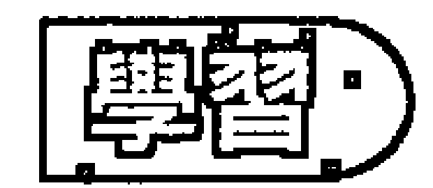

## 主要的問題：依賴。

- 需要、反應、個人的涉入、避開衝突、害怕不適合、受害者。

制約2是負面程式，它掩蓋或歪曲了陰性能量的自然天賦。它是一種防衛或是避開脆弱，那一個障礙，它會使你無法敞開去接受。那個防衛措施會採取什麼樣的形式依那個人是進入那個能量的過度面或縮減面而定。

制約2的人會停留在需要的層面，和持續的依賴，而那個依賴是來自試圖滿足那個需要。很少能夠找到一個2號人沒有處於某種親密關係或是跟家人連結。對2號人來講，別人是必要的，那個制約來自幼年時期在連結方面的創傷。2號人基本上是一個柔軟的、感覺型的人，那個制約是那個小孩發展出來的習慣模式，為了要保護這些感情和脆弱。

## 56 | 制約數字

一般而言，過多的制約2的人的防衛機制是因為依賴而來的，他們的習慣就是把自己給出去，試圖去迎合別人。他們會依賴別人去看他們所期望的——他們應該怎麼做，我們需要做什麼，以及他們需要成為什麼。在那個制約的根部，他們覺得如果別人不同意他們或是對他們覺得煩，他們就無法存活。他們缺乏自我意識，他們試圖在別人的反映當中找到他們自己，他們向外看去找出他們是誰。當別人喜歡他們，他們就覺得他們是可愛的，當別人輕視他們，他們就覺得他們是可被輕視的，他們利用別人作為鏡子來看他們自己，他們無法從內在直接經驗自己。

那個信念是：只要他們迎合別人，只要別人認可他們，他們就安全了，然後就可以從那個人或那個情況得到他們想要的。所以如果他們想要從別人得到什麼，他們就會試著去成為別人想要他們成為的樣子。因為缺乏自我意識，2號人常常想要或需要某些東西。它是一個惡性循環，因為他們越是往外看，他們的自我意識就變得越少，然後就更需要別人的肯定。對於我們的程式一直都是這樣：我們越是在情感上執著於它，越是有更多的投資，那個程式就變得越堅固。所以2號人很容易陷住在需要裡，他們試圖去「取得」，就是那個想要「取得」的能量阻止他們去接受。

這會產生出2號人負面能量的基本運作機制：在那個試圖去得到什麼的行為當中，他們走出他們自己，所以無法在家接受。接受性是一種能力，它基於準備好敞開自己來讓某事或某人進來。我們本身必須「在」才能夠接受。那個過程可能會引起脆弱感，所以有一些人要接受覺得很困難。對給予者來講，當對方敞開來接受，他就會有一種分享的滿足感。當對方是奪取的，那麼那個滿足感就不見了，它變成不是我們給出，而是被拿走。

這種接受並非只是關於有形的東西，所有層面的給予取都是這樣。當過度的制約2的人接受或敞開，他們對接受的東西會視為跟自己有關，那麼，不是純粹地接受和反映當下的感覺，那個2號人會抓住或陷住在那個接受的東西，因為他們將它視為跟自己有關。他們會去設定那個能量或話語跟他們有關。讓我們來看一個例子：2號人可能會碰到一個心情不好的朋友。即使對方沒太多的表達，那個敏感的過度制約2的人會從那個朋友吸取負面能量，然後設定說它跟他們有關。他們會覺得這個人不喜歡他們，或是對他們粗魯，或者他們會被對方不好的心情所冒犯，然後他們就會陷住在那個負面能量裡，攜帶著它成為不快樂的，因為他們無法只是讓它們以一種非關個人的方式通過。

這個制約極端的例子可能導致跟受害者的角色認同。尤其當那個受害者相信別人在跟他們過不去，而他們是無助的，那麼，當然，他們就會招來這個反應。那個受害者，從他們無力感的狀態，在面對那些發生的時候會垮掉，因為他們缺乏能力或勇氣去反應，所以很容易被擊垮。雖然有時候我們會是真的無助，真的是一個受害者，但是那些持有受害者心態的人是使用那種心態來作為防衛。

可能也會有很強的需要，想要維持和諧與和平。雖然這被視為是2號人很美的天賦，它也可能導致很多妥協，因為害怕打擾或傷害到別人。對於2號人來講，做出一些打擾別人或製造緊張和不和諧的事是非常痛苦的，任何衝突都會使他們覺得沮喪。他們會用很多努力去保持和平，常常是要犧牲掉他們自己的慾望和需要。

有時候這個2號人可能會非常害羞和怯懦，他們也可能對別人的意見過度敏感，以至於他們不知道要如何舉止，同時害怕表達或展現自己，因為不知道別人會怎麼想。在一個極端的例子裡，這種人會非常需要、非常渴望別人的認同，別人可能會覺得想要甩掉他們，因為覺得他們太黏、太吸能量了。

跟這個相反的，縮減的制約2的人是非常防衛的，以致於他們顯得很硬，他們把自己武裝起來抵擋受傷。他們的加強防衛不允許他們柔軟或接受，換句話說，不允許他們自己展現出他們本性裡面的陰性能量。並不是說那個陰性能量不存在，而是他們一直忙著護衛它，所以一直處於備戰狀態。這個模式的根也是對別人怎麼想過度敏感、過度顧慮，而且傾向於將每一件事都視為跟自己有關。這種情形可能會發生在一些男人，他們被帶大的家庭和環境灌輸給他們一種觀念，認為柔軟和敏感是一種脆弱，是一個弱點。

這個2號人可能會顯得有刺或很容易習慣性地反應。不是敞開來接受，當內在的某一個按鈕被壓下，他們就會很自動地、無意識地反應，有時候以一種暴力的方式來反應。這種反應是一種拒絕納入的方式，藉著封閉，那個能量就被推開了。換句話說，當某件事很明顯地具有威脅，他們就會立刻機械式地抗爭或逃走。

另外一種2號人可能會經驗到的傾向是心神跑掉。這種2號人有時候會被使用藥物所吸引，或者他們會涉入奧秘的練習，把一個人帶進外太空。有時候只是在面對威脅或不舒服的情況時單純地心神不在。

2號能量也是跟感覺和情緒連結的，所以這個制約對我們的關係有很大的影響。不論是過多的或縮減的，2號制約是一種隱藏或保護自己的脆弱的方式。有一些縮減的2號人就只是跟他們的感覺沒有連結，他們把自己埋在很深的內在，以至於他們變得不知道他們在哪裡。另外有一些2號人，他們對他們自己的感覺有一些覺知，但是他們常常因為害怕曝光而將它隱藏起來。就算是他們對某件事覺得很煩或生氣，他們也會假裝說沒有問題。過度的2號人可能會非常情緒化，這種人的情緒非常外放，在電影院或日常生活裡很容易哭，有任何情緒產生很容易就失去自己。他們很容易被他們的感覺所佔據，而比較沒有遵循他們的思想。有一些人很容易為了一些膚淺的理由就激情演出，但是對於深層的情緒反而不覺知。

因為2號人傾向於去看兩方的觀點，所以他們可能變得優柔寡斷，或是變得沒有方向感。換句話說，他們會缺乏專注。他們可能會覺得他們在漂流，而不太知道他們要去哪裡。在同樣這個主題之下，另外一種可能是迷失在細節裡，只能看到樹木，無法看到整座森林。

2號制約是一種陰性能量的變種，他們，不論男女，都經常以不同的方式在使用女性能量，所以難怪有滿多的男同性戀者是這種制約類型的人。他們比較傾向於跟陰性能量認同，同性戀是它的一種表現方式。

優子是一個很聰明、很有藝術天賦、很成功的人，她很明顯地度過了幾年快樂的婚姻生活，然後她開始發現她在生活上有很多妥協，因為她害怕打擾別人，或是害怕別人不喜歡她。在一個心理治療的工作坊裡，她首度了解到她有權利去聽取和重視她自己的感覺，這使她覺知到她常常把自己的喜好和幸福擺在別人後面。在接下來的那幾年，她面臨了很多恐懼，她覺得如果她有時候宣稱她自己的權利將她自己的選擇擺在第一位，她的生涯就會出問題，她的先生會不再愛她，或是人們會不再喜歡她。那個旅程持續著，途中碰到一些衝突和困難，但是她發覺她自己更能忠於自己的感覺，因此現在享受著更深層的親密，尤其是在她的婚姻裡。

## 早年跟母親的連結、沒有滿足的需要、成為受害者。

2號能量是女性能量，所以主要的烙印來自我們生命中的第一個女人。有時候它可能是父親或是另外一個家庭的成員，他具有主要的陰性影響，但它通常是母親。那個早年跟母親或母親的代理人的關係的品質是一個人如何活出他的2號能量最重要的因素。

通常跟母親有很強的連結，那個連結會持續到嬰兒離開母親的子宮很久。2號人覺得完全被這個連結所滿足，所以想要繼續。那個制約程式的本質依母親有多麼配合或不配合而定。如果母親完全配合小孩，那個2號人可能會發展出依賴的習慣，也许是躲在圍兜的背後，變得在別人面前很害羞、很膽怯。這可能會導致發展出一個沈默寡言、容易臉紅的小孩，他傾向於避開別人，或是只喜歡跟熟人在一起。有時候母親可能會太過於給予，用她保護性的照顧悶死或淹沒那個小孩。她創造出跟她的2號小孩很緊密的連結，駕馭了2號小孩的成年生活，干涉他生活伴侶的關係，或是對他有不理性期望。

有時候母親在嬰兒時期可以配合，但是當小孩比較長大，她變得無法配合。比方說家中的第二個小孩出生，或是跟她伴侶的關係改變。碰到這種情形，小孩可能會有各種不同的反應，比方說，小孩可能會覺得被母親出賣，他們可能會因為害怕受到進一步的傷害而武裝自己，發展出自我保護機制，切斷了他們對別人的敞開。或者小孩可能會發展出一種信念，認為如果他們敞開，他們就會自動受到傷害或是被出賣，所以他們傾向於一再一再地吸引那種情況來證實這個信念。

另外一個情況可能是母親從來不完全在，所以小孩對母親的需要永遠無法被滿足，因此那個空虛和需要的感覺成為小孩日後在他們的關係裡主要的動機因素。當2號小孩沒有從母親那裡得到愛，當他們長大，那個想要從別人得到愛和認可的慾望對他們來講會變得非常重要。因為在他們的經驗裡，他們無法只是敞開就能夠得到愛，所以他們發展出一種必須走出自己的習慣，或是為了要得到而把自己給出去。這樣做，他們就阻斷了他們接受的能力，所以延續了那個不滿足的感覺。在這個制約最痛苦的形式裡，小孩會有一種空虛感，好像在內在有一個很深的洞。他們可能會花很大的力量透過他們跟別人的關係來填補那個洞，直到他們了解到他們想從外界得到的東西事實上是他們要學習給他們自己的。

有時候父母會虐待小孩，讓小孩覺得無助，沒有力量保衛自己，因此在無意識裡面敞開來吸引進一步的虐待，或者它也可能是相反的反應，使他們發展出一種極力保護自己的習慣，以確定它永遠不再發生。

拉福在三歲的時候母親過世，他的父親在一年之內就再婚了，但是第二個母親在他六歲的時候過世。然後他去投靠他的祖母，他的祖母在他十四歲的時候過世。在他的記憶中，他所依賴的人都一直相繼過世。在拉福變為成人的前二十年，他是一個同性戀者，因為他無法對女人信任地敞開。唯有在他超過四十歲的時候，他才覺得能有足夠的相信再度對女人敞開。

## 治療

- 暴露
- 放掉防衛
- 允許感情
- 學習反應

純粹的2號能量是柔軟和具有接受性的，它來自敞開來接受和感覺。2號人可能發展出來的機制是保護和隱藏自己，但整個治療是基於學習敞開和允許它。

當2號人覺知到他們的保護機制，他們就會開始覺得這種模式在他們現在的生活上似乎是不必要的，然後他們就會開始脫掉那些制約而變得更敞開。這是對所發生的事以及他所感覺到的事說「是」。那個說「是」的經驗能夠帶給他們很大的放鬆，然後內在的某些東西就會開始融解，然後他們就能夠對內在和外在所發生的事感覺更多。

現代的氣功和太極拳的訓練可以讓人們學習到真正的力量並不是存在於抗拒，而是在於接受和反應。

對於已經切斷自己的感情和情緒的2號人，情緒的釋放工作是非常有幫助的。有很多治療技巧和靜心技巧是為這個設計的。對於過度情緒化的2號人，那個治療可能是跟你的感情保持一個距離，不是去壓抑它們，而是學習觀照它們的訣竅，就好像它們是天氣的改變一樣，來來去去，不必太過於跟它們認同。

依賴是主要的防衛形式之一，在那裡面2號人放掉了自己的力量。對他們來講，基本的治療是不要再那麼重視別人怎麼想，而是將覺知的中心從別人身上拿回到自己身上，讓他們知道他們有權利去感覺，去重視他們自己的情緒和經驗，而不是把焦點放在別人怎麼想。當2號人能夠更歸於自己的中心，他們就能夠拋掉把別人的想法當成自己想法的習慣。當他們能夠給他們自己的感覺更多的空間，他們也更能夠將那個空間給別人。

2號人必須願意暴露他們的感覺和他們想要什麼，不要害怕，不要關閉。將你的感覺暴露出來是敞開自己的主要方式之一。它能夠很快突破防衛，每當2號人很勇敢地分享他們真正的感覺——不是一種責怪，而只是一種表達——他們就能夠衝破防衛而允許他們的脆弱。過度的2號人需要記住，這跟以責怪別人的方式將情緒倒給別人是不同的。

這樣做，有一些2號人必須面對創造不和諧或打擾和平的恐懼。他們必須深入去看，這種害怕傷害或打擾別人事實上可能是由於內在害怕不被愛、不被喜歡、或不被認可。有了這個了解，他們就可以看到這種舊有的連結模式事實上是關掉親密的門，而將關係放在一個安全和膚淺的層面。它很容易會導致每一個人都在顧慮別人怎麼想或怎麼感覺，而沒有人很真實地去聽自己內在的感覺。有很多表面上很好的婚姻可能是建立在這種基礎上，直到有一天，伴侶突然了解到，他們一直在忙著迎合對方，不要打擾對方，因此他們完全喪失了跟自己感情的連結而不知道他們在關係裡幹什麼。一個很好的例子就是，一個中年婦人一直以來都是一個完美的太太和母親，然後突然有一天從那個情況出走，因為她了解到她不知道她是誰，或者她的感覺是什麼。

2號人要學習去經驗他們的脆弱，而不是相信他們必須過著護衛的生活。他們必須了解護衛自己、不使自己受傷比任何感情的傷害更痛苦。他們將會發現當他們對別人說「不」，而對自己說「是」，人們還是會喜歡和愛他們。

## 成熟的潛力

- 敏感、敞開、保持和平、保持和諧、流動、直覺。

成熟的2號人可以是一個很好、很敏感的人，在別人的眼裡是一個很溫和、很甜美的人。他們會活在一個很和平、很和諧的氣氛之下，他們會創造或維持這種氣氛，消除摩擦或不和諧。

2號人喜歡跟你們在一起，而且很懂得怎麼跟你們相處。2號人通常會顧慮到別人，所以他或她想要使他們覺得很好，做任何必要的事來跟他們維持良好的關係。2號人可能會很體貼、很敏感，是一個很棒的照顧者，他會預先設想那些他所照顧的人的需要。

2號人可以成為任何類型的伴侶，尤其是在親密關係裡。他們在跟別人親近的情況下會表現得很好，他們有很強的投資在使關係運作得很好，所以他們通常可以被認為是忠實的、值得信任的。他們會從親密的分享得到很多他們的滋養，當他們對別人敞開，他們會覺得很滿足。成熟的2號人很能夠融入別人，他或她覺得在親密關係裡面很完整，所以知道如何跟另外一半創造出合一的狀態。

因為保持和諧對他們來講很重要，所以2號人可能會被鎮定和安詳的感覺所圍繞著。他會讓別人覺得在他面前是被接受的，可以放鬆，他將不會攻擊或挑戰你。當2號人允許他們的敏感度，他們不僅可以感覺到他們的周遭，他們也會對那個情況或對別人很仁慈、很溫和、很同情。他們處理事情會很有技巧、很體貼、很有耐心，即使碰到困難，他們也會很柔和、很適當地去化解那個緊張。

2號人也知道如何傾聽，他們具有一種能力能夠使別人覺得被聽到和被接受。他們知道如何為別人存在，使他們覺得被重視。2號人需要別人，所以，他們也會使別人覺得被需要。他們會看到別人的觀點，所以不論在私人情況，或專業的情況，他們都很懂得磋商、協調、或調停。在爭吵的時候，有一個2號人在旁邊是很好的，他們可以把自己擺在一旁去看所有不同的觀點，將那些觀點綜合在一起，使每一個人都高興。同時，有很多2號人展現出很會照顧細節，而且很有耐心照顧它們。

2號的能量直接跟情感或情緒連結，所以2號人跟世界的自然介面就是透過他或她的感情或感覺。2號人傾向於透過他們的感覺來對情況反應，而比較不是透過他們的想法，他們會熟悉各種感情和情緒，而且他們也不介意將它們展現出來，事實上，他們有能力暴露出他們的內在，並敞開來接受。這個接受性就是他們的力量。2號人的力量來自他們願意敞開來讓事情碰觸到他們的內在深處，然後將那個被碰觸到的部分表達出來。在自然界，我們可以看到那個力量展現在樹木的彎曲，或是水的力量，它會流向最少的抗拒，以及花朵的力量，當它展現出它的脆弱給世界。在人類的行為裡，它是有勇氣使自己成為具有接受性的和被暴露出來。

敞開的2號人知道順著生命的流走是意味著什麼，當有那個「是」存在，2號人可以以一種很有彈性、很滑順的方式跟著存在流動。2號人比較不顧慮到未來，或是如何使事情發生，他們比較懂得讓事情發生。就像河流一樣，他們傾向於自然流動，而不是採取行動。如果河流轉向另外一個方向，那是它們要走的方向，如果沒有什麼事發生，他們會等待，什麼事都不做，而如果它們來到急流或瀑布，他們就會變得非常活躍。當2號人對一個情況沒有投資，他們對正在進行的事實的感覺會比大多數的人更清楚。當他們夠強壯可以獨立反應，生命就變成一個容易、和諧的流。

這個流不只是跟外在的事件連結。一個發展得很好的2號人也知道如何聽取他們自己的感覺和他們自己內在的聲音。2號人對於超出他們自己的存在之外的訊息也會有感受，換句話說，他們會感受到在他們周遭精微的能量流，所以他們有能力去融入那些能量，讓那些比較不敏感的人覺得他們很特別，這能夠使他們發展出很好的直覺能力，有時候甚至會通靈。在另外的情況，這個敏感度可能會成為一種具有治療能力的天賦，那就是允許更高的能量流經他們。

## 培養一個制約2的小孩

制約2的小孩最需要父母，尤其是母親，給他們愛。他們是脆弱的、具有接受性的小孩，通常比其他小孩更敏感，同時在感情上更脆弱，所以很容易受傷。耐心照顧那個小孩纖細的情感能夠幫助他們經驗到，保持敞開和具有接受性是沒有問題的，雖然他們有時候會受傷。最好教小孩不要害怕感情受傷，而不要試圖使他們將那個感覺推開。一個不再信任他們的感覺的2號小孩事實上是迷失了，他們將會陷住在一直期望別人來告訴他們要怎麼做。

2號小孩需要學習，感覺是沒有問題的，即使那個感覺有時候是不愉快的。同時他們需要知道他們所感覺到的是他們的事實，而不要給他們別人的訊息。比方說，小孩可能會覺得某人不喜歡他們而受傷，但是那並不代表那個人真的不喜歡他們，只是小孩這樣覺得。所以父母可以幫助小孩，一方面告訴他們說他們有權利去感覺他們所感覺到的，但是同時指出它可能並不是那個情況的真相。

父母也必須小心，不要用過度保護來悶死小孩。無法不讓2號小孩受傷，但是你可以幫助小孩學習說有各種感情，有一些是好的，有一些是不好的，但是它們都沒有問題。

2號小孩跟母親的連結時間會比較長，如果小孩傾向於比較黏或是有較多的需求，那麼母親就要找到一個平衡，一方面給予他們安全感，讓他們知道你是在的，同時鼓勵他們靠自己去冒險進入新的領域，即使他們也許會覺得害羞或不舒服。一個獨立的小孩會轉變成獨立的大人。母親必須支持小孩去保持敞開和敏感，而不要將他們關在保護區裡面，阻止他們跟周遭的世界連結。

2號小孩需要很多母親的認可，但是母親除了給予認可之外也要常常用下列的問題來回應：你認為如何？你喜歡怎麼樣？你覺得怎麼樣？藉著這樣做，你將小孩推回去看他們自己，而不是仰賴別人看要做什麼或是要如何做它。你要鼓勵他們去了解，考慮他們自己的感覺比別人想要他們怎麼做來得更重要。

當有某些事發生在家裡，比方說另外一個小孩出生，或是有些情況使得母親無法完全照顧小孩，那麼為了不要使小孩造成創傷，你可以耐心地向他解釋為什麼事情會這樣發生，它能夠幫助紓解小孩的心情。

2號小孩會被母親的個性和行為所影響，母親需要覺知到小孩不會按照她所教的去發展，而比較會按照她是怎麼樣去發展。如果母親傾向於對小孩隱藏她真實的感情，她是在教小孩子做同樣的事。如果她想要小孩成熟成為一個柔軟、具有愛心，而且能夠聽取自己內在的心聲的人，那麼她就必須以身作則。如果母親傾向於成為一個受害者或是將自己的權力給出去來順應別人，那麼小孩也會變成這樣。

# 制約

# 根（本質）——表達

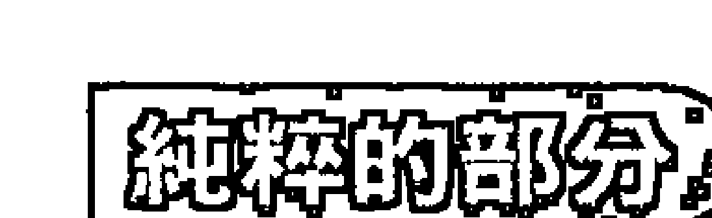

# 表達、創造力和喜悅。

3是表達、創造力和喜悅的數字。它是我們將我們的能量放進世界的方式。當主動的陽被陰所接受，那個組合就創造出3號的能量。在最明顯的例子裡，當一個男性穿透一個女性，生命就被創造出來了。創造性所指的不只是很明顯的活動，比方說像畫畫、雕塑、跳舞、或製造小孩，而是整個跟生命連結的方式。當我們做任何事，把它做得最好，或是使用現有的元素來使事情得以順利運作，我們就是用建設性和創造性的方式在跟它連結。當我們這樣做，我們就打開了讓喜悅和滋潤進入到我們生命的門。喜悅並不是正向的外在情況的產物，它是我們處理外在現況的方式的產物，它是一種內在的品質，所以我們的3號能量是在處理我們能夠享受我們的生命多少。它也包含展現——我們如何將自己表達或展現給別人，對於外表的顧慮，對於事情看起來怎麼樣，在各個層面的展現。

## 主要的問題：表達、外向的能量。

創造的能量、外表、散發能量。取悅者或表演者、注意、講太多話。知道你要什麼、情緒化。

3號人會顧慮到表達的情況。在它的純粹狀態下，你的能量會以一種創造性的方式來表達，然後會自動帶給那個人喜悅。以創造性的方式來做事意味著我們將我們的心放進去，而不只是將頭腦和身體放進去，我們從一個內在真實的地方主動和建設性地運作。3號制約涉及這個純粹能量的歪曲。

過度的制約3的人相信為了要保持安全，他們必須「使」那個情況看起來像某個樣子，他們必須創造出正確的外表來引起正確的反應。他們會掩蓋自發性的表達，並代之以膚淺的、刻意的呈現，因此他們會覺得無法放鬆地讓事情按照本然的樣子存在，他們一直都必須上緊發條。跟一些3號人在一起可能會覺得很耗能量，因為由於不安全感，他們一直都會想要努力去改變那個情況，使它呈現出他們看起來是對的。他們無法只是放鬆成為自己，那使得別人也無法這樣做。

因為3號人把焦點放在事物的外在，所以他們可能喪失了跟內在真相的連結。有時候他們對自己的感覺、喜好、或欲求不大知道，他們只會顧慮到別人會怎麼看。這種3號人非常外向和社會化。跟人們的關係必須被創造出來，所以他們攻於社交，想要取悅別人，常常賠掉對自己的覺知和他們自己內在的幸福。從這個狀態，他們跟別人的互動，以及他們跟自己的關係會變得膚淺。基本上，他們害怕表達真實的自己，在某些情況下，他們根本不知道真實的自己是什麼。這種3號人不相信只是單純地表達真實的自己是會被喜歡的。

同樣的信念可能會影響到關係以外的情況。3號人可能無法看到事實的真相，因為他們很想要它以某種方式呈現，或是適合他們的信念。在極端的情況裡，這個能量可能會使他們進入幻想，完全跟事實脫節。比方說，3號人可能會十分涉入他未來跟一個他所看到的女孩結婚的計劃，但是事實上那個女孩幾乎不知道他的存在。他會誤解她的態度來進入他自己編造的故事。

3號人在純粹的狀態下有能力知道他想要什麼，什麼事物能夠帶給他喜悅，什麼事物能夠帶來滋養。所以，當由於生存的需要，那個能量被歪曲了，那個人就會沒有能力知道什麼東西能夠帶給他喜悅。一個來自3號人一般的呼喊就是：但是我不知道我要什麼。他們可能花了一生的時間想要去找出這個答案。喜悅來自做我們所喜歡的事，我們能夠真正享受的就是我們能夠完全投入的。當我們將我們的心放進一件事，它就變成創造性的。它跟頭腦的關係很少，真正的創造性能量是由內而外來表達的，只有這樣才能夠帶來真實的喜悅和幸福。

當一個人比較重視外在，換句話說，成為社會化的，或是比較顧慮到別人的看法，那麼他跟自己內在源頭的連結就會比較少，而真正的創造性表達和喜悅是從那個內在源頭產生出來的。

過度制約3的人另外一個主要的動機就是想要得到注意。注意是使他們覺得活著的食物。他們得到注意的方式依他們孩提時代所培養起來的習慣而定。比方說，如果成為可愛的、迷人的、調皮的，成為「父親的小女孩」，就能夠得到注意，那麼他們長大的時候也會玩同樣的把戲；如果成為好玩的能夠成功，他們就會那樣做；如果看起來美美的能夠引來掌聲，他們就會那樣做；如果對每一個人都很好、很愉悅被認為是好的，他們就會盡量以這樣的方式來表現，帶著永遠虛假的微笑來祝賀世界。如果這些正向的能量面無法得到注意，他們就會轉向負面的：擾亂別人、挑戰或攻擊別人、跟別人唱反調，為反對而反對、或是做錯誤的事，只要能夠引起注意就好。這個行為在以後會變成3號人在社會或關係上反應的模式。他們越不安全、越緊張，或者投資越多在想要從那個情況得到某種結果，那個模式就越會駕馭他們的行為。

有一些過度的3號人反應於他們的不安全感會變成一直講話的人，他們會一直喋喋不休，把周遭的人逼瘋。他們的能量一直從口部倒出來，講話不經大腦，這樣的人事實上是生活在比較膚淺的層面，換句話說，他們是比較輕浮的。

3號人總是覺得他們必須以某種方式將他們自己呈現給別人，覺得他們必須成為什麼，否則他們不會被接受，或是不安全，或是無法得到他們想要的。這意味著他們常常處於一種必須去完成什麼的位置，事實上他們是在扮演某一個角色。他們這樣做很可能會喪失他們內在真正的喜悅。

有一些3號人並沒有那麼導向被注意或外表，但是比較去追求歡樂，他們將膚淺的歡樂看成真正的滋養和滿足。在這個追尋當中，他們有時候會陷住在心情的兩極——高低潮、快樂和悲傷、興奮和痛苦，有時候會變得很沮喪。他們一直在找尋虛假的高昂的能量，高度的歡樂和快樂，相信它將會帶來他們想要的。他們可能會沉溺於歡樂，但是這種能量只能存在於二分性，所以當他們經驗到高昂的能量，他們也不可避免地一定會經驗到它的反面，走得越高就必須降得越低。

我們可能都曾經有類似的經驗，在參加一個很棒的治療團體之後，或是在一個轟轟烈烈的浪漫插曲之後，或是在一陣好運之後，我們覺得心情非常好，但是在幾個小時或幾天或也許幾個星期之後，我們突然發覺我們的心情盪到谷底，通常是沒有什麼特殊的原因。這只是自然的鐘擺現象，無法避開相反的擺動。但是我們可以從經驗中學習到，這種上升的能量事實上無法給我們真正想要的內在滋養和喜悅。

另外一種發散3號能量的方式可能是透過放縱在藥物或酒精裡。使用這類的東西是想要讓自己覺得很舒服，避開以創造性的方法去處理不愉快的事實，避開較深的不愉快的感覺或經驗。換句話說，它變成沉溺在很高昂的心情裡。

縮減的3號人所經驗到的是這個制約的反面。沒有將他們的能量散發到膚淺的、外在的事情，他們將那個能量抓在內在。他們會覺得那個能量卡住，通常是卡在喉嚨。在極端的個案裡，這可能會引起講話的困難，或者在表達某些事情的時候覺得不舒服。這種縮減的3號人跟你們在一起的時候可能會覺得不舒服，尤其是跟一大群社會人士在一起的時候。他們比較喜歡小聚會或是一對一的連結。他們可能會傾向於悲觀，傾向於去看事情的黑暗面，而不是以建設性的方式來看它。有時候這可能會導致陰鬱或是對生命不熱心。

有時候這種3號人在表達自己的方面有困難，但是他們擅長利用這個能量以創造性的方式來做事。或者有時候它可能反過來，他們有困難以創造性的方式來做事，但是卻很善於表達，它依小時候的經驗而定。

不論是過度的3號人或是縮減的3號人，他們的本質都是害怕做他們所喜歡的事，害怕享受自己。在內在深處，常常是無意識的層面，他們相信如果他們去做他們真正喜歡的事，或是去享受自己，就有人會告訴他們說他們做錯了。有一些3號人可能會覺知到這一點，每當他們在享受美好時光，他們就會覺得有一些罪惡感。結果，促使他們行動的動機可能會有很多種——做些什麼，因為它對別人是好的，或者也許因為它對他們自己是好的，或適當的，或是有幫助的，或是有用的，或對的，等等，但是很少只是因為它是他們想要的，只是為了純粹的高興。

# 原因

3號小孩很早就學會要保持安全和得到他們想要的就是要讓別人知道你在那裡。首先你需要他們的注意，否則沒有什麼事會開始發生。這種習慣的養成可能會發生在小時候就受到很多注意的小孩，比方說是第一個出生的小孩，受父母溺愛的小孩，或是第一個男孩，或是第一個女孩，他們被看成家裡的寵物。所以小孩事實上是沉浸在这种被注意裡，他們一直在找尋它，而且也會做出得到別人注意的事。這種傾向負面的使用可能會被視為是賣身，正向地使用可以成為舞蹈或音樂的表演者。

另外一個極端是小孩根本沒有得到注意。有時候是小孩在幼年時期家裡出了一些困難，使得母親無法注意照顧小孩，或者也許家裡已經有很多小孩，或是另外有一個小孩必須得到更多的注意，而無法給這個3號的小孩足夠的注意，或是這個小孩並不是父母真的想要的，或者父親太忙於工作，而母親太忙於社交生活，有很多可能性造成父母照顧不週。因此小孩會產生一種感覺，如果他們沒有做些什麼來吸引父母的注意，他們可能就無法存活。有時候並沒有什麼合乎邏輯的原因，小孩就只是很渴望得到注意，而且願意做任何事來得到它。
有很多小孩會先嘗試正向的方法，但是如果那些方法沒有效，他們就會訴諸負向的方法。如果得到注意唯一的方式就是大叫或尖叫、打弟弟、功課失敗、或是惹麻煩，那麼他們可能會這樣做，不管做什麼事，只要得到注意，也比被忘掉或是被忽視來得好。在這兩個極端之間，有一些小孩可能會找到他們覺得比較安全、比較好的方式，他們會以正向的努力或最好的方式來被喜歡和得到認可。

這個制約的另外一種情況是，父母都很注重外表，然後將這個模式傳給小孩作為基本價值。重點不在於小孩的內在如何感覺，事實的真相如何，而是它看起來如何。所以只要小孩看起來是有禮貌的、愉快的，或是合乎父母的要求，他們就會得到正向的回饋。然後如果他們沒有創造出正確的印象，就算是他們很真實、很誠實，他們也會被責罰。這種父母的心態主要的顧慮可能是家庭的名聲，或是比較在意別人會怎麼想。或者也許是父母不喜歡去處理一些麻煩，或是不喜歡小孩太坦白、太自然而使父母覺得尷尬。

有時候家庭所營造出來的習慣是：快樂被視為是正確的，而悲傷、挑戰、或不和諧是要被避開的。所以小孩變得過度正向，或是刻意正向，任何不愉快的事都被壓抑而進入無意識，每一件事都被歪曲成正向的，來維持快樂家庭的幻象。

對某些人來講，成為縮減的3號人，不要引起注意可能是一個比較安全的存在方式。也許小孩發現，當他們吸引注意或是以某種方式來表達自己，他們所得到的反應大部分是負向的。結果小孩就學會壓抑他們的能量和熱情，有話不敢說，以這樣的方式來保護自己、保持安全。

在所有這些情況裡，有一件共通的事是：如果小孩去做他們真正喜歡的事，他們並不會得到認可或獎賞，所以這樣做對他們是不安全的、不利的。

# 治療

發展創造力、允許去做那些令人享受的事、有權利表達。

治療3號制約就是學習如何以創造性的方式來表達，並得到喜悅。創造性的行為主要是我們將我們的心放進去。如果我們完全涉入，我們也能以創造性的方式來清理房子或煮飯。而如果我們沒有完全涉入，即使我們畫畫或製陶也不見得是創造性的方式。

過度的3號人在治療旅程的開始常常發生的是他們開始覺得疲倦。尤其是當他們年紀變得越來越大的時候，他們已經不再有更多的能量可以丟出來。他們開始清楚地覺知到他們過得不快樂，沒有享受自己，他們沒有做他們想做的事，而且也許他們並不知道他們想要什麼，他們開始覺得困惑。

通常治療的第一步是認出他們的能量如何發散在那些沒有創造和不愉悅的活動裡，以及為什麼會這樣。當那個能量繼續浪費在事情的外表、得到注意、尋求歡樂、使他們自己或那個情況看起來很好看，它就無法從較深的層面來表達而發揮出真正的創造力來得到喜悅。所以3號人會開始了解到他們的生命有很多是按照別人的想法來活，一旦有了那個覺知，內在的衝突就會開始產生，一方面想要停止再以原來的方式浪費能量，一方面又害怕如果沒有按照原來的做法會不會引起什麼不好的結果，然後他們就會開始去看為什麼會有那個害怕存在。

當然，那個去問為什麼的動力是成長和改變所需要的。然後他們可以開始看清按照原來的做法事實上並不會使他們快樂而只會使他們變得疲倦。從這個增加的覺知，3號人會漸漸放掉這些維持虛假的外表的做法，然後這些釋放出來的能量就會開始進入內在，使他們自己去知道他們真正想要的。他們需要時常問自己，他們有很享受嗎？如果沒有，為什麼沒有？然後去選擇他們真正喜歡的。它可以只是很簡單的事，比方說，要看什麼電影，要吃什麼東西，或是要不要去參加一個宴會。慢慢地，但是很確定地，3號人會開始學會認出他們所喜歡的，以及什麼事能夠帶給他們喜悅。隨著這個覺知的成長，他們就會自動轉向那個能夠帶給他們喜悅和滋養的方向，然後離開那些無法帶給他們喜悅和滋養的事。

這個過程的一部分就是允許他們自己表達真正的自己——我喜歡這個，我不喜歡這個，我感覺到這個，我想要那個。不論是過多的或縮減的3號人，他們的治療就是關於要有勇氣表達自己，分享那個實際上在發生的。尤其重要的，要允許自己有偏好，同時有權利去執行它。他們將會發現，當他們去選擇他們喜歡的電影、晚餐、或渡假的地方，而不是一直都讓別人來作決定，他們仍然可以被愛、被重視。

以一種簡單和實際的方式，某些創造性的訓練可以非常有幫助。也許是一個藝術課程、製陶課程、插花課程、居家裝飾課程，或是寫作課程，任何能夠支持一個人找到那個內在創造力的源頭的都可以。一旦他們發現那個創造性的作為所帶來的喜悅，他們就會繼續走向那個方向並擴展它。換句話說，他們會學習如何使事情運作得對自己有益。

# 成熟的潛力

創造力、喜歡樂趣、善於表達、幽默感。

自然的3號人在世界上的運作基礎是創造的動力，當這個動力被正確地引導，它是一個很棒的祝福。它可以被培養成藝術家、設計師、建築師，和其他創造領域的專家。這些人想要表達自己的強烈動機和需要使他們能夠在這些領域做得很成功。有時候那個想要得到注意和認可的衝動會把他們推向他們所選擇的領域的成就。比方說在表演的領域，例如跳舞或演戲，這些人尤其能夠做得很成功，從高度成功的百老匯演員到商場的展示員都可以看到這一類的人。

即使成熟的3號人沒有在一般人所認為的創造性領域發展，他們常常也有能力去解決別人所無法解決的難題，他們會將那些難題視為創造性的挑戰，而很自然地去找到一些竅門來解決它。3號人喜歡被佔據，他們能夠從無聊的事製造出樂趣和創造性的活動。自然的3號人喜歡享受，過著愉快的日子，到處玩，輕輕鬆鬆地，不要太嚴肅。這有時候可能會意味著喜歡宴會，他們可能會鼓勵別人不要太防衛，一起喝杯酒，讓心情愉快一點，傻傻地享受就好。

這種3號人常常喜歡娛樂他們的朋友，或是跟他們在一起的人。他們可能有很好的幽默感，常喜歡講笑話。他們可能會將最近發生的事戲劇化地表演出來，或者他們只是喜歡講一些故事。

成熟或自然的3號人是善於表達的、外向的，他們想要分享他們自己，或是跟別人在一起做些什麼。他們很容易跟每一個人相處，而且善於交談，即使是跟陌生人。他們可以毫不費力地就跟別人聊開來，填滿溝通的空隙，使事情顯得很愉快，也使別人覺得很舒服。他們想要被喜歡，也知道如何使別人喜歡他們，所以他們會很孚眾望。他們會保持愉悅，看事情的正向面，保持正面的態度，也使別人變得比較正面。他們有能力去看到事情有趣的一面，同時能夠保持輕鬆和遊戲的心情，當事情很沈重或是很嚴肅，有他們在場是很好的。他們有自嘲的天賦，或是引發別人來笑他們自己。

3號人通常會涉及文字的使用，所以他們常常會進入跟語言、寫作、或演講有關的行業。他們也善於從個人的觀點來分享他們自己的經驗和觀點，喜歡談論他們自己的關係。他們常常有愉快的講話聲音，而且很可能會唱歌。

拉拉的母親來自一個比較上流的家庭，她的內在決定，她的小孩要好好培養，以保持她在社區的地位。拉拉在家裡被教導在關係裡面要盡可能保持愉快。她跟一個瀟灑、合適的男人結婚，組成一個很美滿的家庭，有兩個可愛的小孩，每一件事似乎都很完美。但是到了快四十歲，她變得越來越覺知到她並不快樂，或不滿足。當她的不快樂陷入沮喪，她開始去找心理治療師，她被鼓勵去發揮她的創造力。她想起：「寫作似乎是最容易的，所以就開始每天花幾個小時的時間在電腦旁邊玩文字，寫下任何來到我頭腦的事。」這打開了門去接觸她自己的內在深處，在投稿一些短篇小說給婦女雜誌之後，她開始寫起第一本受歡迎的小說，她現在正在忙著寫第四本。

# 培養一個制約3的小孩

3號小孩需要表達，那個小孩的表達如何被接受會形成他長大以後的發展。健康發展的基本原則就是當小孩很真實地表達，他們可以得到獎賞，而不是要表達得看起來很好，或聽起來很好。要讓小孩感覺到他們有權利表達，但是他們也要被教導說表達有分適當與不適當的時間和場合，因為有時候那個表達會傷害到別人或是使別人覺得尷尬。
尤其是關於小孩的情感表達，當小孩說：「我不喜歡這個。」或是開始哭，你就叫他不要那麼愚蠢，或是其他類似的評語，你會讓他們開始不信任他們自己的經驗。小孩的感覺必須被尊重，雖然有時候那個感覺對父母來講是奇怪的或不像是真的。

創造和享受的能力是基於小孩的感覺經驗。3號小孩自然的感情表達方式是透過創造力。對某些小孩來講，它可能是透過繪畫，其他的也許喜歡唱歌、跳舞、或打擊樂器，也有一些是天生的表演者。所有的小孩都有一些創造力，但是有很多3號的小孩在這方面尤其活躍。這個創造的過程被鼓勵、被增強是重要的。常常對小孩來講是藝術的東西，大人看起來好像是一團糟，所以大人不宜用批判的眼光來看它。

獎賞3號小孩的創造性努力，比獎賞他們的學術進步也許是更重要的。鼓勵小孩在藝術或任何其他吸引他們的方向的表達是很好的，也許可以幫他們添購一些藝術用品或樂器，或是注意他們的表達。記住，小孩渴望你的注意，所以如果你獎賞他們的數學高分比獎賞他們的繪畫更多，他們就會往那個被獎賞較多的方向發展。記住，如果小孩做正向的事沒有得到你的注意，他們可能就會去做一些負向的事。

在所有的事裡面最重要的是，你要允許你的3號小孩去享受他們自己。小孩會自動知道他們喜歡什麼，但是3號小孩很容易會喪失跟那個覺知的聯繫，除非它受到鼓勵。他們的享受需要得到正向的回饋，而不只是在成功的時候才得到鼓勵。因為小孩本身會有不安全感，所以他們的能量會優先放在被賞識和被注意，而變得比較注意那些他們可以達成的，而忽略了那些能夠帶給他們喜悅的。

如果你重視小孩要能夠享受他們自己，那麼那個著重點是放在他們內在的經驗——他們表達發出的源頭，而不是放在它看起來怎麼樣。換句話說，小孩需要被鼓勵去為他們自己做，而不是為你或為別人做。那能夠使他們跟自己創造性的表達能力保持連繫，同時帶給他們生命的愉快。

## 制約

- 根（本質）——身體

## 純粹的部分

自然、做和生產的能力、實際、真實、歸根於地、綠手指（很會栽種綠色植物）。

4是結構、身體，或什麼東西的事實。它是由3號創造性的表達所發展出來的形式。純粹的4是去存在的能力，它可以被描繪成：想像一棵古老的大樹聳立在森林裡那個品質。那個完全歸根於地的「在」，根植於事實，不需要改變或是對它做什麼。它是深深地接受那個是的。4的能量是我們裡面那個真實和自然的部分，那個來自身體的動物品質和經驗自己是自然世界的一部分。那是更原始的社會所保持的品質，但是當我們變得更老練，受了更多的教育，我們就越失去它。它最大的顧慮之一就是做為和存在之間的兩難式。4號的能量是關於我們跟實際世界和身體的互相連結——我們怎麼做，我們怎麼給東西形式，我們怎麼運作。

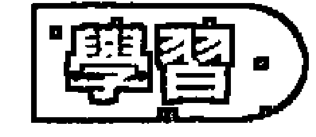

## 主要的問題：安全

- 安全導向
- 很難成為自然的
- 固定和僵硬
- 難題導向
- 自我規範
- 身體的問題
- 歸根於地
- 不實際
- 做為vs. 存在

純粹的4號能量是放鬆和自然地成為自己的能力，它是我們跟自己的真實性和平凡狀態的連結，是透過活在我們的身體和動物部分來聆聽直覺的能力。當我們很放鬆，跟我們身體的訊息連結，我們就能夠跟我們周遭的事實連結，因此會覺得是舒服的。

## 90 | 制約數字

制約4從一個主要的信念來運作，認為成為真實的和自然的是不安全的，而且對於我們想要得到什麼是沒有效率的。這個制約是基於這樣的想法，認為安全和保障是生命中最重要的事。我們都喜歡覺得安全，但是4號人可能會很嚴重地把自己限制在這個需要裡。在極端的例子裡，那個人會變得過度小心，有固定和僵硬的習慣，只是成為本然的樣子會覺得不安全。

4號人有困難只是成為本然的自己，因為他們被教導不信任那個在他們裡面自然或真實的，他們無法放鬆地只是成為本然的自己。如果他們被教導憤怒是不好的，他們就會經常控制好不生氣。如果笑和享受沒有被支持，他們在允許自己進入那些歡樂的時候就會很小心。如果身體的噪音被批判成為魯莽或不悅的，他們就會加以控制而變得僵硬。當一個情況在早年被經驗成不安全的，那麼當他成年之後有同樣的情況發生，他也會覺得有潛在的不安全感。所以他們經常會覺得需要控制，不允許單純、自然的自己。瀰漫在他們身上的那種不安全感和小心翼翼使他們無法放鬆，內外都無法放鬆。

這個制約的根是我們跟身體連結的態度或方式。身體是我們跟事實的連結，身體一直都在此時此地，同時對它反應。處於身體裡使我們保持對自己和對周遭的發生是「在」的。放鬆來自處於當下身體的事實裡，當那個事實不被接受，我們就無法很舒服地處於我們的身體裡。

縮減的4號人跟身體不連結，在極端的例子裡，這可能會讓人覺得他們飄浮在它上方的某一個地方。這個疏離可能意味著他們常常不知道他們的內在是怎麼一回事，他們可能會產生困難，因為他們不知道如何聽取身體給他們的訊息。他們不知道他們什麼時候是疲倦的，什麼時候他們吃到了不對的食物，什麼事不適合他們，他們需要什麼來為自己謀幸福。我們透過對身體的覺知來經驗我們的感覺，所以當4號人切斷了他們身體的感覺，他們也同時失去了跟自己感覺的連繫。一般而言，這種4號人可能是沒有歸根於地，沒有根植於他們的身體，結果他們傾向於覺得心神不在或沒有歸於中心。這也可能被經驗成一種懶惰的傾向，只是想要傻傻地坐在電視機前面看電視，或是避開努力去做那些需要做的事。它可能是一種「我才懶得感覺」的狀態。

限制跟身體的連結，縮減的4號人切斷了他們跟事實的連結，因此也可能跟周遭的發生沒有連結。他們也許無法看清事情，尤其是關於他們自己的事，而那些事情對別人來講是很明顯的。這可能會導致無意識地忽視一些他們不想處理的事。有時候他們就只是不善於把事情整合起來，或是對那些需要秩序的事顯得很笨拙，因此你會發覺他們的生活很邋遢。在最糟糕的情況，他們可能會跟周遭脫節，有時候他們只是單純地心不在焉。對這些人來講，處在身體裡和心神的「在」使他們覺得不舒服和不安全。很明顯地，他們的學習是如何去面對「回到身體和回到事實」的不安全感。

過度的4號人對於不安全的反應是使自己陷住在身體的形式裡。他們的身體會緊張而變得很緊，這會轉移到他們跟周遭世界連結的方式。這會產生需要保持自我規範，控制自己，因為只是放鬆地存在是不安全的。他們常常覺得他們必須處於戒備狀態，要很小心，因為恐怕某種不能被接受的東西跑出來。在極端的例子裡，這可能會呈現出身體的僵硬，身體無法很容易地彎曲或移動，常常會因為這個緊張和不能放鬆而造成身體的疾病。

因此他們跟世界的連結也會是緊張的，所以他們需要一種秩序的感覺，也喜歡一些清楚定義的限制。過度的4號人比較喜歡例行事務，而比較不容易適應改變。當所有的事情都安排得很有秩序，他們就會覺得比較舒服，而當事情有太多的變動，他們就會覺得比較不舒服。如果你遲到或改變你跟他們的安排，他們就會覺得十分焦慮。在另外一方面，縮減的4號人可能會忘掉跟你有一個約會，或者可能會避免跟人家約會。

4號制約的主題之一是「相對於只是存在」的問題。上述的症狀常常是需要「做」，才覺得舒服或安全，如果只是存在、不動，就會覺得沒有安全感。過度的4號人喜歡永遠保持忙碌，只要他們能夠找到事做，他們就會覺得比較舒服、比較愉快。這個4號人也許不會覺得自己是緊張的，因為他們的經常忙碌把那個緊張的感覺給壓抑了。當為了某種原因，比方說身體的毛病，使他們無法繼續做，他們才會覺知到內在的不安靜。這樣他們才會碰觸到他們那個不舒服的感覺，它主要是不安全感，雖然他們也許不以這個名詞來形容它。他們也許甚至會稱之為無聊，但無聊只是不被佔據的另外一種說法。

4號人有一種不安全感是關於生存的問題。有時候它可能是實質生活上的經濟問題，但常常那個不安全感是非理性的，他們可能很富有、很有能力，而且能夠在世界上得到他們想要的，但是他們卻仍然有一種無名的不安全感。不安全的本質就是跟此時此地的事實失去連繫，而去顧慮那個將會發生的，或是那個已經發生的。

另外一個過度的4號人的問題是他們傾向於難題導向，他們無法單純地接受事情本然的樣子。比方說，我發生意外而把腳給弄斷了，我可以接受那個事實，以及它所帶來的限制，或者我可以呻吟或抱怨，不接受這個事實，將它視為一個難題。接受事實並不是意味著放任不去管那個困難，雖然那個心神不在的4號人可能會有這種現象。接受事實意味著要採取正確的行動去處理那個情況也只能先接受那個事實。換句話說，如果你不喜歡什麼，為了要看清我要什麼以及我能夠對它做什麼，我也必須先接受事情的現狀。如果我不接受事情的現狀，我就會在那裡呻吟和抱怨，或是覺得不安和擔心，但是這樣做事情並不會改變。

> 原因：
身體的問題、不安全的生活形態、過度規範或不安全的父母、害怕只是單純地存在。

4號人在早年學習到放鬆和只是成為自己是不行的，它是不安全的，而且無法得到他們想要的。比方說，當他們覺得疲倦，就有人告訴他們要起來；當他們想要去玩，就有人叫他們要寫功課；當他們肚子餓，他們不被允許吃東西，而當他們不餓的時候，卻被強迫要吃東西。這種制約可能來自太有規範或諸多要求的父母。小孩很快地就得到那個訊息說聽取自己身體的經驗，並依照它來行動沒有辦法得到正向的回饋。所以他們就對身體失去信心，然後跟它失去連繫。切斷了對身體經驗的事實的信任，小孩就失去了跟存在的根的連繫，在這種狀態下，他們在世界上就不再能夠放鬆而成為本然的自己。當我們無法著根（歸根於地），我們自然就會覺得不安全。因此安全感對他們來講就變得很重要，小孩的主要顧慮就是他們需要做什麼來使他們能夠受到保護。

有時候這種制約的養成是因為父母在小孩的安全上太過於小心。「不要碰這個，對那個要小心，不要去那裡。」因此讓小孩覺得處處受限制，處處不安全。

有時候是因為父母太松散了，沒有規範，沒有把實際的事情做好，小孩沒有得到足夠的規範，對於事情的拿捏或限制不清楚，因此而受苦。他們無法依賴外在的規範，所以他們就自己規範自己。小孩在幼年的時候得到的印象是：一個人是不安全的，如果他們想要存活，並得到他們想要的，他們就必須非常小心來維持自我規範。

在更一般的情況，父母的教導可能只是要好好做事，要保持忙碌才是對的，懶惰是不對的。他們覺得，如果他們放鬆下來，就有人要來叫他們做事，所以當他們在經驗單純的存在時，他們就會覺得不安全。

## 92 | 制約數字

有一種相反的反應，那就是縮減的4號制約，可能是因為身體毛病的關係，或是其他原因，小孩失去了跟身體的連繫。這也可能是由被虐待而產生的，在這種情況下，唯一能夠逃離的就是切斷對身體的感覺，然後跟事實的分離和缺乏著根就變成一個問題。

## 療癒

平凡、接受事實、順應自然。

4號人在學習回到那個真實的和自然的，他們在學習：成為真實的自己是安全的。他們的旅程就是要重新拾回那個信任，信任說放鬆在事實裡是沒有問題的，不論那個事實是怎麼樣。他們在找尋真正安全的本質。只要那個安全感是基於自己必須怎麼樣才能夠安全，那麼就永遠都會有緊張，永遠都會有不安全。

存在的自然情況是：我們對生命中所發生的事所能控制的是非常有限的。大多數的人甚至無法控制自己的脾氣，更不要說控制周遭的環境。即使最安全的生命，當疾病來襲、伴侶離開、或是股市崩盤，也可能會垮掉。所以，只要那個安全感是基於外在的情況，我們一直都會覺得擔心它可能會有改變。一直都會有那個內在的不確定性，這就是4號制約的基礎。真正的安全並不是一個外在的現象，而是一種內在的狀態。它來自覺得著根於生命，它來自跟自己內在的連繫，覺得跟我們所生活在裡面的物質世界有連繫，覺得我們自己是那個物質世界的一部分。動物別無選擇，只能跟著它的自然走，但是人類通常會試圖去改變或隱藏他們的自然。動物不會從事情製造難題，但是人類會。4號人治療的旅程是去找到那個內在非常平凡的地方，它接受和處理本然的事實，不為其他的理由，就只是因為事情就是這樣。

接受事情本然的狀態就跟存在保持和平，跟本然的狀態抗爭就會惹來痛苦。我想再度強調，這並意味著我們不去處理我們想要改變的情況，也不是避開困難。如果我們能夠改變我們所不喜歡的事，那麼我們沒有理由不這樣做。但是去跟那個我們無法改變的事抗爭只是在製造不必要的難題和痛苦。

在生命的旅程當中，4號人可能會碰到各種限制，有時候是身體上的困難，比方說生病或意外，或者可能是被迫的限制，比方說被鎖起來，或是被迫休息，但是最常發生的是面臨一個他們無法改變的情況。他們會一再一再地碰到一些機會去學習接受。接受之後就必須放掉試圖去做或改變的念頭，然後就必須放鬆下來，回到單純地只是存在的藝術。

回到跟身體的連結是有幫助的，這可以是各種運動，但是以肚子為基礎的活動尤其寶貴，比方說武術。任何制約都會影響到身體，頭腦所學習到的模式不可避免地會影響到身體。身體工作對4號人尤其有關，因為他們是從他們身體的經驗學到不信任，所以他們的身體是回到信任的門。有些4號人就直接去做身體工作，在別人的身體上工作是他們學習的方式，透過這種方式漸漸地回到他們自己的身體。

單純的做事也會有幫助，換句話說，以它來作為只是存在的墊腳石，他們可以用實際的工作來釋放他們擔心或壓力的傾向。有一些4號人，當碰到困擾的時候就自動跑去做一些實際的事。

接近大自然也是4號人的一種治療。當我們接近大自然的時候，總是比較容易跟我們內在的自然連結，所以栽種一些植物或是進入大自然對4號人是有益的。大自然裡面的樹木就只是存在，這是4號人要學習的，所以花一些時間坐在樹下可以讓能量鎮定下來。

靜心是另外一種4號人可以學習只是存在的藝術。如果那個4號人是心神不在的那一種，他們如果能夠將覺知根植於身體，尤其是跟肚子連結，是很有幫助的。這需要有意識地將能量往下帶，而不是遵循自然的習慣讓能量往上走。對於過度的4號人來講，它意味著不要陷住在作為的習慣裡。對4號人來講，靜靜地坐著可能會很困難，他們會覺得不舒服、不安，好像有什麼事是不對的。頭腦會經常鼓勵他們不要浪費時間，要去做些什麼。所以他們需要學習只是觀照這些衝動，但是不要採取行動。一開始他們可能會覺得有點不安全，好像有什麼差錯，或者他們可能會覺得無聊，但是如果他們能夠克服那個不安全感和無聊，他們就會發覺內在開始安定下來，然後他們將會發現存在的喜樂，那是他們天生的權利。一開始可以做一些活躍的靜心，然後由動入靜。 4號人的旅程就是回到那個簡單的、自然的、平凡的。

## 成熟的潛力

成熟的4號人可以成為最實際、最真實的人。他們按照事情本然的樣子來看它，而且他們也會如實描述它，他們很確定地根植於事實。4號人的品質基本上是屬於身體，所以如果那個連結被維持，他們是非常身體導向的，所以非常「在」。

## 100 | 制約數字

有很多4號人學會採取行動或是做些什麼事來保持安全，所以他們很能夠把事情做好。他們不僅做事努力，而且因為他們要求秩序和形式，所以他們在各方面都是一個很棒的工作者。他們實事求是，喜歡做事，動機很強，所以他們會真的去做，而不只是談談而已。

他們可能有很好的自我規範，所以如果他們決定要節食，他們就會堅持到底。如果他們啟動一項計劃，他們就會完成它，如果他們說要做些什麼，他們就會去做。他們是可靠的、值得信任的，所以對於他們的做事你可以放心。他們很誠實、很忠貞，所以可以成為很棒的朋友。當他們學會放鬆，他們會很好相處，只是很實際地做一些當下必要做的事，他們的簡單和平凡使得他們在你的周遭不會有太多的要求。

這個平凡意味著他們對別人來講是很棒的基石。他們有時候有能力創造出很棒的家，你跟他在一起會覺得很自在，他們的接受和不虛飾使周遭的人覺得很舒服。如果他們的制約是偏向較少或縮減的那一邊，跟他們在一起，什麼事都不做也會覺得很享受。

成熟的4號人跟大地有很深的連結，他們之中有一些人是很好的園丁，很會栽種植物。另外有一些人跟動物有很好的連結，換句話說，他們跟自然有很好的連結，內在和外在都是。有一些人會成為很棒的按摩師、某種治療師或身體工作者。他們能夠幫助你去看事實，而因為他們具有如實描述的能力，所以他們能夠幫助你看到那個你可能避開的。

茱蒂斯的父親是一個波蘭的猶太人，他們移民到美國。他們的家族裡面有很多人都在大屠殺當中喪生，他所經驗到的世界是不安全的，那個經驗也傳給了茱蒂斯，而且因為她哥哥在六歲的時候死於車禍，所以更加重了她的不安全感。她常常聽到她父親在說：「要小心。」「不要做那個。」她對於家人的擔心使她成為一個僵硬的、很有規範的人，當她的很多規則被破壞，她就會很生氣。茱蒂斯長大之後成為一個緊張和沒有安全感的人，常常有健康問題。因為這樣，所以她對很多另類療法有興趣，最後她找到了她最適合的靈氣治療，現在成為一個很成功的靈氣治療師，她能夠幫助別人重新跟身體連結，或是將身體的壓抑釋放。她住在一個鄉村的環境，養了三隻貓，兩隻狗，還有一個很棒的花園。

## 培養一個制約4的小孩

給予安全、允許自然、強調事實、不做什麼是沒有問題的、自然。

4號小孩跟他們的身體有很好的連結，就像所有的小孩一樣，他們都很自然、很真實。父母的工作是要幫助小孩盡可能維持那個跟身體和跟自然的連結。這使他們著根於他們的本性和周遭的世界。對父母來講，這可能意味著要去面對他們自己對身體和對自然的看法。在幼年時期，小孩的上廁所訓練是非常重要的，到了青少年時期，如何處理自然的性慾是重要的。對一個4號小孩來講，讓他們覺得身體是不乾淨的、不好的，這是最糟糕的。鼓勵小孩不仅要信任身體，也要信任透過它而來的本能。所以如果小孩餓了，就要讓他們吃；如果他們不吃，也不要強迫他們。如果小孩疲倦了，要讓他們睡覺；如果他們不想睡，也不要強迫他們。

這並不意味著不要規範他們，但是你的規範不要破壞了對來自身體和感官的訊息的信任。強迫小孩吃東西的父母可能會養成一個不懂得聽他們身體的小孩，因此很可能造成他們將來對吃東西喪失了自然的秩序。

很重要的是，要讓小孩去探索他們自己的環境，讓他們犯錯，而不要一直叫他們顧慮安全。過度小心的父母很容易造成小孩做事的時候放不開，很容易讓小孩對單純的事實失去信任。焦慮和顧慮會進入到他的生命，使他一直都覺得好像有什麼事會弄錯，或是有什麼不好的事會發生。

小孩最需要的就是保持允許他們自己接受事情本然的樣子，能夠鼓勵小孩這樣做的父母就能夠讓小孩將來過著自然的生活。這意味著，當生命中有困難產生，小孩也是被鼓勵去看和接受那個事實。比方說，小孩跟他最好的朋友有爭執，那麼他會覺得這種事在關係裡有時候是會發生的。或者當他的寵物死掉，是的，死亡是生命事實的一部分，它常常會令人傷心，但不必過度使它成為一個難題。一個簡單的祈禱：「願上帝給我們力量去改變那個能夠改變的，同時給我們力量去接受那個不能改變的。」這是父母能夠對他們的4號小孩期望的。

另外有一件事也是重要的，就是不要使小孩覺得說他們必須成為活躍的、忙碌的，他們才是有價值的。在現代高度競爭的社會裡，大多數的父母都鼓勵他們的小孩要努力才能出人頭地。他們覺得當小孩只是坐在那邊看樹或是看著窗外，而不去用功，這是不對的。然而就是在這種明顯的閒散當中，小孩最根植於他們自己。這種存在的品質是他們最偉大的禮物，也是忙碌的父母必須向他們學習的。

如果你的4號小孩是自然的活躍類型，放縱在他們做事的慾望裡，你也不要叫他們把心理的追求擺在比身體的追求更優先的位置。讓你的4號小孩發展和享受單純的做為，即使這似乎會讓他們沒有去發展理智的優越。所有的4號小孩都能夠保持跟身體健康的連結，所以，即使他們不喜歡也要支持他們去找其他他們喜歡的身體活動，使他們經常都能夠做它。鼓勵他們去跟自然界連結也是非常有幫助的。也許可以給小孩一塊地叫他們去種東西，或是給他們一盆植物叫他們照顧。如果他們沒有住在鄉下，要使他們有很多機會可以接觸公園或森林。讓小孩有一個寵物或是有一些動物在身邊也是重要的。

尤其重要的，要讓4號小孩覺得他是安全的，他們需要覺得他們可以放鬆，只是成為他們本然的自己。如果他們不想做什麼就可以不必做什麼。

## 制約 5 根（本質）——能量

## 純粹的部分

- 自由
- 空間
- 自發性
- 處於當下
- 性和感官
- 全然

5是能量、氣、或生命力，它帶給身體活力。當我們過世的時候，身體會留下來，但是那個生命力已經離開了。

我們越是允許我們自己透過那個能量來運作，我們就越活生生、越自由。我們越是透過頭腦來控制那個能量，我們就越不活生生、越不自由。能量是我們的自發性，是我們在當下對存在自然、真實的反應。我們只能夠存在於我們當下的能量裡，那是我們能夠覺知的唯一片刻。當我們在想著過去或是想著未來，想著以前曾經發生的，或是未來可能發生的，我們就不再處於當下，也不再處於我們的能量裡。當我們脫離了我們的能量，我們就脫離了周遭存在的能量。5號也是關係到性和感官。性是我們的基本能量，我們透過感官跟世界接觸。

主要的問題：恐懼。
卡住的能量、害怕自私或完全在能量、空間和性的問題、以自我為中心、沈溺於經驗。

純粹的5號能量是跟身體的自然能量或生命力連結，透過這個連結產生出本有的自發性和當下活生生的能量的感覺。5號制約就是這個能量的被扭曲。生命力透過身體的自然流動僵住了、卡住了，或是以某種方式被操控，因此本有的自發性和順暢的反應遭到壓抑。

這可以以很多種方式被經驗到，但是總括來講，一般的因素就是恐懼。在這種制約之下，縮減的形式是最常見的，有一些嚴重的縮減的5號制約的人對什麼事都害怕。這會造成經常性地覺得憂慮或緊張，在更極端的例子可能會導致神經症或焦慮症。然而大多數5號人的恐懼有一個特定的形式或方向。

在這些恐懼裡，最常見的就是害怕自私，這會導致害怕聽取和跟隨他們自己的能量。要能夠聽取我們的能量或生命力，我們需要歸於自己的中心，這意味著我們的某些注意力必須一直導向內在去覺知到那個能量，換句話說，就是歸於我們自己的中心。有很多5號人將這種做法看成是自私，這在幼年時期被認為是不安全的、不好的做法。他們形成一種恐懼，當他們太過於以自我為中心，或是要求太多，他們就會害怕沒有人會愛他們，沒有人會給他們他們所想要或是所需要的，所以5號人就切斷那個連結，他們害怕他們的自發性，然後開始將很多注意力導向去找出別人認為他們應該怎麼做。如果這個模式被確立，頭腦將會習慣性地壓抑和控制那個能量，然後那個5號人就會失去跟自己的自然連結。他們不知道如何聽取他們自己內在的聲音，所以他們指望別人來告訴他們說他們應該怎麼做。結果他們太常顧慮到別人想要的，而失去了他們自己。

有一些5號人會被誤解成2號人，因為他們都太顧慮到別人怎麼看他們。但那個動機並不是來自需要別人的認可，而是來自不知道或不信任他們自己內在的自發性，因此不知道如何行動。他們有時候會顯得呆掉，不知道在各種情況下要如何反應。

另外一種5號的恐懼可以跟這個並列的是害怕佔據太多的空間。自然的5號人是一個很大的能量，他們會發出很多噪音，需要大量的注意，所以需要很多空間來配合他們的能量。害怕擁有自己自然的特質會導致一些縮減的5號人變成就像小老鼠一樣。

我們的生命力是我們在當下跟周遭的連結。當5號人失去了跟他們自己能量的連結，或是不再信任他們自己的能量，他們就會不知道如何在當下過他們的生活。結果他們常常顧慮到那個將會發生的，或是那個已經發生的，他們很少活在此時此地。簡單的例子就是有一些人，他們經常在擔心未來，或是有一些人，他們習慣性地覺得需要去談論一些過去的經驗，而不是融入當下。如果你跟這種5號人一起看落日，他們可能會談到去年所看到的落日，而不是享受當下這個。這種傾向於講一些發生過的故事，而不是去經驗那個正在進行的，他們覺得這樣的做法比較舒服，但是它導致過著二手的生活。

如何變得「全然」，這是5號人的議題。他們在孩提時代學到，全然的涉入是不安全的，所以他們常常會有所保留，他們是分裂的、部分的。當全然的能量都涉入在一個情況，會有一種承諾，那個承諾是一種危險，一種敞開。縮減的5號人會覺得不舒服，因為他們的經驗告訴他們，那是有威脅的，所以他們變得有所保留。比方說，在親密關係裡，他們也無法完全承諾。

是全然的能量在使生活變得有強度，當那個能量大部分被保留——分裂的、部分的，或是因為過度放縱而使那個能量鈍化，那麼就會變得沒有磁力，然後那個人可能會覺得為什麼事情沒有發生，為什麼生命是無聊的、無趣的、單調的。

另外一種處理這個害怕全然的方式就是分散能量，這種人會同時做太多事，或是走向太多方向。他們會這裡做一點，那裡做一點，而沒有完全做好任何事。當他們在做一件事，他們已經在想另外一件事，每一個涉入都是部分的，因此沒有辦法把事情做得很好。5號人在學習，每一個經驗都有一個開始、一個中間、和一個結束，要在他們的日常生活當中經歷這些階段就是要活在當下。

那個經驗的品質就是5號人的議題。縮減的5號人常常害怕新的經驗，所以生命變得很小，或是侷限在熟悉和安全的範圍。然而過度的5號人的反應剛好相反，他們會過度去經驗一些事，比方說他們會一直去追逐新的東西，或是沈溺在一些不同或興奮的事。他們很容易對任何例行的事感到無聊，所以可能會一直換工作、換伴侶、或是換家等等來維持新鮮感。他們也可能去做一些愚蠢或不好的事。比方說，他們會被速度的興奮、危險的運動或冒險所吸引，只有那種來自冒險的興奮才會讓他們覺得他們是活的。

純粹的5號人是享受來自身體的感覺。有時候這種制約是以人為刺激感官的形式而引起各種強迫性的或沈溺的行為。它可以是藥物沈溺、酗酒、或飲食不正常的根本原因。有一種看待沈溺的方式是：它是一種避開完全在當下的做法。就它的本質而言，沈溺使我們去找尋一個未來的經驗，而那個經驗我們已經在過去經驗過了，所以我們就無法完全「在」來經驗現在。比方說，沈溺於食物的人無法品嚐他們的食物，因為他們主要的焦點放在吃更多。具有沈溺個性的過度的5號人，當他們在面對一些他們所不喜歡的事情時，他們那個無法控制的逃避衝動就會浮現。所以即使在戒煙好幾個月之後，當一些他們不想去感覺的情緒發生，他們也會自動再去抽煙。同樣地，習慣酗酒的人就會去找酒，而沈溺於食物的人就會吃很多。這種過度放縱在感官的行為是一種壓抑他們不想去經驗的能量的方式，它也可能是一種感官的刺激來創造出人為的滿足感。

過度的5號人也可能會有畸型的空間感，他們需要在他們的周圍維持很大的空間來作為他們的舒適區，他們害怕別人或其他東西太靠近他們，侵犯到他們的空間。這種制約的呈現有很多種方式，有一些人在社交場合都會跟別人保持較多的距離，也有一些相反的情況就是一直都希望有人陪在身邊。更一般的情況是，這種5號人喜歡有他們自己的房間或房子，他們自己所屬的空間，或者在親密關係裡他們也需要有比一般來得大的空間。如果他們沒有辦法得到足夠的外在空間，他們就會封閉起來、縮起來，試圖在他們自己裡面找尋他們所需要的空間。

5號的制約基本上是一種能量的模式，所以5號人常常能夠透過對身體的覺知來意識到他們能量的障礙，這跟4號人的身體難題是不同的，因為他們難題的解決是在於能量體，而不是在於身體。所以他們能夠從能量工作得到幫助，任何能夠增加他們去覺知他們能量的事都有幫助。

事實上身體的能量系統並不是分開的，並不是說有心的能量和性能量和其他的能量等等，而是那個能量透過身體各個不同的中心以不同的表達來呈現。因為性是我們能量最基本的層面，是能量從它產生出來的基礎，所以5號制約的源頭常常在本質上是性的。有很大的性議題的人常常是5號人。性問題包含同性戀、性沈溺、害怕性、和各種性方面的偏差，或者它可能只是性是那個人最主要的顧慮。

## 原因

在自然的狀態下，5號人跟他們的能量非常有連結，但是他們常常失去那個連結。這可能使5號小孩成為一個討厭鬼，使父母很難處理。有時候他們會放聲大哭，有時候他們會高興得亂丟食物，或是破壞家具，有時候在遊戲場大吼大叫，強佔別的小孩的空間。總而言之，在幼年時期，他們的行為常常是太過份了。

一個敏感的5號小孩，當他們沮喪的時候大聲哭叫很久，很快地就會知道這樣會使父母覺得很煩，而開始學會說這種行為並無法得到他們想要的。想像這樣的一幕：一個小孩很快樂地在玩耍，完全在他的能量裡，所以是很敞開、沒有防衛的，然後來了一個脾氣不好的父母或老師大喊：閉嘴！那個小孩就會僵在那裡，那個負面能量的衝擊會深深地穿透到內在，然後那個小孩的能量系統會受到驚嚇，這個驚嚇會成為他能量系統的障礙或壓抑。這個能量障礙會累積在身體的某一個部分或者也許是一個總括的現象，但是這個卡住的能量會影響著這個小孩生命力的開展。

我已經解釋過為什麼5號制約的源頭常常會發生在性的層面。再度想像一個很小的小孩天真地在玩著他的性器官，突然間一個嚴格或尷尬的父母就打了他一巴掌，那個從身體下方自然往上流的能量就停頓了。任何性虐待都會產生類似的效應。因為5號小孩很自然地就很有能量，所以很自然地就會很有性的感覺，因此他們很容易吸引這種負面的注意。

另外一個孩提時代制約的基本源頭就是害怕成為自私的。有很多5號的人能夠在他們的頭腦裡認出那個聲音——有人會說：不要那麼自私！不論這句話是來自周遭的什麼人，那個訊息就是：如果你把你自已擺在第一位，我們就不愛你或不喜歡你。而事實上自然的5號人是以自我為中心的，或者使用一句比較沒有那麼重的話，是自我導向的。當受到外界的反對，5號小孩會將他們的覺知和注意力不再自然地轉向自己，而開始轉向別人或外在。

這個結果的影響是深遠的。我們的能量是我們跟當下內在或外在的發生的連結，它給我們自發性，讓我們有能力去對當下作反應。當小孩覺得當他們聽取他們自己的能量時，他們是做錯了什麼，他們就會變得跟能量切斷，不僅切斷他們對生命的自然反應，同時也切斷他們信任當下的能力。當我們沒有跟當下連結，不信任當下的事實，我們就變得害怕和膽怯，永遠都顧慮到將來會怎麼樣，或是陷住在過去的發生。小孩自然的驚奇的感覺、他們的好奇心、和使生命成為一個冒險的能力就喪失了。這些小孩在別人面前會變得很笨拙，有時候會顯得很木訥，不知道要怎麼做或是要說些什麼。他們已經失去了自發性的藝術，所以他們是不自在的，不知道要如何行動，尤其是在不熟悉或是有壓力的情況。

關於空間的議題是5號制約另外一個普遍的原因。這可以是一般性的，小孩覺得在家裡沒有足夠的空間，或者它可能是覺得空間被侵犯了，或是他們私人的空間沒有被尊重。這可能來自他們被負面地對待，或者也可能來自父母太關心了。或者可能父母很需要透過小孩來過他們的生活，所以沒有給小孩足夠的空間去找尋他們自己的方式。這種空間的侵犯會使小孩緊閉起來，並縮回自己裡面去找尋一些內在的空間，使小孩變得放不開。

## 治癒

面對恐懼、冒險、活在當下、覺知到自己的能量、全然。

## 建議閱讀：當下的力量，作者：埃克哈特·托勒（Elkhart Tolle）

恐懼是5號人基本的創傷，所以去面對那個恐懼是主要的治療。恐懼是一種自然的生存本能，我們都有它，它並沒有什麼不對，是我們對恐懼的態度，或是我們怎麼跟它連結，使得它是否會成為一個問題。當我們害怕我們的恐懼，換句話說，當我們極力避開它，我們就被它所控制了。被恐懼所控制意味著我們的能量和我們去經驗生命的能力變得越來越小、越來越受限。恐懼將我們切斷，它是一種隔離的現象。當我們準備去面對，而不是避開那個恐懼，某種在我們裡面的東西就自動開始擴張。

講得更清楚些，讓我們來看一個假設的畫面。想像有一個人一生都生活在一個特定的房間，他從小就被教導說房間外面很危險。他們也許不清楚會有什麼危險，但是他們相信如果他們超出這個房間的界線，就有恐怖的事情會發生。在這種情況下，他們就陷住在他們的恐懼裡。當這個人決定，他真的已經受夠了，那麼他一定會願意去看那個他一直在忽視的門。不要忘記，我們有一部分的頭腦一直都知道門是存在的，只是我們會將它壓進潛意識，好讓自己覺得比較安全、比較舒適。一旦那個人開始去看那個門，去意識到它的存在，那麼有一天他也能夠去穿過它，即使他是害怕的。當他們衝破那個恐懼，他們就會覺得很高興、很興奮。

在害怕當中做些什麼會使我們覺得很興奮，所以人們會去做一些冒險的事，比方說高空彈跳、開快車，或是去看恐怖電影。如果我們在害怕當中做事情，我們就會變得更活生生，生命就會變成一個片刻接著一個片刻的冒險。要了解我們的恐懼事實上是沒有的唯一方式就是去冒險和嘗試新的事情。當我們打開了那個門去面對恐懼，下一次要做同樣的事就會變得比較容易，直到面對恐懼成為我們自然的習慣。

如先前所討論的，這個恐懼有很多種形式。對某些人來講，最好的治療就是釋放他們的能量體，增強活在當下的能力。這兩種品質是互相關連的。當我們處於我們的能量裡，我們就是活在當下；如果我們活在當下，我們就處於我們的能量裡。5號人必須去意識到這兩者意味著什麼。

有很多不同的方式可以來做這件事。接受能量工作，或是學習去給能量工作的個案都會有幫助。有很多治療和靜心都是在做能量的釋放。有很多奧修的靜心，尤其是亢達里尼靜心，可以達到很好的能量釋放。對很多人來講，自發性的跳舞也許是最容易、最享受的方式之一。它讓能量很自由地移動，而且常常可以帶來立即的效果，使那個人覺得更敞開、更擴張。不論選擇什麼樣的方式，最重要的就是要讓能量流動。怠惰或不活動會使5號人變得封閉、緊縮，能量就卡住了。

為了要將覺知帶到當下這個片刻，那個人必須持續地記住，要打破頭腦活在過去和未來的習慣，這使他們能夠將注意力一再一再地引導到現在。這樣做有時候會覺得不舒服，在最糟糕的情況下，甚至會覺得很恐怖，在極端的情況下，他可能會感覺起來好像是掉進一個空隙。縮減的5號人可能會覺得好像有什麼恐怖的事即將發生，如果他們只顧慮到現在。當他們有勇氣努力去探索這個現象，他們就會開始經驗到這個恐懼是以前的東西，跟當下這個片刻是無關的。按照這樣的做，他們就不會放縱在原來頭腦的安全習慣裡。這可能意味著要去經驗那個恐懼或不舒服，而不是遵循舊有的習慣去避開它。就只是開始覺知到那個習慣，然後開始去觀照它，即使只是做了很短的時間，有很多神經症、焦慮、恐懼、和沈溺都會開始消失。

對於縮減的5號人最主要的治療就是拿回他們歸於自己中心的權利，那意味著去面對成為自私的恐懼，它通常是在這個制約的根部。這是關於擁有把自己擺在優先的權利，他們必須知道他們有權利將他們自己全部的注意力和覺知放在他們自己身上，尤其是當他們跟別人在一起的時候。5號人的想法是：喔！我不能那樣做，那一定會使我變得非常自私。是的，它可能是自私的，但是誰告訴你說那是錯的？！5號是一種自我導向的能量，它就是在這樣在運作，如果它沒有辦法以那樣的方式運作，它就會變殘缺。只有當縮減的5號人在聽取他們自己能量的時候覺得舒服和安全，他們才能夠以一種自由和自發性的方式跟別人在一起。

另外一種5號人的基本治療就是要全然地行動，那就是單純地每一次只做一件事。他們必須學習有始有終，它聽起來好像是本來就應該這樣，但是對於注意力分散的5號人來講，他們常常同時至少走向兩個方向，而很少把事情完成，要他們很專注地把一件事從頭做到尾對他們來講是很大的挑戰。不論他們做什麼樣的選擇，他們全然的能量都能夠使那個情況運作得很好，或是將他們帶回正確的軌道。

對於過度的5號那個一直喜歡經驗新鮮事的人來講，他們要學習的是更多並不一定更好的。他們必須了解，將他們全然的能量和覺知放在當下發生的事，比貪婪地一直去追逐刺激的新鮮事是更能令人滿足的。對於喜歡更多空間的5號人來講，他們必須學習了解真正的空間是一種內在的現象，它來自很勇敢地保持敞開和擴張，而不是在威脅之下封閉自己。沈溺或過度放縱的5號人可以帶著覺知去經驗他們的沈溺，以此作為一種正向的靜心來發現它的根本原因。那個沈溺者的飢渴和強迫性的動機是什麼？在心理層面，它是由於避開全然去經驗某些當下的狀況，同時被拉向想要再度抓住某種過去的感覺。

## 成熟的潛力

- 自發性
- 活在當下
- 能量的覺知
- 冒險
- 好奇
- 充滿生命力
- 具有個人特質

成熟的5號人是一個很有能量的人，有能量是他們自然的狀態，要覺知它，對它敏感，融入它，反應於它，利用它。大多數的5號人很自然地就有很多能量，它並不必然是外在活躍的能量，它有很多不同的形式，有時候它是內在的能量。不論那個能量是以什麼樣的形式呈現，這是他們去經驗生命最自然的方式。對5號人來講，熱情和能量常常是同義詞。他們很強烈地反應於他們能量的吸引或排斥，有時候會失去理智。如果成熟的5號人有能量去為別人做事，他們比較不會被心理的顧慮所限制。

5號人有能量去全然地經驗生活。當那個能量是自由和移動的，他們有自然的好奇心和冒險精神。健康的5號人很願意去嘗試新的事物，比方說新的餐廳，或是迪士尼樂園的新玩意兒，或是深入非洲的探險隊。只要是新的經驗就能夠給他們足夠的動機。如果有一些冒險，那更好。他們可能有時候會顯得好像沒有恐懼，但是不然，那只是他們有勇氣去面對他們的恐懼。他們學到，冒險會使生命變得刺激一點，如果沒有一些恐懼涉入，那就不叫冒險了。

跟這個成熟的5號人在一起，你會覺得很刺激和活生生。他們會跟實際的發生有連結，而不是顧慮到計劃和想法關於事情應該怎麼樣。跟一個自由的5號人在一起，你永遠無法知道將會有什麼發生，但是你可能不會無聊。跟他在一起，你很可能會經驗到一些你連想都想不到的情況。

如果5號人的能量能夠很全然，他們會具有一種磁性拉力，可以吸引來很多的發生和經驗。事實上，做任何事都很全然本身就是一種魅力。他們不僅會吸引很多人，也會吸引來很多種情況。我們都曾經嘗過，當我們覺得我們的能量很自由，沒有限制的時候，突然間會有很多事情開始發生。

有很多5號人會喜歡和需要很多空間，所以他們可能也會允許你有你的空間。他們可以成為容易相處，不會要求太多的伴侶。有一些更自然的縮減的5號人可能會是非常柔軟、非常體貼的人。

溫蒂的父親是一個外交官，到她十二歲的時候，她已經上過三個不同國家的五個不同城市的六個不同的學校。進入新的情況和冒險的生活方式很適合她。她的適應力很快，但是對於沒有變化的事容易覺得無聊。長大之後，她成為一個記者，對任何新鮮的事都感到無比地好奇，同時很喜歡到處流浪。她跟男人的關係都很強烈、很熱情，但是因為她需要空間和自由，所以當事情變得太舒適、太安定，她就會想要離開。她喜歡生活在文化非常不同的國家，唯有到了她五十幾歲的時候，她才會在一個地方待超過兩年。她現在定居在爪哇，擔任一個多國公司的研究員，在偏遠地區跟當地的人一起工作，

## 培養一個制約5的小孩

處理恐懼、允許自私、鼓勵全然、允許犯錯、支持好奇和冒險。

你們的5號小孩可能是一個討厭鬼，他們有很多能量，而最好的方式就是允許他們自由地將那個能量表達出來。如果那個能量是外向的，他們可能是很吵的、要求很多的、侵犯空間的。為了家庭的安寧，你也許必須對那個活生生的能量設下一些限制。然而當你在設下限制的時候必須帶著體貼和了解，而不是出自你的沒有耐心和憤怒。當小孩很全然地在他們的能量裡的時候，他們是很敞開而容易受傷的，所以很容易受到驚嚇。如果你太大聲制止，或是帶著生氣或不耐煩的口氣，他們在那個當下的能量就會凍結，而形成生命力流動的障礙。

如果你的小孩是以自我為中心的，只顧慮到他們自己的需要和感覺，那麼在那個發展的階段，你就要給他們更多的空間和耐心。如果你教小孩說他們這樣做是自私的、不對的，你就會切斷他們對他們自己能量的覺知。試著給他們權利去聽取他們自己的感覺，然後他們將能夠擴張那個覺知到包含別人的需要。

因為5號小孩的經驗不可避免地將會停留在他們的能量系統，所以最好鼓勵他們去做一些能夠使他們的能量流動的事。有很多活動是有益的，規範和結構越少越好。能夠產生對當下那個片刻自發性反應的舞蹈或運動是很好的，很有規範和限制的活動可能會成為障礙。在各方面幫助小孩的自發性是很重要的，過度的規範或結構對5號小孩來講是危險的，它會將他們帶離當下的片刻，使他們脫離對他們能量的信任。同時他們必須被鼓勵不要同時涉入太多的事情，支持他們去完成任何他們已經開始做的事。只要簡單的規範，叫他們一次做一件事，盡可能要全然，不要顧慮到結果，這樣對小孩可能是有幫助的。

很重要地，不要使小孩變得害怕犯錯。他們的冒險、好奇、和被新的經驗所吸引是達到成功的基礎。當那個基礎因為害怕做錯而喪失，或是產生任何恐懼，他們的生命就會受限。所以，尤其是在嬰兒時期，要試著創造出一個環境，讓他們能夠自由去探索，不要常常限制他們說這個可以，這個不可以。當意外或錯誤發生，不要責罰他們，而要他們透過他們自己的經驗來學習，這將能夠使他們的能量保持活生生。

如果小孩是屬於安靜、羞怯、或比較害怕的那一類型的，父母就必須給額外的照顧使他們覺得他們是安全的，同時讓他們知道，不需要對他們的恐懼感到羞恥。有時候5號小孩可能會攜帶著來自前世舊有的恐懼，所以對父母來講可能會顯得不合邏輯或愚蠢，但只是對他們說：「不要那麼笨。」是不會有幫助的。父母可以幫助小孩去穿越那個恐懼——給他們很多空間和愛，讓那個恐懼在一個安全的環境下被經驗。一個慷慨的擁抱對恐懼的小孩來講是很有幫助的。對小孩來講，那個恐懼可能是一個心理上的事實，如果在他們還年輕的時候能夠給他們一個愛的空間讓他們去經驗，那個恐懼就不會被壓進潛意識而形成日後的神經症、焦慮、和沈溺。

你們的5號小孩比其他小孩需要更多的空間，如果他們能夠有他們自己的房間，那是最好的。如果這個不可能，那麼可以給他們某一個屬於他們自己的角落，這也能夠延伸到他們內在的空間。5號小孩可能會喜歡保守一些秘密，或者他們可能有一些生活經驗是他們不想跟你分享的。可以不要認為他們是針對你在這樣做，也不要試圖去侵犯那個空間。對一個5號小孩最忌諱的事就是侵犯他們的私生活，比方說，讀他們的日記，或是堅持要知道他們不願分享的細節。尊重小孩的空間，否則你可能會發現他們封閉起來，把你排除在外。

## 制約

根（本質）——心

## 「純粹的部分」

+   - 無條件的給予和愛
- 真理
- 自己的責任
- 道德價值

6號是心的能量，它是聽心的聲音，從心來運作，並且為它在我們裡面的真理負起責任。健康的6號能量就是愛、給予、和照顧的本質，它是最佳的人際關係。它是一種溫暖和關心，是最能代表母親形象的品質；那是一種愛和給予而沒有想要得到任何報酬的能力。心也是我們跟內在真理較深層面的連結，那個層面是超越頭腦的——不是我們怎麼想，甚至不是我們的情緒，而是內心深處的聲音，當所有的觀念都擺在一旁時所留下來的聲音。我們傾向於避開這個而直接採用安全的道德，直接判定好壞，而掩蓋了心的真理。6號的能量也是關於我們去活出這個真理的能力，並為它負起責任。這樣做意味著不要因為事情跟我們所期待的不同而責怪或憎恨別人，而要很勇敢地為我們覺得真實的以及基於那個真實去行動所得到的結果負起責任。

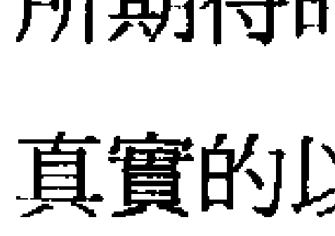

### 主要的問題：判斷。

被制約的愛和給予、期望、罪惡感、責任、義務、道德。

純粹的6號是關於擁有心的真理，能夠愛和給予而沒有期望或條件。這就是6號人受傷的地方，因為那個創傷跟愛和給予的品質有關，所以治療和純化那個愛的品質是6號人的旅程。6號制約是附加在心上面的東西，它是將心掩蓋起來的一層心理。6號人想要愛，他們跟2號人一樣，都喜歡在關係裡、在家庭裡、或是在社區裡，他們的氣氛就是愛和分享。而制約是愛的扭曲，是我們在這個環境之下為了要保持安全和得到我們所需要的東西所學習而來的。

6號的制約停留在需要知道什麼是對的。當這些人能夠做出他們應該做的，或是做出「對的」事，他們就會覺得安全和舒適。過度的6號人會走向正當的、負責任的、和行善等方面。縮減的6號人可能會被害怕犯錯的恐懼所控制，或是帶著一種無名的罪惡感，使他們覺得他們好像一直都做錯。或者他們不屑去做他們認為對的，而習慣性地選擇那個錯的。

6號包含了我們所有的應該和不應該，對和錯，以及好和壞。大多數的6號人都想要成為好的，他們想要成為仁慈的、有愛心的人，做他們應該做的事。結果他們對生命的反應就是遵循他們所學來的認為什麼是對的事。事實上大多數的價值觀都是學來的，它們是二手的。這個觀念大多數是來自父母和我們的家庭環境，其餘的來自文化、學校、電視、報紙，或是我們所看的書。我們所有的人也都是這樣，但是6號人傾向於比別人更依賴這些道德價值。

這種想要成為好人的需要會自動不可避免地伴隨著期望。當我們做了我們認為應該做的事，或是以某種方式來反應，因為我們認為它是對的或好的，就有某種期望會產生。那個模式通常是：我做了對的事，所以我也期望你要做對的事。我給你什麼東西，所以我也期望你也給我什麼東西。我做了我該做的事，所以我期望別人或社會至少會賞識。6號人的給予和愛是一個合約，是一種交易。他們的給予是為了要得到，當那些期望沒有被滿足，他們就會責怪別人，或是責怪社會和周遭的環境。

事實上，生命通常對我們的期望沒有興趣，而且也沒有義務要去滿足它們。有時候它們也許很巧合地會被滿足，但是在大多數的情況下，我們的期望和我們所能得到的是有落差的。有時候那個落差很小，我們不會太介意，但是常常那個落差很大，所以縮減的6號人會覺得失望和不滿足，或是過度的6號人會覺得憤怒和憎恨。過度的6號人喜歡責怪，他們的頭腦常常在忙著看別人或是什麼事情有錯，然後開始責怪。事情通常是別人的錯，而不是他們的錯。而縮減的6號人比較會將那個能量轉向責怪自己而覺得有罪惡感。有時候這兩種反應會混合在一起。一方面責怪別人，一方面覺得有罪惡感和羞恥，這是6號制約的人在奮鬥的兩個面。

過度的6號人傾向於對事物有很多選擇。他們對任何情況的自動反應就是判斷。有時候那個判斷是正向的，有時候那個判斷是負向的，但是都會判斷。判斷來自頭腦，所以它是來自過去的經驗或是過去被教導的。當6號人這樣做的時候，它會嚴重地限制了他們跟當下真實感覺的連結。那個判斷或意見會阻止他們去聽取內在的真理，而那個真理存在於比頭腦更深的存在裡。

在極端的例子裡，過度的6號人會堅持他們認為對的事情幾乎到了病態的程度。這會使他們變得非常善辯，而無法看到對方的觀點。他們的觀點一定是對的，他們的生存需要依靠它，所以很明顯地，對方的觀點一定是錯的。這種能量如果被帶到國家、文化、宗教、或政治的層面就會導致衝突和戰爭。當我們很強烈地相信神站在我們這邊——它只是一種合理化的解釋我們是對的——很明顯地，對方就是非常錯誤的，所以我們可以殺掉他們。這些立場會自動兩極化，當一方越強調他們是對的，對方的反應就越會走向另外一個極端。這是很諷刺的，那個在純粹狀態下是愛和真理的品質可能變成世界上諸多錯誤的主要肇因。

在這個需要做對的事底下藏著對做錯事很大的恐懼。6號人會覺得，如果他們做錯事，就有很恐怖的事情會發生；如果他們選擇了錯誤的道路，或是做了他們不該做的事，他們可能就活不了了。過度的6號人很努力想要確認他們是對的，所以他們的頭腦裡沒有懷疑的空間，然而縮減的6號人從來不很覺得他們是對的。他們可能會有一種莫名的罪惡感，覺得不論他們怎麼做都是錯的，這會使他們變殘缺。他們無法很自信地向外走，無法有一股正氣，他們可能會很容易感到羞恥、後悔，或自我懷疑，那個判斷是對自己不利的。他們覺得他們沒有權利成為自己。比方說，他們覺得他們不應該生氣、自私、快樂、需求，或是成為在孩提時代被認為不好或錯誤的樣子。因此，很自然地，當他們無法相信自己的感覺，他們就會仰賴別人來看什麼是對的。當他們的選擇是基於害怕犯錯，他們一定會變得優柔寡斷，不敢確定。

另外一種6號人是活在6號能量的另外一端，他們反對那些「對的」或「應該的」，所以選擇去做那些不好的和錯誤的。他們一生都會以這樣的方式來生活，總是選擇負面的路線，專門做那些社會認為不好的事。比方說，首相的兒子過著犯罪的生活，或是一個家教過嚴的女孩變成一個性氾濫的人。但是大多數的6號人可能只是短暫地這樣做，或是在某些情況才這樣做。這是他們對別人認為他們應該怎麼做的一種反抗。這種悲劇就是他們仍然完全被他們的「應該」所控制，只是以一種反過來的方式。

另外一個大多數的6號人會面臨的重要主題是責任。他們學習對他們自己內心的真理負責任，而不是依靠他們認為他們應該怎麼做。過度的6號人傾向於非常負責任，別人會覺得對他負責任的態度很放心，那是社會所賞識和鼓勵的品質。

當然，負責任可能是一個非常有價值的資產，但是有一些6號人幾乎被這種責任感所壓垮，結果，他們完全切斷了來自他們自己的心的真理。從外在看來，他們的行為是無私的，或是照顧別人的，但是當這種責任感被應該和不應該，好和壞所驅策，不可避免地，在他們的內心深處可能會產生厭惡或受傷。

然後有一些6號人，他們反對責任，這些人非常不負責任，你無法指望他們任何事，他們常常無法準時或完成一項計劃。好像責任會嚇到他們一樣，當他們感覺到一種責任，他們就會反其道而行，但不論6號人是遵循他們的責任感或是反對它，他們都被它所控制。

責任感是一個頭腦的概念，而不是由心所發出來的。那個行為也許看起來是類似的，但是那個行為動機的品質是完全不同的。責任和義務不等於愛和關心，即使它們看起來類似，但感覺起來是不一樣的，從給予者這邊感覺起來不一樣，從接受者那邊感覺起來也不一樣。由於責任來照顧父母而犧牲自己的女兒一定會感覺到某種憎怨，幾乎是不可避免的，不論她多麼試圖去壓抑它，它也會反應在她的行為。如果她是一個過度的6號人，她可能會對父母顯得易怒或沒有耐心。她也可能會想要怪罪父母。這些6號人可能是很會怪罪的人，如果她是一個縮減的6號人，她可能會對她的憎惡感到罪惡感，然後轉向責備自己，這可能會傷害到她自己的幸福，甚至會影響到她自己的健康。

通常責任跟真正的關心，或是義務跟愛之間的界線對6號人來講是不清楚的，他們可能需要花很多時間來釐清它。在這個找尋當中，他們將會發現他們的憎惡、責怪、和罪惡感是他們重要的老師。當我們對心的真理負責任，就不可能有憎惡、責怪、或罪惡感。而當我們忽略了我們的心聲，這些感覺就一定會產生。比方說，在任何親密關係裡，一個人所感覺到的受傷和憎惡通常是跟他們做了多少妥協去做他們認為應該做但不是他們心甘情願去做的事成正比。

### 原因。

想要愛、想要成為好的、害怕做錯。

6號小孩很需要依靠愛才能夠發展得很好。在嬰兒時期，他們的行為也許特別有愛或是以心為基礎，他們尤其需要愛。如果這個對愛的需要有被照顧到，換句話說，如果父母能夠給予無條件的愛，那個小孩就會停留在他們自己心的中心。但是因為大多數的人並不完美，所以，即使是最奉獻的父母所給予的愛也是有條件的。換句話說，小孩很快就會知道，當他表現出某種行為，他就比較會被愛，而當他表現出另外的行為，他就比較不會被愛。

在嬰兒時期，小孩只是在反應他們從父母那裡所感覺到的能量品質，所以如果父母在生氣，這個反應就是在告訴小孩說他們的行為錯了。在這樣的制約模式之下，小孩學到什麼行為會被判斷成好的，什麼行為會被判斷成不好的，然後將這個經驗帶到長大以後。因為6號小孩對接收愛有很大的投資，而那似乎是來自他們必須做出父母認為好的事，所以他們很快就會採用很多父母的判斷或意見，這變成了他們的價值系統，他們會透過這個價值系統來運作。當然，父母所提供的是第一層，接下來的那幾層是由兄弟姊妹、朋友、或學校系統和一般的社會所提供。

有一些6號人生長在一個父母有很制式的判斷或道德標準的家庭，所以他們傾向於吸收那樣的想法。另外有一些人生長在一個有愛心的家庭，他們教導關心別人的價值，他們是很真誠、很善良的人。家庭環境有無數種變化，通常小孩會去遵循那些價值，因為在一開始的時候，他們需要愛，所以他們需要遵循，當他們這樣做，他們也會覺得比較安全、比較能夠得到讚賞。然而隱藏在這個行為底下的可能是一種很深的害怕做錯的恐懼，這也許是基於幼年時期的創傷性經驗，在那個經驗當中，小孩因為犯錯而接收到了很大的懲罰，或者是因為一些簡單的錯誤而覺得非常羞恥。6號小孩很想把事情做好，所以很容易使他們覺得羞恥或不對。常常因為6號小孩非常欲求那個愛的感覺，所以他們會嚴格遵循任何必要的規範去得到它。

除了對錯的顧慮之外，6號的小孩真心想要照顧別人。一開始，這種感覺也許是來自自然的愛，但是它很容易會被扭曲。也許是在孩提時代，這個角色過度被鼓勵或是被獎賞，比方說，如果你是一個大姊的角色。或者當小孩能夠幫助媽媽，他就覺得非常重要、非常有價值。也可能父母將過多的責任放在孩子身上，使得給予成為一種必須，而不是一種喜悅。不論它的形成是來自什麼樣的情況，小孩學到了給予或照顧別人是最能夠得到愛、最有價值的，而忽略了照顧自己和聽取自己的心聲。所以，基本上愛被認為是等於給予別人，愛自己的部分就被忽略了。

這是一種制約程式，但是有時候它會形成相反的反應。如果小孩在做正確的事時沒有得到愛和認同，他們可能就會轉向去吸引負面的注意，換句話說，成為壞小孩，故意做一些錯誤的事。在極端的例子裡，這會造成問題小孩，而導致觸犯法律。那個小孩也許看起來好像是一個叛逆者，而認為自己是一種獨立的激進主義者，但是事實上他們只是反應於他們的制約或是他們所學習到的對錯信念，所以還是完全被那個制約所控制著。

有很多6號人從這種反應的狀態來行動，在某些情況下，他們會反對他們從父母或社會所學到的信念，他們本身也許是認為他們反對這些強而有力的教導是在找出對他們來講是真實的方向，然而令人傷心的是，當他們處於反抗之中，他們是更遠離了他們自己。有一些6號人一生都在做這樣的事。

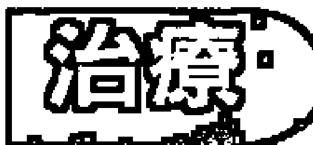

### 學習信任心、為自己的真理負起責任、願意成為錯的。

6號的本質是為心的真理負起責任。這是6號的人在學習的，為了要治療他們自己，並將覺知帶回到心。6號人的安全系統有賴於去做那個對的，判斷什麼是好的，以及分析什麼是公平和正義的。所有這些都是來自他們所學到的信念系統，它們來自頭腦。在這些信念系統底下一直都有 一個簡單的事實，那就是心的感覺。這個感覺通常是不復 雜的，沒有像頭腦的觀念那麼複雜。這只是簡單的真理， 比方說像：我喜歡這個，我不喜歡那個；我感覺到這個， 我沒有感覺到那個。6號人被教導說不要信任這些簡單的感 覺，而要用頭腦過濾來找出那樣感覺是安全的嗎？是對的 嗎？所以在經過一段時間之後，6號人就忘了聽取感覺，而 轉為依靠判斷和意見。他們發現這樣做比較安全、比較 好，而且很重要地，它意味著他們不必去面對做錯的恐懼 ——有一些6號人一生都被這個恐懼伴隨著。

去面對這個隱藏的害怕做錯的恐懼是6號人主要的治療 方式之一。它所代表的意義在實務上意味著允許自己犯 錯，放更高的價值在自己的感覺或想要的東西上面，而不 要太執著於對或錯。比方說，它可以是下列簡單的表達： 我不知道它是不是對，但這是我的感覺；或是做一個決 定，即使你害怕它可能不對。為了要能夠做到這樣，有很 多6號人必須讓他們自己停留在混亂和不知道的感覺裡。頭 腦做選擇的舊有習慣是基於什麼是對的或好的，它具有很 強的力量，所以當頭腦無法提供答案的時候，他們就陷住 了，他們就不知道要如何選擇。然後他們會看到頭腦從一 個極端跑到另外一個極端——從應該跑到不應該，從好的 跑到壞的，但是從來無法達到一個結論。允許自己停留在那個混亂一陣子，頭腦會開始安定下來，然後6號人就能夠接觸到隱藏在頭腦底下那個單純真實的感覺。

這個點通常出現在試圖要做對的事失敗之後。對於過度的6號人來講，這可能意味著他們覺得被責任壓得透不過氣，所以他們變得非常不快樂或是健康出問題。真正的治療來自他們開始去看將他們引導到這個情況的內在動機或程式，然後為它負起責任。

對心的真理負起責任並非只是意味著做你覺得喜歡的，它有時候可能會被視為是不負責任的，所以，還必須進到下一步，那就是要對你所做的事的結果負起責任。有一個例子可以用來作為這個情況的最佳描述：朱麗葉答應她媽媽說要參加一個週末的家庭聚會。但是後來變得很想參加一個工作坊，那是她很喜歡的一個老師所開的，而且只開那一次。所以如果她這次沒有參加，下次就沒有機會了。如果她由6號制約來運作，她就會履行她的義務去參加那個家庭聚會，但是如此一來她會一直想著她所錯過的工作坊。在這種心情之下，她在聚會中的表現是不快樂的，所以母親譴責她的態度。朱麗葉也覺得她母親並不感激她的犧牲，所以在整件事情上面她們就起了爭執。我們大多數的人都曾經碰過這樣的情況很多次。

另外一種朱麗葉可以選擇的方式是去參加工作坊，但是這樣的話，她對於沒有去參加家庭聚會覺得有罪惡感，所以她變得無法真正享受她在做的事。而因為她覺得有罪惡感，她的母親和其他的家人也都怪她說破壞了家庭聚會。所以結果朱麗葉覺得她做錯事了，而後悔她所做的決定，所以，在這種情況下似乎她怎麼做都不對。

要脫離這種6號的困境唯一的方式就是為心的真理負起責任。這意味著朱麗葉必須做出她的選擇，不是從責任和義務，而是真正去看她自己的心，並為自己所認為的真實負起責任。如果她選擇去參加聚會，不是出自「應該」，而是因為那是她需要和想要做的。為那個選擇負起責任意味著不期望別人感激她的犧牲，所以沒有抱怨，也沒有責怪。如果她選擇去參加工作坊，她這樣做也是自己負責，那意味著她不會對它覺得有罪惡感。她也對她媽媽可能會對她生氣的事實負起責任，她承認她媽媽有權利這樣感覺。但是因為朱麗葉並不覺得有罪惡感，所以她母親可能會覺得很難責怪她很久，所以那個情況並不會被加重。

對自己的真理負起責任就不會有額外的期望，所以也不會有罪惡感或責怪。每一次6號人以這樣的方式來做事，他們就能夠治療自己一些，同時允許他們自己去跟他們的心——真正的愛的源頭——連結。然後他們將會了解，看起來有愛心和真正從心來運作的有愛心是不一樣的。真正的愛心可能不會像演出來的愛心看起來那麼「好」。

## 成熟的潛力

愛、負責任、誠實、關心和給予、美學和美。

純粹的6號是透過心來生活的能力，所以一個健康的6號人可能是一個很有愛心的人。當某人處於他的心，他具有一種真誠，別人就會喜歡他，儘管他有其他的缺點。即使是比較不成熟的形式也常常具有一種溫暖和天真會令人喜歡。當6號人學會從他們的真理來生活，他們會有高度的正直。不論是在工作上或他們的私人領域，成熟的6號人都會很誠實，而且對於他們所相信的真實是不妥協的。你也許不同意他們，但是他們對他們認為真實的事的承諾是值得你尊敬的。

6號人常常是很好的照顧者，在你生病的時候，他們會為你準備雞湯，或是帶花來看你。他們喜歡給予，他們喜歡成為有用的，所以當你有任何困難或任何需要的時候，有他們在身邊是很好的。跟6號人的互動會讓你覺得很舒服，因為他們很體貼、很關心。即使是一個縮減的6號人也常常對小孩或動物很好，因為他們很容易跟簡單的心連結。

成熟的6號人也可能非常居家，他們喜歡跟家人生活在一起，或是生活在一個社區或團體裡，同時很擅長創造出一個空間讓別人覺得很舒服。

因為6號人喜歡給予和照顧別人，所以可以常常發現他們從事照顧別人的職業。他們可能成為很棒的社會工作者或是健康的照顧者，也常常擔任各種教學工作。他們的道德感和社會責任使他們能夠奉獻給他們認為有價值的事，而且對於他們所涉入的事會照顧得很好。

除非過去的經驗使他們反感，否則6號人很有責任感，這意味著他們是值得信任的，他們會做對的事。這個6號人從來不會在工作還沒有完成的時候離開，交代給他們的事情你可以放心。但是要記得，不要將他們視為理所當然。他們的責任感有時候會延伸到社區，社區裡面有需要照顧的事，他們也會挺身而出，比方說路燈壞了、公園需要維持清潔，或是其他鄰居的問題，他們都很願意為它出力。他們也可能擔任起計劃鄰居聚會或是同學聚會的角色，因為他們很享受把人聚集在一起。

另外一個6號人很棒的天賦是他們跟美或美學的連結。這個鑑賞能力來自他們的心，當它發展得很好，生活的各個層面都會圍繞著一種可愛的氛圍。這種品質可以使6號人走向艺术生涯的工作，从各种纯粹的艺术到室内装潢、化妆、或美发等等。或者它可能只是一种美感，使他能够过着一种优雅和能够欣赏各种美的生活。成熟的6号人在很多方面都是一个很的人。

亚力莎出身于一个正直的中产阶级家庭，有着一对很照顾的父母。因为她从小就被灌输家庭的价值，所以她在很年轻的时候就结婚了，在她二十三岁的时候，她就已经是三个孩子的妈了。每一个人都同意她是一个很棒的母亲和家庭主妇。当她的父亲过世，她那有关节炎的母亲就搬来跟亚力莎的家庭住在一起。每一件事似乎都很好，直到有一天，在她过完三十五岁的生日之后，她先生突然宣布说他有外遇，所以就离开了。一夜之间，亚力莎从一个经常带着微笑而且很照顾的女人变成一个苦涩、生气，且必须扛起家计的女人。接下来的那几年是很难过的。她必须将母亲安置在一个老人院，然后去找工作。最后同事介绍她去做一些动态静心和治疗工作坊，这才开始帮助她为她自己的愤怒负起责任。她自己描述说：“我了解到，我之前所做的事是我认为应该做的事，最后我发现我找到了我内在的真理。”她开始修习一些夜间的平面设计课程，现在在家里成立了自己小小的设计工作室。她有一个男朋友，但是她说她不信任婚姻，除非她变得能够将自己摆在第一位。

## 培养一个制约6的小孩：

无条件的爱、允许犯错、着重在感觉，而不是着重在什么是对的、对于好与坏教导一个有弹性的态度、艺术方面的训练。

你们的6号小孩也许比其他小孩需要更多的爱，而且他们需要觉得那个爱是尽可能无条件的。这跟你试图表现得很好是无关的，倒是要打开你的心，无条件地跟他们分享。小孩，尤其是年幼的小孩，会对于他们从父母那里所感觉到的比他们所说的有更多的反应。能够给6号小孩安全感的是要让他们觉得你是真诚的、诚实的，而且是由心来反应。当你试着以某种方式来行动，因为你的头脑认为那是正确的方式，小孩会接收到混乱的讯息。他们也许会感觉到你对某件事是不安或生气的，当你试图假装不是这样，他们会开始怀疑他们从你那里所接收到的讯息的真实性，因此而开始怀疑他们自己。

如果你对小孩很真实，你就增强了他们里面的那个品质。如果你赞美或奖赏那个被判断成好的或对的，而不是奖赏他们的真实，你是在教小孩依赖他们所学习到的价值观，而不是信任他们自己的心。很明显地，有一些对错是需要被教的，但是这些可以以它们真实的状态被传达：价值观和适当的行为是必要的，为了要适合家庭的环境或社会，但它并不是存在性的真理。

有一种方式可以增强小孩去感觉的权利，同时指出，如果按照那个感觉来行动的话在某些情况下可能会带来他们不想要的结果。所以问题不在于什么是对的，什么是错的，而是什么行为会引发出什么结果。在这样的方式之下，小孩就会被鼓励去停留在他们自己的感觉和信任他们自己的感觉，同时为要不要那样去行动负起责任。当一个小孩在成长的过程中，他的感觉是被肯定的，他们也会倾向于给别人同样的权利，所以会变得更有接受性，更能容忍。

了解责任的本质对6号小孩来讲是一个重要的功课。教小孩说责任就是做对的事，这样是很容易的，但是这样的的话你将会培养出一个“好的公民”，但是这样做会造成日后那个小孩被那些观念所重压而无法听取他们自己的感觉。教小孩为他们自己的真理和他们所选择的行动的后果负起责任，这是比较困难的，是一种更细微的艺术。设定一个简单的任务让小孩去做而换来某种报酬是这样做的一个方式。当小孩更长大，这个学习可以加强，可以给小孩很多空间去做他们自己的决定，然后由小孩来承担那个后果的责任。

为了不要迷失在对和错，罪恶感和责怪的故事里，6号小孩必须知道犯错是没有关系的。当6号小孩犯错而成为创伤、羞耻，或者只是尴尬，他们很快就学会避开，这样的话，他们对于对错的信念就会变得更僵硬，更遵循。为了要避免这样的情况发生，所以你可以教小孩从错误中学习，而不是避开它们。你可以告诉小孩说尝试新的事情一定会带来错误，但我们就是这样在学习的。6号小孩需要能够对他们的错误一笑置之，而不要将它们看得太严肃，那么他们就不会陷住在害怕做错的恐惧里，那个害怕做错的压力也会减轻。

有很多6号的小孩会被美和美丽的东西所吸引。支持这种品质是父母所能给的最大礼物之一。对某些小孩来讲，这个品质的表达可能是在视觉方面，但是对另外的小孩来讲可能是在音乐或其他创造的形式。各种美的形式是很多6号人的自然表达，也是他们纯粹本质的一部分，当小孩被鼓励去发展这方面的能力，他们很自然地也会跟他们内心的真理更加连接。

## 制约 7

### 根（本质）——头脑

建议阅读：《钻石工作》(The Diamond Work)
作者：阿玛斯 (A. H. Almaas)

### 纯粹的部分

了解、智慧、学习、单独、静心、奥秘的、遵循自己的光。

7号的能量是头脑的领域，它是运用我们头脑的能力从生活经验中学习来变聪明。当头脑驾驭了我们的整个人，或是单独操作而不管心和经验，我们会得到一些知识，但并不是真正的了解。纯粹的7号能量是我们去发问、怀疑、和找出的能力——使用这些工具来导引我们内在的经验，而不是太依赖这种二手的知识。它也是我们往内看和跟自己在一起、成为单独的能力。从这个产生出听自己声音的能力，以及去遵循我们自己的路或我们自己的光。它的其中一支是静心，另外一支是奥秘世界或彼岸的现象。一个展现出纯粹7号能量的人非常不是一个顺应主义者，他们会握住他们自己的意见，遵循他们自己的方式，活在社会之外，而不是成为它的奴隶。

### 学习

主要的问题：很用头脑。

- 需要了解或是有答案
- 害怕不知道
- 陷住在头脑里
- 理智的
- 混乱
- 计划
- 关于单独的问题
- 外向／内向
- 奥秘的信念。

纯粹的7号能量是真正了解的本质——从生活经验学习的能力。它是将头脑的知识、经验和感觉结合来带出智慧和了解。它的歪曲是将知识误认为是了解，所以太强调头脑，以为我们拥有那个知识就是知道。

7号制约的根是需要了解。对7号人来讲，当他们面对一个头脑无法充分了解的情况，他们可能会觉得恐慌。“不知道”是他们必须去处理的问题。

过度的7号人倾向于会用各种努力去掩盖那个不知道。在极端的例子里，这可能会造成依赖理智的知识或是从书上学到的东西来面对世界，就像那些古老的“哲学教授”，他们对每一件事都有答案。当那个情况比较不严重，那个7号人只是比平常更依赖头脑。他们会倾向于去参考他们的观念和信念系统，或是他们的心理图书馆，来看要如何行动，以及如何处理一个情况。这有时候会使他们跟事实脱节。当我们陷住在头脑里，我们可能无法看到明显的事实。“哲学教授”可能会非常理智，但是来到实际的事情可能会变得非常愚蠢。

因为7号人忙着试图去了解所发生的事，所以他们会透过他们既有的信念来过滤讯息，或甚至过滤日常生活的一些简单的事实。这可能意味着事情并不会很快“进来”——比其他人慢。因为7号人必须检查、计算，透过现存的思想模式来过滤看看它们是否适合，所以他们对事情的了解会比较慢，而那些事情在别人看来可能很简单、很明显。

7号人对每一件事都需要一个理由，他们最常使用的词就是“为什么？”他们这种经常在寻找答案的做法会把别人逼疯，但是尤其会把自己逼疯。他们会试着用一些解释来使自己在那个情况下觉得是安全的，即使那个解释跟事实没有什么太大的关系。有一些7号人会使自己陷入混乱和犹豫不决的情况。他们会在他们的头脑里绕来绕去，试图找出一些讯息来给他们有知道的安全感，但结果是弄得更混淆、更迷惘。在困难或压力的情况下，这有时候会使他们觉得好像他们头脑的电路断掉了。从外在看起来，他们会显得很愚蠢，或是脱线了。

过度的7号人的内省可能会严重到有心理疾病的程度。他们可能会陷住在他们头脑的电影里，它将他们带离事实。藉着他们的详察和分析，陷入过去的创伤，使得难题更加重，而不是解决问题，事实上，他们是迷失在他们自己的故事里。通常这是一种内在的对话，他们实际上在跟他们自己讲话。但是有时候他们必须对别人谈论它。即使在正常的日常互动，7号人也会喜欢谈论“关于”什么事情，而迷失在漫长的理论上的讨论，使得那些比较不用头脑的人觉得迷惘或无聊。

7号人真正的学习是如何将心和头脑连在一起，或者，换个方式来说，将头脑的聪明才智带进经验和感觉里。理智型的7号人常常忙于试图将发生的事用他们的头脑来解释，因此他们跟事实没有连接，也跟他们对事情的感觉没有连接。因为这样，所以他们可能会长时间陷入某种负面的情况而找不出必要的了解来解决。他们也许有一切的答案关于事情为什么会这样，以及他们需要对它做什么，但这些答案都是基于一些观念的理论，跟事实和他们的感觉是没有连接的，结果事情就动不了，也改变不了。我们的观念比我们的感觉更远离我们存在的事实，我们必须听取我们的感觉才能够了解事实，并采取必要和有效的行动。

一个经典的例子就是一个处于关系中的女人，那个关系已经让她有很深的不满意，而且一点都不滋润。也许她的伴侣有另外的女人，也许他酗酒而花掉了她所有的钱。不论它是怎么样，她有一大堆合理化的解释来替他辩护为什么他会这样做，而且可能继续相信他真的爱她，尽管所有的证据都显示不是。或者也许她执着于一个概念，认为他会改变，虽然他并没有显示出任何他要改变的迹象。从外面的人看来，这个女人是十分愚蠢的，然而她只是坚持相信着她在孩提时代所学到的要完全信任。她将理智摆在感觉之上，将头摆在心之上，如果她继续这样做，她的生命将会死在那里，她无法相信她对那个情况真实的感情反应，然而唯有面对真实的感觉才能够使她采取必要的行动来改变现状。

7号的制约有一大部分是跟“单独或孤独”有关的。这可能会使7号人成为内向的或外向的。过度的7号人可能是一个非常隐居和隔离的人，他们也许会觉得跟周遭的人是分离的，他们倾向于沈思和忙于他们头脑的事而成为封闭的。陷住在头脑里是一种隔离的状态，所以7号人学会发觉他们跟别人是隔离的，这个模式尤其在有威胁或有困难的情况下会变得更强。他们在隔离的状态下可能会觉得孤单，但这是安全和熟悉的。他们有各种理由来说明为什么停留在这种状态下是必要的。

在比较不极端的例子里，7号人是一个喜欢隐私的人，他们不喜欢别人知道他们在干什么，或是不喜欢别人涉入他们私人的事。他们很容易觉得被侵犯，也不喜欢太引人注意。7号人常常是一个旁观者，他们常常退一步来观察周遭的世界，而不是加入它。

缩减的7号人的表现刚好相反，他们很可能会避开孤独，所以他们是外向的。他们会将注意力导向外界，因为向内看或是跟自己在一起会让他们觉得害怕和孤单。在社交场合，他们是活泼、外向、和有趣的，似乎是宴会中的灵魂人物。他们可能会有很多朋友来填满他们的生活和一起从事各项活动，虽然那些可能只是一些表面上的朋友。因为这样，所以他们有时候会显得肤浅和琐碎。他们的没有能力去看自己，去感觉他们在哪里，和从他们的经验中学习使他们活在生命的表层。这种习惯也使缩减的7号人显得欠缺思考、不懂得分辨，或甚至有一点愚蠢。当那个焦点太过于放在外在，对于那个可以导致真正智慧的内在觉知就会变得很少。结果他们的意见就只是在重复他们所听来或读来的。

他们很难保守秘密——不论是他们自己的秘密或别人的秘密。这会使他们变得很敞开、很透明。有一些缩减的7号人可能会很情绪化，他们有丰富的感情，而且很可能迷失在情绪里而失去理智。

计划也可能是7号人的一个问题。过度的7号人可能会有一个生命的前瞻计划，它不仅包括今年的时间表，还会包括退休之后的计划。当他们将未来的每一个细节都计划好，他们就会觉得比较好、比较安全。对照之下，缩减的7号人可能会觉得很难计划。他们也许对未来有一些想法，但是他们不知道如何分辨什么是实际的，什么是想像的，这会使他们走向很多无意义的或无法达成的方向。

因为7号人喜欢“知道”，所以你常常可以在成人教育课程、图书馆、或电脑萤幕后面看到他们。他们会觉得当他们在学习一些什么的时候，他们是有价值的，生命是有目的的，至于他们在学些什么有时候并没有那么重要。结果他们可能需要大量的讯息和知识，然而这些东西大部分是无法增加他们生命品质的。

7号人的需要知道也会引导他们进入奥秘的世界。对某些7号人来讲，氛围、能量中心（脉轮）、前世、或其他的奥秘现象对他们有很大的吸引力。这当然并不一定是负向的，然而，这个吸引可能会引导他们去找寻奥秘的理由来解释每一样东西。这样的人有时候会生活在没有根的、不实际的世界——不踏实。这会使他们脱离事实，然后可能会在身体层面或实际的生活上造成难题。在另外一方面，缩减的7号人可能会完全不知道任何奥秘的、通灵的、或心灵的事，或者有时候对那些东西有不健康的意图。他们可能会将这些东西贬为无稽之谈，或是将它们视为笑话，以致于将这些领域的经验都排除在他们之外。

## 原因

被称 为愚蠢的、不了解、失去对自己经验的信 任、受到阻碍的小孩、感觉分开的或不同的、给理智太多的价值。

7号小孩在生命的早期就学会想要从别人那里得到他们所需求的东西，或是想要保持安全最成功的方法就是知道答案。这个信念可能是由很多种不同的情况所形成的，但是共同的元素是他们觉得如果他们不了解事情是怎么样在进行，他们就觉得有某种恐怖的事情会发生。这样的结果通常是头和心的分裂，或是头脑和感觉与经验之间的分裂。在大多数的个案里，小孩会变得很依赖逻辑的安全而不去管感觉或经验的事实。然而有时候它的发生刚好相反，情绪变成最突出的而丧失了理智。

对逻辑的依赖可能是由家庭的困难或混乱的环境所造成的，在这种情况下，他们会觉得如果他们能够了解事情是怎么一回事，情况就会变得比较好，或是他们就会变得比较安全。结果小孩就诉诸解释或逻辑的答案，将理性的东西误解成真实的。

或者是在他们的早期发生了一些情况，使得他们失去了对他们自己的经验或感觉的信任。他们也许有感觉到什么事在发生，但是别人却告诉他们说不是这样，或者他们所经验到的事被嘲笑。这种创伤性的经验会造成他们对自己的感觉失去信任。另外也许是，在他们一连串的生命经验里，他们觉得他们直觉的认知是没有价值的，所以他们学习去寻找必要的逻辑和理性的讯息来使自己变得有价值和保持安全。

有时候是，在孩提时代学术成就被高度强调，他们的头脑聪明得到很多赞赏，所以小孩以学校的成绩或理智的性向来作为判断自我价值的标准。当家人强调理性的价值而忽略了其他方面的成就，这可能会造成小孩的压力，尤其是对头脑没有很敏捷的小孩。有很多7号的小孩清楚地记得他们被骂愚蠢，即使只是以开玩笑的方式。为了害怕被认为是愚蠢的，他们会一再地进入头脑来寻找答案，结果7号小孩可能会变得非常认真用功，而不是在外面跟其他的小孩玩耍。

即使7号小孩跟一群朋友在一起，他们也会停留在边缘，可能是坐在旁边看其他的小孩在玩，成为旁观者而不是加入者。除非那个小孩是缩减的7号人，在这种情况下，他们反而会参加很多活动来试图减少他们的恐惧。

7号小孩常常会觉得他们跟周遭是分开的、不同的，有时候这可能只是因为他们在忙着担心一些事情，所以他们陷住在头脑里，想太多，而无法对周遭敞开。有时候这种感觉的产生是因为他们认出他们的确是不同的。比方说，也许他们的家庭搬到一个新的国家或新的环境，也许他们跟周遭的种族或宗教是不同的。过度的7号人会利用这些因素来作为缩回自己的理由。然而缩减的7号人会使用同样的情况作为理由加倍努力去适应，去证明他们属于周遭的团体。这可能需要额外的努力将他们带离他们自己。那个不想觉得分离或孤单所付出的代价就是丧失他们对自己内在的觉知。

这个分离的感觉也可能是家庭因素所造成的。7号人有时候可能是一个独子，或者那个家庭情况迫使小孩成为单独的。也许是那个家庭座落在一个隔离的地方，旁边没有什么年轻人。或者小孩诞生在他们不觉得他们有归属的地方。或者那个小孩的天性也许就是喜欢向内思考的，而这个品质并没有被周遭的人所鼓励或了解，因此他们觉得不被周遭接受而进一步退回到他们头脑的私人世界。或者也许因为那个小孩觉得他们的内在是不对的，所以他们反过来变成外向的，去适应周遭，觉得这样做比较安全。

不知道是没有关系的、学习单独、真正的了解、结合头和心。

当7号人能够直接说出：“我不知道。”他们就开始在治疗他们自己了。允许自己不知道能够使自己的内在深处变得放松。从这个点开始，他们可以跟周遭有更多的接触，他们内在的知道和智慧也会开始浮现。7号人的习惯是透过头脑来过滤生命，他们躲在头脑的背后，跟生命的经验分离。当他们能够允许自己不知道，他们就能够开始将空间给他们的感觉和经验，那是在他们的制约之下所失去的。他们会从头脑降下来而进入到真实的存在，开始去实际经验周遭的事实。

7号人具有直觉能力，他们的治疗就是学习信任他们自己内在的声音。这个旅程需要去发现跟头脑的正确关系，而不是被它所驾驭。它是关于如何透过生活的经验来学习。真正的了解或学习发生在当经验、感觉、和头脑同时汇集并整合在一起的时候，那意味着我们“在”那个当下，我们感觉到它，而且有理智可以看到底是怎么一回事。真正智慧的种子就是种在这个内在的统一里。我们从这个个人的了解开始去形成我们的意见，换句话说，我们是透过生命的经验在学习。

感觉和经验必须先于理智，而不是反过来。纯粹的7号能量是将头脑的聪明才智带进感觉和经验的事实里。

有很多7号人必须去面对单独的问题。智慧的品质和单独是互相连的。为了要向内看自己，透过他们自己的经验来学习，和信任我们自己的知道，我们必须能够单独。如果我们害怕单独，我们将会一直向外看来看我们需要做什么，或是我们需要成为怎么样来适合别人。这样的做法否定了我们自己内在的真实，同时使我们无法透过我们的经验来学习。

7号人在学习如何跟自己在一起，以及当他们跟别人在一起的时候如何跟自己的内在连接。对缩减的7号人来讲，这意味着去面对分离和孤独的恐惧。当对他们来讲成为单独是没有问题的，当它不再被感觉成好像是被遗弃，治疗就在发生了。对一些人来讲，那意味着实际上花时间跟自己在一起，而不是一直往外跑，所有的时间都跟别人在一起。

对其他的7号人来讲，那个害怕单独的恐惧跟主要的伴侣有关。那个害怕被伴侣遗弃的恐惧会产生很大的紧张，因此会在关系里面妥协。它意味着，由于害怕单独，所以他们会做任何事来维持那个关系，即使它事实上已经不滋养了。当他们开始看到，在没有别人的时候，他们也可以过得很好，他们就能够开始很实际地去看那个关系——他们在那里干什么，我们必须从那里学习什么，以及他们在它里面的需要。从这个健康的观点来看，也许我们就能够使那个关系运作得更好，或者我们也可以选择离开。

对于过度的7号人来讲，那个挑战是从他们的壳出来，实际跟别人在一起，而不是把自己藏起来。他们在学习如何将防卫摆在一旁，不要再活在他们自己的头脑里，而实际成为生命的一部分，真正跟别人连结。学习对别人敞开对这个7号人是很有益处的。有时候这只是意味着把自己放在跟别人在一起的场合，比方说社交聚会、工作坊，或是社区的活动。变得不严肃是脱离头脑最容易的方式之一，有时候只要能够很放松，带着游戏的心情，找寻乐趣，以这样的方式跟别人在一起就能够消除障碍。

过度的7号人也许需要去看他们为什么那么想成为跟别人不同的。他们需要了解，头脑的本质是分离，所以当他他們忙於他們對於事情和對於他們是誰的觀念和理論，他們就無法去經驗他們跟周遭的連結。

想要被了解的慾望可能會在親密關係裡面產生問題，因為對7號人來講，如果他們覺得對方不了解他們，他們就會覺得那個關係有危機。他們所涉入的頭腦的解釋可能會變得很複雜，直到對方變得沒有耐心而將它推開。7號人需要去看，有時候事情是不需要被了解的，有時候只要讓事情按照本然的樣子存在就夠了。停留在一個情況或關係裡，不需要了解，也不需要被了解，這對7號人來講是最終的挑戰和最治療。

如果使用正確的話，這個需要知道可以帶領7號人穿過頭腦，並超越頭腦。換句話說，如果他們以一種聰明的方式繼續找尋解釋和答案，有一天他們將會了解到頭腦的本質和限制。他們會看到，只要他們透過頭腦來找尋答案，他們就會陷住在那個舊有的。他們真正的治療是去了解說，他們真正的找尋只能在頭腦以外的層面找到，這個了解會帶領他們進入心靈的途徑，去找尋他們真正是誰——超出頭腦之外。那個旅程只能透過靜心來走，或是透過觀照頭腦的能力，而不是迷失在頭腦的運作裡。

## 成熟的潜力

聰明的、追尋者、不遵循的人、聰明和反應快速的人、喜歡群居的人。

成熟的7號人具有相當的深度和智慧，有一些人藉由他們這種想要知道的動力去蛻變他們自己而成為最終的智慧、了解、和成道的追求者，他們會問生命的意義和目的，你可以在很多宗教或心靈的領域找到他們。另外有一些人就只是很有洞見或是很聰明的人。他們對日常生活的種種有很好的了解，是很精明的人，在他們的周圍會被他們的聰明所吸引。有一些人頭腦反應很快，另外有一些人則是很體貼的人。

一個成熟的7號人不怕成為不同的，他們覺得不需要去適合別人或是遵循舊有的習俗，因為他們更根植於他們自己。他們對自己有很好的了解，並深深地活在他們自己裡面，他們的意見是經過仔細考慮，而且是他們自己的，如果他們不知道什麼，他們也會敢於把它說出來。他們具有一種很好的內在品質，而且思慮周密，所以會受人尊敬。

如果7號人能夠很聰明地使用他們的程式，它將能夠給他們動力去探索頭腦的運作方式，去了解他們心靈的品質，因此也能夠將頭腦運用在別人身上。所以你可以在心理學、心理治療、或精神病的治療領域找到他們。他們有強烈的動機想要找出是什麼東西在使人運作。有時候，7號人甚至可以超越頭腦，不陷住在頭腦，而能夠有很好的自我覺知。7號人如果發展得很好的話，他們會漸漸了解頭腦的界限，然後他們那種想要知道的動力將會帶領他們進入那個超越這些界限的領域。

有很多7號人的心理是明朗的、光明的，他們的頭腦就像剃刀那麼利，能夠比別人運作得更快、更有效率。這個天賦加上他們需要去知道的個性可能意味著他們在科學、計算、研究、或技術領域有很好的才能。這種7號人知道如何深入事情或是深入他們自己。他們也可能只是在面對生命經驗的時候非常聰明，而且具有一種寧靜的內在智慧。另外有一些7號人可能具有很好的一般知識，他們的頭腦有能力持有大量的資訊和事實，並能夠將它們組織成有用的理論。他們可以成為學者、作家、或智囊團的一份子，或是活躍在各種研究的領域。這些7號人在我們的日常生活裡一直都有你想知道的事情的答案。

有奧秘學傾向的7號人會利用他們需要知道的動力去進入神秘學的領域。這些人有很多關於神秘現象的知識，有時候還會有一些實際經驗。他們可能會是能量中心（脈輪）、氛圍、微妙的能量、占星學、塔羅牌，和各種新時代或神學現象的專家。基本上，只要在他們有興趣的領域他們都會成為專家，他們也擅長將那個技術傳達給別人。

縮減的7號人也許有非常不同的天賦，他們可能成為一個宴會的靈魂人物，跟他在一起很有趣，他們很外向，而且很好相處。雖然他們可能不一定是有生命的深的了解，但是跟他們在一起可以很單純、很愉快、很放鬆。

自然的7號人也可能具有文化面的能力，他們可能會被拉到藝術或文學方面。他們可以成為藝術的鑑賞者，或甚至是藝術家，而且很可能比較欣賞戲劇或爵士樂，比較不欣賞流行音樂或搖滾樂。他們可能會展現出一種精緻，或是一種風格，或是對一些事顯得比較精通，使他們能夠在群眾裡面變得比較突出。

吉妮的父母在她六歲的時候就分居了，她和她母親搬到另外一邊的歐洲居住。吉妮發現她很難交朋友，當她母親去工作的時候，她常常被單獨留下來。她花很多時間在閱讀、學習、和思考。她長大成為一個漂亮而且聰明的女人，她有一個很棒的市場研究的工作。在她的工作上，她有很好的表現，最後她跟一個男人在一起，一般認為那個男人在各方面都不如她。大家都知道他是不忠誠的，他會賭博，而且常常消失好幾天，但是吉妮都會把他找回來，然後以各種藉口來原諒他的行為。那個情況變得很糟糕，有一天他終於離開之後就不回來了。吉妮的心情垮了下來，幾乎崩潰。她花了好幾個月的時間做密集的治療才能夠去面對真正的問題，那就是她的信念：認為她必須知道如何使關係維持正常，這樣他才不會離開而留下她一個人。她的治療繫於要去面對一個事實：就是即使她做了什麼或知道什麼，那個情況也不會有什麼不同。

## 培養一個「知道」的小孩

- 允許不知道
- 使事情保持單純和實際
- 鼓勵自己的意見
- 不要太強調頭腦的重要
- 成為單獨的但是不孤單

對於7號的小孩，父母所能夠做的最重要的事就是幫助他們能夠在不知道或不了解的情況下也覺得沒關係。這並不意味著不要去搜集資訊。7號小孩很想知道，這是他們天性的一部分，它必須以正確的方式被鼓勵。小孩如果有他們自己的意見，那是可以被支持的，但是同時要讓他們知道不能夠太依賴他們的頭腦而忽略了其他的感覺。你可以以這樣的方式來告訴小孩：那是你認為的，而它可能是如此，但是你可以再進一步去看它是否真的如此。或者你也可以說：那是一個很好的理論，但是你對它的感覺如何呢？ 換句話說，父母可以鼓勵小孩不要太依賴他們的觀念，或是不要太依賴別人所告訴他們的，而忽略掉了事實或他們的感覺。他們可以幫助小孩不要將標籤或理論誤認為是事實。這意味著發展出一個質問的頭腦，而不需要一直都想要有答案。

生命中一直都有一些事是未知的或不可知的，小孩必須覺得這樣也是沒有關係的。那個訣竅就在於避免小孩過度依賴觀念，而忽略了去經驗當下的事實。唯有當我們知道我們不知道，我們才能夠真正停留在那個是的。當我們陷住在理論或觀念的時候，我們跟事實就分開了，我們就創造出一個障礙使我們無法去經驗當下的事實。7號小孩需要被鼓勵去感覺、和碰觸，使用所有的感官去跟周遭的事實連結。

如果7號小孩在早年經驗到一些創傷的事件，他們會很想知道為什麼。父母需要耐心地解釋給他們聽，即使那些解釋也許是沒有答案的。學習接受這些情況的無法解釋可以幫助小孩不要導出他們自己錯誤的結論。

比方說，父親離開了家庭，小孩可能會下結論說那是因為父親不喜歡他，所以他一定是一個壞孩子。或者也許父親有時候喜歡喝酒，所以小孩可能會形成一個判斷，認為喜歡喝酒的都是壞人，都不可靠，永遠不能相信他。或者也許小孩會認為那是母親的錯，所以父親才會離開，因為他媽媽不會煮飯，所以不會煮飯的人不是一個好的伴侶，他以後不要交一個這樣的女朋友。如果父母能夠花時間向孩子解釋父親離開真正的原因，或者有時候這些事情只是事實而無法解釋，那麼小孩就不會在日後帶著錯誤的觀念來生活。

如果小孩是一個很用功，喜歡內省的7號人，要鼓勵他去做一些實際的事情，去運動，或是涉入周遭的自然世界，而不要只是埋首在書本和電腦裡。找到一個好玩的方式讓他們涉入更多身體的活動，減少心理傾向的事務。

過度的7號人需要去發現，加入一些事比只是成為旁觀者是更好的。做這樣的鼓勵時必須很敏感，不要用強迫的方式，否則7號人會嚇到而關閉起來。最好、最簡單的方式就是創造出一個放鬆、有趣的環境，好讓小孩不會將事情看得太嚴肅。容易、輕鬆、和遊戲的心情能夠突破分離的感覺，那對7號人來講是不好的。同樣地，縮減的7號人需要去學習，並不需要一直去表演來得到注意或是被喜歡。要記住，這個7號人害怕單獨，所以他們會很想得到注意，使人們能夠跟他們在一起。鼓勵小孩去做他們喜歡做的事，他們可以跟大家在一起，但是他們可以停留在自己裡面，這能夠幫助他們發現，即使他們沒有失去他們自己，他們還是一樣可以被愛、被接受。

7號人尤其需要別人讚賞他們聰明以外的品質。當然，他們頭腦的精明也是需要被鼓勵和發展的，然而父母必須小心，不要使這個成為小孩自我價值唯一的基礎。這意味著不要過度強調學術成就，或是給小孩壓力去達成它。如果小孩是聰明的，不要使那個聰明才智成為你衡量他的唯一價值。記住，7號人喜歡貼標籤，如果父母一直說他或她是聰明的，他們很容易就會相信這個標籤就是他們實際的情況。同樣地，思想比較慢但是比較深的7號人可能會為了你隨口說的「不要那麼笨」而感到受傷，事實上他們可能只是還在進行內在的過程或是在表達一個原創的思想。敞開的家庭討論，每一個人的意見都得到鼓勵、都被尊重，這能夠幫助7號的小孩發展出一個跟他們的頭腦之間健康的關係。

## 制約

## 根（本質）——權力

> 純粹的部分：

- 權力
- 金錢
- 展現
- 慾望。

8號的能量是關於權力的領域，是我們去得到我們想要的東西的方式。它是我們跟我們慾望的連結，以及我們如何去滿足那些慾望。知道我們要什麼，我們的繁榮或貧窮意識，我們豐富的感覺——這些事都包含在這個能量裡面。它包含了我們跟金錢的關係的很多變化，它也是我們把事情做好的能力，以及我們跟事業和法律世界連結的能力。它是我們在關係裡面使用權力的方式——我們如何使別人做我們想要的事，以及如何回應我們想要我們做的事。所有這些都反映出我們內在陰陽能量的平衡——對我們想要的東西，我們如何去發動和推動，以及我們如何跟別人合作和順著存在的韻律流動。

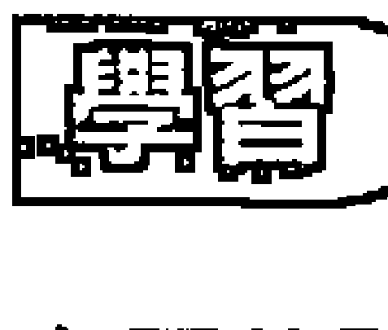

### 主要的問題：控制。

- 濫用權力
- 安排
- 欲望以及我們如何跟欲望連結
- 金錢和繁榮的意識
- 受害者／施虐者
- 操控
- 給與取
- 陰和陽的平衡
- 權威

權力是每一個人生活上的主要問題，它是我們如何在我們的生活上達成我們的欲望，我們如何跟金錢和物質世界連結，我們如何跟我們的需要連結，以及我們如何互相連結。對於制約8的人來講，這些是他們主要的安全顧慮，它是當涉及安全問題的時候，他們如何在生活上操作的方式。我們可以想像這個能量的兩個極端——過多的陽性能量和過多的陰性能量。過度的8號制約是對權力的做法太陽性了，而縮減的8號制約則是太陰性了。主要的學習就是在這兩個極端之間找到正確的平衡。

我們可以想像8號的圖形是兩個能量的圓圈很平衡，並且互相流入對方。這兩個圓圈的下方是陽性的能量，它停留在肚子附近。這是我們的1號能量——成為獨立個體的能力，依靠我們自己的雙腳站立和去追求我們的慾望。它是積極、往前推、和聚焦的力量。另外一個圓圈，它的位置在胸部和心的地方，是陰性能量，2號，或女性面的力量。它是接受的能力，融入周遭的發生，它是去合作、去反應、去跟著別人或跟著存在流動的能量。當我們同時具有這兩種品質，我們就擁有真正的力量，那麼這兩個能量的圓圈是平等的、平衡的，並互相流入對方，它們在太陽神經叢或權力中心交會，我們就會被賦予力量。

大多數人都傾向於比較喜歡某一個圓圈，當你比較喜歡某一個圓圈，你就會有某種自我控制，那個信念是：要使我們變得安全或是要達成我們想要的，事情就是必須被安排。

## 166 | 制約數字

過度陽性的8號人很喜歡控制，他們將能量都放在試圖達成，所以他們對事情或是對人就變得無法敞開、沒有接受性。他們已經偏離整個情況，他們不在那個自然的流動裡，他們無法傾聽或是無法跟周遭的人合作。他們之所以會這樣做基本上是因為他們的陽性能量無法放鬆，所以他們常常必須努力來證明自己。有時候這個控制是指向外在世界，他們想要駕馭他們的環境。這種人很喜歡去組織別人，他們必須覺得每一件事都納入秩序，都在他們的控制之下，否則他們會覺得不舒服。當然，有時候這樣做會非常方便，然而他們所付出的代價是他們會經常覺得很緊張。他們的害怕是，如果他們放鬆下來，事情將會失控，那是非常糟糕的。

有時候那個控制比較轉向自己，這種人也許會顯得很溫和，一點都不會催促，但是他們也無法放鬆。他們有時候會有慢性的緊張，因為他們很堅定地克制自己，這意味著，為了要創造出一個安全機制，那個能量的自發性和自然的活生生就習慣性地被壓抑了。要放掉那個自我控制會令他害怕，因此這樣的8號人有時候會顯得很緊或是像木頭。他們很難放鬆或是鬆開來享受樂趣，因為這樣的話他們就必須拋掉他們的自我控制。他們的恐懼是：他們放開來的行為可能無法被接受，或是行不通，所以是不安全的。

隱藏在過度的8號人最大的恐懼是害怕失敗。他們所學到的是：成功是要取得安全基本的需要，不成功是世界上最糟糕的事。他們會覺得：如果我失敗，我就無法存活。對不同的人來講，他們對失敗會有不同的解釋。當害怕失敗的恐懼駕馭著一個人，它會創造出強迫性的需要使各方面都納入控制。

8號人也可能是一個成就狂，他們對成功的需要會把他們推向去追尋更高的成就。一個典型的例子就是一個人在爬公司的階梯，他們一個星期工作七天，每天工作十個小時，為了要達成、要勝利、要跟別人競爭，希望能夠拿第一。對於極端過度的8號人，人生可能成為一個戰場，它是一個經常的努力，一直都想要勝利、想要成為最好的，想要這樣做來掩蓋內在深處對於失敗的恐懼。工作或任何方面的成就成為生活的主軸，它耗掉了大部分的時間和能量，因此能夠留給喜悅或屬於心的事情就變得很少。即使在比較不極端的例子裡，過度的8號人也是一個一直在往前推進的人，他的存在變得嚴重失衡，經常都想要做這個或做那個，而沒有放鬆或休息的空間。這簡直是太走向外在了，而沒有足夠的時間和能量進入內在。這可以被比喻成只想吐氣，不想吸氣。

身體的能量可能會經常被駕馭著，或壓抑著，這對身體是非常有害的。結果8號人所面對的危險就是精疲力竭，把自己燒光。過度的8號人常常被推到生病的點，使得身體必須被迫在床上休息來調整它的不平衡。在這種沒有行動能力的狀態下，8號人被迫進入他們存在的陰性面，停止作為，要求別人幫助和照顧。躺在醫院的病床上是最明顯的例子之一，你必須放開來，臣服於生命的流。即使只是一天的重感冒在家休息也能夠讓我們嘗到那個無助。

比較不明顯的過度的8號人可能是一個很喜歡操控的人。操控是8號人控制一個情況或控制別人的手法，以此來得到他想要的，但是又要讓別人看起來好像沒有在操控。一個古典的例子就是一個看起來很柔軟、很女性化的女人，她總是會用某種方法來說服別人，尤其是男人，去做她所吩咐的事，但是同時說服他們說那是他們的想法。就某個層面來講，這並沒有什麼不對，但是當它變成一種經常性的無意識的習慣，它就會在那個人身上產生出一種持續的努力和緊張。

縮減的8號人可能是一個典型的受害者，總是覺得是別人對他們做了些什麼，那從來不是他們的錯。他們學會最安全的策略就是投降或放棄，事實上是將他們的力量給出去。以能量的用辭來說，他們是太強調陰性能量而忽略了陽性能量，或是忽略了自己。這並不是一種具有接受性或敞開、流動的能量，相反地，那個人先自己垮掉來使自己不會受傷。他們沒有能力用自己的力量站起來去追尋他們的慾望，所以他們一再地變成別人或那個情況的受害者。在它極端的例子裡，這可能是一個一直在吸別人能量的人，這些人事實上是把別人拉進他們受害的遊戲裡。他們可能是那種你自動會覺得抱歉或想要打他的人，依你自己能量的平衡狀態是屬於哪一種。

縮減的8號人也是被失敗的恐懼所駕駛，但是他們的策略是決定最好根本就不要嘗試。所以他們從來不去追求他們的夢，也許甚至不知道它們存在。當他們的慾望升起，這些人可能會將它們擺在一旁，然後說：「它沒有關係。」，或是，「我並沒有真的很在意。」而不是去正視它。不僅失敗的恐懼駕駛著他們，它的反面也是——對於成功的恐懼。在潛意識的層面，站在勝利者的位子可能是代表最終的恐懼，因為這違反他們基本的生存策略——扮演受害者或失敗者的角色。

那個結果是，那個人會變成一個一事無成的人，這個發生可能有兩種方式，有一些縮減的8號人對於他們有限的成就覺得完全快樂，他們覺得它沒有問題，但只是在表面上，在他們意識的深處，少做是他們的生存策略。有一些縮減的8號人持續在怨嘆他們的命運，責怪別人或責怪上帝。它從來不是他們的錯，一直都是因為別人對他們做了什麼。縮減的8號人也可能是組織能力很差的人，他們總是會把事情弄得很困難，即使是一件簡單的事，比方說整理行李。

對所有的8號人來講，金錢是那個遊戲很大的一部分。過度的8號人可能非常物質主義。金錢是他們跟世界連結的主要工具，所以它是他們最想要成就的東西。他們享受物質世界，也許他們喜歡誇張的消費，被認為是有錢人，他們花錢很容易，有時候超出他們的能力。在正向方面，這能夠給他們一種健康的繁榮意識，一種能夠允許他們過好生活的權利，但是在負向方面，當它失去平衡，這可能會變成貪婪和卑鄙。這是太過於強調物質，而忽略了心和心靈的價值。

縮減的8號人可能會陷住在貧窮的意識裡。拒絕豐富是他們策略的一部分，金錢永遠都短缺，從來不夠，儘管他們很努力賺錢，但錢總是不會很容易進來。即使是一個比較富有的縮減的8號人也可能在無意識裡面認為他是貧窮的，儘管他們已經擁有相當的財富，他們花錢也是很節省。他們不允許他們自己或他們周遭的人擁有他們想要的東西，因為他們害怕花費，或是擔心錢永遠不會再進來。

地位也是8號人所重視的，對別人的重視或輕視，或者只是一般的意識到他們自己和別人的地位，可能是8號人看世界的一個方式。同樣的能量會影響他們跟權威互動的方式。縮減的8號人可能會採取順服和取悅的角色，過度的8號人可能會叛逆，不停地跟權威抗爭。

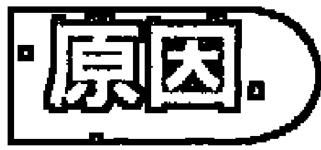

- 專制的父母
- 嚴格的規範
- 家裡的金錢問題
- 受害或施虐
- 競爭

8號小孩常常出生在一個競爭的世界，或甚至是戰爭的世界。他們幼年時期的學習關係到成功和失敗、勝利或輸掉、佔上風或屈居在下的品質。幾乎是不可避免地，在8號人的孩提時代，家裡總是會有金錢問題。

8號人常常有一個專制的父母或是權威的家庭成員。在最糟糕的情況下，這個人可能是一個控制狂，他們會嚴格地管理家庭和小孩。在比較不極端的例子裡，父母對規範和服從有堅定的概念，而且會嚴格執行。也許父母很懂得操控，小孩在這個微妙的控制環境下被帶大可能並不十分了解。不論是以什麼樣的方式，小孩在早年就碰到跟權威連結的情況，他們如何對此反應決定了他們會成為一個過度的或縮減的8號人。

過度的8號人通常會嚴守規則。他們瞭解到跟著權威走才能夠得到安全、注意、愛、和讚賞，那是他們所想要的。失敗是羞恥的，8號人不喜歡被羞辱，失敗是不安全的，那對他們來講是非常糟糕的。

這個制約也可能是家裡的競爭氣氛所造成的，比方說，兄弟姊妹之間的競爭。也許其他的兄弟姊妹比較被喜歡，所以8號人覺得他們必須跟他們競爭來得到父母的愛和注意。或者也許8號人自己就喜歡跟同年齡的人比較，一直都試圖比別人更好。

有時候小孩的父母野心太大，經常都催促小孩要成為最好的。比方說，成為班上名列前茅的人，或是進入最好的運動隊。不論以什麼樣的方式，小孩所接收到的訊息和了解是要成為勝利者，不能成為失敗者。

也許這是家庭制約的結果，也許他們的家庭是上流社會的家庭，所以小孩被教導要非常覺知到這一點，而且要維持它。或者也許那個情況剛好相反，那個家庭本身是來自社會的底層，所以小孩有一種強烈的慾望想要改善自己的地位。在這兩種情況下，小孩都會很重視地位——誰在上位，誰在下位。換句話說，小孩會發展出一個在世界上抗爭和競爭的習慣。

還有一種情況就是在早年的時候，小孩學會要把事情組織得很好。也許家裡的每一件事都安排得很好，所以如果能夠遵循那個秩序就會被獎賞，否則就會被懲罰。或者小孩可能是在一個混亂的情況下被帶大，所以他必須創造出他自己的結構，事情才能夠好好運作，他才會覺得安全。

當面對競爭或駕馭，縮減的8號人走到了另外一個極端，他們的經驗是，如果不要抗爭、不要競爭，事情會進行得比較順利，所以比較安全。因此他們會將權利交出去，而且，如果有必要到時候，他們會使自己成為受害者。失敗或不要競爭是一種最舒服的選擇。這種制約最明顯的原因就是小孩經驗到某種虐待。這可能是性虐待、身體的虐待、或心理的虐待，它發生在小孩沒有抗爭能力而只是屈服的時候。這可能會讓小孩永遠無法學會榮耀自己，或是覺得他們自己有權利滿足他們自己的慾望。他們從經驗中覺得，如果他們想要得到他們所想要的，或者只是試圖要這樣做，他們就會被懲罰。

很不幸地，這個受害者的能量會引來一個暴虐的伴侶，所以我們常常可以看到一些孩提時代被虐待的婦女長大以後的伴侶也會虐待她們。還有一種情況，當那些受虐的小孩長大，他們也可能會以同樣的方式來虐待其他的小孩。以這樣的方式，在某些情況下，那個受虐者變成施虐者，受害者變成施暴者，但那個遊戲仍然保持一樣。

在一個專制或競爭的家庭裡，縮減的8號人學會逃離現場。也許他們發現使別人覺得對他們感到抱歉意味著他們接收到了所欲求的愛和注意，或者至少它使他們覺得安全。成為虛弱的、失敗的，或是一個沒有太多投資的人，變成了他們的生存策略。

不論它是屬於哪一種的8號制約，它都會造成一種自我控制，而影響到身體的能量。不論是努力想要成為最好的，或是害怕被懲罰，8號的小孩都學會去駕馭他們自然的能量。這些能量的控制模式會在身體裡面形成一種緊張的習慣。

8號小孩在成長過程中常常被強調金錢的重要。在某些個案，家裡是富有的，所以他們的孩提時代是豐富的，因此他們已經習慣於富有。在另外的個案，家裡是缺錢的，所以家人一直在試圖賺取生活所需的費用。不論是哪一種情況，小孩都會很重視金錢，他們透過這些經驗所發展出來的對金錢的覺知對他們日後的生活有很大的影響。

# 陰和陽的平衡。

8號人的治療是透過重新調整陰性能量和陽性能量的平衡。以純粹的能量用辭來說，那意味著過度的8號人需要放鬆，慢下來，允許他們自己有更多的陰性能量——接受、合作、流動。而在另外一方面，縮減的8號人需要放更多的能量在陽性面，以及自信和自我價值的感覺，使他們有能力去行動，和爭取他們所想要的。

對過度的8號人來講，這意味著同意自己放掉控制，同時放掉說除非他們努力使它發生，否則他們無法得到任何東西的信念。他們可能做不到這樣，除非他們能夠放掉成功的需要或是對失敗的恐懼。如果失敗對他們來講是非常難以忍受的，那麼過度的8號人一定會想盡辦法避免。對這樣的8號人來講，能夠坦然接受失敗是一個非常基本的治療。尤他們需要去經驗，他們還是會存活，事實上失敗並不會帶來什麼恐怖的事，那並不是什麼大不了的事。

當這個基本的恐懼被解決，過度的8號人將首度開始放鬆和放開來。在這種放鬆的狀態下，他們將會變得更能夠對來到他們身上的事敞開，讓存在有機會來引導那個路，而不是一直相信他們必須單獨去做它。

有時候這個改變會透過經驗而發生，從經驗中，他們會了解追逐欲望和野心，試圖成功和勝利，並不會使他們快樂，它無法帶來真正的滿足。這是可能發生的，因為他們一直在成功，然後他們發現他們的成功並沒有帶來真正的快樂，他們得到了他們想要的，但是又怎麼樣呢？常常在某些情況下，他們深層的意識強迫他們停止，治療就發生了。最明顯的例子是，當身體拒絕被催促或是被控制，一個意外事件或生病會確定地告訴我們，我們的生命並不是我們所能控制的。8號人被迫要臣服，要放棄他們認為重要的事。透過這個被迫的限制，他們可能會找到在他們自己裡面那個真正力量的平衡。

縮減的8號人的治療是當他們能夠去面對他們的恐懼，然後勇敢去爭取他們所想要的。換句話說，他們必須敢於冒險，而唯有透過面對危險，他們才能夠開始拿回他們的力量。當縮減的8號人開始覺知到他們的拒絕自己站起來，以及他們經常的對自己說不，這事實上是在傷害自己。當那個痛苦或憤怒升高，它會將他們推出他們的舒服區去面對他們的恐懼。就某方面而言，憤怒是可以用來治療縮減的8號人的元素，是可以賦予他們力量的媒介。當他們繼續使用這個能量來反對自己，他們就停留在受害者的模式，而當他們準備將這個能量表達出來並且透過它來行動，他們就拿回了他們的力量。

8號的制約程式跟物質世界非常有關，所以那個治療可以緊密地跟金錢的關係連結在一起。對於過度的8號人來講，這意味著學習說事實上金錢並不是最重要的東西，還有其他的東西能夠給予更多的喜悅和滿足。而對縮減的8號人來講，它是關於允許他們自己繁榮和豐富，學習給自己更多，或是對別人更慷慨。金錢流是8號的能量或力量有形的鏡子，當那個力量是隱藏的，錢就會短缺；當那個力量被擁有，它就會自動吸引來很多錢。所以縮減的8號人去讀一些增加繁榮意識的書，或是去參加那一類的課程，或者只是去改變他們不允許去接受的信念，這對他們是很有幫助的。

# 成熟的潛力

組織、效率、去達成的能力、做生意的能力、將所有的東西整合起來、展現、力量。

真正成熟的8號能量是使事情發生但不必自己去做它的藝術。這不僅需要授權，而且需要了解一種更高的展現法則。展現是一種藝術，它是配合存在去達成一個目標，而不是衝刺去得到或是全部由自己來做。比方說，如果成熟的8號人在找尋一個房子，他們會精確地訂出他們的優先條件，了解清楚他們要找什麼樣的房子，然後他們會將那個訊息丟出去，等待回應。這並不意味著他們什麼事都不做，他們可能會去找房屋仲介或閱讀報紙的廣告，然而他們在做這些活動的時候會帶著信心，覺得他們要找的房子一定有，他們可以敞開來準備接受它。

展現的一部分是清楚地知道你要什麼。一個健康的8號人對這一點很擅長，他們跟他們的慾望很有連結，他們能夠在頭腦裡面將它擬出，他們很確定，一個健全的慾望是要配合存在，而不是跟它對立的，所以他們不會強求，換句話說，他們不會讓他們自我的慾望變得太強而脫離事實。

成熟的8號人的另外一個主要的天賦是他們的組織能力。叫他們做一件事，他們就會將它整合得很好。從組織小孩的遊戲到指導一個大的機構，他們都會做得很好。將一個成熟的8號人放在任何事業或管理的位置，他們就會發光。這也包含他們的授權能力。以一種強勢但敞開的態度來指引別人的能力是8號人天賦的一部分，他們同時也有激發別人的能力。最高程度的8號人展現出陽性能量和陰性能量之間的平衡：能夠成為強而有力的和自信的，去執行他們要做的事，同時保持敞開地融入周遭，並跟它保持和諧。

這個8號人可能會是一個很棒的達成者，他們知道如何訂下他們的目標，同時能夠去達成它們。比方說，他們能夠執行必要的規範來達成事業的目標，或是保持節食和運動的習慣。大多數的8號人喜歡成功，這給他們一個很好的動機去盡可能達成任何他們所接手的任務。

有一些8號人是很自然的效率專家，他們無法忍受浪費，所以會很自然地找到避開它的方式。他們知道如何切除不必要的部分來達到最大的效率和生產力。他們也會善用金錢，因此常常可以在財務領域找到他們，他們也可能在物質上非常慷慨，在給予當中找到很大的快樂。

成熟的8號人也可能有諮商別人的天賦，他們知道如何傾聽，如何給別人空間，同時知道如何引導別人。他們也許不是一個一般所謂的「幫助者」，然而他們的天賦在於他們的客觀，因此可以正確地反映出對方的情況。

比較具有陰性能量的8號人會具有傾聽的能力，並且能夠從他們的感覺和直覺來運作。當他們能夠善用他們的陰性能量，而不是垮掉而成為受害者，他們會具有一種特殊的力量使他們能夠融入周遭的存在，並跟它保持和諧。從外在看起來，這可能會是很特別的，因為他們做起事來好像很容易，不需要有太多的努力。

尼可的父母並不窮，但是金錢在他們家裡是一個主要的議題。他想起，學習東西的價值是他孩提時代被灌輸的重要部分。從他青少年開始，他就發覺他自己常常被一些權威或有地位的人所吸引。他喜歡跟他的老師們在一起，而因為他的英文能力很好，他常常代表他的義大利大學去拜訪美國的教授。這種自然地被權利所吸引的傾向持續到他的職業生涯。他選擇成為一個翻譯者，常常去訪問一些重要人物，後來成為一個很成功的組織者，協調跟新時代有關的活動。他的太太家世很好，而且長得很美，是其他男人嫉妒的，而且他的兩個小孩也很完美，雖然他並沒有很多時間可以跟他們在一起。他似乎什麼都有了，但是到了他四十幾歲的時候，他開始出現了一種健康的問題。他的體力已經不如從前，所以他被迫去重估他的生活重心和目標。他開始瞭解到，有很多他原來認為重要的事現在情況已經不一樣了，他大量減少他的工作，花更多的時間跟家人在一起。幾年之後，他甚至放掉了他組織的工作而成為一個新時代的諮商師。

# 培養一個制約8的小孩

8號小孩對於讚美或批評很敏感，所以在這方面父母要特別小心。當小孩被讚美，他們會認為那是一種勝利，而當他們被批評，他們就認為那是一種失敗。這些標準將成為他們日後生活的準則。父母能夠給8號小孩最大的禮物就是解除他們去發展這些習慣的壓力，那意味著不要太強調小孩的成功和失敗，勝利或輸掉。

當然，大多數的父母都希望他們的小孩有很好的表現——在學校、在體育方面，或是在其他的任何行動裡。但是不要反對他們的成功，還有一種方式可以不要太強調競爭的重要。換句話說，不要給成功太多的讚美，而要獎賞他們那些不競爭的品質，父母可以帶領小孩去注意那些活動的過程，而不是只重視它的結果。比方說，可以獎賞小孩所做的努力，而不是只看他們的努力所得到結果。

讓小孩了解，失敗並不是一件羞恥的事，或是必須覺得不安的事，這一點是很重要的。在失敗的時候，小孩最需要知道他們一樣會被愛和被珍惜。父母不要讓小孩覺得，他們所給予的注意是在補償他們，因為這樣會讓小孩覺得你這樣做是在為他們惋惜。只要繼續鼓勵小孩，讓他們了解，成功和失敗就整個生命來看並不是那麼大不了的（勝敗乃兵家常事）。父母能夠幫助小孩發展出平常心的態度，這對8號小孩來講是最大的禮物。

不要過度規範小孩，這對8號小孩的父母來講也是重要的。當父母的教導有更多的彈性，8號小孩更能夠發揮出正向的潛力。但這並不是意味著完全沒有規範，因為如果小孩在混亂中被帶大，他們可能會變得過度控制自己，試圖在他們的生命中創造出某種穩定性。而在另外一方面，如果太強調服從和遵循，小孩可能會變得僵硬，這不僅會限制他們敞開和跟著生命流動的能力，也會在他們的身體裡創造出長期的緊張。

規則是必要的，但是在執行上需要有彈性，所以當情況有變化的時候，那些規則是可以適度調整的。在這樣的方式之下，小孩也學會信任他們自己的反應能力，而不是一切都以規則為依歸。小孩的感覺必須被重視，而不是要他們盲目地服從規定。要重視感情面，而不只是物質的獲得或成就。

8號的小孩必須學會耐心，和讓事情發生的藝術，而不是一直都必須靠自己的力量使事情發生。要經常提醒他們不要匆匆忙忙，或是等著看事情的發生，這能夠幫助他們不要太急著去看成果，而能夠跟著過程流動。小孩需要被鼓勵去感覺那個做的喜悅，而不是只把焦點放在做完之後的成果。比方說，當小孩涉入一項運動，他需要被鼓勵去感覺那個遊戲的壓力，而不只是一直強調要做好或是要勝利。

你的小孩會傾向於成為過度的或縮減的8號人在很小的時候就會看出來，從他們對權威、規則、和競爭的反應方式就可以看出來。如果小孩似乎從來不知道他們要什麼，或是傾向於使自己被周遭的人所駕馭，不想進入任何競爭，那麼他或她就是縮減的8號人。這個小孩需要被鼓勵去達成他們的慾望。你要讓小孩覺得他們說出他們想要的東西以及去遵循他們的慾望是安全的，因為他們可能會認為那樣做是危險的。經常問小孩他們要什麼，他們比較喜歡什麼，鼓勵他們去做選擇，並榮耀他們的選擇，這將能夠幫助小孩建立起他們自己的信心。再度地，那個關鍵不是在於強調結果，換句話說，不是強調一個慾望或方向的成功或失敗，而是強調那個去做它的滿足，不論那個結果是怎麼樣。

對8號人來講，金錢也是一個重要的元素。雖然家庭情況可能會決定這些金錢問題的主要性質，但是聰明的父母還是可以引導小孩關於金錢在生命中的意義。找到一個中庸的方式來發展出對金錢的尊重，但是不要認為它具有至高無上的價值。當給予小孩財務或物質的獎賞時，不要只是顧慮到他們達成什麼，也要鼓勵他們的努力，這樣做是比較好的。可以讓8號小孩有他們自己的存錢筒或儲蓄模式，讓他們從小就有金錢的觀念，這樣他們就會有很多機會來發展出跟金錢的健康關係。

# 制約 9

根（本質）——慈悲

## 純粹的部分

- 完成、放下、信任、慈悲。

9號是最后一個數字，是旅程的終點，它跟他們去完成事情然後放下它們的能力有關。如果我們不知道如何放下，我們就無法在生命中繼續進行。要放下需要信任，這是另外一個主要的9號品質，它包含信任自己和信任別人，以及更大的對存在的信任，當你能夠信任存在，你對於生命中的任何發生就能夠放下和放鬆。9號也是某種東西的總數，是所有部分的總合。在人類的情況，它展現為慈悲，它純粹的形式是將空間給予人類本性所有不同的品質，不論它是在我們自己裡面或是在別人裡面。因為9號包含整體的品質，事實上是一個360度敞開的觀點，因此它也是在處理界線的問題。這包含知道我們在哪裡結束，而別人開始；在我們的需要和別人的需要之間要如何畫出適當的界線。

# 主要的問題：界線。

信任、放開來／執著、對自己慈悲、當跟別人在一起的時候歸於自己的中心、同情／可憐、需要被需要。

9號的小孩很早就學會當他們很清楚地覺知到周遭的人的感情和需要，事情就會運作得很好，他們也會比較安全。將焦點放在自己身上被認為是不安全的，所以他們學會將他們的覺知放在外界，而且是360度全包。他們發展出一種神入的敏感度，它幾乎就像是他們有一個小小的感情天線，它本能地會向外伸出去，並融入任何進入他們能量圈的人。透過這個，9號人會自動地更優先覺知到別人的感覺和需要，而將自己的感覺和需要擺在第二位，因為這樣做比較安全。

這使他們成為很棒的照顧者和給予者——對其他每一個人，但是自己除外。對9號人來講，最困難的事情就是當他們跟別人在一起的時候，他們無法將他們的焦點放在他們自己的感情和需要上。為了要在一個關係裡能夠照顧自己，在某個點上，9號人會發展出一個自動的反應，對別人說不，切斷跟別人的連結，來創造出一個人為的界線。這個反應會在何時出現因人而異。對於非常過度的9號人來講，唯有在他們被推到極端的時候，他們才會這樣做。對於縮減的9號人來講，這就是他們平常生活的地方。但是對大多數的9號人來講，這個模式是他們所熟悉的。典型的9號人大部分會在那裡為別人，真的是很無私，而且融入別人，然後有一天，突然間，他們已經無法再做它，然後他們會發覺他們關閉起來，並將別人推開。

這可能會產生痛苦和混亂，不只是對習慣於被9號人照顧的別人來講，對9號人本身也是如此。那個發生的情況是：9號人突然覺得非常需要去照顧他們自己的感情幸福，但是他們所知道的唯一做法就是拒絕別人，對他們說不。為了要這樣做，他們必須關起他們自然敞開的能量，這會使他們變得緊縮。通常他們能夠在他們的身體、他們的感覺、和他們的能量上感覺到這個變化。一旦他們這樣做，他們不僅切斷跟那個人或那個情況的連結，他們也同時切斷了跟周遭的連結。他們不僅築了一道牆來擋掉外在，他們也同樣用那道牆把自己關在裡面。

讓我們來看一個例子，尼娜在一個有愛心的大家庭被帶大。家裡的每一個人都覺得她很好，因為她一直都很體貼、很配合別人，當別人有需要的時候，她也很願意幫忙。到了某一個年紀，她的配合開始出現衝突，因為她越來越覺知到她自己的目標和慾望。然而她發覺要將她自己的需要擺在第一位做起來很困難。為了要能夠遵循她自己的方向，她無意識地在一些小事上面製造出很大的爭執，以便讓自己有藉口對家人關閉起來，然後她才能夠自由去走她自己的路。

9號人的這種反應策略遠離了真正的對自己慈悲，那才是真實的9號能量。在那個反應策略之下，為了要拿回自己的權利，他們事實上是壓抑了自己。9號人很擅長對別人說是或說不，但是他們不知道如何對自己說是，他們不知道如何停留在自己身上，同時對別人敞開。舉一個日常生活的例子：如果你叫你的9號朋友陪你去看某一部電影，他們很難向內看自己去了解他們是否真的喜歡那部電影。所以他們可能會說是，然後跟你去看，因為他們想配合你，或者他們會說不，因為他們不想配合你，但是在這兩種情況下，那個9號人都不知道他們本身是否真的想看那部電影。

成熟的9號能量事實上是360度敞開的。它不像2號人是對特定的對象敞開，而是一種自然的開闊，能夠讓所有的東西都進來。所以如果9號人自己在一個大房間裡，他們的能量會很自然地擴張去充滿那個空間。當別人進入到那個房間，他們是進入到那個9號人的空間，雖然那個人也許跟那個9號人沒有關係。他們在那裡也許是為了他們自己的事，在忙著他們自己的工作，但是那個9號人的能量會自動受到他們的影響。過度的9號人會從他們自己的空間分心出去，然後他們會發覺他們自己融入到別人在做的事，雖然對方還在忙著他們自己的事。縮減的9號人會發覺他們的能量突然收縮起來，他們會築起一道牆來將別人排除在外，他們本身會覺得緊張和封閉，即使他們並不了解為什麼。在上述的各種情況下，9號人很容易覺得被侵犯，雖然對方也許並沒有覺知到他們的存在。

9號制約的根是害怕將能量集中在自己身上，因為他們覺得這樣是不安全的。自然大大敞開的9號能量會自動去重視和反映別人的需要和感覺，那個難題在於：過度的9號人覺得他們的價值是建立在為那些需要和感覺做些什麼，換句話說，他們必須幫助別人，成為對別人有用的。如果他們優先考慮自己的感覺和需要，他們就會覺得別人會不愛他們，他們將會變得很孤獨，他們可能就無法存活。

9號人的特殊依賴形式可以被視為需要被需要。9號人相信，他們被需要和對別人有用的程度決定他們能夠被愛多少，以及他們的生命是否能夠運作得很好而得到他們所需要的。他們一直在展現出他們對別人來講是有用的，然後在某個點上，他們會變得很煩，因為他們覺得被利用了。9號人可能會非常慷慨，到了過份的程度，給予別人他們的時間和物質，雖然它有一部分是來自他們真心想要這樣做，它也是基於他們需要成為有幫助的。他們可能會覺得別人比自己更重要，而且比自己更有權利，所以如果別人喜歡9號人所擁有的東西，他們就必須將它給出去。

當9號人開始封閉起來，那是因為他們不知道在適當的時間說不。他們沒有融入他們自己的界線，所以不知道什麼時候需要照顧他們自己，因此他們傾向於把自己給出去太長的時間。唯有當他們被逼到超出他們自己的界線，他們才會開始意識到自己的需要。它可以被視為是一個界線的問題。過度的9號人不知道如何設界線，或是應該在哪裡設界線，所以他們常常把自己逼到超出他們不得不切斷的點。然後當那個反應產生，他們會很不適當地使用那個界線，就某方面來講那個界線並沒有真正在服務他們。

縮減的9號人從另外一邊的制約出發，他們發覺他們自己自動對周遭切斷和封閉。他們會顯得非常自私，無感和很自我。在極端的例子裡，他們對外界幾乎是麻木的。這種人可能會走在街上看到一個心臟病發作的人而連眼睛都不眨一下，因為他會認為那跟他們無關。他們的覺知侷限在他們自己的立即經驗裡，最多只及於他們身邊的家人，因為他們會影響到他們的生活。縮減的9號人的信念是：當你不涉入別人，你的生命會運作得比較好，也會比較安全。

他們覺得如果敞開自己，那麼在最好的情況下，他們會被佔便宜，而在最糟糕的情況下，可能會有恐怖的事情發生。

過度的9號人可能會太熱情，而縮減的9號人可能會太冷漠。在極端的例子裡，縮減的9號人會顯得幾乎是無心的、沒有人性的。在比較不極端的個案，這可能只是意味著你不會想跟他們分享你的難題，因為他們沒有能力去感覺你所說的。這樣的9號人也可能是吝嗇的，不論是時間或金錢，他們都吝於給予，所以你會發現他們的身體是緊縮的。這種人學會將世界排除在外，它可能會顯示在他們的姿勢上。

信任也可能是9號人的主要議題。過度的9號人可能會非常信任到天真的程度。他們可能會很高興地天真，但是當他們被騙，他們就會封閉起來，覺得受傷和怨恨。要他們再度敞開可能需要花一些時間。對某些9號人來講，這種情況會傷害到他們的信任能力，但是其他的9號人可能還是會繼續信任，直到他們學會分辨。這裡所說的信任不只是指對別人的信任，它也是對存在的信任。

過度的9號人一般會信任事情將會沒有問題，所以不會花太多時間去擔心或是迷失在細節裡。而在另外一方面，縮減的9號人會發現他們很難信任任何人或任何事。他們常常會去想像最糟糕的結果，然後一直擔心那些可能的發生。他們可能不信任周遭的人，會假設他們是不好的，或者他們的動機是不好的。這種9號人很難原諒別人，所以如果你跟他們有衝突，他們可能會記恨很久。

放下或執著，這也是9號制約的一部分。有一些9號人非常不執著，因此他們會顯得沒有連結、漠不關心，或是很疏離，另外有一些9號人卻抓住每一樣東西——抓住他們的創傷和抱怨，抓住他們的愛人和他們的財產，很難釋放掉它們。他們在一個關係結束之後還念念不忘，甚至丟掉一樣小東西都會讓他們想很久。他們也很難脫離負面的習慣，比方說，一旦他們開始嗑藥，他們就很難戒掉。

侵犯界線、早年家庭生活的困難。

9號小孩所學到的策略是當他們能夠知道別人的感覺和需要時，他們就會覺得比較安全，比較容易得到他們所想要的。所以9號小孩發展出敏銳的感應器，能夠自動測出別人的感覺。

這是由於小孩在他們的早年常常碰到有人生病、死亡、年老的父母、分離，或是某種家庭環境的困難。他們常常會接收到一些訊息：不要要求，因為媽媽身體不好。不要發出聲音，因為爸爸在睡覺。不要跑來跑去，你會打擾到奶奶。因為9號小孩有敏銳的感覺，所以這些要求甚至不需要被說出來，小孩會自動感覺到別人身上的那個悲傷、那個痛苦、那個緊張、那個憤怒，或是那個不耐煩，然後加以反應。他們知道媽媽什麼時候不高興，所以自動就去做一些事來使她快樂，因為那樣做最可能使他們得到愛和讚美。

小孩從這些情況所學到的是，將他們自己的感情滿足擺在第一並無法使他們得到什麼。當別人的難題或需要被擺在優先的位置，它不僅能夠使他們保持安全，同時以一種迂迴的方式，他們比較能夠得到他們想要的東西。小孩以自我為中心的自然成長階段常常因為外在環境的困難而被縮短了。小孩可能在很小的時候就碰到了憂傷，所以他們那種輕鬆和遊戲的天真就沒有多太多的空間可以展現。在某些小孩，他們表現出比他們的年齡更早熟，而在另外的小孩，他們可能表現出嚴肅或沈重。

過度的9號人將這個能力發展成去融入別人，然後將它轉變成對別人有用和幫助的策略。他們學會正向地反應於他們從別人那裡所感受到的，然後做出別人或那個情況所需要的。他們發現，當他們這樣做，他們會得到很多感激、注意、和愛，所以當他們扮演那個角色，他們就會覺得他們很有價值。因此那個小孩就成為媽媽的小幫手。當他們長大，這個模式發展成依賴別人的讚賞才覺得自己很好，換句話說，他們需要被需要。

在另外一方面，縮減的9號人以相反的方式來反應。他們認為如果他們不去感覺周遭所發生的事，他們會比較安全，比較不被打擾。因此他們創造出一道防衛的牆，而跟廣大的周遭隔離。這可能是因為外在的感情世界太強烈了，他們無法忍受。也許周遭有太多的痛苦和憤怒使他們無法忍受，他們覺得會被那些能量往下拉，所以他們變得麻木。他們覺得為了要生存，要有他們自己的生活，他們在他們自己和外在之間必須畫出一條明顯的界線。或者也許他們早年的經驗讓他們覺得正向地反應於別人的感情或是去幫助別人是沒有用的，它無法帶給他們安全，所以他們就放棄了，因此他們決定最好只管自己的事。

因為放下和執著是9號人的主要顧慮，這些問題常常在9號人的幼年時是很明顯的。9號制約的人在年輕的時候常常有機會去經歷一些重要的家庭改變，比方說搬家、換到另外一個家庭、轉學、或換朋友。有很多情況會迫使他們去面對離開熟悉的環境，或是去面對無法再繼續抓住什麼的難題。在某些小孩裡面，這發展出一種恐懼，覺得身邊的東西將來可能會被帶走，因此這使他們非常執著於他們所愛的或是所擁有的。在另外的情況，它發展出一種疏離感，覺得人或物遲早會被帶走，所以最好不要太執著才會減少痛苦。9號小孩也可能有信任的問題。父母如果說了一件事而沒有做，小孩就會覺得失望或是被出賣，這會造成對他們信任感的衝擊，他們會變得不大敢信任。

適當的界線。

9號人基本的治療就是能夠給他們自己的能量空間，不要跟外界隔離。這意味著對自己說是，同時對別人敞開。他們知道如何對別人說是，他們知道如何對別人說不，但是他們不知道如何對自己說是。這對他們來講是最困難、最害怕的事。它感覺起來好像，如果他們這樣做，就會有很恐怖的事情發生，別人可能就不再愛他們，他們就會變得很孤獨，他們可能無法存活。他們要了解這並不是事實唯一的方式就是冒險去嘗試。

對9號人來講，他們的治療就是將注意力和空間結合起來。他們的天賦和他們與生俱來的權利是一個很大的空間，他們所要學習的是要保持那個空間的敞開，同時將他們自己包括進去。換句話說，他們需要去注意他們自己的感覺和需要，並給予它們空間，同時保持對別人敞開。他們在學習如何同時重視自己和重視別人。

在日常生活當中，這可能意味著學習說不的藝術。這並不是像某些9號人所熟悉的固定反應、封閉、或拒絕別人，而是真正融入自己的感覺，給自己說不的權利，如果他們真的是這樣感覺。當他們這樣做的時候，他們不需要覺得他們是在做一件錯的事，或是變得防衛，或是必須為這個權利抗爭。

信任的議題會發生在9號人身上，9號人常常面對決定要不要信任的問題。他們到底要不要信任如果他們把自己擺在優先的位置，別人還會不會愛他們。同樣地，他們也可能面臨決定要不要信任某一個人。在更大的生命藍圖裡，它是關於決定如果有什麼事發生的時候，生命是否還會照顧他們，或是要花費他們一半的生命來煩惱關於那些可能的發生，一直在計劃和準備而錯過了當下的生活。

這個治療有一個很重要的元素是要精通放下的藝術，學習信任，並給自己空間。成熟的9號人那種擴張的能量狀態唯有當他們在日常生活當中能夠停留在一種放下和信任的狀態才能夠存在。過度執著於某一個關係會將他們的能量鎖起來，執著於某些物質的東西，或是執著於某一個計劃的結果也是一樣。就如克利虛納姆提所說的：「任何你所執著的東西都是一個限制，即使是一個思想也是。」這句話非常適用於9號人。抓住任何東西都會窄化他們的能量，使他們不再敞開去接受來自存在和來自周遭的一切。要很成功地治癒這個創傷，在日常生活當中，他們必須經常記住抓住舊有的、已經失去的創傷、判斷、意見、或物質並無法得到什麼。他們也必須去正視那個事實：在親密關係裡的佔有和嫉妒將會引起很大的難題。

在本質上，9號人是在學習張開他們的雙手，讓生命流過，他們將會發現他們越是這樣做，就有越豐富的生命會流經他們。放下和信任是9號人的治療咒語。

## 成熟的潛力

慈悲、關心別人、神入、人道主義的顧慮。

9號人可以是最棒的照顧者和體貼的人，你不需要告訴他們你要什麼，他們可以感覺到它，也許可以跟你一樣感覺到。他們具有一種滲透的能力，會讓你覺得他們真的能夠融入你，真的就跟你在一起。如果你臥病在床，9號人會知道如何安排你的枕頭，或是你需要什麼才會變得比較舒服。如果你需要一些滋潤，9號人會拿出剛好你所需要的。成熟的9號人不會只是在那裡跑來跑去試圖幫助，他們會真的以正確的方式來幫助。他們是真的喜歡照顧別人，他們的滋潤是基於融入去感覺那個人真正的需要，而不是基於他們自己的想法。因為這樣，所以你常常可以在一些需要這種傾聽或照顧能量的地方找到他們。

如果你在經歷一個感情的創傷，9號人會在那裡跟你在一起，融入你的每一個感覺。他們不會帶來他們的判斷和意見，試圖使那個事情變好或使那個難題離開。他們只是對你的感覺敞開，並吸取你正在經驗的。成熟的9號人也許是你覺得最安全可以跟他們分享你自己的人。他們自動地知道如何將他們自己擺在一旁，為了要在那裡跟你在一起，和了解你所經歷的，或是你所需要的。他們不僅能夠了解你的觀點，他們也能夠感覺到它。你會覺得你按照你本然的樣子被聽到、被看到、被了解、和被接受。他們能夠感覺到你的痛苦，他們能夠感覺到到底發生什麼事，當你在困難或痛苦的時候，他們是跟你在一起的。這在碰到麻煩或生病的時候可以帶來很大的舒適和治療。如果他們夠成熟而不要太過於跟你認同，他們就有能力可以從他們對你的情況的知覺來給出很好的建議和洞見。9號人可能很慷慨而沒有附帶條件。給予和使你快樂會使他們覺得很好，所以他們這樣做是為了他們自己，沒有附帶的目的。他們的體貼和同感能力使他們很能夠為你選擇適當的禮物。對很多9號人來講，原諒是很自然的，因為他們很容易設身處地站在你的立場去了解你為什麼這樣做的原因。

另外一個9號人可能擁有的品質是去看較大的整體的能力。他們能夠很自然地融入整個事情，而不是迷失在部分或細節裡。他們可能會關心到整個世界的事情和個人的情況。因為這樣，所以9號人常常會在環境保護或慈善機構工作。9號人有一種理想，那意味著他們是真的關心，試圖使世界成為一個更好的地方。他們是很自然的人道主義者，他們不但會關心本國的地震，也會關心國外的地震。

愛利克斯的母親在生下他的妹妹之後有產後憂鬱症。他想起曾經被告知必須接受她有時候發作的奇怪行為，而且在她旁邊都要很小心。在他長大結婚之後四年，他那個情緒一直都不穩定的太太終於心理崩潰而住院，之後都無法完全恢復。在接下來的十五年裡面，他花了大部分的時間在支持她和養他們的小孩。在他的女兒離開家裡去上大學不久之後，愛利克斯愛上了另外一個女人，在剛開始的三年裡面，他一直都覺得很有罪惡感，而且很混亂，最後終於能夠放掉照顧他太太的角色，允許自己遵循著他自己的心去做他想做的。唯有在他看到他的前妻情況變好，已經沒有那麼需要他，他才能夠真正去面對他自己的依賴——依賴她對他的需要。

## 培養一個制約的小孩:

### 鼓勵以自我為中心。

你能夠給9號小孩最大的禮物是確定他們是被愛的，純粹地被愛，而不是為了他們為你做什麼或是為別人做什麼而被愛。9號小孩會自動相信他們是被愛的，因為他們是有用的，因為他們很體貼你的感情狀態，你也會因為他們很貼心而愛他們。但是除此之外，你必須教導你的小孩回到他們自己身上：在這個時候他們感覺如何？他們喜歡什麼？藉著鼓勵小孩去看這些問題的答案，你是在訓練他們將一部分的覺知用在覺知自己，否則他們會將所有的能量都導向外在去得到愛和安全。

了解你的小孩的生存策略是將他們的天線擺在外面來得到他們想要的。為了要降低這個傾向，你必須鼓勵他們回到他們自己內在的經驗，說明這樣做是沒有問題的，不論別人是否允許。你的小孩會注意你的態度，看看你是否同意，他可能會反應於你內在的狀態，而不是你說什麼或做什麼。所以如果他們做了一些你不允許的事，他們就會感覺到你的不允許。這對他們來講將會是更強烈的經驗，比任何他們從他們自己的行為所得到的滿足來得更強烈。換句話說，他們比較重視你的反應。

比方說，想像一個嬰兒具有創造的衝動要在你家牆上畫圖，你可能會不喜歡，然而如果你沒有小心處理那個情況，你的不同意可能會跟那個小孩原始的創造衝動連結在一起，讓他覺得創造是不好的。需要耐心解釋讓小孩了解，他們的畫圖和創造力是好的，只是他們表達在一個不適當的地方。另外一個例子：也許小孩覺得你不高興，所以就摘下你家花園裡的花做成花束送給你。不論你多麼試圖表示感謝，他們也一定會感覺到你的震驚。你不要試圖隱藏它，而要很誠實地告訴他們你的感覺，並加以解釋，同時肯定他們那種給予的心意。

當你或其他的家人在經歷感情或身體的困難時，尤其需要去注意9號制約的小孩，因為9號小孩傾向於出生在這些情況可能發生的家庭。他們會高度融入周遭困難的感覺，然後吸收到他們自己的能量裡。在這個時候尤其需要鼓勵他們去做一些能夠享受他們自己的事。他們會把你的問題看得比他們自己的享受和樂趣來得更重要；如果他們沒有分擔你的痛苦，他們會覺得他們好像做錯了什麼事。你要讓小孩知道他們去遵循他們自己的慾望是沒有問題的，你會很高興他們這樣做。這樣做你將能夠幫助他們正當的保有他們自己的空間和需要。要讓小孩覺得這不僅是他們的權利，也是他們的責任，否則他們會被淹沒在別人的難題裡。你可以很實際地告訴他們：「如果你想要我真正的快樂，那麼就出去享受你自己。」

9號小孩可能會非常慷慨，到過份的程度。他們會從別人的快樂得到快樂，所以，如果將他們的新玩具給他們的朋友能夠讓他們的朋友覺得高興，他們就會這樣做，而不是只享受自己玩它。但是在那個慷慨的背後也可能是害怕失去他們的友誼，他們也許會覺得要保障他們的友誼的方式是給出對方想要的東西。當父母看到這種行為，他們可以告訴小孩說他們有權利保有他們想要的東西，但仍然值得被愛。

如果你的小孩展現出縮減的9號人的行為，你就會碰到相反的模式。當你看到小孩傾向於獨處，推掉家庭聚會，而不是去享受它們，你就可以認出他們是屬於縮減的9號人的模式。他們會顯得自私，只顧慮到他們自己的事。小孩有時候會擺盪到縮減的那一邊，因為他們在過度的那一邊待太久了，或者當他們經驗到過度的模式無法帶給他們好處。比方說，也許小孩經驗到在半夜大哭把你吵醒會讓你生氣，所以他們就停止這樣做，希望安靜一點能夠得到你的愛。但是如果這樣做沒有得到他們所希望的注意，他們可能會覺得唯一存活的方式就是照顧自己，不去管別人的需要或感覺。然而有些縮減的9號人似乎生下來就是這樣，不知道是什麼原因，只能解釋成那是他們前世的經驗，所以如果你的小孩剛好是這樣，也不要責怪你自己。

縮減的9號人需要學習，有更好的方式可以來訂出他們的界線，而不要把自己封閉起來。這需要學習信任說敞開是沒有問題的，他們不會被佔便宜，他們不會被別人的感情所淹沒，他們仍然可以得到他們想要的。這意味著家人必須非常敏感，同時尊重小孩的界線。家人必須有意識地創造出一個空間，讓小孩覺得他們可以安全表達真實的自己，或是講出他們所想要的，別人不要干涉。這可能意味著允許小孩保有他們自己的秘密，不要侵犯到他們的空間。

## 第二部分

## 治疗的旅程

你個人在這一年的學習機會。

## 什麼是關鍵個人年

在數字學裡面，一般的個人年意指在自然的九年循環裡特定的一年，那是每一個人在他的生命旅程裡繼續盤旋通過的。它是我們在那個階段會融入的宇宙能量的特定片段。我們可以將它視為一年當中的季節。它能夠以一般的方式來預測在我們生命的那十二個月裡面我們可能經驗到什麼樣的事件和挑戰。接下來我們會有描述個人年的大綱。在進入到本章的主題——你特定的關鍵個人年——之前最好先閱讀這個部分。

關鍵個人年是一個更細節的描述關於那個個人年如何按照每一個人的制約來特別影響他們。制約能量是一個過濾器，我們透過那個過濾器來看世界。以某種方式——過度的或縮減的，負面的或成熟的——那個制約不可避免地影響著我們看我們生命的方式。它事實上是我們頭腦的運作系統，它對我們如何生活和我們如何透過我們生活的事件來學習有主要的影響。任何經驗都會自動透過制約模式的影響來被感覺。換句話說，我們的任何學習都會受制約過濾器的影響。所以，我們的制約數字強而有力地在指引著我們如何處理在九年的循環裡面發生的情況，同時決定我們如何使用它們來作為學習和治療的機會。

另外一個看它的方式是，我們必須了解我們的很多成長是關於治療我們制約裡面那個不可避免的負面部分，使它們轉變成正向的。我們在什麼時候會怎麼做依個人年的影響而定。數字學提供給我們很多訊息關於在我們生活的不同方面，我們是要來這裡學習什麼的。它也讓我們了解，在任何領域的學習只能透過我們所經驗的情況來發生。換句話說，任何學習唯有透過立即的情況才能夠發生，那些情況一直都包含一個特定的功課。這些特殊的學習機會是由關鍵個人年的能量來引導的。

換句話說，關鍵個人年不僅是用來看和了解發生在那個時間的特定事件的一個方式，同時也讓我們了解為什麼它們會這樣發生，以及我們需要從這些發生來學習什麼。它就好像我們有一個按照時間所做出來的地圖，所以我們可以知道要期待什麼，為什麼事情會這樣發生，以及如何使用它們來得到最大的利益。它是一個個人的地圖，它勾勒出我們會去經歷的學習旅程的特定細節，它幫助我們了解它是如何在運作的，以及在那個旅程中的任何特定時間我們在哪裡。

關鍵個人年在兩個層面上運作。在其中的一個層面，它詳細地顯示給我們，我們將會如何經驗我們制約的負面部分；它勾勒出我們舊有的習慣模式。然後在另外一個層面，它精確地指出我們如何能夠超越這個負面的部分，如何能夠在我們生命中的這一年達成正向的潛力。它給我們清楚和精確的資訊關於什麼是我們學習的潛力，以及它在我們生命中任何特定階段的過程。它不是一個一般性的、抽象的東西。你將會發覺，了解你的關鍵個人年能夠給你非常明確的方向關於在你自己裡面你要覺知什麼，以及要怎麼做它。你將會發覺，在你生命中的那個時間，每一件事的發生，不論是內在的或外在的，都把你帶到那個學習。當然，你是否要選擇學習它，那是你的決定，但只是知道那個學習是什麼就能夠帶來覺知。

這並不是算命的方法，用來預測未來的發生或事件。然而它會那個把你帶到正確的時間點，那是當你融入存在自然的流動時所產生的。它就好像學習去傾聽你自己內在的季節，然後發展出信任說這九年裡面的每一年都有它自己特定的潛力和它自己特有的挑戰。如果你融入這個，它能夠大大地幫助你，使你能夠學習如何利用這些情況在你治療的旅程當中得到進步。同時，當你能夠聽取你自己較深的部分，你是在學習如何利用和發展你制約數字的天賦。你越是能夠這樣做，你的生命就會運作得越好。比方說，你想發動一項新的計劃，而如果你所選定的時間是你需要完成舊有的事的時候，那麼你將不會成功，它很可能會浪費你的時間。如果在某一年，當你的能量自然想要向內看你自己，而你所有的注意力都向外走，走向別人，那麼你將會錯過那個較深的內在了解，那是那一年真正的成長潛力。這個數字描繪出你能量最深的部分，或是你能量的真相——當它沒有被不適當的生存模式的負面拉力所扭曲的時候。它也描繪出你在那個時間可能碰到的會使你分心的那些生存模式。

知道你的關鍵個人年是你融入存在的方式，它也可以幫助你認出阻擋你融入存在的障礙。

# 個人年的計算

按照下列的方式來計算你的個人年，然後可以先解讀一般的個人年，或是直接去到你在你的制約數字之下的關鍵個人年。

個人年的計算就是將制約數字（出生月日的總和）加上當年的數字，然後縮減成一個數字。

- 例1：瑪莉的制約數字是6（4月2日 = 4 + 2 = 6）
在2012年，數字的總和是5（2 + 0 + 1 + 2 = 5）
所以在2012年，瑪莉的個人年是2
5（2012年） + 6（制約數字） = 11 = 1 + 1 = 2

- 例2：吉凡的制約數字是9（5月22日 = 5 + 2 + 2 = 9）
在2013年，數字的總和是6（2 + 0 + 1 + 3 = 6）
所以在2013年，吉凡的個人年是6
6（2013年） + 9（制約數字） = 15 = 1 + 5 = 6

為了你的方便，每一個制約數字的人在接下來的幾年裡面的個人年數字已經計算好放在附錄2。

# 一般的個人年：（一般的個人年俗稱流年）

這是每一個人在他們的九年循環裡面所連結到的能量。換句話說，它是我們每一個人在某一個特定的個人年裡面會碰到的事件和學習潛力的一般描述。請記下那個會影響你的特定學習，然後再閱讀在你的制約數字底下的關鍵個人年的細節。

# 個人年1：（流年1）

主要的問題：新的開始、發動。聚焦、需要去推動來證明。自我價值和接受自己；獨立和信心。

第一年是一個新循環的開始。以某種方式，有意識的或無意識的，我們種下了種子，它將會決定我們在接下來的九年會走的方向。有時候這些新的開始是外在的，比方說，進入新的生涯、關係，或生活環境。有時候它們是比較內在的——內在的變化，它產生對自己新的感覺，當自己有了變化，我們的外在也會自然隨著改變。

我們所種下的種子的本質依我們自信的程度而定。這一年是關係到接受自己的問題——給自己足夠的空間去成為自己。我們越是接受自己，我們就越有自信。我們越有自信，我們就越不受別人的影響。這些是在這一年裡面會自然產生的問題。這可能會展現在關係裡、家庭裡，或是和工作伙伴的互動裡。在此我們是在看我們成為本然的自己的權利，而不需要其他任何人的允許。

如果我們有自信，而且接受自己，我們將會種下真正來自我們自己本質的種子，那個種子會將我們引導到新的方向，不受別人的影響。當我們有某種程度的不接受自己，自尊心很低，不重視自己的價值，那麼我們所種下的種子就比較顧慮到要展現什麼東西給別人看，而不是發展我們自己的獨特性和個體性。從這個觀點來看，在這一年裡面，當我們要往前走，而不是停留在原來的地方，我們可能會經驗到很多壓力。我們所攜帶的想法是，當我們去到那裡，我們就會覺得自己沒有問題，或是可以證明什麼事給別人看。可能會有太多的目標導向，或是太聚焦在我們要去哪裡，而沒有放足夠的比重在我們所在的地方。這產生出一種被驅策的感覺，一種內在的壓力或緊張。另外一種情況是，如果我們在進入新的領域有困難，他們可能會發覺我們在這一年是縮回來的，延宕或錯過機會，因為我們對於進入不熟悉的領域是害怕的、沒有信心的。這樣我們就會陷住在那個舊有的，然後我們生命新的循環就會保持跟過去一樣，沒有進展。

1的能量是我們的陽性能量。對一個男人來講，這可能會帶來關於他作為一個男人的自我形象的問題。對一個女人來講，這可能是加重跟男人關係的模式，尤其是跟她的父親或伴侶。一般而言，第一年是一個成長為一個個人的機會，它是關於拿回成為自己的權利，從那個地方去開始一個新的九年循環。

# 個人年2（流年2）

主要的問題：
- 接受性和容易受傷
- 需要和依賴
- 擁有情緒
- 將事情視為是個人的
- 合作和順著流走
- 耐心
- 直覺

就好像第一年是進入我們的陽性能量，第二年是強調有關陰性能量的問題。這跟我們的柔軟和敏感度有關，以及關於我們的敞開和接受的能力，和我們的容易受傷或是做些什麼來保護它。這也強調那個精煉的陰性能量，那就是我們的直覺、我們內在的聲音、和跟能量連結的能力，它使我們融入周遭更大的領域。

在第二年，它並不是個人的意志在運作，倒是，能夠成功的是對周遭敏感和反應的能力。我們越是敞開，我們就越能夠融入當下的狀況和融入別人。一個適當的比喻是：我們乘坐在一個救生艇上面，順著河流往下走，沒有可以駕駛或推動的工具。我們的課題就是如何順著那個流走，不能失去耐心，也不能試圖游快一點，或是走到不同的方向，但同時要能夠反應於當下的發生，不能變得太被動。對我們大多數的人來講，這需要耐心。我們知道我們想要去哪裡，但是生命似乎一直在把我們帶到旁門左道或是在延緩。如果我們不了解目前的生命不是我們所能控制的，我們很容易就會感到挫折或變得沒有耐心。另外一個看它的方式是，我們在去年所播下的種子還在地下發芽，我們必須等待。這是感覺的領域，我們常常會發覺我們變得更情緒化，因為我們被鼓勵去傾聽內在陰性的聲音。在這一年，我們的直覺也會變得比較強，或者我們也許會碰到一些情況需要信任這個微妙的內在聲音而放掉我們的邏輯頭腦。

在關係裡的主調是合作。這一年，我們最好做好外交，多傾聽，而不要試著強推自己的意見或是過度反應。我們也許需要做一些努力來保持和平與和諧，同時去適應別人。我們也可能會有受傷的感覺，或是覺得被不公平的對待，這可能因為我們太過於把事情視為跟個人有關。也許我們會碰到一些情況迫使我們去看自然反應和固定式的反應之間的差別。

這個能量的另外一面是依賴和需要別人。我們可能會被迫去面對他們依賴的模式：當我們主要的焦點是想從外在得到愛、允許、認可、金錢，或其他任何東西而忽略了聽取自己內在的聲音，在這種情況下，我們是如何在行動？常常會有一些平常反依賴類型的人突然碰觸到一種需要別人的感覺，或是感情的渴望，那是他們以前從來沒有接觸過的。比方說，我們可能突然發覺自己渴望一個伴侶或是一個愛的關係，雖然這在以前都不是問題。

# 個人年3（流年3）

主要的問題：表達、創造力、喜悅和歡樂、社交、外表、能量分散到那些表面的事、擴張。

第三年是自然的表達和擴張的時間。在第一年所播下的種子，在第二年發芽，現在第三年可能會開始開花。在這個時候，我們可以期待從我們內在或外在新的方向看到一些結果。

一般而言，這一年是關於如何將我們的能量放進世界，也就是我們如何表達我們的能量。當它從我們內在深處一個真正的地方來表達，它就會以一種創造性的方式而產生出一種幸福或喜悅的感覺。當它從一個表面的地方來表達，當我們的行動比較跟維持外表有關，它就會讓我們覺得精疲力竭和疲倦。這一年要鼓勵我們去檢視我們是否很享受我們的生活，如果沒有，為什麼沒有。很自然地，那個能量會被拉到更多的歡樂、樂趣、和單純的享受，或是處理一些使你無法享受的障礙和信念。你可能會想要利用創造性的能量在新的更能使你滿足的方向，或者也許你會覺得想要有更多的時間和空間來做你想做的事。

那個重點也可能會放在我們投放很多能量但是卻無法得到喜悅的地方。我們可能會對某些活動或某些關係覺得無聊、厭倦、或精疲力竭。如果我們過度顧慮別人怎麼看我們，比方說，我們一定要努力成為看起來愉快的，我們可能會覺得我們在失去什麼，而不是得到什麼。能量太膚淺的表達可能會讓我們覺得很耗費能量而不是被滋潤。

我們也可能會覺知到某些發散能量的習慣，比方說，講太多話、喝太多酒、嗑藥、或甚至是逛街購物。這些都可能是漏出能量的方式，雖然有時候好像在那個時候可以得到一些歡樂。然而，事實上那個歡樂是來自將某些能量丟出的紓解。這個卸下重擔使我們覺得舒服，因為它讓我們去避開向內在深處看，然而在它裡面並沒有真正的滋潤。並不是說有樂趣有什麼不對。在這一年，我們傾向於更進入社會或是更往外走，而最值得鼓勵的是不要使自己變得太嚴肅。對某些人來講，這一年的主要味道將是放輕鬆一點，也許甚至變得有點傻。如果那是你需要去做的，它會使你覺得滿足和快樂。如果你利用它作為一種逃避，它將會使你覺得空虛和無趣。

你也許會被迫去看你傾向負面的習慣——一直都看到事情的黑暗面、沮喪、沒有熱情、或者只是沒有建設性。這一年可以將光帶到這個傾向，並鼓勵我們以一種更創造性的方式來看生活所帶來的好處。創造力的表達不一定要畫畫或寫書，它是以一種建設性加上創意的方式來利用在任何情況下可用的元素使事情運作得更好的做法。

# 個人年4（流年4）

主要的問題：檢視事實、限制、基礎、建設、歸根於地、身體、存在 vs. 做為、安全問題。

在事情的實際循環裡，第四年是關於確立基礎、建設、和建立結構。在這個時候，來自第三年的創造的啟發可以落實，並在實質的領域給予形式。它是必須照顧跟身體和物質領域有關的實質問題的一年，要腳踏實地。

在更精微的生命領域，第四年主要是事實的檢視。在這個時候，我們常常會被侷限在某些限制裡，所以有時候會覺得被陷住或是被限制。這些情況迫使我們去看一些我們需要去看，但是以前一直在避開或無法去看的事。生命事實上是要我們很真實地「在」，去經驗某些事情——有時候是外在的，有時候是內在的——而不是匆忙地跑來跑去試圖去對它們做些什麼。在忙碌的現代生活形態之下，這可能是這個時候主要的問題：傾向於去做，而忽略了存在和放鬆。在第四年，一個最通常的呼喊可能是：但是我能對它做什麼？我能夠怎麼改變它？然而，真正的意義是關於需要接受那個正在發生的，並且要「在」它裡面。它是關於跟某些我們不喜歡的事實在一起，而不是將它們看成難題或是試圖使它們走掉。

比方說，你發覺你自己待在一個你不喜歡的工作，它似乎無法帶給你滋養。你想要辭職，但是害怕找不到比較好的工作，當你在擔心要怎麼辦的時候，你在某個程度上是避開了處於這個情況的實際經驗。一旦你接受了事情就是這樣，而你的感覺就是這樣，你可能會開始去覺知那個情況的原因——那是一種不安全感——而不是去注意那個表面故事的細節。以這樣的方式，你被迫去面對和經驗你的不安全感，以及你對你的不安全感所付出的代價，這就是事實的檢視。

4號人的恐懼常常是暴露出我們安全感的問題。所以它會挑戰我們去正視它，同時提供給我們一個很棒的成長機會。它會把我們侷限在某些情況，迫使我們去面對那個生存模式的根，這個現象在這一年會比其他年來得更明顯。這是一個良好的時機，可以去參加相關的工作坊、尋求諮商，或是看一些書來支持你去檢視這些基本的習慣模式。這對那些負荷和壓力太重的人來講也是一個機會可以來看他們是怎麼樣在對待自己，以及他們需要做些什麼來更放鬆。這是很好的一年可以來傾聽你的身體並好好照顧它。

# 個人年5（流年5）

主要的問題：改變、自由、個人的空間、自發性、能量、全然、不安、恐懼。

第五年是一個循環的中間點，它是我們要去看我們要走向哪裡的點，在這個點上，我們可以選擇要不要繼續走那條路，或是要改變。我們可能會覺得不安，甚至是煩躁、沒有耐心，因為我們已經感覺到需要其他不同的東西，或者也許是想要更多的空間或更多個人的自由。我們被鼓勵去遵循能量的吸引，而不是去遵循頭腦的概念。它就好像那個在第四年緊緊關閉的門現在打開了，我們能夠做一些改變給自己更多的自由。

在此我們可能會碰到的主要問題是恐懼。這跟安全感的作崇所產生的複雜故事是不一樣的，而只是純粹的恐懼的能量。恐懼和活生生是同一個錢幣的兩面。當我們準備好去面對我們的恐懼，然後去經歷它，我們就會自動在我們的生活上有更多的空間和自由。如果我們讓那個恐懼抓住我們，我們就會自動限制我們的自由。恐懼常常是我們需要去穿越的，穿越之後，我們的生命就會變得更自發性、更活生生。在第五年，我們有機會去穿越恐懼，封閉起來而使自己變得更小、更受限制。那個決定因素是我們如何去跟我們的恐懼連結。

能量是身體的生命力或氣，它有它自己的移動和它自己的聲音，那個聲音遠比我們頭腦所學來的信念來得更深、更真實。我們唯一能夠聽取我們能量的時間就是現在。所以，我們越是能夠「在」當下，我們就越活生生、越自發性。我們越是陷住在頭腦的思想裡——關於過去的發生或是未來可能的發生——我們就越跟我們的能量切斷。第五年鼓勵我們要更顧慮到現在，而比較不要去想我們要去哪裡或是我們曾經在哪裡。人們常常藉著旅行或冒險來經歷這種活生生的感覺。高空彈跳，或是其他令人害怕的運動會讓我們去經歷我們的恐懼，同時把我們丟進那個活在當下的興奮。

5號的能量包含性和感官，所以在這個時候我們可能會在性的方面變得更活躍，或是更喜歡各種冒險。它可能是一個有更多性交流的一年，而不是愛的交流。如果害怕全然，那麼能量可能會同時分散在很多不同的方向。

# 個人年6（流年6）

主要的問題：愛、實相、關心和給予、自我負責、期望、行為正當、道德價值、罪惡感、應該和不應該。

6號是心的能量，這一年的目的是要跟我們內心深處的實相連結，並對它負責。我們常常會有一種習慣，那就是按照我們所學來的好壞的信念來行動，而不是按照我們心的真實來行動。因為這樣做是比較安全的，也比較方便，因此很多人已經失去了跟心的真實聯繫。幾乎我們所有的人在我們的生活裡都有某種義務、責任、和妥協，它們是基於做我們認為應該做的，或是我們認為對的，常常是為了要讓別人覺得你是好的。第六年傾向於帶領我們去注意這些，使我們覺知到我們為它們所付出的代價，那就是當我們去做所謂應該的事時，我們的心並不滿足。

因為6號的能量是跟心的連結，它會碰觸到我們內心深處的感覺，所以可能會產生一些很痛苦的教訓。因為這個時候是親密和家庭關係最明顯的時候，我們可能需要給出比平常更多的愛。同時，某些妥協也許會變得無法忍受，我們也許需要去修正它們。這個時候的目的是要將更深的真理帶到關係裡，有時候那個真理可能意味著結束那個關係。

當我們從責任感或什麼是對的的概念來操作，我們是從頭腦來操作，而不是從心來操作，而且不可避免地，我們對於我們的做法會有一些期望。如果我扮演一個好太太，我也會期望你成為一個好丈夫；如果我是一個關心和給予的朋友，至少我會期望你是感激的；如果我在工作上很努力，而且很負責任，我可能會期望有晉升或加薪。這個態度在一般情況下是被接受的，但是在事實上，這些期望常常無法達成，所以我們可能會遭到某種程度的挫折。

期望無法被滿足可能會導致憎恨和責怪，而在另外一方面，當我們沒有做我們認為應該做的事，我們可能會覺得有罪惡感。一邊是憎恨和責怪，另外一邊是罪惡感，這是在這一年6號能量可能會浮現的兩個面。

穿越這些情緒所需要的品質是自我負責。為我們的真理負起責任意味著我們不責怪別人，也不陷住在罪惡感裡。我們基於我們自己的真理來作選擇，然後為那個結果負責。在第六年，我們必須去了解自我負責意味著什麼，或是去面對把心關起來所產生的負面情緒。

第六年也可能帶給我們生命很多的美和愛。如果我們需要一個愛的關係把我們帶到跟心更親近的連結，在這一年它可能會發生。對家的顧慮也可能是這一年的重點——找出家在哪裡，或是使家變得更美。在這一年，我們也可能會發覺工作情況需要我們去加以注意，尤其是關於責任的問題。這可能是需要為改變負責，為自己站起來，或是負起必要的責任使工作得以順利進行。尤其，在所有的生活領域裡，我們可能會有機會脫掉義務和責任，來跟內在更深層的真理取得連結。

# 個人年7（流年7）

主要的問題：了解、智慧、發問、學習、計劃、信念系統、向內看、單獨、靜心。

第七年的能量很自然地會往內移，我們會發覺我們自己更接近我們自己的核心，而比較遠離別人或外在的活動。運用得當的話，這一年可以把我們帶到我們的內在，這個內在在其他的情況可能就沒有那麼容易可以進入。它就好像有意識的頭腦和無意識的頭腦之間的劃分變得比較有彈性，因此我們通常不知道的頭腦部分可能會浮現。如果我們允許那個自然的內在拉力，我們可能會有關于我們自己和我們人生有意義的洞見。第七年關係到我們從生命中學習的能力，它提供給我們機會去透過生活經驗而變得聰明。我們在之前那幾年所碰到的事情，尤其是在第六年所發生的事，可能會再度出現，讓我們有機會內化、了解、和透過這些情況來學習。

真正的學習是將天真和敞開的頭腦帶進我們所有經驗的結果。我們之中有很多人會傾向於太依賴我們所想的，所以在這一年裡面可能會迷失在理論、分析、和懷疑裡。在本質上，這意味著告訴自己一些故事，使自己跟那些更深、更真實的經驗切斷。真正的學習需要從知道我們的無知開始。在第七年，如果運用得很好，常常會把自己放在不知道的狀態，這是去到超出思想和表面的信念模式之外更深層智慧的門。一個從來不懷疑自己的頭腦是一個狹窄、有限的頭腦，它充滿著預先想好的概念，它是封閉的而無法學習。在這個時候，一個質疑和不確定的狀態可能是非常健康的，只要我們不要在心理層面繞圈子試圖找答案。

要能夠將能量導向內在，我們必須去了解單獨的意義。在第七年，我們常常會發現自己花更多的時間跟自己在一起，這可能是一種有意識的選擇，因此我們會變得更內向，比較少社交，或者我們會被迫變得沒有親密關係。如果我們通常是外向的，我們可能會覺得這個向內的拉力是不舒服的。對某些人來講，害怕單獨可能是他在這一年重要的議題。對其他人來講，這一年只是把你拉去學習什麼。我們可能會去上一些成人教育課程，或是去看一些比較有意義的書，或是去計劃一些未來的方向。

# 個人年8（流年8）

主要的問題：力量、金錢、慾望、操控、控制、陰陽能量的平衡。

第八年是關於力量，它是去看我們慾望的時候——我們真正想要的是什麼，我們做些什麼來達成慾望。要了解力量需要學習個人陰陽能量的平衡。簡言之，我們需要知道什麼時候去發動，去爭取我們想要的，以及什麼時候要有接受性和傾聽，融入當下的發生並跟著它流動。這通常是高能量的一年，在世俗領域，我們會忙著想成功、晉升，或是忙著一些關於法律、金錢、和物質層面的事。在表面上，它所呈現出來的是我們能否成功，能否晉升，或是能否賺更多錢，但是在較深的層面，這些情況將會反映出我們需要去學習更多關於我們自己的力量平衡要如何運作。

如果我們傾向於運用陽性的力量，那麼這一年是要我們慢下來、放鬆，並給陰性能量更多空間的一年。這可能是一個選擇，也許我們可以工作少一點，節省一點開銷，或者在關係裡面比較不控制。但是如果我們沒有覺知到這個需要，我們可能會被迫去面對它，比方說，也許挫折的情況削減我們去達成的動力，使我們慢下來，或者我們失去了一個可以高度運用力量的工作，或者我們的身體出狀況使我們必須停止或放鬆更多，或者我們的強推無法產生效果，只是引發一些沒有意義的力量衝突。

如果我們傾向於懶惰，覺得沒有力量做事，或甚至是扮演受害者的角色，那麼這一年將會迫使我們進入更多的陽性模式。比方說，我們可能會被迫必須站起來，否則就會被剝削殆盡。也許我們變得突然覺知到一種慾望，那是我們以前不允許去看和去擁有的。尤其，在這一年，那個情況會產生，鼓勵我們找到力量去追求我們的慾望，或是在我們跟別人的連結當中拿回我們的力量和權威。

第八年會使我們去接觸到我們跟金錢和物質世界的關係。在這一年，人們可能會賺很多錢，或虧很多錢，生命可能會帶給我們物質的豐富或物質的匱乏。這些極端的確不是不可避免的，但是在這一年我們會有機會去檢視我們跟金錢的關係——容易賺或不容易賺，容易花錢或不容易花錢，去檢視我們的繁榮意識或貧窮意識。

# 個人年9（流年9）

主要的問題：
- 放手
- 信任
- 完成
- 慈悲
- 界線

第九年把我們帶到循環的終點，它是前面八年自然的開花結果。我們在我們收穫我們這個循環前面那幾年的成果。就某方面而言，現在要做什麼已經太晚了，我們被要求去接受和信任前面那幾年的行為所帶來的結果。這可能會是一個計劃的開花，或是達到我們路線的一個終點，或者它可能是一個放掉舊有的東西的機會，並騰出空間讓新的事情進來。有時候我們會選擇放手——對無聊的工作，一個不再滋養的關係，或是任何我們覺得已經該結束的事情。有時候那個放手並不是出自我們自己的意思，它可能是痛苦的或甚至是心碎的，依我們對它有多執著而定。第九年是事情自然結束的時候。即使這並不是我們的選擇，但是我們可以信任這是對的，或是不可避免的，可能這些事情在我們的生命中已經沒有進一步的功能，雖然我們可能在意識層面還不了解。

這並非只是關係到我們生活的外在層面，它也發生在內在的層面關於我們是誰，以及我們是怎麼樣。第九年是一個機會可以來清理我們那些已經不再適用的防衛機構和生存模式。這可能意味著舊有的習慣可能會浮現，使我們必須做出一個決定看要再繼續還是要將它們放掉。這些心理程式都是基於保護我們自己的需要，所以要放掉它們需要一種信任。對過去的執著也可能在這一年浮現，讓我們有機會放掉它們。這可能包含舊時的遺恨或創傷，現在再去重新檢視，以便原諒或放掉，好讓我們能夠帶著清淨和敞開的心來進入下一輪新的循環。

這一年的另外一個面就是學習關於慈悲的機會。有時候它可能意味著更融入別人，或是更了解別人的困難。有時候它是對自己的需要和感情更慈悲、更容忍——更體貼自己的脆弱。隱藏在這個學習裡面的了解是如果我們要對別人有真正的慈悲，我們就必須先對自己慈悲。如果沒有這個了解和覺知，我們可能會變成同情別人、可憐別人，或是需要被需要。跟這個有關的是界線的正確使用：知道在適當的位置畫出別人的需要和自己的需要之間的界線，知道如何對自己說是，同時不要對別人關閉。

## 關鍵個人年

讀過了關於你一般的個人年之後，現在我們繼續讀你的關鍵個人年，根據你的制約數字來找出這一年如何影響你。如果你忘了你的制約數字，那麼你可以將你的出生月日相加，然後縮減成一個數字。如果你還沒有算出你的個人年，那麼就將制約數字加上今年數字的總合，然後縮減成一個數字。（參看P. 207的個人年計算例1：瑪莉的個人年。關於關鍵個人年或個人年关键的计算请参看P.431，附录一。）

现在她可以去到制约6底下的关键个人年2来读在她生命中的这一年她要学习的是什么。

（译注：为了让读者能够更加了解钥匙（key；关键）的作用，举例如下：

A 君的个人年(流年)为5——5代表移向未知的冒险
A 君的制约为8——8代表他掌控事情的方式
5+8=13  1+3=4
所以，A 君的钥匙（关键）是4——4代表相信事情就是以它们需要的方式存在。

在个人的流年当中会有一些特定频率的事件发生，一般人很可能会用制约模式来看待或掌控事情，然而上述的钥匙（关键）能够给我们一个指引，换句话说，如果A君能够善用那个指引，善用那个钥匙，那么他也许可以放下对事物掌控的模式，相信事情就是以它们需要的方式在发生，那么他就能够充分享受生命的流动，从个人的掌控转变到放手让事情自然发生，这样做的话，事情也许会有更好的发展。）

## 制約 1

### 關鍵個人年

一般的問題：新的開始、發動。聚焦、需要去推動來證明。自我價值和接受自己；獨立和信心。

鑰匙（關鍵）：2（附註：關於鑰匙數字的計算請參考第431頁的附錄一，它是流年的數字加上制約數字縮減成一個數字而來的。）

### 特殊的問題：

- 正向的：有足夠的獨立和接受自己來允許脆弱，並根據感覺進入新的方向。有足夠的信心跟著生命流動，而不是推著生命的河流。
- 負向的：有緊張和努力想要證明，它將一個人帶出了生命的流。從顧慮到別人怎麼想，而不是從自己的感覺來播下種子。

當我們來到流年跟制約數字是一樣的，那個能量是加重的——不論是好的或壞的。當我們靠向制約過度的那一邊，這個情況尤其明顯。不論那個制約的負向性是什麼，它們都會在我們的日常生活當中挑戰我們，給我們機會來看和治療它們。這意味著，我們有很好的可能性可以走向正向的潛力，它存在於這個能量的基礎。幾乎是不可避免地，對每一個人來講，在這個個人年都有一個強度，因為我們在面對我們基本的問題，因此有一個比一般更多的潛力可以來治療包含在它們裡面的創傷。

過度的1傾向於靠向目標或未來，過度顧慮他們要去到哪裡，而忽略了他們在當下的「在」。這來自想要證明的衝動，而為什麼會想要證明呢？因為缺乏自我價值，因為無法接受和肯定自己。當他們進入到第一年，過度的1號人可能會發覺這種感覺是壓倒性的。他們的需要證明變得很強烈，因為他們也會碰觸到依賴，它存在於它的根部。當他們面對新的情況，他們越依賴、越覺得沒有安全感和不確定，他們就越需要催促自己。他們必須證明他們能夠做它，能夠使它發生，能夠去到他們認為他們應該去的地方，或是成為他們認為他們應該是的樣子。

如果他們能夠將他們的覺知和了解帶到這個緊急和緊張的感覺，他們將能夠經驗到在它根部的脆弱和依賴。在孩提時代，他們學會去做的是掩蓋他們比較纖細、比較敏感的陰性面。他們之所以會這樣做是因為他們覺得展現出陰性面是不安全的，所以他們很難放鬆和對自己說是，因為他們必須保護和隱藏他們的陰性面。在這一年，他們的治療鑰匙是：能夠獨立，不要管別人對他們的感覺，再度接受他們自己的陰性面和他們的本性。這樣做，他們就能夠再度恢復他們的完整。這樣做，他們就會變得更有自信，更不必依賴別人。

當他們在這個第一年能夠學會這樣做，他們也能夠學會信任，而不必一直催促自己要往前衝來使事情發生。他們會發覺有一個自然的存在的流動，他們只要保持敞開，融入它，跟著它走，事情就會很順。他們也許能夠學會透過自己的選擇來這樣做，或者也許他們會被迫去學會它，因為他們那種催促的方式並無法成功。

當制約1的人了解到他們正向的潛力，了解到其實他們可以成為真實的自己，包括接受他們自己柔軟的部分，而不必管別人怎麼想，他們就能夠慢下來，讓存在透過他們而發生，而不必帶著舊有的信念，認為除非他們使它發生，否則沒有什麼事會發生。他們學習擁有更多的自信，不只是在他們的感覺裡，也在他們的直覺裡，那個自信成為他們內在的聲音。然後他們的行動就不必來自頭腦的操控，而可以來自他們整體的感覺，這在他們的治療過程會有一個跳躍或革命性的改變。它可以將他們帶到一個新的紀元，換句話說，他們會變得更接受自己，同時更信任自己和信任生命。

### 關鍵個人年2

一般的問題：接受性和容易受傷、需要和依賴、擁有情緒、將事情視為是個人的。合作和順著流走、耐心、直覺。

鑰匙（關鍵）：3

特殊的問題：

- 正向的：以創造性的方式反應於那個正在發生的而得到歡樂。表達出感覺和需要。
- 負向的：需要努力成為好的、使事情顯得愉悅或是弄好外表，依賴別人怎麼想。

在第二年，第一年所播下的種子已經開始發芽，但是常常還在隱藏的階段，有很多事已經在地下或是在無意識裡進行，但是這可能會使制約1的人覺得挫折或沒有耐心。因為制約1的人會想要知道他們在走向哪裡，前面有什麼，他們的很多注意力都會放在那裡。第二年一般的機會是學習如何放鬆，如何跟著生命的河流走，然後看看事情會怎麼發生。但是目標導向的制約1的人會想要衝到前面去看看再來會怎麼樣。他們也許可以看到他們如何創造出很多緊張，試圖使事情按照他們的意思發生，但是事實上他們只會帶來擔心和挫折。他們也許會覺知到他們做了很多努力想要成為好的，試圖保持愉悅，由於他們會顧慮到別人怎麼想，同時需要證明自己。

如果他們在去年已經播下了聽取陰性能量的種子，他們現在將會發覺他們更融入他們的陰性能量，然後有足夠的自信在他們自己的方向按照他們自己的步調來進行。他們在學習耐心。再度地，這也許是一個有意識的選擇，也可能是他們去年所發現的情況的延續——舊有的催促方式行不通。如果他們能夠放鬆，並跟著事情的發生流動，他們就會有能力成為遊戲的，那是他們以前不知道的。他們可以不要那麼嚴肅，他們可以享受輕鬆的生活面，那是他們忙著往前衝刺時所沒有的。它也可以使他們碰觸到他們本性的創造面，它來自信任他們的感覺或直覺，而不是聚焦在他們想像的心理目標。

當他們能夠允許他們柔軟的陰性面發展，他們不僅有機會更加認出他們的感覺，而且能夠將它們表達出來。對於反依賴的制約1的人，當他們開始跟他們的需要和感覺溝通，而不要去批判說他們是弱的，真正的治療就會發生。當他們越允許自己去感覺和表達他們的情緒，他們就能夠肯定他們的那個部分，而能夠使自己變得更完整、更有自信。

制約1的人在這一年特定的學習就是去經驗、認可、和表達他們的感覺和需要，同時去發現放鬆地跟著生命的流動，和以創造性的方式來反應於當下的發生的喜悅。

### 關鍵個人年3

一般的問題：表達、創造力、喜悅和歡樂、社交、外表、能量分散到那些表面的事、擴張。
- 鑰匙（關鍵）：4
- 特殊的問題：
  - 正向的：足夠的安全感和信心去做更多他們可以享受的事、以創造性的方式來處理事情，去得到他們想要的。
  - 負向的：消耗能量在試圖創造出正確的外表或是使事情愉悅，因為覺得這樣做比較安全。

在前面的幾年，制約1的人一直在探索他們的感覺，然後透過那個探索開始認出他們喜歡什麼，不喜歡什麼。這一年的潛力就是進一步去發展那個知道他們要什麼的能力，同時去達成它。在本質上，他們有機會去感覺當他們在享受自己或者只是跟事實在一起，他們是安全的，而不必一直被舊有的想要去到某一個地方的需要驅策著。

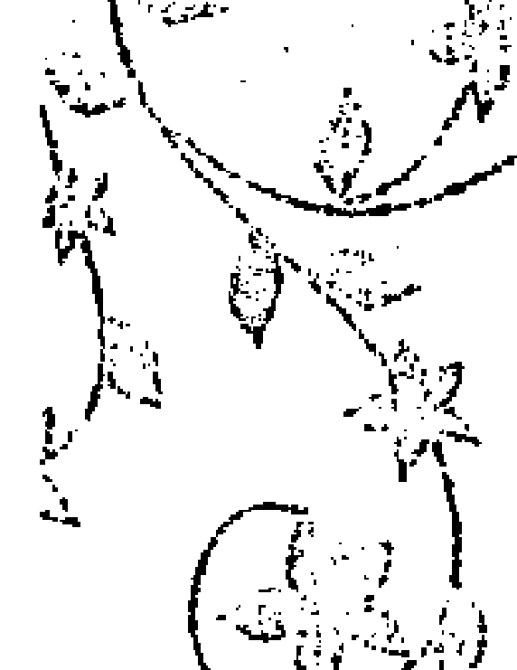

為了要能夠做到這樣，他們必須先覺知到他們那個負面的習慣：為了外表而驅策著他們的能量。這是為了要使事物看起來像某個樣子來證明什麼給別人看，或者只是為了自己的不安全感。它也可能是一種避開面對現實而進入某種假想的心理故事的模式。他們所遵循的思想也許是：如果我能夠去到那裡，做這個，達到這一點，那麼事情就會變得不同。這可能會散發掉很多能量，而產生出不必要的緊張和不快樂。在這一年，制約1的人被鼓勵去看這個行為的真相，以及為什麼他們會這樣做。

就像制約1的人一直都是這樣，這個程式是由不安全感造成的，他們無法只是接受和成為他們本然的樣子。如果他們夠警覺，他們可能會注意到他們日常生活的情況有反映出這個模式，它也可以從他們身體的緊張和疲倦看出來。這可能是一個他們已經熟悉的舊習慣，但是在這一年，那個事實會變得更明顯，使他們不得不去正視它。

跟這個舊習慣不一樣的另外一個選擇是有足夠的安全感可以將更多的能量放在去做那些能夠帶給他們喜悅和歡樂的事。這是透過覺知到他們的模式之後所展現出來的潛力。或者也許他們只是更能夠放鬆和能夠發揮出創造力來找出享受事實的方式。有時候他們只是覺得有信心去做某件事，只是為了純粹的歡樂，而不去管它會走向哪裡，或者他們能夠從它得到什麼，或者它在別人的眼光看起來是怎麼樣。第三年一直都是關於擴張。對制約1的人來講，這可能是變得更清楚關於什麼東西能夠帶給他們滋養，什麼東西無法帶給他們滋養。他們可能會突然看到他們正在做他們不喜歡的事，而他們覺得他們可以不必這樣做。他們也可能瞭解到他們可以從接受自己和自信來表達他們的真實，而不必為了要讓別人看起來怎麼樣而去做它。

在這一年，制約1的人主要的治療潛力是關於強化他們的接受自己和自信。他們可以藉著表達出他們在前面幾年變得更加覺知到的感覺來做到這樣。透過這個越來越多的自信，他們更能夠允許他們自己去單純地享受正在發生的事實，以及去追求那個在當下能夠給他們歡樂的事，而不是將焦點擺在某一個未來的目標。

### 關鍵個人年4

一般的問題：檢視事實、限制、基礎、建設、歸根於地、身體、存在 vs. 做為、安全問題。
- 鑰匙（關鍵）：5
- 特殊的問題：
  - 正向的：將所有的能量帶回當下的事實。
  - 負向的：在制約模式的根部被恐懼所駕駛，以及它如何創造出目標導向把他們帶出當下那個片刻。

對某些人來講，第四年感覺起來好像要面對很多事情，或者至少要處理一些限制。這是我們被迫要去面對關於我們自己和我們的生命很多事實的時候，而那是我們以前可能會避開的。主要的，我們會有機會去面對我們如何在保護自己的策略。對制約1的人來講，這可能常常意味著因為延遲或障礙而陷住在某些情況，而迫使你要進入現在，因此無法再聚焦在未來，那是制約1的人所喜歡的。當他們不能再逃入未來，而必須去面對現在，幾乎不可避免的，這將會使他們產生某種程度的恐懼，有時候它可能是他們最糟糕的惡夢。

這個限制對制約1的人來講好像是一個挫折，因為他們無法按照他們想要的速度往前走，或者它可能會讓他們覺得好像諸事不順，或是他們無法決定他們應該要做的事。或者他們會變得不安或無名的憤怒，為了要避開這些感覺，他們可能又會將他們的焦點放在其他的地方。換句話說，制約1的人會被迫去面對他們不「在」當下的習慣，因為他們傾向於將他們的覺知放在其他某一個地方。

他們要學習的是將他們的注意力帶到這個非理性的恐懼，或者只是使自己活在當下，包括內在和外在，不要為了趕走這個不舒服的感覺，而將注意力轉移到其他的地方。第四年是關於去看那些我們一直在避開的事實。制約1的人有機會去了解，是什麼事情經常在驅策著他們進入未來，是什麼事情使他們害怕對他們自己當下的能量說是。在此的機會並不是要去改變它，而是要去看清和經驗它。在最好的情況下，這樣做可能會不舒服，而在極端的情況下，它可能會感覺起來好像如果他們不走向其他地方，就有恐怖的事情會發生。

制約1的人在找尋的很多治療是基於接受自己和來自接受自己所產生出來的自信。在這一年，他們有機會去面對事實來了解接受自己意味著什麼，同時有機會去面對當他們這樣做的時候會碰到的恐懼。我們只能在當下這個片刻接受自己，它從來不是一件明天可以做的事，不要說明天，甚至五分鐘後再做都不行。這個立即接受當下的經驗是制約1的人在這一年的鑰匙。要能夠做到這一點可能需要學會接受當下恐懼的感覺，而不是轉移注意力去做其他的事來逃避它。它也可能意味著去面對關於他們是誰的某些他們不能接受的事實，換句話說，是去面對他們不敢去看的某些自己的特性。這可能是任何個人的特質或習性，包含正向的和負向的，那些特質或習性的展現在孩提時代碰到了危險或不安全。

### 關鍵個人年5

主要的問題：改變、自由、個人的空間、自發性、能量、全然、不安、恐懼。

鑰匙（關鍵）：6

特殊的問題：

- 正向的：覺知到當下所感覺到的真理，同時有勇氣去由它來行動，不管別人。
- 負向的：因為害怕做錯或是害怕自己不夠好而基於責任和義務去做努力。

在前面幾年，制約1的人有機會去碰觸到他們的恐懼，那是他們需要去催促自己和證明自己的根部原因。這一年，他們有機會去突破那個恐懼，所以他們能夠從他們內心的真理去跟當下連結。流年5一直都是關於個人的自由和空間。對制約1的人來講，那意味著接受他們自己，給自己空間去經驗當下的發生，不介意別人的想法或感覺。他們也必須為他們自己的真理負起責任。換句話說，不要責怪別人，也不要有罪惡感，只是從內心自然反應，沒有任何應該和不應該。這些簡單的真理也許是他們認為不好的，所以他們認為他們沒有權利這樣感覺。治療的過程就是一再一再地將這個恐懼擺在一旁，而允許他們自己身上的這些部分按照本然的樣子存在。

為了要做到這樣，他們必須先覺知到他們的自由是如何地受到自己習慣性的限制。那個限制包括習慣性的努力想做對的事，或是害怕做錯。如果他們夠注意，他們將會注意到他們有多害怕允許自己從他們的真理來操作。他們同時可以看到他們如何藉著將注意力放在未來的目標來掩蓋那個恐懼。有一種可以了解這個情況的方式是去看他們的能量模式，看它是收縮的、強迫的，或是放鬆的、允許的。能夠免於自己習慣性的限制才能夠給自己真正的自由和空間。這一年主要是關於允許事情的自然浮現，而不是試圖去做些什麼來改變它們。比方說，制約1的人可能會開始覺知到憤怒或憎恨，那是他們以前從來沒有注意到的，或是不允許去覺知的。他們也可能變得更意識到他們的性能量，這個時候不要用批判來面對它，倒是要為它負起責任。

一般而言，第五年是不安和想要改變的一年，常常會伴隨著對它的恐懼。當制約1的人碰到這個不安的能量，他們也許會覺得動盪或沒有耐心，而發覺他們自己忙著理出他們應該走向哪裡，或是他們應該做些什麼來去除這個感覺。在這個情況下，制約1的人真正的潛力就是允許他們自己停留在這個不安和動盪的情況下，不要試圖強迫那個能量去進入到其他他們所熟悉或覺得舒服的方向。這意味著按照那個能量本然的樣子來經驗它，這只能當他們帶著接受的心情去活在當下才能做到。這樣做的結果就是他們會發現他們自己能夠很自然地做或說，那是他們在幾年前不敢這樣做的。

### 關鍵個人年6

一般的問題： 愛、實相、關心和給予、自我負責、期望、行為正當、道德價值、罪惡感、應該和不應該。
- 鑰匙（關鍵）：7
- 特殊的問題：
  - 正向的：利用現有的情況去向內看和探索更深層面的真實，而不要害怕成為單獨的。
  - 負向的：努力去做對的事，或是成為好的，因為害怕成為單獨的，或者害怕不能適應別人。

在前一年，制約1的人被鼓勵允許自己去看某些他們自己的實相。現在在第六年，他們有機會將那些真理帶到更深的層面去看它們真正是怎麼樣，它們來自哪裡，以及他們需要對它們做什麼。這可能是一個機會可以改變他們的生活方式，好讓他們自己更符合他們自己內在深層的真實。

一般来讲，第六年是使我們覺知到我們生命中的妥協和義務，那些事已經不再真實了，所以不需要去維持。對大多數的人來講，它是一個走向外在和以人為導向的時間，著重在家和親密關係，然而對制約1的人來講，那個焦點常常是回到自己。他們可能會發覺他們自己還在忙著很多事，並涉入別人和從那個涉入所產生的義務，但那個機會是帶著內在了解的光去看他們在做什麼，以及為什麼要這樣做。它是要他們跟內在的真理連結的時候。這可能會透過他們的關係或透過他們的工作而發生。這會發生在他們有很多妥協的情況，這個覺知常常伴隨著恨自己為什麼要那樣做。

它可能是越來越覺知到在關係中他們一直在給予，他們覺得不值得這樣做。這個情況也許已經持續好幾年，但是在這一年，他們開始有覺知了，同時開始覺得已經不想這樣做了。在此的成長潛力並不是在這個情況下做什麼，而是去了解它。他們可能會覺知到他們的期望沒有被滿足。內在的工作是去覺知那個期望，和去了解他們為什麼要妥協。他們可能會看到他們因為妥協而希望得到的東西顯然並沒有得到。很可能這個動機大部分是來自害怕單獨，害怕不被愛或是不適應別人。直接認出這一點對了解他們為什麼要執著於他們舊有的想要去證明什麼的習慣是非常有意義的。

他們扛下很多責任和義務，為了要證明他們是好的，他們是對的，但是這可能是因為他們在潛意識裡害怕成為單獨的。這樣做使他們覺得有價值，然而當他們越覺知到這一點，他們可能就越覺得不想要再妥協自己的真實去做它，尤其是當他們這樣做沒有被賞識的時候。有了這個覺知之後，他們可能會開始責怪別人，或是利用那個機會去向內看自己，為他們自己的習慣負責。以這樣的方式，在這一年，他們可能會對自己有更清楚的看法。

### 關鍵個人年7

一般的問題： 了解、智慧、發問、學習、計劃、信念系統、向內看、單獨、靜心。

鑰匙（關鍵）： 8

特殊的問題：

- 正向的：真正向內去看他們生命中的優先或主要的欲望，以及他們目前如何使用力量去生活的方式。

負向的：內在的收縮或自我控制，它來自害怕成為單獨的，或是當他們太過於陷住在心理的故事裡。

在前面那一年，制約1的人有機會去探討關於他們自己和他們生活的價值和深層的真理。在第七年，他們被鼓勵去了解那個真理在實際操作上意味著什麼，基於那個內在的真實，他們要開始去問他們在生命中做什麼，他們的優先是什麼，他們想要將他們的能量放在達成什麼。一般而言，第七年是一個內在的階段，在這個時間，那個能量很自然地移向內在，那個人會傾向於花更多的時間跟自己在一起，創造出空間讓很多無意識或更高的意識浮現。對制約1的人來講，聚焦在內在的洞見將能夠使他們了解他們的慾望，這可能涉及他們跟金錢的關係，或是關於他們的生涯，或是他們在生命中想要成就的事。能量本身是內在的，是比較不活躍的，但是它所強調的是物質世界和制約1的人在它裡面的角色。

要能夠使用這個潛力，那個人必須先了解他們在做些什麼來避開那個單獨的感覺。他們的能量很自然地會向內走，然而因為這樣做會引起不舒服的感覺，所以他們可能會再度遵循舊有的信念模式向外走。以這樣的方式，他們可能會發覺他們在推向跟他們的能量相反的方向，這可能會使他們變得疲勞和精疲力竭，因為他們在跟自己對抗，這是一種自我控制。如果他們能夠覺知到這個舊有的習慣，認出它所引起的緊張，他們就有機會去看到他們為什麼要這樣做。這使他們能夠有機會去看到他們所認為的關於需要使用他們的力量去得到他們想要的東西，其實是一個誤解。他們也許需要去重新評估他們的能量要走向哪裡。比方說，他們可能會發覺他們過度工作去達到一個目標，但是當他們向內看，那個目標並不是真的那麼重要，它也許只是基於想要向別人證明什麼。這一年也許還不是要為這個了解採取行動的時候，但的確是需要去覺知它的時候。

它可能也是要計劃他們想要成就什麼的時候，這可能會是實際地訂出時間表和作準備，或者它可能只是在頭腦裡面擬出他們想要做的事。

這一年可以讓制約1的人有機會去了解他們試圖證明自己的習慣，他們也許會了解，他們建立這個信念系統是基於誤以為這是唯一可以成就他們自己的方式。他們同時可以覺知到基於去年所碰到的較深的真理所產生出來的新價值觀所衍生出來的較深層的慾望。

## 關鍵個人年®

一般的問題：力量、金錢、慾望、操控、控制、陰陽能量的平衡。

鑰匙（關鍵）：9

### 特殊的問題：

+   正向的：有足夠的信心能夠放掉催促的需要，將空間留給平衡的力量。放掉不必要的或不真實的慾望和目標。
+   負向的：強迫能量或收縮能量來適應別人的需要。拒絕來自存在或是來自身體要你慢下來的訊息。

在前一年，制約1的人有機會去得到更深的了解關於他們收縮、強迫、或操控他們能量的方式，它通常是因為想要去到哪裡，或是想要證明什麼。這一年所提供的學習潛力是要放掉那個習慣。常常是以負面的方式，生命可能已經反映出他們那種催促他們自己去得到他們想要的東西的傾向。他們可能會碰到跟別人的碰撞或權力的鬥爭。它也可能是他們一直碰到障礙，使他們發覺他們那種催促的能量是沒有用的，無法使他們得到他們想要的。另外一個可能性是，他們會覺知到，在面對別人的需要的時候，他們會努力去證明他們是一個很好、很仁慈、很體貼的人。或者也許他們會覺知到他們在做這些事的時候是多麼地疲倦，所以該是要對自己慈悲一點去停止這樣做的時候了。

如果制約1的人沒有發展這個覺知，存在可能會創造出一些情況使他們毫無選擇，只能放掉。最常發生的是他們的健康出問題，所以他們在這一年必須真正去聽他們的身體和照顧他們的健康。有很多制約1的人必須以艱難的方式躺在病床上來學習這個教訓。希望他們能夠在生病之前及早注意到那些跡象而避開不必要的受苦。

如果制約1的人能夠好好利用這一年，他們有很好的機會可以學習如何給自己更多的空間來經驗他們在哪裡，以及能夠對他們的感覺和需要慈悲一點。制約1的人是否有能力做到這樣要依他們是否能夠信任說如果他們更放鬆些，更不催促自己，事情依然可以順利進行。所以，信任是他們能否放掉很重要的部分——信任說如果他們不用力使事情發生，事情依然會發生；信任說如果他們沒有做的他們所想要的成功，他們仍然是價值的。這也可能包含放掉他們對活躍的沈迷，他們原來誤以為活躍是他們的力量。當他們能夠放掉這個，他們將會找到一個更平衡和有更多空間的達成目標的方式。

在去年，制約1的人可能已經重新評估過他們的慾望和優先要做的事。這一年他們有機會可以透過了解這些方式並不是他們真正想要的，而放掉一些他們正在做的事情，或是放掉他們使用能量的某些模式。制約1的人有機會放掉一些目標和野心，那些目標，當他們深入去看，可能只是他們想要努力去證明什麼的制約模式。當他們在過去的幾年學會更接受自己，更有自信，他們可能會瞭解到這些制約模式已經不需要了。比方說，一個生意人可能會每星期工作六天半，無意識地想證明給他父親看他能夠成功。或是一個女人催促自己去讀夜校來取得某些資格，而現在她覺知到她這樣做比較是為了她的家人和社會，而不是為她自己。

## 關鍵個人年9

一般的問題：放手、信任、完成、慈悲、界線。

鑰匙（關鍵）：9

### 特殊的問題：

+   正向的：放掉需要成為不同的，或是需要努力，而給自己更多的空間，和對自己更慈悲一點。
+   負向的：加重自我懷疑和缺乏自我價值，或是更努力想要驅走這些感覺。

去年制約1的人有機會去除掉他們想要達成目標來證明自己的緊張，這可能會讓他們去重新評估他們使用力量的方式，在這一年，他們也許可以看到這些努力的成果。第九年和第一年之間的轉變一直都是很強的，尤其是對於制約1的人來講更是如此。在這一年，他們更可能去了解對自己慈悲的重要，那是在第八年就已經淺嘗一些了。

第九年一直都是循環的結束，因此它提供了重要的關閉的潛力。這個時間一般來講是找到信任去放掉一切舊有的，尤其是放掉各個層面的制約程式。對制約1的人來講，這意味著放掉催促著自己去證明的需要，或是放掉目標導向的習慣。這樣才能夠開始接受本然的自己。它感覺起來好像他們一直因為努力而收縮或被擠壓的部分終於能夠深深地吸一口氣而放掉和擴張開來。

那個潛力是一種擴張，它包含自己在先前被壓抑和被排除的各個部分的擴張，而能夠讓自己的整個存在變完整。當然，這並非一直都很甜蜜的，因為它意味著將空間給任何存在的，它常常包含那個你不喜歡的，或是那個被你壓抑很深的。從這個接受自己產生出自信，從這個自信，制約1的人成為真正的自己的潛力就能夠確立。這可能會被視為對自己慈悲，它來自允許自己各部分的人性。它意味著給自己權利和空間來成為本然的自己，包括所有的天賦和缺點——所有那些好的，和所有那些沒那麼好的。從這個狀態，他們會開始感覺到他們存在的價值，就只是因為他們是獨一無二的個人。

為了要能夠達成這個潛力，制約1的人也許必須去面對他們負面的習慣。那個功課並不是關於試圖去除它們，因為那是他們的整個制約程式的基礎——需要去改善和成為不同的。倒是，他們需要去擁抱那個不安全感，那個缺乏自我價值，和內在的搖擺不定等等，將那些視為他們的一部分，而不是視為那是他們必須去除的。如果他們是無意識地在做這件事，它可能會感覺起來好像他們一直努力想要隱藏的內在所有的懷疑和不確定都會突然開始浮現來折磨他們。結果他們會覺得有一點脆弱和不安全，不確定他們的生命要走向哪裡，或甚至不確定他們是誰。要從負面的走到正面的，他們必須有意識地將空間給這些感覺，而不是像以前一樣試圖逃離它們。

制約1的人也需要放掉試圖去知道他們要走向哪裡，或是再來會有什麼發生。制約1的人習慣於去看未來，但是這一年的焦點是放掉過去，而停留在那個空隙。制約1的人也許不喜歡這樣。他們可能會覺知到有一些事要結束，但不是聚焦在它們的完成，他們可能會傾向於去看他們接下來要去哪裡。如果他們這樣做，他們就會將他們的頭腦塞滿各種未來的可能性，那是不真實的，只是為了要避開停留在空隙的不安全感。除了浪費時間和能量這樣做之外，他們也可能會去延續那個舊有的，或是進入一個新的方向，但仍然是基於那個舊有的，而不是利用這個機會來完成舊有的，並從它學習，好讓真正新的事情能夠在接下來的這一年發生。

# 制約 2

## 關鍵個人年1

一般的問題：新的開始、發動。聚焦、需要去推動來證明。自我價值和接受自己；獨立和信心。

鑰匙（關鍵）：3

### 特殊的問題：

+   正向的：夠獨立可以表達出自己的感覺，或是去追求自己所喜歡的，不需要外在的認可。
+   負向的：為未來播下基於外表的種子。由於需要被喜歡和使事情保持愉悅，所以努力成為好的。

制約2是基於保護2號能量的自然脆弱和敞開。它由各種防衛所組成，它從自然的封閉到習慣性地需要去適合別人，因為害怕他們不同意。有很多制約2的人傾向於透過別人的眼睛來看自己，他們依賴別人對他們的看法。所以當制約2的人進入第一年，他們有機會從依賴的態度走向更獨立的狀態。當他們意識到他們向外尋求別人的喜歡和別人的認可的能量，他們就能夠看到這樣做花費了他們多少的努力，和引起多少的緊張，以及它如何打斷他們跟自己內在的連結。當第一年開始的時候，制約2的人可能會發覺他們自己跑來跑去努力想要去取悅別人。他們也可能會感覺到妥協，因為他們只有很少的時間能夠做他們所想要的。如果他們沒有覺知到這個緊張，那麼他們未來的行為也會循著這個舊有的習慣。

這一年所提供的學習和治療的潛力不僅是培養勇氣允許自己去感覺，同時也要將它們表達出來，不要顧慮到別人怎麼想或怎麼感覺。在這個時候，將這些感覺表達出來是最需要的。只要簡單地說出：「我覺得這樣。」或是「我不喜歡那個。」就可以了，這是制約2的人發展自信和成為自己的權利。在這個表達的過程，他們就能夠打開自己和治療舊有的試圖隱藏的習慣。他們在學習接受自己去感覺的權利。

另外一個學習是去做他們喜歡的事。這是一種深層的接受自己和自信，有了自信就有勇氣去做，不必考慮別人的意見。當他們看著新的方向，他們可能會發現他們已經清楚他們的生命要走向哪裡，或是他們想要做什麼。然而，在一開始的時候，他們可能還是必須去處理他們舊有的會顧慮別人的想法的習慣。另外，在日常生活當中，他們也許會變得更加覺知到他們浪費多少時間在做他們沒有真正享受的事，那些事無法滋養他們。他們會開始找到信心去接受他們可以不喜歡的權利，然後開始說不，以便給自己更多的空間去覺知他們真正喜歡和想要的。

如果制約2的人好好利用這一年，他們會開始覺得更輕盈，他們會開始享受生命，而不會把事情看得那麼嚴肅。它也可能使他們接觸到新的或是更有創造力的方式來使用他們的能量。當他們能夠這樣做，他們就在這一年播下了一個正向的種子。如果他們對舊有的模式還是保持無意識，他們可能還會試圖取悅別人而成為依賴的，結果他們可能會覺得他們並沒有真正在享受自己。

## 關鍵個人年2

一般的問題：接受性和容易受傷、需要和依賴、擁有情緒、將事情視為是個人的。合作和順著流走、耐心、直覺。

鑰匙（關鍵）：4

### 特殊的問題：

+   正向的：經驗真實的感覺和情緒，同時敢於將它們表達出來。
+   負向的：面對依賴的習慣，它來自對安全的需要。

當個人年的數字和制約數字是一樣的，那個基本的程式就會自動加強。這一年可能是不舒服的，會有衝撞的，但是它擁有很大的成長潛力。對制約2的人來講，這意味著必須去面對他們在保護他們自己的脆弱的方式，以及他們是怎麼樣在對待他們的情緒。

在這一年，負面的潛力是：整個模式都被加強了，制約2的人覺得陷住在它裡面。存在會自動強調他們需要的感覺，以及他們做什麼來滿足那個需要。他們可能會碰到他們的依賴——他們透過別人的眼光來看自己的習慣，以及他們想要別人認可的習慣。他們做法的一部分可能是忙著使事情保持和平與和諧。同時有各種情緒會開始浮現，制約2的人當然不希望它們存在，所以他們可能會試圖壓抑那些情緒。但是不管怎麼樣，他們還是可能要去面對那些他們不敢表達的感覺，他們之所以不敢表達是因為他們覺得如果他們將它們表達出來，別人是不認可的，或是會變得不愛他們。如果憤怒在孩提時代是不被允許的，那麼這可能會浮現；如果很深的受傷被壓抑了，那麼這可能會浮現。任何他們所壓抑的可能都會浮現。

所有上述的情況都會被需要的感覺所加重，它在這一年可能會更強烈地被經驗到。它可能是一般的想得到認可的慾望，它也可能是需要伴侶的愛，或是渴望一個愛的關係。這些事對制約2的人來講並不是新的，但是在這個時候，生命的情況可能會迫使他們去認出和面對它。有時候為了使關係保持順利所壓抑下來的自己不想去看的東西可能會浮現。

如果那個制約靠向縮減的或封閉的那一邊，制約2的人可能會被迫去面對他們所避開的需要和情緒。比方說，一直在照顧他們的伴侶突然覺得夠了，所以制約2的人就必須去面對他們的依賴，這個依賴他們以前從來不知道它的存在。或者也許他們突然進入一個新的關係，然後依賴或反依賴的問題就浮現了。

制約2的人在這一年強而有力的學習潛力是要去面對事實，尤其是「他們感覺怎麼樣」的事實。這可以只是單純地承認「我是悲傷的」，或者「我是生氣的」，或者「我愛你」。他們被鼓勵去接受和經驗那些感覺，以及它所帶來的脆弱，而不要試圖隱藏，或是試圖去迎合別人。對於制約2的人來講，那個治療是允許自己敞開、允許自己脆弱，而因為這會使他們覺得不安全，所以他們會避開它。這第二年允許他們去看這些模式，和接觸他們真實的感覺，以及藏在這些感覺底下的敏感和柔軟。

這一年也給制約2的人帶來另外一種可能性：他們可能會碰到他們順著生命之流走的能力。這可能是他們負面的傾向去過度順著外在的情況或是順著別人的慾望，為了要避免由自己作選擇。或者他們可能會發覺他們陷入某一個他們不能控制的情況，所以他們只能接受那個事實以及他們對那個事實的感覺。換句話說，他們必須對那個情況說是。這個學習是關於他們能否對所碰到的經驗敞開，而不是去跟它抗爭。

## 關鍵個人年3

一般的問題：表達、創造力、喜悅和歡樂、社交、外表、能量分散到那些表面的事、擴張。

鑰匙（關鍵）：5

### 特殊的問題：

+   正向的：自然地表達感覺、有能力去做當下帶來喜悅的事。
+   負向的：表現出很好的樣子，或是使事情顯得很愉悅，由於害怕表達感覺或是做自己喜歡的事。

在前一年，制約2的人要去面對某些關於他們情緒的基本事實，或者可能他們會覺知到他們所發展出來的避開面對情緒的防衛習慣。在這一年，有一個門已經打開，他們能夠對於他們所看到的事實做些什麼。第三年一直都是關於擴張。對制約2的人來講，這可以被轉變成活力的增加，他們可能會去經驗一些冒險，而不是停留在前一年的停滯狀態。在此，特別的潛力是更自然地表達的能力，或是去遵循當下那個片刻真實的慾望。那個關鍵是自發性——跟當下的能量連結，同時將它表達出來。當那個能量越自由，它就越能夠進入享受的追求。這能夠在他們的日常生活當中創造出輕盈和遊戲的感覺，這是制約2的人擴張經驗的表達。

在這一年，因為他們的能量已經從遵循別人和取悅別人的舊有模式被釋放出來，所以他們會變得更有創造力。創造力是來自心的正向反應，它是從對當下那個片刻敞開所產生出來的——不論是作畫或是處理日常事務。當以創造性的方式來做任何事，它就會帶來某種喜悅或滿足，而當它不是的時候，它就會耗掉你的能量。

要發展這一年所提供的潛力，制約2的人必須去面對他們因為害怕而耗掉能量的方式——害怕脆弱，害怕暴露出他們的情緒，害怕不被認可，害怕衝突或破壞和平。如果他們從害怕來操作，他們將會發現他們陷住在試圖對別人好，或是使事情顯得愉悅，或是努力去創造出好的外表。如果他們有覺知，他們可能會開始了解，他們做這些事並不享受，而且他們可能會注意到他們會變得精疲力竭。在前一年，他們碰觸到了他們制約程式的根，在這一年，他們有機會去面對改變它的恐懼。這個蛻變唯一可能的時間和地點就是反應於當下。當他們敢於表達他們在當下真正的感覺或真正想要的，他們就能夠突破那個使他們封閉和保護著他們的恐懼，而對當下敞開。

要做到這樣，他們必須去覺知他們的能量系統，這使他們跟別人在一起的時候能夠回到他們自己的中心。這會將制約2的人基本的恐懼帶上來：如果他們優先考慮自己，別人可能會變得不愛他們或是不認可他們。這一年他們有機會更直接去經驗他們的能量，而不是透過別人的眼光來看他們自己，和延續他們的依賴模式。這對很多制約2的人來講是會害怕的，因為它碰觸到他們制約的根部。

## 關鍵個人年4

一般的問題：檢視事實、限制、基礎、建設、歸根於地、身體、存在 vs. 做為、安全問題。

鑰匙（關鍵）：6

### 特殊的問題：

+   正向的：能夠安心去感覺他們的真理，同時去感覺他們做了些什麼來掩蓋它。
+   負向的：陷住在義務或責任的感覺，它來自需要維持安全。

第四年一直都是要去檢視事實。因此它可能是在一個循環裡面最挑戰的一年，因為它會把我們帶到我們不想看的事情上面。對制約2的人來講，他們所面對的是他們的生命侷限在成為好的，和做對的事情，因為他們對於遵循自己的真理會有不安全感。在此的機會是要他們去面對他們的制約模式，以及隱藏在它底下的感覺。他們可以透過講出簡單的事實，比方說：「我不喜歡這個。」或者「我對那個已經膩了。」「我已經厭倦這樣做。」或者甚至是「我愛你。」來做到——為那些感覺負起責任，而不是將抱怨推到別人身上。前一年有機會讓制約2的人接觸到一個更輕盈、更表達的能量，它給他們一種自由和擴張的感覺。這一年他們有機會發現是什麼東西阻止他們在日常生活當中表達那個能量。

在負面的部分，制約2的人可能會發覺他們自己面對他們的責任和義務的限制——他們所遵循的應該和不應該的模式，為了不要觸犯到別人和得到他們的愛。如果他們無意識地遵循這個模式，他們可能會發覺他們陷住在那些責任和義務裡。這可能會引起他們的憎惡，或者，如果他們試圖放掉那個義務，他們可能會覺得有罪惡感。

那個傾向是使自己保持忙碌，試圖做一些他們能夠做的，來逃離這些情況。然而存在所鼓勵他們去做的是要他們接受——處於那個狀態，然後從它學習。它需要有很深的覺知才能夠看清這些義務或信念大部分並不是生命的事實，而是制約2的人自己認為他們必須這樣做來得到愛和認可。換句話說，這是他們所學到的用來達成他們想要和保持安全的策略。對制約2的人來講，這個策略通常涉及要讓別人覺得他們是沒有問題的。他們可能會發覺他們自己陷入兩難，一方面認為他們應該怎麼做，另外一方面又憎惡他們必須這樣做。在此可以學習的是要覺知到那個制約信念的事實，而不要陷住在由那個信念所展現出來的外在情況。

對制約2的人來講，這一年並不是真的要去改變的一年，倒是，它只是關於看到他們是怎麼在做的事實，同時認出他們的習慣是基於保護和防衛。如果這個制約模式的事實可以在這一年被認出來，那麼在接下來的這一年就有機會改變。

## 關鍵個人年5

一般的問題：改變、自由、個人的空間、自發性、能量、全然、不安、恐懼。

鑰匙（關鍵）：7

### 特殊的問題：

+   正向的：找到一種內在自由的感覺，或是有機會去了解害怕單獨。
+   負向的：由於害怕聽取當下的情緒而覺得陷住在頭腦的故事裡。

在第五年有機會給自己更多的自由和空間，以及覺知到我們這樣做的時候的恐懼。對制約2的人來講，這常常意味著碰到單獨的恐懼，如果他們更歸於自己的中心，而比較不依賴別人的意見。在這一年，他們有機會了解他們自己制約的根：相信如果他們不注意到別人，不對別人的感覺做出反應，他們就會失去愛。

覺敏感，他們就不會被喜歡，然後就會變孤獨。對很多制約2的人的治療就是回到他們自己，在跟別人連結的時候也能歸於自己的中心。對其他制約2的人來講，它意味著歸於自己的中心，同時敞開，不要因為害怕而關閉或自動築起防衛。唯有處於這個歸於中心和敞開的狀態，他們才能夠變得有接受性而讓別人或存在進來。

制約2的人在這一年主要的潛力是去經驗自由和自發性，這唯有當他們能夠接觸到他們自己內在的能量，同時又保持敞開才能夠做到。它是關於內在的自由和空間，而不是外在的。對制約2的人來講，這涉及需要去了解為什麼他們不給自己那個自由和空間。

重點在於去覺知他們自己的狀態。為了要做到這樣，他們需要將注意力帶到他們制約程式的負向面。對他們來講，這個傾向是透過害怕跟自己的深層連結而跳進他們的信念系統。第五年的衝動是要使自己有一些改變，所以在這一年，制約2的人很重要的一步是去感覺他們的害怕，而不迷失在頭腦裡。

其他制約2的人也許會發覺他們自己從別人那裡退回來，因為害怕暴露自己，他們覺得這樣比較安全。再度地，他們主要的做法也是忙著頭腦的事，所以，在他們的第五年，制約2的人如果能夠開始懷疑他們的頭腦所告訴他們的，他們就會做得比較好。他們在找尋的是對他們恐懼的了解，透過當下的經驗來學習，而不是用理論來解釋它。那個關鍵就是去感覺他們的害怕單獨或害怕暴露，和去了解那個恐懼對他們行為的影響，那個恐懼是他們制約程式的根。

## 關鍵個人年⑥

一般的問題：愛、實相、關心和給予、自我負責、期望、行為正當、道德價值、罪惡感、應該和不應該。

鑰匙（關鍵）：8

特殊的問題：

- 正向的：對自己的感覺負責，同時使用力量去對它做些什麼。
- 負向的：由於依賴別人怎麼想，所以藉著做對的事來保持自我控制。

第六年把我們帶到跟我們的實相和我們的心更多的接觸。幾乎不可避免地，這意味著去面對我們的責任感，同時去發現這個責任感是如何在掩蓋我們心的真理。在這一年對制約2的人來講有很大的潛力不僅可以去發現深層的實相，同時有機會對它採取行動，實際地用他們的力量去對它做些什麼。當然，那也意味著冒險去暴露那個實相。前一年的潛力是跟那個在制約程式根部的恐懼連結。當他們在前一年有跟那個恐懼連結，同時對它有了了解，現在他們就能夠採取行動。對制約2的人來講，它可能是要展現力量的一年，使他們能夠真正為他們的感覺站起來。

對很多制約2的人來講，這意味著先面對那個程式的負向面。所以在這一年，他們可能會接觸到他們因為遵循責任和義務所產生出來的憤怒和挫折。允許那個憤怒，為它負起責任，並準備好去改變，這可以使這一年成為蛻變的一年。他們會有機會突破那個恐懼——成為單獨的，或暴露出自己，或成為容易受傷的恐懼——然後做出需要做的事來展現他們的實相。

如果這個機會以無意識的方式被使用，沒有對他們的負面感覺負起責任，那麼制約2的人可能會陷住在抱怨和將那個憤怒丟給別人。這會在他們和別人之間產生能量的惡性循環，這對他們的成長來講是不愉快的，也是沒有幫助的。那個關鍵是使用那個憤怒作為燃料給自己勇氣為他們的實相站起來，即使別人會不認可或不愛他們。那個制約2的人可能還會生氣，但他們是以正向的方式使用那個憤怒來看他們在做的事，而不是為他們所做的事來責怪別人。

以這樣的方式，他們是暴露出他們自己的實相，而不是去責怪別人或是因為封閉而自己覺得有罪惡感。制約2的人的治療一直都是關於利用機會來打開自己，暴露出負面情緒的實相，而不是將它們隱藏起來，表面上裝成一副好人的樣子。

在這一年，制約2的人也可能為他們的實相站起來，而不必用負面的感覺來給他們自己力量。如果他們知道如何運用他們的力量，他們很可能將他們的力量直接用在他們的心所屬的方向。

## 關鍵個人年數：

- 一般的問題：了解、智慧、發問、學習、計劃、信念系統、向內看、單獨、靜心。
- 鑰匙（關鍵）：9
- 特殊的問題：
  - 正向的：進入內在，將空間給深層的內在感覺、透過了解來放掉制約程式。
  - 負向的：由於需要別人或害怕單獨而陷入頭腦的旅程和誤解。

前一年也許是十分衝擊的，它可能已經將制約2的人帶去接觸到一些困難的情況或強烈的情緒。在第七年，他們會有機會去消化和整合它們，同時從這些情況學習，並透過這個了解和信任來放掉一些不必要的制約。第七年一直都是跟自己在一起和向內看的階段。對制約2的人來講，他們可以深入去看給自己更多空間和對自己更慈悲是意味著什麼。當這一年的能量被正確地使用，它可以讓他們的能量聚焦在內在去覺知在前一年所產生出來的感覺。給那些情緒很多空間，再加上他們的聰明才智和了解，它將能夠帶給他們重要的學習。這一年提供機會讓他們可以跟內在有更多的連結，並愛護它們；從那個敞開就有很深的洞見會產生。

在第七年，能量很自然地就會想要走入內在，這對制約2的人來講可能是非常有益的，但也是非常挑戰的，因為他們能量的傾向是過度涉入別人，所以他們的能量是集中在外在的。他們典型的戲碼可能是：「是的，我想要給自己更多的時間，但是我媽媽在生病……我的先生需要……我的小孩……我的工作情況……等等。」當然，這些情況就某個程度來講可能是事實，然而，這也表示制約2的人很容易從他們自己被拉出去，而且很容易利用一些原因和合理化的解釋來變得陷住在他們的頭腦裡。

## 制約數字

第七年主要的焦點是學習跟頭腦保持正確的關係。所以，在這個時候，我們可能會陷住在我們的信念系統，或者我們可以使用頭腦的聰明才智來作真正的學習。對制約2的人來講，真正的學習意味著給自己內在的感覺很多空間，並從它們來學習，了解說這些概念只是舊有的習慣模式，它們的形成是為了要使自己保持安全。他們的挑戰是去超越這些信念系統，然後深入去檢視他們感覺的實相。這樣做，他們將能夠了解頭腦如何在運作，然後將學會放掉那些已經不再必要或是已經不相關的模式。

比方說，不要去相信他們頭腦的解釋關於為什麼他們無法給自己更多的時間，他們可以更深入去看。那麼他們可能會了解這些合理化的解釋事實上只是來自他們內心深處的害怕——害怕單獨，害怕別人不愛他們，害怕別人不認可。這個覺知，加上允許自己去感覺，不要隱藏、不要加以解釋、不要批判，他們就有機會能夠放掉那些制約而得到很好的治療。

## 關鍵個人年8

一般的問題：力量、金錢、慾望、操控、控制、陰陽能量的平衡。

### 鑰匙（關鍵）：1

### 特殊的問題：

- 正向的：以新的方式來使用陰陽平衡的力量。
- 負向的：由於依賴而變得收縮或催促自己去證明什麼。

第七年讓你經驗到對自己的慈悲和了解，當你能夠做到，那麼在第八年就能夠使用力量來達成生命的目標。第八年一直都鼓勵我們重新思考我們的慾望，並提供我們一面鏡子來看我們要如何達成那些慾望。對制約2的人來講，這可能是一個正向的新的開始。舊有的，由於依賴和需要別人的認可而將力量給出去的制約方式在去年放掉，然後允許一個更平衡和真實的方式來達成他們真正想要的。真正的力量是陰陽和諧的力量。在這一年，這兩股力量都能夠被制約2的人所用，他們的學習是在這兩者之間找到正確的平衡。

對制約2的人來講，真正的力量一直都是來自他們的過濾器——他們的敏感、他們的敞開、以及他們的感覺和直覺。這一年所提供的機會是成為強壯和獨立的而能夠允許那個敏感、敞開、和感覺。在實際上，這意味著，不僅他們的慾望來自他們的感覺或直覺，而且要達成這些慾望的方式也是來自這些本性。為了要成功地達成慾望，他們必須從正向面來活出他們制約2的能量，而不要陷住在負面的防衛機構裡，這些防衛機構在過去限制了他們的力量。制約2的人可以有自信跟著這個內在的知道流動，而不要顧慮到別人怎麼想。以這樣的方式使用他們的力量意味著他們跟自己和跟存在是有連結的。

如果他們以負向的方式來使用他們的能量，它可能會是緊張的，需要努力的。第八年一直都反映出他們使用力量的方式，所以制約2的人可能會收縮和催促他們的能量來向別人證明他們是有能力的、關心別人的。但是當他們以這樣的方式來達成目標，他們就跟他們力量的自然源頭失去了連繫。他們也可能跟自己真正的慾望失去連繫，所以他們會發覺他們所達成的目標是基於取悅別人的需要。治療的第一步就是覺知到他們是如何在做而取回他們真正的力量。

比方說，制約2的人可能非常努力工作去達到某一個目標，而當他們仔細檢視，那只是基於他們老闆的慾望。或者一個女人了解到她的很多時間和精力都放在一些活動來取得社會地位，或是換來別人的認可，而當她深入去看，它並沒有帶給她個人什麼真正利益。這一年有機會讓他們了解，他們的努力並非真的有用，換句話說，他們的做法並沒有真正達到他們的目標。這個覺知可能是鑰匙，它可以打開那個門去發現他們真正的慾望，並找到一個不同的方式來達成它們。

## 關鍵個人年9

一般的問題：放手、信任、完成、慈悲、界線。

鑰匙（關鍵）：2

### 特殊的問題：

- 正向的：放掉負面的依賴模式，給自己的情緒空間。
- 負向的：迷失在需要被需要，和成為對別人有用的。被情緒淹沒。

第九年一直都是一個強烈的時間，因為它提供機會去清除掉那個舊有的，同時準備迎接那個新的。對制約2的人來講，這可能意味著放掉舊有的依賴和妥協的習慣，或是放掉他們所發展出來的把自己隱藏起來以保護自己的脆弱的習慣。此外，這一年還提供一個實際的機會可以放掉由這些習慣所形成的情況和關係。一個強壯的制約2的人可以靠自己的能量站起來，不需要取得別人的認可。他們知道他們是誰，他們夠堅強可以敞開，並展現出他們的感覺，不必害怕失去別人的愛或認可。這是經過前面八年的發展之後所達到的治療旅程的完成。

如果制約2的人還在被別人的問題或需要拉來拉去，常常覺得迷失自己，因為他們還是很顧慮到別人，這表示他們還被舊有的制約所駕馭，他們仍然透過別人的眼光來看自己，或是害怕將自己的感覺和需要擺在優先而使他們不高興。他們可能會被淹沒在對自己的感覺不清楚的狀態而無法對當下有清楚的覺知。第九年會將舊有的問題或習慣帶到意識的表面，讓我們有機會看清它們，並放掉它們。只是覺知到這些舊有的傾向就有機會去除它們。

那個學習也可能透過被迫放掉一個依賴的關係而發生，因為第九年很自然地會帶走一些在下一個新的循環不再有益於個人成長的東西。不論是以什麼樣的方式，這個第九年將會鼓勵制約2的人給自己的感覺和直覺更多的空間，同時從那個感覺來行動。這需要對自己感覺的信任，當制約2的人能夠找到這個信任感，同時活出它，他們就可以拿回他們自己的敏感和柔軟，那是他們在之前的生命中一直試圖隱藏或保護的。

## 制約 3

### 關鍵個人年1

一般的問題：新的開始、發動。聚焦、需要去推動來證明。自我價值和接受自己；獨立和信心。

鑰匙（關鍵）：4

#### 特殊的問題：

- 正向的：有足夠的安全感可以基於喜悅和創造力來為未來的方向種下實際的種子。
- 負向的：由於安全的需要，種下基於努力來創造出好的外表的種子。

一直以來都是這樣，在第一年所種下的種子對於接下來新的循環的方向會有重要的影響。制約3的人的治療旅程是去經驗他們的創造潛力和允許自己在生命中有更多的喜悅。在第一年要了解這個正向的潛力，制約3的人必須不管我們在別人的眼中看起來的樣子，而能夠去看他們所喜歡的。這意味著開始以新的、實際的方式來看他們真正優先的事和未來的目標，以及他們如何使用他們的創造力。對很多制約3的人來講，只是做他們真正喜歡的事就會是很困難而且冒險的。如果他們只是因為喜歡而做，這對他們來講好像是在做一件錯誤的事，或者他們會覺得好像有什麼可怕的事會發生，基本上，這是一種不安全感。因為第一年的焦點是要進入新的循環，這可能會使他們覺得他們不知道他們要什麼或喜歡什麼。認出他們要什麼和喜歡什麼可能是治療的第一步。然後他們可以開始去思考為什麼他們在日常生活當中缺乏喜悅和創造性的滿足。他們也可能開始質疑，他們有享受正在做的事嗎？如果沒有，那麼為什麼要繼續做它。以這樣的方式，他們就會去面對他們在誤用他們創造能量的制約程式。換句話說，他們將能夠去檢視為什麼他們創造性的能量會被浪費在膚淺的顧慮，而不是被導入帶來滋養和喜悅的事。

當這一年是生活在負面的狀態，制約3的人就會忙著去看未來，試圖創造出一些基於外表和安全的情況。當他們去看他們接下來的生活，他們可能會經驗到內在的緊張和不安全感。他們會顧慮事情看起來怎麼樣，懷疑他們所走的方向是否安全，或是顧慮什麼事會引起更多的注意，任何膚淺的焦慮都可能佔據他們的頭腦。但是他們很少會將他們的注意放在什麼事會帶給他們歡樂和喜悅或創造性的滿足。以這樣的方式，制約3的人可能會發覺他們所播下的種子會成長成延續他們舊有的模式，而不是會開花成真正新的方向來改善他們的生活品質。所以，對制約3的人來講，在這一年裡面最重要的事就是繼續檢視他們將他們的能量放在哪裡。他們有享受他們在做的事嗎？如果沒有，他們為什麼要做它？這可以讓他們重新去檢視他們之前可能沒有看到的制約模式。重點是將他們的注意力帶到他們在做什麼的事實，而不是自動進入舊有的習慣。這可以改變他們的模式，使他們更能夠有信心接受當下的自己，而不是把焦點放在顧慮到取悅別人的未來目標。

### 關鍵個人年2

一般的問題：接受性和容易受傷、需要和依賴、擁有情緒、將事情視為是個人的。合作和順著流走、耐心、直覺。

鑰匙（關鍵）：5

特殊的問題：

正向的：跟自己的情緒連結，同時自然地表達它。創造性地反應於當下的片刻。

負向的：害怕表達，因為擔憂別人會怎麼想和怎麼感覺。

第二年一直都是試圖使我們跟較深的感覺連結，或是以更放鬆的方式跟我們的感覺連結。對制約3的人來講，害怕表達那些感覺是主要的問題。知道我們的感覺是知道我們要什麼的第一步。在去年，制約3的人有機會知道他們是否有在享受生命，這一年，他們將能夠去到它的源頭——他們的感覺，來告訴他們他們可以享受什麼。他們需要在當下來做它，而不是去考慮長期的方向。他們有機會去看能夠表達意味著什麼——我喜歡這個，我不喜歡那個，我感覺到這個，我沒有感覺到那個等等。這並不是在討論或反省關於他們的感覺，而是當那個感覺升起的時候很自然地表達出來。以這樣的方式，他們就能夠培養足夠的安全感去走向他們真正想要的更重要、更具挑戰性的方向。

制約3的人的習慣是將他們創造性的能量以負面的方式表達出來，但是在這一年，不要遵循舊有的不敞開的習慣，他們將能夠以創造性的方式來反應於當下的發生。如果他們還不能做到這樣，他們也能夠先接觸到他們的恐懼。當他們能夠覺知到他們的恐懼和由恐懼所產生出來的行為，那麼他們就有機會治療它。比方說，制約3的人可能會覺知到他們喜歡表現出愉悅的習慣，為了要取悅別人而達到某種目的，然而當他們這樣做的時候，他們可能會覺知到內心的不願意，同時意識到一直在驅策著他們這樣做的恐懼。

如果制約3的人沒有意識到這個，他們可能會陷住在舊有的依賴的習慣。他們越是顧慮到別人怎麼想，他們恐懼的反應就越被啟動。然後他們就會發覺他們自動在重複那個模式——成為好的，成為有禮貌的，成為愉悅的等等。同樣地，當他們越是認為事情應該有什麼樣的結果，他們就越會努力想要去創造出那個結果，害怕說如果只是放鬆地進入那個流，事情不知道會變成怎麼樣。因此，沒有順著生命的流走，那是第二年試圖要教他們的，他們會忙來忙去，試圖做些什麼，這樣的話，他們就無法融入當下的流。

### 關鍵個人年3

一般的問題：表達、創造力、喜悅和歡樂、社交、外表、能量分散到那些表面的事、擴張。

鑰匙（關鍵）：6

#### 特殊的問題：

- 正向的：從心創造，表達實相，負起責任去做想要做的事。
- 負向的：從什麼是對的或者什麼是好的信念，給自己壓力去成為好的或愉悅的。

一直都是這樣，當流年和制約數字是一樣的，那個負面的模式就被加重了，同樣地，治癒的機會和回到那個能量固有的天賦的機會也會增加。對制約3的人來講，這意味著正向的改變去經驗從他們的心表達實相，允許自己從內心深處來溝通，而不是以取悅別人的方式來演出。前一年，他們可能已經連結到隱藏的感覺，這一年是要鼓勵他們為那些感覺負起責任，然後從它們來行動。

他們也被支持去爭取他們想要的。在前一年，他們已經發現那些會限制他們的做法，這一年他們被鼓勵突破那個恐懼去取得喜悅。這可能是以簡單的方式展現出來，比方說承認他們真的想做什麼，而即使它不適合他們的形象，或是它會讓別人對他們產生錯誤的印象，他們也決定不顧一切去做它，並為他們的選擇所產生的結果負起責任。

當他們能夠做到這樣，他們就能夠進入到他們更深層的創造潛力。真正的創造力來自從心表達自己的能力。這一年那個門已經大地為制約3的人敞開，他們可以以很美的方式來發展他們創造性的能量——實際去創造，或是做出美的事物，或是將美感帶入他們的生活。這對他們來講可能是一個豐富和滋養的時間。如果制約3的人已經知道如何使用他們的創造力，它在這一年很可能會開花。如果他們尚未碰觸到他們的創造力，他們可能會發覺他們的創造力在開始發展。不論是哪一個情況，當他們以這樣的方式來使用他們的能量，它都會帶給他們很多喜悅。對制約3的人來講，這是很好的一年，可以去嘗試一些創造性的課程，如果他們對他們的潛力還不熟悉。

第三年一直都是關於擴張。對制約3的人來講，這個擴張意味著突破和超越他們負向的模式，那些模式包括他們想要讓人覺得他們是好人，或是做他們認為應該做的事，換句話說，是那些由不安全感和取悅別人以及做表面等因素所形成的模式。制約3的人會發覺，這些應該和不應該在這一年被加強了。他們將會覺知到，很多負面的模式都是由這些信念所產生出來的。這些信念可能是：我應該表現得很愉快的樣子，或者我應該維持某種外表。這一年他們有機會去看清楚這些信念——他們給自己的形象，或是他們想要別人怎麼看他們，而如果他們準備好，他們可以超越這些而去擁有和表達藏在這些表面的東西底下的實相。

如果制約3的人在這一年是無意識地生活，他們可能會發覺他們自己背負著擔子在忙著為這些信念做努力。他們也可能會從它得到一些滋養和滿足。沒有使用他們的能量來創造美或喜悅，他們使用他們的能量來滿足自己加在自己身上的義務和責任，這會使他們覺得為什麼他們沒有享受自己。這個覺知本身可能就是他們踏上治療旅程正向的一步。

### 關鍵個人年4

一般的問題：檢視事實、限制、基礎、建設、歸根於地、身體、存在 vs. 做為、安全問題。

鑰匙（關鍵）：7

特殊的問題：

- 正向的：關於安全程式的洞見，檢視內在的實相。
- 負向的：隱藏或陷住在心理的信念系統，為了要保持安全。

第四年是用來檢視事實的時間，對制約3的人來講，那個檢視比較是在內在的部分，而不是在外在的部分。制約3的人負面的傾向是將能量集中在外在，這一年要將能量帶回自己的內在來看那裡是怎麼樣。如果他們有好好地利用前一年，他們從內在深層的真實來表達的能力一定會增加，他們可能會覺知到他們的能量是如何地發散在那些不滋養自己的身上所扛的義務上。這一年他們可以更深入這個自己去解開這個制約程式的根。

在前一年，創造的潛力已經被釋放，表達它的方式也被探索了。這讓他們深入去了解，什麼東西會帶來喜悅和滋養，同時了解創造性的能量如何能夠運作。換句話說，那個人被鼓勵往內在去看那個制約程式的單純實相，以及它如何切斷你去過創造性生活和享受它的潛力。

如果他們無意識地在過這一年，制約3的人可能會碰到挫折和限制。他們會面對他們想要使事情看起來很好的需要，或是他們必須怎麼做才能夠使事情順利進行的想法，但是在這個衝突之下，他們可能會沒有進展。除非他們能夠將他們的注意力導向內在，並從他們內在的實相來學習，否則他們的作為將無法幫助他們，他們只會白忙一場。藉著試圖創造出好看的外表，或是保持他們完整的自我形象，他們活在他們負面的求安全的制約模式之下。

讓我們來檢視一個實際的情況，比方說，他們在關係上碰到困難。如果他們從負面的模式來做，他們會使用那個創造性的能量來使關係按照他們想要的方式運作。他們可能會去做一些保持外在形象的事，而不是植根於內在的實相。當他們的做法出問題，他們的頭腦就會加以解釋，或是開始責怪。他們會執著於他們的信念系統。然而，在這個情況下，正向的做法是真正去看自己的內在——超越概念和信念，來了解他們在關係中的習慣模式，那些習慣模式可能是他們以前沒有看到的。以這樣的方式，他們就能夠了解他們的模式是如何在運作的，而不是只是陷住在它裡面。

## 關鍵個人年5

一般的問題：改變、自由、個人的空間、自發性、能量、全然、不安、恐懼。

鑰匙（關鍵）：8

特殊的問題：

- 正向的：給自己力量去自發性地表達自己的經驗，或是一個片刻接著一個片刻以創造性的方式來使用那個情況。
- 負向的：因為害怕表達實相所產生的自我控制和緊張。

去年的潛力是去洞悉安全程式如何在運作。如果那個潛力被了解了，那麼制約3的人可以使用他們創造性的能量去穿越這些限制。第五年一直都是關於學習給自己更多的自由和空間。對制約3的人來講，這意味著自由去表達他們的慾望，同時在當下遵循那個慾望。為了要做到這樣，他們必須不要再維持某種形象來試圖得到注意。他們必須突破所有的制約習慣，好讓他們可以站起來為內在的真實來行動。那個關鍵在於能夠在那個發生的當下這樣做。

第五年會使他們接觸到他們的恐懼。在此的機會是去覺知那個恐懼如何限制他們的表達能力。有意識的制約3的人可能會覺知到身體的收縮，那是恐懼的跡象。在孩提時代，為了要控制他們自然的表達和創造性的能量，制約3的人可能會學習收縮自己而將能量推到更愉悅的外在形式來迎合父母的期望。那個控制的模式會留存在身體組織的深處，在社交場合，那個控制的模式就會自動浮現，使他們無法放鬆。在第五年，制約3的人能夠接觸到那個恐懼或能量的收縮。在能量體裡面去感覺它的能力是走向治療旅程很重要的一步。

如果這一年是無意識地在過著，制約3的人可能會覺得不安、緊張、沒有耐心、或易怒而不知道為什麼。自然的需要是自由地表達和享受，然而制約3的人可能只是覺知到有限制和被控制，而沒有接觸到隱藏在它底下的恐懼。制約3的人本能地會覺得需要更多的空間和個人的自由，意識到恐懼可能是走向那個方向的門。當對於這個恐懼的覺知受到阻礙，就會因為這個能量的懸置而變得易怒。

讓我們來看一個例子，一個制約3的人覺得他的工作對他來講已經變得無聊，他每天必須去取悅別人來賣他們東西。他可能已經很擅長這樣做，然而在這一年，他覺得想離開那個情況，去到一個有更多自由可以運用他的創造性能量和表達自己的地方，因為這比較能夠滋養他自己或帶來喜悅。簡言之，他想換到他比較喜歡的工作。但是他另外一個舊有的制約的聲音告訴他，換到比較喜歡的工作可能賺不到錢。他必須控制好自己，向世界展現出某種外表，否則他將會流落街頭。當能夠將足夠的覺知帶到這個制約的聲音，就能夠使他瞭解到，那只是他的恐懼。他可以去面對他的恐懼，然後將他的力量拿回來去做他能夠享受的事。

## 關鍵個人年6

一般的問題：愛、實相、關心和給予、自我負責、期望、行為正當、道德價值、罪惡感、應該和不應該。

鑰匙（關鍵）：9

特殊的問題：
- 正向的：帶著信任放掉舊有的義務，給自己內心的真理更多的空間以及遵循內心想要的。
- 負向的：背負著要去滿足別人需要的責任和義務。

第五年允許制約3的人去看到他們的恐懼如何控制著他們自然的表達，和他們去追求喜悅的能力。這一年提供他們機會去放掉一些跟這個恐懼有關的義務。第六年會帶來責任感的意識，它會加強他們在孩提時代所接收到的制約——即父母或社會所告訴他們的，什麼是好的，什麼是壞的，什么是他们应该做和不应该做的。这些制约会让人产生厌恶。在这一年，他们会觉知到他们能量的外放，以及他们去遵循这些道德价值和别人期望所做的努力。

如果他们能够觉知到他们这种责任和义务的感觉，制约3的人就能够对自己慈悲去看他们在做什么，以及他们为什么要这样做。这一年他们有机会去看比「应该」更深的层面，他们可以检视他们真正的感觉，然后将空间给那个实相，而不是批判或谴责它。他们会把焦点放在什么对他们来讲是真实的，而不把重点放在外在。这意味着不去顾虑他们的行为在别人的眼中看起来是怎么样，或者它是否适合他们应该维持的形象，换句话说，他们不会因为没有遵循那些制约而觉得有罪恶感。它是真正地尊重自己，同时允许自己表达和做自己喜欢的事。

这可能会解除掉一些旧有的模式，要做到这样需要信任，信任如果他们不做他们应该做的事，他们仍然会被喜欢和达成他们的欲望。他们同时必须为新的行为结果负起责任。比方说，如果他们没有按照原来被喜欢的方式做事，他们就必须负起别人可能会不喜欢他们的结果。如果他们没有准备好去面对那个结果，他们可能会害怕去改变它。

如果制约3的人在这一年能够脱掉那些负面的制约去生活，它可能是一个非常有建设和创造性的时间。他的创造力可能会很丰富，然后可能会产出很多美。比方说，他们可以把家整理得很美，或是写一本书，它也可能是跟周遭的人分享他们丰富的内心。

当制约3的人在这一年是活在他们的无意识里，他们可能会发觉他们自己被淹没在责任和义务里，那是基于他们认为别人想要的。而当他们这样做，他们可能会觉得很腻或甚至憎恶。他们也许会想要责怪别人，或者当他们没有做到的时候会责怪自己，觉得有罪恶感。在这个情况下解决的钥匙是：他们必须去面对他们为什么要继续这样做的根本原因，那就是他们的不安全感。

举一个简单的例子：有一个女人，她已经有了一个全职的工作，而且还有一个家庭要照顾，她很骄傲地觉得她把这两件事都做得很好。在这一年，她的岳母生病住院。那个女人的能量和时间变得完全不够分配，但是她觉得她还是每天必须抽出时间去看他的岳母。她尽量这样做，因为她担心如果她没有这样做，别人会认为她不孝顺。

## 關鍵個人年7

- 了解
- 智慧
- 發問
- 學習
- 計劃
- 信念系統
- 向內看
- 單獨
- 靜心

鑰匙（關鍵）：1

特殊的問題：

- 正向的：一個新的內在方向，肯定自己的內在。
- 負向的：由於害怕單獨而努力驅策自己去證明。

當做得很好，去年，制約3的人能夠放掉一些制約。這創造出更多的空間去經驗和表達內心的實相。這會將制約3的人引導到一個新的方向，這是由天真地享受他們自己所產生出來的。在這一年，那個門打開了。

制約3的根是需要將能量往外推去得到注意，或是去取悅別人。第七年提供機會將那個能量拉回自己身上。在這一年，制約3的人會真正嘗到真正在自己裡面意味著什麼，或者至少他們也能夠看到是什麼因素使他們無法活在那裡。當他們能夠對自己有自信，覺得自己是完整的，他們就能夠覺知到他們在做的某些事情是不必要的。第七年一直都是內在的時間，制約3的人可以經驗到他們能量的反轉。當他們不必努力去迎合別人，他們就能夠回到自己來感覺他們是誰。透過這個，他們就能夠重新跟自己內在的幸福感和喜悅連結，他們將能夠經驗到享受他們自己事實上是意味著什麼。

第七年會自動鼓勵你去質疑很多事情，質疑我們自己，我們的優先事情，以及我們想要走向哪一個方向。制約3的人可能會發覺他們會真的想要去檢視他們在生命中真正要的是什麼，或者他們會變得很清楚他們不要什麼。它是一個作計劃的時間，所以他們會在他們想要的途徑上發揮出創造力。或者他們會更確定地離開那些基於外在的期望但是並不滋養自己的事。如果他們發覺他們能夠享受成為自己，他們就不必再去贏得別人的注意。

制約3的人也許可以經驗到，他們變得比較不社交，也比較不願意努力去做取悅別人的事。對外向的制約3的人來講，向內的能量也許會讓他們覺得有點奇怪，然後由於不安全感，他們也許會再度努力驅策自己去向外，儘管它已經違反他們內在的真實。如果他們無意識地去經歷這一年，這可能會是不舒服的一年，他們可能需要做很多努力，然後頭腦會忙著去分析和質疑到底是怎麼一回事，或者只是試圖去證明他們向外的努力是需要的。制約3的人可能會因為這種能量的轉換而覺得焦慮和混亂，他們可能會覺得自己不對勁，同時經驗到信心的危機。如果在這種情況下，他們還在思索未來的方向，他們的思索可能會基於外在，而不是基於內在的覺知關於什麼事能夠帶給他們真正的享受。

在此提供給制約3的人的鑰匙是去看清楚他們的焦慮，去了解那個向外的努力是來自他們很深的制約，那個制約是他們以前不知道的。那個制約模式是：他們相信如果他們只是成為他們自己，如果他們將他們的覺知帶回他們自己而成為真正的自己，不依賴別人的觀點，那麼事情將無法運作，別人將不會喜歡他們，或者甚至別人將不會注意到他們，他們將會被隔離而成為單獨的，沒有朋友，而變成一個沒沒無聞的人。

## 關鍵個人年8

一般的問題：力量、金錢、慾望、操控、控制、陰陽能量的平衡。
鑰匙（關鍵）：2
特殊的問題：
  - 正向的：順著感覺或直覺走來平衡力量。
  - 負向的：由於依賴別人的想法而誤用力量。

第八年是在處理力量的問題——我們怎麼做去得到我們想要的。為了要賦予自己力量去遵循他們的慾望或得到他們想要的，他們需要突破他們的不安全感和恐懼。這意味著聽取自己深層真實的感覺和直覺的知道，而不是進入頭腦舊有的制約模式。

第八年反映出我們使用，或誤用，我們力量的方式，它一直都鼓勵我們要向前一步去進入我們獨一無二的陰陽平衡。當他們夠覺知，他們可能會發覺他們作為的能量反而是一個障礙，而不是一個幫助，換句話說，他們努力要讓它發生的事並不發生。而在另外一方面，當他們越放鬆，越順著流走，遵循著他們自己直覺的知道，事情就越容易開展，這可能會讓他們瞭解到，事情的發生有時候並不需要他們的作為。他們也可能看到，不作為的結果能夠給他們更多的喜悅，比他們試圖去創造的還好。他們在學習，要在世界上得到他們想要的，他們必須更聽取他們的感覺和直覺，更融入周遭的世界，而較少按照他們制約的觀念去做。

如果他們無意識地去經歷這個能量，他們可能會因為試圖違反生命之流的推進而碰到挫折。這可能是一種失控和無助的感覺，或者不知道要怎麼做才好。或者也許他們會感到遲疑，不知道要走哪一條路，不瞭解說那個不確定性事實上是因為他們內在的分裂——要依賴外表比較好還是要遵循內在的感覺比較好，他們拿不定主意。

一個可能的例子是：有一個人很認真工作好幾年，給老闆和同事很好的印象，現在他真的覺得他應該被加薪。要將他的這個慾望表達出來對他來講是會害怕的。也許別人會認為他很貪婪，不知感激，已經不再像先前那麼好，也許他們就不再喜歡他。或者他就退縮下來不要求加薪，因為有顧慮而將他的力量給出去，或者他就冒險將他的慾望表達出來，賭下他的好人形象。當他能夠尊重他內在的想法，並將它表達出來，他也許能夠得到他想要的，也許得不到，但是他已經賦予自己力量去冒險。

## 關鍵個人年9

一般的問題：放手、信任、完成、慈悲、界線。
鑰匙（關鍵）：3
特殊的問題：
    - 正向的：放掉一層制約，將更多的空間給喜悅和創造力。
    - 負向的：很愉悅地去做會讓人家有好印象的事，因為需要去適應別人的需要。

一個循環的結束一直都是放掉舊制約強而有力的時間，放掉在過去八年裡被看到和被了解的制約。清除掉舊有的制約可以創造出空間讓真實的本性浮現。對制約3的人來講，這意味著有機會跟自己生命自然的喜悅接觸，換句話說，就是純粹為了樂趣或歡樂來做事，而不要有罪惡感或不安全感。他們可能也會覺得內在創造的能量湧現，然後讓它發揮出來。當制約3的人能夠利用這個正向的潛力，他們就會放掉保護，放掉將創造能量誤用在展現所謂正確的外表上面。

第九年跟信任有關。制約3的信念是要創造出正確的外表來讓別人喜歡他們，或是覺得他們需要做些什麼來使事情發生，在這一年，他們需要基本的信任來放掉這些信念。他們習慣於上緊發條來執行他們的信念，在這一年，他們可以拋掉一些努力來得到舒緩。

放掉制約很少能夠做得很徹底的，它並不是我們做了一下，它就結束了。它比較是在不同的情況下一層一層地剝掉。比方說，有一個人離開了他們的生命，它感覺起來好像他們所執著的東西被帶走了，然而，當他們仔細去感覺，他們可能會發現那個執著並沒有帶給他們真正的享受，它只是一個舊有的模式的延續。有時候它需要信任來放掉它，因為在放掉的時候可能會有恐懼或痛苦。那個信任越多，他們就有越多的空間可以給自己去發揮他們的創造力和享受喜悅的事。

不論他們是否有意識到它，這一年將會是某些事情的結束，那些結束會讓制約3的人注意到他們所做的事或是他們並不享受的事。比方說，他們可能會發現一些創造性的活動在過去幾年裡面慢慢成長，而在第九年有機會開花。對另外的制約3的人來講，他們原來可能是注重外表的，現在在第九年，他們也許會被迫去覺知到他們這樣做並不享受，繼續努力維持它是令人疲倦的。他們也許陷住在這個負面的信念，認為他們是因為顧慮到別人的感覺才繼續這樣做，然而在這一年，他們的學習是去到這個信念底下去看他們真正的恐懼。

## 關鍵個人年1

一般的問題：新的開始、發動。聚焦、需要去推動來證明。自我價值和接受自己；獨立和信心。
鑰匙（關鍵）：5
特殊的問題：
    - 正向的：有足夠的自信去擁抱當下的經驗。
    - 負向的：由於恐懼，所以在能量上是緊張的、有壓力的。

一個新循環的開始一直都是一個強烈的時間，可以進入到內在或外在新的方向。我們在播下種子關於我們在接下來的九年裡面要走向哪裡。制約4的人所能播下的最好的種子就是遵循他們自己在當下的能量，那是能量可以被認定唯一的片刻。以實際的用辭來說就是在日常生活當中給更多的空間去成為自發性的、自由的。對於小心的制約4的人來講，他傾向於固定、僵硬，和考慮安全，這意味著準備冒險跳進當下的發生，而較少考慮它是否安全。在更深的內在層面，它是放鬆成為自己，很自然，而且歸根於地，好讓自己能夠活生生地反應於當下的片刻。為了要做到這樣，他們必須有足够的信心和安全感，不要陷住在制約程式裡，那個制約程式會常常叫他們要小心，同時創造出身體的緊張，使他們切斷身體的覺知。

這意味著，制約4的人越是能夠自然反應於當下，他們就越種下了正向的種子。對制約4的人來講，有意識地使用第一年並不是要去看未來，和小心計劃他們要去哪裡，而是變的有足够的安全感不要那樣做。他們必須能夠從他們的覺知來行動：現在這就是我要的，我喜歡的，我感覺到的，我被吸引的。以這樣的方式，他們在學習聽取他們的能量，並使他們的能量自由發揮，如此一來，他們就能夠覺知到他們的能量被吸引到未來的什麼方向。

這個潛力的負向面就是害怕去覺知它。就是這個恐懼在限制他們的能量系統，它依次控制了身體，同時創造出緊張，制約4的人就是常常被這個緊張所駕馭著。如果制約4的人被這個恐懼所駕馭，他們就會覺得這一年很有壓力，而且有很多問題。他們會試著去選擇一個安全的方向來走，或是決定他們在未來要做什麼，同時覺得沒有安全感，和跟當下的發生與身體的訊息分離，其實，如果他們能夠聽取身體的訊息同時覺知當下的發生，他們就能夠很實際地知道要走向哪裡。只要覺知到那個恐懼的事實，而不要遵循他們舊有的逃離的模式，它就是走向治療旅程非常重要的一步。對制約4的人來講，主要的治療一直都是「在」他們實際的經驗裡，包括內在和外在的經驗，而那個經驗最深的層面可能是恐懼，或者是他們做了些什麼來掩蓋它。

他們也可能在跟別人的連結當中很強烈地經驗到它。他們也許有足夠的完整感和獨立感可以給他們自己空間去成為自己，或者也許他們會害怕這樣做而覺得有焦慮。他們所能夠做的最好的方式就是將他們的覺知帶回到他們當下的能量，不要去管別人會怎麼想。以這樣的方式，他們在學習接受當下的自己，不論他們經驗到什麼。

## 關鍵個人年2

一般的問題：接受性和容易受傷、需要和依賴、擁有情緒、將事情視為是個人的。合作和順著流走、耐心、直覺。

鑰匙（關鍵）：6

### 特殊的問題：

- 正向的：經驗情緒的真相，並為它們負起責任。
- 負向的：由於依賴別人或是需要保持安全而很小心地做對的事。

在去年，制約4的人更能夠跟他們真實的能量連結和經驗當下的片刻。在這一年，正向的潛力不僅是跟那個真相連結——尤其是情緒——而且要為它負起責任，並對它採取行動。以另外的說法，制約4的人在這一年所接觸的最深的層面是他們的情緒和他們心的實相。他們的成熟依他們能否按照他們的感覺來行動，而不要責怪別人，也不要覺得有罪惡感而定。

第二年讓我們接觸到我們的依賴模式。制約4的人有機會看到，當他們依靠別人的時候，他們是如何在按照「對錯與好壞」的模式來行動，為了要保持安全。比方說，他們在某一個關係裡面的時候，他們可能會覺得容易受傷，沒有安全感。由於那個依賴，他們很可能會試圖做出他們認為對的或好的事來使他們在關係中覺得更安全。然後他們也許會被迫去意識到這個習慣，也就是說他們會注意到因為依賴的需要所產生的妥協和憤怒。

覺知到和經驗到這些負面的感覺本身就是他們治療的一部分。他們也許會有機會去經驗到某些情緒，那是他們在孩提時代被教導不要去感覺的。治療旅程的下一步是為那些感覺負起責任，而不是責怪別人，雖然責怪似乎比較容易，也比較安全，因為他們可以被他們的責怪所保護。為他們的感覺負起責任，同時將它們暴露出來是比較危險的。但它是一種治療，因為他們真的允許自己去擁有和暴露他們真實的經驗。

第二年是關於融入內在和外在的發生，同時順著那個發生的流走。當制約4的人能夠有意識地這樣做，他們就能夠允許自己跟著生命的流走，同時以放鬆的方式跟他們內在的真相連結，不需要隱藏或保護。這是允許自己去經驗感情的流動，沒有判斷或壓抑，就只是聽取他們的感覺，不需要去判斷說它是對的或錯的。

如果他們在這一年是無意識地在生活，他們可能會受到他們那些應該或不應該的觀念的限制，因此無法聽取內在深層的感覺。他們可能會認為事情不應該是那樣，或者他們可能會認為不應該有現在的感覺，因此而覺得有罪惡感。只要將覺知帶到這一切的發生，把整個事情看清楚，這就是他們目前所需要的。

## 關鍵個人年3

一般的問題：表達、創造力、喜悅和歡樂、社交、外表、能量分散到那些表面的事、擴張。

鑰匙（關鍵）：7

特殊的問題：

正向的：透過內在的洞見去擴展他們對自己的了解。
負向的：陷住在某些故事裡，為了不想去看關於他們的社交能力或享受能力的事實。

正向地使用，制約4的人在去年可以跟他們的感覺或情緒連結，那是他們以前無法讓自己去感覺的。這一年，他們將能夠把他們的覺知帶到內在，從這些感覺或經驗來學習。第三年一直都是關於擴張，對制約4的人來講，這個擴張比較是內在的，而比較不是外在的。它是關於他們如何覺察自己的擴張，以及他們了解他們是誰的擴張。它可能是一個內在發展或洞見的興奮時刻。當他們能夠允許自己去經驗他們在哪裡的真相，他們就能夠從它了解和學習。當他們做不到，他們可能就會陷住在一些故事或合理化的解釋裡，或者他們只是避開，不去看它。第三年是關於我們的創造性能量，而頭腦會透過它的創造性能力去解釋或隱藏它所不想看的。在正向面，有很大的機會可以以創造性的方式顯露出內在的潛力，它會引導到內在洞見的表達。

第三年通常是鼓勵人們去從事更社會或歡樂導向的活動，雖然這樣的事也可能發生，但是制約4的人比較可能會出現在成長團體，而比較不會出現在迪士尼樂園。那個著重點可能還是在活動和跟別人連結，但是關於他們怎麼做的內在覺知是比較重要的。他們也許會意識到他們在隱藏和保護自己而展現出美好外表的方式，或者他們可能會覺知到當他們在跟別人連結時，他們會避開或隱藏自己的某些部分。他們也可能會認出他們雖然在做，但是他們並沒有很享受的事，或者他們想做而不敢做的事。它是看到和經驗所有這些，而不是對它做什麼，那是目前的潛力。對制約4的人來講，那個治療一直都是繫於他們是否能夠讓自己停留在目前所在的地方，而不是緊張兮兮地想要從它做些什麼。

如果在這一年，制約4的人活得很無意識，他們可能會分裂，一方面想要更社交或歡樂導向，另外一方面卻因為有不安全感而把自己拉回來。比方說，他們可能會想跟一群朋友去渡假，但是他們跟別人那麼親近可能會覺得不安全。不去看他們的不安全感，他們可能會找各種理由來向別人解釋，或是告訴自己，為什麼他們不去。以這樣的方式，他們避開去看自己或是去經歷他們的生活，而那些事實可能是他們可以從它學習的。對制約4的人來講，這一年的機會就是利用生活的情況來學習，不要相信頭腦膚淺的故事，而阻止自己去看內在和真正了解自己。

## 關鍵個人年4

一般的問題：檢視事實、限制、基礎、建設、歸根於地、身體、存在 vs. 做為、安全問題。

鑰匙（關鍵）：8

特殊的問題：
- 正向的：強烈地檢視關於力量和身體情況的事實。
- 負向的：強調控制和緊張以保持安全。

第四年一直都是檢視生命中的事實的時候。它是我們可以停下來去面對和經驗某些我們不想看的事。對制約4的人來講，這個品質加倍了，所以這一年可能會非常撞擊，但是它包含著很大的治療潛力。制約4的人一直都在學習如何只是放鬆地存在。在第四年，這基本上是他們被要求要做的全部：只是去經驗如是。當他們能夠做到這樣，他們就能夠以一種新的方式在世界上經驗他們的力量。如果他們做不到這樣，他們就會使用他們的力量去控制和限制自己。

他們被要求去接受，事情就是像任何他們在內在所經驗到的。在第四年，他們必須去面對他們覺得不安全的經驗，這些可能是負面的情緒，比方說憤怒或憎惡。憤怒可能是非常有力量的情緒，當制約4的人有足夠的安全感能夠允許這個力量，他們就會立刻覺得更強壯、更有力量而能夠對那個情況做些什麼。只要跟那個經驗在一起，不要試圖隱藏或壓抑它，就能夠使他們覺得他們是有權威的。當他們沒有足夠的安全感，不敢擁有負面情緒，當他們必須控制自己去壓抑它，他們就會削弱他們的力量。或者他們可能會誤用他們的力量，也許是暗中或以無意識的方式控制或操控。當不安全感的這一面變得比較突出，他們就不再正直，而會從收縮的狀態，不是從擴張的狀態來運作。

同樣的方式會用在任何他們所碰到的外在事實。第四年會傾向於將他們限制在某些他們試圖避免的情況。他們制約的頭腦可能會試圖將它趕走，或是將它們改變成他們覺得比較舒服的東西。然而他們將會繼續覺得被那個情況所限制或控制，直到他們能夠接受它。這意味著真正去經驗它的如是和它的限制，而不是試圖想使它消失。唯有從那個很深的接受和經驗，他們才能夠開始真正去看他們如何能夠使用他們的力量來處理它。

他們為自己站起來和去爭取他們想要的東西的能力根源於他們對內在和外在都能夠如實去看的能力。能夠真正嘗到這個能力是他們這一年真正的潛力。他們也許不一定能夠完全做到，但即使只是去經驗他們如何控制他們自己，就可能是走向治療旅程重要的一步。當他們處在無意識的狀態下，他們可能會覺得這一年是緊張和不安全的一年，在那裡面，他們會碰到困難的身體問題或力量問題。他們在這一年也可能特別努力工作，而且他們可能會去檢視為什麼他們要這樣做。去看他們是反應於需要做的事實，或者他們因為害怕失敗而試圖去催促和控制？

## 關鍵個人年5

一般的問題：改變、自由、個人的空間、自發性、能量、全然、不安、恐懼。

鑰匙（關鍵）：9

特殊的問題：
- 正向的：帶著信任放掉舊有的恐懼，使自己有更多的空間和自由。
- 負向的：由於恐懼而放掉界線。

第五年是一個循環的中間，所以它一直都代表改變或重新評估未來方向的時間。對於制約4的人來講，這個品質可以藉著放掉舊有的、多餘的活動而強化。在這個時候所需要的主要品質就是有足够的信任去面對擴張自己的界線和允許自己更多經驗的空間的恐懼。這一年的著重點在於空間，制約4的人會帶著信任而自由擴張，或是因為害怕而收縮。換句話說，要活出這一年正向的潛力的話，制約4的人必須帶著信任去放掉舊有的不安全的恐懼。

比方說，一個家庭主婦和母親可能會很想給自己更多的時間和空間，但是又擔心這樣做可能會忽略照顧家庭的需要。她也許會忙著照顧小孩和先生，但是如果她深入去看，她也許會發覺她的顧慮是基於她自己的不安全感和害怕給自己空間，而不是因為家庭的情況。她也許會認為她無法成為一個好母親，或者如果她給自己的需要更多的空間，先生就不再愛她了。對制約4的人主要的治療一直都是單純地去看那個情況的真相，那就是允許自己去經驗那個恐懼和不安全感，而不是藉著陷住在照顧別人的需要而避開它。

第五年，那個不安的感覺和想要改變的欲求將會自動浮現，制約4的人可能會開始覺得，那些一直在佔據著他們的事情已經不再讓他們覺得滿足。他們的成長要依他們是否能夠放掉舊有的安全而創造出更多的空間來看那個新的。去年允許他們實際去看他們的財務、身體、和力量的情況。這一年提供機會去放掉在第四年所注意到的收縮或自我控制。這將允許他們去進入新的事情，也許是在下一年。比方說，如果在去年他們瞭解到他們的工作是有限制的、無聊的、或吃力不討好的，而他們為了安全的理由在繼續做它，那麼在這一年，第五年，他們將能夠去檢視那個使他們繼續工作的恐懼。他們能否做到要依他們能夠信任地放掉安全的顧慮而定。那個結果可能是，在接下來的第六年，他們也許就能夠進入新的位置。

如果這一年是無意識地過，制約4的人可能會覺得不安和沒有耐心，繼續做著舊有的例行事務和照顧別人的需要，而避開去經驗那個使他們繼續陷住在那些情況的恐懼和不安全感。如果他們能夠深入去看，他們可能會發覺，他們對於給自己更多的空間有不安全感。在此，成長的關鍵在於他們是否有足夠的信任去放掉那個舊有的，或者他們還是繼續允許那個恐懼來限制他們。

## 關鍵個人年6

一般的問題：愛、實相、關心和給予、自我負責、期望、行為正當、道德價值、罪惡感、應該和不應該。

鑰匙（關鍵）：1

特殊的問題：
- 正向的：有足夠的安全感可以活出個人的真相，不依賴別人。
- 負向的：為了安全的理由努力去做對的事來證明自己。

去年有機會讓制約4的人放掉給自己更多空間去成為真實自己的恐懼。當他們能夠做到這樣，這一年就能夠打開新方向的門，那個新的方向是基於增加的自信和不依賴別人的想法和情緒。第六年一直都是把機會帶到跟心的實相連結。對制約4的人來講，要達到這樣必要的元素是接受自己。當他們允許他們的經驗，他們是在接受自己，當他們接受自己，他們就變得對自己更有信心，當他們變得更有信心，他們就更能夠聽取他們深層的真相，同時為它負責。當他們越能夠聽取他們的真相，並為它負責，他們就越能夠接受和肯定自己，也因此而變得更有自信。

這一年對制約4的人來講是要站起來而變得有價值，而不是隱藏在舊有的壓抑和避開的習慣後面，那是他們可能為了安全的理由而遵循的；他們必須準備好為他們的真理站出來，不要顧慮別人或顧慮到安全。這可能是單純地對某些事說不，這是他們以前不敢說的。制約4的人在學習如何把他們的事實擺在優先的位置，而不是為了息事寧人而抹煞自己。這一年的著重點在經驗他們的心和它的真相，如果他們能夠這樣做，這可能是他們重要的轉捩點。

第六年的能量會將他們推到超出他們安全的界限，它可能會產生挑戰，那個挑戰鼓勵他們走出他們舊有的習慣。在實務上，這可能意味著去面對自己的對錯和好壞的信念，那是他們安全結構的基礎。他們一定有一些思想關於他們應該做什麼和不應該做什麼，只要他們遵循那些信念，他們就覺得安全。然而，如果他們有覺知，他們可能會注意到他們這樣做是有一些厭惡的，因為它並沒有遵循他們內在的真實。那個厭惡可能是他們在這個情況下最深和最真實的經驗。在此的關鍵就是為這個厭惡負起責任，換句話說，要聽取它是怎麼說的，而不是為它來責怪別人或責怪其他的事。然後他們就可以去看隱藏在他們的道德信念和責任感底下他們所經驗到的真相，然後根據那個真相來作選擇。如果他們主要的顧慮是保持安全，他們就無法這樣做。

它需要某種自信和獨立，以便允許自己為這個真相站起來。在過去，他們也許能夠放鬆地做「對的」事，但是這一年他們的信念已經開始鬆動，因為他們的高層意識鼓勵他們為他們深層的經驗負起責任。只是去經驗那個努力的感覺，和那個需要去執行它的厭惡感，就可能是治療的一大部分。對制約4的人來講一直都是這樣，只要去經驗事實的真相就是治療的旅程。

如果他們無意識地過著這一年，他們可能會被他們的責任感和義務弄得很不舒服。他們可能會因為過度顧慮到他們要走向哪裡——他們的目標，或是一個情況的結果——而不是忠於他們當下的感覺和經驗，因此而感到有壓力。他們那種「應該」怎麼做的壓力可能會使他們覺得他們一直在追趕，從來無法放鬆在真實的自己裡面。

## 關鍵個人年7

一般的問題：了解、智慧、發問、學習、計劃、信念系統、向內看、單獨、靜心。

鑰匙（關鍵）：2

特殊的問題：
- 正向的：願意去聽感覺，並從它學習；了解依賴的習慣。
- 負向的：傾向於退縮來避免受傷，同時陷住在信念系統來為它辯護。

第七年一直都是提供機會將能量帶到自己的生活去看、了解、和學習。制約4的人被要求去看和了解存在於他們防衛系統底下的感覺和脆弱。這一年，他們的能量會被拉到他們柔弱的下腹部去看他們的壓抑。希望在這個時候他們可以看到他們隱藏在這個部分的東西，以及為什麼要隱藏。去經驗這個狀態，同時去了解它和從它學習是達到治療很重要的一步。在去年，制約4的人已經嘗到為他們的真相站起來意味著什麼。這一年他們更深入那個經驗去了解真正活出那個真相意味著什麼，以及到底什麼東西在阻止他們活出那個真相。

這一年的學習主要是來自了解他們存在的陰性面，他們的感覺和他們的敏感性，同時洞察他們用來掩蓋它的依賴模式。他們可能會覺知到他們掩蓋的程度跟他們依賴別人的程度成正比。在正向面，他們可以跟內在的知道或直覺的聲音連結，那是他們在以前也許無法聽取或信任的。這個連結可以使他們融入生命的發生，並跟著它流動，而不要遵循僵硬的，基於安全考量的信念系統。

要從第七年得到治療和成長，我們必須將經驗跟聰明才智連結，這對制約4的人來講尤其是如此，因為他們主要的學習是關於回到經驗的事實。如果他們無法允許自己去跟這個內在的如是連結，他們也許就會遵循著他們的信念系統而壓抑了直接的經驗。比方說，頭腦會編造一些故事來掩蓋簡單的事實，像：我受傷了，我覺得脆弱，或是我需要，等等。相信這些故事或是跟這些故事認同會阻止他們去經驗真相。

第七年也是計劃的時候，太過於注意頭腦的想法和分析會阻止他們去經驗真相，那些真相可能可以給他們正確的引導。比方說，制約4的人可能會太過於涉入安全的考量而忽略了可以滋潤他們生命的選擇。如果他們能夠忠於他們的感覺，他們未來的方向可能就會變得不同，會比較合乎他們內在的需要。

## 關鍵個人年8

一般的問題：力量、金錢、慾望、操控、控制、陰陽能量的平衡。

鑰匙（關鍵）：3

特殊的問題：
- 正向的：以創造性的方式來使用力量去追求那個能夠被享受的。
- 負向的：控制自己來維持外表。

去年鼓勵制約4的人去聽取他們的感覺和直覺，這些是他們的一部分，它能夠給他們訊息關於他們喜歡什麼。為了要發展第八年的潛力，那就是去擁有力量和平衡力量，而不只是追求安全，制約4的人必須走向那個能夠帶給他們歡樂的。第一步就是要知道那是什麼。所以，這一年制約4的人試圖去發現他們慾望的真相：他們喜歡什麼，什麼事物會帶來滋養和喜悅，以及他們喜歡如何使用他們創造性的能量。要做到這樣，他們也許必須去面對他們的信念模式：認為只是為了歡樂而做什麼事是不安全的。然後下一步就是表達或做出他們真正的慾望。這可能是遵循一個長期的慾望，或者只是能夠說出他們喜歡什麼或不喜歡什麼，這在他們以前是不敢做或不敢說的。比方說他們可能會相信，如果他們把他們的喜好擺在他們伴侶的喜好之前，他們的伴侶可能就不再愛他們。或者如果他們不在週末工作而去玩樂，他們的工作就不會成功。

在制約4的人，力量和表達緊密地連結在一起。他們負面的傾向可能是壓抑、隱藏、或避開，所以，要拿回他們的力量就是要表達，而不是使用那個力量來約束自己。這一年，他們可能會覺知到他們習慣性地使用他們的力量來控制自己或是控制那個情況，努力想要使事情保持愉悅或舒服。當他們的優先擺在維持好的外表，或是得到別人正向的注意，制約4的人就是在誤用他們的力量。他們也許很有能力，但是他們大部分的能量將會花在保持外表的活動上，而不是去做那些能夠滋養他們的事。比方說，他們可能會去做一些看起來似乎令人滿意的工作，然而較深層的覺知可能會透露出，那些活動是基於作為和保持忙碌的習慣模式，為了要保持安全，同時掩蓋了對於只是存在和享受的恐懼。對大多數的人來講，第八年是著重在處理物質和金錢問題的時間，然而對制約4的人來講，那個著重點比較是要將他們的力量和能量放在歡樂和享受，同時表達出他們的創造力，而不是放在想要成功的事上面。如果他們是無意識地在過這一年，制約4的人可能會發覺他們自己很努力工作來維持表面的安全。比方說，他們可能會買一輛昂貴的新車，不是因為他們喜歡它，不是因為他們相信他們能夠享受它，而是因為它能夠博得別人的好印象，就別人的意見來講是一個安全的選擇。或者他們也許會很努力工作來得到上司的賞識，而忽略了花更多時間跟家人在一起，那是他們真正喜歡做的。力量正確的使用就是使我們得到我們在生命中想要的，如果那個能量進入到無法帶給我們任何喜悅或滋養的事，它基本上就是我們力量的誤用。

## 關鍵個人年9

一般的問題：放手、信任、完成、慈悲、界線。

鑰匙（關鍵）：4

特殊的問題：
- 正向的：放掉為了安全的「作為」，將更多的空間給「只是存在」。
- 負向的：執著或界線的問題。

第九年不僅是一個循環的結束，也是過去八年發展的成果。當制約4的人透過存在所提供的機會來學習和成長，這一年他們就能夠放掉舊有的安全模式，同時深深地放鬆在就只是成為自己的狀態下。為了要讓自己覺得舒服，制約4的人傾向於使自己保持忙碌，常常做一些他們認為應該做的事。這一年主要的機會之一就是放掉強迫性的行動，讓事情和他們自己按照本然的樣子存在。這可能會發生在一些生活情況，在那些情況下他們已經抗爭好幾年，覺得他們的努力顯然沒有幫助，而終於準備接受和放下。以這樣的方式，很多舊有的問題都沒有被拋掉，並不是因為它們已經被解決，而是因為他們從較深的覺知來接受事實，而不再將它們視為難題。

或者也許他們所執著的某些事物離開了，它可能是他們的財物或生活上的角色。信任這個失去是必要的，這對他們來講是有益的，只要允許自己去感覺那個放掉的痛苦，不要認為那個情況有什麼錯。失去某些東西可以騰出空間來容納新的，放掉執著是必要的，雖然這對他們來講並不是容易的學習。

那個過程可能是持續的深呼吸，放開來，只是放鬆在他們所在的地方，不管是內在或外在。一些常嘆氣的人可以這樣做，這是一種使用呼吸的技巧來放鬆身體的方式。很明顯地，當一個人能夠認出那個緊張、收縮、和一直想做什麼的感覺，他們就越能夠透過那個覺知來學習放下。他們越是能夠做到這樣，他們就越能夠重新發現他們與生俱來的權利——「只要存在」的喜悅，而不是一直都必須做些什麼。

制約4的人可能會覺得這是一種懶惰，他們可能會傾向於認為這樣是不對的，或者覺得不安全或不舒服，但是他們越是能夠信任這個感覺，那個治療就越深。他們在學習在自己的內在休息，給自己空間去經驗如是，而不要一直覺得他們必須對它做些什麼。

如果制約4的人在這一年是無意識地在過活，他們可能會努力去抓住什麼。比方說，也許一個關係已經結束了，但是他們覺得無法接受那個分離。他們已經無法改變那個事實，但是他們會跟事實抗爭而使事情變得很困難。他們也可能會經驗到界線的問題，覺得被別人的需要和感覺拉走，而無法在他們的內在找到一個他們可以畫出一條線的點來聽取他們自己的需要。或者他們可能會維持一條不必要的僵硬和沒有彈性的界線來使自己覺得安全。只要有能力看到這個就能夠覺知到他們基本的安全模式。

## 制約

## 關鍵個人年1

一般的問題：新的開始、發動。聚焦、需要去推動來證明。自我價值和接受自己；獨立和信心。

鑰匙（關鍵）：6

特殊的問題：
- 正向的：有足夠的完整和獨立去聽取自己當下的真實。
- 負向的：由於害怕成為自私的或佔據太多空間而努力去做對的事。

在這個重要的新循環的開始，制約5的人有機會為新的情況播下種子，以便可以去聽取他們心的聲音，同時給它空間去經驗當下的實相。他們能夠有這樣的能力要依他們有多少自信而定，換句話說，他們必須能夠融入當下的自己去聽取他們的心聲，而不要擔心太自私或佔用太多空間。制約5的種子可以從「心」種下或是從把心掩蓋的「應該、不應該，和對、錯」種下。他們要從哪裡種下他們的種子要依他們自信和接受自己的程度而定。

制約5的人的治療旅程一直都是回到他們自己能量的旅程，那是他們從孩提時代就開始害怕的旅程。他們必須學習允許他們的能量自由表達，而不要被舊有的恐懼所壓抑。這些恐懼和他們認為別人會怎麼看他們非常有關係。所以這一年的潛力跟他們能否聽取自己的心聲而不必管別人很有關係。這一年關係到他們能否給自己空間，同時把自己擺在第一位，它給他們機會去變得更歸於他們自己的中心。

如果他們能夠做到，他們就能夠聽取他們自己的心聲和重視自己內在的真相。然後他們未來的方向就能夠從那個狀態來決定。然而如果他們被他們的恐懼所駕馭，他們就會基於他們的責任感，透過他們所認為的應該或不應該來做。然後他們未來的方向就會根據他們對錯的信念來決定，而不是由他們的心來決定。有一些制約5的人可能會太堅信他們自己的信念，而跟別人的信念產生衝突，另外有一些人可能會同時將能量分散在太多的方向，再度試圖去完成他們認為應該做的事。

制約5的人在學習活在當下，那是唯一可以融入他們能量的片刻。所以，如果他們在擔心未來，他們在心理上就會忙著去做他們認為對的事。唯有當他們能夠面對他們放掉未來結果的恐懼，他們才能夠將他們的意識帶到他們當下的心的真相，然後他們就能夠感覺他們被拉向哪裡。比方說，他們可能在面對一個工作方向的決定，然後他們會思考怎麼做才是對的，或是他們應該做的，然而較深層的覺知可能會透露出，這些觀念有很多是來自別人會怎麼想，或者他們是怎麼被教導的。當他們一直在顧慮著這些觀念，他們就會很難找出他們自己的真心實相。如果他們有勇氣將那些概念擺在一旁，他們就有機會發現他們內心的真相，並由此來作決定，這需要有某種程度的自信和真實面對自己。

制約5的人有可能知道他們想要什麼，或是什麼對他們來講是真實的，同時覺知到有恐懼在阻止他們行動。對恐懼的覺知是走向治療旅程的一大步。也許他們能夠為那個恐懼負起責任，然後不管怎麼樣就去行動，也許他們無法這樣做。但是每當他們能夠連結到他們的恐懼，他們就是走在治療的方向，因為他們已經接觸到他們制約的根。當那個覺知不在，他們就會基於他們對錯的信念來作決定或作選擇。那些信念掩蓋了他們的恐懼，因此他們甚至沒有意識到他們真正在做什麼，在這種情況下，他們所付出的代價就是他們會過著二手的生活。

## 關鍵個人年2
- 接受性和容易受傷
- 需要和依賴
- 擁有情緒
- 將事情視為是個人的
- 合作和順著流走
- 耐心
- 直覺

鑰匙（關鍵）：7

### 特殊的問題：
| 方面 | 描述 |
| :--- | :--- |
| 正向的 | 融入當下的感覺，並從它學習。 |
| 負向的 | 由於恐懼和依賴而收回或隱藏感覺。 |

## 316 | 制約數字
在去年，制約5的人有機會去跟他們較深層的真相連結。在這一年他們有機會去看和了解他們對別人的依賴如何將他們帶離跟深層真相的連結。當制約5的人害怕去聽取當下的自己，他們就越需要指望別人來告訴他們應該做什麼，或者他們應該怎麼做，而當他們越是這樣做，他們就越失去跟他們之間能量的連結，這延續了他們依賴別人的需要。覺知到這個惡性循環是這一年制約5的人治療潛力的一大部分。

情緒是關於他們是誰最重要的內在訊息之一。這一年，制約5的人被鼓勵不只是去感覺，而且從感覺來學習。這需要將頭腦的聰明才智帶到當下特定的感覺能力，來了解和從它學習。以這樣的方式，他們就能夠將他們的覺知和注意帶回他們自己，那是他們主要的學習。這一年的可能性是制約5的人會更集中在他們內在的感覺，同時透過那個來了解他們自己。另外一個可能性就是，因為害怕單獨，他們的覺知會被拉到外面去迎合別人、得到認可、或被喜歡、被愛。然而，即使只是覺知到他們對於孤獨的恐懼，以及它如何將他們的注意力帶離他們自己，這樣就可能有幫助了。恐懼和自由是同一個錢幣的兩面，所以，在學習如何回到他們能量的自發性當中，他們就幾乎不可避免地會碰到他們的恐懼和去了解它。

如果這一年是無意識地過，制約5的人可能會忙於各種解釋和故事關於為什麼他們必須去迎合別人、去取悅別人，或是做一些必要的事來得到他們的認可。他們的注意力將會放在護衛他們的防衛模式，而不是去覺知他們的感覺，那才是他們學習為什麼他們要這樣做，和他們需要做些什麼來改變它的門。他們也可能會退縮，因為害怕暴露自己或暴露他們的感覺，他們可能會隱藏來保護他們的脆弱。

在這一年，制約5的人有很大的潛力可以學習，或至少了解，對當下回應的藝術。如果在去年有基於他們應該走向哪裡的信念來定下目標，在這一年他們可能會碰到障礙，因為存在會試圖將他們帶到另外的地方。帶著覺知，他們將能夠看到，雖然他們走向他們認為對的方向，但是當他們聽取和反應於當下真實的發生，他們就會了解他們真正需要去哪裡，而不是他們認為他們應該去哪裡。他們有機會融入他們當下的能量來跟存在之流連結，或是盲目地忽略這個能量，由於太過於陷住在他們自己的信念裡。比方說，他們可能有各種想法關於他們新的生涯方向應該走向哪裡，去堅持那些方向可能會造成無力感，因為事情並不是那樣在發生。然而，如果他們夠聰明而能夠利用那個機會去從實際的發生學習，他們就能夠跟深層的直覺和真知連結。

## 關鍵個人年3
一般的問題：表達、創造力、喜悅和歡樂、社交、外表、能量分散到那些表面的事、擴張。

鑰匙（關鍵）：8

### 特殊的問題：
| 方面 | 描述 |
| :--- | :--- |
| 正向的 | 藉著表達那個正在發生的或是當下想要的，來擁有力量。 |
| 負向的 | 基於想要成為好人而自我控制，或是由於害怕成為自己而製造出好的外表。 |

第三年是學習更多關於表達、創造力、和去追求我們所喜歡或享受的。對制約5的人來講，這是很棒的機會，可以給自己力量和勇氣在當下這樣做。它是立即表達所經驗到的感覺，而不要因為恐懼而壓抑。如果制約5的人允許自己去做他們所喜歡的事，而不是因為害怕自己太自私或太過份而縮回來，他們的力量就會擴張。一個正向的制約5的人可以利用這一年真正脫掉舊有的限制模式去品嚐真正活在自己的能量的自由和興奮。

第三年是關於擴張，對制約5的人來講，這可能是自己的擴張。他們傾向於收縮他們的能量使自己變小。藉著聽取勇氣來表達和遵循他們的欲望，他們在擴張他們的能量，以及給自己權利去成為自己。當他們學會如何在當下成為自發性的，他們的擴張和表達就會產生出一股創造性的能量。創造並不必然是關於做某一項特別的活動，而是一種反應於生活的做法，在那裡面，一種新鮮和新的啟發被帶到任何所做的事情上面。制約5的人能夠在今年跟他們深層的感覺和直覺連結，這一年鼓勵他們將那個感覺帶到外在世界。

然而，如果制約模式根部的恐懼還是一個駕馭的因素，制約5的人可能還是會努力控制自己，使自己在社會上表達得很好、很愉悅。如此一來，那個能量不是擴張，而是收縮了，不是自發性地將那個能量表達出來，而是限制自己，為了要維持好看的外表。制約5的人可能還是會有外向和娛樂別人的時間，但是它可能需要花很多努力來維持。當他們從社交活動回到家的時候，他們會覺得精疲力竭，而不是被滋養，覺得更緊張，而不是更放鬆，他們將會知道這個模式還存在。如果他們覺知到這個模式，他們就能夠看到他們在對自己做什麼，以及他們為什麼要這樣做。他們的治療一直都是關於將覺知帶到那個能量。在這一年，他們的覺知會集中在他們認為必要的社交行為，換句話說，他們將會發現他們為了要維持某種自我形象所付出的代價。

比方說，他們也許會將自己視為是一個好人，一直都很體貼和照顧別人。當他們很自然地開始意識到他們真正喜歡的和他們想要在這一年表達的，他們也許就會覺知到他們為了要維持形象所產生的緊張。然後他們也許會開始看到隱藏在那個控制底下的恐懼，而開始對它覺得生氣和受不了。或者他們也許會開始感覺到那個憤怒和不滿足，但是不知道它來自哪裡。他們也許會變得很容昜生氣，或者傾向於爆出負面情緒，但不知道是什麼原因。帶著覺知和了解，他們也許就能夠看到他們之所以這樣感覺是因為他們想要伸張他們個人的力量。他們內在的慾望是想要利用這個力量去擁有更多的空間去做他們想做的事和表達他們是誰，而不是使用它來壓抑和控制自己以求得安全。

## 關鍵個人年4
一般的問題：檢視事實、限制、基礎、建設、歸根於地、身體、存在 vs. 做為、安全問題。

鑰匙（關鍵）：9

### 特殊的問題：
| 方面 | 描述 |
| :--- | :--- |
| 正向的 | 放掉控制自己以求得安全的習慣，讓自己有更多的自發性。 |
| 負向的 | 為求得安全而被拉進別人的需要和情緒，或是因為缺乏信任而退縮。 |

第三年提供機會去經驗自己的能量控制模式，以及因此而產生的挫折和不快樂。這一年提供機會讓制約5的人放掉控制，給自己的能量更多的空間，對自己更慈悲一些。很多制約5的人很害怕成為自私的，他們不知道如何對自己仁慈一點，有時候甚至不知道如何照顧自己。這一年的潛力是去看那個內在恐懼的源頭，並放掉它。第四年一直都是讓一個人去面對基本的安全模式。如果制約5的人有做好功課，他們將會發覺他們自己很強烈地面對那個模式，以致於他們別無選擇只能將它放掉一些。要能夠做到這一點需要信任，這是制約5的人在找尋的另外一個元素——信任如果他們將自己擺在第一位，並將他們的中心帶回到他們自己的中心，他們仍然是沒有問題的，仍然會被愛、被喜歡、被支持。

第四年會一直把我們放在一些限制的情況，使得我們別無選擇，只能接受我們所在的事實。對制約5的人來講，那個事實可能是：為了重視別人而限制自己已經行不通了。也許他們會被迫去面對他們的不滿足，或者也許一個情況得到反效果，跟他們原來所想的不一樣。他們可以繼續嘗試，繼續控制，來脫離那個情況，或者他們可以有足夠的信任回到自己去放掉那個舊有的恐懼和不安全感。

讓我們來看一個可能的例子。為了要維持一個關係，也許制約5的人會體貼別人的觀點，妥協自己來避開冒犯，或是試圖取悅對方，因為他們覺得這樣比較安全，但是不論他們怎麼做，那個難題還是沒有解決，他們的衝突和歧見還是存在，那就是他們所面臨的事實。如果他們能夠真正看到這一點，那麼他們可以利用那個情況來放掉舊有的恐懼，認為他們如果把自己擺在第一，別人就會不愛他們。他們可以回到他們自己的能量——他們的感覺或需要是什麼，然後看，當他們回到他們自己的能量時會有什麼發生。以這樣的方式，他們才真正成為自己，很真實地活在當下那個片刻，不必遵循舊有的試圖成為好人的保護模式。為了要做到這樣，他們必須放掉他們所認為的在關係裡應該怎麼做的想法，然後相信成為自己之後所發生的都是真實和必要的。

如果他們是無意識地在過這一年，他們可能會完全放棄自己去適應別人的需要，因為他們的不安全感和害怕失去這個關係的恐懼。在這樣做的過程，他們會使自己變得更小，更被他們的安全模式所駕馭。當然，他們會有很多合理化的解釋和理由來說明他們為什麼要這樣做，但是他們錯過了去看他們恐懼的根。他們將所有的空間都給了對方，因為害怕將它給自己。結果他們可能會意識到他們的生命或他們的關係有一些無聊或沈悶，但至少他們是安全的，那個情況是熟悉的。那個情況也可能是，只要覺知到這個事實就是他們在這一年準備好的治療，要改變這個模式可能需要等到以後。

## 關鍵個人年6
一般的問題：改變、自由、個人的空間、自發性、能量、全然、不安、恐懼。

鑰匙（關鍵）：1

### 特殊的問題：
| 方面 | 描述 |
| :--- | :--- |
| 正向的 | 肯定自己去擁有自己的能量，同時給那個能量發揮的空間，不依賴別人。 |
| 負向的 | 由於對未來的恐懼而驅策和窄化自己的能量去過份走向目標。 |

當個人年跟限制約數字一樣的時候，它通常會加重對那個制約程式的衝撞，同時也是治療和成長的重要機會。對制約5的人來講，那個成長是回到他們當下的能量成為活生生的和自發性的，當下是能量可以被經驗唯一的片刻。這一年，那個關鍵在於能夠不依賴別人而這樣做，這是他們的能量可以被經驗唯一的方式。它是真正成為「我」的經驗，允許自己由當下的能量來操作，和經驗那個興奮與自由，而不是被恐懼所駕馭。制約5是關係到能量體，而第五年是將注意力帶到因為壓抑所造成的能量阻塞或模式。比方說，以前身體的緊張或難題在這一年可以被放大，因為高層意識試圖釋放這些壓抑的能量。

在理想的狀態下，在純粹的能量層面，這個時候有可能回到內在能量的整合，使能量能夠自由地流經身體。這樣做可能意味著他們會碰到能量的阻塞。有一些制約5的人所經驗到的可能只是純粹的能量層面，但是另外有一些人可能會經驗到這個壓抑模式的心理層面。這些心理可能包含害怕自私、害怕佔用太多空間，害怕把自己擺在第一位。不論他們所處理的是哪一個層面，那個制約的根就是恐懼，而去面對那個恐懼，不論是心理層面或能量層面，都是走向治療必要的一步。無意識的模式必須經過有意識的頭腦才能夠被釋放掉。所以，意識到那個恐懼，不論是在信念上或是在能量上的恐懼，都是走向治療不可或缺的一部分。如果沒有意識，那個恐懼會被習慣性的模式所掩蓋而被隱藏起來。然後它會從無意識繼續駕馭著我們。任何能夠釋放制約5的人的能量的，比方說自發性的跳舞，允許自己跳進當下的活動，而不是維持長期的計劃，或是做一些覺得有點害怕的事，這些都對治療過程有幫助。

第五年是一個循環的中間點，所以它提供了改變的機會。對制約5的人來講，這可能是從在去年所認出的，準備要放掉的舊有模式來改變。第四年給他們機會，允許自己更多的空間和對自己更慈悲，這一年，他們可能會有機會可以真正去經驗它。講得更實際一點，這可能意味著走向一個更能夠表現出他們是誰的方式，而比較不是走先前認為比較安全的方式。這一年他們有機會回到他們自己的中心，透過用他們全部的能量來操作而經驗到內在的完整。這是相對於有一些制約5的人，他們的能量是分裂的，當他們在做事，他們只是用一部分的能量在做。

這一年的負向面是，他們的恐懼被放大，而不是被面對。換句話說，沒有去正視他們的恐懼，他們還是繼續壓抑和隱藏它，而把焦點放在未來的目標或結果，通常是基於想要證明什麼，而將他們帶離當下內在的覺知。當頭腦集中在之後可能會發生或應該發生的事，那個能量就會收縮，然後整個人就被制約所控制。從這個狀態，制約5的人可能會忙著合理化地解釋為什麼他們沒有採取行動或是給自己更多的自由，而完全不去理會為什麼會避開的恐懼根源。

## 關鍵個人年6
- 一般的問題：愛、實相、關心和給予、自我負責、期望、行為正當、道德價值、罪惡感、應該和不應該。
- 鑰匙（關鍵）：2
- 特殊的問題：
  - 正向的：有足夠的勇氣去擁有心的真相並將它表現出來；允許內心的脆弱。
  - 負向的：由於恐懼和依賴，所以去做對的事，而不是做真實的事。

去年制約5的人有可能在肯定自己和給自己更多的自由和空間這方面有突破。這一年，他們的潛力是在較深層的關於心和個人責任的部分將它做出來。當不必顧慮到別人的時候要肯定自己是比較容易的，而當一個人的心有所涉入或是當有責任問題的時候，要這樣做就比較令人害怕。第六年一直都是試圖脫掉對錯和應該不應該的信念，而將覺知帶到較深層的真實層面的時候。對制約5的人來講，這不僅是跟內在的真相接觸，而是主動地將它暴露出來，使自己覺得敞開和脆弱。有一些制約5的人非常保護他們的心，這一年他們有機會將它暴露出來。

這可能發生在工作方面或個人生活方面。制約5的負面傾向是，當他們有依賴，他們就會遵循責任或應該不應該的信念。主要的依賴可能是需要別人的愛或認可，但它也可能是財務上的需要或工作的被認定，或是依賴某些結果。當有依賴存在，制約5的人就會繼續做好的或對的事，根據他們所學來的信念，希望藉此得到他們想要的，同時也害怕他們得不到。

如果他們有意識到這一點，他們可能就會發覺他們是厭惡這樣做的，他們將會覺知到那並非真的是他們的真實，而只是他們的信念認為必須這樣做才能夠得到他們想要的。他們也許會發覺他們自己處於一種情況：他們的責任感把他們推向一個方向，而他們內在的真理把他們推向另外一個方向。他們要如何來處理這個差異要依他們是採取依賴性的安全選擇，或者他們準備去面對暴露真實自己的恐懼。他們可能會陷住在典型的第六年的三明治：如果他們做對的事，他們會覺得厭惡，如果他們不這樣做，他們又會覺得有罪惡感。只有展現出他們的真實，並為它負起責任，才能夠使他們從這個兩難式解放出來。

由自己負責任可能是一個很難抓的觀念。在實際上，它意味著不要責怪這個或責怪那個，我們將每一件事都帶回到自己裡面的源頭。對我們大多數的人來講，責怪是比較舒服的。我們不必暴露出我們在哪裡，我們不必顯露出我們的脆弱，一切都是別人所造成的。我們所顧慮的是他們所做的，或者他們應該或不應該怎麼做。或者也許我們會責怪自己而覺得有罪惡感，但那也是安全的。罪惡感是非常收縮的，它是一種防衛的情緒。制約5的人在這一年有機會突破暴露出他們真相的恐懼，有機會變得敞開，並展現出他們的內心在當下所發生的，不要有罪惡感，也不要責怪。我們知道，當我們是敞開和沒有防衛的時候，我們就是這樣在做。

## 關鍵個人年7
一般的問題：了解、智慧、發問、學習、計劃、信念系統、向內看、單獨、靜心。
鑰匙（關鍵）：3

### 特殊的問題：
| 方面 | 描述 |
| :--- | :--- |
| 正向的 | 洞見和了解關於什麼會帶來生命的喜悅，以及什麼在阻礙著它。 |
| 負向的 | 由於害怕單獨，所以努力使事情保持愉悅，並為自己辯解。 |

第七年常常是能量比較低的時候，在這段期間，覺知會被拉向內在我們會作一些內省，和檢視在生命中發生什麼，我們是誰，以及我們要走向哪裡。在這一年，制約5的人會把焦點放在他們表達自己的方式和他們生命中的享受和創造。在去年，他們有機會跟他們的內心深處連結。這一年，他們被鼓勵去向內看，看看他們是否能夠將它表達出來。這也幫助他們認出他們喜悅的源頭。

制約5的人的治療一直都是關於如何回到他們的能量，並給它空間。這一年，他們的做法就是從內而外來將那個能量表達出來，換句話說，就是允許自己將發生在內心深處的感覺自發性地表達出來。在他們的關係當中，這展現為表達更多他們內在的思想和經驗，這樣做的時候，他們就能夠肯定自己和擴張自己。從內在深處表達能量在日常生活當中就是跟真正的創造力連結。所以，制約5的人可能會從那個觀點來看他們的生活，把焦點放在他們是如何在使用他們的創造性能量。當他們能夠順利表達他們內在的能量，他們就會覺得很喜悅，他們知道他們真正要什麼，然後走向它。

展現他們的能力去做這件事主要的障礙是害怕孤獨。他們可能會相信，如果他們真正展現出他們本來的面目或是做他們喜歡做的事，別人可能會不愛他們、不喜歡他們、或不認可他們。他們就會很孤獨，而無法得到他們所需要的。一般而言，制約5的人並不會覺知到他們的這個信念，然而第七年可能會讓他們注意到內在深處的這個無意識的頭腦。這在他們的治療旅程是另外一個了解。他們也可能經驗到想要隱藏或退縮的傾向，他們可能會發覺去遵循這個反社會的傾向比做出他們認為他們需要做去適應社會的來得更容易、更舒服，但是這兩個模式就是基於害怕佔用太多空間或太自私。很明顯地，當他們是自己一個人的時候，他們要歸於他們自己的中心是比較容易的，然而當他們跟別人在一起，情況就不一樣了，所以他們寧願喜歡保持單獨。在第七年可能不會有改變的行動，它比較是看到這些以前所隱藏或誤解的模式。

當制約5的人無意識地過這一年，他們將無法覺察到他們的信念系統，他們也許會為自己合理化地解釋為什麼他們在某些情況下要這樣做，但是無法進入更深，利用這些情況來學習。也許他們想要有更多的時間跟自己在一起，但是卻陷住在很多他們並不覺得享受的社會情況裡，因為他們有很多理由覺得那些社交活動不參加不行。也許他們已經注意到他們使事情保持愉悅需要花很多努力，但他們還是繼續做它。或許他們已經覺知到某些活動他們並不享受，或是不滋養他們，但是他們並不去看他們根深蒂固地跟這些活動掛勾的模式，而比較顧慮到去辯解他們為什麼要涉入。當他們能夠清楚地覺知到他們真正在做什麼，那就是走向治療過程重要的一步。

## 關鍵個人年8
- 一般的問題：力量、金錢、慾望、操控、控制、陰陽能量的平衡。
- 鑰匙（關鍵）：4
- 特殊的問題：
  - 正向的：以實際的方式來使用力量去追求他們想要的。
  - 負向的：從恐懼和不安全感的出發點來控制和操作能量。

在去年，制約5的人有機會去看自己的內在，去了解他們如何表達他們的能量，以及他們如何運用他們的創造力，和在他們的生活上他們有那些事是不滋養的。這一年有機會對他們所看到的事採取行動，實際地擁有他們自己的力量和能力去遵循他們的慾望，或是去看什麼東西阻礙了他們力量的施展。第八年一直都反映出力量在使用上的不平衡。這對制約5的人來講可能是一個對事實強而有力的檢查。如果他們太過於驅策他們的力量，他們將會被迫去面對負面的結果。這有可能呈現出身體的問題，比方說被迫躺在床上幾個星期而不得不將能量轉成陰性的——要有耐心接受，並允許自己成為脆弱的。這也可能透過外在的情況而發生，當努力使事情發生無法得到正向的效果，那麼制約5的人就不可避免地必須去面對他們無法控制的事實，他們變得無計可施，在那個無助當中，他們必須接受當下實際的發生。

如果他們的習慣是由於不安全感而將自己的力量給出去，那麼有一些情況會發生，迫使他們去面對他們的做法。比方說，他們可能會陷入一個明顯的情況，如果他們不為自己站起來，他們可能會被佔便宜。或者他們也許會認出他們因為安全感而控制他們能量的狀態，同時瞭解到他們這樣做所付出的代價。這也可能呈現在身體的反應，比方說他們可能會經驗到當下突然爆發的憤怒。憤怒是強烈的工具可以使制約5的人去擁有他們的力量，也是使他們去行使力量的燃料。他們也許會發現，他們有很多能量都繫在這個憤怒裡，當它以正確的方式被擁有和被使用，它能夠賦予他們力量。當憤怒被壓下來，它可能會使他們生病，或者至少會讓他們感到挫折和沒有力量。

有一個例子是，有一個人，他在工作上無法被重視或被尊敬。這個不滿足可能已經悶燒了好幾年，但是在第八年，這個厭惡的火苗突然燃燒起來成為真正的憤怒。他們可以利用這個火來給自己力量去突破不安全感的恐懼，將實情說出來，並要求更好的對待，它很自動地意味著如果他們得不到他們想要的，他們可能就要準備離開。另外的做法，如果他們被他們的不安全感所控制而只是生悶氣，那個情況可能會更糟糕，或者他們可能會生病。

第八年會圍繞在財務或金錢的議題，在這一年，制約5的人可能必須去面對這一類的問題。比方說，他們有多少錢，他們要怎麼分配這些錢，或者他們要如何去賺錢。他們越是有勇氣去活出他們的能量，那個情況就可能越正向。有一些制約5的人傾向於分散他們的能量，如果他們是屬於這一類型的人，他們的錢財也可能會散掉或浪費掉。

### 關鍵個人年9

- 一般的問題：放手、信任、完成、慈悲、界線。
- 鑰匙（關鍵）：5
- 特殊的問題：
  - 正向的：放掉跟恐懼有關的行為，給自己空間去反應於當下。
  - 負向的：陷住在舊有的不敢給自己空間的恐懼模式。

第九年一直都是過去八年的結果，它是一個人所走的成長或沒有成長的路線。如果制約5的人能夠利用前面這幾年來變得能夠善用他們的力量，在這一年，他們就有機會放掉基於恐懼的制約程式，那些程式會使他們的能量收縮，並阻止他們在當下歸於他們自己的中心。當他們學會善用他們的力量，他們就能夠讓他們的能量擴張，並學習信任將自己擺在第一位的權利。這樣做，他們事實上是在給自己更多的自由去成為自己。

他們可能會有機會放掉一些限制著他們的生活情況和心理模式。這些可能不是他們想放掉的，或者他們也許還沒有意識到這樣做有什麼好處。然而，當你能夠把你的生命放大來看，這些事情事實上是該結束了，放掉它們將會產生更多的自由，同時有機會去讓他們看到是什麼東西在阻止他們放掉。比方說，在一個親密關係的結束，他們可能會心碎，他們也許不會覺得那個關係有什麼不對，或甚至不覺得有什麼結束的必要，但那個結束事實上是一個必要的學習情況，如果他們準備好以有意識的方式來利用它的話。

在這一年制約5的人可能會變得更覺知到他們的恐懼。他們可能會意識到細微的恐懼層面，在他們的能量體或是在他們的觀念裡，那是他們以前從來不曾知道過的。舊有的心理恐懼重新出現，或是舊有的身體能量模式變得更明顯，在這兩種情況下都有機會去放掉它們。要放掉是不能用強迫的，只能透過慈悲和了解。如果他們能夠允許自己去感覺那個舊有創傷和模式的根，而不要習慣性地掩蓋它們或保護自己，那麼他們就有可能放掉它們。如果制約5的人能夠對他們在這一年的經歷抱以仁慈和同感的態度，他們就能夠得到很好的治療。那是愛自己的最終治療。他們能夠給自己最大的恩惠就是給更多的空間讓事情開展，不要陷住在目標導向的不安全感裡，或是一直想知道未來會怎麼樣。放下、信任、和活在當下，就是這一年的咒語。

它的負面就是害怕放掉舊有的。這會導致執著，而使能量收縮，使自己變小。所以他們可能會陷入困難或需要別人。有些情況可能需要別人的幫助，但重要的是不要因為害怕讓別人覺得自私而跟自己的感覺和需要失去連繫。換句話說，他們可能要學習在給自己空間和給別人空間這兩者之間畫出一條健康的界線。

## 制約6

### 關鍵個人年1

一般的問題：新的開始、發動。聚焦、需要去推動來證明。自我價值和接受自己；獨立和信心。

鑰匙（關鍵）：7

特殊的問題：

- 正向的：基於了解自己的真相來播下種子。
- 負向的：基於理論的概念來對未來作努力

制約6的人會基於他們心的真相來播下未來的種子，或者他們他們會從學來的信念系統認為事情應該怎麼樣來播下種子。這一年對他們來講可能非常強烈，主要的焦點可能是企圖看清楚整個狀況。當他們能夠接受自己，覺得不依靠別人的意見，他們在進入這個新循環的時候就能夠帶著決心和信心去活出他們的真實，然而他們或許也必須學習如何去做它，它將涉及面對成為單獨的恐懼。制約6的人喜歡被愛和被尊敬，通常他們要確定能夠這樣的的做法就是成為負責任的人，和去做好的事和對的事。為了要達成這一年的潛力，他們需要去面對沒有從人們得到好的反應的恐懼。結果，如果他們的優先是聽取他們的心或是他們自己的真相，他們將會覺得孤獨。

比方說，他們可能會選擇一個大家都認為是正確的方向，那個方向使他們覺得安全，因為他們知道，按照他們舊有的價值系統，他們就能夠贏得某種程度的成功和尊敬。或者他們可能會去聽取他們內心深處的聲音，覺得如果走那個路線是一種妥協，因為它並不是真正來自他們的心或是他們的真實。但是那個內在的聲音是不安全的，它們可能是錯的，即使它沒有錯，他們也許會被認為是不負責任的，或是喪失別人的尊敬和愛。問題在於他們要將他們的優先放在哪裡。

這對他們來講可能不是一個清楚或明顯的選擇。他們利用這個情況在學習分辨這些內在的聲音，那是走向制約6的人的治療的一大步。他們主要的困難之一是不知道他們的真實，或是無法認出他們心的聲音。這些聲音常常被埋在很多層觀念的底下，那些觀念可能是對錯的觀念或好壞的觀念，或是要如何才能夠成為負責任和受尊敬的人的觀念。第一年關係到接受自己，以及由接受自己所導致的完整和不分裂。對制約6的人來講，這可能意味著擁有一部分的自己，那部分並不知道他們的真實是什麼，而只是習慣性地壓抑那個真知，因為那是比較安全的選擇。日常生活可能會提供很多簡單的方式讓他們看到這個，比方說他們可能會開始覺知到說他們應該做一件事，但是事實上他們想做的是另外一件事。或者也許他們開始看到，當他們去做他們應該做的事，他們會覺得厭惡，因為他們覺得他們妥協太多了。他們也可能開始覺知到細微層面的罪惡感，當他們每一次感覺到他們認為他們不應該感覺的事，他們就覺得他們是錯的。不論是哪一種方式，第一年將會提供一些情況讓制約6的人把注意力帶到他們的內在去學習如何聽取他們的真實，同時看是什麼東西在阻止他們去活出它。

當他們無意識地過著這一年，他們可能會只是盲目地成為好人，和做對的事，為了要證明給別人看他們是多麼負責任。或者，如果他們比較有意識一點，他們可能會變得混亂，試圖理出什麼是對的，什麼是錯的，什麼是好的，什麼是壞的。當那個制約保持完整，制約6的人通常會有堅定的信念和道德判斷關於什麼是對的，什麼是錯的。唯有當他們開始有一點覺知，他們才不會再陷住在這些信念的安全裡，他們會開始質疑那些信念，或是變得混亂。

### 關鍵個人年2

一般的問題：接受性和容易受傷、需要和依賴、擁有情緒、將事情視為是個人的。合作和順著流走、耐心、直覺。

鑰匙（關鍵）：8

特殊的問題：

- 正向的：來自負起責任的力量，強化感覺，
- 負向的：為了要做對的事而控制自己。

對制約6的人來講，第一年可能大部分是學習的過程，或是一個機會去計劃和理出要走向哪裡，或者生命的優先是什麼。在第二年，他們有機會將它付諸行動。他們主要的潛力是學習如何聽取他們的感覺和直覺，同時為它負起責任，並按照它們來行動，以這樣的方式來使用他們的力量。這樣做有可能會將自己暴露出來，他們可能需要去面對犯錯、不成功、不被愛、或不被尊敬的恐懼。他們可能會被要求採取一個道德觀點，真正站起來，用他們的力量去支持對他們來講是真實的事。願意敞開來聽取和遵循他們的感覺或直覺是他們力量真正的鑰匙。如果他們基於責任或心理的信念試圖向前走來達成他們的想法，他們可能會以挫折收場，因為事情並不會按照他們認為應該的方式來運作。他們在學習一個重要的功課：真正的力量發生在我們融入周遭更大的圖畫裡，而遵循我們的直覺或感覺是達成它主要的方式。

達成這個潛力主要的障礙是依賴。當他們依賴別人的想法，或是一個情況的結果，或者只是依賴必須把事情做對，他們就會試圖控制自己去做他們認為他們應該做的。那麼他們就是在使用他們的力量作為控制力，而不是用來作為達成他們內心真正慾望的方式，這可能會導致挫折或厭惡。它也可能使他們覺得受傷或理直氣壯地生氣來保護自己。這可能產生強烈的負面能量，然而，它也允許他們去檢視引起憤怒或責怪的事實，而那可能只是單純的受傷和為它負起責任。他們能夠從一個情況得到多少治療依他們能夠利用它來回到心多少而定。當他們能夠利用它來回到心，他們就能夠嘗到真實的力量，否則他們就會封閉他們的心而進入防衛的狀態。

比方說，一個制約6的人在一個親密關係裡面沒有得到他們所期望的，或是覺得沒有被公平對待。他們可以展現出他們的受傷，並分享他們的感覺。當他們這樣做的時候，他們就能夠跟對方維持那個關係而繼續。另外的方式，如果他們用責怪來掩蓋他們的受傷，或是迷失在對方做錯什麼以及他們對它的憤怒，他們就會把自己關閉起來而切斷跟對方的連結。這樣做的結果可能並不是他們真正想要的，它無法達成什麼。或者也許他們的憤怒需要表現出來，如果他們這樣做而沒有責怪，那麼他們是透過顯露出他們的真相來給自己力量。

### 關鍵個人年3

- **一般的問題：** 表達、創造力、喜悦和歡樂、社交、外表、能量分散到那些表面的事、擴張。
- **鑰匙（關鍵）：** 9
- **特殊的問題：**
  - **正向的：** 給自己空間和權利去表達他們的真相，或是做他們想要的而不怕做錯。
  - **負向的：** 努力去表現關心別人，或是基於顧慮到別人的需要和感覺而創造出正確的外表。

去年制約6的人能夠透過展現來給自己力量，而不是採取保護措施來掩蓋他們的真實。當他們能夠做到那樣，他們就有機會放掉一層保護的信念而更允許自己表達真相或是去做他們想要或享受的事。在此的關鍵是要對自己慈悲，聽取內心的聲音而不要覺得自己做錯什麼。他們也可以放掉自我批判而更愛自己。

第三年是關於擴張和享受，制約6的人在學習允許自己去經驗這兩者。去這樣做意味著擴張到超出他們所學來的認為他們必須怎麼做的信念。他們可能會經驗到一些衝突，換句話說，有些事他們想做，而又認為他們不應該做的衝突。他們的學習可能是去看清這個衝突是來自他們認為純粹的享受是不對的。那個情況可能是一個世俗的想法：我在晚餐喜歡吃冰淇淋，但是我真的不應該這麼做。在此，他們有機會看到這並不是一個事實，只是他們在孩提時代所學來的信念，它也許是他們父母的想法，而不是他們自己的想法，然後他們準備放掉那個信念。

也可能有一些真相他們想要表達，也許是他們想要對他們不喜歡的事說不，但是在過去他們覺得這樣做會有罪惡感。在此的機會是放掉那個罪惡感，對自己夠慈悲不要去做他們不想做的事，或者是很誠實地表達出他們的喜好和選擇。那個關鍵是：給自己空間和對自己仁慈一點，使自己能夠表達自己的真實。

這一年也跟強而有力的創造可能性有關。制約6的人具有欣賞、創造、或做跟美有關的工作能力，那個潛力在這個階段會被強調出來。它可能是將創造的能量表現出來，或者可能是發現一個新的創造路線。也許他們只是發現一個方式透過心來表達那個能量，或是將滋養和創造的品質帶到日常生活。它可能是做一些事將美帶到生活裡，它可以是任何方式，從設計一個新的廚房到對伴侶以更有愛心的方式說話。

如果這一年是無意識地在過，制約6的人可能會陷住在各種外表導向的行為，基於認為他們應該如何反應於別人的需要和感覺。有一些周遭的人可能會有困難，然後那個制約6的人會覺得想要去照顧，或是對別人的困難和需要負起責任。或者也許他們會檢視他們能夠畫出什麼樣的界線關於他們想要做到什麼程度。這意味著給自己權利去做那個能夠帶給他們喜悅的事，而不是被迫去維持好人的形象。有一個例子是，在一個家庭裡，他們一方面覺得有責任要照顧和支持家裡，但是另外一部分卻想去外面找樂趣。如果基於責任和顧慮到別人的意見，他們擔當起他們照顧的角色，他們可能會覺得不喜歡；而如果他們不接受那個角色，他們可能會覺得有罪惡感。他們必須在這兩者之間找到一個平衡點，那必須允許自己直接從他們的心來表達，而不是從任何心理的觀念覺得什麼才是好的來著手。他們也可能碰到一些問題認為他們必須怎麼做才不會冒犯到別人。比方說，我想要將頭髮染成粉紅色的，或是刺青等等，但是我不能，因為它會讓我媽媽覺得很不舒服。

### 關鍵個人年4

一般的問題： 檢視事實、限制、基礎、建設、歸根於地、身體、存在 vs. 做為、安全問題。

鑰匙（關鍵）：1

特殊的問題：

- 正向的：經驗他們真相的事實，夠獨立去擁有自己的真相和護衛它。
- 負向的：目標導向和努力去做對的事，基於害怕犯錯的不安全感。

去年提供機會讓制約6的人放掉一層掩蓋他們深層真相的制約。這一年他們有機會進入到一個新的方向去經歷那個真相。這意味著有足夠的安全感去經驗事實，不依賴別人，同時也不管那樣做會產生什麼樣的結果。那意味著擁有某些他們以前不敢接受的部分。他們認為那個部分是不好的，或不適合他們的形象，所以它們被壓抑或隱藏起來。藉著擁有那些部分，他們使他們自己變得更完整，同時給他們自己權利去成為真實的自己，不依賴別人的認可。他們處於他們自己的個體性覺得更安全、更有自信。他們的注意力比較集中在他們內心的真實，而比較不是放在心理上對於什麼是好的、什麼是對的的信念。他們比較不可能去做他們認為他們應該做的事來維持別人對他們的愛和尊敬。換句話說，他們變得更真實，而比較不妥協。

他們也會開始了解，是什麼東西在阻止他們那樣做。第四年一直都是要我們去面對我們的安全模式，它會以某種方式來限制我們，迫使我們去看這些模式。對制約6的人來講，這可能意味著發覺自己陷入在一個情況，在那個情況下，他們對於他們的真相變得很清楚，但是當他們要去做的時候必須面對他們的不安全感。他們的頭腦可能會充滿著擔心，害怕犯錯，害怕失去別人的尊敬或愛，或是害怕可能導致不好的後果，或是害怕夠不上他們自己所設下的好的標準，所有這些都會讓他們覺得有罪惡感。他們越是顧慮到未來的結果，他們就越可能要去面對他們的懷疑和不安全感。他們越是面對和接受他們當下的真相（即使他們也許不喜歡它），他們就越能夠有自信和接受自己。

比方說，有人提供他們一個新的工作機會，他們知道他們並不想要那個工作，他們知道它並不合乎他們內心的需要，因為可能需要一些妥協，但是那個職位可以提供未來的安全感，所以他們認為他們應該接受它，不只是為他們自己，也為了他們的家庭責任。如果他們按照「應該」去做，他們就會進入一個基於妥協和擔心未來的新的方向，但是它能夠維持他們成為一個好的負責任的人的形象。如果他們去做它，他們將會發現他們會產生不滿足和厭惡。在另外一方面，如果他們有勇氣為他們的真相站出來，他們可能就會打開一扇門，讓他們了解到當他們有勇氣成為真實的自己，生命將會照顧他們。如果他們沒有去冒險，他們就永遠不會發現這個。

如果制約6的人是無意識地過這一年，他們可能會去遵循他們所學來的「應該」怎麼做的信念，而不去覺知在這個信念底下他們的真相。他們會把焦點放在保障未來的安全，因為缺乏對自己的自信。或者他們可能會從需要做對的事來操作，來對別人證明什麼。當他們有一些覺知，他們就可以看清楚他們陷住在他們所熟悉的責怪和罪惡感的三明治裡：如果他們遵循他們應該怎麼做的想法，他們就會有責怪和厭惡；而如果他們不這樣做，他們就會有罪惡感。當他們陷入那個無法解決的情況，那個情況會迫使他們去找到更深層的真理，使他們能夠以新的方式來處理那個情況，或是處理他們的制約程式。在這個過程裡，他們可能會去面對他們的安全模式，只要看清和接受那些傾向，他們就已經跨上治療旅程的一大步。

### 關鍵個人年5

一般的問題：改變、自由、個人的空間、自發性、能量、全然、不安、恐懼。

鑰匙（關鍵）：2

特殊的問題：

- 正向的：有勇氣表現出當下的真相。
- 負向的：由於依賴和恐懼而躲在責任的背後。

第五年是學習允許自己有更多的空間，以及經驗由它而來的自由。這常常伴隨著感覺到限制著那個經驗的不安和沒有耐心。制約6的人會碰到對責任的沒有耐心，和應該怎麼樣的限制，以及因為這些制約信念所產生的活動或社會行為。對制約6的人來講，自由涉及面對展現出他們自己真相的恐懼——展現是關鍵字。它是會讓他們敞開的一個過程，它使他們變得更敏感，同時跟他們的感覺連結，當他們這樣做的時候，它會使他們碰觸到他們直覺的知道。當制約6的人在去年變得更有自信去接受關於他們的某些真相，現在他們能夠給自己自由和空間以自發性的方式來展現他們的真相。這可能意味著在一個關係裡展現出某些感覺或是分享某些感覺，它也可能意味著允許自己冒險去做生活上的改變，使他們進入不同的方向和活動。

制約6的人要這樣做可能需要去面對一些恐懼，因為他們必須去挑戰他們的基本信念，認為暴露真相或遵循他們的真相是不對的，它可能是不安全的，會變得無法得到他們想要的。然而在此可能有一個重要的機會可以學習去聽取他們裡面比這個恐懼更深層的知道。最大的障礙是依賴，如果制約6的人顧慮到他們的名譽或真相，或是依賴別人的愛或意見，這個恐懼就會浮現。所以，如果他們覺得對某些情況或關係有衝突或沒有耐心，去看他們有什麼樣的依賴投資在那裡是有幫助的。他們在害怕失去什麼，或是害怕不能得到什麼？那是真實的嗎？或者只是舊有的習慣？他們希望達到什麼日的所付出的代價值得嗎？他們想要滿足那個需要所做的事有效嗎？換句話說，他們有機會去覺知到基本的恐懼，而在面對它的時候，也許可以了解到它並不是真實的。

第五年是冒險的好時機。對制約6的人來講，那個冒險是展現出或遵循他們的感覺或直覺，同時為它負責。換句話說，他們必須為他們的感覺或他們的選擇和它的結果負起責任，否則他們將會陷住在羞恥或責怪。

如果制約6的人無意識地過著這一年，他們可能會變得不安、挫折、和沒有耐心，但是更顧慮到責怪外在的因素，而不是去看内在的源頭。為什麼他們無法有足夠的自由和空間去得到他們的某些慾望，這一直都有一些事或一些人可以責怪。除非他們能夠去看這個恐懼的根部原因，否則他們將會被他們對它的掩蓋所限制。第五年的原則是，我們越是能夠去面對我們的恐懼，我們就會有更多的自由和空間，而當我們避開我們的恐懼，它就會使我們變小。

有一個例子是，一個年輕的女孩想要離開家裡，好讓自己有更多的空間。她裡面有一部分是興奮的，但是另外一部分是害怕的。如果她能夠去面對那個恐懼，她就能夠進入一個擴張的生活形態，她會變得有更多的自由去找出她是誰，她的生活會變大。如果她沒有準備去面對那個恐懼，雖然她有很多合理化的解釋需要停留在家裡，基本上她的生活會變得比以前更受限制，因為她沒有遵循她的能量和她的心的自然傾向。她遵循了恐懼把自己拉回來。

### 關鍵個人年6

一般的問題：愛、實相、關心和給予、自我負責、期望、行為正當、道德價值、罪惡感、應該和不應該。

鑰匙（關鍵）：3

特殊的問題：

- 正向的：為自己的真相負責，同時將它展現出來。使事物變得很美。
- 負向的：努力做對的事去維持膚淺的外表。

當個人年跟制約數字一樣，對那個制約可能會有很強的衝擊，同時也有很強的治療潛力。第六年一直都是讓我們去面對責任的問題，或是我們認為我們是誰的概念。因為這些品質已經形成制約6的基礎，所以它們就被加倍了。制約6的人可能會忙著試圖做對的事，基本上是想要使事情保持愉悅，保持好的外表，或成為好人，而且可能必須去處理他們因為這樣做而產生的厭惡。或者他們可以利用那個機會停留在他們的真相，然後將它展現出來，或是利用它來做出正向和具有創造力的行動。在此的關鍵是表達和治療過程。在去年，他們可能已經學會如何跟他們當下的感覺連結，然而這一年鼓勵他們去展現這些感覺。尤其他們面臨選擇維持他們認為「應該」有的外表或是展現出他們的真相。他們會傾向於哪一邊依他們在去年能夠面對他們的恐懼多少而定。

在第六年，他們可能會涉入一些關係，迫使他們去看他們內心的真相。這可能會產生出各種情況使他們有機會## 關鍵個人年7

一般的問題：了解、智慧、發問、學習、計劃、信念系統、向內看、單獨、靜心。

### 鑰匙（關鍵）：4

### 特殊的問題：

+   正向的：看到內在某些層面的事實，或是看到制約的根。
+   負向的：忙著一些故事和對錯的信念。

第七年提供給我們機會將覺知帶到存在的深處，那是我們平常不會去到的地方，換句話說，去看一些我們平常看不到的關於我們的東西。對制約6的人來講，他們有機會看到他們的安全程式如何在影響著他們的生活，同時去檢視它的本質。這一年的發生會帶來某些事實，使他們意識到那些制約程式。這是一個可以洞察內在的時機，制約6的人可以轉向內在去得到學習和了解，他們有機會去經驗他們深層的動機和程式。去年可以讓他們品嚐擴張到超出他們的責任模式是怎麼樣，這一年可能是一種內在事實的檢視，他們可以看到那些模式的根。

制約6的習慣是從學來的對錯和好壞的觀念來運作，這一年他們有機會去看這些信念深層的事實，去檢查它們的真實性，以及去看它們來自哪裡。那些觀念真的是對的嗎？或者它們只是在孩提時代所學來的，而繼續被遵循，因為它們是安全的、舒適的、和熟悉的？他們繼續執著於那些信念要付出什麼樣的代價？這個懷疑會讓他們開始去檢視那些模式的根——害怕做錯。以這樣的做法，他們也許可以找到內在的真相，它一直都隱藏在那些模式底下。

當無意識的時候，制約6的人可能會在他們頭腦的資料庫裡面找資訊關於什麼是對的，什麼是錯的，而沒有覺知到他們在做什麼，也沒有連結到他們內在的真相。他們也許會告訴自己一些複雜的故事關於他們應該怎麼做，或者也許他們會陷住在他們的罪惡感裡。在這種狀態下，他們會陷住在他們的頭腦裡而失去了跟他們內在心聲的連繫。

第七年也會帶出關於我們孤獨的問題。制約6的人所用的程式是展現他們的愛來得到愛。通常他們會顯得很好、很仁慈、很給予，除非他們是縮減的制約6的人，這樣的 話，他們的做法就會反過來。這一年有機會讓他們看到這個模式的真相：他們怎麼做，為什麼要這樣做，以及他們這樣做必須付出什麼代價。當他們帶著期望這樣做而沒有得到他們所期望的，他們就會陷住在厭惡和責怪裡。

一個典型的例子是，一個女人，她做了很多妥協，將她所有的愛和能量都放在成為一個好太太，希望她先生也會愛他和重視她，然後婚姻就會美滿。但是突然間，她發覺他先生有外遇，所以她變成孤單的。在這個情況下，她可以利用她的聰明才智去看清她的受傷和憤怒是因為沒有被滿足的期望所引起的，她的厭惡是因為她做了很多妥協卻換來無情。透過這個了解，同時為她的痛苦負起責任，她就有機會學到這一生中可能最大的教訓：不要妥協自己去希望得到什麼。以另外的方式，她也許會發覺她自己陷入了正當的憤怒、責怪、和痛苦，這只會使那個受傷變得更糟糕而無法治癒她。這並不是說她的情緒不應該產生，然而，使用她的聰明才智去從這個情況了解和學習將會使事情變得大大地不同——被無意識的制約所駕馭，那個痛苦和抱怨是無止境的；成為有意識的，從那個情況學聰明，事情將會變得不同。

## 關鍵個人年8

一般的問題：力量、金錢、欲望、操控、控制、陰陽能量的平衡。

### 鑰匙（關鍵）：5

### 特殊的問題：

+   正向的：擁有和使用力量去活出當下的真實。
+   負向的：以恐懼為基礎控制著自己去做對的或好的事。

第八年是關於活出個人的力量。對制約6的人來講，力量意味著擁有他們當下的真相。制約6的傾向是使用他們對錯的信念去做出他們應該做的來得到他們想要的。這不僅將他們帶離他們的真相，同時也將他們的能量帶離當下——那是唯一去感覺能量的時間。然後那個能量會收縮，因為他們在做對的事，希望在未來得到他們想要的。比方說：如果我努力工作和做對的事，你將會認為我是一個好的工作者，然後就會幫我加薪或晉升。那個力量被用在控制自己，希望未來的達成，而不是在當下給自己力量。他們之所以這樣做是因為他們覺得這樣做比較安全、比較好。

那個治療是信任能量的真相，在當下運作，而不要顧慮到未來，因為這個顧慮是來自制約的頭腦。那可能意味著要去面對無法得到他們想要的或做錯事情的恐懼。它在衝撞著制約6的基本信念：如果我活出我的真相，我就無法得到我想要的。這個基於恐懼的方式是以迂迴的方式來使用力量試圖得到什麼。它會操控和安排，而不是直接來自當下欲求的真相。當然，它可能在某個程度上會達成欲求的目標，然而，它並不是制約6的人真正的力量，他們的力量是基於活出那個真實的。制約6的人可能會害怕去擁有這個真實的力量，因為它會激發出他們做錯的恐懼。

第八年也是檢視慾望本質的時候——他們真正想要什麼，以及他們要如何去得到它。制約6的人很容易可以切斷他們的心和他們的真相，他們的制約會將他們的注意力轉移到頭腦所認為的對錯的方向。只要他們是從頭腦來操作，他們就無法知道他們想要什麼的真相。所以他們可能是一個很成功的人，達成了很多目標，只是他們所達成的大部分是他們認為他們應該做的，或是他們認為好的，而不是他們的心真正欲求的。比方說，制約6的人可能達到了他們生涯的高峰，然後有一天突然瞭解到他們並沒有真正被滋養或快樂，因為那個生涯的選擇是家人的願望，或是基於社會價值，而不是他們真正想要的。頭腦充滿著這些從外在吸收進來的價值觀，但是心只知道什麼對個人來講是真實的。制約6的人在第八年可能會突然覺知到這個，因為他們的注意力被帶回到在他們裡面正在進行的，而不是放在達成某一個未來的目標。

如果這一年是無意識地過，制約6的人可能會覺得受限制，同時被如果他們去追求他們真正想要的，他們可能會做錯事情的恐懼所控制。另外的方式是，他們可能會被責任感所驅使，但是被帶離他們真正想要的。覺知到這些狀態是他們治療的一部分。

一般的問題：
-   放手
-   信任
-   完成
-   慈悲
-   界線

### 鑰匙（關鍵）：6

### 特殊的問題：

+   正向的：有足夠的信任去放掉他們關於對錯或好壞的信念，並將空間給心的真相。
+   負向的：陷住在責任感裡面去滿足別人的需要。

第九年一直都是提供很好的機會去放掉舊有的模式，同時將空間給隱藏在那些模式底下的真相。對制約6的人來講，這是放掉很多批判和意見的機會，而變得更仁慈、更慈悲、更誠實，對他們自己，也對別人。這可能意味著榮耀他們的心，不論它引導他們到哪裡。要這樣做當然需要信任：信任可以放掉他們所學來的一直要做對的事的安全模式。它是剝掉這一層制約的機會。

在過去的八年裡，他們有機會連結到他們較深層的真相，在這一年，那個成長已經準備要達到結果了。這是跟那個制約有關的活動或關係可能要結束的時候了——有時候是來自選擇，有時候不是。存在鼓勵制約6的人去清除掉他們生命中那些舊有的東西，來為新的東西騰出空間，它包括內在和外在，這可能意味著放掉一些責任或連結。比方說，制約6的人可能已經很忠誠地照顧家人好幾年了，因為他認為要這樣做才對。他們也許一直這樣在做，即使家人並不覺得很感激，而且他們也許會覺得有一些厭惡。在第九年，他們可能會開始覺得，雖然有責任在身，他們已經對這個情況感到膩了。生命鼓勵他們去放掉責任的觀念，好讓他們可以看他們心的真相，並由它來行動。這意味著弄清楚他們能夠怎麼做才不會覺得厭惡，或是不必滿足別人的期望。這可能會導致重新評估他們的態度，或是改變那個關係。

制約6的人有機會做出內心的真實。這意味著清除掉舊有的責怪、厭惡、和罪惡感，好讓他們的心能夠卸下重擔走入下一個循環。在此制約6的人需要對自己負起責任，否則他們會對事情產生不好的反應。比方說，在上述的例子裡，如果他們責怪對方，而不是為自己當初要照顧他們的決定負起責任，他們可能會產生不好的反應，因此延續了舊有的模式。治療繫於帶著了解和對自己以及對別人的慈悲進入到他們心的真相。當他們能夠自己負起責任，就不會有厭惡、責怪、或罪惡感。當他們有這些情緒的任何一種，那個制約6的人就沒有真正在那些關係或情況裡負起責任。如果他們這一年是無意識地在過，一個心軟的制約6的人可能會因為責任去照顧別人的需要，而忽略了他們自己內心的真實。另外的可能性是，他們可能會因為沒有負起責任而被淹沒在責怪、厭惡、或罪惡感等負面情緒裡。覺知到這個情況是走向治療旅程的一步，尤其是當他們願意去檢視他們所處的情況的時候。如果他們沒有達到這個覺知，那麼他們負面的情緒可能會被帶到下一個循環。

## 制約 7

### 一般的問題
-   新的開始、發動。
-   聚焦、需要去推動來證明。
-   自我價值和接受自己。
-   獨立和信心。

### 鑰匙（關鍵）：8

### 特殊的問題
-   **正向的：** 為未來播下種子，基於了解和真實的本性關於欲求什麼，以及如何使用力量來達成它。
-   **負向的：** 催促、努力、和控制來達成理論上的目標。

第一年會立下未來九年發展的趨勢，所以它是可以用來檢查目標的重要時刻。這對制約7的人來講尤其是如此，因為這一年是他們用來深入去看他們的慾望，同時使用他們的的力量去達成那些慾望的一年。制約7的人所要學習的是向內看去找出他們自己的了解，或是從生命中的發生來學習。這一年，他們所碰到的情況可能會涉及財務方面的信心，以及他們在那方面達成的能力。一個有自信的制約7的人可能會覺得這是一個可以深入去看他們慾望的好時機，以及他們要怎麼做來達成那些慾望。基於他們對自己的了解，知道什麼事情對他們來講是重要的，他們對未來可能會有一個清楚的計劃。

他們必須了解，他們的慾望是來自自己的內在，或是來自想要跟別人競爭或是證明給別人看。當他們的需要是想要證明或競爭，因為缺乏自信和沒有接受自己，那麼他們慾望的方向可能會指向社會地位和聲望，而不是他們本身認為真正有價值的事。當然，我們在某個程度上都會被社會的價值所影響，然而制約7的人可以利用這個機會去向內看和重新評估他們的優先事情。他們需要去確認他們為未來所播下的種子是基於他們自己的價值，而不是完全迷失在別人的想法裡。

一個非常明顯的例子可能是一個制約7的人，他認為最優先的事就是擁有一台保時捷（Porsche）跑車。在這一年，他們可能有機會去了解這個慾望是基於想要向別人證明什麼，而不是在滿足他們真實的慾望。如果這個了解很真實，而他們對自己的的自信也足夠，他們就可以免於這個不必要的外在目標。然後他們可能會找到一個更深、更真實的優先目標，而不是為了想要向別人證明什麼。

這一年，制約7的人也在看他們如何使用他們的力量來達成他們的慾望。如果他們發覺他們太過於努力而似乎沒有達成太多，或者他們會跟別人起衝突，那麼很可能他們使用了太多的陽性能量。這意味著他們太強調他們自己的成就，而忽略了跟周遭保持和諧。另外的情況，他們也許想要進入新的方向，但是卻一直停留在舊有的模式，不敢動。在這種情況下，他們的力量就太偏陰性了，可能缺乏自信而不敢冒險。制約7的人要從發生在生命中的各種情況學習，當他們能夠了解和學習，他們就有能力為自己站起來去爭取他們想要的，而如果他們學不會，這一年可能就會變得很緊張，充滿著奮鬥和衝突。他們對這些情況的覺知和檢視可能是走向他們治療旅程的第一步。

## 關鍵個人年2

### 一般的問題
-   接受性和容易受傷。
-   需要和依賴。
-   擁有情緒、將事情視為是個人的。
-   合作和順著流走。
-   耐心、直覺。

### 鑰匙（關鍵）：9

### 特殊的問題

+   正向的：對情緒更加覺知，並給它們更多的空間和從它們學習。
+   負向的：由於依賴和害怕單獨而迷失在別人的需要和感覺裡。

第二年是著重在一個人的情緒或需要的部分，這對制約7的人來講可能是很強的，因為他們傾向於比較跟他們的頭腦連結，而比較不跟他們的感覺連結。這一年，事情的運作將會使他們去注意到他們存在較柔軟的感覺部分，這是他們比較不熟悉或覺得不安全的部分。制約7的治療旅程一直都是關於發現如何從生活經驗中學習，而最主要的訊息之一是情緒和感覺。並不是說制約7的人不會感覺，然而，他們傾向於更注意他們對感覺的解釋和評論，而不是自己去感覺。關於這個部分，他們在這一年有機會可以改變。對他們來講，那個關鍵在於信任他們的感覺，而不要透過頭腦的過濾器來解釋。只有當頭腦允許自己不知道，感覺才有充分的空間可以存在。頭腦可以用在之後從這些感覺來學習。這就是制約7的人在這一年的機會，它可以讓他們對於他們的行為，尤其是他們的關係，有更深的洞見或了解。

這一年他們也可能經驗到他們生命方向的改變。去年制約7的人有機會去重新評估他們的優先和慾望，以及他們以什麼方式來達成它們。如果他們能夠做到那樣，那麼這一年他們也許就能夠放掉目標導向的能量，而融入和信任當下的發生。再度地，那個關鍵在於信任。要信任說不知道他們要走到哪裡是沒有關係的，就只是保持敞開，制約7的人是將他們的注意力從邏輯的頭腦移到更細微的直覺能量。他們在學習讓存在來引導他們，而不是使用他們邏輯的頭腦來決定他們的方向。如果沒有信任，他們也許會覺得好像在海中漂浮，迷失了，不知道要漂到哪裡，或是在頭腦裡面繞圈子，試圖理出一個頭緒。

在某個程度上，制約7的人必須去面對成為單獨的恐懼。這可以由這個階段負面的情況顯露出來。第二年讓我們接觸到我們的需要和依賴。制約7的人可能會發覺他們自己處於一些情況，在那些情況下他們必須去面對他們所依賴的人——因為害怕單獨所產生的依賴。最常見的策略之一就是將注意力放在對方身上，而忽略了自己。他們會有很多理由來解釋為什麼他們必須這樣做，然而如果他們夠覺知，他們將會發現，那個根本原因是害怕如果他們不這樣做，別人就不會愛他們，然後他們就會變成孤單的。這個覺知可能是找到信任來放掉那個模式的第一步。

一個典型的例子就是，一個女人一直都將她伴侶的需求擺在優先。他喜歡什麼，不喜歡什麼，他的需要或感覺駕馭著那個關係。她將她的做法解釋成那是她愛的方式。這一年，這個情況可能會被突顯出來。如果那個女人對自己有足夠的信任去懷疑她那合理化的解釋，她可能會開始感覺到自己的不滿足。她也許沒有準備好去改變那個情況，但是她已經開始將注意力帶回自己身上，而不是將它全部給對方。她也許會開始了解她行為真正的根是她的恐懼，她害怕說如果她不這樣做，她的伴侶可能會離開他，然後她就會成為孤獨的。

## 關鍵個人年3

### 一般的問題
-   表達、創造力。
-   喜悅和歡樂。
-   社交、外表。
-   能量分散到那些表面的事、擴張。

### 鑰匙（關鍵）：1

### 特殊的問題

+   正向的：一個正向的時間可以表達你是誰，同時去爭取你想要的，不依賴別人。
+   負向的：由於害怕單獨而努力成為好的。

第三年可能是一個正向的時間，在這個階段裡，制約7的人可以走出他們的隱藏來展現他們自己，或是遵循他們的慾望，不依賴任何人。第三年一直都是關於表達。制約7的人有機會從完整的自己來表達，他們完整的自己有賴於對自己的接受和足夠的自信。去年他們有機會接觸到他們的感覺和直覺，這一年他們有機會基於那些感覺來走出他們的路。如果在去年他們能夠信任這個陰性能量，他們現在就能夠接受它，並將它表達出來。那個關鍵在於完整。他們需要有信心讓壓抑的部分被看到，不要顧慮到別人的意見或感覺，當然，也不要陷住在害怕單獨的恐懼裡。

對制約7的人來講，表達的過程是重要的，因為他們傾向於想太多而陷住在他們頭腦的故事裡。表達是解開他們心理糾纏的方式之一，他們可以只是很真實地表達出他們本然的狀態。表達也可能使他們變得比較不嚴肅，因為他們只是允許事情自然地從嘴裡出來，不要有太多的想法。這也涉及將他們的能量以創造性的方式表達出來。這一年有機會去表達他們的獨特性和個體性，或者是透過他們的說話，或是透過他們的穿著和呈現自己的方式，或是他們特殊的創造，或者只是他們過生活的方式。在所有這些領域裡，他們在這一年都有機會展現自己。

第三年是關於喜悅或歡樂。這給制約7的人機會去為他們所喜歡的東西站出來，不受別人的阻礙。他們會面對做他們所喜歡的事的權利，而不必因為害怕成為單獨的而退縮。比方說他們有權利選擇他們喜歡看的電影，不必擔心如果他們沒有按照他們伴侶的意見，他們的伴侶就不會愛他們。或者他們也許會開始覺知到，是什麼因素使他們退縮。也許他們可以窺見他們想成為好人的努力是由於恐懼。這個覺知本身就是走向治療過程的一大步。

如果這一年是無意識地過，制約7的人可能會發覺他們自己努力在證明他們是一個好人。他們主要的焦點可能會放在創造出好的外表，因為他們缺乏自信，無法聽取他們真正想要的，同時去遵循它。他們認為他們必須怎麼做才能夠得到好評的信念將會使他們脫離他們的個體性和獨特性，然後他們的能量就會耗費在社會的壓力之下。

## 關鍵個人年4

### 一般的問題
-   檢視事實、限制、基礎、建設、歸根於地。
-   身體、存在 vs. 做為、安全問題。

### 鑰匙（關鍵）：2

### 特殊的問題

+   正向的：對感覺敞開，去經驗事實並從它學習。

## 负向的：由于依赖而陷住在安全的习惯模式。

这一年可以让制约7的人碰触到他们的脆弱和依赖模式。第四年一直都是检视事实和面对安全模式的时候。制约7的人被要求去面对的是他们用他们的信念系统来护卫他们的脆弱，以及他们的需要去知道。在此的关键是回到他们的感觉和情绪，这些部分是他们常常觉得不安全的。在此的潜力是利用任何发生的情况来感觉本然的事实，不需要知道要对它做什么。事情就是这样，它感觉起来就是这样，这就是制约7的人被给予的讯息。很可能有一些事实是他们没有真正去经验的，因为他们会试图去解释和了解它，为了要做些什么来改变它。在此的关键就是将心理的信念摆在一旁，敞开来接受那个正在发生的。这让他们能够在当下去经验，然后再将头脑带进来，并从它学习。这对制约7的人来讲是非常重要的了解。它可以成为发现如何从生命中学习和变聪明的钥匙。

在负向面，他们试图用头脑来运作的安全习惯模式在这一年可能会被放大，然后他们对于头脑所产生出来的各种故事可能会变得混乱。制约7的人倾向于相信当他们能够了解什么事，或是当他们认为他们知道事情如何在进行，他们就没有问题，尤其是在他们觉得有某种依赖或执着的情况下更是如此。这可能是对某人或某事的依赖，或者只是依赖某一特定的结果。他们也许会发觉他们在某些情况下被牵连，那个情况鼓励他们将觉知带到这个事实。他们也许会有坚强的信念关于在这些依赖的情况下他们为什么要这样做。这些信念阻止他们去感觉或是去看他们真正在做什么，它同时也意味着他们无法了解他们付出什么样的代价。在这个情况下，正向的潜力是能够去经验和感觉他们在做什么，而不要躲在合理化的解释背后，那些解释会将他们隔离，让他们无法真正去经验。

比方说，在一个关系里，制约7的人很显然已经觉得不快乐，没有被滋养，但是他们却忙着解释为什么他们会待在那里。或者也许他们知道他们是不快乐的，但是他们忙着试图去了解或是想做些什么来改变那个情况，所以他们并没有真正在它里面经验它。而真正去经历它是他们可以从这个情况学习唯一的方式，当他们学会了，他们才可以继续走。这可能是制约7的人的悲剧：他们会陷住在某些情况很长的时间，因为他们没有能力学会那个必要的，然后结束它。有时候，他们拥有越多的理论知识，那个情况就越糟糕。换句话说，他们的头脑可能充满着别人的信念或知识，那是他们所读来或学来的，但是那些东西跟他们的感觉是不搭的，从那些信念或知识他们无法学到什么。

## 关键个人年5

一般的问题：改变、自由、个人的空间、自发性、能量、全然、不安、恐惧。

钥匙（关键）：3

## 特殊的问题：

- 正向的：自由和空间来在当下表达自己。
- 负向的：由恐惧所引导的着重在如何成为好人的信念。

第五年一直都是一个敞开的时间，可以允许自由和改变，同时给个人更多的空间去听取和遵循他们的能量。对制约7的人来讲，这是一个机会，可以更自由地表达自己，和做他们所喜欢的事。它是展现他们的能量和创造力的机会，同时可以用他们的语言来表达他们是谁。在去年，他们可能被鼓励去感觉关于他们自己和他们生命的某些事实，不需要做合理化的解释，也不需要对它们做些什么。如果他们能够接受这些事实，然后跟它们在一起，他们就比较着根于生命的如是。现在这一年打开了门来允许改变。这对他们来讲是一个很好的机会，他们可以跟他们的能量连结，同时扩展他们的能量，去冒险做吸引他们或是他们想做的事。他们可以听取和遵循他们能量自然的拉力，而不需要去解释或了解那个能量的拉力为什么会在那里。

那个关键在于欢乐——有勇气去做那个能够在当下带给他们欢乐的，而不必去考虑它是否安全，因为太多的顾虑会错过那个能量在当下的自发性。它也是自然表达他们的想法和感觉的勇气，不需要在说话之前考虑太多而限制了自己。

在这一条路上，他们必须去处理的障碍就是恐惧。这个恐惧可能会有很多不同的形式，但是对制约7的人来讲，它的根通常是对孤独的恐惧。它是一种信念，认为如果他们毫无顾忌地表达他们本然的样子，或者只是享受自己而没有想到后果，人们可能会不喜欢他们，他们就无法适合别人，然后他们就会成为孤独的。当然，这常常不是有意识的恐惧，而且也一定从来不是理性的恐惧。它存留在无意识头脑的深处，被很多层信念所掩盖，关于他们必须如何躬行，他们必须做什么，来避开这个最大的恐惧。在这一年，他们有机会扩张超越那些信念系统，给自己更多的空间和自由。

比方说，也许制约7的人会被吸引去一个奇特的、兴奋的地方冒险或渡假。然而他们的头脑升起了很多不能去的想法：浪费金钱、不安全、家人可能不同意、或者会认为这样做是不负责任的，等等。他们也许会有一大堆理由来说明他们为什么不能去，但是在这些理由底下的可能是他们害怕给自己权利去做他们喜欢的事。他们陷住在一个想法，如果他们去做他们的能量被吸引的事，可能就会有恐怖的事情发生。如果他们能够利用这一年的潜力，他们就能够不顾恐惧去做他们想要的。以这样的方式，他们就能够扩张到超出掩盖着恐惧的信念系统。

他们也许会发觉他们自己在关系里或是其他的情况里，他们有更多的空间可以来自由表达自己。他们在他们的日常生活当中能够变得更自发性、更不受限制、更显露出真实的自己，以此来扩张他们自己。在第五年，他们也许会去面对恐惧，也许不会。如果他们在这一年是无意识地过，他们可能会发觉他们的恐惧驾御着他们，迫使他们去遵循他们认为正确的行为和外表。所以他们会陷住在他们人格的表层，而不是从内在来表达自己。

## 关键个人年⑥

- 一般的问题：爱、实相、关心和给予、自我负责、期望、行为正常、道德价值、罪恶感、应该和不应该。
- 钥匙（关键）：4

## 特殊的问题：

- 正向的：有足够的安全感去跟真相在一起，并从它学习。
- 负向的：基于安全的考量而陷住在遵循所学来的对错信念。

第六年一直都有机会清除掉掩盖心的真相的道德律或应该不应该的概念。这对制约7的人来讲可能是一个强烈的时间，因为他们被鼓励脱离他们的头脑走向心，同时去面对阻止他们的因素。那个关键在于安全感：所学来的关于安全和保护的信念系统，它掩盖了去看事实的能力。这一年他们有机会去面对某些真相，去经验他们的事实，并从它们学习。当头脑能够跟心的真相连结，他们就会有很好的洞见和了解。然而，唯有当感觉的事实能够被经验到，而不是经验到架构在感觉上面的概念，洞见才会产生。那个学习是进入他们的感觉，并从它来行动，换句话说，是利用那个机会来看真实的自己，而不是去批判别人。在正向的情况下，制约7的人能够进入到他们的心去经验自然的爱。在去年，他们越是能够打开他们的能量和自发性地表达，他们在这一年就越能够做到这一点。

比方说，制约7的人可能会觉得对家庭有责任，也许是有父母在住院。他们也许尽力在照顾，但是开始觉得抱怨，因为其他的家人都把重担放在他们身上。不要陷住在抱怨，他们有机会去看自己的内在，试着去了解为什么他们会陷入这种情况。也许他们可以检视到他们一直都想当一个好小孩。然后他们也许会开始质疑他们的那些概念是对的吗？或者那些概念只是他们的制约。当他们能够清楚在这个情况下他们的内心真正想做的，他们就能够不以抱怨的方式来讲出他们需要更多别人的支持。如果这个欲望是来自他们的心，他们可能会得到其他家人正向的反应；如果它是来自他们的抱怨，他们的反应可能就不是正向的。利用这个情况来学习是他们目前的治疗途径。

如果这一年是无意识地过，制约7的人可能会给自己责任的重担。以这样的方式，他们将会自动遵循他们所学来的信念系统关于事情应该怎么做。这可能会引起抱怨或憎恶，他们也许会认为那个情况不公平，或是因为他们所做的事没有被珍惜而觉得生气，但是他们会陷住在责怪别人的情况里，或者他们如果没有去做他们应该做的事，他们就会觉得有罪恶感。在此他们可以学到的是改变他们的观点，利用那个情况来向内看，并为他们行为的根负起责任。

对制约7的人来讲，最重要的事一直都是以正确的方式来使用他们头脑的能力，好让他们能够从发生的事来了解和学习。在这方面，第六年可能是非常挑战的一年，因为它会活化那个安全模式而自动将他们推入他们的头脑。在这一年，他们有很好的机会学习去听他们心的语言，而不是听他们头脑的故事。

## 关键个人年7

- 一般的问题：
  - 了解
  - 智慧
  - 发问
  - 学习
  - 计划
  - 信念系统
  - 向内看
  - 独自
  - 静心
- 钥匙（关键）：5
- 特殊的问题：
  - 正向的：向内看去跟自己的能量连结，并透过它来学习。
  - 负向的：由于恐惧而陷住在混乱和误解里。

在第七年，能量会自然被拉进内在。我们想要有更多的时间单独跟自己在一起去向内看。它是一个反省的时间，可以从生命中学习或是作计划。这个品质在制约7的人来讲更是加倍。当个人年和制约是同一个数字，一个人对负面的制约可以看得更清楚。去年有机会让制约7的人跟他们的心更连结，这一年的关键是将更多的觉知带到跟这个能量接触，并从它学习。那个关键在于能量。因为我们只能够在当下经验能量，所以那个挑战系于能够分辨当下能量自然的吸引和排斥与头脑的信念之间的差别。在此需要了解的是，头脑的本质从来不在当下，它一直都在忙着过去或未来。

阻止这个了解的，和可能成为制约7的人内省的主要焦点，是恐惧。因为他们的能量被拉向内在，所以他们会想要去看自己，因此他们很可能会看到制约的根，它常常是害怕单独的恐惧。他们有机会看到他们的行为和信念系统是基于他们必须怎么做才不会被别人抛下，他们也许从来没有意识到他们的这个模式。在这个内省的一年，他们也许能够回溯这些基本的信念到孩提时代的经验去探索它们。如果这一年好好地被利用，隐藏在无意识头脑里面的东西可能会浮现而变成有意识的。所以，在这个阶段静心是很好的，或是可以参加一些工作坊来帮助内在的省视。对制约7的人来讲，它更是如此，换句话说，这一年可以带给他们很多洞见和了解。

有另外一个情况是——尤其是对制约7的人，他们的倾向是退缩和隔离——那个恐惧会被经验成不知道的恐惧。这个人可能会被担心和焦虑锁在内在，不知道他们的情况是怎么样，他们无法解释、回答、或作决定。由于他们的忧虑，他们会迷失在逻辑头脑的圈圈里，试图理出头绪。在此的关键就是要去面对那个不知道的恐惧。在那个当下，突然间他们的头脑会消失，然后那个人就回到当下的经验，这样那个真正的了解之门才能够打开。信念系统或逻辑上知道的障碍被放下了，然后在那个不知道当中，真正的聪明才智就会浮现。它就好像突然间云雾消散了，然后他们就能够看到太阳，让他们觉得「啊！原来就是这样！」比较不戏剧化的方式是，他们可以一再一再地学习如何放掉头脑而回到当下。头脑的本质是它会回到过去或进入未来，因此，当你在思考的时候，你就自动切断了当下的事实。制约7的人的治疗就是学习放掉逻辑的头脑，允许那个不知道将觉知带回当下的片刻来得到真正的了解。

如果这一年是无意识地过，那个不知道的恐惧或是害怕单独的恐惧可能会驾御着他们的生活。他们可能会陷住在头脑的限制里，被焦虑和担心所围绕着，因为他们试图去找到答案和了解，而它并不在他们的掌握里。或者他们可能会陷住在旧有的行为模式里，基于恐惧而将能量转向内在去找到他们自己的方式和了解，这造成他们跟外界的隔离。

## 关键个人年8

一般的问题：力量、金钱、欲望、操控、控制、阴阳能量的平衡。

## 钥匙（关键）：6

## 特殊的问题：

- 正向的：有能力利用目前的情况去学习如何赋予自己力量去展现自己的真相。
- 负向的：由于害怕单独或害怕做错，所以控制着自己一定要做对的事。

第八年有机会学习如何使用力量。对制约7的人来讲，他们会从内心的真相来运作，而不是从头脑的理论来运作。对制约7的人来讲，力量和真相是结合在一起的。当他们从他们的真相来操作，他们就进入了他们的力量；当他们从他们的信念系统来操作，他们就会没有力量。他们也许擅长达成目标或成功，但是如果那些目标不是来自他们内在的真相，他们就不是真正使用他们的力量在得到他们想要的。对制约7的人来讲，那个危险是他们可能会陷住在对他们认为对的事或是负责任的事，但是忽略了去听取他们内心的真相。

就像我们在第一年所看到的，制约7的人可能擅长用他们的力量去到他们认为他们应该去的地方，然而，当它涉及对错的信念，他们就必须要自我控制。去年制约7的人有机会脱离他们旧有的信念系统，这一年他们被鼓励从那个脱离出来的自由去重新评估他们的欲望。它是一个机会来看他们的生活有多少是为了责任和对错的旧有观念，有多少是来自他们自己的内心，所以能够真正满足和滋养他们。制约7的人的治疗旅程一直都围绕在学习，而这一年的学习是去看如何根据他们内心的真相来使用他们的力量。

比方说，制约7的人已经努力工作好几年去达到某种程序的成功。在去年放掉他们旧有的信念，和听取内在的声音之后，他们现在能够看到这并不是他们真正想要的，而只是他们认为正确的一个方向，是按照家人或社会的概念所形成的一个目标。他们也许还没有准备要对它采取行动，当他们已经开始了解这个目标并不是来自他们的内心，所以无法给予最终的满足，他们对自己的驱策和努力可能会减少。

在这一年，他们可能会发觉当他们在执行他们对错的概念时会跟别人产生冲突。他们的头脑充满着事情应该怎么样或不应该怎么样的概念，或者自己在想着他们是对的，所以别人是错的。当他们执着于这些信念，它可能会造成不愉快的冲突。或者他们会将能量转向自己而觉得其实他们不应该怎么样，或者也许他们会对某些事觉得有罪恶感。不论是什么样的情况，他们所经验到的是来自自我控制的能量收缩，而不是能量的扩张。制约7的人在此的潜力是将他们的觉知带到这些情况，并从它们学习。这可能意味着重新评估他们的信念系统，然后他们可能会发现隐藏在这些概念底下的真理，然后去看当他们给自己力量去执行这些真理，事情会变成怎么样。

## 关键个人年9

- 一般的问题：放手、信任、完成、慈悲、界线。
- 钥匙（关键）：7
- 特殊的问题：
  - 正向的：放掉旧有的信念，并将空间给自己的内在和了解。
  - 负向的：由于害怕单独或不知道而陷住在头脑的故事里，或是为了同样的理由而迷失在别人的需要里。

第九年一直都会带来重要的转变，虽然当我们在它里面的时候我们很难认出是这样。它是过去八年所发展的事情来到一个结束的时候，那些在下一个循环不需要的东西会退掉。我们会放掉一些我们曾经执着的东西，或者我们会觉得处在空隙里，不知道再来要走向哪里。或者这个经验对制约7的人来讲可能会特别强，因为他们喜欢了解发生什么事，和知道他们要走向哪里。这一年对他们来讲最大的挑战就是有足够的信任去放掉想知道的需要。唯有当他们能够这样做，他们所寻找的答案才会出现。如果他们想要努力找答案，他们可能会变得混乱或焦虑。面对这个情况的良方是信任那个不知道的状态。然而这样的情况会使制约7的人觉得很不舒服，所以，如果从更广的角度来看，它的发生是他们学习和治疗的机会。就是处于这种不知道的状态，真正的了解才能够从内在深处产生。

这个情况可能是他们在过去几年以来学习的高峰。他们有机会透过他们的高层意识在这一世所选择的功课来得到智慧和成熟。这可能是他们在稍后会经验到的一个特别的洞见。然而，要去经历这个了解的旅程，他们必须放掉他们原来的想法和他们的想要知道，唯有如此，这个深层的了解才会打开。这个放掉不必要的思考就好像让水中的杂质沉淀，然后清晰就会发生。这可能需要花比制约7的人所喜欢或感觉舒服的更长的时间。

另外一个主要的问题制约7的人在这一年可能要去面对的就是他们对孤独的恐惧。这可能是一个明显的发生，比方说一个执着关系的分离，或者是比较不明显的发生，比方说他们会开始觉知到他们习惯性的行为模式是基于避免孤独。第九年可能会提供他们机会去信任，即使他们遵循他们自己内在的光和了解，他们仍然会被爱而不会孤独。然而他们也许无法这样做，除非他们能够信任他们自己的内在，而且将它视为比维持关系来得优先。

如果他们在这一年是无意识地过，制约7的人可能会忙着试图了解或找答案，然而那些情况是找不到答案的。第九年的本质比较是一种结束，而不是一个开始。除非制约7的人准备接受这个情况，同时耐心等待新循环的开始，否则他们将会因为缺乏信任而使他们在面对自己的不安全感和不知道的恐惧时变得很困难。在此，他们在面对一个清楚的选择：他们可以选择信任自己，和信任他们自己在这个时候的不知道；或者他们可以选择担心和忧惧那些他们所无法控制的事。神秘家奥修所说的：「生命是一个要去经历的奥秘，而不是一个要去解决的难题。」这句话对制约7的人来讲一直都是一个很好的格言，在这一年尤其是如此。

## 制约 8

## 关键个人年1

一般的问题：新的开始、发动。聚焦、需要去推动来证明。自我价值和接受自己；独立和信心。

钥匙（关键）：9

## 特殊的问题：

- 正向的：基于信任和放掉催促与控制来播下新的种子。
- 负向的：基于害怕失败而为未来作努力。

制约8的人的治疗一直都是关于找到内在阴阳能量的平衡。不平衡可能会发生在个人，一个人可能会有太多的阴性能量或太多的阳性能量。第一年是纯粹的阳性能量，所以是建立纯粹阳性品质的时候。它意味着接受自己，有自信成为自己，因此不需要催促或证明。对制约8的人来讲，那个自信是使他们放掉控制或害怕失败。在此的关键是信任和放下：信任说即使我们不催促去控制，或是用收缩来控制自己，我们还是不会失败。比较阳性的制约8的人有机会放松去面对他们的恐惧，而比较阴性的制约8的人有机会赋予自己力量去争取他们想要的，而不是使自己成为受害者，或是害怕拥有自己的力量。不论是在上述的哪一种情况，那个潜力就是要有信心和信任去放掉力量的误用。

第一年一直都是关于为一个新的循环播下种子，是信心在使那个种子被确立。那个信心的根是基于制约8的人能够给自己多少空间和慈悲。对于较多阳性的制约8的人来讲，这可能意味着觉知到当他们太有野心或太目标导向的时候，他们会带给自己多少伤害。他们的新方向可能是了解到他们不需要那么努力或那么辛苦工作，他们对成功的驱策已经不再那么重要。要有更多的时间和空间对自己仁慈一点，照顾自己和信任他们的生活还是会运作得很好。
阴性能量较多的制约8的人，他们的情况刚好相反，他们增加的自信允许他们去拥有和信任他们的欲望，为自己站起来去争取他们想要的，而不要因为恐惧而收缩。所以对他们来讲，这可能是一个十足的行动年。

为了要找到这个平衡，制约8的人主要的障碍之一就是要去面对他们对失败的恐惧。对制约8的人来讲，失败感觉起来好像是最糟糕的事，是这个恐惧在使他们极力控制。如果他们在这一年没有足够的信心和信任去放下，他们不仅会经验到很有压力的一年，他们也可能将这个负面的模式在这个新的循环继续下去。他们的焦点可能会放在他们要走向哪里，换句话说，什么事对他们来讲代表成功，然后他们可能会驱策自己，使自己变得紧张，试图去达到成功，而且很可能在途中会碰到障碍。在此，负向的动机就是不信任——他们陷住在负面的信念，认为事情不会成功，人们不会爱他们，不会尊敬他们，或者如果他们没有格外努力或控制，就有可怕的事情会发生。对于比较阴性## 关键个人年2

一般的問題：接受性和容易受傷、需要和依賴、擁有情緒、將事情視為是個人的。合作和順著流走、耐心、直覺。

鑰匙（關鍵）：1

特殊的問題：

- 正向的：融入自己的感覺和直覺，同時有足夠的自信去敞開和流動。
- 負向的：由於依賴而努力去證明。

在第二年有可能確立能量平衡的陰性面。2號的能量是敞開、流動、反應、和直覺的能力。對制約8的人來講，這些是要得到真正力量的陰性品質。當一個人利用去年來變得更接受、更有自信，他們將會發覺這一年他們是放鬆的、敞開的，而能夠融入周遭在進行的事，同時能夠隨著更大的圖畫流動。他們能夠經驗到，雖然他們並沒有試著使事情發生，事情還是會發生；生命有一種自然的機制，當他們不試圖控制或干涉，事情還是會按照應該有的方式來運作。在此的關鍵就是有信心讓事情發生。真正的力量是當一個人歸於自己的中心而不需要催促或證明。那麼他們可以只是反應於那個正在發生的，和跟其他的人或事合作。這個敞開來接受和反應是這一年真正的潛力。如果這個時間被好好地運用，制約8的人會覺得更敞開、比較不防衛、比較有信心去遵循自己的感覺或直覺。這種力量對他們來講是新的，它有機會在這一年建立起來。

這樣做主要的障礙是負面的2號能量，尤其是依賴。制約8的人將會發覺，他們越是依賴一個人、一個情況、或是一個結果，他們就越被他們試圖控制、努力、或抗拒的習慣所駕馭。第二年的本質是去支持耐心和合作，所以，如果制約8的人轉向控制的模式，他們可能就會陷住在衝突裡。當他們試圖違反自然的流動來催促，他們可能會覺得自己在碰壁。覺知到他們的任何經驗可能是進入他們治療過程重要的一步，因為他們會了解到，以控制的方式，他們是不會成功的。

對於以陰性能量為主的制約8的人來講，這一年他們可能會有機會覺知到他們像受害者的習慣，或是太容易去迎合別人，換句話說，是基於恐懼而不敢為自己站起來。他們可能會經驗到一些壓力，覺得應該作一些努力，尤其是在依賴的情況，或者可能會經驗到他們原來的模式是不能令他們滿足的。他們有機會成為自信的，展現更多他們的感覺，或是賦予力量去爭取他們想要的，而不是收縮起來，為了安全的理由將他們的力量給出去。在此的關鍵就是有足夠的自信來展現自己，並允許自己的脆弱，而不是收縮或防衛。同樣地，對於以陽性能量為主的制約8的人來講，這一年他們也能夠去看和改正他們的一些不平衡。

一個典型的例子可能是一個女人，她覺知到她在關係裡面是多麼地收縮，因為害怕如果她站起來爭取她想要的，她可能就不會被愛，然後關係就會弄得不好。因為她比較依賴的這一面在第二年會自然浮現，所以這個感覺可能會被加重。只要覺知到這個狀態和她自己對它的感覺，就是走向她治療旅程必要的一步。或者她已經準備好更進一步，更獨立去冒險展現出她的感覺或慾望，而重新得到她的力量。

## 关键个人年3

一般的問題：表達、創造力、喜悅和歡樂、社交、外表、能量分散到那些表面的事、擴張。

鑰匙（關鍵）：2

### 特殊的問題

- 正向的：表達和重視自己的感覺和直覺，爭取自己想要的。
- 負向的：由於依賴或需要別人的認可而控制自己或情況來維持某種外表。

第三年一直都是以創造性的方式來表達能量，它是去經驗這個表達能量所帶來的喜悅和幸福的時候。對制約8的人來講，這意味著擁有他們的力量，或是用他們的力量來表達自己。而唯有當能夠允許第二年的脆弱和敞開發生，這個力量的表達才可能。這個表達需要制約8的人暴露出他們的感覺，並放掉防衛和隱藏在他們控制模式的背後。所有的制約模式都是基於防衛。制約8的人會使用他們的力量來保持安全，而不是去爭取他們想要的。如果制約8的人能夠直接表達自己，或者是從他們的感覺來表達，或者是說出他們真正想要的，他們就能夠超越防衛而擴張。如果他們在去年有連結到他們的感覺和直覺，這一年他們就能夠賦予自己力量去表達那些感覺。

有一些制約8的人為了保持安全而否定他們的慾望，他們變得已經不知道他們想要什麼。在第三年，它鼓勵他們去享受和追求歡樂，制約8的人會被說服去找出他們想要什麼和去追求它。這可能會涉及長期的方向，或者可能他們只是開始去看他們在日常生活當中要將能量花在哪裡來得到喜悅和滋養。這個判斷是透過他們的感覺。比方說，他們可能會注意到某些關係是耗能量的，而無法得到快樂或滋養，在他們離開之後會覺得精疲力竭或不滿足。帶著覺知，他們也許能夠看到那些行為模式是基於他們必須維持好的外表才能夠使關係順利運作的信念，換句話說，他們相信必須表現怎樣才能夠被愛。治療的潛力是冒險擴張超越那個模式去表達他們真正感覺或想要的。在去年，他們已經連結到更深的部分而知道他們要什麼，現在他們準備要將它化為行動。

這個行動的負向面是依賴。這個依賴並不是一個主要的動機，它迫使能量被用來維持安全。如果制約8的人覺得依賴某人是安全的，他們可能就會表現出很好的樣子來使那個關係成功。

這一年也可能有機會擴展他們的生涯或是生活中的其他領域。他們能夠擴張多少依他們敢冒多少險而定，或者看他們是要追求喜悅和滋養或是要追求外表的成功。

## 关键个人年4

一般的問題：表達、創造力、喜悅和歡樂、社交、外表、能量分散到那些表面的事、擴張。

鑰匙（關鍵）：3

- 正向的：看真相和從它創造；表達事實並創造出更多的喜悅。
- 負向的：基於安全的需要，控制能量去維持外表。

第三年關係到擴張或打開新的門，第四年涉及面對阻止通過那些門的恐懼模式。去年有機會允許某些情緒或直覺浮現，和碰觸到他們真正想要的。這一年他們必須去面對害怕失敗的基本恐懼。第四年一直都是關於檢視事實，檢視看看我們有哪些部分是被一些信念所遮蔽。第八年有機會去面對事實關於他們有多少力量用在控制自己和控制環境，為了要維持某種外表。在另外一方面，他們可能有機會看到他們有多少力量用在達成能夠帶給他們喜悦和滋養的慾望。他們也可能只是認出他們的慾望是什麼。比方說，在去年，他們也許允許自己去感覺那個不滿足，這一年他們必須去了解那個不滿足意味著什麼，以及它們為什麼會存在。比方說，他們可能看到他們的生涯目標大部分是基於他們對於地位和成功的概念，而不是高高興興地運用他們的創造力在工作。現在他們有機會可以重新評估他們的優先。如果他們是陰性能量較多的制約8的人，他們可能根本就沒有機會去經驗他們的慾望。這一年他們有機會去看到他們潛在的模式——不敢遵循自己的慾望，因為害怕失敗，或者甚至不敢擁有自己的力量。這個模式也可能反應在他們的關係裡：需要去駕馭對方，因為失去控制，或是需要去控制自己，因為害怕自己不被愛。

這一年是檢視事實的時候，不一定要對那個情況做什麼來改變。有時候對一個情況採取行動可能只是在控制它或使它消失，而不是真正在處理它。最重要的事是去面對事實，並認清隱藏在事實底下的模式。比方說，你可能看到你在你的工作上並不享受，但你還是在做它，因為你覺得如果你不這樣做，你可能會失敗，然後就會受到生存威脅。這只是顧慮到生存問題，而沒有看到超出它們的因素。脫離這個兩難式的方式就是使用第三年的創造力去面對真實的情況，然後以建設性的方式來看看有沒有什麼可能性，或是如何使它運作得很好。然而，如果要做到這樣，你必須去面對更深層的事實，那是你以前可能沒有碰觸的。在第四年，他們常常有機會去處理他們在避開的事情。在上述的例子，那個制約8的人的治療是去面對他們在工作上的不滿足，同時覺知到他們想要達成的制約上的需要，和他們對失敗的恐懼——覺得如果對自己催促太少或享受太多，他們可能就會失敗。藉著認出這個事實和真正去感覺它，他們可能就會準備好在下一年作改變。

## 关键个人年5

一般的問題：改變、自由、個人的空間、自發性、能量、全然、不安、恐懼。

鑰匙（關鍵）：4

特殊的問題：

- 正向的：有足夠的安全感可以變得更自發性、更自由；認出當下自我控制的習慣。
- 負向的：因為不安全感而導致控制和誤用力量。

在第五年有可能將能量釋放出來，並將更多的覺知帶到當下的發生，它是允許生命中有更多的自發性和自由的時候。對制約8的人來講，這可能會使他們產生害怕，因為他們覺得在控制的情況下比較安全、比較舒服，而放開來對他們來講可能意味著要去面對失敗的恐懼。為了要實現這一年的潛力，他們可能需要去面對這個恐懼。第五年通常會帶來一些不安或需要改變。這個不安可能是去年覺知到一些限制而想要改變所引起的。這一年的機會是賦予自己力量去改變或冒險，或是爭取更多個人的自由，不要讓不安全的恐懼將他們自己拉回來。

因此他們可能會開始思索生命路線的改變。第五年是一個循環的中間點，所以他們常常會去看未來，並決定是否想要繼續走前半部循環的路線。制約8的人能否作改變要依他們有沒有在去年以創造性的方式去面對他們的制約模式而定。換句話說，要看看他們是否準備好去面對他們的害怕不成功的恐懼。

他們也許不一定會做特定的改變，而只是覺得想要給自己更多的空間和更多的自由。如果有覺知，他們將會認出這是想逃離他們無意識的控制習慣。這一年的著重點放在能量，而唯一能夠經驗能量的時間唯有在當下。有覺知的制約8的人可能會注意到他們緊張和收縮的模式。一旦他們將覺知帶到他們的身體，他們就會覺知到他們身體的某些部分是緊的、向內縮的。也許他們的肩膀鼓起來，或是他們的下顎是僵硬的，或是他們的腹部是緊的。一旦他們能夠在當下意識到這些現象，那個緊張就有可能被釋放。收縮通常是無意識的習慣，一旦有了覺知，它就不再自然運作了。他們也許無法馬上將那些緊張都去除，但是他們已經發現了基本的治療鑰匙。

另外一個情況是，由於跟他們的能量有更多的連結，制約8的人會更覺知到他們在當下想要的。能量是重要的訊息關於我們是被吸引或是被拒斥。當那個能量被控制得太緊，制約8的人也許就無法知道那個訊息。當他們疲倦的時候，當他們需要休息的時候，當他們想做或不想做什麼事的時候，他們可能都無法覺知到。換句話說，他們無法在當下融入自己。因為這一年會將更多的注意力帶到身體，所以他們對身體會有更多的覺知，讓他們意識到他們遵循他們的能量到什麼程度。另外的情況是，他們可能會因為恐懼或不安全感而用心理的信念來控制他們的能量。

## 关键个人年6

一般的問題：愛、實相、關心和給予、自我負責、期望、行為正當、道德價值、罪惡感、應該和不應該。

鑰匙（關鍵）：5

### 特殊的問題

- 正向的：為當下的真實負起責任，同時給它力量。
- 負向的：由於害怕失敗而做對的事和負責任的事。

第六年一直都是試圖帶領我們去接觸我們的內心深處或深層的真相。對制約8的人來講，那個機會不僅是去跟這個真相連結，而且是賦予它力量，或是在當下對它做些什麼。去年他們也許已經能夠在能量的層面跟自己有更多的連結，這一年關係到將那個覺知帶到更深層的心或是由它來行動，並為它負起責任。在第六年一直產生的一個基本問題是自我負責，換句話說，不要陷住在憎恨裡，而是自己扛起責任去行動，不要有抱怨或罪惡感。在這一年，制約8的人有可能將他們需要成功和需要做對的事結合在一起來產生一個負面的結果，這可能會使他們陷入衝突，或是創造出內在的緊張和外在的不和諧。在此的負面關鍵是害怕——害怕失敗，害怕做錯，所有這些害怕都會使他們去做他們認為應該做的事。如果他們進入那個方向，他們就會變得收縮，切斷他們自發性的能量，而無法融入當下的發生。

一個典型的情況可能是在一個關係裡，制約8的人覺得被錯誤地對待。那個衝突很容易就會升高到不合理的程度，因為非理性的恐懼會點燃他們的憤怒或收縮他們的能量，使他們無視於事實。這可能會進入責怪、憎恨、或罪惡感的惡性循環。治療的重要一步是將覺知帶到這個狀態，因為保持不覺知只會導致不必要的和痛苦的衝突。

這一年正向的潛力是學習跟真實的能量連結，按照它來行動，並為它負起責任。如果能夠做到這樣，那麼制約8的人就能夠對上述的那個情況作有效的處理，賦予自己真實的力量，沒有來自害怕失敗的收縮，也沒有因為要保護自己，認為自己是對的而責怪別人。從這個擴張和敞開的狀態，大家都可以來一起看那個事實，制約8的人可以為他們自己的部分負起責任，同時去聽對方怎麼說，那麼雙方都可能找到一個合理的解決。那個關鍵在於正視當下的發生，不要因為需要成為對的或害怕失敗而切斷跟當下的連結。

一個有自信的制約8的人有足夠的安全感可以停留在自己的力量裡，並為它們負起責任，不需要責怪別人，同時有自信對別人或是對事情敞開，不需要用關閉自己來保護自己。他們也不需要將他們的力量給出去而變成一個受害者。了解一個人的力量是來自跟真相連結並從那個真相來操作，這是他們在這一年主要的學習。

## **关键个人年7**

一般的問題：了解、智慧、發問、學習、計劃、信念系統、向內看、單獨、靜心。

**鑰匙（關鍵）：6**

**特殊的問題：**

正向的：賦予內心真實的慾望力量，或是了解如何使用力量。
負向的：迷失在不要失敗或犯錯的信念系統裡。

第七年一直都是內在的時間，這一年裡面，一個人可以看到他無意識深處的頭腦。這一年並沒有涉及行動，或者甚至沒有涉及關係，它主要的潛力是能夠利用任何發生的情況作為機會來向內看去了解和學習。對制約8的人來講，這是一個機會，可以去了解他們內在關於力量的制約和他們認為應該怎麼做的信念。去年他們可能已經注意到這個能量的現象，他們也許可以看到他們的能量在擴張或打開，當他們能夠展現內在的真實；或者看到他們的能量收縮或關閉，當他們顧慮到要做對的事。這一年他們能夠去探索關於他們這個習慣的內在信念模式。他們能夠真正去檢視他們所學來的程式的根，並將了解之光帶到它上面。所以，第七年一直都是很好的時間，可以去參加成長團體或靜心僻靜，或者只是遵循自然的傾向花更多時間跟自己在一起。

第七年也是關於計劃和重新評估生命的方向。對制約8的人來講，這可能意味著去看他們慾望的本質——他們有多少渴望是基於他們應該怎麼做才能夠給別人好印象的信念，或是達到某種社會地位，或是滿足他們孩提時代所學來的關於成功的想法。另外的情況是，他們的哪些慾望是真正來自他們內心的真實，所以是能夠滋養和滿足自己的。它可能是一個很深的自我檢視，關於他們處於生命中的什麼位置，他們想要什麼，以及他們用什麼方式去得到它，什麼能夠讓他們了解自己和他們基本的動機。

第七年隱含的主題是關於孤獨的問題。對一些制約8的人來講，這可能是他們誤用力量的主要原因。那個信念可能是：如果我沒有控制我自己為了去做對的事或是成為我認為我應該的，我就不會被愛、被喜歡、或被尊敬，我的關係就會失敗，所以我就會孤獨。或者另外的情況：如果我沒有在外在世界成功，我就不會被愛或被喜歡，這樣我也會孤獨。當然，這些信念通常是隱藏在無意識的頭腦裡。第七年主要的禮物之一是我們的能量和注意力會很自然地被拉向內在。如果我們好好地利用這個時間，我們就能夠看到和去面對我們基本的害怕單獨的恐懼。我們也可能檢視我們在孩提時代所學來的行為關於要怎麼做才不會變孤獨，才能夠好好生存。

第七年的能量是關於學習跟頭腦的正確關係。對制約8的人來講，這意味著將頭腦跟心或真相連結。在這個過程中有一個重要的關鍵是了解力量或達成能力並沒有什麼長期的價值，除非它跟心連結。能夠成功就社會層面來講是有用的，但是對個人來講不見得是一件滿意的事。比方說，在這一年，一個內省的、平衡的制約8的人可能會覺知到他們努力去維持某些關係是因為他們認為他們應該跟這些人維持良好的關係，而不是因為他們喜歡這些人。或者也許他們會注意到，他們很多使他們成功的自我規範只是因為他們認為他們應該這樣做，而不是他們真的喜歡這樣做。這樣的覺知可以使他們碰觸到在這些「應該」底下的真相。然後他們可以質疑這些情況，了解他們在做什麼，以及他們為什麼要這樣做。這個了解要依他們是否能夠分辨什麼是他們的信念，什麼是他們的真相。

## 关键个人年8

一般的問題：力量、金錢、慾望、操控、控制、陰陽能量的平衡。

**鑰匙（關鍵）：7**

**特殊的問題：**

- 正向的：了解自己如何使用力量和了解自己真正慾望的本質。
- 負向的：基於信念系統所做的控制和達成；害怕孤獨。

第八年是高能量的一年，它會反映出所有力量的濫用。這個目的就是要教導我們如何更平衡、更正確地使用我們的力量去得到我們想要的。對制約8的人來講，這個品質加倍了，這一年會強烈集中在利用目前的情況來得到了解。對大多數的人來講，這一年會涉及某種外在的衝撞，然而制約8的人的了解或學習將會是更內在的。制約8的人了解在他們的生命中花了很多時間在面對他們的力量問題，這一年將會反映出他們的了解，並允許他們整合任何他們所學到的。對制約8的人來講一直都是要看他們是由陰性能量或陽性能量主導的，然而不論是哪一種在這一年都有機會清楚地看到他們的不平衡被展現在他們的生活裡，而能夠學習如何改正它。

對於以陽性能量為主導的制約8的人來講，它可能是挫折的一年，在那裡面他們會被迫去了解催促和試圖控制某些情況或控制自己是無法奏效的。對於以陰性能量為主導的制約8的人來講，他們的了解將會是：操控或是變成受害者，或是以其他間接的方式來得到他們想要的，這些方式都行不通。他們需要去學習以更有力量或更直接的方式來運用他們的力量，或者至少要去看是什麼東西在阻止他們。他們可能會看到他們如何在生活上安排自己以及他們如何面對孤獨，不論是什麼情況，在這一年他們都將能夠對它了解更深。

這一年他們也將對他們的目標、動機、和慾望有更多的覺知。在去年，他們已經開始注意到他們的內心和他們的慾望，然後開始去質疑他們的優先。這可能會鼓勵他們去檢視他們的動機，看看它是來自他們的信念，或是來自他們的真心。這一年他們對於這件事可以有更深的了解，尤其，在這一年他們將更能夠連結到他們的內心深處真正想要什麼。比方說，在去年，他們可能已經覺知到他們的某些目標或優先比較是顧慮到責任和地位而比較沒有顧慮到內心真實的慾望。這可以讓他們更清楚地去重視他們內在深處的慾望，而不要顧慮到別人的意見。當然，我們都深深地受社會的影響，而且或多或少必須去適應它，然而在這一年制約8的人有機會去重新評估他們的慾望，看看有哪些是真正他們自己的，有哪些是來自他們所學來的信念。他們也許會了解到他們在物質面或實際面是以什麼為優先，或者瞭解到他們的做法是基於害怕在關係中失敗或是害怕孤獨。

如果這一年是不覺知地過，制約8的人可能會盲目地從他們的信念來行動，而不是從他們內心的真實來行動。唯有當他們能夠來到一個超然的位置去看他們頭腦的制約，他們才能夠開始學習以一種更深、更平衡的方式來使用他們的力量，然後他們就可以跟自己內在真實的慾望連結，而不是從他們所學來的觀念去運作。

## 关键个人年9

一般的問題：放手、信任、完成、慈悲、界線。

鑰匙（關鍵）：8

特殊的問題：

- 正向的：放掉舊有的使用力量的方式，信任真實力量的平衡。
- 負向的：由不信任自己或是想要去適應別人的需要來控制自己或控制情況。

一個循環的結束一直都是強而有力的時間，在那裡面需要放掉舊有的並為來年新的循環騰出空間。要能夠這樣做最重要的品質是信任。對於以陽性能量為導向的制約8的人來講，這意味著放掉控制，不論它是控制自己，或是控制周遭的情況。這個制約的基礎是相信如果他們沒有把事情整合起來，如果他們沒有以某種方式來安排或控制，事情將無法運作，他們將會失敗，或者恐怖的事情將會發生。如果他們在過去幾年有將覺知帶到這個制約程式，尤其是在去年能夠學到了解的話，他們在現在就能夠信任如果他們放掉控制，事情依然可以進行。

就像一直都是這樣的，在第九年，所謂的放掉並不必有意識地選擇去做什麼。比方說，制約8的人可能會覺知到他們在追求地位的生活形態，或是他們物質導向的工作，已經不再是他們想要的，它已經無法真正滿足或滋養他們。如果他們對自己和對生命有足夠的信任，他們就能夠放掉那個需要，然後給自己更多的空間去感覺和聽取他們真正想要的。有時候，某些事或某人也許會在違反他們意願的情況下被帶走，在這個情況下，他們的學習就是放掉和信任，即使它可能會帶來痛苦、無助、或是一種失敗的感覺。會迫使他們離開制約的情況可能是他們被迫去經驗，當他們沒有控制的時候，他們仍然可以存活，生命仍然會順利運作，他們仍然會被愛，事情也會順利發生。

對於那些傾向於控制自己的人而言，這個放掉可能會讓他們經驗到一種微妙的擴張和放鬆。這在開始的時候可能是讓他們的某些感覺或想法浮現，那是以前埋在無意識底下的。因為第九年是將空間給隱藏的能量，所以，以陽性能量為導向的制約8的人覺得不安全的較柔軟的陰性部分會開始浮現來改正陰陽能量的平衡。在開始的時候，這可能會被經驗成一種空虛或不舒服的脆弱，然而當它被信任，它就會轉變成一種柔軟、敞開、和直覺的品質。

有覺知的以陰性能量為導向的制約8的人有同樣的機會可以平衡他們的能量，但是他們的情況看起來會很不同。他們有機會去放掉他們對他們的力量和他們真實的慾望的隱藏，然後去經驗擁有和信任他們的力量。這意味著更直接、更外向為他們所做或想要的事站出來，而放掉他們那種成為受害者或退縮的策略。要這樣做的時候，他們必須去面對他們對失敗的恐懼，然後開始展現自己和爭取他們想要的。

要記住，第九年是完成的時間，所以要把焦點放在我們需要放掉、結束、或離開的，而不是我們要去哪裡。所以，不是使用力量去進入新的方向，而是把重點放在放掉那個會阻止我們進入新方向的障礙因素。在這個時候，任何在這個循環所發生的都會來到一個自然的開花。因此制約8的人在生活的各個方面都能夠看到他們在過去八年裡面所做的事有了結果。他們越是能夠信任和允許事情發生，他們就越能夠利用這一年的潛力，並從它學習。他們越是因為不信任而抓著不放、控制、或催促，他們就越會陷住在舊有的模式，結果，他們會去重複原來的模式而沒有成長。

## 制约 9

## 關鍵個人年9

### 一般的問題：
新的開始、發動。聚焦、需要去推動來證明。自我價值和接受自己；獨立和信心。

鑰匙（關鍵）：1

### 特殊的問題：
- 正向的：基於給自己更多的空間和更獨立而播下種子。
- 負向的：基於需要成為有用的或是被需要而努力驅策或證明。

制約9的人的治療就是給自己或是給不同的情況更多的空間。讓他們覺得有價值的主要動機是成為別人所需要的。這使他們很難分辨什麼是別人的需要，什麼是他們自己的感覺。他們的傾向是將他們的注意力放在別人的需要，而忽略了他們自己的需要。或者，另外的方式是，創造出人為的界線將別人的需要或感覺排除在外，這樣他們就不必去處理那些事，但它的結果是封閉自己，使自己變小。

好好利用的話，第一年對制約9的人來講是重要的關鍵。它使他們更有能力將覺知帶回他們自己，歸於他們自己的中心，不依賴任何人。這是制約9的人覺得最具威脅的事，也是能夠帶給他們最佳治療的事。他們越是能夠歸於自己的中心，他們就越能夠對別人敞開，而不會迷失在他們裡面。這意味著重視自己，給自己存在的權利，給自己成為真實自己的權利，而不是遵循他們舊有的模式，將自己的價值建立在對別人有用的基礎上。

9號制約關係到空間和界線的問題：不知道要在哪裡畫出他們自己和別人之間的界線，同時害怕如果他們將自己擺在優先的位置，他們將會失去他們的價值。他們在這個新循環的力量將依他們自我價值的程度和他們有多少自信為自己站起來而定。自信來自接受自己，同時肯定自己成為獨立個體的價值。基本上，他們是在學習更關心自己——重視自己的感覺、需要、喜好、和想法。有一些制約9的人會在早年就進入封閉和防衛的機制，然後停留在那裡。有一些是在經過多年的無私之後才變成這樣。另外有一些人則是在這兩者之間遊走，但這個程式的兩面是一起存在的。

這一年主要的關鍵在於1號能量：為自己站出來成為一個獨立的個人。當他們能夠做到這一點，他們就算是鋪好這個新循環正向的基礎。他們會有足夠的安全感去聽取他們自己的感覺，和照顧他們自己的需要，同時對別人的感覺和需要敞開。

如果這一年是無意識地過，制約9的人可能會不必要地努力去走向未來的目標，來證明他們是多麼仁慈、有愛心、有用，等等。然而當他們這樣在做的時候，他們將會脫離他們當下的經驗，所以會變得不知道他們真正要的是什麼。如果他們從縮減的9號能量來運作，他們可能會變得緊張，和覺得有壓力，因為他們將會驅策自己，試圖達成他們個人的目標，而不信任別人或存在將會支持他們。當他們這樣做的時候，他們就脫離了較大的整體，換句話說，他們會覺得他們需要抗爭才能夠得到他們想要的，事情不會自然為他們發生。

## 關鍵個人年2

### 一般的問題：
接受性和容易受傷、需要和依賴、擁有情緒、將事情視為是個人的。合作和順著流走、耐心、直覺。

鑰匙（關鍵）：2

### 特殊的問題：
- 正向的：信任自己的感覺和流動的能力，並給它空間。
- 負向的：由於依賴而變得特別需要被需要。

制約9的人的治療旅程一直都是關於有足夠的信任去放掉那個舊有的，同時把空間給隱藏在它底下的那個真實的或新的。第二年強調我們負面的依賴程式或是保護著我們柔軟和脆弱的部分。所以，這些程式是制約9的人需要去揭開的。制約9的人特別的依賴就是需要被需要。並不是說他們需要別人來依靠，而是他們需要別人需要他們，好讓他們覺得自己有價值。只要他們覺得他們能夠幫上忙，能夠聽你訴說你的難題，能夠支持你、同情你，他們就覺得他們在發揮生命的功能，他們就覺得有意義。然後他們就會覺得在他們的關係裡是安全的。當輪到別人來照顧他們，聽取他們訴說他們的難題，或是要表達他們的感覺和喜好，他們就會覺得不安全、脆弱、或沒有用，有時候他們會覺得他們沒有權利這樣做。然而事實上，當他們能夠允許他們這些脆弱的部分表達出來，他們將得到很大的好處。允許自己去聽取他們的陰性面，並給予它空間，尤其是他們需要和脆弱的部分，這是他們在這一年主要的潛力。

制約9的人在學習如何接受他們裡面的各種品質。目前他們有機會去擁有這些比較柔軟的感覺部分。不論他們是從這個能量過多的那一邊，那就是他們將他們的空間給了別人；或是他們是屬於縮減的那一邊，那就是他們使自己緊縮、隱藏、或變小，來保護自己，遠離別人的感覺或需要，他們都有機會去經驗這些柔軟的部分。制約9的人有一種自然的天賦可以融入外界的事物，他們可以收到周遭發生的一切訊息。這一年，他們的接收器尤其集中在感覺和需要。當，由於不安全感，他們將這個接收器轉向外在，他們就會對別人的感覺特別敏感。然後他們會吸引基於他們對那些感覺的反應而產生的關係。

制約9的人可能會覺得奇怪，為什麼當人們需要同情的耳朵時，他們就會找他，而當他們想要出去找樂趣的時候，那些人反而比較沒有興趣。那是因為制約9的人的習慣是同情和照顧別人，那是他們覺得最安全的角色。他們越是依賴關係——想要別人的愛或尊敬，他們就越會去尋求這種連結。因為這個習慣在這一年會被加重，他們可能會覺知到他們在做什麼。或者他們也許會經驗到它的反面——想要關閉起來或切斷這樣的關係，因為他們開始覺得被利用。將意識帶到這個情況可以幫助他們去看他們在做什麼，以及他們為什麼要這樣做。引用成道師父奧修的話：「如果你想要成為有用的，存在就會使用你。」這對制約9的人來講是一個重要的了解，他們常常會苦於覺得被利用了。當他們不需要成為有用的，他們就會將這個接收器轉向他們自己的需要、感覺、和直覺，而開始去探索他們的內在由於不安全而隱藏的部分。

有一些制約9的人不知道他們想要什麼，或是他們要走向哪裡，因此而受苦。他們大部分的時間會花在跟隨別人，或是拒絕別人，但是不知道他們想要什麼。我們依靠我們的感覺和直覺來得知我們想要什麼或喜歡什麼，所以，當制約9的人允許自己去信任這個部分，他們就能夠找到他們自己的方式。比方說，一個高度發展的制約9的人可能會在這一年有很好的直覺能力。他們可能會更覺知到周遭細微的能量流，然後知道在什麼時候要走向哪裡。在這種情況下，他們融入了存在更大的整體裡。如果他們能夠信任這個，他們將能夠跟周遭保持和諧，並得到他們能量最高部分的引導。

## 關鍵個人年3

### 一般的問題：
表達、創造力、喜悅和歡樂、社交、外表、能量分散到那些表面的事、擴張。

鑰匙（關鍵）：3

### 特殊的問題：
- 正向的：給更多的空間和更信任他們的創造性能量和表達與享受的能力。
- 負向的：為了要維持外表，讓別人覺得他們是一個喜歡給予、體貼、和關心別人的人而將太多能量放在使事情看起來很好或愉悅。

第三年的目的是在更具有創造力和喜悅的方向擴張能量。在這一年，制約9的人要學習信任這個，並給它空間。為了要這樣做，他們必須能夠看到和放掉舊有的將能量放在不對的地方的習慣。這可能是將能量放在維持「好的」外表的習慣。制約9的人常常會想要被看起來很好，來向別人展現他們是有價值的，是可以被愛的。過度制約9的人可能會覺知到他們花了很多時間和能量在維持這個「好的」形象，他們會聽取別人的難題，在需要的時候第一個跳出來支持別人。他們的行為並不是虛假的，但是在他們的做為當中，他們忽略了他們自己的享受和喜好，而且他們不好意思拒絕別人。

因為這一年會把他們拉向享受，所以制約9的人可能會覺知到他們一直在做的事並沒有帶來個人的歡樂。比方說，他們可能計劃在晚上要做一件他們很喜歡的事，但是有朋友打電話來要求幫忙。在這種情況下，他們可能會覺得很難拒絕朋友的要求而去追求他們自己的享受。如果他們有覺知到這個模式，他們就有可能改變，他們會認出，他們這樣做對自己是不滋養的。

縮減的制約9的人可能會允許自己擴張他們的界線，而不是被自己鎖起來。也許他們使自己變得有一點僵硬或分離，創造出人為的界線，讓別人覺得他們不想被打擾，因為這會讓他們覺得比較有安全感。這一年的拉力是要他們變得更表達、更有樂趣，放掉他們的保護機制而變得參與更多的社交活動、更輕盈、更遊戲、更享受自己，而不必害怕迷失。

第三年也是關係到創造性的能量，大多數制約9的人都有很多各式各樣的創造性能量。一個發展得很好的制約9的人可能會發覺他們的創造能量在這一年是非常強而有力的，準備進入他們適合的創造領域。如果他們沒有一個既定的方向可以讓他們來發揮這個能量，他們可能會開始去找一個。他們很可能會信任他們的創造衝動，並給它空間。他們可以去參加一些創造性的課程，比方說製陶、插花、或寫作等，這些都是融入這個能量很好的方式。

這一年他們需要為自己做的事可能只是更加覺知到他們喜歡什麼，不喜歡什麼。制約9的人共同的難題是他們常常涉入別人的喜好，而沒有去覺知他們自己的慾望。制約9的人需要經常問自己：我有享受這個嗎？我有被它所滋養嗎？如果沒有，我為什麼要做它？去除掉他們不享受的事，就能夠自動騰出空間去發現他們能夠享受的事。當他們跟別人在一起的時候，他們可能也需要去學習信任他們自己的喜好。他們必須找到信任說如果他們將他們自己的享受擺在優先的位置，別人仍然會愛他們。他們需要信任去做他們喜歡的事。

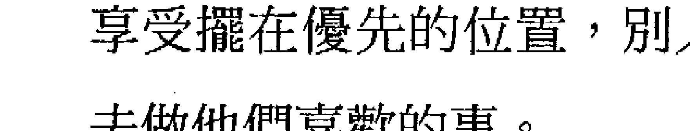

### 一般的問題：
檢視事實、限制、基礎、建設、歸根於地、身體、存在 vs. 做為、安全問題。

### 鑰匙（關鍵）：4

### 特殊的問題：
- 正向的：給更多的空間和更放鬆地允許自己停留在本然的事實裡。
- 負向的：在劃定界線方面覺得有不安全感或是覺得迷失和沒有歸根。

第四年有機會讓我們客觀地去看我們是誰，以及我們在這個時候處於什麼位置。這涉及活在當下的能力，同時要能夠去看阻止我們活在當下的基本習慣模式。這些習慣通常是我們在孩提時代所學到保持安全的習慣。制約9的人的治療旅程是關於學習信任和放下。這一年制約9的人有機會放掉--層的安全模式。那個結果是放掉之後他們會變得更歸於他們自己的中心和他們自己的事實。

制約9的人有界線的問題，他們很容易受到別人的影響，有時候他們不清楚他們應該在哪裡結束，而別人應該在哪裡開始，他們可能不確定什麼是他們自己的，什麼是他們從別人那裡取得的。他們有時候會覺得很漂浮，沒有歸根於他們自己的事實。在另外的情況，如果他們是從縮減的能量來行動，他們可能會變得僵硬、固定、不受影響的、封閉的，對周遭的世界沒有感覺。不論是上述的哪一種情況，制約9的人最困難的事就是停留在他們自己的真實，同時敞開地反應於周遭的發生。在這一年，找出如何這樣做對他們來講是最正向的機會。

在此的學習比較像是一個訣竅，而不是可以用頭腦來了解的事。但是有覺知的制約9的人能夠一再一再地繼續使用那個訣竅。當他們覺得對外在的發生不清楚，他們可以將他們的注意力帶回他們的身體，或是他們的事實，不必對外界關閉，也不必迷失在它裡面。這樣做很可能會讓他們覺得不安全或不舒服。它所帶出來的心理恐懼模式是：害怕如果他們太顧慮到自己，他們可能不會被愛，或是無法得到他們想要的。然而，當他們這樣做，他們是在面對他們的制約模式，他們在學習瞭解是什麼因素使他們無法很自在地停留在他們該有的界線。

如果沒有意識到那個該有的界線，他們可能會繼續原來的模式，還可能會加重它。換句話說，他們可能會陷住在需要被需要，和成為有用的，使他們變得很忙，而沒有時間去享受他們在去年所發現的事情。第三年允許我們去看到某些可能性，第四年顯露給我們是什麼障礙在阻止我們去經驗那些可能性。比方說，在去年，制約9的人可能發現他們對表演有熱情而參加了當地的戲劇俱樂部。這一年，他們的朋友或家人突然出了問題而需要他們的幫助或照顧，這個角色是他們在以前的關係裡會自動去承擔的。然而這件事在現在會產生很多衝突，因為時間和能量不夠分配在兩邊。當然，這不是單純的黑或白的情況，但是他們會一再地面對到底要照顧哪一邊多少的衝突。在另外的情況，縮減的制約9的人可能會發覺他們陷住在隔離的情況，他們創造出僵硬的人為界線而跟你們失去連結。舉例來說，他們在過去跟某人是切斷關係的，但是在這一年他們可能會覺得他們還是愛那個人，或是想要跟他連結。這是他們的一個機會，可以去看他們的防衛模式如何在運作，以及當他們這樣做的時候，他們必須付出多少代價。在這一年，制約9的人在學習放掉想要去改變那個不能改變的，而代之以信任本然的事實，並給它空間，即使它並不是他們所選擇或想要的。

## 關鍵個人年5

### 一般的問題：
改變、自由、個人的空間、自發性、能量、全然、不安、恐懼。

### 鑰匙（關鍵）：5

### 特殊的問題：
- 正向的：放掉害怕成為自私的，更加聽取自己在當下的能量。
- 負向的：被以恐懼為基礎的模式所駕馭。

第五年有机会跟自己的能量作更多的连结，这就是使我们碰触到我们当下的生命力。要保持这个连结需要内在的觉知，当我们的注意力放在外界，或是过度顾虑到别人的意见和感觉的时候就会做不到。如果我们没有受到心理程式的限制，是完全活生生和自由的，我们就能够去经验当下自发性的能量。这是令人害怕的，对不同的人来讲有不同害怕的理由。然而，对很多人来讲，尤其是对制约9的人来讲，害怕自私是最主要的因素。制约9的本质是害怕如果他们将所有的注意力都放在自己身上，他们就会变得没有价值，那么就没有人会爱他们，这样他们就无法得到他们想要的，或是无法生存。问题在于他们的注意力要指向哪里？第五年的能量是导向自己，它需要对自己有很多注意和忽视别人才能够去经验它。这两件事都是制约9的人所害怕的，除非他们处于缩减的那一边。在这一年，他们会碰到这个恐惧的障碍。

在去年，他们也许已经碰到一些事实关于这个制约程式是如何在运作。在这一年，藉著去面对他们的恐惧和带着信任去放掉它，他们就有机会改变而使他们免于它的某些影响。在这一年，他们里面有一部分会想要改变。这可能是在他们生活上某一个特定的领域，或者他们只是想要有更多的自由和空间去过生活。第五年是一个循环的中间点，所以很自然地会有某种不安和改变的冲动。不论那个冲动导向哪里，他们将几乎不可避免地会碰到他们的恐惧——它可能是改变工作的恐惧，冒险的恐惧，遵循他们的性能量的恐惧，或是害怕自私和把自己摆在优先的恐惧。

他们处理这一年的结果要依他们对自己和对存在有多少信任而定。如果他们害怕去面对恐惧，因而避开引起它的情况，他们的生命和他们个人将会受到限制而变小一些。如果他们有足够的勇气去面对恐惧，并突破它，他们将会变得更自由，更没有限制。这需要他们能够信任他们的能量，然而这并不意味着他们要试图去压抑和去除恐惧，而是给它更多的空间，围绕着它来扩张，承认它的存在，将它视为人性的一部分，而不是从它退缩。在第五年，恐惧常常是我们可以去到我们真正想要去或需要去的地方的门。它是内在生命力的吸引，它比头脑来得更深。在这一年，制约9的人有机会不顾恐惧而去信任那个吸引。制约9的人的治疗途径跟空间的问题非常有关，在这一年，他们将有机会给自己更多的空间，同时去面对跟它有关的恐惧。

## 關鍵個人年6

### 一般的問題：
愛、實相、關心和給予、自我負責、期望、行為正當、道德價值、罪惡感、應該和不應該。

### 鑰匙（關鍵）：6

### 特殊的問題：
- 正向的：放掉掩蓋心的真相的責任和義務，將更多的空間給心的真相。
- 負向的：基於需要被需要而被責任所駕駛，或是採取負面的抵制。

第六年對一個以心為基礎的數字來講都是一個強烈的時間，制約9的人確定是其中之一。制約9的人有一部分是真的喜歡照顧和幫助，另外有一部分的他們認為他們應該要這樣做，他們才會覺得安全和舒服，以及能夠得到他們想要的。如何分辨上述這兩個部分是他們在這一年要檢視的。第六年的焦點是跟心的真實有更多的連結，同時教我們為那個真實負起責任的意義。這一年，我們必須去了解我們應該怎麼做才能夠展現出我們是有愛心的或是好的，以及我們應該怎麼做才能夠從別人得到愛。

大多數制約9的人對於展現他們是如何的仁慈和體貼都有很大的投資。成為有用的和被需要的是他們給自己價值的方式。第六年強調親近關係的責任，以及履行那些責任所產生的期望。它也強調出當那些期望沒有被滿足時所產生的憎恨。這可能意味著制約9的人開始對於他們給予的習慣和它所產生的結果覺得有困難。

比方說，一個一直都很慈悲的制約9的人可能花了很多年的時間在照顧她先生的需要，滿足他的願望和創造出一個舒適的家庭環境。她從來不覺得這樣做有什麼問題，但是突然間她開始覺得不喜歡一直這樣做。她開始覺知到她一直這樣做是為了要維持好的婚姻關係，但是忽略了自己的照顧。也許她覺得他已經將她的照顧視為理所當然，而他並沒有回報以她內心所期望的愛，然後她突然開始變得生氣和抱怨。這個感覺可能不是突然出現的，而是因為在第六年跟她較深層的真實連結之後，她才認出的。

在這種情況下，無意識的制約9的人可能會很容易反彈，乾脆就關閉她的心，從婚姻出走。制約9的人會這樣做，但是這必須付出代價。當她變覺知，然後開始照顧她自己的需要，她就會關起她的心，切斷她的愛。然而一個有意識的制約9的人可能會利用這個機會去了解自己和了解她們對於愛的信念。這會使她們為她們以前無意識地在做的事負起責任，而不是為此責怪她的先生。那麼她就必須去檢視，如果她給自己的需要更多的空間和自由，她的婚姻會變得怎麼樣。這對她來講可能有困難，而且很可能會帶來恐懼，覺得如果她這樣做，她先生就不再愛她了。

當然，第六年所關係到的不僅是我們愛的關係，它同時也會碰觸到我們生活上所有關於責任、做對的事、或成為一個好人等信念的相關領域。那個目的就是要使我們跟我們較深層的真相連結。制約9的人的治療旅程一直都是涉及放掉和信任的能力。這一年，他們有機會放掉一層他們應該做什麼或不應該做什麼的制約，好讓他們能夠更信任隱藏在那些信念底下的內心的真實。這需要他們有勇氣將他們的注意力放在他們內心的真實，並為它負起責任，而不是顧慮到別人的感覺或想法，或是顧慮到要做對的事。

## 關鍵個人年7

一般的問題：了解、智慧、發問、學習、計劃、信念系統、向內看、單獨、靜心。

鑰匙（關鍵）：7

特殊的問題：

- 正向的：放掉頭腦的信念，信任自己的知道和了解。
- 負向的：由於害怕孤獨而給出自己的空間，或是迷失在頭腦的故事或概念裡。

第七年是你自然流向內在的時間。如果這一年好好利用的話，它能夠使我們跟深層的內在和真正的了解連結。在這個時間裡，它能夠讓我們發現關於我們的事，並了解我們是如何在運作，這在其他的時間裡可能是看不到的。阻止我們看到的是我們心理的觀念和信念系統，也就是由家庭、教育、和社會植入我們頭腦的程式。為了要有我們自己的意見和我們個人的了解，我們必須將這些信念擺在一旁。然後我們才能夠從我們個人的經驗來學習，而不是重複我們所聽到或讀到的。這就是成為有智慧的和只是囤積很多借來的知識之間的差別。

這一年制約9的人有機會可以放掉學來的觀念，然後給自己更多的空間去信任自己的內在、自己的了解、和自己的光。制約9的人的治療旅程一直都是關於信任自己。在第一年，這是他們的個體性，在第二年是他們的感覺，在第三年是他們的創造過程，在第四年是他們身體的經驗，在第五年是他們的能量和生命力，在第六年是他們的心和它的真相。在這一年是他們的頭腦和了解。使這個成為困難的可能是他們的害怕孤獨，如果他們把注意力放在自己，而沒有融入別人。他們在這一年的主要學習可能是去面對這個恐懼。為了要進入我們的內在透過生活經驗來得到智慧，我們必須在單獨的時候覺得舒服，否則我們的能量會變得太向外而無法向內看。就身體層面來講，制約9的人比較不難成為單獨的。有很多制約9的人喜歡單獨，因為這樣的話他們就不必去面對別人強大的影響，而可以享受他們自己寬敞的空間。然而，他們所不擅長的是當他們跟別人在一起的時候，他們就無法跟自己在一起或是維持單獨時的寬敞感覺，這是他們在這一年可能會碰到的。

過度的制約9的人可能會害怕如果他們沒有融入別人的感覺或需要，他們可能就不會被愛，或是無法維持良好的關係。這可能會使他們抗拒自然的能量往內拉。縮減的制約9的人可能會覺得這是一種隔離。將別人排除在外，和護衛自己不讓別人侵入他們的空間，他們會感覺到分離和孤獨，無法連結。那個關鍵在於制約9的人必須有能力跟自己的內在一起，而不必去創造出人為的界線將別人排除在外。

在第七年，我們能夠跟無意識的頭腦連結，那是我們在其他情況下看不到的。這能夠讓我們看到我們是如何從我們深層的內在在運作。為了要跟這一層連結，制約9的人需要有足夠的信任放掉原來的更表層的想法，允許自己處於不知道的感覺狀態，這是進入這個深層頭腦的門。換句話說，他們越是能夠讓自己去質疑、懷疑，或者只是讓自己處於不知道的狀態下，他們就越能夠碰觸到深層的自己，並加以了解。

在比較世俗的層面，制約9的人可能會忙著計劃未來的方向，依他們對自己和對存在有多少信任而定。

## 關鍵個人年8

一般的問題：力量、金錢、慾望、操控、控制、陰陽能量的平衡。

鑰匙（關鍵）：8

特殊的問題：
- 正向的：放掉負面的力量，將空間給平衡和真實的力量。
- 負向的：由於缺乏信任而加重了力量的不平衡。

了解真實力量的本質是第八年的潛力。這需要個人對自己陰陽能量的平衡予以適當的調整以便得到他們想要的。對制約9的人來講，那個關鍵一直都是有足夠的信任去放掉一些觀念，以便給那個更深、更真的部分更多的空間。在這一年，制約9的人有機會看到他們如何使用他們的力量在無效的方向，然後他們就能夠找到一個更平衡或更有效的方式來達成他們的慾望。在第八年，那個情況會依他們以陽性或陰性能量為主來使用他們的能量而定。

如果制約9的人是以陽性能量為主來使用他們的力量，他們會有機會放掉他們的控制、催促、或急著想達成的習慣。他們需要找到某種信任來使他們以更放鬆、更敞開，和溶入周遭的發生的方式前進。如果他們缺乏那個信任，他們可能會經驗到很大的壓力，覺得除非他們控制每一件事，否則將沒有什麼事會發生，或是事情將不會按照他們想要的方式發生。學習信任存在和信任自己是他們治療的重要部分。在這一年，它意味著學習更放鬆而不必害怕他們個人的目標無法達成。這是是在學習如何成為更大圖畫的一部分，而不失去自己，找出當他們放鬆地讓事情發生，存在依然會照顧他們。這個放掉控制和不催促可以讓陰性能量浮現來達到更好的平衡。

有時候這可以來自有意識地選擇信任。比方說，他們可以決定他們不要那麼努力工作，或者他們可以選擇去看當他們不在的時候事情如何運作。或者當他們變得更加覺知到由第八年的高能量所增加的緊張和壓力，他們可以有意識地決定放下、放鬆、和信任。有時候，這個學習可能是被迫的，比方說，有某些情況已經脫離他們的控制，他們只好放手。在這種情況下，他們可以跟著他們的信任走，或者他們可以覺得無能和無助而受苦。不論是哪一種方式，他們都被迫進入他們的陰性能量。健康問題常常是造成失去控制的原因。

以陰性能量為主的制約9的人，他們的學習非常不同。這一年是他們去發現如何擁抱他們的力量、為自己站起來、和爭取他們想要的東西的機會。由於他們的需要被愛和被需要，很多制約9的人傾向於將他們的力量給別人。他們的學習是信任他們可以去爭取他們的慾望，拿回他們的權威，並對他們不想要的事說不，而不必害怕別人將不愛、不喜歡、或不尊敬他們。他們需要信任他們的權利去擁有和遵循他們的慾望，而不必覺得他們必須將別人的需要和慾望擺在第一位才安全。比方說，一個女性主管可能會對她的屬下一直都很體貼、很照顧，比較像是一個母親，而比較不像是一個上司，因為在她的無意識裡，她擔心如果她不這樣做，別人可能會不喜歡她。在這一年，她可以拿回她的權威，而不必太顧慮到別人的問題和需要。

如果制約9的人沒有抓住這個機會，他們也許會覺得被佔便宜，由於缺乏信任，他們經常會妥協來適應別人。在此的危險是，制約9的人的習慣可能會反過來變成把自己關閉起來。制約9的人需要記住，把自己關閉起來不去管別人的需要並不等於擁有他們自己的力量。如果他們這樣做，他們只是關閉他們的陰性面，而不是學習接受他們的陽性面來平衡它。

## 關鍵個人年9

一般的問題：放手、信任、完成、慈悲、界線。

鑰匙（關鍵）：9

特殊的問題：
- 正向的：有足夠的信任可以放掉舊有的，而且對自己和對別人更慈悲。
- 負向的：由於缺乏信任而繼續原來的模式，或是不知道要在哪裡畫界線而覺得迷失在海洋裡。

第九年是一個循環的結束，它一直都是一個重要的時間。然而，對制約9的人來講，它幾乎不可避免地將會有重大的挑戰，伴隨著相當大的改變。放手、信任、和對自己慈悲的品質一直都是制約9的人治療旅程的經常性元素，這些教訓和禮物在這一年將會高度被加重。制約9的本質意味著常常會經歷很多不同的生活形態，或是不同的階段。從一個地區搬到另外一個地區，改變一個關係或生涯，或是目標的改變，這些都可能發生，制約9的人就是在這些變動的情況下學習。這些改變將會在第九年發生，當他們覺知到有一些事已經不再能夠運作，或是不再滋養，他們必須學習信任去放手，好讓他們能夠進入到下一個新的循環。有時候這些改變並不是發生在外在的層面，而是要讓他們放掉負面地使用能量的方式，好讓他們能夠重視他們自己的需要和感覺，而不必在面對外在或別人的時候把自己關閉起來。

這些放手並非一直都是制約9的人所選擇或想要的，而可能是一些他們所執著的人或事。對每一個人來講，生命中的結束基本上常常是一個痛苦的事實。對制約9的人來講，去進入這些情緒深處的能力，透過它們來學習，最後放掉再繼續走，這是他們旅程重要的一部分。就生命更大的整體來看，如果一件事在第九年結束或離開，那是因為它對個人未來的學習已經不重要了。沒有能力或不願意放手會造成能量的封閉、僵硬、或退縮，使得那個人無法進入新的。在第九年，他們不僅可以放掉最近的東西，而且還可以放掉舊有的，他們一直攜帶著的情況、關係、創傷、和抱怨等等。它是在這個循環裡面所有發生的完成。

在這一年，制約9的人常常需要對自己仁慈一點。過度的制約9的人可能會比較理想化，希望在處理別人的事時成為一個完美的人道主義者，或是透過他們的慾望使世界變得更好。並不是說這些感覺是假的，而是制約9的人傾向於把自己排除在他們的照顧之外。他們個人的感覺常常被批判或壓抑，或者他們的需要被擺在最後。在這一年，制約9的人有機會學習，真正的慈悲並不是透過自我犧牲而得到的。真正的慈悲的本質是有能力認出和尊重別人的感覺，因為他們也曾經經驗過同樣的感覺。一個具有很深的慈悲的人通常是一個已經帶著覺知和了解去探討過他們自己感情深處的人。

然後，制約9的人可能會被驅策和感覺他們以前從來沒有在他們自己身上感覺過的情緒。這也許是他們的憤怒、嫉妒、痛苦、殘酷，或自私。不論它是什麼，制約9的人的學習就是要將空間給他們的這些情緒，不要試圖壓抑或驅除它們。這些感情並不是什麼美德，但它們是人類情況的一部分，而生命中的每一個部分都有它存在的意義。唯有藉著承認我們較低的能量，我們才能夠將它們蛻變成較高的。當我們壓抑這些我們不喜歡的部分，我們就無法透過它們來成長。這對制約9的人來講尤其是如此，他們在此是要去經驗他們裡面的各種情緒，特別是在這一年，他們的整個潛力就是要去信任任何存在的情緒，並給它空間。

對於縮減的制約9的人來講，他們的學習是要有足夠的信任去放掉他們的保護界線，好讓他們更能夠去感覺他們自己是整體的一部分。9這個數字主要是要讓我們去感覺跟整體的連結，它是一個大的、擴張的能量。對制約9的人來講，對自己仁慈意味著在感情上讓別人可以碰觸到，要成為柔軟的和去感覺，讓自己的能量很自然地作三百六十度的敞開，不必害怕迷失或被接管。基本上，他們需要去學習信任他們是存在主要的部分，在任何需要的方面，生命都會照顧他們。放手和信任有很多不同的層面，它可以是很小的，就像放掉對遺失的圍巾的執著，或是放掉個人的抱怨；或是很大的，就像放掉個人的自我。他們越是能夠放手、信任，然後繼續走，他們就能夠變得越完整，也越能夠認出他們跟存在的連結。

## 附錄一

### 計算關鍵個人年數字。

這一章是要介紹如何計算關鍵個人年數字。

關鍵個人年是由三個數字或能量所組合起來的，它們之間也是相互關連的。

第一個是個人年（流年）數字本身，它意味著在那一年我們很自然地會進入的能量，所以，我們很可能會吸引那種事件或情況。

第二個是制約數字——它是個人年的能量透過它來過濾的程式。

第三個我們稱之為關鍵或鑰匙，它是將個人年的數字和制約數字相加（然後再縮減成一個數字）。它事實上是一個鑰匙，可以打開去到個人年更高學習的門和治療制約的負向面。它是基本的了解或是重要的因素，個人年會透過它來運作。

當我們在處理關鍵個人年的時候，這三個數字要一起解讀。每一個數字都有它自己的意義或影響，它可以由邏輯的頭腦來了解，然而，要將它們結合起來成為一個凝聚的了解需要直覺的頭腦。它不在這本書的討論範圍，但是對任何數字學家來講，用關鍵個人年來作為數字結合的練習是有趣的，它也是建立數字學圖表所必需的。

### 計算

制約數字 + 個人年數字 = 關鍵數字（鑰匙）

這個鑰匙能夠幫助你打開該年的學習之門。換句話說，它指出你如何從這一年學習，同時指出這一年可能浮現的負面可能性，並加以治療。

### 例子

(1) 珍妮的生日是7月23日。
- 她的制約數字是3。
- 23 + 7（7月） = 30 = 3 + 0 = 3

在2012年
- 她的個人年（流年）是8
- 2+0+1+2=5（年）+3（制約數字）=8
- 她的關鍵（鑰匙）是2
- 8（個人年）+3（制約數字）=11=1+1=2

因此，她的關鍵個人年數字是：
- 個人年 8
- 制約數字 3
- 關鍵（鑰匙）2

在2013年
- 她的個人年（流年）是9
- 2+0+1+3=6（年）+3（制約數字）=9
- 她的關鍵（鑰匙）是3
- 9（個人年）+3（制約數字）=12=1+2=3

因此，她的關鍵個人年數字是：
- 個人年 9
- 制約數字 3
- 關鍵（鑰匙）3

在2014年
- 她的個人年（流年）是1
- 2+0+1+4=7（年）+3（制約數字）=10=1+0=1
- 她的關鍵（鑰匙）是4
- 1（個人年） + 3（制約數字） = 4

因此，她的關鍵個人年數字是：
- 個人年 1
- 制約數字 3
- 關鍵（鑰匙） 4

(2) 傑夫的生日是12月29日。
- 他的制約數字是5。
- 29 + 12（12月） = 41 = 4 + 1 = 5

在2012年
- 他的個人年（流年）是1
- 2 + 0 + 1 + 2 = 5（年） + 5（制約數字） = 10 = 1 + 0 = 1
- 他的關鍵（鑰匙）是 6
- 1（個人年） + 5（制約數字） = 6

因此，他的關鍵個人年數字是：
- 個人年 1
- 制約數字 5
- 關鍵（鑰匙） 6

在2013年
- 他的個人年（流年）是2
- 2+0+1+3=6（年）+5（制約數字）=11=1+1=2
- 他的關鍵（鑰匙）是7
- 2（個人年）+5（制約數字）=7

因此，他的關鍵個人年數字是：
- 個人年 2
- 制約數字 5
- 關鍵（鑰匙）7

在2014年
- 他的個人年（流年）是3
- 2+0+1+4=7（年）+5（制約數字）=12=1+2=3
- 他的關鍵（鑰匙）是8
- 3（個人年）+5（制約數字）=8

因此，他的關鍵個人年數字是：
- 個人年 3
- 制約數字 5
- 關鍵（鑰匙）8

## 關鍵個人年（個人年關鍵）計算圖表

個人年（流年）＋制約＝關鍵

| 制約 | 個人年（流年）1 | 2 | 3 | 4 | 5 | 6 | 7 | 8 | 9 |
| --- | --- | --- | --- | --- | --- | --- | --- | --- | --- |
| 1 | 2 | 3 | 4 | 5 | 6 | 7 | 8 | 9 | 1 |
| 2 | 3 | 4 | 5 | 6 | 7 | 8 | 9 | 1 | 2 |
| 3 | 4 | 5 | 6 | 7 | 8 | 9 | 1 | 2 | 3 |
| 4 | 5 | 6 | 7 | 8 | 9 | 1 | 2 | 3 | 4 |
| 5 | 6 | 7 | 8 | 9 | 1 | 2 | 3 | 4 | 5 |
| 6 | 7 | 8 | 9 | 1 | 2 | 3 | 4 | 5 | 6 |
| 7 | 8 | 9 | 1 | 2 | 3 | 4 | 5 | 6 | 7 |
| 8 | 9 | 1 | 2 | 3 | 4 | 5 | 6 | 7 | 8 |
| 9 | 1 | 2 | 3 | 4 | 5 | 6 | 7 | 8 | 9 |

## 附录二

个人年数字的图表（流年表）

| 制约数字 | 1 | 2 | 3 | 4 | 5 | 6 | 7 | 8 | 9 |
| :--- | :--- | :--- | :--- | :--- | :--- | :--- | :--- | :--- | :--- |
| 年 2012 | 6 | 7 | 8 | 9 | 1 | 2 | 3 | 4 | 5 |
| 2013 | 7 | 8 | 9 | 1 | 2 | 3 | 4 | 5 | 6 |
| 2014 | 8 | 9 | 1 | 2 | 3 | 4 | 5 | 6 | 7 |
| 2015 | 9 | 1 | 2 | 3 | 4 | 5 | 6 | 7 | 8 |
| 2016 | 1 | 2 | 3 | 4 | 5 | 6 | 7 | 8 | 9 |
| 2017 | 2 | 3 | 4 | 5 | 6 | 7 | 8 | 9 | 1 |
| 2018 | 3 | 4 | 5 | 6 | 7 | 8 | 9 | 1 | 2 |
| 2019 | 4 | 5 | 6 | 7 | 8 | 9 | 1 | 2 | 3 |
| 2020 | 5 | 6 | 7 | 8 | 9 | 1 | 2 | 3 | 4 |
| 2021 | 6 | 7 | 8 | 9 | 1 | 2 | 3 | 4 | 5 |
| 2022 | 7 | 8 | 9 | 1 | 2 | 3 | 4 | 5 | 6 |

## 數字學課程（九品人生）

被你遺忘的事往往是你生命中最重要的事！心理學大師容格說：當我們選擇遺忘，那一定是在事情發生的當下你抗拒、震驚、排斥，或是沒有能力去面對，於是將它壓進深層的無意識裡。然而往事並非如煙，許多在過去沒有被解決的問題，在之後的人生旅程裡總是會一再一再地出現，使你覺得為什麼老是踢到那塊石頭！你越不去正視它，那塊石頭就會變得越大！除非能夠跟它達到和解，否則它是不會放過你的。

在課程中，我們會透過對個人生命圖表的引導，讓你去面對你潛在的心理問題，並釋放它，讓你的生命從被制約的駱駝，成長到能夠自主，且擁有個人自由的獅子，進而返璞歸真，回到如天真的小孩一樣快樂，這樣才算是成功地走完人生的旅程。課程分初階班、進階班、和師資班三種。

- 初階班——適合所有興趣於探索個人療癒的學員。
- 進階班——完成初階，想再進一步深入探討的學員。
- 師資班——有心從事數字學的輔導及教學工作者。

### 師資簡介：黃品萱（Pradeepa）

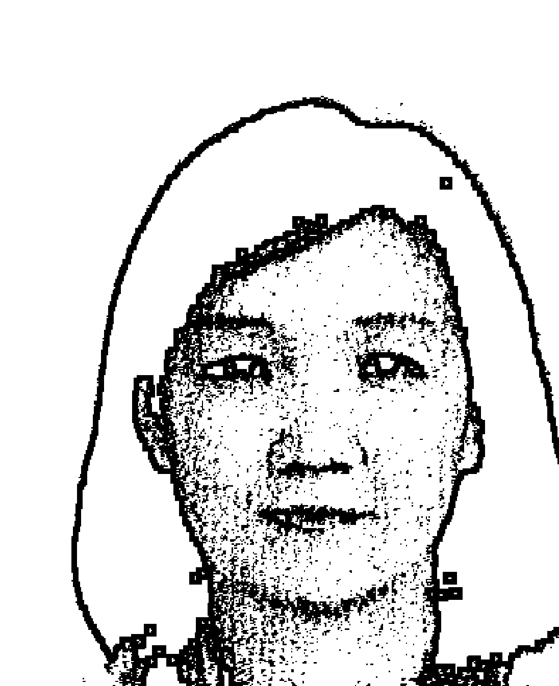

黃品萱老師曾經在本書作者的數字學課程裡多次擔任助理，充分吸收了曼格拉老師的真髓，並從2002年開始了分享的旅程，參與了無數有趣的國內外課程，累積了豐富的經驗，最終選擇了塔羅牌和數字學作為主要的分享工具，她的教學足跡遍佈台灣、大陸、和馬來西亞等地。
連繫方式：手機：+886(0)935-757466
e-mail：pradeepa0521@yahoo.com

### OH Cards 系列牌卡

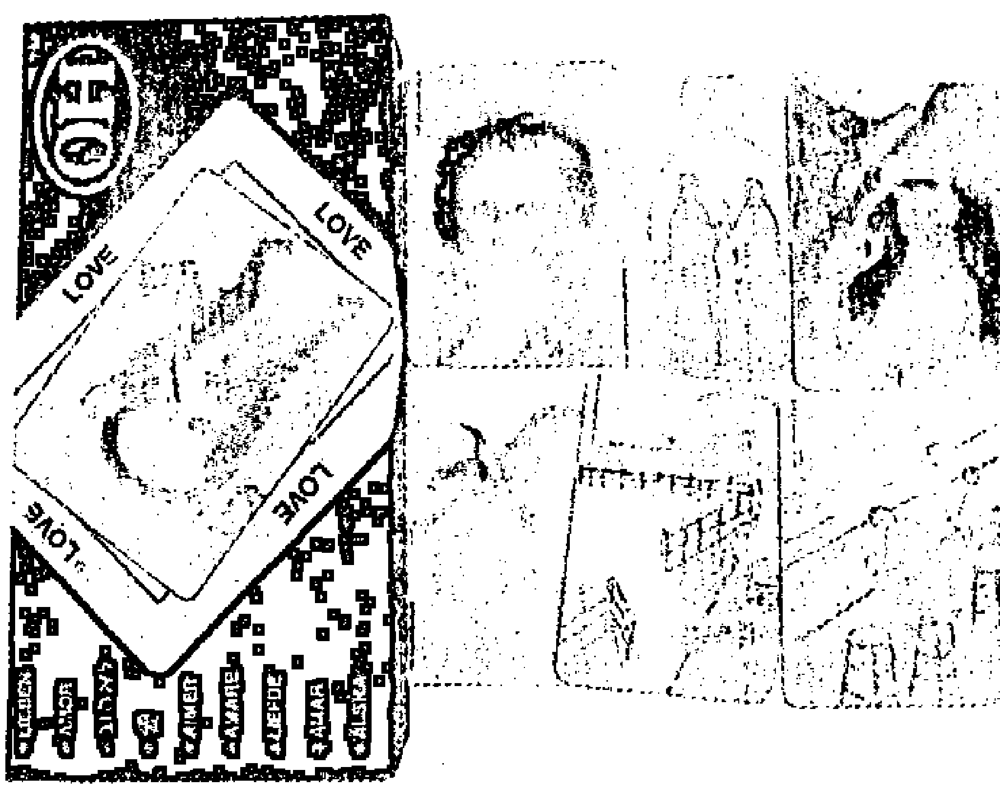

OH Cards是一本沒有裝訂的書，裡面有無數頁。在每一次掀開這些牌的時候都能夠引導我們進入一個新的冒險：我們可能會找到一些充滿笑話的愚蠢故事，或是愛和喜悅的愛情詩歌，或是憂傷和痛苦的傷心故事……或是對一個寧靜的空間輕聲細訴個人內心的話。

OH Cards 是由兩組牌所組成的：其中一組是比較小的水彩畫圖案，裡面包含了我們日常生活的各個層面，另外一組牌上面有文字，可以作為這些水彩畫圖案的背景。當所有的圖卡被放進所有的文字裡，它們就會產生出7744種不同的組合。

在文字和圖畫的組合當中，OH Cards就會告訴你某種訊息。它們會繼續以新的組合呈現，以此來刺激我們的創造力。OH Cards這種獨一無二的類似遊戲般的工具可以幫助我們了解自己，並照亮我們的道路。

以用在很多場合：可以私下使用，也可以跟朋友一起玩，或是在諮商工作上使用。它們可以有很多用途：玩說故事和杜撰遊戲；刺激創造力和幻想力；促進溝通，鼓勵表達，刺激想像，和增加自我覺知。

OH Cards可以開展我們傾聽和反應的能力，以便能夠真正去聽取對方的意見，不要帶著批判或競爭的心態。另外還可以使用OH Cards在保護私人隱私的情況下讓人們交換感情、想法、和直覺。

## 介紹：

OH Cards看起來好像是一個很簡單的遊戲，但事實上它們是一個魔術包，裡面充滿著思想、發現、知覺、和新的想法。它們是多層面的，無法很容易被界定。它們是獨特的，有很多面向的呈現，同時能夠很精確地反映出它們的內容。

OH Cards就好像是一種新的語言，從普通的形象和語言產生，然而卻能夠給予新的意義。就好像所有真實的新的經驗，它們能夠刺激我們的創造力，把我們推向新的連結和新的結論，並修正我們的假設。我們越使用這種語言，我們就能夠用得越好，然後變得更豐富。

然而OH Cards並非只是一種教育的工具，它們也是好玩的、有趣的、和富於詩意的，我們賦予它什麼，它就是什麼。OH Cards的設計並不是為了競爭的目的，不是用來看說誰比較強，比較聰明，誰比較弱，比較遲鈍，而是要用來撩起我們的知覺和我們的想像，使我們在分享我們的反應時變得更容易。

OH Cards的意義經常在改變，很像我們生命的流動。OH Cards就好像是一本書，我們每一次閱讀的時候都將新的篇幅加進去，它們是跳進我們自己那口井的一跳板。

這176張卡是材料，從這些材料我們形成無數種工作和遊戲的形式。這7744種可能的圖畫和文字的組合必須再加上我們不同的解釋，這些解釋很可能會隨著我們生命河流的流動而改變。

OH Cards的問世已經有很多年了，它曾經被千千萬萬人使用在千千萬萬種不同的情況下，每一個人所得到的經驗都不一樣，大家在玩OH Cards的時候都會帶著敞開和尊重的心來互相交換意見，並分享他們的反應。

原裝進口牌(中文或英文版) + 中譯解說書
定價：1,600元
神奇塔羅出版社 (02)2395-1891

#### 克服卡(COPE)

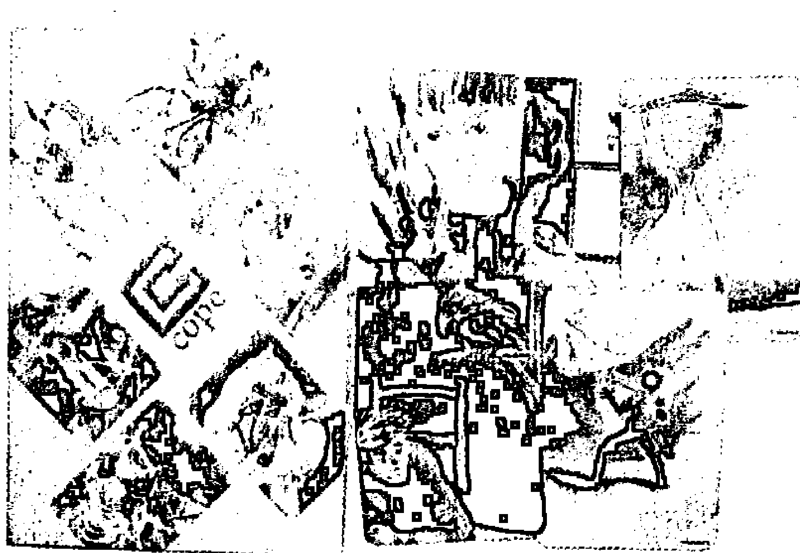

88張圖象卡——從危機到治療

今日的世界需要各種能夠達到和平的工具，克服卡是一個蘇聯的畫家，一個以色列的治療師和一個德國的出版者所共同設計出來的。它的形象引導我們進入內在悲傷和喜悦的故事，並將它們表達和分享出來。因為這些圖象的確能夠引發出內在的東西，所以它們的價值已經在世界上得到證明。從創傷到治療的道路被畫在這些很美，且多變化的圖象裡。

原裝進口牌 + 中譯解說小冊
定價：1,100元
神奇塔羅出版社 (02)2395-1891

### 巴哈花藥卡

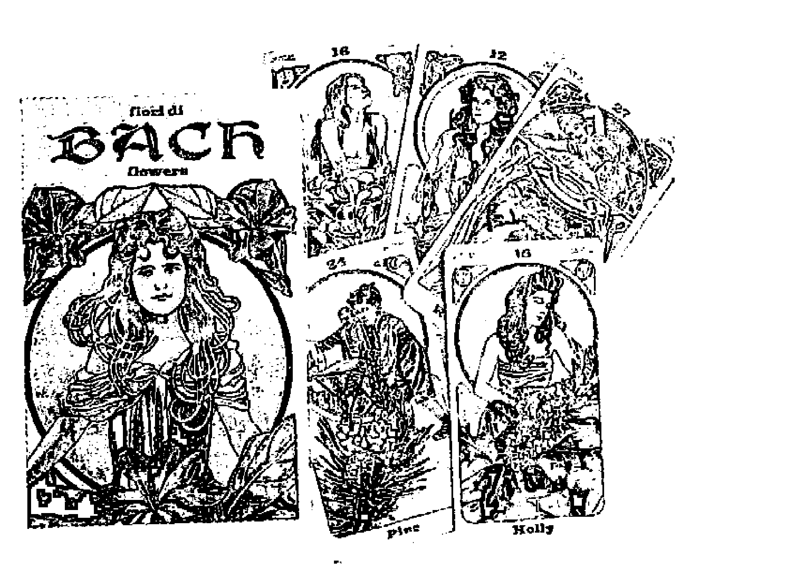

多年以來，巴哈花藥(又稱巴哈花精)療法已然引起廣大的興趣，有數十本巴哈花精的書出版，雜誌中數不清的相關文章，以及專屬銷售據點的設立。這種療法獨特之點在於融合豐富的心理學內涵和簡單明瞭的使用方法。有時一朵花的花精既可用於預防旅行時差，也可以用來指出心理與靈性之進化過程。處在不同階段的人與花精的互動亦有所不同。

這副巴哈花藥卡是針對巴哈花精所設計出來的，裡面的三十八種花對應於巴哈花精的三十八種花精療方，你可以帶著小孩一般的天真與好奇來玩這副牌，看看花藥卡會帶給你什麼啟示。

原裝進口牌 + 中譯解說小冊 定價：850元 神奇塔羅出版社 (02)2395-1891

### 蘇聯吉普賽算命卡

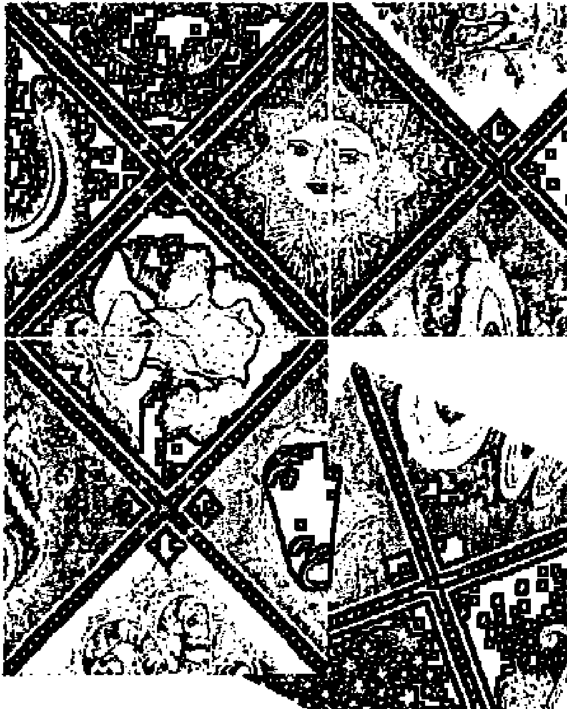

「蘇聯的吉普賽人算命卡」(簡稱吉普賽卡)具有一種神秘的力量，可以預測事情，或是指出有利和不利的情況。它們可以藉著將那個情況透露給我們來幫助我們，或是使我們覺知到，或是使我們能夠選擇我們要去面對那個情況的方式或品質，然而這些卡並沒有要控制我們。我們如何來看待這些事件，或是要以什麼樣的方式來反應是我們可以自己決定的。

這些牌就好像是一個通靈的測量器，可以讓我們測出經常圍繞著我們的震動。

## 神奇塔羅出版社
塔羅牌價目表

- 850元 1、萊德·偉特塔羅牌(普及版)(附中譯小冊)
- 700元 2、萊德·偉特塔羅牌(口袋版)(附中譯小冊)
- 850元 3、萊德·偉特塔羅牌(粉彩版)(附中譯小冊)
- 850元 4、克勞力·托特塔羅牌Crowley Small Thoth Tarot
- 850元 5、新藝術塔羅牌Art Nouveau(附中譯小冊)
- 850元 6、小精靈塔羅牌Fairy Tarot(附中譯小冊)
- 850元 7、花卉精靈塔羅牌(附中譯小冊)
- 1,480元 8、埃及之光塔羅牌Nefertari's(附中譯小冊)
- 890元 9、情色藝術塔羅牌(限制級)(附中譯小冊)
- 890元 10、迪卡馬龍塔羅牌(限制級)Decameron(附中譯小冊)
- 890元 11、卡薩諾瓦塔羅牌(限制級)Casanova(附中譯小冊)
- 850元 12、美人魚塔羅牌Tarot of Mermaids(附中譯小冊)
- 850元 13、新帕拉迪尼塔羅牌New Palladini(附中譯小冊)
- 850元 14、埃及塔羅牌Egyptian Tarot(附中譯小冊)
- 850元 15、奧秘塔羅牌Secret Tarot
- 1,100元 16、金色沙皇塔羅牌(附中譯小冊)
- 1,100元 17、金色文藝復興塔羅牌Golden Renaissance
- 990元 18、維斯康提塔羅牌Visconti Tarot(附中譯小冊)
- 850元 19、達文西塔羅牌Da Vinci Tarot(附中譯小冊)
- 490元 20、美人魚塔羅牌(迷你版) Mini Mermaids(附中譯小冊)
- 490元 21、小精靈塔羅牌(迷你版) Mini Fairy(附中譯小冊)
- 490元 22、新藝術塔羅牌(迷你版) Mini Art(附中譯小冊)
- 490元 23、埃及塔羅牌(迷你版)Mini Egyptian(附中譯小冊)
- 850元 24、亞特蘭提斯塔羅牌Tarot of Atlantis
- 850元 25、但丁塔羅牌Dante Tarot(附中譯小冊)
- 990元 26、奇異月亮塔羅牌(豪華版)Deviant Moon(附中譯小冊)
- 850元 27、草本植物塔羅牌Herbal Tarot
- 850元 28、幻想劇院塔羅牌Phantasmagoric Theater Tarot
- 990元 29、奇異月亮塔羅牌(豪華版)Deviant Moon (附中譯小冊)
- 850元 30、螺旋塔羅牌Spiral Tarot
- 850元 31、貓人塔羅牌Tarot of the Cat People
- 850元 32、古徑塔羅牌Tarot of the Old Path(附中譯小冊)
- 850元 33、1001夜塔羅牌Tarot of the Thousand and One Nights
- 850元 34、寶石與水晶塔羅牌Gemstones and Crystals(附中譯小冊)
- 1,200元 35、金色克林姆塔羅牌Golden Tarot of Klimt(附中譯小冊)
- 1,250元 36、透明萊德·偉特塔羅牌Universal Transparent Tarot
- 850元 37、印度愛經塔羅牌Kamasutra Tarot(附中譯小冊)
- 1,680元 38、蘇聯吉普賽算命卡(中譯書+卡)
- 880元 39、女神塔羅牌The Goddess Tarot(附中譯書)
- 880元 40、易經禪卡Tao Oracle(中文書+牌)
- 680元 41、天使呼喚卡(中文書+牌)
- 850元 42、白貓塔羅牌Tarot of White Cat(附中譯小冊)
- 1,200元 43、黃金塔羅牌Golden Tarot
- 850元 44、感官巫師塔羅牌Sensual Wicca Tarot(附中譯小冊)
- 850元 45、星座塔羅牌Zodiac Tarot(附中譯小冊)
- 1,100元 46、金色博提茄利(燙金)塔羅牌Golden Botticelli(附中譯)
- 850元 47、聖甲蟲塔羅牌Lo Scarabeo Tarot
- 850元 48、戀人之路塔羅牌The Lover’s Path Tarot(附中譯小冊)
- 850元 49、狗狗智慧卡Dog Wisdom Cards(附中譯小冊)
- 850元 50、貓咪智慧卡Cat Wisdom Cards(附中譯小冊)
- 850元 51、魔法森林塔羅牌Tarot of Magical Forest
- 850元 52、圖象鑰匙塔羅牌(3D版偉特牌)Pictorial Key(附中譯小冊)
- 700元 53、靈魂伴侶卡Soul Mate Cards(附中譯小冊)
- 850元 54、神秘森林塔羅牌Tarot of Secret Forest
- 850元 55、迷宮塔羅牌Labyrinth Tarot
- 850元 56、吸引力法則塔羅牌Law of Attraction Trot(附中譯小冊)
- 280元 塔羅牌桌布(加金線刺繡或銀線刺繡和車邊)
- 420元 塔羅牌絨布袋(日本進口高級紫色絨布加金線或銀線刺繡)

## 制約數字

作 者：曼格拉(Mangala Billson)

發行人：林國陽(Chandana)

美 編：李宜芝

校 對：謙達那

出版者：神奇塔羅出版社

10062 台北市臨沂街33巷4號2 F

電話：(02) 2395-1891；(02) 2395-9797

傳真：(02) 2396-2700；(02) 2395-7722

登記證：北市建商商號(092)字第256266號

劃撥帳號：12463820(書、塔羅牌、OH Cards系列)

帳戶名稱：林國陽

總經銷：聯寶國際文化事業有限公司

地址：22180台北縣汐止市康寧街169巷27號8樓

電話：(02)2695-4083；傳真：(02)2695-4087

網址：www.book24.com.tw

總公司：70254台南市新義南路23號

電話：(06)291-2919(代表號)；傳真：(06)291-4540

印刷所：卡樂彩色印刷有限公司

修訂一版：2013年9月

定 價：400 元

版權所有・翻印必究・缺頁或裝訂錯誤請寄回更換

ISBN: 978-957-29847-8-9

## 國家圖書館出版品預行編目(CIP)資料

制約數字：個人成長的鑰匙/曼格拉(Mangala Billson) 原著．謙達那(Chandana)譯．--初版-- (神奇塔羅系列：09) 台北市，神奇塔羅出版社，2012.01 面：公分 譯自：The Conditioning Number

ISBN 978-957-29847-8-9(平裝)

1.占卜 2.數字

292.9 100028290

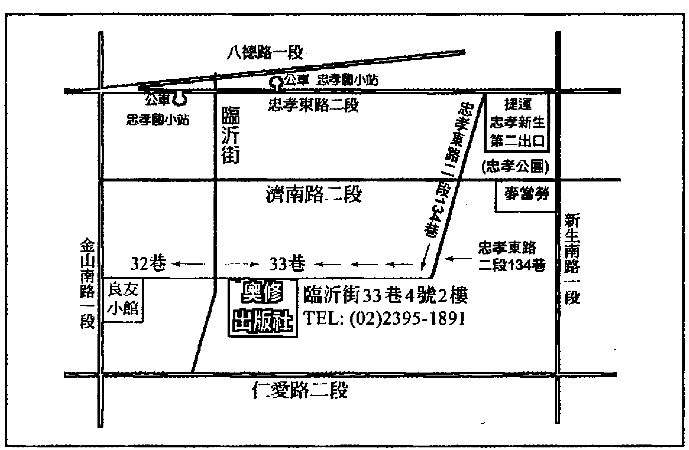

本書是生命靈數裡面極為重要的部分，因此作者先將它整理好來出版。制約是我們在孩提時代被養成的行為模式或習慣，也就是我們被設定的程式，所以有時候我們稱之為制約程式，或稱之為制約模式。我們大多數人都透過制約這個過濾器來看世界，因此它主宰著我們的人生。我們常說性格造成命運，制約模式跟性格有著密不可分的關係。

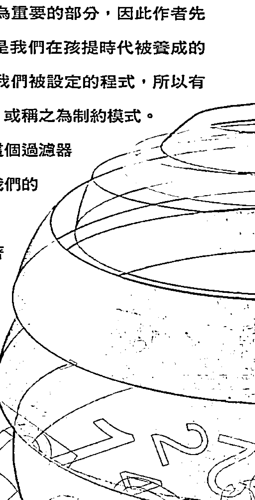

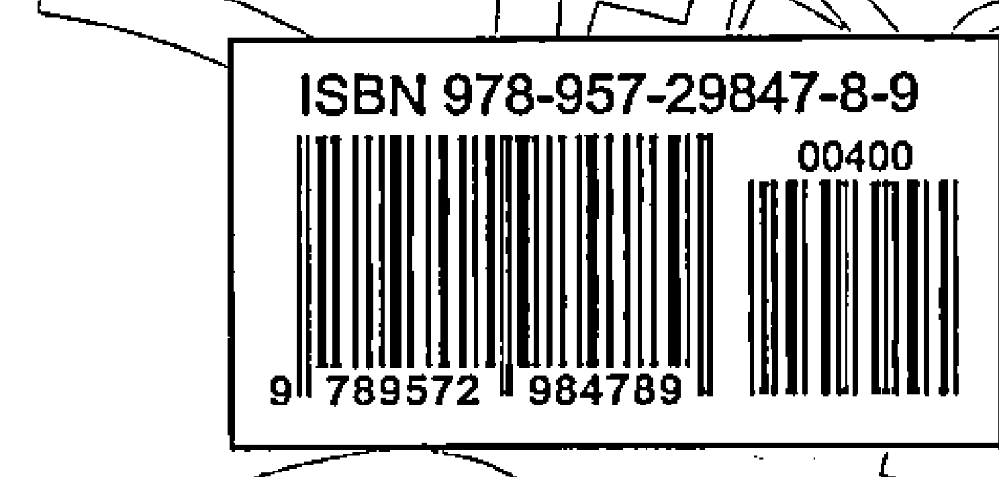

定價：400 元

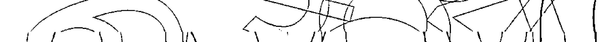