## 数字解密

### 「卡巴拉」占い之书

#### （日）浅野八郎 著 尹侃 译

犹太人
世代相传的
占卜智慧

每个人的出生日期蕴含一道特殊公式
每个数字均被赋予鲜为人知的神秘意义

你所经历或即将经历的每一年
早就潜藏灾难、纷乱或剧变的可能
又或已具备和平、繁荣与发展的走向

你的性格、运势、潜能、流年兴衰、命运起伏……
一切并非偶然
一切仍有转机

犹太秘法详测数字的秘密
教你全面把握时势变迁与人生脉络

## 图书在版编目(CIP)数据

卡巴拉数字密码/(日)浅野八郎著;尹侃译.--广州:南方日报出版社,2011.8
ISBN 978-7-5491-0230-3
Ⅰ.①卡… Ⅱ.①浅…②尹… Ⅲ.①迷信术数—研究—西方国家 Ⅳ.①B991
中国版本图书馆CIP数据核字(2011)第136682号

"KABBALA" URANAI NO SHO' by Hachiro Asano
Copyright © 2009 Hachiro Asano.
All rights reserved.
Original Japanese edition published by Setsuwasha Co., Ltd.

This Simplified Chinese edition published by arrangement with Setsuwasha Co., Ltd.,
Tokyo in care of Tuttle-Mori Agency, Inc., Tokyo through Beijing GW Culture
Communications Co., Ltd., Beijing.

Chinese Translation © 2011 Guangzhou Anno Domini Media Co., Ltd.
译文由广州公元传播有限公司提供
All rights reserved 所有权利保留

## 卡巴拉数字密码

作 者:(日)浅野八郎
译 者:尹 侃
责任编辑:阮清钰
特约编辑:钟转笑
装帧设计:林可秋
技术编辑:李丹虹

出版发行:南方日报出版社(地址:广州市广州大道中289号)
经 销:全国新华书店
制 作:◆ 广州公元传播有限公司
印 刷:深圳市福威智印刷有限公司
规 格:760mm×1020mm 1/16 12印张
版 次:2011年8月第1版第1次印刷
书 号:ISBN 978-7-5491-0230-3
定 价:25.00元

如发现印装质量问题影响阅读,请致电020-38865309联系调换。

## 序

“卡巴拉（Cabala）”这个词对于日本人来说可能比较陌生，但相信犹太人对它会十分熟悉，因为它就是犹太民族世代传承的一套秘法。

说起犹太人，总给人这样一种印象：一个长久以来备受迫害、具有悲剧色彩的民族；同时也是一个从公元前的遥远时代一直存续至今的强大民族。

犹太人遍布世界各地，甚至在美国这样的强国，也有不少犹太人精英成为政治家、实业家，甚至著名的电影导演，活跃于政商界和艺术界等领域。

而卡巴拉据说就是使犹太民族生生不息、出类拔萃的秘法。

21世纪的今天，全球各地纷争不断，商业和金融业也波涛汹涌、危机四伏。从宏观的角度看，世界如此不堪重负，而从微观的角度看我们也可以看到在家庭、学校和职场上，有很多人因为人际关系处理不好而非常苦恼和沮丧。不过，常言道，人生不如意十之八九。如果我们能预测到那些不如意之事，或许就能预备好应对策略了；而如果我们知道自己什么时候鸿运当头的话，也有可能在那段时间更有信心，更勇于接受挑战，也就更有希望取得成功了。

那么，我们如何能预测这一切呢？

答案就在卡巴拉。

过去只在犹太人内部传授的卡巴拉秘法，现在向大家公开，希望它能揭示人生中的逆境和顺境，助你开创美好的明天吧！

## 目录

- 009 第一部分 开篇
- 017 第二部分 实践篇
- 018 第一章 从“命运数”看性格和运势
- 020 命运数“1”的人：王冠星
- 024 命运数“2”的人：智慧星
- 028 命运数“3”的人：发展星
- 032 命运数“4”的人：基础星
- 036 命运数“5”的人：行动星
- 040 命运数“6”的人：调和星
- 044 命运数“7”的人：完全星
- 048 命运数“8”的人：支配星
- 052 命运数“9”的人：神秘星
- 056 命运数“11”的人：革新星
- 060 命运数“22”的人：大幸运星
- 064 你需要的忠言者
- 066 理想结婚年龄
- 068 第二章 从“年运数”看年势
- 070 年运数“1”：大变动之年
- 070 年运数“2”：和平共存之年
- 071 年运数“3”：追求理想之年
- 072 年运数“4”：不安定之年
- 073 年运数“5”：社交活跃之年
- 073 年运数“6”：协调和援助之年
- 074 年运数“7”：完成和统一之年
- 075 年运数“8”：繁荣之年
- 075 年运数“9”：问题发生之年
- 076 年运数“11”：寻求宗教信仰之年
- 076 年运数“22”：全球性扩张之年
- 077 美国总统与“0”之年的关系
- 078 第三章 从“个人年运数”看每年运势
- 081 个人年运数“1”：独立发展之年
- 081 个人年运数“2”：忍耐之年
- 082 个人年运数“3”：停滞之年
- 082 个人年运数 “4”：精神紧绷之年
- 083 个人年运数 “5”：变化之年
- 084 个人年运数 “6”：收获之年
- 084 个人年运数 “7”：休息之年
- 085 个人年运数 “8”：挑战之年
- 086 个人年运数 “9”：大总结之年
- 086 个人年运数 “11”：精神主义之年
- 087 个人年运数 “22”：幸运之年
- 088 第四章 从 “卡巴拉金字塔命运起伏图” 看人生跌宕
- 094 “1” 的命运起伏图
- 097 “2” 的命运起伏图
- 099 “3” 的命运起伏图
- 102 “4” 的命运起伏图
- 104 “5” 的命运起伏图
- 107 “6” 的命运起伏图
- 110 “7” 的命运起伏图
- 112 “8” 的命运起伏图
- 115 “9” 的命运起伏图
- 118 “11” 的命运起伏图
- 120 “22” 的命运起伏图

| 页码 | 标题 |
|------|------|
| 122 | 第五章 从“卡巴拉天宫图”洞悉自己的才能 |
| 128 | 天宫图中的“1”：语言能力 |
| 130 | 天宫图中的“2”：感受性 |
| 132 | 天宫图中的“3”：头脑 |
| 134 | 天宫图中的“4”：物质性 |
| 136 | 天宫图中的“5”：意志 |
| 138 | 天宫图中的“6”：爱 |
| 140 | 天宫图中的“7”：牺牲的精神 |
| 142 | 天宫图中的“8”：现实主义 |
| 144 | 天宫图中的“9”：理想 |
| 148 | 竖列“1·2·3”：思考之列 |
| 150 | 竖列“4·5·6”：意志之列 |
| 152 | 竖列“7·8·9”：行动之列 |
| 154 | 横列“1·4·7”：肉体之列 |
| 156 | 横列“2·5·8”：灵魂之列 |
| 157 | 横列“3·6·9”：精神之列 |
| 158 | 斜列“1·5·9”：决断之列 |
| 159 | 斜列“3·5·7”：同情之列 |
| 160 | 缺少某些数字的人 |

- 163 第三部分 名人篇
- 164 命数数“1”的名人：拿破仑·波拿巴
- 166 命数数“2”的名人：贝克拉·侯赛因·奥巴马
- 168 命数数“3”的名人：松井秀喜
- 170 命数数“4”的名人：比尔·盖茨
- 172 命数数“5”的名人：上杉鹰山
- 174 命数数“6”的名人：松下幸之助
- 176 命数数“7”的名人：铃木一郎
- 178 命数数“8”的名人：本田宗一郎
- 179 御木本幸吉
- 180 命数数“9”的名人：美空云雀
- 182 命数数“11”的名人：可可·香奈儿
- 184 命数数“22”的名人：北野武
- 186 你要注意的健康问题
- 188 浅野式开运术——“LOVE”
- 189 结语
- 189 参考文献
- 190 附录：你的卡巴拉天宫图
- 190 附录：你的命运起伏图

# 犹太民族的古老智慧

“卡巴拉”（Cabala）是个富有神秘色彩的词语，许多人并不熟悉。然而，对欧洲人来说，“卡巴拉”是一门非常重要的学问，在两千多年的漫长历史中常被提及，对犹太人来说尤其具有深刻意义。

说起犹太人，获得诺贝尔物理学奖、提出相对论的爱因斯坦（Albert Einstein），和美国汽车业界的英雄李·艾柯卡（Lee Iacocca）等在历史上活跃的风云人物都是突出的代表。除此之外，也有不少犹太人是伟大的政治家，如美国总统富兰克林·德拉诺·罗斯福（Franklin Delano Roosevelt）。

犹太人如此活跃于美国各个领域，其中有很多都在美国历史上具有举足轻重的地位，这确实有点不可思议。为什么人数较少的犹太族裔能在文化和经济领域都取得如此巨大的成就？是不是因为犹太人中有很多都拥有特殊的智慧？事实上，大部分犹太人从小就要学习本民族传统的教义，其中起到重要作用的就是一种叫做“卡巴拉”的秘法。

对于犹太人来说，“卡巴拉”能使他们掌握时代的变迁，知晓自己被赋予的使命，坦然理解和接受命运的剧变，从而判断当下是应该直面挑战、决一胜负，还是应该静观其变。由此，他们常常做出最明智的选择，成为生活的强者。

于是，“卡巴拉”成为犹太人勇气倍增的心灵支柱，推动他们在历史长河中成就大业，使整个民族存续至今并发展壮大。而向来坚守古老文明的犹太人也将这份先祖的精神遗产很好地保留和传承下来。每到面对强敌、关系存亡的危急关头，这个强大的精神武器便能发挥作用。

接下来，我们要具体讲解的就是这种名叫“卡巴拉”的秘法。

## ～ 支配命运的“卡巴拉生命树” ～

卡巴拉是透过“命运数”来揭示宇宙法则的。《新约圣经》的“约翰福音”中写道：“太初有道”[1]，而对于犹太人来说，所谓的“道”即“数字”。

何谓“命运数”呢？其实“命运数”是由人的出生年月日计算出来的，并且是支配人一生的重要数字。该如何算出某个人的命运数呢？首先要将这个人的出生年月日中的所有数字相加，如果得出的是一个两位数，则再将两者拆开分别相加，直到得出一个一位数的数字为止。这就是人的命运数了。

那么，为什么把出生年月日的数字加起来就能预测命运呢？这就要从卡巴拉的起源说起。卡巴拉是以希伯来语为基础创造出来的，而希伯来语的希腊字母既是文字也是数字。即希伯来语言的文字就是由数字组合而成的。换句话说，卡巴拉是借助数字来进行占卜的。

再看著有《神秘哲学三书》（*Three books of occult philosophy*）的近代神秘学理论鼻祖海恩里希·柯尼勒斯·阿格里帕（Heinrich Cornelius Agrippa）和炼金术师帕拉切尔苏斯（Paracelsus），他们的宇宙观都受了犹太秘法卡巴拉的影响。若要了解现在欧美流行的神秘学，就必须从认识卡巴拉的宇宙观开始。

因此，直截了当地说，卡巴拉是借助语言和数字来进行占卜的，宇宙万物都是由数字构成的。

比如说，数字“3”代表了人体的三个部分——头部、胸部和腰部。而“7”则代表七个行星和人头部的“七孔”，分别是两只眼睛、两个鼻孔、两只耳朵和一个嘴巴。

另外，“12”则表示12个月和十二星座，同时也代表着人的12种能力：看、听、嗅、说话、摄取营养、生育繁殖、触摸、运动、发怒、笑、睡眠和哭泣。

具体来讲，“3”、“7”、“12”构成了希伯来文字的三种基本类型。希伯来文中有母音文字3个，双音文字7个和独立文字12个。因此，在犹太人世界中，宇宙的所有原理都与“3”、“7”、“12”相关联，人间万象也可以通过这三个数字或者它们的组合来说明。前文所提的“太初有道”也凸显出数字在卡巴拉教义中的重要性。

以第12页的“希伯来语的希腊字母和命运数”表来举例说明，例如“Adam（亚当）”这个词在希伯来语中写作“Aleph·Dallet·Mem”，分别对应“1”、“4”、“600”。其中“1”表示生和死的混合体，“4”有叛逆之意，“600”则意味着繁殖能力，所以，亚当所代表的人类要经历生与死，他们活着不只是单纯的肉体存在，更重要的是他们对大自然的抗争和创造能力，也成为推动历史向前迈进的动力。正是不同的数字寓意反映了人类拥有各种各样的可能性。

卡巴拉的宇宙观中，除了数字占卜术之外，还有“卡巴拉生命树”。卡巴拉教义的10个主旨作为树枝，构成一幅图画，揭示出宇宙的原理。请看13页的生命树图。首先处于最高位置的“1”是王冠，代表所有理想的最终目标。接着，“2”代表生命的智慧。“3”是知性。“4”是慈悲。“5”是神之力。位于中央的“6”代表美。继续往下看生命树下方，“7”是胜利，“8”是荣光，“9”是基盘，最后的“10”代表王国。

以上10个主旨既相互关联又彼此对立，恰恰反映了世界存在的多面性。从卡巴拉的宇宙观衍生出各式各样的仪式、占卜术和魔术，那都是为了比较准确地观测宇宙的变化和规律而出现的。例如，人们会用占星术去观察宇宙的变化，而神秘学认为每个人也都是一个小宇宙，所以渐渐地演变成利用星象推测人的性格或疾病等。

> [1] 《圣经》中“道”是神的话语。

## ～ 希伯来语的希腊字母和命运数 ～

| 1 | 2 | 3 | 4 | 5 | 6 | 7 | 8 | 9 |
|---|---|---|---|---|---|---|---|---|
| א Aleph | ב Bayt Vayt | ג Ghimel | ד Dallet | ה Hay | ו Vav or waw | ז Zayn | ח Hhayt | ט Tayt |
| 10 | 20 | 30 | 40 | 50 | 60 | 70 | 80 | 90 |
| י Yod | כ Kat Khaf | ל Lammed | מ Mem | נ Noun | ס Sammekh | ע Ayn | פ Pay Phay | צ Tsadde |
| 100 | 200 | 300 | 400 | 500 | 600 | 700 | 800 | 900 |
| ק Qof | ר Raysh | ש Seen Shreen | ת Tav | ך Final Khaf | ם Final Mem | ן Final Noun | ף Final PAY | ץ final Tsadde |

# 卡巴拉生命树

（图片：卡巴拉生命树图解）

# 3:4:5—毕氏定理的神秘力量

大家应该听过毕达哥拉斯（Pythagoras）这个名字吧？
说到毕达哥拉斯，大家会想起什么呢？一定会想起中学时数学课上的毕氏定理（即勾股定理），对吧？

“直角三角形的斜边长度的平方等于两条直角边的长度的平方之和”，或者“以直角三角形的两条直角边为边长所作的正方形的面积之和等于以斜边为边长所作的正方形面积”，这就是由古希腊的毕达哥拉斯（约公元前532年—约公元前497年）首次证明的毕氏定理。

毕达哥拉斯因为在数学理论上取得的成就而闻名于世，但若要更恰当地对他作评价，与其说他是一位数学家，不如说他是一位宗教学者或哲学家。他曾说过“万物皆数”，认为数字是宇宙万物的本源，它们具有精神层面的意义。

在那个时代，最有势力和影响力的神秘宗教团体是琐罗亚斯德教，它认为支配宇宙的是“3”、“4”、“12”这三个数字。而深受其影响的毕达哥拉斯自己也在今天的意大利南部组成了一个在当时一度颇具影响力的秘密教团——毕达哥拉斯教团，他对数字的认知与现代人在学校所学的是完全不一样的。

在毕氏定理中，有一个原理是当三角形的三条边的长度比例恰好为3:4:5时，这个三角形就是直角三角形。但毕达哥拉斯认为，这不仅是一个三角形的定理，而且蕴含了更多神秘的涵义。三边比例为3:4:5的三角形被视为具有某种神力，成为毕达哥拉斯教团的“守护神”。

# 数字寓意与五角形的力量象征

那么，究竟“3”、“4”和“5”各蕴含什么意思呢？
毕达哥拉斯认为“3”是俄赛里斯（男性），“4”是伊西斯（女性），而男女的结合就能孕育出“5”荷鲁斯（孩子）。
于是，根据毕达哥拉斯的观点，世界万物都是由数构成的，在构筑地球时我们应该与数字取得协调。

> 在希腊神话中，俄赛里斯是酒神、伊西斯是母性与生育之神，荷鲁斯是鹰头人身的造物神，也是前两者的儿子。

接下来我们再具体阐述毕达哥拉斯所思考的数字的意义吧：

远古时期，世界处于一片混沌之中，万物在这种状态下开始进化，为了把“这个”和“那个”分开，人类开始用数字“1、2、3……”等来识别，于是出现了“1”这个概念。数字产生的同时也开始有“偶数”和“奇数”之分——偶数是与女性的生殖、孕育有关的数字，奇数则是具有男性特质的数字。在“1”到“9”这些数字中，最初的偶数“2”作为女性之数是非常重要的；而“3”则是除了代表万物之源的“1”之外第一个奇数，也作为男性之数受到重视。

把最初的女性之数“2”和最初的男性之数“3”结合后，就衍生出“5”。所以从男女互补的意义上来看，它象征着调和与正义，而调和与正义本来就是人类存在应表现的面貌和姿态，所以“5”也代表了人类本身——请各位再想一想人类身体的构造：人体由包括头部的躯干、双手和双脚组成的，一共是五部分。因此“5”也象征着人的身体。

于是，毕达哥拉斯学派的人把“5”图形化，做成“星形图案”作为自己教团的标志。当时的人们认为五角形状的物品都具有神秘的意义，他们不断在自然界寻找五角形物体用作护身符，或者把建筑物建成五角形状，通过这些方法试图获得超自然的力量。这种信仰在今天的欧美还有很强大的根基，例如美国国防部的“五角大楼”就是五角形的。

由此可见，毕达哥拉斯对数字的思考的真正目的，不是为了比较数量的多少，而是为了研究数字具有的意义和如何使数字与宇宙取得协调。

# 卡巴拉预告自然灾害

卡巴拉除了蕴含人生和宇宙的秘密，同时也能告诉人们大自然的变化。而大自然的变化最通常的表现便是自然灾害。这其中以地震等周期性的形式出现的灾害正是大自然“律动”的表现。

若要掌握大自然的“律动”，就不能忘记研究月亮的变化节奏。正因为这样，最初关注太阳变化的远古时代的人们，也开始关注支配夜晚的月亮了。太阳与白天的运转规律有关，而夜间的运转规律则与月亮有关。人类进行白天活动时都要配合太阳的节奏，而研究夜间的周期就应该观察月亮的节奏了，从月亮的变化可以窥探出夜晚的变化。“阳历”和“阴历”就是人们根据太阳的周期和月亮的韵律分别制定的。

研究夜间周期时，最有效的就是观察月亮的阴晴圆缺。其实月亮的圆缺不止影响着人的心情，也影响着大自然。人类利用自己的智慧发现了月亮的盈亏与地震等自然…灾害有着密切联系，也掌握了判断和计算地震等周期性自然灾害的重要方法。古老的犹太人就是从各种灾害中寻找规律，其观察和研究成果逐渐演变成卡巴拉。这种对自然灾害的解读，是人类智慧的精华。举个例子说明一下。2008年5月12日，中国四川省发生了令人意想不到的强烈地震，死伤人数大大超过了当初估计的数字。这里要说的是，地震发生当天的月亮是上弦月。据相关的统计，历史上发生大地震的日子，多数是满月或上弦月等月龄小的日子。我们常把注意力放在观察太阳上，却没有考虑月亮的变化，事实上，过去发生的地震与月亮的关联度比与太阳的还要高。月亮的圆缺不止影响着人的心情，也影响着大自然。而通过观察和研究自然节奏而制定的卡巴拉秘法对自然灾害具备着预警作用。

# 用命运数揭开人生的秘密

卡巴拉从微观到宏观蕴含了人类自身、自然和宇宙的未来的信息。本书从第二部分开始把过去只有犹太人才能拥有的卡巴拉智慧向各位读者一一述来。首先，从第18页的“命运数”开始我会告诉大家如何通过命运数认识自己，68页的“年运数”将介绍流年的运势，78页的“个人年运数”则介绍各人在特定年份的运程，若要知道自己的人生起伏就要看第88页的“卡巴拉金字塔命运起伏图”，另外122页的“卡巴拉天宫图”向我们揭示了自己被隐藏的才能。要理解上述各章的内容，第一步就要学习命运数了。在最后的第三部分，我会从卡巴拉的角度来分析一下历史上的名人，从而进一步印证卡巴拉是如何推动历史进程的。现在，让我们赶紧进入卡巴拉世界吧！

> 月龄：指的是用数字0至29表示每天的月相。上弦月的月龄为7.4日，满月的月龄为14.8日，下弦月的月龄为22.1日。

# 第二部分

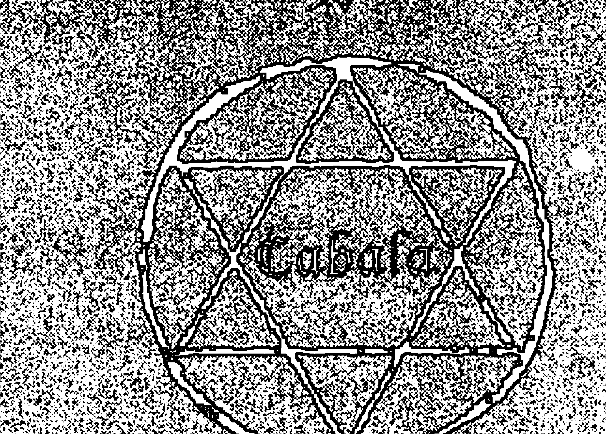

## 卡巴拉

### 从“命运数”看性格和运势

#### ~ 出生日期揭示你的一生 ~

要理解卡巴拉，最重要的就是要知道自己的代表数字。每个人根据自己的出生年月日就能算出支配一生的“命运数”。这个数字是了解自身性格的线索，而且，它是不会变的，从出生之时到离世为止，将会伴随你的一生，与运程息息相关。

即便你讨厌自己的命运数，也会冥冥中受它的支配。所以为了让人们对自己的一生无悔和感到骄傲，坦率地理解和接受命运数非常重要。能够正确理解命运含义并接受的人，才能坦然地活着，活得生机盎然，并最大限度地发挥所长。

那么，如何计算命运数呢？

只要知道出生年月日就可以了。通过把出生年月日的所有数字相加一直到得出一个一位数，即“1”到“9”，得出来的数字这就是你的命运数了。

##### 命运数的算法

例如，某个人出生于1972年11月20日。

1+9+7+2+1+1+2+0=23

首先把出生年月日的数字全部拆开成单个数字，加起来后得出“23”。但因为这个数字不是一位数，所以要再把它拆开，接着相加。

即2+3=5

由此得出一个一位数“5”，这就是这个人的命运数了。

可是，值得注意的是，在卡巴拉中“11”和“22”都是具有特殊意思的数字，所以如果把出生年月日的数字相加后得出“11”或“22”的话，就不用继续拆开再相加了。

例如，某个人出生于2001年12月23日。他的命运数就是：

2+0+0+1+1+2+2+3=11

虽然11是两位数，但也不用继续1+1=2这样计算。“11”就是这个人的命运数。

同样，生于1971年3月1日的人的命运数是：

1+9+7+1+3+1=22

不用拆开2+2=4计算了，因为“22”就是他的命运数。

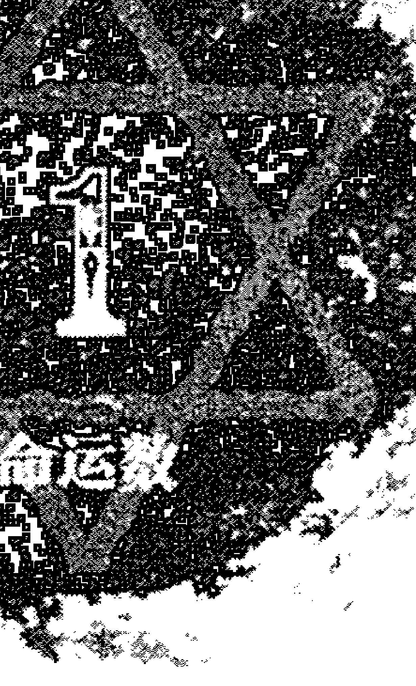

## 命运数“1”的人

### 王冠星

#### 命运数①的蕴义

“1”代表王冠，万物之始，象征最高位
命运数“1”象征着统一和最高位。在卡巴拉生命树中，“1”是“Kether”，表示王冠。它处于最高位置，意指神的意志，所以凌驾于其他数字之上，拥有支配和统领的力量。

所以，“1”是所有事物的中心，而且显示出独立的特质。在心理学中，“1”蕴含着行动能力和指导能力的意思。占星术中“1”代表太阳。在身体各部分中，“1”代表了头部和脊椎。在塔罗牌中，“1”被喻为操控火、土、风、水四元素的“魔术师”。

另一方面，“1”是人直立时的姿势。古代数字里，除了中文和日文里用汉字表示的数字之外，“1”的写法多数取人体站立的姿势为参照，画作一条垂直线。而且“1”多数用来表示开始的意思，也用于表示“仅有一个”的意思。

瑞士心理学家卡尔·古斯塔夫·荣格（Carl Gustav Jung）说过，“1”象征调和，表示把独立的与混乱的事物统合起来的状态。

#### 命运数①的性格

团队中的领袖人物，冷静，有胆识
命运数为“1”的人，无论做什么事成功率都比较高。他们给人精力充沛、意志顽强、富有领导才能的印象。无论何时，他们都能处变不惊、冷静地分析形势和作出判断，并且非常有处理难题的能力。

乍一看会觉得他们很文静，但其实他们的内心很有胆识和勇气。他们喜欢出席不同的场合，广交朋友，因此无法一直待在同一个地方。而且，由于命运数“1”的人机智灵敏，在团队中常作为领导者。

### 命运数①的不足之处

#### 固执，自以为是，头脑不够清醒 —— Negative Aspect

卡巴拉命运数的思考模式不但有正面的信息也会传达负面的信息，这正是卡巴拉的有趣之处。若说到命运数“1”的人的不足之处，就是他们所表现出来的反抗态度和利己倾向。当时运不济、事情进展不顺的时候，也许普通人会选择放弃，但命运数“1”的人往往会拼命地挣扎。这样反而会招致更大的伤害，也容易被人排斥。

另外，他们偶尔也会情绪不稳。有时候会很自以为是，甚至对其他人带有攻击性，这点必须要注意。

其实在运气不佳的时候，更应该量力而为，越是这种时候越要听从别人的忠告，客观地对待自己的对错和成败。

### 命运数①的恋爱和婚姻

#### 自我中心，过分专注工作或个人兴趣 —— Love & Marriage

命运数“1”的人在恋爱中很容易会因为自我为中心的性格而变得自以为是，在与对方相处时偶尔会表现得很任性，令对方苦恼不已。而且，他们即使喜欢对方也不会明讲，所以容易被误解。他们倾向于理性的恋爱关系，不会接受从同情发展而来的爱情。即便婚后，他们也会以工作和个人的兴趣爱好为先，因此可能对家庭生活不够重视。命运数“1”的男性喜欢一个人做事，对工作充满干劲。为家庭服务的观念在他们看来十分荒谬。因此，除非是那种没有任何指示也能把家务利落地打点好的女性，否则其他人无法胜任妻子一职。某些这类型的男性会娶比自己年长的女性为妻。命运数“1”的女性因为很有亲和力，所以从年轻时就非常受欢迎，爱慕者众多。

### 命运数①的投缘者

温顺的“2”或“6”

对偶尔表现出攻击性和暴君态度的命运数“1”的人来说，性格比较温和的命运数“2”或者“6”的人能巧妙地与其和谐共处。不仅如此，当他们与他人发生冲突时，“2”和“6”还能帮他们修补破裂的人际关系，确实是他们的最佳拍档。

与此相对，不投缘的反而是命运数同为“1”的人。正因为性格相似，他们会形成互不相让、互不认输的竞争关系，甚至会争吵不断。另外，命运数“11”的人也是自我为中心的性格，所以也会很容易与其产生摩擦。因此他们也是性格不合的两类人。

- 相合的数字：2, 6
- 不合的数字：1, 11

### 命运数①的事业

永不停歇的精英人物，以团队最高层为目标

命运数“1”的人天生具有领导才能和准确的判断力，对工作干劲十足，因此他们会在成功路上不断前进。他们也很擅长把握机会，拥有在投机交易中赚大钱的才能。

他们之中很多人都从零开始奋斗，努力向上爬到最高峰，是白手起家的典型人物。作为领导者，他们有众多的追随者。与受人指挥相比，他们更乐于指挥别人，也善于用人。在工作中，一般人遇到困难就放弃的事情，他们会靠自己强烈的信念努力令它达成。

就算没有成为团队的领导者而只是一名普通的职员，他们也会比较在意别人是否认同和能否正确评价自己的工作能力。

### 命运数①适合的职业

能使之居高临下的领导型职业

命运数“1”的人很容易与上司发生争执，所以，能让他们按自己的想法工作的职业最适合他们，例如营业员或证券从业人员，组织中的管理人员，甚至自己创立公司，都会取得成功。他们也适合从事科学研究、电影制作或设计等能发挥他们领导才能的工作。又或者是那种能使他成为一个部门的主管的工作环境。

总之，命运数“1”的人是意志坚强的、能干的领导型人才。即使遇到一些挫折和苦恼，也有战胜困难的勇气和能力。

但是，一意孤行的性格容易令他们与别人产生摩擦，能否获得好助手和劝告者的从旁协助是其成败的关键。

### 命运数①的财运

花钱如流水，财运沉浮不定

Lucky Money

命运数“1”的人正如“王冠星”所象征的那样，是会获得名声和财富的类型，甚至有可能成为亿万富翁。

然而，生财有道的他们，花钱也如流水，容易因借高利贷而最终招致失败。

因此，他们应切记不能成为别人的担保人或向别人借钱。虽然他们很擅长投资股票或商品，但一旦狂热起来就容易失去判断能力，所以凡事应小心，适可而止。

在运气不好的时候，建议不要参与投机行为。

### 幸运元素

- 橙色 金色 红色
- 西北方向
- 星期日
- 向日葵 郁金香
- 狮子座的友人
- 钻石 黄宝石 红宝石
- 公园
- 眼镜 墨镜

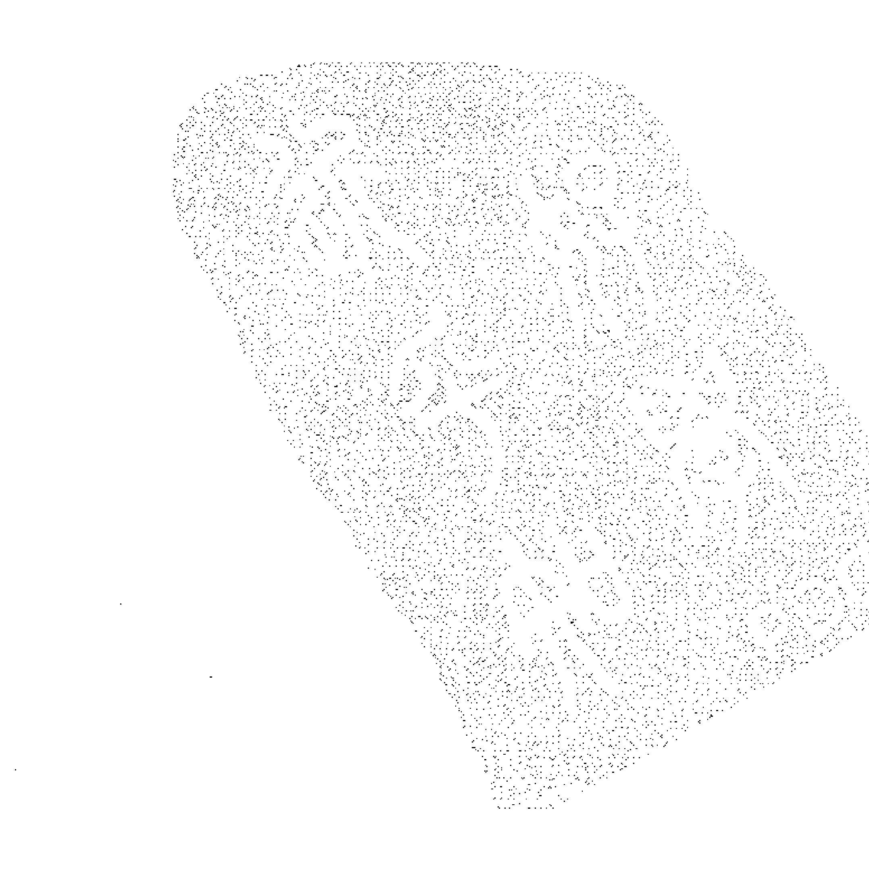

## 命运数“2”的人

智慧星

### 命运数②的蕴义

“2”代表女性，表示均衡和谨慎
在卡巴拉生命树中，“2”相当于“智慧”，表示即将诞生的事物、原点和智慧，有着和谐、均衡和谨慎意思。它与女性的母性特征紧密联系，是代表女性的数字，例如占星术中“2”就象征着月亮。自远古时代起，月亮与女性的故事就有千丝万缕的联系，因此它也包含着母爱和理性的意思。

从心理学来看，“2”是“适应”之数。因此，命运数“2”的人容易体谅他人，有同情心。同时，他们不喜欢单独行动，非常重视协调性。若要形容命运数“2”的人，“善于交际”、“和谐”、“合作”、“理解”等都很适合。

在身体中，“2”有统管身体两侧、大脑和左右的平衡感之意。

在塔罗牌中，“2”代表着拥有深厚智慧和谦恭的“女教皇”的形象。

归根结底，这个数字代表了作为人类基点的、最深邃的智慧，同时也表现了人类特有的体谅和同情心，还有对环境的适应性。

### 命运数②的性格

体贴，浪漫的和平主义者

命运数“2”的人重视感情多于理性，给人的第一印象都是温柔的浪漫主义者。他们的感情丰富细腻，对言语非常敏感。虽然有时会显得做事三分钟热度，但一旦对某种事物着迷起来，就能发挥出超常的集中力。

他们很会体贴别人，不会一味主张自己的想法，所以在行动前会慎重地考虑各方的立场。同时他们也是和平主义者。认真倾听别人话语的形象使身边的人都对他们很信任。

细心的个性令他们对所有事情的考虑都无微不至，这也是命运数“2”的人的性格特征。

### 命运数②的不足之处

过于忧愁和苦恼，缺乏乐天精神

命运数为“2”的人，其不足之处就是容易因为过于谨慎而失去决断力，或者把自己弄得闷闷不乐、犹豫不决，正是这样使自己积累太多压力而越来越苦恼。谨言慎行是对的，但对所有事都过度谨慎有时反而会失去好机会。另外，在运气不佳的时候，把问题看得过于严重也是他们的缺点。偶尔遇到挫折和失败，也要有乐天精神，要学会仰天一笑、继续向前。同时，珍惜朋友是开运的关键因素。

另外，虽然命运数“2”的人容易情绪不稳，但如果能按照自己的想法踏实地生活和工作，应该也能获得认同和高度的评价。

### 命运数②的恋爱和婚姻

受异性欢迎的早熟类型

命运数“2”的人过于敏感，易受对方的举动影响，表现得时喜时忧，杞人忧天。

男性大多是比较传统的类型，一般很受女生欢迎。但是，表现过于温柔在某些时候会让人觉得缺乏男子气概，会令对方不安。即便如此，他们结婚后精神上会平静下来，给伴侣很多安全感。

女性会很早熟。有些人20岁之后因为太受异性喜爱而变得不知如何选择结婚对象，最终导致晚婚。甚至有些人沉浸于享受爱情而不愿意走进婚姻的殿堂。也有人认为工作更加有意义从而对结婚失去兴趣。另外早熟的她们也有可能爱上比自己年长很多的人。

命运数“2”的人不单在爱情方面，在其他方面也是非常爱恨分明的，所以应注意人际关系中的紧张状态。

### 命运数②的投缘者

想法一致的“4”和“6”

和谐的命运数“2”的人容易因为过于考虑对方的立场，而无法把自己的意见和想法讲出来，最终令自己的利益受损。

从这点来看，命运数为“4”、“6”或者命运数同为“2”的人能与他们互相理解和体谅，也能相处得很轻松愉快。

若是与内向的命运数“7”或“9”的人相处，他们会因为难以捉摸对方的心思而变得非常不安。

另外，对命运数“1”的人来说，“2”和他们很投缘，但对“2”来说，“1”与自己的相合程度只是一般而已。

不过总的来说，他们的性格虽然不同，但总算能够和平相处。

- 相合的数字：② ④ ⑥
- 不合的数字：⑦ ⑨

### 命运数②的事业

最好选择能展现温柔个性的职业

命运数“2”的人天生创意无限，如果能充分发挥创作的才能，将会前程无忧。因此，他们不应拘泥于商业性工作，而应选择他们感兴趣的，或者需要专门知识和技能的职业，那样他们更能获得很好的成绩。那些出乎常人想象的创意理念可能会为他们带来可观的收入。

命运数“2”的男性从事以女性为目标群体的职业，或者女性从事能展现其温柔个性的职业，成功率都很高。

### 命运数②适合的职业

心理医生或护士等需要同情心的工作

命运数“2”的人拥有丰富的想象力和创作才能，很适合以作家或音乐家作为自己的职业。

同时，富于同情心的特质使他们也很适合从事心理学研究或心理辅导这类能在心灵上帮人排忧解难的工作，同时也很适合从事护士和秘书等工作。

在实务工作中，认真负责的态度令他们能获得客户高度的信赖，因而适合成为会计师和医学研究者。除此之外，还有教授、外交官和与计算机有关的工作都能发挥他们的才干。总体上说，30岁是命运数“2”的人的分水岭，人生有可能会在那时发生突变。若要更换工作，那年是一个重要的转换期。具体会在97页的卡巴拉金字塔命运起伏图中作详细介绍。

### 命运数②的财运

Lucky Money

珍惜金钱但不吝啬，因亲朋借钱而苦恼

命运数“2”的人与浪费完全绝缘，是很讨厌借贷的典型的“小气”类型。不过，与其说他们对金钱执着，不如说他们是时刻想要获得心理满足的节约家。

特别是在买大件商品时，他们会花很多时间去考虑一些不必要的问题，给人犹豫不定的感觉。命运数“2”的人不会炒股等投机性投资，而会把钱用来购买自住的房产或者作为定期存款，用这种安全保守的方法来增加储蓄。

尽管如此，比较意外的是他们对家人、亲戚和朋友却会花钱。如果素不相识的人向他们借钱，他们会很明确地拒绝，但要是换作家人借的话，他们无法一口回绝，有可能借出收不回来的钱，而事后为此苦恼不已。但话又说回来，命运数“2”的人拥有很好的财运，所以不怎么需要为钱烦恼。

### 幸运元素

Lucky Item

- 白色 灰色
- 北面
- 星期一
- 月见草
- 巨蟹座的友人
- 珍珠 玛瑙
- 海边

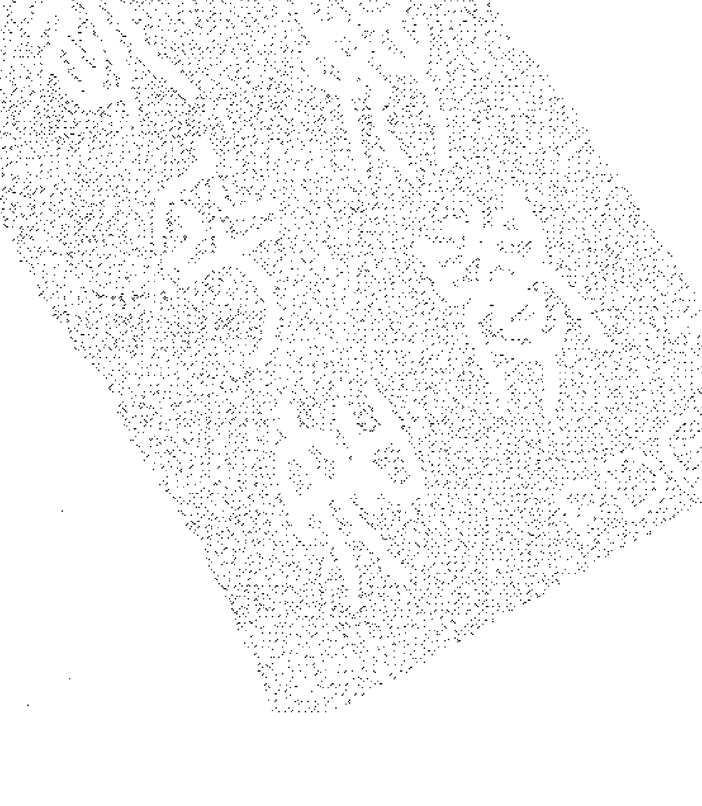

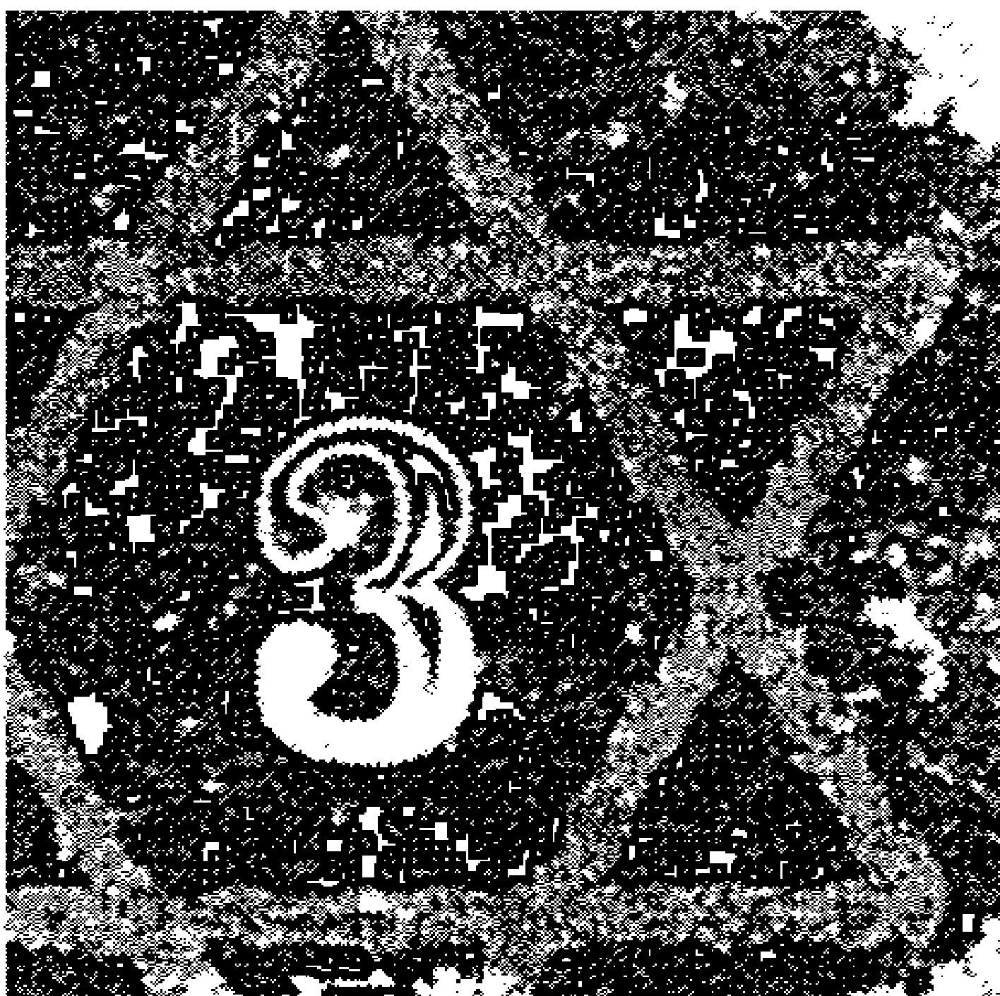

## 命运数“3”的人

发展星

### 命运数③的蕴义

Image

“3”代表男性，掌管力量和创造，又隐含破坏与混乱

“3”是除了万物之源“1”之外的第一个奇数。在卡巴拉秘法中，偶数指女性而奇数则代表男性，所以“3”是男性之数。

在卡巴拉生命树中，“3”代表着知性，也暗示了超自然的事物和发展。“3”的特质是要把自己的能量向外释放，象征了创造新事物的力量。在多数表决行为中，“3”是所需人数最小的数字，又如俗话所说的“三个臭皮匠赛过诸葛亮”，所以当三个人聚在一起时会形成一种新的力量和热闹的气氛。

另一方面，“3”意味着新的发展。二维是平面图形，而三维则延伸至立体的、无限广阔的空间。

在占星术中，“3”指木星，是最幸运的星，代表教育和思想。

在身体中，“3”与声音、咽喉和肺有联系。

综上所述，“3”是会表露激昂亢奋的内心世界、给人强烈印象的数字。所以，它是构筑事物基础、推动事物进程的男性之数，也带有破坏和混乱等负面能量。

### 命运数③的性格

Character

具有幽默感的交际高手，一旦决定了就坚持到底

命运数“3”的人是很有学问、个性开朗、善于交际的类型。他们好奇心旺盛，喜欢不断追求新奇事物，同时也有幽默感，重视人际关系。在人际交往中他们往往努力适应和迁就对方，所以与任何人都能相处得很好。他们具备成为团队里的中心人物的特质。

他们跟任何人讲话都表现得很得体，从来不会让对方觉得厌烦，因此有很多朋友。也因为他们乐于助人，所以很受伙伴和前辈欢迎。他们不但与上司和前辈交往时表现出尊重之情，对后辈也非常照顾，所以非常受人拥戴。

不过，他们个性好强，甚至倔强、固执已见。一旦决定了的事，无论周围的人怎么反对，他们都会硬干到底。

### 命运数③的不足之处

Negative Aspect

叛逆，纵情于乐，容易受伤

命运数“3”作为男性之数具有“强而有力”的特质，在运气差的时候，这种特质很可能会招致伤害、毁灭和混乱。

当工作开展得不顺利，还未熟悉环境的时候应该特别注意。同时要注意的是，他们有可能为了追求享乐，无计划地更换居住环境和工作，又或者沉溺于酒精之中，一味寻求随便的性爱之乐。

另外，在经济方面，容易把钱花光。因此应该学会规划该如何使用金钱，并作适当的储蓄，这是成功的关键。

这类人容易因为过于繁忙而损害了健康，这也是需要重视的。

### 命运数③的恋爱和婚姻

Love & Marriage

确立关系后态度会突变，婚后以自我为中心

命运数“3”的人在恋爱方面很强势。彼此只是朋友的时候，他们很善解人意，但一旦确定了恋人关系后，态度就会发生 180 度的大转变。他们很倔强，一味地把自己的意愿和想法强加于对方，从恋爱到结婚都按自己的步伐进行。

命运数“3”的男性婚后还是很大男子主义，但不会干预细微和琐碎的事情。尽管如此，如果伴侣没有相当程度的理解和包容，是无法一直走下去的。

命运数“3”的女性很会照顾他人，但与男性一样，同样需要一个宽容的伴侣。另外，对丈夫的命令和使唤也应该适可而止，这是夫妻和睦的秘诀。

### 命运数③的投缘者

与谁都相处得来的协调者

命运数“3”的人具有和任何人都能相处融洽的特质。因此，无论是寻找恋爱和结婚的对象，还是工作的伙伴，应该都不难。在团体中只要有一个命运数为“3”的人，这个团体的氛围就会变得很活跃，成员间没有矛盾，事情也能顺利地开展。所以说使别人和平共处也是命运数“3”的人的能力。

与命运数“3”的人相合的是命运数“1”、“5”和“8”的人。与“1”相处时，他们能发挥各自的长处，特别在工作中能成为合拍的伙伴。

- 相合的数字：① ⑤ ⑧
- 不合的数字：没有

### 命运数③的事业

在团队中发挥所长，获得显赫成就

命运数“3”的人是典型的走精英路线的人，拥有将自己的创意制作成商品的才能。在竞争对手出现时反而更能激发斗志。在任何方面都想把竞争者打败、不服输的个性是工作的原动力。从这点来看，相对于独立工作，在组织或团体中工作更能令他们发挥所长。

也有很多人选择进入大型企业，慢慢努力向上爬，最终出人头地。他们喜欢被别人关注和成为话题人物。在团队中被委托的工作难度越高、规模越大，他们的表现会越出色。

一般来说，他们都是比较受幸运之神眷顾的人，有些人可能年轻时会吃些苦头，但这些人也许在后来的人生中展现惊人的实力，周围的人甚至会惊讶地说：“那种人竟然能取得那么大的成就……”

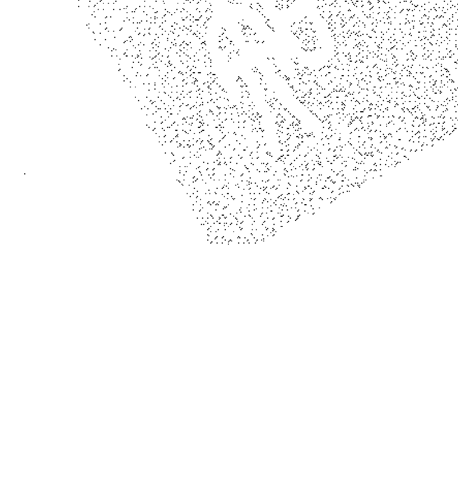

### 命运数③适合的职业

从事感兴趣的工作，在团体中更能发挥特长

命运数“3”的人兴趣广泛，应尽早找到适合自己的工作才能更快地出人头地。他们很适合在大型企业上班，另外广告业、出版业等对能力要求比较高的职业也是不错的选择。除此之外，像明星那样受瞩目的行业，还有教师、保育员、社会工作者等服务性的、有意义的工作也很适合他们。如果能善用他们与生俱来的谈话技巧，也比较容易取得成功。

只是，比起要单干的工作，他们更适合进入公司、在很多人的环境中发挥自己的实力，所以他们不适合从事自营事业，也不适合做个自由工作者。

不过，同时从事多个职业也是他们的特色，有些人甚至可以同时活跃在两、三个领域。

### 命运数③的财运

讲阔气的浪费型，但有意外之财的运气

命运数“3”的人比较挥霍，用钱容易超出预算。生活上讲究排场和阔气，接二连三地冲动购物。喜欢买东西给自己之余，也很喜欢送礼物给别人。虽然用钱不计较，但他们也有自己独特的存钱方法，而且也能持续下去。当急需用钱时，向来财运很旺的他们反而能以此为契机下决心存钱，迅速解决问题，甚至还有可能得到意想不到的钱财。

如果在工作环境或者家庭中能找到限制他们用钱的伙伴，对他们的财运将更更有利。

### 幸运元素

| 类别 | 具体内容 |
| :--- | :--- |
| 颜色 | 淡紫色 紫色 |
| 方向 | 西南方向 |
| 星期 | 星期四 |
| 花卉 | 百合 |
| 物品 | 鞋子 |
| 友人星座 | 巨蟹座的友人 |
| 宝石 | 红宝石 黄晶 |
| 场所 | 车站 |

## 命运数“4”的人 基础星

### 命运数④的蕴义

“4”表示慈悲，象征基础和安全

命运数“4”是象征平静和安全的数字。
在卡巴拉生命树中，“4”表示慈悲、爱和善的意思，是与安定和支撑全体的基础相关的数字。“4”也代表四柱，给人安定的家庭的感觉。
占星术中土星的代表数字是“4”，它也有安全和安定的意思。
在身体中“4”代表两只手和两条腿，即四肢。
在塔罗牌中，“4”被比喻为统治物质世界、构建基础的“皇帝”。
《圣经·创世纪》中人类的第一个男性的名字亚当（Adam）就是由四个字母组成。
“4”与十字形、四方形有很深的联系，是代表建筑物或柱子的基础的数字。
地理位置的四个方位（东、南、西、北），世界上最大的四块大陆（欧亚大陆、非洲大陆、北美大陆、南美大陆）等都是与“4”——这个代表构建全体的基础的数字有关的。
此外，心理学家荣格说“4”象征着人类的精神和灵魂，表现人的心理活动。

### 命运数④的性格

忍耐，努力，冷静的安全第一主义者

命运数“4”的人给人的第一印象是“冷静”。冷静的他们一般不会把自己的感情表现出来，因此有点内向和神经质。与“攻击”相比，他们更注重“防御”。他们乐于寻求安定的生活方式，决不会强行而为，是“安全第一”主义者。所以，他们容易变得墨守成规，缺少欢乐。他们喜欢思考多于行动，有迅速察觉对方想法的敏锐感受性。
另外，认真和一丝不苟的性格使他们做任何事都会坚持到最后。他们常常为达到目标而孜孜不倦地工作，年轻时即便很艰苦，还是会靠着忍耐和努力抓住机会，在30岁或40岁终于取得成功，所以他们当中较多都是大器晚成者。不过，有些人则具有命数“22”的特质，从年轻时就开始展现才能。对于他们来说，目标越高动力就越大，有化不可能为可能的坚强意志。此外，他们是不会让自己在同一件事上失败两次的。
在与人相处中，勤奋、耿直、老实的性格令他们容易得到别人的尊敬和信赖，也能够结交得到终生的挚友。他们能获得真正的好助手，在困难时期会得到援助者和朋友的帮助。而他们也是能为朋友两肋插刀的人。

### 命运数④的不足之处

命数“4”的人的缺点，一般表现为对变化显得不安、保守，想问题过于死板，容易错失大好机会。特别是在运势走下坡时，思想更容易变得狭隘。这时请学会理性思考问题，不应对自己的想法过于固执。
另外，他们往往疑心重，容易误解周遭的人的想法，把别人的想法向坏的方向想。这样一来，最坏的后果就是被朋友和同伴疏远，最终封闭自己。所以，凡事不要想得太复杂，注意适度而为，从而避免这种情况的发生。还要注意的是，如果对人的好恶过于明显，则有可能跟某些不善交际的人相处不来。

### 命运数④的恋爱和婚姻

命数“4”的人对恋爱中的伴侣非常理解和体贴，愿意付出和牺牲。即使婚后也依旧如此，安于家庭生活。
命数“4”的男性对女性很亲切，对恋人很细心。因为性格温柔和富有同情心，所以有可能从同情发展为爱情。婚后他们依然善解人意，在家是温柔的丈夫，会与妻子分担家务，享受二人世界的生活。但是如果妻子强势的话，他们可能会成为怕妻之人。

命运数“4”的女性婚前都很顺从父母，所以不会与危险的人谈恋爱。她们喜欢性格安定、沉稳的人。她们中很多人都会通过相亲来结识对象。婚后会专注于家务，把家庭打理得井井有条，对孩子的教育很热心，是典型的贤妻良母。

### 命运数④的投缘者

同一命运数的人，或感情细腻的“7”和“9”

命运数“4”的人多数是安全至上和谨慎的，所以要找合得来的人通常要费点力气。有时候难得找到比较投缘的，却因为过于谨慎、左思右想的性格，错过了结交良朋的好机会。

一般与他们比较投缘的是命运数同为“4”的人。他们彼此都是想法可靠的人，应该能成为互相理解的好拍档。

另外命运数“7”或“9”的人与他们也比较合得来。他们比较善于自我反省和感情细腻，应该能互相扶持和帮助。

性格最不合、最悲剧性的搭配就是与“3”或“5”的组合。可以说这两种人所具有的强悍性格和冒险心会让老实的“4”身心疲惫。

- 相合的数字：④ ⑦ ⑨
- 不合的数字：③ ⑤

### 命运数④的事业

按部就班的工作，在团体中更能发挥优势

命运数“4”的人做事一丝不苟，忍耐力强，在对集中力和细致度要求较高的作业中更能发挥才能。他们喜欢与真正值得信赖的人长期合作，在与欲望比较多但认识不深的朋友工作时，他们也许会感到很大的压力。他们对无需强求而为的、能按自己的步伐开展的工作更感兴趣。

另外，他们很懂得根据实际情况巧妙地配合周围的人，所以很适合在组织或团体里工作。

### 命运数④适合的职业

如工程师和科学家等发挥思考能力的职业

命运数“4”的人很适合需要细致的作业程序和思考能力的工作，或者可以按自己的步伐工作的职业，例如工程师、会计师、会计员、科学家、药剂师、数学家和编辑等。他们能在科学研究领域一展所长。同时，他们之中有不少人对美容相关行业颇感兴趣。

另外，由于命运数“4”的人有顽强的斗志，能经受住团队中严格艰苦的训练，所以他们中有很多能成为成功的军官、警察或者保安。

### 命运数④的财运

拒绝慵懒生活的节俭家

命运数“4”的人不爱随便花钱，不喜欢懒散的、无规划的生活状态。他们平日会选择一种安全的方法去存钱，以备不时之需。要买东西之前，也会首选便宜的和可以重复使用的东西。总的来说，在购物前他们都会进行详细的调查、研究和比较。

他们深知赚钱不易，所以不会投资股票或赌博。

另外，他们会把兴趣和所学的专业知识用于工作中，脚踏实地地赚钱。

- 蓝色 蔚蓝色
- 东南偏南的方向
- 星期六
- 大波斯菊
- 水瓶座的友人
- 紫水晶
- 图书馆 书店

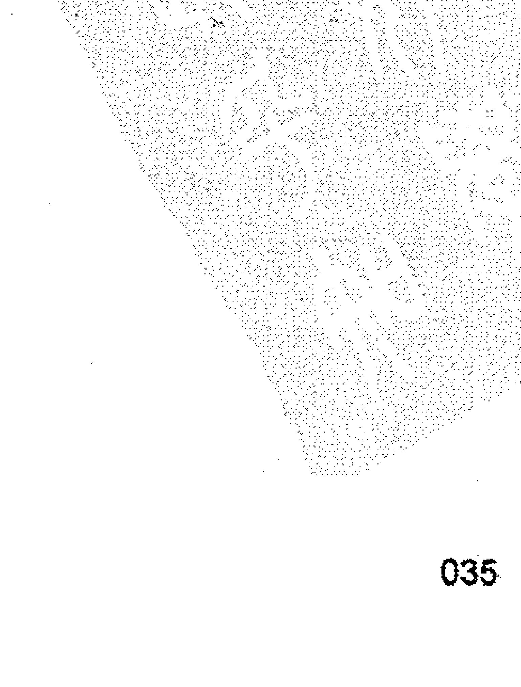

## 命运数“5”的人 行动星

### 命运数⑤的蕴义

“5”是人类的象征，意味着力量和行动力
命运数“5”是象征忍耐、正义和力量的数字。在卡巴拉生命树中，“5”代表正义和力量，是具有行动性意义的数字。因此，“5”显示出按自己的主观意志积极地向前突进的力量。
占星术中，“5”是代表火星和水星的数字。其中火星表示能量、力量和勇气，水星则表示逻辑和推动力。
在人体中，“5”指五体，即身体的五个部分。另外，人的五个感官——视觉、听觉、嗅觉、味觉和触觉，统称五感，也与“5”有关。
再进一步来看，“5”也表示进步、冒险、行动的意思。在本书15页中介绍过，美国的国防部因为建筑物呈五角形而被称作“五角大楼”，从那也可以看出“5”所隐含的意义。

### 命运数⑤的性格

充满野心和决断力的进取之人
命运数“5”的人充满野心，有很强的行动力，积极进取，心思敏捷和机灵，对世界的动向触觉敏锐，有先见之明。与先想好再干的人相比，他们会选择先采取行动，是行动家和冒险主义者。所以，要他们冷静地等待或事前做好规划，是件很困难的事。在寻求安定的人看来，他们是冲动型的人。
命运数“5”的人很有行动力，所以从年轻时就很受他人信赖，常被选作领导。他们年轻时即便艰辛，但只要得到机会就会马上干劲十足，懂得抓住机遇。在机会出现之前，也许要尝些苦头，一旦机会降临，他们能超常地展现自己的实力。而在紧要关头他们也有勇气和毅力迎难而上。在104页的卡巴拉金字塔命运起伏图将会对其人生的高低跌宕作详细的介绍，简单地说，31岁、40岁和49岁都是他们的幸运年。因为他们理解力强、头脑反应快，所以无论做任何事，都有自己独特的一套。他们爱好广泛，尤其对文学、音乐和绘画等方面都很感兴趣。从上述可知，他们不会满足于平凡的事物。
在交际方面，他们的脾气虽然有点急躁，但由于性格开朗而且才华横溢，因此非常受人喜爱，有不错的人缘。同时他们细心体贴、有个人魅力，很多人都很敬慕他们。
虽然他们性子比较急，容易勃然大怒，但怒火也会很快减退。

### 命运数⑤的不足之处

自我中心，缺乏责任感、理解和包容力

命运数“5”的人的缺点是以自我为中心，对别人的事情缺乏责任感。任性的性格常常显露于表，只要自己认为是对的，那就连家庭和工作全部放弃都不在乎。当意志消沉、对工作失去热情时，可能会冲动地选择踏上流浪之旅。这种自我中心的性格有时会让他们做出不负责任的举动，如果超过适度的范围，他们会被认为是无责任感的人，甚至因此失去别人对他们一直以来的信任。所以，他们不应一直任性妄为，有时候也应该多考虑后果，学会忍耐。

另外，对于某一件事情，只要他们深信不疑，就很难把别人的意见听进去。这种态度只会令自己的视野越来越狭窄。所以，对他们的忠告是，即使别人的意见与自己的不同，也应该以宽广、包容的心去接受。

### 命运数⑤的恋爱和婚姻

喜恶分明，举手投足有英雄或女王的气场

恋爱中的命运数“5”的人的喜恶非常分明，若对方不是自己喜欢的类型，连多看一眼都不愿意。同时，他们很性急和喜怒无常，会令对方吃不少苦头。学习理解、包容和温柔是他们的恋爱必修课。在朋友圈中他们一向都很受欢迎，所以男性举手投足很有英雄的风范，女性就很有女王的气派。当恋情不被看好时，他们会产生叛逆情绪，被反对得越厉害，他们的叛逆心理越强烈。旅行中收获意想不到的爱情，或对某个异性一直无法忘怀，这类事情很有可能发生在他们身上。他们外表有点冷漠，容易给人难以靠近的感觉，多数人会比较晚婚。然而，他们婚后会变得成熟稳重、很有担待，是可靠的丈夫和妻子。同时，他们的思想比较开放，很多女性结婚后会继续工作，而男性也不会反对妻子外出工作。

### 命运数⑤的投缘者

相同命运数的人是最佳拍档

命运数“5”的人性格反复无常、喜恶分明，所以即便刚开始时与伙伴合得来，在中途也可能会起变化。无论是选择恋爱对象还是工作伙伴，在各个命运数的人中，他们是最费功夫的。

和命运数同为“5”的人的结合，一般被认为是满意度最高的组合。然而，在达到目标之前也许会遭到周围的人反对，因此道路比较曲折。在经历多次恋爱后，最终很可能与命运数同为“5”的人结婚。

可惜的是和命运数“1”、“4”、“9”的人难以达成一致意见。

- 相合的数字：⑤
- 不合的数字：① ④ ⑨

### 命运数⑤的事业

有取得成功的能力，可能从年轻时就走精英路线

命运数“5”的人多才多艺、理解力强，很懂得捕捉和吸收流行元素，所以无论做什么事情，都有能力取得成功。同时他们很关注业余工作，很多人会从事正职之外的副业。即使转换工作，也能在不熟悉的领域展现自己的才华。

另外，由于他们富有行动力，很可能从年轻时就开始走精英路线。年轻时也许要吃点苦头，但一旦抓住机会就有可能出人头地，所以，他们的人生经历很具戏剧性。假如他们从事演艺工作，一定会比其他同一时期出道的艺人更受注目和追捧。

### 命运数⑤适合的职业

以实力取胜的工作

命运数“5”的人兼具知性、才能、精力、个性这四个成功的要素。只要没有选错职业，他们应该能充分地发挥这四个优势，并取得成功。与那些需要常常与人打交道、以人际关系为重的工作相比，只以能力作评价标准的、实力取胜型工作更适合他们。因此，编辑、记者、证券经销商和演员等职业特别适合他们。

同时，由于行动力强、脑筋灵活，所以在业务中保持高业绩也是他们的强项。也有很多人会因为换工作而交上好运。

### 命运数⑤的财运

没有金钱概念，可以考虑把钱交给信任的人管理

命运数“5”的人对金钱几乎没什么概念，财运也很极端。他们要么腰缠万贯，要么身无分文。就算有收入，也可能全部花光，恐怕很难存钱。所以把金钱交给信任的人管理比较安全，例如是生意合伙人。

他们不喜欢规划未来，所以不怎么关心保险和养老金。然而，他们却对赌博和投机行为很感兴趣，甚至有人能通过赌博和股票投资而大赚一把。

### 幸运元素

| 类别 | 具体内容 |
| :--- | :--- |
| 颜色 | 黄色 粉红色 |
| 方向 | 西北偏北的方向 |
| 星期 | 星期三 |
| 花卉 | 水仙 |
| 物品 | 皮带 |
| 友人星座 | 双子座的友人 |
| 宝石 | 绿宝石 |
| 场所 | 银行 |

## 命运数“6”的人 调和星

### 命运数⑥的蕴义

“6”代表完全的美，能结合性质相异的事物

命运数“6”象征和谐和完全的美。在卡巴拉生命树中，“6”代表了美，处于生命树的中央。它是具有把各样事物连接起来、使它们取得平衡的力量的数字。也表示肉体和精神、物质和心灵的调和。
在心理学中，“6”寓意和谐幸福的家庭、健康、爱情、饲奉。
占星术中“6”是金星的代表数字，金星也代表了美。
在身体中，“6”代表了心脏、血管系统和生殖器官。
塔罗牌中，“6”被喻为表示关系和谐的“恋人”。女性之数“2”和男性之数“3”相乘等于“6”，因此它也是爱情的结晶。
用卡巴拉占卜时会用两个三角形组成的六角形，也是因为“6”是完全之数。另外，大卫星（即六芒星，由两个正三角形重合组成）的图案成六角形也是因为同样的意思。

### 命运数⑥的性格

抱着梦想和理想生存的性情中人
富有同情心和服务精神

命运数“6”的人性情温和，与人相处时会自然流露出体贴之情。无论做任何事情他们都会认真对待，所以很受人信赖。另外，他们有强烈的服务精神，对细微之处也考虑周到，即便不喜欢团队中的某个人，在工作中也会率先行动起来，带动大家的积极性。同时，他们潇洒不羁，从不说谎，诚实可信，只是在被激怒时会变得很可怕。但若与他们同一阵线，他们是很可靠的。
他们中的多数人都抱有远大理想，是有抱负的人，希望时刻走在时代的前端。爱好绘画、音乐等艺术，对美的东西有天生的灵感。另一方面，很重视家庭，洞悉和批判现实的不公。无论对工作还是对生活都非常投入、尽情享受生活，但不会只偏向其中一方，而是在各方面都能取得很好的平衡。同时，他们喜欢公平竞争，也很有责任感，无论被委派何种工作，都会忠实地完成。

他们对他人很体贴和富有同情心，当别人有困难时他们会尽心尽力地给予帮助。无论做任何事情都会先替对方考虑，所以很讨人喜欢。对照顾过、帮助过自己的人所给的恩惠，他们不会忘记，时常心存感激，拥有这种耿直性格的他们一般不会讨厌别人。他们重视友情，为朋友赴汤蹈火也在所不辞。因为他们精神高尚纯洁、很有亲和力，所以能吸引很多人亲近他们。这对初次接触他们的人来说，印象尤其深刻。一旦聚集了足够的威望，名声可能会瞬间广泛传开，使更多人愿意与他们为伍。

### 命运数⑥的不足之处

#### 因过于神经质而不自信

命运数“6”的不足之处是过于为别人着想而令自己变得过于神经质，最终导致无法付诸行动和展现自己的实力。为人太过清高，也容易对责任感过于重视，反而失去信心。若对他人的批评看得太重，可能会失去与生俱来的平衡感，从而把自己想象成悲剧中的主人公，整天郁郁寡欢。极端的话可能使他们从此变得讨厌和戒备别人，与他人的关系不再和谐。所以他们应该注意不要太看重小失误或是因细微之事而令自己情绪低落或沮丧。

同时，因为他们很认真，若别人做错事情而辩解，他们有可能会完全不听就责备对方。当别人没有按时完成工作时，他们可能会给予严厉的指责。另外，他们责任感很强，所以对上级的命令或约定好的事情即便遇到阻碍也会固执地坚持下去，但如果不看实际情况而一意孤行的话，会让人觉得过于死板、不懂得变通。

### 命运数⑥的恋爱和婚姻 —— Love & Marriage

婚姻观念传统，对爱侣无私奉献

命运数“6”的人在恋爱时会把对方放在第一位，愿意为对方付出一切。他们首先考虑对方的心情，所以不会做对方不喜欢的言行。另一方面，他们的婚姻观念很传统，希望恋人是顾家的人。由于他们有独特的魅力，初次见面的人可能也会对他们一见钟情。

结婚之后，男性会很爱惜妻子，女性会很照顾丈夫，他们估计会把家庭经营得和谐温馨。从本质上说，他们都是性格温顺的恋家型，可是，若过于追求完整的家庭而致使对方感到失去自己的空间，也许会令对方厌烦。有了孩子之后，他们很可能会为该如何培养孩子烦恼不已。有时候对孩子的所有事情都照顾周到，会对他们造成过度的保护，这样反而阻碍了孩子的成长和独立发展。

### 命运数⑥的投缘者 —— Relationship

价值观一致的相同命运数者，或者“2”“3”“5”

命运数“6”的人性情温和，凡事以家庭第一。应该选择顾家的、同样性格温顺的人作为结婚对象为宜。因此，若与命运数同为“6”的人结婚，相同的价值观会令他们的家庭幸福美满。另外，若与命运数“2”、“3”、“5”的人结婚或共事，他们会相互鼓励、共同努力，无论婚姻还是工作都会越来越顺利。

而与他们不合的是命运数“7”的人。命运数“6”的人不但无法理解命运数“7”的人的思想，而且他们的性格有些部分完全相反，因此容易产生分歧和矛盾。

- 相合的数字：② ③ ⑤ ⑥
- 不合的数字：⑦

### 命运数⑥的事业 —— Work

沉稳的性格和独特的人格魅力吸引很多人与其为伍

命运数“6”的人有强烈的服务精神，对问题考虑得非常周全，而且很有责任感，工作态度认真，无论遇到什么困难都会努力把工作完成，所以获得周围的人的高度信赖。他们会把目光投向普通人不常留意到的事物上，如果把他们这种特长与事业连接起来，那么在职场中也能受到很高的评价。由于他们性格沉稳，有独特的人格魅力，所以很多人都愿意与他们在一起。进一步说，即使他们不喜欢团队中的某个人，在工作中他们还是会率先行动，有舍我其谁的英雄气概。他们富有正义感，服务他人的工作最能唤起他们的热情，所以他们无法从事那些靠“牺牲”别人的利益来赚取金钱的工作。

### 命运数⑥适合的职业

能发挥幽默感，对世界奉献的工作

命运数“6”的人给人可靠可信赖的感觉，无论任何工作都会尽己所能，因此很适合那些能发挥幽默特长的工作，例如教师、社会工作者、护士、儿科医生和与社会福利相关的工作。和商业性质的工作相比，选择对世界和社会有贡献的工作更好，那样也许他们会更早获得成功。相反如果他们是雇主，则应该适当压制住自己的慈悲心。另外，命运数“6”的人中，有不少人白手起家，成为亿万富翁。

### 命运数⑥的财运

生活简朴，不乱花钱，可进行适当的投资

与赚大钱相比，命运数“6”的人认为帮助别人更有意义，因此他们生活简朴，从来不会乱花钱。可是，对于为自己或家庭买保险等安全的投资，还是适当进行为好。总的来说，他们会正确地使用金钱，对支出会谨慎地考虑和核对。经济上不会出现财政危机，但有可能因为选错合作伙伴或工作而导致经济上的损失。

### 幸运元素

- 蓝色系
- 东北偏东的方向
- 星期五
- 蔷薇
- 金牛座的友人
- 蓝宝石
- 音乐厅

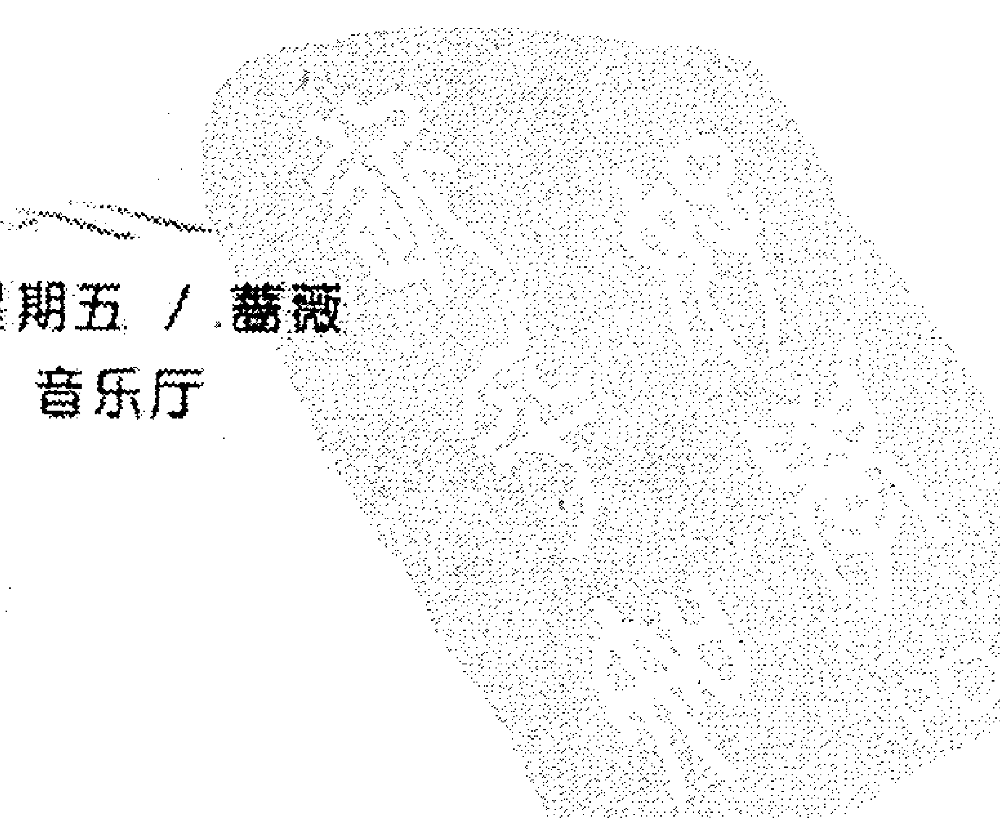

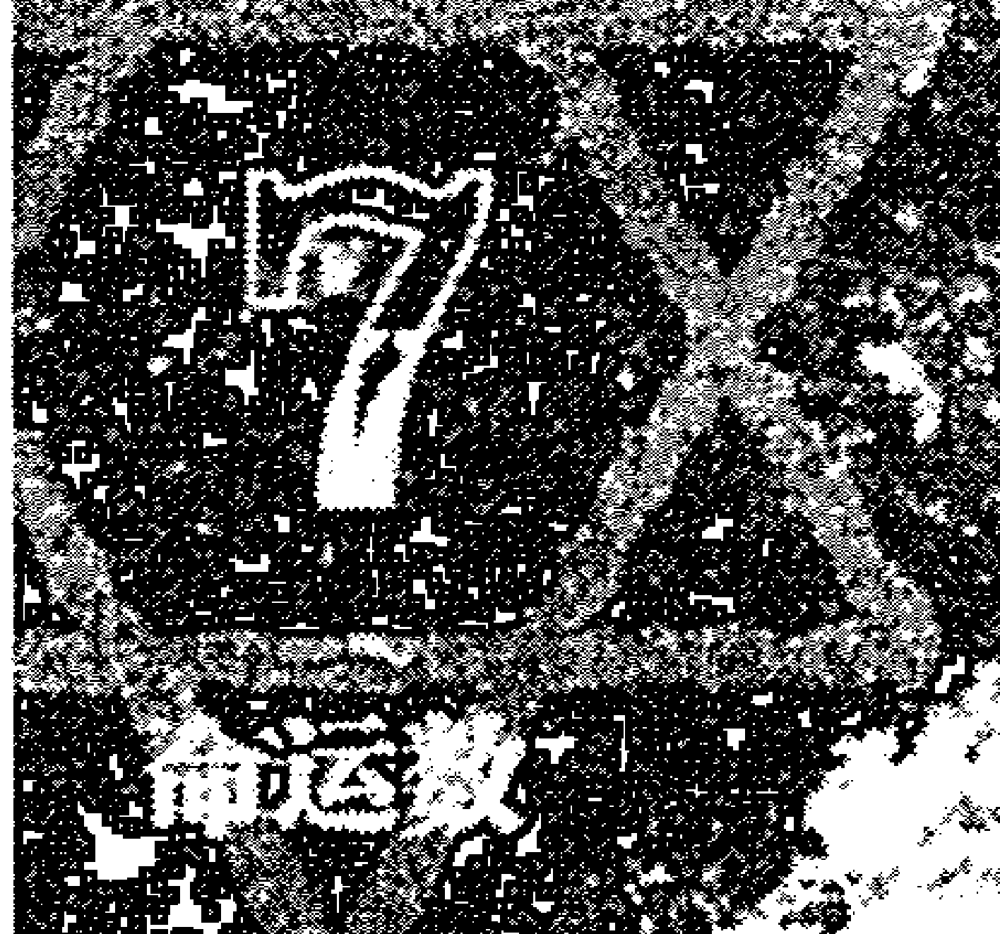

## 命运数“7”的人
神秘星

### 命运数⑦的蕴义

代表从宇宙到人体的完美与和谐
“7”从很久以前开始就是非常重要的数字。古代人能用肉眼看到的七个重要的星球（月亮、太阳、水星、金星、火星、木星、土星）与“7”有关：彩虹有七种颜色；人的头部有七个孔（双眼、双耳、两个鼻孔、口）。大至宇宙，小至人体，“7”和我们都有非常密切的联系。
在卡巴拉生命树中，“7”是与胜利和忍耐有密切关联的数字。它代表神秘、知识、学术、研究、分析和冥想。
在身体中“7”表示内分泌器官。
占星术中，“7”是与天王星相关联的数字。
塔罗牌中，“7”是代表心、身体和灵魂三位一体的“战车”牌。人们常说“Lucky Seven”，那是因为它拥有在混乱中发现规律的力量。
总而言之，命运数“7”代表完美与和谐。

### 命运数⑦的性格

与周围划清界限的冷酷之人
命运数“7”的人喜欢孤独。与属于某个团体相比，他们更享受独自一个人，按自己的步伐行动。无论再亲密的人，他们也不会推心置腹，这让人觉得有点冷酷。另外，他们对问题深思熟虑，沉迷于对知识和美的追求，无论什么事情都喜欢尝试一下。他们听不进别人的意见，容易变成完美主义者。
若他们订立的目标太高以致无法实现，有可能会受到别人的孤立。另一方面，他们不会随便和很多人来往，而是与认为值得信赖的人交朋友。
他们表面很冷酷，不会在人前落泪，就算遇到伤心难过的事也只会独自流泪，那是外人很难想象的一面。

他们虽然很有风度，但拘谨缄默，并且喜欢独自一人，讨厌参加派对之类的很多人聚集的活动，这些都让人觉得难以接近。由于他们对占卜、宗教等有神秘色彩的事物很沉迷，所以总给人一种比实际年龄大的感觉。

### 命运数⑦的不足之处
Negative Aspect

疲累时容易对人乱发脾气，应注意时常转换心情

在极为疲累的时候，命运数“7”的人容易对人乱发脾气，用言语攻击别人，所以会为严峻的人际关系而苦恼。他们都按自己的标准来判断事情，更易导致错误的累积。

在逆境中他们可能会一蹶不振，整天疑神疑鬼，更可能因此失去重要的亲人和朋友。而且他们不懂得如何令自己放松，容易积累压力。如果不学会适时转换心情，健康也可能出现问题，应该多加注意。

### 命运数⑦的恋爱婚姻
Love & Marriage

婚后会是称职的伴侣，但应保留一定的隐私

命运数“7”的人在恋爱中把互相信任看得非常重要。婚后会把各自承担的家务和责任明确地定下来，从而使家庭生活安定和谐。不过，他们绝对不原谅对方说谎，这一点他们的伴侣都应该注意。

表面冷酷的他们让人难以接近，所以多在机缘非常巧合的情况下坠入爱河。他们重视个人的空间和隐私，即便在恋爱中也不会毫无保留地向对方交代自己的一切事情。由于他们不喜欢吵闹，所以与情人约会时，他们不喜欢去类似演唱会或歌舞厅等很多人聚集的地方。

命运数“7”的人一旦选择了恋爱或结婚的对象，就会十分珍惜对方，婚后也会成为忠实的丈夫和妻子。只是即便成为夫妻，他们还是会讨厌对方过于干涉自己的事情。

### 命运数⑦的投缘者

同一命运数或个性安定的“4”和“9”
Relationship

对命运数“7”的人来说，无论选择工作拍档还是恋爱对象，最在意的是能否与对方的性格合得来。从这点来看，与他们比较投缘的是命运数同为“7”的人，因为他们都对隐私非常重视。另外，命运数“4”和“9”的人原来就是个性安定的人，所以也能和他们相处得不错。

同时，在工作上他们会对命运数“1”和“8”的人很尊敬。

与他们不合的是那些不会表达自己真正想法的类型，例如命运数“2”和“6”，因为他们在一起时彼此都读不懂对方的真实心意，互相不能形成信任感，很难深入交往。

- 相合的数字：① ④ ⑦ ⑧ ⑨
- 不合的数字：② ⑥

### 命运数⑦的事业

待人接物礼数分明，在团体中可能被孤立
Work

命运数“7”的人对工作非常认真负责，有坚持到底的执行能力和毅力。他们很懂礼数也很有教养，对上级和下级所用的措辞都很得体，所以很得人欢心。虽然平时少言寡语，但在紧要关头还是会当仁不让，展现自己的实力。

他们不会受别人意见的影响，讨厌暧昧不清的状况。虽然不怎么说出自己的意见，但是会按自己的想法行动，是沉默的实干类型。从这一点也可以看出他们不会无理由地作出妥协和让步，因此也许会在工作中与同事产生争执。

同时，他们的自尊心很强，是完美主义者，在团体中可能会显得孤立无援。

### 命运数⑦适合的职业

计算机或法律相关的职业，可发挥个人实力

命运数“7”的人在从事需要详细分析和调查的工作时能发挥出色。那种需要一个人默不作声、孜孜不倦地工作的职业也是不错的选择。与需要团队合作的工作相比，他们更适合从事能发挥个人实力的工作。

具体来说，计算机相关、法律相关、会计师、各行业的咨询师、形象设计师、气象预报员等工作都很适合他们。另外他们也很适合从事学术研究。

另外，他们对神秘的事物很感兴趣，所以如果作为占卜师、宗教工作者或中医师都可能展现他们的才能。

### 命运数⑦的财运

不贪财，善于理财

命运数“7”的人终其一生的财运都不俗，但他们不是那种贪恋钱财的人。与物质财富相比，他们更重视精神财富。他们对金钱没有太大的欲望，也不向往发大财。因此，他们不屑用金钱来解决问题，这并不意味着他们会浪费金钱，事实上他们用钱之前会制定预算，善用有限的资金，对需要周密计算的事情非常在行。

当然，他们的这种才能只适合用在管理个人资产上，要是让他们管理别人的财产，他们会很反感。

- 深蓝色
- 东面和西面
- 星期六
- 紫罗兰
- 双鱼座的友人
- 珊瑚
- 寺庙 教堂

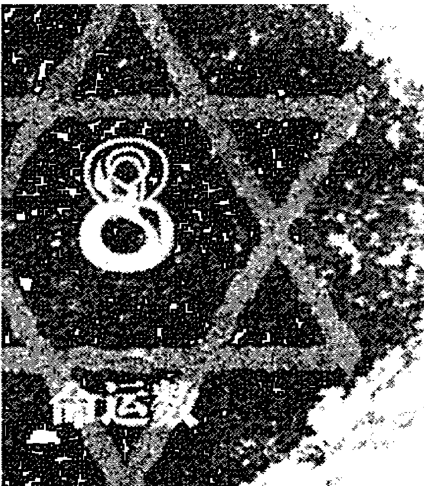

## 命运数“8”的人
支配星

### 命运数⑧的蕴义

正邪两面混合的极端力量
在卡巴拉生命树中，命运数“8”代表了名誉、庄严和壮丽。
“8”是代表着基础的“4”的两倍，即表示双重基础。构建双重基础能够在自己周围筑起安全的根基。这样除了保护自己免受外界伤害之外，也向周围展示自己的力量。
在心理学中，“8”是象征组织能力和支配能力的数字，还有通过这些能力获得的成功和权力的意思。
在身体中，“8”代表了人的骨骼。
占星术中，“8”与土星有关，指在残酷的考验之后取得的成功、安定和支配权等。
“8”除了以上所说的具有支配和安定等正面意思之外，还包含了破坏和战争等负面的涵义。破坏和成功、战争与安定是完全对立的东西，所以“8”有混合了正邪两面的极端特质。
因此，“8”是众多的命运数中最有力量的数字，具有令人望而却步、敬而远之的支配力。

### 命运数⑧的性格

无论做什么事都要赢
命运数“8”的人是精力旺盛和敏捷的人，无论做什么事情都倾注很大的热情，有很高的集中力，对自己充满自信，富于挑战精神，时时保持高昂的斗志，不会中途放弃，凡事都会坚持到最后。如果他们走在方向正确的道路上无疑会获得成功，但若明知无法达成还要勉强而为的话，最终只会招致失败。
在所有事情上都要分成功与失败、敌人和朋友的这种两极化的思维方式会让他们和周围的人产生很多矛盾。他们有野心，个性强势，所以行为也比较极端，通常没有经过深思熟虑就先采取行动，是行动优先的类型。
他们中无论男女，在开始时都不会一帆风顺，总是要经历不少风浪，人生路上充满传奇色彩。就算是从零开始，他们也有能力和毅力，并通过自己的努力获得巨大的成就。可是，他们不喜欢平凡和单调的生活，所以对幸福的家庭生活不会特别向往和憧憬。他们在不动产的投资上有不错的财运。
总而言之，他们要正确地运用精力和能量，才能取得成功。

### 命运数⑧的不足之处
Negative Aspect

性格极端，陷入困境有可能徒劳无功

命运数“8”的人虽然有行动力，但由于性格极端，一旦深信或决定了的事情，别人是很难阻止的。因此在运气差的时候，不够谨慎的一面会特别明显，容易不断犯错。

另外，不服输的性格也是比较大的问题。当竞争对手出现时，他们会更加“干劲十足”，以至于变得分不清方向，采取了错误的行动。心情越是焦躁，越容易犯错，从而招致不好的结果。他们应该学习慎重地思考后再行动，有些时候应该懂得放弃。

### 命运数⑧的恋爱婚姻
Love & Marriage

在恋爱中采取坚持到底的战略

以无比激情著称的“8”在恋爱中也是非常热情的，为了赢得爱情连命也拼上的激烈程度可能会令对方感到难以承受。他们一旦喜欢上某人，就会主动采取攻势，不得到对方正面的回应，是不会轻易放弃的。

不断追求变化的他们在结婚后也不会安定下来，还是会在生活上不断寻求变化。他们不会浪费一点点的时间，休假时也不会静静地待在家里。

### 命运数⑧的投缘者

温柔恬静的“2”是最佳拍档

个性化的命运数“8”的人与有同情心的、体贴的、温柔的人比较合得来。从这点来看，命运数“2”的人因为有较好的协调性，所以和他们自然而然地就会走在一起。

另外，性格温和的命运数“4”、“7”、“9”的人也和命运数“8”的人相处得不错。只是在恋爱中，他们都难以向对方表达自己真实的想法，所以和“8”的人不可能发展热烈的爱情，只能在长久的相处中成为相互理解的伙伴。

与“8”不合的是“1”，因为两者都希望成为领袖人物，在一起难免会有权力之争。

- 相合的数字：② ④ ⑦ ⑨
- 不合的数字：①

### 命运数⑧的事业

为工作而生存的实业家，升职运和生意运最旺

在所有命运数中，升职运和生意运最旺的就是命运数“8”的人。特别在开拓自己的事业方面，他们很可能取得成功，因此创业型的实业家中有很多是命运数“8”的人，他们的兴趣和生存意义全是工作。即使在休息的时候还是会不停地想工作的事情。一天到晚想着工作，有时的确会想出很新颖的创意。

另外，他们不会插手自己不认可和未完全了解的事情，为了取得胜利会非常努力，而这些也是众多成功人士的特质。

### 命运数⑧适合的职业

自己做生意，或成为团队中的领袖人物

命运数“8”的人很多天生具有活力，自己做生意，开创真正属于自己

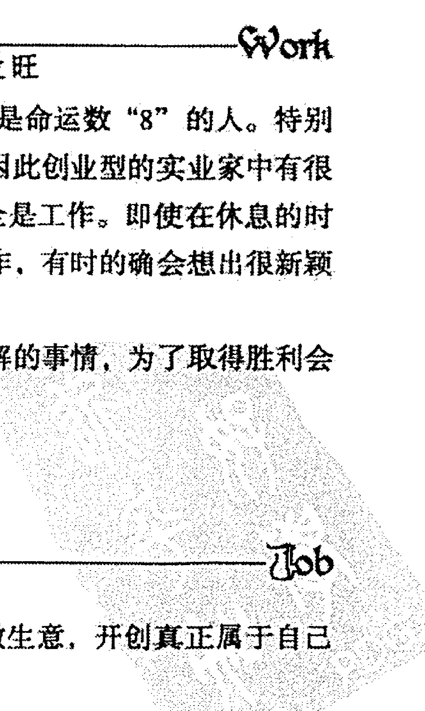

的事业。若从事能发挥独创性和支配力的工作应该能取得成功。

一般来说，经营公司、法律相关的、销售的、建筑和服务业的工作都很适合他们，只是在销售相关的工作中，能否遇到好的领导和前辈是能否成功的关键。另外，也有一些人成为一个单位或团体的领袖人物。

### 命运数⑧的财运
金钱触觉敏锐，有赚钱的天赋
Lucky Money

命运数“8”的人在赚钱方面很有天赋。对金钱有敏锐的触觉，赚钱的点子不断涌现，无论从事什么工作都会找到机会赚大钱。

在赌博方面也颇有运气，具备投资的才能，总之很懂得如何增加财富。

然而对命运数“8”的人来说，他们不适合从事收入微薄的工作。因为他们可能会为了赚钱不择手段，甚至铤而走险干起犯法的勾当。

### 幸运元素

- 茶色 黑色
- 南面
- 星期二
- 三色堇
- 帽子
- 摩羯座的友人
- 绿松石
- 棒球场 运动设施
Lucky Item

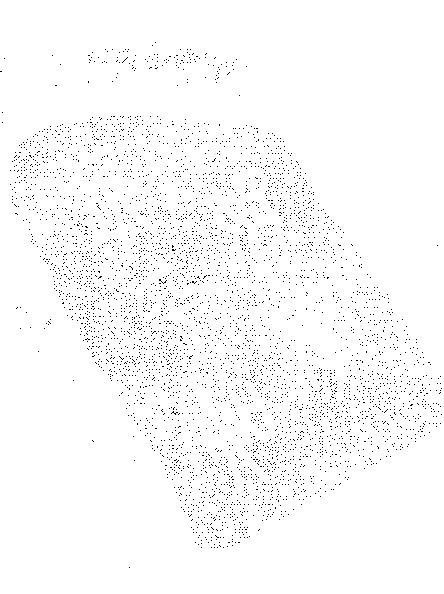

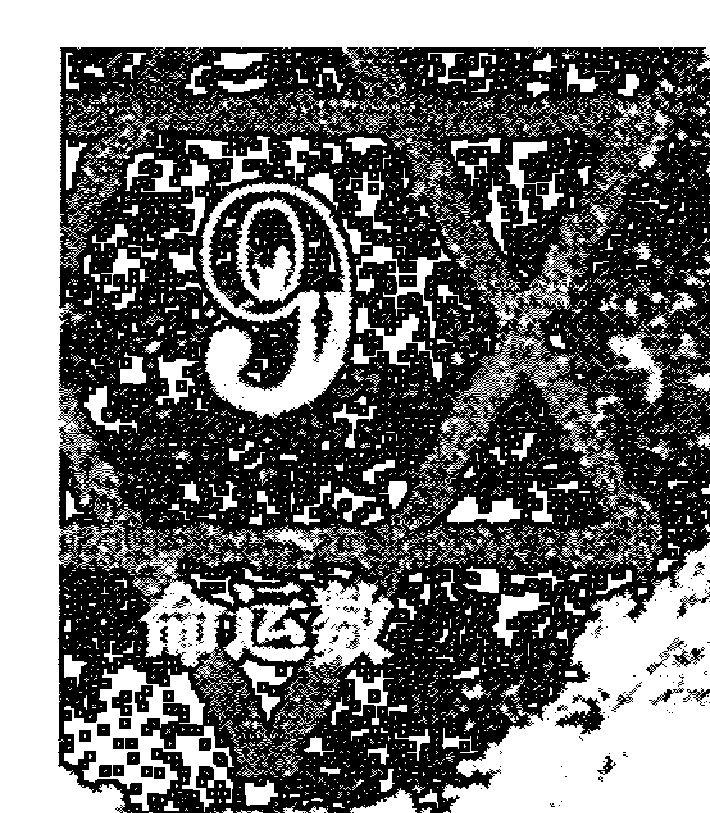

## 命运数“9”的人 神秘星

### 命运数⑨的蕴义

“9”表示事情的完成，也隐含着新的开始
命运数“9”表示事情完结或完成，同时也有折返点的意思，也代表了人间的爱、哲学、神秘主义和理想主义。
在占星术中，代表“9”的形状，是由三颗互成40度角的星构成正三角形，然后再由三个这样的正三角形合在一起形成的。这种形状在各命运数的星的形状分布中，可以说是最完美和最具和谐感的。
在卡巴拉生命树中，“9”被称作“基盘（YESOD）”，代表着万物的基本和根源，表示某种终结或完成的同时，也预示着另一个起点和开始。另外，在卡巴拉生命树中，“10”是“王国（MALKUTH）”的意思，而“9”是代表进入王国的准备阶段的重要数字，所以也象征着人类最初的契约与摩西律法等等。
因为“9”具有结束了的事物与新开始的事物交替的寓意，所以这个命运数字的人可能将拥有不可思议人生。

Image

### 命运数⑨的性格

纯真的程度令人难以置信
命运数“9”的人拥有天真、纯朴的特质，比较多愁善感、感情容易受伤、是追求理想的人道主义者。他们对人类怀着深厚的爱，喜欢研究哲学和注重精神世界的享受，常常对现实社会感到绝望。因此，喜欢他们的人会非常喜欢，讨厌他们的人也会非常讨厌。他们有的时候看上去冷漠无情，但内心却是温柔的；有时候表面坚不可摧，但心里却是敏感而脆弱的。所以从这点看，这种性格的人会让人觉得有点难以捉摸。
他们不愿意把真实的自己表现出来，在人前逞强实际上只是为了掩饰自己的软弱。然而，他们富有同情心、细心周到的性格和疼爱年幼者的温柔一面，
Character

会让周围的人情不自禁地对他们产生依赖感。
他们对穿着非常挑剔，喜欢引人注目和个性化的打扮，但是会让人觉得有点不协调。
虽然他们敏感，容易伤心，但身体却非常强壮，不容易生病和受伤，即便偶尔感冒也会很快痊愈。
30岁是人生的转折点，在那之前和之后的人生会完全不同。

### 命运数⑨的不足之处
Negative Aspect

容易逃避和放弃，做事缺乏规律和条理
常常会好心做坏事是命运数“9”的人的缺点。有时候，他们的帮助对别人来说可能是一种困扰。有些人会利用他们的善良来欺骗他们，从而使他们的利益受损。当遇到这些事多了，他们就会对工作和现实生活产生厌恶情绪，逃往空想的世界中。如果“逃避”能在艺术或宗教等领域得到升华，也不失为一件好事，但这也可能令他们一味逃避现实从而失去生活的能力，所以应慎防这种情况的发生。
另外，他们很热情，但也喜怒无常，这一刻非常沉迷于某事，下一刻可能会突然失去兴趣。
他们体魄强壮，常常对自己的健康过于自信，于是有时候会暴饮暴食，有时候却完全不吃东西，睡觉也很没规律。这些都应该引起重视。

### 命运数⑨的恋爱和婚姻
Love & Marriage

恋爱中步调缓慢悠闲，重视恋爱感觉，经验丰富
命运数“9”的人在恋爱中不在乎对方的地位和年龄，只要两人有触电感觉，他们就会主动地争取，恋爱经验丰富。另外，他们从恋爱中还能获得不少艺术灵感。
他们对情人很细心，照顾周到，但恋爱的步调很缓慢，不是那种一触即发的人，在恋爱中比较慢热。这也反映出他们不愿意轻易向人袒露内心世界的一面，所以在爱情上也不会直接表达自己的感情。

然而，他们有看穿对方内心的本领，常常不避讳地直接指出对方的用意。因此，如果异性主动追求他们，可能会徒劳无功。若喜欢他们就应有足够的耐心，等他们想清楚、做好准备后，他们会主动出击的。他们中很多人都属于晚婚型，但在婚姻中也会很幸福。

### 命运数⑨的投缘者

志趣相投的 “4” “7” “9”

跟命运数“9”合得来的人，应该是能理解他们那种敏感性格和崇高理想的人。

其中与他们投缘程度较高的是命运数“4”、“7”、“9”的人。因为有共同的兴趣和目标，所以在一起时会无所不谈。而他们与命运数“2”的人，更是一认识就有种相逢恨晚的感觉，若成为情侣会非常情投意合，若只是朋友也志趣相投。

与命运数“9”的人不合的是命运数“1”和“5”的人。这两者的强悍性格会令“9”很厌烦，产生不想跟着他们，不服从他们的情绪；同理，如果“9”和“1”、“5”的人在一起，也会筋疲力尽的。

- 相合的数字: ② ④ ⑦ ⑨
- 不合的数字: ① ⑤

### 命运数⑨的事业

追求理想，不知疲倦地连续工作

命运数“9”的人怀有崇高理想，可以不知疲倦地工作。他们心思缜密，内心充满对人类的热爱，这份热爱应该发挥在工作和生活上。

不过，从另一个角度说，由于对理想的执着，所以那种寻求神秘感和内在世界的生活也很适合他们。

一般认为，命运数“9”的人有隐藏内心的倾向，这有可能会阻碍他们展现自己的才华。

### 命运数⑨适合的职业

透过作品表现内心世界、能为世界奉献自己的工作也很适合

命运数“9”的人可以成为透过作品来表现内心世界的作家、画家或音乐家。这些职业都需要艺术灵感，于是他们可以充分发挥与生俱来的灵感。同时，他们的气质中有神秘的一面，所以也适合成为占卜师或宗教人士。若从事法律相关职业，成为律师比法官和检察官更合适。

与此相反，与投机相关的或者通过互联网实现的网络销售、看不见对方的工作，都不适合他们。

他们也适合从事服务他人和贡献社会的工作，例如医生、护士、NGO（非政府组织）的工作人员、心理咨询师等。

### 命运数⑨的财运

要么不在乎金钱，要么擅长理财

对金钱满不在乎是命运数“9”的人的特征。他们认为钱是件麻烦的事，偶尔还会对它产生厌恶感，只要有钱，就会有多少花多少，如果没有，也无所谓。

然而，他们中却有些人明白金钱的价值，对金钱异常地吝啬，也非常会理财。虽然他们有可能存到巨款，但他们并不是为自己而是为别人，这些为别人所花的钱在以后将会发挥它的影响力。

他们如果因为从事会计的工作而被迫学习相关的专业知识，也有可能成为财务和经济方面的专家。若愿意学习和研究的话，在股票投资和赌博上就会发挥才能。

### 幸运元素

- 红色 米黄色 / 东面 / 星期四 / 郁金香
- 白羊座的友人 / 钻石 / 市场 百货商店

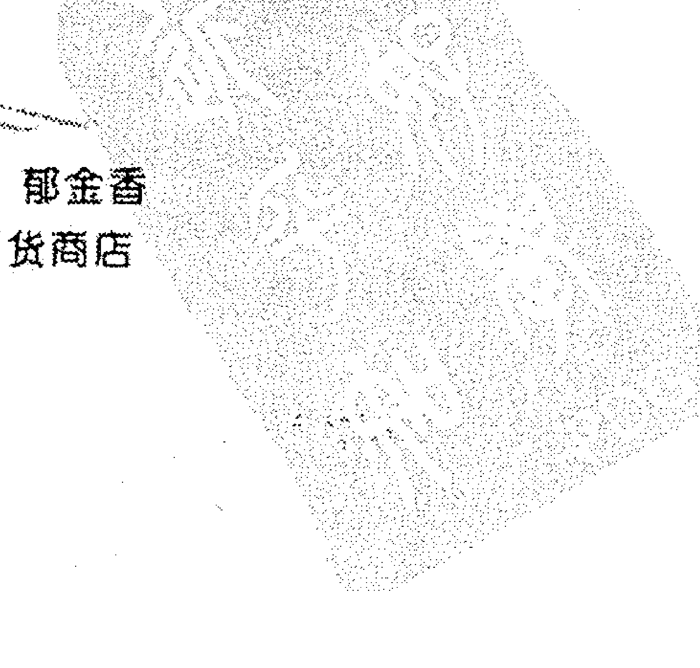

## 命运数“11”的人
### 革新星

#### 命运数11的蕴义

卡巴拉最初的两位数，统括神秘和革新

命运数“11”在卡巴拉中是最初的两位数。两位数的含义比一位数更复杂。它代表着革新力。

在卡巴拉生命树中，“11”被认为是连接“1”和“2”的数字，是创造新事物的数字。同时它也表示新事物的诞生、人类的创造等，是代表积极的、充满热情的数字。

在中世纪的欧洲，“11”被认为是一个神秘的数字。例如，人类所有生命活动中最神奇的现象是怀孕和分娩。据说，胎儿在母胎中能否顺利发育是在受孕后的11天内决定的。而胎儿从母亲那里继承的能力有11种。

另一方面，中国的易学思想认为，“5”和“6”相加所得出的“11”代表着天空和大地、小宇宙和大宇宙相结合。这样，无论在哪里，“11”都具有连接两个物体、创造出新事物的意思。

因此，命运数“11”隐藏着人类创造新生命的力量和迄今没有出现过的革新的能量。

#### 命运数11的性格

有个性，偏执，不甘平凡

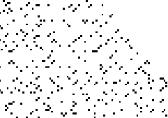

命运数“11”的人很有个性，也非常积极进取。他们表现出来的个性会比命运数为一位数的人更加明显。他们无法满足于现状，爱做梦和追逐梦想。因为喜欢寻求刺激，所以对有趣新奇的事物和流行非常敏感。他们的想法和行为都很前卫，不喜欢一直待在一个地方，喜欢旅行，有时候甚至会去流浪。

他们有敏锐的洞察力和直觉，与人交往中总是以诚待人，所以有很好的人缘。

他们的人生、着装和言行举止都不甘平凡，有一种奇特古怪的氛围。

### 命运数⑪的不足之处

Negative Aspect

过于封闭自己可能会错失机会

当运气不好时，命运数“11”的人可能会讨厌现实世界的所有事物，把自己封锁在自己的世界中，拒绝与人交往。这时，他们不相信周围的人，倾向于远离人群，在大自然中寻找快乐。

由于变得很内向，所以原来很多的朋友，也会因为突然失去联系而渐渐与他们疏远。就算是好不容易遇到好机会，也会因为自己不愿意主动争取和接受而错失良机。另外，他们过于在乎别人的言语，会变得神经质。

### 命运数⑪的恋爱和婚姻

Love & Marriage

最重视精神上的结合，婚后会恋家

重视心灵的契合是命运数“11”的人的特征。虽然他们喜欢追求新鲜事物，但那多数是精神层面的东西，对金钱和物质没有太大的欲望，不会不断更换新恋人。他们也要求对方在这方面与自己的想法一致。

结婚生子之后，男性会成为为孩子烦恼的父亲，女性则会是常挂念孩子的母亲，这也是命运数“11”的人的特征。

作为男性，如果妻子不是家庭型的、喜欢孩子的人，他们会难以发挥自己的能力。而女性对恋人的精神上的结合度的要求很高，对埋头工作的男性不会动心。

### 命运数⑪的投缘者

Relationship

与“4”和“6”心灵相通

一般来说，命运数“11”的人对人很宽容，无论与谁都能相处融洽。但有时候会让人觉得他们太过八面玲珑，所以应该注意这一点。同时，人缘好虽然是好事，但也可能导致为了维系人际关系而变得过于在意别人的看法。

他们在与人的交往中，寻求精神上的和谐远远多于对金钱和物质的渴求。他们本能地抗拒工作至上的人。从这点来看，他们与命运数“2”或命运数同为“11”的人可以共同享受生活。而与命运数“4”和“6”的人的想法一致，心灵相通。

不过，若与命运数“1”或“22”的人在一起，为了配合他们的心情，命运数“11”的人似乎要很费心。

- 相合的数字：② ③ ⑥ ⑪
- 不合的数字：① ⑬

### 命运数⑪的事业 Work

好奇心旺盛的先行者，实际操作能力较弱

命运数“11”的人有很强的洞察力和直觉，对神秘和未知的事物有强烈的好奇心，且勇于挑战。

他们对新事物的发明和发现很积极，很喜欢一马当先，走在前头。然而，他们却很少能把自己的主意和梦想转化为现实，那是因为他们不擅长把灵感应用到具体的事物上。

另外，他们擅长捕捉人心，能成为人们的精神领袖，但未必能在政治上或工作上成为领袖。比起从属于某个组织中，他们更倾向于自由自在地生活。

### 命运数⑪适合的职业 Job

能发挥独创性的工作

命运数“11”的人极具独创性和独特的视点，所以他们中很多人作为学者、研究者、摄影家或画家都会取得成功。

他们对流行和新奇有趣的事物都有敏感的触觉，所以有些人会从事电视行业或大众传媒相关的工作，另外还有与时尚、时装有关的，如广告业、美容业界等职业也有不错的成就。同时也有些人会成为教主或大诗人。即使只是普通的工薪阶层，在职场上打拼一段时间后，也能渐渐发挥出实力。

### 命运数⑪的财运

### 过分追求梦想和理想，不擅长理财　Lucky Money

命运数“11”的人重视生活上和精神上的快乐多于金钱。他们中很多人不擅长理财，把理想和梦想放在第一位，被视为脱离现实世界的一群人。另外，他们容易因为过于依赖他人而被卷入纷争之中，有时候无法分辨和看清谁才是真正为自己的经济担忧的人。

### 幸运元素

- 白色 银色 / 星期一 / 虞美人
- 酸浆果 / 玛瑙 / 围巾
- Lucky Item

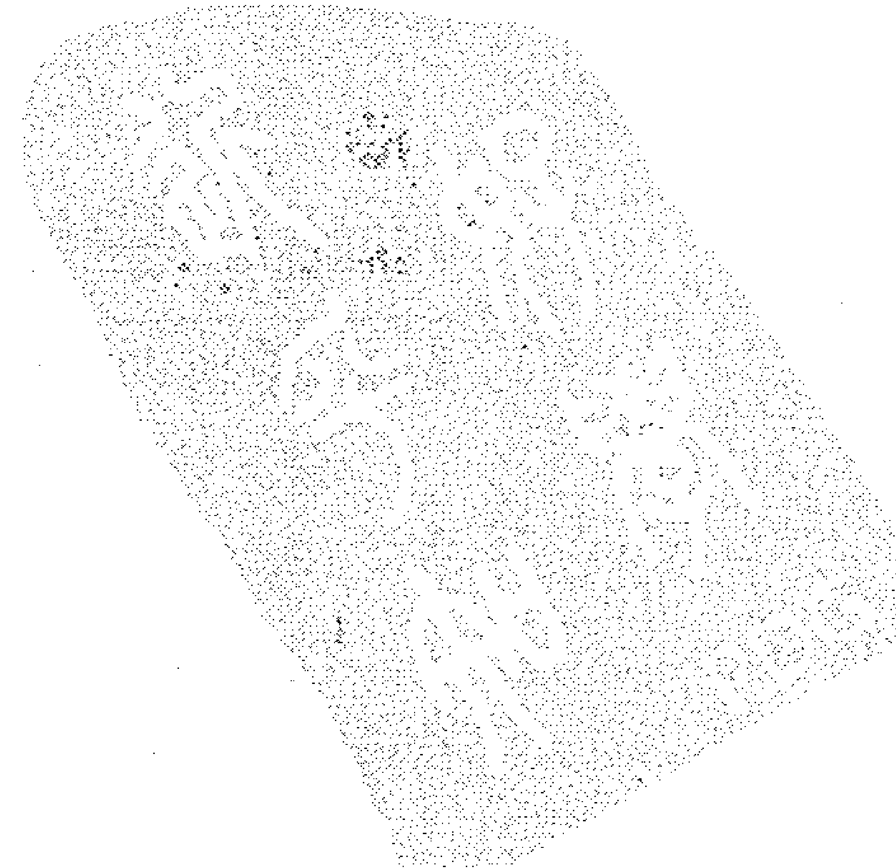

## 命运数 ‘22’ 的人
幸运星

### 命运数22的蕴义

### Image

统管宇宙、历史和世间万象
命运数‘22’是特别的数字。

卡巴拉人认为希伯来文字是由神创造的，所以对希伯来文字像对神一样尊敬。而在希伯来语中有22个字母（辅音字母），其中卡巴拉的‘宇宙’一词有4个字母，‘理性’有7个字母，再加上代表感情世界的词有11个字母，合起来（4 + 7 + 11）就是‘22’，这个数字象征了宇宙的时间和空间。

在卡巴拉生命树中，‘22’被认为是连接着‘5’和‘6’的数字，包含了宇宙和人类的理性与情感。

塔罗牌中占主要地位的大阿卡纳有22张，那是因为‘22’象征了世界的时间、空间、历史和意义。‘22’的10倍数是‘220’，而它在中世纪的欧洲则表示‘非常古老的’或‘很久之前’的意思。

可见，从古至今，‘22’都包含了将宇宙的空间和时间连接在一起的意思。

#### 命运数22的性格

##### Character

兼具领袖才能和平衡感，又有不可思议的好运气
命运数‘22’的人主要以自己为中心考虑问题，是个人主义者。他们同时具备命运数‘1’的领导才能和命运数‘4’的良好平衡感。

他们拥有不可思议的好运气，也许一生都不会遇到不幸的事。就算在感到绝望、快要放弃的时候，也有能为他们排忧解难的人从某处出现。可以说他们真的是最幸运的人了！

他们在年轻时就能实现自己的愿望，是独具魅力的人，无论去到何处，都会自然而然地吸引别人的目光，从而让他们有机会展现自己的实力。年轻时就成为有名的精英人士也是命运数“22”的特征。不过这也容易让他们变得过于自信。
命运数“22”的人这种出类拔萃的实力和运气在从混乱时期进入安定时期，或从和平时期进入动荡年代的时代变迁时尤其能发挥力量。

### 命运数㉒的不足之处 Negative Aspect

个人主义的作风容易树敌，应学会谦虚
命运数“22”的人常常以自我为中心，甚至有时候会变得无视规定和规则。另外，他们可能会无意中卷入麻烦和纠纷，不自觉做了违法行为。
他们在团体中对下属的意见不予理睬，容易成为独裁者。情感的好恶分明，行为极端，常常因此而树敌过多。专横的个性甚至有时候会让朋友变为敌人，所以应该注意无论对谁都不要过于信任。

### 命运数㉒的恋爱和婚姻 Love & Marriage

喜恶强烈而分明，有不少恋爱对象
命运数“22”的人在恋爱和婚姻中喜恶很分明，反差很大。因此，他们可能今天对某个人一见钟情，也许第二天就会毫不在乎地离开对方。
他们对恋人有强烈的主观意识，不会勉强自己接受不喜欢的类型。一旦喜欢上，就会为对方付出所有，可是一旦讨厌了，就会处处看对方不顺眼。另外，过于迷恋也是他们的缺点，只是他们通常运气不错，获得许多人的关注和爱慕。

在选择结婚对象时应该加倍谨慎。由于他们比较大男子主义或大女人主义，所以如果没有足够宽阔的、愿意包容的胸襟，可能会对他们感到不满，一天到晚争吵不休。

### 命运数㉒的投缘者 Relationship

#### 能巧妙地说出相反意见的“2”和“6”

命运数“22”的人把自己看作世界的中心，要求别人围绕着自己转。如果别人不这样做的话，他们会愤愤不平。对于他们来说，最投缘的是命运数“2”和“6”的人，这两类人能把他们说服，而且又不会表现过激。而对着那种很会顶嘴的人，他们会感到焦躁不安。

如果跟命运数同为“22”的人在一起，则会常常发生碰撞。因为他们都喜欢征服别人，所以如果他们成为情侣会疲惫不堪，成为工作拍档也会互相厌烦。

- 相合的数字：② ⑥
- 不合的数字：㉒

### 命运数㉒的事业 Work

#### 从年轻时起就成为精英，不习惯被命令

命运数“22”的人是兼备实力和运气的人，性格达观，在需要决断力和行动力的工作中能得到很好的发挥。

该命运数的男性对自己充满自信，很可能年轻时就成为精英人物。而该命运数的很多女性都能在职场上领导其他男性，同时在家庭中掌握经济大权，占主导地位。

总而言之，命运数“22”越受人关注就越能展现自己的实力。但是，如果处于被命令和被使唤的位置时，他们就会非常焦虑不安，从而无法一展所长。

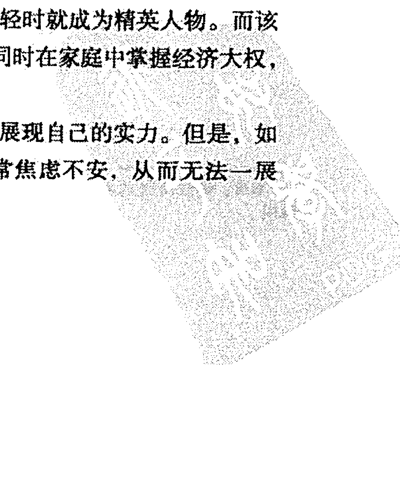

### 命运数适合的职业 Job

命运数“22”的人喜欢命令别人，所以适合做管理者。如果他们投身政界或商界，都具备出人头地的素质。
同时，如果能把兴趣转化为职业，则更容易得到人们的认可，从而成为名人。
无论从事什么工作，只要是他们喜欢的、受人瞩目的职业，都能获得成功。因为他们有演员的天分和才华，所以演艺圈这种需要人气的工作也很适合。

### 命运数的财运 Lucky Money

命运数“22”的人很有经济头脑，开始时即便一分钱都没有，但也有赚大钱的能力，在这方面他们很有斗志。
财运本来就很好的他们几乎不愁没有钱花。即使在为钱苦恼时，也会有人及时出现助其化解危机。
他们也精通赌博、买卖股票等投机行为，如果从事相关的工作也能开辟一片天地，获得丰厚的报酬。

### 幸运元素

- 深绿色 黑色 茶色 / 星期六 / 当归 / 含羞草
- 条纹玛瑙 / 七宝 / 手镯
- Lucky Item

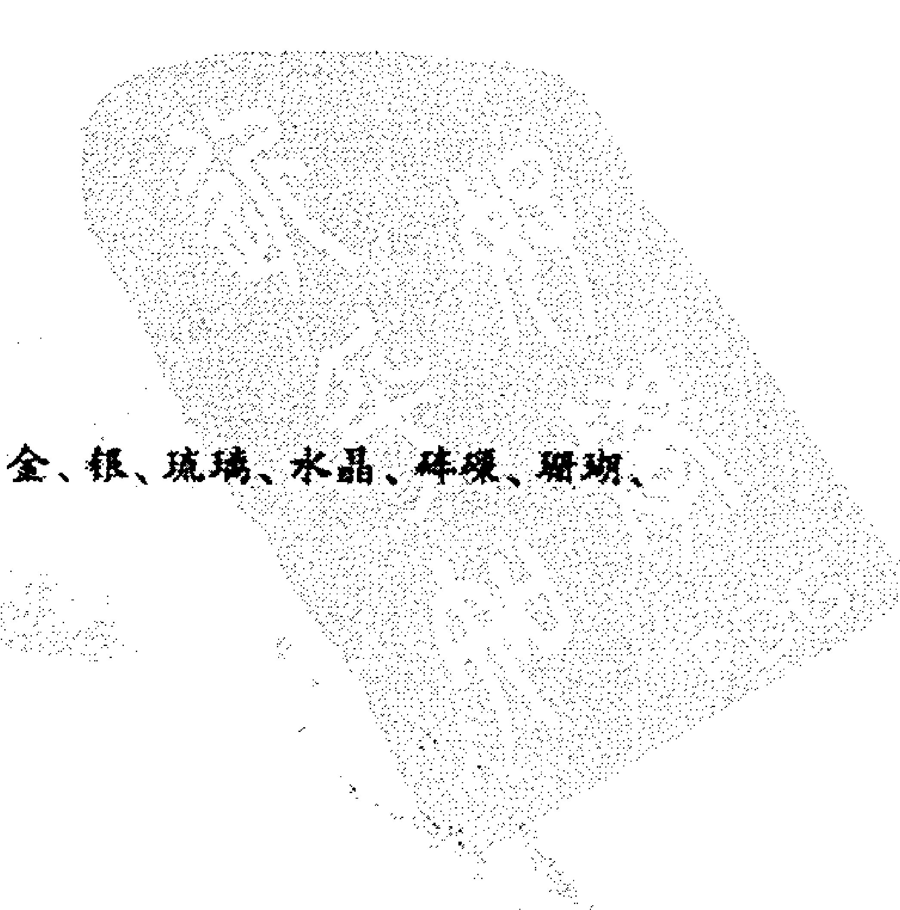

1 七宝：佛经所说的七种宝物，具体所指说法不一，其中一种说法为金、银、琉璃、水晶、砗磲、珊瑚、玛瑙。

# 你需要的忠言者

- 命运数“1”的你：在你冲动时提醒你、偶尔对你说“不”的人，才是最可靠、最值得信赖的人。他们能洞悉你的内心，不会为了迁就你而向你妥协。
- 命运数“2”的你：最值得信赖的是果断的、看问题能一针见血的人。在迷惘的时候，他们能为你指明方向，把你引向正确的选择。这样的人不需要太多，只要有一个就够了。若有这样的人出现，请相信他们！
- 命运数“3”的你：对于拥有勇气和行动力的你来说，最可依赖的是能为你点燃梦想的人。因为这些人具有敏锐的直觉，能为你分析未来的动向，并能成为重要的推动力。同时，这些人社会经验丰富、有强烈的挑战精神，能够提供好的建议。
- 命运数“4”的你：对富有安全感、不会勉强而行的你来说，最可靠的是能给予你勇气和决断力的人。有一个在危难时刻能对自己伸出援手，可让自己依赖的人在身边，心里应该会感到比较踏实吧。若在适当时候能当机立断地作出决定，也许就能抓住扭转形势的机遇。
- 命运数“5”的你：对凡事向前看、乐观自信的你来说，你需要的是能完全理解自己、温柔地全然接受和包容自己的人。你有时候不懂得向别人展现自己温柔的内心和关心，但是在很多时候，和善的态度是不能缺少的，所以，能教会你如何待人和善的人就是你的忠言者。
- 命运数“6”的你：对遇到任何事都喜欢插手的你来说，请先做好所有事都以失败告终的心理准备吧。困惑的时候先静待3天。如果3天之后事情也没有好转，就放弃吧。如果身边有一个人能让你从焦虑之中抽离出来、让你心平气和的话，应该会更有底气。
- 命运数“7”的你：你的运气很旺，但关键是能否有效利用这些运气。偶然获得的神签和护身符对你的运势有推动作用。能把你的好运引出来的是与你性格完全不同的人，或者是拥有特殊的才能和技能的人。但对你来说，努力和运气比给予忠言的人更能使你获得幸福。
- 命运数“8”的你：对矜持寡言的你来说最重要的是燃起自己的激情。即使成功概率不大的事情也应该放胆去尝试，这样可能会涌现让人无法相信的力量。如果一开始就认定自己会失败，那是永远也不可能成功的。你还要有坚持不懈的精神，遇到挫折时必须学会返回原点，重新思考。另外，多听听比自己年轻的人的话，也许会找到动力。
- 命运数“9”的你：仿佛受到一股看不见的神秘力量的支持，你拥有无人能敌的丰富想象力，若能灵活运用，运气就会好转，甚至在眼看要失败的时候还能迎来转机。有空的时候，多多反思近三年里的成绩吧，总能找到对自己有用的东西。
- 命运数“11”和“22”的你：你最明显的特征是拥有超旺的运气。因此好好地发挥这些运气是很重要。命运数“11”的人在快要失败之时，事情就出现转机，所以请坚持到最后一刻吧！命运数“22”的人不要忘记一切顺其自然，好运会把你引向成功。

# 理想结婚年龄

卡巴拉秘法非常重视对男女关系的揭示和判断。例如，和谁结婚最理想呢？何时是结婚的最好时机呢？

想要知道几岁会邂逅理想的对象、何时是最佳的结婚时机，就不能不重视卡巴拉金字塔命运起伏图中的出发期（卡巴拉金字塔命运起伏图请参阅本书88页）。根据各自的命运数的“开始（Start）”年龄才能作出相应的判断。但要注意，命运数“2”和“22”的Start年龄比较早，所以应以充实期为起算点。

一般来说，每个人的最佳恋爱时期是在出发期开始算起的三年内，而每个人的出发期则由各自命运数决定。

可是，男女的算法是不同的。卡巴拉认为女性在出发期远未开始之前就会有遇到理想异性的机会。所以简单地说，把出发期开始时的年龄往前推9年（即把出发期开始的年龄减9）就是女性与男性相遇的重要年龄。同样的方法，将出发期开始时的年龄减去6，就是她们的异性缘最活跃的时期。

要想知道结婚的时机就必须好好地理解这个法则。在67页的“结婚适龄表”中，我把各个命运数的所对应的适婚年龄都列了出来。

大家根据自己的命运数和性别就能在表中找到自己的适婚年龄。例如，如该表所示，命运数“1”的男性的适婚年龄是26~28岁，女性的是17~20岁。

按照这个表，大家各自查一下吧！

# 结婚适龄表

| 命造点 | 男性（年龄） | 女性（年龄） |
|--------|--------------|--------------|
| 1      | 26岁～28岁   | 17岁～20岁   |
| 2      | 34岁～36岁   | 25岁～27岁   |
| 3      | 33岁～35岁   | 24岁～27岁   |
| 4      | 32岁～34岁   | 23岁～26岁   |
| 5      | 31岁～33岁   | 22岁～25岁   |
| 6      | 30岁～32岁   | 21岁～24岁   |
| 7      | 29岁～31岁   | 20岁～23岁   |
| 8      | 28岁～30岁   | 19岁～22岁   |
| 9      | 27岁～29岁   | 18岁～21岁   |
| 11     | 25岁～27岁   | 16岁～19岁   |
| 22     | 32岁～34岁   | 23岁～25岁   |

# 第二章 | 从“年运数”看年势

## 年运数：解读人的运势、社会和自然的变化

在前面的第一部分我们一起了解了代表各自命运的数字——命运数。除了命运数之外，社会对我们也有很大影响。另外，就如人的命运总有一定的循环周期一样，社会和自然的变迁也有自己的规律。

把握住社会的脉搏可以说是成功的秘诀。回顾一下那些名垂千史的伟人们谁不是那样呢？他们在各自的时代中遵循当时社会的特点和规律，恰如其分地发挥自己的才能，最终在历史舞台上留下了不朽的功勋。

当然，想要像伟人那样准确地洞悉社会动态、抓住时代脉搏，对我们这些普通人来说有点遥不可及，不过，相信谁都曾经有这样想过：“今年会是怎样的一年呢？” 对于这个疑问，我们可以从卡巴拉中得到明确的指示。

## 年运数的算法

要想知道某年是怎样的一年，首先要把公历年份的所有数字相加，得出“年运数”。若得出的数字是两位数，就继续把十位和个位的数字相加，直到得出一个一位数为止。然而，若第一次相加后得出的数等于“11”或“22”，就不用继续相加了。

例如，2010年的年运数是2+0+1+0=3，那么这一年就是“3”之年。同样的，2018年的年运数是2+0+1+8=11，那么这一年就是“11”之年。

年运数“11”和“22”的年份不是经常出现的，基本上年运数都在“1”到“9”之间循环、变化。年运数中也有卡巴拉思想中的两面性，即正面和负面的信息，应该注意这一点。

从 70 页开始将会详细说明各年运数的特点，而一般的特征如下表所列。

## 年运数的特征一览表

| 年运数“1”之年 | 大变动之年。能发挥个人的才能和运气。 |
| --- | --- |
| 年运数“2”之年 | 和平共存之年。处处可见互相合作的人。 |
| 年运数“3”之年 | 追求理想之年。冲击经济的因素很多。 |
| 年运数“4”之年 | 不安定之年。有不少混乱和艰苦，也容易发生事故。 |
| 年运数“5”之年 | 社交活跃之年。新组织的成立开始增多。 |
| 年运数“6”之年 | 协调和援助之年。灾害和战争等社会动荡事件很多。 |
| 年运数“7”之年 | 完成之年。自杀和失业者很多。 |
| 年运数“8”之年 | 繁荣之年。经济上和精神上都有很多值得庆贺的好事情发生。 |
| 年运数“9”之年 | 问题发生之年。伴随着社会危机，人的斗争也多起来。 |
| 年运数“11”之年 | 心灵信仰之年。人们寻求宗教信仰，物质需求转向心灵渴求。 |
| 年运数“22”之年 | 大发展之年。规模迅速扩张，社会理所当然大步向前迈进。 |

## 年运数“1”
### 大变动之年

#### 新事物不断诞生，价值观改变

年运数“1”之年里比较容易发生“大变动”。

历史上的年运数“1”之年在世界范围内都发生了很多大事件。如1918年，德国战败标志着第一次世界大战结束。1945年，日本宣布战败从而结束了第二次世界大战。

年运数“1”之年中，月运数为“9”（年份加上月份等于“9”时，例如1945年8月，1+9+4+5+8=19+8=27→2+7=“9”）的月份里，会特别容易发生震惊世界的事件。例如，广岛被投下第一颗原子弹的1945年8月就是年运数为“1”、月运数为“9”。其实，单是月运数为“9”的月份也容易有这个特征，如日本偷袭美国珍珠港的1941年12月8日的月运数是“9”。占领日本的美军将领麦克阿瑟飞抵厚木机场时，和麦克阿瑟从被日军占领的菲律宾败退的时候，月运数都是“9”。

年运数“1”之年与前一年相比，有很多的变化，同时这一年也预示着新事物的诞生，所以这时候发明和新发现一般会比较多。在个人方面，很多人在这年里对未来充满信心，决意迈出探索新事物步伐，只是创造新事物必定要经历不少艰辛。

## 年运数“2”
### 和平共存之年

#### 合作是主旋律，交流活跃

年运数“2”之年是性质不同的事物能互相包容的“和平共存”之年。因此，这一年中人们容易变得很迷惑，甚至无法分清和决定方向。

另一方面，虽然这一年里没有什么受人瞩目的大动作，但有不少热闹的、能吸引众多人参加的和平活动，特别是体育盛事。“和平竞争”会成为当年世界的主题。如1964年的东京奥林匹克运动会。

年运数“2”之年里，外交上也是比较协调的，这一年的外部环境对解决长久以来的纷争很有利。若翻阅历史记录还会发现，在东京奥林匹克运动会举办的同一年，日本东海道新干线也开通了，而在1982年，日本东北一上越线的新干线也开通了。新交通工具的诞生也促成了信息网的扩张和频繁交流的实现。其他例子包括1928年签署的《巴黎非战公约》，1955年成立的华沙条约组织，1973年签订的《关于在越南战争结束、恢复和平的协定》，以及1991年签署的欧洲联盟条约、同年的华沙条约组织解体和苏联解体。这一年还签订了很多对世界未来产生深远影响的条约，这些历史事件也体现和平共存是年运数“2”之年的特征。

## 年运数“3”
### 追求理想之年

#### 对天空和海洋的探秘心增强，怀有无止境梦想

年运数“3”之年是追求幸福和理想的一年。

在这一年里，人们追求精神上的神秘事物的活动增多，对宗教、哲学和神秘主义的向往越发强烈。

同时，人类对海洋和天空的探险热情高涨起来，如阿蒙森（Roald Amundsen）成为世界上第一个到达南极点的人是在1911年。齐柏林（Ferdinand Graf von Zeppelin）飞艇发起环绕地球一圈的挑战是在1929年，这些都是发生在年运数“3”之年。

但是，在这一年里，经济上也会发生很多重大事件，如以1929年纽约股市的崩盘（黑色星期四）开始的著名的大萧条。与之相反的则是发生在1956年的高潮期“神武景气”。

另外，涉及经济的政治家贪污事件也时有发生。1974年日本前首相田中角荣被爆出金钱丑闻，并于1983年被判在洛克希德事件中有罪。1992年发生东京佐川快件公司政治献金案件。

> 神武景气：1956年日本制订“电力五年计划”，进行以电力工业为中心的建设，以石油取代煤炭发电。经济至此完全从二次大战中复兴，并进入建立独立经济的新阶段。日本把1955年至1957年出现的第一次经济发展高潮称为神武景气（Jinmu boom）。

在年运数“3”之年月运数为“4”的月份里发生预想不到的震惊事件的概率比较大。如在1956年10月（年运数为“3”、月运数为“4”）发生了苏伊士运河战争。而在1965年越南战争扩大，也是由月运数“4”里发生的事件所触发的。

## 年运数“4”
### 不安定之年

#### 麻烦和纷争层出不穷，航空事故多发

年运数“4”之年是世界动荡不安之年，也是“麻烦不断”之年，劳动环境变差，劳动条件苛刻。为了明确目标和方向，人们要经历不少艰难，经受不少反对和批判的声音。

年运数“4”之年是事故多发之年，特别是航空灾难。如1966年2月的日本东京湾全日空飞机坠毁事件和3月的加拿大太平洋航空公司、英国海外航空（BOAC）的24小时内连续的飞机失事事件。

另外，年运数“4”之年也是组织成立、系统化的一年，所以也可被称作团体活动之年。若翻阅历史记录，会发现1867年（即明治维新的前一年）是年运数“4”之年，这一年发生的事件对其后的明治维新产生了深远的影响。日本当年发生大政奉还，江户幕府将政权归还给朝廷，流行“这可好啦”（即大规模群众运动，由于民众集队喊着“这可好啦”，所以这是当时的流行语）的口号，处处显示出不安定的社会氛围。又如，1929年爆发了世界经济大萧条，但对日本造成毁灭性影响的却是在1930年。而发生在2002年的牛肉丑闻引发的恐慌也是年运数“4”之年的特征表现之一。

> 东京佐川快件公司政治献金案件：1992年有“自民党教父”之称的自民党前总裁金丸信因为接受佐川快件公司5亿日元的政治捐款而隐退。

## 年运数“5”
### 社交活跃之年

#### 在不安和混乱中诞生新国家和构建新框架

年运数“5”之年是“社会交流活跃”和“新组织诞生”之年。在这年里会有各种劳动团体成立、国家间的协议签订和新生国家的诞生。例如，发生明治维新的 1868 年就是年运数“5”之年。日本把年号改为“明治”是在 1868 年 9 月 8 日。在年运数和月运数均为“5”的月份中，日本进入了明治的新时代。可以说这件事强烈地表现出“5”的力量。

另外，甲午战争讲和的 1895 年、日俄战争爆发的 1904 年，还有发生九一八事变的 1931 年，《德意日三国同盟条约》签订的 1940 年等年运数“5”之年都是变动之年。

再细看历史记录，年运数“4”之年中不安定的因素和事态在“5”之年里有重大转变。在年运数“5”之年里，新组织在不安和混乱中建立起来。例如，1922 年苏联成立，1949 年中华人民共和国成立和 NATO（北大西洋公约组织）成立，1958 年阿拉伯联合共和国成立，1976 年越南社会主义共和国成立。

## 年运数“6”
### 协调和援助之年

#### 大灾难和战争无法一一列举

年运数“6”之年的主题是“协调”和“援助”。在这年里很多资源被投放到年轻一代的教育中，人们着手逐一实现对未来的各种构想。

另一方面，年运数“6”之年最大的特征是灾害和战争的频繁发生，特别是地震和火灾。在占卜术中，灾害频发的年份被叫做“五黄之年”，而卡巴拉中年运数“6”之年正符合“五黄之年”的特征。其中，又有很多灾难集中在年运数“6”之年、月运数为“6”的月份中。如果把目光集中在地震灾害上，则有日本的 1923 年 9 月 1 日的关东大地震，1833 年的越后—出羽—佐渡大地震和1896年的明治三陆地震。
在这年里会发生很多使人类价值观改变的灾害和事件。1995年的阪神—淡路大地震和奥姆真理教策划的地铁沙林事件都具有象征意义。另外还有1986年发生的美国载人宇宙飞船“挑战者”号爆炸事故和切尔诺贝利核电站的泄漏事故、三原山火山爆发、1914年的第一次世界大战爆发、1941年太平洋战争爆发、1950年朝鲜战争、1955年的高速增殖反应堆的原型反应堆“文殊”号的钠泄漏事故；最近的则有2004年新潟县中越地震和苏门答腊地震等等，类似的灾难和事件实在太多了，因此无法一一列举。

## 年运数“7”
### 完成之年

#### 收获的年份，但自杀事件和失业者众多

“完成”和“统一”是年运数“7”之年的主题，所以在这一年里，迄今为止坚持付出的努力会见到成效，各方的观点能达成一致。另外，这年也是达成和调和之年，尤其在农业、不动产和工业领域会取得较大的成果。除此之外，努力构建和培育的东西在这年能取得成果。

社会形势也比较缓和，如美苏关系有所缓和是在1960年，最近的则有2005年的“爱·地球博”（日本爱知世界博览会）的举办。

与前一年相比，这一年也许会逐渐安定下来，但事情也有可能以预想之外的结局告终。在过去发展势头不错的企业和业界会从这一年开始走下坡路。而与之相反，有些企业经营状况原来并不理想，但经过自己的努力，会在这一年里得到爆发性的发展，越发显出蒸蒸日上的势头。另外，这一年也会发生一些负面的事情，例如1987年的“黑色星期一”引发的全球性股灾和2005年里发现的因在建筑材料中使用石棉而致人健康受损和劣质旧房改造欺诈案等等。

自杀事件增多也是这年的特征之一。前一年的征兆会在这一年中清晰地显示出来。失业者增加的可能性也很高。同时，劳动争议会激化，纷争也会多起来。

## 年运数“8”
### 繁荣之年

#### 一面喜事不断，一面纷争不断

年运数“8”之年象征了“繁荣”，在经济上和精神上都有很多喜庆事发生。那些遵循自然规律的人们在这一年里能获得很多发挥能力的机会。

对企业来说，无论金钱上还是物质上都非常有利，企业的发展会达到最高峰。例如日本的自动车产业就是在年运数“8”之年里达到顶峰的。另外日本经济高速成长之年也和年运数“8”有关联，作为日本经济高速成长的标志——大阪世博会是在1970年3月开幕的。

不过，另一方面，这一年也有可能接二连三地爆发纠纷，甚至战争，这也是年运数“8”之年的特征。例如1934年希特勒就任总统和斯大林的大清洗运动，1956年埃及武装政变，1961年韩国军事政变，1970年波兰反政府暴动，1979年苏联入侵阿富汗。

## 年运数“9”
### 问题发生之年

#### 象征爱和完成，新问题产生

在卡巴拉中“9”原本代表着“完成”，因此，年运数“9”之年也象征了爱和完成，是世界和平与协作之年，如1971年中华人民共和国加入联合国就是其中一个具有代表性的例子。在这一年里“完成”的动态很明显，例如有人最终完成了一直努力进行的工作，也有人通过学习新知识来转换工作。

但这一年的社会也容易产生危机和麻烦，对次年有所影响的事件可能会接连发生，如1926年日本的年号从大正变成昭和、1989年从昭和改为平成，1962年的古巴危机激化了美苏对立局面，1953年朝鲜战争结束，1989年柏林墙被推倒、冷战结束以及随之而来的东欧民主化进程，1998年北爱尔兰和平协议签订、印尼苏哈托体制崩溃等事件，都宣告了某个时代的终止。

除此之外，英雄隐退、备受关注的人物消失在人们的视线中也是年运数“9”之年的特征之一，例如1980年日本读卖巨人队教练长岛茂雄辞职和棒球选手王贞治现役引退。

## 年运数“11”
### 心灵信仰之年

#### 从物质到心灵的思维转变

年运数“11”是寻求心灵信仰之年。在这一年里，人们的不安情绪升高，对一直以来的生存方式和伦理道德产生疑问。同时，进步性的创造力也在增强。很多人从只对物质关心慢慢地转变为对自己内心的关注，开始意识到与金钱和物质相比，心灵的平静和快乐更重要。

年运数“11”之年是非常少的。从1900年到21世纪，就只有1901年、1910年、2009年和2018年这四个。在上述的前面三个年份中，世界上发生了很多具有深远影响的事情，例如，在1901年，随着维多利亚女王驾崩，维多利亚时代宣告结束，同年还有诺贝尔奖创立，奥地利医生卡尔·兰茨泰纳发现了ABO血型系统。而在1910年，日本的“大逆事件”，日韩签订的《日韩合并条约》等一系列事件增加了人们的不安情绪，同年哈雷彗星到达近日点，而2009年则观测到21世纪中持续时间最长的日全食奇观。

## 年运数“22”
### 大发展之年

#### 大发展，大跃进，发生极大的喜庆之事

年运数“22”之年比“11”之年出现的概率高。基本上，它有年运数“4”之年的特征，但社会氛围上有一些区别。它是全球性扩张之年，和平共处的欲望越趋强烈，人们开始反省过去三年的生存方式，在处理问题时都懂得克制自己，不会强硬行动，而道德感和社会责任意识都有所加强。

> 大逆事件：又称“幸德事件”，日本反动政府于1910年镇压社会主义者，并于1911年，对数百名社会主义者进行秘密审判，诬陷幸德秋水等人图谋暗杀天皇。

比较突出的例子是1975年，即越南战争结束的那一年，可以明显感觉到全球人民渴望和平的呼声，当时很多人都要求停止战争，呼唤和平。而在1993年，日本开始举行职业足球联赛，当时的球迷不叫“迷”，而叫“支持者”，可见人们支持某项活动的心情成为当年的主题。
年运数“22”之年的特征还包括：社会运动的重要人物出现、愿意服务大众的人增多；有些长期期盼的愿望能得以达成，例如1948年以色列建国，以及1957年的苏联成功发射了第一颗人造卫星——斯帕特尼克1号；很多喜庆活动发生，例如1993年的日本皇太子和雅子妃成婚。

# 美国总统与“0”之年的关系

年运数被分为“1”至“9”、“11”和“22”共11种类型，现在我们来看看公历年以“0”结尾的年份吧。虽然这些与卡巴拉年运数没什么关系，但其中却藏着不可思议的事情。
1980年，里根在美国总统选举中，以压倒性优势击败卡特成为美国第49届总统。于是，很多美国人开始担心，里根总统会不会被暗杀呢？可是为什么会有这种担忧呢？那是因为历史上在以“0”结尾的公历年中被选出来的美国总统，要不在任职期间遭到暗杀，要不就在任内病死。
1860年获选总统的林肯在任期内的1865年4月14日遭到暗杀。从这次事故开始，在以“0”结尾的年份里被选出来的总统都相继不得善终。例如20年后（即1880年）被选出的加菲尔德总统在就任数月后（即1881年9月19日）被刺杀，最终因伤身亡。1900年麦金莱以前所未有的高票数再次赢得总统大选，但在次年的1901年9月6日遭枪击，数日后不治身亡。1920年当选的哈定总统在任期内的1923年8月2日病死。1940年再次当选美国总统的罗斯福也在雅尔塔会议后，即第四次任期内的1945年4月12日病死。而最具悲剧性的是1960年当选的肯尼迪总统于当选3年后（即1963年11月22日）在达拉斯遇刺身亡。
看来，从林肯到肯尼迪，在以“0”结尾的公历年里当选的美国总统要么被暗杀，要么病死，全都无法顺利完成他们的任期。

# 第三章 从“个人年运数”看每年运势

## 个人年运数：让才能得以发挥

刚才我为大家介绍了卡巴拉“命运数”和“年运数”，通过它们我们了解了各人的命运和时代的特征。然而，只靠命运数或年运数是无法知道某个人能否成功的。无论你拥有多么优秀的才能和多么旺盛的运气，如果没有能让你发挥的机会，最终也只落得一个空有一身好本事而毫无用武之地的下场。

为了登上能展现才华的舞台，就要学会把自己的优势和人生轨迹与社会的主流很好地结合起来。而卡巴拉中的“个人年运数”能告诉你在某一特定年份里的运势。

查看个人年运数，就能知道自己在某一年里的运势是上升还是下降。那么人们可以在运气好、顺境的时候更加信心十足地向前迈进，破釜沉舟地决一胜负，从而获得更大的成功。相反地，如果知道自己处于运势不济的时期，做任何事情都会倍加小心，就能使大难化小，从而平安度过这些时期。

除此以外，“个人年运数”还能让我们看到数年后的运势，为我们在做出人生重要决定时（如结婚和转换工作）提供一个重要的参考。

## 个人年运数的算法

计算个人年运数，按以下的步骤进行：

- ① 算出自己的命运数；
- ② 算出某一年的年运数；
- ③ 把上面两个数字加起来，直到得出一个一位数。

例如，若要查1970年6月17日出生的人的2010年的运势，

1+9+7+0+6+1+7=31 3+1=4
2+0+1+0=3
4+3=7

最后得出个人年运数为“7”。

80页的“卡巴拉个人年运数轮盘”中列出了个人年运数“1”至“9”的特征。个人年运数在这个循环中不断变动着，若能读懂这些特征可能会让你更接近成功。

## 卡巴拉个人年运数轮盘

命运之轮

- **独立发展之年**：心情积极向前，能量充足。
- **忍耐之年**：应该重新审视一直以来的生活方式。
- **停滞之年**：平静地度过，可能会结识新朋友。
- **精神矍铄之年**：避免焦躁不安，踏实工作会得到好的结果。
- **变化之年**：运势变得不稳定，相反地也可能会出现新机会。
- **收获之年**：被周围的人捧起来，变得忙碌。
- **休息之年**：应努力丰富自己的内心世界。
- **挑战之年**：幸运的事接二连三出现。
- **大总结之年**：向新的梦想出发，但应该更好地巩固基础。

## 个人年运数“1”
### 独立发展之年

#### 新周期开始，变得积极向前

个人年运数“1”之年里，凡事都比较顺利，心情也变得积极向前。整体来看，一整年都很安定，也会有些新计划开展，很可能会有意想不到的喜事出现。甚至连自己也会惊叹：“竟然会发生这种事！”若能预先想到这些巨大的变化，那好事情发生的可能性就越高。相反地，那些对变化完全没有期待或反应迟钝的人，也许没有任何的收获，就这么平平淡淡地度过这一年。

在这一年里，心态变得积极向上，因此身体也处于最佳状态，能感到体内充满能量。这时很适合开展新计划，若能在一开始就把目标设定好，然后付诸行动，将会事半功倍。特别是那些一直都很想做的事，在这年着手去做吧，事情将会往好的方向发展。但是，不宜同时启动多项计划，因为那只会令你分身乏术，可能会导致一事无成。

目前为止运气不佳、常遭遇不顺的人在这年运势会有很大的好转，应该牢牢抓住能改变人生的机遇。若能广交朋友，也会产生正面影响。一定要记住无论做什么事，都不要指望依靠别人，只有依靠自己的努力才能最终取得成功。另外，也应该处处谨言慎行，特别要注意在打电话和写文件时不要出错。

## 个人年运数“2”
### 忍耐之年

#### 不要局限于眼前，应放眼未来

个人年运数“2”之年是“忍耐和协作”之年，要比往年更有忍耐力，特别在信心满满、干劲十足时更要小心行事。今年的努力会对未来3年的运势产生重要影响，所以在这年里，对一直所做的事情，都应该坚持和保持耐力。与其匆匆地想要把事情完成，或者焦躁地一味想要开展新项目，倒不如认真反省过去，重新审视自己的生活方式，做好周详的3年计划再采取行动，那样会更有希望取得成功。当然也不排除在某些情况下，有些人能比较快地实现目标。

当然，还要多花时间与他人交流，别人的意见和建议会让你获益良多。若任何事都想单打独斗，则可能会遇到障碍。另外，这一年的财运很旺，是存钱的好时机。若从这年开始存钱，可能会交上好运气。但也不能过于贪婪，这样反而会令财运不好。

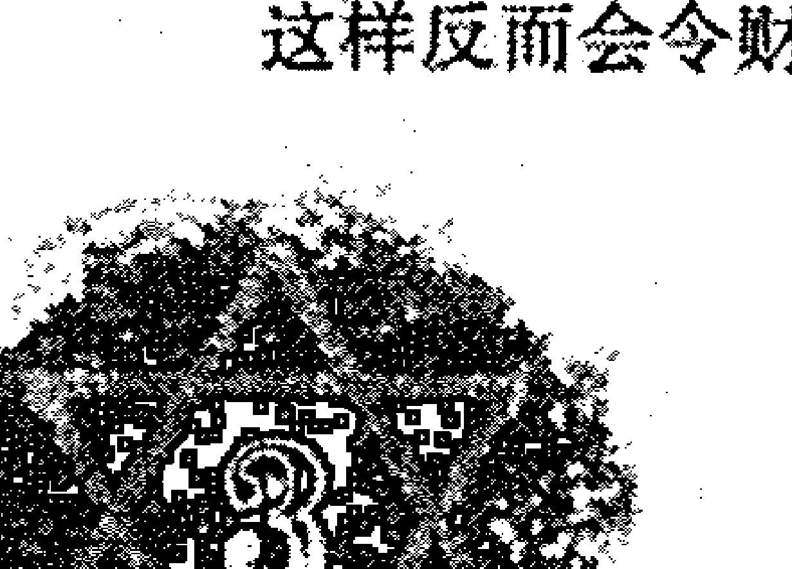

## 个人年运数 “3” 停滞之年
### 生活单调但平稳，应保持平和的心态

个人年运数 “3” 之年里，各方面基本上都没什么变化的，既没有大喜事发生，也没不顺心的事发生，算是比较单调的一年。即便你本来想在这年里做一些新的尝试或挑战，但却发现没有什么特别值得改变的事情，于是时间一下子就过去了，全年都没什么可以让人一展实力。所以在这一年应该多花时间进修和学习，积累更多的知识，为今后做好准备。

这一年的人缘不错，与人交流顺畅无阻，适宜吐露心声，可以试着把秘密告诉信赖的朋友，或者向人直言心中所想，那会对事情起正面的影响。与恋人和朋友的关系都有望变得更加亲密。若能与运气好的人交朋友，将对下一年的开运有帮助。

但是，交往增多，自己可能因此会变得很忙，觉得总被时间追赶着。所以有必要适时地转换心情和休养生息，这也会令工作完成得更有成效。另外，在心情郁闷时，建议大家外出找个不远的地方旅游一下。同时，凡事保持平和的心态是最重要的。若对任何事都焦躁不安，不但容易增加开销，财运也会变得不稳定，所以要特别注意。

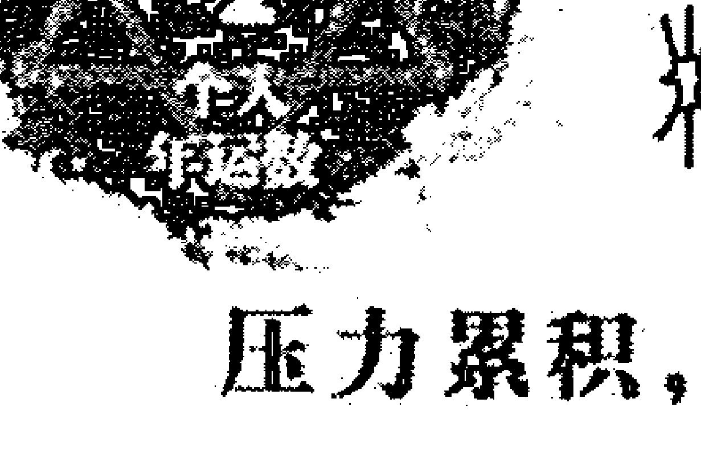

## 个人年运数 “4” 精神紧绷之年
### 压力累积，应戒掉焦躁情绪

个人年运数 “4” 之年容易精神紧绷、压力累积。从今年开始的3年内，

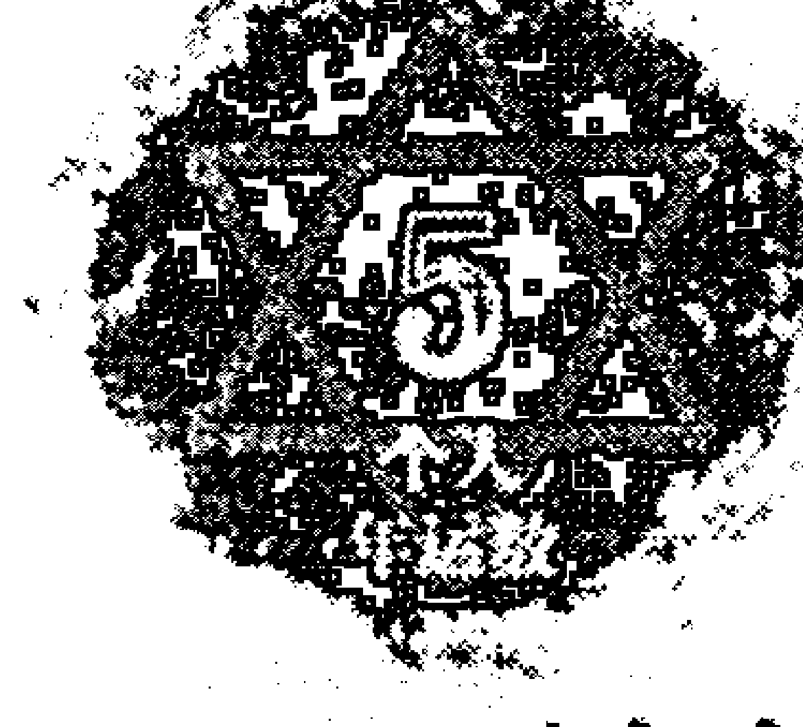

## 个人年运数“5”变化之年
### 不安定中出现新转机

个人年运数“5”之年是变化之年。这一年的生活节奏会与往年有很大不同，经常忙忙碌碌的，难以安定下来，心情也常动摇不定。想在家静静地待着的机会少之又少，可能会经历搬家、换工作或结婚等让生活环境发生较大转变的事，运气方面也比较不稳定。心情急躁不安的你可能会做出过于大胆的事情。特别是在生日的月份的前后可能会与他人发生口角之争，甚至是吵架，以致失去别人的信任，人际关系麻烦较多，必须多加注意。应该学会站在对方立场替别人着想，然后再采取行动。另外，创意会为你带来赚钱的机会。旅行和悠闲活动会激发你工作的灵感，积累至今的经验终于可以派上用场了，意想不到的好运可能也会随之而来。

也许有些人过去身体不好，但这年里体力能得到恢复。一直认为不可能成功的事也在今年出现转机。曾经付出的努力和对自己的克制在这一年里会发挥作用，你终于获得了周围的认可，到了享受成果的时候了。所以，虽然今年并不安宁，但整体来看开心的事在逐渐增多。

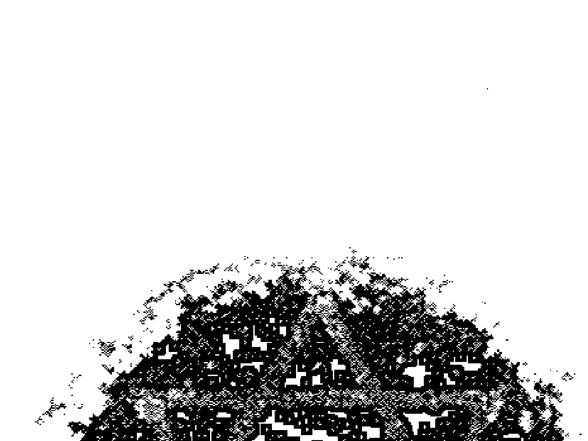

## 个人年运数“6”
### 收获之年
### 获得周围的协助而阔步向前迈进

个人年运数“6”之年是收获之年。这一年的运势有点不同寻常，有时候你对某件事明明是充满信心的，但突然间就失去信心了；相反地，有些事你觉得是不可能成功的，正要放弃的时候，运气却突然好起来，事情变得异常顺利。无论发生什么事，只要你不慌不忙、按部就班地进行，再大的难题都可以迎刃而解，还会遇到千载难逢的机遇。协助者也会在这一年里出现，与同伴的信任关系进一步稳固，一直以来付出的努力将会见到成效。工作上，有机会获得较大的成功和利益，还可以结交新的拍档。得到周围支持的你很可能被提拔成为高层，受人瞩目。同时，今年也很适合创业或开店。

不过，这一年交际应酬激增，要东奔西跑，可能无法悠然自得地过日子，是很繁忙的一年。有些人会因某件事而拜托你，即便是你不想做的事，也请试着接受吧！因为那会对你的将来有好处。这一年的异性缘也很好。在恋爱和家庭生活上都有较大发展，也有机会结识新朋友或开展新恋情，甚至还有人会升格成为父母。可是，随着异性缘的增强，与异性有关的麻烦事可能会出现，因此烦恼也不少。

虽然各方面都很忙碌，但千万不要停下来。持续不断地前进，是你开运的关键。

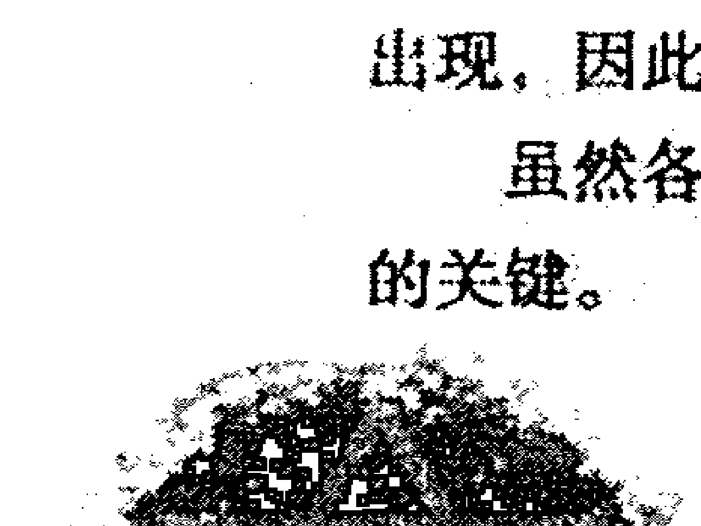

## 个人年运数“7”
### 休息之年
### 集中精力完善自我，收获成果

个人年运数“7”之年是休息之年，至今所付出的努力也会得到认可。平时积极主动工作的人该是到了晋升或涨工资的时候了，甚至会在很优厚的待遇下转换新工作。这一年也很有结婚运和旅行运，以此为契机，你的新世界会越来越开阔，价值观也可能会改变，心情多处于亢奋中，能量充沛，但在这时其实最需要的是耐心等待。即便对自己很自信，也应该多一份冷静和理性，稍稍休息一下再行动将会得到更好的结果。

在这一年里毫无缘由地会变得讨厌别人，容易感到孤独、寂寞。与物质相比，更追求精神上的依靠，有时候会感到一直以来所做的事情都很虚无、毫无意义，因此总掩不住不安的情绪。平时的懒惰和过去的失败会被放大，所以，与其着手新事物，不如把这一年看作充实自己的好时机，花多点精力把自己塑造得更完美。安全第一是今年的主调。

在金钱上看似赚钱的买卖可能会令你损失惨重，而看似亏本的生意却能意外地大捞一把。无论做什么事，事前都应该做好详细的调查和研究。

## 个人年运数 “8” 挑战之年
### 实现梦想的最佳时机，应多方面拓展兴趣

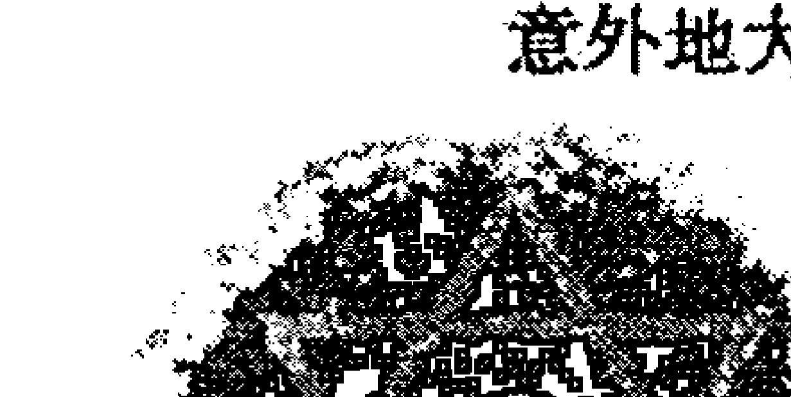

个人年运数 “8” 之年是成果显现，梦想和野心得以实现的幸运之年。在这一年里，你在各方面都表现得无比活跃。朋友和伙伴的协助让你有很大的进步。原以为注定失败的事情，如果尝试着去做会得到意外的收获。

今年也是你把想法和计划付诸行动的好时机。只要积极地、勇敢地向新事物发起挑战，应该能充分展现个性和实力。切勿空有好想法却不敢在日常生活中展现出来。虽然在挑战的过程中会不可避免地遇到挫折，但千万不要气馁，勇于再次挑战才会得到更大的回报，所以在任何时候都不能失去挑战的精神。

在寻求大的变化，例如转换工作时，可能会突然失去自信。放弃之前，尝试一下从头开始再做一次吧！说不定再向前迈一步，就会取得成功了。但是过强的竞争意识又会让你失去自信，应该注意这点。

一般来说，这一年里身体很健康，体力也很充足，一直受病痛折磨的人也会渐渐康复过来。可在工作以外多方面拓展自己的兴趣、爱好。

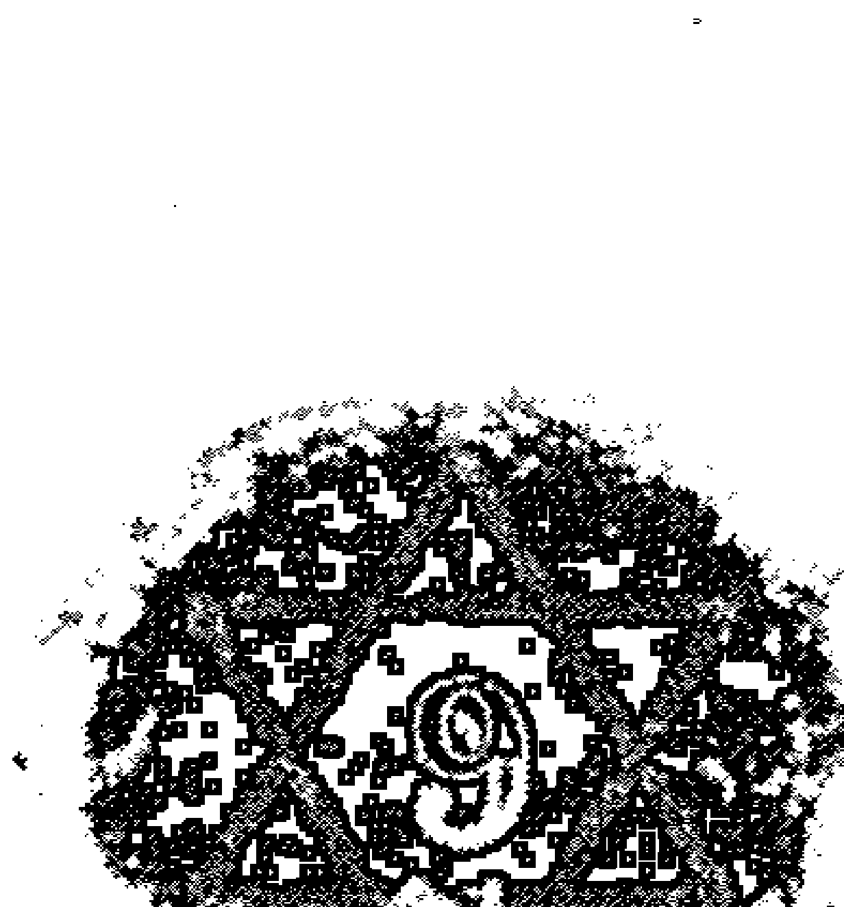

## 个人年运数“9”
### 总结之年
### 认真总结过去，巩固基础

个人年运数“9”之年里可能会发生极好的事情，但也可能出现极坏的情况。在运气不好和事情不顺的时候，千万不要着急。要记住，阳光总在风雨后。在人生经历高低起伏、跌宕不安的时候，更要相信自己，踏实地工作和生活，这样才能按着原来的人生轨道继续坚定地走下去。在迷惑的时候，应该抛弃杂念、回归初衷，冷静地想想自己最需要的到底是什么。

这一年是开创新的工作和新的人际关系的年份，也是修补家庭关系和朋友关系的尤为重要的一年。请务必要收藏好别人的名片。另外，过去的人际关系会对你今后产生影响，所以应该与旧友人多点来往。至今为止与他人的相处方式无论好坏，都应该重新检讨和权衡利弊。

同时，一直以来为工作疲于奔命的人在这一年会得到很多亲近大自然的机会，除了借此机会好好地为今后9年积累能量之外，也应该多花时间反省过去和做好各项规划。如果还没有做好准备就匆匆开始的话，那么原来能做好的事也会以失败告终。

总之，为了更好地向前迈进，今年是巩固基础的重要一年。

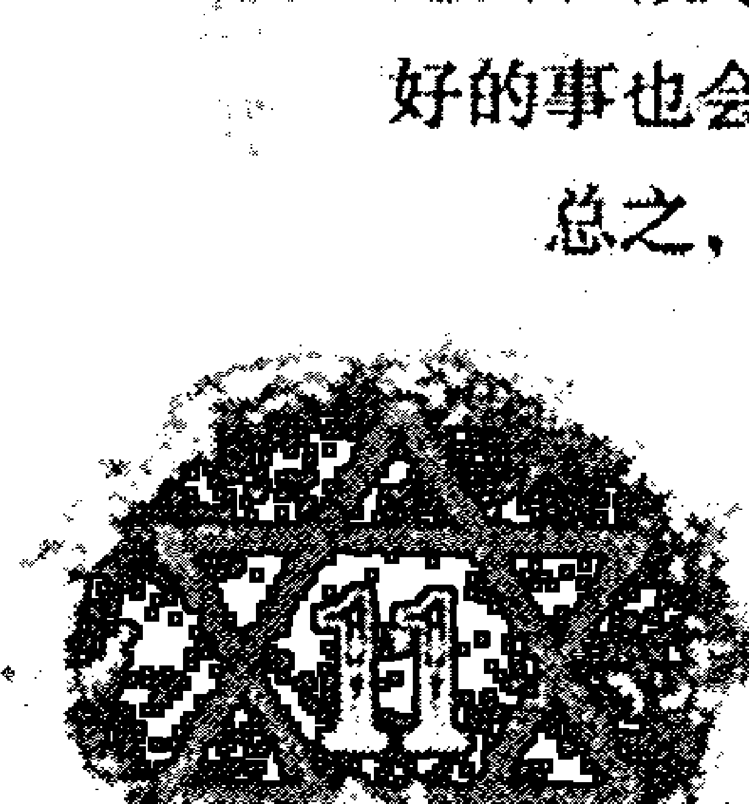

## 个人年运数“11”
### 精神主义之年
### 发现新梦想，从志愿者活动中感受喜悦

个人年运数“11”之年是“精神主义”的一年。这一年包含了“2”之年的要素，但又有新的特征，例如人们非常重视自己的心理需求。相对于物质和金钱，人们更倾向于寻求精神上的快乐。同时，思维方式不再受某些固定模式的束缚，会发现新的人生梦想，对未来怀有美好的憧憬。正因如此，若一味想着金钱的事，只会增添自己的烦恼和不安。

这一年，在情感上更丰富、敏感，能更好地理解别人的心情，容易被音乐和绘画作品感动，也能从公益志愿活动中找到喜乐，可以说是非常情绪化的一年。另一方面，容易意志消沉，或感到寂寞和不安，陷入与他人的摩擦和纷争中。有些人因为性格好强、不愿妥协，可能会把自己封锁起来，或与他人交往时惹出麻烦。开运的关键是要多听别人的意见和检讨自己，要使自己着眼于现实世界。

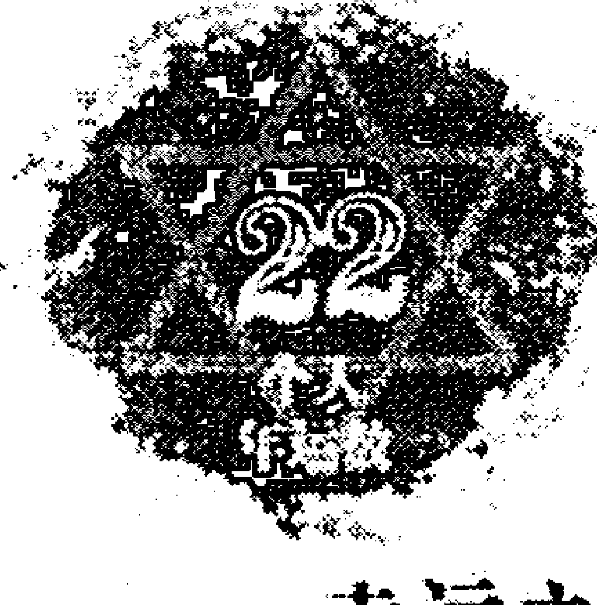

## 个人年运数 “22”
### 幸运之年
### 幸运之神不请自来，但要继续努力

个人年运数“22”之年是理想燃烧之年。远大的梦想和希望都有机会成真，是非常幸运的一年。在这一年里，事情会按自己所设想的那样顺利进展，还会得到很多协助者的帮助。与往年相比，这年里付出的努力能发挥10倍的威力，可以说是非常重要的一年。过去的误解和麻烦都能得到圆满解决，并对今后的发展发挥重大的正面作用。如果能好好把握这一年的好运气，人生从此也会完全不同了。

另外，个人年运数“22”之年的基本特征和“4”之年是一样的。道德、社会责任与和平主义的价值观在增强，如果以此为立足点，向其他方面扩展，会获得巨大的喜悦。

由于运势很强，就算偷懒也会取得很好的成果。但是，再怎么幸运，也不能完全不努力。这一年的态度会对以后的年份产生影响，所以必须注意。切记在意气风发的时候也不要得意忘形、迷失自我。

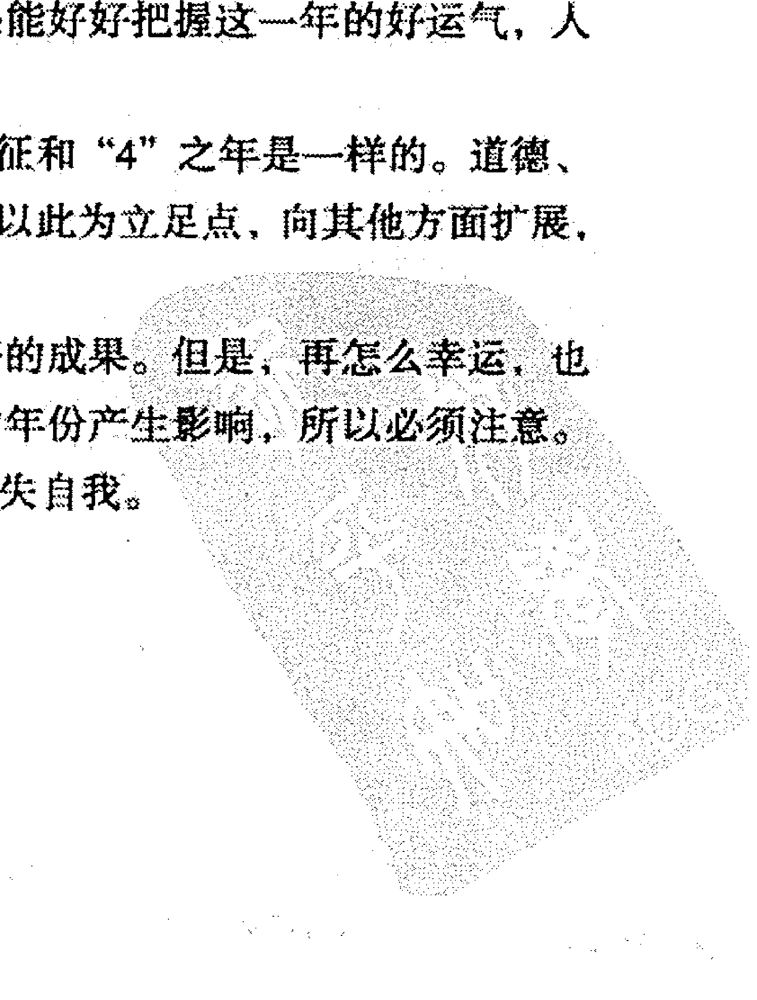

# 第四章 从“卡巴拉金字塔命运起伏图”看人生跌宕
## 告诉你顺境和逆境

与其他术数不同，卡巴拉占卜有趣的地方在于，它认为“人生不是一成不变的，会随着环境的变化而一直成长”，人生不仅有自身的轨迹和规律，且其变化和起伏的节奏根据命数的不同也各不相同。

卡巴拉用“金字塔”来比喻命运的起伏律动。攀爬人生的金字塔要先从塔底的人口进去，但这个人口不止一个。根据命数不同，每个人从各自不同的人口开始攀登。但无论从哪个人口进入，卡巴拉的金字塔都以人生的转折点将全程分成四段，由此描绘出来的图被称作“卡巴拉金字塔命运起伏图”。例如第一段是从“Start(开始)”起历经9年的出发期。之后的每一段都是9年，分别是发展期、充实期和完成期。这一系列的时期里，人要经历命运的高低起伏。

接下来，我详细地介绍一下这个起伏图。请参看89页下方的“卡巴拉金字塔命运起伏图的基本图”。

若你知道了自身的生命律动，就能获得不一样人生的启发。刚才说过，卡巴拉认为人总会有顺境和逆境的，每个人都有各自的生命轨迹。如果人生的起伏用金字塔来表示的话，那么要爬完一个金字塔，就要先经过顺境(上升期)的9年，然后到达金字塔的顶峰，接着从那一点开始走过逆境(下降期)的9年。也就是说，走完一个金字塔需要18年，三个金字塔加起来就是一个跨越54年的长周期。长寿的人会在结束了一个长周期后，重新进入下一个为期54年的长周期。而每个长周期内的三个金字塔都各有特点。

第1个金字塔代表10岁到20岁的运势。在这个金字塔中没有将18年细分为数个3年的小周期。那是因为这期间的命运受父母和周围的人影响比较大。如何度过第1金字塔将会对今后的人生产生深远的影响，若能好好地把握这个阶段，今后的人生也许会完全不同。当然，这因命运数而异。第1金字塔可以看作是人生的准备阶段。这个时期经历的事对之后的人生非常重要。

而对人生影响最大的是接下来的第2金字塔。无论在人生的顺境还是逆境中，你做出的所有决定都会给你的人生带来最直接的变化，因此需要慎重对待。若你能顺应上升期和下降期的变化趋势做出正确的反应，成功的道路将会非常宽阔。

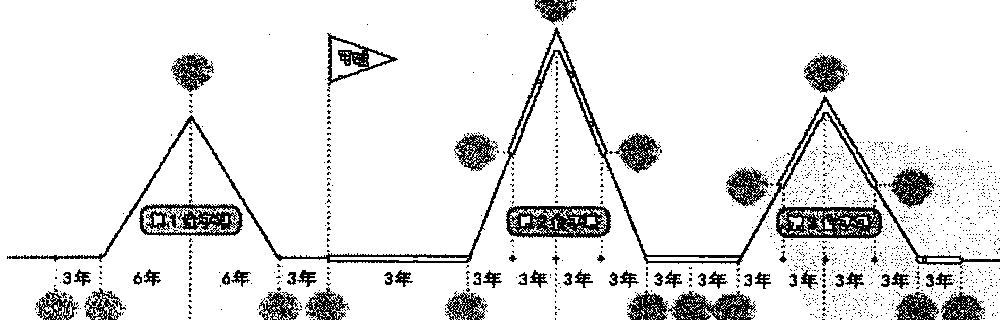

卡巴拉金字塔命运起伏图的基本图
正周期
负周期

第2金字塔的开始年龄被称作“Start(开始)”。每个人的“Start(开始)”的年龄如91页的表所示，根据命数不同而各不相同。

从“Start”到第2金字塔的顶点有9年，被称作“出发期”。这是发挥才能和个性的时期。从顶点开始的9年时间被称作“发展期”。这个时期可以看到之前9年的努力能否结出果实。若在这时期里顺利地取得了成果，人生将向着成功大步迈进。顺便说一下，如卡巴拉金字塔命运起伏图的基本图所示，从第2金字塔开始，以3年为一段，划分的各小段分别被称为正周期和负周期。正周期是运气顺畅的时期，而负周期则是运气不佳的时期。从Start算起的、出发期的最初3年是正周期，而随后的3年是负周期，再之后的向顶点攀登的3年又是人生的正周期。

金字塔上升期的正周期是进攻的最佳时机。在这段时间内，任何事都可能顺利进行，应该自信地度过。而在上升期内的负周期中，对不走运的事情不必过度紧张。在下降期的正周期里，原有的好运气会受到负面影响。想要无条件地取得成功是不可能的，人们需要做出某程度的努力，也要有辨别运气真假的眼光。当然，在下降期的负周期里，凡事最好以保守和稳健为主，必须时常保持高度清醒，冷静地判断形势，尽量维持现状。如果在这期间不这样做，可能会遭受巨大损失。

最后来到以“活出真我”为主题的第3金字塔，这是人生最重要的时期，是实现梦想和目标机会最多的18年。在这个时期，迄今为止努力的成果都会清晰地呈现出来，梦想和目标终于转化为名声、职位或财产。这时如能相信自己的才能和天资，为实现人生的梦想和目标而前进，就有可能取得巨大的成功。

从第3金字塔的开始到到达顶点的9年的“上坡路”是“充实期”。人生的成果无论好坏都会在这时期显现出来。只要为了理想而不懈努力，就能感受到从心底涌出的充实感。

从第3金字塔的顶点开始的9年是“完成期”，这是达成目标的时期。越到晚年就越能感到精神的满足，期待的成功和财富都会在这时得到。

从卡巴拉金字塔命运起伏图的基本图可以看出，第1金字塔到第3金字塔的各个高度是不一样的，这显示着人生的各种可能性。当然，登上第2金字塔的顶点的那一年可能是人生达到最高点的年份。

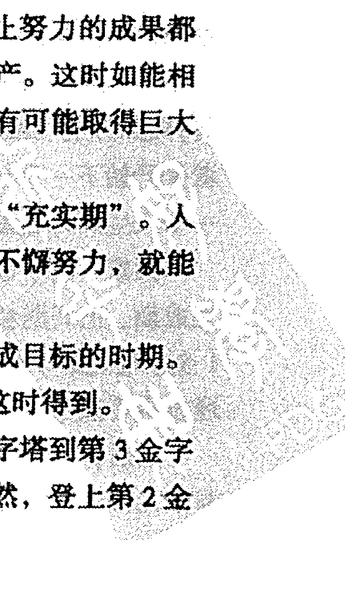

三个金字塔的山谷是为期6年的水平时期。从不顺期走下来后的3年是人生的休息时期。翻越一座大山之后，需要时间来调整身体和维护周围的事物。紧接着是开始下一个金字塔的最初3年，可以看作是攀登金字塔的助跑期。在攀登下一个人生高峰之前，应该先做好准备、好好地回顾过去和吸取过往的经验。

大家了解了以上的规律之后，试一下把各命运数的出发期、发展期、充实期、完成期、正周期和负周期的转折点年龄列出来。另外在92页载有出发期之后（第1金字塔之后）的各命运数的转折点年龄列表——“各命运数的金字塔起伏图”。通过查看这个表，大家就会对由命运数支配的运势一目了然。
然后，从94页开始我会向大家逐一详细地介绍命运数“1”至“9”、“11”与“22”的卡巴拉金字塔命运起伏图。

## 各命运数的 Start 年龄表

| 命运数 | 起始年龄 |
| :--- | :--- |
| 命运数 "1" | 26 岁 |
| 命运数 "2" | 16 岁 |
| 命运数 "3" | 33 岁 |
| 命运数 "4" | 32 岁 |
| 命运数 "5" | 31 岁 |
| 命运数 "6" | 30 岁 |
| 命运数 "7" | 29 岁 |
| 命运数 "8" | 28 岁 |
| 命运数 "9" | 27 岁 |
| 命运数 "11" | 25 岁 |
| 命运数 "22" | 14 岁 |

## 各命运数的金字塔起伏图

| 命运数 | 出发期-1 | 出发期-2 | 出发期-3 | 发展期-1 | 发展期-2 | 发展期-3 | 充实期-1 | 充实期-2 | 充实期-3 | 完成期-1 | 完成期-2 | 完成期-3 | 负周期-1 | 负周期-2 |
|--------|----------|----------|----------|----------|----------|----------|----------|----------|----------|----------|----------|----------|----------|----------|
| 1      | 27·28    | 29·30·31 | 32·33·34 | 36·37    | 38·39·40 | 41·42·43 | 44岁 | 45·46 | 47·48·49 | 50·51·52 | 53岁 | 54·55 | 56·57·58 | 59·60·61 |
| 2      | 17·18    | 19·20·21 | 22·23·24 | 26·27    | 28·29·30 | 31·32·33 | 34岁 | 35·36 | 37·38·39 | 40·41·42 | 43岁 | 44·45 | 46·47·48 | 49·50·51 |
| 3      | 34·35    | 36·37·38 | 39·40·41 | 43·44    | 45·46·47 | 48·49·50 | 51岁 | 52·53 | 54·55·56 | 57·58·59 | 60岁 | 61·62 | 63·64·65 | 66·67·68 |
| 4      | 33·34    | 35·36·37 | 38·39·40 | 42·43    | 44·45·46 | 47·48·49 | 50岁 | 51·52 | 53·54·55 | 56·57·58 | 59岁 | 60·61 | 62·63·64 | 65·66·67 |
| 5      | 32·34    | 34·35·36 | 37·38·39 | 41·42    | 43·44·45 | 46·47·48 | 49岁 | 50·51 | 52·53·54 | 55·56·57 | 58岁 | 59·60 | 61·62·63 | 64·65·66 |
| 6      | 31·32    | 33·34·35 | 36·37·38 | 40·39    | 42·43·44 | 45·46·47 | 48岁 | 49·50 | 51·52·53 | 54·55·56 | 57岁 | 58·59 | 60·61·62 | 63·64·65 |
| 7      | 30·31    | 32·33·34 | 35·36·37 | 38·39    | 41·42·43 | 44·45·46 | 47岁 | 48·49 | 50·51·52 | 53·54·55 | 56岁 | 57·58 | 59·60·61 | 62·63·64 |
| 8      | 29·30    | 31·32·33 | 34·35·36 | 37·38    | 40·41·42 | 43·44·45 | 46岁 | 47·48 | 49·50·51 | 52·53·54 | 55岁 | 56·57 | 58·59·60 | 61·62·63 |
| 9      | 28·29    | 30·31·32 | 33·34·35 | 36·37    | 39·40·41 | 42·43·44 | 45岁 | 46·47 | 48·49·50 | 51·52·53 | 54岁 | 55·56 | 57·58·59 | 60·61·62 |
| 11     | 26·27    | 28·29·30 | 31·32·33 | 35·36    | 37·38·39 | 40·41·42 | 43岁 | 44·45 | 46·47·48 | 49·50·51 | 52岁 | 53·54 | 55·56·57 | 58·59·60 |
| 22     | 15·16    | 17·18·19 | 20·21·22 | 24·25    | 26·27·28 | 29·30·31 | 32岁 | 33·34 | 35·36·37 | 38·39·40 | 41岁 | 42·43 | 44·45·46 | 47·48·49 |## “1”的命运起伏图

### 35岁到达人生顶峰，年轻时打下的基础要坚守

从命运数“1”的人的卡巴拉金字塔命运起伏图中可见，26岁是“Start”（开始）的年龄。26岁到35岁的9年是出发期。35岁会到达第2金字塔的顶点，即人生的顶点，从顶点开始到44岁的9年是发展期，从44岁到53岁则是充实期。53岁到达第3金字塔的顶点，之后到62岁的9年是完成期。62岁开始将进入人生第二个循环周期。

命运数“1”的人的特点是——即使老了，仍能像年轻时那样精力旺盛地工作。他们有着出人头地的运气，命中注定会成为领导者，很有可能在35岁就达到顶点。所以，人生中最关键的时期就是35岁前后的3年（即32至38岁）。若能在这段时间里登上较高的位置，今后的人生就会顺利地向着成功迈进，创造出巨大的财富。

好好把握从26岁到29岁的3年，对命运数“1”的人来说非常重要。在那3年里，做事应该尽可能地积极主动，以进攻为主，抓住每一个提升自己能力的机会，这样才能找到成功的契机。田中角荣便是一个典型的代表人物。他26岁创立了自己的公司，29岁当选为国会议员——这明显就是一个好的开始，正因为在出发期里的29岁成了国会议员，才会在发展期里的39岁成为大臣，继而在完成期里的54岁成为首相。

不过，为了使第2金字塔成为通向成功的巨大立足点，在走完第1金字塔的18年之前，必须定好人生的目标，而且已经付出行动。只要有足够的自信，发挥天生的挑战精神，就能找到自己的人生目标。不过，自私、利己的心态有可能让你走错路，还要特别注意人际关系。踏出第一步后若失败了，应该反省自己。若能在32岁到35岁这3年里取得良好的发展势头，那么成功也不远了。

从35岁到44岁这9年间，是继续巩固和发展之前所有成果的时期。截至38岁的3年间依然以进攻为主。即便有点鲁莽也无伤大雅，行动会为你带来获得财富的机会；从38岁到41岁期间，应停下来重新审视过往，找出可修正之处。在这3年里越成功的人越要重视在与人交往中产生的矛盾，凡事不能强行，应该以慎重为主；41岁到46岁这6年间，应该明确自己的目标，并优先付诸行动。若想获得财富与成功，这时期的准备则非常关键。

在第3金字塔中，若47岁到50岁的3年里没有人际关系的矛盾和金钱瓜葛，53岁就会迎来完成期的顶峰，前途一片光明。53岁前后的3年里（即50至56岁），应该优先实行“自己想做的事”，这样会为你带来地位和财富。但值得注意的是从56岁开始的3年。这段时期可能会遇上意想不到的厄运，特别是名声和财富兼备的人尤应注意。这个时期若不能平稳度过，甚至有可能会失去所有东西，例如，田中角荣。

荣因为洛克希德事件而离开政坛就是在这一时期发生的，所以保持保守的姿态是最安全的。

### 44岁有大成就：拿破仑是典型例子

命运数“1”的人一生中可能会有几次令世人瞩目的举动。到了某个年龄，他们会突然发挥实力，开始被周围的人留意。他们的人生充满变化，具备戏剧性。

这种戏剧性如果往正面的方向发展，就会表现为非同寻常的成就，特别在22岁到30岁的时候，运气处于上升阶段，这时期开始的事业很可能在44岁会获得较大的成就。不过，他们的欲望过于强烈，44岁前做事用力过度，这可能会令44岁之后的成就有所减少。一般来说，那些一直孜孜不倦地持续努力的人，会在53岁到55岁这期间迎来彰显成就的完成期。

以历史人物为例，法国大革命后执政法国的拿破仑是命运数“1”的名人。1769年8月15日出生的拿破仑在发展期当上皇帝。从发展期到完成期是他最活跃的时期。我将会在164页详细地介绍这位名人具有传奇色彩的一生，以体现卡巴拉金字塔命运起伏图的不可思议。

洛克希德事件：1976年美国洛克希德公司为推销其飞机向日本首相田中角荣及其他重要政治家行贿5亿日元，田中角荣因此被迫离开政坛。

### “2”的命运起伏图

### 多数在人生的后期才成功，发展期的前半期应积极行动

这类人在第 1 金字塔时期应该已经察觉到自己有很好的独创性和各种各样的主意。他们的想法与别人的不一样，甚至有很多听上去是不现实的，但在这阶段千万不要抑制这些灵感。出发期后期至发展期前期（即 22 岁到 28 岁）这 6 年间，创造新事物的欲望很强烈。此时更应注意凡事向前看，不要胆怯，才有可能把自己的想法转为现实，最终转化为财富。

不过，最有可能获得巨额财富的是在第 3 金字塔时期。从 34 岁（充实期）开始就可以尝试购入不动产之类的较为稳定的财产，即便最初并不是为了赚钱，但到最后它很可能会使你财富倍增。完成期比充实期有更多机会，只是

你并不适合进行投资股票等投机性行为，所以在做这些之前要慎重考虑。

事实上，从第2金字塔顶点的25岁开始，以定期存款等可靠的投资手段来存钱也是一种有意义的理财方式。这笔钱在将来说不定会派上用场。命运数“2”的人基本上是不用为钱发愁的，但在28到31岁、37到40岁、46到49岁这几个3年里，请小心不要卷入金钱纠纷中。在负周期里，很多想法也许会被否定，可能不知道该如何是好，但不要过于悲观，困难的时期终究会过去的。其中，美国前国务卿鲍威尔就是很好的例子。虽然他和鹰派人士对立，但仍然能顺利地完成了长达35年的政府职务。

### 活出精彩人生——勿忘记“11”的起伏节奏

命运数“2”的人在人生的起跑线上没有特别大的优势，也许有人会因此感到不安，但一直以来付出的时间和精力对他们而言是非常重要的，这一切会在今后带来胜利的果实。跟其他命运数的人相比，他们对环境等因素的变化更敏感，该如何适应各种变化是他们应该慎重思考的课题。

命运数“2”的人的开运契机出现在16岁到25岁之间，这9年的努力非常重要。从25岁到34岁的9年间，可能会得到难以置信的大发展。无论工作上、待人接物上，还是展现才能方面都会遇到很多好机会。

命运数“2”的人与“11”的人在卡巴拉金字塔命运起伏图上有诸多相似之处。在“2”的命运起伏图中，他们的人生阶段非常清晰地以16岁、25岁、34岁、43岁为转折点，运气也随之变化发展。与之相比，典型的命运数“11”的人更个性化，生活方式和运气的表现方式更大胆和戏剧化。

所以，如果身为“2”的你觉得自己的命运起伏图不准确，那就试试综合“11”的命运起伏图来一起分析吧。当“11”的特征很明显时，你的生活方式应该完全不同，你可能会为究竟怎样才能活出自我而苦恼。纵然有丰富的灵感和才华，但在机会来临之际，你有可能会受到干扰，无法完全展现自己。这时要切记的是，在机会面前不要考虑太多，尽情发挥你的天资吧！

在活跃于各领域的人里面，有很多看似“2”的人其实是命运数“11”的，看似“11”的人实际上是命运数“2”的。即使有些命运数“2”的人表面上没有“11”的特征，但他们的心底还是有“11”的影子的；而命运数“11”的人虽然表面大胆，但本质里也有很天真、容易受伤的一面，那正是“2”的内心特征，谨记这一点将是他们在漫长人生岁月中提升运气的秘诀。

### “3”的命运起伏图

### 年龄是3的倍数时命途突变，尤其注意33岁

从命运数“3”的人的卡巴拉金字塔命运起伏图可见，33岁是“Start”（开始）的年龄。33岁到42岁的9年是出发期。在42岁到达第2金字塔的顶点，从顶点开始到51岁的9年是发展期。51岁到60岁是充实期。60岁来到第3金字塔的顶点，此后到69岁的9年是完成期。

这类人在年龄是3的倍数时会遇到变化。这个特征在30岁后逐渐明显，33岁是出发期的“Start”之年，从此时起人生进入大变动期，可能会出现较大转变。这个转变也许是好的，也可能是坏的，如果能把握好机会，将会迈向成功。他们从小就很优秀，很多人会通过勤奋读书，通过进名校和大企业的精英路线最终出人头地，天生懂得运用创意赚大钱。但要取得大成就就要等33岁以后，属于大器晚成的类型。

### 卡巴拉金字塔命运起伏图的基本图

- 正周期
- 负周期

### 3的命运起伏图

命运数“3”的人在第1金字塔时期常常是别人眼中的精英分子，史上最年轻的大关晋级纪录保持者、平成的大横纲——贵乃花就是典型的例子。另外，命运数同为“3”的女明星宫泽理惠在小时候就已经是非常有名的艺人了。虽然相扑界和演艺界是完全不同的领域，但这两人都是那个时代的顶尖人物。同为精英的他们，立场上应该也有共通之处吧。但是在第1金字塔时期，周围的人对他们影响很大。即便本身很优秀，也可能处于无法实现自己意愿的困境中，因而苦恼不已。两人令人扼腕的结局确实如卡巴拉所预示的那样(注：贵乃花和宫泽理惠曾经有过婚约，后解除)。

同是命运数“3”的著名作家司马辽太郎毕业后进入新闻社做记者，在33岁那年发表了处女作《波斯的魔术师》。之后，他在从事新闻工作的同时兼顾写作，成为创作历史小说的第一人。另外，贵乃花在32岁时建造了自己的房子，宫泽理惠在33岁时就是一位受到高度评价的女艺人，这些都不是偶然的。相反，也有不少人在年轻时吃很多苦，但后期获得了令人惊讶的成就。这个转折点也是33岁。这类人常有很旺的运气，容易满足于精英的身份。若真的满足于现状，不但会错过在33岁出现的机遇，还很可能陷入不好的变动中。因此，时刻保持自信，懂得把握机会，坚持不懈地努力是成功的关键。

即使在33岁时错过了机会，到了第2金字塔的顶点，也就是发展期开始的42岁，也是谋求转变的时机。若能把握住这年的机会，直到45岁这3年间的人生会一下子转向好的方向。最后的机会则出现在第3金字塔的顶点，即完成期开始的60岁时，只要对将来仍然抱有期待、不断探寻机会，人生还会出现戏剧性的变化。然而，在36到39岁、45到48岁、54到57岁这3个三年里，目标和理想也许会变得模糊，最终可能失去方向，从而堕入堕落的生活中，因此必须注意。

也有人在年轻时就会利用创意和灵感赚取巨额的财富。但是，他们

1 大关：日本相扑运动员的资格等级，按运动成绩分为10级：序之口、序二段、三段、幕下、十两、前头、小结、关助、大关及横纲。

2 横纲：日本相扑运动员资格的最高级。

基本上都是浪费金钱的类型，有时还会为钱发愁。而发愁时想出的好主意又会让他们赚到所需的金钱。在负周期中，一定要慎重管理钱财，那可能会为他们带来下一个机会。

### 厄运年也是机会之年，贵人出现有助化解危机

上文提到，当这个命运数的人的年龄是3的倍数时，人生可能会出现大转变。第一次变动在33岁。33岁在日本被认为是女性的“厄运年”，但对命运数“3”的人来说，无论男女，这一年都会发生意想不到的变革。这个变动可能是正面的，也可能是负面的。30岁前付出的努力和积累的经验会从这一年开始明显地看到成效。在那年熬过苦的人，过了60岁之后会再一次展现自己的发展潜力。

无论男女都拥有较强的能力是命运数“3”的人的特征。其中，女性会有男性化的倾向，遇到负面的事都有战胜困难的勇气。相反地，如果男性比较女性化，他们情绪低落时可能会犯令人难以置信的错误，从而失去信心。不过，从另一个角度看，命运数“3”的人在33岁时最能显示自己强悍的一面，所以“厄运年”对他们来说也是一种机遇。就算发生不好的事，也会出现贵人，帮助他们渡过难关。

### “4”的命运起伏图

### 大器晚成，制定人生目标最重要

从命运数“4”的人的卡巴拉金字塔命运起伏图中可见，32岁是“Start”（开始）的年龄。32岁到41岁的9年是出发期。在41岁到达第2金字塔的顶点，从顶点开始到50岁的9年是发展期。50岁到59岁是充实期。59岁来到第3金字塔的顶点，此后到68岁的9年是完成期。

总的来说，命运数“4”的人是大器晚成的典型，在32岁之前的运气都不是特别好，做事常常绕了大圈，不得要领。然而，他们性格稳重可靠，学习勤奋。很多人可以通过努力和坚忍创出一片天地。当身处第1金字塔，事情难以如愿顺利开展的时候，如能坚持努力和忍耐，积聚更多的能量，那么，在往后的日子里就有希望取得成功。他们没有太多获取巨额财富的机会，踏实地工作能令财富逐渐积少成多。

从出发期后期的38岁到第2金字塔顶点的41岁这三年间，一定要一鼓作气，在前进路上不停歇，在机会面前勇敢果断，开创全球电脑软件潮流的微软公司创始人比尔·盖茨就是典型的例子。他在20岁时创立公司，23岁时把公司转移到西雅图并扩大了规模，39岁时推出了“Windows95”。而“Windows98”面世并在全球范围内热销的那年，他刚好43岁，正是发展期最初的3年期间。本书170页会有他的详细介绍。

若在发展期最初的41岁到44岁这三年间没有取得成功，或者事情进展不顺利的话，切记不要焦急而自乱阵脚，这是能否最终获得成功的关键。要对自己说：“那是很远大的目标，终究会成功的。”千万不要老是忧心忡忡地想“为什么自己没有成功？”
在这三年间和53岁至56岁的3年里，请处理好人际关系。因为你可能会为了实现人生目标（无论最终是否顺利实现）而过于优先考虑自己，对别人产生猜疑。这会令你失去有能力的工作伙伴和朋友，最终陷入自我封闭的状态中，造成恶性循环，最后很可能遭受严重的挫折。

### 完成期里开花结果，不要忘记拥有“22”的特征

32岁是“4”的人生“Start”点。直到那时他们的努力才发挥作用，这多少给

人……一种姗姗来迟的感觉。32岁到41岁这9年是出发期。在那之前，他们吃了不少苦头，但孜孜不倦的努力将会给今后人生带来大转变。从41岁开始的3年时间是成败的关键时期。当机会来临时，大胆地主动出击就对了。

就像命运数“2”和“11”之间有所关联那样，命运数“4”的人本质里也有命运数“22”的特征。虽然两个命运数的人生“Start”点不一样，但他们命运的高低起伏节奏却有相似之处，能相互作用。如果说命运数“22”的人一般通过继承父母的事业并发展壮大来实现自己的人生价值的话，那么命运数“4”的人的成功之路虽然走得比较缓慢，但也能一步步地建立自己的事业。

最能清楚地反映这两个命运数的命运起伏节奏区别的代表人物是新大谷酒店（Hotel New Otani）的创始人大谷米太郎和“丸井”百货商店的社长青井忠雄。他们分别是命运数“4”和“22”的名人。与30岁前历尽艰辛的命运数“4”的大谷相比，命运数“22”的青井忠雄可以说大大发挥了大幸运星的力量。他是丸井创始人青井忠治的长子，26岁成为公司董事，发展期里的27岁成为副社长，充实期里的39岁就成为社长。

### “5”的命运起伏图

### 能否找到适合的职业是成功的关键

从命运数“5”的人的卡巴拉金字塔命运起伏图中可见，31岁是“Start”（开始）的年龄，31岁到40岁的9年是出发期。40岁到达第2金字塔的顶点，顶点开始到49岁的9年是发展期。49岁到58岁是充实期。58岁来到第3金字塔的顶点，此后到67岁的9年是完成期。

总的来说，命运数“5”的人具备冒险精神和行动力，他们的人生大多富有戏剧性。虽然大多属于大器晚成的类型，但自我表现欲望强烈的他们对艺术有敏锐的触觉，若其天赋才能在第1金字塔时期的13岁至31岁期间得以展现，就能逐渐步向成功。日本第二个获得诺贝尔文学奖的大江健三郎就是这种类型。他在处于第1金字塔顶点的22岁那年，在《东京大学新闻》发表了《奇妙的工作》并获该报“五月祭奖”，成为踏上作家之路的契机，并开始受到人们的关注。不久之后，他在文学杂志上发表了《死者的奢华》等短篇小说。1958年发表的作品《饲养》获得第39届芥川奖。

如果想在第1金字塔时期取得成功，必须具备勇于挑战的精神。在22岁运势上升至顶点之前，应该尝试感兴趣的事情，即便失败也不要放弃。这种追求不懈的态度会带来好运。

进入第2金字塔（始于31岁）的出发期后，命运数“5”的人要以实力取胜了。若自信心十足，好运就会紧随而至。与其左思右想，倒不如付诸行动，“做”是比什么都来得重要的。有些人也许会兼做副业，但一定要正确地分析和判断自己适合怎样的工作，那是成败的关键。

然而，在出发期的34岁至37岁和发展期的43岁至46岁这两个3年里，要多加留意。这段期间也许会精神不振，意志消沉，这种情况下，绝不能突然离家出走，任意妄为的举动也许会断送自己的美好人生。命运数“5”的人向来举动大胆，代表人物有佐佐木香——她在40岁便创立了以营销和咨询为主要服务内容的EWOMAN公司。但在这段时期行事过于大胆的话，容易陷入不可挽回的境地，所以应该采取谨慎的态度。

充实期开始的前3年（即49岁至52岁）最有可能获得成功。一直以来，他们在各个领域发挥着才华，若在自信的领域已经有所行动，那么在第3金字塔期间就会取得较大的成就。但是，越是顺利越要注意，58岁开始进入完成期，在这期间稍有不慎就可能招致重大损失。为了避免悲惨的晚年，要学会抑制冲动，遇到麻烦不逃避。

命运数“5”的人对理财是毫无概念的，有很多人一不留神甚至会破产。所以在第1金字塔时期赚的钱，最好交给可以信任的人管理。在各个金字塔顶点的年份里，也不乏赚大钱的机会，应该好好把握。他们要么成为大富翁，要么落得个身无分文的潦倒下场，所以在冒险之前，要仔细分析事情的可行性和后果。在这一点上，长岛茂雄能给我们很大的启发，他的晚年生活是很典型的佐例。

# 决定成败的重要时刻：充实期开始的前3年

对命运数“5”的人来说，充实期开始的前3年（即49岁至52岁）出现最多能展现才能的机会，生活也会过得非常充实。但是，在进入完成期之前的3年（即55岁至58岁）里应该小心点。例如命运数“5”的林肯在充实期期间的52岁成为美国第16任总统，1865年遇刺身亡，终年56岁，正是快要进入完成期的年龄。

在完成期内，除因病死亡之外，也有人死于暗杀或事故，应该引起高度重视。对他们来说，进入完成期之前的3年是大变动期，可能会卷入意想不到的风波和纠纷中，遭受重大打击，因此对任何事情都不能掉以轻心。例如生于1889年4月20日、命运数“5”的希特勒在56岁那年与情妇埃娃·布劳恩一起自杀，与林肯总统被暗杀时的年龄相同。

### “6”的命运起伏图

### 主动进攻比保守等待更能招来好运

从命运数“6”的人的卡巴拉金字塔命运起伏图中可见，30岁是“Start”（开始）的年龄。30岁到39岁的9年是出发期。39岁到达第2金字塔的顶点，顶点开始到48岁的9年是发展期。48岁到57岁是充实期。57岁来到第3金字塔的顶点，此后到66岁的9年是完成期。

命运数“6”的人的特征——在金字塔的下坡期间比在上坡期间更能抓住成功的机会。他们凡事考虑周全，照顾周到，会协调和平衡各方面的利弊，即使处于负周期中也能很快扭转劣势。一般来说，在金字塔的下坡阶段应以保守为大前提，但若有进攻的好时机也不妨主动出击。由于本来就很有个性，下坡阶段的节奏更能配合他们的个性，对他们来说反而是有利的。另外周围的人也给予很多的帮助，所以命运数“6”的人遇到好机会、获得成功的可能性是非常高的。

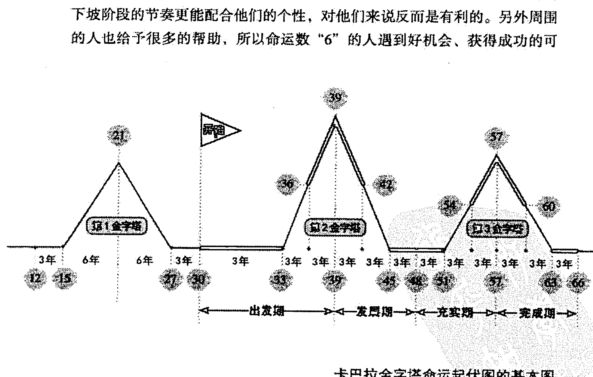

日本前外相田中真纪子在父亲田中角荣病重时，取而代之参加选举活动并成功当选。当时她42岁，虽处于下坡周期，但对她来说却正值发展期。从此，她开始被日本人认识，并因此步入政坛；职业足球选手三浦知良从巴西回日本时是23岁，正处于第1金字塔的下降周期，归国后加盟了川崎读卖绿茵队并迅速成为队里的明星球员，开始活跃于日本足坛；口袋妖怪的创始人石原恒和正式创立口袋妖怪中心是在1998年，那年他41岁，正处于发展期。

虽然命运数“6”的人中有不少在第1金字塔阶段就获得成功，并且一旦出名了就受到广泛关注，但并非每个人的展现能力的最佳时间都相同，谁也说不清机会何时到来，这正是命运数“6”的人的特征之一。有些时候，机会甚至会突然到来。例如，日本已故前首相小渊惠三担任竹下登内阁官房长官时，曾在电视上宣布“平成”为日本新年号，从而引起人们的关注，那年他51岁，正是充实期的停滞时期的最后一年。在那之前他是不引人注意的类型，但经过在电视上这么一露脸，人们开始认识他，并亲切地称他为“平成大叔”，最后还成为了日本的首相。刚才提到的田中真纪子第一次当选为众议院议员也是在49岁，同样处于低迷期的停滞周期中。

命运数“6”的人很会照顾他人，会强烈地指责不会照顾别人的人。虽然他们的指责是有道理的、被指责的人也无从反驳，但这样会引起别人的憎恨。在各个金字塔的顶点时，言辞上更应有所注意，否则会招致不好的结果。例如田中真纪子在第3金字塔的顶点（即完成期开始的57岁）时，与外务省的官员发生冲突，矛盾迭起，最终无法顺利度过完成期。同时，过多地考虑别人的事，责任感过强也不见得是好事。那会让好机会不经意地溜走。保持放松的精神状态是他们的头等任务。

至于财富方面，第1金字塔到第3金字塔的各个顶点时期，都会出现赚大钱的机会。但是，即便拥有财富，他们最重视的还是自己的价值观和精神世界，所以平时在生活中是比较节俭的。然而在下坡阶段，表现得大方和开放一点是非常重要的。特别是如果在完成期过于为钱烦恼，只会为晚年生活带来不安。

> 口袋妖怪：日本任天堂株式会社在1996年推出的一款 Game Boy 游戏，该游戏以角色扮演为主，辅以战略和动作，最大的乐趣不只是在战斗，而是收集与捕捉各种各样可爱的精灵，完成口袋妖怪图鉴。

### 成功秘诀：发挥协调性

在下降期和发展期比在完成期更能发挥自己的能力是命运数“6”的人的特征。一般来说，人们在难熬的下降期和发展期总有不知该往什么方向努力的困扰，但对于本来就协调性良好的命运数“6”的人来说，这些只是小菜一碟。良好的协调性让他们懂得如何度过难关。在此不能不提作为日本商界最成功的人士之一、命运数“6”的松下幸之助。今天的“Panasonic（松下电气产业）”的基础完成于1950年，那时松下幸之助处于完成期的56岁，同年他把社长之位让给女婿松下正治。之后在公司运作不良时重返工作第一线，那时他67岁，人生进入第二次循环，并由此重新出发。

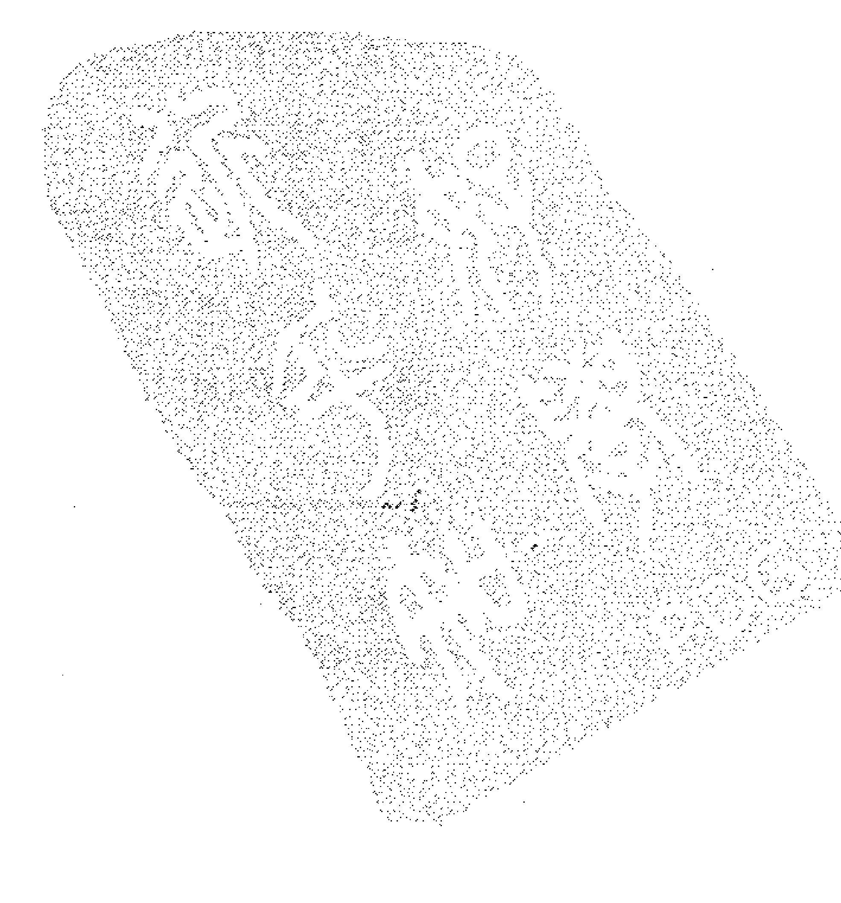

### “7”的命运起伏图

### 最初的机会出现在第1金字塔时期，20岁是人生转折点

从命运数“7”的人的卡巴拉金字塔命运起伏图中可见，29岁是“Start”（开始）的年龄。29岁到38岁的9年是出发期。38岁到达第2金字塔的顶点，顶点开始到47岁的9年是发展期。47岁到56岁是充实期。56岁来到第3金字塔的顶点，此后到65岁的9年是完成期。

对于命运数“7”的人来说，最初的成功机会出现在第1金字塔时期。在19岁时应该为迎接顶点时刻做好准备。20岁那年遇到的人或事很可能会对人生产生深远影响。至于这些影响是正面的还是负面的，则与19岁前的生活方式有关。无论是好是坏，都应该记住20岁是人生的转折点。也许转变是突然发生的，也可能是缓慢进行的，当意识到这个变化时，价值观可能已经变得与年幼时完全不同了。

若20岁那年发生的事对后来产生负面影响，挽回的机会将出现在29岁到32岁这3年间。当发现自己已经陷于不利的环境中，应该在那3年间停下来回首往事，冷静地想清楚自己曾经在哪里出了错，然后在跌倒的地方爬起来，重新上路！

深谋远虑、做事有毅力、喜欢独处是命运数“7”的特征，但可能因为过于独立而变得排斥或攻击他人。攻击性的个性会把他们引向不好的事情上，所以必须保持警戒心。改变他们命运的不一定是有益的书或优美的音乐作品。

### 出发期前后：可能有重大变化

命运数“7”的代表人物戴安娜王妃在20岁时与查尔斯王子结婚。之后多次传出两人感情不和、关系破裂的消息，30岁那年两人正式分居，36岁时戴安娜遇到交通事故身亡。无论是否偶然，她死于事故是千真万确的事实。对于命运数“7”的人来说，如果能够不那么固执和自以为是，多听取意见，并且轻松地生活，那么人生重要的机会将会在第2金字塔的出发期和成长期中逐渐成形并显现出来。20岁时的变动若能正面发挥作用，个人会得到很大的发展。

这类人没有什么金钱欲，所以在财富方面顺其自然就可以了。若太精明，反而会让财运溜走。在第2金字塔阶段应该树立正确的金钱观，计算好往后所需要的金钱，平日一点点地存起来，在第3金字塔时期就会累积成一笔可观的财富。

命运数“7”的人从发展期到完成期期间可能会遇到不少竞争对手和反对者。例如，被称为美国“悲剧总统”的约翰·肯尼迪生于1917年5月29日，命运数是“7”。前面也说过了，这个命运数的出发期、发展期、充实期和完成期分别开始于29岁、38岁、47岁和56岁。肯尼迪在1946年当选为联邦众议员时29岁，刚好是出发期的开始那年。然后在1960年获得美国总统大选的胜利，正处于发展期的43岁。4年后的47岁，他遇刺身亡，刚好是进入充实期的时候。

与所有命运数都一样，充实期到完成期期间是最容易出现竞争者和反对势力的时期。第3章中会详细介绍命运数“1”的名人拿破仑，他远征莫斯科失败，势力受挫的时候，正处于充实期到完成期期间。这个时期也是所有企业老板和政治家等登上最高领导地位后，容易变得过于自信的时期。

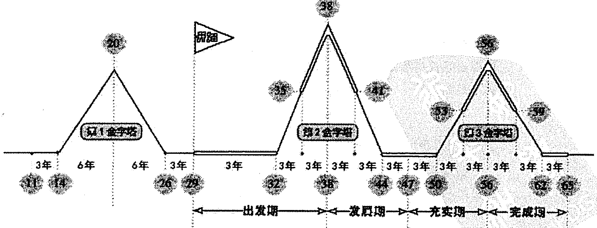

### 卡巴拉金字塔命运起伏图的基本图

- 正周期
- 负周期

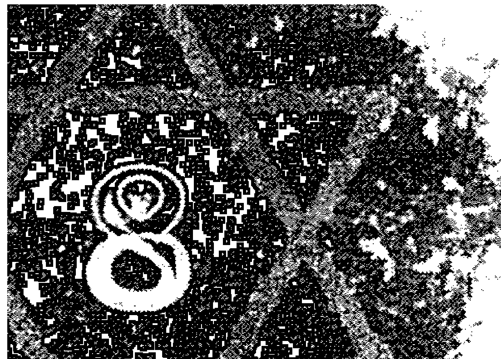

### “8”的命运起伏图

### 充分发挥积极性能迎来爆炸性的发展

从命运数“8”的人的卡巴拉金字塔命运起伏图中可见，28岁是“Start”（开始）的年龄。28岁到37岁的9年是出发期。37岁到达第2金字塔的顶点，顶点开始到46岁的9年是发展期。46岁到55岁是充实期。55岁来到第3金字塔的顶点，此后到64岁的9年是完成期。

对命运数“8”的人来说，发挥积极性是机会的源头，在第2金字塔开始（即出发期开始）时的28岁，有可能会突然展现自己的能力，受到身边的人的高度信赖，若能把握住这个机会，就能开始崭露头角了。在28岁时获得初期成果的人在第2金字塔的顶点（37岁）很可能会迎来人生的转换期，那才是人生中的最大机会。例如20世纪最伟大的天才画家巴勃罗·毕加索（Pablo Picasso）是命运数“8”的人，他的经历明显地反映出这个命运数的起伏节奏。他在28岁前后确立立体派风格，在当时的美术界掀起大革命风潮。他在37岁前后舍弃了立体派风格，开始向新古典主义摸索，这对美术界的冲击更加巨大。

处于第2金字塔的出发期到发展期期间、没有经历大变化但吃了不少苦头的人会在第3金字塔时期遇到好机会。如命运数“8”的日本棒球史上有名的接球手野村克也，属于太平洋联盟的他在第2金字塔顶点时刻的前后（35岁），安打¹的记录就达到了2000次，成为兼任教练的选手，但当时并没有引起人们高度的重视，连他也把自己比喻为月见草²。但是，进入充实期后，他先成为棒球解说员，随后就任东京养乐多燕子队的教练，带领球队在日本棒球联赛屡屡获胜，取得了重大的个人成就。

应该注意的是出发期的中段的31岁~34岁这3年，虽然在这期间能发挥卓越的能力，但因为不够慎重，可能不断犯较大的错误。在第2金字塔时期经历磨难的人有很多都是因为在那3年里遭遇了失败，导致之后的落魄，因此必须注意。

> ¹ 安打：棒球和垒球运动的名词，指打击手把投手投出的球击出到界内，打者本身能至少安全上到一垒的情形。
> ² 月见草：一种在傍晚开黄花的植物，原产自美洲温带。

第3金字塔的充实期中的37岁至40岁的3年里，也应该注意小失误。虽然积极性能唤来机会，但也很容易在无意中自取灭亡。

财运方面，在第2金字塔顶点（37岁）和第3金字塔顶点（55岁）会有两次至关重要的机会。他们对赌博有敏锐的分析力，在投资上也不妨主动出击，但判断失误可能会成为阻碍。因此，冷静思考的能力非常重要。

### 28岁时的决定改变人生：吉永小百合

28岁是命运数“8”的人的“Start”时点，也很有可能是他们的良好开端。与其他命运数的人相比，他们更能在“Start”阶段获取爆发性的人气，更容易得到周围的信任。这个命运数的成功人士中，很多都在发展期的37岁前后迎来人生的大转换期。他们在这个时期牢牢地抓住了机会。特别是在出发期至发展期的期间，越是经历过磨难的人，越能在接下来的充实期里飞跃式地成长。

这个命运数的女性很多会在28岁结婚，婚姻也可以看作人生的新开始。然而，在这个时候结婚可能会遭到别人的反对，为了向世人宣布自己已长大成人，有必要独立地做一些重大的决定。如命运数“8”的名人女演员吉永小百合结婚和开始新活动都是在28岁。她的婚姻当时遭到周围强烈的反对，但28岁时所作的决定使她的运势向上扭转，并最终成为了一位伟大的女演员。

命运数“8”的女性对爱情是充满激情的，甚至会做出对伴侣不忠的事，而毁掉了自己的前途。如出生于1915年8月29日、命运数“8”的美国好莱坞著名女演员英格丽·褒曼（Ingrid Bergman），她主演了《卡萨布兰卡》、《战地钟声》等多部作品，她在1944年获得奥斯卡最佳女主角奖，是知性与美貌并重的大明星。然而，她的人生也是曲折跌宕的。她在人气最旺的时候与电影导演发生婚外情，与丈夫离婚。在运气上升最迅猛的时期（24岁到29岁）离开了美国。后来虽然重回电影界，却患上乳癌，人生遭到重大打击。她去世那天，正是她的生日。

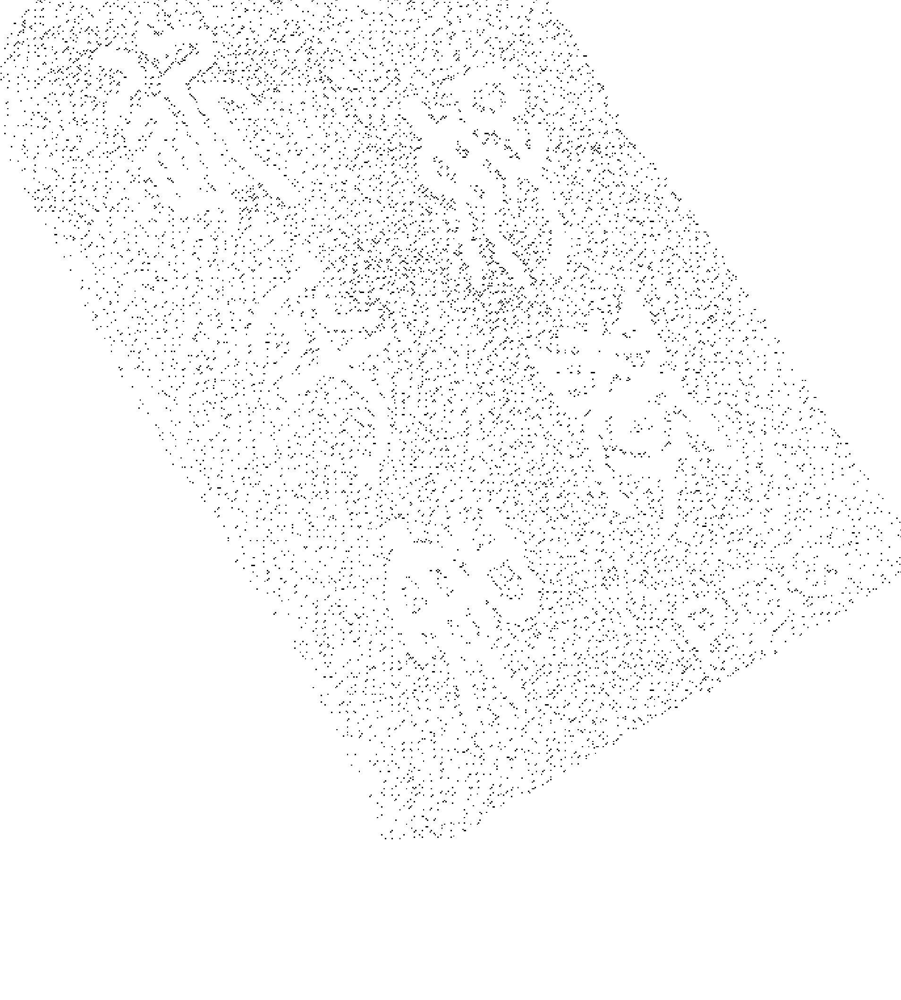

### “9”的命运起伏图

### 生活和工作不断变化，30岁是人生转折点

从命运数“9”的人的卡巴拉金字塔命运起伏图中可见，27岁是“Start”（开始）的年龄。27岁到36岁的9年是出发期。36岁到达第2金字塔的顶点，顶点开始到45岁的9年是发展期。45岁到54岁是充实期。54岁来到第3金字塔的顶点，此后到63岁的9年是完成期。

在很多命运数“9”的人一生中，工作和生活的形式都不断变化。第1金字塔时期是人生的准备阶段，若在顶点（18岁）时可以深入地发掘自己的可能性，为今后的人生做出正确的选择，就能在很大的范围内遇上机会。

这个命运数的人身体强壮，不知疲倦，在第2金字塔的出发期初期的3年（即27岁到30岁）间，应该尽量去体验多姿多彩的世界。对他们来说30岁是重要的转折点。在30岁那一年里，如果下定决心做自己想做的事情，将会有意外的收获。

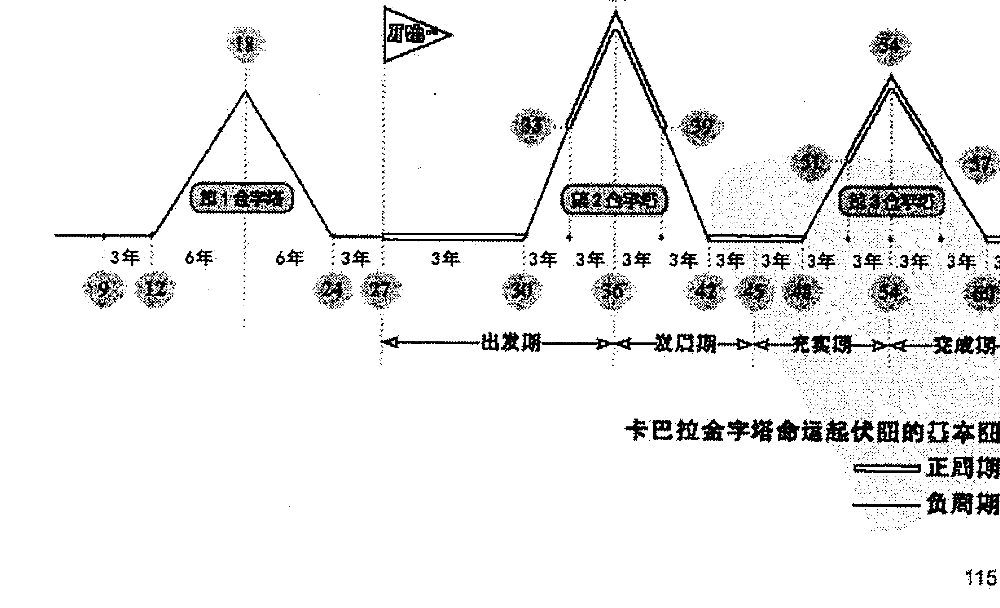

在第2金字塔的顶点（36岁）时，人生进入发展期，他们的目光会转向更广阔的领域。当然，没有必要任何领域都参与，但人生的转变很可能会把他们引向成功。

命运数“9”的名人小泽一郎18岁时考试落榜，下决心将来成为政治家，27岁当选为国会议员，30岁再次当选，36岁出任自民党政调科学技术部部长，那一年正是第2金字塔的顶点（发展期开始的年龄）。进入第3金字塔的45岁（充实期开始）那年，他出任内阁官房副长官，47岁出任自民党干事长，在自民党内非常活跃。51岁他离开自民党，组建新生党并出任代表干事。他在第3金字塔的完成期里经历了多次戏剧性的转变，在第3金字塔的顶点（完成期开始的54岁）时就任新进党的党魁，在完成期中期56岁时又成为了自由党的党魁。

总的来说，命运数“9”的人一生中几乎没有遭受大损失的时期，但转变的事接踵而来，因此在各个金字塔的负周期里应该提高警惕，做事更应谨慎。他们对金钱不太在意，有多少就用多少。但在金字塔下降周期里，还是节俭一点比较好。

### 与挑战决一胜负的胆量很重要

纵观这类人的一生，他们中很多人的工作和生活都变化不断，而且这些转变大都是突然出现的，极具戏剧性。对他们来说，27岁将迎来大挑战。27岁加上9的那年即36岁是转变最大的年份。在这一年里将会有重要的工作和责任交托给他们。不过，虽然有这样的机会，但他们可能会对过去的失败耿耿于怀，失去向前迈进的勇气。所以，学会摆脱过去的失败和精神创伤，不受这些负面情绪的牵绊，对他们来说是头等大事。另一方面，纵使很有天赋，他们中有些人会被某种负面力量所支配，无法顺利地展现天生的才能。

与天赋相关的最典型的例子就是女歌手美空云雀了。多才多艺的她8岁开始登台献艺，12岁灌制唱片，集万千宠爱于一身，星途顺利，原本应该还有向上发展空间的，却因为身体原因遗憾地离开了人世。其他命运数“9”的名人还有美国第39任总统卡特。卡特在当选时正好处于第3金字塔顶点前的53岁；1980年总统选举中败给里根时正好57岁，处于下降期，而且开始进入负周期。

命运数“9”的人在运气不好的时候也许会受到较大的打击，但若能从打击中重新站起来，意想不到的好运气就会随之而来。在感觉不顺利的时候，千万不能忘记这一点。寻找合适的伴侣是他们挽回运气的关键。应该慎重地考虑与谁结合、该借助谁的力量这个问题，再选择合适的结婚对象，从而有助增强运势。

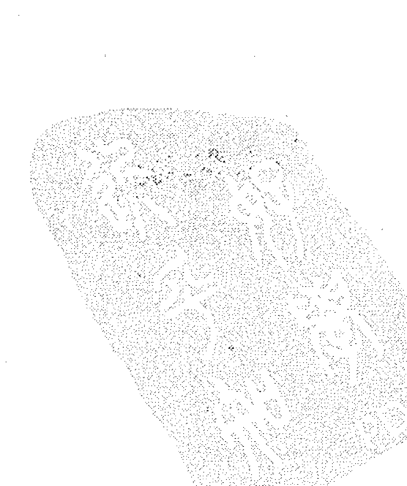

### “11”的命运起伏图

多为早熟型天才，找到能推动自己的伙伴是成功的关键

从命运数“11”的卡巴拉金字塔命运起伏图中可见，25岁是“Start”（开始）的年龄。25岁到34岁的9年是出发期。34岁到达第2金字塔的顶点，顶点开始到43岁的9年是发展期。43岁到52岁是充实期。52岁来到第3金字塔的顶点，此后到61岁的9年是完成期。

命运数“11”的人天生不满足于现状，渴望人生多姿多彩，他们也很幸运，在合适的时候大多会有欣赏他们的伯乐出现。25岁是他们的“Start”年龄，可是他们的人生通常在第1金字塔时期就已经“全速前进”了，所以往往在很年轻时就有收获成功和财富的机会。

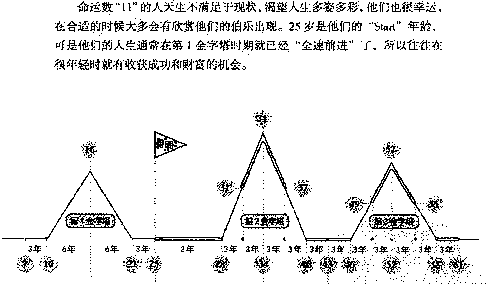

与存在于某个团队中相比，他们更渴望自由。即便在负周期时，比起保守等待，他们更倾向于挑战难度。可是，如果不能遇到理解自己的人，他们会封闭自己。所以说，他们不能缺少伙伴的协助。他们最迟应该在到达第2金字塔的顶点（即发展期开始的34岁）前找到可以信赖的合作伙伴。

在财运方面还是顺其自然吧。只关心享乐的他们对金钱管理完全不在行，需要协助者的帮助。但是，如果他们能把创意转化为现实，也在第1金字塔时期就富起来的几率还是挺高的。

歌手麦当娜就是可以反映这个命数的起伏节奏的名人。她25岁在演艺圈初次亮相（那一年恰恰是“Start”时点），在出发期初期的27岁结婚，31岁离婚。尽管她的丑闻接连被曝出，但好运气支撑着她的事业继续发展。她在发展期开始时的34岁那年，以6000万美金的身价与美国时代华纳签约，创立了Maverick唱片公司。之后，麦当娜在唱片中不断加入新元素。有人认为麦当娜的音乐之所以能不断给时代带来震撼和冲击，是因为“麦当娜最优秀的才能是很有发掘优秀制作人的眼光”。而我认为她很清楚自己天生的才华，因此从不间断地寻找能实现她的创意的合作伙伴。

另外，命数“11”与命数“2”的命运起伏节奏有相似的地方，所以应该综合起来解读。

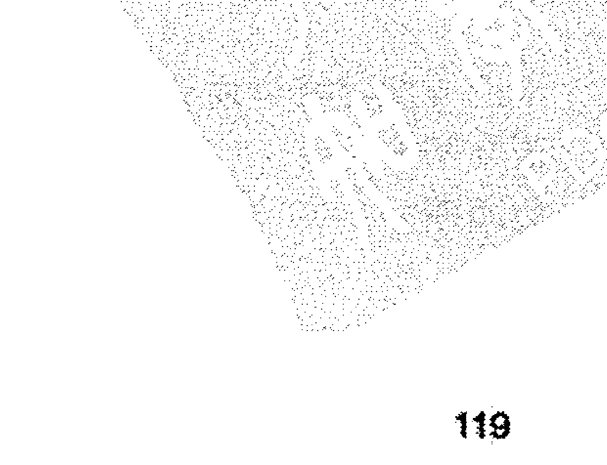

### “22”的命运起伏图

### 最早熟的类型，在年轻时制定目标是成功的关键

从命数“22”的卡巴拉金字塔命运起伏图中可见，14岁是“Start”（开始）的年龄。14岁到23岁的9年是出发期。23岁到达第2金字塔的顶点，顶点开始到32岁的9年是发展期。32岁到41岁是充实期。41岁来到第3金字塔的顶点，此后到50岁的9年是完成期。

命运数“22”的人的“Start”年龄是所有命数中最小的，他们中很少人会遭遇不幸的事。走进社会之后在成功路上快速前进，很多都能得到前辈或上司的提携，获得意想不到的成功。他们出人头地的时机比别人早，因此尽量在年轻时确定好人生目标，这对运势发展有利。

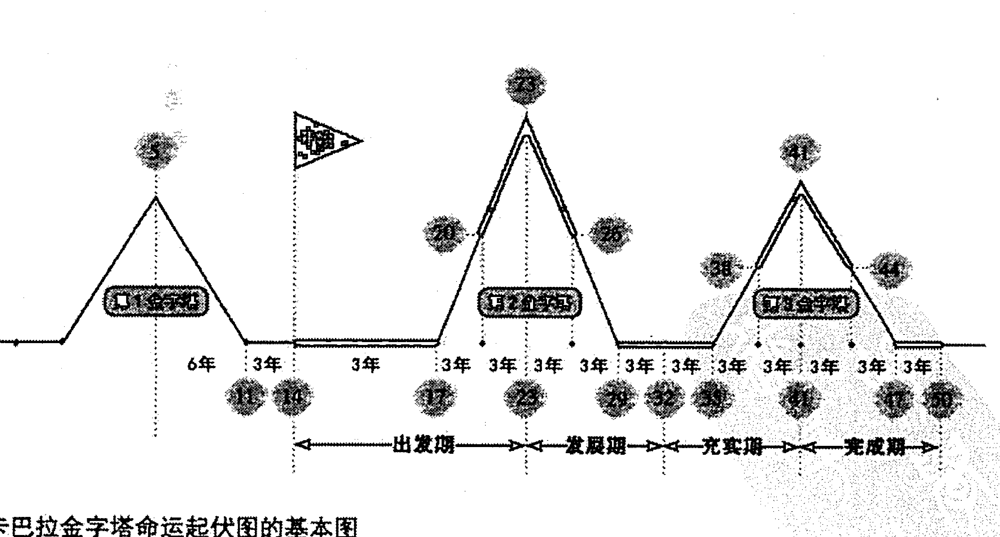

### 卡巴拉金字塔命运起伏图的基本图

- 正周期
- 负周期前英国首相玛格丽特·撒切尔就是很好的例子。她在第2金字塔时期进入牛津大学攻读法律，考取了律师资格，在第3金字塔的充实期里首次当选，成为英国历史上第一位女议员，正式踏入政坛。她以“影子内阁”的理念开始在政坛崭露头角时是41岁，那年正是第3金字塔顶点。过了完成期，刚进入第二次人生循环的54岁时，她成为英国历史上首位女首相。

然而，因为运气太好，做任何事都很快上手并迅速成为社会精英，命运数“22”的人容易变得以自我为中心。特别在取得成功后的负周期中，若过于自我，可能会卷入纷争，因此应该特别注意。而在正周期中，如果过于自我，容易变得无视法律和组织规定，而且心中对罪恶的感受也越来越迟钝。他们之前的运气是唾手可得的，一旦失去了运气，他们便事事不顺，迅速没落。他们的人生就是如此两极化。

在财运方面，只要有机会就去争取吧。这个命运数的人中有不少都顺利地继承了父母的财产，并且能很好地运用这些金钱。不怎么考虑钱的事情，也不怎么需要为钱烦恼，赚钱对他们来说一点都不辛苦。在赌博和股票等投资领域也有能力和运气，在上升周期中，勇敢出击可能会带来巨额财富。

另外，命运数“22”与命运数“4”的起伏节奏有相似的地方，应该综合起来解读。但也要注意这两个命运数的区别。一般来说，命运数“22”的人的发展比较迅速，很多都能把从父母继承来的东西发扬光大，受上司和前辈信任和重用，从而获得巨大的成功。而命运数“4”的发展节奏比较缓慢，可能会稍微绕一些远路，再回到正轨上继续前进。

# 第五章 从‘卡巴拉天宫图’洞悉隐藏的才能

## 卡巴拉天宫图：被隐藏的才能与特质

通过上文我们了解到如何透过命数看性格，透过年运数看各年的特征，透过个人年运数看每个人在特定年份里的运势，还有透过卡巴拉命运起伏图看人生的起伏节奏。

为了更好地度过一生，有必要更加了解自己和明确地知道自己的能力，尽可能展现长处，弥补短处。占星术中可以用天宫图来分析人的能力，卡巴拉也有独立的天宫图来进行多方面的判断。

卡巴拉是用数字来解密人的运数的，对此前文已有所说明了。命数和个人年运数的数字能反映人的性格。只是，到目前为止我们研究的都是计算的结果，而不是过程。事实上，构成命数的每个数字都是有意思的。那么，让我们试着分析计算命数的过程，逐一解读各数字的意义吧。

现在，思考一下命数的重要组成部分——出生日期的数字的意思吧。

以芥川龙之介和志贺直哉为例：

芥川龙之介 1892年3月1日出生……命数“6”

把出生日期的数字拆开，可以看出他拥有“1”、“8”、“9”、“2”、“3”、“1”的特质。

志贺直哉 1883年2月20日出生……命数“6”

同样地把出生日期的数字拆开，可看出他拥有“1”、“8”、“8”、“3”、“2”、“2”的特质。

虽然两人的命数都是“6”，但比较数字的构成，会发现芥川龙之介拥有“9”的特质，而志贺直哉没有。“9”表示高度的精神性和哲学。对比一下两人的写作风格，芥川龙之介的《罗生门》和《蜘蛛之丝》等作品对精神世界有较深刻的探讨。而志贺直哉的《暗夜行路》和《小僧之神》等是现实主义的作品。通过比较分析两人的出生日期数字构成，不难发现即便命运数同样是“6”，活跃于同一时代的作家的写作风格都有明显的区别。卡巴拉天宫图就是由每个人的出生日期的各个数字组成的。因此，即便命运数相同，通过天宫图的数字的构成，不同人的人生中会有不同的正面元素和负面元素交错在一起。通过解读卡巴拉天宫图，我们就能对自己优秀的或者不足的地方一目了然。

## 卡巴拉天宫图的构成

卡巴拉天宫图也被称作命运的缩影。它是由两个三角形组成的被称作“大卫星”的图形。卡巴拉正是用这个图形来进行占卜，方法十分简单。

请看下页的“卡巴拉天宫图的基本图”。图中竖列和横列各有三个数字，每个数字在图中也有特定的位置，合计九个数字。

根据各个数字的排列规律，在 125 页的“卡巴拉天宫图”中填入自己的出生日期的数字。若数字出现重合，尽管放在同一个地方就可以了。请注意天宫图中“0”是忽略不计的。

## 卡巴拉天宫图的基本图

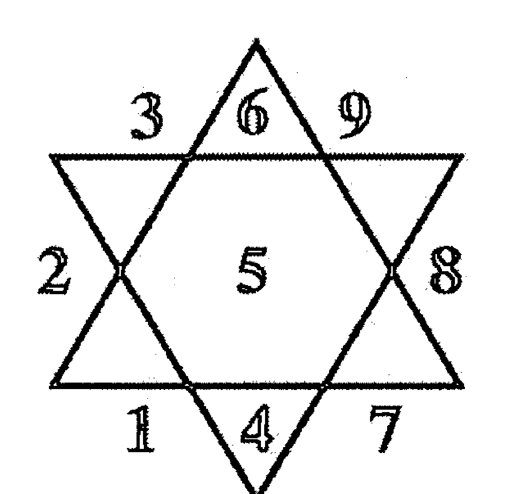

我们来试填一填刚才举例的芥川龙之介的天宫图吧。他的出生日期是1892年3月1日，构成的数字分别是“1”、“8”、“9”、“2”、“3”、“1”。把这六个数字填进特定的位置后，“芥川龙之介的卡巴拉天宫图”如下图。

## 芥川龙之介的卡巴拉天宫图

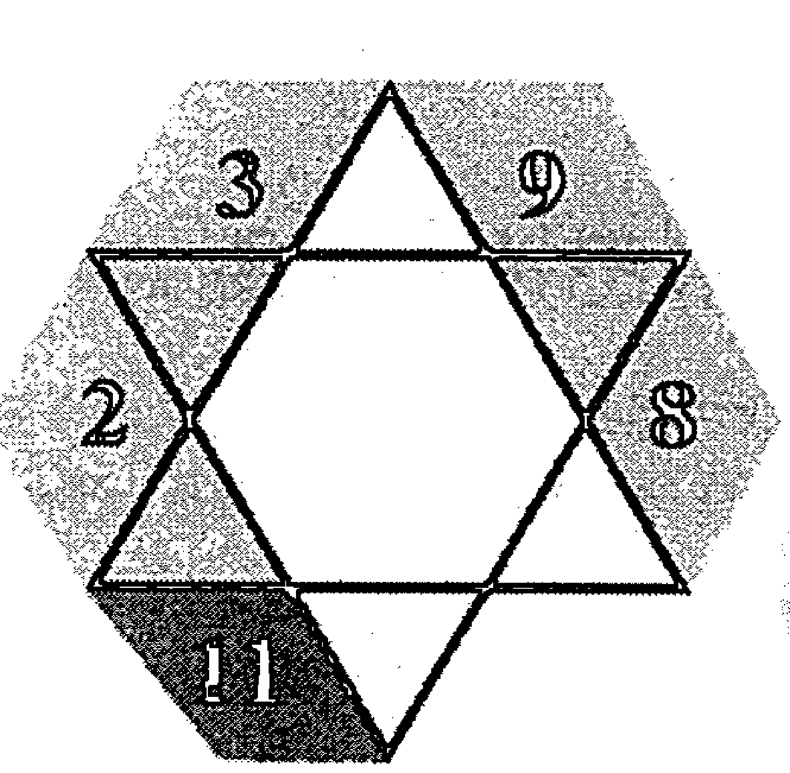

大家就按上述方法来填填自己的卡巴拉天宫图吧。

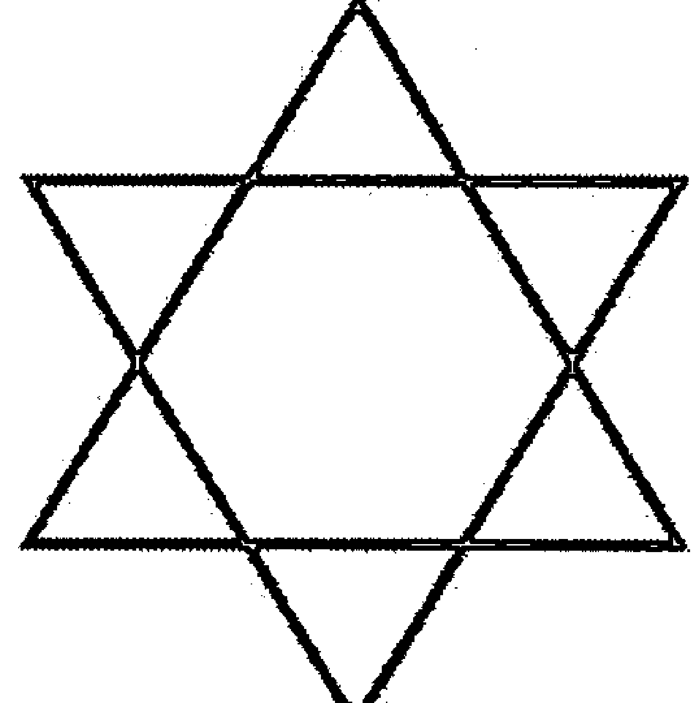

## 解读卡巴拉天宫图结合数字的单独含义和分布

卡巴拉天宫图填好后就可以具体地解读它的意思了，不过首先要了解一下卡巴拉天宫图的两个核心。

- 出生日期各数字的含义
- 数字的个数和分布

## 数字的含义

| 数字 | 含义 | 数字 | 含义 |
|---|---|---|---|
| 1 | 表示语言能力 | 6 | 表示爱情 |
| 2 | 表示感受性和直觉 | 7 | 表示牺牲精神 |
| 3 | 表示头脑和判断力 | 8 | 表示现实主义 |
| 4 | 表示物质主义 | 9 | 表示理想 |
| 5 | 表示意志 | | |

具体内容将在后面进行详细说明，数字的单独含义和卡巴拉天宫图中数字分布的意义大致如下。

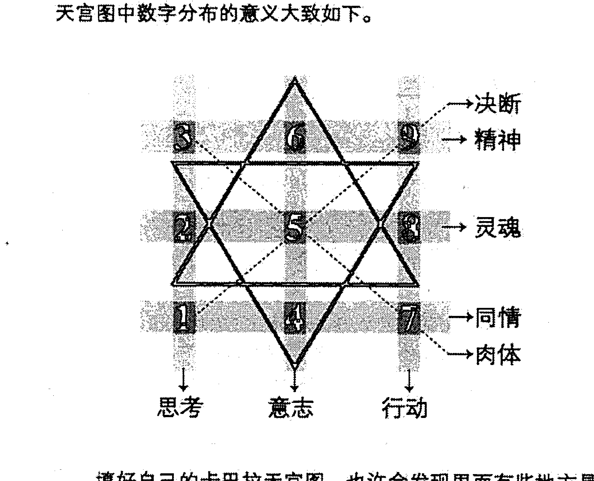

填好自己的卡巴拉天宫图，也许会发现里面有些地方是没有数字的。前面也说过了，卡巴拉天宫图是不可能所有区域都填上数字。现实也的确如此，即使你的出生日期的数字再怎么齐全，最多也只有8个不同的数字，是不可能把天宫图的九个格子填满的。那么，对于没有数字的区域，难道就没有补救的方法吗？那也不一定。可以用其他数字的分布来弥补。其实，缺乏某些数字不代表那个人完全没有某方面的能力，只是说某方面的能力较弱而已。
相反地，数字重复的区域可以解读为“协调和合作”。也许有些人的天宫图有失均衡，但不必担心。历史上有很多名人都属于缺乏均衡性的、能力集中型的人才。

- 竖列
  - 1·2·3 思考之列：判断是否能系统思考问题
  - 4·5·6 意志之列：判断是否具有坚定意志
  - 7·8·9 行动之列：判断人的行动力强弱
- 横列
  - 3·6·9 精神之列：判断智力和精神的平衡度
  - 2·5·8 灵魂之列：判断人际关系上的宽容度
  - 1·4·7 肉体之列：判断肉体的能力
- 斜列
  - 3·5·7 同情之列：判断人的沉稳和安定程度
  - 1·5·9 决断之列：判断人的决断力和廉洁度

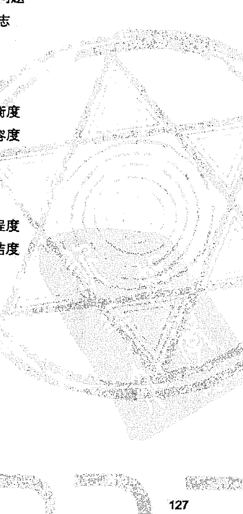

## 天宫图中的“1” 语言能力

### “1”表示发达的沟通能力

“1”是与语言密切相关的数字。对于在公历1000年到1999年期间出生的人来说，他们的卡巴拉天宫图中至少有一个“1”，它是处于特别位置的数字。而2000年以后出生的人的卡巴拉天宫图中至少会有一个“2”，“2”就是这个一千年里的特别数字。

### 只有一个“1”的人

拥有发达的沟通能力

卡巴拉天宫图中只有一个“1”的人（例如1972年5月6日出生的人）并不太懂得把自己的心情和想法坦诚地告诉对方。他们不擅长表明心迹或与人商量，即便有烦恼，大多数人都会自己解决。相反地，他们喜欢快人快语，享受与人杂七杂八地、不着边际地闲谈。这类人太爱闲聊了，特别是女性。她们常常因为长时间打电话或私下交头接耳而被责备。基本上，与精神的充实和心灵的满足相比，他们更渴望得到类似社会地位的提升或收入的增加等看得见、摸得着的成功。

### 有两个“1”的人

善于表现自我

卡巴拉天宫图中有两个“1”的人（例如1981年8月22日出生的人）同时具有雄辩才能和状况判断力。他们擅长准确地表达自己的想法，也容易理解和接受别人的想法。即使那些想法与自己的有冲突，他们也会在心里消化掉，使两者取得协调。在会议上，他们的发言能得到听众的理解和信服。他们有着令对方采纳自己意见的才能，尤其是1981年出生的人特别容易拥有这种才能。如果能适当地运用这种才能，它有可能转化为可观的财富。但是，若一味主张和表现自己，可能会招致嫉妒。若能做到尊重别人、把别人与自己的意见加以区别和采纳，个人的运气会更佳。

### 有三个“1”的人

具备成为记者的资质

卡巴拉天宫图中有三个 “1” 的人（例如 1955 年 12 月 19 日出生的人）具有很强的写作能力。他们的文章深入浅出，充满智慧，通俗易懂的同时有强烈的表现力，能感动读者。可以说这是他们天赋的才能。这类人具备成为优秀的作家或记者的天资。

另一方面，他们头脑转动很快，可能语言会跟不上思想。或者说，也许他们会因为无法完全表达自己所想而招来不幸。

基本上，与打电话相比，他们更擅长写信或电子邮件。所以这类人喜欢与和他们相似的人相处，回避与忧郁的人打交道。

### 有四个“1”或以上的人

精力过剩的人

卡巴拉天宫图中有四个 “1” 或以上的人（例如 1961 年 10 月 21 日出生的人）身心都充满能量。与任何人说话都极少闲聊，而是深入地讨论，强烈主张自己的意见。由于头脑转得太快，导致不能把心中所想全部传达给对方，让对方理解，因此可能会做出让别人感到唐突的举动。

另外，有五个 “1” 的人（例如 1991 年 11 月 18 日出生的人）是精力过剩的类型，甚至休息或放松一下都会产生罪恶感。若这类人创办有意义的事业或开展某项创造性的项目，可能会取得巨大的成功。但应该注意的是，如果找不到自认为有意义的事做，也许会变得自以为是，忧郁，对人带有攻击性。

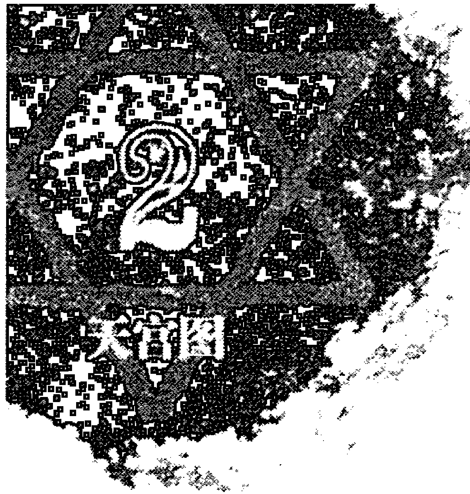

## 天宫图中的“2”感受性

### “2”表示丰富的感受性

卡巴拉天宫图中的数字“2”表示感受性、直观判断能力和情绪化。本来“2”就是必须在主体和客体或自己和对手等相方都存在的情况下才成立的数字。因此它是与交流密切相关的数字。

### 只有一个“2”的人

观察力超群

卡巴拉天宫图中只有一个“2”的人（例如1969年2月11日出生的人）对他人有着敏锐的观察能力，第一次见面几乎就能看透对方的本性，更能一眼看穿不诚实的人，所以他们极少受骗。

他们生性敏感，因此也容易受伤，有时还会杞人忧天，自寻烦恼。由于情感细腻，遇到伤心事时也许会不停地流泪，有些事明知不该评论太多却不小心讲多了，他们可能会因此而感到失落，或者一直无法释怀而令精神受到创伤这点必须注意。同时，在别人面前也应学会理智地压抑住激动的情绪，最好平日先对着镜子练习一下。

### 有两个“2”的人

为人际关系而苦恼

卡巴拉天宫图中有两个“2”的人（例如1977年2月12日出生的人）对任何人都能很快打开心扉，容易与别人变得亲密。一般来说，他们情绪稳定，做事稳妥，令人放心。

但是，他们喜欢与坏脾气的人做朋友，最终很可能令自己受伤，或被人利用，所以应该小心。喜欢装门面的他们容易被外表风光的人欺骗。事实上他们拥有敏锐的感受力、强烈的直觉和洞察力，应该把这些能力运用在有意义的事情上。在此建议他们不要随便卷入别人的麻烦和纷争中，一旦陷入之后就很难抽身，要花很长时间去善后。应该时常提醒自己不要陷入泥潭中。

### 有三个“2”的人

### 拥有敏锐直觉

卡巴拉天宫图中有三个“2”的人（例如1982年4月22日出生的人）拥有极敏锐的直觉和反应能力。

在遇到烦恼时，他们不怎么懂得控制情绪。当与别人意见不一致时，他们会坚持己见，既不会接受别人的意见，也不强求别人，总之是抱着各管各的态度。这种态度是出于自我保护的本能，但如果过于极端，可能会受到别人孤立和排斥，最终让自己固守在个人的世界里。

如果遇到能够理解和接受他们的人，他们会切实地感受到被对方深厚的感情和爱护所包围，容易发挥出天生优秀的艺术才能。

### 有四个“2”或以上的人

### 对自己的悟性充满自信

卡巴拉天宫图中有四个“2”或以上的人（例如1982年2月22日出生的人）感情非常丰富，忠于自己的感觉，气质高雅，也重视个人的品味。如果与欠缺风流儒雅的“凡夫俗子”在一起，自认高贵的他们会不高兴。由于太自信，他们很容易与旁人发生摩擦，导致没有什么亲密的朋友。

要解决这些问题，他们就要在自身找到理想和现实的交点。发挥高度的灵感，在音乐和艺术中找到表现自己的方式，并全身心地投入吧！不但能消除压力，还能找到工作和生存的意义。

## 天宫图中的“3”头脑

### “3”表示灵感和思考，天赋和幸福

“3”是打破均衡、比别人领先一步的数字。它也是和人的头脑密切相关的数字，代表记忆力、分析力、智力、灵感、才华和思考。所以基本上，“3”被认为是关于天赋和幸福的数字。

卡巴拉天宫图上有这个数字的人都拥有丰富的想象力，但值得注意的是，女性可能会因为过于热衷事业而对异性失去兴趣。

### 只有一个“3”的人

有胆量，遭遇失败也不放弃

卡巴拉天宫图中只有一个“3”的人（例如1980年12月13日出生的人）具有较强的记忆力、分析力和思考能力，对状况的判断冷静而准确。他们才华横溢，擅长把自己的梦想转为现实。而且性格乐观，胆量过人，对于想做的事，都会马上发起挑战，积极地付诸行动。即便开始时遇到挫折或失败，也不会放弃。

不过，他们也是现实主义者，对不可能达成的事，一开始就不会挑战。但是，他们也不会只做有十足把握的事，他们会计算清楚后再去冒险。

有时候积极的行动会使天生的想象力和创造力得到发挥，在工作中更能让他人看到自己的实力。

他们也很有同情心，很体贴，非常珍惜朋友，因此很受欢迎。

### 有两个“3”的人

想法古怪

卡巴拉天宫图中有两个“3”的人（例如1970年3月23日出生的人）兼备卓越的想象力和表现力，特别擅长运用电脑来表现这些能力。

他们的想法有点古怪，有违背社会常理和规律的倾向。例如，在工作上他们不喜欢听上司所教的那一套，而喜欢用自己的方法解决问题；在结婚问题上也习惯自作主张，想要给对方惊喜；把周围的人卷入自己的事情中等等。因此，上级可能会认为他们骄傲自大，周围的人也有可能排斥他们。如果得不到别人协助，即便有多么优越的天资条件都没有办法全部发挥出来。

他们应该学会站在别人的立场想问题和采取行动，同时应该培养认真听取别人意见的谦虚态度。

### 有三个“3”或以上的人

总是追寻梦想

卡巴拉天宫图中有三个“3”或以上的人（例如1963年3月13日出生的人）具有卓越的智慧、记忆力、分析力和组织力。因此很多人都成为诗人或学者。

但是，他们过于自信，以至于不信任别人，脑子里有些想法可能是愚蠢和任性的。他们喜欢辩论也善于狡辩。做事一意孤行，从来不尊重别人的意见。刚开始时，不少人被他们的智慧所吸引，来到他们身边，但渐渐地发现了他们的任意妄为之后，多数人都会弃他们而去。为免落得被孤立的下场，他们应该对此高度重视。

除了自己的梦想，适当地面对现实会让他们更快找到幸福。特别是女性，可能会为了追求自己的梦想和理想而迟迟不婚，或者婚后发现现实与梦想的差距太大而苦恼不已。

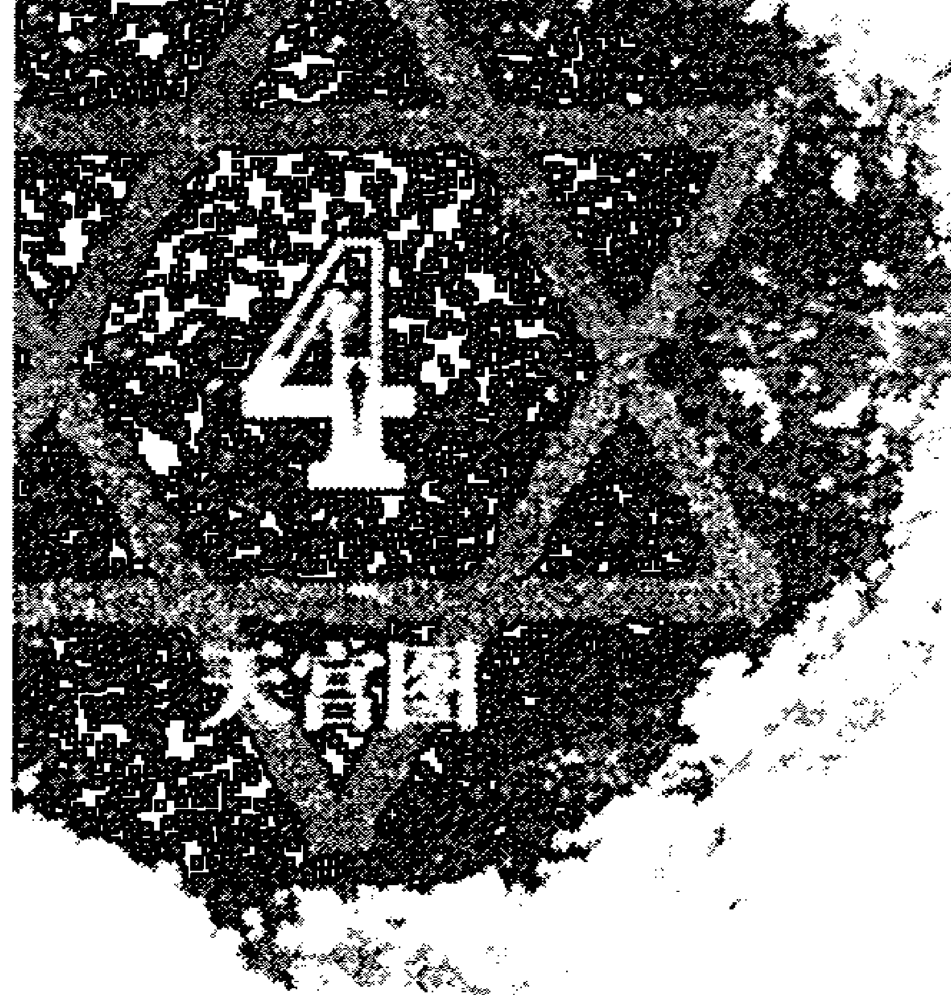

## 天宫图中的“4”物质性

### “4”表示身体、财物等实物和技术

卡巴拉天宫图中的数字“4”表示物质主义、技术性的和物质性的东西、专业性等。同时它也表示现实的想法、金钱和物品等。

在人的身体上，则表示体力和忍耐力，也象征着灵巧的手指和充沛的体力。

### 只有“4”的人

### 脚踏实地干实事

卡巴拉天宫图中只有一个“4”的人（例如1959年7月4日出生的人）会将自己的决定坚持到底。

他们擅长推动团体运作，切合实际地思考现实问题，并严格按计划执行。从事任何领域的工作，都能发挥自己的能力，受人信赖。

只不过，与站在指挥者的位置上发号施令相比，他们更倾向于找个能担任首脑角色的合作伙伴，自己则专职负责推进计划的实施。若能与那些拥有独特创意的人合作，任何事都不会难倒他们。

他们拥有一双巧手，在制作手工艺品方面也很拿手。他们中的很多人都喜欢音乐，有些人会通过苦学乐器来加深自己的音乐造诣，从而走上演奏家之路。

### 有两个“4”的人

### 最看重准确度

卡巴拉天宫图中有两个“4”的人（例如1969年4月24日出生的人）意志坚强，坚信自己能获得成功。为了实现目标，他们会付出比常人更多的努力。

他们心灵手巧。不止在工作上，在兴趣爱好上都会非常投入，能发挥一流的水平。他们对自己要求很高，是个克己复礼的人。这类人重视准确度，讨厌不明确的意见和模棱两可的思想。由于在意规矩和礼节等细微的东西，他们与那些态度粗暴、状态懒散的人格格不入。

他们无论对自己还是对别人，都坚持高标准和严厉的态度，这样容易令周围的人疲倦不已。因此，他们应该注意不要将自己的价值观强加于别人，要学习全然地接纳别人。

### 有三个“4”或以上的人

### 坚持自我

卡巴拉天宫图中有三个“4”或以上的人（例如1949年4月4日出生的人）个性比较要强。

他们双手灵巧的程度简直达到天才的级别。如果找到合适的工作，他们必定能发挥惊人的天赋。很多人通过掌握一门技术并使之发扬光大来获得成功，或最终成为那个领域的专家。他们可以考虑从事音乐、工艺和运动等相关行业。

但是，他们控制不了自己的强烈个性，总忍不住操纵和指挥周围的人。最大的问题是把自己的规矩强加于他人。因此，他们可能会成为独裁的上司、专横的丈夫或者狭隘的母亲。另外，他们讨厌改变自己的步调，无视环境的变化和时代的变迁，渐渐地可能会走入被孤立的境地。

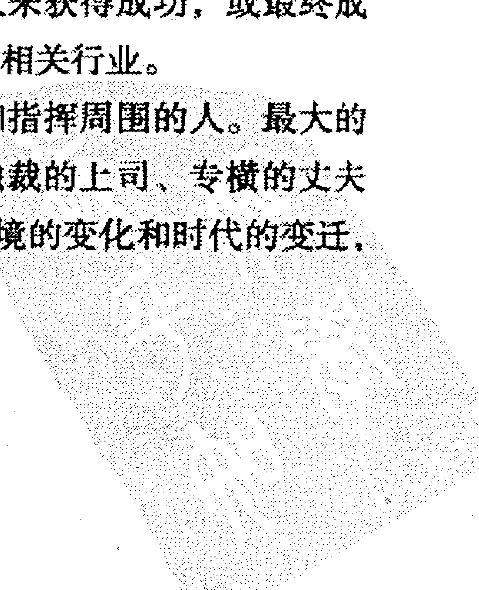

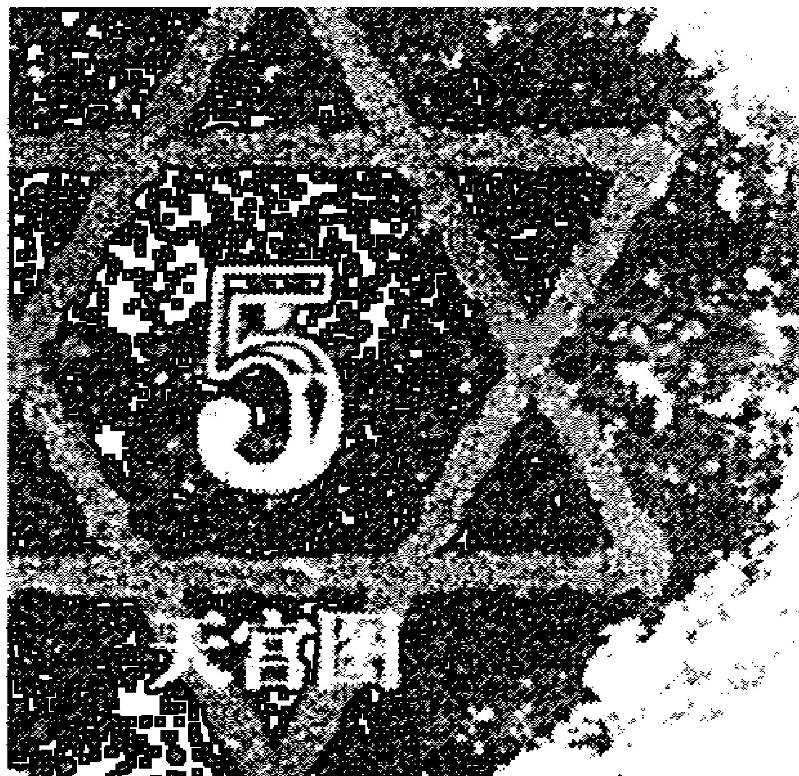

## 天宫图中的“5”意志

### “5”具有影响周围的强大力量

数字“5”是“2”和“3”的和，也是“1”和“4”的和。因此它象征混杂之意，也是与冒险、判断力和意志密切相关的数字。

同时，它也是处于卡巴拉天宫图中央位置的重要数字，具有支配意志和情绪的作用，能影响周围的思考和活动等领域。

### 只有一个“5”的人

集体里的中心人物

卡巴拉天宫图中只有一个“5”的人（例如出生在1973年2月25日的人）兼备平稳情绪和坚强意志。他们能靠着坚定的意志和稳健的作风切实地推进自己决定的事情，因此可以获得周遭的人较高的评价。他们也有培养人才的才能，所以有些人会成为教育工作者。

在人际交往上，他们很多都是团队和集体里的中心人物，常常处于领导者的地位。他们在行动之前会考虑各方的立场和利益，所以受人喜欢和信赖。别人在遇到困惑时也愿意与他们商量。

拥有准确的判断力，能及时察觉错误，对理应开展的事情也会充满自信地全力推进，因此他们中很多人都能成为成功人士。

### 有两个“5”的人

麻烦不断

卡巴拉天宫图中有两个“5”的人（例如1965年7月5日出生的人）性格非常沉稳、踏实。他们天生具有说服别人的能力。若能从事艺术、记者或学者等向世人诉说某事的工作，应该会非常成功。但是，这种能力却不能对亲密的人很好地发挥，反而有可能会令家庭不和，引起很多麻烦。

这类型的人渴望自由，不喜欢待在某个集体里。同时，他们有强迫别人远离集体、进入自由世界的倾向。个性过于要强的他们无法改变自己去适应别人。因此应该记住：顺从地倾听亲朋好友的忠言是生活幸福美满的要点。

## 有三个5或以上的人

### 具有压倒性的统帅能力

卡巴拉天宫图中有三个“5”或以上的人（例如1955年1月15日出生的人）“力大无比”。他们有惊人的影响力、推进力和统帅力，是帝王型的人。做事精力充沛，精神和体力都比常人充足。因此这个数字对运动员来说非常重要。例如，有些成功的职业棒球选手中有多个“5”。

对拥有多个“5”的人来说，如果选对适合自己的道路，获得巨大成就并不是梦想。只是，若自己的举止轻浮的话，容易成为别人的讨厌目标，所以在心中应该形成一套成熟的伦理观，否则也许控制不了自己。

他们如果不谨记社会规则和常理，就会变得以自我为中心，并可能会做出危害社会和他人的行为。特别在过于自信的时候，也许会鲁莽地冒险，或者做出出轨的举动。虽说如此，由于这类人大多都拥有良好的平衡感，一般不用担心他们会在人生路上走错方向。

## 天宫图中的“6”

## 爱

### “6” 代表对家人毫不吝啬的爱和复杂的人际关系

卡巴拉天宫图中的“6”象征着对亲人和家庭深厚的爱，被称做家庭型的数字。它也表示守护和培育比自己弱小的人或物的意欲，是与侍奉、保护和安定等关系密切的数字。

拥有这个数字越多的人，对人的爱就越深。但有时牵涉到骨肉亲情，问题可能会变得复杂。

### 只有一个6的人

#### 疼惜孩子，关爱老人

卡巴拉天宫图中只有一个“6”的人（例如1959年3月6日出生的人）对家庭有强烈责任感，对内操持每天的家务，维持与亲戚朋友的来往，对外应付繁忙的工作。但无论多么细小和琐碎的事情，他们都能毫不费劲地完成。特别是对小孩子和老人家，他们都非常亲切，所以身边的人容易被他们吸引，喜欢与他们在一起。他们是好父母和好伴侣，家庭生活应该会很幸福。

但是，他们对夫妻关系和家庭问题有点过于紧张的倾向。因为太在意，有时候会无心工作，对配偶和子女的各个方面不断追问，让人感到厌烦不已。

从某种意义上说，这类人对家庭依存度非常高。为了构建和睦的家庭，必须要懂得尊重家人的想法，自己在思想上也应该更加独立。

### 有两个6的人

#### 在家会感到不安

卡巴拉天宫图中有两个“6”的人（例如1976年12月26日出生的人）与家人的关系非常紧密。他们永远认为家庭第一，所以最适合成为家庭主妇或家庭主夫，或者从事与家庭事务相关的工作。但是，因为太爱自己的家庭了，以致有时候在家里也会感到不安。特别是小时候被父母过于保护或者放任不管的人，成为父母之后必须注意孩子的教育问题。他们努力使孩子不重蹈自己的覆辙，但结果可能会适得其反，反而令自己在教育问题上不知如何拿捏。他们也会要求配偶也把家庭放在首位，会强烈指责那些为了工作而缺席孩子的运动会或不参加家庭活动的人。在对待家庭的问题上，他们有点自以为是，应该注意。

### 有三个或以上的人

溺爱孩子 666

卡巴拉天宫图中有三个“6”或以上的人（例如1966年1月16日出生的人）对家人，特别是孩子怀有非常深厚的感情。无论何时，他们都优先考虑孩子，只做自认为对孩子好的事。生活中当然也是以孩子为中心。但是，若对孩子过于溺爱的话，孩子长大后会变得不愿意独立，反而引发各种各样的问题。

若有几个孩子，他们对每个孩子的爱是一样的，可是如果只有一个孩子的话，他们就会把所有的爱全都倾注在那个孩子的身上。为了避免这种情况，他们应该多发展自己的兴趣，分散对孩子的关注度，那样才能保持家庭的和谐。

同时，他们的情绪有点偏激，明明可以简单化解的矛盾，他们却偏要悲观地看待，最终不必要地令问题复杂化了。请记住偶尔转换一下工作或生活场所也会带来好运。

## 天宫图中的“7”

### 牺牲的精神

“7”表示选择、舍弃和为达目标而作出的牺牲

卡巴拉天宫图中的“7”表示体验、牺牲精神和为达目标付出的努力。为了达到目标，舍弃某些东西是必须的，因此“7”关乎取舍选择上的思考和现实中处理问题的方法等相关事情。同时，它也包含了应对挑战和困境的方法的意思。

### 只有一个人

人生烦恼很多

卡巴拉天宫图中只有一个“7”的人（例如1980年11月7日出生的人）对事物的思考非常深入，天生爱钻牛角尖。他们会不断地假设某一个问题，譬如“为了达到目标是否必须牺牲爱情、金钱和健康”。当事情真的发生时，性格好强的他们会把困难看作是命运对自己的考验，会越发斗志昂扬。相反，如果事情进展得很顺利，他们反而会感到无趣，变得忧心忡忡。

不过，所有付出的努力是不会白费的。下次遇到相同的问题就会更有信心处理好，也能从中发现人生的意义。而且，认真的工作态度使他们获得别人的认可和信赖。人脉也能帮助他们提升社会地位。

### 有两个人

可以冷静地分析状况

卡巴拉天宫图中有两个“7”的人（例如1978年7月20日出生的人）有坚忍的意志和克服障碍的潜力。他们中有些人也拥有优秀的音乐才能。他们不会把自己的情感和喜恶摆在脸上，能冷静地分析情况，十分客观。一旦出现了非解决不可的问题时，他们就会马上埋头处理，绝对不会拖延。

由于太过独立，不愿意依靠别人，任何事都独自承担，最终常常损害了自己的利益。但是从中获得的经验和精神上的磨炼会让他们成长得更快。

### 有三个7或以上的人

会被神秘的超自然现象吸引

卡巴拉天宫图中有三个“7”或以上的人（例如1977年10月7日出生的人）对人生的智慧和意义等问题兴趣浓厚。他们可能会走上研究学问、宗教和哲学等追求真理的道路。因此，他们会为了探索精神上的苦恼而独自冥思苦想。然而，如果过于醉心于神秘的、超自然的事物中，恐怕会忽略现实生活。因此，应该注意不要陷入精神世界中无法抽离，而要多花心思去完成现实生活中的工作和杂事。

另外他们总认为要达到目标一定要牺牲某些东西，所以一旦失败了，就会感到巨大的挫败感。其实，乐观的态度和适时的心情转换也是很必要的。

卡巴拉天宫图中拥有数字“7”的人，是属于那种年轻时耕作、年老后收成的类型。生活也许平淡如水，但踏实做人、认真做事，这种坚持也许会让他们在某天把握住机会。因此，最重要的是时常充满热情地做好眼前的工作。

## 天宫图中的“8” 现实主义

### “8” 表示物质性、现实性、秩序和顽固思想

卡巴拉天宫图中的数字“4”表示物质性，而“8”则是其两倍的物质性。因此，它表示物质因素的增加和现实主义。

从能力上来看，它表示财务能力和实务能力。

在生活层面上，它是与整理、统合、独立、经济性、正确度、严密性和顽固相关的数字。

### 只有一个8的人

#### 业务专家型

卡巴拉天宫图中只有一个“8”的人（例如1969年5月28日）是一丝不苟、慎重的人。擅长整理和整顿，做细致的工作很有能力，所以工作上的业务和管理生计的事情对他们来说毫无难度，一下子就能完成了。他们是这方面的专家、能手。

可是，当要处理突发事件时，谨慎的性格反而是不利的因素，他们会因此无法及时做出决定，从而对自己失去信心。

另外，他们缺乏忍耐力，如果因处理不好职场上的人际关系等原因而对工作产生厌恶情绪，可能会马上辞职。做事容易半途而废，恐怕无法让自己安定下来。应该记住：安定下来处理好眼前的事和从日常生活中找到幸福也是很重要的。

### 有两个8的人

#### 决不放弃信念

卡巴拉天宫图中有两个“8”的人（例如1969年8月8日出生的人）若从事对细心要求很高的工作，一定能发挥自己的超常能力。他们在精密机械和科学等领域，或者从事会计等工作都能一展所长。同时，他们很理智，对自己决定的事情，决不会放弃。即使有问题出现，他们也倾向于独自处理。如果交给别人跟进，也会细致地确认每一步的进展，否则放不下心来。他们性格中的那点顽固和固执，让他们不善于迎合别人，所以在职场中可能会被孤立，在人际关系中或许会感到压力。所以，原本就很喜欢旅行的他们在感到疲惫时，不妨一个人出去走走，放松一下。

### 有三个8或以上的人

#### 40岁开始有所成就

卡巴拉天宫图中有三个“8”或以上的人（例如 1988 年 4 月 18 日出生的人）年轻时生活非常不安定，甚至可以说是居无定所，尝尽人生百味。但过了 40 岁之后，他们开始鼓起干劲，埋头工作，整个人犹如脱胎换骨一样。他们能准确判断情况的变化，引导事情顺利开展，很多人都是白手起家，最终成为成功人士。而且不少人会同时在两个领域取得成功，例如既是文学家也是实业家，或者既是政治家又是演员。为了在事业上有所成就，有必要在年轻时积累更多的经验，中年以后奋力工作。中年之后，随着地位的提高和实力的增强，他们会变得比较谨慎，喜欢相信调查分析报告。与此同时，他们变得无法相信他人。但是应该注意不要太独断专横，也不要过于信奉现实主义和金钱至上。

## 天宫图中的“9”理想

### “9”表示实现理想和野心的原动力

卡巴拉天宫图中的“9”表示理想、行动和野心。20世纪出生的所有人都至少拥有一个“9”。20世纪是一个由知识和科技构建的伟大时代，19世纪的人们所期盼的富足生活在20世纪得以实现。所以说20世纪是一个理念被转化为现实的时代。

### 只有一个9的人

#### 能使欲望成为现实

卡巴拉天宫图中只有一个“9”的人（例如1972年6月6日）是有理想和野心的人。所有的野心会随着天宫图中其他数字的变化而变化。若其他数字是性质平衡的数字，就能很好地协调理性与野心的关系，使野心也成为促进向前的动力。但如果欠缺平衡或者协调性差，则容易使人变得自以为是和以自我为中心，理性会输给野心。再进一步说，“9”是行动的数字，若没有理性的控制，野心就会赤裸裸地显现出来。如果卡巴拉天宫图中没有与肉体有关的数字，只有一个“9”的人可能会出现头和身体的比例不匀称的现象。

### 有两个9的人

#### 对知识充满好奇

卡巴拉天宫图中有两个“9”的人（例如1968年7月19日）深谋远虑，拥有崇高理想。他们对生命和精神的秘密有强烈的好奇心和求知欲，重视精神世界，不怎么拘泥于金钱。在哲学家和科学家中，有很多都拥有两个“9”，所以拥有两个“9”的人只要善用智慧都可能名垂青史。但要注意性子不能太急。

另外，对自己过分自信可能会令他们在人际交往时产生矛盾。例如，他们会轻视那些他们认为没有志气的人，或者批判那些与自己意见分歧的人。因此对他们来说最重要的是敞开心扉，与各种各样的人来往，也要避免过分受自己的价值观牵绊。

### 有三个9或以上的人

怀有崇高理想 999

卡巴拉天宫图中有三个“9”或以上的人（例如 1979 年 9 月 30 日出生的人）通常怀有比别人更高的理想。但是，如果他们偏离正确的人生轨道，有可能会做出犯法的事，所以要特别小心避免这类事情的发生。

他们有时候会把很小的事情想得过于严重，甚至会紧抓多数人都熟视无睹的细节不放，运气好的话可能会有重大的发现，或者创作出影响深远的哲学理论和文学作品。但是，如果没有任何成果，不但本人会非常疲惫，周围的人也会不知所措。

他们也会认为自己比别人优秀得多。可是在与他人的相处中，若明显地表现出优越感，可能会失去真正的朋友，这一点要注意。他们应该更加客观地看待事物。若能冷静地看待自己，就可以把原有的智慧运用得更好，也能向着正确的方向发展。天生的优势若得到发挥，他们会成为集体里的领导者，带领和指挥下属，或者成为媒体追捧的明星。

## 解读卡巴拉天宫图数字的分布，了解个性的强弱

大家应该已经明白了卡巴拉天宫图中的数字的意义了，接下来我们就一起看看数字的分布对性格的影响吧。透过观察卡巴拉天宫图中数字的分布，可以了解一个人性格中突出的部分和欠缺的部分。

在 127 页中简单地解释过，卡巴拉天宫图中横列、竖列、斜列一共有 8 列，各种排列都代表各自的意思。

首先，竖列表示日常生活中的行为模式；横列则表示内在倾向；斜列代表内在感情的表达方法。

从这里开始，我会向大家解释如何解读各种排列的意思。简单地说，假设某人的卡巴拉天宫图中“1·2·3”的思考之列中都有数字，而“4·5·6”的意志之列和“7·8·9”的行动之列中没有数字，或者数字很少，那么我们可以认为这个人“设想虽然很好，但欠缺意志和行动力”。

其实除了可以了解数字的单独含义之外，还可以从数字的整体分布分析个人的性格。接下来就共同学习一下吧！

## 竖列“1·2·3”思考之列

卡巴拉天宫图中“1·2·3”的思考之列表示人的想象力和创造力。从这一列可以看出这个人的脑海里是否常浮现灵感和创意，还能看出个人是否热爱和平、对人是否有同情心。

### 思考之列数字齐全的人

深谋远虑，善于理性思考

卡巴拉天宫图“1·2·3”的思考之列全都有数字的人（例如 1982 年 4 月 13 日出生的人）能系统性地思考问题。他们从小就喜欢幻想，考虑问题周全，有敏锐的直觉和很强的表现力，有能力制订丰富而独特的计划。能够做到理性思考，用容易理解的方式向他人阐述问题。当别人遇到困难时，也会热心地伸出援助之手，所以大家都觉得他们很可靠，值得尊敬。

他们做事井井有条。不过，虽说喜欢待在整洁的地方，但并不代表他们自己就一定很爱干净。

基本上他们都是深谋远虑的人。当问题出现时，他们会慎重而冷静地应对。而他们对自认为不怎么重要的事，可能就不会采取任何行动。

他们也容易被言语所伤，若身边存在这种人时，讲话时就应多注意他们的感受。

若思考之列中所有数字都齐全，但其他竖列中数字极少的话，那么这个人可能会缺乏行动力。

### 思考之列没有数字的人

只有“1”的人只按自己的步调做事

对 20 世纪（1900 年代）出生的人来说，卡巴拉天宫图“1·2·3”的思考之列中一定有“1”的，所以不可能出现这一列没有数字的情况。同样，进入 21 世纪后出生的人的这一列一定有“2”的，所以无论如何，这列至少有一个数字。思考之列中若只有一个“1”而没有其他数字的话，则表示这个人做事比较悠闲，喜欢按自己的步调和速度工作。他们也讨厌思考复杂的问题，遇到困境时可能会极度失去自信。如果年轻时就发现这些缺点，努力改正和认真工作也能让才能有所发挥。

## 竖列“4·5·6”意志之列

卡巴拉天宫图中“4·5·6”的意志之列表示把自己的梦想和计划向现实推进的意志力，它与“1·2·3”的思考之列有很深的联系。脑中闪耀的灵感和创意通过意志之列得到整理，并转化为具体的形象。

### 意志之列数字齐全的人

以意志力开创光明人生

卡巴拉天宫图“4·5·6”的意志之列中全都有数字的人（例如1974年6月25日出生的人）拥有坚定的意志力和上进心，向着目标不断前进。

集齐代表爱情和家庭的“6”、具有影响力的“5”和与诚实有关的“4”这三个数字的人，一般能构建亲情满溢的圆满家庭与和谐的人际关系。容易得到社会的认可，认真地工作和生活，生活会过得幸福而且充实。

不过他们偏重意志力，有轻视他人的感觉。他们应该明白人生中有些事是无法用道理讲清楚的。

生于20世纪（1900年代）、意志之列数字齐全的人同时也是“1·5·9”的决断之列数字齐全的人。这类人会比普通的人更有决断力，容易得到社会认同，最终获得成功的几率更高。

### 意志之列没有数字的人

依赖性强，喜欢撒娇

意志之列中没有数字，那么卡巴拉天宫图就会完全被竖着从中切断，也表示了内部的分裂，特别包含了与家人和家庭分离、缺乏平衡感等意思，或者表示小时候缺乏独立能力的培养和锻炼，干劲被压抑。

一般来说，这类人的意志力比较薄弱，不会想主动做些什么，依赖心过重。要知道世上不会有免费的午餐，不付出努力就想愿望成真是不可能的，因此当他们意识到现实的残酷时，会感到非常失望。婚后一味依赖配偶和子女的现象非常明显，对他们来说，培养独立能力是非常有必要的。

如果年轻时发现自己的缺点，然后努力改正，或者通过锻炼而养成坚强的意志，有些人甚至会比意志之列数字齐全的人更有成就。

## 竖列“7·8·9”行动之列

卡巴拉天宫图中“7·8·9”的行动之列代表把主意和计划付诸行动。即便“4·5·6”的意志之列没有数字，也可以通过实施别人的计划而取得成功。

### 行动之列数字齐全的人

爆发力强劲

卡巴拉天宫图“7·8·9”的行动之列中数字齐全的人（例如1968年2月17日出生的人）拥有超常的行动力。他们可能在发言的同时，就开始行动起来了，有很强的爆发力。可以说他们一分钟都不能闲着，是安定不下来的人。

然而在复杂的现代社会中，能让这种活跃的行动力得以施展的平台不多，因此他们可能会感觉到压力和挫败感。不安的情绪甚至会进一步发展为肉体上的疾病。为了避免这种情况，他们应该通过运动、健康的饮食习惯和足够的睡眠来寻求身心的安宁。

对他们来说，选择性格平和的人做朋友、恋人或结婚对象也是很重要的。由于他们是那种可以为朋友两肋插刀的人，一旦被背叛了，可能会受到极大的打击，因此最好选择忠实可靠的人作为朋友和恋人。

在选择工作伙伴时，创造力丰富的人是不错的选择。若能将对方的计划与自己的行动力相结合，应该会得到很好的结果。

### 行动之列没有数字的人

没有“8”和“7”的人是粗心之人

20世纪（1900年代）出生的人一定有“9”，所以在这期间出生的人的行动之列是不可能完全没有数字的。不过，他们有可能同时欠缺“8”和“7”。其中“8”表示现实性和物质性，“7”则表示牺牲的精神。没有这两个数的人要么做事粗心，要么任意妄为。

2000年之后才出生的人，有可能出现行动之列中完全没有数字的情况，这类人不能把所想付诸行动。但在资讯与科技都高度发达的今天，大多数的东西几乎都能现成做好，所以即便出现完全没有行动力的人也不足为奇。

## 横列“1·4·7” 肉体之列

卡巴拉天宫图中“1·4·7”的肉体之列指智力与肉体的平衡，表示了人所拥有的基本能量和身心健康，从中还可以看出肉体能忍受精神痛苦的程度。

### 肉体之列数字齐全的人 拥有音乐才能

卡巴拉天宫图“1·4·7”的肉体之列全都有数字的人（例如1974年10月3日出生的人）天生充满能量、有健康的体魄。即便偶尔因为工作而睡眠不足或感到疲惫，表面上也看不出来，靠着天生的充足体力就能撑过去。

他们在精神上也活力十足。如果他们的工作是纯粹的体力劳动，渐渐地可能会坐立不安。因为创作力丰富的他们若找不到发挥的平台，会产生强烈的挫败感。

因此，他们应该培养能发挥创造力的兴趣爱好，让自己投入到精神性的活动中。特别是他们中很多人都拥有音乐天赋，适合能同时运用身体和精神来表现自我的乐器演奏工作和歌唱事业。

可是，如果过于看重物质，有可能从中年开始就会被社会抛弃，造成晚年孤独。建议他们趁早找到精神世界的喜与乐，不要太追求物质享受。

### 肉体之列没有数字的人

### 没有“4”和“7”是暴饮暴食之人

卡巴拉天宫图“1·4·7”的肉体之列中只要有“1”就不会完全没有数字，所以在进入2000年之前都不会出现这一列没有数字的情况。

不过缺少“4”和“7”却是可能的。其中“4”表示忍耐力，“7”则代表自我牺牲和锻炼的精神。缺少这两个数字的人可能会讨厌为别人服务，讨厌锻炼身体和忽视精神世界的平衡。他们甚至会暴饮暴食，生活模式可能与别人完全不同。

进入2000年之后，会出现肉体之列完全没有数字的人。这可能预示着在医学发达的未来，多数疾病都能依靠药物和治疗技术治好，越来越多人会变得过于重视精神世界的平衡，而忽视肉体，把身体看作机器。

## 横列“2·5·8” 灵魂之列

卡巴拉天宫图中“2·5·8”的灵魂之列表示人的灵魂，由感觉、意志和现实性构成，透过内心和外形如实地反映某人的个性，从中还可以判断与他人的关系。

### 灵魂之列数字齐全的人

关心社会福祉，富有同情心

卡巴拉天宫图“2·5·8”的灵魂之列全都有数字的人（例如1950年2月18日出生的人）待人宽容，对社会福祉也非常关心。无论处于何种立场和环境都能应对自如，而且精神充实，情绪稳定。

他们情感丰富而敏感，能感受到别人的痛苦和心情。他们的外表也给人温柔的、富有同情心的感觉，因此受人信赖，别人遇到困难也愿意找他们商量。

但这类人有轻视头脑和身体的倾向。他们讨厌辩论，逃避复杂的问题，对需要深入分析的事情感到身心疲惫。因为不想卷入麻烦中，当出现问题时，他们会立刻收回自己的意见，有懦弱怕事的一面。但是，这类人的正面特征比负面特征强，可以说是幸福的人。

### 灵魂之列没有数字的人

对别人反应过度

卡巴拉天宫图“2·5·8”的灵魂之列没有数字的人感情非常细腻。但过分敏感是他们的弱点。从小就信心不足，觉得自己不如别人，缺乏自信和自尊心，常常自责，有逃避现实的倾向，对别人总是显得谦让和避讳。但讽刺的是，在外人看来，他们是非常大胆和充满自信的人。

他们应该更加自信地走进人群中，克服对人际交往的抵触心理。若能让别人了解自己的优点和细腻的感情，应该会得到别人的喜爱。如果懂得避开人际交往的障碍，感觉也会渐渐变得敏感，看人的眼光也会越来越准确。

## 横列“3·6·9” 精神之列

卡巴拉天宫图中“3·6·9”的精神之列表示创造力和智慧。与“1·2·3”的思考之列表示内心的情感不同，精神之列表示的是智力和逻辑等理性活动和与他人协调性的强弱。

### 精神之列数字齐全的人

> 注重逻辑思考的理科类型

卡巴拉天宫图“3·6·9”的精神之列中全都有数字的人（例如1968年4月23日出生的人）拥有逻辑思考能力，头脑清晰，记忆力超群。这类人适合理科多于文科，多在年轻时就有机会发挥自己的才能。只是他们太聪明了，与学识不如自己或头脑不如的人站一起时，会感到不自在，甚至明显地表现出轻蔑之意。

在日常生活中遇到麻烦，他们会客观地分析情况，冷静地阐述对问题的看法。如果这种智慧不是用于解决精神层面的问题，而是用来赚钱的话，即便在一定程度上积累了财富，心灵也无法获得满足，到了晚年可能会变得空虚和寂寞。

他们应该要意识到，若把智慧用在对别人有益的地方，会大大增加自己满足感。

### 精神之列没有数字的人

> 没有“3”和“6”的人是性格阴森的人

20世纪出生的人一定有“9”，所以精神之列不可能完全没有数字的。但缺乏“3”和“6”是有可能的。其中“3”表示闪耀的灵感，“6”表示爱。没有这两个数字的人可能会很自卑，生活在缺少爱的世界里，性格可能会变得阴森。

进入2000年后，会出现这一列完全没有数字的人。这类人可能抱着得过且过的心态，做一天和尚撞一天钟，从不考虑将来。他们中很多都是稀里糊涂的或是健忘的类型。

话虽如此，在高度文明的21世纪，也许不用动脑筋也能生活的日子已经离我们不远了，因此这类人也不必过于担忧该如何生活。

## 斜列 “1 · 5 · 9” 决断之列

卡巴拉天宫图中 “1 · 5 · 9” 的决断之列是代表把自己的思想表露出来的部分。因此它与把自己的心情传达给对方所需的勇气有很深的联系。另外还表示决断力、实行力和果断性。

### 决断之列数字齐全的人

**能跨越障碍，克己能力强**

卡巴拉天宫图 “1 · 5 · 9” 的决断之列全都有数字的人（例如 1959 年 1 月 9 日出生的人）十分有决断力。即使途中遇到困难也毫不畏惧，依然以坚韧的毅力继续工作。虽然在碰壁时可能会坐立不安，甚至迁怒于别人，但坚持到底是他们的特点。

他们更有完成工作的必要条件：说服力、影响力、实现自己想法的雄心壮志、杰出的克己能力。

但他们容易变得过分自信和傲慢，虽然并非感情用事，可是过于相信自己的判断。

要知道人都是会犯错误的，有时候也需要别人的帮助。他们应该学会与他人互相扶持，从而培养完整的性格。

### 决断之列没有数字的人

**没有 “5” 的人自我意识很强**

20 世纪（1900 年代）出生的人的卡巴拉天宫图中 “1 · 5 · 9” 的决断之列都会有 “1” 和 “9”，因此不会出现这列完全没有数字的情况。然而，缺少 “5” 是可能的。这类人虽然有强烈的野心和丰富的表现力，但却有后劲不足的感觉。因此他们要先想清楚 “别人是怎么想的” 和 “应该采取什么行动”。

然而，进入 2000 年之后，会出现决断之列中完全没有数字的人。这类人即使有协调性，也无法根据自己的判断来做出决定，思想上完全受制于他人。

## 斜列“3·5·7” 同情之列

卡巴拉天宫图中“3·5·7”的同情之列表示个人精神上的平静和安全感。从中还可以清晰地看出人的思想、感受、行为模式和人际关系。

### 同情之列数字齐全的人

富有同情心，充满慈爱

卡巴拉天宫图“3·5·7”的同情之列全都有数字的人（例如1970年5月23日出生的人）性格沉稳安定、慈爱、冷静、处变不惊，富有同情心。看到别人有困难时，他们会主动伸出援助之手。

他们天生有一颗热忱之心，思路开阔，如果能够发挥影响力为公共事业奔走，将会非常出色。他们有自己的人生观，重视实践，所以言行能保持一致。热爱学习，有幽默感，有着从事医学、医疗等福利事业的资质。

虽然适合从事与社会福祉有关的工作，但崇高的理想和人生境界与现实是有差距的，他们会为此苦恼。

### 同情之列没有数字的人

一味追求流行的现实之人

卡巴拉天宫“3·5·7”同情之列没有数字的人是非常现实和功利主义的，只考虑目前，对未来充满不安。他们对精神世界、形而上学的话题一点都不感兴趣，只重视物质、金钱和流行等实在的东西。个人立场鲜明，一味主张个人利益，从不听取别人的意见，做事我行我素，因此与朋友和同事有不少矛盾。

他们应该充分认识自己的缺点，通过艺术创作和精神活动开阔视野。学习思考人生会使心灵获得平静，也令自己更有自信，与人相处时就能气定神闲了。

若能意识到自己的问题，然后改正，努力工作，他们可能比这列数字齐全的人发挥更大的能力。

## 缺少某些数字的人

卡巴拉天宫图中缺失了某些数字，那也是有意思的。
找出自己在卡巴拉天宫图中缺少的数字，来看看其中的含义吧。若能好好的弥补自己的不足之处，拥有丰富精彩的人生并不是没有可能的。

### 缺少“2”的人

缺少“2”的人不拘泥于细节，大大咧咧，心胸开阔，但有点懒散。特别是他们的时间观念很淡薄，迟到了也满不在乎。而且注意力不集中，常会粗心大意地犯些小错误。
另外，他们感觉迟钝，在选择结婚对象和工作伙伴方面有时候没有认真调查。

### 缺少“3”的人

缺少“3”的人虽然很谦虚，但性情乖戾，性格单纯，容易对别人言听计从，生活中缺少变化，缺少自信和自尊心，可能会低价“卖掉”自己。
虽然艺术才能不足，但若能趁年轻时好好的磨炼自己的表演能力，可能会比有天赋的人更成功。

### 缺少“4”的人

缺少“4”的人，说得好听就是很有朝气，生机勃勃，说得难听就是非常缺乏整理能力和统一性。他们讨厌单纯的劳动，不擅长适应和迁就别人，喜欢独来独往。请记住在生活中掌握与人协调的技巧是很必要的。
他们应该学习如何有系统地处理事情，从而让工作和生活效率更高。

### 缺少“5”的人

缺少“5”的人依赖性非常强。常常指望着别人的支援，对权威人士的意见不假思索就接受了。这也反映了他们缺少管理自己人生的能力。
这类人应该培养一些能够自主进行的兴趣爱好，例如运动和制作手工艺品。最糟糕的爱好就是看电视和报纸，或者无所事事地发呆。

### 缺少“6”的人

缺少“6”的人重视工作多于爱情。他们不善于处理家庭事务，有时候甚至会对家人感到厌烦，不懂得感恩，这可能会让他们找不到人生的意义。
对他们来说，一定要明白人类的生存需要互相帮助和扶持。也应该看到自己的软弱。如果能努力构筑和谐的人际关系，会让他们更快乐。

### 缺少“7”的人

缺少“7”的人能直接地说出自己的感受。但是，他们比较任性，不会理解别人的心情。也不擅长制订计划和执行计划。失败了也不会自我反省，所以会重复犯相同的错误。
他们应该学习听取别人的意见，抽时间多关注自己的事情。

### 缺少“8”的人

缺少“8”的人对金钱和地位不执著，因此财政管理能力很差，若要开展自己的事业，一定要找到理财方面的能手协助。
因为比较懒，当有事发生时，可能会依赖别人。他们应该学习面对现实，制订好远大的目标，为达目标一步一步地努力。

### 缺少“1”或“9”的人

从2000年开始，就会出现缺少“1”或“9”的人。没有“1”的人语言表达能力不足。语言与思想有着密切的联系，因此这类人重视感觉多于思想，他们进行表达时可能会更多地选择语言以外的方式。而没有“9”的人是远离理想和野心的人，他们喜欢坦荡荡地生活。

# 希腊字母与卡巴拉的关系

犹太秘法“卡巴拉”对数字非常重视，不止出生日期和年份等数字，甚至连姓名都能用与之一一对应的数字来表示。

如下表所列，各个希腊字母分别与“1”至“9”的数字相对应。先标出与名字中希腊字母相对应的数字，然后把各个数字相加直到得出一个一位数，最后得出的数字就是名字的卡巴拉命运数。

用世界知名企业“SONY”来举例说明。

SONY 1+6+5+7=19 1+9=10 1+0=“1”

命运数“1”的SONY多年来生产了各种各样革新性的产品，积极开拓海外市场，在业界一直处于领先地位。从命运数中就能看出它具有领导者的潜质。

不单是公司名字，人的名字也能计算出命运数，请结合出生日期的命运数一起分析吧。

## 希腊字母与数字的对应表

| 1 | 2 | 3 | 4 | 5 | 6 | 7 | 8 | 9 |
|---|---|---|---|---|---|---|---|---|
| A | B | C | D | E | F | G | H | I |
| J | K | L | M | N | O | P | Q | R |
| S | T | U | V | W | X | Y | Z |   |

# 第三部分

## 第四章

## 命运数“1”的名人

### 拿破仑·波拿巴

#### 【军人、政治家，生于1769年8月15日】

#### 生于孤岛使他养成巨大野心，兼具成功的运气和领导能力

生于1769年8月15日的法兰西帝国皇帝拿破仑的命运数是“1”。命运数“1”被称作“王冠星”，显示出强大的成功运气和领导能力。这正象征着拿破仑从平民到皇帝的传奇人生。众多命运数“1”的名人之中，拿破仑能拥有超旺的运气的奥秘究竟是什么呢？首先，他出生在地中海的一个孤岛——科西嘉岛。在小岛出生和成长的人长大后大致会分为两类型：一种是随遇而安、踏实地生活在小岛中的保守型；另外一种则是想着什么时候能冲出小岛大干一番事业的、野心勃勃的人。显然拿破仑就是后者的典型。若他是生于意大利半岛的某个大都市，而不是科西嘉岛，也许他的人生会完全不同。

#### 人生轨迹与卡巴拉命运起伏节奏一致，妻子使他的运势更旺

人的一生中，运势总会有上升期和下降期。卡巴拉就能把运势的起伏节奏准确地告诉我们。让我们感到不可思议的是，拿破仑一生中运势的起伏节奏与卡巴拉金字塔命运起伏图所反映的非常贴合。他的发展期和下降期被划分得非常明显。首先，第一次成功远征意大利是拿破仑最终取得成功的契机，那时正值命运数“1”的出发期，即“Start”时点之后的正周期。他与第一任妻子约瑟芬·博阿尔内结婚也是在那个时期。1804年，35岁的拿破仑成为法兰西帝国的皇帝，这一年正是命运数“1”的第2金字塔的顶点。从这年开始，他的发展势如破竹。对他来说，1810年正是人生达到最高峰的时候，那一年他娶奥地利公主玛丽·路易丝为妻，这期间也正处于发展期内。

然而，两年后远征俄国失败，1813年又在莱比锡战役中战败。接着拿破仑军队的形势急转直下，1814年，45岁的拿破仑被流放到厄尔巴岛。但是他的强大运气也在这里有所表现。虽然在这个年龄失去所有并被流放到孤岛，但他并没有就此放弃并留在孤岛终老，而是时时刻刻关注形势，寻求重回权力之位的时机，这也是他有别于常人的地方。

1815年，拿破仑逃出厄尔巴岛回到法国，并重新即位。但好景不长，英国和普鲁士军队在滑铁卢战役中把他彻底地打倒了。于是，“百日王朝”宣告落幕，他也被流放到圣赫勒拿岛，并在那里去世。那一年是1821年，也就是他52岁的时候。这个年龄正是命运数“1”充实期的最后一年。

事实上，拿破仑拥有强大的运势不仅仅是因为本身的命运数，同时也借助了妻子的力量。那么，我们来看看他妻子的命运数吧。首先，第一任妻子约瑟芬·博阿尔内生于1763年6月23日，命运数与拿破仑的一样都是“1”。这也为他增加了前进的力量。第二任妻子玛丽·路易丝生于1791年12月12日，命运数是“6”。温和的“6”和专横的“1”可以说是最佳组合。为了发挥命运数“1”的统合力，同时维护欧洲的和平与协调，也许这段婚姻是非常适合的。

### 其他名人

命运数“1”的人懂得照顾他人。历史上不少名人的命运数都是“1”，他们中很多都在文学和绘画等领域内发挥了自己的独创性：

- 米哈伊尔·谢尔盖耶维奇·戈尔巴乔夫
- 吉田茂
- 田中角荣
- 西蒙娜·德·波伏娃
- 查尔斯·斯宾塞·卓别林
- 马丁·路德
- 伊丽莎白一世
- 艾萨克·牛顿
- 乔治·华盛顿
- 弗洛伦斯·南丁格尔
- 列夫·尼古拉耶维奇·托尔斯泰
- 福泽谕吉
- 马丁·路德·金
- 正冈子规
- 华特·迪士尼
- 黑泽明
- 克里斯汀·迪奥
- 史蒂夫·乔布斯
- 泰格·伍兹
- 山本宽斋
- 岩下志麻
- 小泉今日子
- 西村京太郎
- 明石家秋刀鱼
- 矢泽永吉
- 大竹忍

## 命运数“2”的名人

### 贝拉克·侯赛因·奥巴马

#### 【政治家，生于 1961 年 8 月 4 日】

#### 兼备“2”和“11”的特征，依靠行动力站上政坛之巅

生于 1961 年 8 月 4 日的美国总统奥巴马同时拥有命运数“2”和“11”的特征。对此你也许会感到疑惑，那么请看以下的计算方法：

- 其中一种卡巴拉命运数的计算方法
  - 1961 年 8 月 4 日
  - →1+9+6+1=17→1+7=“8”
  - “8”+8+4=20→2+0=“2”→命运数“2”

- 另一种卡巴拉命运数的计算方法
  - 1961 年 8 月 4 日
  - →1+9+6+1+8+4=29→2+9=“11”→命运数“11”

命运数“2”的人拥有女性的性格特点：独特的想法和丰富的想象力。也可以说，他们具有创造幸福的能力。他们非常大胆，倾向于在思考前就采取行动。而命运数“11”的特征与“2”的正好相反，这个命运数的人具有行动派和追求变化与刺激的特征。

那么奥巴马究竟受哪个命运数的影响多点呢？首先从当选美国总统来看，他的命运都反映了这两个命运数的特征，也可以说是同时发挥了两方面的优点。据我多年的经验来判断，他今后的人生和工作将会更多地反映命运数“11”的特征。

在命运数难以被参透的这种情况下，若综合分析这个人的手相会发现很有趣的现象。他的生命线和智慧线是大大地分开的，拥有这种手相的人都是积极主动，行为大胆的。他们在思考之前已经行动了，或者不管结果如何先行动了再说。虽然这种人会犯不少小错误，但行动之后会反省和吸取教训。

由此可知，无论是卡巴拉还是手相，都反映出他拥有比普通人更独特的想象力。外向的性格在近期的美国总统中是比较罕见的。

The request was rejected because it was considered high risk## 御木本幸吉

【实业家，生于1858年3月10日】

成功实践“智、运、命”，成为世界珍珠之王

看到“御木本幸吉”这个名字，也许很多人一下子都想不出是谁。但如果说到东京银座的珠宝首饰店“MIKIMOTO”，大家应该都知道。御木本幸吉是“MIKIMOTO”（原名御木本珍珠店）的创始人，成功养殖珍珠，被称为“珍珠之父”。他生于1858年3月10日，是命数“8”的名人。

御木本幸吉原本在伊势经营乌冬店，是与珍珠完全无关的工作。有一次一个客人说：“珍珠价格很高，也可以人工制造。”他听了之后灵机一动，想到“要不自己养殖珍珠吧”。于是，他把自己所有积蓄投资到珍珠养殖上。这种当机立断的性格正符合了命数“8”的特征。但在刚开始养殖珍珠的时候，他并没有成功。养殖贝相继死亡，投入的金钱也化为乌有。他在过程中遇到了各种各样的难题。即便如此，他也没有放弃，依然全心全意地尝试各种改善方法，最终他取得了前所未有的大成功。可以说命数“8”的人无论发生任何事都能坚持自己的理想，同时拥有成功的运气。

顺便提一下，御木本幸吉纪念馆内摆设了占卜用的卜签。因为“智、运、命”是御木本幸吉的座右铭。要在工作中取得成功，“智”（即主意）很重要，但只有“智”是无法成功的。还要看是否有“运”（即偶然几率），“运”影响着成功的可能性。最后也很需要“命”（即生命力）。御木本幸吉就是靠着“智、运、命”最终获得了成功。

### 其他名人

命数“8”的人个性好强，魄力强大，坚持战斗到最后一刻。其中的代表人物有天才画家巴勃罗·毕加索，他喜欢变化，终生活跃在艺术界。

- 路德维希·凡·贝多芬
- 巴勃罗·毕加索
- 道格拉斯·麦克阿瑟
- 最澄
- 法然
- 米开朗基罗·博那罗蒂
- 德川光圀
- 约翰·塞巴斯蒂安·巴赫
- 萧伯纳
- 太宰治
- 三船敏郎
- 渡边恒雄
- 松田优作
- 坂本龙一
- 赤川次郎
- 加山雄三
- 吉永小百合
- 羽生善治

## 命运数“9”的名人

### 美空云雀

【歌手、演员，生于 1937 年 5 月 29 日】

#### 给予国民梦想的歌手和演员

命运数“9”的人很有个性，拥有非常独特的人生经历，所以常常做出令世人吃惊的举动。他们才华横溢，不少人活跃在世界舞台并留名于史。其中的代表人物当数生于 1937 年 5 月 29 日的美空云雀，还有东京都知事石原慎太郎等。他们都是命中注定受人瞩目的明星。其中石原慎太郎不但是独特的政治家，同时也是一位文化界人士。他的生活方式和发言都很有个性，令人印象深刻。

命运数“9”的人似乎更有可能遇到令人难以置信的突变事件和困境，这让他们的人生充满传奇色彩，而且 30 岁前后的人生会发生大转变。人们对他们的评价，在他们活着之时和去世之后也不太一样。美空云雀的人生特别能表现出这种特征，她是一个天才，同时也是一个悲剧人物。

除了卡巴拉之外，手相也显示出她不幸的命运。她的手相也很特别，本来她的生命线和智慧线开始的地方是分开的，但在去世之前突然重合在一起了。

#### 卡巴拉厄运之力使她没能在 54 岁进入完成期

美空云雀 8 岁起就开始歌手生涯了，从小就才华横溢的她在当时已经颇具名气了。正如卡巴拉所说的那样，命运数“9”的天才会发挥不寻常的才能，受人关注。

1962 年，25 岁的美空云雀与小林旭结婚，又在 1964 年离婚。同年推出的单曲《柔》大受欢迎，成为美空云雀销售最好的唱片，也获得了日本唱片大奖。这一年她正处于卡巴拉金字塔命运起伏图所指示的 27 岁，正是出发期的“start”点。虽然从小就活跃于舞台，但让所有人看清她的实力，可以说是从这时开始的。然后，出发期的能量逐渐释放，36 岁那年是她最幸运的时期。才华横溢的她借助一路向上的运势迎来了人生的高峰，成为了那个时代的巨星。从那之后直到52岁去世为止，虽有沉浮，但作为歌手却经久不衰。其中，1988年去世前制作的专辑《不死鸟》犹如诉说着自己的人生，是非常优秀的作品。

按照命数“9”原本的生命节奏，他们会在54岁迎来完成期。如果她没有去世，应该还能再次攀上人生的高峰，受到更多的关注。然而可惜的是，命数“9”的厄运之力没有给她这个机会了。

### 其他名人

命数“9”的名人中很多都拥有崇高理想，对工作孜孜不倦，其中有不少人成为了对人类充满爱、探求人类心灵奥秘的心理学家和诗人。

- 尼古拉·哥白尼
- 德川家康
- 大盐平八郎
- 板垣退助
- 森鸥外
- 莫罕达斯·卡拉姆昌德·甘地
- 小林秀雄
- 埃尔维斯·普雷斯利 (猫王)
- 卡尔·古斯塔夫·荣格
- 赫伯特·冯·卡拉扬
- 查尔斯·林白
- 石原慎太郎
- 远藤周作
- 村上春树
- 五木宽之
- 小泽一郎
- 小野洋子
- 巨人马场

## 命运数“11”的名人

### 可可·香奈儿

【时尚设计师，生于1883年8月19日】

#### 隐藏在香奈儿香水的卡巴拉威力，给予业界与女性梦想

说起可可·香奈儿，时尚界恐怕是无人不知的。她对时尚界作出了巨大的贡献，所留下的东西直到今天还令全世界的女性心醉神迷。接下来介绍的就是生于1883年8月19日、命运数为“11”的可可·香奈儿。

她从零开始创造出时尚领域的新时代，彻底改变了时装的概念，成为历史上伟大的设计师。究竟她成功的秘诀是什么呢？

香奈儿的人生充满着传奇，但童年和少年时代比较不幸。她出生于法国西南部奥弗涅的索米尔，12岁那年母亲去世，不久父亲也抛弃了家庭，她在孤儿院和修道院长大。以今天的名声来看，很难想象她小时候的生活竟是如此悲惨的。10多岁开始，一边做缝纫的工作一边在卡巴莱¹表演，期望进入演艺圈。但是从某个时候开始，她放弃了进入演艺圈，而改向时尚界发展。26岁的她开了一间帽子工作间，又于第二年（1910年）在巴黎坎朋大街开设了一家名为“香奈儿”的女装帽专门店。命运数“11”的人的“Start”时点是25岁，26岁正是出发期开始后不久，可以说那时是最佳的创业时机。香奈儿当时的决定把她今后的人生引向了正确的方向。

一时间，“香奈儿”成为世界知名品牌，1921年38岁的她扩张本店，新增了香水业务，推出“香奈儿5号”和“香奈儿22号”。这两个数字在卡巴拉中都是运气很旺的数字，也有人说这两款香水所取的名字是与卡巴拉有关的。也许就是这两个数字增强了香奈儿的运气。

> 1 卡巴莱：一种歌厅式音乐剧。

#### 事业极盛之后的大胆决定，东山再起之后重操旧业

之后，香奈儿品牌以很快的速度发展。然而香奈儿 56 岁时，因劳动罢工引起的纠纷而完全退出时尚界。虽然大胆坚决地放弃努力打拼得来的成就和名声不是任何人都做得到的，但命运数“11”的人却能做到。这也是她走完第 3 金字塔的顶点、进入完成期时所做的决定。

她引退后在第二次世界大战中成为了德国军官的情人，战后数年逃亡瑞士。战争时期香奈儿的言论令她在战后的法国颇受抨击，但她在女性主义抬头的美国却受到狂烈的追捧。1954 年，71 岁的香奈儿重操旧业，开始了第二时期的设计生涯。次年推出的“香奈儿套装”大受欢迎，获得时尚奥斯卡奖。最后她在 87 岁时走完了多姿多彩的人生。

她一生都在追求进步和梦想。这也与“香奈儿”公司的主旨——“女性不应局限于陈旧的价值观”相符合。香奈儿永远不满足于现状，追求刺激，屡次跨越危机，为实现梦想不断发挥想象力，度过了精彩的一生。

### 其他名人

命运数“11”的人具有独创性、进取精神和优越的洞察力。其中的代表人物有作曲家莫扎特，加入神秘社团的他对充满神秘色彩的东西很着迷，在生活中非常浪费。

- 麦当娜
- 沃尔夫冈·阿玛多伊斯·莫扎特
- 弗朗茨·舒伯特
- 胜海舟
- 犬养毅
- 蒋介石
- 亨利·基辛格
- 贝尼托·墨索里尼
- 奥托·冯·俾斯麦
- 罗纳德·威尔逊·里根
- 宫泽喜一
- 阿久悠
- 川上哲治
- 武田铁矢
- 植村直己
- 绪形拳
- 筱山纪信
- 西川清

## 命运数“22”的名人

### 北野武

【电影导演、漫才（相声）演员，生于1947年1月18日】

#### 不落俗套的旷世奇才，在意外中也能平安无事

无论是作为漫才演员与兼子清组成“TWO BEAT”，还是作为电影导演，北野武都显示出天才般的才华。若研究他的命运数，会发现不可思议的现象。如果用单纯的方法计算他的命运数，如下所示。

1947年1月18日 → 1+9+4+7+1+1+8=31 → 3+1=4

本来他的命运数应该是“4”，但从他的人生经历和才能来看，怎么也觉得与“4”的特征不完全符合。于是，我们再用比较特殊的方法计算，会得出“22”，其实命运数“22”更能反映他的人生和运势。

1947年1月18日
1947年 → 1+9+4+7=21
1月18日 → 1+1+8=10 → 1+0=1
(年) 21 + (月日) 1 = → 命运数“22”

虽然比较难判断，但有时的确需要运用这种特殊的计算方法。命运数“22”的人在所有命运数中运气最好。虽然他们一般能成为成功之人，但像北野武那样在多方面都获得成功的人却不多。相同命运数的名人之中，还有意大利文艺复兴时期的万能天才达·芬奇。北野武从某个意义上来看可以说是现代版的“万能天才”。也许一个领域的成功无法让他完全发挥与生俱来的才华。拥有才华的北野武喜欢受人瞩目和被人喜爱，对他来说在演艺圈发展是非常合适的。

再看北野武的经历，会发现他在卡巴拉金字塔命运起伏图的正周期里不但没有向好的方向发展，反而常在这些时期遇到大打击。例如他在39岁时，快要到达第3金字塔顶点之前，因为“Friday事件”被逮捕了，又在完成期中间阶段的 47 岁时因驾驶摩托车发生意外。这些事件的发生也许会令他不能继续在演艺圈生存，或者造成身体残疾，但在众多坏的可能性之中，他一次又一次地“复活”了，而且还取得了更巨大的成就。也许就是命运数“22”的奇迹般的好运所发挥的作用吧。

> 1 漫才：日本曲艺的一种，类似中国的相声。
> 2 Friday事件：1986年北野武对12月9日《FRIDAY》周刊采访其情人的八卦报道感到愤怒，率领手下“Takeshi军团”前往讲谈社，对编辑部人员施暴而被逮捕。

#### 大幸运星之主，手相也显示出稀有的好运

命运数“22”的人中也有不少从零开始做起，最终把握住运气从而获得成功的。北野武就是典型的例子了。他的好运气不但可以从卡巴拉看出来，也可以从其他占卜术中得到印证，例如手相。可以在他手掌中央位置发现一个被称作“神秘十字”的“十字形”符号。在手掌中央出现“神秘十字”是拥有好运的标志。因此，北野武即使遇到意外，最终也平安渡过的。

拥有这个“神秘十字”的人非常少，我认识的人当中，除了北野武和美国职棒大联盟的松井选手之外就不多见了。他们都是大明星选手，或是成功人士，遇到意外也会逢凶化吉。

### 其他名人

命运数“22”的人非常幸运，也是比较罕见的类型。有很多人从零做起并能最终愿望成真。

- 达·芬奇
- 伊曼努尔·康德
- 撒切尔夫人
- 盛田昭夫
- 菅原文太
- 青井忠雄
- 伊藤淳二
- 曾野绫子

# 你要注意的健康问题

## 命运数“1”

原本就有健康和体力充沛的体魄。可是如果生病或受伤的话也许会比普通人更严重。有可能在不可能发生意外的情况下受伤，或者卷入令人难以置信的事故当中。如果对自己的身体过于自信，很可能导致比普通人受更大的伤，所以要注意别因为大意而令身体受到伤害。

## 命运数“2”（“11”）

最难熬的是心病的困扰。焦虑和压力会引来很多疾病，其中肠胃疾病比较常发生。由于压力过大，也应注意内科疾病。特别在换季期如1月、4月、11月容易得病。

## 命运数“3”

越“嫉妒”别人越充满朝气。不懂解读别人的暗示，被人恭维时特别能发挥个人实力，做事也会更加努力。健康方面没有太大的问题。

## 命运数“4”（“22”）

性格安稳，懂得自我平衡，所以即便生病也能顺利康复。生活上和工作上所需的体力充足，能着实地实现自己的梦想。

## 命运数“5”

4日、13日、22日、31日的精神紧张会令你焦虑和出现疼痛症状。5月和10月的身体痛苦可能会达到难以承受的程度。

不知不觉间积累的压力也会对健康造成影响。定期到郊外呼吸新鲜空气、与大自然接触是很好的减压方法。

## 命运数“6”

与支气管和呼吸系统疾病有很深的联系。也许本人不相信，但这些病真的非常受环境的影响。若长期处于空气污染的地方，可能会突然得病。所以非常需要呼吸新鲜的空气。

## 命运数“7”

心中的痛苦在1月、4月和8月容易激化，这些痛苦多是由人际关系造成。另外，被人保护时反而更加痛苦。由于平时的运气太好，对预期之外的心理困扰更难以承受，忍耐力弱，有患神经系统疾病的可能性。

## 命运数“8”

容易血压升高、心理压力大。不可思议的是这类人的健康和心情会随着周一到周日的推移而变化。特别是在周一和每周初期容易生病或身体发生异常。

## 命运数“9”

遇到小小挫折就可能垂头丧气，失去信心，这会让自己更加倒霉。容易得原因不明的疾病，可能长期受疾病困扰。

# 浅野式开运术——“LOVE”

虽然与卡巴拉没有直接关系，请让我在这里为大家介绍一个浅野式开运术吧。那就是“LOVE”。

“L”是“Listen”，聆听。每个人都希望得到别人的理解。与人交往，如果没有人听自己诉说，也许会感到孤独和不安。当别人愿意聆听自己说话，人们就会感到很安心和散发出活力。因此希望别人聆听自己的话的同时也应该聆听对方的话。这样人与人之间才能产生爱。

“O”是“Overlook”，宽恕。任何人都有缺点和错误，若因此而互相排斥是无法建立信赖关系的。因此每个人都应该怀有一颗宽恕之心。

“V”是“Voice”，打招呼。主动与别人打招呼是人际关系的润滑剂。早上对别人说一声“早上好”，然后得到别人的回应。如果大家这样做了，相信心情也会变好。

“E”是“Effort”，努力。如果你想与某人成为朋友或增进感情，那一定要付诸行动。如果什么都不做，对方是不会自动向你走来的。维系人与人之间的感情，是需要积极行动的。

实践以上四点是你开运的第一步。

# 结语

用卡巴拉研究活跃于各个领域的名人会有很多有趣的发现。他们的人生都充满传奇，然而有些人的运气很旺，有些人的运气却显得较弱，若用卡巴拉来分析，多数能找出缘由。

犹太的传统命运学——卡巴拉中命运数是可以解读一个人的命运的重要数字体系，能够把人类的不可思议的地方巧妙地表现出来。所以说世界上应该没有比“运”更不可思议、更难以解释的事物了。

虽然世上有各种各样的占卜术，但我相信命运学“始于卡巴拉，也止于卡巴拉”。单纯的命运预知学无法让你更客观地理解运势。然而，研究卡巴拉会让你读懂运势的强弱，并发现人生的魅力和可能性。

在解读命运的同时，卡巴拉同样是不能忘记的智慧。我认为因为犹太的智慧是以卡巴拉为基点，所以在世界命运学发展的历史长河中，犹太的智慧能延续下来。随着研究的深入发展，以卡巴拉为基础的命运学也将越来越受关注，它的重大意义可能也会震惊世界。所以说命运学“始于卡巴拉，也止于卡巴拉”也不为过。

# 参考文献

- 浅野八郎 《犹太数秘术》 （KK 畅销书・1990年）
- 浅野八郎 《卡巴拉大占术》 （祥传社・1995年）
- 浅野八郎 《卡巴拉运数占卜术》 （竹内书店新社・1999年）
- 浅野八郎 《抓住财富的命运解读法》 （宝岛社・2004年）

# 部分图片作者名录

- www.123rf.net: P1, 4, 7, 8, 9, 163, 封面, 书脊图
- Shutterstock Images LLC: P1 图

## 你的卡巴拉天宫图

## 你的命运起伏图

正周期

负周期

## 起始

## 完成

- 发展期
- 充实期
- 完成期

南方日报出版社
2010年4月第1版
定价：29.90元

阅读完《卡巴拉数字密码》的读者，大概对犹太的智慧秘法有了更深的了解，但其实世界上还有更多充满神秘色彩的文化，例如手相、风水、塔罗牌和星座等等，如今星座作为一种潮流文化，不再局限于西方，而是向全世界不断地蔓延。

星座学究竟是什么呢？可能很多人还一知半解，其实我们平时最常听到的太阳星座、月亮星座、上升星座、相位、星盘等等都属于星座学的内容。对这方面有兴趣的读者不妨先翻阅一下《12星座人》这本最基础的星座书。

《12星座人》是首部登上《纽约时报》畅销书榜的占星经典，全球销量超过500万册。此书集中为读者介绍星座学中的太阳星座，根据太阳在黄道上所处的12个星座的位置，将人划分为12个星座类型，并逐一对每一星座类型的男人、女人、儿童的性格、心理、行为、情感等特征分别进行了分析、介绍。读者不妨尝试通过星座了解自身及他人的潜在一面，同时去体会星座在人类历史进程中的多元文化意味。

值得一提的是本书作者琳达·古德曼（Linda Goodman）是美国著名星相学家，1963年开始研究占星术，著有多部占星术著作，以《Sun Signs》（即《12星座人》）为开端，之后又创作了《Linda Goodman's Love Signs》、《Linda Goodman's Star Signs》等书，同样畅销不衰。难以否认的是，正是《12星座人》这本书将她推上了一流占星家、星座学家的位置，奠定了她在占星学界的地位。我们可以通过阅读这类星座读物，掌握12星座人的秘密，同时对自己的特质有更全面的了解，把握自身的优点和缺点，与人相处时更显魅力。