天使数字

来自天使的
背后讯息与涵义

凯尔・葛雷
Kyle Gray
谢孟庭
译

Angel Numbers

The Message and Meaning Behind 11:11 and Other Number Sequences

全美最富盛名的天使专家，
以最直觉、灵性与正能量的天使语言，帮助你找到讯息

制作说明：

本书由《天使神秘学院》出重金从台湾购入的原版书籍扫描制作为达到最好阅读效果，特地把书全部切开后，再经由专业扫描设备高精度扫描完成，并经过一张张的PS后期处理最终成书，其间花费大量的人力、物力以及时间，只为能给大家提供经济并优质的神秘学学习资料而努力。

本学院强力谴责某些机构和个人，把本学院花心血制作完成的电子书籍，包装后直接放在自家网上低价倾销的行为，以谋取不劳而获的经济利益。如果长此以往最终将无人愿意再为大家花心思制作电子书，那以后可能大家再无新书可读。

为让大家以后能够读到更多的好书，也为了本学院的良性发展。本学院恳请大家尽量做到如下几点：

- 一、尽量在天使神秘学院的官方网站购买电子书籍。
官网访问地址：http://www.ac2011.cn
短网址：ac2011.cn
网址含义：(Archangel College 成立时间：2011年)

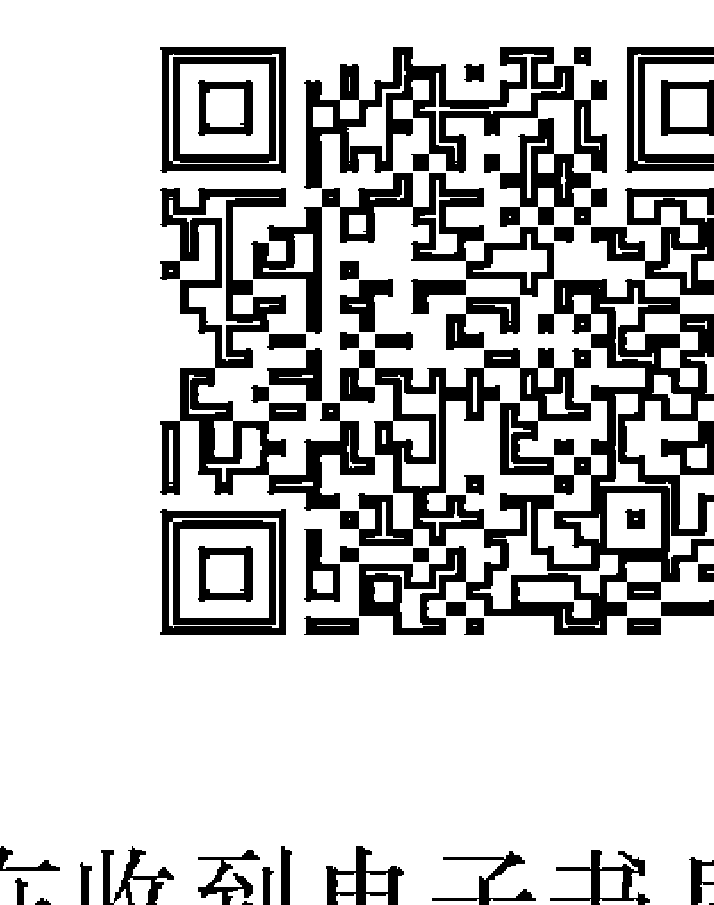

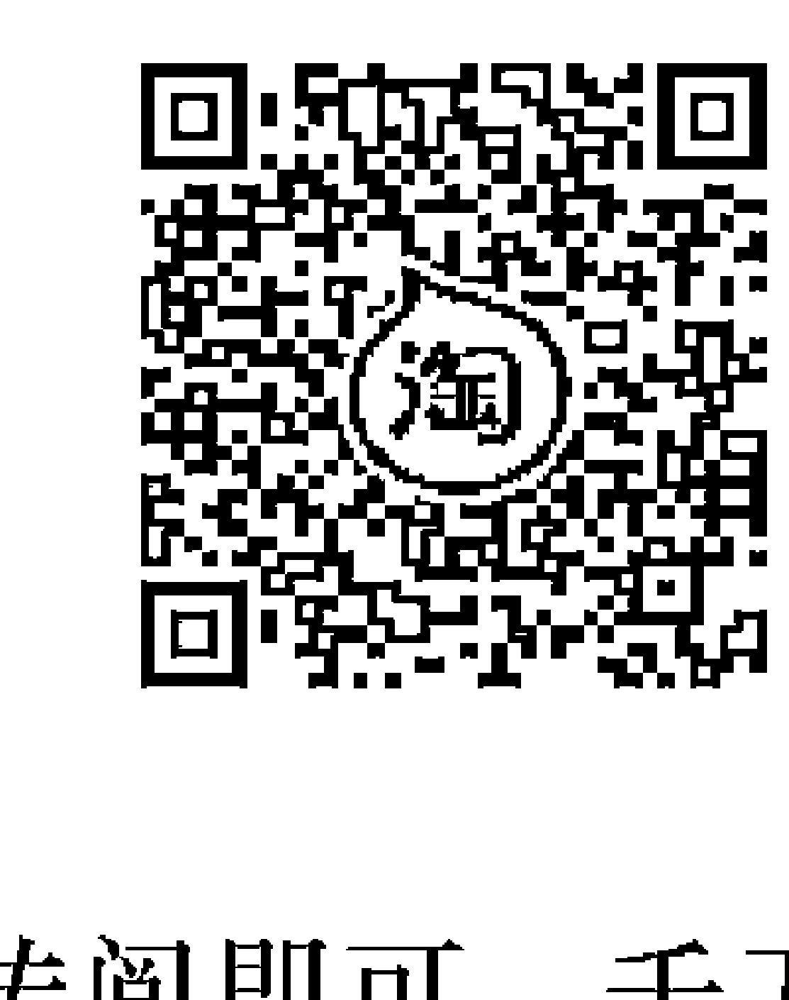

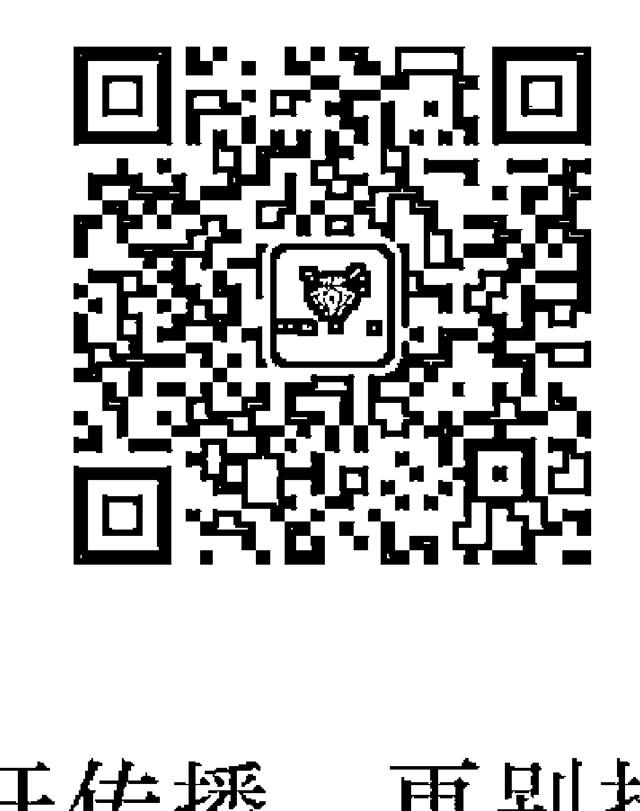

- 二、在收到电子书后小范围传阅即可，千万不要公开传播，更别挂到网上低价销售。

同时为答谢广大支持者，学院电子书将做如下调整：
一、学院会把一些早已收回制作成本的电子书折价销售。
二、最新制作的电子书籍会开放打印功能，大家购买后有条件的可自行打印成书。

数字

天使

来自天使的
背后讯息与涵义

Kyle Gray
凯尔・葛雷

Angel Numbers

The Message and Meaning Behind 11:11 and Other Number Sequences

推荐短语

感受到天使的存有，是从很小的时候就有许多经验与感应，尤其对于忽然飘落于眼前的羽毛更是让我无法自拔的收藏成册，深深地相信这就是天使翅膀掉落的羽毛，每每捡到一根羽毛都会带来一个幸运的好消息，或许如此的深信天使的存在，不论是时间、车牌、挂号……等等，都会瞬间让我发现天使数字，因此，只要您能相信天使的存有，天使将会时时刻刻展现于生活周遭守护着您，用那暖心的天使数字提醒着我们该前往何方，若您无法理解这些天使数字的意涵，这本书将是您最美好的选择，记得下次见到飘落的羽毛，请温柔地将幸运收藏起来！

> —— So Good 塔罗牌馆 Ricky Otis

当收到「天使数字」这主题的邀请时，我知道天使力量确实与我同在。我算是半麻瓜，虽不是灵媒，但我确实在翻译《力量》时因提到留意「秘密象征物」，开始把「连号数字」设定为其中一项，这段时间也很频繁在路上看到连三、连四重复数字的车牌，那其实是我和宇宙沟通的通关密码，甚至在社团也吸引了一些读者和我一起记录天使的足迹。凯尔・葛雷这位灵媒、灵性导师透过疗愈的文字，让我感受到就算身处风暴，仍有被天使羽翼保护、承接的温柔，不只一起庆祝迎接每一次的胜利，也可以在每一次试飞不小心跌落时再次被扶摇而上，一起乘风飞翔。

> —— 《秘密》系列译者 王莉莉

这是一本温柔的书，将数字能量翻译成与心贴近的文字，在任何情况下都能抚慰人心。

> —— 占星师 米萨小姐

国外好评推荐

> 「凯尔・葛雷是才华出众的灵媒与灵性导师。无论是刚开始探索灵性的新世代，或是已经踏上灵性道途的人，都能从他身上获益良多。」
—— 纽约时报畅销书《The Universe Has Your Back》、《Miracles Now》作者、新时代灵性运动领袖嘉柏丽・伯恩斯坦（Gabrielle Bernstein）

> 「在《Woman's World》的每周专栏里，凯尔・葛雷帮助读者了解天使带给他们的神圣讯息。在《天使数字》这本书里，凯尔用同样直白、简洁的文字，带领我们探索生活中反复出现的数字序列，揭开天使藏在里头的讯息。这是一本充满惊奇、启发人心，甚至能改变一生的好书！」
—— 女性生活杂志《Woman's World》

> 「凯尔・葛雷具有可贵的灵性天赋，是全球数一数二的天使沟通师。我看过他从事天使工作，他自然不造作、展现通达的灵性智慧，以及深刻的慈悲心。我非常推荐凯尔以及他的所有著作！」
—— 国际畅销神谕卡专家柯蕾特・拜伦里德（Colette Baron-Reid）

> 「这本书让我全身起鸡皮疙瘩！凯尔・葛雷是时下最潮、最红的灵媒，他用充满温柔关爱、直白易懂的文字，带我们理解天使的智慧。他美妙的灵性天分绝非三言两语能形容。」
—— 《Mary Magdalene Revealed》作者梅根・沃特森（Meggan Watterson）

> 「我非常喜欢凯尔・葛雷。他能帮助你发现内心蓄积已久的一切，引导你敞开心胸，接受早已围绕身边的关爱支持，并温柔释放你不再需要的一切。」
—— 《Light is the New Black》、《Rise Sister Rise》作者芮贝卡・坎贝尔（Rebecca Campbell）

> 「凯尔・葛雷改变了许多人的生命。」
—— 英国日报《The Sun》

> 「凯尔・葛雷现在是全英国享誉盛名的天使牌卡解读师。」
—— 英国心理学杂志《Psychologies》

> 「凯尔・葛雷是一位天赋异禀、自然真诚的通灵师。我认为他的见解非常正确。他与灵性的链接更是惊为天人。」
—— 畅销书《How Your Mind Can Heal Your Body》作者大卫・汉密尔顿博士（David R. Hamilton PhD）

> 「凯尔・葛雷是业界的一流专家。」
—— 英国灵性占卜杂志《Spirit & Destiny》

> 「你会感觉被凯尔暖心的文字，和你身旁的天使柔柔接住，祂们会与你一起庆祝每一个突破。」
—— 畅销书《Mind Calm》作者珊蒂・纽比金（Sandy C. Newbigging）

> 「当今最炙手可热的灵性大师！」
—— 英国畅销生命教练杂志《Soul & Spirit》

## 其他作品

### 书籍

- 《Angel Prayers》
- 《与天使连结：如何看见、听见和感觉你的天使》
- 《Light Warrior》
- 《脉轮调频》
- 《Wings of Forgiveness》
- 《Angels Whisper in My Ear》

### 有声书

- 《Light Warrior》
- 《Raise Your Vibration》
- 《Angel Prayer Meditations》

### 神谕卡

- 天使与祖灵神谕卡
- 光之守护者神谕卡
- 天使祈祷神谕卡

### 线上课程

- 天使指引认证课程
- 与天使连结

亲爱的天使，谢谢你们让世界感受到 你们的存在。

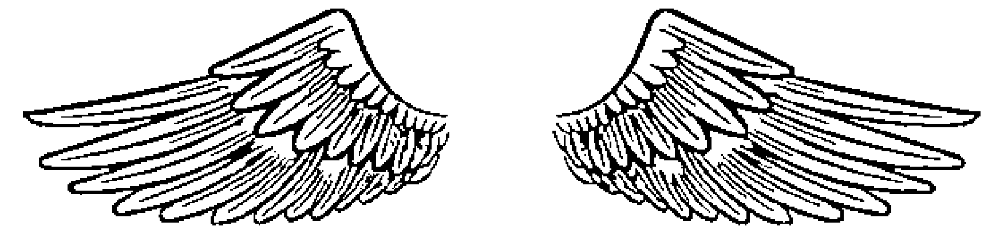

目录

- 引言 1
- 数位时钟的数字讯息 15
- 天使数字0-999 30
- 后记 364
- 作者简介 366

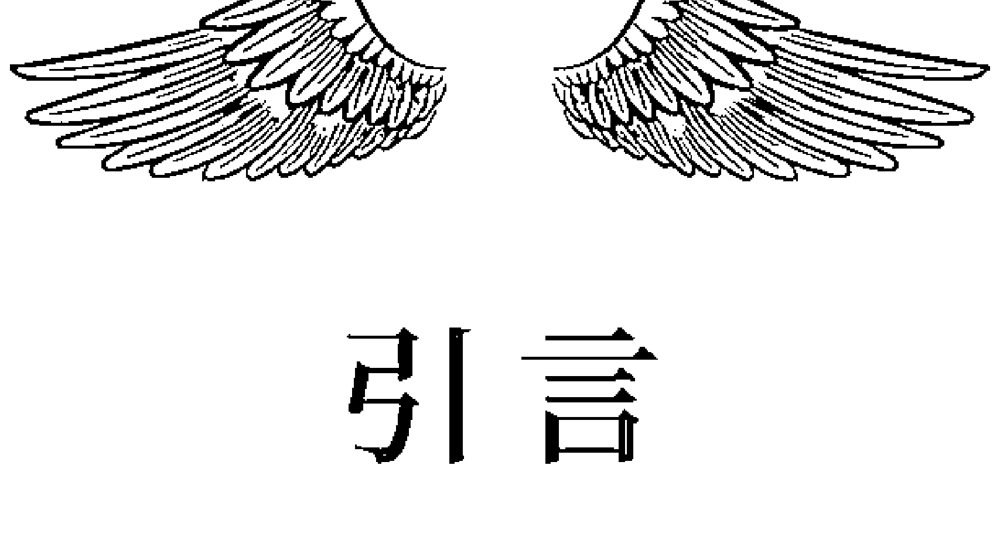

## 引言

世界上真的有天使。也许你已经知道了，但我还是必须在开头点出这件事。数千年来，这些神性化身不断向世人透露祂们存在的讯息。

自古以来，世界各地都有神灵崇拜的文化，人们相信这些神圣的存有（divine being）能连结不同界域，帮助自己应付日常生活与各种疑难杂症，也能在灵魂准备放返回灵界时，为它们指引明路。原住民族将这些神灵刻画在洞穴石壁上，在他们眼里，天使有一张焕发圣光的大脸，一双大大的眼睛，而且头顶上有一圈光环；在现今日本的神道教里，「神」是圣恩无限、慈悲为怀的神明，据说能在空中移动，仿佛「长了翅膀」一样。这些神灵是自然之力的化身，能帮助呼求祂们的众生；藏传佛教也有类似的神明，称为「菩萨」（bodhisattva）。菩萨有无量慈悲心，发愿救度所有呼唤自己的众生，帮助世人从苦海解脱，心无罣碍恐惧。纽约哥伦比亚大学教授罗伯特・瑟曼（Robert Thurman）专精印度与藏传佛教研究，他认为佛教菩萨的概念与西方的「大天使」（Archangel）相对应。

这种爱与光的力量化身，几乎存在所有灵性传统和宗教信仰里，只是展现的形式不同而已。在印度，有些神明具有动物的脸孔、鸟的翅膀，以及人的形体。在《希伯来圣经》里，先知以西结（Ezekiel）曾在异象中看到一个天使般的生物，这个「天使」拥有四张脸，分别是人、牛、狮与鹰。这种超自然的存有后来被称为「火之球体」（spheres of fire，也就是今天所说的「天体」），以及「燃着火光的一群」（the Burning Ones），可能是因为当时的人类没有电力照明，唯一能用來产生光的工具是火。

从古至今，天使出现在世界各个角落的方式，总是完美配合当时人类的知识、经验、认知与信仰。虽然目前没有明确的科学证据能证明天使存在，社会学研究指出早在远端通讯技术问世之前，这种对神圣信使的信仰已经在全球遍地开花，人类相信天使的存在，认为祂们能穿梭于灵界不同维度。

而今，世人对天使的信仰越来越坚定。在一项2016年针对2,000名英国人的调查中，三分之一的人相信天使确实存在，十人中就有一人认为自己曾经遇到天使；近期美国民调更显示十个美国人里，就有八个相信世界上有天使，实在太振奋人心了！

我们很多人感应、接收到的，只能以来自天堂的征兆和讯息解释，这其实不奇怪，因为天使想让我们知道：祂们就在你我身边，支持着我们。

一部分的天使讯息会透过数字显现。几千年来，数字一直被视为吉祥的象征，也是了解宇宙的媒介。古希腊哲学家毕达哥拉斯（Pythagoras）相信数字带有振动能量，能对应不同音符的振动频率。他更创造了一套系统，只要根据一个人姓名、生日与出生地的数字组合，就能得知这个人的内在性格与外在行为。这套系统被称为「毕达哥拉斯灵数学」（Pythagorean Numerology，又称占数术）。

把时间拉回今日，现代的生命灵数看的主要是姓名以及出生日代表的数字，分别用来计算命数（destiny number）和生命历程数字（life path number）。从这些数字透露的讯息，我们能了解自己为何对于某件事特别投入，为什么有些人格特质的表现更明显，以及自己这一生可能遭遇的挑战等。

这本书里的天使数字和「解码对照表」（Key Codex），也许和毕达哥拉斯灵数学想传达的理念和讯息雷同，但书里每一个天使数字的讯息，并不是透过算式得出，而是神性启发、降示的结果。

藉由这本书传达的资讯，你可以将天使数字与生命灵数结合，用更深刻的灵性观点诠释你灵魂的天命，了解天使会如何帮助你开展人生的旅程。

我过去十六年来长期钻研灵性，也花了很多时间探索数字背后的真正意义。我研究塔罗牌与西方神秘学传统的多年经验，对我最终的心得有深远影响。开始写这本书的时候，我也花了很多时间冥想，邀请天使告诉我特定数字的讯息与振动频率，这让我能更精准解读数字的涵义，并透过本书呈现给大家。

现今的科学家透过数字与公式计算，试图理解宇宙系统，以及地球如何在宇宙中运作，也难怪天使——这群宇宙最美好的信使——会透过数字向我们传达天堂的讯息。

举例来说，你很可能在生活中经常看到同样的数字序列，也许是车牌上的数字、发票号码、航班编号，或是你的电话号码等。这些数字可不只是数字，而是天使数字，是来自天使的讯息与呼唤。

我们现在生活在由数字组成的「数位世界」里，天使当然也能以数字来跟我们沟通，其中一个管道就是数字时钟上的数字，例如11:11。

## 看见11:11

我念中学的时候，第一次注意到11:11不断出现在生活中。那时的我刚得到第一支手机，我记得当我不经意瞄向手机，总会一次又一次看到这组数字。我以为自己心智错乱，或是出现幻觉，甚至是在特定时刻下意识地看手机，但是接下来发生的事证明了一切都是真的：我跟我的母亲、几个朋友分享这件事，结果他们跟我在一起时，也开始频繁看到11:11。其他数字序列也常反复出现，而且不只是在手机上。我和家人到超市买东西时，结帐金额会刚好是11.11英镑，我们去喝下午茶，点完咖啡和蛋糕时，金额共是4.44英镑。不管我到了哪里，都是同样的情况。

那时的我对灵性还一知半解，不过我花了一些时间祷告，问天使到底发生了什么事。我记得自己说：「亲爱的天使，如果你们让这些数字出现，可不可以让我一天看见这些数字三次，让我知道你们想带给我某种讯息。」同样的数字组合持续出现，我知道天使真的在传递讯息给我。

但是，这些讯息有什么意思？我完全不知道。我当时用谷歌搜寻「11:11的意思」，找到了几种解释。很多人说看到这些数字时，应该把握机会「许愿」或「设定意图」（intention）。有些人则说，11:11是天使在鼓励我们将意念提升至最高的振动频率。每当谷歌没办法提供明确的解答时，我总会做一件事：冥想。

记得那次冥想时，我说了简单的祷告：「亲爱的天使，谢谢你们向我显现11:11，让我知道这背后表示的讯息。」那一瞬间，许多画面和场景像电影片段一样，从我眼前闪过，包含耶稣与佛陀的画面，我还听到「我们都是一体」这句话。我的灵视并没有就此停住，我还看到穆斯林朋友向圣城麦加朝拜，又一次听到「我们都是一体」的声音。接着，我看到雷鬼乐传奇歌手巴布・马利（Bob Marley）唱着经典歌曲〈One Love〉的画面，当下被万物合一的感觉充满。我与天使合一，与扬升大师合一，也与神合一！

因此，「11:11」是世代以来，人类一而再、再而三接收到的讯息，提醒了我们：大家都是一体。这个创造宇宙、化育万物的能量场，与我们的生命紧密交织、互相连结。

但11:11的涵义远不只这样。对我来说，这个反复出现的讯息，不只是为了表达「你与一切万有合一」而已。11:11也是一种行动呼吁（call to action），仿佛来自宇宙／神（两者对我来说是一样的）的邀请，要我们用心去体会，了解宇宙的力量与光就在我们身上。耶稣曾说：「神的国（天堂）就在你们心中」。如果宇宙的力量和光就在我们心里，我们在生命中做的选择，就会影响这股能量。因此，11:11是一种呼唤，请我们将自己，将内心的意图、外在的行为提升至最高的振动频率。这也是身为光行者（lightworker）或地球天使（Earth angel）的真谛。

## 天使永远都有答案

藉由这次冥想，天使又一次为我解惑，祂们总是会有答案。正如宇宙的力量常存每个人心中，天使也时常与我们相伴。我相信每个人身边随时都有至少两位天使。一位是陪伴我们度过生生世世的守护天使，另外也至少还有一位天使。根据我们所在的人生阶段、正在追求的目标，或是处理的灵性课题，不同天使会在不同时刻来到我们的生命中。无论我们在哪里，天使总是陪伴在我们身边，随时乐于提供指引、支持。不过，祂们永远依照神圣律法（divine law）做事，因此，没有我们的允许，祂们通常不会主动介入我们的生活或擅自提供协助。

只有一种情况下，天使就算没有我们的同意，也能以我们的名义干预，我将这种情况称为「恩典时刻」（moments of Grace）。例如可能让我们偏离至善（highest good）或真理的情况，或是当我们投入了今生的使命，却在未完成时陷入生死交关的险境。在这些时刻，天使会前来相助，施予救命之恩。

我们当然不用到鬼门关前走一遭，才能获得天使的帮助。当我们祈求天使指引时，祂们一定有所回应，只是我们大多听不到。这是因为我们多年来都没有聆听内心的习性，更遑论用心聆听他人了。我们也忽视了来自内心深处的指引。其实，我们有多愿意倾听，天使的声音就有多嘹亮；我们若愿意睁开双眼，天使自然会现身。因为就如我前面提到的，天使现在会透过数位媒体，向我们传达讯息，提醒世人祂们的存在。

我也在其他著作中提过这些数字序列，尤其是《脉轮调频》，写那本书的初衷，正是因为我经常看到11:11和22:22的数字组合。而我现在已经请天使协助，带领我深入了解重复数字序列背后的讯息与涵义，让我化为文字，与更多人分享，也帮助你揭开这些数字的面纱，探索天使想跟你说的话，以及领受天使对于你的问题和祷告的回应。

## 如何使用本书作为指引

在这本书里，我首先探讨数字时钟（例如电脑或手机的时间显示）上的四位数序列，接着从0到999，针对每一组数字提供解读。

如果你找不到自己常看到的数字序列，建议你把数字拆成二到三组，接着分别查找每一组的天使讯息，之后组合起来。举个例子，如果你三天两头就看到「67891」这组数字，可以分别查看67、89和1代表的讯息，之后拼凑起来，得到完整的天使讯息。

如果你好奇的话，以下是各个数字的涵义：

- 67：你的意念正在导引生活中的能量流动与支持力量。花点时间重整，与能帮助你扩展的意念连结。
- 89：你触及了最真的自我。珍惜这份可贵的连结。
- 1：内在的宇宙生命力希望你觉察、注意它的存在。

这是多么发人深省的讯息。我希望这本书的所有讯息都能带给你启发。在阅读的过程中，你会发现许多数字的讯息都不同，但也有不少数字带有类似旨意。原因在于这些数字序列代表人生旅程的不同面向，但都扣合相似的主题。

随着你展开自己独特的旅程，也许会遇到不同的数字组合。例如，你也许一开始会看到332，接着是334。332的讯息是：「你的人际关系正在进入成长阶段，为你带来满足与喜悦。」334的讯息则是：「你的导师和天使正在你身旁飞舞，提供神圣的爱与守护。」因此，这两个数字可能表示你正在迈向幸福的路上前进。

你也能运用天使给我的解码金钥，自行解读生活中看见的天使数字。（见第12页天使数字解码对照表）

举例来说，如果你时常看到123这个组合，背后的讯息是你连结了爱的能量频率，你的旅程正在拓展。不妨用你常见的数字序列试试看吧！

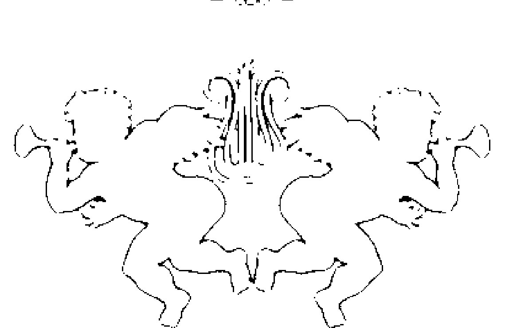

## 天使数字解码对照表

| 数字 | 涵义 |
|---|---|
| 0 | 新的开始、逐渐开启的门、神（God）。 |
| 1 | 自我、一体（oneness）、高我、宇宙连结。 |
| 2 | 合一（union）、与他人连结、与爱的频率连结。 |
| 3 | 开展、更高层次的力量（higher power）、灵性上师（Masters）。 |
| 4 | 天使、沟通、持续扩展的礼物。 |
| 5 | 改变、努力、必须投入行动与付出。 |
| 6 | 平衡、必须设定意图、谨慎。 |
| 7 | 魔法、显化、神性启示。 |
| 8 | 旅程、成长、灵性课题。 |
| 9 | 自我主宰（self-mastery）、与高我合一、神圣女性（divine feminine）。 |

## 作為神諭

你手裡的這本書也是一本神諭書。當你需要指引或支持時，可以請天使聆聽，並透過這本書傳達訊息。方法非常簡單，你只要花點時間冥想、靜思，用深長的呼吸讓自己安穩接地，之後說一句簡單的祈禱語，例如：

「親愛的神、聖靈與天使，
謝謝你們今天透過這些數字和這本書，
告訴我這個重要的訊息。」

然後，憑直覺翻開書的某一頁，全心相信你看見的第一個數字序列，就是你需要的訊息。
你可以現在就試試看，或者瞄一下數字時鐘，然後繼續往下讀，找出它們的涵義……。

## 數位時鐘的數字訊息

以下是你常會在數字時鐘上看到的數字序列，以及它們隱含的天使訊息，你當然也可能在其他地方看過這些數字。（如果你想了解的數字序列並不是數字時鐘上的時間，請參考第12頁的「天使數字解碼對照表」找出天使想給你的訊息。）

### 重複二位及三位數字

在時鐘上看到重複的二位和三位數字時，其實是天使在呼喊你，希望引起你的注意。這些數字序列揭示了你目前的能量振動狀態，以及你的旅程將如何發展。

#### 重複二位數字

☆ 00:00 ☆

神與你同在，並支持你做出必要的行動，幫助自己成長。

☆ 01:01 ☆

神已經來到身邊，帶給你支持和安全感，並幫助你與自己的意圖和努力連結。

☆ 02:02 ☆

神和天使正在引導你秉持開放的心胸、心態與能量，接受身旁的人給予的支持。

## 數位時鐘的數字訊息

☆ 03:03 ☆

神與揚升大師正在向你靠近，準備支持你深入了解你的靈魂、擴展你的旅程。

☆ 04:04 ☆

神和天使支持你展現真實的自己，與全世界分享你的天賦與自我。

☆ 05:05 ☆

要知道，神正在幫助你解決所有物質與財務上的需求。誠心請求，當能獲得。

☆ 06:06 ☆

神和天使正在引導你在生活中騰出空間，讓能量獲得修復、回歸平衡。

☆ 07:07 ☆

神派了眾多天使和魔法守護靈到你身旁，幫助你駕馭自身力量，來創造、享受你應得的美好人生。

☆ 08:08 ☆

請相信神正在引導你與神聖計畫（divine plan）結合，這個計畫將你的意圖考量在內，也為你靈魂的擴展做了最好的安排。

### ☆ 09:09 ☆

神正在引導你前往內心深處，揭開自己較為脆弱的一面。這能幫助你敞開自我，讓奇蹟與光流入心中！

### ☆ 10:10 ☆

奇蹟時刻即將到來。請相信神和天使與你共為一體，此刻也與你同在。

### ☆ 11:11 ☆

你與神、天使和揚升大師合而為一。讓你的意念與至上的美善和真理相互結合，將愛帶到這個世界。

☆ 12:12 ☆

你擁有將療癒和光帶給這世界的力量。看看你的意圖和行為所產生的影響，它們就是最好的證據。

☆ 13:13 ☆

教導別人也是一種學習。你目前的情況有許多值得學習的地方。好好留意你所療癒的一切，因為你的作為將啟發他人，鼓勵大家為世界帶來療癒。

☆ 14:14 ☆

你的天使正給你滿滿的支持，幫助你重新找回被遺忘的天賦，或是過去被壓抑的自我特質。

## 數位時鐘的數字訊息

☆ 15:15 ☆

要知道，你現在所做的改變是必要的。唯有如此，你才能成長。請相信你創造的空間，會吸引未來的豐盛。

☆ 16:16 ☆

花點時間找到生活的平衡。宇宙鼓勵你放慢腳步，先仔細思考你的意圖，再繼續往前進。

☆ 17:17 ☆

你將充滿魔法能量！你一直以來的擔憂、遭遇的阻礙，現在都被釋放了，你能放心將夢想化為現實。

☆ 18:18 ☆

你準備踏上改變一生的旅程。你會從中得到滿滿的收穫與美好體驗。相信這個過程吧！

☆ 19:19 ☆

宇宙邀請你與自己心中和身旁的神聖女性能量連結。接受神性之母／女性療癒的能量吧！

☆ 20:20 ☆

你得到了深化與他人連結的機會。無論是個人生活或職場，原諒與慈悲的能量都圍繞著你與他人的互動。

☆ 21:21 ☆

別忘了，對方其實也是你。你與世界本為一體，而你對他人懷抱的意圖，也是你給自己的意圖。提升你意念的層次吧！

☆ 22:22 ☆

你擁有照亮世界的力量與天賦。專注在至善上。你生來注定是一顆閃耀的星。

☆ 23:23 ☆

你追求成長、為世界帶來正向轉變的努力，正在開花結果。天使希望你知道，在地球上，你也是天使的一員。

#### 重複三位數字

☆ 1:11 ☆

你的意念和意圖此刻都被放大了。專注在你愛的事物上，而不是你的恐懼。

☆ 2:22 ☆

你的天賦正在為你創造擴展的機會。記得敞開心胸，把握能讓你實踐人生目標的機會。

☆ 3:33 ☆

所有歷史上偉大的靈性導師此刻都在引導你。這些揚升大師正在幫助你發展天賦。

## 數位時鐘的數字訊息

☆ 4:44 ☆

你的守護天使希望你知道，祂們此刻與你同在。你的祈禱字字句句都被聽見了。心懷信念。

☆ 5:55 ☆

你的一切努力正在開花結果。要知道，宇宙和你的天使正在支持你創造、活出豐盛的人生。

### 迴文數字

迴文數字指的是左右排列對稱，有如鏡像的數字序列。背後的訊息通常是請你反思目前的情況，才能連結支持自己成長的力量。

### ☆ 12:21 ☆

你擁有支持和引導他人的能力，但天使想提醒你在身為光行者的旅程上，別讓自己太過勞累，或忘了照顧自己。

### ☆ 13:31 ☆

宇宙邀請你檢視目前的狀況，重新評估身旁有哪些學習和成長的機會。

## 數位時鐘的數字訊息

☆ 14:41 ☆

你的天使正在與你溝通，但你並未加以聆聽。務必明白，天使發出的訊息，永遠是為了你的至善。即使這些訊息看似與你的計畫相抵觸，卻都配合著神的計畫。

☆ 15:51 ☆

你的天使鼓勵你要勇敢、要堅強。你必須知道哪些地方需要改變，才能對準生命意義和豐盛的能量。

### 連續數字

連續數字是等差遞增的數字序列。看見這種數字組合時，代表天使對你予以肯定，知道你持續提升自我、在人生道路上不斷前進。祂們看到你順利提高了振動頻率，踏上了揚升的旅程。

☆ 12:34 ☆

你在靈性階梯上不斷爬升。你的天使看見了你的意圖、你追求成長的努力。要知道祂們正在鼓勵你、支持著你。

☆ 1:23 ☆

你揚升了一步。先前你經歷過的一切挑戰都能得到釋放，揚升天使時常伴隨你的左右。

## 數位時鐘的數字訊息

☆ 2:34 ☆

你的人際關係正在發展茁壯。要知道，你眼前出現了許多愛人與被愛的機會，這是前所未有的難得時刻。你的天使正在身旁雀躍飛舞。

☆ 3:45 ☆

揚升大師已來到你和你的指導靈身邊，幫助你提升靈性連結。相信此刻心中的感受，它們是你禱告的解答。

☆ 4:56 ☆

天使希望你明白，看到你對追求靈性成長如此投入，祂們非常高興。現階段的你會有加速成長的感覺。

## 天使數字0－999

☆ 0 ☆

神就在身邊。你永遠不是孤單一人。

☆ 1 ☆

內在的宇宙生命力此刻正在呼唤你，希望得到你的注意。

### 天使數字0-4

#### ☆ 2 ☆

眼前出現了連結與合一的機會。你的關係將進一步成長。

#### ☆ 3 ☆

你走在成長與擴展的康莊大道上。眼前的路在最完美的時刻展開。

#### ☆ 4 ☆

讓真我作為你的老師。相信你的所有感覺，讓喜悅引領你前行。

#### ☆ 5 ☆

豐盛是一種心態。當你在靈性層次感到富足，你的物質生活也會變得富足。

#### ☆ 6 ☆

花點時間排除阻礙你獲得快樂的一切。追尋讓你的心雀躍飛舞的事物。

#### ☆ 7 ☆

魔法的能量圍繞著你。讓你的意念提升到最高的振動頻率。

#### ☆ 8 ☆

某種週期或模式正在不斷循環，好讓你了解背後的生命課題。花點時間反思。

#### ☆ 9 ☆

神性能量正在你心中覺醒。讓你的靈魂帶領一切。

#### ☆ 10 ☆

你正在與神的能量合一。相信你看見的徵兆是神性親自傳達的訊息。

☆ 11 ☆

你進入了擴展的空間，也越來越了解真實的自己。要知道，你生來注定要照亮世界。

☆ 12 ☆

所有關係都需要用心經營。此刻的你開始找到知己和夥伴，甚至逐漸了解靈魂伴侶的真諦。

☆ 13 ☆

請相信你選擇的路會在最剛好的時刻展開，幫助你持續成長。

☆ 14 ☆

天使鼓勵你花時間傾聽祂們的訊息。別忘了，你有多願意聆聽，天使的聲音就有多嘹亮。

☆ 15 ☆

你經常轉變的意念正在改變人生的方向。將覺知和能量聚焦在對你有幫助的意念上。

☆ 16 ☆

宇宙邀請你做出更好的選擇，邁向能帶來喜悅和生命意義的經驗。勇於放下，堅定前行。

☆ 17 ☆
一扇門關上之後，另一扇會接著大開。天使就在你身旁，引導你懷抱正向的意念。

☆ 18 ☆
你的天使鼓勵你檢視過去的經驗，才能了解目前的處境，發掘其中的生命課題。

☆ 19 ☆
展現自身力量並沒有關係。天堂正在引領你主導目前的狀況。

☆ 20 ☆

你的天使正在恭喜你往成長和擴展邁進。你與你靈魂的連結現在更緊密了。

☆ 21 ☆

你和宇宙之間有著非常強烈的連結，你正在領受滿滿的啟發和指引。敞開心胸，用心覺察。

☆ 22 ☆

你來到了旅程的關鍵階段，你會因此了解能支持你成長的關係與靈性功課。

## 天使數字

☆ 23 ☆

揚升大師正在引導你前進。請相信你踏上的道路與你目前的狀況完美配合。

☆ 24 ☆

天使正以和諧之光照耀你和你的人際關係。所有衝突此刻都被化解了。

☆ 25 ☆

天使希望你相信，你的一切努力和付出最後都有收穫。你很快就能享受用心耕耘帶來的甜美果實。

☆ 26 ☆

務必與能讓自己快樂的人在一起。遠離任何讓你感覺渺小、不足的人。

☆ 27 ☆

宇宙正在向你顯現徵兆，表達你的禱告被聽見了。請相信神的安排會在適合的時刻發生。

☆ 28 ☆

你的天使想跟你擊掌！因為祂們看見了你想成為照亮世界的光的決心。勇敢面對恐懼的你很棒喔！

☆ 29 ☆

女神和神性之母（Divine Mother）的強大能量正環繞著你。你被無限的愛與慈悲包圍。

---

☆ 30 ☆

你來到這世上是有原因的。要知道，你的幸福有一個使命；你的快樂能幫助世界。

---

☆ 31 ☆

聖者與上師正努力顯化你的祈禱和意圖。要知道祂們正在盡全力協助你。

☆ 32 ☆

你和自己、和他人的關係，都有天使和指導靈一直守護著。呼求祂們提供你需要的協助，永遠別擔心自己要求太多。

☆ 33 ☆

揚升大師耶穌和祂的天使都在你身邊。這是尋求成長與療癒的神聖時刻。

☆ 34 ☆

你正在和宇宙上師連結，祂們給你的靈感和啟發將引導你繼續未來的旅程。相信你的感受吧！

☆ 35 ☆

你的天使和指導靈已經準備好支持你做出需要的改變，活出更自在的自己。

☆ 36 ☆

你的生活中出現了新機會，能幫助你更投入現在的工作、創造更多豐盛。你的指導靈也準備好給予支持。

☆ 37 ☆

顯化上師已經來到你身邊，幫助你開創夢寐以求的人生。

☆ 38 ☆

你正在發掘超越今生的前世記憶——你現在有興趣的靈性領域，與前世的經驗密切相關。

☆ 39 ☆

你內在的神聖女性想跟你說聲感謝，謝謝你聆聽自己靈魂的聲音。

☆ 40 ☆

神和天使此刻都在你身旁。放下心中的恐懼吧！

☆ 41 ☆

你的天使鼓勵你擁抱自己的天賦，並知道自己值得擁有。

☆ 42 ☆

天使正在溫柔地引導你表達情緒。表露最真實、最完整的自己吧！

☆ 43 ☆

天使、你愛的人，以及能幫助你的指導靈和上師，此刻都在你的身邊。要知道，只要心念一轉，幫助自然會來。

☆ 44 ☆

你的守護天使將慈愛與保護化為披風，柔柔包裹住你。你現在是安全的。

☆ 45 ☆

大天使麥可（Archangel Michael）和其他大天使現在都來到你身旁，準備助你一臂之力。

☆ 46 ☆

你正處於能量轉變的過渡期，相信大天使在一旁支持著你。

☆ 47 ☆

顯化天使正在幫助你調整能量與意念的頻率，讓他們為你帶來最大的效益。

☆ 48 ☆

生命意義的天使已經來到身邊，準備幫助你體悟生命的真諦與意義，進而活出充滿喜悅的人生。

☆ 49 ☆

天使正在幫助你擁抱此刻內心升起的情緒。你的情緒是心靈的信使。

☆ 50 ☆

強大又豐盛的能量正圍繞著你。放大思考格局，專注在這巨大能量上。

☆ 51 ☆

克服阻礙需要的一切，都在你身上了。這是勇敢面對恐懼、追求成長的時刻。

☆ 52 ☆

讓人難受的對話會帶你找到穩定與理解的力量。保持開放的心態，勇於聽見真相。

## 天使數字

☆ 53 ☆

宇宙從來不會與你作對，而是永遠為你著想。相信神會為你做出最好的安排。

☆ 54 ☆

你的天使鼓勵你進入臣服的空間，好讓祂們幫助你前進。

☆ 55 ☆

你的財務和豐盛狀態出現了大幅轉變。要知道振翅高飛的機會即將來臨。

☆ 56 ☆

花點時間思考，你能為了領受先給予什麼。能量永遠會以交換的形式流動。

☆ 57 ☆

信念能創造顯化。想像你所祈求的已經在你手中……已經在生活中實現。

☆ 58 ☆

旅程中的障礙正在被排除。要知道最壞的情況已經過去。

### ☆ 59 ☆

你的生活中出現了讓靈性大幅成長的機會。敞開心胸，迎接療癒的訊息。

### ☆ 60 ☆

你的天使正在引導你放慢腳步，在貿然做出改變之前，先花點時間沉澱反思。

### ☆ 61 ☆

你的天使邀請你將珍貴的能量，保留給讓自己開心的計畫和事情。遠離讓人心累的關係吧！

☆ 62 ☆

花點時間省思，試著理解質疑你的人的觀點。呼求和諧天使，請祂們協助撫平任何遭遇瓶頸的關係。

☆ 63 ☆

放下讓你心力交瘁的事情，能為奇蹟與擴展創造空間。花點時間釋放老舊、淤積的能量。

☆ 64 ☆

你的天使邀請你多花點時間反思、冥想，祂們才能強化與你的溝通連結。

☆ 65 ☆

你的財務狀況反映了你認定的自我價值。要知道在神的眼裡，你永遠值得擁有祝福與和諧。

☆ 66 ☆

停下來。不要貿然做出任何行動或改變。你的天使邀請你謹慎思考下一步。

☆ 67 ☆

你的意念正在導引生活中的能量流動與支持力量。花點時間重整，讓意念的頻率對準擴展的能量。

☆ 68 ☆

你也許覺得自己好像碰到阻礙，但是要知道，天使正在引導你重整腳步，往長遠的目標前進。

☆ 69 ☆

情感豐富是一種天賦。要知道你的情緒正在幫助你看見最真實、最重要的自我。

☆ 70 ☆

宇宙能量正圍繞在你身旁。要知道，神正在等你釐清心中的意圖，祂才能提供顯化的支持。

☆ 71 ☆

宇宙邀請你想清楚自己的渴望，而不是聚焦在自己不想要的事物上。寫下你的意圖，讓神接手提供協助。

☆ 72 ☆

務必重新找回與自己、與內在世界的連結。唯有如此，你才能在外在世界更有方向。

☆ 73 ☆

阻礙正在一一被排除。你此刻的頻率與魔法能量調和共振。

☆ 74 ☆

天使希望你多花點時間與祂們分享計畫，祂們才能給你更多支持。

☆ 75 ☆

為了讓心中意圖顯化，你必須準備好迎接轉變的能量。新的開始即將到來。

☆ 76 ☆

花點時間接受你的恐懼，體認到當內心被恐懼的陰影籠罩，奇蹟的光明也即將來到。

☆ 77 ☆

準備迎接最好的結果。好消息即將到來，事情開始出現正面發展。

☆ 78 ☆

你的個人旅程正在順利展開。相信這個過程。

☆ 79 ☆

你的高我擁有能幫助你的資訊。呼求內在的導師為你指引明路。

☆ 80 ☆

你的存在是為了創造美好改變。一切的際遇絕非平白無故。相信每一個生命經驗都有其價值。

☆ 81 ☆

天使正在幫助你了解生命中反覆出現的經驗與模式，好讓你發現問題並加以克服。

☆ 82 ☆

生活中出現了踏上個人旅程的機會。別讓他人的想法阻礙你追尋夢想。

天使數字

☆ 83 ☆

把每一次犯錯視為學習與成長的機會。放下悔恨。

☆ 84 ☆

原諒天使已經來到身邊，幫助你釋放過去的事件，擁抱它們帶給你的成長。

☆ 85 ☆

你生來並非是為了受苦。放下對於事情發展的悲觀看法。

☆ 86 ☆

你現在的課題是遠離讓自己情緒低落或心力交瘁的事物。

☆ 87 ☆

你是能啟發他人的老師，你能分享自己從經驗中得到的知識。

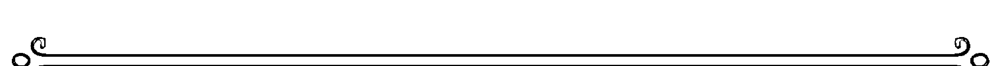

☆ 88 ☆

一扇傳送門正在為你敞開，邀請你走入更具靈性光輝的人生。

☆ 89 ☆

你觸及了最真的自我。珍惜這份可貴的連結。

☆ 90 ☆

最棒、最美好的人際關係，是你與自己的關係。學著對他人說「No」，對自己說「Yes」。

☆ 91 ☆

你的天使對於你追求成長的決心深感驕傲。

☆ 92 ☆

你的能量正在創造正向環境，為你吸引更多快樂與有趣的經驗。

☆ 93 ☆

你的高我請你拉長冥想時間，好讓你的能量系統揚升到更高的層級。

☆ 94 ☆

你的內在直覺正在感知天使傳達的訊息。相信你的感覺吧！

☆ 95 ☆

宇宙很清楚祂為你安排的下一步。請向生命的際遇臣服。

☆ 96 ☆

你的天使鼓勵你放慢腳步。如此一來，機會的大門才會敞開。

☆ 97 ☆

你現在擁有一切的力量。讓你的能量頻率與金色意念、金色能量（golden energy，指來自神性的靈性療癒力量）共振，將金色的機會吸引到生命中。

☆ 98 ☆

你的意圖與努力正在為你開拓全新的道路。

☆ 99 ☆

你正處於靈性覺醒的時刻。用心覺察此刻你感應到的一切。

☆ 100 ☆

對於你所做的一切努力，天使想給你讚美與肯定。你是地球上一道特別的光。

☆ 101 ☆

神在你心中，仔細聽著你的所有禱告與意圖。

☆ 102 ☆

花點時間去體認：你與自己的關係越堅定，與神、天使和他人的連結就越堅固。

☆ 103 ☆

要知道，在神的眼裡，你永遠是充滿神性、值得愛憐的光之子。

☆ 104 ☆

你的每一步都有神和天使相伴。需要時，儘管呼求祂們協助。永遠別覺得自己孤單。

> ————————————————————————————

☆ 105 ☆

神和天使已經來到你身旁，在有關財務和安全的事情上提供協助。為奇蹟拓展空間吧！

> ————————————————————————————

☆ 106 ☆

宇宙正在引導你斬斷負面的繩索，讓自己從過往的事件中解脫，才能繼續往前走。

☆ 107 ☆

你的意念以及意圖正在眼前顯化。只要相信，必能獲得。

☆ 108 ☆

你踏上的旅程會帶領你回歸內心。你想尋找的所有答案，都在你身上了。

☆ 109 ☆

要知道，神性就在你心中。你的天使正注視著你的神聖本質。

☆ 110 ☆

神和天使正在給你啟發、引領你前行。

☆ 111 ☆

你與一切萬有合而為一。要知道你所做、所給予的一切，都是為了這世界，以及世上的芸芸眾生。

☆ 112 ☆

面對目前生活中的所有關係，宇宙鼓勵你看見它們背後更崇高的目的。

☆ 113 ☆

揚升大師、聖者與來自更高力量（higher-being）的上師，現在都來到你身邊，幫助你秉持堅定信念，在旅途上前進。

☆ 114 ☆

你的天使想對你說聲感謝，謝謝你願意成為祂們在地球上的一份子。療癒是你與生俱來的美好天賦。

☆ 115 ☆

你的意念正以驚人的速度顯化，務必持續專注於能幫助你擴展的意念。

☆ 116 ☆

在做出決定、往前邁進之前，務必提醒自己跳脫思考框架，別只聚焦於現況。

☆ 117 ☆

你的天使正等著你釐清自己的意圖。好好思考你想要的是什麼。

☆ 118 ☆

為了成長，你必須放下對事情結果的執著，與他人有關的事更要超然看待。花點時間沉澱，重新將能量聚焦在自己的路上。

☆ 119 ☆

宇宙邀請你駕馭自我力量，主導眼前的情況。別再等他人影響你的下一步。

☆ 120 ☆

你的天使明白你想全力以赴、成為最好的自己。要知道他們正在給你滿滿的愛與鼓勵。

☆ 121 ☆

宇宙就在這裡，與你在一起。要知道，你和宇宙此刻擁有無比緊密的連結。

天使數字119－124

☆ 122 ☆

你來到了個人旅程的重要階段，務必保持覺知、專注於當下。

☆ 123 ☆

你又揚升了一步。你先前遭遇的所有挑戰，現在都被釋放了。揚升天使已經來到身旁。

☆ 124 ☆

你的天使想提醒你，沒有任何人或任何事比你更具靈性、更有靈感天賦，千萬別小看了自己。發揚你的神聖本質吧！

☆ 125 ☆

你的天使鼓勵你了解，不管做什麼事，你總是盡其所有的知識和努力。

☆ 126 ☆

遇到阻礙，或事情發展不如預期時，請相信神為你做了更好的安排。

☆ 127 ☆

你所見的徵兆，是為了讓你明白自己走在對的路上，這條路即是光之道途。

☆ 128 ☆

此刻的你正在揚升並展翅高飛。要知道，隨著你直上雲霄，飛入愛與豐盛的生命裡，天使已在那裡等著擁抱你。

☆ 129 ☆

神性之母帶著慈愛與療癒的聖光，來到了你身旁。要知道包圍你的愛，多到你無法想像。

☆ 130 ☆

選擇過有意義的生活，做對你有幫助、能帶領你擴展的事。

☆ 131 ☆

聖者與神聖大師此刻都與你同在。祂們都知道，你擁有為世界帶來療癒、注入光芒的真實力量。

☆ 132 ☆

你的天使邀請你花點時間感受自己的能量，聆聽身體的聲音。新的訊息等著你發掘。

☆ 133 ☆

耶穌和神聖大師正在引導著你。黑暗已經被帶入光明——期待奇蹟到來吧！

☆ 134 ☆

療癒天使圍繞在你身旁，祂們會帶你找到重要資訊，幫助你前進。

☆ 135 ☆

請相信現在發生的改變，正在帶你往最初的意圖和目標靠近。

☆ 136 ☆

你的工作或目標為你帶來了新機會。要知道，神和天使會引導你做出對自己最好的決定。

☆ 137 ☆

此刻的你擁有不凡的顯化能量。相信你已經掌握、擁有了需要的一切。

☆ 138 ☆

你的天使和指導靈鼓勵你選擇原諒、放下過去，才能顯化更完滿的未來。

☆ 139 ☆

務必讓生活中充滿能幹、睿智的女性。神聖女性是你現階段需要的解答。

☆ 140 ☆

你與神和天使合而為一。昂首闊步吧！

☆ 141 ☆

大天使為你築起了防護牆，正守護著你。

☆ 142 ☆

你的守護天使在你身旁飛舞，散發愛與接納的能量。你是被愛著的。你是被接受的。

☆ 143 ☆

早在幾世以前，你就認識了你的守護天使。投入冥想，請靈魂讓你看見對你有幫助的記憶。

☆ 144 ☆

十萬個天使正在用祂們的光和愛溫柔包裹住你。

☆ 145 ☆

大天使們邀請你敞開心胸，發揚你的天賦，才能領受祂們的訊息。

☆ 146 ☆

你現在處於轉換時期。要知道天使正在引導你渡過這一切。

☆ 147 ☆

你的天使正在幫助你將夢想化為現實。釐清你的意圖，敞開心胸去領受。

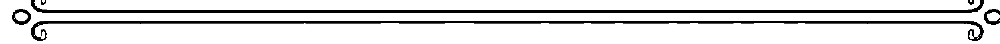

☆ 148 ☆

你必須相信奇蹟存在，天使才能幫助你感受奇蹟。要知道奇蹟確實存在，你也值得擁有奇蹟。

☆ 149 ☆

你的情緒映照出你真實的一面。與情感連結能幫助你成長。

☆ 150 ☆

開創新局的機會即將來臨。這些契機將為你的生活注入新鮮感與安定。

☆ 151 ☆

你越來越有自信，你的天賦和才能也開始展露光芒。繼續相信自己吧！

☆ 152 ☆

花點時間靜心，思考眼前的挑戰帶有什麼更崇高的目的，這能讓你秉持無畏的心往前進。

☆ 153 ☆

你對宇宙越加堅定的信念，讓它能向你顯現奇蹟的解方，幫助你克服挑戰。繼續相信宇宙的力量吧！

☆ 154 ☆

相信你的內在聲音，因為它正在提供你由天使啟示的智慧。

☆ 155 ☆

你是顯化大師，你的願景正在化為現實。

☆ 156 ☆

從他人的限制與負面行為中解脫，永遠別懷疑自己的良善或能付出的能力。你充滿善性，因為這就是你的本質。

☆ 157 ☆

往事之所以湧現心頭，是為了讓你放下，讓你創造成長的空間。試著臣服，接著放下。

☆ 158 ☆

宇宙正在引導你的腳步，帶你踏上與內心意圖和目標更一致的路。勇於接受即將到來的改變。

☆ 159 ☆

天使正在引導你找到對的資訊和對的人，幫助你發掘個人旅程的深層意義。保持開放心態，就能看見不一樣的路。

☆ 160 ☆

你有多願意聆聽，神的聲音就有多響亮。盡全力去傾聽……用心、仔細地傾聽。

☆ 161 ☆

能終結一切黑暗的光，此刻在你身上綻放萬丈光芒。你就是光。

☆ 162 ☆

天使正在引導你平靜面對目前的情況。守住你身上的光。

☆ 163 ☆

對愛敞開心房，讓愛流入心中。

☆ 164 ☆

你的天使正在幫助你用更宏觀的角度看事情。

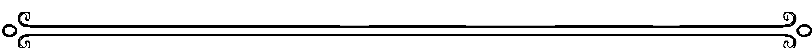

☆ 165 ☆

宇宙正在引導你用開放的心態面對新機會。

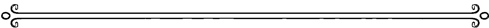

☆ 166 ☆

務必重新評估你目前的選擇。你的天使邀請你重整頻率，讓意圖對準至善。

☆ 167 ☆

關心他人、照顧自己的行為，都在為你的世界注入更多愛與福報。

☆ 168 ☆

你的天使團隊邀請你別再讓自己忙得喘不過氣。簡化你的焦點和意圖，才能有好的結果。

☆ 169 ☆

花點時間看見、接受自己的情緒，是當前的重要功課。你的天使都深愛著你。

☆ 170 ☆

此刻的你具有強大的吸引能量。如果想創造機會，不妨帶著愛專注在你的計畫上。

☆ 171 ☆

你的天使想提醒你，你的禱告具有美妙的力量。要知道禱告能創造奇蹟。

☆ 172 ☆

你的天使和你自身的能量正在提供指引，幫助你辨別生命中誰值得信賴，並與他們再次連結。

☆ 173 ☆

你的天使就在你的身旁，幫助你記得自己值得擁有奇蹟。

☆ 174 ☆

天使鼓勵你重掌自己的力量，主導目前的狀況。

☆ 175 ☆

你現在經歷的轉變都來自你的意念。請相信宇宙會依你所想調整你的腳步。

☆ 176 ☆

你的意圖現在並不清楚。宇宙邀請你釐清自己的意圖。與神展開對話吧。

☆ 177 ☆

你的意圖被一字一句清楚聽見了。神正在為你指引方向。

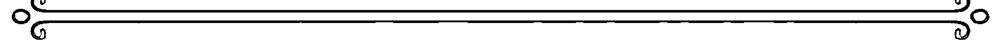

☆ 178 ☆

請相信宇宙正在帶領你找到完美的機會，幫助你展現天賦。

☆ 179 ☆

你的靈感能力與覺知正在快速覺醒。定期練習冥想，與自己的天賦連結。

☆ 180 ☆

事情不會無緣無故發生。要知道，你在地球上的生命有一個目的，一個更崇高的目的。

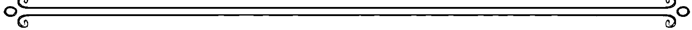

☆ 181 ☆

宇宙邀請你放下過去讓人煎熬的事，才能準備迎接奇蹟。

☆ 182 ☆

你的天使鼓勵你放下別人的問題、過錯與負面行為。你值得從這一切中解脫。

☆ 183 ☆

你的天使和指導靈都來到身邊，幫助你檢視生活，也鼓勵你看見自己一路走來的成長。

☆ 184 ☆

原諒是你給自己的禮物。要知道你值得從過去的記憶中解脫。

☆ 185 ☆

天使希望你明白，祂們是如此愛戀著你。

☆ 186 ☆

做出任何改變一生的決定之前，花點時間檢視自己的現況。多一點耐心，也多一點專注。

☆ 187 ☆

你經歷的一切、學到的一切，都是生命的禮物，能讓你更了解自己、認識自己的天賦。花點時間去體悟：你是個特別的靈魂。

☆ 188 ☆

你現在與自我意識和宇宙合一。你與你的天賦、夢想和目標合一。懷抱信念。

☆ 189 ☆

你的第三眼正在打開，靈視也越來越清晰。用你的靈魂之眼洞察世界。

☆ 190 ☆

回歸自我，前往內心最深處，你的守護天使就在那裡，等著你分享無條件的愛。

☆ 191 ☆

你接收到的訊息並非幻想——字字句句都是天使在對你說話。

☆ 192 ☆

宇宙鼓勵你更用心經營你的關係。你愛的人需要你在乎他們。

☆ 193 ☆

你現在的狀況正在幫助靈魂成長。好好吸取每個生命經驗的養分，要知道天使永遠會守護你。

☆ 194 ☆

天使希望你明白，你有一個能強化人生使命感的機會。對新想法保持開放的心態。

☆ 195 ☆

你的天賦需要你用心培養，才能開花結果。花點時間深入內心，好好認識自己、發掘你的天賦。

☆ 196 ☆

重新與最初的意圖連結，能幫助你了解自己目前在宇宙中的位置。

☆ 197 ☆

溫柔是一種靈魂特質。你的天使鼓勵你溫柔地說話、溫柔地行事，心懷溫柔的意圖。

☆ 198 ☆

你正在經歷重要的靈魂課題。務必祈求神聖指引，幫助你克服反覆出現的模式。

☆ 199 ☆

歡迎來到內心的最深處。你已抵達了自我的中心。

☆ 200 ☆

你的存在是為了照亮他人的生命。你是給世界的一份禮物。神會幫助你。

☆ 201 ☆

謝謝你相信你心中的光。對於你看見了自己的神聖本質，天使非常開心。

☆ 202 ☆

神正在引導你進一步認識自己。

☆ 203 ☆

你追求成長的決心是如此激勵人心，也提升了身旁所有人的振動頻率。

☆ 204 ☆

你的存在是為了揭示真理和分享愛。要知道無論你到了哪裡，神都與你同在。

☆ 205 ☆

看見自己實現最天馬行空的夢想，能讓它們在生命中逐漸開花結果。

天使數字203-208

☆ 206 ☆

請務必確保你的意圖沒有影響或干預了他人的自由意志。

☆ 207 ☆

你需要的魔法就在你身上。

☆ 208 ☆

你必須勇敢面對真相，才能夠前進、成長。誠實面對自己吧！

☆ 209 ☆

你的存在是為了讓世界更添一分美好。你照亮了身處的地方。

☆ 210 ☆

神和天使都在歡迎你回歸最真的自我。你再次踏上了適合自己的路。

☆ 211 ☆

你進入了充滿力量的空間，並與古今的聖者和上師連結。將意念聚焦在你的夢想和至善上。

☆ 212 ☆

在這個重要時刻，務必思考你是什麼樣的人，希望讓誰進入自己的生活，最終創造什麼樣的世界。

☆ 213 ☆

別害怕，這種被困住的感覺只是宇宙在為你重新校準。相信這個過程。

☆ 214 ☆

此刻的你與天使擁有無比緊密的關係。

☆ 215 ☆

你擁有克服恐懼的力量。堅持心中的信念——你經歷的這一切，都是為了往上揚升！

☆ 216 ☆

你的天使邀請你從他們最聖潔、最慈愛的眼裡看見自己。好好欣賞自己的美麗。

☆ 217 ☆

宇宙想提醒你，身旁的人散發的能量，會影響你的振動頻率。好好選擇你往來的對象。

☆ 218 ☆

宇宙鼓勵你懷抱信念，相信讓你綻放光芒的事物，勇敢前進！

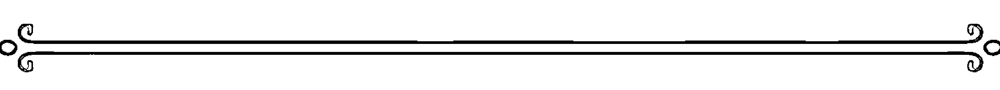

☆ 219 ☆

要知道，你與他人的關係，需要你用和諧與慈愛的心積極經營。花點時間分享你追求成長的意圖。

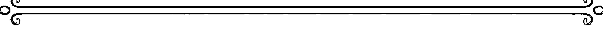

☆ 220 ☆

好好照顧自己，就是好好照顧這世界。

### ☆ 221 ☆
天使正在引導你看見生活中最漆黑的角落，讓你能把更多的光帶到現況，也帶到世界上。

### ☆ 222 ☆
你就像地球上的天使，能溫暖身旁所有人的心。你生來注定是一道閃耀的光。

### ☆ 223 ☆
揚升大師、你的指導靈和天使，都鼓勵你在繼續前進之前，先誠實面對自己。

### ☆ 224 ☆
你的天使正在引導你。請相信祂們正為你帶來和諧的能量。

### ☆ 225 ☆
你是引領轉變的光，你近來所做的事與神聖計畫互相呼應。一切都在完美的時空序列下開展。

### ☆ 226 ☆
別忘了，不管一段關係缺少了什麼，你都能選擇補足。別只看問題，積極尋找解決方法。

### ☆ 227 ☆
神和天使都聽見了你的禱告，也正在衡量目前狀況，找出對所有人最好的解決方法。

### ☆ 228 ☆
宇宙想提醒你，你的意圖和禱告會引領你的旅程和生命經驗。聚焦在你期待的結果上，它才能化為現實。

### ☆ 229 ☆
神性鼓勵你讓自己的選擇、意念和意圖對準至善。如此一來，你的生命經驗才能對準意義和豐盛。

### ☆ 230 ☆
過得快樂是你生命的意義。天使鼓勵你擁有喜悅，去做讓心快樂歌唱的事。

### ☆ 231 ☆
你也許覺得自己後退了一步，但這個小插曲是天使團隊的安排，祂們都在為了你的至善而共同努力。相信這個過程。

### ☆ 232 ☆
你所見的即是真理，你的天使鼓勵你勇敢相信，並依據真理行事。

## 天使數字

### ☆ 233 ☆
揚升大師，特別是耶穌，此刻已來到身邊，幫助你一步一步邁向至善。請求祂們提供你需要的所有協助。

### ☆ 234 ☆
你正在往上揚升。宇宙看見了你追求成長的決心，為你感到驕傲。

### ☆ 235 ☆
現在發生的轉變，會讓你感覺更完滿、更和諧。

### ☆ 236 ☆
你來到這世上，是為了享受生命、活出快意人生。你的天使鼓勵你放鬆心情、放下執念，讓生活充滿更多正能量。

### ☆ 237 ☆
你的夢想正在你眼前以飛快的速度顯化。繼續保有慈愛的意念和意圖。

### ☆ 238 ☆
你曾經降生地球上，你與靈的連結是累世記憶的一部分。你現在來到這裡，是為了成為光與力量的燈塔。

### ☆ 239 ☆
神聖女性，這股由所有女性神靈、聖者與上師體現的能量，已經來到身邊，幫助你重新看見最深層的自我。真理不必外求，只要內尋。

### ☆ 240 ☆
要知道神和天使現在都在你身邊。對改變保持開放的態度。

### ☆ 241 ☆
你的天使正在引導你找回自己的天賦。別再否定自己，察覺你的過人之處。

### ☆ 242 ☆
天使總是帶著無條件的愛注視著你。要知道你恆常被滿溢的愛包圍。

### ☆ 243 ☆
陷入情緒低潮時，別因此焦慮。你只是在排解能量，之後才能提升振動頻率。

### ☆ 244 ☆
天使正在帶你前往下一個層級。這是肯定自我價值的時刻！

## 天使數字

### ☆ 245 ☆
大天使就在你身邊，幫助你斬斷阻礙自己的繩索。將過去徹底清除、放下，勇敢按下刪除鍵吧！

————————————————————————————————————————————

### ☆ 246 ☆
你有一個能為生活和能量注入愛與平衡的機會。這需要付出心力，但你可以的，堅持下去。

————————————————————————————————————————————

### ☆ 247 ☆
宇宙之門。你的意念具有強大力量與吸引力。相信眼前發生的改變，它們都是奇蹟。

### ☆ 248 ☆
你來到了生命旅程的重要轉捩點。找到人生意義的機會即將來到眼前。

### ☆ 249 ☆
你的天使正在引導你解放靈魂。展現你最真、最神聖的自我。

### ☆ 250 ☆
你對自己選擇的路的堅持、提升自我的決心，最終都會有所回報。

### ☆ 251 ☆
天使鼓勵你相信內心深處的指引聲音，那是來自神性的引導。

### ☆ 252 ☆
你與自己的關係所散發的關愛、和諧能量，也會反映在你與他人的關係上。

### ☆ 253 ☆
有時候，最美好的豐盛來自找回被遺忘的部分自我。歡迎自己回家吧！

### ☆ 254 ☆
你的天使鼓勵你好好愛自己，並勇敢表達你對目前狀況的感受。

### ☆ 255 ☆
通往豐盛與機會的大門正在敞開。準備站到鎂光燈下，驚豔全場吧！

### ☆ 256 ☆
為了領受，你必須先願意給予、樂於分享。擺脫自我設限、狹隘匱乏的心態。

## 天使數字

### ☆ 257 ☆
別忘了，你與神性、與一切萬有共為一體。你在尋找的一切，也早就與你合一了。

### ☆ 258 ☆
做出最能讓自己快樂的選擇，眼前的路就能夠順利展開。

### ☆ 259 ☆
你已經與神聖指引連結，你此刻領受的靈感啟示是真實不虛的。

### ☆ 260 ☆
花點時間陪伴你的家人和愛人。他們需要你。

### ☆ 261 ☆
記得給伴侶支持和關愛，因為對方此刻需要你。

### ☆ 262 ☆
宇宙邀請你誠實面對自己、面對你的關係。

## 天使數字

### ☆ 263 ☆
神和天使都在歡迎你回來。你也許做了一陣子的迷途羔羊，但此刻你已重新回歸正途。

### ☆ 264 ☆
天使想提醒你，流露人性是很正常的。祂們愛你的本質，也愛你現在的模樣。

### ☆ 265 ☆
宇宙邀請你用你關懷他人的方式，好好關懷自己。

### ☆ 266 ☆
用愛與自己溫柔對話。神永遠傾聽著你。

### ☆ 267 ☆
敞開心胸與能量，讓自己感受豐盛。

### ☆ 268 ☆
安於自己在個人旅程上的位置。享受此刻值得感恩的美好。

## 天使數字

### ☆ 269 ☆
與問題的中心連結，自然會帶你找到解決方法。從最崇高的本心出發，有意識地去行動與回應。

---

### ☆ 270 ☆
神就在身邊，祂希望你獲得。告訴自己你值得這份神性之愛。

---

### ☆ 271 ☆
下一步怎麼走，完全由你決定。好好思考你希望眼前的路如何開展。

### ☆ 272 ☆
回歸本心，並再次與你所愛的一切連結，是此刻通往豐盛及顯化的關鍵。這能夠幫助你揚升到最高的振動頻率。

### ☆ 273 ☆
宇宙正在引導你與內在之火和內在力量連結，好讓你回歸完整合一的狀態。

### ☆ 274 ☆
你的天使是你最熱情的啦啦隊，你的每一步都有祂們相伴。從一切喧囂紛擾中揚升，繼續往前進。

### ☆ 275 ☆
你現在經歷的轉變是必要的，唯有如此，你的意圖才能顯化。心懷信念。

### ☆ 276 ☆
當你記得自己永遠不孤單，內心便生力量。神永遠與你相伴，恆常在你心中。

### ☆ 277 ☆
宇宙此刻與你同在。揚升自己的頻率，禮讚你的內在原力。

### ☆ 278 ☆
你的人生注定會造就偉大。請你繼續專注在你的目標上。

### ☆ 279 ☆
宇宙請你跨越眼前的挑戰，才能揚升。這是你點石成金，化腐朽為神奇的時刻。

### ☆ 280 ☆
請相信眼前開展的道路。一切都將在最完美的時刻發生。

### ☆ 281 ☆
天使想提醒你，你能決定自己的人生。拿回自己的主導權吧！

### ☆ 282 ☆
你正經歷的課題能幫助你學習堅持自我、忠於本心。這是一次寶貴的經驗，勇敢表達，讓自己被聽見。

### ☆ 283 ☆
宇宙正在引導你進入慈悲與關愛的空間。選擇成為愛的力量。

## 天使數字281－286

### ☆ 284 ☆
你的天使鼓勵你做對的事。積極幫助他人，並知道你的生命旅程也會因此受益。

### ☆ 285 ☆
你的天使鼓勵你相信內在的智慧之光。相信你知道的一切。答案真的就在你身上。

### ☆ 286 ☆
你的天使鼓勵你沉澱放鬆，讓自己休息充電。神性療癒的能量正圍繞著你。

### ☆ 287 ☆
你踏上了光、愛與原諒的道途。沐浴在聖光裡，帶著慈愛之心顯化未來。

### ☆ 288 ☆
魔法正在你的四周顯化。請相信你的夢想和願景正在化為現實。

### ☆ 289 ☆
找回真實自我，回歸你的本質。要知道，你的存在是為了揚升高飛。

### ☆ 290 ☆
主導情況，以身作則。神就在身邊與你一同前行。

### ☆ 291 ☆
天使和聖靈已經來到你的身邊。別忘了，只有愛是真的。

### ☆ 292 ☆
奇蹟正在你眼前發生。請準備好迎接感知與實相的轉變。

### ☆ 293 ☆
你正在跨越自身限制，進入支持的空間。神性力量正保護著你。

### ☆ 294 ☆
天使正透過你的內心，溫柔地輕聲指引。往內在探尋，用心聆聽，與祂們的愛連結。

### ☆ 295 ☆
你的心中有來自神性的啟示，你必須加以接收，才能在人生之路上繼續前進。

### ☆ 296 ☆
你是愛的存在。用慈愛的目光注視自己，開始肯定自己的神聖價值。

### ☆ 297 ☆
專注在你的意圖上，相信天堂的力量。你有一個聖天使軍團支持著你。

### ☆ 298 ☆
站穩腳步。專注在目標上，眼前的路就會自然開展。當前的情況會幫助你克服被批評的恐懼。

### ☆ 299 ☆
你心中的神性真理如此動人，並擁有照亮世界的崇高使命。

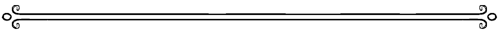

### ☆ 300 ☆
神、揚升大師和天使都在你身旁，用純潔的聖光祝福你的未來。

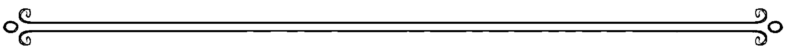

### ☆ 301 ☆
你進入了頻率調和的完美空間。別讓任何事中斷了你的心流與靈性連結。

## 天使數字299-304

### ☆ 302 ☆
你在個人生活和工作上都不斷成長。維持高頻能量，專注於創造正向改變。

### ☆ 303 ☆
神派了指導靈和神聖上師來支持你。敞開心胸迎接聖光吧！

### ☆ 304 ☆
天使正在你身邊飛舞，邀請你將意念、意圖與能量提升到最高的振動頻率。

### ☆ 305 ☆
勇敢面對眼前的挑戰，你才能主動創造改變，而不是等著改變發生。與誠實和正直的能量合一。

### ☆ 306 ☆
呼求你的天使，請祂們協助你保持平衡，繼續聚焦在重要的事情上。

### ☆ 307 ☆
你就是奇蹟。你就是魔法。此刻的你擁有點石成金的強大力量。

### ☆ 308 ☆
你的靈性正在加速成長。你也許注意到了，隨著你不斷揚升，你的指導靈也不斷轉變。

### ☆ 309 ☆
你的高我正在引導你。與內心深處對話，勇於探索新的方向。

### ☆ 310 ☆
你與更高層次的力量合而為一。要知道你是被愛的、被支持的。

### ☆ 311 ☆
你的能量與存在是送給世界的禮物。你的覺知已經甦醒，並與生命的完整合一 同頻共振。

### ☆ 312 ☆
宇宙邀請你看見此刻人際關係中的成長。要知道，所有相遇都是緣分，都有其意義。

### ☆ 313 ☆
從心靈洞穴裡走出來，讓你的光被看見。你來到這世上，是為了提升自我，也為了啟發他人。

### ☆ 314 ☆
天使鼓勵你綻放光芒，也相信自己的光。

### ☆ 315 ☆
你所見的變化，是神對於你的禱告的回答。請相信神會告訴你下一步該怎麼走。

### ☆ 316 ☆
在生活中為奇蹟創造更多空間。空出時間，純粹活在當下。

### ☆ 317 ☆
你追求成長的努力，為你開啟了魔法的大門。別忘了能力越強，責任越大。

### ☆ 318 ☆
你踏上生命擴展的旅程、不輕言放棄的決心獲得了肯定。指引與支持的天使正與你並肩同行。

### ☆ 319 ☆
你的存在就是力量。展現自我，卸下所有防備，要知道神性是你唯一需要的後盾。

## 天使數字317－322

### ☆ 320 ☆
你與神有直接的連結。放心接受祂的愛——與神性親源建立親密的關係，是你天生的權利。

### ☆ 321 ☆
你並非偏離了正途，但是宇宙正在引導你放心讓神性接手。向神性的力量臣服。

### ☆ 322 ☆
宇宙邀請你記得，你是這趟靈性旅程的主角，因此需要投入光與決心時，你必須挺身而出。選擇原諒。

## 天使數字

### ☆ 323 ☆
揚升大師已經來到身邊，幫助你排除路上的所有阻礙與挑戰，讓你能無所畏懼地生活。

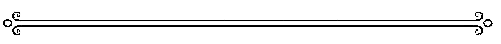

### ☆ 324 ☆
天使軍團永遠會支持你。禱告能使你與天使之間，沒有距離。

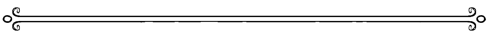

### ☆ 325 ☆
在生活中創造接受支持的空間。你需要先接受神和天使的支持，才能支持他人。

### ☆ 326 ☆
別讓他人的低頻能量或烏煙瘴氣遮蔽了你的光。讓身旁充滿能提升自己的人。

### ☆ 327 ☆
你的人生規劃必須依循更高的至善。如此一來，神的安排就會與你的計畫同步，讓你的願望化為現實。

### ☆ 328 ☆
追求成長的努力獲得肯定。誠心請求，當能獲得。

### ☆ 329 ☆
你的頻率對準神性之母的力量與臨在。要知道你是被深愛著的。

### ☆ 330 ☆
天使和揚升大師希望你明白，神對你和你的天賦有信心。

### ☆ 331 ☆
你與智慧和神性之愛的頻率調和，這兩股力量會在需要時支持你。秉持信念。

### ☆ 332 ☆
你的人際關係進入了成長的空間，為你帶來滿足與喜悅。

───────

### ☆ 333 ☆
你此刻的頻率與耶穌和其他揚升大師完美地調和共振。你來到了個人旅程的重要里程碑，你能跨越之前的所有困難。

───────

### ☆ 334 ☆
你的指導靈和天使正在你身旁飛舞，提供神聖的愛與守護。

### ☆ 335 ☆
改變會讓人難受，是因為你忘了自己與神和天使合一。記得自己的本質。

### ☆ 336 ☆
時常留意你的心。深呼吸、放慢腳步，先跟自己的中心連結，再繼續往前走。

### ☆ 337 ☆
你來到了顯化的傳送門前。奇蹟的能量從你身上不斷湧現。

## 天使數字335－340

### ☆ 338 ☆
你的前世藏有解開你心中疑問的答案。

### ☆ 339 ☆
你的頻率對準女神和強大的女性聖者，祂們正在協助你敞開心房，迎接神性之愛。

### ☆ 340 ☆
你的天使正在幫助你與神建立親密關係。要知道，你值得擁有這份連結。

### ☆ 341 ☆
你擴展的心靈正在幫助你敞開心胸，領受天使的直接指引。

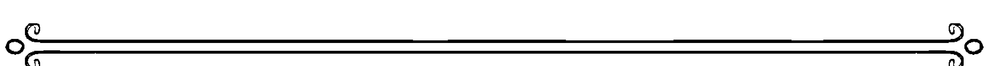

### ☆ 342 ☆
你的天使團隊希望你明白，祂們此刻正在引導你的關係發展，撫平你的所有擔憂。

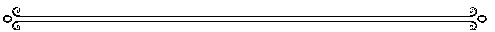

### ☆ 343 ☆
相信你心中感受到的連結——你正在領受、傳遞特別的指引。

### ☆ 344 ☆
你的頻率與你的守護天使調和。祂們都無條件地愛著你。

### ☆ 345 ☆
大天使麥可和祂的保護天使將光與安全的光環環繞在你身上。

### ☆ 346 ☆
相信你呼求的天使永遠會帶你找到最完美的解決方法，幫助你成長。

### ☆ 347 ☆
你的高我正在顯化特定機會，幫助你跳脫舒適圈。克服恐懼，蛻變成更好的自己。

### ☆ 348 ☆
放心向宇宙訴說你真正的需求，好讓祂給你滿滿的支持。

### ☆ 349 ☆
你不需要他人同意才能做自己。你天生就是力量的化身。擁抱內在力量吧！

### ☆ 350 ☆
你的指導靈正讓你的生命與豐盛的力量和光調和。

### ☆ 351 ☆
別害怕轉變的能量。它永遠依著神聖秩序運作，以你的至善為最高目標。

### ☆ 352 ☆
用心經營關係的努力不會白費。你所做的是對的。

### ☆ 353 ☆
你的指導靈鼓勵你跨越自我限制，誠實面對自己需要改變的地方，才能在個人生活與靈性上有所成長。

### ☆ 354 ☆
你的天使就在身旁，支持你因應生活中的轉變。持續專注在光的力量上，別讓任何事掩蓋你的光芒。

### ☆ 355 ☆
揚升大師鼓勵你帶著光和愛的能量，去處理所有和財務與豐盛有關的事。讓你的所作所為對準光的頻率。

### 356
這是擴展生命的時刻。務必檢視自己為他人付出的方式。與助人的能量連結，能開啟神幫助你的通道。

### 357
敞開心胸，用不同的眼光看事情。宇宙鼓勵你為奇蹟做好準備，當你轉換心態，你會感受到奇蹟般美妙的變化。

### 358
擁有意圖固然重要，但事情發展不如預期時，也要能寬心接受。要知道，神永遠會為你做最好的安排。

### ☆ 359 ☆
你的天使希望你與最深層的自我連結，並了解到此刻的你擁有最明亮、最耀眼的光。在提升心靈這方面，你做得很棒！

### ☆ 360 ☆
為了幫助你體驗和諧，神邀請你檢視自己的生活，思考現在對你最有幫助的事，接著放手去做。

### ☆ 361 ☆
你的靈魂希望你在繼續前進之前，先回頭檢視最初的意圖。你正在偏離對你有幫助的事物。回到正軌吧！

### ☆ 362 ☆
你的關係此刻需要你用心投入，務必對於他人的回饋保持開放心態。別忘了，每一份關係都是一項功課。

### ☆ 363 ☆
你的心不斷擴展，你的靈性感知也逐漸覺醒。為了延續這股擴展的能量，務必向神性請求支持與保護。

### ☆ 364 ☆
你的天使已經來到身旁。呼求祂們的協助與支持，帶著自信堅定前行。你知道祂們會一路引導你。

## 天使數字365－370

你的生活中出現了提升豐盛的機會。天使鼓勵你再次感受自己的神聖價值。

停下腳步。在繼續前進之前，務必重新審視內心的意圖，並尋求正確、專業的資訊。目前的情況可能會阻礙你成長。

你這陣子感受到的能量阻塞，現在都被排除了。事情開始往前流動。

你的道路和人生使命正在最剛好的時刻展開。要知道，你的靈魂永遠會讓你知道什麼能帶來快樂與滿足。

現在的你也許感到脆弱、敏感，但務必用心傾聽，因為心中升起的情緒都是訊息，揭示了未來旅程上最重要的課題。

神和揚升大師正在幫助你顯化心中的意圖。專注於高頻能量與感恩之心，就能開創奇蹟。

## 天使數字371－376

### ☆ 371 ☆

你的意圖已經被接收。請相信一切會在最剛好的時刻開展。

### ☆ 372 ☆

天使指引想提醒你，思考未來的願景和意圖時，別忘了納入你生命中最重要的人。分享你的豐盛思維。

### ☆ 373 ☆

你的高我正在顯化重要的生命課題，幫助你成為目前狀況中的老師或引導者。花點時間思考眼前情況背後的涵義。

### ☆ 374 ☆

你的天使肯定你當前的意圖。要知道祂們鼓勵你採取行動，將意圖化為現實。

### ☆ 375 ☆

宇宙想提醒你用平常心面對改變。關鍵在於記得神和天使永遠會陪著你。

### ☆ 376 ☆

內心湧現恐懼時，要知道你即將迎來奇蹟。相信這個過程，呼求你需要的支持。

## 天使數字377－379

你渴望的奇蹟已經近在咫尺。保持專注，讓頻率持續與愛的力量和光共振。

宇宙已經揭示了你的下一步，但你必須往前邁進，才會知道未來如何展開。勇往直前吧！

重新與你的力量連結。記得自己的本質和天賦。要知道，你生來註定是閃耀的光。

## 天使數字380－382

神希望你明白，你充滿力量，你做得到。

天使正在引導你，目前的狀況很快就會明朗。要知道你連結了力量的頻率。

宇宙正在引導你與特定朋友和生命中的人相遇或重逢，讓他們幫助你成長。敞開心胸吧！

## 天使數字383－385

宇宙鼓勵你卸下防衛，帶著和平之心行事。

你是地球天使，宇宙鼓勵你從付出中找到喜悅與滿足。勇於幫助他人。

宇宙鼓勵你了解，前進的方式有很多種。放下一切執著，試著從不同的觀點看待現況。

## 天使數字386－388

在繼續下去之前，先花點時間檢視目前狀況。這不是放棄，而是調整步伐，讓自己能從這份經驗中獲得更多啟發與支持。

宇宙正在指引你邁向生命的真理、解答與光。相信你眼睛所見、耳朵所聽、內心所感。

宇宙正在向你揭示未來的方向。請相信神聖指引會一路支持你。

## 天使數字389－391

你踏上的旅程最終會帶領你回歸自我。你就是散發智慧光芒的老師。深入內心，傾聽自我。

神感謝有你。

你追求成長的決心獲得了全宇宙的肯定。謝謝你願意成為照耀世界的光。

## 天使數字392－394

你的身旁圍繞著正向又充滿力量的人。好好享受這股善的氛圍，並與你的夥伴分享。

你的心中有富含啟示的訊息，靜靜等著你發掘。你的靈魂鼓勵你透過正念、冥想和日誌書寫，聆聽內心的聲音。

你的天使邀請你用慈愛的眼光看見自己。好好愛自己吧！

## 天使數字395－397

宇宙需要你放下內心的擔憂，祂才能支持你。放下執著，放心讓神接手。

在繼續前進之前，宇宙鼓勵你先與自我對話。記得你最真的本質。

你的生命經驗反映了你選擇的能量頻率。讓自己與帶來喜悅的事物連結。

## 天使數字398－400

你的天使提醒你選擇光明至善的道路。你好不容易走到了這一步，別因為任何事而偏離了正途。

你從神性本源取得了充滿智慧與啟示的訊息。仔細留意，這些訊息會透過冥想、異象與夢境向你顯現。

你能與神直接溝通。要知道你的祈禱已被聽見。

## 天使數字401－403

讓神的愛與臨在支持自己。你並不孤單。

你的指導靈和天使團隊正在幫助你處理當前的狀況。成為人際關係中的天使吧！

你的能量正在提升到更高的層級。要知道你的指導靈正在支持你度過這個轉換時期。

## 天使數字404－406

神和天使在你身旁點亮了神聖的守護之光。你已經安全了。

現在發生的轉變的都是神的安排。請相信你的旅程會在神性的指引下展開。

宇宙邀請你停下腳步，往內心深處探尋，因為神和天使已經將你需要的答案放到你心中。

## 天使數字407－409

你進入了高頻振動的空間，宇宙鼓勵你專注在內心準備好顯化的事物上。

你來到這世上，是為了活出更崇高的生命意義。當你投入讓自己真正快樂的事，就能找到生命的真諦。

你的高我永遠與神和天使連結。要知道，你隨時能連結神性智慧的力量。

## 天使數字410－412

宇宙提醒你釐清內心的意圖。神永遠在聆聽，也會在你的意志與神聖律法對應時加以回應。

你與生命的合一能量連結。你需要的一切支持與指引，此刻都在你身上了。仔細傾聽。

現階段的你必須釐清心中的感受與意圖，在與關係有關的事情上尤其如此。

## 天使數字413－415

天使在一旁支持著你，但是只有你能實際踏出下一步。勇往直前吧！

你的天使想提醒你他們的存在。請相信你此刻經歷的一切，都是與神性的連結。

你的天使鼓勵你做出必要的改變，好讓自己能夠成長。重新駕馭自己的力量吧！

## 天使數字416－418

當你不再過度思考、過度規劃、過度努力，你的天使才能翩然來到，提供奇蹟支持與解決方法。

你的天使鼓勵你看見現況背後的魔法能量。要知道一切都不是偶然。

天使正在引導你明白，你選擇的路一直是啟發你的良師。回顧過去的生命課題，找出它們此刻想要給你的訊息。

## 天使數字419－421

你的天使鼓勵你拿回自己的力量。請別讓自己被忽視了。

天使正在幫助你與神性培養更親密的關係。祂們鼓勵你別讓他人對神的負面見解影響了自己。

你的天使鼓勵你以慈愛之心檢視你與自己的關係。

## 天使數字422－424

宇宙正在引導你向身旁的人伸出援手。問自己能如何幫助有需要的人。為他人付出，自己也會受益。

天使和揚升大師正在幫助你找回被遺忘的天賦，以及被遺忘的自我。

你的天使正在檢視你的個人關係。釐清內心的感受，與你真正在乎的人分享心中的愛。

## 天使數字425－427

你的天使鼓勵你思考目前狀況反映的課題。

宇宙正在引導你與對的人連結，讓他們帶給你喜悅、鼓勵你綻放光芒。

你的天使聽見了你對於戀愛與感情的禱告和請求，正在助你一臂之力。

## 天使數字428－430

你的天使聽見了你對於工作和人生目標的禱告，並希望你知道，祂們支持你的夢想。

你的天使鼓勵你與內心柔軟的自我連結。你的脆弱是一種天賦。

你的天使鼓勵你檢視目前的選擇與作為，並思考背後的初衷，這能幫助你不斷前進。

## 天使數字431－433

眾多天使、聖者和上師都圍繞在你身邊，鼓勵你持續專注在光上，與光的能量同頻。

宇宙鼓勵你針對與他人的關係和連結，呼求需要的支持與指引。

天使與耶穌想提醒你，與天堂國度的連結就在你的心中。

## 天使數字434－436

你此刻感受到的能量變化，有一部分是天使的安排。這是祂們對於你的禱告所做的回應。

宇宙正在引導你將意念、行為和意圖提升到更高的層次。不管到了哪裡，記得要作眾人之中的天使。

做出下一個決定之前，務必先停下腳步，回歸本心，回歸照亮自己的事物。

## 天使數字437－439

你的天使正在顯化奇蹟，藉此給你滿滿的支持。

天使想提醒你，靈性道途上偶爾會遇到顛簸，祂們鼓勵你堅持下去，專注於一切努力背後的目標。

天使鼓勵你藉由禱告、冥想和自我對話，連結神聖女性的能量。

## 天使數字440－442

你的天使正在讓你與神直接連結。勇敢表達自我，並知道你已經被聽見。

你的天使想提醒你，你是充滿力量的存在。召喚你的內在力量，讓它的光照耀世界。

天使希望你明白，祂們正在引導你面對人際關係和與心有關的所有事情。

## 天使數字443－445

你的能量正在揚升到更高層次，而天使在一旁支持著你。你的生命中出現了新的連結。

你的身旁圍繞著100,000名天使。奇蹟正在你眼前發生。

大天使正在引導著你。此刻的你充滿了光、力量和療癒。

## 天使數字446－448

你的天使鼓勵你休養生息，好好恢復能量。平衡是成長的必要元素。

你的天使正在將你的禱告、意圖和願景，與支持你擴展的機會連在一起。探索新方向，享受其中樂趣。

你的天使鼓勵你明白，他們正在依照你的意圖與神聖律法，為你安排、開創生命的道路。

## 天使數字449－451

天使和神性之母的能量圍繞著你。放心去給予、去領受愛。

神和大天使麥可正在支持你面對恐懼、挑戰與挫折。要知道，你是安全的。

你必須準備做出改變，才能迎來需要的生命奇蹟。

## 天使數字452－454

天使智慧鼓勵你表露一直藏在心底的真話。敞開心房，讓神聖指引流入心中。

天使鼓勵你設定明確的計畫及意圖，好讓他們給你引導和支持。

放下執著，別再試著控制一切。放心讓天使引導你擁抱靈性光輝、支持與愛。

## 天使數字455－457

你的生活出現了大幅轉變，好讓你對準豐盛和擴展的頻率。

天使鼓勵你讓頻率對準關愛及慈悲的能量。試著不去理會傷害、破壞的意念。

當你展露靈性天賦，靈性支持的活水便能流入生命中。呼求大天使，請祂們協助你擁抱自己的天賦。

## 天使數字458－460

靈性療癒的能量正圍繞著你，滋養你身心的全部，好讓你在靈性道途上繼續成長。

你的天使鼓勵你準備迎接奇蹟。

神鼓勵現階段的你更細心地照顧自己，因為你需要充分精力來展開下一段旅程。

## 天使數字461－463

要知道，你對自己的未來願景能帶來療癒能量。繼續在心中溫柔地幫自己打氣吧！

宇宙鼓勵你檢視自己的人際關係，斬斷無法幫助你成長或感覺完整的負面繩索。

你的天使鼓勵你盡一切努力去愛你的身體、照顧你的身體。這能為你打通眼前的道路。

## 天使數字464－466

你的天使已經來到身邊。歡喜接受祂們的協助，放心讓祂們支持你。

體驗奇蹟的關鍵，在於你是否相信奇蹟可能發生，又是否相信自己值得擁有奇蹟。

你的天使鼓勵你，在繼續前進之前，要先掌握更多的資訊。

## 天使數字467－469

你的天使想提醒你，你擁有顯化生命奇蹟的能力。相信自己的魔法力量吧！

你的天使正在支持你。要知道祂們正在清除你的能量與生活中的低頻振動。

你已經與必須學習的重要課題直接連結。敞開心胸，接受來自內心深處的訊息。

## 天使數字470－472

神和天使正在幫助你了解宇宙的奧秘。

你的天使希望你記得，你在地球上擁有作為領導者、老師及療癒者的力量。要知道你的天賦是為了分享而存在。

你的天賦是一份禮物，必須給予他人才有意義。宇宙鼓勵你與世界分享你的才華。

## 天使數字473－475

你的天使希望你明白，原諒是一項重要課題，唯有學會了，下一階段的旅程才會展開。

你的天使正在協助你顯化夢想。秉持堅定不移的信念吧！

隨著你蛻變、掌握更多力量，背負的責任也更大。宇宙邀請你在往前邁進的同時，保持接地，也保持與神的連結。

## 天使數字476－478

你的天使正在引導你面對恐懼，並思考恐懼能帶給你的生命智慧。要知道，你心中的愛能戰勝一切。

此刻的你與顯化的能量與法則連結。觀想你的禱告已獲得應允，讓渴望化為現實。

你的天使鼓勵你與大地連結。進入安穩接地的狀態，讓自己感覺回到正軌。

## 天使數字479－481

天使指引鼓勵你解放內在導師，才能再次讓頻率對準至善的能量。

每件事情發生都是有原因的。請相信眼前的路正在帶領你邁向至善。

天使正在幫助你記得過去的課題，好讓你不必重複舊有的循環。

## 天使數字482－484

天使鼓勵你照著自己的路走，選擇適合自己的方式。別為了成全他人的渴望，犧牲了自己的夢想。

你活著是為了成長，而成長的路上少不了犯錯。但是你的天使希望你知道，無論如何，你都是被愛著的。放下你的愧疚，向神臣服。

宇宙鼓勵你對天堂國度懷抱信念。你的天使正在為你努力，此刻也與你並肩同行。

## 天使數字485－487

宇宙想提醒你，你生來是為了愛人與被愛。讓自己遠離違背此一真理的情況。

你的天使鼓勵你記得，拒絕也是一種回答。你應該多向他人說不。

你的旅程需要你成為一位老師、領導者、發言人。勇敢站出來，讓自己的聲音被聽見。

## 天使數字488－490

你的天使鼓勵你明白，教導他人，也能從中學習。勇敢綻放光芒吧！

你的天使正等著你前往心靈最深處。花點時間深入內心，愛就在那裡等著你。

你的頻率已經與高我調和，神一直引導著你。

## 天使數字491－493

天使多麼感謝有你，在祂們眼裡，你是照亮世界的燈塔。

你的天使鼓勵你休息一下，喘口氣。冷靜下來，安定心神，集中注意力，再繼續前進。

此刻的你與天堂裡你愛的人連結。要知道，你經常禱告的對象就像守護天使，祂們會一直看顧著你。

## 天使數字494－496

你的天使鼓勵你表達真實的自我。別再有所保留，勇敢做自己吧！

宇宙鼓勵你做出必要的改變，讓你的靈魂進一步成長。你的存在是為了感受光亮、感受耀眼。

與帶你更靠近神、更靠近愛的事物連結。放下對你沒有幫助的一切。

## 天使數字497－499

你的能量正在綻放，生活之中出現了感受和諧的新機會。

你進入了一個神聖空間，你的自我覺知更加敏銳，也與真我更加親密。要知道這一路上，永遠會有神性的力量引導你。

天使正在透過你的內在聲音與直覺提供指引。相信此刻心中領受到的訊息吧！

## 天使數字500－502

神正在為你安排接下來的路。準備好感受奇蹟與豐盛吧！

要知道，當你所做的事對準光和善的頻率，神會給你全力支持。

你與他人的關係與連結正在蛻變。請相信神正在幫助你度過這些轉變。

### ☆ 503 ☆

你現階段的成長，取決於你是否相信神會永遠眷顧你，永遠會為你的至善做最好的安排。

### ☆ 504 ☆

你的天使就在身旁，引導你探索重要的課題，放下不重要的事物。

### ☆ 505 ☆

相信內在直覺引導你做出的改變，因為這些都是神的安排。你擁有顯化豐盛的能力。儘管相信吧！

## 天使數字503－508

### ☆ 506 ☆

你願意讓多少快樂流入自己的身體和生活，就能有多少成長。讓喜悅成為你積極尋找、勇於分享的事物。

### ☆ 507 ☆

宇宙正在引導你為奇蹟創造空間。當你為奇蹟拓展空間，它們便能顯化。

### ☆ 508 ☆

持續專注在讓你快樂、帶給你生活意義的事物上。其餘一切都放心交給神處理。

### ☆ 509 ☆

你與重要的能量產生了連結。持續聆聽，讓神的訊息自然流入心中。

### ☆ 510 ☆

你追求成長的努力與決心獲得了肯定。要知道你永遠與神性連結，你的神性體驗永遠是獨一無二的。

### ☆ 511 ☆

你成為世界的光的決心，正在為最需要光的人提供支持，照亮他們的心房。辛苦了，你做得很好！

### ☆ 512 ☆

花點時間修補遭遇挑戰的關係。讓對方看見自己願意帶著愛與善意，讓關係繼續往前走。

### ☆ 513 ☆

你積極擴展、活出豐盛生命的努力，正在為你開拓未來的路。維持追求成長的動力，讓光引領你前行。

### ☆ 514 ☆

你的天使鼓勵你繼續努力，活出至高、至善的自己。你體現了生命的無限潛能，是激勵人心的榜樣。

### ☆ 515 ☆

改變是好是壞，端看你如何面對。將眼前的改變視為成長的機會，展現最真的自己。

### ☆ 516 ☆

花點時間思考哪些事能創造更多快樂，哪些事阻礙了你的光芒，這能幫助你了解下一步該怎麼走。

### ☆ 517 ☆

你正在經歷的能量轉變與目前的情況有關。宇宙正在引導你斬斷負面繩索，勇敢放下。在這之後，你就能看見自己需要的奇蹟與解答。

## 天使數字515－520

### ☆ 518 ☆

與其專注在你想要的東西上，不如請求你需要的事物。讓神帶來能支持你身心健康的事物。

### ☆ 519 ☆

天使指引請你放鬆、深呼吸。你不需要刻意展現自己或自己的實力。你的成果就是最好的證明。

### ☆ 520 ☆

此刻的你與神之間有無比強烈的連結。歡迎回歸愛的頻率。

### ☆ 521 ☆

你在他人身上看見的，其實也存在你心中。放下批評、比較的心，用慈愛的眼光看待世界。

### ☆ 522 ☆

你進入了充滿力量的空間，與原諒的能量連結。要知道，原諒是記得你永遠不會真的受傷，因為沒有任何東西能傷害你的靈魂。

### ☆ 523 ☆

你正在往前邁進、往上揚升。要知道，你走在正確的路上。

## 天使數字521－526

### ☆ 524 ☆

天使正在支持你和你所愛的人，幫助你進入更和諧、更自在的空間。

### ☆ 525 ☆

健康、奇蹟與希望的能量正圍繞著你、你所愛的人與你的關係。擁抱充實你生命的一切。

### ☆ 526 ☆

你生來注定是明亮、耀眼、充滿喜悅的光。花點時間檢視你的生活，確保在每一段關係裡，你都能活出最棒的自己。

### ☆ 527 ☆

你目前的狀況反映了你藏在心中的感受。務必坦白表達自我，讓眼前的路更加通暢。

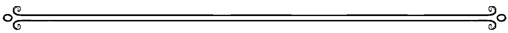

### ☆ 528 ☆

天使愛你，也尊重你，祂們邀請你繼續溫柔地愛自己、尊重自己。看見你努力不懈地疼愛自己，祂們是如此開心。

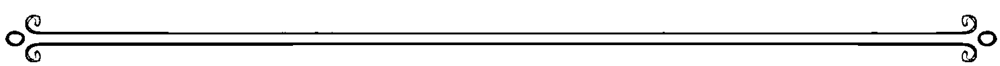

### ☆ 529 ☆

你正在經歷的轉變，會幫助你與生命中重要的女性培養更緊密的關係。擁抱母性療癒的能量吧！

## 天使數字527－532

☆ 530 ☆

耶穌和神正在引領你度過當前的轉變。全心全意地相信祂們，永遠別懷疑你內在智慧的光。

☆ 531 ☆

對於你目前的所有目標與投入的事，光之守護者正在給予祝福和支持。要知道宇宙鼓勵你繼續前進。

☆ 532 ☆

你的天使鼓勵你向更高層次的力量臣服，相信它的能力。當你敞開心胸迎接愛，支持便如泉湧而來。

### ☆ 533 ☆

你站在揚升的階梯上，即將放下束縛你的一切，斬斷恐懼與過往創傷的繩索。呼求耶穌幫助你吧！

### ☆ 534 ☆

揚升大師、你的天使和指導靈都在身旁，以祂們的光與愛支持你，踏上眼前的旅程。這是一條深受祝福的道路。

### ☆ 535 ☆

你願意付出多少努力，擴展之路的根基就有多穩固。天使的指引鼓勵你燃起鬥志，請為將來的旅程做好準備。

### ☆ 536 ☆

你的天使想提醒你，你越願意分享、表達自我、肯定自己的天賦，就越能吸引機會。

### ☆ 537 ☆

你的靈魂成長多少，取決於你是否願意大步向前，在機會出現時積極把握。

### ☆ 538 ☆

你眼前的路不斷地延伸、擴展。花點時間看看自己一路走來的成長，肯定此刻的你。

### ☆ 539 ☆

宇宙鼓勵你與自己的祖先再次連結，女性先人又尤其重要。讓他們幫助你前進。

### ☆ 540 ☆

天使聽見了你祈求轉變的禱告。要知道在你前進之時，神聖秩序會適時介入，提供支持。

### ☆ 541 ☆

你必須做出你想看到的改變。你的每一步都有神陪著你，但是你得先踏出第一步。

### ☆ 542 ☆

宇宙正在引導你誠實面對自己，坦白表達自己的需要，讓你的關係更和諧、安定。勇敢說出真心話。

### ☆ 543 ☆

你的天使希望你明白，祂們看見了你提升自我的努力，也正在引導你邁向成長與擴展。

### ☆ 544 ☆

你的天使正在促成必要的轉變，祂幫助你感覺安全、有方向，也幫助你享受豐盛。邁向豐盛的大門即將敞開。

### ☆ 545 ☆

大天使麥可和其他大天使都在你身旁，鼓勵你切斷與目前狀況的關聯，回歸成長、擴展與喜樂的正途。

### ☆ 546 ☆

大天使邀請你深入內在世界，探問本心，思考什麼能帶你更靠近理想的境地，更貼近你想體現的能量頻率。

### ☆ 547 ☆

天使收到了你發出的禱告與意圖，正在為你努力。要知道，未來充滿無限可能，天使會帶領你邁向對自己、對世界最好的結果。

### ☆ 548 ☆

你的工作與人生目標正在經歷變動。要知道天使永遠會幫助你，讓你的生命與喜悅的能量同頻振動。

### ☆ 549 ☆

你的天使鼓勵你聆聽內在的聲音，並勇於照著它的指引做出改變，因為這些都是活出奇蹟人生的關鍵步驟。

### ☆ 550 ☆

神正在回應你的禱告。用心覺察，秉持開放的心胸，將思考格局延伸到你自己的期待之外。

### ☆ 551 ☆

你的心中有一道光，而這道光永遠不會熄滅。記得你的本質，相信這道光會帶你到你該去的地方。

> ───────────────────────────

### ☆ 552 ☆

宇宙邀請你用光、喜悅與和平照亮你的家庭和人際關係，祝福你所到的每一個地方。

> ───────────────────────────

### ☆ 553 ☆

你的努力和付出已經被看見，也一定會開花結果。維持現有的熱忱，繼續前進。

### ☆ 554 ☆

努力與毫不費力之間只有一線之隔。你的天使邀請你相信祂們，相信祂們幫助你的能力。秉持信念吧！

### ☆ 555 ☆

你所有的努力都在開花結果。你能夠擁有豐盛、活出豐盛、感受豐盛！敞開心房、展開雙臂，大方領受此刻生命中的美好。

### ☆ 556 ☆

為了領受，你必須準備好給予。用慷慨之心給予，以感恩之情接受。你的天賦是上天的禮物，必須與人分享才有價值。

### ☆ 557 ☆

你的信念正在塑造你當前的生命經驗。重新檢視你的核心價值，讓自己的頻率對準豐盛和富饒的能量。

### ☆ 558 ☆

眼前的路越來越暢通，你正無所畏懼地往前進。要知道，神性之愛會永遠支持你。

### ☆ 559 ☆

你的真我（true self）與身體我（physical self）正在形成神聖連結。感受由內而外的完整，享受健康人生的美好。

☆ 560 ☆

你的天使鼓勵你有意識地選擇放慢腳步。用心帶著正念過生活，能帶你敞開自我，迎來支持的能量。

☆ 561 ☆

你正在進行的事需要你全心全意地投入。天使指引鼓勵你排除讓人分心的因素，以及任何會阻礙你擴展的事物。

☆ 562 ☆

為了讓身旁的人改變，你必須願意改掉有礙成長的壞習慣與舊有模式。別忘了，在一段關係裡面，你們都是彼此的老師。

### ☆ 563 ☆

如果你願意放下緊緊抓著的舊回憶，宇宙便能給你更多支持。別再惦記著受過的傷，踏入和宇宙共創的新空間。

### ☆ 564 ☆

你的天使支持你自信做自己，安於自己的位置，也鼓勵你好好愛自己。

### ☆ 565 ☆

你關於財務、投資的任何擔憂，包含克服財務挑戰等問題，現在都被排解了。你即將獲得需要的答案。

☆ 566 ☆

天使指引鼓勵你先後退一步，蒐集更多資訊，再繼續前進。別貿然做出改變，因為這可能會影響你的復原與成長。

☆ 567 ☆

你心中的一切擔憂正在消散，宇宙鼓勵你別再退縮，勇敢前行。今天的你將迎來奇蹟。

☆ 568 ☆

宇宙並不是要阻礙或限制你，而是想鼓勵你秉持信念。你感覺缺乏資訊，只是因為得先踏出下一步，下一段旅程才會展開。但要知道，宇宙永遠會支持你。

### ☆ 569 ☆

現在的你擁有極敏銳的自我覺知。你靈魂的聲音無比清亮，放心相信內在傳來的訊息！

### ☆ 570 ☆

神已經聽見了你請求支持的禱告，也很快就會給予回應。

### ☆ 571 ☆

你現在面臨的情況是重要的生命課題，能幫助你記得自己的內在力量。勇於看見你的天賦，接受自己獲得的禮物。

### ☆ 572 ☆

花點時間與高我連結，是現階段的重要功課。你的靈魂如此古老，擁有許多你能連結，甚至記得的經驗。

### ☆ 573 ☆

你擁抱豐盛的意念、樂於分享的心態，正在為你開拓全新的道路，幫助你感受指引和支持。

### ☆ 574 ☆

對於深深吸引你的想法、事業計畫或學習機會，你的天使鼓勵你勇敢追求。你正在領受神聖指引。

### ☆ 575 ☆

你進入了魔法空間。星星已經對準你的頻率，準備為目前的情況迎接最好的結果吧！

### ☆ 576 ☆

當你願意面對內心的恐懼，旅程的下一階段才會展開。要知道你不是孤單一人，你可以做得到。

### ☆ 577 ☆

充滿奇蹟與魔法的好事正在發生。盡情感受眼前的各種美好吧！

### ☆ 578 ☆

保持開放的心態，接受當前生活中發生的改變。它們會為你帶來更多喜悅與成就感。

### ☆ 579 ☆

宇宙邀請你挺身而出，扮演領導者與老師的角色，並以身作則。你的力量與光芒是如此激勵人心。

### ☆ 580 ☆

要知道，你在生活中做出的小小改變，正在為世界創造大大不同。神很感謝你的付出。

### ☆ 581 ☆

你的天使邀請你回顧過往的旅程，看看自己曾克服的挑戰，肯定自己至今的蛻變與成長。你的生命充滿了奇蹟！

### ☆ 582 ☆

宇宙想提醒你，每一段關係都是一段旅程，都能給予生命滋養，幫助你更認識自己。

### ☆ 583 ☆

你的天使鼓勵你看見自己此刻的努力。並肯定自己，肯定你做的事；感覺不被他人重視時，更要為自己打氣。

## 天使數字581－586

### ☆ 584 ☆

指引天使已經來到身邊，鼓勵你選擇自己的路，接著順從內心直覺，做你該做的事。

### ☆ 585 ☆

你在地球上的旅程是用來享受的。以快樂的心投入你正在做的事，便能開創邁向機會與豐盛的康莊大道。

### ☆ 586 ☆

天使智慧邀請你帶著光去做任何事。別忘了，光之存有（beings of light）隨時在你身邊。感受祂們慈愛的臨在吧！

### ☆ 587 ☆

你的旅程正在顯化機會，幫助你再次駕馭內在力量，勇往直前。這是找回自信、表達自我的時刻。

### ☆ 588 ☆

你像鳳凰一樣擁有引領轉變、開創新局的力量，你飛越曾經限制你的一切。展開羽翼，振翅高飛吧！

### ☆ 589 ☆

近來的經驗帶給你許多體悟，也讓你深刻明白，你與真實自我的連結，遠比你以為的緊密。自我照顧是現階段的重要功課。

### ☆ 590 ☆

看見你終於回歸靈性道途，神感到十分寬慰。不過，偏離正途其實是必經的過程，因為現在的你更懂得欣賞自己、肯定自己的成長。

### ☆ 591 ☆

你的生命經驗是啟發世界的智慧之光。你的天使鼓勵你繼續努力，為世界展現你最棒的一面。

### ☆ 592 ☆

你現在遇見的人，可能是生命旅程中的貴人，能幫助你大幅成長。

### ☆ 593 ☆

你的能量正在揚升到更高的頻率。務必知道一切尚在照常運作，只是你的神性連結進一步深化。

### ☆ 594 ☆

天使正在打開你的頂輪，好讓你接收神聖指引。你正在揭開靈魂的記憶。

### ☆ 595 ☆

你的脈輪已經與水晶之光（crystalline light）同頻調和，讓你能領受充滿啟示的訊息，與更崇高的生命意義連結。

### ☆ 596 ☆

你的靈性身體需要時間與空間來修復。你很努力想駕馭自我，但這個過程也需要給自己盡情探索、玩樂的空間和時間。

---

### ☆ 597 ☆

你此刻的能量充滿吸引力，讓許多力量強大的天使紛紛前來，用金色的聖光與機會圍繞著你。

---

### ☆ 598 ☆

你發揚靈性天賦、為世界貢獻的努力已經被看見。邁向機會的大門、通道、傳送門此刻全都為你敞開。

### ☆ 599 ☆

你進入了深刻頓悟與連結的空間。相信來到你心中、在你能量中流動的神性智慧。

### ☆ 600 ☆

神正在修復你的能量。休息一下，做點深呼吸，感覺恢復活力。

### ☆ 601 ☆

宇宙正在引導你與心靈深處連結。花點時間誠實面對自我，給自己多一點耐心。這是療癒恢復的時刻。

### ☆ 602 ☆

務必騰出時間經營友情與其他關係。與他人相處能讓你有所收穫，你也有很多東西能給予和分享。

### ☆ 603 ☆

你的心靈感應與靈性覺知正在大幅提升。要知道你獲得的洞見與異象都是來自神性的啟示。相信你此刻聽見的訊息。

### ☆ 604 ☆

你的天使正在將慈愛之光注入你的能量中。務必花點時間，感受能量增幅、獲得補給的美好。

☆ 605 ☆

你與豐盛的連結並沒有受阻，但是宇宙邀請你認真看待自己的意圖，因為你的注意力被分散了。

☆ 606 ☆

讓你的願景、目標、理想和財務狀況對準神的頻率，便能獲得愛的力量與臨在支持。

☆ 607 ☆

宇宙正在引導你與自己靈魂的魔法和力量同頻共振。你與天堂和大地共為一體，讓這份真理點燃你的鬥志。

### ☆ 608 ☆

生活中出現了改變現狀的機會。要知道你獲得了嘗試新事物、設定新願景的契機。

### ☆ 609 ☆

你正在領受來自靈魂的重要降示。花點時間平靜心神，感受內在傳達的訊息。你已經與前世的記憶和療癒能量連結。

### ☆ 610 ☆

你的能量頻率已經與神和你靈魂的旨意相結合。你正在做對的事，也走在正確的道路上。

### ☆ 611 ☆

在你連通的神聖覺知的支持下，你的心、靈魂和生命正在不斷擴展，並與此刻和未來一切萬有的生命力與光合一。

> ───── ❧ ─────

### ☆ 612 ☆

你的心請你以真誠、毫無保留的態度面對關係。放下蓄積在心裡的壓力吧！

> ───── ❧ ─────

### ☆ 613 ☆

誠實面對自己，是擴展生命的關鍵。在身心健康與自我照顧上，務必好好檢視自己的狀況，別再逃避你一直推遲的事情。

### ☆ 614 ☆

你的天使鼓勵你在繼續前進之前，先與自我對話，重新檢視你的需要。在投入下一件事之前，務必感覺活力恢復、能量充沛。

### ☆ 615 ☆

豐盛是宇宙能量的自然展現，反映了你能否看見自己的價值。天使智慧鼓勵你前往內心深處，了解你值得擁有豐盛。

### ☆ 616 ☆

宇宙鼓勵你為自己的心靈和情緒健康做最好的選擇。為自己保留空間吧！

### ☆ 617 ☆

你必須先關上通往過去的門，下一扇門才會打開。天使智慧鼓勵你以慈愛之心，釋放阻礙你獲得喜悅和成長的一切。

### ☆ 618 ☆

你的天使鼓勵你在往前進之前，先與讓自己快樂、幸福的事物連結。如果必須在喜悅與悲傷之間選擇，祂們鼓勵你積極擁抱喜悅。

### ☆ 619 ☆

宇宙想提醒你，作為、不作為與做決定都是力量的展現。積極掌控目前的狀況，你才能主導最終結果。

### ☆ 620 ☆

你正在克服干擾個人靈性連結的因素。神很高興能與你再次搭上線。

### ☆ 621 ☆

你與自己的關係更緊密、更親近了；你進入了自我尊重的奇蹟空間。要知道你值得擁有這一切。

### ☆ 622 ☆

和諧與平衡的能量正在流入你的個人關係。所有擋在你與愛之間的障礙都正在被清除。

### ☆ 623 ☆

你身旁圍繞著揚升、前進的能量。任何阻礙溝通或理解的因素都正在被排除。

### ☆ 624 ☆

你的天使團隊已經來到身旁，鼓勵你做自己熱愛的事。這是你展開羽翼、振翅高飛的時刻。

### ☆ 625 ☆

你的天使鼓勵你在工作上，或投入發揮創造力的活動時，放下控制一切的執著。當你後退一步，天堂的指引便能往你靠近一步。

### ☆ 626 ☆

你的天使在引導你盡最大努力照顧自己。多活動身體，做點恢復能量平衡的事，並整理思緒、沉澱心靈。

### ☆ 627 ☆

如果眼前的機會將帶來痛苦和焦慮，你的指導天使鼓勵你勇敢說「No」。如此一來，你才能對自己、對生命成長說「Yes」。

### ☆ 628 ☆

天使智慧想提醒你，你的存在是為了感受幸福、表達幸福。祂們正在引導你投入讓你快樂、讓心雀躍飛舞的事。

### ☆ 629 ☆

謝謝你花時間清理思緒和能量，用心照顧自己的健康。你的靈魂此刻充滿聖光與靈性智慧，你的努力一定會有回報。

### ☆ 630 ☆

天使想提醒你，你毋須永遠在第一線拼命工作。肯定自己的表現，明白你最近在心態上和與人相處上所做的改變都讓神非常開心，也支持神聖計畫進一步開展。

### ☆ 631 ☆

你來到了深邃的能量洞穴，務必潛入內心深處，聆聽神性揭示的訊息。別忘了，神性之愛永遠在你心中。

### ☆ 632 ☆

當你能夠在關係裡完全做自己，便能找回內心的安定與平衡。放下討好他人的需要，展現最真實的自己。

### ☆ 633 ☆

揚升大師正將你的能量系統提升到更高層級。你會感覺自己的靈視更清晰，更深化與靈性天賦的連結。

### ☆ 634 ☆

你的天使想謝謝你花時間平衡能量系統。你與天堂和靈界的連結變得更加堅固。

### ☆ 635 ☆

你的天使正在引導你度過能量轉變階段。要知道，祂們鼓勵你做出必要的決定，讓自己能展露天賦，朝幸福更進一步。

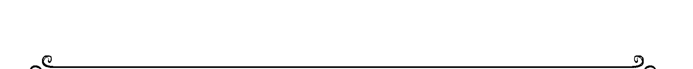

### ☆ 636 ☆

歡迎回到最真的自我。你終於再次進入愛的空間，能夠好好善待自己。天使正在你身旁飛舞，慶祝你接受自己的全部。

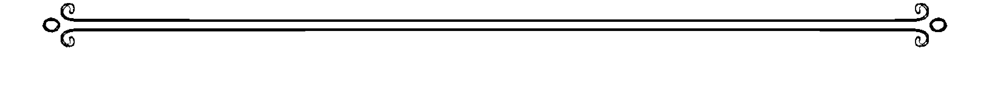

### ☆ 637 ☆

要知道，你的意圖和顯化禱告已被聽見。宇宙為你的靈魂和世界的至善做了安排，將在最適合的時空序列下給你回應。天使鼓勵你全心相信、秉持耐心。

### ☆ 638 ☆

你展開這趟地球旅程，是為了擴展你的意識維度，讓頻率對準更崇高的生命意義。在你的前世，或是這趟旅程的前期，你曾經與神和聖靈斷絕了連結。現在是找回連結、深化關係的時刻。

### ☆ 639 ☆

宇宙鼓勵你在繼續前進之前，先花點時間領受。有時候，接受這個世界真實樣貌，是感受連結最美好的方式。

### ☆ 640 ☆

神和天使正在敞開你的心胸與能量，好讓你感受、表達神性之愛。你的存在本身就是給世界的禮物。

### ☆ 641 ☆

别小看自己的天赋。你拥有能照亮世界的独特光芒与才能。天使就在你身边，温柔鼓励着你。

### ☆ 642 ☆

你的天使鼓励你明白，你想找的答案其实就在你身上。别再向外寻觅，开始往内探索吧！

### ☆ 643 ☆

来自内心的声音绝对错不了。天使智慧鼓励你相信内心感应到的讯息，顺着内在直觉行事。

## 天使數字641－646

### ☆ 644 ☆

你的天使正在擴展你的心輪，好讓你體會更深刻的愛，並與天使、與支持你的指導靈和祖先培養更親密的連結。

### ☆ 645 ☆

大天使麥可和大天使拉斐爾已經來到身邊。要知道你已經被療癒能量圍繞，受到完善保護。

### ☆ 646 ☆

天使鼓勵你在繼續前進之前，先花點時間深呼吸，檢視自己目前的狀況。祂們想提醒你，謹慎與耐心是美好的靈性特質。

### ☆ 647 ☆

你的天使鼓勵你勇敢前進。別再等待他人同意。積極主導事情發展。奇蹟時刻即將發生。

### ☆ 648 ☆

眼前的路變得暢通無阻。一切困難、障礙和疑慮都被排除了，你將再次感到安穩平衡。

### ☆ 649 ☆

你的天使鼓勵你看見此刻心中升起的情緒。這些感受都是來自靈魂的訊息，訴說著它的成長。

### ☆ 650 ☆

神正在給你答案、奇蹟以及你需要的一切，幫助你順利前進，與讓自己快樂的事物連結。

### ☆ 651 ☆

大天使提醒你記得個人意志的力量。重新與內在力量連結，你知道它就在心中。你已經克服了這麼多難關，創造了這麼多美善。

### ☆ 652 ☆

無論是面對你愛的人，或是讓你心累的人，宇宙都鼓勵你將和平的能量帶入關係裡。要知道不管你到了哪裡，你都有化身為地球天使的力量。

### ☆ 653 ☆

你正在擴展你的能量與天賦。要知道任何挫折，或是停滯不前的感受，都只是能量在重新校準，好讓你的振動揚升到更高頻率。

### ☆ 654 ☆

你的天使正在支持你度過必要的轉變。要知道，當你為新的事物保留空間，你也為奇蹟保留了空間。

### ☆ 655 ☆

你正在顯化支持與豐盛的美好機會。你與地球分享的愛正在回到你身上，祝福你的生命。

### ☆ 656 ☆

你過去曾經多次犧牲自己的快樂與幸福。宇宙鼓勵你明白，你不需要再這麼做了。從現在開始，你能活出更愛自己的人生。

### ☆ 657 ☆

你的心經歷許多與愛有關的生命課題。天使智慧想提醒你，你活著不是為了尋找愛，而是為了記得愛就在你心中。當你在心裡找到它，愛就能在外在世界顯化。

### ☆ 658 ☆

你的能量正在顯化通往機會與喜悅的許多道路。要知道沒有所謂錯誤的選擇。你走的每一步都會帶你更靠近生命的真諦與完滿。

### ☆ 659 ☆

要知道你的能量正在擴展，你的整體靈性覺知正在提升。你近期的作為與決定都與愛的頻率同步。你內在導師的聲音是無比清楚、嘹亮。

### ☆ 660 ☆

神鼓勵你在繼續下去之前，先好好把事情想清楚。

### ☆ 661 ☆

神希望你明白，你並未受到譴責，你早已被原諒。換你原諒自己了。

### ☆ 662 ☆

你正在經歷的課題之所以出現，是因為你還無法給對方同理心和原諒。原諒他人是一種解脫，也是你能給自己的禮物。

### ☆ 663 ☆

你的能量現在需要你全神貫注、認清真相。務必選擇能帶你邁向喜悅的道路，別被小我的渴望與虛假的承諾牽著走。

### ☆ 664 ☆

天使智慧鼓勵你聆聽靈魂的聲音，讓它針對此刻你生活中的人提供指引。

### ☆ 665 ☆

宇宙鼓勵你誠實面對自己，勇敢做出需要的改變，否則之後將衍生問題，阻礙你邁向至善與自由。

### ☆ 666 ☆

暫停。停下腳步。不可以。不要貿然做出任何決定。你的小我已掌控一切，正在帶你前往悲傷與恐懼的深淵。但你能夠拿回力量。呼求神的聖光協助你。

### ☆ 667 ☆

你正在脫離絕望與恐懼的泥沼，從重重困難中解脫。要知道天使在引導著你。對自己、對你的光和你的天賦懷抱信心。

## 天使數字665－670

### ☆ 668 ☆

繼續幫助他人，也繼續照顧自己。這些善行正在照亮你眼前的路。一切會越來越輕鬆、順利。

### ☆ 669 ☆

要知道最壞的情況已經過去。你正在回歸真我，也會開始感覺充滿能量與鬥志，對未來的方向無比確定。

### ☆ 670 ☆

神正在以力量與聖光將你圍繞。面對眼前的情況，持續專注在最好的結果上，它就能顯化。心懷信念吧！

### ☆ 671 ☆

希望的能量現在圍繞著你。請相信你的禱告已經被聽見，也將獲得回應。你需要的答案就在不遠處，也正在向你顯現。

### ☆ 672 ☆

你的意念和意圖正在引導你的生命之流。如果想要成長，你需要用心、用愛經營關係。

### ☆ 673 ☆

你的靈創造了恩典的能量流，讓你眼前的道路變得無比暢通、明亮。你顯化奇蹟的旅程正在順利展開。

### ☆ 674 ☆

你的天使渴望參與你的人生，但是祂們需要你同意。呼求天使前來，讓祂們支持你擴展生命的意義、擴展靈魂。

### ☆ 675 ☆

你已經做出和願意做出的改變，都被神和天使看見了。要知道，祂們正在向你揭示旅程的下一步。未來的路並不輕鬆，但是只要秉持決心，你終將實現目標。

### ☆ 676 ☆

眼前出現的機會能幫你重新找回平衡，對人生目標更堅定。即使有些事情對於你的重要性不如以往，天使智慧鼓勵你別急著放棄。處理好未完成的事物。

### ☆ 677 ☆

你在尋找的逐漸出現在眼前。奇蹟正在流入你的生活，你的禱告也開始獲得回應。擁抱生命的美好吧！

### ☆ 678 ☆

生命中即將出現讓你在個人與工作上都有所成長的機會。進入專注狀態，準備展開精采的旅程。你正爬上通往成功的階梯。

### ☆ 679 ☆

你的高我和內在智慧，與此刻生命中出現的機會同頻調和。天使指引並鼓勵你勇敢採取行動，讓你知道自己受到滿滿支持。

### ☆ 680 ☆

神支持你目前的生活重心和選擇，你的道路受到愛的力量與臨在祝福。享受這份溫暖的支持吧！

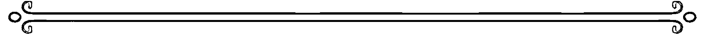

### ☆ 681 ☆

花點時間思考自己現階段覺察到的訊息、模式與課題，試著了解背後的含意。別忘了，你的意念和意圖會影響你的生命經驗。

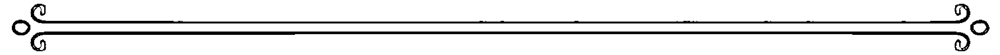

### ☆ 682 ☆

你的天使鼓勵你記得，這是屬於你的旅程。這是你的夢想；別再依賴他人，或等待他人與你同行，因為你可能會等上好一陣子。相信自己的能力與天賦吧！

### ☆ 683 ☆

對於你曾經犯的錯、造成的問題，宇宙鼓勵你給自己多一點愛與同理心。你已經盡了最大的努力。放下這些過往記憶，書寫新的人生篇章吧！

### ☆ 684 ☆

開始展露你的天賦吧，讓它們帶你邁向更美好的未來。你的天使正在支持你。

### ☆ 685 ☆

改變並沒有不好，而是一種福分。天使智慧鼓勵你明白，未來的路上會有更多改變。請相信神永遠會告訴你最好的方向。

### ☆ 686 ☆

你正在經歷的生命課題並不代表失敗，而是重新整裝出發的機會。不過，在繼續前進之前，務必盡全力處理目前的情況。

### ☆ 687 ☆

你的天使鼓勵你積極主導目前情況，扮演老師／領導者的角色。你能與他人分享的訊息與真理，也是你自己需要的智慧。

### ☆ 688 ☆

你的道路受到神和天使的祝福。金色機會正在往你前進。準備迎接奇蹟吧！

### ☆ 689 ☆

歡迎回到你的內心深處。你再次與最真的自我連結。愛就是你的本質。

### ☆ 690 ☆

神為你的成長感到驕傲。謝謝你再一次相信自己。

### ☆ 691 ☆

你追求成長、深化靈性的決心獲得了肯定。你的決心非常重要，因為你越認識自己，就越能認識神和你的天使。

### ☆ 692 ☆

生活中出現了感受全新的愛的機會，也許是有了新的關係，或是既有的關係有新發展。無論如何，要知道這是擁抱愛的時刻。

### ☆ 693 ☆

你越相信自己值得擁有愛，就越能愛人，也越能被愛。你當然值得。愛是你的，是屬於你的豐盛。

### ☆ 694 ☆

你的天使想對你說聲感謝，謝謝你經常花時間與祂們連結，接收祂們的訊息。如果此刻心中感應到訊息，要知道這是來自天使的啟示。

## 天使數字

### ☆ 695 ☆

宇宙正在衡量你的靈性覺知力和追求成長的決心，為你規劃未來的道路。要知道，祂永遠不會安排你應付不來的事。重新與你的意志和強大的內在力量連結，將不可能化為可能。

### ☆ 696 ☆

如果你感覺近期生活的步調慢了下來，天使鼓勵你相信生命之流的安排。放下讓自己一刻不得閒的習慣，記住少即是多。

### ☆ 697 ☆

你追求擴展的決心、對自我價值的肯定，讓你的夢想、理想和目標快速顯化。享受豐盛，並了解這些美好是為了讓你記得：你是綻放力量、美麗與價值的靈魂。

### ☆ 698 ☆

你的旅程開始快速擴展，你在尋找的方向也越來越清楚。謝謝你願意相信神聖計畫。

### ☆ 699 ☆

你的內在菩薩已經覺醒。相信此刻你接收到的任何靈感啟示或異象，因為它們都是來自靈魂的記憶片段。

### ☆ 700 ☆

要知道神就在你身後，陪伴著你的每一步。你需要的奇蹟已經在你心中。相信自己照亮世界的力量吧！

### ☆ 701 ☆

此刻圍繞著你的意圖與顯化能量非常強大。繼續專注在眼前的道路上。

### ☆ 702 ☆

神正在協助你發展關係。如果想與所愛的人拉近距離，要知道機會此刻就在你眼前。

### ☆ 703 ☆

要知道，你對未來的願景正在眼前快速展開。神性智慧鼓勵你維持熱情，持續專注在最棒的結果上。

### ☆ 704 ☆

你的天使正在以實際顯化的方式，傳達祂們的臨在與訊息。張開雙眼、敞開心胸，從不同的角度看事情，用心覺察天使支持你的蹤跡。

### ☆ 705 ☆

你正在汲取星星的能量，宇宙鼓勵你將眼光放遠，設定更崇高的目標。

### ☆ 706 ☆

當你從讓人心力交瘁的情況中解脫，顯化奇蹟能力便能綻放。拿回事情的主導權吧！

### ☆ 707 ☆

神已經聽見了你的禱告，並希望你知道，你需要的奇蹟正在往你的方向前進，幫助你實現至善、活出最真的自我。享受這股魔法能量吧！

### ☆ 708 ☆

你是你身體與生命的守護者。天使智慧想提醒你，別被自己無法控制的因素困住，讓你的意念、意圖和行為連結能支持你前進的能量。

### ☆ 709 ☆

你現在經歷的一切都是靈魂的安排，為的是幫助你的靈魂成長。用開放的心態迎接新機會與新方向。

## 天使數字707－712

### ☆ 710 ☆

神的力量就在你心中。深化靈性的體驗即將展開，幫助你擴展生命。

### ☆ 711 ☆

你的努力和計畫都受到宇宙支持。合一的力量正在流入你心中，幫助你開創截然不同的生活。這股改變的活水會進而為世界注入愛，帶來成長和療癒。

### ☆ 712 ☆

你與生命中重要他人的關係非常可貴。別忘了將光的能量帶到既有的連結和關係裡及職場互動上。你正在學習和與人分享的課題，都必須從生活中實踐。

### ☆ 713 ☆

此刻的你身旁圍繞著往上揚升、往前邁進的能量。在共時性（synchronicity）的運作下，看似不起眼的巧合，能促成偉大的奇蹟。你的信念正在開花結果，你的天使邀請你繼續與這股正能量同頻共振。

### ☆ 714 ☆

你的天使樂於協助你展開往後的旅程，祂們想提醒你，你不需要事先規劃好每一步。請求你需要的所有協助，便會看見神性為你揭示的未來方向。

### ☆ 715 ☆

你的天使正在慶祝你近期的顯化和奇蹟經驗。你現在經歷的一切，都提醒了你和宇宙的創生原力連結。

### ☆ 716 ☆

你的天使正在幫助你感覺煥然一新，再次與神性連結。這股療癒能量非常重要，因為未來的路需要你發揮專注力與毅力。這是暴風雨前的寧靜時刻。

### ☆ 717 ☆

你的魔法能量已經被解放。你進入了能顯化一切夢想的魔法空間。讓頻率持續對準至善的意念與感受，便能吸引讓人驚喜的神奇轉變。

### ☆ 718 ☆

花點時間反思至今的旅程，想想自己遇到哪些值得感恩的事與奇蹟時刻。這能帶你進入充滿顯化力量的空間，幫助你創造更多豐盛。這是感受祝福的時刻，第一步是看見你生命中已經存在的愛。

## 天使數字

### ☆ 719 ☆

別害怕自己的力量。宇宙的無限力量與你連結，也支持著你。神在你身邊，也在你心中，並提醒你記得：別害怕分享你的天賦，這是值得慶祝的事。

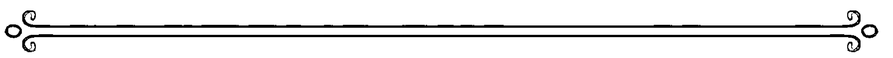

### ☆ 720 ☆

神和天使明察一切的眼正凝視著你的生活和關係。務必與你所愛的人一起規劃目標和願景，讓他們感覺被重視，感覺成為你未來的一部分。

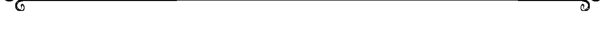

### ☆ 721 ☆

你正在和宇宙培養更親密的關係。先前也許感覺與神性失去連結，但現在你已深刻明白，你是被愛著的。

### ☆ 722 ☆

你來到了個人旅程的關鍵階段。別忘了，你是值得受到幫助的。專注在自己值得的意念上，能吸引前所未有的機會，讓你進一步被看見、聽見。呼求顯化天使的協助，祂們都很樂意支持你。

### ☆ 723 ☆

往上揚升、往前邁進的能量正圍繞著你，但務必放下追求完美的執著，專注於自己能為地球創造的美善。前進的步伐再小也是進步。要知道天使就在你身旁。

### ☆ 724 ☆

這是肯定他人，也肯定自己的時刻。要知道，當天使注視著你，祂們看見的是偉大與愛的耀眼光芒。

### ☆ 725 ☆

天使智慧鼓勵你解放你的靈。不要有所保留，展現你奔放、野性的自我，跟著生命的神聖旋律舞動吧！

### ☆ 726 ☆

花點時間看看自己的生活圈，思考自己經常來往的人，能讓你的旅程更加順暢。尋求神聖指引，讓內在直覺告訴你誰值得信任。

### ☆ 727 ☆

你是生命的魔法師。你是神聖的祭司。你是連結不同界域的中介者。天堂的力量與聖光此刻與你同在，也在你心中。

## 天使數字725－730

### ☆ 728 ☆

眼前出現了一個機會，能幫助你稍微調整腳步，與最初的意圖更調和一致。重新檢視你的初衷，接著評估目前的狀況，並做出必要的改變。

### ☆ 729 ☆

宇宙想提醒你，如果想看見未來的方向，務必相信神與聖靈的力量。放下質疑的念頭，懷抱堅定信念。

### ☆ 730 ☆

你當前的生命經驗，向身旁的人證明了他們能做到的事。務必保持從容淡定的接地姿態，這能讓祝福的暖流不斷注入你的生命。

### ☆ 731 ☆

揚升大師正在以祂們的光，祝福你邁向自我主宰的道路。展現你最真的自我，從黑暗中超脫吧，聖光就在你心中。

### ☆ 732 ☆

天使智慧鼓勵你勇於原諒，方能得到療癒。看見每個人身上的光，並記得當你與愛的頻率相結合，你的愛能蔓延到世界上每一個角落。

### ☆ 733 ☆

耶穌和聖靈正在以祂們的光祝福你。聖靈會一直支持你，而當你流露心中的愛，奇蹟自然會跟著來到。要知道，愛是真實不虛的。

### ☆ 734 ☆

你的天使團隊正在透過能量降示揭露真理，其中包含對你目前狀況的指引。花點時間領受來自天堂與星光界（astral realm）的深刻智慧。

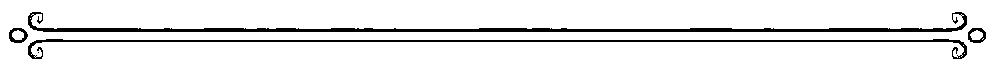

### ☆ 735 ☆

這是體會無限豐盛的時刻。眼前路上的阻礙正在被排除，靈性支持的力道正在提升。務必喜悅迎接此刻生命中出現的改變。

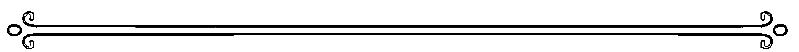

### ☆ 736 ☆

宇宙正在引導你強化個人心靈防護的等級。照顧自己的能量和情緒健康非常重要。斬斷將自己與過去綁住的繩索，呼求天堂的無上保護吧！

### ☆ 737 ☆
天使鼓勵你保持平靜、沉著的心。相信你和他人心中的善。持續專注於光，當你與光的能量連結，便能創造祝福之流，將夢想化為現實。

### ☆ 738 ☆
宇宙正在引導你相信天堂，並知道你是安全的。天使永遠與你同在，此刻也陪在你身邊。放心將你對未來的擔憂交給天堂，未來的路便能順利展開。

### ☆ 739 ☆
你的心正在覺醒，象徵神聖女性的上師鼓勵你擁抱神性之愛。你即將迎來重要的生命課題，學習在施與受之間取得平衡。

### ☆ 740 ☆
神和天使鼓勵現階段的你與地球連結。當你安穩接地，你將發現有關生命旅程的重要訊息。

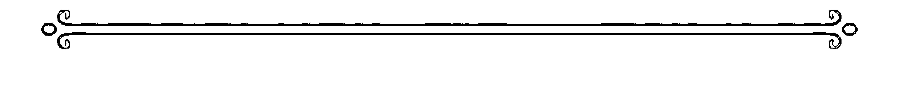

### ☆ 741 ☆
你的天使正在幫助你用祂們慈愛的雙眼看自己。你已經克服了舊有的恐懼，跨越了關於自我價值的阻礙。你看待自己的全新眼光，會為你創造機會，讓你能為他人付出，也從中獲得。

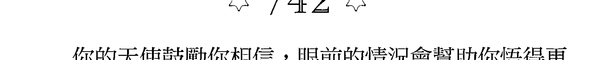

### ☆ 742 ☆
你的天使鼓勵你相信，眼前的情況會幫助你悟得更高的智慧。務必明白，過往的生命經驗都是可貴的，都能帶來啟發。為了繼續前進，你需要深入與自我對話。

### ☆ 743 ☆
發掘過去被隱藏或遺忘的特質與天賦，這是重新認識自己的時刻。你的守護天使正在向你靠近，幫助你深入內心，用好奇與讚嘆的眼光看見自己。

### ☆ 744 ☆
天使正以靈性豐盛的能量祝福你的路。你先前對於安全、健康的擔憂，對缺少、不足的害怕，此刻都已排除。通往機會的大門正在敞開，你的收入將逐漸增加。

### ☆ 745 ☆
隨著你活出最真的自己，大天使麥可正在幫助你感到安全、安心。不要有所顧忌，這不是害怕的時刻，而是慶祝自我本質的美好時刻。要知道天使正在一旁為你喝采，慶祝你接受了自己的全部。

## 天使數字743－748

### ☆ 746 ☆
天使智慧鼓勵你燃起鬥志，展開行動。此刻的你不該遲疑退縮，這是勇敢前行的時刻。別讓小我主導局面，讓你的靈魂和天使團隊照亮眼前的路。

### ☆ 747 ☆
這是你乘風高飛的時刻。展開羽翼，把內心想表達的一切全部抒發出來，讓心靈自由。天使正與你一同翱翔，渴望幫助你活出天命。

### ☆ 748 ☆
你正在接收祝福。你已經與過去的許多事和解，這種超然的心態正在點燃你靈魂的能量，創造提升振動頻率的機會，讓你往揚升更靠近。

### ☆ 749 ☆
天使智慧鼓勵你秉持信念，勇往直前。務必知道，加速成長的好機會就在眼前，而你心中的信念將幫助你深入與自我連結。

### ☆ 750 ☆
神正在實現你的願望，並針對你的禱告給予明確回答。你不需要再次請求，只需要用心領受。

### ☆ 751 ☆
你正在面臨的生命課題是自己造成的結果。天使智慧鼓勵你進入愛自己、接受自己的空間，因為這有助清除內心一切阻礙，照亮你需要的解答，讓你繼續前進。

### ☆ 752 ☆
你生命中的關係能帶給你深刻的體悟。不妨趁著現在，向他人吐露心事、抒發情緒。帶著愛訴說，讓自己的聲音被聽見。讓天使幫助你。

### ☆ 753 ☆
你正在釋放舊有的生命課題與業力。告別內心小劇場，也從他人的問題中解脫。這是你創造、安排自己的路的時刻。為正能量和美好經驗創造空間。

### ☆ 754 ☆
天使鼓勵你勇於做出自己需要的改變，好讓神聖秩序支持你的生命。做自己覺得對的事。重要的生命課題正在展開。

### ☆ 755 ☆
星際之門（stargate）已經打開，你身處於無限機會的宇宙中心。你的意念具有強大能量與吸引力。此刻發生的改變與你的意志和神聖秩序完美調和。

### ☆ 756 ☆
天使智慧鼓勵你思考內心的渴望，並將眼光放遠。期待最完美的結果發生，你聚焦的意念將為你顯化令人驚喜的現實。

### ☆ 757 ☆
你活出最棒的自己的決心，讓你的意識、靈魂都持續擴展。你開始了解自己與一切萬有的連結，也逐漸體悟生命此刻呈現的課題。

### ☆ 758 ☆
你來到這世上，是為了踏上真理的道途。這是昂首闊步的時刻。專注在你的目標上，便能感受到支持。放下被批判的舊有恐懼，勇敢表露最真的自我。這會為你創造前進的機會。

### ☆ 759 ☆
這是神聖煉金術（divine alchemy）時刻——你正在將鐵鉛般沉重的舊能，淬煉成金色光能，並從過去的事件與困境中超脫，進入充滿力量與正向的空間。

### ☆ 760 ☆
神鼓勵你聆聽天使的提醒，開始放慢腳步。這是平靜心神、帶著覺知行事的時刻。務必讓頻率與真理相結合，別忘了顧及身旁，以及會受你決定影響的人。

### ☆ 761 ☆
你的天使鼓勵你在採取下一步之前，先好好與自我對話。祂們很樂意為你照亮眼前的路，但你必須先誠實面對自己。

### ☆ 762 ☆
你對生命中的人付出的關愛、照顧，都被天堂看見了。神性想感謝你這一路上，為了幫助他人而做出的所有犧牲與退讓。現在，輪到你的意志和夢想開花結果。

### ☆ 763 ☆
此刻的你與自己的生命力連結合一。展現你的熱情，別因為內在湧現強大的性能量而擔憂，那是你充滿創造力的自我燃起的火。

## 天使數字761－766

### ☆ 764 ☆
你的天使鼓勵你花點時間休息，為氣場和脈輪系統補充能量。你也許覺得疲憊不已，但別因此沮喪或退縮不前。只要好好恢復能量，便能繼續帶著愛前行。

### ☆ 765 ☆
天使正在將你的財務狀況和安全感提升到更高層次。做好準備，幫助你體驗豐盛的好消息即將到來。

### ☆ 766 ☆
天使與揚升大師鼓勵你進一步綻放耀眼光芒。別讓任何人、任何事阻礙了你與生俱來的光。內在指引正在浮現，並將為你提供支持。用心聆聽吧！

### ☆ 767 ☆
這是相信與成長的時刻。你的天賦正在顯露，你綻放光芒的能力讓天使讚嘆不已。要知道，生命中可貴的體悟有時來自引導他人。與世界分享你的知識吧！

### ☆ 768 ☆
天使鼓勵你敞開心胸，用開放的心態面對新機會。獲得幸福與光的方法不只一種。療癒與支持的訊息正在向你顯現。讓視野更開闊吧！

### ☆ 769 ☆
與你的情緒連結，點燃心中的熱情之火。當你與野性、原始、無拘無束的本心連結，驚人的顯化便會發生。盡情展露你最真、最完整的自我。

### ☆ 770 ☆
神正在連連點頭，對你說「Yes」。去吧！堅定前行，採取行動。

### ☆ 771 ☆
你已經拓展了讓奇蹟顯化的空間，是時候誠實面對自己，釐清內心真正的渴望了。此刻的你只需要清楚的意圖。

### ☆ 772 ☆
全心全意地投入你的關係。此刻的你必須展現認真、坦誠的態度。關係是一種給予和接受的交流；你的天使希望你多用點心，積極投入生命中有意義的關係。

### ☆ 773 ☆
你現在遭遇到的一切阻礙，都只是內心疑慮和恐懼的投射。別害怕自己的力量與光，鼓起勇氣、誠實面對、駕馭自我。啟動勇士模式吧！

### ☆ 774 ☆
你的天使正在幫助你看見生命中重要的事。這是你脫去舊殼的時刻，將遮蔽你的光、消耗你靈魂的一切都放下。

### ☆ 775 ☆
指引天使此刻圍繞著你，幫助你釐清未來的方向。祂們正等著你專注心神，好引領你前進。集中注意力，敞開心胸接受指引。

### ☆ 776 ☆
天使鼓勵你秉持耐心，再稍等一下，同時也希望你知道，你盼望已久的奇蹟即將到來。深呼吸。

### ☆ 777 ☆
你的魔法和顯化能力正在提升。啟動你的內在超能力，讓你的魔法蔓延全世界。

### ☆ 778 ☆
你的天使鼓勵你不要只看眼前的情況，並相信生命中的每件事都有它的意義。要知道，一切都會在最剛好的時刻發生，幫助你與至善和真理連結。

### ☆ 779 ☆
愛之天使此刻圍繞著你，引導你敞開心房。這是愛人與被愛的時刻。讓愛流入心中，再流向世界吧！

### ☆ 780 ☆
你目前的旅程和生命課題與你的祖先有關。神想提醒你，你的家族故事背後有一個因果，祂鼓勵你看見家族的擔憂或過往創傷，讓陳舊的模式得到療癒。

### ☆ 781 ☆
天使智慧邀請你欣賞自己的生命旅程，肯定自己做出的貢獻。少了你的付出，你此刻的經驗將截然不同，務必看見你獻給世界的光與天賦。

### ☆ 782 ☆
你目前的連結或關係是一次寶貴的經驗。務必把握現在讓關係更進一步，因為這能讓你體會更深刻、更刻骨銘心的愛。

### ☆ 783 ☆
你遇到的挑戰並非真的挑戰，而是難得的機會。你能從中看見自己戰勝黑暗、克服困難的力量。此刻的你擁有最耀眼的光、最強大的復原力。

### ☆ 784 ☆
你的天使正在幫助你了解目前的方向。請相信當時機成熟，一切都會順利展開。在這段期間，別忘了繼續發揮你的創造力與天賦。

### ☆ 785 ☆
天使智慧想提醒你，活出喜悦又充实的人生是你的天命。花点时间排除让你不快乐的元素，聚焦在带给你幸福感的事情上。

### ☆ 786 ☆
天使希望你记得说「不」的力量。当你对耗损心神、讨人厌的负能量说「不」，就是为自己腾出了显化奇迹的空间。

### ☆ 787 ☆
你的能量正在提升到更强大的层级，好让你为地球创造更美好的改变，带来更多疗愈。宇宙需要你和你的天赋，祂感谢你准备好带着天赋勇往直前。

### ☆ 788 ☆
你現在經歷的共時性事件，反映心中蘊藏的吸引力能量。你能讓想要的一切成真，不妨與內心最深處的渴望連結。如果你的心願能幫助你擴展，就會立刻顯化。

### ☆ 789 ☆
強大的靈性蛻變能量正圍繞著你。這是鼓起勇氣的時刻，徹底克服最深層的恐懼、勇敢直視心中的黑暗。你擁有揚升高飛的機會，但得先願意克服心中的陰影。

### ☆ 790 ☆
你的內在力量正在竄升。回歸完整合一的自我，並知道神一直守護著你、支持著你的道路。別忘了，你渴望的所有力量都在你心中，天堂的國度也是。

### ☆ 791 ☆
你的生命正在與神聖計畫調和。請相信一切都會在最完美的時刻發生。

### ☆ 792 ☆
天使邀請你揚升頻率，禮讚內在的生命力。宇宙正在給你支持，向你揭示邁向超越（transcendence）的路徑。相信你領受到的一切，勇往直前。

### ☆ 793 ☆
你的目標和理想需要更多時間、耐心、能量和決心，才能順利顯化。多花點時間投入禱告、冥想和靈性練習，對你會有很大的幫助。

### ☆ 794 ☆
你接收到的徵兆和訊息，是天使在提醒你記得祂們充滿愛的臨在。走在這條路上的你，永遠不孤單。

### ☆ 795 ☆
宇宙正在給你充滿智慧的靈性啟示，指引你未來的方向。祂清楚知道你需要什麼，才能實現生命的至善。

### ☆ 796 ☆
你的天使鼓勵你不要急，一步一步來。前進之前，先與大自然連結、呼吸新鮮空氣，讓能量獲得恢復。

### ☆ 797 ☆
相信此刻心中升起的情緒，它們正在幫助你看見最重要的事，幫助你和你的道路擴展。

### ☆ 798 ☆
你在思考自己是否在做對的事，或走在對的道路上嗎？放下這些擔憂，因為這些都只是阻礙你的伎倆。你的生命充滿了光、充滿了意義，天使很高興有你。

### ☆ 799 ☆
要知道你是與靈連結的。你的通靈能力和靈性連結正在快速強化。

### ☆ 800 ☆
神邀請你活出有意義的人生。祂希望在你的生命中扮演更重要的角色。如果你準備好踏出下一步，只要設定清楚的意圖，下一步自然會向你顯現。

### ☆ 801 ☆
天使指引鼓勵你繼續專注在自己的道路上，放下跟他人有關的煩惱。

### ☆ 802 ☆
好好思考如何更用心投入自己的關係，眼前的道路會變得暢通無阻。

### ☆ 803 ☆
你近期把握住的機會非常重要，能帶領你的靈性向上成長。

### ☆ 804 ☆
你的天使鼓勵你記得，你的真理和真誠表露自我的心，是送給世界最棒的禮物。

### ☆ 805 ☆
你的脆弱正在助你一臂之力。相信神和你的天使，並知道你的道路正在順利展開。

### ☆ 806 ☆
隨著你在旅程上繼續前進，務必保持正念覺知，謹慎地走每一步。溫柔是此刻與自我連結的關鍵。

### ☆ 807 ☆
你表露的興奮與喜悦之情，正在為你的日常生活注入驚喜和奇蹟。全心全意地擁抱這些美好吧！

### ☆ 808 ☆
你進入了力量的空間。請相信一切都照著神聖秩序運作，繼續專注在你的真理上。

### ☆ 809 ☆
有時候，旅程的重點不是你走了多遠、成長了多少，而是你與自我的連結有多深。願意保留時間給自己的你，真的很棒！

### ☆ 810 ☆
在追尋歸屬感和生命意義的旅程上，神會一直支持著你。

### ☆ 811 ☆
你的道路正在擴展。一切都完美配合、相輔相成，讓你的夢想順利化為現實。

### ☆ 812 ☆
你正在經歷的生命課題，源自於一段還沒被處理的關係，或是與關係有關的傷口。為了避免不必要的阻礙，務必在繼續前進之前，先找到根本原因。

### ☆ 813 ☆
展現最真的自我、表達你的喜悅、尋求讓你快樂的一切，就能迎來宇宙的支持。

### ☆ 814 ☆
在你未來的旅程上，你的天使將扮演更重要的角色。要知道當你與世界分享天使之光，你也體現了更崇高的目的。

### ☆ 815 ☆
天使正在與你分享展開新旅程的機會。別忘了，你永遠有選擇的自由，而天使鼓勵你選擇自己熱愛的路。

### ☆ 816 ☆
宇宙鼓勵你以和平之心行事。在繼續前進之前，先試著用對方的角度看事情。你會從中有所學習。

### ☆ 817 ☆
你即將獲得的經驗與機會，能讓你與更崇高的意義連結。準備好成就偉大、創造美善吧！

## 天使數字815-820

### ☆ 818 ☆
天使指引鼓勵你在採取進一步行動之前，先與自我對話，想清楚你希望目前的狀況如何發展。

### ☆ 819 ☆
天使指引鼓勵你在做進一步決定之前，先問自己什麼能帶來最大的喜悅。

### ☆ 820 ☆
未來的路如何開展，取決於你能否相信神的計畫，並放下有礙你成就偉大的狹隘思維。

### ☆ 821 ☆
宇宙正在引導你花點時間投入靈性遊歷 (journeying) 與做夢，將可能阻礙你發光的意念或意圖徹底清除。

### ☆ 822 ☆
你此刻的振動頻率，能照亮身旁某個人的世界。別忘了，你心中有光，這道光能點亮別人的心燈。今天，請你全心全意地投入友情和所有關係。

### ☆ 823 ☆
你目前的狀況即將找到解決方法。要知道天使和揚升大師正在引導你邁向更崇高的意義。

### ☆ 824 ☆
你的天使正在用和諧之光照亮你目前的情況。要知道，和平與寧靜的能量已近。

### ☆ 825 ☆
看見你願意臣服，放下讓人心力交瘁的過往事情，你的天使非常開心。眼前的路寬廣無比。

### ☆ 826 ☆
花點時間與你愛的人和愛你的人深度交流，能幫助你重新點亮心中的光。你值得被好好珍惜。

### ☆ 827 ☆
請相信你看見的徵兆是神性想告訴你：你確實走在對的路上，神支持你的旅程。

### ☆ 828 ☆
你的天使在你身旁飛舞，慶祝你在個人成長和工作上的成就。花點時間肯定自己的努力吧！

### ☆ 829 ☆
在你旅程的下一階段，你將與過去偉大的女性聖者、神靈與上師連結，接引祂們的聲音和訊息。祂們已經來到身邊。成為神聖女性的地球代言人吧！

### ☆ 830 ☆
你的每一個生命經驗都不是偶然。天使指引鼓勵你相信你的力量、目標與道途。你是世界上不可或缺的一道光。

### ☆ 831 ☆
揚升大師鼓勵你調整頻率，與祂們連結。祂們為你準備了深具智慧的訊息，能幫助你提升靈性覺知力與理解力。

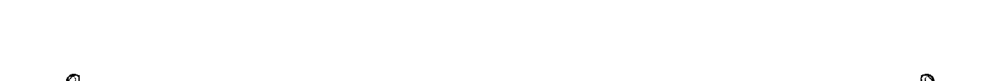

### ☆ 832 ☆
宇宙鼓勵你花點時間與自我連結，才能進而與神的計畫連結。

### ☆ 833 ☆
耶穌此刻與你同在，並希望你明白，祂正在帶領你前進。你的心中有光，能戰勝眼前的所有黑暗。

### ☆ 834 ☆
在你的生命擴展旅程上，天使一直在身旁支持、守護著你。

### ☆ 835 ☆
擁抱改變，並知道此刻生命中的一切都照著神聖律法運作。

### ☆ 836 ☆
你的天使鼓勵你為歡笑與幸福創造空間。你一直守著過於嚴肅的能量，但它此刻遮蔽了你的光和天賦，放下吧！

### ☆ 837 ☆
你一直以來祈求獲得，也不斷努力追求的事物，正在透過你的生命經驗顯化。請相信宇宙正在引導你邁向最完美的結果。

### ☆ 838 ☆
你目前的經驗是來自過去的回音，反映了前世記憶與今世的過往經驗。啟動你的靈性覺知，感應此刻的神性訊息，以及能被療癒的過往模式或創傷。

### ☆ 839 ☆
你正在與神聖女性合一。這股能量正在引導你敞開心胸，以開放的心態擁抱神聖旨意。

### ☆ 840 ☆
你不需要自己想出下一步怎麼走。相信神和你的天使，因為祂們正在帶你邁向喜樂與成長。

### ☆ 841 ☆
找回你的天賦、肯定你的本質，是現階段的重要功課。當你記得最真實的自己，眼前的路便會順利展開。

### ☆ 842 ☆
花點時間讚美你愛的人，肯定他們的天賦與能力。他們現在需要你的光與正能量。

### ☆ 843 ☆
你的天使鼓勵你用靈魂的眼睛去看。看見你的生命盛開美妙與機會的花朵，接著感受顯化的實相。

### ☆ 844 ☆
你的天使現在需要你的同意，才能主動介入，提供神聖指引。如果你準備好讓天使帶你踏出下一步，就呼求祂們的協助與支持吧！

## 天使數字

### ☆ 845 ☆
大天使迈克尔已经在一旁等待，准备用安全与爱的光，帮助你排除生命中的负能量与阻碍。现在就请求祂的协助吧！

### ☆ 846 ☆
天使鼓励你用心觉察自己的身体和能量。自我觉知是提升自我价值与连结的关键。

### ☆ 847 ☆
你目前的经验是过去的行为和意图显化的结果。天使指引鼓励你检视内心，驱走嘲讽自己、贬低自我天赋的意念，才能吸引美好的经验，带自己往喜悦扬升。

### ☆ 848 ☆
你的人生目标正在扩展。你从过去到现在的每一步，都有天堂支持着你。你正在做对的事。

### ☆ 849 ☆
你的天使鼓励你继续用心觉察情绪，发掘来自过去、你还无法释怀的感受。放下这些情绪，才能将未来的路看得更清楚。

### ☆ 850 ☆
灵性丰盛法则正在加速你的旅程扩展。准备好迎接奇迹时刻吧！

### ☆ 851 ☆
当你想起自己的天赋，并坚信你需要的一切已经在你心中，眼前的路便会化为迈向成功的坦途。

### ☆ 852 ☆
你与他人的互动或关系也许遭遇困难或挑战，但是唯有解决这些难题，你才能进一步成长、体验更多喜悦。

### ☆ 853 ☆
宇宙邀请你对神圣计划怀抱信念。请相信你的每一段旅程，都是为了帮助你体现至善与真理。

### ☆ 854 ☆
你越能相信、越能臣服，就越能拓展空间，让喜悦流入心中。现在就怀抱信念吧！

### ☆ 855 ☆
机会正在快速显化到你的生命中，为你带来充实的灵性体验，开拓财务丰盛的路。

### ☆ 856 ☆
宇宙正在引导你停下脚步，别再盯着前方的路，先享受此刻的旅途风景。你的天使已经来到身边，与祂们连结。

### ☆ 857 ☆
宇宙正在引导你记得你的心与情绪蕴含深刻力量。你的意图与信念所聚焦的事物，必定会在生命中显化。

### ☆ 858 ☆
你身处于能量漩涡之中，内心所想的一切都在快速显化。你的天使鼓励你与自己的目标连结、感受祂们的临在，好让正向经验得以显化。

### ☆ 859 ☆
你正处于灵性高速成长的阶段。仔细觉察，你的第三眼正在打开，好让你看见深具启示的预知异象，帮助你在旅途上顺利前进。

## 天使数字857－862

### ☆ 860 ☆
神的光与爱一直支持着你，不要忘记了。

### ☆ 861 ☆
你的能量和健康是你最珍贵的资产。天使智慧鼓励现阶段的你尽最大的努力照顾自己。

### ☆ 862 ☆
宇宙鼓励你让生命中的关系有进一步发展。当你愿意全心投入、展现脆弱、真诚沟通，便能感受自己值得的爱。

## 天使数字

### ☆ 863 ☆
你正在吸引的美好机会，能为你带来喜悦，对世界萌生全新的爱。好好把握这一刻，勇往直前。

### ☆ 864 ☆
你的天使鼓励你聆听此刻内心显现的神圣指引。别忘了，你值得领受来自神性的讯息。

### ☆ 865 ☆
天使希望你明白，在财务与物质生活方面，最坏的情况已经过去。天堂鼓励你相信，你一直在往丰盛与支持前进。

### ☆ 866 ☆
停下来，你正在偏离最初的意图和对你有帮助的事物。天使智慧鼓励你回归自己的路，划清界线，远离不必要的麻烦。

### ☆ 867 ☆
你正在经历美妙的奇迹时刻。继续连结爱的能量，全心投入你正在做的事情。你的努力与决心已经被看见，天堂也与你同在，帮助你显化好的结果。

### ☆ 868 ☆
眼前路上的所有障碍都正在被排除。这是畅行无阻、感觉完整的时刻。你的天使鼓励你看见自己的蜕变，拥抱全部的自己。

### ☆ 869 ☆
你的道路正在带你进入安全的空间，让你能放心做最真实的自己、解放内心最深处的灵魂。要知道当你释放心中的一切，就为奇迹和疗愈创造了空间。

### ☆ 870 ☆
神正在支持你显化你需要的一切，让你活出充实、喜乐的人生。

### ☆ 871 ☆
你的天使鼓励你将此刻的注意力拉回自己身上。持续专注于你的成长，便能感受到决心散发的正能量。

### ☆ 872 ☆
你与他人的关系和连结，正在为你显化机会，带来更多伙伴、朋友与合作。请相信在你旅程的下一阶段，你会与跟自己一样优秀、能干的人共同创造。

### ☆ 873 ☆
天使智慧鼓励你远离让自己分心的因素，回到自己、回到当下。排除干扰来源，重新与内在的魔法力量连结。

### ☆ 874 ☆
天使正在你身旁飞舞，唱着美妙动人的歌曲。要知道神性正在庆祝你的美好，你内心的渴望也即将显化。做好准备，换你庆祝了。

### ☆ 875 ☆
惊喜与庆祝的能量正在填满你的生活。你的天使鼓励你用最乐观的心、最饱含爱的双眼往前看——你即将有所突破。

### ☆ 876 ☆
天使智慧鼓励你明白，你现在遇到的挑战是难得的机会，能帮助你找回力量，并打从心底相信：“Yes！我准备好发挥力量了。”

### ☆ 877 ☆
祝福天使正围绕着你，用祂们的能量填满你的生活。敞开心胸、展开双臂、张开双眼便能感受到祂们的美妙。

### ☆ 878 ☆
你的天使鼓励你让自己的意念、意图与行为，持续和真理与真诚的能量相结合。继续专注于你最初的目?与信念，并知道天使会揭示你需要的答案。

### ☆ 879 ☆
天使指引鼓励你花点时间回归内心世界，好好照顾自己的心理与情绪健康。

### ☆ 880 ☆
神与你同在，也在你心中。祂已为你排除阻碍，照亮眼前的路。

### ☆ 881 ☆
宇宙鼓励你在继续前进之前，先看看自己一路走来的成长。此刻的你需要耐心。

### ☆ 882 ☆
如果不是那些照亮你生命的人，你的旅程将截然不同。天使智慧鼓励你对一路上支持自己的人表达爱与感谢。

### ☆ 883 ☆
投入奉献和祷告的努力，会帮助你的灵魂扩展，让你在未来的感觉路上受到支持。永远别小看你心中与神和天使的连结。

### ☆ 884 ☆
自由天使正围绕着你，帮助你消除恐惧与担忧，勇敢前行。你获得了全新的自信与信念。

### ☆ 885 ☆
你的天使鼓励你在做出任何改变之前，先花点时间搜集资讯，分析不同选择。多一分谨慎，评估需要的事物，再着手开始。

### ☆ 886 ☆
你的旅程需要你展现力量。要知道，当你一心想法做最真实的自己，为众人做对的事，你的力量会永远与神圣计划完美呼应。

### 887
天使正在为你疏通前方的路；你先前的疑虑不再是问题了。向前走吧！

### 888
你的人生目标和愿望彼此调和，相辅相成。你正在做对的事，并走在光的道途上。

### 889
做一个光行者是你的天命。花点时间与自我连结，成为你天生注定要带给世界的光。

## 天使数字887－892

### ☆ 890 ☆
神正在支持你发掘你的灵性天赋。

### ☆ 891 ☆
宇宙鼓励你明白，与自我重新连结是下一段旅程的重点。花点时间回归内心世界吧！

### ☆ 892 ☆
花点时间照顾自己，坦白表达自己能为关系付出多少，是现阶段的重要课题。宇宙鼓励你好好爱自己。

### ☆ 893 ☆
前方的路也映照出你内心的路。你花越多心思、越多能量来追求自我实现，你的旅程中也会有越多光明。

### ☆ 894 ☆
你的天使鼓励你继续创造与祂们连结的空間，并敞开心胸领受神性讯息。你拥有与天堂连结的美好天赋。

### ☆ 895 ☆
请相信宇宙一直照着你的意图和神圣计划运作，为你提供需要的一切。没有什么是你应付不来的。

## 天使数字893－898

### ☆ 896 ☆
务必抽出时间，好好消化你近期接收到的灵感与洞见。它们是来自灵魂的礼物。

### ☆ 897 ☆
你正在启动点石成金的超能力。你触碰的一切、意念聚焦的一切，都将变成黄金。

### ☆ 898 ☆
你的祷告正在获得回应，你的意图也正在显化，务必让心中的希望、梦想和愿望与至善的最高能量连结。

### ☆ 899 ☆
你的能量已经与内在佛陀同频。与这位伟大的内在导师连结，跟全世界分享祂的讯息。

### ☆ 900 ☆
神认同你，也肯定你的灵性道途。

### ☆ 901 ☆
看你终于给自己值得的爱与肯定，神非常感谢你。

### ☆ 902 ☆
神正在以神性之爱祝福你、你的家人和关系。

### ☆ 903 ☆
要知道神正在帮助你的灵魂扩展，好让你从“心”认识你的天使。

### ☆ 904 ☆
天使已经与你灵魂的频率相结合。要知道你现在接收到的讯息，直接来自神的中心。

### 905
拥抱此刻生命中的转变；它们是来自天堂的祝福。

### 906
花点时间找回信念之心，将所有顾虑交给天堂，就能准备好体验奇迹。相信神吧！

### 907
你所寻找的答案已经在你心中。别小看你灵魂的智慧——用心聆听，就能听见你需要知道的一切。

### ☆ 908 ☆
宇宙鼓励你调整频率，让自己的路与照亮你灵魂的事物相结合。

### ☆ 909 ☆
你的顶轮正在打开，好让你感受、接引神的爱。

### ☆ 910 ☆
你正在让自己的能量系统与神和宇宙同频共振。保持活泼、飞扬的心，让自己维持高频振动的状态。

### ☆ 911 ☆
你与过去、现在与未来的一切生命之间，有着无限广大、宇宙层级的连结。发掘此刻与你同频振动的智慧，连结其中的力量。

### ☆ 912 ☆
要知道，你所做的灵性修持为你的生命注入了正能量和疗愈，你的关系和与他人的连结更受到深深祝福。

### ☆ 913 ☆
你的天使鼓励你相信此刻内心接收到的讯息，以及与灵魂有关的资讯。

### ☆ 914 ☆
在一天当中腾出时间，深入内心世界，并邀请你的天使来到身边。祂们就在一旁等待，准备协助你展开生命旅程、实现灵性成长。

### ☆ 915 ☆
你对真理的坚持正在为你开启机会之窗，帮助你感受更强烈的喜悦。

### ☆ 916 ☆
你的天使对于你思考的高度表示赞赏。你保持乐观正向、维持心灵和谐的努力，现在将开花结果。

### ☆ 917 ☆
你的天使正在为你开启通往新开始与新机会的大门。拥抱改变吧！

### ☆ 918 ☆
宇宙鼓励你看见自己深刻的灵性连结与生命成长。好好肯定你现在的模样，能帮助你活出更完满、更神奇美妙的人生。

### ☆ 919 ☆
你的灵性正在快速成长。所有黑暗都已褪去。光明已经降临。

### ☆ 920 ☆
浪漫天使已经来到你的生命中。准备好被拉进爱的怀抱，享受关系与伴侣之间的神性连结吧！

### ☆ 921 ☆
和谐天使正在你身旁飞舞，为你清理能量，让生活回归宁静舒心。

### ☆ 922 ☆
继续拥抱自己、接纳自己，生命自然会绽放美丽。随着你步入旅程的下一阶段，天使智慧鼓励你给自己需要的爱。

### ☆ 923 ☆
你正在看见征兆，并与天堂国度连结。你心中的爱是开启这份连结的金钥。

### ☆ 924 ☆
天使和大天使都围绕着你，给予满满的祝福。

### ☆ 925 ☆
面对目前的情况，天使智慧鼓励你持续对准至善的能量，专注于最好的结果上。你的祷告和正能量是让结果显化的必要元素。

### ☆ 926 ☆
勇敢追求内心渴望看见的改变。这些改变不是白日梦，而是天使传达的神圣灵感。

### ☆ 927 ☆
要知道你的祷告已经被听见，而答案会在最完美的神圣时刻出现。

### ☆ 928 ☆
你正在接收神性智慧与指引。你听到的一切并不是幻想，而是来自天堂的讯息。

### ☆ 929 ☆
你正在进入平静、和谐的空间。把握这个机会，通过正念与自我照顾修复能量。

### ☆ 930 ☆
你拥有神赐予的疗愈天赋，宇宙鼓励你与世界分享这项天赋，活出更有意义的生命。

### ☆ 931 ☆
天使智慧鼓励你以原谅别人的心原谅自己。花点时间观照内心，放下你也许还没释怀的怨恨或委屈。唯有如此，你才能感受频率扬升，与神性连结。

### ☆ 932 ☆
爱与亲密的丰沛能量此刻围绕着你的关系。

### ☆ 933 ☆
耶稣已经来到身边，帮助你快速扬升。你正在跨越曾经困住你的过往事件。束缚的枷锁已经断开，自由终于来临。扬升吧！

### ☆ 934 ☆
你的天赋、才能与光正在由内而外绽放。天使鼓励你自信前行，展现最真的自己。

### ☆ 935 ☆
你的天使鼓励你庆祝生活中的改变。要知道，你的旅程正在顺利展开，一切也在最完美的时刻发生，让你能与人生目标连结，活出你的天命。

### ☆ 936 ☆
继续向前，并相信你的天使与你一路同行。信念能为你的道路与生命注入奇迹的能量。

### ☆ 937 ☆
天使智慧鼓励你探索梦境和异象，领受神性想传达的讯息。充满启示的讯息正在显现，帮助你显化心中的意图。

### ☆ 938 ☆
天使智慧鼓励你明白，克服眼前的挑战，能帮助你从前世的业力和恐惧中解脱。呼求业力之主（Lords of Karma）的协助，让你彻底释放过往的印记。

### ☆ 939 ☆
你已经与神性之声和能量连结。要知道你承载着神性之爱，务必好好照顾自己的身体，因为那是盛装你灵魂的容器。

### ☆ 940 ☆
看见你此刻爱自己、照顾自己的举动，神和天使非常感谢。

### ☆ 941 ☆
宇宙鼓励你明白，你的天使一直在听你诉说。你永远不是孤单一人。

### ☆ 942 ☆
你正在与你的守护天使培养强大又深邃的连结。相信你听见与感受的一切。

### ☆ 943 ☆
你的指导灵就在身边，温柔支持着你。

### ☆ 944 ☆
天使正在帮助你发掘先前遗失或被遗忘的天赋，重新绽放灵性光芒。此刻的你有很高的机率能接引来自灵界的洞见与异象。

### ☆ 945 ☆
在你深入探索灵魂、发掘灵魂天命的同时，大天使正在一旁保护着你。

### ☆ 946 ☆
平衡天使鼓励你维持规律的生活节奏，活出与灵性的连结。远离耗损能量的情况，专注在带给你活力的事情上。

### ☆ 947 ☆
意图的能量是现阶段的关键。你的意图正在塑造你的生命经验，因此天使鼓励你厘清内心的渴望，思考自己想活出什么样的人生。

### ☆ 948 ☆
要知道，你正在感应深刻的洞见与降示，领受有关生命道途的智慧。你需要的真理正在向你显现。

### ☆ 949 ☆
圣灵正在填满你的心之圣杯，直到爱的能量满溢而出。要知道你值得拥有奇迹。

## 天使数字947－952

### ✶ 950 ✶
近期发生的转变都是神的旨意与安排。相信这一切背后存在更宏大、更崇高的意义。

### ✶ 951 ✶
宇宙正在引导你作自己心灵的主人。专注于你的渴望上，拓展你的视野。

### ✶ 952 ✶
宇宙正在引导你面对当前的阻碍，因为成功克服之后，你梦寐以求的魔法便能显化。保持心神专注。

### ☆ 953 ☆
如果想扩展灵魂，你必须前往内心深处，勇敢直视自己的恐惧。但是也要知道，你正处于灵性蜕变的关键时刻，很快就能扬升高飞。

### ☆ 954 ☆
你的天使鼓励你在适应改变的过程中，好好照顾自己。温柔善待自己，适时给自己鼓励与肯定。

### ☆ 955 ☆
你正在体悟深刻的真理；这个过程正在创造强大的转变能量，让你的灵性自我解放。展露你的天赋，体会丰盛吧！

### ☆ 956 ☆
你付出的努力正在开花结果，生活也逐渐回归平衡。你所给予、曾给予的一切，都会回到自己身上。

### ☆ 957 ☆
保持对梦想、愿景与意图的热忱——你距离显化已经无比靠近。要知道你的坚持一定会有收获。

### ☆ 958 ☆
无上保护的能量正围绕着你。宇宙鼓励你明白，即使事情发展不如预期，你仍是安全的。此刻路上也许有些颠簸，但一切很快会恢复顺畅。

### ☆ 959 ☆
天堂请你积极行动。祂正在引导你与世界分享你的人生使命。你拥有作为众人榜样的机会。好好把握。

### ☆ 960 ☆
神鼓励你明白，你提升心灵的努力，已经为你清理了淤积的能量，排除家族关系中的旧有阻碍。过往的创伤已获得疗愈。

### ☆ 961 ☆
你的光正在被点亮。用尽全力绽放光芒，并知道你的频率已经对准至善。

### ☆ 962 ☆
在设定未来的意图之前，先花点时间想想让你感到爱与连结的一切。宇宙正在引导你更用心体察生命中重要的人与事。

### ☆ 963 ☆
从心灵洞穴里走出来。你有重要的东西能与世界分享。相信内心的直觉，解放你的内在导师。

### ☆ 964 ☆
你正在与灵界建立强大的连结。天使正在透过直觉对你说话，务必相信你听到的一切。

### ☆ 965 ☆
宇宙正在引导你别再沉迷于物?享受，因为这种意念阻碍了丰盛的能量，让你的生命无法获得祝福。向宇宙臣服，让魔法流入心中。

### ☆ 966 ☆
为了提升觉知，务必面对最真实、最赤裸的自己。

### ☆ 967 ☆
你的真我是你的老师。要知道，当你勇于捍卫自己的信念，便能显化美善的经验，为你带来更多神和天使的支持。

### ☆ 968 ☆
你的天使鼓励你呈现自己善感、柔软的一面。你进入了全心接纳自我的空间。让你的美好也被他人看见、接受吧！

### ☆ 969 ☆
你的能量闪烁金色光芒，并与神圣炼金术和魔法的能量同频共振。为此，你的灵魂正在吸引机会，帮助你体验奇迹般的转变。

### ☆ 970 ☆
神鼓励你明白，在旅程的下一阶段，你需要好好爱自己、接受自己。

### ☆ 971 ☆
神聖指引鼓勵你選擇充滿愛的意念。看見自己的神性價值。勇於擁抱愛、分享愛、感受愛。

### ☆ 972 ☆
好好休息、充電對此刻的你非常重要。宇宙也在引導你肯定自己的敏感天賦，因為自然流露內心的脆弱，能幫助你支持他人。

### ☆ 973 ☆
天使與揚升大師在你的四周灑滿金色的智慧之光。祂們正在引導你了解，你所尋找的答案其實就在心中。

### ☆ 974 ☆
你的天使鼓勵你明白，你來到了一個階段或循環的終點。祂們請你放心相信，讓祂們帶你邁向下一段旅程。過往的幻象正在被揭開、釋放。

### ☆ 975 ☆
相信天堂的能量。你的天使就在身邊。

### ☆ 976 ☆
宇宙鼓勵你記得祂就在你心中，陪伴著你。當你記得自己深刻的靈性連結，靈性保護的能量會將你包圍，讓你感受滿滿的愛。

### ☆ 977 ☆
生命與魔法的力量和能量正在流入你的生活。祈求你需要的奇蹟，準備好看見奇蹟即刻顯化。

### ☆ 978 ☆
你的「法」（dharma），你實現靈魂天命的正道，正在順利展開。不必著急，一步一步走。幸福在前方等著你。

### ☆ 979 ☆
你正在從困住你的能量索、關係、鎖鏈與因果牽連中解脫，進入力量與光的空間。

### ☆ 980 ☆
神正在為你指引旅途的方向。要知道你的路與神性之愛連結。

### ☆ 981 ☆
你正在重新發現自己的力量與光。歡迎回歸最真實的自我。

### ☆ 982 ☆
你的關係此刻充滿和諧與和平的能量。你先前的所有疑慮、挑戰都逐漸消散，取而代之的是愛與接納。

### ☆ 983 ☆
與地球能量再次連結。下一階段的旅程需要你安穩接地。

### ☆ 984 ☆
你的天使團隊鼓勵你勇於表達自我，讓心中的真理被聽見。如果你希望獲得尊重，就毫無保留地說出真心話吧！

### ☆ 985 ☆
正義與神聖秩序的力量已經圍繞你目前的情況。天使指引鼓勵你為所有相關的人做對的事。

## 天使數字983－988

### ☆ 986 ☆
你的振動頻率將帶你展開更高層次的學習。要知道，你目前的經驗能提供深刻的智慧。

### ☆ 987 ☆
天使指引鼓勵你保持冷靜，並相信一切事情都在最完美的時刻發生。唯有如此，你才能感受豐盛與魔法。

### ☆ 988 ☆
你的天使不曾希望你小看自己生命的重要性與力量。你有能與世界分享的特別之處。

### 989
你與重要的能量產生了連結。阻礙已被排除、挑戰已經釋放，你正在進入自我超越的空間。

### 990
你走在光與愛的道路上。神鼓勵你記得，你永遠不會受譴責，你一直是被愛著、被原諒，也被支持的。

### 991
回歸天堂的擁抱。花點時間禱告與靜思。誠心請求，當能獲得。

## 天使數字989－994

### ☆ 992 ☆
要知道，天堂也眷顧著你的關係。先前的所有挑戰都被排除了，好讓你無所畏懼地去愛。

### ☆ 993 ☆
神聖旨意正在介入。要知道宇宙正在引導你邁向幸福與真理。

### ☆ 994 ☆
天使正在幫助你開啟靈視力，與神性之眼連結。試著用愛和原諒的眼光看世界。

### ☆ 995 ☆
宇宙清楚知道你需要什麼，才能進入高頻。你揚升的腳步正在加快，你正在從黑暗中超脫。

### ☆ 996 ☆
愛與鼓勵的能量正在你體內流動，也從你心中不斷湧現。與世界分享你的天賦，感受生命的恩典。

### ☆ 997 ☆
你的生命頻率已經與你的天命、與更崇高的意義結合。你到目前為止所做的一切，都不是偶然。感受此刻你身上的魔法吧！

### ☆ 998 ☆
你追求成長與療癒的意圖已經顯化。慶祝自己的蛻變吧！

### ☆ 999 ☆
隨著你找回圓滿完整的感覺，聖母瑪利亞正在一旁支持你。歡迎回到你的本心。

## 後記
不要忘了，地球四周有很多天使環繞。你身旁也隨時都有一位以上的守護天使。你就是祂們的最高使命。祂們一心只希望你感到安全、踏實、受到保護。祂們會把握每個可能的機會來提醒你：祂們就在附近，樂於用奇蹟之光支持你。天使與你同在，是因為你就是愛，因為你值得感受愛。

無論你感應到什麼樣的數字訊息，請相信你的天使永遠在一旁守候，等著幫助你，等著帶你邁向自由與愛。只要虔心祈禱，祂們就會現身。天使絕對會回應你的禱告。

願你的天使帶來平安，在你的旅程上一路守護你。

## 作者簡介
凱爾・葛雷從小就有多次與靈界接觸的經驗。他才四歲時，祖母的靈魂便從另一個世界來探望他。

從小到大，凱爾總是能聽見、看見、感知超越人類感官的事物。因著這項天賦，他在青少年時期就發現了天使的力量與愛。

而今，凱爾是風靡業界、備受讚譽的天使專家。透過保持接地的特殊天賦、忠於自我的真實個性，他用平易近人的方式推廣天使與靈性的概念，運用現代觀點詮釋古老的靈性智慧，期許能幫助今日的廣大讀者。

凱爾曾擔任英國談話節目「Loose Women」與晨間節目「This Morning」嘉賓，也曾受邀接受BBC廣播電台節目專訪。他常到世界各地巡迴演講，在英國境內與歐洲的分享會向來大獲好評，門票常銷售一空。凱爾現居蘇格蘭第一大城格拉斯哥，目前著作包含六本書與三套神諭卡牌。

## 聯絡方式
- Facebook: Kyle Gray
- Instagram: @kylegrayuk
- 網站: [www.kylegray.co.uk](http://www.kylegray.co.uk)

## ANGEL NUMBERS
Copyright © 2019 Kyle Gray
Originally published in 2019 Hay House UK Ltd.

## 天使數字
### 來自天使的背後訊息與涵義
| 項目 | 資訊 |
| :--- | :--- |
| 出版 | 楓樹林出版事業有限公司 |
| 地址 | 新北市板橋區信義路163巷3號10樓 |
| 郵政劃撥 | 19907596 楓書坊文化出版社 |
| 網址 | www.maplebook.com.tw |
| 電話 | 02-2957-6096 |
| 傳真 | 02-2957-6435 |
| 作者 | 凱爾・葛雷 |
| 譯者 | 謝孟庭 |
| 責任編輯 | 周佳薇 |
| 校對 | 周季瑩 |
| 港澳經銷 | 泛華發行代理有限公司 |
| 定價 | 380元 |
| 初版日期 | 2022年10月 |
| ISBN | 9786267108857 |