## FIND YOURSELF THROUGH NUMBERS
生命密码

[希腊]狄米崔斯 Dennis Léris / 著

## 都市灵修第一书

来自发源地的权威解读
还原真实的‘数字读人术’。

### 序

刚开始研究数字学的时候，我学的是希腊版的数字学，遇到人就计算对方的命盘。累积了一些经验后，我发现了其中的不足。希腊版的数字学确实有趣，但所指出的特性并不够实用，往往也不准确，使得整套系统似乎带着迷信的气氛。我认为，这恐怕是因为，大多数钻研数字学并有著作问世的作者或教师几乎都没有受过医学、哲学或心理学的训练。

于是我花了三年时间研究，深信可以用这套数字学来肯定自我特质，建立自信，增进沟通技巧。我把传统理论里对于各数字的意义加以调整，加上新的运用，所得到的研究成果是我的第一本与数字学有关的著作《生命密码》(Born to Learn)。书出版后没多久，我发现很多人直接借用了我这套数字学，声称他们在这项课题上做了多年研究。我觉得好笑，因为这些人上过我的课，而他们所讲的东西都是我书中的内容。更令人觉得遗憾的是，他们往往修改了内容，不再注重我原先希望用来激励生命成长的本意，却做了别的应用，并且把数字学里不准确的内容朝着迷信的方向发展。很多人把一门原本既有趣又能用来发现自我的系统方式，变得像是一套算命手法。

读者们应该注意一件事：在另类治疗和新世纪灵修的世界里，并无规范可言。谁都可以自称大师，率尔发言，随便行动，不为自己的言行负责。因此，在你阅读并接受各种关于数字学的著作和说法之前，务必留意说话的那位老师的背景，了解他还有什么别的工作和表现。最重要的是，你要仔细分辨他的说法能不能真正让你的生命质量有所提升。

我认为，类似数字学这样的技巧，不应该被运用在像算命这样的迷信用途上。我的意思是说，大家不应该因为数字学说你和某数字的人相配，你就找个那个数字的人谈恋爱，你应该要根据人品特性，以及你对对方的情意深度来判断要不要与他交往；然而，数字学确实可以增进你与对方的沟通技巧，进而改善你们的感情关系的质量。

请记得：“未来”不是不会更改的戏码，只不过世上确实有若干力量可以决定哪些事情会在我们生命里发生；只要我们知道那些力量是什么，我们的人生就能过得更好。在这个追求美好人生的过程里，我们会历经重重学习……最终我们将会发现，人生的目的无他，也许就只是这个：学习。经由学习属于我们自己的人生功课，我们才会领悟到人生的价值与意义，从而创造出健康充实的生命。

毕达哥拉斯认为，人应该在每一个成长的层次上都学习追求完美。希望这本书能在这条永无止境的生命成长之路提供给你一点助力。本书可以帮助你看见自己的独特，帮助你不再因为认为自己不够好而给自己过多压力——何苦把自己逼成不像自己的模样呢？本书希望先让你对自己有信心，然后鼓励你在自己的弱项上面追求进步，这个追求成长的过程将会启发你，让你用新的眼光看待你的人际关系、感情关系，甚至重新理解你的童年记忆。

假如你怀疑数字怎么可能会对人的生活产生那样大的影响力，我建议你，你暂时不必计算你自己的生命数字，先直接阅读各个数字的特质，对照你自己的个性特质，想一想哪些说法说准了你的性格，哪些是你所没有的特质，并做下记号。注意阅读有关数字与数字的冲突面的描述。最后你也许会发现，你认为把你的特质描写得最准确的段落，极可能就是你的生命数字。我当初就是这个样子从怀疑到相信。

回顾小时候刚刚进入学校受教育的日子，我们想办法记住每个字的字形笔划、文辞语句的正确说法和各个字词的意义，学着阅读与写字。刚开始这些功课真的不简单。几年过去，我们就不再需要辛辛苦苦一个字一个字学习，而可以阅读整组的字词和句子。我在数字学的研究也有类似的经验。

自从几年前出版了《生命密码》一书以来，我走过几个国家，“读”了好多好多的人的命盘，确实可以说是阅人无数。我一边解读各种命盘，一边学习调整我的解读技巧——除了实质上的技巧进步之外，我发现我在面对面解释别人命盘的时候可以解释得活泼而生动，不像书上的文字那样死板静态。我只要瞥一眼别人的数字命盘，并不细数每一个数字有几个圈圈或哪些数字形成了连线就能做出解释。然而我的学生们认为，照着我书上所教的方式按图索骥，并不容易做到解释数字命盘。

于是我花了两年时间观察我自己的解盘方法，发现原来我并没有把数字一个一个分开来解释，而是把几个数字放在一组来看；此外，假如只照我那本书上的说明，不太能解释那些命盘上没有连线的人的特质，而这样的特色——命盘上没有连线——在公元2000年以后出生的人身上会很常见。

我发现，原来我在脑子里把所有数字的特性简约成只看四五个数字，有时甚至只看盘上三个数字的意义。我自己把这套方式运用得很娴熟，问题是怎么样把方法教给别人呢？

数字命盘实在有太多排列组合的可能性了，我除非能够在十年里每天只做这一件事，那么我也许可以把这套解盘方法精准整理出来。于是我花了四年时间试着把课题化繁为简，采用毕达哥拉斯的“黄金三角”理论为基础，以此来解决问题。所得的研究结果，就是你现在看到的这本书。

不过，我在本书所教的方法事实上还是经过简略的版本，因为我毕竟希望用一本普及书的形式来解释这套方法，但又能做到准确而有用。原来的复杂方式当然是比较准确的，尤其在遇到了用“大数图”来解读个人特质、每个数字都画了圈的复杂命盘的时候。这套较复杂的方式，我会在我所开设的课程里讲授，欢迎有兴趣进一步了解数字学的读者来上课。

### 目录

- 序 / 1

- 前言 从阿波罗开始的追求 / 001

### Part1 基本理论

- 第1章 数字里的命运与机会 / 017

- 第2章 数字的特质与潜力 / 043

### Part2 应用与解读

- 第3章 童年是自信的开端 / 133

- 第4章 九种数字的爱情观 / 155

- 第5章 相容、冲突和解决之道 / 185

- 第6章 解读命盘与幸运数字 / 205

- 第7章 人生的周期循环 / 213

- 结语 懂得了生命密码，然后呢？ / 229

## 前言

## 从阿波罗开始的追求

> > “要从工作中获得快乐，否则你永远不懂什么叫快乐。”
>
> ——美国作家，阿尔伯特·哈伯德（Elbert Hubbard）

你快乐吗？对生活满意吗？
你现在过的生活是你想要的生活吗？
你在生活里实践着你的梦想吗？
你知道自己的天赋何在，并且充分发挥了吗？
如果你活到了九十岁，回想自己的一生，会觉得已经尽力活过这一辈子了吗？

如果你对这些问题的答案都是“不”或“没有”，那么原因只有一个：你缺乏自信。

有些人或许会认为这说法太过简化，毕竟人生里有太多原因让我们无法做自己想做的事，诸如经济因素、家庭因素、健康因素等等各式各样的限制。但是，不论我们面对那些限制，生命中大部分的快乐都来自于我们在日常生活里每天所做的各种小小的选择。我们活在社会里，活在人群中，有无数来自社会或宗教等等的压力会使我们调整自己的选择。我们越是受到外在的控制，就越无法做自己心中真正想做的事和能做的事，对自己的信任就会越少，越发缺乏自信。

这是一种环环相扣的矛盾困境。

我们越是想办法做好人，尽量为别人着想、肯付出、有同情心、无我无私，我们就变得很难获得自己在人生里面想要得到的东西。那些自私、好斗而又有人手腕的人强取豪夺，却往往成为社会的偶像，有名有利。

回顾历史，我们发现，很少很少有人能真正做自己。在中国的先秦时期，崇尚道家思想的人一心追求与自然山林和谐共处；在其他国家也有类似的例子。在那段时期，尽管也有家庭和宗教的限制存在，但还是有人足够强大，可以我行我素，得其所哉。

随着人口增加，发展出都市生活，于是形成各种政治、法律、有组织的宗教等等体制压力，要求人放弃自己，进入群体，牺牲小我完成大我。在这种情形下，还能够自由自在做自己想做的事，只有在上位掌权的人。他们可以任意杀人、娶妻纳妾，吃想吃的、做想做的、率性而为，而一般人则活在贫穷和挫折中。

而这种情形依然存在现今世界！

现代人所遇到的问题是：如何在不逾越社会规范的情况下过自己想过的生活，如何满足自己的需求而不至于罔顾他人。这真是大学问。生存于现今世界的人，必须守法并懂得关怀别人。今日许多宗教和哲学都教导我们如何做到与法律、他人、自身和谐共处，但这条路不容易走，需要不断努力才能保持平衡，需要不断反思自己是否付出太多，但给自己的不够。然而，为了达到平衡，首先要有足够的勇气、自信和力量去开创自己真正想要过的生活；需要反省自己为什么一直以来都做不到，是什么东西阻碍了我们；最后，就要采取行动克服眼前的一切障碍。

> “大多数人是其他人。他们想别人的想法，过别人的生活，引用别人的热情。”
——王尔德

根据现代心理学家的说法，不从事生命中想做的事的人，缺乏的是自尊和自信。美国前总统克林顿甚至说，在美国，最大的心理问题正是缺乏自尊自信。

没有自尊，就不容易获得自己满意的生命。我们做决定时，不是根据自己真正的想法，而是选择去做会让别人快乐的事，以牺牲自己来取悦别人。我们有双重人格，一个是真正的我，一个是希望别人以为的我。我们害怕做自己，因为我们害怕别人不会接受真正的自己，怕自己不够好，怕被遗弃、孤独终老。

为什么会缺乏自信？这要从小时候说起。多数人童年时都有被批评、被管束、被责骂和挨打的经验。我一直记得天才老爹比尔·考斯比（Bill Cosby）说的一个笑话，他说他小时候以为自己的名字是“老天爷”，因为他父亲每次和他说话的时候都会大叫“我的老天爷”！

长大以后，实在没有多少人真正看得出我们的天分、理想或心思。在学校里我们被迫当“背多分”，不可以提出质疑，因此我们没有学会思考，没有学会领导，只学会服从。父母忙于处理自己的问题和不安，既没时间也没有方法帮我们建立自信。

自信，可以说是一种对自我的信念仰赖。建立自信的主要方式之一，是找到自己的特色，肯定自己的成功，让自己相信自己的能力。换句话说，要认清自己的天赋是什么，并加以运用。人会缺乏自信和自尊，真正原因是不认识自己，不知道自己究竟是谁，擅长什么，需要什么才能变得快乐。

### 阿波罗的建议

自古以来人们就不断尝试找出可以让人得到快乐的方法。

古希腊时期，这一尝试始于阿波罗。他是天神宙斯之子，强壮英俊，多才多艺，音乐、治疗、预言、科学、战争方面无所不能。在希腊人所信仰的诸神当中，阿波罗居首位，因为他的才能为众人所景仰，象征着我们今天依然追求的事物。于是希腊、罗马等等受到古希腊文化影响的地区，随处可见到供奉阿波罗神的神庙。

奉祀阿波罗的主要神殿，位于希腊中部（现在也是），一个名为德尔菲（Delphi）的地方。此地独一无二，因为人们相信这里是世界的中心点，世界之脐，藏在大地女神盖娅那里的一切关于未来的秘密，都从此地逸出。

这个神殿成为古希腊最重要的地方，不仅是预言未来的中心，也是文化、科学、哲学的精华地，所宣扬的哲学对希腊产生重大影响，也成为早期哲学家的思想源头，而这些哲学家的思想造就了今日的社会。

神殿最主要的教诲正是阿波罗的哲学思想：“了解你自己”。这个简单的概念是包括伊壁鸠鲁在内的思想家最大的思考动力。想创造出自己想要的生活，唯一的方法就是知道自己想要什么。

“了解你自己”的这个原则，驱动着许多古代思想家。他们想知道世界何以运行，是什么可见和不可见的因素影响着人类的生活。他们相信，透过哲学、科学和艺术，人可以更进一步了解自己，因而达到最终的目标——获得真正的快乐。
这个源远流长的信念非常有意义，到今日同样重要。如果我们知道自己真正适合什么、需要什么，就可以只选取生命中对自己最好的部分。而且，这和自尊很有关系。如果你不了解自己，不知道天生我才有何用，就很难产生自尊。
一旦知道了自己的特长和天赋，并加以发展，就会产生信心，相信别人会认可我们的这些特点并加以尊重。你会选择可以让你展现天赋的事业，每天上班都觉得开心！你会选择适合你和你的生活方式的朋友。你不会害怕告诉别人真正的感受，不担心他们会不想和你做朋友。你会相信自己永远有办法认识新朋友，活得快快乐乐。你不会靠别人获得快乐；你只靠自己。
可惜，今日的教育制度和社会根本不是在帮助我们开发自信。因为，想要开发每一个人的自信，就必须有一套方法来发现天赋并加以归类。但是，人类拥有的天赋无穷无尽，如果要你列出人可以有多少种天赋，你可以写下多少？数理、科学、音乐、语言等等是天赋；做生意是天赋；当导游、秘书、医生、木匠等等，都是天赋。仔细想想，我们在找工作的时候，是根据考试成绩之类的线索来判断该找什么工作，但考试只测出了记忆力，没有测出天赋。譬如有人想当医生，他得通过书面考试，但不需要做一项测试来看他有没有治疗的天赋。至今仍然没有客观方法可以把天赋归类，来界定每一个个体的特殊之处、擅长之处。如果有人在有生之年找到了，多半是因为运气好，不是因为他有心寻找。

世上许多巨富都没受过太多正式教育，这可不是巧合，事实上，这说不定是救了他们。因为如果他们待在学校，他们在商业方面的天赋可能永远不会被开发出来。他们进入社会，认识到自己天生的求生能力，从而建立自信，获得成功。人类的天赋范围是很大的，但很遗憾的是，在正规教育系统中，受到认可的天赋很有限。

> > “我不愿相信，赋予我们感性、理性和知性的上帝会要我们放弃利用这些天赋。”
> ——伽利略

想想，如果你的天赋是从小就被开发培养，跟你在学校的时候总是考第一名或者大家说你是全校最漂亮的人，这两者会造成什么不同？我想，你会为自己的天赋感到自豪，甚至别人会说你骄傲。但你不会在乎别人的眼光，因为你不需要他们的认可，你已经证明了自己的价值。如果你还能得到家人的支持，那真是会信心满满。惟有“了解自己”，才能发展自尊，建立自信。当然，了解了自己之后就必须接受自己，“做自己”；我们必须“爱自己”，做该做的事，创造出可以发展潜能的生活。

### 快乐是什么

两千五百年前的希腊哲学家伊壁鸠鲁（Epicurus），对此主题思考再三，留下了几 个重要的线索。他说，欢愉是快乐的关键来源，但是达到真正快乐的基本条件有三点：

快乐的第一要件是自由。有史以来，争取自由一直是人类社会的主要斗争。如果无法 支配自己的生命，被迫过不想要的生活，人是不可能得到快乐的。

相信自己永远可以自由选择更好的生活方式，这样的信念会产生巨大力量和治疗效果， 让你不再活在挫折沮丧里。有了这样的信念，你可以捱过最困苦的难关。针对终身监禁的囚 犯所做的研究显示，那些始终相信有一天可以逃离的人，他们的身体和心灵都会维持健康 状态，一直到老；相反的，感到痛苦绝望、无路可逃的犯人，很快就会出现生理与心理的问题。

有个年轻女人生了一个小孩后与先生离了婚，她变得很消沉，因为她觉得自己为了养 小孩，此后就不可能变换工作，也没有时间学其他东西了。此外，她怨叹说自己老是遇到不 快乐的男人，跟她一样觉得被人生困住了。后来她想，没有别的办法了，她一定要为自己的人生找到新的力量，并改变人生目标。她决定要固定花一点时间从事自己喜欢的事，按时运动，改善营养摄取。最重要的是，她不再想找寻新伴侣，不再像以前那样期待新的感情关系会使她快乐。结果非常令她吃惊：才这样做了一个星期，她的生活就改变了，她不但得到一个薪水加倍的新工作，她的艺术被专家肯定，有机会继续发展，还遇到一个开朗快乐的年轻人要和她约会，而这个人和她以前所认识的男人都不一样！

自由，不需要金钱就能做到，你只需要有正面的态度，并且努力让生活变成应有的样子。即使现状看似没有出路，也要怀抱希望，追求改变，按部就班做该做的事，你就会一步一步接近自由……

快乐的第二要件是友谊。若能拥有好朋友，拥有一些你所信任和所爱的人，生命将会更快乐。人是群体的动物，需要与别人合作，一起满足所有人的需求并创造安全的环境。友谊是一种感情连结，以此为基础，可以缔结充满爱的家庭和强大的国家。

如何经营良性而健康的友谊呢？需要一颗开放的心，一种乐于付出的精神，有弹性、有耐心，不急于评价他人，先给予信任再谈怀疑。有人求助，你要全力帮忙，不计一己得失。真正的朋友待你如同家人，像离散多年的手足。你还必须发展沟通技巧，以免产生误解。

想要交到好朋友，首先要知道如何当别人的好朋友。我们必须有自信、更体贴，不自私、不固执，当一个好的听众。我们必须喜欢自己的样子。想要建立起健康的友谊，不需要花钱——事实上钱可能会带来麻烦。如果你有钱，你永远不会知道别人为什么喜欢你，不会知道万一你变得一贫如洗，他们还会找你吗？

快乐的第三个要件是经过分析的生活。若想过自己想要的生活，必须经常努力，不断了解事情状况如何，哪里正在发生变化。需要经常与朋友聚首，谈生活、计划和梦想，这会让你保持清醒，掌握问题。这可以让你知道自己处在生命的哪个阶段，对未来产生方向感。这会让你对眼前的生活感到满意，而对当下感到快乐。

许多人说，要到实现了目标的时候才会快乐，但这种想法只会让他们一直处在不快乐里面。因为这表示他们现在不快乐，在梦想实现之前都会一直不快乐。更糟的是，一旦梦想成真，这样的人的快乐恐怕也不会维持太久。

阅读心理学、哲学、宗教或像本书一样心灵成长类的书籍，可以帮助你对生命有更客观的思考。花点时间和别人讨论这类的题目也会有同样的效果。越是花功夫去分析生命、反省自我，就越能够领悟并珍惜自己目前所拥有的事物。俗话说：“失去了才知道曾经拥有什么。”所以，知道自己拥有什么并加以珍惜、培养与享受，我们才会快乐。

这三个快乐要件，看似简单且不花钱，但是需要花功夫，并且持之以恒。你必须变成一个“文艺复兴人”，广泛学习各种事物，才能时时确知自己的生命进展；需要开发敏感度和直觉，而这两者能帮助你辨认身体的需求。

快乐并不是梦想实现的结果，却是灵魂经过开发和栽培以后的收获。快乐，来自于让自己变成一个比以前更好更棒的人，因此这应该是生命的唯一梦想。其他的追求都是短暂易逝而分散注意力的东西。这不表示生命中不应有其他梦想或目标，只是说我们需要对自己的目标采取稍微轻松自在一点的态度。

为了活得健康，我们当然需要设定目标；想要过得快乐，我们必须学习珍惜当下，在实现梦想的过程中获得满足。至于成不成功，看的是你在朝向梦想的过程中活得如何，而不在于梦想是否实现。

### 用对的方法建立自信

> > “基本上，我不是为了任何东西而工作，我只为工作时的那种感受。”
>
> ——瑞士雕刻家，贾科梅蒂（Albert Giacometti）

有些人认为，提高自信和改进生活的最重要步骤是从自己的弱点下手，或者培养领导才能——也就是大多数的个人成长班、书籍和教师说的那一套。现在市面上有各种“提升自己”的东西，但一般所教的东西有一件事在本质上是错误的。参加这些课程会让你感觉情绪高昂，让你相信自己可以做想做的事、自己决定要做的事；但一个星期之后，高昂的情绪消退，你又回到原来的生活。如果课程果真如其所宣称的有效，这种高昂情绪应该永不会消退才对！

事实上，只要方法正确、状况正确，任何人都能够做到让自己的情绪饱满，投入自己真心想做的事。但首先，你必须知道应该把心思放在哪里。你需要有一个真正属于自己的目标，充分运用自己的天赋。但那个目标不可以是赚钱，而必须是一种技能，一种经过了正确运用之后可以用来赚钱的技能。一旦发现了自己的天赋并善加利用，你就建立起自己真正的需求和自信，于是你对人生和新计划都会感到兴高采烈。这时，你就会吸引机会和成功朝向你而来，而不需要盲目追逐。

前面说过，建立自信的第一步是了解你自己，特别是发现自己的天赋。想想看，我们大部分的时间都花在工作上，还有什么会比花点时间做自己爱做的事更为重要？一旦发现自己的天赋，还有什么比运用你的天赋更能提高你的生命质量和健康？生命中最令人快意的事，莫过于找到自己的天赋使命，做你天生该做的事。

了解自己，找到天赋所在——毕达哥拉斯留下来的方法，在今天跟在两千五百年前一样有效。

# Part 1 —— 基本理论

Numerology applications are endless. It can be used to identify communication styles, which have immediate applications to human resources, love relationships, and communicating with children. It can be used to judge compatibility between people and understand what people find attractive in each other, you can often understand why people become friends or even fall-in-love. It can even show tendencies of how people shop and in general spend money...with obvious applications to sales. The most important application is, of course, that it can help identify talents.

## 第1章
## 数字里的命运与机会

> > “天赋决定性格，努力则决定天赋。”
> ——法国谚语

毕达哥拉斯最广为人知的成就，是发明了大家在学校数学课中熟知的毕达哥拉斯定理（勾股定理）：直角三角形斜边的平方等于另两边的平方和（这个定理被公认为是建构现代文明的基础）。然而毕达哥拉斯可不是一位普通的数学家。那么，他到底是谁？他是第一个使用“哲学家”这个词汇的人——有一次他回答别人，说自己是一个热爱智慧的人；这在希腊文里是philo（热爱者）与sophia（智慧）两词的结合，也就是创造了“哲学”一词。

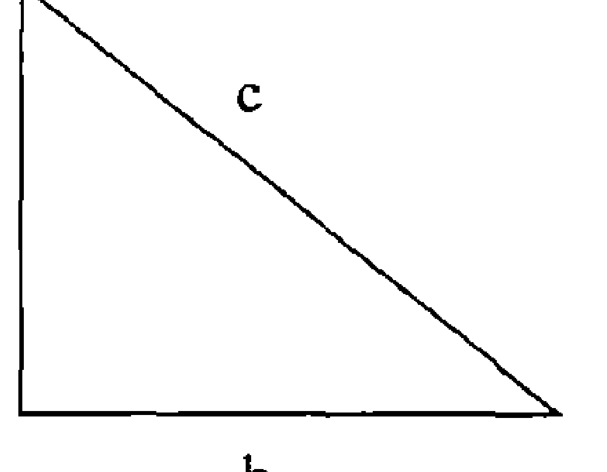

生于2500年前的毕达哥拉斯，被今人尊崇为数学、几何、天文、音乐之父：

他是第一个主张“地球为圆形”学说的人，并尝试要计算地球的圆周。

他率先指出饮食会影响心理，并提倡食用易消化而以生食与水煮为主的食物。

他率先传授了身体与心理的关联性，并建议以运动辅佐心智发展。

他也是首位把音乐应用于医疗用途的人；他写过具有消除愤怒、建立信心与勇气、或是抑制饥饿等作用的歌曲，以及其他各种领域的音乐。

他是现代“数字学”（numerology，又称灵数学或占数术）的始祖。“数字学”是一门探索数字精神内涵的哲学，因为可以透视人的天赋潜力和性格特质，所以也有人译为“生命密码”。

在当时女性仍普遍被视为财产的年代，他早已提出妇女平权的观念。

除了上述这些惊人的成就之外，毕达哥拉斯也是一位卓越的精神导师，他向世人指出：通往幸福人生之路，乃在于发展自我（个人成长），追求真、善、美，并且充分运用直觉。他教导世人必须经由身、心、灵的不同层面来了解自己，借由这方面的知识选择适合自己的生活方式、职业、才能发展、饮食和运动等等。

毕达哥拉斯曾有一句名言直指数字是“万物的原则、肇始与根基”。他相信数字不只是用来测量东西的工具，数字也同时具备能量与频率，并且会以音乐或热能等等的能量形式呈现于生活当中。正如音乐能影响人的情感，从毕达哥拉斯的观点即是从数字来了解生活上的各种影响，所以毕达哥拉斯的观点与我们一般人的观点不同。

除了数字以外，还有其它的观点来了解生活上各种影响，例如中医是从金、木、水、火、土五行来了解人的病症；希腊传统医疗是用水、土、火、空气来了解人的病症；印度的传统医疗是用三行。如果你用更多的观点来了解生活上的各种影响，你可以看得更宽广更详细，并且可以了解别人所看不到的部份。

最基础生命密码的观点是从九行来了解生活上的影响，进阶生命密码的观点是从十二行来了解。从中医五行、希腊的四行与印度的三行，很容易了解其中的意义，但从毕达哥拉斯的数字理论，很难了解1~9的含意，而用自然哲学分析的方式，则每个数字有它所代表的含意：例如四方形给人稳定安全的感觉，所以数字4代表安全感、稳定、坚固。从此方式来解读数字，每个数字都有它的含意。

用上述方式来解读你的生活、工作、饮食、环境、运动、人际关系等等….我们都可以把它转换成数字，从这个观点我们可以了解的更多。

毕达哥拉斯相信“生活中没有巧合”。所有事情的发生，都是有原因的。我们都知道每个数字都有一个意思，所以你出生的那一天的数字，会给你一个影响。

本书仅介绍基本的生命密码——从出生年月日来了解个性。

顶尖的生命密码，则不需要出生年月日，从人的发型、衣着、说话方式、饮食习惯等就可以知道数字所带给他的个性、天赋、优缺点…从这个新的角度来看，环绕在生活周遭的所有数字，都与我们息息相关。借由了解数字的意义，我们更能客观认识自己，明白事情为何会发生在自己身上，以及应该采取怎样的对策，让我们的生活更健康、更成功，数字也会直接影响人的生活。

## 从生日数字说起

在各种数字之中，“出生年月日”一定是最重要的，因为它是我们人生中所得到的第一个数字，而且这数字终生不会改变。

其他的数字像地址、护照号码、证件字号、电话号码等当然也都会造成影响，但是我们必须先明白它们与我们生日数字之间的关系，才谈得上了解它们的影响。由于这些数字会更动，因此尽管它们也会造成影响，但影响程度比不上生日；令人称奇的是，这些数字常常会和生辰数字一样！

不管在同一天里有多少人出生，那些数字所造成的影响都一样；但是后来会有许多别的数字与因素像生辰数字一样在运作，因而影响了个人的性格发展。这种现象尤其可在双胞胎身上得到印证：双胞胎的出生年月日完全一样，但性格的发展却可能南辕北辙。生辰数字透露出了每个人对人生的向往，也就是每个人真正想从生命中得到些什么；伴随着这份向往，也就必须面对各种形式的挑战与生命课题，其后才能达成目标与向往。另外，生辰数字也会揭示每个人的潜在天赋才华，让人在诸多不同的领域发挥。例如某人拥有沟通的天分，就可展现于律师、业务销售、新闻记者、作家、公开讲演、政治等的职场生涯。

也许有人会问，分析人类性格的方法已经有那么多，为何还要用这种看来有迷信之嫌的生命密码来认识自己？的确，现在有各式各样的心理分析方法，但很多人仍然不清楚哪一种方法最好、最准确，而且那些方法的测试过程往往冗长缓慢，并且需要有专家协助，谁有那时间与金钱去取得或学得相关的信息？正因为这样，大家才会对比较不科学、但很有趣的性格分析法感兴趣。以生命密码来说，它听起来似乎不科学，还让人觉得有点迷信，但有成千上万的人对于它的准确度与实用性大表叹服。

如果你试过其他形态的性格分析测验，不妨试试这一套生命密码，然后比较一下其间异同。许多人在用生命密码分析了性格后，改变了态度，从抱持怀疑到变成忠诚拥护。一位三十五岁的女士表示，她的心理医生花了十年才发现的事情，生命密码不到三分钟就告诉了她。类似的例证实实在不胜枚举！生命密码帮助人们分析自己并了解别人，开创更好的人生。

因此，不必等待科学验证，只要亲自试试即可。如果你发现它准确而且有用，那就不妨充分利用它来进一步提升生活；反之，如果你觉得它不准，至少它会让你用一点时间来面对自己的内心世界，思索你的人生——光这一点就算是对你有帮助了，而这样的省思过程对于健康有帮助，具有疗愈功能。说不定，它可以帮助你发掘长久以来一直被埋没的特长及潜在天赋。最重要的是，它让你思考：如何“做你自己”。

## 用数字发现你自己的天分

生命密码的应用范畴十分广泛。它能帮助你分析每个人不同的沟通方式，它能在人力资源、夫妻情感和亲子沟通方面发挥立竿见影的功效。生命密码也适用于分析人与人之间的契合度，了解彼此的喜好取向，以及为何会惺惺相惜，成为至交，甚至坠入爱河。它更进一步可以透露每个人在“花钱”这件事上的不同方式，这当然就可以运用在业务销售方面。但是，最重要的仍是帮助每一个人找出自己的天赋才华。

很多人并不知道自己有什么天分。造成这种现象的原因之一是，每当提到“天分”这个词，我们直觉就会想到莫扎特、贝多芬或爱因斯坦等这些举世闻名的天才；但这些人只代表了人类所有天分中的某些才情。有太多蕴藏于我们身上的才华未能被社会表彰与肯定。举例来说，像创立中国共产党的毛泽东，他有些什么才华？能以一只米老鼠让全世界开心的华德·迪斯尼，他的才华是什么？拯救印度饥贫孩子的特蕾莎修女，她的才华又是什么？比尔·盖茨呢？面对这样的问题，大家都很难答得上来，然而这些名人的成功典范实实在在证明了他们确实具备某些过人的本领。

还有一个原因使得我们很难回答那些问题。“天分”这个字眼，总让人觉得应该是某种特殊的才能，好比绘画、数学、音乐演奏。但是生命密码所说的天分并不只是技巧，而是思考与智力方面的某些特殊能力与突出表现。举例来说，如果生命密码指出你有创造方面的天分，并不代表你就只能绘画、素描，或是其他艺术方面的表现；它意味的是你对于艺术与美学特别有概念。具有创意天分的人通常能一眼就分出是美是丑，自己喜欢什么不喜欢什么；不具备这方面才华的人，被问到什么是美都很难回答。拥有这种美的天分的人，不假思索就能脱口而出，完全是与生俱来的天分。从他们的穿着打扮、居家的装潢，甚至从他们的结婚对象很容易就看出他们的品位；生命密码可以帮助他们发掘自己这方面的天分，进而发展出一片天地。当然，找出了特长所在是一回事，但是如果不努力培养与发挥的话，终归枉然。天下没有白吃的午餐。

## 如何运用天分

发展天分最简单的方式就是把那项天分运用在你目前从事的工作中。如果你深入观察自己每天的例行事项，你很可能会发现，其实在某种程度上你早就在运用它了，而那很可能也是你在工作中最喜欢的部分。如果你的情况正是如此，请试着在每次发挥自己长处的时候刻意肯定自己，鼓励自己：“就是这样，太好了，看看我的专长，这就是我天生的本领！”

接下来，要认真采取行动。下班后再去上个什么课、培养嗜好、加入社团，或是结交一些和你有类似天分的朋友，互相提携，并开拓机会。每个人的身上都有一座金矿，只要愿意投资，就能挖出天赋才能。

如果你的工作根本不能让你发挥天赋，而你又没法子马上改行，最简单的解决办法就是找一个能让你发挥长处的嗜好。你越是努力培养自己的才华，就越有机会在有朝一日时机成熟时，顺势把它发展成个人的事业。基本上，你应该在每天的作息中至少安排二十分钟从事那些能让你发挥天分的嗜好。

运用生命密码的最健康的方式是学习所有的功课，在每一个层面都培养自己，同时学习数字1到9所代表的不同人生课题：

- 1：独立的极限
- 2：依赖的极限
- 3：理想主义的极限
- 4：安全感的极限
- 5：自由的极限
- 6：责任感的极限
- 7：真理的极限
- 8：成长的极限
- 9：慈善的极限

## 算出你的生命数字

方法：写下你的阳历生日，然后把所有数字相加，直到加出一个个位数的数字为止。

范例：某人出生于1952年6月15日：

```
1 + 9 + 5 + 2 + 6 + 1 + 5 = 29 —— 天赋数
再加一次：
2 + 9 = 11 —— 天赋数
然后再加一次：
1 + 1 = 2 —— 命数 (Destiny Number)
```

第一个相加得出的数字（本例子中的29），称为天赋数（灵数），通常是个二位数，也就是由两个数字组成。但有些人会出现两个以上的数字，像上述这个例子就出现了三个天赋数：2，9和11。但有些人就只有一个天赋数，例如一个出生于1961年5月8日的人，加出来的总和为30，因此这个人的天赋数就是3（生命密码并不运用数字0，至少在目前这个初学阶段不使用0，详细说明请参见第128页）。

又例如生日是1956年9月9日的人，加出来的总和是39，3加9是12，因此他的天赋数就涵盖了3、9和12。拥有较多的天赋数不见得是好事，未必带来更多才华，却往往造成较多的矛盾冲突。

最后的总和，也就是天赋数相加所得的数字即为命数；如果得出的总和数字是两位数——基本上公元2000年以前出生的人都会是两位数——则要再相加一次，直到最后所得总和是一个个位数。以上例来说，1952年6月15日的加总所得为29，2与9再相加得到11，再把1加上1等于2，因此他的命数是2。至于1961年5月8日的例子，天赋数为30，命数就是3。同理，1956年9月9日的天赋数是39，命数是3。

## 计算命数的范例与练习

- 1952年6月15日
  - 1+9+5+2+6+1+5=29 ——天赋数
  - 2+9=11 ——天赋数
  - （注意，此例的天赋数有三个，包括2、9、11）
  - 1+1=2 ——命数

- 1970年12月5日
  - 1+9+7+0+1+2+5=25 ——天赋数
  - 2+5=7 ——命数

- 1983年4月19日
  - 1+9+8+3+4+1+9=35 ——天赋数
  - 3+5=8 ——命数

- 1984年11月20日
  - 1+9+8+4+1+1+2+0=26 ——天赋数
  - 2+6=8 ——命数

- 2008年6月23日
  - 2+0+0+8+6+2+3=21 ——天赋数
  - 2+1=3 ——命数

## 绘制数字命盘

算出了所有的数字之后，就可以制作出能显示各个数字连线型态的数字命盘。方法如下。首先，把数字1至9按下图的排列方式画出基础图（见下左图）。

接下来，把生辰的各个数字和加出来的数字在命盘图上各划一个圈。例如1952年6月15日，就在下列数字上画圈：（生辰数字）1、9、5、2、6、1、5，以及（加总的数字，亦即灵数和命数的数字）2、9、1、1、2。每出现一次就划一圈，得到如下的图（见下右图）。

| 1 | 4 | 7 |
|---|---|---|
| 2 | 5 | 8 |
| 3 | 6 | 9 |

| ① | 4 | 7 |
|---|---|---|
| ② | ⑤ | ⑧ |
| 3 | ⑥ | 9 |

以1961年5月8日的例子来说，数字的总和为30，最后命数为3，因此画出命盘图如下左图：

而在1956年9月9日的例子中，数字的总和为39，然后相加为12，然后得到3，所以命盘图就呈现如下面右图。

| ① | 4 | 7 |
|---|---|---|
| 2 | ⑤ | ⑧ |
| 3 | ⑥ | ⑨ |

| ① | 4 | 7 |
|---|---|---|
| ② | ⑤ | 8 |
| ③ | ⑥ | ⑨ |

## 更完备的命盘图表

你还可以加入其他的数字，画出一张更进阶而完整的命盘表。方法如下：画出了基础命盘图之后，把出生日的数字再划一圈。如果出生日不是一位数，而是两位数，如前例1952年6月15日一样，那么就把出生日的1和5相加，得到6，在命盘图上再画一个6。

然后，再加入星座的代表数字。（各星座的代表数字详见29页下表）

以1952年6月15日的例子来说，此人为双子座，是第三个星座，数字就是3。因此他的完整命盘会如下面的左图。

有时情况会比较复杂。例如生于1996年2月29日的人，加总出来的数字为38，然后3与8相加为11，最后1与1相加为2。所以在基础命盘图中要再加入出生日的2与9的总和11，也就是在1上面画两个圈；最后还要把1与1相加后得到的数字2也画一个圈。另外，由于此日期的太阳星座双鱼座的数字是12，于是1和2再各划一圈，而总和数字3也要再画一圈，于是最后的命盘是下面的右图。

在大多数的情况下，把生日数与星座代表数字再加上去之后，就足以勾勒出一张可以呈现准确信息的命盘。

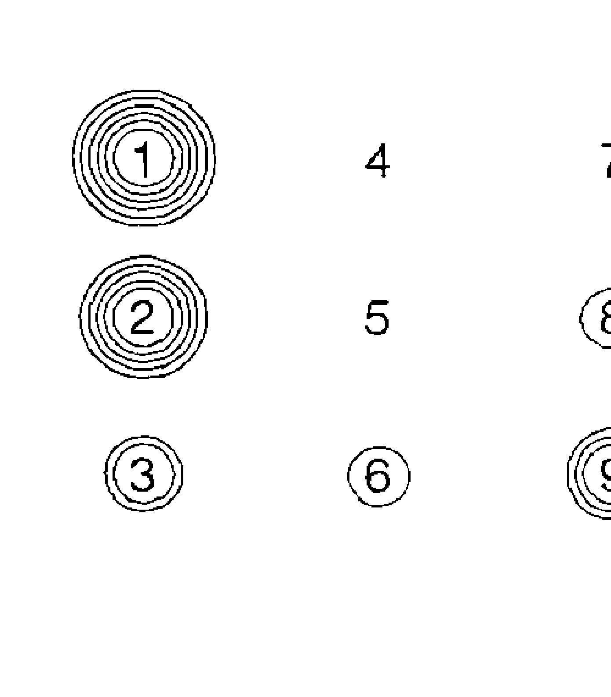

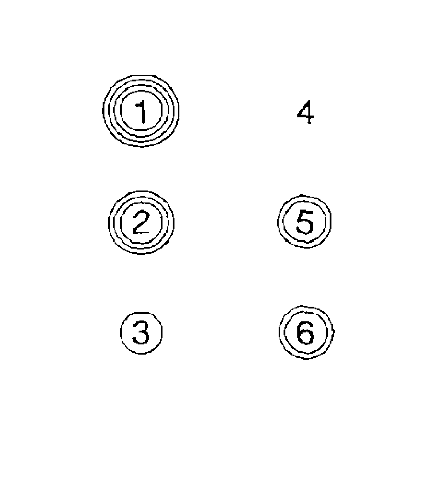

## 如何解读命盘

画出了命盘图之后，你一定会注意到命盘上画了圈的数字，以及由数字所形成的各种连线线条。生命密码的第一步是，先检视命数的意义，这已经足以提供许多实用有趣的信息。但是命盘可以透露更多信息：它能显现沟通方法、情感模式、矛盾冲突、个人成长模式等等各种面向。问题是，解盘并不容易，需要不断的练习与丰富的历验才能准确解读。

在解读命盘时有一些基本原则，但也常常遇到特例。解读数字命盘的第一步是确定所有数字的“重要性的排列顺序”。命盘上的每一个数字都很重要，但重要性的程度不同。每个数字的出处决定了它的影响力，例如所有生于公元20世纪的人在命盘图上都会出现1和9，尽管这两个数字也会造成影响，但其他的数字（例如生日的日期）所造成的影响比较强烈。由此可知，由生年而来的数字对于性格的影响比较小，也就是影响的程度较轻。

| 星座的代表数字 |
| :--- |
| 牡羊座：1 |
| 金牛座：2 |
| 双子座：3 |
| 巨蟹座：4 |
| 狮子座：5 |
| 处女座：6 |
| 天秤座：7 |
| 天蝎座：8 |
| 射手座：9 |
| 魔羯座：10，总和数字为1 |
| 水瓶座：11，总和数字为2 |
| 双鱼座：12，总和数字为3 |

## 星座日期对照

- 牡羊座： 3月21日至4月20日
- 金牛座： 4月21日至5月21日
- 双子座： 5月22日至6月21日
- 巨蟹座： 6月22日至7月22日
- 狮子座： 7月23日至8月21日
- 处女座： 8月22日至9月23日
- 天秤座： 9月24日至10月23日
- 天蝎座： 10月24日至11月22日
- 射手座： 11月23日至12月22日
- 魔羯座： 12月23日至 1月20日
- 水瓶座： 1月21日至2月19日
- 双鱼座： 2月20日至3月20日

有些情况则很容易就能从命盘中找出最重要的数字。例如1970年1月1日出生的人，数字加总为19，因此命数是1；此人的命盘上有许多的1，而命数又是1，因此他的命盘就很容易解读。然而，一个出生于1951年1月1日的人，相加和为18，命数是9；尽管他的命盘上有许多1，但他的命数是9，而9和1所形成的影响完全相反，此例的命盘就比较不容易判读。

我在几年前出版的《生命密码》一书中，详细解说了数字及数字连线型态的意义，但没有论及如何用整体的角度解读命盘。于是很多人就运用连线的意义来解盘，这对拥有许多数字的复杂命盘是有效的，但对于毫无线索的命盘就束手无策。公元2000年以后出生的人，他们的数字命盘会非常简单，而且常常没有连线，解读这种命盘就需要更多的技巧。

本书稍后的章节会逐一介绍每个数字的意义、在命盘上缺乏某个数字时的意义，以及数字形成了连线时的意义等等。因此，解读命盘的最简单方法就是直接分析命盘，阐释命数与天赋灵数，以及连线的意义，这样就足以提供相当多准确有趣的信息。

然而，还有一个更精准的解盘方式：“黄金三角解读法”。

## 黄金三角解读法

黄金三角解读法首先要归纳出三个最能代表整个命盘的数字，然后把这三个数字依照重要程度排列，根据其排列组合加以解读。这套方法相当繁复，本书暂不赘述。本书在此只能以精简的版本略作介绍，但此简易方法也足够帮助你掌握大多数的状况。

简易版只需选出三个数字代表整个命盘：命运、出生日、天赋灵数。

## 第一个数字是：命运。

先计算出命运。命运对于性格的影响最大，在分析数字的意义时常常要用到。

## 第二个数字是：出生日的数字。

出生日是指你出生那天的日期数字。首先要把出生日化为一个一位数的数字。如果原本就是一位数，从1日至9日，则直接取用；若是两位数，从10日到31日，则要把所有数字加起来。例如13日，要把1与3相加，得到4；若是28日，则要把2加8得10，然后把1与0相加，得到1。

注意：如果出生日数字与命运相同，就不能取用，而要改用星座的代表数字。关于星座的代表数字，请参考第29页。如果你不知道自己所属的星座，请先以自己的阳历生日对照第30页的附表。

再注意：如果你的出生数字与星座数字都和命运相同，那就暂时不处理这第二个数字，直接先选取第三个黄金数字，最后再进入“其他数字”找出第二个数字。

## 第三个黄金数字是：天赋灵数。

天赋灵数是个两位数的数字，我们这里要取用的是十位数的那个数字。例如天赋灵数为32，就把3拿来用。如果此数又与命数和出生日数字相同，那就以星座数字取代。万一星座数字又和命数、出生日数字都一样，那就由下面的“其他数字”里面挑选。

有一部分在公元2000年以后出生的孩子不会有这样一个两位数的天赋灵数，因为他们的出生年月日的数字加起来不会超过10。遇到这种情况，就把星座的代表数字当作第三个黄金数字。假如星座数字又与命数相同，则用“其他数字”的方法来挑选。

## 其他数字

假如你的星座数字、天赋灵数与出生日数字都和你的命数相同，就请你依照下列顺序一一尝试，直到你找出了黄金三角解读法所需要的三个不一样的数字为止。

- 1. 如果你的出生日数字是个两位数，这时不必相加，只要选取十位数的数字即可。例如生于13日的人，就用1。
- 2. 取用天赋灵数的第二个数字。例如，天赋灵数为32，则用2。
- 3. 如果出生日数字是个两位数，但你不能用到十位数的数字，这时就选择个位数的数字。例如生于13日的人，就选择3。
- 4. 用生日的月份加起来所形成的个位数数字。例如生于12月的
- 5. 采用月份的十位数数字。例如生于12月的人，以1为第三个黄金数字。
- 6. 采用月份的第二个数字。例如生于12月的人，以2作为黄金三角的第三个数字。
- 7. 采用年份的最后一位数字。例如生于1976年的人，选择6。
- 8. 采用年份的倒数第二个数字。例如生于1976年的人，选择7。
- 9. 采用年份的倒数第三个数字。例如生于1976年的人，选择9。
- 10. 采用年份的倒数第四位数字。例如生于1976年的人，选择1。
- 11. 如果始终找不出三个不同的数字，那就只用两个数字。这种情形会发生在生辰数字为2000年2月2日出生的人。他的命数为6，然而其他所有的数字都是2，包括星座的水瓶座数字。遇到这种情况就不必再把星座数字加成一位数的数字，而水瓶座的人选1，双鱼座的人选2。
- 12. 如果你怎样都找不出三个不同的数字，那就和我联络吧！

再以前面举出的1952年6月15日来说，它的头两个黄金数字分别是2和6（2是命数，6来自于出生日的1+5=6）。至于第三数就碰到了特例：天赋灵数是29，这时不能用十位数的数字当做黄金第三数，而必须把2和9相加，得到11，用1当做黄金第三数。

从整段的“其他数字”你会发现，命盘上各个数字造成的影响程度不同。这个问题很复杂，接下来就针对数字的重要程度略做说明。

## 关于数字的重要程度

第一，所有数字中影响力最大的，通常是命数。命数是生年生月生日的所有数字全部加总的结果，它透露了一个人与生俱来的天赋与才情、此人今生想要追求的事物，以及必须努力学习的人生课题。因此它必然会被纳入简易黄金三角法的黄金数字。

第二个最有影响力的数字，通常是出生日的日期。这个数字说明了此人性格的外在呈现，也就是在外人眼中的模样。他人眼中所见的自己，当然与真正的自己有所不同。出生日的数字帮助我们了解人生中可能发生的各种矛盾与冲突。如果你外在的样子跟真正的自己是不同的，那就难怪你会被人误解。

## 黄金第三数的特殊情况

- 之一：假如天赋灵数是29或39，就不能用十位数的数字，因为那会分别与它们的命数2和3相同。这时就把数字相加，如29就得出2+9=11，那就用1；而39则为3+9=12，但这时要选2。
- 之二：天赋灵数为10、20、30、40时，都不能选十位数的数字，因为那与它们的命数相同。这时，就用星座数字取代。万一星座数字又与出生日数字相同，就要由第33页的“其他数字”里选出第三数。

## 黄金三角数的范例

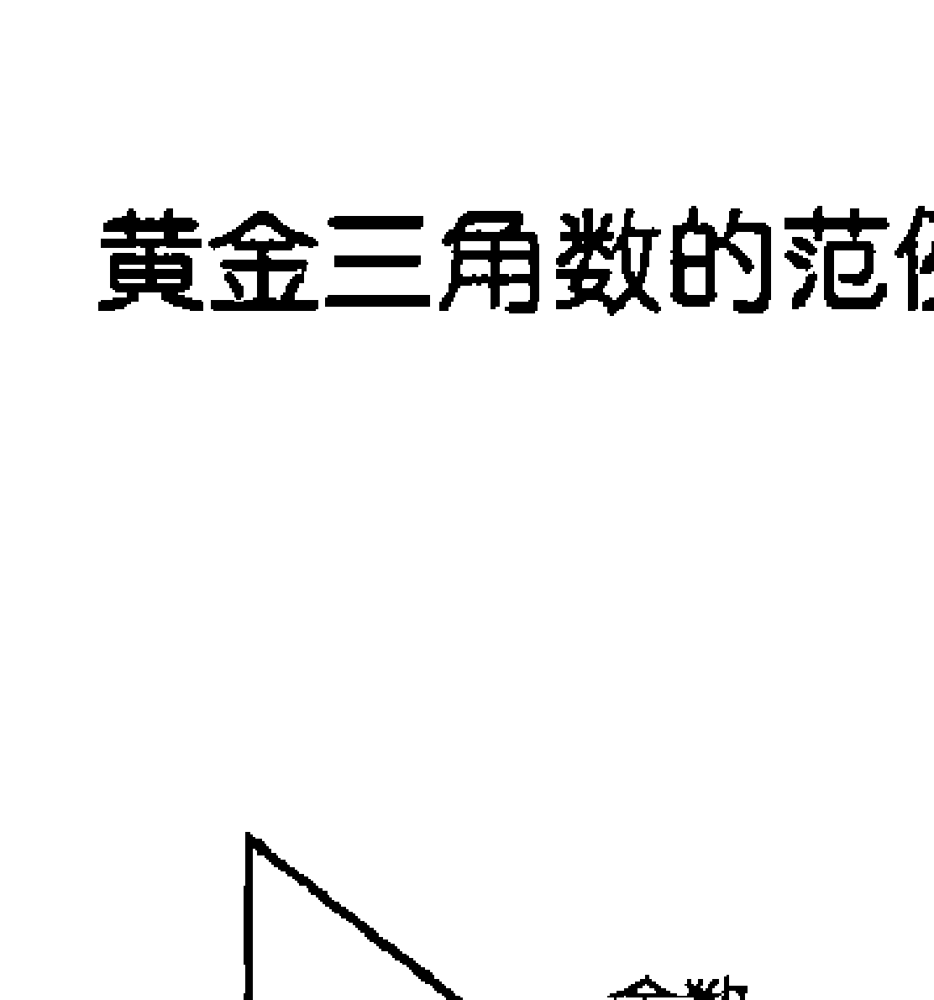

例一：某人生于1989年9月4日。

黄金第一数：此人的天赋灵数为40，命数为4。

黄金第二数：生日数为4，与命数同，所以不能用生日数，改用星座数字。9月4日是处女座，处女座的数字是6。

黄金第三数：天赋数4与命数相同，不能用；星座数已用，故改用月份数字。

他的黄金三角数字如图示：

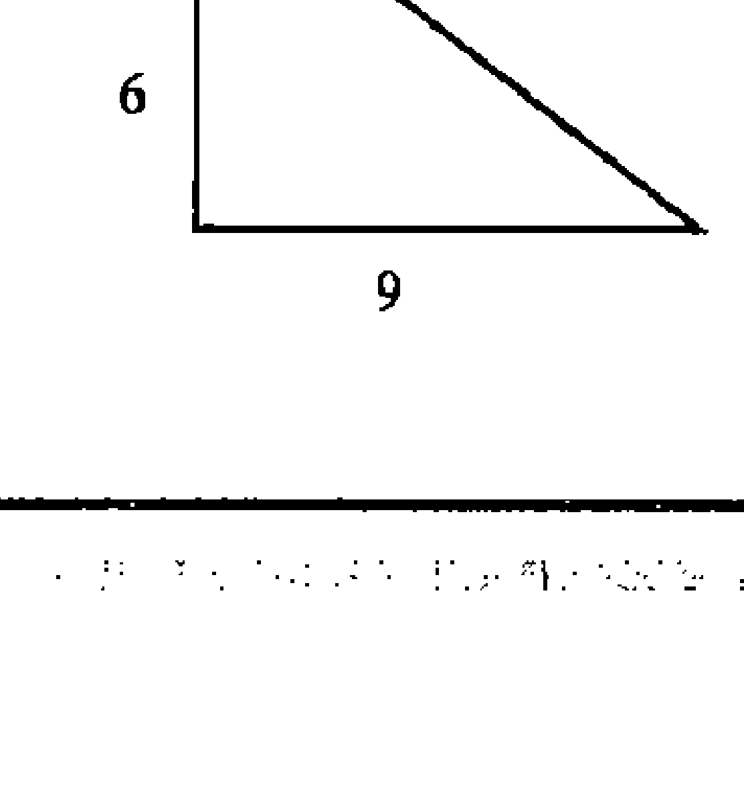

例二：生于2002年1月5日。

黄金第一数：天赋灵数为10，命数为1。

黄金第二数：生日数为5。

黄金第三数：天赋数、星座数都是1，不能用。月份也是1不能用。最后用年份的倒数第一个数字，2。

此人的黄金三角数字如图示：

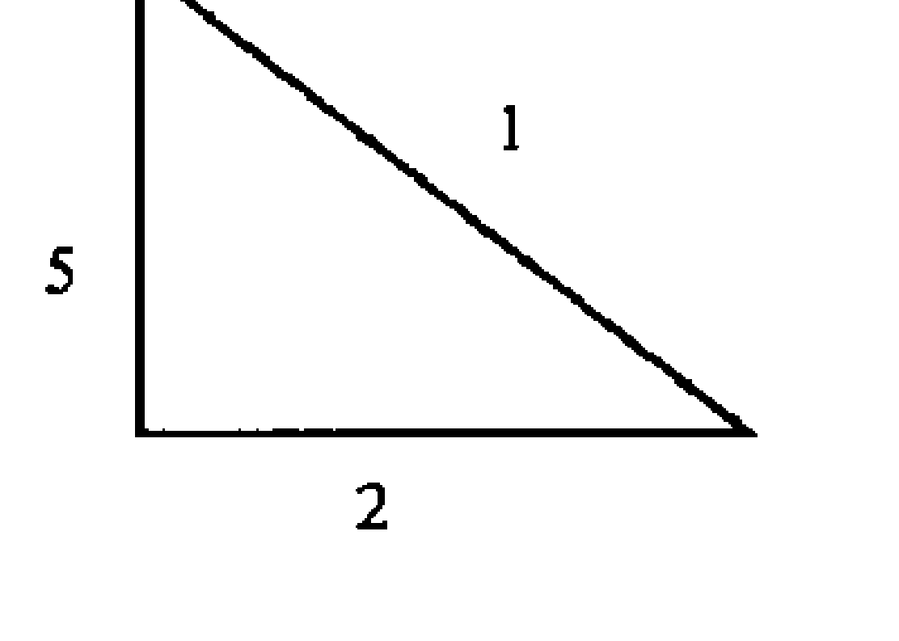

例三：1954年8月3日。

黄金第一数：天赋灵数为30，命数为3。

黄金第二数：生日数为3，与命数同，不能用。改用星座数字。由于是狮子座，命数为5。

黄金第三数：天赋数和星座数不能用，改用月份数8。

此人的黄金三角数字为：

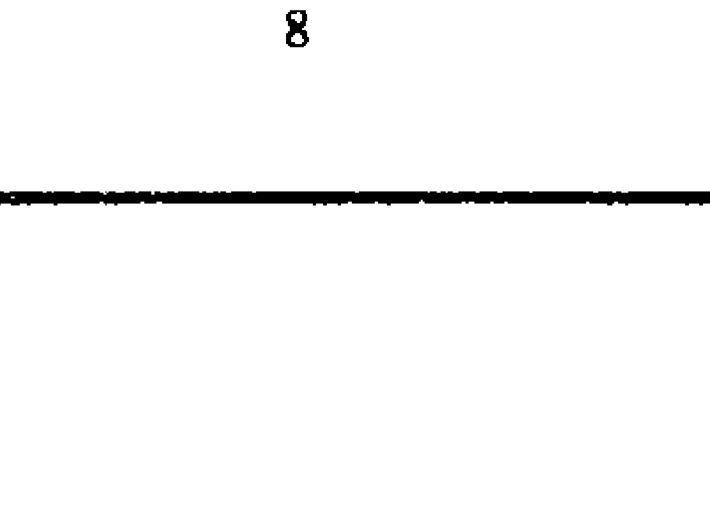

第三个具有影响力的数字，通常是天赋数，也就是灵数。天赋灵数反映了一个人面对问题与解决问题的态度与方式，它也揭示此人容易培养与发展的才能及潜力。天赋数通常是由两个以上的数字组成；第一个数字（十位数）显示的是人面对问题时所采取的原始反应；第二个数字展现了此人随后采取的态度。通常，命数与天赋数要放在一起做整体的解读，这需要经过训练并累积解读数字的经验才做得到，本书暂不做这方面的说明。

接下来是星座数字。有些时候星座数字的影响力会非常大，特别是在星座数字与命数及生辰日期数字兼容的时候；如果你是这种情况，你的思考方式与言行举止就会像你的星座所描述的特质。（关于数字之间的兼容度，请参考第185页起的说明。）

第五，命盘上出现次数最多的数字。如果某些数字出现的次数明显高过其他数字，它们就会变得和命数同等重要；如果这个出现最多的数字恰好也是命数，那么就能用这个数字来彻底解析性格。

第六，最后要看命盘上由数字组合所形成的连线。当命盘上的数字连线只有少数几条时，它的影响力就会显现。

找出三个黄金数字，并画出了黄金三角形之后，就可以参阅本书其余各章所探讨的数字在各方面所带来的影响。

首先要理解的是第一个黄金数字（命数）的意义，此数字会勾勒出此人性格的基本形态。接下来解读第二个黄金数字（生日数）。然后进入第三个黄金数字。

有时候，这三个数字所代表的意义乍看之下是互相矛盾的，这时该如何理解呢？我们要知道，没有人的性格仅仅只有单单一种形态，每个人都是由许多事物共同组合起来的综合体。第一个黄金数字透露的是，我们内心认为自己是怎样的人，我们真正想要的样子。第二个黄金数字说出了别人对我们的观感，别人眼中我们的模样。第三个黄金数字则描绘出我们实际表现出来的样貌，而通常我们自己可能会否认这个部分。

最后，务必仔细观察这些数字之间的矛盾与冲突，这可能是本书最重要的部分，因为它把各数字的意义做了整合。它能指出我们在人生发展的过程中所遇到的障碍，以及该如何破解这些冲突，好让我们集中心力追求成长，把潜能发挥到极致。

性格中的矛盾比较少的人，在人生规划方面比较容易下决定，通常也比较容易成功；他多半知道自己的天分何在，而且也不怕发挥它们；朋友们常说这些人是聪明开朗的人，短时间里的相处是十分有趣的……除非他们太骄傲，在短时间的相处也让人感觉度日如年。

## 公元2000年之后

公元2000年之后出生的人，有些会天生就没有天赋数。例如，出生于公元2000年1月1日的人，就只有一个命数4而已。这会产生许多性格非常单纯、几乎没有内在冲突的人。

大体而言，这是个好的转变，因为这些单纯的人会比20世纪出生的人更容易觉得快乐。我们这些拥有数字2和9的人，内心都会一方面衡量该为他人奉献付出多少，一方面又期待别人为自己服务，在这两端之间摆荡。假如没有这种冲突，可以省下不少精力，全心做自己想做的事。

这个2000年1月1日出生的人，加总结结果1+1+2=4，命盘如下（有一个1代表的是他的星座魔羯座）。而此人的金三角数字为：4、1、2。

| ① | ④ | 7 |
| ② | 5 | 8 |
| 3 | 6 | 9 |

根据前面的方法计算出你的生命数字之后，请接着阅读下一章了解它们的意义。另外，请务必参阅第三章与儿童有关的章节，因为你应该要理解你儿童时代所发生的事，那一章里有一份“潜在才华表”，非常值得你参考。


## 采用哪个生日？

在中国，阳历阴历并用。此外，有些人的出生日期不只一个。在早年，父母登记子女的生日日期会比真实的出生日期晚。这种情况下，有人甚至可能有四个生日：真正的阳历生日，真正的阴历生日、身份证明文件上记载的阳历生日与阴历生日。

该以哪个生日为准呢？首先要了解，影响最大的永远是最常使用的那个生日，无论它是阳历或阴历，是真实出生日期或是虚报的日期。所以，就先从护照、身份证和最常使用的生日开始，计算出该日期的黄金三数；然后再计算另一个生日的命数与天赋数，再择定它的黄金三数。依此计算出其他可能的生日。

这样会形成好几组黄金三角数字待解读。

假如阴历生日与阳历生日分别加出来的命数是一样的，就无需用特别的方式解读。

但大多数情形是这些生日所算出的命数并不相同，这时就把最常用的生日日期加出的命数列为黄金第一数；把第二个生日加出来的命数列为第二数；然后把最常用的生日的生日日期列为第三数。然后解读这一组黄金三数。

注：一般读者只要采用最常使用的第一生日与第二生日即可。不过还是有更复杂的分析方法，归纳出更为精准的解盘。

## 生命数字不是标签

毕达哥拉斯知道人人天生都有特长，但他并不相信人就只有那一些特长。毕达哥拉斯认为，每一个人都有无穷的潜力，可以发展出自己所希望能拥有的才华，而人类潜力的真正成就乃是发展了所有的才华。他说过：“训练自己把追求超凡入圣当做目标，把保持远大的理想当做习惯。”

毕达哥拉斯集哲学家、数学家、物理学家、天文学家、乐师、医生、营养师、厨师、从政者、地方首长的身份于一身，也是精神导师、运动员、父亲与丈夫。他永远在努力改进自己，也以这样的身教来期许学生效法。

毕达哥拉斯不会用生命密码来把人贴上标签，他只是要看看这些数字对学生们造成怎样的影响，借此确认学生应该最先发展何种专长。我们也要遵循他的方式，在计算别人的生命密码时最好说“我们来看看生命密码如何影响你”，而不要说“我们来看看你的生命密码是什么”。

但事实上生命密码的影响力相当巨大，对于任何一个想要改进自己的人都能提出明确的方向。很多致力于个人成长且颇有进步、修正了不少性格弱点的人表示，生命数字确实准确指出了他们早期的性格特质。

### 第2章 数字的特质与潜力


1数是能量凝聚的起点，由此开始向外延伸。

1数代表太阳，能量的源头。太阳是古人最早膜拜的神祇之一，因为地球上的一切生命都仰赖太阳的能量，太阳神因而被视为生命之父。

## 个性特质

1 数的人热爱独立，而且会不惜代价追求独立。1 数人是天生的领袖，充满自动自发的精神。他们其实不那么爱风险，但还是冲劲十足。他们精力充沛，不容易疲累。1 数人常常期望别人能和他们一样独立，非常不喜欢别人依赖他们。

1 数人看世界的眼光是截然二分的，凡事非黑即白。这种思考模式的优点是比较容易做决定，而这是领导力的必备特质；缺点则是容易流于极端。他们用戏剧化的方式看待事情、描述事情，仿佛在说故事。

1数人外向而积极，勇于表达自己的主张，他们也希望别人有话直说，不要拐弯抹角。他们会要求人与人相处时必须平等相待，讨厌别人用贬损的语言对他们说话。他们也很敏于察觉到被别人利用或欺瞒。

1数人喜欢独特的或是绝无仅有的事物；他们不愿意一窝蜂跟流行，宁可自创一格——而他们很容易做到独特，因为他们创意十足，理想高，点子奇多，想法创新。但同时，他们在看事情的时候往往开门见山，单刀直入。这种方式适合做生意，但假如在恋爱与婚姻关系里也这样做就会让人觉得冷酷、不浪漫，还显得自私。

1数人处理事情要求迅速有效，期待的是最高标准的表现。一旦事情出差错，他们非常容易发火，并且会怀疑相关负责人员的能力，处在这种情况里的1数人会痛加批评、破口骂人，并且不惜挑战权威，甚至想也不想就收回承诺，掉头就走。

## 人生课题

1数人要求独立，不希望自己需要任何人。很多1数人都梦想着有朝一日能搬到一座小岛，过着像《鲁宾逊漂流记》书中描述的那种生活。有两种方法可以达成这个目标，一是经由夺取、欺骗与自私的手段，但这会带来痛苦、麻烦与寂寞；二是由利他的角度出发，为人付出，这是比较柔和的方式。真正的领导者会致力于改善追随者的生活。柔软宽大的方式可以为 1 数人带来财富并创造出独立的生活，而不会造成痛苦和孤单。一个 1 数人最后会选择上述二者的哪一种态度，反映出他学到了多少人生课题。

1 数的人生课题是学习更谦虚，对别人敞开心胸；他们必须学习无私的分享与付出，并学着依赖别人，同时也试着容许别人依赖他。

## 人生目标

1 数人必须忠于自己，接受自己想要在金钱、情感等等所有层面都追求独立自主的梦想，并且努力让梦想成真。因为他们唯有达成了目标，才能发挥影响力。1 数人必须走出一条能达到完全独立的路，最好早一点学到自己的人生功课，这样将能在拥有独立的同时也享有快乐。

## 沟通之道

> 关键句：“先问我！”

1 数人相信，只要别人能，他们一定也能做得一样好，而且很可能做得更好。和 1 数人沟通，你绝对不能用瞧不起人的口气，不能用命令的口吻要求他们做事；你必须用平等的态度对待，最好把他们当成王室成员。做任何决定之前都要先咨询他们。谨记这话：“先问我。”

## 所有人的人生目标：做自己

在心中自然浮现的梦想绝不是镜花水月的幻想；梦想像是路标，导引我们迈向更美好的明天。

我们要到完成了梦想之后才会更了解人生；也唯有到那个时刻，我们才真正知道自己究竟想从人生里得到什么。因为在那个时候，我们再也没有借口说自己不快乐，而必须面对现实。

任何人的人生目标都应该是“做自己”。

接受自己心中的梦想并努力实现，这样的行动表示我们接受了自己，也就是“爱自己”，这将可以加强自信与快乐。

不管你的命数是哪个数字，你在人生里都应该敢于做自己。

有心理准备，万一他们的意见和你相左，你可要能屈能伸。

与 1 数人沟通的要点如下：

- 把 1 数的人当成一个失去了国土的国王：他们缺乏自信，需要你全心关注。
- 让他们知道，他们个人能从中得到什么好处。
- 事情尽量单纯，不妨加入一点戏剧效果。
- 他们讨厌那些需要小心维护的情况。
- 买东西时很在意价格，价格往往成为最后买或不买的重点。

## 天赋才能

1 数人天生具备领导才能。他们常能以非常明确或黑白分明的方式分析情势，因此很容易做出决定。他们也能一眼就看出事情该如何运作才会更有力量，该采取怎样的策略与手段才能确保独立。

1 数人能用新点子或独特的点子来解决问题。无论是创新造型的衣服、新形态的计算机设计，或是新发明的治疗处方， 1 数人都能想出一些别人从来没想过的创见。

著名的 1 数代表人物包括沃特·迪斯尼、乔治·华盛顿。

> > “先问我！”

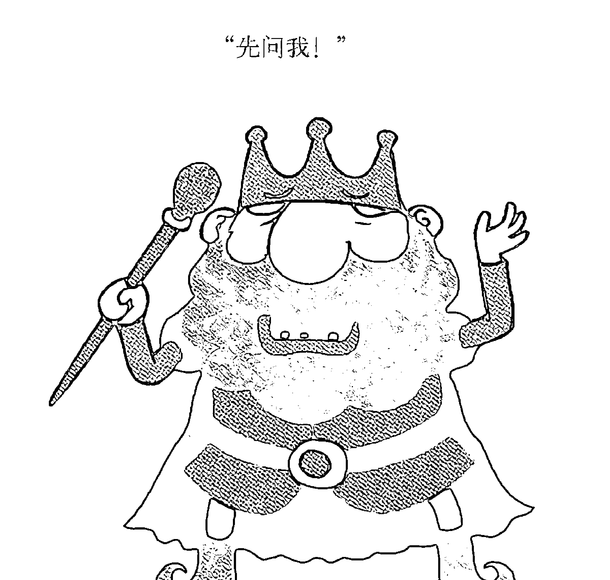

1数人：一个失去了国土的国王

## 生涯发展

任何允许独立作业的工作都适合 1 数人。例如：艺术家、发明家、企业家、业务销售、医生、个人工作室、发号施令的军职、总裁或总经理、设计师、工匠、运动员（不是团队形态的运动）。

## 健康之道

1 数人会发现，随着他们逐渐接近独立，身体也随之更健康；万一情况正好相反，别人开始依赖他们并且有所要求时，1 数人的健康就开始走下坡。问题是如果 1 数人真正让自己与世隔绝，完全独立，他们又会因为觉得寂寞而不快乐。因此 1 数人一方面必须与别人共处，另一方面还要保持心情愉悦。如何做到呢？1 数人必须认识到自己的人生课题并从中学习，同时择定正确的人生目标。

#### 命数 1 的灵数组合类型

- 10 / 1 这些是出生于公元2000年以后的 1 数人。前面所说的 1 数特质都能准确描述他们的性格。
- 19 / 10 / 1 这个灵数组合具有双重性格。他们看起来像是独立而坚强的领导者，但进一步认识他们后会看到他们截然不同的一面，非常体贴而且乐于付出。问题是这个亲切面与1数的基本天性是互相矛盾的，除非他们能了解到这也许就是经常会造成他们难过的根源，否则会无所适从，不容易快乐。
- 28 / 10 / 1 这是最好相处的1数类型。他们感情丰富多变，呈现出既坚强又敏感的面貌。他们也渴望展现这种风格，以此取得一个有权力的位置。他们有亲切温和的手腕，想要成功一点也不难；虽然一路行来可能会让很多人受伤。
- 37 / 10 / 1 这是最才华洋溢的1数人。他们创造力丰富，属于原创思考型的人物。问题是他们也非常多疑，这个特质可能会限制了他们的脚步，以致未能全力追求梦想。疑虑与恐惧常使得他们自我设限，以至于有时该大步迈出的时候他们会裹足不前。
- 46 / 10 / 1 这类型的1数人工作最勤奋。他们个性稳重，对自己很有信心。别人依赖他们不会让他们觉得不自在，这对1数人的性格来说相当不寻常；不过他们不希望别人依赖太久，他们最终还是希望别人能自己照顾自己，假如对方一直做不到，他们也会生气。他们也是最容易为情所困的1数人；他们一方面喜欢爱情带来的安全感，却又不喜欢必须有所付出才能维系爱情。

#### 1数的连线：艺术线 / 独立线

当命盘中出现了1、2、3，就连成了这条线。这条连线的基本意义是：原始能量(1)，经过调和与琢磨之后(2)，创造了完美理想(3)。

拥有这条连线的人对事情很有主见，对人生有清楚的期望。这条连线使人富有艺术气息及创作天分，尤其是与双手有关的才艺。这条线也让人觉得自己拥有丰厚的个人资源，所以可以靠自己完成一切事情，并不真的需要别人的协助。

这条连线使人非常独立，而且清楚知道自己想从别人身上得到什么。由于他们觉得可以自给自足，因此拙于拿捏人际间施与受的关系。由于不依赖别人，再加上理想主义的思考模式，这条线赋予人强大的领导能力。

线条是2数的代表标志，因为两个点即可连成一条线；线条用来把东西绑在一起，所以2数和依赖有关。

波浪也代表2数，因为每个高点都有一个相对等的低点，因此2数代表了宇宙间的所有二元对立：男与女、黑与白、阴与阳、热与冷等等。

### 个性特质

2数人非常注意细节，具备极佳的分析能力和辨识能力。他们喜欢发问和思考，这使得别人觉得他们很挑剔或者老是在抱怨，但对2数人来讲，看出问题并把它揪出来，实在是很正常的事。

这种善于发现细节和提出质疑的能力，使得2数人知道凡事都有一体两面。他们深知“阴阳并济，祸福相倚”的道理。由于认为每件事情都有阴暗面，再加上他们本性就兼具了两极化的特质，这使得他们拥有分裂性格。刚认识2数人的时候，你不知道他们让你见到的面目是不是真正的他们，只有在熟稔之后才会见识到他们的另外一面。

2数人是天生的外交与公关人才，善于沟通。他们情感丰富、亲切温和，对于有关感情世界的话题特别敏感，因为他们相信人与人之间应该要相互依存。在2数人的理想世界里，友谊是一辈子的事，爱情也应该是通过长时间的经营改善而历久弥新。因此眼看爱情关系就要走不下去，他们很少会是主动提出分手的一方，就算非分手不可，他们也会尽可能与旧爱保持朋友的关系。

2数人并不喜欢带头主导，愿意与人合作而不喜单独行事。这种个性，加上天生就认识到事物的二元性，使得2数人很不容易做决定。他们不会采取主动积极的作为，宁可放任事情顺势发展。2数人宁可等别人找他们去参与事务，也不主动邀别人加入。

2数人对感情的敏感，可能会为他们带来悲伤。由于他们坚信在爱情里应该多多付出，而他们也会要求对方相对地回馈，或者付出更多。因此一旦别人达不到2数人的预期，他们就会大感受伤。尽管如此，他们还是不会与对方分手，也不会另觅比较合适的对象，却会继续唠叨抱怨，责备挑剔，有时候一耗就好多年。2数人的依赖特质使得他们难以感受到真正的快乐。

### 人生课题

2数人的人生道路有两类。一种是不管多么不快乐，也紧紧抱住他们自己对爱情与事业的依赖感，长此以往，他们渐渐变得尖酸刻薄，只会抱怨，最后觉得自己被利用、遗弃，不被珍爱。另一种可能性是，发挥他们善于分析的天性，建立一种健康的模式，持续考察，确保一切都遵循正轨运行；一旦发现方向偏离，立即把握公平正义的原则，据理力争。如果情况眼看无法改善，就该当机立断，快刀斩乱麻，转换职场或另觅真爱。会选择上述二者的哪一种方向，要看这个2数人多早学习到人生的课题所在。

2数的人生课题是学会独立，不要过度依赖别人或外在事物，也不要把别人性格上的弱点拿来为自己的失败找借口。2数人当然可以等着找到不会造成痛苦的解决办法，但还是必须采取行动，以对自己最有利的方式做出决定。2数人必须了解，一个明快的决定不管对或错，都好过拖泥带水、悬而不决。2数人也必须学会用积极主动的态度解决自己的问题。

### 人生目标

2数人必须营造以坚定强固的感情关系为基础的人生。他们必须找到一位愿意像他们一样乐于分享的对象，而且永远能随侍在侧；这对象就像是他们的镜中映像。2数人也必须找到适合的职业，一份容许他们自由批评并追求改善的工作。2数人必须感觉到自己和家庭、社会、工作及朋友都紧密结合；这代表他们不该独处，不能与社交活动、人群和爱情保持距离，而必须密切参与人群和活动，因为2数人要靠这些才能得到成长。假如所面对的是不健康的情况，他们就会被迫学习人生课题，才可能谈得上健康。

### 沟通之道

关键句：“你决定就好。”

2数人明察秋毫，对细节和变化都很敏感。若想与2数人达成良好的沟通，他们喜欢由你主导做出决定，不过永远记得要向他们解释你做出这个决定的种种原因。千万不能让他们觉得受到任何威胁，也绝不能让他们以为你是在制造距离。记住，2数人的关键句是：“你决定就好。”

2数人希望你能感激他们，因为他们是信任你才让你做主，所以你当然可以自己做决定，但是一定是要为了让你们彼此更亲近才主导做决定。如果你没有清楚显示出这个动机，恐怕就会看到2数人自私而挑剔的阴暗面。

与2数人沟通的要点如下：
- 把他们当成受雇来保护你的贴身保镖。
- 他们不相信天下有简单的事。
- 他们需要稍多的时间把事情解说清楚。
- 他们喜欢经过了妥善协调的事物，所以不要毫无规划就仓促行事。
- 2数的人在买东西时会介意价格，除非你能提出很好的解释。

> “你决定就好。”

2数人：一个受雇来保护你的保镖

### 天赋才能

2数人眼光锐利，能够挑出别人很可能会遗漏的细节。他们善于协调，例如搭配服饰、居家摆设和人物配对。他们天生就懂得搭配事物，把恰当的人安排在适合的工作上。他们也天生就拥有心理学知识，很能解决人际关系的问题。

2数人善于分析问题，喜欢批评及发问。因此他们很适合从事各种需要做研究的工作。2数人也能把组合搭配的天分发挥于文字上，因此也展现出写作与沟通的才华。2数人能和别人共事愉快，是绝佳的团队成员，他们也宁可与人合作努力，而不愿意单打独斗。此外，2数人天生的二元并立特质，使得他们具备了表演方面的才华。

著名的2数代表人物包括：里根总统、克林顿总统、杰奎琳·肯尼迪。

### 生涯发展

凡是涉及团队合作或研究的工作，2数人都能胜任愉快。适合的行业包括：写作、导游、护理人员、研究员、侦探、室内设计、设计师、艺术收藏、辅导顾问、经理人、人力资源、律师、演员、艺人。

### 健康之道

2数人会发现，只要找到了可以完全依赖的人，他们就会觉得快乐无比，健康也随之改善；但假如他们感觉到心爱的人想要躲开，或是要他们站出来做主，他们的健康就会出状况。因此2数人维系健康的方法是找到好人依靠，并归属于群体。可惜，2数人所要求的依赖程度在现实生活中几乎不存在，就算能找到，通常也无法持久。即使是天下最完美的伴侣，终究也会因为2数人毫无节制的依赖而筋疲力尽。因此，2数人的人生课题“学习独立”能帮助2数人获得健康。

#### 命数2的灵数组合类型

11/2和29/11/2 他们看起来非常亲切，多半是花了许多时间照顾别人的好人。他们的弱点在于具备双重性格，一方面独立，一方面依赖。大部分时候他们表现出依赖的一面，但最后他们通常会因此而不快乐。他们最好学着独立，而这也就促使他们运用自身所拥有的卓越数（详见下方块）天赋。

38/11/2 他们在个性上是极为独特的组合，既富创意，又能用务实的手法掌握事物；但这两项特质并不容易调和，因此许多38/11/2的人经常会感到受挫折。他们也像其他的2数人一样，想找到可以依赖的人，不过他们希望能居于主控的地位。38/11/2的人无法长久忍受屈居依附的地位，因为他们自认自己也可以掌控事物。这类型的2数人最后不是变得大权在握，就是抑郁寡欢，大叹人生不得志。

### 卓越数

天赋数都是两位数，凡是两个数字相同的天赋数，称为“卓越数”（master numbers），例如11、22、33、44。命数为卓越数的人，在某项才能上拥有双倍的力量。想要把一种才华潜能发挥到极致已非易事，何况是具备双倍潜力的才能。因此卓越数的人会有强烈的渴望想要发挥自己的天赋长才，倘若无法如愿，他们就几乎没办法从人生中得到快乐与满足。

47/11/2 这类型的2数人无论涉足任何事务，都颇有从中谋利的本事。他们知道如何搞定事情，不喜欢冒险，非常善于分析。只要他们不放任自己怠惰，不要老是等着别人来帮忙，他们的能力足以让他们心想事成。

20/2 这是最典型的2数性格。他们表现于外的面貌非常感性而温暖，可是没有人知道他们心底暗藏的另一面，而且说不定他们自己也没有察觉到。他们不断在分析事情，希望能看到事物的所有面向；但这是他们最大的问题，因为一旦他们发现了不对劲，就会在态度和观感上出现一百八十度的翻转，行为举止也截然不同。有时候，他们自己也会对自己这样突兀的转变与反应感到讶异。

#### 2数的连线：感情线 / 表达线

当命盘中出现了2、5、8，就连成了这条线。这条连线的基本意义是：感情(2)经过凝聚与阐释后(5)，产生了感动他人的力量(8)。

拥有这条连线的人在心里想到什么，都希望能够表达出来，通常也能以动人的言语和文字描述事情。然而有时候他们说话会不假思索、心直口快，无意间就会说出伤人的话，所以这条连线也被戏称为大嘴巴线或是碎嘴线。

拥有这条连线的人，都具备了能以言辞或文字感动他人的能力。一般来说，拥有这条连线的人也都爱说话。由于他们拥有运用文字的天分，所以通常文笔也不错。他们对于沟通拥有一种独特的认知和一份别人所不及的自信。他们认为无论后果如何，坦白说出自己的真实感受总是比较好。

3数的代表标志是三角形。3数拥有从1及2所生出的潜力，进而创造出更尽善尽美的事物。三角形是在有了点与线之后的第一种可能结构。

在许多宗教里，3数代表了灵性存在，例如在基督教，3数代表了圣父、圣子、圣灵三位一体，是权力与能量的极致会合。

### 个性特质

3数人看待世界有一套独特的方式。3数人从事物表面的样子来看事情，很在意形象与外观，所以有些人会认为他们“肤浅”。被问到喜欢什么，3数人毫不犹豫就会说出来，而且是很强烈的意见。他们也对自己讨厌的东西很有意见，这时他们的态度甚至会比说出自己的喜好时还要激烈。3数人面对人生的态度，很像个被宠坏的小孩。

3数人的想法很简单，不喜欢复杂。他们是理想主义者，对于什么叫做美、流行或品味都很有敏锐感。对于他们来说，理想就是理想，被奉为真理，绝无妥协余地。3数人绝对不接受批评，也绝不允许别人批评他们。假如有人质疑他们所认定的好坏，3数人会变得冥顽不灵。事实上，3数人可说是所有数字当中最顽固的一群。

这种固执可从3数人坠入爱河的方式得证。3数人对于什么叫做完美的对象自有一套独特的理想典范：应该多高、肤色与脸形应该如何、职业应该是什么。一旦遇见了梦寐以求的理想对象，无论这段恋情有没有机会成功，3数人立刻会陷入情网，无法自拔。而且他们决不罢手，就算是离了婚，或者从来没有真正开始，他们始终一往情深。这种处境真是令人听了都觉得伤心，可是3数人是那样不肯放手，这注定了是条不归路，也就难以得到幸福——除非，除非他们遇到了一个更符合他们理想的对象。

3数人是长袖善舞的社交动物，因为他们活泼有趣，喜欢逗人开心，常常能带给大家欢乐。不过他们非常在意自己的打扮，因为他们认为别人会用外表来评判他们。3数人可说是所有数字里面的花蝴蝶，天生善于沟通，也非常需要和他人交流，只要是不牵扯到私人方面的话题，他们都聊得津津有味。3数人在从事创意工作时觉得最快乐。

### 人生课题

3数人的人生轨迹可以有两种选择。一种是压抑自己的理想，只求取悦别人；久而久之，他们会失去自信，失去了对人生的期望，还觉得别人都对不起他。这往往使得3数人在年轻时健康就亮起红灯。

另一种选择是，努力发挥自己的天分，努力赚钱，实践梦想，最后将会博得别人的喜爱。这时他们会发现新的理想与动力，而且往往会希望回馈那些在一路上提携他们的人。

3数人的课题是有关完美的课题。世上没有绝对的完美。3数人要懂得珍惜手中确实拥有的东西，好好把握机会，不管机会多小都不放过。学着享受日子里实实在在的幸福，不要一味憧憬天边的月亮。如实接受身边人本来的样子，不要一心期待别人变成自己想要的模样。3数人必须悟出“在批评里面藏着祝福”的道理，因为批评可以拓宽视野，使理想更实际可行。3数人还要克服内心总觉得自己不够好的这种自我挑剔，否则梦想会更难以实现。

### 人生目标

3数人很像个被宠坏的小孩，哭闹着非要买街上橱窗里摆设的糖果，如果得不到手，他们就会耍脾气；然而一旦他们得到了也尝过了，发现也许不喜欢它，但好歹不会再哭闹。所以，3数人的人生目标应该是这样：接受自己的梦想，积极进取，竭尽所能去实现它。这梦想应该要包含发挥他们天赋的创造力。创造力是抒发情感和宣泄情绪的最有效方法，而3数人也的确需要借此发泄。在发挥创意和追求目标的过程中，发现了现实上的困难与限制，3数人才会成熟长大。

### 沟通之道

关键句：“我知道我要什么。”

3数人很有主见，凡事都有清楚的想法，而且不太能接受批评。想要和3数人达成良好的沟通，请切记他们的关键句：“我知道我要什么。”

首先，绝对不能直接指出他们的错误，却必须先同意他们的意见。一句批评就足以让3数人关上沟通的大门。你必须清楚3数人的理想是什么，然后以一种能让他们觉得他们的理想可以变更好的方式，婉转地把你的想法表达出来。只要3数人相信你不是要来改变他们原有的理想，他们就会放心听取你的建议。这项沟通任务不容易达成，需要运用巧思。有时候，先让3数人得到他们想要的，你才能要到你想要的。

与3数沟通的要点如下：
- 把他们当做一个被宠坏的小孩，你只要静静听，然后也许不必让他们有求必应，但是至少给一点他们想要的东西。
- 永远不要批评他们，先让他们知道他们能得到自己想要的东西，然后再解释方法。
- 他们会相信那些听起来好到不能再好，而且简直不真实的东西。
- 他们在乎别人怎么看他们。形象是一切，通常他们喜欢时尚流行。
- 3数在买东西时，价格高低完全不是问题。

### 天赋才能

3数人有好几项才华。首先，他们是沟通高手，能让别人更了解事实，接受真相。3数人用一种无形的方式为他们所经手的一切带来治疗与激励的效果。3数人拥有丰沛的创造力，能看出事物是什么模样，又应该如何呈现。这使得他们在创意工作上可以快速着手进行，尤其是在分析事物的外表看起来应该要是什么样子的时候，3数人的意见非常清楚。

3数人有一项奇怪的特质，就是他们常说自己根本没有任何创意方面的才华。不知道为什么，他们从来不觉得自己和别人不同；然而，如果注意观察他们的穿着、发型，甚至他们所选择的合伙人及来往的朋友，就可略知他们的天赋。3数人在意自己的外表，就连选择朋友也要找外型不错的人——只有在“美”方面具有天赋的人才会如此。所谓的创意才华并不只是指绘画或素描等艺术活动，也指一种可以鉴别事物美丑，并知道该如何呈现它、如何改进它的才能，而这可以在生活的各个层面中展现。

著名的3数代表人物包括：美国喜剧演员比尔·考斯比、影星约翰·韦恩。

### 生涯发展

凡是需要运用沟通技巧及创造力的工作，无论是与人共事或独立作业，都很适合3数人。包括：音乐工作者、演艺人员、企业家、执行长、审美专家、艺术家、作曲家、人力资源、公关人员、广告业、销售员、任何形态的设计师如服装设计、室内设计、建筑师。

> “我知道我要什么！”

3数人：一个被宠坏的小孩

### 健康之道

3数人会发现，只要他们拟定出可以朝理想前进的计划，健康状况就会变好。如果梦想在现阶段还无法成为事业，通常他们只要先从嗜好着手即可。事实上，3数人一定要从事有关创意的活动，嗜好也好，帮朋友的忙也罢，否则不可能真正得到快乐与健康。但不管是因为有人为的因素介入还是自己太懒惰，假如3数人没有能朝理想迈进，他们的健康就会变糟。万一正是他们深爱的人不让他们迈向理想，问题就大了；因为理想情人也是3数人的人生梦想计划中的一环，要他们放弃梦寐以求的爱情谈何容易。这样的矛盾拉扯有时会造成无法弥补的障碍，使得3数人永远快乐不起来。在所有的数字当中，3数人最容易成为最不快乐的人，而这也意味着成为不健康的人。

#### 命数3的灵数组合类型

12/3 这些人非常特别，他们的长相看起来比实际年龄老成，并且具备了未经专业训练就能轻松挥洒的特殊才华。因此有人说这些人是老灵魂，他们在前世就习得了这些才华，所以只要他们需要用到这些天赋，它们就会响应主人的召唤而来。也有人不相信这种说法，但是12/3的人确实是充满创造力，也可以应付一切突如其来的挑战。

有趣的12

数字学的某些学派认为，命数不但能启示人生课题，也透露了此生在轮回里处于哪一层级；而轮回转世的最后一段乃是第十二级。这种说法来自于为数字“12”所象征的意义：完整圆满。这种想法可能也受到了星座有十二个，一年有十二个月，一个音域有十二个音符的影响。在古代计时方式里，一天有十二个时辰（一个时辰是两个小时）。

另外，任何一个阳历的生辰数字相加，所得总和最多不会超过十二，至少在未来的几千年里都是这样。

39/12/3 这类型3数人的心智能力极强，艺术的才华洋溢，他们也必须用适合的渠道充分发挥这两方面的能力，否则健康会受到影响。这些人处理人际关系与解决问题都有其独到之处，特别是在需要运用创意的时候。他们最大的问题在于不够实际，往往要吃足苦头才学得到教训。他们也可能是3数人中最讲究理想、最固执的一群，尤其是在感情方面执迷不悟，因为他们知道自己的能力所在，自认能解决任何难题，即便是不可能的任务也要一头栽下去。

### 48/12/3

他们可能会是非常有威力的人。他们的诸多才华可以结合得恰到好处，使他们成为卓越的领导者，并且能解决各种疑难杂症。他们的理想性和务实性调和得刚刚好。假如他们无法善加运用天赋才华，将会带来巨大的内心冲突和郁闷。他们需要立定远大的目标，让自己的天赋能有发挥的方向。

### 21/3

这类型的3数人生态度非常独立。他们靠自己就很足够，往往在年轻时候就拥有丰富的个人资源。他们有双巧手，东西到了他们手上就是会变得更好看。通常他们的难题在于与别人的相处，因为他们很难找到既了解他们，又能与他们契合的人，因此不管友谊或爱情很容易就会关系紧绷。他们往往在爱情刚萌芽时努力表现出亲和友善的样子，但一发现事情的发展不如预期时，这类人很快就会显现出领导性格，变得非常独立，几乎像个1数人。

### 30/3

这是最典型的3数性格。他们的理想色彩浓厚，也会展现任性小孩般的言行举止。他们最大的问题在于他们看起来老是缺乏自信的样子，仿佛觉得自己没有能力。事实上，他们当然具备才华，但30/3是所有3数人里面最不相信、也不接受自己拥有才华的人。对于他们来说，属于精神方面的磨练与洗礼，对他们更有益。

#### 3数的连线：创意线/想象线

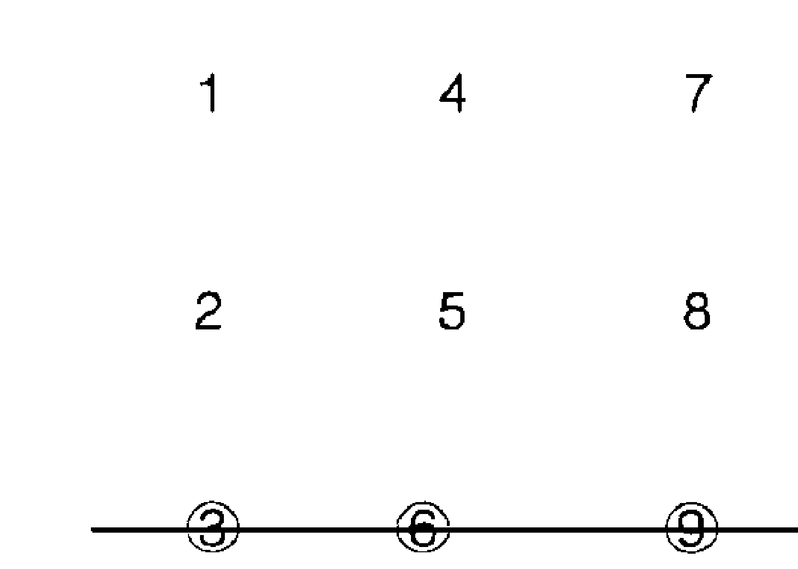

当命盘中出现了3、6、9，就连成了这条线。这条连线的基本意义是：理想主义的思考及创造力(3),经过处理与个人化的调整后（6），就能提供服务（9）。

拥有这条连线会让人具备想要创造新事物的冲动，以及很能把事物具象化、概念化的能力。拥有这条连线的人，有的会完全生活在自己的梦幻天地中，所以这条连线也被称为做梦线或太空人线。

拥有这条连线的人学习能力强，并且会花许多时间思考，但往往到了应该行动的时候还在空想。但他们喜欢活在理念的国度里，比较不愿面对真实世界；他们通常也不喜欢受到批评，因为那些批评可能会伤害他们的美好想象，因此这条连线又被称为任性小孩线。

拥有这条线的人，是开放而能接受新观念的人，但万一牵涉到要他们改变理念，他们却又是最固执的人。

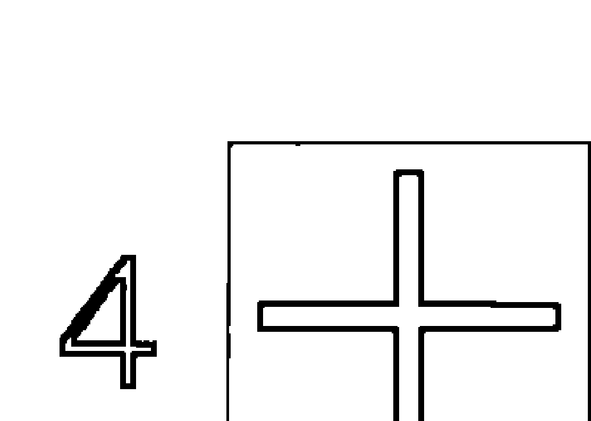

人教的代表是王士元。王士元是台湾大学的教授。

所不能及的效果。所以 4 数人是天生的建设好手，因为建设正是一种建立安全感的方法。这种建设与构筑的才华，加上不爱冒险的特性，使得 4 数人喜欢受雇于人，而不想自己当老板。

4 数人这种害怕冒险的特质，影响到生活的诸多层面。除了不愿创业以规避重大风险之外，4 数人也不喜欢单打独斗，他们希望维系友谊，常会想办法呼朋引伴。他们相信那句老话：“人多好办事。”有些 4 数人不肯单独旅行，宁可付钱请朋友同行。

4 数人不喜欢改变。不管是搬家、分手、离婚，甚至换一家餐厅吃饭，他们都会顽强抗拒。这种特质表现在他们面对新观念的态度：他们绝不轻易相信事情。想取信于 4 数人，并让他们接受新想法，有两个必要条件：一是证据确凿，二是给他们充分的时间亲自检验一切正确无误。但同样的，一旦他们相信了，他们就会全力捍卫自己所信服的事理，不轻言改变。当 4 数人受到了挑战与质疑，他们会高度自我防卫，固执异常。

## 人生课题

4 数人的人生轨迹可以有两种选择。一种是借由物质、金钱、爱情等等外物来攫取安全感。但物质能提供的安全感有其极限，假如不向内探索自己有哪些潜力，最后会徒然感叹人世间没有什么能提供安全感。然而，真正的安全感只能从内在自我而来，从相信自己和发展自己的天分与信心而来，因为那是绝对无法被夺走的。

另一种人生选择是，倾全力构建自己的安全感。许多超级富豪都是4数人，例如比尔·盖茨。只要眼光不失焦，认清楚人生安全感的真正来源在于发展自己的天赋才华，4数人绝对能拥有稳定富足的人生。

4数人必须学着更愿意承担风险，更愿意接受改变。学着期待改变的发生，并把改变当做个人成长的契机。若没有开放的心胸，不愿意放胆尝试新事物，就无法进步成长。唯有成长和发展自己的才华，才能让4数人找到生命中真正的安全感。

## 人生目标

4数人一辈子都在为自己和别人建立安全感，这包括经济面与情感面的安全感。4数人需要一直有人在旁做伴，并且维持长久的爱情。4数人常常是家里的重心，而家人也都知道他们是可信可靠的。4数人只要觉得感情上有了安全感，就会把焦点移转到确保经济上的安全无虞，但这很自然会造成感情关系的压力，甚至有瓦解的危险。到了这种时候，一般人多半会选择分手，但4数人硬是不肯分开，怎样都无法接受分手这种想法，即便没有感觉了也要苦苦守住关系。4数人假如想拥有真正的快乐，必须在营造外在安全感的同时，也建立自己内心的安全感，这会有助于他们把改变看作是迈向更好人生的必经之路。

## 沟通之道

关键句：“眼见为凭。”

4数人一生的奋斗都是为了寻找安全感，一旦他们找到了安全感，就会死守着不放，绝不愿改变。和4数人沟通时请记住他们的座右铭：“眼见为凭。”

要让4数人接受你的想法，必须拿出白纸黑字的数据证明你的观点，更要说明为什么你的观点更可以保障他们的安全，而且最好采用专业人士的口吻与他们说话。如果不用这些步骤，你会发觉自己在对牛弹琴。跟4数人争辩，就算说破了嘴皮也无济于事，不如省点力气，花时间做研究，搜集具体数据来证明给他们看。

与4数人沟通的要点如下：

-   把他们当成经历过一场空难而死里逃生的人。
-   让他们知道为什么事情会改变。
-   必须用具体证据向他们说明你的观点。
-   不要转移主题或模糊焦点。
-   4数的人买东西时很在意价格，除非你提出科学研究作为证据。

## 天赋才能

4数人天生具备让事物更安全而稳当的能力。和4数人在一起很舒服而安全，觉得他们是诚实而值得信赖的人。因此 4 数人非常适合从事任何必须讲究信用与可靠、注重安全的行业，例如保险业、银行、证券金融业、医疗业等。

4 数人能如实看见事物的样貌，实事求是，这使得他们能从事重复性高、别人也许觉得枯燥的工作。假如发生了问题， 4 数人不但能想出解决之道，还能设法防患未然，避免重蹈覆辙。 4 数人善于制作出坚实牢靠兼高质量的产品。

4 数人不是常常能冒出点子的创意人才，但他们很有本事改进别人的构想，使它精益求精，而通常这种改良后的产品都能申请到专利，因此 4 数人很容易成为发明家。他们能够让事物运作得更有效、更安稳、更顺畅。

著名的 4 数代表人物包括：比尔·盖茨、阿诺·施瓦辛格。

## 生涯发展

4 数人能与别人合作愉快，非常适合从事讲求规律的行业。适合的职业包括：银行业、会计、工程机械、计算机软件工程师、计算机业、研究调查、食品业、农业、厨师、运动员、经理人、推销员、医药人员、警察、军人。

## “眼见为凭”

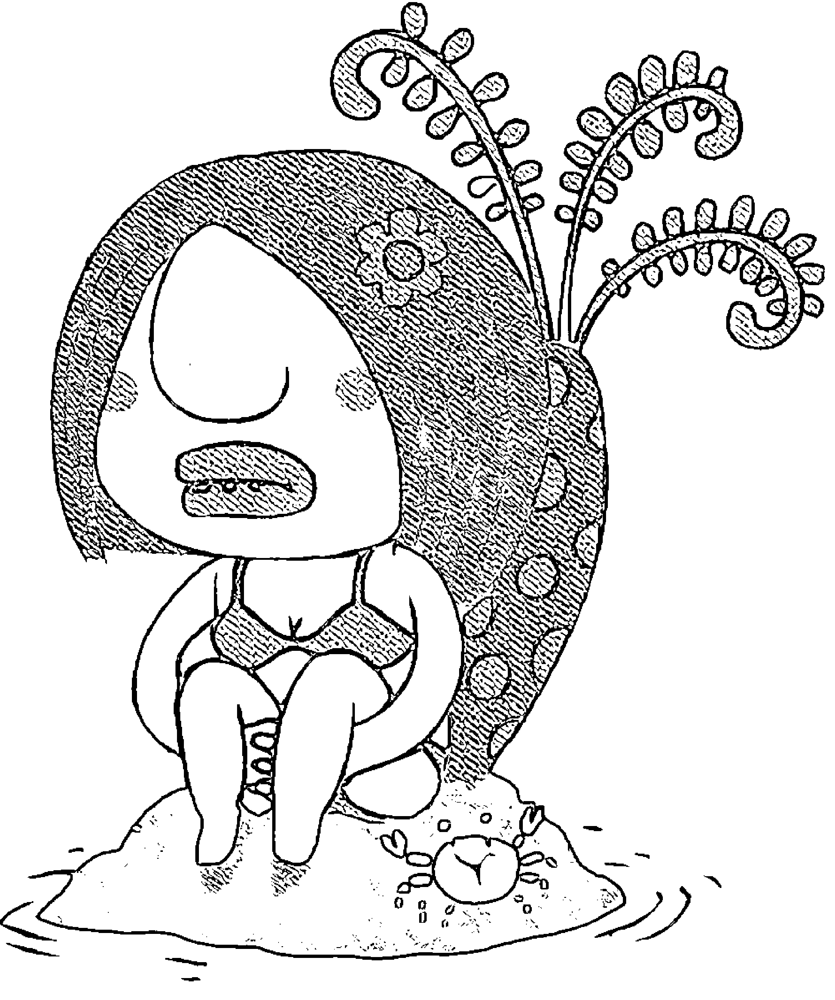

4数人：一个在空难里死里逃生的人

## 健康之道

4 数人会发现，如果他们找到了安全感的寄托，例如一份好工作或是一个温柔体贴的好情人，他们就会很健康；万一这个安全感的来源消失了，他们的健康也会跟着变糟。问题是，世上本来就没有什么真正安全不变的东西，任何事物今天看来稳若磐石，但谁也不能保证明天会如何。为了健康着想，4 数人必须学会他们的人生课题，选择正确的人生目标，在建立外在安全感的同时，也要在自己身上找到真正的安全感。

#### 命数4的灵数组合类型

纯粹的 4 公元2000年后，第一个单纯的 4 数人出生了。例如出生于2000年 1 月 1 日的小孩，相加的总和是 4 ，没有灵数，只有命数 4 。前述对 4 数人的描述在这些人身上都能成立。

22 / 4 这是个“卓越数”（参第76页）。刚认识22 / 4的人时，觉得他们亲切友善。他们的感情是出自真心诚意，但不是完全没有目的，因为他们确实是想从你身上得到一些东西。因为他们需要安全感，愿意采取任何手段来获得金钱、感情、健康等各种形式的安全感。他们主要的障碍是目标太远，理想过高，需要长时间才可能看到一点成果，但他们会因为感情用事而阻碍了成功。他们的某些梦想，会以付出感情债为代价才有可能实现。

13 / 4和31 / 4 这类的 4 数人很有创意，表面上看来很独立。他们工作勤奋，并且多才多艺。他们很独特，创造力丰富，永远要求自己行事稳当合宜。然而，他们内心深处相当脆弱，依赖心很重。他们要求凡事都要稳当牢靠，但同时又想尝试新事物，这两者的矛盾带给他们不少困扰，因为事情实在很难两全。

40 / 4 这是最典型的 4 数人。他们心思单纯，有一种近乎神奇的本领可以就事论事，而且不时展现令人惊艳的创造才华。这些人可以看穿形势背后的本质，并且能快速整理出解决方案。其实，许多形态的创作不过就是以全新的方式看待事物。对于人生的梦想，这些人几乎没有内在冲突，而且绝不轻易妥协，因此如果他们的梦想是不切实际的目标，他们就会变得极不快乐又非常寂寞。

#### 4数的连线：安全线 / 钱财线

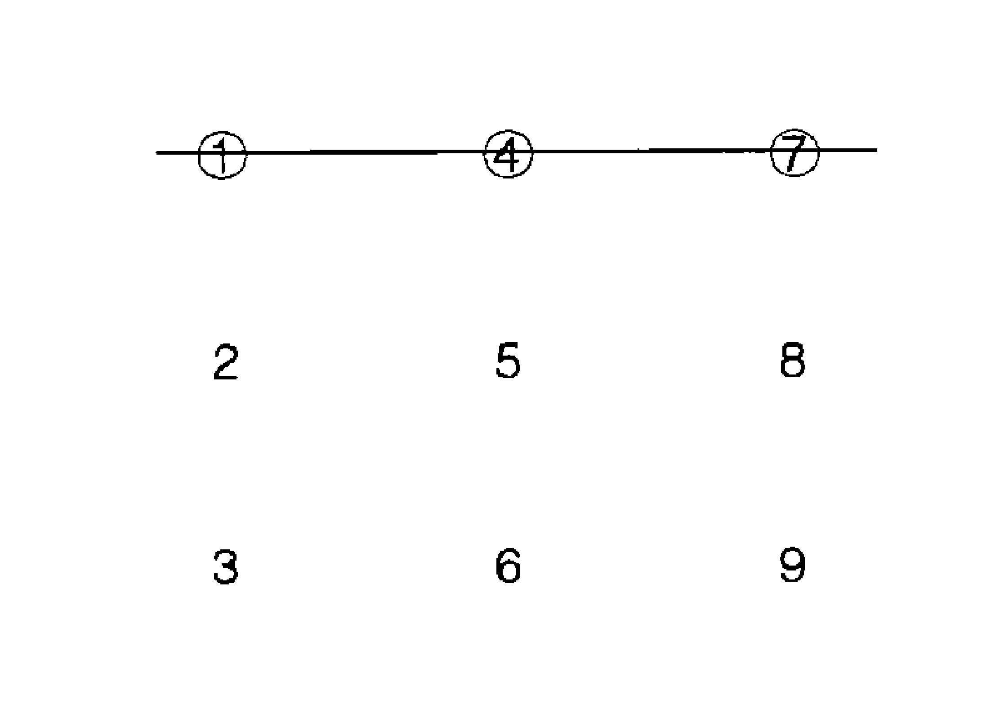

当命盘中出现了1、4、7，就连成了这条线。这条连线的基本意义是：原始能量(1)稳定之后，经过整理(4)就不会轻易动摇，除非有具体的事实证明(7)。

拥有这条连线会使人专注于追求生活里的稳定感和金钱上的安全感。拥有这条线的人有的会走极端，把金钱当成人生最重要的东西，所以这条连线又叫拜金线。

这条连线会使人渴望借由财富来获得安全感，此外，这条连线还有更大的力量：它能带来精力与勇气，让人敢于冲锋陷阵，开拓新事物。

这条连线也会使人极为务实。若有朋友拥有这条连线，你可以确定他会是长久的朋友。这条连线也让人喜欢稳定规律，不喜变化。

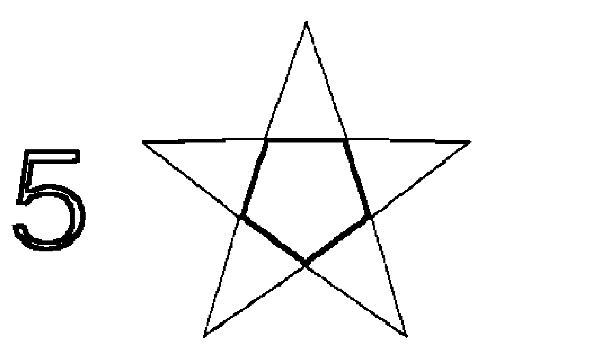

5数的代表标志是五角的星形。星星象征潜力，以及实现梦想的力量（所以星星常常被用在魔术表演中）。想一想，你在想事情时随手乱画，假如你觉得无聊或是希望事情能有所进展时，往往就顺手画出这个五角星符号。

这颗星的基本造型是个五角形，象征自由（例如美国的五角大楼）。它也画出了人的基本形状：头在上，两手在侧，双脚在下；所以5数是最富人性的数字。先要有自由，才谈得上追求快乐幸福。自由也是使得人类历史中不断出现争战的根本原因。

## 个性特质

5 数人对于任何侵犯了他们自由的事物都非常敏感。他们痛恨任何形式的限制或束缚，并且会起而抗争。5 数人在跟别人沟通时，他们不只是讲话，还会在心里同时衡量所说的每一句话对他们的个人自由会造成什么影响。如果对他们加以限制，就算不是故意设下的限制，他们也会发火，予以反击。5 数人对于别人的自由也很在意，所以如果遇到严重的情况，他们也会挺身而出，为别人争取权益。

5数人能言善道。他们口齿伶俐，善于表达，因此很容易博得别人的信任与支持。5数人也很容易相处，能得到大部分人的喜欢。口才一流加上易于取得好感，这两者的结合使得5数人成为沟通高手，特别适合从事销售或进入大众传播媒体和政治圈。

此外，5数人在传达信息的时候非常清晰简洁，把这特质运用在政界及商界就很能获得别人的信任，这就为他们创造了许多机会，带来好处。5数人有时候可能会耍诈，这时假如用到了沟通的才能，往往能让5数人快速致富。5数人个性中有趣的一面是，虽说他们不是名人，却不知为何会自以为是公众人物，而觉得别人总是在打量他们。

至于在情场上，5数人的热爱自由就是大麻烦了。他们和大家一样需要爱情，但是他们又希望能保有自由。5数人期望的爱情是各自拥有自由的空间，不要相互依赖。但是能有那种自信又能让他们拥有自由的人并不多，因此5数人常觉得单身比较轻松，况且5数人并不喜欢被责任压着的感觉。

5数人的感官很发达，也喜欢利用这五种感官尝试各种新鲜事物，而且喜爱的程度往往令人咋舌。因此他们天生挑嘴，这种偏爱美食及热衷于官能世界的结果，使得他们往往会乐极生悲，例如暴饮暴食、工作过度、运动过量等。

5数人喜欢变化，而且会不惜一切要维持多彩多姿的生活，四处尝鲜、结交朋友、学习新事物、旅行、多方阅读。

## 人生课题

5 数人的人生轨迹可以有两个选择。一是毫无目标，就这样随遇而安，假装无忧无虑，但其实内心不快乐。这是因为他们越是想摆脱束缚，逃避承诺，就越不容易做到。最后往往落得愁苦困顿，抱怨连连。

另一种选择则是专心锁定目标，追求事业成功；但压力会集中在他们的爱情，最后不得不在事业或爱情之间做出抉择。如果选择了爱情，可能会失去事业，而最后连爱情也不保，因为他们的性格本来就不善于处理这些。所以， 5 数人不可以放弃他们拥有工作的自由，必须想办法在爱情与工作之间取得平衡，一方面努力工作，同时兼顾生活。

5 数人缺乏勇气。他们知道自己要什么，但总是裹足不前，甚至在最后关头退缩，他们绝对不是“越挫越勇”的人。一旦挑战当前，问题临头， 5 数人常常选择逃避，这意味着他们会错失许多让美梦成真的机会，使得自己更无法摆脱受到限制的生活，这更压缩了自由的空间——这决不是他们想要的人生。

5 数人为什么缺乏勇气？因为一旦做出决定就表示要放弃其他的选项，放弃某些自由，而那是 5 数人最不愿意的事。然而，越是保留着其他可能性，就越是让自己陷在犹豫不决的泥沼里，完全无法前进。想成就任何事情都必须专注、有所选择及承诺， 5 数人必须学习的功课是：唯有通过付出责任与牺牲，他们的目标才可能实现。

## 人生目标

很多 5 数人毕生在追求自己的自由，其中又以工作为一大重点，因为工作可以带来收入，让他们有机会每天都享有一些自由的时间。理想上，需要谈话、沟通及工作时间很有弹性的行业最适合 5 数人。虽然 5 数人善于谈判做成生意，而他们也觉得做生意很有趣，但 5 数人很少愿意担当经营事业的重大责任。另外，5 数人交往的对象也不是那种依赖心较重的人，这样他们才能保有较多的自由空间，所以他们的爱情关系比较像朋友关系而不像情侣。5 数人常常需要阅读、聆听、观察、品尝并学习新事物，这些心智上的养分可以刺激 5 数人精神生活，成为推动他们完成人生计划的重要勇气来源。

## 沟通之道

关键句：“再看看吧。”

5 数人是沟通高手。记住，在沟通时不要直接挑战 5 数人，因为你根本说不过他们。和 5 数人争辩，多半你得甘拜下风。与 5 数人沟通的唯一方法是记住他们的关键句：“再看看吧。”5 数人一向躲避承诺，他们一切顺其自然，看看事情自己会发展成什么情况再说。和 5 数人沟通时，务必让他们觉得你并不在乎事情的结果，只要基本立场不受到折损就行。必须让他们明白为何你的观点公平合理，而你只不过是在使用基本的发言权利罢了。如果可能，最好也解释清楚，为什么你的主张能够保护他们不被别人操控与摆布。

与 5 数人沟通的要点如下：

-   把他们当成刚刚越狱潜逃的人。
-   永远不要逼他们做出承诺；让他们知道他们可以因为做出承诺而有更多的选择。
-   绝对不要限制或压迫他们。
-   提供他们新奇有趣的事物及信息。
-   他们痛恶不平等的待遇或是不公义。
-   5 数会在乎价格，除非付款方式很有弹性。

## 天赋才能

5 数人很善于应付三教九流的人，不但能与所有人沟通顺畅，还能使对方言听计从，这是其他数字的人不容易做到的地方。5 数人很风趣，也很喜欢学习新知，再加上口才一流，所以很多人喜欢跟他们相处，而 5 数人在团队里的合作向来轻松愉快。5 数人也善于处理人与人之间的应酬交际，虽然他们并不喜欢人性里面的这个部分。

5 数人乐于与人交谈，并在谈笑间轻松说服别人，因而非常适合销售推广。他们也很懂得心理指导，尤其擅长教导别人如何有效掌握人生。

5数人天生具有市场嗅觉，善于观察社会的整体趋势走向，并且有写作的天分。他们喜欢以不受契约约束的工作形态自由地接工作，很容易与传播媒体打交道。他们很关心与平等、自由、政治有关的议题，因此很能在这些领域里有突出的表现。

## 生涯发展

5数人最适合用一种可以享有相当程度自由的方式与人一起工作。他们的工作应该要可以让他们自行设定工作节奏，并用自己的作业方式进行。适合的行业包括：业务销售、娱乐业如歌手及演员、各种独立工作室、记者、广告业、媒体和公关、设计师、艺术工作者、旅游业、政界、餐饮业、企业家、DJ、娱乐总监、翻译及发言人等。著名的5数代表人物包括：林肯、毛泽东、希特勒、奥纳西斯。

## 健康之道

5数人会发现，他们拥有的自由越多，身体会越健康。一旦别人开始对5数人设限管制，加以束缚，5数人的健康会开始出状况。问题是，如果他们想夺回自由，又必须鼓起相当大的勇气。所以，5数人维持健康的方法就是坦率诚实地面对亲密爱人，当然这也是需要勇气的。5数人在选择事业与爱情的时候，都应该找能够让自己拥有充分自由的方式与对象。

## “再看看吧！”

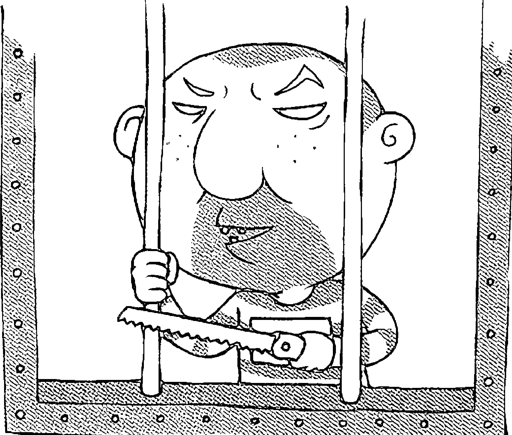

5数人：一个刚刚越狱潜逃的逃犯

#### 命数5的灵数组合类型

纯粹的5 公元2000年后，第一个单纯的5数人出生了。例如出生于2000年1月2日的小孩，加总的数字是5，没有灵数，只有命数5。前述对5数人的描述在这些人身上都能成立。

14／5 刚认识这类型的5数人时，你会觉得他们好像非常独立而稳健，把工作托付给他们应该可以安心。唯一的问题是他们往往太过保守，缺乏主动积极的勇气，除非身边有人鼓励，或者后勤支持够强大。这些人不喜欢独处，但如果真的被同伴推举出来带领大家，他们倒也会勇往直前。

23／5 初认识这类型的5数人，觉得他们温暖而友善，个性温和，感情丰富。然而更进一步了解他们之后，会发现他们其实相当主观，而且不愿意改变，这就会使得认为5数人随和友善、好相处的人非常惊讶。这种固执不肯变通的强硬性格会为23／5的人际关系制造不少的问题，通常亲密关系很难持久，此外他们自己制造出来的距离也会使得朋友无法亲近他们。

32／5 这类型的5数人具备浓厚的理想主义性格，似乎也很清楚自己的理想是什么。他们处理事情确实很有概念也很有理想。有趣的是，一旦他们感情用事时，理想就会跟着扭曲，造成他们的混乱和挫折。这时他们试图扮演一个违反本性的角色，放弃了自由，过得极不快乐。若想打破这样的困境，32／5的人必须彻头彻尾地改变，痛下决心，而这就考验着他们有没有勇气。

#### 5数的连线：事业线 / 自由线

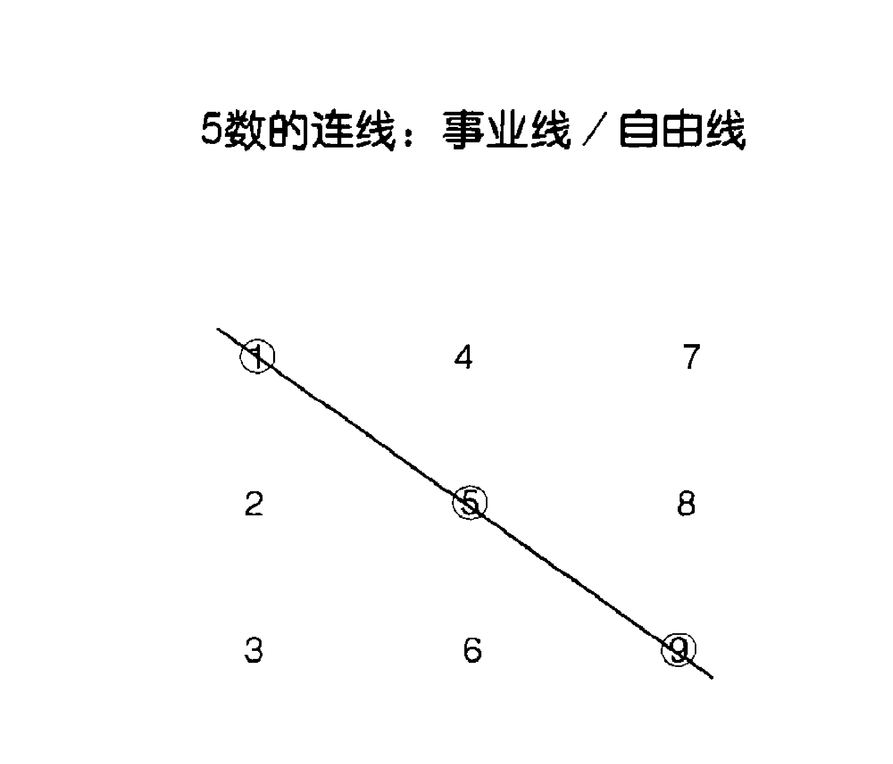

当命盘中出现了1、5、9，就连成了这条线。这条连线的基本意义是：原始能量(1)经过凝聚和阐释后(5)，能够提供服务(9)。

这条连线会使人拥有强烈的企图心想要拥有自己的独立事业，或是自创一套赚钱谋生之道。命盘中有这条连线的人假如不工作会很不快乐，甚至会有罪恶感。所以这条连线也叫做工作狂线。

换个角度来说，没有这条连线的人不觉得非要有自己的事业不可，而且就算无法完全掌控人生中的大小事也没关系。

41 / 5 这类的人很实际，别人会以为他们并不真的需要自由，却是要安全感。他们平易近人，好相处，但他们的问题出在爱情关系上。这类人需要的是浓烈紧密的爱情，但当真得到了这种爱情，他们又会觉得失去了自由，因而出现内心冲突。一旦别人变得太过依赖他们时，他们就会变脸，把那个黏过来的人推开。这种个性不利于维系长久的关系，但挺适合当政治人物和领导者。

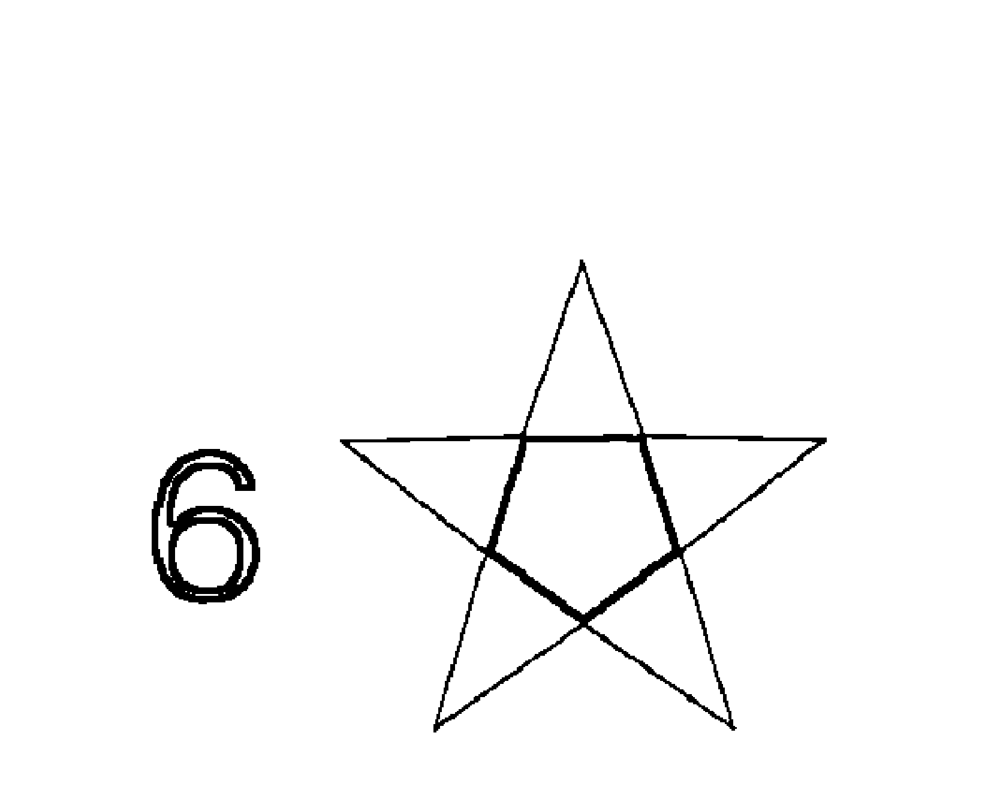

6数的代表标志是一个六角星形，常被称为「大卫王之星」(Star of David)。

此外，佛教所用的「卍」字符号也可以代表6数。这两个标志都象征护持、疗愈、自我牺牲、是非正邪的观念、拥有良心良知，以及慈悲为怀。

## 个性特质

6数人出于本能就想修补东西和解决问题，范围从修车到医疗无所不包。如果是机械的东西出了状况，拥有这种天分就很管用，但万一出问题的是“人”，这时6数人反而会惹来麻烦。

6数人天生善于分析，而且十分敏感，对旁人的痛苦颇能感同身受，但有时也因感受太过强烈而使自己陷入别人的问题中，就算根本不关他的事也非常想解决问题。6数人会全面付出，毫无限度，最后往往换来了牺牲自己的昂贵代价。他们敢于扛下责任，即使那责任超出了他们能力范围，即使那不是他们的责任。

这种想要修补事物的性格倾向，使得6数人总是会被有问题的人吸引——但有时候说不定是有问题的人对6数人比较有兴趣。为何会这样？主要是因为6数人必须感觉到被别人需要。当6数人担起责任为别人解决问题的时候，他们并不是不求回报的，他们会希望对方感激他们，并用爱回报他们。6数人就是靠这种感觉维生，这会让6数人觉得快乐与健康。

很多人常批评6数人，并且不能理解为何他们要如此自我牺牲。是因为他们在孩提时期没有得到足够的爱，所以愿意不顾一切找回那失落的爱。是因为他们缺乏自信吗？为什么他们非要和有问题的人在一起呢？难道他们不够优秀，配不上健康的人吗？都不是。他们只是借由帮助别人来取得被需要的感觉罢了。被需要的感觉是6数人的生命力补给，让他们觉得人生不虚此行。

## 人生课题

6数人的人生轨迹可以有两种不同的选择。

第一种：因为天性倾向招惹有问题的人。例如有问题的恋爱对象或是不健康的同事关系。不花心思照顾自己，反而不断为他人付出，直到自己精疲力竭，赔上健康。这时他们必须面临的挑战就变成了照顾自己，或是步入死亡。许多6数人曾经尝试自杀，有些则因为看不到解脱之道而承受着心理问题及生理疾病的磨难。

另一种选择是，在解决别人的问题的同时不忘自己；要在施与受之间取得平衡，尽管不容易拿捏，但至少努力后能有些回报。

6数人必须学会先解决自己的问题，再去解决别人的问题。他们应该要等别人开口请求之后才伸出援手，并且要在自己所能负担的范围内，不管是情感上、体力上或财务上。6数人务必谨记人人都该为自己的人生负责，不该由6数人全数承担；帮助别人解决问题有时候其实是剥夺了别人学习与成长的机会。6数人要学习硬起心肠，不必觉得那些把自己的人生弄得一塌糊涂的人可怜。6数人应学着说：“不！”甚至不妨学着自私一点。

## 人生目标

6数人一生都想要修理东西、解决问题、治疗，以及鼓励别人开创美好人生。因此他们的人生目标应该是全力发挥这些天赋，最好是经由社会义工或是宗教组织来付出。而他们的挑战永远是：热心过头。假如很愿意超出合理范围多付出一些，也要先做好心理准备，别人不见得会感激他们的付出。很多人看到6数人的转变会大感震惊，因为他们头几年那么慈悲善良，任劳任怨，但骤然变为自私——通常，这是6数人正在学习他们人生课题的征兆。历经多年的不被感激，6数人终于鼓起勇气说，“够了，到此为止，我不是奴隶，我也是人，我也有需求”。6数人越早学会自己的功课并落实在生活中，就越能创造健康快乐的人生。

## 沟通之道

关键句：“没办法说不。”

6数人总是很容易就自告奋勇要承担责任，希望所有的努力都能得到别人的肯定，并有所回报。想要和6数人有良好的沟通，你必须让他们觉得你是真心感激他们的付出，让他们感觉你非常需要他们，并且提供他们建议，让成果更圆满。务必记住6数人的关键话语：“我没办法说不。” 和6数人沟通的时候，你不能叫他们去怎么做，因为6数人觉得他们比你能干，你只能请他们协助你一起突破更大的挑战。只要让6数人觉得被需要，他们什么都会答应。

与6数人沟通的要点如下：
- 把他们当成负责喂饱穷人的传教士。
- 他们必须觉得被别人需要。
- 他们关心别人更胜于照顾自己。
- 他们需要得到关注与尊重。
- 对于6数的人来说，价格不是问题，只要产品也能让别人都受惠。

“没办法说不！”
（图示：6数人：一个负责喂饱穷人的传教士）

## 天赋才能

6数人天生懂得照顾别人、修缮事物及解决问题。他们很快就能理清事情哪里出了错，也知道该采取哪些步骤来解决问题。各种关于修缮与治疗的事情都难不倒6数人。

6数人能够给人安全感，觉得每件事都会被打点妥当。他们待人接物的态度，套用医界常见的术语来形容就是“视病如亲”。此外，6数人的想象力也很丰富，创新的点子也不少。尽管6数人容易对人付出过多，但他们都是出于真心诚意，这也使得6数人能胜任各种服务性质的工作。

著名的6数代表人物包括：爱因斯坦、演员罗伯特·德尼罗。

## 生涯发展

6数人和别人合作愉快，并且需要觉得别人需要他。适合的行业包括：医生、心理分析师、咨询顾问、音乐演奏家、作曲家、艺术家、传教士、公共关系、机械师、建筑营造、厨师及食品业、哲学家、教师。

## 健康之道

通常如果6数人能忙于解决问题、照顾别人或被人需要，他们的健康就不会有太大的问题；然而，如果别人要求他们付出太多却没有特别感激他们，就会使6数人在精神、情感、心理与身体各个层面感到疲惫，健康崩盘。若不想掉入这样的黑洞，6数人必须先照顾好自己的基本需求。在对别人伸出援手之前，6数人必须先解决自己的问题，先为自己营造健康平衡的生活。6数人并不喜欢独处，因此这项照顾自己的功课就变得相当艰巨，因为也许有一天他们必须下定决心离婚，或是离开那些习惯占他们便宜的朋友。

#### 命数6的灵数组合类型

纯粹的6
公元2000年后，第一个单纯的6数人出生了。例如出生于2000年1月3日的小孩，这些数字的总和是6，没有灵数，只有命数6。前述对6数人的描述在这些人身上都能成立。

15／6
这是所有6数人里面最健康的组合。他们愿意承担责任，但是又清楚知道责任是否过重，或者那是不是他们的责任——这要感谢5数所发挥的力量。这类型的6数人非常独立，无论做什么事都需要有自由的空间。他们的问题会发生在他们发现某个情况确实很需要他们的帮忙，这时他们内心会天人交战，煎熬挣扎，既想伸出援手，又不愿意别人太过依赖他。

24／6
这是在第一次见面时别人觉得最和蔼可亲的6数人。他们很善于处理人际关系，也不介意为别人承担责任。如果别人对他们的付出与帮忙毫无反应，这类型的6数人不会直接站出来说出内心的真实感受，说他们觉得被别人利用了。他们会展现出烈士的姿态，到最后以难过和失望收场；有时他们宁可一个人走，尽管这根本违反他们的天性。这类人真的需要为自己挺身而出，找回自己生命的主导权：好好学习6数的人生课题。

33/6
这是个卓越数。这类型的6数人拥有异常优秀的创造力，但可惜他们通常必须先做出重大的人生抉择和牺牲才能够顺利发展他们的天赋潜能。这样的抉择尤其会在夹杂了感情因素时显得困难重重，因为他们总是承担了过多的责任。这些人必须认清楚，无论如何一定要努力施展自己的才华，否则人生永无快乐可言。这类型6数人不够实际，是超级理想主义者，而且不太能接受批评。

42/6
这类型的6数人最实际。他们喜欢交朋友，重感情，并且极富同情心。为了讨别人欢心，他们常常愿像变色龙一样改变自己；当然，这就包括了相当程度的自我牺牲。这类型6数人的朋友很多，但真正了解他们内心的朋友寥寥无几。

#### 6数的连线：秩序线/治疗线

（图示：当命盘中出现了4、5、6，就连成了这条线）

这条连线的基本意义是：安全稳定的力量（4）在经过凝聚和阐释后（5），可以提供解决办法和治疗效果（6）。

拥有这条连线的人，会渴望知道事物的运作方式与原理，使得他们因而善于修理东西，解决问题。

这条连线也赋予人组织能力，确保品质和干净。有时候，拥有这条连线的人实在太爱干净了，所以这条连线有时被戏称为菲佣线或洁癖线。

（图示：7数的象征）

7数在自然界经常出现：彩虹有7个颜色，音乐有7度基本音阶，人体的细胞每7年自动更新一次。7数一直有一种灵性上的含义，例如所谓的「七重天」和「幸运数字7」等。7数代表灵性，以及对真理的热爱。

## 个性特质

7数人天生好奇。他们不看事物的表面价值，却喜欢不断发问，探究事情背后的真相。他们观察入微，能发现错误所在。在所有的数字当中，7数人可能是最讲逻辑的，因为他们的思考基础都基于他们确知的事实真相上。他们不那么有理想，有时相当吹毛求疵。

7数人乐于与人相处，但他们也常需要时间独处以韬光养晦，重新充电。有些7数人太过于自得其乐，导致爱情关系中出现摩擦。7数人的另一半可能会纳闷为何他们需要如此多的独处时间。但他们只不过是把时间拿来舒解自己一下而已，可不是跑去偷情。7数人的需要时间独处，再加上天生对宗教、哲学等形而上思想非常有兴趣，导致有些7数人甚至考虑要遁入空门。

7数人的思考大多出自黑白分明的角度。他们是逻辑取向的人，能快速分析形势，常可从务实的考虑做出决定。但万一事情是和感情有关时，就会显出7数人的自私和冷酷无情。然而，尽管7数人有时确实冰冷而实际，他们也有富有人道精神的一面，愿意助人，而且不求回报。

此外，7数人很有趣的是，他们的特立独行，在人群中一眼就认得出来。7数人会有自己独特风格的穿着，也很容易结交朋友，可能正是这个原因，有人说7数在所有数字中拥有最佳的人际关系。

也许正因为7数人广结善缘，因此他们也是所有数字中运气最好的一群。有些研究数字学的人认为，7数人的好运气是因为数字7本就是个完美的数字，也是上帝的数字，因为它是第一个奇数与偶数3 + 4（以前的数字学学者认为1和2不是真正的数字）相加所得的数字。7数人的运气既是好事，也是坏事——它帮助7数人在任何方面都能实现愿望，达到目的——即便那是违法的行为。然而，运气总有用尽的一天，到时就得付出代价了。看看有哪些人是著名的7数人就能了解其中含义。

7数人的好运可以让他们比别人早一点成功，也比较容易成功；但也由于7数人在年轻时候就习惯了这样的好运气，于是养成了懒散的一面。因为他们总是期待事情都能自然迎刃而解，成功会从天上掉下来，因此经常错失良机，延迟了理想的实现。

## 人生课题

7数人的人生轨迹可以有两种选择。一种是轻松平凡走完一生，不必太努力，反正遇到瓶颈或麻烦总有幸运之神眷顾，反正问题都会解决。但好运总有用完的一天，7数人迟早必须面对现实，了解“一分耕耘，一分收获”的道理，唯有面对真相、勤奋务实才是正途。在情感关系方面也有同样的问题。由于7数人一向疏懒，总是接受的多付出的少，最后终将失去激情。如果7数人在这时候愿意面对现实，马上扭转局势，那么未来仍然看好。否则，7数人会变得极不快乐，甚至可能借犯罪行为寻求解脱。

另一种选择是，早一点认识到努力的重要性，勤奋认真，那么一有机会上门，就可上前迎接，运用天生的优异分析能力，在事业与爱情中掌握各种变化，并让关系保持健康平衡。万一事与愿违，7数人会非常难以承受失败的结果，因为他们非常不愿意做出诸如转行或离婚这样重大的决定。他们做出决定的过程漫长而艰辛，但7数人一旦做了决定，他们通常彻头彻尾想通了。

但要7数人做出决定实在不是简单的事。一来，因为他们注意到太多的细节与事实；二来，即便看清了事情真相，但有时他们仍然不愿意接受现实。7数人常常会像鸵鸟一样把头埋进沙里。7数人一定要知道：假如不面对现实，事情可不会自动消失，却可能会愈演愈烈，终至难以收拾的地步——这个课题，7数人应该及早学会，罔顾现实到头来必会导致悲剧，而且人会变得不健康、不快乐。

## 人生目标

7数人应该保持天生的好奇心与求知欲，不断分析质疑周遭的大小事。他们应该保持开放的心胸，勇于尝试新事物，认识新朋友，与人分享新观念，并在心灵层面修持精进。7数人很需要一方面拥有可以一个人去发挥特质、追求心智成长的自由，另一面又能够建立稳定的事业与爱情关系。许多7数人穷其一生想不透自己的人生到底出了什么差错，总觉得自己被环境困住，始终对现状感到无奈。想要活得快乐踏实，7数人必须先接受事实的真相，面对问题，采取适切的行动解决它。

## 沟通之道

关键句：“真的吗？”

7数人天生爱追根究底，喜欢借不断发问来探询事情的真相，这使得他们的个性开放大方。问题会发生在和7数人沟通时，当你直接说出你的想法，他们会质疑你，挑战你。如果你没有准备好，7数人马上关起沟通的大门；你若是有备而来，能够举证说明你所言不虚，你接下来将会面对更严苛的难题：你也许要告诉7数人一些他们根本不想知道的事实，而沟通也会就此打住。

7数人的人生课题就是接受真相。如果你直接告诉他们事实真相，他们觉得受到了威胁，会被吓跑。所以，和7数人沟通时要记住他们的关键语句：“真的吗？”

与7数人讨论事情时，先别急着证明你是对的，而要用点外交手腕：只需要提出疑问，表示你还没有定见，也还不明了确实的真相，这可以让7数人觉得他们也参与了分析，并有所贡献。当你在向他们呈现你的观点时，要用“事情可能是怎样”的方式而不是“事情就是这样”的方式来表达，然后在结论呼之欲出时打住。如此一来，7数人会开始动脑思考，而且很快就会找到答案——结果他们不仅同意你的观点，也许还能指点一些你没注意到的细节呢。

与7数人沟通的要点如下：
- 把他们当成必须在限期之前完成研究任务的航天科学家。
- 他们必须知道细节，而质疑也必须立刻得到回复。
- 他们必须确定他们可以掌控更多形势。
- 永远不要催促或逼迫他们采取行动，必须等他们自己做出决定。
- 价格对7数的人来说不是问题，只要质量够实在。

## 天赋才能

7数人天生是评论家。他们的好奇心很重。他们也是天生的哲学家、研究者。由于7数人有一点懒散，所以喜欢从事有组织、有系统的事情，这些事可以让他们理念立即实现。另外，错综复杂的事物也能引发7数人的兴趣。

（图示：7数人：一个必须在限期之前完成研究任务的航天科学家）

7数人能一眼看穿事情的问题所在，因为他们对质量的概念有非常先进的认识，而他们从来无惧于说出诚实的意见——这对于经不起批评的人来说不免难以消受。7数人不介意独自工作，事实上，他们往往宁愿一个人独立行事。7数人有一股天生的魅力，可以诱发别人最好的一面，这也使得7数人非常适合在与社交、政治及销售有关的工作方面发挥才能。

著名的7数代表人物包括：李小龙、玛丽莲·梦露、肯尼迪总统。

## 生涯发展

7数人必须从事需要思考的工作。适合的行业包括：研究调查、工程师、计算机业、设计师、企业家、音乐工作、医生、厨师、广告业、市场营销、旅游业、教师、哲学思考、心理分析师、餐饮食品业、侦探及律师。

## 健康之道

7数人会发现，当他们的生活受制于各种限制与压力，或者环境不允许他们提出质疑的时候，他们的健康会变糟；但他们在做研究和学习新事物的时候，健康状况会变好。假如想要过这种健康的生活，他们必须选对行业和感情对象。7数人对于爱情的要求十分特别。7数人不是那种爱得黏腻浓烈的类型，而是浪漫的哲学家。7数人在爱情课题上的挑战来自于：一旦他们发现，生活的真相并非自己所乐见的模样或不符合期望，他们会担心假如采取行动将会导致损失，因此就会回避问题。然而，事情拖越久，压力越大，对健康也越不利。根本解决之道仍是接受事实真相，尽早采取行动。希望7数人不要拖到健康破产，那可就回天乏术了。

#### 命数7的灵数组合类型

纯粹的7数
公元2000年后，第一个单纯的7数人出生了。例如出生于2000年1月4日的小孩，相加的总和是7，他们没有灵数，只有命数7。前述对7数人的描述在这些人身上都能成立。

16／7
这类型7数人非常坚强而独立，他们的软弱面出现在爱情关系中。他们常为了取悦对方而不顾一切拼命付出，但他们其实不必这样做。这些人善于解决问题，生来有一种近乎通灵般洞悉事情谬误的能力，并且还能予以改正修补。

25／7
他们非常亲切和善，几乎跟任何人都处得来。他们可以面对群众，善于处理人际关系的课题。不过，他们热爱自由，所以还是需要有很多时间独处，或者充电进修，或者思考问题。这类型的7数人在所选择的行业里很容易平步青云。他们内心的矛盾比较少，顶多需要克服有时候会冒出来的“再说吧”的倾向。

34／7
这类型的理想性极高。别人觉得他们心胸开阔，可以接受任何事物，“一切”都有可能。然而，一旦要付诸行动让“一切”成真时，他们会一百八十度转变，变成固执死硬。这种转变固然令人错愕，不过事情其实没那么糟，因为他们这种小心翼翼的特质对于任何计划或行动都是不可或缺的态度。这些人不爱风险，宁可稳扎稳打。这种行事风格却也会使他们错失机会，并使得别人抓狂。

43／7
他们是脚踏实地的人。虽然他们也有固执与懒洋洋的一面，不过都可以用毅力与执著来获得成绩。他们可能会遇到的挫折是，当他们发现一直以来努力争取的事物其实并不是自己真心想要的事物，这种落空的感觉，可能会导致他们在目标尚未完成之前就怠惰退缩，半途而废。

#### 7数的连线：人缘线/表达线

（图示：当命盘中出现了3、5、7，就连成了这条线）

这条连线的基本意义是：理想(3)在经过凝聚和阐释后(5)，可能可以找到真相(7)。

拥有这条连线的人，可以看穿别人心里真正想要的是什么，并且能用容易使人接受的表现方式来呈现事物。这是项威力强大的天赋，是成功销售的利器，可施展于政界、传播媒体等等能接触到广大群众的相关行业，所以这条连线又称为发言人线。拥有这条连线的人，很善于沟通，也很讨人喜欢。

此外，拥有这条连线的人好奇心很重，大事小事都想知道，甚至喜欢探听丑闻八卦。所以这条连线也被戏称为八卦线。不过，拥有这条连线的人却会对自己的秘密设下防线，不轻易让人探知。
拥有这条线的人需要有自己的空间与独处时间。

（图示：8数的象征）

呈现于自然界的8数，就是八角形。这种结构一向含有稳定、权力和保护的意义。运用在城堡建筑上，给人安全牢靠的感觉，排除了危险，又有扩张及成长的可能。

8数还有一个代表标志：无限的符号。8数象征生与死之间永不止息的循环更新，其特点是因果业报，也就是所谓的“善有善报，恶有恶报”。

## 个性特质

8数人慧眼独具，一眼就看得出哪些人、事物具有潜力。他们喜爱看到东西逐渐萌芽发展，并乐见任何有潜力的事物成长茁壮，这些事物包括：理念、他们的子女、别人的才华或新产品等任何真正有潜力的事物。8数人常常会不为任何特定目的就主动帮助别人发展，只因他们不能忍受璞玉被埋没，有时当事人根本不要他们帮忙！8数人这么做可能会赔上个人钱财，但是他们还是很愿意帮助别人发展。

8数是高八度音阶的1数，因此它也具备了1数的领导才华和追求独立的特质。不同的是8数人着眼于大格局，不满足于仅仅只是成为自己人生或家庭的主宰。数字8的影响会让人想领导一个公司，或甚至一个国家；它也会驱使人积极寻求金钱上的独立，而且是远远超过实际需求的数目。8数人打从心底厌恶懒惰这件事，如果事情进展得很慢，他们的态度会变得强硬。

8数人比较令人费解的地方是虽然他们个性刚强，但表现于外完全不是那回事，反而像猫咪般温顺。他们往往说话委婉，并且避免与人起冲突，有时宁可让自己吃亏受伤。然而，一旦他们关心的人遭受到不公平的待遇，小猫马上变成猛虎。8数人发起脾气时令人大吃一惊，他们会为了捍卫自己的人和利益而无所不用其极。这正是1数人与8数人最大的差异；1数人挺身而出多半是为了自己，而8数人强出头都是为了别人。

8数人看起来，一般来说还算诚实，很能给人值得信赖及安全的感觉。8数人天生很有商业头脑，天生是个生意人——所以话又说回来了，天底下有几个生意人是真正诚实的呢？

## 人生课题

8数人的人生轨迹可以有两种选择。第一种是如果8数人有许多梦想及欲望，尤其想追求金钱上的独立，他就去努力工作，不然就找一个他认为极有潜力能实现他梦想的对象结婚。长此以往，8数人会要求继续追求改变与扩展，虽然他们常常不直接表现出来。8数人的方式是强求自己的理念要得到实践，或是一直催促另一半完成他们认定该追求的目标。最后对方会受不了8数人的唠叨操控，起而反抗，结果就引爆冲突。很多8数人最后都会觉得人生是一场空，而自己被别人利用糟蹋。

另一种选择是，诚实说出自己对人生的确切规划，坦白而直接，让别人有机会决定留下或离去，对方既然不是被诱骗而留下，日后也就没有后悔或埋怨。8数人越是清楚自己的目标，并且越是诚实接受它，他们就越容易成功。

先前描述8数的代表标志时提到，8数与宇宙间的无限性及因果业报有关，因此如果8数人说谎、欺骗，或是做了错误及违法的事，报应总是会来，而且后果常常会超乎他们的想象：可能是事业倒闭、婚姻破裂、失去心爱的人或子女、车祸意外，或者赔上健康。

因此8数人的人生课题就在于诚实，他们必须对自己诚实，也对别人诚实，这两者之间，诚实面对自己比较困难。8数人不太愿意向别人说出自己的真实感受，更糟的是有时候他们会欺骗自己，强迫自己接受自己不要的情况。这种内在的冲突会大大损害8数人的健康幸福。

## 人生目标

8数人对于具有潜力的事物触角敏锐，能立刻察觉，并认为自己有责任把它琢磨成器。问题会发生在万一他们太想要成功而开始变得不诚实——这么一来，事情就开始显露败相；如果他们够幸运，将会有机会重新来过。

8数人的人生目标应该是发展自我，而非发展他人。8数人喜爱任何有关个人成长及潜能发展的事务，如果他们能把这种心思专注于发展自己的某项才华，自己就能功成名就。许多著名的8数人艺术家，都是在放弃了等待伯乐之后才成名的。

8数人只要运用天生的商业头脑观察市场，并以自己的才华创造符合市场需求的产品，这样就能成功。对8数人来说，没有什么比得上完全凭自己双手打造成功更能让他们心满意足。

## 沟通之道

> 关键句：“钱在哪里？”

想和8数人有良好的沟通，切莫忽略他们的刚强性格，千万不能强迫他们同意你的看法。如果你强迫他们，他们绝对会反击。记住8数人的关键语：“钱在哪里？”如果要8数人了解并同意你所提出的想法，你的表达方式绝对要让8数人明确知道他们将会从中受惠。8数人必须在你的建议里面看到能让他们成长的机会。别想对他们动之以情，这只会显得你太软弱而使得他们兴趣缺缺。你必须强调，他们可以从你的方式得到哪些好处。一旦他们看出了潜力，就会听你的。

与8数人沟通的要点如下：

- 把他们当做一个隐忍着不说自己其实就快要破产的商人。
- 形象很重要。
- 指出未来发展的潜力。
- 说出“不”可不见得是为了拒绝，或许是用来谈判的工具。
- 8数的人买东西时刚开始一定会在乎价格，除非产品能让他们看起来更高级，或者是可以在未来获利。

## 天赋才能

8数人具有天生能比别人早一步看透事物的潜力。这提供了8数人极佳的市场优势而赚进不少财富，因为8数人不怕风险，并且可以为了成功而不计一切投入——当然，这表示他们必须做出决定去争取。8数人也很擅长帮助他人发展自我。

8数人能与别人共事愉快，善于组织人事，具备优秀的领导能力。无论走到哪里，8数人浑身散发的高尚风范都相当吸引人。他们让人觉得值得信赖。

在这些美好的特质底下藏着坚强的性格，8数人只要肯发挥就会成功，因为他们深知自己的目标。8数人可以成为非常强势的领导者，他们可说是天生的老板性格，时而平易近人，必要时也能刚硬强悍。

著名的8数代表人物包括：孙中山、列宁。

# “钱在哪里？”

8数人：一个隐忍着不说自己快要破产的生意人

## 生涯发展

8数人的工作性质必须能让他们根据自己的直觉和理念自由行事。适合8数人的行业包括：银行金融、业务推销、演艺娱乐业、研发专家、医生、法官、军人、警察、企业家、经纪人、艺术家、执行总监、企业总裁、总经理、总统、政治人物。

## 健康之道

8数人会发现，只要他们开发出某项潜力十足的事业，无论是他们自己的事业或别人的事业，他们的健康都会变好。万一所付出的努力毫无收获，或是别人不肯接受他们的建议，健康就会变糟，特别会发生在8数人隐藏自己真正的感受、不说实话、故意伤害他人、欺骗，或甚至从事违法行为的时候。为了健康着想，8数人必须学会自己的人生课题，无论如何永葆诚实，尤其要诚实面对自己。

#### 命数8的灵数组合类型

纯粹的8。公元2000年后，第一个单纯的8数人出生了。例如出生于2000年1月5日的小孩，相加的总和是8，没有灵数，只有命数8。前述对8数人的描述在这些人身上都能成立。

17/8。刚认识这类型8数人时，会觉得他们是坚强而独立的人，大致上确实如此。他们有强烈的领袖特质，必要时会独自一个人坚持下去。不过，这些人仍然有个弱点——称为特质也许比较恰当——那就是，每当他们努力追求的目标已经在望时，他们反而会裹足不前，开始重新考虑那是不是自己真正想要的东西；有时甚至会在这紧要关头骤然转向，和原来方向完全背道而驰。这种自我设限的特质是17/8数人的人生挫折的根源。

26/8。这是最敏感的8数人。他们非常感性，能够将心比心，对于别人的痛苦感同身受。每当有悲剧发生，即使是由电视上得知，他们也会觉得自己仿佛有责任，希望自己帮得上忙。他们常常很难把自己从别人身上抽离开来，就连看新闻也会随之心情起伏。这些人长袖善舞，人际关系良好，几乎能够应付任何风险，而且很快就能从筚路蓝缕的阶段逐步建立起王国。他们只要能把自己和别人的感情课题划清界线，避免承担不必要的责任，未来前途就无可限量。

35/8。这类型拥有所有8数人都想拥有的特质：绝佳的沟通技巧，超强的业务销售能力，以及处理错综复杂人际关系的政治手腕。这些人希望在人生里得到很多东西，也愿意尽其所能努力付出以换取收获。他们的问题是，有时需要付出极大的勇气和代价才能得偿夙愿，这时候这些人会考虑退缩，希望能找个较容易的解决办法，但妥协的结果多半对自己没有好处。

44/8。这是个“卓越数”（参第59页）。这类型的8数人特别喜欢潜力雄厚的事物。然而，要成就庞大的计划往往需要众人通力合作。这些人乐于与人群合作，不过他们的诚实问题很快就会受到考验。真相迟早会水落石出，到时伙伴们会对他们失去信任，造成计划半途而废，结果可能损失惨重。此外，许多44/8的人一辈子都没有去从事他们真正想做的事。这是因为他们受到了两个4数的影响，非常渴望安定而尽量避开风险，但是8数的影响又驱使他们想要透过冒险来获得发展与成长。这两方的拉扯引发了他们的内在冲突，并造成挫折。

#### 8数的连线：权力线 / 灵性线

当命盘中出现了7、8、9，就连成了这条线。这条连线的基本意义是：事实真相(7)在经过整理包装和市场营销之后(8)，能够提供服务(9)。

拥有这条连线的人会喜欢具有强大力量的事物，例如某些可以让人登上拥有权力位置的行业。

奇怪的是，有权有势的人也会被拥有这条连线的人吸引，常会自动来帮助拥有这条连线的人，因此这条连线也称为贵人线。

另外，这条连线也是懒人线，因为拥有这条连线的人有时候会懒得自己做事，坐等别人来代劳。

这条连线还有一个不寻常之处，那就是它使人认识到，宇宙间最高的权力来自于灵性世界。拥有这条连线的人特别尊敬宗教和形而上的哲学思维；也因此，拥有这条连线的人会受到灵异事物的影响，别人却不会。

圆圈代表9数。九边形已经近乎圆形；事实上，9数和0数的意义非常相近。把9与任何数字相加，所得的总和数字再相加一次，又会得回原来的数字。例如，7+9=16，然后1+6=7。

## 个性特质

在所有数字当中，9数人堪称最多才多艺的一群。他们想象力丰富，生下来就是梦想家。他们相信天下没有不可能的事，因此常常在追求那些也许不可能实现的梦想，但他们真心相信梦想一定会成真。9数人如此坚信梦想，原因是他们很早就发现自己轻轻松松就能学会十八般武艺，因此任何事都难不倒他们，当然也就没有不可能的事。

许多小说与电影的故事都出自9数人之手，因为很多9数人从事与娱乐演艺相关的行业。因此，9数人的梦想与计划就像是电影情节，没有任何限制。在别人眼中，9数人这些计划与想法近乎疯狂，因此常常招来不客气的批评，而这是最令9数人痛恨之处。假如9数人梦想中不切实际的部分被直接指了出来，他们先会充耳不闻，然后恼羞成怒，一副只有他们知道某些高深学问与秘密而别人都不懂的样子。9数人从来不认为自己的梦想不会实现。

有一个比喻可以理解9数人的性格特质：把他们看成是来到人间接受训练的天使。9数人乐于行善，并认为上帝会一直守在他们身边，为他们带来看不见的好运，所以一切的不可能都会变成可能。可惜9数人的真实人生并非如此。由于他们不用务实的眼光面对生活，因而在人生中备尝艰辛。

9数人对于别人的需求十分敏感，觉得助人是义不容辞的事。他们可以单纯为了帮助别人而全心付出，这不是常人能做到的。不过，9数人多半没有解决别人真正的问题，他们似乎比较在意赶快驱散别人的“痛苦感觉”，而不是把产生痛苦的根源找出来加以根除。结果，9数人常常担下了超出自己能力范围的重责，而很容易被人利用。

9数人乐于散播欢乐，所以很能讨人欢心。然而，9数人有时候也会展现出军人般的刚硬强悍，让大家觉得一头雾水。这是因为9数人热情十足，对于人生的规划具有强烈的主见。

9数人最怪异之处在于他们与钱财的关系，仿佛得了金钱过敏症似的。在所有的数字当中，9数人最想赚大钱，而且也深信自己办得到，可惜通常事与愿违。9数人越是汲汲营营追求金钱，就越赚不到钱。但只要他们放弃对金钱的欲望，单纯只顺从本性去帮助别人，财富反而源源而来。金钱，好比9数人的影子。

## 人生课题

9数人的人生轨迹可以有两种选择。一种是完全无我的奉献，只求满足别人，像是和尚或修士。但9数人一边无私无我付出，一面不免暗自梦想过另外一种人生，可是从来不付诸行动。长久之后，9数人会抑郁不得志，因为他们付出很多，回报却很少，而自己的梦想遥不可及。

另一种选择是在无私地帮助别人的同时，仍保有自己的梦想。9数人千万不要被利用，应该在为人付出与努力实现梦想之间取得平衡。只要9数人学会了帮助别人到什么程度叫做极限，那么终将达成平衡。

9数人的人生课题是学习专注于实现梦想，切勿让自己深陷于不健康的感情关系里脱不了身，也不要一味想要取悦他人。由于9数人天性敏感而仁慈，所以他们很难为自己着想，更谈不上争取自己该有的权利。许多9数人一辈子都活得郁郁寡欢，从来没能发展自己的天赋潜力，只因他们害怕如果真的去追逐梦想，可能会伤害到他们心爱的人。

9数人既然是为上天做工的人，就必须学会只把上帝赐予他们的东西转付出给别人——上天赐予希望、爱与情感，但没有赐予我们金钱。赚钱要靠自己努力工作。人会吃苦一定有原因，而那不是9数人的责任。别人不愿改变或不肯上进，不是9数人的问题，他们不必为此耿耿于怀。9数人必须努力经营自己的梦想，专注心力把自己的潜能发挥到极致，就算别人不喜欢，也一定要勇往直前。同时，9数人也必须学习虚心接受批评，接受比较务实的建议，这反而更能加速他们实现梦想。

## 人生目标

9数人是天生的人道主义者。他们觉得帮助别人活得更好乃是自己的天职。然而，9数人的帮忙如果仅止于一时的疗伤止痛，那并没有解决问题。因此，9数人很容易被人利用，以至于他们的牺牲很难得到回报。9数人的人生目标应该是改善别人的人生，从精神面、心理面启发别人，帮忙抚平伤痛，去除压迫，为人间带来欢乐，重拾健康。比方说，如果9数人喜欢帮助儿童，那就思考怎样可以帮助更多的孩子；不要只想着自己生个小孩，好好教育它，却不妨想得更远大一些。他们可以研究儿童心理学，撰写有关儿童的书籍，教导父母，或甚至制作个以儿童为主题的电视节目，这样不仅能培育自己的下一代，也嘉惠了其他的孩童。

## 沟通之道

> 关键句：“没问题！”

9数人天生是梦想家，但他们的梦想往往并不实际。有心帮忙的人会发现他们是死硬派，完全听不进别人务实的建议。与9数人沟通，必须了解一件事：他们的梦想是他们的心肝宝贝，任何的批评都会遭到顽强抵抗。你需要更有技巧的解释方法。

要点是记住9数人的关键句：“没问题！”9数人认为天下无难事，但现实世界里没有“没问题”这种事。每一个动作都会引发其他效应，必须有缜密与务实的策略才可能完成计划。

9数人不想被现实世界的细节羁绊。他们喜欢远大的计划，是无可救药的乐观主义者。他们自成一派的艺术作风，不会理会务实保守那一套……和9数人沟通，必须先弄清楚他们的理想与计划是什么，然后想办法扩大它，这会让9数人更觉得起劲。如果9数人想存钱买房子，就提供他们一种赚钱方法，让他们可以赚到够买三栋房子的钱；看到9数人因为深陷一桩不健康的感情关系而过度牺牲，就告诉他们如果能把爱分给更多的人不知会有多美好。如果用以正面而轻松的方式表达，他们就会把你的话听进心里，更愿意接纳你的建议。

与9数人沟通的要点如下：

- 把他们当做想要进麦当劳打工的和尚……别问他们为什么，他们自有一套说法，不必浪费时间去弄懂！
- 不要批评他们的想法或计划。
- 用轻松的方式与他们讨论问题，切莫过于严肃。
- 找出他们的梦想所在，并且扩大它。
- 他们买东西时不会担心价格。

## 天赋才能

9数人是超级的服务高手，能让人觉得被照顾得无微不至。他们不太在乎解决问题，而比较在意让人感受温馨。绽放一个微笑、讲一段笑话、来一个拥抱或一次举杯致意，都是9数人的风格。

9数人有丰富的创意才华，而且是很棒的表演者。他们耐力惊人，永不放弃梦想。9数人学习力很强，凡事很快就能上手。他们也是优秀的老师人选，很容易受人爱戴。9数人是最超级的梦想家，而且一点都不实际，但假如他们的梦想是帮助别人，那么确实可能会发生大事！

著名的9数代表人物包括：猫王、甘地、特蕾萨修女。

## 生涯发展

9数人能和他人共事愉快，而他们也不喜欢单打独斗。适合他们的行业包括：演艺事业、记者、公关人员、健康医疗业、飞行员、汽车运输、观光旅游业、护士或医生、哲学及文化工作者、发明家、科学家、作家、牧师、神职人员或修行者、服务人员，以及任何与动物有关的行业。

## 健康之道

9数人会发现，当他们为了实现梦想而努力工作时，健康状况会变好，而当筑梦之路受阻，他们就容易生病。但有些9数人从来没有机会创造梦想、实践梦想，所以他们会行尸走肉般过一生；有些9数人有梦想但半途而废，至于那些真正实现了梦想的9数人，梦想实现之后却不知接下来该做什么。无论是哪种情况，基于健康的理由，他们都必须忠于自己，明白勾勒出自己在人生中的最大梦想，排除万难，重拾9数人该有的人生快乐。

除了构筑梦想，9数人还必须把他人出于实际考虑的建议听进耳朵里，这样才能设计出有效可行的策略。许多9数人只是一味等待伯乐出现，天真地相信成功会送上门来，这样只会虚度一生。想要美梦成真，一定要辛勤工作、吃苦耐劳、行动务实、计划周全，而且坚持到底，不这样做就不可能成功，只会造成有志难伸与不健康的生活。

#### 命数9的灵数组合类型

纯粹的9。公元2000年后，第一个单纯的9数人出生了。例如出生于2000年1月6日的小孩，相加的总和是9，没有灵数，只有命数9。前述对9数人的描述在这些人身上都能成立。

18/9。这类型的9数人很不容易了解。他们看似坚强而独立，但实际上不然。这些人往往发现自己的所作所为都是为了取悦他人，仿佛没有信心可以让自己快乐。他们内心常常在挣扎，到底该帮助别人多少，又该替自己做多少。他们一方面希望自己的付出能有实质的利益回馈，另一方面又抱着为老天做事的观念，所以他们常常苦于因为义务为人做事而没有得到酬劳。

27/9。这群人非常温暖亲切，感情丰富。他们懂得分析事物，不过他们的分析能力有一定的限度：因为他们害怕看到真相，以致常常在看事情时并不深入。他们做事也常有自欺欺人的现象，昧于真相而盲目到底。这类型9数人有过于理想化的倾向，总是想等待问题自行解决或消失，却不愿果断采取行动，矫正问题。

36/9。他们天生脾气好，很好相处。他们的好恶分明，喜欢或不喜欢壁垒分明。这些人对于别人的痛苦也很敏感，觉得自己有责任助人。他们最大的问题来自于因为聪明而想得太多。他们可以一辈子都活在自己对于人生的憧憬与幻想的心灵世界里。这类型9数人如果缺乏务实的导引和扶持，他们的梦想就永远只是梦想，人生也就始终无法得意。

45/9。这是所有9数人里面能力最强的一群。他们脚踏实地，心胸开阔，勇于接受改变。他们愿意为了实现理想而努力，不怕吃苦。他们唯一的毛病是假如事情窒碍受阻，就会缺乏坚持追求目标的勇气。这些人自己内心务实的一面常会压制了梦想的一面，因而痛苦挣扎，结果不是停滞不前，就是因为进展过慢而深感挫折。

# “没问题”

9数人：一个想进麦当劳打工的和尚

#### 9数的连线

9数没有专属的连线，这是因为9数和0数有关联，代表了灵性层次的才华，而这方面的才华很难以具体的命盘图或数字来表现。

## 0数的影响力

0数跟在其他数字后面，会引发那些数字的灵性力量。灵数里带有0的人，例如10/1、20/2、30/3、40/4等的人，他们都有个共同点，就是生来对灵性世界充满兴趣，也相当尊崇，仿佛他们知晓肉眼不可见的另外一个世界。

0数对人的影响是，让人满有企图心，努力上进，但若失败受阻，也就很自然地放弃期望，变成听天由命，改以“塞翁失马，焉知非福”的心态看待事物。有些灵数里带有0的人也会尽一切力量争取想要的东西，但一旦无法如愿，他们会马上相信或许这才是老天的旨意，于是便心存感激接受了失败的命运。

每个月份里，1日出生的人都比10日出生的人来得积极进取。虽然10日出生的人也有积极的一面，但他们更容易顺应自然，乐天知命；但1日出生的人会期望在人生中每战皆捷。

## 给每个数字的一句话

1. 给1数：“真正的领导者会致力于改善追随者的生活。”
2. 给2数：“一个明快的决定胜过拖泥带水。”
3. 给3数：“世上没有绝对的完美，珍惜眼前拥有的东西。”
4. 给4数：“不尝试新事物就无法成长。”
5. 给5数：“唯有通过负责任与牺牲，才可能实现目标。”
6. 给6数：“先解决自己的问题，再谈解决别人的问题。”
7. 给7数：“接受事实的真相，面对问题，采取行动解决它。”
8. 给8数：“对自己诚实，也对别人诚实。”
9. 给9数：“接受别人的务实建议，梦想会更快实现。”

### Part 2 — 应用与解读

We can use numerology as a tool to represent all things in our world. Once we can do that, we can choose to bring new influences into our lives. This is when numerology gets really interesting.

Imagine if you knew exactly what influences your home, your food, your clothes, and other mundane things brought you. You could instantly see what things held you back from attaining the things you want. You could choose to change your style, change your diet, or whatever else to help you attain career success, health, or other goals.

### 第3章 童年是自信的开端

自尊与自信，源自于认识到自己的特点和专长所在。这种对自己的信任无法在一夕之间形成，而是要经过多年的尝试，努力开发自己的天赋并加以培养。最理想的状况是从出生就开始这样做；为人父母者的任务就是观察并判断孩子的特点何在，然后在一个正面而有鼓励气氛的环境里帮助孩子发展这些天赋。

可惜的是，能有这种福气的孩子很少。我们大多数人都生长在不快乐的家庭，父母会把自己的挫折和怒气发作在小孩身上。我们受到大人的管控、批评、强迫、打骂、操纵、欺骗，不能发问，经常还受到不公平的处罚。我们的天赋没有被发掘，反而被压抑，而朝着父母和老师希望我们变成的样子去发展。这种童年能为人塑造出什么自信才怪！

教育体制里的情形同样恶劣，甚至更糟。我们的天赋被压抑，只在考试成绩好的时候，才有人认为我们有天分，但就算成绩好，却也没有一个有系统的方法鉴别出我们所拥有的天赋是哪一种或哪些。

但是最理想的教育体制应该能把人类的各种天赋加以鉴别、分类并塑造确立。进学校的最初几年应该是实验性的几年，用这段时间来判断每个孩童的特长所在，一旦鉴定出孩子们各自拥有的天赋，就根据天赋类型让他们接受不同的教育计划。这是一个理想的未来。

虽然还没有达到这理想，不过数字学提供了一种自助的方式，它把天赋分成九大类型（如第2章的分类详述），但这九大类可以扩充至更多，因为正如前面说的，没有一个人只由一个数字就决定一切，我们是许多数字的结合，除了生日数字，生命中还有许多其他数字和影响力塑造出我们的样子。

### 找出全部的天赋

截至目前为止，还没有人把人类的全部天赋加以分门别类，但我打算做个初步的尝试，在以下几页列出我们可能拥有的技巧或特殊才能。这份表单不尽周全，也许你会想到更多。

我建议你请好朋友来核对，看看哪些天赋和你有关（你当然可以自己进行，但是我们不容易客观检视自己）。然后，把这些天赋特质和黄金三数的天赋结合起来，列出一张表单。不妨把这张表单放在身边，或贴在墙上，由它来提醒你，你是怎样的人，你的长处在哪里。这样可以奠定自信，让你更专注发展自己的天赋。以后你觉得难过或受挫的时候，怀疑自己没有价值的时候，就把这张表单拿起来，好好检讨一番。只要是人就会有许多特别的天赋，而谁都会犯错；犯错表示我们正走在发展成长的路上。失败为成功之母。所以，别担心，你一定会上轨道的。

这些信息可以帮助身为父母的你，也可以帮助孩子们发现他们的天赋，进而加以发展，并建立自尊。首先你要根据本书所提供的方法，算出你小孩的黄金三数，这个三角数是由三个数字组成。请你现在就计算。算出来之后，先回到第2章阅读关于你孩子的命数的描写。

这些天赋准吗？可以在小孩身上看见这些特质吗？请记得，生命密码只是个开端，让你可以快速看见一个人的整体性格，但你当然需要仔细观察自己的孩子，也许他们拥有更多值得培养的天赋。

接着请阅读以下几页所列出的天赋特质，想一想你自己和你的孩子，核对一下你们的特点，为你自己和孩子各列一张表单。然后，把这张表单和第2章所提到的天赋综合成为一张更细致的表单。每当觉得缺乏自信的时候，就把这份表单中所列出的天赋读给自己或你的孩子听。

### 接受孩子本来的样子

鉴别了孩子拥有哪些天赋以后，就要思考如何教育孩子，让孩子的天赋能够开展。譬如有个小孩很独立，很早就显现天生的领导气质，我们会希望采取一种温和的方式对待他；如果老是使唤这个孩子，太过限制自由，最后他将会丧失这项天赋，并开始讨厌父母。最好能做到顺应孩子的天性，充分发挥孩子的优势潜能，然后试着调整孩子的弱点。

听起来简单，实际上不容易做到。大多数的父母和小孩之间都有“权力斗争”，大人觉得他们把钱花在小孩身上，供他们吃穿，所以小孩必须听父母的话，仿佛小孩欠父母什么似的。这种观念真是大错特错。因为小孩并非自己要求来到这世界，那是父母的决定。父母的责任在于采用对小孩最好的方式来抚养他们，但小孩假如因为父母的管控而失去了自我，并不是小孩的错。

听起来也许奇怪，但我们要记住，小孩也是人，有自己独特的性格和特质。对他们谈话要用尊重的语气，让他们有尊严，自由做他们自己。利用处罚的方式强迫小孩改变，这样对小孩不公平，甚至是虐待。不管是小孩或大人，都没有人能忍受这样的对待。受到这种对待的小孩到最后一定会叛逆，企图挣脱一切对他们有害的限制——大人如果被剥夺了自由，也会有同样的反应——否则他们的自尊会丧失殆尽。

孩子需要别人把他们当成“人”来尊重，需要觉得被人爱；孩子需要感觉到自己跟别人不一样也没有关系，这就像成人也需要拥有当自己的自由。我们若接受了孩子的性格，孩子就会感受到爱，会信赖我们，也才会听从我们的建议。

像尊重大人那样对待小孩，用尊重的态度和他们谈话，说明做决定的过程，为何一定要这样做——要用冷静的态度解说——这样他们就不会觉得自己的自由被剥夺，也就不会反抗。即使小孩不完全了解大人的意思，还是要假设他们会懂，对他们说明。之所以这样做，有很重要的理由。

小孩最有力的学习方法，是模仿；不管大人教给孩子什么，最后他们都会模仿父母的言行。小孩是父母的镜子。如果父母老是对小孩大吼大叫，强迫他们做大人要他们做的事，他们就会模仿这种方式，并且以其人之道还治其人之身。如果父母接受孩子的个别差异，以心平气和的态度解说，小孩也会用同样的方式响应。如果你从来没有用这种方式对待过小孩，刚开始尝试时的效果可能不怎样，但只要继续用轻松而讲道理的方式对待小孩，经过几个月，他们就会开始有反应；一旦小孩有了反应，就会开始听你说话，你的压力也会减少大半。最重要的是，这样子小孩长大以后会信赖你，有问题的时候会找你说，而不是向同辈求助，当然更不会求助于毒品药物。

能够理解并接受孩子的性格，是建立起良好的亲子关系并终生维系的重要关键，并且因为孩子会听取你的建议，所以可以真正帮助孩子充分发挥潜能。

发展天赋是需要时间的，也需要做实验。你要观察孩子喜欢做什么事，想想为什么他喜欢那件事。在他喜欢从事的活动方面，他运用了哪些天赋。想一想其他需要运用同样天赋的活动。

制造机会让孩子发展自己的嗜好，用稍微坚持一点的态度要他们多培养几个嗜好。如果他们的嗜好一直改变也无妨，多一点尝试会让他们更接近自己真正的爱好。许多父母强迫孩子学钢琴，结果小孩就算有天分最后也变成讨厌音乐。最好的办法就是你自己也有这些嗜好。我们说过，小孩是有样学样。透过各种嗜好来发挥你自己的天赋，并让孩子看到你从事这些嗜好，知道你在做什么，以及为什么做它。只有这样他们才会真正相信：有你自己的嗜好是很重要的事。

#### 九种命数的孩子

一旦看出了小孩的天赋和特质，你就必须接受，并改进你的沟通方式。如此一来他们会产生信任，愿意让你来帮助他们发展天赋。计算过小孩的黄金三角数之后，先读一读下列关于命数的描述，因为命数的影响力最大。然后再读关于另外两数字的叙述。

#### 1数的小孩：独立，有时很霸道

他们很独立，是天生的领导者。他们喜欢与众不同，讨厌做别人已经在做的事。一般而言，他们就像小国王或小皇后，不喜欢别人强迫他们做他们不想做的事，被逼时也会反叛。他们需要感觉到你尊重他们的渴望和需求。你在做决定之前必须询问他们的意见。

他们可以自己一个人玩耍，在和其他小孩玩的时候常常是带头的人。他们为了建立领导地位，可能还会和人大打出手。既然了解了这状况，就不要因为他们想当老大而处罚他们，因为他们天生就想带头。告诉他们，你认为他们是最棒的，他们应该是领导者；取得他们的信赖后，试着教导他们多一点耐性。不需要强迫别的孩子接受他们的支配，让别人自愿追随，这样才是真正的领导。

1数孩子需要很多关注，你要特别重视这一点，甚至不妨刻意做些事情让孩子感到自己很特别、与众不同，像是给他们很不一样的礼物、设计出很特别的聚会。他们需要被人家当成家中唯一的小孩来看待。如果你没做到这些，小孩可能会变得难以管教。他们往往会变成问题小孩，因为谁的话他们都不听。你得花很多时间陪他们玩，给予他们想要的东西，避免说出任何的批评，以此渐渐取得孩子的信任，这样才有机会改善与他们的沟通。

如果你做到了，他们就会信任你，你也就可以开始教导他们如何善用领导力和其他天赋，教导他们应该去学哪些东西。数字1的小孩需要学习分享，开放自己，接纳别人。他们必须放弃自私的态度，允许自己依赖别人。

## 帮助孩子肯定自己

接受小孩的性格和天赋，要注意以下几件事：

- 不要叫小孩“去做什么”，而要问他们想要什么，想选择什么，喜欢什么。
- 不要拿小孩和别的小孩比较，任何比较都不好。譬如不要说：“你怎么都不像哥哥那么乖。”
- 不要批评孩子。孩子犯了错，就对他们解释错在哪里，告诉他们犯了错并没有关系，是个学习的机会。不要因此就对孩子生气。让他们知道怎么样做会更好。万一他们学得慢，也不要嘲笑他们“怎么这么笨”，他们和你不同。不要逼得太紧。在这过程里，说不定你会从他们身上学到什么东西呢！
- 每天花一点时间指出他们的优点。他们在什么事上表现得好？如果不知道要说什么，就看一下前面说的那份天赋表上所列的特质。
- 了解小孩在跟什么样的人交朋友。如果朋友不正，就采取行动不让他们交往，必要时不妨转学，向小孩说明“近朱者赤，近墨者黑”的道理。
- 利用各种机会教导小孩学习对别人付出。让小孩有机会送别人东西，送小工艺品、糖果、食物等等都好，让小孩领会到给予的快乐。

#### 2数的小孩：感情丰富，有时很依赖

这类小孩依赖性很强。他们需要加入群体，成为团体和环境里的一员。他们需要归属感。不要强迫他们独处或者进入任何形式的孤独。对待他们的方式不能太过特殊，因为他们会怀疑是不是自己有什么问题，或者猜想你是否另有目的。他们迫切需要感觉到自己是你最亲密的朋友，也会变得非常依赖你，那就让他们依赖吧。取得他们的信任后，你可以用许多赞美来鼓励他们更独立一些，常常让他们知道自己的天赋何在，让他们知道他们永远可以回来依靠你。

这类小孩可能会非常挑剔而爱批评。你也许会觉得他们只是难以取悦，但事实上多半是因为他们注意细节。你要赞美他这种天生特质，并让他们知道这是一种天赋，特别是当他们注意到你忽略的东西时。

2数的小孩情感丰富而善变。你必须顺着他们的性子，让孩子感觉到你接受了他们，而他们永远有你可以依靠。他们哭的时候不要骂，等他们不哭了再引导他们说出自己的感觉，以及为什么要哭。让他们知道你想了解细节。如果他们发现说出心事不会有问题，以后你就能帮助他们改善他们的弱点：做决定。取得信任之后，你就有机会教导他们独立，这是他们一生的课题。数字2的小孩必须学习独立，不要等别人帮他们争取他们想要的东西。他们要学着知道自己这样并没有问题，多多培养耐心，少对别人提出批评，并学习做决定。

#### 3数的小孩：爱美，有时很理想化

他们有一种让人觉得舒服愉快的特质。他们会把欢乐传给别人，也常被形容为“明亮”。越是让他们知道他们带给你多少欢乐，他们就会越有自信，知道可以做自己。他们在衣服和生活用品方面的品味，来自他们和“美”有关的天赋。

数字3的孩子需要自由发展想法，大人特别要通过艺术或音乐方面的嗜好来鼓励他们发挥创造力。这类小孩很有主见，会因为自己的创作得到赞美而建立起自信。他们知道自己生命中想要什么，也有很强的理想主义倾向，其中多数理想是不切实际的。但不要根据你自己的心意而对他们传授你自己的现实观。就让他们活在自己的世界里，等到他们想要实践想法的时候，鼓励他们完成计划。让他们从经验中学习，而不是在被迫的训练中学习。

如果想强迫或批评3数的小孩，你是在自找麻烦。他们不会听你的话，还会偷偷讨厌你；这种情形会导致他们形成不健康的分裂人格，一个在对你微笑，另一个无意识的他却不喜欢你。万一变成这样，你就要多花时间和他们一起从事某种创造性的嗜好，例如艺术、音乐或写作，然后赞美他们的想法，帮助他们肯定自己的天赋。

取得了他们的信任，你就能帮助他们进一步发挥创造和沟通的天赋，并学习他们的人生课题。数字3的小孩必须学习脚踏实地。他们必须知道：达成理想的唯一途径是努力工作，并且必须学着接受别人的建议。

#### 4数的小孩：稳定，有时很固执

他们很需要安全感和稳定的生活。所以你事事都要按照时间表进行，包括游戏、读书、吃饭，和你相处的时间，这会让他们尊敬你，比较听你的话。

他们如果愿意，可以很用功、专注、有条理。这是一项天赋，所以不要阻挡他们展现出这种特质，即使他们在做一些你认为没有用的事，像是打电玩。你就与他们约定玩游戏的时间，他们会遵守。一旦他们信赖你并遵守时间表，你就可以和他们讨论如何用更有意义的方式运用时间，并且要用范例来为你的建议提供证明，他们不会错认你的意思。

数字4的小孩不爱独处，不喜欢一个人做事，他们需要亲密的关系。多与他们相处，最后一定能赢得他们的信赖。

他们可能是最固执的一群孩子，万一他们展现出这种固执的特色，事情就不妙了，因为那表示他们的安全感受到威胁。一旦他们发现，他们的安全感来源（所喜欢的学校、朋友、所擅长的活动，或者和你在一起的机会等等）受到了威胁，他们就会抗拒那些剥夺安全感来源的威胁物。想要改变这种状况，你必须有耐心，好好解释，但同样的，你要有文字的证据或证明。渐渐的，这孩子就会改变。

取得孩子的信任后，你就能帮助他们确立他们在建造或改进事物方面的天赋，并帮助他们学习一生的课题。数字4的小孩必须学习到，生命中真正的安全感只能从自身而来，不能依赖其他人或事。信任感和快乐的真正源头，来自于在日常生活中发挥，并善用天赋。

#### 5数的小孩：开朗，有时很善变

这类孩子通常有开朗而吸引人的性格。他们比其他小孩更需要自由，更容易感觉受到限制。父母可能很难要求他们遵守纪律。如果你想用严格的要求或限制来强迫他们听你的话，他们可不会学到你想教他们的东西。他们会以为你讨厌他们，太自私而不关心他们。这会减损他们对你的信任，而他们未来的路也会走得辛苦。

你要给他们自由，解除限制，重新取得他们的信赖。这可能颇为棘手，因为他们永远觉得还不够自由，而天生的灵敏心思和狡猾取向会使得他们容易惹麻烦上身。因此你要多花时间与他们一起做他们觉得有趣的事，让他们没有时间结交损友，以此赢得他们的信任。你要把他们当成你的朋友，和他们平起平坐，一起安排固定的时间从事好玩的活动以保持他们对你的信赖。

这类小孩很善变，但他们对你的信赖将可以使你察觉到他们朝向哪个方向改变。与他们保持亲密，安排固定的时间一起谈谈彼此的生活。如果你对他们说出你的生活种种，他们会觉得受到尊重，也会和你分享他们的经历。

数字5的小孩年纪小小就已经相当独立，他们对事物的感受和好恶也发展得很早。这些特性都需要得到尊重，否则他们就会反抗，不再尊敬你。

他们算是容易养育的一群孩子，因为他们不会向你索讨太多。他们不会一直要你在旁边陪着，可以自得其乐。在学校或和朋友相处时，他们很善于取得自己要的东西，仿佛天生的政治家和推销员，不会需要你干预。

一旦取得了他们对你的信任，你便能帮助他们发挥他们在沟通、正义感、与自由相关的事物等方面的天赋，学习他们的人生课题。数字5的小孩需要学会信守计划，坚持到底。他们需要学着培养愿意牺牲的勇气，以完成计划，达到成功。

#### 6数的小孩：敏感负责，有时易受外力影响

这是最敏感的孩子。他们马上就能察觉到别人哪里不对劲，特别是父母的不对劲。他们可以说是最不容易教养的孩子，因为他们下意识就能了解你的内在。假如你不快乐，不管你以为孩子知不知道你的感觉，你都会发现这个数字6的孩子在学校的表现也变差了，难教难管。

他们想了解事情的运作，因为他们天生就想要修补东西，天生就会被那些需要“处理”的人或事吸引。你必须注意他们所交的朋友，因为他们会不自觉地接近有问题的小孩，发现他们会挺身帮助这些问题小孩，甚至被利用，最后受到伤害。孩子这部分的性格是你无能为力的，因为他们自己也无法控制。你能做的是，向他们说明他们对朋友真的是够好，让他们自己判断这样的友谊关系是否平衡。

如果对6数的小孩施压，他们会服从，想办法让你快乐；然而他们会把对你的怒气放在心里，这就可能影响他们的教育、健康和自信。想要获得他们的信赖，最佳方式是经常让他们知道你很感激他们的协助，并赞赏他们的天赋与成就，特别在他们犯错的时候要这样对他们说。那张天赋表应该贴在他们房间的墙上，让他们不会忘记自己对别人是多么好，用这种方式来提升他们的自信和对你的信任。

取得他们的信任之后，就能帮助他们发挥在创造力、安慰治疗、理解事物运作等等方面的天赋，面对他们的人生课题。数字6的孩子，需要学会一件事：在帮助别人之前先解决自己的问题。

#### 7数的小孩：好问独特，有时很懒散

这群孩子最独特。他们比较独立，而且一般而言都很聪明。他们喜欢提出问题，很有自己的想法和意见。他们做事情会按部就班慢慢来，所以不能催促他们，而要尊重他们对时间的安排。他们做决定的速度也比较慢，你就要让他们知道大状况，帮助他们把事情简化，别想得太复杂，好让他们加快做决定的速度。

他们的情绪容易起伏，一旦学到了新事物就容易改变心意。他们想独处的时候，尊重他们对自由和独处的需要；但他们一旦需要你，就是需要你充分的关注，否则他们会怨恨你。如果你管太多，会造成他们的反抗。你必须懂得谅解并且耐心对待，同时又要表达你的关心和批评，只要那是合理而且有建设性的意见，因为这会增加他们对你的尊敬和信赖。

在所有数字里面，数字7的小孩最能接受批评。只要你的论点合理，他们不介意被你质问。他们很好奇，什么问题都敢问，包括问你为什么达不到自己的标准。他们如果对你提出问题，你不要生气，却要诚实以待。他们可以接受。

他们也是最幸运的。特殊计划会找他们来做，他们也容易受到其他小朋友的欢迎。但你也要注意一点：他们是最懒的一群孩子，会期待别人帮他们渡过难关，如果可以，他们宁愿少做一点事。因此你要指出他们的天赋和成就，鼓励他们多用功。取得他们的信赖后，你就能协助他们发挥分析、哲学、工程方面的天赋。7数的孩子需要学习做决定，并接受事情真相，即使他们不喜欢那个真相。他们要学着不能像鸵鸟一样碰到危险就把头埋在沙里。丢问题给他们，让他们思考和执行。

#### 8数的小孩：有正义感，有时很封闭

他们最善良。对别人的需求很敏感，也会注意不伤害别人。他们喜欢亲密关系，会改变自己来让别人快乐，就算尝试过后发现自己做不到，但他们总是会尝试一阵子。压力太大的时候，他们会反抗，这是因为他们是天生的领导者，实际上也相当独立，即使他们永远无法从外在经验得知自己在这方面的天分。你要试着帮助他们说出他们对事情的真正想法，帮助他们对自己诚实。

这些孩子在选择职业的时候可能会很困惑。他们常常不知道自己要什么，往往会说他们只想赚钱——这时，他们其实是说自己想做生意，想当老板。问题是，正规的教育制度不会教导他们成为成功的实业家。因此，8数的孩子需要格外努力认识自己的天赋和特质，思考如何把这些天赋转化为商业机会。

他们即使内心不愿意，也会想办法让别人快乐，结果最后变得受挫折，不快乐。这种不愿表达内心想法的性格倾向，可能会限制了他们在学校的表现，伤害到他们和你的关系。若想取得他们的信任，你得多想想他们内心的真正感受和想法，就算他们不开口说。你要用侦探般的手法和温暖的态度询问他们，因为他们对于批评很敏感。

一旦取得他们的信赖，就可以帮助他们发展在开发新事物、培养正义感等方面的天赋，并帮助他们学习一生的课题。8数的孩子必须学习对自己诚实，表达自己真正的欲求。他们必须专注，努力达成预定的目标。

#### 9数的小孩：爱做梦，有时很不切实际

这类孩子最有趣。他们乐于助人，愿意讨别人欢心，包括自己的父母亲。他们会为了服务别人而想尽办法，你不要为此批评或嘲笑他们。万一你批评了他们，他们虽然可以接受批评，却会失去对你的信任。你要显示出你肯定他们的努力，让他们知道他们是多么与众不同，然后教导他们如何助人而不至于被利用。

这类小孩有丰富的想象力，经常活在自己的梦想世界里。许多父母会抱怨这类小孩不切实际，担心他们将来会把生命浪费在无关紧要的事情上。如果你用人生常理来说服他们，说他们那些梦想不可能实现，你就会变成孩子的大敌。你能做的事，就是让他们继续保有梦想，然后试着实现梦想。让他们尽情施展天马行空的梦想，然后要鼓励他们采取行动，让梦想成真。不管你觉得他们的目标有多么愚蠢或没有价值，都要支持他们，并和他们一起努力。

一旦取得了他们的信任，就可以教导他们如何把梦想扩大，往比较可能成真的方向调整。如果他们梦想当公交车司机，就教他们当个飞机驾驶员！如果他们想玩电玩，就要他们自己去创造一个新的游戏！这样可以帮助他们发展创意、幻想、服务、幽默等等天赋，并且学习到他们的人生课题。9数的孩子必须学习坚持人生目标，不要因为别人而受阻。他们也要学习为自己的热情与乐趣而付出努力，不是为了金钱而忙碌。

### 第4章 九种数字的爱情观

天下最棒的事莫过于谈恋爱。沉浸在爱河里的人，可以说是置身于宗教大师所形容的那种现世至福里，生命变得澎湃而有意义，一切问题似乎都消失了，心里只有所爱的那个人。

爱情，会改变人的思考方式，会影响人对于居住地甚至事业的选择。有人说爱情使人盲目，此话确实不假，因为爱情会给人信心，让人觉得只要和所爱的人在一起就可以克服所有困难和障碍。

爱情可以决定你的健康程度。热情和爱的欲望可以加速身体的疗愈；爱情和性可以增强免疫力、平衡内分泌、释放情绪，同时帮助建立情感的联系。爱得快乐，会使人变得健康，青春常驻，但万一爱情变了味，健康也会变坏，也可能老化得快。听说有人因为失去爱情而一夜之间白了头发，有人甚至因为心郁猝而死。

爱情的力量如此强大，当然应该认真看待。我们应该花时间和气力来了解爱情，培养爱情，最好能永远维持爱的感觉。很遗憾的是，大多数人愿意花时间研究要买什么东西，却不花时间研究应该要和哪一种人共度人生，不花时间改善爱情关系。有些人甚至怀疑，这些个精挑细选、开发EQ或改善关系的各种方式，到底能有多少用处。但是，看看今日的离婚率升高到每两对配偶当中就有一对离婚，而仍保有婚姻的夫妻里面又很少是快乐的婚姻。许多研究两性关系的人，例如两性关系专家约翰·格雷（John Grey）（著有《男人来自火星，女人来自金星》等畅销书），自己也历经了离婚和再婚等事件。这就难怪大家会以为，爱情的成功好像真是要靠运气，不敢期待自己能拥有健康的爱情关系，而且害怕结婚。

有人说他们在婚前真的很快乐，但是婚后一切都变了样，婚姻仿佛囚禁了爱情。有人大声主张传统的婚姻和爱情结构在现代社会里不再有效，应该创造新的爱情关系模式。现在的人并不隐藏自己的同性恋关系、开放式婚姻、多重交往等等非传统的情爱关系。在网络上更可以看到各式各样有意探索新的关系形式的尝试。

爱情关系为何如此难以维系？在爱情里失败的人常会回答，是因为没有碰到合适的人。如果遇到真正情投意合的人，一切都会很顺利。这话听来不无道理，毕竟假如碰上一个和自己性格南辕北辙的人，实在很难融洽相处。

### 寻找灵魂伴侣的四个层面

“情投意合”有定义吗？一个和我们情投意合的人，会是什么样子？在寻找伴侣时，人人心中有一把尺。大致说来，这些考虑可分成四部分：身体的、情感的、心智的、性灵的。这些可以称为爱情的四个层面，或者爱情的四种类型。一个与你情投意合的灵魂伴侣，应该是在这四方面都非常适合你。

## 一、身体层面

在这个层面与你投合，表示你觉得对方美丽而性感，你愿意让此人终生陪着你。不管是个子高或矮、身材瘦或胖、弱或壮、肤色是淡是深，总之，对方拥有的是你觉得很有吸引力的特色。这个层面也包括此人具有满足你性需求的特质，或者是你希望和他一起生养下一代。

除了外表，在身体层面的吸引力也包括金钱，或者是拥有足以赚钱的才华，满足你在经济上的安全感。此人不会依赖原生家庭，或者受到其他关系控制。

对有些人来说，身体层面的要求是最重要的条件，他们可以清清楚楚说出自己未来的配偶应该长什么样，或是一看到某人就一见钟情，知道是自己喜欢的“类型”。这类型的爱是以身体因素为基础，但这也可以是爱情的起始点，只要两人在其他层面也投合，有时就会建立长久成功的关系，如果在其他层面并不投契，只奠基于身体层面的投合是无法长久的。

## 二、情感层面

在这个层面投合，表示对方愿意对你付出情感，给你温暖或关心。有些人觉得这是爱情的最重要因素，如果遇到一个和善、体贴、温暖的人，便容易坠入情网。这或许可以解释为什么有人会爱上一个长得不怎样、身体伤残、年纪比自己老很多或小很多的人。

这个层面的情感联系可以维持很长的时间，有时候可以是一辈子。性欲低的人，只要有情感层面的爱，也可以一辈子快快乐乐，即使像尼姑和尚般没有性生活也无所谓。然而，这层面的情感无法取代性爱。对于性欲旺盛的人来说，光有情感并不足以让爱情关系长久，最终若不是寻求外遇，就是因为太过自我压抑而形成健康问题。

两人的关系一旦破裂，往往就是这种情感造成了痛苦。许多人说，分手之后，爱的感觉、寂寞感、孤独、悲伤、消沉等等情绪会持续很久，有时甚至是好几年。他们怀念亲密的感觉、怀念在一起的时光，而通常是这样的感觉使双方破镜重圆，但假如真正的问题没有解决，不久又可能再度闹翻。

## 三、心智层面

在这层面投合，表示对方真正了解你，可以和你沟通。不管此人是风趣的或是严肃的、是不是世故的、有没有受过良好教育、是富有艺术气质还是非常务实，或者就只是一个肯听你说话的人，总之，你们两人可以说话。这些特质通常是形成友谊的基础，渐渐会带来信赖，而这也是所有持久关系的根本。

对于有些人来说，心智层面的契合是最重要的关键，甚至比情感的投合更重要，而这对于性欲低的人来说尤其如此。他们需要的对象，在思想上能够赢得他们的尊重，而且愿意听自己说话，能帮助自己分析事物，讨论各种时事议题，并且一起开怀大笑。如果两人的性欲都不高或甚至没有性欲，光是这个层面的满足就能奠定长久的关系。

## 四、性灵层面

什么是在性灵层面投契的伴侣？这实在很难用语言来表达。比较好的描述是，第一次见面就觉得仿佛上辈子就认识。对许多人来说，光是这种感觉就可以叫做情投意合了。具有这些特质的人，可能并不符合你对于身体或其他层面的要求，但是你和对方在一起的时候就是觉得自在，就算不说话也觉得快乐而放松。

对很多人来说，一旦体验到这种爱情，就可以无视于其他层面的缺憾，一头坠入情网。对于完全没有性欲的人，这个层面的爱足以带来一辈子的幸福。例如修士或修女因为对上帝的精神之爱而选择了仿佛嫁给了上帝的生活方式。在爱情的四个层面中，性灵层面是持续最久、也是最纯粹的爱情形式，但必须放弃对爱情其他层面的要求，否则就可能使得性灵层面的爱面目全非。

## 最完美的伴侣

最完美的伴侣，应该是一个能符合我们在各个层面需求的个体。但是，请问问你自己，如果你遇到了这样一个理想的典型，就保证一定能带来一份十全十美的爱情？未必。事实上，天下没有完全一样的人，每个人都是独一无二的个体。与你情投意合的人也许拥有能为你带来快乐的特质，但由于个体的差异，一定也会在某个层面无法使你满意。再怎么细微的差异都可以造成紧张，长久之后也可能会伤害爱情关系。许多离了婚的人都曾经相信自己所嫁娶的对象就是自己最完美的伴侣，但不知怎么回事，过了一段时间以后关系还是无法维持。

关系之所以会破裂，原因在于爱情关系不是以纯粹的爱为基础。纯粹的爱是不含自私的期待和欲望的，是长久忍耐，是只问付出，不求自己的益处。如果两人有这种爱情，他们永远不会争吵，也就不可能分手。这是“从此以后过着幸福快乐”的爱情，人人向往的童话故事。

纯粹的爱是无私无我的，就像父母对子女的爱、上帝对人类的爱。然而，父母或上帝也许做得到，但是凡人如我辈其他人怎么可能？在浪漫之爱里，我们不可能全然无私，总是有所求，有所欲。我们可以对所爱的人付出，但是需要得到某种形式的回报，否则就会失去热情，觉得白花力气，被人利用。若想做到无私的爱，就必须无所欲求，不管自己的需要，为别人的幸福而生活，不在乎对方给不给回报。

事实上人人都有需求，都需要一些东西来保持身心的健康。如果没有需求，为什么要和另外一个人发展出肉体的浪漫关系，而不只是当朋友就好？如果在恋爱关系中的我们，居然是用不顾一切、不计回报的方式来投入，这可能表示我们自己有问题，缺乏自信，表示我们不是为了自己而活，但，能够为自己而活却是自信的必要条件。

不为自己设想却希望两人关系能够平等，这是不健康的态度。如果你只是一味付出，不接受那些你事实上需要用以保持健康的东西，你就不会获得真正的快乐和健康。在这种不平衡的爱情关系里，付出比较多的那一方所吃的苦也多，但最后变成不受尊重、不被感激的一方。有人就会因此觉得自己被糟蹋被利用，一切心血白费，甚至因而自杀。

如果你不同意我的说法，如果你觉得付出比接受更健康，请想一想：如果你的伴侣和别人上床，甚至形成了固定的性关系，你有何感想？你真的能只付出纯粹的爱，不在乎对方和谁有性关系？你真的觉得只要他们快乐，你也会快乐？对大部分的人来说，爱一个人，表示在性方面是有独占性的，不能有别人介入。浪漫之爱和性是无法分开的。

真实生活中，爱不只是施，也是受。我们对于爱情关系都有最低限度的要求。如果没有满足这最基本的需求，我们会感觉受挫，而通常是在下意识里感到受挫，我们自己甚至不知道自己没有获得满足。渐渐的，我们会开始为小事吵架、抱怨，怀疑另一半是不是真心在乎自己。长此以往，将会导致信赖感丧失，抱有愤怒，无法沟通，不再尊重伴侣，觉得事事乏味，最后关系无法维系。

爱情关系中的紧张状况是不可能完全消除的，但是至少可以不必那么快就因为一连串事件而导致关系破裂，甚至还可能避免最终的破裂。如果每个人都真正了解自己，知道自己在每一个层面上真正想要的是什么，将有助于维系爱情关系。但是很少有人真正了解自己，反而因为缺乏自信，或者缺乏处理爱情关系的经验而在爱情关系里遇到困难。

## 性与爱

从爱情关系心理学的角度来看，最常见的感情问题来自于性方面的不协调。一旦出现了性方面的问题，便容易造成关系的紧张。就算两人很相配，也会因为有了孩子、健康问题、年纪等等原因而改变性欲，尤其是在更年期因为内分泌的变化而造成性欲的增加或减少，会使得问题更明显。

一对伴侣里假如性欲旺盛的一方未获满足，会感觉对方不爱自己，开始怀疑对方。这时，性欲低落的一方为了维系关系，会开始逃避亲密接触，不喜欢被碰触，不肯裸身，开始避免穿性感的衣服，不在乎外表，逐日发胖，甚至生病。如果这些方法都无法减少对方索求欢爱的次数，这对伴侣将会开始在小事上起争执，用“愤怒”当做武器来控制两方在性欲方面的不平衡。争执会愈演愈烈，两方的信赖感消失，而极可能发生外遇，导致关系破裂。

至于在性方面很投合的伴侣，则可能会出现一个问题：厌倦性爱。如果没有花工夫实验新的方式来让彼此一直保有兴奋感，伴侣可能会开始在其他东西上面寻找满足，也许是外遇，也许是酒精、药物、赌博、抽烟等等会让人上瘾的坏习惯。

这方面的问题不容易解决。这是因为一来很少有人知道自己的性冲动状况；二来，就算知道，也可能因为害羞而不敢坚持自己所要的或做性爱的实验。

婚姻制度的崩解，造成现代国家必须花费无数金钱在离婚诉讼的法庭审判上。对此，加拿大有人提倡新的婚姻法，规定有意结婚的两方必须签下婚约，事先议定离婚后如何处理金钱、小孩监护权的归属、养育费用的支付和探望权等等。一旦订下契约，双方同意签字后，婚姻就可成立，为期两年。两年后婚约自动失效。如果两方要继续婚姻，只需要续订婚约即可，就像更新驾照一样。以两年为期，是因为大部分的伴侣会在两年后离异。

这个提议是有好处的。因为想结婚的念头固然浪漫，但假如两方在婚前没有取得共识，婚姻所牵涉到的法律和财务问题会令人头大。这就像买房子时不知道价格，后来发现每个月都要付贷款，而且要付一辈子……

在加拿大，同性恋者的婚姻已经被法律接受了，可以想见，三十年后，等今天的年轻一代拥有立法权后，上述的可续约的婚姻制度说不定会成真。

婚姻制度的存在，是因为自古以来把“性”和“生育”连在一起，婚姻的目的在于营造一个稳定的环境以养育下一代。但这个观念逐渐受到考验。

对现代人来说，性不只是为了生育，也是为了欢愉、亲密感、增进爱情关系，为了情感的释放，为了荷尔蒙的平衡和免疫系统的增进。因此，将来婚姻也许会变成纯粹精神的事物，与性爱无关，你可以和所爱的人结婚，而不和对方有性生活，他们会是你一辈子的朋友和伴侣，但在身体的层面不一定如此。未来的婚姻制度说不定会允许不只和一个人结婚，因为婚姻意味着建立家庭团体，而不是谁和谁有性关系。甚至，也许有一天会不再需要婚姻这东西。

## 在爱情里认识自己

在爱情关系里，人最能够认识自己，了解自己的好恶和需求。如果爱情经验太少，你就没有足够的机会认识自己。我常认为，人面对爱情关系就像走进一家自助餐厅，总会想在盘子里装满没吃过的东西，全部都尝遍之后，才会知道自己喜欢吃什么。爱情关系也像一所学校，大家在学校里发现自己的长处和短处，而最重要的是发现哪些东西才能真正使自己快乐。

许多人要到结婚之后才逐渐认识自己，特别是这时候才渐渐认识到身体层面上的自己。多数人对性抱持羞怯的态度，直到有了固定的性关系后才知道自己喜欢什么。但即使知道了，也会因为不好意思、疑虑、不安全感或其他情结而不敢承认自己这方面的喜好，也就谈不上获得真正所需和从中得到满足。知道吗，有些人在结婚之后才发现自己爱的是同性！

一旦爱情关系失败了，人们常常抱怨说一开始就不应该和那人交往。这是错误的想法。我们当初和人家交往的那种方式，是我们那时候所知道的最好的方式；唯有这样一次一次的尝试、犯错、摸索、得到经验，我们才能真正学到经验，将来才更有能力营造出一份健康的爱情关系。失败的爱情是好事，表示你又多了解自己一点，也更知道怎样才能让自己快乐。

了解自己之后，想要维系一段健康的爱情关系，便需要了解伴侣——这可能是一大挑战，而且费时耗力，可能要几年才能真正了解一个人。问题是一般人哪来那么多年摸索前进。光了解自己都要好几年了，找到合适伴侣之后又要花更多年岁来了解对方，你们都老了，说不定已经老到没力气共组家庭了！那么，有别的解决方法吗？是的，生命密码可以有一点帮助，特别是了解你和伴侣在爱情里的期待和需求各是什么。只要知道了这些，就有机会长长久久。生命密码可以帮助你接受你伴侣的特质，增进你们的沟通技巧，找到满足彼此需求的方式。或者，万一彼此的基本需求怎么样都无法满足，这往往是性方面的不投合，你可以面对现实，长痛不如短痛。

请先算出你自己和你伴侣的命数，然后在下一节“九种数字如何谈恋爱”里找到你们命数的段落。

下述的爱情形态，反映了人们在爱情关系里真正想要的东西，但别人也许不觉得如此，或者表面上看不出来。

如果想知道事情可以多么复杂，请再以黄金三角数的第二数为主，阅读那数字的爱情态度，这个数字说明的是一个人在面对自己不喜欢的状况时所采用的模式；假如这个数字和命数起了冲突，表示这个人在一般生活上已经不容易感到满足了，更何况爱情。这就是为什么一定要了解自己、发展自己。想要在爱情关系里得到快乐，务必先了解自己，先做个快乐的人。如果我们的性格是快乐、成熟而完整的，就去找另一个也是快乐、成熟而完整的人，这样才比较有机会得到健康，关系维持长久。

根据数字学的说法，人唯有在知道了自己人生的课题是什么，也就是性格成熟、选择了正确的人生目标、迈向个人成长之路，并且找到一位也同样如此的伴侣之后，才会有圆满的爱情。想知道不同的数字相遇、交往之后会如何互动、会有什么结果，请接着阅读数字之间的投合度分析。但是别急着寻找你的完美数字配对，因为请注意：任何搭配最后都有可能破裂！放清醒一点，天底下没有完美的配对！关系出现紧张是很自然的。本书的目的在于帮助你认识自己、认识伴侣，帮助你了解你和对方的相处为什么会出现紧张，然后才谈得上采取行动，并思考到底是要努力补救还是分手。

补充说明：下述的爱情态度，看的是黄金第二数。如果你发现其中的描述与你的状况不符，或者有疑惑，就跳过这个步骤，只以命数为基准。使用简单的黄金三角数所得的三个数字，可能会使错误度提高，因为有些人的生日数字根本做不得准。如果你认为关于你的描述并不准确，请就只看命数的解释即可，然后不妨请教某位精通黄金三角数的人，或者参加相关主题的研习课程。

#### 九种数字如何谈恋爱

### 1 数的爱情

1 数人所需要的情人，必须能够全心全意对待他们，关注他们，把他们当做生命中的第一。最重要的是，1 数的人想当爱情关系里的支配者，但是他们很少会承认这一点。假如无法主导这段爱情关系，他们可能会制造出各种麻烦，像是乱发脾气、情绪低落、对别人调情、冷淡对待爱人。他们的这些技巧，对于没有安全感和缺乏自信的人确实能够奏效。而能够和1数人长久相处的人，往往也是这种没有安全感的人。恐吓战术会使得伴侣更卖力，更加听话。于是1数人更可以控制一切，我行我素，仿佛他们不在乎这段感情关系，仿佛他们随时准备分手。

### 2数的爱情

2数人通常不害怕爱情，只要觉得对方不错，不管是长相不错、财力不错还是智力不错，他们就很容易谈恋爱。一旦成为爱人，他们就希望两人亲近，可能是肉体的亲近也可能是心灵的贴近。他们需要有人可以说话，与他们一同分析事物或提出批评。你可以说他们在爱情里很黏人，不在乎自己是不是支配的一方，只要两人亲近，只要他们能参与决定，他们可以接受对方的领导。如果感觉到爱情冷却了、亲密感消失了，他们会埋怨，变得郁郁寡欢，不断评估两人的爱情，想知道是哪里不对劲、哪里没问题。如果伴侣决定分手，他们会抗拒；如果是自己想分手，他们会犹豫很久，因为不管两人关系再怎么糟，他们还是会看到好的一面，所以无法清楚判定这段关系究竟是好是坏。

### 3数的爱情

3数人不轻易爱上别人，因为他们心里有一个完美爱情的典型，不会妥协。但他们最后往往会和一个他们认为“还不坏”的人谈起恋爱。3数遇到了梦中情人，就会深陷情网，极可能是一见钟情！这时候的他们仿佛置身天堂，喜欢伴侣的一切，完全不管这段关系是多么不健康。一旦爱的激情消失，现实逐渐浮现，3数会开始施加压力，要求对方改变，显得十分固执而不讲理，有时甚至会出现被宠坏了的孩子一般的幼稚举动。如果没有看到任何改变，他们会很不快乐，甚至扬言要分手；不过，假如伴侣真的是他们的理想典型，这种威胁就只是嘴上说说而已。万一是伴侣提出要分手，他们却可能勃然大怒，拒绝分手。假使关系结束了，他们还是会继续爱着对方，一直到遇上其他意中人，才能继续生活。

### 4数的爱情

4数人寻求安全感，而爱情关系确实可以提供安全感，因此4数可以说是最需要爱情的一群人。他们太需要安全感，所以有时候并不仔细挑选对象。若在情感上或金钱上得到了安全感，他们便会与对方交往。时间一久，双方关系中的问题逐一显现，他们就开始觉得痛苦了。由于4数讨厌改变，于是他们会想办法至少让伴侣接受现状，承认问题，两人继续在一起，即使自己已经痛苦得不得了。如果他们挑选到的是适合自己的人，这会出现另外的问题：爱情需要变化，才能常保新鲜趣味，但是4数的人偏好规律，让事情保持原状。对此，他们的伴侣常常抱怨，但是不会有用。渐渐的，不管是说出来的或是没说出来的愤怒和厌烦感都会逐渐累积，使得双方的关系迅速冷却。除非努力改变，否则爱人最后会变成室友，爱意消失，但两人还在一起。4数一直要到无法再从伴侣身上获得信赖感或安全感的时候，两人的关系才会破裂，否则绝不轻言拆伙。

### 5数的爱情

5数人想要的爱情对象是有趣的人，是他们可以尊敬和学习的对象，并且不多做要求又能给予他们自由。假如找到一个能符合这些条件的对象，他们会爱得很深，但他们不会盲目，或者只是一时盲目但很快就清醒。他们喜欢活在充满爱意的时刻里，活在爱的当下，时时刻刻衡量着这段爱情关系。假如情况出现不平衡，或者情况稍微有利于他们（这是5数比较自私的时候），他们会让你知道，必要时不惜吵架。严重时他们可能会说要分手，虽然他们很少有勇气分手，除非已经找到新的爱情。他们天性不会把美好的过去当做一回事，这就会把比较需要得到关注、比较没安全感的伴侣整得又疲倦又愤怒。爱必须有全然的献身和勇气，而5数在这两项上面的表现都不行，于是往往觉得维持长期的伴侣关系是一大挑战。能和5数厮守的人，必须是不太需要别人嘘寒问暖、非常独立又有自信的人。

### 6数的爱情

6数喜欢关心别人，照顾别人。于是爱情会变成他们的责任，而责任让6数感觉生命完整充实。问题是，他们挑选到的伴侣常常是需要别人多付出的人，但这会让6数的人觉得爱恋更深切。6数容易成为变色龙，他们的种种举动只是为了赢得伴侣欢心。他们相信，假如多付出一些，伴侣就会更爱他们，并给予回报，但这情形很少发生。付出了太多之后——这通常是过了几年以后的事，6数才感觉自己被利用，希望落空，没有获得爱的回报。这时他们会变得比较有支配欲、比较挑剔，非常不快乐。但是他们会继续抓着这段关系，换成其他数字的人早就放弃了。对于6数来说，放弃一段关系是非常困难的事，因为他们觉得自己多少要负一点责任，并且不愿意伤害对方，不管对方是多么糟糕的人。许多6数的人会因为这样而弄坏身体，甚至以自杀来寻求解脱。

### 7数的爱情

他们很容易结识新人，很有机会发展爱情关系。一旦发现了一个值得他们学习的对象，他们就会主动与对方交往。他们的爱情模式很多愁善感而且多变：如果觉得这段关系很有趣，觉得可以从中得到成长，他们什么都OK；但是假如关系变乏味了，或是他们因为觉得需要付出更多而感受到压力的时候，他们就会开始抗拒。他们宁愿一个人独处，或者和朋友相聚，而不想和情人在一起；就算拨出时间给了情人，可能也只是吃饭、睡觉、上床等生活必要内容而已。眼看着爱情变糟，7数的人可能会耐着性子，迟迟不做最后决定。只要保有最基本的东西，他们可以等。即使知道事情不对劲，也不肯想办法处理，宁愿耗下去，等着有一天答案自行浮现。他们也可能变得很顽固，不愿意承担别人的不快乐。如果你对他们不满，那是你的问题，不是他们的问题。

### 8 数的爱情

8 数的人说，他们要的是一个可以陪伴他们一起走人生路、一同分享生命的人，但这不是真的。事实上，从吸引他们的类型和交往的类型来看，他们感兴趣的是有潜力的人，可能是潜力已经开发、也可能是尚未开发的人。8 数人谈起恋爱的时候，从一开始就想居于领导位置，先是在小事情上面督促对方，最后会要求对方在金钱方面有表现，并希望看到对方的成长。刚开始，他们的这些努力会被看成爱意的表示。他们的确是想要帮忙，但也需要你的肯定和感谢；假如伴侣想要反抗他们这些举动，问题就会开始出现。8 数具备坚强的信念，若有机会他们会是优秀的领导者。假如伴侣想要求离去，8 数会不懂为什么，并开始怀疑爱情，信赖感溃散；两人的争执变激烈。如果伴侣无意退让，那就只能分手。若是对方想分手，而两人关系里有孩子或经济的责任要负担，8 数通常会不肯分手。

### 9 数的爱情

在爱情里，9 数的人很浪漫。许多情歌和爱情故事都出自9数人。他们常会爱上有才华、有魅力、有意思的人，或者爱上那些承诺会让他们的梦想成真的人。一直到面对了现实，发现自己的梦想无法达成，发现爱情不是他们所想的样子——特别是如果他们老是遭到批评——这时他们的爱意就开始消退……但是他们很少显现出来，而会刻意帮助伴侣，拼命付出自己，以求改善两人的关系。他们会努力让一切看起来快乐，无视于现实，为伴侣付出更多，也试图说服自己，但这样做的结果通常是牺牲了自己的健康。如果最后双方决定分手，通常会是伴侣先提出，那个分手过程不会太轻松。9数的人一直在盲目付出，这时会觉得一切落空，觉得被人利用，他们的内心承受煎熬与冲突，因为他们觉得是自己让伴侣失望，虽然事实可能根本不是这样。

#### 数字与数字的相处课题

#### 1数与1数
同为1数的这两个人，在生命中要的是同一种东西：独立。因此他们彼此了解，相互协助，关系刚展开时一切都好。不过，由于两人也都喜欢受人照顾，所以关系很快就会变得紧绷。双方渐渐各自为政，比较喜欢和对方交朋友而不是当情人。

#### 1数与2数
这两人在生命中想要的东西恰恰相反。因此他们在许多方面可以互补，一方领导（1数），另一方追随（2数）。问题是不久之后，1数的人开始索取，而且支配欲旺盛，开始威胁2数的人。2数的人感觉不到亲密感，于是爱意就逐渐消失。

#### 1数与3数
这两人在许多方面可以相处融洽，至少在表面上融洽。如果3数所怀抱的理想跟1数所追求的目标是一样的，他们就可以处得非常好。万一这两人的目标不兼容，不久就会分道扬镳，但不会失去对彼此的尊重——这种情形特别会出现在1数批评3数不切实际的时候，1数会觉得自己好像撞上一堵砖墙似的得不到回应。

#### 1数与4数
这两者对于能够带来安全感的东西都很有兴趣，但两人所需要的安全感并不一样。4数不希望为了安全感而失去朋友，但是1数不介意。这两人一开始时觉得很投契，也有可能维持很久，但等到两方都取得了自己想要的东西，不论是名是利、是新欢或其他形式的安全感，这两人就不再要好了。

#### 1数与5数
两人都想看见恋情日渐成长。1数让5数得到了他们所没有的领导和勇气，问题是1数会因为感受到竞争而觉得受到威胁。不多久，1数会使唤5数，以此测试其忠诚度，而5数会认为这是侮辱，不愿忍受。

#### 1数与6数
1数希望有人来照顾，而6数希望有人可以让他付出。这真是最好的安排了。但是这场关系维持不了太久。因为6数不久就会觉得心力交瘁，起而反抗，逐渐失去爱意。

#### 1数与7数
关系刚开始时，两人因为彼此对于生命保持着相似的想法而接近对方。不过1数远比7数主动积极，而7数喜欢轻松舒缓的方式。1数若因为7数的慢动作而受挫，两人就会争执，对于应该由谁来做决定争吵不休。万一分手，过程会很复杂。

#### 1数与8数
8数会被1数的潜力吸引，在对方身上看到领导能力和领袖魅力。问题是两人很快就会开始竞争，争夺主导权。最后，1数会不管8数怎么想而取得他想要的东西，但发现根本无法说服8数。两人的爱情由此开始冷却。

#### 1数与9数
1数通常会觉得9数很有趣，交往之后，9数会想尽办法照顾1数，但等到1数开始想要掌控事物，9数就会感觉受伤。万一9数觉得被利用了，这段关系就会结束。

#### 2数与1数
见前述。

#### 2数与2数
这两个人马上就找到自己最渴望的亲密感和熟悉感，开始彼此依赖，越来越黏人，不久就开始觉得被对方利用，两人都会觉得对方自私。爱情因此逐渐消磨，但是即使两人都很不快乐，他们的分手也会很痛苦。

#### 2数与3数
这个2数假如是3数心中的理想类型，他们的爱情就会顺利展开。为了帮助3数，2数这一方会开始分析与批评对方，但这会惹恼3数。等到两方都找到新的恋情之后，两人才会分手。

#### 2数与4数
两人开始时都很喜欢这份爱情所带来的安全感。一旦2数改变心意，让4数觉得没有安全感，两人原有的信赖感受到破坏后，问题就来了。假如4数开始认为2数有所欺骗，或者不值得依靠，两人关系就出现了危机。

#### 2数与5数
这两人很能彼此沟通，但对于爱情关系中的互动方式有不同的看法。5数喜欢自由，花在培养关系的时间有限，但2数只想依赖。这种差异使2数的人感觉空虚，使5数生气，不懂为什么2数好像缺乏自信、又想控制他们。等到5数不再有爱意的时候，两人便会分手。

#### 2数与6数
这两人都喜欢照顾人。但是2数似乎会渐渐变懒，而6数会觉得自己被占了便宜。2数的这种倾向假如变强，6数会开始后悔自己所做的牺牲，想放弃这段关系。于是2数开始说些模棱两可的空话，因为无法决定要怎么办，最后关系便结束了。

#### 2数与7数
这两个数字的人都喜欢质问和分析事物，两人往往也因为这一特性而开始交往。然而2数一直需要亲密感和熟悉感，但7数不是这样的人，于是渐渐愈来愈喜欢一个人独处。等到2数没有感觉到被爱的时候，关系就会破裂。

#### 2数与8数
两人都喜欢亲密感，以及爱情关系里的情感层面，但是2数的优柔寡断促使8数开始想要掌控两人的关系，催促2数做决定、主动出击、追求独立、不断上进，这使得2数感觉孤单，不被理解。不久爱意就会消失，关系结束。

#### 2数与9数
乍看之下，这两人对于爱情的亲密感有同样的想法，恋情由此而生。不久，2数开始批评9数的轻松自在并提出建议。9数的人不喜欢这样，于是2数的人开始失去对9数的敬重，爱情逐渐远去。

#### 3数与1数、2数的人
分见前述。

#### 3数与3数
如果这两个人有同样的理想类型，爱情关系会有如天作之合。一旦面对了现实，若发现不是最初所期待的样子，他们都会拒绝接受现状，开始愈吵愈凶。两人还在一起，但开始感觉寂寞，等到遇见了更符合自己理想的新伴侣时，就会分手。

#### 3数与4数
两人所希望的东西假如相同，特别是其中一人有经济能力或其他能力可以形成安全感并实现梦想时，他们会很快乐。然而4数的现实感会让他想要改变3数，但这是不可能的任务，因为3数不会忍受太久。最后，两人互争主导权，导致爱情结束。

#### 3数与5数
两人很容易沟通，都善于处理社交关系，所以很容易在一起。渐渐的，5数觉得3数太过固执，对于5数所要的自由很没有安全感，于是3数就幻想控制5数。这将会导致关系结束。

#### 3数与6数
两人都喜欢帮助对方，从内在或外在改善种种事物，因此恋情很容易展开。不过，6数会不喜欢3数的肤浅，于是看不到自己的努力有何意义，因而感到生气。到了两人都对彼此失去尊重之后，爱情不再存在，于是关系结束。

#### 3数与7数
7数喜欢3数的开朗，喜欢他们知道自己要什么。但是7数不久就会对此提出疑问，但是3数会有遭受人身攻击的感觉，渐渐没有了爱意。7数试图弥补，但3数一旦受到伤害，复原的速度是很缓慢的，导致关系终结。

#### 3数与8数
3数的理想条件很高，8数会受到这一点吸引。开始时两人处得不错。但8数终究会知道如何改善目标或策略。如果3数不表示同意或甚至排斥，表现出固执的一面，两人的关系就会陷入低潮，迅速终结。

#### 3数与9数
3数和9数可能是最有趣的两种人，因此只要这段关系只是为了好玩，就不会有问题。一旦事态变严肃，两人面对现实，关系可能转趋消沉。9数努力照顾3数，但觉得对方似乎并不感激，万一始终无法取悦3数，两人关系便会破裂。

## 4
4数与1数、2数、3数的人，分见前述。

#### 4数与4数
刚开始，这两人通常会觉得找到最适合的伴侣了。不过两个4数的相处渐渐变得单调无趣。于是他们开始寻找其他比较有趣的东西，例如致力于事业或另结新欢，导致爱意逐渐流失。不过他们分手的过程所需要的时间会比其他配对更久。

#### 4数与5数
5数喜欢受到疼爱和照顾，而4数天生就能提供这些呵护。当4数开始抱怨5数善变，这时就会出现问题，尤其是到了4数无法从对方获得安全感而试图控制5数的时候，关系就完了。

#### 4数与6数
两人彼此照顾，因此一开始时两人都会很快乐。假如两人的关系出现问题，原因不是4数照顾得太好了，使得6数感到无用武之地，就是因为4数让6数付出太多因而使6数产生被利用的感觉。

#### 4数与7数
7数喜欢4数的稳定，而4数可以对7数提出有用的建议。当4数无法从7数获得安全感，譬如7数想要自己的空间或者想要自己一个人去做什么事情时，4数会提出过分的要求，这就会使得双方都觉得对方不爱自己。

#### 4数与8数
一开始时，4数会敬重8数的勇气、不畏风险、敢于建立安全感的进取心。但是随着若干冒险的失败，4数就会试图控制8数，于是开始互争主导权，因而摧毁了爱情。

#### 4数与9数
4数会以为遇到了一个善良的人，只需要帮个小忙就可以让他成功，所以很乐意协助。然而一段时间之后会发现，9数天生爱做梦，不肯接受务实的建议。4数若觉得9数无药可救，便会放弃这段关系。而9数在受到批评或控制的时候会感觉不到对方的爱。

## 5
5数与1数、2数、3数、4数，分见前述。

#### 5数与5数
两个5数，可以了解彼此对于自由和空间的需求，所以两人在一起很有机会得到快乐。但假如有一人感觉对方享有太多的自由了，两人关系就会出现不安感。只要他们试图影响对方，就可能被视为控制，而爱情会逐渐消失。

#### 5数与6数
5数喜欢6数给他们关注和照顾。然而，5数以为6数这样做并没有私心，是一种个人行为的抉择，并不求回报。一旦6数得不到他心里期待的东西，就会觉得疲惫，而对5数提出要求。这会使两人关系冷淡，最后分手。

#### 5数与7数
两人喜欢的事物很类似，所以开始时一切顺利。然而，一旦两人开始认真对待这段关系，7数从5数身上得不到安全感，于是试图掌控事物。这会使爱情冷却，使得两人都觉得不如只做朋友就好。也有可能两人各有各的事业，与对方在一起的时间愈来愈少，终而导致同样的结果。

#### 5数与8数
8数觉得和5数在一起会带来许多回报，而5数也喜欢8数的勇气。然而8数对于事情和时间很有规划，5数却没有。于是8数会给5数压力，不久5数就会失去对8数的尊敬，特别是如果8数所使用的手段不太公允或者实在管得太多。感觉冷却后，争执出现，导致关系破裂。

#### 5数与9数
这两人在一起趣味横生。5数喜欢也重视9数对其他人的关怀。这两人的问题出在9数对于目标非常投入而且忠诚。他们希望5数也能加入，共同完成目标。5数起初可能会同意，但是如果看起来要牺牲很多个人的自由，关系就可能会破裂。

## 6
6数与1数、2数、3数、4数、5数的人，分见前述。

#### 6数与6数
两个爱照顾别人的人在一起，显然可以彼此照料。问题是这种关系并不容易平衡，如果最后变成其中一人做得比另一方多，于是感觉自己被利用、对方不爱自己。付出较少的一方开始失去对伴侣的兴趣，而把对方的付出视为理所当然，这就导致两人之间出问题。

#### 6数与7数
7数欣赏6数有能力看出事情的问题，并加以修补。7数个性里也有这种特质，但两者的动机不同。6数这样做是因为这可以为生命带来意义；7数则是为了“也许”能因此找到生命的意义而这样做。7数看到6数不假思索就付出会觉得无奈，而6数会很气7数一定要经过仔细算计之后才肯付出。最后，6数失去对7数的尊重，分手之日便不远了。

#### 6数与8数
6数喜欢8数的果断进取，特别是8数所采取的行动都会有回报，而这是6数需要学习的课题。但如果8数逼迫6数做出不合他们个性或价值观的事情，问题就发生了，而且千万不能是欺诈或伤害他人。两人之间出现争夺控制权的情形，爱情关系就愈来愈没有吸引力了。

#### 6数与9数
6数很喜欢9数的单纯，觉得终于找到一个可以合作的人，一个他们可以提供协助、也可以获得协助的人。直到有一天，6数觉得9数对于两人的爱情不够专注，这时问题便产生。6数希望9数能给出某种程度的回报，而且是只给他们的特殊待遇，但9数认为对所有人都该一视同仁。最后，爱情将逐渐消失。

## 7
7数与1数、2数、3数、4数、5数、6数的人，分见前述。

#### 7数与7数
两个7数在一起时非常有趣。但是如果太忙着自己的事，没有把心思放在对方身上，问题就来了。其中一方想做自己的决定，这时两人都会停滞不动，关系紧张，仿佛双方都不愿意让对方快乐。渐渐的，两人都只想自己独处，使得这段两人关系不再有意义。

#### 7数与8数
7数喜欢8数的积极，把7数的想法化为现实。假如合作愉快，则两方都快乐。但8数会开始想主导，而7数不能忍受别人主导。8数假如太过积极坚持，并且不愿接受新想法，7数就会开始觉得这段关系很没意思，而8数对于7数的缓慢感到不耐烦，导致关系结束。

#### 7数与9数
7数喜欢9数的单纯天性。但9数不喜欢7数的凡事慢吞吞和意见多，觉得7数太自私。如果7数企图改变或掌控9数的梦想，9数会感到挫折。于是7数开始质疑9数的真实动机，导致爱情逐渐降温，但过程会拖得很久。

## 8
8数与1数、2数、3数、4数、5数、6数、7数的人，分见前述。

#### 8数与8数
看起来是彼此最好的朋友，很快就一起做计划。然而，没有人知道他们两人是为了什么而在一起，是真心相爱，还是利用对方而另有企图？还是为了名利、人脉、安全感？随着关系进展，两人都想主导，都不愿意被控制。最后，争吵毁掉了信任和爱情，不过两人不会马上分手，因为两人对于这段关系所持有的目的都不是那么单纯。

#### 8数与9数
8数被9数的才华和风趣深深吸引。问题是8数不能眼看这般才华没有充分发挥。8数会催逼9数做出成绩，追求发展，但所用的鼓励方式和所追求的目标并不符合9数的倾向。冲突不久即导致两人各行其是，一直到两人各自找到新欢。

## 9
9数与1数、2数、3数、4数、5数、6数、7数、8数的人，分见前述。

#### 9数与9数
当两个9数拥有同样的信念和人生使命，两人就会开始交往。然而，人生使命往往是一项全职的工作。双方把时间都花在实现目标时，共处的时间就变少，不久两人都觉得爱情不是一切，开始怀疑为什么要在一起，最后也许会认为这段爱情是追求目标途中的阻碍。

### 第5章 相容、冲突和解决之道
“黄金三角解读命盘法”是用三个黄金数字来代表整个命盘。找出了这三个数字，并分别了解它们的意义之后，你会发现它们相互之间常出现矛盾。举例来说，如果黄金三数里包含了数字1与2，那么到底这个人是想独立，还是希望依赖；是想当带头的人，还是跟从的人？这两端的冲突是非常严重的。

一个命盘一定不会只有一个数字，所以必定会有冲突。唯有了解数字与数字间的冲突，以及知道如何化解其间的冲突，才谈得上开始解读命盘。

数字与数字间的关系，以及哪些数字比较兼容，可以用若干基本原则来说明。一般说来，双数与双数比较兼容，而单数则与单数比较合得来，但这不表示任何一个双数都与另一个双数相配，或者任一单数都能与另一单数速配。以下的图可以说明它们之间的兼容性。

## 数字的相容关系
- 1. 一般说来，双数与双数相容，单数与单数相容。
- 2. 更进一步说，有以下四个相容的群组，它们彼此相容，如上图所示：
  1—3—5  2—4—6  2—6—8  7--5--9

从图中可以看到，实际上有四个彼此兼容的群组：“1－3－5”、“2－4－6”、“2－6－8”、“7－5－9”。这些成组的数字相互间具有所谓的兼容特质。用这个群组的特性，就可以在有人问到他与谁比较合适的时候给个基本的回答。
如果兼容与否仅仅根据一个数字就能解释，那么上述四个群组就能说明谁与谁比较相配。然而，没有人只靠一个数字就说明全部特质，因此必须观察所有组合的可能性，才能知道其间的兼容与冲突的程度。

与此同时，我们也必须为命盘上的冲突找出一个可以代表解决之道的数字。本书将只提出一个数字当作解困之钥。代表解决之道的数字，是我所建议的修正方案，让你得以集中你的才华与风格，以此化解你自己的冲突。例如，如果你有1与2，你既想独立又想依赖，你就很难快乐。每当你采取独立一点的行动，你却又同时觉得寂寞，你渴望依赖的那一面得不到满足。上述这种冲突的解决方案是：调整成4数的特质。4数的特质是建构安全感、结交长时间的老友，但不过度依附朋友，因为4数的人生课题在于认识到真正的安全感来自于发展自己的天赋才华。

请参照第1章第37页起的说明，算出你的“黄金三数”，然后再对照下页（第188页）起的表列，找到你的“解决之数”。

运用“解决之数”的方式是，先认识与接受这个数字的特性，然后想办法在生活里引进它的影响力。本章随后将介绍许多运用方法，包括效法该数字的性格特质，学习它的人生课题，或是借由采用我所提示的建议（例如更改电话号码、地址、饮食、穿着、颜色及音乐等），尽量把那个数字的影响力引进你的生活，让它的力量充分发挥。你在生活中越是多多引进这个解答之数的影响力，就越能缓解你命盘中的内在冲突，让你觉得完满，满意自己的生活，更了解自己的天赋，并懂得如何结合运用。

## 黄金三数化解你的冲突
查索以下列出的黄金三数组合时，不需要完全依照顺序排列，只要这三数是你的黄金三数即可。

| 黄金三数 | 解决之数 | 黄金三数 | 解决之数 |
| :--- | :--- | :--- | :--- |
| 1—2—3 | 5 | 1—4—5 | 1 |
| 1—2—4 | 5 | 1—4—6 | 8 |
| 1—2—5 | 5 | 1—4—7 | 5 |
| 1—2—6 | 4 | 1—4—8 | 5 |
| 1—2—7 | 5 | 1—4—9 | 5 |
| 1—2—8 | 5 | 1—5—6 | 2 |
| 1—2—9 | 5 | 1—5—7 | 7 |
| 1—3—4 | 1 | 1—5—8 | 5 |
| 1—3—5 | 5 | 1—5—9 | 5 |
| 1—3—6 | 1 | 1—6—7 | 4 |
| 1—3—7 | 5 | 1—6—8 | 4 |
| 1—3—8 | 5 | 1—6—9 | 3 |
| 1—3—9 | 5 | 1—7—8 | 4 |
| 1—7—9 | 5 | 2—5—9 | 7 |
| 1—8—9 | 5 | 2—6—7 | 5 |
| 2—3—4 | 6 | 2—6—8 | 5 |
| 2—3—5 | 2 | 2—6—9 | 6 |
| 2—3—6 | 6 | 2—7—8 | 5 |
| 2—3—7 | 5 | 2—7—9 | 5 |
| 2—3—8 | 5 | 2—8—9 | 5 |
| 2—3—9 | 5 | | |
| 2—4—5 | 8 | 3—4—5 | 1 |
| 2—4—6 | 8 | 3—4—6 | 6 |
| 2—4—7 | 4 | 3—4—7 | 1 |
| 2—4—8 | 5 | 3—4—8 | 6 |
| 2—4—9 | 5 | 3—4—9 | 6 |
| 2—5—6 | 8 | 3—5—6 | 3 |
| 2—5—7 | 5 | 3—5—7 | 7 |
| 2—5—8 | 6 | 3—5—8 | 5 |
| 3—5—9 | 9 | 4—7—9 | 5 |
| 3—6—7 | 5 | 4—8—9 | 5 |
| 3—6—8 | 5 | 5—6—7 | 9 |
| 3—6—9 | 5 | 5—6—8 | 7 |
| 3—7—8 | 5 | 5—6—9 | 7 |
| 3—7—9 | 5 | 5—7—8 | 5 |
| 3—8—9 | 5 | 5—8—9 | 7 |
| 5—7—9 | 8 | 6—7—8 | 9 |
| 4—5—6 | 8 | 6—7—9 | 9 |
| 4—5—7 | 7 | 6—8—9 | 7 |
| 4—5—8 | 8 | 7—8—9 | 5 |
| 4—5—9 | 7 | | |
| 4—6—7 | 4 | | |
| 4—6—8 | 8 | | |
| 4—6—9 | 4 | | |
| 4—7—8 | 4 | | |

## 引进新的数字影响力
数字学揭示了数字对于人生所造成的影响力，但它的威力不仅如此。就像毕达哥拉斯曾指出的，“一切都是数”，我们可以充分运用这套系统来呈现生活里的所有事物，一旦可以做到这点，我们就能为自己的生活引进新的作用力。

如果你能明确知道是哪些因素影响了你居家、饮食、穿着，以及一切日常琐事，你就能立即明了是哪些因素使得你无法成功。你可以用改变行事风格、饮食方式等等方式来帮助你追求事业、达到身体健康。这套经由数字所揭示的生命密码，就成能让美梦成真的魔术密码。但，为什么数字具有这些力量？

要了解为什么数字有这些力量，应该深入了解这些数字的意义是如何创造出来的，可是这个题目很大，本书不在此赘述。若将来有讲习课程，我们可以面对面切磋，因为有了现场的示范会比较容易学习，也更生动有趣。本书仅着重于列举数字的作用。

数字如何发挥作用？我们用下面的例子来说明。中国人的风水观念中，认为居住在格局方正的房舍最能为家庭带来和乐吉祥；数字学也指出，住在四方型的房舍会带来数字4的影响。这就使得安全感成为了生活中非常重要的课题，我们都愿意努力工作以建立安稳的生活，我们思考方式谨慎保守，也都希望拥有亲近的友人。这些努力都能为我们创造安全感、稳定的金钱收入和快乐幸福。

谈到这里，你也许会想，果真如此的话，那不是每一个人都该住在四四方方的房子里吗？然而，并不尽然如此。每个人都是独一无二的个体，情况也各异。张三的人生一直以追求安全感为目标，但始终事与愿违，而他也无法从生日或任何其他重要的号码中取得4数的影响的话，那么住在四方形的房舍对他来说就是个不错的主意。但李四已经承受了过多4数的影响，住在四方形的房子反而会使他对安全感的意识过度膨胀到了不健康的程度，造成他所有的考虑都以经济上的安全感为出发，甚至极可能赔上健康与感情。王五是个创意型的人，住在方方正正的房子反而会遏制想象力的发挥，为他平添无谓的挫折而影响健康。

用数字学的眼光，可以认识到数字在生活环境里对一切事物的影响与作用。请参考下面列举的项目，想办法在生活里多方撷取你的“解决之数”的影响力。

## 撷取数字的能量
我们可以在工作上利用数字的力量为我们取得恰当的助力。例如，从事创意工作的人，需要想象力方面的激励；眼前有个重要约会，你需要运用能增进情爱关系的激励；如果你正在准备一场演讲或业务拜访，你需要的作用力最好能符合你所打算推动的主张。你可以先阅读下面的概述，再在后面的列举项目中挑选细项。

- 1. 数的力量适用于以下情况：想要有动力、灵感、启示、刺激诱因时；需要领导、做决策、独立自主时；必须化繁为简时；需要新点子或活力时。
- 2. 2数的力量适用于以下情况：需要耐心或弹性；想改善人际关系（特别是爱情）时；需要关照细节；想帮助协调事与人；需要深入思考问题时；必须有所掩饰或表演；需要写作；需要找门路开发利润。
- 3. 3数的力量适用于以下情况：需要发挥创意；需要创造出与美有关的产品；客观察看；需要开心享乐或参与宴会之类的公开活动；需要为人助兴或协助公关事务；想要确认自己真正的梦想；促销商品；照顾别人。
- 4. 4数的力量适用于以下情况：需要建立安全感或营造安稳牢靠的感觉；需要找到方法改进事物；需要理清问题所在；需要确保质量；想与朋友及心爱的人建立紧密关系；需要财务上的安全感。
- 5. 5数的力量适用于以下情况：需要用语言表达情感时（如演讲）；销售业务；发挥政治手腕；表演；需要挺身争取自己权益；想运用感官完全体验（味觉、嗅觉等）；想认真聆听他人说话；想为自己拟定计划争取自由；想鼓励别人；想写出受人欢迎的题材；想赢得群众爱戴。
- 6. 6数的力量适用于以下情况：想为别人解决问题；需要修理东西时；必须承担新的责任时；想改善爱情关系；必须兼顾理想与现实；自己的问题已经解决而自愿助人的时候；希望别人记得你是个好人。
- 7. 7数的力量适用于以下情况：需要清楚了解事情；需要审查质量、深入调查；需要花较多时间做决定；需要从问题中找出快捷方式；想要得到幸运之神的眷顾；知道别人在说谎而需要查明真相时。
- 8. 8数的力量适用于以下情况：想成为刚柔并济的领导人；想成为企业大亨；必须处理重大问题时；必须找出经营事业的方法及开辟新财源时；想帮助朋友或子女发展潜能才华；想参与宗教或政治事务。
- 9. 9数的力量适用于以下情况：需要运用想象力；需要带给别人欢乐；需要发挥人道精神；需要创造梦想并逐步实现；想要轻松面对事情；想有一段欢乐时光；想避免功利的思维方式；想要有超脱世俗的思考；不想摆出严肃姿态的时候。

#### 想要拥有 1 的力量
- 吃这些食物：只吃单单一种食物，或者是汉堡、包子、水饺、馄饨等以单一形态出现的食物。“单一食物饮食法”（mono diet）具有强大的疗愈力，因为此法不会加重消化系统的负担，而又能快速提供身体营养。需要体力与耐力的时候采用这种饮食法很有效。最棒的单一形态食物是蜂蜜，不妨在水里加入蜂蜜，当做补充精力的食物。此外，肉类、坚果等蛋白质或者水果也是不错的选择。也可以吃汉堡、水饺、包子之类的单一形态食物，但效果稍逊，因为淀粉都要经过处理才能成为可食用的食物。
- 使用这个颜色：红。红色是彩虹的第一色，代表活力和冲动，在找工作、谈生意、寻找情人时不妨多用包括粉红色在内的各种或深或浅的红色来提升精力。
- 穿出这种风格：独特。数字1的风格在于独特，所以就用衣服、颜色、珠宝、配件、发型等等穿戴出自己的特色。只要打扮得和别人不一样，就能发挥数字1的效果。
- 聆听这些音乐：把单纯的元素用戏剧化的方式演绎出来的音乐。例如有经典意义的歌曲，如滚石乐队的Can't get no satisfaction、小理查德（Little Richards）的I feel good，或是La Bamba等歌曲。此外，舞曲、军歌，或是《桂河大桥》那样的口哨行进曲也有1数的效果。

#### 想要拥有 2 的力量
- 吃这些食物：所有液态的食物。例如饮料与汤品。液体足以代表2数的特质：连结或依附。在一切物质里，只有液体无法切割成块状或分成几部分，却是永远以“一体”的方式呈现。
  - 方法一，把汤当做正餐内容，不吃其他固体食物。很多亚洲国家的饮食里面都有以汤品为正餐的习惯，这说明了他们的文化受到2数影响之处。
  - 方法二，与朋友一起喝杯饮料，不管喝茶、咖啡或酒都可以。“喝饮料”这件事，本质上就是为了建立感情。而互相敬酒很明显就是为了要拉近距离。其实，与另一个人一起吃饭或喝饮料，自然就会形成2数的力量。重点是与另外一个人一起，而不是另外一些人。与另外两人以上一起吃喝所形成的效力是不一样的。与另一人一起吃或喝东西时，假如对方的速度较慢，你要等对方吃完或喝完，让对方觉得如果他不喝你就不喝。喝每一口时都邀对方。

一起，两人的节奏要相近。

# **使用这个颜色：橙。**

橙色是彩虹的第二色。若想让别人觉得你合群，与大家同在，就用橙色。有几个印第安部落和东方的宗教要求他们的族人或信徒穿上橙色的衣服，以此表示同心、纯净。

# **穿出这类风格：协调的搭配。**

只要配色和谐，形式搭配，不需要特意标新立异。但要穿得像是花了很多时间与金钱才做出这样的搭配。但你当然并不需要真的花很多钱或伤太多脑筋。

# **聆听这些音乐：情歌。**

2数的力量是在告诉另一个人你爱他，你希望对方对你好。全世界的文化都有自己的情歌，其中以地中海国家和拉丁民族的音乐是最明显的2数音乐。

# **想要拥有 3 的力量**

# **吃这些食物：好看、受大众欢迎、容易入口，但不太有营养的食物。**

例如糖果、巧克力、洋芋片、炸薯条、脆片零食等等垃圾食物。

嗯，吃太多垃圾食物是非常不健康的。为了身体着想，最好改吃西红柿、木瓜、菠萝、香蕉等等色彩鲜艳又单纯易消化的食物，这些也是不错的3数食物。

# **使用这个颜色：黄色。**

黄色是彩虹的第三色，也是太阳的颜色。黄色让人觉得乐观，并带动大脑活动。想要发挥创意的时候，穿上黄色很有用。假如你要销售的是低成本的大众商品，黄色有助于刺激购买。

# **穿出这类风格：时尚流行与品味。**

掌握趋势，穿出流行。（但也许你得先确定自己有足够的金钱、身材体型不太差、肤质不错。）化一点妆，戴一点首饰配件，把自己打扮得像是从服装杂志里走出来的模特儿就对了。

# **聆听这些音乐：单纯的、轻柔的、往往也出现重复音节的音乐。**

例如摇篮曲、童谣、大众流行歌曲，或是圣诞铃声之类的圣诞歌曲。

# **想要拥有 4 的力量**

# **吃这些食物：乡村食物或山野料理。**

例如爱尔兰人或德国人等欧式料理常以肉类搭配马铃薯的吃法。4数食物的味道单纯，但吃得饱。由于这类食物不使用复杂的酱料，多半用水煮或烤制的单一烹调法煮成，所以易于消化。但有时候会因为肉本身的脂肪含量和淋在马铃薯上面的奶油而摄取了过多的脂肪。此外，面包、米、玉米也是4数食物。全世界各地的人几乎都以这三种里面的一种作为主食，它们带给人稳定安全的感觉，让人一看到就觉得会吃饱。

# **使用这个颜色：绿色。**

绿色是彩虹的第四色，是植物的颜色，代表健康与成长。外科医生进入手术房要穿绿色手术袍，让别人觉得有信心和安全感。很多社会工作组织选用绿色；有些国家也用绿色来传达出万事OK的信息。

# **穿出这类风格：保守传统的风格。**

例如国际企业IBM对于员工的要求。总是整齐的短发、干净清爽的衣服、不引人注目，鞋子擦得闪亮。又像是星期天上教堂或教会的穿着。这种穿着方式在很多谈生意的场合可以传达出有利的信息。（不过这可并不是适合谈恋爱的穿着风格！）

# **聆听这些音乐：古典音乐。**

又名“完美音乐”的古典音乐，没有临场反应和即兴表演这回事，也不能改变原曲的创作。对于4数来说，所谓好的表演和演奏者，必须能够忠实呈现原曲的原汁原味。这正是4数的天分：把双眼所见到的事物如实复制出来，甚至做得比原来更好。

# **想要拥有 5 的力量**

# **吃这些食物：美味的食物。**

是什么让食物美味？是酱汁。所以，意大利菜、法国菜、中菜等等以酱料取胜的料理就是5数的食物。因此属于5数的食物都需要一点技巧才能烹调出来，不见得一定健康，但口味比较丰富而稍微复杂。5数的影响力非常重大，因为它是所有数字相互间的连结点。吃好吃的食物很重要，找时间吃一顿大餐，食物端上桌时先闻一闻香味，碰一碰食物，感觉它的触感，然后细细嚼，在嘴里充分品尝后再咽下。

# **使用这个颜色：蓝色。**

这是彩虹的第五色。广阔的天空和一望无际的大海都是这个蓝——你看到蓝天大海时是什么感受？你会觉得人生开朗、机会无限、自由自在。假如你想让别人觉得可以从你身上学习到东西，就穿蓝色吧。

# **穿出这类风格：有品味但不浮夸的风格。**

就像电影明星或政治人物的穿着，好看而不夸张，稍微低调，不刻意引起注目。5数的穿着方式很自由，大部分时候不必特别在意打扮，但万一要站上舞台或讲台，面对大众时，就穿出一种具备时尚感但带有古典气质的穿法。

# **聆听这些音乐：流行摇滚，尤其是Hip-Hop音乐。**

凡是能表达出好玩、呐喊争取自由或平等、发泄不满的音乐，或者是能够刺激思考、在游戏中表达意见的音乐形态都属于5数的音乐。例如某些带有政治诉求的歌曲和电影主题曲。

# **想要拥有 6 的力量**

# **吃这些食物：具有治疗效果的食物，例如蔬菜；或是具有疗效的饮食法，例如素食。**

属于6数的饮食方式要从“食物可以治病，也可以致病”的角度来看。很多人认为吃素对身体好，所以从某方面来说，蔬菜是6数的代表食物。蔬菜可以清洁身体、排除毒素、让身体重拾活力。很多蔬菜都有医疗效果，所以可以尝试在一段时间里三餐只吃蔬菜，或者是一定要定期吃大量蔬菜。此外，大蒜、洋葱、姜具有消毒杀菌的效果，都是典型的6数食物。

# **使用这个颜色：靛青色。**

这是彩虹的第六色。古时候的人用靛青色来印染国王或宗教领袖的袍子。靛青色展现出皇家一般的高贵气质，以及绝对的权力和责任。如果希望别人觉得你足以承担责任并处理一切难题，穿上靛青色可以帮助你传达这种信息。

# **穿出这类风格：实用而健康的风格。**

用自然材质制成的衣服，轻松而舒服的服装，最好能有很多口袋，根本不在乎流不流行。大致说来，休闲式的、不怕弄脏的衣服就是6数的风格。

# **聆听这些音乐：流行情歌，以及有治疗作用的音乐。**

属于6数的音乐很像2数的音乐，但具有更多与“爱”有关的气氛，例如伤心的情歌，或是一往情深苦苦等候情人回头的悲情歌曲。此外，雷鬼（Reggae）音乐也是6数的音乐。雷鬼音乐具有催眠效果的节奏、懒洋洋的低吟，以及有鼓励含义的歌词，加起来形成了强大的疗效。任何有节奏的音乐都有6数的效果，包括各种世界音乐和传统音乐。

# **想要拥有7的力量**

# **吃这些食物：以新鲜食材为基础的简单而营养美味的食物。**

这类食物以海鲜和肉类为主，但非常注重鲜度和质量。海鲜或肉类只要够新鲜，不需要沾任何酱料就很好吃。7数食物享受的是食材本身原有的鲜甜美味。日式食物最具有7数的效果。

# **使用这个颜色：紫色。**

紫色是彩虹的最后一色，也是人类肉眼所能见到的最高频率。很多宗教学者或心灵导师认为，紫色代表人与神的连接。穿上紫色，可以立刻引起注意，也会带来好运。

# **穿出这类风格：没有特殊要求，但是非常注重质量与做工。**

7数的服装风格不容易精确描述，但想想爵士乐手和疯狂科学家都怎么穿衣服的？他们往往披了件过大也过时的西装，却配上颜色鲜艳的衬衫和新潮的鞋子——这正是丝毫不受拘束的7数服装搭配法之一，任何衣服都可以上身，只要衣料好并且注重做工。属于7数的服装决不接受质量低劣的东西，却很注重产品是如何制成的、应该如何洗涤和修补。这也意味着在买衣服之前要做点功课，不能说买就买。不必赶时髦，但其他懂衣服的人都会赞赏你的选择，这就是7数的风格。

# **聆听这些音乐：从流行音乐、爵士乐到印度音乐和中东音乐，范围广泛，但必须是用高超的技巧演奏出来。**

“完美”和“自由”是7数音乐的重点。需要用高超的技巧来演奏。而高超的音乐演奏技巧来自于长年的训练，当然也需要一双挑剔而精准的耳朵才听得出来。

爵士乐是7数音乐，因为它有助于让心思专注在眼前的可能性上面，让人在无情的世界里还能感受到希望。所以很多咖啡馆要播放爵士乐。

另一种选择是某些畅销但非常独特的歌曲，例如 Never on Sunday、The Prayer song。

# **想要拥有8的力量**

# **吃这些食物：刺激性的食物，以及增强精力的食物。**

中菜里面用了不少具刺激性的香辛料，这些就具备8数的效果。而很多人吃生蚝、夏威夷果、人参、香菇，甚至乌龟肉或狗肉，是为了得到某些对身体有特定作用的刺激。运动员在比赛前会吃很多碳水化合物，这是为了增加体力。想要得到食物里的刺激性，首先得了解哪些食物有哪些刺激作用。所以你得先累积一点相关知识，才能吃对食物。此外，假如你正想做一笔生意，而你交易的对象认为你很有钱，那么不妨带对方去吃一顿豪华大餐，这样也可能会有8数的效果。

# **使用这个颜色：金色。**

从几种东方的文化和宗教里面看得出来，金色与8数有关。金色是佛教的颜色；在以前的中国，只有皇帝能穿金色。金色被看成是智慧和权力的象征色。因此，金色的服装和珠宝首饰就传达出成功的气息和成长的契机。

# **穿出这类风格：看起来有钱的打扮。**

穿上名牌服饰，而且衣服上清楚显示出该名牌的品牌符号。戴上你家里最昂贵的首饰，开一辆既昂贵又有价值的车。总之，让别人一看就知道你很有钱，可以把钱交给你运用，那么你就等着赚钱吧。

# **聆听这些音乐：九个数字里最情绪化、最煽情的音乐。**

国歌是其传达出强烈政治诉求的流行歌曲，或是某些流行于越战时期和女性主义兴起时期的歌曲，都是属于8数的音乐。很多企业、学校、社团往往有自己的企业之歌、校歌、团歌，目的在于强化团结心并开发潜力。此外，凡是容易上口并带商业气息的广告曲，都有8数的效果。我们常常发现自己不经意就哼起某首广告歌，甚至一整天在脑海里萦绕不去。

# **想要拥有 9 的力量**

# **吃这些食物：酒精饮料，或是吃着好玩但也有营养的食物，例如花生、坚果、水果干、香肠、炸花枝等等下酒菜或西式开胃菜。**

9数与2数的喝饮料有一点相似，但两者目的不同。2数的作用是为了建立感情而喝酒；但9数的喝酒纯粹是为了玩乐、与一群人同欢。想想，9是高八度的2，所以两者有那么一点相似。

此外，冰淇淋、蛋糕、烘焙的面包派等等点心类的食物也是9数食物，吃它们时觉得好玩又能填一点肚子。

# **使用这个颜色：白色。**

9是最后一个数字，而9不管与任何数字相加它都会不见，例如4加9等于13，所以9可以加入一切数字，也可以说它是所有数字的一部分。所以，把所有颜色加起来就是9的颜色：白色。

医生与护士都穿白衣，某些宗教领袖穿白袍，有些服务业的制服是白色，这可不是没有原因的。因为他们想让别人感受到干净、诚实、纯洁、信任。当你想全心工作，一心只求别人的好处时，可以穿白色。

# **穿出这类风格：有舞台气息的服装。**

僧侣袍也可以穿去参加派对——这正是9数的效果：既引人注意，又传达某种信息。最好还能引人深思、觉得受到尊重，或者至少要能惹人发笑。9数服装绝对不可以无聊沉闷、保守老气，却要有明确的自我，甚至有时能达到让人震惊的效果。所以9数服装可以引领时尚。

# **聆听这些音乐：能让人放松、冥思，或反省人生意义的歌曲。**

能引人发笑的歌、饮酒歌、有人道精神的歌曲、宗教音乐、新世纪音乐，都有9数作用。

这类歌曲里面有的变成了流行歌，例如 Guantanamera 和 We are the world。9数音乐具有治疗作用，但是是关于精神或灵魂的治疗，不同于6数音乐治疗的是身体和情绪。

## 第6章
## 解读命盘与幸运数字

黄金三角的三个数字，可以让你知道全部的生辰数字里面是哪个数字对你的影响最大。然而，还有许多其他的数字也同时在影响你，例如你的电话号码、住址号码、执照号码、身份证号、密码、护照号码等等。这些数字又是如何影响你呢？这时就要把这些数字全部拿来，画一张所谓的“大数图”（master chart）。

这是非常有用的方法，能让你知道是不是有看不见的数字影响力一直阻拦着你，让你始终无法成功；一旦知道了，你就能采取动作，解除掉它们所造成的窒碍与冲突。大数图也能清楚显示你该在生活里加入哪些数字的力量，运用它们来让爱情和事业等更顺利。

此外，大数图还能让你准确知道哪些数字和你的关系最密切，是哪些数字最吸引你。通常，这些数字会是黄金三数里面的那一、两个数字，但有些人的情况会是其他的数字。这些特殊的数字就会是你的幸运数字，它们会在你生活中以巧合的方式出现，例如住进饭店所得到的房间号码、飞机上的座位号码、订位的号码等等的巧合。这些凑巧出现的数字所隐含的意义，将会在我接下来要出版的关于“直觉”的书里详述。

想要了解这些新增的影响力，可查阅第5章，看看这几个新增的重要数字和你的黄金三数是因为关系兼容而带来了帮助，还是因为冲突而带来矛盾。若确定是带来冲突，那么你不妨考虑换个电话号码，或是搬家更改住址。

假如你打算换电话，在选择新的号码时可以从本书第5章的说明得到帮助，但这方面牵涉的考虑相当复杂，要经过深入钻研、准确掌握了数字的冲突或兼容关系之后才做得到——我们开设的数字学课程就可以帮助你深入学习。

用绘制大数图的方式，非常适合为公司行号与事业体排出数字命盘。你可以用公司注册登记的日期、地址、电话等等数字，为企业行号把脉。不妨运用数字的力量来改进企业扩展与投资策略，设计更好的营销企划，提升形象，了解企业特质与弱点，并发现是哪些因素阻挠了它增加利润。

# **范例：搬家之后一切都不顺利的张先生**

有位张先生想知道，为何他的运气在搬家后似乎改变了，而且就在搬家之后也换了工作。他发现自己常常觉得情绪低落，似乎再也无心于追求梦想。他以前一直希望达成的心愿，例如去度假，也一拖再拖，遥遥无期；他在工作方面的进展不顺，进度缓慢，而且更趋复杂。他越来越常一个人独处，并常因太过疲累而足不出户，但他以前不会这样。

## 某些数字没有圈的时候……

在解读大数图之前，要先看大数图上的数字圈圈分布，检视某些已经出现的倾向；尤其是当图里的某些数字很多很多圈，而有些数字几乎没有任何圈圈的时候。

首先，当某些数字没有圈的时候：

1.  1没有圈，表示缺乏进取心，没有追求成就的冲劲，对于独立的需求程度不高。
2.  2没有圈，表示不善于处理人际关系，往往态度极端，不是太过冷淡就是过度热情。
3.  3没有圈，表示不太知道自己在创意方面有哪些天分，需要培养沟通技巧。
4.  4没有圈，表示容易受到别人影响，而且往往会因而改变太多。
5.  5没有圈，表示不懂得包装及营销自己的特长。
6.  6没有圈，表示不善于将心比心，而且不太乐意承担责任。
7.  7没有圈，表示心胸非常开放，太容易相信，常不能在应该有疑问的时候提出质疑。
8.  8没有圈，表示不想自己开公司当老板，对于开发新点子或新计划没有强烈的企图心。
9.  9没有圈，表示不觉得帮助别人是自己的本分，性格上显得较为自私。

## 某些数字出现较多圈数的时候……

命盘中出现较多圈数的数字，表示以下这些特质：

1.  1数的圈数越多，此人越想成功，越急于在人生里得到发展。
2.  2数的圈数越多，此人越会要求得到超出他应得的好处。
3.  3数的圈数越多，此人越会展现出理想性格，对理想的坚持度也越高；但也越有创意才华。
4.  4数的圈数越多，此人的稳定性越高，越是会要求事情处理得没有任何风险。
5.  5数的圈数越多，此人就越希望人生中能有不断变化和自由。
6.  6数的圈数越多，此人就越希望多多照顾他人，越是会扛下过多的责任。
7.  7数的圈数越多，此人越需要发问，并且会质疑周围所发生的一切。
8.  8数的圈数越多，此人就越需要知道自己所从事的工作究竟有多少发展潜力，若没有潜力就会做不下去，但同时内心也会越迫切想得到成功。
9.  9数的圈数越多，此人想要照顾与服务人群的心意就越强烈，内心也就蓄积了想要施展天赋才华的强大动力。

我们就用数字学的说法来看看这位男士遇到了哪些障碍：

生辰：1964年7月5日。灵数32 / 命数5

住址：松树街15号14楼7室。18 / 9

电话：3791475。各数字加起来的总和30 / 3

张先生的生辰命盘与大数图见下页图。

从张先生这张基础命盘里，用“黄金三角法”挑选出他的三个黄金数字，分别是5，4（这是星座数字，因为他的出生日也是5，与命数相同），3。

对照张先生的生辰命盘与大数图来看，发现3－5－7与3－6－9的连线都增强了，这表示7数与9数对于张先生的影响增加了。7数连线带来了延宕、复杂，以及不易做决定；但同时注入了7数在意细节的特质和有机会遇到贵人的好运气。至于9数的影响则是增强了他想要享乐的念头，并强化了1－5－9事业线的张力，使得他追求事业及期望度假的愿望更浓烈。

原本他清楚知道自己的向往，也朝着目标逐步前进，但是受到了搬家与换电话号码的影响，造成了他开始质疑自己这些目标，以至于在上进心加强的同时却也出现了犹豫不决、懒散与停滞。这情节好比一个已经觉得口渴的人偏偏走进了沙漠。

张先生该不该改变电话号码，或者再搬家呢？

未必需要。

他可以先试着在生活里引进5数的力量，采用可以带来5数影响的饮食、服装打扮和色彩甚至所聆听的音乐。5数的影响力，在于它可以像轮子的中央轴心一样带动事物快速发展。

而张先生也应该增加1数的作用力，借用1数的力量来降低他图上所显现的内在冲突，而为他带来更多耐心、动力与更务实的思考，并且更有决断力。

或者，张先生也可以用无为而治的态度来面对问题，暂时不改变这些因为搬家变动所带来的新作用力，不如顺势运用它们。他可在这段看似停滞的时间里，重新审视自己真正的人生梦想是什么，毕竟度假只能得到一时的缓解。说不定这会是个进修充电的好时机，使得他过一段时间能得到一份拥有较多自由的工作，那将更适合他原有的强烈5数力量。

张先生搬家后的生活里出现了7数的影响力，这新的作用力里面也许隐藏着祝福。我们处在人生逆境的时候，不表示事情真的很糟糕，却可能是一次再学习与重新思考评估的契机，也是成长成熟必经之路。我们只不过是正在经历一段必经的蜕变过程，“不经一番寒彻骨，怎得梅花扑鼻香”。

运用大数图，可以让我们了解到底哪些新产生的力量正在影响着我们，可以让我们做出更周详的规划。在搬家或更换电话号码之前，不妨先参考大数图，看看新的变量可能会造成哪些影响，谋定而后动。另一方面，大数图也让我们在遇到了状况的时候，看见机会，缓解成长过程所必然伴随而来的痛苦。

## 第7章
## 人生的周期循环

许多人想借由数字学和生命密码预测未来——但没有人能准确预知未来。“未来”并不是预先以白纸黑字写好，完全不会改变的；“未来”是各种能量相互作用所形成的结果，这些能量小一点的例如我们每天所做的生活决定，大一点的则例如人力不可抗拒的各种强大自然外力，例如地震等天灾，这一切因素的共同运作和交互影响，造就了我们所谓的真实生活。

既然如此，未来就完全不可预知了吗？从某些角度来说，我们仍然可以预见哪些趋势与挑战将会迎面而来，因此能掌握最佳时机做出决定。但谁也不敢断言一定是百分之百正确。因此，我们在运用任何一种占卜系统来预知未来的时候，不要问“未来会发生哪些事”，而要问“我们将会面对怎样的机会与挑战”。假如用这种态度把生命密码当做一种人生的导航工具，它所得到的预测就奇准无比，而且非常有用。

生命密码的循环周期预测是非常实用的行事指南，尤其可以帮助你决定要不要搬家、换工作、投资、是不是该与现任情人分手等等。

首先，还是两人可以结婚了，甚至挑选彩票。在你做出改变之前，不妨先查看你的流年循环周期，看看时机究竟是已经成熟，还是需要再观望一段时间。你也可以算一算即将到来的几个月或几年可能发生哪些事。

生命密码告诉我们，发生在生活里的种种事件并不是随机发生的巧合，而是有脉络可循的循环周期。

> 毕达哥拉斯曾说：“人类盲从于命运，却不识命运里原来有循环周期。”

运用生命密码的时候，同一时间至少有四种以上的循环周期在发生作用，其中最简单也最有用的方法就是观察流年、流月、流日的循环周期。

## 流年循环的计算

- 1. 步骤一: 把生辰里的月份与日期的数字加起来。
- 2. 例A: 陈先生: 1972年2月15日
     2 + 1 + 5 = 8 (生日的月份和日期加起来得到的数字)
- 3. 例B: 王小姐: 1975年7月17日
     7 + 1 + 7 = 15
     1 + 5 = 6 (生日的月份和日期加起来得到的数字)
- 4. 然后，把前一次生日的年份数字相加，得出一个个位数字。
- 5. 以例A来说，陈先生正处于2003年11月，所以他的最近一次生日是在2003年2月:
     2 + 0 + 0 + 3 = 5 (年份加出的数字)

在例B里，假设现在是1998年6月，则这位王小姐的前一次生日是在1997年7月：

1 + 9 + 9 + 7 = 26

2 + 6 = 8（年份加出的数字）

步骤二 把年份所得出的数字，与生日的月份和日期加出的数字，再相加一次。

例A：8 + 5 = 13

1 + 3 = 4（现在所处的流年循环周期）

因此例A陈先生现正处于流年循环4。

例B：6 + 8 = 14

1 + 4 = 5（现在所处的流年循环周期）

因此例B王小姐正处于流年循环5

注：一个流年循环指的是两次生日之间的一整年。

计算出流年循环后，把流年数字加入目前所处的月份，所得数字就是流月循环。

以前面所用的两例来说：

例A 陈先生正处于流年循环4，而正处于11月，

4 + 1 + 1 = 6

因此陈先生现正处于流月循环6。

## 流月循环的计算

例B 王小姐处于流年循环 5，加上她正处于 8 月，
5 + 8 = 13
1 + 3 = 4
因此王小姐正处于流月循环 4。
注：一个流月循环指的是从所处月份开始计算，一直到该月底的整个月。

## 流日循环的计算

把流月数字加入目前所处的日期，即为流日。假设今天是 6 月 12 日，例A就是取流月循环的 6 数，加上今天的12日，
6 + 1 + 2 = 9
因此例A陈先生正处于流日循环 9。
例B的流月数字是 4，加上今天的12日，
4 + 1 + 2 = 7
因此例B王小姐正处于流日循环 7。

## 最精准的算法

说明到此，我要提醒两个重点。
首先，我们在前面计算流年、流月、流日的时候，并没有考虑到某些事项。你有没有注意到，我们在计算流年时是从“生日”开始计算，把直到下一次生日之间的这一整年称为一个流年循环；但在算流月的时候是依照月份本身的起始结束，也就是以所处的那整个月当做一个流月循环，而不是用生日的日数。因此，计算流月有个更准确的方法，就是以生日那一天开始计算30天，这算成流月循环1；然后再过30天左右是流月循环2，以此类推，算得流月3、4等等。这是真正的流月。以同法可算出真正的流日。

假如想要精准了解流日的影响，最准确的方法是先用简易循环周期计算法算出来，再用真正的流年、流月、流日计算方式，然后对照两者之间互动所产生的作用。

此外是关于历法的问题。除了常用公元制的公历（阳历）之外，还有用农历（阴历）的计算方式，所以，最准确的算法需要同时采用阳历与阴历。用两种方式分别计算出流年循环以后，比较一下其中所隐含的兼容与冲突。假如两个流年数字是兼容的，那么流年循环数字所描绘的事件与状况就极有可能发生；若两法算出的流年循环彼此冲突，那么流年循环数字所代表的影响就不会完全发挥作用。

觉得这样太复杂难懂吗？不必担心，简单一点的方式是只要用你的阳历生日来计算就可以了。不管有多少种循环周期在你生活里交互影响，公历的计算方法是主要的影响力量，因此它所提供的信息应该已经很充分了。

## 十八年记忆重返

每一个人都可以正确预测未来，无须学习任何的占卜方法。只要你的记忆力还不坏，拿出纸笔就能做到。

首先，在纸上写下你今年里已经发生的重大事件；接着再写去年的事；然后写下前年、大前年的事，由此往前推记，一直写到十八年前的事。写下你哪年搬家、认识新朋友、换工作、自己或家人生病、从学校毕业、出了车祸、遇到重大挫败、获得某项成绩，总之一切对你而言意义重大的事件。

把这些大事都写下来之后，你可以根据这些信息来预测你未来的人生。

根据天文学，月亮每十八年会出现在天空中的同一个位置。在地球所承受的一切天文力量之中，月亮的作用力最大，包括了影响到潮汐和女性的生理周期等等。事实上，借由回顾每年所发生的重大事件，你可以窥见月亮在每一年里对你造成的影响。因此，你往前推估，事件会以同样模式重复出现。你目前的生活，正重复着你十八年前的情况。

仔细逐一检视你十八年来每年发生的事件，就可以知道你明年、后年等十八年里所可能发生的事情。

#### 秘密循环周期

上述的计算方式里只有 9 个循环周期，所以很许多人恐怕会问，人生一辈子就只有这样 9 个周期的循环重复吗？不是的。首先，每一个人对于同一个流年的体会各有不同，比方说，处于流年循环 1 的时候， 3 数人的感受绝对不同于 4 数人， 3 数人会觉得处处受限， 4 数人却会觉得不断有新的机会向他招手。

如果要仔细讨论每一个数字在每一个流年、流月及流日下的不同感受，那可能又得写另外一本书了，所以在此只略做说明。有一个快速又有效的方法有助于你了解每一个流年循环对你个人造成的影响，那就是，只需要把你的本命数字与你目前所处的流年数字相加，得出的个位数字就能反映出你在这一年里的实际感受。

这种影响可称为“秘密循环周期”，因为在计算一般循环周期的时候是看不出来的。例如，假设你的命数是 3 ，你处在流年循环 6 里，这时就把 3 与 6 相加得 9 。流年循环 6 ，会带来 6 数本身固有的挑战，例如必须承担许多责任和解决感情问题，然而对于命数 3 的你来说，你的感受仿佛是处在循环 9 的气氛里，而不是循环 6 。在这段期间，你身边某些事情可能会结束，你也许会白忙一场，以及出现其他属于 9 数的现象与特质。

想算出秘密流月，只要把流月数字与命数相加即可。以一个命数 3 的人来看，他身处流月循环 4 的时候，他的秘密流月（3 + 4 = 7）就会感觉有如置身流月循环 7 。至于计算秘密流日也是依此类推，把本命数字再加上流日数字即可。例如这位命数 3 的人，如果处于流日 7 的话，他的秘密流日是 1，他就会感受到好像循环 1 的影响。

流年透露的是你在这一年里可能会遇到哪些事，而秘密循环周期则是这些预先提出的信息在你身上所产生的意义，说出了你在这个循环周期里会有哪些体会，也可说是你个人对这个循环周期所产生的感觉。

秘密循环周期所提供的信息非常值得重视，因为它能让你明白，为什么你与别人处在同一个循环周期里，却产生截然不同的感受。秘密循环周期也会提示你，采取怎样的策略最能趋吉避凶。

得知了秘密循环周期所提出的信息之后，最好的处理方式是充分发挥你所处的这个循环的优势，同时审慎面对它的缺点。

再以一个命数 3 的人来说，他处于流年循环 6，而秘密流年是 9；这代表的意义是说，此人在这个阶段里不必期待任何利润，只能努力工作，以无私的心面对眼前的一切问题。他也不宜做出任何具有开创性的动作，因为这是一个重新调整的阶段，而非稳定期，现在只需要解决问题，而不会得到快速的回报。也许日后会得到一些好处，但需要付出加倍的努力和时间才能看到结果。

计算出你的秘密循环周期后，请参阅本章稍后的“循环周期的意义”，比对一下你所处的两种流年循环所提出的信息有何差异。

### 挑选彩票的数字

挑选彩票并不难，难的是中奖！如果我能教你如何选出会中奖的号码，我何不干脆自己去买！事实上，没有任何方式能打包票说一定能选到会中奖的号码，因为这件事牵涉的变量实在太多。

彩票号码能否中奖受到多种能量共同作用的影响，就像一个人的人生、一家公司、一座城市和一个国家的遭遇也是受到各种能量作用一样。因此，想要穷尽我们所学的一切知识来预测中奖号码，不仅变量多端，而根本是做不到的事。你常会发现，中奖号码会与新闻事件、灾难发生的时间等等有关。根据观察，能够经常中奖的人都是那些专业投资者，他们一次买下几百几千张经过精挑细选的号码，号码里面涵盖各种的组合可能性，而且从来不买已经出现过的号码。

你所能掌握的最有利方式，就是分析出属于你个人的最幸运号码与最佳购买时机，剩下的事只能交给上帝。你已尽人事，做了你能做的事。

首先，你必须知道你的幸运数字是哪些。在制作你的大数图时，你马上会发现有些数字和你特别有缘，那些通常是生日、命数等等，但如果它们也不断出现在你的电话、住址、车牌号码、学号、身份证号上面，那更能肯定它们就是你的幸运号码。

在选择彩票的时候有好几种选取方式。例如，如果你的幸运数字是4、7、9，你可以选取它们的不同形式的组合。因为每个数字都能有几种变化，像4数也可从13、22、31等组合而来；至于7数也能组合成16、25、34等形式；9数则可有18、27、36等变化。

假如你想要中彩票，就表示你必须在正确的时机，签下正确的数字组合，而且必须买下相当可观的彩票以涵盖你所有幸运数字的可能组合。每一次都要买很多彩券表示要花很多钱，所以假如知道什么时机是最佳购买时机，至少可以省下一点钱。

### 买彩票的最佳时机

什么时候是买彩票的最佳时机？就运用直觉吧，这是最准确的方法。

运用直觉有好几种方式，如果你知道自己的幸运号码，而且发现它们最近经常出现于新闻媒体及公共场合，这就是用这些幸运数字的不同组合作为号码去买彩券的好时机。

更好的方法是定期购买，用你的幸运数字，包括流月与流日的循环周期数字，组成多种可能性，每一次都尝试不同的可能性。如果你每个星期都这样做，你的直觉就会自然而然形成一套可以找出中奖号码的机制。迟早你就会有灵感，也许是由梦境得知，或是任何你觉得是巧合的事件。重点是，如果你想猜到中奖号码，你就必须一直玩，玩到让它成为你生活的一部分。

根据数字学的财运来看，每个人一年里最幸运的投注时机是秘密循环周期的流月循环8；如果能在这个流月里也找出流日是8的日子，这就会是当月最幸运的时机。基本上，流月8的每一天都是买彩票的好时机，但是要确认开奖日一定要在流日8。

通常每年大概都会有一至两个这样的流月，因此如果你想以比较省钱的方式玩彩票，最好能等到这些月份，然后再找出你的幸运日是哪一天，否则巧落在开奖日，如果是，你的中奖几率会更大。例如你的命数是2，出生于1月1日，处于流年4，你的秘密流月循环8是在2月与11月。在这两个月里买彩票已经算是处在幸运期，不过想要挑选最幸运的日子就比较复杂。
总之，最简单的基本原则就是：在流日8与秘密流日8的这些日子里，用你个人的幸运数字下注，中奖几率会比较大。

#### 循环周期的挑战

当你所处的循环周期数正好与你的命数相同，你会面对一个和你命数的人生课题一样的挑战。你在这个循环周期里觉得相当顺利，因为它会为你带来你所喜欢的事，但它同时也会检验你是否学会了你的人生课题。如果学会了，你就会知道该怎么面对；但若仍无长进的话，那你就不必期待在这个循环周期能有任何突破了。

很多人在面对循环周期的挑战时觉得好像是在考试。例如命数1的人在循环周期1时，眼前必将面对属于1数的人生课题。1数人天生独立自主，但是在流年循环1的时候，他们会发现很难像以往那样的独立，因为他们实际的感受仿佛是处于流年2，2数所带来的影响是人际关系的课题，别人会来依赖你，期待你付出更多，这种种状况对1数人来说都不容易处理，除非他们已经从他们的人生课题里有所成长。

### 循环周期的意义

以下将综览每一个循环周期所可能发生的事件与现象。要记得，流年循环和秘密流年循环的算法不同，现象也会有所不同，可以的话不妨两种都参考。先把重心放在原本的循环周期，然后再以秘密循环周期均衡一下。例如你是命数5的人，处于流年7，你的秘密流年是3。对5数人来说，流年7是开心有趣的年份，虽然最后可能并无太多建树，但享受了一段愉快的美好时光。等到进入了流年8，应当是财源上门的时候，此时秘密流年走到了4。5数人并不喜欢4数所带来的诸多限制，因此在流年8正当该积极进取的时候，5数人反而会有抗拒积极作为的倾向。因为他们不喜欢有被环境逼迫的感觉，因此一个有赚钱潜力的流年8可能就无所收获。如果5数人肯在流年8时积极冲刺，他们很容易就能成功。

#### 循环周期 1

凡事正要开始，而且也到了该开始的时候。这是积极主动向目标进攻的好时机。过去的就让它过去，从新的事情开始着手。在这个循环周期里比较容易做出决定，因为以往晦暗不明的问题现在都豁然开朗。这也是展臂迎接机会，不必再等待他人协助的时候。这时不要让别人依赖你，不要受到牵制而裹足不前。现在是照顾好自己，自私一些也无妨的时候。处在循环周期1，就顺从直觉本能，别再迟疑不决，尽管一往无前就对了。

#### 循环周期 2

从循环周期 1 的冲锋陷阵中放慢脚步，查看细节。

现在，你的眼光会比较敏锐，能看出过去的矛盾。以往有些事看起来不可能，现在却好像变得容易了，其实是因为你采用了新的观点看待它。在这个循环周期，很适合进行合伙事宜或是改善关系。如果你目前没有对象，可能很快就会有恋情出现。这个循环周期要特别注意别让自己太依赖他人。处在这个循环周期里，人会特别想找个伴侣依靠，而这样的冲动很可能会让人找错对象。与人共同合作固然不错，但绝对只能靠自己。

#### 循环周期 3

事情又要再度往前推进了，但暂时还只维持在表面的进展。

这段期间不要抱持过高的期望，但也不必退缩，因为你将会学到重要的经验，只要你能深思与质疑，不把一切视为理所当然。你的创意与沟通能力会大幅提升，不妨借此与自己以往不易相处的人重新沟通，或者把老问题分析一番，很可能就会找出解决方案。这也是与朋友欢聚的好时机。处在这个循环周期，切莫浪费，因为你得等到下个循环周期才知道什么叫做花钱。可以前进扩展，但态度要保守，不要过度乐观期待能得到很多回报。

#### 循环周期 4

这是真正了解自己实力基础的时候。要把握良机，好好经营，巩固既有的根基。全力付出，加强实力，但先不要有期待收获的心情。现在不是变动的时候，却是投资的时候，也是改进作业流程与提升质量的最佳时机。现在的你，很善于找出事情的错处，并指出出错的原因，不妨顺势在自己的生活上运用这项能力，多方检讨。处在这个循环周期，必须更保守，多储蓄，以备下个循环周期的不时之需。切勿冒险，凡事务必“眼见为凭”。

#### 循环周期 5

这是段充满机会与变动的时间。准备好接受毫无预警、突如其来的变动。过去视为理所当然的，现在恐怕完全不是那回事。就随遇而安吧，把所有的变动视为让一切更加完美的转机。这个循环周期适合旅游并尽情享受人生，它也是挺身为自己争取权益的好时机。不如利用这个转变的运势，干脆整顿生活中大大小小的事物，让生活更美好。处于这个循环周期，很适合转换职场和搬家。变化后的新事物也许不见得能够长久，但最后还是对你有好处。这个循环周期不适合长程的规划，只要追求短期的好处即可。

#### 循环周期 6

凡事将要平定，久治不愈的病就会痊愈。以往与你有罅隙的人，无论是你错怪对方或是对方误解你，现在都会出现和解的曙光。你大可主动上前道歉。利用这个循环周期，解决健康上的问题。现在的你比较敏感，也比较容易找出问题的解答。在这个循环周期里，你会知道哪些工作与住处才真正适合你。如果你的感情关系并不健康，现在也正是理出头绪想办法解决的时候，或者干脆就此分手。处于这个循环，不宜远行，不宜有快速而骤然的变动。只需拟定计划，并严格遵守，等待生活中的紊乱不安一一尘埃落定。

#### 循环周期 7

事情变得进展迟缓，但是你会从中学到很多。所有事情的真相仿佛都在此时跳出来，逼得你不得不做出决定，但做决定的过程一定不轻松。就正面迎战吧！检视所有细节，然后做出抉择。咬紧牙关，鼓足勇气接受真相，重新展开人生。所有一直以来进行中的计划都必须在这时期完成。现在不宜启动新方案，而是通盘检讨过去七年里所执行的计划，然后努力完成它们。处在这个循环周期，切忌懒惰，否则在下个循环周期你会后悔莫及。这是耕耘的时期，否则日后将无收获可言。

#### 循环周期 8

期待已久的收获时节终于到来。你觉得一切都不可能出错。万一事情的发展不顺利或陷入胶着状态，不必沮丧，因为会有其他更好的机会等着你。这个循环周期适合投资和冒险，可以发表新产品，有机会增加获利。你会认识许多人，社交应酬也无法避免。好好把握机会，现在不是害羞保守的时刻，却是积极进取，放胆向前冲的时机。直接说出你真正的想法与感受，别做闷葫芦。在这个循环周期结束之前，把所有你曾经想尝试的事都想办法付诸行动。以前梦想也曾经实现过，现在你也一定都能办到。

#### 循环周期 9

这是承接上一循环周期 8 所扩张形成的事业版图，然后服务别人的阶段。现在绝非开展新事业的好时机，只要延续先前的成功事务即可。这个循环周期会出现许多变动，事情会终结，新的梦想会形成。当结局真的出现的时候，深入思考它们为什么会结束——你会发现那是因为它们与你的人生规划有所抵触，不是你真正想得到的东西。那就放手让它去吧。你在循环周期 8 所发挥的动能，会为你带来一种从务实角度出发的行事方式。顺应这种模式，全力照顾他人，享受自己的人生。要放松，别太严肃，因为处在这段时间的你很难看清事实真相。这时若有新机会冒出来，不急着投入，最好把计划稍微延到循环周期 1 时再启动。

## 结语

## 懂得了生命密码，然后呢？

你刚刚开始研究数字学的时候，应该会觉得它好玩而且有用，但不太追究生命密码到底是什么。一段时间之后，你开始发觉某些数字老是出现在你生活里：你的电话号码、地址、生日、投宿的旅馆房间等。但你只是发现到一些不寻常的现象而已，你并不问为什么。直到你多次发现、多次注意，渐渐觉得不可思议，然后出现了疑问。你开始对于生活中的事件与数字感到好奇，想知道这些数字与循环周期之间的关联性；很快，你的问题比答案多。

然后你恍然大悟：原来数字学只是一种语言，它解译了这世界是如何以不可见的方式影响到你的生活。你觉得好奇，想知道它们是些怎样的力量。你开始思索关于命运这件事：人生有多少时候能由着自己的自由意志支配，又有多少时候是被看不见的力量，也就是所谓的命运在塑造？然后你问，那么我们可不可以影响这些力量，改变命运？然后你发现，你思考有关前世来生的问题、灵异现象、造物主、世界诸多纷乱，以及人生意义的问题，这些却都是数字学以外的大学问。

你不是第一个有这种过程的人。那位把数字学的古老意义传下来## 毕达哥拉斯的学习人生

距今2600年前，在希腊的萨摩斯岛上，住着姆涅撒库斯（Mnesarchus）和他妻子帕尔泰尼斯（Parthenis）。传说中，有一次姆涅撒库斯因为工作的关系前往岱尔菲的阿波罗神庙；他在那里请示了神谕，想知道此行的成败，所得的答案出乎他的意料。神谕指出，他这一趟会非常成功，诸事如愿，他的返乡之路也会一帆风顺；神谕说他妻子现正怀孕，将会生个儿子，而这孩子长大后将会无比英俊又聪明过人，并会为人类带来重要的贡献。

可是，姆涅撒库斯离开萨摩斯岛的时候，他的妻子并无怀孕的征兆，这是怎么回事？很多男人遇到这种情况一定会怀疑谁是孩子的父亲，但姆涅撒库斯没有。他返抵萨摩斯岛后，决定以特别的方式来赞扬他的妻儿。他把妻子改名为毕达丝（Pythais），与岱尔菲神庙的先知毕修斯同名。不久，他的儿子出生了，时为公元前570年（距今两千五百余年）。他把儿子取名为毕达哥拉斯，意思是：与岱尔菲神庙诸神祇（tou Pythiou）一样能阐释真理的人（真理一词在希腊文里是agoreuein）。

有位萨摩斯岛诗人，和萨摩斯岛上的人一样相信其实是太阳神阿波罗与帕尔泰尼斯发生关系，使她怀孕生下了毕达哥拉斯；诗人写下以下这几句：

> 毕达丝，萨摩人里最美的女子，
因为太阳神阿波罗的拥抱，
生下了毕达哥拉斯，天神宙斯的朋友。

为了荣耀彰显神明，姆涅撒库斯特别建造了一座阿波罗神庙，献给岱尔菲神庙的先知毕修斯。为了让儿子毕达哥拉斯得到最好的教育，姆涅撒库斯让他受教于当时希腊最顶尖的老师，而毕达哥拉斯也不负众望，得到了所有长辈一致推崇，肯定他虽年少却展现了成熟稳重的风范。大家确信他绝非凡人，诚然是阿波罗神的后裔。

毕达哥拉斯十八岁这年，萨摩斯岛在暴君波里克拉底的专制统治之下。毕达哥拉斯无法在那样的环境下求学，遂决定前往沛瑞赛德、密利特等其他的希腊城邦，追随当地著名的哲学大师求学。正是在那段离家求学的日子，毕达哥拉斯学会了料理简单而易于消化的食物为三餐内容，并戒绝酒类。这使得他的思考更敏锐，无需太多睡眠也能精神奕奕，更加专心向学，而且健康异常。这种新的生活方式，加上他原本过人的背景，使他很快就超越了同侪。他的指导老师之一，绍尔思，建议他前往埃及留学，追随祭司曼菲斯及宙斯的门下，好追求成为全世界最有智慧的人。

毕达哥拉斯且游且学，来到了叙利亚。他学会了阿拉伯文，求教于当地的哲学大师和教士。当他发现叙利亚人的思想基础都来自于埃及——这时他决定前往埃及。彼时，毕达哥拉斯独居在奉尼西亚（Phoenicia）的一座神庙里；几位埃及水手因为天候不佳而来此避难，于是毕达哥拉斯请求他们让他搭顺风船前往埃及。水手们同意了，但他们心中盘算着一抵达埃及就把毕达哥拉斯当做奴隶卖掉。

航行途中，毕达哥拉斯躲到船上的角落，不想打扰水手们的工作，并且连续三天三夜纹风不动，没有用餐且滴水不进。水手们深感诧异，而且一路行来风平浪静，完全出乎意料。抵达了埃及，水手们改变了原先的盘算，反而把毕达哥拉斯奉为神明；他们把他抬下了船，并为他设了一座供坛，摆满水果祭祀，然后才扬帆而去。毕达哥拉斯赶紧吃下水果，旋即恢复了元气。

来到了埃及的毕达哥拉斯，整天待在神庙里，认识了一群祭司，很快又赢得了他们的欣赏，得以进入他们的神秘学领域。毕达哥拉斯在埃及住了二十二年，研习天文学、几何学和埃及的哲学。但他在一场战乱中被俘虏，并被载往巴比伦。他在巴比伦结识了巴比伦的祆教僧侣，他们又传授了毕达哥拉斯算术、音乐和其他科学。在此驻留十二年之后，毕达哥拉斯在五十六岁这年回到了萨摩斯岛。

毕达哥拉斯在故乡展开了教学生涯。他运用埃及传统使用的符号授课，但发现没有人对这种学习方式有兴趣。最后他想出了一个方法。他找来一位贫穷但有天分的运动员，表示愿意提供薪水让他来学习。运动员一口答应，于是毕达哥拉斯遇到了他生平的第一位学生。毕达哥拉斯教他算术、几何、逻辑、直觉与预言、营养、医疗、音乐等等课程；这位年轻人逐渐醉心于这些学问。这时毕达哥拉斯佯称他没有钱再供给他，课程必须就此停止。这位弟子答说他已爱上了这些课程，毕达哥拉斯再不必付钱给他，他反而应该付学费给毕达哥拉斯来感谢他的仁心。

毕达哥拉斯和这位弟子来到了斯巴达、克里特和帝洛斯岛等希腊城邦，学习当地律法。然后，他又回到了萨摩斯岛，开办了“毕达哥拉斯半圆学院”；此后，萨摩斯人常在这个学院讨论公共事务。毕达哥拉斯也在城郊找到了一处洞穴，在这里教授哲学与科学，并静坐冥想。今天，你假如来到萨摩斯岛一游，还可以实地造访此穴。

很快的，毕达哥拉斯的名声响遍全希腊，而萨摩斯人也希望他能致力于他们的法治系统并参与政治。但毕达哥拉斯志不在此，他一心只想教学。毕达哥拉斯发现，其他哲学大师似乎都必须徙居国外，他想也许他也应该这样，况且萨摩斯人并不热衷教育。于是他决定离开，迁往当时意大利著名的贵族城市，克罗敦（Croton）。初抵克罗敦，约有六百人聚集聆听他的演讲。毕达哥拉斯知道来对了地方，便住了下来并创立了一所学院，后来招收了超过两千名的学生。

这所学院不是一般人所知道的那种学校。首先，这所学校不使用课本。毕达哥拉斯认为，以探索真理为最终目的的哲学是不断延伸与演进的学问，因此他从来不落文字（几百年后的苏格拉底也是如此授课）——幸好毕达哥拉斯过世后，有几个学生确实记录了一些东西，才使得他的生平和授课内容得以传世。此外，他的学院不需要缴费入学，而是一个让你实际“住在里面”的小区。

想要进入毕达哥拉斯学院就读，你得先申请入学，然后通过种种包括性格、记忆力、习气、体型、走姿、动作、说话方式、笑容仪态、教育程度等等在内的严格测试。获准入学之后，你的全部个人财产和金钱都要委由信托保管，成为小区公有物。你可以使用别人的东西，别人也可以使用你的。如果你要退出，你可以取回原本你所拥有的财产金钱，而且还有利息。正因如此，所以有些人说毕达哥拉斯是最早信奉共产主义的人！

毕达哥拉斯学院的训练非常严格。入学的前五年，你必须学习控制自己的舌头并专心倾听别人说话；你自己不可以说话，而且必须遵照着以生鲜蔬果、水煮小米及大麦粥、各种面包、香料草本与蜂蜜料理为食物，而饮料只有水。你每天只能聆听毕达哥拉斯等几位老师的课程，但无法看到他们本人。他们会在一层帷幕后面授课，你只能听课，无法发问——这种设计的概念基础是，因为看不见老师，所以你不至于分心……免得你因为喜欢或讨厌老师的外表而影响到学习。另外，你要体验各种清洁与净化课程，以此准备更上一层楼。

历经了五年的静默训练而被称为“聆听者”之后，你还要接受考核，检视你在前阶段的训练是否已达到了计划中的改造。如果通过了考验，你可以进阶到下一个被称为“学生或数学人”的层级；如果不合格，他们会退回你的财物并要求你离开，而且不准你再回来。在这第二个层级的课程，你可以说话，可以与毕达哥拉斯及老师们面对面，但仍不能发问。也可以发表个人的见解与新发现——不过，为了表示尊敬毕达哥拉斯，你所发表的这些研究成果将会归功于他。

## 今日大学

毕达哥拉斯学院的教育制度与现行的大学教育体系非常相似，而这绝非巧合。

在今日大学制度里，四年的学士课程都只是在听老师讲课，并且必须通过大小考试，而这只不过考验学生的记忆力和基本知识……取得学士学位以后，可以申请进修硕士学位；但一般硕士班学生只能在指导教授准许的范围内做研究，而且多半还要协助指导教授做他们的研究，并不是真正在做独立的研究工作。若想要进一步求知，则必须再进入博士班。到了这个阶段，你就可以自由钻研任何你想要探索的领域；等到博士班毕业时所取得的是哲学博士(Ph.D)的学位——这些都跟毕达哥拉斯的时代一样。

今天很多大学生或住校或是以校园为生活重心，他们所需的花费跟毕达哥拉斯的学生相当。虽然今日大学生不需要交出个人财产，但是很多人的助学贷款要到毕业后好多年才能偿清，这比毕达哥拉斯的时代还糟。

今日学子读大学也是为了前途着想。我们的大学系统培育了杰出的科学家或艺术家，启发了一代代莘莘学子的思想；一如当年毕达哥拉斯学院培育出许多优秀的政治人物、哲学家、医生、科学家。

## 毕达哥拉斯留给后世的影响

毕达哥拉斯的学生一代接一代把他的教诲往下传承，终而影响到了柏拉图。柏拉图是毕达哥拉斯的第九代学生。柏拉图的思想与毕达哥拉斯极为相似。柏拉图及其弟子（柏拉图有位大名鼎鼎的学生，亚里士多德）的努力，奠定了今日科学、艺术与文化的重要基础。

从毕达哥拉斯的时代到现在，一切似乎并无多大改变，除了一件事：教育背后的哲学涵义。

毕达哥拉斯认为，哲学、灵学、直觉预知、科学、医疗与艺术等学问之间的关系紧密，不可分割；但今天我们把这些科目分开，让它们各自独立。毕达哥拉斯学派认为，万事万物息息相关，人会因为自己的心理或生理状态、饮食方式、外在变化、动物、气候、星辰而受到影响，而也会反过来影响到大自然里的一切，所以说万事万物都是一个大整体里面的一部分。他们认为世上没有所谓的意外或巧合，每一件事都是由于某些力量的交互运作而发生。最有意思的是就连科学知识也都结合了超自然能力与直觉；直觉是一种工具，能让我们认知到是哪些看不见的力量在发生作用，以及我们是如何受到直觉的影响。

毕达哥拉斯相信，为了开创美好人生并为全人类建立美好世界，所有教育方式最重要的第一步都应该是“认识自己”。在这个“认识自己”的人生功课里面，也包括了发展与培养直觉，而直觉最终将会导引你领悟你的天命：你生下来是为了完成哪些使命，你一路走来受到了哪些无形力量的帮助或阻碍。因此，在学习科学、数学、几何学、音乐等学问的时候，你不仅要学习它们的基本概念，更要从这些学问里面有所领悟，看它们为你带来什么；也就是要认识到这些学问是如何与你的命运发生关联，从而影响你的人生。你同时学习认识生活的物质面与精神层面。

这种想法也适用于学习其他的能量形式。例如，我们知道音乐是由特定的振动而形成的，它对人的影响和数字一样强大。就某种角度来说，音乐是另一种体验数字能量的方式，这也是为什么有些旋律听来惹人哀伤，有些则闻之令人雀跃，各种音乐形式分别表达了人类情感的不同层面。对毕达哥拉斯来说，颜色、字母、文字、巧合等都具有精神涵义，会对生活造成影响。因此数字就成为了一种语言，可用來描述各种有形或无形的方式是如何影响生活。

这样的训练不仅使你透过科学来了解自然，也让你明白你自己是如何反过来影响了自然，而你的健康、快乐甚至命运是如何在其中扮演一定的角色。这样的学习与训练，让你了解环境中各种事物在无形中形成的作用，使你开始相信你的直觉对你所发出的信息。这个过程是发展直觉的必经之路。认识了数字所含有的灵性意涵之后，我们便可以试着与直觉产生共鸣，而经由聆听直觉，我们终于可以了解自己，敢做自己，真正开始爱自己。

## 失传的思维

毕达哥拉斯期望他的学生都能成为身心和谐的健全个体，并能了解个体小我与宇宙大我的关联，而他们所研习的艺术、科学、医药、营养、直觉预知等所有学科都是其中的一个环节，都是为了获得完整教育所必修的学问。

这种文艺复兴式的思维于今已经多数失传。现代的科学思维教导的是如何拆解，而且各自保持与其他学问的分离状态。我们现在进大学所学的是如何专精于某个项目，懂得很多小细目，却几乎不认识人类生存的整体面貌，不知道个人与宇宙的联结关系。

现代这种思考方式极其危险。假如我们不知道再微小的改变也能对人类的整体生存环境造成重大冲击，我们很容易就会失去平衡，招致毁灭……而这正是地球目前的处境。

今天会出现这样的危机，根本原因之一是，随着毕达哥拉斯的过世以及他的理念逐渐散逸，使得科学在往前进展的时候把哲学抛在一旁，也不与伦理学建立关联，更不顾及灵性与直觉的层面。随着科学在世间建立起渐高的地位与威力，却没有相应的道德伦理思考，也没有展现出能够以人类最大福祉、与生存环境和谐共存为优先考虑的智慧。这情况好比一辆汽车加速前进，但里面没有人驾驶——这车迟早会出事。只从功利的角度考虑问题，拼命走快捷方式便宜行事，总有一天我们会付出惨痛的代价，而其实我们今日已经在忍受环境污染、人口过剩、新兴疾病、气候改变等等各种人祸了。

未来，科学与技术的威力会更见强大。当我们拥有了更强大的工具，我们万一犯了错所造成的后果就会更危险，这就好像让小孩玩一只已经上了膛的枪支。随着科技推进，我们更需要拥有能从全盘考虑出发的智慧，必须把宇宙的精神层面拉高到与物质的科学面一样重要的地位——我们与宇宙精神面的关系真的是非常紧密，而它也和我们牢不可分。这才是毕达哥拉斯的教育中最关注的重点，唯有这样的信念才能明智地运用科技来创造美好世界。

## 真正的快乐与健康

> “存在于今日的问题，不可能用当初导致它们出现的那等思维来解决。”——爱因斯坦

为了获得那种以整体考虑为思考角度的思维和科学，我们应先由个人做起。首先，我们必须从心理层面了解自己，知道自己的天分何在并充分加以发展。这是建立自信的关键步骤，缺少了它，就不必奢谈个人成长与发展。

其次，我们必须训练直觉技巧，把它与实际的逻辑思考结合起来。直觉乃是一座信息的宝藏，涵盖了攸关生活所有层面和环境中各种能量的信息。这块尚未开发的矿藏，可用来均衡我们的逻辑理智。诸如梦境和巧合等等的出现，并非毫无意义的意外事件，却是我们的潜意识心灵向我们提示的信息。借由培养与开发直觉，我们可以深入了解自己的一切，例如：

- 你的身体真正适合吃哪些食物、过敏原为何、缺乏哪些营养素、食物里含有什么毒素。
- 监测你呼吸的空气及饮用水的质量。
- 需要多少睡眠，怎样的作息方式最适合自己，如何改善睡眠质量。
- 需要多少程度的性生活才能保持荷尔蒙平衡与免疫系统的强健。
- 需要多少运动量、哪一种运动比较适合自己。
- 确知自己的天赋所长。
- 知道哪些情绪阻碍了自己正向思考，甚至造成生理或心理疾病，学习释放负面情绪。
- 确知哪些不可见的能量在影响日常生活，所涵盖的细节不胜枚举。

直觉是第六感，在五种感官之外帮助你了解自己并趋吉避凶。直觉，也是想要了解生命的灵性本质时的必备条件。

一旦达成了上述目标，我们将能见到一种新的科学态度，发展出真正能够解决今日问题并能不为未来留下祸根的智慧科技。如果你还是认为直觉并不重要，请别急着推翻我的话。史上最重要的两大科学进展，完全来自于直觉。爱因斯坦在睡梦中发现相对论；沃特森博士（詹姆斯·D·沃森）梦见他在一个DNA上面滑雪，然后突然灵光一闪，看见一个被疏忽的关键要素，由此发展出他的DNA学说。

这一本关于数字学的书是一个起点，帮助你了解自己，并明白环境如何影响你；懂得越多，你就越能掌握发生在生活里的事物。

我刚开始接触数字学这门学问时，想把我的医学背景融合进来，用它们来自我疗愈，而不是为了算命。然而不久我就发现，数字学是一扇门，通往一个凡事都交互影响的新世界——就像电影《黑客帝国2》的第一个镜头，是由计算机软件交织线条画出的对象与其他东西形成关联；然后镜头放大，我们看到了由一串串数字组成的许多线条——我们所处的真实世界也正是如此，万事万物都相互作用，彼此影响。

数字学是一种帮助你解译周围信息的语言，但最后你会发现，你需要了解更多。

首先，你要了解自己的身体状况。有关身心联结的最新科学研究显示，人的每一个起心动念都会改变身体的化学作用，进而影响到免疫力。你所吃的食物会影响你的心理与思考；你的心情及态度会影响你的姿势；而姿势的改变又能影响你的态度。

现代医学理解到健康与医疗之间的关系极为复杂，所有因素彼此连结影响。然而事情其实又非常简单：人在快乐的时候，脑子会分泌具有疗效的化学物质，免疫力自然提升，健康增强。面对今日各种新兴疾病、环境污染等等诸多负面因素，知道了维持快乐居然有这么重大的作用，确实是一项福音。突然间，认识自己、发展天赋就有了举足轻重的全新面貌，它与生存有关。

我的另一本书《来自身体的声音》提供了许多强化免疫系统的方法，也教授了一点与烹饪、伸展、大笑、音乐治疗、呼吸等有关的课题；再加上你现在手上这本书，你已经读到了不少教导你增进健康与生活质量的方法。但这还不够，你还需要直觉。第六感比灵感更广，是你与世界的无形联结。

许多人会问，如果这方面知识是如此有用而准确，那么毕达哥拉斯、他的学院及弟子们的结局又如何呢？答案非常重要。

## 最后……

毕达哥拉斯创办了学院之后，在意大利及希腊都变得非常有影响力，但也形成了两个问题。首先，因为他的学生都经过严格挑选，许多人通不过考验，而只要毕达哥拉斯说“不行”，他们就永远没有入学机会，这就激怒了很多无缘入学的人。

第二个问题则来自于他的门生组成了一个类似共济会的组织，这是一种拥有特权的小团体，它规定成员之间无论彼此是否相识皆须以知交相待。他们会在事业和生活中互相提供特权，并排挤外人。这使得组织外的人觉得毕达哥拉斯的门生不公正、反民主、势利眼、高傲。

有两个曾被拒绝入学的人，塞隆与芝诺，他们指控毕达哥拉斯学派是一种反民主的阴谋组织，他的门生以知交相待却仇视外人，自以为高人一等。克罗敦市的市民一定也颇有同感，因为有大批的人潮聚集，攻击学校，最后烧毁了学校，并杀害了三十八名学生。

接下来发生了什么事，有几种不同版本说法。有人说，毕达哥拉斯和几位弟子在大火当天就被烧死；也有人说，毕达哥拉斯和两位最顶尖的弟子一起逃回了希腊，后来终老于斯。较多人采信后者的说法，因为后来他这两位弟子也真的创办了他们自己的学校，而把毕达哥拉斯的教育一脉相承传到了苏格拉底与柏拉图。这派说法也说，毕达哥拉斯和这两位弟子之所以能够逃离，完全是因为其他弟子们舍身扑火，一起辟出了一道肉桥让他们得以脱身。毕达哥拉斯门徒的坚定信念与过人的自制力堪称传奇，确实为信念所产生的威力留下了动人的见证。

就这样，毕达哥拉斯的志业结束，他的门生只能私下把毕达哥拉斯学派的理念持续散播在意大利及希腊；它影响了世世代代难以数计的思想家与科学家。

毕达哥拉斯犯了一个错误。毕达哥拉斯遵循埃及人的传统，把知识限定于特定的族群才能取得，在人群中制造了歧视与分化，而这不是希腊的教育方式。希腊人认为人人平等，人人有权发展自己并追求快乐。毕达哥拉斯试图控制知识，怎料它会反扑，毁灭了他。

遗憾的是，自那之后多少年来，知识始终受到控制。所以常见到秘密会社与私人团体以私淑方式取得知识。直到近年来，信息开放，甚至成为一个所谓“信息爆炸”的时代。如果毕达哥拉斯当初就对一般人开放知识的大门，结果可能完全改观。

现在正是历史的一刻，只要我们把握机会，撷取眼前唾手可得的知识，我们就能改变未来。

## 运用哪些数字

制作大数图的方式：

- 首先，画出你的生辰数字命盘。假如你还有别的生辰（例如农历生日），也把它画进去。
- 再放入你的住址号码或房号，也就是你的房子或房间正门所标示的数字。
- 加进你的电话号码，以及这个电话号码的所有数字相加之后的一个个位数字。例如，电话号码是0936-999-999，把此号码的所有数字一一放入大数图。然后 0 + 9 + 3 + 6 + 9 + 9 + 9 + 9 + 9 + 9 = 72，而 7 + 2 = 9，就再把9纳入大数图。
- 依步骤三的方式，加进身份证号、护照号码，或别的你觉得对你很重要的数字。

把所有数字放入大数图之后，观察一下，在你的黄金三数之外，有哪些数字增加了许多圈圈。如果是你的某个黄金数字的圈数暴增，表示此数字对你的影响比其他数字强烈得多。而如果是黄金数字以外的数字增加较多圈数，就意味着那个电话号码或生活中的其他号码对你的影响很大。

> > 注：很多人的地址很长，特别是在大城市里的地址，有段数、有巷有弄，有号数有楼层。当然，最精准的数字学希望把这些数字全部放进去之后一起观察。但若要求精简，倒也可以暂时不管路段、巷弄等等细目，而只放入号数或房号。

## 图书在版编目（CIP）数据

新生命数字密码/蓝宁仕著.—北京:同心出版社, 2012.1 ISBN 978-7-5477-0318-2 I. ①新… II. ①蓝… III. ①成功心理—通俗读物 IV. ①B848.4-49 中国版本图书馆CIP数据核字(2011)第226254号

## 新生命数字密码

出版发行：同心出版社
地址：北京市东城区东单三条8-16号东方广场东配楼四层
邮编：100005
电话：发行部：（010）65259206-8022
      总编室：（010）65252135-8015
网址：www.bjd.com.cn/10txcbs/
印刷：北京温林源印刷有限公司
经销：各地新华书店
版次：2012年1月第1版
      2012年1月第1次印刷
开本：700毫米×970毫米   1/16
印张：15.75
字数：240千字
定价：29.80元

同心版图书，版权所有，侵权必究，未经许可，不得转载

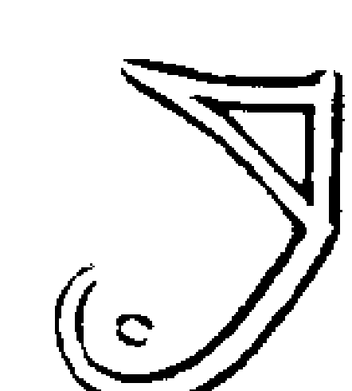


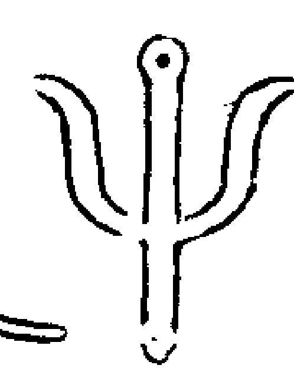

## FIND YOURSELF THROUGH NUMBERS

- 经常感到辛苦、困顿？
- 不清楚自己擅长哪类工作？
- 总是遇不到“命定”的那个人？
- 怎么讨天赋数“8”老板的欢心？
- 如何管理不同天赋数的员工？
- 怎样顺利应付各种不同命数的客户？
- 哪个才是自己或是上司、好友最真实的性格？


