通过学习命定主神的成长历练，找寻人生的方向……

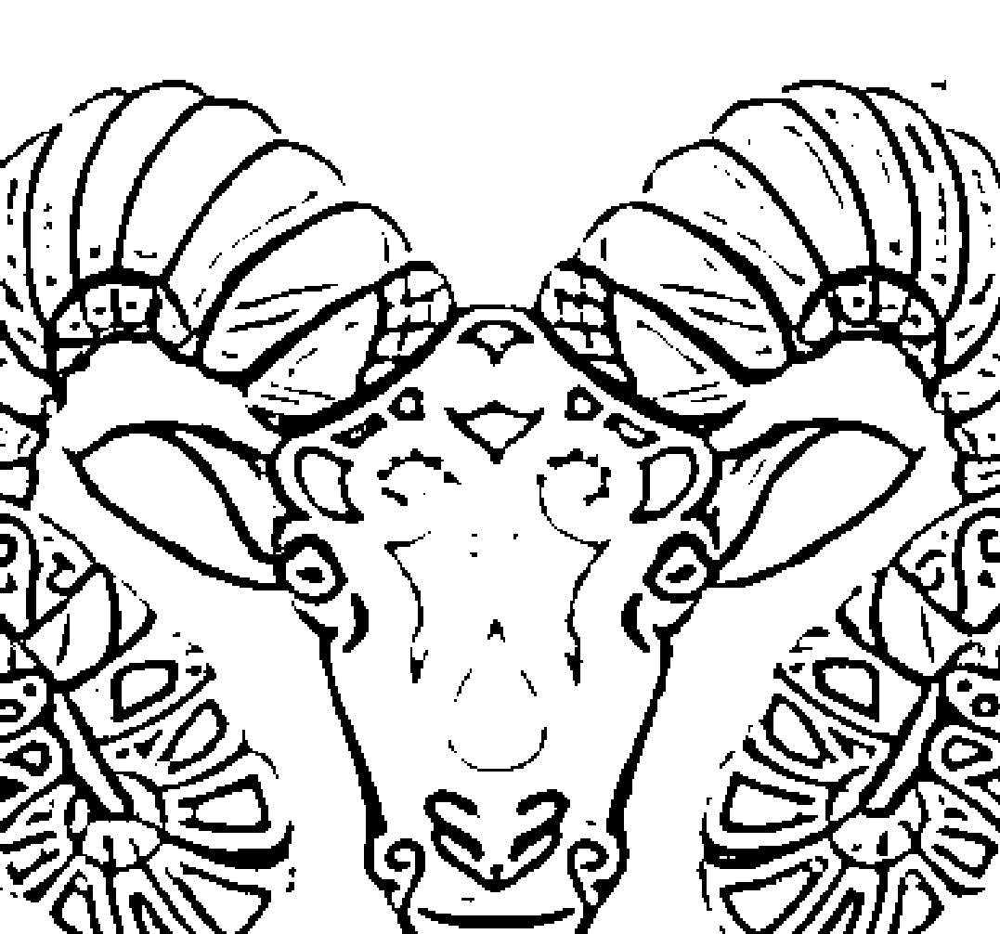

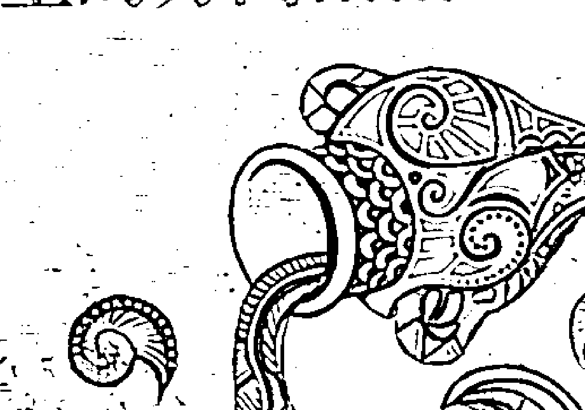

# IN THE PATH OF THE GODS

# 开悟生命数字密码

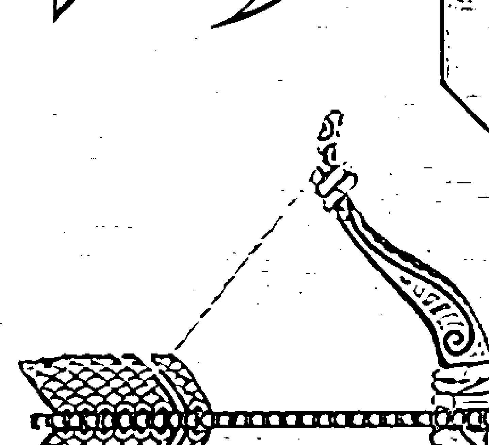

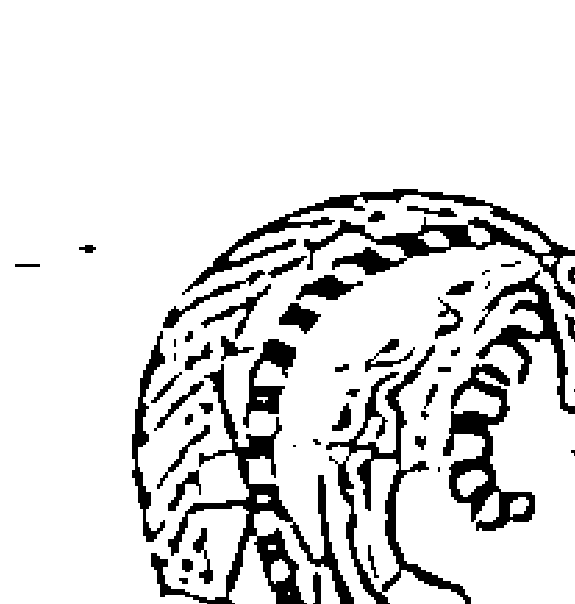

【希腊】蓝宁仕 Dimitrios Lenis / 著

# 都市灵修辅导书

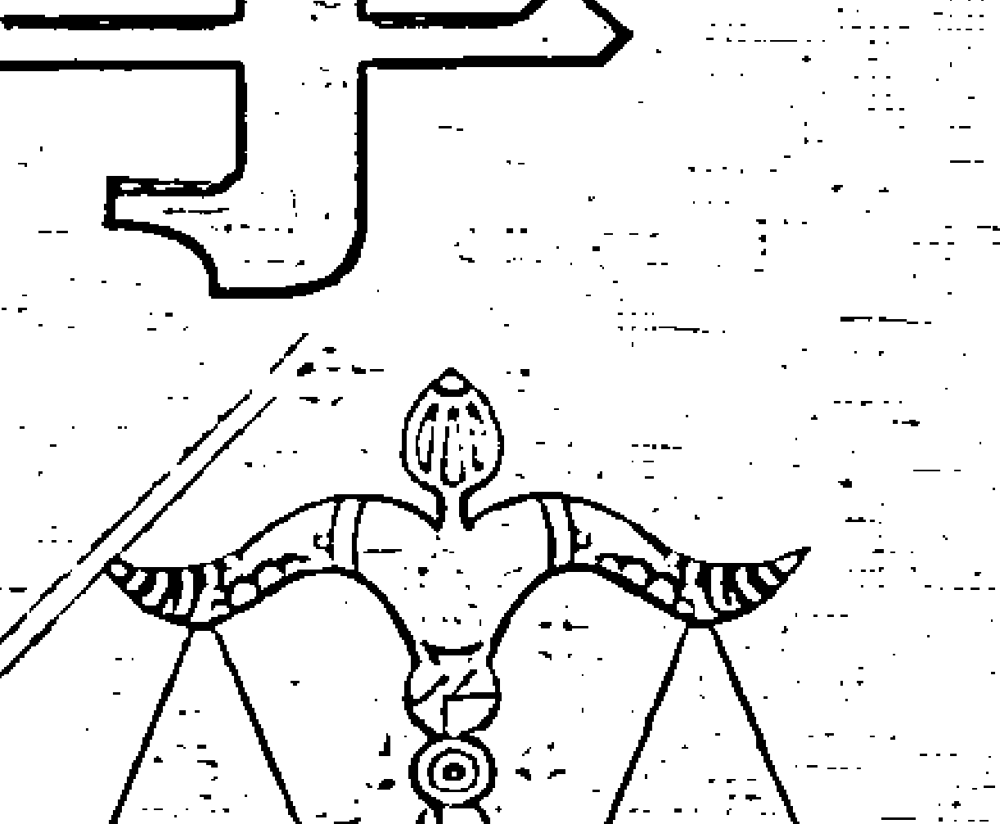

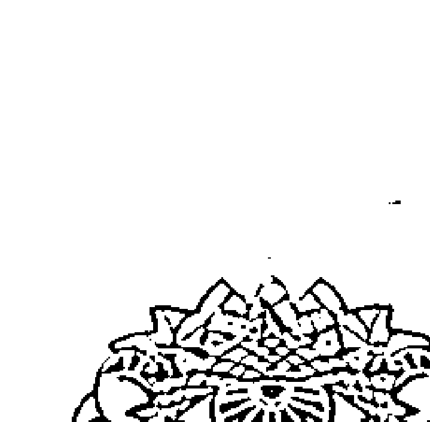

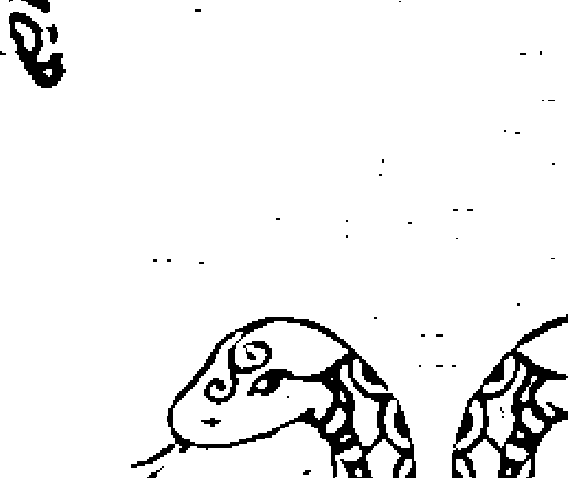

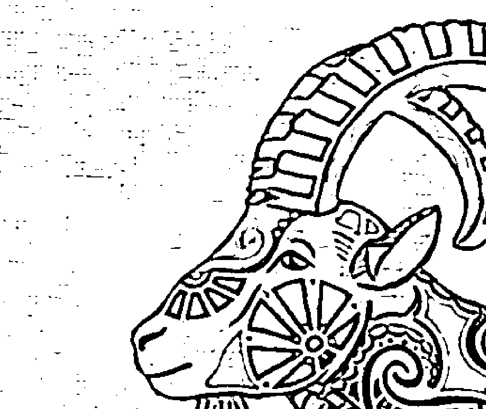

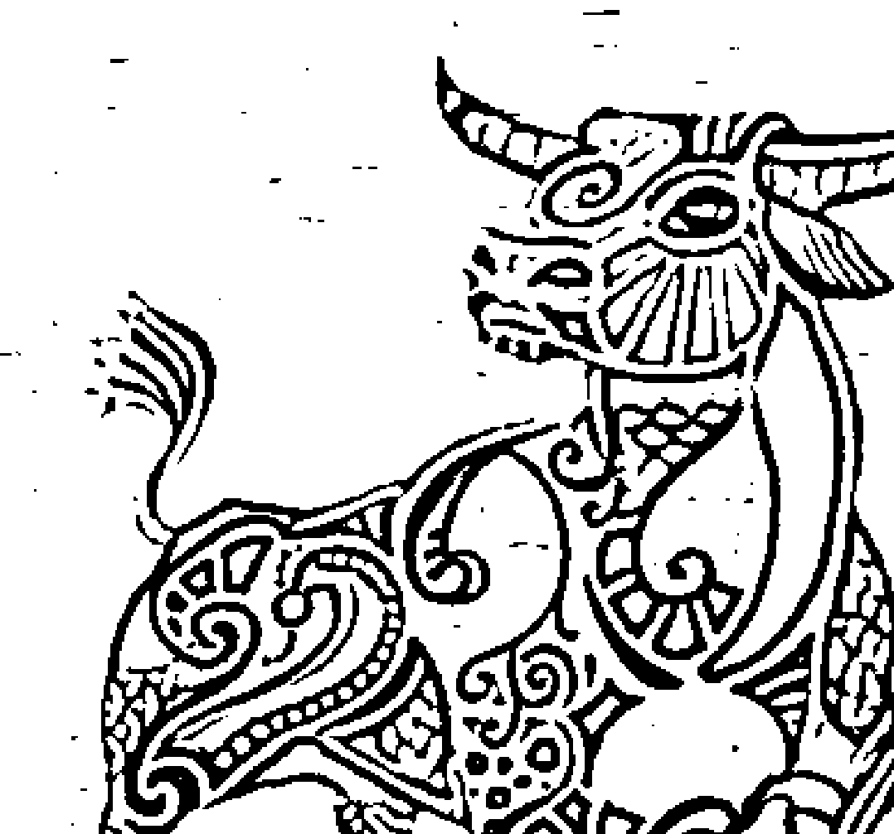

北京日报报业集团 同心出版社

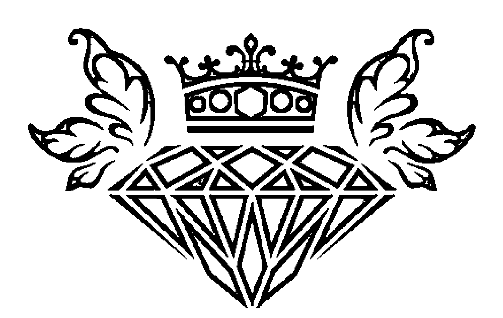

# St. Royal College

# 天使神秘学院

- ※ 专业占卜预测机构
- ※ 神秘学培训机构
- ※ 水晶能量研究中心
- ※ 官方淘宝：http://strc.taobao.com
- ※ 官方微博：http://weibo.com/715104687
- ※ 新书发布QQ群：316790219
- ※ 购买更多好书请联系院长大天使

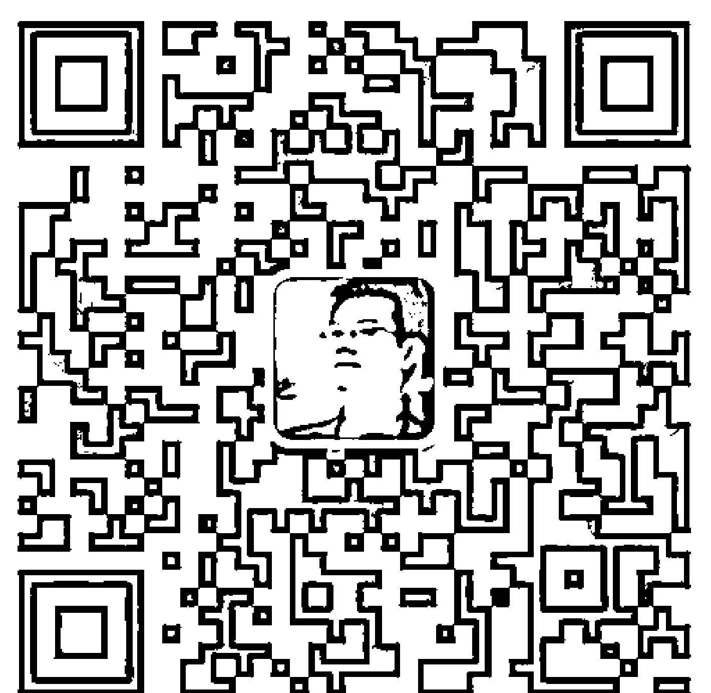

# 大天使

天使神秘学院 院长

QQ：715104687

手机/微信：13641926204

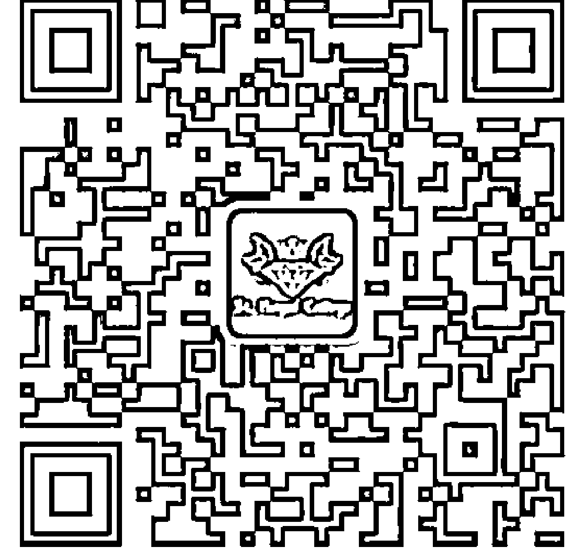

微信公众平台：strc2011

# 制作说明：

本书由《天使神秘学院》出重金从台湾购入的原版书籍扫描制作完成。为达到最好阅读效果，特地把原版书全部切开后，再经由专业扫描设备高精度扫描完成，并经过一张张的PS后期处理最终成书，其间花费大量的人力、物力以及时间，只为能给大家提供经济并优质的神秘学学习资料而努力。

本学院强力谴责某些机构和个人，把本学院花心血制作完成的电子书籍，包装后直接放在自家淘宝网上低价倾销的行为，以谋取不劳而获的经济利益。如果长此以往最终将无人愿意再为大家花心思制作电子书，那以后可能大家再无新书可读。

为让大家以后能够读到更多的好书，也为了本学院的良性发展。本学院恳请大家尽量做到如下几点：

- 1. 尽量在本学院的网站购买电子书籍。
- 2. 请勿用技术手段把电子书内的水印及加密去掉。
- 3. 在收到电子书后小范围传阅即可，千万不要公开传播，更别挂到淘宝网上低价销售。

同时为答谢广大支持者，学院电子书将做如下调整：

- 1. 学院会把一些早已收回制作成本的电子书折价销售。
- 2. 最新制作的电子书籍会开放打印功能，大家购买后有条件的可自行打印成书。

天使神秘学院
2017年6月

# IN THE PATH OF THE GODS
开启生命数字密码2

【希腊】蓝宁仕 Dimitrios Lenis / 著

# 目录

- 序 / 001
- 前言 / 007

## Part 1 数字与希腊神话

- 1. 阿瑞斯 Ares / 023
- 2. 赫拉 Hera / 039
- 3. 阿佛洛狄忒 Aphrodite / 053
- 4. 德墨忒尔 Demeter / 067
- 5. 赫耳墨斯 Hermes / 081
- 6. 阿波罗 Apollo / 095
- 7. 雅典娜 Athena / 111
- 8. 赫淮斯托斯 Hephaestus / 129
- 9. 阿尔忒弥斯 Artemis / 145
- 10. 波塞冬 Poseidon / 163
- 11. 宙斯 Zeus / 179
- 12. 狄俄尼索斯 Dionysus / 193
- 结语 / 210

## Part 2 希腊神庙之旅

- 寻找希腊众神的足迹 / 220

# 序

几年前我前往希腊旅行，造访德尔菲（Delphi）的阿波罗神庙。导游说，古希腊人把这个地点视为世界的中心，是大地之母盖亚（Gaia）的肚脐眼；因此这里成为一个信息源，关于人类命运的消息便从这里往外传出。这个神庙在古时候是全希腊最重要的预知命运的地点，前来的人络绎不绝，想要算命的人，居然要提前六个月以上来预约排队。我听了觉得很有趣——而且我遇上了一件我完全料想不到的事。

我在这处圣地四处走动，心中不禁好奇，这个地方果真可以帮助人找到自己的人生方向吗？阿波罗神庙的神效，在我身上也管用吗？那时候的我正面临着人生重大抉择，确实需要一点指引。我那时在加拿大英属哥伦比亚大学的科学与工程系读二年级，可是我读书读得很不开心，觉得自己在浪费生命，工程系根本不适合我。我喜爱音乐，将来想以音乐当做职业。然而，这个念头与父母对我的期待背道而驰。但我想休学。

我在阿波罗神庙里徘徊踟蹰。

这里要先岔开来讲一件事。我会玩一种叫做“钢鼓”的乐器，这种乐器源自加勒比海区域的一个国家，千里达（Trinidad）。把一个容量45加仑的大油桶拿来，用槌子敲打成碗一般凹下去的形状，在圆弧形的鼓面上再敲打出小小的凹处，每个小凹处都可以敲击出不同的音调，类似钢琴或管风琴的声音，如此就做出了一面钢鼓。

置身阿波罗神庙的我，万万没料到自己竟然开始暗暗向阿波罗神祈求，希望他能给我指引，让我知道自己究竟是应该听父母的话，把书念完，当个工程师，还是应该追寻自己的兴趣，当个音乐家。我在心中问出这个问题没多久，竟然发现自己所站的地面微微往下陷，吓得我汗毛直立。我往后退，试着推一推那处凹下去的地面——神奇的事发生了，在神庙旁边的一块地面下，埋有一个45加仑的油桶，就是用来制作钢鼓的那种油桶——

我刚刚才问了阿波罗神自己该何去何从，眼前就出现一个油桶！这景象是否要我去追求自己的梦想？然而我不是迷信的人，我不希望自己受到这样一个巧合的影响。可是，这里是神庙，不是吗？好，我决定了！我要朝音乐的方向发展。

这个抉择，把我带到了美国加州圣克鲁兹（Santa Cruz），我所加入的乐团在这里颇受欢迎，最后我们就把圣克鲁兹当作大本营。圣克鲁兹乃是彼时正兴盛的新世纪（New Age）思潮的大本营，我在这里学到很多与“自然疗法”（Natural Healing）有关的东西，以及关于直觉开发、灵性、能量等等的事物。我逐渐入迷，不久甚至发现我对于这些事物感兴趣的程度不亚于我对音乐的爱好。终于有一天，哥伦比亚唱片公司的人员摆了一份合约放在我面前，最后，我却毅然决然放弃了音乐事业，决定拾起书本，回大学攻读“疗愈”这一课题。

说来，那一趟前去阿波罗神庙的旅行并没有引领我走向音乐生涯，然而它确实改变了我的人生，一如它几千年来对许许多多人的影响。

几年以后，我拿到了一个脊椎神经科（Chiropractic）的医学学位，并且借由按摩脊椎、肌肉与身体软组织的问题，搭配饮食调理，以此来达到治病的目的。我觉得这是很好的开始，然而我相信，真正的治疗必须包括心灵与身体，因此，若是想成为真正的治疗者，我必须学会如何在心理层面上对别人提出帮助。

就这样，我开始钻研包括容格（Jung）论著与NLP（神经语言程序学）在内的各种心理学理论。可是我总觉得这些心理学讲究太多理论，使用过多学术字眼，也太技术导向，并不是一般人就能轻松接受与喜欢的东西。它们都缺少了一些什么。再说，这些心理学理论都不好玩。

因此，我接触了“数字学”（Numerology），并且恍然大悟。数字学不仅帮助我迅速了解了我自己，让我看到自己在生活中一犯再犯的错误，也让我找到了方法成长，它还帮助了我认识我身边的人。于是我继续研究各种不同形式的数字学，最后终于整理归纳出属于我自己的一套数字学，并出版了这方面的著作；我的数字学着重的是人的性格分析、沟通模式与个人成长。

在研究数字学的这些年里，我多方了解古今中外的名人范例，从中寻找具有代表性的性格原型，可是我怎么样都觉得还是不够。这时候发生了一桩巧合：2004年的奥运会要在希腊举行，我因为是好几位希腊田径国手与举重国手的私人医师，所以去了希腊几趟。在希腊的日子里，工作之余，我会阅读希腊神话的书籍。读着读着，我发现，有12位神祇的特性似乎可以与生命密码联系起来。

这七男五女的故事，透露出他们与生命数字的基本原型之间的关联。于是我整理出足以代表这12个神祇的神话故事，归纳出他们的性格强项与弱点，以及他们是用什么方式来克服自己的弱点，使得他们能成为神祇。果然，他们几乎都吻合了生命数字的描述：

- 1 战神，阿瑞斯
- 2 天后，赫拉
- 3 爱与美之神，阿佛洛狄忒
- 4 谷物女神，德墨忒尔
- 5 神使，赫耳墨斯
- 6 光明之神，阿波罗
- 7 智慧女神，雅典娜
- 8 火神，赫淮斯托斯
- 9 月亮女神，阿尔忒弥斯
- 10 海神，波塞冬
- 11 天神，宙斯
- 12 酒神，狄俄尼索斯

大家多少都听过希腊神话里的故事和某些神祇的名字。现在，借由神祇与生命密码的关联，这些神祇所代表的性格原型就更容易理解，并且更容易运用在各方面。这些神祇的故事流传已久，很有名也很有趣，当你读到了与你的数字有关的神祇故事，甚至会觉得像是在照镜子，仿佛看到了自己的写照。

然而就像古谚所云，“太阳底下没有新鲜事”，我把希腊神祇与生命密码结合起来的这个做法，并不是新的发现。比方说，心理学里有个术语，“俄狄浦斯情结”（Oedipus complex），就借用了希腊神话里“俄狄浦斯弑父娶母”的故事来说明一种病态的家庭情境。自从弗洛伊德的学生容格首开先例之后，很多心理学家也使用希腊神话人物当做性格的原型。

写这本书，是为了补充我前一本《新生命密码》未尽详细之处，希望借着希腊神话的帮助，用“性格原型”来更进一步说明各个生命密码的特质。如同我在前一本著作中说过的，光明之神阿波罗要世人“认识自己”，这是我们生来世间最重要的生命功课，因为只要你认识了自己，你就知道如何创造出让自己快乐而健康的幸福人生。

我着手撰写这本书的时候，大块文化出版公司为我引介了中天电视台的新闻部人员，他们认为这个题材很有趣，于是派了一位记者与我一起前去希腊，针对我所提出的希腊十二神性格原型与神庙遗址做了一系列报道，并拍摄了一些美丽的画面。只有12个工作日来完成这项行程。一开始我与同行的电视台记者觉得这是不可能完成的任务，希腊全境的总面积不小，而境内各地的交通并不是非常便利，特别是离岛与离岛之间交通线路往往无法直接通达。果然，我们历经了重重困难，幸好最后圆满结束，12个神祇的神庙遗址1个也没错过。

假如你也想来一趟希腊朝圣之旅，建议你不要轻易尝试在12天里完成全程，那会非常非常辛苦，而你在旅行之后还需要依靠再度假一次来恢复。建议至少安排14天以上，一来比较轻松，二来万一天气变化，也可以调整行程。

本书后半部描述了这一趟旅行，提供给有兴趣的读者参考。

认识自己只是个起点。在认识了自己之后，你必须接受自己，爱自己，采取恰当的行动来改变生活，勇敢面对各种人生课题。希望这本书能带你进行一趟认识自己的心灵之旅。

# 前言

所谓数字学，是一种以数字的意义为基础，针对人类性格的类型做出分类的学问。每一个数字可以说明一种性格的原型，并说出此性格原型的优点、弱点与奇特性质。根据瑞士心理学家容格等多位心理学家的理论，人类性格可以分析出几种基本原型，若能深入探讨这些性格原型，我们将可以在这些原型里面看到自己，进一步反省与认识自我，接受自己，发挥才能，改进缺点。从数字学出发所形成的性格原型论，可以是一种强而有力的自我分析与成长的工具。

可惜，有一些运用数字学的人，他们把人的生日数字加一加，然后就像占星师那样只看见蛛丝马迹就要解释性格特质并预知未来。由于没有科学基础可以证明这种算法的可信度，于是数字学往往被当成一种算命的方式，看起来也似乎有迷信的成分，于是使得大家没有充分理解数字学的潜在作用。（当然，话说回来，也没有科学研究能证明这样的算法完全不足采信！）可是，无论这种解读数字的方式正不正确，我们都不应该对于数字学嗤之以鼻。

# 数字学的起源

数字学（numerology，或译作“占数学”）源自2500年前的希腊哲学家，毕达哥拉斯。

毕达哥拉斯的许多发现至今仍影响着今日的科学，他被后人尊为数学、几何、天文与音乐等学问的鼻祖。毕达哥拉斯认为数字是神的语言，他并且从形状与数学特质来解释各个数字的意义，譬如“4”是正方形，而方形的对象（譬如砖块）是用稳定的方式来创造出安全感，所以数字4就与“安全”有关。而“2”是一条线或一段绳子，所以需要一个原因来说明为什么需要依赖，譬如绳子可以用来把东西绑住，不让东西散开。光用这样的短短说明，就可以理解数字的意义。

毕达哥拉斯认为，在数字、科学、数学与音乐等等学问里面，可以找到方法来认识自己并改善人生。他死后，这些学说继续传递，我们在苏格拉底、柏拉图、伽利略等后代哲学家或科学家的理念中都能看到毕达哥拉斯的影子。

```
勾股定理：a²+b²=c²
```

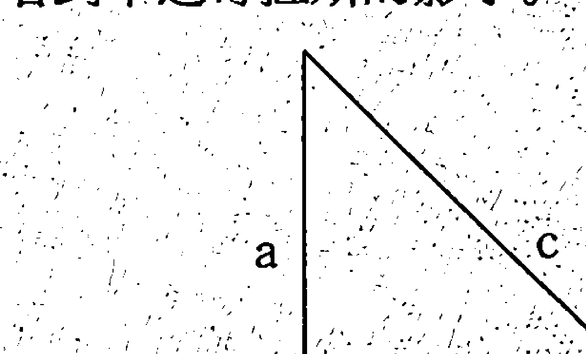

把一个人的出生年月日数字加总起来，然后看这些数字对于那个人的影响——这里面还是有科学根据可以说明数字对人的作用。自从爱因斯坦提出了他的学说以来，科学界获得许多新的发现，其中一项发现是，万物都是“能量”，因此就含有“频率”或者“振动”，可以与周围的频率或振动产生交互作用。

此外，根据毕达哥拉斯的说法，数字里面所含有的震动可以产生作用力，他相信数字不只是用来测量东西的工具，数字也同时具备能量与频率，并且会以音乐或热能等等的能量形式呈现于生活当中；正如音乐能影响人的情感，从毕达哥拉斯的观点即是从数字来了解生活上的各种影响，所以毕达哥拉斯的观点与我们一般人的观点不同。

除了数字以外，还有其他的观点来了解生活上各种影响，例如中医是从金、木、水、火、土五行来了解人的病症；希腊传统医疗是用水、土、火、空气来了解人的病症；印度的传统医疗是用三行；如果你用更多的观点来了解生活上的各种影响，你可以看得更宽广更详细，并且可以了解别人所看不到的部份。

最基础生命密码的观点是从九行来了解生活上的影响，进阶生命密码的观点是从十二行来了解；从中医五行、希腊的四行与印度的三行，很容易了解其中的意义，但从毕达哥拉斯的数字理论，很难了解1~9的含意；而用自然哲学分析的方式，则每个数字有它所代表的含意：例如四方形给人稳定安全的感觉，所以数字4代表安全感、稳定、坚固。从此方式来解读数字，每个数字都有它的含意。

用上述方式来解读你的生活、工作、饮食、环境、运动、人际关系等……我们都可以把它转换成数字，从这个观点我们可以了解得更多。

毕达哥拉斯相信“生活中没有巧合”，所有事情的发生，都是有原因的。本书仅介绍基本的生命密码——从出生年月日来了解个性，或许你觉得这样有些迷信，但从中医五行、希腊四行、印度三行也是由不同观点来了解生活的，而我们是从数字的观点来解读，每个数字都有其代表意义，所以你的出生年月日，会给你一个影响，而且非常重要。

运用数字学的时候，最好不要只看出生年月日，或只看某一种算出来的数字。最理想的方式是先了解所有的数字原型，辨识出哪一个数字所代表的性格原型最像你；然后再把出生年月日的数字加总起来，看看它是不是恰恰就是你先前觉得最像你的那个数字——看到结果，你说不定会与成千上万的人一样惊讶。可是，如果那两个数字不同，那么哪一个才是你的数字呢？事实上两个都是。一个人的性格很少只用一个数字就可以简单描述出全部的特质。有一个比较精确的方式是，辨认出至少三个与你的性格相像的数字，然后思索其中哪一个数字对你的影响最大。此外，人的性格会起变化，每一个阶段展现不同的性格原型。不妨多多观察自己的变化。

更顶尖的生命密码，则不需要出生年月日；从人的发型、衣着、说话方式、饮食习惯等就可以知道数字所带给他的影响、个性、天赋、优缺点等，从这个新的角度来看，环绕在生活周遭的所有数字，都与我们息息相关。借由了解数字的意义，我们更能客观认识自己，明白事情为何会发生在自己身上，以及应该采取怎样的对策，让我们的生活更健康、更成功。

# 希腊众神所代表的生命密码

| 生命密码 | 希腊名字 | 罗马名字 |
| :--- | :--- | :--- |
| 1 | 阿瑞斯 (Ares) | 玛尔斯 (Mars) |
| 2 | 赫拉 (Hera) | 朱诺 (Juno) |
| 3 | 阿佛洛狄忒 (Aphrodite) | 维纳斯 (Venus) |
| 4 | 德墨忒尔 (Demeter/Dimitra) | 喜瑞斯 (Ceres) |
| 5 | 赫耳墨斯 (Hermes) | 墨丘利 (Mercury) |
| 6 | 阿波罗 (Apollo/Phoebus) | 阿波罗 (Apollo/Phoebus) |
| 7 | 雅典娜 (Athena) | 密涅瓦 (Minerva) |
| 8 | 赫淮斯托斯 (Hephaestus) | 伏尔甘 (Vulcan) |
| 9 | 阿尔忒弥斯 (Artemis) | 黛安娜 (Diana) |
| 10 | 波塞冬 (Poseidon) | 涅普顿 (Neptune) |
| 11 | 宙斯 (Zeus) | 朱庇特 (Jupiter) |
| 12 | 狄俄尼索斯 (Dionysus) | 巴库斯 (Bacchus) |

# 如何使用这本书

首先，我建议你把这本书当做一本讲述希腊神话的书，先读一遍。阅读过程中请注意，在这些关于希腊众神的描述里面，哪些段落简直像是在描述你自己的某些个性。挑选出一个整体而言你觉得最像你的神；然后再找出两个只说准了一部分的神。用这三个神来代表你。（在书后会有一章说明如何处理这三者所可能造成的内在冲突。）你可以借此了解自己性格里的冲突，以及生活里为什么会出现许多课题，进而找到方法来面对解决。用这套有趣的方式来认识自己、改进自己，可以让你更健康，更能面对自己性格里的问题与矛盾。

认识了这些希腊神祇的基本特性，以及他们在沟通、体型、服饰装扮、言行举止等方面的基本原型之后，有助于与人的相处。当然，也许得先把这本书多读几遍，才有办法熟知每一种性格原型的特质；一旦熟悉之后，就可以在与别人初次见面的时候很快便感觉到对方可能是属于哪一种类型，并知道该用什么方式与对方沟通，该注意哪些地方。假如有机会得知对方的出生年月日，你不妨把那些数字相加，确认对方的生命密码，然后把所得结果与你先前在不知道他生命密码的情形下所得到的感觉，两相对照。这可以增进你的人际沟通能力。

在每一章里都有一个方块列出每一位神祇与身体部位的对照，以及其他相关的小信息。这些都是与自我治疗和情绪释放的方法有关，但需要用专书才能介绍完整。在这里列出一些，增添一点阅读趣味，提供读者参考。

读过了代表你的生命密码的神祇的故事之后，你可以找出你的黄金三数，然后阅读另外两个数字的特质，因为这三个数字共同形成了你的性格。

# 十二希腊主神

希腊人的信仰里面还有很多其他的神祇，本书所描述的是其中最主要的12个。这12神统领了其他众神，古代希腊历法上的重大活动与庆典事件都是根据这12个神而来，而古希腊的宗教信仰也源于对这12神的崇拜。可是希腊人认为不可以侮辱或忽略任何一个神，即使不是主神也应受到尊重，所以希腊大大小小的神明往往都有专属的塑像与神庙，希腊人对神的这份尊重，后来甚至延伸到对埃及诸神的尊重。

我们现在并不知道当初是如何挑选了这12个神成为希腊的主神。然而“12”这个数字一直被视为一个圆满的数字。天上有黄道12宫，12个星座，一年有12个月，时钟钟面上有12个钟点数；耶稣有12门徒。

神话故事是几千年来流传的结果。在神话最初形成的时候，还没有今日我们所熟知的婚姻制度，也没有对于性、爱与感情关系的约束观念。所以当你读到了希腊众神居然会爱上自己的近亲，会不经女子同意就霸王硬上弓，可别惊讶，也不要用现代的眼光把那些看成乱伦和强暴；而男性神祇往往会爱上同性，这也不奇怪，除了太阳神和火神之外，其他希腊神话里的神祇都有同性恋的记录！

# 014 新生命数字密码·2 In the Path of the Gods

格。本书把每一个神祇与一个生命密码做对应，你暂时可以不理会比较复杂的数字学的问题。但由于这个课题实在有趣，所以我相信你会想进一步探索相关说明，你不妨阅读我以前关于生命密码的著作，或者上我的网站 drlenis.com.tw。

# 关于希腊神话

希腊神话是从多种源头而来的各式情节、线索、事件等集合而成的结果，这些来源以荷马（Homer）、赫西奥德（Hesiod）、博西尼亚斯（Pausinias）等文人学者的著作为核心源头。然而很多时候，同一个情节或同一件事却是发生在不同的神身上，或者情节发生的顺序不一样，或者地点不同。不要因为这些差异而困惑，因为神话不是历史，而只是口耳相传的希腊众神的故事，经历了几千年来多个民族的传讲，会出现上述那些不同是很正常的事。

本书所讲述的神话故事，目的在于描写十二位希腊神祇的性格特质，而不是为了提供各种故事的不同版本的比较。

然而，在阅读希腊神话的时候还是要记住：这些神话毕竟与希腊的历史有关。希腊的历史又长又复杂，有文字记载的历史可追溯到5000年以前。希腊人口并不是由单一民族组成，而是一个又一个好战的民族从各地前来，占领土地，与当地人婚配繁衍后代。这段融合的过程可以在考古学的结果看出来，也能看到古希腊人所崇拜的神祇并不是以宙斯为首的奥林匹斯众神，却是崇拜女神。希腊人认为女性是生命的源头，所以把大地之母视为一个女性的神；这个大地母神在希腊各地以不同的名字受到崇拜。希腊曾多次被不同民族的军队占领过，那些殖民统治的王国引进的是

# 命数的计算范例

| 日期 | 计算过程 |
|------|----------|
| 2000年1月7日 | 2+0+0+0+1+7=10，再把1与0相加，得到1 |
| 1970年1月2日 | 1+9+7+0+1+2=20，再把2与0相加，得到2 |
| 1956年8月1日 | 1+9+5+6+8+1=30，再把3与0相加，得到3 |
| 1966年4月5日 | 1+9+6+6+4+5=31，再把3与1相加，得到4 |
| 1959年10月16日 | 1+9+5+9+1+0+1+6=32，再把3与2相加，得到5 |
| 1989年1月5日 | 1+9+8+9+1+5=33，再把3与3相加，得到6 |
| 1991年7月7日 | 1+9+9+1+7+7=34，再把3与4相加，得到7 |
| 1957年8月5日 | 1+9+5+7+8+5=35，再把3与5相加，得到8 |
| 1982年6月1日 | 1+9+8+2+6+1=27，再把2与7相加，得到9 |
| 1937年7月1日 | 1+9+3+7+7+1=28，再把2与8相加，得到10 |
| 1952年6月15日 | 1+9+5+2+6+1+5=29，再把2与9相加，得到11 |
| 1965年9月18日 | 1+9+6+5+9+1+8=39，再把3与9相加，得到12 |

我并没有列举出命数13以后的例子。这是因为在过去2000年以来的所有出生年月日的数字加总起来，最大的数字是48，不会得到49以上的数字，所以就不会得出13这个生命密码。以下我更进一步说明这一点。

在年份方面。从公元元年到1999年，其中最大的数字是1999，把4个数字相加，1+9+9+9=28，所以最大的年份数字是28。其他的年份数字相加后一定小于28。譬如1899年，4数相加后得到27。1799年的4数相加，得到26。

在月份方面。从1月到12月，这些月份数字从1到9。10月则是1加0等于1。11月，1加1得2。12月，1加2等于3。

在日数方面。从1日到31日，数字相加后总数最大的是29，2+9=11。其他则都是10以下。譬如31日，3+1=4，30日是3+0=3。依此类推。

从上面的计算可以看出来，我们把最大的年份数(28)、月份数(9)、日数(11)的数字一个个相加，所得的最大数字是48，再把4与8相加，得到12。一直要到公元2999年9月29日出生的人，出生年月日数字相加后所得到的数字才会得到13。

男性的神祇，而不是比较阴柔的女神，为了要吸引希腊本地人来崇拜他们的神，这些殖民者就想办法做一点“本土化”的工作，在自己的神祇身上添加希腊本地神祇的色彩。譬如爱与美之神阿佛洛狄忒（罗马人称为维纳斯）的神话比其他神祇都来得早，也比宙斯早；宙斯祖父的生殖器被割了下来、然后被宙斯的父亲丢到了海里之后，阿佛洛狄忒就从海里诞生了。至于宙斯的神话，一直要到公元前1450年，北方民族阿凯亚人（Achaeans）南下征战的时候才逐渐形成；在那之前，希腊人的主神是海神波塞冬；沿海居住的希腊人需要学习许多与海搏斗的技巧。阿凯亚人来了之后，宙斯就取代海神成为希腊人的主神。

此外，很多神话故事里都出现了女性不需要男性精子也能独力产下孩子的情节，这多么像现代的“克隆技术”所能达到的结果。神话故事里也有男子独力产下婴儿的故事，譬如宙斯生下了女儿雅典娜。以前的人当然觉得不可思议，但今日已经有了干细胞技术和克隆技术，说来那些神话情节迟早可以成为现实。有个德国人因为癌症而切除了下颚，后来医生使用科技为他再装上一个人工下颚。基因工程将来可能会制造出许多比神话故事更无法想象的千奇百怪的东西出来！

有人也许会担心，以为我是在鼓吹崇拜这些古希腊神祇。别担心，我丝毫没有那个企图，也没兴趣那样做。在古代，确实有信徒把希腊众神当做神明一样在狂热崇拜；但自从基督宗教在罗马世界兴起之后，那些古代多神信仰就都止息了。古神祇的神庙遭到破坏，雕像被捣毁，尤其是在君士坦丁和亚历山卓这两座古城的图书馆付之一炬以后，关于古代信仰的知识也不复追寻。后来，多亏了欧洲探险家、考古学者和伊斯兰学者的努力，我们今日得以从若干线索来探知古代信仰的样貌。希腊众神的故事，不再具有宗教意义，也不仅只是对于希腊有所影响。现在，全世界的人都

有机会阅读希腊神话，而希腊众神的名字在不同的文化里也被赋予不同的涵义。今日希腊有一群人确实在致力于复兴对于这12位希腊主神的崇拜，主张要赋予这些神祇相当于基督教“教会”的同等地位，不过希腊政府还没有点头同意。假如这些希腊神祇获得了合法的宗教地位，而信众的人数逐日增加，也许他们的名字与故事会再一次取得宗教方面的地位，而人们会用敬拜耶稣、穆罕默德、释迦牟尼等宗教人物的态度来对待酒神；说不定届时大家对于希腊神话的认识与态度会随之改变。不过这些还言之过早，我们现在不需要把希腊神话与宗教信仰放在一起理解。

# 计算生命密码的方式

以下简单说明如何计算出每一个人的生命密码。

把出生年月日的数字全部视为一个个位数的数字，一个一个加起来，最后所得到的数字便是该生日的“灵数”（spiritual talent number）；然后再把灵数的两位数相加，便得到了“命数”（destiny number）。

范例：某人出生于1952年6月15日：

```
`1+9+5+2+6+1+5=29 ——灵数（天赋数）`
```

再加一次：

```
`2+9=11 ——灵数（天赋数）`
```

然后再加一次：

```
`1+1=2 ——命数`
```

# 特别说明：命数10、11与12

我过去两本关于数字学的著作里，都只教读者把出生年月日的数字逐一相加，一直加到最后成为一个个位数的数字，这是命数，也就是该出生年月日的生命密码。这在只需要加一遍的数字里没有问题，譬如灵数20（命数2）、21（3）、30（3）、22（4）、31（4）、40（4）、14（5）、32（5）、24（6）、33（6）、25（7）、34（7）、35（8）、44（8）、27（9）、36（9）等等。

不过，有些数字其实应该要用比较复杂的层次来讨论才会准确。譬如灵数28（10）、37（10）、29（11）、38（11）、47（11）、39（12）、48（12），这些灵数必须再加一次，才能成为个位数的生命密码；可是，这个个位数的数字无法完整说明那个数字的特质。譬如命数10的人与命数1的人并不一样，11与2非常不像，而39与3是两种人。

假如能画出命盘图表，就可以把那个人的性格模式看得比较准确一些。此外，还要借用所谓“卓越数”的角度来看某些数字，譬如11、22、33与44。至于12也有独特的含意，无法只用3数的意义说明。

数字学其实很复杂，为了用比较易于理解的方式让读者学习到它的好处，我发展了一套“金三角数字法”，让学习者可以更快速认识到自己性格上的矛盾冲突，以及解决之道。（详见我的另一本著作《新生命密码》）。在每一个人的黄金三数里面，中间那个数字，就代表了每一个人在面对性格冲突与人生课题时所需要注意的方向。

# 向众神学习人生功课

希腊众神与人类一样有爱有恨，有优点有缺点，这种概念完全不同于基督教、犹太教、佛教等宗教把神视为完美无缺。假如我们认为神是完美的，我们凡人低头看着自己的缺陷，自惭形秽，当然觉得压力沉重，永远达不到神明的境界。面对完美典型却知道那是可望而不可即的理想，这当然会让人产生焦虑感与挫折感，让人把自己原本具备的天生能力给压抑下去，不敢表现出自己的真性情。这样当然是不健康的做法。

假如我们知道了神明跟我们一样，有缺点，会犯错，并不是十八般武艺样样精通，而是只具备某些特殊的天分，我们就比较不会苛求自己一定要完美，不会觉得人生是那么沮丧，变得会对自己比较有信心，更愿意看重自己。

把希腊众神看作是性格原型，可以让我们松一口气：原来我不必一定要像别人，而可以做自己。借着认同众神，看着他们改进自己的缺点，在成为神的路上学习各种教训，我们也要鼓励自己，向他们学习，认识自己，做好自己。

## Part 1 数字学与希腊神话

A look at the 12 Gods with a numerology point of view reveals an uncanny connection between them and the basic personality types of numerology. I realized I had a powerful tool if I could connect them together. Through researching the life stories of each God I discovered how each God had stories about their strengths and weakness, how the weaknesses were overcome to make them become Gods. Uncannily, they matched perfectly to the descriptions and stories of numerology.

# 1. 阿瑞斯 Ares

阿瑞斯是战神，也是舞蹈之神。阿瑞斯与其他众神不一样，他并不掌管任何大自然现象，他的意义在于向世人显示了一个战士如何做到“无惧”。他好斗的天性使得希腊人并不喜欢他，只在斯巴达和色雷斯两地有神庙供奉他；不过，由于斯巴达人不造宫殿，而色雷斯的战事频仍，因此今日这两地找不到几个供奉阿瑞斯的神庙。其实，由于阿瑞斯据说是罗穆卢斯（Romulus）和瑞摩斯（Remus）的父亲，而这两人的名字正是“罗马”城市之名的由来，所以阿瑞斯在罗马的地位比在希腊高。

今人得以知道战神的名字，一来因为英文里“火星”是以他的罗马名字“Mars”为名，二来因为占星十二宫的第一宫是以他的希腊名字“Ares”命名（十二宫里唯一一个采用天神名字的宫位），也有许多产品用他的名字来象征权力和速度。

好战的希腊人竟然讨厌阿瑞斯，这说来似乎奇怪，推想这和阿瑞斯的特立独行有关。阿瑞斯不在乎胜不胜利，只是想杀人和找人打斗，这表示他不关乎胜败。他是用体力在作战，而不是用大脑；他作战是为了自己和他所亲近的人，而不是为了其他没有直接关系的人。阿瑞斯这样的个性不符合希腊军队的需求，因为希腊战士之间的关系不甚密切。

首先，希腊人崇尚智取和谋略，并不看重蛮勇，所以他们喜欢智慧女神雅典娜；她是杰出的战略家，虽身为女性，却能每战皆捷。其次，希腊军队并不团结，战士之间的关系也不甚紧密；军队通常是因应眼前的战争而随机组成，所以经常起内讧。这可以从阿喀琉斯（Achilles）在特洛伊战争中的举动看得很清楚：阿喀琉斯作战是为了一己之私，而非希腊军队的整体福祉。这种特质的人若再去供奉崇拜好战的阿瑞斯，只会使得希腊军队更难以组织和管理。（别忘了每一个希腊城邦都是独立国家，不仅国与国间经常交战，自己国家里也常起纷争）。但是这样的问题没有发生在斯巴达人和北部希腊民族身上，因为他们很团结，全心培养国力与战技，他们非常需要具备阿瑞斯的特质。

第一位成功结合了阿瑞斯特质和雅典娜特质的希腊人，是亚历山大大帝。他把体能作战技巧与伟大战略合二为一，是史上最快征服西方世界的

人。此后，罗马人仿效他的作风，他们的军队比希腊人团结，不会起内讧，全部的精力都用来与敌人作战。罗马人非常敬重阿瑞斯的特质，甚至将自己的城邦和帝国都献给了他！

## 阿瑞斯的神话

有战神之称的阿瑞斯，常被误认为是战略专家，是个像亚历山大大帝那样优秀的军队领袖。但他不是。他比较像是战士之神：全力付出，奋战到底。战神阿瑞斯没有实际的王国，没有心事，也没有虚假脸孔。他实事求是，跟着感觉走，情感强烈，依照本能和原始冲动来行事，忠于自己所信赖的人。

从某方面来看，战神阿瑞斯永远忠于自我，从来不隐藏自己的情感，也从来不为了讨好他人而改变自己。阿瑞斯听从的是本能而非理性。真诚而直率的战神阿瑞斯，尽管也会打败仗，但他始终清楚自己为何而战，也无所畏惧地捍卫亲友。

阿瑞斯是天神宙斯和妻子赫拉所生的独子，但因为宙斯并不喜欢他，所以童年过得很坎坷。宙斯不喜欢阿瑞斯，原因可能跟阿瑞斯的孕育形成过程有关。有些说法认为阿瑞斯是直接由宙斯产下的；还有一种说法是赫拉看到丈夫宙斯独力产下了酒神狄俄尼索斯，感到非常愤怒，因此服下了一株神奇的药草，让自己不管被任何男子碰触都会怀孕。宙斯显然碰触了她，使她怀了孕，但是宙斯不知为何对这种怀孕方式并不高兴（说不定他是因为无法确定自己确实是孩子的父亲，所以才不高兴），因此从未真正接纳或疼爱这个孩子。不管原因是什么，总之阿瑞斯确实受到父亲的冷落，始终得不到父爱。

形同被双亲抛弃的阿瑞斯，小时候曾遭到绑架，被关在一个铜瓮里长达13个月。就在奄奄一息之际，他被赫耳墨斯救出。后来他被送去与派普斯（Priapus）同住并且向他学习。派普斯是半羊半人的神（他是花园、蜜蜂、山羊、绵羊之神），有一副巨大的生殖器。阿瑞斯在派普斯的调教下，学会了舞蹈和武术，成为一名身体强健而战技精良的军人，并获得了战神的封号。他从小对于双亲怀抱着失落感和恨意，也许就这样透过武术而得到发泄！

阿瑞斯在捍卫他所挚爱的人时最为骁勇。他有一个女儿被海神波塞冬的儿子强暴了，他立刻结束了这个年轻人的性命。海神大怒，把阿瑞斯带往雅典的法庭。而阿瑞斯站在雅典娜神庙下的一块石头上，说明自己为女儿报仇的举动是天经地义的事，最后众神宣判他无罪开释。

此事成为史上第一桩有记录可循的法庭判例。至于他被审判时所站立的那块石头，后来称为“阿瑞斯之石”（Aeropagus），今天还在。《圣经》有一段故事描写使徒保罗在雅典宣扬基督教，提到了他站在那块石头上传道，并且与希腊的哲学家辩论。

当时的人只要有新的见解、评论或者其他任何值得表达的事情，都可以自行站上那块石头，说给那些有兴趣聆听的人听。这是一种自由的公众论坛，性质类似今日电视或广播里的政论节目。希腊是第一个允许并且鼓励这种自由的地方。今人所享有的自由言论作风，就源自阿瑞斯之石。

阿瑞斯的头号敌人是他那位精通战略的姐姐，雅典娜。在所有孩子里，宙斯最疼爱雅典娜。阿瑞斯假如被雅典娜打败，就会像个孩子似的向父亲宙斯撒娇诉苦。这就惹怒了宙斯，使得他不同情阿瑞斯，甚至更加讨厌他。说到了阿瑞斯输不起的个性，有个广为人知的情节发生在特洛伊战争里。阿瑞斯为特洛伊人而战，雅典娜则站在希腊人那一边（就是她想出

了特洛伊木马的主意）。有一回，雅典娜用石头击中了阿瑞斯的头，并安排一名希腊士兵前去伤他，他痛得大叫，立刻跑去向宙斯告状，像个被宠坏的小孩。宙斯骂他没出息，使得阿瑞斯成了众神的笑柄。

阿瑞斯就是这样：行事只凭感觉，看起来似乎独立而且像个领导者，事实上他就像个任性的小孩。他个性激烈而率直，只要看到了他想要的东西就抢过来，他想都不想便行动。独立和自私的个性，或许有助于他求生存，并为他建立起战神的形象，但是他这种任由自己被情绪和情感支配的个性，也成了弱点。感情用事的人，思虑有欠周详，很轻易就会被雅典娜那样聪明的敌人击败。

阿瑞斯性格上的另一个缺点是太自私。他能察觉自己的情绪，却感受不到身边的人有什么需求。他是出了名的自私，他从不协助其他奥林帕斯众神！这也许多正是宙斯讨厌他的原因。为人父者总是希望儿子更像自己一些，当个具有谈判和协调能力的领袖，能够号令众人团结，并吸引他人追随。然而，阿瑞斯只顾自己，而且是不计代价。

## 阿瑞斯与1数的关系

战神阿瑞斯的个性，正是1数的特质：独立，非常清楚自己的感觉和需求，虽然可以像个领袖一样明快做出决定，却不善于领导别人，只在乎自己的生活，只想做自己想做的事。这种人的思考模式非常戏剧化：他们会把小节当成大事来面对，把重要课题当做小事来看待；把小状况当成大难题，把无关紧要的小伤害看成性命攸关。他们的思考模式，使得他们与别人的沟通过程往往趣味横生，但是因为细节被夸大了，所以资讯的正确性很低，而他们说话的方式可以夸张到近乎撒谎的程度。

这种人直来直往，从不隐藏自己的渴望和需求，这让别人有机会选择## 星座、生命密码与希腊众神的关系

今日所知道的西洋占星学起源于古希腊，而古希腊人很可能借用了更古老的占星学，譬如古埃及文明和巴比伦文明里的占星知识。

在最古老的占星学里面，十二星座分别代表1个月又5天，不过它们的名称不是今日的名称，却是12个希腊神祇的名字。后来希腊人沿用了12个月的历法和十二天神的名称，但很可惜，十二月份与十二神祇名称的配置在希腊历史的各个时期和后来的罗马帝国时期曾经多次变动，所以今日已经无法确知最初究竟哪个神祇代表哪个月份。

本书试着把占星学与数字学做一点小结合，把占星学的象征符号、数字与希腊十二神联结起来。对占星学感兴趣的读者将会发现，一些以前不太明白的细节，可以在这项联结里面得到认识。譬如，天秤座的守护星是金星(维纳斯／阿佛洛狄忒)，但金星的特质无法解释为什么天秤座那么喜欢分析与批评，又那么难以做出决定。阿佛洛狄忒的个性并不会犹豫不决，反而非常清楚知道自己要什么。然而，掌管智慧与公义的雅典娜就需要用审慎的方式来做出裁决，这才接近天秤座的特质。

要不要接受他们。然而，他们有时候察觉不到别人的需求，这使得他们的直率作风显得很自私而有心机。

1数人的特质是直率而想法实际，缺点是不擅长思考抽象的问题。这种人通常不喜欢花时间从事抽象的思考，因为他们不喜欢质疑与改变自己的想法。如果别人对他们提出质疑，那么就算有证据显示他们错了，他们还是硬要为自己辩白。他们相信自己是第一名，别人应该要支持他们，而不是与他们争论，试图改变他们。他们在捍卫自己信念的时候，简直像个狂热分子，一味认定自己所认定的事物是对的，行事很容易走极端，行动有欠思量。

## 爱情模式

关于爱情，战神阿瑞斯的态度很开放，也很自我。他只要爱上了一个女子，就会不顾一切追求对方。但他和父亲一样，都不会对女人霸王硬上弓。他会让女方知道，他对她感兴趣，然后展开追求，直到对方接受他为止。他一旦谈了恋爱，就会想办法维系这段感情，不过他可能同时还拥有其他的感情关系。

他没有结婚，但是维系着好多段长久的感情关系（20个以上），跟其中每一个人都生下了几个孩子，而其中有几个女子事实上是有夫之妇。他最有名的情人是爱与美之神阿佛洛狄忒。阿佛洛狄忒本是火神的妻子，但和战神阿瑞斯谈了几年恋爱，并为他生了4个孩子。阿瑞斯没办法专心只和一个人谈恋爱，但他非常爱护自己的孩子，有时会杀掉那些对他孩子不利的人。

有一次，火神再也无法忍受这种戴绿帽的婚姻，于是编织了一张看不见而且扯不破的网子。火神假装外出工作，然后躲在草丛中守候，后来阿瑞斯上门了，火神便冲进卧室，把那对赤裸的恋人用网子罩住，然后呼唤众神前来观看。火神想在众神面前判定这两人犯了通奸罪，阿瑞斯却说自己实在无法自制，谁叫火神为阿佛洛狄忒制作了那样一件特别的衣裳，使得她美艳绝伦，男人根本无法抗拒她！众神哄堂大笑，判定罚款了事，但支付罚金的人其实是海神波塞冬，因为海神说，能看到阿佛洛狄忒的裸体，花这样一笔钱真是值得。

战神阿瑞斯代表生命密码里的1数人。他们谈起恋爱很直接，希望有人来爱自己与照顾自己。所以如果对方希望1数人也能反过来照顾他们，那么这段关系通常难以持久。这并不是说1数人不愿意付出，而是他们实在看得很清楚：假如要为了别人而改变自己，他们会觉得有压力，他们宁愿分手。他们要的是平等而诚实的关系，而这样确实也才是健康的感情关系。只不过恋爱中的人很难完全诚实，尤其是在追求的阶段更难做到。一般人在遇到了心仪的对象时，总会表现得比平时的自己温柔一些、可爱一些、更乐于助人。1数人也是这样。只有极少数的1数人例外。

一旦过了追求阶段，关系稳定下来之后，人性的真实面就开始浮现。1数人一开始绝不会把自己的个性表现得很明显，所以问题是在他们的伴侣身上开始出现：对方开始转变，察觉到这段关系并不平衡，看见了1数人实在太自私。假如对方开口要求1数人多付出一些，这通常表示两人的关系已走到尽头。

## 牡羊座与阿瑞斯

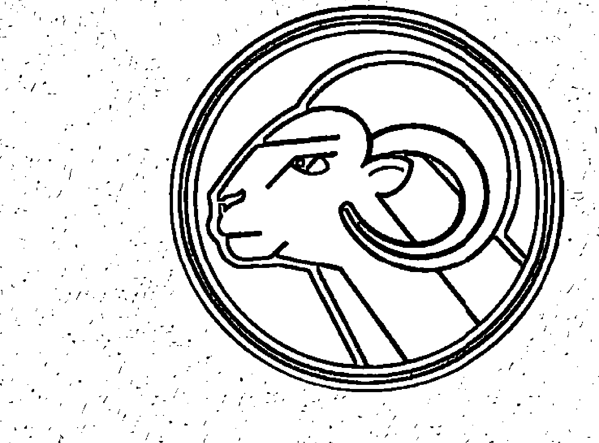

牡羊座的象征图案是一只山羊，它有一对磨圆了的大犄角，朝着一个方向顶——这是所有动物在备战状态时的标准姿势。

牡羊座的名称Ares就是战神阿瑞斯的名字，不用多说都知道这两者的关系是多么明白。牡羊座生来只喜欢赢，不多加思考就采取行动，心思简单，热情而直率，有运动员的气质。阿瑞斯既然是战神，当然就喜欢战斗，不过他并没有一支属于自己的军队。

阿瑞斯的侵略性和坦率性格，清楚说明牡羊座的特质，这也可以让人知道牡羊座的一般反应，并且心里有数，千万不要期待牡羊座做那些他们不想做的事。

## 人生课题

1数人有几项人生功课要做。首先，他们要学会不以极端的态度看待世事。世上的事情不是非黑即白，却往往介于黑白之间，唯有看到了各种各样的灰色层次，才能有所领悟，才能解决问题。1数人说话很夸张，充满戏剧性，看起来像在说谎，这种方式一旦被别人看穿了，别人就不会再信任1数人。1数人假如能逐渐改变他们近乎夸张的沟通模式，慢慢就可以让别人对他们有真正的认识，更接受他们的意见。

第二门功课：学着与人分享，学着关心别人，信赖别人。1数人必须明白“施比受更有福”的道理。真正的领导者会先对别人付出。唯有多多体贴别人的需求，才能取得别人的接纳与信赖。对于天生想要独立过生活的1数人来说，第二门功课很重要。

第三门功课：试着承担风险。这就包括要接纳新的见解和接受他人的批评。1数人在和别人争论的时候，目的往往不是为了是非与真相，而只是想证明自己的重要性。他们即使做错了，也要别人服从，以此证明别人很尊重他。从某方面来说，他们像是被宠坏的小孩。如果别人的论点可以成立，或者可以证明1数人确实错了，那么1数人必须谦虚，要输得起。最重要的是要向别人学习，不要因为别人和自己争论就找对方麻烦。他们必须学会广纳意见，学着与团队共同工作，而不要低着头只为自己打算。

## 学习了人生课题之后

假如你学到了1数的人生功课，你就有能力运用这位武术大师的武器了。

战神阿瑞斯最爱的武器是战车。战车的构造很简单：有两个轮子，轮轴以剑连接。阿瑞斯会坐在战车上，辗过敌人的身体。这种战车的作战方式很原始：只要驾驶战车，并以盾牌抵挡敌人的箭和矛就行了。

阿瑞斯为什么会挑选战车作为武器？因为身经百战的他知道，以手持剑格斗非常危险，也许最后会赢，但是格斗的过程可能会换来一身伤，而且精疲力竭。有了战车，可以大大节省体力，可以在战场上处于优势位置，可以随时转向。不过要记得一个重点：你必须引诱敌人接近你的战车。

使用阿瑞斯战车的抽象意义是：在朝目标前进的过程中，不需要与过程中的每一个人都正面交锋。你可以学着敏感一些，学着用轻松的态度面对问题，并且多多关心别人，这样可以赢得别人的信任与靠近。如此一来，一旦机会来临，你带着清楚的目标，并善用武器的优点，展开攻势，毫不退缩，最后将可以取走战利品，达到目标和梦想。

## 善用1数的威力

实现梦想的方法只有一个，那就是带着热情努力工作。我们需要有无穷的能量和勇气，始终抱着一种永不放弃的态度。无论面临什么障碍，都必须想办法完成事情。然而，在追求目标的过程中假如太用力，太过直接表现出自己的企图，可能会被当成危险人物，别人会因为觉得我们自私而来阻碍我们。

因此我们可以学习阿瑞斯这位作战专家的丰富经验和精良技巧，把武器的优势发挥得淋漓尽致——这正是阿瑞斯的影响力，1数的能量。

若想获得更多的1数能量，就学着以二分法的简单观点看待事情，快

## 阿瑞斯 / 1数在人身上的作用

- 性格：情绪起伏大，热情、喜怒无常
- 体形：运动员体格，瘦、有肌肉
- 说话方式：热切、专注，需要听众专心聆听
- 衣服样式：可以衬托肌肉线条的紧身服装，运动员服装

## 与阿瑞斯 / 1数相关的事物

- 颜色：红色
- 身体部位：手、声带、嘴、牙齿
- 星座：牡羊座

## 生活提示

如果你缺乏1数的能量，曾经试着对照使用方法在生活中导入这种能量，你应该会发现它不容易长久维持，过一阵子就回到了原来的状态。提醒自己追逐1数能量有个好方法，你可以使用各种有阿瑞斯图案和象征1数能量的物件。例如：搜集印有阿瑞斯图像的T恤、杯子、海报；或者戴上象征阿瑞斯的配件饰品。

- 象征阿瑞斯的物件包括：剑、狗、由马拉曳的战车、铜质的瓮与花瓶、兀鹰。

舞蹈是与阿瑞斯有关的活动。因为阿瑞斯是先学会了舞蹈才学会作战技巧，所以他也被视为舞蹈之神。下回觉得累了或想放弃的时候，就去跳个舞提振精神吧！也可以在家里播放舞曲，随着音乐起舞。在几乎所有的文化里，舞蹈都是战士上战场之前的仪式，所以，在早上上班之前先在家里跳一段舞，可以提振精力，准备迎接忙碌的一天。当你觉得疲倦，阿瑞斯1数的能量也可以鞭策你向前。缺少这种能量将很难得胜，而且很快会偏离方向。这种能量可以让你拥有冲劲，不怕万难。

还有其他方法可以提示阿瑞斯1数的能量：选择一种武术来学习。武术的种类繁多，但都必须用一辈子的时间来学习，因为任何一种武术都永远有进步的空间，都需要不断学习。不断锻炼身体，可以增强体力，有益健康，也能让你更了解自己的身体。你会更能听到自己身体所发出的声音。学习武术也有助于减压。有个好方法可以解除紧张的情绪：找个拳击沙袋，把你的问题当做是那个沙袋，然后猛击沙袋，一直到你觉得压迫感消退为止。

阿瑞斯不会隐藏自己的感觉。研究报告显示：坦然面对自己感觉的人最健康。愤怒时就咒骂吼叫，悲伤时就哭泣，快乐时放声大笑或微笑。这种人不会记恨，发完脾气后通常就忘了当初为何而生气。而那些隐藏自己的情感，凡事都藏心底的人最不健康。能够释放自己情感的人，将更能真正认识自己。想要获得这种能量，必须先消除内心的冲突，并释放压抑的情感。先把自己的感觉弄清楚，才能吸收阿瑞斯1数的能量。

# ② 赫拉 Hera

赫拉是婚姻与爱情之神，也被称为天后，因为她嫁给了位居奥林帕斯众神之首的宙斯。关于赫拉的故事把她描写成两种很不一样的模样：有的说她生性爱嫉妒，复仇心很重，有时很残暴；另一类说法把她描写成一个尽责的妻子，长年来默默忍受一切，从来不说丈夫的不是，总之是个模范太太。不管宙斯和哪个女子乱来或者有了小孩，她都不说话，虽然她也会想办法除掉那些女子和私生子，但绝不会在外人面前指责宙斯。那么，到底哪一面才是赫拉呢？显然这两面的特质她都有。赫拉默默忍受一个风流不羁的丈夫却还是守在他身旁，无论如何都要保住自己的家庭和婚姻。

现代女性或许无法理解或接受这种个性的人。赫拉的地位显然和宙斯并不相等，她只是先生背后的影子。希腊人相信自由与民主，为什么要忍耐甚至创造出这样一个神呢？

这么说吧，赫拉不是唯一的女神，但在众多女神里面，只有她是自己决定要为人妻子，而且一直忍耐着婚姻所带来的种种问题。希腊人知道，赫拉做出了这个决定，就表示她要承受一切并失去自由，而他们敬佩赫拉为了家庭坚持到底的韧性，这是所有为人妻者的典范。女性有很多种选择：可以学雅典娜当个战士，学阿尔忒弥斯无拘无束活在大自然里，学德墨忒尔过着单亲生活，甚至学阿佛洛狄忒纵情恋爱，但是如果选择了婚姻生活，就要以赫拉作为典范。由于家庭是社会的基石，所以希腊很多地方都有供奉赫拉的习俗。

没多少人知道，近几年赫拉神庙是在电视上曝光机会最多的希腊神庙。为什么会这样？因为奥林匹克运动会原本在奥林匹亚举办，所以今日的每一届奥运会在正式开赛之前，都会从古奥林匹亚引燃圣火，由跑者握持火把，用接力方式跑过一国又一国，将火把递送到运动会比赛场地。引燃圣火的仪式，就是在奥林匹亚的赫拉神庙前举行。在电视画面上，扮演古希腊女祭司的女演员后面，就是赫拉神庙的圆柱。照说，神话里的奥运会是只有男性可以参加的，但今日的点火仪式上面有女性的参与，这种安排确实有一点不寻常。以前要是在奥运会上看到女性或奴隶，他们一定会被处死。今人使用女祭司出现在仪式上，我猜想应该是与赫拉神庙有关——现代的奥林匹克运动会也许悄悄用这个方式在向赫拉致敬，怀想女性忍耐了几千年，今日终于享有了自由。

## 赫拉的神话

希腊众神对于婚姻的看法和我们人类不同，所以，听到赫拉嫁给了她的哥哥宙斯，可别太惊讶。赫拉长得非常标致，脸上一双出名的大眼睛——这也是为什么母牛和孔雀被用来象征赫拉：母牛的眼睛很大，而孔雀尾巴的羽毛上面有眼睛图案。

希腊、土耳其、埃及和若干中东国家的人，会在身上佩戴眼睛形状的护身符，用来遮挡邪恶之眼。所谓邪恶之眼，指的是假如别人用充满怨恨或嫉妒的坏念头盯着你瞧，这就像是对你施法，使你身体受伤，出意外，损失钱财，或者遇上其他坏事。既然眼睛是赫拉的象征，所以我们借以推测，佩戴眼睛形状的护身符乃是古代遗留下来的传统，希望用这方式来保护自己不受到从他人眼睛传送出来的不良意图。

宙斯与赫拉坠入了情网，对她展开追求。后来他们结婚，在萨摩斯岛度了300年蜜月，这是有史以来最长的蜜月，也是她一生最幸福的时光，因为花花公子宙斯居然把全副心思都放在她一个人身上。然而，蜜月期一过，他们回到了奥林帕斯，宙斯就故态复萌了。

宙斯的爱人实在多得数不清，然而赫拉从不当着宙斯的面抱怨这件事，却总装作若无其事。真正令赫拉受不了的是，宙斯似乎比较疼爱私生子，而不那么爱他和赫拉所生的子女！

赫拉怒火中烧，忍无可忍，必须找管道宣泄。于是她把宙斯和情妇所生的私生子当作出气筒。神话里有许多故事描写她如何追杀第三者和他们的小孩。其中最有名的一段是，宙斯让勒托（Leto）怀了阿波罗和阿尔忒弥斯这对双胞胎，赫拉为此把勒托追逼到天涯海角，不让她把孩子生下来。然而，勒托产下的这对双胞胎非常杰出，后来成为神，赫拉也就接纳了他们。

另外，在几种版本的神话里说赫拉杀死了狄俄尼索斯的母亲，然后雇佣两名职业杀手前去暗杀狄俄尼索斯，把他放在炉火上烹煮，以确定他真的死了。狄俄尼索斯得到众神协助，得以逃过一劫（详见“狄俄尼索斯”章节内容处），并且，后来成为奥林帕斯的最后一位神。赫拉最后也接纳了狄俄尼索斯和他死而复活的母亲。尽管赫拉想尽办法维护自己的家庭，但她毕竟是有感情的人，一旦情势迫使她非改变不可，她最后总会接受的。

赫拉不是没有试着反抗宙斯。在宙斯年少轻狂的时日，众神一度企图推翻他，而赫拉的任务是给宙斯下药，好让众神把宙斯捆绑起来，让他无法使用他的武器——闪电。赫拉下了药，但宙斯逃走了。最后宙斯把赫拉吊起来，修理了她一番，而赫拉向他认错，又回到她原本的角色。此后她只做过两件算是反抗宙斯的事情。第一桩，她未经性行为就自行怀孕产下一子，火神。她的目的是要让宙斯嫉妒；不过这个孩子跛了脚，得不到赫拉和宙斯的疼爱，被送往兰姆诺斯岛自生自灭（详见“赫淮斯托斯”章节内容处）。所以这项计划失败了，可是宙斯没有嫉妒……只觉得有点没面子！

第二桩，她离开宙斯，想看他是否会因此珍惜她，不再拈花惹草。她离开希腊到异乡，很长一段时间没人知道她的下落。宙斯总算开始思念她，并想了一个办法要把她骗回来，他宣布自己即将再婚，邀请众神前来观礼，于是赫拉也来一探究竟。婚礼开始，宙斯揭下新娘面纱，大家发现原来新娘只是个雕像。赫拉放声大笑，这才与宙斯和好如初。幸好宙斯后来确实也减少了拈花惹草的次数，两人过着快乐的生活。

## 金牛座与赫拉

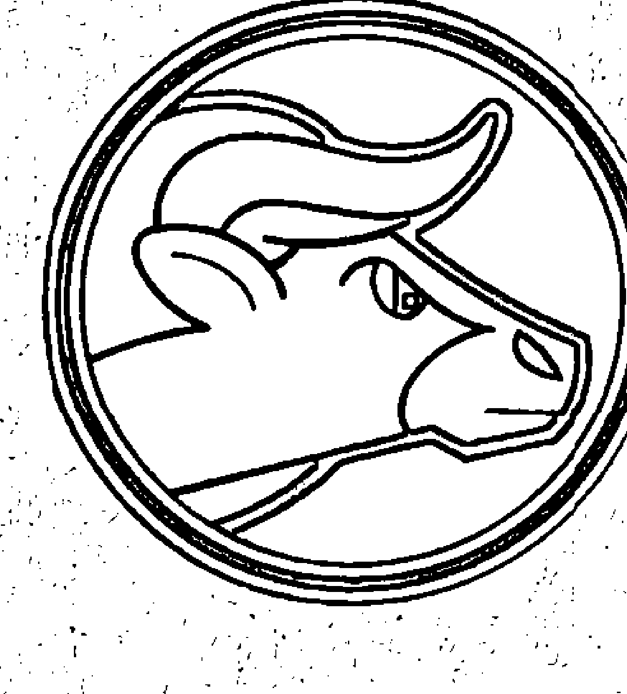

金牛座的特质往往被描述为爱美、稳定、固执、忠实，努力工作，然而有注重表面的倾向。金牛座也常被说成是最好的先生或太太。

以前都说金牛座的代表神是爱与美之神，阿佛洛狄忒 / 维纳斯，然而爱神的性格与金牛座并不吻合，因为爱神并没有真正工作过，而且她绝不是个情感忠实的妻子。

倒是赫拉的个性才像金牛座，她老是盯着先生宙斯的花心事件，毫不放松，可是就算宙斯花心不改，赫拉仍然守在他身旁。赫拉也是婚姻之神，守护所有的先生与妻子。

## 赫拉与2数的关系

赫拉的个性正是2数的特质：依赖心很重，喜欢与人相处，喜欢分析事物，在乎细节，情绪化，敏感、善于协调人与事。

这种人需要与人相处，也喜欢与人相处，还会黏着他们所亲近的人。

然而，正是这种情感上的依赖成了他们的问题，因为他们很快会发现别人反过来也开始依赖自己——你会常听到2数人抱怨，说他们不懂为何别人这么依赖自己，希望别人不要这样，不过他们很少因为心生不满就马上采取行动，也不容易断然解决掉这些关系。

2数人眼中的世界并非黑白分明，而是充满了各种层次的各种颜色。这种思考方式，若与他们其他的天分结合，譬如善于处理细节，拥有绝佳的分析能力，能够组织人与事，能看出别人预见不到的事物，确实是很棒的。

然而，在做决定的时候，他们这种思考方式会把事情变复杂，特别是他们通常心很软，往往狠不下心做出自己的决定。从赫拉的神话故事中可以知道，她到头来还是无法离开宙斯，只能默默忍耐多年，幸好宙斯的个性总算成熟了一些。可惜现实生活的结局并不总是这样美满。

## 爱情模式

2数人非常喜欢恋爱中的亲密和分享的感觉。从许多方面来看，2这个数字可说是爱的数字：英文里的“6月”（June），字源就是赫拉的罗马

## 人生课题

2数人的第一堂人生功课与依赖有关。偶尔依赖他人没有什么不妥，事实上，能找个人来依靠是很重要的事。只要能找到平衡点，懂得如何依赖，如何与他人共事或相处，依赖就可以具有正面意义。但是伴侣之间一旦变得过度依赖对方，这时问题就来了。

一旦2数人变得过度依赖他人，就会渐渐不知道该如何对待自己，陷入了自己不想要的生活而难以自拔。他们会渐渐失去自信，日子过得消沉而悲惨。最后他们会怨天尤人，责怪别人令他们失望，害他们失败，害他们变得依赖，剥夺了他们的自由。但这样做只会使情况更糟糕，因为问题的根源不是别人，正是2数人本身。

假如他们试着化解某个僵局，却只会使得情势更棘手。他们若是继续和那些他们在相处上已经出现问题的人往来，就更不容易决定该如何处理这局面。于是他们会开始分析事情的利弊得失，但这只会把事情变得更复杂，到最后他们会变得好像迷了路的人，找不到出路。

2数人陷入了挫折和沮丧的时候，他们的另一个特质会冒出来：隐藏自己的感觉。2数人会变得表里不一：外表看起来很开心，心里却偷偷在哭泣。他们会就这样过着表里不一的生活。就算他们可以掩饰得很好，但这样做并不健康。解决之道就是学习自己的人生功课。

2数人的人生功课是：看清楚情势，不要放任自己过度依赖他人。换句话说，他们必须学着独立，试着自己一个人去做事情，尽量不要找别人帮忙；交朋友时，对于别人的反应必须谨慎，小心不要让自己太依赖别人，尤其是牵涉到金钱往来的时候。

到了该做决定的时刻，2数人必须听从自己的直觉：依照第一个念头做决定就对了。他们必须学着管理自己的分析能力，并且知道分析到什么程度就够了。做决定时需要勇气，所以2数人假如不快速做出决定，拖久之后将会做不出决定，没有办法解决，到头来甚至可能赔上自己的健康。2数人最好谨记：就算做出了错误的决定，也比不做决定来得好。

当然也可以用其他方法来解决这个问题：就依照赫拉的行事风格，干脆依赖到底。如果2数人坦然接受了某个棘手的局面——无论是配偶在外拈花惹草，还是被朋友利用，或者是过着并非自己真心想要的生活——只要全盘接受了，就可以继续幸福美满。彻底的依赖并不是容易做到的事，多数人不会因此过着幸福美满的生活，因为这样做表示不管局面多么奇怪The request was rejected because it was considered high risk## 生活提示

如果你缺乏3数的能量，曾经试着对照使用方法在生活中导入这种能量，你应该会发现它不容易长久维持，过一阵子就回到了原来的状态。

想维持3数能量有个好方法：你可以使用各种有阿佛洛狄忒图案和象征3数能量的物件。例如：搜集印有阿佛洛狄忒图像的T恤、杯子、海报；佩戴象征阿佛洛狄忒的饰品，例如苹果（尤其是金苹果）、天鹅、各式美丽的鸟类。

人们一直记得阿佛洛狄忒，很重要的原因之一是许多艺术品都和她有关。以她之名所做的雕塑作品有各种式样，且同一样式有多种规格。许多名画以她为主角，例如先前提到的波提切利的画作。阿佛洛狄忒既然是美的化身，所以你不妨买件精致的艺术品或小物件，把它当做是阿佛洛狄忒送你的礼物，看到它就会想起3数的能量，帮助你在生活中保有热情。

跟着热情往前进的方法有很多，譬如：品尝美食，穿上漂亮服装，住舒适的公寓，造访像希腊那样的美丽国家。培养嗜好，只要是你喜欢的，都好，都当做是为了召唤阿佛洛狄忒的3数力量而做。

古希腊人把躯体之美看得非常重要。他们花许多时间运动，注意饮食，经常修饰仪容。如果你不满意自己的外表，不妨来个健身运动，譬如散步、做运动、游泳，或者上健身房锻炼肌肉。有些人喜欢每星期来一次SPA，全身按摩、美容做脸，让自己觉得变美丽了。

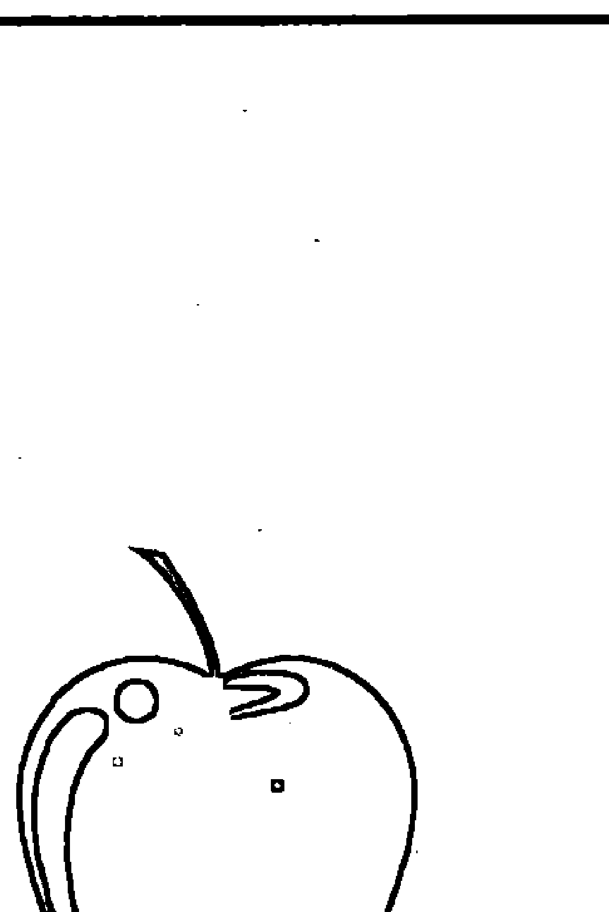

阿佛洛狄忒的象征物：苹果

## 阿佛洛狄忒 / 3数在人身上的作用

- 举止：温和、友善、妩媚
- 体格：圆润肉感、性感、好看
- 说话方式：喜欢微笑、喜欢闲聊、风趣
- 衣服样式：追求时尚、性感

## 与阿佛洛狄忒 / 3数相关的事物

- 颜色：黄色
- 身体部位：肩膀、胃、眼睛
- 星座：双子座

## 066 新生命数字密码·2 In the Path of the Gods

## 德墨忒尔 Demeter

## 068 新生命数字密码·2 In the Path of the Gods

女神德墨忒尔很受希腊人的看重，因为她是谷物女神，也保佑各种作物的生长，特别是小麦、大麦和玉米等大多数人赖以为生的谷物——所以她的罗马名字喜瑞斯（Ceres）就成为英文里“谷物”（cereal）一字的字源。希腊全境都有德墨忒尔的神庙，其中最主要的一座是在雅典市郊的艾流希尼亚（Eleusinia）地区。艾流希尼亚一带有农田和原野，所生产的粮食提供给雅典，此地也就理所当然成了供奉这位丰收女神的地点。

这座德墨忒尔神庙成为“艾流希尼亚祭”的重镇，这项祭典一年举办两次，欢庆德墨忒尔与她从冥界归来的女儿珀耳塞福涅（Persephone）重逢。这项祭典的仪式里显然包括了服用一种从不知名植物萃取而得，有迷幻作用的物质，这是为了让女神与参加仪式的众人直接沟通。她会让参与者看透生前死后的真相，帮助人们更热爱生命，而且不再畏惧死亡。（今日科学家推测，参加仪式的人所服用的药物，可能是迷幻毒菇、大麻或药草，或是从大麦上的霉菌提炼出来的物质。）

丰收之神教导人们关于如何面对死亡？听来似乎奇怪，不过这是有原因的。德墨忒尔的女儿珀耳塞福涅，嫁给了冥界之神和死神哈迪斯（Hades）。但哈迪斯事实上是宙斯、波塞冬和德墨忒尔的哥哥，却娶了自己的侄女——这听来像是乱伦，不过我们不能用人类的通婚规矩来看待神话人物。希腊人相信，既然珀耳塞福涅可以借由德墨忒尔神庙而重回阳间，那么，那座神庙不就是某种通向死后来生的通道？而由于前来祝祷的人有可能在这座神庙里接触到死去的亲友，所以这里就成为某种祭拜先人的据点。

这仪式在希腊非常受到重视，在举办仪式的55天里，所有的希腊城邦都必须停战，不得有任何战事，受重视的程度相当于举办奥林匹克竞技赛。这项仪式对人们带来多大的冲击呢？有个故事说，一个印度国王的使者造访希腊，参加了德墨忒尔仪式之后，他想表现出他已经完全不畏惧死亡，便走进火中，死了。这项仪式的历史超过了2000年，被认为是希腊信仰的核心，是把希腊人民团结起来的支柱。

## 德墨忒尔的神话

德墨忒尔是宙斯、赫拉、波塞冬、哈迪斯和赫斯提亚（Hestia）等人的姊妹。她有一段奇特的身世：她与两名兄弟和两名姊妹一起被父亲活活吞下肚，还好宙斯给她父亲服下了催吐剂，这才把德墨忒尔等人吐了出来。相较于其他神祇，德墨忒尔的作风显然很低调，她的主要工作是供应世界万物所需要的食物。她从来不会像众神那样去干预其他生命的生死，而只专注于自己的职责。大家都很感激她，也喜爱她——除了她那个掌管冥界的兄弟哈迪斯之外。

德墨忒尔和宙斯生了一个美丽的女儿，被宙斯取名为珀耳塞福涅。珀耳塞福涅有一次在原野玩耍，引起了哈迪斯的注意并爱上了她。哈迪斯在地上开了个洞，爬上地面，把她抓到冥界。德墨忒尔听到女儿的叫声，跑过来了解状况，却什么也没见到。她找遍了整个世界，日以继夜，不吃不眠，怎么样都找不到女儿。

德墨忒尔在路上遇见了一个老人，对他说起自己的难题。老人说：“我懂你的痛苦。我有一个儿子在家里，病得快死了。”德墨忒尔感同身受，便与老人一起回家去看他儿子，路上只停留一次，采集了一点罂粟属的植物。到了老人的家，她亲吻了他儿子的脸颊，而这年轻人就恢复了健康。于是德墨忒尔赢得了“怜悯女神”之名。

她继续上路寻找女儿。最后，她问了那时候的太阳神赫利俄斯（Helios）——彼时阿波罗尚未接掌这项工作——问他有没有看见什么。他说，珀耳塞福涅嫁给了哈迪斯，成为死人与冥界的皇后，麻烦的是，宙斯同意这段婚姻，毕竟他是珀耳塞福涅的父亲。德墨忒尔觉得被背叛了，非常难过沮丧。

为了表示不满，她表示不再继续担任谷物女神。她离开奥林帕斯，前往艾流希尼亚，伪装成一名老妇人，并且被带到皇室当女佣。她负责抚养一名王子，得摩福翁（Demophoon），而她旋即喜欢上了得摩福翁。有一天晚上，她决定要让得摩福翁成为永生不死的神，就把他抱到火上一英尺高的地方——这是成为神的仪式之一。这时得摩福翁的母亲走了进来，加以阻止，以为这个老妇人打算烧死她儿子。这时德墨忒尔卸下了她的伪装，众人这才明白了她原来是女神。德墨忒尔斥责了那位母亲，然后要求把供奉她的神庙建在此地。神庙建成后，她便住进去了。

在这段时间，地球的自然循环停止了作用，粮食不再生产，地球进入了恒冬状态。宙斯派出使者去找德墨忒尔，要她回来解决问题，但德墨忒尔表示，不把她的女儿从冥界释放出来，她不会回去。德墨忒尔的固执最后逼得宙斯让步，派遣赫耳墨斯到冥界与哈迪斯谈判，把珀耳塞福涅放回来。

不过，珀耳塞福涅在离开冥界之前，吃下了一颗别人给的石榴，而她自从被抓进冥界以后没有吃过任何东西。珀耳塞福涅返回了人间，母亲德墨忒尔问她的第一句话是：“你在冥界吃过任何东西吗？”她说吃了，这就表示珀耳塞福涅那年必须回冥界4个月。但这总好过完全不能见面。女儿回来了，德墨忒尔很高兴，地球也恢复了正常，粮食再度开始生产——但珀耳塞福涅回冥界的那4个月并不生产，这就是我们现在的冬天。

从那时候起就形成了“艾流希尼亚祭”，并维持了2000年，一直到基督教在希腊兴起后才式微。德墨忒尔不只是丰收女神而已，还是冥界皇后的母亲。她的女儿珀耳塞福涅把关于死后世界和生死之间的知识带回人间，让人类知道如何摈除生命中的不安，特别是对于死亡的不安。

## 德墨忒尔与4数的关系

德墨忒尔的性格代表了生命密码4数的特质：寻找并营造安全感，心里强烈渴望安定，比谁都害怕不确定的状态，不喜欢改变，讨厌冒险，喜欢组织，善于看出如何改进事物，让事物变得更加稳定。4数有时候非常固执，因为他们不相信那些没有确切证据的事情。

4数人假如落了单，日子会过得很不好。尤其是在遇到了离婚，孩子长大离家或亲友死亡之类的突发事故，他们特别难以适应，会变得一蹶不振，抑郁寡欢，假如不想办法填补内心的空虚，他们可能就会生病，甚至因此死亡。

4数人这种追求稳定的倾向，使得他们不喜欢激烈的改变，尤其不爱冒风险。有一句话说：“如果东西没坏，就别修理。”这正是4数人的想法。为什么要重新发明一种轮子？只要把现有的轮子加以改良，在不做太大改变的情况下让它变得更稳定可靠，这样做不就好了。

这种人生哲学非常强而有力，是大多数富翁致富的关键态度。承担的风险越少，所可能承受的损失就会越少，如果能在已经证明有效的方向上面继续努力，最后就能致富。一直冒出新点子，不断承担风险的人，通常会落得一文不名。4数人这种执着于在已经有效运作的事物上继续努力的态度，为他们带来了成功，而德墨忒尔的故事是很好的示范。

## 巨蟹座与德墨忒尔

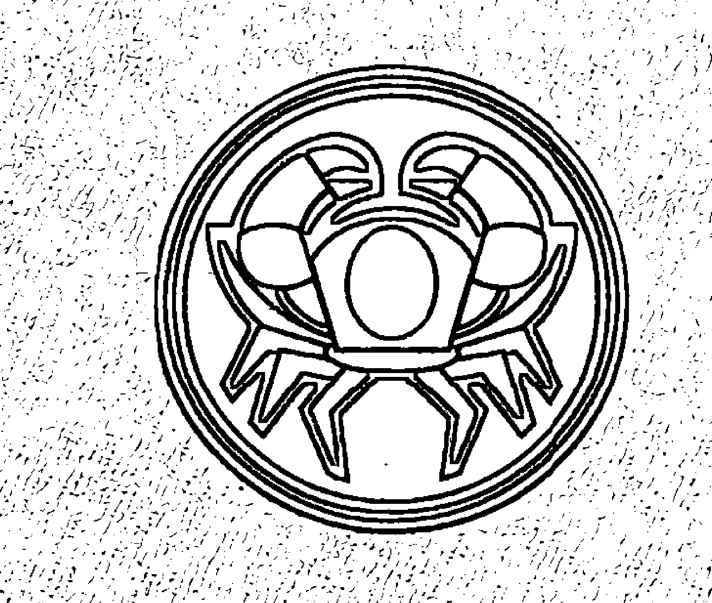

神话里面用螃蟹来作为巨蟹座的象征，螃蟹不惜用自己的生命来保护自己的朋友。巨蟹座生性敏感，有充沛的母性本能，温暖热情，值得倚赖，而它的防卫心之强烈，位居十二星座之冠。

希腊神话里面，以谷神德墨忒尔的特质最像巨蟹座。身为大地之神的她，在女儿被掳走之后，茶不思饭不想，伤痛欲绝的程度，居然可以今天下的人类与动物都死去。众神里唯有她在子女遇到伤害的时候展现出这般激烈的反应。

德墨忒尔也是众神里面的最佳母亲典范，她提供了一切食物的来源，可以说是万物之母。

## 爱情模式

关于德墨忒尔和宙斯的爱情，以及她如何怀了珀耳塞福涅的情节，希腊神话里没有多说。德墨忒尔通常被描写成一个性格稳重而心软的单亲妈妈，而她凭着爱与慈悲，克服了生命路上的一切障碍，包括她被强暴的那一次经历。话说海神波塞冬被德墨忒尔吸引，想要霸王硬上弓，德墨忒尔抵抗到底，把自己变成一匹马，跑进了马群里。波塞冬见她这么做，便也化身为一匹公马，冲进马群强暴了她，让她生下两个孩子，一个是美丽的仙女黛波艾娜（Despoena），一个是神马亚里恩（Arion）。这件事之后，她并没有想办法报复或要求还她公道，只以一贯的慈悲态度表示就让这件事过去吧。她认为以暴制暴并不是正确做法，错事已经铸成，报复了又能如何，一切就留给宙斯处置吧。这态度很像俗语说的“恶有恶报，不是不报，时候未到”。

德墨忒尔面对爱情时，不会做太多关于完美爱情的遐想。她只专注于真实的生活，手边的责任，照顾女儿。女儿珀耳塞福涅是她的真爱，对她来说，有女万事足。德墨忒尔是个单纯的女神，她顺其自然，而心中很清楚哪些是她最在乎的事物。

## 人生课题

4数的人生课题是：必须克服没有安全感的感觉，而这种不安正是恐惧的另一个名字。生活里充满了令人害怕的不安，譬如害怕孤单，担心所爱的人会离我们而去，害怕没有钱、失去健康或生病，以及恐惧死亡。一个人的恐惧感如果太过强烈，将会失去享受人生的能力。

需要学习4数课题的人，必须克服自己心中所有的恐惧和不安，至少要了解它们、与它们共处，用比较恰当的观点来看待它们。在现实生活里，没有任何事是完全安稳牢固而不会改变的。夫妻会离婚，情侣会分手，金钱会贬值，有人会因为不是自己的过失而被连累破产，再怎么注意健康的人还是会生病，而所有人最后都不免一死。

为了克服对这些风险的恐惧，我们需要把精神用来关注自己想要过什么样的人生，而不是一味担心将会遇到什么风险。要厘清自己的人生观，问自己一些问题，例如：现在生活的目标是什么？生命的意义是什么？此外还需要拟定计划和目标，让自己在自己的内心深处就找到安全感，不需要依赖外在的人或事物来提供安全感。内心一片空白的人，将会死命抓住已经拥有的东西并且害怕失去它们，这却会导致失去一切。

想要得到安全感，首先要深入内心探索自我、发展自我，认识真正的自己，以及自己有哪些天分才华，然后建立起一个让自己不需要别人也能觉得幸福的人生。有了让自己感到充实的工作事业或生活目标之后，便拥有了不会被别人夺走的事物。我们会因为忙着享受自己在付出之后得到的收获而不再在意风险，这就发现了真正的安全感。人在努力实践人生计划的时候，会得到满足，觉得充实，这就大大提升了自信心，而这可以创造更健康的生活。快乐的人，不会感到恐惧。快乐可以让人健康。

想完成4数的课题，就要把人生放在自己所选择的轨道上，并在发展自我的过程中找到安全感。然而我们在建立事业、爱情、友情的时候，经常会面临诱惑，想回到原先自己那种缺乏安全感的心态。我们会动摇，不想再坚持要达成自己的目标，而想要妥协，干脆配合外在环境算了。但假如屈服了，我们内心会生出受挫的感觉，而所有的不安全感很快就又回来了；这么一来就得重新再修一次这门课题。最好是一次咬着牙学到底，不要动摇。

## 学习了人生课题之后

出现在艺术作品里的德墨忒尔，往往被描绘成一位手拿玉米或麦束的女神。这图像显示了她的力量是在工作上努力不懈，固守职责，持续生产粮食供应世界之所需。只要学习了德墨忒尔所代表的4数课题，就可以稳定生活，专注投入自己所热爱的事物。

把生活焦点放在建立事业的工作上面之后，我们就可以像德墨忒尔女神一样，由于自己可以让事物如常运行而感到满足。我们便不需要冒险，而恐惧也会远离。我们可以与人建立起更健全而长久的关系，与各式各样的朋友都开心相处。最大的回报是金钱上的好处，因为我们所专注的营利方式确实带来了回馈，而持续的努力可以更提高利润。世界上许多巨富就是以这样的方式赚大钱。

## 善用4数的威力

美国前总统克林顿曾经指出，缺乏自尊自信成为今日美国最严重的心理问题，这也可能是全世界的问题。我们从小就必须在考试、人际关系、别人的评价等等事物上面与人竞争。但是谁都不可能在各方面都当上第一名，因此很多时候我们会被认为不够好，使得我们怀疑自己的价值。随着我们逐渐成长，这些对自己的质疑会形成固定的框架，而我们常会由此来做出各种选择。

4数的力量可以帮助我们集中焦点，从担心着自己所害怕的事物，变成正视这些恐惧的情绪，进而有能力采取行动来让事情好转。这股力量可以帮助我们面对不安，处理各种因为换工作、损失金钱、搬家、离婚、感情遭背叛，甚至是所爱的人死去等等改变而带来的恐惧。这股力量也可以帮助我们面对新工作或新机会，在我们担心自己无法做出大幅度的改变或承担较高风险的时候，给予我们力量。4数的力量有助于克服不安和恐惧，让我们继续努力，让我们从创伤中复原，重建自信，尽管前途未知，仍然可以寻找自己的幸福。

## 生活提示

如果你缺乏4数的能量，曾经试着对照使用方法在生活中导入这种能量，你应该会发现它不容易长久维持，过一阵子就回到了原来的状态。

想维持4数能量有个好方法：你可以使用各种有德墨忒尔图案和象征4数能量的物件。例如：搜集印有德墨忒尔图像的T恤、杯子、海报；佩戴象征德墨忒尔的饰品，例如小麦和玉米、蔬菜、水果（除了石榴以外的）、丰饶角图案（cornucopia，希腊节庆中用来盛装蔬菜水果的羊角，象征丰饶）、农耕用具、蜂巢和蜜蜂，以及丽春花（这是一种含有迷幻成分的罂粟属植物）。

德墨忒尔是农业女神，所以你可以定期吃素，一天、一周或一个月，这可以帮你的身体排除毒素，让你觉得神清气爽。许多宗教传统都有吃素的习俗，这种做法可以让人超越日常的肉体需求，而专注于灵性的修行。

吃素时要注意几个营养问题，首先是大多数的人没有时间下厨，经常得在外用餐。然而素食餐厅的菜色没有太多选择，只能吃同样的食物，例如麦类和米饭等等谷类，以及豆类的蛋白质。如果你长时间吃同样的食物，你会对食物产生抵抗性和过敏，这会破坏你的免疫系统。最好的饮食方法是“轮替摄取法”，就是每天都吃不同的食物，不要重复。这么一来，表示你得自己下厨。吃素的另一个问题是，容易缺乏维生素B12，这是一种必要的维生物质。因此吃素时要每天补充维生素B群。

比较理想的吃素法不是终生茹素，而是在设定的时间里面吃素。世界上最古老的教堂是希腊东方正教教堂，这里的信徒在复活节之前要吃40天素。仿照此法，想要拥有4数能量的人可以在每星期里固定安排1天作为素食日，那天一早醒来的时候，就告诉自己今天是德墨忒尔日，这可以帮助你集中精神，专心执行。

4数的力量，也可以让事物以有组织而利落的力量运作。要做到这一点，就要先把家里、办公桌和其他经常使用到的空间清理干净，让环境更有秩序，并且保持下去。你要注意自己把东西摆放在哪里，有没有放得井然有序，用这种方式提醒自己，很快就会发现生活变得更有条理，不仅马上就找得到各种物件，连以为弄丢的东西也冒出来了，而且会更有动力实践目标。

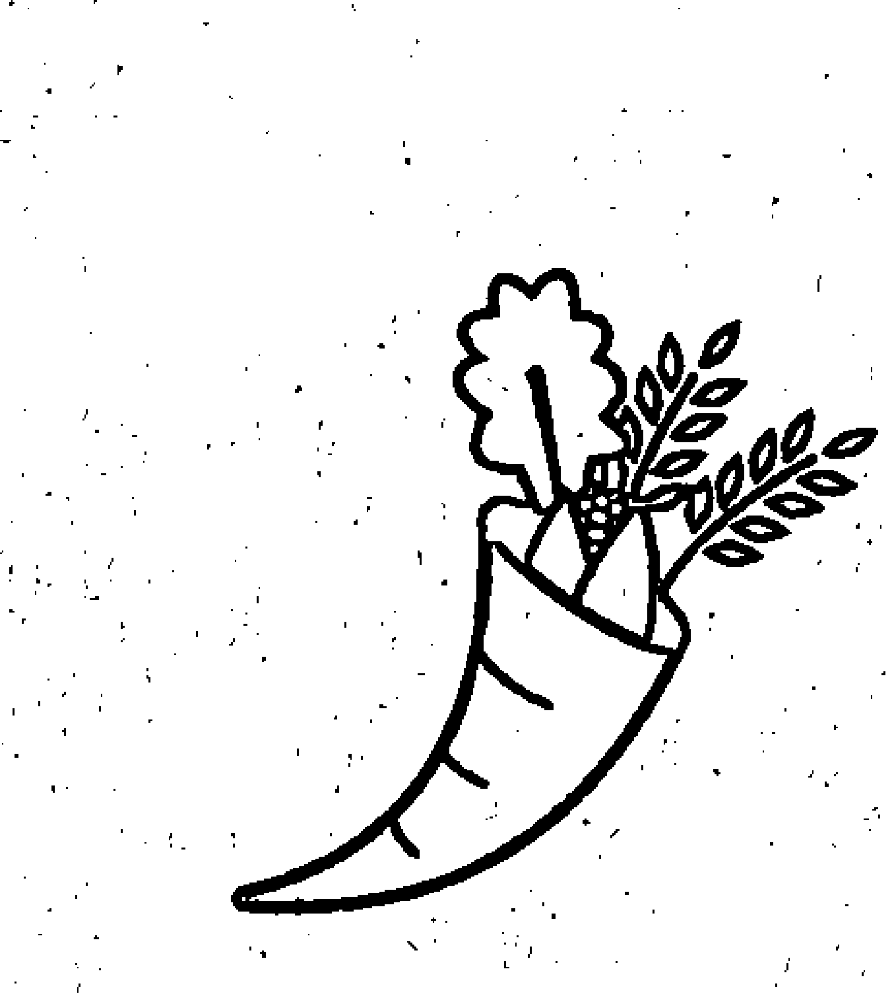

## 德墨忒尔 / 4数在人身上的作用

- 态度：专注、严肃
- 体型：骨骼结实、体格强壮
- 说话方式：一针见血、说重点
- 服装风格：保守、古典

## 与德墨忒尔 / 4数相关的事物

- 幸运色：绿色
- 身体部位：脚、肾脏、膀胱
- 星座：巨蟹座

## 赫耳墨斯 Hermes

## 082 新生命数字密码·2 In the Path of the Gods

赫耳墨斯所掌管的范围包括：沟通、商业、小偷、文学与书信、旅行、运动。由于他提供的东西范围很广，可以说人人都需要其中一些，因此赫耳墨斯不像其他的神那样拥有专门供奉的神庙，但他的雕像和祭坛遍布整个古希腊世界。大多数的运动场都竖立了赫耳墨斯的雕像以祈求他庇佑，并对他表示敬意。百姓会在家里摆一尊他的雕像，以避免小偷入侵，并在出外旅行时向他祭拜祈求平安。由于赫耳墨斯也是史上第一个动外科手术的医生，所以古代的医疗中心也都会展示那幅知名的图像：他手握节杖，杖上有双翼，并有双蛇缠绕。

赫耳墨斯至今都享有名声。除了英文里的“水星”正是他的罗马名字“Mercury”之外，还有许多事物都以他命名，譬如知名的时尚品牌“爱玛仕”（Hermes）就使用了他的名字和标志。美国陆军医务兵和大多数的药局、药剂师和医疗相关事物一样，使用他的象征物作为标志。今日的希腊邮局也使用赫耳墨斯作为标志。

## 赫耳墨斯的神话

有一晚，众神都睡了，宙斯趁着赫拉没发现，溜出家门，跑到阿特拉斯（Atlas，把地球背在肩上的神）的女儿所住的洞穴里，让这个仙女迈亚（Maia）怀了孕。隔天她生下了赫耳墨斯，这就创下纪录，使赫耳墨斯成为出生速度最快的婴儿。赫耳墨斯一生下来就开始忙碌：他马上肚子饿，母乳似乎不够他吃，因此当一般婴儿还裹在摇篮里不会爬动的时候，赫耳墨斯就已经懂得等待夜晚母亲入睡之后，溜出去找东西吃。他看到了他的同父异母兄弟阿波罗所拥有的一群牛，于是偷了其中的60只，并让它们倒退着行走，好让别人看不出它们的踪迹。赫耳墨斯把叶子放在鞋底下，把自己的足迹也掩盖掉，再把这些牛藏在一个洞穴里。烤了一只牛填饱肚子后，他回到母亲身边。他在路上还抓了一只乌龟，把它的壳清空，用乌龟的肠子制作了一种叫做里拉（lyre）的七弦竖琴。然后，他溜回床上，回到他那副娇弱无助的婴儿样。阿波罗发现牛只不见了，一状告到赫耳墨斯的母亲迈亚面前，说她儿子偷了牛。这位母亲回答阿波罗，这怎么可能，赫耳墨斯还只是个婴儿呢。赫耳墨斯被带上了法庭，最后宙斯裁定，赫耳墨斯必须把他所偷走的# 084 新生命数字密码·2 In the Path of the Gods

东西归还阿波罗。这时，赫耳墨斯奏起了里拉，阿波罗当场愣住——他爱上了这个乐器，想用牛群来交换，赫耳墨斯同意了。至今阿波罗的雕像上还握着里拉琴。后来赫耳墨斯又发明了笛子，而阿波罗也想要这个乐器。

有一个故事说，阿波罗用他那枝有一条蛇缠绕的节杖，换来了赫耳墨斯的笛子。另外一个神话说，阿波罗的杖上只有一条蛇，而赫耳墨斯的杖上有两条蛇。原来赫耳墨斯是用两条丝带缠绕着节杖，有一次他发现两条蛇缠成一团，激烈扭斗。于是赫耳墨斯把节杖往两条蛇中间一放，说服了它们别再互相伤害，而两条蛇就这样留在杖上了。这两个故事都把赫耳墨斯的发明能力、说服能力和交易能力描写得不错！

赫耳墨斯是一个反应敏捷而头脑聪明的神，拥有绝佳的沟通能力，因此宙斯把他留在身边当助理兼使者，给了他一顶特殊的帽子和一双有翅膀的鞋让他可以飞翔。宙斯派遣赫耳墨斯护送灵魂到冥界。很特别的是，原本有一条规则说“任何人只要进入了冥界就不得离开”，但是赫耳墨斯竟然可以自由进出于人间和冥界。

他为宙斯处理许多大事，往往用他的沟通技巧解决了别人无法处理的问题。他帮宙斯收拾了很多烂摊子，包括为了外遇事件必须打发赫拉。赫耳墨斯解救过不少天神与凡人，譬如曾经救出了被锁在罐子里的战神阿瑞斯。

其中有一次搭救事件最有意思。宙斯使得月之女神赛墨勒（Semele）怀孕了，而赫拉想了个办法蒙骗宙斯，使得宙斯失手杀死了赛墨勒。这时赫耳墨斯冲向了被火灼烧着的赛墨勒，把她肚里的胎儿救了出来，并动手术把他移植到宙斯的腿上。这个胎儿是酒神狄俄尼索斯，他就在宙斯的腿上孕育成熟，而后出生。

赫耳墨斯也曾经把宙斯与怪物堤丰（Typhon，一只有一百颗蛇头的喷火怪物）打斗后断裂的肌腱治好。

移植狄俄尼索斯和治愈宙斯肌腱的这两件事，使得赫耳墨斯成为第一个外科医生。而“疗愈之神”阿波罗擅长的是心灵和身体的治疗，不同于赫耳墨斯的手术治疗。或许因为现代医学把焦点放在外科手术，所以使用赫耳墨斯的双蛇节杖当做象征，而不是以阿波罗的单蛇节杖。

赫耳墨斯不但脑筋动得快，他的双脚也跑得快。他也被认为是拳击赛和赛跑的发明人。他的旅行经验丰富，所以成为旅人之神，而且由于他在旅途中所展现的买卖与交涉能力，让他成为商业与经营之神。此外，由于他偷过阿波罗的牛，这却也使他成了小偷之神，且他也以狡猾闻名，看来“无奸不商”，此话确实不假。

身兼神使和各种角色的赫耳墨斯，在希腊取得了鼎盛的膜拜，并且在后来随着亚历山大大帝的扩张而更得到广大信众的拥护。希腊在埃及建立城市之后，众人把赫耳墨斯的地位拿来与埃及的托特（Thoth）相比。托特是智慧、文学和沟通之神，和赫耳墨斯一样周旋在众神之间解决问题。达曼胡尔（Damahur）和亚历山卓城（Alexandria）都建了他的神庙，而且演变成学习神秘之学的据点。赫耳墨斯的声名传开，博得“三重赫耳墨斯”（Hermes Trismegistus）之名，意思是他比以前伟大3倍，一支以赫耳墨斯神秘书写为基础的哲学流派也逐渐成长。

作为一个能在今生与来世之间穿梭的神，并且负责在对立的力量之间解决问题，赫耳墨斯拥有很强的变形能力。这可以使他进入一切事物里面，居间穿梭，无往不利。神话里还说，他也掌管睡眠和做梦：他演奏里拉琴让人们入睡，并透过梦境释出与他们生命和未来有关的信息。从这些责任来看，赫耳墨斯远远不只是个信使，而且更像一个可以点石成金、扭转局势的炼金术士，可以把乌龟变成里拉琴，一如炼金术士把煤变成黄金。

这种变形能力，还必须伴随着自由才可能成真，而由于宙斯的命令，赫耳墨斯拥有的自由比其他神明都多。

赫耳墨斯出生于宙斯与他母亲迈亚的地下恋情，长大后拥有欺骗和狡诈的恶名。但赫耳墨斯渐渐从一个小偷改变为一个神秘的隐士——可以说，经由他的变化，他使得我们从动物变成了人类，让我们知道如何成长与打开心胸。

## 赫耳墨斯和5数的关系

赫耳墨斯的个性代表了5数的特质：热爱自由，喜欢讲话，善于用言语文字来鼓舞人心或说服别人，讨厌承诺和责任，追求改变，也喜欢学习。

5数的力量，带来了沟通和协调的天分，这两种能力可以让人拥有包括装美化与贩售产品的能力，在现代社会里成为极有利的工具。当你听见政治家人物在演说，就听见了赫耳墨斯的声音，而政治人物的言论可以兴邦，也可以毁国。

沟通能力，在今日这个依赖媒体科技的社会里变成了最重要的能力。从前的人在一天里大部分的时间都是独自一人，只在每天晚上或偶尔收到信件时才和其他人有所沟通。现代人有了手机、网路、电视和收音机，24小时都可以和别人联系。这就使得我们必须拥有更好的沟通能力，不能仅仅只是说出心里想说的话而已，而且能够了解别人在说什么，能够读出隐藏在字里行间的弦外之音，才不至于被大量的资讯蒙蔽。

沟通的能力，来自能够把事物变得更有吸引力，让别人不觉得是被说服，而认为自己是出于自愿表示赞同。谁都讨厌被逼着做事情或买东西。5数人就是拥有一种特别的说话技巧，可以让人不觉得受到威胁，而还想进一步了解5数人所说的事物。5数人有这种能力，是因为他们心中非常知道用什么方式说出来可以让人感到更自由，怎么说却会让人感到更受拘束。

所有的人都追求自由，所以今日仍然有战争。然而，我们享有的自由万一过了头，会让人无法专注朝向一个目标努力，而这对5数人来说是个严重的问题。

## 狮子座与赫耳墨斯

狮子是万兽之王，而狮子座的个性就可以用狮子来形容，他们喜欢气派而有格调的事物，个性尊贵，希望得到别人的敬重。

不过狮子座的性格里有一些部分无法用狮子来描述，却比较像生命密码中的赫耳墨斯5数人。譬如说，狮子座通常善于沟通，与三教九流的人都能说得上话，这正是使神赫耳墨斯的天赋能力；而狮子座爱好自由的天性也与赫耳墨斯一样。

从赫耳墨斯的故事看到他是如何逐渐成熟，变成一个哲学家一般的神，而他的观念也持续影响着后世，这些都可以说明狮子座的复杂与潜能。

## 爱情模式

赫耳墨斯从来没有结婚，但是他的女友遍布全世界，并且生下了许多孩子。他的个性很和气，长得一表人才，一副运动员体格，因此不难找到爱人，其中也包括男人（希腊在性方面非常开放，许多希腊神明都是双性恋）。然而，经历了从希腊到埃及的改变，赫耳墨斯的信众虽然与赫耳墨斯一样不结婚，但很多都独自生活，成为隐士（在英文里，隐士hermit一词就来自赫耳墨斯的名字，指的是独自生活、学习及冥想的人），不过和赫耳墨斯不一样的是，他们在性方面非常自制。事实上，许多赫耳墨斯派的观念后来还被基督教会采纳。

## 人生课题

在所有数字里面，5数的人最热爱自由。不管在任何一方面受到限制，他们都会生气。这种个性从某方面来说是好的特质，因为这表示拥有自信。5数人对于别人如何对待他们是非常敏感的，而且完全不能受辱。

自由一旦拥有了太多，便会出现问题。想在生活各个层面成功，都需要做决定和负责任，以及专心执行决定与责任，但这必然会使人丧失一些自由。结了婚的人，便不能再继续拥有各式各样的爱人。选择了一项工作，就不能同时开发其他事业。生命中的每一件事都有限度。人都必须做出抉择，并专注于目标。

5数人的问题在于，他们一旦因为做出了决定而被迫专心在一个目标上，这时他们比谁都清楚自己失去了哪些自由。这就使得习惯了自由的他们非常不开心。所以，5数人的第一课是：有勇气的人，才能做出抉择，承担新责任。5数人需要找出勇气，让自己专注，以自由来换取从专注而得到的收获。

他们该学的第二课是诚实。5数人善于言辞，毕竟“笔比剑更锐利”。拥有文字的力量，使得5数人威力十足。文字可以启发，也可以欺骗；文字可以起死回生，也可以毁灭。所以5数人最好小心使用这方面的才能，否则会伤害到许多人。希特勒就是一个典型的5数人。

5数人要用最具建设性、最适当的方式使用文字语言，也需要发展出健全的人格。赫耳墨斯从骗子成长为神的过程，就是最佳的榜样。用正确的方式使用语言，不欺骗不误导，这就需要勇气——这是5数人的第一堂人生功课。做出正确的事往往表示要说实话，而说实话可能会树敌，使得自己陷入危险。然而《圣经》上说过：“真理让人得自由。”所以不管说实话需要有多大的勇气，5数人最终将会领悟：唯有真理能带给他们快乐，而诚实所带来的回报绝对值得。美国前总统林肯就是个好例子，多亏了他的勇气，才得以终结奴隶制度。

## 学习了人生课题之后

赫耳墨斯的知名象征是他有翅膀的帽子、鞋子和节杖。学习5数的功课，可以让我们学到如何运用他的工具，也就是世上最强大的能力：自由的力量和说服的力量。这两种力量不仅可以带来事业成就，也能在恋情上有所收获。

5数人可以建立起最健康的感情关系，因为他们能以自由为基础来建立人与人的关系，而这是一般人最向往的关系形式。5数人可以摊开任何问题和事情来讨论，这就使得感情关系很健全。当他们把能力运用在工作上，会因为他们知道如何推销，如何透过间接的办法让商品和点子受欢迎，难怪前途光明。

## 善用5数的威力

前面说过，文字语言的力量无与伦比，透过文字可以完成交易、创造利润、解决问题、支配人们的观点和行动。现在，这股力量可以透过媒体来影响一个国家、一个地区，甚至全世界。想在任何与人有关的事业或关系中成功，就需要运用5数的力量。

再进一步思索5数的力量，可以发现它是一种推销的能力。无论在做什么工作，遇到了要与人沟通的时候，能否成功，就要看我们能不能把自己的意见推销出去。越是能把点子包装得精巧，越是有能力用文字吸引别人，就越有可能推销成功。无论是需要跟陌生人讲话、跟爱人谈心，推销产品，写作，演讲，想要成功就得善于推销。

许多人自认为不擅长推销，而且在实际必须销售产品的时候都会失败——会推销失败，只说明了一个人不懂得什么叫“推销”。赫耳墨斯的故事可以让我们了解什么是推销的基本功夫，简单说，就是“变形”。推销的关键在于用比较有吸引力的形式来包装产品，把事物加以变形，变成比它们原来更好的模样，如此一来顾客就会觉得没有压力。人在做决定的时候，想要什么呢？自由。最高明的销售，是让顾客在购物过程中没有感受到压力，觉得很自由，顾客如果觉得被拘束了，很少会愿意掏腰包。

若想用这个“变形法”来调整商品的包装、诠释产品和点子，需要先经过思考，再运用创意加以发挥。要找出方法让商品变得更具吸引力，更让人觉得无法抗拒。这一点，像可口可乐这样的品牌就做得非常清楚而成功。他们请来了知名的歌星、演员、运动明星当代言人。他们了解，靠着产品本身是没办法把产品卖出去的，因为产品本身没有多少特别之处。能够卖出商品的唯一办法，就是树立商品形象，把产品与知名人物联结在一起，让商品变得特别。产品被塑造出来的形象，就是我们买它时的包装。这就像每当我们想到了可口可乐，我们就想到那些被拿来包装可口可乐的名人，如果我们能认同那个名人，我们就可能会买它来喝。我们实际上买的是形象，而不是饮料本身！

这也表示，想要推销东西的人，得先弄清楚自己卖的东西是什么，并且确定哪一种形象最适合这个商品。举例来说，如果你想为某件事表达歉意，请求人家原谅，但你开口说话的时候在偷笑，那么对方就不会相信你真的觉得抱歉，因为你的身体语言所释放的信息是跟歉意相反的信息。如果你希望人家接受你的道歉，你必须看起来真的满怀歉意！

赫耳墨斯所给的力量是：知道自己想说什么，或是想推销什么，知道了之后，就要找出一种方式来包装那个你想说或想卖的东西，把它做得更容易被别人接受。想个办法表现它，让它可以勾起人们的想象，让别人可以稍微脱离现实，与你一起做一趟心灵之旅，飞翔在想象的世界里。

这一套技巧，许多的多层次传销公司很擅长。他们经常要推销一些很难卖出的东西，譬如比市价高很多的肥皂。他们不会说：“买这个肥皂吧！”他们却会问你，你是不是厌倦了帮别人工作，领微薄的薪水，还要担心会被开除？接着说，你买不买肥皂不重要，重要的是假如你加入了传销公司并使用他们的产品，你就可以不再付钱给大公司，而能开创自己的事业。他们会让你相信，对于你和家人来说，买下这个肥皂是你开创未来财富的一种方式。哇，这种推销手法真是优秀，彻底发挥了5数的力量。

想培养出这样的沟通技巧，需要有创意，完全的自由、智慧，以及一股想要启发他人的意愿。这些可不是自私的人做得到的，而需要有勇气和宽大的胸怀。付出得越多，得到的也会越多。

## 生活提示

如果你缺乏5数的能量，曾经试着对照使用方法在生活中导入这种能量，你应该会发现它不容易长久维持，过一阵子就回到了原来的状态。

想维持5数能量有个好方法，你可以使用各种有赫耳墨斯的图案和象征5数能量的物件。例如：搜集印有赫耳墨斯图像的T恤、杯子、海报；或者戴上象征赫耳墨斯的配件饰品，例如有双蛇缠绕的节杖图案、有翅膀的帽子和鞋子、公鸡、乌龟和皮包。

赫耳墨斯是书信的发明者，也是文章典籍的发明者。因此他与阅读有关。阅读比看电视或听广播更有助于激发想象力。阅读可以让人了解如何运用文字语言。如果你需要发展5数的力量，就要多多阅读，尤其是要阅读新书、当期杂志和报纸。如果你懒得阅读，宁愿看电视，最好想办法离电视机远一些，或干脆把有线电视断线，逼自己以阅读作为娱乐方式。如果你只需要一点点5数的推动力，那么就找一本书，把它称为“5数之书”，然后在读这本书的时候心中想着赫耳墨斯的名字。把赫耳墨斯与阅读建立起关系之后，下次你看到了印刷的信件或文字，就更能发展这项能力，而印刷物到处都是，所以你就会越来越增强这方面的能力。

旅行也有助于让人想到5数，并让人培养它的力量。不妨前往一个你必须使用新语言、尝试新食物和体验新文化的地方旅行，尤其是到其他国家旅行，这是很有效的学习方式。越是能从其他文化学习到新事物的人，越能提升自己。假如想多多从旅行中得到益处，就要深入体验那个地方。有人到外国旅行，却只去提供了家乡食物的餐厅吃饭，只跟着自己所加入的旅行团，这样就没有机会认识当地人，也没有时间从安排好的观光行程中拔出时间，亲自体验当地文化。

想从旅行中得到5数的刺激，最好是一个人旅行，或只与一个小团体同行就好，而且最好在行程中安排很多时间享受当地的食物和文化，最好还能结识当地的新朋友。有些国家提供了这一类型的观光行程，譬如牙买加、挪威会安排本国人把游客带回自己家里住几天，并且担任向导四处介绍他们的生活方式。最接近这种旅游方式的方法，正是时下年轻人游学时采用的住宿家庭制（home stay programs）。

# 6 阿波罗
Apollo

# 006 新生命数字密码·2 In the Path of the Gods

阿波罗是光芒之神，后来被称为光明之神。阿波罗也是预言、疗愈、音乐和律法之神。他能成为古希腊最受爱戴的神明之一，并不是因为他提供了食物或其他日常必需品，而仅仅只因为他是使得人类心灵得到饱足和健康的源头。他所带来的光，照亮了灵魂，点燃了智慧。

在希腊的哲学、社会和文化里，有很多内容是根据阿波罗的概念而来，并借由许多希腊哲学家的著作和阿波罗神庙上的文字传承给后世。诸如“了解自己”和“平衡对称最美”等观念，至今仍然通行，经常被后人提起。阿波罗为世人展现了人应该如何生活与自处，该追求什么目标，以及如何提升自我，趋近完美。

阿波罗的精神大大影响了希腊，在法律、科学和哲学方面带来了至今都被看重的影响，带领人类往前探索新疆域。难怪美国太空总署要把他们第一艘飞往月球的载人太空船以他来命名（1969年，“阿波罗十三号”载人太空船成功登上月球）。他也以别名“福波斯”（意为“闪耀者”）与姐姐雅典娜一同成为2004年雅典奥运会的吉祥物。

## 阿波罗的神话

阿波罗是宙斯和暗夜女神勒托之子。勒托怀孕之后，赫拉（宙斯的妻子）不想让勒托生下孩子，便派出一条巨蛇（Python）去追杀。勒托在即将分娩之前发现了这座在海中时而消失时而出现的狄洛斯岛，心想若逃到那里应该就不会被巨蛇发现。于是她在狄洛斯岛生下了孩子，是一对双胞胎，阿尔忒弥斯和阿波罗。

阿波罗为了复仇，于是杀了巨蛇，但此事激怒了宙斯。这条巨蛇确实四处为害，是个恶名昭彰的吃人怪物，多少人巴不得它在世间消失，不过它到底是大地女神盖亚的孩子，住在那个被认为是盖亚肚脐的洞穴里，因此拥有世界上最强大的预卜能力。宙斯曾用这条巨蛇来预卜命运，而现在阿波罗却挺身而出，顺手就杀了它。

阿波罗为了表示对自己的行为负责，于是在巨蛇位于德尔菲的住处建造了神庙，并且开始学习预卜命运——这一个决定改变了他自己的一生和全人类的生活。阿波罗后来成为预言之神，而德尔菲神庙的名声传遍天下。众人相传，谁要是能控制德尔菲，他就能控制全世界。

关于预知未来的这门学问并不容易学，也不容易做好，需要经历一段对于自我的觉醒与发展过程，并钻研哲学、神秘学、科学研究、医疗的相关学问。阿波罗在这段过程中，建立起了关于对与错、秩序与混乱的判别标准，并树立了基本规范让世人遵循，用以组织众人和统治管理等有关事宜。他所创造的许多概念至今还影响着我们，譬如司法系统、关于自由的概念，以及包括“了解自己”、“平衡对称”在内的许多观念。阿波罗的训诲影响了毕达哥拉斯、苏格拉底、柏拉图、亚里士多德等等哲学家。

众神之王宙斯在年轻而性格不成熟的时候，他的统治方式粗鲁而不公平。阿波罗与他叔叔波塞冬忍无可忍，计划发动革命。赫拉也来帮忙，她对宙斯下药，让阿波罗叔侄俩把宙斯绑起来，正要把宙斯解决掉的时候，两人为了谁该承担新领袖之职而起了争执。宙斯得到了一只曾经欠他人情的怪物帮助，逃走了。宙斯罚阿波罗和波塞冬必须做一年苦工，建造特洛伊的城墙。他们两人二话不说，咬着牙完成任务。这之后，宙斯听取了众神的心声和抱怨，逐渐变成一个成熟而英明的领导者。

至于阿波罗则逐渐认识了这门叫做治疗的学问，并发展出治疗技术。阿波罗的雕像经常会手持一支缠了一条蛇的节杖，这个象征医疗的图像后来被赫耳墨斯拿走了——有一个神话说，阿波罗为了与赫耳墨斯交换他所发明的笛子，而把这个象征医疗的节杖给了他。其实赫耳墨斯也和医疗有关，然而是外科手术；阿波罗则专注于心灵和身体的疗愈，他在乎的是找出真正的病源，不论那是心理问题或生理问题。他的治疗方式可以重建病人的免疫系统，让疾病得以根治。阿波罗因此成为第一位讲求“身心灵整合”的治疗师。他节杖上的那条蛇有两种说法，一说它象征了死亡，而阿波罗可以掌控它；另一说则认为这条蛇代表了第一种由蛇毒制成的药物。

出于某些至今还不完全清楚的原因，许多疾病似乎会被免疫系统消灭。服用了少量的毒物后，经常可以激起免疫系统发生作用，不但抵抗了毒物，还能治疗疾病。阿波罗是医药与治疗之神，他的节杖上的蛇代表了医学，因此现代医学团体或医学标志经常使用双蛇杖，虽然双蛇杖原本是赫耳墨斯的标志。

## 赫耳墨斯 / 5数在人身上的作用

| 特质 | 描述 |
| :--- | :--- |
| 态度 | 友善、心胸开放、面带微笑 |
| 体型 | 身材好、迷人 |
| 说话风格 | 容易聊天、爱说笑、不吝于奉承别人 |
| 穿着风格 | 好看而简单 |

## 与赫耳墨斯 / 5数相关的事物

| 类别 | 项目 |
| :--- | :--- |
| 幸运色 | 蓝色 |
| 身体部位 | 膝盖、喉咙、小肠 |
| 星座 | 狮子座 |

## 阿波罗与6数的关系

素，也抵抗了疾病。最常使用的毒药形式是酒。重大的疾病就拿蛇毒来对付。后来的医生使用氰化物这种致命毒物来治疗梅毒之类的疾病。很多现代的药物是以蛇毒为基础而制成，譬如可以避免血液凝结的药物，用来防止中风或用在外科手术上。到了更晚近一些，蜜蜂的螫针被用来治疗长期疲劳、多发性硬化症和其他疾病。

阿波罗与医疗的关系，由他的一个半人半神的子嗣，阿斯克勒庇俄斯（Asclepius）承接了下来。从阿斯克勒庇俄斯的理念出发，希腊一带设立了很多医院，让病人进入阿波罗神庙里睡觉，并分析病人所做的梦，因为他们认为在病人所做的梦里找得到病因——现代科学也已经认为梦是潜意识心灵所发出的讯号，说出了我们内在的问题和挫折。阿斯克勒庇俄斯的第20代子孙里有一个人成了西方医学之父，他正是希波克拉底（Hippocrates）。

希波克拉底写下许多与医疗有关的书，传授了一种与中医类似的医疗技术，只不过中医是根据五种元素来分类，而他是以四大元素来分类。在欧洲和希腊遭到入侵之后，他的这项医疗法逐渐在欧洲消失，辗转流传到了亚历山大帝国版图的南方，例如伊朗、阿富汗、印度和巴基斯坦等国家。在这些地方，古希腊的医疗方法受到敬重与保存，并继续发展，直到今天当地人还使用着这种称为“尤那尼”（Unani）的疗法，这名称得自于古希腊时代所用来称呼希腊的字，伊奥尼亚。这种叫做“尤那尼”的古希腊疗法，与叫做“阿育吠陀”（Ayurveda）的印度疗法和中医之间有许多相似之处，所以一般认为当时东方与西方之间有过交流。

阿波罗在和其他神祇打交道或处理人间问题的时候，相当沉着冷静，不过他是个有仇必报的人，这个本性在他年轻的时候最为明显。他所爱的一个凡人科罗妮丝（Coronis）惹得他打翻醋坛子，他便杀了她。然后才发现科罗妮丝怀有身孕，他充满悔意，于是叫赫耳墨斯为她接生（赫耳墨斯又当起外科医生了），生下来的这个孩子就是继承了阿波罗医术的阿斯克勒庇俄斯。

还有一次，阿波罗听到有个女人夸称她母亲比阿波罗的母亲更棒，因为她生了六男六女，于是阿波罗便杀了那六个男孩，阿尔忒弥斯则把那6个女孩杀掉。迈达斯（Midas）的国王在一场音乐比赛中没有投票给阿波罗，于是阿波罗把迈达斯的耳朵变成一副驴耳朵，让他带着这副模样过后半生。不过后来阿波罗逐渐成熟，把精神放在他的神庙和医疗职责上面，再也没有发生类似的故事了。

## 阿波罗与6数的关系

阿波罗的个性代表了生命密码里的6数：他们是喜欢修补东西、解决问题的感性人物。6数人比较善于照顾别人胜过照顾自己。他们很容易就会承担责任，没有办法对别人说“不”。他们对于应该如何把事情做好，非常有主见。

6数人这种想要帮助别人解决问题的渴望，会使得他们对于有问题的人或环境产生兴趣。6数人如果在解决问题的过程中发展自己的才能，并成为譬如医生、工程师、心理学家、牧师、科学家之类的专业人士，他们就可以把自己的才能运用在健康管理上，因为他们懂得如何平衡施与受。但他们没有成为专业人士，或者如果遇到了属于人性本质的问题，6数人就遇到了难题。

6数人的难题在于如何区分什么是自己、什么是别人，以及如何在付出和收获之间取得健康的平衡关系。他们会接下自己负荷不了的责任，会付出自己的一切，希望自己能赢得别人的爱，或至少能得到别人的感谢。一旦没有得到爱或感谢，6数人会感到沮丧，而且由于他们往往是在事情发生了许多年之后发现自己得不到那些爱或感谢，所以他们会觉得好像是把多年的积蓄存进了一家银行，而现在银行倒闭了，想要把钱领回来已经来不及。这时，有些6数人会陷入沮丧忧郁，或甚至自杀；有些6数人则可以从错误中学习，最后变成解决问题的高手，成为治疗大师。

## 爱情模式

阿波罗从来没有结婚，但有过许多段恋情，不过没有一段能有好结局。最有名的一段故事是他发现爱与美之神阿佛洛狄忒的儿子厄洛斯在把玩他的弓和箭。阿波罗责骂了厄洛斯，这孩子很生气，便拿起了他自己的弓往阿波罗的心射出一枝魔法箭，让他爱上他接下来所遇到的第一个人。

阿波罗遇到了达芙妮（Daphne），河神的可爱女儿。但厄洛斯射出了一把箭让她厌恶爱情。所以，阿波罗想追求达芙妮，她却向大地女神祈祷把她自己杀死，或是变成不吸引阿波罗的模样。大地女神回应了她的祈求，把她变成一棵月桂树。于是伤心的阿波罗把叶子放在头上，插进头发中，这幅景象后来成为永恒爱情的象征。今日，月桂树的叶子经常被用在意大利、希腊和中东的料理里面。

阿波罗的真爱似乎是他的孪生姐姐阿尔忒弥斯，不过神话里没有提到他们两人之间曾经发生性关系。阿尔忒弥斯一向被认为是处女神。阿尔忒弥斯曾经爱上凡人猎人欧里昂（Orion），因而忽略了阿波罗。阿波罗想让她回心转意，于是趁着有一次欧里昂到海里游泳的时候，他跑向阿尔忒弥斯，与她打赌，说她即使身怀名闻遐迩的高超射箭技术，也射不中地平线另一端的小点。于是阿尔忒弥斯拿起箭朝海里射——那个黑点原来是欧里昂的头。阿尔忒弥斯从此不谈恋爱，不过阿波罗倒是挽回了她的心。

这些故事说明了6数人的爱情观。这一类的人不容易坠入情网，可是一旦谈了恋爱便会死心塌地。他们就算在恋情中并不快乐也依然愿意付出，并且暗自希望总有一天能得到对方以爱来回报，可是他们始终等不到那一天。许多6数人会陷在不开心的感情关系里面，在遭到背叛之后会考虑自杀，而不少6数人也确实采取了自杀行为。

## 人生课题

6数人要学着用一种健康的平衡关系来与别人相处。如果付出太多，他们最后会觉得被别人利用；如果获得太多，他们又不会努力达成计划的目标。平衡的关系并不容易达到，需要多多尝试与付出努力，并且用客观的方式来观察各种情况——通常，6数人都应该用比较自私一点的角度去看待情况。这句话听起来也许很怪，不过6数人不容易自私，他们必须很努力才能做到自私。然而假如太过自私当然也不健康，所以确实要花点工夫才能找到平衡点。想要做到平衡，首先就要学着阿波罗的教诲：“了解自己”。

了解自己，包括知道自己一天可以做多少工作，需要多少休息和多少的精神食粮，生理和性的需求是如何，以及各种日常生活里维系健康的事物各需要多少。只要建立起一种可以满足这些基本需要的生活方式，就可以了解自己有没有余力帮助别人，在不牺牲自己的健康和财富的情况下可以帮多少忙。6数人的课题应该是先解决自己的问题，再去帮助别人。

6数人必须知道：照顾自己可不是件轻松的功课，它需要勇气，而且也许还意味着不要为了别人的期望而活。这表示你要学着说“不”，而这就可能包括了必须离家、分手、离婚、断绝不健康的关系、接受新的饮食观念、辞职、为了事业回校进修，或者其他各种不容易适应的改变。6数人需要用更黑白分明的方式看待自己的人生：如果不能想办法过着独立而健康的生活，那么到老死的时候都不能对别人有所帮助。唯有让自己先得到健康和快乐，才能赢得别人的敬重，而6数人也才能觉得舒服。

6数人有时候会很霸道，对于该如何做事、如何生活、如何解决问题，很有自己的看法。如果6数人可以成为性格成熟健全的专业人士，就可以拥有辉煌的成就。然而，如果6数人因为过度牺牲自己而变得不健康了，后果很可能会不堪设想。一个一厢情愿付出而变得盲目的人，对自己或对别人都很危险，他们最后会找不到解答，看不见出路。6数人必须了解自己的人生课题，并为自己创造更健康的人生，这样才能有耐心和冷静的头脑，打开心胸接受新观念，这最终将可以带来更好的解决事情。

## 学习了人生课题之后

阿波罗的雕像通常都展示他手持心爱的乐器，里拉琴。第一眼看到里拉琴时，不觉得它代表什么，而这正是阿波罗的哲学。里拉琴会发出近似竖琴的音声，可以让听到的人放松心灵，并让人对于自己身体和心灵的变化更加敏感，而这正是自我治疗的关键第一步。检视了自己身心的内在变化之后，就可以采取行动来治疗自己；一旦治愈了自己，才可以帮助别人。这仿佛是阿波罗把他的里拉琴传递给我们，并对我们说：“去治疗这个世界吧。”我们可以根据自己的健康状况来发展感受力，懂得如何用治愈自己的方式来帮助他人。

## 善用6数的威力

在遇到了问题而尝试解决的时候，6数的力量非常重要。在这种时候，要善用阿波罗的里拉琴来放松，让心中的感性完全发挥，这时就很快能看出问题的症结所在。唯有看出问题的症结，才能真正解决问题。

在所有可能必须面对的问题里面，最重要的当然是关于身体健康的问题。就这方面来说，6数的力量可以让人拥有能真正认识自己的敏感度和直觉力，让人发现自己身体的需求并启动免疫系统的作用，由此可以阻止疾病恶化，让身体自行痊愈。最新的医学研究证明了身心的关联对于健康来说至关重要，所以假如能在生活里制造更多乐趣，有充足的睡眠，运动和健康的饮食，我们可以拥有惊人的自愈力。

想要解决与感情或人际沟通有关的问题时，敏感度再一次成为重要工具，让我们在别人说出需求之前就知道对方需要什么。这种由6数力量而来的敏感度，会让我们比较关心别人的需求而比较不照顾自己，它让我们打从心底知道是哪里出了错。这种洞察力正是解决人际问题的关键能力，因为只要我们知道了问题所在，就会因为足够关心别人而愿意想办法去满足别人的各种需求。

把6数力量拿来解决工作上比较技术性的问题，可以出于本能就知道问题所在，知道该用什么办法来解决。6数力量不会只把问题掩盖起来，而会真正解决问题。过去曾经在非洲进行一项援助计划，希望协助当地人处理因粮食不足而造成的严重营养不良问题。那项援助计划并不是贩售维生药物或粮食补给品给非洲人，而是找出一种叫“辣木”（Moringa）的本地树种，采撷它树叶里所包含的高单位维生素和矿物质，并协助当地人在有营养问题的地区广泛种植辣木。这也被推广至印度，为解决非洲和印度民众的营养需求做出了贡献。

## 生活提示

如果你缺乏6数的能量，曾经试着对照使用方法在生活中导入这种能量，你应该会发现它不容易长久维持，过一阵子就回到了原来的状态。

想维持6数能量有个好方法，你可以使用各种有阿波罗的图案和象征6数能量的物件。例如：搜集印有阿波罗图像的T恤、杯子、海报；或者戴上象征阿波罗的配件饰品，例如有一条蛇缠绕的节杖图案、里拉琴、笛子、海豚、月桂叶，以及桂冠——这是2004年雅典奥运会的标志。

另外还有一个方法可以培养6数的力量，那就是研习自然疗法，包括与营养学、运动、增进睡眠品质有关的知识。多多了解身体是如何自行疗愈的，就能发现哪一种生活方式可以把身体自行疗愈的力量发挥到极致。这方面的研习应该要运用心理测验来自我认识，让我们能更清楚认识自己的性格特质。从这个角度来说，阅读像本书这样与自我发现和自我治疗有关的书籍，也有助于把阿波罗6数的能量引进你的生活里，因为自我治疗的关键在于认识自我，能帮助我们认识自己的方法都会有用。

最能让我们认识自己的方法莫过于培养直觉力。你可以从解释自己的梦境开始。人人都会做梦，但不是所有人都能记得梦的内容，然而这是可以学习的。（关于解梦的方法，我将会另外在专门讲述“直觉力”的书中详做说明。）最有效的直觉力技术叫做“卜筮术”（dowsing），这是一种用来探测地下水位置的传统手法。探测师拿着一根叉形木棍四处走，等到接近了水源时，探测师的手就会开始晃动，由此确定了水源地点。这种卜筮技术到了现代被用来当做身体与心灵沟通的工具，用它来联结潜意识和肌肉协调功能。这方法是，我们问自己的潜意识一个问题，譬如某项食物对我们是不是健康，然后测试我们肌肉的协调力，我们会感觉到肌肉的反应，健康的食物和不健康的食物所造成的肌肉反应是不一样的，健康的食物会让我们感觉肌肉充满力量，不健康的食物会让我们力量感变弱。借由培养这种能力，你可以了解自己在各方面的反应。

此外，由于阿波罗也是音乐之神，所以听音乐也可以发展6数能量。学习演奏乐器可以培养敏感度，因为在演奏乐器的时候必须配合节拍和音高，并搭配其他演奏者，这种过程可以发展敏感度。一个缺乏感受力的音乐家，没有办法和其他演奏者和谐演出，听在听众耳中会很糟糕。我们经常在卡拉OK里听到有人唱得荒腔走板，完全听不出是在唱什么歌曲。音乐训练会教导你感受环境、融入环境，还会让你知道有没有变调、不协调或者听起来不美妙，这些能力都是6数能量的重心。

阿波罗是音乐之神，但他的独特音乐是让人放松和进行反省的音乐类型。每当我们感到紧张或觉得压力太大，这时我们的感受力和解决问题的能力会大大降低。凡是能让人放松、让生活取得平衡的方法，都可以把6数能量引进生活里。有效方法之一是听新世纪音乐或轻音乐。假如能在听这类音乐的时候配合深呼吸，冥想二十分钟以上，效果会更好，假如在睡前做，可以增进睡眠质量。

阿波罗也是光明之神。所以，走到户外接受阳光也可以带来6数的力量。不需要到晒黑的程度，更不要直接暴晒，只要摘下太阳眼镜，在有太阳的时刻享受一下白日的光亮。科学研究显示，缺乏日晒和忧郁症之间有某种关联。有一个方法可以改善忧郁，那就是改变家中和办公室的照明，使用一种叫做“全光谱照明”（Full Spectrum Lighting）的照明系统，这表示要改用光线频率与阳光相近而不含紫外线的灯泡。

改用全光谱照明并没有想象中来得昂贵，而且通常只需要换灯泡即可。改采这种照明可以带来无价的影响。研究显示，全光谱照明也可以平衡身体的荷尔蒙浓度，增进记忆力并让思考更清晰，消除疲劳，减少眼睛问题、压力和负面思考，增进员工生产力，增强免疫力并减少感冒几率，好处说不尽。德国人把这些科学研究结果转成法令，规定学校等公共建筑物中不得使用荧光灯，而必须使用全光谱照明。

## 阿波罗 / 6数在人身上的作用

方面 | 描述
--- | ---
态度 | 友善、有主见、敏感
体型 | 均衡、不会太粗壮
说话风格 | 害羞、愿意提供帮助、尊重对方的
穿着风格 | 不刻意引人注意、轻松休闲

## 与阿波罗 / 6数相关的事物

方面 | 描述
--- | ---
颜色 | 靛青色
身体部位 | 臀部、前额第三只眼、脑下垂体、胰脏、胆囊
星座 | 处女座

天使神秘学院官方淘宝 : http://strc.taobao.com

获取更多好书，请加微信：13641926204 或 QQ:715104687

# 7. 雅典娜

雅典娜是智慧女神与工艺女神，她带给希腊的影响，形成了现代文明里众多事物的基本精神。在当今人们致力于促成公平的司法体系，建立大学制度，推动民主理念与公共辩论机制，鼓吹一个开放自由的社会，这些追求虽说是源于希腊人所接受的阿波罗精神，然而是在雅典娜的影响之下得以确立与发展。

希腊人对雅典娜的爱戴之情，从她踏上阿提卡半岛中部一处岩石高地平台，与海神波塞冬争夺这座叫“卫城”的城市守护神之职的那一刻就开始了。当时卫城是由一个半人半蛇、名叫凯克洛普斯（Cecrops）的生物所统治。

波塞冬先发攻击，用他的三叉戟往卫城的岩石一击，这一击，地面居然冒出盐水来……确实令人大开眼界。不过雅典城就靠着海，所以盐水对雅典人没有太大用处。雅典娜则带来了橄榄树，让雅典人可以食用橄榄，制造橄榄油，还有木材可以取用。于是古希腊人选择了橄榄树，并建了一座帕提农神庙供奉雅典娜。现在帕提农神庙旁边还可以看到一株挺立的橄榄树，为的是纪念这段神话故事。

那以后，这座城市便放弃原名“阿提卡”，改成这位女神的名字“雅典”。

假如想完整领略雅典娜的精神以及她对于希腊的意义，不妨想一想位于纽约的那座身穿古希腊服装与凉鞋的自由女神像——许多学者相信纽约自由女神像是以雅典娜的模样为蓝本塑造而成的，她的姿势则是仿照古希腊时代罗德岛上的古代巨像——那些巨石像可是世界七大奇观之一呢！纽约的自由女神像描绘的是雅典娜头戴太阳神赫利俄斯送她的帽子，为世界带来光明。如此说来雅典娜并没有消失，她以前伫立于雅典几千年，现在则成为美国的新标志，伫立于纽约。纽约自由女神像的原名是“自由光耀寰宇”(Liberty Enlightening the World)，这精神正是雅典娜女神所代表的意义：一道属于光明与智慧的明灯，是我们今日所珍惜的自由与正义的源头。仔细观察纽约的这座自由女神像，就更能以数字学的角度来认识雅典娜。这座女神像的帽子上一共有7道光芒和25扇（2+5=7）窗户。仔细观察雅典的帕提农神庙、纽约的自由女神像和其他的雅典娜神像或象征，将更能领会雅典娜是在哪些事物上改善了人类生活，其影响至今不灭。

## 雅典娜的神话

雅典娜的出身非比寻常。她父亲宙斯的第一任妻子是泰坦巨人族的女神墨提斯 (Metis)，本为智慧女神。宙斯听到预言说墨提斯会生下一个儿子，这儿子将来会杀死宙斯并接收他的权力。宙斯非常担心，为了防止这一预言应验，于是在得知墨提斯怀了孕之后，便把她活生生吞下肚。这未出世的孩子在宙斯的脑袋里长大，害得宙斯头痛欲裂，痛苦不已。最后宙斯受不了折磨，于是找来火神赫淮斯托斯劈开他的脑袋——竟然蹦出一个亭亭玉立、一身金色盔甲的雅典娜。宙斯发现这孩子是女儿，松了一口气，认为预言不会成真。而雅典娜成了宙斯最疼爱的孩子，宙斯非常信任她，让她知晓他所有的秘密，雅典娜则成为宙斯的重要策士。

雅典娜由宙斯脑袋蹦出而出的这件事，似乎说明了她是从思考而来的一个女神，有大脑，特别能展现逻辑与智慧的力量。她虽然不以战斗力闻名，然而她从未吃过败仗，这说明了她拥有高超的决策力。然而，雅典娜即便拥有强大的战争本领，却永远选择和平，总是试着用不必兵戎相向的方式来解决。在希腊人与特洛伊人敌对的时候，雅典娜在两方之间纵横游说，要两方放下战争，平安返乡。然而，特洛伊人开始射箭攻击之后，雅典娜便与希腊人并肩作战，最后还献上“特洛伊木马”之计，帮助希腊人打赢了战争。

雅典娜热爱思考，喜欢前思后想把事情想个彻底。她这种个性在整座雅典城里都看得到。许多现代制度都建立于雅典：在今日的公平司法体系里，被告可以延请律师在陪审团面前代为辩护，这个制度始于战神阿瑞斯站在那块“阿瑞斯之石”上接受陪审团审判，由阿波罗代表他辩论，因而成为史上最早的律师之一。这类的法庭场景后来移到雅典城的正规建筑物内进行，但阿瑞斯之石则继续被雅典人用来发扬哲学与一般思维。世上其他城市无不禁绝新生的哲思，特别是不准许新兴宗教兴起，可是在受到雅典娜影响之下的雅典，各式哲思与宗教都能得到发展。

The request was rejected because it was considered high riskThe request was rejected because it was considered high risk# 148 新生命数字密码·2 In the Path of the Gods

子固定在地上，身上也没有武器。以弗所的阿尔忒弥斯神像比较接近爱与美之神阿佛洛狄忒或丰收女神德墨忒尔，被描绘成赐予生命的大地女神，果断而独立，专门帮助陷入困境的人。

阿尔忒弥斯是处女神，而这就让人不懂为什么她又会与“繁殖孕育”之间有所关联？这有几种可能的解释：第一，她是月亮女神，也是露水之神。古时候的女人想怀孕时会全身赤裸沐浴在月光下，直到身上覆满露珠为止。这么说来，身为处女神并不代表不从事性行为或没有生小孩。也许阿尔忒弥斯在成为天神的时候仍是处女，才会获得处女神的封号，这很类似雅典娜的情形，不像其他女神在成为天神时都已经婚嫁。也可能是因为阿尔忒弥斯的个性独立而不受拘束，使得她即使已非处子之身却仍具备处子一般的清纯气息。

还有一个重点要注意。公元431年，以弗所的基督教会公开宣称玛利亚为圣母，在此之前尚无人做此认定。有些人相信，这么做的用意是要把耶稣的母亲玛利亚塑造成处女生子的形象（圣母玛利亚），以此取代以处女之身当上母亲的阿尔忒弥斯的地位，好转移民众对于阿尔忒弥斯的崇拜情怀，而更愿意接受基督教教义。有趣的是，包括天主教徒、希腊正教与东正教徒在内的基督宗教，至今所拥有的圣母圣像比她儿子耶稣的圣像来得多，而向圣母祈祷的信徒也比较多，特别是在困境之中他们会呼喊圣母的名字，仿佛在向阿尔忒弥斯祈求！基督教会甚至加油添醋补充若干情节，声称圣母玛利亚葬于以弗所，更是加强了她与阿尔忒弥斯之间的关系。

想要感受阿尔忒弥斯的能量，只需要走访一处人迹罕至的原始森林即可，因为阿尔忒弥斯最初的神庙并不是一座建筑物，而只是一张绑在树木之间的鹿皮。这类的地点在希腊境内很多，譬如萨摩斯拉斯岛、萨拉米斯岛，以及希腊中北部，特别是在梅堤欧拉（Meteora）一地有多处修道院，所散发出的能量与阿尔忒弥斯处女能量类似。站在希腊的松树林里，会让人觉得四周充满了生命力，觉得生命是自由的，并领悟到自己不应该对自己设下任何的限制，应当去享受人生，追求梦想。

## 阿尔忒弥斯的神话

统御众神的宙斯爱上了泰坦族女神勒托，使得勒托怀了他的孩子。天后赫拉大怒，安排了一条可怕的食人蛇追杀勒托。勒托拼命逃，不能歇脚也不能生产，最后找到了一座在海中时隐时现的狄洛斯岛，避开了食人蛇的追逐，用很快的速度在没有疼痛的情况下生了一个美丽的女儿，就是阿尔忒弥斯。

生下阿尔忒弥斯之后，勒托感受到极大的痛楚。这时阿尔忒弥斯站起身来，帮助母亲产下了她的双胞胎弟弟，阿波罗。某些神话说，勒托花了九天九夜才把阿波罗给生下来。还是小婴儿的阿尔忒弥斯出于本能就知道该如何帮助妈妈生产，这就使得她成为第一位治疗之神，更是第一位护士与助产士之神，从此并以保护弱小而闻名，守护着病人、孩童和身陷危难的人。

宙斯把这一双儿女，阿尔忒弥斯与阿波罗，接到奥林帕斯山同住。阿尔忒弥斯3岁生日时，父亲宙斯问她想要什么生日礼物。于是她提出以下6项要求：

- 她想成为给世界带来光明的女神。
- 她要享有不结婚的自由。
- 她要得到狩猎用的武器，也就是弓与箭。
- 要享有随意穿着打扮的自由，她想穿狩猎服装。
- 要6个年轻的仙女在她身边服侍她。
- 她要得到天下所有未受破坏的山林，好让她居住其中。

宙斯答应了她这些要求，于是阿尔忒弥斯便搬进山中，住在野地里，徜徉大自然间，靠狩猎与采集维生。早在农业问世之前，人类就是用这种方式过日子。后来，就像她自己所要求的一样，她一生没有结婚生子，被视为处女神。她在野外过生活，练就一身高超的射箭技巧。她常与孪生弟弟阿波罗较量射箭技术。有趣的是，阿尔忒弥斯虽然也杀生取食肉类，然而在那些被掠食性动物追捕的弱小动物时，她会大力保护弱小动物，想尽办法把掠食性动物加以消灭。她如此热爱拯救弱小动物，也使她多了一个救星的称号。

阿尔忒弥斯这种救星形象在不同的故事中多次出现。有一回，一群正要前往特洛伊打仗的希腊士兵杀死了一只兔子，这事触怒了阿尔忒弥斯，她认为，身强力壮的人怎可以弯身杀害一只如此可怜的无辜小动物？于是阿尔忒弥斯出手挡住了这些士兵——这种下场算是不错的了，他们应当感谢这位富有同情心的女神，否则他们铁定会在那场战役中丧命。

又有一次，阿尔忒弥斯的母亲勒托前去阿波罗位于德尔菲的神庙，遇到巨人提提奥斯意图强暴她。这时阿尔忒弥斯突然出现，朝巨人射箭，使他一箭毙命。还有一次，女神尼俄柏（Niobe）出言侮辱勒托，自称生了六男六女，比勒托更称得上是个优秀的母亲。阿尔忒弥斯气不过，杀了尼俄柏的6个女儿，弟弟阿波罗则取了6个男孩的性命。有一次阿尔忒弥斯在洗澡的时候，再次展现了她这种在面对批评与不敬所产生的激烈反应：一个叫阿克泰翁（Actaeon）的猎人偷看阿尔忒弥斯洗澡，窥见她的裸体。于是阿尔忒弥斯对他泼水，把阿克泰翁变成一头鹿，这头鹿在逃走的路上，被他自己养的猎犬给咬死，尸身碎成多片。

阿尔忒弥斯也帮助过其他的神明，不过她大多数的时间都过着宁静而不受拘束的生活，不受打扰，在旁边津津有味看着众神的举动。除了在荒野生活与狩猎以外，阿尔忒弥斯其实也喜欢玩乐。她定期前往弟弟阿波罗的神庙，在庙里跳舞并参与各种活动。

她享受孤独，依循季节与天候变化而过日子；她的心地善良、诚心付出，善于提供有用的帮助，乐于助人甚至能够治疗不幸的人——这一切看来似乎完满，然而她想成为光明女神的要求始终未能如愿。她弟弟阿波罗也是光明之神，后来并继任成为光明之神，每天规律散发出强烈的光芒。而阿尔忒弥斯自由任性的行事风格，与月亮的月缺月圆现象近似，加上月亮也能照亮大地，因此她更适合担任月亮女神。阿尔忒弥斯借由月亮的力量，帮助人类熬过最难过、最危险、最黑暗的时刻。

## 阿尔忒弥斯与9数的关系

阿尔忒弥斯的个性可以用生命密码的9数来描述：9数人对于人生怀抱着独特的梦想，假如无法实现梦想，或是在实践梦想的路上受到了阻碍，他们就快乐不起来。9数人生性良善，不吝于照顾与帮助他人，善于逗人开心，他们是所有数字里面最具理想主义色彩的一群，相形之下也就比较不实际，而且非常不能接受别人的批评。

9数人也许并不确定自己要什么，但是他们心中确实有梦，而且总是倾向于活在自己的世界里。你必须花时间与他们相处，才有可能认识他们的世界。9数人的世界可说是不切实际的，因此他们追求梦想的过程也变得极其辛苦。然而，不管别人怎么批评，就算他们的梦想可能会拖垮生活，9数人也永远不放弃梦想。

古代的斯巴达人曾经举行一种纪念阿尔忒弥斯的仪式：斯巴达人在每年里会有一天要鞭打士兵一整天，让士兵承受痛苦，以此除去士兵们对疼痛的恐惧感，让他们变得勇往直前，无所畏惧。这种强烈的驱动力，正是9数人在追求梦想时所怀抱的动力。

基本上，9数人非常善良，是很好的帮手，喜欢逗别人开怀大笑，喜欢享受生活。看到需要帮助的人会尽力提供援助，为不幸的人服务。就算无法解决受苦者的难题，至少也会想办法让那些可怜人感觉好过一些，给个拥抱，握住他们的手，逗他们露出笑容，让他们觉得受到关爱。受到9数影响的人会觉得人生处处有奇迹，梦想终究会实现。这类型的人对于小时候读过的童话故事深信不疑，说不定写出这些童话故事的人就是9数人。确实，很多作家、艺术家、喜剧演员、影视名人都是9数人呢！

## 爱情模式

9数人对于感情的要求极其独特而讲究。他们知道自己要的是什么，也会陷入爱河，而有时候太轻易爱上别人，却又很难分手。这一型的人生性浪漫、热情，但他们的情感模式或多或少还是看重精神层面，会让人从一开始就觉得他们既是情人也是心灵伴侣。9数人那种温暖又令人开心的作风，让旁人觉得放松而且魅力十足，然而，他们的爱情却又带着一丝抽象气息，亲近之后会觉得他们像个神父而不再是情人。就像阿尔忒弥斯永远享有处女的地位，9数人在某种程度上也保留了处女的单纯与纯洁——虽然他们根本不单纯也不纯洁。

阿尔忒弥斯只爱过一次，对方是猎人欧里昂。这段感情发展得很自然，她是在林间狩猎的女神，欧里昂则是在森林狩猎的猎人。她对这段感情的付出，就只是常常与他一同狩猎，因为她发现跟欧里昂一起打猎比自己一个人打猎来得更好玩。可是两人并没有进一步双宿双飞，阿尔忒弥斯没有为了长伴情人左右而放弃她自由的生活方式。

这一对狩猎情人经常做伴狩猎，占去了阿尔忒弥斯与阿波罗相处的时间，为此阿波罗非常嫉妒——姐姐以前都跟他一起消磨时光的。有一天，阿波罗看见欧里昂在海里游泳，于是把阿尔忒弥斯叫来，向她挑战射击技巧：“你看得到海里的那个点吗？”阿尔忒弥斯一听，立刻出手射中目标，误杀了欧里昂。阿尔忒弥斯非常伤心，从此再也没有陷入情网。不过她照常过日子，阿波罗也赢回了她的注意力。9数人懂得享受爱情，但假如觉得时候到了，他们也会选择放手，只不过他们有时候不太能分辨什么时候叫做“时候到了”。

## 人生课题

在人生里拥有梦想、拥有目标，是很棒的事。但如果这份梦想太过不切实际，就会产生问题，最后只会浪费生命。9数人看起来常常像是来到人间接受训练的天使，喜欢帮助人，满怀梦想，即使所怀抱的梦想是虚幻假象，他们也相信一切都可能发生。这类的例子数也数不完：

你梦想乘船环游世界，而你在拥有了自己的船只航向大海之后，却碰上了暴风雨把船只摧毁，你在千钧一发间勉强保住了性命。

你梦想拥有一个宝宝，却找不到合适的丈夫人选，于是决定哄骗某个男子来让你怀孕，结果发现那家伙竟然把艾滋病传染给你，胎儿也连带遭殃。

你梦想与某个男子或女子厮守一生，没想到对方竟是个自私鬼，利用你、践踏你，而且在你们“厮守”的那些年里，他在外头一直有个秘密情人。

你梦想有朝一日与爱人结婚生子，多年以后却发现，你或对方都过了生育年龄了，对方仍然无意与你结婚。

你梦想要赢得选美冠军，但你并不拥有倾城的姿色，于是你把全部积蓄都拿来动整形手术，不料手术的副作用使你吃尽苦头，等到你好不容易康复时，已经过了年纪，不符合参赛资格了。

你梦想进入某个行业赚大钱，然而你没有任何相关的从业经历，你还是投注了所有身家财产当做资本，到头来你犯下一堆愚蠢的错误，以倾家荡产告终。

你梦想踏入某个产业工作，希望早一点达到目的，但你没有先取得相关领域的学位，反而向某个老板说你愿意不支薪工作。你非常努力，但等到你想要闯出名号、赢得赏识的时刻，却被人一脚踢开。

你梦想着取得一个学位，但你必须背负学生贷款才念得起，于是你想办法借钱来念书，入了学之后才发现学校所教的那一套完全不如预期，而且你根本不喜欢。

凡是怀抱着不可能实现的梦想、而且讨厌别人用务实角度提出批评的人，其实是自找麻烦。旁观者往往能以更客观的角度看出我们的真实状况，只要愿意聆听别人的意见，我们的梦想也许可以更快实现，不致有重大损失或多走冤枉路。对于9数人来说，假如是碰到了障碍而灰头土脸，也许会使得他们重重摔倒，使得他们再也达不到目的地。9数人要学着接受别人出于务实考虑而提出的批评，放下自尊心，并在追求梦想的过程中多多培养耐性。9数人需要认识到：直接朝向梦想而去，有时候反而不能达成目的。

阿尔忒弥斯那种一箭朝向目标射过去的作风，有时候反而会误事，譬如她就错杀了自己唯一的爱人。人生里的多数时候不是以直线方式前进，而是迂回绕弯，把小事处理妥当，让大事自然而然完成。梦想就像影子，你跨一大步想接近它，它却移开了去。为了让所想要的东西靠近我们，我们必须往后退，做好一切准备工作，等待机会来临。

想赚钱的时候，别妄想立刻赚大钱，而要稳扎稳打，如此一来，万一发生什么闪失，所造成的伤害会比较小。谈恋爱的时候，不要马上掉进爱情里，而要认清楚这段感情的真正模样，观察事态的进展，聆听别人的想法，并判断这段感情够不够健康，自己该不该斩断情丝。

说到要有接受劝告的雅量，必须先具备成熟的性格，也需要信任别人。成熟的个性与对别人的信任，都需要时间来培养，并非一蹴可及。在追求梦想的同时，也要采取一些做法来让自己处于自在的状态。首先，要确定我们没有为别人付出过多，以至于没有时间照顾自己。唯有先把自己的健康照顾好，才谈得上追求梦想。其次，要找到方法来让自己维持平静，特别是在必须面对许多刺耳批评、难堪现实的时候，更要做到用平常心来面对。

包括冥想、运动、听音乐，或任何形式的艺术活动，都可以带来一段愉快的时光，暂时不再惦记着眼前的处境。凡是能带来笑声的事物，对于9数人来说都有绝佳效果。此外，义工或志工之类的服务工作，是特别适合9数人使用的独特放松方式。义务服务可以让他们心情愉快，在帮助儿童、病患、穷人的时候又特别有效果。

## 学习了人生课题之后

阿尔忒弥斯的塑像总把她描绘成准备发挥力量的模样：希腊式的阿尔忒弥斯神像，手上会握着一副弓箭，这是她用来瞄准猎物、展现威力的武器。所以，学习到了人生功课的9数人，就有机会运用阿尔忒弥斯的强大武器和精准技术，实现梦想。在一步一步逐渐朝着目标迈进的过程中，要花时间追求成长，用开放的心胸接受批评、变动与修正，即使那表示必须大幅调整自己的计划。达成了梦想之后，还要继续质疑、钻研、成长，因为9数人必须进一步确认这个梦想确实是他们真正想要的梦想，可不要像阿尔忒弥斯那样，意外杀死爱人啊！

缓慢朝目标前进、积极确认努力的价值性，这种态度是好的，因为9数人习惯于做大梦，可是他们总是朝向比梦想小得多的靶子射击。假如能把脚步放慢，9数人会发现目标实在太小，这时就还有时间可以把目标扩大，把规模拉大，诉诸公众的层次而不是仅仅关注一己。9数人只要能领悟到，在所有成功的背后有各种错综复杂的性质，那么他们不论是谈感情或拚事业都能有所成就，最后也许还能使得许多人的生活更上一层楼。由于9数人的心很大，想法很远，有时候甚至会把整个国家甚至全世界都纳入了梦想之中。

## 善用9数的力量

9数的力量，主要在于针对未来选择正确的瞄准方向，为人生设定恰当的目标。阿尔忒弥斯的弓箭威力强大，可以用来命中我们所选择的任何标靶，所以就要审慎选择标靶。俗话说，许愿的时候要小心，因为你所许的愿望或许会实现。9数力量所带来的热情与浓度可以创造奇迹，实现不可能的任务，让美梦成真。我们需要的只是小心做梦。

想要把注意力集中在梦想上面，最好的方法是运用阿尔忒弥斯的另一个特质：慈善。这是指以不计较个人得失的态度来对人付出、提供帮助。一个人能对别人付出多少，往往反过来决定了他能接受到多少，有多少实现梦想的能耐。生命中有很多时候，耳畔会响起声音，呼唤我们要不在乎一己利益而去对别人付出、去服务他人。在家庭里，家人之间的感情深浅，往往要视我们展现出多少忠诚可以取得多少的倚赖和信任而定，这些都是一辈子的施与受的结果。如果我们只一个劲儿接受与索讨，就不能指望别人在我们落难而急需援助的时候愿意帮多少忙。

假设有个家庭里的爷爷老了，无法自己照顾自己，一家人商量着该怎么处理这个情形。儿女决定送他去一个离家很远的养老院。于是把家人找齐，宣布这个决定。爷爷一听，眼泪涟涟，这时有个孙辈抬起头来说：“记住，你们怎么对待爷爷，以后我们就怎么对待你们！”这个故事很可以说明9数力量的重要。没有人生来应该孤单，谁都会遇到困难，都有需要别人帮助的时候。我们必须交几个好朋友，与几个自己愿意信任的人培养长久的情谊——唯有透过9数的力量，我们才有办法做到这一点。

9数的力量还有一个重要的应用之道。不管我们取得了多么飞黄腾达的成就，假如忘记了自己当初是从什么处境一路走来——那么我们将永远无法享有真正的快乐。我们绝对不能忘了那些比我们更不幸的人。从口袋里掏出钱来捐献吧，付出时间帮助需要帮助的人吧，或是到那些我们相信确实能促进众人生活品质的组织去贡献一己之力吧。

许多超级大富翁正是用捐助医院或图书馆、设立奖学金和基金会等方式来回馈社会。当然啦，有些富豪这么做恐怕是为了避税，假如是这样，那可就是他们的损失了。施比受更有福。帮助真正需要帮助的人，而对方为此心怀感谢，这个付出的动作本身以及得到感谢时的快乐，什么事情都比不上，那是一种能够让人觉得自己有价值的喜悦感。这种快乐喜悦可以抛开一切的忧郁沮丧，让人获得继续拼斗与尝试的能量，继续把世界变得更美好。

9数的神射本领可以让人眼光放远，对准长远的目标或梦想，再把这份瞄准的本领与阿尔忒弥斯的慈心善意结合，照顾受苦者。这样才可以让人在得到成功的同时，也对自己的生命产生满足感。假如没有结合这两种特质，将永远无法满足于自己所拥有的一切，就算赚了钱也会觉得贫瘠，就算身边有人相伴也会觉得孤单，就算身强体壮也会觉得病恹恹。

## 生活提示

如果你缺乏9数的能量，曾经试着对照使用方法在生活中导入这种能量，你应该会发现它不容易长久维持，过一阵子就回到了原来的状态。

想维持9数能量有个好方法，你可以使用各种有阿尔忒弥斯的图案和象征9数能量的物件。例如：搜集印有阿尔忒弥斯图像的T恤、杯子、海报；或者戴上象征阿尔忒弥斯的配件饰品。代表阿尔忒弥斯的符号标志，包括月亮、弓箭、树木与森林、河川溪流、熊和兔子。

宙斯赐给阿尔忒弥斯在野地里生活的自由，她十分享受离群索居与施展箭术的快乐。有一个方法可以让你记得阿尔忒弥斯的力量，那就是想办法用一种更贴近大地的方式过日子。多走路，少开车，少搭乘其他交通工具。另一个法子是使用大一点的提包或背包，让你放得下一双阿尔忒弥斯慢跑鞋。这样你就可以穿着慢跑鞋舒舒服服走路上班，进办公室后再换上其他适合的鞋子。

还有其他方法也可以贴近大自然，提示9数的力量：

- 穿上天然材质的服饰，例如棉、羊毛或其他动物的皮。
- 多找机会在户外入睡，或是在夜里把窗户打开。
- 离开城市，去一个可以看见星空的地方，花点时间仔细观赏老祖先每天晚上都会看到的事物。
- 闲暇时到海边或公园散步，而且要赤足行走。
- 养成健行或登山的嗜好。
- 养成从事射箭运动的嗜好。
- 来一趟露营式的旅行，而且要住在帐篷里。

此外，还有一个更具威力的方法可以提示9数的力量。那就是从事义务的服务。很多医院都需要志愿者，有些学校、退休养老机构也都需要。如果没有时间参与义务性质的社会服务工作，那就不妨记住几个笑话，花点心思让身边的人大笑，或至少露出微笑也好。用自己的方式让别人开怀大笑，不失为一种直接运用9数力量的法子。笑声可以解决纷争、凝聚人心、带走痛苦与负面情绪、抵抗压力，对身体病痛也有实际疗效。

## 阿尔忒弥斯／9数在人身上的作用

| 特征 | 描述 |
| :--- | :--- |
| 行为举止 | 乐于助人、精力充沛、乐天、面带微笑 |
| 体型 | 中等体型，略带运动员体格 |
| 言语风格 | 负责、灵活、风趣 |
| 衣着类型 | 敢穿敢露，但不至于太过性感、舒适却雅致、通常颇有格调 |

## 与阿尔忒弥斯／9数相关的事物

| 类别 | 内容 |
| :--- | :--- |
| 色彩 | 白色 |
| 身体部位 | 头部、肺部、大脑 |
| 星座 | 射手座 |

## 射手座与阿尔忒弥斯

射手座的象征是一匹人头马身的动物，住在古希腊时代的森林里。这种半人半马的动物喜欢自由在大自然里活动，并且是箭术高明的神射手，在人类有难的时候会仗义相助。

这些描述都很吻合阿尔忒弥斯的特性。阿尔忒弥斯位于以弗所的神庙相传就是森林里的几棵树。

阿尔忒弥斯在森林里自由自在生活，但并不是无忧无虑。她很关心那些生病的人，特别担心小朋友，她有救命之神的称号，这个慈善与救人的特质其实是射手座的特性之一，只不过一般占星书籍对此并没有多做描述。

# 10 波塞冬 Poseidon

波塞冬是海、水、雨、云之神。他也掌管大地的活动，所以一般认为地震是他制造出来的。有趣的是，马匹也被认为是他的杰作。

在古希腊人眼里，气候、海浪和地震是如此难以预测，实在是神秘的事物。希腊人看到，水手出航时的大海还风平浪静，转瞬间就可以浪涛汹涌，把船只吞噬。希腊人一定是因为看到了海洋和环境变化不息，所以联想到了人类的情绪起伏，因此把海神波塞冬描述成一个情绪敏感、脾气不定、善妒、易怒又爱使用暴力的神，是个让人闻之色变的角色。古希腊人为了安抚波塞冬，在出海前都要祭拜奉献，也特别在海边为他兴建神庙。

古希腊最重要的港口之一是比雷埃夫斯（Piraeus），这个港是雅典通往爱琴海诸岛、土耳其、塞浦路斯、埃及、中东等地的出口，它也可取道伊斯莫斯运河通往意大利和西班牙。船只朝向雅典而去时，必须在几英里外就开始沿着海岸线寻找雅典入口，常常有导航问题，显然很多船只也因此迷航。有鉴于此，他们便在俯望爱琴海的苏尼恩岬（Cape Sounion）上的萨罗尼克湾（Saronic Gulf）湾口，兴建了一座波塞冬神庙。此后船只航行接近了雅典的时候，从远远的外海就能看见这座神庙，也就找到了往雅典的方向。

此外，这座波塞冬神庙也是爱琴海名称的由来。根据传说，数千年前的雅典王叫做“埃勾斯王”（King Aegeus）。当时统治雅典的是克里特岛的米诺斯王朝。这位国王有个养子名叫米诺托（Minotaur），长相奇怪，是个半人半牛的怪兽，以人肉为食。

至于米诺托的生父是谁，有两种不同的神话说法。第一种说法是宙斯看上了米诺斯王的妻子，化身为一只野牛并施下咒语，使得米诺斯的妻子爱上他，并和他发生关系，因此生下了米诺托。另一个说法是米诺斯宣称他的统治权获得了众神支持，于是向波塞冬要求赠礼。波塞冬很慷慨，把自己最棒的一头牛送给了米诺斯。米诺斯本来应该把牛作为奉献的牲礼，但他竟然占为己有。波塞冬大怒，安排了爱与美之神阿佛洛狄忒前去让米诺斯的妻子爱上那头牛并与它交欢，结果便生出了一头半人半牛的怪兽。

米诺托是天神之子，米诺斯不能随便杀他，怕招来报复。因此米诺斯把米诺托锁在一座迷宫状的宫殿里，让他逃不出迷宫。但总得喂食这个嗜食人肉的米诺托。于是克里特岛人到雅典搜刮年轻俊美的男女，把他们带回无法脱逃的迷宫让米诺托大快朵颐。

埃勾斯王的儿子特修斯（Theseus）认为不能再这样杀害无辜男女，便恳求父亲同意他前往克里特岛，他将要使用金线当做记号，通过迷宫，杀了米诺托之后再循着以金线标示的原路出来。一开始他父亲不答应，因为从来没有人能从迷宫生还。最后父王不得不让步，但是提出一项要求：载送雅典年轻人到克里特岛送死的船，使用的是黑色的帆，所以埃勾斯王要儿子在杀了米诺托之后，把船帆换成白色，表示他还活着。然后埃勾斯王便到苏尼恩岬的波塞冬神庙等待儿子归来。

特修斯赢得了克里特公主阿里阿德涅（Adriadne，米诺托的同母异父妹妹）的好感，得到公主协助，帮助他在杀了米诺托之后顺利脱逃。特修斯在回程的船上大肆庆祝，喝得烂醉，忘了把黑色的帆换成白色。埃勾斯王好不容易看到了儿子的船只驶回，但看到的是黑色的帆，伤恸不已，竟纵身跳下庙前的海，魂归西天。从此之后，这片海就改名为爱琴海。（这个故事给了我们一个教训：酒后不开船！）

## 波塞冬的神话

波塞冬的命运有个悲惨的开端。他父亲克洛诺斯听到别人警告他说，他将会生出一个儿子来篡他的位，成为众神的新领导者。克洛诺斯为了不让这件事发生，便在孩子一出世就吃掉他们。他就这样吞食了包括波塞冬在内的孩子，吃下第五个之后，他妻子瑞亚（Rhea）忍无可忍，到了第六个小孩宙斯出生时，她用毯子包了一个石块给克洛诺斯吃下，然后立刻把宙斯送走。

宙斯成长后返乡，设计让父亲服用毒性轻微的毒药催吐，救出波塞冬和另外四个手足：赫拉、德墨忒尔、赫斯提亚、哈迪斯。宙斯与波塞冬和哈迪斯等两个哥哥合作，领军对抗克洛诺斯及其他的泰坦巨人，他们取得了单眼巨人和百手怪兽相助，大获全胜。战后兄弟几人抽签决定该由谁领导新的王国，结果波塞冬成为海神，哈迪斯为冥界之神，宙斯则成为天神，而最后终于成为众神的领袖。

波塞冬是个非常独立的神。成为海神之后，他在靠近雅典的海底下盖了一个宫殿，而不与其他神祇同住在奥林帕斯山里。波塞冬的海水滋长了植物，所以也以丰沃之神而闻名。他也成为大地女神的丈夫，但波塞冬似乎不想就此安分。

神话中有许多情节都讲到了波塞冬强暴女子和女神的故事。他曾经企图强暴女神德墨忒尔，虽然德墨忒尔把自己变成一匹马，混进一群野马里，却还是被也变身为马的波塞冬强暴了。德墨忒尔因此生下了两个孩子，分别是美丽的仙女黛波艾娜和一匹骏马亚里恩。（波塞冬常与马联想在一起，也许就是因为德墨忒尔所生下的这个马孩子。）波塞冬也想要强暴女神雅典娜，雅典娜幸好够强壮，没让他得逞，不过他的精液滴到了雅典娜的大腿上。雅典娜把精液拍落到地上，却也就这样生下一个小孩，而她也为这个小孩找到一个称职的寄养家庭。

波塞冬的热情，人尽皆知。他的热情不但驱使他去强暴女子，也带给他暴烈的坏脾气。强暴雅典娜未遂，他恼羞成怒，想要羞辱雅典娜，因此找来愿意配合的美女梅杜莎，两人在雅典娜神庙的殿堂上翻云覆雨。这种亵渎的作为激怒了雅典娜，于是她把梅杜莎变成一头可怕而丑陋的怪物，头发全部变成蛇，谁要是盯着她看，都会变成石像。波塞冬和梅杜莎的结合制造了两个子嗣，一个是名叫克律萨俄耳（Chrysaor）的有翼巨人，以及一匹叫做珀伽索斯（Pegasus）的有翅膀骏马，后来为宙斯扛负雷杖供他差遣。（这又是一桩波塞冬和马的关系）。

波塞冬的热情也有好的一面，譬如他慷慨送给了米诺斯王一头最棒的牛，可是他如果没有受到尊重，就会马上变脸——譬如米诺斯王没有照着波塞冬的意思把这头牛作为祭祀的牲礼，于是生出了个会吃人的米诺托。

波塞冬从来不会三思而后行。他和代表1数的战神阿瑞斯一样，个性直率，知道自己爱的是谁，并且忠于所爱。他所爱的人假如惹了祸，他绝对会极力捍卫。当阿瑞斯为了报复女儿遭到强暴而杀了波塞冬的儿子，波塞冬就把阿瑞斯带到众神面前受审，不过他最后输了这场控诉。还有，英雄奥迪修斯遭到单眼怪兽攻击，船只被摧毁，几个手下遇害。聪明的奥迪修斯想出方法弄瞎了怪兽，然后逃脱。波塞冬誓言报复奥迪修斯，导致奥迪修斯的下半生境遇悲惨。

波塞冬的鲁莽和不经思索的举动可真不少。最出名的一次，莫过于他指挥众神推翻宙斯的那件事。波塞冬差一点成功，但在最后一刻他与众神争执该由谁继任新的统治者，这时宙斯趁势逃脱。后来宙斯处罚波塞冬必须和阿波罗一起做苦力，建造特洛伊城的城墙。

波塞冬只是喜欢做自己，别的他都没兴趣。他即使在与人竞赛的时候也不想诉诸伎俩或多做计划。当雅典娜前来挑战，想要争取阿提卡（后来称作雅典）的控制权，每一个对此有兴趣的神祇都必须提供城中居民一项特别的东西，让人民选择要接受谁的统治。波塞冬把他的三叉戟朝向雅典卫城的石块上重重一掷，喷洒出带有盐分的水。雅典娜则制造了橄榄树。身为海神的波塞冬只不过给出了他本来就拥有的东西，但那些都比不过智慧女神雅典娜的赐予。波塞冬与天后赫拉在阿戈斯的那次竞争，以及与宙斯和酒神狄俄尼索斯的竞赛，也都以类似的方式落败。

在几次尝试把疆域拓展至陆地的企图宣告失败，还和男人发生过几次关系之后，波塞冬爱上了小小女海神安菲特律特（Amphitrite），娶她为妻，安定下来。他们的孩子成为波塞冬的助手。虽然他对妻子并不完全忠实，但毕竟扛起了照顾与保护家人的责任。

## 摩羯座与波塞冬

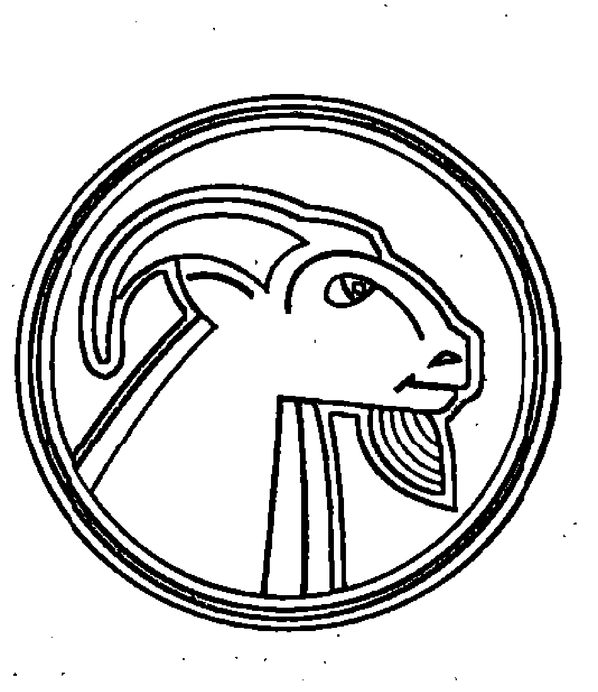

摩羯座的象征图案是山羊，但在古代的图案是一头在海上活动中的半羊半鱼生物。摩羯座素来以固执的个性出名，很在乎别人对他们的看法与评价，个性实际、情感热烈，有时候显得只看重表面价值。

海神波塞冬的一生，清楚说明了摩羯座的特质。波塞冬是天神宙斯的哥哥，照理说他应该要与宙斯分享权力才对，然而宙斯并没有释出权力，而波塞冬一辈子在向别人证明自己本应享有那个权位，有时候会以粗鲁的方式表现出这一点。不过，随着他年龄渐长，他终于学会了接受命运，逐渐变成一个心地善良的神祇。

这种个性很像摩羯座的人，摩羯座的人年轻时的个性通常很有棱有角，要等到老了以后才会渐渐变柔软。

## 波塞冬与10数的关系

波塞冬的个性很像代表1数的战神阿瑞斯，两人都很独立、积极、热情、思考单纯，认为事情非黑即白，会忠于所爱，并且展现出领导者的特质。两人也都具备强烈的男性特质，也就是果断、勇于争取、无所畏惧、捍卫自己的立场。

这些特质在阿瑞斯那章谈到数字1的时候已充分说明。不过，波塞冬和阿瑞斯有一些重大的差异。最大的差别在于波塞冬拥有自己的王国，但阿瑞斯没有。波塞冬是统治者，对众人有领导之责，不能只做自己高兴的事。然而，阿瑞斯比较不控制自己，比较任性而为。

10数人的个性独立、直接而率真，具有领导者的本能，并且因为思考单纯而可以迅速做决定——这可以是伟大的源头，但也可能是麻烦的开始。他们简单的思考方式可以很戏剧性又情绪化，会根据对自己有利的程度而夸大一件小事的危险程度，或低估大问题的危险性。这种戏剧化的效果很容易操控论点，并用诉诸情绪的说服手法来打动别人，可以成为绝佳的销售技巧。不过只对其他想法单纯或情绪型的人有效，如果遇到了雅典娜7数、阿波罗6数或其他有分析能力的人，他们很快就会看出10数人的破绽，而这通常也会使得10数人很沮丧。

10数人希望别人可以敏感对待他们，但这种期待似乎有点自私，因为他们对别人的感受并不够敏感。10数人可以展现出十足的自信模样，想成为众人的焦点，即使尚未赢得领导者的地位也期待能被视为领导者。他们不接受逼迫，要求别人听他的话并尊重他，也要求别人用平起平坐的方式或者尊敬的方式对待他。然而，他们这种过度表现自信的倾向，却可能是为了弥补内心深处的缺乏自信。真正有自信的人不需要像10数人一样拼命向别人证明自己。

这些特质在阿瑞斯1数的个性中也可以看到。不过，10数人并不甘于只活在自己的世界里，他们还想成为领导者，拥有权力。但不管他们多么渴望地位，一旦得到之后，往往发现权力不过如此，因此行为模式会越来越像1数人。

10数人比较适合简单的生活形态，也就是那种不需要介入复杂的人际角力冒着风险去盲目信任他人的生活。担任领袖角色通常带来沉重的压力，10数人也许可以担任领导角色一段时间，但最后总会决定要过简单的生活，比方说自己创业做小生意，或者如果财力许可，则会搬到小岛上过着鲁滨逊一般的生活。

## 爱情模式

波塞冬的爱情生活一点都不平淡，他不但强暴过女神，也与多位女神和凡间女子发生过关系。但他并不就此满足，还是渴望找到一个皇后。有一天他邂逅了一位让他有特殊好感的女海神，安菲特律特。他以一贯的莽撞姿态追求她，但把安菲特律特吓跑了。也许是因为知道他的花花公子名声，安菲特律特不想让自己也落得和其他女子一样的心碎下场。波塞冬到处找她，却遍寻不着，十分难过。

波塞冬的海豚朋友主动来协助，帮忙找到了安菲特律特，向她解释波塞冬其实已经改头换面，他是真心爱她，也想娶她为妻。海豚把安菲特律特带回来与波塞冬成亲，成为海神的皇后，两人也过着快乐的日子。然而，结婚一阵子之后波塞冬故态复萌，再度偷腥。安菲特律特没有与他离婚，但她变得跟赫拉一样，到处追着波塞冬的恋爱对象，不过她也没有责备他，只是自己承受痛苦。

## 人生课题

10数人在本性里就懂得领导，仿佛生下来就要当领导者，然而他们往往没有学会如何善用这种本能。他们通常是直接说出自己想要什么，并等着抓取他们所想要的事物，并不真心在乎别人怎么想。这种态度对他们自己很好，但看在别人眼里会觉得他们太自私，很少有人能承受。10数人的人生课题是学习如何成为一位优秀的领导者。波塞冬的兄长宙斯原本也是个自私狂傲、控制欲强烈的领导者，但在波塞冬带头叛变之后，才转变成一个古道热肠而又敏锐善感的神，可以吸引别人追随。

优秀的领导者不会希望别人把他们当皇帝一样盲目跟从、亦步亦趋，而是会找出方法让别人从心里愿意追随。10数人需要学着柔软一些，让自己更敏感一些，想办法了解别人的梦想与欲望。一旦知道了别人的内心，10数人便可以用他们天生的戏剧化方式来打动别人，说明其实大家的目标一致，方向也相同。如此一来将可以赢得别人的信任，让追随者相信领导人与他们站在同一阵线。赢得了众人足够坚定的信任之后，10数人就可以指出一个方向或是一个想法，大家都会追随。

亚历山大大帝就是用这种领导方式统一了希腊，达到前所未有的成就。原本希腊的每一个城市都是各自独立的城邦，彼此之间征战已久。能言善道的亚历山大大帝向各城邦解释：希腊人真正的威胁不在于彼此，而在于波斯王国和其他的外来威胁。唯有全希腊人团结，一起征服世界，才能避免历史重演，不让波斯王国有机会再次入侵希腊，差一点把希腊纳入波斯王国的版图。

想知道别人的需求是什么，意味着至少有一段时间要放弃自己的需求与渴望，多多付出，与他人分享，不计个人利益。这经常也代表着必须承担更多责任、接受更多责难、咬着牙辛劳努力，在一段时间里会是给出的多、得到的少。可是，如果能够把这种“投资”做得好，别人最后终究会相信10数人关心别人多过在乎自己，也才会期待能由10数人来领导。这时候，10数人就有机会展现他们天生的领导才能，成为真正的领导者，而不是暴君。反之，10数人如果不学习这个关于领导的课题，可能会一辈子活在没有人爱的挫败感之中，孤寂终老。

## 学习了人生课题之后

波塞冬的武器是三叉戟，就像渔夫所用的有三个尖刺的长矛。这项武器很管用，可以在水中有效命中目标。在水中看到猎物的距离通常都比实际位置远，三叉戟这个绝佳的武器在瞄准目标时略有偏差，还是可以刺中猎物。学会这些课题的10数人，基本上都有能力运用这些力量。

他们很自然就能认清自己想要的事物，但是会因为没学会人生课题而太直接追求目标，使得别人觉得他们太过自私，或反应过度而功亏一篑。通过学习这些课题，他们可以学会妥协，对他人更为敏感。换句话说，也就是不再莽撞追求自己的欲望，但依然可以达到目标。就像波塞冬的武器三叉戟可以在瞄准略有误差的情况下抓到鱼。10数人可以改用较不具压迫性的、间接而略为缓和的方式，让他人更能接受自己。

## 善用10数的威力

我们经常需要用到10数的力量，让我们变得自私一些，可以在与他人相处时把自己的需求列入考量，但仍能以他人可以接受的方式表达。使用波塞冬的武器可以达到自己的目标，同时在扩展焦点时仍能符合结果。有时这种激进的行动可能会让周围的人离我们而去，但是至少可以让我们看见谁是真正的朋友，这样的力量也给了我们向前的勇气。

对于个人生活来说，能用直接却不使对方感到受威胁的方式表达自己的需求，将可以建立起自己满意的生活。但是如果对方还是不愿配合，我们可以带着独立的精神离去，重新过生活。而在职场上，能不能运用这股力量，则代表着成功与失败的分野。现在有各式可以提供领导能力的训练课程，有些课程的价格确实昂贵，但许多人还是趋之若鹜，原因就在于他们知道，领导能力是打造梦想生活的要件。

发展10数直接的思考风格还有个额外的好处：它有助于找到独特的新点子。有了想法并且希望可以独树一帜时，就要想办法来吸引注意力，而无论是要强调重点或提出新计划，都可以运用10数的力量。10数力量有助于简化与厘清事务，也会让人知道如何修正原始概念，使它既维持原来的独特性，又能更简明易懂、容易接受。

## 生活提示

如果你缺乏10数的能量，曾经试着对照使用方法在生活中导入这种能量，你应该会发现它不容易长久维持，过一阵子就回到了原来的状态。

想维持10数能量有个好方法，你可以使用各种有波塞冬的图案和象征10数能量的物件。例如：搜集印有波塞冬图像的T恤、杯子、海报；或者戴上象征波塞冬的配件饰品。代表波塞冬的符号标志，包括渔夫用的三叉戟、马或者是飞马、船只、鱼、海豚和海中生物。

有个有趣方法可以提示10数能量，那就是在家里或办公室放个水族箱。淡水的水族箱价格比较便宜，容易操作，而咸水的水族箱则可以容纳比较多种鱼类。看着这个“波塞冬水族箱”的时候，想一想自己的潜力，这方法可以培养独立精神和领导气质。

此外还有个健康的方法，就是留心自己每天喝的水量。大部分人每天摄取的水分都不够，却喝下过多的含糖饮料、茶和咖啡。如果可以养成习惯，每次在喝一杯水的时候就当做是在摄取10数的力量，你就可以在紧张、需要捍卫自己、独立行动或坚持立场的时候，为自己打一剂强心针。

多食用海鲜也有类似的效果，因为鱼类含有健康的脂肪，可以让人体保持年轻，加强免疫系统，增进健康。在出席重要会议之前，若想获得心理上的鼓舞，就先去吃顿海鲜大餐，当然还要记得喝水！

人人都需要运动，海神也一样。波塞冬提供了最好的运动：游泳。这也是很好的10数力量。游泳是很棒的运动，但很少人知道不是所有的游泳姿势都正确。大多数人游泳时采取脸部朝下的姿势，但这会使身体前方的肌肉紧绷；而大部分的人在工作或坐着时，头也都会向前低下，肩膀往内缩，结果形成垂头丧气的姿势，这也造成颈部和背部紧绷疼痛。脸部朝下的游泳方式会使原先就可能存在的紧绷更加恶化，使得身体前方已经缩短的肌肉变得更短。对新手来说，最佳的游泳方法是仰式。仰式可以拉长背部的肌肉，延展身体前方的肌肉，帮助矫正姿势不良的问题。

唤醒10数力量的其他有趣方法还包括：搭火车、享受海景、搭船、聆听以海洋和水声为主题的新世纪音乐。

## 波塞冬的象征物：三叉戟

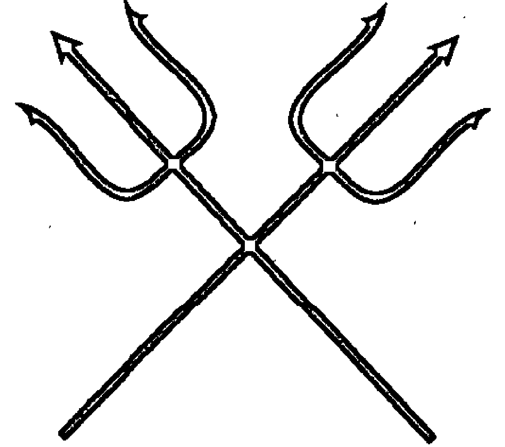

## 波塞冬 / 10数在人身上的作用

- 行为举止：友善、严肃、积极
- 体型：强壮、有点运动型
- 谈话风格：专注、直接、戏剧性
- 服装风格：独特、不随波逐流、体面

## 与波塞冬 / 10数相关的事物

- 颜色：海军蓝
- 身体部位：血液、尿道、唾液腺、荷尔蒙、脑部掌管情绪的区域
- 星座：摩羯座

## 176 新生命数字密码·2 In the Path of the Gods

# 11 宙斯 Zeus

宙斯在奥林帕斯山管理众神，他是闪电之神。他和他兄弟波塞冬都被认为是云雨的神，因此也是赋予万物生命的神。

从与宙斯有关的神话来看，他其实有能力毁灭其他所有的神，根本不必去当什么众神的统治者，他自己就可以独霸天下。不过他没有这样做，还是愿意与其他神祇分享权力。这种以推选方式产生统治者，而统治者与受治者共享权力的制度，不曾在基督教、犹太教或伊斯兰教等一神教当中出现。宙斯愿意把众神留在身边，这说明了希腊人很尊重每一个个体，允许发展个人才能，允许个人以不同于他人的独特方式存在，而这些对于整体是有益处的。但也说不定，这是因为连神明也会寂寞，也需要有人做伴吧！

宙斯一向鼓励众神发挥个人长才。比方说，与庶务和沟通相关的问题，他会请赫耳墨斯协助；遇到建筑的事物就让赫淮斯托斯负责；有关治疗、算命与音乐的事，就找阿波罗来帮忙。他用这种方式让每一个神都觉得受到尊重，觉得自己是众神家族里不可或缺的人物，而宙斯自己也得到众神的尊重，并且让他更胜任众神的领导者。

此外，宙斯也展现出耐心和慈悲。譬如，波塞冬想推翻他而自立为众神的新领袖却不成功，这时宙斯本有足够的权力把波塞冬毁掉，并勒令其他的神也听命行事，不过宙斯控制住这股想要毁灭的念头，只罚波塞冬苦役，找他来深谈。宙斯同时也愿意谈判，试图找出妥协之道，有时也愿意承认自己错了，他愿意改变。宙斯这种结合了人道、思考、慈悲心、领导能力和权力的整体性格，在希腊人眼中深具魅力，赢得了大规模崇拜。

希腊家家户户设有神龛祭拜宙斯，大家相信宙斯是家的守护者。宙斯也是城市的守护神，所以也在山顶上设立宙斯神庙。

位于奥林匹亚的宙斯神庙名列世界七大奇景之一，竖立了一座壮观的宙斯雕像，堪称希腊最宏伟的艺术作品：昂然的雕像高达40英尺，以黄金和象牙塑造出坐姿的宙斯。神庙的13个硕大立柱和6个横柱，体积比其他同期的神庙石柱大1倍，令人印象深刻。

奥林匹克竞技赛最初是为了尊崇宙斯所举办，很快就成为雅典最重要的竞赛，参加人数超过4万人，在竞赛举办期间，所有战争都必须停火。根据史书记载，奥林匹克竞赛从公元前776年到公元前393年之间持续举办，直到罗马帝国的狄奥多西一世（Theodosius I）让罗马改信基督教才废止。这座宙斯神庙在公元426年被狄奥多西二世摧毁，而雕像则移到君士坦丁堡（现在的伊斯坦堡），最后在公元475年的一场大火中被烧得灰飞烟灭。

后来奥林匹克竞技赛得以重新举办，这说明了宙斯在现代世界里依旧很有影响力——这么说是有根据的，因为“奥林匹克竞技赛”的举办地点并不是在奥林匹亚，而是在艾利斯（Elis）的一处宗教圣地，然而在宙斯神庙建在这里之后，便以他与众神所住的“奥林帕斯山”作为名字，把这竞赛称为奥林匹克竞技赛了。

这个竞赛代表了宙斯的信念：人人平等，人人有机会成功。不管一个人多穷、出身多么卑微，都能在这项竞赛中与所有人站在同样的立足点上争取胜利。这种相信人类潜能的信念，正是宙斯奥林匹克的精神，它与现代观念相似，而至今不改，也使得宙斯精神长存于现代的世界。后人把太阳系里的最大行星木星以宙斯的罗马名命名为朱庇特（Jupiter）。

## 宙斯的神话

宙斯从出生那一刻起，就注定要成为领导者。他父亲克洛诺斯领导的是奥林帕斯众神出现之前的泰坦神。克洛诺斯听到一个预言说他子女中有一个将来会兴起并篡位。克洛诺斯年轻时也是以武力取得他父亲的领导地位，所以他不愿意预言成真，想防范同样的事情发生在他身上，于是克洛诺斯在孩子一出生时就把他们吞掉。到了第六个孩子宙斯出世，克洛诺斯的太太瑞亚再也受不了，便给了克洛诺斯一个包着毯子的石块，他没有留意便吞了下去。瑞亚立刻把宙斯送到克里特岛的狄特安洞穴（Dictian Cave）。

宙斯长大后，决心要救出兄弟姊妹，并且摧毁他那暴君父亲。他设计让父亲吃下催吐剂，这一吐，也吐出了他已经成人的兄弟姊妹，赫拉、德墨忒尔、波塞冬和哈迪斯。有了兄弟们相助，宙斯开始计划攻击父亲和当时统治奥林帕斯山与世界的泰坦神。

要不是因为宙斯生来就具备谈判和组织众人为共同目标奋战的能力，这场战争也打不赢。宙斯很清楚，兄弟姊妹几人以寡击众的胜算不高，便联合泰坦人的宿敌，也就是囚禁在地狱里的单眼怪兽和百手怪物。两方协议，如果他们愿意协助对抗泰坦神，宙斯就放他们自由。两个怪兽同意配合并提供神力帮助宙斯击败敌人。

由于宙斯绝佳的谈判能力，单眼怪兽给了他可以制造闪电的武器，他哥哥哈迪斯得到一顶可以隐形的头盔，波塞冬则获得三叉戟。有了这些武器，再加上两个怪兽相助，宙斯等人获得了胜利。但不死之神克洛诺斯不会死亡，所以只被关在地狱里，后来逃到意大利重建名声，被称为萨坦（Saturn），成为收获之神。这个名字后来成为太阳系里的土星。

所有的泰坦神都俯首投降之后，三兄弟抽签分配王国。宙斯成为天神，哈迪斯掌管冥界，而波塞冬则成为海神。

奥林帕斯山是希腊最高的山脉，山顶经常云霭缭绕，是天地的交界点，所以希腊人相信这里就是宙斯打造宫殿的地方，是奥林帕斯十二神聚会之处，大部分的神祇也住在这里。宙斯在这里掌管天庭，并且很快就用他强大的武器力量统领了三个王国，而他的兄弟也愿意顺从。

有了这样的力量，宙斯可以为所欲为，成为宇宙的帝王。他变得狂妄无比，谁要是惹他不高兴，就会被他用他的武器“闪电”杀死，或者接受一些极端不合正义的处罚。譬如，泰坦神普罗米修斯把火的秘密告诉了人类，宙斯便把他永远锁在一个大岩石上，让一只大老鹰每天来啄食他的肝脏！

宙斯的自大傲慢与滥用权力终于惹恼了诸神，而海神波塞冬特别光火，他不甘心宙斯成为超级统治者。波塞冬结合了新的神祇来共同征服宙斯，意欲夺取他的统治权。计谋展开，宙斯的太太赫拉给了他一颗安眠药，让他昏睡而放下武器。再用一百个绳结把宙斯绑在他的床上，诸神则讨论该由谁接管，又该如何处理宙斯。但诸神起了争执，宙斯趁机召唤老朋友百手怪兽赶来相助。百手怪兽同时解开了所有的结，让宙斯在瞬间就脱逃了。宙斯抓起了武器，众神也就放弃了叛变的企图。

此时，宙斯大可闪电一挥，解决掉所有的神，但他没有这样做。他其实有一副慈悲心肠。听到了赫拉向他解释为何众神会企图叛变，宙斯终于领悟到自己也许太过火了。于是他开始改变自己，试着对人人体贴，发挥同情心，其他的神终于开始尊敬他，也愿意追随他。他动不动就发怒的脾气逐渐和缓，开始用冷静而睿智的方式处理那些违法的事情。至于波塞冬和阿波罗的叛变之举，他只判他们做一年苦力去修筑特洛伊城。

### 水瓶座与宙斯

水瓶座的象征图案是一个拿着水瓶的人，以此来代表水瓶座的善变性格，因为把水加进瓶子里之后，负担就会变重。

水瓶座的人可以活在自己的世界里，也可以成为人道主义者、外交大使和领袖；他们可以冷酷自私，也可以温暖而愿意付出。

水瓶座的性格可以用宙斯的人生故事来说明。宙斯的性格原本是残忍无情的，直到众神结合起来企图刺杀他并取代他的统治，宙斯这才领悟自己的错误，努力改变自己，成为一个强有力的领导者，公平对待所有人。

186 新生命数字密码·2 In the Path of the Gods

墙。赫拉也逃过了重罚，保住她天后的地位！
接下来，宙斯审慎地从族人里面挑选可以担任奥林帕斯十二神的人选。他的王国在几千年里完好无缺，这是因为希腊的宗教也成了罗马的宗教，只不过把名字从希腊文改为拉丁文。罗马人研究了宙斯的领导风格，把它运用在罗马的帝国治理和政府制度中。罗马的国王被人民视为活着的神，而国王允许由元老来代表人民，并与元老们互动。这种结合了一个全能帝王和一个民主体制政府的模式在罗马运作顺利，使罗马帝国得以往外扩张，也能维持内部团结，这是波塞冬型的独立希腊人所做不到的成就。

### 宙斯与11数的关系

宙斯的个性最适合用11数来形容：一个领导大师，具有善心也有绝佳领导技巧；走在时代前端，天生喜欢研究与分析事物，也有能力做出正确决策；是天生的策略家，群众的整合者，也是天生的演员；性格极为独立，但通常不表现在外，行为举止倒比较像是依赖型的人。

11数人这种性格事实上是双重性格。他们一方面很独立自私、头脑单纯、积极而有决断力，为了成为领导者可以不计代价；但另一方面，他们显现出另外一组性格，显得依赖、敏感、富有同情心、精于分析、被动、优柔寡断，善于整合及组织人群。这种分裂的人格来源于11数可以相加成为2数。这表示11数人有时会变成2数人，也代表他们拥有许多可以互补的能力，假如能把两组能力交互运用，便可以成为领导大师。一个伟大的领导者懂得如何整合群众，让众人得到他们想要的东西，并对领导者表示爱戴及敬重，愿意由他领导，最后领导他们走向更好的生活。这种性格类型的人，内心深处当然有许多冲突。对11数人来说，平衡或整合自己内在各种差异，是很辛苦而困难的事。他们的反应通常会很极端，不是过度依赖，就是过度独立，需要很长的时间慢慢走向成熟，才能真正发挥他们的优点。在与宙斯有关的神话中可看到，他的生命一开始是用消极被动的方式来面对，藏在洞穴里仰赖羊只维生。救出了兄弟姊妹之后，他开始运用个性中的领导能力。然而这种改变太过强烈，使得他难以平衡自我，于是开始出现个性中的负面特质，导致诸神企图摧毁他。等到他逐渐成熟，终于找到了让两组对立的个性和谐共存的方式。这时，他真正成了领导者。

## 爱情模式

宙斯面对爱情的态度不同于十二神祇里的另一个领导型神祇——波塞冬，宙斯从来不强迫别人爱他，更不曾强暴任何女子。宙斯喜欢的是诱惑女子，让她们自愿委身于他，他因为这样而形成的爱情关系超过20个，并因而生下许多子女，而且大部分是在他与赫拉有婚姻的状况下所生的私生子。宙斯可以说是一位爱情大师。这也可以说明受到宙斯影响的11数人的爱情模式。不过这不代表11数人都有很多情人，或是都会和不同的对象生下很多非婚生子女，这只代表他们喜欢谈恋爱，享受爱情里的亲密、仪式、挑逗和诱惑的过程，也表示11数人很善于应付与人有关的课题。
宙斯与赫拉的婚姻就是很好的例子。赫拉一开始拒绝了宙斯，于是宙斯变身为一只小鸟，还制造了一阵风暴，让小鸟在水中湿透，一副奄奄一息的样子。他飞进赫拉的住所，引起她的同情，就在她把小鸟捧在胸前时，宙斯变回原形，向赫拉求婚。婚礼之后度过了300年蜜月期，是有史以来最长的蜜月。这之后，宙斯的眼睛开始游移，挑逗并恋上别的女人。

188 新生命数字密码·2 In the Path of the Gods

但他从没有离开赫拉，也对所有的子女照顾有加，有些子女并且当上奥林匹斯山的神。

11数人和2数人一样喜欢谈恋爱，但他们也喜欢独处，重新充电，并且借此测试情人爱恋他们的程度。这种分裂的性格有时会使得对方觉得11数人很冷酷，并怀疑自己有没有被爱着，这时11数人便会解冻，试图安抚一切，不过这种温暖只会维持一段时间。

## 人生课题

11数人在领导别人之前，必须先主宰自己。他们需要在“依赖”这个课题上慢慢学习，学着协调自己内在的冲突。首先，11数人在年轻时特别依赖别人，直到有一天他们发现，自己所依赖的人变成了他们往前追求其他事物时的障碍。这时，他们会经历一段痛苦的内心挣扎，不知道是该保持这样的依存关系比较好，还是该就此放手才对。由于他们是依赖型的人，不容易下定决心，需要很长的时间才有能力做到放手往前走，有些11数人从来无法毅然决然做出这种决定，也就永远无法变成领导者。

然而他们天生拥有领导能力和独立性格，所以无法在依赖中获得全部的满足，迟早会渴望能过着独立的生活，赢得别人尊重，甚至希望别人来找他们指点方向寻求领导。一旦本性里的这一面出现了，他们将会开始挣扎，难过到了极点，不知该不该放开这些他们已经相处很久的人或事，好完成自己出于本能所相信的等在未来的伟大命运。

在依赖这件事上经历了痛苦挣扎之后，11数人通常会决定要独立，朝向他们性格里的另一个极端前进。他们曾经依赖别人，遵循既有的想法，待在同一份工作里，这时忽然有了180°的大转变，不再依赖任何人，有时身边连一个亲近的朋友也没有。他们改变了对生活和事情的想法，甚至可能就此转行。

他们进入了这种超级独立的生活模式之后，真的觉得比较快乐，许多11数人就这样保持独立模式，变成工作狂，与家人或情人相处的时间都很少。

然而，这样的极端独立会造成他们与人的关系变得不愉快，最后形成一种空虚的生活，变得与感情生活和人群都很疏离。于是他们遇上了最后一道生命课题，也就是如何拥有自己认为自己需要的独立程度，但又允许自己出现某种程度的依赖。在爱情关系中，这意味着一方面享受与爱人之间的亲密，但不会过度沉溺在情绪里；在工作上，则表示要对投注在工作上的精力设下限度，让自己有时间与朋友和家人相处，有时间发展新的兴趣或想法。在宙斯身上可以看到，11数人可以做到在极端而双重的个性中取得平衡，这也是值得一试的人生功课。

## 学习了人生课题之后

学习11数的人生课题，仿佛是在想办法取得宙斯那个闪电武器。事实上，这种学习也正是在蓄积爆发力，就像闪电是释出了庞大的能量。领导大师宙斯的威力，也就是做决定的能力——这个说法可以用炸弹的制造过程来解释：把所有必要的化学成分加以混合，然后分离，免得这些混合物在眼前爆炸，然后把化学物装入盒中。一旦要用到这些炸药时，不管是遇到了战事，或是为了兴建新建筑而必须拆除旧建物，或是开凿山洞时必须移除一块山石，你这时就可以把炸弹安置好，点燃引线，进行爆炸——解决问题！学习11数的人生课题，可以强化决策能力，变成领导大师。

领导大师的潜在威力很巨大，虽然可能有一点混乱——看看美国前总统克林顿的例子就知道了。不过，只要稍加练习，就可以学会把自己的潜能当做秘密武器。你可以随自己高兴去过你想要的生活，但在事情不尽如人意时，请爆发吧！用闪电般的变化让自己取得独立和领导权，设定新方向，同时可以维系自己与别人的关系，甚至赢得他们的尊重！

### 宙斯 / 11数在人身上的作用

- 行为举止：谦和、温暖而健谈
- 体型：中等，或稍微娇小
- 谈话风格：像老朋友般亲切、不具威胁性、感性
- 服装风格：简单精致、平实、会佩戴独特的小饰品

### 与宙斯 / 11数相关的事物

- 颜色：金色中带有靛青色、皇族的颜色
- 身体部位：男性阴茎、女性阴部、脾脏、甲状腺、脑部掌管逻辑的区域、神经系统
- 星座：水瓶座

### 善用11数的威力

很多时候我们会觉得生活没有走上自己想要的轨道，于是我们开始思考应该如何改善，我们发现自己必须做出一些决定造成别人不舒服或痛苦，而这里面有些人可能已经跟我们相处了许多年。在这种情况下，11数的力量可以帮助我们找到恰当的妥协，让我们有勇气做出那些为生活找到新方向的决定。做决定只需要一个瞬间，就像闪电一样震撼天地，而这决定可以改变人生！

处在领导位置上的人，可以借由11数的力量来做到对别人的需求更为敏感，赢得信任。能做到敏感并得到信任，对方便会尊重我们，接受我们领导，而我们也就有能力在保持领导者地位的情况下协调出解决方案。这力量很适用于谈判新合约，要求老板加薪，用优惠条件购物，调解纠纷等等各式状况——在这些时候，11数的力量可以节省我们很多金钱和痛苦。

## 生活提示

如果你缺乏11数的能量，曾经试着对照使用方法在生活中导入这种能量，你应该会发现它不容易长久维持，过一阵子就回到了原来的状态。
想维持11数能量有个好方法，你可以使用各种有宙斯的图案和象征11数能量的物件。例如：搜集印有宙斯图像的T恤、杯子、海报；或者戴上象征宙斯的配件饰品。代表宙斯的符号标志，包括闪电、老鹰、黄金、皇冠和彩虹。

宙斯力量可以用个有趣的方法来取得，就是在遇到了打雷闪电的下雨天时，请好好享受它。不妨向公司请假，去一个能看到雨和闪电的咖啡厅坐着，或甚至到一处有遮雨棚的户外。最好是个安静的地方，可以听到打雷和其他大自然的声音。听到了雷声，就提醒自己，你内在早已具备这种力量，只要你需要就能把它召唤出来，帮助你做出决定，让生活回到常轨。

天空最主要的成分是空气，因此注意呼吸也有助于培养11数的能量。注意呼吸是一种有助于专注的方法，可以培养做决定的能力。呼吸的产生，是因为脑细胞传达信息到肺部，而肺部的感觉神经会再把信息传回脑里控制意识思考的区域，因此呼吸会影响思考。

生气时，呼吸会变急速，但看到海景或其他可以让人放松的事物时，呼吸会变得缓慢且深沉。透过刻意放慢呼吸的速度，也就可以放松思维。感觉越是轻松，就越能集中思绪，可以看清事情，也因此可以更快做出决定。

下次你需要做决定或放松时，试着深呼吸，憋气15秒之后，再吐气约10秒。如此重复，慢慢吸气吐气，吐气时间越久越好。做了10次之后，你会发现自己每分钟的呼吸次数从10至15次，减少为每分钟两次。如果在做决定之前刻意放慢呼吸，很快会发现事情没有原先以为的那样复杂，然后，把第一个浮出心上的想法当做你的决定。

这种经过控制的缓慢呼吸是十分有力的抒压工具。下次在遇到庞大的压力时，播放轻柔的新世纪音乐，开始放慢呼吸。30分钟之后，你会感到脑部的压力感一扫而空，很可能会觉得想睡觉。失眠时就用这种方法，很快就会发现问题不见了。

# 12 狄俄尼索斯
Dionysus

在希腊十二神里，狄俄尼索斯是最后一位跻身奥林帕斯山统治之神行列。他是酒、狂欢、庆典舞蹈、复活、秘教与生殖之神。他的故事在众神当中最为复杂也最有趣。他一开始只具一半神性，是在被杀死又复活之后才成为神。他的祭典很风行，并传遍了希腊、罗马和中东地区，就像其后几个世纪基督教兴起的状况。事实上狄俄尼索斯和基督教之间有些雷同之处：

耶稣是由人类的母亲和天神的父亲所生——狄俄尼索斯也是。
耶稣和狄俄尼索斯一样，先离开出生地，后来又带着教义回来传教。
耶稣在遇害之后复活成神，而庆祝他复活的节日（复活节）是在冬末——狄俄尼索斯也一样。
在纪念耶稣与狄俄尼索斯的死亡的仪典上，都以喝红酒代表饮圣血，以吃面包代表食用他们的圣体。
耶稣和狄俄尼索斯都会展现神迹。
耶稣和狄俄尼索斯一样展现出不朽的灵魂。
耶稣和狄俄尼索斯一样以慈悲为怀，也以爱为中心思想，只不过狄俄尼索斯的爱包括了肉体的爱。
基督教会以耶稣钉死在十字架上为理由，鼓励教徒殉教，并把暴力视为合理的行为。结果造成数百万人死于十字军东征、宗教审判、捕捉女巫等等情况，这就如同狄俄尼索斯仪式里使用暴力并以人作为牺牲。

基督教在欧洲兴起之后，也开始庆祝两项不属于基督教的庆典：圣诞节和嘉年华会。这是个很有趣的巧合。根据《圣经》的记载，最初的基督徒并不庆祝耶稣的诞生，只在复活节期以吃面包和喝红酒的方式来纪念耶稣的圣血和圣体，庆祝他的死而复活。而古希腊人每年也为狄俄尼索斯庆祝两次，一次在12月，称为“小酒神节”，另一次在春季，称为“大酒神节”。这两个节期都会有仪式盛宴与饮酒的活动，众人放松作乐，就像今日的复活节和圣诞节。狄俄尼索斯的庆典包括了许多聚会，这和今日的基督徒一样。如果把全世界基督教国家所举办的嘉年华会和狄俄尼索斯神的庆祝活动做个对比，会发现两者几乎一样。

“嘉年华会”的英文词是Carnival，这个词来源于拉丁文的carni，代表食肉，因为在狄俄尼索斯的庆典上会把羊只等动物的肉撕开生食。在英文里，嘉年华会还有另一个词Bacchanal，这个词源自于狄俄尼索斯的罗马名称，巴库斯（Bacchus）。在嘉年华会上，人人穿着狂野的服装，狂舞猛饮，通常也会做出疯狂的行为，就像在狄俄尼索斯的庆典上一样。事实上，在希腊某些偏远的村庄里，在嘉年华会上会用戏剧方式重现狄俄尼索斯时代的生活，大家穿着动物皮，恣情饮酒，演出死亡和复活的戏剧。

狄俄尼索斯及其祭祀在希腊剧场上也扮演重要角色，一般都相信他是悲剧形式的起源。也因此，希腊的多数剧场都有狄俄尼索斯的雕像，把剧场献给他。现在的人在电影或戏剧上看到了悲剧情节时，也就像以前在狄俄尼索斯祭祀上的体验，而酒喝多的时候也就是演出了狄俄尼索斯的情节。

## 狄俄尼索斯的神话

狄俄尼索斯是众神里最特殊的一个。他的父亲宙斯与泰坦女神赛墨勒维持了一段很长的外遇关系，但因为宙斯在她面前是以变身出现，所以塞墨勒并不知道自己的爱人是宙斯。而宙斯会这样做是因为一旦泄露自己身份，塞墨勒就会当场死在他的闪电之下。后来塞墨勒怀孕了，宙斯的妻子赫拉决定要制止这两人的事，便以护士身份出现在塞墨勒面前，并逗引她对于情人的真实身份起疑。赫拉教她要先让宙斯发誓答应她一件事，然后要他说出真实身份。

塞墨勒见到宙斯，要他发誓会允诺她一个愿望成真，宙斯答应了。塞墨勒这便要求宙斯吐露真实身份。宙斯想尽办法推托，但最后为了信守誓言，别无选择，说出了身份，而塞墨勒也立刻被杀——就在她倒下将死之际，宙斯叫赫耳墨斯动手术把塞墨勒的胎儿取出，植到他自己的大腿上让胎儿继续孕育。

胎儿既已出世，赫拉想杀了孩子了事，于是安排两个杀手把婴儿撕成碎片。为了确定孩子已死，还将其烹煮。故事本应到此就结束，所幸他同父异母的姐姐雅典娜赶来相救，并把他送给谷物女神德墨忒尔的女儿，也就是冥界之后珀耳塞福涅保护。

珀耳塞福涅是狄俄尼索斯同父异母的姐姐，她深知只要狄俄尼索斯不死，赫拉绝不善罢甘休，便把他送到一个国王那儿，让他穿上女装，举止如女生，也骗过了赫拉。好景不常，赫拉还是发现了狄俄尼索斯，于是她把国王和皇后弄疯，想让他们误以为自己儿子是鹿而杀了他。

还没来得及对狄俄尼索斯动手，他就被带到森林，由仙女和半人半羊兽的撒特（有着通常保持勃起状况的巨大男性性器官）养大，把他变成羊宝宝，从此得以放心，安全长大。狄俄尼索斯在森林里邂逅了年轻俊美的安普洛斯（Ampeloss），由于他以前没有见过好看的人，便很快坠入爱河。他挑逗安普洛斯，两人也成为恋人（同性恋的情景在众神之间很常见）。但命运弄人，安普洛斯在一次狩猎中受了伤，最后不治。

狄俄尼索斯大为悲痛。于是，阿佛洛狄忒的儿子厄洛斯把安普洛斯的遗体变成葡萄树，狄俄尼索斯就因为这棵葡萄树而发明了葡萄酒。很显然的，他喝那么多酒是为了遗忘！他逐渐走出了失去爱人的伤痛，而这时赫拉又发现了他的行踪，并且让他发狂……令人猜想会不会他其实是酒精中毒？毕达哥拉斯不就说过“酗酒是疯狂的同义词”。

狂乱的狄俄尼索斯，此后几年就这样在森林里游荡、喝酒、跳舞，纵情享受。令人称奇的是许多人开始追随他，崇拜他，随着他喧闹、痛饮、狂舞、放肆欢爱。英文里有个词 orgy，就源于酒神的这些欢闹活动。但他们也会进行冥想，有静默和观想的时间。这样的生活似乎有助于狄俄尼索斯疗伤。他所创出的宗教逐日吸引信徒。

直到有一天，赫拉又听说了这些事。

这次狄俄尼索斯学聪明了。他离开希腊，踏上一段漫漫长旅，足迹到达埃及、印度和许多遥远国度。他所到之处，人们都很喜欢他的想法，而他的宗教也随之拓展。但也有许多国王抗拒他的祭祀，显然也因此引发了战火。狄俄尼索斯变成一名战士，经常把疯狂当做武器，这可是向赫拉学来的！他的宗教就这样像野火燎原般传开了。

他把他的宗教传遍世界之后，决定返乡面对赫拉与众神。幸好宙斯对他刮目相看，接受他成为奥林帕斯山最后一个神。到这个地步，赫拉也只能接受他了。

拥有了权力之后，狄俄尼索斯前往冥界，拜托曾经救他一命的珀耳塞福涅帮忙，终于把他母亲塞墨勒救出，让她复活。他后来曾与在阿尔忒弥斯之前担任泰坦月亮女神的阿里阿德涅结婚，并育有数名子女。（阿里阿德涅也有许多神话，她曾与克里特王子特修斯恋爱，但在被他利用来杀了米诺托之后遭到抛弃。）

## 狄俄尼索斯与12数的关系

狄俄尼索斯很在乎如何接受自我并且释放内在隐藏的热情，这些态度很类似爱与美之神阿佛洛狄忒的教诲，但更为激烈而深入。阿佛洛狄忒教导我们在爱与性这两件事上都要依循自己的热情而行，但她所指的是已经产生爱意，知道自己的所爱所欲是什么的时候。而狄俄尼索斯认为大部分的人并不是如此理想化，也不清楚自己爱的要的是什么，却需要经过一番探索才能发现。所以他创造了探索的方法，在他的狂欢聚会和疯狂庆祝上，大家喝个烂醉，戴上面具穿上奇怪的服装或者裸体，尽情跳舞，基本上就是不再控制自己，这才有机会发现自己真正的热情所在、真正的才能与梦想。

阿佛洛狄忒的忠于自我热情和理想，是一门初级课程，经历了这个阶段，会知道那些热情与理想是不是自己真正想要的事物，知道后就可以准备进入另一个层次：选择另一个热情或理想。这样的过程经历个几次，最后终会找到真爱。这做法很有用，但很缓慢，假如每段感情都维持几年，那么整个过程会拉得更长。至于狄俄尼索斯的方式则是捷径。他认为可以在酒神聚会上与所有人都发生性关系，尝试各种形式的性爱，然后说不定马上就会找到自己真正的幸福。

在发现了自己天生性倾向的同时，还可以发现自己其他的特质。在酒神庆典上，有机会尽情歌唱、跳舞、表演、欢笑、运动，这也就是让自己的创造力得到无限发挥；在酒神庆典上，很容易就让自己放松与享乐，也可以发掘自己一向好奇却从来没有机会或从来不敢尝试的各个自我层面。人人都有一些能力不曾得到发挥，而唯有在不克制自己，不为了取悦他人而伪装，并且对自己真实的情况下才能发挥出来。

想分辨爱与美之神和酒神的差异，最好的方法是想象自己造访一个意大利城市，譬如威尼斯，你只有一个星期的时间来判断这城市里最好的食物在哪里。如果采用阿佛洛狄忒的方法，你会四处观察，看看哪家餐厅最吸引你，当然你最好懂得点菜，否则可能会错过那家餐厅的最佳食物。接着，在这个星期里每一天的每一餐都要尝试不同的食物，这么做，八成就能判断威尼斯的最佳食物在哪里了。假如运气好，找到了最棒的餐厅，也叫对了菜，那么这个方法也许就能奏效。然而，大部分的餐厅都不卖早餐，所以这7天里你大概只能吃14顿（中餐加晚餐），而最好的餐厅往往不在观光区里，而你可能找不到。所以这个方法有碰运气的成分。

如果使用狄俄尼索斯的方式想在威尼斯寻找最棒的菜肴，就会举办一个美食节，要求每一家餐厅都设立摊位，每天三餐都要拿出绝手好菜。在美食节7天里享用过21餐好菜和点心之后，一定可以找出当地最好的菜色和供应的餐厅！这种密集的取样法，可以用在所有事物上，让人可以在很短的时间里发现自我。正因为这个原因，阿波罗才会把神庙交给狄俄尼索斯，因为狄俄尼索斯所提供的方式，可以更快速让人认识自己，比阿波罗的方法还要快。

## 双鱼座与狄俄尼索斯

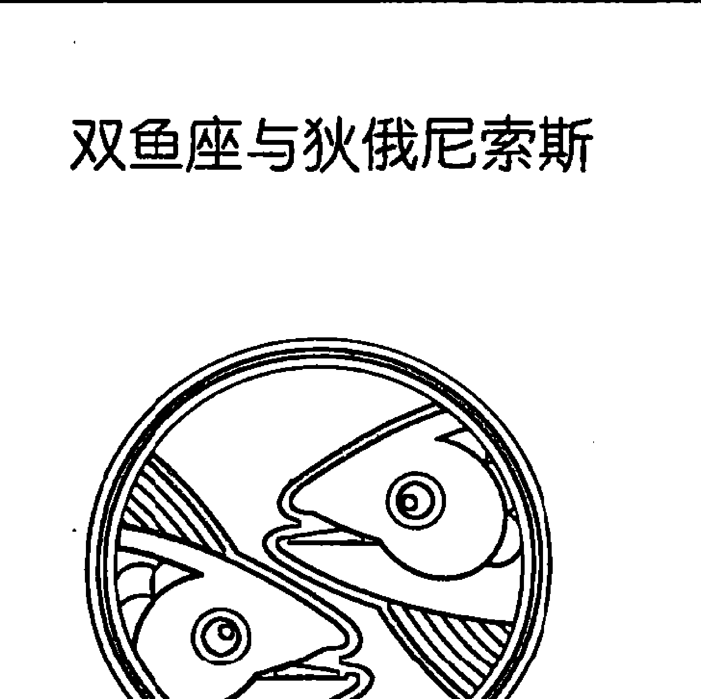

双鱼座的代表图案是两条鱼。爱神阿佛洛狄忒和她儿子厄洛斯为了躲避一头怪物的追杀，于是变成了鱼，这是双鱼座图案的由来。双鱼座富有艺术气息，善社交，活泼热情，但他们的情绪化会使得别人不容易明白双鱼座的心思。双鱼座酷爱美酒，而相传酒是由酒神发明的，当然酒神也是以爱喝酒出名。

此外，双鱼座是最后一个星座，一如狄俄尼索斯是最后被列入十二神名单的一位。酒神经常被赫拉打扰攻击，每每落荒而逃，一直到他长大成人离开希腊之前，都经常上演这样的剧目。狄俄尼索斯有许多与狂饮、音乐、舞蹈有关的仪典，这些活动都有利于发泄情绪，发现自我，也就可以帮助双鱼座的人维持身体健康。

12数所代表的性格特质很像狄俄尼索斯。受到12数影响的人通常很独特，多才多艺，在科学、商业、艺术等方面都有天分。但他们自己浑然不知，一直到某天早上醒来忽然决定要尝试某件新鲜事，但尝试时发现自己似乎已经知道做法。有一名年轻的苏俄女子就是这样。她从资讯系毕业，刚刚走出痛苦的离婚过程，儿子才出生。有天早上她醒来就想画画，于是去买了绘画用品回家。完全没有经过正式训练的她，两个星期就画出了几幅让她闻名全国的画作，后来在成为国际知名画家之后受邀移民美国！

出于某种未知的原因，许多12数人看起来比实际年龄老成。这跟饮食无关。有人认为这是因为他们前世玩过头了，但其实他们只是比一般人更渴望在生命中满足自己的饥渴和热情。假如他们不能依循这种热情而活，往往就会过着极度不如意的痛苦生活，迹近崩溃边缘。

12数人独立并富有创造力，沟通能力绝佳，口才超棒，因而非常具有说服力。他们有远见，爱好美丽事物，敏感而情感丰富。他们的个性在某方面来说是矛盾的，一方面想拥有并体验所有事物，但另一方面又害怕冒险、害怕失去手上拥有的东西。

## 人生课题

12数的人生课题之一，是找到方法解决自己内心的冲突。12数人小时候通常只顾着做自己想做的事，不太需要别人操心，所以会让父母觉得容易照顾。然而，假如父母因此就想控制他们，期待他们照着父母的意思过生活，他们却会越来越不快乐。这不是因为12数人生性叛逆，而是因为他们会听从父母的话，放弃自己的梦想，希望用这方式来让别人高兴，而取悦别人对于他们来说是很重要的事。但在此同时，他们内心逐渐累积起不满。对12数的孩子来说，任何的批评都表示不尊重他们的能力，他们不但无法接受批评，甚至把批评看成是错误的对待。

这样的人长大后通常会融入社会，没有显现出特殊个性或才能，就只是一个普通人。他们看起来快乐，但通常只是表面快乐，内在其实觉得愤怒。他们一方面想要过安稳的生活，有一份好的工作，拥有美好的物质享受和幸福的婚姻，但同时也梦想成为艺术家、巡回艺人、吉普赛人，或者想着抛开一切责任离家出走，想办法借由艺术活动让人快乐等方式来过自己的生活。

鱼与熊掌很难兼得。拥有稳定的工作与和乐的家庭，意味着负起责任和重视承诺，这就没有多少时间实践旅行的计划或追求其他梦想。为了两者兼得，年轻的12数人往往会在安定下来之前先求学、工作、交友、旅行。他们会去一个有意思的地方住一阵子，不是观光客那种走马看花，而是要认识当地人、体验新的事物和不同的生活形态。如果在这方面获得了足够深入的体验，12数人会找到自己的喜好，选择一种能够结合各种才能，协调各种内在欲望的生活。如果因为某些原因无法四处旅行，就保持开放态度，尽量探索各种不同的领域，特别是那些与发挥创意有关的事物，之后再挑选一个职业。多多与不同的人交往，不必与初恋对象结婚。

对成年的12数人来说，解决方式就比较复杂了。通常12数人的另一半已经习惯了12数人一向以来的情人或配偶的身份，并期待他们继续扮演称职的角色；或者是公司认定了他们在工作上的执掌，譬如经理或业务员等等，希望他们继续担任下去。假如12数人尝试改变，想探索自己的需求或追求自己的梦想，这时他们的伴侣通常都不喜欢他们的改变。而12数人假如一直都很坚持，那么双方的争执就会越演越烈。

如果12数人坚持改变，则可能会演变成两种情况。一种是糟糕的结果，就是他们的家人由于觉得遭到12数人背叛，于是诉诸法律裁决，并在处置财产时几乎不留一毛钱在他们名下。这使得12数人必须从头开始，但也只能谢天谢地，至少赢得了自由，可以重新安排生活，终于有机会追寻自己的梦想了。

另一种情况则是家人的思想开明，经过了充分沟通，决定给予12数人自由，以此表现出对他们的爱与支持，而不是上演背叛的戏码。有些夫妻就开始尝试开放式的婚姻生活，借着与不同的人发生性关系来探索自己的性欲，但夫妻俩还是开心在一起。爱情如果够纯粹也够坚定，可以克服一切难题。

在选择职业这个课题上，事业已经稳定但不喜欢现有工作，然而又无法辞职的12数人，还是有机会改善状况。解决方式就是培养嗜好。找时间做自己喜欢的事情，诸如艺术活动或手工艺，找资料书籍来研读，寻找志同道合的社团，参加聚会，聆听演讲，远距上课。尽可能把自己这项兴趣告诉很多人，等待任何机会出现。继续发展自己的嗜好，总有一天会得到机会把嗜好转成职业。除了培养嗜好之外，也可以在确认了自己希望专注发展的才能之后，想办法找机会把这项才能运用在现有的工作上，或者要求转调到更适用的部门也是个好方法。

## 爱情模式

狄俄尼索斯的爱情故事很简单。他曾是个狂人，与各色男女上过床，但他在结束了流浪并回到奥林帕斯山之后，安定下来，结了婚，有了子女。他不像其他的神那样在婚后还外遇。他用很恰当的态度对待女性，也是个忠实的情人。

也可能是因为他年轻时就尝试过各式各样的性经验，所以知道自己要的是什么——他最后的选择听起来也许会令人惊讶：他认为爱、诚实与忠贞是最重要的东西。他树立了一个幸福稳定婚姻的典范，因为他对自己有充分的自知。他当年的追寻、体验、欢庆、杂交、饮酒作乐的经历，让他得以真正认识自己。他是准备妥当后才走入婚姻的，而结婚后就一心爱着妻子，想和她共度余生。因为他真的了解自己，也爱自己，而这两者是爱别人的基本能力。

当今很多婚姻的问题在于很多人太早结婚，还不足以成熟面对婚姻。双方对自己的认识不清，不知道自己要什么，然而等到他们终于了解这些时，抽身的代价就很昂贵而令人痛苦了。人在结婚时，只知道彼此相爱，期待爱情能解决一切，希望两人一起终老，永不分开。爱当然可以解决所有事情，但这必须是纯粹的爱，不求回报，就像父母亲对孩子的爱。这样的爱情必须双方成熟才能拥有。一个人要多久才能成熟？成熟来自于历练，而且往往是痛苦的历练。简单说，成熟需要很长的时间才能达到，而有些人永远做不到。

有人会因为爱情以外的原因结婚，比方说为了远离父母，为了钱，为了权位，为了让父母高兴。但这些都不能让婚姻长久幸福。想到今日结婚的人在两年内就离婚的有近一半，也许大家都可以从狄俄尼索斯身上学些什么吧！

## 学习了人生课题之后

狄俄尼索斯的雕像，一手持酒杯，头部和身体则缠绕着葡萄树所垂下的葡萄藤。他喝的可不是普通的酒，而是神奇的饮料，喝下后可以释放出内心最深层的欲望，领悟到自己的真爱。

凡是学习了人生课题的12数人，也就等于取得了狄俄尼索斯之酒，得以挖掘自己的内在，找出可以让生命得到价值的梦想或目标。确定目标之后，他们会结合多项才能，运用能力，创造出可以带给他们曾经暗自梦想，而今终于握在手上的快乐和成功。

## 善用12数的威力

根据阿波罗的教诲，生命的要务在于“了解自己”，而后要接受自己，采取行动追寻一种可以发挥天赋，依循热情，忠于自我的生活。这些步骤也是维持身心健康的关键，得到幸福人生的必要基础。12数的力量，可说是十二种力量当中最重要的一个。

所有人都必须不计代价认识自己，然后展现自己的特质，创造出根据真实自我而发展出来的生活。这些步骤可以让人找到适合的职业，然后每天都期待上班工作；这些步骤也可以帮助人找到适合自己的感情关系，让人感到满足而心无旁骛；也可以带来恰当的饮食方式，让人保持年轻、活力与健康。这好比是用一只象征性的狄俄尼索斯酒杯来饮酒，沉醉于酒神的神奇之酒，让人发现真正的自己，领悟到自己此生应该成就的事。

运用12数的力量，很类似许多文化里面的成年礼。包括传统非洲社会的某些文化，都有成年礼的习俗，用割包皮、黥面、刺青、让虫咬、从高处跳下等等会带来极度痛感或有生命威胁的仪式，让男孩转变成男人，女孩变为成熟女人。少年少女只要能忍受痛苦，他们就会发现内在的力量，知道自己应该具备什么条件才能进入世界，并追求自己在其中的一席之地。

运用12数的力量，好比进入一场成年礼，准备从片面的快乐进入到全面的幸福，从孩子般的被动接受，转变为有成人样子的主动掌握，从生活中挤压出最佳的成果。这个过程很辛苦，因为过程中必须冒着失去一切的风险，必须发现并接受真实的自己，然而最后的报酬非常棒。唯有此法可以让人得到圆满的生活，别无其他！

另外还有一种12数力量的运用法，这是在看似不可能存在的情境中寻找解决之道。在传统文化浓郁的地方，好些老年人都懂得运用狄俄尼索斯的方法。遇到了难题时，他们会服用有迷幻作用的药物，他们在迷幻的过程中看到了幻象，或者得到了其他足以导出解决办法的领悟。这种做法之所以能奏效，是因为人在放下了逻辑思维之后，可以碰触到其他形态的想法，通常称为侧向思考。在侧向思考的时候，事物之间没有逻辑或关联可言，会想到疯狂的东西。

这种思考方式能创造出令人称奇的想法，那是无法用逻辑想到的好点子。所以一旦逻辑失效的时候，可以用这种方法来做脑力激荡，提出各种疯狂想法，享受这个把疯狂想法与问题联结起来的乐趣。

事实上，晚上做梦的时候都会经历这种侧向思考，有时甚至在白日梦里也会。大家都知道梦境可以多么不合现实，毫无逻辑可言，甚至无法用言语解释。虽然梦境很疯狂，然而许多科学的重大问题是在梦里找到了解答，譬如爱因斯坦的相对论、爱迪生的发明。不妨学着记下梦境，把内容加以分析，这会是一项释放出12数力量的强大工具。

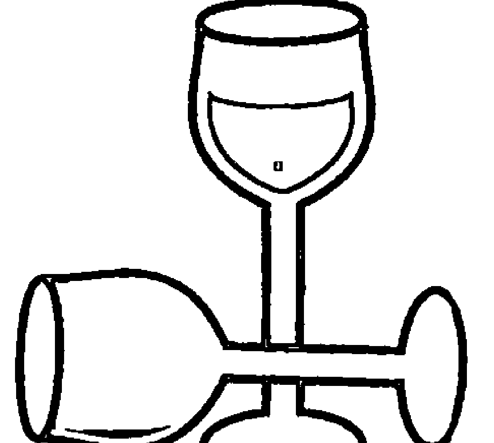

狄俄尼索斯的象征物：酒杯

## 狄俄尼索斯 / 12数在人身上的作用

- 行为举止：好奇、开心、紧张
- 体型：强壮、肌肉发达
- 谈话风格：友善、有权威性、愉悦
- 服装风格：具吸引力、独特、有格调

## 与狄俄尼索斯 / 12数相关的事物

- 颜色：水晶白
- 身体部位：睾丸、卵巢、子宫、脑部掌管艺术的部分
- 星座：双鱼座

说到解决难题，酒精也是一种安全而有用的媒介。如果遇到了难以解决的问题，在欢乐的环境里小酌一番有助于放松，忘掉原有的逻辑。很多人因而冒出疯狂点子，后来并成为有效的解决办法。为了运用12数力量，有时候得疯狂一番！

## 生活提示

如果你缺乏12数的能量，曾经试着对照使用方法在生活中导入这种能量，你应该会发现它不容易长久维持，过一阵子就回到了原来的状态。

想维持12数能量有个好方法，你可以使用各种有狄俄尼索斯的图案和象征12数能量的物件。例如：搜集印有狄俄尼索斯图像的T恤、杯子、海报；或者戴上象征狄俄尼索斯的配件饰品。代表狄俄尼索斯的象征包括：葡萄和葡萄树、红酒杯或一般酒杯、红酒瓶或其他酒瓶、老虎、羊、与剧场有关的事物，以及嘉年华会的面具。

有很多方式可以体验到狄俄尼索斯的能量。最激烈的做法是参加世界级的嘉年华会，譬如纽奥尔良的马蒂格拉斯（Mardi Gras）嘉年华会、巴西里约热内卢嘉年华会、千里达的西班牙港嘉年华会、意大利威尼斯的嘉年华会。很多其他的世界大城市也都开始会举办嘉年华会，各个城市在不同的日期举办，不过通常都在冬末春初（1月底至4月初之间）。

今日希腊的嘉年华会仍然以剧场表演揭开序幕，希腊人一直热爱戏剧演出，雅典的剧场数目居欧洲所有城市之冠。希腊所有城市几乎都会举办嘉年华会，其中以帕特雷（Patra）的规模最为盛大。想参加帕特雷嘉年华的人要做好心理准备，因为习俗上会用泡沫、水和碎纸来相互喷洒，也会用大型的塑胶榔头打人。这些不会造成真正的疼痛或受伤，但是很吓人，有时会把衣服染上五颜六色。

如果参加了嘉年华会，特别是在街道上涌入成千上万人的大城市随着疯狂的人群一同狂欢，这时要做好心理准备：各种怪事都可能遇上。也会发生抢劫案，特别是大型的嘉年华会，所以身上要准备一些现金给抢匪，但不要放太多钱，免得被洗劫一空。最重要的是千万不要抵抗，很多人为了几块钱而受伤或甚至被杀！

有一个最简单的方法可以体验狄俄尼索斯能量，那就是和三五好友在家里喝几杯红酒，唱歌、欢笑与跳舞。也可以选择一家狂野的夜店，那种许多人一起随着节奏强烈的音乐起舞的地方，喝几杯酒，跳入舞池狂舞到精疲力竭。你会顿时发现：原来酒神狄俄尼索斯的祭祀完全没有消失，你就在他的庆典之中。它存在于每一个酒吧、夜总会、餐厅、剧场、电视节目和地球上每一个地方的节庆里！狄俄尼索斯的影响力从来没有离开过！

## 结语

## 解决生命里的冲突

读过了前面关于12个生命密码与希腊十二神祇的关联之后，你极可能会发现，你的特质并不只是符合一种神祇与数字的关系而已，却可能是两种以上。会出现这种状况，有几个可能原因。第一，人的性格特质本来就是会变动的，每天在经验中学习，性格当然可能会改变。此外，人在面临挑战的时候，比较深层的自己会浮出来，使得我们展现出不同于一般时候的行为举止。

既然不可能只用单单一种的性格原型就把一个人的性格描述完全，这表示每一个人都会同时具有两种以上的性格原型，而这些性格原型所追求的是不一样的事物，当然就会形成拉锯，并形成人心里的内在冲突。

在本书的十二神祇里，挑选出3个你认为最像你个性的神之后，把他们所代表的数字写下来。这里要注意一件事：遇到了10、11、12时，要分别把它们的两位数再相加一次，分别还原成1（10）、2（11）、3（12）。

找出了这3个最能代表你个性的数字之后，在216页的表格里面找到它们的组合，然后看看你的解决之数是什么。最后，再回到描述你的解决之数的那一章去读一遍，试着把有关的提示与建议应用在生活上，把代表这个数字的性格特质当做你的学习榜样。这样做一阵子之后，你会变得比较容易看出自己的问题症结，知道它们为什么会形成，以及可以如何解决它们。

## 黄金三数

除了用上述方式找出3个符合你特质的数字之外，你事实上可以用自己的生日来算出3个代表数字。这个计算过程稍微长了一些，不过只要仔细读解释，照着步骤来，就可以定出对你最重要的3个数字，并得到对自己非常有意义的认识，也是这本书的最终目的。这个过程很值得耐着性子来理解。

这个叫做“黄金三数法”的方法，在我前一本《新生命密码》里做过完整的介绍。“黄金三数法”有一点复杂，在这里只做一点简单的说明：

简易版的金三角数字只需选出3个数字代表整个命盘：命数、出生日、天赋灵数。

第一个数字是：命数。

先计算出命数，然后把这个数字放入下页图直角三角形中的斜边。命数对于性格的影响最大，在分析数字的意义时常常要用到。

第二个数字是：出生日的数字。

出生日是指你出生那天的日期数字。首先要把出生日化为一个一位数的数字。如果原本就是一位数字，从1日至9日，则直接取用；若是两位数，从10日到31日，则要把所有数字加起来。例如13日，要把1与3加起来，得到4；若是28日，则要把2加8得到10，然后把1与0相加，得到1。依此类推。

## 黄金三角数的范例

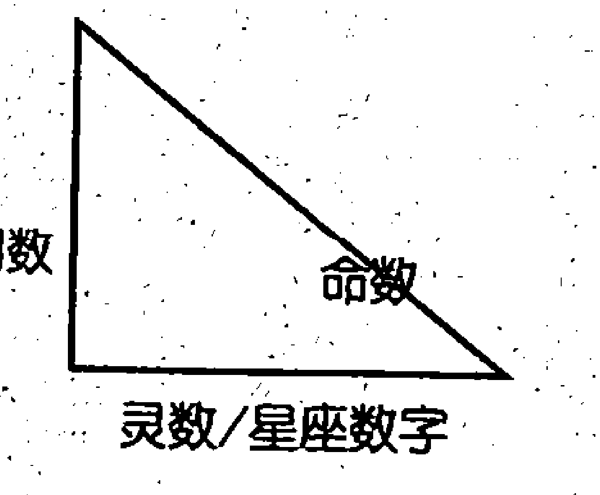

例一：某人生于1989年9月4日。

黄金第一数：此人的天赋灵数为40，命数为4。

黄金第二数：生日数为4，与命数同，所以不能用生日数，改用星座数字。9月4日是处女座，处女座的数字是6。

黄金第三数：灵数4与命数相同，不能用；星座数已用，故改用月份数字。

他的黄金三角数字如图所示：

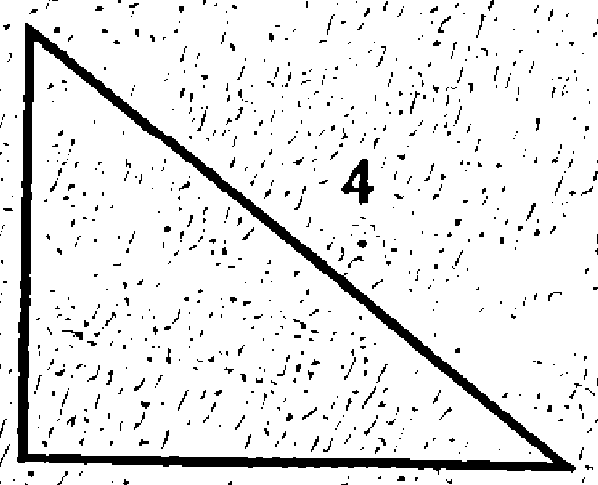

## 例二：生于2002年1月5日。

黄金第一数：天赋灵数为10，命数为1。

黄金第二数：生日为5日。

黄金第三数：灵数、星座数都是1，不能用。月份也是1不能用。最后用年份的倒数第一个数字，2。

此人的黄金三角数字如图示：

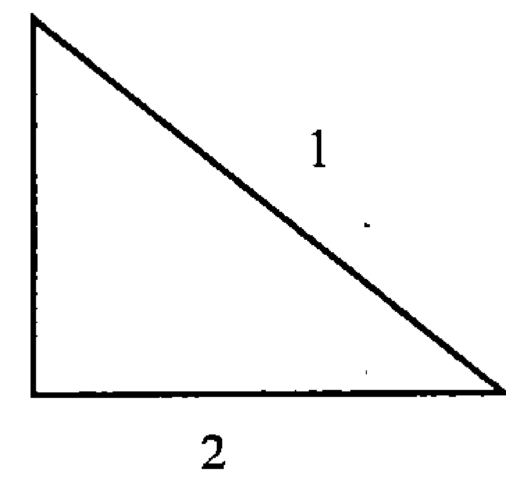

## 例三：1954年8月3日。

黄金第一数：天赋灵数为30，命数为3。

黄金第二数：生日数为3，与命数同，不能用。改用星座数字。由于是狮子座，命数为5。

黄金第三数：灵数和星座数不能用，改用月份数8。

此人的黄金三角数字为：

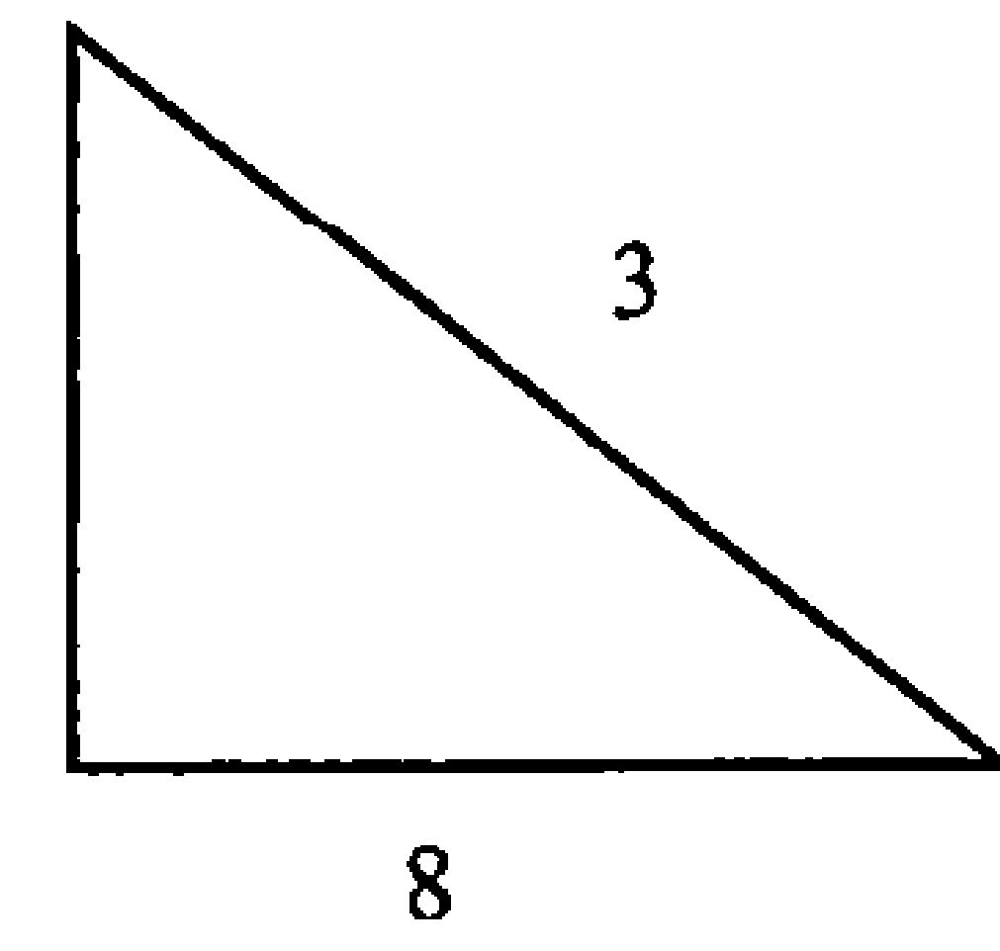

第三个黄金数字是：天赋灵数。

天赋灵数是个两位数的数字，我们这里要取用的是十位数的那个数字。例如天赋灵数为32，就把3拿来用。如果此数又与命数和出生日数字相同，那就以星座数字取代。万一星座数字又和命数、出生日数字都一样，那就要再用其他方式挑选，《新生命密码》书中“其他数字”一节。

不管你是找出3个与你最相像的神祇，或者是用黄金三数法找出了对你最有意义的3个数字，找到之后，务必仔细观察这3个数字之间的矛盾与冲突——这可能是借用生命密码来认识自己的最重要目的。这些矛盾与冲突，指出了我们在人生中所遇到的障碍，以及该如何破解这些冲突，好让我们集中心力追求成长，把潜能发挥到极致。

最后，你可以对照下页起的表格来找出你的解决之数，并且再回头读一遍与那个数字有关的章节，了解那个神祇的个性与那个数字的人生课题，并在“生活提示”、“善用数字的威力”等段落里得到建议。假如能在生活中尝试这些建议，你将会发现，那些多年来困扰着你的内在冲突，变得非常容易面对与处理。

> ### 关于10、11、12的特别说明
>
> 生命密码10，11，12等三个数字，在做冲突三数的时候，要把它们的两位数相加为一个个位数，分别成为1，2，3。你可以阅读与你有关的那两章，譬如10数人就阅读10数和1数那两章，11数人就阅读11数和2数那两章，12数人就阅读12数和3数那两章，然后判断这两个数字里面哪一个比较像你。或者把这两个数字的课题都当做你的课题——这是比较理想却也比较辛苦的做法，因为这个方法会要求你好好学习自己的人生功课。

人生里有很多问题是因为我们做出了错误的决定才会产生。唯有对这些错误的决定释怀，我们才能彻底认识自己，然后，面对未来，做出正确的选择。

## 用解决之数化解你的冲突

查索以下列出的黄金三数组合时，不需要完全依照顺序排列，只要这三数是你的黄金三数即可。

特别说明：以下这份表是根据前一本《新生命密码》所整理出的解决之数表而来，但做了一点修改，有些数字的解决之数换过了。建议你重新对照一次，确认你的解决之数是什么。

| 黄金三数 | 解决之数 | 黄金三数 | 解决之数 |
| --- | --- | --- | --- |
| 1—2—3 | 5 | 1—3—7 | 5 |
| 1—2—4 | 4 | 1—3—8 | 5 |
| 1—2—5 | 5 | 1—3—9 | 5 |
| 1—2—6 | 4 | 1—4—5 | 1或10 |
| 1—2—7 | 5 | 1—4—6 | 4 |
| 1—2—8 | 5 | 1—4—7 | 4 |
| 1—2—9 | 5 | 1—4—8 | 4 |
| 1—3—4 | 1或10 | 1—4—9 | 7 |
| 1—3—5 | 5 | 1—5—6 | 3或12 |
| 1—3—6 | 3或12 | 1—5—7 | 5 |
| 1—5—8 | 5 | 2—4—7 | 4 |
| 1—5—9 | 5 | 2—4—8 | 4 |
| 1—6—7 | 4 | 2—4—9 | 6 |
| 1—6—8 | 4 | 2—5—6 | 2或11 |
| 1—6—9 | 3或12 | 2—5—7 | 5 |
| 1—7—8 | 4 | 2—5—8 | 5 |
| 1—7—9 | 7 | 2—5—9 | 5 |
| 1—8—9 | 5 | 2—6—7 | 4 |
| 2—3—4 | 6 | 2—6—8 | 6 |
| 2—3—5 | 5 | 2—6—9 | 5 |
| 2—3—6 | 6 | 2—7—8 | 5 |
| 2—3—7 | 5 | 2—7—9 | 5 |
| 2—3—8 | 5 | 2—8—9 | 5 |
| 2—3—9 | 5 | 3—4—5 | 1或10 |
| 2—4—5 | 2或11 | 3—4—6 | 6 |
| 2—4—6 | 2或11 | 3—4—7 | 1或10 |
| 3-4-8 | 6 | 4-6-7 | 4 |
| 3-4-9 | 6 | 4-6-8 | 8 |
| 3-5-6 | 3或12 | 4-6-9 | 6 |
| 3-5-7 | 5 | 4-7-8 | 4 |
| 3-5-8 | 5 | 4-7-9 | 7 |
| 3-5-9 | 5 | 4-8-9 | 6 |
| 3-6-7 | 9 | 5-6-7 | 9 |
| 3-6-8 | 6 | 5-6-9 | 8 |
| 3-6-9 | 6 | 5-6-7 | 9 |
| 3-7-8 | 5 | 5-7-8 | 5 |
| 3-7-9 | 5 | 5-7-9 | 5 |
| 3-8-9 | 5 | 5-8-9 | 5 |
| 4-5-6 | 8 | 6-7-8 | 4 |
| 4-5-7 | 7 | 6-7-9 | 9 |
| 4-5-8 | 8 | 6-8-9 | 6 |
| 4-5-9 | 7 | 7-8-9 | 5 |

## Part 2. 希腊神庙之旅

Our trip or should I say pilgrimage following the path of the gods began and we would have to take 8 domestic flights, 8 ferry rides, hire several taxis, rent cars and drive endless hours through winding roads. It was exhausting to say the least and we only made it thanks to my knowing where the good restaurants were!

As it was July we were blessed with good weather and got to all the main locations we planned, until we were about to go to Mykonos. Without warning the weather turned bad and our ferry was cancelled.

## 寻找希腊众神的足迹

2004年夏天，我与一位电视台记者前往我的出生国——希腊，做了一趟追寻希腊神话十二神足迹的朝圣之旅。我们计划在12天里完成，必须搭乘8次希腊国内的飞机，搭8次渡轮，搭好多次出租车，还要另外租车在蜿蜒的路上长途行驶。整趟行程非常累人，要不是我知道哪里有好餐厅可以吃到美味食物，还真不知如何撑下去呢。

这趟旅行是在7月里，幸好老天帮忙，天气很好，我与同行的记者朋友得以按照计划一一拜访那些神庙古迹。只不过到了最后一天，原定行程是要前往米克诺斯（Mykonos），但一早醒来发现天气骤变，渡轮临时停驶——这种状况在希腊的夏天是很罕见的。事出突然，打乱了我们的行程，而且恐怕会使得这趟旅行没办法拍摄到阿尔忒弥斯神庙的珍贵画面。

我们想破脑袋寻找替代方案，最后重新购买船票，调整行程，比预定时间提早两天前往萨摩斯岛，由此地只要再搭1小时的船就能到土耳其的库萨达斯(Kusadasi)，也就是我前面说的，我以为此行没办法造访的地方。事情峰回路转，似乎是阿尔忒弥斯女神插手帮忙，于是全趟旅行完整而圆满，这12个神祇的神庙一个也没错过。


## In the Path of the Gods

以下是这趟神庙之旅的行程：

| 神祇 | 建议参访的景点 | 神祇的诞生地 |
|------|----------------|--------------|
| 阿瑞斯 | 萨莫色雷斯岛 | 色雷斯 |
| 赫拉 | 奥林匹亚、萨摩斯 | 奥林帕斯 |
| 阿佛洛狄忒 | 科林斯 | 塞普路斯 |
| 德墨忒尔 | 艾流希尼亚 | 奥林帕斯 |
| 赫耳墨斯 | 奥林匹亚、库萨达斯 | 塞里涅山 |
| 阿波罗 | 德尔菲 | 狄洛斯岛 |
| 雅典娜 | 雅典 | 塞普路斯 |
| 赫淮斯托斯 | 雅典、兰姆诺斯岛 | 奥林帕斯 |
| 阿尔忒弥斯 | 以弗所、库萨达斯 | 狄洛斯岛 |
| 波塞冬 | 苏尼恩岬 | 奥林帕斯 |
| 宙斯 | 克里特岛、多多尼 | 奥林帕斯 |
| 狄俄尼索斯 | 狄洛斯岛、奥林匹亚与雅典博物馆 | 索斯岛 |

### 与阿瑞斯有关的景点

斯巴达·罗马·色雷斯·萨莫色雷斯岛

假如你想造访位在希腊境内的阿瑞斯神庙，最好的地点是萨莫色雷斯岛。

萨莫色雷斯岛属于古代的色雷斯的一部分。色雷斯的范围相当于今日希腊东北部与土耳其交界处。色雷斯的领土原本辽阔，但是历经多次战争之后分割成三部分，分别位在希腊、土耳其、保加利亚。色雷斯地处欧亚的交通要冲，又邻近彼时的大城伊斯坦堡（昔称君士坦丁堡），所以成为许多强国觊觎之地，为了夺取管辖权而交战，使得色雷斯长年战乱。

由于战事频仍，难怪当地人民会供奉战神阿瑞斯；战乱也使得这里的古文明遗址不复存在，特别是神庙几乎已被破坏殆尽。只剩下萨莫色雷斯岛上有几排圆柱还可供参观。

至少从亚历山大大帝时代开始，萨莫色雷斯岛就因为水源丰沛而被视为一处奇特而神圣的地方。它是希腊境内唯一一个有瀑布，也有河流穿越森林的岛屿。包括亚历山大大帝与数位罗马皇帝在内的权贵都来过岛上，并拨款资助神庙的建造工程。萨莫色雷斯岛因而成为希腊的精神重镇之一。

想造访这座岛屿，必须从卡瓦拉（Kavala）或亚历山德鲁波利（Alexandroupoli）搭船前往。在夏天，最好是先从雅典搭飞机到亚历山德鲁波利（距离雅典857千米），然后搭快船到萨莫色雷斯岛（船程约1个半小时）。假如风浪太大，无法行船，只好改搭固定班次的渡轮，而且要有心理准备，得坐3小时船（胃不好的人记得准备晕船药）。假如你在希腊停留的时间有限，遇到天候太差，连渡轮也停驶的时候，就略过这个行程，继续向前行。

但是万一你已经来到了萨莫色雷斯岛，由于天候关系没有船可以离开，只好准备在岛上至少住一个星期了。千万要把这个因素估算进去！我知道有人在希腊之旅的尾声才前往萨莫色雷斯岛，在那里遇到坏天气，足足待了10天；他们错过了从雅典起飞的回程预定班机，钱也花光了。幸好旅馆店家很亲切，让他们免费一住到暴风雨结束……住在比较不受观光业污染的地方的人确实慷慨！

萨莫色雷斯岛是座美丽的岛屿，值得来一趟朝圣之旅，参访“伟大众神庙”的遗址。走在岛上的参天树林里，沿着蜿蜒的河流漫步，看到瀑布飞泻而下，感觉自己仿佛置身于某个神秘的古老时空；森林仿佛有了生命，你会感受到周围有一种无形的力量，感觉到自己并非孤单一人，仿佛有人正凝视着你。

来到这座岛，感觉像漫步在众神的秘密花园里，想象着众神随时可能会现身。

从萨莫色雷斯岛所散发出的能量，可以体会到古希腊人为什么如此尊敬他们的神祇。

### 与赫拉有关的景点

奥林匹亚·萨摩斯·阿戈斯

希腊全境都有赫拉神庙，其中有3处主要的遗址，而以位于奥林匹亚的一座神庙最值得一游。这座位于奥林匹亚的神庙，是留下不止一根圆柱的神庙中的一个，并且位于一处结合了神庙、竞技场和若干古奥林匹亚运动会设施的遗址。

今日的奥林匹亚只是个小城，但它在昔日可是艾利斯地区（相当于今日希腊南部的伯罗奔尼撒半岛西北区域）的宗教重镇。这座赫拉神庙是希腊最古老的历史遗址，建造的时间比第一次举办奥林匹亚运动会的时间（公元前776年）还早了300年，也就是大约在公元前1100或公元前1200年左右。

古代的艾利斯保持政治中立，未与其他希腊城邦结盟，立场类似今日的瑞士，在彼时的希腊是相当独特的一个地区。艾利斯以宙斯和赫拉神庙的守护者自居，几百年来一直维持着这个角色。到了公元前480年，艾利斯与斯巴达结盟对抗其他城邦之后，便失去自主地位，先后被斯巴达人、其他希腊城邦和罗马人控管。

赫拉神庙的圆柱原本是以木头建成，后来以石头替代，这项改变后来变成好事，因为到了公元426年罗马人信仰基督教之后，便大肆摧毁所有的古老神庙。

这座赫拉神庙的遗址被埋在河床泥沙淤积处，到公元1766年被发现，而在19世纪初期由一位德国考古学家柯提斯（Ernst Curtuis，1814—1896）挖掘出来。由于神庙的部分石柱还完好，考古学家因此得以重塑局部的神庙，让我们今天可以稍微推想它原本的风貌。神庙遗址旁有一座很棒的博物馆，馆里收藏了许多重要的神祇雕像，包括赫拉、宙斯、赫耳墨斯、阿波罗和其他众神。

从雅典出发，大约需要5个小时的车程（距离335千米）可以抵达今日的奥林匹亚。

如果开车，有两条路线可以选择。第一条路线是取道前往帕特雷（Patra）的公路，然后往南到博格斯（Pirgos，此地距雅典315千米），再沿着“奥林匹亚”（Olympia，但有时字母拼为Qimbia）的交通标示走，大约20千米就到了。另一条路线则可以绕道诺波里昂，先来一趟希腊小城一日游。

你也可以从雅典搭公交车到帕特雷，然后再换搭公交车或火车前往奥林匹亚。不过公交车班次表经常变更，也没有在网站上更新，所以最好一抵达雅典就先确定车次。可以在雅典找到旅行社安排行程，但是他们通常都会安排两三天的行程，而且价格不便宜。

### 希腊小城一日游

从雅典出发，离开雅典70千米左右，你会先来到埃皮达鲁斯 (Epidauros)，这里是希腊最早的医疗中心，还可以看到今日犹在使用的古剧场，欣赏它惊人的工程成就和音响效果：在这座可容纳超过3万名观众的剧院里，人在剧院顶层都可听到火柴断裂的声音！

接着来到美丽的滨海小城，诺波里昂(Nauplion，距离雅典146千米)。这里是希腊最美丽的小城之一，城里有一座令人叹为观止的派勒密地城堡(Palamidi)，站在城堡上，可以俯瞰阿戈斯(Argos)的风光，那儿有另一座赫拉神庙。这座城附近还有一处监狱岛，波尔纪(Bourdzi)。在诺波里昂用过晚餐，沿着交通标示先来到崔坡里(Tripoli)，然后到达博格斯，最后抵达奥林匹亚。

提醒：如果你打算开车，要做好心理准备，可能会迷路。希腊的交通标志设计不良，地名路名的标示牌，经常被树遮住，让人看不见；有时你要到了出口才看见路牌标示。所以车速不要太快。保持警觉，沿路不断向路人打听，确定自己没走错路。此外，希腊人在小路和蜿蜒道路上开车时还是很勇猛，所以如果你胆量不大，最好避开这类路线。

看到了赫拉神庙，就会让人想起赫拉的特质。前面说过，这座赫拉神庙是那附近地区的最古老的神庙；它的线条比其他神庙柔和而高雅。这座赫拉神庙傍着一座宏伟的宙斯神庙而立，这说来挺有趣；宙斯神庙本是供奉宙斯之处，也是奥林匹克运动会场地，照说这里是不准女性出现的。希腊人把这座赫拉神庙建在宙斯神庙旁边，显然是想对赫拉的坚毅美德致意。来到这个遗址，忍不住会被她对婚姻的坚贞和表现爱的方式感动。

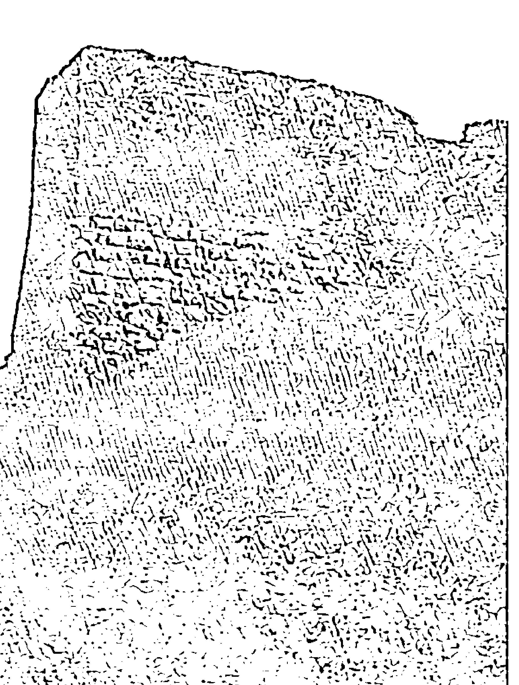

## 与阿佛洛狄忒有关的景点

科林斯·雅典·塞浦路斯

“阿佛洛狄忒”那一章节里曾经提到了一座位于科林斯的阿佛洛狄忒神庙，它原本和科林斯古城位在同一座山丘顶上，山丘具有天然要塞的形势。今日，在这处遗址见到的是一座16世纪维也纳城堡的遗迹，而完全不见阿佛洛狄忒神庙的遗迹；奇怪的是，也没有任何挖掘工事。推敲原因，可能是因为基督教会强烈反对卖淫与婚外性行为，所以神庙早就被摧毁，而阿佛洛狄忒在希腊的神庙也从不曾有考古挖掘的工程，更谈不上重建！

既然没有了阿佛洛狄忒神庙遗址，那么你或许会问，还需要走访科林斯吗？当然要。从那座城堡住下俯瞰的景致美极了，而且可以感受到这座古老神庙的重要性。

来到这里，首先得走好几个钟头的路才到得了丘顶的神庙。爬到了顶端的感觉，仿佛置身天堂；想象一下，在高入云霄的地方尽情欢爱云雨——那应该会是一种无法比拟的澎湃体验吧。（下面的照片就是这座城堡。）

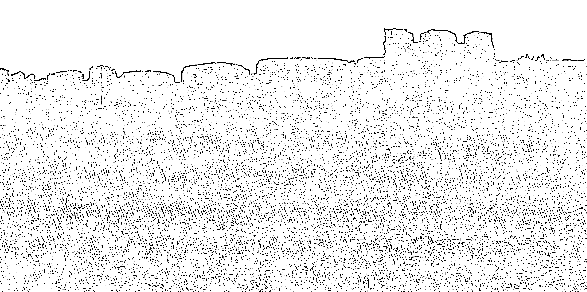

位于阿佛洛狄忒神庙遗址下方的阿波罗神庙遗址

提醒一件事：从入口到城堡的这段路，需要有一双适合走路的鞋子，一来因为这段路要走30分钟以上，二来因为步道的坡度很陡，又没有定期维护，因此体力不能太差才走得完。（所以此处不适合年长者，有膝盖问题、关节毛病或其他不适宜健行的人。）

参观了古神庙遗址之后，转往正下方的科林斯古城，你会看到一座阿波罗神庙遗留下来的几根圆柱。这座神庙的圆柱是由一块石块雕刻而成的，不像其他希腊神庙的柱子是用多块石块层层交叠而成。从这座阿波罗神庙向上望，可以看到山巅，那正是阿佛洛狄忒神庙的旧址，这是目前所知地点最高的古希腊神庙。你一定会觉得这个地理位置实在特别，为什么会选择在那里建筑神庙？嗯，古希腊人显然觉得爱、性与生育实在是太重要了！今日，阿佛洛狄忒的影响力还在，英文里用她的名词形成一个字Aphrodisiac，意思是“春药”；而她的罗马名字Venus“维纳斯”则用来命名金星，还有数不清的美容商品都借用她的名号。

现在有一条一流的快速道路已经完工，从雅典到科林斯又快又方便（距离84千米）。从雅典出发，不到1个小时，就会横跨伊斯莫斯运河（Isthmus Canal）；再过1个半小时，就到科林斯了。

建议你，到了伊斯莫斯运河的时候不妨下车欣赏风光；这一段是爱琴海和爱奥尼亚海距离最近的地点，并且是纪念海神普赛顿的地点。古希腊的水手如果要前往希腊西部的城市或意大利，必须绕往希腊南端，经过长时间航行才能抵达。公元前7世纪到公元前6世纪期间，有一条运河开凿完成，把爱琴海与爱奥尼亚海连接起来，从此就不必绕行希腊。不过最早的运河里没有水……船只是用拖行前进的。到了罗马皇帝尼禄（Nero）在位期间，曾试图把运河挖更深一些把那两片海域合而为一，可惜这项计划在他过世后便终止，直到1893年才由后人完成。

这条运河是古代工程中一项令人赞叹的成绩，至今仍有船只通行。

到达了科林斯之后，循着希腊古城的标示就会看到阿波罗神庙的圆柱遗迹。继续从山丘向上走大约10分钟，来到了卫城的城堡大门口；这处城堡可以免费参观。

## 与德墨忒尔有关的景点

艾流希尼亚・希腊全境

德墨忒尔神庙毁于连绵的战火，并在基督教成为希腊的新信仰之后再也没有获得重建。在神庙的考古挖掘地点，只看见毁坏的圆柱，不过在地板上有个洞，被认为是通往哈迪斯（冥界之王）王国的通道，德墨忒尔的女儿珀耳塞福涅可以从这个洞返回。

现在的艾流希尼亚不再是农耕之地，而是雅典的市郊，由于租金低廉，所以公寓、商店和工厂绵延不断。然而此区位居平原，就在城郊，能看见绿色的松树林和原野，仍然保有若干农田。

希腊人非常喜爱德墨忒尔，因此希腊全境都有她的神庙和祭坛，不过现在都不复存在了。

想要感受到德墨忒尔的能量，你必须把艾流希尼亚全部走一遍，特别是要造访此区里的几家修道院。一般的修道院往往位于山上，但此区的修道院就在平坦的田野上。在这些平原的修道院里，你会感受到圣洁和平静，觉得事物都会在冥冥之中好转，觉得生活不需要大起大落，简单而可掌握的循环将会带来日常所需。而这些感受可以在任何一处丰饶的平原地上体会到。就我个人来说，我偏好到克里特岛（Crete）去体验这种平静丰富，尤其是在狄特安洞穴（Dictian Cave）以南的拉希西高原（Lassithi Plateau），这是宙斯的出生地和德墨忒尔的发祥地。

前往艾流希尼亚的交通方式简单而方便，有了特地为2004年奥运会而搭建的新高速公路之后，不到一个小时的车程即可抵达。

假如打算前往拉希西高原，要先到克里特岛的伊拉克利翁（Ir áklion），租一部车，依着交通标志往西开48千米。每日都有前往克里特岛的飞机和船只航班。此地的交通时刻表随时会调整，请在出发之前先查询确定。克里特岛的航班倒是整年通航，不像其他希腊观光地区只有夏季才能通航。

### 与赫耳墨斯有关的景点

运动竞技场·居家·神庙

与赫耳墨斯有关的遗址里面勉强算得上是“神庙”的地点，位于狄洛斯岛。

从米克诺斯岛搭船30分钟即可抵达狄洛斯岛。来到狄洛斯岛，你其实看不到任何的神庙圆柱，导游只会指着一堆石头给你看。除了这里以外，你在希腊任何地方都看不到一座耸立的赫耳墨斯神庙，但可以看到几座令人惊叹的赫耳墨斯雕像。

首先，第一座值得欣赏的赫耳墨斯雕像位于雅典的卡罗马玛（Kalomarm-aro），这儿是1896年举办第一届奥运比赛的会场。沿着这座完全以大理石打造而成的巨型体育会场走——或者很多人来到这里会在跑道上奔跑——你会来到一个奇怪的长方形大理石块前面，这块大理石仿佛是从地下“种植”起来的，只有一个留胡子的赫耳墨斯头部，没有明显可辨的身形，但下端则有男性生殖器。类似的雕像在全希腊的所有体育馆都可以看到。

而最漂亮的赫耳墨斯雕像位于奥林匹亚的博物馆里，由古希腊知名雕刻家普拉克西特斯（Praxiteles）雕刻而成。这座雕像的体积庞大，十分壮观，气势惊人。它不仅是考古学的瑰宝，也堪称全世界最美丽的雕像。

第三座重要的赫耳墨斯雕像，位于今日土耳其的库萨达斯；这座城市是古代的以弗所所在地。走在这座古城的遗址里，接近城市边缘的地方，有一座古代医院的遗址。医院的正面有一幅清晰的湿壁画，呈现的正是赫耳墨斯手握着他那支大名鼎鼎的节杖（杖上有一对翅膀和一双蛇缠绕）。

你可以从土耳其的伊斯坦堡出发，有好几种交通方式可以到达那里。也可以从希腊的萨摩斯岛搭一个钟头小船前往——本书多处提到了萨摩斯岛，所以你不妨造访该岛一次，不过这里所说的小船只在夏天才通行；如果你想在冬天前往萨摩斯岛，可以从伊斯坦堡搭乘航行爱琴海的游艇。

有兴趣的游客，甚至可以造访赫耳墨斯的出生地，它位于科林斯附近的阿卡狄亚山脉（Arcadia）的库勒涅山（Cyllene）一处洞穴里。在这座库勒涅山山顶曾经有一座赫耳墨斯的神庙和雕像，但现在什么也不剩了。没有多少旅行团的导览路线会带你到这里来。如果你自己开车前来，这里靠近阿戈斯，你其实可以顺路参观奥林匹亚。不过，车程、爬上洞穴、再下山，就可能需要一整天。如果你的行程紧凑，那就只去奥林匹亚看那座雕像吧。

游客们对于赫耳墨斯的最主要印象是，他的超级人气来源于他无远弗届的影响力，以及他俊美的外型。他很讨人喜欢，会让人联想到现在的影视巨星，是个多才多艺而广受喜爱的人物——认识到这一点，才能真正了解赫耳墨斯5数人的性格。

## 普拉克西特斯的雕刻成就

普拉克西特斯（Praxiteles）出生于雅典，活跃于公元前370至330年。他的父亲与儿子也都是雕刻家——这不是多么稀奇的事，那时候的希腊人非常重视雕刻艺术，所以当雕刻师是一项可以名利双收的工作。

他主要制作铜像与大理石像，但以大理石像闻名于世。他的作品主要表达了线条的细致、优雅和细微变化，特别喜爱雕塑裸体像，强调躯体的美感和真实，然而又营造出近乎虚幻的理想美世界。

普拉克西特斯所制作的男性雕像也都呈现出优雅的曲线，表情细致，整体气质近乎中性，甚至带有阴性的柔美气息。此外，他特别擅长以脸部表情来传达出整体气氛，并且偏好以希腊神祇和神话人物为主题。

他的真迹，今日只剩下一座，出土于1877年，现收藏于奥林匹亚的博物馆。这座雕像深深影响了他那时期的雕刻表现。

不过由于他深受罗马人喜爱，所以罗马人复制了他的若干作品传世。其中，《克尼多斯维纳斯》（Aphrodite of Cnidus）影响了后代艺术作品中对于爱神的描绘，譬如《米洛维纳斯》（Aphrodite of Melos）。

至于铜像《捉蜥蜴的阿波罗》（Apollo Sauroctonus）现在藏于梵蒂冈。

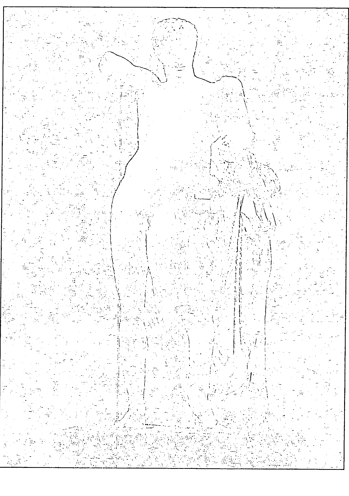

## 236 新生命数字密码·2 In the Path of the Gods

奔跑——你会来到一个奇怪的长方形大理石块前面，这块大理石仿佛是从地下“种植”起来的，只有一个留胡子的赫耳墨斯头部，没有明显可辨的身形，但下端则有男性生殖器。类似的雕像在全希腊的所有体育馆都可以看到。

而最漂亮的赫耳墨斯雕像位于奥林匹亚的博物馆里，由古希腊知名雕刻家普拉克西特斯（Praxiteles）雕刻而成。这座雕像的体积庞大，十分壮观，气势惊人。它不仅是考古学的瑰宝，也堪称全世界最美丽的雕像。

第三座重要的赫耳墨斯雕像，位于今日土耳其的库萨达斯；这座城市是古代的以弗所所在地。走在这座古城的遗址里，接近城市边缘的地方，有一座古代医院的遗址。医院的正面有一幅清晰的湿壁画，呈现的正是赫耳墨斯手握着他那支大名鼎鼎的节杖（杖上有一对翅膀和一双蛇缠绕）。

你可以从土耳其的伊斯坦堡出发，有好几种交通方式可以到达那里。也可以从希腊的萨摩斯岛搭一个钟头小船前往——本书多处提到了萨摩斯岛，所以你不妨造访该岛一次，不过这里所说的小船只在夏天才通行；如果你想在冬天前往萨摩斯岛，可以从伊斯坦堡搭乘航行爱琴海的游艇。

有兴趣的游客，甚至可以造访赫耳墨斯的出生地，它位于科林斯附近的阿卡狄亚山脉（Arcadia）的库勒涅山（Cyllene）一处洞穴里。在这座库勒涅山山顶曾经有一座赫耳墨斯的神庙和雕像，但现在什么也不剩了。没有多少旅行团的导览路线会带你到这里来。如果你自己开车前来，这里靠近阿戈斯，你其实可以顺路参观奥林匹亚。不过，车程、爬上洞穴、再下山，就可能需要一整天。如果你的行程紧凑，那就只去奥林匹亚看那座雕像吧。

游客们对于赫耳墨斯的最主要印象是，他的超级人气来源于他无远弗届的影响力，以及他俊美的外型。他很讨人喜欢，会让人联想到现在的影视巨星，是个多才多艺而广受喜爱的人物——认识到这一点，才能真正了解赫耳墨斯5数人的性格。

## 与阿波罗有关的景点

### 德尔菲·狄洛斯·希腊全境

在众神的遗迹之中，以阿波罗神庙最容易找到，几乎在古希腊和罗马帝国的所有信仰中心都有祭拜他的神庙。这趟阿波罗神庙之旅，最好先造访他的出生地狄洛斯岛。欲造访狄洛斯，要从米克诺斯岛搭船过来，30分钟即可抵达。不过要注意两件事：一是，船通常很小，而风高浪险，恐怕会是一段惊险刺激的航行；二是，万一天候不佳，就算大型渡轮还可以继续航行，但这类小船就会停驶。

至于该如何前往米克诺斯岛呢？可以搭飞机或搭船。在冬季，飞机的航班减少，而从雅典的外港比雷埃夫斯有渡船可到达。搭乘慢船要5个钟头以上，快船则只要一半的时间，不过遇到天气不好，快船便不会出航。如果你不介意搭乘小型的螺旋桨飞机，则只要花30分钟即可到达。

狄洛斯原本是一座名不见经传的小岛，后来逐渐发展成为城市和一处信仰中心，以及一个富人聚居的地方。前面说过，女神勒托怀了宙斯的孩子之后，被宙斯的妻子赫拉追杀，逃到了狄洛斯岛。她看到这座岛有时会浮出海面，有时又会消失在海里。事实上，狄洛斯岛上有一座湖，泛滥的湖水会定期淹没平原，考古学家相信，这个特性就是神话中所说的这座岛会时隐时现的成因。神话中说，勒托躲在这座岛生下了阿波罗和阿尔忒弥斯。据说，这对双胞胎的出生地点长出了一棵棕榈树……今日这个地点还耸立着一棵棕榈树。

以前狄洛斯岛被视为圣地，禁止任何人在此生产或死去——所有的孕妇、所有年龄超过65岁以上的人，都必须离开狄洛斯岛。

在狄洛斯的古迹和古房舍之间四处漫步，可以感受到阿波罗是如此受到尊崇，让人忍不住肃然起敬。这座岛本来是建筑成就与艺术表现的瑰宝，人类能力的极致奇观；它出自阿波罗的教诲，而他本人若有机会见到也会引以为荣。只可惜这座岛在希腊与罗马帝国败亡后的几百年里遭到不同民族的掠夺，只留下了古代的屋舍。如果你来到这里，务必跟随一位领有执照的导游，听他解说你在眼前看到的景观，否则会错过许多值得欣赏的事物。

想要真正感受到阿波罗的气息，就不能错过位在德尔菲的阿波罗神庙。这座神庙所在的位置，是宙斯亲自选定的地方。他派遣两只老鹰负载着岩石，飞往天下各处，寻找地球的中心点，而这两只鹰来到了德尔菲这里的一处很深很深的洞穴，里面住着一条会吃人的巨蛇。于是这个洞穴被看作是大地女神盖亚的肚脐，据说天下所有生物的命运之秘都会由这里透露出来。当地人在此建了一座神庙，以预卜命运而闻名，看来宙斯一定也来这里算过命！

洞穴里的那条蛇需要牺牲人命献祭，但因为它是大地女神的孩子，如果杀了它，可会激怒大地女神。因此，阿波罗坐上一艘由海豚拉曳的海上战车，来到了德尔菲（Delphi这名字显然是从海豚Dolphin一词而来），杀了蛇，并建造了自己的神庙。在这座神庙里，女祭司会吸入草药冒出的烟，进入通灵状态，听取前来问命者所提出的问题，然后顺口说出一些字句，由旁边的其他女祭司记录下来并编成诗歌。

这些女祭司所做的预言非常准确，使得这座神庙成为上古世界最重要的算命圣地。而众人相传，只要控制了德尔菲，就能控制全世界。这里的“业务”繁忙，想来算命的人要等候6个月以上才能轮到。为了缩短等待的时间，希腊的王宫贵族就在神庙旁盖了一座银行，如此一来，当他们需要在这神庙里问到答案，譬如想知道关于即将开打的战争的结果，他们便透过银行把钱汇入神庙，便可以立即得到服务。这些银行现在还存在，可说是史上最早出现的银行。

德尔菲真正的奇景乃是走到大殿去欣赏那面主墙（220页图）。你会看见墙上所刻的希腊字母（下图），记载着阿波罗的哲学和神庙的预言——这些文字本来是在希腊改信了基督教，并把德尔菲城建在这座神庙上面以后就不见了的；多亏了法国考古学家把神庙挖掘出来——不过这表示是把整座德尔菲城搬开，安置在距离现今德尔菲所在处的几千米外。

从雅典到德尔菲的车程需要3小时，途中会经过帕耳索斯山（Parnassos）的美景，山里还有一处滑雪场。如果你是反过来从奥林匹亚或是帕特雷市开车前来，你可以看到阿波罗当年前去神庙的路径。这段路的景色十分壮观，从神庙庄下俯瞰，可以看见一片蓝色的大海。德尔菲有一种非常平衡的气息。不会太高，不会太低；不干燥，也不潮湿；不太陡，也不完全平缓。这儿的氛围说出了一种追求平衡的理念。这种感觉确确实实就是阿波罗的气质，一种平静而让人心平气和接受一切的气氛。来到这里，你会情不自禁就接受自己的命运。

## 240 新生命数码密码·2 In the Path of the Gods

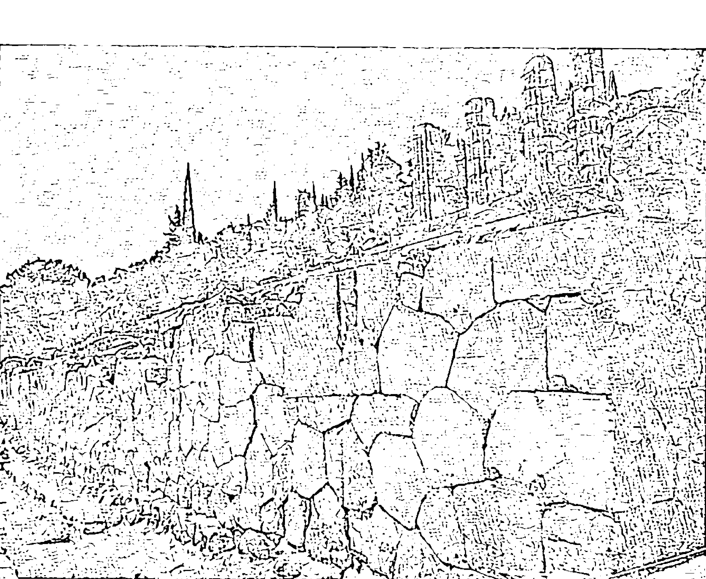

刻有希腊字母的岩石

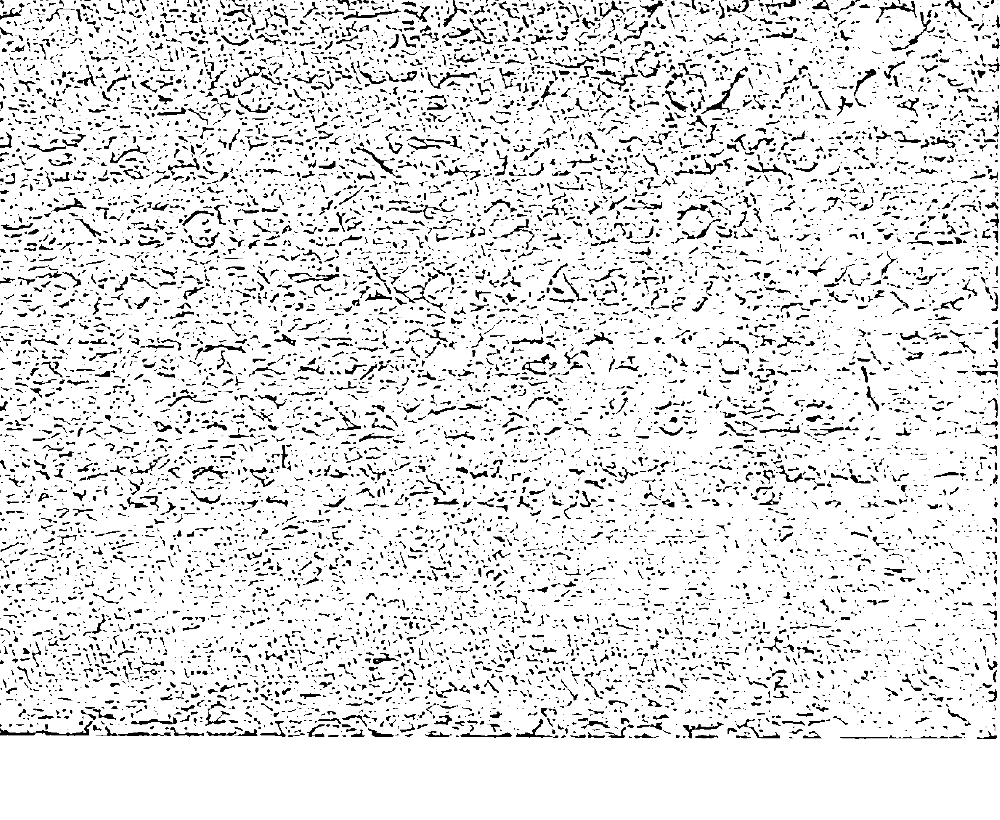

## 与雅典娜有关的景点

雅典 · 爱琴娜岛 · 希腊全境

几千年里，雅典娜的神庙历经数次重建，才在公元前5世纪，培里克利斯（Pericles 495—429BC）统治之下的古希腊黄金时期达到最为宏伟的规模。神庙内有一尊12米高的镀金雅典娜神像，一手握着矛与盾，另一手则捧着尼姬女神像（尼姬是胜利女神，这名字后来被一家运动用品公司采用，也就是Nike）。据说培里克利斯用来建造这座神庙与神像的费用实在太惊人，当时雅典的居民差点儿就要起义反对。

另一座巨大的雅典娜神像竖立在神庙外面。这座神像和美国纽约市的自由女神像一样，从城市周围的海面上就看得见，它也是古代水手辨认雅典城所在位置的地标。

这座神庙曾经在几个世纪里被当成基督教的教堂；这现象在希腊很少见，因为绝大多数的神庙都遭到基督教政权毁坏了。

到了奥斯曼帝国占领希腊的期间，此神庙又成了伊斯兰教的清真寺。一直到1687年威尼斯人把它炸毁之前，神庙都维持得极好。那之后一直有人企图重建神庙，直至今依然如此，只不过重建工程的进度极其缓慢。

如果你急着一睹这座神庙当初的全貌，包括雅典娜神像，得跑一趟美国田纳西州的纳什维尔（Nashville），那里有一座建于一百多年前的复制品。

见到雅典娜的神像时，会注意到一个有趣的地方：她盾牌上的标志是蛇发女妖梅杜莎的首级。根据传说，凡人只要看到了梅杜莎，就会变成石头。这个威力强大的标志被意大利时尚名牌凡赛斯（Versace）拿去作为品牌标志，放在几乎所有的凡赛斯产品上！

雅典娜的神庙（帕提农神庙）很好找。先到雅典，随便问个路人大概都晓得帕提农神庙在哪里。它坐落在市中心，交通方便，只不过艳阳天里走在通往神庙的那道坡是挺累人的。考虑到这一点，建议你最好在上午尽早前往，避免在正午时分或阳光普照的午后登高参观。还要记得随身携带饮用水，因为卫城神庙一带并无商家。

如果你参加由领有执照的导游所带领的旅行团，就可以听导游叙说与神庙建筑有关的奇闻轶事，这些内容很少出现在其他的旅游数据上，你将会觉得团票钱花得很值得。

看过了帕提农神庙之后，如果还想欣赏其他的雅典娜神庙，可以从雅典外港比雷埃夫斯搭乘渡轮，前往邻近的爱琴娜岛（Aegina），航程约30分钟。

来到爱琴娜岛后，在港口搭乘出租车，直驱雅典娜的神庙；记得要请出租车司机留在原地等候，这样你才有办法下山。这座神庙的保存状态不佳，不过神庙规模稍小，很方便四处漫步遗迹，完全不同于帕提农神庙那儿把所有物品都用绳索隔开的情况。

爱琴娜岛是座可爱的小岛，许多雅典人在这儿置产作为周末的度假住所。如果你只在雅典短暂停留数日，那么前来爱琴娜岛将会带给你精致而愉快的一日游。

此外，在意大利的西西里岛与罗马，还发掘出更多献给雅典娜的神庙，都处于保存良好的状态。

## 与赫淮斯托斯有关的景点

雅典·兰姆诺斯群岛

前往位于雅典的赫淮斯托斯神庙一游，将会感受到火神的技术与力量。而火神的威力不仅于此；他同时也是火山之神。罗马人把他奉为火山之神，而且是像摧毁庞贝城的维苏威火山（Vesuvius）或西西里岛上的埃特纳山那样的火山。

在希腊，可以安全观赏活火山的最佳地点是圣托里尼（Santorini）。

圣托里尼其实是由5座小岛组成的岛群，以火山所在地为中心地带。

这座火山在公元前2850年爆发的时候，规模盛大，是一万以来全世界数一数二的火山爆发场面。那次爆发所喷出来的岩石浆多达7立方英里（相当于30立方千米），爆发所引起的海啸撞上了几百英里以外的雅典，很可能也直扑克里特岛上的米诺斯文明（米诺斯文明比古希腊文明更早出现），火山灰飘进大气层，环绕世界一圈，连古中国的历史学家对此也有所记载！真是好大的威力！

这座火山后来便下陷成今日所见的模样。你可以参加旅行团，从圣托里尼的本岛锡拉岛（Thira）出发。抵达目的地后，步行45分钟，穿过一片看起来恍若月球表面的景观——火山灰与熔岩组成的地表是不毛之地。走到终点，会看到一座小型的间歇泉，据说这座间歇泉的存在说明了这是座活火山（最近一次爆发是在1950年，造成熔岩流与爆炸，至今仍然经常发生地震）。

这座火山有一个绝景：它有海底温泉。

游客可以坐在浅水海滩上，享受海神赫淮斯托斯送给大家的礼物，同时欣赏圣托里尼岛上的白色屋宇与悬崖峭壁。这正是赫淮斯托斯的风格；从原生的力量变成祥和而令人放松的事物！

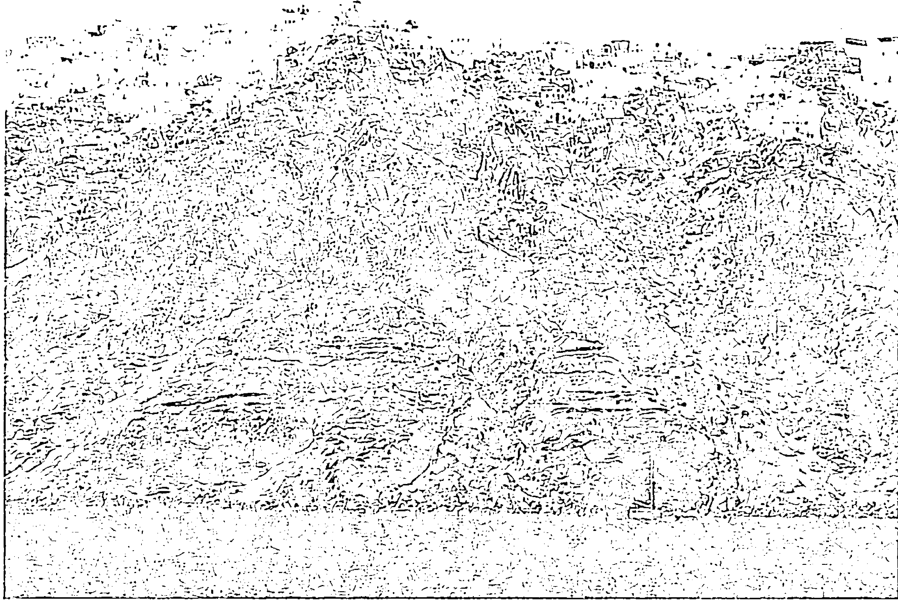

圣托里尼岛上的火山地形## 与阿尔忒弥斯有关的景点

-   以弗所
- 色雷斯
- 斯巴达
- 迪罗斯

假如想认识到阿尔忒弥斯对于古希腊人的重要性，不妨去一趟以弗所 (Ephesus)。

前往以弗所，要先到土耳其的库萨达斯。你可以取道土耳其，在参观过伊斯坦布尔之后沿着海岸直下。也可以从希腊的萨摩斯岛（毕达哥拉斯的出生地）搭船前往库萨达斯，航程一小时左右；这条路线有一个好处，可以免签证。土耳其政府对于库萨达斯的签证有特别的安排：抵达了库萨达斯，边境的海关人员会取走你的护照；等你游毕以弗所，要搭上回程的船，在离境时再取回护照。

前往以弗所古城，最好的方法是跟着当地的旅行团同往。少了当地的导游解说，将会无法得知这座古城的许多事迹。也最好先在萨摩斯登记参加以弗所的行程，因为倘若到了库萨达斯才开始寻找旅行社，会手忙脚乱。

在参观行程接近尾声时，踏进了保存完好的古希腊剧场，会情不自禁生出敬畏之心，赞叹这座城市当年想必繁荣一时。发挥一点想象力，你可以在心中看见当年的阿尔忒弥斯神庙矗立在前，长425英尺，宽225英尺，高60英尺，圆形巨柱127根，柱子基座上雕刻着只有这座神庙才有的图案。这座神庙比雅典的帕提农神庙大一倍；帕提农神庙的长230英尺，宽100英尺，圆形巨柱58根。以弗所的阿尔忒弥斯神庙被列为古代的世界七大奇观之一，更称得上是七大世界奇观之冠。

可惜，这座阿尔忒弥斯神庙历经5次的损毁与重建，最后还是成了废墟。位于库萨达斯的神庙遗址如今只是一堆从沼泽湿地中开挖出来的石头罢了。因此，大多数的旅行团都不会把参观神庙旧址列入行程中，而只安排了以弗所古城遗迹的参访。

为了让这趟以弗所之旅确实值回票价，要想办法参观以弗所考古博物馆，欣赏阿尔忒弥斯神庙残留下来的两根圆形巨柱，其中一根现高9.5英尺（约合2.9米）。但多数旅行社的行程里也不包括以弗所考古博物馆，所以你需要自己安排，可以雇一辆出租车来回接送；从库萨达斯到以弗所考古博物馆的车程大约需要1小时。

## 248 新生命数字密码·2  In the Path of the Gods

梅提欧拉修道院，散发出月神阿尔忒弥斯的能量

## 与波塞冬有关的景点

### 苏尼恩岬·离岛·濒海小城

苏尼恩岬距离雅典69千米。从雅典市区开车或搭乘巴士只需1个半小时，十分便利。最佳的造访时间是在日落时分，看着太阳从海神神庙立柱之间落下，景象确实别致而动人。神庙在日落后才关闭，目的正是为了让游客享受这番日落美景。坐在神庙前，从岩岸向下俯瞰，可以感受到希腊人必定极其尊敬海神波塞冬，也非常畏惧他。波塞冬神庙的位置特殊，但大小和壮观程度比不上雅典娜、赫拉、宙斯、阿尔忒弥斯等神的神庙，也比其他神庙距离市区远很多。看来希腊人想给波塞冬很大的空间，不想惹他生气。

如果还想参观几处其他的波塞冬遗址，可以开1个小时的车前往科林斯，停在伊斯莫斯运河。这个运河是与波塞冬有关的另一个重要地方，它连接了爱琴海和爱奥尼亚诸海。伊斯莫斯运河的地理位置十分重要，它可以使船只不必绕过希腊南端航行几天，就可以轻松来往于两个海域。古时候希腊人为了尊崇波塞冬，会在这里举办伊斯莫竞技会，不过这个活动的知名度远远低于向宙斯致敬的奥林匹克竞技赛。

另外，假如你来到了克里特岛，一定要前往位于伊拉克利翁市附近的考古重镇克诺索斯（Knossos），这里可以看到米诺斯宫殿的遗迹，而且似乎确实曾有一座迷宫！走在其中，忍不住会四下张望并暗忖：半人半兽的米诺托会不会真的曾在这里生活过？

这座宫殿建筑最棒的地方是它允许游客走在遗址里面，只可惜这块开放参观的区域有时候会因为某些原因而关闭，所以只能碰运气了。这宫殿里的博物馆收藏了许多米诺斯王朝的工艺品，非常值得一看，其中包括黄金死亡面具、刻画了一头牛的艺术品，甚至陈列了在狄特安洞穴出土的新石器时代的武器。狄特安洞穴是宙斯长大的地方。

## 与宙斯有关的景点

### 奥林匹亚·雅典·多多尼

位于奥林匹亚的宙斯神庙名列世界七大奇观之一，竖立了一座壮观的宙斯雕像，堪称希腊最宏伟的艺术作品：昂然的雕像高达40英尺，以黄金和象牙塑造出坐姿的宙斯。神庙的13个硕大立柱和6个横柱，体积比同时期的其他神庙石柱大一倍，令人印象深刻。

奥林匹亚距离雅典235千米，开车约5个小时。假如一大早从雅典出发，可以在神庙关闭前1个小时左右抵达，晚上住宿当地，隔天再返回雅典。通常一趟旅程要花两到三天完成。

另一个令人赞叹的宙斯神庙位于雅典的帕提农神庙（雅典娜神庙）附近。它壮丽而庞大，原有104根石柱，也有一座仿奥林匹亚的大型宙斯雕像。不过，由于一再的延误、也由于各种复杂因素，总共花了700年才完成，但如今只剩下16根石柱还依然矗立。

位于多多尼（Dodoni）的宙斯神庙距离雅典很远，但非常值得一游。首先必须搭飞机或巴士，前往位于马其顿边境的约阿尼纳州（Ioannina距雅典438千米），再搭巴士行驶22千米来到这处考古遗址。

这处宙斯神庙的遗址曾经是希腊最有名的算命地点，一直要到公元前550年前后德尔菲神庙兴起，取而代之成为新一代的算命胜地。这个宙斯神庙的知名特色是它的自然能量，就像美国亚利桑那州的塞多纳（Sedona）的能量一样，似乎可以把人的性灵提升到另一个次元。

这处宙斯神庙遗址有棵巨大的橡木，女祭司会坐在树下，聆听树叶随风而动的声音，然后回答问题。后来神庙增加了几口大锅，在风起时会响起铃声，称为宙斯之声，并由女祭司诠释这些铃声的意义。

这里有座博物馆，馆里有许多铅条，铅条上面留有很多人提出的问题，很值得一看。虽然这座神庙因为基督教入主之后的破坏而没有留下太多遗迹，不过倒也重新种了一棵橡树，所以游客可以试着在橡树下聆听自己对未来问题的答案。这里也有一处保存完善的剧场遗迹，到今日还在使用，也值得一游。

想要深入认识宙斯，不妨拜访他生长的地方，也就是克里特岛上的狄特安洞穴。首先，搭飞机到克里特岛，或搭夜班渡轮到伊拉克利翁，然后开车走上拉西提高原的蜿蜒道路，来到赛克罗（Psychro），然后步行或骑驴子走800米，直上洞穴——这就只有脚力好、穿运动鞋或登山鞋的人才有办法做到。

这洞穴的入口很小，一等眼睛适应了穴里的昏暗光线之后，就可以看到洞里800英尺深的底部，幸好有阶梯和光线。这些灯光是最近才加装的，以前游客得购买蜡烛或手电筒来照明。

首先遇到的冲击就是温度骤降。不管外面多热，洞内的温度永远维持在16摄氏度左右，就像冷气开太久之后的凉度。洞底有个小湖，环绕着钟乳石。一路慢慢往下走，想着宙斯在这里成长的情形，会情不自禁觉得悲伤，甚至生气。堂堂克洛诺斯，古老泰坦众神的领导者，竟然容许自己的儿子在一个简直可以称为地牢的地方长大？可以想象，宙斯内心逐渐累积起报复之心，致使他发起行动推翻父亲、成为众神的新共主。

考古学者在这个洞穴里发现了工艺品，其年代可以追溯到新石器时代，说明此洞穴在新石器时代就有人烟，并以此作为祭祀宙斯之地。这些文物现在陈列于伊拉克利翁附近的克诺索斯博物馆里。

喜欢健行的人，或者想在克里特岛多看一看的人，还可以去看另一个号称也是宙斯成长地点的洞穴。先前往罗希姆诺（Rethymno），此城拥有举世闻名的美丽海滩。接着，开车到阿诺及亚（Anoghia）以南24千米处的西罗丽提斯山（Psiloritis），开上奈达斯（Nidas）高原，来到这个洞穴。

这个洞穴令人称奇，值得一游，但环境设施的规划不像狄特安洞穴那样完善，必须自备手电筒、水、食物、登山鞋，也许还需要找会讲希腊话的导游陪同，因为希腊的路标经常会离奇消失，或根本没有路标，可能得经常向当地人问路。

## 与狄俄尼索斯有关的景点

### 德尔菲·剧场·色雷斯·希腊

狄俄尼索斯的神庙在古希腊的各个城市都找得到，其中最有名的一座是在德尔菲的阿波罗神庙里。相传阿波罗每年会离开神庙一次，前往北边的陌生之境，为时两个月；他的神庙在这段时间里就会变成狄俄尼索斯神庙，展开各种饮酒、狂舞、交欢和包括用手撕食活物等疯狂事情。这些活动截然不同于阿波罗的活动，譬如聆听竖琴音乐、静观、冥想、追求自制等等。

在阿波罗神庙里用狄俄尼索斯的方式释放出人类的放肆狂野，似乎很不搭调；阿波罗神庙毕竟是高尚而有教养的地方，让人可以在这里学习认识自己与探索自己的命运。其实，这两者并没有不协调，因为人不只拥有阿波罗所教导的心灵层次，也包括了狄俄尼索斯所引领认识的肉体。为了真正认识自己，必须双管齐下，既关注动物性的直觉层次，也注意较高的知性层次。加入了狄俄尼索斯的影响之后，阿波罗神庙就兼顾了这两个层次，可以让人更完整而全面地认识自己。

今日希腊已经见不到狄俄尼索斯神庙的遗迹，只有一处地方算是可以感受到他气息的遗址，那就是造访位于雅典的建筑博物馆和奥林匹亚，以及其他可以看到狄俄尼索斯雕像的地方。他的雕像通常是一个俊美的年轻男子形象，手持葡萄，头上和身体和衣物上缠着葡萄藤，手上往往拿着酒杯。

狄俄尼索斯结束了海外游历回到了希腊后的艺术形象，以狄洛斯岛上的表现最为多彩多姿。

狄洛斯岛距离米克诺斯岛大约30分钟的船程。在狄洛斯岛上散步，沿路会看到多栋保存良好的古老房舍，其中有一栋叫做“狄俄尼索斯之屋”，屋里地板上的彩色马赛克刻画了战士狄俄尼索斯驾着战车，把两只老虎带回到希腊。

接着，走过几处荒废神庙的遗迹，在遗迹尽头会看到一个伫立的男性阴茎塑像。这座阴茎塑像已经破损，只剩下一半，还连着两颗睾丸。雕像的侧边会看到一块壁画，描绘了狄俄尼索斯一手捧着一个女子、另一只手牵着一个男人。他可是众神里最有名的双性恋者！

假如想要贴身体验古代狄俄尼索斯庆典的地点，可以造访希腊境内任何一处原始森林，在森林里怀想那些发生在酒神祭祀中的野地交欢场景。

此外，也可以参观希腊的任何一座古老剧场，因为剧场也广为他的庆典所运用。

距离雅典最近的剧场就在卫城旁边，其一是希罗多德剧场，保存良好，在今日夏天还会用来举办音乐会；另一个是旁边的狄俄尼索斯剧场，保存状况比较不佳，但是面积大得多。再往南走，最佳的剧场遗址，是位于雅典南方大约200千米的埃皮达鲁斯，想造访此地，可以把前面提到的诺波里昂、阿尔戈斯和奥林帕斯安排为同一趟旅程。

如果来到了德尔菲（位于雅典北方约150千米），可以造访此地的古剧场，俯瞰阿波罗神庙和一片山谷，这儿可是当年狄俄尼索斯庆典的重要据点。来到了神庙之后，就请坐下来聆听不可思议的音响效果。如果能有机会看到表演，将会得到更棒的体会。许多来到古剧场的游客都会轮番上场歌唱，斯情斯景可让人遥想2000年前的画面。

## 图书在版编目（CIP）数据

新生命数字密码2 / 蓝宁仕著.—北京 : 同心出版社; 2012.1

ISBN 978-7-5477-0373-1

Ⅰ. ①新… Ⅱ. ①蓝… Ⅲ. ①成功心理－通俗读物 Ⅳ. ①B848.4-49

中国版本图书馆CIP数据核字(2011)第262173号

## 新生命数字密码2

-   出版发行：同心出版社
- 地址：北京市东城区东单三条8-16号东方广场东配楼四层
- 邮编：100005
- 电话：发行部：(010) 65259206-8022；总编室：(010) 65252135-8015
- 网址：www.bjd.com.cn/10txcbs/
- 印刷：三河市祥达印装厂
- 经销：各地新华书店
- 版次：2012年1月第1版；2012年1月第1次印刷
- 开本：700毫米×970毫米 1/16
- 印张：16.5
- 字数：240千字
- 定价：29.80元

同心版图书，版权所有，侵权必究，未经许可，不得转载

中文简体字版©《新生命数字密码.2》2012年

本书由台湾大块出版有限公司授权天津华文天下图书有限公司及同心出版社独家在中国大陆地区出版简体字版，发行销售地区仅限中国大陆地区，不包含香港澳门地区。

版权合同登记号 图字 01-2010-5991

# IN THE PATH OF THE GODS

-   怎么迎合1数领导？
- 6数人如何能有好的人缘？
- 9数人的情路为何总是曲折？
- 如何获得5数人的正面能量？
- 怎么化解与4数同事的矛盾？
- 拥有“俄狄浦斯情结”的是几数人？