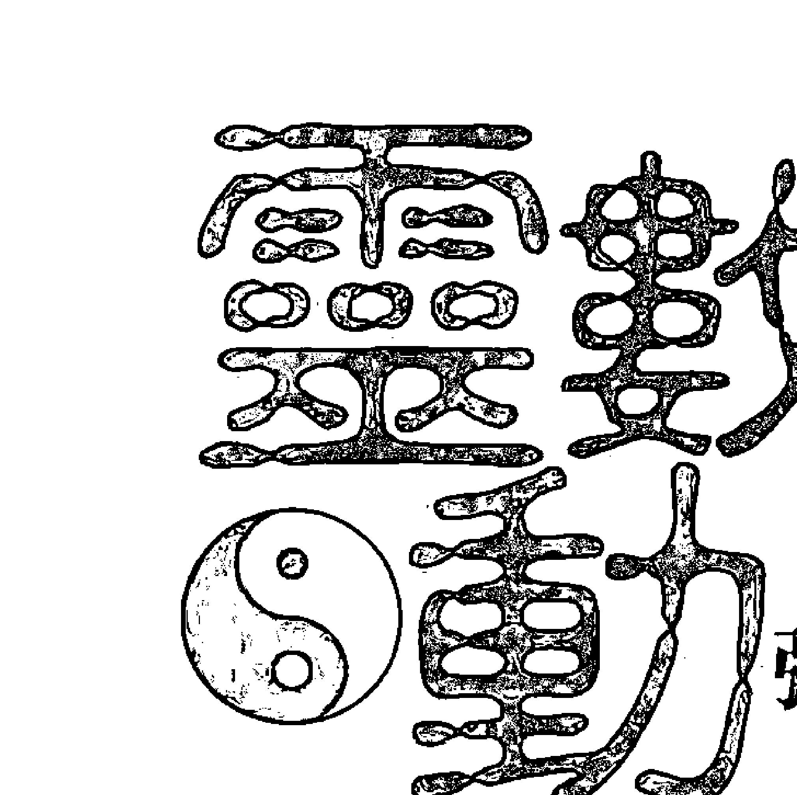
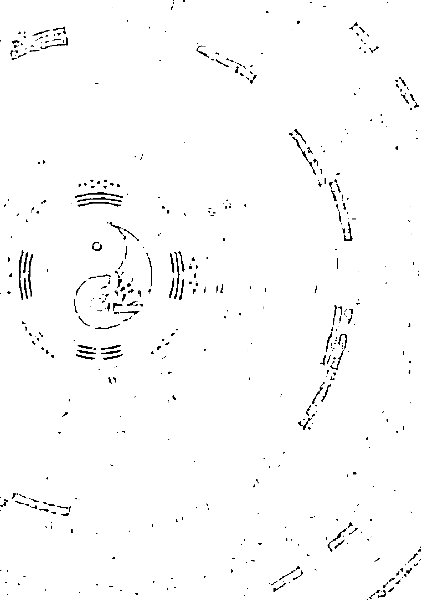
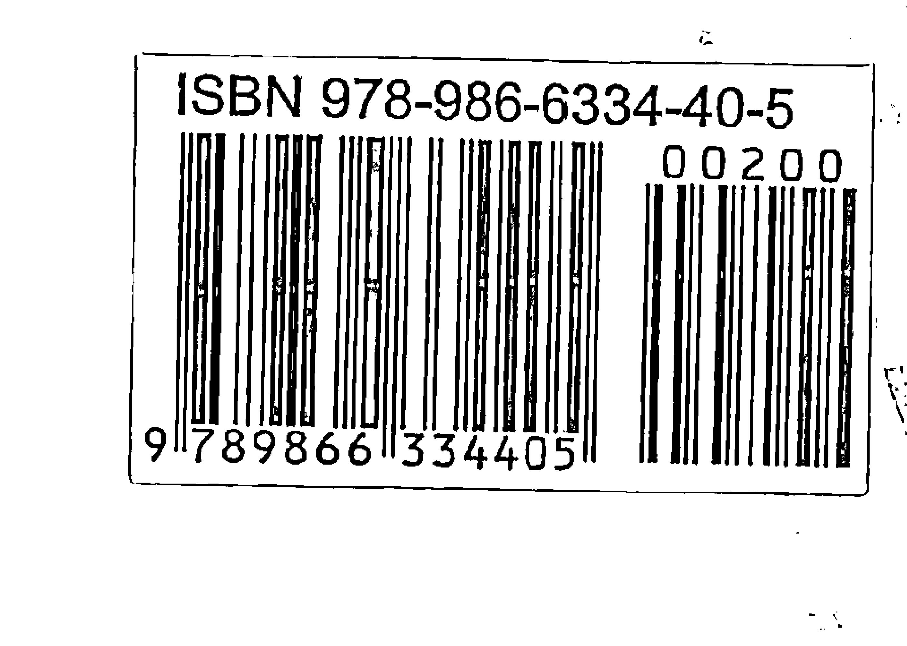

# 邏輯數字

# Logical Code
Make Your Fate Powerful

5分鐘讓大家知道如何查出你吉凶【運勢（運途）】的元素
最簡單實用的易經數字寶典，隨時隨地讓你查詢【運勢（運途）】
本書採易經64卦中的192爻之吉凶運勢（運途）以白話文解釋讓讀者們更容易了解
How to find the element of your future fate ? Flat or Tough ?
Now, there are some methods that can make you understand your destiny in five minutes by simple vivid visible Yi Jing(The Book of Changes) code。

妙清居士 著

# 邏輯碼力

妙法居士

# Logical Code

## Make Your Fate Powerful

5分鐘讓大家知道如何查出你吉凶【運勢（運途）】的元素

最簡單實用的易經數字寶典，隨時隨地讓你查詢【運勢（運途）】

本書採易經64卦中的192爻之吉凶運勢（運途）以白話文解釋讓讀者們更容易了解

How to find the element of your future fate ? Flat or Tough ?

Now, there are some methods that can make you understand your destiny in five minutes by simple vivid visible Yi Jing(The Book of Changes) code .

妙法居士 🌀 著

# 作者序

易經撰創於古代的中國，但是易理的流通不分國界，不分語言、符號，均可通達、應對於易卦來解釋凶吉。而易理之推算、解釋，除了易經的64卦，也從姓名學的數理、陰陽五行、阿拉伯數字，甚至英文字都可以從字象、字意的靈動中，找出對於卦象的意義，來解釋陰陽、因果對立，得知吉凶運勢以及趨吉避凶的因應之道。

很多人對於未來充滿好奇，也對於易經滿懷興趣，因此就到書局購置各種易經書籍，卻沒辦法窮盡其意義，總覺得易經很艱澀。然而易經本來就是一本很深奧的書、也是一門很艱深的學問，如果去參加易經課程不僅覺得昂貴，還相當曠日費時，然終究仍然無法解釋卦象、符碼所指涉的意義。

我白天忙於工作，藉用晚上及閒暇從事禪學、心靈學寫作，出版過「與財神有約」、「與幸福有約」等著作。「與財神有約」一書是透過生活中的簡單方式，提供讀者如何求財的方法：「與幸福有約」則主要在家庭關係，羅列全台月老、註生娘娘、城隍廟等，滿足讀者求因緣、求子的渴望。而今體察現代生活中充滿了以「數字」當作是種溝通工具、代號，有些甚至從出生跟隨到終老，它到底有沒有意義？到底代表什麼意義？除非影響深遠的重大決策，需要花費高額的老師費用，由命理師追根究底的推算，如果只是需要初步探索，那麼「靈動數字--強化運勢的祕法」這本書，簡便、易懂，只要透過第六章「數字吉凶速查表」就可以窺探究竟。

姓名學有五行、五格，數字也有陰陽、五行，均可在金、木、水、火、土中演繹出來。而身分證、車牌號碼、存摺帳號中的數字，內涵中潛藏著的能量，如何運用易經64卦來解釋吉兇，就如同西方人面對達文西密碼一樣，我們透過一組一組簡單的靈動數字，來解釋與運勢的關聯性，每一個籤組都釋以簡易的文字，說明運勢以及趨吉避兇的解套方法。

此時可以迴避艱澀難懂的易經學理，直接體會靈動數字的奧義，相信此書的淺顯易懂，面對運勢的吉與兇，讀者都可以DIY了。

居士：
妙清

# 目錄

## 作者的話

- ☆ 作者序 2

## 靈動數字強化運勢的秘法

- ☆ 第一章「數字吉凶的來源和依據」 5
- ☆ 第二章「如何DIY找出運勢號碼」 9
- ☆ 第三章「運用數字改運及卜卦」 17
- ☆ 第四章「出生年月日論事業夥伴」 21
- ☆ 第五章「數字吉凶解讀表」 27
- ☆ 第六章「數字吉凶速查表」 124

## 第一章

## 數字吉凶的來源和依據

「易經」是一部用來預測過去與未來事態的演變發展，進而解決人生困惑的經典。

### 一、数字吉凶的来源和依据

「易經」是由基本八卦（八宮）重疊而產生六十四卦。

每卦以六爻構成，又演化為三百八十四爻；以六十四卦當中為主卦（本卦）來占事，再以一爻一動的變卦來詳斷其發生的過程或結果。

基本卦及其代表序數有八卦，即乾一（天）、兌二（澤）、離三（火）、震四（雷）、巽五（風）、坎六（水）、艮七（山）、坤八（地）。亦可稱為八宮卦。

而上下兩卦相疊即為六十四卦，以下請見卦名表（0至63為卦的序號）。

卦名如乾為天（下一上一）、天澤履（下二上一）、坤為地（下八上八）或山澤損（下二上七）等等。

起卦方式有多種，如金錢卦、筮卦、骰子卦、數字卦、翻書頁…等。

本書是以數字卦為主來起卦，所取得之數除八之餘數來得基本卦，假設所得之數為12，除八餘四即為震四卦，剛好除盡則為坤八卦，以此類推。

第一次所得之基本卦為下卦（亦稱為內卦），第二次所得之基本卦為上卦（亦稱為外卦）兩卦相疊即得六十四卦之一（看表圖）。第三次所得之數目除以六之餘數即為變動之爻。

原陽爻（一）要改成陰爻（- -）反者亦然，爻的數序是從下往上移動。

## 數字吉凶速查表的形成

舉例：

陳先生的手機號碼為 09 xx - xx 68 57（下卦 上卦）

上卦 57 / 8（卦）=7 餘1 取其餘數1（依據64卦卦名表查出是乾）

下卦 68 / 8（卦）=8 餘4 取其餘數4（依據64卦卦名表查出是震）

6857 / 6（爻）=1142 餘5 取其餘數5（第5爻辭）所以6857為無妄卦第5爻辭

（每個爻都有文的爻辭，餘數是5，所以是第5爻辭，每一卦有6個爻，所以要除以6）

依據此法自0000～9999共10000組號碼，分別將其卦象與爻辭做出第五數字吉凶速查表

# 第1章 數字吉凶的來源和依據（運勢篇）

| 下卦 \ 上卦 | 乾 (7) 天 | 兌 (6) 澤 | 離 (5) 火 | 震 (4) 雷 | 巽 (3) 風 | 坎 (2) 水 | 艮 (1) 山 | 坤 (0) 地 |
| :--- | :--- | :--- | :--- | :--- | :--- | :--- | :--- | :--- |
| **乾 (7) 天** | 63 乾為天 | 62 澤天夬 | 61 火天大有 | 60 雷天大壯 | 59 風天小畜 | 58 水天需 | 57 山天大畜 | 56 地天泰 |
| **兌 (6) 澤** | 55 天澤履 | 54 兌為澤 | 53 火澤睽 | 52 雷澤歸妹 | 51 風澤中孚 | 50 水澤節 | 49 山澤損 | 48 地澤臨 |
| **離 (5) 火** | 47 天火同人 | 46 澤火革 | 45 離為火 | 44 雷火豐 | 43 風火家人 | 42 水火既濟 | 41 山火賁 | 40 地火明夷 |
| **震 (4) 雷** | 39 天雷无妄 | 38 澤雷隨 | 37 火雷噬嗑 | 36 震為雷 | 35 風雷益 | 34 水雷屯 | 33 山雷頤 | 32 地雷復 |
| **巽 (3) 風** | 31 天風姤 | 30 澤風大過 | 29 火風鼎 | 28 雷風恆 | 27 巽為風 | 26 水風井 | 25 山風蠱 | 24 地風升 |
| **坎 (2) 水** | 23 天水訟 | 22 澤水困 | 21 火水未濟 | 20 雷水解 | 19 風水渙 | 18 坎為水 | 17 山水蒙 | 16 地水師 |
| **艮 (1) 山** | 15 天山遯 | 14 澤山咸 | 13 火山旅 | 12 雷山小過 | 11 風山漸 | 10 水山蹇 | 9 艮為山 | 8 地山謙 |
| **坤 (0) 地** | 7 天地否 | 6 澤地萃 | 5 火地晉 | 4 雷地豫 | 3 風地觀 | 2 水地比 | 1 山地剝 | 0 坤為地 |

## 第二章

## 如何DIY找出運勢號碼

### 二、如何DIY找出運勢號碼

有一句話：出生時，八字命。當每個人一出生下來，就已成定數「命」了，但「運」是後天的，可以更改。

有些人八字看起來不太好，但後天努力奮鬥，一樣可以出人頭地。俗語：三分天注定，七分靠打拼，但是要拼對才會贏。

一命二運三風水四積德五讀書，除了積德與讀書，也要努力工作，才會漸漸改命運和創造出好的未來。

在九宮圖內如能排列出一組靈動的好數字，可為自己帶來好的命運和前途。

依據國曆出生年月日，查出農曆出生年月日。若不知農曆出生日期，也可依身分證上的出生年月日來找出幫助運勢的號碼，畢竟身分證已跟了你多年，相信命運多少已與你產生靈動。

## 九宮圖格式與數字記法

| | | |
|---|---|---|
| 4 | 9 | 2 |
| 3 | 5 | 7 |
| 8 | 1 | 6 |

在九宮圖有一個規則就是不管直、橫、斜的加起來都要等於"15"。

所以可以想像用"太極圖"來套用在九宮圖上，『2』和『8』位置也就是"太極圖"兩點的位置做對調。

## 例1：

王先生出生於西元1956年6月20日，分別將1、9、5、6、6、2數字放入九宮圖中，並在九宮圖上以紅色記下出現的次數。

| 4 | 9¹ | 2¹ |
|---|----|----|
| 3 | 5¹ | 7  |
| 8 | 1¹ | 6² |

記錄：
1×1次·9×1次·5×1次
6×2次·2×1次

另外還有3、4、7、8四個數字內沒有出現過，所以王先生的八字命格裡缺少3、4、7、8 四個數字，可將3、4、7、8做二十四種排列組合，算出一組最好的數字，希望能為王先生帶來好運勢。

將3、4、7、8 分別由小到大依序排列如下：

```
3478       4378       7348       8347
3487       4387       7384       8374
3748       4738       7438       8437
3784       4783       7483       8473
3847       4837       7834       8734
3874       4873       7843       8743
```

依第六章數字吉凶速查表，可得到二十四組數字的吉凶：

| 3478 ◎ | 4378 ▽ | 7348 △ | 8347 △ |
|---------|--------|--------|--------|
| 3487 × | 4387 △ | 7384 ○ | 8374 ▽ |
| 3748 ◎ | 4738 △ | 7438 ◎ | 8437 ◎ |
| 3784 × | 4783 × | 7483 ▽ | 8473 ▽ |
| 3847 ▽ | 4837 ◎ | 7834 △ | 8734 △ |
| 3874 ▽ | 4873 ◎ | 7843 × | 8743 × |

# 第2章 如何DIY找出運勢號碼

吉凶代表符號：

- ◎ -上上籤 ○ -中上籤 △ -中中籤 ∇ -中下籤 × -下下籤

以上共有六組上上籤如下：

- 3478 ◎
- 4837 ◎
- 7438 ◎
- 8437 ◎
- 3748 ◎
- 4873 ◎

查第五章的表後共有六組是上上籤，也是王先生三十年的運勢，將這六組上上籤的前二碼補上00，比如第一組3478，將34改為00，就是0078，而後二碼就是最近三年的運勢。

- 0078 △
- 0037 △
- 0038 ○
- 0037 △
- 0048 ×
- 0073 ×

查第五章的表後只有一組是中上籤，因此三十年的運勢中7438是上上籤，最近三年的運勢中0038是中上籤，因此王先生最幸運的號碼是7438。

## 例2：

劉小姐出生於西元1975年3月12日，分別將1、9、7、5、3、1、2數字放入九宮圖中，並在九宮圖上以紅色記下出現的次數。

| 4 | 9^1 | 2^1 |
|---|---|---|
| 3^1 | 5^1 | 7^1 |
| 8 | 1^2 | 6 |

記錄：
1×2次、9×1次、7×1次
5×1次、3×1次、2×1次

只外還有4、6、8 三個數字沒有出現過，所以劉小姐的八字命格裡已缺少4、6、8 三個數字。排列數字組合必須要有四個數字，所以還少一個數字。

下面1～9的數字中，每一個數字都有它代表的特性，挑出一個最喜愛的數字。

- 1 代表 領導創造力強，有獨立自主的特質。
- 2 代表 講求生活品味。
- 3 代表 做事效率高，有創造力。
- 4 代表 做事精益求精，完美主義者，任勞任怨。
- 5 代表 口才好，能言善道，喜歡獨來獨住，嚮往自由自在的生活。
- 6 代表 很貼心，很照顧別人，關心別人的看法，很在乎他人的需求。
- 7 代表 喜歡主宰別人，不喜歡惹事。
- 8 代表 公關能力強，有生意頭腦，人緣好。
- 9 代表 對事情理解力強，很喜歡照顧別人，從事社福工作。

劉小姐選擇5，她從事業務性質的工作，希望加強自己的口才，也希望自己將來能過自由自在，無憂無慮的生活。接著將4，5，6，8做二十四種排列組合，算出一組最好的數字，希望能為她帶來好運勢。

將4、5、6、8分別由小到大依序排列如下：

| 4568 | 5468 | 6458 | 8456 |
| 4586 | 5486 | 6485 | 8465 |
| 4658 | 5648 | 6548 | 8546 |
| 4685 | 5684 | 6584 | 8564 |
| 4856 | 5846 | 6845 | 8645 |
| 4865 | 5864 | 6854 | 8654 |

# 第2章：如何DIY找出运势号码

依第六章数字吉凶速查表，可得到二十四组吉凶数字：

| 列1 | 列2 | 列3 | 列4 |
|---|---|---|---|
| 4568 ▽ | 5468 ◎ | 6458 △ | 8456 ◎ |
| 4586 ▽ | 5486 △ | 6485 ○ | 8465 △ |
| 4658 ▽ | 5648 ◎ | 6548 ○ | 8546 ▽ |
| 4685 △ | 5684 ○ | 6584 ✕ | 8564 ◎ |
| 4856 ◎ | 5846 ✕ | 6845 ◎ | 8645 △ |
| 4865 ○ | 5864 ◎ | 6854 ▽ | 8654 △ |

吉凶代表符号：

◎-上上签 ○-中上签 △-中中签 ▽-中下签 ✕-下下签

以上共有七组上上签如下：

- 4856 ◎
- 5468 ◎
- 6845 ◎
- 8456 ◎
- 5648 ◎
- 8564 ◎
- 5864 ◎

查第六章的表后共有七组是上上签，也是三十年的运势，将这七组上上签的前二码补个00，比如第一组4856，将48改为00就是0056，而后二码就是最近三年的运势。

- 0056 ▽
- 0068 ◎
- 0045 ○
- 0056 ▽
- 0048 ✕
- 0064 ▽
- 0064 ▽

查第六章的表后有一组是中上签，因此三十年的运势5468是上上签，最近三年的运势0068是上上签，因此刘小姐最幸运的号码是 5468。

## 例3：

張先生出生於西元1974年7月11日，分別將1、9、7、4、7、1、1數字放入九宮圖中，並在九宮圖上以紅色記下出現的次數。

| 4¹ | 9¹ | 2 |
|----|----|---|
| 3 | 5 | 7² |
| 8 | 1³ | 6 |

記錄：
1×3次·9×1次·7×2次
4×1次

只外還有2、3、5、6、8五個數字沒有出現過，所以劉小姐的八字命格裡已缺少2、3、5、6、8五個數字。

數字組合必須要有四個數字，因2，3，5，6，8已多出一個數字，不能排列為二十四的組合。所以在五個數字中，假設拿掉「5」，就以2、3、6、8做為二十四種排列組合，希望能算出一組最好的數字，為其帶來好運勢。

將2、3、6、8分別由小到大依序排列如下：

- 2368, 3268, 6238, 8236, 2386, 3286, 6283, 8263, 2638, 3628, 6328, 8326, 2683, 3682, 6382, 8362, 2836, 3826, 6823, 8623, 2863, 3862, 6832, 8632

# 第2章 如何DIY找出運勢號碼

依第六章數字吉凶速查表，可得到二十四組吉凶數字：

| 2368 × | 3268 ◎ | 6238 △ | 8236 ◎ |
| 2386 △ | 3286 ○ | 6283 ○ | 8263 △ |
| 2638 ◎ | 3628 ▽ | 6328 ○ | 8326 ▽ |
| 2683 ▽ | 3682 × | 6382 × | 8362 ◎ |
| 2836 ▽ | 3826 ▽ | 6823 ◎ | 8623 △ |
| 2863 × | 3862 ◎ | 6832 ▽ | 8632 △ |

吉凶代表符號：

◎-上上籤 ○-中上籤 △-中中籤 ▽-中下籤 ×-下下籤

以上共有五組上上籤如下：

| 2638 ◎ | 3268 ◎ | 6238 ◎ |
| 8236 ◎ | 3862 ◎ |        |

查第六章的表後共有五組是上上籤，也是其三十年的運勢，將這五組上上籤，前二碼補個00，比如第一組2638，將26改為00，就是0038，而後二碼就是其最近三年的運勢。

| 0038 ○ | 0068 ◎ | 0038 ○ |
| 0036 ○ | 0062 ▽ |        |

查第六章的表後只有一組上上籤，因此三十年的運勢3268是上上籤，最近三年的運勢0068是上上籤，因此張先生最幸運的號碼是 3268。

## 第三章

## 運用數字改運及卜卦

# 第3章 運用數字改運及卜卦

### 用與自己相關的數字改運

### 例1：

身分證號碼 Hxxxxx4783，取末尾四個阿拉伯數字 4783。查詢第六章的速查表，得知4783位在第167條，而結果167條是下下籤。

改運 DIY：依前一章節算出自己的幸運數字，寫在小貼紙上，貼在身分證的空白處，可扭轉不好的號碼的運勢。

### 例2：

提款卡號碼 xxxx—xxxx—xxxx—8239，取末尾四個阿拉伯數字8239，查詢第六章的速查表，得知8239位在第121條，而121條是下下籤。

改運 DIY：依前一章節算出自己的幸運號碼，寫在小貼紙上，貼在提款卡空白處，可扭轉不好的號碼的運勢。

同理，可運用家用電話、公司電話、手機號碼、傳真機、信用卡、存款簿、汽、機車車牌號碼……等號碼的最末數四字。如查出不太好之籤，可換成你的幸運號碼，寫在小紙條上，貼在空白處，會帶來好的運勢。心誠則靈。

用手機號碼卜卦

例1：

依您所信仰的宗教，誠心誠意祈禱、禱告（例如八卦祖師爺、九天玄女、聖母瑪麗亞、耶穌基督……等等）

弟子李 xx 先生，生於民國75年6月18日住台北縣永和市 xx 路 xx 號（默禱）想請問：弟子在某公司服務多年，技術方面已能獨當一面，想創業，成立公司，不知是否可行？

※懇請xxx神祇指示

默禱完後，以手機或計算器隨機按下四位數字，例如：隨機按下四位數字是5662，查第六章「數字吉凶速查表」，得出結果是023條中上籤，對照籤的內容是：氣勢穩定，若能與賢人或好友共同創業，必能得到良好的收穫。

例2：

信女陳 xx，生於民國75年6月18日
住桃園縣楊梅鎮 xx 路 xx 號
（默禱）請問：有位朋友邀請我一同購買位於楊梅鎮 xx 路xx號x 樓的房子做為投資用途，不知是否可行？

※懇請xxx神祇指示

默禱完後，按電話機號碼四位數字，例如：隨機按下四位數字是3649，查第六章「數字吉凶速查表」是073條中下籤，對照籤的內容是：目前財運不佳，應以守勢為佳，宜靜不宜動，可平順而過。

切記：卜卦時，一次只能問一件事，且明確對象、主題、日期全要清楚，心要誠，要靜，則靈。

第四章

出生年月日論事業夥伴

## 您想了解與對方前世與今生的關係嗎？

自己的生日1955.8.3=1+9+5+5+8+3=31=3+1=4，4就是誕生數
對方的生日1960.9.5=1+9+6+0+9+5=30=3+0=3，3就是誕生數
將兩人誕生數相加 4+3=7 得到關係數 7

## 查下表得到關係數 7 的說明：

在前世，你們可能是一家人或好朋友，今生相遇，特別有心靈相契的感覺，在生活和工作上方面，也會相互扶持，就算別人認為你們不太可能溝通，但你們卻可在理解中而互相得到撫慰。

### 關係數字 1

在前世，你們可能是師徒或上司下屬的關係。前世所做的行為，同樣會反應在今世一切的作為。

### 關係數字 2

在前世，你們可能是兄弟姐妹。而今世無論在溝通、信仰或藝術興趣都具有默契，尤其在精神方面的相通性，也會超出人們預料。

### 關係數字 3

在前世，你們可能是好朋友，今生初次見面時，就像似曾相識，而有親切感，當開懷暢談時，友情也越來越緊密，興趣方面也很接近。

### 關係數字 4

在前世，你們可能屬於同事關係，今生可為共同目標奮鬥，你能犧牲自我，很會為別人著想，在必要時能共同完成目標，你們是一對最佳拍檔。

### 關係數字 5

在前世，你們二人可能是一對好夥伴，而且也會很觀照對方，當對方有困難時，另一方就會適時出現，並予以協助。

### 關係數字 6

在前世，你們可能是親戚或家人的關係，今生相識時，就好像有一家人的感覺，透過互相關懷、興趣，彼此會擁有濃厚的感情。

### 關係數字 7

在前世，可能是一家人或好朋友，今生相見後都會帶著疲倦的心靈互相關懷，在宗教方面，也會有互持行為，就算別人認為你們溝通不良，但你們卻可在默契中產生共鳴。

### 關係數字 8

在前世，你們是一對事業競爭對手，常因某件事情而互比高下，最後卻在關懷中達成共識，而今生在競爭之下，可能仍會出現這種場面，最後在協調中獲得解決。

### 關係數字 9

在前世，你們屬於相互奉獻之人，互相關懷理解，今生你們因在觀念中有一些差異，但最後仍然可以克服一切困難，並建構出一種協調關係。

由出生年月日看生命顏色

法國著名靈術家（加拿大細亞）所研究出來，以出生數字測顏色、個性。只要把出生年月日相加，便可找出自己的生命顏色。從而窺探內心深處真正的自己。

首先把你的西元出生年月日用的數字寫出來，然後將數字一個一個相加，直到結果變成單一數字為止。這個數字就是你的生命顏色。

- 例如：1978年8月23日出生的人
- 1+9+7+8+8+2+3=38
- 3+8=11
- 1+1=2
- 「2」就是你的生命顏色

紅色（1）| 領導、創造之格

個性強烈自我又勇往直前，以你的熱情融化周圍的冷漠人心。但因個性太過於衝動，因此常得罪人而受到打擊。若為領導人，則會致力於改善追隨者的生活。

橙色（2）| 依賴、協調之格

你有雙重個性，對生活品味也非常講究，生怕吃虧又依賴性重，需要有人常陪在身邊。對朋友很好，常呼朋喚友一起行動，但最渴望的還是找到一位永遠愛你的人。

橙色（3）| 創造性、理想之格

你個性太理想化，整天總是在作白日夢，雖富有創造力，卻停留在只想而沒有實際的行動。當心變成妄想症，世上絕沒有不勞而獲的事，應要腳踏實地。

橙色（4）| 組織能力、耐勞之格

你是個完美主義者，對別人總喜歡吹毛求疵。具有組織領導能力，喜歡嘗試新事物來自我挑戰，追求自我成長。

橙色（5）| 挑戰性、白手起家之格

個性內斂又有責任感的你，總是能得到別人的信賴。你喜歡獨來獨往。面對事情如覺有利可圖時，就會不擇手段達成目標。

第4章 出生年月日論事業夥伴

### 橙色 (6) | 關懷、調解之格

你是雙重性格之人，具實力及理想能力強，對於他人有求於你，你會熱心地協助。但因心情起伏大，旁人會覺得你很難相處。

### 紫色 (7) | 敏銳、分析之格

遇到困難時不輕易放手，會把整件事分析清楚才下決斷，且對自己的人生目標也十分堅持，如遇挫折也不放棄，遇到瓶頸也會立即採取行動解決。

### 粉紅 (8) | 理財、創業之格

你從小就有很優秀的商業頭腦，喜歡研究及開發新事物，且對業務很有一套，富有流利的好口才，是位了不起的公關人才。

### 黃色 (9) | 智慧、奉獻之格

你個性樂觀而且聰明伶俐，好奇心旺盛，越遇困難事務越會想去試試看才甘心。你熱心社會公益，樂於助人，很能犧牲奉獻，因此人緣極佳。

第五章

数字吉凶解读表

~ 第001條 上上籤~

| 0011 | 0179 | 0251 | 0419 | 0491 | 0659 | 0731 | 0899 | 0971 | 1709 |
| 1733 | 1757 | 1781 | 2501 | 2525 | 2549 | 2573 | 2597 | 3317 | 3341 |
| 3365 | 3389 | 4109 | 4133 | 4157 | 4181 | 4901 | 4925 | 4949 | 4973 |
| 4997 | 5717 | 5741 | 5765 | 5789 | 6509 | 6533 | 6557 | 6581 | 7301 |
| 7325 | 7349 | 7373 | 7397 | 8117 | 8141 | 8165 | 8189 | 8909 | 8933 |
| 8957 | 8981 | 9701 | 9725 | 9749 | 9773 | 9797 | | | |

諸事通達，有貴人支持，則名利雙收，若過驕傲，反會招來災禍。

All things will be accessible. With the aid of helpful persons, you will gain both fame and wealth. A disaster could be provoked by too much pride stemming from this gain.

~ 第002條 中中籤~

| 0019 | 0091 | 0259 | 0331 | 0499 | 0571 | 0739 | 0811 | 0979 | 1717 |
| 1741 | 1765 | 1789 | 2509 | 2533 | 2557 | 2581 | 3301 | 3325 | 3349 |
| 3373 | 3397 | 4117 | 4141 | 4165 | 4189 | 4909 | 4933 | 4957 | 4981 |
| 5701 | 5725 | 5749 | 5773 | 5797 | 6517 | 6541 | 6565 | 6589 | 7309 |
| 7333 | 7357 | 7381 | 8101 | 8125 | 8149 | 8173 | 8197 | 8917 | 8941 |
| 8965 | 8989 | 9709 | 9733 | 9757 | 9781 | | | | |

當下應多忍讓，利用時間進修，積極培養實力，等待時機再出發。

Be tolerant when encountering troubles. Make good use of your time while studying, cultivating your true abilities, and waiting for the chance to re-group.

~ 第003條 中下籤~

| 0099 | 0171 | 0339 | 0411 | 0579 | 0651 | 0819 | 0891 | 1701 | 1725 |
|------|------|------|------|------|------|------|------|------|------|
| 1749 | 1773 | 1797 | 2517 | 2541 | 2565 | 2589 | 3309 | 3333 | 3357 |
| 3381 | 4101 | 4125 | 4149 | 4173 | 4197 | 4917 | 4941 | 4965 | 4989 |
| 5709 | 5733 | 5757 | 5781 | 6501 | 6525 | 6549 | 6573 | 6597 | 7317 |
| 7341 | 7365 | 7389 | 8109 | 8133 | 8157 | 8181 | 8901 | 8925 | 8949 |
| 8973 | 8997 | 9717 | 9741 | 9765 | 9789 | | | | |

運氣有阻滯的現象，宜退守，不可衝動行事，避免官司纏身。

Your fortune is somewhat blocked. You should retreat. Do not take any actions on impulse, thus you can avoid ensuing lawsuits.

~ 第004條 上上籤~

| 0248 | 0488 | 0728 | 0968 | 1616 | 1640 | 1664 | 1688 | 2408 | 2432 |
|------|------|------|------|------|------|------|------|------|------|
| 2456 | 2480 | 3224 | 3248 | 3272 | 3296 | 4016 | 4040 | 4064 | 4088 |
| 4808 | 4832 | 4856 | 4880 | 5624 | 5648 | 5672 | 5696 | 6416 | 6440 |
| 6464 | 6488 | 7208 | 7232 | 7256 | 7280 | 8024 | 8048 | 8072 | 8096 |
| 8816 | 8840 | 8864 | 8888 | 9608 | 9632 | 9656 | 9680 | | |

好運來到，不圖私利，不投機取巧，會有意想不到的收穫。

Your good luck is coming. No speculation, no manipulation, and no figuring of private interests, you would win in a landslide.

~ 第005條 中中籤~

| 0088 | 0328 | 0568 | 0808 | 1624 | 1648 | 1672 | 1696 | 2416 | 2440 |
| 2464 | 2488 | 3208 | 3232 | 3256 | 3280 | 4024 | 4048 | 4072 | 4096 |
| 4816 | 4840 | 4864 | 4888 | 5608 | 5632 | 5656 | 5680 | 6424 | 6448 |
| 6472 | 6496 | 7216 | 7240 | 7264 | 7288 | 8008 | 8032 | 8056 | 8080 |
| 8824 | 8848 | 8872 | 8896 | 9616 | 9640 | 9664 | 9688 | | |

雖處於如意安泰之形勢，不可懶散、享樂、得意忘形，才不致破壞好運勢。

Even in the easy and peaceful state of affairs, you should not be lazy, indulging in pleasure, and getting carried away, thus your good luck will not be obstructed.

~ 第006條 下下籤~

| 0168 | 0408 | 0648 | 0888 | 1608 | 1632 | 1656 | 1680 | 2424 | 2448 |
| 2472 | 2496 | 3216 | 3240 | 3264 | 3288 | 4008 | 4032 | 4056 | 4080 |
| 4824 | 4848 | 4872 | 4896 | 5616 | 5640 | 5664 | 5688 | 6408 | 6432 |
| 6456 | 6480 | 7224 | 7248 | 7272 | 7296 | 8016 | 8040 | 8064 | 8088 |
| 8808 | 8832 | 8856 | 8880 | 9624 | 9648 | 9672 | 9696 | | |

進入不景氣時期，不利於創業，須靜觀時勢，東山再起。

You are entering your bad period. It is not conducive to start an enterprise. You should wait for the proper timing and then start over.

~ 第007條 中下籤~

| 0206 | 0446 | 0686 | 0926 | 1214 | 1238 | 1262 | 1286 | 2006 | 2030 |
|------|------|------|------|------|------|------|------|------|------|
| 2054 | 2078 | 2822 | 2846 | 2870 | 2894 | 3614 | 3638 | 3662 | 3686 |
| 4406 | 4430 | 4454 | 4478 | 5222 | 5246 | 5270 | 5294 | 6014 | 6038 |
| 6062 | 6086 | 6806 | 6830 | 6854 | 6878 | 7622 | 7646 | 7670 | 7694 |
| 8414 | 8438 | 8462 | 8486 | 9206 | 9230 | 9254 | 9278 | | |

好運尚未到來，不可冒進，須堅定意志，適當節制，等待時機。

Before the good luck knocks, you should strengthen your will, restraining yourself appropriately, waiting for good timing, instead of making rash advances.

~ 第008條 中上籤~

| 0046 | 0286 | 0526 | 0766 | 1222 | 1246 | 1270 | 1294 | 2014 | 2038 |
|------|------|------|------|------|------|------|------|------|------|
| 2062 | 2086 | 2806 | 2830 | 2854 | 2878 | 3622 | 3646 | 3670 | 3694 |
| 4414 | 4438 | 4462 | 4486 | 5206 | 5230 | 5254 | 5278 | 6022 | 6046 |
| 6070 | 6094 | 6814 | 6838 | 6862 | 6886 | 7606 | 7630 | 7654 | 7678 |
| 8422 | 8446 | 8470 | 8494 | 9214 | 9238 | 9262 | 9286 | | |

運勢好轉，不可操之過急，面對問題，應冷靜思考，沉著因應。

Your fortune is getting better. Do not act with undue haste. You should face the problems, pondering calmly, and responding with aplomb.

~ 第009條 下下籤~

| 0126 | 0366 | 0606 | 0846 | 1206 | 1230 | 1254 | 1278 | 2022 | 2046 |
|------|------|------|------|------|------|------|------|------|------|
| 2070 | 2094 | 2814 | 2838 | 2862 | 2886 | 3606 | 3630 | 3654 | 3678 |
| 4422 | 4446 | 4470 | 4494 | 5214 | 5238 | 5262 | 5286 | 6006 | 6030 |
| 6054 | 6078 | 6822 | 6846 | 6870 | 6894 | 7614 | 7638 | 7662 | 7686 |
| 8406 | 8430 | 8454 | 8478 | 9222 | 9246 | 9270 | 9294 | | |

否泰交替、風水輪流轉，雖有礙、終無妨，認清窮則變、變則通乃互古不渝的道理。
Difficulty and ease are the alternative. The worse luck now, the better it will be another time. Though there are difficulties, they would finally disappear. Understanding well the eternal philosophy of Adversity leads to diversity, and diversity leads to prosperity.

~ 第010條 中下籤~

| 0067 | 0307 | 0547 | 0787 | 1423 | 1447 | 1471 | 1495 | 2215 | 2239 |
|------|------|------|------|------|------|------|------|------|------|
| 2263 | 2287 | 3007 | 3031 | 3055 | 3079 | 3823 | 3847 | 3871 | 3895 |
| 4615 | 4639 | 4663 | 4687 | 5407 | 5431 | 5455 | 5479 | 6223 | 6247 |
| 6271 | 6295 | 7015 | 7039 | 7063 | 7087 | 7807 | 7831 | 7855 | 7879 |
| 8623 | 8647 | 8671 | 8695 | 9415 | 9439 | 9463 | 9487 | | |

行事勿自我封閉，貫徹自己的想法，應能突破困境，挽回頹勢。
Handling matters do not be in a self-imposed isolation. Following out your own ideas, you will break through the difficulties, restoring the tide.

## ~ 第011條 下下籤~

| 0147 | 0387 | 0627 | 0867 | 1407 | 1431 | 1455 | 1479 | 2223 | 2247 |
|------|------|------|------|------|------|------|------|------|------|
| 2271 | 2295 | 3015 | 3039 | 3063 | 3087 | 3807 | 3831 | 3855 | 3879 |
| 4623 | 4647 | 4671 | 4695 | 5415 | 5439 | 5463 | 5487 | 6207 | 6231 |
| 6255 | 6279 | 7023 | 7047 | 7071 | 7095 | 7815 | 7839 | 7863 | 7887 |
| 8607 | 8631 | 8655 | 8679 | 9423 | 9447 | 9471 | 9495 |      |      |

諸事不如意，氣運雜亂，應當機立斷，大膽改革，另找出路。

Things would not go according with your wishes. Your fortune turns to disorder. You should make a decision at once and revolve without fear for a better way out.

## ~ 第012條 中上籤~

| 0227 | 0467 | 0707 | 0947 | 1415 | 1439 | 1463 | 1487 | 2207 | 2231 |
|------|------|------|------|------|------|------|------|------|------|
| 2255 | 2279 | 3023 | 3047 | 3071 | 3095 | 3815 | 3839 | 3863 | 3887 |
| 4607 | 4631 | 4655 | 4679 | 5423 | 5447 | 5471 | 5495 | 6215 | 6239 |
| 6263 | 6287 | 7007 | 7031 | 7055 | 7079 | 7823 | 7847 | 7871 | 7895 |
| 8615 | 8639 | 8663 | 8687 | 9407 | 9431 | 9455 | 9479 |      |      |

初有損失，終可解困。遇事先穩定情緒，若能樂觀面對，則百事亨通。

Though some loss in the beginning, you would be off the hook at the end. Calm down the emotions while encountering troubles. If you can face trouble optimistically, everything would go smoothly.

## ~ 第013條 中中籤~

| 0016 | 0256 | 0496 | 0736 | 0976 | 1714 | 1738 | 1762 | 1786 | 2506 |
|------|------|------|------|------|------|------|------|------|------|
| 2530 | 2554 | 2578 | 3322 | 3346 | 3370 | 3394 | 4114 | 4138 | 4162 |
| 4186 | 4906 | 4930 | 4954 | 4978 | 5722 | 5746 | 5770 | 5794 | 6514 |
| 6538 | 6562 | 6586 | 7306 | 7330 | 7354 | 7378 | 8122 | 8146 | 8170 |
| 8194 | 8914 | 8938 | 8962 | 8986 | 9706 | 9730 | 9754 | 9778 |      |

事業雖興盛，但危機將至，不可輕舉妄動，以退為進，方可化險為夷。

Even if the business is prosperous, the crisis is awaiting still. By not acting rashly and blindly, one may ward off the disaster.

## ~ 第014條 上上籤~

| 0096 | 0336 | 0576 | 0816 | 1722 | 1746 | 1770 | 1794 | 2514 | 2538 |
|------|------|------|------|------|------|------|------|------|------|
| 2562 | 2586 | 3306 | 3330 | 3354 | 3378 | 4122 | 4146 | 4170 | 4194 |
| 4914 | 4938 | 4962 | 4986 | 5706 | 5730 | 5754 | 5778 | 6522 | 6546 |
| 6570 | 6594 | 7314 | 7338 | 7362 | 7386 | 8106 | 8130 | 8154 | 8178 |
| 8922 | 8946 | 8970 | 8994 | 9714 | 9738 | 9762 | 9786 |      |      |

凡事時機一到，蓄銳而發。唯不可貪大，以誠相待，必得貴人相助。

Once good timing comes, you may take action with full preparation. But keeping away greed, acting with sincerity, you may obtain the aid from helpful persons.

## ~ 第015條 中中籤~

| 0176 | 0416 | 0656 | 0896 | 1706 | 1730 | 1754 | 1778 | 2522 | 2546 |
|------|------|------|------|------|------|------|------|------|------|
| 2570 | 2594 | 3314 | 3338 | 3362 | 3386 | 4106 | 4130 | 4154 | 4178 |
| 4922 | 4946 | 4970 | 4994 | 5714 | 5738 | 5762 | 5786 | 6506 | 6530 |
| 6554 | 6578 | 7322 | 7346 | 7370 | 7394 | 8114 | 8138 | 8162 | 8186 |
| 8906 | 8930 | 8954 | 8978 | 9722 | 9746 | 9770 | 9794 |      |      |

形勢有利，凡事務實，不與人計較長短則百事有成。

Your situation is advantageous, you should do things pragmatically, do not compare yourself to others, and then everything will be successful

## ~ 第016條 中上籤~

| 0061 | 0229 | 0301 | 0469 | 0541 | 0709 | 0781 | 0949 | 1417 | 1441 |
|------|------|------|------|------|------|------|------|------|------|
| 1465 | 1489 | 2209 | 2233 | 2257 | 2281 | 3001 | 3025 | 3049 | 3073 |
| 3097 | 3817 | 3841 | 3865 | 3889 | 4609 | 4633 | 4657 | 4681 | 5401 |
| 5425 | 5449 | 5473 | 5497 | 6217 | 6241 | 6265 | 6289 | 7009 | 7033 |
| 7057 | 7081 | 7801 | 7825 | 7849 | 7873 | 7897 | 8617 | 8641 | 8665 |
| 8689 | 9409 | 9433 | 9457 | 9481 |      |      |      |      |      |

偶有紛爭，若居下風，應冷靜思考，以吃虧便是佔便宜的態度面對，終將圓滿解決。

Sometimes, in disputing, if staying in a lower state, you should think about things calmly and face them with the attitude that sufferer wins in the end. Thus the things will be settled down peacefully and completely.

## 第5章 數字吉凶解讀表

## ~ 第017條 中中籤~

| 0069 | 0141 | 0309 | 0381 | 0549 | 0621 | 0789 | 0861 | 1401 | 1425 |
|------|------|------|------|------|------|------|------|------|------|
| 1449 | 1473 | 1497 | 2217 | 2241 | 2265 | 2289 | 3009 | 3033 | 3057 |
| 3081 | 3801 | 3825 | 3849 | 3873 | 3897 | 4617 | 4641 | 4665 | 4689 |
| 5409 | 5433 | 5457 | 5481 | 6201 | 6225 | 6249 | 6273 | 6297 | 7017 |
| 7041 | 7065 | 7089 | 7809 | 7833 | 7857 | 7881 | 8601 | 8625 | 8649 |
| 8673 | 8697 | 9417 | 9441 | 9465 | 9489 |      |      |      |      |

要安分守己、守舊業，不宜投資，必然平安無事。

You should be content with your lot, keeping old business, and it is inappropriate to do new investments, thus you would be safe.

## ~ 第018條 上上籤~

| 0149 | 0221 | 0389 | 0461 | 0629 | 0701 | 0869 | 0941 | 1409 | 1433 |
|------|------|------|------|------|------|------|------|------|------|
| 1457 | 1481 | 2201 | 2225 | 2249 | 2273 | 2297 | 3017 | 3041 | 3065 |
| 3089 | 3809 | 3833 | 3857 | 3881 | 4601 | 4625 | 4649 | 4673 | 4697 |
| 5417 | 5441 | 5465 | 5489 | 6209 | 6233 | 6257 | 6281 | 7001 | 7025 |
| 7049 | 7073 | 7097 | 7817 | 7841 | 7865 | 7889 | 8609 | 8633 | 8657 |
| 8681 | 9401 | 9425 | 9449 | 9473 | 9497 |      |      |      |      |

運勢漸轉強，如能充實本質學能，擬定工作計劃，願望必可達成。

Your luck turns better and stronger, if you could enrich yourself with quality and knowledge, planning a working schedule, your wish would come true.

## ~ 第019條 上上籤~

| 0068 | 0308 | 0548 | 0788 | 1424 | 1448 | 1472 | 1496 | 2216 | 2240 |
|------|------|------|------|------|------|------|------|------|------|
| 2264 | 2288 | 3008 | 3032 | 3056 | 3080 | 3824 | 3848 | 3872 | 3896 |
| 4616 | 4640 | 4664 | 4688 | 5408 | 5432 | 5456 | 5480 | 6224 | 6248 |
| 6272 | 6296 | 7016 | 7040 | 7064 | 7088 | 7808 | 7832 | 7856 | 7880 |
| 8624 | 8648 | 8672 | 8696 | 9416 | 9440 | 9464 | 9488 |      |      |

獲得友人支持，則以靜制動，行事須低調，不可急功近利。

Obtaining the support from friends, you should keep quiet instead of taking any action. Doing things at a low key ebb, do not be eager for quick success and instant benefits.

## ~ 第020條 中中籤~

| 0148 | 0388 | 0628 | 0868 | 1408 | 1432 | 1456 | 1480 | 2224 | 2248 |
|------|------|------|------|------|------|------|------|------|------|
| 2272 | 2296 | 3016 | 3040 | 3064 | 3088 | 3808 | 3832 | 3856 | 3880 |
| 4624 | 4648 | 4672 | 4696 | 5416 | 5440 | 5464 | 5488 | 6208 | 6232 |
| 6256 | 6280 | 7024 | 7048 | 7072 | 7096 | 7816 | 7840 | 7864 | 7888 |
| 8608 | 8632 | 8656 | 8680 | 9424 | 9448 | 9472 | 9496 |      |      |

事出有因，抓住重點方向，努力堅持，謀定而後動，不致有差錯。

There must be causes to lead the results. Seizing the key point and right direction, striving and being persistent, being stable before taking action, thus there won't be any mistakes happened.

## ~ 第021條 中上籤~

| 0228 | 0468 | 0708 | 0948 | 1416 | 1440 | 1464 | 1488 | 2208 | 2232 |
|------|------|------|------|------|------|------|------|------|------|
| 2256 | 2280 | 3024 | 3048 | 3072 | 3096 | 3816 | 3840 | 3864 | 3888 |
| 4608 | 4632 | 4656 | 4680 | 5424 | 5448 | 5472 | 5496 | 6216 | 6240 |
| 6264 | 6288 | 7008 | 7032 | 7056 | 7080 | 7824 | 7848 | 7872 | 7896 |
| 8616 | 8640 | 8664 | 8688 | 9408 | 9432 | 9456 | 9480 |      |      |

運勢來臨，如能掌握契機、小心謹慎，請益友人、傳授經驗，虛心受教可以成事。

Your good luck is coming. If you can grasp this best opportunity, dealing with things circumspectly, inquiring with friends on their experience and being taught by modesty, thus you may achieve success.

## ~ 第022條 中上籤~

| 0086 | 0326 | 0566 | 0806 | 1622 | 1646 | 1670 | 1694 | 2414 | 2438 |
|------|------|------|------|------|------|------|------|------|------|
| 2462 | 2486 | 3206 | 3230 | 3254 | 3278 | 4022 | 4046 | 4070 | 4094 |
| 4814 | 4838 | 4862 | 4886 | 5606 | 5630 | 5654 | 5678 | 6422 | 6446 |
| 6470 | 6494 | 7214 | 7238 | 7262 | 7286 | 8006 | 8030 | 8054 | 8078 |
| 8822 | 8846 | 8870 | 8894 | 9614 | 9638 | 9662 | 9686 |      |      |

所謂道不同不相為謀，結合志同道合之人，共同努力創業，自然能闖出一片天。

There is little common ground for understanding between persons of differing principles. Therefore, you should search for the people shared with the same principles, so you may generate business options together, thus a rosy future will be encountered.

## 第5章 数字吉凶解读表

## ~ 第023條 中上籤~

| 0166 | 0406 | 0646 | 0886 | 1606 | 1630 | 1654 | 1678 | 2422 | 2446 |
|------|------|------|------|------|------|------|------|------|------|
| 2470 | 2494 | 3214 | 3238 | 3262 | 3286 | 4006 | 4030 | 4054 | 4078 |
| 4822 | 4846 | 4870 | 4894 | 5614 | 5638 | 5662 | 5686 | 6406 | 6430 |
| 6454 | 6478 | 7222 | 7246 | 7270 | 7294 | 8014 | 8038 | 8062 | 8086 |
| 8806 | 8830 | 8854 | 8878 | 9622 | 9646 | 9670 | 9694 |      |      |

氣勢穩定，若能與賢人或好友共同創業，必能得到良好的收穫。

Your good luck is becoming stable. If you can find persons of substance or friends of good character to initiate business together, the prosperous harvest will ensue.

## ~ 第024條 下下籤~

| 0246 | 0486 | 0726 | 0966 | 1614 | 1638 | 1662 | 1686 | 2406 | 2430 |
|------|------|------|------|------|------|------|------|------|------|
| 2454 | 2478 | 3222 | 3246 | 3270 | 3294 | 4014 | 4038 | 4062 | 4086 |
| 4806 | 4830 | 4854 | 4878 | 5622 | 5646 | 5670 | 5694 | 6414 | 6438 |
| 6462 | 6486 | 7206 | 7230 | 7254 | 7278 | 8022 | 8046 | 8070 | 8094 |
| 8814 | 8838 | 8862 | 8886 | 9606 | 9630 | 9654 | 9678 |      |      |

時機轉變，一時退運，不輕率行動，應冷靜思考，如此不會失策。

Your opportunity is turning sour. Do not take action in haste. You should think things over calmly, so as to avoid any wrong doing.

## ~ 第025條 中上籤~

| 0095 | 0335 | 0575 | 0815 | 1721 | 1745 | 1769 | 1793 | 2513 | 2537 |
|------|------|------|------|------|------|------|------|------|------|
| 2561 | 2585 | 3305 | 3329 | 3353 | 3377 | 4121 | 4145 | 4169 | 4193 |
| 4913 | 4937 | 4961 | 4985 | 5705 | 5729 | 5753 | 5777 | 6521 | 6545 |
| 6569 | 6593 | 7313 | 7337 | 7361 | 7385 | 8105 | 8129 | 8153 | 8177 |
| 8921 | 8945 | 8969 | 8993 | 9713 | 9737 | 9761 | 9785 |      |      |

應耐心積極，不可莽撞行事，充實自己，培養潛力，伺機再前進。

Be patient and vigorous, do not do things rashly. Enrich yourself, cultivating capability, and then moving forward while good timing comes.

## ~ 第026條 中上籤~

| 0175 | 0415 | 0655 | 0895 | 1705 | 1729 | 1753 | 1777 | 2521 | 2545 |
|------|------|------|------|------|------|------|------|------|------|
| 2569 | 2593 | 3313 | 3337 | 3361 | 3385 | 4105 | 4129 | 4153 | 4177 |
| 4921 | 4945 | 4969 | 4993 | 5713 | 5737 | 5761 | 5785 | 6505 | 6529 |
| 6553 | 6577 | 7321 | 7345 | 7369 | 7393 | 8113 | 8137 | 8161 | 8185 |
| 8905 | 8929 | 8953 | 8977 | 9721 | 9745 | 9769 | 9793 |      |      |

計畫行事，誠信處事，凡事自重忍耐，加強彼此信心，應可化解難關。

Doing things with plan, with honesty and integrity. To refrain from committing nuisance, be patient, and enhance faith of each other, thus any difficulties should be resolved.

## ~ 第027條 中下籤~

| 0015 | 0255 | 0495 | 0735 | 0975 | 1713 | 1737 | 1761 | 1785 | 2505 |
|------|------|------|------|------|------|------|------|------|------|
| 2529 | 2553 | 2577 | 3321 | 3345 | 3369 | 3393 | 4113 | 4137 | 4161 |
| 4185 | 4905 | 4929 | 4953 | 4977 | 5721 | 5745 | 5769 | 5793 | 6513 |
| 6537 | 6561 | 6585 | 7305 | 7329 | 7353 | 7377 | 8121 | 8145 | 8169 |
| 8193 | 8913 | 8937 | 8961 | 8985 | 9705 | 9729 | 9753 | 9777 |      |

遇事不順，心情不穩定，一波過後又一波，心平氣和，堅定信心，可突破難關。

You would encounter things not as your wishes and your emotion would not be stable. Troubles seemingly add one after one. If you can keep calm and peaceful, remain adamant, and then the difficulties would be broken.

## ~ 第028條 中下籤~

| 0009 | 0109 | 0181 | 0349 | 0421 | 0589 | 0661 | 0829 | 0901 | 1009 |
|------|------|------|------|------|------|------|------|------|------|
| 1033 | 1057 | 1081 | 1801 | 1825 | 1849 | 1873 | 1897 | 2617 | 2641 |
| 2665 | 2689 | 3409 | 3433 | 3457 | 3481 | 4201 | 4225 | 4249 | 4273 |
| 4297 | 5017 | 5041 | 5065 | 5089 | 5809 | 5833 | 5857 | 5881 | 6601 |
| 6625 | 6649 | 6673 | 6697 | 7417 | 7441 | 7465 | 7489 | 8209 | 8233 |
| 8257 | 8281 | 9001 | 9025 | 9049 | 9073 | 9097 | 9817 | 9841 | 9865 |
| 9889 |      |      |      |      |      |      |      |      |      |

有意外之阻礙，不宜急進，心平氣和，事事小心行事，否則不利。

There would be unexpected hindrance. You should keep mind calm and peaceful, instead of proceeding things rashly, or else it would not be good to you.

## ~ 第029條 下下籤~

| 0021 | 0189 | 0261 | 0429 | 0501 | 0669 | 0741 | 0909 | 0981 | 1017 |
|------|------|------|------|------|------|------|------|------|------|
| 1041 | 1065 | 1089 | 1809 | 1833 | 1857 | 1881 | 2601 | 2625 | 2649 |
| 2673 | 2697 | 3417 | 3441 | 3465 | 3489 | 4209 | 4233 | 4257 | 4281 |
| 5001 | 5025 | 5049 | 5073 | 5097 | 5817 | 5841 | 5865 | 5889 | 6609 |
| 6633 | 6657 | 6681 | 7401 | 7425 | 7449 | 7473 | 7497 | 8217 | 8241 |
| 8265 | 8289 | 9009 | 9033 | 9057 | 9081 | 9801 | 9825 | 9849 | 9873 |
| 9897 |      |      |      |      |      |      |      |      |      |

過份得意會有災害，注意有突發事件發生，一切和氣對待，安穩守身。

Too proud would cause disaster. Be careful there would be something interfering happened. Treating everything with tender minded, and then your status would be steady thereof.

## ~ 第030條 中下籤~

| 0001 | 0029 | 0101 | 0269 | 0341 | 0509 | 0581 | 0749 | 0821 | 0989 |
|------|------|------|------|------|------|------|------|------|------|
| 1001 | 1025 | 1049 | 1073 | 1097 | 1817 | 1841 | 1865 | 1889 | 2609 |
| 2633 | 2657 | 2681 | 3401 | 3425 | 3449 | 3473 | 3497 | 4217 | 4241 |
| 4265 | 4289 | 5009 | 5033 | 5057 | 5081 | 5801 | 5825 | 5849 | 5873 |
| 5897 | 6617 | 6641 | 6665 | 6689 | 7409 | 7433 | 7457 | 7481 | 8201 |
| 8225 | 8249 | 8273 | 8297 | 9017 | 9041 | 9065 | 9089 | 9809 | 9833 |
| 9857 | 9881 |      |      |      |      |      |      |      |      |

注意口舌是非。不協調，運勢不順時，不可貿然而行，否則必有災害。

Watch out the disputing. In discordant or unlucky time, do not proceed without preparation, or else disaster would descend.

## ~ 第031條 中中籤~

| 0178 | 0418 | 0658 | 0898 | 1708 | 1732 | 1756 | 1780 | 2524 | 2548 |
|------|------|------|------|------|------|------|------|------|------|
| 2572 | 2596 | 3316 | 3340 | 3364 | 3388 | 4108 | 4132 | 4156 | 4180 |
| 4924 | 4948 | 4972 | 4996 | 5716 | 5740 | 5764 | 5788 | 6508 | 6532 |
| 6556 | 6580 | 7324 | 7348 | 7372 | 7396 | 8116 | 8140 | 8164 | 8188 |
| 8908 | 8932 | 8956 | 8980 | 9724 | 9748 | 9772 | 9796 |      |      |

雖運氣強大，至時當盛，不可逞強妄動，可請教專業人士，以誠相待，否則會招來失敗。

Even in good luck, the most amazing things come to you, to keep holding and awaiting the advices from professional persons would be very important. Otherwise, it would be easy to provoke failure.

## ~ 第032條 下下籤~

| 0018 | 0258 | 0498 | 0738 | 0978 | 1716 | 1740 | 1764 | 1788 | 2508 |
|------|------|------|------|------|------|------|------|------|------|
| 2532 | 2556 | 2580 | 3324 | 3348 | 3372 | 3396 | 4116 | 4140 | 4164 |
| 4188 | 4908 | 4932 | 4956 | 4980 | 5724 | 5748 | 5772 | 5796 | 6516 |
| 6540 | 6564 | 6588 | 7308 | 7332 | 7356 | 7380 | 8124 | 8148 | 8172 |
| 8196 | 8916 | 8940 | 8964 | 8988 | 9708 | 9732 | 9756 | 9780 |      |

務實行事，忌好高騖遠，保守面對阻力，不可大作為，自可免災。

Do things pragmatically, and avoid aiming too high. Facing obstructions conservatively, do not react too much, thus you can avoid troubles.

## ~ 第033條 中上籤~

| 0098 | 0338 | 0578 | 0818 | 1724 | 1748 | 1772 | 1796 | 2516 | 2540 |
|------|------|------|------|------|------|------|------|------|------|
| 2564 | 2588 | 3308 | 3332 | 3356 | 3380 | 4124 | 4148 | 4172 | 4196 |
| 4916 | 4940 | 4964 | 4988 | 5708 | 5732 | 5756 | 5780 | 6524 | 6548 |
| 6572 | 6596 | 7316 | 7340 | 7364 | 7388 | 8108 | 8132 | 8156 | 8180 |
| 8924 | 8948 | 8972 | 8996 | 9716 | 9740 | 9764 | 9788 |      |      |

表面柔順，內心明察，隱忍行事，此時應頭腦清醒，靜待時機。

Complaisance on the surface, however clearance in deep mind. Doing things with tolerance. At this moment, you should keep clear in mind and wait for good timing.

## ~ 第034條 上上籤~

| 0169 | 0241 | 0409 | 0481 | 0649 | 0721 | 0889 | 0961 | 1609 | 1633 |
|------|------|------|------|------|------|------|------|------|------|
| 1657 | 1681 | 2401 | 2425 | 2449 | 2473 | 2497 | 3217 | 3241 | 3265 |
| 3289 | 4009 | 4033 | 4057 | 4081 | 4801 | 4825 | 4849 | 4873 | 4897 |
| 5617 | 5641 | 5665 | 5689 | 6409 | 6433 | 6457 | 6481 | 7201 | 7225 |
| 7249 | 7273 | 7297 | 8017 | 8041 | 8065 | 8089 | 8809 | 8833 | 8857 |
| 8881 | 9601 | 9625 | 9649 | 9673 | 9697 |      |      |      |      |

凡事須踏實、務實，奉公守法，努力向上，自然亨通。

Dealing with things dependably, pragmatically. Be law-abiding and seek improvement, your fate would go smoothly.

## ~ 第035條 下下籤~

| 0081 | 0249 | 0321 | 0489 | 0561 | 0729 | 0801 | 0969 | 1617 | 1641 |
|------|------|------|------|------|------|------|------|------|------|
| 1665 | 1689 | 2409 | 2433 | 2457 | 2481 | 3201 | 3225 | 3249 | 3273 |
| 3297 | 4017 | 4041 | 4065 | 4089 | 4809 | 4833 | 4857 | 4881 | 5601 |
| 5625 | 5649 | 5673 | 5697 | 6417 | 6441 | 6465 | 6489 | 7209 | 7233 |
| 7257 | 7281 | 8001 | 8025 | 8049 | 8073 | 8097 | 8817 | 8841 | 8865 |
| 8889 | 9609 | 9633 | 9657 | 9681 |      |      |      |      |      |

運氣衰敗，以退為進，若逞強而行，必遇大阻礙。

Your luck turns worse. You should step backward instead of moving forward. If acting strong and pushing yourself to go, you would meet big obstacle.

## ~ 第036條 中上籤~

| 0089 | 0161 | 0329 | 0401 | 0569 | 0641 | 0809 | 0881 | 1601 | 1625 |
|------|------|------|------|------|------|------|------|------|------|
| 1649 | 1673 | 1697 | 2417 | 2441 | 2465 | 2489 | 3209 | 3233 | 3257 |
| 3281 | 4001 | 4025 | 4049 | 4073 | 4097 | 4817 | 4841 | 4865 | 4889 |
| 5609 | 5633 | 5657 | 5681 | 6401 | 6425 | 6449 | 6473 | 6497 | 7217 |
| 7241 | 7265 | 7289 | 8009 | 8033 | 8057 | 8081 | 8801 | 8825 | 8849 |
| 8873 | 8897 | 9617 | 9641 | 9665 | 9689 |      |      |      |      |

鴻運當頭，對人保持謙虛，對事謹守德操，有得財運的機會。

You are in good luck. You should be modest still. Keep virtue in dealing with things, you would find possibility of obtaining fortune.

## 第5章 數字吉凶解讀表

## ~ 第037條 中上籤~

| 0119 | 0191 | 0359 | 0431 | 0599 | 0671 | 0839 | 0911 | 1109 | 1133 |
|------|------|------|------|------|------|------|------|------|------|
| 1157 | 1181 | 1901 | 1925 | 1949 | 1973 | 1997 | 2717 | 2741 | 2765 |
| 2789 | 3509 | 3533 | 3557 | 3581 | 4301 | 4325 | 4349 | 4373 | 4397 |
| 5117 | 5141 | 5165 | 5189 | 5909 | 5933 | 5957 | 5981 | 6701 | 6725 |
| 6749 | 6773 | 6797 | 7517 | 7541 | 7565 | 7589 | 8309 | 8333 | 8357 |
| 8381 | 9101 | 9125 | 9149 | 9173 | 9197 | 9917 | 9941 | 9965 | 9989 |

運氣漸入佳境，需克服困難與阻礙，乃可望順利得財利。
Your fortune turns better. But still, you have to overcome difficulty and hindrance. Then you are expected to get fortune.

## ~ 第038條 中上籤~

| 0031 | 0199 | 0271 | 0439 | 0511 | 0679 | 0751 | 0919 | 0991 | 1117 |
|------|------|------|------|------|------|------|------|------|------|
| 1141 | 1165 | 1189 | 1909 | 1933 | 1957 | 1981 | 2701 | 2725 | 2749 |
| 2773 | 2797 | 3517 | 3541 | 3565 | 3589 | 4309 | 4333 | 4357 | 4381 |
| 5101 | 5125 | 5149 | 5173 | 5197 | 5917 | 5941 | 5965 | 5989 | 6709 |
| 6733 | 6757 | 6781 | 7501 | 7525 | 7549 | 7573 | 7597 | 8317 | 8341 |
| 8365 | 8389 | 9109 | 9133 | 9157 | 9181 | 9901 | 9925 | 9949 | 9973 |
| 9997 |      |      |      |      |      |      |      |      |      |

運氣來臨，得人和則有財進，結合好友或長輩共事皆宜。
Your good luck is coming. Getting along well with people, you are expected to get fortune. To work with good friends or seniors are both good.

## ~ 第039條 中下籤~

| 0039 | 0111 | 0279 | 0351 | 0519 | 0591 | 0759 | 0831 | 0999 | 1101 |
|------|------|------|------|------|------|------|------|------|------|
| 1125 | 1149 | 1173 | 1197 | 1917 | 1941 | 1965 | 1989 | 2709 | 2733 |
| 2757 | 2781 | 3501 | 3525 | 3549 | 3573 | 3597 | 4317 | 4341 | 4365 |
| 4389 | 5109 | 5133 | 5157 | 5181 | 5901 | 5925 | 5949 | 5973 | 5997 |
| 6717 | 6741 | 6765 | 6789 | 7509 | 7533 | 7557 | 7581 | 8301 | 8325 |
| 8349 | 8373 | 8397 | 9117 | 9141 | 9165 | 9189 | 9909 | 9933 | 9957 |
| 9981 |      |      |      |      |      |      |      |      |      |

諸事不順，凡事順其自然，不能輕舉妄動，等待機會來臨，自有新的發展。
Everything goes bad, just let it be. Avoid taking action rashly, wait for opportunity, and good development would be expected.

## ~ 第040條 上上籤~

| 0173 | 0413 | 0653 | 0893 | 1703 | 1727 | 1751 | 1775 | 1799 | 2519 |
|------|------|------|------|------|------|------|------|------|------|
| 2543 | 2567 | 2591 | 3311 | 3335 | 3359 | 3383 | 4103 | 4127 | 4151 |
| 4175 | 4199 | 4919 | 4943 | 4967 | 4991 | 5711 | 5735 | 5759 | 5783 |
| 6503 | 6527 | 6551 | 6575 | 6599 | 7319 | 7343 | 7367 | 7391 | 8111 |
| 8135 | 8159 | 8183 | 8903 | 8927 | 8951 | 8975 | 8999 | 9719 | 9743 |
| 9767 | 9791 |      |      |      |      |      |      |      |      |

春風得意，名利雙收，應以誠信為本，修心養性，才能繼續得到貴人幫助。
You are riding on the crest of success, winning both fame and fortune. But still have to keep honest and faith and cultivate yourself. Thus could keep on winning the aid of helpful persons.

## ~ 第041條 中上籤~

| 0013 | 0253 | 0493 | 0733 | 0973 | 1711 | 1735 | 1759 | 1783 | 2503 |
|------|------|------|------|------|------|------|------|------|------|
| 2527 | 2551 | 2575 | 2599 | 3319 | 3343 | 3367 | 3391 | 4111 | 4135 |
| 4159 | 4183 | 4903 | 4927 | 4951 | 4975 | 4999 | 5719 | 5743 | 5767 |
| 5791 | 6511 | 6535 | 6559 | 6583 | 7303 | 7327 | 7351 | 7375 | 7399 |
| 8119 | 8143 | 8167 | 8191 | 8911 | 8935 | 8959 | 8983 | 9703 | 9727 |
| 9751 | 9775 | 9799 |      |      |      |      |      |      |      |

現在順利之時，別忘了過去之艱辛，逞強難出頭，以靜制動、靜觀其變。
Now you are in the smooth, do not forget all the hardship endured. Pretending strong is hard to get success. You should keep quiet instead of taking any action, just await and see what would happen.

## ~ 第042條 中上籤~

| 0093 | 0333 | 0573 | 0813 | 1719 | 1743 | 1767 | 1791 | 2511 | 2535 |
|------|------|------|------|------|------|------|------|------|------|
| 2559 | 2583 | 3303 | 3327 | 3351 | 3375 | 3399 | 4119 | 4143 | 4167 |
| 4191 | 4911 | 4935 | 4959 | 4983 | 5703 | 5727 | 5751 | 5775 | 5799 |
| 6519 | 6543 | 6567 | 6591 | 7311 | 7335 | 7359 | 7383 | 8103 | 8127 |
| 8151 | 8175 | 8199 | 8919 | 8943 | 8967 | 8991 | 9711 | 9735 | 9759 |
| 9783 |      |      |      |      |      |      |      |      |      |

小事可為，大事時運不通，小心應變、處變不驚，可轉危機。
Trivial things can be made, however major issues are not the right time to be settled down. Be careful in dealing with changes, do not panic. Then you would turn safe from crisis.

## ~ 第043條 中中籤~

| 0238 | 0478 | 0718 | 0958 | 1516 | 1540 | 1564 | 1588 | 2308 | 2332 |
|------|------|------|------|------|------|------|------|------|------|
| 2356 | 2380 | 3124 | 3148 | 3172 | 3196 | 3916 | 3940 | 3964 | 3988 |
| 4708 | 4732 | 4756 | 4780 | 5524 | 5548 | 5572 | 5596 | 6316 | 6340 |
| 6364 | 6388 | 7108 | 7132 | 7156 | 7180 | 7924 | 7948 | 7972 | 7996 |
| 8716 | 8740 | 8764 | 8788 | 9508 | 9532 | 9556 | 9580 | | |

開業不利，不能大規模行動，退守則吉，急進則凶，凡事慎重為宜。
It is not auspicious for you to open a business. You had better not to take action with large scale. To retreating is good to you. However, moving forward rashly turns your luck bad. Being cautious is appropriate.

## ~ 第044條 中中籤~

| 0078 | 0318 | 0558 | 0798 | 1524 | 1548 | 1572 | 1596 | 2316 | 2340 |
|------|------|------|------|------|------|------|------|------|------|
| 2364 | 2388 | 3108 | 3132 | 3156 | 3180 | 3924 | 3948 | 3972 | 3996 |
| 4716 | 4740 | 4764 | 4788 | 5508 | 5532 | 5556 | 5580 | 6324 | 6348 |
| 6372 | 6396 | 7116 | 7140 | 7164 | 7188 | 7908 | 7932 | 7956 | 7980 |
| 8724 | 8748 | 8772 | 8796 | 9516 | 9540 | 9564 | 9588 | | |

百事有阻，依賴心不可過重，且沉默思考，不可輕舉妄動，諸事宜守，量力而為。
Everything would be blocked. Do not over dependent, thinking over silently. Do not take action rashly and blindly. It is better to do things conservatively, and measure how much you can shoulder.

## 第5章 數字吉凶解讀表

## ~ 第045條 中上籤~

| 0158 | 0398 | 0638 | 0878 | 1508 | 1532 | 1556 | 1580 | 2324 | 2348 |
|------|------|------|------|------|------|------|------|------|------|
| 2372 | 2396 | 3116 | 3140 | 3164 | 3188 | 3908 | 3932 | 3956 | 3980 |
| 4724 | 4748 | 4772 | 4796 | 5516 | 5540 | 5564 | 5588 | 6308 | 6332 |
| 6356 | 6380 | 7124 | 7148 | 7172 | 7196 | 7916 | 7940 | 7964 | 7988 |
| 8708 | 8732 | 8756 | 8780 | 9524 | 9548 | 9572 | 9596 |      |      |

運氣漸近，得到貴人提拔，加倍努力，和順以德，前途光明。
Your good luck is close to you. You would get promotion by the helpful person. Working hard with double efforts. Be gentle and obedient, accompanying with virtue, your future would be very bright.

## ~ 第046條 中上籤~

| 0164 | 0404 | 0644 | 0884 | 1600 | 1604 | 1628 | 1652 | 1676 | 2420 |
|------|------|------|------|------|------|------|------|------|------|
| 2444 | 2468 | 2492 | 3212 | 3236 | 3260 | 3284 | 4000 | 4004 | 4028 |
| 4052 | 4076 | 4820 | 4844 | 4868 | 4892 | 5612 | 5636 | 5660 | 5684 |
| 6400 | 6404 | 6428 | 6452 | 6476 | 7220 | 7244 | 7268 | 7292 | 8012 |
| 8036 | 8060 | 8084 | 8800 | 8804 | 8828 | 8852 | 8876 | 9620 | 9644 |
| 9668 | 9692 |      |      |      |      |      |      |      |      |

元氣復初就緒，立即行動，把握時機，將獲得權力及財富。
Your vitality has restored as fresh as the beginning. You should take action immediately, seizing this good chance, you would obtain power and wealth.

## ~ 第047條 上上籤~

| 0244 | 0484 | 0724 | 0964 | 1612 | 1636 | 1660 | 1684 | 2400 | 2404 |
|------|------|------|------|------|------|------|------|------|------|
| 2428 | 2452 | 2476 | 3220 | 3244 | 3268 | 3292 | 4012 | 4036 | 4060 |
| 4084 | 4800 | 4804 | 4828 | 4852 | 4876 | 5620 | 5644 | 5668 | 5692 |
| 6412 | 6436 | 6460 | 6484 | 7200 | 7204 | 7228 | 7252 | 7276 | 8020 |
| 8044 | 8068 | 8092 | 8812 | 8836 | 8860 | 8884 | 9600 | 9604 | 9628 |
| 9652 | 9676 |      |      |      |      |      |      |      |      |

與人合作獲得支持，誠信待人，必有大收穫，戮力為善皆有所得。
You would get support while working with others. Treating people with honest and faith, you would get prosperous harvest. All your efforts on charity would get feedback.

## ~ 第048條 中下籤~

| 0084 | 0324 | 0564 | 0804 | 1620 | 1644 | 1668 | 1692 | 2412 | 2436 |
|------|------|------|------|------|------|------|------|------|------|
| 2460 | 2484 | 3200 | 3204 | 3228 | 3252 | 3276 | 4020 | 4044 | 4068 |
| 4092 | 4812 | 4836 | 4860 | 4884 | 5600 | 5604 | 5628 | 5652 | 5676 |
| 6420 | 6444 | 6468 | 6492 | 7212 | 7236 | 7260 | 7284 | 8000 | 8004 |
| 8028 | 8052 | 8076 | 8820 | 8844 | 8868 | 8892 | 9612 | 9636 | 9660 |
| 9684 |      |      |      |      |      |      |      |      |      |

事業順利如意，但不可過於樂觀，適值興衰之轉捩點，放慢腳步踱步審視（審慎為之）。
Your business is smoothing as your wish. However, do not be over optimistic, you are right in the turning point of prosperity and decline. You should slow down your foot step and stop for further inspection (be cautious to take the next step).

## ~ 第049條 中下籤~

| 0040 | 0122 | 0280 | 0362 | 0520 | 0602 | 0760 | 0842 | 1202 | 1226 |
|------|------|------|------|------|------|------|------|------|------|
| 1250 | 1274 | 1298 | 2018 | 2042 | 2066 | 2090 | 2810 | 2834 | 2858 |
| 2882 | 3602 | 3626 | 3650 | 3674 | 3698 | 4418 | 4442 | 4466 | 4490 |
| 5210 | 5234 | 5258 | 5282 | 6002 | 6026 | 6050 | 6074 | 6098 | 6818 |
| 6842 | 6866 | 6890 | 7610 | 7634 | 7658 | 7682 | 8402 | 8426 | 8450 |
| 8474 | 8498 | 9218 | 9242 | 9266 | 9290 |      |      |      |      |

雖得順利，但不可急功近利，不能雙腳踏兩條船，以免犯災。

Though you go smoothly, however do not be eager for quick success and instant benefit. You cannot put your feet on two boats, as it would lead to drowning.

## ~ 第050條 下下籤~

| 0120 | 0202 | 0360 | 0442 | 0600 | 0682 | 0840 | 0922 | 1210 | 1234 |
|------|------|------|------|------|------|------|------|------|------|
| 1258 | 1282 | 2002 | 2026 | 2050 | 2074 | 2098 | 2818 | 2842 | 2866 |
| 2890 | 3610 | 3634 | 3658 | 3682 | 4402 | 4426 | 4450 | 4474 | 4498 |
| 5218 | 5242 | 5266 | 5290 | 6010 | 6034 | 6058 | 6082 | 6802 | 6826 |
| 6850 | 6874 | 6898 | 7618 | 7642 | 7666 | 7690 | 8410 | 8434 | 8458 |
| 8482 | 9202 | 9226 | 9250 | 9274 | 9298 |      |      |      |      |

不可為己之私利，而執意強行，若有不成，會導致破運之象。

Do not insist on taking any action for your selfish interest. If not successful, it would lead you an omen of bad luck.

## ~ 第051條 中下籤~

| 0042 | 0200 | 0282 | 0440 | 0522 | 0680 | 0762 | 0920 | 1218 | 1242 |
|------|------|------|------|------|------|------|------|------|------|
| 1266 | 1290 | 2010 | 2034 | 2058 | 2082 | 2802 | 2826 | 2850 | 2874 |
| 2898 | 3618 | 3642 | 3666 | 3690 | 4410 | 4434 | 4458 | 4482 | 5202 |
| 5226 | 5250 | 5274 | 5298 | 6018 | 6042 | 6066 | 6090 | 6810 | 6834 |
| 6858 | 6882 | 7602 | 7626 | 7650 | 7674 | 7698 | 8418 | 8442 | 8466 |
| 8490 | 9210 | 9234 | 9258 | 9282 | | | | | |

諸事正處於衰退之運，退守吉，急進則凶，宜尊重別人意見。

Your luck is in decline. Retreat is good. Contrariwise, to speed forward rashly is bad. You should respect others' ideas.

## ~ 第052條 上上籤~

| 0137 | 0377 | 0617 | 0857 | 1307 | 1331 | 1355 | 1379 | 2123 | 2147 |
|------|------|------|------|------|------|------|------|------|------|
| 2171 | 2195 | 2915 | 2939 | 2963 | 2987 | 3707 | 3731 | 3755 | 3779 |
| 4523 | 4547 | 4571 | 4595 | 5315 | 5339 | 5363 | 5387 | 6107 | 6131 |
| 6155 | 6179 | 6923 | 6947 | 6971 | 6995 | 7715 | 7739 | 7763 | 7787 |
| 8507 | 8531 | 8555 | 8579 | 9323 | 9347 | 9371 | 9395 | | |

運勢好轉，處事待人接物，小心行事，則可得到意外收穫。

Your luck turns good. Be cautious while dealing with people, and you would obtain an unexpected harvest.

## 第5章 數字吉凶解讀表

## ~ 第053條 中中籤~

| 0217 | 0457 | 0697 | 0937 | 1315 | 1339 | 1363 | 1387 | 2107 | 2131 |
|------|------|------|------|------|------|------|------|------|------|
| 2155 | 2179 | 2923 | 2947 | 2971 | 2995 | 3715 | 3739 | 3763 | 3787 |
| 4507 | 4531 | 4555 | 4579 | 5323 | 5347 | 5371 | 5395 | 6115 | 6139 |
| 6163 | 6187 | 6907 | 6931 | 6955 | 6979 | 7723 | 7747 | 7771 | 7795 |
| 8515 | 8539 | 8563 | 8587 | 9307 | 9331 | 9355 | 9379 | | |

凡事不可好高騖遠，應腳踏實地，保守行事，宜待時機，必得達志。

Do not aim at the moon. You should plant your feet on solid ground, doing things conservatively, and waiting for the good timing. Then you would reach what you wish.

## ~ 第054條 中下籤~

| 0057 | 0297 | 0537 | 0777 | 1323 | 1347 | 1371 | 1395 | 2115 | 2139 |
|------|------|------|------|------|------|------|------|------|------|
| 2163 | 2187 | 2907 | 2931 | 2955 | 2979 | 3723 | 3747 | 3771 | 3795 |
| 4515 | 4539 | 4563 | 4587 | 5307 | 5331 | 5355 | 5379 | 6123 | 6147 |
| 6171 | 6195 | 6915 | 6939 | 6963 | 6987 | 7707 | 7731 | 7755 | 7779 |
| 8523 | 8547 | 8571 | 8595 | 9315 | 9339 | 9363 | 9387 | | |

初始階段，混亂無序，不知方向，難以如願，誠心求教及溝通，必有轉機。

At the beginning, it is in a mess and chaos. There is no direction to be found, and it is hard to reach what you wish. If you make an inquiry sincerely and communicate patiently, you would turn your bad luck into good.

## ~ 第055條 上上籤~

| 0188 | 0428 | 0668 | 0908 | 1016 | 1040 | 1064 | 1088 | 1808 | 1832 |
|------|------|------|------|------|------|------|------|------|------|
| 1856 | 1880 | 2624 | 2648 | 2672 | 2696 | 3416 | 3440 | 3464 | 3488 |
| 4208 | 4232 | 4256 | 4280 | 5024 | 5048 | 5072 | 5096 | 5816 | 5840 |
| 5864 | 5888 | 6608 | 6632 | 6656 | 6680 | 7424 | 7448 | 7472 | 7496 |
| 8216 | 8240 | 8264 | 8288 | 9008 | 9032 | 9056 | 9080 | 9824 | 9848 |
| 9872 | 9896 |      |      |      |      |      |      |      |      |

已過難關，好運已來，但不可操之過急，得意忘形，應建立制度，讓大家有目共睹。

Your crisis has been overcome, and good luck has come. But still, you should not be too rash or too proud to remember who you are. You should establish a system for everybody to see.

## ~ 第056條 中上籤~

| 0028 | 0268 | 0508 | 0748 | 0988 | 1024 | 1048 | 1072 | 1096 | 1816 |
|------|------|------|------|------|------|------|------|------|------|
| 1840 | 1864 | 1888 | 2608 | 2632 | 2656 | 2680 | 3424 | 3448 | 3472 |
| 3496 | 4216 | 4240 | 4264 | 4288 | 5008 | 5032 | 5056 | 5080 | 5824 |
| 5848 | 5872 | 5896 | 6616 | 6640 | 6664 | 6688 | 7408 | 7432 | 7456 |
| 7480 | 8224 | 8248 | 8272 | 8296 | 9016 | 9040 | 9064 | 9088 | 9808 |
| 9832 | 9856 | 9880 |      |      |      |      |      |      |      |

開拓新市場，在商業活動中，應多與朋友共同奮鬥合作為吉。

To expand into a new market. In business activity, it is good for you to work with friends more and strive for cooperation.

## ~ 第057條 上上籤~

| 0008 | 0108 | 0348 | 0588 | 0828 | 1008 | 1032 | 1056 | 1080 | 1824 |
|------|------|------|------|------|------|------|------|------|------|
| 1848 | 1872 | 1896 | 2616 | 2640 | 2664 | 2688 | 3408 | 3432 | 3456 |
| 3480 | 4224 | 4248 | 4272 | 4296 | 5016 | 5040 | 5064 | 5088 | 5808 |
| 5832 | 5856 | 5880 | 6624 | 6648 | 6672 | 6696 | 7416 | 7440 | 7464 |
| 7488 | 8208 | 8232 | 8256 | 8280 | 9024 | 9048 | 9072 | 9096 | 9816 |
| 9840 | 9864 | 9888 |      |      |      |      |      |      |      |

開張營業，不汲汲營利、在乎損益，只要知人善任，諸事可成。

When opening a business, do not be merely eager for profit or your loss and gain. Only if you know how to use the right staff, everything can be done successfully.

## ~ 第058條 上上籤~

| 0085 | 0325 | 0565 | 0805 | 1621 | 1645 | 1669 | 1693 | 2413 | 2437 |
|------|------|------|------|------|------|------|------|------|------|
| 2461 | 2485 | 3205 | 3229 | 3253 | 3277 | 4021 | 4045 | 4069 | 4093 |
| 4813 | 4837 | 4861 | 4885 | 5605 | 5629 | 5653 | 5677 | 6421 | 6445 |
| 6469 | 6493 | 7213 | 7237 | 7261 | 7285 | 8005 | 8029 | 8053 | 8077 |
| 8821 | 8845 | 8869 | 8893 | 9613 | 9637 | 9661 | 9685 |      |      |

勇敢前進大膽投入，有受他人相助而諸事順暢，大吉大利之運。

Bravely go forward and invest without fear. You are in a very good luck, would get other’s help and everything would go smoothly.

## ~ 第059条 中上签~

| 0165 | 0405 | 0645 | 0885 | 1605 | 1629 | 1653 | 1677 | 2421 | 2445 |
|------|------|------|------|------|------|------|------|------|------|
| 2469 | 2493 | 3213 | 3237 | 3261 | 3285 | 4005 | 4029 | 4053 | 4077 |
| 4821 | 4845 | 4869 | 4893 | 5613 | 5637 | 5661 | 5685 | 6405 | 6429 |
| 6453 | 6477 | 7221 | 7245 | 7269 | 7293 | 8013 | 8037 | 8061 | 8085 |
| 8805 | 8829 | 8853 | 8877 | 9621 | 9645 | 9669 | 9693 | | |

渐进有利，过急不利，了解真相，脚踏实地，可获吉祥。

It is good to move forward gradually. Being too rushed is not good. Understanding the truth and doing things pragmatically, you would obtain auspiciousness.

## ~ 第060条 中上签~

| 0245 | 0485 | 0725 | 0965 | 1613 | 1637 | 1661 | 1685 | 2405 | 2429 |
|------|------|------|------|------|------|------|------|------|------|
| 2453 | 2477 | 3221 | 3245 | 3269 | 3293 | 4013 | 4037 | 4061 | 4085 |
| 4805 | 4829 | 4853 | 4877 | 5621 | 5645 | 5669 | 5693 | 6413 | 6437 |
| 6461 | 6485 | 7205 | 7229 | 7253 | 7277 | 8021 | 8045 | 8069 | 8093 |
| 8813 | 8837 | 8861 | 8885 | 9605 | 9629 | 9653 | 9677 | | |

时运不佳时期，需要整顿，重新出发，行动积极，始可东山再起。

You are in a period of bad luck. You should reorganize and restart. Taking action positively, you may bob up like a cork.

## 第5章 數字吉凶解讀表

## ~ 第061條 中上籤~

| 0043 | 0283 | 0523 | 0763 | 1219 | 1243 | 1267 | 1291 | 2011 | 2035 |
|------|------|------|------|------|------|------|------|------|------|
| 2059 | 2083 | 2803 | 2827 | 2851 | 2875 | 2899 | 3619 | 3643 | 3667 |
| 3691 | 4411 | 4435 | 4459 | 4483 | 5203 | 5227 | 5251 | 5275 | 5299 |
| 6019 | 6043 | 6067 | 6091 | 6811 | 6835 | 6859 | 6883 | 7603 | 7627 |
| 7651 | 7675 | 7699 | 8419 | 8443 | 8467 | 8491 | 9211 | 9235 | 9259 |
| 9283 |  |  |  |  |  |  |  |  |  |

運勢漸好，但也會遇到困難，不可猶豫，應沉澱沈思，自我檢討以策進。

Your luck turns better, however difficulty would still be met. Do not hang back, calm down and meditate. Self-review for improvement.

## ~ 第062條 中下籤~

| 0123 | 0363 | 0603 | 0843 | 1203 | 1227 | 1251 | 1275 | 1299 | 2019 |
|------|------|------|------|------|------|------|------|------|------|
| 2043 | 2067 | 2091 | 2811 | 2835 | 2859 | 2883 | 3603 | 3627 | 3651 |
| 3675 | 3699 | 4419 | 4443 | 4467 | 4491 | 5211 | 5235 | 5259 | 5283 |
| 6003 | 6027 | 6051 | 6075 | 6099 | 6819 | 6843 | 6867 | 6891 | 7611 |
| 7635 | 7659 | 7683 | 8403 | 8427 | 8451 | 8475 | 8499 | 9219 | 9243 |
| 9267 | 9291 |  |  |  |  |  |  |  |  |

盛極而衰，應居安思危，尋求依託，勇敢排除所有阻礙。

Everything reaches its peak and then declines. You should think about danger in times of peace, seek support, and bravely get rid of all obstacles.

## 第5章 數字吉凶解讀表

### 第063條 中下籤

| 0203 | 0443 | 0683 | 0923 | 1211 | 1235 | 1259 | 1283 | 2003 | 2027 |
|------|------|------|------|------|------|------|------|------|------|
| 2051 | 2075 | 2099 | 2819 | 2843 | 2867 | 2891 | 3611 | 3635 | 3659 |
| 3683 | 4403 | 4427 | 4451 | 4475 | 4499 | 5219 | 5243 | 5267 | 5291 |
| 6011 | 6035 | 6059 | 6083 | 6803 | 6827 | 6851 | 6875 | 6899 | 7619 |
| 7643 | 7667 | 7691 | 8411 | 8435 | 8459 | 8483 | 9203 | 9227 | 9251 |
| 9275 | 9299 |      |      |      |      |      |      |      |      |

諸事不順。唯有剛柔並濟，才能克服萬難。
Everything goes unfavorably. Only combining with both softness and hardness can conquer all difficulties.

### 第064條 上上籤

| 0197 | 0437 | 0677 | 0917 | 1115 | 1139 | 1163 | 1187 | 1907 | 1931 |
|------|------|------|------|------|------|------|------|------|------|
| 1955 | 1979 | 2723 | 2747 | 2771 | 2795 | 3515 | 3539 | 3563 | 3587 |
| 4307 | 4331 | 4355 | 4379 | 5123 | 5147 | 5171 | 5195 | 5915 | 5939 |
| 5963 | 5987 | 6707 | 6731 | 6755 | 6779 | 7523 | 7547 | 7571 | 7595 |
| 8315 | 8339 | 8363 | 8387 | 9107 | 9131 | 9155 | 9179 | 9923 | 9947 |
| 9971 | 9995 |      |      |      |      |      |      |      |      |

得助於家人乃成功關鍵。如能嚴格持家，保持虛心、誠心、信心並獲家人協助，將利事業發展。
Your key point to get success comes from your family's support. If you can manage your family strictly, keeping modest, sincere, confident, and obtain your family's support, it would be good for your business.

### 第065條 中中籤

| 0037 | 0277 | 0517 | 0757 | 0997 | 1123 | 1147 | 1171 | 1195 | 1915 |
|------|------|------|------|------|------|------|------|------|------|
| 1939 | 1963 | 1987 | 2707 | 2731 | 2755 | 2779 | 3523 | 3547 | 3571 |
| 3595 | 4315 | 4339 | 4363 | 4387 | 5107 | 5131 | 5155 | 5179 | 5923 |
| 5947 | 5971 | 5995 | 6715 | 6739 | 6763 | 6787 | 7507 | 7531 | 7555 |
| 7579 | 8323 | 8347 | 8371 | 8395 | 9115 | 9139 | 9163 | 9187 | 9907 |
| 9931 | 9955 | 9979 |      |      |      |      |      |      |      |

遇到困境應沉默思考，會有轉變的空間。
While encountering difficulties, you should meditate silently. You would find your space of evolving.

### 第066條 上上籤

| 0117 | 0357 | 0597 | 0837 | 1107 | 1131 | 1155 | 1179 | 1923 | 1947 |
|------|------|------|------|------|------|------|------|------|------|
| 1971 | 1995 | 2715 | 2739 | 2763 | 2787 | 3507 | 3531 | 3555 | 3579 |
| 4323 | 4347 | 4371 | 4395 | 5115 | 5139 | 5163 | 5187 | 5907 | 5931 |
| 5955 | 5979 | 6723 | 6747 | 6771 | 6795 | 7515 | 7539 | 7563 | 7587 |
| 8307 | 8331 | 8355 | 8379 | 9123 | 9147 | 9171 | 9195 | 9915 | 9939 |
| 9963 | 9987 |      |      |      |      |      |      |      |      |

一有機會，不可急於求成，循序漸進，積極行事，正道而行，必然得成。
Once getting chance, do not eager to achieve success. You should do it gradually, positively and follow the right path, and then your success would be achieved.

### 第067條 下下籤

| 0247 | 0487 | 0727 | 0967 | 1615 | 1639 | 1663 | 1687 | 2407 | 2431 |
|------|------|------|------|------|------|------|------|------|------|
| 2455 | 2479 | 3223 | 3247 | 3271 | 3295 | 4015 | 4039 | 4063 | 4087 |
| 4807 | 4831 | 4855 | 4879 | 5623 | 5647 | 5671 | 5695 | 6415 | 6439 |
| 6463 | 6487 | 7207 | 7231 | 7255 | 7279 | 8023 | 8047 | 8071 | 8095 |
| 8815 | 8839 | 8863 | 8887 | 9607 | 9631 | 9655 | 9679 |      |      |

創業不可急，求成欠缺考慮，任性非為，應謹言慎行，小心為要。
It cannot be rushed to create a business. Aiming for success but lacking consideration, self-willed and mal-conduct won't achieve success. You should talk and behave cautiously. Be careful.

### 第068條 中中籤

| 0087 | 0327 | 0567 | 0807 | 1623 | 1647 | 1671 | 1695 | 2415 | 2439 |
|------|------|------|------|------|------|------|------|------|------|
| 2463 | 2487 | 3207 | 3231 | 3255 | 3279 | 4023 | 4047 | 4071 | 4095 |
| 4815 | 4839 | 4863 | 4887 | 5607 | 5631 | 5655 | 5679 | 6423 | 6447 |
| 6471 | 6495 | 7215 | 7239 | 7263 | 7287 | 8007 | 8031 | 8055 | 8079 |
| 8823 | 8847 | 8871 | 8895 | 9615 | 9639 | 9663 | 9687 |      |      |

運勢停滯，運到必然好轉，沉默思考，安分守常，安靜退守，靜待時機。
Your good luck bogged down. However, it would come when the right time. Reflect silently, do what you need to as usual, retreat calmly, and wait for the timing peacefully.

### 第069條 中上籤

| 0167 | 0407 | 0647 | 0887 | 1607 | 1631 | 1655 | 1679 | 2423 | 2447 |
|------|------|------|------|------|------|------|------|------|------|
| 2471 | 2495 | 3215 | 3239 | 3263 | 3287 | 4007 | 4031 | 4055 | 4079 |
| 4823 | 4847 | 4871 | 4895 | 5615 | 5639 | 5663 | 5687 | 6407 | 6431 |
| 6455 | 6479 | 7223 | 7247 | 7271 | 7295 | 8015 | 8039 | 8063 | 8087 |
| 8807 | 8831 | 8855 | 8879 | 9623 | 9647 | 9671 | 9695 |      |      |

形勢不穩定，處於變動中，分工合作，講求誠信，凡事皆能如願。
Your situation is not stable, it is in variation. Under specialization and cooperation, keep sincerity and faith, everything would be as you wish.

### 第070條 上上籤

| 0128 | 0368 | 0608 | 0848 | 1208 | 1232 | 1256 | 1280 | 2024 | 2048 |
|------|------|------|------|------|------|------|------|------|------|
| 2072 | 2096 | 2816 | 2840 | 2864 | 2888 | 3608 | 3632 | 3656 | 3680 |
| 4424 | 4448 | 4472 | 4496 | 5216 | 5240 | 5264 | 5288 | 6008 | 6032 |
| 6056 | 6080 | 6824 | 6848 | 6872 | 6896 | 7616 | 7640 | 7664 | 7688 |
| 8408 | 8432 | 8456 | 8480 | 9224 | 9248 | 9272 | 9296 |      |      |

運勢漸增，百事亨通，但須注意動向，並做周全計劃必可達，仕途有成。
Your good luck is turning brilliant, everything goes well and smoothly. But you should still pay attention to your direction, and prepare a complete plan. Your official career would be successful, everything can be achieved.

### 第071條 中中籤

| 0208 | 0448 | 0688 | 0928 | 1216 | 1240 | 1264 | 1288 | 2008 | 2032 |
|------|------|------|------|------|------|------|------|------|------|
| 2056 | 2080 | 2824 | 2848 | 2872 | 2896 | 3616 | 3640 | 3664 | 3688 |
| 4408 | 4432 | 4456 | 4480 | 5224 | 5248 | 5272 | 5296 | 6016 | 6040 |
| 6064 | 6088 | 6808 | 6832 | 6856 | 6880 | 7624 | 7648 | 7672 | 7696 |
| 8416 | 8440 | 8464 | 8488 | 9208 | 9232 | 9256 | 9280 |      |      |

初時危難，面臨危機，自立自強，堅守原則，以免過失。
Some crisis and difficulties would happen first. While facing it, you should be independent and strengthen yourself, keeping basic principles, for avoiding mistakes.

### 第072條 下下籤

| 0048 | 0288 | 0528 | 0768 | 1224 | 1248 | 1272 | 1296 | 2016 | 2040 |
|------|------|------|------|------|------|------|------|------|------|
| 2064 | 2088 | 2808 | 2832 | 2856 | 2880 | 3624 | 3648 | 3672 | 3696 |
| 4416 | 4440 | 4464 | 4488 | 5208 | 5232 | 5256 | 5280 | 6024 | 6048 |
| 6072 | 6096 | 6816 | 6840 | 6864 | 6888 | 7608 | 7632 | 7656 | 7680 |
| 8424 | 8448 | 8472 | 8496 | 9216 | 9240 | 9264 | 9288 |      |      |

謹言慎行，不依賴他人。若未建立制度、自以為是，必受天災人禍。
Be cautious in speaking and behavior. Do not rely on others. Before establishing any system, do not be full of yourself. Otherwise, it would be attacked by natural disasters.

### 第073條 中下籤

| 0049 | 0121 | 0289 | 0361 | 0529 | 0601 | 0769 | 0841 | 1201 | 1225 |
|------|------|------|------|------|------|------|------|------|------|
| 1249 | 1273 | 1297 | 2017 | 2041 | 2065 | 2089 | 2809 | 2833 | 2857 |
| 2881 | 3601 | 3625 | 3649 | 3673 | 3697 | 4417 | 4441 | 4465 | 4489 |
| 5209 | 5233 | 5257 | 5281 | 6001 | 6025 | 6049 | 6073 | 6097 | 6817 |
| 6841 | 6865 | 6889 | 7609 | 7633 | 7657 | 7681 | 8401 | 8425 | 8449 |
| 8473 | 8497 | 9217 | 9241 | 9265 | 9289 |      |      |      |      |

目前財運不佳，應以守勢為是，宜靜不宜動，可平順而過。
Your existing fortune luck is not good. You should keep your defensive position, being static instead of being dynamic. By doing so, you would pass this bad period smoothly.

### 第074條 下下籤

| 0129 | 0201 | 0369 | 0441 | 0609 | 0681 | 0849 | 0921 | 1209 | 1233 |
|------|------|------|------|------|------|------|------|------|------|
| 1257 | 1281 | 2001 | 2025 | 2049 | 2073 | 2097 | 2817 | 2841 | 2865 |
| 2889 | 3609 | 3633 | 3657 | 3681 | 4401 | 4425 | 4449 | 4473 | 4497 |
| 5217 | 5241 | 5265 | 5289 | 6009 | 6033 | 6057 | 6081 | 6801 | 6825 |
| 6849 | 6873 | 6897 | 7617 | 7641 | 7665 | 7689 | 8409 | 8433 | 8457 |
| 8481 | 9201 | 9225 | 9249 | 9273 | 9297 |      |      |      |      |

運勢波瀾，並有意外之災難，須少管閒事，以免遭人牽累。
Your luck is in great wave, and you would encounter an accident. Mind your own business to avoid being implicated.

### 第075條 中中籤

| 0041 | 0209 | 0281 | 0449 | 0521 | 0689 | 0761 | 0929 | 1217 | 1241 |
|------|------|------|------|------|------|------|------|------|------|
| 1265 | 1289 | 2009 | 2033 | 2057 | 2081 | 2801 | 2825 | 2849 | 2873 |
| 2897 | 3617 | 3641 | 3665 | 3689 | 4409 | 4433 | 4457 | 4481 | 5201 |
| 5225 | 5249 | 5273 | 5297 | 6017 | 6041 | 6065 | 6089 | 6809 | 6833 |
| 6857 | 6881 | 7601 | 7625 | 7649 | 7673 | 7697 | 8417 | 8441 | 8465 |
| 8489 | 9209 | 9233 | 9257 | 9281 |      |      |      |      |      |

諸事不順，多受阻礙，無法前進，若能和氣處事，方可克服萬難。
Everything is not smooth. Most of the time, you would be hampered, and get stuck. If you can cope with others peacefully and kindly, you may conquer all the difficulties.

### 第076條 中上籤

| 0017 | 0257 | 0497 | 0737 | 0977 | 1715 | 1739 | 1763 | 1787 | 2507 |
|------|------|------|------|------|------|------|------|------|------|
| 2531 | 2555 | 2579 | 3323 | 3347 | 3371 | 3395 | 4115 | 4139 | 4163 |
| 4187 | 4907 | 4931 | 4955 | 4979 | 5723 | 5747 | 5771 | 5795 | 6515 |
| 6539 | 6563 | 6587 | 7307 | 7331 | 7355 | 7379 | 8123 | 8147 | 8171 |
| 8195 | 8915 | 8939 | 8963 | 8987 | 9707 | 9731 | 9755 | 9779 |      |

事業已發展，又得貴人相助，大有作為。須防內務，調整意氣用事，以免傷人過度。
Your business has developed. Besides, you would receive the aid of helpful persons, you may accomplish a great deal. Be careful with your internal affairs. Adjust yourself from being swayed by your own feelings and acting rashly, to avoid hurting others too much.

# ~ 第077條 下下籤~

| 0097 | 0337 | 0577 | 0817 | 1723 | 1747 | 1771 | 1795 | 2515 | 2539 |
|------|------|------|------|------|------|------|------|------|------|
| 2563 | 2587 | 3307 | 3331 | 3355 | 3379 | 4123 | 4147 | 4171 | 4195 |
| 4915 | 4939 | 4963 | 4987 | 5707 | 5731 | 5755 | 5779 | 6523 | 6547 |
| 6571 | 6595 | 7315 | 7339 | 7363 | 7387 | 8107 | 8131 | 8155 | 8179 |
| 8923 | 8947 | 8971 | 8995 | 9715 | 9739 | 9763 | 9787 |      |      |

氣運雜亂，事業衰弱，應找出弊端，細心檢討，徹底改過，重振事業。
Your fortune is under disorder, and your business is declining. You should find out your drawbacks, reflecting carefully, and correct them completely for reviving your career.

# ~ 第078條 中上籤~

| 0177 | 0417 | 0657 | 0897 | 1707 | 1731 | 1755 | 1779 | 2523 | 2547 |
|------|------|------|------|------|------|------|------|------|------|
| 2571 | 2595 | 3315 | 3339 | 3363 | 3387 | 4107 | 4131 | 4155 | 4179 |
| 4923 | 4947 | 4971 | 4995 | 5715 | 5739 | 5763 | 5787 | 6507 | 6531 |
| 6555 | 6579 | 7323 | 7347 | 7371 | 7395 | 8115 | 8139 | 8163 | 8187 |
| 8907 | 8931 | 8955 | 8979 | 9723 | 9747 | 9771 | 9795 |      |      |

好驚虛名，不切實際，應適可而止，不投機，才能累積更多能量。
You are greedy in vanity, not down-to-earth. You should stop before going too far. Do not speculate in a risky adventure, thus can accumulate more energy.

# ~ 第079條 下下籤~

| 0127 | 0367 | 0607 | 0847 | 1207 | 1231 | 1255 | 1279 | 2023 | 2047 |
|------|------|------|------|------|------|------|------|------|------|
| 2071 | 2095 | 2815 | 2839 | 2863 | 2887 | 3607 | 3631 | 3655 | 3679 |
| 4423 | 4447 | 4471 | 4495 | 5215 | 5239 | 5263 | 5287 | 6007 | 6031 |
| 6055 | 6079 | 6823 | 6847 | 6871 | 6895 | 7615 | 7639 | 7663 | 7687 |
| 8407 | 8431 | 8455 | 8479 | 9223 | 9247 | 9271 | 9295 | | |

此時不利於創業，只能靜觀時勢，按捺、沉潛，等候好時機。

At this moment, it is not the right time to create your own business. What you can do is to observe situation quietly, holding yourself back, doing a temporary dive, and wait for the good timing.

# ~ 第080條 下下籤~

| 0207 | 0447 | 0687 | 0927 | 1215 | 1239 | 1263 | 1287 | 2007 | 2031 |
|------|------|------|------|------|------|------|------|------|------|
| 2055 | 2079 | 2823 | 2847 | 2871 | 2895 | 3615 | 3639 | 3663 | 3687 |
| 4407 | 4431 | 4455 | 4479 | 5223 | 5247 | 5271 | 5295 | 6015 | 6039 |
| 6063 | 6087 | 6807 | 6831 | 6855 | 6879 | 7623 | 7647 | 7671 | 7695 |
| 8415 | 8439 | 8463 | 8487 | 9207 | 9231 | 9255 | 9279 | | |

好高騖遠，一但失足，萬事難成，應追求實際為懷。

You are aiming too high. Once taking a wrong step, everything would be difficult to achieve. You should pursue a practical target.

# ~ 第081條 中上籤~

| 0047 | 0287 | 0527 | 0767 | 1223 | 1247 | 1271 | 1295 | 2015 | 2039 |
|------|------|------|------|------|------|------|------|------|------|
| 2063 | 2087 | 2807 | 2831 | 2855 | 2879 | 3623 | 3647 | 3671 | 3695 |
| 4415 | 4439 | 4463 | 4487 | 5207 | 5231 | 5255 | 5279 | 6023 | 6047 |
| 6071 | 6095 | 6815 | 6839 | 6863 | 6887 | 7607 | 7631 | 7655 | 7679 |
| 8423 | 8447 | 8471 | 8495 | 9215 | 9239 | 9263 | 9287 |      |      |

創業有利可圖，大膽前進，應保守經營，上下合作通力之助，而得利之意。

Creating your own business is a lot of profit, you may go ahead bravely. Only you should manage it conservatively. Every staff is of one mind, and pull everybody together, you may obtain fortune.

# ~ 第082條 中上籤~

| 0052 | 0210 | 0292 | 0450 | 0532 | 0690 | 0772 | 0930 | 1318 | 1342 |
|------|------|------|------|------|------|------|------|------|------|
| 1366 | 1390 | 2110 | 2134 | 2158 | 2182 | 2902 | 2926 | 2950 | 2974 |
| 2998 | 3718 | 3742 | 3766 | 3790 | 4510 | 4534 | 4558 | 4582 | 5302 |
| 5326 | 5350 | 5374 | 5398 | 6118 | 6142 | 6166 | 6190 | 6910 | 6934 |
| 6958 | 6982 | 7702 | 7726 | 7750 | 7774 | 7798 | 8518 | 8542 | 8566 |
| 8590 | 9310 | 9334 | 9358 | 9382 |      |      |      |      |      |

凡事已無法進取，惟有安守本分，將問題根本解決，安然渡過。

Not everything can move forward. Only by keeping your duty will you find out the root problems, and the ways of solving them. Only then may you pass safely on.

# ~第083條 下下籤~

| 0050 | 0132 | 0290 | 0372 | 0530 | 0612 | 0770 | 0852 | 1302 | 1326 |
|------|------|------|------|------|------|------|------|------|------|
| 1350 | 1374 | 1398 | 2118 | 2142 | 2166 | 2190 | 2910 | 2934 | 2958 |
| 2982 | 3702 | 3726 | 3750 | 3774 | 3798 | 4518 | 4542 | 4566 | 4590 |
| 5310 | 5334 | 5358 | 5382 | 6102 | 6126 | 6150 | 6174 | 6198 | 6918 |
| 6942 | 6966 | 6990 | 7710 | 7734 | 7758 | 7782 | 8502 | 8526 | 8550 |
| 8574 | 8598 | 9318 | 9342 | 9366 | 9390 | | | | |

諸事不如意，如不冷靜以待，則悲劇收場，應小心慎重，避開危機。

Everything is not as you wish it would be. If you do not accept this with calmness, all will end in tragedy. Be cautious, and through care you may avoid a crisis.

# ~第084條 上上籤~

| 0130 | 0212 | 0370 | 0452 | 0610 | 0692 | 0850 | 0932 | 1310 | 1334 |
|------|------|------|------|------|------|------|------|------|------|
| 1358 | 1382 | 2102 | 2126 | 2150 | 2174 | 2198 | 2918 | 2942 | 2966 |
| 2990 | 3710 | 3734 | 3758 | 3782 | 4502 | 4526 | 4550 | 4574 | 4598 |
| 5318 | 5342 | 5366 | 5390 | 6110 | 6134 | 6158 | 6182 | 6902 | 6926 |
| 6950 | 6974 | 6998 | 7718 | 7742 | 7766 | 7790 | 8510 | 8534 | 8558 |
| 8582 | 9302 | 9326 | 9350 | 9374 | 9398 | | | | |

萬事如意，與人相處，應和睦待人，建立同理心，能得好運勢。

Everything is as you wish it should be. In treating others you should be kind and empathetic. You will be fortunate in this way.

### 第5章 數字吉凶解讀表

# ~ 第085條 中中籤~

| 0146 | 0386 | 0626 | 0866 | 1406 | 1430 | 1454 | 1478 | 2222 | 2246 |
|------|------|------|------|------|------|------|------|------|------|
| 2270 | 2294 | 3014 | 3038 | 3062 | 3086 | 3806 | 3830 | 3854 | 3878 |
| 4622 | 4646 | 4670 | 4694 | 5414 | 5438 | 5462 | 5486 | 6206 | 6230 |
| 6254 | 6278 | 7022 | 7046 | 7070 | 7094 | 7814 | 7838 | 7862 | 7886 |
| 8606 | 8630 | 8654 | 8678 | 9422 | 9446 | 9470 | 9494 | | |

雖戮力耕耘、付出，但未脫險。忌急用忍，想辦法解決困難為吉。

Though striving hard and with devotion, you still can not get out of danger. Avoiding rashness, being tolerant, this will turn out as auspicious if you can manage to deal with difficulties.

# ~ 第086條 上上籤~

| 0226 | 0466 | 0706 | 0946 | 1414 | 1438 | 1462 | 1486 | 2206 | 2230 |
|------|------|------|------|------|------|------|------|------|------|
| 2254 | 2278 | 3022 | 3046 | 3070 | 3094 | 3814 | 3838 | 3862 | 3886 |
| 4606 | 4630 | 4654 | 4678 | 5422 | 5446 | 5470 | 5494 | 6214 | 6238 |
| 6262 | 6286 | 7006 | 7030 | 7054 | 7078 | 7822 | 7846 | 7870 | 7894 |
| 8614 | 8638 | 8662 | 8686 | 9406 | 9430 | 9454 | 9478 | | |

事業好轉，堅守信念，以誠待人，貴人提拔，則好運而來。

Your business will turn out well. Keep your faith, treating people with sincerity. You will get a promotion through a well-meaning person. Your good luck will come then.

# ~ 第087條 中下籤~

| 0066 | 0306 | 0546 | 0786 | 1422 | 1446 | 1470 | 1494 | 2214 | 2238 |
|------|------|------|------|------|------|------|------|------|------|
| 2262 | 2286 | 3006 | 3030 | 3054 | 3078 | 3822 | 3846 | 3870 | 3894 |
| 4614 | 4638 | 4662 | 4686 | 5406 | 5430 | 5454 | 5478 | 6222 | 6246 |
| 6270 | 6294 | 7014 | 7038 | 7062 | 7086 | 7806 | 7830 | 7854 | 7878 |
| 8622 | 8646 | 8670 | 8694 | 9414 | 9438 | 9462 | 9486 |      |      |

初始不順，現漸漸解困，真心誠信與人合作，積極行事必有所成。

Things will not be smooth in the beginning. However, difficulties will go away gradually. Cooperate with people with an honest heart, and deal with things actively. You will achieve success.

# ~ 第088條 上上籤~

| 0113 | 0353 | 0593 | 0833 | 1103 | 1127 | 1151 | 1175 | 1199 | 1919 |
|------|------|------|------|------|------|------|------|------|------|
| 1943 | 1967 | 1991 | 2711 | 2735 | 2759 | 2783 | 3503 | 3527 | 3551 |
| 3575 | 3599 | 4319 | 4343 | 4367 | 4391 | 5111 | 5135 | 5159 | 5183 |
| 5903 | 5927 | 5951 | 5975 | 5999 | 6719 | 6743 | 6767 | 6791 | 7511 |
| 7535 | 7559 | 7583 | 8303 | 8327 | 8351 | 8375 | 8399 | 9119 | 9143 |
| 9167 | 9191 | 9911 | 9935 | 9959 | 9983 |      |      |      |      |

建立廣大人脈，發揮協調能力，謙卑為懷忌驕傲，與人合作會成功。

To establish contacts far and wide, develop coordination skills. Be also modest, not proud. You will be successful in cooperation with others.

### 第5章 數字吉凶解讀表

# ~ 第089條 中下籤~

| 0193 | 0433 | 0673 | 0913 | 1111 | 1135 | 1159 | 1183 | 1903 | 1927 |
|------|------|------|------|------|------|------|------|------|------|
| 1951 | 1975 | 1999 | 2719 | 2743 | 2767 | 2791 | 3511 | 3535 | 3559 |
| 3583 | 4303 | 4327 | 4351 | 4375 | 4399 | 5119 | 5143 | 5167 | 5191 |
| 5911 | 5935 | 5959 | 5983 | 6703 | 6727 | 6751 | 6775 | 6799 | 7519 |
| 7543 | 7567 | 7591 | 8311 | 8335 | 8359 | 8383 | 9103 | 9127 | 9151 |
| 9175 | 9199 | 9919 | 9943 | 9967 | 9991 |  |  |  |  |

事事多變，令人煩心，不可輕舉妄動，從新計劃，小事做起，漸漸會有成。
Everything is in a state of flux. This seems to bother you too much. Do not take action too rashly. You should plan everything from scratch, from things trivial. Doing so, you will be successful.

# ~ 第090條 中中籤~

| 0033 | 0273 | 0513 | 0753 | 0993 | 1119 | 1143 | 1167 | 1191 | 1911 |
|------|------|------|------|------|------|------|------|------|------|
| 1935 | 1959 | 1983 | 2703 | 2727 | 2751 | 2775 | 2799 | 3519 | 3543 |
| 3567 | 3591 | 4311 | 4335 | 4359 | 4383 | 5103 | 5127 | 5151 | 5175 |
| 5199 | 5919 | 5943 | 5967 | 5991 | 6711 | 6735 | 6759 | 6783 | 7503 |
| 7527 | 7551 | 7575 | 7599 | 8319 | 8343 | 8367 | 8391 | 9111 | 9135 |
| 9159 | 9183 | 9903 | 9927 | 9951 | 9975 | 9999 |  |  |  |

事事有阻礙，應心平氣和，明察行事，重新規劃，再進行。
Everything would get hindrance. You should be calm down, and keep perspicacious before any actions. Re-scheming before proceeding.

## ~ 第091條 中中籤~

| 0150 | 0232 | 0390 | 0472 | 0630 | 0712 | 0870 | 0952 | 1510 | 1534 |
|------|------|------|------|------|------|------|------|------|------|
| 1558 | 1582 | 2302 | 2326 | 2350 | 2374 | 2398 | 3118 | 3142 | 3166 |
| 3190 | 3910 | 3934 | 3958 | 3982 | 4702 | 4726 | 4750 | 4774 | 4798 |
| 5518 | 5542 | 5566 | 5590 | 6310 | 6334 | 6358 | 6382 | 7102 | 7126 |
| 7150 | 7174 | 7198 | 7918 | 7942 | 7966 | 7990 | 8710 | 8734 | 8758 |
| 8782 | 9502 | 9526 | 9550 | 9574 | 9598 | | | | |

運勢衰退，陷入困境，不可輕舉妄動，坦然面對，即可脫險。
Your fortune has declined, and you are in trouble. Do not do things too rashly. Facing it calmly, you are expected to get out of it.

## ~ 第092條 下下籤~

| 0072 | 0230 | 0312 | 0470 | 0552 | 0710 | 0792 | 0950 | 1518 | 1542 |
|------|------|------|------|------|------|------|------|------|------|
| 1566 | 1590 | 2310 | 2334 | 2358 | 2382 | 3102 | 3126 | 3150 | 3174 |
| 3198 | 3918 | 3942 | 3966 | 3990 | 4710 | 4734 | 4758 | 4782 | 5502 |
| 5526 | 5550 | 5574 | 5598 | 6318 | 6342 | 6366 | 6390 | 7110 | 7134 |
| 7158 | 7182 | 7902 | 7926 | 7950 | 7974 | 7998 | 8718 | 8742 | 8766 |
| 8790 | 9510 | 9534 | 9558 | 9582 | | | | | |

運氣逐漸衰退中，言行務事要謹慎，諸事宜退不宜進。
Your fortune is declining. Be cautious in talking and behavior. You should keep your original tasks instead of stepping forward.

## 第5章 數字吉凶解讀表

## ~ 第093條 中中籤~

| 0070 | 0152 | 0310 | 0392 | 0550 | 0632 | 0790 | 0872 | 1502 | 1526 |
|------|------|------|------|------|------|------|------|------|------|
| 1550 | 1574 | 1598 | 2318 | 2342 | 2366 | 2390 | 3110 | 3134 | 3158 |
| 3182 | 3902 | 3926 | 3950 | 3974 | 3998 | 4718 | 4742 | 4766 | 4790 |
| 5510 | 5534 | 5558 | 5582 | 6302 | 6326 | 6350 | 6374 | 6398 | 7118 |
| 7142 | 7166 | 7190 | 7910 | 7934 | 7958 | 7982 | 8702 | 8726 | 8750 |
| 8774 | 8798 | 9518 | 9542 | 9566 | 9590 |      |      |      |      |

諸事衰退，力不從心，不可妄動，不可強求，心平氣和，可減傷害致最低。
Everything declined, and you find weak to do things you wish. Do not take action rashly, do not push yourself, keep calm and peaceful, thus could lower the damage upon you.

## ~ 第094條 下下籤~

| 0214 | 0454 | 0694 | 0934 | 1312 | 1336 | 1360 | 1384 | 2100 | 2104 |
|------|------|------|------|------|------|------|------|------|------|
| 2128 | 2152 | 2176 | 2920 | 2944 | 2968 | 2992 | 3712 | 3736 | 3760 |
| 3784 | 4500 | 4504 | 4528 | 4552 | 4576 | 5320 | 5344 | 5368 | 5392 |
| 6112 | 6136 | 6160 | 6184 | 6900 | 6904 | 6928 | 6952 | 6976 | 7720 |
| 7744 | 7768 | 7792 | 8512 | 8536 | 8560 | 8584 | 9300 | 9304 | 9328 |
| 9352 | 9376 |      |      |      |      |      |      |      |      |

不要感情用事，以免徒勞無功，按步就班，仍有可能。
Do not do things emotionally to avoid working in vain. Keeping to the working routine, you are still retrievable.

## ~ 第095条 下下签~

| 0054 | 0294 | 0534 | 0774 | 1320 | 1344 | 1368 | 1392 | 2112 | 2136 |
|---|---|---|---|---|---|---|---|---|---|
| 2160 | 2184 | 2900 | 2904 | 2928 | 2952 | 2976 | 3720 | 3744 | 3768 |
| 3792 | 4512 | 4536 | 4560 | 4584 | 5300 | 5304 | 5328 | 5352 | 5376 |
| 6120 | 6144 | 6168 | 6192 | 6912 | 6936 | 6960 | 6984 | 7700 | 7704 |
| 7728 | 7752 | 7776 | 8520 | 8544 | 8568 | 8592 | 9312 | 9336 | 9360 |
| 9384 |  |  |  |  |  |  |  |  |  |

万事俱备。若急功近利，违背常理，欲速不利、事缓则宜。
Everything is ready. If you eager for profit rashly and against the common sense, you would get the reverse effect. Doing things slowly is better for you.

## ~ 第096条 中下签~

| 0134 | 0374 | 0614 | 0854 | 1300 | 1304 | 1328 | 1352 | 1376 | 2120 |
|---|---|---|---|---|---|---|---|---|---|
| 2144 | 2168 | 2192 | 2912 | 2936 | 2960 | 2984 | 3700 | 3704 | 3728 |
| 3752 | 3776 | 4520 | 4544 | 4568 | 4592 | 5312 | 5336 | 5360 | 5384 |
| 6100 | 6104 | 6128 | 6152 | 6176 | 6920 | 6944 | 6968 | 6992 | 7712 |
| 7736 | 7760 | 7784 | 8500 | 8504 | 8528 | 8552 | 8576 | 9320 | 9344 |
| 9368 | 9392 |  |  |  |  |  |  |  |  |

坚守岗位，专心工作，不可急于行事，不管他人闲事，必有不错收穫。
Hold your position. Be concentrated in working. Do not take action rashly. Do your own business. And then there must a good harvest.

## 第5章：數字吉凶解讀表

## ~ 第097條 中上籤~

| 0071 | 0239 | 0311 | 0479 | 0551 | 0719 | 0791 | 0959 | 1517 | 1541 |
|------|------|------|------|------|------|------|------|------|------|
| 1565 | 1589 | 2309 | 2333 | 2357 | 2381 | 3101 | 3125 | 3149 | 3173 |
| 3197 | 3917 | 3941 | 3965 | 3989 | 4709 | 4733 | 4757 | 4781 | 5501 |
| 5525 | 5549 | 5573 | 5597 | 6317 | 6341 | 6365 | 6389 | 7109 | 7133 |
| 7157 | 7181 | 7901 | 7925 | 7949 | 7973 | 7997 | 8717 | 8741 | 8765 |
| 8789 | 9509 | 9533 | 9557 | 9581 |      |      |      |      |      |

運途漸開，志以避禍，參考他人意見，心正不偏，自能改變厄運。

Your fortune is brighter. Aiming at avoiding troubles. Consulting other's opinions. Be upright, you may hence change your bad luck.

## ~ 第098條 中下籤~

| 0079 | 0151 | 0319 | 0391 | 0559 | 0631 | 0799 | 0871 | 1501 | 1525 |
|------|------|------|------|------|------|------|------|------|------|
| 1549 | 1573 | 1597 | 2317 | 2341 | 2365 | 2389 | 3109 | 3133 | 3157 |
| 3181 | 3901 | 3925 | 3949 | 3973 | 3997 | 4717 | 4741 | 4765 | 4789 |
| 5509 | 5533 | 5557 | 5581 | 6301 | 6325 | 6349 | 6373 | 6397 | 7117 |
| 7141 | 7165 | 7189 | 7909 | 7933 | 7957 | 7981 | 8701 | 8725 | 8749 |
| 8773 | 8797 | 9517 | 9541 | 9565 | 9589 |      |      |      |      |

運氣不順之時，少管閒事，勿意氣用事，宜充實自己為是。

While in bad luck, do your own business. Do not take action emotionally. You should take more effort in enriching yourself.

## ~ 第099條 中上籤~

| 0159 | 0231 | 0399 | 0471 | 0639 | 0711 | 0879 | 0951 | 1509 | 1533 |
| 1557 | 1581 | 2301 | 2325 | 2349 | 2373 | 2397 | 3117 | 3141 | 3165 |
| 3189 | 3909 | 3933 | 3957 | 3981 | 4701 | 4725 | 4749 | 4773 | 4797 |
| 5517 | 5541 | 5565 | 5589 | 6309 | 6333 | 6357 | 6381 | 7101 | 7125 |
| 7149 | 7173 | 7197 | 7917 | 7941 | 7965 | 7989 | 8709 | 8733 | 8757 |
| 8781 | 9501 | 9525 | 9549 | 9573 | 9597 |   |   |   |   |

宜防小人，可作小事，大事不成，萬事隨機而動，可保平順。

Keep away from villains. Important matters might not be successful, however small ones can still be accomplished.

## ~ 第100條 中上籤~

| 0094 | 0334 | 0574 | 0814 | 1720 | 1744 | 1768 | 1792 | 2512 | 2536 |
| 2560 | 2584 | 3300 | 3304 | 3328 | 3352 | 3376 | 4120 | 4144 | 4168 |
| 4192 | 4912 | 4936 | 4960 | 4984 | 5700 | 5704 | 5728 | 5752 | 5776 |
| 6520 | 6544 | 6568 | 6592 | 7312 | 7336 | 7360 | 7384 | 8100 | 8104 |
| 8128 | 8152 | 8176 | 8920 | 8944 | 8968 | 8992 | 9712 | 9736 | 9760 |
| 9784 |   |   |   |   |   |   |   |   |   |

諸事順利，不可得意忘形、任意而動，則保其全。

Everything goes smoothly. Avoid getting dizzy with success, or taking action arbitrarily. You might be safe.

## 第5章：數字吉凶解讀表

## ~ 第101條 中上籤~

| 0174 | 0414 | 0654 | 0894 | 1700 | 1704 | 1728 | 1752 | 1776 | 2520 |
| 2544 | 2568 | 2592 | 3312 | 3336 | 3360 | 3384 | 4100 | 4104 | 4128 |
| 4152 | 4176 | 4920 | 4944 | 4968 | 4992 | 5712 | 5736 | 5760 | 5784 |
| 6500 | 6504 | 6528 | 6552 | 6576 | 7320 | 7344 | 7368 | 7392 | 8112 |
| 8136 | 8160 | 8184 | 8900 | 8904 | 8928 | 8952 | 8976 | 9720 | 9744 |
| 9768 | 9792 |      |      |      |      |      |      |      |      |

已有成就，應謹慎，注意動向，適時轉變，才能突破困難。
Have reached success, however you still have to be cautious. Pay attention to your directions and adjust it when needed, thus you may break through barrier.

## ~ 第102條 下下籤~

| 0014 | 0254 | 0494 | 0734 | 0974 | 1712 | 1736 | 1760 | 1784 | 2500 |
| 2504 | 2528 | 2552 | 2576 | 3320 | 3344 | 3368 | 3392 | 4112 | 4136 |
| 4160 | 4184 | 4900 | 4904 | 4928 | 4952 | 4976 | 5720 | 5744 | 5768 |
| 5792 | 6512 | 6536 | 6560 | 6584 | 7300 | 7304 | 7328 | 7352 | 7376 |
| 8120 | 8144 | 8168 | 8192 | 8912 | 8936 | 8960 | 8984 | 9700 | 9704 |
| 9728 | 9752 | 9776 |      |      |      |      |      |      |      |

時機未成熟，能力尚不足，積極擴大事業，若不慎行，可能在一夜間破產。
It's not yet the good timing. Your ability is yet sufficient. You should enlarge your business. If not cautious, you would be bankrupt in a single night.

## ~ 第103条 中中签~

| 0163 | 0403 | 0643 | 0883 | 1603 | 1627 | 1651 | 1675 | 1699 | 2419 |
| 2443 | 2467 | 2491 | 3211 | 3235 | 3259 | 3283 | 4003 | 4027 | 4051 |
| 4075 | 4099 | 4819 | 4843 | 4867 | 4891 | 5611 | 5635 | 5659 | 5683 |
| 6403 | 6427 | 6451 | 6475 | 6499 | 7219 | 7243 | 7267 | 7291 | 8011 |
| 8035 | 8059 | 8083 | 8803 | 8827 | 8851 | 8875 | 8899 | 9619 | 9643 |
| 9667 | 9691 |  |  |  |  |  |  |  |  |

凡事不顺遂，阻力亦多，应头脑清静，明察情况，以待时机。
Everything is not smooth. There is too much obstruction. You should manage your thought calmly, investigating world situations, and wait for the timing.

## ~ 第104条 中上签~

| 0243 | 0483 | 0723 | 0963 | 1611 | 1635 | 1659 | 1683 | 2403 | 2427 |
| 2451 | 2475 | 2499 | 3219 | 3243 | 3267 | 3291 | 4011 | 4035 | 4059 |
| 4083 | 4803 | 4827 | 4851 | 4875 | 4899 | 5619 | 5643 | 5667 | 5691 |
| 6411 | 6435 | 6459 | 6483 | 7203 | 7227 | 7251 | 7275 | 7299 | 8019 |
| 8043 | 8067 | 8091 | 8811 | 8835 | 8859 | 8883 | 9603 | 9627 | 9651 |
| 9675 | 9699 |  |  |  |  |  |  |  |  |

诸事不稳，接受他人意见，把握机会，自然会有成功之发展。
Everything is not stable. You should accept other's opinions, grasping the chance, and the successful development would be naturally formed.

## 第5章 数字吉凶解读表

### 第105条 中中签

| 0083 | 0323 | 0563 | 0803 | 1619 | 1643 | 1667 | 1691 | 2411 | 2435 |
| 2459 | 2483 | 3203 | 3227 | 3251 | 3275 | 3299 | 4019 | 4043 | 4067 |
| 4091 | 4811 | 4835 | 4859 | 4883 | 5603 | 5627 | 5651 | 5675 | 5699 |
| 6419 | 6443 | 6467 | 6491 | 7211 | 7235 | 7259 | 7283 | 8003 | 8027 |
| 8051 | 8075 | 8099 | 8819 | 8843 | 8867 | 8891 | 9611 | 9635 | 9659 |
| 9683 | | | | | | | | | |

处境不利，坚持守势，以退为佳，信任部属计划而行，必能无往不利。
Your situation is not advantageous. Insist in keeping a defense position, retreating is better. Trust the plan of your subordinates and take actions. You would be lucky in every endeavor.

### 第106条 中中签

| 0118 | 0358 | 0598 | 0838 | 1108 | 1132 | 1156 | 1180 | 1924 | 1948 |
| 1972 | 1996 | 2716 | 2740 | 2764 | 2788 | 3508 | 3532 | 3556 | 3580 |
| 4324 | 4348 | 4372 | 4396 | 5116 | 5140 | 5164 | 5188 | 5908 | 5932 |
| 5956 | 5980 | 6724 | 6748 | 6772 | 6796 | 7516 | 7540 | 7564 | 7588 |
| 8308 | 8332 | 8356 | 8380 | 9124 | 9148 | 9172 | 9196 | 9916 | 9940 |
| 9964 | 9988 | | | | | | | | |

声势壮大，运势极强，应保持冷静，耳听八方，才能运势平顺。
Your momentum is strong, as well as your fortune. You should keep calm and listen to the ideas from every directions, you may keep your fortune smoothly.

### 第107条 中中签

| 0198 | 0438 | 0678 | 0918 | 1116 | 1140 | 1164 | 1188 | 1908 | 1932 |
|------|------|------|------|------|------|------|------|------|------|
| 1956 | 1980 | 2724 | 2748 | 2772 | 2796 | 3516 | 3540 | 3564 | 3588 |
| 4308 | 4332 | 4356 | 4380 | 5124 | 5148 | 5172 | 5196 | 5916 | 5940 |
| 5964 | 5988 | 6708 | 6732 | 6756 | 6780 | 7524 | 7548 | 7572 | 7596 |
| 8316 | 8340 | 8364 | 8388 | 9108 | 9132 | 9156 | 9180 | 9924 | 9948 |
| 9972 | 9996 | | | | | | | | |

外强中干，虚有其表，不切实际，好运短暂，凡事踏实为好。
It's nothing but a paper tiger. You are not as prosperous as your look. It is not practical, your good luck is just temporary. Make sure everything is dependable.

### 第108条 中上签

| 0038 | 0278 | 0518 | 0758 | 0998 | 1124 | 1148 | 1172 | 1196 | 1916 |
|------|------|------|------|------|------|------|------|------|------|
| 1940 | 1964 | 1988 | 2708 | 2732 | 2756 | 2780 | 3524 | 3548 | 3572 |
| 3596 | 4316 | 4340 | 4364 | 4388 | 5108 | 5132 | 5156 | 5180 | 5924 |
| 5948 | 5972 | 5996 | 6716 | 6740 | 6764 | 6788 | 7508 | 7532 | 7556 |
| 7580 | 8324 | 8348 | 8372 | 8396 | 9116 | 9140 | 9164 | 9188 | 9908 |
| 9932 | 9956 | 9980 | | | | | | | |

诸事如意，凡事应求实际，专心处理偶发危机，不可半途而废，努力为吉。
Everything is as your wish, but still you should request for practicable effect. Dealing with accidental crisis with concentration. Do not give up halfway, working hard is auspicious.

## 第5章 数字吉凶解读表

### 第109条 中中签

| 0035 | 0275 | 0515 | 0755 | 0995 | 1121 | 1145 | 1169 | 1193 | 1913 |
|---|---|---|---|---|---|---|---|---|---|
| 1937 | 1961 | 1985 | 2705 | 2729 | 2753 | 2777 | 3521 | 3545 | 3569 |
| 3593 | 4313 | 4337 | 4361 | 4385 | 5105 | 5129 | 5153 | 5177 | 5921 |
| 5945 | 5969 | 5993 | 6713 | 6737 | 6761 | 6785 | 7505 | 7529 | 7553 |
| 7577 | 8321 | 8345 | 8369 | 8393 | 9113 | 9137 | 9161 | 9185 | 9905 |
| 9929 | 9953 | 9977 | | | | | | | |

外表华丽，内心空虚无奈，必须加强充实自己，多与好友相处，自有利益可得。
Resplendent outwardly, however empty and helpless inside your mind. You should enrich yourself and spend more time with good friends. You would get benefit from it.

### 第110条 上上签

| 0115 | 0355 | 0595 | 0835 | 1105 | 1129 | 1153 | 1177 | 1921 | 1945 |
|---|---|---|---|---|---|---|---|---|---|
| 1969 | 1993 | 2713 | 2737 | 2761 | 2785 | 3505 | 3529 | 3553 | 3577 |
| 4321 | 4345 | 4369 | 4393 | 5113 | 5137 | 5161 | 5185 | 5905 | 5929 |
| 5953 | 5977 | 6721 | 6745 | 6769 | 6793 | 7513 | 7537 | 7561 | 7585 |
| 8305 | 8329 | 8353 | 8377 | 9121 | 9145 | 9169 | 9193 | 9913 | 9937 |
| 9961 | 9985 | | | | | | | | |

运势渐顺利，诸事也渐平顺，但不可操之过急，自可创出一番事业。
Your fortune is getting brilliant. Everything turns smoother. However you still can not act with undue haste, and then you may create your own career.

### 第111条 中中签

| 0195 | 0435 | 0675 | 0915 | 1113 | 1137 | 1161 | 1185 | 1905 | 1929 |
| 1953 | 1977 | 2721 | 2745 | 2769 | 2793 | 3513 | 3537 | 3561 | 3585 |
| 4305 | 4329 | 4353 | 4377 | 5121 | 5145 | 5169 | 5193 | 5913 | 5937 |
| 5961 | 5985 | 6705 | 6729 | 6753 | 6777 | 7521 | 7545 | 7569 | 7593 |
| 8313 | 8337 | 8361 | 8385 | 9105 | 9129 | 9153 | 9177 | 9921 | 9945 |
| 9969 | 9993 | | | | | | | | |

诸事顺畅，得贵人相助，不可得意忘形、投机取巧，才不至于失运。
Everything goes smoothly. You may obtain the aid from helpful persons. Do not get dizzy with success and avoid being opportunistic. You may not lose your good luck.

### 第112条 中下签

| 0003 | 0103 | 0343 | 0583 | 0823 | 1003 | 1027 | 1051 | 1075 | 1099 |
| 1819 | 1843 | 1867 | 1891 | 2611 | 2635 | 2659 | 2683 | 3403 | 3427 |
| 3451 | 3475 | 3499 | 4219 | 4243 | 4267 | 4291 | 5011 | 5035 | 5059 |
| 5083 | 5803 | 5827 | 5851 | 5875 | 5899 | 6619 | 6643 | 6667 | 6691 |
| 7411 | 7435 | 7459 | 7483 | 8203 | 8227 | 8251 | 8275 | 8299 | 9019 |
| 9043 | 9067 | 9091 | 9811 | 9835 | 9859 | 9883 | | | |

运气不佳，诸事不顺心，提出勇气，突破难关，自然能化解一些问题。
Your luck is not good. Everything is not as you wish. Put forward courageously, and break through in the storm, you may deal with problems easily.

## 第5章 数字吉凶解读表

### 第113条 中上签

| 0183 | 0423 | 0663 | 0903 | 1011 | 1035 | 1059 | 1083 | 1803 | 1827 |
| 1851 | 1875 | 1899 | 2619 | 2643 | 2667 | 2691 | 3411 | 3435 | 3459 |
| 3483 | 4203 | 4227 | 4251 | 4275 | 4299 | 5019 | 5043 | 5067 | 5091 |
| 5811 | 5835 | 5859 | 5883 | 6603 | 6627 | 6651 | 6675 | 6699 | 7419 |
| 7443 | 7467 | 7491 | 8211 | 8235 | 8259 | 8283 | 9003 | 9027 | 9051 |
| 9075 | 9099 | 9819 | 9843 | 9867 | 9891 | | | | |

目前虽事事亨通，但有盛极必反之预兆，宜谨言慎行，会有不错之结果。
Though everything goes smoothly now, there is still existed the omen that peaking must be the start of declining. You should be cautious in speaking and behavior, and then your result would turn good.

### 第114条 中中签

| 0023 | 0263 | 0503 | 0743 | 0983 | 1019 | 1043 | 1067 | 1091 | 1811 |
| 1835 | 1859 | 1883 | 2603 | 2627 | 2651 | 2675 | 2699 | 3419 | 3443 |
| 3467 | 3491 | 4211 | 4235 | 4259 | 4283 | 5003 | 5027 | 5051 | 5075 |
| 5099 | 5819 | 5843 | 5867 | 5891 | 6611 | 6635 | 6659 | 6683 | 7403 |
| 7427 | 7451 | 7475 | 7499 | 8219 | 8243 | 8267 | 8291 | 9011 | 9035 |
| 9059 | 9083 | 9803 | 9827 | 9851 | 9875 | 9899 | | | |

工作环境遭受困难，反复不和，以柔克刚，谦虚反省，即可化险为夷。
You would encounter difficulties in your working environment. There are inconsistency and conflict. You should use tender way to break the stubbornness. Being modest and reflecting yourself, you may turn danger into peace.

### 第115条 中中签

| 0076 | 0316 | 0556 | 0796 | 1522 | 1546 | 1570 | 1594 | 2314 | 2338 |
|------|------|------|------|------|------|------|------|------|------|
| 2362 | 2386 | 3106 | 3130 | 3154 | 3178 | 3922 | 3946 | 3970 | 3994 |
| 4714 | 4738 | 4762 | 4786 | 5506 | 5530 | 5554 | 5578 | 6322 | 6346 |
| 6370 | 6394 | 7114 | 7138 | 7162 | 7186 | 7906 | 7930 | 7954 | 7978 |
| 8722 | 8746 | 8770 | 8794 | 9514 | 9538 | 9562 | 9586 | | |

人际关系良好，应凝聚力量，诚恳对待，能排除一切困难。
Your interpersonal relationship is good. You should gather strength and treating people and matters with sincerity. You may get rid off any difficulties.

### 第116条 中上签

| 0156 | 0396 | 0636 | 0876 | 1506 | 1530 | 1554 | 1578 | 2322 | 2346 |
|------|------|------|------|------|------|------|------|------|------|
| 2370 | 2394 | 3114 | 3138 | 3162 | 3186 | 3906 | 3930 | 3954 | 3978 |
| 4722 | 4746 | 4770 | 4794 | 5514 | 5538 | 5562 | 5586 | 6306 | 6330 |
| 6354 | 6378 | 7122 | 7146 | 7170 | 7194 | 7914 | 7938 | 7962 | 7986 |
| 8706 | 8730 | 8754 | 8778 | 9522 | 9546 | 9570 | 9594 | | |

凡事缓其所急，急躁必有损失，应脚踏实地，努力耕耘，往后必然大吉利。
Slower down things which are urgent. Too rash must cause lose. You should have your feet on the ground and work hard. Your future would be very lucky.

## 第5章 数字吉凶解读表

### 第117条 中下签

| 0236 | 0476 | 0716 | 0956 | 1514 | 1538 | 1562 | 1586 | 2306 | 2330 |
| 2354 | 2378 | 3122 | 3146 | 3170 | 3194 | 3914 | 3938 | 3962 | 3986 |
| 4706 | 4730 | 4754 | 4778 | 5522 | 5546 | 5570 | 5594 | 6314 | 6338 |
| 6362 | 6386 | 7106 | 7130 | 7154 | 7178 | 7922 | 7946 | 7970 | 7994 |
| 8714 | 8738 | 8762 | 8786 | 9506 | 9530 | 9554 | 9578 | | |

想成功，但心有余而力未怠，无法进取，借助于好友共商计划，努力工作可期。
Wish to achieve success, but too weak to carry out. You would find hard to step forward. Planning with good friends would be a good idea, and your rosy future must be achieved through your hard working.

### 第118条 上上签

| 0224 | 0464 | 0704 | 0944 | 1412 | 1436 | 1460 | 1484 | 2200 | 2204 |
| 2228 | 2252 | 2276 | 3020 | 3044 | 3068 | 3092 | 3812 | 3836 | 3860 |
| 3884 | 4600 | 4604 | 4628 | 4652 | 4676 | 5420 | 5444 | 5468 | 5492 |
| 6212 | 6236 | 6260 | 6284 | 7000 | 7004 | 7028 | 7052 | 7076 | 7820 |
| 7844 | 7868 | 7892 | 8612 | 8636 | 8660 | 8684 | 9400 | 9404 | 9428 |
| 9452 | 9476 | | | | | | | | |

诸事顺利，不可因繁华放松警惕，只要按计划实行，自然进展顺利。
Everything goes smoothly. Do not lose your alert in prosperity. Only following with your plan, things would go through smoothly.

## 第5章 數字吉凶解讀表

### ~ 第119條 中下籤~

| 0064 | 0304 | 0544 | 0784 | 1420 | 1444 | 1468 | 1492 | 2212 | 2236 |
|------|------|------|------|------|------|------|------|------|------|
| 2260 | 2284 | 3000 | 3004 | 3028 | 3052 | 3076 | 3820 | 3844 | 3868 |
| 3892 | 4612 | 4636 | 4660 | 4684 | 5400 | 5404 | 5428 | 5452 | 5476 |
| 6220 | 6244 | 6268 | 6292 | 7012 | 7036 | 7060 | 7084 | 7800 | 7804 |
| 7828 | 7852 | 7876 | 8620 | 8644 | 8668 | 8692 | 9412 | 9436 | 9460 |
| 9484 |      |      |      |      |      |      |      |      |      |

與他人合作事業，應注意人際關係謹擇，君子之交，相互扶持才是正道。

Cooperating with other people in business, you should notice that choosing the right persons, keeping gentlemen kind of friendship, supporting each other are the right thing to do.

### ~ 第120條 中上籤~

| 0144 | 0384 | 0624 | 0864 | 1400 | 1404 | 1428 | 1452 | 1476 | 2220 |
|------|------|------|------|------|------|------|------|------|------|
| 2244 | 2268 | 2292 | 3012 | 3036 | 3060 | 3084 | 3800 | 3804 | 3828 |
| 3852 | 3876 | 4620 | 4644 | 4668 | 4692 | 5412 | 5436 | 5460 | 5484 |
| 6200 | 6204 | 6228 | 6252 | 6276 | 7020 | 7044 | 7068 | 7092 | 7812 |
| 7836 | 7860 | 7884 | 8600 | 8604 | 8628 | 8652 | 8676 | 9420 | 9444 |
| 9468 | 9492 |      |      |      |      |      |      |      |      |

氣運不通，關鍵時刻，應冷靜判斷，照計劃進行，只要有信心，就會漸漸好轉。

Your luck got stuck. At this key moment, you should judge things calmly, and follow your original schedule. With confidence, you would turn good gradually.

### ~ 第121條 下下籤~

| 0187 | 0427 | 0667 | 0907 | 1015 | 1039 | 1063 | 1087 | 1807 | 1831 |
|------|------|------|------|------|------|------|------|------|------|
| 1855 | 1879 | 2623 | 2647 | 2671 | 2695 | 3415 | 3439 | 3463 | 3487 |
| 4207 | 4231 | 4255 | 4279 | 5023 | 5047 | 5071 | 5095 | 5815 | 5839 |
| 5863 | 5887 | 6607 | 6631 | 6655 | 6679 | 7423 | 7447 | 7471 | 7495 |
| 8215 | 8239 | 8263 | 8287 | 9007 | 9031 | 9055 | 9079 | 9823 | 9847 |
| 9871 | 9895 |      |      |      |      |      |      |      |      |

運勢雖不順遂，亦不可中途而廢，凡事盡力而為，勿錯失良機，造成事倍功半。

Though in bad luck, you should not give up halfway. Only if you strive as hard as you could do, and do not miss good opportunity, your results would be double of your effort.

### ~ 第122條 中中籤~

| 0027 | 0267 | 0507 | 0747 | 0987 | 1023 | 1047 | 1071 | 1095 | 1815 |
|------|------|------|------|------|------|------|------|------|------|
| 1839 | 1863 | 1887 | 2607 | 2631 | 2655 | 2679 | 3423 | 3447 | 3471 |
| 3495 | 4215 | 4239 | 4263 | 4287 | 5007 | 5031 | 5055 | 5079 | 5823 |
| 5847 | 5871 | 5895 | 6615 | 6639 | 6663 | 6687 | 7407 | 7431 | 7455 |
| 7479 | 8223 | 8247 | 8271 | 8295 | 9015 | 9039 | 9063 | 9087 | 9807 |
| 9831 | 9855 | 9879 |      |      |      |      |      |      |      |

凡事應腳踏實地，就算有些小問題，也不可計較，堅持原則，必能如願。

Plant your feet on solid ground. Even some trivial problems interfere, do not haggle over. Insist your principles, you would get as you wish.

### ~ 第123條 中上籤~

| 0007 | 0107 | 0347 | 0587 | 0827 | 1007 | 1031 | 1055 | 1079 | 1823 |
|------|------|------|------|------|------|------|------|------|------|
| 1847 | 1871 | 1895 | 2615 | 2639 | 2663 | 2687 | 3407 | 3431 | 3455 |
| 3479 | 4223 | 4247 | 4271 | 4295 | 5015 | 5039 | 5063 | 5087 | 5807 |
| 5831 | 5855 | 5879 | 6623 | 6647 | 6671 | 6695 | 7415 | 7439 | 7463 |
| 7487 | 8207 | 8231 | 8255 | 8279 | 9023 | 9047 | 9071 | 9095 | 9815 |
| 9839 | 9863 | 9887 |      |      |      |      |      |      |      |

誠心處事，誠懇待人，心存感激，一定能得到幫助。

Dealing with things sincerely, as well as treating people. Keep gratefulness in heart, you would get help.

### ~ 第124條 上上籤~

| 0205 | 0445 | 0685 | 0925 | 1213 | 1237 | 1261 | 1285 | 2005 | 2029 |
|------|------|------|------|------|------|------|------|------|------|
| 2053 | 2077 | 2821 | 2845 | 2869 | 2893 | 3613 | 3637 | 3661 | 3685 |
| 4405 | 4429 | 4453 | 4477 | 5221 | 5245 | 5269 | 5293 | 6013 | 6037 |
| 6061 | 6085 | 6805 | 6829 | 6853 | 6877 | 7621 | 7645 | 7669 | 7693 |
| 8413 | 8437 | 8461 | 8485 | 9205 | 9229 | 9253 | 9277 |      |      |

凡事不可輕下決定，應隨時觀察動向，再做打算，必能延續成功基石之選。

Do not rashly make any decision. You should observe environmental movement any time, before taking any action. Thus you may build your foundation of success.

### ~ 第125條 中上籤~

| 0045 | 0285 | 0525 | 0765 | 1221 | 1245 | 1269 | 1293 | 2013 | 2037 |
|------|------|------|------|------|------|------|------|------|------|
| 2061 | 2085 | 2805 | 2829 | 2853 | 2877 | 3621 | 3645 | 3669 | 3693 |
| 4413 | 4437 | 4461 | 4485 | 5205 | 5229 | 5253 | 5277 | 6021 | 6045 |
| 6069 | 6093 | 6813 | 6837 | 6861 | 6885 | 7605 | 7629 | 7653 | 7677 |
| 8421 | 8445 | 8469 | 8493 | 9213 | 9237 | 9261 | 9285 |      |      |

凡事如有家人支持，密切相關，向外發展事業，且能順利，遇到困難，得獲貴人相助。

Everything would go smoothly and your business would expand outwardly, if you get the support from your family. Sometimes when you meet troubles, you may still obtain the aid from helpful persons.

### ~ 第126條 上上籤~

| 0125 | 0365 | 0605 | 0845 | 1205 | 1229 | 1253 | 1277 | 2021 | 2045 |
|------|------|------|------|------|------|------|------|------|------|
| 2069 | 2093 | 2813 | 2837 | 2861 | 2885 | 3605 | 3629 | 3653 | 3677 |
| 4421 | 4445 | 4469 | 4493 | 5213 | 5237 | 5261 | 5285 | 6005 | 6029 |
| 6053 | 6077 | 6821 | 6845 | 6869 | 6893 | 7613 | 7637 | 7661 | 7685 |
| 8405 | 8429 | 8453 | 8477 | 9221 | 9245 | 9269 | 9293 |      |      |

百事需節制，適可而止，凡事要三思而後行，自然能如願以償。

Everything should be controlled and moderate. Think it over before taking any actions, and then you may obtain what you wish.

### ~ 第127條 下下籤~

| 0090 | 0172 | 0330 | 0412 | 0570 | 0652 | 0810 | 0892 | 1702 | 1726 |
|------|------|------|------|------|------|------|------|------|------|
| 1750 | 1774 | 1798 | 2518 | 2542 | 2566 | 2590 | 3310 | 3334 | 3358 |
| 3382 | 4102 | 4126 | 4150 | 4174 | 4198 | 4918 | 4942 | 4966 | 4990 |
| 5710 | 5734 | 5758 | 5782 | 6502 | 6526 | 6550 | 6574 | 6598 | 7318 |
| 7342 | 7366 | 7390 | 8110 | 8134 | 8158 | 8182 | 8902 | 8926 | 8950 |
| 8974 | 8998 | 9718 | 9742 | 9766 | 9790 |      |      |      |      |

勿信一面之言，多採納專家或好友建議，運勢可轉危為安。

Do not listen to the description from merely one side, you should accept advises from professionals or good friends. Your luck is expected to change from danger into safe.

### ~ 第128條 下下籤~

| 0012 | 0170 | 0252 | 0410 | 0492 | 0650 | 0732 | 0890 | 0972 | 1710 |
|------|------|------|------|------|------|------|------|------|------|
| 1734 | 1758 | 1782 | 2502 | 2526 | 2550 | 2574 | 2598 | 3318 | 3342 |
| 3366 | 3390 | 4110 | 4134 | 4158 | 4182 | 4902 | 4926 | 4950 | 4974 |
| 4998 | 5718 | 5742 | 5766 | 5790 | 6510 | 6534 | 6558 | 6582 | 7302 |
| 7326 | 7350 | 7374 | 7398 | 8118 | 8142 | 8166 | 8190 | 8910 | 8934 |
| 8958 | 8982 | 9702 | 9726 | 9750 | 9774 | 9798 |      |      |      |

厄運當道，須放棄利益，看淡慾望，勿與人爭執，以求自保。

You are in your bad luck. You should give up your own material interests, lower your desire. Do not dispute with others for self-protection.

### ~ 第129條 中下籤~

| 0010 | 0092 | 0250 | 0332 | 0490 | 0572 | 0730 | 0812 | 0970 | 1718 |
|------|------|------|------|------|------|------|------|------|------|
| 1742 | 1766 | 1790 | 2510 | 2534 | 2558 | 2582 | 3302 | 3326 | 3350 |
| 3374 | 3398 | 4118 | 4142 | 4166 | 4190 | 4910 | 4934 | 4958 | 4982 |
| 5702 | 5726 | 5750 | 5774 | 5798 | 6518 | 6542 | 6566 | 6590 | 7310 |
| 7334 | 7358 | 7382 | 8102 | 8126 | 8150 | 8174 | 8198 | 8918 | 8942 |
| 8966 | 8990 | 9710 | 9734 | 9758 | 9782 |      |      |      |      |

慎防意外攻擊受害，但也不必擔憂，順其自然，則能平安。

Be careful accidental attack and get injury. However, you do not have to worry too much, let it be, you would be safe.

### ~ 第130條 下下籤~

| 0059 | 0131 | 0299 | 0371 | 0539 | 0611 | 0779 | 0851 | 1301 | 1325 |
|------|------|------|------|------|------|------|------|------|------|
| 1349 | 1373 | 1397 | 2117 | 2141 | 2165 | 2189 | 2909 | 2933 | 2957 |
| 2981 | 3701 | 3725 | 3749 | 3773 | 3797 | 4517 | 4541 | 4565 | 4589 |
| 5309 | 5333 | 5357 | 5381 | 6101 | 6125 | 6149 | 6173 | 6197 | 6917 |
| 6941 | 6965 | 6989 | 7709 | 7733 | 7757 | 7781 | 8501 | 8525 | 8549 |
| 8573 | 8597 | 9317 | 9341 | 9365 | 9389 |      |      |      |      |

萬事欠順，故要有包容之氣量，等待最佳時機，終有出頭的一天。

Everything is not so smooth. Therefore, you should be with tolerance. Waiting for the best timing, you may finally get out of dark time.

### ~ 第131條 下下籤~

| 0139 | 0211 | 0379 | 0451 | 0619 | 0691 | 0859 | 0931 | 1309 | 1333 |
|------|------|------|------|------|------|------|------|------|------|
| 1357 | 1381 | 2101 | 2125 | 2149 | 2173 | 2197 | 2917 | 2941 | 2965 |
| 2989 | 3709 | 3733 | 3757 | 3781 | 4501 | 4525 | 4549 | 4573 | 4597 |
| 5317 | 5341 | 5365 | 5389 | 6109 | 6133 | 6157 | 6181 | 6901 | 6925 |
| 6949 | 6973 | 6997 | 7717 | 7741 | 7765 | 7789 | 8509 | 8533 | 8557 |
| 8581 | 9301 | 9325 | 9349 | 9373 | 9397 |      |      |      |      |

目前運勢漸弱，不可妄動，否則必敗，如能靜待，不過於逞強則吉。

Your current fortune is getting worse. Do not advance rashly, otherwise you would fail. If you may stand by quietly, not to pretend strong would be auspicious.

### ~ 第132條 下下籤~

| 0051 | 0219 | 0291 | 0459 | 0531 | 0699 | 0771 | 0939 | 1317 | 1341 |
|------|------|------|------|------|------|------|------|------|------|
| 1365 | 1389 | 2109 | 2133 | 2157 | 2181 | 2901 | 2925 | 2949 | 2973 |
| 2997 | 3717 | 3741 | 3765 | 3789 | 4509 | 4533 | 4557 | 4581 | 5301 |
| 5325 | 5349 | 5373 | 5397 | 6117 | 6141 | 6165 | 6189 | 6909 | 6933 |
| 6957 | 6981 | 7701 | 7725 | 7749 | 7773 | 7797 | 8517 | 8541 | 8565 |
| 8589 | 9309 | 9333 | 9357 | 9381 |      |      |      |      |      |

運勢不順，疲於奔命，凡事不宜強求，過些時日，運途自然好轉。

Your fortune is not smooth. You are always on the run. Do not insist to get achievement. Later on, your luck would turn good.

## 第5章 數字吉凶解讀表

### ~ 第133條 中中籤~

| 0160 | 0242 | 0400 | 0482 | 0640 | 0722 | 0880 | 0962 | 1610 | 1634 |
| --- | --- | --- | --- | --- | --- | --- | --- | --- | --- |
| 1658 | 1682 | 2402 | 2426 | 2450 | 2474 | 2498 | 3218 | 3242 | 3266 |
| 3290 | 4010 | 4034 | 4058 | 4082 | 4802 | 4826 | 4850 | 4874 | 4898 |
| 5618 | 5642 | 5666 | 5690 | 6410 | 6434 | 6458 | 6482 | 7202 | 7226 |
| 7250 | 7274 | 7298 | 8018 | 8042 | 8066 | 8090 | 8810 | 8834 | 8858 |
| 8882 | 9602 | 9626 | 9650 | 9674 | 9698 | | | | |

百事衰退，此時不應做決策，不可優柔寡斷，以免受傷害。
Everything declined. It is not the right time to decide any policy. Do not judge things blindly and rashly, to avoid being hurt.

### ~ 第134條 中中籤~

| 0082 | 0240 | 0322 | 0480 | 0562 | 0720 | 0802 | 0960 | 1618 | 1642 |
| --- | --- | --- | --- | --- | --- | --- | --- | --- | --- |
| 1666 | 1690 | 2410 | 2434 | 2458 | 2482 | 3202 | 3226 | 3250 | 3274 |
| 3298 | 4018 | 4042 | 4066 | 4090 | 4810 | 4834 | 4858 | 4882 | 5602 |
| 5626 | 5650 | 5674 | 5698 | 6418 | 6442 | 6466 | 6490 | 7210 | 7234 |
| 7258 | 7282 | 8002 | 8026 | 8050 | 8074 | 8098 | 8818 | 8842 | 8866 |
| 8890 | 9610 | 9634 | 9658 | 9682 | | | | | |

運勢好轉，不可遲疑，速戰速決，但不可貪心不足，導致嚴重損失。
Your luck is turning better. Do not hesitate, do it quickly. But avoid being greedy, thus would cause serious loss.

### ~ 第135條 中下籤~

| 0080 | 0162 | 0320 | 0402 | 0560 | 0642 | 0800 | 0882 | 1602 | 1626 |
| --- | --- | --- | --- | --- | --- | --- | --- | --- | --- |
| 1650 | 1674 | 1698 | 2418 | 2442 | 2466 | 2490 | 3210 | 3234 | 3258 |
| 3282 | 4002 | 4026 | 4050 | 4074 | 4098 | 4818 | 4842 | 4866 | 4890 |
| 5610 | 5634 | 5658 | 5682 | 6402 | 6426 | 6450 | 6474 | 6498 | 7218 |
| 7242 | 7266 | 7290 | 8010 | 8034 | 8058 | 8082 | 8802 | 8826 | 8850 |
| 8874 | 8898 | 9618 | 9642 | 9666 | 9690 | | | | |

百事不順，困難重重，不被認同，遇事應忍，否極泰來。
Everything is not smooth, full of difficulties. You are not admitted. Tolerance is what you need to do now, and then good luck would come after all the miseries.

### ~ 第136條 上上籤~

| 0058 | 0298 | 0538 | 0778 | 1324 | 1348 | 1372 | 1396 | 2116 | 2140 |
| --- | --- | --- | --- | --- | --- | --- | --- | --- | --- |
| 2164 | 2188 | 2908 | 2932 | 2956 | 2980 | 3724 | 3748 | 3772 | 3796 |
| 4516 | 4540 | 4564 | 4588 | 5308 | 5332 | 5356 | 5380 | 6124 | 6148 |
| 6172 | 6196 | 6916 | 6940 | 6964 | 6988 | 7708 | 7732 | 7756 | 7780 |
| 8524 | 8548 | 8572 | 8596 | 9316 | 9340 | 9364 | 9388 | | |

諸事亨通，好事不斷，新手事物，宜守靜勿動為吉。
Everything is smooth and bright. There are continuous good things happened. For new matters, you should keep silent and do maintain things, instead of advancing.

### ~ 第137條 中下籤~

| 0138 | 0378 | 0618 | 0858 | 1308 | 1332 | 1356 | 1380 | 2124 | 2148 |
| --- | --- | --- | --- | --- | --- | --- | --- | --- | --- |
| 2172 | 2196 | 2916 | 2940 | 2964 | 2988 | 3708 | 3732 | 3756 | 3780 |
| 4524 | 4548 | 4572 | 4596 | 5316 | 5340 | 5364 | 5388 | 6108 | 6132 |
| 6156 | 6180 | 6924 | 6948 | 6972 | 6996 | 7716 | 7740 | 7764 | 7788 |
| 8508 | 8532 | 8556 | 8580 | 9324 | 9348 | 9372 | 9396 | | |

氣運雜亂，事業漸衰，積弊已深，未能進展，一切保守，以退為進，另找新出路。
Your fortune is in a chaos. Your business is declining. The long existing abuse stops your advance. Everything should be kept as a routine. To retreat, instead of advancing. Find another way out.

### ~ 第138條 上上籤~

| 0218 | 0458 | 0698 | 0938 | 1316 | 1340 | 1364 | 1388 | 2108 | 2132 |
| --- | --- | --- | --- | --- | --- | --- | --- | --- | --- |
| 2156 | 2180 | 2924 | 2948 | 2972 | 2996 | 3716 | 3740 | 3764 | 3788 |
| 4508 | 4532 | 4556 | 4580 | 5324 | 5348 | 5372 | 5396 | 6116 | 6140 |
| 6164 | 6188 | 6908 | 6932 | 6956 | 6980 | 7724 | 7748 | 7772 | 7796 |
| 8516 | 8540 | 8564 | 8588 | 9308 | 9332 | 9356 | 9380 | | |

虛懷若谷用心學習，處事忍、讓、謙、恭，方能得到上司肯定及提拔。
Being Modest and diligent in learning. Being tolerant, self-surrendered, modest and respectful, you may get affirmation and promotion from your boss.

### ~ 第139條 中下籤~

| 0062 | 0220 | 0302 | 0460 | 0542 | 0700 | 0782 | 0940 | 1418 | 1442 |
| --- | --- | --- | --- | --- | --- | --- | --- | --- | --- |
| 1466 | 1490 | 2210 | 2234 | 2258 | 2282 | 3002 | 3026 | 3050 | 3074 |
| 3098 | 3818 | 3842 | 3866 | 3890 | 4610 | 4634 | 4658 | 4682 | 5402 |
| 5426 | 5450 | 5474 | 5498 | 6218 | 6242 | 6266 | 6290 | 7010 | 7034 |
| 7058 | 7082 | 7802 | 7826 | 7850 | 7874 | 7898 | 8618 | 8642 | 8666 |
| 8690 | 9410 | 9434 | 9458 | 9482 | | | | | |

運氣亨通又獲長輩照顧，應當飲水思源，小心財務之糾紛。
Your fortune is smooth and bright. You may also get the care from seniors. Be careful about your financial dispute.

### ~ 第140條 中下籤~

| 0060 | 0142 | 0300 | 0382 | 0540 | 0622 | 0780 | 0862 | 1402 | 1426 |
| --- | --- | --- | --- | --- | --- | --- | --- | --- | --- |
| 1450 | 1474 | 1498 | 2218 | 2242 | 2266 | 2290 | 3010 | 3034 | 3058 |
| 3082 | 3802 | 3826 | 3850 | 3874 | 3898 | 4618 | 4642 | 4666 | 4690 |
| 5410 | 5434 | 5458 | 5482 | 6202 | 6226 | 6250 | 6274 | 6298 | 7018 |
| 7042 | 7066 | 7090 | 7810 | 7834 | 7858 | 7882 | 8602 | 8626 | 8650 |
| 8674 | 8698 | 9418 | 9442 | 9466 | 9490 | | | | |

時運不濟，沉著以對，凡事不可與人發生衝突，否則會有不幸災害。
You are in bad luck. You should cope with it calmly. Do not fight with others, or else disasters would descend upon you.

### ~ 第141條 中下籤~

| 0140 | 0222 | 0380 | 0462 | 0620 | 0702 | 0860 | 0942 | 1410 | 1434 |
| --- | --- | --- | --- | --- | --- | --- | --- | --- | --- |
| 1458 | 1482 | 2202 | 2226 | 2250 | 2274 | 2298 | 3018 | 3042 | 3066 |
| 3090 | 3810 | 3834 | 3858 | 3882 | 4602 | 4626 | 4650 | 4674 | 4698 |
| 5418 | 5442 | 5466 | 5490 | 6210 | 6234 | 6258 | 6282 | 7002 | 7026 |
| 7050 | 7074 | 7098 | 7818 | 7842 | 7866 | 7890 | 8610 | 8634 | 8658 |
| 8682 | 9402 | 9426 | 9450 | 9474 | 9498 | | | | |

凡事不宜前進，退守為安，得饒人處且饒人，反而能平安渡過。
It is not the time for you to advance. Retreating is safe to you. Forgiveness is a good policy, and that would help you to go through safely.

### ~ 第142條 上上籤~

| 0136 | 0376 | 0616 | 0856 | 1306 | 1330 | 1354 | 1378 | 2122 | 2146 |
| --- | --- | --- | --- | --- | --- | --- | --- | --- | --- |
| 2170 | 2194 | 2914 | 2938 | 2962 | 2986 | 3706 | 3730 | 3754 | 3778 |
| 4522 | 4546 | 4570 | 4594 | 5314 | 5338 | 5362 | 5386 | 6106 | 6130 |
| 6154 | 6178 | 6922 | 6946 | 6970 | 6994 | 7714 | 7738 | 7762 | 7786 |
| 8506 | 8530 | 8554 | 8578 | 9322 | 9346 | 9370 | 9394 | | |

以誠待人，借助優秀人才，積極展開事業計畫，可再造另一個高峰。
Treating people with sincerity. With the help of talented persons, you may actively carry out your business plan and re-build another peak.

### ~ 第143條 中上籤~

| 0216 | 0456 | 0696 | 0936 | 1314 | 1338 | 1362 | 1386 | 2106 | 2130 |
| --- | --- | --- | --- | --- | --- | --- | --- | --- | --- |
| 2154 | 2178 | 2922 | 2946 | 2970 | 2994 | 3714 | 3738 | 3762 | 3786 |
| 4506 | 4530 | 4554 | 4578 | 5322 | 5346 | 5370 | 5394 | 6114 | 6138 |
| 6162 | 6186 | 6906 | 6930 | 6954 | 6978 | 7722 | 7746 | 7770 | 7794 |
| 8514 | 8538 | 8562 | 8586 | 9306 | 9330 | 9354 | 9378 | | |

謙虛處事，能受到同輩尊重、提拔，則可得到意外之收穫。
Coping with things modestly. You may get the respect by your peers, be promoted by your boss, and may gain an unexpected harvest.

### ~ 第144條 中下籤~

| 0056 | 0296 | 0536 | 0776 | 1322 | 1346 | 1370 | 1394 | 2114 | 2138 |
| --- | --- | --- | --- | --- | --- | --- | --- | --- | --- |
| 2162 | 2186 | 2906 | 2930 | 2954 | 2978 | 3722 | 3746 | 3770 | 3794 |
| 4514 | 4538 | 4562 | 4586 | 5306 | 5330 | 5354 | 5378 | 6122 | 6146 |
| 6170 | 6194 | 6914 | 6938 | 6962 | 6986 | 7706 | 7730 | 7754 | 7778 |
| 8522 | 8546 | 8570 | 8594 | 9314 | 9338 | 9362 | 9386 | | |

事業不順，不可輕舉妄動，小心小人之害，保持冷靜處理，莽撞則要吃虧。
Your business is not smooth. Do not take action rashly. Be careful about the harm from those villains. Keep calm while dealing with things. Too rash would get lost.

### ~ 第145条 中下签~

| 0030 | 0112 | 0270 | 0352 | 0510 | 0592 | 0750 | 0832 | 0990 | 1102 |
| --- | --- | --- | --- | --- | --- | --- | --- | --- | --- |
| 1126 | 1150 | 1174 | 1198 | 1918 | 1942 | 1966 | 1990 | 2710 | 2734 |
| 2758 | 2782 | 3502 | 3526 | 3550 | 3574 | 3598 | 4318 | 4342 | 4366 |
| 4390 | 5110 | 5134 | 5158 | 5182 | 5902 | 5926 | 5950 | 5974 | 5998 |
| 6718 | 6742 | 6766 | 6790 | 7510 | 7534 | 7558 | 7582 | 8302 | 8326 |
| 8350 | 8374 | 8398 | 9118 | 9142 | 9166 | 9190 | 9910 | 9934 | 9958 |
| 9982 | | | | | | | | | |

過於理想化，容易造成情緒不順，應理性調整，否則陷入痛苦。
Too much idealization would cause you emotional troubles. You should adjust it with reason. Otherwise you would stick yourself into suffering.

### ~ 第146条 上上签~

| 0110 | 0192 | 0350 | 0432 | 0590 | 0672 | 0830 | 0912 | 1110 | 1134 |
| --- | --- | --- | --- | --- | --- | --- | --- | --- | --- |
| 1158 | 1182 | 1902 | 1926 | 1950 | 1974 | 1998 | 2718 | 2742 | 2766 |
| 2790 | 3510 | 3534 | 3558 | 3582 | 4302 | 4326 | 4350 | 4374 | 4398 |
| 5118 | 5142 | 5166 | 5190 | 5910 | 5934 | 5958 | 5982 | 6702 | 6726 |
| 6750 | 6774 | 6798 | 7518 | 7542 | 7566 | 7590 | 8310 | 8334 | 8358 |
| 8382 | 9102 | 9126 | 9150 | 9174 | 9198 | 9918 | 9942 | 9966 | 9990 |

理念觀念，共處愉快，事業投資順利，更能好運綿延。
Shared with the same idea and concept, you may get well along with your co-workers. Your investment would be smooth too, and even keep going with good luck.

## 第5章 數字吉凶解讀表

### 第147條 中上籤

| 编号 | 编号 | 编号 | 编号 | 编号 | 编号 | 编号 | 编号 | 编号 | 编号 |
| --- | --- | --- | --- | --- | --- | --- | --- | --- | --- |
| 0032 | 0190 | 0272 | 0430 | 0512 | 0670 | 0752 | 0910 | 0992 | 1118 |
| 1142 | 1166 | 1190 | 1910 | 1934 | 1958 | 1982 | 2702 | 2726 | 2750 |
| 2774 | 2798 | 3518 | 3542 | 3566 | 3590 | 4310 | 4334 | 4358 | 4382 |
| 5102 | 5126 | 5150 | 5174 | 5198 | 5918 | 5942 | 5966 | 5990 | 6710 |
| 6734 | 6758 | 6782 | 7502 | 7526 | 7550 | 7574 | 7598 | 8318 | 8342 |
| 8366 | 8390 | 9110 | 9134 | 9158 | 9182 | 9902 | 9926 | 9950 | 9974 |
| 9998 |  |  |  |  |  |  |  |  |  |

目前雖運氣平平，須保持冷靜，做好計劃，等時機成熟，必能成功。

Though your fortune currently is average, keep calm and do plan well. Once the timing comes, you may gain success.

### 第148條 上上籤

| 编号 | 编号 | 编号 | 编号 | 编号 | 编号 | 编号 | 编号 | 编号 | 编号 |
| --- | --- | --- | --- | --- | --- | --- | --- | --- | --- |
| 0053 | 0293 | 0533 | 0773 | 1319 | 1343 | 1367 | 1391 | 2111 | 2135 |
| 2159 | 2183 | 2903 | 2927 | 2951 | 2975 | 2999 | 3719 | 3743 | 3767 |
| 3791 | 4511 | 4535 | 4559 | 4583 | 5303 | 5327 | 5351 | 5375 | 5399 |
| 6119 | 6143 | 6167 | 6191 | 6911 | 6935 | 6959 | 6983 | 7703 | 7727 |
| 7751 | 7775 | 7799 | 8519 | 8543 | 8567 | 8591 | 9311 | 9335 | 9359 |
| 9383 |  |  |  |  |  |  |  |  |  |

僥倖人助獲利，而帶來意外之喜，以寬容的心，虛心納賢，創造永續經營。

If it happened to get profit with others' help. The unexpected happiness comes. You should enroll those kind and talented persons, open-mindedly, and create a sustainable business.

### 第149條 中上籤

| 编号 | 编号 | 编号 | 编号 | 编号 | 编号 | 编号 | 编号 | 编号 | 编号 |
| --- | --- | --- | --- | --- | --- | --- | --- | --- | --- |
| 0133 | 0373 | 0613 | 0853 | 1303 | 1327 | 1351 | 1375 | 1399 | 2119 |
| 2143 | 2167 | 2191 | 2911 | 2935 | 2959 | 2983 | 3703 | 3727 | 3751 |
| 3775 | 3799 | 4519 | 4543 | 4567 | 4591 | 5311 | 5335 | 5359 | 5383 |
| 6103 | 6127 | 6151 | 6175 | 6199 | 6919 | 6943 | 6967 | 6991 | 7711 |
| 7735 | 7759 | 7783 | 8503 | 8527 | 8551 | 8575 | 8599 | 9319 | 9343 |
| 9367 | 9391 | | | | | | | | |

得時得運之際，以身作則為首要，為事業成功之鎖鑰。

While in your good luck, to lead by your personal example is very important. It is also the key to success.

### 第150條 上上籤

| 编号 | 编号 | 编号 | 编号 | 编号 | 编号 | 编号 | 编号 | 编号 | 编号 |
| --- | --- | --- | --- | --- | --- | --- | --- | --- | --- |
| 0213 | 0453 | 0693 | 0933 | 1311 | 1335 | 1359 | 1383 | 2103 | 2127 |
| 2151 | 2175 | 2199 | 2919 | 2943 | 2967 | 2991 | 3711 | 3735 | 3759 |
| 3783 | 4503 | 4527 | 4551 | 4575 | 4599 | 5319 | 5343 | 5367 | 5391 |
| 6111 | 6135 | 6159 | 6183 | 6903 | 6927 | 6951 | 6975 | 6999 | 7719 |
| 7743 | 7767 | 7791 | 8511 | 8535 | 8559 | 8583 | 9303 | 9327 | 9351 |
| 9375 | 9399 | | | | | | | | |

開業為吉，把握時機，要明辨各類事物，求穩定為吉。

It is auspicious to open your business. Grasp the timing, and discriminate various matters. Keeping stable is good for you.

### 第151條 下下籤

| 编号 | 编号 | 编号 | 编号 | 编号 | 编号 | 编号 | 编号 | 编号 | 编号 |
| --- | --- | --- | --- | --- | --- | --- | --- | --- | --- |
| 0044 | 0284 | 0524 | 0764 | 1220 | 1244 | 1268 | 1292 | 2012 | 2036 |
| 2060 | 2084 | 2800 | 2804 | 2828 | 2852 | 2876 | 3620 | 3644 | 3668 |
| 3692 | 4412 | 4436 | 4460 | 4484 | 5200 | 5204 | 5228 | 5252 | 5276 |
| 6020 | 6044 | 6068 | 6092 | 6812 | 6836 | 6860 | 6884 | 7600 | 7604 |
| 7628 | 7652 | 7676 | 8420 | 8444 | 8468 | 8492 | 9212 | 9236 | 9260 |
| 9284 |      |      |      |      |      |      |      |      |      |

百事難保有不測之禍，禍出百端，發揮時機未到，按兵不動，則可復原。

Everything is hard to keep. You might meet unexpected disasters, which would be caused from everywhere. It is not the time for you to develop. You should take no action, thus you would get restored.

### 第152條 中下籤

| 编号 | 编号 | 编号 | 编号 | 编号 | 编号 | 编号 | 编号 | 编号 | 编号 |
| --- | --- | --- | --- | --- | --- | --- | --- | --- | --- |
| 0124 | 0364 | 0604 | 0844 | 1200 | 1204 | 1228 | 1252 | 1276 | 2020 |
| 2044 | 2068 | 2092 | 2812 | 2836 | 2860 | 2884 | 3600 | 3604 | 3628 |
| 3652 | 3676 | 4420 | 4444 | 4468 | 4492 | 5212 | 5236 | 5260 | 5284 |
| 6000 | 6004 | 6028 | 6052 | 6076 | 6820 | 6844 | 6868 | 6892 | 7612 |
| 7636 | 7660 | 7684 | 8400 | 8404 | 8428 | 8452 | 8476 | 9220 | 9244 |
| 9268 | 9292 |      |      |      |      |      |      |      |      |

鼎盛時期，但注意衰敗之兆，腳踏實地，自然有利可圖。

In your peak time, be careful the declining omen. Plant your feet on solid ground, you are expected to gain profit.

### 第153條 下下籤

| 编号 | 编号 | 编号 | 编号 | 编号 | 编号 | 编号 | 编号 | 编号 | 编号 |
| --- | --- | --- | --- | --- | --- | --- | --- | --- | --- |
| 0204 | 0444 | 0684 | 0924 | 1212 | 1236 | 1260 | 1284 | 2000 | 2004 |
| 2028 | 2052 | 2076 | 2820 | 2844 | 2868 | 2892 | 3612 | 3636 | 3660 |
| 3684 | 4400 | 4404 | 4428 | 4452 | 4476 | 5220 | 5244 | 5268 | 5292 |
| 6012 | 6036 | 6060 | 6084 | 6800 | 6804 | 6828 | 6852 | 6876 | 7620 |
| 7644 | 7668 | 7692 | 8412 | 8436 | 8460 | 8484 | 9200 | 9204 | 9228 |
| 9252 | 9276 |      |      |      |      |      |      |      |      |

百事受阻，無法前進，宜守原則，不受利誘，打起精神與勇氣，方能減少損害。

Everything is blocked and hard to proceed. You should insist your principles, do not get allured by material interests. Brace up, you may lower your damage.

### 第154條 中中籤

| 编号 | 编号 | 编号 | 编号 | 编号 | 编号 | 编号 | 编号 | 编号 | 编号 |
| --- | --- | --- | --- | --- | --- | --- | --- | --- | --- |
| 0077 | 0317 | 0557 | 0797 | 1523 | 1547 | 1571 | 1595 | 2315 | 2339 |
| 2363 | 2387 | 3107 | 3131 | 3155 | 3179 | 3923 | 3947 | 3971 | 3995 |
| 4715 | 4739 | 4763 | 4787 | 5507 | 5531 | 5555 | 5579 | 6323 | 6347 |
| 6371 | 6395 | 7115 | 7139 | 7163 | 7187 | 7907 | 7931 | 7955 | 7979 |
| 8723 | 8747 | 8771 | 8795 | 9515 | 9539 | 9563 | 9587 |      |      |

開運如意，腳踏實地，謹言慎行，適可而止，依計劃行事為吉。

Your luck is as good as you wish. Be down-to-earth, and cautious in speaking and behavior. Knowing to stop before going too far, it would be auspicious if you follow your schedule.

### 第155條 中中籤

| 编号 | 编号 | 编号 | 编号 | 编号 | 编号 | 编号 | 编号 | 编号 | 编号 |
| --- | --- | --- | --- | --- | --- | --- | --- | --- | --- |
| 0157 | 0397 | 0637 | 0877 | 1507 | 1531 | 1555 | 1579 | 2323 | 2347 |
| 2371 | 2395 | 3115 | 3139 | 3163 | 3187 | 3907 | 3931 | 3955 | 3979 |
| 4723 | 4747 | 4771 | 4795 | 5515 | 5539 | 5563 | 5587 | 6307 | 6331 |
| 6355 | 6379 | 7123 | 7147 | 7171 | 7195 | 7915 | 7939 | 7963 | 7987 |
| 8707 | 8731 | 8755 | 8779 | 9523 | 9547 | 9571 | 9595 |  |  |

起初會有小收穫，別忽略長遠目標，凡事踏實，宜堅守中庸之道。

You would have small harvest in the beginning. However, do not neglect your long term goals. Be pragmatic, and uphold the doctrine of the mean.

### 第156條 中下籤

| 编号 | 编号 | 编号 | 编号 | 编号 | 编号 | 编号 | 编号 | 编号 | 编号 |
| --- | --- | --- | --- | --- | --- | --- | --- | --- | --- |
| 0237 | 0477 | 0717 | 0957 | 1515 | 1539 | 1563 | 1587 | 2307 | 2331 |
| 2355 | 2379 | 3123 | 3147 | 3171 | 3195 | 3915 | 3939 | 3963 | 3987 |
| 4707 | 4731 | 4755 | 4779 | 5523 | 5547 | 5571 | 5595 | 6315 | 6339 |
| 6363 | 6387 | 7107 | 7131 | 7155 | 7179 | 7923 | 7947 | 7971 | 7995 |
| 8715 | 8739 | 8763 | 8787 | 9507 | 9531 | 9555 | 9579 |  |  |

時運已破，厄運纏身，謹慎隱忍，進行整頓，加強與同事溝通，再重新出發。

Your timing has lost. Bad luck is hunting you. You should be cautious and tolerant, proceeding reorganization. Enhance your communication with your colleagues, and re-start.

## 第5章 數字吉凶解讀表

### 第157條 上上籤

| 编号 | 编号 | 编号 | 编号 | 编号 | 编号 | 编号 | 编号 | 编号 | 编号 |
| --- | --- | --- | --- | --- | --- | --- | --- | --- | --- |
| 0155 | 0395 | 0635 | 0875 | 1505 | 1529 | 1553 | 1577 | 2321 | 2345 |
| 2369 | 2393 | 3113 | 3137 | 3161 | 3185 | 3905 | 3929 | 3953 | 3977 |
| 4721 | 4745 | 4769 | 4793 | 5513 | 5537 | 5561 | 5585 | 6305 | 6329 |
| 6353 | 6377 | 7121 | 7145 | 7169 | 7193 | 7913 | 7937 | 7961 | 7985 |
| 8705 | 8729 | 8753 | 8777 | 9521 | 9545 | 9569 | 9593 |  |  |

凡事應進行調整，不受外界干擾，不可心急安己守常，諸事宜守自得吉利。

Everything should be adjusted. Do not get interfered by the external world. Do not be too rushed. Keeping as usual and behave well, everything would be auspicious.

### 第158條 上上籤

| 编号 | 编号 | 编号 | 编号 | 编号 | 编号 | 编号 | 编号 | 编号 | 编号 |
| --- | --- | --- | --- | --- | --- | --- | --- | --- | --- |
| 0235 | 0475 | 0715 | 0955 | 1513 | 1537 | 1561 | 1585 | 2305 | 2329 |
| 2353 | 2377 | 3121 | 3145 | 3169 | 3193 | 3913 | 3937 | 3961 | 3985 |
| 4705 | 4729 | 4753 | 4777 | 5521 | 5545 | 5569 | 5593 | 6313 | 6337 |
| 6361 | 6385 | 7105 | 7129 | 7153 | 7177 | 7921 | 7945 | 7969 | 7993 |
| 8713 | 8737 | 8761 | 8785 | 9505 | 9529 | 9553 | 9577 |  |  |

少年得志，向外發展事業，必須腳踏實地，多聽多看多學習，要有團隊精神共事為佳。

Success in your youth. Develop your career outwardly should be down-to-earth. Listening, reading and studying more, it is better to possess the spirit of a team.

### 第159條 中中籤

| 编号 | 编号 | 编号 | 编号 | 编号 | 编号 | 编号 | 编号 | 编号 | 编号 |
| --- | --- | --- | --- | --- | --- | --- | --- | --- | --- |
| 0075 | 0315 | 0555 | 0795 | 1521 | 1545 | 1569 | 1593 | 2313 | 2337 |
| 2361 | 2385 | 3105 | 3129 | 3153 | 3177 | 3921 | 3945 | 3969 | 3993 |
| 4713 | 4737 | 4761 | 4785 | 5505 | 5529 | 5553 | 5577 | 6321 | 6345 |
| 6369 | 6393 | 7113 | 7137 | 7161 | 7185 | 7905 | 7929 | 7953 | 7977 |
| 8721 | 8745 | 8769 | 8793 | 9513 | 9537 | 9561 | 9585 |  |  |

不可輕舉妄動，應仔細觀察動向，不自私、偏見財，可運作自在。

Do not take action rashly and blindly. You should observe situation carefully. Do not be selfish, profit oriented, thus you may operate freely.

### 第160條 下下籤

| 编号 | 编号 | 编号 | 编号 | 编号 | 编号 | 编号 | 编号 | 编号 | 编号 |
| --- | --- | --- | --- | --- | --- | --- | --- | --- | --- |
| 0004 | 0104 | 0344 | 0584 | 0824 | 1000 | 1004 | 1028 | 1052 | 1076 |
| 1820 | 1844 | 1868 | 1892 | 2612 | 2636 | 2660 | 2684 | 3400 | 3404 |
| 3428 | 3452 | 3476 | 4220 | 4244 | 4268 | 4292 | 5012 | 5036 | 5060 |
| 5084 | 5800 | 5804 | 5828 | 5852 | 5876 | 6620 | 6644 | 6668 | 6692 |
| 7412 | 7436 | 7460 | 7484 | 8200 | 8204 | 8228 | 8252 | 8276 | 9020 |
| 9044 | 9068 | 9092 | 9812 | 9836 | 9860 | 9884 |  |  |  |

面臨危難，不可逞強出風頭，只要冷靜對侍，必能安然渡過難關。

While encountering danger and difficulties, do not pretend strong and only think of showing off. Dealing with things calmly, you may pass this hardship safely.

# 第5章 數字吉凶解讀表

## ~ 第161條 上上籤~

| 0184 | 0424 | 0664 | 0904 | 1012 | 1036 | 1060 | 1084 | 1800 | 1804 |
|------|------|------|------|------|------|------|------|------|------|
| 1828 | 1852 | 1876 | 2620 | 2644 | 2668 | 2692 | 3412 | 3436 | 3460 |
| 3484 | 4200 | 4204 | 4228 | 4252 | 4276 | 5020 | 5044 | 5068 | 5092 |
| 5812 | 5836 | 5860 | 5884 | 6600 | 6604 | 6628 | 6652 | 6676 | 7420 |
| 7444 | 7468 | 7492 | 8212 | 8236 | 8260 | 8284 | 9000 | 9004 | 9028 |
| 9052 | 9076 | 9820 | 9844 | 9868 | 9892 |      |      |      |      |

事業漸順，有貴人相助，保持人際關係，可一展鴻圖。

Your business is growing smooth. You may obtain the aids from helpful persons. Keep good relationship with others, you may develop your career.

## ~ 第162條 中下籤~

| 0024 | 0264 | 0504 | 0744 | 0984 | 1020 | 1044 | 1068 | 1092 | 1812 |
|------|------|------|------|------|------|------|------|------|------|
| 1836 | 1860 | 1884 | 2600 | 2604 | 2628 | 2652 | 2676 | 3420 | 3444 |
| 3468 | 3492 | 4212 | 4236 | 4260 | 4284 | 5000 | 5004 | 5028 | 5052 |
| 5076 | 5820 | 5844 | 5868 | 5892 | 6612 | 6636 | 6660 | 6684 | 7400 |
| 7404 | 7428 | 7452 | 7476 | 8220 | 8244 | 8268 | 8292 | 9012 | 9036 |
| 9060 | 9084 | 9800 | 9804 | 9828 | 9852 | 9876 |      |      |      |

處於矛盾對立狀態，氣運不順，百事難成，宜以退為進，以保平安。

You are in a conflict and opposite situation. Your luck is not smooth. Everything is hard to get success. You should keep retreated instead of moving forward, for the safety of your life.

## ~ 第163條 中中籤~

| 0034 | 0274 | 0514 | 0754 | 0994 | 1120 | 1144 | 1168 | 1192 | 1912 |
|------|------|------|------|------|------|------|------|------|------|
| 1936 | 1960 | 1984 | 2700 | 2704 | 2728 | 2752 | 2776 | 3520 | 3544 |
| 3568 | 3592 | 4312 | 4336 | 4360 | 4384 | 5100 | 5104 | 5128 | 5152 |
| 5176 | 5920 | 5944 | 5968 | 5992 | 6712 | 6736 | 6760 | 6784 | 7500 |
| 7504 | 7528 | 7552 | 7576 | 8320 | 8344 | 8368 | 8392 | 9112 | 9136 |
| 9160 | 9184 | 9900 | 9904 | 9928 | 9952 | 9976 |      |      |      |

時運未濟，處事多不利，表面柔順，內心明察，隱忍行動，全力保住豐境。

Your fortune is in a bad condition. Everything is inauspicious. Obedient outwardly, however clear in your mind. You should be tolerant in dealing with things, and with all your strength to keep your prosperous state.

## ~ 第164條 下下籤~

| 0114 | 0354 | 0594 | 0834 | 1100 | 1104 | 1128 | 1152 | 1176 | 1920 |
|------|------|------|------|------|------|------|------|------|------|
| 1944 | 1968 | 1992 | 2712 | 2736 | 2760 | 2784 | 3500 | 3504 | 3528 |
| 3552 | 3576 | 4320 | 4344 | 4368 | 4392 | 5112 | 5136 | 5160 | 5184 |
| 5900 | 5904 | 5928 | 5952 | 5976 | 6720 | 6744 | 6768 | 6792 | 7512 |
| 7536 | 7560 | 7584 | 8300 | 8304 | 8328 | 8352 | 8376 | 9120 | 9144 |
| 9168 | 9192 | 9912 | 9936 | 9960 | 9984 |      |      |      |      |

盛極一時可能為幻象，不可投機取巧，不可踏錯腳步，凡事謹慎言行行為宜。

Temporary Prosperity might be an illusion. Do not opportunistic. Do not make misstep. Being cautious in speaking and behavior is auspicious.

# 第5章 數字吉凶解讀表

## ~ 第165條 下下籤~

| 0194 | 0434 | 0674 | 0914 | 1112 | 1136 | 1160 | 1184 | 1900 | 1904 |
|------|------|------|------|------|------|------|------|------|------|
| 1928 | 1952 | 1976 | 2720 | 2744 | 2768 | 2792 | 3512 | 3536 | 3560 |
| 3584 | 4300 | 4304 | 4328 | 4352 | 4376 | 5120 | 5144 | 5168 | 5192 |
| 5912 | 5936 | 5960 | 5984 | 6700 | 6704 | 6728 | 6752 | 6776 | 7520 |
| 7544 | 7568 | 7592 | 8312 | 8336 | 8360 | 8384 | 9100 | 9104 | 9128 |
| 9152 | 9176 | 9920 | 9944 | 9968 | 9992 |      |      |      |      |

凡事不可冒進，反覆省思，如擴展事業太過粗心，會招致失敗。

Do not proceed rashly. You should think it over repeatedly. If too thoughtless in expanding business, you would cause failure.

## ~ 第166條 上上籤~

| 0233 | 0473 | 0713 | 0953 | 1511 | 1535 | 1559 | 1583 | 2303 | 2327 |
|------|------|------|------|------|------|------|------|------|------|
| 2351 | 2375 | 2399 | 3119 | 3143 | 3167 | 3191 | 3911 | 3935 | 3959 |
| 3983 | 4703 | 4727 | 4751 | 4775 | 4799 | 5519 | 5543 | 5567 | 5591 |
| 6311 | 6335 | 6359 | 6383 | 7103 | 7127 | 7151 | 7175 | 7199 | 7919 |
| 7943 | 7967 | 7991 | 8711 | 8735 | 8759 | 8783 | 9503 | 9527 | 9551 |
| 9575 | 9599 |      |      |      |      |      |      |      |      |

凡事不可躁進，應保守執行，培養個人實力，不計一時得失，安定可得運。

Do not proceed rashly. You should implement conservatively, and cultivate your own ability, not to care for a temporary lost. Thus being stable, you may attain good luck.

## ~ 第167條 下下籤~

|       |       |       |       |       |       |       |       |       |       |
|-------|-------|-------|-------|-------|-------|-------|-------|-------|-------|
| 0073  | 0313  | 0553  | 0793  | 1519  | 1543  | 1567  | 1591  | 2311  | 2335  |
| 2359  | 2383  | 3103  | 3127  | 3151  | 3175  | 3199  | 3919  | 3943  | 3967  |
| 3991  | 4711  | 4735  | 4759  | 4783  | 5503  | 5527  | 5551  | 5575  | 5599  |
| 6319  | 6343  | 6367  | 6391  | 7111  | 7135  | 7159  | 7183  | 7903  | 7927  |
| 7951  | 7975  | 7999  | 8719  | 8743  | 8767  | 8791  | 9511  | 9535  | 9559  |
| 9583  |       |       |       |       |       |       |       |       |       |

外在極盛可為虛幻假象，實則內情已有所損，若與人不和，易致損失。

Prosperous outwardly might be an illusion. You are actually getting lost. If you do not get along with others, you would be easy to cause lost.

## ~ 第168條 中中籤~

|       |       |       |       |       |       |       |       |       |       |
|-------|-------|-------|-------|-------|-------|-------|-------|-------|-------|
| 0153  | 0393  | 0633  | 0873  | 1503  | 1527  | 1551  | 1575  | 1599  | 2319  |
| 2343  | 2367  | 2391  | 3111  | 3135  | 3159  | 3183  | 3903  | 3927  | 3951  |
| 3975  | 3999  | 4719  | 4743  | 4767  | 4791  | 5511  | 5535  | 5559  | 5583  |
| 6303  | 6327  | 6351  | 6375  | 6399  | 7119  | 7143  | 7167  | 7191  | 7911  |
| 7935  | 7959  | 7983  | 8703  | 8727  | 8751  | 8775  | 8799  | 9519  | 9543  |
| 9567  | 9591  |       |       |       |       |       |       |       |       |

事業欣榮，不斷攀升，遇到阻礙，謙虛為懷，包容為厚，才能得到貴人相助。

Your business is in prosperity. You would keep on promoting. While encountering obstacles, you should be modest and tolerant. Then you may get the aids from helpful persons.

## ~ 第169條 中上籤~

| 0215 | 0455 | 0695 | 0935 | 1313 | 1337 | 1361 | 1385 | 2105 | 2129 |
|------|------|------|------|------|------|------|------|------|------|
| 2153 | 2177 | 2921 | 2945 | 2969 | 2993 | 3713 | 3737 | 3761 | 3785 |
| 4505 | 4529 | 4553 | 4577 | 5321 | 5345 | 5369 | 5393 | 6113 | 6137 |
| 6161 | 6185 | 6905 | 6929 | 6953 | 6977 | 7721 | 7745 | 7769 | 7793 |
| 8513 | 8537 | 8561 | 8585 | 9305 | 9329 | 9353 | 9377 |      |      |

重振事業，必要有周全的計畫，努力耕耘，謹慎行事，事業必能順通。

To revive your business, you should have complete plan. Working hard and doing things cautiously. Your business could be successful.

## ~ 第170條 中中籤~

| 0055 | 0295 | 0535 | 0775 | 1321 | 1345 | 1369 | 1393 | 2113 | 2137 |
|------|------|------|------|------|------|------|------|------|------|
| 2161 | 2185 | 2905 | 2929 | 2953 | 2977 | 3721 | 3745 | 3769 | 3793 |
| 4513 | 4537 | 4561 | 4585 | 5305 | 5329 | 5353 | 5377 | 6121 | 6145 |
| 6169 | 6193 | 6913 | 6937 | 6961 | 6985 | 7705 | 7729 | 7753 | 7777 |
| 8521 | 8545 | 8569 | 8593 | 9313 | 9337 | 9361 | 9385 |      |      |

時機一到，凡事不可貪大，及優柔寡斷，堅定意志以保守為佳。

While your good timing comes, do not be greedy and weak in judgment. It is better for you to strengthen your will and be conservative in managing.

## ~ 第171條 下下籤~

| 0135 | 0375 | 0615 | 0855 | 1305 | 1329 | 1353 | 1377 | 2121 | 2145 |
|------|------|------|------|------|------|------|------|------|------|
| 2169 | 2193 | 2913 | 2937 | 2961 | 2985 | 3705 | 3729 | 3753 | 3777 |
| 4521 | 4545 | 4569 | 4593 | 5313 | 5337 | 5361 | 5385 | 6105 | 6129 |
| 6153 | 6177 | 6921 | 6945 | 6969 | 6993 | 7713 | 7737 | 7761 | 7785 |
| 8505 | 8529 | 8553 | 8577 | 9321 | 9345 | 9369 | 9393 |      |      |

人心不聚，遭逢艱難不可避，行事應保守謹慎，方可度過難關。

Human nature is not united. Adversity is inevitable. Doing things should be conservative and cautious, thus you may pass the difficulties safely.

## ~ 第172條 上上籤~

| 0100 | 0182 | 0340 | 0422 | 0580 | 0662 | 0820 | 0902 | 1010 | 1034 |
|------|------|------|------|------|------|------|------|------|------|
| 1058 | 1082 | 1802 | 1826 | 1850 | 1874 | 1898 | 2618 | 2642 | 2666 |
| 2690 | 3410 | 3434 | 3458 | 3482 | 4202 | 4226 | 4250 | 4274 | 4298 |
| 5018 | 5042 | 5066 | 5090 | 5810 | 5834 | 5858 | 5882 | 6602 | 6626 |
| 6650 | 6674 | 6698 | 7418 | 7442 | 7466 | 7490 | 8210 | 8234 | 8258 |
| 8282 | 9002 | 9026 | 9050 | 9074 | 9098 | 9818 | 9842 | 9866 | 9890 |
| 0000 |      |      |      |      |      |      |      |      |      |

行事順暢，把握良機，遵守信用，維持誠意，可獲財利。

Doing things smoothly. You should grasp the good opportunity and keep your promise. Maintain your sincerity, you are expected to gain profit.

# 第5章 數字吉凶解讀表

## ~ 第173條 中下籤~

| 0022 | 0180 | 0262 | 0420 | 0502 | 0660 | 0742 | 0900 | 0982 | 1018 |
|------|------|------|------|------|------|------|------|------|------|
| 1042 | 1066 | 1090 | 1810 | 1834 | 1858 | 1882 | 2602 | 2626 | 2650 |
| 2674 | 2698 | 3418 | 3442 | 3466 | 3490 | 4210 | 4234 | 4258 | 4282 |
| 5002 | 5026 | 5050 | 5074 | 5098 | 5818 | 5842 | 5866 | 5890 | 6610 |
| 6634 | 6658 | 6682 | 7402 | 7426 | 7450 | 7474 | 7498 | 8218 | 8242 |
| 8266 | 8290 | 9010 | 9034 | 9058 | 9082 | 9802 | 9826 | 9850 | 9874 |
| 9898 |      |      |      |      |      |      |      |      |      |

運勢未穩，謹守本分，逆則有憂，順則有喜，凡事宜衡量處理。

Your fortune is not stable. Accomplish your duty. In good time, you would obtain happiness. On the contrary, worry comes. Dealing with things should be pondered before taking any actions.

## ~ 第174條 中下籤~

| 0002 | 0020 | 0102 | 0260 | 0342 | 0500 | 0582 | 0740 | 0822 | 0980 |
|------|------|------|------|------|------|------|------|------|------|
| 1002 | 1026 | 1050 | 1074 | 1098 | 1818 | 1842 | 1866 | 1890 | 2610 |
| 2634 | 2658 | 2682 | 3402 | 3426 | 3450 | 3474 | 3498 | 4218 | 4242 |
| 4266 | 4290 | 5010 | 5034 | 5058 | 5082 | 5802 | 5826 | 5850 | 5874 |
| 5898 | 6618 | 6642 | 6666 | 6690 | 7410 | 7434 | 7458 | 7482 | 8202 |
| 8226 | 8250 | 8274 | 8298 | 9018 | 9042 | 9066 | 9090 | 9810 | 9834 |
| 9858 | 9882 |      |      |      |      |      |      |      |      |

無凶無吉，行運已極，必靠貴人，引導及提拔，前途而能平順。

Your luck is not so good, either so bad. It has reached to bottom of awful luck, however good one is yet coming. You should depend on helpful persons to lead and promote you, your future may be peaceful and smooth.

## 第5章 數字吉凶解讀表

### ~ 第175條 上上籤~

| 0145 | 0385 | 0625 | 0865 | 1405 | 1429 | 1453 | 1477 | 2221 | 2245 |
|------|------|------|------|------|------|------|------|------|------|
| 2269 | 2293 | 3013 | 3037 | 3061 | 3085 | 3805 | 3829 | 3853 | 3877 |
| 4621 | 4645 | 4669 | 4693 | 5413 | 5437 | 5461 | 5485 | 6205 | 6229 |
| 6253 | 6277 | 7021 | 7045 | 7069 | 7093 | 7813 | 7837 | 7861 | 7885 |
| 8605 | 8629 | 8653 | 8677 | 9421 | 9445 | 9469 | 9493 |      |      |

處事要有信心，正直誠信待人，忠誠務實，自然得吉。

Dealing with things with confidence. Treating people with integrity, honesty, and trust. Be loyal and pragmatic, you would be auspicious thereof.

### ~ 第176條 上上籤~

| 0225 | 0465 | 0705 | 0945 | 1413 | 1437 | 1461 | 1485 | 2205 | 2229 |
|------|------|------|------|------|------|------|------|------|------|
| 2253 | 2277 | 3021 | 3045 | 3069 | 3093 | 3813 | 3837 | 3861 | 3885 |
| 4605 | 4629 | 4653 | 4677 | 5421 | 5445 | 5469 | 5493 | 6213 | 6237 |
| 6261 | 6285 | 7005 | 7029 | 7053 | 7077 | 7821 | 7845 | 7869 | 7893 |
| 8613 | 8637 | 8661 | 8685 | 9405 | 9429 | 9453 | 9477 |      |      |

謙虛處事，心平氣和，去除私心，並受到同事協助，前途必有所為。

Modest in dealing with things. Be peaceful and calm in mind. Get rid of selfishness. You would obtain the help of your colleagues, and your future would be in good development.

### ~ 第177條 中中籤~

| 0065 | 0305 | 0545 | 0785 | 1421 | 1445 | 1469 | 1493 | 2213 | 2237 |
|------|------|------|------|------|------|------|------|------|------|
| 2261 | 2285 | 3005 | 3029 | 3053 | 3077 | 3821 | 3845 | 3869 | 3893 |
| 4613 | 4637 | 4661 | 4685 | 5405 | 5429 | 5453 | 5477 | 6221 | 6245 |
| 6269 | 6293 | 7013 | 7037 | 7061 | 7085 | 7805 | 7829 | 7853 | 7877 |
| 8621 | 8645 | 8669 | 8693 | 9413 | 9437 | 9461 | 9485 |      |      |

迷時疑惑，不知方向，應忍耐，等待時機，以身作則，凡事可成。

You are in puzzle and confusion, and have no idea of your direction. You should be tolerant and wait for good timing. Practicing first in person, you are expected to achieve success.

### ~ 第178條 下下籤~

| 0026 | 0266 | 0506 | 0746 | 0986 | 1022 | 1046 | 1070 | 1094 | 1814 |
|------|------|------|------|------|------|------|------|------|------|
| 1838 | 1862 | 1886 | 2606 | 2630 | 2654 | 2678 | 3422 | 3446 | 3470 |
| 3494 | 4214 | 4238 | 4262 | 4286 | 5006 | 5030 | 5054 | 5078 | 5822 |
| 5846 | 5870 | 5894 | 6614 | 6638 | 6662 | 6686 | 7406 | 7430 | 7454 |
| 7478 | 8222 | 8246 | 8270 | 8294 | 9014 | 9038 | 9062 | 9086 | 9806 |
| 9830 | 9854 | 9878 |      |      |      |      |      |      |      |

創業期，困難重重，障礙多，早做規劃，觀察時機，靜以待變。

It is in your start-up period. Lots of difficulties and hindrance. Should do planning in advance, observing the timing and wait for the change.

### ~ 第179條 上上籤~

| 0006 | 0106 | 0346 | 0586 | 0826 | 1006 | 1030 | 1054 | 1078 | 1822 |
|------|------|------|------|------|------|------|------|------|------|
| 1846 | 1870 | 1894 | 2614 | 2638 | 2662 | 2686 | 3406 | 3430 | 3454 |
| 3478 | 4222 | 4246 | 4270 | 4294 | 5014 | 5038 | 5062 | 5086 | 5806 |
| 5830 | 5854 | 5878 | 6622 | 6646 | 6670 | 6694 | 7414 | 7438 | 7462 |
| 7486 | 8206 | 8230 | 8254 | 8278 | 9022 | 9046 | 9070 | 9094 | 9814 |
| 9838 | 9862 | 9886 |      |      |      |      |      |      |      |

事業漸順，善於人際關係，謙虛為懷，得貴人賞識，行之以道，順心如意。

Your business is getting smooth. You are good at interpersonal relationships. Be modest, you would get appreciation by helpful persons. Doing thing with virtue, you would be at ease and get what you wish.

### ~ 第180條 下下籤~

| 0186 | 0426 | 0666 | 0906 | 1014 | 1038 | 1062 | 1086 | 1806 | 1830 |
|------|------|------|------|------|------|------|------|------|------|
| 1854 | 1878 | 2622 | 2646 | 2670 | 2694 | 3414 | 3438 | 3462 | 3486 |
| 4206 | 4230 | 4254 | 4278 | 5022 | 5046 | 5070 | 5094 | 5814 | 5838 |
| 5862 | 5886 | 6606 | 6630 | 6654 | 6678 | 7422 | 7446 | 7470 | 7494 |
| 8214 | 8238 | 8262 | 8286 | 9006 | 9030 | 9054 | 9078 | 9822 | 9846 |
| 9870 | 9894 |      |      |      |      |      |      |      |      |

不可孤傲過高，自我封閉，以相同作法要求別人，必然造成反彈，恐有凶事發生。

Do not be too proud, and self-contained. Request others with the same way would cause rebounding. And bad luck would descend thereof.

### ~ 第181條 中下籤~

| 0025 | 0265 | 0505 | 0745 | 0985 | 1021 | 1045 | 1069 | 1093 | 1813 |
|------|------|------|------|------|------|------|------|------|------|
| 1837 | 1861 | 1885 | 2605 | 2629 | 2653 | 2677 | 3421 | 3445 | 3469 |
| 3493 | 4213 | 4237 | 4261 | 4285 | 5005 | 5029 | 5053 | 5077 | 5821 |
| 5845 | 5869 | 5893 | 6613 | 6637 | 6661 | 6685 | 7405 | 7429 | 7453 |
| 7477 | 8221 | 8245 | 8269 | 8293 | 9013 | 9037 | 9061 | 9085 | 9805 |
| 9829 | 9853 | 9877 |      |      |      |      |      |      |      |

初有小損失，終可化解困難，任性放縱的性格，宜守其常。

You might have some small loss at the beginning. You could finally solve your difficulty. Due to your willful and indulgent character, you had better keep everything being regular.

### ~ 第182條 中下籤~

| 0005 | 0105 | 0345 | 0585 | 0825 | 1005 | 1029 | 1053 | 1077 | 1821 |
|------|------|------|------|------|------|------|------|------|------|
| 1845 | 1869 | 1893 | 2613 | 2637 | 2661 | 2685 | 3405 | 3429 | 3453 |
| 3477 | 4221 | 4245 | 4269 | 4293 | 5013 | 5037 | 5061 | 5085 | 5805 |
| 5829 | 5853 | 5877 | 6621 | 6645 | 6669 | 6693 | 7413 | 7437 | 7461 |
| 7485 | 8205 | 8229 | 8253 | 8277 | 9021 | 9045 | 9069 | 9093 | 9813 |
| 9837 | 9861 | 9885 |      |      |      |      |      |      |      |

否泰交雜，不可意氣用事，輕舉妄動，應伺時而動，以防不測。

Good and bad luck is effective in turns. Do not do things with impulse, and take action rashly. You should await the right time and proceed to prevent accident.

### ~ 第183條 上上籤~

| 0185 | 0425 | 0665 | 0905 | 1013 | 1037 | 1061 | 1085 | 1805 | 1829 |
|------|------|------|------|------|------|------|------|------|------|
| 1853 | 1877 | 2621 | 2645 | 2669 | 2693 | 3413 | 3437 | 3461 | 3485 |
| 4205 | 4229 | 4253 | 4277 | 5021 | 5045 | 5069 | 5093 | 5813 | 5837 |
| 5861 | 5885 | 6605 | 6629 | 6653 | 6677 | 7421 | 7445 | 7469 | 7493 |
| 8213 | 8237 | 8261 | 8285 | 9005 | 9029 | 9053 | 9077 | 9821 | 9845 |
| 9869 | 9893 |      |      |      |      |      |      |      |      |

運勢正順，人緣極佳，團結一心，腳踏實地，誠以待人，事業亨通。

Your good luck is in its strong tide. You are quite popular. You should reunion with others and do things pragmatically. Treating people with sincerity, your business would be smooth.

### ~ 第184條 下下籤~

| 0154 | 0394 | 0634 | 0874 | 1500 | 1504 | 1528 | 1552 | 1576 | 2320 |
|------|------|------|------|------|------|------|------|------|------|
| 2344 | 2368 | 2392 | 3112 | 3136 | 3160 | 3184 | 3900 | 3904 | 3928 |
| 3952 | 3976 | 4720 | 4744 | 4768 | 4792 | 5512 | 5536 | 5560 | 5584 |
| 6300 | 6304 | 6328 | 6352 | 6376 | 7120 | 7144 | 7168 | 7192 | 7912 |
| 7936 | 7960 | 7984 | 8700 | 8704 | 8728 | 8752 | 8776 | 9520 | 9544 |
| 9568 | 9592 |      |      |      |      |      |      |      |      |

事事不可強出風頭，不意氣用事，謹言慎行，謹守中庸之道，否則是非不斷。

Do not eager for the spotlight. Do not do things emotionally. Be cautious in speaking and behavior. Keep the doctrine of the mean, otherwise, dispute would not stop.

### ~ 第185條 下下籤~

| 0234 | 0474 | 0714 | 0954 | 1512 | 1536 | 1560 | 1584 | 2300 | 2304 |
|------|------|------|------|------|------|------|------|------|------|
| 2328 | 2352 | 2376 | 3120 | 3144 | 3168 | 3192 | 3912 | 3936 | 3960 |
| 3984 | 4700 | 4704 | 4728 | 4752 | 4776 | 5520 | 5544 | 5568 | 5592 |
| 6312 | 6336 | 6360 | 6384 | 7100 | 7104 | 7128 | 7152 | 7176 | 7920 |
| 7944 | 7968 | 7992 | 8712 | 8736 | 8760 | 8784 | 9500 | 9504 | 9528 |
| 9552 | 9576 |      |      |      |      |      |      |      |      |

事情多變，可能發生不可收拾之事，應隨時保持冷靜，以待處理。

Things are changeable. There might be things out of hand happened. You should keep calm all the time and await to deal with it properly.

### ~ 第186條 中上籤~

| 0074 | 0314 | 0554 | 0794 | 1520 | 1544 | 1568 | 1592 | 2312 | 2336 |
|------|------|------|------|------|------|------|------|------|------|
| 2360 | 2384 | 3100 | 3104 | 3128 | 3152 | 3176 | 3920 | 3944 | 3968 |
| 3992 | 4712 | 4736 | 4760 | 4784 | 5500 | 5504 | 5528 | 5552 | 5576 |
| 6320 | 6344 | 6368 | 6392 | 7112 | 7136 | 7160 | 7184 | 7900 | 7904 |
| 7928 | 7952 | 7976 | 8720 | 8744 | 8768 | 8792 | 9512 | 9536 | 9560 |
| 9584 |      |      |      |      |      |      |      |      |      |

不可急於求成，要謹守本分，加強人際關係，受到同事肯定，災禍必會遠離。

Do not eager for success. You should understand what you are deserved. Enhance your relationship, and you would get approved by your colleagues. And the disaster would be far away from you.

## 第187條 中下籤

| 0196 | 0436 | 0676 | 0916 | 1114 | 1138 | 1162 | 1186 | 1906 | 1930 |
| 1954 | 1978 | 2722 | 2746 | 2770 | 2794 | 3514 | 3538 | 3562 | 3586 |
| 4306 | 4330 | 4354 | 4378 | 5122 | 5146 | 5170 | 5194 | 5914 | 5938 |
| 5962 | 5986 | 6706 | 6730 | 6754 | 6778 | 7522 | 7546 | 7570 | 7594 |
| 8314 | 8338 | 8362 | 8386 | 9106 | 9130 | 9154 | 9178 | 9922 | 9946 |
| 9970 | 9994 |

處境不利前途黯淡，不可擴張，更不可固執不化，不變通，等待時機重新出發。
Your situation is not good. It is dark in your future. Do not expand, nor stubborn. You should wait for the opportunity to start over.

## 第188條 中上籤

| 0036 | 0276 | 0516 | 0756 | 0996 | 1122 | 1146 | 1170 | 1194 | 1914 |
| 1938 | 1962 | 1986 | 2706 | 2730 | 2754 | 2778 | 3522 | 3546 | 3570 |
| 3594 | 4314 | 4338 | 4362 | 4386 | 5106 | 5130 | 5154 | 5178 | 5922 |
| 5946 | 5970 | 5994 | 6714 | 6738 | 6762 | 6786 | 7506 | 7530 | 7554 |
| 7578 | 8322 | 8346 | 8370 | 8394 | 9114 | 9138 | 9162 | 9186 | 9906 |
| 9930 | 9954 | 9978 |

在外發展事業，處事遇到困難，只要有心改變原則，成功機會大。
Developing your business outwardly, you may change your principles while in trouble. And then you are very likely to achieve success.

## 第189條 上上籤

| 0116 | 0356 | 0596 | 0836 | 1106 | 1130 | 1154 | 1178 | 1922 | 1946 |
| 1970 | 1994 | 2714 | 2738 | 2762 | 2786 | 3506 | 3530 | 3554 | 3578 |
| 4322 | 4346 | 4370 | 4394 | 5114 | 5138 | 5162 | 5186 | 5906 | 5930 |
| 5954 | 5978 | 6722 | 6746 | 6770 | 6794 | 7514 | 7538 | 7562 | 7586 |
| 8306 | 8330 | 8354 | 8378 | 9122 | 9146 | 9170 | 9194 | 9914 | 9938 |
| 9962 | 9986 | | | | | | | | |

運氣好轉，不可輕舉妄動，等待時機，能解決困難，圓滿結果。
Your luck is changing into good. Do not take action rashly and blindly. The hardship you met before, while the right time, would be solved completely.

## 第190條 下下籤

| 0223 | 0463 | 0703 | 0943 | 1411 | 1435 | 1459 | 1483 | 2203 | 2227 |
| 2251 | 2275 | 2299 | 3019 | 3043 | 3067 | 3091 | 3811 | 3835 | 3859 |
| 3883 | 4603 | 4627 | 4651 | 4675 | 4699 | 5419 | 5443 | 5467 | 5491 |
| 6211 | 6235 | 6259 | 6283 | 7003 | 7027 | 7051 | 7075 | 7099 | 7819 |
| 7843 | 7867 | 7891 | 8611 | 8635 | 8659 | 8683 | 9403 | 9427 | 9451 |
| 9475 | 9499 | | | | | | | | |

對立狀態，百事難成，必須觀察周圍環境再行動，避免糾紛。
You are in confronting positions. Everything is difficult to be accomplished. You should observe the circumstance surroundings before taking action, to avoid disputing.

## 第191條 下下籤

| 0063 | 0303 | 0543 | 0783 | 1419 | 1443 | 1467 | 1491 | 2211 | 2235 |
| 2259 | 2283 | 3003 | 3027 | 3051 | 3075 | 3099 | 3819 | 3843 | 3867 |
| 3891 | 4611 | 4635 | 4659 | 4683 | 5403 | 5427 | 5451 | 5475 | 5499 |
| 6219 | 6243 | 6267 | 6291 | 7011 | 7035 | 7059 | 7083 | 7803 | 7827 |
| 7851 | 7875 | 7899 | 8619 | 8643 | 8667 | 8691 | 9411 | 9435 | 9459 |
| 9483 | | | | | | | | | |

未準備好就對外發展，必定失敗，應冷靜心情，加強準備，等待時機來臨。
Develop outwardly without good preparation would lead you to failure. You should be calm down and strengthen your preparation for the coming opportunity.

## 第192條 上上籤

| 0143 | 0383 | 0623 | 0863 | 1403 | 1427 | 1451 | 1475 | 1499 | 2219 |
| 2243 | 2267 | 2291 | 3011 | 3035 | 3059 | 3083 | 3803 | 3827 | 3851 |
| 3875 | 3899 | 4619 | 4643 | 4667 | 4691 | 5411 | 5435 | 5459 | 5483 |
| 6203 | 6227 | 6251 | 6275 | 6299 | 7019 | 7043 | 7067 | 7091 | 7811 |
| 7835 | 7859 | 7883 | 8603 | 8627 | 8651 | 8675 | 8699 | 9419 | 9443 |
| 9467 | 9491 | | | | | | | | |

和氣生財，有利可圖，初時不順，長期計畫，努力經營，則吉也。
Harmony brings wealth. You would get profit. It is not so smooth at the beginning. However in the long run, after striving hard in management.

## 第六章

## 數字吉凶速查表

| 數字/條/吉凶 | 數字/條/吉凶 | 數字/條/吉凶 |
|---|---|---|
| 0000/172/上上 | 0029/030/中下 | 0058/136/上上 |
| 0001/030/中下 | 0030/145/中下 | 0059/130/下下 |
| 0002/174/中下 | 0031/038/中上 | 0060/140/中下 |
| 0003/112/中下 | 0032/147/中上 | 0061/016/中上 |
| 0004/160/下下 | 0033/090/中中 | 0062/139/中下 |
| 0005/182/中下 | 0034/163/中中 | 0063/191/下下 |
| 0006/179/上上 | 0035/109/中中 | 0064/119/中下 |
| 0007/123/中上 | 0036/188/中上 | 0065/177/中中 |
| 0008/057/上上 | 0037/065/中中 | 0066/087/中下 |
| 0009/028/中下 | 0038/108/中上 | 0067/010/中下 |
| 0010/129/中下 | 0039/039/中下 | 0068/019/上上 |
| 0011/001/上上 | 0040/049/中下 | 0069/017/中中 |
| 0012/128/下下 | 0041/075/中中 | 0070/093/中中 |
| 0013/041/中上 | 0042/051/中下 | 0071/097/中上 |
| 0014/102/下下 | 0043/061/中上 | 0072/092/下下 |
| 0015/027/中下 | 0044/151/下下 | 0073/167/下下 |
| 0016/013/中中 | 0045/125/中上 | 0074/186/中上 |
| 0017/076/中上 | 0046/008/中上 | 0075/159/中中 |
| 0018/032/下下 | 0047/081/中上 | 0076/115/中中 |
| 0019/002/中中 | 0048/072/下下 | 0077/154/中中 |
| 0020/174/中下 | 0049/073/中下 | 0078/044/中中 |
| 0021/029/下下 | 0050/083/下下 | 0079/098/中下 |
| 0022/173/中下 | 0051/132/下下 | 0080/135/中下 |
| 0023/114/中中 | 0052/082/中上 | 0081/035/下下 |
| 0024/162/中下 | 0053/148/上上 | 0082/134/中中 |
| 0025/181/中下 | 0054/095/下下 | 0083/105/中中 |
| 0026/178/下下 | 0055/170/中中 | 0084/048/中下 |
| 0027/122/中中 | 0056/144/中下 | 0085/058/上上 |
| 0028/056/中上 | 0057/054/中下 | 0086/022/中上 |

## 數字吉凶速查表

| 數字/條/吉凶 | 數字/條/吉凶 | 數字/條/吉凶 |
|---|---|---|
| 0087/068/中中 | 0116/189/上上 | 0145/175/上上 |
| 0088/005/中中 | 0117/066/上上 | 0146/085/中中 |
| 0089/036/中上 | 0118/106/中中 | 0147/011/下下 |
| 0090/127/下下 | 0119/037/中上 | 0148/020/中中 |
| 0091/002/中中 | 0120/050/下下 | 0149/018/上上 |
| 0092/129/中下 | 0121/073/中下 | 0150/091/中中 |
| 0093/042/中上 | 0122/049/中下 | 0151/098/中下 |
| 0094/100/中上 | 0123/062/中下 | 0152/093/中中 |
| 0095/025/中上 | 0124/152/中下 | 0153/168/中中 |
| 0096/014/上上 | 0125/126/上上 | 0154/184/下下 |
| 0097/077/下下 | 0126/009/下下 | 0155/157/上上 |
| 0098/033/中上 | 0127/079/下下 | 0156/116/中上 |
| 0099/003/中下 | 0128/070/上上 | 0157/155/中中 |
| 0100/172/上上 | 0129/074/下下 | 0158/045/中上 |
| 0101/030/中下 | 0130/084/上上 | 0159/099/中上 |
| 0102/174/中下 | 0131/130/下下 | 0160/133/中中 |
| 0103/112/中下 | 0132/083/下下 | 0161/036/中上 |
| 0104/160/下下 | 0133/149/中上 | 0162/135/中下 |
| 0105/182/中下 | 0134/096/中下 | 0163/103/中中 |
| 0106/179/上上 | 0135/171/下下 | 0164/046/中上 |
| 0107/123/中上 | 0136/142/上上 | 0165/059/中上 |
| 0108/057/上上 | 0137/052/上上 | 0166/023/中上 |
| 0109/028/中下 | 0138/137/中下 | 0167/069/中上 |
| 0110/146/上上 | 0139/131/下下 | 0168/006/下下 |
| 0111/039/中下 | 0140/141/中下 | 0169/034/上上 |
| 0112/145/中下 | 0141/017/中中 | 0170/128/下下 |
| 0113/088/上上 | 0142/140/中下 | 0171/003/中下 |
| 0114/164/下下 | 0143/192/上上 | 0172/127/下下 |
| 0115/110/上上 | 0144/120/中上 | 0173/040/上上 |

## 數字吉凶速查表

| 數字/條/吉凶 | 數字/條/吉凶 | 數字/條/吉凶 |
|---|---|---|
| 0174/101/中上 | 0203/063/中下 | 0232/091/中中 |
| 0175/026/中上 | 0204/153/下下 | 0233/166/上上 |
| 0176/015/中中 | 0205/124/上上 | 0234/185/下下 |
| 0177/078/中上 | 0206/007/中下 | 0235/158/上上 |
| 0178/031/中中 | 0207/080/下下 | 0236/117/中下 |
| 0179/001/上上 | 0208/071/中中 | 0237/156/中下 |
| 0180/173/中下 | 0209/075/中中 | 0238/043/中中 |
| 0181/028/中下 | 0210/082/中上 | 0239/097/中上 |
| 0182/172/上上 | 0211/131/下下 | 0240/134/中中 |
| 0183/113/中上 | 0212/084/上上 | 0241/034/上上 |
| 0184/161/上上 | 0213/150/上上 | 0242/133/中中 |
| 0185/183/上上 | 0214/094/下下 | 0243/104/中上 |
| 0186/180/下下 | 0215/169/中上 | 0244/047/上上 |
| 0187/121/下下 | 0216/143/中上 | 0245/060/中上 |
| 0188/055/上上 | 0217/053/中中 | 0246/024/下下 |
| 0189/029/下下 | 0218/138/上上 | 0247/067/下下 |
| 0190/147/中上 | 0219/132/下下 | 0248/004/上上 |
| 0191/037/中上 | 0220/139/中下 | 0249/035/下下 |
| 0192/146/上上 | 0221/018/上上 | 0250/129/中下 |
| 0193/089/中下 | 0222/141/中下 | 0251/001/上上 |
| 0194/165/下下 | 0223/190/下下 | 0252/128/下下 |
| 0195/111/中中 | 0224/118/上上 | 0253/041/中上 |
| 0196/187/中下 | 0225/176/上上 | 0254/102/下下 |
| 0197/064/上上 | 0226/086/上上 | 0255/027/中下 |
| 0198/107/中中 | 0227/012/中上 | 0256/013/中中 |
| 0199/038/中上 | 0228/021/中上 | 0257/076/中上 |
| 0200/051/中下 | 0229/016/中上 | 0258/032/下下 |
| 0201/074/下下 | 0230/092/下下 | 0259/002/中中 |
| 0202/050/下下 | 0231/099/中上 | 0260/174/中下 |

## 數字吉凶速查表

| 數字/條/吉凶 | 數字/條/吉凶 | 數字/條/吉凶 |
|---|---|---|
| 0261/029/下下 | 0290/083/下下 | 0319/098/中下 |
| 0262/173/中下 | 0291/132/下下 | 0320/135/中下 |
| 0263/114/中中 | 0292/082/中上 | 0321/035/下下 |
| 0264/162/中下 | 0293/148/上上 | 0322/134/中中 |
| 0265/181/中下 | 0294/095/下下 | 0323/105/中中 |
| 0266/178/下下 | 0295/170/中中 | 0324/048/中下 |
| 0267/122/中中 | 0296/144/中下 | 0325/058/上上 |
| 0268/056/中上 | 0297/054/中下 | 0326/022/中上 |
| 0269/030/中下 | 0298/136/上上 | 0327/068/中中 |
| 0270/145/中下 | 0299/130/下下 | 0328/005/中中 |
| 0271/038/中上 | 0300/140/中下 | 0329/036/中上 |
| 0272/147/中上 | 0301/016/中上 | 0330/127/下下 |
| 0273/090/中中 | 0302/139/中下 | 0331/002/中中 |
| 0274/163/中中 | 0303/191/下下 | 0332/129/中下 |
| 0275/109/中中 | 0304/119/中下 | 0333/042/中上 |
| 0276/188/中上 | 0305/177/中中 | 0334/100/中上 |
| 0277/065/中中 | 0306/087/中下 | 0335/025/中上 |
| 0278/108/中上 | 0307/010/中下 | 0336/014/上上 |
| 0279/039/中下 | 0308/019/上上 | 0337/077/下下 |
| 0280/049/中下 | 0309/017/中中 | 0338/033/中上 |
| 0281/075/中中 | 0310/093/中中 | 0339/003/中下 |
| 0282/051/中下 | 0311/097/中上 | 0340/172/上上 |
| 0283/061/中上 | 0312/092/下下 | 0341/030/中下 |
| 0284/151/下下 | 0313/167/下下 | 0342/174/中下 |
| 0285/125/中上 | 0314/186/中上 | 0343/112/中下 |
| 0286/008/中上 | 0315/159/中中 | 0344/160/下下 |
| 0287/081/中上 | 0316/115/中中 | 0345/182/中下 |
| 0288/072/下下 | 0317/154/中中 | 0346/179/上上 |
| 0289/073/中下 | 0318/044/中中 | 0347/123/中上 |# 第6章 数字吉凶速查表

| 数字/条/吉凶 | 数字/条/吉凶 | 数字/条/吉凶 |
|---|---|---|
| 0348/057/上上 | 0377/052/上上 | 0406/023/中上 |
| 0349/028/中下 | 0378/137/中下 | 0407/069/中上 |
| 0350/146/上上 | 0379/131/下下 | 0408/006/下下 |
| 0351/039/中下 | 0380/141/中下 | 0409/034/上上 |
| 0352/145/中下 | 0381/017/中中 | 0410/128/下下 |
| 0353/088/上上 | 0382/140/中下 | 0411/003/中下 |
| 0354/164/下下 | 0383/192/上上 | 0412/127/下下 |
| 0355/110/上上 | 0384/120/中上 | 0413/040/上上 |
| 0356/189/上上 | 0385/175/上上 | 0414/101/中上 |
| 0357/066/上上 | 0386/085/中中 | 0415/026/中上 |
| 0358/106/中中 | 0387/011/下下 | 0416/015/中中 |
| 0359/037/中上 | 0388/020/中中 | 0417/078/中上 |
| 0360/050/下下 | 0389/018/上上 | 0418/031/中中 |
| 0361/073/中下 | 0390/091/中中 | 0419/001/上上 |
| 0362/049/中下 | 0391/098/中下 | 0420/173/中下 |
| 0363/062/中下 | 0392/093/中中 | 0421/028/中下 |
| 0364/152/中下 | 0393/168/中中 | 0422/172/上上 |
| 0365/126/上上 | 0394/184/下下 | 0423/113/中上 |
| 0366/009/下下 | 0395/157/上上 | 0424/161/上上 |
| 0367/079/下下 | 0396/116/中上 | 0425/183/上上 |
| 0368/070/上上 | 0397/155/中中 | 0426/180/下下 |
| 0369/074/下下 | 0398/045/中上 | 0427/121/下下 |
| 0370/084/上上 | 0399/099/中上 | 0428/055/上上 |
| 0371/130/下下 | 0400/133/中中 | 0429/029/下下 |
| 0372/083/下下 | 0401/036/中上 | 0430/147/中上 |
| 0373/149/中上 | 0402/135/中下 | 0431/037/中上 |
| 0374/096/中下 | 0403/103/中中 | 0432/146/上上 |
| 0375/171/下下 | 0404/046/中上 | 0433/089/中下 |
| 0376/142/上上 | 0405/059/中上 | 0434/165/下下 |
| 0435/111/中中 | 0464/118/上上 | 0493/041/中上 |
| 0436/187/中下 | 0465/176/上上 | 0494/102/下下 |
| 0437/064/上上 | 0466/086/上上 | 0495/027/中下 |
| 0438/107/中中 | 0467/012/中上 | 0496/013/中中 |
| 0439/038/中上 | 0468/021/中上 | 0497/076/中上 |
| 0440/051/中下 | 0469/016/中上 | 0498/032/下下 |
| 0441/074/下下 | 0470/092/下下 | 0499/002/中中 |
| 0442/050/下下 | 0471/099/中上 | 0500/174/中下 |
| 0443/063/中下 | 0472/091/中中 | 0501/029/下下 |
| 0444/153/下下 | 0473/166/上上 | 0502/173/中下 |
| 0445/124/上上 | 0474/185/下下 | 0503/114/中中 |
| 0446/007/中下 | 0475/158/上上 | 0504/162/中下 |
| 0447/080/下下 | 0476/117/中下 | 0505/181/中下 |
| 0448/071/中中 | 0477/156/中下 | 0506/178/下下 |
| 0449/075/中中 | 0478/043/中中 | 0507/122/中中 |
| 0450/082/中上 | 0479/097/中上 | 0508/056/中上 |
| 0451/131/下下 | 0480/134/中中 | 0509/030/中下 |
| 0452/084/上上 | 0481/034/上上 | 0510/145/中下 |
| 0453/150/上上 | 0482/133/中中 | 0511/038/中上 |
| 0454/094/下下 | 0483/104/中上 | 0512/147/中上 |
| 0455/169/中上 | 0484/047/上上 | 0513/090/中中 |
| 0456/143/中上 | 0485/060/中上 | 0514/163/中中 |
| 0457/053/中中 | 0486/024/下下 | 0515/109/中中 |
| 0458/138/上上 | 0487/067/下下 | 0516/188/中上 |
| 0459/132/下下 | 0488/004/上上 | 0517/065/中中 |
| 0460/139/中下 | 0489/035/下下 | 0518/108/中上 |
| 0461/018/上上 | 0490/129/中下 | 0519/039/中下 |
| 0462/141/中下 | 0491/001/上上 | 0520/049/中下 |
| 0463/190/下下 | 0492/128/下下 | 0521/075/中中 |
| 0522/051/中下 | 0551/097/中上 | 0580/172/上上 |
| 0523/061/中上 | 0552/092/下下 | 0581/030/中下 |
| 0524/151/下下 | 0553/167/下下 | 0582/174/中下 |
| 0525/125/中上 | 0554/186/中上 | 0583/112/中下 |
| 0526/008/中上 | 0555/159/中中 | 0584/160/下下 |
| 0527/081/中上 | 0556/115/中中 | 0585/182/中下 |
| 0528/072/下下 | 0557/154/中中 | 0586/179/上上 |
| 0529/073/中下 | 0558/044/中中 | 0587/123/中上 |
| 0530/083/下下 | 0559/098/中下 | 0588/057/上上 |
| 0531/132/下下 | 0560/135/中下 | 0589/028/中下 |
| 0532/082/中上 | 0561/035/下下 | 0590/146/上上 |
| 0533/148/上上 | 0562/134/中中 | 0591/039/中下 |
| 0534/095/下下 | 0563/105/中中 | 0592/145/中下 |
| 0535/170/中中 | 0564/048/中下 | 0593/088/上上 |
| 0536/144/中下 | 0565/058/上上 | 0594/164/下下 |
| 0537/054/中下 | 0566/022/中上 | 0595/110/上上 |
| 0538/136/上上 | 0567/068/中中 | 0596/189/上上 |
| 0539/130/下下 | 0568/005/中中 | 0597/066/上上 |
| 0540/140/中下 | 0569/036/中上 | 0598/106/中中 |
| 0541/016/中上 | 0570/127/下下 | 0599/037/中上 |
| 0542/139/中下 | 0571/002/中中 | 0600/050/下下 |
| 0543/191/下下 | 0572/129/中下 | 0601/073/中下 |
| 0544/119/中下 | 0573/042/中上 | 0602/049/中下 |
| 0545/177/中中 | 0574/100/中上 | 0603/062/中下 |
| 0546/087/中下 | 0575/025/中上 | 0604/152/中下 |
| 0547/010/中下 | 0576/014/上上 | 0605/126/上上 |
| 0548/019/上上 | 0577/077/下下 | 0606/009/下下 |
| 0549/017/中中 | 0578/033/中上 | 0607/079/下下 |
| 0550/093/中中 | 0579/003/中下 | 0608/070/上上 |
| 0609/074/下下 | 0638/045/中上 | 0667/121/下下 |
| 0610/084/上上 | 0639/099/中上 | 0668/055/上上 |
| 0611/130/下下 | 0640/133/中中 | 0669/029/下下 |
| 0612/083/下下 | 0641/036/中上 | 0670/147/中上 |
| 0613/149/中上 | 0642/135/中下 | 0671/037/中上 |
| 0614/096/中下 | 0643/103/中中 | 0672/146/上上 |
| 0615/171/下下 | 0644/046/中上 | 0673/089/中下 |
| 0616/142/上上 | 0645/059/中上 | 0674/165/下下 |
| 0617/052/上上 | 0646/023/中上 | 0675/111/中中 |
| 0618/137/中下 | 0647/069/中上 | 0676/187/中下 |
| 0619/131/下下 | 0648/006/下下 | 0677/064/上上 |
| 0620/141/中下 | 0649/034/上上 | 0678/107/中中 |
| 0621/017/中中 | 0650/128/下下 | 0679/038/中上 |
| 0622/140/中下 | 0651/003/中下 | 0680/051/中下 |
| 0623/192/上上 | 0652/127/下下 | 0681/074/下下 |
| 0624/120/中上 | 0653/040/上上 | 0682/050/下下 |
| 0625/175/上上 | 0654/101/中上 | 0683/063/中下 |
| 0626/085/中中 | 0655/026/中上 | 0684/153/下下 |
| 0627/011/下下 | 0656/015/中中 | 0685/124/上上 |
| 0628/020/中中 | 0657/078/中上 | 0686/007/中下 |
| 0629/018/上上 | 0658/031/中中 | 0687/080/下下 |
| 0630/091/中中 | 0659/001/上上 | 0688/071/中中 |
| 0631/098/中下 | 0660/173/中下 | 0689/075/中中 |
| 0632/093/中中 | 0661/028/中下 | 0690/082/中上 |
| 0633/168/中中 | 0662/172/上上 | 0691/131/下下 |
| 0634/184/下下 | 0663/113/中上 | 0692/084/上上 |
| 0635/157/上上 | 0664/161/上上 | 0693/150/上上 |
| 0636/116/中上 | 0665/183/上上 | 0694/094/下下 |
| 0637/155/中中 | 0666/180/下下 | 0695/169/中上 |
| 0696/143/中上 | 0725/060/中上 | 0754/163/中中 |
| 0697/053/中中 | 0726/024/下下 | 0755/109/中中 |
| 0698/138/上上 | 0727/067/下下 | 0756/188/中上 |
| 0699/132/下下 | 0728/004/上上 | 0757/065/中中 |
| 0700/139/中下 | 0729/035/下下 | 0758/108/中上 |
| 0701/018/上上 | 0730/129/中下 | 0759/039/中下 |
| 0702/141/中下 | 0731/001/上上 | 0760/049/中下 |
| 0703/190/下下 | 0732/128/下下 | 0761/075/中中 |
| 0704/118/上上 | 0733/041/中上 | 0762/051/中下 |
| 0705/176/上上 | 0734/102/下下 | 0763/061/中上 |
| 0706/086/上上 | 0735/027/中下 | 0764/151/下下 |
| 0707/012/中上 | 0736/013/中中 | 0765/125/中上 |
| 0708/021/中上 | 0737/076/中上 | 0766/008/中上 |
| 0709/016/中上 | 0738/032/下下 | 0767/081/中上 |
| 0710/092/下下 | 0739/002/中中 | 0768/072/下下 |
| 0711/099/中上 | 0740/174/中下 | 0769/073/中下 |
| 0712/091/中中 | 0741/029/下下 | 0770/083/下下 |
| 0713/166/上上 | 0742/173/中下 | 0771/132/下下 |
| 0714/185/下下 | 0743/114/中中 | 0772/082/中上 |
| 0715/158/上上 | 0744/162/中下 | 0773/148/上上 |
| 0716/117/中下 | 0745/181/中下 | 0774/095/下下 |
| 0717/156/中下 | 0746/178/下下 | 0775/170/中中 |
| 0718/043/中中 | 0747/122/中中 | 0776/144/中下 |
| 0719/097/中上 | 0748/056/中上 | 0777/054/中下 |
| 0720/134/中中 | 0749/030/中下 | 0778/136/上上 |
| 0721/034/上上 | 0750/145/中下 | 0779/130/下下 |
| 0722/133/中中 | 0751/038/中上 | 0780/140/中下 |
| 0723/104/中上 | 0752/147/中上 | 0781/016/中上 |
| 0724/047/上上 | 0753/090/中中 | 0782/139/中下 |
| 0783/191/下下 | 0812/129/中下 | 0841/073/中下 |
| 0784/119/中下 | 0813/042/中上 | 0842/049/中下 |
| 0785/177/中中 | 0814/100/中上 | 0843/062/中下 |
| 0786/087/中下 | 0815/025/中上 | 0844/152/中下 |
| 0787/010/中下 | 0816/014/上上 | 0845/126/上上 |
| 0788/019/上上 | 0817/077/下下 | 0846/009/下下 |
| 0789/017/中中 | 0818/033/中上 | 0847/079/下下 |
| 0790/093/中中 | 0819/003/中下 | 0848/070/上上 |
| 0791/097/中上 | 0820/172/上上 | 0849/074/下下 |
| 0792/092/下下 | 0821/030/中下 | 0850/084/上上 |
| 0793/167/下下 | 0822/174/中下 | 0851/130/下下 |
| 0794/186/中上 | 0823/112/中下 | 0852/083/下下 |
| 0795/159/中中 | 0824/160/下下 | 0853/149/中上 |
| 0796/115/中中 | 0825/182/中下 | 0854/096/中下 |
| 0797/154/中中 | 0826/179/上上 | 0855/171/下下 |
| 0798/044/中中 | 0827/123/中上 | 0856/142/上上 |
| 0799/098/中下 | 0828/057/上上 | 0857/052/上上 |
| 0800/135/中下 | 0829/028/中下 | 0858/137/中下 |
| 0801/035/下下 | 0830/146/上上 | 0859/131/下下 |
| 0802/134/中中 | 0831/039/中下 | 0860/141/中下 |
| 0803/105/中中 | 0832/145/中下 | 0861/017/中中 |
| 0804/048/中下 | 0833/088/上上 | 0862/140/中下 |
| 0805/058/上上 | 0834/164/下下 | 0863/192/上上 |
| 0806/022/中上 | 0835/110/上上 | 0864/120/中上 |
| 0807/068/中中 | 0836/189/上上 | 0865/175/上上 |
| 0808/005/中中 | 0837/066/上上 | 0866/085/中中 |
| 0809/036/中上 | 0838/106/中中 | 0867/011/下下 |
| 0810/127/下下 | 0839/037/中上 | 0868/020/中中 |
| 0811/002/中中 | 0840/050/下下 | 0869/018/上上 |

## 第六章 數字吉凶速查表

| 數字/條/吉凶 | 數字/條/吉凶 | 數字/條/吉凶 |
|--------------|--------------|--------------|
| 0870/091/中中 | 0899/001/上上 | 0928/071/中中 |
| 0871/098/中下 | 0900/173/中下 | 0929/075/中中 |
| 0872/093/中中 | 0901/028/中下 | 0930/082/中上 |
| 0873/168/中中 | 0902/172/上上 | 0931/131/下下 |
| 0874/184/下下 | 0903/113/中上 | 0932/084/上上 |
| 0875/157/上上 | 0904/161/上上 | 0933/150/上上 |
| 0876/116/中上 | 0905/183/上上 | 0934/094/下下 |
| 0877/155/中中 | 0906/180/下下 | 0935/169/中上 |
| 0878/045/中上 | 0907/121/下下 | 0936/143/中上 |
| 0879/099/中上 | 0908/055/上上 | 0937/053/中中 |
| 0880/133/中中 | 0909/029/下下 | 0938/138/上上 |
| 0881/036/中上 | 0910/147/中上 | 0939/132/下下 |
| 0882/135/中下 | 0911/037/中上 | 0940/139/中下 |
| 0883/103/中中 | 0912/146/上上 | 0941/018/上上 |
| 0884/046/中上 | 0913/089/中下 | 0942/141/中下 |
| 0885/059/中上 | 0914/165/下下 | 0943/190/下下 |
| 0886/023/中上 | 0915/111/中中 | 0944/118/上上 |
| 0887/069/中上 | 0916/187/中下 | 0945/176/上上 |
| 0888/006/下下 | 0917/064/上上 | 0946/086/上上 |
| 0889/034/上上 | 0918/107/中中 | 0947/012/中上 |
| 0890/128/下下 | 0919/038/中上 | 0948/021/中上 |
| 0891/003/中下 | 0920/051/中下 | 0949/016/中上 |
| 0892/127/下下 | 0921/074/下下 | 0950/092/下下 |
| 0893/040/上上 | 0922/050/下下 | 0951/099/中上 |
| 0894/101/中上 | 0923/063/中下 | 0952/091/中中 |
| 0895/026/中上 | 0924/153/下下 | 0953/166/上上 |
| 0896/015/中中 | 0925/124/上上 | 0954/185/下下 |
| 0897/078/中上 | 0926/007/中下 | 0955/158/上上 |
| 0898/031/中中 | 0927/080/下下 | 0956/117/中下 |
| 0957/156/中下 | 0986/178/下下 | 1015/121/下下 |
| 0958/043/中中 | 0987/122/中中 | 1016/055/上上 |
| 0959/097/中上 | 0988/056/中上 | 1017/029/下下 |
| 0960/134/中中 | 0989/030/中下 | 1018/173/中下 |
| 0961/034/上上 | 0990/145/中下 | 1019/114/中中 |
| 0962/133/中中 | 0991/038/中上 | 1020/162/中下 |
| 0963/104/中上 | 0992/147/中上 | 1021/181/中下 |
| 0964/047/上上 | 0993/090/中中 | 1022/178/下下 |
| 0965/060/中上 | 0994/163/中中 | 1023/122/中中 |
| 0966/024/下下 | 0995/109/中中 | 1024/056/中上 |
| 0967/067/下下 | 0996/188/中上 | 1025/030/中下 |
| 0968/004/上上 | 0997/065/中中 | 1026/174/中下 |
| 0969/035/下下 | 0998/108/中上 | 1027/112/中下 |
| 0970/129/中下 | 0999/039/中下 | 1028/160/下下 |
| 0971/001/上上 | 1000/160/下下 | 1029/182/中下 |
| 0972/128/下下 | 1001/030/中下 | 1030/179/上上 |
| 0973/041/中上 | 1002/174/中下 | 1031/123/中上 |
| 0974/102/下下 | 1003/112/中下 | 1032/057/上上 |
| 0975/027/中下 | 1004/160/下下 | 1033/028/中下 |
| 0976/013/中中 | 1005/182/中下 | 1034/172/上上 |
| 0977/076/中上 | 1006/179/上上 | 1035/113/中上 |
| 0978/032/下下 | 1007/123/中上 | 1036/161/上上 |
| 0979/002/中中 | 1008/057/上上 | 1037/183/上上 |
| 0980/174/中下 | 1009/028/中下 | 1038/180/下下 |
| 0981/029/下下 | 1010/172/上上 | 1039/121/下下 |
| 0982/173/中下 | 1011/113/中上 | 1040/055/上上 |
| 0983/114/中中 | 1012/161/上上 | 1041/029/下下 |
| 0984/162/中下 | 1013/183/上上 | 1042/173/中下 |
| 0985/181/中下 | 1014/180/下下 | 1043/114/中中 |
| 1044/162/中下 | 1073/030/中下 | 1102/145/中下 |
| 1045/181/中下 | 1074/174/中下 | 1103/088/上上 |
| 1046/178/下下 | 1075/112/中下 | 1104/164/下下 |
| 1047/122/中中 | 1076/160/下下 | 1105/110/上上 |
| 1048/056/中上 | 1077/182/中下 | 1106/189/上上 |
| 1049/030/中下 | 1078/179/上上 | 1107/066/上上 |
| 1050/174/中下 | 1079/123/中上 | 1108/106/中中 |
| 1051/112/中下 | 1080/057/上上 | 1109/037/中上 |
| 1052/160/下下 | 1081/028/中下 | 1110/146/上上 |
| 1053/182/中下 | 1082/172/上上 | 1111/089/中下 |
| 1054/179/上上 | 1083/113/中上 | 1112/165/下下 |
| 1055/123/中上 | 1084/161/上上 | 1113/111/中中 |
| 1056/057/上上 | 1085/183/上上 | 1114/187/中下 |
| 1057/028/中下 | 1086/180/下下 | 1115/064/上上 |
| 1058/172/上上 | 1087/121/下下 | 1116/107/中中 |
| 1059/113/中上 | 1088/055/上上 | 1117/038/中上 |
| 1060/161/上上 | 1089/029/下下 | 1118/147/中上 |
| 1061/183/上上 | 1090/173/中下 | 1119/090/中中 |
| 1062/180/下下 | 1091/114/中中 | 1120/163/中中 |
| 1063/121/下下 | 1092/162/中下 | 1121/109/中中 |
| 1064/055/上上 | 1093/181/中下 | 1122/188/中上 |
| 1065/029/下下 | 1094/178/下下 | 1123/065/中中 |
| 1066/173/中下 | 1095/122/中中 | 1124/108/中上 |
| 1067/114/中中 | 1096/056/中上 | 1125/039/中下 |
| 1068/162/中下 | 1097/030/中下 | 1126/145/中下 |
| 1069/181/中下 | 1098/174/中下 | 1127/088/上上 |
| 1070/178/下下 | 1099/112/中下 | 1128/164/下下 |
| 1071/122/中中 | 1100/164/下下 | 1129/110/上上 |
| 1072/056/中上 | 1101/039/中下 | 1130/189/上上 |
| 1131/066/上上 | 1160/165/下下 | 1189/038/中上 |
| 1132/106/中中 | 1161/111/中中 | 1190/147/中上 |
| 1133/037/中上 | 1162/187/中下 | 1191/090/中中 |
| 1134/146/上上 | 1163/064/上上 | 1192/163/中中 |
| 1135/089/中下 | 1164/107/中中 | 1193/109/中中 |
| 1136/165/下下 | 1165/038/中上 | 1194/188/中上 |
| 1137/111/中中 | 1166/147/中上 | 1195/065/中中 |
| 1138/187/中下 | 1167/090/中中 | 1196/108/中上 |
| 1139/064/上上 | 1168/163/中中 | 1197/039/中下 |
| 1140/107/中中 | 1169/109/中中 | 1198/145/中下 |
| 1141/038/中上 | 1170/188/中上 | 1199/088/上上 |
| 1142/147/中上 | 1171/065/中中 | 1200/152/中下 |
| 1143/090/中中 | 1172/108/中上 | 1201/073/中下 |
| 1144/163/中中 | 1173/039/中下 | 1202/049/中下 |
| 1145/109/中中 | 1174/145/中下 | 1203/062/中下 |
| 1146/188/中上 | 1175/088/上上 | 1204/152/中下 |
| 1147/065/中中 | 1176/164/下下 | 1205/126/上上 |
| 1148/108/中上 | 1177/110/上上 | 1206/009/下下 |
| 1149/039/中下 | 1178/189/上上 | 1207/079/下下 |
| 1150/145/中下 | 1179/066/上上 | 1208/070/上上 |
| 1151/088/上上 | 1180/106/中中 | 1209/074/下下 |
| 1152/164/下下 | 1181/037/中上 | 1210/050/下下 |
| 1153/110/上上 | 1182/146/上上 | 1211/063/中下 |
| 1154/189/上上 | 1183/089/中下 | 1212/153/下下 |
| 1155/066/上上 | 1184/165/下下 | 1213/124/上上 |
| 1156/106/中中 | 1185/111/中中 | 1214/007/中下 |
| 1157/037/中上 | 1186/187/中下 | 1215/080/下下 |
| 1158/146/上上 | 1187/064/上上 | 1216/071/中中 |
| 1159/089/中下 | 1188/107/中中 | 1217/075/中中 |
| 1218/051/中下 | 1247/081/中上 | 1276/152/中下 |
| 1219/061/中上 | 1248/072/下下 | 1277/126/上上 |
| 1220/151/下下 | 1249/073/中下 | 1278/009/下下 |
| 1221/125/中上 | 1250/049/中下 | 1279/079/下下 |
| 1222/008/中上 | 1251/062/中下 | 1280/070/上上 |
| 1223/081/中上 | 1252/152/中下 | 1281/074/下下 |
| 1224/072/下下 | 1253/126/上上 | 1282/050/下下 |
| 1225/073/中下 | 1254/009/下下 | 1283/063/中下 |
| 1226/049/中下 | 1255/079/下下 | 1284/153/下下 |
| 1227/062/中下 | 1256/070/上上 | 1285/124/上上 |
| 1228/152/中下 | 1257/074/下下 | 1286/007/中下 |
| 1229/126/上上 | 1258/050/下下 | 1287/080/下下 |
| 1230/009/下下 | 1259/063/中下 | 1288/071/中中 |
| 1231/079/下下 | 1260/153/下下 | 1289/075/中中 |
| 1232/070/上上 | 1261/124/上上 | 1290/051/中下 |
| 1233/074/下下 | 1262/007/中下 | 1291/061/中上 |
| 1234/050/下下 | 1263/080/下下 | 1292/151/下下 |
| 1235/063/中下 | 1264/071/中中 | 1293/125/中上 |
| 1236/153/下下 | 1265/075/中中 | 1294/008/中上 |
| 1237/124/上上 | 1266/051/中下 | 1295/081/中上 |
| 1238/007/中下 | 1267/061/中上 | 1296/072/下下 |
| 1239/080/下下 | 1268/151/下下 | 1297/073/中下 |
| 1240/071/中中 | 1269/125/中上 | 1298/049/中下 |
| 1241/075/中中 | 1270/008/中上 | 1299/062/中下 |
| 1242/051/中下 | 1271/081/中上 | 1300/096/中下 |
| 1243/061/中上 | 1272/072/下下 | 1301/130/下下 |
| 1244/151/下下 | 1273/073/中下 | 1302/083/下下 |
| 1245/125/中上 | 1274/049/中下 | 1303/149/中上 |
| 1246/008/中上 | 1275/062/中下 | 1304/096/中下 |
| 1305/171/下下 | 1334/084/上上 | 1363/053/中中 |
| 1306/142/上上 | 1335/150/上上 | 1364/138/上上 |
| 1307/052/上上 | 1336/094/下下 | 1365/132/下下 |
| 1308/137/中下 | 1337/169/中上 | 1366/082/中上 |
| 1309/131/下下 | 1338/143/中上 | 1367/148/上上 |
| 1310/084/上上 | 1339/053/中中 | 1368/095/下下 |
| 1311/150/上上 | 1340/138/上上 | 1369/170/中中 |
| 1312/094/下下 | 1341/132/下下 | 1370/144/中下 |
| 1313/169/中上 | 1342/082/中上 | 1371/054/中下 |
| 1314/143/中上 | 1343/148/上上 | 1372/136/上上 |
| 1315/053/中中 | 1344/095/下下 | 1373/130/下下 |
| 1316/138/上上 | 1345/170/中中 | 1374/083/下下 |
| 1317/132/下下 | 1346/144/中下 | 1375/149/中上 |
| 1318/082/中上 | 1347/054/中下 | 1376/096/中下 |
| 1319/148/上上 | 1348/136/上上 | 1377/171/下下 |
| 1320/095/下下 | 1349/130/下下 | 1378/142/上上 |
| 1321/170/中中 | 1350/083/下下 | 1379/052/上上 |
| 1322/144/中下 | 1351/149/中上 | 1380/137/中下 |
| 1323/054/中下 | 1352/096/中下 | 1381/131/下下 |
| 1324/136/上上 | 1353/171/下下 | 1382/084/上上 |
| 1325/130/下下 | 1354/142/上上 | 1383/150/上上 |
| 1326/083/下下 | 1355/052/上上 | 1384/094/下下 |
| 1327/149/中上 | 1356/137/中下 | 1385/169/中上 |
| 1328/096/中下 | 1357/131/下下 | 1386/143/中上 |
| 1329/171/下下 | 1358/084/上上 | 1387/053/中中 |
| 1330/142/上上 | 1359/150/上上 | 1388/138/上上 |
| 1331/052/上上 | 1360/094/下下 | 1389/132/下下 |
| 1332/137/中下 | 1361/169/中上 | 1390/082/中上 |
| 1333/131/下下 | 1362/143/中上 | 1391/148/上上 |## 第6章 数字吉凶速查表

| 数字/条/吉凶 | 数字/条/吉凶 | 数字/条/吉凶 |
|--------------|--------------|--------------|
| 1392/095/下下 | 1421/177/中中 | 1450/140/中下 |
| 1393/170/中中 | 1422/087/中下 | 1451/192/上上 |
| 1394/144/中下 | 1423/010/中下 | 1452/120/中上 |
| 1395/054/中下 | 1424/019/上上 | 1453/175/上上 |
| 1396/136/上上 | 1425/017/中中 | 1454/085/中中 |
| 1397/130/下下 | 1426/140/中下 | 1455/011/下下 |
| 1398/083/下下 | 1427/192/上上 | 1456/020/中中 |
| 1399/149/中上 | 1428/120/中上 | 1457/018/上上 |
| 1400/120/中上 | 1429/175/上上 | 1458/141/中下 |
| 1401/017/中中 | 1430/085/中中 | 1459/190/下下 |
| 1402/140/中下 | 1431/011/下下 | 1460/118/上上 |
| 1403/192/上上 | 1432/020/中中 | 1461/176/上上 |
| 1404/120/中上 | 1433/018/上上 | 1462/086/上上 |
| 1405/175/上上 | 1434/141/中下 | 1463/012/中上 |
| 1406/085/中中 | 1435/190/下下 | 1464/021/中上 |
| 1407/011/下下 | 1436/118/上上 | 1465/016/中上 |
| 1408/020/中中 | 1437/176/上上 | 1466/139/中下 |
| 1409/018/上上 | 1438/086/上上 | 1467/191/下下 |
| 1410/141/中下 | 1439/012/中上 | 1468/119/中下 |
| 1411/190/下下 | 1440/021/中上 | 1469/177/中中 |
| 1412/118/上上 | 1441/016/中上 | 1470/087/中下 |
| 1413/176/上上 | 1442/139/中下 | 1471/010/中下 |
| 1414/086/上上 | 1443/191/下下 | 1472/019/上上 |
| 1415/012/中上 | 1444/119/中下 | 1473/017/中中 |
| 1416/021/中上 | 1445/177/中中 | 1474/140/中下 |
| 1417/016/中上 | 1446/087/中下 | 1475/192/上上 |
| 1418/139/中下 | 1447/010/中下 | 1476/120/中上 |
| 1419/191/下下 | 1448/019/上上 | 1477/175/上上 |
| 1420/119/中下 | 1449/017/中中 | 1478/085/中中 |
| 1479/011/下下 | 1508/045/中上 | 1537/158/上上 |
| 1480/020/中中 | 1509/099/中上 | 1538/117/中下 |
| 1481/018/上上 | 1510/091/中中 | 1539/156/中下 |
| 1482/141/中下 | 1511/166/上上 | 1540/043/中中 |
| 1483/190/下下 | 1512/185/下下 | 1541/097/中上 |
| 1484/118/上上 | 1513/158/上上 | 1542/092/下下 |
| 1485/176/上上 | 1514/117/中下 | 1543/167/下下 |
| 1486/086/上上 | 1515/156/中下 | 1544/186/中上 |
| 1487/012/中上 | 1516/043/中中 | 1545/159/中中 |
| 1488/021/中上 | 1517/097/中上 | 1546/115/中中 |
| 1489/016/中上 | 1518/092/下下 | 1547/154/中中 |
| 1490/139/中下 | 1519/167/下下 | 1548/044/中中 |
| 1491/191/下下 | 1520/186/中上 | 1549/098/中下 |
| 1492/119/中下 | 1521/159/中中 | 1550/093/中中 |
| 1493/177/中中 | 1522/115/中中 | 1551/168/中中 |
| 1494/087/中下 | 1523/154/中中 | 1552/184/下下 |
| 1495/010/中下 | 1524/044/中中 | 1553/157/上上 |
| 1496/019/上上 | 1525/098/中下 | 1554/116/中上 |
| 1497/017/中中 | 1526/093/中中 | 1555/155/中中 |
| 1498/140/中下 | 1527/168/中中 | 1556/045/中上 |
| 1499/192/上上 | 1528/184/下下 | 1557/099/中上 |
| 1500/184/下下 | 1529/157/上上 | 1558/091/中中 |
| 1501/098/中下 | 1530/116/中上 | 1559/166/上上 |
| 1502/093/中中 | 1531/155/中中 | 1560/185/下下 |
| 1503/168/中中 | 1532/045/中上 | 1561/158/上上 |
| 1504/184/下下 | 1533/099/中上 | 1562/117/中下 |
| 1505/157/上上 | 1534/091/中中 | 1563/156/中下 |
| 1506/116/中上 | 1535/166/上上 | 1564/043/中中 |
| 1507/155/中中 | 1536/185/下下 | 1565/097/中上 |
| 1566/092/下下 | 1595/154/中中 | 1624/005/中中 |
| 1567/167/下下 | 1596/044/中中 | 1625/036/中上 |
| 1568/186/中上 | 1597/098/中下 | 1626/135/中下 |
| 1569/159/中中 | 1598/093/中中 | 1627/103/中中 |
| 1570/115/中中 | 1599/168/中中 | 1628/046/中上 |
| 1571/154/中中 | 1600/046/中上 | 1629/059/中上 |
| 1572/044/中中 | 1601/036/中上 | 1630/023/中上 |
| 1573/098/中下 | 1602/135/中下 | 1631/069/中上 |
| 1574/093/中中 | 1603/103/中中 | 1632/006/下下 |
| 1575/168/中中 | 1604/046/中上 | 1633/034/上上 |
| 1576/184/下下 | 1605/059/中上 | 1634/133/中中 |
| 1577/157/上上 | 1606/023/中上 | 1635/104/中上 |
| 1578/116/中上 | 1607/069/中上 | 1636/047/上上 |
| 1579/155/中中 | 1608/006/下下 | 1637/060/中上 |
| 1580/045/中上 | 1609/034/上上 | 1638/024/下下 |
| 1581/099/中上 | 1610/133/中中 | 1639/067/下下 |
| 1582/091/中中 | 1611/104/中上 | 1640/004/上上 |
| 1583/166/上上 | 1612/047/上上 | 1641/035/下下 |
| 1584/185/下下 | 1613/060/中上 | 1642/134/中中 |
| 1585/158/上上 | 1614/024/下下 | 1643/105/中中 |
| 1586/117/中下 | 1615/067/下下 | 1644/048/中下 |
| 1587/156/中下 | 1616/004/上上 | 1645/058/上上 |
| 1588/043/中中 | 1617/035/下下 | 1646/022/中上 |
| 1589/097/中上 | 1618/134/中中 | 1647/068/中中 |
| 1590/092/下下 | 1619/105/中中 | 1648/005/中中 |
| 1591/167/下下 | 1620/048/中下 | 1649/036/中上 |
| 1592/186/中上 | 1621/058/上上 | 1650/135/中下 |
| 1593/159/中中 | 1622/022/中上 | 1651/103/中中 |
| 1594/115/中中 | 1623/068/中中 | 1652/046/中上 |
| 1653/059/中上 | 1682/133/中中 | 1711/041/中上 |
| 1654/023/中上 | 1683/104/中上 | 1712/102/下下 |
| 1655/069/中上 | 1684/047/上上 | 1713/027/中下 |
| 1656/006/下下 | 1685/060/中上 | 1714/013/中中 |
| 1657/034/上上 | 1686/024/下下 | 1715/076/中上 |
| 1658/133/中中 | 1687/067/下下 | 1716/032/下下 |
| 1659/104/中上 | 1688/004/上上 | 1717/002/中中 |
| 1660/047/上上 | 1689/035/下下 | 1718/129/中下 |
| 1661/060/中上 | 1690/134/中中 | 1719/042/中上 |
| 1662/024/下下 | 1691/105/中中 | 1720/100/中上 |
| 1663/067/下下 | 1692/048/中下 | 1721/025/中上 |
| 1664/004/上上 | 1693/058/上上 | 1722/014/上上 |
| 1665/035/下下 | 1694/022/中上 | 1723/077/下下 |
| 1666/134/中中 | 1695/068/中中 | 1724/033/中上 |
| 1667/105/中中 | 1696/005/中中 | 1725/003/中下 |
| 1668/048/中下 | 1697/036/中上 | 1726/127/下下 |
| 1669/058/上上 | 1698/135/中下 | 1727/040/上上 |
| 1670/022/中上 | 1699/103/中中 | 1728/101/中上 |
| 1671/068/中中 | 1700/101/中上 | 1729/026/中上 |
| 1672/005/中中 | 1701/003/中下 | 1730/015/中中 |
| 1673/036/中上 | 1702/127/下下 | 1731/078/中上 |
| 1674/135/中下 | 1703/040/上上 | 1732/031/中中 |
| 1675/103/中中 | 1704/101/中上 | 1733/001/上上 |
| 1676/046/中上 | 1705/026/中上 | 1734/128/下下 |
| 1677/059/中上 | 1706/015/中中 | 1735/041/中上 |
| 1678/023/中上 | 1707/078/中上 | 1736/102/下下 |
| 1679/069/中上 | 1708/031/中中 | 1737/027/中下 |
| 1680/006/下下 | 1709/001/上上 | 1738/013/中中 |
| 1681/034/上上 | 1710/128/下下 | 1739/076/中上 |
| 1740/032/下下 | 1769/025/中上 | 1798/127/下下 |
| 1741/002/中中 | 1770/014/上上 | 1799/040/上上 |
| 1742/129/中下 | 1771/077/下下 | 1800/161/上上 |
| 1743/042/中上 | 1772/033/中上 | 1801/028/中下 |
| 1744/100/中上 | 1773/003/中下 | 1802/172/上上 |
| 1745/025/中上 | 1774/127/下下 | 1803/113/中上 |
| 1746/014/上上 | 1775/040/上上 | 1804/161/上上 |
| 1747/077/下下 | 1776/101/中上 | 1805/183/上上 |
| 1748/033/中上 | 1777/026/中上 | 1806/180/下下 |
| 1749/003/中下 | 1778/015/中中 | 1807/121/下下 |
| 1750/127/下下 | 1779/078/中上 | 1808/055/上上 |
| 1751/040/上上 | 1780/031/中中 | 1809/029/下下 |
| 1752/101/中上 | 1781/001/上上 | 1810/173/中下 |
| 1753/026/中上 | 1782/128/下下 | 1811/114/中中 |
| 1754/015/中中 | 1783/041/中上 | 1812/162/中下 |
| 1755/078/中上 | 1784/102/下下 | 1813/181/中下 |
| 1756/031/中中 | 1785/027/中下 | 1814/178/下下 |
| 1757/001/上上 | 1786/013/中中 | 1815/122/中中 |
| 1758/128/下下 | 1787/076/中上 | 1816/056/中上 |
| 1759/041/中上 | 1788/032/下下 | 1817/030/中下 |
| 1760/102/下下 | 1789/002/中中 | 1818/174/中下 |
| 1761/027/中下 | 1790/129/中下 | 1819/112/中下 |
| 1762/013/中中 | 1791/042/中上 | 1820/160/下下 |
| 1763/076/中上 | 1792/100/中上 | 1821/182/中下 |
| 1764/032/下下 | 1793/025/中上 | 1822/179/上上 |
| 1765/002/中中 | 1794/014/上上 | 1823/123/中上 |
| 1766/129/中下 | 1795/077/下下 | 1824/057/上上 |
| 1767/042/中上 | 1796/033/中上 | 1825/028/中下 |
| 1768/100/中上 | 1797/003/中下 | 1826/172/上上 |
| 1827/113/中上 | 1856/055/上上 | 1885/181/中下 |
| 1828/161/上上 | 1857/029/下下 | 1886/178/下下 |
| 1829/183/上上 | 1858/173/中下 | 1887/122/中中 |
| 1830/180/下下 | 1859/114/中中 | 1888/056/中上 |
| 1831/121/下下 | 1860/162/中下 | 1889/030/中下 |
| 1832/055/上上 | 1861/181/中下 | 1890/174/中下 |
| 1833/029/下下 | 1862/178/下下 | 1891/112/中下 |
| 1834/173/中下 | 1863/122/中中 | 1892/160/下下 |
| 1835/114/中中 | 1864/056/中上 | 1893/182/中下 |
| 1836/162/中下 | 1865/030/中下 | 1894/179/上上 |
| 1837/181/中下 | 1866/174/中下 | 1895/123/中上 |
| 1838/178/下下 | 1867/112/中下 | 1896/057/上上 |
| 1839/122/中中 | 1868/160/下下 | 1897/028/中下 |
| 1840/056/中上 | 1869/182/中下 | 1898/172/上上 |
| 1841/030/中下 | 1870/179/上上 | 1899/113/中上 |
| 1842/174/中下 | 1871/123/中上 | 1900/165/下下 |
| 1843/112/中下 | 1872/057/上上 | 1901/037/中上 |
| 1844/160/下下 | 1873/028/中下 | 1902/146/上上 |
| 1845/182/中下 | 1874/172/上上 | 1903/089/中下 |
| 1846/179/上上 | 1875/113/中上 | 1904/165/下下 |
| 1847/123/中上 | 1876/161/上上 | 1905/111/中中 |
| 1848/057/上上 | 1877/183/上上 | 1906/187/中下 |
| 1849/028/中下 | 1878/180/下下 | 1907/064/上上 |
| 1850/172/上上 | 1879/121/下下 | 1908/107/中中 |
| 1851/113/中上 | 1880/055/上上 | 1909/038/中上 |
| 1852/161/上上 | 1881/029/下下 | 1910/147/中上 |
| 1853/183/上上 | 1882/173/中下 | 1911/090/中中 |
| 1854/180/下下 | 1883/114/中中 | 1912/163/中中 |
| 1855/121/下下 | 1884/162/中下 | 1913/109/中中 |## 第6章 数字吉凶速查表

| 數字/條/吉凶 | 數字/條/吉凶 | 數字/條/吉凶 |
| --- | --- | --- |
| 1914/188/中上 | 1943/088/上上 | 1972/106/中中 |
| 1915/065/中中 | 1944/164/下下 | 1973/037/中上 |
| 1916/108/中上 | 1945/110/上上 | 1974/146/上上 |
| 1917/039/中下 | 1946/189/上上 | 1975/089/中下 |
| 1918/145/中下 | 1947/066/上上 | 1976/165/下下 |
| 1919/088/上上 | 1948/106/中中 | 1977/111/中中 |
| 1920/164/下下 | 1949/037/中上 | 1978/187/中下 |
| 1921/110/上上 | 1950/146/上上 | 1979/064/上上 |
| 1922/189/上上 | 1951/089/中下 | 1980/107/中中 |
| 1923/066/上上 | 1952/165/下下 | 1981/038/中上 |
| 1924/106/中中 | 1953/111/中中 | 1982/147/中上 |
| 1925/037/中上 | 1954/187/中下 | 1983/090/中中 |
| 1926/146/上上 | 1955/064/上上 | 1984/163/中中 |
| 1927/089/中下 | 1956/107/中中 | 1985/109/中中 |
| 1928/165/下下 | 1957/038/中上 | 1986/188/中上 |
| 1929/111/中中 | 1958/147/中上 | 1987/065/中中 |
| 1930/187/中下 | 1959/090/中中 | 1988/108/中上 |
| 1931/064/上上 | 1960/163/中中 | 1989/039/中下 |
| 1932/107/中中 | 1961/109/中中 | 1990/145/中下 |
| 1933/038/中上 | 1962/188/中上 | 1991/088/上上 |
| 1934/147/中上 | 1963/065/中中 | 1992/164/下下 |
| 1935/090/中中 | 1964/108/中上 | 1993/110/上上 |
| 1936/163/中中 | 1965/039/中下 | 1994/189/上上 |
| 1937/109/中中 | 1966/145/中下 | 1995/066/上上 |
| 1938/188/中上 | 1967/088/上上 | 1996/106/中中 |
| 1939/065/中中 | 1968/164/下下 | 1997/037/中上 |
| 1940/108/中上 | 1969/110/上上 | 1998/146/上上 |
| 1941/039/中下 | 1970/189/上上 | 1999/089/中下 |
| 1942/145/中下 | 1971/066/上上 | 2000/153/下下 |
| 2001/074/下下 | 2030/007/中下 | 2059/061/中上 |
| 2002/050/下下 | 2031/080/下下 | 2060/151/下下 |
| 2003/063/中下 | 2032/071/中中 | 2061/125/中上 |
| 2004/153/下下 | 2033/075/中中 | 2062/008/中上 |
| 2005/124/上上 | 2034/051/中下 | 2063/081/中上 |
| 2006/007/中下 | 2035/061/中上 | 2064/072/下下 |
| 2007/080/下下 | 2036/151/下下 | 2065/073/中下 |
| 2008/071/中中 | 2037/125/中上 | 2066/049/中下 |
| 2009/075/中中 | 2038/008/中上 | 2067/062/中下 |
| 2010/051/中下 | 2039/081/中上 | 2068/152/中下 |
| 2011/061/中上 | 2040/072/下下 | 2069/126/上上 |
| 2012/151/下下 | 2041/073/中下 | 2070/009/下下 |
| 2013/125/中上 | 2042/049/中下 | 2071/079/下下 |
| 2014/008/中上 | 2043/062/中下 | 2072/070/上上 |
| 2015/081/中上 | 2044/152/中下 | 2073/074/下下 |
| 2016/072/下下 | 2045/126/上上 | 2074/050/下下 |
| 2017/073/中下 | 2046/009/下下 | 2075/063/中下 |
| 2018/049/中下 | 2047/079/下下 | 2076/153/下下 |
| 2019/062/中下 | 2048/070/上上 | 2077/124/上上 |
| 2020/152/中下 | 2049/074/下下 | 2078/007/中下 |
| 2021/126/上上 | 2050/050/下下 | 2079/080/下下 |
| 2022/009/下下 | 2051/063/中下 | 2080/071/中中 |
| 2023/079/下下 | 2052/153/下下 | 2081/075/中中 |
| 2024/070/上上 | 2053/124/上上 | 2082/051/中下 |
| 2025/074/下下 | 2054/007/中下 | 2083/061/中上 |
| 2026/050/下下 | 2055/080/下下 | 2084/151/下下 |
| 2027/063/中下 | 2056/071/中中 | 2085/125/中上 |
| 2028/153/下下 | 2057/075/中中 | 2086/008/中上 |
| 2029/124/上上 | 2058/051/中下 | 2087/081/中上 |
| 2088/072/下下 | 2117/130/下下 | 2146/142/上上 |
| 2089/073/中下 | 2118/083/下下 | 2147/052/上上 |
| 2090/049/中下 | 2119/149/中上 | 2148/137/中下 |
| 2091/062/中下 | 2120/096/中下 | 2149/131/下下 |
| 2092/152/中下 | 2121/171/下下 | 2150/084/上上 |
| 2093/126/上上 | 2122/142/上上 | 2151/150/上上 |
| 2094/009/下下 | 2123/052/上上 | 2152/094/下下 |
| 2095/079/下下 | 2124/137/中下 | 2153/169/中上 |
| 2096/070/上上 | 2125/131/下下 | 2154/143/中上 |
| 2097/074/下下 | 2126/084/上上 | 2155/053/中中 |
| 2098/050/下下 | 2127/150/上上 | 2156/138/上上 |
| 2099/063/中下 | 2128/094/下下 | 2157/132/下下 |
| 2100/094/下下 | 2129/169/中上 | 2158/082/中上 |
| 2101/131/下下 | 2130/143/中上 | 2159/148/上上 |
| 2102/084/上上 | 2131/053/中中 | 2160/095/下下 |
| 2103/150/上上 | 2132/138/上上 | 2161/170/中中 |
| 2104/094/下下 | 2133/132/下下 | 2162/144/中下 |
| 2105/169/中上 | 2134/082/中上 | 2163/054/中下 |
| 2106/143/中上 | 2135/148/上上 | 2164/136/上上 |
| 2107/053/中中 | 2136/095/下下 | 2165/130/下下 |
| 2108/138/上上 | 2137/170/中中 | 2166/083/下下 |
| 2109/132/下下 | 2138/144/中下 | 2167/149/中上 |
| 2110/082/中上 | 2139/054/中下 | 2168/096/中下 |
| 2111/148/上上 | 2140/136/上上 | 2169/171/下下 |
| 2112/095/下下 | 2141/130/下下 | 2170/142/上上 |
| 2113/170/中中 | 2142/083/下下 | 2171/052/上上 |
| 2114/144/中下 | 2143/149/中上 | 2172/137/中下 |
| 2115/054/中下 | 2144/096/中下 | 2173/131/下下 |
| 2116/136/上上 | 2145/171/下下 | 2174/084/上上 |
| 2175/150/上上 | 2204/118/上上 | 2233/016/中上 |
| 2176/094/下下 | 2205/176/上上 | 2234/139/中下 |
| 2177/169/中上 | 2206/086/上上 | 2235/191/下下 |
| 2178/143/中上 | 2207/012/中上 | 2236/119/中下 |
| 2179/053/中中 | 2208/021/中上 | 2237/177/中中 |
| 2180/138/上上 | 2209/016/中上 | 2238/087/中下 |
| 2181/132/下下 | 2210/139/中下 | 2239/010/中下 |
| 2182/082/中上 | 2211/191/下下 | 2240/019/上上 |
| 2183/148/上上 | 2212/119/中下 | 2241/017/中中 |
| 2184/095/下下 | 2213/177/中中 | 2242/140/中下 |
| 2185/170/中中 | 2214/087/中下 | 2243/192/上上 |
| 2186/144/中下 | 2215/010/中下 | 2244/120/中上 |
| 2187/054/中下 | 2216/019/上上 | 2245/175/上上 |
| 2188/136/上上 | 2217/017/中中 | 2246/085/中中 |
| 2189/130/下下 | 2218/140/中下 | 2247/011/下下 |
| 2190/083/下下 | 2219/192/上上 | 2248/020/中中 |
| 2191/149/中上 | 2220/120/中上 | 2249/018/上上 |
| 2192/096/中下 | 2221/175/上上 | 2250/141/中下 |
| 2193/171/下下 | 2222/085/中中 | 2251/190/下下 |
| 2194/142/上上 | 2223/011/下下 | 2252/118/上上 |
| 2195/052/上上 | 2224/020/中中 | 2253/176/上上 |
| 2196/137/中下 | 2225/018/上上 | 2254/086/上上 |
| 2197/131/下下 | 2226/141/中下 | 2255/012/中上 |
| 2198/084/上上 | 2227/190/下下 | 2256/021/中上 |
| 2199/150/上上 | 2228/118/上上 | 2257/016/中上 |
| 2200/118/上上 | 2229/176/上上 | 2258/139/中下 |
| 2201/018/上上 | 2230/086/上上 | 2259/191/下下 |
| 2202/141/中下 | 2231/012/中上 | 2260/119/中下 |
| 2203/190/下下 | 2232/021/中上 | 2261/177/中中 |
| 2262/087/中下 | 2291/192/上上 | 2320/184/下下 |
| 2263/010/中下 | 2292/120/中上 | 2321/157/上上 |
| 2264/019/上上 | 2293/175/上上 | 2322/116/中上 |
| 2265/017/中中 | 2294/085/中中 | 2323/155/中中 |
| 2266/140/中下 | 2295/011/下下 | 2324/045/中上 |
| 2267/192/上上 | 2296/020/中中 | 2325/099/中上 |
| 2268/120/中上 | 2297/018/上上 | 2326/091/中中 |
| 2269/175/上上 | 2298/141/中下 | 2327/166/上上 |
| 2270/085/中中 | 2299/190/下下 | 2328/185/下下 |
| 2271/011/下下 | 2300/185/下下 | 2329/158/上上 |
| 2272/020/中中 | 2301/099/中上 | 2330/117/中下 |
| 2273/018/上上 | 2302/091/中中 | 2331/156/中下 |
| 2274/141/中下 | 2303/166/上上 | 2332/043/中中 |
| 2275/190/下下 | 2304/185/下下 | 2333/097/中上 |
| 2276/118/上上 | 2305/158/上上 | 2334/092/下下 |
| 2277/176/上上 | 2306/117/中下 | 2335/167/下下 |
| 2278/086/上上 | 2307/156/中下 | 2336/186/中上 |
| 2279/012/中上 | 2308/043/中中 | 2337/159/中中 |
| 2280/021/中上 | 2309/097/中上 | 2338/115/中中 |
| 2281/016/中上 | 2310/092/下下 | 2339/154/中中 |
| 2282/139/中下 | 2311/167/下下 | 2340/044/中中 |
| 2283/191/下下 | 2312/186/中上 | 2341/098/中下 |
| 2284/119/中下 | 2313/159/中中 | 2342/093/中中 |
| 2285/177/中中 | 2314/115/中中 | 2343/168/中中 |
| 2286/087/中下 | 2315/154/中中 | 2344/184/下下 |
| 2287/010/中下 | 2316/044/中中 | 2345/157/上上 |
| 2288/019/上上 | 2317/098/中下 | 2346/116/中上 |
| 2289/017/中中 | 2318/093/中中 | 2347/155/中中 |
| 2290/140/中下 | 2319/168/中中 | 2348/045/中上 |
| 2349/099/中上 | 2378/117/中下 | 2407/067/下下 |
| 2350/091/中中 | 2379/156/中下 | 2408/004/上上 |
| 2351/166/上上 | 2380/043/中中 | 2409/035/下下 |
| 2352/185/下下 | 2381/097/中上 | 2410/134/中中 |
| 2353/158/上上 | 2382/092/下下 | 2411/105/中中 |
| 2354/117/中下 | 2383/167/下下 | 2412/048/中下 |
| 2355/156/中下 | 2384/186/中上 | 2413/058/上上 |
| 2356/043/中中 | 2385/159/中中 | 2414/022/中上 |
| 2357/097/中上 | 2386/115/中中 | 2415/068/中中 |
| 2358/092/下下 | 2387/154/中中 | 2416/005/中中 |
| 2359/167/下下 | 2388/044/中中 | 2417/036/中上 |
| 2360/186/中上 | 2389/098/中下 | 2418/135/中下 |
| 2361/159/中中 | 2390/093/中中 | 2419/103/中中 |
| 2362/115/中中 | 2391/168/中中 | 2420/046/中上 |
| 2363/154/中中 | 2392/184/下下 | 2421/059/中上 |
| 2364/044/中中 | 2393/157/上上 | 2422/023/中上 |
| 2365/098/中下 | 2394/116/中上 | 2423/069/中上 |
| 2366/093/中中 | 2395/155/中中 | 2424/006/下下 |
| 2367/168/中中 | 2396/045/中上 | 2425/034/上上 |
| 2368/184/下下 | 2397/099/中上 | 2426/133/中中 |
| 2369/157/上上 | 2398/091/中中 | 2427/104/中上 |
| 2370/116/中上 | 2399/166/上上 | 2428/047/上上 |
| 2371/155/中中 | 2400/047/上上 | 2429/060/中上 |
| 2372/045/中上 | 2401/034/上上 | 2430/024/下下 |
| 2373/099/中上 | 2402/133/中中 | 2431/067/下下 |
| 2374/091/中中 | 2403/104/中上 | 2432/004/上上 |
| 2375/166/上上 | 2404/047/上上 | 2433/035/下下 |
| 2376/185/下下 | 2405/060/中上 | 2434/134/中中 |
| 2377/158/上上 | 2406/024/下下 | 2435/105/中中 |## 第6章 数字吉凶速查表

| 数字/条/吉凶 | 数字/条/吉凶 | 数字/条/吉凶 |
|---|---|---|
| 2436/048/中下 | 2465/036/中上 | 2494/023/中上 |
| 2437/058/上上 | 2466/135/中下 | 2495/069/中上 |
| 2438/022/中上 | 2467/103/中中 | 2496/006/下下 |
| 2439/068/中中 | 2468/046/中上 | 2497/034/上上 |
| 2440/005/中中 | 2469/059/中上 | 2498/133/中中 |
| 2441/036/中上 | 2470/023/中上 | 2499/104/中上 |
| 2442/135/中下 | 2471/069/中上 | 2500/102/下下 |
| 2443/103/中中 | 2472/006/下下 | 2501/001/上上 |
| 2444/046/中上 | 2473/034/上上 | 2502/128/下下 |
| 2445/059/中上 | 2474/133/中中 | 2503/041/中上 |
| 2446/023/中上 | 2475/104/中上 | 2504/102/下下 |
| 2447/069/中上 | 2476/047/上上 | 2505/027/中下 |
| 2448/006/下下 | 2477/060/中上 | 2506/013/中中 |
| 2449/034/上上 | 2478/024/下下 | 2507/076/中上 |
| 2450/133/中中 | 2479/067/下下 | 2508/032/下下 |
| 2451/104/中上 | 2480/004/上上 | 2509/002/中中 |
| 2452/047/上上 | 2481/035/下下 | 2510/129/中下 |
| 2453/060/中上 | 2482/134/中中 | 2511/042/中上 |
| 2454/024/下下 | 2483/105/中中 | 2512/100/中上 |
| 2455/067/下下 | 2484/048/中下 | 2513/025/中上 |
| 2456/004/上上 | 2485/058/上上 | 2514/014/上上 |
| 2457/035/下下 | 2486/022/中上 | 2515/077/下下 |
| 2458/134/中中 | 2487/068/中中 | 2516/033/中上 |
| 2459/105/中中 | 2488/005/中中 | 2517/003/中下 |
| 2460/048/中下 | 2489/036/中上 | 2518/127/下下 |
| 2461/058/上上 | 2490/135/中下 | 2519/040/上上 |
| 2462/022/中上 | 2491/103/中中 | 2520/101/中上 |
| 2463/068/中中 | 2492/046/中上 | 2521/026/中上 |
| 2464/005/中中 | 2493/059/中上 | 2522/015/中中 |
| 2523/078/中上 | 2552/102/下下 | 2581/002/中中 |
| 2524/031/中中 | 2553/027/中下 | 2582/129/中下 |
| 2525/001/上上 | 2554/013/中中 | 2583/042/中上 |
| 2526/128/下下 | 2555/076/中上 | 2584/100/中上 |
| 2527/041/中上 | 2556/032/下下 | 2585/025/中上 |
| 2528/102/下下 | 2557/002/中中 | 2586/014/上上 |
| 2529/027/中下 | 2558/129/中下 | 2587/077/下下 |
| 2530/013/中中 | 2559/042/中上 | 2588/033/中上 |
| 2531/076/中上 | 2560/100/中上 | 2589/003/中下 |
| 2532/032/下下 | 2561/025/中上 | 2590/127/下下 |
| 2533/002/中中 | 2562/014/上上 | 2591/040/上上 |
| 2534/129/中下 | 2563/077/下下 | 2592/101/中上 |
| 2535/042/中上 | 2564/033/中上 | 2593/026/中上 |
| 2536/100/中上 | 2565/003/中下 | 2594/015/中中 |
| 2537/025/中上 | 2566/127/下下 | 2595/078/中上 |
| 2538/014/上上 | 2567/040/上上 | 2596/031/中中 |
| 2539/077/下下 | 2568/101/中上 | 2597/001/上上 |
| 2540/033/中上 | 2569/026/中上 | 2598/128/下下 |
| 2541/003/中下 | 2570/015/中中 | 2599/041/中上 |
| 2542/127/下下 | 2571/078/中上 | 2600/162/中下 |
| 2543/040/上上 | 2572/031/中中 | 2601/029/下下 |
| 2544/101/中上 | 2573/001/上上 | 2602/173/中下 |
| 2545/026/中上 | 2574/128/下下 | 2603/114/中中 |
| 2546/015/中中 | 2575/041/中上 | 2604/162/中下 |
| 2547/078/中上 | 2576/102/下下 | 2605/181/中下 |
| 2548/031/中中 | 2577/027/中下 | 2606/178/下下 |
| 2549/001/上上 | 2578/013/中中 | 2607/122/中中 |
| 2550/128/下下 | 2579/076/中上 | 2608/056/中上 |
| 2551/041/中上 | 2580/032/下下 | 2609/030/中下 |
| 2610/174/中下 | 2639/123/中上 | 2668/161/上上 |
| 2611/112/中下 | 2640/057/上上 | 2669/183/上上 |
| 2612/160/下下 | 2641/028/中下 | 2670/180/下下 |
| 2613/182/中下 | 2642/172/上上 | 2671/121/下下 |
| 2614/179/上上 | 2643/113/中上 | 2672/055/上上 |
| 2615/123/中上 | 2644/161/上上 | 2673/029/下下 |
| 2616/057/上上 | 2645/183/上上 | 2674/173/中下 |
| 2617/028/中下 | 2646/180/下下 | 2675/114/中中 |
| 2618/172/上上 | 2647/121/下下 | 2676/162/中下 |
| 2619/113/中上 | 2648/055/上上 | 2677/181/中下 |
| 2620/161/上上 | 2649/029/下下 | 2678/178/下下 |
| 2621/183/上上 | 2650/173/中下 | 2679/122/中中 |
| 2622/180/下下 | 2651/114/中中 | 2680/056/中上 |
| 2623/121/下下 | 2652/162/中下 | 2681/030/中下 |
| 2624/055/上上 | 2653/181/中下 | 2682/174/中下 |
| 2625/029/下下 | 2654/178/下下 | 2683/112/中下 |
| 2626/173/中下 | 2655/122/中中 | 2684/160/下下 |
| 2627/114/中中 | 2656/056/中上 | 2685/182/中下 |
| 2628/162/中下 | 2657/030/中下 | 2686/179/上上 |
| 2629/181/中下 | 2658/174/中下 | 2687/123/中上 |
| 2630/178/下下 | 2659/112/中下 | 2688/057/上上 |
| 2631/122/中中 | 2660/160/下下 | 2689/028/中下 |
| 2632/056/中上 | 2661/182/中下 | 2690/172/上上 |
| 2633/030/中下 | 2662/179/上上 | 2691/113/中上 |
| 2634/174/中下 | 2663/123/中上 | 2692/161/上上 |
| 2635/112/中下 | 2664/057/上上 | 2693/183/上上 |
| 2636/160/下下 | 2665/028/中下 | 2694/180/下下 |
| 2637/182/中下 | 2666/172/上上 | 2695/121/下下 |
| 2638/179/上上 | 2667/113/中上 | 2696/055/上上 |
| 2697/029/下下 | 2726/147/中上 | 2755/065/中中 |
| 2698/173/中下 | 2727/090/中中 | 2756/108/中上 |
| 2699/114/中中 | 2728/163/中中 | 2757/039/中下 |
| 2700/163/中中 | 2729/109/中中 | 2758/145/中下 |
| 2701/038/中上 | 2730/188/中上 | 2759/088/上上 |
| 2702/147/中上 | 2731/065/中中 | 2760/164/下下 |
| 2703/090/中中 | 2732/108/中上 | 2761/110/上上 |
| 2704/163/中中 | 2733/039/中下 | 2762/189/上上 |
| 2705/109/中中 | 2734/145/中下 | 2763/066/上上 |
| 2706/188/中上 | 2735/088/上上 | 2764/106/中中 |
| 2707/065/中中 | 2736/164/下下 | 2765/037/中上 |
| 2708/108/中上 | 2737/110/上上 | 2766/146/上上 |
| 2709/039/中下 | 2738/189/上上 | 2767/089/中下 |
| 2710/145/中下 | 2739/066/上上 | 2768/165/下下 |
| 2711/088/上上 | 2740/106/中中 | 2769/111/中中 |
| 2712/164/下下 | 2741/037/中上 | 2770/187/中下 |
| 2713/110/上上 | 2742/146/上上 | 2771/064/上上 |
| 2714/189/上上 | 2743/089/中下 | 2772/107/中中 |
| 2715/066/上上 | 2744/165/下下 | 2773/038/中上 |
| 2716/106/中中 | 2745/111/中中 | 2774/147/中上 |
| 2717/037/中上 | 2746/187/中下 | 2775/090/中中 |
| 2718/146/上上 | 2747/064/上上 | 2776/163/中中 |
| 2719/089/中下 | 2748/107/中中 | 2777/109/中中 |
| 2720/165/下下 | 2749/038/中上 | 2778/188/中上 |
| 2721/111/中中 | 2750/147/中上 | 2779/065/中中 |
| 2722/187/中下 | 2751/090/中中 | 2780/108/中上 |
| 2723/064/上上 | 2752/163/中中 | 2781/039/中下 |
| 2724/107/中中 | 2753/109/中中 | 2782/145/中下 |
| 2725/038/中上 | 2754/188/中上 | 2783/088/上上 |
| 2784/164/下下 | 2813/126/上上 | 2842/050/下下 |
| 2785/110/上上 | 2814/009/下下 | 2843/063/中下 |
| 2786/189/上上 | 2815/079/下下 | 2844/153/下下 |
| 2787/066/上上 | 2816/070/上上 | 2845/124/上上 |
| 2788/106/中中 | 2817/074/下下 | 2846/007/中下 |
| 2789/037/中上 | 2818/050/下下 | 2847/080/下下 |
| 2790/146/上上 | 2819/063/中下 | 2848/071/中中 |
| 2791/089/中下 | 2820/153/下下 | 2849/075/中中 |
| 2792/165/下下 | 2821/124/上上 | 2850/051/中下 |
| 2793/111/中中 | 2822/007/中下 | 2851/061/中上 |
| 2794/187/中下 | 2823/080/下下 | 2852/151/下下 |
| 2795/064/上上 | 2824/071/中中 | 2853/125/中上 |
| 2796/107/中中 | 2825/075/中中 | 2854/008/中上 |
| 2797/038/中上 | 2826/051/中下 | 2855/081/中上 |
| 2798/147/中上 | 2827/061/中上 | 2856/072/下下 |
| 2799/090/中中 | 2828/151/下下 | 2857/073/中下 |
| 2800/151/下下 | 2829/125/中上 | 2858/049/中下 |
| 2801/075/中中 | 2830/008/中上 | 2859/062/中下 |
| 2802/051/中下 | 2831/081/中上 | 2860/152/中下 |
| 2803/061/中上 | 2832/072/下下 | 2861/126/上上 |
| 2804/151/下下 | 2833/073/中下 | 2862/009/下下 |
| 2805/125/中上 | 2834/049/中下 | 2863/079/下下 |
| 2806/008/中上 | 2835/062/中下 | 2864/070/上上 |
| 2807/081/中上 | 2836/152/中下 | 2865/074/下下 |
| 2808/072/下下 | 2837/126/上上 | 2866/050/下下 |
| 2809/073/中下 | 2838/009/下下 | 2867/063/中下 |
| 2810/049/中下 | 2839/079/下下 | 2868/153/下下 |
| 2811/062/中下 | 2840/070/上上 | 2869/124/上上 |
| 2812/152/中下 | 2841/074/下下 | 2870/007/中下 |
| 2871/080/下下 | 2900/095/下下 | 2929/170/中中 |
| 2872/071/中中 | 2901/132/下下 | 2930/144/中下 |
| 2873/075/中中 | 2902/082/中上 | 2931/054/中下 |
| 2874/051/中下 | 2903/148/上上 | 2932/136/上上 |
| 2875/061/中上 | 2904/095/下下 | 2933/130/下下 |
| 2876/151/下下 | 2905/170/中中 | 2934/083/下下 |
| 2877/125/中上 | 2906/144/中下 | 2935/149/中上 |
| 2878/008/中上 | 2907/054/中下 | 2936/096/中下 |
| 2879/081/中上 | 2908/136/上上 | 2937/171/下下 |
| 2880/072/下下 | 2909/130/下下 | 2938/142/上上 |
| 2881/073/中下 | 2910/083/下下 | 2939/052/上上 |
| 2882/049/中下 | 2911/149/中上 | 2940/137/中下 |
| 2883/062/中下 | 2912/096/中下 | 2941/131/下下 |
| 2884/152/中下 | 2913/171/下下 | 2942/084/上上 |
| 2885/126/上上 | 2914/142/上上 | 2943/150/上上 |
| 2886/009/下下 | 2915/052/上上 | 2944/094/下下 |
| 2887/079/下下 | 2916/137/中下 | 2945/169/中上 |
| 2888/070/上上 | 2917/131/下下 | 2946/143/中上 |
| 2889/074/下下 | 2918/084/上上 | 2947/053/中中 |
| 2890/050/下下 | 2919/150/上上 | 2948/138/上上 |
| 2891/063/中下 | 2920/094/下下 | 2949/132/下下 |
| 2892/153/下下 | 2921/169/中上 | 2950/082/中上 |
| 2893/124/上上 | 2922/143/中上 | 2951/148/上上 |
| 2894/007/中下 | 2923/053/中中 | 2952/095/下下 |
| 2895/080/下下 | 2924/138/上上 | 2953/170/中中 |
| 2896/071/中中 | 2925/132/下下 | 2954/144/中下 |
| 2897/075/中中 | 2926/082/中上 | 2955/054/中下 |
| 2898/051/中下 | 2927/148/上上 | 2956/136/上上 |
| 2899/061/中上 | 2928/095/下下 | 2957/130/下下 |

## 第6章 數字吉凶速查表

| 數字/條/吉凶 | 數字/條/吉凶 | 數字/條/吉凶 |
|---|---|---|
| 2958/083/下下 | 2987/052/上上 | 3016/020/中中 |
| 2959/149/中上 | 2988/137/中下 | 3017/018/上上 |
| 2960/096/中下 | 2989/131/下下 | 3018/141/中下 |
| 2961/171/下下 | 2990/084/上上 | 3019/190/下下 |
| 2962/142/上上 | 2991/150/上上 | 3020/118/上上 |
| 2963/052/上上 | 2992/094/下下 | 3021/176/上上 |
| 2964/137/中下 | 2993/169/中上 | 3022/086/上上 |
| 2965/131/下下 | 2994/143/中上 | 3023/012/中上 |
| 2966/084/上上 | 2995/053/中中 | 3024/021/中上 |
| 2967/150/上上 | 2996/138/上上 | 3025/016/中上 |
| 2968/094/下下 | 2997/132/下下 | 3026/139/中下 |
| 2969/169/中上 | 2998/082/中上 | 3027/191/下下 |
| 2970/143/中上 | 2999/148/上上 | 3028/119/中下 |
| 2971/053/中中 | 3000/119/中下 | 3029/177/中中 |
| 2972/138/上上 | 3001/016/中上 | 3030/087/中下 |
| 2973/132/下下 | 3002/139/中下 | 3031/010/中下 |
| 2974/082/中上 | 3003/191/下下 | 3032/019/上上 |
| 2975/148/上上 | 3004/119/中下 | 3033/017/中中 |
| 2976/095/下下 | 3005/177/中中 | 3034/140/中下 |
| 2977/170/中中 | 3006/087/中下 | 3035/192/上上 |
| 2978/144/中下 | 3007/010/中下 | 3036/120/中上 |
| 2979/054/中下 | 3008/019/上上 | 3037/175/上上 |
| 2980/136/上上 | 3009/017/中中 | 3038/085/中中 |
| 2981/130/下下 | 3010/140/中下 | 3039/011/下下 |
| 2982/083/下下 | 3011/192/上上 | 3040/020/中中 |
| 2983/149/中上 | 3012/120/中上 | 3041/018/上上 |
| 2984/096/中下 | 3013/175/上上 | 3042/141/中下 |
| 2985/171/下下 | 3014/085/中中 | 3043/190/下下 |
| 2986/142/上上 | 3015/011/下下 | 3044/118/上上 |
| 3045/176/上上 | 3074/139/中下 | 3103/167/下下 |
| 3046/086/上上 | 3075/191/下下 | 3104/186/中上 |
| 3047/012/中上 | 3076/119/中下 | 3105/159/中中 |
| 3048/021/中上 | 3077/177/中中 | 3106/115/中中 |
| 3049/016/中上 | 3078/087/中下 | 3107/154/中中 |
| 3050/139/中下 | 3079/010/中下 | 3108/044/中中 |
| 3051/191/下下 | 3080/019/上上 | 3109/098/中下 |
| 3052/119/中下 | 3081/017/中中 | 3110/093/中中 |
| 3053/177/中中 | 3082/140/中下 | 3111/168/中中 |
| 3054/087/中下 | 3083/192/上上 | 3112/184/下下 |
| 3055/010/中下 | 3084/120/中上 | 3113/157/上上 |
| 3056/019/上上 | 3085/175/上上 | 3114/116/中上 |
| 3057/017/中中 | 3086/085/中中 | 3115/155/中中 |
| 3058/140/中下 | 3087/011/下下 | 3116/045/中上 |
| 3059/192/上上 | 3088/020/中中 | 3117/099/中上 |
| 3060/120/中上 | 3089/018/上上 | 3118/091/中中 |
| 3061/175/上上 | 3090/141/中下 | 3119/166/上上 |
| 3062/085/中中 | 3091/190/下下 | 3120/185/下下 |
| 3063/011/下下 | 3092/118/上上 | 3121/158/上上 |
| 3064/020/中中 | 3093/176/上上 | 3122/117/中下 |
| 3065/018/上上 | 3094/086/上上 | 3123/156/中下 |
| 3066/141/中下 | 3095/012/中上 | 3124/043/中中 |
| 3067/190/下下 | 3096/021/中上 | 3125/097/中上 |
| 3068/118/上上 | 3097/016/中上 | 3126/092/下下 |
| 3069/176/上上 | 3098/139/中下 | 3127/167/下下 |
| 3070/086/上上 | 3099/191/下下 | 3128/186/中上 |
| 3071/012/中上 | 3100/186/中上 | 3129/159/中中 |
| 3072/021/中上 | 3101/097/中上 | 3130/115/中中 |
| 3073/016/中上 | 3102/092/下下 | 3131/154/中中 |
| 3132/044/中中 | 3161/157/上上 | 3190/091/中中 |
| 3133/098/中下 | 3162/116/中上 | 3191/166/上上 |
| 3134/093/中中 | 3163/155/中中 | 3192/185/下下 |
| 3135/168/中中 | 3164/045/中上 | 3193/158/上上 |
| 3136/184/下下 | 3165/099/中上 | 3194/117/中下 |
| 3137/157/上上 | 3166/091/中中 | 3195/156/中下 |
| 3138/116/中上 | 3167/166/上上 | 3196/043/中中 |
| 3139/155/中中 | 3168/185/下下 | 3197/097/中上 |
| 3140/045/中上 | 3169/158/上上 | 3198/092/下下 |
| 3141/099/中上 | 3170/117/中下 | 3199/167/下下 |
| 3142/091/中中 | 3171/156/中下 | 3200/048/中下 |
| 3143/166/上上 | 3172/043/中中 | 3201/035/下下 |
| 3144/185/下下 | 3173/097/中上 | 3202/134/中中 |
| 3145/158/上上 | 3174/092/下下 | 3203/105/中中 |
| 3146/117/中下 | 3175/167/下下 | 3204/048/中下 |
| 3147/156/中下 | 3176/186/中上 | 3205/058/上上 |
| 3148/043/中中 | 3177/159/中中 | 3206/022/中上 |
| 3149/097/中上 | 3178/115/中中 | 3207/068/中中 |
| 3150/092/下下 | 3179/154/中中 | 3208/005/中中 |
| 3151/167/下下 | 3180/044/中中 | 3209/036/中上 |
| 3152/186/中上 | 3181/098/中下 | 3210/135/中下 |
| 3153/159/中中 | 3182/093/中中 | 3211/103/中中 |
| 3154/115/中中 | 3183/168/中中 | 3212/046/中上 |
| 3155/154/中中 | 3184/184/下下 | 3213/059/中上 |
| 3156/044/中中 | 3185/157/上上 | 3214/023/中上 |
| 3157/098/中下 | 3186/116/中上 | 3215/069/中上 |
| 3158/093/中中 | 3187/155/中中 | 3216/006/下下 |
| 3159/168/中中 | 3188/045/中上 | 3217/034/上上 |
| 3160/184/下下 | 3189/099/中上 | 3218/133/中中 |
| 3219/104/中上 | 3248/004/上上 | 3277/058/上上 |
| 3220/047/上上 | 3249/035/下下 | 3278/022/中上 |
| 3221/060/中上 | 3250/134/中中 | 3279/068/中中 |
| 3222/024/下下 | 3251/105/中中 | 3280/005/中中 |
| 3223/067/下下 | 3252/048/中下 | 3281/036/中上 |
| 3224/004/上上 | 3253/058/上上 | 3282/135/中下 |
| 3225/035/下下 | 3254/022/中上 | 3283/103/中中 |
| 3226/134/中中 | 3255/068/中中 | 3284/046/中上 |
| 3227/105/中中 | 3256/005/中中 | 3285/059/中上 |
| 3228/048/中下 | 3257/036/中上 | 3286/023/中上 |
| 3229/058/上上 | 3258/135/中下 | 3287/069/中上 |
| 3230/022/中上 | 3259/103/中中 | 3288/006/下下 |
| 3231/068/中中 | 3260/046/中上 | 3289/034/上上 |
| 3232/005/中中 | 3261/059/中上 | 3290/133/中中 |
| 3233/036/中上 | 3262/023/中上 | 3291/104/中上 |
| 3234/135/中下 | 3263/069/中上 | 3292/047/上上 |
| 3235/103/中中 | 3264/006/下下 | 3293/060/中上 |
| 3236/046/中上 | 3265/034/上上 | 3294/024/下下 |
| 3237/059/中上 | 3266/133/中中 | 3295/067/下下 |
| 3238/023/中上 | 3267/104/中上 | 3296/004/上上 |
| 3239/069/中上 | 3268/047/上上 | 3297/035/下下 |
| 3240/006/下下 | 3269/060/中上 | 3298/134/中中 |
| 3241/034/上上 | 3270/024/下下 | 3299/105/中中 |
| 3242/133/中中 | 3271/067/下下 | 3300/100/中上 |
| 3243/104/中上 | 3272/004/上上 | 3301/002/中中 |
| 3244/047/上上 | 3273/035/下下 | 3302/129/中下 |
| 3245/060/中上 | 3274/134/中中 | 3303/042/中上 |
| 3246/024/下下 | 3275/105/中中 | 3304/100/中上 |
| 3247/067/下下 | 3276/048/中下 | 3305/025/中上 |
| 3306/014/上上 | 3335/040/上上 | 3364/031/中中 |
| 3307/077/下下 | 3336/101/中上 | 3365/001/上上 |
| 3308/033/中上 | 3337/026/中上 | 3366/128/下下 |
| 3309/003/中下 | 3338/015/中中 | 3367/041/中上 |
| 3310/127/下下 | 3339/078/中上 | 3368/102/下下 |
| 3311/040/上上 | 3340/031/中中 | 3369/027/中下 |
| 3312/101/中上 | 3341/001/上上 | 3370/013/中中 |
| 3313/026/中上 | 3342/128/下下 | 3371/076/中上 |
| 3314/015/中中 | 3343/041/中上 | 3372/032/下下 |
| 3315/078/中上 | 3344/102/下下 | 3373/002/中中 |
| 3316/031/中中 | 3345/027/中下 | 3374/129/中下 |
| 3317/001/上上 | 3346/013/中中 | 3375/042/中上 |
| 3318/128/下下 | 3347/076/中上 | 3376/100/中上 |
| 3319/041/中上 | 3348/032/下下 | 3377/025/中上 |
| 3320/102/下下 | 3349/002/中中 | 3378/014/上上 |
| 3321/027/中下 | 3350/129/中下 | 3379/077/下下 |
| 3322/013/中中 | 3351/042/中上 | 3380/033/中上 |
| 3323/076/中上 | 3352/100/中上 | 3381/003/中下 |
| 3324/032/下下 | 3353/025/中上 | 3382/127/下下 |
| 3325/002/中中 | 3354/014/上上 | 3383/040/上上 |
| 3326/129/中下 | 3355/077/下下 | 3384/101/中上 |
| 3327/042/中上 | 3356/033/中上 | 3385/026/中上 |
| 3328/100/中上 | 3357/003/中下 | 3386/015/中中 |
| 3329/025/中上 | 3358/127/下下 | 3387/078/中上 |
| 3330/014/上上 | 3359/040/上上 | 3388/031/中中 |
| 3331/077/下下 | 3360/101/中上 | 3389/001/上上 |
| 3332/033/中上 | 3361/026/中上 | 3390/128/下下 |
| 3333/003/中下 | 3362/015/中中 | 3391/041/中上 |
| 3334/127/下下 | 3363/078/中上 | 3392/102/下下 |
| 3393/027/中下 | 3422/178/下下 | 3451/112/中下 |
| 3394/013/中中 | 3423/122/中中 | 3452/160/下下 |
| 3395/076/中上 | 3424/056/中上 | 3453/182/中下 |
| 3396/032/下下 | 3425/030/中下 | 3454/179/上上 |
| 3397/002/中中 | 3426/174/中下 | 3455/123/中上 |
| 3398/129/中下 | 3427/112/中下 | 3456/057/上上 |
| 3399/042/中上 | 3428/160/下下 | 3457/028/中下 |
| 3400/160/下下 | 3429/182/中下 | 3458/172/上上 |
| 3401/030/中下 | 3430/179/上上 | 3459/113/中上 |
| 3402/174/中下 | 3431/123/中上 | 3460/161/上上 |
| 3403/112/中下 | 3432/057/上上 | 3461/183/上上 |
| 3404/160/下下 | 3433/028/中下 | 3462/180/下下 |
| 3405/182/中下 | 3434/172/上上 | 3463/121/下下 |
| 3406/179/上上 | 3435/113/中上 | 3464/055/上上 |
| 3407/123/中上 | 3436/161/上上 | 3465/029/下下 |
| 3408/057/上上 | 3437/183/上上 | 3466/173/中下 |
| 3409/028/中下 | 3438/180/下下 | 3467/114/中中 |
| 3410/172/上上 | 3439/121/下下 | 3468/162/中下 |
| 3411/113/中上 | 3440/055/上上 | 3469/181/中下 |
| 3412/161/上上 | 3441/029/下下 | 3470/178/下下 |
| 3413/183/上上 | 3442/173/中下 | 3471/122/中中 |
| 3414/180/下下 | 3443/114/中中 | 3472/056/中上 |
| 3415/121/下下 | 3444/162/中下 | 3473/030/中下 |
| 3416/055/上上 | 3445/181/中下 | 3474/174/中下 |
| 3417/029/下下 | 3446/178/下下 | 3475/112/中下 |
| 3418/173/中下 | 3447/122/中中 | 3476/160/下下 |
| 3419/114/中中 | 3448/056/中上 | 3477/182/中下 |
| 3420/162/中下 | 3449/030/中下 | 3478/179/上上 |
| 3421/181/中下 | 3450/174/中下 | 3479/123/中上 |## 第6章 數字吉凶速查表

| 數字/條/吉凶 | 數字/條/吉凶 | 數字/條/吉凶 |
|--------------|--------------|--------------|
| 3480/057/上上 | 3509/037/中上 | 3538/187/中下 |
| 3481/028/中下 | 3510/146/上上 | 3539/064/上上 |
| 3482/172/上上 | 3511/089/中下 | 3540/107/中中 |
| 3483/113/中上 | 3512/165/下下 | 3541/038/中上 |
| 3484/161/上上 | 3513/111/中中 | 3542/147/中上 |
| 3485/183/上上 | 3514/187/中下 | 3543/090/中中 |
| 3486/180/下下 | 3515/064/上上 | 3544/163/中中 |
| 3487/121/下下 | 3516/107/中中 | 3545/109/中中 |
| 3488/055/上上 | 3517/038/中上 | 3546/188/中上 |
| 3489/029/下下 | 3518/147/中上 | 3547/065/中中 |
| 3490/173/中下 | 3519/090/中中 | 3548/108/中上 |
| 3491/114/中中 | 3520/163/中中 | 3549/039/中下 |
| 3492/162/中下 | 3521/109/中中 | 3550/145/中下 |
| 3493/181/中下 | 3522/188/中上 | 3551/088/上上 |
| 3494/178/下下 | 3523/065/中中 | 3552/164/下下 |
| 3495/122/中中 | 3524/108/中上 | 3553/110/上上 |
| 3496/056/中上 | 3525/039/中下 | 3554/189/上上 |
| 3497/030/中下 | 3526/145/中下 | 3555/066/上上 |
| 3498/174/中下 | 3527/088/上上 | 3556/106/中中 |
| 3499/112/中下 | 3528/164/下下 | 3557/037/中上 |
| 3500/164/下下 | 3529/110/上上 | 3558/146/上上 |
| 3501/039/中下 | 3530/189/上上 | 3559/089/中下 |
| 3502/145/中下 | 3531/066/上上 | 3560/165/下下 |
| 3503/088/上上 | 3532/106/中中 | 3561/111/中中 |
| 3504/164/下下 | 3533/037/中上 | 3562/187/中下 |
| 3505/110/上上 | 3534/146/上上 | 3563/064/上上 |
| 3506/189/上上 | 3535/089/中下 | 3564/107/中中 |
| 3507/066/上上 | 3536/165/下下 | 3565/038/中上 |
| 3508/106/中中 | 3537/111/中中 | 3566/147/中上 |

| 數字/條/吉凶 | 數字/條/吉凶 | 數字/條/吉凶 |
|--------------|--------------|--------------|
| 3567/090/中中 | 3596/108/中上 | 3625/073/中下 |
| 3568/163/中中 | 3597/039/中下 | 3626/049/中下 |
| 3569/109/中中 | 3598/145/中下 | 3627/062/中下 |
| 3570/188/中上 | 3599/088/上上 | 3628/152/中下 |
| 3571/065/中中 | 3600/152/中下 | 3629/126/上上 |
| 3572/108/中上 | 3601/073/中下 | 3630/009/下下 |
| 3573/039/中下 | 3602/049/中下 | 3631/079/下下 |
| 3574/145/中下 | 3603/062/中下 | 3632/070/上上 |
| 3575/088/上上 | 3604/152/中下 | 3633/074/下下 |
| 3576/164/下下 | 3605/126/上上 | 3634/050/下下 |
| 3577/110/上上 | 3606/009/下下 | 3635/063/中下 |
| 3578/189/上上 | 3607/079/下下 | 3636/153/下下 |
| 3579/066/上上 | 3608/070/上上 | 3637/124/上上 |
| 3580/106/中中 | 3609/074/下下 | 3638/007/中下 |
| 3581/037/中上 | 3610/050/下下 | 3639/080/下下 |
| 3582/146/上上 | 3611/063/中下 | 3640/071/中中 |
| 3583/089/中下 | 3612/153/下下 | 3641/075/中中 |
| 3584/165/下下 | 3613/124/上上 | 3642/051/中下 |
| 3585/111/中中 | 3614/007/中下 | 3643/061/中上 |
| 3586/187/中下 | 3615/080/下下 | 3644/151/下下 |
| 3587/064/上上 | 3616/071/中中 | 3645/125/中上 |
| 3588/107/中中 | 3617/075/中中 | 3646/008/中上 |
| 3589/038/中上 | 3618/051/中下 | 3647/081/中上 |
| 3590/147/中上 | 3619/061/中上 | 3648/072/下下 |
| 3591/090/中中 | 3620/151/下下 | 3649/073/中下 |
| 3592/163/中中 | 3621/125/中上 | 3650/049/中下 |
| 3593/109/中中 | 3622/008/中上 | 3651/062/中下 |
| 3594/188/中上 | 3623/081/中上 | 3652/152/中下 |
| 3595/065/中中 | 3624/072/下下 | 3653/126/上上 |

| 數字/條/吉凶 | 數字/條/吉凶 | 數字/條/吉凶 |
|--------------|--------------|--------------|
| 3654/009/下下 | 3683/063/中下 | 3712/094/下下 |
| 3655/079/下下 | 3684/153/下下 | 3713/169/中上 |
| 3656/070/上上 | 3685/124/上上 | 3714/143/中上 |
| 3657/074/下下 | 3686/007/中下 | 3715/053/中中 |
| 3658/050/下下 | 3687/080/下下 | 3716/138/上上 |
| 3659/063/中下 | 3688/071/中中 | 3717/132/下下 |
| 3660/153/下下 | 3689/075/中中 | 3718/082/中上 |
| 3661/124/上上 | 3690/051/中下 | 3719/148/上上 |
| 3662/007/中下 | 3691/061/中上 | 3720/095/下下 |
| 3663/080/下下 | 3692/151/下下 | 3721/170/中中 |
| 3664/071/中中 | 3693/125/中上 | 3722/144/中下 |
| 3665/075/中中 | 3694/008/中上 | 3723/054/中下 |
| 3666/051/中下 | 3695/081/中上 | 3724/136/上上 |
| 3667/061/中上 | 3696/072/下下 | 3725/130/下下 |
| 3668/151/下下 | 3697/073/中下 | 3726/083/下下 |
| 3669/125/中上 | 3698/049/中下 | 3727/149/中上 |
| 3670/008/中上 | 3699/062/中下 | 3728/096/中下 |
| 3671/081/中上 | 3700/096/中下 | 3729/171/下下 |
| 3672/072/下下 | 3701/130/下下 | 3730/142/上上 |
| 3673/073/中下 | 3702/083/下下 | 3731/052/上上 |
| 3674/049/中下 | 3703/149/中上 | 3732/137/中下 |
| 3675/062/中下 | 3704/096/中下 | 3733/131/下下 |
| 3676/152/中下 | 3705/171/下下 | 3734/084/上上 |
| 3677/126/上上 | 3706/142/上上 | 3735/150/上上 |
| 3678/009/下下 | 3707/052/上上 | 3736/094/下下 |
| 3679/079/下下 | 3708/137/中下 | 3737/169/中上 |
| 3680/070/上上 | 3709/131/下下 | 3738/143/中上 |
| 3681/074/下下 | 3710/084/上上 | 3739/053/中中 |
| 3682/050/下下 | 3711/150/上上 | 3740/138/上上 |

| 數字/條/吉凶 | 數字/條/吉凶 | 數字/條/吉凶 |
|--------------|--------------|--------------|
| 3741/132/下下 | 3770/144/中下 | 3799/149/中上 |
| 3742/082/中上 | 3771/054/中下 | 3800/120/中上 |
| 3743/148/上上 | 3772/136/上上 | 3801/017/中中 |
| 3744/095/下下 | 3773/130/下下 | 3802/140/中下 |
| 3745/170/中中 | 3774/083/下下 | 3803/192/上上 |
| 3746/144/中下 | 3775/149/中上 | 3804/120/中上 |
| 3747/054/中下 | 3776/096/中下 | 3805/175/上上 |
| 3748/136/上上 | 3777/171/下下 | 3806/085/中中 |
| 3749/130/下下 | 3778/142/上上 | 3807/011/下下 |
| 3750/083/下下 | 3779/052/上上 | 3808/020/中中 |
| 3751/149/中上 | 3780/137/中下 | 3809/018/上上 |
| 3752/096/中下 | 3781/131/下下 | 3810/141/中下 |
| 3753/171/下下 | 3782/084/上上 | 3811/190/下下 |
| 3754/142/上上 | 3783/150/上上 | 3812/118/上上 |
| 3755/052/上上 | 3784/094/下下 | 3813/176/上上 |
| 3756/137/中下 | 3785/169/中上 | 3814/086/上上 |
| 3757/131/下下 | 3786/143/中上 | 3815/012/中上 |
| 3758/084/上上 | 3787/053/中中 | 3816/021/中上 |
| 3759/150/上上 | 3788/138/上上 | 3817/016/中上 |
| 3760/094/下下 | 3789/132/下下 | 3818/139/中下 |
| 3761/169/中上 | 3790/082/中上 | 3819/191/下下 |
| 3762/143/中上 | 3791/148/上上 | 3820/119/中下 |
| 3763/053/中中 | 3792/095/下下 | 3821/177/中中 |
| 3764/138/上上 | 3793/170/中中 | 3822/087/中下 |
| 3765/132/下下 | 3794/144/中下 | 3823/010/中下 |
| 3766/082/中上 | 3795/054/中下 | 3824/019/上上 |
| 3767/148/上上 | 3796/136/上上 | 3825/017/中中 |
| 3768/095/下下 | 3797/130/下下 | 3826/140/中下 |
| 3769/170/中中 | 3798/083/下下 | 3827/192/上上 |

| 數字/條/吉凶 | 數字/條/吉凶 | 數字/條/吉凶 |
|--------------|--------------|--------------|
| 3828/120/中上 | 3857/018/上上 | 3886/086/上上 |
| 3829/175/上上 | 3858/141/中下 | 3887/012/中上 |
| 3830/085/中中 | 3859/190/下下 | 3888/021/中上 |
| 3831/011/下下 | 3860/118/上上 | 3889/016/中上 |
| 3832/020/中中 | 3861/176/上上 | 3890/139/中下 |
| 3833/018/上上 | 3862/086/上上 | 3891/191/下下 |
| 3834/141/中下 | 3863/012/中上 | 3892/119/中下 |
| 3835/190/下下 | 3864/021/中上 | 3893/177/中中 |
| 3836/118/上上 | 3865/016/中上 | 3894/087/中下 |
| 3837/176/上上 | 3866/139/中下 | 3895/010/中下 |
| 3838/086/上上 | 3867/191/下下 | 3896/019/上上 |
| 3839/012/中上 | 3868/119/中下 | 3897/017/中中 |
| 3840/021/中上 | 3869/177/中中 | 3898/140/中下 |
| 3841/016/中上 | 3870/087/中下 | 3899/192/上上 |
| 3842/139/中下 | 3871/010/中下 | 3900/184/下下 |
| 3843/191/下下 | 3872/019/上上 | 3901/098/中下 |
| 3844/119/中下 | 3873/017/中中 | 3902/093/中中 |
| 3845/177/中中 | 3874/140/中下 | 3903/168/中中 |
| 3846/087/中下 | 3875/192/上上 | 3904/184/下下 |
| 3847/010/中下 | 3876/120/中上 | 3905/157/上上 |
| 3848/019/上上 | 3877/175/上上 | 3906/116/中上 |
| 3849/017/中中 | 3878/085/中中 | 3907/155/中中 |
| 3850/140/中下 | 3879/011/下下 | 3908/045/中上 |
| 3851/192/上上 | 3880/020/中中 | 3909/099/中上 |
| 3852/120/中上 | 3881/018/上上 | 3910/091/中中 |
| 3853/175/上上 | 3882/141/中下 | 3911/166/上上 |
| 3854/085/中中 | 3883/190/下下 | 3912/185/下下 |
| 3855/011/下下 | 3884/118/上上 | 3913/158/上上 |
| 3856/020/中中 | 3885/176/上上 | 3914/117/中下 |

| 數字/條/吉凶 | 數字/條/吉凶 | 數字/條/吉凶 |
|--------------|--------------|--------------|
| 3915/156/中下 | 3944/186/中上 | 3973/098/中下 |
| 3916/043/中中 | 3945/159/中中 | 3974/093/中中 |
| 3917/097/中上 | 3946/115/中中 | 3975/168/中中 |
| 3918/092/下下 | 3947/154/中中 | 3976/184/下下 |
| 3919/167/下下 | 3948/044/中中 | 3977/157/上上 |
| 3920/186/中上 | 3949/098/中下 | 3978/116/中上 |
| 3921/159/中中 | 3950/093/中中 | 3979/155/中中 |
| 3922/115/中中 | 3951/168/中中 | 3980/045/中上 |
| 3923/154/中中 | 3952/184/下下 | 3981/099/中上 |
| 3924/044/中中 | 3953/157/上上 | 3982/091/中中 |
| 3925/098/中下 | 3954/116/中上 | 3983/166/上上 |
| 3926/093/中中 | 3955/155/中中 | 3984/185/下下 |
| 3927/168/中中 | 3956/045/中上 | 3985/158/上上 |
| 3928/184/下下 | 3957/099/中上 | 3986/117/中下 |
| 3929/157/上上 | 3958/091/中中 | 3987/156/中下 |
| 3930/116/中上 | 3959/166/上上 | 3988/043/中中 |
| 3931/155/中中 | 3960/185/下下 | 3989/097/中上 |
| 3932/045/中上 | 3961/158/上上 | 3990/092/下下 |
| 3933/099/中上 | 3962/117/中下 | 3991/167/下下 |
| 3934/091/中中 | 3963/156/中下 | 3992/186/中上 |
| 3935/166/上上 | 3964/043/中中 | 3993/159/中中 |
| 3936/185/下下 | 3965/097/中上 | 3994/115/中中 |
| 3937/158/上上 | 3966/092/下下 | 3995/154/中中 |
| 3938/117/中下 | 3967/167/下下 | 3996/044/中中 |
| 3939/156/中下 | 3968/186/中上 | 3997/098/中下 |
| 3940/043/中中 | 3969/159/中中 | 3998/093/中中 |
| 3941/097/中上 | 3970/115/中中 | 3999/168/中中 |
| 3942/092/下下 | 3971/154/中中 | 4000/046/中上 |
| 3943/167/下下 | 3972/044/中中 | 4001/036/中上 |## 第6章 數字吉凶速查表

| 數字/條/吉凶 | 數字/條/吉凶 | 數字/條/吉凶 |
|--------------|--------------|--------------|
| 4002/135/中下 | 4031/069/中上 | 4060/047/上上 |
| 4003/103/中中 | 4032/006/下下 | 4061/060/中上 |
| 4004/046/中上 | 4033/034/上上 | 4062/024/下下 |
| 4005/059/中上 | 4034/133/中中 | 4063/067/下下 |
| 4006/023/中上 | 4035/104/中上 | 4064/004/上上 |
| 4007/069/中上 | 4036/047/上上 | 4065/035/下下 |
| 4008/006/下下 | 4037/060/中上 | 4066/134/中中 |
| 4009/034/上上 | 4038/024/下下 | 4067/105/中中 |
| 4010/133/中中 | 4039/067/下下 | 4068/048/中下 |
| 4011/104/中上 | 4040/004/上上 | 4069/058/上上 |
| 4012/047/上上 | 4041/035/下下 | 4070/022/中上 |
| 4013/060/中上 | 4042/134/中中 | 4071/068/中中 |
| 4014/024/下下 | 4043/105/中中 | 4072/005/中中 |
| 4015/067/下下 | 4044/048/中下 | 4073/036/中上 |
| 4016/004/上上 | 4045/058/上上 | 4074/135/中下 |
| 4017/035/下下 | 4046/022/中上 | 4075/103/中中 |
| 4018/134/中中 | 4047/068/中中 | 4076/046/中上 |
| 4019/105/中中 | 4048/005/中中 | 4077/059/中上 |
| 4020/048/中下 | 4049/036/中上 | 4078/023/中上 |
| 4021/058/上上 | 4050/135/中下 | 4079/069/中上 |
| 4022/022/中上 | 4051/103/中中 | 4080/006/下下 |
| 4023/068/中中 | 4052/046/中上 | 4081/034/上上 |
| 4024/005/中中 | 4053/059/中上 | 4082/133/中中 |
| 4025/036/中上 | 4054/023/中上 | 4083/104/中上 |
| 4026/135/中下 | 4055/069/中上 | 4084/047/上上 |
| 4027/103/中中 | 4056/006/下下 | 4085/060/中上 |
| 4028/046/中上 | 4057/034/上上 | 4086/024/下下 |
| 4029/059/中上 | 4058/133/中中 | 4087/067/下下 |
| 4030/023/中上 | 4059/104/中上 | 4088/004/上上 |
| 4089/035/下下 | 4118/129/中下 | 4147/077/下下 |
| 4090/134/中中 | 4119/042/中上 | 4148/033/中上 |
| 4091/105/中中 | 4120/100/中上 | 4149/003/中下 |
| 4092/048/中下 | 4121/025/中上 | 4150/127/下下 |
| 4093/058/上上 | 4122/014/上上 | 4151/040/上上 |
| 4094/022/中上 | 4123/077/下下 | 4152/101/中上 |
| 4095/068/中中 | 4124/033/中上 | 4153/026/中上 |
| 4096/005/中中 | 4125/003/中下 | 4154/015/中中 |
| 4097/036/中上 | 4126/127/下下 | 4155/078/中上 |
| 4098/135/中下 | 4127/040/上上 | 4156/031/中中 |
| 4099/103/中中 | 4128/101/中上 | 4157/001/上上 |
| 4100/101/中上 | 4129/026/中上 | 4158/128/下下 |
| 4101/003/中下 | 4130/015/中中 | 4159/041/中上 |
| 4102/127/下下 | 4131/078/中上 | 4160/102/下下 |
| 4103/040/上上 | 4132/031/中中 | 4161/027/中下 |
| 4104/101/中上 | 4133/001/上上 | 4162/013/中中 |
| 4105/026/中上 | 4134/128/下下 | 4163/076/中上 |
| 4106/015/中中 | 4135/041/中上 | 4164/032/下下 |
| 4107/078/中上 | 4136/102/下下 | 4165/002/中中 |
| 4108/031/中中 | 4137/027/中下 | 4166/129/中下 |
| 4109/001/上上 | 4138/013/中中 | 4167/042/中上 |
| 4110/128/下下 | 4139/076/中上 | 4168/100/中上 |
| 4111/041/中上 | 4140/032/下下 | 4169/025/中上 |
| 4112/102/下下 | 4141/002/中中 | 4170/014/上上 |
| 4113/027/中下 | 4142/129/中下 | 4171/077/下下 |
| 4114/013/中中 | 4143/042/中上 | 4172/033/中上 |
| 4115/076/中上 | 4144/100/中上 | 4173/003/中下 |
| 4116/032/下下 | 4145/025/中上 | 4174/127/下下 |
| 4117/002/中中 | 4146/014/上上 | 4175/040/上上 |
| 4176/101/中上 | 4205/183/上上 | 4234/173/中下 |
| 4177/026/中上 | 4206/180/下下 | 4235/114/中中 |
| 4178/015/中中 | 4207/121/下下 | 4236/162/中下 |
| 4179/078/中上 | 4208/055/上上 | 4237/181/中下 |
| 4180/031/中中 | 4209/029/下下 | 4238/178/下下 |
| 4181/001/上上 | 4210/173/中下 | 4239/122/中中 |
| 4182/128/下下 | 4211/114/中中 | 4240/056/中上 |
| 4183/041/中上 | 4212/162/中下 | 4241/030/中下 |
| 4184/102/下下 | 4213/181/中下 | 4242/174/中下 |
| 4185/027/中下 | 4214/178/下下 | 4243/112/中下 |
| 4186/013/中中 | 4215/122/中中 | 4244/160/下下 |
| 4187/076/中上 | 4216/056/中上 | 4245/182/中下 |
| 4188/032/下下 | 4217/030/中下 | 4246/179/上上 |
| 4189/002/中中 | 4218/174/中下 | 4247/123/中上 |
| 4190/129/中下 | 4219/112/中下 | 4248/057/上上 |
| 4191/042/中上 | 4220/160/下下 | 4249/028/中下 |
| 4192/100/中上 | 4221/182/中下 | 4250/172/上上 |
| 4193/025/中上 | 4222/179/上上 | 4251/113/中上 |
| 4194/014/上上 | 4223/123/中上 | 4252/161/上上 |
| 4195/077/下下 | 4224/057/上上 | 4253/183/上上 |
| 4196/033/中上 | 4225/028/中下 | 4254/180/下下 |
| 4197/003/中下 | 4226/172/上上 | 4255/121/下下 |
| 4198/127/下下 | 4227/113/中上 | 4256/055/上上 |
| 4199/040/上上 | 4228/161/上上 | 4257/029/下下 |
| 4200/161/上上 | 4229/183/上上 | 4258/173/中下 |
| 4201/028/中下 | 4230/180/下下 | 4259/114/中中 |
| 4202/172/上上 | 4231/121/下下 | 4260/162/中下 |
| 4203/113/中上 | 4232/055/上上 | 4261/181/中下 |
| 4204/161/上上 | 4233/029/下下 | 4262/178/下下 |
| 4263/122/中中 | 4292/160/下下 | 4321/110/上上 |
| 4264/056/中上 | 4293/182/中下 | 4322/189/上上 |
| 4265/030/中下 | 4294/179/上上 | 4323/066/上上 |
| 4266/174/中下 | 4295/123/中上 | 4324/106/中中 |
| 4267/112/中下 | 4296/057/上上 | 4325/037/中上 |
| 4268/160/下下 | 4297/028/中下 | 4326/146/上上 |
| 4269/182/中下 | 4298/172/上上 | 4327/089/中下 |
| 4270/179/上上 | 4299/113/中上 | 4328/165/下下 |
| 4271/123/中上 | 4300/165/下下 | 4329/111/中中 |
| 4272/057/上上 | 4301/037/中上 | 4330/187/中下 |
| 4273/028/中下 | 4302/146/上上 | 4331/064/上上 |
| 4274/172/上上 | 4303/089/中下 | 4332/107/中中 |
| 4275/113/中上 | 4304/165/下下 | 4333/038/中上 |
| 4276/161/上上 | 4305/111/中中 | 4334/147/中上 |
| 4277/183/上上 | 4306/187/中下 | 4335/090/中中 |
| 4278/180/下下 | 4307/064/上上 | 4336/163/中中 |
| 4279/121/下下 | 4308/107/中中 | 4337/109/中中 |
| 4280/055/上上 | 4309/038/中上 | 4338/188/中上 |
| 4281/029/下下 | 4310/147/中上 | 4339/065/中中 |
| 4282/173/中下 | 4311/090/中中 | 4340/108/中上 |
| 4283/114/中中 | 4312/163/中中 | 4341/039/中下 |
| 4284/162/中下 | 4313/109/中中 | 4342/145/中下 |
| 4285/181/中下 | 4314/188/中上 | 4343/088/上上 |
| 4286/178/下下 | 4315/065/中中 | 4344/164/下下 |
| 4287/122/中中 | 4316/108/中上 | 4345/110/上上 |
| 4288/056/中上 | 4317/039/中下 | 4346/189/上上 |
| 4289/030/中下 | 4318/145/中下 | 4347/066/上上 |
| 4290/174/中下 | 4319/088/上上 | 4348/106/中中 |
| 4291/112/中下 | 4320/164/下下 | 4349/037/中上 |
| 4350/146/上上 | 4379/064/上上 | 4408/071/中中 |
| 4351/089/中下 | 4380/107/中中 | 4409/075/中中 |
| 4352/165/下下 | 4381/038/中上 | 4410/051/中下 |
| 4353/111/中中 | 4382/147/中上 | 4411/061/中上 |
| 4354/187/中下 | 4383/090/中中 | 4412/151/下下 |
| 4355/064/上上 | 4384/163/中中 | 4413/125/中上 |
| 4356/107/中中 | 4385/109/中中 | 4414/008/中上 |
| 4357/038/中上 | 4386/188/中上 | 4415/081/中上 |
| 4358/147/中上 | 4387/065/中中 | 4416/072/下下 |
| 4359/090/中中 | 4388/108/中上 | 4417/073/中下 |
| 4360/163/中中 | 4389/039/中下 | 4418/049/中下 |
| 4361/109/中中 | 4390/145/中下 | 4419/062/中下 |
| 4362/188/中上 | 4391/088/上上 | 4420/152/中下 |
| 4363/065/中中 | 4392/164/下下 | 4421/126/上上 |
| 4364/108/中上 | 4393/110/上上 | 4422/009/下下 |
| 4365/039/中下 | 4394/189/上上 | 4423/079/下下 |
| 4366/145/中下 | 4395/066/上上 | 4424/070/上上 |
| 4367/088/上上 | 4396/106/中中 | 4425/074/下下 |
| 4368/164/下下 | 4397/037/中上 | 4426/050/下下 |
| 4369/110/上上 | 4398/146/上上 | 4427/063/中下 |
| 4370/189/上上 | 4399/089/中下 | 4428/153/下下 |
| 4371/066/上上 | 4400/153/下下 | 4429/124/上上 |
| 4372/106/中中 | 4401/074/下下 | 4430/007/中下 |
| 4373/037/中上 | 4402/050/下下 | 4431/080/下下 |
| 4374/146/上上 | 4403/063/中下 | 4432/071/中中 |
| 4375/089/中下 | 4404/153/下下 | 4433/075/中中 |
| 4376/165/下下 | 4405/124/上上 | 4434/051/中下 |
| 4377/111/中中 | 4406/007/中下 | 4435/061/中上 |
| 4378/187/中下 | 4407/080/下下 | 4436/151/下下 |
| 4437/125/中上 | 4466/049/中下 | 4495/079/下下 |
| 4438/008/中上 | 4467/062/中下 | 4496/070/上上 |
| 4439/081/中上 | 4468/152/中下 | 4497/074/下下 |
| 4440/072/下下 | 4469/126/上上 | 4498/050/下下 |
| 4441/073/中下 | 4470/009/下下 | 4499/063/中下 |
| 4442/049/中下 | 4471/079/下下 | 4500/094/下下 |
| 4443/062/中下 | 4472/070/上上 | 4501/131/下下 |
| 4444/152/中下 | 4473/074/下下 | 4502/084/上上 |
| 4445/126/上上 | 4474/050/下下 | 4503/150/上上 |
| 4446/009/下下 | 4475/063/中下 | 4504/094/下下 |
| 4447/079/下下 | 4476/153/下下 | 4505/169/中上 |
| 4448/070/上上 | 4477/124/上上 | 4506/143/中上 |
| 4449/074/下下 | 4478/007/中下 | 4507/053/中中 |
| 4450/050/下下 | 4479/080/下下 | 4508/138/上上 |
| 4451/063/中下 | 4480/071/中中 | 4509/132/下下 |
| 4452/153/下下 | 4481/075/中中 | 4510/082/中上 |
| 4453/124/上上 | 4482/051/中下 | 4511/148/上上 |
| 4454/007/中下 | 4483/061/中上 | 4512/095/下下 |
| 4455/080/下下 | 4484/151/下下 | 4513/170/中中 |
| 4456/071/中中 | 4485/125/中上 | 4514/144/中下 |
| 4457/075/中中 | 4486/008/中上 | 4515/054/中下 |
| 4458/051/中下 | 4487/081/中上 | 4516/136/上上 |
| 4459/061/中上 | 4488/072/下下 | 4517/130/下下 |
| 4460/151/下下 | 4489/073/中下 | 4518/083/下下 |
| 4461/125/中上 | 4490/049/中下 | 4519/149/中上 |
| 4462/008/中上 | 4491/062/中下 | 4520/096/中下 |
| 4463/081/中上 | 4492/152/中下 | 4521/171/下下 |
| 4464/072/下下 | 4493/126/上上 | 4522/142/上上 |
| 4465/073/中下 | 4494/009/下下 | 4523/052/上上 |# 第6章 数字吉凶速查表

| 数字/条/吉凶 | 数字/条/吉凶 | 数字/条/吉凶 |
|---|---|---|
| 4524/137/中下 | 4553/169/中上 | 4582/082/中上 |
| 4525/131/下下 | 4554/143/中上 | 4583/148/上上 |
| 4526/084/上上 | 4555/053/中中 | 4584/095/下下 |
| 4527/150/上上 | 4556/138/上上 | 4585/170/中中 |
| 4528/094/下下 | 4557/132/下下 | 4586/144/中下 |
| 4529/169/中上 | 4558/082/中上 | 4587/054/中下 |
| 4530/143/中上 | 4559/148/上上 | 4588/136/上上 |
| 4531/053/中中 | 4560/095/下下 | 4589/130/下下 |
| 4532/138/上上 | 4561/170/中中 | 4590/083/下下 |
| 4533/132/下下 | 4562/144/中下 | 4591/149/中上 |
| 4534/082/中上 | 4563/054/中下 | 4592/096/中下 |
| 4535/148/上上 | 4564/136/上上 | 4593/171/下下 |
| 4536/095/下下 | 4565/130/下下 | 4594/142/上上 |
| 4537/170/中中 | 4566/083/下下 | 4595/052/上上 |
| 4538/144/中下 | 4567/149/中上 | 4596/137/中下 |
| 4539/054/中下 | 4568/096/中下 | 4597/131/下下 |
| 4540/136/上上 | 4569/171/下下 | 4598/084/上上 |
| 4541/130/下下 | 4570/142/上上 | 4599/150/上上 |
| 4542/083/下下 | 4571/052/上上 | 4600/118/上上 |
| 4543/149/中上 | 4572/137/中下 | 4601/018/上上 |
| 4544/096/中下 | 4573/131/下下 | 4602/141/中下 |
| 4545/171/下下 | 4574/084/上上 | 4603/190/下下 |
| 4546/142/上上 | 4575/150/上上 | 4604/118/上上 |
| 4547/052/上上 | 4576/094/下下 | 4605/176/上上 |
| 4548/137/中下 | 4577/169/中上 | 4606/086/上上 |
| 4549/131/下下 | 4578/143/中上 | 4607/012/中上 |
| 4550/084/上上 | 4579/053/中中 | 4608/021/中上 |
| 4551/150/上上 | 4580/138/上上 | 4609/016/中上 |
| 4552/094/下下 | 4581/132/下下 | 4610/139/中下 |
| 4611/191/下下 | 4640/019/上上 | 4669/175/上上 |
| 4612/119/中下 | 4641/017/中中 | 4670/085/中中 |
| 4613/177/中中 | 4642/140/中下 | 4671/011/下下 |
| 4614/087/中下 | 4643/192/上上 | 4672/020/中中 |
| 4615/010/中下 | 4644/120/中上 | 4673/018/上上 |
| 4616/019/上上 | 4645/175/上上 | 4674/141/中下 |
| 4617/017/中中 | 4646/085/中中 | 4675/190/下下 |
| 4618/140/中下 | 4647/011/下下 | 4676/118/上上 |
| 4619/192/上上 | 4648/020/中中 | 4677/176/上上 |
| 4620/120/中上 | 4649/018/上上 | 4678/086/上上 |
| 4621/175/上上 | 4650/141/中下 | 4679/012/中上 |
| 4622/085/中中 | 4651/190/下下 | 4680/021/中上 |
| 4623/011/下下 | 4652/118/上上 | 4681/016/中上 |
| 4624/020/中中 | 4653/176/上上 | 4682/139/中下 |
| 4625/018/上上 | 4654/086/上上 | 4683/191/下下 |
| 4626/141/中下 | 4655/012/中上 | 4684/119/中下 |
| 4627/190/下下 | 4656/021/中上 | 4685/177/中中 |
| 4628/118/上上 | 4657/016/中上 | 4686/087/中下 |
| 4629/176/上上 | 4658/139/中下 | 4687/010/中下 |
| 4630/086/上上 | 4659/191/下下 | 4688/019/上上 |
| 4631/012/中上 | 4660/119/中下 | 4689/017/中中 |
| 4632/021/中上 | 4661/177/中中 | 4690/140/中下 |
| 4633/016/中上 | 4662/087/中下 | 4691/192/上上 |
| 4634/139/中下 | 4663/010/中下 | 4692/120/中上 |
| 4635/191/下下 | 4664/019/上上 | 4693/175/上上 |
| 4636/119/中下 | 4665/017/中中 | 4694/085/中中 |
| 4637/177/中中 | 4666/140/中下 | 4695/011/下下 |
| 4638/087/中下 | 4667/192/上上 | 4696/020/中中 |
| 4639/010/中下 | 4668/120/中上 | 4697/018/上上 |
| 4698/141/中下 | 4727/166/上上 | 4756/043/中中 |
| 4699/190/下下 | 4728/185/下下 | 4757/097/中上 |
| 4700/185/下下 | 4729/158/上上 | 4758/092/下下 |
| 4701/099/中上 | 4730/117/中下 | 4759/167/下下 |
| 4702/091/中中 | 4731/156/中下 | 4760/186/中上 |
| 4703/166/上上 | 4732/043/中中 | 4761/159/中中 |
| 4704/185/下下 | 4733/097/中上 | 4762/115/中中 |
| 4705/158/上上 | 4734/092/下下 | 4763/154/中中 |
| 4706/117/中下 | 4735/167/下下 | 4764/044/中中 |
| 4707/156/中下 | 4736/186/中上 | 4765/098/中下 |
| 4708/043/中中 | 4737/159/中中 | 4766/093/中中 |
| 4709/097/中上 | 4738/115/中中 | 4767/168/中中 |
| 4710/092/下下 | 4739/154/中中 | 4768/184/下下 |
| 4711/167/下下 | 4740/044/中中 | 4769/157/上上 |
| 4712/186/中上 | 4741/098/中下 | 4770/116/中上 |
| 4713/159/中中 | 4742/093/中中 | 4771/155/中中 |
| 4714/115/中中 | 4743/168/中中 | 4772/045/中上 |
| 4715/154/中中 | 4744/184/下下 | 4773/099/中上 |
| 4716/044/中中 | 4745/157/上上 | 4774/091/中中 |
| 4717/098/中下 | 4746/116/中上 | 4775/166/上上 |
| 4718/093/中中 | 4747/155/中中 | 4776/185/下下 |
| 4719/168/中中 | 4748/045/中上 | 4777/158/上上 |
| 4720/184/下下 | 4749/099/中上 | 4778/117/中下 |
| 4721/157/上上 | 4750/091/中中 | 4779/156/中下 |
| 4722/116/中上 | 4751/166/上上 | 4780/043/中中 |
| 4723/155/中中 | 4752/185/下下 | 4781/097/中上 |
| 4724/045/中上 | 4753/158/上上 | 4782/092/下下 |
| 4725/099/中上 | 4754/117/中下 | 4783/167/下下 |
| 4726/091/中中 | 4755/156/中下 | 4784/186/中上 |
| 4785/159/中中 | 4814/022/中上 | 4843/103/中中 |
| 4786/115/中中 | 4815/068/中中 | 4844/046/中上 |
| 4787/154/中中 | 4816/005/中中 | 4845/059/中上 |
| 4788/044/中中 | 4817/036/中上 | 4846/023/中上 |
| 4789/098/中下 | 4818/135/中下 | 4847/069/中上 |
| 4790/093/中中 | 4819/103/中中 | 4848/006/下下 |
| 4791/168/中中 | 4820/046/中上 | 4849/034/上上 |
| 4792/184/下下 | 4821/059/中上 | 4850/133/中中 |
| 4793/157/上上 | 4822/023/中上 | 4851/104/中上 |
| 4794/116/中上 | 4823/069/中上 | 4852/047/上上 |
| 4795/155/中中 | 4824/006/下下 | 4853/060/中上 |
| 4796/045/中上 | 4825/034/上上 | 4854/024/下下 |
| 4797/099/中上 | 4826/133/中中 | 4855/067/下下 |
| 4798/091/中中 | 4827/104/中上 | 4856/004/上上 |
| 4799/166/上上 | 4828/047/上上 | 4857/035/下下 |
| 4800/047/上上 | 4829/060/中上 | 4858/134/中中 |
| 4801/034/上上 | 4830/024/下下 | 4859/105/中中 |
| 4802/133/中中 | 4831/067/下下 | 4860/048/中下 |
| 4803/104/中上 | 4832/004/上上 | 4861/058/上上 |
| 4804/047/上上 | 4833/035/下下 | 4862/022/中上 |
| 4805/060/中上 | 4834/134/中中 | 4863/068/中中 |
| 4806/024/下下 | 4835/105/中中 | 4864/005/中中 |
| 4807/067/下下 | 4836/048/中下 | 4865/036/中上 |
| 4808/004/上上 | 4837/058/上上 | 4866/135/中下 |
| 4809/035/下下 | 4838/022/中上 | 4867/103/中中 |
| 4810/134/中中 | 4839/068/中中 | 4868/046/中上 |
| 4811/105/中中 | 4840/005/中中 | 4869/059/中上 |
| 4812/048/中下 | 4841/036/中上 | 4870/023/中上 |
| 4813/058/上上 | 4842/135/中下 | 4871/069/中上 |
| 4872/006/下下 | 4901/001/上上 | 4930/013/中中 |
| 4873/034/上上 | 4902/128/下下 | 4931/076/中上 |
| 4874/133/中中 | 4903/041/中上 | 4932/032/下下 |
| 4875/104/中上 | 4904/102/下下 | 4933/002/中中 |
| 4876/047/上上 | 4905/027/中下 | 4934/129/中下 |
| 4877/060/中上 | 4906/013/中中 | 4935/042/中上 |
| 4878/024/下下 | 4907/076/中上 | 4936/100/中上 |
| 4879/067/下下 | 4908/032/下下 | 4937/025/中上 |
| 4880/004/上上 | 4909/002/中中 | 4938/014/上上 |
| 4881/035/下下 | 4910/129/中下 | 4939/077/下下 |
| 4882/134/中中 | 4911/042/中上 | 4940/033/中上 |
| 4883/105/中中 | 4912/100/中上 | 4941/003/中下 |
| 4884/048/中下 | 4913/025/中上 | 4942/127/下下 |
| 4885/058/上上 | 4914/014/上上 | 4943/040/上上 |
| 4886/022/中上 | 4915/077/下下 | 4944/101/中上 |
| 4887/068/中中 | 4916/033/中上 | 4945/026/中上 |
| 4888/005/中中 | 4917/003/中下 | 4946/015/中中 |
| 4889/036/中上 | 4918/127/下下 | 4947/078/中上 |
| 4890/135/中下 | 4919/040/上上 | 4948/031/中中 |
| 4891/103/中中 | 4920/101/中上 | 4949/001/上上 |
| 4892/046/中上 | 4921/026/中上 | 4950/128/下下 |
| 4893/059/中上 | 4922/015/中中 | 4951/041/中上 |
| 4894/023/中上 | 4923/078/中上 | 4952/102/下下 |
| 4895/069/中上 | 4924/031/中中 | 4953/027/中下 |
| 4896/006/下下 | 4925/001/上上 | 4954/013/中中 |
| 4897/034/上上 | 4926/128/下下 | 4955/076/中上 |
| 4898/133/中中 | 4927/041/中上 | 4956/032/下下 |
| 4899/104/中上 | 4928/102/下下 | 4957/002/中中 |
| 4900/102/下下 | 4929/027/中下 | 4958/129/中下 |
| 4959/042/中上 | 4988/033/中上 | 5017/028/中下 |
| 4960/100/中上 | 4989/003/中下 | 5018/172/上上 |
| 4961/025/中上 | 4990/127/下下 | 5019/113/中上 |
| 4962/014/上上 | 4991/040/上上 | 5020/161/上上 |
| 4963/077/下下 | 4992/101/中上 | 5021/183/上上 |
| 4964/033/中上 | 4993/026/中上 | 5022/180/下下 |
| 4965/003/中下 | 4994/015/中中 | 5023/121/下下 |
| 4966/127/下下 | 4995/078/中上 | 5024/055/上上 |
| 4967/040/上上 | 4996/031/中中 | 5025/029/下下 |
| 4968/101/中上 | 4997/001/上上 | 5026/173/中下 |
| 4969/026/中上 | 4998/128/下下 | 5027/114/中中 |
| 4970/015/中中 | 4999/041/中上 | 5028/162/中下 |
| 4971/078/中上 | 5000/162/中下 | 5029/181/中下 |
| 4972/031/中中 | 5001/029/下下 | 5030/178/下下 |
| 4973/001/上上 | 5002/173/中下 | 5031/122/中中 |
| 4974/128/下下 | 5003/114/中中 | 5032/056/中上 |
| 4975/041/中上 | 5004/162/中下 | 5033/030/中下 |
| 4976/102/下下 | 5005/181/中下 | 5034/174/中下 |
| 4977/027/中下 | 5006/178/下下 | 5035/112/中下 |
| 4978/013/中中 | 5007/122/中中 | 5036/160/下下 |
| 4979/076/中上 | 5008/056/中上 | 5037/182/中下 |
| 4980/032/下下 | 5009/030/中下 | 5038/179/上上 |
| 4981/002/中中 | 5010/174/中下 | 5039/123/中上 |
| 4982/129/中下 | 5011/112/中下 | 5040/057/上上 |
| 4983/042/中上 | 5012/160/下下 | 5041/028/中下 |
| 4984/100/中上 | 5013/182/中下 | 5042/172/上上 |
| 4985/025/中上 | 5014/179/上上 | 5043/113/中上 |
| 4986/014/上上 | 5015/123/中上 | 5044/161/上上 |
| 4987/077/下下 | 5016/057/上上 | 5045/183/上上 |# 数字吉凶速查表 第6章

| 数字/条/吉凶 | 数字/条/吉凶 | 数字/条/吉凶 |
|---|---|---|
| 5046/180/下下 | 5075/114/中中 | 5104/163/中中 |
| 5047/121/下下 | 5076/162/中下 | 5105/109/中中 |
| 5048/055/上上 | 5077/181/中下 | 5106/188/中上 |
| 5049/029/下下 | 5078/178/下下 | 5107/065/中中 |
| 5050/173/中下 | 5079/122/中中 | 5108/108/中上 |
| 5051/114/中中 | 5080/056/中上 | 5109/039/中下 |
| 5052/162/中下 | 5081/030/中下 | 5110/145/中下 |
| 5053/181/中下 | 5082/174/中下 | 5111/088/上上 |
| 5054/178/下下 | 5083/112/中下 | 5112/164/下下 |
| 5055/122/中中 | 5084/160/下下 | 5113/110/上上 |
| 5056/056/中上 | 5085/182/中下 | 5114/189/上上 |
| 5057/030/中下 | 5086/179/上上 | 5115/066/上上 |
| 5058/174/中下 | 5087/123/中上 | 5116/106/中中 |
| 5059/112/中下 | 5088/057/上上 | 5117/037/中上 |
| 5060/160/下下 | 5089/028/中下 | 5118/146/上上 |
| 5061/182/中下 | 5090/172/上上 | 5119/089/中下 |
| 5062/179/上上 | 5091/113/中上 | 5120/165/下下 |
| 5063/123/中上 | 5092/161/上上 | 5121/111/中中 |
| 5064/057/上上 | 5093/183/上上 | 5122/187/中下 |
| 5065/028/中下 | 5094/180/下下 | 5123/064/上上 |
| 5066/172/上上 | 5095/121/下下 | 5124/107/中中 |
| 5067/113/中上 | 5096/055/上上 | 5125/038/中上 |
| 5068/161/上上 | 5097/029/下下 | 5126/147/中上 |
| 5069/183/上上 | 5098/173/中下 | 5127/090/中中 |
| 5070/180/下下 | 5099/114/中中 | 5128/163/中中 |
| 5071/121/下下 | 5100/163/中中 | 5129/109/中中 |
| 5072/055/上上 | 5101/038/中上 | 5130/188/中上 |
| 5073/029/下下 | 5102/147/中上 | 5131/065/中中 |
| 5074/173/中下 | 5103/090/中中 | 5132/108/中上 |
| 5133/039/中下 | 5162/189/上上 | 5191/089/中下 |
| 5134/145/中下 | 5163/066/上上 | 5192/165/下下 |
| 5135/088/上上 | 5164/106/中中 | 5193/111/中中 |
| 5136/164/下下 | 5165/037/中上 | 5194/187/中下 |
| 5137/110/上上 | 5166/146/上上 | 5195/064/上上 |
| 5138/189/上上 | 5167/089/中下 | 5196/107/中中 |
| 5139/066/上上 | 5168/165/下下 | 5197/038/中上 |
| 5140/106/中中 | 5169/111/中中 | 5198/147/中上 |
| 5141/037/中上 | 5170/187/中下 | 5199/090/中中 |
| 5142/146/上上 | 5171/064/上上 | 5200/151/下下 |
| 5143/089/中下 | 5172/107/中中 | 5201/075/中中 |
| 5144/165/下下 | 5173/038/中上 | 5202/051/中下 |
| 5145/111/中中 | 5174/147/中上 | 5203/061/中上 |
| 5146/187/中下 | 5175/090/中中 | 5204/151/下下 |
| 5147/064/上上 | 5176/163/中中 | 5205/125/中上 |
| 5148/107/中中 | 5177/109/中中 | 5206/008/中上 |
| 5149/038/中上 | 5178/188/中上 | 5207/081/中上 |
| 5150/147/中上 | 5179/065/中中 | 5208/072/下下 |
| 5151/090/中中 | 5180/108/中上 | 5209/073/中下 |
| 5152/163/中中 | 5181/039/中下 | 5210/049/中下 |
| 5153/109/中中 | 5182/145/中下 | 5211/062/中下 |
| 5154/188/中上 | 5183/088/上上 | 5212/152/中下 |
| 5155/065/中中 | 5184/164/下下 | 5213/126/上上 |
| 5156/108/中上 | 5185/110/上上 | 5214/009/下下 |
| 5157/039/中下 | 5186/189/上上 | 5215/079/下下 |
| 5158/145/中下 | 5187/066/上上 | 5216/070/上上 |
| 5159/088/上上 | 5188/106/中中 | 5217/074/下下 |
| 5160/164/下下 | 5189/037/中上 | 5218/050/下下 |
| 5161/110/上上 | 5190/146/上上 | 5219/063/中下 |
| 5220/153/下下 | 5249/075/中中 | 5278/008/中上 |
| 5221/124/上上 | 5250/051/中下 | 5279/081/中上 |
| 5222/007/中下 | 5251/061/中上 | 5280/072/下下 |
| 5223/080/下下 | 5252/151/下下 | 5281/073/中下 |
| 5224/071/中中 | 5253/125/中上 | 5282/049/中下 |
| 5225/075/中中 | 5254/008/中上 | 5283/062/中下 |
| 5226/051/中下 | 5255/081/中上 | 5284/152/中下 |
| 5227/061/中上 | 5256/072/下下 | 5285/126/上上 |
| 5228/151/下下 | 5257/073/中下 | 5286/009/下下 |
| 5229/125/中上 | 5258/049/中下 | 5287/079/下下 |
| 5230/008/中上 | 5259/062/中下 | 5288/070/上上 |
| 5231/081/中上 | 5260/152/中下 | 5289/074/下下 |
| 5232/072/下下 | 5261/126/上上 | 5290/050/下下 |
| 5233/073/中下 | 5262/009/下下 | 5291/063/中下 |
| 5234/049/中下 | 5263/079/下下 | 5292/153/下下 |
| 5235/062/中下 | 5264/070/上上 | 5293/124/上上 |
| 5236/152/中下 | 5265/074/下下 | 5294/007/中下 |
| 5237/126/上上 | 5266/050/下下 | 5295/080/下下 |
| 5238/009/下下 | 5267/063/中下 | 5296/071/中中 |
| 5239/079/下下 | 5268/153/下下 | 5297/075/中中 |
| 5240/070/上上 | 5269/124/上上 | 5298/051/中下 |
| 5241/074/下下 | 5270/007/中下 | 5299/061/中上 |
| 5242/050/下下 | 5271/080/下下 | 5300/095/下下 |
| 5243/063/中下 | 5272/071/中中 | 5301/132/下下 |
| 5244/153/下下 | 5273/075/中中 | 5302/082/中上 |
| 5245/124/上上 | 5274/051/中下 | 5303/148/上上 |
| 5246/007/中下 | 5275/061/中上 | 5304/095/下下 |
| 5247/080/下下 | 5276/151/下下 | 5305/170/中中 |
| 5248/071/中中 | 5277/125/中上 | 5306/144/中下 |
| 5307/054/中下 | 5336/096/中下 | 5365/131/下下 |
| 5308/136/上上 | 5337/171/下下 | 5366/084/上上 |
| 5309/130/下下 | 5338/142/上上 | 5367/150/上上 |
| 5310/083/下下 | 5339/052/上上 | 5368/094/下下 |
| 5311/149/中上 | 5340/137/中下 | 5369/169/中上 |
| 5312/096/中下 | 5341/131/下下 | 5370/143/中上 |
| 5313/171/下下 | 5342/084/上上 | 5371/053/中中 |
| 5314/142/上上 | 5343/150/上上 | 5372/138/上上 |
| 5315/052/上上 | 5344/094/下下 | 5373/132/下下 |
| 5316/137/中下 | 5345/169/中上 | 5374/082/中上 |
| 5317/131/下下 | 5346/143/中上 | 5375/148/上上 |
| 5318/084/上上 | 5347/053/中中 | 5376/095/下下 |
| 5319/150/上上 | 5348/138/上上 | 5377/170/中中 |
| 5320/094/下下 | 5349/132/下下 | 5378/144/中下 |
| 5321/169/中上 | 5350/082/中上 | 5379/054/中下 |
| 5322/143/中上 | 5351/148/上上 | 5380/136/上上 |
| 5323/053/中中 | 5352/095/下下 | 5381/130/下下 |
| 5324/138/上上 | 5353/170/中中 | 5382/083/下下 |
| 5325/132/下下 | 5354/144/中下 | 5383/149/中上 |
| 5326/082/中上 | 5355/054/中下 | 5384/096/中下 |
| 5327/148/上上 | 5356/136/上上 | 5385/171/下下 |
| 5328/095/下下 | 5357/130/下下 | 5386/142/上上 |
| 5329/170/中中 | 5358/083/下下 | 5387/052/上上 |
| 5330/144/中下 | 5359/149/中上 | 5388/137/中下 |
| 5331/054/中下 | 5360/096/中下 | 5389/131/下下 |
| 5332/136/上上 | 5361/171/下下 | 5390/084/上上 |
| 5333/130/下下 | 5362/142/上上 | 5391/150/上上 |
| 5334/083/下下 | 5363/052/上上 | 5392/094/下下 |
| 5335/149/中上 | 5364/137/中下 | 5393/169/中上 |
| 5394/143/中上 | 5423/012/中上 | 5452/119/中下 |
| 5395/053/中中 | 5424/021/中上 | 5453/177/中中 |
| 5396/138/上上 | 5425/016/中上 | 5454/087/中下 |
| 5397/132/下下 | 5426/139/中下 | 5455/010/中下 |
| 5398/082/中上 | 5427/191/下下 | 5456/019/上上 |
| 5399/148/上上 | 5428/119/中下 | 5457/017/中中 |
| 5400/119/中下 | 5429/177/中中 | 5458/140/中下 |
| 5401/016/中上 | 5430/087/中下 | 5459/192/上上 |
| 5402/139/中下 | 5431/010/中下 | 5460/120/中上 |
| 5403/191/下下 | 5432/019/上上 | 5461/175/上上 |
| 5404/119/中下 | 5433/017/中中 | 5462/085/中中 |
| 5405/177/中中 | 5434/140/中下 | 5463/011/下下 |
| 5406/087/中下 | 5435/192/上上 | 5464/020/中中 |
| 5407/010/中下 | 5436/120/中上 | 5465/018/上上 |
| 5408/019/上上 | 5437/175/上上 | 5466/141/中下 |
| 5409/017/中中 | 5438/085/中中 | 5467/190/下下 |
| 5410/140/中下 | 5439/011/下下 | 5468/118/上上 |
| 5411/192/上上 | 5440/020/中中 | 5469/176/上上 |
| 5412/120/中上 | 5441/018/上上 | 5470/086/上上 |
| 5413/175/上上 | 5442/141/中下 | 5471/012/中上 |
| 5414/085/中中 | 5443/190/下下 | 5472/021/中上 |
| 5415/011/下下 | 5444/118/上上 | 5473/016/中上 |
| 5416/020/中中 | 5445/176/上上 | 5474/139/中下 |
| 5417/018/上上 | 5446/086/上上 | 5475/191/下下 |
| 5418/141/中下 | 5447/012/中上 | 5476/119/中下 |
| 5419/190/下下 | 5448/021/中上 | 5477/177/中中 |
| 5420/118/上上 | 5449/016/中上 | 5478/087/中下 |
| 5421/176/上上 | 5450/139/中下 | 5479/010/中下 |
| 5422/086/上上 | 5451/191/下下 | 5480/019/上上 |
| 5481/017/中中 | 5510/093/中中 | 5539/155/中中 |
| 5482/140/中下 | 5511/168/中中 | 5540/045/中上 |
| 5483/192/上上 | 5512/184/下下 | 5541/099/中上 |
| 5484/120/中上 | 5513/157/上上 | 5542/091/中中 |
| 5485/175/上上 | 5514/116/中上 | 5543/166/上上 |
| 5486/085/中中 | 5515/155/中中 | 5544/185/下下 |
| 5487/011/下下 | 5516/045/中上 | 5545/158/上上 |
| 5488/020/中中 | 5517/099/中上 | 5546/117/中下 |
| 5489/018/上上 | 5518/091/中中 | 5547/156/中下 |
| 5490/141/中下 | 5519/166/上上 | 5548/043/中中 |
| 5491/190/下下 | 5520/185/下下 | 5549/097/中上 |
| 5492/118/上上 | 5521/158/上上 | 5550/092/下下 |
| 5493/176/上上 | 5522/117/中下 | 5551/167/下下 |
| 5494/086/上上 | 5523/156/中下 | 5552/186/中上 |
| 5495/012/中上 | 5524/043/中中 | 5553/159/中中 |
| 5496/021/中上 | 5525/097/中上 | 5554/115/中中 |
| 5497/016/中上 | 5526/092/下下 | 5555/154/中中 |
| 5498/139/中下 | 5527/167/下下 | 5556/044/中中 |
| 5499/191/下下 | 5528/186/中上 | 5557/098/中下 |
| 5500/186/中上 | 5529/159/中中 | 5558/093/中中 |
| 5501/097/中上 | 5530/115/中中 | 5559/168/中中 |
| 5502/092/下下 | 5531/154/中中 | 5560/184/下下 |
| 5503/167/下下 | 5532/044/中中 | 5561/157/上上 |
| 5504/186/中上 | 5533/098/中下 | 5562/116/中上 |
| 5505/159/中中 | 5534/093/中中 | 5563/155/中中 |
| 5506/115/中中 | 5535/168/中中 | 5564/045/中上 |
| 5507/154/中中 | 5536/184/下下 | 5565/099/中上 |
| 5508/044/中中 | 5537/157/上上 | 5566/091/中中 |
| 5509/098/中下 | 5538/116/中上 | 5567/166/上上 |## 第6章 數字吉凶速查表

| 數字/條/吉凶 | 數字/條/吉凶 | 數字/條/吉凶 |
|---|---|---|
| 5568/185/下下 | 5597/097/中上 | 5626/134/中中 |
| 5569/158/上上 | 5598/092/下下 | 5627/105/中中 |
| 5570/117/中下 | 5599/167/下下 | 5628/048/中下 |
| 5571/156/中下 | 5600/048/中下 | 5629/058/上上 |
| 5572/043/中中 | 5601/035/下下 | 5630/022/中上 |
| 5573/097/中上 | 5602/134/中中 | 5631/068/中中 |
| 5574/092/下下 | 5603/105/中中 | 5632/005/中中 |
| 5575/167/下下 | 5604/048/中下 | 5633/036/中上 |
| 5576/186/中上 | 5605/058/上上 | 5634/135/中下 |
| 5577/159/中中 | 5606/022/中上 | 5635/103/中中 |
| 5578/115/中中 | 5607/068/中中 | 5636/046/中上 |
| 5579/154/中中 | 5608/005/中中 | 5637/059/中上 |
| 5580/044/中中 | 5609/036/中上 | 5638/023/中上 |
| 5581/098/中下 | 5610/135/中下 | 5639/069/中上 |
| 5582/093/中中 | 5611/103/中中 | 5640/006/下下 |
| 5583/168/中中 | 5612/046/中上 | 5641/034/上上 |
| 5584/184/下下 | 5613/059/中上 | 5642/133/中中 |
| 5585/157/上上 | 5614/023/中上 | 5643/104/中上 |
| 5586/116/中上 | 5615/069/中上 | 5644/047/上上 |
| 5587/155/中中 | 5616/006/下下 | 5645/060/中上 |
| 5588/045/中上 | 5617/034/上上 | 5646/024/下下 |
| 5589/099/中上 | 5618/133/中中 | 5647/067/下下 |
| 5590/091/中中 | 5619/104/中上 | 5648/004/上上 |
| 5591/166/上上 | 5620/047/上上 | 5649/035/下下 |
| 5592/185/下下 | 5621/060/中上 | 5650/134/中中 |
| 5593/158/上上 | 5622/024/下下 | 5651/105/中中 |
| 5594/117/中下 | 5623/067/下下 | 5652/048/中下 |
| 5595/156/中下 | 5624/004/上上 | 5653/058/上上 |
| 5596/043/中中 | 5625/035/下下 | 5654/022/中上 |
| 5655/068/中中 | 5684/046/中上 | 5713/026/中上 |
| 5656/005/中中 | 5685/059/中上 | 5714/015/中中 |
| 5657/036/中上 | 5686/023/中上 | 5715/078/中上 |
| 5658/135/中下 | 5687/069/中上 | 5716/031/中中 |
| 5659/103/中中 | 5688/006/下下 | 5717/001/上上 |
| 5660/046/中上 | 5689/034/上上 | 5718/128/下下 |
| 5661/059/中上 | 5690/133/中中 | 5719/041/中上 |
| 5662/023/中上 | 5691/104/中上 | 5720/102/下下 |
| 5663/069/中上 | 5692/047/上上 | 5721/027/中下 |
| 5664/006/下下 | 5693/060/中上 | 5722/013/中中 |
| 5665/034/上上 | 5694/024/下下 | 5723/076/中上 |
| 5666/133/中中 | 5695/067/下下 | 5724/032/下下 |
| 5667/104/中上 | 5696/004/上上 | 5725/002/中中 |
| 5668/047/上上 | 5697/035/下下 | 5726/129/中下 |
| 5669/060/中上 | 5698/134/中中 | 5727/042/中上 |
| 5670/024/下下 | 5699/105/中中 | 5728/100/中上 |
| 5671/067/下下 | 5700/100/中上 | 5729/025/中上 |
| 5672/004/上上 | 5701/002/中中 | 5730/014/上上 |
| 5673/035/下下 | 5702/129/中下 | 5731/077/下下 |
| 5674/134/中中 | 5703/042/中上 | 5732/033/中上 |
| 5675/105/中中 | 5704/100/中上 | 5733/003/中下 |
| 5676/048/中下 | 5705/025/中上 | 5734/127/下下 |
| 5677/058/上上 | 5706/014/上上 | 5735/040/上上 |
| 5678/022/中上 | 5707/077/下下 | 5736/101/中上 |
| 5679/068/中中 | 5708/033/中上 | 5737/026/中上 |
| 5680/005/中中 | 5709/003/中下 | 5738/015/中中 |
| 5681/036/中上 | 5710/127/下下 | 5739/078/中上 |
| 5682/135/中下 | 5711/040/上上 | 5740/031/中中 |
| 5683/103/中中 | 5712/101/中上 | 5741/001/上上 |
| 5742/128/下下 | 5771/076/中上 | 5800/160/下下 |
| 5743/041/中上 | 5772/032/下下 | 5801/030/中下 |
| 5744/102/下下 | 5773/002/中中 | 5802/174/中下 |
| 5745/027/中下 | 5774/129/中下 | 5803/112/中下 |
| 5746/013/中中 | 5775/042/中上 | 5804/160/下下 |
| 5747/076/中上 | 5776/100/中上 | 5805/182/中下 |
| 5748/032/下下 | 5777/025/中上 | 5806/179/上上 |
| 5749/002/中中 | 5778/014/上上 | 5807/123/中上 |
| 5750/129/中下 | 5779/077/下下 | 5808/057/上上 |
| 5751/042/中上 | 5780/033/中上 | 5809/028/中下 |
| 5752/100/中上 | 5781/003/中下 | 5810/172/上上 |
| 5753/025/中上 | 5782/127/下下 | 5811/113/中上 |
| 5754/014/上上 | 5783/040/上上 | 5812/161/上上 |
| 5755/077/下下 | 5784/101/中上 | 5813/183/上上 |
| 5756/033/中上 | 5785/026/中上 | 5814/180/下下 |
| 5757/003/中下 | 5786/015/中中 | 5815/121/下下 |
| 5758/127/下下 | 5787/078/中上 | 5816/055/上上 |
| 5759/040/上上 | 5788/031/中中 | 5817/029/下下 |
| 5760/101/中上 | 5789/001/上上 | 5818/173/中下 |
| 5761/026/中上 | 5790/128/下下 | 5819/114/中中 |
| 5762/015/中中 | 5791/041/中上 | 5820/162/中下 |
| 5763/078/中上 | 5792/102/下下 | 5821/181/中下 |
| 5764/031/中中 | 5793/027/中下 | 5822/178/下下 |
| 5765/001/上上 | 5794/013/中中 | 5823/122/中中 |
| 5766/128/下下 | 5795/076/中上 | 5824/056/中上 |
| 5767/041/中上 | 5796/032/下下 | 5825/030/中下 |
| 5768/102/下下 | 5797/002/中中 | 5826/174/中下 |
| 5769/027/中下 | 5798/129/中下 | 5827/112/中下 |
| 5770/013/中中 | 5799/042/中上 | 5828/160/下下 |
| 5829/182/中下 | 5858/172/上上 | 5887/121/下下 |
| 5830/179/上上 | 5859/113/中上 | 5888/055/上上 |
| 5831/123/中上 | 5860/161/上上 | 5889/029/下下 |
| 5832/057/上上 | 5861/183/上上 | 5890/173/中下 |
| 5833/028/中下 | 5862/180/下下 | 5891/114/中中 |
| 5834/172/上上 | 5863/121/下下 | 5892/162/中下 |
| 5835/113/中上 | 5864/055/上上 | 5893/181/中下 |
| 5836/161/上上 | 5865/029/下下 | 5894/178/下下 |
| 5837/183/上上 | 5866/173/中下 | 5895/122/中中 |
| 5838/180/下下 | 5867/114/中中 | 5896/056/中上 |
| 5839/121/下下 | 5868/162/中下 | 5897/030/中下 |
| 5840/055/上上 | 5869/181/中下 | 5898/174/中下 |
| 5841/029/下下 | 5870/178/下下 | 5899/112/中下 |
| 5842/173/中下 | 5871/122/中中 | 5900/164/下下 |
| 5843/114/中中 | 5872/056/中上 | 5901/039/中下 |
| 5844/162/中下 | 5873/030/中下 | 5902/145/中下 |
| 5845/181/中下 | 5874/174/中下 | 5903/088/上上 |
| 5846/178/下下 | 5875/112/中下 | 5904/164/下下 |
| 5847/122/中中 | 5876/160/下下 | 5905/110/上上 |
| 5848/056/中上 | 5877/182/中下 | 5906/189/上上 |
| 5849/030/中下 | 5878/179/上上 | 5907/066/上上 |
| 5850/174/中下 | 5879/123/中上 | 5908/106/中中 |
| 5851/112/中下 | 5880/057/上上 | 5909/037/中上 |
| 5852/160/下下 | 5881/028/中下 | 5910/146/上上 |
| 5853/182/中下 | 5882/172/上上 | 5911/089/中下 |
| 5854/179/上上 | 5883/113/中上 | 5912/165/下下 |
| 5855/123/中上 | 5884/161/上上 | 5913/111/中中 |
| 5856/057/上上 | 5885/183/上上 | 5914/187/中下 |
| 5857/028/中下 | 5886/180/下下 | 5915/064/上上 |
| 5916/107/中中 | 5945/109/中中 | 5974/145/中下 |
| 5917/038/中上 | 5946/188/中上 | 5975/088/上上 |
| 5918/147/中上 | 5947/065/中中 | 5976/164/下下 |
| 5919/090/中中 | 5948/108/中上 | 5977/110/上上 |
| 5920/163/中中 | 5949/039/中下 | 5978/189/上上 |
| 5921/109/中中 | 5950/145/中下 | 5979/066/上上 |
| 5922/188/中上 | 5951/088/上上 | 5980/106/中中 |
| 5923/065/中中 | 5952/164/下下 | 5981/037/中上 |
| 5924/108/中上 | 5953/110/上上 | 5982/146/上上 |
| 5925/039/中下 | 5954/189/上上 | 5983/089/中下 |
| 5926/145/中下 | 5955/066/上上 | 5984/165/下下 |
| 5927/088/上上 | 5956/106/中中 | 5985/111/中中 |
| 5928/164/下下 | 5957/037/中上 | 5986/187/中下 |
| 5929/110/上上 | 5958/146/上上 | 5987/064/上上 |
| 5930/189/上上 | 5959/089/中下 | 5988/107/中中 |
| 5931/066/上上 | 5960/165/下下 | 5989/038/中上 |
| 5932/106/中中 | 5961/111/中中 | 5990/147/中上 |
| 5933/037/中上 | 5962/187/中下 | 5991/090/中中 |
| 5934/146/上上 | 5963/064/上上 | 5992/163/中中 |
| 5935/089/中下 | 5964/107/中中 | 5993/109/中中 |
| 5936/165/下下 | 5965/038/中上 | 5994/188/中上 |
| 5937/111/中中 | 5966/147/中上 | 5995/065/中中 |
| 5938/187/中下 | 5967/090/中中 | 5996/108/中上 |
| 5939/064/上上 | 5968/163/中中 | 5997/039/中下 |
| 5940/107/中中 | 5969/109/中中 | 5998/145/中下 |
| 5941/038/中上 | 5970/188/中上 | 5999/088/上上 |
| 5942/147/中上 | 5971/065/中中 | 6000/152/中下 |
| 5943/090/中中 | 5972/108/中上 | 6001/073/中下 |
| 5944/163/中中 | 5973/039/中下 | 6002/049/中下 |
| 6003/062/中下 | 6032/070/上上 | 6061/124/上上 |
| 6004/152/中下 | 6033/074/下下 | 6062/007/中下 |
| 6005/126/上上 | 6034/050/下下 | 6063/080/下下 |
| 6006/009/下下 | 6035/063/中下 | 6064/071/中中 |
| 6007/079/下下 | 6036/153/下下 | 6065/075/中中 |
| 6008/070/上上 | 6037/124/上上 | 6066/051/中下 |
| 6009/074/下下 | 6038/007/中下 | 6067/061/中上 |
| 6010/050/下下 | 6039/080/下下 | 6068/151/下下 |
| 6011/063/中下 | 6040/071/中中 | 6069/125/中上 |
| 6012/153/下下 | 6041/075/中中 | 6070/008/中上 |
| 6013/124/上上 | 6042/051/中下 | 6071/081/中上 |
| 6014/007/中下 | 6043/061/中上 | 6072/072/下下 |
| 6015/080/下下 | 6044/151/下下 | 6073/073/中下 |
| 6016/071/中中 | 6045/125/中上 | 6074/049/中下 |
| 6017/075/中中 | 6046/008/中上 | 6075/062/中下 |
| 6018/051/中下 | 6047/081/中上 | 6076/152/中下 |
| 6019/061/中上 | 6048/072/下下 | 6077/126/上上 |
| 6020/151/下下 | 6049/073/中下 | 6078/009/下下 |
| 6021/125/中上 | 6050/049/中下 | 6079/079/下下 |
| 6022/008/中上 | 6051/062/中下 | 6080/070/上上 |
| 6023/081/中上 | 6052/152/中下 | 6081/074/下下 |
| 6024/072/下下 | 6053/126/上上 | 6082/050/下下 |
| 6025/073/中下 | 6054/009/下下 | 6083/063/中下 |
| 6026/049/中下 | 6055/079/下下 | 6084/153/下下 |
| 6027/062/中下 | 6056/070/上上 | 6085/124/上上 |
| 6028/152/中下 | 6057/074/下下 | 6086/007/中下 |
| 6029/126/上上 | 6058/050/下下 | 6087/080/下下 |
| 6030/009/下下 | 6059/063/中下 | 6088/071/中中 |
| 6031/079/下下 | 6060/153/下下 | 6089/075/中中 |## 第6章 數字吉凶速查表

| 數字/條/吉凶 | 數字/條/吉凶 | 數字/條/吉凶 |
|--------------|--------------|--------------|
| 6090/051/中下 | 6119/148/上上 | 6148/136/上上 |
| 6091/061/中上 | 6120/095/下下 | 6149/130/下下 |
| 6092/151/下下 | 6121/170/中中 | 6150/083/下下 |
| 6093/125/中上 | 6122/144/中下 | 6151/149/中上 |
| 6094/008/中上 | 6123/054/中下 | 6152/096/中下 |
| 6095/081/中上 | 6124/136/上上 | 6153/171/下下 |
| 6096/072/下下 | 6125/130/下下 | 6154/142/上上 |
| 6097/073/中下 | 6126/083/下下 | 6155/052/上上 |
| 6098/049/中下 | 6127/149/中上 | 6156/137/中下 |
| 6099/062/中下 | 6128/096/中下 | 6157/131/下下 |
| 6100/096/中下 | 6129/171/下下 | 6158/084/上上 |
| 6101/130/下下 | 6130/142/上上 | 6159/150/上上 |
| 6102/083/下下 | 6131/052/上上 | 6160/094/下下 |
| 6103/149/中上 | 6132/137/中下 | 6161/169/中上 |
| 6104/096/中下 | 6133/131/下下 | 6162/143/中上 |
| 6105/171/下下 | 6134/084/上上 | 6163/053/中中 |
| 6106/142/上上 | 6135/150/上上 | 6164/138/上上 |
| 6107/052/上上 | 6136/094/下下 | 6165/132/下下 |
| 6108/137/中下 | 6137/169/中上 | 6166/082/中上 |
| 6109/131/下下 | 6138/143/中上 | 6167/148/上上 |
| 6110/084/上上 | 6139/053/中中 | 6168/095/下下 |
| 6111/150/上上 | 6140/138/上上 | 6169/170/中中 |
| 6112/094/下下 | 6141/132/下下 | 6170/144/中下 |
| 6113/169/中上 | 6142/082/中上 | 6171/054/中下 |
| 6114/143/中上 | 6143/148/上上 | 6172/136/上上 |
| 6115/053/中中 | 6144/095/下下 | 6173/130/下下 |
| 6116/138/上上 | 6145/170/中中 | 6174/083/下下 |
| 6117/132/下下 | 6146/144/中下 | 6175/149/中上 |
| 6118/082/中上 | 6147/054/中下 | 6176/096/中下 |
| 6177/171/下下 | 6206/085/中中 | 6235/190/下下 |
| 6178/142/上上 | 6207/011/下下 | 6236/118/上上 |
| 6179/052/上上 | 6208/020/中中 | 6237/176/上上 |
| 6180/137/中下 | 6209/018/上上 | 6238/086/上上 |
| 6181/131/下下 | 6210/141/中下 | 6239/012/中上 |
| 6182/084/上上 | 6211/190/下下 | 6240/021/中上 |
| 6183/150/上上 | 6212/118/上上 | 6241/016/中上 |
| 6184/094/下下 | 6213/176/上上 | 6242/139/中下 |
| 6185/169/中上 | 6214/086/上上 | 6243/191/下下 |
| 6186/143/中上 | 6215/012/中上 | 6244/119/中下 |
| 6187/053/中中 | 6216/021/中上 | 6245/177/中中 |
| 6188/138/上上 | 6217/016/中上 | 6246/087/中下 |
| 6189/132/下下 | 6218/139/中下 | 6247/010/中下 |
| 6190/082/中上 | 6219/191/下下 | 6248/019/上上 |
| 6191/148/上上 | 6220/119/中下 | 6249/017/中中 |
| 6192/095/下下 | 6221/177/中中 | 6250/140/中下 |
| 6193/170/中中 | 6222/087/中下 | 6251/192/上上 |
| 6194/144/中下 | 6223/010/中下 | 6252/120/中上 |
| 6195/054/中下 | 6224/019/上上 | 6253/175/上上 |
| 6196/136/上上 | 6225/017/中中 | 6254/085/中中 |
| 6197/130/下下 | 6226/140/中下 | 6255/011/下下 |
| 6198/083/下下 | 6227/192/上上 | 6256/020/中中 |
| 6199/149/中上 | 6228/120/中上 | 6257/018/上上 |
| 6200/120/中上 | 6229/175/上上 | 6258/141/中下 |
| 6201/017/中中 | 6230/085/中中 | 6259/190/下下 |
| 6202/140/中下 | 6231/011/下下 | 6260/118/上上 |
| 6203/192/上上 | 6232/020/中中 | 6261/176/上上 |
| 6204/120/中上 | 6233/018/上上 | 6262/086/上上 |
| 6205/175/上上 | 6234/141/中下 | 6263/012/中上 |
| 6264/021/中上 | 6293/177/中中 | 6322/115/中中 |
| 6265/016/中上 | 6294/087/中下 | 6323/154/中中 |
| 6266/139/中下 | 6295/010/中下 | 6324/044/中中 |
| 6267/191/下下 | 6296/019/上上 | 6325/098/中下 |
| 6268/119/中下 | 6297/017/中中 | 6326/093/中中 |
| 6269/177/中中 | 6298/140/中下 | 6327/168/中中 |
| 6270/087/中下 | 6299/192/上上 | 6328/184/下下 |
| 6271/010/中下 | 6300/184/下下 | 6329/157/上上 |
| 6272/019/上上 | 6301/098/中下 | 6330/116/中上 |
| 6273/017/中中 | 6302/093/中中 | 6331/155/中中 |
| 6274/140/中下 | 6303/168/中中 | 6332/045/中上 |
| 6275/192/上上 | 6304/184/下下 | 6333/099/中上 |
| 6276/120/中上 | 6305/157/上上 | 6334/091/中中 |
| 6277/175/上上 | 6306/116/中上 | 6335/166/上上 |
| 6278/085/中中 | 6307/155/中中 | 6336/185/下下 |
| 6279/011/下下 | 6308/045/中上 | 6337/158/上上 |
| 6280/020/中中 | 6309/099/中上 | 6338/117/中下 |
| 6281/018/上上 | 6310/091/中中 | 6339/156/中下 |
| 6282/141/中下 | 6311/166/上上 | 6340/043/中中 |
| 6283/190/下下 | 6312/185/下下 | 6341/097/中上 |
| 6284/118/上上 | 6313/158/上上 | 6342/092/下下 |
| 6285/176/上上 | 6314/117/中下 | 6343/167/下下 |
| 6286/086/上上 | 6315/156/中下 | 6344/186/中上 |
| 6287/012/中上 | 6316/043/中中 | 6345/159/中中 |
| 6288/021/中上 | 6317/097/中上 | 6346/115/中中 |
| 6289/016/中上 | 6318/092/下下 | 6347/154/中中 |
| 6290/139/中下 | 6319/167/下下 | 6348/044/中中 |
| 6291/191/下下 | 6320/186/中上 | 6349/098/中下 |
| 6292/119/中下 | 6321/159/中中 | 6350/093/中中 |
| 6351/168/中中 | 6380/045/中上 | 6409/034/上上 |
| 6352/184/下下 | 6381/099/中上 | 6410/133/中中 |
| 6353/157/上上 | 6382/091/中中 | 6411/104/中上 |
| 6354/116/中上 | 6383/166/上上 | 6412/047/上上 |
| 6355/155/中中 | 6384/185/下下 | 6413/060/中上 |
| 6356/045/中上 | 6385/158/上上 | 6414/024/下下 |
| 6357/099/中上 | 6386/117/中下 | 6415/067/下下 |
| 6358/091/中中 | 6387/156/中下 | 6416/004/上上 |
| 6359/166/上上 | 6388/043/中中 | 6417/035/下下 |
| 6360/185/下下 | 6389/097/中上 | 6418/134/中中 |
| 6361/158/上上 | 6390/092/下下 | 6419/105/中中 |
| 6362/117/中下 | 6391/167/下下 | 6420/048/中下 |
| 6363/156/中下 | 6392/186/中上 | 6421/058/上上 |
| 6364/043/中中 | 6393/159/中中 | 6422/022/中上 |
| 6365/097/中上 | 6394/115/中中 | 6423/068/中中 |
| 6366/092/下下 | 6395/154/中中 | 6424/005/中中 |
| 6367/167/下下 | 6396/044/中中 | 6425/036/中上 |
| 6368/186/中上 | 6397/098/中下 | 6426/135/中下 |
| 6369/159/中中 | 6398/093/中中 | 6427/103/中中 |
| 6370/115/中中 | 6399/168/中中 | 6428/046/中上 |
| 6371/154/中中 | 6400/046/中上 | 6429/059/中上 |
| 6372/044/中中 | 6401/036/中上 | 6430/023/中上 |
| 6373/098/中下 | 6402/135/中下 | 6431/069/中上 |
| 6374/093/中中 | 6403/103/中中 | 6432/006/下下 |
| 6375/168/中中 | 6404/046/中上 | 6433/034/上上 |
| 6376/184/下下 | 6405/059/中上 | 6434/133/中中 |
| 6377/157/上上 | 6406/023/中上 | 6435/104/中上 |
| 6378/116/中上 | 6407/069/中上 | 6436/047/上上 |
| 6379/155/中中 | 6408/006/下下 | 6437/060/中上 |
| 6438/024/下下 | 6467/105/中中 | 6496/005/中中 |
| 6439/067/下下 | 6468/048/中下 | 6497/036/中上 |
| 6440/004/上上 | 6469/058/上上 | 6498/135/中下 |
| 6441/035/下下 | 6470/022/中上 | 6499/103/中中 |
| 6442/134/中中 | 6471/068/中中 | 6500/101/中上 |
| 6443/105/中中 | 6472/005/中中 | 6501/003/中下 |
| 6444/048/中下 | 6473/036/中上 | 6502/127/下下 |
| 6445/058/上上 | 6474/135/中下 | 6503/040/上上 |
| 6446/022/中上 | 6475/103/中中 | 6504/101/中上 |
| 6447/068/中中 | 6476/046/中上 | 6505/026/中上 |
| 6448/005/中中 | 6477/059/中上 | 6506/015/中中 |
| 6449/036/中上 | 6478/023/中上 | 6507/078/中上 |
| 6450/135/中下 | 6479/069/中上 | 6508/031/中中 |
| 6451/103/中中 | 6480/006/下下 | 6509/001/上上 |
| 6452/046/中上 | 6481/034/上上 | 6510/128/下下 |
| 6453/059/中上 | 6482/133/中中 | 6511/041/中上 |
| 6454/023/中上 | 6483/104/中上 | 6512/102/下下 |
| 6455/069/中上 | 6484/047/上上 | 6513/027/中下 |
| 6456/006/下下 | 6485/060/中上 | 6514/013/中中 |
| 6457/034/上上 | 6486/024/下下 | 6515/076/中上 |
| 6458/133/中中 | 6487/067/下下 | 6516/032/下下 |
| 6459/104/中上 | 6488/004/上上 | 6517/002/中中 |
| 6460/047/上上 | 6489/035/下下 | 6518/129/中下 |
| 6461/060/中上 | 6490/134/中中 | 6519/042/中上 |
| 6462/024/下下 | 6491/105/中中 | 6520/100/中上 |
| 6463/067/下下 | 6492/048/中下 | 6521/025/中上 |
| 6464/004/上上 | 6493/058/上上 | 6522/014/上上 |
| 6465/035/下下 | 6494/022/中上 | 6523/077/下下 |
| 6466/134/中中 | 6495/068/中中 | 6524/033/中上 |
| 6525/003/中下 | 6554/015/中中 | 6583/041/中上 |
| 6526/127/下下 | 6555/078/中上 | 6584/102/下下 |
| 6527/040/上上 | 6556/031/中中 | 6585/027/中下 |
| 6528/101/中上 | 6557/001/上上 | 6586/013/中中 |
| 6529/026/中上 | 6558/128/下下 | 6587/076/中上 |
| 6530/015/中中 | 6559/041/中上 | 6588/032/下下 |
| 6531/078/中上 | 6560/102/下下 | 6589/002/中中 |
| 6532/031/中中 | 6561/027/中下 | 6590/129/中下 |
| 6533/001/上上 | 6562/013/中中 | 6591/042/中上 |
| 6534/128/下下 | 6563/076/中上 | 6592/100/中上 |
| 6535/041/中上 | 6564/032/下下 | 6593/025/中上 |
| 6536/102/下下 | 6565/002/中中 | 6594/014/上上 |
| 6537/027/中下 | 6566/129/中下 | 6595/077/下下 |
| 6538/013/中中 | 6567/042/中上 | 6596/033/中上 |
| 6539/076/中上 | 6568/100/中上 | 6597/003/中下 |
| 6540/032/下下 | 6569/025/中上 | 6598/127/下下 |
| 6541/002/中中 | 6570/014/上上 | 6599/040/上上 |
| 6542/129/中下 | 6571/077/下下 | 6600/161/上上 |
| 6543/042/中上 | 6572/033/中上 | 6601/028/中下 |
| 6544/100/中上 | 6573/003/中下 | 6602/172/上上 |
| 6545/025/中上 | 6574/127/下下 | 6603/113/中上 |
| 6546/014/上上 | 6575/040/上上 | 6604/161/上上 |
| 6547/077/下下 | 6576/101/中上 | 6605/183/上上 |
| 6548/033/中上 | 6577/026/中上 | 6606/180/下下 |
| 6549/003/中下 | 6578/015/中中 | 6607/121/下下 |
| 6550/127/下下 | 6579/078/中上 | 6608/055/上上 |
| 6551/040/上上 | 6580/031/中中 | 6609/029/下下 |
| 6552/101/中上 | 6581/001/上上 | 6610/173/中下 |
| 6553/026/中上 | 6582/128/下下 | 6611/114/中中 |

## 第6章 数字吉凶速查表

| 数字/条/吉凶 | 数字/条/吉凶 | 数字/条/吉凶 |
|--------------|--------------|--------------|
| 6612/162/中下 | 6641/030/中下 | 6670/179/上上 |
| 6613/181/中下 | 6642/174/中下 | 6671/123/中上 |
| 6614/178/下下 | 6643/112/中下 | 6672/057/上上 |
| 6615/122/中中 | 6644/160/下下 | 6673/028/中下 |
| 6616/056/中上 | 6645/182/中下 | 6674/172/上上 |
| 6617/030/中下 | 6646/179/上上 | 6675/113/中上 |
| 6618/174/中下 | 6647/123/中上 | 6676/161/上上 |
| 6619/112/中下 | 6648/057/上上 | 6677/183/上上 |
| 6620/160/下下 | 6649/028/中下 | 6678/180/下下 |
| 6621/182/中下 | 6650/172/上上 | 6679/121/下下 |
| 6622/179/上上 | 6651/113/中上 | 6680/055/上上 |
| 6623/123/中上 | 6652/161/上上 | 6681/029/下下 |
| 6624/057/上上 | 6653/183/上上 | 6682/173/中下 |
| 6625/028/中下 | 6654/180/下下 | 6683/114/中中 |
| 6626/172/上上 | 6655/121/下下 | 6684/162/中下 |
| 6627/113/中上 | 6656/055/上上 | 6685/181/中下 |
| 6628/161/上上 | 6657/029/下下 | 6686/178/下下 |
| 6629/183/上上 | 6658/173/中下 | 6687/122/中中 |
| 6630/180/下下 | 6659/114/中中 | 6688/056/中上 |
| 6631/121/下下 | 6660/162/中下 | 6689/030/中下 |
| 6632/055/上上 | 6661/181/中下 | 6690/174/中下 |
| 6633/029/下下 | 6662/178/下下 | 6691/112/中下 |
| 6634/173/中下 | 6663/122/中中 | 6692/160/下下 |
| 6635/114/中中 | 6664/056/中上 | 6693/182/中下 |
| 6636/162/中下 | 6665/030/中下 | 6694/179/上上 |
| 6637/181/中下 | 6666/174/中下 | 6695/123/中上 |
| 6638/178/下下 | 6667/112/中下 | 6696/057/上上 |
| 6639/122/中中 | 6668/160/下下 | 6697/028/中下 |
| 6640/056/中上 | 6669/182/中下 | 6698/172/上上 |
| 6699/113/中上 | 6728/165/下下 | 6757/038/中上 |
| 6700/165/下下 | 6729/111/中中 | 6758/147/中上 |
| 6701/037/中上 | 6730/187/中下 | 6759/090/中中 |
| 6702/146/上上 | 6731/064/上上 | 6760/163/中中 |
| 6703/089/中下 | 6732/107/中中 | 6761/109/中中 |
| 6704/165/下下 | 6733/038/中上 | 6762/188/中上 |
| 6705/111/中中 | 6734/147/中上 | 6763/065/中中 |
| 6706/187/中下 | 6735/090/中中 | 6764/108/中上 |
| 6707/064/上上 | 6736/163/中中 | 6765/039/中下 |
| 6708/107/中中 | 6737/109/中中 | 6766/145/中下 |
| 6709/038/中上 | 6738/188/中上 | 6767/088/上上 |
| 6710/147/中上 | 6739/065/中中 | 6768/164/下下 |
| 6711/090/中中 | 6740/108/中上 | 6769/110/上上 |
| 6712/163/中中 | 6741/039/中下 | 6770/189/上上 |
| 6713/109/中中 | 6742/145/中下 | 6771/066/上上 |
| 6714/188/中上 | 6743/088/上上 | 6772/106/中中 |
| 6715/065/中中 | 6744/164/下下 | 6773/037/中上 |
| 6716/108/中上 | 6745/110/上上 | 6774/146/上上 |
| 6717/039/中下 | 6746/189/上上 | 6775/089/中下 |
| 6718/145/中下 | 6747/066/上上 | 6776/165/下下 |
| 6719/088/上上 | 6748/106/中中 | 6777/111/中中 |
| 6720/164/下下 | 6749/037/中上 | 6778/187/中下 |
| 6721/110/上上 | 6750/146/上上 | 6779/064/上上 |
| 6722/189/上上 | 6751/089/中下 | 6780/107/中中 |
| 6723/066/上上 | 6752/165/下下 | 6781/038/中上 |
| 6724/106/中中 | 6753/111/中中 | 6782/147/中上 |
| 6725/037/中上 | 6754/187/中下 | 6783/090/中中 |
| 6726/146/上上 | 6755/064/上上 | 6784/163/中中 |
| 6727/089/中下 | 6756/107/中中 | 6785/109/中中 |
| 6786/188/中上 | 6815/081/中上 | 6844/152/中下 |
| 6787/065/中中 | 6816/072/下下 | 6845/126/上上 |
| 6788/108/中上 | 6817/073/中下 | 6846/009/下下 |
| 6789/039/中下 | 6818/049/中下 | 6847/079/下下 |
| 6790/145/中下 | 6819/062/中下 | 6848/070/上上 |
| 6791/088/上上 | 6820/152/中下 | 6849/074/下下 |
| 6792/164/下下 | 6821/126/上上 | 6850/050/下下 |
| 6793/110/上上 | 6822/009/下下 | 6851/063/中下 |
| 6794/189/上上 | 6823/079/下下 | 6852/153/下下 |
| 6795/066/上上 | 6824/070/上上 | 6853/124/上上 |
| 6796/106/中中 | 6825/074/下下 | 6854/007/中下 |
| 6797/037/中上 | 6826/050/下下 | 6855/080/下下 |
| 6798/146/上上 | 6827/063/中下 | 6856/071/中中 |
| 6799/089/中下 | 6828/153/下下 | 6857/075/中中 |
| 6800/153/下下 | 6829/124/上上 | 6858/051/中下 |
| 6801/074/下下 | 6830/007/中下 | 6859/061/中上 |
| 6802/050/下下 | 6831/080/下下 | 6860/151/下下 |
| 6803/063/中下 | 6832/071/中中 | 6861/125/中上 |
| 6804/153/下下 | 6833/075/中中 | 6862/008/中上 |
| 6805/124/上上 | 6834/051/中下 | 6863/081/中上 |
| 6806/007/中下 | 6835/061/中上 | 6864/072/下下 |
| 6807/080/下下 | 6836/151/下下 | 6865/073/中下 |
| 6808/071/中中 | 6837/125/中上 | 6866/049/中下 |
| 6809/075/中中 | 6838/008/中上 | 6867/062/中下 |
| 6810/051/中下 | 6839/081/中上 | 6868/152/中下 |
| 6811/061/中上 | 6840/072/下下 | 6869/126/上上 |
| 6812/151/下下 | 6841/073/中下 | 6870/009/下下 |
| 6813/125/中上 | 6842/049/中下 | 6871/079/下下 |
| 6814/008/中上 | 6843/062/中下 | 6872/070/上上 |
| 6873/074/下下 | 6902/084/上上 | 6931/053/中中 |
| 6874/050/下下 | 6903/150/上上 | 6932/138/上上 |
| 6875/063/中下 | 6904/094/下下 | 6933/132/下下 |
| 6876/153/下下 | 6905/169/中上 | 6934/082/中上 |
| 6877/124/上上 | 6906/143/中上 | 6935/148/上上 |
| 6878/007/中下 | 6907/053/中中 | 6936/095/下下 |
| 6879/080/下下 | 6908/138/上上 | 6937/170/中中 |
| 6880/071/中中 | 6909/132/下下 | 6938/144/中下 |
| 6881/075/中中 | 6910/082/中上 | 6939/054/中下 |
| 6882/051/中下 | 6911/148/上上 | 6940/136/上上 |
| 6883/061/中上 | 6912/095/下下 | 6941/130/下下 |
| 6884/151/下下 | 6913/170/中中 | 6942/083/下下 |
| 6885/125/中上 | 6914/144/中下 | 6943/149/中上 |
| 6886/008/中上 | 6915/054/中下 | 6944/096/中下 |
| 6887/081/中上 | 6916/136/上上 | 6945/171/下下 |
| 6888/072/下下 | 6917/130/下下 | 6946/142/上上 |
| 6889/073/中下 | 6918/083/下下 | 6947/052/上上 |
| 6890/049/中下 | 6919/149/中上 | 6948/137/中下 |
| 6891/062/中下 | 6920/096/中下 | 6949/131/下下 |
| 6892/152/中下 | 6921/171/下下 | 6950/084/上上 |
| 6893/126/上上 | 6922/142/上上 | 6951/150/上上 |
| 6894/009/下下 | 6923/052/上上 | 6952/094/下下 |
| 6895/079/下下 | 6924/137/中下 | 6953/169/中上 |
| 6896/070/上上 | 6925/131/下下 | 6954/143/中上 |
| 6897/074/下下 | 6926/084/上上 | 6955/053/中中 |
| 6898/050/下下 | 6927/150/上上 | 6956/138/上上 |
| 6899/063/中下 | 6928/094/下下 | 6957/132/下下 |
| 6900/094/下下 | 6929/169/中上 | 6958/082/中上 |
| 6901/131/下下 | 6930/143/中上 | 6959/148/上上 |
| 6960/095/下下 | 6989/130/下下 | 7018/140/中下 |
| 6961/170/中中 | 6990/083/下下 | 7019/192/上上 |
| 6962/144/中下 | 6991/149/中上 | 7020/120/中上 |
| 6963/054/中下 | 6992/096/中下 | 7021/175/上上 |
| 6964/136/上上 | 6993/171/下下 | 7022/085/中中 |
| 6965/130/下下 | 6994/142/上上 | 7023/011/下下 |
| 6966/083/下下 | 6995/052/上上 | 7024/020/中中 |
| 6967/149/中上 | 6996/137/中下 | 7025/018/上上 |
| 6968/096/中下 | 6997/131/下下 | 7026/141/中下 |
| 6969/171/下下 | 6998/084/上上 | 7027/190/下下 |
| 6970/142/上上 | 6999/150/上上 | 7028/118/上上 |
| 6971/052/上上 | 7000/118/上上 | 7029/176/上上 |
| 6972/137/中下 | 7001/018/上上 | 7030/086/上上 |
| 6973/131/下下 | 7002/141/中下 | 7031/012/中上 |
| 6974/084/上上 | 7003/190/下下 | 7032/021/中上 |
| 6975/150/上上 | 7004/118/上上 | 7033/016/中上 |
| 6976/094/下下 | 7005/176/上上 | 7034/139/中下 |
| 6977/169/中上 | 7006/086/上上 | 7035/191/下下 |
| 6978/143/中上 | 7007/012/中上 | 7036/119/中下 |
| 6979/053/中中 | 7008/021/中上 | 7037/177/中中 |
| 6980/138/上上 | 7009/016/中上 | 7038/087/中下 |
| 6981/132/下下 | 7010/139/中下 | 7039/010/中下 |
| 6982/082/中上 | 7011/191/下下 | 7040/019/上上 |
| 6983/148/上上 | 7012/119/中下 | 7041/017/中中 |
| 6984/095/下下 | 7013/177/中中 | 7042/140/中下 |
| 6985/170/中中 | 7014/087/中下 | 7043/192/上上 |
| 6986/144/中下 | 7015/010/中下 | 7044/120/中上 |
| 6987/054/中下 | 7016/019/上上 | 7045/175/上上 |
| 6988/136/上上 | 7017/017/中中 | 7046/085/中中 |
| 7047/011/下下 | 7076/118/上上 | 7105/158/上上 |
| 7048/020/中中 | 7077/176/上上 | 7106/117/中下 |
| 7049/018/上上 | 7078/086/上上 | 7107/156/中下 |
| 7050/141/中下 | 7079/012/中上 | 7108/043/中中 |
| 7051/190/下下 | 7080/021/中上 | 7109/097/中上 |
| 7052/118/上上 | 7081/016/中上 | 7110/092/下下 |
| 7053/176/上上 | 7082/139/中下 | 7111/167/下下 |
| 7054/086/上上 | 7083/191/下下 | 7112/186/中上 |
| 7055/012/中上 | 7084/119/中下 | 7113/159/中中 |
| 7056/021/中上 | 7085/177/中中 | 7114/115/中中 |
| 7057/016/中上 | 7086/087/中下 | 7115/154/中中 |
| 7058/139/中下 | 7087/010/中下 | 7116/044/中中 |
| 7059/191/下下 | 7088/019/上上 | 7117/098/中下 |
| 7060/119/中下 | 7089/017/中中 | 7118/093/中中 |
| 7061/177/中中 | 7090/140/中下 | 7119/168/中中 |
| 7062/087/中下 | 7091/192/上上 | 7120/184/下下 |
| 7063/010/中下 | 7092/120/中上 | 7121/157/上上 |
| 7064/019/上上 | 7093/175/上上 | 7122/116/中上 |
| 7065/017/中中 | 7094/085/中中 | 7123/155/中中 |
| 7066/140/中下 | 7095/011/下下 | 7124/045/中上 |
| 7067/192/上上 | 7096/020/中中 | 7125/099/中上 |
| 7068/120/中上 | 7097/018/上上 | 7126/091/中中 |
| 7069/175/上上 | 7098/141/中下 | 7127/166/上上 |
| 7070/085/中中 | 7099/190/下下 | 7128/185/下下 |
| 7071/011/下下 | 7100/185/下下 | 7129/158/上上 |
| 7072/020/中中 | 7101/099/中上 | 7130/117/中下 |
| 7073/018/上上 | 7102/091/中中 | 7131/156/中下 |
| 7074/141/中下 | 7103/166/上上 | 7132/043/中中 |
| 7075/190/下下 | 7104/185/下下 | 7133/097/中上 |## 第6章 數字吉凶速查表

| 數字/條/吉凶 | 數字/條/吉凶 | 數字/條/吉凶 |
| :--- | :--- | :--- |
| 7134/092/下下 | 7163/154/中中 | 7192/184/下下 |
| 7135/167/下下 | 7164/044/中中 | 7193/157/上上 |
| 7136/186/中上 | 7165/098/中下 | 7194/116/中上 |
| 7137/159/中中 | 7166/093/中中 | 7195/155/中中 |
| 7138/115/中中 | 7167/168/中中 | 7196/045/中上 |
| 7139/154/中中 | 7168/184/下下 | 7197/099/中上 |
| 7140/044/中中 | 7169/157/上上 | 7198/091/中中 |
| 7141/098/中下 | 7170/116/中上 | 7199/166/上上 |
| 7142/093/中中 | 7171/155/中中 | 7200/047/上上 |
| 7143/168/中中 | 7172/045/中上 | 7201/034/上上 |
| 7144/184/下下 | 7173/099/中上 | 7202/133/中中 |
| 7145/157/上上 | 7174/091/中中 | 7203/104/中上 |
| 7146/116/中上 | 7175/166/上上 | 7204/047/上上 |
| 7147/155/中中 | 7176/185/下下 | 7205/060/中上 |
| 7148/045/中上 | 7177/158/上上 | 7206/024/下下 |
| 7149/099/中上 | 7178/117/中下 | 7207/067/下下 |
| 7150/091/中中 | 7179/156/中下 | 7208/004/上上 |
| 7151/166/上上 | 7180/043/中中 | 7209/035/下下 |
| 7152/185/下下 | 7181/097/中上 | 7210/134/中中 |
| 7153/158/上上 | 7182/092/下下 | 7211/105/中中 |
| 7154/117/中下 | 7183/167/下下 | 7212/048/中下 |
| 7155/156/中下 | 7184/186/中上 | 7213/058/上上 |
| 7156/043/中中 | 7185/159/中中 | 7214/022/中上 |
| 7157/097/中上 | 7186/115/中中 | 7215/068/中中 |
| 7158/092/下下 | 7187/154/中中 | 7216/005/中中 |
| 7159/167/下下 | 7188/044/中中 | 7217/036/中上 |
| 7160/186/中上 | 7189/098/中下 | 7218/135/中下 |
| 7161/159/中中 | 7190/093/中中 | 7219/103/中中 |
| 7162/115/中中 | 7191/168/中中 | 7220/046/中上 |

| 數字/條/吉凶 | 數字/條/吉凶 | 數字/條/吉凶 |
|---|---|---|
| 7221/059/中上 | 7250/133/中中 | 7279/067/下下 |
| 7222/023/中上 | 7251/104/中上 | 7280/004/上上 |
| 7223/069/中上 | 7252/047/上上 | 7281/035/下下 |
| 7224/006/下下 | 7253/060/中上 | 7282/134/中中 |
| 7225/034/上上 | 7254/024/下下 | 7283/105/中中 |
| 7226/133/中中 | 7255/067/下下 | 7284/048/中下 |
| 7227/104/中上 | 7256/004/上上 | 7285/058/上上 |
| 7228/047/上上 | 7257/035/下下 | 7286/022/中上 |
| 7229/060/中上 | 7258/134/中中 | 7287/068/中中 |
| 7230/024/下下 | 7259/105/中中 | 7288/005/中中 |
| 7231/067/下下 | 7260/048/中下 | 7289/036/中上 |
| 7232/004/上上 | 7261/058/上上 | 7290/135/中下 |
| 7233/035/下下 | 7262/022/中上 | 7291/103/中中 |
| 7234/134/中中 | 7263/068/中中 | 7292/046/中上 |
| 7235/105/中中 | 7264/005/中中 | 7293/059/中上 |
| 7236/048/中下 | 7265/036/中上 | 7294/023/中上 |
| 7237/058/上上 | 7266/135/中下 | 7295/069/中上 |
| 7238/022/中上 | 7267/103/中中 | 7296/006/下下 |
| 7239/068/中中 | 7268/046/中上 | 7297/034/上上 |
| 7240/005/中中 | 7269/059/中上 | 7298/133/中中 |
| 7241/036/中上 | 7270/023/中上 | 7299/104/中上 |
| 7242/135/中下 | 7271/069/中上 | 7300/102/下下 |
| 7243/103/中中 | 7272/006/下下 | 7301/001/上上 |
| 7244/046/中上 | 7273/034/上上 | 7302/128/下下 |
| 7245/059/中上 | 7274/133/中中 | 7303/041/中上 |
| 7246/023/中上 | 7275/104/中上 | 7304/102/下下 |
| 7247/069/中上 | 7276/047/上上 | 7305/027/中下 |
| 7248/006/下下 | 7277/060/中上 | 7306/013/中中 |
| 7249/034/上上 | 7278/024/下下 | 7307/076/中上 |

| 數字/條/吉凶 | 數字/條/吉凶 | 數字/條/吉凶 |
|---|---|---|
| 7308/032/下下 | 7337/025/中上 | 7366/127/下下 |
| 7309/002/中中 | 7338/014/上上 | 7367/040/上上 |
| 7310/129/中下 | 7339/077/下下 | 7368/101/中上 |
| 7311/042/中上 | 7340/033/中上 | 7369/026/中上 |
| 7312/100/中上 | 7341/003/中下 | 7370/015/中中 |
| 7313/025/中上 | 7342/127/下下 | 7371/078/中上 |
| 7314/014/上上 | 7343/040/上上 | 7372/031/中中 |
| 7315/077/下下 | 7344/101/中上 | 7373/001/上上 |
| 7316/033/中上 | 7345/026/中上 | 7374/128/下下 |
| 7317/003/中下 | 7346/015/中中 | 7375/041/中上 |
| 7318/127/下下 | 7347/078/中上 | 7376/102/下下 |
| 7319/040/上上 | 7348/031/中中 | 7377/027/中下 |
| 7320/101/中上 | 7349/001/上上 | 7378/013/中中 |
| 7321/026/中上 | 7350/128/下下 | 7379/076/中上 |
| 7322/015/中中 | 7351/041/中上 | 7380/032/下下 |
| 7323/078/中上 | 7352/102/下下 | 7381/002/中中 |
| 7324/031/中中 | 7353/027/中下 | 7382/129/中下 |
| 7325/001/上上 | 7354/013/中中 | 7383/042/中上 |
| 7326/128/下下 | 7355/076/中上 | 7384/100/中上 |
| 7327/041/中上 | 7356/032/下下 | 7385/025/中上 |
| 7328/102/下下 | 7357/002/中中 | 7386/014/上上 |
| 7329/027/中下 | 7358/129/中下 | 7387/077/下下 |
| 7330/013/中中 | 7359/042/中上 | 7388/033/中上 |
| 7331/076/中上 | 7360/100/中上 | 7389/003/中下 |
| 7332/032/下下 | 7361/025/中上 | 7390/127/下下 |
| 7333/002/中中 | 7362/014/上上 | 7391/040/上上 |
| 7334/129/中下 | 7363/077/下下 | 7392/101/中上 |
| 7335/042/中上 | 7364/033/中上 | 7393/026/中上 |
| 7336/100/中上 | 7365/003/中下 | 7394/015/中中 |

| 數字/條/吉凶 | 數字/條/吉凶 | 數字/條/吉凶 |
|---|---|---|
| 7395/078/中上 | 7424/055/上上 | 7453/181/中下 |
| 7396/031/中中 | 7425/029/下下 | 7454/178/下下 |
| 7397/001/上上 | 7426/173/中下 | 7455/122/中中 |
| 7398/128/下下 | 7427/114/中中 | 7456/056/中上 |
| 7399/041/中上 | 7428/162/中下 | 7457/030/中下 |
| 7400/162/中下 | 7429/181/中下 | 7458/174/中下 |
| 7401/029/下下 | 7430/178/下下 | 7459/112/中下 |
| 7402/173/中下 | 7431/122/中中 | 7460/160/下下 |
| 7403/114/中中 | 7432/056/中上 | 7461/182/中下 |
| 7404/162/中下 | 7433/030/中下 | 7462/179/上上 |
| 7405/181/中下 | 7434/174/中下 | 7463/123/中上 |
| 7406/178/下下 | 7435/112/中下 | 7464/057/上上 |
| 7407/122/中中 | 7436/160/下下 | 7465/028/中下 |
| 7408/056/中上 | 7437/182/中下 | 7466/172/上上 |
| 7409/030/中下 | 7438/179/上上 | 7467/113/中上 |
| 7410/174/中下 | 7439/123/中上 | 7468/161/上上 |
| 7411/112/中下 | 7440/057/上上 | 7469/183/上上 |
| 7412/160/下下 | 7441/028/中下 | 7470/180/下下 |
| 7413/182/中下 | 7442/172/上上 | 7471/121/下下 |
| 7414/179/上上 | 7443/113/中上 | 7472/055/上上 |
| 7415/123/中上 | 7444/161/上上 | 7473/029/下下 |
| 7416/057/上上 | 7445/183/上上 | 7474/173/中下 |
| 7417/028/中下 | 7446/180/下下 | 7475/114/中中 |
| 7418/172/上上 | 7447/121/下下 | 7476/162/中下 |
| 7419/113/中上 | 7448/055/上上 | 7477/181/中下 |
| 7420/161/上上 | 7449/029/下下 | 7478/178/下下 |
| 7421/183/上上 | 7450/173/中下 | 7479/122/中中 |
| 7422/180/下下 | 7451/114/中中 | 7480/056/中上 |
| 7423/121/下下 | 7452/162/中下 | 7481/030/中下 |

| 數字/條/吉凶 | 數字/條/吉凶 | 數字/條/吉凶 |
|---|---|---|
| 7482/174/中下 | 7511/088/上上 | 7540/106/中中 |
| 7483/112/中下 | 7512/164/下下 | 7541/037/中上 |
| 7484/160/下下 | 7513/110/上上 | 7542/146/上上 |
| 7485/182/中下 | 7514/189/上上 | 7543/089/中下 |
| 7486/179/上上 | 7515/066/上上 | 7544/165/下下 |
| 7487/123/中上 | 7516/106/中中 | 7545/111/中中 |
| 7488/057/上上 | 7517/037/中上 | 7546/187/中下 |
| 7489/028/中下 | 7518/146/上上 | 7547/064/上上 |
| 7490/172/上上 | 7519/089/中下 | 7548/107/中中 |
| 7491/113/中上 | 7520/165/下下 | 7549/038/中上 |
| 7492/161/上上 | 7521/111/中中 | 7550/147/中上 |
| 7493/183/上上 | 7522/187/中下 | 7551/090/中中 |
| 7494/180/下下 | 7523/064/上上 | 7552/163/中中 |
| 7495/121/下下 | 7524/107/中中 | 7553/109/中中 |
| 7496/055/上上 | 7525/038/中上 | 7554/188/中上 |
| 7497/029/下下 | 7526/147/中上 | 7555/065/中中 |
| 7498/173/中下 | 7527/090/中中 | 7556/108/中上 |
| 7499/114/中中 | 7528/163/中中 | 7557/039/中下 |
| 7500/163/中中 | 7529/109/中中 | 7558/145/中下 |
| 7501/038/中上 | 7530/188/中上 | 7559/088/上上 |
| 7502/147/中上 | 7531/065/中中 | 7560/164/下下 |
| 7503/090/中中 | 7532/108/中上 | 7561/110/上上 |
| 7504/163/中中 | 7533/039/中下 | 7562/189/上上 |
| 7505/109/中中 | 7534/145/中下 | 7563/066/上上 |
| 7506/188/中上 | 7535/088/上上 | 7564/106/中中 |
| 7507/065/中中 | 7536/164/下下 | 7565/037/中上 |
| 7508/108/中上 | 7537/110/上上 | 7566/146/上上 |
| 7509/039/中下 | 7538/189/上上 | 7567/089/中下 |
| 7510/145/中下 | 7539/066/上上 | 7568/165/下下 |

| 數字/條/吉凶 | 數字/條/吉凶 | 數字/條/吉凶 |
|---|---|---|
| 7569/111/中中 | 7598/147/中上 | 7627/061/中上 |
| 7570/187/中下 | 7599/090/中中 | 7628/151/下下 |
| 7571/064/上上 | 7600/151/下下 | 7629/125/中上 |
| 7572/107/中中 | 7601/075/中中 | 7630/008/中上 |
| 7573/038/中上 | 7602/051/中下 | 7631/081/中上 |
| 7574/147/中上 | 7603/061/中上 | 7632/072/下下 |
| 7575/090/中中 | 7604/151/下下 | 7633/073/中下 |
| 7576/163/中中 | 7605/125/中上 | 7634/049/中下 |
| 7577/109/中中 | 7606/008/中上 | 7635/062/中下 |
| 7578/188/中上 | 7607/081/中上 | 7636/152/中下 |
| 7579/065/中中 | 7608/072/下下 | 7637/126/上上 |
| 7580/108/中上 | 7609/073/中下 | 7638/009/下下 |
| 7581/039/中下 | 7610/049/中下 | 7639/079/下下 |
| 7582/145/中下 | 7611/062/中下 | 7640/070/上上 |
| 7583/088/上上 | 7612/152/中下 | 7641/074/下下 |
| 7584/164/下下 | 7613/126/上上 | 7642/050/下下 |
| 7585/110/上上 | 7614/009/下下 | 7643/063/中下 |
| 7586/189/上上 | 7615/079/下下 | 7644/153/下下 |
| 7587/066/上上 | 7616/070/上上 | 7645/124/上上 |
| 7588/106/中中 | 7617/074/下下 | 7646/007/中下 |
| 7589/037/中上 | 7618/050/下下 | 7647/080/下下 |
| 7590/146/上上 | 7619/063/中下 | 7648/071/中中 |
| 7591/089/中下 | 7620/153/下下 | 7649/075/中中 |
| 7592/165/下下 | 7621/124/上上 | 7650/051/中下 |
| 7593/111/中中 | 7622/007/中下 | 7651/061/中上 |
| 7594/187/中下 | 7623/080/下下 | 7652/151/下下 |
| 7595/064/上上 | 7624/071/中中 | 7653/125/中上 |
| 7596/107/中中 | 7625/075/中中 | 7654/008/中上 |
| 7597/038/中上 | 7626/051/中下 | 7655/081/中上 || 數字/條/吉凶 | 數字/條/吉凶 | 數字/條/吉凶 |
|---|---|---|
| 7656/072/下下 | 7685/126/上上 | 7714/142/上上 |
| 7657/073/中下 | 7686/009/下下 | 7715/052/上上 |
| 7658/049/中下 | 7687/079/下下 | 7716/137/中下 |
| 7659/062/中下 | 7688/070/上上 | 7717/131/下下 |
| 7660/152/中下 | 7689/074/下下 | 7718/084/上上 |
| 7661/126/上上 | 7690/050/下下 | 7719/150/上上 |
| 7662/009/下下 | 7691/063/中下 | 7720/094/下下 |
| 7663/079/下下 | 7692/153/下下 | 7721/169/中上 |
| 7664/070/上上 | 7693/124/上上 | 7722/143/中上 |
| 7665/074/下下 | 7694/007/中下 | 7723/053/中中 |
| 7666/050/下下 | 7695/080/下下 | 7724/138/上上 |
| 7667/063/中下 | 7696/071/中中 | 7725/132/下下 |
| 7668/153/下下 | 7697/075/中中 | 7726/082/中上 |
| 7669/124/上上 | 7698/051/中下 | 7727/148/上上 |
| 7670/007/中下 | 7699/061/中上 | 7728/095/下下 |
| 7671/080/下下 | 7700/095/下下 | 7729/170/中中 |
| 7672/071/中中 | 7701/132/下下 | 7730/144/中下 |
| 7673/075/中中 | 7702/082/中上 | 7731/054/中下 |
| 7674/051/中下 | 7703/148/上上 | 7732/136/上上 |
| 7675/061/中上 | 7704/095/下下 | 7733/130/下下 |
| 7676/151/下下 | 7705/170/中中 | 7734/083/下下 |
| 7677/125/中上 | 7706/144/中下 | 7735/149/中上 |
| 7678/008/中上 | 7707/054/中下 | 7736/096/中下 |
| 7679/081/中上 | 7708/136/上上 | 7737/171/下下 |
| 7680/072/下下 | 7709/130/下下 | 7738/142/上上 |
| 7681/073/中下 | 7710/083/下下 | 7739/052/上上 |
| 7682/049/中下 | 7711/149/中上 | 7740/137/中下 |
| 7683/062/中下 | 7712/096/中下 | 7741/131/下下 |
| 7684/152/中下 | 7713/171/下下 | 7742/084/上上 |

## 第6章 数字吉凶速查表

| 數字/條/吉凶 | 數字/條/吉凶 | 數字/條/吉凶 |
| :--- | :--- | :--- |
| 7743/150/上上 | 7772/138/上上 | 7801/016/中上 |
| 7744/094/下下 | 7773/132/下下 | 7802/139/中下 |
| 7745/169/中上 | 7774/082/中上 | 7803/191/下下 |
| 7746/143/中上 | 7775/148/上上 | 7804/119/中下 |
| 7747/053/中中 | 7776/095/下下 | 7805/177/中中 |
| 7748/138/上上 | 7777/170/中中 | 7806/087/中下 |
| 7749/132/下下 | 7778/144/中下 | 7807/010/中下 |
| 7750/082/中上 | 7779/054/中下 | 7808/019/上上 |
| 7751/148/上上 | 7780/136/上上 | 7809/017/中中 |
| 7752/095/下下 | 7781/130/下下 | 7810/140/中下 |
| 7753/170/中中 | 7782/083/下下 | 7811/192/上上 |
| 7754/144/中下 | 7783/149/中上 | 7812/120/中上 |
| 7755/054/中下 | 7784/096/中下 | 7813/175/上上 |
| 7756/136/上上 | 7785/171/下下 | 7814/085/中中 |
| 7757/130/下下 | 7786/142/上上 | 7815/011/下下 |
| 7758/083/下下 | 7787/052/上上 | 7816/020/中中 |
| 7759/149/中上 | 7788/137/中下 | 7817/018/上上 |
| 7760/096/中下 | 7789/131/下下 | 7818/141/中下 |
| 7761/171/下下 | 7790/084/上上 | 7819/190/下下 |
| 7762/142/上上 | 7791/150/上上 | 7820/118/上上 |
| 7763/052/上上 | 7792/094/下下 | 7821/176/上上 |
| 7764/137/中下 | 7793/169/中上 | 7822/086/上上 |
| 7765/131/下下 | 7794/143/中上 | 7823/012/中上 |
| 7766/084/上上 | 7795/053/中中 | 7824/021/中上 |
| 7767/150/上上 | 7796/138/上上 | 7825/016/中上 |
| 7768/094/下下 | 7797/132/下下 | 7826/139/中下 |
| 7769/169/中上 | 7798/082/中上 | 7827/191/下下 |
| 7770/143/中上 | 7799/148/上上 | 7828/119/中下 |
| 7771/053/中中 | 7800/119/中下 | 7829/177/中中 |

| 數字/條/吉凶 | 數字/條/吉凶 | 數字/條/吉凶 |
|--------------|--------------|--------------|
| 7830/087/中下 | 7859/192/上上 | 7888/020/中中 |
| 7831/010/中下 | 7860/120/中上 | 7889/018/上上 |
| 7832/019/上上 | 7861/175/上上 | 7890/141/中下 |
| 7833/017/中中 | 7862/085/中中 | 7891/190/下下 |
| 7834/140/中下 | 7863/011/下下 | 7892/118/上上 |
| 7835/192/上上 | 7864/020/中中 | 7893/176/上上 |
| 7836/120/中上 | 7865/018/上上 | 7894/086/上上 |
| 7837/175/上上 | 7866/141/中下 | 7895/012/中上 |
| 7838/085/中中 | 7867/190/下下 | 7896/021/中上 |
| 7839/011/下下 | 7868/118/上上 | 7897/016/中上 |
| 7840/020/中中 | 7869/176/上上 | 7898/139/中下 |
| 7841/018/上上 | 7870/086/上上 | 7899/191/下下 |
| 7842/141/中下 | 7871/012/中上 | 7900/186/中上 |
| 7843/190/下下 | 7872/021/中上 | 7901/097/中上 |
| 7844/118/上上 | 7873/016/中上 | 7902/092/下下 |
| 7845/176/上上 | 7874/139/中下 | 7903/167/下下 |
| 7846/086/上上 | 7875/191/下下 | 7904/186/中上 |
| 7847/012/中上 | 7876/119/中下 | 7905/159/中中 |
| 7848/021/中上 | 7877/177/中中 | 7906/115/中中 |
| 7849/016/中上 | 7878/087/中下 | 7907/154/中中 |
| 7850/139/中下 | 7879/010/中下 | 7908/044/中中 |
| 7851/191/下下 | 7880/019/上上 | 7909/098/中下 |
| 7852/119/中下 | 7881/017/中中 | 7910/093/中中 |
| 7853/177/中中 | 7882/140/中下 | 7911/168/中中 |
| 7854/087/中下 | 7883/192/上上 | 7912/184/下下 |
| 7855/010/中下 | 7884/120/中上 | 7913/157/上上 |
| 7856/019/上上 | 7885/175/上上 | 7914/116/中上 |
| 7857/017/中中 | 7886/085/中中 | 7915/155/中中 |
| 7858/140/中下 | 7887/011/下下 | 7916/045/中上 |

## 第6章 數字吉凶速查表

| 數字/條/吉凶 | 數字/條/吉凶 | 數字/條/吉凶 |
|--------------|--------------|--------------|
| 7917/099/中上 | 7946/117/中下 | 7975/167/下下 |
| 7918/091/中中 | 7947/156/中下 | 7976/186/中上 |
| 7919/166/上上 | 7948/043/中中 | 7977/159/中中 |
| 7920/185/下下 | 7949/097/中上 | 7978/115/中中 |
| 7921/158/上上 | 7950/092/下下 | 7979/154/中中 |
| 7922/117/中下 | 7951/167/下下 | 7980/044/中中 |
| 7923/156/中下 | 7952/186/中上 | 7981/098/中下 |
| 7924/043/中中 | 7953/159/中中 | 7982/093/中中 |
| 7925/097/中上 | 7954/115/中中 | 7983/168/中中 |
| 7926/092/下下 | 7955/154/中中 | 7984/184/下下 |
| 7927/167/下下 | 7956/044/中中 | 7985/157/上上 |
| 7928/186/中上 | 7957/098/中下 | 7986/116/中上 |
| 7929/159/中中 | 7958/093/中中 | 7987/155/中中 |
| 7930/115/中中 | 7959/168/中中 | 7988/045/中上 |
| 7931/154/中中 | 7960/184/下下 | 7989/099/中上 |
| 7932/044/中中 | 7961/157/上上 | 7990/091/中中 |
| 7933/098/中下 | 7962/116/中上 | 7991/166/上上 |
| 7934/093/中中 | 7963/155/中中 | 7992/185/下下 |
| 7935/168/中中 | 7964/045/中上 | 7993/158/上上 |
| 7936/184/下下 | 7965/099/中上 | 7994/117/中下 |
| 7937/157/上上 | 7966/091/中中 | 7995/156/中下 |
| 7938/116/中上 | 7967/166/上上 | 7996/043/中中 |
| 7939/155/中中 | 7968/185/下下 | 7997/097/中上 |
| 7940/045/中上 | 7969/158/上上 | 7998/092/下下 |
| 7941/099/中上 | 7970/117/中下 | 7999/167/下下 |
| 7942/091/中中 | 7971/156/中下 | 8000/048/中下 |
| 7943/166/上上 | 7972/043/中中 | 8001/035/下下 |
| 7944/185/下下 | 7973/097/中上 | 8002/134/中中 |
| 7945/158/上上 | 7974/092/下下 | 8003/105/中中 |

| 數字/條/吉凶 | 數字/條/吉凶 | 數字/條/吉凶 |
|---|---|---|
| 8004/048/中下 | 8033/036/中上 | 8062/023/中上 |
| 8005/058/上上 | 8034/135/中下 | 8063/069/中上 |
| 8006/022/中上 | 8035/103/中中 | 8064/006/下下 |
| 8007/068/中中 | 8036/046/中上 | 8065/034/上上 |
| 8008/005/中中 | 8037/059/中上 | 8066/133/中中 |
| 8009/036/中上 | 8038/023/中上 | 8067/104/中上 |
| 8010/135/中下 | 8039/069/中上 | 8068/047/上上 |
| 8011/103/中中 | 8040/006/下下 | 8069/060/中上 |
| 8012/046/中上 | 8041/034/上上 | 8070/024/下下 |
| 8013/059/中上 | 8042/133/中中 | 8071/067/下下 |
| 8014/023/中上 | 8043/104/中上 | 8072/004/上上 |
| 8015/069/中上 | 8044/047/上上 | 8073/035/下下 |
| 8016/006/下下 | 8045/060/中上 | 8074/134/中中 |
| 8017/034/上上 | 8046/024/下下 | 8075/105/中中 |
| 8018/133/中中 | 8047/067/下下 | 8076/048/中下 |
| 8019/104/中上 | 8048/004/上上 | 8077/058/上上 |
| 8020/047/上上 | 8049/035/下下 | 8078/022/中上 |
| 8021/060/中上 | 8050/134/中中 | 8079/068/中中 |
| 8022/024/下下 | 8051/105/中中 | 8080/005/中中 |
| 8023/067/下下 | 8052/048/中下 | 8081/036/中上 |
| 8024/004/上上 | 8053/058/上上 | 8082/135/中下 |
| 8025/035/下下 | 8054/022/中上 | 8083/103/中中 |
| 8026/134/中中 | 8055/068/中中 | 8084/046/中上 |
| 8027/105/中中 | 8056/005/中中 | 8085/059/中上 |
| 8028/048/中下 | 8057/036/中上 | 8086/023/中上 |
| 8029/058/上上 | 8058/135/中下 | 8087/069/中上 |
| 8030/022/中上 | 8059/103/中中 | 8088/006/下下 |
| 8031/068/中中 | 8060/046/中上 | 8089/034/上上 |
| 8032/005/中中 | 8061/059/中上 | 8090/133/中中 |

## 第6章 數字吉凶速查表

| 數字/條/吉凶 | 數字/條/吉凶 | 數字/條/吉凶 |
| :--- | :--- | :--- |
| 8091/104/中上 | 8120/102/下下 | 8149/002/中中 |
| 8092/047/上上 | 8121/027/中下 | 8150/129/中下 |
| 8093/060/中上 | 8122/013/中中 | 8151/042/中上 |
| 8094/024/下下 | 8123/076/中上 | 8152/100/中上 |
| 8095/067/下下 | 8124/032/下下 | 8153/025/中上 |
| 8096/004/上上 | 8125/002/中中 | 8154/014/上上 |
| 8097/035/下下 | 8126/129/中下 | 8155/077/下下 |
| 8098/134/中中 | 8127/042/中上 | 8156/033/中上 |
| 8099/105/中中 | 8128/100/中上 | 8157/003/中下 |
| 8100/100/中上 | 8129/025/中上 | 8158/127/下下 |
| 8101/002/中中 | 8130/014/上上 | 8159/040/上上 |
| 8102/129/中下 | 8131/077/下下 | 8160/101/中上 |
| 8103/042/中上 | 8132/033/中上 | 8161/026/中上 |
| 8104/100/中上 | 8133/003/中下 | 8162/015/中中 |
| 8105/025/中上 | 8134/127/下下 | 8163/078/中上 |
| 8106/014/上上 | 8135/040/上上 | 8164/031/中中 |
| 8107/077/下下 | 8136/101/中上 | 8165/001/上上 |
| 8108/033/中上 | 8137/026/中上 | 8166/128/下下 |
| 8109/003/中下 | 8138/015/中中 | 8167/041/中上 |
| 8110/127/下下 | 8139/078/中上 | 8168/102/下下 |
| 8111/040/上上 | 8140/031/中中 | 8169/027/中下 |
| 8112/101/中上 | 8141/001/上上 | 8170/013/中中 |
| 8113/026/中上 | 8142/128/下下 | 8171/076/中上 |
| 8114/015/中中 | 8143/041/中上 | 8172/032/下下 |
| 8115/078/中上 | 8144/102/下下 | 8173/002/中中 |
| 8116/031/中中 | 8145/027/中下 | 8174/129/中下 |
| 8117/001/上上 | 8146/013/中中 | 8175/042/中上 |
| 8118/128/下下 | 8147/076/中上 | 8176/100/中上 |
| 8119/041/中上 | 8148/032/下下 | 8177/025/中上 |## 第6章 数字吉凶速查表

| 数字/条/吉凶 | 数字/条/吉凶 | 数字/条/吉凶 |
|---|---|---|
| 8178/014/上上 | 8207/123/中上 | 8236/161/上上 |
| 8179/077/下下 | 8208/057/上上 | 8237/183/上上 |
| 8180/033/中上 | 8209/028/中下 | 8238/180/下下 |
| 8181/003/中下 | 8210/172/上上 | 8239/121/下下 |
| 8182/127/下下 | 8211/113/中上 | 8240/055/上上 |
| 8183/040/上上 | 8212/161/上上 | 8241/029/下下 |
| 8184/101/中上 | 8213/183/上上 | 8242/173/中下 |
| 8185/026/中上 | 8214/180/下下 | 8243/114/中中 |
| 8186/015/中中 | 8215/121/下下 | 8244/162/中下 |
| 8187/078/中上 | 8216/055/上上 | 8245/181/中下 |
| 8188/031/中中 | 8217/029/下下 | 8246/178/下下 |
| 8189/001/上上 | 8218/173/中下 | 8247/122/中中 |
| 8190/128/下下 | 8219/114/中中 | 8248/056/中上 |
| 8191/041/中上 | 8220/162/中下 | 8249/030/中下 |
| 8192/102/下下 | 8221/181/中下 | 8250/174/中下 |
| 8193/027/中下 | 8222/178/下下 | 8251/112/中下 |
| 8194/013/中中 | 8223/122/中中 | 8252/160/下下 |
| 8195/076/中上 | 8224/056/中上 | 8253/182/中下 |
| 8196/032/下下 | 8225/030/中下 | 8254/179/上上 |
| 8197/002/中中 | 8226/174/中下 | 8255/123/中上 |
| 8198/129/中下 | 8227/112/中下 | 8256/057/上上 |
| 8199/042/中上 | 8228/160/下下 | 8257/028/中下 |
| 8200/160/下下 | 8229/182/中下 | 8258/172/上上 |
| 8201/030/中下 | 8230/179/上上 | 8259/113/中上 |
| 8202/174/中下 | 8231/123/中上 | 8260/161/上上 |
| 8203/112/中下 | 8232/057/上上 | 8261/183/上上 |
| 8204/160/下下 | 8233/028/中下 | 8262/180/下下 |
| 8205/182/中下 | 8234/172/上上 | 8263/121/下下 |
| 8206/179/上上 | 8235/113/中上 | 8264/055/上上 |
| 8265/029/下下 | 8294/178/下下 | 8323/065/中中 |
| 8266/173/中下 | 8295/122/中中 | 8324/108/中上 |
| 8267/114/中中 | 8296/056/中上 | 8325/039/中下 |
| 8268/162/中下 | 8297/030/中下 | 8326/145/中下 |
| 8269/181/中下 | 8298/174/中下 | 8327/088/上上 |
| 8270/178/下下 | 8299/112/中下 | 8328/164/下下 |
| 8271/122/中中 | 8300/164/下下 | 8329/110/上上 |
| 8272/056/中上 | 8301/039/中下 | 8330/189/上上 |
| 8273/030/中下 | 8302/145/中下 | 8331/066/上上 |
| 8274/174/中下 | 8303/088/上上 | 8332/106/中中 |
| 8275/112/中下 | 8304/164/下下 | 8333/037/中上 |
| 8276/160/下下 | 8305/110/上上 | 8334/146/上上 |
| 8277/182/中下 | 8306/189/上上 | 8335/089/中下 |
| 8278/179/上上 | 8307/066/上上 | 8336/165/下下 |
| 8279/123/中上 | 8308/106/中中 | 8337/111/中中 |
| 8280/057/上上 | 8309/037/中上 | 8338/187/中下 |
| 8281/028/中下 | 8310/146/上上 | 8339/064/上上 |
| 8282/172/上上 | 8311/089/中下 | 8340/107/中中 |
| 8283/113/中上 | 8312/165/下下 | 8341/038/中上 |
| 8284/161/上上 | 8313/111/中中 | 8342/147/中上 |
| 8285/183/上上 | 8314/187/中下 | 8343/090/中中 |
| 8286/180/下下 | 8315/064/上上 | 8344/163/中中 |
| 8287/121/下下 | 8316/107/中中 | 8345/109/中中 |
| 8288/055/上上 | 8317/038/中上 | 8346/188/中上 |
| 8289/029/下下 | 8318/147/中上 | 8347/065/中中 |
| 8290/173/中下 | 8319/090/中中 | 8348/108/中上 |
| 8291/114/中中 | 8320/163/中中 | 8349/039/中下 |
| 8292/162/中下 | 8321/109/中中 | 8350/145/中下 |
| 8293/181/中下 | 8322/188/中上 | 8351/088/上上 |
| 8352/164/下下 | 8381/037/中上 | 8410/050/下下 |
| 8353/110/上上 | 8382/146/上上 | 8411/063/中下 |
| 8354/189/上上 | 8383/089/中下 | 8412/153/下下 |
| 8355/066/上上 | 8384/165/下下 | 8413/124/上上 |
| 8356/106/中中 | 8385/111/中中 | 8414/007/中下 |
| 8357/037/中上 | 8386/187/中下 | 8415/080/下下 |
| 8358/146/上上 | 8387/064/上上 | 8416/071/中中 |
| 8359/089/中下 | 8388/107/中中 | 8417/075/中中 |
| 8360/165/下下 | 8389/038/中上 | 8418/051/中下 |
| 8361/111/中中 | 8390/147/中上 | 8419/061/中上 |
| 8362/187/中下 | 8391/090/中中 | 8420/151/下下 |
| 8363/064/上上 | 8392/163/中中 | 8421/125/中上 |
| 8364/107/中中 | 8393/109/中中 | 8422/008/中上 |
| 8365/038/中上 | 8394/188/中上 | 8423/081/中上 |
| 8366/147/中上 | 8395/065/中中 | 8424/072/下下 |
| 8367/090/中中 | 8396/108/中上 | 8425/073/中下 |
| 8368/163/中中 | 8397/039/中下 | 8426/049/中下 |
| 8369/109/中中 | 8398/145/中下 | 8427/062/中下 |
| 8370/188/中上 | 8399/088/上上 | 8428/152/中下 |
| 8371/065/中中 | 8400/152/中下 | 8429/126/上上 |
| 8372/108/中上 | 8401/073/中下 | 8430/009/下下 |
| 8373/039/中下 | 8402/049/中下 | 8431/079/下下 |
| 8374/145/中下 | 8403/062/中下 | 8432/070/上上 |
| 8375/088/上上 | 8404/152/中下 | 8433/074/下下 |
| 8376/164/下下 | 8405/126/上上 | 8434/050/下下 |
| 8377/110/上上 | 8406/009/下下 | 8435/063/中下 |
| 8378/189/上上 | 8407/079/下下 | 8436/153/下下 |
| 8379/066/上上 | 8408/070/上上 | 8437/124/上上 |
| 8380/106/中中 | 8409/074/下下 | 8438/007/中下 |
| 8439/080/下下 | 8468/151/下下 | 8497/073/中下 |
| 8440/071/中中 | 8469/125/中上 | 8498/049/中下 |
| 8441/075/中中 | 8470/008/中上 | 8499/062/中下 |
| 8442/051/中下 | 8471/081/中上 | 8500/096/中下 |
| 8443/061/中上 | 8472/072/下下 | 8501/130/下下 |
| 8444/151/下下 | 8473/073/中下 | 8502/083/下下 |
| 8445/125/中上 | 8474/049/中下 | 8503/149/中上 |
| 8446/008/中上 | 8475/062/中下 | 8504/096/中下 |
| 8447/081/中上 | 8476/152/中下 | 8505/171/下下 |
| 8448/072/下下 | 8477/126/上上 | 8506/142/上上 |
| 8449/073/中下 | 8478/009/下下 | 8507/052/上上 |
| 8450/049/中下 | 8479/079/下下 | 8508/137/中下 |
| 8451/062/中下 | 8480/070/上上 | 8509/131/下下 |
| 8452/152/中下 | 8481/074/下下 | 8510/084/上上 |
| 8453/126/上上 | 8482/050/下下 | 8511/150/上上 |
| 8454/009/下下 | 8483/063/中下 | 8512/094/下下 |
| 8455/079/下下 | 8484/153/下下 | 8513/169/中上 |
| 8456/070/上上 | 8485/124/上上 | 8514/143/中上 |
| 8457/074/下下 | 8486/007/中下 | 8515/053/中中 |
| 8458/050/下下 | 8487/080/下下 | 8516/138/上上 |
| 8459/063/中下 | 8488/071/中中 | 8517/132/下下 |
| 8460/153/下下 | 8489/075/中中 | 8518/082/中上 |
| 8461/124/上上 | 8490/051/中下 | 8519/148/上上 |
| 8462/007/中下 | 8491/061/中上 | 8520/095/下下 |
| 8463/080/下下 | 8492/151/下下 | 8521/170/中中 |
| 8464/071/中中 | 8493/125/中上 | 8522/144/中下 |
| 8465/075/中中 | 8494/008/中上 | 8523/054/中下 |
| 8466/051/中下 | 8495/081/中上 | 8524/136/上上 |
| 8467/061/中上 | 8496/072/下下 | 8525/130/下下 |
| 8526/083/下下 | 8555/052/上上 | 8584/094/下下 |
| 8527/149/中上 | 8556/137/中下 | 8585/169/中上 |
| 8528/096/中下 | 8557/131/下下 | 8586/143/中上 |
| 8529/171/下下 | 8558/084/上上 | 8587/053/中中 |
| 8530/142/上上 | 8559/150/上上 | 8588/138/上上 |
| 8531/052/上上 | 8560/094/下下 | 8589/132/下下 |
| 8532/137/中下 | 8561/169/中上 | 8590/082/中上 |
| 8533/131/下下 | 8562/143/中上 | 8591/148/上上 |
| 8534/084/上上 | 8563/053/中中 | 8592/095/下下 |
| 8535/150/上上 | 8564/138/上上 | 8593/170/中中 |
| 8536/094/下下 | 8565/132/下下 | 8594/144/中下 |
| 8537/169/中上 | 8566/082/中上 | 8595/054/中下 |
| 8538/143/中上 | 8567/148/上上 | 8596/136/上上 |
| 8539/053/中中 | 8568/095/下下 | 8597/130/下下 |
| 8540/138/上上 | 8569/170/中中 | 8598/083/下下 |
| 8541/132/下下 | 8570/144/中下 | 8599/149/中上 |
| 8542/082/中上 | 8571/054/中下 | 8600/120/中上 |
| 8543/148/上上 | 8572/136/上上 | 8601/017/中中 |
| 8544/095/下下 | 8573/130/下下 | 8602/140/中下 |
| 8545/170/中中 | 8574/083/下下 | 8603/192/上上 |
| 8546/144/中下 | 8575/149/中上 | 8604/120/中上 |
| 8547/054/中下 | 8576/096/中下 | 8605/175/上上 |
| 8548/136/上上 | 8577/171/下下 | 8606/085/中中 |
| 8549/130/下下 | 8578/142/上上 | 8607/011/下下 |
| 8550/083/下下 | 8579/052/上上 | 8608/020/中中 |
| 8551/149/中上 | 8580/137/中下 | 8609/018/上上 |
| 8552/096/中下 | 8581/131/下下 | 8610/141/中下 |
| 8553/171/下下 | 8582/084/上上 | 8611/190/下下 |
| 8554/142/上上 | 8583/150/上上 | 8612/118/上上 |
| 8613/176/上上 | 8642/139/中下 | 8671/010/中下 |
| 8614/086/上上 | 8643/191/下下 | 8672/019/上上 |
| 8615/012/中上 | 8644/119/中下 | 8673/017/中中 |
| 8616/021/中上 | 8645/177/中中 | 8674/140/中下 |
| 8617/016/中上 | 8646/087/中下 | 8675/192/上上 |
| 8618/139/中下 | 8647/010/中下 | 8676/120/中上 |
| 8619/191/下下 | 8648/019/上上 | 8677/175/上上 |
| 8620/119/中下 | 8649/017/中中 | 8678/085/中中 |
| 8621/177/中中 | 8650/140/中下 | 8679/011/下下 |
| 8622/087/中下 | 8651/192/上上 | 8680/020/中中 |
| 8623/010/中下 | 8652/120/中上 | 8681/018/上上 |
| 8624/019/上上 | 8653/175/上上 | 8682/141/中下 |
| 8625/017/中中 | 8654/085/中中 | 8683/190/下下 |
| 8626/140/中下 | 8655/011/下下 | 8684/118/上上 |
| 8627/192/上上 | 8656/020/中中 | 8685/176/上上 |
| 8628/120/中上 | 8657/018/上上 | 8686/086/上上 |
| 8629/175/上上 | 8658/141/中下 | 8687/012/中上 |
| 8630/085/中中 | 8659/190/下下 | 8688/021/中上 |
| 8631/011/下下 | 8660/118/上上 | 8689/016/中上 |
| 8632/020/中中 | 8661/176/上上 | 8690/139/中下 |
| 8633/018/上上 | 8662/086/上上 | 8691/191/下下 |
| 8634/141/中下 | 8663/012/中上 | 8692/119/中下 |
| 8635/190/下下 | 8664/021/中上 | 8693/177/中中 |
| 8636/118/上上 | 8665/016/中上 | 8694/087/中下 |
| 8637/176/上上 | 8666/139/中下 | 8695/010/中下 |
| 8638/086/上上 | 8667/191/下下 | 8696/019/上上 |
| 8639/012/中上 | 8668/119/中下 | 8697/017/中中 |
| 8640/021/中上 | 8669/177/中中 | 8698/140/中下 |
| 8641/016/中上 | 8670/087/中下 | 8699/192/上上 |## 第6章 數字吉凶速查表

| 數字/條/吉凶 | 數字/條/吉凶 | 數字/條/吉凶 |
| --- | --- | --- |
| 8700/184/下下 | 8729/157/上上 | 8758/091/中中 |
| 8701/098/中下 | 8730/116/中上 | 8759/166/上上 |
| 8702/093/中中 | 8731/155/中中 | 8760/185/下下 |
| 8703/168/中中 | 8732/045/中上 | 8761/158/上上 |
| 8704/184/下下 | 8733/099/中上 | 8762/117/中下 |
| 8705/157/上上 | 8734/091/中中 | 8763/156/中下 |
| 8706/116/中上 | 8735/166/上上 | 8764/043/中中 |
| 8707/155/中中 | 8736/185/下下 | 8765/097/中上 |
| 8708/045/中上 | 8737/158/上上 | 8766/092/下下 |
| 8709/099/中上 | 8738/117/中下 | 8767/167/下下 |
| 8710/091/中中 | 8739/156/中下 | 8768/186/中上 |
| 8711/166/上上 | 8740/043/中中 | 8769/159/中中 |
| 8712/185/下下 | 8741/097/中上 | 8770/115/中中 |
| 8713/158/上上 | 8742/092/下下 | 8771/154/中中 |
| 8714/117/中下 | 8743/167/下下 | 8772/044/中中 |
| 8715/156/中下 | 8744/186/中上 | 8773/098/中下 |
| 8716/043/中中 | 8745/159/中中 | 8774/093/中中 |
| 8717/097/中上 | 8746/115/中中 | 8775/168/中中 |
| 8718/092/下下 | 8747/154/中中 | 8776/184/下下 |
| 8719/167/下下 | 8748/044/中中 | 8777/157/上上 |
| 8720/186/中上 | 8749/098/中下 | 8778/116/中上 |
| 8721/159/中中 | 8750/093/中中 | 8779/155/中中 |
| 8722/115/中中 | 8751/168/中中 | 8780/045/中上 |
| 8723/154/中中 | 8752/184/下下 | 8781/099/中上 |
| 8724/044/中中 | 8753/157/上上 | 8782/091/中中 |
| 8725/098/中下 | 8754/116/中上 | 8783/166/上上 |
| 8726/093/中中 | 8755/155/中中 | 8784/185/下下 |
| 8727/168/中中 | 8756/045/中上 | 8785/158/上上 |
| 8728/184/下下 | 8757/099/中上 | 8786/117/中下 |
| 8787/156/中下 | 8816/004/上上 | 8845/058/上上 |
| 8788/043/中中 | 8817/035/下下 | 8846/022/中上 |
| 8789/097/中上 | 8818/134/中中 | 8847/068/中中 |
| 8790/092/下下 | 8819/105/中中 | 8848/005/中中 |
| 8791/167/下下 | 8820/048/中下 | 8849/036/中上 |
| 8792/186/中上 | 8821/058/上上 | 8850/135/中下 |
| 8793/159/中中 | 8822/022/中上 | 8851/103/中中 |
| 8794/115/中中 | 8823/068/中中 | 8852/046/中上 |
| 8795/154/中中 | 8824/005/中中 | 8853/059/中上 |
| 8796/044/中中 | 8825/036/中上 | 8854/023/中上 |
| 8797/098/中下 | 8826/135/中下 | 8855/069/中上 |
| 8798/093/中中 | 8827/103/中中 | 8856/006/下下 |
| 8799/168/中中 | 8828/046/中上 | 8857/034/上上 |
| 8800/046/中上 | 8829/059/中上 | 8858/133/中中 |
| 8801/036/中上 | 8830/023/中上 | 8859/104/中上 |
| 8802/135/中下 | 8831/069/中上 | 8860/047/上上 |
| 8803/103/中中 | 8832/006/下下 | 8861/060/中上 |
| 8804/046/中上 | 8833/034/上上 | 8862/024/下下 |
| 8805/059/中上 | 8834/133/中中 | 8863/067/下下 |
| 8806/023/中上 | 8835/104/中上 | 8864/004/上上 |
| 8807/069/中上 | 8836/047/上上 | 8865/035/下下 |
| 8808/006/下下 | 8837/060/中上 | 8866/134/中中 |
| 8809/034/上上 | 8838/024/下下 | 8867/105/中中 |
| 8810/133/中中 | 8839/067/下下 | 8868/048/中下 |
| 8811/104/中上 | 8840/004/上上 | 8869/058/上上 |
| 8812/047/上上 | 8841/035/下下 | 8870/022/中上 |
| 8813/060/中上 | 8842/134/中中 | 8871/068/中中 |
| 8814/024/下下 | 8843/105/中中 | 8872/005/中中 |
| 8815/067/下下 | 8844/048/中下 | 8873/036/中上 |

## 数字吉凶速查表 第6章

| 数字/条/吉凶 | 数字/条/吉凶 | 数字/条/吉凶 |
|---|---|---|
| 8874/135/中下 | 8903/040/上上 | 8932/031/中中 |
| 8875/103/中中 | 8904/101/中上 | 8933/001/上上 |
| 8876/046/中上 | 8905/026/中上 | 8934/128/下下 |
| 8877/059/中上 | 8906/015/中中 | 8935/041/中上 |
| 8878/023/中上 | 8907/078/中上 | 8936/102/下下 |
| 8879/069/中上 | 8908/031/中中 | 8937/027/中下 |
| 8880/006/下下 | 8909/001/上上 | 8938/013/中中 |
| 8881/034/上上 | 8910/128/下下 | 8939/076/中上 |
| 8882/133/中中 | 8911/041/中上 | 8940/032/下下 |
| 8883/104/中上 | 8912/102/下下 | 8941/002/中中 |
| 8884/047/上上 | 8913/027/中下 | 8942/129/中下 |
| 8885/060/中上 | 8914/013/中中 | 8943/042/中上 |
| 8886/024/下下 | 8915/076/中上 | 8944/100/中上 |
| 8887/067/下下 | 8916/032/下下 | 8945/025/中上 |
| 8888/004/上上 | 8917/002/中中 | 8946/014/上上 |
| 8889/035/下下 | 8918/129/中下 | 8947/077/下下 |
| 8890/134/中中 | 8919/042/中上 | 8948/033/中上 |
| 8891/105/中中 | 8920/100/中上 | 8949/003/中下 |
| 8892/048/中下 | 8921/025/中上 | 8950/127/下下 |
| 8893/058/上上 | 8922/014/上上 | 8951/040/上上 |
| 8894/022/中上 | 8923/077/下下 | 8952/101/中上 |
| 8895/068/中中 | 8924/033/中上 | 8953/026/中上 |
| 8896/005/中中 | 8925/003/中下 | 8954/015/中中 |
| 8897/036/中上 | 8926/127/下下 | 8955/078/中上 |
| 8898/135/中下 | 8927/040/上上 | 8956/031/中中 |
| 8899/103/中中 | 8928/101/中上 | 8957/001/上上 |
| 8900/101/中上 | 8929/026/中上 | 8958/128/下下 |
| 8901/003/中下 | 8930/015/中中 | 8959/041/中上 |
| 8902/127/下下 | 8931/078/中上 | 8960/102/下下 |

## 第6章 數字吉凶速查表

| 數字/條/吉凶 | 數字/條/吉凶 | 數字/條/吉凶 |
|---|---|---|
| 8961/027/中下 | 8990/129/中下 | 9019/112/中下 |
| 8962/013/中中 | 8991/042/中上 | 9020/160/下下 |
| 8963/076/中上 | 8992/100/中上 | 9021/182/中下 |
| 8964/032/下下 | 8993/025/中上 | 9022/179/上上 |
| 8965/002/中中 | 8994/014/上上 | 9023/123/中上 |
| 8966/129/中下 | 8995/077/下下 | 9024/057/上上 |
| 8967/042/中上 | 8996/033/中上 | 9025/028/中下 |
| 8968/100/中上 | 8997/003/中下 | 9026/172/上上 |
| 8969/025/中上 | 8998/127/下下 | 9027/113/中上 |
| 8970/014/上上 | 8999/040/上上 | 9028/161/上上 |
| 8971/077/下下 | 9000/161/上上 | 9029/183/上上 |
| 8972/033/中上 | 9001/028/中下 | 9030/180/下下 |
| 8973/003/中下 | 9002/172/上上 | 9031/121/下下 |
| 8974/127/下下 | 9003/113/中上 | 9032/055/上上 |
| 8975/040/上上 | 9004/161/上上 | 9033/029/下下 |
| 8976/101/中上 | 9005/183/上上 | 9034/173/中下 |
| 8977/026/中上 | 9006/180/下下 | 9035/114/中中 |
| 8978/015/中中 | 9007/121/下下 | 9036/162/中下 |
| 8979/078/中上 | 9008/055/上上 | 9037/181/中下 |
| 8980/031/中中 | 9009/029/下下 | 9038/178/下下 |
| 8981/001/上上 | 9010/173/中下 | 9039/122/中中 |
| 8982/128/下下 | 9011/114/中中 | 9040/056/中上 |
| 8983/041/中上 | 9012/162/中下 | 9041/030/中下 |
| 8984/102/下下 | 9013/181/中下 | 9042/174/中下 |
| 8985/027/中下 | 9014/178/下下 | 9043/112/中下 |
| 8986/013/中中 | 9015/122/中中 | 9044/160/下下 |
| 8987/076/中上 | 9016/056/中上 | 9045/182/中下 |
| 8988/032/下下 | 9017/030/中下 | 9046/179/上上 |
| 8989/002/中中 | 9018/174/中下 | 9047/123/中上 |

## 數字吉凶速查表 第6章

| 數字/條/吉凶 | 數字/條/吉凶 | 數字/條/吉凶 |
| --- | --- | --- |
| 9048/057/上上 | 9077/183/上上 | 9106/187/中下 |
| 9049/028/中下 | 9078/180/下下 | 9107/064/上上 |
| 9050/172/上上 | 9079/121/下下 | 9108/107/中中 |
| 9051/113/中上 | 9080/055/上上 | 9109/038/中上 |
| 9052/161/上上 | 9081/029/下下 | 9110/147/中上 |
| 9053/183/上上 | 9082/173/中下 | 9111/090/中中 |
| 9054/180/下下 | 9083/114/中中 | 9112/163/中中 |
| 9055/121/下下 | 9084/162/中下 | 9113/109/中中 |
| 9056/055/上上 | 9085/181/中下 | 9114/188/中上 |
| 9057/029/下下 | 9086/178/下下 | 9115/065/中中 |
| 9058/173/中下 | 9087/122/中中 | 9116/108/中上 |
| 9059/114/中中 | 9088/056/中上 | 9117/039/中下 |
| 9060/162/中下 | 9089/030/中下 | 9118/145/中下 |
| 9061/181/中下 | 9090/174/中下 | 9119/088/上上 |
| 9062/178/下下 | 9091/112/中下 | 9120/164/下下 |
| 9063/122/中中 | 9092/160/下下 | 9121/110/上上 |
| 9064/056/中上 | 9093/182/中下 | 9122/189/上上 |
| 9065/030/中下 | 9094/179/上上 | 9123/066/上上 |
| 9066/174/中下 | 9095/123/中上 | 9124/106/中中 |
| 9067/112/中下 | 9096/057/上上 | 9125/037/中上 |
| 9068/160/下下 | 9097/028/中下 | 9126/146/上上 |
| 9069/182/中下 | 9098/172/上上 | 9127/089/中下 |
| 9070/179/上上 | 9099/113/中上 | 9128/165/下下 |
| 9071/123/中上 | 9100/165/下下 | 9129/111/中中 |
| 9072/057/上上 | 9101/037/中上 | 9130/187/中下 |
| 9073/028/中下 | 9102/146/上上 | 9131/064/上上 |
| 9074/172/上上 | 9103/089/中下 | 9132/107/中中 |
| 9075/113/中上 | 9104/165/下下 | 9133/038/中上 |
| 9076/161/上上 | 9105/111/中中 | 9134/147/中上 |

## 第6章 數字吉凶速查表

| 數字/條/吉凶 | 數字/條/吉凶 | 數字/條/吉凶 |
| --- | --- | --- |
| 9135/090/中中 | 9164/108/中上 | 9193/110/上上 |
| 9136/163/中中 | 9165/039/中下 | 9194/189/上上 |
| 9137/109/中中 | 9166/145/中下 | 9195/066/上上 |
| 9138/188/中上 | 9167/088/上上 | 9196/106/中中 |
| 9139/065/中中 | 9168/164/下下 | 9197/037/中上 |
| 9140/108/中上 | 9169/110/上上 | 9198/146/上上 |
| 9141/039/中下 | 9170/189/上上 | 9199/089/中下 |
| 9142/145/中下 | 9171/066/上上 | 9200/153/下下 |
| 9143/088/上上 | 9172/106/中中 | 9201/074/下下 |
| 9144/164/下下 | 9173/037/中上 | 9202/050/下下 |
| 9145/110/上上 | 9174/146/上上 | 9203/063/中下 |
| 9146/189/上上 | 9175/089/中下 | 9204/153/下下 |
| 9147/066/上上 | 9176/165/下下 | 9205/124/上上 |
| 9148/106/中中 | 9177/111/中中 | 9206/007/中下 |
| 9149/037/中上 | 9178/187/中下 | 9207/080/下下 |
| 9150/146/上上 | 9179/064/上上 | 9208/071/中中 |
| 9151/089/中下 | 9180/107/中中 | 9209/075/中中 |
| 9152/165/下下 | 9181/038/中上 | 9210/051/中下 |
| 9153/111/中中 | 9182/147/中上 | 9211/061/中上 |
| 9154/187/中下 | 9183/090/中中 | 9212/151/下下 |
| 9155/064/上上 | 9184/163/中中 | 9213/125/中上 |
| 9156/107/中中 | 9185/109/中中 | 9214/008/中上 |
| 9157/038/中上 | 9186/188/中上 | 9215/081/中上 |
| 9158/147/中上 | 9187/065/中中 | 9216/072/下下 |
| 9159/090/中中 | 9188/108/中上 | 9217/073/中下 |
| 9160/163/中中 | 9189/039/中下 | 9218/049/中下 |
| 9161/109/中中 | 9190/145/中下 | 9219/062/中下 |
| 9162/188/中上 | 9191/088/上上 | 9220/152/中下 |
| 9163/065/中中 | 9192/164/下下 | 9221/126/上上 |## 第6章 數字吉凶速查表

| 數字/條/吉凶 | 數字/條/吉凶 | 數字/條/吉凶 |
|---|---|---|
| 9222/009/下下 | 9251/063/中下 | 9280/071/中中 |
| 9223/079/下下 | 9252/153/下下 | 9281/075/中中 |
| 9224/070/上上 | 9253/124/上上 | 9282/051/中下 |
| 9225/074/下下 | 9254/007/中下 | 9283/061/中上 |
| 9226/050/下下 | 9255/080/下下 | 9284/151/下下 |
| 9227/063/中下 | 9256/071/中中 | 9285/125/中上 |
| 9228/153/下下 | 9257/075/中中 | 9286/008/中上 |
| 9229/124/上上 | 9258/051/中下 | 9287/081/中上 |
| 9230/007/中下 | 9259/061/中上 | 9288/072/下下 |
| 9231/080/下下 | 9260/151/下下 | 9289/073/中下 |
| 9232/071/中中 | 9261/125/中上 | 9290/049/中下 |
| 9233/075/中中 | 9262/008/中上 | 9291/062/中下 |
| 9234/051/中下 | 9263/081/中上 | 9292/152/中下 |
| 9235/061/中上 | 9264/072/下下 | 9293/126/上上 |
| 9236/151/下下 | 9265/073/中下 | 9294/009/下下 |
| 9237/125/中上 | 9266/049/中下 | 9295/079/下下 |
| 9238/008/中上 | 9267/062/中下 | 9296/070/上上 |
| 9239/081/中上 | 9268/152/中下 | 9297/074/下下 |
| 9240/072/下下 | 9269/126/上上 | 9298/050/下下 |
| 9241/073/中下 | 9270/009/下下 | 9299/063/中下 |
| 9242/049/中下 | 9271/079/下下 | 9300/094/下下 |
| 9243/062/中下 | 9272/070/上上 | 9301/131/下下 |
| 9244/152/中下 | 9273/074/下下 | 9302/084/上上 |
| 9245/126/上上 | 9274/050/下下 | 9303/150/上上 |
| 9246/009/下下 | 9275/063/中下 | 9304/094/下下 |
| 9247/079/下下 | 9276/153/下下 | 9305/169/中上 |
| 9248/070/上上 | 9277/124/上上 | 9306/143/中上 |
| 9249/074/下下 | 9278/007/中下 | 9307/053/中中 |
| 9250/050/下下 | 9279/080/下下 | 9308/138/上上 |
| 9309/132/下下 | 9338/144/中下 | 9367/149/中上 |
| 9310/082/中上 | 9339/054/中下 | 9368/096/中下 |
| 9311/148/上上 | 9340/136/上上 | 9369/171/下下 |
| 9312/095/下下 | 9341/130/下下 | 9370/142/上上 |
| 9313/170/中中 | 9342/083/下下 | 9371/052/上上 |
| 9314/144/中下 | 9343/149/中上 | 9372/137/中下 |
| 9315/054/中下 | 9344/096/中下 | 9373/131/下下 |
| 9316/136/上上 | 9345/171/下下 | 9374/084/上上 |
| 9317/130/下下 | 9346/142/上上 | 9375/150/上上 |
| 9318/083/下下 | 9347/052/上上 | 9376/094/下下 |
| 9319/149/中上 | 9348/137/中下 | 9377/169/中上 |
| 9320/096/中下 | 9349/131/下下 | 9378/143/中上 |
| 9321/171/下下 | 9350/084/上上 | 9379/053/中中 |
| 9322/142/上上 | 9351/150/上上 | 9380/138/上上 |
| 9323/052/上上 | 9352/094/下下 | 9381/132/下下 |
| 9324/137/中下 | 9353/169/中上 | 9382/082/中上 |
| 9325/131/下下 | 9354/143/中上 | 9383/148/上上 |
| 9326/084/上上 | 9355/053/中中 | 9384/095/下下 |
| 9327/150/上上 | 9356/138/上上 | 9385/170/中中 |
| 9328/094/下下 | 9357/132/下下 | 9386/144/中下 |
| 9329/169/中上 | 9358/082/中上 | 9387/054/中下 |
| 9330/143/中上 | 9359/148/上上 | 9388/136/上上 |
| 9331/053/中中 | 9360/095/下下 | 9389/130/下下 |
| 9332/138/上上 | 9361/170/中中 | 9390/083/下下 |
| 9333/132/下下 | 9362/144/中下 | 9391/149/中上 |
| 9334/082/中上 | 9363/054/中下 | 9392/096/中下 |
| 9335/148/上上 | 9364/136/上上 | 9393/171/下下 |
| 9336/095/下下 | 9365/130/下下 | 9394/142/上上 |
| 9337/170/中中 | 9366/083/下下 | 9395/052/上上 |
| 9396/137/中下 | 9425/018/上上 | 9454/086/上上 |
| 9397/131/下下 | 9426/141/中下 | 9455/012/中上 |
| 9398/084/上上 | 9427/190/下下 | 9456/021/中上 |
| 9399/150/上上 | 9428/118/上上 | 9457/016/中上 |
| 9400/118/上上 | 9429/176/上上 | 9458/139/中下 |
| 9401/018/上上 | 9430/086/上上 | 9459/191/下下 |
| 9402/141/中下 | 9431/012/中上 | 9460/119/中下 |
| 9403/190/下下 | 9432/021/中上 | 9461/177/中中 |
| 9404/118/上上 | 9433/016/中上 | 9462/087/中下 |
| 9405/176/上上 | 9434/139/中下 | 9463/010/中下 |
| 9406/086/上上 | 9435/191/下下 | 9464/019/上上 |
| 9407/012/中上 | 9436/119/中下 | 9465/017/中中 |
| 9408/021/中上 | 9437/177/中中 | 9466/140/中下 |
| 9409/016/中上 | 9438/087/中下 | 9467/192/上上 |
| 9410/139/中下 | 9439/010/中下 | 9468/120/中上 |
| 9411/191/下下 | 9440/019/上上 | 9469/175/上上 |
| 9412/119/中下 | 9441/017/中中 | 9470/085/中中 |
| 9413/177/中中 | 9442/140/中下 | 9471/011/下下 |
| 9414/087/中下 | 9443/192/上上 | 9472/020/中中 |
| 9415/010/中下 | 9444/120/中上 | 9473/018/上上 |
| 9416/019/上上 | 9445/175/上上 | 9474/141/中下 |
| 9417/017/中中 | 9446/085/中中 | 9475/190/下下 |
| 9418/140/中下 | 9447/011/下下 | 9476/118/上上 |
| 9419/192/上上 | 9448/020/中中 | 9477/176/上上 |
| 9420/120/中上 | 9449/018/上上 | 9478/086/上上 |
| 9421/175/上上 | 9450/141/中下 | 9479/012/中上 |
| 9422/085/中中 | 9451/190/下下 | 9480/021/中上 |
| 9423/011/下下 | 9452/118/上上 | 9481/016/中上 |
| 9424/020/中中 | 9453/176/上上 | 9482/139/中下 |
| 9483/191/下下 | 9512/186/中上 | 9541/098/中下 |
| 9484/119/中下 | 9513/159/中中 | 9542/093/中中 |
| 9485/177/中中 | 9514/115/中中 | 9543/168/中中 |
| 9486/087/中下 | 9515/154/中中 | 9544/184/下下 |
| 9487/010/中下 | 9516/044/中中 | 9545/157/上上 |
| 9488/019/上上 | 9517/098/中下 | 9546/116/中上 |
| 9489/017/中中 | 9518/093/中中 | 9547/155/中中 |
| 9490/140/中下 | 9519/168/中中 | 9548/045/中上 |
| 9491/192/上上 | 9520/184/下下 | 9549/099/中上 |
| 9492/120/中上 | 9521/157/上上 | 9550/091/中中 |
| 9493/175/上上 | 9522/116/中上 | 9551/166/上上 |
| 9494/085/中中 | 9523/155/中中 | 9552/185/下下 |
| 9495/011/下下 | 9524/045/中上 | 9553/158/上上 |
| 9496/020/中中 | 9525/099/中上 | 9554/117/中下 |
| 9497/018/上上 | 9526/091/中中 | 9555/156/中下 |
| 9498/141/中下 | 9527/166/上上 | 9556/043/中中 |
| 9499/190/下下 | 9528/185/下下 | 9557/097/中上 |
| 9500/185/下下 | 9529/158/上上 | 9558/092/下下 |
| 9501/099/中上 | 9530/117/中下 | 9559/167/下下 |
| 9502/091/中中 | 9531/156/中下 | 9560/186/中上 |
| 9503/166/上上 | 9532/043/中中 | 9561/159/中中 |
| 9504/185/下下 | 9533/097/中上 | 9562/115/中中 |
| 9505/158/上上 | 9534/092/下下 | 9563/154/中中 |
| 9506/117/中下 | 9535/167/下下 | 9564/044/中中 |
| 9507/156/中下 | 9536/186/中上 | 9565/098/中下 |
| 9508/043/中中 | 9537/159/中中 | 9566/093/中中 |
| 9509/097/中上 | 9538/115/中中 | 9567/168/中中 |
| 9510/092/下下 | 9539/154/中中 | 9568/184/下下 |
| 9511/167/下下 | 9540/044/中中 | 9569/157/上上 |
| 9570/116/中上 | 9599/166/上上 | 9628/047/上上 |
| 9571/155/中中 | 9600/047/上上 | 9629/060/中上 |
| 9572/045/中上 | 9601/034/上上 | 9630/024/下下 |
| 9573/099/中上 | 9602/133/中中 | 9631/067/下下 |
| 9574/091/中中 | 9603/104/中上 | 9632/004/上上 |
| 9575/166/上上 | 9604/047/上上 | 9633/035/下下 |
| 9576/185/下下 | 9605/060/中上 | 9634/134/中中 |
| 9577/158/上上 | 9606/024/下下 | 9635/105/中中 |
| 9578/117/中下 | 9607/067/下下 | 9636/048/中下 |
| 9579/156/中下 | 9608/004/上上 | 9637/058/上上 |
| 9580/043/中中 | 9609/035/下下 | 9638/022/中上 |
| 9581/097/中上 | 9610/134/中中 | 9639/068/中中 |
| 9582/092/下下 | 9611/105/中中 | 9640/005/中中 |
| 9583/167/下下 | 9612/048/中下 | 9641/036/中上 |
| 9584/186/中上 | 9613/058/上上 | 9642/135/中下 |
| 9585/159/中中 | 9614/022/中上 | 9643/103/中中 |
| 9586/115/中中 | 9615/068/中中 | 9644/046/中上 |
| 9587/154/中中 | 9616/005/中中 | 9645/059/中上 |
| 9588/044/中中 | 9617/036/中上 | 9646/023/中上 |
| 9589/098/中下 | 9618/135/中下 | 9647/069/中上 |
| 9590/093/中中 | 9619/103/中中 | 9648/006/下下 |
| 9591/168/中中 | 9620/046/中上 | 9649/034/上上 |
| 9592/184/下下 | 9621/059/中上 | 9650/133/中中 |
| 9593/157/上上 | 9622/023/中上 | 9651/104/中上 |
| 9594/116/中上 | 9623/069/中上 | 9652/047/上上 |
| 9595/155/中中 | 9624/006/下下 | 9653/060/中上 |
| 9596/045/中上 | 9625/034/上上 | 9654/024/下下 |
| 9597/099/中上 | 9626/133/中中 | 9655/067/下下 |
| 9598/091/中中 | 9627/104/中上 | 9656/004/上上 |
| 9657/035/下下 | 9686/022/中上 | 9715/077/下下 |
| 9658/134/中中 | 9687/068/中中 | 9716/033/中上 |
| 9659/105/中中 | 9688/005/中中 | 9717/003/中下 |
| 9660/048/中下 | 9689/036/中上 | 9718/127/下下 |
| 9661/058/上上 | 9690/135/中下 | 9719/040/上上 |
| 9662/022/中上 | 9691/103/中中 | 9720/101/中上 |
| 9663/068/中中 | 9692/046/中上 | 9721/026/中上 |
| 9664/005/中中 | 9693/059/中上 | 9722/015/中中 |
| 9665/036/中上 | 9694/023/中上 | 9723/078/中上 |
| 9666/135/中下 | 9695/069/中上 | 9724/031/中中 |
| 9667/103/中中 | 9696/006/下下 | 9725/001/上上 |
| 9668/046/中上 | 9697/034/上上 | 9726/128/下下 |
| 9669/059/中上 | 9698/133/中中 | 9727/041/中上 |
| 9670/023/中上 | 9699/104/中上 | 9728/102/下下 |
| 9671/069/中上 | 9700/102/下下 | 9729/027/中下 |
| 9672/006/下下 | 9701/001/上上 | 9730/013/中中 |
| 9673/034/上上 | 9702/128/下下 | 9731/076/中上 |
| 9674/133/中中 | 9703/041/中上 | 9732/032/下下 |
| 9675/104/中上 | 9704/102/下下 | 9733/002/中中 |
| 9676/047/上上 | 9705/027/中下 | 9734/129/中下 |
| 9677/060/中上 | 9706/013/中中 | 9735/042/中上 |
| 9678/024/下下 | 9707/076/中上 | 9736/100/中上 |
| 9679/067/下下 | 9708/032/下下 | 9737/025/中上 |
| 9680/004/上上 | 9709/002/中中 | 9738/014/上上 |
| 9681/035/下下 | 9710/129/中下 | 9739/077/下下 |
| 9682/134/中中 | 9711/042/中上 | 9740/033/中上 |
| 9683/105/中中 | 9712/100/中上 | 9741/003/中下 |
| 9684/048/中下 | 9713/025/中上 | 9742/127/下下 |
| 9685/058/上上 | 9714/014/上上 | 9743/040/上上 || 數字/條/吉凶 | 數字/條/吉凶 | 數字/條/吉凶 |
|---------------|---------------|---------------|
| 9744/101/中上 | 9773/001/上上 | 9802/173/中下 |
| 9745/026/中上 | 9774/128/下下 | 9803/114/中中 |
| 9746/015/中中 | 9775/041/中上 | 9804/162/中下 |
| 9747/078/中上 | 9776/102/下下 | 9805/181/中下 |
| 9748/031/中中 | 9777/027/中下 | 9806/178/下下 |
| 9749/001/上上 | 9778/013/中中 | 9807/122/中中 |
| 9750/128/下下 | 9779/076/中上 | 9808/056/中上 |
| 9751/041/中上 | 9780/032/下下 | 9809/030/中下 |
| 9752/102/下下 | 9781/002/中中 | 9810/174/中下 |
| 9753/027/中下 | 9782/129/中下 | 9811/112/中下 |
| 9754/013/中中 | 9783/042/中上 | 9812/160/下下 |
| 9755/076/中上 | 9784/100/中上 | 9813/182/中下 |
| 9756/032/下下 | 9785/025/中上 | 9814/179/上上 |
| 9757/002/中中 | 9786/014/上上 | 9815/123/中上 |
| 9758/129/中下 | 9787/077/下下 | 9816/057/上上 |
| 9759/042/中上 | 9788/033/中上 | 9817/028/中下 |
| 9760/100/中上 | 9789/003/中下 | 9818/172/上上 |
| 9761/025/中上 | 9790/127/下下 | 9819/113/中上 |
| 9762/014/上上 | 9791/040/上上 | 9820/161/上上 |
| 9763/077/下下 | 9792/101/中上 | 9821/183/上上 |
| 9764/033/中上 | 9793/026/中上 | 9822/180/下下 |
| 9765/003/中下 | 9794/015/中中 | 9823/121/下下 |
| 9766/127/下下 | 9795/078/中上 | 9824/055/上上 |
| 9767/040/上上 | 9796/031/中中 | 9825/029/下下 |
| 9768/101/中上 | 9797/001/上上 | 9826/173/中下 |
| 9769/026/中上 | 9798/128/下下 | 9827/114/中中 |
| 9770/015/中中 | 9799/041/中上 | 9828/162/中下 |
| 9771/078/中上 | 9800/162/中下 | 9829/181/中下 |
| 9772/031/中中 | 9801/029/下下 | 9830/178/下下 |

## 第6章 數字吉凶速查表

| 數字/條/吉凶 | 數字/條/吉凶 | 數字/條/吉凶 |
|--------------|--------------|--------------|
| 9831/122/中中 | 9860/160/下下 | 9889/028/中下 |
| 9832/056/中上 | 9861/182/中下 | 9890/172/上上 |
| 9833/030/中下 | 9862/179/上上 | 9891/113/中上 |
| 9834/174/中下 | 9863/123/中上 | 9892/161/上上 |
| 9835/112/中下 | 9864/057/上上 | 9893/183/上上 |
| 9836/160/下下 | 9865/028/中下 | 9894/180/下下 |
| 9837/182/中下 | 9866/172/上上 | 9895/121/下下 |
| 9838/179/上上 | 9867/113/中上 | 9896/055/上上 |
| 9839/123/中上 | 9868/161/上上 | 9897/029/下下 |
| 9840/057/上上 | 9869/183/上上 | 9898/173/中下 |
| 9841/028/中下 | 9870/180/下下 | 9899/114/中中 |
| 9842/172/上上 | 9871/121/下下 | 9900/163/中中 |
| 9843/113/中上 | 9872/055/上上 | 9901/038/中上 |
| 9844/161/上上 | 9873/029/下下 | 9902/147/中上 |
| 9845/183/上上 | 9874/173/中下 | 9903/090/中中 |
| 9846/180/下下 | 9875/114/中中 | 9904/163/中中 |
| 9847/121/下下 | 9876/162/中下 | 9905/109/中中 |
| 9848/055/上上 | 9877/181/中下 | 9906/188/中上 |
| 9849/029/下下 | 9878/178/下下 | 9907/065/中中 |
| 9850/173/中下 | 9879/122/中中 | 9908/108/中上 |
| 9851/114/中中 | 9880/056/中上 | 9909/039/中下 |
| 9852/162/中下 | 9881/030/中下 | 9910/145/中下 |
| 9853/181/中下 | 9882/174/中下 | 9911/088/上上 |
| 9854/178/下下 | 9883/112/中下 | 9912/164/下下 |
| 9855/122/中中 | 9884/160/下下 | 9913/110/上上 |
| 9856/056/中上 | 9885/182/中下 | 9914/189/上上 |
| 9857/030/中下 | 9886/179/上上 | 9915/066/上上 |
| 9858/174/中下 | 9887/123/中上 | 9916/106/中中 |
| 9859/112/中下 | 9888/057/上上 | 9917/037/中上 |

| 數字/條/吉凶 | 數字/條/吉凶 | 數字/條/吉凶 |
|---|---|---|
| 9918/146/上上 | 9947/064/上上 | 9976/163/中中 |
| 9919/089/中下 | 9948/107/中中 | 9977/109/中中 |
| 9920/165/下下 | 9949/038/中上 | 9978/188/中上 |
| 9921/111/中中 | 9950/147/中上 | 9979/065/中中 |
| 9922/187/中下 | 9951/090/中中 | 9980/108/中上 |
| 9923/064/上上 | 9952/163/中中 | 9981/039/中下 |
| 9924/107/中中 | 9953/109/中中 | 9982/145/中下 |
| 9925/038/中上 | 9954/188/中上 | 9983/088/上上 |
| 9926/147/中上 | 9955/065/中中 | 9984/164/下下 |
| 9927/090/中中 | 9956/108/中上 | 9985/110/上上 |
| 9928/163/中中 | 9957/039/中下 | 9986/189/上上 |
| 9929/109/中中 | 9958/145/中下 | 9987/066/上上 |
| 9930/188/中上 | 9959/088/上上 | 9988/106/中中 |
| 9931/065/中中 | 9960/164/下下 | 9989/037/中上 |
| 9932/108/中上 | 9961/110/上上 | 9990/146/上上 |
| 9933/039/中下 | 9962/189/上上 | 9991/089/中下 |
| 9934/145/中下 | 9963/066/上上 | 9992/165/下下 |
| 9935/088/上上 | 9964/106/中中 | 9993/111/中中 |
| 9936/164/下下 | 9965/037/中上 | 9994/187/中下 |
| 9937/110/上上 | 9966/146/上上 | 9995/064/上上 |
| 9938/189/上上 | 9967/089/中下 | 9996/107/中中 |
| 9939/066/上上 | 9968/165/下下 | 9997/038/中上 |
| 9940/106/中中 | 9969/111/中中 | 9998/147/中上 |
| 9941/037/中上 | 9970/187/中下 | 9999/090/中中 |
| 9942/146/上上 | 9971/064/上上 |  |
| 9943/089/中下 | 9972/107/中中 |  |
| 9944/165/下下 | 9973/038/中上 |  |
| 9945/111/中中 | 9974/147/中上 |  |
| 9946/187/中下 | 9975/090/中中 |  |



## 強化運勢的秘法

- 作者 妙清居士
- 發行人 程安琪
- 總策劃 程顥灝
- 總編輯 潘秉新
- 企畫編輯 昕彤國際資訊企業社
- 翻 譯 昕彤國際資訊企業社
- 美 編 昕彤國際資訊企業社
- 封面設計 王欽民
- 出版者 四塊玉文化有限公司

- 總代理 三友圖書有限公司
- 地 址 106台北市安和路2段213號4樓
- 電 話 (02)2377-4155
- 傳 真 (02)2377-4355
- E-mail service@sanyau.com.tw
- 郵政劃撥 05844889三友圖書有限公司

- 總經銷 大和書報圖書股份有限公司
- 地 址 新北市新莊區五工五路2號
- 電 話 (02)8990-2588
- 傳 真 (02)2299-7900


- 出 版 2011年01月
- 定 價 新台幣 200 元
- ISBN 978-986-6334-40-5 (平裝)
- 版權所有 · 翻印必究
- 書若有破損缺頁 請寄回本社更換

> > 國家圖書館出版品預行編目(CIP)資料
> 靈動數字 : 強化運勢的秘法 / 妙清居士作. -- 初版. -- 臺北市 : 四塊玉文化, 2011.01 面 ; 公分. -- (開運寶鑑 ; 6)
> ISBN 978-986-6334-40-5(平裝)
> 1.占卜 2.數字
> 292.9 100000473



可达到趋吉避凶的奥妙！是现代人寻求运势（运途）趋吉避凶的心灵良药 Getting close to lucks and steering clear of unfortunes are the heart's medicine that modern people thirst for。

## 靈動數字 強化運勢的秘法

