# 輕鬆學
生命靈數 秒懂人心

## 洪芷芹 ◎ 著

數字贏得人心，倍增組織績效

一分鐘識人術開啟好心情，分析不同類型人的性格特質，
掌握先天天賦潛力，塑造個人人格魅力，抓住客戶內心需求

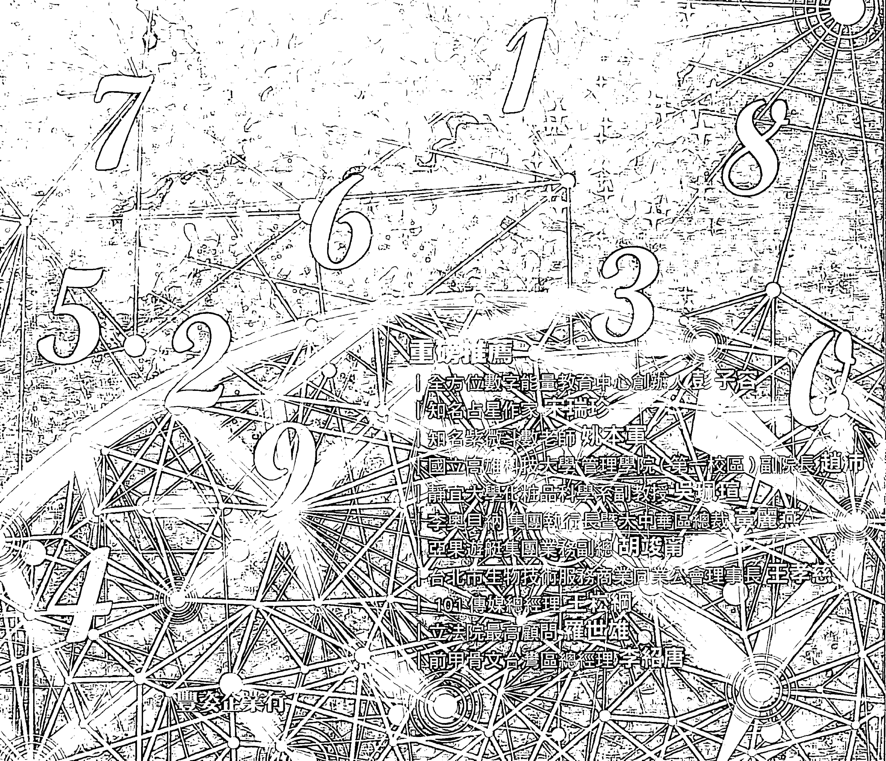

## 重磅推薦
- 全方位數字能量教育中心創辦人 李奕
- 知名占星作家 安格斯
- 知名紫微專家師 姚本軍
- 國立高雄科技大學管理學院（第一校區）副院長趙蓓
- 廣州大學旅遊學院副院長 吳丹
- 字舉集團執行長暨大中華區總裁 黃耀坤
- 巫婆學校集團培訓總監 胡峻賢
- 台北市生技技術服務商業同業公會理事長 李淳
- 10/10 娛樂經紀 王秀卿
- 立法委員高金素梅
- 前中國文化大學國際貿易學系系主任 范信

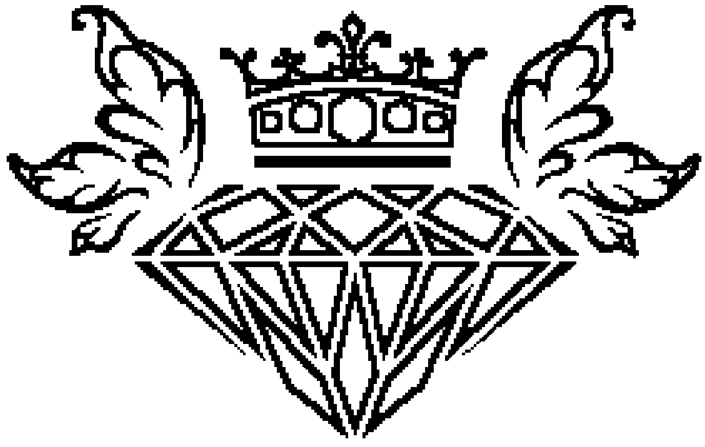

# St. Royal College
# 天使神秘學院
- 專業占卜預測機構
- 神秘學培訓機構
- 水晶能量研究中心
- 神秘學資料庫
- 官方微信：strcdts
- 微信公眾平台：strc2011
- 讀書交流QQ群：
  - 占星塔羅占卜師交流群：814594478（加入密碼：PDF）
  - 神秘學其他綜合群：659338717（加入密碼：PDF）

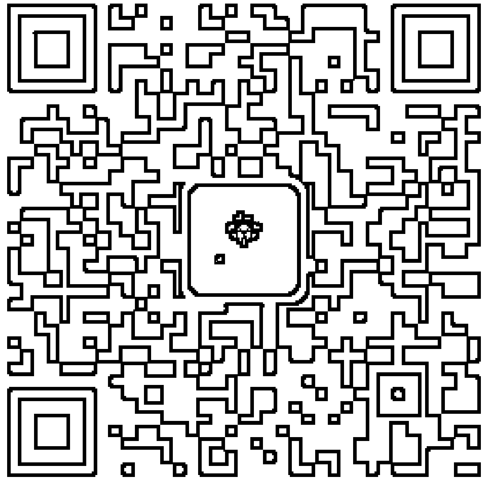

微信號：strcdts

天使神秘學院

天使神秘學院  院長QQ：715104687

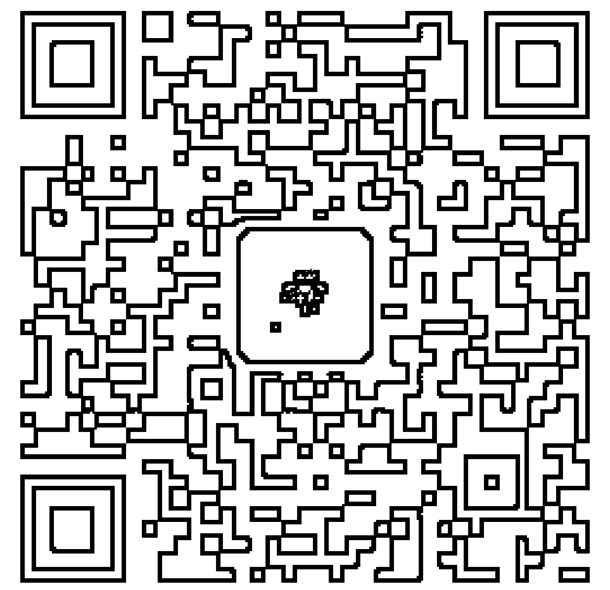

微信公眾平台：strc2011

# 制作說明：

本書由《天使神秘學院》出重金從台灣購入的原版書籍掃描製作完成。為達到最好閱讀效果，特地把原版書全部切開後，再經由專業掃描設備高精度掃描完成，並經過一張張的PS後期處理最終成書，其間花費大量的人力、物力以及時間，只為能給大家提供經濟並優質的神秘學學習資料而努力。

本學院強力譴責某些機構和个人，把本學院花心血製作完成的電子書籍，包裝後直接放在自家淘寶網上低價傾銷的行為，以謀取不勞而獲的經濟利益。如果長此以往最終將無人願意再為大家花心思製作電子書，那以後可能大家再無新書可讀。

為讓大家以後能夠讀到更多的好書，也為了本學院的良性發展。本學院懇請大家盡量做到如下幾點：
- 一、盡量在本學院的網站購買電子書籍。
- 二、請勿用技術手段把電子書內的水印及加密去掉。
- 三、在收到電子書後小範圍傳閱即可，千萬不要公開傳播，更別掛到淘寶網上低價銷售。

同時為答謝廣大支持者，學院電子書將做如下調整：
- 一、學院會把一些早已收回製作成本的電子書折價銷售。
- 二、最新製作的電子書籍會開放打印功能，大家購買後有條件的可自行打印成書。

天使神秘學院
2019年1月

# 自序
## 讓數字密碼開啟未知的心靈世界
勇敢走出自己的人生

不管在東方或西方的數術學，皆是以科學的方式作為統計的依據，也是一種大數法則。在西方的兩千五百年前，古希臘數學家畢達哥拉斯認為每個數字都有其宇宙的真理，在他們的實驗、歸納、分析下，發現原數的力量可以把人格分成九種類型，每個人都有一組生命數字隱藏在我們的生命裡，而每個數字都有其一定的意義。

早期的占數術（Numerology）有稱為占數學、占祕術，後來又稱生命靈數，或生命數字、生命密碼等。事實上，這些數術不是用來解命論斷，而是讓我們了解自己、了解他人，讓我們人際關係之間的互動更為和諧，進而發揮自己的特長，能在對的時間、對的人做出對的決定，即使在架構人生藍圖時，也能夠趨吉避凶。在人生的道路上，遇到困境時，如果能有一個支撐我們的力量及解決方法，在面對每個階段的生命旅程，也都能增添更多的趣味及豐富性。

我在小學二年級時，參加了一個宗教團體，看到一本《天與地》的書，其內容談到的是因果關係，論述著凡做好事的人就會上天堂、做壞事的人就會下地獄等警示錄。在當時懵懂無知的年紀，漸漸懂得如何善惡之分，所以平時應多做善事、布施、助人，不能與人計較、不能說謊、罵人、欺負弱小等，總之，眾所皆知的壞事都不能做。到了小學五年級，開始接觸到人相學，原來人的面相和手掌紋路都深藏著許多的祕密，這也是初步接觸五術。有了這些了解，當時小女生的我，興奮之情難以言語，也樂於與人分享。

到了國中二年級，因緣際會看到易經，當時覺得不可思議，於是自己用紙試做了卜卦，為自己的問題測試占卜，看看結果。但當時年齡尚輕，人生也沒有什麼閱歷，所以對易經無法有更深入的理解與探究，但這也算是真正開啟我對五術的興趣。在高中時期，剛開始看到一整個系列有關風水地理的啟蒙書，深入淺出。直至出社會後，有機會學了企業人相學，這是我人生第一次在五術方面有專業的老師指導。陸續認識了幾位風水老師、紫微斗數老師，喜歡拿自己的生辰八字去問。而在我在 28 歲時，遇到了一些重大事件，恰巧剛好在書局中，看到星座相關的書籍，勾起我的好奇心，於是立刻買了數十本的書，在短短幾個月內的時間，將這十幾本的書徹底研究一番。

早期接觸到占星學時，我每天都會為自己在星盤上找出有利的相位（構成大三角的位置），讓我在當天有了方向及能量，在做任何決定時更具有信心外，也無所畏懼的面對困難。這使我了解人生的功課（人生課題），都是先由想法引發出來，最後才會有做法（行動力），這就是一種吸引力法則、一種相信的力量。

數字學在西方占術學來說，是非常精準，且常為人所運用的一套方法。在我接觸研究運用近二十年間，可以讓我在教學上、生活上及人際關係上，都能隨時隨地協助到他人，且在運用上也能更加多元。因為簡單、易學，讓我在處理人、事、物及教學的原則上，以化繁為簡，只要將九個數字特質弄懂，即可快速了解，所謂知己知彼，才能百戰百勝，想要有良好的人際關係、想要成功，除了了解自己之外，也需了解他人的特質（個性、喜好），而每個數字皆有其正面特質及負面特質，所以運用在人際關係及業務行銷上都有很大的助益，而在許多的案例，也都相對的事實印證。我運用在公司的經營上，協助了許多的工作夥伴，讓他們找到了自信（擁有健康與財富）及不同的人生價值。

市面上有很多很棒的數字的著作，對於有基礎或從事數字諮商的老師來說，非常的有幫助，但是對於沒有學過亦或者沒有什麼經驗的讀者來說，可能在運用上會有些許的難度，所以我特別將我的經驗，整理成讓每一位對數字有興趣的人，能輕鬆的就可以運用上，希望這本書能幫助到大家找到自己的潛能，拓展人際關係，擁有更美好的人生。

我要感謝第一次帶領我踏入生命靈數的是彭子容老師，她除了是我的啟蒙老師外，更是引領我在這個領域精進的指導者。所謂「古之學者必有師。師者，所以傳道、授業、解惑也。」而彭老師也正是我的解惑師，每每遇到無法透徹的道理時，她會為我指點迷津，解說案例發生的原委。即便多年在諮詢的道路上，我也會運用彭老師的精華及精神，為我的學員們清楚的說明，不敢有絲毫的遺漏，這都要感謝彭老師對我諄諄告誡。

最後，我要謝謝兩個寶貝女兒及我的先生，因為這一路上有他們的支持，才能讓我專心在事業上，讓公司業績蒸蒸日上，一步一腳印地實現我的夢想，讓更多的學員得到幫助。我更要感謝所有一直不離不棄的沐華夥伴、講師和總督導們，筚路藍縷，辛苦與我一路走來，何其榮幸，成就今日的我。所以不論是過去、現在、未來，我仍會秉持著初衷，為每位學員們無私的分享，讓他們能輕鬆度過人生的難關及完成人生目標。我更要感謝老天爺賦予我的人生功課！

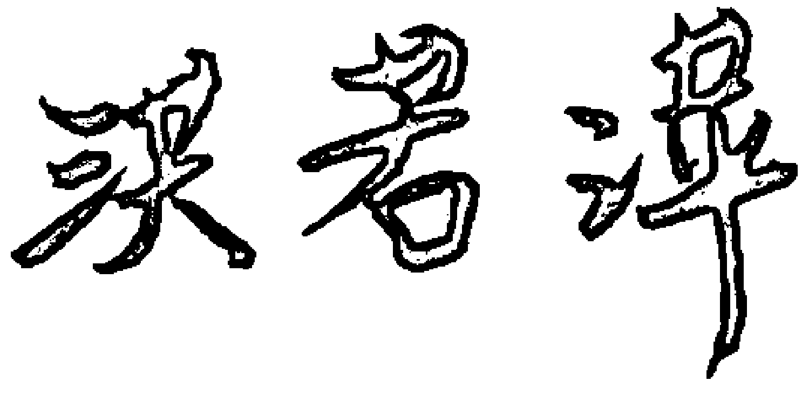

2019.3.17

# 推薦序
## 簡單易學的數字系統秘笈
讓你了解自己並理解他人

在這教學諮詢的近20年間，若萍是我所教導的學生之中，非常特殊的一位。

若萍身為一位企業總裁，難能可貴的是在學習的過程中，她總可以保持一個歸零的心態。認真專注、融會貫通，且每一堂課都是有備而來。怎麼說呢？我舉個例子：她會將每一堂課程所學的，整合並內化成自己的東西，如有疑問的地方，她會在下一堂課一開始前提出來討論。甚至跟我分享，她將生命靈數應用在企業經營時，發現的各種心得及意想不到的神奇成效。

對於沒聽過生命靈數的人，這裡稍微簡述一下：

生命靈數是古希臘的占數術，約西元兩千五百年前古希臘數學家畢達哥拉斯所倡導，而目的是為了幫人們找出屬於自己的行為準則，以及與他人的相處之道。

不僅如此，我常說現實生活中，總是會遇到許多難題，有些時候我們會因為：
- 不了解身邊的人，而處在令人尷尬的關係中。
- 找不到人生方向，而過著苦悶的生活。
- 做了錯誤的抉擇，導致劇情急轉直下。
- 還有很多挑戰⋯⋯

既然，生活中的挑戰無所不在；那麼，尋求「有效而快速」解決方案就成了必然。

而這本書可說是生命靈數入門的精華版，絕對值得一讀。

真心推薦

彭子容
全方位數字能量教育中心創辦人、企管顧問

# 推薦序
## 生命靈數 你是幾號人？
決定一生要扮演的角色與未來

我認識的若萍溫良敦厚，身居高位擁有自己的大事業體，嘉惠許許多多的人，也能取之於社會、用之於社會，更是謙虛若谷、尊師重道。若萍可以說是一位奇女子，我教占星超過二十年，在諸多學生當中，她不但天資異稟且終身學習，更能學以致用，不管在形而上或形而下她都特別傑出，這是非常難得的。

我們知道有很多大道理都懂，但能夠實踐著實不易，這也是她能白手創業成功的因素。我閱讀了她撰寫的《輕鬆學生命靈數，秒懂人心》內容，客觀、簡單且實用。對於現代忙碌競爭激烈的社會而言，這本書可以說是非常好的工具，內容淺顯易懂，十分方便查詢。

在字裡行間我看到若萍對讀者的愛，書中沒有危言聳聽、沒有指責、沒有負面言語，只有諄諄教導，身為作家這就是對讀者最大的愛，她不缺錢但願意花時間撰稿論述，因為無私分享的心，讓更多的人透過本書的引導，創造出更美好的人生，實踐自己的夢想。

本書對不同的生命靈數，除了告訴讀者擁有的優良特質外，也有正面的建議。我依照書中的對應自己的特質，也覺得甚為神奇。這本書可以成為學習占星的入門書，即使初學者自行分析人格特質，也能從字裡行間中快速了解，同時也能速成對照本書就能看到自己的基本需求，但若要全面深入是需要花較長時間精通。

書中有許多小故事，可以讓讀者看來更添趣味，我強烈推薦這本好書，是可以陪伴您一生參考實用的工具書。提醒各位看官可別說「我就是幾號人我就是這樣子」而作為藉口，作者的目的是希望您能開發未發覺的潛能，去創造出讓自己滿意無悔的生命，進而造福社會國家。

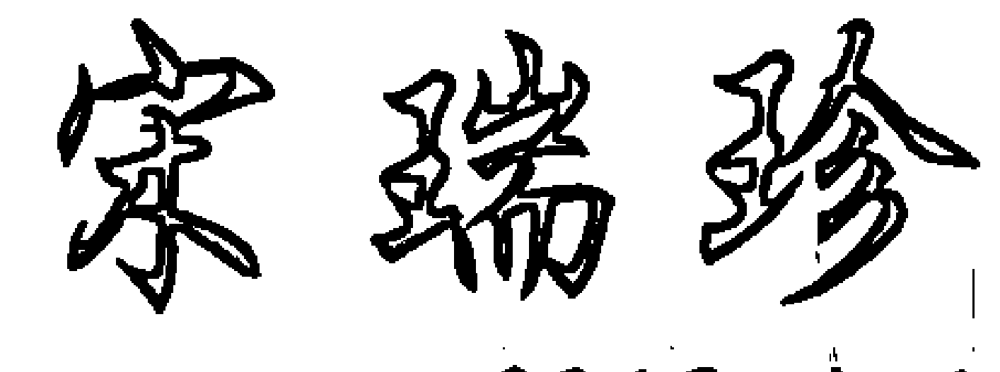

2019.4.4  
占星作家

# 推薦序
# 揭開生命靈數的神秘面紗

洪總裁用深入簡出的方式，揭開生命靈數的神秘面紗。這不僅是一本生命靈數實用工具書，更是一本開啟人生方向的智慧書。

如果用航海人的比喻，就好比是人生汪洋中的航海圖和方向儀，引領尋找人生的寶藏與真諦。

胡竣甯
亞果遊艇集團  業務副總

# 推薦序
## 生命靈數的意義

世界上很多事情無法用科學解，與總裁的緣分是，接觸總裁在各種玄學哲學上的見解也是。

當我們開始學著對這些科學無法解釋的事情保持尊敬的同時，我們的人生也因為它們而開出一朵又一朵的花朵。然後我們終於得以明白：原來一切都是最好的安排，就像這本書的誕生以及你與這本書的關係一樣。

願大家惜緣緣常在。

**黃麗燕**
李奧貝納 集團執行長暨大中華區總裁

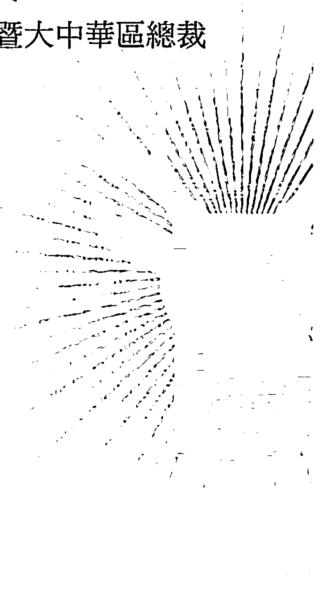

# 目錄
## CONTENT
- **004** 自序 讓數字密碼開啟未知的心靈世界 勇敢走出自己的人生
- **008** 推薦序 簡易學的數字系統秘笈，讓你了解自己並理解他人 ／彭子容
- 生命靈數 你是幾號人？決定一生扮演的角色與未來 ／宋瑞珍
- 揭開生命靈數的神秘面紗 ／胡竣甯
- 生命靈數的意義 ／黃麗燕
- **017** Part1 生命靈數的奧祕
- **023** Part2 生命靈數 0 ～ 9 ——個性特質、天賦才能、人生課題
  - 數字 1 ▷ 一個失去領土的國王
  - 數字 2 ▷ 天生的公關與外交人才
  - 數字 3 ▷ 驕縱任性的寵兒
  - 數字 4 ▷ 一個從戰亂中死裡逃生的人
  - 數字 5 ▷ 一個剛剛越獄潛逃的逃犯
  - 數字 6 ▷ 一個救苦救難的菩薩
  - 數字 7 ▷ 一個研究真理哲學的科學家
  - 數字 8 ▷ 一個家徒四壁出門嘴唇抹豬油的大戶人家
  - 數字 9 ▷ 一個夢想成宇宙的守護者
- **099** Part3 數字道出人生的不平凡——由九宮格找出你圈數及連線、空缺數、限制數、契機數、黑洞數、解決之道
- **149** Part4 透視你的價值觀——戀人間的情感、人際關係的相處之道
- **187** Part5 準確掌握自己的命運——流年流月流日的運勢、內在秘密循環數
- **211** Part6 數字與精油間的療癒——植物精油的能量
- **239** 案例分享
- **251** 【附錄】生命密碼表

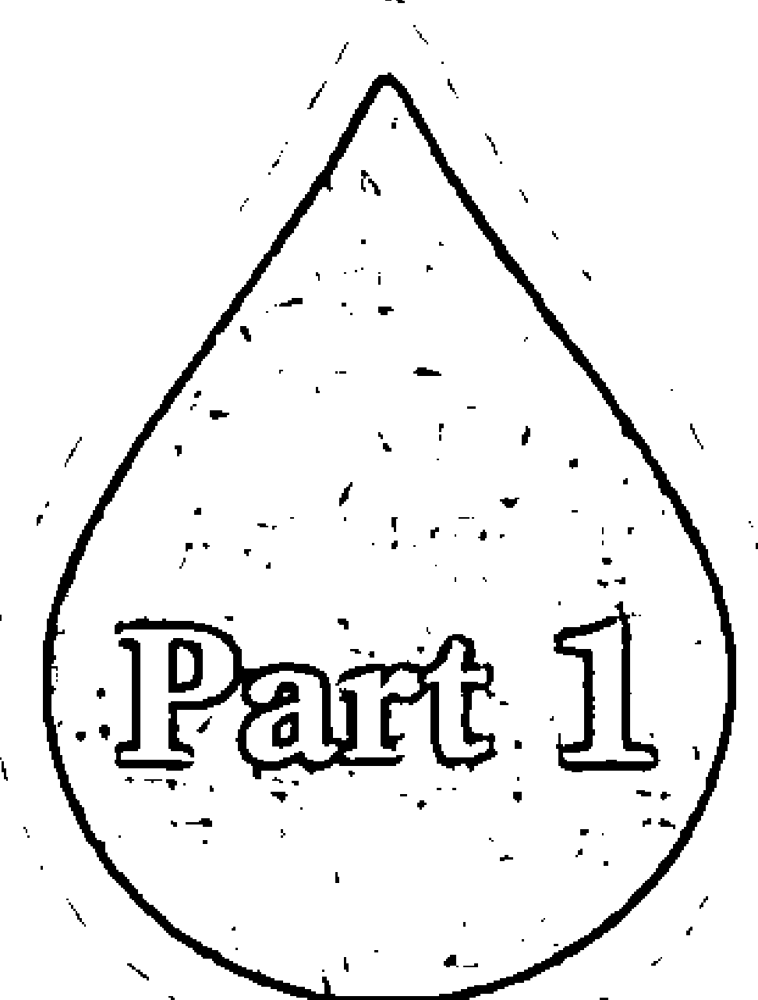

# 生命靈數的奧祕

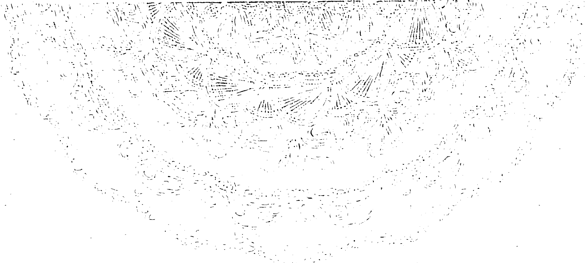

紫微斗數是我們東方最古老的算命方法之一，最早源自於五代方士陳摶（公元872—989年）觀星所創，透過命盤可以窺探一個人的命格、財富、事業、人格特質、優缺點、才華潛能，甚至影響到一生的吉凶。

然而，在西方的生命靈數更是最早的數字神秘學之一，它源自於古希臘的占數術（Numerology）。早期希伯來人相信每個數字都有其密碼，透過密碼可以了解神的旨意。因此，集結科學性、哲學、心理學等將每個數字系統化，並重新整理資料後一一做記錄，才知道每個數字背後的含意。

直到兩千五百年前流傳到希臘後，由數學家畢達哥拉斯發揚光大，畢達哥拉斯在義大利曾組織一所祕密學院，專門傳授數學、占星術和音樂，招收的學生男女不拘，均可進入學習。但是所有的畢氏學生必須嚴格遵守該學院的保密規定，且須有五年的靜默期，來激發深層的冥想和宗教信念。畢氏學派認為數字與萬事萬物息息相關，人會因為自己的心理或生理狀態、飲食習慣、外在變化、氣候、星辰而受到影響，而且也會反過來影響到大自然裡的一切，所以說萬事萬物是一個大整體裡的一部分。直到畢達哥拉斯去世後，研究的一些理論才被廣為流傳出來。

畢達哥拉斯認為宇宙中的所有事物，包括一個人的命運都可以用數字來解釋，所以他創建一套生命靈數學的系統，他相信數字會直接影響人類的生活，且圍繞在生活周遭的數字，是可以揭露許多事物背後的真理。

他認為世上沒有所謂的意外或巧合，每一件事情都是由一個量子的交互運作而發生（量子躍動），有此可知，人的生命除了受到許多物質因素的影響，同時也有許多形而上的奧祕力量。

# 揭開生活中數字的秘密

在你我的身上藏有一組神秘的密碼，就像每個人身上都有一組不同的基因組合，所表現出的一舉一動或任何想法都不可能相同。而這組密碼影響著我們所有的行為，包括為什麼有些人可以是人生的勝利組？為什麼有些人卻是倒楣事接而連三的發生？為什麼別人可以擁有金山銀山的富裕生活，而有些人卻是遲遲無法擺脫「貧困」的命運？

然而，在我們出生的那一天起，所有的秘密都已經寫在一組數字裡，只是我們不知道一組簡單數字背後所隱藏著這麼高深的含意，甚至竟能帶給我們人生如此重大的啟示，這組密碼我們稱為生命靈數。

西方傳來的生命靈數如同中國的紫微斗數，透過排列、計算就可以看出我們一個人的性格、特質、天賦、遇到事情時心裡的想法、做法、合適的工作、合適的男女朋友，甚至此生的人生功課等。當你對生命靈數產生深入的接觸，會發生有幾個數字是無時無刻圍繞著你，除了出生年月日外，包括身分證字號、手機號碼、信用卡號、銀行卡號碼，甚至車牌號碼，你都不得驚嘆老天爺早已做好的安排。認識數字是認識自己的起點，也是與他人連結的關鍵。

## 什麼是生命靈數

在這本書中，我們將詳細介紹每個被拆解後的數字，每個數字對我們的影響及我們可以如何扭轉，更進一步提升我們的能量，完成生命課題，創造自主人生，掌握人生關鍵點，迎接未來。所以生命靈數正是探索人生藍圖的極佳工具。

首先，我們先學會計算自己的生命靈數，將你的西元出生年月日相加後，會得出一組數字。如果得到的是十位數字，請再把這兩個數字相加後，成為單獨的個數，最後的這個數會是介在 1 ~ 9 之間。

| 西元出生年 |  |  |  | 出生月 |  | 出生日 |  | 總數 | 生命靈數 |
| :---: | :---: | :---: | :---: | :---: | :---: | :---: | :---: | :---: | :---: |
| 1 | 9 | 8 | 8 | 0 | 5 | 0 | 6 | 37/10 | 10/1 |

1. 代數、工具區：包括西元出生年月日。
   - 出生年：代表個人可以透過社會的大環境，達成結果的能力，即掌控社會趨勢的能量。
   - 出生月：代表個人的想法，可以透過外力達成結果的能力。
   - 出生日（個性數）：代表一個人外在的行為表現，也就是平常生活中與他人的相處模式，給別人的感覺（別人眼中的你）；同時是可以靠自己達成結果的能力、對外展現個人賺錢的能力。
2. 數（天賦數、潛能數、複靈數）：即指在前輩子我們已完成學習的功課，可以運用這個正面能力來協助完成此生的目標，而這種正面的能力就是我們先天的潛能，稱之為天賦數、複靈數。
3. 主命數（生命靈數）：代表人一生的目標、人生課題，是為了達成目標時的做事方式，在此時就會發揮天賦數的特質。

# 如何計算生命靈數

舉 例：小君出生於西元 1988 年 05 月 06 日

| 生命密碼 | 西元出生年 |  |  |  | 出生月 |  | 出生日 |  | 總數 | 生命靈數 |
| --- | --- | --- | --- | --- | --- | --- | --- | --- | --- | --- |
|  | 1 | 9 | 8 | 8 | 0 | 5 | 0 | 6 | 37/10 | 10/1 |

```
1 + 9 + 8 + 8 + 0 + 5 + 0 + 6 = 37

3 + 7 = 10

1 + 0 = 1
```

所以小君的個性數（出生日）是 6，總數（天賦數）是 37，主命數（生命靈數）是 1。這是不是很簡單呢！我們現在先來算算自己的生命靈數，之後也可以拿家人或朋友們的出生年月日來試算練習喔！

## 表 1：你的主命數（生命靈數）

根據以下步驟，找出你的生命靈數：
你出生的西元年：__________
你出生的月份：__________
你出生的日期：__________
將出生年月日分別加總：
__＋__＋__＋__＋__＋__＋__＋__＝____
你的主命數（生命靈數）是：__________當算出你的主命數時，就知道你是生命靈數的幾號人，例如：上述的小君就是 1 號人或是數字 1 的人。

所以如果我們要了解這個人對工作的態度、想法或是遇到事情時會用什麼樣的邏輯思考事情、對待感情的態度、執行計畫的行動力、家庭觀、感情觀等，就可以透過出生年月日的不同組合或加總方式，獲知你欠缺哪些數字的能量，而牽引你強大能量的數字又是哪幾個數字。當你熟悉這些數字後，不僅可以作為內在的學習與探索，發現自己的天賦、特質、潛能與挑戰，更能輕鬆掌握自己的未來發展及生命能量。

透由 Part1 試算已得知自己的主命數，而 Part2 就和各位一起來了解你的主命數正負面特質、天賦數潛能、人生課題及各主命數的組合。

1 ～ 9 的數字也會以希臘十二神祇的原型性格及十二星座的特質等，作為此內容的展現與闡述，讓您能更快速的了解及感受到數字的神奇。

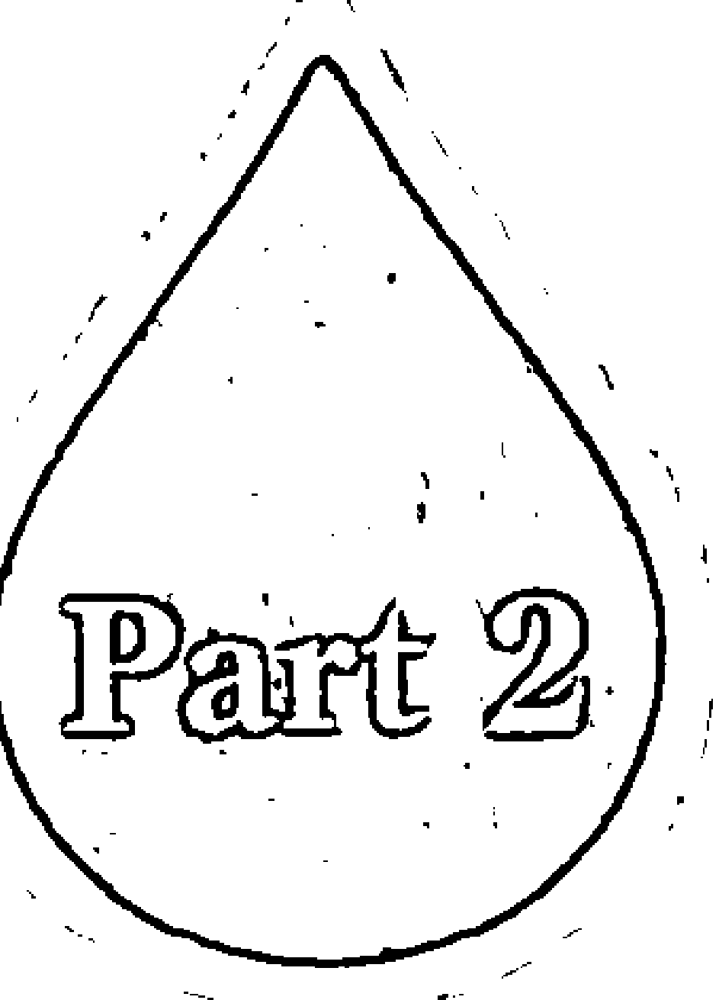

# 生命靈數 0～9

## —個性特質、天賦才能、人生課題

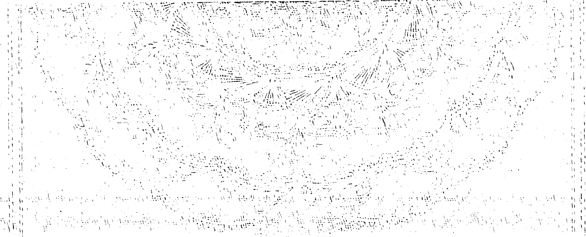

获取更多好书，请加微信号：strcdts 店铺：http://strc.cr.cx


18931

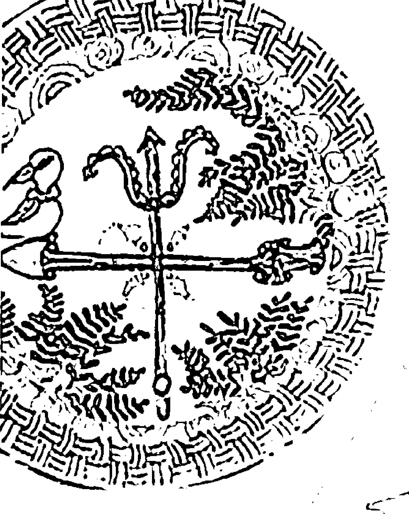

# 象徵符號：太陽

## 創始數／自我能量（自信與創造）

## 人生課題：真正獨立

## 口頭禪：先問問我！先聽我說！

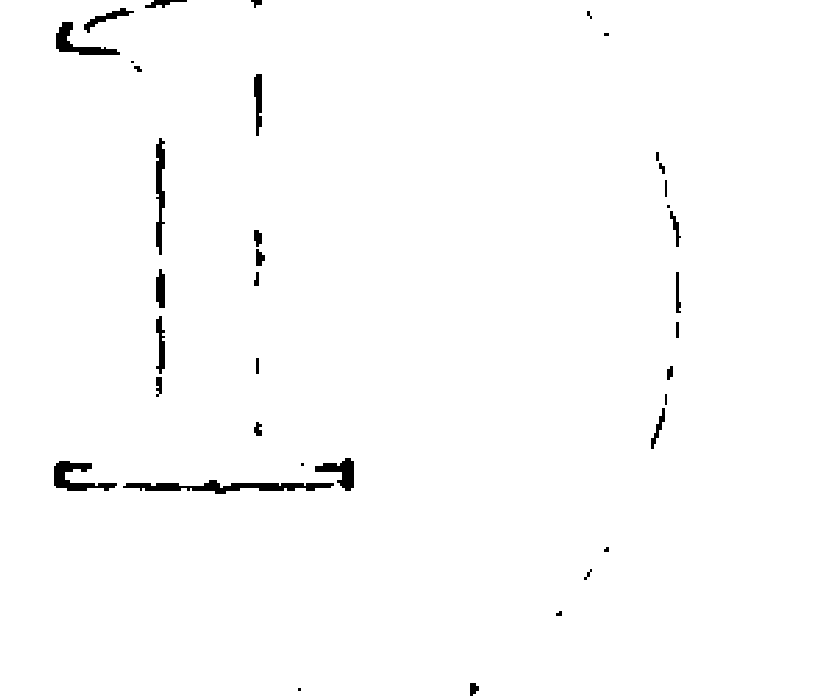

## 一個失去領土的國王

### （一馬當先的勇士）

古代希臘有許多眾神，最著名的是奧林匹斯的十二位主神，這些主神其實是代表每個人最原始的本性，祂們從不去掩飾自己的原始欲望與內心的感受，這也是祂們每個都有其獨特的性格，而毫無保留的發出來。在我們個人身上都有某些神祇的特質，透過今生來完成人生功課，並突破障礙將潛在的能量激發出來。

在希臘神話中的阿瑞斯（Ares）是宙斯希拉之子，牡羊座（♈）是祂的守護星，有一對磨圓的太犄角，朝著一個方向頂，這是所有動物在備戰時會有的標準姿勢，所以戰神阿瑞斯是力量與權力的象徵，嗜好打戰，只要聽到那裡有戰爭就會往那裡衝，情緒起伏不定，喜怒無常，向來只喜歡贏，常不多思考就採取行動，心思簡單、熱情而率直，外表具有運動員的氣息。在特洛伊戰爭中，祂沒有屬於自己的軍隊，靠祂單打獨鬥，所以祂打了敗仗，最後逃之夭夭，不見蹤影。

因此，在阿瑞斯的身上可以看出牡羊座的特質，也是數字 1 人的特質，具有侵略性和坦率的性格，有自己獨特的想法及主見，所以千萬不要期待或勉強牡羊座的人，去做一些他們不想做的事情。

波塞頓是數字10／1的守護神，魔羯座（♑）是祂的守護星。在古代的圖案是一頭在海上活動的半羊半魚的生物，向來以固執的個性出名，很在乎別人對他們的看法和評價。在個性上很務實，情感強烈，有時候只是有表面上的價值，實際上是中看不中用。

波塞頓是海神，祂是天神宙斯的哥哥，照理說他應該跟宙斯分享權力，然而宙斯並沒有釋出權力，而波塞頓一輩子都在向別人證明自己有權利享有那個權位，有時候甚至會以粗魯的方式來獲得或展現。

不過，隨著祂的年紀漸長，祂終於學會接受命運，逐漸變成一個善良的神祇，而祂一生性格的轉變，正好是說明了魔羯的特質。所以魔羯座的人在年輕時的個性，通常有稜有角，要等到老了以後才會漸漸變得比較柔軟。

數字1的人在外表上具有運動員的體格，喜怒無常的個性，卻又熱情洋溢，同時也是天生的領袖家，具有領導能力、企圖心強、決斷力強、喜愛獨立。一旦缺乏信心，就如同一個失去領土的國王，需要有人全心全意的關注。

## 個性特質

阿拉伯數字1是從上往下寫，沒有任何的轉彎，型體像樹木般的挺拔直立，看似孤立僵硬，缺乏柔軟性，但具有堅強的獨立性。

數字 1 是創始數，指任何事物的開頭，有著太陽般的光與熱，具有陽性力量（奇數），是父親的代表。我們在生活中常聽到「一言九鼎」、「一呼百諾」、「以一擋十」、「一諾千金」、「萬眾一心」、「一日千里」等，用 1 來形容肯定、有力量、快速的事物。

### 正面優勢

數字 1 是凝聚能量的起點，也是太陽能量的源頭，所以通常 1 號人具有開創性的性格、自我的能量。天生的領袖才能及號召力，對於事情非黑即白，理想性高，處理事情單刀直入，開門見山，並且要求立即見到成效。

因為 1 號人本身的直覺力強，所以對於任何事情都會獨自做決定，也能以身作則，是典型「獨立自主的老闆」。對於新事物充滿著創造力，喜歡世上獨特（絕無僅有）的事物，也是最佳原創性的藝術家。

個性上主動、樂觀、獨立、果斷、勇敢有自信，給人正面積極的力量，具有熱誠的服務精神，是值得被信任的朋友。

### 負面挑戰

由於 1 號人對自己有足夠信心時，比較不容易聽從別人的建議，容易產生傲慢自大、咄咄逼人、愛面子、強硬、偏執愛說教的行徑。所以當受到挫折時，就會開始對自己沒有信心或不認同自己，這時就會收回承諾，掉頭就走或沉迷某事物來逃避問題。

個性上比較會以自己的利益出發，內心冷酷、虛榮、衝動、善忌妒，總認為自己是高高在上，態度強硬而苛求別人。但當被別人傷到自尊、不被重視、能力不如別人或只做配角時，1 號人的內心會產生很大的恐懼。

## 小改變大能量

因此，要成為一位充滿自信的創造者，且能正確的領導他人，邁向光明的 1 號人，其實內心必須要具備真正的獨立、學習禮讓、謙卑，學習放下自己的身段，不要堅持己見，並能誠心的接納別人的建議。更重要的是一位真正的領導者，是會致力於改善追隨者的生活。

### 天賦才能

天生具有領導的才能，且能以非常明確、黑白分明的方式研判情勢，能一眼就看出事情的端倪，並知道該如何運作才能具有發揮的力量，所以很容易馬上做出決定。

出生於西元 2000 年以後，如果是 1 號人都能堅持且準確地描述他們自己的性格。

### 人生課題

「學習付出」是 1 號人的重要人生課題，可以有兩種選擇：

第 1 種就是經由奪取、欺騙與自私的手段，獲得想要的東西，通常這種行為會為自己帶來痛苦和問題，最後自己會被孤立而寂寞一生。

第 2 種就是由利益他人的角度出發，處處為他人付出，還願意為追隨的部屬生活而努力，這是比較柔軟的方式。以柔軟寬大的方式待人，可以為 1 號人帶來財富，並創造出獨立自主的生活。同時要學習更謙卑的態度，對他人敞開心胸，學習無私的分享與付出，並懂得試著去依賴別人，也允許被別人依賴，如此才能有更優質的生活。

### 顏色／穿衣風格

紅色是彩虹的第一色，在七脈輪中屬海底輪的顏色，是戰神阿瑞斯專屬的顏色。在西方代表男子氣慨，有著活力、衝動、愛、熱情等能量，所以 1 號人不論在找工作、談生意、找情人時，不妨可以多多穿著深淺不同的紅色，包括粉紅色在內，這樣可以獲得較多的信心及幸運。

在穿著上，1 號人通常較為獨特，打扮上比較會與別人不同，懂得利用衣服、顏色、珠寶、配件、髮型等飾品或要件，穿戴出屬於自己的特色。

### 靈數組合類型

### 10／1

10 是一個整數，把整數看成一個加強的數字，因為生命靈數的 0 有包含原點和加強的意思。所以這組人在數字 1 的外表看起來有自信又有數字 0 的沒自信（所以沒有自信只有自己知道，別人是不會知道的）。如果出生是 10 號及天賦數是 10／1 的人，這是一個完美的數字，是前世來到人間的老靈魂，較重視朋友的感情。

### 19／10／1

這組的人具有雙重的性格，數字 1 的外表看似獨立堅強，但實際上數字 9 的內心並非如此，而是擁有體貼、善解人意且樂於付出的心。然而，數字 9 的「付出」與數字 1 的基本性格是相互矛盾的，這也是造成影響 1 號人心情難過的根源，且不容易快樂的原因，常會讓旁人無所適從，所以對 1 號人需要有更多的了解，因為他不容易為五斗米折腰及不懂得卑躬屈膝。

### 28 / 10 / 1

這組是所有1號人中，最好相處的一群人，因為有一雙癒他人的手，讓人有安全感。但因為在感情上容易多變，所以有數字1的堅強又有數字2的敏感；天生具有親切、溫和的心，以及特殊的做事手腕，懂得協調，對於成功這兩個字更是輕而易舉，但因為有數字1的直來直往，有時候會讓一路相伴的人受到傷害。

### 37 / 10 / 1

這組的1號人在能力上是最具有才華洋溢，聰明的頭腦，又有經商的思維，創造力豐富，屬於原創思考型的人。因為有數字7，所以在性格上多疑和容易揣測，有這種特質的人會限制他們執行的腳步，導致無法全心全力去追求自己的夢想。

### 46 / 10 / 1

這組的1號人在工作上是最勤奮的，因為有數字4穩定的個性又有數字1的自信。因為有數字6，所以在感情路上容易為情所困，喜歡從愛情中帶來安全感，但向來不認同必須付出才能維繫愛情的說法；有時候可以釋放可靠的肩膀，讓人有依賴的感覺，但時間無法維持長久，因為容易讓人心生厭煩。

### 生涯發展

可以選擇有前瞻性、有發展性、獨立作業的工作。例如：藝術工作者、個人工作室、發明家、主管、業務、行銷、教師、企管策劃等。

### 人物代表

- 拿破崙（軍事家、政治家）1769年8月15日
- 草間彌生（藝術家）1929年3月22日
- 華特·迪士尼（電影製片人、導演）1901年12月5日
- 星雲大師（法師）1927年8月19日
- 李家同（作家）1939年1月5日
- 三毛（作家）1943年3月26日
- 鳳飛飛（歌手）1953年8月20日
- 馬友友（大提琴家）1955年10月7日
- 女神卡卡（歌手）1986年3月28日
- 湯姆·克魯斯（演員）1962年7月3日

### 故事

小蘭是公司的一位客服人員，對客戶總是有自己的工作模式，雖然可以達到客戶的需求，但身為主管的黃經理，要求每個人必須依照公司的一套SOP流程，但小蘭認為只要能完成公司交付的任務，主管可以不需過問執行的過程，所以小蘭就瞞著主管，運用自己小聰明處理。

有一天，小蘭在一次的訂貨單上寫錯出貨數量，對方不願意如表單上的數量支付款項，造成公司嚴重的損失。剛發生事件時，小蘭心生害怕想欺瞞主管來掩蓋真相，最後還是紙包不住火。主管要求小蘭提出檢討報告及承擔財務上的損失，但小蘭隔天就沒有再到公司上班，即使用電話聯繫也找不到人，猶如人間蒸發似的不見。

這組1號人應學習謙卑的態度，對別人敞開心胸，學習無私的分享與付出，即使在發生問題後，必須學會獨立的勇敢面對，才能讓問題順利解決。

## 與1號人的相遇

自信為你帶來力量！

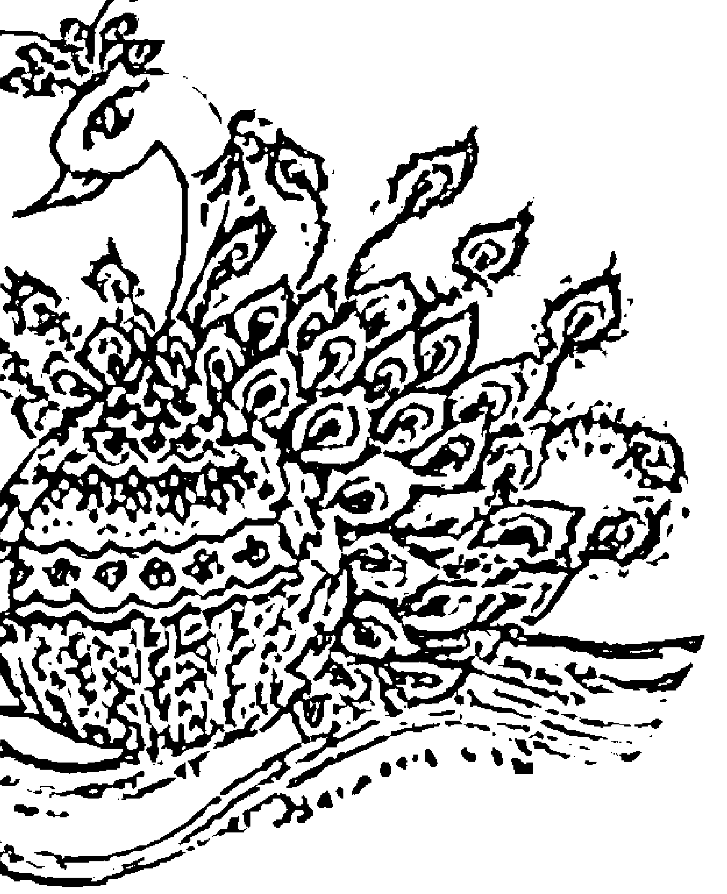

# 象徵符號：太極

## 平衡數／協調能量（合作與平衡）

## 人生課題：學習獨立自主

## 口頭禪：你決定就好！

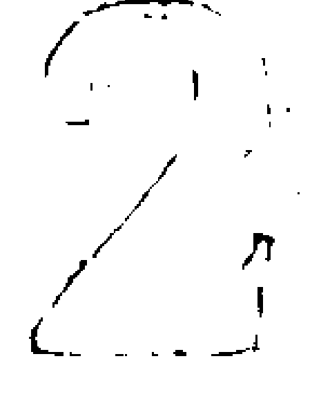

## 天生的公關與外交人才

### （福星愛將型的人）

數字 2 的守護神是希臘眾神中宙斯的妻子希拉，而金牛座（♉）是希拉和 2 號人的守護星。希拉是婚姻的保護者，祂特別關懷已婚的婦女，因為是萬神之后且美麗冠於諸神，所以是眾神們的推崇者。

金牛座的特質往往被描述為愛美、穩定、固執、忠實、努力工作者，又傾向注重表面，因此金牛座也常被說成是最好的先生或太太們。

早期大家都會認為金牛座是愛美之神——阿芙柔黛蒂／維納斯為代表，但愛神的性格與金牛座並不吻合，因為愛神並沒有真正做過工作，且祂也不是情感忠實的妻子。反而是婚姻愛情之神希拉的個性，比較像金牛座，祂會一直盯著老公宙斯的花心事件，緊追不放，可是就算宙斯花心不攺，希拉仍然會守在祂身旁。所以希拉成為婚姻愛情之神，守護著所有的先生和妻子。

水瓶座（♒）是數字 11 和天神宙斯的守護星，象徵的圖案是一個拿水瓶的人，這代表著水瓶座的善變個性。

水瓶座的人可以活在自己的世界裡，也可以成為人道主義者，例如：外交大使和領袖。他們可以冷酷自私，也可以因溫暖而付出。

宙斯的性格原本是殘忍無情，直到眾神結合力量企圖刺殺祂，並想取代祂的統治地位，這時宙斯才領悟到自己所犯的錯誤，於是努力改變成為一個強而有力的領導者，並公平的對待所有人。水瓶座的性格可以用宙斯的人生轉變作為代表。

2 號人擅長分析，喜歡說話溝通，但凡事都會保密，是天生的公關與外交人才，在外表上會讓人感覺親切友善，有著纖細迷人的體型，並注重服飾的搭配，重視所有的細節。

## 個性特質

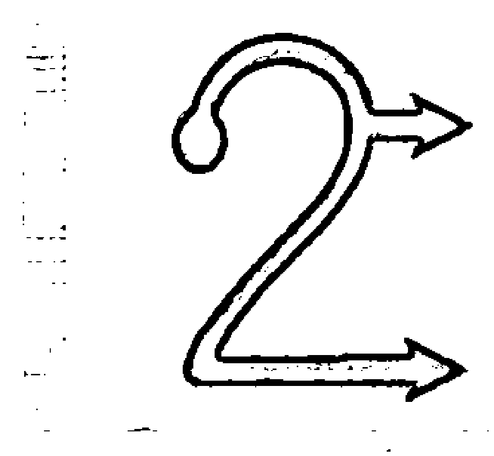

- 先與人配合／合作／協調、串聯
- 所以要先當老二才能走自己的路。

阿拉伯數字 2 是從上到下，數字字型有了圓角且低下頭以屈膝的型態出現，有了柔軟與謙卑的態度，猶如日本半跪姿的女性。另外，在許多國家的國旗，使用兩種顏色來作變化，意喻著更多的和平意義。

數字 2 的象徵符號是太極圖，在宇宙的所有二元中對立，黑與白、天與地、陰與陽、男與女、真與假、福與禍、生與死等，者一直在相互間拉扯著。2 是偶數，有著女性般的陰柔特質，以母親作為代表。在日常生活中，我們常聽到「二人同心，其利斷金」，表示兩人需要透過合作，才能發揮到最大的能量，獲得最後的成功。

### 正面優勢

2 號人心思細膩，對於細節和變化很敏感，能明察秋毫，具有豐富的想像力，講求公平、公正，個性內向又不愛出風頭，具有寬容及耐心的特質。外表帶給人可靠、安靜、和平、善解人意、熱心助人的特性，也有藝術家優雅的氣息。

工作上直覺力敏銳，責任心重，懂得借力使力及具有對事情的分析能力。因此，在團體的人際關係中，2 號人是一位很好的協調高手，有成人之美的雅量，且是配合度最好的數字，是最佳的外交官。他們喜歡由你主導、由你做決定，這是來自於他們對你的全然信任。

### 負面挑戰

2 號人原本就有與他人合作的能量，但當他獨自一人面對決定時，會比較沒有主見，容易搖擺不定，這時會因為想要依賴他人，而產生缺乏獨立性思考的能力，這也造成 2 號人不容成功的因素。

在施與受不平衡時，2 號人也會開始有抱怨、沮喪、委屈求全、過度敏感、軟弱、頑固、愚昧等，容易使情緒崩和退縮。因此，2 號人一旦獨處、無依靠或需要做決定時，內心就會產生恐懼。

## 小改變大能量

2 號人責任心強，一旦懂得「嚴以律己，寬以待人」時，就能達到協調性。同時，在與他人互動時，不要先幫別人預設立場做決定，應以相互合作的方式進行，雙方才能達到相互的平衡。2 號人要成為一位能清楚知道自己的責任範圍的人，就需要懂得如何與人和諧及如何協調的態度，與人共事。在遇到施與受不平衡的狀態時，必須視不公平為公平，這樣才能平和的度過難關。

## 天賦才能

2 號人深知「陰陽並濟，禍福相倚」的道理，所以眼光銳利，善於協調，透澈心理學知識，並且擅長調解人際關係；懂得分析問題，喜歡批評及發問，寧可與人合作，也不願意單打獨鬥。

## 人生課題

「學習獨立自主」是 2 號人的重要人生課題，可以有兩種選擇：

第 1 種就是不管遇到有多麼不快樂的事情，2 號人都會想要緊緊捉住對事業和愛情的依賴性，長久下來，會讓人有喘不過氣的壓迫感。當情緒無法調適的情況下，2 號人會變得尖酸刻薄，成天抱怨。如果被對方遺棄或不被珍惜時，心裡會認為自己被利用，最後也會鬱鬱寡歡，憂懷喪志。

第 2 種就是可以選擇發揮自己分析的天性，建立屬於一種健康的模式，懂得平衡及優先順序的道理。即使是在兩個事業中懂得二擇一，或在三人的愛情世界裡，也能做出聰明的選擇。如此一來，才能確保一切事物都在正軌上運行。一旦發現發展的方向有所偏離，必須堅持公平正義原則，據理力爭；如果發現情況已經無法改善時，就應該當機立斷，快刀斬亂麻，轉換職場或另尋真愛。

## 顏色／穿衣風格

橙色是彩虹的第二顏色，在七脈輪中屬臍輪的顏色，是紅色和黃色的混和色，同時具有紅色的能量和黃色散發光芒的特質。2 號人若想在團體裡讓人覺得合群且能融入群體裡，就可以利用橙色的服飾，給人有向心力的視覺。在權貴、皇宮或佛教僧侶穿得袈裟，都是橙色的衣服，這代表著同心、純淨、尊貴、神秘、莊嚴、溫暖等感覺，也具有創造力的能量。

在穿著上，會以類似色的配色方式或和諧的顏色作搭配，不會刻意作標新立異、特立獨行的設計。

## 靈數組合類型

### 11／2、29／11／2

屬於這組的人，數字2的外表看起來非常親切，且數字9是個會花很多時間去照顧別人的好人。但因為具有雙重的性格，有時候數字1會選擇獨立，有時候數字2又很想依賴別人，最後造成自己不快樂。因此，要學習獨立的個性。11是卓越數，常被賦予特別的任務，在真正明白自己為何而來之前，常會在人生經驗中經歷些比較大的考驗，不論是感情、親情或金錢，在明白人生目標後，阻力就會變成助力，協助他們成功。

### 38／11／2

這組人在個性上是極為獨特的一群人，既有數字3富有創意，又能有數字8用務實的手法掌握事物的發展。但這兩項特質並不容易調和，因此許多38／11／2的人，經常會感受到挫折，一方面數字2想找一位長久可以依賴的人，另一方面數字1又希望能居於主導（控）的地位，所以無法長久忍受屈居依附的位置，因為他們自認可以掌控所有的事情，所以最後如果不是大權在握，就是抑鬱寡歡，自嘆人生不得志。

### 47／11／2

這組人是無論涉足任何事物，都頗有從中謀利的本事，知道如何搞定事情。因為數字4不喜歡冒險，而數字7又非常善於分析，所以只要不放任自己的怠惰，或老想著等著別人來幫忙，其實 2 號人的能力是足以讓他們心想事成的。

### 20／2

這組是一個整數，最典型的 2 號人性格，數字 2 能表現於外的面貌非常感性而溫暖，可是沒有人知道在他們心裡暗藏的另一面（數字 0），且有時候他們自己本身也沒有察覺。他們不斷分析事情，希望能看到事物的所有面向，但這也是他們最大的問題，因為他們一旦發現不對勁，就會在態度和觀感上出現 180° 的翻轉，行為舉止也截然不同。甚至有時候，他們會對自己唐突的轉變與反應的表現而感到訝異。

### 生涯發展

可以選擇需要協調溝通類型，涉及團隊合作或研究的工作。例如：保母、作家、演員、諮詢師、美容師、算命師、神秘學家、宗教家、藝術工作者、服務他人者、軍公教人員。

### 人物代表

- 莫札特（音樂家）1756 年 1 月 27 日
- 莫內（畫家）1840 年 11 月 14 日
- 雷根（美國前總統）1911 年 2 月 6 日
- 司馬中原（作家）1933 年 2 月 2 日
- 李敖（作家）1935 年 4 月 25 日
- 王家衛（導演）1958 年 7 月 17 日
- 吳若權（作家）1962 年 1 月 28 日
- 瑪麗亞 · 凱莉（歌手）1970 年 3 月 27 日

宋承憲（演員）1976 年 10 月 5 日
威廉王子（英國王子）1982 年 6 月 21 日

### 故事

時鎮是新聞系的班代，總是能將老師交辦的工作處理得盡善盡美，且能與同學間和諧相處。如果有同學發生衝突，他是第一個跳出來溝通協調的人。

最近為了討論畢業旅行的地點，同學們爭論不休，時鎮本來就不是一個果斷的人，一遇到要決定的事就會拖著或依賴著老師作決定，有時會兩邊討好、配合度極高的他，讓看不慣的同學心生不滿，最後時鎮變成裡外不是人時，他就會到處抱怨，甚至說起話來也是酸溜溜的。時鎮在感情上也是滿腹委屈，因為他總覺得自己付出比女友多，時常要求女友能給予更多的關心與照顧。

對於時鎮的個性及待人處事上，應該學會清楚知道自己的責任範圍，並以和諧的方式與他人分工合作，才不會有委曲求全的誤會。在感情上，時鎮必須學會在施與受之間取得平衡，感情才會長久走下去。

## 與2號人的相遇

先與他人合作，再走出自己的路！

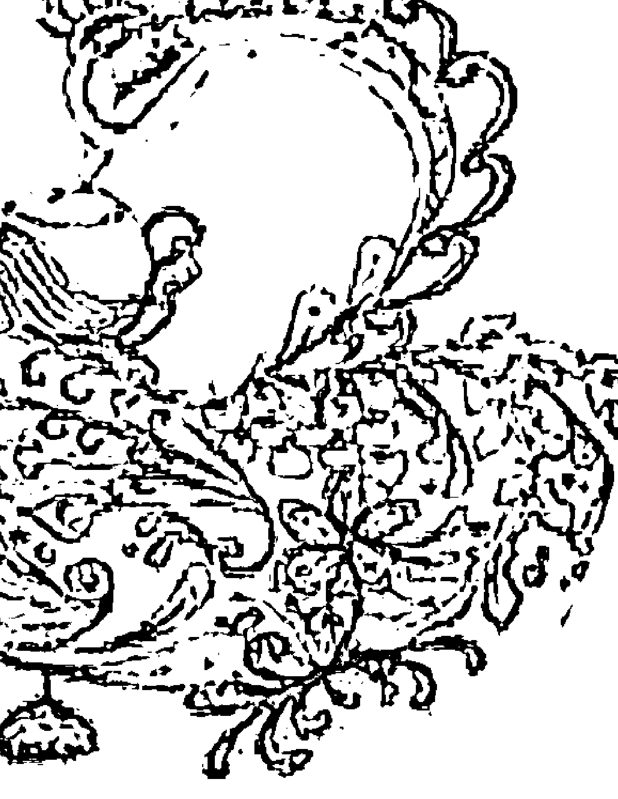

象徵符號：三角形
表達數／溝通能量（表達與敏銳）
人生課題：學習傾聽
口頭禪：只要我喜歡有什麼不可以！

# 3 關鍵在於溝通

（時尚浪漫洋溢的夢想家）

數字3的守護星是雙子座（♊），在希臘眾神中的阿芙洛黛蒂，是火神赫菲斯特的妻子、宙斯的姐姐。阿芙洛黛蒂是愛神，掌管愛、性與生育之神。圖案象徵著一對雙胞胎——凱斯特與保洛斯，祂們是海倫與特洛伊的兄弟。

凱斯特與保洛斯是斯巴達人，生性活潑，不受拘束，而祂們最強烈的情感是他們彼此之間感情。祂總是率性而為，依循自己的熱情過人生，甚至因此促成巴利斯與海倫在一起，進而引發特洛伊戰爭，海倫是凱斯特與保洛斯的妹妹。此外，阿芙洛黛蒂也過著雙重的生活，在與火神（赫菲斯特）的婚姻之外，還有著不倫之戀，並生下好幾個私生子。然而，雙子座有著雙重性格或分裂性格，但兩者並不分開。

雙魚座（♓）是數字12的守護星，戴奧尼索斯是酒神，也是雙魚座和數字12的守護神。愛神阿芙洛黛蒂和祂的兒子艾樂斯為了躲過一頭怪物的追殺，於是變成了魚，這是雙魚座圖案的由來。雙魚座富有藝術氣息、善於社交、活潑熱情，但他們的情緒變化會讓人不知所措，且不容易理解雙魚座的心思。雙魚座酷愛美酒，以愛喝酒出了名，相傳酒是也是酒神發明的。

此外，雙魚座是最後一個星座，一如戴奧尼索斯是最後被列入十二神祇名單的一位。酒神經常被赫拉打擾攻擊，每次都是落荒而逃。一直到祂長大可以離開希臘之前，都經常上演這樣的戲碼。戴奧尼索斯有許多與狂飲、音樂、舞蹈有關的儀典，這些活動有利於戴奧尼索斯發洩情緒及發現自我，這也是可以幫助雙魚座的人，維持身體健康的方法。

在3號人身上可以看出溫和而友善的動作，有著圓潤肉感的體型，性感而嫵媚，在生活中是不斷追求潮流尖端的時尚家。同時，喜歡面帶微笑、個性樂觀、善於表達來展現風趣，有著孩子般的好奇心和純真。

## 個性特質

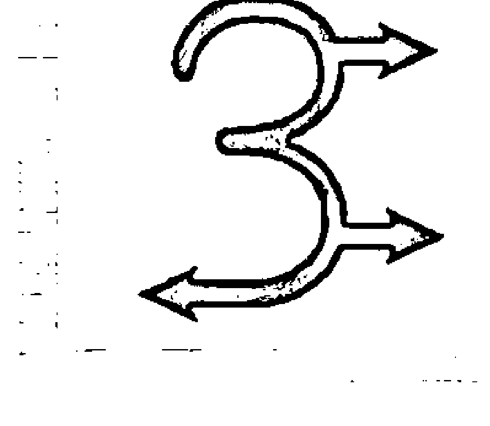

- 要懂得在轉彎處轉彎。陽光、快樂。
- 要敏銳，說話要到位，才能成功。

阿拉伯數字3比2多了一個彎，代表三者之間的「關係」。在基督教裡代表聖父、聖子、聖靈三位一體，佛教三身、印度教三相神、道教三清等都是權力與能量的極致會合。

數字3的象徵符號是三角形，三個頂點連線，形成一個平面。數字3是表達數，所以善於溝通，口才極佳，若能懂得在轉彎處轉彎，就會有帶給別人很多的陽光及快樂。而當事情發生時，不能只看事情的表面，而應以敏銳的心思觀察，才能給予彼此更多的溝通與熱情。

### 正面優勢

3 號的人生性聰明、熱情、樂觀，是一位充滿活力的人，在一個團體裡如果有位特別善於表達、幽默感極佳、聰明反應快且多才多藝的人，通常都會是 3 號人，特別容易受到歡迎。

數字 3 是上天遴選的發光體，思路敏銳、精力充沛。除了擅長社交外，也能發揮正面又具足感性的溝通，很容易影響與鼓勵到他人，也會是最佳的演說家。同時，3 號人也是十足的應酬型老闆，在一個場合裡擅長察言觀色、舉一反三、能言善道外，又容易接受新的觀念，所以不論是擔任主人或嘉賓，都會有良好的互動。

### 負面挑戰

3 號人因為很有主見，凡事都有自己的想法，所以不太能接受別人的批評。有時候過度敏感，也會因為一句話，就能讓 3 號人關上溝通的大門。

而 3 號人就像是被寵壞的小孩，有時會比較幼稚、逃避現實、膚淺、虛榮、喋喋不休、說話毒舌等小孩子的舉動。3 號人容易有因為恐懼而用語言去破壞他人或團體的傾向（搬弄是非）；在自我懷疑和批判下，也會出現害怕表達及急躁易怒、控制別人的現象。

3 號人在生活上中容易鋪張浪費，對事情的判斷，缺乏方向，當被想法和行為局限、必須面對現實、不被關注、無聊的時候，3 號人的內心也會產生很大的恐懼。

## 小改變大能量

如果 3 號人在適當的時機，說對的話、做對的事、把人帶到對的地方，就能成為一位擁有正面完整表達的能力，且能沉穩自信向他人訴說真實道理的人。

## 天賦才能

3號人的思路敏銳，擁有辯才無礙的口才，能讓別人更了解事實及接受事情的真相，是天生的溝通高手。在幫助他人時，能用一種無形的方式，帶來療癒及激勵的效果。在藝術天分上，因為具有豐沛的創造力，能在原來的事物創造出不同的藝術與美感。

## 人生課題

「學習傾聽」是3號人的重要人生課題，可以有兩種選擇：

第1種就是壓抑自己的理想，去取悅別人，久而久之會失去自信、失去對人生的期望，總覺得是他人先對不起自己，這時候就會開始產生抱怨，而情緒的壓抑影響到健康，造成身體亮起了紅燈，容易成為抑鬱的人。

第2種就是努力發揮自己的天分，而這個天分是指創意、口才和社交。這些能夠帶給別人歡樂時，就能努力賺到錢，實踐自己的夢想，最後獲得別人的喜愛。在與他人分享時，3號人也會發現新的理想和新的動力，一旦獲得別人的認同時，就會有更多的創意，同時，對一路提攜他的人，也會懂得感恩與回報。

## 顏色／穿衣風格

黃色是彩色的第三色，在七脈輪中屬太陽輪的顏色，也是太陽的顏色，黃色讓人有樂觀及帶動大腦活動的顏色。所以3號人要發揮創意時，可以穿上黃色的衣服，就能增加內在的自信。

在穿著上，3 號人具有時尚流行與品味，能掌握時代的趨勢，同時穿出流行。平時可以化點淡粧及戴點小首飾配件，這樣就能把自己打扮得像是從服裝雜誌走出來的模特兒。

### 靈數組合類型

#### 12／3

這組人非常特別，因為長相比實際年齡要老成，但具備了未經專業訓練就能輕鬆揮灑的特殊才華。因為有數字 1，所以會有人稱的老靈魂，在前世就習得了這些才華，只要一旦需要用到這些天賦，它們就會回應主人的召喚。數字 3 是充滿創造力，也可以應付一切突如其來的挑戰。

#### 39／12／3

這組 3 號人心智能力極強，有才華洋溢的藝術天分，他們必須經過適切的管道，才能充分發揮這方面的能力，否則健康會出現問題。在處理人際關係與解決問題上，都有獨到的見解，特別是在需要運用到創意的時候。然而，最大的問題是數字 9 不夠實際，往往要吃足苦頭，才能學會教訓。而這組人也是所有 3 號人中，最講究理想及最固執的一群人，尤其是在感情方面，數字 9 容易陷入執迷不悟，因為他們知道自己的能力所在，即便是不可能的任務，自認自己能解決任何難題，也會一頭栽下去。

#### 48／12／3

這組 3 號人在能力上是非常有威力的，集眾多才華於一身，且能結合的恰到好處，使他們成為卓越的領導者，能夠解決各種疑難雜症。具有數字 8 的理想性與數字 4 的務實性之間調合的恰恰好，假如他們無法善加運用天賦才華，就會為內心來巨大的衝突和鬱悶。所以需立定遠大的目標方向，才能讓自己的天賦能有所發揮。

#### 21／3

這組3號人的數字1有非常獨立的人生態度，自認為不需要別人的幫助，在年輕時就擁有豐富的資源。有數字2的他們有一雙巧手，只要東西落入手上，就會變化出獨特又漂亮的創作品。對於3號人來說，最大的難題是在於人際關係，因為他們很難找到既了解他們又能與他們契合的人。當愛情剛萌芽時，數字2會努力表現出友善圓融的樣子，如果一旦發現事情的發展不如預期時，數字1會很快就表現出領導的性格，變得非常主觀，所以不管是友誼或愛情，很快就會陷入緊繃的關係裡。

#### 30／3

這是一組整數，是最典型3號人的性格，理想色彩濃厚，也會展現任性小孩般的言行舉止。最大的問題在於數字0，讓他們看起來總是缺乏自信的樣子，彷彿覺得自己沒有能力，但事實上數字3是具備有才華的，這也是所有3號人中最不相信、也不願意接受自己擁有才華的人。如果多從事精神方面的磨練與洗禮，固定上教會或加入靈修團體，對3號人會很有很大的幫助。

### 生涯發展

可以選擇需運用溝通技巧、可發揮創造力的工作，以及對美的事物都能發揮敏銳的感受力，例如：流行服飾或品味美的饗宴。例如：創造家、發明家、音樂家、作者、廣告設計師、點子王、新聞從業人員、心理諮詢師、命理師、訓練師、專業講師。

### 人物代表

- 齊白石（國畫畫家）1864年1月1日
- 胡適（作家、北京大學校長）1891年12月17日
- 約翰·韋恩（美國電影演員）1907年5月26日
- 貝聿銘（華裔美籍建築師）1917年4月26日
- 王貞治（棒球總教練）1940年5月20日
- 宮崎駿（動畫師、動畫導演及漫畫家）1941年1月5日
- 蔣勳（作家）1947年1月8日
- 鄧麗君（歌手）1953年1月29日
- 約翰·屈伏塔（電影演員）1954年2月18日
- 成龍（演員）1954年4月7日

### 故事

小布是家中的獨生女，有著三寸不爛之舌，溝通難不倒她，所以凡是她想要的，都可以順利得到，就算輕易得到也不懂得珍惜。出了社會她進入一家公司，在工作上為了爭取個人業績，只要從她手中拿到任何名片，或在聚會中認識的初識朋友，她都會想盡辦法在事後聯繫，以獲取更多的人脈資源，這使得她能順利爭取到業績上的第一名。

主管看出小布的問題，要求她除了不斷開發新的客戶以外，還需要多用心在舊客戶的經營上。小布雖然知道舊客戶的重要，但經營上需要很多時間。但日子久了，發現流失的客戶反而造成業績上嚴重的問題，於是聽從主管的建議，撥出更多的時間，在舊客戶的關心和照顧上。

3號人一旦學會傾聽，把自己感受到的世界，清楚地用溝通表達出來，自然也就能夠讓對方感受到有如陽光般的愉悅。

## 與3號人的相遇

帶著你的創意，亮麗出擊吧！

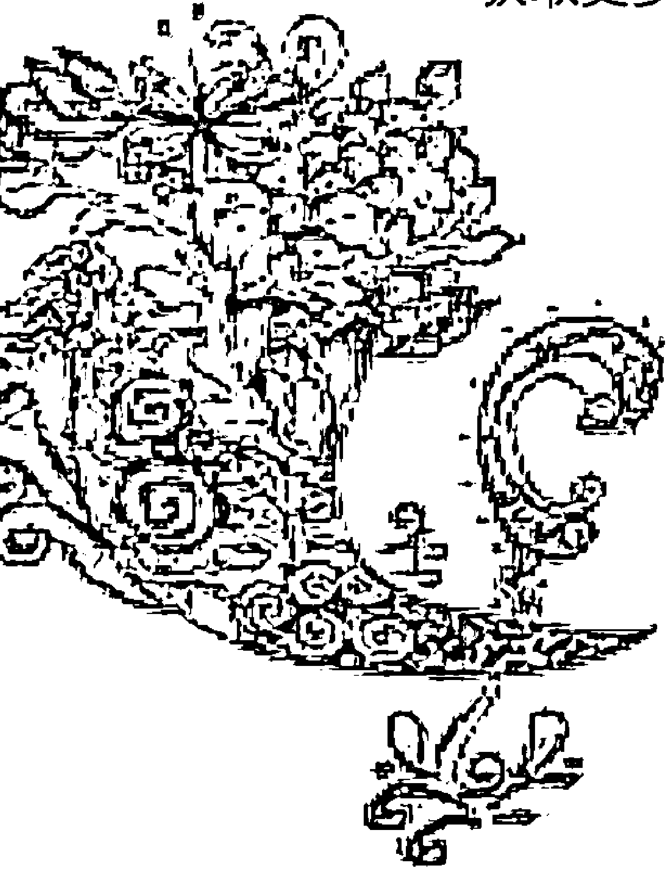

象徵符號：四角形
執行數／安全能量（程序與穩定）
人生課題：學習從自己的內心尋求安全感
口頭禪：眼見為憑！

# 4 一個從戰亂中死裡逃生的人

（信守承諾、一輩子守護朋友的忠誠者）

在希臘神話裡，4 號的守護神是狄密特，祂是一位穀神（灶神），是大地之母和農業女神，祂的守護星是巨蟹座（♋）。身為大地之神的祂，在女兒被擄之後，茶不思飯不想、傷痛欲絕的情況下，竟然命令全天下的人類和動物都要一一死去。在眾神裡只有祂在子女受到傷害的時候，會展現出如此這般激烈的反應。

祂有著充沛的母性本能，溫暖熱情，是眾神裡最佳母親的典範。祂提供了一切食物的來源，可說是萬物之母，祂有著強烈的防衛心，位居十二星座之冠。巨蟹座生性敏感，如同螃蟹的外表，不惜用自己的生命來保護朋友，是值得信賴倚靠的朋友。

要讓 4 號人接受你的想法，必須拿出白紙黑字的數據，證明你的觀點是對的，且具備足以專業人士的口吻與他們對談，否則就算說破了嘴，也無濟於事。4 號人在舉止態度上，都比較嚴肅和專注，說話也是只說重點，一針見血。終其一生的奮鬥都是為了尋找安全感，就像從戰亂中死裡逃生的人，或在海裡突然抓到的浮木，一旦找到安全感，就會死守著不放，絕不會輕易改變。

4 號人因為有強烈的安全意識，所以在外表上，會呈現出專注而嚴肅的表情，在服飾上也會比較傳統或保守。

## 個性特質

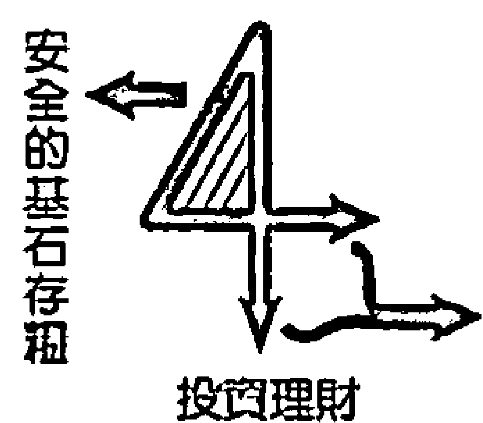

- 工作事業是固定的。
- 會有雙向投資。

阿拉伯數字 4，外型結構是穩固而毅力不搖的站著，中規中矩。一年裡有春、夏、秋、冬四季，方向有東、南、西、北四個面，生命的四種元素有土、水、風、火。然而，數字 4 是一個執行數，依循著程序步驟，有計畫進行著，所以 4 號的人比較容易成功。

數字 4 的象徵符號是四方形，像基石般的穩固而安全。因為需要安全感，所以會像是一位有耐心、踏實且能按部就班、遵守程序達成目標的人。

### 正面優勢

4 號的人做事認真、務實、任勞任怨，性格上容易未雨綢繆、邏輯分明、組織力強、有勇氣，所以在事前準備上，都能規畫精細且周全，用無比的耐心且穩重方式達成目標。

在個性上傳統、顧家、可靠、誠懇、穩重、堅定、忠實、具有責任感等優點，可以在理性與感性中取得平衡。

### 負面挑戰

4 號人因為過度注重外在形象，而忽略內在真實的渴望。當缺乏安全感、害怕改變、固執、根基不穩或沒有耐心時，會有歇斯底里的情緒出現。但有時會因為過於謹慎、缺乏想像力、過於自我保護或不易變通的時候，在相處上會讓人感到乏味無趣。

有時候會有受約束、挑剔、有嫉妒之心、吝嗇、心胸狹窄、愛說教的毛病。如果發生突發狀況、生活不穩定或有危機時，對4號人來說都是一種恐懼。

## 小改變大能量

4號人要學著改變，才能不固步自封，當懂得改變，才會有所成長；將安全感建立在心靈層面上，才能沉著應變，把法理情轉為情理法，用感性走入人群，依照規畫按部就班的執行。

試著學習當別人的軍師，提供可靠的建議，並且讓自己也能身體力行；在一切都穩定後，更應懂得適時回饋自己。

## 天賦才能

4號人天生具有讓事物更安全而穩當的能力，與他們在一起很有安全感和舒服，感受到他們是誠實而值得信賴的人。對於事情總是實事求是（能如實看到事物的樣貌），別人也許覺得枯燥的工作，但對4號人而言，是可以從事重複性高的工作。如果有發生問題，則能想出解決之道及設法防患未然，避免重蹈覆轍。4號人雖然不是一個能隨時冒出創意點子的人，但卻可以成為發明家，也能與別人合作愉快，非常適合從事講求規律的行業。

## 人生課題

「安全感」是4號人的重要人生課題，可以有兩種選擇：

第1種就是藉由物質、愛情、金錢等外來物獲取安全感，但物質提供的安全感，是極其有限的，假如不向內探索自己的潛能，最後只能感嘆人生世間沒有什麼可以提供安全感。所以真正的安全感，必須從內在的自我，相信自己的信心與施展自己的天分，因為那是絕對不會被奪走的。

第 2 種就是盡全力構建自己的安全感，許多超級富豪都是 4 號人（比爾・蓋茲），只要眼光準確，認清自己人生的安全感。而真正來源是在於發揮自己的天賦才華，如此，就可以擁有穩定富足的人生。同時，必須學習願意承擔風險、願意接受改變，並把改變當成自己的契機，以開放的心胸、大膽嘗試，否則就會無法進步與成長，唯有表現自己的才華，才能在生命中找到真正的「安全感」。

## 顏色／穿衣風格

綠色是彩虹的第四色，在七脈輪中屬心輪的顏色，也是植物的顏色，代表健康與成長。我們常看到醫院的外科醫師穿著綠色的手術袍，就會帶給人信心和安全感。很多社會工作組織的服裝常選用綠色，國家也會用來傳達萬事 OK 的訊息。

4 號人在穿著上，傳統而保守的風格，例如：國際企業 IBM 對員工的要求，要整齊的短髮、乾淨、清爽的衣服，鞋子擦得閃亮等，不需要引人注目的外表。因此，在談生意的場合中，就能傳達出有利的訊息。

### 靈數組合類型

#### 22／4

22 是個卓越數，是被賦予了任務而來的人，所以必須經歷一些考驗，一旦通過考驗，阻力就會變成助力了。所以剛認識這組 4 號人時，會覺得他們很親切、友善，所表達出來的感情像是出自真心的，但實際上並不是完全沒有目的，因為他們確實是想從你身上得到一些東西。因為他們為了獲得安全感，會採取任何手段來獲得金錢、感情、健康等各種形式的安全感。這組 4 號人主要的障礙是目標設定的太遠、理想太高，而目標和理想是需要很長一段時間才會看到一點的成效，有時候也會因為受到數字 2 的感情用事，而阻礙了成功。認為某些夢想要付出感情作為代價，才有可能實現。

#### 13／4（31／4）

這組的人很有創意，數字 1 外表看起來很獨立，工作勤奮且多才多藝，獨特又創造力豐富，永遠要求自己行事穩當合宜。然而，數字 3 的內心深處是相當脆弱的，依賴心很重。數字 1 是凡事自我要求穩當牢靠，但同時數字 3 又想要試新事物，這兩者的矛盾帶給他們不少困擾，因為事情很難有兩全其美。

#### 40／4

這是一個整數，是最典型的 4 號人，心思單純、有一種近乎神奇的本領，可以就事論事，而且不時展現出令人驚豔的創造才華，同時可以看穿情勢背後的本質，並且能快速整理出解決方案。其實，許多型態的創作，不過就是以全新的方式看待事物。4 號人對於人生夢想，不會與內心想法發生衝突，因為在任何時候絕不輕易妥協。因此，如果他們的夢想是不切實際的目標，就會變得極度不快樂又非常寂寞。

## 肆、生涯發展

適合從事講求規律穩定的行業，可以選擇組織建構力強的工作。例如：會計師、廠長、站長、數學家、工務、公家機關、文教單位、預算人員、研發人員等。

### 人物代表

- 達文西（畫家）1452年4月15日
- 佛洛依德（心理學家）1856年5月6日
- 居里夫人（科學家）1867年11月7日
- 南懷謹（文化學者）1918年3月18日
- 張忠謀（半導體企業家）1931年7月10日
- 帕華洛帝（歌劇演唱家）1935年10月12日
- 阿諾·史瓦辛格（運動員、演員）1947年7月30日
- 比爾·蓋茲（微軟創辦人）1955年10月28日
- 幾米（插畫家）1958年11月15日
- 嚴凱泰（裕隆汽車董事長）1965年5月23日

### 故事

婷婷剛從大學畢業，是個乖乖的女孩子，對於父母親安排到親戚家的工作，也都能適應得不錯。工作多年後，父母親也幫她安排相親，讓她順利嫁入大家眼中的豪門家庭裡。結婚後，婷婷的先生有自己的事業無暇理會她，每天待在家裡的婷婷，覺得人生平淡無味，又不知道該如何。於是朋友的一言一語，建議她「生個孩子吧！」「離開這個豪門吧！」「找個工作吧！」等，這些在婷婷腦中盤旋著。

婷婷離開學校後，只做過幾年的工作，之後就沒再工作了，她害怕自己沒有能力適應這個社會，她更不知道該如何跟別人相處，最後選擇繼續過她孤單的婚姻生活。

4號人一旦習慣自己固有的舒適圈，就不容易改變原本的生活，就更無法突破自我。所以4號人只要願意學習改變，相信人生風景也會展現出不一樣的樣貌。

## 與4號人的相遇

穩中求勝的最佳典範！

# 象徵符號：五角星
## 自由數／業務能量（自由與規畫）
## 人生課題：學習專注
## 口頭禪：再看看吧！

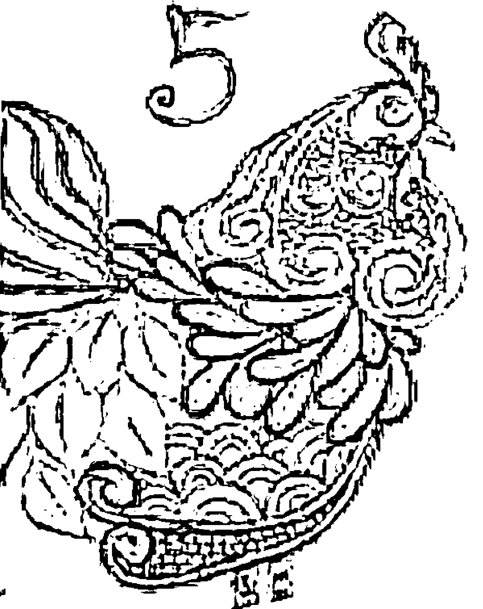

## 一個剛剛越獄潛逃的逃犯
## （一個隨心自在的旅者）

在希臘神話裡的荷米斯是數字5的守護神，祂是宙斯的使神，所以形容祂是「能夠飛得如同思緒一般快，能迅雷不及掩耳進行宙斯的命令。」也是眾神中最精明和機靈的一位。荷米斯是商業之神，是貿易者的保護神。而獅子座（♌）是祂的守護星，為萬獸之王，獅子座的個性可以用荷米斯來描述，祂們喜歡氣派而有格調的事物，個性尊貴，希望獲得別人的敬重。

荷米斯能與三教九流的人都能聊上話，善於溝通，這正是使神荷米斯的天賦才能。祂如同一位剛剛越獄潛逃的逃犯，有著愛好自由的天性，積極的爭取自由。

從荷米斯的故事中，看到祂是如何逐漸變成成熟，成為一個哲學家般的神，而祂的觀念也持續著影響後世，這些都可以說明獅子座的複雜與潛能。

數字5的人在外表上讓人感到親切友善，因為喜歡說開心的事，即使遇到陌生人也很容易跟人聊天，更不吝嗇讚美別人。

## 個性特質

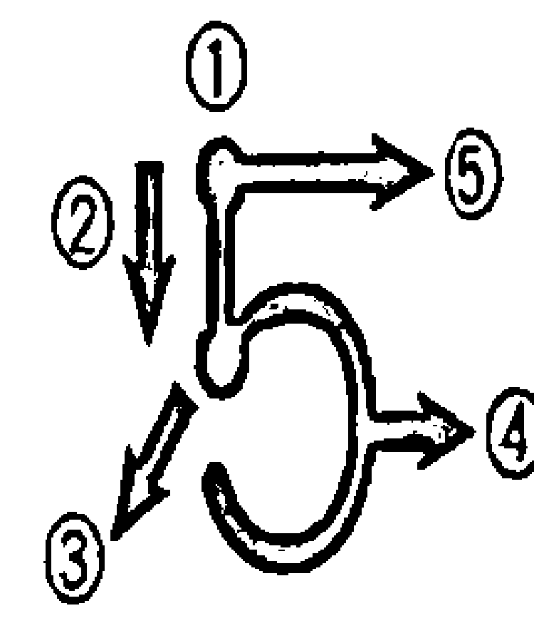
- ①點：一個事件
- ②點：開始出發
- ③點：遇到挫折、瓶頸、障礙
- ④點：懂得轉彎
- ⑤點：另一個擴展

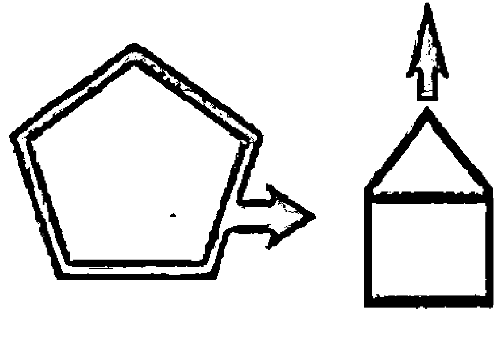

阿拉伯數字 5 有著一張大嘴巴的形狀，在第③點遇到挫折、障礙時，懂得轉彎，也懂得放下，像極了一張 0 的嘴型。數字 5 是自由數，唯有有放下才能獲得更大的自由。古人把宇宙萬物依據特徵，分為金、木、水、火、土五大類；我們的手指頭有 5 根，長短不齊，卻也能分工合作，成就大事。

數字 5 的象徵符號是五角星，像單一箭頭（五角大廈）、一種專注的表象（專注在那裡，成功就在那裡）；當箭頭向外擴張時，會像多頭馬車，但有著動作快的速度和專注的內心。

### 正面優勢

5 號人擁有博學多聞的智慧及勇於冒險、顛覆、反傳統的精神，個性幽默、堅持自我、充滿活力，樂於助人、多才多藝、適應力強，是個最佳的冒險家。性格上能獨立自主，直覺力敏銳，具有深度的重整能力。

在工作方面，5 號人是個業務高手，以口才成就事業，能夠在規範自在的展現自己，並且達成目標，所以是典型的業務行銷老闆；5 號人有很旺的貴人運，異性也可能成為貴人。

### 負面挑戰

5 號人雖然喜歡變化、感官發達，但容易工作過度、運動過量，相對也容易暴飲暴食。在性格上因為個性急躁直率，容易有情緒化、愛嘲諷的表現，一旦壓抑情感，就容易精力不集中、缺乏恆心及毅力，不敢面對現實等。最後也會因為缺乏生命的深度與遠見，容易破壞規則、無節制的放縱自己而造成精神上的損耗。

工作上有時會出現惰性、愛拖延的毛病，成為最佳的依賴者。在管理財務上，沒有財務規畫的觀念。生活上一旦有了承諾（例如：被緊迫盯人的追蹤時程、被邀約時又被不斷的提醒）、壓力出現、需承擔更多責任時、遇到一成不變時，都會造成5號人的恐懼害怕。

## 小改變大能量

5號人要學會真正的放下，才能成為一位發自內心而能獲得身心自由自在的人。只要能夠專心一意，將事業完全依附在與生俱來的才華上，就可以發揮到應有的效益；有時候這是需要放棄某些自由，而如果沒有勇氣就無法做出決定，如此一來，就無法有很好的成就。所以不管想成就任何事情，都必須專注在所選擇與承諾上，而唯有透過責任與犧牲及懂得包容、與人交心，才會有實現目標的可能。

### 天賦才能

5號人是很風趣又喜歡學習新知的人，不但口才好，且樂於與人交談，擅長教導別人如何有效掌握人生。同時，天生具有市場的嗅覺，善於觀察社會的整體趨勢走向。

### 人生課題

「學習專注」是5號人的重要人生課題，可以有兩種選擇：

第1種就是以毫無目標，隨遇而安，假裝無憂無慮的方式過日子，但其實內心不快樂。這是因為5號人愈想擺脫束縛，愈想逃避承諾，就會愈不容易做到自由，往往落入困頓愁苦，抱怨連連。

第2種就是心思鎖定目標，當專心追求事業的成功，就會無法經營愛情；但若選擇了愛情，可能就會失去事業，甚至連愛情也會失去。所以5號人首先不可以放棄自己所擁有的工作自由，之後再思考如何在事業與愛情取得平衡。5號人知道自己要什麼，一旦缺乏勇氣，有時會裹足不前，到了緊要關頭甚至會退縮，不是一個愈挫愈勇的人；所以當挑戰失敗時，常常會選擇逃避，最後也在錯失良機下，失去很多讓美夢成真的機會。

### 顏色／穿衣風格

藍色是彩虹的第五道，在七脈輪中屬喉輪的顏色。猶如廣闊的天空、一望無際的大海，這種藍色讓人覺得人生開朗、機會無限、自由自在，如果數字5的人想要學習到新事物，就可以多穿著藍色的裝扮，讓心胸擁有更開闊的胸襟。

在穿著上可以朝有品味，但不浮誇的設計，時尚中帶有古典氣息的穿法，類似像電影明星或政治人物的穿法。

### 靈數組合類型

### 14／5
這組5號人，因為有數字1的外表，所以你會覺得他們看起來獨立而穩健，把工作託付給他們是值得放心的。但因為有數字4讓他們往往太過保守，缺乏主動積極的勇氣，除非身邊有人鼓勵，或者後勤部隊的支援性夠強大，否則不容易改變他們。這組人不喜欢獨處，但如果被同儕推舉出來帶領大家，他們也會是勇往直前的一個人。

### 23／5
這組5號人初次見面時，會覺得他們溫暖而友善，因為他們有數字2的外表，個性溫和、感情豐富，然而更進一步了解他們之後，會發現他們其實是很主觀的，且不願意改變，這就會使得認為他們隨和友善好相處的人，大為驚訝！這種固執不肯變通的強硬性格，會讓23／5的人際關係製造出不少問題，通常很難維持長久的親密關係。此外，他們自己也會形成一種的疏離感，使得親朋好友無法親近他們。

### 32／5
這組5號人具備濃厚的理想主義性格，他們似乎很清楚自己的理想是什麼。在處理事情上確實很有概念。但有趣的是當他們感情用事時，理想就會跟著扭曲，造成他們處在混和挫折的氛圍裡。這時，他們會試圖扮演一個違反本性的角色，主動放棄自由，過著極不快樂的生活。若想打破這樣的困境，32／5人必須徹頭徹尾的改變，痛下決心，而這時正在考驗著他們有沒有足夠的勇氣了。

### 41／5
這組5號人很實際，因為數字4讓別人會以為他們並不是真正的需要自由，而是要安全感。他們平易近人、好相處，但他們的問題出在愛情關係上，數字1讓他們需要的是濃烈緊密的愛情，但當得到了這類的愛情後，他們又會覺得失去了自由，因而出現內心衝突。若對方變得太過依賴他們時，他們就會如同翻書般立刻變臉，會把黏在身邊的人推開，這種個性不利於維持長久的關係。

### 生涯發展
可以選擇業務性質的工作，需要溝通或工作時間很有彈性的行業。例如：銷售員、宗教家、金融業、保險業、政治家、記者、教師、演說家、投資家、演員、演藝界、美術家、藝術家等。

### 人物代表
- 亞伯拉罕・林肯（美國前總統）1809年2月12日
- 雷諾瓦（畫家）1841年2月25日
- 文森・梵谷（畫家）1853年3月30日
- 三島由紀夫（作家）1925年1月14日
- 張小燕（節目主持人）1948年8月11日
- 謝震武（律師）1963年10月21日
- 齊柏林 1964年12月27日
- J.K. 羅琳（作家）1965年7月31日
- 金城武（歌手、演員）1973年10月11日
- 安潔莉娜・裘莉（演員）1975年6月4日

### 故事
小君和阿信是在一起很久的情侶，小君的父母親催促他們結婚，但阿信是一家的業務員，正值打拚事業的年紀，所以想要花更多的時間在工作上，在自由的取捨下，讓阿信開始猶豫，對結婚產生退縮的念頭。阿信最後選擇逃避，也因為心神不定，讓他在工作表現上連續失誤，業績在達不到公司的目標下，自己也失去信心，選擇逃避的情況下離開公司。

阿信總是在逃避裡做選擇，他應該學習專注在每一次的抉擇，包括和小君的婚姻及工作。如果他能勇敢面對，就不會錯失任何的機會。

## 與5號人的相遇
專注你的目標，勇敢冒險吧！

# 象徵符號：六芒星
## 奉獻數／關懷能量（接納與遠見）
## 人生課題：學習先照顧自己
## 口頭禪：我無法拒絕、沒辦法說不！

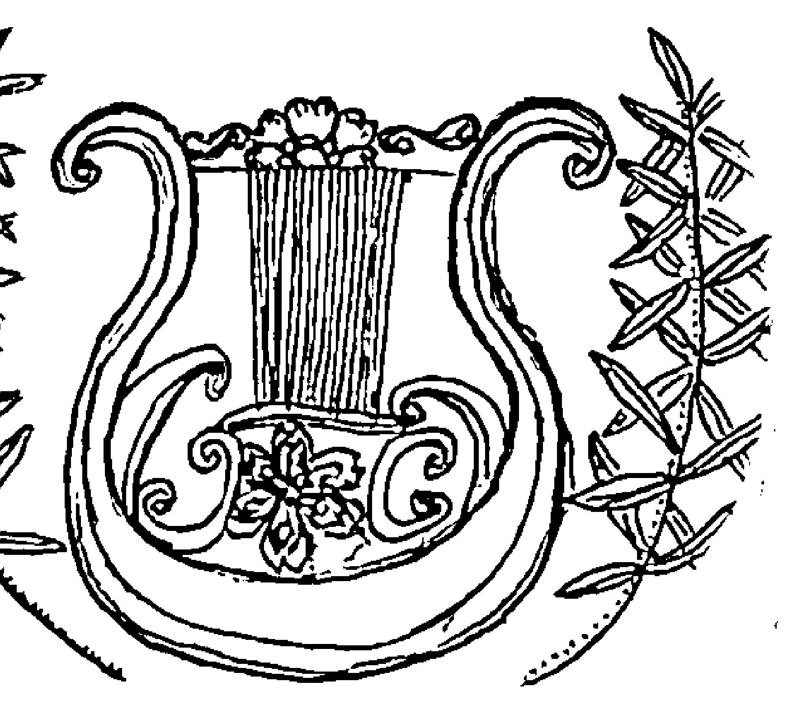

## 6 一個救苦救難的菩薩
在希臘的眾神中，阿波羅是6號人的守護神，祂是「所有神中最希臘化」的人，祂被形容的非常俊美，是精熟的音樂師，他用金色的七弦琴彈奏，使得奧林匹斯山充滿著歡樂的喜悅，所以在我們看到的雕像中，他的右手就是握著七弦琴；因為擅長於射箭，所以對銀弓的喜愛及珍藏勝於任何一個神。

太陽神阿波羅也是醫神，對於與治療有關的事物很感興趣，同時也將醫術傳授給人類，有治療之神著稱。在祂內心有一顆單純的心及一種慈愛的力量，是神和人之間的橋梁，猶如一個救苦救難的菩薩。阿波羅的一生把主要的精神都放在治療與哲學，以及對於命運的思想與接受上。

阿波羅的守護星是處女座（♍），圖案象徵著一個永恆的處女，這個愛挑剔、愛乾淨又容易緊張的人，堅持用自己的方式來解決問題，而且有一套極為固執的思考模式。祂也是光明之神，從不說謊，光明磊落，有祂的地方就沒有黑暗。

6號人的舉止態度上都較為有主見、心思敏感、害羞，願意幫助別人且尊重對方，有著低調行事的風格，輕鬆自在而不刻意引人注意的服飾裝扮。

## 個性特質
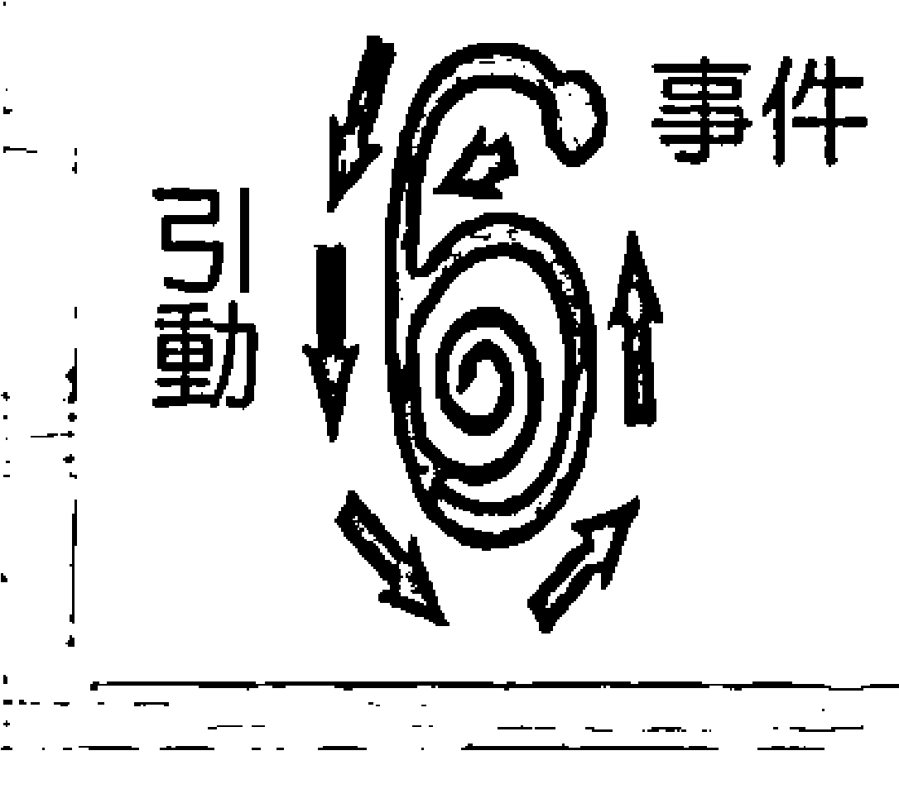
- 當一個事件來時（引動）會往內縮，不斷的往內縮（有時會縮死自己）出不來，會追溯往事

阿拉伯數字6的型態就像是一位大肚子的女子，有著母性愛的光輝和包容力，數字6是奉獻數，有著強大關懷別人的使命，卻時常忽略給予自己更多的照顧。

在畢達哥拉斯學派裡，認為數字6是神的生命、是一種靈魂。上帝認為6是個完美數，所以創造了工作6天，之後第7天為休息日。

而數字6的圖案象徵是六芒星，在猶太教和猶太文化裡是一種護身符的標誌，一個向上的等邊三角形，上面代表上帝，下面兩邊分別代表丈夫和妻子，代表固守在這個婚姻裡。

### 正面優勢
6號人在工作上有遠見和格局，公正且勇於承擔責任，直覺力敏銳，有美的鑑賞能力。個性上心地善良富有愛心及樂於助人，可以成為一位心靈導師，服務他人並有犧牲奉獻的精神，能帶給別人真正的承諾和喜悅，具有療癒和感化他人的正面力量。

6號人有完美主義、自我標準高、理想主義者的傾向，所以相對在自我要求上會比別人更加嚴格。

### 負面挑戰
6 號人在情緒上容易悲傷憤怒、沮喪及反反覆覆，猜疑心重，耳根子軟，是所有數字中情緒最容易受傷的人。常在施與受的不平衡中受到委曲，個性上急功近利，太過追求完美而鑽牛角尖，或甚至批評其他人、事、物，不容易接納別人的建議。對於承諾後的兌現、付出無回報或缺乏價值時，對 6 號人的內心來說，會產生很大的恐懼感。

## 小改變大能量
6 號人要懂得接受不完美的人、事、物，別人的問題並不是每件事情都要由自己去解決，或只是去療癒別人，這樣很容易讓 6 號去承擔責任。所以 6 號人要懂得在解決別人的問題前，先解決自己的問題。

6 號人對於事物的看法，不能只專注眼前所見的，而是要成為一位有理想、有格局的築夢之人。愈早學會自己的功課並落實在生活中，才能創造健康快樂的人生。

### 天賦才能
6 號人天生懂得照顧別人、療癒別人，對於修繕事務及解決問題更是擅長。在問題的解決上，能夠很快釐清事情的問題點，也知道該如何採取步驟逐一破解問題。

因為 6 號人對人容易付出很多且都出於真心誠意，所以在待人接物的態度上，都能給予安全感及信任，如同醫生對病人的態度，就是「視病如親」，因此，能勝任各種服務性質的工作。

### 人生課題
「學習說不」是6號人的重要人生課題，可以有兩種選擇：

第1種就是以循天性傾向吸引有問題的人，例如：會出現有問題的戀愛對象或不健康的同事關係（人際關係不佳，彼此之間有心結）。不懂得花心思照顧自己，反而不斷地為他人付出，直到自己筋疲力盡了，賭上自己的健康。這時候6號人要面臨巨大的挑戰，到最後變成照顧生病的自己或是陷入死亡。許多6號人過不了這關時，或看不到解脫之道，就會在承受心理壓力或身體疾病的磨難下，容易得憂鬱症或恐慌症，甚至會比一般其他人都想不開，最後也有可能選擇嘗試自殺。

第2種就是在幫助別人解決問題的同時，不要忘記照顧自己，在施與受之間取得平衡，雖然不容易取得平衡，但至少努力會獲得回報。一旦平衡通過了考驗，6號人的格局和遠見也能彰顯，在療癒別人的同時，也會療癒自己。所以必須先學會解決自己的問題，再去解決別人的問題，最好等到別人開口請求，再伸出援手，且不管是體力、情感或財務上都要在自己負擔的範圍內。所以6號人要謹記每個人都該為自己的人生負責，而不是由6號人全數承擔，有時候幫助別人反而是剝奪別人學習成長的機會，所以必須學會硬心腸，不需要為了別人把自己的人生弄得一團糟，要試著學習說「不」，不妨學習自私一點，才能發揮更大的愛。

### 顏色／穿衣風格
靛青色是彩虹的第六色，在七脈輪中屬直輪（眉心輪）的顏色，靛青色展現出皇家高貴氣質及絕對的權力和責任。如果6號人希望別人學習你足以承擔責任並處理一切難題時，穿靛色衣服可以幫助你傳達這種訊息。

在穿著上可以朝向實用而健康的風格，利用自然的材質、輕鬆、設計有很多口袋的功能，不用在乎流行及不需要擔心弄髒的衣服，會讓6號人更顯得自在。

### 靈數組合類型

### 15／6
在所有數字6的組合中，這是最健康的組合，因願意承擔責任，又清楚知道責任輕重，如果能分辨責任的歸屬，這要感謝數字5所發揮的力量。數字1是個性非常獨立，無論做什麼事都需要有自由的空間。所以這組人的問題，是在他們發現某個情況，確實需要他們的幫忙時，而他們這時也會內心天人交戰，煎熬掙扎，既想伸出援手，又不希望別人太過倚賴他們。

### 24／6
在第一次見面時，這組6號人會讓別人會覺得非常和藹可親，擅長處理人際關係，也不會介意為別人承擔責任。如果別人對他們的付出與幫忙毫無反應時，他們也不會直接站出來說出內心的真實感受——「覺得被利用了！」反而會展現出烈士的姿態，到最後以難過和失望收場。有時寧可一個人走，儘管這根本違反他們的天性，但事實上6號人真的需要為自己挺身而出，找回自己生命的主導權，這是6號人應好好學習的人生課題。

### 33／6
33是這一組卓越數，所以有強烈的渴望想發揮自己的天賦長才，倘若無法如願，就會無法從人生中得到快樂與滿足。他們擁有異常優秀的創造力，但很可惜，通常必須先做出重大的人生抉擇和犧牲，才能夠順利發展他們的天賦潛能。但是這樣的抉擇，尤其在夾雜了感情因素時，更顯得困難重重，因為他們總是承擔了過多的責任，所以必須想清楚。無論如何一定要努力施展自己的才華，否則人生永遠沒有快樂可言。這組是超級理想主義者，而且不太能接受批評。

### 42／6
這組是所有 6 號人中，因有數字 4 所以是最務實的一群人。數字 2 的他們喜歡交朋友，重感情，並且極富同情心，為了討別人歡心，他們常常願意像變色龍一樣改變自己。當然，這也包括了相當程度的自我犧牲，雖然朋友多，但真正了解他們內心的朋友，卻寥寥無幾。

### 生涯發展
關懷服務性質的工作，有治療別人或是健康事業，例如：醫療從業人員、福利事業、托兒所、幼教工作、教育人員、藝術家、美容美髮工作室、畫廊、服務業、義工、志工等。

### 人物代表
- 宋美齡（聯合婦女會創辦人）1898 年 3 月 4 日
- 張大千（畫家）1899 年 5 月 10 日
- 小勞勃 · 安東尼 · 狄尼洛（演員）1943 年 8 月 17 日
- 林懷民（舞蹈家與編舞家）1947 年 2 月 19 日
- 劉墉（作家、畫家）1949 年 2 月 26 日
- 張國榮（歌手、演員）1956 年 9 月 12 日
- 梁朝偉（歌手、演員）1962 年 6 月 27 日
- 蔡依林（歌手）1980 年 9 月 15 日
- 小甜甜布蘭妮（歌手）1981 年 12 月 2 日
- 宋仲基（演員）1985 年 9 月 19 日

### 故事
慧喬開了一家安親班，已經有數十年的時間了，為了照顧班上的小朋友，盡心盡力的付出，對於每件事都是親力親為，對於學生的課程更是要求完美，老師無法做的教具，慧喬就會攬下來幫老師拍攝影片或製作教學具等或是家長無法準時帶小孩離開，慧喬也會幫老師留下照顧。時間久了，有時候也會讓慧喬筋疲力盡。

在家庭生活上，她總是扮演好賢妻良母，把先生及小孩照顧無微不至。因此，對於自己的情緒和壓力，總是放在心上壓抑著，有時甚至漠視不管。

直到有一天她在身上發現胸部位置出現硬塊，除了懷疑外，帶著害怕的心情，詢問醫生，在得知答案後，慧喬才這時崩潰大哭，積壓已久的心情，瞬間釋放。

6 號人必須先學會照顧自己，才能去解決別人的問題，否則容易造成自己的傷害，同時，也要學會說不，才能讓自己有喘息的空間及給予別人學習的機會。

## 與6號人的相遇
關愛他人，同時也要愛自己！

# 象徵符號：彩虹
## 幸運數／真理能量（坦誠與信賴）
## 人生課題：學習接受真相
## 口頭禪：是真的嗎？

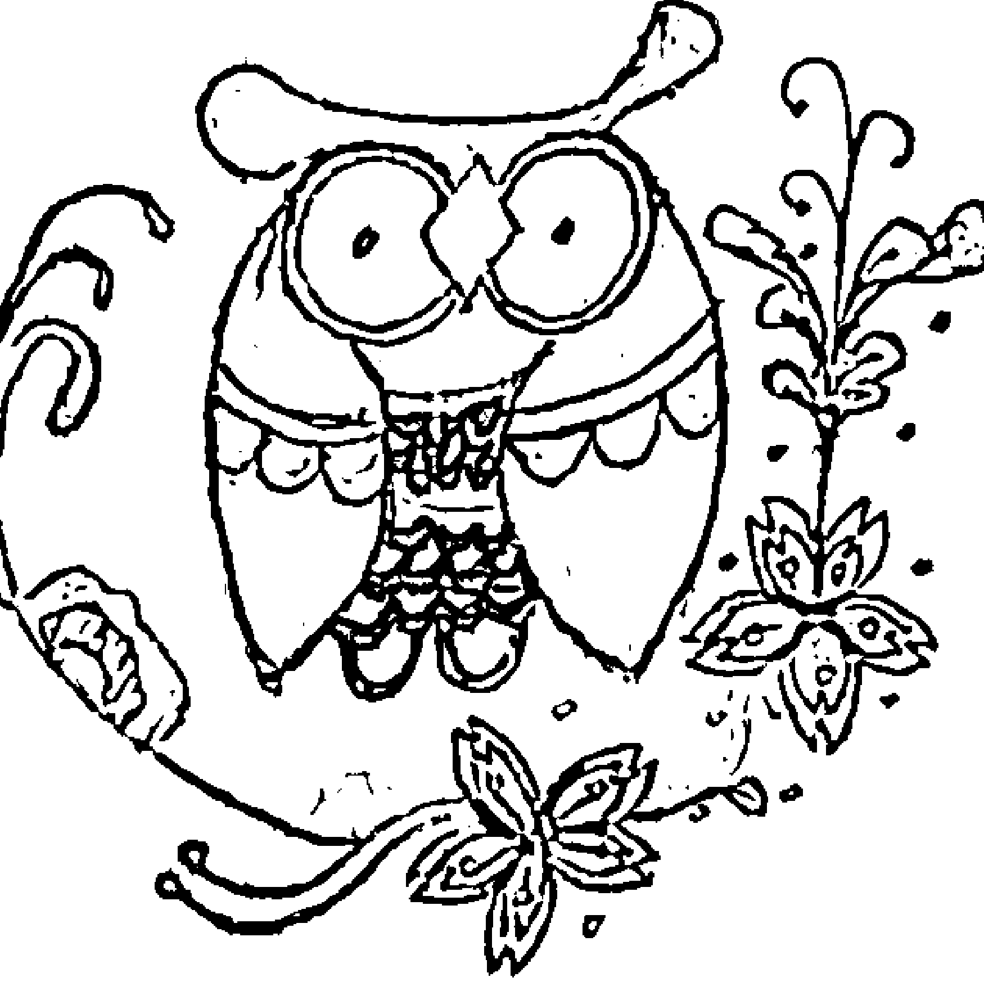

# 7 一個研究真理哲學的科學家
在希臘眾神中，雅典娜是7號人的守護神，她是工藝女神，因為祂的名聲來自於祂運作心智的能力，並不是祂運用身體的力量。然而，雅典娜熱愛編織，也喜愛藝術，喜歡發明物件，也許做這些手工藝可以幫助祂放鬆吧！有趣的是，在祂所表現的藝術作品上，仍然保有質疑的精神。

雅典娜精通法律，也是律法和智慧的女神，這兩項特質恰好是主持正義時必要條件，使得雅典娜可以代表天秤座（♎）的特性。天秤座的個性中最出名的特質是喜歡分析與質疑事物、追求公平、具有外交手腕、善於權衡判斷及喜好批評等。

雅典娜的個性可以用數字7來形容：祂不會輕易相信任何事物，喜歡質疑、熱愛學習，做決定之前會費盡思量，力求公平。此外祂也有懶散的一面，因為運氣不錯，所以事情到最後都會不知為何，就是會演變成對祂有利的局面。

7號人天生就愛批評與分析，他們是對於改善事物有興趣，在人群中獨特而醒目。他們會省思每一種可能性，質問每一件事，就像是一位研究真理哲學的科學家。

## 個性特質
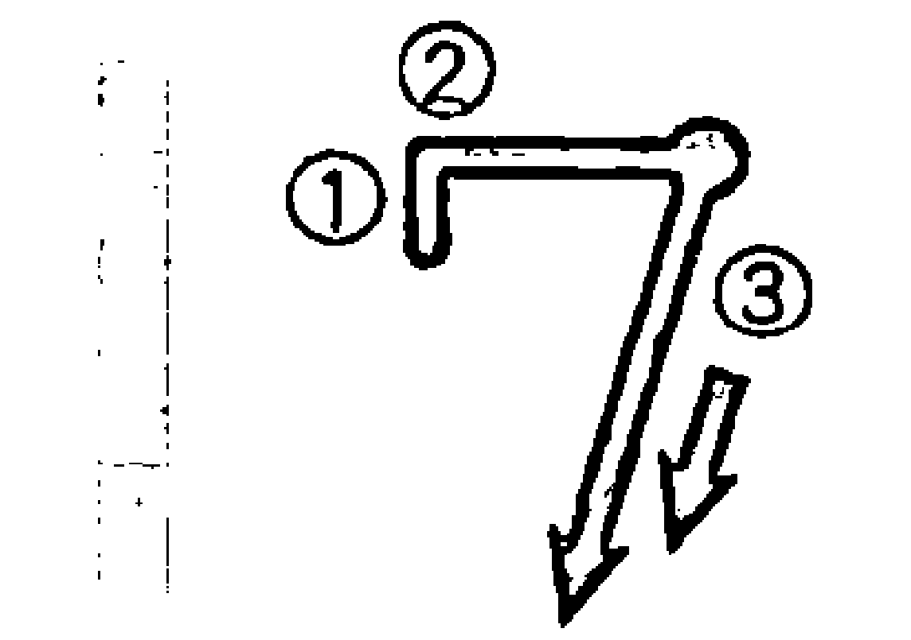
- ①點：質疑
- ②點：引動：研究、探索
- ③點：成為指導者、與他人分享，才有稱師之格

阿拉伯數字7是幸運數，是代表靈性及對真理的熱愛。7的2字訣是「不是道理的道理是道理（意指暫時相信）及會歷經沒有道理的事物，要暫時相信，因為有道理的存在（意指會舊事重演）」。

數字7的圖案是彩虹，彩虹有7種顏色、古典音樂有7個音階、人體細胞7年更新一次、七重天、LUCKY7等，所以7是一個幸運數，也代表一個真理的數。

### 正面優勢
7號的人天生好奇，不看事物的表面價值，喜歡不斷發問來探詢事情的真相，這使得他們的個性開朗大方、樂於與人相處，所以他們常與人分享內心的經驗和智慧。因求知欲強，在獨處的時間能韜光養晦，有著深度的內涵，容易成為別人的智慧寶庫，思考大多也會出自黑白分明的角度，邏輯取向，是最佳的學者。

在個性上，安靜而神秘、信任、開放、懂得內省的心胸，同時有著藝術般的氣質，能坦誠面對自己與別人。廣結善緣，是所有數字中運氣最好的一群，而好運可以讓他們比別人早一點成功，也比較容易成功。

### 負面挑戰
7號人常因質疑而錯失良機，好面子，容易舊事重演，過度防禦和不信任他人與自己時，就會與他人保持距離，常因此感到孤獨痛苦。

當 7 號人被別人背叛時，會對未來感到恐懼，容易產生有陰暗面、疑心重、孤僻、偏激、冷漠的現象，甚至迷失於宗教信仰。若有犯錯或被欺騙時，內心也會產生恐懼感。

## 小改變大能量

7 號人要學會真正的信賴，且對他人多些寬容包容，如此才能成為別人的貴人。在透過正確的質疑，將所發現的道理與他人分享，才能對內在的生命充分的信任，並成為他人真理的傳播者。

## 天賦才能

7 號人是天生的評論家，好奇心重，有著天生的哲學家、研究者，對於錯綜複雜的事物，能引發他的興趣。能一眼看出問題所在，因為對於對品質的概念非常先進，從不畏懼於說出誠實的意見，所以對經不起批評的人來說，不免難以承受。

在工作有時候會有一點懶散，所以喜歡從事有組織、有系統的事情，這些可以讓他的理念立即實現。但不介意自己獨立工作，事實上他們寧願一個人獨立行事。個性上擁有一股天生的魅力，可以誘發別人最好的一面，這也使他們非常適合在與社交政治及銷售有關的工作方面得以發揮。

## 人生課題

「學習相信真相」是 7 號人的重要人生課題，可以有兩種選擇：

第 1 種就是以輕鬆平凡的方式走完一生，不用太努力，反正遇到瓶頸或麻煩，總是會有幸運之神的眷顧，問題都能輕易的解決。但是 7 號人的好運也會有用完的時候，所以必了解一分耕耘一分收穫的道理，且唯有面對真相，勤奮務實才是上上之策。在情感上由於 7 號人容易讓人有疏離感，總是接受的多，付出的少，最終會失去激情。如果 7 號人能及早發現問題並能做有效的改善；反之，會變得不快樂，甚至會有犯罪行為來尋求解脫。

第 2 種就是能早一點認識到努力的重要性，勤奮認真，只要一有機會就能上前迎接，善用天生優異的分析能力，在愛情與事業中掌握各種變化，讓關係保持健康平衡，萬一事與願違，出現難以承受失敗的結果，因為對 7 號人來說，很難會有轉行或離婚諸如此類重大的決定。對於 7 號人做出決定的時間，總是漫長而艱辛，但是一旦做出決定，表示已經徹底的想通了。

## 顏色／穿衣風格

紫色是彩虹的第七色（最後一色），在七脈輪中屬眉心輪的顏色。人類肉眼所能見到的最高頻率，代表人與神的連結。

在穿著上，7 號人比較沒有特殊要求，但是非常注重品質與工法，不易精準描述。例如：爵士樂手、瘋狂科學家，絲毫不受拘束的穿搭法。7 號人穿上紫色的衣服，可以立刻引起注意，也會帶來好運。

## 靈數組合類型

### 16／7

這組 7 號人非常堅強而獨立，軟弱面會出現在愛情的關係中，常為了取悅另一半而不顧一切，拼命付出（其實大可不必如此）。善於解決問題，生下來有一種近乎洞悉事情謬誤的能力，並且還能予以改正修補。

### 25／7

這組 7 號人非常親切和善，幾乎跟任何人都可以相處的愉快。數字 2 讓他們在面對群眾時，善於處理人際關係的課題。數字 5 讓熱愛自由的他們，需要有很多時間獨處或充電進修，思考問題。在其所選擇的行業裡很容易平步青雲，內心的矛盾比較少，但有時需克服心裡冒出來一句「再說吧！」的 OS。

### 34／7

這組 7 號人理想性極高。數字 3 會讓別人覺得他們心胸開闊，可以接受任何事物，而「一切」都有可能。可是當要付諸行動，讓「一切」成真時，他們就會 180 度的轉變，數字 4 讓他們變成固執死硬。這種轉變固然令人錯愕，但事情其實沒那麼糟糕，因為他們這種小心翼翼的特質，對於任何計畫或行動，都是不可或缺的態度。數字 4 不喜歡甘冒風險，寧可穩紮穩打，這種行事風格也會使他們錯失機會，並使得別人抓狂。

### 43／7

這組 7 號人在外表上有數字 4 的腳踏實地，也有固執與懶散的一面，不過都可以用毅力與執著來獲得成績。這組 7 號人因數字 3 的影響，可能會遇到的挫折是「當發現一直以來努力爭取的事物，其實並不是自己真心想要的事物」時，這種落空的感覺，可能會導致他們在目標尚未完成之前就先停滯、怠惰退縮，甚至半途而廢。

### 生涯發展

能依據自我的本能與理念，選擇屬於研究性質的工作。例如：出版社、作家、資訊業、醫生、司法工作者、命理算命師、身心靈指導師、精神諮詢師、個人工作室、自行創業者、宗教家、藝術家等。

### 人物代表

- 李時珍（醫學家）1518 年 7 月 3 日
- 魯迅（作家）1881 年 9 月 25 日
- 林語堂（作家）1895 年 10 月 10 日
- 彭淮南（臺灣中央銀行總裁）1939 年 1 月 2 日
- 李小龍（演員）1940 年 11 月 27 日
- 李安（導演）1954 年 10 月 23 日
- 周潤發（演員）1955 年 5 月 18 日
- 黛安娜王妃（威爾斯王妃）1961 年 7 月 1 日
- 黃子佼（節目主持人）1972 年 3 月 30 日
- 宋慧喬（演員）1981 年 11 月 22 日

### 故事

俊傑曾擔任科技公司，老婆想回家鄉過不一樣的人生，但高薪又舒適的環境讓俊傑猶豫不已。但因為孩子的身體問題，選擇回到家鄉開店賣包子。但俊傑對包子的製作一竅不通，連高筋低筋麵粉都搞不清的狀況下，於是四處找人學習。

從麵粉和水的比例開始研究，雖屢次失敗，但總會追根究底弄清楚，一年半載後終於有不錯的銷售量，但俊傑仍不滿意，因不想跟街頭巷尾做相同的包子，於是開始研發新的口味，希望消費者能吃得安心、吃得健康。至此後開始有了展店的計畫與經營。

7 號人在決定時可能會猶豫很久，可是一旦做決定了，他會奮不顧身的全力以赴，來達到自己的人生目標。

## 與7號人的相遇

知識就是你最大的武器！

获取更多好书，请加微信号：strcdts
店铺：http://strc.cr.cx

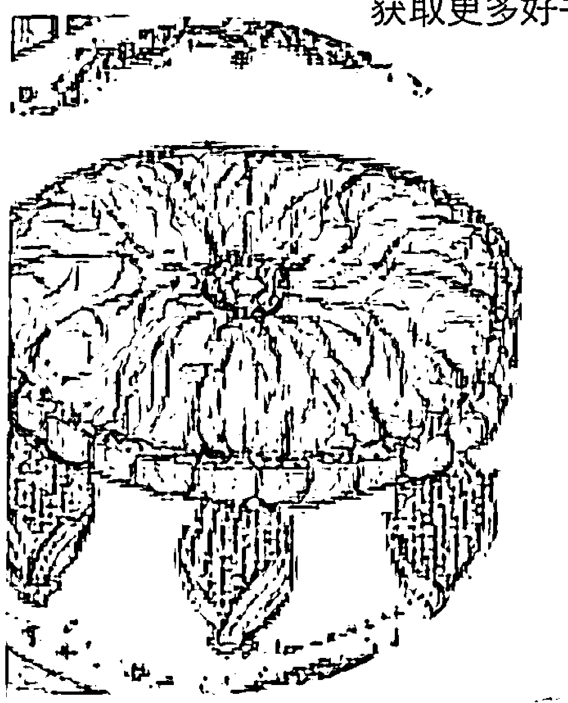

# 象徵符號：無限符號

## 因果數／物質能量（權力與富足）

## 人生課題：學習誠實待人待己（勇於面對）

## 口頭禪：錢在哪裡？！


## 一個家徒四壁出門嘴唇抹豬油的大戶人家

在希臘眾神裡赫菲斯特斯是 8 號人的守護神，祂是一位仁慈而愛好和平的神，他是武器製造工和鐵匠，為眾神營造寓所、家具和武器，無論在人間或在天堂裡都是很受歡迎的。

赫菲斯特斯是一位火神，在完美的眾神中，祂有著最醜陋之神的稱號。大半生都在地下室的工作坊裡度過，雖然祂身上具備了毀滅事物的能量，但他從不蓄意傷害別人，只要祂認為應該自保的時候，才會發揮這種能力。

天蠍座（♏）是赫菲斯特斯的守護星，象徵的圖案是蠍子，在更早之前是用蛇來代表天蠍座。蠍子與蛇都是讓人看起比較令人害怕的動物，躲藏在岩石下，雖然並不會主動攻擊，但在遭受威脅的時候，也會以自身毒液來致敵人於死地。

8 號人內斂又有主見，有足夠的資源，猶如火神般的工匠。因為愛面子而不願意誠實去面對自己和別人，猶如一位隱忍著不說自己快要破產的生意人，到最後有可能會做出傷害自己的舉動。也有即使是家徒四壁了，出門還是要像大戶人家在嘴唇上抹上豬油，因為他們不願讓人看到真實的一面，從另一個角度來看，這樣也許可以找到有利的且豐富的資源。

## 8 個性特質

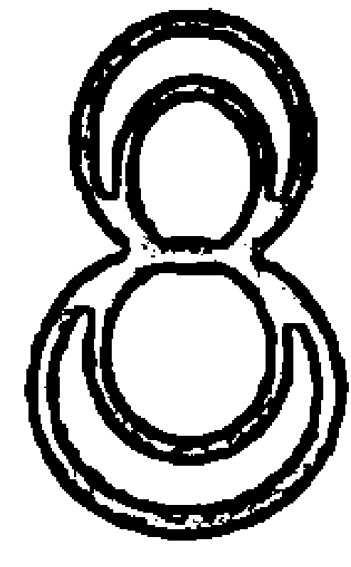

> 沒有出口
> 膠著會繞不出來
> 懂得面對、掌控則為無限大。
> }⇒∞

阿拉伯數字 8 平躺時，像個倒∞，在數學裡是無限大的符號，也是高八度音階的 1 數，具有數字 1 的領導才華和追求獨立自主的特質。但數字 8 是因果數，所以它會因為你做的任何事情，而原原本本回報到你自己的身上，所以必須學會誠實面對自己和別人。

數字 8 的象徵符號是∞，具有物質的能量，所以 8 號人會積極尋求在金錢上的獨立，且遠超過實際需求的數目。

### 正面優勢

8 號人能誠實的面對自己，對追求的事物會排除萬難，並會圓滿身邊的人，喜歡幫助他人達成目標和分享成果，愛護家人與團體組織成員，能創造富足。

在工作上除了具有領導力、專注力、洞察力、有魄力外，在擁有智慧及商業的頭腦，在果斷、勇敢，能屈能伸下，不論在人脈資源或資訊都是最豐富，且透過 8 號人的整合、匯集，能靈活運用，所以是個典型的管理者老闆。在創造財富之餘，也能援助他人，所以也是個慈善家。

### 負面挑戰

8 號人不願誠實面對自己，會做出傷害自己的舉動；雖然 8 號人很會賺錢，但有錢不會守，所以在財務上常發生不穩定；因為內心會壓抑情緒，消極卻又充滿野心，所以是個最消極的野心家。

在工作上重權力，掌控欲很強，但不輕易接受別人意見；如果失去威望、被人憐憫、失敗或貧窮，對 8 號人來說，會產生恐懼。

## 小改變大能量

所以 8 號人要先幫助他人創造富足，且在面對自己時要坦誠，才能成為一位能創造富足，並有權力名望的成功人士。然後將這成功的果實，運用在公眾的利益上，創造所有人的圓滿。

### 天賦才能

8 號人天生就有特殊的能力，比別人更早一步看透事物的遠景，能提供極佳的優勢，有可能會因此進不少的錢。在不怕風險的情況下，且深知自己的目標時，會為了成功做出決定去爭取。是一個非常強勢的領導者，時而平易和煦，必要時也能剛硬強悍，天生的老闆性格。

8 號人因為能看出他人的潛能，在能力及事業的未來性，所以擅長幫助他人發展自我，能與別人共事愉快，善於組織人事，具優秀領導能力。8 號人渾身散發的高尚風範，無論走到那裡都能吸引別人的目光，相當吸引人。在這些美好的特質下，潛藏著堅強的性格，讓人覺得值得信賴。

## 人生課題

「誠實面對自己」是 8 號人的重要人生課題，可以有兩種選擇：

第 1 種就是如果 8 號人有許多夢想及欲望，尤其是在追求金錢上的獨立，就會努力工作或者找到一個認為有潛力能實現 8 號人夢想的對象結婚。之後，8 號人會繼續提出改變與發展的要求，但不會直接表現出來，用 8 號人的方式強求自己的理想得到實現，或一直催促另一半及小孩來完成 8 號人認定的目標。最後，對方會受不了 8 號人的嘮叨和操控，決定提出並反抗，使得 8 號人覺得失望，感覺人生是一場空，自己被人利用和糟蹋。

第 2 種就是 8 號人必須誠實說出自己對人生的確切規畫，直接坦白，讓別人有機會選擇留下或離開，對方既然不是被誘騙而留下，日後也就沒有所謂的後悔及埋怨。所以 8 號人必須要有企圖心，愈是清楚知道自己的目標，且愈是誠實的接受，8 號人就愈容易成功。因為數字 8 與宇宙間的∞性及因果業報有關，因此若說謊欺騙，或是做了錯誤及違法的事，報應總是會來，甚至會超乎想像的強大。可能會是事業倒閉、婚姻破裂、失去子女或心愛的人，甚至賭上了健康。8 號人必須誠實面對自己和別人，不能用得過且過的方式，這樣才能成為富足的人。

## 顏色／穿衣風格

金色是佛教的顏色，在七脈輪中屬頂輪的顏色，在古代中國只有皇帝能穿著的色系，有智慧、權力的象徵，同時金色也是代表天堂的一種顏色。因此，8 號人可以透過金色的服裝和珠寶首飾的搭配，就能傳遞出成功的氣息和成長的契機。

在穿著上，8 號人看起來會讓人感覺是有錢的打扮，像是名牌、最昂貴的首飾及車子等會讓別人一看到你，就知道你很有錢，相對會放心的把錢交給你運用，使得你在金錢上更能運籌帷幄。

### 靈數組合類型

#### 17／8

剛認識這組 8 號人時，因為有數字 1 的外表，會覺得他們是堅強獨立的人，但事實上也確實如此。在工作上有強烈的領袖特質，一旦遇到不認同他主管或組員時，仍會獨自堅持下去。每當努力追求的目標已經在望時，有時候反而會裹足不前，會開始重新考量是不是自己真正想要的東西，有時甚至會在緊要關頭驟然轉向，和原來方向完全背道而馳。這種自我設限的特質是人生挫折的根源。

#### 26／8

這是最敏感的 8 號人，因有數字 2 的感性，能夠將心比心，對於別人的痛苦感同身受。數字 6 每當有悲劇時，即使是由電視上得知，也會覺得自己彷彿有責任，希望自己幫得上忙。通常很難把自己從別人身上抽離，就連看新聞心情也會隨之起伏。這組 8 號人長袖善舞，人際關係良好，幾乎能夠應付任何風險而且很快就能從篳路藍縷的階段，逐步建立起屬於自己的王國。只要能把自己和別人的感情課題劃清界線，避免承擔不必要的責任，未來前途就能無可限量。

#### 35／8

這組 8 號人擁有所有數字 8 的人都想擁有的特質：有數字 3 絕佳的溝通技巧，數字 5 超強的業務銷售能力，以及處理錯綜複雜的政治手腕，希望在人生裡得到很多東西，也願意盡其所能的努力付出，以換取收穫。但其問題是有時想需要付出極大的勇氣和代價，才能如願以償，這時會考慮退縮，希望能找出較容易的解決方法，但妥協的結果多半是對自己沒有好處。

#### 44／8

44 是個卓越數，被賦予更多的任務，一旦通過考驗，就會將阻力化作助力。這組 8 號人特別喜歡潛力雄厚的事物，然而要成就偉大的計畫，往往需要眾人通力合作。樂於與人合作，不過其誠實的問題很快就會受到考驗，真相遲早會水落石出，到時夥伴會對他失去信任，造成計畫半途而廢，結果可能損失慘重。此外，許多 44／8 的人一輩子都沒有去從事他真正想做的事，這是因為受到兩個數字 4 的影響，非常渴望安定而儘量避開風險。但是數字 8 的影響又驅使他想要透過冒險來獲得發展與成長，這兩個部分的拉扯，引發了他們的內在衝突，有時候會造成他們的挫折。

### 生涯發展

可以依據自我的本能與理念，從事自我創業或較自由性質的工作。例如：各行業老闆、財經專家、中高階主管、社會及事件改革者等。

### 人物代表

- 安德魯·卡內基（企業家、慈善家）1835 年 11 月 25 日
- 巴勃羅·魯伊斯·畢卡索（畫家）1881 年 10 月 25 日
- 納爾遜·曼德拉（南非總統）1918 年 7 月 18 日
- 喬·納馬斯（美式足球員）1943 年 5 月 31 日
- 羅賓·威廉斯（喜劇演員）1951 年 7 月 21 日
- 費玉清（歌手）1955 年 7 月 17 日
- 賓·拉登（蓋達組織創立者）1957 年 3 月 10 日
- 劉德華（歌手）1961 年 9 月 27 日
- 吳宗憲（節目主持人）1962 年 9 月 26 日
- 張雨生（歌手）1966 年 6 月 7 日

### 故事

小明是公司的行銷企畫，因為創意新穎且反應快，總是能在企畫提案上成功過關，所以深受主管們的喜愛，但小明在執行時就會想很多細節問題，常舉棋不定又無法聽取別人的建議，也因此拖延了許多時間，最後不敢向主管報告，造成每次活動延遲或草草結束，讓每位主管們對他又愛又恨，工作一直無法做到位，只好把他辭退，另找新人。

8 號人擁有很多優勢，不論在工作的能力上或人際關係的信賴上，都有快速成功的方式，但因為 8 號人在遇到困境時，若選擇欺瞞的方式，造成的後果也是不可言語的嚴重。

## 與8號人的相遇

> 唯有面對問題，難關才得以快速通過！

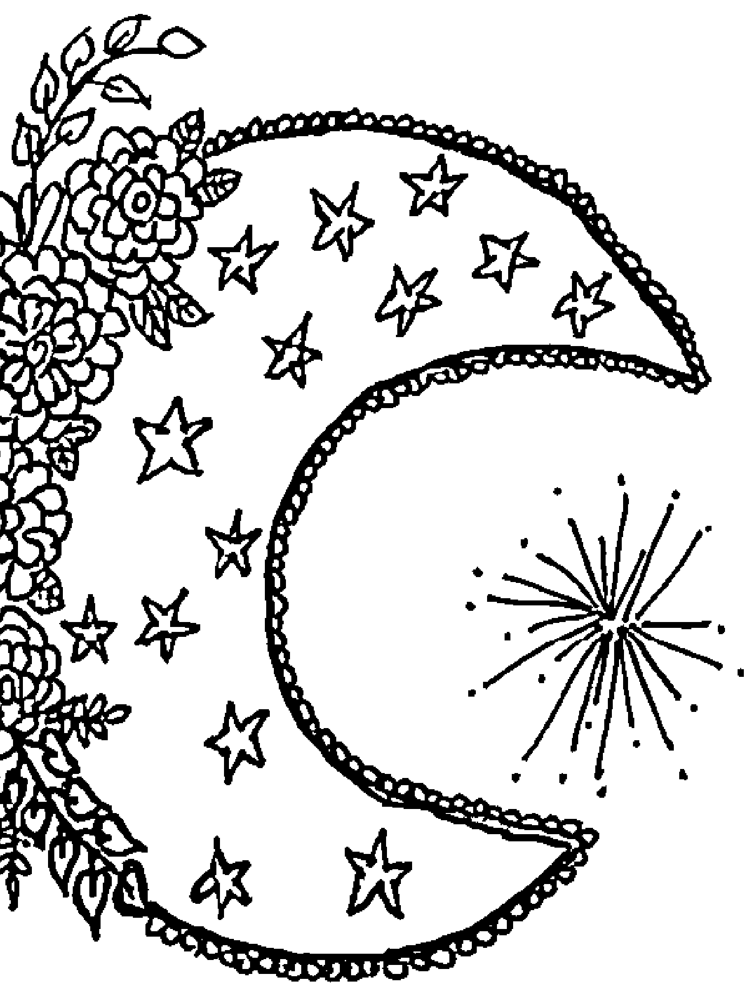

# 象徵符號：萬花筒

## 大愛數／智慧能量（正直與智慧）

## 人生課題：學為夢想奮鬥，而非金錢或物質

## 口頭禪：沒問題！

# 9

## 圓夢想成宇宙的守護者

在希臘眾神中阿特彌絲是 9 號人的守護神，祂是一位月神，在森林裡自由自在生活，但並非無憂無慮，他很關心那些生病的人，特別是小朋友，祂有救命之神的稱號。

射手座（♐）是阿特彌絲的守護星，圖案象徵是一匹人頭馬身的動物，住在古希臘時代的森林裡。這種半人半馬的動物，喜歡自由自在的在大自然裡活動，並且是箭術高明的神射手，在人類有難的時候會仗義相助。

9 號人有著慈善與救人的特質，與射手座的特性不謀而合。然而，9 號人一流的藝術作風，喜歡遠大的計畫，造成無可救藥的樂觀主義者，猶如一個夢想成宇宙的守護者。

# 9 個性特質

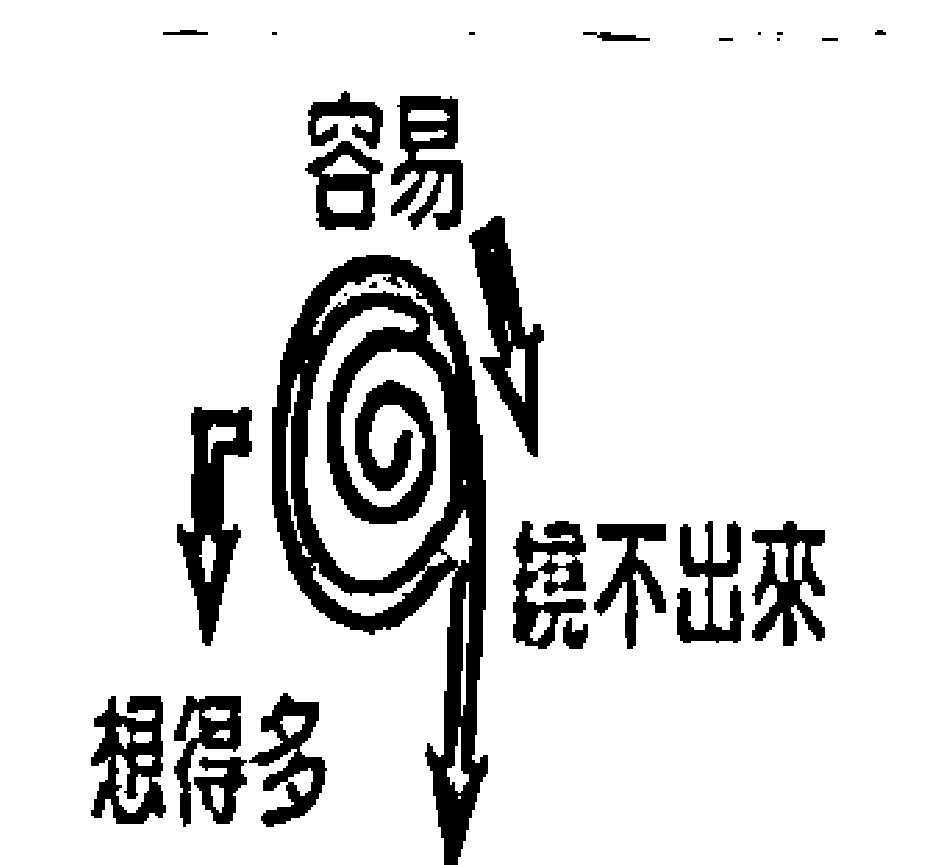

- 容易想得多
- 做得少，繞不出來
- 缺乏勇氣去執行自己的夢想容易變成空想。

阿拉伯數字 9 是個很特別的數字，型態像是一個有頭有腳卻沒有手的人，所以容易想的多做得少的人。它匯集了 1～8 的數字，9 與任何數字相加，它都會不見，所以 9 可以加入一切數，也可以說它是所有數字的一部分。

數字 9 的象徵圖案是萬花筒，具有智慧的能量，代表正直與智慧，能成為一位正直又充滿心靈智慧的智者。透過靈性的層面，來協助整合心靈和物質的課題。

### 正面優勢

9 號人個性上高尚正直、慷慨、熱心公益，充滿勇氣及正義感，樂於激勵別人，是十足的人道主義者；能在心靈層面領導他人並成為別人的典範。

9 號人有特殊的吸引力，靈性能量強，宗教很有緣，具有慈悲大愛及理想主義思想，容易成為他人的典範。

### 負面挑戰

9 號人容易心軟、無法拒絕別人，常想多做少，在缺乏魄力和執行力下，就成為天生的夢想家，而夢想往往不切實際。個性上對愛被動、消極、容易自我貶低，且容易成為宗教狂熱份子。

如果有任何形式的限制、幻想破滅、希望落空等，都會讓 9 號人產生恐懼。

## 小改變大能量

9 號人要學習「大智若愚」，要懂得喜捨及奉獻，接受別人務實的建議，夢想才會快速的實現。9 號人能成為一位正直而又充滿心靈智慧的智者，並透過靈性的層面，來協助他人整合心靈和物質的課題。

## 天賦才能

9 號人是一位超級的服務高手，能讓他人感受到被無微不至的照顧，所以不太在乎是否有解決問題，而是比較在意給人的感覺是否溫馨，例如：綻放一個微笑、講一段笑話、來一個擁抱或一次舉杯致意。所以行業如果是教師，會是優秀的教師人選，很容易受人愛戴。

9 號人有豐富的創意才華，是個很棒的表演者，學習力強，凡事很快就能上手，耐力驚人。然而卻是一個超級的夢想家，不切實際，但如果他的夢想是幫助別人，則容易不見他付出行動。

## 人生課題

「學習專注和實現夢想」是 9 號人的重要人生課題，可以有兩種選擇：

第 1 種就是完全無我的奉獻，像和尚和修士只求滿足別人，但 9 號人在無我付出的同時，又暗自夢想著過另一種人生，但不會付出行動，長久下來會鬱鬱不得志，因為 9 號人付出很多，卻回報很少，而自己的夢想卻又遙不可及。

第 2 種就是 9 號人在無私的幫助別人時，又能保有自己的夢想，在幫助別人和自己努力夢想之間取得平衡，只要 9 號人學會幫助別人，懂得在取捨極限的範圍裡，那終將達成平衡。

9 號人的人生課題是學習專注和實現夢想，切勿讓自己深陷不健康的感情關係裡，成為第三者或成為被欺騙者而脫不了身，也不要一昧的取悅他人，9 號人天生敏感仁慈，不會為自己著想也不會為自己爭取權利。既然 9 號人是為上天工作的人，就必須學會把上帝賜予 9 號人的希望、愛與情感實現。而沒有賜予金錢，所以賺錢要靠自己努力工作，會吃苦一定有原因，因為那不是 9 號人的責任，要接受批評及務實的建議，這反而可以加速 9 號人的夢想。

## 顏色／穿衣風格

把所有的顏色加起來就是 9 號的顏色——白色，乾淨純潔、誠實、信任。當想全心工作，一心只求別人獲得好處時，9 號人可以穿白色的衣服。

在穿著上，可以選擇有舞臺氣息的服裝，引人注意，又傳達某種訊息，引人深思，且會覺得受到尊重。不能穿著沉悶無聊、保守老氣的衣服，要有明確的自我，有時要能達到讓人注意的效果，引領時尚。

## 靈數組合類型

### 18／9

此類型數字 9 的人，不容易被了解，因數字 1 的外表看似堅強而獨立，但實際上不然。他往往會發現自己的所作所為都是為了取悅他人，彷彿沒有信心可以讓自己快樂。數字 8 讓他們內心常常在掙扎，到底該幫助別人多少，又該替自己做多少。一方面，數字8會希望自己的付出能有實質的利益回饋，另一方面，數字9又抱著為老天做事的觀念，所以常常苦於因為義務為人做事而沒得到酬勞。

### 27／9

這組9號人，有著數字2外表非常溫暖親切，感情豐富，有著數字7的他們懂得分析事物，不過分析的能力有一定的限度；因為害怕看到真相，以致常常在看事情時並不深入。做事也常有自欺欺人的現象，昧於真相而盲目到底。此類型人有過於理想化的傾向，總是想等待問題自行解決或消失，卻不願果斷採取行動，矯正問題。

### 36／9

這組9號人天生脾氣好，很好相處，對於好惡喜歡或不喜歡分明，別人的痛苦也很敏感，覺得自己有責任幫助別人。這組9號人最大的問題，來自於因為數字3的聰明而想太多，一輩子都活在自己對於人生的憧憬與幻想的心靈世界裡。如果缺乏務實的引導和扶持，其夢想永遠也只是夢想，人生也就始終無法獲得富足與得意。

### 45／9

這組9號人是所有數字9人裡，能力最強的一群人。有著數字4的腳踏實地，心胸開闊，勇於接受改變，願意為了實現夢想而努力，不怕吃苦，唯一的問題是如果事情遇到罣礙受阻時，就會缺乏堅持追求目標的勇氣。其內心務實的一面，常會壓制於夢想的實現，因而痛苦掙扎，結果不是停滯不前，就是因為進展過慢而深感挫折。

### 生涯發展

可以選擇服務大眾性質的工作，或解決問題的工作。例如：人道或人權主義者、宗教家、義工、救難隊、引導師、身心靈教師、另類及傳統癌症工作者等。

### 人物代表

- 德川家康（日本元首）1543年1月31日
- 羅丹（雕塑家）1840年11月12日
- 德蕾莎修女（人道主義者）1910年8月26日
- 悟覺妙天禪師（禪師）1934年5月5日
- 貓王（歌手）1935年1月8日
- 達斯汀 · 霍夫曼（演員）1937年8月8日
- 甘地（印度民族運動領袖）1869年10月2日
- 村上春樹（作家）1949年1月12日
- 周杰倫（歌手）1979年1月18日
- 田馥甄（歌手）1983年3月30日

### 故事

小星自小就是死硬派，聽不見別人務實的建議，夢想更是他的理想，媽媽對他任何的批評都會遇到小星的頑強抵抗，所以總是需要花很多的時間和技巧來溝通。而小星是無可救藥的樂觀主義者，所以在與他溝通時，需先弄清楚他的理想與計畫是什麼，之後想辦法擴大它，這樣才會讓他更覺得起勁。

9號人心中都有份理想，但常因為遇到困難時，容易會自動退縮，造成夢想無法實現，因此需要有人能務實的引導和扶持，才能給予9號人堅持的力量，協助他完成夢想。

## 與9號人的相遇

夢想，是你生命的原動力！

获取更多好书，请加微信号：strcdts 店铺：http://strc.cr.cx

## 特質

自然的能量（宇宙的能量）

- 物質界為空～心靈或靈性為∞，精神層次，會有落空的狀態。
- 機緣、訊息、淨化、領悟（了悟）。

在個位數為落空（必須領悟），在十位數為擁有及機會。

- 10～自我落空
- 20～情感落空
- 30～溝通落空
- 40～安全感落空
- 50～自由落空
- 60～關愛、愛落空
- 70～真理落空
- 80～權力、物質落空
- 90～智慧、串聯落空

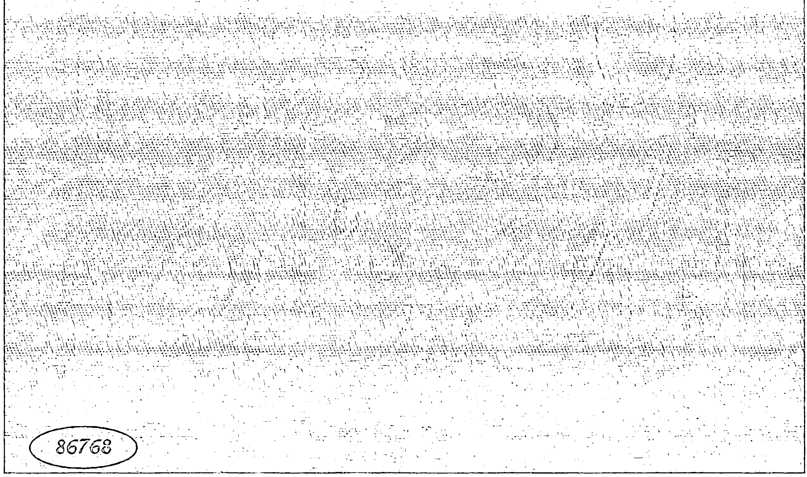

# Part 3

## 數字道出人生的不平凡

—由九宮格找出你圈數及連線、空缺數、限制數、契機數、黑洞數、解決之道

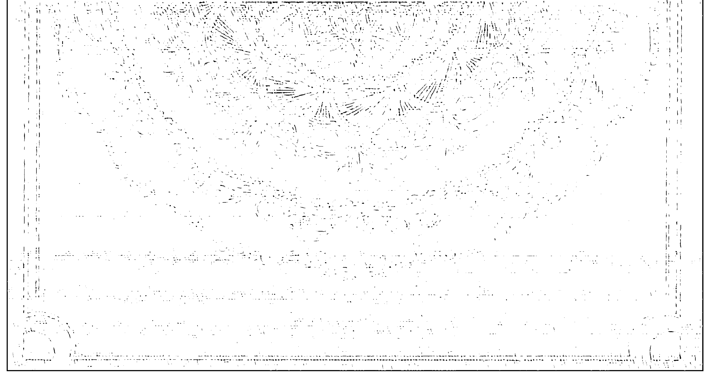

## 由九宮格找出你的圈數

什麼樣的力量在與你共存，可以用九宮格圈出個人的能量。你可以將你身邊出現的所有與數字相關的號碼圈進去，包括出生年月日、身分證字號、家裡的電話號碼、手機號碼、門牌號碼、信用卡號碼、銀行卡號碼、車牌號碼、星座等以上數字全部畫好後，看那些數字的圈數最多，那些數字的圈數最少，最多的是影響你最大的無形力量，最少的是你生命能量的薄弱環節。但此章我們主要的目的，在於了解個人的命盤，所以只針對出生年月日、天賦數、生命靈數等來做圈數。

當我們了解數字的基本意義及在命盤上的解釋之後，我們就能分析命盤中各數字圈數的多寡代表什麼意義，而圈數的多寡則明確地反映出每個人的個性與人格特質。

舉例：小加是西元 1987 年 06 月 23 日出生。**天賦數**

| 項目 | 數字 |
|---|---|
| 生命密碼 | |
| 西元出生年 | 1 9 8 7 |
| 出生月 | 0 6 |
| 出生日 | 2 3 |
| 總數 | 36/9 |
| 生命數 | 9 |

## 計算方式步驟

1. 先把每個數字相加：1 + 9 + 8 + 7 + 0 + 6 + 2 + 3 = 36
2. 再把十位數和個位數相加：3 + 6 = 9
3. 依照出生年、月、日，以畫圈方式畫在九宮格內。
4. 可以看出你每個數字的圈數量有多少個。

小加的 3、6、9 各有 2 個圈；1、2、7、8、9 各有 1 個圈。

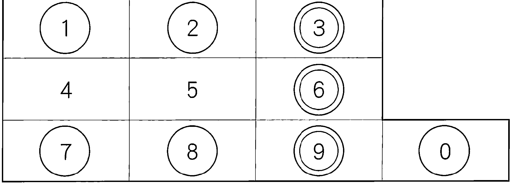

## 表2：你的九宮格圈數

根據下列步驟，算出你生命靈數在九宮格的圈數：

你出生的西元年：__________

你出生的月份：__________

你出生的日期：__________

將出生年月日分別加總：

_+_+_+_+_+_+_+_=___

將以上的每個數字都圈在九宮格中，知道你自己每個數字的圈數。

| 1 | 2 | 3 |
|---|---|---|
| 4 | 5 | 6 |
| 7 | 8 | 9 |

## 數字 ①

數字 1 是開始，具備最基本「自我」的數字。1 代表獨立的意識，是自我的能量。

有圈的人代表有足夠的能力靠自己尋求事情的解決之道，頗善於取得資源。在工作上能夠獨當一面，不畏懼單槍匹馬，遇到事情總是勇往直前，行事果斷，為人有決斷力。大部分的時候都能很快釐清自己的想法，並做出決策，就算有時候會因為想得周詳而較晚做出決定，但是一旦做出決定，就會很快付諸行動，是一個相當有行動力的人。而剛強的意志、強烈的自尊心與榮譽心，都會在這一生中伴隨著有圈數的人。

**3 圈以上** 顯示有強烈的企圖心，想要操控一切成為團體中的領導者。個性非常積極、果決，對於別人和自己都有一定程度的要求。

**5 圈以上** 氣勢超強，極其有影響力和領導力，但也有存在著失衡的問題，在表現上會出現自私自利、內心卻竊笑著、太以個人為中心的人，但也會出現比較軟弱的一面。

**1 圈或 0 圈** 顯示應該建立在自信心上，不要讓別人的決定，輕易左右你的判斷，造成你時常裹足不前、猶豫不決，很容易有患得患失的情緒。

## 數字 ②

數字 2 具有兩種面向的人，有分析的能力，並且思緒敏感、喜歡做衡量，是一個愛美之數。

有圈的人代表能夠協調人與人之間的關係及擅長與他人合作，是非常可以配合他人，所以擁有好人緣、常能成為他人的貴人或容易吸引貴人到身邊。

**有 2 圈時** 代表能夠與他人和樂相處，共同完成工作，是個很有耐性的人、較能以體諒及寬容的心態去對待別人；同時，喜愛美麗的事物，有一顆羅曼蒂克的心及愛家的人。

**3 圈以上** 個性會過於敏感，容易有情緒化及有過度依賴別人的傾向；具備獨特、說服他人的能力，且有超強的觀察力和高度的靈性；熱衷於分析各種細節和想法，但容易抱怨。

**5 圈以上** 會過度在意外表，樂於享受及奢侈的生活；在藝術方面，能夠很細膩的觀察。但有頑固的個性、缺乏自己的立場、處事不容易果斷。

**1 圈或 0 圈** 必須培養更好的耐性，加強與他人合作的關係。不要讓沮喪、軟弱或自閉，阻擾對外發展的機會；得多學著體諒他人的立場，並對他人表現出更多的熱情。

## 數字 3

數字 3 代表溝通表達的能力佳，愛好廣泛、靈巧、善辯、機智，具備天真的性格。

有圈的人，特別能以各種的藝術手法，清楚完整的表達自己的感受和情感，例如：寫作、繪畫、演奏、表演等。數字 3 揭露了樂觀、正面、外向的特質，喜歡與人相處，有一股熱情和企圖心，希望自己能有卓然出眾、鶴立雞群的表現。

**2 圈以上** 個性非常積極，有時甚至顯得過度樂觀，具有藝術氣息與能力，並有卓越的表達能力。自信心十足，經常渴望受到眾人的認同與歡迎。因此，個性健談，又善於用詞藻表達，所以在某些人眼中像是長袖善舞的花蝴蝶。

**5圈以上** 愛表現的特點會比較多，例如：嘴碎、幼稚膚淺不自知、大愚若智、愛搬弄是非。

**0圈** 要注意自己因自卑感而產生過度膨脹的行為表現；個性因缺乏企圖心，再加上不喜歡參與社交活動，所以很容易鑽進自己的小天地裡，流於放縱；說話經常令人覺得辭不達意，不知所云，談不到事物的深層意義。

## 數字 ④

數字4代表穩固的力量、務實的能力，深知有行動才是得生活安定的方法，面對機會比較主動。

有圈時，表示有耐性去完成細瑣的工作項目，此數揭露了具有能力去架構甚至建造一個完備的組織和系統。有時數字4的能量太強時，會讓人顯得一成不變，但適當的能量，會是一個很講求規畫與步驟的人。

**2圈以上** 非常善於用實際、務實的方式，來處理生活中的種種問題；相當重視事情的細節，強烈希望自己與別人不同，這類型的人不論在機械、數學方面，都具備相當不錯的邏輯能力，對於將性質完全不同的事物，整編成一個有系統的組織是很有一套的。

**5圈以上** 會比較吝嗇，對金錢看得很重，對事情的判斷不知變通，容易陷入對物質的追求而無法自拔。

**0圈** 處理事情時，較沒有彈性、不知變通，習慣照自己的方法執行；有時候會過於嚴格，而容易成為性情不穩定又喜歡批評的人。

## 數字 ⑤

數字 5 代表心智的能力，尋求自身自由及變化多端的生活，不想要墨守成規，更樂意於顛覆原先的規畫，並有自己的主見和方向感。

有圈的人在生活上面對突如其來的改變，懂得如何應變，很能適應各種不同的處境。對生命中各種現象，相當有心得，而且總能以正面的態度看待。

**2 圈以上** 即使身處在人群之中，也強烈渴望保有自己獨立與自由，不但對這世界充滿好奇心，而且善於改變。在文學方面有特殊的天分，頗能優遊於這個領域。很容易沉溺於性事、酒精或麻醉藥品，所以需要特別注意，保持自覺。

**5 圈以上** 雖然有自己的主見，可是圈數太多時，反而容易表現出缺乏勇氣、不敢面對問題，甚至無法解決問題，會有故步自封、偏執的個性出現。

**0 圈** 這類型的人通常缺乏改變的欲望，也不喜歡和人溝通；對於生活上的任何改變，會出現適應不良的狀況；處理問題上，往往會從比較困難的地方著手，帶給自己不少困擾。

## 數字 ⑥

數字 6 代表奉獻精神與愛的需求，能站在他人的立場思考、體貼及具有親和力、重視親情。與此數特別有關聯的是「家」，例如：家人、所愛的人和家裡的事務。

有圈的人，通常具備強烈的責任感，覺得自己對家人有一份義務。遇到事情時，有能力在需要改變的時候做調整，去創造出和諧融洽的氣氛；對於所有事物都比較能夠接受它原來的樣貌，不會去強求或刻意改造，一切順其自然。

- **2 圈以上** 對家人與家庭非常重視，能夠照顧周遭的人，喜歡協助別人解決問題，也樂於扛起責任，總希望能盡己之力去討好他人或成全大局。在家庭中，往往是最重要的決定者，不過有時候數字 6 的人企圖想要掌控，但當掌控權太多時，會成為家中的獨裁者。
- **5 圈以上** 負面表現非常明顯，對於付出因急於索取回報，而顯得目的性過強、自私自利，把道德感強加諸於人，有偽善之嫌。
- **0 圈** 似乎對一般的人和各種狀況缺乏正確的判斷；個性優柔寡斷，不知道什麼時候該提出承諾或是做出決定；在家庭和愛情生活方面，會面臨許多的挑戰。

## 數字 ⑦

數字 7 代表邏輯思考能力，喜好探索事物背後的動機，分析力強，同時也代表幸運。

有圈的人具備相當不錯的分析能力，能將事物的各種元素攤開來重新審視，看待事情絕不會只看一面，對於所呈現的意義，也會追根究柢，了解透澈。不管是對理論還是基礎的技術性問題，都有濃厚的興趣，會看到大多數人不容易看到的面向。

- **2 圈以上** 這種情形相當少見，一般來說，數字 7 有 2 圈以上的人，對於隱私與和平有著強烈的需求；喜歡用極為公式化和分析的角度去剖析問題、吸取知識；對於生活上的獨立性和未知，也習慣以同樣的邏輯概念去追求。
- **5圈以上** 表現上較喜歡控制他人、專制、搬弄是非、超級自戀（自戀甚至到自我認知出現問題）、狂妄、懶惰、缺乏智慧。
- **0圈** 建議你不妨多多運用思考，開展更深層的分析技巧，去挖掘事情的真相。

## 數字 8

數字 8 代表成功欲與權力欲，具備無限的潛能、有事業心與實幹的精神，重視財富的數字。

有圈的人對於如何運用權力很有見解，了解權勢地位的實際意義。此數掌管與物質、財務有關的事，同時也代表了容易對公平、正義作判決，管理事情會集中精力來達成目標。

**2圈以上** 懂得如何運用技巧性的取得金錢與社會地位，對於如何運用財務來達到自己的目的，也是很有一套，具有超強的能力和第六感；心思縝密且嚴謹，擅長架構及組織事物，但也容易成為宗教或政黨派的一份子。

**5圈以上** 有時會表現出急於達到目標的焦急心態，行為上有不擇手段的舉動，容易陷入好賭、拜金，視平凡為人生的失敗者。

**0圈** 判斷力不佳，對於物質與財務方面的事，更是一竅不通；經常無法集中精神去完成中、長期的計畫；如果個性不是那麼開朗正面，就會顯示出一副軟弱無力、非常沮喪的樣子。

## 數字 9

數字 9 代表人性與神性的交界點，有服務他人的意識、博愛，對世界大同有所期待。

有圈的人通常懂得如何以寬廣的視野和心胸去面對環境，並且能與周圍的人，相處融洽。寧可犧牲小我以換取大眾利益，願意成全大局的人；具有能力去主宰自己命運的人。

**2圈以上** 對於掌握自己的命運，不僅是有十足的信心，也具有強烈的欲望；對於他人的干預或主導不予以理會；對於世界的各種事物相當關心，也期望能夠積極參與其中，獻一己之力；個性中充滿了無比的勇氣與能量，擁有領導眾人的能力。

**5圈以上** 妄想過多，做事完全憑自我想像，注重心靈層面卻有悟性，容易逃避現實及迷信。

**0圈** 沒有數字9的人似乎缺少了同情心，比較難設身處地為他人著想；創造力較匱乏，靈感也經常沒有方向；必須避免脾氣太過暴躁及行事太過衝動，多關心和考慮他人的立場，敞開心胸來看待所有事情。

## 生命靈數的數字連線

生命靈數的連線是在完成生命靈數的九宮格後，所呈現出數字與數字之間相關聯的連線。每條連線代表著一個人先天的能量和特質。通常我們將九宮格中 9 個數字分成三組：身（1、2、3）、心（4、5、6）、靈（7、8、9）三個部分，透過身心靈的修煉來達到生活的健康。

我們透過數字連線來了解自己擅長的地方和不足之處，我們把它分成生命主線和副線。主線有 8 條、副線有 6 條。生命主線代表著我們的天賦、基本性格，所呈現出先天的能量，副線代表著我們的人際關係，與其他的相處模式。

但連線的多寡並沒有特別的好壞之分，連線多雖然會有較多的特質及才能，但因為能力廣泛及吸收力快，相對不易分析出自己的專長，如果沒有明確方向的人，就會花很長的時間去規畫人生方向；而連線少的人，能立即看出自己的強項，並朝著目標邁進。對於不足之處，可以透過精油來補足缺數的能量，增加數字的連線。

舉例：小加是西元 1987 年 06 月 23 日出生。

## 計算方式步驟

1. 先把每個數字相加：1 + 9 + 8 + 7 + 0 + 6 + 2 + 3 = 36
2. 再把十位數和個位數相加：3 + 6 = 9
3. 依照出生年、月、日，以畫圈方式畫在九宮格內並及連線。

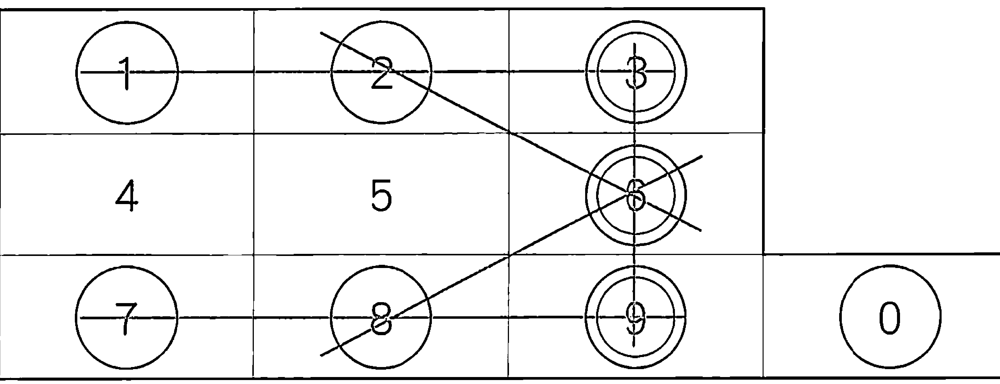

從小加的數字連線，可以得知小加所擁有先天和後天的能量。

| ☑ 123 美感藝術線<br>開創力、美感藝術創造力 | ☐ 357 最佳人緣線<br>群眾魅力、人脈廣闊 | ☐ 24 靈巧變通線<br>增進靈巧變通能力 |
|---|---|---|
| ☐ 147 物質充裕線<br>身邊物質充裕不缺 | ☑ 789 權勢高峰線<br>事業權力的登峰造極 | ☐ 26 公平正義線<br>為人處事公平、公正 |
| ☐ 258 熱情公關線<br>溝通、表達及公關能力 | ☐ 456 完美組織線<br>思路清晰、強化組織能力 | ☐ 48 工作規模線<br>做事穩重成熟、四平八穩 |
| ☑ 369 明智慧線<br>聰明智慧、創意想像能力 | ☑ 268 心想事成<br>身心靈合一的境界 | ☑ 68 誠實親切線<br>增強親和力及人際關係 |
| ☐ 159 工作事業線<br>事業的操控、腳踏實地能力 | ☐ 248 招財進寶<br>改善磁場、廣開財源 | |

## 表 3：你的九宮格連線

將你的出生年月日及生命靈數畫在九宮格中及連線。

| 1 | 2 | 3 |
|---|---|---|
| 4 | 5 | 6 |
| 7 | 8 | 9 |

## 你的所擁有的先天和後天的能量

| ☐ 123 美感藝術線<br>開創力、美感藝術創造力 | ☐ 357 最佳人緣線<br>群眾魅力、人脈廣闊 | ☐ 24 靈巧變通線<br>增進靈巧變通能力 |
|---|---|---|
| ☐ 147 物質充裕線<br>身邊物質充裕不缺 | ☐ 789 權勢高峰線<br>事業權力的登峰造極 | ☐ 26 公平正義線<br>為人處事公平、公正 |
| ☐ 258 熱情公關線<br>溝通、表達及公關能力 | ☐ 456 完美組織線<br>思路清晰、強化組織能力 | ☐ 48 工作規模線<br>做事穩重成熟、四平八穩 |
| ☐ 369 聰明智慧線<br>聰明智慧、創意想像能力 | ☐ 268 心想事成<br>身心靈合一的境界 | ☐ 68 誠實親切線<br>增強親和力及人際關係 |
| ☐ 159 工作事業線<br>事業的操控、腳踏實地能力 | ☐ 248 招財進寶<br>改善磁場、廣開財源 | |

| 1 | 2 | 3 |
|---|---|---|
| 4 | 5 | 6 |
| 7 | 8 | 9 |

### 1、2、3 連線時 → 藝術線／獨立線（任意線）

原始能量的（1），經過調和與琢磨之後的（2），創造了完美理想的（3）。

擁有此線的人對於事情會有自己的主見，自己的人生也會有清楚的規畫與逐步實現的能力，且富有藝術的氣息及創作天分，尤其是與雙手有關的才藝，例如：手作烘焙或手工藝品等，或對美的事物較有鑑賞力及敏感度。又因此組人在他人眼光中有豐富的個人資源，所以遇到困難的事情，都會先以自己的能力去解決問題，而不是希望靠著別人的協助來完成。

雖然擁有此線的人讓人覺得非常獨立，且清楚知道自己能從別人身上獲得什麼。但由於他們覺得可以自立自強，因此，拙於拿捏人際之間施與受的關係。在不依賴他人的情況下，再加上理想主義的思考模式，會被賦予強大的領導力。

### 2、5、8 連線時 → 感情線／表達線（碎嘴線）

感情（2）經過凝聚與闡釋後（5），產生了感動他人的力量（8）。

擁有此線的人如果在心裡有其他想法時，都希望能夠表達出來，通常也能以動人的語言和文字來描述。然而，有時候他們說話會不假思索，且心直口快，無意間就會說出傷人的話，所以也被稱為大嘴巴線或碎嘴線。

雖然擁有此線的人具有以言辭或文字感動他人的能力，一般來說，也都喜歡主動溝通，善於運用文字的天賦，所以通常文筆也不錯。對於溝通擁有一種獨特的認知和一份別人所不及的自信，認為無論後果如何，坦白說出自己真實感受，總比放在心裡要好很多。

### 3、6、9 連線時 → 創意線／想像線（作夢線）

| 1 | 2 | 3 | 4 |
|---|---|---|---|
| 5 | 6 | 7 | 8 |
| 9 | 0 | | |

理想主義的思考及創造力（3），經過處理與個人化的調整後（6），就能提供服務（9）。

擁有此連線的人具有想要創新事物的衝動，且能自信的把事物清楚的具象化及概念化，但有些人會完全活在自己的夢幻天地中，所以也被稱為作夢線或太空人線。

擁有此線的人有很強的學習力，會花很多時間思考，但往往到了應該行動的時候還在空想，喜歡活在理想的國度裡，比較不願意去面對現實的世界。通常也不喜歡受到批評，因為那些批評很可能會傷害到他們原來美好的世界。因此，有此線的人又被稱為任性線。對於開放而能接受新觀念的人，在要求他們改變想法或做法時，是很難被動搖且是最固執的一群人。

### 1、4、7 連線時 → 安全線／錢財線（拜金線）

| 1 | 2 | 3 | 4 |
|---|---|---|---|
| 5 | 6 | 7 | 8 |
| 9 | 0 | | |

原始的能量（1）穩定之後，經過整理（4），就不會動搖，除非有具體的事實證明（7）。

擁有此線的人會專注追求生活裡的穩定感和金錢上的安全感，但又有些人會走極端，把金錢當成人生最重要的任務，所以又稱為拜金線。

擁有此線的人會有渴望藉由財富獲得安全感。因為具有更大的力量，它能帶來精力和勇氣，並有衝鋒陷陣、開拓新事物的思維及能力，會讓人有極為務實的感覺。擁有此線的人，喜歡穩定和規律，不喜歡有太多的變化，所以朋友們都會認定你是他長久的朋友。

### 1、5、9 連線時 → 事業線／自由線（工作狂線）

| 1 | 2 | 3 | 4 |
|---|---|---|---|
| 5 | 6 | 7 | 8 |
| 9 | 0 | | |

原始能量（1），經過凝聚和開釋後（5）能夠提供服務（9）。

擁有此線的人會使人具有強烈的企圖心，會想要有自己的事業或是自創一套賺錢謀生之道。假如不工作會很不快樂，甚至會有罪惡感，所以又稱為工作狂線。

換言之，沒有此線的人不認為非要有自己的事業，就算無法完全掌控人生中的大小事，也沒關係。

### 4、5、6 連線時 → 秩序線／治癒線（潔癖線）

| 1 | 2 | 3 | 4 |
|---|---|---|---|
| 5 | 6 | 7 | 8 |
| 9 | 0 | | |

安全穩定的力量（4）在經過凝聚和闡釋後（5），可以提供解決的做法和療癒的效果。

擁有這條連線的人，會希望知道事物的運作方式與原理，能讓他們因而更擅長修復東西及解決問題的能力。而擁有此線的人被賦予組織能力及能確保流程、品質和完整性。同時，喜歡保持環境的清潔和乾淨，所以這條線有時也會被戲稱為菲傭線或潔癖線。

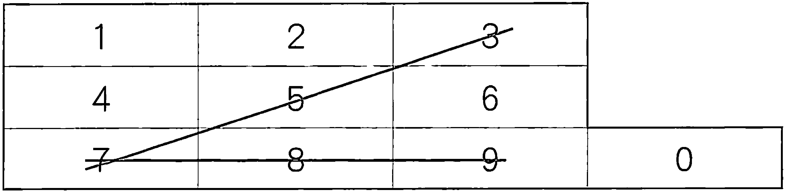

### 3、5、7 連線時 → 人緣線／表達線（發言人線）

| 1 | 2 | 3 | 4 |
|---|---|---|---|
| 5 | 6 | 7 | 8 |
| 9 | 0 | | |

理想（3）在經過凝聚和闡釋後（5）可能可以找到真相（7）。

擁有此條線的人可以看穿別人心裡真正想要的是什麼，並且會運用容易讓人接受的表現方式來呈現。這是一項具有威力強大的天賦，能成為成功銷售的利器，若能施展於政界、傳播媒體等，就能接觸到廣大群眾的相關行業，所以這條線又稱為發言人線。

擁有此線的人很善於溝通，也很討人喜歡，具有好人緣，雖然此線也被戲稱為八卦線（碎嘴線），這群人卻會對自己的祕密設下防線，不會輕易讓別人探知，同時也會需要有自己的空間與獨處的時間。

### 7、8、9 連線時 → 具有權力線／靈性線（貴人線）

| 1 | 2 | 3 | 4 |
|---|---|---|---|
| 5 | 6 | 7 | 8 |
| 9 | 0 | | |

事實真相（7）在經過靈性包裝和市場行銷之後（8），能夠提供服務（9）。

擁有此線的人喜歡具有強大力量的事物，例如：某些可以讓人登上擁有權力行業的行業，而有權勢的人也會被擁有這條線的人吸引，常會自動來幫助擁有此線的人，因此這條連線也稱為貴人線。

另外，此線也被稱為懶人線，因為擁有這條連線的人，有時候會懶得自己做事，只想藉由別人之手來代勞。擁有這條連線的人，有一個不尋常之處，是它會讓人認識到宇宙間最高的權力，來自於靈性世界，特別是尊敬的宗教和形式上的哲學思維，所以這群人會比其他人更容易受到靈異事物的影響。

| 1 | 2 | 3 | 4 |
|---|---|---|---|
| 5 | 6 | 7 | 8 |
| 9 | 0 | | |

## 有 9 數和 0 數有關

代表了靈性層次的才華，但很難以具體的命盤圖或數字來表現。

## 0 的影響力

0 數跟在其他數字後面，會引發那些數字的靈性力量。

靈數裡帶有 0 的人，例如：10／1、20／2、30／3、40／4 等人，他們都有個共同特點，就是生來對靈性世界充滿興趣，也相當尊崇，彷彿他們知道肉眼可以看見不可見的另外一個世界。

0 數對人的影響是會讓人充滿企圖心、努力上進，但若失敗受阻，也就很自然放棄期望，變成聽天由命，改以「塞翁失馬，焉知非福」的心情來看待事物。有些靈數裡帶有 0 的人，也會盡一切力量爭取想要的東西，但是一旦無法如願以償時，他們會馬上相信或許這才是老天的旨意，於是便心存感激接受了失敗的命運。

每個月中，1 號出生的人都比 10 號出生的人來得積極進取，雖然 10 號出生的人也有積極的一面，但他們更容易順應自然，樂天知命；但 1 號出生的人會期望在人生中屢戰屢勝。

| 1 | 2 | 3 | 4 |
|---|---|---|---|
| 5 | 6 | 7 | 8 |
| 9 | 0 | | |

### 2、4 連線時 → 靈巧變通線（奸詐線）

具有邏輯思維的（4）與身體覺知情緒感覺的（2）兩者相互交疊，會產生一個相當機伶敏銳的頭腦，就是非常聰明、敏感又精明的組合，很難吃虧上當。特別喜歡鑽漏洞和掌控，如果能多一些耐性，將心思放在成就大事上，並勇於接受挑戰及做改變，在財務上將會有不錯的收穫，不但利己也能利他。

其實我們知道犯罪集團的人，都有很高的智商，而且做事精明，相當謹慎。當私欲造成 2、4 連線的負面能量時，反而是一條極為險惡的連線，很容易讓人在犯罪的邊緣徘徊。

### 2、6 連線時 → 公平正義線（不平衡線）

擁有此線的人非常在乎別人的感受，（6）同理心很旺盛，（2）敏感於別人的態度，兩者組合起來，就會表現出很強的親和力。以助人為樂，不喜歡麻煩別人，在人情世故上，很在意友好和平，非常怕與人起衝突，或是一旦和別人借了東西，都會時時刻刻牽掛在心上，想辦法會立即還給對方。

待人貼心是 26 連線的優點，但也經常會「和平」過了頭，表現出唯唯諾諾、不好意思拒絕別人的樣子，總是怕得罪人，但也為別人著想過多，造成心裡的負擔。對別人太好，如果對方稍微沒表示回報就難過不平，這是一個大善人與大累人的組合。我們也稱此線為不平衡線。

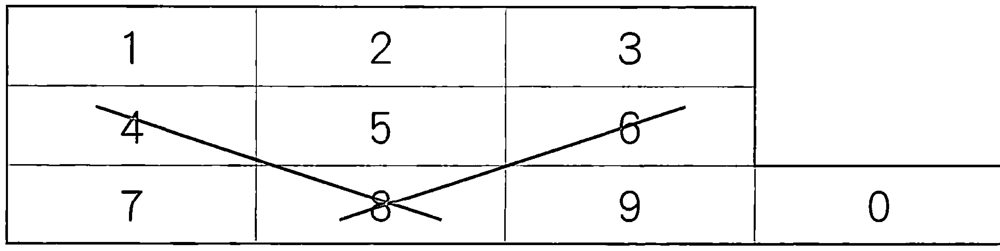

### 4、8 連線時 → 工作規模線、勤勞線（焦慮線）

務實邏輯的（4），與開發整合能量的（8）結合在一起時，會有一種比較紮實的穩定作用，所以擁有此線的人非常努力勤奮。因為兩者的執行力都具備強勁和穩固的特點，而且對於金錢的看法，也同樣有務實的心態。擁有此線的人在做事上，會表現的較為積極，善於在穩定中開拓。

擁有此連線的人非常實際，很在乎是否成功，更在乎金錢的獲得。所謂「吃得苦中苦，方為人上人」這句話，雖是老掉牙的觀念，假如不改變的話，就會成為勞碌命。這樣的人一旦突然變得很悠閒就會出現焦慮，很多不安全感會都一一浮現，最後給自己過大的壓力，我們也稱為焦慮線。

### 6、8 連線時 → 誠實親切線（虛偽線）

擁有此線的人會帶給人極和藹、親切的印象，很重視別人對自己的評價，也容易對人好到掏心掏肺的地步，而這些都是出自於真心誠意的，是一個表現誠實的人。

擁有此線的人很在乎成為別人眼中的好人，有壓抑自己真實感受的傾向，常討好別人，愛用「我這個人很實在」之類的話，來掩飾內心不滿的情緒。這樣一來，當發現不誠實時，反而成為了偽善，所以此連線的人壓抑越多，越有可能某一天突然情緒爆發，我們也稱為虛偽線。

118 輕鬆學生命密數・秒懂人心

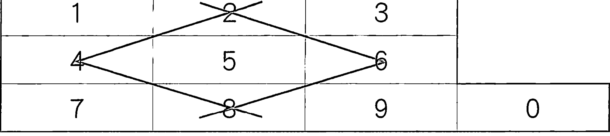

### 2、4、8 連線 → 招財進寶線（詐騙線）

（2）是喜好吸收新鮮事物能量，而（4）是堅守自己的小算盤，加上（8）對轉換各種無意識的能量又特別的強。尤其是在整合資源及投資上相當有眼光。這種組合往好的地方，會給人帶來財運，例如：炒股票的人，若有這個連線，就會四處打探股市的訊息，能快速吸收別人的經驗，且又不至於一股熱的全盤付出，相對地，這樣反而容易賺到錢。

擁有這條線的人，通常在處理事情的態度及方法上，有著一種令人著迷的特質，所以必須以「誠信」為原則，千萬不可以玩弄詭計，否則當外在環境有所轉變時，很容易引起內心的不安。在目的性過強、太在乎世俗的價值標準，也可能用不誠實的手段達到致富的目的，我們也稱為詐騙線。

### 2、6、8 連線 → 心想事成線（失落線）

（2）的心思細膩，善於分析與協調，與（6）的慈悲，擁有廣寬的格局及解決問題的能力，結合（8）的無意識轉換各種能量，以及強烈的執行力，通常很容易成功及心想事成。（2）的知覺與協調合作的能力，與（6）的愛及與一個屬於誠實的（8）連結在一起，可想而知，他在人際關係上有追求奉獻及保護他人的強烈傾向。在精神層次與實際生活上，是值得信賴、正直、可靠的夥伴。

擁有這條線的人相當在乎別人的感受，正因為如此，有時會太在意他人，常常委屈求全，或者壓抑真實的感受，容易造成內心極大的壓力和神經緊張。同時，因為不願說出心裡的話，時常招致他人的誤解，所以內心容易有失落感，我們也稱為失落線。

## 3-3 空缺數

上一章裡，我們提及每個人一出生都會有一組生命密碼，這些數字中並不是全部都會被圈到，沒有被圈到的數字，我們稱該數字為空缺數。空缺數代表我們先天的人格或人性上不具備此數字的能量，在平時的個性或性格上會出現的缺陷或弱點，這也會是不擅長的部分，例如：欠缺審美的能力、沒有表達溝通的能力或是有規畫能力卻沒有執行的能力等。

換句話說，空缺數是我們欠缺的能量，必須留意空缺數所帶來的障礙。如果這時的你是身為父母親或正在為學業、事業打拚的人，就須留意空缺數的數字，這正是需要學習成長的關鍵，因為這些缺憾也會是進步的動力來源。

當我們知道自己的空缺數時，不要糾結在這些數字所造成的影響，而是應該正視自己的缺點，並了解這些數字背後所代表的意義，進而加以改善。另外，我們可以運用缺數的精油、顏色、食物來補足欠缺的能量。

雖然大部分的人都會有幾個數字沒有出現，但也有全部數字都出現的人，並不是全部數出現的人就會有十全十美的人生，反而這些人被賦予的能量過於分散，無法找出自己獨特的優勢，甚至在選擇人生目標時，往往會迷失方向，或者必須經歷很長的一段時間才能找到或發揮自己的才能。

所以當你算出自己優勢或知道別人的弱勢後，不需要自滿或嫌棄，因為每個人都有自身要面對的挑戰，如何補足這些欠缺的能量，才是我們後天的人生功課及人生目標。現在我們來算出自己的空缺數吧！

舉例：小加是西元 1987 年 06 月 23 日出生。

| 項目 | 西元出生年 | | | | 出生月 | | 出生日 | | 總數 | 生命靈數 |
|:---|:---|:---|:---|:---|:---|:---|:---|:---|:---|:---|
| | 1 | 9 | 8 | 7 | 0 | 6 | 2 | 3 | 36/9 | 9 |

## 計算方式步驟

- ① 先把每個數字相加：1 + 9 + 8 + 7 + 0 + 6 + 2 + 3 = 36
- ② 再把十位數和個位數相加：3 + 6 = 9
- ③ 依照出生年、月、日，以畫圈方式畫在九宮格內。
- ④ 沒有被圈出來的，就是空缺數：4、5

| ① | ② | ③ | ④ |
|:---|:---|:---|:---|
| 4 | 5 | ⑥ | ⑦ |
| ⑧ | ⑨ | ⓪ | |

## 表4：你的空缺數

根據以下步驟，算出你的空缺數：

你出生的西元年：____________

你出生的月份：____________

你出生的日期：____________

將出生年月日分別加總：

__+__+__+__+__+__+__+__=____

將以上的每個數字都圈在九宮格中，就知道你的空缺數。

| 1 | 2 | 3 | 4 |
|---|---|---|---|
| 5 | 6 | 7 | 8 |
| 9 | 0 | | |

你的空缺數是：____________

### 空缺數 ①

數字中有 1 的人，在行事作風上較獨立自主、自信，喜歡創新思考的工作；且遇到事情不會輕易更改或因他人而改變，甚至會領導別人，成為團體中的領袖。

缺數字 1 的人，依賴心較重，對於獨立的意識薄弱，比較會跟隨別人的腳步前進，沒有自己的主見。在西元 2000 年以前，不會有缺數 1 的人，目前只會出現在西元 2000 年以後的小孩身上。

所以在 20 ×× 年出生和 19 ×× 出生的人，會因為在個性上有所差異，造成父母與小孩在溝通上的代溝，現在非常的普遍。

### 建議

空缺數有 1 的人，必須學會獨立，有自己的想法，相信自己的判斷，雖然這會歷經一段時間的挫折與不滿，但是一旦擁有了自己解決的能力，就會屬於自己的價值觀和獨特的想法。

### 空缺數 ②

數字中有 2 的人，在個性上有平衡和諧的性格，敏銳分析的思考，做事情能靠自己一手完成，即使家境很好的小孩，也不會帶給別人麻煩。

缺數字 2 的人，較欠缺審美的能力，所以在裝扮上容易有不協調的搭配，尤其對色彩較不敏感，同時缺乏想像力和敏感度。工作上不容易與人合作，所以自己親力親為，情緒上容易忽冷忽熱，在溝通的過程比較沒有圓滑與彈性，人際關係上會發生障礙。

感情也會遇到相同的狀況，不知道如何與對方溝通，雙方在價值觀上會有很大的落差。另外，因為很在乎別人，所以會有逞強死要面子的感覺。

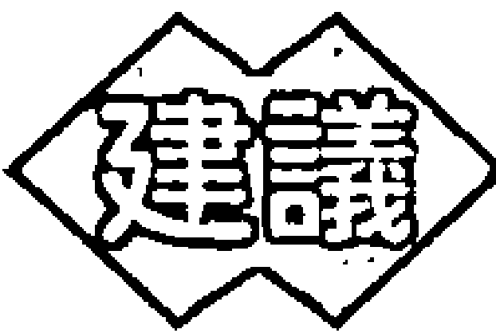

空缺數有 2 的人，遇到突發事件必須先學會控制自己的情緒，找出解決的方案，適時的表達自己的想法，讓周圍的人能理解。雖然會經歷害怕與猶豫不決的時候，一旦突破心理障礙，就能學習獨立自主的能力。

### 空缺數 ③

數字中有 3 的人，在表達上是顯而易見的，不論是在語言或才藝上都是才華洋溢，並能透過自己的方式輕而易舉的呈現出來。

缺數字 3 的人，在想展現自己的才華時，容易受到表達上的局限，當心中有想出一幅畫或創意時，會不知道用什麼方式表達出來。例如：一位畫家如果沒有數字 3，所呈現出來的這幅畫會讓人有匠氣的感覺，缺乏原創的能力和創意的靈氣，表達上即會受到阻礙。

又或者在表達上會木訥耿直，有時會想用笑話來化解尷尬，卻經常又會因為詞不達意而說錯話，造成別人的誤解。

但沒有數字 3 的人，為人耿直實在，會說真話，在做事上也較能集中精力，對準目標前進。

### 建議

空缺數有 3 的人，可以透過各種方式呈現自己內心的想法，例如：繪畫、寫作、唱歌等來表達自己的感受，在這些方式中學會看重自己的價值，不必去附和別人的意見。

即使在面對社交場合，會有緊張膽怯的時刻，一旦跨越了那門檻，自然就會有你發揮的舞臺。

### 空缺數 ④

數字中有 4 的人，在工作上會有很強的執行力與務實的態度，如同馬斯洛的需求理論中，對生存的基本安全具有很強烈的欲望。

缺數字 4 的人，個性孤僻傲慢，表面上會以為對金錢沒有太多的欲望，平時有錢就花，沒錢也不會覺得害怕，且相信「船到橋頭自然直，天無絕人之路」的想法。

但事實上，在內心是對生活有極高的要求，他們並不是嗜金錢為糞土，只是不願意為了金錢折損自己的面子及身段。

### 建議

空缺數有 4 的人，必須學會了解每個細節，並且規畫性的去執行，在堅持的過程中，有效率的完成每項工作。

當你能夠掌控每件事情的執行與完成時，自然而然就能建立起穩固的安全感了，這是空缺數 4 的重要關鍵。

### 空缺數 ⑤

數字中有 5 的人，因為數字 5 位在九宮格的中心位置，也是屬於心智方面的表現，所以會比較有主見、喜歡自己做決定及愛好自由。

缺數字 5 的人，不但沒有自己的主見，且會常因外界的波動而受到影響，不知道自己要什麼，左右搖擺不定，尤其在面對選擇的時候，會受到別人言語上的刺激而動搖到自己內心真實的需求，無法掌握心裡真正想要什麼，有時候還會出現令人驚訝的行為與決定，這是因為缺乏定力而受到的影響。

從另一方面來看，缺數字 5 的人，反而會像海綿一樣吸收四面八方的訊息與能量，來不斷地充實自己，常會讓人有異想不到的驚奇，但也會有「消化不良」的現象。若定力不夠時，遇到行為不好的朋友，也會有學壞的可能。

### 建議

空缺數有 5 的人，必須學會有冒險的精神和挑戰，才能突破以往的舊習，學習處理如何面對不合理的要求，並懂得包容別人，才能建立長久的友誼關係。

### 空缺數 ⑥

數字中有 6 的人，因懂得關懷別人，且會用同理心的方式對待他人，讓人有溫暖的感覺。數字 6 是奉獻數，所以常常會以解決別人的問題為使命，即使是超過自己的能力範圍，也在所不辭。

缺數字 6 的人，在語言上較主觀，坦白直率，喜歡強加諸於人的指控，有時難免會造成誤會和衝突，最後會因為得罪了人而不自知，也讓對方感受到不舒服。

對於別人的喜怒哀樂較難察言觀色，不知道如何去表達對他人的愛。因此，經常以自己的角度出發，表現出自私的特點。

在感情關係上也會如此，除了對感情上會有些遲鈍外，桃花運也很少。但另一方面，因為與人相處坦誠，所以不會刻意去討好任何一個人，是個非常單純的人。

### 建議

空缺數有 6 的人，必須學會換位思考，學習站在別人的立場解決問題，並試著去為他人服務，在懂得感恩之餘，適時的表達出心中的愛，才能展現出更多的包容與遠見。

### 空缺數 ⑦

數字中有 7 的人，常會有幸運之神降臨、化險為夷的情況發生。數字 7 的人會為了追求真理，而陷入深度思考的困境。

缺數字 7 的人，在工作上分析推理的能力有限，常會有抓不到重點的時候，但思維簡單，不願意思考過於深層的道理。個性上很怕麻煩，也容易被激怒，常為了不值得生氣的事而生氣。

缺數字 7 的人，完全要憑自己的努力和實力，去獲得別人的肯定，反而沒有「幸運」這兩個字的可能。

從另一個角度看，個性單純容易親近好相處，不會輕易懷疑，反而會有比較強的行動力。

### 建議

空缺數有 7 的人，必須學習在人與人之間相處時，要懂得謙遜，才不會顯得傲慢無禮。同時，對於還沒有找到真相前，應訓練自己用理性去分析事情的真偽，並真實的表達出心中想法，才能擴大自己的視野。

### 空缺數 ⑧

數字中有 8 的人，對於企圖心、權力欲望及成就感非常強烈，所以會對於工作上的成就感與價值有極大的渴望，喜歡掌控每一個環節。

缺數字 8 的人，在情感上會給對方足夠的自由空間，所以很容易讓對方有外遇的機會，就如同風箏和線的原理，抓得太緊線會斷，抓得太鬆，風箏就容易隨風飛走。

在工作上沒有企圖心，對權力欲望興致不高，同時也缺乏權威，無法掌控大局。

另一方面，缺數字 8 的人能隨遇而安，不會被欲望成就感所壓迫，尤其是對事業上或物質金錢上都欠缺野心。這不代表沒有數字 8 的人，在事業上就不會成功，因為人生總有很多難以預料的事。

### 建議

空缺數有 8 的人，應學會懂得如何在開源節流的情況下，做好財務上的管理，並對人生及工作上設定目標，朝著計畫前進。

### 空缺數 ⑨

數字中有 9 的人，有著大愛之心，願意投入自己的心力為社會大眾服務的人，不論是對小動物或朋友都有同情心與關懷之心，且數字 9 包含 1 ～ 8 的數字能量。

缺數字 9 的人，注意力會只集中在自己身上，對於周遭的人都比較冷漠，對於新聞在報導社會上發生的殘忍傷害之事，都只是以無動於衷的態度面對，比較缺乏大愛，相對地也會減少拯救弱勢者的欲望。

沒有數字 9 的人，可能無法了解自己的缺點，常常會以現況為滿足，只要有麵包能讓生活無虞就好，對於精神層次不太會要求，思考上較沒有想像力，所以平時應多充實自己在精神上的糧食，讓物質與精神生活之間達到平衡，讓自己也能成為帶給他人養分的人。

### 建議

空缺數有 9 的人，應隨時充實在精神上的糧食，探尋自己內心真正的需求，不能只是物質上的享樂。試著在施與受之間找到平衡點，給予他人更多的愛與熱情。

## 限制數

從小到大，我們在父母親的影響和教育養成下，會有一些自相矛盾的「毛病」。那些本來不是來自性格因素，而是與外界或父母親相處時形成的一種價值觀或行為模式，並且在成年後會有潛意識的將兒時建立的習氣當作真理。

那些深藏不露的特徵，時時刻刻都會潛伏在我們的行為當中，形成一種特有的人格面具，隨時會跳出來擾亂你的心理或行為，這就是我們所稱的「限制數」。

印度哲學家奧修說：「父母的制約是世上最主要的權威。」當你把認定的「真理」融入到生活中，就會給自己造成一種約束，與你真實的需要切斷，這些約束也會成為你做人的面具。我們可以透過出生月日的數字，來算出我們影響我們思維或做法的數字。

**計算方式步驟：將出生月和日相加的總和。**

小鐵有一群朋友，他們的生日分別是11月22日、10月8日、6月23日、2月5日，我們來算算他們的限制數及出現的行為。

舉例：

- 11月22日 出生限制數為：1 + 1 + 2 + 2 = 6
- 10月 8日 出生限制數為：1 + 0 + 8 = 9
- 6月23日 出生限制數為：6 + 2 + 3 = 11 / 2
- 2月 5日 出生限制數為：2 + 5 = 7

### 表 5：你的限制數

你出生月份：__________

你出生日期：__________

將出生月日分別加總：____ + ____ = ______

你的限制數是：__________

## 限制數 ①

限制數 1 的人，從小受到長輩們的嚴格要求，在生活中他們的指責多過讚美，這大多是來自於陽性的力量，但也有可能是父母親的性別角色互換，使得母親對（1）的影響較大。

強勢的長輩常會用說教的方式教育孩子，在這樣長時間的教育環境下，容易造成（1）的行為有很大的影響及偏差，例如：無形中讓（1）人在行為上產生自卑感或信心不足，總覺得自己做什麼都不行、做什麼都不對，做起事來也沒有自己的想法，會一直想要尋求別人的建議。

若遇到自尊心特別強的（1）人，在與他人發生衝突時，（1）就會有不服輸的念頭，且會有爭著你死我活的情況，這時容易出現一種緊張的氛圍。雖然（1）會努力向他人證明他的說法是對的，可是任何事情有了想要去證明的這個想法，就會給（1）人很大的壓力。（1）在無法信任自己，注意力也不在自己身上時，反而是過分關注別人的期待，這時候的（1）內心會產生焦慮與不安。

### 建議

限制數 1 的人要學習接納自己的一切，尤其要學會接納自己認為不好的部分，有自信的人是不需要證明給別人看的，哪怕（1）是一個身體或心理有殘缺，只要接納這份缺陷就會變成一位有自信且正向能量的人。

## 限制數 ②（或11）

限制數2的人，母親會對（2）的影響力很大，常出現在單親家庭、從小與母親相依為命、母親過度疼愛，或父親在教育上較少插手干涉等情況。這個時候（2）與母親的黏著度會過大，反而容易產生一種依賴感，即使長大了也分不開。母愛雖然很偉大，但是當「愛」變成一種「控制」或「情緒勒索」時，（2）會逐漸失去自己的判斷，甚至不敢自己決定。

在（2）習慣依賴別人的同時，會無從得知自己表現的好壞，希望能從他人對自己的態度與評價中尋找自我，當獲得他人肯定時，就會認定自己的表現是好的，若受到他人的否定或指責時，就會對自己產生質疑。

因此，當別人對（2）表現出不一樣的態度時，（2）會變得特別敏感，深怕與人發生不愉快，甚至會擔心聽到壞的評價。

如果（2）想要成為別人眼中的好人，又怕別人發現自己的弱點時，就會表現強硬的態度來掩飾自己內心的脆弱，像是身上隨時都帶著一把劍和盾牌，表現出一副要一決勝負的狀態。

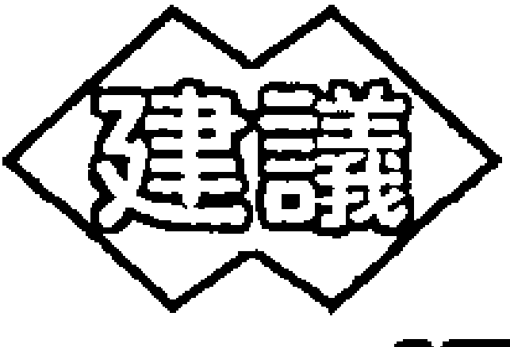

限制數2的人，需要有很大的勇氣，來面對自己內心的「懦弱」。然而，懦弱並不可怕，可怕的是抵抗懦弱的心，這樣反而會表現出自己更加的不足。

## 限制數 ③

限制數 3 的人，小時候被長輩們認為是一群聰明伶俐的小孩，所以（3）從小就知道如何討好大人的歡心，更懂得在親朋好友面前展示自己的才能。久而久之，（3）會變得很會「演戲」給大人看，清楚知道如何表現能獲得更多的關注與掌聲。對於在這種家庭環境下的孩子，在對愛的需求上是匱乏不足的，因為愛需透過（3）自己努力賺來，而不是別人主動給予，這樣的（3）會讓人有些心疼。

（3）在成年以後會變成一位社交高手，以前擅長表演的才藝，由習慣變成一種特長，懂得隨機應變，善於察言觀色，對別人的心思和狀態都能輕易的揣摩出來。在團體中能見人說人話，見鬼說鬼話，懂得如何取悅別人，在什麼場合該高調或低調，都能非常清楚掌握。

在外面的表現雖然會有好人緣，看起來像是神經大條，什麼事都不在乎的樣子，但真與假只有自己最清楚。（3）對別人很慷慨大方，喜歡和朋友交流談心，可是在家裡卻是一個悶葫蘆，不喜歡說話，不願意與家人溝通，私底下較容易感覺到寂寞孤獨，所以在家裡會不開心，這點也會影響到婚姻生活。

### 建議

限制數 3 的人應學會想清楚自己想要成為什麼樣的人，而不是成為別人心目中的自己。當（3）想笑就笑時或不想笑時，就一五一十的呈現出來，告訴別人「我今天不開心」，把注意力轉移到自己身上，而不是關注在別人對你的觀點上。

## 限制數 ④

限制數 4 的人，因為長輩在觀念上會比較保守，所以從小就不斷灌輸給（4）一個「安全之道」，例如：穩定的收入、工作、婚姻、身體健康……。只要有任何不安全因素對他們來說，都是一種危險，以致於限制了（4）的個性發展，即使（4）原本是愛自由的，害怕被束縛，但也會在這樣的教育環境下，成為乖乖牌的孩子。

當沒積蓄時會存在著沒有安全感，就算身上有錢也會無時無刻的擔心錢會花光。在其他情況也會有出現沒有安全感的時候，例如：身體變差時、沒人理會時、失戀的時候等。

即使在（4）成年以後，長輩們亦仍會隨時隨地的限制（4），繼續灌輸安全的意識，操控（4）婚姻的選擇，這會讓（4）一直處在沒有安全感的環境，造成（4）不願意一個人去面對問題時，就會用逃避的方式來解決，然而（4）真正被限制住的其實是缺乏勇氣，因為無法跨出那一步的勇氣。

### 建議

限制數 4 的人應該把注意力放在自己的身體上及需求上，例如：突然想要吃某樣的食物，這時肯定是身體上的需要，或某天夜裡非常想要嘗嘗某種食物的味道，這也是你當下的需求。

所以一旦能夠活在當下，關注你真正的需要，這樣就能為你帶來安全感，也能讓（4）的人生變得輕鬆自在。

## 限制數 ⑤

限制數 5 的人，如果是一個調皮搗蛋、活躍的孩子，因為好奇心強而表現出精力旺盛，喜歡引起別人注意。但若被長輩們覺得這樣是不好的行為，他們就會期待（5）做一個老實的孩子，一旦出現淘氣的行為，他們就會透露出「要乖才是好孩子」等這些訊息或語言，經過長時間的養成，無形中就會對（5）有所限制。

（5）為了讓自己成為長輩們眼中有素質的孩子，就會做到穩重、安靜、省心的要求。但實際上（5）是非常需要自由的，也渴望有那麼一點叛逆，但是（5）做不到，因為已經習慣克制自己的能量，壓抑而收斂，會把這種自我約束投射到其他事情上，害怕承擔責任及容易逃避問題，對自己更缺乏自信。

### 建議

限制數 5 的人需要找個時間沉澱，好好想想什麼事情是最害怕及恐懼的，需要釋放心中的束縛，把人生當成一件刺激又好玩的事，可以是一次冒險之旅，勇敢能讓你體會到生活的輕鬆與美好。

## 限制數 ⑥

限制數 6 的人，從小與長輩們之間的感情有著密的連結。童年有可能在不和睦的家庭中長大，敏感於長輩們的態度，很怕自己做錯事，道德觀念非常明確，會把事情依照對與錯來劃分，一旦認為做了不對的事就會很難過，尤其擔心長輩們會不高興，而這種狀況會讓（6）有種隨時要道歉自責的感覺。

長輩們會用「乖就有糖吃」的教育方式，等（6）長大後，認定的標準是必須循規蹈矩，不能有一絲的逾距行為。（6）需要被愛的感覺，內心有著戀父母親情節，會時常用父母親的角度去審判別人的毛病，動不動就拿一套道德標準，把對方衡量一番，但這只是（6）先發制人而已，因為擔心別人先說你不對。而（6）也會習慣以交換的方式來獲得愛，例如：我對你好，你不能對我不好，否則我會很不平衡。

### 建議

限制數有 6 的人，你必須學習告訴自己，每個人都有善惡的一面，沒有人不會犯錯，不需要對所有的人負責，你要試著去體會自己內心的真實想法，對自己負責比對別人負責更重要。

## 限制數 ⑦

限制數 7 的人，從小就很喜歡問問題，對很多事情都會產生好奇，腦子裡只有無數個為什麼。但就長輩們而言，沒有時間思索也沒有耐心回答，或者長輩對知識層次較少時，也會拒絕回答。

所以（7）不得不自己去尋找答案，不會讓自己無知，在得不到答案時，又不願意面對這個事實，最後會把自己封閉起來。然後，依照自己的主觀的想法去「思索」，就會像井底之蛙的作風，明明不知道明天會發生什麼，可是（7）會編造一副我知道的樣子，然後沉浸在這個答案裡，故作上知天文下知地理的人，但那未必是正確答案。這樣會限制住（7）的就是不懂而裝懂，未必是要裝給誰看，但至少能填補對無知的恐懼。

### 建議

限制數 7 的人是沒必要讓自己什麼都懂、都知道，應該把注意力放在「實踐」上，如果沒有依循正確的方式獲得正確的知識，會成為智慧的絆腳石，（7）要常對自己說「宇宙之大，我何其渺小呀」。

## 限制數 ⑧

限制數 8 的人，長輩們會是比較好強的人，很在乎社會所謂成功的標準，他們會用淺移默化的方式灌輸給（8）成功與失敗的道理，不只是針對學業或工作，很可能在其他方面也有此觀念，例如：拿鄰居的孩子和你做比較，讓（8）從小時候就會朝著這方向發展，做一個不平凡的人。

但是一切都要掌握在自己手中，才會有踏實的感覺。所以（8）不想做個失敗的人，需要成功就要掌握周遭的一切，（8）會有很強的控制欲。在工作上喜歡插手，干涉主管或同事的決定；在生活裡隨時掌控家裡的一切，包括對親密的人也會不由自主的掌控。

即便（8）在成年以後，具有高尚的人生觀、有高層次的心靈追求，可是習慣性的思維模式，還是會讓（8）有世俗的舉止，最後的安全感，會演變成來自於金錢。

### 建議

限制數 8 的人要知道沒有失敗就沒有成功，所以把失敗當作考驗的樂趣，才會有更多的成就感。不管周圍的一切還是身邊的人，那都是他人的假象，自己才是真實存在的個體。

## 限制數 ⑨

限制數 9 的人，小時候因為父母親工作繁忙或生活較穩定，比較有可能被阿公阿嬤或其他親戚帶大的機會，父母親有一段很長的時間不在自己身邊，（9）會有寄人籬下的感覺。所以（9）常會處於緊繃的狀態，很在乎別人的態度，這與限制數 2 不同，（9）在乎的不是別人怎麼看你，而是他們是否真的需要你。

然而，「被需要」成為（9）成年後的價值所在，一旦被人需要，就會義不容辭地盡心盡力為他人服務，不想讓別人失望或冷落任何人。但是當別人的求助成為（9）的負擔時，（9）又會對於壓力產生不平衡和抱怨，甚至會出現排斥與冷漠的態度。

如果想要做一位大善人是需要付出代價的，必須澈底將自己置之於不顧，而不能把自己想要的放在第一位。如果做不到，就不會是一位人稱的大善人。所以要明白這一點，滿足「被需要」的，只是（9）的「需要」而已，和善良沒有任何關係。

### 建議

限制數有 9 的人應該要經常想著先「我」後「他」，你自己的感受要放在第一位，當你不喜歡時就不要做，你想拒絕誰就拒絕誰。之後你會發現，主動說「我不願意」的時候，這個世界還是會跟以前一樣繼續運轉，並不會因你的改變而有所不同。

## 解決之道：化解你的衝突

我們因為先天有了空缺的數字能量，造成我們在後天上有了限制與陷阱的數字，在欠缺與不足的情況下，我們可以透過解決之道，來彌補及加強數字上的能量，讓我們能完成此生的人生功課。

首先必須先算出我們的契機數和黑洞數，契機數是我們的幸運數，而黑洞數就是我們容易落入陷阱的黑洞數。

### 如何計算契機數和黑洞數

舉例：智賢出生日是 1973 年 6 月 18 日
生命密碼：35／8

| ① | 2 | ③ |
|:---:|:---:|:---:|
| 4 | ⑤ | ⑥ |
| ⑦ | ⑧ | ⑨ |

空缺數是 2、4（可以直接使用 2 號及 4 號的精油補足能量，但還要再看最大契機數和最大黑洞數）

- ① 最大契機數：
  - 年：1 + 9 + 7 + 3 = 20／2
  - 月：6 = 6
  - 日：1 + 8 = 9
  - 月＋日＝6 + 9 = 15 → 1 + 5 = 6…………(1)
  - 年＋日＝2 + 1 + 8 = 11 → 1 + 1 = 2……(2)
  - 最大契機數是 (1) + (2) = 6 + 2 = 8

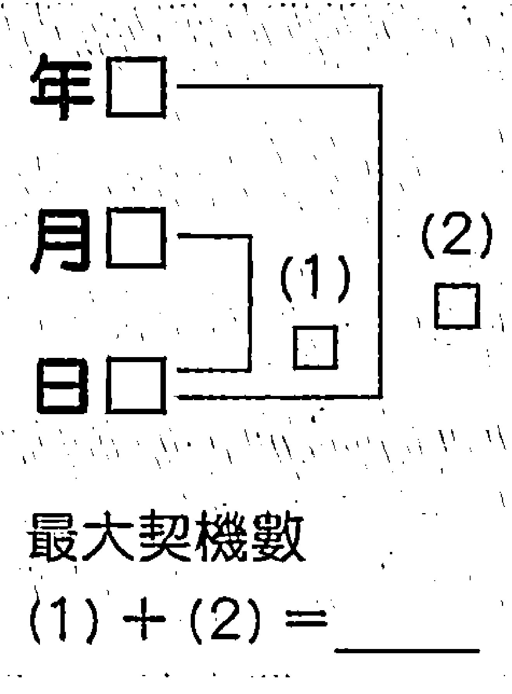

- ② 最大的黑洞數：
  - 年：1 + 9 + 7 + 3 = 2
  - 月：6 = 6
  - 日：1 + 8 = 9
  - 月－日 = 6 − 9 = 3⋯⋯⋯⋯(1)
  - 年－日 = 2 − 1 − 8 = 7⋯⋯(2)
  - 最大黑洞數是 (1) − (2) = 3 − 7 = 4

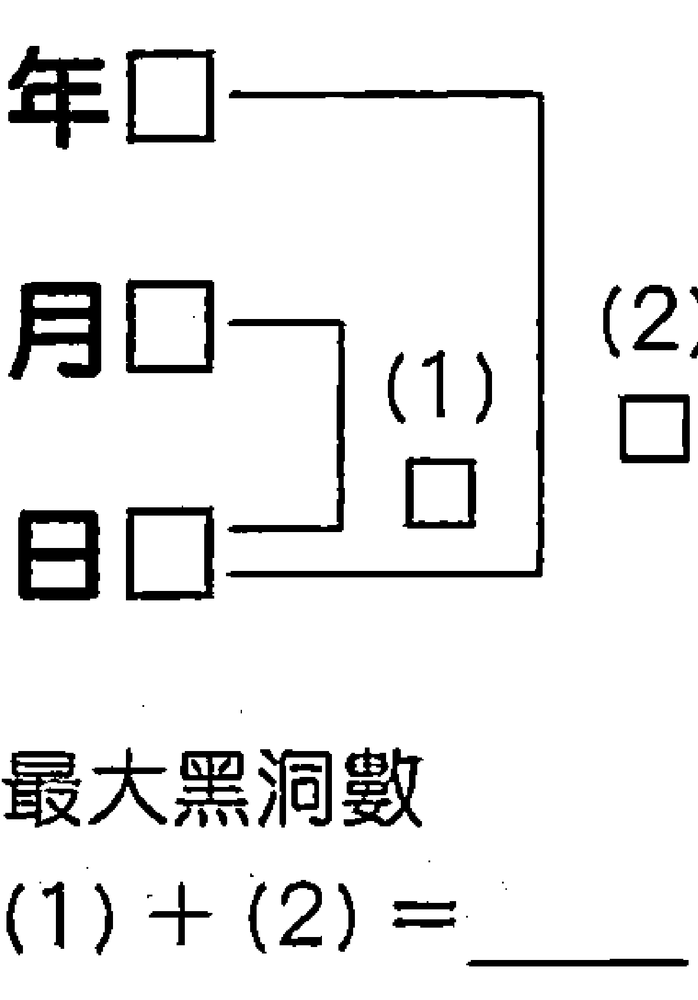

若最大契機數等於最大黑洞數，最大契機數能量會大於最大黑洞數能量；若最大黑洞數等於缺數，就不能直接使用缺數的精油，必須尋求解決之道。

### 解決之道：

舉例：智賢出生日是 1973 年 6 月 18 日，生命密碼：35／8

最大黑洞數等於缺數是 4，想要化解 4 的能量

公式：利用主命數＋月及主命數＋日的方式

步驟 ①：6  18 ←出生月．日

步驟 ②：6  9
         ↓  ↓

步驟 ③：5  8 ←生命數月．生命數＋日

步驟 ④：8  5

───────────────

步驟 ⑤：4  4 ←因黑洞數是 4，所以要化解 4 的能量

所以使用 5 號及 8 號的精油來化解 4 的能量。

## 表6：你的契機數和黑洞數

根據以下步驟，算出你的契機數和黑洞數：

公式：利用主命數＋月及主命數＋日的方式

- ① 最大契機數：
  - 年：__+__+__+__=____
  - 月：__+__=____
  - 日：__+__=____
  - 月＋日＝__+__=____→__+__=____……(1)
  - 年＋日＝__+__=____→__+__=____……(2)
  - 最大契機數是(1)＋(2)＝__+__=____

- ② 最大的黑洞數：
  - 年：__+__+__+__=____
  - 月：__+__=____
  - 日：__+__=____
  - 月－日＝__-__=____……(1)
  - 年－日＝__-__=____……(2)
  - 最大黑洞數是(1)－(2)＝__-__=____

## 契機數

契機數就是我們所謂的幸運數，代表能順利行使正面特質及帶來幸運的數字，他人的主命數與你的契機數相同的人，就是等於你的貴人。

### 契機數 ①

1 是開創獨立自主的能量。契機數是 1 的人常有好的機會上門，能開疆闢土，同時又有執行力，具有勇氣及承擔的能力，能發揮領導力與自信力。

### 契機數 ②

屬於情感、協調的能量。擁有契機數 2 的人，會具有分析力與協調能力，擁有良好的人際關係，並且貴人特別多，也有良好的合作關係與親密關係。

### 契機數 ③

具有陽光熱情、歡樂、表達口才的能量。契機數 3 的人特別有審美觀與創意，以及藝術創作的能力，也有良好的溝通表達能力。

### 契機數 ④

擁有穩固、秩序的能量。契機數 4 的人穩定力好，做事有程序步驟、務實勤勞，忠誠度夠，愛家、顧家，做事容易成功。

### 契機數 ⑤

擁有自由、改革重建、專注的能量。契機數 5 的人，頭腦特別靈活，應變能力好及有良好的學習力、擴展能力，能隨性自在。

### 契機數 ⑥

具有關懷、慈悲、包容的能量。契機數 6 的人，有療癒的能量及治療、修復的能力。在人際關係中，懂得互相扶持及幫助別人。

### 契機數 ⑦

具有真理的能量、研究探討的能量。契機數 7 的人，非常幸運，常能心想事成，容易在專業的領域上成為指導者。

### 契機數 ⑧

具有最多資源、物質豐富的能量。契機數 8 的人容易擁有社會權勢地位，有掌控權、做事有企圖心，在工作上比較有產值，容易賺到錢；整合資源的能力特別強。

### 契機數 ⑨

擁有智慧、大愛之數、是位人道主義者。契機數 9 的人在教育娛樂方面非常的有才華與魅力，很能帶給別人夢想，築夢踏實，會願意去為社會大眾服務，並且有整合串聯的能力。

## 黑洞數

亦稱陷阱數，此數容易令人落入負面的特質與干擾，會影響到為人處事的方針。

### 黑洞數 ⓪

其實你擁有相當豐富的潛在自由能量，雖然 0 顯示沒有特別的功課需要學習，但也呈現了另一個更大的空間及機會，讓人去從事更高、更遠、更具挑戰性的事情，特別是對這個社會、這個世界做出一些貢獻的機會，所以千萬要把握住。

### 黑洞數 ①

需要學習如何為自己辯護、保護自己、對自己真實，而且必須勇敢的面對自己，完全獨立，不能依靠別人。切記自私、畏縮及太過直接。

### 黑洞數 ②

必須學習如何評價你自己的想法，能夠超越眾人的意見，並且跟周遭親近友人、家人發展出良好及緊密關係。切記勿太過依賴與情緒化。

### 黑洞數 ③

需要學習如何小心謹慎使用辭彙及用語，以便表達的時候具有正面的意義，減少批評就會多一點開心和快樂。切記勿太過驕縱、任性。

### 黑洞數 ④

需要學習自律、自我控制及了解每一天持續不斷地工作的意義和價值，可能會面對不開心、不快樂的挑戰。切記勿太過固執與缺乏安全感。

### 黑洞數 ⑤

需要學習如何開放心靈去接受所有的改變，以及接受任何的挑戰與風險。這個世界對你產生的對應能量，其實試圖將人從已深陷的狀況裡拉出來，所以要學習反其道而行，甚至出奇制勝。切記勿多頭馬車與逃避現實。

### 黑洞數 ⑥

需要學習如何平衡你對別人的愛，以及你自己需要的愛和關懷，隨時維持身體健康，並且跟有緊密關係的人維持良好的互動。切記勿太多抱怨與施受不平衡的想法。

### 黑洞數 ⑦

必須學習如何掌控、掌握自己的意識，好好運用直覺去發展內在更深層的思維，並運用這個直覺和反省，和別人去做直接的心靈對話和溝通。切記勿太過質疑與追根究柢。

### 黑洞數 ⑧

必須學習生命及生活的價值和意義，特別是在這段時期你會在物質生活、財富方面有所收穫，甚至獲得相當大的成功，這個數字也是最高的一個挑戰。切記勿太過掌控與不誠實。

### 黑洞數 ⑨

不存在。因為所有的數與 9 相減皆有差數，因 9 不能自己減自己。

## 透視你的價值觀

—戀人間的情感、人際關係的相處之道

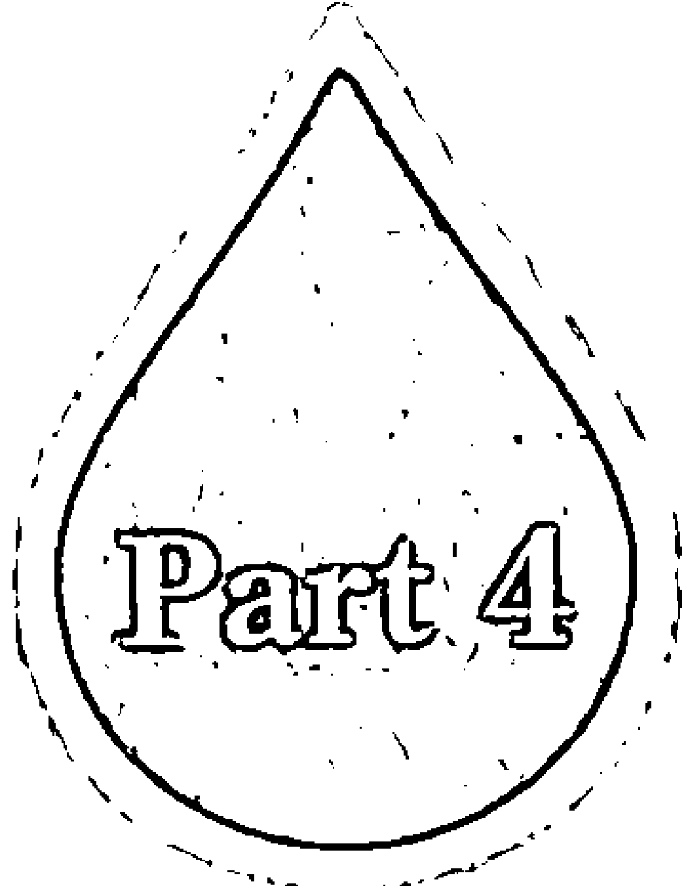

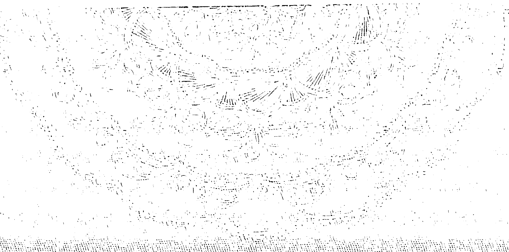

## 從生命靈數字算出你們的感情觀

算出兩人的出生年月日及主命數，即能了解兩人的婚姻及交往期的情感狀態。

舉例：宋仲仁和宋慧玲的出生年月日

| 宋仲仁 | 宋慧玲 |
| --- | --- |
| 1985年9月19日 = 42 / 6 | 1981年11月22日 = 25 / 7 |
| 目標（主命數）= 6 | 目標（主命數）= 7 |

### 表 7：你們的感情觀

根據下列步驟，算出你們的感情觀：

| 姓名：_______ | 姓名：_______ |
| --- | --- |
| ___ / ___ / ___ = ___ / ___ | ___ / ___ / ___ = ___ / ___ |
| 目標（主命數）= ___ | 目標（主命數）= ___ |

## 1 號人的愛情

1 號人是一個勇於表現自己的人，所以當他面對喜歡的人，不會害羞或吝於表達，且會常主動發出訊息或邀請的動作。兩人一旦成為戀人，可以感受到 1 號人的率直與熱情，為生活帶來許多的樂趣。

相對地，在戀愛的過程中，1 號人會是一位主導性及占有欲很強的人，希望能掌控對方的所有行蹤及清楚知道對方的事情，並要求對方能全心全意對待他，把他當成生命中最重要的人。可是 1 號人又希望在和諧關係中，保有自己的私人空間，所以如果遇到黏膩的情人，就會避之唯恐不及，所以需要個性大方又獨立自主的情人，才有繼續交往的可能。

### 1 號人和各數字之間的投合度分析

#### 1 & 1

兩人在生命中有共同的特質——「獨立」。因此，你們會彼此了解、相互協助，關係展開時一切都是美好的，因為兩人都喜歡照顧人和被人照顧，但 1 號人沒有耐心處理細節，有時會在衝動時說話，造成兩人的關係緊張，漸漸地會開始有疏離的感覺，最後傾向和對方維持朋友的關係。

#### 1 & 2

在生命中兩人想要的東西恰好相反，所以在許多方面是可以互相彌補的，（1）容易去領導（2）。但不久之後（1）會開始索討，且支配欲旺盛，開始強迫（2）接受所有的安排。當（2）開始覺得不被重視及感受不到親密關係時，就會造成彼此之間的嫌隙，此時，（1）必須學習改變，學習放下身段，不要堅持己見，才能維繫彼此的關係。

#### 1 & 3

在許多方面兩人是可以相處融洽，至少表面上是如此。如果（3）所懷抱的理想與（1）所追求的目標一致時，就可以相處得非常好；如果目標不相同時，不久就會分道揚鑣，但不會失去對彼此的尊重。這種情形特別會出現在（1）批評（3）不切實際的時候，（1）會覺得自己好像撞到一片磚牆似的，永遠得不到（3）的回應。

#### 1 & 4

彼此對於能夠帶來安全感的東西，都很有興趣。但兩人所需要的安全感並不一樣，（4）不希望為了維繫兩人的安全感而失去自己原來的朋友，但（1）不介意。雖然兩人一開始覺得情意相合，就可以維持很久的戀人關係，但等到雙方都取得自己想要的東西後，不論是名利、新歡或其他形式的安全感，這兩人就不再會成為好朋友。

#### 1 & 5

兩人都希望戀情能日漸成長，（1）會讓（5）得到了他所沒有的領導和勇氣，但（1）會因為感受到彼此的成長，所形成的競爭而感受到威脅。時間一久，（1）會使喚（5）做任何事，並測試（5）的忠誠度，而（5）會認為這是一種侮辱，不願忍受時，最後選擇離開。

#### 1 & 6

（1）希望有人來照顧他，而（6）也是願意為對方付出的人，這當然會是天造地設最好的安排了。但是這場關係不會維持太久，因為（1）疏於付出，使得（6）覺得心力交瘁，在施與受不平衡的情況下，（6）會心生不滿，逐漸失去愛意。

#### 1 & 7

剛開始交往時，因為彼此對於生命抱持著相似的想法，而與對方認識熟悉，但（1）遠比（7）主動積極熱情，而（7）卻希望能輕鬆自在的方式交往。有時（1）會因為（7）的慢動作而受不了，兩人便開始有了爭執；有時候也會為了一件事，究竟應該由誰來做決定而吵嚷不休。如果有想分手的念頭，過程就會有些複雜，因為（1）愛面子而（7）又害怕面對事情的真相。

#### 1 & 8

（8）會被（1）的潛力吸引，因為在對方身上可以看到領導力和領袖的魅力。但兩人很快就會開始產生競爭，爭奪彼此的主導權。最後，（1）不理會（8）的想法，而獲得他自己想要的東西。一旦發現根本無法說服（8）時，兩人的愛情會因此開始冷卻。

#### 1 & 9

（1）通常會覺得（9）是個很有趣的人，交往期間（9）會想盡辦法照顧（1），但等到（1）開始想要掌控所有一切事物時，（9）就會感覺到受傷。又當（9）發現感情不應該如此對待時，這段關係就會結束。

重點 1 號人比較難找到適合自己的伴侶，一旦擁有了對象就會是相當契合的一對。

## 2 號人

2 號人是心思細膩、體貼、善解人意、依賴心重的人，比較被動所以常會是觀察多過主動。但只要兩人有話聊就容易變得親近，不會在乎是誰支配誰。而 2 號人因為很容易談戀愛，所以不擔心沒有愛情的降臨，有時候因為不懂得拒絕別人，善解人意和體貼反而會造成別人的誤會和傷害。

2號人在和朋友相處的特質上，比較能接受平和的模式，一旦遇到兩人有磨擦產生時，會認為這磨擦只是生活習慣上的不同，而忽視其問題的存在。如果2號人想要分手，則會猶豫很久；如果是對方提出，就會有所抗拒的反應，因為不管關係有多麼的糟糕，他都會只看好的一面。2號人最適合迷糊又有依賴型的人，且只要彼此能有所付出和回報。

### 2號人和各數字之間的投合度分析

#### 2 & 1

在生命中兩人想要的東西恰好相反，所以在許多方面是可以互相彌補的，（1）容易去領導（2）。但不久之後（1）會開始索討，且支配欲旺盛，開始強迫（2）接受所有的安排。當（2）開始覺得不被重視及感受不到親密關係時，就會造成彼此之間的嫌隙，此時，（1）必須學習改變，學習放下身段，不要堅持己見，才能維繫彼此的關係。

#### 2 & 2

當兩人碰觸到感情這一方面的關係，就會馬上找到自己最渴望的親密感和熟悉感。剛開始彼此會互相依賴，且會愈來愈黏著對方。但不久之後，會開始覺得被對方利用，彼此都會認為對方自私，愛情因此逐漸被消磨殆盡，即便兩人都很不快樂，但是都會因為只看到對方的優點，所以很難分手。

#### 2 & 3

（2）如果是（3）心中理想的對象，愛情就會順利的展開。（2）為了幫助（3）在工作事業上的發展，（2）就會主動分析與提出建議，這種舉動惹怒（3）的想法。等到雙方都找到彼此的新戀情時，才會分手。

#### 2 & 4

開始彼此都很喜歡這份愛情所帶來的安全感，如果（2）改變心意，會讓（4）覺得沒安全感，而兩人原有的信賴受到破壞後，問題就會出現。假如（4）開始認為（2）有所欺騙，或是不值得依靠時，兩人關係就出現了危機。

#### 2 & 5

兩人彼此很能作心靈上的溝通，但對於愛情關係中的互動方式，則有不同的看法。（5）喜歡自由，所以花在培養關係的時間有限，但（2）只想依賴，這種差異使（2）感覺空虛，更讓（5）感到生氣，不懂為什麼（2）像缺乏自信一樣，卻又想控制他。等到（5）不再有愛意時，兩人便會分手。

#### 2 & 6

兩人都喜歡照顧對方，但（2）對於（6）的照顧會變成一種習慣，而自己也不會再主動，使得（6）會覺得自己被占了便宜。如果（2）的這種傾向變強，（6）會開始後悔自己所做的犧牲，想放棄這段關係，於是（2）開始出現一些模稜兩可的空話，因為無法決定要怎麼做，最後關係也就會慢慢地結束了。

#### 2 & 7

兩人都喜歡質疑和分析的事物，往往也會因為這種特性而開始交往。然而（2）一直需要親密感和熟悉感，但（7）不是這樣的人，於是漸漸喜歡自己一個人，等到（2）沒有感覺到被愛或被需要時，兩人的關係就會消失。

#### 2 & 8

兩人都喜歡親密感及在愛情關係裡，建立的情感層面，但是（2）的優柔寡斷，促使（8）開始想要掌控兩人的關係，這又會讓（2）開始主動做決定、主動出擊，追求獨立，不斷上進，這時（2）感覺孤單，不被理解，不久愛意就會消失，結束彼此的關係。

#### 2 & 9

乍看之下，兩人對於愛情的親密感有著相同的想法，戀情因此而生。時間久了，（2）開始批評（9）的輕鬆自在，並提出建議。（9）不喜歡被指導，不會照著（2）的建議去做時，於是（2）開始失去對（9）的敬重，愛情逐漸遠去。

**重點** 2 號人有許多機會，但是要如何把關係經營好，卻是相當大的課題。

## 3 號人

3 號人個性活潑、機靈、反應快、善於溝通表達，所以社交場合總能夠讓場面熱鬧。但因為 3 號人心中有一個完美的典型情人，所以不輕易愛上別人，一旦遇到夢中情人，就容易有一見鍾情的情愫，很快的陷入情網。

3 號人不論在職場上或平時是多麼精明能幹的人，只要一碰到喜歡的人，瞬間就會變成小孩子，好像什麼事都不會做。然而，若激情過後，在面對現實時，就會給對方施加壓力，要求對方改變，當無法順從其意，則會揚言分手（假若對方是理想對象，則只是嘴巴說說而已）。如果是對方提出分手，3 號人則會勃然大怒，拒絕分手，即使關係結束，還是會持續愛著對方，直到遇上其他喜歡的人為止。3 號人最適合聰穎機靈、談話能契合的人。

### 3 號人和各數字之間的投合度分析

#### 3 & 1

在許多方面兩人是可以相處融洽，至少表面上是如此。如果（3）所懷抱的理想與（1）所追求的目標一致時，就可以相處得非常好；如果目標不相同時，不久就會分道揚鑣，但不會失去對彼此的尊重。這種情形特別會出現在（1）批評（3）不切實際的時候，（1）會覺得自己好像撞到一片磚牆似的，永遠得不到（3）的回應。

#### 3 & 2

（2）如果是（3）心中理想的對象，愛情就會順利的展開。（2）為了幫助（3）在工作事業上的發展，（2）就會主動分析與提出建議，這種舉動惹怒（3）的想法。等到雙方都找到彼此的新戀情時，才會分手。

#### 3 & 3

如果人有相同的理想抱負，愛情關係就會猶如天作之合般的夫妻。但當面對現實，發現不是最初期待的樣子，他們都會拒絕接受現狀，開始愈吵愈凶。雖然兩人還是會在一起，但會感覺到孤單寂寞，等到遇見更符合自己理想的新伴侶時，兩人就會分手。

#### 3 & 4

兩人所期望的目標是相同的，特別是其中一人有經濟能力或其他能力，可以形成安全感並實現夢想時，他們會變得很快樂。然而（4）的現實感，會讓他想要改變（3）愛作夢的習慣，但這是不可能的事，所以（3）不會忍受太久。最後，兩人會因為互相爭取主導權，導致愛情的結束。

#### 3 & 5

兩人彼此都能夠坦誠溝通，因為都善於處理社交上的關係，所以很容易在一起。當彼此熟悉了，（5）覺得（3）太過固執，而（3）對於（5）所要的自由很沒安全感，於是（3）就開始幻想要去控制（5），這也將導致兩人關係的結束。

#### 3 & 6

兩人都喜歡幫助對方，從內在或外在的改善等種種事物，因此戀情很容易展開。但當（6）不喜歡（3）對事情有些膚淺的看法，而又看不到自己的努力有何意義時，會因而感到生氣。等到兩人都對彼此失去尊重後，愛情就不再存在，彼此的關係就此結束。

#### 3 & 7

（7）喜歡（3）的開朗，喜歡他們知道自己要什麼。但（7）不久後就會對此提出質疑，讓（3）心裡會有受到人格攻擊的感覺，於是漸漸沒了愛意。（7）會試圖彌補，但（3）一旦受到傷害，復原的速度是很緩慢的，這也導致關係的終結。

#### 3 & 8

（3）的理想條件很高，（8）會因為這樣受到這一點吸引。剛開始兩人相處得不錯，但（8）終究知道如何改善自己想要的東西，如果（3）不表同意或甚至排斥，就會表現出固執的一面，兩人的關係就會陷入低潮，迅速終結。

#### 3 & 9

（3）和（9）可能是最有趣的兩種人，但只要這段關係不是為了好玩，就會繼續走下去。但若遇到問題時就會變得嚴肅，兩人就須面對現實，當無法達成共識時，關係也可能轉趨消沉。（9）會努力照顧（3），但覺得對方似乎不懂感激，而始終無法取悅（3）的需求，兩人關係便會漸行漸遠。

**重點** 3 號人在戀愛的過程中，並不算太順利，很難完全滿足於當下的感情狀況，因為有很高的理想。

## 4 號人

4 號人個性穩重、重視安全感、踏實感，感情中木訥直率，不懂浪漫、不容易說甜言蜜語的話，但會用行動證明他們的誠懇，希望擁有長長久久的感情。他們很重視感情或金錢上的安全感，所以對於財務的管理也是很有一套計畫，如果另一半有計畫性的儲蓄，也會讓 4 號人感受到安全感。

所以 4 號人在愛情中也會尋求一份安全感，因為害怕及討厭改變，即使愛意已經消失了，仍會把另一半當成自己的責任。除非無法從另一半身上獲得信賴感或安全感的時候，才會失去彼此之間的關係，否則連分手都會很懶。4 號人最適合溫和有禮、懂分寸的人，通常是乖乖牌的人，這對 4 號的人來說很有安全感。

### 4 號人和各數字之間的投合度分析

#### 4 & 1

彼此對於能夠帶來安全感的東西，都很有興趣。但兩人所需要的安全感並不一樣，（4）不希望為了維繫兩人的安全感而失去自己原來的朋友，但（1）不介意。雖然兩人一開始覺得情意相合，就可以維持很久的戀人關係，但等到雙方都取得自己想要的東西後，不論是名利、新歡或其他形式的安全感，這兩人就不再會成為好朋友。

#### 4 & 2

開始彼此都很喜歡這份愛情所帶來的安全感，如果（2）改變心意，會讓（4）覺得沒安全感，而兩人原有的信賴受到破壞後，問題就會出現。假如（4）開始認為（2）有所欺騙，或是不值得依靠時，兩人關係就出現了危機。

#### 4 & 3

兩人所期望的目標是相同的，特別是其中一人有經濟能力或其他能力，可以形成安全感並實現夢想時，他們會變得很快樂。然而（4）的現實感，會讓他想要改變（3）愛作夢的習慣，但這是不可能的事，所以（3）不會忍受太久。最後，兩人會互相爭取主導權，導致愛情的結束。

#### 4 & 4

一開始，這兩個人通常會覺得找到最適合的伴侶了，因為彼此的需求相通，但當兩個（4）人的相處漸漸變得單調無趣時，兩個人就會開始尋找其他比較有趣的東西，例如：致力於事業發展或另結新歡，導致原本的愛意逐漸消失。不過他們分手的過程所需要的時間，會比其他數字的配對更久，因為安全感造成他們不願意這麼輕易分手。

#### 4 & 5

（5）喜歡受到疼愛和照顧，而（4）天生就能提供這些呵護。當（4）開始抱怨（5）的善變，這時就會出現問題，尤其是到了（4）無法從對方獲得安全感，而試圖控制（5）的時候，兩人之間的關係就已經結束了。

#### 4 & 6

兩人會彼此互相照顧，會因為剛開始感受到快樂。如果兩人的關係會出現問題，其原因有二，不是（4）照顧得太好了，使得（6）感到無用武之地；就是因為（4）讓（6）產生被利用的感覺。

#### 4 & 7

（7）喜歡（4）的穩定，而（4）可以對（7）提出有建設性的建議。當（4）無法從（7）獲得安全感時，例如：（7）想要有自己的空間或者想要單獨去做自己想做的事時，（4）會提出過分的要求，這時就會使得雙方都覺得對方已經不再愛自己了。

#### 4 & 8

兩人在一開始交往時，（4）會敬重（8）的勇氣，對於建立安全感的進取心，不受外界干擾。但是若隨著努力而有所挫敗時，（4）就會試圖控制（8）的一切，於是開始互相爭取主導權，因而摧毀了愛情。

#### 4 & 9

當（4）遇到（9）時，會以為遇到了一個善良的人，只需要幫個小忙，就可以讓他成功，所以很樂於協助。一段時間之後會發現，（9）天生愛作夢，不肯接受務實的建議。（4）若覺得（9）無藥可救，就會放棄這段關係，而（9）在受到批評或控制時，感受不到對方的愛，也會漸漸地放棄。

**重點** 4 號人對於愛情並不是非常急切，但通常都可以與對方建立穩定幸福的家庭。

## 5 號人

5 號人愛好自由，所以選擇對象不論在談吐上或生活上，都要求能非常有趣的人，而且可以是尊敬和學習的對象。5 號人不會做過多的要求，並能給予對方自由，一旦想要走入婚姻或安定下來，就會彼此愛得很深，也會是一個專情又有趣的另一半。

5 號人天生不會把美好的過去當作一回事，能與 5 號人長相廝守的人，必須是不太需要別人噓寒問暖，非常獨立又有自信的人。但是當感情消退了，5 號人就會想要率性的抽身逃跑。5 號人最適合可以陪他一起冒險的人，或能成為他後盾的另一半。

### 5 號人和各數字之間的投合度分析

#### 5 & 1

兩人都希望戀情能日漸成長，（1）會讓（5）得到了他所沒有的領導和勇氣，但（1）會因為感受到彼此的成長，所形成的競爭而感覺受到威脅。時間一久，（1）會使喚（5）做任何事，並測試（5）的忠誠度，而（5）會認為這是一種侮辱，不願忍受時，最後選擇離開。

#### 5 & 2

兩人彼此很能作心靈上的溝通，但對於愛情關係中的互動方式，則有不同的看法。(5)喜歡自由，所以花在培養關係的時間有限，但(2)只想依賴，這種差異使(2)感覺空虛，更讓(5)感到生氣，不懂為什麼(2)像缺乏自信一樣，卻又想控制他。等到(5)不再有愛意時，兩人便會分手。

#### 5 & 3

兩人彼此都能夠坦誠溝通，因為都善於處理社交上的關係，所以很容易在一起。當彼此熟悉了，(5)覺得(3)太過固執，而(3)對於(5)所要的自由很沒安全感，於是(3)就開始幻想要去控制(5)，這也將導致兩人關係的結束。

#### 5 & 4

(5)喜歡受到疼愛和照顧，而(4)天生就能提供這些呵護。當(4)開始抱怨(5)的善變，這時就會出現問題，尤其是到了(4)無法從對方獲得安全感，而試圖控制(5)的時候，兩人之間的關係就已經結束了。

#### 5 & 5

彼此兩人可以因為了解對方對自由和空間的需求，所以兩個人在一起時，會獲得到很大的快樂。但如果有一人感覺對方享有太多的自由時，兩人的關係就會出現不安的狀況。只要他們試圖為對方著想時，就可能被視為控制，而愛情也會逐漸消失。

#### 5 & 6

(5)喜歡(6)給他們的關注和照顧，(5)會以為(6)這樣做並沒有私心或圖利，是一種個人行為的抉擇，並不求回報。但(6)得不到他心裡期待的東西時，就會覺得很疲憊，會對(5)提出要求，這會使兩人關係趨於冷淡，最後分手。

#### 5 & 7

兩人喜歡的事物很類似，所以開始時一切都很順利。然而，一旦兩人開始認真對待這段關係時，（7）從（5）身上得不到安全感，於是會試圖掌控一切，這會讓愛情冷卻，使得兩人都覺得不如只做朋友就好。有時，又因兩人各忙各自的事業，導致與對方在一起的時間愈來愈少，最後走上分手一途。

#### 5 & 8

（8）覺得和（5）在一起會帶來許多好處，而（5）也是喜歡（8）的勇氣。然而（8）對於事情和時間很有規畫，而（5）卻沒有。於是（8）會給（5）壓力，不久（5）就會失去對（8）的尊敬，特別是如果（8）所使用的手段不太公允，或者管得太多時，彼此的感覺就會冷卻，爭執就會出現，導致關係破裂。

#### 5 & 9

這兩人在一起時趣味橫生。（5）也喜歡視他人的關懷為理所当然。但這兩人的問題會出在（9）對於目標非常投入而且忠誠，而（9）也希望（5）能加入，共同完成目標。（9）起初可能會同意，但是當要犧牲很多個人的自由時，（5）就會面臨挑戰，關係就會因此出現問題。

**重點** 5 號人對於愛情看起來比較沒那麼在意，但事實上機會是滿多的，不過需要更多緣分上的支持，才容易成功。

## 6 號人

6 號人極具有耐心和包容心，對於為另一半服務是極浪漫又美好的事，且因為喜歡關心及照顧別人，所以愛情會變成他們的責任。6 號人為了贏得另一半的歡心，容易成為變色龍，相信自己的傾心付出，會獲得更多的回報。

但當付出太多時，對方視為理所當然或沒有回報時，6 號人會變得比較有支配欲、挑剔、碎念、不快樂，但仍會繼續緊捉住這段關係不放。感情對 6 號人來說，要放棄一段關係是非常困難的事，甚至會認為自己要負一些責任。在不願意傷害對方的同時，最後會因為疏忽自己的健康而導致生病，有時也會以自殺尋求解脫。6 號人最適合興趣相同及對藝術有美感的人，同時願意付出與回報的另一半。

### 6 號人和各數字之間的投合度分析

#### 6 & 1
（1）希望有人來照顧他，而（6）也是願意為對方付出的人，這當然會是天造地設最好的安排了。但是這場關係不會維持太久，因為（1）疏於付出，使得（6）覺得心力交瘁，在施與受不平衡的情況下，（6）會心生不滿，逐漸失去愛意。

#### 6 & 2
人都喜歡照顧對方，但（2）對於（6）的照顧會變成一種習慣，而自己也不會再主動，使得（6）會覺得自己被佔了便宜。如果（2）的這種傾向變強，（6）會開始後悔自己所做的犧牲，想放棄這段關係，於是（2）開始出現一些模稜兩可的空話，因為無法決定要怎麼做，最後關係也就會慢慢地結束了。

#### 6 & 3
兩人都喜歡幫助對方，從內在或外在的改善等種種事物，因此戀情很容易展開。但當（6）不喜歡（3）對事情有些膚淺的看法，而又看不到自己的努力有何意義時，會因而感到生氣。等到兩人都對彼此失去尊重後，愛情就不再存在，彼此的關係就此結束。

#### 6 & 4
兩人會彼此互相照顧，會因為剛開始感受到快樂。如果兩人的關係會出現問題，其原因有二，不是（4）照顧得太好了，使得（6）感到無用武之地；就是因為（4）讓（6）產生被利用的感覺。

#### 6 & 5
（5）喜歡（6）給他的關注和照顧，（5）會以為（6）這樣做並沒有私心或圖利，是一種個人行為的抉擇，並不求回報。但（6）得不到他心裡期待的東西時，就會覺得很疲憊，會對（5）提出要求，這會使兩人關係趨於冷淡，最後分手。

#### 6 & 6
兩個人因為喜歡照顧對方而在一起，顯然可以彼此照料。問題是這種關係並不容易平衡，如果最後變成其中一人做得比另一方多時，就會有一方感覺到自己被利用、對方不愛自己的狀況出現。而付出較少的一方開始失去對另一半的興趣，而把對方的付出視為理所當然，這就導致兩人之間出現的問題。

#### 6 & 7
（7）欣賞（6）有能力能看出事情的問題，並加以修補，（7）個性裡雖然也有這種特質，但兩者的動機不同。（6）這樣做是因為這樣可以為生命帶來意義，（7）則是為了能因此找到生命的意義而這樣做。（7）看到（6）不加思索就付出，會覺得很無奈，而（6）會很氣（7）為什麼一定要經過仔細算計之後才肯付出。最後，（6）失去對（7）的尊重，分手之日便不遠了。

#### 6 & 8
（6）喜歡（8）的果斷進取，特別是（8）所採取的行動都會有回報，而這是（6）需要學習的課題。但如果（8）逼迫（6）做出不合他們個性或價值觀的事情，尤其是欺詐或會傷害他人，這會導致問題發生，兩人之間出現爭奪控制權的情形，愛情關係就越來越沒有吸引力了。

#### 6 & 9
（6）很喜歡（9）的單純，覺得終於找到一個可以合作的人，一個可以提供協助，另一個可以獲得協助。直到有一天（6）覺得（9）對於兩個人的愛情不夠專注，（6）希望（9）能給予某種程度的回報，而且是只給他們的特殊待遇，但（9）認為對所有人都應該是一視同仁，不應該有所差別，因此，兩人的愛情也會逐漸消失。

**重點** 6號人容易有吸引人的特質，所以愛的機會很多，不過因為太過理想化，失敗的機會也很大，必須要在學習中得到成長。

## 7 號人
7號人個性聰穎、多疑、占有欲強、桃花旺盛，容易有愛情的機會。但因為7號人冷靜又理智，會花很長的時間去了解對方，確認是否適合自己，如果不適合會認為是一種時間的浪費；但當發現有值得他學習的對象，就會主動出擊。

7號人因為容易多愁善感，一旦感到乏味或有壓力時，就會開始產生抗拒，寧願一個人或獨自去參與朋友的聚會，不想跟另一半在一起時，這只是他希望擁有自己的個人空間而已，不會因為這樣而主動提出分手，也不會承擔另一半的不快樂。7號人最適合獨立自主、又能適時給予關懷的人。

### 7 號人和各數字之間的投合度分析

#### 7 & 1
剛開始交往時，因為彼此對於生命抱持著相似的想法，而與對方認識熟悉，但（1）遠比（7）主動積極熱情，而（7）卻希望能輕鬆自在的方式交往。有時（1）會因為（7）的慢動作而受不了，兩人便開始有了爭執；有時候也會為了一件事，究竟應該由誰來做決定而吵嚷不休。如果有想分手的念頭，過程就會有些複雜，因為（1）愛面子而（7）又害怕面對事情的真相。

#### 7 & 2
兩人都喜歡質疑和分析的事物，往往也會因為這種特性而開始交往。然而（2）一直需要親密感和熟悉感，但（7）不是這樣的人，於是漸漸喜歡自己一個人，等到（2）沒有感覺到被愛或被需要時，兩人的關係就會消失。

#### 7 & 3
（7）喜歡（3）的開朗，喜歡他們知道自己要什麼。但（7）不久後就會對此提出疑問，讓（3）心裡會有受到人生攻擊的感覺，於是漸漸沒了愛意。（7）會試圖彌補，但（3）一旦受到傷害，復原的速度是很緩慢的，這也導致關係的終結。

#### 7 & 4
（7）喜歡（4）的穩定，而（4）可以對（7）提出有建設性的建議。當（4）無法從（7）獲得安全感時，例如：（7）想要有自己的空間或者想要單獨去做自己想要做的事時，（4）會提出過分的要求，這時就會使得雙方都覺得對方已經不再愛自己了。

#### 7 & 5
兩人喜歡的事物很類似，所以開始時一切都很順利。然而，一旦兩人開始認真對待這段關係時，（7）從（5）身上得不到安全感，於是會試圖掌控一切，這會讓愛情冷卻，使得兩人都覺得不如只做朋友就好。有時，又因兩人各忙各自的事業，導致與對方在一起的時間愈來愈少，最後走上分手一途。

#### 7 & 6
（7）欣賞（6）有能力能看出事情的問題，並加以修補，（7）個性裡雖然也有這種特質，但兩者的動機不同。（6）這樣做是因為這樣可以為生命帶來意義，（7）則是為了能因此找到生命的意義而這樣做。（7）看到（6）不加思索就付出，會覺得很無奈，而（6）會很氣（7）為什麼一定要經過仔細算計之後才肯付出。最後，（6）失去對（7）的尊重，分手之日便不遠了。

#### 7 & 7
彼此兩個在一起時是非常有趣的，但是如果太忙於自己的事業，沒有把心思放在對方身上，就會出問題。其中一方想要自己做決定，這時兩人都會停止不動，關係就會變得緊張，彷彿雙方都不願意給對方快樂。漸漸地，兩人都只想自己一個人獨處，使得這段關係不再有意義。

#### 7 & 8
（7）喜歡（8）的積極，把（7）的想法化為現實，如果配合的很愉快，兩人都會很開心。但（8）會開始想主導，而（7）不能忍受別人的催逼，如果（8）太過積極堅持，並且不願接受新想法，（7）就會開始覺得這段關係很沒意思，而（8）對於（7）的緩慢，感到不耐煩，導致關係結束。

#### 7 & 9
（7）喜歡（9）單純的天性，但（9）不喜歡（7）凡事慢吞吞和提出許多意見，覺得（7）太自私。如果（7）企圖改變或掌控（9）的夢想，（9）會受到挫折，於是（7）開始質疑（9）的真實動機，導致愛情逐漸降溫，但分手過程會拖得很久。

> **重點** 7 號人容易為自己不合理的行為找許多藉口，這將會成為兩個人感情中最大的問題。

## 8 號人
8 號人要的情人是能陪伴他一起走在人生的道路上，具有加分條件及有價值的人。事實上，他們感興趣的是有潛力的人，因為 8 號人具備堅強的信念，若有機運他們會是優秀的領導者，所以希望另一半也會是一個績優股。

戀愛時，喜歡居於主導權的位置，所以一旦下定決心走下去，就不會輕易改變，同時也會表現出溫柔體貼的一面，為感情帶來信任和安全感。若對方想分手，而兩人關係中又有孩子或經濟責任要負擔時，8 號人通常會不肯分手。8 號人最適合具有某方面的魅力或有才華的人，這樣比較能吸引 8 號人的注意。

### 8 號人和各數字之間的投合度分析

#### 8 & 1
（8）會被（1）的潛力吸引，因為在對方身上可以看到領導力和領袖的魅力。但兩人很快就會開始產生競爭，爭奪彼此的主導權。最後，（1）不理會（8）的想法，而獲得他自己想要的東西。一旦發現根本無法說服（8）時，兩人的愛情會因此開始冷卻。

#### 8 & 2
兩人都喜歡親密感及在愛情關係裡，建立的情感層面，但是（2）的優柔寡斷，促使（8）開始想要掌控兩人的關係，這又會讓（2）開始主動做決定、主動出擊，追求獨立，不斷上進，這時（2）感覺孤單，不被理解，不久愛意就會消失，結束彼此的關係。

#### 8 & 3
（3）的理想條件很高，（8）會因為這樣受到這一點吸引。剛開始兩人相處得不好，但（8）終究知道如何改善自己想要的東西，如果（3）不表同意或甚至排斥，就會表現出固執的一面，兩人的關係就會陷入低潮，迅速終結。

#### 8 & 4
兩人在一開始交往時，（4）會敬重（8）的勇氣，對於建立安全感的進取心，不受外界的指點。但是若隨著努力而有所挫敗時，（4）就會試圖控制（8）的一切，於是開始互爭取主導權，因而摧毀了愛情。

#### 8 & 5
（8）覺得和（5）在一起會帶來許多好處，而（5）也是喜歡（8）的勇氣。然而（8）對於事情和時間很有規畫，而（5）卻沒有。於是（8）會給（5）壓力，不久（5）就會失去對（8）的尊敬，特別是如果（8）所使用的手段不太公允，或者管得太多時，彼此的感覺就會冷卻，爭執就會出現，導致關係破裂。

#### 8 & 6
（6）喜歡（8）的果斷進取，特別是（8）所採取的行動都會有回報，而這是（6）需要學習的課題。但如果（8）逼迫（6）做出不合他們個性或價值觀的事情，尤其是欺詐或會傷害他人，這會導致問題發生，兩人之間出現爭奪控制權的情形，愛情關係就越來越沒有吸引力了。

#### 8 & 7
（7）喜歡（8）的積極，把（7）的想法化為現實，如果配合的很愉快，兩人都會很開心。但（8）會開始想主導，而（7）不能忍受別人的催逼，如果（8）太過積極堅持，並且不願接受新想法，（7）就會開始覺得這段關係很沒意思，而（8）對於（7）的緩慢，感到不耐煩，導致關係結束。

#### 8 & 8
看起來彼此是最好的朋友，很快就能在一起做計畫。然而，沒有人知道他們兩人是為了什麼事情在一起，是真心相愛或另有企圖在利用對方，還是為了名利、人脈、安全感。隨著關係進展，兩人都想主導，都不願意被控制，最後會因為爭吵而毀掉了信任和愛情，不過兩人不會馬上分手，因為兩人對於關係所抱持的目的性，不是那麼單純。

#### 8 & 9
（8）被（9）的才華和風趣深深吸引。但（8）不會眼看這般才華沒有充分發揮，所以（8）會催逼（9）做出成績，追求更好的發展，但所用的鼓勵方式和所追求的目標，並不符合（9）所想要的。彼此會不斷發生衝突，不久就導致兩人各行其是，直到兩人各自找到新歡。

**重點** 8 號人喜歡平穩的戀情，但也容易膠著在不適合的戀情裡。

## 9 號人
9 號人是一個很浪漫的人，會愛上有才華、有魅力及有樂趣的人，或承諾會讓他們夢想成真的人。但發現真實夢想破滅時，則會刻意幫助另一半，拼命付出自己的時間或能力，努力讓一切看起來很快樂，無視於現實的無情，也因此會試圖說服自己，因而會犧牲了自己的健康。

9 號人不會主動提出分手，通常是對方提出，會持續盲目的付出，當發現一切落空時，才會覺得不值得，而內心承受到煎熬與衝突，因為他們覺得是自己讓對方失望，但事實也許根本不是這樣。9 號人最適合外型佳、活潑大方的人。

### 9 號人和各數字之間的投合度分析

#### 9 & 1
（1）通常會覺得（9）是個很有趣的人，交往期間（9）會想盡辦法照顧（1），但等到（1）開始想要掌控所有一切事物時，（9）就會感覺到受傷。又當（9）發現感情不應該如此對待時，這段關係就會結束。

#### 9 & 2
乍看之下，兩人對於愛情的親密感有著相同的想法，戀情因此而生。時間久了，（2）開始批評（9）的輕鬆自在，並提出建議。（9）不喜歡被指導，不會照著（2）的建議去做時，於是（2）開始失去對（9）的敬重，愛情逐漸遠去。

#### 9 & 3
（3）和（9）可能是最有趣的兩種人，但只要這段關係不是為了好玩，就會繼續走下去。但若遇到問題時就會變得嚴肅，兩人就須面對現實，當無法達成共識時，關係也可能轉趨消沉。（9）會努力照顧（3），但覺得對方似乎不懂感激，而始終無法取悅（3）的需求，兩人關係便會漸形漸遠。

#### 9 & 4
當（4）遇到（9）時，會以為遇到了一個善良的人，只需要幫個小忙，就可以讓他成功，所以很樂於協助。一段時間之後會發現，（9）天生愛作夢，不肯接受務實的建議。（4）若覺得（9）無藥可救，就會放棄這段關係，而（9）在受到批評或控制時，感受不到對方的愛，也會漸漸的放棄。

#### 9 & 5
這兩人在一起時趣味橫生。（5）也喜歡視他人的關懷為重要。但這兩人的問題會出在（9）對於目標非常投入而且忠誠，而（9）也希望（5）能加入，共同完成目標。（9）起初可能會同意，但是當要犧牲很多個人的自由時，（5）就有會面臨挑戰，關係就會因此出現問題。

#### 9 & 6
（6）很喜歡（9）的單純，覺得終於找到一個可以合作的人，一個可以提供協助，另一個可以獲得協助。直到有一天（6）覺得（9）對於兩個人的愛情不夠專注，（6）希望（9）能給予某種程度的回報，而且是只給他們的特殊待遇，但（9）認為對所有人都應該是一視同仁，不應該有所差別，因此，兩人的愛情也會逐漸消失。

#### 9 & 7
（7）喜歡（9）單純的天性，但（9）不喜歡（7）凡事慢吞吞和提出許多意見，覺得（7）太自私。如果（7）企圖改變或掌控（9）的夢想，（9）會受到挫折，於是（7）開始質疑（9）的真實動機，導致愛情逐漸降溫，但分手過程會拖得很久。

#### 9 & 8
（8）被（9）的才華和風趣深深吸引。但（8）不會眼看這般才華沒有充分發揮，所以（8）會催逼（9）做出成績，追求更好的發展，但所用的鼓勵方式和所追求的目標，並不符合（9）所想要的。彼此會不斷發生衝突，不久就導致兩人各行其是，直到兩人各自找到新歡。

#### 9 & 9
當兩個（9）擁有共同的信念和人生使命時，兩人就會開始交往，然而，人生使命往往一向是全職的工作。雙方把時間都花在實現目標時，共處的時間就會變少，不久兩人都覺得愛情不是一切，開始懷疑為什麼要在一起，最後也許會認為這段愛情是追求目標途中的阻礙，最後分手。

**重點** 9 號人要常常是非常熱情的，有時會太過了，會讓人感到吃不消。

## 戀人間的運數合併能量分析
如果你們已經是在一起的情侶或有暗戀的對象，可以把你們兩個的生涯運數相加合併成為新的數字，你可以用新合併的數字，來解析兩個人的相模式。

舉例：姜慕煙和劉大尉的出生年月日

| 姜慕煙 | 大尉 |
|:---|:---|
| 1980年11月16日= 27/9 | 1973年6月18日= 35/8 |
| 目標（主命數）= 9 | 目標（主命數）= 8 |

## 計算方式步驟
9 + 8 = 17
1 + 7 = 8
合併後的數字是 8

### 表 8：運數合併能量數
根據下列步驟，算出你們的運數合併能量數。

| 姓名：________ | 姓名：________ |
|:---|:---|
| / / = / | / / = / |
| 目標（主命數）=___ | 目標（主命數）=___ |

將兩人的主命數加總：___+___=____
你的運數合併能量數是：________

## 運數合併能量數的優弱勢查詢表

| 合併數 | 運數合併能量數的優弱勢 |
|:---|:---|
| 2 | 優勢：兩人會互相支持，彼此相處和諧與理性。<br>弱勢：兩人即使受到委屈，都不太會告訴對方。 |
| 3 | 優勢：相處上會很浪漫，溝通沒有障礙。<br>弱勢：彼此比較沒有同理心。 |
| 4 | 優勢：工作穩定，彼此之間相處會像家人般的關係。<br>弱勢：權責義務混淆不清。 |
| 5 | 優勢：相處上是刺激與冒險，雙方不會偽裝自己。<br>弱勢：沒組織、頭緒、耳根子軟。 |
| 6 | 優勢：願意為對方改變自己，彼此接納度高。<br>弱勢：如果不滿意對方，會互相批評。 |
| 7 | 優勢：彼此信賴對方，有開闊的胸襟，共享資源，兩人能以真誠對待。<br>弱勢：容易產生誤解而痛苦，互不認錯，但又很需要對方。 |
| 8 | 優勢：覺得可以與對方共同創業是極佳的，有賺錢就能心靈溝通。<br>弱勢：金錢糾葛是主要的致命傷。 |
| 9 | 優勢：會彼此尊重，不輕浮，不會打壓彼此的想法。<br>弱勢：爭吵時不會主動道歉，容易冷戰（因而產生疏離感）。 |
| 10 | 優勢：感情好時會像兄弟姊妹，容易培養默契。<br>弱勢：彼此之間容易互相生悶氣、愛爭辯。 |
| 11 | 優勢：能相互創造能量、火花四濺，合作上不說負面的話。<br>弱勢：吵架後，會將不滿到處傾訴給朋友，愛恨交織，偶有衝突，但又離不開對方。 |
| 12 | 優勢：標準對事不對人，爭吵後會將誤會說清楚，不會造成彼此疙瘩，能英雄惜英雄。<br>弱勢：合則聚，不合則散。 |

## 4-3 與各主命數（個性數）人的相處之道
如果我們想更了解自己的好朋友，可以透過主命數及個性數來了解你們之間的相處模式，或者透過數字能量來彌補並增溫你們之間的友好關係。

舉例：A 先生：1980 年 12 月 16 日＝28／10／1

- ①出生年的 1 只能算 0.5 & 1 有 2.5
- ②個性數：1 + 6 = 7
- ③主命數：1 + 0 = 1
- ④所以要參考 1 號人

| ① | 4 | 7 |
|:---:|:---:|:---:|
| 2 | 5 | 8 |
| 3 | 6 | 9 |

B 先生：1976 年 6 月 11 日＝31／4

- ① 出生年的 1 只算 0.5 & 1 有 2.5
- ② 個性數：1 + 1 = 2
- ③ 主命數：3 + 1 = 4
- ④ 所以要再參考 1、6 數人的相處之道

| ① | 4 | 7 |
|:---:|:---:|:---:|
| 2 | 5 | 8 |
| 3 | ⑥ | 9 |

### 表 9：你人際關係的相處之道
根據下列步驟，算出你人際關係的相處之道。

| 姓名：_______ | 姓名：_______ |
|:---:|:---:|
| // = / | // = / |
| 主命數：_____ | 主命數：_____ |
| 個性數：_____ | 個性數：_____ |

## 主命數①
- **關鍵句：「先問問我！」**

要把1號人當成一個失去領土的國王，因為他們缺乏自信，所以需要你的關心與讚美。在與他們的溝通過程中，先以詢問他們的角度，讓他們受到尊重，凸顯他們的重要性，而不是瞧不起或命令的口吻來要求他們；若和他們意見相左時，就必須退讓才能使事情順利圓滿。如果要讓事情儘快結束，可以加入一些他們感興趣的事，這樣才能增加他們執行的動力，而不是拿他們跟別人做比較，或貶低他們的能力。

1號人在買東西的時候，會很在意價格，這也是他們在選擇買或不買的重點；另外，他們討厭一些需要維修的產品。

**重點** 需要經過努力與耐性，才能與（1）情誼長久。

**接觸** 要用協助者的態度，而非主導者的態度與（1）相處。（靠旁敲側擊的方式）

**提醒** 當（1）的人堅持某項主張時，不管我們贊成與否，就算錯誤還是會發生，都只能坦然接受。

- **相處之道：不能拿他和別人比較，要凸顯他的重要性。**

## 主命數②
- **關鍵句：「你決定就好」。

2號人內心體貼和善解人意，因為信賴對方，所以一起出遊時會喜歡由你主導做決定，是個不錯的遊伴。在協調合作過程中，他們不認為天下有白吃的午餐，所以會花時間溝通，在確認後才會規畫細節，而不是倉促行事的人。

## 主命數 2

2 號人在購買東西時會介意價格，因考量其產品價格和商品之間的合理性，如果能說清楚，自然就能被他們所接受。

- **重點**：要了解、注意（2）的人，心思細膩敏感的一面。
- **接觸**：與（2）的相處，態度要更加積極，（2）的人才會跟你熱絡。
- **提醒**：（2）的人因心思細膩敏感，有時候不經意的言行舉止，容易會讓（2）的人有受傷的感覺。
- **相處之道**：要多關心他，陪伴他，與她聊天。

- **關鍵句**：「我知道我要什麼」

3 號人像被寵壞的小孩，對任何事情都有自己的想法和主見，即使是一句批評的話，都會讓他們轉身離開，所以可以先提出對他們有不錯的好處或建議，然後再解釋方法，千萬不能先批評他們，可以先聽看看他們怎麼說。對於他們認為好的東西，即使是不真實，他們都會選擇相信；他們認為形象很重要，所以很在乎別人用什麼眼光來看待他們。對於社會上流行時尚和潮流的物件，會特別關注喜愛，主要是他們天生就有美的鑑賞力。

數字 3 的人在買東西時，不會在乎價格的高低，因為那不是他們考慮的範圍，只要他們喜歡，都會設法買下來的。

- **重點**：真心誠意是最上策。因為（3）的人直覺力強，且喜歡憑直覺決定對人的好惡，虛偽是逃不過（3）的心眼。
- **接觸**：真心誠意的態度，表現真實的自我，因為（3）的人也會表現出相當的誠意度。
- **提醒**：不要用悲觀的態度及想法去破壞（3）快樂且美好的願景。因為（3）的人不喜歡想法悲觀的人。
- **相處之道**：多讚美他、多做聆聽者，讓他盡情表達。

## 主命數 ④

- **關鍵詞**：「眼見為憑」

4 號人就像經歷過一場戰亂中死裡逃生的人，會為了尋找安全感而努力奮鬥，當找到安全感時，也就會死守著不放，絕不輕言改變。在要求他們改變時，必須提出具體的數據或科學根據去證明你的觀點是對的，而且不要試圖轉移主題或模糊焦點，如此一來才能說服他們的改變。而當 4 號人把你當成真正的朋友時，他們會是信守承諾及忠誠的守護者。

數字 4 的人在買東西時也很在意價格，除非你能提出科學研究作為證據，才能讓他們信服價格的合理性。

- **重點**：遵守常規及常理，這指的是我們一般的生活法則。而常理會讓（4）感到安全。
- **接觸**：要用積極的態度與行為接近（4），因為（4）的人害怕改變，結交新朋友也是一種改變，所以不用期望（4）的人會主動。
- **提醒**：與（4）的人關係即是再好，都要注意「禮貌」。
- **相處之道**：給予專業及服務，要注意禮貌，並要主動積極接近他。

## 主命數 ⑤

- **關鍵句**：「再看看吧！」

5 號的人一生都在追求自己的自由，就像是一個想盡辦法從監獄逃跑的犯人，內心對自由強烈的渴望，尤其又是以工作為最大重點，他們喜歡新奇有趣的事物及訊息，對於不公平的待遇或不正義的事，更是深惡痛絕。他們就像是一群隨心自在的旅者，永遠不要逼他們做出決定，一旦限制或壓迫他們，只會加速他們消失，讓他們知道可以因為做出承諾而有更多的選擇，當他們想清楚了，自然就會有答案。

5 號的人在購買產品時，會在乎價格，除非付款方式很有彈性。

- **重點**：彼此之間要有共通的話題，屬於志同道合的朋友。
- **接觸**：要能引起（5）的好奇心，就需要有新奇有趣的方式，可以是一種友誼的橋梁。
- **提醒**：（5）的人討厭束縛、壓力與嘮叨，所以不要打破砂鍋問到底，說話時要抓到重點，才不會讓（5）的人感到不耐煩。
- **相處之道**：要像玩出來的朋友，且融入他們的生活圈裡。

## 主命數 ⑥

- **關鍵句**：沒辦法說「不」。

6 號的人很容易自告奮勇地承擔責任，因為他們覺得被別人需要是一件很重要的事，就像一位救苦救難的菩薩，關心別人更勝於照顧自己，希望所有的努力都能獲得別人的肯定，並有所回報。平時在溝通時，不能告訴他們該如何去做，因為他們覺得自己的能力比你強，他們需要更多的尊重和關注，請他們協助你一起突破更大的成就。只要 6 號人覺得被需要，他們什麼事情都會答應。

對 6 號人來說，價格不是問題，只要產品能夠讓大家都受惠，就會覺得買這商品是值得的一件事。

- **重點**：（6）的人喜歡深入的友誼，並且獨占性強，對待他們不要有忽冷忽熱，甚至半途消失不見。
- **接觸**：（6）的人很願意幫助別人，所以在團體中很容易打成一片，成為大家的朋友。
- **提醒**：（6）的人要求完美，在他們面前不要表現出個人的缺點，例如：沒有時間觀念、不愛乾淨等。
- **相處之道**：坦誠相待，他們會成為你很好的朋友。

## 主命數 ⑦

- **關鍵句**：「真的嗎？」

7 號的人天生好奇，不看事物的表面價值，喜歡不斷發問來探詢事情的真相，所以需要用專業及理性的角度跟他們溝通。他們對於可以掌握更多的情勢和細節是很重要的，如果出現質疑的部分也會希望立刻得到回應。他們就像是一個研究真理的科學家，不要催逼他們採取行動，都必須等他們自己找到答案或做出決定後。

7 號的人對於價格來說，不是問題也不是重點，而是要求有很好的品質，才是購買的關鍵。

- **重點**：（7）的人屬於慢熱型，平常就特立獨行，性格彆扭怕生，不會主動結交新朋友，所以對待他們要積極且持續地聯繫。
- **接觸**：對任何事都需要給他們一個理由，（7）的人會質疑，所以需要一個明確的理由，經過他們反覆質疑確認，才能打開他們的心房，如果是對的也不用怕，因為真金不怕火煉。
- **提醒**：在互動交談時，要言之有物，雖然不需要學富五車，但不能像一肚子草包，並且避免有粗魯的言行舉止。
- **相處之道**：專業度是征服他們的重要方式，不要催促他們並以理性訴求。

## 主命數 ⑧

- **關鍵句**：「錢在哪裡？」

與 8 號的人要有良好的溝通，必須注意他們剛強的性格，且能指出未來發展的潛力，千萬不能強迫他們同意你的看法，如果他們說出「不」，不見得是為了拒絕，而是用來作為談判的一種方式。他們很注重形象，即使就像快要破產的有錢商人或大戶人家，也不會讓人知道他們的窘境。

8 號人在買東西時，剛開始一定會在乎價格，除非產品能讓他們看起來更高級，或是可以在未來有更大的獲利。

- **重點**：面對（8）的人要表現出自己的精明幹練與機靈。
- **接觸**：彼此之間要有共同的朋友，才能有共同的話題，因為（8）的人怕生，不喜歡主動交朋友，若有個共同熟識的中間人在，可以減少與（8）之間的隔閡。
- **提醒**：（8）的人對於他人的心情、感覺較遲鈍或不在意，所以給人的觀感會有些現實。
- **相處之道**：說明清楚利益得失，讓他們知道這件事情裡可以獲得的好處。

## 主命數 ⑨

- **關鍵句**：「沒問題」。

與 9 號人溝通時，需先弄清楚他們的理想與計畫，不要任意批評，而是用輕鬆的方式與他們討論問題所在，找到他們的夢想，再想辦法擴大它，這樣才會讓他們更有勁地去執行。

9 號的人在買東西時，是不會擔心價格的，只要他們覺得東西很符合他們的需求。

- **重點**：因為（9）的人心思細膩，想很多並且需要深思熟慮，所以對他們不要急著做出決定。
- **接觸**：要以最自然的步調接近他們。
- **提醒**：要了解（9）心思細膩的一面，切勿逼他們在短時間內馬上做出決定，要給他們一點時間思考，（9）的人是想出結論的。
- **相處之道**：因為不注重專業，只重愛心，有愛便能與他志同道合，適合淺談人道主義與宏觀的政治話題。

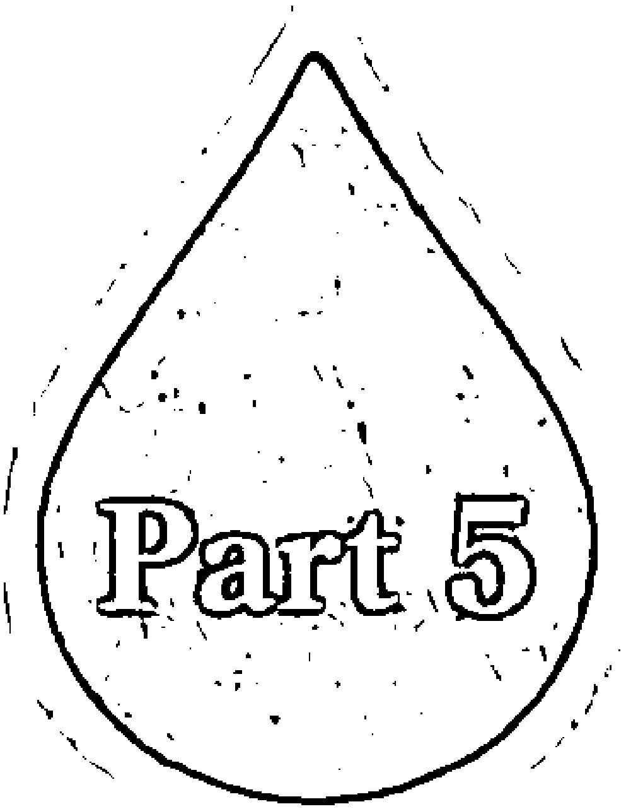

## 準確掌握自己的命運

—流年流月流日的運勢、內在祕密循環數

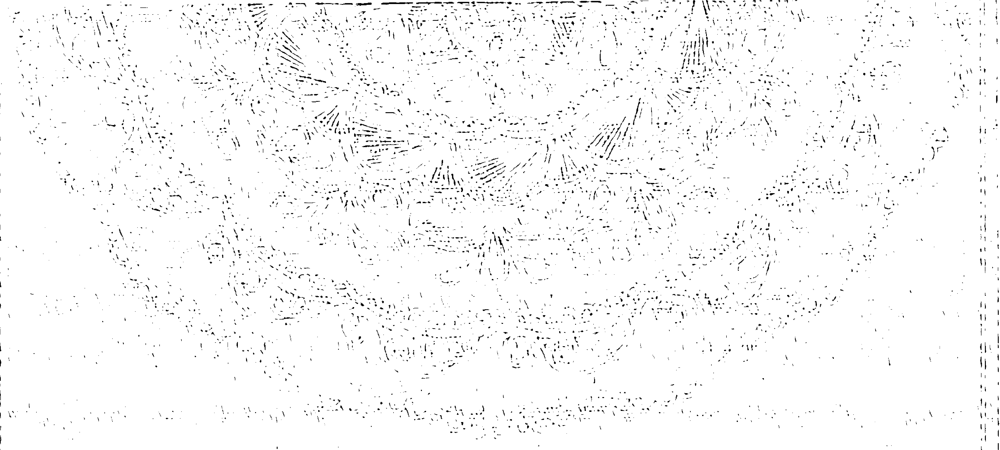

## 5-1 生命的週期

### 1. 生命的軌跡

以宇宙的觀點來看，對於星體的變化以及其運行的軌道模式，皆與我們產生影響，地球承受月球的作用力最大，而月球的運行跟海洋的潮汐變化、女性的生理週期，還有人的精神狀況有很大的關係。

月球於每 18 年會回到同一個角度位置，也就是說月球於每 18 年完成一次軌道的運行，所以每隔 18 年人生會有重大事件的重演，而每 9 年也會有基本的小週期，這是我們人生的考驗，必須去克服及面對，每段週期對我們本身都很重要，了解自己的生命週期，掌握其運行的軌道，懂得做自我生活上細微的調整，你的人生會走得更多采多姿！

東方十年一運，西方九年為一個運程，在宇宙磁場的物轉星移中，展現出生命週期的波動。

### 2. 大環境的流年週期

所有的物質結果都從 1～9 不斷的反覆循環，形成了四個主要階段，代表不同階段的能量表現。

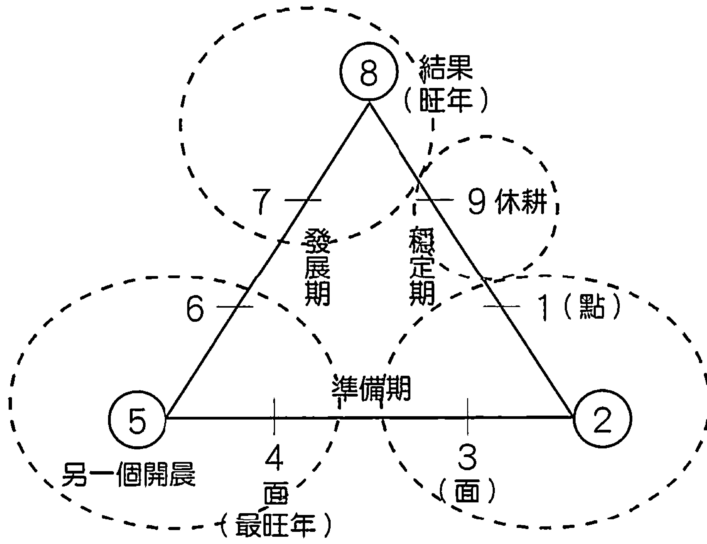

- **第一階段：播種期（1、2、3）春耕**
  能量低，較容易辛苦付出、較勞累；需要勇於開拓及往前衝。
- **第二階段：成長期（4、5、6）夏耘**
  能量中等，要著重在執行，努力在工作及分工合作上。
- **第三階段：收成期（7、8）秋收**
  能量高，比較有收穫、收成；要獲得財務配置（包括容易結婚、懷孕、升官），應當關照在自己所重視的領域，就會有所收穫。
- **第四階段：休養期（9）冬藏**
  能量停滯，適合調整、休息、休養，著重計畫及思考謀略在下一個階段應如何因應。

## 5-2 流年週期（能量的波動）

流年是指當年的能量波動的週期，每月會受到流年的影響其當年的身體狀況、運勢、愛情、財運等。同樣地，我們也可以透過我們的出生年月日算出流月和流日。

### 如何計算流年、流月、流日

| 流年 | 西元年（今年） |  |  |  | 出生月 |  | 出生日 |  | 流年（生日前） | 流年（生日後） |
|------|-------------|---|---|---|--------|---|--------|---|--------------|--------------|
| | | | | | | | | | | |

將今天（西元年）＋出生月＋出生日＝流年（生日後）

流年（生日前）＝流年（生日後）－1

舉例：小欣的生日是：1976年11月04日

1. 流年推算由今年到明年，月數與日數不變，只更改年數。
   2019年的流年運勢數字（2018年11月～2019年11月）
   1976年11月04日改成2019年11月04日
   2019年11月04日→18／9
   流年運勢數字→9
2. 流月推算由這個月到下個月，年數與日數不變，只改月數。
   2019年4月的流月運勢數字（2019年4月4日～5月4日）
   1976年11月04日改成1976年04月04日
   1976年04月04日→31／4
   流月運勢數字→4
3. 流日推算由今天到明天，年數與月數不變，只改日數。
   2019 年 4 月 15 日的流日運勢
   1976 年 11 月 04 日改成 1976 年 11 月 15 日
   1976 年 11 月 15 日→ 31／4
   流日運勢數字→ 4

### 表 10：今年的流年流月流日

根據以下步驟，算出你的流年、流月、流日：

你出生的西元年：__________

你出生的月份：__________

你出生的日期：__________

流年：__+__+__+__+__+__+__+__=______/___

流月：__+__+__+__+__+__+__+__=______/___

流日：__+__+__+__+__+__+__+__=______/___

## 5-3 流年運勢以耕種角度切入

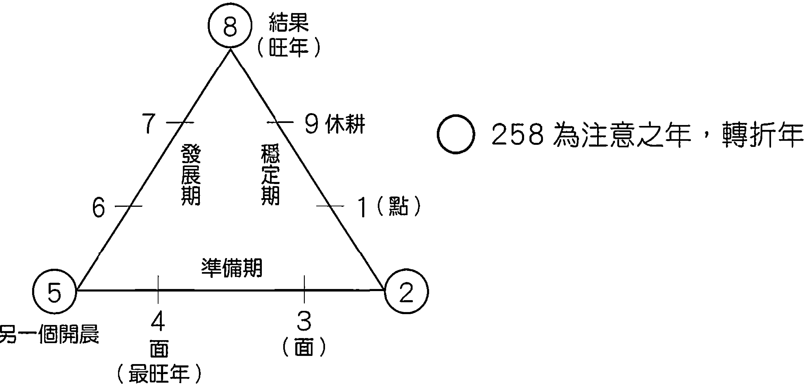

| 流年 | 耕種角度 | 項目 | 內容 |
|------|----------|------|------|
| 流年 1 | 積極開創年（播種） | 能量展現 | 1. 新的開始（起始點），充滿著活力的一年。<br>2. 籌備計畫要有勇氣和魄力。去年的計畫，今年有可能出現機會，並會有所行動。<br>3. 沒有戀愛的人，這一年有可能出現目標。 |
| 流年 1 | 積極開創年（播種） | 注意 | 個性上不要急躁衝動，一旦一意孤行，就有可能後幾年都存在著問題。 |
| 流年 1 | 積極開創年（播種） | 健康 | 心臟、肺、眼睛、血液等這些部位是最脆弱的，這一年也要留意體力的透支。 |
| 流年 2 | 分析調整年（育秧） | 能量展現 | 1. 這一年是關係的建立與合作的關鍵，最適合結婚、與人合夥、協助別人或被協助。<br>2. 可以靜觀其變，表面上看似不動，但很多事情都在進行中，包括新的人際關係和合作機會也會變多了。 |
| 流年 2 | 分析調整年（育秧） | 注意 | 1. 培養耐性，改變一些舊觀念，要以柔克剛，千萬不要硬碰硬，事情才得以順利進行。<br>2. 容易膽小怕事、上當受騙，不要過度看重什麼，否則壓力過大時，會造成情緒上的困擾。 |
| 流年 2 | 分析調整年（育秧） | 健康 | 注意消化系統、糖尿病、腫瘤、痔瘡、缺乏維生素之類的小毛病。 |
| 流年 3 | 樂觀進取年（插秧、萌芽） | 能量展現 | 1. 這一年的靈感、靈氣很強！充滿活力、精力旺盛、變動審視的一年，有拓展事業的機會。<br>2. 在感情上沒有起色，但會有奇蹟出現。<br>3. 這一年有機會調整前後兩年或兩個月的生命軌跡。 |
| 流年 3 | 樂觀進取年（插秧、萌芽） | 注意 | 1. 注意口舌是非，少說話。<br>2. 開銷大，留意收支平衡，別讓錢成為壓力。 |
| 流年 3 | 樂觀進取年（插秧、萌芽） | 健康 | 注意皮膚病、縱慾、血壓高、脾氣暴躁等。 |
| 流年 4 | 穩定整合年（灌溉、紮根） | 能量展現 | 1. 是九年中最重要的一年，代表落實紀律與計畫。<br>2. 想要安定的欲望很強，會是忙碌的一年，即使沒有太多的外務，但在心情上也會很忙碌，因為需要負擔一些責任。<br>3. 有結婚的想法和行動。 |
| 流年 4 | 穩定整合年（灌溉、紮根） | 注意 | 對金錢、工作和家庭沒有安全感。 |
| 流年 4 | 穩定整合年（灌溉、紮根） | 健康 | 注意焦慮及情緒的緊張。 |
| 流年 5 | 突破變動年（茁壯） | 能量展現 | 1. 在物質和心態上都會有轉變的時機。<br>2. 計畫實現的初期，貴人多，財運也很好。 |
| 流年 5 | 突破變動年（茁壯） | 注意 | 1. 今年會遇到裁員、離職、分手、離婚等，但這些因素會因人而出現，是計畫趕不上變化的一年。<br>2. 桃花多，很容易不負責。<br>3. 自制力欠缺，尤其在花錢上會容易有大手筆的消費。吃東西更應該要注意節制。 |
| 流年 5 | 突破變動年（茁壯） | 健康 | 容易疏忽身體的健康，所以各方面都要注意。 |
| 流年 6 | 解決問題年（施肥除草） | 能量展現 | 1. 今年是小心謹慎年，所以在施肥或除草要分清楚。<br>2. 長期積壓的委屈和不平，都會在這年爆發出來，所以也是療癒的一年。<br>3. 多傾聽別人的問題，會發現你的心情漸漸被帶動，有新的想法和機會。<br>4. 這年也是情感的關係年（包括戀愛、婚姻、家人、配偶、朋友）。<br>5. 有機會調整前後兩年或兩個月的生命軌跡。 |
| 流年 6 | 解決問題年（施肥除草） | 注意 | 這一年不要要求自己什麼都好，這樣反而會加重負擔。最好能多接觸心靈治療、看看書、多思考，儘量包容別人。 |
| 流年 6 | 解決問題年（施肥除草） | 健康 | 注意免疫系統、呼吸系統、生殖系統等部位。 |
| 流年 7 | 檢視評估年（結穗） | 能量展現 | 1. 重整自己的機會年，需要從心靈開始，否則外在的改變不會長久。<br>2. 這一年會發現自己很喜歡思考，對生命有更多的問題想要問、想要獲得解答。 |
| 流年 7 | 檢視評估年（結穗） | 注意 | 要預防舊事重演。 |
| 流年 7 | 檢視評估年（結穗） | 健康 | 注意失眠、神經衰弱等問題。 |
| 流年 8 | 驗收成果年（收割） | 能量展現 | 1. 數字 8 是有收穫的意思，前 8 年的基礎如果能有很好的根基，這一年會有明顯的感覺，很多事情會有豐收的結果。<br>2. 如果有創業的打算，可以選在今年。<br>3. 多做好事，可以使運氣變得更好。 |
| 流年 8 | 驗收成果年（收割） | 注意 | 容易貪心、剛愎自用、自私貪婪的問題存在。 |
| 流年 8 | 驗收成果年（收割） | 健康 | 注意頭疼、牙齒上火、便秘、骨骼病、血液等問題。 |
| 流年 9 | 反省靜心年（休耕） | 能量展現 | 1. 同樣是心靈提升的一年，數字 9 與數字 7 的理性思考不同，而是機緣會出現，一些緣分會來到內心深處。<br>2. 這一年會好壞參半，先捨後得是這年必須具備的心態。 |
| 流年 9 | 反省靜心年（休耕） | 注意 | 1. 不要在這年投資產業、買房子或者開公司、創業。<br>2. 要能付出奉獻，若因自身有些瓶頸，就會有自私的行為，所以會對下一年的開始更加不利。 |
| 流年 9 | 反省靜心年（休耕） | 健康 | 留意意外、抑鬱、心理的壓力。 |

這週期九年之意義可解釋為：

| 年 別 | 屬 性 | 能量特質 | 生活上著重歸屬 | 以種稻喻 |
|------|--------|---------|------------|---------|
| 第一年 | 種子栽種年 | 能量微弱<br>找尋新契機 | 新的工作、<br>關係開始 | 選種<br>植種苗 |
| 第二年 | 種子發芽年 | 脆弱、<br>新機緣，<br>多確立方向 | 有貴人及新契機 | 插秧期 |
| 第三年 | 成長年 | 發展試驗期、<br>需新的創意 | 前三年調整<br>及再出發 | 除草<br>施肥期 |
| 第四年 | 茁壯年 | 確定、鞏固<br>內外在能量 | 積極已掌控<br>實際運作 | 成長期 |
| 第五年 | 小結果年 | 產生回饋<br>能量及小回收 | 初想回報的喜悅 | 結穗期 |
| 第六年 | 分享年 | 能量治療<br>軌跡調整 | 身心反應<br>習氣程度 | 助割期 |
| 第七年 | 感恩年 | 開放心靈<br>審視過程 | 此週期的意義<br>與目的 | 曬穀期 |
| 第八年 | 大豐收年 | 能量回收、<br>因果恆等 | 目標達成、<br>享受成果 | 結算期 |
| 第九年 | 休耕年 | 靜心反思改過 | 軌跡跳脫<br>及待機變化 | 休息期 |

＊ 週期 9 年闡述著因果律及心性進化的程序，但非一成不變，人的意志力及決心可提前或延後此能量的影響。我們可以說前四年是栽培期應該努力，後四年是收穫期，其收成的多寡取決前期的犧牲與付出，可以好好檢視自己的流年運勢。

## 5-4 流年運勢與內在秘密循環的意義

內在秘密循環數指的是內在的感覺，在流年的這一年裡，你將擁有此內在秘密循環數，別人不會知道。只要將你的主命數與流年數相加，即是你的內在秘密循環數。

舉例：菁菁是 1980 年 11 月 16 日出生。

## 計算方式步驟

- 主命數計算：1980 年 11 月 16 日＝27／9
- 流年計算：2019 年 11 月 16 日＝21／3－1＝2（因生日還沒有到，所以減 1）
- 內在秘密循環數：主命數＋流年數＝9＋2＝11／2

所以菁菁的內在秘密循環數是 2。

### 表 1.1：你的內在秘密循環數

根據以下步驟，算出你的內在秘密循環數：

你出生的西元年：__________

你出生的月份：__________

你出生的日期：__________

主命數：__＋__＋__＋__＋__＋__＋__＋__＝______／__

流年數：__＋__＋__＋__＋__＋__＋__＋__＝______／__

主命數＋流年數：__＋__＝______

## 流年循環與內在祕密流年循環週期的意義（1～9）

### 循環週期 ①

凡是正要開始，而且也到了該開始的時候。這是積極主動向目標進攻的好時機。過去的就讓它過去，從新的事情開始著手。此期較容易做出決定，因為以往晦暗不明的問題，現在都豁然開朗。這時也是展臂迎接機會、不必再等待他人協助的時候，不要讓別人來依賴你，更不要受到牽制而裹足不前。

現在要好好照顧自己、自私一些也無妨的時候。處在此週期，就要順從直覺本能，別再遲疑不決，正是好好發揮的時機。

### 循環週期 ②

從循環週期 1 的衝鋒陷陣中，可以放慢腳步，先查看細節。現在你的眼光會比較銳利，能看出過去的矛盾，以往有些事看起來不可能，現在看起來好像變得比較容易看清，因為你會採用新的觀點看待它。在這個週期很適合進行合夥事宜或是改善關係。

如果你目前沒有對象，可能很快就會有戀情出現。要特別注意，別讓自己太過依賴。在這時間點，人總是會特別想找個伴侶依靠，而這樣的衝動，很可能會讓人找錯對象。與人共同合作固然不錯，但絕對還是只能靠自己。

### 循環週期 ③

事情又要再度往前推進了，但暫時只能維持表面的進展。這段時間不要抱持著太高的期望，但也不必退縮，因為你將會學到重要的經驗，只要你能深思與質疑，不把一切視為理所當然。

你的創意與溝通能力會大幅精進，不妨藉此與以往較不易相處的人重新溝通，這也能與朋友歡聚的好時機；或者把之前的老問題分析一番，很可能就會找出解決方案。

處在此期，切勿浪費，因為你到下個循環週期才知道什麼叫做花錢。可以前進擴展，但態度要保守，不要過度樂觀期待，但能得到很多回報。

### 循環週期 ④

這是真正了解自己實力的時候。要把握良機並好好經營，鞏固既有的根基，全力付出、加強實力，但先不要有期待收穫的心情。

現在不是變動的時候，卻是投資的好機會，也是改進作業流程與提升品質的最佳時機。現在的你很擅長找出事情的問題點，並發現出錯的原因，不妨順勢在自己的生活上運用這項能力，可以多方檢討。

處在此期，必須保守多儲蓄，以備下個週期的不時之需，切勿冒險，一切眼見為憑。

### 循環週期 ⑤

這時是一段充滿機會與變動的時候。充分的準備接受毫無預警、突如其來的變動。過去視為理所當然的，而現在恐怕不是那回事了，就隨遇而安，順其自然，把所有的變動視為讓一切更完美的轉機。

此時期，適合旅遊並盡情的享受人生，挺身為自己爭取權益的好時機，不如利用這個轉變的運勢，可以好好整頓生活中大大小小的事物，讓生活更美好。

這個時間點，很適合轉換職場和搬家。變化後的新事物也許不見得會長久，但最後還是會有好處。不適合做長期的規畫，只要追求短期的好處。

### 循環週期 ⑥

凡事都將要底定，沈痾就要掃除。以往與你有過節的人，無論是你錯怪對方或是對方誤解你的，此刻將會出現和解的曙光，或者你大可主動上前道歉。利用此期解決健康上的問題。

此時期在感覺上會比較敏感，也比較容易找出問題的所在。同時，你會知道哪些工作與住處，才是真正適合你的。如果你的感情關係並不是這麼適合，現在也正是理出頭緒、想辦法解決的時候，或者長痛不如短痛就此分手。

此時期不適合遠行，不宜有快速和驟然的變動。只需擬定計畫，並嚴格遵守等待生活中所有的塵埃落定。

### 循環週期 ⑦

事情變得進展遲緩，但是你會從中學到很多。所有事情的真相彷彿都在此時不約而同的出現，逼得你不得不做出決定，但是做決定的過程一定不是這麼容易，就正面迎戰吧！檢視所有細節，然後做出抉擇。

此時期需要咬緊牙關、鼓足勇氣接受真相，重新展開人生。所有一直以來進行中的計畫，都必須在這時期完成。現在不宜啟動新的方案，而是通盤檢討過去七年裡所執行的計畫，然後再努力完成它們。

這是耕耘的時期，切忌懶惰，否則日後將無收穫的可能，在下個循環週期你會後悔莫及。

### 循環週期 ⑧

期待已久的收成時節終於到來，你覺得一切都不可能出錯。萬一事情的發展不順利或是陷入膠著時，千萬不必太過沮喪，因為會有其他更好的機會等待著你。

此時期適合投資和冒險、可以發表新產品、有機會增加獲利。你會認識許多人，所以社交應酬也是在所難免，好好把握機會，現在不是害羞保守的時刻，卻是積極進取，放膽向前衝的時機，可以直接說出你真正的想法及感受，別做悶葫蘆。

在此期結束之前，把所有你曾經想嘗試的事，都想辦法付諸行動。以前的夢想也曾經實現過，現在你也一定都能辦到。

### 循環週期 ⑨

這是承接上一個週期 8 所擴展形成的事業版圖，然後服務別人的階段。現在絕非開展新事業的好時機，只要延續先前的成功事務即可。此期會出現許多變動，事情終會結束，新的夢想會形成。

當結局終於出現的時候，深入思考它們為什麼會結束，你會發現那是因為它們與你的人生規畫有所牴觸，不是你真正想得到的東西，那就放手讓它去吧！

在週期 8 所發揮的動能，會為你帶來一種從務實角度出發的行事方式。順應這種模式，全力照顧他人，享受自己的人生。要放鬆，別太嚴肅，因為處在此期這段時間的你很難看清楚事實的真相。

這時若有新的機會出現，不要急著投入，最好把計畫稍微延到週期 1 時再啟動。

## 觀察重要流年週期

若出現以下的狀況，會有重大的事件發生：

- **22／4 →** 關鍵決定年，圓滿年。可能移民、搬家、轉行、賺大錢、出國、改變一生或分崩離散。
- **22 →** 超級卓越數，雙倍的 11，雙倍的內外單獨一面（2 是分析、配合）。
- **22／4 →** 為主要數（次要數為 31／4、13／4、4／4），因果論，愈有衝勁狀態愈大。
- **4 →** 若為 ⊕ 鞏固力量的年、量子跳躍的年，要注意意念。
- **⊖ 分崩離析的年。**
- **走在自己主命數的流年（在東方：犯太歲）**，諸事不宜，每九年皆會走到自己的主命數，考驗一次於你的人生目標。

愈接近 2000 年以後出生的孩子，都會每隔九年就會遇到一次 22／4，代表九年就會有一次動盪（轉變），顯示未來的 60 年，人類心性必須提升，否則無法迎接太大的壓力，易有憂鬱、自殺、內心的問題。若一生無 22／4，則沒有太大的起伏波動；若中年以後遇到 22／4，代表要把握此年，可以展現風華。

- **30／3 → 為主要數（次要數為 12／3、21／3、03／3）**
表示此年會遇到重大事件，改變新觀念（個性改變的一年）。固執的人若遇到此年則會改變（例如：遇到重病一場，這時就會改變）。若 30 歲之後遇到，則為個性定型之年，年輕時則早熟。若要改變，則要遇到 22／4 之年才可能改變。只要主命數加起來為 30／3 的人，則先天就被定型了。

- **人類的一生個性變換**，可由流年主命數是 3 看得出來。
- **人類的一生格局變換**，可由流年主命數是 4 看得出來。

### 40／4 → 代表重大事件改變新格局（新環境）

在 30 ～ 40 歲若遇到，是最終環境定型的一年。若要改變，則要遇到 22／4 之年才能改變。

### 11／2 → 代表內外獨當一面，與人建立良好的關係。

是屬於情感能量的一年，會有感情依賴的人，注意情緒起伏大，且有貴人或外力相助。

11 減自己的生命靈數所得到的數值有什麼樣的現象，很可能會失去相關人、事、物。

### 18／9 → 整合串聯、融會貫通、包容慈悲，為終極之數，因為要達到 0 了。

這一年上天會看你的德性如何，如果做壞事會將你喜歡的人事物，從你身邊失去。流年走到 6 或 9 要注意身體；流年走到 5 或 9 要注意意外的事件發生。

18 的十位數 1 是指對外要好好表現自己，免於挫折，考驗自己的能力，認同自己，開創所有狀況的開始。18 的個位數 8 是指對內要懂得掌控面對，要有雙倍的安全感。

## 5-7 流月的運勢（愛情、財運指數）

### 播種期的第一期（1）

如果您先前已經努力許久，那麼現在是做好一個調整的開始，注意有哪些需要修正，哪些需要加強的。

另外，這個階段是屬於一個新的開始，值得重新努力的時刻，你可以在這時候重新布局和計畫，可以學習一些知識，充實自己，邁向新的里程，築構自己的人生夢想。

### 運勢建議

- **財運指數：** 2分。需要好好努力衝刺！
- **愛情指數：** 2分。發現問題，然後重新開始吧！

### 播種期的第二期（2）

現在正是你努力擴展計畫的好時機，要隨時注意有利於自己的人事物，並且懂得借力使力壯大自己。透過分工合作的方式，達成自己的既定目標，千萬不要只是空想而不去付出行動，當然也不需要在合作當中過於委曲求全，把自己給累倒，以免發出許多的抱怨，影響整體的發展和自己的發揮。

另外，這段時間仍然是在付出期，要學會甘之如飴地享受工作及付出，必須踏實且不能好高騖遠。

### 運勢建議

- **財運指數：** 3分。仍需要好好努力衝刺，不過現在正是擴展計畫的好時機！
- **愛情指數：** 3分。矯正問題，然後建立協調的方法吧！

### 播種期的第三期（3）

這是一個講求速度和效率的階段，如果之前你已經做好了萬全的準備，那麼現在正是快速加把勁的時候，更是為了理想全力邁進的好時機。如果你尚未準備好，千萬不可一昧地操之過急，因為目前還是播種期，檢視根基是否穩當，才是未來持續發展的重要關鍵，如果一時心急反而容易造成損失。

所以要學習對外與對內的良好溝通，讓所有人充分的了解你的需求所在，這樣才不會助力變阻力，影響了整體的發展。

### 運勢建議

- **財運指數：** 4分。確實達到雙向溝通後，就可以全力以赴，會有不錯的合作機會開始出現！
- **愛情指數：** 4分。需要先釐清你們之間的問題，然後再找出你們的溝通管道和方法吧！

### 成長期的第一期（4）

所有的辛苦在這時獲得了穩定的發展，但你要更小心謹慎地審視每個環節，因為現在的一個小問題，都會阻礙未來收成的障礙。

聆聽旁人的意見，然後修正可能是盲點的制度和已在運作的計畫，這樣才能更清楚的計算財務上的規畫，看看是否能收支穩健，確實是否有無任何問題，千萬不可固執地只相信自己的專業，而缺少了更細膩的建議，這樣你要達到成功已經為期不遠了。

### 運勢建議

- **財運指數：** 5分。相當穩定的發展階段，不過更要謹慎小心每個環節！
- **愛情指數：** 5分。注意問題，然後學習為對方真心的關懷和付出吧！

### 成長期的第二期（5）

這個階段是需要建立更有格局、開闊關係的時刻，你的社交機會變多了，人氣也越來越旺。不過要懂得將自己的理念和計畫，在這個時刻宣揚出去，而不是只有享受或玩樂，因為要讓自己的運勢更壯大及穩定，現在正是時機點。你要懂得在這個時候建立更龐大的人際關係和信用，才能為未來的收成，設立一個穩定和圓滿的基石。

### 運勢建議

- **財運指數：** 6分。好好建立良好的人際關係，要把握目前強旺的運勢！
- **愛情指數：** 6分。隨時給對方一個驚喜，並且讓生活充滿樂趣，為彼此的感情加溫！

### 成長期的第三期（6）

這個階段將是你需要東奔西跑且是最忙碌的時期。另外，不斷的學習新知來充實自己，並且建立一個完美的利益他人的工作理念，將會讓自己更實至名歸的迎向成功。

不過在忙碌之餘，要注意與他人相處的方式，不要帶有強烈的批判和指責的意味，以免傷了朋友和團隊的士氣。

### 運勢建議

- **財運指數：** 7分。學習讓自己更能得心應手的知識和資訊，然後夾帶著先前的人氣，開始更賣力的宣揚自己的理念。
- **愛情指數：** 7分。時刻到了，該給對方一個承諾！你們的愛情在這個時刻，將會受到很多人的祝福。

### 收成期的第一期（7）

在過往所有的付出，此時刻獲得了完美的結果，開始好好享受自己的成果吧！

如果在這時刻，你才正要進行開始，那麼你可能就要清楚判斷，目前所做的是否適合自己。如果不適合，必須立刻更換跑道；反之，也請你要做好心理準備，因為在這個階段都會遇到壓力、孤單的問題。

要記住「天下沒有白吃的午餐」，一分耕耘絕對會有一分收穫，好好的加油吧！

### 運勢建議

- **財運指數：** 8分。享受成果的同時，也開始學會享受付出吧！這一切都是值得的！
- **愛情指數：** 8分。圓滿的愛情，又能在金錢上得到滿足，會是羨煞旁人！

### 收成期的第二期（8）

這個階段是你人生的顛峰，從播種、努力耕耘、學習成長解決問題，到現在已經是經驗豐富，且累積足夠的能力和智慧，同時掌握了財富和權力。

但在高興之餘，請別忘了要將成果分享給他人，協助別人跟你一樣成功，因為在有能力的时候，懂得幫助別人，等於為自己創造一個新的機會。

如果你現在才正要開始進行，請一定要小心謹慎自己的步伐，因為這個階段已經到能量的最高峰，如果不是累積到現在，容易發生雷聲大雨點小的挫敗。

### 運勢建議

- **財運指數：** 9分。給別人機會等於是給自己下一次機會，慶祝自己的成功，同時也開始去學習幫助別人！
- **愛情指數：** 9分。好好享受幸福的愛情運，還有什麼好奢求的！但如果你們是剛認識，而且感覺是對的，別懷疑，那就是他（她）了！

### 靜默期（9）

所有的人走到這個階段，都是宜靜不宜動，並且開始省思一年來的所作所為。做不錯的繼續保留，做不好的地方，立刻尋求解決之道，並且開始擬定新的計畫，讓未來有一個明確的執行方向。

另外，這個時刻要學會如何透過心靈層面來整合所有的物質現象，清楚的看見這一年來每個經歷的過程。

如果你是現在正要準備開始進行，勸你放慢腳步，先等一等再說，因為最後這個時期，通常都是沒有結果的居多。

### 運勢建議

- **財運指數：** 1分。只適合計畫和規畫，不適合執行！
- **愛情指數：** 1分。愛情的沉澱期，你可以與另一半好好溝通一番，聽聽對方的想法，同時也讓對方聽聽自己內在的聲音。

## 數字與精油間的療癒

### 植物精油的能量

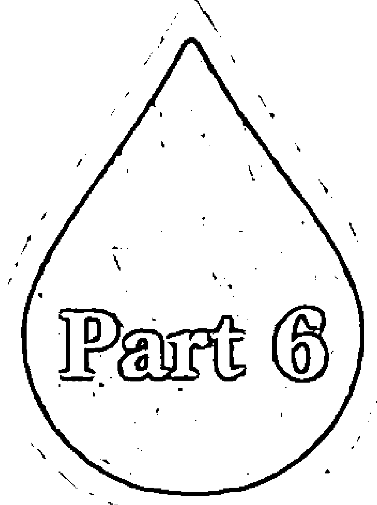

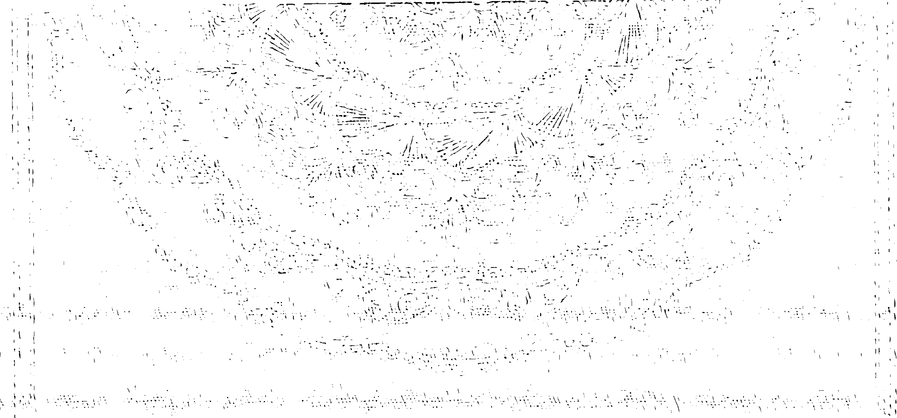

當我們啟動「個性數」時，就能發揮對外在潛能及激發內在的特質，主命數和人生課題（人生目標）之間的反反覆覆，使得一般人最容易表現出負面的特質，所以要補足此能量，才能達到所有的平衡，人生目標也容易達到。

我們之前談到的個性數，就是代表一個人的外在行為表現，也就是日常生活與人相處的模式，給別人的感覺（別人眼中的你）；而主命數是代表人一生的目標（課題），對每件事最後決定的執行方式，也就是當為了要達成目標時的做事方法，此時就會發揮天賦數的特質。

雖然主命數僅占 30%，但是如果我們能善加掌握後天的 70%，我們就能補足欠缺的能量，讓人生能更加圓滿。我們在平時除了可以透過顏色、幸運物等加強我們的能量外，還能利用數字精油，透過精油的能量協助我們展現及發揮正面特質，進而達成我們人生的目標及課題。

在第三章節的九宮格圖得知，數字圈數能量的強弱及空缺數、契機數、黑洞數，經過數字連線，我們就可以開始進行能量的補充了。運用數字精油來補充缺少的數字及幸運數（契機數），以能串成數字的最好（但不要使用黑洞數）。

## 認識精油

我們每個人從出生到結束，都會有一本專屬於自己的人生故事劇本，然而影響故事的起承轉合，都會因為與外界所接觸到不同的人、事、物而撞擊出不同的火花，產生不同的結果。生命的意義和美麗，也就在於這一瞬間的展開與綻放。

## 精油的療癒・情緒的釋放

精油所具有的內涵特質能夠溶解我們體內潛意識中，凝礙不化的部分，而每一種植物精油的故事就像一份提醒，告訴我們可以用不同的眼光和態度，去面對生命中需要改變與想要擁抱的部分，讓我們重新以平和、開朗的態度去承受生命中遭遇的人、事、物。

科學家早已研究顯示，精油在嗅覺、記憶、情緒、感受與思考間，都有著緊密的連結，在嗅覺的牽動，精油味道進入體內都會產生一種無形的能量，透過精油的能量碰觸，觸及到靈魂的深處，晃動那些埋藏已久在我們潛意識的負面能量，於是展開一場啟動自我療癒的機制。

美國知名的神經科學家甘德絲・柏特博士，她認為情緒是生理機能之鑰，人體內的化學物連結了心靈和身體，扮演資訊媒介的角色。情緒是由化學分子所組成的，當我們經歷某種情緒變化時，其實代表身體正以對應該種化學分子組成的頻率振動著。因此情緒是身體組織的振動，所以如果想改變我們對於某件事的想法或感覺，就必須改變身體的振動頻率。

每一個精油的味道與獨特，在我們接觸後，都會有不一樣的感受，因為每個人所記憶中的香氣會有所不同。因此，香氣、情緒與記憶彼此間有著緊密的交織，當美好的記憶被香氣所引動，我們便會立刻產生不同的直覺與感受，有了新的想法與選擇，甚至是全然不同的行為模式。

我們從小對事情的解決方式，決定了我們面對世界的態度，正因為每個人的獨特與不同，所以當我們經歷相同情況時，不一定會使用相同的精油，因為身體的疾病和壓力對情緒的反應都不同，主命數 1 和 6 的人在面對相同的壓力，情緒的反應卻各有不同，因臨床經驗分析，身體的疾病多會伴隨著待解決的情緒糾結著。

在這種情況下，唯有讓我們透過精油的芳香分子帶領我們進入體內，去真實坦誠面對壓力與身體上的不適，在精油增強我們的能量下，我們也能勇敢為自己的生命立下更大的計畫和目標，讓它在我們的身體內裡，釋放所有的壓力和放鬆。

---
获取更多好书，请加微信号：strcdts
店铺：http://strc.cr.cx

## 主命數 1／10

**表 徵：**獨立、自主、有自信、開創、主觀、愛面子。

**星 座：**牡羊座（火星）／魔羯座（土星）

**象徵性人物：**一位武士

主命數是 1 的人，在生活或工作上若在出現「缺乏自我價值、沒有自信、不被重視、不如別人」等狀況，就容易讓自己的身體罹患躁鬱症、腸胃或肝臟等疾病。

### 1. 外在物件能量

| 項目 | 內容 |
|---|---|
| 飲食習慣 | 單一食物飲食法，因「具有強大的療癒力量，不會加重消化系統的負擔，又能快速提供身體營養」，需要有體力與耐力時，才會發揮最大功效。 |
| 幸運色 | 1→紅色。代表活力和衝勁，不妨多穿深淺不同的紅。<br>10→海軍藍。代表權威及專業的形象。 |
| 穿著上 | 1→透過衣服、顏色、配件等，穿戴出自己的特色。<br>10→穿戴海軍藍的服飾及配件。 |
| 喚醒力量 | 1→學習武術、拳擊沙袋，生氣時就狂吼，悲傷就哭泣，快樂時就開懷大笑。<br>10→搭火車、享受海景、搭船、騎馬、聆聽海洋及水聲的音樂。注意每天喝水的量、多食用海鮮。 |
| 符號標誌 | 1→劍、狗、馬拉曳的戰車、銅質的甕與花瓶、禿鷹。<br>10→漁夫用的三叉戟、馬、飛馬、船隻、海中生物。 |

數字 1 的人在學會接受自己、獨立、不需要證明時，就能成為一位獨立的操控者，有自信且能自我認同。同時，能領導別人走向更美好的未來，也可以讓自己的身心靈更健康。

### 2. 內在能量

當我們有「想要有動力、靈感、啟示、刺激誘因、需要領導、做決策、獨立自主時、必須化繁為簡時、需要新點子或活力」時，可以利用精油來增加能量。

數字精油 1：增強「自信力、獨立、果斷、勇敢，充滿創造力與領導力」的能量。

數字精油 10：增強「友善、嚴肅、積極、專注、直接、戲劇性」的能量。

- 1. **薄荷**：醒腦，賦予靈感並且提升創造性、直覺、目標性、理智度。（懷孕時不宜使用）
  - 主治：消炎、止痛、去腸胃脹氣、祛痰、利腦、利膽、利神經、呼吸道、消化系統。
  - 情志：安撫憤怒、歇斯底里與恐懼、疲憊沮喪。最適合自己老是覺得被現實追著跑而迷失了目標時，或無法相信自己的直覺時。
- 2. **胡蘿蔔籽**：活化細胞，淨化負面狀態。（懷孕時不宜使用）
  - 主治：去脹氣、促進細胞再生、清血利尿、利肝、改善咳嗽和凍瘡、不孕症。
  - 情志：淨化、舒壓。保護、強化，當負面情感殘留在心中時。
- 3. **杜松**：滋補腎陽。（懷孕時不宜使用）
  - 主治：抗感染、治風溼、淨化組織器官、腹脹、動脈硬化、利尿、祛痰。
  - 情志：容易慢性疲勞、憂鬱、壓力、冷漠。
- 4. **薰衣草**：調節肝臟。（冷靜、沉著、從容、自我表達）
  - 主治：止痛、抗菌、消炎、治高血壓、調節肝臟、抗痙攣、治療泌尿生殖器、呼吸道感染、促進傷口結痂。
  - 情志：緩解挫折、躁怒、鎮定、冷靜、強心、失眠、穩定心氣。
- 5. **茉莉**：強健子宮，能有創造力及和諧。
  - 主治：鎮定、增強性功能、強健子宮、泌尿、生殖器官。
  - 情志：抗沮喪、放鬆、安撫神經。

> **心靈小語** 要學會自己獨立和對自己的信心，才能發揮自我的能量。

## 主命數 2／11

**表 徵：**協調、連結、傾聽、合作、分工、重細節。

**星 座：**金牛座（金星）／水瓶座（天王星）

**象徵性人物：**一位農場主人

主命數是 2 的人，若出現「想避開衝突、擔心不適合任、自己成為受害者」時，就會產生不安的情緒及心情，此時健康就會亮起紅燈，所以容易罹患憂鬱、躁鬱及流行性症狀的傾向。

### 1. 外在物件能量

| 項目 | 內容 |
|---|---|
| 飲食習慣 | 液體足以代表 2 號人的特質；液態的食物包括：飲料、湯品，可以把湯品當成正餐、與朋友一起喝杯飲料，不管是茶或咖啡或酒都可以。 |
| 幸運色 | 2→橙色。代表合群，穿橙色衣服代表同心、純淨。11→金色帶有靛青色。 |
| 穿著上 | 2→可以強調獨特的眼鏡或眼睛部位及個人形象。11→可以配戴黃金、彩虹或皇冠的飾品或圖案。 |
| 喚醒力量 | 2→女人可以化濃粧、戴假髮，男人可以蓄鬍子。11→打雷閃電下雨時、化作天空的事物。 |
| 符號標誌 | 2→孔雀、眼睛、母牛。11→閃電、老鷹、皇冠、彩虹。 |

數字 2 的人學會不依賴（能分辨真假），就可以學會思考判斷及決定，在平衡施與受的問題時，就能幫助自己獲得健康。

### 2. 內在能量

當我們有「需要耐心和彈性、需要改善人際關係、需要關照細節、想幫助協調事與人、需要思考問題時、必須有所掩飾或表演、需要寫作、需要找門路利潤」時，可以利用精油來增加能量。

數字精油 2：增強「與人協調的能力、耐心、分析、直覺力、寬容力」的能量。

數字精油 11：增強「對於別人說的事情，保持興趣、溫暖而健談，像老朋友般熟稔，不具威脅性、感性」的能量。

| 項目 | 內容 |
|---|---|
| **1. 天竺葵** | 強肝、健脾，可以增加安全感受性。 |
| 主治 | 抗菌、止痛、收斂、鎮定、強肝健脾、增強性功能。 |
| 情志 | 放鬆神經、鎮定焦慮、改善更年期的不適症狀。 |
| 搭配 | 薰衣草、德國洋甘菊。適用治胃炎、結腸炎、粉刺。 |
| **2. 雪松** | 利尿。增加力量、耐力、確實性。 |
| 主治 | 動脈硬化、抗感染、利尿、促進傷口結痂、解淋巴充血。 |
| 情志 | 專注力不佳、倦怠、神經衰弱。 |
| **3. 洋甘菊** | 止痛、健胃，可以使人冷靜、寬容。 |
| 主治 | 止痛、抗過敏、消炎、鎮定、增進消化、護眼、健胃。 |
| 情志 | 可以緩和壓力、經前緊張、長期性緊張、失眠。 |
| **4. 玫瑰** | 消炎、促進傷口結痂，提升感受有愛、信任、自我接受。 |
| 主治 | 抗菌、消炎、抗感染、促進傷口結痂、止血、強健子宮、促進膽汁分泌、調節肝臟。 |
| 情志 | 抗抑鬱、治療神經焦慮、情緒創傷、失眠、修復信任。 |

> **心靈小語** 建立一個平和對等的關係，在合作與平衡之間，發揮協調的能量。

## 主命數 3／12

**表 徵：**機智、溝通、多才藝、創意、樂觀、孩子氣。

**星 座：**雙子座（水星）／雙魚座（海王星）

**象徵性人物：**一位信使

主命數是 3 的人，若出現「不被允許表達、沒有創造力、遲鈍」時，會受到工作時間限制產生壓力，健康就會出現問題。所以須注意鼻腔的問題，並預防口腔疾病、呼吸道及咽喉或聲道方面的感染。

### 1. 外在物件能量

| 項目 | 內容 |
|---|---|
| 飲食習慣 | 好看及受大眾歡迎，容易入口的食物。為了身體著想可以吃些番茄、木瓜、鳳梨、香蕉等鮮豔、易消化的食物。 |
| 幸運色 | 3→黃色。要發揮創意時，穿上黃色衣服很有效果。<br>12→水晶色。可以配戴水晶的手環或飾品。 |
| 穿著上 | 3→臉上可以化淡粧，戴上精緻的藝術品或小物件。服飾上可以有些金蘋果、天鵝或鳥的圖案。<br>12→穿著透明或白色的衣物，能增強能量。 |
| 喚醒力量 | 3→品嘗美食、穿著漂亮的衣物、住舒適的住家。<br>12→參加嘉年華會、小酌紅酒、唱歌、跳舞。 |
| 符號標誌 | 3→蘋果。<br>12→酒杯、老虎、羊、面具。 |

數字 3 的人能充分的發展創造力、追求自己喜歡的樂趣、善於表達幽默感時，就能夠在不自我懷疑下，就可以面對陽光、真實感受歡樂、暢所欲言，擁有健康的身體。

### 2. 內在能量

當我們有「需要發揮創意、需要創造出與美有關的產品、客觀察看、需要開心享樂或參與宴會之類的公開活動、需要為人助興或協助公關事務、想要確認自己真正的夢想、促銷商品、照顧別人」時，可以利用精油來增加能量。

數字精油 3：增強「表達能力、創作力、藝術美感、接受新觀念及他人的意見」。

數字精油 12：增強「友善、有權威性、愉悅、好奇、開心、緊張」。

| 精油 | 內容 |
|---|---|
| **1. 茴香** | 通便、消化系統，可以增加自我表現、多產、表達等。 |
| 主治 | 止痛、通便、促進膽汁分泌、消化、刺激乳腺分泌、健胃、利尿、消腸胃脹氣。 |
| 注意 | (1) 懷孕、哺乳期婦女和 2 歲以下兒童不宜使用。(2) 消水腫、蜂窩性組織、肥胖症。 |
| 情志 | 過度思考及分析、說話、表達、神經性痙攣。可以增加自在的表達與交流。 |
| **2. 薄荷** | 醒腦。（懷孕時不宜使用） |
| 主治 | 消炎、止痛、去腸胃脹氣、袪痰、利腦、利膽、利神經、呼吸道、消化系統。 |
| 情志 | 可以安撫憤怒、歇斯底里與恐懼、疲憊沮喪。 |
| **3. 玫瑰** | 消炎、促進傷口結痂，提升感受有愛、信任、自我接受。 |
| 主治 | 抗菌、消炎、抗感染、促進傷口結痂、止血、強健子宮、促進膽汁分泌、調節肝臟。 |
| 情志 | 抗抑鬱、治療神經焦慮、情緒創傷、失眠、修復信任。 |
| **4. 香蜂草** | 提升肝胃與腸功能，使人溫和有力、無懼沉著。 |
| 主治 | 消炎、止痛、促進消化、增進膽汁分泌、調節沉滯氣能、提升肝胃與腸功能、順暢肺氣、減輕咳嗽、支氣管炎。 |
| 情志 | 安撫、失眠、治療沮喪、情緒敏感。 |

**心靈小語** 學習溝通，把自己的感覺，勇敢地表達出來，在敏銳的意識和恰當的表達方式中，發揮最大的溝通能量。

## 主命數 4

**表 徵：**穩健、執行、負責任、愛家、固執、專業精。

**星 座：**巨蟹座（月亮）

**象徵性人物：**一位母親

主命數是 4 的人，若出現「沒有組織結構、無系統的，造成粗心大意及怠惰」時，健康就會發出警訊。所以須注意肥胖症、厭食症及筋骨與胃潰瘍的現象。

### 1. 外在物件能量

| 項目 | 內容 |
|---|---|
| 飲食習慣 | 鄉村食物或山野料理，味道單純，能帶給人們穩定安全的感覺。或者定期吃素，幫助體內的排毒。 |
| 幸運色 | 綠色。代表健康與成長，可以帶給人有信心和安全感。 |
| 穿著上 | 1. 搭配上以保守傳統的風格，談生意的場合可以傳達出有利的訊息。<br>2. 休閒服裝上可以有玉米、小麥、蔬果、蜂蜜的圖案。 |
| 喚醒力量 | 可以讓事物以有組織而俐落的力量運作，讓環境更有秩序。 |
| 符號標誌 | 豐饒角、乳房、稻穗。 |

數字 4 的人必須學會接受事實和平凡，成為穩重及可信任的人。當懂得計畫或願意改變時，就能選擇自己想要的人生目標，建立外在及自身真正的安全感，身體自然就能在穩定中求健康。

### 2. 內在能量

當我們有「需要安全感或營造安穩牢靠的感覺、需要找到方法改進事物、需要釐清問題所在、需要確保品質、想與朋友及心愛的人建立緊密關係、需要財務上的安全感」時，利用精油來增加能量。

數字精油 4：增強「可以增強組織力、責任感、務實、邏輯、改變應變力」。

- 1. **葡萄柚**：健胃、利肝臟，可以放鬆、恢復元氣。
  - 主治：祛風、通便、增進膽汁分泌、促進消化、水腫肥胖、健胃、利肝臟。
  - 情志：容易緊張、挫折、易怒、壓力。
- 2. **綠花白千層**：增強免疫系統，可以使人樂觀、開朗、自由。
  - 主治：止痛、抗風溼、促進傷口結痂、退燒、鼻塞、增強免疫系統、調節腸功能。
  - 情志：能激勵、復甦、使頭腦清醒、注意力集中。
- 3. **洋甘菊**：止痛、健胃，使人冷靜、寬容。
  - 主治：止痛、抗過敏、消炎、鎮定、增進消化、護眼、健胃。
  - 情志：緩和壓力、經前緊張、長期性緊張、失眠。
- 4. **檸檬**：健胰、健胃，能有提神、清醒、舒服的功效。
  - 主治：抗菌、抗凝血、抗感染、抗風溼、增進消化、利尿、治高血壓、增強免疫、溶石（膽結石、尿道結石）、健胰、健胃、靜脈曲張。
  - 情志：減緩敏銳意識、平靜心靈、易怒、失眠、減輕憂慮。

> **心靈小語** 努力讓生活有規律，在充滿安全感的氛圍裡，讓建構的程序在穩定中發展，即能發揮最大的安全能量。

## 主命數 5

**表 徵：**社交、求知、表達強、積極、自由、愛冒險。

**星 座：**獅子座（太陽）

**象徵性人物：**一位王者

主命數是 5 的人，在個性特質過猶不及時，容易會有恐懼、缺乏好奇心、害怕改變時，在工作上也會沒有能量、緊張、魯莽、以自我為中心、沉溺於過往的經驗等，這些都會卡住 5 號人的能量，造成他們在身心上的不健康。所以須注意心臟方面及高血壓的疾病，且容易有運動上的傷害。

### 1. 外在物件能量

| 項目 | 內容 |
|---|---|
| 飲食習慣 | 1. 對於美味的食物或汁的料理。<br>2. 需要一點技巧烹調，數字 5 的影響力很大，因為它是所有數字相互間的連結點。所以吃好吃食物是很重要。 |
| 幸運色 | 藍色。讓人覺得人生開朗、機會無限、自由自在。如果想學習到東西，就穿藍色，可以提升能量。 |
| 穿著上 | 搭配上有品味但不浮誇的風格，時尚感帶有古典氣質的穿法。例如：電影明星、政治人物的穿法。 |
| 喚醒力量 | 閱讀、學習其他語言、國外旅遊（吃當地食物文化）。 |
| 符號標誌 | 雙蛇節棍、笛子、有翅膀的頭盔。 |

數字5的人，當懂得放下、全然的面對恐懼、有冒險的精神、活在當下、覺知到自己的能量，就能獲得身心靈的自由。當自由滿足數字5的人時，心情愉悅也會對身體愈健康。要維持身體健康的方法，就能坦率誠實的面對親密愛人，在選擇事業與愛情時，要找到讓自己擁有充分自由的方式與對象。

### 2. 內在能量

當我們有「需要用語言表達情感時、銷售業務、發揮政治手腕、表演、需要挺身爭取自己的權益、想運用感觀體驗、想認真聆聽他人說話、想為自己擬定計畫，爭取自由、想鼓勵別人、想寫出受人歡迎的題材、想贏得群眾愛戴」時，可以利用精油來增加能量。

數字精油 5：增強「直覺力、活力、獨創性、業務能力、表達能力」。

| 精油 | 內容 |
|---|---|
| **1. 百里香** | 增強肺、心、腎以及祛神經系統功能，增加勇氣、衝勁。 |
| 主治 | 抗菌、抗感染、祛風、促進傷口結痂、促進消化、治高血壓、利尿、健胃發汗、呼吸道強健、貧血、掉髮。 |
| 情志 | 治療神經衰弱、慢性焦慮、疲勞。 |
| **2. 檸檬** | 健胰、健胃，能提神、清醒、自由。 |
| 主治 | 抗菌、抗凝血、抗感染、抗風濕、增進消化、利尿、治高血壓、增強免疫、溶石（膽結石、尿道結石）、健胰、健胃、靜脈曲張。 |
| 情志 | 緩和敏銳意識、平靜心靈、易怒、失眠、減輕憂慮。 |
| **3. 香蜂草** | 提升肝胃與腸功能，能溫和有力、無懼沉著。 |
| 主治 | 消炎、止痛、促進消化、增進膽汁分泌、調節沉滯氣能、提升肝胃與腸功能、順暢肺氣、減輕咳嗽、支氣管炎。 |
| 情志 | 安撫、失眠、治療沮喪、情緒敏感。 |
| **4. 快樂鼠尾草** | 解除胃腸脹氣（恢復活力、賦與靈感）。 |
| 主治 | 抗菌、抗感染、促進消化、強健靜脈、子宮、健胃、解除腹脹、胃腸脹氣、舒緩經痛、增強循環肺氣。 |
| 情志 | 治療精神疲勞、神經衰弱、緩和緊張、驅散幻覺、穩定精神、放鬆。 |

> **心靈小語** 在穩定的基礎上，自在隨興的過日子，並在自由與規畫中協調，發揮最大的能量。

## 主命數 6

**表 徵：**奉獻、助人、求完美、和諧、安撫、重情義。

**星 座：**處女座（水星）

**象徵性人物：**一位僕人

主命數是 6 的人，若在工作上不完美、不負責任、挑剔時，會讓自己有內疚和有窒息感。所以容易有腹部疾病、血液循環系統或免疫系統方面的症狀產生。

### 1. 外在物件能量

| 項目 | 內容 |
|---|---|
| 飲食習慣 | 6 號人的飲食方式，是具有療效的食物，蔬果或蒜、洋蔥、薑等都是代表性的食物，可以排除毒素，讓身體重拾活力。 |
| 幸運色 | 靛青色。展現出皇家高貴氣質及絕對的權力和責任。如果想承擔責任及處理難題時，穿靛青色衣服，可以傳達這種訊息。 |
| 穿著上 | 搭配上可以實用而健康的風格，自然材質、輕鬆、很多口袋、不在乎流行的衣服或不怕弄髒的衣服。 |
| 喚醒力量 | 學習算命／研習自然療法／培養直覺力（卜巫術）。 |
| 符號標誌 | 豎琴 |

數字 6 的人要先為自己營造健康平衡的生活。在不落入別人的批判與要求完美時，學習對別人的信任，為自己的真理負起責任，在愛、誠實、負責任、關懷與給予間，發揮成熟的潛力。

### 2. 內在能量

當我們有「想為別人解決問題、需要修理東西的時候、必須承擔新的責任時、想改善愛情關係、必須兼顧理想與現實、自己的問題已經解決而自願助人的時候、希望別人記得你是個好人」時，可以利用精油來增加能量。

數字精油 6：增強「親和力、直覺力、美感、療能力、信任力」。

| 精油 | 內容 |
|---|---|
| **1. 花梨木** | 保護免疫系統。<br>**主治**：止痛、抗菌、保護免疫系統、恢復性慾、減輕頭痛、組織再生。<br>**情志**：穩定中樞神經系統、幫助疲勞憂心。 |
| **2. 茉莉** | 強健子宮，能有創造力及和諧。<br>**主治**：鎮定、增強性功能、強健子宮、泌尿、生殖器官。<br>**情志**：抗沮喪、放鬆、安撫神經。 |
| **3. 迷迭香** | 強肝、利尿，能自我認同及奉獻。<br>**主治**：抗菌、抗感染、促進膽汁分泌、溶石、強肝、利尿、治低血壓、手腳冰冷抗風溼、緩解消化不良。<br>**情志**：注意力不良、神經衰弱、疲憊而冷淡。 |
| **4. 檀香** | **主治**：面皰、呼吸道黏膜炎、膀胱炎、MC失調、憂鬱症、皮膚感染、黴菌細菌感染、鎮靜劑。<br>**情志**：能令人深思熟慮，獲得新的想法與靈感，改善焦慮與沮喪，鎮定心神。 |

**心靈小語** 在學習人與人的關係中，學會愛人與被愛，讓無私的接納和大格局的遠見中，釋放關懷的能量。

## 主命數 7

**表 徵：**理性、內斂、求真理、敏銳、真摯、好分析。

**星 座：**天秤座（金星）

**象徵性人物：**一位夥伴

主命數是 7 的人，若工作上沒有洞察力、不做分析、被稱為愚蠢、失去對自己經驗的信任，或發現選錯感情對象，生活真相並非自己所樂見時，就會開始擔心及迴避問題。事情拖久就會壓力大，造成對健康的不利。所以容易罹患有免疫系統、腦神經衰弱、眼疾等症狀。

### 1. 外在物件能量

| 項目 | 內容 |
|---|---|
| 適合食物 | 7 號人享受的食物，以本身原有的甜美味的食物為主，如日式食物等新鮮簡單營養的食材。食用油以新鮮橄欖油調配的食品。 |
| 幸運色 | 紫羅蘭色。穿上紫羅蘭顏色的衣服，能引起注意及帶來好運。可以配戴橄欖葉、貓頭鷹等飾品。 |
| 穿著上 | 在搭配上沒特殊要求，但是非常注重品質與工法，不受拘束的穿搭法。 |
| 喚醒力量 | 培養藝術方面的嗜好。 |
| 符號標誌 | 秤子 |

數字 7 的人必須擁有智慧，學習頭腦和心的結合，才能真正的了解，當不再質疑時或猜忌，就可以獲得幸運。同時，接受事實真相，儘早採取行動，也能讓身體的壓力獲得釋放。

## 2. 內在能量

當我們有「要清楚了解事情、需要審查品質、深入調查、需要花較多時間做決定、需從問題中找出捷徑、想要得到幸運之神的眷顧、知道別人在說謊而要查明真相」時，可利用精油來增加能量。

數字精油 7：增強「對他人的信任力、直覺力、幸運、坦誠面對自己與別人」。

| 項目 | 內容 |
|------|------|
| 1. 檸檬 | 健胰、健胃，能有提神、清醒、舒服的功效。 |
| 主治 | 抗菌、抗凝血、抗感染、抗風溼、增進消化、利尿、治高血壓、增強免疫、溶石（膽結石、尿道結石）、健胰、健胃、靜脈曲張。 |
| 情志 | 減緩敏銳意識、平靜心靈、易怒、失眠、減輕憂慮。 |
| 2. 玫瑰 | 消炎、促進傷口結痂，提升有愛、信任、自我接受。 |
| 主治 | 抗菌、消炎、抗感染、促進傷口結痂、止血、強健子宮、促進膽汁分泌、調節肝臟。 |
| 情志 | 抗抑鬱、治療神經焦慮、情緒創傷、失眠、修復信任。 |
| 3. 洋甘菊 | 止痛、健胃，使人冷靜、寬容。 |
| 主治 | 止痛、抗過敏、消炎、鎮定、增進消化、護眼、健胃、祛風。 |
| 情志 | 緩和壓力、經前緊張、長期性緊張、失眠。 |
| 4. 玫瑰草 | 主治：皮膚感染、食欲不振、補品。 |
| 情志 | 能撫慰受傷的心靈，產生慈悲與憐憫。重新定義忠誠，在脆弱的地方變堅強，能淨化心靈。 |

> **心靈小語** 尋求合理且有意義的人生，不為自己的行為找藉口，在坦誠與信賴中，發揮真理的能量。

## 主命數 8

**表徵：** 率直、主控、肯行動、務實、認真、有遠見。

**星座：** 天蠍座（火星／冥王星）

**象徵性人物：** 一位魔法師

主命數是 8 的人，若在工作上因為害怕失敗、過度陰柔、沒有企圖心、萬一所付出的努力毫無所獲，或是別人不肯接受他們的建議時，他們就會喪失信心，且影響到身體的健康，所以要特別注意血液循環、心臟及女性子宮等疾病。

### 1. 外在物件能量

| 項目 | 內容 |
|------|------|
| 適合食物 | 1. 刺激性的食物及增強精力的食物，例如：辛香料、生蠔、夏威夷果、人參、香菇、碳水化合物等，都能增強體力。<br>2. 慷慨花在飲食上，能讓你做到一筆生意，不妨帶與你交易的對象，去吃一頓豪華大餐。 |
| 幸運色 | 金色（佛教的顏色）。在古代中國只有皇帝能穿的，代表智慧、權力的象徵色。因此，穿戴金色的服裝和珠寶首飾（24K 金），就能傳遞出成功的氣息和成長的契機。 |
| 穿著上 | 在搭配上看起來有錢的打扮。名牌、最昂貴的首飾及車子能讓別人一看你，就知道你很有錢，可以把錢交給你運用，那麼你就等著賺錢吧！ |
| 喚醒力量 | 培養一項具有創造性的嗜好，例如：透過點燃蠟燭，能讓自己與火神赫菲斯特斯一樣優秀，擁有創造與發展事物的力量。 |
| 符號標誌 | 鐵鎚、鐵砧、鐵匠、火山、機器人、手飾、鐘座、武器、三腳凳、珍貴金屬與寶石製作的物品。 |

數字 8 的人無論是自己或他人，只要能開發出某項潛能（力）十足的事業，會因務實和認真有不錯的發展，同時，必須學會無論何時何地都永保誠實，尤其是誠實面對自己的時候，就可以得到自己想要的權力與富足，身上也能健康無虞。

### 2. 內在能量

當我們有「想成為剛柔並濟的領導人、想成為企業大亨、必須處理重大問題時、必須照經營事業的方法及開闢新財源時、想幫助朋友或子女發展潛能才華、想參與宗教或政治事務」時，可以利用精油來增加能量。

數字精油 8：增強「果斷力、勇敢面對、魄力、領導力、洞察力、成功、專注」。

- 1. 快樂鼠尾草：解除胃腸脹氣。（恢復活力、賦與靈感）
  - 主治：抗菌、抗感染、促進消化、強健靜脈、子宮、健胃、解除腹脹、胃腸脹氣、舒緩經痛、增強循環肺氣。
  - 情志：治療精神疲勞、神經衰弱、緩和緊張、驅散幻覺。
- 2. 薰衣草：調肝臟。（冷靜、沉著、從容、自我表達）
  - 主治：止痛、抗菌、消炎、治高血壓、調節肝臟、抗痙攣、治療泌尿生殖器、呼吸道感染、促進傷口結痂。
  - 情志：緩解挫折、躁怒、鎮定、冷靜、強心、失眠、穩定心氣。
- 3. 佛手柑：
  - 主治：抗菌、抗感染、促進消化、健胃、調和肝氣、泌尿、生殖器感染、皮膚問題。
  - 情志：驅散沉滯氣、壓力情緒受抑、憤怒、挫折。
- 4. 橙花
  - 主治：憂鬱、焦慮、歇斯底里、痢疾、緊張、更年期障礙、皮膚炎。
  - 情志：具有鎮靜的效果，所以能溫柔地撫慰驚嚇及歇斯底里所造成的亢奮狀態。還能減緩慢性不安及抑鬱症狀，並為人們帶來幸福感。

> 心靈小語 學習掌控周圍的資源，在權力與富足中，發揮最大的物質能量。

## 主命數 9

**表徵：** 慈悲、執著、塑性高、空想、付出、重人本。

**星座：** 射手座（木星）

**象徵性人物：** 一位遊俠

主命數是 9 的人，若在工作上只想著好高騖遠，不把他人實際的建議，設計出有效可行的策略，而只是一昧等待伯樂出現，天真的相信成功會送上門來，這樣只會虛度一生，且只會造成有志難伸與不健康的生活。由於情緒個性使然，容易罹患有關生殖器方面的症狀及血液循環不良等現象。

### 外在物件能量

| 項目 | 內容 |
|------|------|
| 適合食物 | 1. 酒精飲料或吃著好玩又有營養的食物，例如：花生、堅果、水果乾、香腸、炸花枝等下酒菜或開胃菜等，而冰淇淋、蛋糕、烘焙的麵包、派餅等。能在吃這些食物時，若同時能學起來，會讓人既好玩又能滿足口腹之欲。<br>2. 飲料也可以作為 9 號人的特質，與 2 號人不同之處是，在於 2 號人為了建立感情而與朋友一起喝，而 9 號人是為了與一群人同樂而喝。 |
| 幸運色 | 白色（把所有的顏色加起來就是 9 號的顏色），代表著乾淨、純潔、誠實、信任等訊息。當想全心工作，一心只求別人好處時，可以穿著白色的衣服。 |
| 穿著上 | 1. 在搭配上有舞臺氣息的服裝，具有顯目、引人深思及能傳達某種訊息，能受到他人尊重！如果穿著保守老氣，要有鮮明的自我，有時要能達到讓人注意的效果，引領時尚。<br>2. 穿著天然材質的服飾，例如：棉、羊毛。 |
| 喚醒力量 | 早睡、多找機會在戶外睡或開窗戶／每天集中心神注視月亮、照明設備。 |
| 符號標誌 | 月亮、弓箭、樹木、森林、河川溪流、熊、兔子。 |

數字 9 的人，當懂得整合與串聯，辛勤工作、吃苦耐勞、務實的執行，計畫周全，且堅持到底，就可以得到至高無上的智慧（成就夢想成真），健康狀況也會變得很好。

### 2. 內在能量

當我們有「需要運用想像力、需要給別人歡樂、需要發揮人道精神、需要創造夢想並逐步實現、想要輕鬆面對事情、想有一段歡樂時光、想避免功利的思維方式、想有超脫世俗的思考、不想擺出嚴肅姿態」時，可以利用精油來增加能量。

數字精油 9：增強「智慧、慈悲與大愛、理想、想像力、誠懇、感激他人、正義感」。

| 項目 | 內容 |
|------|------|
| 1. 甜橙 | 強肝、壯膽，可以讓人放鬆、適應性、樂觀。<br>主治：抗感染、鎮定、強肝、健胃、增進消化、膽汁分泌。<br>情志：放鬆、舒緩緊張、挫折、情緒不穩、焦躁易怒。 |
| 2. 洋甘菊 | 止痛、健胃，能使人冷靜、寬容。<br>主治：止痛、抗過敏、消炎、鎮定、增進消化、護眼、健胃、祛風。<br>情志：緩和壓力、經前緊張、長期性緊張、失眠。 |
| 3. 香蜂草 | 提升肝胃與腸功能，使人溫和有力、無懼沉著。<br>主治：消炎、止痛、促進消化、增進膽汁分泌、調節沉滯氣能、提升肝胃與腸功能、順暢肺氣、減輕咳嗽、支氣管炎。<br>情志：安撫、失眠、治療沮喪、情緒敏感。 |
| 4. 岩蘭草 | 滋養復原與重新連結。<br>主治：貧血、吸收不良，可增強腺體。<br>情志：癒合精神與物質之間的裂縫、振奮、深入直覺上，會因根本真實而感覺喜樂的那種經驗。 |

**心靈小語** 學習在種種的世情中，得到應有的成長，在正直與智慧之間，發揮大智若愚的能量。

## 數字 0

數字 0 可加強前後的能量，無限大的接受訊息，0 不要有負面的思想。你做了什麼，老天爺就會給你什麼，打坐是接受能量最強的方式。沒有人主修 0，所以就沒有他的個性特質，0 就是歸 0，也就是回歸自然，代表機緣，機會也代表著訊息來自於大自然。

## 案例分享

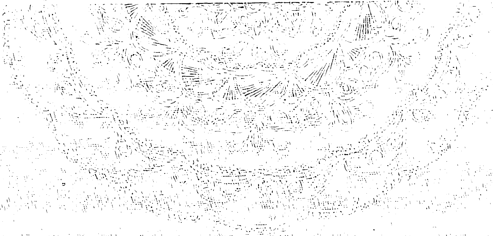

## 生命中的奇蹟──生命靈數和精油

十年前總裁告訴我們，未來的世界是心靈淨化的時代，因為人們會被生活、工作壓到喘不過氣來，如果不懂得如何抒發心中的鬱悶，身體將會產生極大的傷害。所以一再告誡我們要把生命靈數學習透澈，之後不但可以幫助自己，也可以幫助別人。

在我的人生道路上，曾因為工作、生活上的不順暢，讓我的情緒受到起伏而影響到別人，一度無法調適而倍感壓力。自從接觸到洪總裁教的生命靈數後，我了解到每個人都有其正負特質，也都有不同的天賦及人生功課，而身為組織領導的我，就必須懂得透過不同數字的特質，用不同的方式與不同夥伴作溝通，幫助組織上的每個人，解決他們在工作上的問題及展現他們個人的優勢。

感謝總裁無私的付出，用最簡單的教材、用最親近的語言傳授生命靈數給我們，讓我們用最快速的方式吸收與了解，再轉而去幫助別人。我們認識一位在台中的醫生娘，因為婆婆和媽媽都得了阿茲海默症，小孩身體不健康，造成她身心靈的疲憊，手背莫名的腫大，在我們試圖了解一位身為虔誠基督徒的她，於是透過生命靈數的數字特質說明，讓她釋懷許多。經過兩天的時間，她的手背完全痊癒，這是細胞和臟腑受到情緒的影響，產生身體上的變化。

我是 6 號人，必須學習生活中的不完美，而我的空缺數是 5 和 8，總裁特別為我調製欠缺的數字能量，讓我在配戴後，感受到身心靈上的舒坦，在身體的無形壓力及壓在胸口的重力，瞬間般化開，心開了工作也就順了。我要感謝總裁的大愛，給我「善的文化和愛的事業」，我會珍惜，謝謝您！

鄭乃瑄

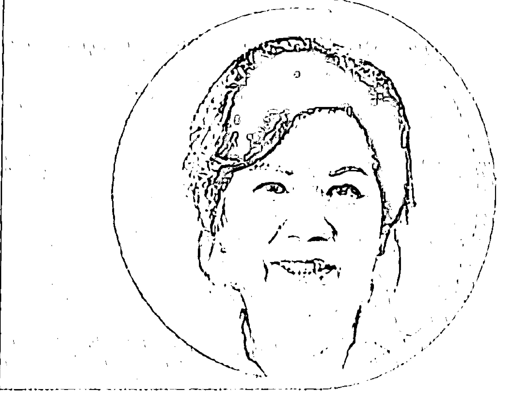

## 在人生道路上，注入新的生命能量

「生命靈數」它是什麼？它能做什麼？剛聽到這個名詞時，既沒概念也沒有想法，但覺得多學習一種新知是很好的，於是開始有了總裁教授生命靈數的課程。經過一段時間的學習，發現「生命靈數」對我非常受用，尤其是我身為一個經營組織的領導人來說，非常的實用。它讓我清楚知道各種不同數字特質的人，要用不同的方法去接觸、溝通、了解，如何運用才能事半功倍的去洞悉人心、想法，才能把對的人放在對的位置上。

相對地，我也將我學到的「生命靈數」的好處，轉換成我在經營組織訓練時，最好的一種溝通工具，進而成功用在我的事業上。透由生命靈數的了解，可以清楚的與人在溝通時用何種方式，巧妙的話術都能逐一完成我從進新人到經營組織事業上。

因每個人都有正負特質，為了能讓不足的能量增強，總裁特別幫我們調配了數字精油，讓我們配戴在身上，除了味道的芳香外，更有一股莫名的力量讓我在溝通上有了「良言一句三冬暖」的感受，而給予別人的是更多的鼓勵。

正所謂「知己知彼，百戰百勝」，真的很感謝總裁教我這個由「生命靈數」即可翻轉我人生的數字密碼工具，讓我從此與人溝通相處是一件非常開心的事，更是能讓我們沐華（嫦鴻）的店家及理療師也能幫助客戶了解自己，而且夥伴們從大學畢業後，在什麼都不懂的情況下，透過在沐華這個大家庭裡，讓她們學習身心靈的健康，讓自己獲得快樂。尤其現在年輕人很喜歡「生命靈數」去了解自己，我的第二代（兒子）曾受過總裁的培訓，也成為「生命靈數」的講師，因為總裁的大愛無私，讓我們受到無比的恩惠。

蘇秀娥

## 愛上生命靈數 快樂經營人生


走過十數年的人生歲月，經歷過青春年少的憧憬、成家創業的奮鬥，到現在進入修身養性的重要階段。以前內心常常想著「每天的勤奮努力，都是為了圓滿人生，但人生要如何才能真正的達到圓滿呢？」然而，「性格決定命運」這是人們常常聽到的成功格言，成功一定靠努力，但努力不一定會成功，聽起來有些難過。但事實上，選擇比努力更重要，因為方向不對，努力就會白費。

我確實曾經過著許久「忙、茫、盲」的日子，更不知何去何從。直到遇見生命中的恩師，感恩洪若萍總裁，十幾年來教導我學習真正領悟身、心、靈健康平衡豐富的領域，敞開如何認識自己，掌握自己及幫助別人的大門。

從學習生命靈數開始，像是一把開啟智慧通道的鑰匙，讓我每天樂在其中，處處受惠，它讓我更有自信，懂得表現自己的優勢天賦，懂得如何與人愉快的相處，建立良好的人際關係，發揮自己的潛能，更能自己掌握事業發展的方向和機會，做出好成績。

最近常運用生命靈數讀書會，跟夥伴一起研讀探索，彼此間有了成長與激勵，學習了解對方，感情更加緊密，合作的默契讓團隊有共同努力的目標。尤其是配戴補強能量的數字精油項鍊，真的超有感覺，抱怨聲變少了，充滿著天使般療癒的能量，喚醒我們隱藏在內心的那份力量，過去不曾發現的能量或不敢想、不會做的事，漸漸有了體驗及動力，讓我每一次都在進步與提升中，好奇妙喔！

讓我們一起利用數字來探索生命的奧秘，就能夠「早知三日事，富貴一千年」，我愛上了生命靈數，更以快樂經營為人生目標。

梁美純

## 啟動生命靈數與精油的能量

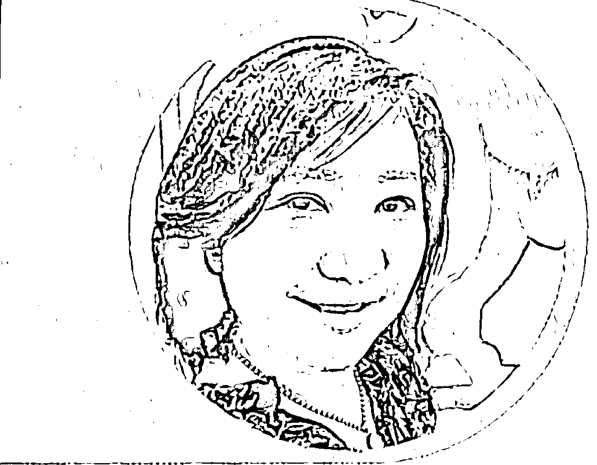

在從事經絡理療工作中，常有客戶對我們的專業讚不絕口，但即使如此，我們也會有力不從心的時候，中醫有句話說：「心理影響生理，生理影響病理」。人之所以生病不舒服，有 80% 以上都是心理的狀態失衡所引起的。

感謝洪若萍總裁的無私，不但在傳承中醫經絡教育不遺餘力外，更致力於身心靈的整合，因為真正的健康，絕對不只是靠外在皮囊的好看，或自我感覺的良好而已，它更是代表由內而外所散發出的光采和精氣神飽滿的狀態。

與洪總裁學習「生命靈數能量學」後，我把它運用到工作和生活上，竟然產生我從未預想過的美好效果，不但讓我更了解自己外，也把生命靈數幫助到我身邊的人。

在我一位客戶理療的過程中，向我透露家中發生遽變，不但影響到家裡成員的心情、作息，更直接影響到丈夫的事業，但她不知該如何把歡樂重新帶進這個家庭裡，只能坐看全家籠罩在愁雲中，一籌莫展。而當我跟她分享生命靈數能量，並建議她使用 6 號數字精油後，她彷彿看到一線光明般地破涕為笑。兩週後，她眉開眼笑的與我們分享，在她回家使用 6 號精油的當晚，她做了一個夢，夢中一位過世已久的長輩前來與她對話，內容讓她倍感溫馨和感動，隔天她與丈夫分享夢境，並建議他使用 6 號精油。之後夫妻倆再也沒有為遽變而傷痛，在沒有刻意迴避下，內心就有一股被療癒的感覺，以及安定感，家中的氛圍也再度溫暖了起來。

這案例時時發生在我們的日常生活中，而一切都是從了解自己、從心開始。再次感謝洪總裁，讓我學得一門助人助己的專業經絡技術，又引領我進入一個醫人醫心廣闊的靈性領域，也願大家和我一樣，感受到身心靈的平衡，與人分享的快樂！

許瀞文

## 生命靈數及精油改變了我！

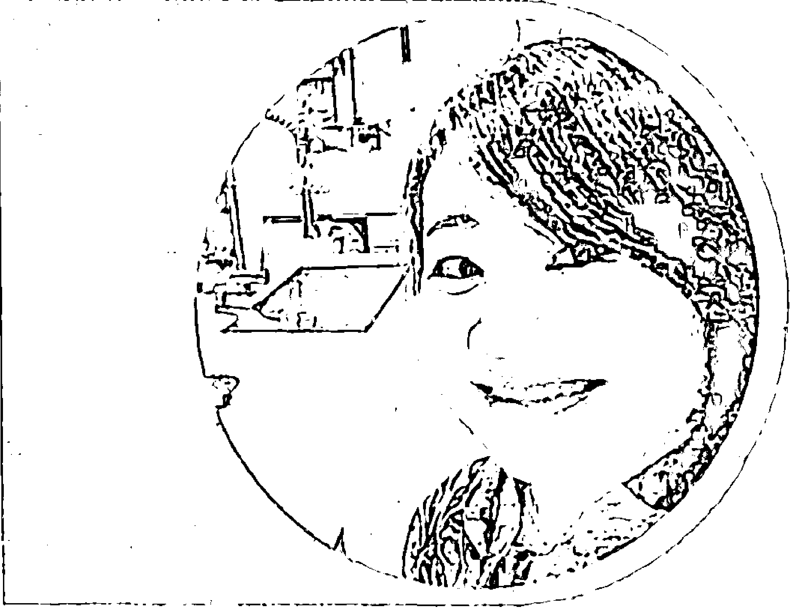

在我還未接觸生命靈數之前，生活是庸碌平凡，即使有夢想也不會去期待實現的一天，所以更不會有積極的行動，只能隨波逐流成為一個平淡無奇的人。不但是想得多做得少的人，對自己沒自信、依賴心更是嚴重，而過多的負面情緒也會帶給自己很多挫折，導致人際關係的不順遂。

自從跟著總裁學習生命靈數之後，懂得藉由數字逐一剖析自己的內在及特質，開始關注自己的個性、想法、做法，以及與他人相處時會展現的行為，慢慢開啟與自己內心溝通的對話機會，漸漸地讓自己能內外合一。我原本是很情緒化、自卑、擺臭臉的人，但使用了自己需要的數字精油搭配組合後，每天都不自覺得充滿正面能量、喜悅的心情、很想與人聊天分享，希望創造自己可被利用的價值，每天都有新發現與體驗！

從不認命到認命，進而了命，學習如何去完成人生功課，每一次的挑戰都是一種學習，最後更要運命，就是改變命運。當然，這個過程需要有很大的能量，才有辦法推動自己改變，但我願意！

感謝數字精油的出現，它的能量真的好強大喔！感謝洪總裁帶領我認識了數字精油的巨大能量，讓我很快看到蛻變的自己。

馬琇雅

## 數字精油能量，你做對了嗎？

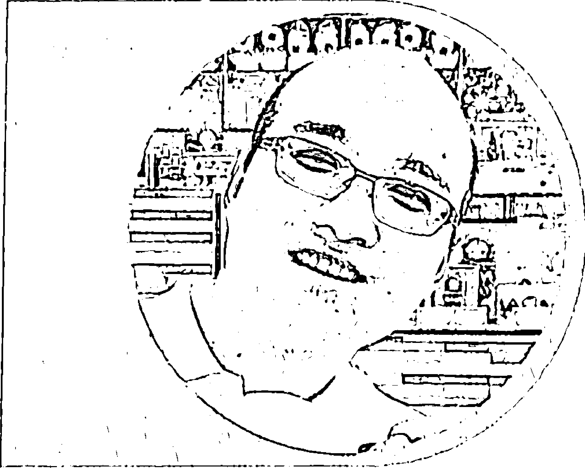

對於未來，大家總會充滿著好奇與期待，究竟自己的將來會是怎樣呢？從小就跟著長輩們四處拜訪名師、求神問卜，舉凡紫微、八卦、姓名學等都跟著湊熱鬧，大家都渴望能透過一些方法來解決當下的困境，以求更好的將來。可是那時的我始終有著疑問：自己的將來不是靠自己嗎？為什麼要靠算命呢？隨著年齡漸長，踏入社會開始工作，自己也不那麼確定了，雖然自己很努力，卻好像被某種力量牽制著，無法達到自己想要的目標。

在接觸到總裁教授的生命靈數課程後，才恍然大悟，原來我們的想法與做法都受到數字能量的影響，想法產生做法，而做法決定結果，所以要想達成自己的目標，就必須先了解數字能量對自身想法與做法的影響，究竟是加分還是減分，再透過數字精油的輔助，讓自己揚長補短，發揮正能量。這不是算命也不宿命，而是透過數字分析了解自己，發揮潛能、醒悟缺失，將上天賦予我的能量發揮極致，並知道那些能量可以為我所用！

剛開始使用數字精油組合就發現它的神奇，像 568 精油組合是我最喜歡的，剛戴上精油項鍊就很明顯的發現，思緒變得清楚且靈活，不少夥伴都說我在上課時的展現更加活潑與自信，所以之後在舉行健康講座或創業說明會時，我也都配戴著這組精油，而每場的締結率，也因此提升很多！

生命靈數的分析與諮詢簡單易學，只要知道每個數字所展現的特質，並學習如何運用這些特質來幫助我們完成人生的目標與功課，未來就會是充滿確定和光明！

孫志欽

## 「遇見更好的自己」從「認識自己」開始

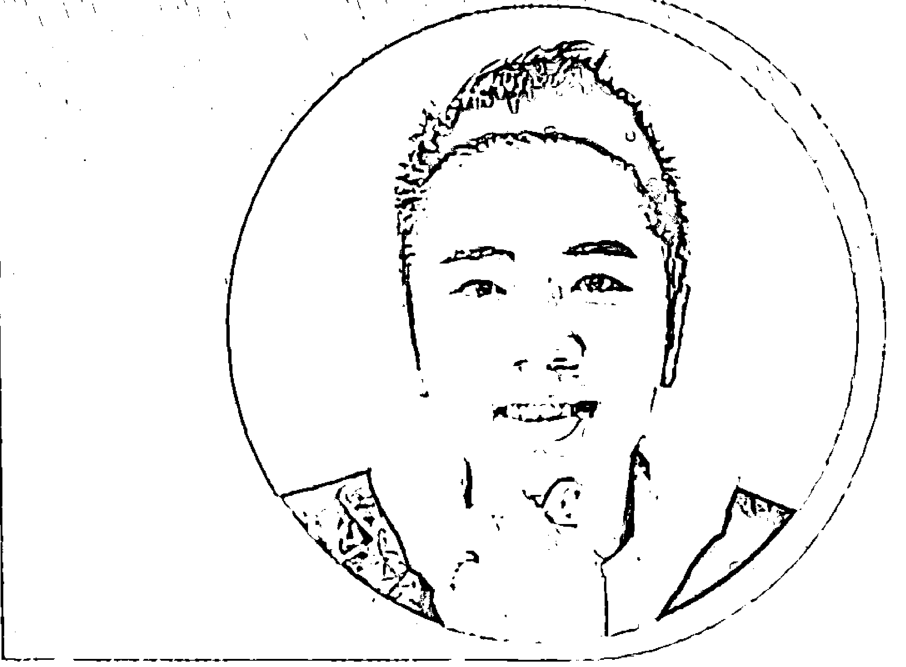

生命靈數是一串留在我們血液與細胞當中的能量 DNA，透過它我們得以掌握身心靈平衡的關鍵密碼。身體的健康、心智的提升、靈性的成長，五年前透過洪總裁的啟發，開始接觸生命靈數時，發現過去的我總是拘泥於人生當中的挫折與無可奈何，卻從未擁抱那些引領我們走向康莊大道的豐盛宇宙，每個人都有專屬自己的生命 DNA，才造就出真實而變化萬千的我們，藉由學習生命靈數的第一步「知命」，我找到屬於我自己的人生舞臺與價值，同時也掌握了專屬於自我的成功之鑰。

然而，進入第二階段「運命」，生命當中有許許多多的考驗，不是為了打擊我們孕育而生，而是為了讓我們遇見更美好的自己，所造就的成功試煉。透過配戴專屬自己的「數字精油項鍊」，藉由嗅吸與能量場的建立，改變我細胞中的分子意識結構，讓我更有能量去面對問題、克服恐懼。你會發現問題只不過是人生中的短暫駭浪，轉眼也就成為記憶中的過眼浪花。感恩生命當中的豐盛、慈悲、機會、勇氣，我們才能「了命」，進而幫助他人找到心中困惑的答案，創造富足的人生。

感恩洪總裁帶我進入生命靈數的領域，讓我了解這一生為何而來，而我將帶走什麼！靈數不是命理，更不是要我們向宿命低頭，透過系統化的邏輯分析，在人生迷惘時找到自己的定位，探索生命的源頭，找到宇宙與生命的連結，解開人生目的的密碼，帶著豐盛的寶藏走向尋找自我的成功之道！

楊浚渝

## 提升我的正能量——生命靈數和精油

從8、9年前開始學習生命靈數後，這一路走來滿懷感恩，不但成就了我自己，也協助別人找到自己的人生出口，也獲得許多的回報及感恩。這一切都是總裁的栽培與細心指導的結果，更感恩總裁及沐華所給予的舞臺，讓我更加的成長與自信。

我是一位修行者（9號人），本身對於心靈的提升就很注重，但在佛堂所學習到的似乎除了讓自己的情緒越來越壓抑，甚至沒有活力，有種說不出的沉重感，對未來更是茫然。只能不斷的告訴自己「沒事、不要想太多，做就對了」，然而，內心卻有一個微弱的聲音，不斷地「不是這樣的、不是這樣的。」但是自己很茫然，卻不知道怎麼做才好。

直到開始學習「生命靈數」才真正的了解到自己的生命特質，也讓我找到真正想要的人生方向及人生價值。在這之前，這些數字在我的生命中，只不過是一些數字符號罷了。但開始學習後，才體會到數字對我們性格及行為模式的影響，奠定了我們日後的人生命運。所以真正的了解自己的生命特質及生命功課，是非常必要的，可以協助自己少走一些冤枉路。

馬秀潔

## 開啟生命靈數與精油之鑰

學習生命靈數一開始是好奇的，因為想要了解自己，所以有了第一次的接觸。在學習之後才知道原來是如此的不了解自己，也因為學習了生命靈數，才開始傾聽自己內心的聲音，知道自己的優缺點及需要補強的能量。最近又加入數字精油課程的學習，才發現精油經由嗅吸可以改變一個人的行為模式。

我原本是一個不愛說話、動作緩慢的人，在使用數字精油後，開始喜歡與人溝通（連家人都覺得我呱噪）、行動力強及思維都變得很快的人，速度快到讓我嚇一跳，但我的心情是雀躍的，因為在學習生命靈數後，不但結識了許多朋友，更幫助到需要幫助的人。

我的好朋友在經歷情傷後，不但暴瘦又讓自己處在無法入眠的夜裡。我除了心疼外，也藉由數字諮詢及給予需要的精油作為輔助。她在配戴數字精油的項鍊後，心情也變得比較平靜，也明白日後的人生該怎麼走，並專注在她的事業上。她的心情轉換很快，讓她感到很愉悅；對於精油更是喜愛，她說：「聞到精油的味道，讓她心情感到很平靜，也很喜悅。」

其實能夠幫助到她，讓我很開心，因為我發現幫助別人真是一件非常非常開心的事，領悟到施比受的重要。同時，感謝公司、總裁及謝董可以有這麼棒的產品及課程，能幫助到更多需要幫助的人。

顏廷卉

## 斜・槓・人・生

我是一個從缺乏安全感的暴食症怪咖，到時薪上萬的斜槓青年。曾經因為缺乏安全感，即使不餓也可以吃下一桶肯德基；曾經志願當個圖書館管理員，卻只因不想跟他人有太多接觸；曾經只想待在自己的世界裡，因為覺得世界的風景都一樣等。所有的曾經的曾經，都因為自己覺得與世界格格不入，甚至是個自視甚高的怪咖。

直到跟了洪總裁學習生命靈數以後，有了不同的改變。從不算命，一切以眼見為憑的我，學了數字學以後，才知道原來缺乏安全感、眼見為憑、敏感害怕受傷，以及喜歡待在舒適圈裡，都是4號人的特性，自己也並不奇怪。然而，如果想要獲得真正的安全感，必須學習更願意承擔風險及更願意「改變」。所以唯有成長和發展自己的天賦才華，才能找到生命中真正的安全感。

在學習生命數字的過程中，進行大量案例練習，連坐Uber都不放過。透過司機與家人對話的關鍵字，猜出他們的生命靈數的數字。同時，發現生命靈數這門學問，並不是虛無縹緲的算命，而是累積了2600年的能量統計科學，是有所依據的。知命而能運命，代表的不是控制，而是了解自己的天賦及流年帶來的環境能量後，可以躍入生命遊戲裡做更精彩的冒險。

為了能讓更多人能有機會轉變人生，我開始做授課與諮詢的工作。學習總裁的生命靈數，從一開始的半信半疑，到轉變生命軌跡。除了感謝總裁的分享以外，更歡迎大家一起進入：了解自己，發揮天賦的斜・槓・人・生！

林菁菁

## 破除凝滯不化氣場的精油

每個人來到這個世間，都有其需要完成的使命～人生功課。而我是透過生命靈數了解生命軌跡後，才更清楚如何掌握人生方向。感謝總裁開設生命靈數課程，將複雜的教材化繁為簡，由淺入深的傳授，除了省去交通往返的時間浪費外，更讓我們有心學習的夥伴們，對生命有了另一番的體認。

在了解生命靈數的特質後，想發揮其數字的正面特質，確實不容易，畢竟這是屬於心靈層面的！剛開始我只是單純使用主命數3的精油，畢竟我這個3號人向來單純快樂就好。但睿智的總裁特別替我調配2、5、8號精油，戴起來之後的感覺確實很神奇，會讓人馬上感受到「心想事成」的信心！

一次經過一所高中看到學生從學校內走出來，才想到我有個18歲的朋友在這就讀。沒一會兒他居然就出現在我面前5公尺的距離，當下立馬走到他跟前，著實讓他嚇了一跳。在春酒晚會摸彩活動上，被抽到第一個大獎的幸運兒居然是我。使用精油後的神奇，讓人無不佩服它帶來的力量。

我們家族有個成員，行動不便卻嚮往國外讀書，決定隻身勇敢前往令人不捨。行前我概略介紹生命靈數，也幫他配製缺數的精油，才配戴幾天後感覺他似乎長大許多。昨天透過Line的訊息得知，他在國外一切順利，也讓家人們安心不少！

精油的本身就有破除凝滯不化氣場的功能，而總裁無私的給予，讓我們不論在身、心、靈上，都能獲得最大的富足！

再一次的感謝「大愛沐華、大愛總裁！」

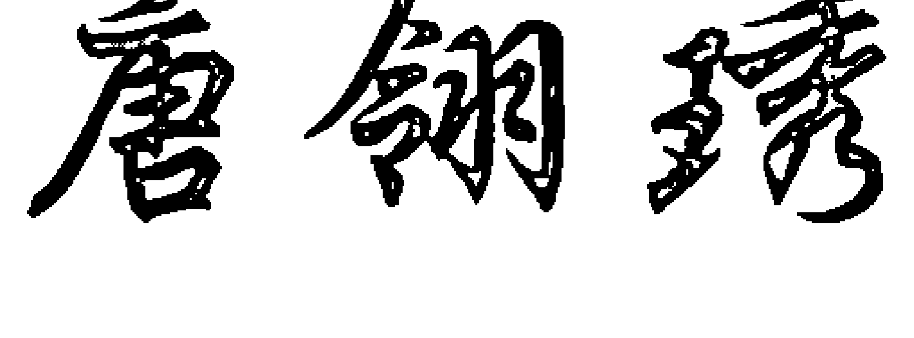

## 【附錄】生命密碼表

- 姓名：
- 生肖：
- 出生時辰：

| 生命密碼 | 西元出生年 | | | | 出生月 | 出生日 | 總數 | 生命靈數 |
|---|---|---|---|---|---|---|---|---|
| | | | | | | | | |
| 流年 | 西元年(今年) | | | | 出生月 | 出生日 | 流年(生日前) | 流年(生日後) |
| | | | | | | | | |
| 身分字號 | | | | | | | | 武器 |
| | | | | | | | | |
| 年歲行運 | 0 | 10 | 15 | 20 | 25 | 30 | 35 | 40 | 45 | 50 | |
| | 10 | 15 | 20 | 25 | 30 | 35 | 40 | 45 | 50 | 70 | |

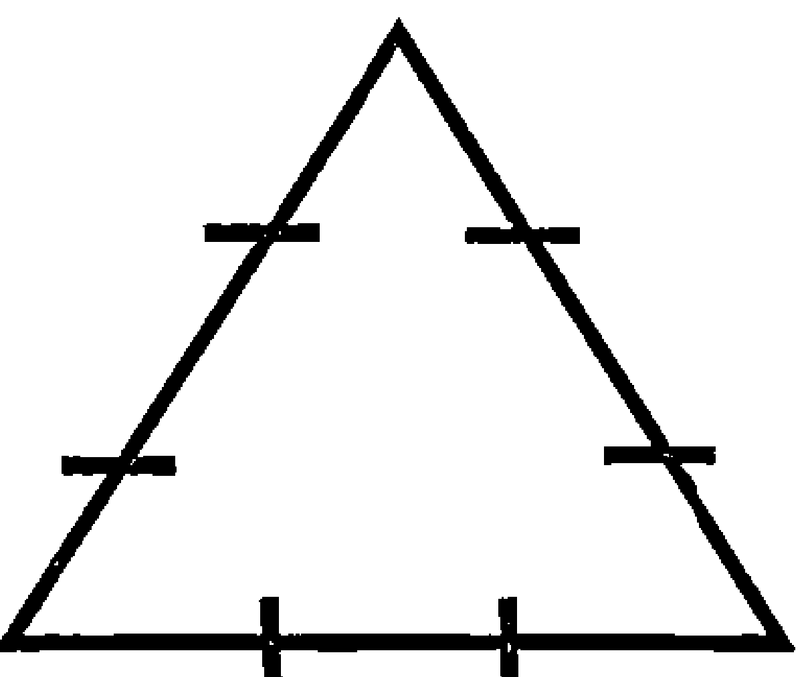

### 個人的運勢流年

| 1 | 2 | 3 |
|---|---|---|
| 4 | 5 | 6 |
| 7 | 8 | 9 | 0 |

### 契機數(相+)

年□
月□────(1)
日□───□

最大契機數=(1)+(2)
=____

### 黑洞數(相-)

年□
月□────(1)
日□───□

最大黑洞數=(1)-(2)
=____

### 數字連線

| 數字連線 | | |
|---|---|---|
| ☐ 123 美感藝術線 開創力、美感藝術創造力 | ☐ 357 最佳人緣線 群眾魅力、人脈廣闊 | ☐ 24 靈巧變通線 增進靈巧變通能力 |
| ☐ 147 物質充裕線(安全線) 身邊物質充裕不缺 | ☐ 789 權勢高峰線 事業權力的登峰造極 | ☐ 26 公平正義線 為人處事公平公正 |
| ☐ 258 熱情公關線 溝通、表達及公關能力 | ☐ 456 完美組織線 思路清晰、強化組織能力 | ☐ 48 工作規模線 做事穩重成熟、四平八穩 |
| ☐ 369 聰明智慧線 聰明智慧、創意想像能力 | ☐ 268 心想事成 身心靈合一的境界 | ☐ 68 誠實親切線 增強親和力及人際關係 |
| ☐ 159 工作事業線 事業的操控、腳踏實地能力 | ☐ 248 招財進寶 改善磁場、廣開財源 | |

### 搭配加強能量的數字精油組合

| 搭配加強能量的數字精油組合 | |
|---|---|

### 十二時辰經絡運行表

| 十二時辰經絡運行表 | | | | | | 解決辦法（搭配產品） | |
|---|---|---|---|---|---|---|---|
| ☐ 虎 3~5 點 (寅) 肺經 | | | ☐ 猴 15~17 點 (申) 膀胱經 | | | 能量霜 | 五行精油 |
| ☐ 兔 5~7 點 (卯) 大腸經 | | | ☐ 雞 17~19 點 (酉) 腎經 | | | | |
| ☐ 龍 7~9 點 (辰) 胃經 | | | ☐ 狗 19~21 點 (戌) 心包經 | | | | |
| ☐ 蛇 9~11 點 (巳) 脾經 | | | ☐ 豬 21~23 點 (亥) 三焦經 | | | 搭配課程 | |
| ☐ 馬 11~13 點 (午) 心經 | | | ☐ 鼠 23~1 點 (子) 膽經 | | | | |
| ☐ 羊 13~15 點 (未) 小腸經 | | | ☐ 牛 1~3 點 (丑) 肝經 | | | | |

## 【附錄】生命密碼表

- 姓名：
- 生肖：
- 出生時辰：

| 項目 | 欄位1 | 欄位2 | 欄位3 | 欄位4 | 欄位5 | 欄位6 | 欄位7 | 欄位8 | 欄位9 |
|---|---|---|---|---|---|---|---|---|---|
| 生命密碼 | 西元出生年 | | | | 出生月 | 出生日 | 總數 | 生命靈數 |
| | | | | | | | | |
| 流年 | 西元年(今年) | | | | 出生月 | 出生日 | 流年(生日前) | 流年(生日後) |
| | | | | | | | | |
| 身分字號 | | | | | | | | 武器 |
| | | | | | | | | |
| 年歲行運 | 0 | 10 | 15 | 20 | 25 | 30 | 35 | 40 | 45 | 50 |
| | 10 | 15 | 20 | 25 | 30 | 35 | 40 | 45 | 50 | 70 |

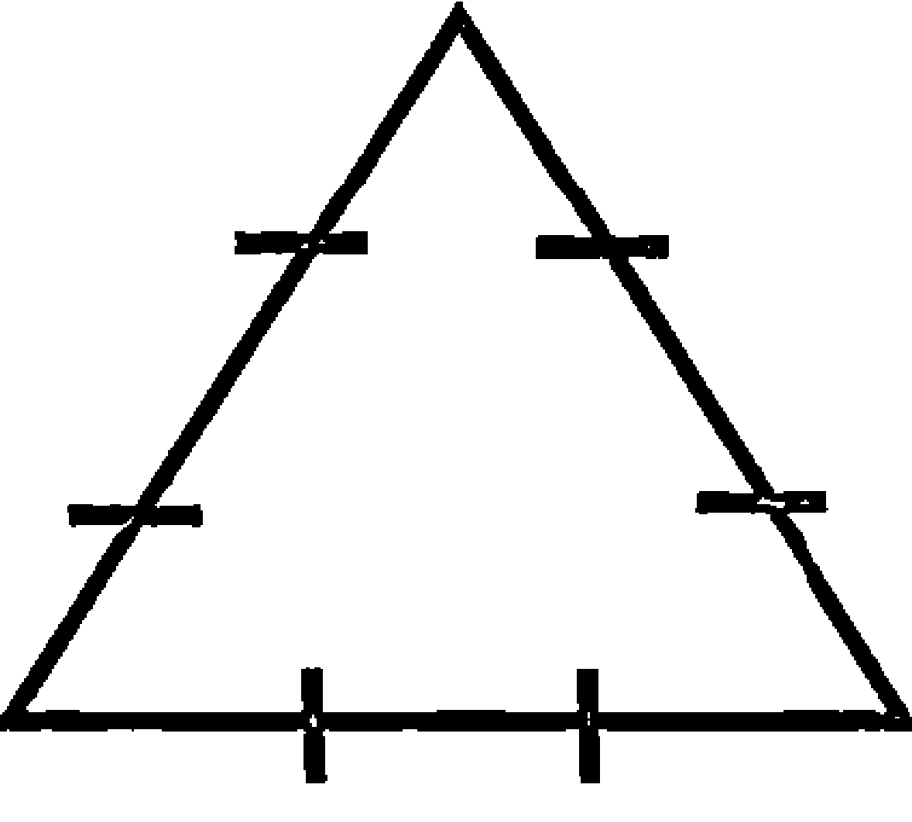

### 個人的運勢流年

| 1 | 2 | 3 |
|---|---|---|
| 4 | 5 | 6 |
| 7 | 8 | 9 | 0 |

### 契機數(相+)

年□
月□
日□

最大契機數=(1)+(2)
=____

### 黑洞數(相-)

年□
月□
日□

最大黑洞數=(1)-(2)
=____

### 數字連線

| 數字連線 | | |
|---|---|---|
| ☐ 123 美感藝術線 開創力、美感藝術創造力 | ☐ 357 最佳人緣線 群眾魅力、人脈廣闊 | ☐ 24 靈巧變通線 增進靈巧變通能力 |
| ☐ 147 物質充裕線(安全線) 身邊物質充裕不缺 | ☐ 789 權勢高峰線 事業權力的登峰造極 | ☐ 26 公平正義線 為人處事公平公正 |
| ☐ 258 熱情公關線 溝通、表達及公關能力 | ☐ 456 完美組織線 思路清晰、強化組織能力 | ☐ 48 工作規模線 做事穩重成熟、四平八穩 |
| ☐ 369 聰明智慧線 聰明智慧、創意想像能力 | ☐ 268 心想事成 身心靈合一的境界 | ☐ 68 誠實親切線 增強親和力及人際關係 |
| ☐ 159 工作事業線 事業的操控、腳踏實地能力 | ☐ 248 招財進寶 改善磁場、廣開財源 | |

### 搭配加強能量的數字精油組合

| 搭配加強能量的數字精油組合 | |
|---|---|

### 十二時辰經絡運行表

| 十二時辰經絡運行表 | | | | | | | 解決辦法(搭配產品) | |
|---|---|---|---|---|---|---|---|---|
| ☐ 虎 3~5 點 (寅) 肺經 | | | ☐ 猴 15~17 點 (申) 膀胱經 | | | 能量霜 | 五行精油 |
| ☐ 兔 5~7 點 (卯) 大腸經 | | | ☐ 雞 17~19 點 (酉) 腎經 | | | | |
| ☐ 龍 7~9 點 (辰) 胃經 | | | ☐ 狗 19~21 點 (戌) 心包經 | | | | |
| ☐ 蛇 9~11 點 (巳) 脾經 | | | ☐ 豬 21~23 點 (亥) 三焦經 | | | 搭配課程 | |
| ☐ 馬 11~13 點 (午) 心經 | | | ☐ 鼠 23~1 點 (子) 膽經 | | | | |
| ☐ 羊 13~15 點 (未) 小腸經 | | | ☐ 牛 1~3 點 (丑) 肝經 | | | | |

## 破解數字密碼 翻轉你的人生

- 獲取更多好書，請加微信號：street-s
- 店鋪：http://strc.cr.cx
- 憑上課卷可免費上數字精油課程一次

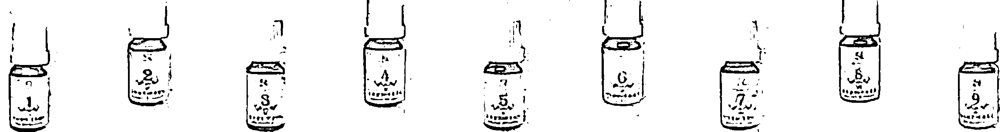

### 高雄、台中地區

- 店 名：沐華國際美容股份有限公司
- 地 址：高雄市仁武區八德東路277巷100號
- 電 話：07-3710419 #37
- 聯絡人：蔡慧美小姐

### 台南地區

- 店 名：沐華經絡能量學
- 地 址：台南市永康區南興路45號
- 電 話：0928714985
- 聯絡人：孫志欽先生

### 台北地區

- 店 名：沐華經絡哲學安和
- 地 址：台北市大安區信義路四段265巷31弄28號
- 電 話：02-23256831
- 聯絡人：楊浚渝先生

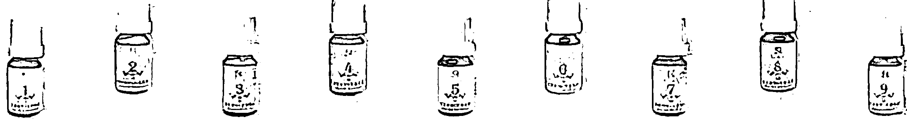

---

### 數字精油課程報名資料

- 姓名：
- 手機：
- Mail：

※此為上課券，請填寫完數字精油課程報名資料，並沿著虛線處剪下，繳交給您選擇要上課的店家。

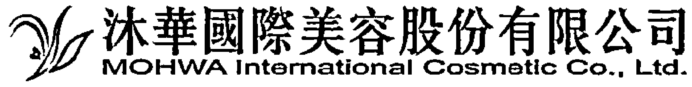

- 作  者：洪若萍
- 審  定：彭子容
- 總 編 輯：楊美珠
- 美術總監：林愉家
- 美術編輯：林惠茵
- 封面設計：楊廷尉
- 內文排版：蔡凱麗
- 行政經理：沈宜蓁
- 發 行 人：謝丰益
- 投資出版：豐姿企業行
- 公司電話：(07)371-0419
- 公司傳真：(07)375-4491
- 辦公地址：高雄市仁武區八德東路 277 巷 100 號
- 公司官網：https://www.molo.com.tw
- 書店經銷：聯合發行股份有限公司
- 電  話：(02)2917-8022
- 製版印刷：米粒創意印刷有限公司

著作權所有，本著作文字、圖片、版式及其他內容，未經本公司同意授權者，均不得以任何形式做全部或局部之轉載、重製、仿製、翻譯、翻印等，侵權必究。