新圓山診所 崔玖 院長．作家 袁瓊瓊．全昌堂中醫診所 陳弘儒 醫師．政治大學華人宗教研究中心 謝世維 主任 ——一致推薦

## Neue Wege des Spirituellen Heilens
## SoHam
## 徒手能量療癒

一次就上手!最全面、深入、有效的身心靈保健療癒

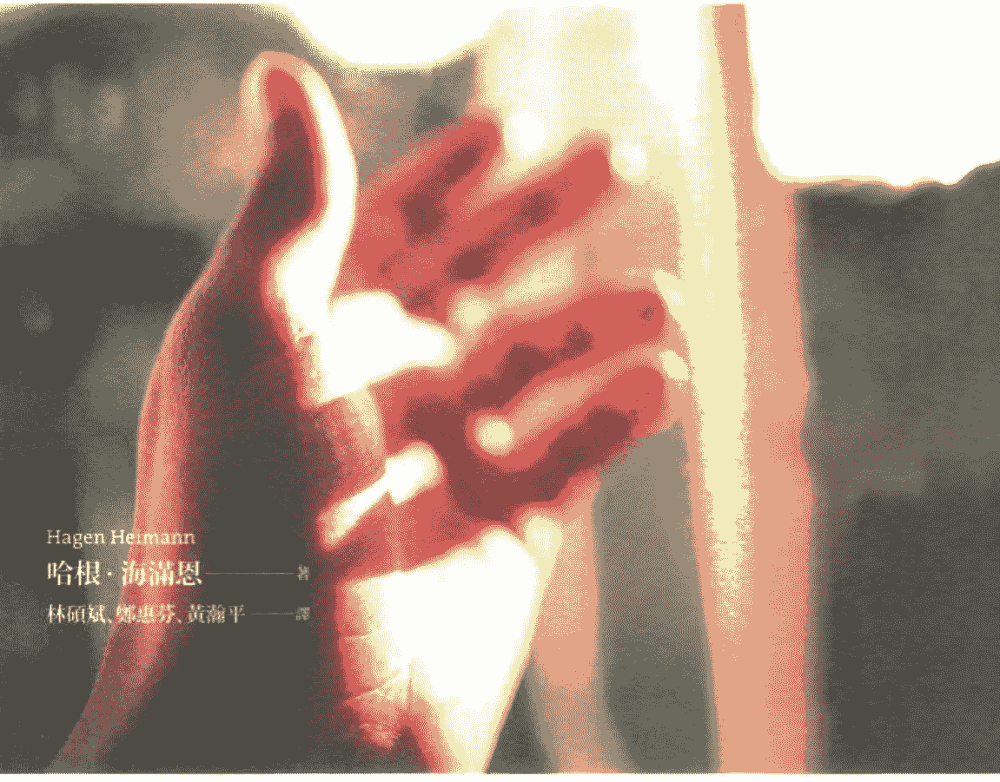

Hagen Heimann 哈根·海滿恩——著 林碩斌、鄭惠芬、黃瀚平——譯

- ★ 清楚解析:肉體、以太體、星光體、心智體及其對應療癒方法。
- ★ 重要發現:精微體之間轉換療癒能量的R能量轉換器，讓療癒獲得根本的突破
- ★ 進階療癒:靈性療癒師運用外質及昆達里尼能量的「克力提頓療癒法」及「原生情緒療癒法」
- ★ 增強療癒:協助進行療癒工作的淨化、保護、專注等精油噴霧
- ★ 特別收錄:人體器官對應氣場顏色以及12經絡氣場色彩

## St. Royal College
### 天使神秘学院

- ※ 专业占卜预测机构
- ※ 神秘学培训机构
- ※ 水晶能量研究中心
- ※ 神秘学资料库
- ※ 官方微信：strcdts
- ※ 微信公众平台：strc2011
- ※ 读书交流QQ群：
    - 占星塔罗占卜师交流群：814594478（加入密码：PDF）
    - 神秘学其他综合群：659338717（加入密码：PDF）

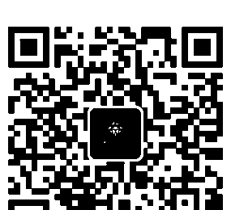

微信号：strcdts
天使神秘学院

天使神秘学院 院长QQ：715104687

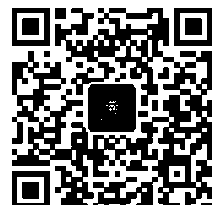

微信公众平台：strc2011

## 制作说明：

本书由《天使神秘学院》出重金从台湾购入的原版书籍扫描制作完成。为达到最好阅读效果，特地把原版书全部切开后，再经由专业扫描设备高精度扫描完成，并经过一张张的PS后期处理最终成书，其间花费大量的人力、物力以及时间，只为能给大家提供经济并优质的神秘学学习资料而努力。

本学院强力谴责某些机构和个人，把本学院花心血制作完成的电子书籍，包装后直接放在自家淘宝网上低价倾销的行为，以谋取不劳而获的经济利益。如果长此以往最终将无人愿意再为大家花心思制作电子书，那以后可能大家再无新书可读。

为让大家以后能够读到更多的好书，也为了本学院的良性发展。本学院恳请大家尽量做到如下几点：

1. 尽量在本学院的网站购买电子书籍。
2. 请勿用技术手段把电子书内的水印及加密去掉。
3. 在收到电子书后小范围传阅即可，千万不要公开传播，更别挂到淘宝网上低价销售。

同时为答谢广大支持者，学院电子书将做如下调整：

1. 学院会把一些早已收回制作成本的电子书折价销售。
2. 最新制作的电子书籍会开放打印功能，大家购买后有条件的可自行打印成书。

天使神秘学院
2019年1月

## Neue Wege des Spirituellen Heilens
## SoHam
## 徒手能量療癒

一次就上手!最全面、深入、有效的身心靈保健療癒

Hagen Heimann
哈根·海滿恩——著
林碩斌、鄭惠芬、黃瀚平——譯

## # 目录

### Part 1 — 疗癒的基础

- 中文版推荐序1 陈弘儒 011
- 中文版推荐序2 黄韦钦 008
- 健康、疾病与疗癒 014
- 疗癒的层面 015
- 肉体层面 015
- 以太层面 016
- 星光层面 017
- 心智层面 018
- 各个疗癒层面间的连结 019
- 普拉纳、气和克力提顿 022
- 外质和昆达里尼 025
- 疗癒师与疗癒技法 027
- 灵性层面 029
- 结语 031
- 新疗癒观点 032

## Part 2

- 人的四種基本需求 ... 036
- 療癒的倫理 ... 039

### Part 3

- 發現新的療癒技法 ... 042
- SoHam 徒手能量療癒 ... 043
- SoHam 徒手能量療癒的操作步驟 ... 045
- 應用方法 ... 047
- 如是技法 ... 047
- 經絡技法 ... 049
- 應用的可能性與限制 ... 052
- 十二經絡路線 ... 054
- 腎經 ... 056
- 膀胱經 ... 058
- 脾經 ... 060
- 胃經 ... 062
- 肝經 ... 064
- 膽經 ... 066
- 肺經 ... 068

## Part 4
#### 灵性疗愈师的疗愈技法

- 物质化 — 104
- 指导灵 — 105
- 灵性疗愈的诊断与处理方法 — 108
- 原型情绪疗愈 — 109
- 克力提顿疗法 — 115
- 疗愈方法的相互运用 — 120
- SoHam徒手能量疗愈实际案例 — 087
- SoHam疗愈气场喷雾的使用方式 — 086
- 百里洁净疗愈喷雾 — 085
- 乳香保护疗愈喷雾 — 084
- 橙花沁香疗愈喷雾 — 083
- 檀香补气疗愈喷雾 — 082

### 增强疗愈的辅助工具 — SoHam疗愈气场喷雾

- 心包经 — 078
- 三焦经 — 076
- 小肠经 — 074
- 心经 — 072
- 大肠经 — 070

## # 靈性療癒個案實例

### 靈性療癒師可能面臨的威脅及危險 [133]

#### 外來能量 [135]
#### 烁岩 [136]
#### 動物精怪 [137]
#### 垃圾能量蒐集群 [140]

### 其他威脅 [142]

#### 附魔 [143]
#### 攻擊 [144]
#### 惡靈 [145]

### 療癒新觀點 [147]

## # 附錄

1. 器官氣場顏色一覽 [148]
2. 十二經絡氣場顏色一覽 [155]
3. 示警訊的氣場顏色及特殊氣場顏色列示 [156]
4. 「新巴赫花精療癒法」及「新療法」簡介 [158]
5. 「新療法國際中心」簡介 [160]
6. 參考文獻 [162]

## # 中文版推荐序 1 映照幽微能量世界的帛书

一九七三年湖南馬王堆漢墓出土了幾卷距今二千多年的帛書，其中描述了人體經絡循行路徑及所主疾病，之後《黃帝內經》《靈樞 經脈》篇，總結發展出完整的十二經絡，為中醫經絡理論奠下基礎。二千多年來，經絡系統一直為中醫基礎理論核心之一，透過針灸及醫理延伸，大量應用於中醫臨床，發揮了具體療效。但長久以來，人們在人體上卻始終找不到經絡的實質存在，遲至近數十年，透過低電阻特性、同位素遷移等諸多實驗，才終於「看到」經絡循行的顯影。「體用不二」、「體用合一」是中國傳統哲學的一個命題，其實「有體必有用」、「有用必有體」，依此，如果一個療癒方法在臨床上發揮效用，那麼背後必然有一個本體運作的結構與道理，只不過此本體存在，有時候不是一般人以有限的肉體感官或知識系統所能看見與理解，就如我們無法想像，為何兩千多年前的人們，在沒有現代科學儀器的輔助下，能夠描繪出具體經絡路線。《本草綱目》作者李時珍說：「內景隧道，惟返觀者能照察之。」或許提供了這樣問題的不答之答。能量醫療近來逐漸成為顯學，但兼顧本體論述與應用技法的創新著作則不多見。本書作者海滿恩以過人稟賦及孜孜不倦的鑽研，將人體精微能量狀態化隱為顯，亦揭示特定能量層出現障礙時的療癒方式，可說是體用合一的難得著作。

書中主要介紹的人人可以學習的So'Ham能量療法，融合了印度瑜伽呼吸及梵咒，將普拉納灌注於氣弱與經絡不通之處，如同中醫「虛則補之」及「不通則痛，通則不痛」的概念，透過「如是技法」及「經絡技法」循經治療，達到快速療癒目的。常言道：「但願世間人無病，何妨架上藥生塵？」，此種將健康自主權及療癒權從醫院還歸人手中的旨令人拍掌。

最後提出了創新而帶有幾分神秘學色彩的靈性療癒法，雖然具備特殊天賦與靈視力乃進行靈性療癒的先決條件，但其所述及的前沿研究成果，彷彿一道道顯影劑，讓器官及經絡氣場等顏色浮現於凡人眼前，而「原型情緒療癒」及「克力提頓療癒法」，亦如一盞盞明燈，為有心於靈性療癒的治療師，指引出一條可以憑藉摸索的道路。

「實踐是檢驗真理的唯一標準」，書中諸多案例展現了這條療癒新路的巨大力量，作為一個臨床中醫師，欣見並感佩於作者能將地球上不同文化板塊的療癒體系相結合，發展出具體的療癒技法，並公開於世人，不用昂貴的醫療資源，即能體現「人體自有大藥」的療癒成果。

從過去以肉體物質結構層面看待疾病治療的道路中解放出來，以能量及靈性世界的視野，重新看待人，這樣一個身心靈能量的複合體，正如同兩千年前描繪出經絡路徑的帛書一般，本書將幽微不顯的精微能量世界層層映照出來，就等待我們親臨體會！

陳弘儒 中醫師
全昌堂中醫診所醫師
巴赫花精應用諮詢師

## # 中文版推薦序 2

WHO世界衛生組織定義「健康是身體、心理及社會的完全安適狀態，而不僅是沒有疾病或虛弱。」我自己身為精神科專科醫師與宗教教學研究者，則更認同本書作者哈根·海滿恩所說，整體健康應擴展包括身、心、靈及群體關係的幸福和諧狀態。而事實上大多數人都處於某些疾病或某些層面不健康的狀況，於是我們需要一般常規內外科醫療來處理身體的病痛。但人除了身體還有心理與精神的問題，雖然心理治療與精神醫學可以部分協助，但是過程往往費時曠日，而且結果令人不甚滿意。談到靈性層面或靈魂議題則更超越一般醫學的範疇，往往還得藉助宗教師或信仰神靈的救度開導。

所以在各種環境污染與人禍天災不斷的時代，我們的生命要健康樂活，看來還真的是不容易！所幸作者在本書中提出對身體與生命層次的新觀點，呼應到患者或是醫生都期待身心疾病的療癒，想有更深度、更全面、更有效的治療方式，答案似乎有解——物質的肉體（仍可以倚賴一般醫療）、以太的能量體（可以用 SoHam 徒手能量療癒）、星光的情緒體（巴赫花精、精油芳療、原型情緒療癒）、意識的心智體（礦石療癒法或克力提頓療癒法）、永恆的靈性體（由靈性療癒師與指導靈合作進行靈性療癒。很欣賞這位有靈性透視及靈性療癒能力的海滿恩先生以不藏私的態度分享，關於能量療癒師與靈性療癒師的不同能力與治療範圍，與進行靈性療癒時必須遵守的醫療倫理，以及進行時可能面對的靈界威脅及挑戰，這個部分的說明發人深省且可貴。其實現今天文科學家已經承認宇宙中存在不同次元及人類無法感知的暗物質與暗能量等科學事實，那麼我們是否也可以敞開胸懷，嘗試接受與學習這種超越現代醫學的完整生命療癒呢！未來的願景令人期待！

> 黃韋欽 醫師
衛生福利部桃園療養院 精神科主治醫師
輔仁大學宗教學系研究所 碩士
台灣國際花精學研究學會理事

## # Part 1: 療癒的基礎

### 「健康、疾病與療癒」

一個人當他的身、心、靈以及日常生活中與他人的社交互動，各個生命面向都覺得舒適的時候，我們就可以說他是處在健康的狀態。

相反的，如果生命中的某一個面向感到不適時，我們就可以聲稱此人生病了。因此當我們談論療癒的時候，必須考慮生命裡的各個面向，以下例說明：

一個男孩騎腳踏車跌倒，並摔斷了一條腿。一開始他必須住院，處理骨折的問題。過了一段時間，他的腿打上石膏，並回家休養。再過幾個星期，他的大腿完全痊癒。雖然如此，他還是會害怕從車上摔下來，不敢再騎腳踏車。也因為這個原因，他也無法騎車去找住在遠方的朋友玩。

我們從上面的例子可以看到，疾病發生在不同層面，我們需要針對不同的面向，採取不同的療癒方法。在這個例子中，當男孩又能夠毫無恐懼的騎乘腳踏車時，才是我們說的健康狀態。這意味除了要治療他的骨折以外，也要處理他的恐懼情緒，他的身心靈以及與社會互動方面才會恢復到舒適的境界。

一般人對於「心」和「靈」這兩個概念的定義有點模糊不清。有些人認為「心」是指情緒體，而「靈」是指心智體；又有些人認為，「心」是指那不滅的靈魂，「靈」是指理智的精神層面。因為上述的混淆情況，本書中我避免使用這些概念，而將焦點放在說明各種不同的療癒層面上，一方面定義比較清楚；另一方面，導入新的名詞時也比較不容易和舊的概念混淆在一起。

### {療癒的層面}

為了要顧及各個不同的疾病面向，我們有必要將進行療癒時的層面定義清楚。每一個層面都有它自己的運行規則及特殊性，而這些都和我們人體的構造有關。

#### 肉體層面

在肉體層面被治療的是我們的物質肉身，包括一個人的運動系統、消化系統以及心臟循環系統……等，可以透過解剖學以及生理學來描述這個部分。為了要維持這個身體層面的功能（新陳代謝、成長與繁衍），我們需要吸收足夠的空氣、水與食物。

如果測量出身體的數值（如體溫、血脂肪、柔軟度）在平均範圍內，就可以說這個人是健康的；反之，則是生病了。而疾病是由細菌、病毒、受傷、意外、長期的飲食不正常、基因、或是上癮物質，如：酒精與尼古丁等問題所造成。之前舉的例子裡，大腿骨折屬於物質肉身層面受傷的狀況。當肉體層面受傷或是生病時，我們使用化學或植物性藥物，或是運用復健、外科手術等的方式來治療。

## # 以太層面

在以太層面被療癒的是人的以太體，也有人稱之為能量體。以太體的位置在皮膚上方約一．五到二公分的範圍，環繞於整個肉體外層。以太體承載我們生命的力量，它是由一種細微物質的能量組成，在許多文化傳統裡都可以看到關於它的描述。這樣的生命力量——傳統中醫稱為「氣」——流動在既定的能量軌道中（也就是經脈），是以運作能量的方式來引導物質肉身的功能。

氣是透過如飲食與呼吸並透過複雜的消化與呼吸作用，轉化食物及空氣成細微物質能量後形成的。

傳統中醫將疾病的因素分成三種類型：外在、內在與其他因素。外在因素主要是來自天氣的影響，如風、寒、熱、濕與燥；而負面的情緒，如恐懼、憤怒、苦思、悲傷以及過高或過低的愉悅感，則屬於內在的疾病因素；另外，像是飲食不均衡、過度疲累、過度的性行為、中毒、寄生蟲感染與受傷……等狀況，是所謂的其他因素。上述骨折的例子就是屬於最後這個類型，骨折這樣劇烈的傷害，會嚴重干擾受傷部位中氣的運行。

## # 星光層面

在星光層面被療癒的是人的星光體，或稱為情緒體。星光體的位置在皮膚上方大約十至十五公分的距離，環繞於整個肉體外層。星光體是由一種精微物質成分組成，具有各種顏色，像是霧一般的頻率振動質，並佔有固定的區域。此外，星光體的內涵，是以太脈輪，從它週遭環境中吸收的成分構成的。個人所有的情感與情緒都可以在這個層面中找到源頭，對可以看到人體氣場的人來說，這些情感與情緒都是以顏色的方式呈現。比如說，戀愛的情緒會出現粉紅色的氣場；平衡的情緒是粉綠色；而罪惡感則是灰黑色。

1. 我選擇這個名詞，是因為這裡所指的頻率振動並不會擴散開來，是類似於物質的特性。

2. 脈輪是氣場中精細物質的結構，只有少數人可以感覺其存在。從上面看，它像是不斷旋轉的光輪，直徑大約12至20公分。以太脈輪位於以太氣場表面，分佈在身體垂直中線上。脈輪尾端有個漏斗狀的東西透過旋轉產生漩渦，並吸收附近的物質產生出星光體的氣場。此外，脈輪藉由尾端部分和肉體連結在一起。這樣一來，脈輪的內容就可以傳輸到身體內部。身體背部也有一個脈輪出口，一樣位在以太體表面。在這裡，身體會將不需要的精細物質排出去。

造成星光體生病的因素是原型的負面情緒。位於星光體的負面情緒原型也是巴赫花精對應和療癒的部分，例如恨意、痛苦、罪惡感、絕望、困惑等。當某種情緒出現的時候，不僅在星光體會出現相對應的顏色，而且在相關身體位置上方的氣場，也會變化形狀，負面情緒強度則是影響氣場發生形變時的幅度大小。一個受過訓練的療癒師，可以透過探觸的方法，感受到氣場變化是「凸起」還是一個「凹洞」。若以上面的例子來說，男孩害怕從腳踏車上摔下來，這時若是對照「巴赫花精皮膚反應身體地圖」中的溝酸漿氣場區域，可以探觸得知該氣場區域已經變形。

針對星光體的情緒失衡問題，我們可以採用巴赫花精以及芳療法來處理。

## # 心智層面

在心智層面中被治療的是人的心智體。心智體的位置在皮膚上方大約二十至三十分的距離，環繞於整個肉體外層。它是由精微、具有顏色的「量子團」所組成。經由星光脈輪的吸化，心智體獲得它的精微組成物質，並形成一個特定的外形與柔軟的結構，整體看起來就像是水晶一樣。這一層次承載著我們的思想、觀念以及生活態度與世界觀，並以此為基礎，發展出我們意識層面上所有的思考模式與概念。

造成心智體生病的原因，主要來自於划地自限。當我們以學習或是透過教育內化的行為方式，以及過去深刻的人生經驗，限制我們去體驗生命時，即是心智體生病了。換言之，當具有顏色的量子團受到干擾的時候，我們體驗生活的能力也會受到限制。

在上述的例子當中，大腿骨折造成男孩心理創傷，使得他不願意再騎腳踏車，連帶的無法騎車去找朋友玩，限制了男孩體驗生活的能力。

柯磊默醫師在他研發的「新療法」架構中，心智層面的療癒方式是礦石療法，而筆者的R3療法也是療癒心智體。我們透過改變心智體的結構，以及其內在量子團的內涵，讓個案能夠重新享受生活。

### {各個療癒層面間的連結}

疾病發生時會同時間影響著各個療癒層面，並在每一層面中產生特定的干擾。上文中介紹的每一種處理方法，都只能消除相對應的療癒層面上的問題。雖然這些方法也會對其他的層面產生影響，但主要的效果還是侷限在所屬的層面上。

以前述的例子來說，男孩從腳踏車上摔下來並跌斷了腿（肉體），同時，男孩腿上以太體氣的流動也受到了干擾（能量體）。因此，氣無法再透過能量的調節來修復身體大腿的部位。然而，若是以針灸處理能量上不通的問題，讓氣的流動又恢復正常，就可以讓大腿骨折早一點痊癒，因為氣又可以經由能量的調整來支持身體相關部位的功能。

因此，雖然針灸主要作用是在以太體層面，但我們也可以感受到它在肉體上的效果。

為了讓能量療癒也能在肉身這個粗鈍物質層面上產生作用，我們的身體需要一個轉換器來連接這兩個不同的療癒層面，我們的肉身和以太體彼此之間就可以互動。以太體與肉體之間的連結，是透過分布在經脈上的穴道。就中醫的觀點來說，肉體可以經由穴道獲取生命的能量，並維繫肉體所有的功能。

至於心智體、星光體以及以太體這三個精微能量體之間的連結，在生物醫學、甚至在身心靈相關的知識裡，尚屬未知領域；一直到西元二〇〇〇年，我展開的研究工作中，才有突破性的發展，發現這之間轉換機制的存在，並命名為R轉換器。R轉換器具有三個系統，分別位在星光體與心智體裡。

發現R轉換器的契機，是當年我正在療癒一位女性個案的心智體時，見到她身體某個部位展現出非常細緻的十二道光芒，像是佩戴∞一樣展開著。過往我從未聽聞

3 這是我的同事柯磊默醫師的研究成果之一，他研究發展出巴赫花精皮膚反應身體地圖，透過這個工具，我們可以運用對應的花精來處理氣場變形的問題。

4 我之所以會使用這個名詞，是依據這個精微體的反應模式所得來。

5 這個脈輪是位在星光體的表面。

6 柯磊默 (Dietmar Kramer, 1957-)，德國自然醫學及能量療癒師，他從英國巴赫醫師的研究基礎上發展出「新巴赫花精療法」及「新療法」。

#### 普拉納、氣和克力提頓

或閱讀過類似的結構，於是接下來幾年的時間我開始這方面的研究，也陸續發現另外兩種位在星光體內，由精微能量物質組成，兩者皆是線性結構但外觀不太一樣的R1和R2轉換器。R1轉換器的作用是連結星光體與以太體，它將情感轉換為「能量的動能」。當情緒處於負面時，以太體的能量因此失衡，並產生「質量不足的氣」，無法生出足夠的力量來支應相關的身體功能，形成我們肉體容易生病的結果。一如我們之前提到的中醫觀點：身體能量會因為內在因素，如害怕、生氣與悲傷等負面情緒而失衡，並引發功能性甚至器官性的傷害。連結心智體與星光體的R3轉換器，功能類似R1轉換器。它會將心智體中，充滿顏色的量子團與量子團所組成的固化結構，轉換為「情緒性的頻率振動」，於是心智體的內容會以情緒的方式傳達出來。因此負面的心智體組織不但改變星光體的輪廓，還會導致負面的情緒狀態，負面的情緒變化又再透過R1轉換器，造成以太體內能量失衡。

- 請參閱哈根·海滿恩《新巴赫花精療癒第七冊：綜觀巴赫花精療法與新療法》。
- 這個我稱之為R3的轉換器，位在心智體與星光體之間。
- 我將這裡的轉換器稱為R1和R2。

「普拉納」 (Prana) 源自於古印度知識份子使用的梵語，它的意義是生命的呼吸，或是生命的氣息。本書提到的普拉納，是指一種無所不在的精微物質能量，可以透過呼吸進入到我們的體內。運用特殊的「Pranayama瑜伽呼吸技巧」，可以協助我們吸收到更多的普拉納能量。

普拉納這個名詞也廣泛地衍用，常引申成其他不同的精細物質能量，並且常常冠以形容詞。例如，「靈性的普拉納」是和我們的靈性成長有關。除此之外，普拉納也常常和「氣」以同義字的方式出現。

以太體是由「氣」所組成，而氣是來自於其他的精微物質能量，如遺傳、飲食與呼吸能量。

遺傳能量讓我們能吸收來自飲食與呼吸的能量，也是人類在受孕時獲得的「原始能量」。它不僅無法透過外力引入，也不能被其他能量所取代，當這「原始的遺傳能量」離去時，就會無可避免地導致死亡。

飲食能量，是食物經由人體內的消化作用，將其中的營養成分轉化成能量。人體需要「三焦」協助這個繁複的轉化過程。「三焦」是一種精微物質能量組成的器官，位於胃部上方的以太體裡面。三焦有上、中、下三個部分：上焦位在胃的入口處，中焦在胃的中間位置，而下焦則在胃的下方。中焦的作用，是將進入胃部食物中的普拉納分離出來，這個過程會出現兩種不同的產物：第一種是「輕質細緻」的純淨能量，往上爬升到上焦；另一種則是「不太純淨」的液狀能量，往下流進下焦。上升純淨的能量，經由上焦直接流向肺部，和呼吸能量融合在一起，形成一種滋養的能量「榮」。另一股「不潔淨」的能量，則是經過一道較長的潔淨程序。它從中焦流向下焦後，經過大腸與小腸的通道來到腎臟，產生「衛」—— 這是一種具有防衛性的能量。

這些能量的總和構成了我們的生命能量——氣。氣以一種具有目的性的方式流動在穴道經絡系統裡。經絡系統是由十二個左右對稱的能量通道所組成，其中一部分是「外在路線」：它們在身體的表面，並透過錯綜複雜的管道 10 彼此連結。經絡系統很像一個封閉的管路系統，氣在其中循環運行。另外一部分是「內在路線」，經絡透過這個內在路線和身體內部器官連結，並將氣傳輸到器官裡，或是經由穴道讓附近的組織及器官獲取氣的能量。此時，身體又透過上述的方式，從飲食與呼吸能量中補充消耗的生命能量。

10 這在傳統中醫中稱為「絡」。

我在R轉換器的光束中發現「克力提頓」(Qualitaten)，它也是一種精微體。我以新的名詞「克力提頓」來指稱它，是因為克力提頓不是頻率振動，算不上是一種能量。雖然克力提頓和在經絡系統裡的生命能量幾乎沒有任何共通之處，但我還是想把這兩種「能量」做個比較，讓我們能更清楚認識它的特質。

克力提頓在R轉換器裡流動的方式，和氣在經絡系統裡的循環方式不一樣。R轉換器裡由克力提頓建構出來的光束，是一根根獨立的光柱，無法一個接著一個地轉接，然而經絡是相互連結的，因此氣像是波浪一樣運行，在二十四小時內走完一個循環。

藉由這個事實，可以看出氣的運行具有一種「水平流動」的特質。

因為R轉換器內的光束，不像經絡彼此相接，所以克力提頓的流動方式和氣完全不同，我稱之為「垂直流動」。「垂直流動」形成克力提頓從它的源頭往粗質體的方向前進的動力。換句話說，當克力提頓透過R轉換器貫穿不同的療癒層面。比如說，當轉換器進入以太體的經絡系統。透過這樣的方式，它從一個療癒層面「垂直」地進入到更深一層的身體。

克力提頓必須在R轉換器裡進行轉換，才能穿越不同的療癒層面。但這樣的轉換其實只是質地「形式」上的改變而已，如此一來，克力提頓就可以相容於它進入的治療層面。

##### 【外質和昆達里尼】

每個人都具備上文描述的三種精微物質能量：普拉納、氣和克力提頓。雖然，我們並沒有意識到它們的存在，但它們卻一直在我們體內「流動」著。而「外質」（Ektoplasma）與「昆達里尼」（Kundalini），只能在非常少數人的身上找得到。

「外質」（Ektoplasma）一字源於希臘文，Ektro 是「外在」的意思，而 Plasma 意指「所形成之物」。在細胞生物學裡，這個字是用來指稱某些單細胞生物，如阿米巴蟲，其細胞質外圍的部分。阿米巴蟲透過它的內在與外圍組織來改變形狀，並藉此產生行動。

在靈性學與超心理學裡，外質是造成能量具象成形「物質化」，與物體「移動現象」的基本物質11。而後者是和心靈遙感有關，因此這樣的能量也被稱為「遙感質」。

就我個人的觀點，外質是比普拉納還要粗質的「能量」，卻不是「物質」。一個靈性療癒師可以運用這種能量來進行療癒工作，要做到這點，他必須能夠透過自己的身體來產生所需要的外質12，並以自己的意識來形塑它。依照自身能力的不同，靈性療癒師可以利用外質，產生病人所需要的各種能量與頻率振動，這個過程即是「物質化」。但這並不是說進行靈性療癒時，一定是用外質產生具有物質性的療癒粗質物，進行「物質化」時必須產出大量的外質，因此只有少數功力高深的靈性療癒師才能辦到。

「昆達里尼」是一種特殊的靈性能量。根據印度神話，這股力量是以蜷曲的蛇的形態沉靜在每個人脊椎的底部。當它甦醒的時候，這股強大的力量將從脊部升起，並帶給當事者超自然的能力與覺醒13。

當一名靈性療癒師進行任何療癒時，必須透過自己的身體來產生需要的外質，這會耗費巨大的身體能量，以致力於每次處理完個案的問題後，他都必須閉關修養恢復精力。但是如果在生產外質時，靈性療癒師運用了昆達里尼的能量，就不會發生他在物質化的過程中，因耗費巨大身體能量而感到疲累的現象。然而先決條件是，該療癒師必須學習並了解如何全然地控制昆達里尼。即便如此，療癒師在事後還需要一段靜養的時間，因為在療癒過程中，他沉浸在非常深度的禪定狀態，因此在療程後，他無法在短時間內面對現實世界。

### 【療癒師與療癒技法】

基本上，我們可以劃分出兩類型的療癒師。大多數的療癒師屬於第一種：「能量療癒師」。他們採用的療癒技法，例如：花精療法、普拉納療癒法、催眠術、靈氣和SoHah徒手能量療癒。雖然這些療癒法之間存在著很大的差異，但都有一個共同點：就是處以太體或是星光體層面的問題。然而有些療癒法並不是發生在特定的層面，例如：以靈氣為療癒方式的療癒師，是讓自己成為「療癒能量」的管道，並不控制或修正他所接收的能量。某些療法則是針對特定的層面，比方說普拉納療法，療癒師在處理問題之前會先「診斷」，依據本身能力將顏色視覺化後，在以太體的氣裡注入適當的特質，藉此行為以正面影響需要療癒的身體部位。

因此，我們將這類的療癒師稱為「能量療癒師」，或是「能量師」。

第二種是「靈性療癒師」，較為少見。這些人具有罕見的天賦，能透過自己的身體產生外質，而且這個能力無法透過訓練，或是任何其他方式取得。此外，靈性療癒師也必須懂得「物質化」，意即他必須學會控制外質的生產。換言之，在進行療癒前，他要知道如何開始產生外質，而在療癒結束後，他也要能夠停止生產。如果他沒有掌握「物質化」的技法，可能會發生他在無意中就開始產生外質，消耗大量身體能量，導致健康上出現問題。

除此之外，靈性療癒師還必須學會掌控外質的「產生」及「生產物」，具備嫻熟生產粗鈍物質，到產生心智體精微能量的能力。他的療癒能力除了跟產出的外質的品質有關之外，另一方面他在療癒過程中的專注程度也是非常重要的。一位一心不亂的靈性療癒師可以利用外質來處理所有的療癒層面。這意思是說，一位靈性療癒師不像是能量師，只能處理星光體或以太體的問題而已。所以在每次療癒前，他都必須做出一個精準的診斷，並且百分之百清楚地知道，他要在哪一個治療層面處理哪一個問題。此外，在整個療癒過程中，不能有一絲一毫的分心，否則雜亂的思緒，馬上會反應顯現在「物質化」的過程中，影響治療。

靈性療癒師的功力也和他療癒純熟度有關，萬一在療癒過程中發生錯誤，有時候會造成無法挽救的後果。

除了上面所說的先決條件：身體要能夠產生物質外，以及懂得掌握物質化的過程外，身為靈性療癒師，也要提升發展他的靈性層面。

11『外質』概念，是法國醫師與諾貝爾醫學獎得主Charles Robert Richet在二十世紀初期引入到超心理學領域。

12 這是一種罕見的天賦，無法透過學習獲得此能力。

13 參閱笛特瑪·柯磊墨，《昆達里尼的升起》，出版社：Aquamarin，出版地：Graffing。

### 【靈性層面】

在靈性層面被療癒的是人的靈性體。靈性體的位置在皮膚上方約四十至六十公分的範圍，環繞於整個肉體外層，其內在的「成分」，是由心智脈輪15從它週遭環境中所吸收到的內容所構成。透過吸收這些「靈性的普拉納」，靈性開始出現轉化，不受人的理智控制。只有靈性療癒師有能力療癒靈性體，因此他也必須學習如何在靈性層面做出精確的診斷。他需要理解，他的個案在靈性層面發生了哪些「干擾」，這些「干擾」造成個案哪一些狀況，以及他該如何處理這些「干擾」。本書在前面章節介紹過的三個精微能量體和身體，是屬於人死亡後會消失的部分，靈性體則是屬於不死、永恆存在的部分。若是靈性體產生了改變，改變的靈性體在人死後也會繼續存在，也會隨著靈魂轉世進入到下一世的生命。因此，當靈性療癒師在處理這個層面的問題時，他必須承擔很大的因果責任。

進行療癒時的第一步，是一定得先獲得病人的同意，以及向病人解釋處理靈性體的後果；同時也得獲得神性世界贊同他的療癒行為。病人的同意與神性世界的認同都是必要的，因為療癒靈性體會干預病人在靈性上的拓展與提升，茲事體大。無論如何，都不應該發生個案在接受靈性療癒後，卻越來越遠離他的神性之路的結果。

靈性療癒師可以透過指導靈的協助，確認神性世界期待和認同他進行當次的療癒工作。在徵得同意後，神性的力量將支持著靈性療癒師，看護整個療癒過程，有時候神性的力量也透過靈性療癒師的身體一同參與療癒。

另外，靈性療癒師也可以經由另一種管道取得神性贊同。他可以運用自身靈性發展的力量，特別是那股覺醒的、在他意識全然控制之下的昆達里尼來達成療癒目的。

#### 結語

療癒意謂著個人身心復元，或是恢復健康。為了達到這個目的，我們必須處理顯現在每個療癒層面上不同的問題。以物質性屬粗鈍質性的肉體來說，健康的定義是體內所有的器官系統再度順暢地運轉，而且身體的各種量測數值都在標準的範圍之內。在以太體的療癒層面上，我們的目標是讓氣可以平衡通暢地流動著。在情緒體與心智體的層面，我們可以將健康定義為，阻礙克力提頓流動的負面情緒狀態與行為結構消失。干擾到上述健康定義的問題即可稱為疾病因素，必須運用對應的療癒法來療癒，讓病人可以再度地在身、心、靈以及家庭社交生活中都能感到舒適。為了讓病人身心復元，就得採取不同的療癒手法來處理發生在不同療癒層面的問題。如果忽略了其中一個面向，病人就無法全然痊癒。因此，在進行療癒時，每一個療癒層面都是同等重要，每一種療癒方法都具有相同的價值。所以身為療癒師，當我們在選擇療癒法時，只考慮一個問題：此療癒法是否可以療癒消除該療癒層面上的疾病因素。

### 新療癒觀點

就印度教的觀點，上帝由三個面向所組成：創造（梵天）、維持（毗濕奴）以及破壞（濕婆）。

我的工作夥伴柯磊墨醫師，在他的著作《昆達里尼的升起》中生動的描述覺醒的昆達里尼能量，這能量是來自濕婆的力量，解救深陷在物質世界的我們。如果靈性療癒師可以以他的意識全然地掌握昆達里尼的話，他就可以利用這股龐大的力量來產生外質，展開療癒。此外，他也可以透過和昆達里尼的連結，清楚地感知到人類精微體中的各個療癒層面，協助他進行精確診斷。濕婆以昆達里尼的力量，協助人們進行療癒工作。

當我們在談療癒時，卻還沒有提到上帝的其他兩個面向，因此，促使我再進一步思考。前文中，我已經介紹過一種療癒能量，那就是外質。從邏輯上來說，外質顯然是和梵天有關，因為靈性療癒師可以利用它來「創造」事物。在我研究外質的過程中發現，它的內在隱藏一種我稱為梵天的能量。梵天能量的多寡將主宰靈性療癒師可以產生出多少外質。基本上，有兩個因素可以提高外質的產量：運動以及滿足的性生活。

這兩個因素可以「加速」17 氣在經絡系統裡的運行。加速運行的氣會產生一種張力，讓遍佈全身的梵天能量和氣結合，產生出外質。因此我們能理解，一個靈性療癒師在進行療癒工作的時候，極度耗費體力，因為他必須要耗費自己的氣，才能產生出療癒的能量——外質。雖然，我們可以攝取的特定食物，如：種子或堅果，讓我們吸收更多的梵天能量，但卻無助於「物質化」。是以，我驚訝地發現，梵天透過他的能量來支持每一位靈性療癒工作者，缺乏梵天能量，就生產不出外質。除了梵天能量（外質）與濕婆能量（昆達里尼），也應該有毗濕奴能量來幫助我們進行療癒工作，這就是當我在研究R轉換器時發現的「克力提頓」。克力提頓的力量來自於毗濕奴，他可以維繫整個創造物。一個訓練有素的療癒師，可以利用毗濕奴能量，將外質的質地改變成任何想像得到的樣子。這開啟我們一個「新療癒觀點」，因為克力提頓帶來靈性療癒的無限可能性。為了要能運用毗濕奴能量，靈性療癒師必須以他覺知的昆達里尼，清楚地意識到克力提頓所開始產生的層面。我們無法以人的理智，來描述或理解這個「地點」。甚至透過任何的靈性訓練，也很難讓我們「找到」這個源頭。因此，在那些能夠運用昆達里尼來工作的療癒師（非常罕見）當中，只有麟角鳳毛的佼佼者才能嫻熟運用「原初」的克力提頓來進行療癒工作。

## Part 2

### 療癒的基本條件

身為一名療癒師(1)，為了能夠達成療癒他人的任務，必須先讓自己在身體、能量以及情緒層面上都維持一個平衡的狀態，並且提升靈性，擁有一定的成熟度。我將在「療癒的倫理」中會進一步闡述最後一點。

身體與能量兩者息息相關，在滿足以下的基本需求後，每一個人都會進入均衡狀態：睡眠、飲食，以及滿足的性生活。相對來說，若要維持情緒平衡，牽涉的範圍及問題就複雜許多，無法三言兩語簡單說明。情緒平衡和一個人是否滿意生活領域中的各個範疇有關，比如：家庭、職場、朋友、鄰居與其他認識的人所構成的社交領域。

如果他在生活中的各個領域都感到滿足，那麼他不僅是情緒平衡，也會感到幸福快樂。然而情緒平衡並不是單靠紀律和努力就可以達成的。身為療癒師，如果他想持續不斷地從事療癒的工作，定得盡力排除自身的擔心與困苦，唯有處在一種情緒平衡的狀態中，他才能夠全然地專注在療癒工作上，不會因為個人的問題而分心。

#### 人的四種基本需求

這裡敘述的基本需求是指每個人與生俱來的生理需求，滿足這些需求後，當事者才會安適。依據這些需求的急切性，得出以下自然順序：睡眠、飲、食，以及性。

睡眠的目的並不僅只是讓身體得以休息，恢復體力，而是身體在深睡的狀態下，會獲取普拉納。在熟睡中獲取大量普拉納，是維持生命力非常重要的一個過程，但對大多數的人來說卻是陌生的觀念。人類在進入深睡的狀態後，整個以太體會脫離肉體，兩者之間只以一束銀線連接，整個過程長約四分鐘。雖然這個過程是以太體的脫離肉身，但我們稱這個現象為星光之旅。 在星光之旅的四分鐘時間裡，以太體會吸收大量的普拉納能量，並傳遞到肉身中。這裡指的普拉納，和我們日常呼吸中得到的普拉納一樣，但在睡眠中吸收到的量卻多出許多，因此我們粗質身體將充滿普拉納，具有靈視能力看得到氣場的人，可以清楚地見到一股如牛奶般的液體流竄全身。 在這吸收普拉納的過程當中，如果在身體附近放有具放射性能量的礦石的話，礦石會產生一種細質性的能量干擾，會在當事者的靈性體 19 裡產生阻礙 20。一般人是無法將它矯正回來的，必須依靠接受過訓練的靈性療癒師處理。 飲食除了是吸收食物的養分外，另一方面也是一種享受。攝取食物後，我們得到身體需要的營養、維他命與礦物質，以維繫身體的功能。同時，我們的以太體也獲得了「飲食能量」。因此，我們建議烹調新鮮食材，並均衡食物營養。食用越新鮮的水果和沙拉，得到的飲食普拉納也越多。烹煮過久的蔬菜、重新加熱過的菜餚，甚至是微波過的食物，都缺乏普拉納的能量。

均衡的飲食內容可以避免偏食。我們知道攝取太少纖維的偏食習慣，會導致消化問題；此外，偏食也會影響飲食的樂趣。身為療癒師，更是不能忽視餐飲的重要性。

這意思是說，用膳進餐是項生活享受，不要假借維持健康之名，卻食之無味，引發負面情緒造成情緒失衡。就這觀點來看，療癒師不須犧牲只吃全素，大可開懷享受美食。

然而以飲品來說，我們建議全面拒絕酒精飲料。因為酒精會造成身體的負擔，尤其是肝臟；當喝過量的時候，也會影響腦神經細胞。另一方面，酒精也會降低一個人的敏感度，大大影響療癒師的感覺能力，只要療癒師的體內含有酒精成分，就會喪失在療癒工作中需要的敏銳敏感力。另一個大多數人都不知道的因素是，酒精會妨礙在R1轉換器裡的氣吸收克力提頓的能力。不管我們喝進去的量有多少，「氣的質量」都會受到影響，再也無法透過這些能量來支應身體的功能。因此，再一次強調，酒對身體的傷害是很大的，在進行療癒工作之前，千萬不要碰觸任何酒精飲料。

當一個人睡眠不足時，自然會感到疲累，工作效率也會因為缺乏足夠的睡眠變得低落。同理，當我們水喝太少時，身體會感到「乾渴」，如果一直不補充水分，身體的循環系統遲早會出現問題。而進食不足的時候，也會發生低血糖的現象，持續太久也會瓦解身體的功能。為了避免發生這樣的後果，身體會持續發出口渴或飢餓的「訊號」，「訊號」會越來越強烈，一直到飢渴獲得滿足為止。相對於其他三種基本需求，「性匱乏」就難以解釋清楚。基本上，一個人若是擁有滿足的性生活，相較於長期禁慾者，比較容易處於情緒平衡的狀態。這是因為在性行為的過程中，當男女雙方性器官相互接觸的時候，雖然這個位置並沒有穴道經絡的通過，但依舊會產生能量的交換22，並帶來一種無法以能量量測的「滿足感」23。此外有趣的是，在性交過程中，男女雙方的星光體會產生出一道彩虹24，緊緊連結二十四小時。

##### 療癒的倫理

每個人都擁有自由意志，並且有權利以自己的意願來形塑自己的生命。他的行動必須由自己所產生，不受任何外力的控制。唯有如此，事後他才會反思行動因果，判斷這個行動是否有益。

比方說，某人晚上和朋友有約，當晚他想享受社交生活。在與朋友互動的時間裡，

> 18 能量療癒師及靈性療癒師皆是。

> 19 參閱 29 頁靈性體的相關描述。

> 20 參閱笛特瑪·柯磊默，《新巴赫花精療癒第四冊：花精、精油與礦石》，出版社：Isotrop，出版地：Bad Camberg。

他可能對自己的決定感到滿意，覺得很快樂。但是隔天早上，因為昨晚玩得太晚，睡眠不足，全身疲倦，整日的工作卻正等著他。此時，面對工作，他可能開始反省昨晚的行程：如果前一天不去參加聚會，他可能錯失社交生活，卻可以睡飽一點。
從這個例子我們可以了解一個人不管有沒有採取行動，都要為他的決定負責。

身為一名療癒師也要為他的行動負起責任，這是因為他的療癒能力，不但可以處理藥物無法解決的疾病問題外，還會直接介入病人的生活。因此，每一位療癒師在每一次療癒之前，都必須徵詢病人的同意，否則會傷害到對方的自由意志，這也是不應該也是不被允許發生的事情。如果病人無法自由地按照自己的自由意志做決定，他們將無法形塑自己的生命，也無法理解事件的因果關係。此外，療癒師也要做到兩件事：尊重病人的自由意志，意即要以中性不批判的態度來面對病人。換句話說，面對病人的好惡，我們都應平等對待，不能將我們的想像與理念強加在病人的身上。否則，療癒師就不是處在一種情緒平衡的狀態，無法心平氣和地執行療癒工作。

另一件重點是療癒師要全然了解自己的療癒能力，明瞭其未達之處。面對其他不同的療癒法，也要敞開心房合作。病人的福祉應是療癒師關懷的重心，而非治療形式。
如果病人需要接受必要的手術，或是服用醫師的藥物處方箋，療癒師一定要完全尊重！

### 人人都可以學會的療癒技法

#### 「發現新的療癒技法」

《人體氣場與巴赫花精》一書是柯磊墨醫師和我的研究結晶，我們成功地解讀出星光體氣場上所有的顏色意義。我們發現一共有八十三種顏色，並且發現不同的情緒狀態，除了會顯現出各式不同的對應顏色外，色彩的濃淡也呼應著相對應的情緒強度。易言之，當某種顏色越飽和或越強烈時，代表當事者經驗的情緒越明顯。

相對的，以太體並無多樣性的顏色。在健康的人身上是呈現白色，當身體或以太體受到干擾時會變成灰色。換句話說，當身體受到輕傷時，以太體在受傷的位置會出現灰色的區域，若是如骨折般的嚴重傷害，甚至會呈現黑色的反應。

基於這樣的觀察，我開始思考，為什麼受傷會導致以太體出現灰色。後來我得出一個符合邏輯的解釋：因為氣一直是白色或乳白色的，受傷的地方缺乏氣時，自然浮現灰色。也因為氣的缺乏，生命能量無法執行調節身體功能的任務，因此造成身體生病的問題。「白色的氣」的削減，導致以太體相對應的位置產生灰色或黑色的反應，而黑色意謂氣的全然匱乏。

基於這樣的理論，我發展出一個新的療癒技法，以一種殊勝的瑜伽呼吸技巧為基礎，直接處理因為缺乏氣而衍生的問題。

#### SoHam 徒手能量療癒

在古印度的瑜伽傳統裡，瑜伽士嫻熟普拉納氣流的運用，他們會以一種特殊的呼吸技巧來矯正失衡的能量 27。我推測如果普拉納氣流可以透過瑜伽呼吸技法引導的話，那只要稍微修改一下操作方法，即可運用在療癒工作上。

經過數次實驗，上述的想法獲得證實，獲得的成果就是 SoHam 徒手能量療癒。SoHam 徒手能量療癒簡單易學，是每個人都可以操作的技法。這個療癒法的學習與應用都能快速上手，但療效強大。此療癒法的原理是，當我們施展 SoHam 徒手能量療癒時，將會產生一股純粹的普拉納 28，並將其灌注到缺乏氣的位置上。這樣一來，主管生命能量的氣，即可執行它調節身體功能的任務了。因此，SoHam 徒手能量療癒不僅可以成功解決以太體缺乏氣或是氣不通的問題，連帶的也處理身體上的不適。

梵咒源自於古印度知識份子的語言——梵語。梵語是由原始的發音或是聲響組成，而且這些聲音符合一件事物或行動真正的振動頻率。如 Ma 這個音，在大多數的語言裡，它的意義是母親，有趣的是，全世界絕大多數的小孩都是以這個發音呼喚自己的母親。

26 參考 39 頁，註釋 24。

27 現今，某種靜坐的方式仍是操作這樣的技法。

28 對看得到氣場的人來說，可以觀察到原本灰色甚至是黑色以太體的部分，會慢慢地變亮，然後白色的能量持續增加。

易言之，梵語的字詞（梵咒以此為來源）是以其意義所顯化的聲音。當我們在誦念梵咒時，我們應該將注意力專注在它的聲音上。即使我們的智性並不了解梵咒的意義，依舊會顯化產生效果。縱然我們可以根據梵咒的內容，翻譯成另一個語言，如此一來，翻譯過的梵咒失去梵語原文的聲響模式，自然也失去咒文效果。基於此因，我們要嚴格講究梵咒發音，唯有發音正確無誤，才能產生應有的功效。

SoHam 梵咒是由兩個梵語字根組成：So 的意義是「我」，Ham 則是指「祂」。就內容來說，SoHam 常被翻譯為「我是祂」，或是「我即此」。此梵咒的效果是：「我顯化」。

除了反覆誦念 SoHam 「顯化」外，還要嚴格遵守下列事項，即可引導普拉納氣流。

發音正確：正確無誤地發出梵咒 SoHam 的梵音，發音錯誤，就不會有任何效果。So 這個音和德文的 so 這個發音一致（譯註：s 的音發成有聲子音 z），而 Ham 是發短音的 a，和英文的 arrive 或 alive 中的 a 發音一樣；最後的 m 是要發長音。發音時並不需要讓其他人都聽得到，或是大聲地念出，以充滿靈性的方式來默念即可。

正確的呼吸方式：呼吸也扮演一個重要的角色。在默念梵咒前，要先靜心沈澱，在吸氣的過程中發出 So 的音，在呼氣時發出 Ham，並維持正確的發音，讓梵咒和自

#### SoHam 徒手能量療癒的操作步驟

根據印度傳說，SoHam 梵咒自然存在於每個人呼吸過程中。當我們在進行療癒工作的時候，則是有意識地把它融入呼吸的節奏裡。 在進行 SoHam 徒手能量療癒前，療癒師 29 必須解釋清楚，當天處理的是什麼問題。療程進行時，個案舒服地躺著，療癒師的位置是站在輕易且直接地接觸到個案需要療癒的身體部位。療癒的環境必須是安靜不受干擾的地方，避開電話、手機的鈴聲、電話答錄機的訊息聲 30……等讓人分心的聲響，也要關上背景音樂，因為在這個療癒形式下，這些聲音都會嚴重影響療癒師的專注狀態。 在正式開始之前，療癒師要集中注意力，並調整呼吸讓心靜下來。呼吸要順暢，這是指吸氣和呼氣都不應受到阻礙。一旦進入到這樣的狀態，就可以開始在自然的呼吸流裡複誦著梵咒：在吸氣時唸 So，在吐氣時唸 Ham。在這過程中，療癒師也要在同一時間想像，在吸氣時把能量（普拉納）吸進肺部，在吐氣時，引導出來，並且經過手臂流入手掌 31。

29 關於概念的定義：我在這裡所謂的療癒師，只是指所有操作 SoHam 徒手能量療癒的人。普羅大眾人人皆宜，不一定是治療師或是醫師，也不需要任何專業醫療背景或訓練，只要透過一些練習，就可以操作這項技法。

30 一定要將這些設備關機。

31 這時是要以左手還是右手來進行治療，其實都可以。但不管怎樣，必須要固定使用同一隻手來進行這個工作，因為如此一來，這隻手才能漸漸地發展出一種對療癒的特別感覺。

基本上，這個暖身準備工作大概需要一到兩分鐘的時間。當療癒師的心手出現某種特定的感覺 32 時，就表示他已經準備好，可以開始療癒病人了。接著，他以這隻「啟動」的手掌，放置在要處理部位上方約五到十公分的距離，並且想像能量從手心流入到病人的身體裡。請注意，療癒師的手千萬不要去碰觸到對方的肉體，因為接觸肉體的感覺會蓋過精微能量的感受。在這能量轉移的當下，療癒師可以感覺到，好像有某種東西從他手心流向病人。當療癒的部位已經獲得足夠能量的時候，即使療癒師沒有直接察覺到，但他依舊可以發現手中的感受和方才啟動的感覺不一樣了。接下來，療癒師就可以接著療癒其他的身體部位，並一直到另一個部位也獲得飽足的能量為止。在療癒過程中，療癒師順著自然的呼吸節奏，念誦著 SoHam 梵咒。又因療癒者必須全神貫注，所以病人在療程中也不應該說話。實際上，病人的身體接受越來越多的普拉納，會進入深度放鬆的狀態 33，也不會有想要說話的需求。因此，在療程結束時，病人應該再休息一下，讓新注入的能量完全地平復下來。在療癒工作完成後，療癒師停止念誦梵咒，並退到安靜的地方休養。SoHam 徒手能量療癒十分耗神，會讓療癒師短暫地感到疲憊，想要休息。因為不斷念誦著 SoHam 梵咒，療癒師會進入禪定狀態，療癒結束後，他會需要讓自己修養生息的安靜時間。

#### 應用方法

如果可能的話，最好讓自己退到另一個房間，閉起眼睛坐著或是躺下靜養。同時，也讓病人好好休息，直到療癒師叫喚他為止。
最多十分鐘的時間，療癒師就可以完全消除心智上的疲累，但禪定的狀態會延續久一點，因此在執行 SoHam 徒手能量療癒時，在兩次療癒工作之間，至少要安排一個鐘頭的休息時間。

SoHam 徒手能量療癒有兩種應用方法：「如是技法」與「經絡技法」。

##### 如是技法

「如是技法」³⁴，是用來處理病人身體急性或是慢性疼痛問題。
療癒者經過啟動程序後，將手放置在病人身體疼痛位置的上方，當感受到該部位已經充滿能量時，即代表可以結束這個身體部位的療癒，如果病人其他身體部位也疼

32 透過這種啟動的程序，我們的手心會出現一種不同以往的感知外在環境的感覺；這種感覺在每個人身上都不一樣，一旦出現，每一次都是相同的感覺。
33 有時候病人也會在療癒過程中睡著。
34 意思是指哪裡疼痛，就處理那裡。

痛不適的話，療癒師也可以繼續治療。比如說，療癒師療癒完胃部的不適的問題之後，可以接著處理膝關節的問題。

有時候也會發病人在療癒過程中，身體的其他部位也出現反應的情況。這是因為注入普拉納到病人的以太能量場後，某種能量「轉移」到其他地方，當轉移現象發生時，當事人會有特別的感受，有時像是電流通過的感覺，或是刺刺的、甚至是抽搐的感受。當療癒師發現病人上述反應的身體部位時，一定要一併處理。

因此，當療癒師處理完原本有問題的區域之後，一定要詢問病人，是否在療癒的過程中，身體的其他部位有出現反應。如果有話，一定要先處理這個反應。要是在第三個地方也有了反應，一樣也要加以處理。如果有，唯有如此，SoHam徒手能量療癒才能帶來療癒的效果。如果超過三個反應部位的話，就沒有必要處理了，因為在某些情況下，會出現能量溢出的連鎖反應，而這並不具有任何療癒上的意義。

對療癒師來說，SoHam徒手能量療癒其實是有點辛苦的。因此建議初學者早期以出現的連鎖反應部位。經過越來越多的操作練習後，再面對個案時，就可以開始評估自己大概要花多少的精力及時間來治療，以及自己的能力界線。他可以清楚評估療癒

##### 經絡技法

時間的長度，即可開始在療癒程序中，一次處理數個不同的身體疼痛部位。

「經絡技法」是 SoHam 徒手能量療癒的進階技術，需要特定的練習才能熟練。

我們可以運用「經絡技法」處理和穴道經絡系統相關的不適症狀，包括經脈上的疼痛問題，或是能量阻塞的問題。然而要處理經絡系統相關問題，需要豐富的針灸知識。

「經絡技法」的啟動程序和「如是技法」一樣，但是操作經絡技法的難度卻高出許多。

「經絡技法」啟動之後，療癒師的手放置在距離病人身體五至十公分的位置，慢慢地沿著經絡線並依照順序 35 移動著。在這過程中，療癒師除了必須感覺到他的手心有一股能量流外，還要清楚具備覺知對方能量飽足的能力。

在操作「經絡技法」時，SoHam 梵咒的誦念方式，扮演一個關鍵性的角色：只有當誦唸到 Ham 的階段時，我們的手才可以往前移動，這是因為當我們在呼氣的時候，才能將普拉納灌注到病人的身體 36 裡。而進入到 So 階段時，我們的手就停留在當下

35 我們在穴道圖上以數字標示每一個穴道。

36 以看到人體氣場的靈視者來說，有一道寬約 5 公分的白色光芒，連接療癒師的手掌與病人身體。

處理的經絡位置，一直到下一個 Ham 階段開始時再移動。

有時候療癒師會感受到手必須停留在某個經絡的點上，這是因為經絡和它流經的組織與器官連結在一起，並以氣來滋養它們。因此，當我們在操作「經絡技法」的時候，不只是將普拉納灌注到身體表面的各個經脈，同時氣也進入深層體內和該經脈相關聯的身體器官組織。所以當療癒師手沿著經絡移動，遇到極度缺乏能量的位置時，他會清楚地感受到手部的阻力，這代表著他的手必須停留在那個地方久一點。相反的，如果是能量飽足感，就可以沿著經絡繼續下去。一旦療癒師順著經絡處理到終點時，還要從頭到尾再感受一遍，看看有沒有哪個地方還需要再處理的。如果是順暢的移動，就代表此次療癒圓滿結束。否則，就得重新操作整個過程。一般來說，這種情況不常發生。

這也是為什麼我一再強調，療癒師必須熟練「如是技法」，才能勝任「經絡技法」。

相對於針灸要求的精準扎針，手掌所涵蓋的範圍較為寬廣，因此當我們的手沿著經絡移動時，只需大略知道經絡的運行路線即可。雖然如此，我們建議療癒師要能清楚掌握經絡的運行路線，全心全意在療癒需要處理的經脈上，達到更好的療癒效果。

在此要特別提醒兩點：
第一是當我們採用「經絡技法」進行療癒的時候，一定要從整條經絡的起點處理到終點 37 為止，不能只是處理某個段落，或是單獨療癒某些穴道點。
第二是當我們處理完了一條經絡之後（一定要從「經絡的左線路」開始），接著一定要處理位在身體另一邊相對應的線路。
一定要嚴格遵守上述的這兩項規則，否則會導致經絡裡氣失衡的狀態，有時甚至會引起劇烈的身體反應。
還有第三種應用方法，是將「如是技法」與「經絡技法」結合。但最好是已經對 SoHam 徒手能量療癒的這兩種方法都有相當經驗的人，才能勝任愉快。
在進行第三種結合的應用方法之前，我們要先問清楚個案身體疼痛的區域，再找出疼痛區域與哪條經絡有關。比如說，病人抱怨背痛的問題，這時我們可以先用「如是技法」處理背部疼痛的位置，接著再以「經絡技法」處理整條膀胱經。以這樣的方式來處理，可能會帶來更好的療癒效果。
不過，結合兩種 SoHam 療癒技法，需要長時間的專注能力，建議具有豐富療癒經驗的療癒師再來執行。

#### 應用的可能性與限制

在我敘述 SoHam 徒手能量療癒可能應用的範圍之前，我先慎重地申明：SoHam 徒手能量療癒是不能取代醫師或是治療師！有明顯症狀的疾病，絕對要在自我療癒之前，請醫師做出清楚的診斷。強烈的身體不適感，也要由有經驗的專業治療師來處理。雖然這個嶄新的 SoHam 徒手能量療癒是作用在以太體層面，但還是需要留心應用上的限制，尤其是懷孕以及皮疹 38。

一般來說，除非有必要或是問題很明確，否則我們不會為懷孕的婦女進行能量療癒。治療孕婦的權限是屬於醫師或是相關的專業治療師。

療癒皮疹方面，SoHam 徒手能量療癒的限制，是針對開放性濕疹，而非神經性皮膚炎以及牛皮癬的問題。療癒開放性濕疹常常像是處理體內暗燒的火爐 39，會影響整個身體，可能會造成免疫系統的嚴重反應。因此，濕疹既不能以「如是技法」，也不能以「經絡技法」來治療。

我們可以運用 SoHam 徒手能量療癒來處理身體與能量上的不適症狀，但絕對不能以其進行自我療癒，而只能用來療癒他人。這是很容易理解的，因為當我們採用「如

是技法」來處理自己的問題時，身體有許多部位是無法觸及的。運用「經絡技法」也會遭遇同樣的問題。此外，一般人也很難在同一時間感受手掌的啟動感覺，以及專注在自己的呼吸上，甚至又進一步的讓自己處在放鬆的狀態。當遇到日常生活中的一些急性不適症狀時，SoHam 徒手能量療癒可以派得上用場。比如：輕微的受傷、挫傷、拉傷、背部痠痛、頭痛、或者是輕微的感冒症狀，如咳嗽、流鼻水、喉嚨沙啞等。SoHam 徒手能量療癒也可以為慢性病的療癒帶來支持性的效果。至於療癒的成效可以到達什麼樣的程度，這就和需要處理的不適症狀裡「能量性成份」有關。在自然療法裡有句話：「能夠療癒得好的是被干擾的部分，已經被破壞掉的就沒辦法了。」在這裡我們還要注意，慢性病不可能一次就療癒好，這是因為以太體在一段時間內只能吸收一定程度的普拉納。這就像是乾涸的土地，一開始吸收不了太多水分一樣。如果我們持續灌溉，它又可以開始儲存較多的水分。同樣療癒在一個患有慢性背部疾病的病人身上，對具有靈視力看得到人體氣場的人來說，會觀察到該病人經過第一次療癒後，原先疼痛並在以太體上呈現黑色的身體部位，顏色幾乎沒變，一樣黯淡。但若是持續療程，每一個星期療癒一次，受傷的以太體部位就會越來越明亮，一直恢復到白色的狀態為止。此時，只要病人的脊椎或是韌帶沒有受到無法復原的嚴重傷害的話，

38 在這裡所指的並不是神經性皮膚炎，或是牛皮癬，而是指開放性濕疹。

39 在自然醫療的概念裡，這裡所謂的火爐是許多身體不適症狀的沉默來源，比如說牙根發炎的問題。雖然我們幾乎感受不到之間的關聯，但常透過遠距影響，而造成其他身體系統的負擔。

他的疼痛狀況也會跟著消失不見。 如果病人已經接受醫師或是自然療法的治療，我們一樣可以運用SoHam徒手能量療癒來增強療癒的效果。當我們要矯正脊椎之前，可以先以「如是技法」療癒相關的脊椎部位，然後再以「經絡技法」處理整條膀胱經。同樣的，復健師可以在進行復健之前，先以「如是技法」處理病人身體需要接受訓練的部位，讓它「做好準備」。

### 十二經絡路線

每條經絡在身體兩邊左右對稱，並且分為體表和體內運行路線。「經絡技法」處理的是體表路線。和針灸治療不同的特點在我們不需要知道每個穴道的詳細位置，只要了解每條經絡線的運行路線即可。在進行療癒時，我們必須依循經絡的運行方向從頭到尾推進。 數年前，柯磊默醫師就已經發現，有三條經絡運行路線其實是錯誤的。導致早年即使我們認真處理這三條經絡的問題，卻沒有效果。後來柯磊默醫師自己研究找出這三條經絡正確的循行路線。下文中我就直接採用經過修正的路線，不探討經絡運行錯誤之處。

絡技法」。因此，我會簡單扼要的說明經過修正的經絡運行路線。

為了 SoHam 徒手能量療癒師在療程中都不必說話（開口說話會嚴重干擾 SoHam 梵咒的誦念），因此我們建議病人躺臥的方式，要能讓療癒師輕鬆容易地進行身體部位的療癒，療癒師也才能全神貫注地施展「經絡技法」41。基於此因，我在介紹每條經絡運行路線之前，都會先說明病人的躺臥姿勢與位置。

此章節的描述重點並不是說明解剖學上精確的經絡路線，而是闡述如何進行「經

40 參閱笛特瑪．柯磊默著，《新巴赫花精療癒第五冊：使用顏色、聲音與金屬》(Neue Therapien mit Farben, Klängen und Metallen)，出版社：Isotrop，出版地：Bad Camberg。

41 小提示：因為病人是穿著衣服接受療癒，療癒師可以在衣服上輕輕觸壓產生皺褶，提供療癒過程中的運行方向與位置。

#### 腎經

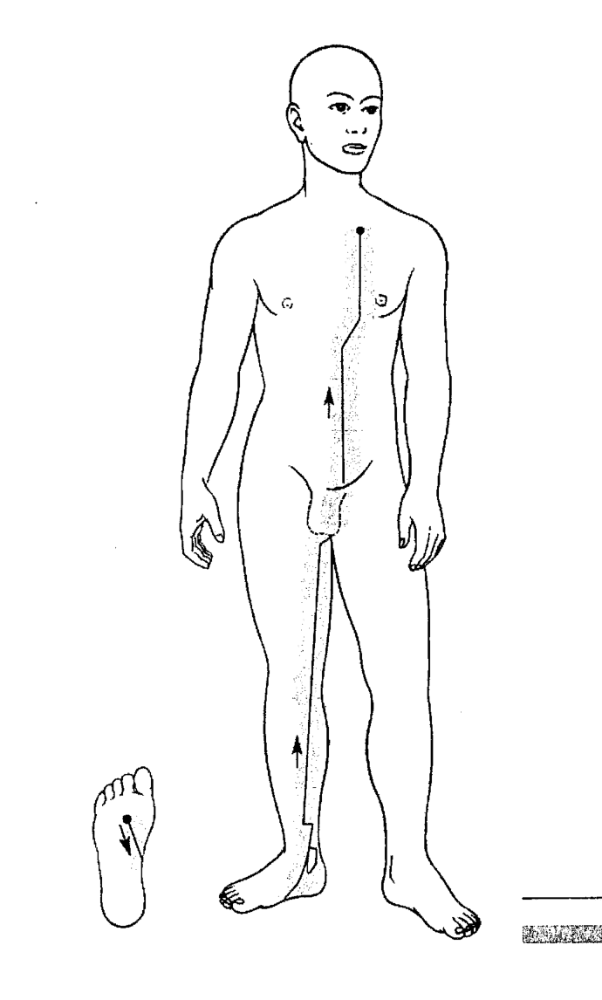

- 經絡路線 (實線表示)
- 進行路線 (虛線表示)

當在處理腎經的時候，病人要腹部朝上、背躺在床上，腳要向外伸出。腎經開始於腳掌腳拇趾與小趾之間，以對角線的方式經過腳掌，到達踝骨，並在那裡繞一圈。接著幾乎是沿著腿內側中線的位置，從小腿到大腿，一直到腹股溝的位置。在這裡換到身體的另一邊，並從膀胱的下方往上直線進行，經過下腹與上腹部，一直到鎖骨的下緣為止。

#### 膀胱經

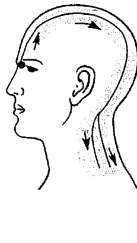

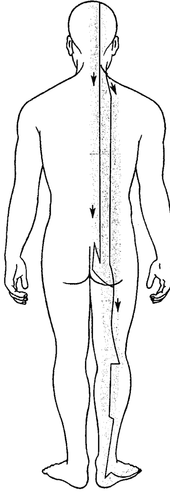

- 經絡路線
- 進行路線

在處理膀胱經的時候，病人要腹部朝下、俯躺在床上，並將頭部轉向側邊，這樣療癒師比較容易接觸到起始點（位於鼻子根部的側面，與眼角內側相同高度的地方）。如果要處理另一邊的經絡路線，那就要請病人將頭擺向另一邊。膀胱經從它的起始點開始，經過頭部延伸到頸部，並且從這個地方出現分叉。雖然我們用來療癒的手掌心所涵蓋的範圍比較寬闊，但還是要注意到這兩條分歧的路線。內部的經絡路線是貼著脊椎的旁邊，從頸部經過背部、臀部、大腿、膝關節，一直到後腳跟，然後沿著腳掌邊緣，最後到最外側腳趾甲邊為止。另一條經絡線一樣是從頸部開始，接著以和內部經絡路線平行的方式，經過背部，最後到臀部，並在此和另一條經絡線結合為一。療癒時，我們先處理從起始點到頸部的部分，然後處理內部路線到臀部，也就是兩條路線的會合點，接著再處理外部路線到同樣的位置，並從這裡繼續下去直到終點。透過一個簡單的暗示，比如說輕輕扶起病人的腳跟，這樣病人就知道要將頭轉向另一邊。接著，療癒師就可以用同樣的方式處理身體另一邊的經絡線，最後結束整個療癒程序。

42 當我們在運用經絡技法時，可以較大範圍的方式來處理這段經絡線轉折點到尾椎的地方。

#### 脾經

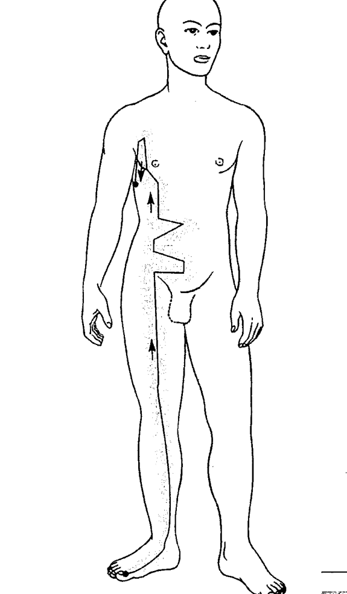

在處理這條經絡時，病人要腹部朝上、背部向下躺臥在床上，並且腳要稍微伸出。如果療癒床夠寬的話，可以讓手臂往上越過頭部擺放，這樣療癒師就比較好接觸到位於肩窩的經絡終點。

脾經起始於腳拇指指甲的內側，沿著腳掌的內緣到達腳踝，接著便直直地往上延伸，經過小腿、大腿，一直到腹股溝的地方。然後在膀胱以及肚臍的位置出現兩個轉折，接著走到胸腔，到了第二和第三根肋骨間的空隙開始往下轉折，並在肩窩下方約一個手掌寬的距離到達此條經絡的終點。

#### 胃經

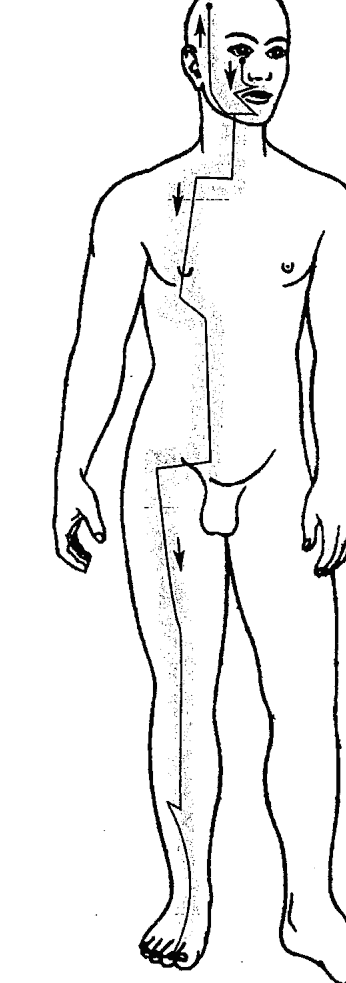

**圖例**
- 經絡路線
- 進行路線

為了方便這條經絡的處理，病人輕鬆地以腹部朝上、背部躺臥在床上即可。
胃經有一個特殊之處，它會在下顎的地方分為兩條路線。比較短的部分只分佈在頭部，較長的路線則穿過整個身體到達足部。因為我們運用「經絡技法」的時候，必須處理整條經絡線，因此先處理臉部較短的經絡部分。這段經絡是從眼睛的下緣開始，往下到下巴，並到兩條路線分歧的地方，然後沿著下顎、耳邊，最後到髮際的邊緣為終點。接著我們就可以處理往下、較長的胃經路線。先回到下巴分歧點的地方，再往下經過脖子，到咽喉下方凹陷之處。接著轉一個直角往外側延伸，到鎖骨溝的地方，再垂直往下，經過胸部，到了乳頭的下方，往斜下方前進，幾乎到身體的中心線，再垂直往下，經過肚子，一直到膀胱的位置。在此再轉一個直角，水平地往外側移動，到達大腿的中線位置，最後再垂直往下，到達這條經絡的終點——第二根腳趾內側的趾甲邊緣。雖然這條經絡路線在腿骨的地方還有一個轉折點，但使用「經絡技法」並不需要那麼精準地去處理這個部分。

#### 肝經

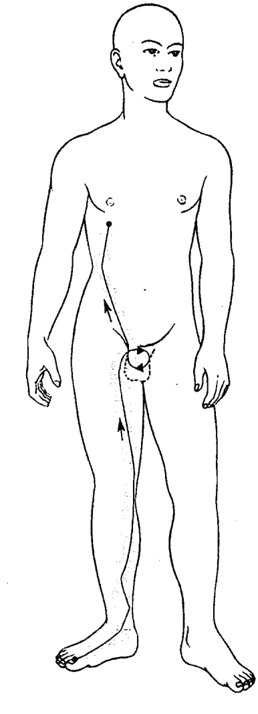

經絡路線 進行路線

人人都可以學會的療癒技法 64

获取更多好书，请加微信号：strcdts

處理肝經的時候，病人以腹部朝上、背部躺臥在床上，並將腳伸出去。 這條經絡線是以腳拇趾趾甲最外緣為起點，經過腳背，到達腳踝的前緣，然後走腿內側，經過小腿、大腿，一直到腹股溝的位置。接著走向身體的中線，轉向下方，並繞著生殖器轉一圈。然後微斜向上，到達第十一節肋骨的尾端，最後到達乳頭下方的終點。

#### 膽經

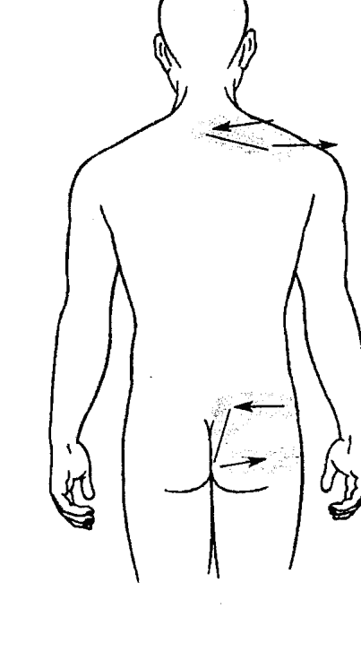

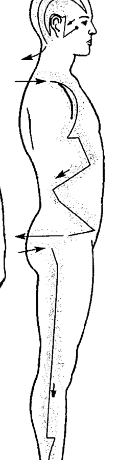

- 經絡路線
- 進行路線

在處理這條經絡時，病人舒服地側躺著，並讓上手臂微微往背部橫擺。當處理完一條經絡線時，病人要往另一邊側躺，這樣才能繼續處理另一條對稱的經絡線。

膽經是以眼角的外緣為起點，首先移動到耳垂的前緣，接著繞到耳朵的後方接近耳突的位置，再急轉往上，畫一個圓弧到達額頭。在此再度急轉往後，走過頭部的外側，經過頸部，到達第七頸椎的地方。接著經過梯形肌，往外側移動直到肩膀。畫過一道平緩的圓弧，走到胳肢窩下方和乳頭同高的位置，再往身體前側移動，到達第十二根肋骨的尾端。在這個位置繼續轉折往後，微微超過身體外側的中線，並抵達腎臟的高度，然後再轉向身體的前側。到達膀胱骨上方時，再沿著大腿外側往後，到尾椎的區域時，再以直角角度轉向肛門。到達肛門附近，接著便幾乎是以水平的角度，經過大腿的外側。接著又是垂直往下，經過大腿、膝蓋、小腿、腳背，一直到第四腳趾甲的外緣。

膽經在小腿的地方，雖然也出現一處小小的直角轉折，但因為經絡技法所觸及的範圍較為寬闊，所以並不需要特別去注意它。但在身軀上較大的轉折線，則必須要好好注意路線的正確性。針對這點，我們建議在療癒之前，先在病人的衣服上做出皺褶，好讓療癒師在處理過程中有個方向感。

#### 肺經

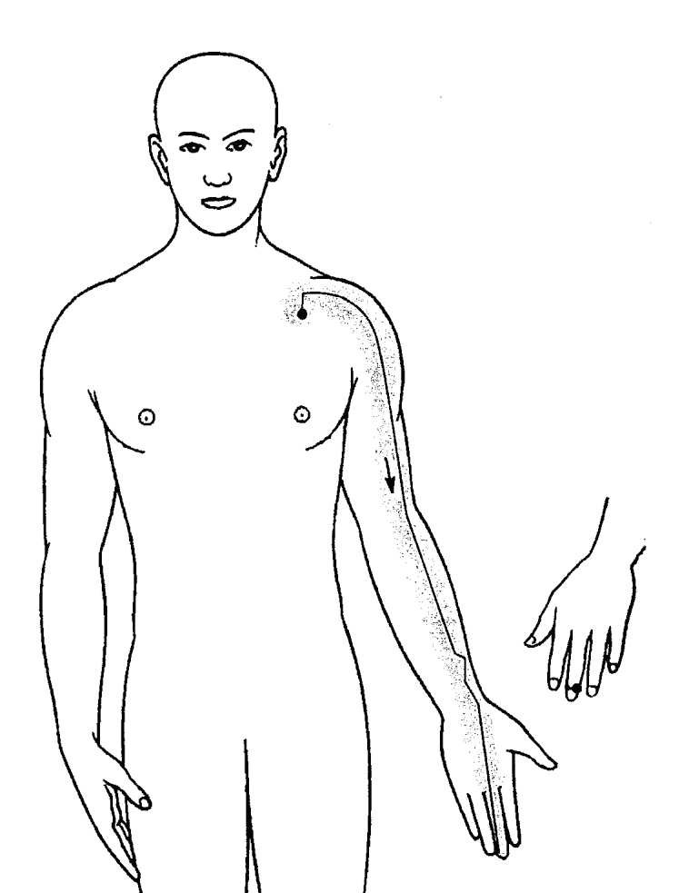

—— 經絡路線
■ 進行路線

在處理肺經時，病人仰臥在床上，手背往下，好讓掌心可以向上。同時，將小指與無名指略微彎曲，好讓中指、食指以及拇指能稍為撐開。

肺經從第一根和第二根肋骨中間為起點，並垂直往上行，到鎖骨的下緣。接著往右轉，朝向外側，並以圓弧的方式經過二頭肌的中間，以及到臂窩的位置。最後再從這裡，經過下臂與掌心，到達它的終點，也就是中指指甲的外緣。

#### 大腸經

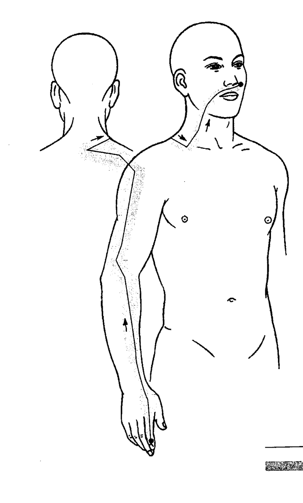

- 經絡路線
- 進行路線

在處理大腸經時，病人必須要側躺著，上手臂輕鬆地擺放在身體側邊的上方。大腸經以食指指甲邊緣內側為起點，並延伸出去經過手、下臂、上臂，最後到肩膀的位置。在此它轉向後方，並以水平方式經過肩胛骨，來到第七頸椎的地方。接著它又整個轉向，經過梯形肌往前，前進到鎖骨。這時九十度轉向上方，沿著身體側邊經過脖子、下顎、臉頰、上唇，然後穿過身體中線，來到鼻子的側邊，並結束在法令紋的上緣。

#### 心經

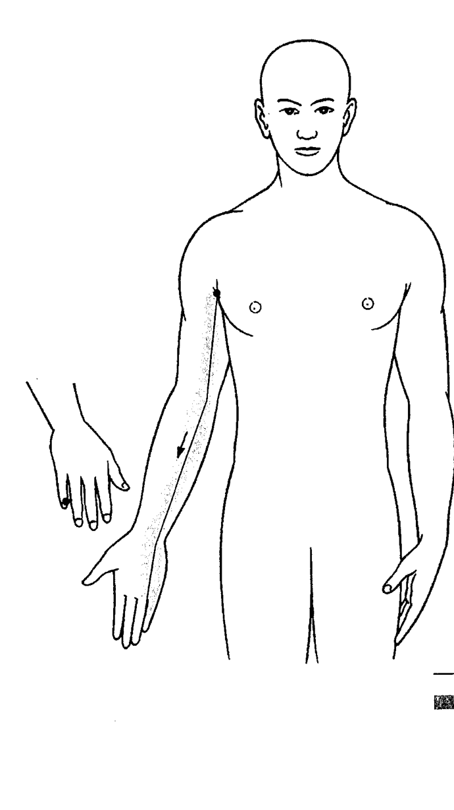

- 經絡路線
- 進行路線

為了處理心經，要讓病人舒服地躺在床上。手臂微曲在頭部上方，這樣療癒師就可以輕易地接觸到這條經絡線在胳肢窩的起點。此外，手掌略成拳頭狀，但小指要略為伸直。心經以胳肢窩中心為起點，沿著手臂的內側，最終來到小指指甲的內緣。

#### 小腸經

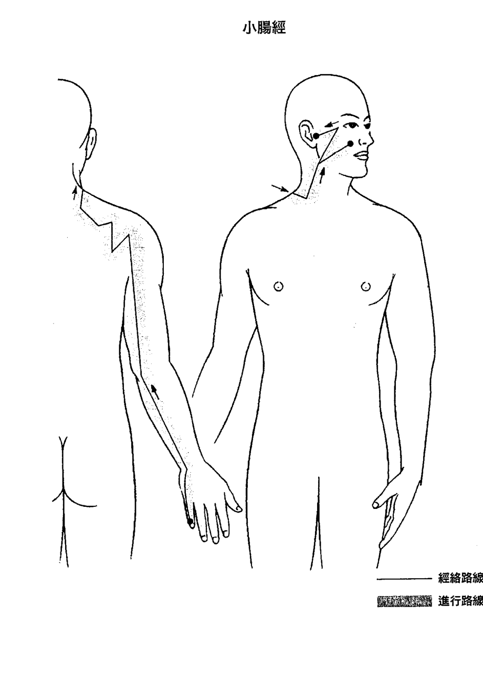

病人必須側躺，上手臂輕鬆地擺放在身體的側邊，這個姿勢，方便療癒師處理這條經絡線。 這條經絡線從小指甲外緣開始，經過手背的外側、下臂、上臂，一直來到肩窩的後方。經過來回地移動，通過肩胛骨，穿越梯形肌，來到身體的前側，到達鎖骨溝的地方。在這裡垂直往上，經過側邊的脖子，來到下顎的前方，並分開為兩條路線。 先處理較短的這條經絡線，它經過臉頰，並結束在顴骨的位置。接著處理另一條分支： 它從下顎的分叉點，來到眼角的外側，再轉折向後，結束在耳朵的前方。

#### 三焦經

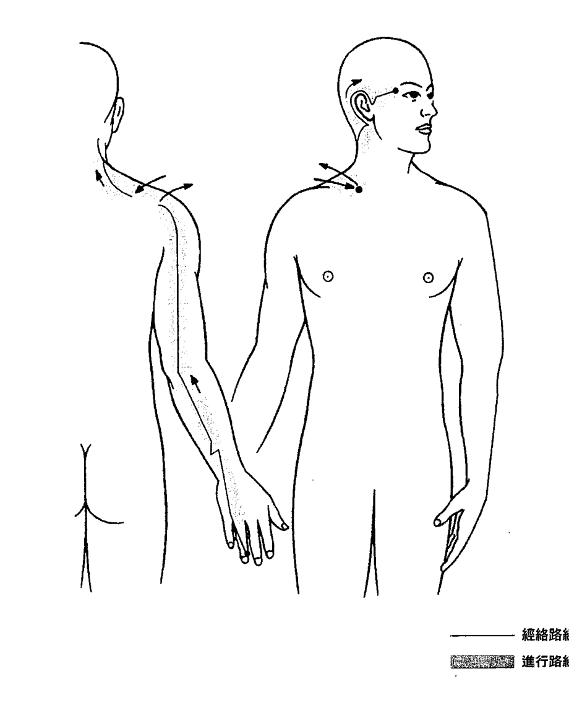

為了處理這條經絡，病人必須要側躺著。上臂輕鬆地擺放在身體的側邊，並微彎手指——讓無名指露出——成為拳頭狀。

三焦經是以無名指指甲內側為起點，經過手背、下臂 43、手肘、上臂，一直到肩膀，並從這裡轉向前方到鎖骨溝 44 的地方，然後又急轉往後到達梯形肌的上緣部分。接著經過頸部的側邊來到耳朵，繞一圈，繼續走到眉毛側邊的尾端，而這也是它的終點。

43 當我們遇到像下臂這樣的經絡轉折處時，運用經絡技法可以大範圍地掃過去就好。

44 重要的是，在這大的轉折處，我們要沿著路線跟進處理。

#### 心包經

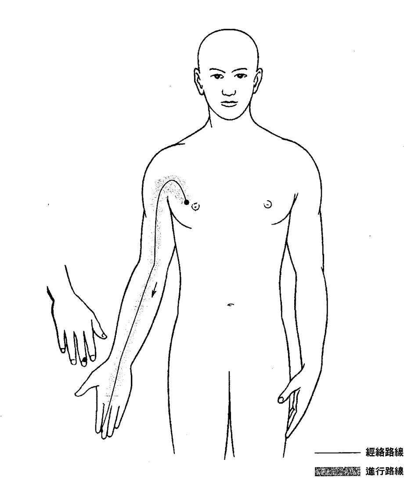

- 經絡路線
- 進行路線

病人以側躺的方式接受心包經的療癒，手心朝上，拇指、食指和中指略為撐開。心包經是以乳頭旁為起點，並以圓弧的方式經過肩窩，接著走過二頭肌、臂彎、下臂、手掌心，最後一直到終點，也就是中指指甲邊緣的內側。

### 增强疗效的辅助工具：SoHam 疗愈气场喷雾

纵然 SoHam 徒手能量疗愈的成效斐然，但是过去几年中，笔者为了让疗愈能达到更完美的效果，特别研究发现五种精油 ^45，制作成 SoHam 疗愈气场喷雾，此喷雾能辅助 SoHam 徒手能量疗愈，在疗程中共振、强化疗愈能量。

因此，在展开 SoHam 徒手能量疗愈前，若能选用一瓶特定的 SoHam 疗愈气场喷雾，将会如虎添翼，增强疗效。

虽然其他种类的精油喷雾也会影响室内氛围及人体气场，但是疗愈效果或许会有差异。

以下是疗愈气场喷雾的五种精油介绍：

#### 檀香补气疗愈喷雾

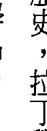

西印度檀香 Amyris Amyris balsamifera

若追溯西印度群岛历史，拉丁学名 Amyris balsamifera 的西印度檀香，在植物分类上跟真正的檀香（拉丁学名 Santalum album，别名东印度檀香）完全没有关系。唯一相似之处是类似的香气，此精油以蒸馏法制作萃取，并具有温暖、木质般柔软的香气。

在施展SoHam徒手能量療癒前，先在距離病人身體十至十五公分（註45）的地方噴檀香補氣療癒噴霧，他的星光體氣場在接觸噴霧的瞬間會變成棕褐色，同時星光體氣場輪廓也融解了。氣場表面不再是平滑和均勻，而是像羊毛綿絮般粗糙。通常，棕色氣場是反映一個人正處於筋疲力竭的狀態，以致於無法享受生命的喜悅，這也代表星光體呈現出橄欖花精的負面狀態。有趣的是，這個時候，雖然星光體是棕色氣場，此補氣療癒噴霧的結果，而非他的心智情緒在橄欖花精的負面狀態。這褐色氣場通常維持三十五至四十分鐘左右。

在噴灑檀香補氣療癒噴霧時，以太體氣場在接觸到噴霧的剎那也變成淺灰色，淺灰色表示以太體周身缺乏生命之氣。這個灰色調的以太體氣場差不多會維持四十至五十五分鐘，之後又會轉變成正常的白色。恢復成白色的原因，是因為西印度檀香精油噴霧將氣直接導入肉身中而發生的。縱然這兩個暫時改變顏色的星光體和以太體氣場，都是暗示「非常疲憊」，但是病人卻一點兒都不覺得疲累。

大多數個案表示，在療程中噴灑檀香補氣療癒噴霧後，他們能進行更深沈的呼吸，或是吸進更多空氣，療程後還有恢復活力的感受。這是因為噴灑西印度檀香精油噴霧後，會打開病人身上所有的氣閘，讓氣流入肉身。發生以太體氣不足的現象時，我們

45這五瓶特殊精油都是筆者親自測試、挑選出來的。在進行測試時，我發現即使是植物分類上是同一種芳療精油，卻因為出產國家、氣候、土壤、環境……等因素的影響，精油也顯現截然不一樣的效果。

46關於SoHam療癒氣場噴霧相關資訊，可洽「新巴赫花精療癒」推廣中心：www.newbach.tw；email: new.bach.tw@gmail.com

#### 橙花沁香疗愈喷雾

橙花 Neroli Citrus aurantium

以水蒸氣蒸餾橙花方式製成的橙花精油，除了散發細緻甜美的花香，具有收斂肌膚的功效外，還有有不可言喻的奧妙。和檀香補氣療癒噴霧一樣，橙花沁香療癒噴霧也能協助 SoHam 徒手能量療癒。

在個案的氣場噴灑橙花精油噴霧後，其星光體氣場輪廓會馬上出現三釐米厚的淡綠色。

然而，這淡綠色並不是出現在星光體之外，而是顯現在星光體的內壁邊緣輪廓。約莫三分鐘後，淡綠色會開始漸漸消失，再過兩分鐘後會完全溶解消失。這特殊的綠色，並不屬於八十三種人體氣場顏色，這個綠色調顯示星光體的「情緒」狀況，意即這特殊色調的出現時，代表此人處於身心鬆弛的狀態中，他的療癒師可以藉此機會讓他得到更好的療癒效果。

總的來說，檀香補氣療癒噴霧可以創造出以太體氣場「臨時性氣不足」的狀態，藉此機會施展 SoHam 徒手能量療癒，將氣灌入太體氣場，短時間內增強病人的普拉納，恢復活力。48

#### 乳香保護療癒噴霧

印度乳香 Incense Boswellia serrata

因此療癒師可以調動及輸入更多的普拉納給病人；而橙花沁香療癒噴霧則是協助病人進入全然放鬆的狀態，以吸收更多的普拉納。

印度乳香精油是從印度乳香樹脂中取得，帶有清香、愉悅、多層次的樹脂香氣。

在個案的身體周遭噴灑乳香保護療癒噴霧後，星光體氣場外圍馬上形成一道古銅色、三十公分的寬邊，之後又會在十秒內緊縮集聚成一公分厚的框邊，這框邊大約維持三分鐘後消失。

有趣的是，乳香保護療癒噴霧不僅對人體氣場有效果，對空間也能產生保護功效。

在房間內噴灑印度乳香精油噴霧後，隨著噴霧在房間空氣中四散飄逸，古銅色的氣場立即擴散至整個空間中的每一個角落，古銅光澤大約三分鐘後才消散。這個古銅色調也獨立於八十三種人體氣場顏色之外。

在乳香保護療癒噴霧氣場籠罩之下，所有的負面能量都會消失、蕩然無存。基於此因，印度乳香精油噴霧具有「淨化保護」功能。請注意，只有單一使用乳香保護療癒噴霧，才能在該場地和個案身上發揮淨化保護功能，該空間若是參雜其他芳療精油

喷雾，则会丧失功效。乳香保护疗愈喷雾除了可以在进行疗愈之前使用外，也可以当成家庭、诊所的常备品，例如：客人拜访时，净化家中客厅、客房或是小孩的房间；甚至是在诊疗的过程中，如果感受到「异常能量」的入侵，也可以用此喷雾净化空间，保护自己及病人。

#### 百里净疗愈喷雾

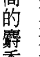

百里香 Thyme Thyme vulgaris

我是采用生长在西班牙的高原的红色百里香精油，相较于白色百里香精油，这款精油含有较高的麝香草酚，因此，它的香气带点挑兴的刺激感。病人喷洒百里净疗愈喷雾后，会立即影响他的星光体气场，整体气场颜色像是深了一些，这奇特的现象约莫维持了半分钟后，又变回原来的颜色；但相较于前，颜色倒是明亮了起来。然而，在这半分钟裡，以太体气场虽然毫无变化，但是气都汇聚流走在肺经之上。喷雾沾附在皮肤和黏膜外圈，也会提升免疫系统功能。百里香精油里的细菌能杀死病毒和真菌，早已驰名中外。昔日，在冬天寒冷季节裡，人们习惯将一把百里香在水壶中闷煮，让百里香的香气散发蔓延到整个房子里。有趣的是，喷洒百里净疗愈喷雾的短暂时间裡能激活免疫系统，因此建议在寒冷的

#### 樺木專注療癒噴霧

樺木 Birch bark Betula lenta

季節裡使用它；以療癒師的角度來說，這一瓶噴霧能協助得了流行性感冒的病人，開啟自身免疫系統功能進行自我療癒，至於一般民眾，則是避免感染感冒。

樺木精油是水蒸氣蒸餾特殊的黑樺木皮而取得的，愉悅甜美的香氣，流暢性高，讓人想起泡泡糖。值得留意的是，在測試樺木專注療癒噴霧的過程裡，我們認為氣場雖然看似毫無變化，實質上確實發生某種「移動」。51 雖然氣場顏色全然保持不變，但其密度增加（這裡的密度不是以物理上的密度意義來註解）。頻繁噴灑樺木專注療癒噴霧，是不斷補充星光體上脈輪的養分 52，脈輪裡的能量越多，越能提振精神，不再出現失神、疲倦、不專心的狀況，而會更清晰、更專注和更警覺。

樺木專注療癒噴霧協助療癒師在施展 SoHam 徒手能量療癒時，更能心無旁騖、專心一意的工作。倘苦療癒師當日身心疲憊，無法長時間專注療癒時，更是使用樺木專注療癒噴霧的好時機。

50 根據中醫理論，肺經主治肺部所有的疾病，像是咳嗽、支氣管炎、流行性感冒系統、鼻塞、咽喉痛及其他相關症狀。

51 在測試 SoHam 療癒氣場噴霧的過程中，柯磊墨醫師全程協助我尋找能發揮最大療效的精油。

52 請參考書籍 Hagen Heimann & Dietmar Krämer, chakras and mantras. -Chakra healing through the power of the primordial sounds，出版：aquamarine Verlag, Grafing。

### {SoHam 療癒氣場噴霧的使用方式}

SoHam 療癒氣場噴霧只能單獨使用。療癒師在療癒之前，必須先決定當次療程該使用哪一瓶療癒氣場噴霧，當病人出現診間後，先將該瓶噴霧均勻噴灑在病人的氣場上，再開始展開 SoHam 徒手能量療癒。這五瓶噴霧都能協助 SoHam 徒手能量療癒發揮最大療效。

要再次提醒的是，在療癒的過程中，如果是以複方精油或是混合二、三瓶 SoHam 療癒氣場噴霧後使用，噴霧會失去原本單方精油的特質，不會出現原來的功效。因為精油混合後會發生化學變化，改變分子結構，也許在香氣上沒有太大差別，卻完全失去原本的療效。

薰香燈也不會產生 SoHam 療癒氣場噴霧的效果。原因有二，一是使用薰香燈時，精油並不會立即接觸人體氣場，而是緩緩的接近；第二點則是因為薰香燈上精油蒸發的濃度太低，無法影響氣場。基於這兩個理由，薰香燈無法發揮類似 SoHam 療癒氣場噴霧的功效。

### {SoHam} 徒手能量療癒案例

#### 一號療癒師

我在這裡分享我第一次進行 SoHam 徒手能量療癒的經驗：

- 個案陳述：療癒後，我覺得自己像是沐浴在春天的細雨般清新。（這位女士有流感症狀，身心承受不少壓力，以及患有肺癌及大腸癌。）
- 引自該個案的 email 內容：「再次感謝您，經過昨天的能量療癒，今天早上我五點半就醒了，再也無法入睡，起床後我覺得自己充滿了活力，做了一大堆事情，也更了解自己。完美極了！」

往日這位女士總是處於非常疲憊的狀態，聽到這消息真是太好了，並再次謝謝您！

#### 二號療癒師

我們已經進行過幾次 SoHam 徒手能量療癒。
南西的母親的膀胱炎非常嚴重，頻繁發病，拖了好長一段時日都不見好轉。
感謝新的 SoHam 徒手能量療癒，我們除了快速控制病情外，現在膀胱炎也不再復發。
另外，我們也成功地治療偏頭痛、感冒和支氣管炎。

#### 三號療癒師

結合新巴赫花精療癒法及 SoHam 徒手能量療癒的療癒報告：
我有一位朋友（一九六四年出生），突如其來喪失聽力（已經是第二次發生這件事），兩隻耳朵都聽不見了，左耳比較嚴重。
再來，他還有劇烈的頭痛、背痛、頸痛等症狀。
當我做完脈輪診斷法後，發現他需要葡萄藤花精，因此，我用 SoHam 十二經絡療癒技法療癒他的膽經，以及在他左耳灌滿普拉納。

在第一次療程後，他雙耳出現噪音的現象改善了許多，接下來的幾個星期，我又陸續療癒了幾次（差不多每週二次）。他的病情進步不少，只有在病人承受極大壓力時，才會再度出現輕微的耳鳴。

在這期間，我也療癒對應的經絡。

幾天後，我在療程中發現他的第七脈輪有問題，因此也接著處理第七脈輪的對應經絡。

患者原本嚴重的頭痛問題，在第二週的第三次療癒後就消失。

我們再來談膽經療癒的狀況。療程進行時，患者感覺到能量在膀胱經運行時的刺痛感。

再下一次，我處理了膀胱經，患者的背部疼痛因此消失，頸部也不再緊繃，膀胱經也不會刺痛了。

在這期間，原本常聽不見的問題也不再發生（過去他確實發生過喪失聽力的問題）。

#### 四號療癒師

感謝 SoHam 徒手能量療癒和 SoHam 療癒氣場噴霧！我在一些病人和熟識的朋友的身上試過，成效出乎意料得好：

-   我有一位音樂家同事（雙簧管）有哮喘的問題，他說他一天必須使用二次可的松噴霧（cortisone）來控制病情。我只療癒他的肺經三次，他就能夠好好呼吸了。自此之後，他再也不需要可的松噴霧了。
-   一名年輕女子（從事電腦工作）有多年的手腕充血造成的疼痛問題，在經過三次療癒後，症狀消失了。
-   一位熟識患有腕遂道症候群，她在開刀前接受療癒，結果手幾乎不痛了！
-   患者的膝蓋問題顯然好轉。

#### 五號療癒師

親愛的海滿恩先生：

我很高兴通知您，今天我以 SoHam 療癒我母親，結果非常成功，令人滿意。我母親染上了流行性感冒病毒（或類似的症狀），因此我以「如是技法」療癒她的腎臟，讓她舒服一點，竟然也完全解除原本肢體疼痛的問題。在我療癒她的頭部之後，我倆都非常詫異地發現竟然也馬上改善她的鼻竇炎！

#### 六號療癒師

星期一我女兒因為膝蓋關節炎末期的問題，因此必須服用大量的阿莫西林（Amoxilin），當日結節性紅斑已經慢慢蔓延到她整條腿上，她痛到再也無法外出。除此之外，這些紅斑也開始散佈到胳膊、手和肘部關節等部位，外加多次輕微發燒。

因此我在三月十日，再次以「如是技法」療癒她，然而進行到一半時，她的朋友們前來慰問，因此不得不中斷，到了當天晚上我才繼續進行療癒。她身陷巨大的疼痛裡，她在她爸爸面前掉著眼淚哭訴她做每一個動作都很痛，她再也不能走路了。療癒後（我又回去工作），我的丈夫告訴我她已經停止哭泣約兩個小時了。

##### （五天後）

海滿恩先生晚安：
我得到醫師的診斷結果，我女兒是因為 Yersinieninfektion 細菌引起的急性關節炎。這種細菌通常存在於生肉裡或藉由動物傳播，沒有任何抗生素可以治療它引起的症狀。現在你有活生生的例子說明「如是技法」的療效。

她終於不會痛到睡不著，當我站在她的面前觀察她的狀況時，她的氣場只呈現一點點灰色，於是我決定讓她繼續睡，寧可等到早上再繼續療癒。當晚她睡得很好，也不像前一晚因為劇烈的腿痛而一直醒來。
上週四，我繼續進行「如是技法」，她的疼痛因此完全消失了好幾個小時。她可以走動了，只是還不能跑。當天她也沒有發燒，可是到了晚上，又開始輕微燒了起來。於是我又以「如是技法」療癒，燒退了，疼痛也完全消失了。
上週五上午，她的情況好多了，可以開始跑，紅斑和發炎的狀況也都減輕。她也不再覺得痛，只有跑步時，膝蓋會有一點點痛。我繼續以「如是技法」療癒她，她的腿及膝蓋持續好轉。今天你只會看到她的腿留下幾個褐色斑點，其他症狀都消失了，腿部行動自如，也不再疼痛。

附註：這次的抗生素一點效果都沒有，到了今天她體內還是存在著這個細菌菌株，但因為「如是技法」的療效，我女兒還是痊癒了！

#### 七號療癒師

病人主訴：注意到皮膚有灼熱及過度敏感的現象，尤其是當衣服和皮膚輕輕摩擦接觸時，會非常不舒服。敏感區的皮膚有發紅的現象。皮膚上的觸摸敏感區域及疼痛現象日益擴大，最初，只出現在背部左邊，但經過十天左右，如帶狀一般從背部延伸到身體前方。

✦ 診斷：
在Prodromal階段的帶狀皰疹

✦ 治療方法：
大劑量維生素C（全天6克）
維生素B群和鋅
每天三次 SoHam 療癒。

第二天疼痛明顯減少，到了週三全面停止抱怨。皮膚上的水泡並未爆裂。

#### 八號療癒師

最近我十一歲的兒子從樓梯上跌下來時，膝蓋重重地撞在地板上。當時他的情況嚴重到連呼吸都覺得痛，忍不住哭了出來。當他出現在我的面前時，他的膝蓋無法彎曲。當時狀況嚴重，我擔心我非得帶他到醫院治療不可，因此我先扶著他躺在沙發上，冰敷他的膝蓋，求他保持冷靜，因為我想試試 SoHam 徒手能量療癒。我學 SoHam 徒手能量療癒的四個月後，才發生這件事情，在此期間我都沒有練習，所以我不知道自己是否能上手。於是我集中注意力，發現能量很快地傳到我的手上，我以 SoHam 療癒受傷的膝蓋，幾分鐘後，發現手部的感覺變了，我懷疑是能量飽和了，我問兒子：『現在你的膝蓋感覺如何？』他回答：『有一點酸，我可以起來了嗎？』於是他從沙發上跳下來，毫無問題地跑出客廳，上樓回到他的房間。從此之後，他的膝蓋也不再疼痛。我全然喜愛這偉大的療癒法。

親愛的海曼恩先生，

誠如我們之前討論的療癒方式，我的那個男孩個案（胃刺痛，反流，食管問題）在做完SoHam療癒後，我相信他現在一切安好。

在療癒的過程中，經過十五分鐘多的療癒之後，他說他真的很好，只覺得自己已有從麻醉中醒來的感覺。

再過了十五分鐘的「休息」之後，他還是有點暈，覺得自己「茫然／寡言／恍惚」，但是在我花二十五分鐘療癒他的胃、兩個穴位、和兩側的經絡之後，他的偏頭痛消失了。

### {SoHam 療癒氣場噴霧案例}

#### 樺木專注療癒噴霧

♣ 從事SPA美容工作的業主，三十七歲

我在參加一個重要的商務會議前，用了樺木專注療癒噴霧。因此在會議中，我可以更從容、更流利地為自己爭取到自己期待的結果。

♣ 業餘愛好網球選手，三十六歲

實際上我每場比賽之前都會噴樺木專注療癒噴霧，因此我可以在球場上提升自己的表現。

♣ 網球競賽選手，四十七歲

每一場比賽的必需品！在比賽前我一定噴樺木專注療癒噴霧，然後我在球場上就可以更精準的控球，切球和拉球的表現也因此更好。

♣ 老師，三十八歲

如果我的學生再聽不懂的話，我會停下來，每一位都噴噴樺木專注療癒噴霧，然後他們就都了解了。真是太好了！

♣ 校長，五十二歲

每間學校都該要求訂購樺木專注療癒噴霧！

♣ 學生／畢業生，十九歲

如果我在參加考試前噴過樺木專注療癒噴霧，我絕對寫得更好一點。樺木專注療癒噴霧的好處是，當我在學習時使用它，我學習的狀態會更好，我馬上就記下學會了。

♣ 網頁設計師，四十四歲

樺木專注療癒噴霧，簡單的說就是再也不會出現創意空洞。

♣ 卡車司機，四十三歲

和含咖啡因的飲料比較起來，我更喜歡樺木專注療癒噴霧，用過噴霧後，我就可以馬上進入開車狀況，晚上也可以睡得更好，也不需要付出其他代價。因此我可以開車開得更久，身體狀態也良好。

電子郵件

親愛的海滿恩先生，我非常渴望告訴你在復活節假期我和我兒子的經歷。

我兒子八歲，讀小學二年級。老師在放假期間出了一門功課：閱讀《讀我》小冊並回答問題。功課裡包含名詞選擇題、思考每一個名詞的意義、哪些敘述是不正確的想法，同時要回答邏輯性的問題。

假期間，每當我兒子坐在桌前做功課時，他想了又想，都不知道該怎麼寫，他注意到自己無法專心，無法認真閱讀作業題目並且作答。

因此，我的兒子冒出了可以噴你的樺木專注療癒噴霧嗎這樣的想法。

在這之前，我告訴他我買了這瓶噴霧，如果他發現他無法專心時，可以使用它。

當然我順從他的渴望，也遵從你的指示噴在他的氣場上。我可以很清楚看見他的改變，他變得專注，題目變得容易多了，他在短短一天之內就完成超過一半的功課。他非常開心，也能開始悠閒地享受假期。
我非常感謝，只是噴幾下樺木專注療癒噴霧，就能讓他專心做功課，也非常開心看到他的作業寫得非常好。
我自己在工作上也使用樺木專注療癒噴霧。身為產業業務員，不論在工作上或是私人生活裡，當我需要集中注意力的時候，我都會使用它。
我們真是興奮得不得了啊！

◆ 一位商人
海滿恩先生您好，樺木專注療癒噴霧太有效了！下一次見面時我會跟你分享。
啊！這個產品有出貨輪般大小的瓶裝嗎？

◆ 一位同事
海滿恩先生您好，假日旅遊時，我必須單獨駕車約六五〇公里，行車時間從早上九點到下午五點。去程時，中間休憩了二次，也用了二次噴霧。到達目的地時，我累壞了。

回程時，我只有短暫休息了二次，但持續噴灑噴霧，路途中只要發現自己出現注意力不集中的現象，我就噴。等回到家時，我的身心狀態良好。

#### 百里潔淨療癒噴霧

##### 案例一

為了這瓶神奇的噴霧，我要再次謝謝你。因為我的胃非常敏感，百里潔淨療癒噴霧真的有幫助到我。

##### 案例二

整個秋天和冬天我都使用百里潔淨療癒噴霧。如果我的身體狀況不錯，我一天大概使用三次預防感冒。如果我意識到我開始鼻子不通或是開始不耐煩時，我會馬上噴百里潔淨療癒噴霧，有時噴一次就很有效果，有時候，我得每十五分鐘噴一次，直到情況改善。 有回傍晚，我鼻塞、喉嚨發癢，海科以 SOLUTUB 療癒我的鼻子和喉嚨，隔天早上，喉嚨已經恢復正常，鼻子在噴過百里潔淨療癒噴霧也通了。

又有一次，我的鼻子又不通和右耳也微微疼痛，海科疗癒耳朵和鼻子一次。

復活節前一個星期，我在上班時身體已經開始不舒服，還發燒（也許我的女兒感染給我，病毒感染發燒）回到家時，體溫計顯示攝氏三十七．五度。

我放個熱水袋在床上並躺下休息，每十至十五分鐘噴一次。而我的丈夫以SoHam疗癒我的大腸經。不到一個小時，我的體溫下降到三十七度，到了晚上我覺得好多了，隔天早上，再以SoHam疗癒大腸經，我覺得非常舒服。

## Part 4

### 靈性療癒師的療癒技法

#### 【物質化】

能量療癒與靈性療癒兩者最大的差別在於，靈性療癒師本身具有一種極為罕有、與生俱來的天賦，能以身體產生外質。外質亦涉及一種能量，介於能量層與物理層之間，它的組成質地較以太體的普拉納為粗，但不屬於物質層面；其屬性相當「沉」，且具有「惰性」。

因為這種沉與惰的特質，一般的治療者很難獨自形成外質來療癒星光體、心智體、甚至是靈性體。必須倚賴其指導靈（geistige Führer）的幫助。指導靈是指來自「星光界」的療癒者，「星光界」裡並不存在重量與惰性的問題，因此沒有限制。它也具有輕盈特性，因此外質一旦被指導靈觸及，瞬間即會失去其沉與惰的特質。靈性療癒師便能進行「物質化」，依照患者的需求形塑外質，進行療癒。

唯有透過與指導靈的合作，才有可能進行靈性療癒。

#### { 指導靈 }

其實，每一世都有一位指導靈的陪伴。指導靈是指靈魂在肉身生命結束之後，雖然身處靈界，但仍選擇回到人間，自願留在另一名投胎的靈魂身邊照顧他、並幫助他發展靈魂。這種珍貴的協助通常不會被察覺，因為指導靈的存在，通常處於被庇佑者的感知範圍之外。倘若指導靈查覺到被庇佑者即將面臨危險，他會試著去提醒對方，強烈地跨越對方的認知界線，用一種被庇佑者無法解釋的方式感覺到他的警告。通常這類示警並不會真的像「接受到指導靈的警告」那樣被感覺到，而是以一種融入被庇佑者身處的情境方式來示警。

為了讓療癒工作順利進行，雙方必須學習如何彼此溝通。每一位靈性療癒師「與星光界溝通」能力有著顯著的差別。有些人的能力僅在「感應到該做些甚麼」。這一類型的療癒師僅能從指導靈處接受到靈感，「知道」在療程中該怎麼做，但卻沒有辦法用言語描述。對於簡單的療癒來說，這樣的溝通模式就足夠了。

靈性療癒師在進行療癒時，至少會有一位以上的指導靈55 協助他完成「物質化」。有些靈性療癒師則是可以用言語交流，和他的指導靈對話，宛如正常人。在這種溝通模式之下，兩方可以透過真正的對話進行溝通。由於這是一種「內在的談話」，
54 指導靈與靈性療癒師必須將手固定放在同一個地方，才能觸及外質。
55 其他的指導靈應該是教導靈性療癒師如何物質化的那一位老師找來的。

靈性療癒師必須要學會「與星光界溝通」及幻覺之間的區別。幻覺所呈現的只是一種附有臆測答案的表象訊息，源自於個人的潛意識，而非來自於指導靈。這種幻覺現象會經常出現在才剛開始受訓的靈性療癒師身上。透過練習，靈性療癒師會漸漸區分出什麼才是「真正的訊息」，而幻覺的現象會逐漸減少。

靈性療癒師與他的指導靈若能夠透過「言語上的星光界溝通」，彼此相互交流訊息的可能性自然是比「感應」的模式要來得更高。透過這種方式，指導靈不僅能夠提供珍貴的指示，協助診斷，也可能針對某些疾病提供較複雜的療癒方向與指示。

有的指導靈只能傳授他在世時習得的知識，或者是其與護佑者共同進行療癒時所獲得的知識。但有些靈性療癒師可以讓指導靈在療癒時直接附身（Inkorporation）。

若是處在這種狀態下，指導靈可以直接對病患進行療癒，療癒師不必主動地「參與」療癒過程。不過，這種附身是需要雙方同意，並且有意識的與星光界溝通為前提之下才能進行，彼此之間需要高度的信任、紀律、與訓練。

為了讓指導靈可以像使用自己的身體般自如地運用靈性療癒師的身體，祂必須附身其上，將靈性療癒師的運動及感覺神經給「鬥好」。通常這樣的程序會花去一些時間，而且是在某一段療癒行為開始之前就有意識的進行。之後，指導靈就可自行運用靈性療癒師的身體，也可以開始運用他的各種感官，如視覺或味覺等。在附身的期間，靈性療癒師無法介入療癒，只能「被動地」接收，透過他所說和所做的一切。療癒結束後，指導靈會主動離開，將身體的主控權歸還給靈性療癒師。雖然，靈性療癒師在這種療癒模式之下，並不能在附身的當下控制自己的身體，但是靈性療癒師對指導靈附身時進行的療癒工作，仍需負起完全責任。這也是為什麼附身必須得有高度的信任才能進行的原因。如果靈性療癒師對他的指導靈並不信任時也無法附身，因為他在這種狀態下是無法打開自己身體的。

附身還有另外一個更重要的前提，必要的紀律，因為在附身的當下，雙方都直接經歷著另一方的生命。這表示，靈性療癒師與指導靈彼此都直接、無任何過濾地經歷著對方的任何感覺與想法，彼此就宛如對方。

通常一個人只能「獨自」經歷自己的生命。換句話說，每個人都必須以告知的方式，他人才能知曉自己的經驗。在附身的狀態之下，雙方皆是直接經歷對方的一舉一動。這也表示，在某一情境之下，彼此間不僅共同運用著自己的想法和感覺，也同時以對方的反應、想法和感覺在經歷整個情境。除了這種經驗的共時性（Synchronizität）之外，附身的狀態對共同參與的雙方面而言，基於上述的狀況，可能對兩者都造成認知上的混淆。因此，紀律與經年累月的密集訓練是很重要的，如此一來，靈性療癒師與指導靈才能學習如何将自己的想法與情緒與對方區分開來，並進行自我鍛鍊。藉此，初次附身時的混淆感覺會隨著時間慢慢減少。療癒行為是不可能在混淆的狀態下進行的，透過密集與持續的練習，靈性療癒師與指導靈彼此之間才能提高對對方的信任，自然而然漸漸地發展出更多合作模式。在長時間的訓練之後，也會逐步擴展診斷與療癒的面向。舉例來說，指導靈可藉此機會學習運用以靈性療癒師的眼睛去看這個實體的人間世界，少了靈性療癒師的雙眼，他是不可能做到的。相對的，靈性療癒師也因此擁有透視星光界實境的眼界。此時雙方合作已經是發展到高階模式58，靈性療癒師與指導靈便能夠將這些優點運用在診斷上，掌握、診治更棘手的病情。

56 在第一次嘗試與指導靈溝通的時候，有老師在旁會有很大的幫助。

57 例如，建議使用協助病人病情恢復的藥草。

#### 【靈性療癒的診斷與療癒方法】

和能量療癒或物理治療一樣，靈性療癒法在療癒開始之前必須先進行診斷。可能有下列不同的診斷方式。其中一種可能是，由指導靈獨立進行診斷，再透過療癒師的感應，在療癒的過程中加以「引導」。在這種情況下，療癒師只是療癒的媒介。雖然靈性療癒師在這種狀態下無法精確地意識到診斷與療癒的程序，但他仍須精準地知道自身的療癒功力，也必須清楚他何時可以介入療癒。透過指導靈的感應，靈性療癒師便可以感覺出哪些個案是他可以幫忙，而哪些疾病是在他能力範圍之外的。在開始進行這種療癒之前，靈性療癒師必須有意識地打開自己，然後跟隨著指導靈的指引。指導靈會指引他針對他感覺到的不同病症來進行療癒。

而在另一種靈性療法中，各種病症的診斷則完全由靈性療癒師獨立進行。在這種情況之下，指導靈只是扮演輔助者的角色，不會進行物質化以及療癒的引導。這種由靈性療癒師獨立進行診斷與療癒方式，可再細分為下列兩模式：原型情緒療癒法（Archeypsische Heilen）及以及克力提頓（Qualität）為基礎的療癒法。

##### 原型情緒療癒法

原型情緒療癒法主要是運用「巴赫花精皮膚反應區」進行診斷與療癒。透過這種對應方法，靈性療癒師先將病症區分出不同的療癒層次，然後再予以治療。巴赫花精皮膚反應區是由自然醫學醫師笛特瑪·柯磊墨所提出，他發現到負面的原型情緒會導致星光體型態的形變，而這樣的改變經常會反映在某些固定的身體部位。有經驗的療癒師會因此感覺到個案的氣場有突起、凹陷、甚至破洞的現象。

58 這種非常高層次的合作模式僅有少數的靈性療癒師能夠達到，且須數十年的訓練。

59 通常這種指示會透過靈性療癒師接收的感應，而且通常是在靈性療癒師的手所放置的地方。

60 擁有「星光一言語溝通能力」(astral-verbale Kommunikation) 的靈性療癒師，可藉此從他的指導靈處得到寶貴的指示。不過，在療癒之後，靈性療癒師仍須對這樣的指示再加以驗證，以便能夠對表現出來的病症進行診斷與後續的療癒。

61 這類氣場測試並不需要特別敏感的感應體質，僅需透過學習即可學會運用。

### 以下是依據巴赫花精皮膚反應區所區分出來的頭部身體地圖：

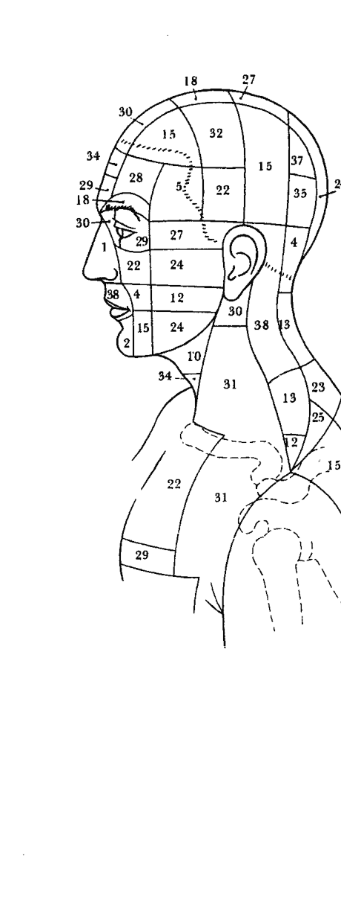

藉此，他進一步發現，一般療法一直無法治癒的病人，通常這些病人的氣場都有破洞的現象。因此，他便開始尋找療癒的藥方，希望關閉星光體氣場的破洞。

他第一次實驗是找一位抗拒治療的病患，柯磊墨醫師以巴赫花精外敷在病患感到疼痛的部位並觀察。他發現當使用巴赫花精外敷法治療病人期間，原先診斷出來的氣場破洞突然關閉起來，同時病患原本主訴的髖關節和薦骨不適症狀也一起消失。 因為這個重大的療癒成效，柯磊墨醫師開始研究人體全身的皮膚表面，並發現一共有二百四十三個對應區塊，他將這些區塊稱為「巴赫花精皮膚反應區」₃。

The request was rejected because it was considered high risk## 个案二

国小二年级的女童，是一位聪慧、注意力集中、可以井然有序做事的小孩。然而，她有时候会头脑一片混乱，无法运转，像是连简单的算术都要花极大的力气才能计算出答案。她国小一年级下学期时，挫折感越来越强烈，并开始痛恨数学。纵然她其他的科目成绩还可以，但是上课已经成为一种负担，她变得不喜欢上学。

女童的妈妈曾经是海满恩医师的病人，因此她带着她的女儿到海满恩医师门诊挂号。仅仅一次治疗，就改善了女童的状况，辅导她做功课时，她会比较快进入学习状态，计算能力也增强。

### 个案三

患有懼高症的七歲女童，打從學會走路後，就不喜歡爬樓梯。通常她都是以溜下樓梯扶手的方式下樓，上樓時則是手腳並用，一階一階的爬上去，或是叫人扶她上樓。即便已經六歲大，遇到樓梯時還要緊緊抓住媽媽的手，或是樓梯扶手。他們找不到引發小女孩懼高症的具體原因。到了七歲，狀況越來越嚴重，她無法爬上樹屋跟姊姊及鄰居一起玩。如果試著讓她爬樹屋的階梯，她就會恐懼尖叫！因此，她的雙親趕緊將她送到海滿恩醫師那兒治療，小女童的狀況一週週慢慢改善，最後她痊癒了，還邀請她的朋友一起到樹屋上野餐玩耍。

### 专业心理咨询师转介个案

#### 个案一

三十四歲碩士學位心理師，主訴：職業倦怠、憂鬱症、暴食症。二〇〇〇年十二月，一位熟識的心理師朋友到我的診所來請求協助。她告訴我該年九月因為長時間處於內在空虛、精神萎靡的狀態而崩潰了。她「內心極度疲倦，無法繼續工作也不想活」，再加上十年的暴食症、七年的藥物濫用（毒品、酒精），還和一個年紀比她小非常多的室友有曖昧關係。基於她的描述與病史，我懷疑她是因為過去的心理創傷，導致憂鬱症及藥物成癮的行為。由於我倆是朋友關係以及心理師治療倫理，我們之間無法展開治療性對話，因此我決定將她介紹給海滿恩醫師。海滿恩醫師治療心理創傷的功力眾所皆知，在業界具有非常高的知名度。我已經耳聞好幾位病情嚴重複雜的病人，只需要他少數幾次治療，病情就能出現戲劇性的轉折，大為好轉。六個月後，我的心理師朋友充滿著生命活力地回到我的辦公室，跟我分享她給海滿恩醫師治療的經過。她說第一次療程後，憂鬱症的症狀及自殺念頭就不見！在第三次治療之後，她的生命圖像完全改變：她接受一個全職固定的工作，經濟獨立自主之外，還擴大她的社交生活，擁有一個穩定的生活；她不但結交一位新男友，很快的就和他結婚生子。（如今，他們有三名小孩，婚姻及家庭生活幸福美滿。）原本暴食症、濫用酒精及毒品的問題，經過海滿恩醫師數個月的治療之後，也消逝無蹤。

四十七歲老師，創傷後壓力症候群。二年前她先生自殺到身亡的四天日子裡，是她人生當中最難熬過的時光。她極度茫然、焦慮和憂心忡忡，對她先生是否能夠活下來這件事毫無頭緒。這個痛苦的創傷經驗，造成她長期陷入極度惡劣的情緒裡，每分每秒無法忘懷這一段揮之不去的痛苦回憶。因此，我秉持著關心的態度，將她轉介紹給海滿恩醫師。

第一次療程之後，她打電話給我，她說：「奇蹟出現了！」她不再落入那四天的創傷回憶中，即使他們刻意談論這一個話題，她也不再覺得難受，效果持久至今。在接受海滿恩醫師治療三年後的這一段時間裡，她完全走出那一段創傷經驗，也不再困在痛苦不堪的回憶裡。

在我執業的經驗裡，若以傳統的心理諮商方式來治療創傷、暴食症或是憂鬱症都需要一段時日才有進展。截至目前為止，我還沒有見到比海滿恩醫師更精準、更快速、更全面，而且療效持久的療癒方式。

#### 个案二

国际企业人力资源部主管个案

我工作的公司是间国际企业，我是德国的分公司人力资源部门主管及董事会一员，旗下有超过五百名员工效劳。四年前，我发现一位负责公司重要业务的高层干部，因为职业倦怠症的关系已经休假二个月，这一位同事到医院经过医师诊断后，医师建议他从原本留职停薪的一年，延长到五年。当我听到这个消息后，立即采取行动，马上召开董事会，并且联络海满恩医师。我会知道海满恩医师是因为我有一位也曾发生过类似状况的老朋友。他告诉我：『海满恩医师很神，我做了八年的心理治疗都没有效果，海满恩医师只治疗三小时，就解决我的职业倦怠症的问题。』因此，我找了二位同事做『先锋』，先让海满恩医师治疗。海满恩医师每周来公司一次，每次治疗两个个案，各自进行二小时的『克力提顿疗愈法』。接受治疗的第三个星期后，这两位同事就回来上班。我们都难以置信他们可以这么快就返回工作岗位上，然后接下来六周，他们天天正常开会，工作能力百分之百复原。事件发生至今，已经快三年，这段期间我们每隔一段时间就会在公司里举行大型的面谈，进行心理评估，而这些年这两位同事的评语都是工作表现稳定与安全，纵然工作压力大，但抗压性强，工作效率高。在会谈时，这两位同事甚至告诉我们，这三年是他们人生最美好的时期，他们觉得自己身心强健有力，人生美好稳定。去年，我们也再度发生类似的状况。三十七岁的程序设计师，在过去两年间大量减少他的工作时数，他的情况糟糕到已经面临解雇的边缘。当时他除了不能开发新的案子外，也几乎无法胜任他的职务，对任何人事物都麻木不仁、无动于衷，也有体重过重的问题。他的主管告诉我们他的私生活也有问题，过去三年，他和他的妻子试图怀孕，却仍无子嗣。他曾经请过三星期原因不明的病假，公司电话探访他的妻子时，赫然发现他是因为服了强烈的精神科药物，以致于他只想窝在家里，不想出门。于是我们派了一位顾问，将他半哄半骗地坐上计程车，接来公司接受海满恩医师「克力提顿疗愈法」。一星期后，在第二次治疗时，他可以独自出门搭火车到公司，经过三小时的治疗后，他已经可以开始工作。接下来的六星期（中间又接受二次治疗），他像是改头换面一般，不但全心投入工作，也有强烈的工作动机，不但高兴地执行新的工作专案，也和他的工作团队相处融洽；甚至其他部门的特殊案子，也会指定他为合作对象。根据最新的消息，再过几个星期，这位同事即将升格成人父，而我见到他时，他也是一脸快乐和满足。因此，我非常感谢海满恩医师，过去四年中，他一次又一次缔造惊人的成果，以极短的时间疗愈我公司里的同事，每一次见到这些从重度职业倦怠症中复原的同事，我都印象深刻、无限感激。

### 〈灵性疗愈师可能面临的威胁及危险〉

本章节中讨论的威胁与危险，主要是针对「灵性疗愈师」而言。单纯使用SoHam徒手能量疗愈的疗愈师因为没有使用物质化的能力，只在以太层面进行疗愈，因此不会有这方面的问题。相对的，灵性疗愈师因为其具有物质化的能力，疗愈的时候会涉及其他疗愈层面，因此是我们本章讨论的主要对象。

#### 外来能量

外来能量主要发生于极端状况。当患者遭受重大的负面情绪经验，其程度大到几乎超越人类的经验范围之时，例如财务上的破产；加诸在某人身上的非人道或无法与之对抗的要求；对自己身体的极度滥用，导致身体彻头彻尾被拖垮；以及如心脏病、坠机、重大车祸……等等威胁生命的各种严重情况。

每种负面的情绪状态，倘若是在非常极端、非常不人道的极端强度之下所造成，便可能导致外来能量的产生。在这种极端情况下，对应该情绪的皮肤感应区的震动变强变密77。这种震动在星光体气场中一旦达到一定的密实度，便可能形成一种能量沉积在身体上，灵性疗愈师称之为外来能量。这种精微能量并不会出现在物质的身体上，而是以气的形态存在于以太体。

患者并不会意识到这样的能量存在。在他经历过极端的情绪状态之后，那些情绪会随着时间渐渐消逝，然而因此产生的外来能量却会溅积在体内，无法由物理肉体所化解。这种能量唯有在进行巴赫花精这类的「原型情绪疗愈法」时才会显现出来。负面的原型情绪伴随着外来能量，在使用巴赫花精时反而会增强；停止使用花精时，症状也会停止。这个现象，与同类疗法的冥眩反应（homöopathischen Erstverschlimmerung）症状类似，表面是看起来病人在疗愈过后又回到原点。而每次的疗愈反而加重了症状。

这种现象是疗愈层面效应78所致。这种效应是指，在使用「原型情绪疗愈法」时，精微能量同时带动了较粗物质的产生。例如，当我们在使用巴赫花精时，同时病患也需要相对应的精油，因为负面情绪在使用花精时共振会增强，同时间里若是使用对应精油，情绪便会很快地散去。

外来能量是「原型情绪疗愈法」障碍中最粗的物质，这也就表示，如果病患在进行巴赫花精原型情绪疗愈时，如果负面情绪增强，此时就要立刻加入精油或是矿石原型疗法一起疗愈。只要灵性疗愈师消除了这些外来能量，就可以继续进行后续的疗愈。

换句话说，如果病人在进行「原型情绪疗愈法」的时候，情绪症状有恶化的情况，疗愈师便应该要怀疑个案身上是否堆积了外来能量，这时可以透过「巴赫花精皮肤反应区」的敏感度测试79（sensitive Testing）来诊断。透过这种手部扫描的方式，经过训练的疗愈师才能从「以太体层面」的共振效应明确地感应是否有外来能量的干扰。

人體出現外來能量有兩種情況。最常見的狀況是，病患自己產生這種能量；另一種狀況則較少出現，是從另一個人轉移過來的。不過這種轉移只能在外來能量的產生的當下發生。在這種情形之下，外來能量具有一種「流動」的特性。轉移後，外來能量便會固定在身體層面，即使藉由高密度的接觸亦無法再轉移。

靈性療癒師在療癒這股外來能量時，必須處理這個情緒原型，他必須先將外來能量流質化，以便讓該能量從患者身上脫離。在這種「流動」的狀態下，如果靈性療癒師沒有謹慎地處理，這個外來能量就很可能會轉移到靈性療癒師自己身上。

77 參考 18 頁。

78 請參考哈根·海滿恩《綜觀巴赫花精療癒法與新療法》（Alles über Bach-Blütentherapie und Neue Therapien mit Bach-Blüten nach Dietmar Krämer）一書，G. Reichel Verlag, Weilersbach, 69 頁。

79 參考 18 頁。

獲取更多好書，請加微信號：strcdts

#### 砾岩

砾岩（Konglomerate）一词主要借用自地质学的概念，用来表示形成的沉积岩的各种不同成分，如鹅卵石、砾石碎屑等等。将此名词借用在灵性疗愈时，我是意图指「砾岩」代表一种外来能量的特殊沉积形态。

「外来能量」仅能出现在肉身上，它在气场灵视者的眼中犹如一团黑色的物质。如上文中描述的，「外来能量」形成的原因是因为病人处于极端强烈的负面情绪引发，当这情绪波在星光体的震动越来越密实时，灵视者端视它的结果便犹如一团黑色、如柏油状的物质。因为它此时的密实度，造成这些外来能量无法保留在星光体，于是沉积到肉身上。在这些外来能量固化在身体之前，会先在细胞的空隙之间游离，如果在这短短几分钟之内，这些外来能量恰好遇到某个器官，即会突然在细胞间产生一种极端干扰器官组织的物质转换80，或者该器官当时正经历病理环境的改变81，外来能量便会藉此机会与该组织熔炼在一起。与组织结合后，外来能量更加密集且更快捷地「砾岩」化。此时，气场灵视疗愈师对着这位病人的身体如「X光」般进行扫描时，这些砾岩看起来就像与身体组织熔炼在一起，像一团可碰触的黑色块状物质。

砾岩的疗愈要比单纯的外来能量来得更加复杂。一方面是因为这是一个已经与身体组织熔炼在一起的坚实能量，另一方面则是砾岩的现象很难直接被诊断出来。外来能量可以经由手部测试的共振效应来加以确认，砾岩则因为已经与身体组织熔炼在一起，形成了一种无法由负面情绪原型来测试的状况。若要诊断，灵性疗愈师必须先「扫描」患者身体内部，确认发生砾岩的部位。要排除砾岩，疗愈时必须要能够先将砾岩「转化」成外来能量，才能将之从身体排除。接下来的处理方式则与「一般」的外来能量的处理方式相同。

#### 动物精怪

动物精怪是外来能量的另一种型态，不过这种能量只能从动物身上产生，不会由人产生。动物身上的外来能量累积到一定的程度，抵达一个关键点的量之后，会产生一股「意识」，这种意识并非我执，亦非属于一种智力。动物精怪的意识实体，有可能达到五公分的大小。这种实体通常只会存在于动物身上，但也有可能从动物转移到人的身上。动物精怪的意识实体会转移到人的身上，一定是因为某个人运用了他的意识，进入已经具有意识实体的动物精怪身上。在这种情况下，动物精怪身上的意识实体会立即跳到人的身上。

80 在自然疗法里，这现象通常是指过敏的体质。

81 通常因为大量过敏反应而产生此现象。病理反应的身体细胞死亡后，其「剥落的产物」对细胞间隙形成很大的负担。

82 这种原型并非对应到巴赫花精身体反应区的 38 种分类，因为发生「砾岩」的成因并不是对应负面情绪原型，而是与出现病征的身体组织有关。

这种「意识投射在动物身上」的行为属于与动物界沟通的一种特殊形式，与动物沟通者藉此将他的意识投射到动物的身体上，亲自体验动物的感受83。只有这种主动附身动物身上的行为，人才会被动物精怪的意识实体「感染」，但大前提是，这个动物已经成精，具有意识实体；而动物沟通者在这种情况之下，不仅会伤害到自己，也会同时伤害到动物本身。

在针灸疗法中，五行中的土（胃经与脾经）负责整合与类化从外界接收的物质。其所接收的不仅是食物，也包括了各种外来的影响，如冲动、想法、感觉、与情绪等。

当人籍其意识进入动物身体，与动物进行沟通时，在这种特殊状况下，动物会将这种「从外界进来的影响」加以类化与整合。因此，如果经常滥用此种行为，动物身上会出现明显的肠胃问题，甚至出现癌症。

发生在沟通者身上的影响，则是他会因为接收动物精怪的意识实体。在运用意识「进入」动物的身体时自动产生的。虽然意识实体是由「原型外来能量」所组成，与意识转换和外来能量成因并无相关，单纯是意识对意识的接触即会接收。

通常遇到这种情形时，该人会立刻感觉到身上有不寻常的状况发生。因为动物精怪的意识实体能量是属于身体的层面，因此它会透过身体的感觉表现出来。再加上意识实体的运动性，在感觉上就像是一种会动的东西在身体里面游走。有些人会产生疼痛的感觉，而且疼痛感会迅速地漫游在身体各处。

在疗癒这种带有动物精怪的意识实体症状的病患时，要注意动物精怪的意识实体会跳到灵性疗愈师身上。这无关於灵性疗愈师是否正在进行原型情绪疗愈。意识实体会跳到灵性疗愈师身上，主要是发生在疗愈师施展「物质化」的过程中，与「物质化」进行时的步骤息息相关：

1.  灵性疗愈师减缓物质转换过程。在进行的过程中暂停其他的生命活动，以保留更多的能量用来产生外质。
2.  提高肺部对普拉纳的接收，让普拉纳的渗透性大量提升。
3.  开始制造外质。
4.  灵性疗愈师将注意力从现实世界拉开，将注意力集中在不同精微能量层之间的细微变化上。
5.  改变灵性疗愈师的注意力焦点，其感应场必需涵盖三百六十度，才能感应到背后发生的任何变化。这种感应场直径有五公尺，运用这种延伸的感应，疗愈师可将他自己与患者的身体闭聚在一起。

当灵性疗愈师开始对患者的身体进行「扫描」时，如果患者身上有这种动物精怪意识实体，它就有可能趁机跳到疗愈师身上。84 由于意识实体是原型情绪的外来能量所组成的，因此，灵性疗愈师务必要找出该意识实体的原型，才能让自己摆脱出来。不过，进行这种疗愈并不容易，因为意识实体具备「意识」，只要有人想要抓住它，它也会试着逃跑。

83 人与动物进行谈话，并观察与感觉得知动物的感受，这种沟通基本上无害，并不会有问题。

84 SoHam 徒手能量疗愈并不会出现这种危险，因为疗愈师的意识是持续地维持在患者的身体表面（并进行疗愈）。

#### 垃圾能量蒐集场

所谓的「垃圾能量蒐集场」85，是用来指出一个「地方」，这个地方是外来能量最终以各种形式被处理完毕后的所在。这个垃圾能量蒐集场并非由造物者所造，而是有些人或动物制造的外来能量。在人往生的时候，其外来能量会渗漏到地下，最后消失在垃圾能量蒐集场这里。对具有灵视力的灵性疗愈师而言，这里看起来就像一个可以感觉得到的黑色沥青湖泊。凡与之接触到的人，便会被像苍蝇拍打倒般悬挂在上面，再也无法用自己的力量使自己脱身。

如果有一个人产生出极多的外来能量，这种情形便可能发生。当这股能量到达一个固定的量，它们会「越过」身体并流出体外，到达地面，流向垃圾能量蒐集场。而就在这个时候，这个人会透过相应的原型情绪与之连接。由于外来能量在产生之后不久便会固化，这些能量于是就像橡皮圈一样将两者连在一起，无法用个人的力量化解。

#### 灵性疗愈师的疗愈技法

灵性疗愈师的疗愈技法也无法扯开。

就身体层面而言，垃圾能量蒐集场是灵性疗愈师可能会遇到的最危险的状况。它就像动物精怪的意识实体或砾岩一样，很难在进行疗愈的时候透过手部扫描确认。

因此，当灵性疗愈师在进行原型情绪疗愈时，如果他的病患与垃圾能量蒐集场已经产生连接，灵性疗愈师即会陷身于危机四伏的处境中。因为疗愈过程中的第一步，外来能量必须先被转换成一种流质的状态，才能与身体分离。疗愈师一旦在这个过程中，意外地将患者与垃圾能量蒐集场的联系流质化，这些负面能量就会抓住疗愈师，并在疗愈师与垃圾能量蒐集场之间形成一种持续的联系，并立刻固化，导致疗愈师无法避免地失去他全部的疗愈能力。

一般说来在疗愈过程中，指导灵协助处理的是原型情绪的层面，因此他们能够认得垃圾能量蒐集场的存在。因此，在进行疗愈时若面临这种危险，指导灵会给疗愈师强烈的警告，通常疗愈师会适时地立刻中断疗愈。

若要处理这种与垃圾能量蒐集场连接的状况，疗愈师必须在短时间之内，持续集中自己的意识，并且保护自己的疗愈能力。这种强大的专注意识持续力只有灵性大师87能够做到。

在此，我要再次强调，本节文中描述的各种危险状况，仅针对灵性疗愈师，大部分的危险是在进行物质化的过程中才会发生。使用 SoHam 徒手能量疗愈的疗愈师，因为没有使用物质化的能力，所以不会面临这些危险。

> 85 严格来说，此处并非指某个人或任何一种生命型态，而是指对疗愈师具有威胁性的危险存在体，在被它卷入之前，灵性疗愈师会像是被警告一般，先看到它的形体出现在面前。

> 86 参考 113 页，注释 68。

> 87 参考迪特玛·柯磊墨所著《昆达里尼能量的升起》(Der Aufstieg der Kundalini) 一书，Aquamarin-Verlag, Grafing，第 87 页。

### 【其他威胁】

在其他异次元空间里，除了指导灵之外，还有其他各式各样不同的灵体。这些灵体有些与灵性疗愈师是心意相通的，有些则是处于混乱、不知道自己在做什么的状态，另外还有一些是会试图破坏疗愈工作的。这些与灵性疗愈师及其他人心意相通的精微能量体，会全心留意人类的自由意志，而且绝对不会在疗愈的过程中强迫或介入疗愈行为。他们会愿意提供自己的姓名、表明其意图，例如：病患身边的指导灵。困惑的灵体则包括那些已过世但却在光的隧道88中找不到路的灵体，也被称作『游魂』。这些灵体大多是意外过世，在不知情的状况之下突然间离开了自己的身体，因此极有可能并不知道自己已经往生的事实，而是活在自己仍然居住在原来世界的想象之中。这个时候可能会发生的状况是，这种灵体会紧抓住某个人的气场，在另一个层面参与他人的经验。这种情形主要发生在当事者产生非常强烈的负面情绪时，导致他的星光体的气场形成破洞，让同样也有这种情绪的游魂得以抓住。如果使用如巴赫花精等进行原型情绪疗愈，而没有首先处理这种游魂的存在，那么这些游魂可能会干扰疗愈的进程。

88 此处原文未提供页码，保留原状。

原型情绪疗癒，这种破洞会缩小，最后会完全关闭。当气场关闭后，这种混乱的灵体便会失去依靠，就不会对患者造成任何干扰。灵性疗癒师在对这种患者进行原型情绪疗癒时，他必须确认只有对患者本身进行疗癒。因为对依附的灵体进行疗癒的话，会过度介入该往生者的自由意志。当灵体失去对这个世界的依附，它便会自动地消失在光隧道中。

#### 附魔

被灵体短暂地占据——如前面所说的状况——会让人在某个时刻突然经历一种强大的负面情绪。这是因为星光体气场产生了很大的破洞，而游魂便得以依附其上。不过这种情况在被依附者的负面情绪渐渐平息之后，便会解除，因为当气场的破洞渐渐关闭时，而游魂便无法再依附其上而自动消失。

有一种更严重但罕见的状况则是附魔。这种现象主要是指一种灵体完全占据了某人的肉身，而非仅悬挂在星光体的破洞上。这种附魔如同同一种附身。但在这种情况之下，“附主”并没有同意这种附身，但两者仍同时参与着对方的经历。因此，被附身者会发生性格上的转变，自己经常无法解释周围的环境。因为魔是附身在附主的肉身上，因此灵性疗癒师几乎没有办法诊断出来。它会对灵性疗癒层面造成一种原型的障碍。当疗癒师针对这种原型加以疗癒，附身者（Obsessor）会完全地从附主的身上立刻弹跳出来。最常发生的状况是，这些恶灵会试图侵入疗癒师的身体。

因此，灵性疗癒师必须向他的指导灵学习如何因应这种类似的攻击情况，毕竟在灵性的世界之中，有许多魔仍以折磨凡人为乐。人越受苦，他们越开心。有些比较罕见的状况是，这些魔也会在被附者身上产生某种“病征”。这种附魔的状况只能由特别受过训练的灵性疗癒师能处理。

#### 攻击

如果遇到灵体攻击，受到攻击的人会意识到“有什么东西”正在攻击他。他会感觉到一股莫名的沉重负担或威胁，或者有时会是一股强大的莫名恐惧感。有些人会感觉到好像有一种身体的存在，或者是一种身体接触的感觉。

这种攻击，有的“完全无害”，有的则是“高度危险”。无害是指对病患或疗癒师几乎不会造成影响性的伤害，与混乱的游魂造成的影响类似。这种攻击大多来自住在星光层的灵体，比较像是一阵恼怒的情绪，不会有什么大碍。无意间，这些灵体可能很快地就失去了兴趣，并自己从依附的人身上消失离开。来自于灵性层面的灵体的攻击，会让人突然感受到一股极端的威胁感，伴随着强烈的身体症状，如晕眩、心脏问题、或强烈的头痛。有些独立个案则是出现感觉障碍，或是产生幻觉。这些攻击是身历其境的真实感觉。

#### 恶灵

对灵性疗癒师而言，最危险的是恶灵（Dschinni）的攻击。这里所指的心怀不轨、会恣意伤害别人的灵体。这种恶灵毫不在乎地折磨人类，它们需要人类情绪出现时产生出来的能量，尤其是负面情绪能够生产出最多它们要的能量。因此它们经常缠绕在身心不舒服的人身上，满足恶灵对能量的饥渴需求。

不过，恶灵只对灵性疗癒师有危险，对能量疗癒师不会有影响。因为能量疗癒师在进行 SoHam 徒手能量疗癒时运用的是普拉纳，这种能量对恶灵而言是毫无价值的。

灵性疗癒师使用的外质对恶灵而言，则是非常有趣的能量，因为他们可以把这种外质转化为各式各样的能量。因此，在灵性疗癒师进行疗癒行为时，恶灵便会入侵。

灵性疗癒师若是遇到这种状况，他的疗癒生涯便自此终结，因为他所有的外质都会被恶灵盗去，再也不能运用外质来进行灵性疗癒。这也就是为什么，只有很少数的灵性疗癒师及其指导灵能够感觉到恶灵的存在。在疗程中，灵性疗癒师会感觉到其疗癒的过程有不太对劲的地方。在灵性疗癒师用尽全力完成疗癒之后，他们通常可以预估得到自己使用了多少外质，以及施行疗癒的强度。此时，若有恶灵把外质吸走，病患在疗程结束之后也完全没有获得任何疗效。长久下来，对灵性疗癒师而言，会全然醜化他的形象，因为他认为他明明对患者施展了“物质化”疗程，然而患者的病却完全没有起色。因此，由于恶灵的干扰，无辜地灵性疗癒师会被视为江湖术士。

如果灵性疗癒师或其指导灵能够发现到恶灵的这种偷盜能量的行为，其实也没有太大的助益；即使试图防卫，也不会有太大的效果。因为灵性疗癒师终究还是将能量给了恶灵，对其并没有任何伤害。

这种灵性能量对恶灵而言是一种致命的毒药。这种灵体一接触到这种能量，便犹如被判处死刑一般。如果灵性疗癒师的昆达里尼流很强，恶灵会在瞬间化为碎片。相对的，较弱的昆达里尼则会花费较多的时日。被唤醒的昆达里尼能量是灵性疗癒师唯一可以抵御恶灵的方法，他必须要达到甚至已经不知道自己“在刻意防卫”的专注境界。

灵性疗癒师必须以昆达里尼的能量来产生他的外质，才能持续对恶灵免疫。

### 療癒新觀點

完整的疗癒，必须要：
- 整个身躯完整覆盖着普拉纳。
- 没有原型负面情绪的阻碍。
- 人的身心灵沉浸在完整的克力提顿之中。

每一个人若能做到上述三点，则每一个身体细胞都能得到“原生”克力提顿的供给，如此，他会感到自己健健康康、有活力、身心均衡；会处于一种能够主动支配生命的状态，不会受到种种限制。在这种状态之下，能够实践梦想与完成目标。日常生活中遭遇的问题与困难，对他而言将会是一种自我的成长与证明。即使他自己并未意识到流在他全身的克力提顿的具体存在，却也隐约感应生命里一缕照耀其存在的灵光；透过意识努力去降低对物质世界的执著、欲念与贪念，透过这样的灵性之路，以圆满生命的精神来经历、体验我们的人生。

### 器官气场颜色一览

| 器官 | 颜色 |
|------|------|
| 頭部 皮膚 | 橙色 |
| 頭皮 | 綠色 |
| 頭骨含骨膜 | 土耳其藍 |
| 腦 - 腦膜 | 橙色 |
| 腦 - 大腦 | 深紫色 |
| 腦 - 胼胝體 | 深紫色 |
| 松果體 | 深紫色 |
| 腦下垂體 | 深紫色 |
| 大腦 - 下視丘 | 深紫色 |
| 腦 - 視丘 | 深紫色 |
| 腦 - 邊緣系統 | 深紫色 |
| 腦 - 腦脊液 | 深粉紅 |
| 腦 - 小腦 | 深紫色 |
| 腦 - 腦幹 | 深紫色 |
| 延髓 | 深紫色 |
| 額寶 | 深粉紅 |
| 鼻寶 | 深粉紅 |
| 眼睛 - 角膜 | 淺青綠色 |
| 眼睛 - 肌肉 | 深藍 |
| 眼睛 - 液 | 深粉紅 |
| 眼睛 - 黃斑 | 綠色 |
| 眼睛 - 視網膜 | 深紅色 |
| 淚腺 | 綠色 |
| 鼻子 - 作為防禦器官 | 綠色 |
| 鼻子 - 嗅覺細胞 | 深紫色 |
| 鼻子 - 黏膜 | 淺青綠色 |
| 耳朵 - 外耳（耳廓） | 橙色 |
| 耳 - 中耳（鼓膜等） | 綠色 |
| 耳朵 - 內耳（平衡感） | 深紫色 |
| 耳朵 - 內耳（聽覺器官） | 淺玫瑰紅 |
| 腮腺 | 綠色 |
| 牙 - 牙周膜 | 深粉紅 |
| 牙 - 象牙質 | 橙色 |
| 牙 - 毛細血管 | 橙紅色 |
| 牙 - 神經 | 深紫色 |
| 牙 - 牙髓 | 土色 |
| 牙齒 - 珐琅質 | 綠色 |
| 齒齦 | 土色 |
| 口腔粘膜 | 淺青綠色 |
| 舌 - 味蕾 | 綠色 |
| 舌 - 肌肉 | 土色 |
| 舌下腺 | 綠色 |
| 扁桃體 | 橙色 |
| 頸部淋巴結 | 綠色 |
| 韋氏扁桃體環 | 綠色 |
| 齶鬃 | 綠色 |

#### 頸部

| 部位 | 顏色 |
|------|------|
| 喉 | 橙紅色 |
| 甲狀腺 | 深藍 |
| 副甲狀腺 | 橙色 |
| 甲狀軟骨 | 土耳其藍 |
| 聲帶 | 深藍 |
| 扁桃體 | 橙色 |
| 氣管 | 土色 |
| 食道 | 土耳其藍 |
| 淋巴結 | 綠色 |

#### 胸部

| 部位 | 顏色 |
|------|------|
| 氣管 | 土色 |
| 食道 | 土耳其藍 |
| 心臟 - 心臟肌肉 | 橙紅色 |
| 心臟 - 心包 | 綠色 |
| 心臟 - 心臟瓣膜 | 深藍 |
| 心臟 - 傳導系統 | 綠色 |
| 胸腺 | 深粉紅 |
| 肺 - 支氣管 | 土色 |
| 肺 - 肺葉 | 土色 |
| 乳腺組織 (女) | 土耳其藍 |
| 乳頭 | 綠色 |
| 肋膜 | 淺青綠色 |
| 胸腔液 | 綠色 |
| 隔膜 - 肌肉 | 深藍 |
| 隔膜 - 結締組織 | 深粉紅 |
| 肋骨含骨膜及软骨 | 土耳其蓝 |

#### 腹部

| 部位 | 顏色 |
|------|------|
| 胃 | 土耳其蓝 |
| 三焦¹ | 浅玫瑰红 |
| 胰腺 - 内分泌 | 绿色 |
| 胰腺 - 外分泌腺 | 深粉红 |
| 肝 | 深蓝 |
| 膽囊 | 绿色 |
| 脾 | 深粉红 |
| 十二指腸 | 深紅色 |
| 大腸含闌尾 | 淺青綠色 |
| 大腸內壁內分泌腺² | 橙紅色 |
| 大腸內壁淋巴腺³ | 深藍 |
| 小腸 | 深紫色 |
| 腹膜 | 淺青綠色 |
| 腹膜液 | 綠色 |

¹ 以太體器官，位於胃的以太體上。
² 大腸壁內分泌系統位於升結腸和橫結腸之間的彎曲處，約是長 4 厘米的長條。在醫學上這個特殊的器官組織仍然是個謎團。
³ 大腸壁淋巴系統長約 6 厘米，附著於橫結腸中間的腸壁上。

#### 男性生殖器

| 部位 | 顏色 |
|------|------|
| 淋巴結 | 綠色 |
| 膀胱 | 深紅色 |
| 尿道括約肌 | 深粉紅 |
| 尿道 | 橙色 |
| 陰莖 - 陰莖頭 | 橙紅色 |
| 陰莖 - 陰莖幹 | 橙紅色 |
| 陰莖 - 海綿竇 | 橙紅色 |
| 陰囊 | 橙紅色 |
| 睾丸 (精子儲存) | 綠色 |
| 睾丸（精子生成） | 橙红色 |
| 精子 | 橙红色 |
| 前列腺 - 前列腺組織 | 橙红色 |
| 前列腺 - 前列腺液 | 深粉紅 |
| 肛門 | 深粉紅 |

#### 女性生殖器

| 部位 | 顏色 |
|------|------|
| 淋巴結 | 綠色 |
| 卵巢（排卵期） | 土色 |
| 卵巢（內分泌股） | 深紫色 |
| 輸卵管 | 綠色 |
| 膀胱 | 深紅色 |
| 尿道括約肌 | 深粉紅 |
| 子宮 | 橙色 |
| 陰蒂 | 深紫色 |
| 尿道 | 橙色 |
| 陰道 - 組織 | 橙紅色 |
| 陰道 - 肌肉 | 深藍 |
| 巴多林氏腺 | 深藍 |
| 肛門 | 深粉紅 |

#### 背部

| 部位 | 顏色 |
|------|------|
| 肌肉，肌腱和韌帶 | 深藍 |
| 毛細血管 | 深藍 |
| 脊椎含骨膜 | 土耳其藍 |
| 椎間盤 | 綠色 |
| 脊髓 - 神經組織 | 深紫色 |
| 脊髓 - 液 | 深粉紅 |
| 淋巴組織和淋巴液 | 綠色 |
| 交感神經-左、右 | 深紫色 |
| 腎 | 橙色 |
| 腎上腺 | 深紅色 |
| 輸尿管 | 深藍 |

#### 肢体

| 部位 | 顏色 |
|------|------|
| 腋汗腺(氣味) | 土耳其藍 |
| 腋汗腺(汗) | 綠色 |
| 淋巴結 | 綠色 |
| 肌肉、肌腱和韌帶 | 深藍 |
| 毛細血管 | 深藍 |
| 結締組織 | 深粉紅 |
| 間質⁴ | 綠色 |
| 淋巴組織和淋巴液 | 綠色 |
| 骨含骨膜 | 土耳其藍 |
| 軟骨 | 土耳其藍 |
| 關節囊(膝蓋、肩關節等) | 綠色 |
| 膝關節-半月板 | 綠色 |
| 膝關節-關節囊 | 綠色 |
| 指甲-手指甲、腳趾甲 | 土耳其藍 |
| 指甲-指甲床 | 綠色 |
| 動脈 | 深藍 |
| 靜脈 | 綠色 |
| 神經 | 深紫色 |

⁴ 在醫學上間質是指細胞與細胞中間的空間。

#### 全身部位

| 部位 | 顏色 |
|------|------|
| 動脈 | 深藍 |
| 結締組織 | 深粉紅 |
| 血⁵ | 橙紅色 |
| 皮膚 | 橙色 |
| 間質 | 綠色 |
| 毛細血管 | 深藍 |
| 淋巴組織和淋巴液 | 綠色 |
| 肌肉，肌腱和韌帶 | 深藍 |
| 神經 | 深紫色 |
| 靜脈 | 綠色 |

⁵ 做血液測試時，最佳及最容易的方式是抽取大靜脈血。

## 附录

### 十二经络气场颜色一览

经络问题能以类似诊断器官或是器官组织的气场颜色方式来判断，因此可以应用十二经络气场颜色来看诊；此外，在同一条经络上的穴位对该经络气场颜色也会有反应。病人主诉的疼痛问题，可能需要处理个别穴位及其对应的气场颜色来治疗。

十二经络色卡又名“巴赫花精颜色测试卡”，可洽询新巴赫疗癒推广中心：www.newbach.tw。

| 经络 | 顏色 |
|------|------|
| 膀胱經 | 深紅色 |
| 大腸經 | 淺青綠色 |
| 三焦經 | 淺粉紅 |
| 小腸經 | 深紫色 |
| 膽經 | 綠色 |
| 心經 | 橙紅色 |
| 心包經 | 黃綠色 |
| 肝經 | 深藍色 |
| 肺經 | 土色 |
| 胃經 | 土耳其藍 |
| 脾經 | 深粉紅 |
| 腎經 | 橙色 |

### 示警讯的气场颜色及特殊气场颜色列示

- ✦ 深红色：寄生虫。
- ✦ 深粉红色：受到辐射线和紫外线的影响。
- ✦ 浅粉红色：撤缩的意识、不想再接收世间俗世讯息。感官功能关闭（嗅觉丧失、听力有困难、视力障碍）。
- ✦ 橙红色：重伤及濒临死亡的警讯。

如果一个人处于濒临死亡的状况，身体遭受重伤部位的气场将会呈现橙红色。如果身体状态处于危急状况，例如在一个非常严重的交通事故中，所有遭受重创的器官组织都会出现橙红色气场。

- ✦ 橙色：橙色气场表示在旺盛企图心的驱使下，过度操练肢体的结果（如：运动过度的韧带和肌腱，或是疯狂弹奏钢琴的手指）。
- ✦ 土色：过敏、鸡眼、被灵界攻击的结果。

第一类型的过敏（直接反应型，如：花粉症）的器官气场马上反应显示土色警讯。

第二类型的过敏（较晚发作型，如：食物过敏）的胸腺气场反应显示土色警讯，肠壁内分泌系统及淋巴系统功能受到干扰。

- 黄绿色：身体遭到暴力伤害的后果。但这不是身体外伤，而是意识上遭受暴力伤害。
- 绿色：水分滞留在组织、囊肿、息肉和良性肿瘤。
- 浅青绿色：蘑菇中毒。在中枢神经系统（CNS）和脑部的气场颜色呈浅青绿色。
- 土耳其蓝：子宫肌瘤。
- 深蓝色：中毒和不恰当的麻醉的警示颜色。
- 深紫色：免疫系统自毁身体组织（如：风湿病）。

注意：

一般说来，灵性疗癒师在进行“物质化”疗程的正常程序如下：他将正常器官颜色输入需要治疗的器官，他会看到颜色慢慢填入该器官，颜色灌满时，也解除了病人的病痛。

然而，上述的疗癒过程，有时候也有特例。通常是在“物质化”疗程一开始时，发生短暂（约莫两三秒）的“颜色输入延迟”的现象，当这个情况发生时，灵性疗癒师必须马上停止，改试注入其他十一经络的其中一个颜色来治疗，其他颜色填满后，再改回输入正常器官颜色，即可疗癒该器官。

### 『新巴赫花精疗法』及『新疗法』简介

发现花精疗法的英国爱德华·巴赫医师（Dr. Edward Bach）在西元一九三一年出版《自我疗愈》（Heal Thyself）书中提出病由心生，认为失调的情绪、偏差的性格、和高我失去联结才是造成生病的主因，自我疗愈不该仅止于处理肉体上的不适与疼痛，而是全面调理身、心、灵，崭新的观点开启了医学历史的新纪元。

半世纪之后，德国自然医学医师笛特玛·柯磊墨秉持着巴赫医师的精神，研究发明“新巴赫花精疗癒法”，将花精疗法推向更完整的全人疗愈。他根据自身常年在德国哈瑙诊所行医的临床经验，以及诊所同事的协助下，将三十八朵巴赫花精与中医五行经络、埃及月线、脉轮、人体气场的对应关系。早年研究期间，柯磊墨医师为了找出与“巴赫花精皮肤反应区”对应的三十八种精油和矿石，更是放下诊所业务近两年时间，一一测试超过二万个精油与矿石，只为找出彻底疗癒“星光体”层面与“心智体”层面的最佳物件。在完整找到三十八种精油和矿石后，柯磊墨医师将这一套以巴赫花精为疗癒基底的疗法，命名为“新疗法”以及成立“新疗法国际中心”。

随着时日推进，以及秉持着孜孜矻矻的探究精神，“新疗法”在他天生具有灵视力及灵疗能力的诊所同事哈根·海满恩医师加入研究后，又将“新疗法”提升为全面疗愈身、心、灵的全人疗愈法。在他们两人通力携手合作之下，在新疗法的疗愈理论及方法上皆呈现突破性的崭新发展。他们不但清晰解读人体气场八十三种颜色的意义，也了解三十八种巴赫花精原型情绪在人体气场上显现的颜色及形状，除此之外他们也长年亲访印度研究经典古籍及人身精微能量体，清楚建构出脉轮、以太体、星光体、心智体等不同层次的对应疗愈方式；在此期间，哈根·海满恩医师不但发明人人都可学会的“SoHaM徒手能量疗癒”外，也发现克力提顿疗癒能量，及位于精微体层间转换能量的“R转换器”，进而发展出“原型情绪疗法”及“克力提顿疗法”两种灵性疗愈方式；目前“新疗法”的疗愈工具在既有的巴赫花精、精油与矿石外，也添加了彩光、梵咒、声音、金属等不同方法；而以手部扫描人体气场的敏感诊断法更是“新疗法”的另一大特色，能协助执行“新疗法”的能量疗愈师判断个案的身心病痛症结的精微能量体层次，以提供最适合个案的疗愈方式。

“新疗法”完整的理论基础与各个脉络清晰、深度疗愈的疗愈方法，在过去三十年里成功协助无数严重身心病症者恢复健康。

### 「新疗法国际中心」简介

自然医学医师笛特玛·柯磊墨与哈根·海满恩医师以德国哈瑙 (Hanau) 为总部成立“新疗法国际中心” (Internationalen Zentrums für Neue Therapien mit Bach-Blüten, ätherischen Ölen und Edelsteinen) ，将“新疗法”介绍给广大群众，并提供演讲与工作坊给有兴趣的爱好者、提供治疗师一个扎根的训练课程，以及提供执业者一个交换经验的平台。

目前“新疗法国际中心”在意大利米拉特 (Merate)、奥地利葛拉兹 (Graz)、荷兰巴德贺威朵 (Badhoevedorp)、法国巴黎、瑞士洛桑 (Lausanne)、墨西哥圣佩德罗加尔萨加西亚 (San Pedro Garza Garcia)、以色列艾里艾尔根 (Elyakhin)、俄国莫斯科及台湾台北等十个国家地区，八种语言推广“新疗法”。

德国“新疗法国际中心”的联络地址与网址如下：
Internationales Zentrum für Neue Therapien
Dietmar Krämer & Hagen HeimannPostfach 1712
D-63407 Hanau
Fax: 06181 - 24 640
E-Mail: info@bach-bluten-ausbildung.de
Website: www.bach-bluten-ausbildung.de

哈根·海滿恩 (Hagen Heimann) 聯絡方式 :
E-Mail: info@hagen-heimann.de
http://www.hagen-heimann.de/

台灣「新巴赫花精療癒推廣中心」聯絡方式 :
網站 ... http://www.newbach.tw
電子郵件 ... new.bach.tw@gmail.com
臉書社團 ... https://www.facebook.com/groups/new.bach.flower.essence.therapy
臉書粉絲專頁 .. 新巴赫花精療癒全球華人官網

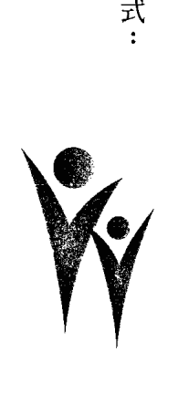

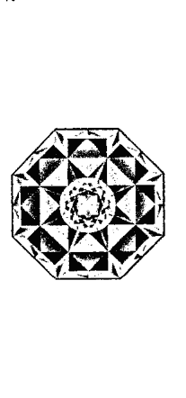

### 參考書籍

笛特瑪·柯磊墨 Dietmar Krämer 著..

- 《新巴赫花精療癒》（自由之丘出版社）
- 《新巴赫花精身體地圖》（自由之丘出版社）
- 《新巴赫花精療癒 第三冊.. 花精，五行與經絡與月線》（Neue Therapien mit Bach-Blüten 3: Akupunkturmeridiane und Bach-Blüten, Beziehungen der Schienen zueinander' Bach-Blütenbehandlung von Kindern）
- 《新巴赫花精療癒 第四冊.. 花精，精油與礦石》（Neue Therapien mit ätherischen Ölen und Edelsteinen）
- 《新巴赫花精療癒 第五冊.. 彩光，聲音與金屬》（Neue Therapien mit Farben, Klängen und Metallen, Diagnose und Therapie der Chakren）
- 《巴赫花精臨床指南》（Bachblüten Praxisbuch）
- 《芳香療法的指南》（Der kleine Ratgeber der Aromatherapie）
- 《瑜伽的智慧》（Die Weisheit der Yoga-Sutras von Patanjali Aus dem Sanskrit neu übersetzt und kommentiert）

笛特瑪·柯磊墨 Dietmar Krämer 及哈根·海滴恩 Hagen Heimann 合著..

- 《新巴赫花精療癒 第六冊：花精、精油、礦石、彩光、聲音與金屬療法》（Neue Bach-Therapien mit Bach-Blüten, ätherischen Ölen, Edelsteinen, Farben, Klängen, Metallen）
- 《新巴赫花精療癒 第七冊：綜觀巴赫花精療法與新療法》（Alles über Bach-Blütentherapie und Neue Therapien mit Bach-Blüten nach Dietmar Krämer）
- 《巴赫花精人格原型》（Bach-Blütentypen – leicht erkannt anhand markanter Patienten- zitate）
- 《脈輪與梵咒》（Chakras und Mantras – Chakra-Heilung durch die Kraft der Urklänge）
- 《人體氣場與巴赫花精⋯人體氣場顏色手冊》（Aura und Bach-Blüten – Das Handbuch der Aura-Deutung）
- 《童心花顏》（導航基金會出版）

#### SoHam 徒手能量療癒
一次就上手！最全面、深入、有效的身心靈保健療癒

- 作者: 哈根·海滿恩 Hagen Heimann
- 譯者: 林碩鍇、鄭惠芬、黃瀚平
- 責任編輯: 席芬
- 行銷企劃: 翁紫紡
- 副總編輯: 劉容安
- 總編輯: 席芬
- 社長: 郭重興
- 發行人: 曾大福
- 出版總監: 郭重興
- 發行: 自由之丘文創事業/遠足文化事業股份有限公司
- 出版者: 自由之丘文創事業/遠足文化事業股份有限公司

地址 231新北市新店區民權路108-2號9樓
電話 02 2218 1417 傳真 02 8667 1065
劃撥帳號 19504465 戶名：遠足文化事業股份有限公司
封面設計 羅心梅
印製 前進彩藝有限公司
法律顧問 華洋法律事務所蘇文生律師
定價 二五〇元
初版一刷 二〇一五年十一月

ISBN 978-986-92045-5-2 Printed in Taiwan
著作權所有，侵犯必究
如有破損缺頁，請寄回更換

國家圖書館出版品預行編目(CIP) 資料
SoHam 徒手能量療癒：一次就上手！最全面、深入、有效的身心靈保健療癒 / 哈根·海滿恩 (Hagen Heimann) 作；林碩鍇、鄭惠芬、黃瀚平 譯. -- 初版. -- 新北市：自由之丘文創出版：遠足文化發行，2015.11面： 公分 -- (InSpirit;17)
譯自：Neue Wege des Spirituellen Heilens.
ISBN 978-986-92045-5-2 (平裝)
1.另類療法 2.健康法 3.能量

NEUE WEGE DES SPIRITUELLEN HEILENS
© 2014 by Hagen Heimann
Complex Chinese edition copyright © 2015 FreedomHill Creatives Publishing House, an imprint of Walkers Cultural Enterprise Ltd., through Hanping Huang.
ALL RIGHTS RESERVED