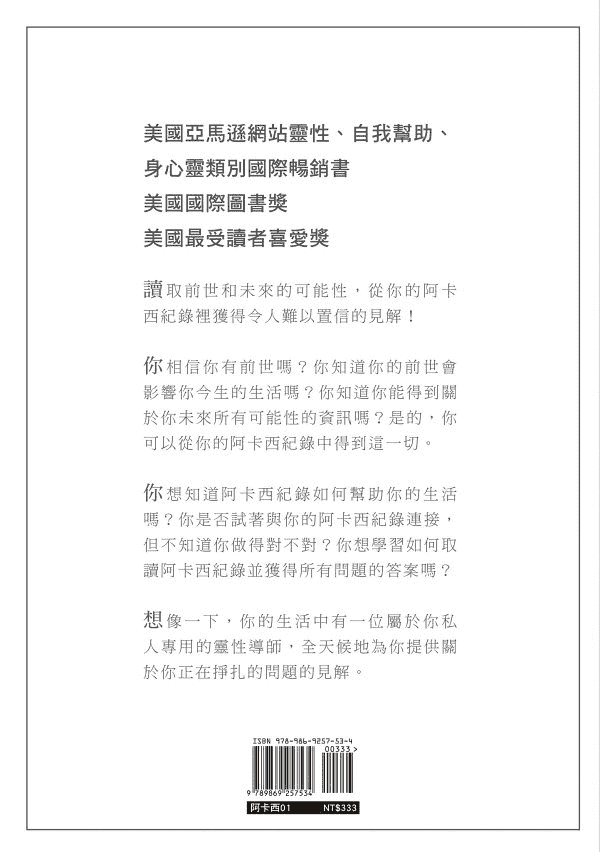

# 打开打开记录的钥匙

## 宇宙阿卡西祈祷文©

亲爱的宇宙光存有，

我们将你们的爱、光与智慧，放在心中。

请帮助我们，相信自己能放下评判，成为一个清晰的管道。

请帮助我们，打开心房与你连接，了解我们存在的真相。

让我们能为万物生灵最崇高的益处来服务。

作者注：这是我在写这本书的时候，从阿卡西纪录所收到的祈祷文，也是我与阿卡莎（Akasha）连结的方式。你将在书的后面了解它的来源，以及如何使用。

## 阿卡西纪录讯息

做你自己！

大胆、好奇！

爱、接受和拥抱你自己！

允许你内在的光芒

继续以一种非常有人性的方式

通过你而闪耀。

彼此支持，彼此相爱，

但不要在其中迷失自己。

做你自己！

宇宙需要你，

一个真正的你，

来持续进化。

这不仅仅是你的进化，

还是所有生物，

以及所有空间和维度的进化。

作者注：这是我在2020年1月1日时，从我自己的阿卡西纪录中所收到的新年讯息。我的纪录引导我，要与世界分享这个讯息。

## 作者序 灵性真理都在阿卡西纪录

这本书的英文版《Your Key to the Akashic Records》于2017年2月在美国出版。出版后，不到几天之内，就在亚马逊网站（Amazon.com）上的灵性、自我帮助，还有身心灵的书籍类别中成为国际畅销书。随后又在同一年获得了两个奖：国际图书奖（International Book Award）以及最受读者喜爱奖（Readers Favorite Award）。那一年秋天，我回台湾探望母亲时，在非常巧的情况下，与一位住在台湾的读者见面。没想到，她竟然是与我一起唸中山女中的高中同学严慧文。我们两个人毕业之后就各奔东西，从未再见，竟然因为我写的书，在36年之后第一次重聚，真是让我感到不可思议！

在聊天当中，慧文告诉我：「我觉得你的书很好啊！浅显易懂，解释得很清楚，精简又有条理，还有免费的视频可以让读者受惠。好的知识可以与大家分享，你有没有想过出中文版？我觉得会对很多人有帮助。」

当时我的回答是：「不太可能吧！这些身心灵方面的知识，我都是用英文学的。对于中文要怎么讲，我完全没有概念。更何况，我离开台湾这么久了，对于所有的事情，都不知道要如何着手了！」

没有想到，才隔几个月，2018年2月的时候，我的第一位说中文的学生，就报名跟我上阿卡西纪录认证课程。于是我开始用中文上课，另外加上英文来辅助教学。那年的夏天，我又收了两位讲中英文的双语学生。我有点纳闷：怎么会突然之间，开始有讲中文的学生跟我上课了呢？

学生对我说：「老师，你有没有计划出中文版的书？这方面的中文书资料很少，如果你出版中文书的话，会对很多人有非常大的帮助！」我心想：「怎么和慧文问我的一模一样……难道又是宇宙的暗示吗……但是出版中文书真的很困难耶！对我而言，比出版英文书还要困难……除非这真的是我需要做的事……」

其实到了这个时候，我心里已经有一种直觉，感觉到这是我必须要做的下一步。但我心里还是有些迟疑，希望宇宙能够给我更明显的提示。于是，2019年4月的时候，在我新开课的班级里，只讲中文的学生比率，突然间大幅度的增加，当时我心里很清楚知道：这是宇宙带给我的最后暗示！

接着，我到我自己的阿卡西纪录里探索：为什么出中文版，会是我下一步该做的事情？这背后的灵性真理是什么？

我的纪录回答：「你会从台湾到美国，住这三十多年并不是偶然。这些经验启发了你灵魂的觉醒，让你踏上灵性之旅，并且让你遇到该遇到的人，提供你许多化解业力的机会，再促进你灵性的成长。这一切都引导着你，走到这一步。如果你愿意的话，你的中文书，它的振动频率，还有其中的内容，可以帮助华人与自己的阿卡西纪录连结，经由向内修练的努力，提高意识、让能量扬升，从而摆脱沉重的业力负担。这不仅是在个人的层面上提升，更包括了种族整体层面的提升。」

与纪录一起工作了这么多年，虽然我很清楚的知道，纪录对我的指导，从来就没有错过，但这个讯息还是让我很震撼。

于是，我跟我的纪录争论：「但是，世界上有很多很有名的阿卡西纪录的老师啊！他们应该比我更厉害，不是吗？应该已经有很多人把他们的书翻成中文版了呀。」

我的纪录回答：「他们有他们可以帮助的人。你有你可以帮助的人。这不是竞争，也不是比赛，而是每一个人各尽其力，做自己可以做的事情。」我很明白，纪录说的是真理，于是开始了中文版的翻译与出版工作。

这本书特别的地方是，中文是我自己翻译的。

很多学生告诉我：「老师，你不用这么辛苦，还自己翻译吧！有很多专门出版身心灵翻译书的出版社，可以找译者翻译啊！」但是我心里想：「如果真的要尽自己的一份力量，用我的书来帮助华人，我应该要从最基本的地方做起。至少，我得了解自己的书，应该如何用中文表达吧！」在我书中提到的很多身心灵的观念，如果连我自己都不知道中文该怎么说，我又怎么知道，别人到底有没有把阿卡西纪录的意思翻对呢？

自己翻译，前前后后花了我大约半年的时间。比我的英文版多花了好几倍的时间，但是我觉得很值得。因为，它的确表达了阿卡西纪录所希望传递的讯息，以及能量共振的频率。而与阿卡西纪录传递出来的能量共鸣，才是能够层层疗愈我们，帮助我们释放包袱最重要的原动力。

无论这本书是在什么样的情况下到了你的手上，我很高兴，我们能有这个缘份以书相会。更衷心的希望，你能够让你的阿卡西纪录带领着你，在不可预期的人生道路上，保持着一颗平静的心，并且充满勇气与信心的向前迈进！

## 前言 我为什么要写这本书？

你希望你有一个24小时，随时有空的私人咨询师，他能够帮助你解决生活中所有的问题吗？跟朋友诉苦虽然很好，也许会有一点点的帮助，但是让我们面对现实吧！到最后你还是必须要自己想办法，自己做决定要怎么办才好。

你想从你的灵魂那儿了解你的下一步最好要怎么走，让你可以在生活中的任何情况下，都能够充满自信地向前迈进吗？

如果你知道如何与自己的阿卡西纪录连结，你就可以获得这些宝贵的智慧了。当你和你的纪录连结时，你可以从你的灵魂中得到，关于你正在挣扎，并且不知道该如何处理的一些事情的建议。

也许你听说过使用祈祷文来进入阿卡西纪录，但是你所读到的祈祷文并没有引起你的共鸣。你认为你做得不对吗？

你是否已经连结到你的阿卡西纪录，但不确定如何从这个强大的资源中获得最大的帮助？

你是否希望能够与自己的阿卡西纪录连结，知道你的答案就在那里，并学习如何有效地使用这些指导？

这就是我写这本书的原因！

在我的灵性旅程中，我遇到了好多对身心灵成长有共同兴趣的人。多年来，曾经有许多人告诉我「你会写书」，或者问我「你什么时候要开始写书？」我总是笑笑带过，因为对我来说，用我的非母语（英文）写书，似乎是不可能的事。

2015年7月左右，在同一个星期内，有三个人问起我的书。这时我才意识到，所有的询问并不是巧合。因此有一天，我决定不再对宇宙说「我不可能写书」。就在那同一天，我收到了一封来自当地一家杂志社的电子邮件，内容是关于一个合作出书的机会。我知道这是来自宇宙的暗示，告诉我现在该采取行动了！于是我同意合作，然后替《你的精神和灵魂的基本疗愈》这本书写了其中一篇文章。

在［把自己放在第一位］这篇文章中，我分享了我在灵性之旅上的挣扎，希望自己的故事能帮助到别人，引导他们的生活。那是我英语写作旅程的开始。那个时候，我自己还在保险公司当精算师。在写这篇文章的过程中，是我第一次有意识地审视我过去十年的生活，也就是我开始灵性之旅的前十年。我不禁想：如果有人正走在与我所经历过类似的旅途中，我的分享将会让他们知道：他们并不孤单。

从那时起，我在网络上写了些部落格，还为我的第二本共同著作的书，写了另一篇文章［用神圣几何找到内在平静］，教人们如何使用神圣几何作为冥想工具。我心里「想与人分享我所知道的事」这个念头，也变得越来越强烈了。

当我的阿卡西纪录，第一次催促我写这本书时，我抗拒它。我心想：「我又不是谁……我哪能写这本书啊？」

当纪录提供给我新的祈祷文的讯息时，我抗拒它。跟全世界介绍一个新的阿卡西纪录祈祷文，这份挑战和责任使我感到恐惧。

最后，我的恐惧被克服了，因为我相信，我书中的信息会对那些一直在寻找它的人有帮助。

阿卡西纪录完全转化了我的生命。我过着我从未想到可能过的日子，我希望你也能拥有这样的生活。这本书是我怀着仆人的服务之心所写下的。我希望它能对你的人生旅程有所帮助。

### 我是谁？

我在台湾出生、长大，深受中华文化、价值观和信仰的影响。1988年，我来到美国攻读精算硕士学位。

之后，17年的婚姻把我从一个充满自信的职业妇女，变成了一个胆小怯懦的囚犯。2005年，我终于找到了提出离婚的勇气，并坚持到底把手续办完。离婚之后，我为了流产而失去的孩子以及破碎的婚姻而悲伤，再加上没能替父亲送终而深感愧疚，对自己愤恨交加。所有这些悲痛有如波涛汹涌般不断地打击着我，让我的内心几乎崩溃，几乎屈膝跪倒在地，即使表面上的我看似正常，并且仍在继续处理日常的琐事。

在面临一种自己即将毁灭的感觉、加上怀疑和好奇心，我开始寻求帮助与答案，我的灵性之旅就这样开始了。2006年3月，我第一次的能量疗愈体验，让我感到震撼。于是我开始上课，学习HealingTouch，替自己做能量疗愈。尽管我是精算师，有个爱分析的头脑，但我很快就体会到，能量疗愈能够帮助我释放压力、缓解困难，对我的生活有非常深刻的改善。然后我与自己灵魂的愈合便开始了！

在接下来的十年里，我用我所学到的不同方式，帮助了许多人。即便如此，我仍然经过了一段对自己灵性天赋的怀疑和抗拒。终于一点一点的……到最后，我学会了接受自己，并接受来自宇宙的天赋。

我从2014年2月起与阿卡西纪录一起工作，于2015年1月开始教授阿卡西纪录课程。后来创立了我的公司「达到内在的和谐Reaching The Harmony Within」，与他人分享我所学到的工具。最后，我清楚明白了，我真正热爱的是什么。于是在2015年7月，我选择从工作了20年的美国企业界退休，全心投入到我的神圣使命，也就是身心灵的工作中。

2016年5月，我重新使用我的中文名字「Jiayuh Chyan」（家钰钱），以对我来自的中华文化传统和我的灵性之旅表示尊敬。同时我也把公司名称改成Jiayuh Chyan，中文名字「钱家钰」。

家钰是我的名字；「家」是指家园或家庭，「钰」是一种宝石。它意味着，我是钱家的宝贝！我的父母给我取的这个名字，是为了表达我的出生给家人带来的喜悦。

然而我来到美国后，却一直使用罗莎（Rosa）这个名字。因为不论我重复说几次，人们都很难把Jiayuh说或拼写正确。我当时还年轻，曾经为自己的中文名字感到非常难为情！

### 我如何发现阿卡西纪录？

在我开始灵性旅程大约八年后的一个夏天，我觉得除了已经提供服务的各种能量疗愈模式之外，我需要找到另一种帮助人的方式。有很多的个案，问我一些关于如何克服生活障碍的问题，但我并没有受过任何可以帮助他们解决这方面问题的培训。于是我越来越希望能够找到一个方法来帮助他们。

我知道我需要一个工具，当我的个案正在寻找答案时，它可以提供一些建议；但我也知道，它并不是一般的通灵阅读或算命。我不确定自己在找什么，便上网查询。当我看到了卡洛琳‧迈斯（Caroline Myss）的典型神圣契约顾问（Sacred Contract Archetype Consultant）培训计划时，我很兴奋，马上就买了典型卡（Archetype　cards）。但是，我收到卡片后，并没有想要使用，便把它放在抽屉里。于是我知道，这并不是我需要的工具。

同年夏天，过了一阵子后，我在网络搜寻时，偶然发现到阿卡西纪录。从第一个网站开始，读到阿卡西纪录的描述时，我就对它很感兴趣。

读了几篇在线的文章之后，我意识到阿卡西纪录和我从小听到的《生命之书》是一样的。在这之前，我一直认为《生命之书》只是老一辈的人讲给小孩子听的一些自编自话的故事而已。我不敢相信它是确实存在的东西。尽管我在网上读到的所有文章，都大肆宣扬阿卡西纪录是如何拥有所有生生世世的信息，以及这些信息对人们有多大的用处，但我还是怀疑它的真实性。尽管我是在佛教文化中长大，并且有转世轮回的概念，但我从未相信「人真的会转世」。

我心想，能够随时随地获得帮助的这个想法似乎是太美好了，应该不是真的吧！但如果它是真的，这将是多么强大的自我力量啊！「如果这是真的呢？」我心想。「如果我真的有过许多前世呢？」、「如果人们确实可以与阿卡西纪录连结，并获得信息呢？」、「如果我真的能从自己的灵魂得到帮助呢？」

能与我的灵魂连接，这想法是很动人的，但对我来说，它仍然是一个谜。为什么我会需要去接近我自己的灵魂？我不是已经有灵魂了吗？我很困惑。我也怀疑我是否能做到。「我只是个普通人呀！难道我们不需要一些特别的神奇力量，来做这件相当惊人的事吗？」我在内心与自己争论。

总之，我又做了更多的搜寻，发现有人在教授阿卡西纪录这方面的课。许多人提供的是在线课程。我并不介意上网络课，但我听了一个采访报导，让人觉得有点害怕，所以就没有采取下一步的行动。被采访的人说，如果你让那些怀有恶意的人进入你的阿卡西纪录，那么他们可能会把你弄得一团糟。我不想把自己给搞砸了，所以告诉自己，还是别再去想这件事了吧。

六个月之后，我去麻塞诸塞州参加一个工作坊。在午休期间，我问了同桌吃饭的人，是否有人听说过阿卡西纪录？结果工作坊的主办人回答说：「有啊，我们的中心有提供阿卡西纪录的课程。我自己也上过课。这课程太棒了！明年2月，我们将会开初级班的课。帕蒂是一位很杰出的老师。」

不用说，我简直不敢相信自己的耳朵。但我觉得，当时会开车三个小时，去参加那个工作坊，已经是够疯狂的了。在新英格兰冰天雪地的情况下，我再跑一趟这么远的路的可能性几乎是零。所以我放弃了这个想法。

隔年的1月，我开始给予一个朋友全家在情绪和经济上的支援，这替我每天的生活带来了令人难以置信的混乱。为了暂时摆脱一切的疯狂，我决定参加即将在麻塞诸塞州举办的阿卡西纪录的课程，这样我就可以逃过一个周末。我的朋友派特想在那段困难时期支援我，所以她和我一起去了。

就在那个初级班的课程里，我遇到了帕蒂‧柯林斯沃思（Patty Collinsworth），我的阿卡西纪录启蒙老师。她在我的阿卡西之旅上不断的支持我，我永远感激她的爱。

在上初级班之前，有指定我们必须要阅读琳达‧豪儿（Linda Howe）的书《如何解读阿卡西纪录》（*How to Read the Akashic Records*），这相当于是我们上课的教科书。

我照着要求，看完这本书，并做了一些练习。这本书很吸引人，也很容易理解，但像你一样，我并不确定我是否把练习做对了，因为我什么也感觉不到。因此我迫切地想知道，在课堂上的体验与我自己看书会有什么不同。

在开车去麻塞诸塞州上课的途中，我和派特分享了，我担心别人在我的纪录里动手脚，把我搞砸了的恐惧。我们俩谁也不知道到底会发生什么事。因此，当帕蒂带领我们在课堂上做「打开纪录」练习的时候，我非常的惊讶，因为我不仅能够感觉到什么，甚至也看到了影像。

为了想要理解在做练习的时候发生了什么事情，我问了帕蒂很多问题，她很有耐心地回答了我所有的问题。还与我们分享了许多她的实际经验来做例子。在我的眼里，帕蒂看起来非常年轻，我十分的好奇，她是如何在这么年轻的时候，就学会教授这种很酷的东西。

帕蒂帮助我了解，阿卡西纪录是由「光存有」保护着，以确保纪录的完整性，永远不会受到损害。那对我而言，简直是天大的好消息！于是我的恐惧感消失了。

更出乎意料的是，我从我的纪录中收到建议：我需要成为一个像帕蒂一样的认证导师，教授阿卡西纪录课程。这个建议是当帕蒂引导我们做练习，问我的纪录「为什么我在人生中的这个时候学习阿卡西纪录？」时，我的纪录在我的脑海中与我谈话时，我所「听到」的内容。当时的我，深感困惑和慌乱，心想：「这到底是怎么一回事？」

尽管我不想相信纪录的建议，要成为一个阿卡西纪录老师，但我不禁问自己：「如果这是真的呢？如果我是注定要当阿卡西纪录老师呢？」

我的心中有太多的疑问了！我不仅在课堂上问帕蒂。回家后我仍然通过电子邮件继续请教她问题。我特别想知道的是，有关帕蒂已经完成的，琳达‧豪儿的导师培训。帕蒂多次耐心回答了我所有的问题，给了我很大的支持。

两个月后的2014年4月，我终于决定注册，开始琳达‧豪儿（Linda Howe）的导师培训在线课程，并进行了最后的要求，接受亲自在场的面对面培训。最后，我在2014年10月2日，获得了我的第一个阿卡西纪录师资证书。经由这个课程，我遇到了弗兰‧弗里德曼（Fran Friedman）、林恩‧格罗布斯基（Lynne Grobsky）、格温多琳‧希尔（Gwendolyn Hill）和萝拉‧霍斯福德（Laura Hosford），他们都和我一起毕业，成为认证老师，这些人稍后对我非常重要。

毕业之后，我以为已经把阿卡莎的内容学完了。我一点儿也不知道，那仅仅是我在阿卡西纪录之旅的开始。接下来，我加入阿卡西网络（The Akashic Network, TAN ），成为那儿的阿卡西纪录认证老师，一起合作进行课程发展，并教授TAN的课程。

那时我心想，这次一定对了吧。这一次，我应该学完所有关于阿卡莎的课程了吧。但我又错了。没有想到阿卡西纪录现在又引导我写这本书，来分享阿卡西光芒的另一个层面！

如今，我终于意识到，在阿卡西领域里，有无限的维度。随着我们不断地成长，并培养与阿卡西纪录的关系，我们就会在阿卡莎里越走越深入，不断抵达新的地方。而且，纪录总是能依照我们能接受的程度，循序渐进地带领我们向前行。因此，我邀请你保持开放的观点，让你内在的智慧指引你生生世世的旅程。是的，生生世世！

### 阿卡西纪录如何改变了我的生活？

在我学阿卡西纪录之前，我从事各种能量疗愈工作已经有八年的经验了。我觉得我对人生已经有所领悟，生活也已经转化了许多。那时的我，信心满满，我认为，自从离婚以来，我已经经历了很多的灵性成长和觉醒。我压根儿不知道，当阿卡西纪录开始指导我迈向人生旅程以后，更重大的转变才将到来。

在学会如何与阿卡西纪录连结后的前三个月里，我能随时从我的纪录获得指导，它简直就是我的救命热线。前面提过了，在那段日子里，因为我向那个家庭伸出了援手，我的生活每天都充满了错综复杂的问题。毫无疑问地，当时如果没有纪录的引导和支持，我绝对无法度过那段时期。

回顾有了纪录以来的生活，我常忍不住对自己笑着说：「包装盒子」上应该有一个标签：「警告！你的生活将会永远不一样。准备迎接你一生的蜕变，系好安全带吧！」

在我的能量疗愈工作中，我总是会接收到视觉上的影像，但我从来没有想太多。通过我与纪录的工作，我了解了，视觉影像就是我的纪录与我最有效的沟通方式，因为对我来说，它是最直接的，也不需要语言解释。因此「看见」是我接收信息的主要方式。随着我应用纪录技能的进步，我慢慢开始通过听觉、感觉和心里知晓等其他方式来接收信息。

自从我与纪录一起工作后，我的「小我」逐渐与「神圣源头」融合，让我即使在最困难的情况下，也能够保持清晰的心境。把「小我」和「神圣源头」整合在一起，这个过程挺花时间的（我们将在书的后面讨论），但我仍然一点一滴，一层又一层的朝着这个方向不断的努力。经过这样的内心修练与成长，帮助我能够接受自己，也更善于表达自己。正因为如此，我能够不带任何评判，去看到人性善良的一面；更能仔细倾听我的心，也找到了勇气，去尊重自己的灵性智慧与权力，尽管这意味着，有时我必须做出痛苦的决定。

从一开始，我的纪录就激励我一步一步地走，并一次一次度过危机并迈向新的里程碑。他们在我需要继续前进时，扮演一个很重要的角色：先是离开美国企业界，再来是停止教授琳达‧豪儿的课程。

经由阿卡西纪录，我与一部份的灵魂家族团聚，也就是我前面提到的那些女士们：弗兰‧弗里德曼，林恩‧格罗布斯基，格温多林‧希尔和萝拉‧霍斯福德。

我在纪录中的工作所带来的个人和灵性成长，使我体会到重新使用我的出生名字「家钰」，并放弃我的英文别名「萝莎」的重要性。

在我的房子发生了一场毁灭性的火灾之后，纪录帮助我学会了，如何超越自己混乱的情绪，如何观察自己的行为，然后看出隐藏在灾难背后的灵性真理。

纪录鼓励我，走出自己习惯的安全舒适区，面对我从未想过我能克服的挑战，包括写这本书。现在，我很荣幸能为你服务，并将这宝贵的资源带入你的世界。

### 为什么现在要出这本书？

选择停止教授琳达的课程，是我不得不做的一个最艰难的决定。她的课程替我打开了阿卡西纪录的大门，帮助我早期的学习。

尽管我的阿卡西纪录对于离开琳达的工作表示得很明确，但在不知道未来将会如何发展的情况下，遵循这个特别的指导需要的已不仅仅是勇气和信任了。帮助我做出决定的一个关键是，我知道我必须这样做，才能继续前进。

我心里知道，我想做的是回应我灵魂的呼唤，并向完成我这辈子的神圣使命更近一步。尽管这意味着，除了因为要离开我的老师而感到心碎之外，在事业上又要重新开始，还有很多艰苦的工作要做。2015年9月11日，我正式停止教授琳达的课程，开始让我能与新的祈祷文：阿卡西读取祈祷文©（The Akashic Access Prayer ©, AAP），一起工作。不过，它和我在这本书里用的祈祷文不同。关于这一点，我稍后再作解释。

2015年7月15日，与我从琳达的导师培训课程同期毕业的弗兰‧弗里德曼，在她的纪录中收到了阿卡西读取祈祷文©。弗兰接着创立了阿卡西网络（TAN），然后弗兰被引导着与我、林恩、格温多林和萝拉分享这个新的祈祷文。我们五人共同组成了阿卡西网络‧光的理事会（the Akashic Network Council of Light, ANCL），并在纪录里的群体意识中合作，发展了TAN的阿卡西纪录认证课程。

作为阿卡西网络‧光的理事会一员，这项工作帮助我更深入地了解纪录。我教的课程也因此更扎实，而公开的讨论也满足了学生的需求。这个经验也点燃了我寻求灵性真理的渴望，同时学会了如何在纪录中做得更有效率。这段历练无疑带着我进入了下一系列的灵性觉醒。

多年来，我已经做了许多能量疗愈的工作，但自2016年初以来，我被吸引到主要专注于大角星疗愈（Arcturian Healing）和神圣几何启动（Sacred Geometry Activation）。大角星疗愈法是一种透过大角星（Arcturus）恒星星系上的灵性存有所引导的高维度的光和频率，而进行的疗愈方法。这种光和频率是多维度的，可以在人体能量系统的许多层次上发挥作用。神圣几何是重复的几何图案，是我们物质世界的建造基石。每一个形状在振动的共振频率上都是独一无二的，也是照着我们的脱氧核糖核酸（DNA）蓝图而编成的码。我们每个人都有一个神圣几何的能量场。当能量场被启动时，神圣几何就是推动我们扬升过程的关键工具。在这本书中，扬升指的是达到更高的意识层次。

我所提供的大角星疗愈和神圣几何启动的工作坊，以及我为自己所做的向内修练的工作，都加强了我与纪录的连结。因此，纪录帮助我看到了一个，比我以前所知道的更大的画面。纪录向我展示了超越地球，从宇宙层面来看待一切的观点。

在这段期间，我教授的阿卡西纪录课程越多，为学生回答的问题就越多，我就越觉得有必要，也愿意与更多人分享我所知道的事情。

在开始筹划这本书之前，我以为，我只是要写一本有关我自己人生历程的书。你知道，就只是和你分享我的人生故事而已。然而，在准备阶段期间，我意识到，我需要写的是一本关于阿卡西纪录的书。那时的我确信，这本书的内容是要讲阿卡西读取祈祷文©等等。我甚至和弗兰进行了很好的交谈，并得到了她的许可，让我能在写作中使用阿卡西读取祈祷文©。

本以为就是这样了，所以当我的阿卡西纪录告诉我，将为本书提供新的祈祷文时，我感到无比的震惊。但很快地，我立刻被恐惧淹没了。我担心这是一个错误。我害怕向世界介绍新的祈祷文所带来的责任。「恐惧」对着我大喊：「我又是谁？有什么资格做这件重大的事？」

使用新祈祷文的指示，是在我与那时的朋友林恩‧格罗布斯基（Lynne Grobsky）在做例行的阿卡西纪录交换阅读时所得到的讯息。我想拒绝这个替人类服务的要求，所以我通过林恩与纪录争论，并质问纪录为什么我需要向世界介绍这个新的祈祷文。答案是：「这是将新的阿卡莎光芒带入世界的下一步。」当时我有太多复杂的情绪，忍不住哭了五分多钟。可怜的林恩也和我一起流泪。

这本书和伴随着写在内文第一页的新祈祷文，也就是宇宙阿卡西祈祷文©，所有这些传来的信息，都是努力合作的结果。靠着一群人灵魂的神圣契约，才得以实现这一切。所有在我之前寻求灵性觉醒的同行者，都在帮忙开拓前进的道路，好让这个新的祈祷文可以被传达出来，而进入我们的世界。

我只不过是一个传达讯息的人，只是想与你们分享，纪录希望我们在人类历史中的这个时代，所该知道的内容，这是我神圣使命的一部分。这样一来，许多一直在寻找这些信息的人，就可以拥有这些讯息，并为所有万物生灵最崇高的益处来服务，帮助大家继续向前进。

现在比以往的任何时候，都更需要我们与灵魂家族重聚，以完成扬升过程所需的生命课题，并协助地球疗愈。

灵性觉醒的同行者们，请继续读下去，自己来发现吧！

## 第一章 什么是阿卡西纪录？

### 转世轮回，再来一次？

在我们开始谈阿卡西纪录之前，我们必须先讨论转世轮回的概念。我们都有一个身体，也都有一个灵魂。当然啦，我们的身体是肉眼可以看得到的，但我们的肉眼却看不见我们的灵魂。我们都知道，我们的身体有一天终究会死亡；但大多数的人并不知道，没有了身体，我们的灵魂会发生什么事，会到那儿去。

我是在台湾的佛教文化中长大的；那里有一些人相信轮回，有些人不相信。我不知道该相信什么，所以在我从事阿卡西纪录工作之前，对我来说，这一直是一非常模糊不清的主题。　　

记得吗？我以前是一位精算师，从事数字和公式的专业工作。我的专长是做资料分析来解决问题。我生命中的一切大小事，都需要有逻辑的客观证明。但是从与我的阿卡西纪录一起工作的经验里，我知道我的灵魂确实已经轮回了许多世。一开始领悟到这一点的时候，我心里的感觉其实是很奇怪的。我心想：「转世轮回原来是真的，但就算我现在知道了，那又怎么样呢？」

那么，为什么我们的灵魂要轮回，转许多世呢？

原因就是，灵魂是看不见也摸不着的一种纯粹的能量。灵魂必须暂时存在于我们的身体里，才能体验到物质世界。经由人类的情绪，灵魂才能体验到感觉。但不只是这些原因。正是通过我们称为「人生」的学校，灵魂才能从那些起起落落中学习。这个体验人生的经验可以帮助我们的灵魂成长。

因此，在每一个「人生」之前，你的灵魂会决定这次要学习什么课程。它在这一生选择了你，是因为你是进行这些课程的完美人选。

### 从灵魂的角度上来看，我们都是相互连结的

当我刚开始走上我的灵性旅程时，我并不明白为什么人们常常说：我们都是相互连结、彼此一体的。2015年的秋天，我和不同的人谈起我们的灵魂、超灵魂和一体等等的话题。我花了一些时间研究这些主题，仍然无法了解，特别是包含所有人类灵魂的超灵魂概念。

有一天晚上，我正在快转电视频道换台时，碰巧看到了科学频道上的「地球是如何形成的？」节目，这类型的节目当时吸引了我的注意。这个节目内容有一部分是事实，但也有一部分是假设，譬如大爆炸理论。不管地球是否确实是根据这个节目的描述所形成的，但它帮助我了解到，为什么从灵魂的角度上来看，我们人类都是互相连结的。

想象一下在宇宙最先开始的时候，那时除了大气、气体和能量之外，什么都没有。那时，一切都以能量的形式出现。然后重力开始把粒子结合在一起。不管发生了什么事，无论大爆炸是否真的发生过，科学的事实是：原子结合在一起成为元素，元素结合在一起成为分子，然后分子结合在一起成为物质，这就是我们物质世界中的一切。

因此在物质构成我们有形世界以前，我们都来自于宇宙中相同的能量，这个看法是很有道理的。尽管今天在物质世界之中，我们每一个人作为个体，彼此之间被身体分开，但从能量的角度来看，也就是从灵魂的角度来看，我们都是一体的，我们都是相互连结的能量。

科学事实也告诉我们：除了我们自己银河系的太阳系之外，还有其他的恒星系统。除此之外，还有其他星系。所以我们能从地球上观察到的，只是宇宙中很小很小的一部分。

现在让我们停下来思考一下，想一想：宇宙这么大，我们的灵魂只有在地球上的经验的可能性有多大？

是啊，再想想吧！

### 什么是阿卡西纪录？

阿卡莎的发音来自Akasha，是梵文，是名词，指的是天空、空间，或者是一个开敞的地方。它是物质世界中万物的基础与本质。所有的东西都是从它所包含的精微能量所组成。它是宇宙中永恒而持久的记忆，收藏着自诞生以来在生命中所发生的一切，不论是在地球上或宇宙中，以及所有尚未发生的事情。

有些人把阿卡西领域称为宇宙信息，或是集体意识的领域。因为阿卡西纪录是以能量振动的方式，详实记录下所有的思想、事件，以及灵魂经历的所有人生的经验，还包括了过去、现在，以及所有未来的可能性。另外，它也包含了灵魂在被生活的经验和影响掩盖之前，最初的本质与蓝图。

尽管阿卡西纪录从宇宙开始以来就以已经存在了，但在历史上只有极少数意识高度进化的人，才能获得对纪录的读取权。这是因为，当时的人类并没有足够高的集体意识，无法为整体更大的利益着想，来明智地使用阿卡西纪录中的信息。然而，随着岁月的经过，人类在灵性上的进化越多，纪录赋予我们的读取范围就越广泛。

每种生物都有自己的纪录。土地、商业、建筑物、大自然和地方，都有自己的纪录。虽然目前阿卡西纪录已经授予每个人，有查阅自己阿卡西纪录的权力，但是，替别人查阅他们的阿卡西纪录是一种特权与荣誉，因此在替别人查阅的过程中，需要非常小心谨慎。稍后，你将会学习到在各种情况下所需要遵循的准则。

既然阿卡西纪录保存着我们所有人生的纪录，那么，可以获得到的讯息就不只限于在地球上的「人生」了。然而，根据经验，任何阿卡莎会透露给我们的讯息，都是和我们目前正在努力理解的事物有关；而且，**只有当我们准备知道真相的时候，才会透露给我们知道**。任何对我们的下一步行动没有帮助的事情，我们的纪录是不会和我们分享的。

### 如何进入阿卡西纪录？

在这个世界上，要进入阿卡西纪录有许多不同的方法，关键在于哪一个方法最适合你。有些人可以通过冥想和纪录连接，有些人是运用催眠术。另外，有些人是发生在能量疗愈的过程中。也有些人不需要藉助于任何外界的方法，很自然就能收到纪录给的讯息。

此外，也有人使用祈祷文。从不同的机构与书籍之中，有许多可以选择的祈祷文。这完全取决于：哪一个祈祷文最能引起你的共鸣。在这本书中，我们使用的是宇宙阿卡西祈祷文©，也就是我在本书一开始就写出来的祈祷文。稍后，你将会学到要如何使用它。

### 亲手做练习！打开自己的纪录练习Exercise＃1

这个练习的目的是，让你先试试看，先有一些初步的经验，才不会被任何期望压得喘不过气来。我们将在稍后介绍更详细的说明。请把宇宙阿卡西祈祷文©（这本书一开始就列出来的祈祷文）准备好，跟着以下的步骤来做：

*   把祈祷文唸一次，请唸出声音来。
*   设定意念来跟你的阿卡西纪录连接。你可以对自己说：「我要跟我自己的阿卡西纪录连结。」
*   想象着：你的阿卡西纪录的光要来跟你连结，从你的第八脉轮（相当于，你把手臂向上举过头顶时，大约在手指头的位置）下来，到你的胸口和你的心连结。接下来，这个光把你的心与你的意志力连结（你的胃部，在你的胸部下面，也称为太阳轮）。接下来这个光继续向下走，与你的小腹连结（在你的肚脐下面，也称为脐轮）。 接下来这个光继续的向下走，到地球的中心与大地连结。你觉得自己像一棵大树一样，非常的巩固扎实。接下来，把你的注意力转回到你的心上，看着这个光，把你的心与「神圣源头」连结。
*   你可以用想象的，或是用你心灵的眼睛（第三只眼睛在你两眉之间），来观察你四周的景观。观察之后放松。
*   在你的纪录里等，等个3分钟。
*   跟宇宙光存有表达最深的感谢。
*   设定意念把自己的阿卡西纪录关起来。你可以对自己说：「我现在要把我自己的阿卡西纪录关起来了。」
*   再唸出「我们完成了」这个句子来结束练习。
*   写下来：你从纪录里得到的感觉或是经验。

### 信息、意念、意识、和能量

在阿卡莎里记录下来的信息无所不在。它既在我们的内心，也在我们的外在。你可能会问：「那我为什么不知道呢？」或者「为什么我从来没有感觉到它呢？」这是因为你从来不曾有意识地去与它连接。

在阿卡西纪录中的资料，可以看成是在图书馆书架上的几百万本书籍。如果你不去拿那本书，你就读不到它了，对吧？一旦你拿到了这本书，你仍然需要去读它，了解它，其中的资料才会变成有用的信息，这就像你在学校或其他地方学习的方式一样。听起来很简单吗？是的，的确就是这么简单。

但是你可能会想：如果每个人都能读取自己的纪录，为什么还必须学习怎么做才能读取？答案是：阿卡西纪录中的资料是处于更高意识的维度里。如果我们的意识水平不像阿卡莎那么高，我们就需要一把钥匙，来帮助我们调频到阿卡莎的领域。我们在本书中使用的钥匙，就是宇宙阿卡西祈祷文©。

我们的意念在这里发挥了一个很重要的作用，因为它可以促使意识行动，这有点像我们在启动车子的时候，车子的钥匙一转，一点火，就能启动汽车的引擎了。设定意念是建立心灵与头脑的连结，它可以让你深入了解，而且融合心灵的智慧，让你能够使用你的大脑，让左右脑两边同时和你的神圣本质连接。头脑与心灵的连结让我们能够提高我们的意识维度，才能收听到阿卡莎的讯息。

什么是「意识的维度」？意识，简单来讲，就是觉知。我们的大脑以科学家并不完全理解的方式，处理各种令人惊叹的工作。例如：脑部内有不同的功能区域，如记忆、逻辑、语言、艺术、情感等等。我们知道人类会思考、感觉、接受来自不同地方的信息、能够将我们所学的知识融会贯通，然后将其应用到新的事物上。朋友们！这就是意识在一个我们肉眼看不到的维度中发挥作用。我们看不到也碰不到它，却不能否认它的作用。

你可能会像我一样也想知道：如果阿卡西领域不是一个人，它怎么会有意识呢？它的意识是从那里产生的？它来自你、我、你的朋友、你的邻居、你的邮差、你的父母、你的爷爷奶奶、来自所有星球的祖先、猫、狗、松鼠、树木、房子、山脉和土地。是的，它来自世界各地和每个人的意识，也包括源头（Source）与神圣（Divine），因为我们每个人都是「神圣源头」（Divine Source）的一种表达。因此，连接到阿卡西纪录的宇宙意识，我们就连接上了「神圣源头」。当我们有意识地仔细聆听纪录的时候，我们同时也能够聆听到万物的「神圣源头」。

经由我们的意识来获取资料，这个动作就会产生能量。

回到图书馆的比喻，你的阿卡西纪录就是书架上的书。当你有一个特定的问题时（**你生活中的挑战**），答案（**信息**）就在某一本书里面。你会先查询图书馆的计算机，并找到这本书（**用一个工具或钥匙有意识地调整到宇宙意识**）。你走到书架的目的（**意念**）就是要找到并且拿到这本书（**心与脑的连结伴随着意识流动的能量**）。

为了帮助你更了解，如何提高你的意识水平，并进行你的阿卡西之旅，我提供本书的读者一个免费的视频系列，称为「开启门」。你可以到这个网址注册接收[www.jiayuhchyan.com/chinese-home](https://jiayuhchyan.com/chinese-home)。

## 第二章 阿卡西纪录如何帮助你？

还记得你的灵魂是如何从所有的生活经历中成长的吗？

有时候，人生的动荡起伏就像在体验云霄飞车，会让人害怕得想要闭上眼睛。但是，你的阿卡西纪录可以由你的灵魂动员来供你使用，是一种值得信赖的人生指南。当你知道，自己不必盲目地度过人生，你感觉如何？

### 连接阿卡西纪录的实际好处

有些个案告诉我，他们在第一次做阿卡西纪录咨询之前，会紧张得睡不着。当我问为什么的时候，他们会说：「我怕我的灵魂对我所做的一些事情，会感到不满意。」或者：「我担心纪录是否会告诉我坏消息。」或者：「我不知道我是否能接受真相。」

别紧张！不会发生什么坏事的。你的灵魂最了解你。它确切地知道你正在经历什么，也清楚你为什么要做你所做的事情。你的灵魂非常爱你，这就是为什么它选择了你的原因。

与你的灵魂在纪录中一起工作的宇宙光存有也清楚地知道，哪些信息在哪个时间对你是最有益的，才会将这些资料传达给你。而且，只有当你准备好要接受的时候，才会透露给你此时此刻所需要的相关信息。另外，你收到的信息深度，还取决于你与纪录的工作关系。

不过，最重要的是，你要明白，纪录不会告诉我们该怎么做，只会告诉我们特定情况背后的真相，我们必须自己决定该怎么做。

举个例子，南茜来找我做阿卡西纪录咨询。她对自己的工作感到非常灰心，因为一个经验比她少的人，竟然得到了她觉得自己在多年前就应该得到的升迁机会。她的老板听说她不高兴后，就答应她，一年后会让她升职。

南茜这样对纪录说：「我认为我老板不会遵守诺言。我做这份工作已经这么多年了，如果会的话，他早就提拔我了。我现在可以做点什么事，来确保我得到这个我应得的升迁机会？」

纪录问：「你的老板有说你要怎么做才能获得升迁吗？」

南茜说：「我必须加班来证明我值得升迁。」

「事实上，你的老板不提拔你，这是在帮你。」纪录说。

「什么？」南茜脱口而出。

纪录继续说：「你不仅在升迁前要加班，之后也要加班。你真的想在办公室待到很晚，或者经常把工作带回家，没时间和家人一起享受家庭生活吗？」

「不，其实我不想，」南茜说。「经过这么多年的漫长工作，我已经精疲力竭了。但这么多年的努力，这是我应得的。以前我非常努力工作的时候，我没有要求升职，现在我却错过了机会！」

「为什么你以前不要求升职呢？」纪录问。

南茜说：「我心想，如果我努力工作，老板应该会注意到，不需要我自己去要求升职。」

纪录问：「如果你必须去争取你应得的认可，你会有什么感觉？」

「我会觉得自己像在乞讨。这让我感到很不舒服！我不知道，我就是做不到……」南茜紧张地把双手紧紧地握在一起。

这次南茜与纪录的谈话，帮助她看清楚，她升职问题背后的真正问题，是她不能勇于表达自己。这是从她的许多前世经历所累积下来的结果。

在了解这些前世的生活经历，以及她为什么不能勇于表达自己、替自己说话之后，南茜得到了一种解脱感和一份新的希望。南茜的纪录建议她要注意，开始多做一些照顾自己的事情，这会帮助她提高她的自尊心，并且平衡她前世的因果业力。

南茜可以忽视她纪录的建议，继续像往常一样。或者，南茜可以把她纪录的建议放在心上，开始照顾自己，增加她的自信心，最后学会勇于表达自己。这是她的选择。

我很高兴与大家分享，南茜选择了后者。经过一段时间之后，她觉得自己已经更有力量了，不会再受到别人的打击。六个月以后，当一位经理试图将公司急于解决、像烫手山芋般的问题归咎于她时，她已经能够鼓起勇气，站起来为自己说话。如果南茜无法靠自己的力量站起来，这个结果就会大不相同。但在这时候，她已经能够勇于维护自己的名誉，并赢得该有的尊重。

你的纪录能够帮助你，在你的职业生涯、关系、财务、健康、决策等方面，得到更完整的信息，进而帮助你做出更有智慧的决定。南茜的故事只是众多例子之一。

另外，除了请你的纪录提供指导之外，你还可以在纪录中做一些事情，来加深你的体验。虽然这不适合每一个人，但当你被吸引到这样做的时候，在纪录中做冥想、疗愈或创造性的工作时，会有很好的效果。

### 灵性好处：发挥你灵魂成长的最大潜能

当你在人生旅途中思考生活的各种方向时，可以在你纪录的帮助下做出最好的决定。透过重新与自己的灵魂以及它累世的智慧连接，你可以更了解自己。

从人生所有的曲折中，你会变得更有智慧、更镇定、更接地气、在情绪上更加泰然自若，因为你记得，你真正的自己是谁：一个在地球上，体验实体与物质世界的灵性存有。

你明白，人生只是一种「提高你的意识，帮助你能注意到这个灵性真理」的经历。在地球上生活的所有经验中，你不断地学习与成长，接着就能顺利进入你下一个阶段的灵性旅程！

为了加快学习速度，我们的灵魂通常会在生活中添加一些混乱。

2016年5月26日凌晨4点多，我被一种听起来很遥远，但非常清晰的电击噪音惊醒。几秒钟后就停电了。我抓着手电筒，走到地下室，看到电源总开关的门上闪着灼炽的黄光。911电话中的火警人员叫我马上离开屋子，我就照做了。

我在外面空地等待的时候，熊熊烈火就从地下室穿过墙，一直蔓延到一楼。站在前院窗外的草地上，看着我的书房被火焰吞噬，我的脑海里闪过许多念头，简直不敢相信这是真的。就在绝望的时候，我与我的阿卡西纪录连结，并要求宇宙光存有，帮助我保持理智。我当时能做的只有暂停所有的想法，强迫自己别去想「为什么会发生这种情况，接下来又会发生什么事？」这就像在看电影一样，但它却真的发生在我的身上。

火灾发生后的头几天，我还处在心神不宁的震惊状态中。尽管我的日常工作与生活仍然照常在运作中，但我的专注力、理解力和沟通的能力却下降了。

书房是我计划、设定策略、写作和梦想的地方。桌子上还放了一些对我最有鼓励作用、最有纪念意义的东西。但现在它们全部都被烧毁了。虽然我在理智上明白：这「只是」一张我过世父亲的照片，「只是」一个刻有他名字的时钟，还有「只是」跟我亲如女儿的朋友和她丈夫在母亲节送我的杯子，但在感情上，我还是觉得非常伤心。

房子被大火烧过，已经不能住了。我找了家旅馆安顿下来，并写下火灾之后，处理善后需要做的所有事情。当我伸手要去拿我的每日行事计划本时，才想起来，这计划本已经在大火中被烧掉了。在那一剎那之间，我坚强伪装起来的保护墙，顿时被现实打成碎片。我的心万分绞痛，开始抽泣。然而我真正哭泣的，是因为感觉我的希望破灭了。

火灾发生的三天后，我终于有一段和自己独处的时间，想办法安抚自己的情绪。一开始，我先用我的声音，在我的阿卡西纪录中唱颂，来释放创伤。然后，我用我的意念，请纪录把我带到一个时空，让我可以找到力量，来帮助我度过这场悲剧。接着，我请我的纪录帮助我了解：为什么会发生火灾？以及我可以从这次经历中学到什么？最后，我请宇宙光存有，帮助我释放掉混乱的情绪，来结束这段自我照顾的疗程。

在那个时候，我的情绪可以说是非常的激动，因此在做这个火灾后第一次的阿卡西纪录咨询的时候，有很多纪录里的讯息是我无法理解的。但是，我所得到的是极大的安慰和谅解。感觉我纪录中的宇宙光存有，知道我正在经历些什么。他们一直告诉我「这一切都会好起来的。」到现在他们仍然这样告诉我。在写这本书的时候，我正在办理法院正式的火灾损失评估程序，这意味着我可能要到火灾发生一年多之后，才能重新回到自己的家里。

我如何面对这一切的挑战呢？

我在纪录中的工作发挥了重要的作用，它指导我，让我能给自己需要的时间向内修炼，处理内心的感受。不要让原始的负面情绪到处蔓延，也不要让情绪继续恶化。来自光存有的爱、智慧、支持和安慰，帮助我恢复、接受，最后终于再次建立起情绪上的稳定基础。

随后，纪录带领着我，向后退一步，来观察自己的情绪。看看我是如何因为情绪的影响，而做出反应或表现的？以了解情绪对我造成了什么样的影响。纪录帮助我明白：如果我想改变世界，我必须要求自己，有更高的情感成熟水平。它帮助我看到：只有放下心中对任何事情发展结果的执着，我们对事情的考虑才会清晰。

许多人已经感觉到，不论是不是人为的，我们的地球在经济、环境、政治各方面，正在经历越来越迅速的变化。它不仅在全球的范围中发生，也发生在我们的周边环境当中。因此，培养我们在一个混乱的世界中运作的能力，变成了帮助我们更能面对这些快速变化的重要关键。

阿卡西纪录帮助我们发展出一种技能，使我们能够超越自身来自于人类天生不自主的动作、反射性的情绪，让我们能够在任何的动荡中，重新获得清晰的意识。这也是发挥我们灵魂成长中最大潜能的关键。

### 目标：明白「经历你的人生」，是你的最高目的

有的人生活过得顺心如意，有的人活得很辛苦。有些人要忍受身体的疾病或限制。有些人有经济困难。有些人受到身体、精神或情感上的创伤。有些人觉得自己不属于地球这个地方。有些人认为老天爷很不公平。普天之下就是有如此广泛的不同遭遇和经历，虽然许多人在挑战和障碍中努力耕耘，但也有一些人放弃希望，只想消失或逃避人生。

事实是，你在地球上，是因为你有工作要做。我们每个人在地球上都有一席之地和目的。我们的灵魂同意在地球上生活，不仅是为了个人的灵魂进化，也是为了我们的灵魂群组（soul group）的集体发展。

几乎每个人都想知道自己的人生目的。棘手的是，虽然我们都有人生目的，但这并不意味着，它是要让我们找出来的。你真的知道自己的人生目的吗？

现在让我们来想一想：你的灵魂化身是因为它想尽人类最大的力量来学习更多的东西。那么，为什么要限制它，并且限制你的潜力呢？

一旦知道了你的人生目的，就好像你有了一个目标。你会开始追逐这个目标，并且对于你是否能达到终点非常执着。但是，我们从来没有想过，对一个特定结果的执着，反而会限制了你可以完成其他更重大事情的潜能。

此外，自由意志是作为人类所享有的特权之一。每一分钟，随着我们做出的决定并采取行动，所有未来的可能性都会随之改变。这一切都在不断的变化，而且完全取决于你的选择。

假设你的人生目的似乎遥不可及，看起来简直是无比的荒谬、根本是不可能的事，如果让你事先知道了，你只会抗拒它，马上就掉头放弃了。那么，让你事先知道反而没有好处，不是吗？

因此，找到你人生「真正目的」的方法，就是一步一步遵循神圣的指引，来经历你的人生。放开对任何结果的执念，让一切自然的展开。

这种了解对于转世到地球上的「星际种子」特别重要。就本书而言，星际种子是指，它们的灵魂第一次化身时并不是在地球上。星际种子是指，灵魂的原始家园行星是在其他的恒星星系，或来自其他的银河星系。

在形而上学（metaphysics）讲到扬升时，星际种子是一个经常用到的术语。星际种子是像你和地球上其他人一样的人。然而，对于星际种子来说，唤醒他们灵魂的起源是至关重要的，这样他们才能重新与他们的智慧和天赋连接，以便在这辈子完成他们灵魂的神圣使命。有些人会知道自己是星际种子，可能是从他们的灵性探索中获得迹象和线索，或是经过突然恍然大悟的时刻，或是从疗愈或其他灵性练习中收到讯息。阿卡西纪录可以帮助他们，提供更多的答案。

在完全觉醒到他们的血统之前，有一些星际种子的灵魂会感到迷失，因为无法适应地球的振动频率。混乱通常是一种神圣的干预，帮助星际种子意识到：只有当我们能掌握地球上的生活时，我们的灵魂才能学习和成长，甚至对星际种子来说也是如此。只有当我们完全扎根接地时，我们才能给地球带来更多的光。

### 亲手做练习！打开自己的纪录练习Exercise＃2

这个练习的目的是，让你试试看，并得到一些初步的经验，而不会被任何期望压得喘不过气来。至于要如何使用的详细介绍，我们将在稍后再提。

请把宇宙阿卡西祈祷文©（这本书一开始就列出来的祈祷文）准备好。

*   把祈祷文唸出声音来，唸一次。
*   设定意念来跟你的阿卡西纪录连接。你可以对自己说「我要跟我自己的阿卡西纪录连结。」
*   想象着你的阿卡西纪录的光，要来跟你连结，从你的第八脉轮（相当于，你把手臂向上举过头顶时，大约在手指头的位置）下来，到你的胸口和你的心连结。接下来，这个光把你的心与你的意志力连接（你的胃部，在你的胸部下面，也称为太阳轮）。接下来这个光继续向下走，与你的小腹连结（在你的肚脐下面，也称为脐轮）。 接下来这个光继续的向下走，到地球的中心与大地连结。你觉得自己像一棵大树一样，非常的巩固扎实。接下来，把你的注意力转回到你的心上，看着这个光，把你的心与「神圣源头」连结。
*   你可以用想象的，或者是用你心灵的眼睛（第三只眼睛，在你的两眉之间），来观察你四周的景观。观察之后放松。
*   请你的宇宙光存有，用任何一种方法，让你能够感觉到他们的存在。你可以自己在心里说，或者是说出声音来都可以。观察之后放松。
*   在你的纪录里等，等个3分钟。
*   跟宇宙光存有表达最深的感谢。
*   设定意念把自己的阿卡西纪录关起来。你可以对自己说：「我现在要把我自己的阿卡西纪录关起来了。」
*   再念「我们完成了」这个句子来结束练习。
*   写下来：你从纪录里的感觉或是经验。

### 疗愈是如何发生的？

阿卡西纪录包含爱、智慧和真理，所有这些都有助于疗愈。

我问阿卡西纪录，疗愈在这个阿卡西维度是如何发生的？他们给我看一个正在哭闹的婴儿，被一根树枝温柔的包围起来，并得到安抚。树枝把婴儿抬起来，并以接受和无条件的爱支持着这个婴儿。接着，婴儿长得更强壮、更高大。

爱是疗愈的能量。它提醒你，你的灵魂选择了你，因为你是独一无二的。它让你感受到原来的你就是完美的。并没有损坏或需要修复的地方。

被「神圣源头」无条件地爱，柔化了你对自己所有的批评。它可以帮助你释放自我评判。自我照顾变得容易很多，因为你知道你是值得的。你也会明白，只有当你能够先接受自己和爱自己的时候，才会扩大你接受别人和爱别人的能力。

当疗愈一点一点地发生时，来自「神圣源头」的纯净白光会流入并取代你精微能量体中的乌云。当你变得越来越强壮、越来越高大的时候，你的神圣本质也会闪耀着更明亮的光芒。有了信任，你就能够敞开心扉，看到你内心的真谛。这就是你的灵魂，在被生活中的任何经验所掩盖之前，从它的完美蓝图中，一直知道的真正本质。

许多事情的发生具有「同步性」，或以众多启发性的时刻来激发你，这就是要帮助你去发现，对你真正重要的事。了解了这一点之后，你就会开始做让内心真正快乐的事。

你的心是你灵魂所在的地方。当你的心被爱与喜悦滋润时，你与灵魂的连结就会加强。你能更清楚地听到内在的指引，因此你与「神圣源头」的连结也会变得更强大。

### 疗愈的三个步骤

在这个阿卡西领域里，疗愈是由意念启动的。因为意念是头脑与心灵的连结，它推动能量来提高我们的意识水平，并且调频到阿卡莎的程度。

能量是意识的运动。从纪录来的能量将爱、接受与支持，带入你的精微能量体。一旦被你的能量场识别出来，这股来自爱和接受的高频率振动，就会化解在你能量场中较低频率振动的能量，并使其消失。此能量的运作是在阿卡西纪录里疗愈过程的第一步。　

当你有意识地连结阿卡西纪录时，你要求与更高维度的意识连接。当你连接得越多，你的意识水平就变得越高。既然意识是觉知，你就会开始注意到，你以前没有注意到的事情。你将会在瞬间产生不同的领悟，并带给你新的意识和理解。

你会发现，过去对你很重要的事，现在变得不再重要；或者是过去困扰你的事，现在却不再困扰你了。这一切的不同领悟，都是在更高意识层次中拥有新视角的特征。此意识提升的转变是在阿卡西纪录里疗愈过程的第二步。　

来自纪录的信息，可以满足自己处理和理解事物的需要，同时也有助于在未来面对更多的变化时，能进一步与这些变化融合。这些信息的作用是在阿卡西纪录里疗愈过程的第三步。

### 一层一层深化的渐进式疗愈

真理和爱可以抚平我们心中的创伤。但是，没有任何神奇的经验可以涵盖生活中所有的层面，因此没有任何的伤痛可以在一次的经验中痊愈。彻底转变生命，永久性的疗愈，是随着时间而慢慢发生的。伤痛会一层又一层地显现出来，每一次的疗愈也会抚平更深层的问题核心。

有时候，如果伤口太深，就需要很长的时间才能愈合，这取决于我们的准备程度。这就像过早剥去皮肤上的痂，不但没有帮助，反而会延迟愈合。因此，我们会经常遇到，我们认为已经用不同形式处理过的相同问题，却不断地重复出现。我们会认为，没有得到任何进展而感到沮丧。

你要知道，你确实克服了你准备好应付的水平和程度。每一次伤口复发时，你便是进入了下一个疗愈阶段。每一次当你释放任何不再对你有益的人、事、物时，你便会更深入地挖掘，也会得到更彻底地疗愈。灵性的真理是，在灵魂的旅途中，你总是继续向前进的。

当你还没有准备好采取行动，或做出改变时。没关系！把你纪录提供的建议和信息记在心里。如果你现在做不到，甚至你并不同意纪录的建议，请想想看是什么原因？把它写下来。然后，过一段时间之后，等你准备好，想再试一次时，可以再探索同一个问题。

记下你做不到的原因，将有助于你厘清隐藏的问题。如果你想了解，你可以询问纪录「原因」背后的真相。

## 第三章 宇宙阿卡西祈祷文©（UAP）

世界上有许多不同的祈祷文能打开阿卡西纪录。有些是公开出版的，有些是私人自用的。这是因为有需要，才会有这么多祈祷文的存在。

阿卡西纪录中，有无限的维度。每一个维度都有其独特的振动范围。因为每一个字有不同的振动频率，所以每一个祈祷文都有自己独特的振动水平，通过共振，可以进入纪录里相同振动的维度中接收信息。你自己的意识水平也会影响到，你能在纪录中调频到的维度水平。

### 不同的人，适合不同的祈祷文

我们每个人都是独一无二的个体，我们各自处于不同阶段的人生旅程中，因此有着不同的需求。所以，最能满足我们现在需要的祈祷文，就会非常巧妙地来到我们的眼前，让我们使用。这是为什么有那么多祈祷文的一个原因。

当你因为踏上个人成长的道路而改变时，与你产生共鸣的事物也会改变。这是一件好事，也是一个讯号，表示你已经注意到这个改变。这些内在转变也将引导你进入下一个阶段的旅程。这是有许多祈祷文存在的另一个原因。

有两个因素会深深影响到你最适合的祈祷文，第一个因素是你与故乡行星的连结关系。因为这种连结掌握着帮助你适应地球振动的关键，这样一来，你的灵魂就能在这里达到最高的潜能。

另一个重要影响因素就是你与你的阿卡西纪录的关系。关系越强，你在纪录中就会达到更高的振动维度。因此，你就需要一个能支持在那个振动水平或更高水平中工作的祈祷文。

归根结底，就是要看对你而言，哪一个祈祷文感觉最自然，唸起来与你的想法没有冲突。这完全取决于你的灵魂起源在哪里、灵魂化身最初几世的故乡行星、你的意识水平、你与你的阿卡西纪录的关系，以及你是在人生旅程的哪一个阶段。

因此，最适合自己的祈祷文，完全因人而异，没有一个适合所有人的万能祈祷文。

你可能会发现，长时间练习下来，用祈祷文与你的纪录之间一旦建立稳固关系之后，你可以不再需要读祈祷文，只要用意念就可以打开你的纪录。这种情况并不罕见。那是因为，你的意识已经掌握了，在地球上的三度空间和纪录中，那个与特定更高维度之间的转换方式。

然后，如果你想进入纪录中的下一个更高层次的维度，你将需要一个可以引导你到那里的新的祈祷文。这个观察是基于我自己、我同事和学生的经验。

这就是为什么我一开始是用第一个祈祷文，学会与纪录连结。后来我发现，自己对别人分享给我的第二个祈祷文，产生了更强的共鸣。现在，我用的是纪录给我的第三个祈祷文。当我们集体继续成长，并准备好迎接更高维度时，如果将来纪录给我们更多新的祈祷文，我是不会感到惊讶的。

### 它从哪儿来？

在写这本书的计划阶段中，我很高兴阿卡西网络创立者和阿卡西读取祈祷文©的接收者弗兰，允许我使用阿卡西读取祈祷文©以及阿卡西网络课程，来写这本书。但当我开始编制这本书的大纲与结构时，我遇到了极大的障碍。

对我来说，要弄清楚我将如何使用阿卡西读取祈祷文©，以及阿卡西网络课程，并且仍然自由地撰写我想写的东西，是极为困难的事。正直和诚实是我向来引以为傲的两件事。如果我根据阿卡西网络教材来写这本书，我一定会确保这本书的内容将完全遵循那个教材。

然而，我有一种奇怪而强烈的感觉，感觉上好像哪里不对劲。不知道为什么，但我觉得好像我的双手被捆绑了一样、被限制住了，但这似乎是没有道理的，因为弗兰给了我充分的自由，让我可以随意使用阿卡西网络教材来写作。

关于未来要以这本书为基础，而应该开设什么课程，这个问题也令我十分挣扎。我的内心有一种直觉，我知道基于这本书的课程，将会和阿卡西网络的课程大不相同。不知道为什么我会有这些疑虑，也不知道这些疑虑从哪里来。我因此陷入困境，非常茫然，无法看清该如何前进。接着，在我的脑海里自然浮现了一个问题：「难道这本书教的课，不应该使用阿卡西读取祈祷文©吗？」于是我知道，是该到我的纪录里询问这个问题的时候了。

2016年10月24日，在我与林恩做例行交换阿卡西咨询中，我就探讨了这个问题。我透过林恩向我的纪录寻求，关于写这本书的最有效方式，以及适合这本书的内容的指导。

可以这么说，尽管我知道纪录不会咬我一口，但当我问这个问题时，我仍然紧张得彷彿心脏跳到喉咙哽住一般，「那么使用阿卡西读取祈祷文©，仍然有效吗？我没有必要为这本书，要求我自己的祈祷文吗？」

我屏住呼吸，紧张地看着林恩闭上眼睛和我的纪录交谈。她说，「家钰会从目前的祈祷文，而不是她自己的祈祷文中受益，这个说法有多准确？」林恩被告知，该陈述准确率为80％。

鉴于林恩对于阿卡西纪录的经验丰富，她接着问，「那么，如果家钰要求一个不同的祈祷文，会有什么效果呢？」听到这句话后，我整个身体从椅子上猛地跳了起来，并在期待中俯身向前。随后我的纪录向林恩显示了一个用不同祈祷文是放烟火的视觉影像。对林恩来说，放烟火的影像，是纪录对她表示正面影响的一种传达方式。

我的声音不由自主地提高起来，我不相信地喊道：「什么？真的吗？为什么？」

我的纪录答道，「因为这个新的祈祷文，将成为你的书以及你的认证课程的核心。」林恩颤抖着，浑身起了鸡皮疙瘩，因为她又看到了放烟火的视觉影像，从我的纪录里再次确认了这个陈述是100%的准确。

我只能紧盯着林恩，同时因感受到新祈祷文的巨大影响而流下眼泪，并且从我的纪录中确认，是该让我拥有个人祈祷文的时候了。林恩的反应验证了我心中所感觉到的真相，我当场哭了起来。接着她询问了接受新祈祷文的时机以及她的参与部分，以帮助我从纪录中传递新的祈祷文。当时在我心中所受到的震撼，完全是无法形容的。我根本不知道该怎么想这件事。

空气中充满了林恩与我的纪录的对话，以及我无法控制的抽泣。我心中有太多复杂的情绪交错，好像有一只小猫咪在玩毛线球，在我的脑海里全部纠结在一起。

我回想起我们五个人，弗兰、格温多林、萝拉、林恩和我，曾经讨论过无数次「如何与世界分享阿卡西读取祈祷文©？」以及我们其中几个人，在选择停止教授琳达的课程后，不得不用新的课程，以重新打造我们的阿卡西纪录事业。如果我接受新的祈祷文，这将是我第三次面对「一切要从头开始」的处境，其中包括舍弃掉已经建立好的阿卡西网络教学课程。一想到要再做一次这样的事，而且这次是我自己一个人要去面对。这样的未知挑战是如此的沉重，我实在不知道，自己有没有办法再面对一次。

然而纪录安慰我，在这件事上，我并不孤单。它们证实了这本书需要一个新的祈祷文，这就是为什么我会觉得，试图找出如何在我的书里使用阿卡西读取祈祷文©，以及阿卡西网络课程，会如此困难。此外，纪录证实了，新的祈祷文之所以能够经由我而来到这个世界的一个原因，是因为我在那年早些的时候，尊重我灵魂的智慧，重新使用了我出生时的名字。

所有这些验证和确认的力量，都是非常强大的，但我的恐惧却一点儿也没有消失。我仍然泪流满面、声音沙哑，我又再问了一次，「它们确定我应该要有一个新的祈祷文吗？」

林恩从我的纪录中得知：「那是你不完整的『小我』（non-integrated ego）在怀疑。是的，这是100%准确的。你为什么不愿意呢？」

我哭得上气不接下气，挣扎着讲不出完整的句子。我说，「因为这很可怕……要再战斗一次。我不够坚强……这很可怕，尤其是我亲眼目睹弗兰接收了一个新的祈祷文后，为了和大家分享所必须经历的挑战。一个小小的我……怎么能做得到呢？」我便开始喃喃自语，「我不知道新的祈祷文是否真的有效…….」

林恩耐心地等我停止哭泣，然后从纪录中传递了最后的讯息：「弗兰没有你所拥有的支援。她传递了当时所需要的信息，让我们五个人得到提升，让我们继续前进。这是将阿卡西之光带到世界的下一步。所以，你并不孤单。这不是你一个人的工作。你会得到支持。这是我们神圣契约的一部分。这是安吉拉（我当时的著书教练及出版商）神圣契约的一部分，将新层次的阿卡西之光带进世界。但不是你自己独自去做。这是一件大家会通力合作、一起努力的事。

我花了一段时间来考虑这一切。我心想：「我只是我，有什么资格来接受一个新的祈祷文呢？」我心中的自我怀疑和恐惧，就好像排山倒海一样，把我淹没了！我的内心强烈挣扎，脑中千头万绪，又哭了一天，把枕头都哭湿了，还是理不出一个头绪来。

但是我后来领悟到，只有在人类有需要的时候，阿卡莎才会开放给我们一个新的祈祷文。我确实相信，有些人一直在等待着这个新的祈祷文将会带来的信息。我也知道，我不是唯一的候选人。如果我不愿意把这个新的祈祷文带入这个世界，纪录依然会找到其他的人来做这项工作。这完全交由我的自由意志决定。

让我感到骄傲的是，我会被阿卡莎考虑为候选人之一，是因为不久前，我跟随着我灵魂智慧的指引，而决定重新使用我的中文名字「钱家钰」。于是我问自己：「我想当什么样的人呢？」我很清楚的知道，我想成为一个超越人性恐惧、为人类服务的人。然后我坐在我的纪录里告诉纪录：我愿意接受这份工作。

2016年10月30日，在我们下一次例行的阿卡西咨询交换中，当林恩在我的纪录中时，纪录给了我们祈祷文的前三行。我忍不住用那三行的部分祈祷文，来打开林恩的纪录。我刚说完前三行，纪录就给了我们其余的祈祷文。所以，我们一起从纪录中收到这个新的祈祷文：

### 宇宙阿卡西祈祷文©（UAP）

亲爱的宇宙光存有，

我们将你们的爱、光与智慧，放在心中。

请帮助我们，相信自己能放下评判，成为一个清晰的管道。

请帮助我们，打开心房与你连接，了解我们存在的真相。

让我们能为万物生灵最崇高的益处来服务。

**打开阿卡西纪录的步骤**

如果你才刚开始学习阿卡西纪录，或是对自己没有信心，事先做好一些准备工作，训练自己的意识转移到高维度，将会有所帮助。做一些与大地母亲和「神圣源头」连接的冥想，就是很好的准备工作。对于这本书的读者，我已经制作了一个光的冥想录音，在我的「开启门」免费视频系列，作为送给你的礼物。你可以到[www.jiayuhchyan.com/chinese-home](https://jiayuhchyan.com/chinese-home)网站注册接收。

大声朗读祈祷文一次。

如果你对阿卡西纪录完全没有经验，并且发现自己怀疑你是否在纪录中，请放心，你绝对是在纪录里的。然而，如果会让你感觉更有信心，你可以在做下一步之前，再大声朗读祈祷文第二遍。

读祈祷文最多两次后，设定你想要跟你的阿卡西纪录连接的意念。你可以自己在脑袋里想「我要跟我自己的阿卡西纪录连结。」你可以自己在心里说就好，不需要说出声音来。请记得，让意识及信息流动的是你的意图，而不是个案的名字。因此，当你替别人打开纪录的时候，只要一个能够帮助你把意念集中在你个案身上的名字就可以了。如果你想打开人类以外的纪录，就用你平常叫这个事物的名称就好，只要是能够帮助你把意念集中在这一个事物身上的名字就可以了。你将会在书中稍后，看到怎么做这件事。

在设定好与你的阿卡西纪录连结的意念之后，感受从你的阿卡西纪录来的光，连接你的心（胸口）、胃、小腹，然后帮你与大地连结，再连接你的心和「神圣源头」。想象着你的阿卡西纪录的光从你的头顶上方（也称为第八脉轮，相当于你把手臂向上举过头顶时，大约在手指头的位置）流下来，和你的心连结。它再流下来，连接你的心和你的意志力（你的胃部，在你的胸部下面，也称为太阳轮）。接下来这个光继续向下走与你的小腹连接（在你的肚脐下面，也称为脐轮）。 接下来看这个光继续的向下走到地球的中心与大地连结。接下来这个光把你的心与「神圣源头」连结（在你的第八脉轮之上）。  

**关上阿卡西纪录的步骤**

在阅读结束时，问你的个案是否感觉做完整了（如果打开自己的纪录，就问你自己）。如果是，那就感谢「神圣源头」和宇宙光存有，深深的感谢他们的帮助。然后设定意念把阿卡西纪录关起来。你可以对自己说：「我现在要把某某人（或者是自己）的阿卡西纪录关起来了」。最后大声地说：「我们完成了」这个句子，来关闭纪录和结束阅读。

### 亲手做练习！打开自己的纪录练习Exercise＃3

第三个练习的目的，是要替你建立一个最开始的比较基准，以便你以后再做同样练习时，可以看出进步的程度。

这一个练习分为两个部分。选择一个你要探讨的问题，用两个不一样的方法来问，这样你就可以比较与对照。

第一部分是从你的内心得到答案。第二部分是从你的纪录中得到答案。

##### 第一个部分：在你的纪录之外，跟你的心连接

1.  设定意念来和你的心连结。
2.  问你的心你想问的问题。你可以在心里默默的说，或是大声说出来问都可以。
3.  等个5分钟，让你的心，把这个信息传递给你。
4.  写下来：你从你的心所得到的答案。

##### 第二个部分：跟你的纪录连结

请把宇宙阿卡西祈祷文©准备好。

**打开纪录：**

1.  把祈祷文唸出声音来，唸一次。如果你觉得有需要的话，也可以唸第二次。
2.  设定意念来跟你的阿卡西纪录连接。你可以跟自己说「我要跟我自己的阿卡西纪录连结。」你可以自己在心里说，或是说出声音来都可以。
3.  想象着你的阿卡西纪录的光，要来跟你连结，从你的第八脉轮（相当于，你把手臂向上举过头顶时，大约在手指头的位置）下来，到你的胸口和你的心连结。接下来，这个光把你的心与你的意志力连结（你的胃部，在你的胸部下面，也称为太阳轮）。接下来这个光继续向下走，与你的小腹连结（在你的肚脐下面，也称为脐轮）。 接下来这个光继续的向下走，到地球的中心与大地连结。你觉得自己像一棵大树一样，非常的巩固扎实。接下来，把你的注意力转回到你的心上，看着这个光，把你的心与「神圣源头」连结（在你的第八脉轮之上）。
4.  你可以用想象，或是用你心灵的眼睛（在你两眉之间），来观察你四周的景观。不论是什么样的情况都是好的。
5.  请你的宇宙光存有，用任何一种方法，让你能够感觉到他们的存在。观察之后放松。

**在你的纪录里问问题：**

6.  问你的纪录，跟你在第一个部分问的同样问题。请你的宇宙光存有，用任何一种你可以了解的方法，与你沟通，把讯息传达给你。
7.  在你的纪录里，等讯息5分钟。

**关上纪录：**

8.  跟你的纪录以及宇宙光存有，表达最深的感谢。
9.  设定意念把自己的阿卡西纪录关起来。你可以对自己说：「我现在要把我自己的阿卡西纪录关起来了。」
10.  念「我们完成了」这个句子来结束练习。
11.  写下来：你从记录里接收到的讯息。

##### 第三部分额外的练习–跟你的纪录连结

请把宇宙阿卡西祈祷文©准备好。

**打开纪录：**

1.  把祈祷文唸出声音来，唸一次。如果你觉得有需要的话，也可以唸第二次。
2.  设定意念来跟你的阿卡西纪录连接。你可以跟自己说「我要跟我自己的阿卡西纪录连结。「你可以自己在心里说，或是说出声音来都可以。
3.  想象着你的阿卡西纪录的光，要来跟你连结，从你的第八脉轮（相当于，你把手臂向上举过头顶时，大约在手指头的位置）下来，到你的胸口和你的心连结。接下来，这个光把你的心与你的意志力连接（你的胃部，在你的胸部下面，也称为太阳轮）。接下来这个光继续向下走，与你的小腹连结（在你的肚脐下面，也称为脐轮）。 接下来这个光继续的向下走，到地球的中心与大地连结。你觉得自己像一棵大树一样，非常的巩固扎实。接下来，把你的注意力转回到你的心上，看着这个光，把你的心与「神圣源头」连结（在你的第八脉轮之上）。
4.  你可以用想象的，或是用你心灵的眼睛（在你两眉之间），来观察你四周的景观。不论是什么样的情况都是好的。
5.  请你的宇宙光存有，用任何一种方法，让你能够感觉到他们的存在。观察之后放松。

**在你的纪录里问问题：**

1.  问你的纪录，「请帮助我了解，用这两种不一样的方法（问我的心还有问我的纪录这两种方法），问同一个问题，有什么相同的地方，或是不同的地方？」请你的宇宙光存有，用任何一种你可以了解的方法，与你沟通，把讯息传达给你。
2.  在你的纪录里，等讯息5分钟。

**关上纪录：**

1.  跟你的纪录以及宇宙光存有，表达最深的感谢。
2.  设定意念把自己的阿卡西纪录关起来。你可以对自己说：「我现在要把我自己的阿卡西纪录关起来了。」
3.  念「我们完成了」这个句子来结束练习。
4.  写下来：你从纪录里，接收到的讯息。

在疗愈的三个步骤里，我们曾经谈到，在这个阿卡西维度领域里，疗愈是由意念所启动的。因为意念能连接脑力与心灵，能推动能量，使我们能够提升意识水平，并且调频到阿卡莎的水平。在疗愈是如何发生的那一小节，我们还讨论了：你的心是你的灵魂所在的地方。在纪录中工作可以加强你的心和灵魂之间的连结，从而加强你与「神圣源头」之间的连结。日积月累下来，你会发现，用这两种方法问同样的问题，答案会越来越一致，得到的答案也会越来越相似，因为你的心与神圣源头的连结已经更稳固了，因此即使在普通的状态下也能保持着连接的状态。

### 为什么选这些字？

宇宙阿卡西祈祷文©，用「我们」这两个字，是因为每次每一个人用这个祈祷文打开纪录时，他是代表在同一路途上，同一振动频率灵魂群组中所有的人。

第二行，「爱」和「光」这两个字，是用来疗愈的。「智慧」一词，代表见解与信息。这三者，都将留在我们心中，以促进转变。

祈祷文的第三行，是鼓励我们相信心中的神圣力量，能释放我们「小我」的评判，让自己能接收到清楚的讯息。

第四行是敞开心扉，接受神圣的指引，好了解灵性真理。

第五行是愿意接受真理，为大家最崇高的益处来服务。

### 宇宙阿卡西祈祷文©的独特性

我第一次用宇宙阿卡西祈祷文©时，我每读一行祈祷文，就会全身起鸡皮疙瘩。这就是为什么我知道，这个祈祷文的振动频率比我以前用过的几个祈祷文更高。从我心灵的眼睛里，我看到自己站在一个到处充满光的地方，彷彿是一片光的海洋，又彷彿在云里。所有的光存有就围绕在我身旁，而不是高高在上或是离我很远的地方。他们与我以前在纪录里合作过的光存有并不一样。我能感觉到我们已经在纪录中进入了一个更高的维度，一个不同的领域。

这个祈祷文开启了集体灵魂层次的阿卡西纪录。每次每一个人打开他们自己的纪录，他们都会把信息和转变带回到整个灵魂群组中，因此达到的效果就是，大家的意识都一起成长而提高了。难怪这个维度的群体意识水平，比我之前所接触到的要强得多，并且更有条理。阿卡西纪录让我们了解这个祈祷文的独特性。这就是为什么，宇宙阿卡西祈祷文©中，用「我们」而不用「我」，也是为什么林恩和我会一起收到祈祷文。

经过进一步的询问，纪录让我们知道，宇宙阿卡西祈祷文©连接到纪录中，包含了宇宙观与真理的维度。因此有关于星际种子血统和银河系方面的信息，如果与我们目前手头上必须处理的重要问题相关，就可能会和我们分享。

意念是在这个经由宇宙阿卡西祈祷文©所连接的维度中沟通的方法。意念可以移动能量，让纪录中的能量流动，并促进疗愈。因此你不需要说出名字，或者指定确切的法定名称，或是完整的邮寄地址，才能打开纪录。你只需要设定意念，无需指定详细的名称。

基于同样的道理，没有必要像使用其他的祈祷文一样，口头宣布「纪录现在打开了」，也不需要唸关闭纪录的祈祷文，或宣布「纪录现在已经关闭了」。用意念来操作，对简单又简短的宇宙阿卡西祈祷文©的高振动及效力，就有帮助。

要知道，这个祈祷文并不适合所有人。前面我们已经探讨过，我们每一个人在人生旅途中的任何特定点，会与不同的振动频率和祈祷文产生共鸣。不过，我仍然非常感谢可以经由这个祈祷文，和你分享宇宙观点和真理。因为我知道，现在有些人和我一样，已经做好了接受这些信息的准备。

### 与你一起工作的宇宙光存有

在纪录这个领域中的光存有，不仅仅是地球上的光存有。来自不同恒星系统的光存有，都可以挺身而出，根据当时的需求来传达信息。对于星际种子而言，这些光存有中，也包括了那些你在不同星球上的前世，与你的灵魂一起工作的光存有。如果群体意识是你灵魂在地球以外的行星化身的基础，那么这些来自地球以外的宇宙光存有，也会以类似的群体意识方式，彼此一起工作。

据我了解，一个灵魂可以在许多不同的恒星系统中化身过，而拥有不同恒星系统的前世经验。因此，需要从哪一个恒星系统得到什么支援，取决于与灵魂目前在地球上的体验最相关、最有帮助的信息。

在写这本书的时候，这些光存有似乎没有特定的名字或头衔。他们似乎不在乎这些。在我心灵的眼睛里，当我问起这件事时，他们只是对我微笑，好像头衔对他们来说并不重要。

我们在阿卡莎的层次越高，那里的光存有就越多。由于高振动频率，他们都像在管弦乐队一样一起合作。他们的工作角色非常微妙，也可以互换。尝试分配工作角色和头衔，反而会降低振动频率。他们提出的另一重点是：随着人进化到一个更高的领域，所有的光存有会快速地进进出出。因此实在不需要名称。

### 你能自己拿到一个祈祷文吗？

是的，我相信可以的。从纪录的观点来看，如果有必要，阿卡西纪录可以赋予人类新的祈祷文。

问题在于，你是否已经与你的阿卡西纪录建立了一个强有力的工作关系，以帮助你放下「小我」。这样你就可以在阿卡西纪录里，清楚地知道这个祈祷文是纪录给你的，还是由你的人类自我，也就是尚未与神圣合一的「小我」，所制造出来的文字。因此，当自我修练到能与神圣合一，也能放下对所有结果的执着，就是能够从纪录中接受新的祈祷文的一个要求。我们将在本书的后面，讨论与神圣合一的自我以及「小我」的区别。

与你的纪录的紧密关系，也可以帮助你测试祈祷文的振动高度。我们与纪录的关系是建立在与纪录连结的时间、增加彼此的沟通、遵循指导等等的基础上。我们将在本书后面进一步的讨论。

从纪录的观点来看，当人类需要采取下一步行动，并达到更高的发展程度时，它就会发出新的祈祷文给人类。

### 你能改变宇宙阿卡西祈祷文©吗？

祈祷文中的文字是由阿卡西纪录所赋予的，目的是让人能够真正了解它的意思，并且通过振动的共鸣，来引导他们达到更高的维度。因此正如给我们新的祈祷文一样，阿卡西纪录也可以改变祈祷文中的词句。但最可能的方式是，纪录会赋予我们而且要我们与公众分享的一个新的祈祷文。

在人类自我与个人层面上，你是否能改变祈祷文的词句，取决于你的意识层面。如果你的意识水平已经到达那个高度，文字就无关紧要了。因为你已经可以用意念就到那儿了。这就是为什么，有时候随着长时间的练习，就可以达到只用意图，而不需要祈祷文，就能与阿卡莎某一个特定维度连结的境界。相反的，如果你的意识水平没有那么高，你就需要照着原来的祈祷文唸，才能帮助你的意识到达那里。

有一天，当你的意识水平提高，当你准备好要进入下一个更高的维度时，你可能会发现，当你在纪录中时，阿卡西纪录会给你一个新的祈祷文，而且要你与全世界分享，好达到阿卡莎另一个更高的领域。到了那个时候，请记住一点，测试新祈祷文的振动频率是很重要的。可以请长期与纪录一起工作、经验丰富的阿卡西纪录咨询师试用新的祈祷文，并提供反馈，了解他们使用新的祈祷文的效果以及经验是不可缺少的步骤。

## 第四章 进入阿卡西纪录的指南

没有事先得到有意识的邀请，任何人都不应该和别人一起洗澡。了解吗？

进入阿卡西纪录是一项非常私人的活动。我们在这里所谈论的是神圣的灵魂功课！这是一种自我发现的探索。这个经验是如此私密，因此需要有完全的隐私权和保密性。请把它当作就象是使用浴室或洗澡一样的隐私活动。因此，对方一定要给你有意识的许可。这是使用进入他人纪录的特权，一个极重要的要求。如果没有事先经过有意识的邀请，任何人都不应该跳进浴室与别人一起淋浴，不是吗？

### 阅读指南-自己的纪录

**外来物质：**

在阿卡西纪录中工作的质量，是根据你的意识水平而定。因此，任何干扰自己意识水平的外来物质，也会影响你在纪录中工作的质量。酒精、药物，或任何你会过敏的东西，都会阻碍你获得清晰的信息，所以你需要等到那个效果过去之后，再使用纪录。

但是有一个例外：任何为了你的身体运作而真正需要的物质，可以不算。例如：用于保持健康的处方药、糖尿病患者的胰岛素，或用于治疗过敏或是偏头痛的止痛药，都属于此类，可以在不影响你在纪录中工作的情况下服用。

你需要等多久的时间，其他物质的影响才会消散，取决于你自己的意识水平。你可以自己做实验，观察你在纪录中收到信息的质量，以确定你需要多长的时间才能消除影响。你也可以向你的纪录寻求指导。

如果你才刚开始学习咨询纪录，并且经验不足，或是无法判断，那么你可以从等待24小时开始，以确保安全。

当你对于在纪录中工作充满信心后，你可以从纪录那里寻求指导。但请记住，在喝一杯伏特加或一瓶啤酒后，因为酒精浓度差异很大，你需要等待的时间也可能不同。

我个人的经验是，纪录通常每4小时四舍五入，例如24小时、20小时、16小时或12小时，但你的纪录对你的指导情况可能不同。如果你想保持事情简单和容易记住，只需等待24小时就好，以涵盖一切。

**年龄：**

使用纪录的一个指标性特征，就是纪录并不会为我们做决定。它会提供见解和信息，但决定我们想采取的行动，取决于我们的自由意志。

在法律上不能合法地为自己做决定的未成年人，不会从与纪录工作中受益，因为和他们有关的事情，最终的决定是取决于他们的法定监护人，而不是他们自己。此外，不管灵魂有多成熟，青少年在人间的情感上还是不稳定不成熟，难免会产生戏剧化的情绪，所以也不能把纪录用在最好的地方。

因为这样的原因，如果你在美国未满18岁，请勿打开自己的纪录。对于其他国家/地区，请遵守当地法律，按照规定：到了成年人的年龄，才能打开自己的纪录。

### 阅读指南-人类以外的纪录

**外来物质：**

遵循与阅读自己的纪录相同的准则。

**许可：**

你自己的宠物必须要给你权限，你才可以进入它们的阿卡西纪录。你可以问你的狗或猫，看看它们愿不愿意，让你打开它们的阿卡西纪录。如果它们走开了，那就意味着不愿意。如果它们留下来，那就意味着愿意。当别人来找你阅读他们宠物的纪录时，请务必先教主人，提前得到他们宠物的许可。

对于合法属于你的东西，你不需要许可就可以打开它们的阿卡西纪录。例如你自己的房屋、企业、水晶、土地等。

如果不是你的东西，就需要获得主人的许可才行。

任何公众可进入的公共场所，例如国家公园、有特殊历史价值的地面标志或文物，或公共建筑物等，均不需获得许可。

对于本书上没有提到的东西，如有疑问，请向你自己的纪录寻求指导，如何最好地进行。

### 阅读指南-别人的纪录

**外来物质：**

遵循与阅读自己的纪录相同的准则。

**年龄：**

遵循与阅读自己的纪录相同的准则。

**许可：**

需要获得你的个案神志清醒时的许可。意思是说，你的个案必须在有意识的情况下，给你许可，而且没有受到任何外来的影响。

**隐私权：**

与我们的灵魂对话，是一种非常私人的体验。当我们与阿卡西纪录连接时，会产生一种在意识上深层的疗愈。这个过程必须非常专心，没有分心，也没有受到别人的打扰。因此，阿卡西纪录的咨询，只有你与你的个案可以在场。

即使你的个案可能会要求他们的父母、最好的朋友或是伴侣在场，给予他们精神上的支持，但这些人也不能与个案在同一个房间，聆听你的个案与自己灵魂的对话。

作为一个阿卡西纪录的咨询师，你需要了解，我们永远不会知道个案的纪录将会透露什么讯息。有时候，让别人听到某些有关个案自己的新信息，并不符合你个案的最佳利益。

## 第五章 进入自己的阿卡西纪录

开始读第五章之前，请先复习第三章宇宙阿卡西祈祷文©，和第四章进入阿卡西纪录的指南。

### 灵魂会以你的最高益处为考量

与你灵魂的智慧相连结，和通灵阅读或前世回溯，并不相同。明白这一点是很重要的。你并不是从外在寻求信息，相反的，你是在自己的内心深处，寻求你原本就已经拥有的智慧与洞察力，只是之前断了线，一直到现在才又重新连结上。

请记得，你的灵魂会选择你，是因为你从生活经历中学到的一切，会让你成为能够完成你的灵魂之旅的那个最完美理想的人。

我们都知道，最好的学习方式并不是来自于听从命令。相反的，它来自于理解、灵感和觉知，而这正是你的灵魂希望你在人生旅程中得到的学习方式。毕竟，你的灵魂会以你的最高益处为考量，是你的最佳盟友！

因为这个原因，作为一个人，你可以行使自由意志的独特权利，并决定你要采取的行动。因此，你灵魂的工作就是为你提供所有你需要的信息，让你能为下一步做出最好的选择。

有时候，我们会很想知道某些事情的真相，但有些事情我们根本不想知道。这很正常。所以，有时候确实会发生一种情况，就是我们想寻求的，并不是我们目前所需要的信息。在这些情况下，我们的灵魂可能会提供一些我们不想听到，但却是帮助我们继续前进所需要的讯息。

发生这种情况通常是因为，对你来说，为了你的最高和最好的利益，你能够在此时此刻意识到这一个特殊的真理，而且去面对它，是非常重要的一件事。这就象是一种灵性成长上必经的痛苦：令人不快，却是必要的。因此，不妨提高你的视野，你就可以看出，这种不舒服的感觉只是暂时的。同时，要尽你最大的努力，遵循你纪录的指引。为即将到来的大转变做好准备。未来当你回首过往时，你将会很高兴你这样做的！

嗯，为什么我觉得上面讲的这一段这么熟悉呢？啊，对噢……这就和我得到宇宙阿卡西祈祷文©的经验一模一样。真是令我啼笑皆非啊！

### 与你的纪录沟通

请注意！我用「与纪录沟通」一词。想想看，所有你拥有的人际关系中，第一次与对方见面时，你们谈话的内容会是什么？基本上，两个人刚见面时的交谈目的，通常是为了了解对方，希望双方能有更进一步的认识。

你会对一个在咖啡店里排在你前面买咖啡的陌生人，开口向他借一大笔钱吗？你会在第一次约会时，就求婚吗？可能不会吧！

在某种程度上，你的阿卡西纪录就象是你刚刚发现、已经失联很久又超级聪明的自己的一部分。因此，为了慢慢习惯，并从纪录中获得最好质量的信息，花些时间与纪录交谈和相互了解，来建立密切的关系，是非常重要的。

当你与「纪录」进行对话时，你需要具体说明，你想更了解什么。你用来描述的这些字眼，将有助于找到与你想探索的体验更精确匹配的信息。这就好像我们在网络上的一片信息大海中要搜寻一个主题时，必须输入正确的关键字一样，你的关键字越精准，找到的信息越能符合你的需求。

询问的动机以及问题的性质，会决定我们得到什么样的答案。探索灵魂的智慧并不是为了好奇、娱乐、炫耀、预测、猜测，也不是为了避免自己必须做的决定。因此，这类问题不会从你的纪录中得到太多的回应（如果有的话）。经由练习，你将会学到更好的提问方法。

要如何问问题才算具体？你需要描述情况，说明你对目前情况的看法，以及你想知道什么。越具体越好。请记得，只有那些与你现在生活中、手头上要处理的事情的相关信息，以及那些能帮助你应对挑战的信息，才会被透露出来。从纪录收到信息后，你可以再追问纪录，有关你所收到的信息的准确性，以进行确认。

随着时间经过，你与纪录的沟通方式也会随着你与纪录的关系加强而改变。这是因为你与纪录的紧密关系可以增强你的头脑与心灵的连结，这会提升你在纪录中的意识水平的能力。你的意识水平越高，就越容易与你的纪录沟通，因为你可以更容易地收听到纪录。

通常在与你的纪录一起工作的早期阶段，你会发现自己花比较多的时间，来描述情况和讲述你的故事，然后才有足够的信息从纪录中流出。你可能也不会从「纪录」中收到「是非题」的答覆。　

这是因为一开始，你和你的纪录彼此还不太熟悉，需要一些时间彼此熟悉和练习，才能找出最好的沟通方式。这跟任何一种长期的灵性修行一样，持续一段时间与你的纪录一起工作之后，你将会发现信息可以传递得更快，详细解释情况的必要性也将减少。根据不同的情形，你的纪录有时候可能会回答你的「是非题」。

因为你的纪录现在已经成为你最好的朋友，你每天都在和它交谈，并分享你生活中的一切。我自己还有我的学生现在与纪录谈话的风格跟早期使用纪录时的风格完全不同，这就是其中的一个原因。　

我们如何接收从纪录来的信息呢？每个人都不一样。有些人会得到视觉影像，有的人会听到，有的人有感觉，另外也有的人心里会知道。你接收信息的方式是宇宙赠与你的天赋。没有必要拿自己和别人比较，因为我们每个人都有不同的天资禀赋。一般而言，你使用纪录的次数越多，接收信息的方式就会慢慢越变越多。

### 亲手做练习！打开自己的纪录练习Exercise＃4

这个练习的目的，是帮助你和你的纪录，找到相互沟通的最佳方式。

花点时间想想：从小到大，你的学习过程。你最容易理解的方法是什么？是视觉上的吗？是听觉的吗？是感觉还是心里知道？接下来，考虑你对于你的纪录和你传达讯息的方式是否有任何偏好。如果是的话，把它写下来，等一下在纪录里问问题的时候会用到。

你可以使用想象的录音机，来描述从纪录中收到的信息，并观察看看，录音对于你在跟纪录的沟通，还有你的学习过程当中是否有所帮助。

为了你的方便，不必翻阅书里去找，下面是宇宙阿卡西祈祷文©：

**宇宙阿卡西祈祷文©（UAP）**

亲爱的宇宙光存有，

我们将你们的爱、光与智慧，放在心中。

请帮助我们，相信自己能放下评判，成为一个清晰的管道。

请帮助我们，打开心房与你连接，了解我们存在的真相。

让我们能为万物生灵最崇高的益处来服务。

**打开纪录：**

1.  把祈祷文唸出声音来，唸一次。如果你觉得有需要的话，也可以唸第二次。
2.  设定意念来跟你的阿卡西纪录连接。你可以跟自己说「我要跟我自己的阿卡西纪录连结。」你可以自己在心里说，或是说出声音来都可以。
3.  想象着你的阿卡西纪录的光，要来跟你连结，从你的第八脉轮（相当于，你把手臂向上举过头顶时，大约在手指头的位置）下来，到你的胸口和你的心连结。接下来，这个光把你的心与你的意志力连结（你的胃部，在你的胸部下面，也称为太阳轮）。接下来这个光继续向下走，与你的小腹连结（在你的肚脐下面，也称为脐轮）。 接下来这个光继续的向下走，到地球的中心与大地连结。你觉得自己像一棵大树一样，非常的巩固扎实。接下来，把你的注意力转回到你的心上，看着这个光，把你的心与「神圣源头」连结（在你的第八脉轮之上）。
4.  你可以用想象的，或是用你心灵的眼睛（在你两眉之间），来观察你四周的景观。不论是什么样的情况都是好的。
5.  请你的宇宙光存有，用任何一种方法，让你能够感觉到他们的存在。观察之后放松。

**在你的纪录里问问题：**

6.  这一次，大声说出来，告诉你的纪录，你想找到最好的方式来沟通。然后告诉你的纪录，你认为最容易让你了解事情的方法。
7.  接下来，大声说出来，告诉你的纪录，你想了解什么是无条件的爱。请你的纪录，**用你认为**最容易让你了解的方法，来跟你解释什么是无条件的爱。等个3分钟，以便让讯息传递下来。
8.  接下来，大声说出来，并且请你的纪录，**用你的纪录认为**最容易让你了解的方法，来跟你解释什么是无条件的爱。等个3分钟，以便让讯息传递下来。

**关上纪录：**

9.  跟你的纪录以及宇宙光存有，表达最深的感谢。
10.  设定意念把自己的阿卡西纪录关起来。你可以对自己说：「我现在要把我自己的阿卡西纪录关起来了。」
11.  念「我们完成了」这个句子来结束练习。
12.  花点时间比较一下，你从纪录中的第7步和第8步得到的讯息。写下每一步的沟通方法。你在每一步的沟通方法，对无条件的爱的理解，哪一种沟通方式，能帮助你更清楚的了解，从你的纪录里传达的讯息。同样，如果录音对你有帮助的话，你可以使用想象的录音机，并在口头上描述这一点。

比较看看第七个步骤和第八个步骤，两种方法是否相同或不同？第七步或第八步中的方法，是你所偏好的沟通方式吗？你可以问不一样的问题，反覆练习，来找到你和你的纪录相互沟通的最佳方式。你也可以尝试理解勇气、宽恕、力量或信任等等。

## 第六章 真的是来自纪录的讯息吗？

恭喜！你已经把这本书读到一半了！你到现在还有兴趣继续读下去，意味着这本书能引起你的共鸣。在学习如何与人类以外，和其他人的纪录连结之前，首先请确认一下，你拥有清除学习过程中的障碍所需要的所有工具。

到目前为止，你已经为自己做了四个打开纪录的练习。你的经验如何？你是否从纪录中得到一些信息？或什么也没得到？你觉得还算习惯，并且相信自己有在纪录中吗？还是你注意到你的脑里一直在想：「这是从纪录来的，还是我想象出来的？」

如果你属于前者，有从纪录中得到一些信息，那太好了！如果你和包括我在内的大多数人一样，一直在想：「这到底是从纪录来的，还是我想象出来的？」欢迎你加入我们的行列！但是别担心，这就是为什么我准备了这一章来帮助你的原因。

纪录在这本书中与我们分享的祈祷文和方法，看起来很简单又直接了当。然而，要相信它确实是如此简单明了，并不容易。在本章中，我将指出一些会阻碍你的信心，还有和纪录一起工作时会遇到的陷阱。

### 排除人类以自我为中心的小我意识

什么是以自我为中心？它包括了：以为自我最重要、自我怀疑、觉得自己没价值，或自卑等等。基本上，就是任何你对自己的评判。以自我为中心是一种「小我」的意识水平，尚未与「神圣源头」合为一体，使我们看待自己的角度，在任何一个方向上都不平衡，总是以为自己比别人好，或者比别人不好。

一个完整的自我是与神圣合一的意识，可以让我们超越以自我为中心的「小我」意识，帮助我们超越人类的天性里面，因反射动作而产生的起起浮浮、动荡不安的情绪。这使我们能够观察自己，并且把情绪对我们的行为所造成的影响，看得清清楚楚。

对于在纪录中的经验有一定的期望，是人的天性。如果你有任何期望，请释放它。根据自己的预期，来评估我们在纪录里的表现，也是很正常的。如果你发现自己这样做，也请放下它。

当我们进入纪录时，我们是将意识转移到一个更高的境界之后，才能顺利进入。这是一个非常微妙的变化。你不会看到一个游行乐队来欢迎你，也不会看到代表超级力量的雷鸣闪电出现在你面前。纪录的能量是一种充满爱与和平的意识状态。

在读完祈祷文，并设定与纪录连接的意念后，你就在纪录中了。请记得，信息是无所不在的，它同时存在我们所有人的内心，以及外在世界。你的心和意识已经连接到阿卡莎，但是你的大脑在忙于分析，而没办法注意到就在你眼前的信息。

因此，你需要做的就是信任这个过程，知道你是在纪录里，请放下评判，并释放对于结果的执念。不过根据我自己的亲身体验，这真的说起来容易，做起来很难。

我第一次上帕蒂老师教的阿卡西纪录课时，有很好的经验。然而，当我回家后自己练习时，却感觉自己退步了。我有得到讯息，但对我来说，讯息很模糊不清。所以每一次当我一收到任何讯息，我都会在脑海里想：「这真的是纪录给的，还是我自己编的？」在我的感觉上，那些讯息就像一列快车一样，飞快地来了又去，让我抓不住它。

因此，在我的经验中，整个过程变成一种反覆循环：接收讯息之后，我的反射动作就是怀疑。这也是为什么对我来说，讯息很不清楚的原因。

在课堂上，因为有帕蒂老师在场指导，给了我很大的信心，让我的自我怀疑大幅降低。此外，帕蒂还为我们提供了一个平静而安全的空间，让我们与纪录有更深层的连结。这也是我自己当老师之后才了解到的事。

就这样，我在纪录中，经历了三个月的质疑、分析和怀疑。直到有一天，我的头脑实在太疲惫了，已经无法再质疑任何事情。然后，砰！讯息传来得一清二楚。那个时候我才领悟到，原来我忙着分析的思维，实际上阻碍了我清晰接收讯息的能力。

后来我从自己的经验中发现，把我自己打开纪录的练习录下来，会帮助我投入与纪录的对话，排除我自己造成的阻碍。你也可以试试看。可以尝试用数位录音机，或者假想手中拿个录音机来对它说话。当你的大脑在忙着描述这些信息时，注意力在某种程度上会被分散，也会忘了去怀疑这些是不是你想象出来的信息。接下来，请用录音的方式，把所有这些已经做过的练习，都重做一次，看看效果如何。

### 练习，练习，再练习

有疑问时，请多练习。

我们询问的动机，以及所问问题的性质，会决定我们得到什么样的答案。我们如何在纪录中提问，是非常重要的。提出正确的问题，是一项需要练习的技能。此外，克服我们天生以自我为中心的意识（再提醒一次，就是尚未与神圣合一的自我，也就是「小我」意识），也需要时间和练习。

你使用纪录的次数越多，心灵愈合得越深，连接方式就越清晰，连结越强，沟通就越容易。就像你做任何灵性修行一样，要始终如一，长期持续地与纪录一起工作。我建议你每周至少有五天和纪录连结，每次15分钟。

在我早期与纪录一起工作的时候，我并没有花太多时间练习。事实上，我工作很忙（那时我还是个精算师），所以我每周最多打开纪录两次。这也是我在最初学习时，为什么有很多困难与挣扎的原因。

后来我领悟到，如果我想把纪录当成一个有用的工具，我就必须变得更熟练才行。在这之后，我才很用心，开始先确保我每周至少与纪录连结三次，然后增加到每周五次。没想到，这样加强练习之后，我从纪录接收讯息时，在清晰度上就有显著的进步。

有些人说，他们没有什么问题想问纪录。你不一定要在纪录中问问题。你可以打开纪录，就待在那儿感受纪录的能量。如果你想，你也可以在你的纪录中做冥想。

另一种使用纪录的好方法，就是在纪录中规划待办事项清单，或者问纪录对你全天的计划有何建议。如果你正面临一些困难的情况，你也可以要求你的纪录，帮助你释放焦虑、恐惧或愤怒等等。

### 为什么它感觉像一个移动的目标？

人们会怀疑信息是否真的来自纪录，有另一个原因，有时候同一个问题，经过一段时间后再询问，答案往往会改变。感觉就像个一直在移动的目标。这使得刚开始与纪录工作，对纪录还不熟悉的人，特别难以理解到底是怎么一回事。

当我第一次遇到这样的情况时，我很沮丧。我相信我从纪录中得到的信息，并采取了行动，但下一次的建议却改变了。是不是我上次得到的信息不对？我应该遵循这个新的指引吗？当我试图弄明白的时候，很多问题都在我脑海里闪过。

随着类似的情况重复发生，我便开始问我的纪录：为什么建议会改变？没想到纪录跟我分享了一些很酷的原因。纪录让我了解，在我们的旅程中，前方有无限的未来可能。我们的行动决定了未来某一个可能性的最大潜力。因此，当我们采取每一个行动时，最好的下一步就会改变，而且将来的结果也会连带着发生变化。

是的，阿卡莎会反映我们的生活，并随着我们的生活而转变。

是的，你的未来，还是由你自己来决定！

恭喜你！能了解到这一点，就表示你更进步了！

2016年7月，当我在规划秋季的课程表时，我的纪录建议，如果能安排在当地教授一些工作坊，对我会是有益的。于是我按照指导，着手开始安排。等到2016年9月初，我再要详查确定秋季活动日期时，我的纪录建议变成「在当地举办工作坊，对我并没有好处。」听起来很令人困惑，对吧？

如果这件事在几年前发生，我一定会惊慌失措、非常沮丧。但现在我已知道，我的纪录会改变它的建议，一定有其原因。当时我有点想通了可能的原因，但一直等到2016年9月15日我才确定。

原来，我在8月24日已经申请好要去上一个写作的课程，但是得等到9月15日面试。如果我面试成功被录取了，我就会专心写作，就没有时间教秋季的工作坊了。你现在读的这本书，就是我专心写作的成果！我的纪录一点也没错呢！

### 可以获得哪些星际家族信息？

在这本书里，早些时候提到了星际种子。重要的是要认识到，星际家族的信息并不是只要向纪录要求，就会自动提供给我们。这种信息只会传达给那些，已经准备好接收的人。

只有地基坚固的灯塔，才能在暴风雨中屹立不摇、发光发亮，指引着其他的人。我们在地球这一生的问题，永远是我们必须最先克服的首要问题。这是因为，生命中的挑战代表的是神圣的干预，是为了帮助我们理解到，只有能够掌握好如何在地球上过日子，才是我们灵魂成长的第一步。

因此，星际家族的信息是否会与我们分享的条件，取决于询问的人的诸多方面：灵性成熟度、与神圣合一的自我意识水平、觉知、敞开性。

这不是你出于好奇，或想要吹嘘，而追逐得到的信息。相反的，你必须首先成为一个能为万物生灵最崇高益处来着想的人，才是真正准备好接收这信息的人。这些信息确实是为了帮助你去帮助别人，才给你的，并不是为了满足个人的「小我」。辨别「小我」的能力，来自于时间与灵性成熟的程度。

星际家族的信息同时也是经由神圣的时机所决定。宇宙会以各种迹象提示你，是时候让你去询问和接收信息了！

星际家族的信息在纪录中引入的方式，会因不同的星球、不一样的人、还有问题性质和信息量的大小而异。我们询问的动机，以及问题的性质，会决定我们得到什么样的答案。此外，藉着问题的性质，光存有将会知道：你是否真的已准备好来接收这些信息。

星际家族的信息传达给你的方式，可以就像你收到关于地球人生的信息一样，特别是如果这是一个非常笼统的问题。例如，「我与ABC星球是什么关系？」但是，如果这个问题非常具体，可能需要先将信息翻译成，人类脑波可以辨认与了解的内容才行，特别是如果包含了大量完整的细节时。

从2013年起，我就一直提供大角星疗愈，以替个案做能量疗愈的服务。刚开始做的时候，对我来说，这只是代表着另一种能量疗愈的方法。毕竟，与来自不同星球的灵性存有一起工作的想法，在当时对我而言，是太疯狂又不可思议的事情。

从2016年1月开始，有一股非常强烈的力量吸引着我，用大角星疗愈方式替多数人的团体做疗愈。当我做了越来越多的团体疗愈工作坊后，大角星的光存有（Arcturian Light Beings），让我在心灵的眼睛看到，一种启动宇宙神圣几何密码的方法，已经赠予给我了。

那个经验提醒了我，是该问我的纪录：到底我与大角星人（Arcturian）有什么关系的时候了。这一次，我的纪录与我沟通和传递信息给我的方法，就跟往常一样。它让我明白：我以前曾经是大角星人。我心想：那好吧，这外星人的事原来是真的！从那时起，我才变得更容易接受星际种子的概念。

2016年5月，我的房子着火了。失火后，我开始每天听汤姆‧肯扬（Tom Kenyon）的唱颂疗愈。令人不解的是，每次听他的唱颂都让我热泪盈眶。尽管我才刚知道他不久，但他的音乐对我的影响力，实在太令我震惊了。我知道我必须参加，他在西雅图最后一次办的哈索尔（Hathors）密集工作坊，于是我就去了。

这三天工作坊的强烈经验，带给我极大的蜕变。此外，哈索尔让我看到，他们已经在这些唱颂疗愈过程中，赐予我另一种能量疗愈的方式。

工作坊结束后，我按照功课指示，每天听汤姆的唱颂录音。当我一边听，泪水顺着脸颊滚滚流下时，我感觉自己好像在想家，但我一点也不明白为什么。哈索尔也让我看到，他们赐予我的能量疗愈，这种天赋会如何继续发展。我也看到，自己作为一个哈索尔人（Hathors）的生活片段。然后我就想：「嗯……这是怎么一回事啊？」最后我知道，是该问我纪录的时候了。

这一次，在我的纪录中，我设定了与星际家族信息连结的意图。起初，我到达一个和以前一样，在光的海洋中，被光存有围绕着的维度里。然后，一个光存有向前来打招呼，护送我进入另一个房间，开始对我做一些测量。那感觉就象是，当你去看医生时，护士在测量你的身高、体重和血压等等。但我明白，他们是在测量我有多少星际家族成分，或类似那样的意思。

接着，他们打开一扇门，进入另一个房间。那个房间的两边墙上都是电影院那种大荧幕，然后中间有一个走道。这就象是去博物馆，两面墙都有移动的显示荧幕，你可以一边走一边看。这正是我所做的：我从这个两边都播放着电影的房间走道走过。顺便说一下，这些电影绝对像科幻片，根本不是在地球的样子。

在走道的尽头，我来到另一扇门前。我穿过那扇门，又回到了我刚开始在光的海洋中，和被光存有围绕着的同一个空间里。当我在光存有中间安顿下来时，所有不同的光存有突然就出现了，上下填满了整个空间，不再像以前只有在地板上而已。

然后我问了有关哈索尔人、大角星人，和我之间一些非常具体的问题。比起上次我只是问了一个一般性的问题，这次我的纪录提供给我更多的细节。

在那个有荧幕的房间所看到的视觉影像，以我能理解的方式呈现给我，是为了让我的人类大脑能翻译接下来的讯息。每个人接收信息的方式是不同的，因此纪录都会依照每个人的特性来传达信息，来满足每个人所需。

我的这段经历是昨天才发生的，刚好是感恩节的前一天，也就是我正在写这一章的那天。纪录要我把这段经历写进书里。一开始我认为，所有关于星际家族的内容，可能会被视为有点极端，可能会太怪异或让读者震惊，但我决定遵循纪录的指导，也信任你会发现这段内容有所帮助。

我怎么知道，在这本书里介绍星际家族的内容不是由我的「小我」驱动的？帮助你理解的一个最简单的方法，就是描述我的感受。我不觉得情绪激动，不兴奋、不焦虑，也不害怕。我是以一种非常中立和超然的心态写下这些内容的。我有一种感觉，就是知道这个信息属于这本书。

为了感谢你阅读此书，我将免费提供我的「开启门」视频系列，作为我送给你的礼物，以帮助你在你的阿卡西之旅，奠定一个坚实的基础。你可以到这个网址注册接收[www.jiayuhchyan.com/chinese-home](https://jiayuhchyan.com/chinese-home)。

## 第七章 进入人类以外的阿卡西纪录

开始读第七章之前，请先复习第三章宇宙阿卡西祈祷文©，和第四章进入阿卡西纪录的指南。

### 人类以外的应用

由于阿卡西纪录无所不在，任何东西，无论是人、动物，还是无生命的，都有它自己的纪录。例如一些最常见的，在获得适当许可后，就可以打开宠物、建筑物、企业和场所的纪录。

应用阿卡西纪录的方式很多，我们不可能列出所有的情况。对于本书未提及的方式，如果你不确定要如何连结阿卡西纪录，以及是否该尝试？最好的做法就是，从你自己的纪录中探求，而不是从其他的纪录中寻找信息。只要是与你相关的信息，将会从你的纪录中透露给你。或者你可以问你的纪录，要如何进行的最佳方式。

### 一般应用示范

你可以打开你宠物的纪录，了解它为什么要调皮捣蛋？提醒大家！这需要你宠物的许可。正如我在前面指南中提到，看着宠物的眼睛，问你的狗或猫，牠们是否愿意让你打开牠们的阿卡西纪录。如果牠们走开了，那意味着不愿意。如果牠们留下来看着你，那就表示愿意。祈祷文读完一次后，设定意念来打开宠物的纪录。你可以心里想，然后跟自己说：「我要跟我的狗的纪录连结。」

你可以打开你房子的纪录，看看如何装修或更改比较好？如果这房子是你的，或者你租的房子，或是一个你永久居住的地方，则无需任何许可。祈祷文读完一次后，设定意念，来打开你家的纪录。你可以心里想，然后跟自己说「我要跟我家的纪录连结。」

**请记得！使意识及信息流动的是你的意图，而不是具体的名字**。但是如果你有很多只狗，就要指定是哪一只狗，一个最简单的方法就是用名字。同样的，如果你有很多栋房子，也需要指定是哪一栋房子。只要会让你知道，是哪一栋房子的任何指定方式都可以。最简单的方法就是按位置指定，比如用县市或城镇等等来指定。

你可以打开你公司的纪录，以找到最好的营销管道。如果你拥有该公司，则无需任何许可。祈祷文读完一次后，就设定打开你公司纪录的意念。

你可以打开水晶的纪录，了解它的历史、性质和历程。如果你拥有这个水晶，则无需任何许可。祈祷文读完一次后，就设定打开这个水晶纪录的意念。

你也可以打开国家公园的纪录。因为它是公共场所，所以并不需要任何权限。祈祷文读完一次后，就设定打开XYZ公园纪录的意念。

你可能会注意到：人类以外的动物，或事物的阿卡西纪录，它的能量会与人类的能量有所不同。

### 具体应用实例

我的一个学生打开了一棵盆景树的阿卡西纪录。他种这棵树有35年了。这盆栽一直非常健康，长得绿意盎然，但最近却开始枯萎，所以他想知道为什么？结果这棵树的纪录让他知道，树听到他和妻子谈论要卖房子，必须要断舍离一番，丢掉一些家里的东西。有许多物品不会搬到新家，盆景树就是其中之一。盆景树认为，该是它离去的时候了，因此自己选择了死亡。

另一个学生打开了她买的颂钵的纪录。她想知道它的出产地，还有曾经到过哪里。她得到的讯息是，这个颂钵是在西藏制造的。它早年先在佛教寺院度过，并被用于诵经冥想仪式。后来它被卖掉了，就搬进了一个私人住宅。

在我担任整体商会（holistic）（The Holistic Chamber of Commerce，按： 总部位于加州洛杉矶，是一个支持与推广北美地区与整体、互补、生态和永续相关专业的新兴商会。）纽哈芬（New Haven）分会的主席期间，我们分会希望举办一个整体博览会。我们的领导团队成员中，没有一个人曾经有过举办如此重大活动的经验。除了向专家寻求帮助外，我们还咨询了本分会的阿卡西纪录。

我们从纪录中获得了很多方面的指导。例如：在哪里可以找到最佳的举办地点、最有效的广告宣传方式、如何提高博览会的能量、我们需要多少志工人员、应该向供应厂商收取多少费用等等。在我们的规划过程中，纪录的建议非常有帮助，博览会的结果也非常圆满成功。

火灾发生后，我打开了我房子的纪录。我看到我的房子在发抖的视觉影像，代表它被吓坏了，又很困惑。它担心它被抛弃了，因为我不再住在那里，而且屋内东西都搬走了。根据这些信息，我替我的房子做了许多次的能量疗愈。

当我再次打开纪录时，房子感觉上是平静和稳定的。甚至有一种感觉，我的房子知道修复需要很长的时间，它将会一直保持耐心，等我回来。知道我的房子在经过灾难之后，能够平静下来，真是太好了。

由于火灾损害严重，家里不能住。当我离开家，住在旅馆好一阵子后，我开始注意到，我真正想念的并不是房子本身，而是房子所在的这片土地。我想明白：为什么我会有这种感觉，我便打开了有关我的地产，也就是土地本身的纪录。

我在纪录中看到，有几个前世里，我曾经住在同一片土地上。土地的纪录也让我明白，在火灾之后，我所做的能量疗愈，对土地有正面的影响。这些能量疗愈帮助了这片土地，释放许多业力的不平衡，提高土地的振动频率，并启动了土地的神圣几何。

我在写这本书的一开始，没有很多灵感，经常写不出东西来。我就问我的纪录和这本书的纪录：我到底为什么这么挣扎，背后的原因是什么？纪录让我看到：我对于写全新的观念，并且与我以前从别人那里学到的完全不同，有很多的恐惧，也害怕被大家嘲笑。

我必须克服我的恐惧。因此在我写这本书的每一章之前，我都打开这本书的纪录，为每一章勾勒出一个大纲。然后我与这本书的纪录，一再确认每个主题的必要性，以及其对您－读者们的影响。因此，除了最初述说我的故事之外，整本书的内容都是由纪录所提供的。

### 亲手做练习！打开人类以外的纪录练习Exercise＃5

选好一个你想要做练习的东西。你的家或宠物，是你第一次打开人类以外的纪录练习的好选择。

为了你的方便，不必翻阅书里去找，下面是宇宙阿卡西祈祷文©：

**宇宙阿卡西祈祷文©UAP**

亲爱的宇宙光存有，

我们将你们的爱、光与智慧，放在心中。

请帮助我们，相信自己能放下评判，成为一个清晰的管道。

请帮助我们，打开心房与你连接，了解我们存在的真相。

让我们能为万物生灵最崇高的益处来服务。

**打开纪录：**

1.  把祈祷文唸出声音来，唸一次。如果你觉得有需要的话，也可以唸第二次。
2.  设定意念，来跟你所选择的东西的阿卡西纪录连结。你可以跟自己说「我要跟我自己的某某东西的阿卡西纪录连结。」你可以自己在心里说，或是说出声音来都可以。
3.  想象着这个东西的阿卡西纪录的光，要来跟你连结，从你的第八脉轮（相当于，你把手臂向上举过头顶时，大约在手指头的位置）下来，到你的胸口和你的心连结。接下来，这个光把你的心与你的意志力连接（你的胃部，在你的胸部下面，也称为太阳轮）。接下来这个光继续向下走，与你的小腹连结（在你的肚脐下面，也称为脐轮）。 接下来这个光继续的向下走，到地球的中心与大地连结。你觉得自己像一棵大树一样，非常的巩固扎实。接下来，把你的注意力转回到你的心上，看着这个光把你的心与「神圣源头」连结（在你的第八脉轮之上）。
4.  你可以用想象的，或是用你心灵的眼睛（在你两眉之间），来观察你四周的景观。不论是什么样的情况都是好的。
5.  请这个东西的宇宙光存有，用任何一种方法，让你能够感觉到他们的存在。观察之后放松。

**在这个东西的纪录里问你心里想问的问题：**

6.  在你的心里，告诉这个东西的纪录：你想探索的问题是什么？一次问一个问题。你可以描述实际的情况，这样可以帮助你在纪录中得到精准的信息。在这个东西的纪录里，等个5分钟，以便让讯息传递下来。

**关上纪录：**

7.  如果你觉得做完了。跟这个东西的纪录以及宇宙光存有，表达最深的感谢。
8.  设定意念把这个东西的阿卡西纪录关起来。你可以对自己说：「我现在要把这个东西的阿卡西纪录关起来了。」
9.  唸「我们完成了」这个句子来结束练习。
10.  写下来：你从这个东西的纪录里，接收到的讯息。

如果你是替你的个案，打开他们的东西的纪录，那么你问问题的方式将是，引导你的个案和东西的纪录之间的谈话。

你的个案会告诉你他们心中想问的问题。然后你将帮助他们澄清这些问题，并且口头向你的个案传达，你从纪录中所收到的讯息。

在最后结束部分，你要询问个案，是否感觉做完整了，然后再跟纪录以及宇宙光存有，表达最深的感谢，接着设定意念把这个东西的阿卡西纪录关起来，并说「我们完成了」以结束练习。

## 第八章 进入别人的阿卡西纪录

开始读第八章之前，请先复习第三章宇宙阿卡西祈祷文©，和第四章进入阿卡西纪录的指南。

### 你需要什么条件？

**本身内在的工作：**

当别人知道你一直在花时间打扫、整理你的房子，你的房子现在住起来舒适许多，会不会有人开玩笑地问：「你什么时候也来我家，帮我整理一下？」

当然喽，除非你打扫完自己的房子，否则是无法帮助他们的。还有你也不会真的替他们做清洁的工作。相反的，你会提供他们一些如何整理房子的想法和建议，让他们自己动手去做。

作为一个阿卡西纪录的咨询师，就有点像这样。在帮助别人解决问题之前，你必须先解决自己的问题。当你处理好越多自己的问题时，也就是做越多自己内在的修练时，你的意识水平就越高，你的沟通管道就越清晰，你问问题的技巧就越熟练。这一切都会增强你与纪录的工作关系，以及接收信息的清晰度，这样你就更有能力帮助他人。

这并不是说，你要等到自己完全没有任何问题之后，才能帮助别人。无论如何，这是不可能的事，因为每个人多少都会有一些困扰。所以，你只需要比其他人在解决自己的问题上，有更多的经验就可以了。

因此，我们常常会发现，突然之间，来找你的个案都是遇到类似的问题。这通常是宇宙让我们意识到，接下来，我们需要加强自己哪些内在的修练。

**信任：**

我们已经谈过，排除人类以自我为中心的重要性，尤其是自我怀疑。如果你很难相信你所接收到的信息，一个好的克服方法就是，毫不犹豫地传达信息。一旦你收到任何信息，就立刻去描述它，不要给你的头脑一个怀疑自己的机会。

我发现，在与我自己的阿卡西纪录练习时，使用数位录音机，是很有帮助的。我打开纪录后，与纪录的整个对话都用口述，而且只要讯息一出现，就马上描述它。你也可以与你的「纪录阅读伙伴」，或朋友一起练习。经过一阵子的练习之后，你收到的讯息就会更清晰，也能提高你的自信，在学习上，就能帮你建立一个不断重复的正面循环。

**一颗服务的心：**

阿卡西纪录会允许我们进入，是为了每个人和一切的最高利益。祈祷文的最后一行说得很清楚：「让我们能为万物生灵最崇高的益处来服务。」

能够受到别人信任而进入他们的纪录，是一种特权和荣誉。作为阿卡西纪录咨询师，我们的工作就是为人们提供服务和帮助。

我们并不是在个案之上的权威人物，来教训他们应该做什么，或不应该做什么。我们只是一个清晰的管道，为了协助个案朝着最高益处疗愈，而传达给个案他们准备好接收的信息。请注意，要明智地选择你的用词，并富有同情心地使用你的声音。再提醒大家，与纪录保持长期一致的练习，是帮助我们达到这个程度的重要关键。

**在咨询前请先教育个案：**

你的个案可能不知道阿卡西纪录，或者阿卡西纪录咨询与通灵阅读有何不同。为了避免双方都感到沮丧，请确保你的个案了解其中差异。向个案提供书面资料，有助于他们在咨询前做好准备。

### 为别人做阿卡西纪录咨询的示范

人们会寻求你的帮助，有很多原因。但共同的原因通常是，因为有些事情对他们的生活影响极大，或深深地困扰着他们，他们希望能解决这些烦恼，或跳出死胡同，所以才来找你帮忙。也许他们正面临着一个困难的决定，或者一段痛苦的关系。他们可能正在解决财务问题、职业挑战、健康问题、商业决策，或经历悲伤、创伤等等，而来寻求帮助。

为了提供你要帮助的人适当的协助，你必须知道得很清楚，哪些情况并不适合使用阿卡西纪录咨询，这样你才会知道，你提供的服务是不是符合个案的需求。如果不是，你有责任让他们知道。

阿卡西纪录是个人发展和成长的工具。与纪录连结是一个心灵疗愈的过程，帮助你的个案了解自己的内心深处，并传达信息，让他们明白隐藏在幕后的真相。这个过程要求个案积极参与和纪录的对话，并提供他们想要探索的具体情况细节。

作为阿卡西纪录咨询师，你的技能有一部分就是引导个案与纪录谈话，从个案那里找出他为什么会问这个问题。这个过程通常会引导个案觉察到，阿卡西纪录希望他能了解的、隐藏在表象背后的真正问题核心。

阿卡西纪录咨询不是用于预测、好奇心、投机、通灵工作或灵媒等。它也不能替代专业正式的医学治疗、法律或财务谘商。

「我什么时候才会遇见我生命中的挚爱？」、「他是我的灵魂伴侣吗？」、「我应该离婚吗？」、「我应该辞职吗？」或者「我应该买这房子吗？」这些问题不会帮助一个人在更深的层次上了解自己，以及学到该学的功课。所以，你必须以不同的方式来询问纪录这些类型的问题。随着你多加练习与纪录工作，你在这方面的技能也将会慢慢进步。

### 替个案做阿卡西纪录咨询的实例

潘梅拉来找我做阿卡西纪录咨询。她和男朋友的相处之间有些困扰，正在考虑离开他，但不确定这是否是一个正确的决定。以下是一段，经由我传递的，潘梅拉和她的阿卡西纪录之间的对话：

「告诉我发生了什么事？今天我能帮你什么忙吗？」我对潘梅拉说。

「最近我对我男朋友越来越不满意了。事情没有办法解决，我想知道是不是该离开他的时候了？」潘梅拉回答。

纪录问：「你所谓的不满意是什么意思？你能举一个例子来讲一些困扰你的事情吗？」

潘梅拉想了一会。「嗯，一些愚蠢的小事情，就会惹我生气。比如：他用完马桶后，没把马桶座放下；或是刮完胡子后，水槽里满是胡须，也不清理一下，还有他的东西很多，都随便堆起来，也不整理。」

这时潘梅拉的纪录让我看到一堆衣服，从一小堆变成一座大山，周围还被很多箱子包围着。于是我问潘梅拉：「这堆东西是衣服，还是别的东西？我也看到了很多盒子，这对你有什么意义吗？」

潘梅拉叹了口气说：「是的，是有意义的。他什么东西都太多了。衣服太多、收藏品太多……这让我简直要发疯了。就在前几天，他买的几包收藏品送到家里来，我看到那些盒子，真的好生气！」

然后潘梅拉的纪录提示我问潘梅拉：「你以前和他讨论过这个问题吗？他知道妳不满意吗？」

「是的，我有。」她说。「我们从认识到现在，已经谈论过很多次了。他也试着减少他的购买量了。老实说，我不知道为什么现在每次看到包裹寄来，我的脾气就变得那么暴躁。」

潘梅拉的纪录随后给我看了一个潘梅拉的影像，看起来似乎是另一个时代的女子，她穿着旧时代的服装。然后变成了电影。她手里抱着一个婴儿，跪下乞求她的丈夫不要离开（纪录让我明白，这电影中的「丈夫」是她现在的男朋友）。然而他并不理会妻子的苦苦哀求，并且拿走了他们家里最后仅有的一点钱，然后离开家，出去赌博。

我看到的下一个画面是，潘梅拉用自己的双手在地上挖一个洞，埋葬他们的孩子。我了解到孩子生病了，但因为她的丈夫拿走了所有的钱，她没钱带孩子去看医生，所以孩子最后死了。我能感觉到前世的潘梅拉，因为失去孩子而伤心欲绝，在那辈子，她对她的丈夫充满了愤怒。

我把这些影像以及讯息传达给潘梅拉，并告诉她：她和男友在过去那一辈子里，发生了什么事。在今生里，现在她的男朋友不断花钱的这种消费习惯，触发了她过去在前世所受到的创伤。她一边听着，一边眼泪就像珍珠一样，顺着她的脸一串串流了下来。我耐心地等待着，因为这是疗愈过程中的关键时刻。

当潘梅拉终于停止哭泣时，她看着我说：「这让我松了一口气，现在我知道为什么，一点小事竟会让我对他这么生气。」潘梅拉选择了接受真相，这样才能让疗愈继续进行下去。

潘梅拉的伤痛如此之深，我们又做了几次阿卡西纪录咨询后，她才能够释放所有隐藏的愤怒。从那时起，她就能够在不受到前世情况的影响下，把事情看得更清楚，重新评估她与男友目前的关系，并为自己现在的生活做出正确的决定。

请注意！潘梅拉一开始想知道的是，她是否应该离开她的男友。我的工作就是引导她与纪录对话，找出她为什么问这个问题。只有这样，隐藏在表面问题背后的真相，才能被揭露出来。她的纪录希望她知道真相，帮助她愈合过去的创伤。她的确做到了！

### 亲手做练习！打开别人的纪录练习Exercise＃6

这个练习的目的，是给你一个概念，让你了解当你阅读别人的时候，应该遵循的结构以及步骤。请注意，这是一个基本的简单模板。替你个案服务时的实际情况会如何进展，每一次都会不一样。这主要取决于问题类别，以及经由你自己内在修行与练习，而获得的阿卡西纪录咨询师的技能。

请记得，使意识及信息流动的是你的意念/意图，而不是个案的名字。因此，当你替别人打开纪录的时候，只要一个能够帮你把意念集中在个案身上的名字，就可以了。为了你的方便，不必翻阅书里去找，下面是宇宙阿卡西祈祷文©：

**宇宙阿卡西祈祷文©（UAP）**

亲爱的宇宙光存有，

我们将你们的爱、光与智慧，放在心中。

请帮助我们，相信自己能放下评判，成为一个清晰的管道。

请帮助我们，打开心房与你连接，了解我们存在的真相。

让我们能为万物生灵最崇高的益处来服务。

**打开你个案的纪录：**

1.  把祈祷文唸出声音来，唸一次。如果你觉得有需要的话，你也可以唸第二次。
2.  设定你的意念，来跟你的个案的阿卡西纪录连接。只需要名字而不用连名带姓唸出全名。你可以自己在心里说，或是说出声音来都可以。你可以用两种方法来练习，然后来观察：哪一种方法最适合你。
3.  你可以用想象的，看着你个案的阿卡西纪录的光，从神圣的源头缓缓地流下来，把你和个案包在同一个光圈里面。
4.  接下来，**引导你的个案和你一起，同步来做下面的几个步骤**。**这些步骤是用心灵的眼睛来想象看到你的个案的阿卡西纪录神圣之光从神圣的源头慢慢地流，流过你的身体，（你的个案想象流过他自己的身体****)**。告诉你的个案用想象，来看到他纪录的光，从「神圣源头」缓缓流下来，从他的第八脉轮流过来到他的心轮。（第八脉轮相当于把手臂向上举过头顶时，大约在手指头的位置。）继续看这个光，从心轮流过来，连接到位于太阳轮的意志力。（太阳轮是在心轮下方以及肚脐的上方，处于在胃的部分。）继续看这个光从太阳轮流过来连接到位于肚脐下面的小腹。 继续看这个光把他的腹部和地球中心连接起来。 现在把注意力转回到心轮上，然后看这个光，把他的心轮和神圣的源头连接起来。神圣的源头在第八脉轮上方很远到天上。这种视觉化可以帮助你的个案，转移到更高的意识水平，并增强心灵疗愈的效果。

**作为咨询师，你自己可以在心里默唸以完成这一部分：**

5.  你可以用想象的，或者是用你心灵的眼睛（第三只眼睛在你两眉之间），来观察你四周的景观。
6.  在你的心里，请你个案的宇宙光存有，用任何一种方法，让你能够感觉到他们的存在。
7.  请宇宙光存有帮助你，能为你个案的最高利益服务。
8.  请注意！这些步骤看起来可能很长，但它实际进行得非常快，只需要几秒钟。当然刚开始的时候，你需要时间去练习，才会慢慢习惯与熟悉。

**帮助个案和他的纪录进行对话：**

9.  问你的个案：他们在哪一方面需要帮忙？他们想在他们的纪录中，探讨什么问题？请注意！你必须一次只处理一个问题。引导你的个案，告诉你发生了什么事。当他们说话时，一边注意他们说的事情，同时一边要注意他们的纪录，随时观察你有没有收到讯息。
10.  个案的纪录可能会提示你问个案问题。你可能会觉得，你好像在做侦探工作或调查。请了解！你是在帮助个案，厘清他们想问的问题。同时，这也会促进在纪录中的能量和信息顺畅流动。
11.  向你的个案传达你从纪录中收到的信息。记住，这是一个对话，所以会有很多来回的双向沟通。随着谈话的进行，你将能够从他们的纪录中，更深入地了解问题的核心与事情背后的真相。

**关上你个案的纪录：**

12.  问你的个案：是否感觉做完整了？
13.  然后再跟纪录以及宇宙光存有，表达最深的感谢。
14.  设定意念把个案的阿卡西纪录关起来。你可以对自己说：「我现在要把某某人的阿卡西纪录关起来了。」
15.  然后你说：「我们完成了」以结束练习。

### 个案是如何疗愈的？

我还不太清楚，在阿卡莎这个新发现的更高维度领域里，其他人的疗愈是如何发生的，所以我要求纪录给我看。透过第三只眼看到的视觉影像，和内心一种知晓的感觉，我收到了以下描述咨询师角色及其与纪录的互动，还有个案疗愈的过程。

当咨询师读祈祷文时，他们打开了通往阿卡莎的大门，并将更高的意识境界带给个案。纪录让我看到，咨询师和个案都被包在这个更高维度的空间里。

当咨询师设定打开个案纪录的意念时，这意念就好比打开开关一样，会移动更高意识的能量。在这时候，个案就会沐浴在这种更高意识的能量之中。

经由对话，咨询师会协助个案转移到正确的位置，以接收疗愈所需的意识和信息。纪录显示的影像是个案站在梯子上；咨询师一边引导个案，一边将梯子移到图书馆中正确的位置，好让个案能拿到书架上的书。

这种更高意识和信息的沐浴，就像肥皂在清洁脏污一样。当咨询师运用意图移动意识的能量时，效果就像使用肥皂与海绵刷洗与清洁。如此一来，就能释放掉那些从生活经验中留下来，对个案在人生旅程上造成阻碍而无法前进的印记和影响，个案也因此得到疗愈了。

个案拥有自由意志，可以选择留下接受沐浴，或是离开。留下来，意味着个案以敞开的心态接受真理和疗愈。离开，意味着个案还没有准备好接受信息／真相，而这确实是可能会发生的状况。

如果个案选择离开，没有完成一个完整的释放，以获得最大的疗愈效果。残余的限制性印记，可能会需要后续的工作来完成疗愈。

### 关于有意识许可的澄清

在阅读指南中，我们谈到有意识的许可是必要的。有意识的许可是指这个人必须在有意识的情况下，并且没有任何外来影响时，给予你许可。

因此，即使其他任何人给予你许可，我们也绝对不会打开处于昏迷状态的人的纪录。即使是可以合法地为他们做医疗决定的人，也不能代表昏迷的人做打开纪录的决定。在这种情况下，最好的方法是打开要求你的人的纪录，看看他们自己可以如何帮助昏迷的人。

例如：假设汤姆来找你，请你为他处于昏迷状态的女儿玛丽，做一个阿卡西纪录咨询，因为汤姆想知道，他应该如何处理玛丽的事情。你将为汤姆做咨询，并从汤姆的纪录中，寻求汤姆能帮助玛丽的最佳方式的指导。

至于法定年龄要求，你必须要依照个案所在国家的法定年龄。下面的例子，就是按照美国18岁的法定年龄。裘蒂请你为她17岁11个月29天的儿子乔，做阿卡西纪录咨询。乔在学校惹了很多麻烦，裘蒂想知道发生了什么事情。你可以打开裘蒂的纪录，询问她的纪录：她能如何帮助她的儿子？在这个例子里，不仅她的儿子未满18岁，他也没有给予你有意识的许可。

如果有人要求你，为已经过世的人做咨询，也是一样。你将打开仍然活着的要求者的纪录。事实上，是仍然活着的人需要帮助，而不是那些已经去世的人。

### 亲手做练习！打开自己的纪录练习Exercise＃7

这个练习的目的，是从你的纪录中寻求指导，帮助你了解有哪些事情，可能会是你成为最佳阿卡西纪录谘询师的绊脚石，以及如何克服这些问题。

为了你的方便，不必翻阅书里去找，下面是宇宙阿卡西祈祷文©：

**宇宙阿卡西祈祷文©（UAP）**

亲爱的宇宙光存有，

我们将你们的爱、光与智慧，放在心中。

请帮助我们，相信自己能放下评判，成为一个清晰的管道。

请帮助我们，打开心房与你连接，了解我们存在的真相。

让我们能为万物生灵最崇高的益处来服务。

**打开纪录：**

1.  把祈祷文唸出声音来，唸一次。如果你觉得有需要的话，也可以唸第二次。
2.  设定意念，来跟你的阿卡西纪录连接。你可以跟自己说「我要跟我自己的阿卡西纪录连结。」你可以自己在心里说，或者是说出声音来都可以。
3.  想象着你的阿卡西纪录的光，要来跟你连结，从你的第八脉轮（相当于，你把手臂向上举过头顶时，大约在手指头的位置）下来，到你的胸口和你的心连结。接下来，这个光把你的心与你的意志力连结（你的胃部，在你的胸部下面，也称为太阳轮）。接下来这个光继续向下走，与你的小腹连结（在你的肚脐下面，也称为脐轮）。 接下来这个光继续的向下走，到地球的中心与大地连结。你觉得自己像一棵大树一样，非常的巩固扎实。接下来，把你的注意力转回到你的心上，看着这个光，把你的心与「神圣源头」连结。
4.  你可以用想象的，或是用你心灵的眼睛（在你两眉之间），来观察你四周的景观。不论是什么样的情况都是好的。
5.  请你的宇宙光存有，用任何一种方法，让你能够感觉到他们的存在。观察之后放松。

**在你的纪录里问问题：**

6.  在你的心里，告诉你的纪录，你想探索：有哪些事情会是你成为最佳咨询师的绊脚石。
7.  请你的宇宙光存有，用任何一种你可以了解的方法与你沟通，来传达讯息。
8.  如果你不了解这些讯息，请告诉你的纪录以及宇宙光存有，并且请他们用不同的方法告诉你，让你能够理解。
9.  在你的纪录里等讯息，等个5分钟，以便让讯息传递下来。
10.  接下来，问你的纪录：他们有些什么建议？你要如何克服这些困难？
11.  如果你不了解这些讯息，请告诉你的纪录以及宇宙光存有，并且请他们用不同的方法告诉你，让你能够理解。
12.  在你的纪录里等讯息，等个5分钟，以便让讯息传递下来。

**关上纪录：**

13.  跟你的纪录以及宇宙光存有，表达最深的感谢。
14.  设定意念把自己的阿卡西纪录关起来。你可以对自己说：「我现在要把我自己的阿卡西纪录关起来了。」
15.  念「我们完成了」这个句子来结束练习。
16.  写下来：你从纪录里接收到的讯息。

在我送给你的礼物「开启门」免费视频系列中，我制作了一个引导你亲手做这个练习的录音。你可以到这个网址注册接收[www.jiayuhchyan.com/chinese-home](https://jiayuhchyan.com/chinese-home)。

## 第九章 成为最好的阿卡西纪录咨询师

在我的学生练习小组里，我总是事先在我的「纪录」中，为他们安排好练习阅读的伙伴。然后课堂一开始，我会先带领学生在纪录中做冥想。有一次，我被引导着让学生问他们的纪录，让他们了解，他们可以做些什么来帮助他们当天的练习。碰巧有一个学生唐娜，她的伙伴临时有事不能来，所以唐娜无法练习。这种情况很少发生，因为出于某种奇怪的原因，我们在练习组中，学生人数总是刚好会是偶数。当时我有一种觉知，我被引导着，我应该代替她的搭档，让她可以练习。

当我告诉她：我们今天会一起工作时，唐娜很明显地畏缩了。然后她深呼吸了一口气说：「是的，好吧！」尽管她的反应有点奇怪，但我选择不去问她是哪儿不对劲。我们找到一个远离其他学生的安静角落，交换了阅读。

唐娜想先当个案。她问了有关于她能怎么样辅导她的孩子的问题。然后轮到我当个案时，我问了我家庭关系的问题。我给她反馈时告诉她，她从我纪录中得到的讯息非常有帮助。那时唐娜才告诉我，在上课开始时的引导冥想中，她告诉她的纪录：她对阅读别人缺乏信心，并不自在。她纪录的建议是：「只要说『好吧！』答应就行了。」

当下她对此建议感到非常困惑，直到我告诉她，我们要搭档练习的那一刻。原来是，想到要打开老师的纪录，让唐娜很不安，但她还是遵循了她刚刚才从纪录中得到的指导，说：「好吧！」答应了，然后打开了我的纪录。这一切对唐娜来说，是一个非常明确的讯息，就是她该相信她真的进到纪录里了。

我还记得我第一个感到困难的阿卡西纪录咨询会议。我们姑且称这个个案为「梅」吧。梅的一生非常艰难，充满了创伤和受虐经验。她想知道，为什么同样的模式会一遍又一遍地发生在她身上。当我向她转达，我从她的纪录中得到的具体原因时，她整个脸都僵硬了。她盯着我，用非常冷漠的声音说：「那太蠢了，我已经受够了！为什么我的灵魂会用让我遭受更多痛苦的方式来教导我？这毫无意义，我不相信！真正的原因是什么？到底为什么？一定还有其他原因的。」

那时，我对这项工作还是新手，并不熟悉。我能感觉到，我的心怦怦直跳，很惶恐，我的身体绷得紧紧的，思绪四散，脑中一片空白，无话可说……我甚至想过干脆结束会议，把钱还给她，然后向她道歉。

但是后来，我想起要请宇宙光存有支援，来帮助我知道帮助她最好的方式。然后从纪录中传来这样一句话：「你感到痛苦和愤怒，是因为这个伤害太重太深了，你想要这些伤痛完全消失。你并没有做错什么。你的遭遇并不是在惩罚你。在你灵魂的眼中，你是完美无缺的。她非常爱你，并且希望你也能看到她眼中完美的你。」然后我和梅，默不作声地对视了好一会儿。之后会议就结束了。我不知道梅在离开时，是否接受了这灵性的真理。这是我学习释放对「个案在接受咨询之后的结果」的执念的第一课。

### 明了清晰

没有人能帮助所有的人。事实上，只有那些你注定要帮助，并且能够帮助的人，才会来找你做阿卡西纪录咨询。是的，这包括了你认为很困难的个案。

你在看电影或电视节目时是否会发现，在剧情发展中，某一个角色正一步步被卷入不好的情况，而且除了当事人以外，其他所有人都可以清楚看到危机就要发生了？你在现实生活中见过类似的情形吗？

真相可能是令人不愉快的、可怕的，甚至是痛苦的。所以并不是每个人都愿意知道真相，这是正常的。你可能会问：「如果这个人还没有准备好面对真相，为什么他之前要来找我做咨询？」

当情况真的很痛苦时，人们会想要寻求帮助，使痛苦消失。但他们不一定能够接受，必须先面对更多的痛苦才能解决问题根源的这种想法。

因此，你将会遇到让你感到困难的个案。不是一次、两次、或三次。你提供咨询服务的经历越久，你遇到个案并让你感到困难的程度就越高。那该如何做好应对这些情况的准备呢？

即使一个人不想知道真相，但他们的灵魂知道，只有了解真相，才是能够驱动他们改变人生方向的关键点。你是最好的人选，在对的地点与时间，提供给他们需要知道的真相。

宇宙并不是随随便便，随机抽个签，就把你带给个案的。请明白这一点：你的灵魂在你化身到这辈子之前就已经同意，要传递这个重要讯息来帮助他们的。没错！这都是你的灵魂和神圣一起制定的全盘计划中的一部分。

在这情况下，你就象是一个园丁，你的工作是在他们的心中播种，当他们准备好时，觉知最终会浮现，他们就会恍然大悟了。同时要明白，作为一个人以及咨询师，困难的个案其实是你的老师，可以扩大你发挥同情心的能力。

因此，当你面对一个困难的个案时，请尽你最大的努力排除自己的「小我」，让自己摆脱困境。带着一颗服务的心，请求光存有帮助你协助个案。问问光存有：为了个案此刻的最高益处，你该说些什么？

当你在自己的纪录中工作时，如果讯息含有愤怒或评判，你就该知道，这个信息并不是来自纪录的。

同样的情况下，当你替个案做咨询时，如果你发现自己和个案争论，坚持他们一定要按照你所说的去做，或者把事情的发生责怪在他们身上，那么这些消息肯定是来自你的「小我」，而不是纪录。

你需要能够自我觉察，抓到自己这样做，这样你就可以努力自我改进。多花时间在你的纪录里，请光存有帮助你。问问光存有：你怎么样才能排除「小我」，不让自己成为阻碍。问问他们：你能做些什么来帮助自己进步？

请记住，你在任何时刻，总是尽力而为。尽管有时候，你可能会觉得：你在某个阿卡西纪录咨询会议中的表现很不好，但事实是，你一直都在进步中。长时间下来，你就会注意到，你作为咨询师的技能已经慢慢提高了。

### 培养与你自己阿卡西纪录的关系

为了成为一个负责任的阿卡西纪录咨询师，花时间和精力与自己的阿卡西纪录建立稳固的关系，是你能做到的最重要的事情。

人们可以找到许多理由，来支持他们没有经常使用自己纪录的事实。当然啦，生活上要照顾的事很多。兴趣不够，好吧。时间不够，我明白了。

但在所有这些原因中，只有一个真相。事实上，这个阿卡西纪录咨询师的工作，对他们来说，比不上其他的事来得重要。这并没有什么不对。

真的，如果你读这本书，只是因为你好奇，或者只是想获得一些知识，那是很好的。如果你不想使用阿卡西纪录，来帮助你引导自己的生活，或为了帮助他人而提供服务，这也很好。我很高兴你看到了这本书，希望你喜欢它。

但是，无论是为了自己的生活，或是帮助他人，如果你想拥有使用纪录的技能，请先做一个深呼吸。准备好了吗？无论你多有才华或天赋，只有坚持不懈地努力与纪录工作，才是唯一能帮助你达到熟练程度的方法。

记得先前的比喻吗？第一次约会时通常不会求婚的吧！一个扎实的关系，是需要时间建立的。与纪录连结，就像你做任何灵性修行一样，需要长期持续有意识地努力。请始终如一地与你的纪录一起工作，每周至少练习五天，每次15分钟。这将会在你与纪录工作的各个方面，带来惊人的进步。

只有你才能从你自己的练习中体验到，在努力不懈地与你的纪录一起工作，之前和之后的明显区别。你和你的个案都将衷心感谢你！

当你做越多内在修练的功课时，你对自己的爱和接受就越多，那么你能够以同情心和爱，去爱与接受别人的能力也就越大。当你越是经由和自己纪录工作，而提高你的意识水平时，也就越容易放下对于结果的执着，并超越以自我为中心的小我意识。更高的意识会推动我们的「小我」与「神圣源头」合而为一。一个与「神圣源头」合一而完整的自我，使我们不仅能对自己放下评判，也能放下对他人的评判。

练习，练习，熟能生巧。只要努力做！你会成功的！

### 蜕变需要时间

你如何经营你的公司是你的事。但是希望到目前为止，你已经看得出来，转变是需要时间的。与阿卡西纪录一起工作，会导致永久的改变生命的蜕变。因此，对个案长期的支援，是非常重要的。你要让你的个案，有可以与你长期合作的选择，而不是一个单一的阿卡西纪录咨询，这样你就可以在整个人生旅程中支援他们。

对于一个非常熟练和有经验的阿卡西纪录咨询师来说，与一起长期工作的个案纪录的关系，有可能会牢固到，如果问题是非常简单，无需个案当时在场参与的情况下，你就可以咨询而获得答案的程度。

正在经历大幅度变动和转化，加速灵性成长的个案，可能需要这种支援，以便从纪录中很快地查对一下，而不是完整咨询会议，以便他们可以快速向前进，获得最高的益处。你是唯一能决定：你是否有足够的熟练技术和信心做这样服务的人。有疑问时，请询问你的纪录。

同样重要的是，要认识到虽然这「只是」快速地查讯，却也是一种服务形式。如果这种情况确实发生在你的业务中，最好先设定好你的服务范围和相关定价，以确保双方都有明确的了解，维护适当的界线，和保持在能量上平衡的交换。

总之，你将需要清楚你所提供的价值，和你内心的感受。并且，是的，请询问你的纪录。

### 界线与自我照顾

个案的历程是他们自己的。他们是否会改变自己的生活，不是由你决定，而是由他们自己决定。这不是你的责任。

你的工作是尽可能提高你的意识水平，这样你就可以成为一个光的清晰的管道，促进疗愈，并为你的个案最崇高的益处传达讯息。

我们是人。我们都会经历人生的起起落落。仅仅因为你正在一个与阿卡西纪录一起工作的灵性旅程中，并不意味着你自己的生活就完全一帆风顺、毫无问题。你和其他人一样，在生活中也有你必须面对的挑战。

有时候你会感到需要独处，让自己能够好好休息、反思，或者释放负担。请尊重自己的情绪和空间，让自己有时间去处理，并拒绝预约个案或找你帮忙的人，告诉他们「现在没有空。」只有从内到外照顾好自己，你才能成为别人最好的阿卡西纪录咨询师。

## 结语 你可以实现灵魂的最高潜能

九个星期以来，我一直在努力写这本书。在2016年12月的第一天，我正在写这最后一章，感觉真是不可思议。回顾八月份的时候更是疯狂。当时来自宇宙的迹象和我纪录的轻推，这两个巧合，让我停下脚步，去注意它们到底想要告诉我什么？

它们要我写这本书。

我已经和你们分享了许多我的恐惧和挑战，这些都可能会阻止我写这本书。但是我珍视的信念与信任，给了我战胜它们的勇气。首先最重要的是，我信任我的纪录，因为它们从来没有一次误导过我。

我们活在这个世界上，都是有原因的。我不需要知道为什么我会在这里，但我肯定不会放过任何机会，去实现我的灵魂在这有生之年所能实现的最高潜能。如果有什么我能做的事，可以为这个世界的希望和未来带来贡献，我就不能让自己的恐惧阻止我。

那么你呢，我亲爱的灵性旅程伙伴们？

你愿意成为支持你生命的地球的*一*股疗愈的力量吗？

你想实现你灵魂最高的潜能吗？

你想知道你存在的真相吗？

从这本书中，你学到了什么是阿卡西纪录，它们能如何帮助你，如何使用宇宙阿卡西祈祷文©（UAP），进入阿卡西纪录的指南，如何替自己和他人连结阿卡西纪录，如何排除人类以自我为中心的心态，以及如何成为最好的阿卡西纪录咨询师。

如果在看完之后，你发现自己对这本书不再感兴趣，那表示这本书对你并不合适。我还是要感谢你当初决定要读它。

如果你发现这本书与你产生共鸣，那么你可以在阿卡莎旅程中，把这本书的内容重读几次，以帮助你整理你的体验。当你在纪录中获得更多的经验时，不时重读这本书会很有帮助。随着你意识水平的提高，你对本书内容的理解也会提高。因此每次阅读时，你都会发现新的信息。

我极力建议你写灵性日记，写下你在纪录中的经验。当你回首往事时，你将会对自己已经进步了多少而感到震撼。

如果你打算运用这本书，除了帮助你自己之外也帮助别人，请尊敬这个帮助别人的神圣契约，尽你所能成为最好的阿卡西纪录咨询师。

无论你在旅途中的哪一阶段，请知道你并不孤单。我们都是一起走在这个旅程上的人。我们都在互相帮忙，都在尽我们最大的努力。

我希望你已经找到，或将会找到一个人来分享这个阿卡西旅程，能为你保持一个安全的空间，替你在这一生中的冒险加油，并且持续支持你、鼓励你。

如果你想在这本书之外寻求更多的支持，你可以到我网站[https://jiayuhchyan.com/chinese-home](https://jiayuhchyan.com/chinese-home)上，查看以这本书为基础的阿卡西纪录认证课程。

在上完课程后，你将能够替自己和他人的阿卡西纪录连结。这将让你能够从你的灵魂那里获得新的见解，并在生活中为正确的下一步做出更好的决定。你将知道如何与纪录沟通最好，并与你的灵魂建立一个稳固的连结，以便信息来得更容易、更快、更清晰。

我衷心希望你喜欢这本书，并且发现它对你的灵性之旅有所帮助。

爱与祝福，

钱家钰

## 后记 祈祷文振动频率的测试反馈

由于宇宙阿卡西祈祷文©，是为写这本书而给予的，所以，让其他人试用它是很重要的。以下是长期与阿卡西纪录一起工作的人对宇宙阿卡西祈祷文©的反馈。

来自罗斯-安‧赫扎诺夫斯基，阿卡西纪录咨询师、灵气大师导师、接受任命的牧师，和地方治安法官：

我亲爱的家钰，

我很喜欢新的祈祷文，很荣幸你把它寄给我。我一定要马上试一试。我太喜爱它了！

我所学到关于阿卡西纪录和读取它们的一切，都是迷人和具有启发性的。与所有学习机会一样，这个过程也在不断发展和成长。新的祈祷文使我充满希望与平静。它的美丽在于它很简单，让我感觉，我真的与宇宙光存有一起合作，而找到我问题的答案，并清晰了解我的生命之旅。我十分感谢新的祈祷文有更高的振动频率。经由这个祈祷文，我感到被提升了。它加深了我冥想的层次，并打开了沟通管道。这个祈祷文给了我一种美妙的开放对话的感觉，可以增进理解度。当我第一次使用它时，我觉得我连接和听到得更快、更清晰。我感到受到欢迎和庆贺、舒适而宁静。

来自希拉‧霍兰德，阿卡西纪录咨询师和能量疗愈执行师：

嗨，林恩！以下是我对新祈祷文的看法。告诉家钰，我祝福她的书一切顺利！

这个祈祷文既鼓舞人心，又充满力量。它是从一个比我其他所经历过的更高层次的意识中传递出来的。这祈祷文的简单性，邀请我们每个人，无论我们的意识水平如何，都可以来参与。我觉得其中的文字强有力地反映出，参与者和所有的人，以及他们寻求指导所召唤的光存有之间的连结。这种简单而强大的引导并不意味着任何人需要依赖别人的祈祷文或引导的力量，才能从灵性领域获得他们需要的东西；这就是它所蕴藏的力量之源。它邀请所有使用它的人，去体验一种更深刻的自我授权感，以及与万物生灵的连结。

来自奥菲利亚‧杜尔科，阿卡西纪录咨询师和能量疗愈执行师：

2016年11月2日（星期三）在纪录中首次尝试。

新的祈祷文非常简单。我发现我与它所用的字、措辞或观念没有冲突。我比平时更注意到我的心。我到达的地方和我以前打开纪录时，通常经历的几个地方不同。这次只有我一个人，在一个纯白色的空间里。其他我什么也没看见。

我感到平静，并意识到这个空间的纯粹潜力。我问了我的问题，收到了清晰、有用的信息。五分钟后我关闭了我的纪录。

我现在唯一的补充是，我会而且确实在我的结束中，包含深深的谢意。光说「我们完成了」来结束，对我而言并不够表达我的感激。

2016年11月7日，星期一，第6天使用新的祈祷文。

在我做完打开心的冥想后，用你的祈祷文进去纪录里。问纪录「我怎样才能为世界服务？」纪录显示影像给我，我看到自己的内在是一个火炉，虽有余烬，但需要把火拨旺。我明白纪录的讯息是，我必须加强我内在的能量与振动，这样我才能成为别人的灯塔。纪录提醒我，过去曾练习过的一种呼吸方法。于是我就在纪录里开始练习，然后看到火开始燃烧得更明亮。

留在纪录中待了一会儿，沉思冥想，然后关闭纪录。

接着我决定用旧的祈祷文进去纪录。祷告结束后，我看见那熟悉的楼梯，便走进去到办公桌前，问了同样的问题。我被带去另一个房间，坐在房间中间唯一的椅子上，我看见自己的内在有同样的光，但还看到自己向坐在椅子上的自己鞠躬。当我问纪录这是怎么回事时，我再次被告知：我们用什么祈祷文或方法与灵魂连接并不重要。重要的是我们的意图有多么的纯洁，以及我们尊重源头，并心存感激。

这是我最后一次的笔记，因为这个练习到此，觉得已经完整了。我希望这个报告对你有帮助。如果你需要我进一步解释我的经历，请随时给我打电话。

祝你好运，爱你。

## 英文版致谢词

十年前，如果有人告诉我，我将会做我现在正在做的这类型工作，更不用说会写一本关于阿卡西纪录的书，我一定会吓得转头就跑。

每一个在我生命中出现的人，无论是持续一个季节还是一生，都帮助我变成现在的我。在这儿，没有足够的地方来提到每个人的名字。然而，我心里对你们每一个人都感激不尽！我感谢你的到来，以及对我一生的影响。

我最感谢的是我的父亲钱星桥。他是如此明亮的一盏灯，拥有乐于助人与宽大的胸怀，照耀他周遭所有的人。我的父亲早先是篮球教练，经过不断的努力奋斗，后来当了35年的中学校长，直到他去世。他的一生，都在教育和扶助学校的老师和学生们，让他们能过更好的生活。他会特别注意家里有困难的学生，并尽可能地常常和他们交谈，了解情况。我还记得，在我小时候，他甚至让一个学生和我们一起住，因为她的父母不愿意花钱抚养她和供她唸书。所以她从国中就跟我们住在一起，她非常用功，先是考上了第一志愿北一女，后来也考上了师大，才住校去了。

我的爸爸也是我的灵性导师之一。在我灵性旅程的一开始，我有很多心痛的伤痕必须要疗愈。他的爱，是我能够度过那些难关的主要原因。谢谢您，爸爸！我也爱您！

妈妈，谢谢您在我小时候，照顾经常生病的我。您省下每一分钱，让我能在美国完成硕士学位。如果没有您的牺牲，我就不会有这样的人生经历。我希望能多去台湾看看您。我爱您，妈妈！

感谢我的前夫，因为我们的婚姻，才触发了我的觉醒。

我的两个密友－黛博拉‧富塔斯和凯伦‧莱迪，她们在我离婚时，一路支持我到底。她们教我美国礼仪，教我学会如何融入美国社会。谢谢妳们对待我像对待家人一样。

谢谢你，凯萨琳‧格雷科，当我还是一个陌生人的时候，妳听从了指导，邀请我到妳家吃早餐。我珍惜我们的友谊。

衷心感谢我以前的心理治疗师莎伦‧迪亚兹。谢谢你把能量疗愈介绍给我，并帮助我揭开隐藏的疤痕。谢谢你，当我在海外处理家庭危机，情绪混乱时，成为我的生命线并帮助我。

谢谢你，珍妮‧祖泽尔，你是一位杰出的触碰疗愈（Healing Touch）老师，并耐心地回答我所有的问题。

谢谢你，派特‧赞克，在我毫无头绪的时候，对我一直有信心，不断地支持我度过难关。

谢谢你，吉恩‧安，你是一个优异的良师，替我打开大角星，以及其他的疗愈世界。

谢谢你，琳达‧豪儿，带出了我阿卡西纪录的领导能力。

言语无法表达我对帕蒂‧柯林斯沃思的感激之情，她是我阿卡西纪录的启蒙老师。在阿卡西旅程中，我经历了许多灵性成长的痛苦和里程碑，你的信任、支持与爱，是我相信自己能够完成我神圣使命的原因。我永远感激。

谢谢你，黛安‧拉文，替我着想，为我最崇高的益处而给予我你诚实的意见。

如果不是因为我与阿卡西网络的同事们一起发展课程的经验，我完全无法想象我有能力写这本书。我衷心感谢弗兰‧弗里德曼、林恩‧格罗布斯基、格温多林‧希尔和萝拉‧霍斯福德，以及我们曾经一起做的工作。

我非常感谢我的第一本书的编辑，麦琪‧麦克雷诺兹。你有最敏锐的眼睛，能看到缺少的连结，有如魔术般地将我的书编辑成一个美丽的、流畅的真理之河，更加明亮地闪耀。谢谢！

最后，我要感谢我的著书教练安吉拉‧劳里亚（ Angela  Lauria）。有许多脆弱的时刻和怀疑的时候，我不认为我做得到。安吉拉指点了我一条路，并为我保持一个安全的空间，这样我就可以自己走出来，成为这本书的作者。我永远感激你的贡献。谢谢你相信我。

## 中文版致谢词

**帮助我完成这本书最大的功臣，是我的先生罗伯特‧格雷夫斯（Robert Graves）。**

你的智慧帮助我克服了对未知的恐惧。你的体贴提供了所有我需要的支援。你无条件的爱，鼓励我做真正的自己。

我非常感谢，所有我教过的，说中文的学生们。感谢你们帮助我了解，身心灵方面的中文用字，并且提供给我许多出版中文书的信息。我特别要感谢邱珍玮和陈孟宏！谢谢你们，帮助我把祈祷文翻译成中文！

万分感激我的大学同学，郭儒慧和陈娟丽！谢谢你们，在百忙之中还抽出时间，非常仔细地看我的书，给我修改的建议。

非常谢谢我的高中同学刘青英，帮助我找到专业的编辑！

非常感谢我的中文编辑林丽雪。谢谢你，在春节期间，排出时间来编辑我的书，并且提供给我许多在台湾出版书的建议。

谢谢我的中文执行编辑廖淑铃。感谢你，在中文电子书尚未普遍的时候，费心研究的帮助我，让这本书能够被传送到，需要帮助的读者们手上。

## 作者简介:钱家钰

钱家钰是阿卡西纪录老师、能量疗愈师，也是钱家钰公司的创始人。通过阿卡西纪录、大角星疗愈、星系疗愈（InterGalactics）和神圣几何启动，家钰提供课程，为她的学生和个案提供知识和工具，让他们能实现改变生命的永久转化。

家钰拥有伊利诺伊大学香槟分校应用数学-精算学硕士学位。她在以前的职业生涯中，在美国当了二十年的精算师。

十多年来，家钰一直在帮助那些踏上灵性之旅的人，与他们内在的智慧连结，以获得清晰的认识，使他们能够利用灵性真理，赋予自己力量，克服挑战，做出人生前进的最佳决定，并实现他们灵魂的最高潜能。

在家钰的指导下，她的学生能够与阿卡西纪录建立一种稳固的关系，能够充满信心地与纪录连接，并以更高的意识水平接收信息，帮助他们引导自己的生活，以及他们个案的生活。

她的个案能够发现，他们人生问题背后隐藏的真相，获得清晰而崭新的视角，并做出改变，给他们带来人生的意义和快乐。

家钰与自己阿卡西纪录的工作，支持她度过危机和里程碑，达成不太可能成功的每一步。她的纪录是帮助她做出正确决定的关键，包括离开美国企业界、追求她帮助人们的热爱、开发她的阿卡西纪录课程、领悟到恢复她出生名字家钰的重要性、在她房子着火后能抚平情绪来处理灾情、同时完成写这本书，传播光的神圣使命。

家钰热爱烹饪，喜欢唱中文怀旧民歌。她和丈夫住在美国康乃迪克州。想与家钰连络请到网站[https://jiayuhchyan.com/chinese-home](https://jiayuhchyan.com/chinese-home)。

## 附录 免费资源

我希望这本书能到达那些一直在寻找，从宇宙阿卡西祈祷文©带来的信息的人们手中。我很荣幸你花时间读这本书。

生活中没有巧合。你可能不知道你现在为什么读这本书，但如果你愿意，你可以选择去找出原因来。

为了帮助你在你的阿卡西旅程中更进一步，我制作了一个免费的视频系列称为「开启门」来配合这本书。「开启门」系列中的视频，是从我的阿卡西纪录认证课程中精心挑选出来的，希望协助你向前迈进。请到这个网址注册接收[https://jiayuhchyan.com/chinese-home](https://jiayuhchyan.com/chinese-home)。

### 开启门系列包括：

**• 免费引导光的冥想**：引导光的冥想，有助于你在能量上的准备，与纪录一起工作。

**• 免费视频课程**：这个由两部分组成的课程，将帮助你在阿卡西旅程中更进一步。第一部分：阿卡西纪录如何帮助你？第二部分：如何在你的阿卡西纪录中，获得关于你下一步正确行动的建议？

**• 免费视频带领你打开纪录练习**：这是亲手做练习！打开自己的纪录练习Exercise＃7。本练习的目的，是从你的纪录中寻求指导，帮助你了解：有哪些事情，可能会是你成为最好的阿卡西纪录咨询师的绊脚石，以及如何克服这些问题。

**• 申请上阿卡西纪录认证课程－免费视讯面谈**：除了本书之外，你还希望获得持续的支援吗？如果你对于阿卡西纪录认证课程感兴趣，让我们谈谈，了解我们是否合适一起工作。你可以从这里填写表格申请：[https://jiayuhchyan.com/application-chinese/](https://jiayuhchyan.com/application-chinese/)。

版权页

书    名：打开阿卡西纪录的钥匙：发挥灵魂的最高潜能

Your Key to the Akashic Records : Fulfill Your Soul’s Highest Potential

作    者：钱家钰

编    辑：林丽雪

执行编辑：廖淑铃

出    版：大可出版社

地    址：新北市淡水区学府路136巷100号2楼

电    话：(02)2623-5096

出版日期：2021/03/03

售    价：333元

I S B N ：9789869257534

## 目录

1.  [The Universal Akashic Prayer©](../Text/Title02.xhtml)
2.  [宇宙阿卡西祈祷文©](../Text/Title03.xhtml)
3.  [阿卡西纪录讯息](../Text/Title04.xhtml)
4.  [作者序 灵性真理都在阿卡西纪录](../Text/sdguence.xhtml)
5.  [前言 我为什么要写这本书？](../Text/fore.xhtml)
    1.  [我是谁？](../Text/fore.xhtml#sigil_toc_id_8)
    2.  [我如何发现阿卡西纪录？](../Text/fore.xhtml#sigil_toc_id_9)
    3.  [阿卡西纪录如何改变了我的生活？](../Text/fore.xhtml#sigil_toc_id_10)
    4.  [为什么现在要出这本书？](../Text/fore.xhtml#sigil_toc_id_11)
6.  [第一章 什么是阿卡西纪录？](../Text/chapter01.xhtml)
    1.  [转世轮回，再来一次？](../Text/chapter01.xhtml#sigil_toc_id_12)
    2.  [从灵魂的角度上来看，我们都是相互连结的](../Text/chapter01.xhtml#sigil_toc_id_13)
    3.  [什么是阿卡西纪录？](../Text/chapter01.xhtml#sigil_toc_id_14)
    4.  [如何进入阿卡西纪录？](../Text/chapter01.xhtml#sigil_toc_id_15)
    5.  [亲手做练习！打开自己的纪录练习Exercise＃1](../Text/chapter01.xhtml#sigil_toc_id_16)
    6.  [信息、意念、意识、和能量](../Text/chapter01.xhtml#sigil_toc_id_17)
7.  [第二章 阿卡西纪录如何帮助你？](../Text/chapter02.xhtml)
    1.  [连接阿卡西纪录的实际好处](../Text/chapter02.xhtml#sigil_toc_id_18)
    2.  [灵性好处：发挥你灵魂成长的最大潜能](../Text/chapter02.xhtml#sigil_toc_id_19)
    3.  [目标：明白「经历你的人生」，是你的最高目的](../Text/chapter02.xhtml#sigil_toc_id_20)
    4.  [亲手做练习！打开自己的纪录练习Exercise＃2](../Text/chapter02.xhtml#sigil_toc_id_21)
    5.  [疗愈是如何发生的？](../Text/chapter02.xhtml#sigil_toc_id_22)
    6.  [疗愈的三个步骤](../Text/chapter02.xhtml#sigil_toc_id_23)
    7.  [一层一层深化的渐进式疗愈](../Text/chapter02.xhtml#sigil_toc_id_24)
8.  [第三章 宇宙阿卡西祈祷文©（UAP）](../Text/chapter03.xhtml)
    1.  [不同的人，适合不同的祈祷文](../Text/chapter03.xhtml#sigil_toc_id_25)
    2.  [它从哪儿来？](../Text/chapter03.xhtml#sigil_toc_id_26)
    3.  [宇宙阿卡西祈祷文©（UAP）](../Text/chapter03.xhtml#sigil_toc_id_27)
    4.  [亲手做练习！打开自己的纪录练习Exercise＃3](../Text/chapter03.xhtml#sigil_toc_id_4)
    5.  [为什么选这些字？](../Text/chapter03.xhtml#sigil_toc_id_41)
    6.  [宇宙阿卡西祈祷文©的独特性](../Text/chapter03.xhtml#sigil_toc_id_42)
    7.  [与你一起工作的宇宙光存有](../Text/chapter03.xhtml#sigil_toc_id_43)
    8.  [你能自己拿到一个祈祷文吗？](../Text/chapter03.xhtml#sigil_toc_id_44)
    9.  [你能改变宇宙阿卡西祈祷文©吗？](../Text/chapter03.xhtml#sigil_toc_id_45)
9.  [第四章 进入阿卡西纪录的指南](../Text/chapter04.xhtml)
    1.  [阅读指南-自己的纪录](../Text/chapter04.xhtml#sigil_toc_id_46)
    2.  [阅读指南-人类以外的纪录](../Text/chapter04.xhtml#sigil_toc_id_49)
    3.  [阅读指南-别人的纪录](../Text/chapter04.xhtml#sigil_toc_id_52)
10.  [第五章 进入自己的阿卡西纪录](../Text/chapter05.xhtml)
    1.  [灵魂会以你的最高益处为考量](../Text/chapter05.xhtml#sigil_toc_id_57)
    2.  [与你的纪录沟通](../Text/chapter05.xhtml#sigil_toc_id_58)
    3.  [亲手做练习！打开自己的纪录练习Exercise＃4](../Text/chapter05.xhtml#sigil_toc_id_59)
11.  [第六章 真的是来自纪录的讯息吗？](../Text/chapter06.xhtml)
    1.  [排除人类以自我为中心的小我意识](../Text/chapter06.xhtml#sigil_toc_id_63)
    2.  [练习，练习，再练习](../Text/chapter06.xhtml#sigil_toc_id_64)
    3.  [为什么它感觉像一个移动的目标？](../Text/chapter06.xhtml#sigil_toc_id_65)
    4.  [可以获得哪些星际家族信息？](../Text/chapter06.xhtml#sigil_toc_id_66)
12.  [第七章 进入人类以外的阿卡西纪录](../Text/chapter07.xhtml)
    1.  [人类以外的应用](../Text/chapter07.xhtml#sigil_toc_id_67)
    2.  [一般应用示范](../Text/chapter07.xhtml#sigil_toc_id_68)
    3.  [具体应用实例](../Text/chapter07.xhtml#sigil_toc_id_69)
    4.  [亲手做练习！打开人类以外的纪录练习Exercise＃5](../Text/chapter07.xhtml#sigil_toc_id_70)
13.  [第八章 进入别人的阿卡西纪录](../Text/chapter08.xhtml)
    1.  [你需要什么条件？](../Text/chapter08.xhtml#sigil_toc_id_74)
    2.  [为别人做阿卡西纪录咨询的示范](../Text/chapter08.xhtml#sigil_toc_id_79)
    3.  [替个案做阿卡西纪录咨询的实例](../Text/chapter08.xhtml#sigil_toc_id_80)
    4.  [亲手做练习！打开别人的纪录练习Exercise＃6](../Text/chapter08.xhtml#sigil_toc_id_81)
    5.  [个案是如何疗愈的？](../Text/chapter08.xhtml#sigil_toc_id_86)
    6.  [关于有意识许可的澄清](../Text/chapter08.xhtml#sigil_toc_id_87)
    7.  [亲手做练习！打开自己的纪录练习Exercise＃7](../Text/chapter08.xhtml#sigil_toc_id_88)
14.  [第九章 成为最好的阿卡西纪录咨询师](../Text/chapter09.xhtml)
    1.  [明了清晰](../Text/chapter09.xhtml#sigil_toc_id_92)
    2.  [培养与你自己阿卡西纪录的关系](../Text/chapter09.xhtml#sigil_toc_id_93)
    3.  [蜕变需要时间](../Text/chapter09.xhtml#sigil_toc_id_94)
    4.  [界线与自我照顾](../Text/chapter09.xhtml#sigil_toc_id_95)
15.  [结语 你可以实现灵魂的最高潜能](../Text/chapter10.xhtml)
16.  [后记 祈祷文振动频率的测试反馈](../Text/chapter11.xhtml)
17.  [英文版致谢词](../Text/chapter11.xhtml#sigil_toc_id_96)
18.  [中文版致谢词](../Text/chapter11.xhtml#sigil_toc_id_97)
19.  [作者简介:钱家钰](../Text/Author.xhtml)
20.  [附录 免费资源](../Text/Author.xhtml#sigil_toc_id_5)
    1.  [开启门系列包括：](../Text/Author.xhtml#sigil_toc_id_6)

## 地标

1.  [目录](#toc)
2.  [封面](../Text/cover.xhtml)