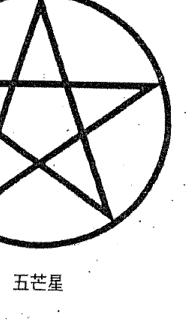
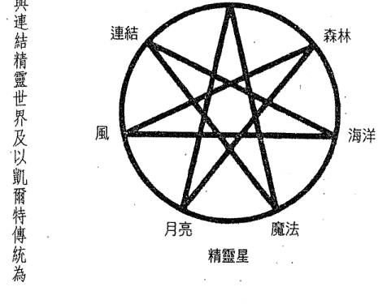

# 与精灵连结

## 各界推薦

> 「芙蕾薇亞與精靈王國有著自然且直覺性的連結。她的文字淺白易解，為讀者提供真實的洞見，並能與精靈毫不費力地溝通。」
>
> ——凱倫·凱伊（Karen Kay）
> 《FAE 雜誌》主編

> 「精靈需要你、我，和其守護者。芙蕾薇亞是精靈世界的捍衛者之一。她是精靈世界魔法的嚮導，她的魔法與其擁護的精靈世界之存有一樣。這本書把知識、智慧、連結與真心提供給讀者，也把精靈世界帶進讀者的生命裡。我喜歡透過這本書與芙蕾薇亞和精靈們共處！」
>
> ——戴維·威爾斯（David Wells）
> 《你的月亮星座與卡巴拉》的作者

> 「閱讀這本書就像踏入一個美麗的夢境，當你再度從這個美夢中覺醒時，就能掌握精靈世界的真實本質和魔法的無窮可能。」
>
> ——隆納德·赫頓（Ronald Hutton）
> 布里斯托大學歷史學與英語民間傳說教授

> 「芙蕾薇亞真的是一位有遠見的人，也是古老傳統的擁護者。她對精靈的深入理解跨越了時空，並發人深省。她在整本書中織就了其魔法。」
>
> ——芭芭拉·梅克雷喬恩－弗雷（Barbara Meiklejohn-Free）
> 蘇格蘭高地預言家、作家

> 「喜歡精靈的人會很愛這本實用的指南，它會協助你與『魔法小小人』連結，以轉化你的生命。芙蕾薇亞語調溫暖、有智慧，且充滿許多資訊。這本書是靈性書籍中不可或缺的收藏品。」
>
> ——凱特·孟恩（Katy Moon）
> 《靈性與命運雜誌》約稿編輯

## 推薦序：看待世界的嶄新視野

二十多年前第一次接觸到精靈世界，那時的中文資料不多，很興奮有本詳細講述精靈世界的中文翻譯書籍問世。

作者芙蕾薇亞有著與精靈王國密切合作的淵源，讓我們了解這部分的知識與魔法運用。其中談到學習神祕魔法的人都會與元素精靈合作——地、火、風、水，而每個元素都有相對應的精靈、魔法、準備物品、練習與自然界徵兆等⋯⋯。

大自然跟著宇宙節氣運行，每個節氣的慶典都會對應到女神的三態——少女、母親、老嫗，例如：聖燭節為北半球一月一日至二日；南半球八月一日至二日。其代表生機乍現，新芽從地底迸出；自然界的春天代表，純潔如處女。

配合書中的練習，得以了解自己目前所面臨的狀態，為自己的生命種下種子、釋放或導入所需，方能完成蛻變。當我們與魔法合作時，最重要的是「保護自己」。書中有詳細地介紹扎根、保護、歸於中心的練習，讓初入學習魔法的朋友有著正確的精靈能量存在於星光界，心存敬意，敬天、地、萬物等，是建立魔法圈與聖壇所必須的，表示我們向祂們展示誠意、承諾。跟魔法合作需要負責任，你希望的一切都以三倍回報你，同樣也以三倍的懲罰回應你。閱讀這本書時很有趣的是，發生在我身體與四體能量場的變化，時而輕盈，時而溫暖，時而有神聖感包覆著我。

精靈王國幫助平衡地球、大自然，是如此貼近我們的生活，可惜忙碌急促的腳步、大肆破壞生態平衡，讓我們與精靈漸行漸遠。祂們總希望人們擁有純淨的赤子之心、單純喜樂，滿足內在小孩的喜悦。

書中談到精靈與水晶合作，每一個水晶都含有一種或以上的療癒能力，也能加強與精靈的緊密連結。精靈之道的行者了解整個自然界是有生命的——萬物皆有靈。誰說自己不曾與精靈王國相遇呢？給自己一個獨處的時間走入大自然，注意自己的呼吸，欣賞眼前美景，連結內在精靈；神聖時刻就發生了——平衡、寧靜、喜悅。

以嶄新的視野看世界，一條自由美妙的道路從此開啟。

孟繼芬
天使部落負責人

## 推薦序：來自「精靈世界」的呼喚和邀請

在收到撰寫推薦序的邀請前一晚，我作了一個夢，在一望無際的雲端天界有許多美麗的飛馬，祂們高貴優雅、充滿靈性，任何人出於私慾接近祂們，祂們一概不予回應，於是人們走下樓梯，從天界返回人間，腳踏實地地扎根在人間的土地。

夢醒後我一看見生命潛能發來為這本書寫推薦序的邀請，便知道這是「精靈之道」對我的召喚。

我從小就是個感受力極強、想像力極奔放的孩子，時常在風裡跳舞、用雙手挖掘土壤、在樹下對著花草說話⋯⋯。年幼的我自然而然就能夠感受到這些自然界裡善意又美妙的存在，並且本能地與祂們玩在一起，但成年走上了修行之路後，選擇以畫作分享精靈的美好與喜悅的同時，我亦對精靈世界抱持著一份畏懼，因它總是被塑造地太奇幻美好，我知道一顆想逃避現實、意志不堅定的心靈有多容易被當中的黑暗與陷阱迷惑。

這本書在我準備好時出現，讓我明白了這份對精靈世界的莫名畏懼究竟是怎麼回事，這並不是壞事，而是對大自然中「光明」與「黑暗」並存的尊重與敬意，本書並未迴避精靈世界那些「黑暗危險的部分」，如同自然界絕不可能只有光明與善意的一面，祂黑暗與毀滅性的一面也必須被正視、被尊重、被敬畏……，而這正是現代社會中早已麻木的人心所缺乏的。

在現代社會的種種制約與框架中，人們盲目地追求效率，對自然之母強取豪奪，毫無尊重或敬畏，也早就遺忘了身心和生命本身與自然的緊密連結，人的身體和生命歷程也是天道循環的一部分，從來就不該脫離。一年四季、自然運行，春生夏長秋收冬藏……，書中「精靈之道」所傳承的古代智慧與東方道家哲學不謀而合，用最溫柔的方式，對迷失在資本時代中的疲憊靈魂發出呼喚，憶起這份與自然之母的連結，也指向了回家的道路，因為祂們知道在心底深處，每一個靈魂都渴望回家。

如果你也收到了這份來自心底深處的召喚，邀請你開啟本書，將它作為通往精靈世界與自然界的門扉，無須恐懼，但要保持敬畏。最後，以夢境中的啟發祝福你在這條路上「保持本心」、「腳踏實地」。

韓芮湘（瑪麗）
靈魂印象心靈畫家、精靈行者

## 引言

小時候，我總覺得周遭的空氣裡充滿了生命。由於我許多的童年歲月都是在自然界中度過，我了解蘇格蘭鄉村的野生環境。我始終有一種強烈的感覺，就我所能看見的來說，世間還有一些超越我的人類感官之事物。

芙蕾薇亞在這本書裡，把我童年時代感到不解的魔法帶進生命，讓我相信當今人類沉重的生活裡，仍然有魔法存在。那就是與人界並存的光世界魔法。這個魔法自始至終都存在，也會在我們最需要的時候甦醒。現在就是這個時候了。

這本書引領著我們的心靈穿梭於兩個世界之間，讓我們記得生命的內涵遠超過自己最初的感知，而芙蕾薇亞，或我口中稱呼的「芙拉瓦莉西絲」（Flavalicious），在其引人入勝的著作裡真實地捕捉到了這一點。我鼓勵所有的讀者觀照自己的內心世界，重新喚醒他們不可思議的真我，並讓它走入生活中嬉戲。當我們釋放自己對邏輯和嚴肅思考的掌控時，內在小孩就能獲得自由。

——戈登·史密斯（Gordon Smith）
靈媒、《難以置信的真相與直覺研究》作者

## 前言

每當我走進這個魔法之環，
我的心就會敞開，準備吟唱林木之歌，並說出精靈的語言，
祂向我展示，也引領我前方的道路。
就在今夜，我召喚祂們，
其奧祕和神祕交織。
願祂們在今晚將力量賜予我，
讓我分享新的天賦，
因為這是唯一正確的方式。
我向神奇的存有展開雙臂，
獻上榮耀與感謝，
但願如此。

許多讀者也許會對精靈感到親切。你們也許從小就感受到祂們的魔法召喚；也許你的內心深處感覺被拉回古老的生活方式，回到那個魔法盛行，人界與精靈界相互尊重、和諧共處，以維護萬物自然平衡的時代。

現在是你側耳傾聽這個召喚的時候了，因為精靈界已經發出了宏亮的警鐘。現在是你該醒過來，並承認世界已失衡的時候了。其他領域也有著同樣的問題。

因此，你現在也許會感到內在那個神祕的自我蠢蠢欲動著。遠古記憶的吉光片羽——在深藍水池裡的月光浴、樹林裡的迤邐而行、透過密葉灑落的溫暖陽光，以及金色玉米田裡歡慶豐收的舞蹈——也許會悄悄浮現。對精靈來說，祂們跟你一起嬉戲的日子鮮明得恍如昨日，我的朋友。祂們想念那個自由自在的你所散發出來的魔力。

現在是你承擔起精靈之道的行者這個神聖角色，並挽回世界平衡的時候了。精靈之道的行者是能聽到精靈在微風中的呢喃；在風吹雨打、艷陽下歡慶，並與腳下泥土裡的養分連結的人。他們擁抱四季，為春天第一股悸動中吐露的新芽、為夏天的豐收、為秋天繽紛的落葉和隆冬幽黑的神祕歡欣鼓舞。

精靈之道的行者的心會不由自主地因為一個魔法的概念而歌唱。他們對自然療法有一種親切感，也相信屬於神祕存有的他界（Otherworld）。這就是精靈世界——我們內在的光明世界，也是一個精靈世界，其中有著岩石精靈、水晶精靈、湖泊與溪海的守護神、叢林與草原之靈，甚至大城小鎮之靈——祂們都透過奇蹟和魔法，支持著大自然的運轉。

許多人都是聽童話和「假想」故事長大的。我們都對亮晶晶的仙塵（fairy dust）、魔杖、菌草精靈環，以及始終廣受歡迎的牙仙不陌生！然而，精靈不只是孩子床邊故事裡那些光鮮亮麗的角色而已。這些神祕的生物既不是幻想，也不是科幻——祂們是自然界裡真實的存有。瀑布、溪流、草地、花園和森林裡，都有祂們流連忘返的足跡。我們能在每一朵野花、每一片草葉、每一塊岩石和石頭裡看見祂們。祂們在山洞、天空和海洋裡等著你。你願意承認祂們，讓自己在山路邊駐足，成為其魔法裡的一部分嗎？

你也許會問，這個神祕的旅程會把你帶到哪裡。這是一條不確定的路徑，也許沿路會有陷阱和損失，但你大可放心，無論精靈世界把你帶往何處，其動機永遠都是為了你的至善。

> 編註：歐洲的民間故事中，精靈跳舞的地方會出現菌類形成的圈。

地球需要我們的幫助，精靈也呼喚我們去崇敬祖先慣有的方式，他們與這些非常真實的自然精靈同心協力。世界已經變了，而且夾帶著高科技的裝置、運輸工具等配備，以更快的速度旋轉。不過，擁抱精靈王國並不意味著你一定會失去在這個時代裡熟知的一切。精靈也會提供協助，讓你在這個非常現代的世界裡療癒、創造和繁榮，以作為回報。

當你體認到精靈是與支配著所有人的元素合作之存有，體認到祂們是這個美妙星球上所有生命背後的魔法時，你就回到了與自然界連線的位置。接著，你的顯化和療癒能力就會啟動，而且，你也能改變經驗生命和擁抱周遭魔法的方式。這就是能讓世界恢復平衡的方式。

一個真正的神祕主義者會同時參與這兩個世界，因為他知道這兩個世界的實相。現在是我們把長久以來被隱藏的世界，介紹給另一個世界的時候了，因為缺少了與它相對的魔法世界，我們的世界似乎迷失了方向。

因此，欣喜吧，因為你靈魂渴望的魔法即將被揭露⋯⋯。為了找到真正的你，走進精靈環、尋找小妖精（pixie）、高興地與人魚族一起游泳，或擁抱一棵樹吧。魔法無處不在，萬事萬物之中皆有其存在。去探索吧！盡情地享受每一個珍貴的片刻吧。當你邁著步伐，沿著精靈之道前進，當你與大自然的奧祕携手合作时，你会发现整体成果比想像中的更令人满意——而且，你一定会在沿途体验到极大的乐趣和魔法的点缀！

## 第一章 意識到魔法的存在

我心裡有一個魔法王國，
一個充滿奇蹟、魅力和所有那類事物的世界。
只要閉上眼睛，數到三，
我就會看到等著我的精靈和小妖精。

還記得那個似乎充滿了魔法的世界嗎？那個穿越一座魔法森林，玩變裝和角色扮演的世界嗎？或許，這種美妙的感覺，在你面對生活的責任和挑戰時，逐漸從生命裡消退了。也許，那個喜悅已經淡化，而你的感官也被一張憤世嫉俗的面紗遮蔽了。

精靈在召喚你，要你再度覺醒，並汲取圍繞在身邊的魔法。現在是你再度透過孩子那充滿驚奇和敬畏的眼睛，看這個世界的時候了。當魔法觸碰的暗示打開你的心靈之眼時，你就會發現被遺忘許久的隱藏世界。是時候重新建立連結，並走進那個向你招手的神祕世界了。當一股新的魔法能量包圍你時，抓住你的夢想，摘下天上的星星吧。精靈世界正蓄勢待發，要給予你支持。

另一個從前，
你著迷地邊跳邊附和著旋律唱歌。
神祕的視野不見了——何等的悲劇呀。
如今，一個咒語恢復了你的魔法！

### 另一個從前……

第一次見到精靈的那一年，我還不到兩歲。我凝視著一棵老橡樹空洞的樹幹，看到一個小光點在漆黑的空間裡跳動。光點雖然很小，但卻是我見過最亮的。我看得著迷，但本能地知道那是一個精靈。果不其然，我的任務就是來尋找精靈！這就是我整個童年都在做的事。

在英格蘭伯克郡（Berkshire）鄉下長大的我，與家人一起住在一座開闊的林地旁。小時候，我會在大清早起床，溜進樹林裡安靜地坐著，敲敲樹幹上為精靈開好的小門，把食物留給那些「小人」。如田園詩一般的童年充滿了夢境與沉思，偶而也有看到「精靈族」的時候。隨著歲月的流逝，我與這些魔幻的存有建立了不尋常的關係。我往往會走進樹林裡，花上幾個小時跟祂們溝通、連結，向身邊的自然界學習。

### fairy 或是 faery？

祂們是什麼，應該如何稱呼祂們？

精靈是由較高振動的光能構成的存有。祂們在一個比我們高的頻率上振動，這是我們很難看到祂們的原因。不過，祂們會透過降低振動讓自己現身。我們比較容易在日出、黃昏、中午和午夜等魔法時刻，與祂們連結並看見祂們。祂們住在星光體的層面，是一種能量的頻率，而我們可以透過想像、許願、召喚、咒語與其連結；還有通往精靈世界的入口，像是水池、古道的交叉口、蘑菇環或花環。我們也許會在現實世界的這些地方看到祂們——運氣好的話！（見第七章）

fairy（精靈）這個字源自中世紀的英語 faierie，faerie 則是直接借用自古法語的 faerie，含有土地（land）、領域（realm）或魅惑（enchantment）之意。faerie 也源自於 fae 這個古字。這個名詞是指大自然精靈的古老領域，以及自然界的光明與黑暗。

人們對這個單字的拼寫有很多不同的說法。一些與 fae 所有面向有著深度連結的歷史學家和藝術家們，都使用 fairy 和 faerie 這兩個字。我平常喜歡用 faery 這個字。浪漫主義和維多利亞時代文學作品中形塑的拼寫形式 fairy，絕對是迪士尼認可、全世界都能了解的更現代化版本。基於這個原因，我在整本書裡都使用 fairy 這個字，但偶爾會出現 fae 或同樣適用的其他字1。

精靈的其他統稱是發光的（shining ones）、精靈族（fair folk）、小人（little people）、好人（good people）和西弗（Sidhe／Shee）。

> 1 編註：因在本書語境中，fairy、faery、fae 指的皆為同一種存有，故統一翻成精靈，除非作者另有指涉。

### 精靈的歷史

整個人類的歷史中都有精靈的記載，荷馬的史詩《伊利亞德》（Iliad）和《奧德賽》（Odyssey）等古文本裡也有提到。古希臘人敬拜男神和女神，他們把地位較低的神明視為自然界的精靈。

世界各地遍佈著妖精和精靈的故事，他們也在東方、阿拉伯世界和亞洲文化裡扮演某些角色。古代北歐的民間傳說包括精靈、女妖羅蕾萊（Lorelei）和類似存有的故事；愛爾蘭的西弟則是住在土堆和墳塚裡。

古凱爾特人也像許多其他文化一樣，把精靈當作日常生活裡的重要部分，並給予祂們相當高的敬意。人們會遵照一般禮儀，供養少許食物或牛奶，表達敬意和感謝。這是因為我們祖先知道精靈有賜予豐收或破壞農作物的力量。

人們相信精靈會傳播疾病，他們認為生病是因為人「被精靈附身」（fairy taken）的緣故。此外，還有人指控精靈會偷走人類的嬰兒，再把小精靈留在原地。這些被稱為「調換兒」（changelings）的小精靈，經常會因為不尋常的「精靈」外貌，或與原來的人子有所不同而被人識破。

民家為了避免精靈上門，會把馬蹄鐵放在門口。鐵器是魔法的剋星，這# 第一章 意識到魔法的存在

是一個眾人皆知的普通常識。此外，為了自我保護，人們也不敢對自然界的精靈口出惡言。

然而，人們經常召喚精靈的超自然力量，幫助他們尋找失物、治病、預測未來和祈求賜福。人們會求助於社區裡有智慧的婦女或「巫醫」（doctor），因為他們有與精靈世界連結的能力，能在這些魔法存有的協助下進行治療。

中世紀時期，西方盛行的宗教傳說告訴我們，精靈是從天界墮落到人間的天使。這個說法導致人們停止了崇拜自然——或者說，那些對異教徒深懷恐懼的惡徒會有這樣的想法！人與精靈的任何連結都必須祕密地進行，直到十八世紀後期的工業革命，人們以「進步」之名大肆破壞土地、污染空氣為止。之後，自然界的精靈必須盡快讓人類聽到他們艱困的處境，因此，精靈再度回到那些能感知他們的人類的思想和心裡。

如今，越來越多的人開始接受精靈真的存在，而一連串的新思維，也逐漸改變了人們對精靈的觀感。令人感到奇妙的現象是，那些能感覺與精靈世界魔法、奧祕有所連結的人，現在可以驕傲且公開地在英、美各地舉辦精靈節慶並在舞會裡盡情歡笑了。畢竟，喜樂才是振動頻率最高的，也是許多人追尋的精靈之禮！

雖然身穿芭蕾舞短裙、條紋褲襪撒著仙塵很好玩，但精靈世界卻容不得人們不敬或輕視。這是因為凡是有善精靈的地方，必然會有一個「不盡然是善」的精靈，大自然要教導我們的是，萬物都有其陰暗面和光明面。因此，既然有幫助植物成長和茁壯的精靈，當然會有促進枯木腐化過程的精靈。這些就是被人類視為性格惡毒的妖精。祂們都有自己的角色，而且精靈世界還有很多有待我們探索和崇敬的大道。只要你有心尋找你內在與周遭的魔法，它就一定會在你面前現身。

### 練習：打開心門，迎接精靈

我們可以在任何時間與精靈連結，尤其是當我們放輕鬆或置身大自然之中時。因此，邀請祂們進入你的心裡，容許祂們幫助你發光發亮吧⋯⋯。

- 在大自然裡找一個安靜的地方坐下。如果不能到戶外，也可以坐在一棵盆栽或水晶旁。
- 把注意力集中於心輪，也就是心臟的能量中心。
- 深呼吸。吸氣的同時，把愛吸進來。接著，把愛呼出去。在你吐納愛的同時，想像一位精靈出現在你面前。注意祂的外貌，不要疏忽任何一個細節。對著祂，把愛呼出去。吸氣的時候，把祂對你呼出的愛吸進來。把你的愛吐出去，讓祂吸入你的愛，祂們會再對你吐出愛。繼續進行這種來自真心的呼吸，直到你感到心輪朝著面前的精靈和精靈世界敞開為止。完成以後，向精靈致謝，並留下一份麵包和蜂蜜之類的禮物，感謝你跟祂建立的新關係（祂們喜歡任何一種甜食）。

祂們會毫不猶豫地收下你發自內心的臨在和愛的禮物。包括你在內，都被祂們帶到精靈世界之心裡。你的生命將永遠地改變。

## 精靈與自然元素

雖然精靈是一種不同於人類的種族，但祂們仍然以地球為家。祂們存在的目的是支持並創造這個世界所需的一切。我們在自然界裡看到的一切，都是祂們建造出來的。這是何等令人驚奇的一件事啊！？祂們的工作是滋長、培養和支持地球的平衡——包括我們在內！

精靈族由許多耳熟能詳的存有組成，例如：地精靈諾姆（gnomes）、小精靈（elves）、矮人（dwarves）、矮妖（Leprechauns）、哥布林（goblins）、半羊人（fauns）、花精靈（flower fairies）、人魚（mermaids）、火靈（fire spirits）、小妖精（pixies）等不一而足。世界各國都擁有自己命名的精靈和自然精靈，例如：德國的尼克斯（Nix）和尼克西（Nixie）以及日本的妖精（Yōsei）。

每一類精靈都屬於地、風、火、水四個基本元素中的一種。祂們彼此和諧地合作，並與第五種元素，也就是所有生命都含有的元素——靈（Spirit），一起創造並維繫著地球上的所有生命。

這些元素是所有現存物質的根源，若沒有精靈世界的運作，它們就不會存在。它們是精靈存在的有形顯化，在它們存在的領域，也就是「他界」(Otherworld) 或「精靈世界」之中所具現的。

自然之力的探索涉及了在玄學和靈性的層面上與四大元素重新連結。每一種元素都具有強烈的意義，並且與我們尋求個人或魔法協助時的能量有關。

地維持著我們的邏輯思維和常識，讓我們處於扎根和穩定的狀態。

火是供給我們力量、勇氣和生命熱情的驅動力。

### 元素精靈

四個基本元素中的每一個，其力量和影響都具現為元素精靈。元素精靈是一種特定的精靈，其各為對應四大元素的守護神。實際上，祂的任務是讓該元素發揮作用。祂們是該元素背後的力量，並構成該元素。

水元素

水掌管著我們的情緒安在和直覺／靈性的發展。

風元素

風帶來渴望和啟發，並能提升創造力。

## 自然元素的守護神

精靈世界主要元素的守護神如下：

### 地精靈諾姆

地精靈是地元素的守護神，這些自然界的精靈為土壤辛苦工作、過篩，以確保昆蟲和植物從土壤裡獲得成長所需的養分。如果沒有地精的幫助，我們就不會有植物、樹木，也不會有可以食用的水果、蔬菜或沙拉了。地精提供我們一個稱之為家的居住地。

人們相信為這些精靈命名的是中世紀的瑞士鍊金士帕拉塞爾蘇斯（Paracelsus），不過，公元前五世紀的恩培多克勒（Empedocles）是第一個認為世界是由四大元素創造出來的人。公元三世紀的新柏拉圖主義者（Neoplatonists）把特定的精靈與每一個元素結合起來。

### 風精靈西爾芙

西爾芙(Sylphs)是風元素的守護神,他們是在風裡飄揚、低語,並在風中傳送訊息的精靈。如果你抬頭仰望天空,重新調整你的眼睛,就會發現像光形成的針孔一般,在風中舞動的西爾芙。祂們的角色是淨化空氣,讓所有在地球上的可愛眾生都能自在地呼吸。如果沒有這些風精靈,我們就無法在地球上生存。

### 火精靈沙羅曼達

沙羅曼達(Salamanders)是火元素的守護神,祂們存在於以太界,直到人類發明火柴、點火器或電器以後,才把祂們召喚到人間來。祂們的外表像紅、橙或黃色的蜥蜴,我們看到的祂們是火焰的形狀——沒有祂們就不可能有火!

### 水精靈烏丁娜

烏丁娜(Undines)是水元素的守護神。湖泊、河流、水池、水井、海洋,甚至是雨水,凡是有水的地方,都會有這些自然精靈存在。祂們的角色是滋養和保護水域裡的動物、植物和水域本身。

## 與元素精靈合作

從事精靈與魔法實務的工作者都會與元素精靈合作，邀請祂們進入神聖的空間，而且會理所當然地以最高的敬意對待祂們。了解每一種元素精靈的組成和元素的特性，奠定了自然魔法和鍊金術的基礎：

- 地精靈與物質世界、生長、構成、力量和健康有關。
- 風精靈與運動、溝通、心理感受、靈感和智力有關。
- 火精靈與熱情、轉化、淨化和能量有關。
- 水精靈與生命的起伏、寧靜、淨化、清潔、占卜和情緒有關。

將元素精靈的知識與對季節、節慶的理解結合起來，就會發現精靈之道的行者的工作會以你認為不可能的方式敞開！

## 年度的精靈節慶

在自然界中，一年是由四個季節組成的，太陽標記著四季的變化，因此，我們會以慶祝四個太陽節慶的方式崇敬四季變化。跨季與春、秋分（equinox）慶典的特徵為火祭，而四季的八個節慶則構成了一個完整的年度之輪。

我們的祖先認知到，也遵循年度之輪，因為他們的存在取決於四大元素提供的適量雨水、陽光、風與沃壤，才會有農作的豐收。他們了解在元素背後運作的是元素精靈，因此一定會求助於自然精靈善良的那一面，並安撫它們不善的那一面。

每一個節慶都反映了當時的自然狀態、農曆的事件，以及節氣對人類生理、心理的影響。任何一個季節都是我們記取賜福，並感謝自然精靈、維繫地球上生命循環的少女、母親、老嫗（Crone）三位一體女神的時機。

> 編註：Cross-quarter。一年之中有春分、夏至、秋分、冬至，跨季則為「分」與「至」的中間點。

### 聖燭節

傳統上的日期：北半球為一月一至二日；南半球為八月一至二日。

聖燭節是為來年做準備的淨化期。人們把它描繪為凱爾特三位一體女神（Celtic Triple Goddess）的處女面向。如同自然界開始其生育週期一般，它代表著覺醒為女性的年輕少女。

這是一個生機乍露的時期，新芽從地面冒出，春花開始綻放，我們開始見證生命的更新。此時，白晝終於明顯地變長，隨著母羊分泌乳汁，我們也看到第一胎羔羊的誕生。

對北半球的祖先來說，這是一個重要的時刻，因為家家戶戶都有了新鮮的牛奶。這意味著酷寒之後的生死更替。每逢聖燭節的當天，非基督教的異教徒會把新鮮的牛奶倒在地上，向地精靈致敬，並確保農村的下一季會有肥沃的土壤耕種。

現在是播種新概念、擬定計劃，並展開創意計劃的時候。

#### 聖燭節咒語

柔軟白皚的雪層下，
一朵小花冒出地面。
女神以少女之姿亭亭玉立，
在曙光中獨放異彩。
初生的果實攪動了其處女的子宮，
從寒冬的土墳裡覺醒，
祂召喚你奔向自由，
探索每一個可能。
因為這是你播下夢想的時候，
無論生活多麼艱苦，
都會有成真的一天——只要你肯信任。
與自然合一，不要奮戰或猛攻。
拿起祂獻給你的杯子，
那個盛滿母羊新乳的杯子。

### 歐絲塔拉節

傳統上的日期：北半球為三月二十一至二十二日；南半球為九月二十一至二十二日。

少女成熟；從黑暗走進光明；成長和明辨力的象徵。

當我們的生活與自然界並行不悖時，就會擁抱和崇敬當下在大自然中蠢蠢欲動的新創造力。歐絲塔拉節預告了春分的來臨——光明與黑暗之間取得平衡的一天。這是一個平衡的日子；這是一個檢視生命平衡的好時機。看看你想獲得什麼，想捨棄什麼。這個崇敬新生命的日子，後來被基督教「借走」，變成復活節。因此，你不妨思考孵化完成的雞蛋、雛雞和春天帶來的嶄新希望。

你在聖燭節播下的種子，需要時間才能在土地的深處滋長。縱使幼苗已經冒出頭，但還不到完全綻放的時候。歐絲塔拉節（Ostara）是一個孕育、發展的時機；是對計劃、願望、咒語和夢想賦予能量的時機；這是一個耐心等候的時機。那些肉眼看不到的事物，需要先在背景中發生。因此，我們需要等待、信任，並允許事物順其自然地發生。事情會在一個完美的時機發生。

> 張開眼睛，擁抱新的一年。
魔法等待著——大自然不會說謊。

#### 歐斯塔拉節咒語

這是春天的第一個顫動。
它帶來嶄新的開始。
啜飲其所代表的一切——
新生命、成長和期望。
那又何苦如此匆忙又鬱鬱寡歡？
你播下的種子安全地躺在祂的子宮裡。
眾精靈在幕後工作，
以顯化你設定的目標和夢想。
等待和信任是關鍵，
因為生命會在最容易的時機綻放。

### 貝爾塔內節

傳統上的日期：北半球為五月一至二日；南半球為十月三十一日。

母親；富饒的身、心、靈；讓思想和靈魂誕生的良知。

貝爾塔內節（Beltane）是結合陰陽能量以歡慶性愛之神聖的時機。女神為了讓大自然在即將來臨的夏季綻放，而許身給眾神之王。大自然在鮮花、綠草和繁葉的奔放中得到完全的崇敬。這是一年中享受富足的時候——為精靈世界舉行的偉大慶典。

這是異教徒自古流傳至今的年度慶典。村民們聚在一起，享受美食與麥酒，觀賞傳統莫里斯舞蹈（Morris dancing）的同時，也選出他們的五月皇后（May Queen）。孩童圍繞著經裝飾的五月柱跳舞，編織著繽紛的彩帶。這是一個陽具的象徵，象徵六畜興旺和子孫滿堂的传统仪式。貝爾塔內節又以火祭而聞名，從山頂燃放象徵著保護的熊熊烈火，情侶手拉手跳過地面的火堆，再跑進樹林裡圓房。

這是年初設定的目標開花結果、計劃開始啟動、關係綻放的時候。女神透過祂與眾神之主結合，讓我們在聖燭節播下的種子得以發芽結果。我們的理想在貝爾塔內節實現，並隨著新的一年不斷地進步。

#### 貝爾塔內節咒語

熊熊烈火點亮了大地，
情侶手牽手過火，
紀念他們的結合和這一場儀式，
因為他們知道今宵一刻值千金！
當他們穿過幽黑的樹林，
找到一片如茵的空地，
他們應該清楚記得圍繞在身邊的人，
精靈的樂隊環繞著一對愛侶。
當他們圓房後，
精靈們歡呼，
為花草樹木封緘了終身的命運，
他雙膝上的眾神之主，
讓將為人母的女神受孕，
在她的子宮深處播下她自然的種子。

### 仲夏節

傳統上的日期：北半球為六月二十一至二十二日；南半球為十二月二十一至二十二日。

母親得到榮耀；光的歡慶；處於我們完全的榮耀裡。

這是仲夏節（Litha）的太陽節慶，或稱夏至，也就是太陽在天空最高點的時候。

這是不同世界之間的帷幕被拆除的時候。可以看到蘑菇、蕈草和鮮花的精靈環，凡是敞開真心的人都會受到邀請，進入其中與精靈的魔法連結。

當我們變得更強大，並取回所追求的個人力量時，這就是一個讓我們強化、專注、發展和堅決的時候。也許我們會進入一個陌生的領域，但陽光會照亮道路，讓我們在擁抱奧祕的同時，借助太陽的力量和溫暖。

屆時，女神將誕生
那是屬於地球自然界的魔法。

#### 仲夏精靈環的新請文

我召喚仲夏夜的魔法，
其為奧妙與神祕共同編織而成。
願我今晚分享新的天賦時，
賜予我力量，因為這是唯一正確的方式。
我展開雙臂，迎接魔法的使者，
獻上我的崇敬與感謝，但願如此。

### 豐收節

傳統上的日期：北半球為八月一日；南半球為二月二十二日。

母親成熟；感激世俗物質的支援。

豐收節（Lammas 或 Lughnasadh）是每年的第一次收穫。這是穀物入倉的時間，也是為太陽神盧格（Lug），又名約翰·巴雷康（John Barleycorn）舉行的慶典。祂為了來年再度升起而減弱自己的光芒。這是盛宴和豐裕的時期，也是一個認知生死和再生循環的時間。

豐收節時，年初播下的種子已成熟，農作也已經收割。人們把這一天看成機會和好運的日子，因為那是一段無憂無慮的夏日。夢想已經開花結果，採摘的時機成熟了。現在是該收割回報，為我們得到的一切表達感恩和祝福的日子。

#### 豐收節的祈請文

今天，年度之輪停止了轉動。
豐收節是收割莊稼的日子，
年初播下的種子已經成熟。
在收穫的慶典中歡呼，
小麥、穀物和糧食。
月虧之前，務必安全儲存。
如今約翰·巴雷康全勝的榮耀已被削弱，
但且環顧四周，
盧格太陽神在高空照耀，
透過各種方式賜福於你。
願今日的魔法，
又學到了什麼課題？
這工作值得嗎？你賺到了什麼？
從餵養的母豬那裡，能收穫什麼？
一時的辛苦，換來日後的休息。
而今，我們領受大地之母的賜福，
從天空照遍田野。

### 馬邦節

傳統日期：北半球九月二十一至二十二日；南半球三月二十一至二十二日。

老媼；探索沉思的藝術；身、心、靈的圓滿無缺。

馬邦節（mabon）是秋分的慶典，也就是冬季黑夜來臨前，白晝與黑夜等長的時期。現在是我們回顧前幾個月，清點我們得到的賜福，並對一年來被賜予的豐富資源表達感謝的時候。在這個平衡和認可豐收果實的時刻，我們要記得自己也是大自然的一部分。因此，這也是我們的收穫時間。

#### 練習：馬邦節的平衡

進入你自己的倉庫裡尋找平衡。如果你感到躁動不安、情緒激動，或心情不佳，現在就是你恢復生活平衡的時候。

- 年初時，你在自己的生命裡播下了什麼種子？
- 種子都結果了嗎？
- 你需要引入或釋放什麼，才能讓自己向前邁進？
- 懷著感激和已學會的生命功課，擁抱自己任何缺乏光明的面向，消除那些不再對你有益的面向。
- 一旦達到平衡後就休息，並享受個人收穫的果實。

#### 馬邦節咒語

秋天，啊，秋天終於到了，這是一個回顧過去的時候，那個仿佛飛逝而過的一年。種下的夢想如今已經成長。秋分把黑暗與光明賜給我們，白晝與黑夜完美的平衡，因此，我們要往深處內觀，檢視內在的平衡。回顧過去的痛苦、學會的課題，善加運用，以免再度受傷。重要的是讓生命的光明綻放到四面八方，崇敬你陰影的那一面，因為光與暗合成完整的你——二合為一是你完整的靈魂。

### 薩溫節

傳統上的日期：北半球為十月三十一日；南半球為四月三十日。

崇敬老媼；尊重祖先；療癒心痛。

萬聖節讓人聯想到鬼魂、南瓜燈和孩子三五成群登門要糖的景象：「不給糖就搗蛋！」（Trick or treat）傳統的薩溫節（Samhain）是凱爾特人慶祝夏季結束的日子。每逢十月三十一日晚上，村民點燃篝火，焚燒農作物、牲畜，好與眾神共享，感謝祂們賜予的豐收。

> 編註：作者於此提到萬聖節，是因為其起源便是薩溫節。

凱爾特人相信陰間的亡魂會在當晚被放出冥界。有的亡魂受人歡迎，有的則讓人恐懼，因此人們會以裝扮和面具，保護自己不受這些幽靈的傷害。

薩溫節仍然被人們認為是回顧過往，以及與離開人世到陰間的亡魂連結的日子。這一天也是檢討自己這一年有哪些進展的日子。三位一體女神在這天示現老媼的一面。祂邀請我們汲取內在深處的智慧，因為祂會在即將來臨的黑暗月分撫慰我們，讓我們得以釋放那些對自己已無益的一切。

由於薩溫節當天是陰陽兩界之間的帷幕最稀薄的日子，因此，我們也會更有能力看見、連結精靈世界和冥界。

點兩支蠟燭，一黑，一白，分別代表你的喜樂與困境。

移除不需要的一切，但要保留成功必需的因素。

我們為收割入庫的莊稼歡呼，感謝這一年帶來的豐收。

#### 薩溫節咒語

大釜沸騰，閃亮的燈籠高掛，
鬼魅魍魎，哀鴻遍野，
宴席擺滿四面八方，
男女老幼牽手赴宴。
充滿歡樂的時光，但要謹記在心，
熊熊的烈火，即將熄滅的餘燼，
莫忘曾經走過的祖先。
獻上我們的崇敬，
祈求您賜予的智慧、工具，
幫助我們成為人中的智者。
讓我們透過今夜這層細薄的帷幕看見。
保護已經就位——無需恐懼——
我們敞開心扉，
迎接你與你帶來的一切。
深入靈魂的深處內觀，
擺脫舊有的一切，薩滿式的死亡，
擁抱死亡，專注於穩定的呼吸，
邀請生命再一次更新。
女神召喚它成為你。
從少女成為母親的這一年，
現在是結束的時候，感受另一個世界。

## 耶魯節

傳統上的日期：北半球為十二月二十一至二十二日；南半球為六月二十一至二十二日。

老媼退隱；太陽返回；探索存有的本質。

冬季的耶魯節（Yule）是祖先與精靈歡迎太陽回來的時候。冬至是太陽最微弱的一天，從六個月前的夏至高峰以來，太陽的強度逐漸減弱。但隨著太陽再度進入夏季，它逐漸轉弱為強。太陽的誕生——世界之光！慶典的歡呼聲響徹大地！

宣告著新國王的駕到！凱爾特人的傳統敘述了偉大的冬青國王和雄偉的橡樹國王，每年會進行兩場大戰。夏至是冬青國王獲勝的日子，驕傲地讓陽光照耀到耶魯節，接著轉敗為勝的橡樹國王使其氣勢受挫，直到夏季的下一場戰鬥為止。

> 老媼在女神的榮耀中佇立。
> 孑然獨立，不要害怕。
> 這一條神聖之路，引導你邁向自由。
> 勇往直前——但願如此。

### 與精靈連結
探索大自然精靈的魔法世界

### 耶魯節咒語

精靈們輕柔地躡足潛蹤，
跨越白雪與寒霜覆蓋的大地，
在耶魯的時節走向一棵冬青樹。
是時候該挫敗它支配的銳氣了，
因為橡樹國王將贏得這一場戰鬥。
他將主宰春季的大地。
當早晨轉向太陽，
重生的太陽——光明戰勝了黑暗。
神聖的年度之輪再度轉動。
聖誕的年節降臨，
且讓我們懷著喜悅的心情慶祝，
五月的鐘聲響起「和平在人間」！
用木柴添加新的火苗，
許下你內心的渴望吧。
崇敬那為清涼加熱的火焰，
賜福耶魯節的每一個人。

## 第一章 意識到魔法的存在

+ 精靈是一種頻率比我們更高的存在。
+ 他們是大自然的建造者。
+ 當人界與精靈世界間的帷幕變薄時，就有可能看到祂們。
+ 我們的祖先尊重並崇敬這些自然界的精靈。
+ 元素精靈是地、風、火和水四大元素的守護神。
+ 了解四大元素的屬性，是進入精靈魔法的基礎。
+ 地精靈諾姆是地元素的守護者。
+ 風精靈西爾芙是風的守護者。
+ 火精靈沙羅曼達是火元素的守護者。
+ 水精靈烏丁娜是水元素的守護者。
+ 年度之輪是一種曆法，其記載著四季節變化的節日。

# ## 第二章 與精靈的連結

當你仰望星星許願時，
記得關於你是誰的七個重點。
保護就位，尊重是關鍵。
崇敬精靈的聖潔。

與魔法合作時至關重要的是保護自己。事實上，無論我們是否有意識地與精靈世界合作，每天請求保護不失為一個很好的做法。

### 扎根大地

從事任何靈性的工作之前，無論是冥想、召喚或其他形式，你都必須讓自己「扎根大地」。這麼做是為了讓你固定在身體裡的同時，又能保持與世界的連結。

走進戶外，在大自然裡赤腳站在地上，會立刻讓你扎根並與地球連結。或者，無論你置身何處，都可以想像腳跟長出強壯的根鬚，把自己埋進地底的深處。嘗試以下的練習看看。

#### 練習：扎根大地

- 透過你的心靈之眼，看到腳跟長出的根鬚，鑽進地底深處的土壤裡。
- 看著腳下的根鬚越來越茁壯，越來越深入地底，直到它們抵達地心為止。
- 現在，觀想地心有一顆巨大的水晶。
- 記下它的外觀，讓你的根鬚把水晶包裹起來。
- 現在，透過根鬚吸入水晶的能量和大地的魔法，讓能量湧入身體的每一個細胞、血管和存在的每一個部分。

### 保護

現在你已扎根於大地之中，並準備好要與精靈世界連結了。

與精靈世界連結的重點是，要成為一個清明的管道。這意味著沒有負面的情緒和恐懼。你可以透過保護自己免於他人的不必要能量（包括心理攻擊）、負面的思想形式，以及卡在舊建築物或創傷事件場所的低振動能量，才能確保自己的清明。

無論是有形的，或透過心靈之眼的觀想，在自己的周圍畫一個圓圈是一種強而有力的保護方式。只要想像一個極為明亮的白色氣泡包圍著你，就能立刻提供你需要的保護。

其他保護措施包括觀想前面有一個圓圈，或用能量指（你慣用的那隻手的食指）在空中畫一個圓圈。看著它膨脹到比你稍大一點的時候，再走進去。

或者，你也許會想運用以下的觀想，讓自己扎根大地、處於中心和保護自己。

#### 練習：保護、扎根與歸於中心的儀典

- 雙腳稍微分開，穩固地站在地上。用你的心靈之眼看著根鬚向下生長，延伸到你腳下的土地裡（如上則練習所述），讓它們把你牢固地固定在我們所在的次元裡。
- 當你與地元素連結時，感覺強大且扎根的地之能量。
- 感覺並歡迎賦予生命的寶貴空氣進入你的肺部。
- 現在，覺察輕撫著身體的微風——風精靈就在你身邊。將其深深地吸入體內，你開始覺察到一陣清新的細雨灑在身上。擁抱前來淨化你的水精靈。
- 一朵毛茸茸的白雲飄過天空，揭露了榮光萬丈的太陽。火之守護神正將其熾熱的光芒投射在你身上。感覺它甜美的溫暖，正在滋養和療癒你的身體。
- 四大元素的力量連結著你的每一個部分，感覺你融入了每一個元素裡。
- 汲取蘊含在這種能量裡的力量。舉起手臂，感覺能量湧進你的每一個部分。
- 以一個明星之姿站立，感覺你的靈體凌空翱翔。
- 你是地、風、火、水和靈。
- 現在，看著自己被一道保護性的能量包圍。

現在，你扎根於大地，也歸於中心，並受到充分的保護。你已做好了要承擔任何魔法工作的準備了。

### 神聖的符號

#### 五角星與五芒星

精靈魔法裡所有的元素——地、風、火、水以及靈的乙太元素——都可以用特定的咒語召喚。這些元素的每一個，都是用五個尖端的古老魔法符號來代表，也就是五角星（pentagram）。

在五角星的周圍加上一個圓圈，可以保護五個元素和魔法的使用者。這個神聖的符號被稱為五芒星（pentacle）。幾世紀以來，智者和魔法修練者用它來保護和施咒（為了至善，沒有任何傷害人的目的）。可悲的是，現在卻有人視之為邪惡的象徵。

我可以跟你保證，五芒星是善良的象徵，是自然與我們參與其中的魔法間的連結。當我們為了施展魔法而使用它，或想像自己被它包圍時，就會得到它完全的保護。

#### 精靈星

精靈星類似五芒星，它的用途是保護與連結精靈世界及以凱爾特傳統為基礎的他界。它沒有五芒星的五個尖端，而是有七個。它們分別代表：

五芒星

精靈星

精靈星是通往他界的門戶。每一個尖端都是進入精靈世界的入口，引導我們朝著正確的方向前進，為我們打開了一條進入精靈世界的途徑。
我經常會佩戴一條精靈星的項鍊，它提供我日常的保護，並與內在和在周圍的魔法建立自然的連結。

| 尖端 | 太陽 | 森林 | 海洋 | 魔法 | 月亮 | 風 | 連結 |
|---|---|---|---|---|---|---|---|
| 元素 | 火 | 地 | 水 | | | 風 | 靈 |
| 焦點 | 生命、再生、神性的火花 | 肥沃、豐盛、穩定性 | 子宮、血液流動、情緒 | 自然與複雜的魔法 | 女神的三個面向、循環 | 想像力、創造力、運動 | 互連、神性、統一 |
| 高層我 | 力量、決心 | 智慧、生長 | 和諧、安寧 | 鍊金術、魅力 | 心靈的力量 | 承諾、真理 | 生命力、合一 |

#### 精靈祭壇

當我們與精靈合作，真正重要的是以崇敬的態度對待祂們、季節和四大元素。這是在向祂們展示我們的承諾，也承諾要擔任地球上的精靈守護者。最完美的方式就是建造一座精靈祭壇。

自古以來，人們就把祭壇用在寺廟和神聖的景觀裡。當祭壇成為精靈儀式和神聖意圖的重點時，它就會變成一個神聖的空間，適於舉行精靈之道的行者和精靈本身的魔法活動。祭壇也是家中的魔法焦點——看著祭壇，就會立刻與它所代表的神祕能量連結。

##### 建立一座精靈祭壇

祭壇不一定要壯觀，因此，不要擔心空間不夠的問題！你可以在一個安靜的角落放一張鋪了布的桌子、壁爐架、窗台或浴室的置物架。只要設定好正確的意圖，這些都不重要了。

找到完美的祭壇以後，就要找到代表每一種元素的物品。以下是我提供的一些想法。

#### 代表地元素之物：

- 一支黑、棕或綠色的蠟燭
- 準備一個碗，裡面裝了來自祖國或最喜歡的聖地之土壤
- 白色加州鼠尾草——用於淨化與清潔
- 水晶
- 石頭
- 一個盆栽
- 乾燥花

#### 代表火之物：

- 紅色蠟燭（點燃火焰）
- 一張太陽的圖片
- 一個龍、不死鳥或蝶螈的裝飾物

#### 代表風之物：

- 一支黃色的蠟燭
- 一根點燃的香
- 羽毛（自然掉落的，在大自然裡找到的羽毛）
- 鈴鐺
- 風鈴

#### 代表水之物：

- 一支藍色的蠟燭
- 來自聖地的水（例如：英國格拉斯頓伯里的聖杯井）
- 聖杯／酒杯（代表水，或本身可以盛水）
- 貝殼
- 一張海洋或海洋動物的圖片

敬拜自然界、精靈世界或進行全方位的魔法時，在祭壇擺放四大元素／元素精靈等供品，可以確保自然界所有面向的平衡。

祭壇上放一個有保護和連結作用的五角星或精靈星，也不失為一個好主意。那可以是一條墜子或一張圖片，或者，何不用天然材料自己做一個呢？

我通常會用小的精靈塑像來裝飾我的祭壇，像是龍和美人魚塑像。也許你會想要在祭壇上多放一兩張元素精靈的圖片，例如，樹林、草地或海洋，以及／或散置一些松果或樹葉。把你感覺能代表大自然魔法的任何事物都包括在內。

也許你會發現自己想要用一個代表某些議題的特定元素和元素精靈，創造一個能反映這個願望的祭壇。你會在以下的四個章節裡發現，每一個元素和元素精靈都會提供其自身的特殊魔法，讓你有效地駕馭和運用。

### 看見並感知精靈

眼見為憑是一般人的思維，但可悲的是，我們都陷在真假不分的混淆裡。相信才是開啟魔法之門的鑰匙，奇蹟就在你相信的那一刻開始發生。

然而，精靈也許不會以肉眼可見的方式示現。祂們通常相當害羞，或者不覺得有降低振動頻率的需要。不過，如果我們為祂們做一些特別的事，或是祂們特別想被我們發現，也許就會這麼做。一般來說，這是我們能見到精靈的唯一方式。

我舉辦精靈工作坊的某一天，就發生過這種事。在一座美麗的庭院裡，工作坊的學員坐在一個精靈環裡。當我帶領他們進行與精靈連結的冥想時，我發覺有兩個非常感興趣的精靈在右邊觀看。我想，就精靈來說，祂們倆都相當高大，其中一個有著布娃娃般修長的雙腿。我的內在聽到祂們用甜美的聲音，請求我允許祂們觀看，我回說非常歡迎。

如果你是敏感型的人——你在讀這本書，很可能你就是——也許你會透過能量的變化，例如：至福感、身體的一側癢痛，甚至是一股有形的推動或戳刺，而感覺到精靈的臨在！精靈經常會在人的頭頂跳舞。你也許會感覺有一個蜘蛛類的東西在爬，因此，務必小心，不要因為抓癢而不小心讓精靈摔下來！

精靈迷經常會因為太過刻意地看一眼，反而阻擋了自己的視覺。停止嘗試於專注，也許你會從眼角的餘光看到一個精靈，或者看到以一道火花或閃光形式出現的精靈。

有時候，精靈會刻意地引起真正想跟祂們合作之人的注意。祂們可能會派一隻蝴蝶、蜻蜓，甚至青蛙前來，因為這些生物具有精靈的能量。其他的跡象也許包括有人送你一塊石頭或一個水晶、一本與精靈有關的書出現在你眼前、朋友送了一個與精靈有關的禮物、找到遺失的小東西，或你認為已遺失的東西竟然莫名其妙地出現。

我有一位甜美又體貼的朋友黛比（Debbie），他對元素世界有份憐憫之情。有一天，我們相約一起喝茶聊天，聽他談正在籌備的一個環保計劃。他最初抗拒著這個想法，但後來卻很高興地說，由於他的持續不懈，已經有義工報名參加了。
他把手伸進閃亮的新提包裡，展示了一份寫滿細節的傳單給我看。接著，又一臉驚喜地伸出一隻手。他鬆開握緊的拳頭，秀出一個漂亮的紅寶石耳環。他上氣不接下氣地說，這是他幾年前遺失的耳環。他翻箱倒櫃找遍每一個地方，一直認為這是一個重大的損失。這個耳環怎麼可能跑到他上星期才買回來的手提包裡？
他細數著耳環失而復得的過程，同時把手伸進手提包，拿出同一副紅寶石耳環的另一個。我們只知道精靈是為了報答他對環保的努力，而找回了他心愛的耳環。

### 想像力

如果你需要解決財務問題，或者生活需要源源不絕的豐富資源，精靈們通常很樂意幫助你。祂們是神奇的老師，因為祂們只要想像一個想要的東西，那個東西就會變成現實，而且會在瞬間將其創造出來。

這個資訊是我在一個精靈靈氣療癒療程中接收到的。當時我正在為案主進行療癒，一個人魚的影像浮現在我腦海裡。其臨在告訴我，案主需要解決情緒的問題，因為人魚是與水元素連結的。接著，我看到人魚先觀想生長完整的海洋植物，才讓它們實際地顯化。我體會到這就是精靈生活、工作和讓想望成真的方式。如果我們能效法祂們，就能像祂們一樣。

想想你年輕的時候，有多少次為了說出想像的夢想和願景，而遭到長輩的喝叱？當對方告訴你：「哦，那只是你的想像。」你會有什麼感覺？我們的想像有多麼真實，只有自己心知肚明。造物主賜給我們想像的能力，不是只要我們無聊時盯著心中那想像的畫面。不！想像力是我們通往他界和精靈世界的門戶。我們只有透過想像，才能真正地與精靈建立連結。

精靈可以即時進入我們在想像中看見的任何事物，因為他界能看見我們的念頭。因此，你要知道這種連結的形式，可以發展成你希望的那麼強大和真實。務必以正念的態度對待你觀想的事物！

有時候，這也是跟精靈玩遊戲的有趣方式。例如，如果你想像自己長了蛛網般的翅膀，頭上戴著一頂橡實帽，祂們就會立刻看到這個模樣的你。祂們喜歡玩這種遊戲和遊戲帶來的歡笑！
這是與精靈建立關係的絕佳方式，因為精靈們會在歡笑和充滿活力的遊戲裡自得其樂。魔法就是歡笑和遊戲！魔法就是操控能量，精靈是我們這方面最好的老師！

#### 練習：運用想像力

- 現在就花一點時間，想像自己不同的樣貌，一方面好玩，一方面是因為你知道精靈能看到。
- 以你的心靈之眼觀看祂們的反應，並允許其成為你們之間的連結。

### 請求協助

信任我們觀想和顯化的能力，是讓夢想和渴望成真的關鍵。接著，請求協助，並採取被指引的行動，就可以把這些夢想化為現實——當然要有精靈的協助！

#### 練習：請求精靈的協助

請求協助的方式有以下幾種：

- 大聲請求。
- 用心念請求。
- 寫下你的請求，放在祭壇上、塞進皮夾，或埋在地下。
- 唱出你心裡的渴望。
- 用富韻律的詩詞提出你的請求。

無論以哪一種方式請求，一旦你向精靈提出請求以後，就要注意身邊出現的徵象。這些徵象通常來自大自然，也許是一隻動物、風吹的方向或雲朵的形狀。

與精靈世界合作時，我們對自然界變化的覺察力和了解，以及人與自然相互連結的能力就會擴展。

### 精靈的供品

精靈已經向我證明，與祂們合作並信任祂們的能力，會提供我們一種非常強而有力的方式，讓我們創造生命裡想要的事物。為了回報祂們的協助，我總會用一片麵包和蜂蜜、一小杯蜜酒或一塊巧克力等食物，表達我對祂們的感恩之意。

精靈會用吸取精氣的方式，而不是有形的進食來消耗這些供品。當你發現食物或飲料的生命力完全消失的時候，就知道精靈已經接受了你的供品。

### 喚醒精靈奧祕

精靈呼籲我們要懂得尊敬祖宗之道。古代神祕主義者順應宇宙之流，並認知到，以這種方式運轉，就會重新點燃我們天生的魔法之力——那在靈魂深處蟄伏了太久的力量。

現在就是時候去擁抱「你究竟是誰」的魔法，並邀請內在的精靈奧祕復活⋯⋯。

#### 練習：喚醒精靈奧祕的冥想

閉上眼睛，深深地吸一口氣⋯⋯，呼氣⋯⋯，感覺你的身體放輕鬆。繼續深深地吸氣、呼氣，感覺自己正在下沉，沉入地下。以你的心靈之眼看見一條銀色的繩索，連結著蒼穹和在黑暗中不斷下沉的你，直到你停在一個顯然是洞穴的黑暗密室為止。

你知道密室的某個地方有一個出口，但這個出口還沒有揭露其自身。因此，擁抱在這個黑絨子宮裡，在地球腹部的黑暗中安全地休息著的你吧。覺察你周圍的黑暗，傾聽大地之母的心跳。祂在滋養你，並告訴你，你很好，這裡是安全的。噗通，噗通，噗通，噗通。傾聽不斷把你帶進更深處的節拍。黑暗裡的你，覺察這就是魔法的起源之地。這是讓你能真正成為自己的地方。現在正在這個避風港裡的你，容許自己成為那個你始終都知道的你。把地球療癒的能量吸進心臟裡，讓它清除你任何的痛苦。

當你隨著節奏呼吸時，感覺大地母親的心跳，感覺祂充滿愛的能量，釋放了你累世以來的任何恐懼，徹底地將其從你的內在拔除，再把它們呼出給大地之母。

感覺你的心在擴展，回歸到自然又充滿了愛的自己。

你看到遠方有一朵光輝的火花。當你走向它時，會感到一股溫暖，你發現自己正走進一片被遺忘在時間迷霧裡的神聖樹林。

你置身樹林之中，看到聳立的巨石圍繞著一座古老的、有青草覆頂的墓室。你站在這一塊聖地的同時，開始覺察許多曾經受人敬拜的古神明能量。你知道自己以前來過這裡很多次，而且你也能感覺到流經這個地方的魔力。

樹林被一群巨大而有力的樹木環繞、保護著。有橡樹、白蠟木、接骨木、紫杉、山毛櫸、柳樹、冬青樹、山楂樹、美國梧桐和榆樹等。你感覺到其中一位「智慧守護者」的召喚，並朝著他走過去。

你站在他面前，感覺你強壯的根鬚依附在腳下的土地。你堅定地站在自己的力量裡，說出：

> 內在的精靈神祕主義者，
> 我召喚你。

現在感覺你的力量在上升。生命的能量在你的身體裡湧起，你感覺自己的每一個部分都活躍起來，每個細胞、血管和每個分子，都隨著生命魔法的波動而共鳴。

認可這樣的甦醒，將其吸進身體裡，與你神祕自我的天生稟賦共鳴。現在是你接納的時候。帶著意願接納你與生俱來的天賦，完全擁抱你自然又強大的古老智慧、知識和療癒力，讓它們在全宇宙的層面上整合，保持寂定。

一道明光閃過，一位精靈世界的男神或女神出現在你面前。你和這個神祇有過累世的合作，也在靈魂深處彼此了解。你們的關係仍然一如既往地強烈；只不過你在前幾世的轉世中遺忘了。

讓這位精靈國王或精靈皇后喚醒你的記憶吧。花點時間連結、提出問題和傾聽。

現在走到墓室，進入它的入口。在這裡，你發現自己回到黑暗裡。你看到一道閃光——出口已被揭示。

> 喚醒並協助我所做的一切。
> 我召喚你的魔法把我們連結為一體。
> 透過你迷人的魅力，
> 我們已經合為一體。

你在黑暗裡挺進——挺進復挺進。這是一場像出生一樣的奮鬥，你終於成功了。
光明在你的四面八方綻放，你又回到了當下。
深呼吸，讓你上方的銀色繩索飄離。當你的雙腳踏在地面上時，記得你已經扎根於大地之上，你感到安全，而且充滿生命力。
歡迎回來！

### 摘要

- 保護是參與魔法工作的關鍵。
- 五角星代表四大元素，也代表靈的元素。
- 精靈星有七個點，在精靈魔法中有保護和連結的用途。
- 建造一座精靈祭壇可以為儀式、焦點和意圖創造神聖的空間。
- 精靈想要被我們看到時，就會降低祂們的振動。
- 我們會透過能量的變化、至福感，或突發的戳刺，感覺到精靈的臨在！
- 我們也許會透過眼角的餘光，看到以一道閃光示現的精靈。
- 想像力是通往精靈世界的門戶。

## 第二章 與精靈的連結

隨時給精靈留下一份巧克力、蜂蜜或蜜酒之類的禮物，作為你對祂們服務的回報。

## 第三章 地精靈

搖搖欲墜的地基無法立業，
重建需要力量；
你要召喚的是地元素，
連結、復建，然後重生。

地元素構成人體的血液和骨骼，因此，我們來自塵土，也將歸於塵土。當我們與賴以維生的地元素連結時，就能實現成長、生育、扎根與穩定。地球賜予我們安全、庇護和食物——這裡是我們的家園。

給自已一點時間走進大自然，讓地球恢復你的生機。當你在其庇護下休息、充電時，汲取它的天賦，你很快就會擁有前進所需的耐性和力量。堅實穩固的地球能讓你扎根，帶來你渴望的神奇結果。

### 地之魔法

- 季節：冬季
- 方向：北方
- 魔法時間：午夜
- 蠟燭顏色：綠色、棕色或黑色
- 元素精靈：地精靈諾姆
- 星座：魔羯座、金牛座和處女座

地元素有滋養、生育和穩定的作用，它與誕生、生命、死亡和重生女神有關，也是咒語的基礎。植物、花卉和樹木的成長，都來自這種豐富的元素。地球滋養並恢復居住在其內在和表面上的一切。它提供充滿魔法和神祕的禮物和生活基礎——我們行走、站立和居住的地方。

### 大地的守護者和自然界的精靈

前面提過，地元素的守護者是地精靈諾姆，但還有許多其他的地精靈，都是特定自然區域的守護者，其中包括：

- 矮人：岩石、水晶、石頭和山脈的守護者和精靈。
- 花精靈：它們會照顧自己的花種（見八十七頁），而且會把自己打扮成近似祂們負責的區域。
- 樹精：祂們是特定樹木的精靈和守護者（見九十二頁）。
- 小妖精：無翼、淘氣，會引導或使人走上迷途。
- 小精靈：美麗又苗條的精靈，長著尖耳。有精湛的手工藝和箭術。
- 薩堤爾羊男／芬恩：祂們具有男人的身體和山羊的角與腿。野生動物的保護者。
- 矮妖：愛爾蘭的精靈，也是精靈世界的皮匠和銀行家。

以上列舉的精靈，都住在一個與人類次元平行存在的精靈次元。我們可以與地球上所有的精靈合作，以強化力量和耐用性、水晶、植物和藥草的知識，以及安全性和專注。

### 土象星座

占星學上的土象星座——摩羯座、金牛座和處女座，被認為是所有星座中頭腦最平衡、最有邏輯和腳踏實地的人。這一點絲毫不足為奇！他們都很努力工作，看到目標就全力以赴，不達目標絕不罷休，甚至要超越目標！一個在風元素主掌的星座出生的人，會在想像的象牙塔裡虛度時光，但地元素主掌的星座，通常會很賣力工作。他們有令人欽佩的力量和耐性，但明智的做法是暫時離開風元素的星座習性，偶而休息一下，擺脫邏輯的思維，讓創意的活水有流動的機會。

不過，土象星座是世間的行動者，天性喜歡在廚房調製藥草和藥水，也喜歡走出戶外，到鄉下活動。他們喜歡戶外，尤其是花園。戶外讓他們有回到家的感覺，並能為自己、動物和精靈們創造一個神聖的空間。

### 創造一座精靈花園

所有對地元素感到親切的人都喜歡親力親為，尤其是園藝的形式。任何一個有花園的人，都有邀請精靈一起來共享的機會！

當然，凡是一個有花草樹木自然生長的地方，一定會有精靈。然而，一個有很多快樂小精靈一起工作和玩樂的花園，一定會因為牠們帶來的魔法而百花齊放。

#### 邀請精靈進入你的花園

在花園裡擺放精靈的手工藝品，是邀請精靈光臨最明確的方式，因為「物以類聚」，精靈一定會被自己的雕像吸引而來。這是鼓勵牠們前來你家後院（或前院）的好方法。

當你決定在花園裡擺放裝飾品時，務必知道每一種元素精靈代表什麼。例如，你不應該把協助我們翻飾泥土的地精靈諾姆，擺放在水泥鋪設的車道上！同樣地，人魚的代表物應該放置在水景附近。

#### 崇敬元素精靈

即使是一座與地元素有關的精靈花園，但當你與自然合作時，用某種方式崇敬地、風、火、水四大元素也是很重要的。

每一種元素都牽涉了不同的心情和能量：

- 地元素創造穩定、支撐和牢固扎根的能量。
- 風元素支配獨立、自由和活力的感覺。

在花園裡建造一個代表水元素的實物，例如：池塘會鼓勵更多野生動物來這裡投靠，跟你打招呼。如果你發現有色彩鮮豔的蜻蜓和呱呱唱著小夜曲的青蛙，不要感到驚訝，因為這些生物與精靈世界有著緊密的連結。牠們透過自己的聲音和能量療癒著大地之母。

精靈喜歡你讓花園的一部分保持野生的狀態。何妨保留一塊「隨丟隨種」的空地，任憑雜七雜八的野花、野草自由自在地生長呢？這也會為精靈們提供一個玩耍、休息和享受的特別保留區。如果你想請祂們把花園變成一座繁花盛開的美景，這倒不失為一個公平的交易！

保持四大元素的平衡，就會創造一個和諧的空間。因此，你不妨把下列物品加進精靈花園：

- 火元素增加熱情和熱愛。
- 水元素會注入和諧、和平與安寧。
- 讓風精靈玩耍的風鈴。風鈴發出的高頻振動會吸引財富和繁榮，讓任何低頻振動的能量遠離。
- 一座吸引矮人能量的假山。另外，也可以考慮擺放一些美麗的水晶，來美化你的花園。精靈喜歡任何發光的東西，也因為水晶是元素精靈界的一部分，一個有自然療癒能量之處，會讓牠們有種回到家的自在感。
- 噴泉或池塘等水景，也會為你的花園增添清新和放鬆的氣氛。
- 火坑——石頭或鑄鐵做的火坑會擴大火元素的影響力。

### 花精靈

鮮花能為世界帶來色彩和芳香的神聖禮物，也是汲取宇宙能量的自然來源。因此，無論我們是否察覺得到，精靈都會鼓勵我們親自「聞玫瑰花」！玫瑰花的自然療癒力會滲透到我們的內心深處，讓我們敞開心門，迎接愛。

萬紫千紅的花卉各有其恢復身心的獨特屬性和精靈代表！這些精靈各自承擔了一種花卉的生長責任。

每一種花卉各有一位叫做提婆（Deva·天女）的精靈代表。提婆在花卉發芽的時候誕生，並且會伴隨花卉的整個生命週期。

#### 精靈花

某些特定的花卉，例如：醉魚草（buddleia）會吸引蝴蝶和精靈前來。毛地黄（foxglove）和藍鈴草（bluebell）之類的鐘形野花，也以大致相同的方式運作。種植特定花卉會鼓勵精靈成群結隊地光臨花園，為你家的後院增添一份前所未有的魔力⋯⋯。

- 藍鈴花：靛藍的色調會吸引精靈，牠們喜歡在藍鈴花覆蓋的林地跳舞。
- 陸蓮花：金色的杯形花瓣，讓你對自己的能力有信心和覺察力。
- 三葉草：三葉或四葉的三葉草，可以帶在身上作為護身符。
- 黃花九輪草：被認為是進入精靈次元的門戶。
- 水仙花：黃色的喇叭形花瓣是春天來臨的先兆，它帶來清明和嶄新的開始。
- 雛菊：同時擁有太陽的陽性能量和月亮的陰性能量。
- 石楠花：精靈的理想食物。
- 金銀花：它散發的強烈香氣，會喚起舊記憶和埋藏的感覺。
- 薰衣草：療癒性的香氣有舒緩、淨化、鎮定和安眠之效。
- 金盞花：與太陽的溫暖連結，中午時會有魔法的功效。
- 罌粟花：在謹慎使用的情況下，是夢想與願景、靈感與創造力的使者。
- 報春花：通往精靈世界的門戶，能保護住家不受傷害。
- 玫瑰：愛的使者、心靈的療癒者和陰性能量。
- 金魚草：驅逐負面的情緒和思想，揭示隱藏的真相。
- 鬱金香：形狀像聖杯，這「愛之杯」能協助人感覺到大自然的賜福。

### 園藝小提示

千萬不要使用化學藥劑幫助植物生長，因為那會殺死提婆，剝奪花卉療癒的屬性和自然的香氣，進而創造出人工的仿冒品！

當你召喚花精靈來協助建立花園時，就會發現花朵會在自然的狀態下美麗地綻放。

#### 練習：召喚花精靈

雙手捧著你選定的花朵。眼睛凝視的同時，說出：

我召喚精靈——花卉的守護者，
把你的魔法之力賜給我。
我吸進芬芳，
讓芬芳充滿我的心房；
美包圍著我的四面八方，
我與美永不分離。

為一切善的事物，
我用一個吻，
請求親愛的花精靈，
實現我的願望。

現在吸入香氣，說：
我使用這個精靈的魔法，
沒有懷著傷害任何人的意圖，
只為了療癒和恢復自己——但願如此。

現在是時候把花卉的美麗和芬芳帶進生命裡了！把它們放在家裡、工作環境和花園裡，注意它們的療癒能量，包括顏色，如何在每一個層面激發你的感官。

你也許會聽到召喚，要你以花藝家、芳香治療師或藥草師的身分與花卉合作，或研究巴哈花精和其他花卉療法。容許花卉協助你恢復生命的平衡。

### 精靈的藥草

沒有花園的人，不妨弄一個小藥草園，或在窗口的花壇裡種一些藥草。你要精挑細選，因為你也會想把某些植物納入咒語之中、製造花精，或把廚房變成一個神聖的魔法空間。

以下是一些常見藥草的魔法屬性：

- 羅勒：幸福、愛、和平與金錢。
- 丁香：保護、友誼、幸運。
- 蔓越莓：感恩和豐富。
- 生薑：療癒、力量和成功。
- 薄荷：驅邪。
- 迷迭香：心理保護、心安、預防惡夢。
- 鼠尾草：清潔和淨化。
- 百里香：勇氣、力量和正面的態度。

### 樹木

自開天闢地以來，始終挺立於大地之上的樹木就與我們同在。它們是智慧的守護者——與魔法實踐者和精靈的關係源遠流長。它們擁有古老的魔法祕密，也是力量的終極來源。它們也保護和支持鳥類、動物和昆蟲，而且是地球的肺臟。它們光合作用產生的氣體，就是我們吸入的氧氣。它們是生命的維持者，它們的精靈是多次元的，此外，它們也是通往世界的美妙門戶。

如果你細看一棵樹，它的樹皮、樹葉和樹木就會以一種整體的方式，現出許多臉孔回看你。當你與樹精（dryads）或樹靈連結時，你同時也在召喚森林之靈——綠人（Green Man）。

我經常看到樹葉上的臉孔，也能感知樹精的存在。有一天，我坐在英格蘭薩默塞特郡的蓋世聖丘（Glastonbury Tor）底部，無意間望著一堆樹叢。我定睛細看，一張由綠色能量組成的巨大臉龐，從樹叢裡投射過來。那是我有生以來第一次真實地與自然的陽性精靈——綠人面對面。

### 力量之樹

小時候，父親會趁著母親去教堂做禮拜的那一天，帶我去看「力量之樹」。力量之樹長在田野裡的一個紫杉叢裡。那個地方不容易到，但卻值得前往一遊。我背靠著一棵結實的樹幹席地而坐，沉思著紫杉木更新與重生的能量。它們的能量會迫使我的感官徹底甦醒。

當你徜徉在樹林裡時，可曾有樹木在某個層面上跟你說話的感覺？你會跟它們說話，或者擁抱它們嗎？那些感覺自己被引導上精靈之道的，都是被揀選為地球守護者之人，他們對樹木的精靈負有一份責任。

當你背靠著一棵樹席地而坐時，你有多少次會閤上眼，跟著它的精靈一起神遊？當你與一棵樹的樹精合一時，就會喚醒你內在的精靈。精靈們鼓勵我們多了解樹木，在我們有需要時汲取它們的力量資源。

以下介紹一些樹木的魔法屬性：

- 赤楊：復活與重生。
- 蘋果樹：療癒、繁榮、愛、和平、快樂與青春。
- 樺樹：療癒、保護與海洋魔法。
- 樺樹：新的開始與誕生、生育、淨化、保護與祝福。風的代表。
- 雪松：淨化、繁榮與長壽。地球與靈性的代表。
- 接骨木：療癒、愛、保護與繁榮。魔杖的製材。
- 榆樹：原始的陰性力量與保護。
- 冷杉：青春與活力。用於繁榮魔法的材料。
- 山楂樹：陰性、淨化、婚姻、愛情和保護。魔法工具的製材。
- 榛木：生育力、占卜、婚姻、保護與調和。魔杖的製材。
- 冬青：保護。
- 橡樹：療癒、力量、長壽。
- 橄欖樹：和平、成果、安全、金錢、婚姻、忠誠。
- 松樹：永生／不朽、生育、健康、繁榮。地的代表。
- 花楸樹：保護、療癒和力量。火的代表。
- 柳樹：月亮和許願的魔法、療癒、保護、魅力。水的代表。

### 樹的咒語

傲然而立，經常被人忽略，
忍受斷肢殘臂的酷刑。
精靈聲嘶力竭，哭喊，
「停止你們的憤怒，這棵樹即將死去！
現在是時候尋找它編織的真理了——
發掘樹葉裡的魔法和智慧。
在橡樹或紫杉的綠蔭下療癒——
它會用能量維繫你的生命。」

### 樹的願望

英格蘭的埃夫伯里（Avebury）石圈，或愛爾蘭的塔拉山（Hill of Tara）之類的聖地，都矗立著許多精靈樹。它們通常是山楂品種，以通往他界的魔法之門而聞名。這裡的人會對著一件衣服許願，或把祝福賦予一塊愛的彩色布料，再把衣服或布綁在樹上。山楂精靈會透過樹的入口，取得願望和祝福，在精靈之境裡將其實現。

### 惡作劇

許多地元素精靈背負著製造惡作劇的罪名，例如，小妖精喜歡把人引入歧途，或引導到一條通往精靈花園的路上！他們的行為是可以諒解的，而且不是一種刻意的殘酷，因為他們是讓自然運作的推手，何況，變幻莫測的自然往往令人難以捉摸！

不過，精靈們有時候喜歡偷藏我們的物品來要弄我們。如果你想尋找一件失物，不妨召喚地元素精靈來協助你。

#### 練習：找回失物的咒語

- 點一支棕色或黑色的蠟燭，面向北方。
- 在一張紙上寫下你尋找的事物。讓該事物停留在腦海裡，同時說出以下咒語：

我遺失了一個物品，
找不到它的下落。
我在清明的心智裡想像那個物品。
請將你看到的影像尋回，
將其交還給我，好安全地保存。
我召喚地精靈的能量，
不懷任何傷害人的意圖，但願如此。

- 把蠟燭吹熄，紙片折成四摺後，埋進地下。

你的失物會以意想不到又神奇的方式回到你身邊。

### 住家裡的精靈

地元素與住家有關。根據蘇格蘭蓋爾族的民間傳說，棕精靈（brownie）是一種住在民房裡的小精靈。祂們會在主人晚上睡覺時整理房屋。不過，若你給棕精靈過於豐厚的獎賞，通常會造成祂們的離開或破壞兩種結果，例如：打破碗盤、讓牛奶酸掉、把牛隻或其他動物趕出家門等。

因此，你要小心，同時也要知道你可以召喚棕精靈來保護家裡的安全，並讓祂與地元素合作，改善家庭的財務狀況。

地精靈喜歡幫助我們變得繁榮和富足，通常會要我們做些什麼來回報祂。

如果你想召喚祂們，不妨試試以下介紹的繁榮咒語：

#### 練習：繁榮咒語

- 點一支黑、棕或綠色的蠟燭，面向北方。
- 手裡握一枚硬幣，說：

> 掌管富足的精靈啊，
> 請求你賜予我新的和平。
> 我希望擺脫貧窮和債務。
> 請賜給我繁榮和所需的一切。
> 以財富和成功的機會，
> 賜福我所做的一切。
> 我請求你以你無量的寶藏
> 賜福我和我的生命。
> 為了一切的善因，
> 我以一個親吻來祈求，
> 親愛的精靈，我的朋友，
> 請允許我的願望成真。

現在，把硬幣埋進土裡（花園裡你最喜歡的一個地點，或花盆裡），讓繁榮在你的生活裡滋長。

現在說：

> 我懷著對任何人都無害的意圖，
> 接受這個療癒。

### 冬季

從魔法的角度來說，地元素與冬季有關，因為冬季是大自然進入內在深處休息和恢復活力的季節。如果你想要與大地合作，擁抱冬季才是重點，了解並連結冬季要提供給我們的功課和禮物。

冬季是一位神祕的藝術家，它以閃亮的霜珠點綴大自然；以耀眼的冰雪彩繪大地的景觀。這是一個肉眼就能看到呼吸，也能看到樹木葉落枝枯的季節。在這個季節裡，夜空瀰漫著奧祕，虛弱無力的太陽則低垂於空中。現在是你凝視內在深處，對魔法充滿希望和信念的時候⋯⋯。

我會向豐盛的精靈獻上衷心的感謝，因為這是恰當的做法。也許你會想要獻給祂們一份禮物，例如：一個水晶，再讓祂們飛走。

#### 練習：精靈之後夢境冥想

說：

午夜時分，面向北方，點一支黑色的蠟燭（秉燭而遊是一種最快速的旅行方式），

冬季已經降臨大地，
我希望來一趟魔法之旅，
把一個請求、一個願望、一個夢想，
傳遞到精靈之後的耳裡，
霜雪季節的統治者，
我朝著北方前進，
在冬季精靈的協助下，
乘著為我照亮道路的火焰遨遊。

當你凝視著燭火的同時，突然感覺一股暖意包裹著你，彷彿你的肩上披了一件魔法斗篷。

深吸一口氣，把蠟燭吹熄。熄滅的火焰冒出裊裊升起的煙霧，你閉上眼睛，感覺自己也隨之騰空而起。在你浮升的同時，繼續深呼吸幾分鐘。

最後，你感覺自己被輕輕地放回了地面。你感覺地面又硬又冷，也體會到自己已進入冬季的深底。環繞著你的樹木，在滿月的亮光下，光禿禿地閃耀著白霜之光。其實，這就是每一個孩子想像中的冬季仙境。遍地覆滿皚皚白雪，彩色的燈籠照亮了林間小道，高聳的拐杖棒棒糖挺入午夜的蒼穹。

你滿心歡喜地觀賞著幾近透明的精靈在湖面上溜冰。

你的視線穿過樹木的枝椏間，發覺一棵巨大的老紫杉孤傲地挺立在遠方。樹幹上有一扇門，似乎在邀請你進入。

你步履蹣跚地穿過雪地，走向神祕的入口。半路上，你聽到甜美的歌聲在你周圍迴盪：

精靈們躡手躡腳，
走過霜雪覆蓋的大地。

你立刻把腳步放輕，以免冒犯祂們。

當你走到樹幹，推開門。門輕輕地滑開，你走進去，期望自己能站在紫杉古老的樹幹裡。但令你驚喜的是，你卻置身在一個偌大的冰屋裡。晶瑩剔透，彷彿玻璃般的牆壁反射著你的影像。

你凝視著眼前的影像，一個堅決的聲音問道：「你看到了什麼？那是我嗎？」

你轉過身，盼望能找到一個人。但你只能看到的自己的影像，在冰牆上旋轉。

接著，當你看向自己，卻發現一個人深情款款地凝視著你：一個多彩燦爛、讓你目眩神移的美麗女子。

正當你凝視祂時，祂開口說話了：

這是你始終不變的道路，
因此，你現在必然會有自己的意見。
告訴我你夢寐以求之物，
因為我是冬季的精靈之后。

大聲說出來，把你的期望告訴祂。

完成後，祂會舉起閃閃發光的魔杖，小心翼翼地對著你揮動。微小的光之銀珠蓋滿了你。祂邀請你將其吸進你的存有的之中，並輕聲說：

我已知曉你告訴我的願望，
夢想的種子已播下了。

你滿懷感恩地望著祂，但你看到的反而是自己從冰牆上投射回來的影像。

你慢慢地轉身離開房間，穿過魔法的入口，走進白雪覆蓋的森林裡。

穿著白色皮毛的精靈走過來，交給你一支黑色的蠟燭。蠟燭點亮的那一刻，你感受到一股提升的感覺。你又邁上了另一趟跨次元的魔法之旅。

你睜開眼睛，發現自己又回到了起點。

你已經向冬季精靈之後說出心中的願望，現在要做的就是放鬆自己，知道你播下的夢之種子將在下一個年度之輪轉動時實現。

### 與地精靈合作

地精靈樂於與人類分享自己的創造物，並會尋找一些快樂、心胸開放的人，協助祂們清理和保護自然界。

祂們最先要做的一件事就是為你設定一個任務，這個任務通常是撿拾散置在鄉下的垃圾。例如，如果你經過一個空飲料罐或糖果包裝紙，突然感到一股想撿起來的驅迫力，我保證這是精靈在考驗你。動手吧，撿起來，丟進最近的垃圾桶裡，因為這會建立祂們對你的信任，並成為你們之間一段美好關係的開始。你用這種方式遵循祂們指導的次數越多，做起來就越自然。祂們隨時都在展現對你的感恩——只要尋找，你就會看到徵象！

我曾經走過一條小路，路的右邊有一塊美麗的草坪，草坪上有一條長凳和幾塊可愛的花圃。這座小公園位於一個繁忙城市的圓環上，我發現草坪上有可能會對動物造成潛在傷害的綠色玻璃碎片。

我彎身撿起玻璃碎片，走了相當遠，才得以丟到最近的垃圾桶裡。我花了整整二十分鐘才把玻璃碎片撿乾淨。這段時間，我得忍受來往車輛發出的吼叫聲和喇叭聲。他們好像把我當成瘋子，但我只是一笑置之，沒有任何批判。

最後，我終於把最後幾片玻璃丟進垃圾桶了。我轉身望著一棵美麗的櫻花樹，你一定不難想像，當我看到矮妖突然出現在我眼前時的驚喜！祂一身綠色打扮，包括帽子和背心，身高約莫一公尺。祂對我點頭示意，接著，就像來時一樣消失無蹤。我突然領悟到，祂是來認可我保護環境的善舉。

### 大地需要你！

地精靈諾姆提供我們一個叫做家的地方。令人感嘆的是，牠們現在做的是一項吃力不討好的艱困任務。由於工業化農耕對土地的濫用，包括殺蟲劑和其他化學藥劑的使用，以及土壤中礦物質的耗盡，牠們必須比以往更加努力地工作。牠們需要你的幫助！

#### 練習：協助地精靈諾姆

如果你有意幫助這些守護大地的精靈，不妨使用以下方式。

- 隨時記得點一支棕色、綠色或黑色的蠟燭，面向北方。
- 運用想像力觀想土壤已經擺脫了農藥和化學藥劑。你看到一片豐富又充滿滋養的土壤，看到土壤裡長出繁茂健康的花朵、植物和樹木。

切記，你想像的任何事物都會即刻地在以太界發生。最後，如果你賦予更多的關注，它就會在我們有形的次元裡具現。因此，繼續努力行善吧！

### 摘要

與大地存有同步的方式，就是走進戶外的樹林和草地。為了表示你對生活其中的魔法存有之尊重，在進入以前，務必先徵求祂們的許可。接著，再有意識地尋找地精靈哪裡需要你的幫助。

如果你的家裡和工作場所還沒有開始做垃圾回收，不妨考慮這麼做，也要鼓勵別人這麼做。如果可以的話，自己種菜和做沙拉，或購買有機食物。

用提供食物的方式，照顧地球上的野生動物。為刺猬建造庇護所，確保你周圍的環境是對「元素精靈」友善的。地精靈諾姆會感恩你提供的任何協助。

- 地球是我們的家園，它提供我們安全和庇護。
- 地精靈諾姆負責土壤的滋養。
- 矮人、小妖精和小精靈是地精靈的部分成員。
- 摩羯座、金牛座和處女座是黃道十二宮裡的土象星座。
- 建造一座精靈花園，邀請精靈進駐。

第三章 地精靈

### 與精靈連結

探索大自然精靈的魔法世界

- 每一種特定的花卉都被指派了一個花精靈。
- 每一種花卉都有其獨具的魔法屬性。
- 樹木是地球的守護者，我們可以汲取它們的資源。
- 我們有可能會被調皮的精靈「誘導」。
- 如果你提出請求，地精靈就會幫你找回失物。
- 冬季會以魔法的形式與地元素連結。
- 我們可以透過垃圾回收、購買有機農作和保護野生動植物的方式協助地精靈。

## 第四章 風精靈

> 風元素以其劇力萬鈞之勢席捲一切。
> 清明帶給你神聖的視界。
> 想像力是關鍵。
> 釋放你的天賦，信任你看到的。

風是生命的維護者，是生存的首要條件。它召喚我們深呼吸，在動靜之間駕馭自如。風的力量席捲了我們的想像力，並鼓舞、要求我們相信所見之物會成為現實。想像力是通往魔法的門徑。

風精靈是驅動想像力的魔法存有。天空出現的雲朵形狀、閉上眼睛時出現的鮮豔色彩，以及重複出現的徵兆和符號，都在確認祂們傳遞的訊息。

### 風之魔法

風是新生命、新可能的信使，它反映了承載著我們思想和夢想的四風¹，把它們結合成一股觀想和專注的勢能。風把我們吹到新起點的方向。因此，御風而行吧，信任你那顯化為實相的願景⋯⋯。

- 季節：春季。
- 方向：東方。
- 魔法時刻：黎明。
- 蠟燭的顏色：黃色。
- 元素精靈：風精靈西爾芙。
- 星座：水瓶座、雙子座與天秤座。

> ¹ 編註：指來自東、南、西、北四個方位的風。

### 與精靈連結

探索大自然精靈的魔法世界

風的魔法會激發心靈的力量，強化智力，帶來了心境的清明。當你點一支黃色的蠟燭，面對東方迎接一個新日子時，記得要召喚風精靈來強化你創造和冥想的能力，並激發你的心靈。

### 風精靈西爾芙

西爾芙是風元素的守護者。這些守護者是最容易連結的元素精靈。當我們吸入周圍的空氣時，就是自然而然地這麼做。

西爾芙的目的是維持空氣的乾淨和清除污染。它們是有形體的精靈，我們可以很容易地看到它們在空氣裡輕舞旋轉的微小光刺。它們與地球的氣體和以太合作，對人類的態度友善，特別是那些以溝通、創造或表演藝術為人生目標的人。這些人會對西爾芙感到高度的親和力，因為它們是靈感和創造的守護者。它們也會協助我們踏上冥想之旅，與星光體界建立連結。

西爾芙會喚醒任何的智性能力，也會順應人的請求，協助它們創作和詩詞寫作，甚至是考試。它們鼓勵我們許願和勇於夢想，但牠們不會讓我們停留在許願和夢想的階段，因為牠們要督促我們採取行動、追求目標，並幫助我們成功地實現願望和夢想。祂們會確保正確的門在對的時間開啟，讓我們遇見能幫助我們實現夢想的貴人。

#### 練習：看見西爾芙

- 抬起頭，凝視天空。
- 把心念集中在正上方或前面的空間（你也許要把視線拉回來，稍微轉移你的焦點），你會看到在周圍旋轉、飛舞的微小光刺。這就是西爾芙的光之能量。

每當你看到天空時，都可以進行這個練習。我曾經多次透過飛機的窗戶看到西爾芙，因為祂們始終背負著飛機，乘著空氣中的分子飛翔。那是一個令人欣慰的景象。如果你這麼做，就會發現這個練習能強化你對西爾芙的了解，和對祂們的感激之情。這也會幫助你記得，祂們始終都與我們同在，提供我們幫助。

### 風象星座

占星學上的風象星座——水瓶座、雙子座和天秤座，都是天生的創意高手。他們是詩人、作家、表演家和夢想家。風元素星座的人經常背負著只會作白日夢卻不面對現實的罪名，而且只要情況允許，他們寧願埋頭看一本好小說，也不想去外面蒔花弄草。地元素星座倒可以在這方面給他們一點教導！他們會幫助風象星座的人過踏實一點的生活。

風象星座的人喜歡旅行，常常無法安靜地坐著。他們享受跳傘之類的極限運動；他們喜歡頭髮迎風飄揚的感覺。我猜測一定有很多風象星座的人加入空軍吧。

其他風象星座的人，也許會發現他們與西爾芙的關係是建立在溝通的藝術上。這些元素精靈也許會激發他們唱歌、演奏樂器的本領，或充分發揮與生俱來的天賦，而成為演說家或老師。

無論你有什麼才華或渴求，只要是受風元素支配的，就可以確定是西爾芙在跟你溝通，並啟發你。對風元素感到親切，也意味著你喜歡與大自然為伍，也喜歡與微風合為一體。

### 四風

西爾芙好動，但祂也是優雅、平衡的生物。風是祂們的交通工具，但祂們也像風一樣，既不穩定又善變。

在元素精靈的魔法裡，四風分別來自四個基本方向，而且與四個季節有關。這種組合可以完美地結合，好施展咒語並造成氣候的破壞力：

| 方向 | 季節 | 名稱 | 功能 | 咒語 |
| :--- | :--- | :--- | :--- | :--- |
| 北方 | 冬季 | 冰冷的北風之神 | 帶來冰雹、雪 | 驅邪、完成、安全 |
| 東方 | 春季 | 清爽的東風之神 | 帶來毛毛細雨 | 豐饒、新的開始、成長 |
| 南方 | 夏季 | 溫暖的南風之神 | 帶來微風 | 愛、激情、人際關係 |
| 西方 | 秋季 | 潮濕的西風之神 | 帶來刺耳的猛雨 | 心靈能力、夢想、情緒 |

這個元素具有最高的振動率，這就是我們快走、吸入海風，或只是在戶外坐著就會感覺比較舒服的原因。呼入風元素會滋養身體，也會讓精神更好。這也具有以太層面的意義。英語中有種說法，「吹走蜘蛛網」（blow away the cobwebs），意味著消除任何會帶來心理負擔的負面情緒。

#### 練習：風的方向

與元素魔法合作，就能辨識每一種風及其方向，這等於擁有一個神奇的工具。運用這個工具可以與所有的風合作，並判定我們希望西爾芙前進的方向。

你要做的就是清楚地知道自己要召喚的風，並面對那個方向吹氣。這麼做的時候，你會感覺到風隨著西爾芙改變方向而有所變化。與西爾芙一起玩耍，要非常覺察風的變化，及那種變化給你的感覺。

這是一個讓你熟悉風之道的好方法。你很快就會在踏出家門的那一刻，本能地辨識出任何一種風了。

有一天下午，一張隨著微風飛舞的紙片吸引了我的注意。我很擔心，因為我不喜歡看到鄉下有凌亂的垃圾，所以就準備要在它落地後撿起來。正當我要伸手抓它時，一陣風又把它吹走。我追著它跑了很長一段時間，心裡很清楚西爾芙在逗我玩，讓我一而再地撲空。最終，它終於落在一個「安眠地」。我蹲下去撿起紙片，然而草地上有個閃閃發亮的寶石手鐲，就蓋在紙片下面。原來西爾芙確實是要給我一個獎賞。

#### 練習：風之魔法

風元素是一種投射性的能量，它能幫助我們祛除生命裡的負面情緒，或激發我們的才能。無論你想看到什麼，西爾芙都會把你帶往正確的方向。你可以透過四風的其中任何一種來召喚祂們。

你可以根據四風的不同目的，召喚任何一種來幫助你解決當下的問題：

##### 北風之神

面朝北方站著，說：

> 帶來冰雹和白雪的北風啊，
> 凍結任何必須離去的事物！

讓北風繞著你呼嘯而過，深呼吸，凍結生命裡任何必須祛除的東西，好讓你繼續前進。

##### 東風之神

面對東方站著，說：

> 春天的東風和細雨啊，
> 賜我新的豐饒之力。

讓東風吹襲而來，深深地呼吸，迎來一個新開端的豐饒時機點。

##### 南風之神

面對南方站立，說：

> 溫暖、陽光的南風之神啊，
> 帶給我爱，讓我看見合一。

讓南風輕撫你，深呼吸，一進一出，點燃你人際關係裡的新熱情。

##### 西風之神

面對西方站立，說：

> 帶來霧和雨的西風之神啊，
> 請你療癒我情緒的苦痛。

讓西風吹拂你整個心靈，深呼吸，一進一出，袪除你的障礙，並開闢一條讓情緒得以釋放的道路。

### 羽毛

西爾芙不只會透過微風的耳語捎來訊息，也會透過雲朵的形狀帶給我們徵象，或透過一根飄落的羽毛送禮給我們。人們把已落地或正在飄落的羽毛視為好預兆，那不只是天使送來的訊息，也是西爾芙送來的自然之禮。

#### 精靈羽毛的意義

精靈之道的行者認可每種羽毛都有其可用於魔法的靈性意義和重要性：

- 兀鷹：願景、獨立、敏銳度、領導力、死亡與再生、靈感與創造力。
- 烏鴉：死亡與再生、過渡、魔法、警覺、直言不諱、光明／黑暗之力量與平衡。幫助人在不同世界之間移動的能力。
- 鴿子：愛、仁慈與和平。
- 鵬：強大的力量、勇氣、領導力與威望。鵬被視為聖鳥，收到牠的羽毛是一份重大的榮耀。
- 隼：靈魂的療癒、速度和運動。
- 鵝：想像力、充分的潛力、忠誠、保護、直覺、勇敢、團隊合作與夥伴情誼。
- 鷹：監護、強化的靈性、自由與力量。
- 貓頭鷹：智慧、洞見情境的能力。
- 孔雀：旅程、療癒、清淨與幸運。驅逐愚昧或黑暗。
- 烏鴉：魔法、再生、復原、更新、反思。順利轉移的助力。
- 天鵝：轉換、優美、平衡、清淨、美麗、優雅和解夢。
- 火雞：豐富、驕傲、與大地之母的連結、分享與生育。

當一根羽毛出其不意地掉在你的去路上，坐下來，用心念要求鳥精靈展現其代表的意義。

### 精靈的醫術

拿一根羽毛掃過人的氣場，將那隻鳥的靈性能量賜給他。以羽毛能使人高飛的屬性，將其藥效輕掃過你的能量場。

#### 練習：以羽毛許願

- 到大自然裡找一根自然掉落的羽毛。
- 黎明時面對東方站立，點一支黃色的蠟燭，說：

> 我許下一個願，現在就要施咒。
> 精靈的魔法效力十足。
> 我發誓謹守三法則。
> 豐富之體從此越來越多。
> 這種魔法有效，對任何人都無害。
> 但願如此——其已完成。

#### 練習：春季西爾芙冥想

春天到了！是時候建立新的開始。找一個安靜的地方坐下，最好在大自然之中，面向東方。點一支黃色的蠟燭，做三次魔法式的深呼吸。

凝視著閃爍的火焰，增加呼吸的力道，覺察包圍著你的空氣。感覺你的心臟因為充滿西爾芙的能量而擴張。一進一出地呼吸，開始感覺你與這些風精靈的連結正在增強。

隨著連結的增強，你開始注意到，西爾芙為了傳遞訊息給你而創造出來的雲朵形狀。祂們也會透過樹葉傳遞訊息，希望有人聽到，進而努力淨化空氣，讓我們能健康地活著。你突然體會到，西爾芙始終都圍繞在你身邊。

現在，刻意地把呼出的氣引導到自己前面，把它堆積起來，再吹到空中。用你的心靈之眼看到，你的呼吸像一朵春天美麗的金黃色水仙花。隨著你一進一出地深呼吸，看著你金黃色的氣息在面前的場景中擴展。

把你的願望和欲求注入羽毛裡，把羽毛拋向東方，讓西爾芙撿起，再透過空氣讓你的願望開花結果。

把蠟燭吹熄，並透過餵鳥來表達對西爾芙的感激。

接著，刻意地深呼吸，把呼出的氣送到周圍的區域。觀看或感覺到一群西爾芙與你的氣息結合，並護送著這一股新的純淨能量，使其遍及鄉村、城鎮、海洋和全世界。

容許西爾芙以其來淨化、清理和療癒地球的空氣。你一面觀看，一面聽到周圍甜美的歌聲⋯⋯。

以你所有的力量，吸進來，再吹進空氣裡，看著它流動，攀上高聳的樹梢，淨化我們神聖的天空。你提供給世界的幫助，親愛的，遠比你知道的還多。我們要賜給你一個願望。

一股新的魔法能量包圍著你，西爾芙鼓勵你緊抓夢想，大膽摘星。祂們隨時待命，好支持你，因為你給予祂們的衷心幫助，展現了你正面的思想和意圖。

### 與風精靈合作

如果你想要確保西爾芙的禮物能送達全世界，你就應該定期召喚祂們，並且把風元素融入你的生命中。透過與微風連結，跟西爾芙談話，傾聽祂透過思想送給你的答案，或者，認可西爾芙為了確認你們有所連結而創造的徵象，就像祂們在某個輕快的冬晨對我做的。

在一個陽光明媚但寒冷又清爽的日子，我拜訪了一個最喜歡的自然景點。天空晴朗無雲，湖水結成了冰。我坐在湖畔某張結霜的長板凳上，那裡被高大的枯樹包圍。

我沐浴在冬陽的溫暖裡，閉上眼睛，專注在呼吸的進出。我認知到微風是從南方吹來的，所以我向西爾芙敞開了心輪。

在你透過慷慨和努力揭露的魔法裡歡慶吧。風精靈鼓勵你在真我的奇蹟裡歡樂，提醒你看到萬事萬物中那無所不在的魔法。去探索吧！享受每一個珍貴的片刻，知道你完全地被祝福，而且因為你用魔法的觸碰協助了精靈世界，這樣的祝福會持續下去。

我以心靈之眼看到風精靈正在接受我呼出的愛。接著，我想像著自己也把祂們的愛吸進來，以其充滿我的心。這個過程持續了一段時間——我呼出愛給西爾芙，再吸入祂們呼出的愛。

我抬起頭，準備睜開眼睛。一架輕盈的小飛機出現，似乎在我正上方的空中表演特技。它在幾秒鐘之內就完全消失，但留下一顆巨大又蓬鬆的心形，輪廓鮮明地烘托在冬季的藍空裡。

當意識到那是西爾芙為了印證我們之間非常真實的愛而送給我的徵象時，我倒抽了一口氣。我立刻知道在祂們的愛與支持下，一切都有可能發生。

### 風需要你！

西爾芙的任務是淨化空氣，因此，如果沒有這些精靈，我們就無法存在。祂們維持著我們的生命。令人感嘆的是，由於空氣污染越來越嚴重，祂們不得不加倍努力工作。工業革命以前，祂們的任務相對容易得多，但從那時開始，祂們為了清除汽車和工廠排放的廢氣、甲烷，甚至核爆殘留的污染，必須不眠不休地工作！

你多常注意到這些魔法存有的活動或目的？想像一下，祂們每天在地球上與人造污染作戰所必須面對的困難。現在是你重新建立連結，並對他們回報的時候了。現在是你承擔責任，成為風精靈的共同守護者，並協助這些朋友的時候了。

#### 練習：協助西爾芙

如果你感覺到西爾芙求助的呼喚，面向東方，點一支黃色的蠟燭。接著，觀想在天空裡擴散的神聖白光正在消除煙霧和污染、清潔和淨化空氣。

切記，我們想像的一切都會被以太界裡的存有看到，並採取相應的行動，最終就會在這個世界實現。

想接通風元素存有的頻率，不妨來一趟山丘漫步，體會風吹過頭部的感覺。坐在一座山頂上，吹奏長笛之類的管樂器。觀看雲朵形狀的變化或收集羽毛。把音樂、舞蹈和歌曲引進生活裡。

如果你還沒有開始去感覺，那就覺察實際上被釋放到大氣裡的東西。對自己所使用的任何可能危害空氣——包括臭氧層在內——的化學合成物更有意識，並改用更環保的產品。鼓勵其他人也採取同樣的做法。

用提供食物的方式照顧鳥類。你也許會有興趣去支持一個慈善機構，例如，鳥類拯救庇護所或英國皇家鳥類保護協會（Royal Society for the Protection of Birds, RSPB）。

西爾芙會為了回報你而來到你身邊。你會發現自己的許多面向得到了療癒，一個充滿創造力、機會和啟發的新世界會向你敞開。

### 摘要

- 風元素帶給我們清明，並能強化我們創造、想像和冥想的能力。
- 西爾芙的任務是淨化我們呼吸的空氣。
- 我們可以在天空那些細小的光刺裡看到祂們。
- 他們能強化我們的智性能力，包括記憶力在內。
- 水瓶座、雙子座和天秤座是黃道十二宮裡的风象星座。
- 來自四個方向的四風，是西爾芙旅行的工具。
- 羽毛是西爾芙傳來的訊息，對魔法工作具有特別的意義。

第四章 風精靈

- 春季與風元素有魔法上的連結。
- 用唱歌、跳舞、山丘漫步和餵鳥的方式與風精靈連結。

## 第五章 火精靈

現在就召喚火精靈以引發新的勇氣，以及你欲求的一切。
火的本質會驅逐恐懼和困境，今晚就點燃你熱情的火焰吧！

精靈之道的行者對火元素有深厚的親切感，因為他們認同火焰在精靈咒語和儀式裡的威力。火焰是火的有形代表，透過人界與精靈界之間的帷幕便可看見它。

### 火之魔法

- 季節：夏季。
- 方向：南方。
- 魔法時間：中午。
- 蠟燭顏色：紅色。
- 元素精靈：火精靈沙羅曼達。
- 星座：牡羊座、獅子座和射手座。

火之魔法帶來性慾、激情、吸引力、明光、愛情、性愛、太陽、溫暖和內在的力量。火是一種投射性的能量，它會推動我們向前邁進，讓我們得到保護和轉化力。火的動力有助於點燃內在的激情火焰，增強我們以所有力量、生命力和活力，補充我們走在自己真實光明裡的能力。

與火元素合作可以幫助我們祛除負面的思想和行為。我們可以憑著想像熊熊火焰正在吞噬內在任何的黑暗而做到這一點。邀請火進入生命，容許它以其能量之力，釋放那些讓你的前景一片黯淡的任何疑惑和憂慮。

第五章 火精靈

### 火精靈沙羅曼達

火精靈沙羅曼達的外表與蜥蜴類似，有紅、橙和黃色。我們能在火焰的形體裡看到祂們——沒有祂們，就沒有火的存在！火精靈本來存在於以太界裡，直到火柴、打火機或電器召喚祂們來到塵世。我發現世界如果沒有創造有形的火焰，我們就感覺不到或看不到火。這真是個令人難以置信（也令人喜愛）的事實。

有時候，你也許會納悶，火為什麼點不起來，或為什麼火柴點不著。這或許是因為你還沒有向火的守護者請求其意願和臨在，也許是因為祂們需要你溫柔的哄勸。崇敬和安撫這些火焰的守護者，是一個非常明智的做法。如果你要祂們示現，或想避免受到火造成的破壞性影響，請把應該有的尊重給予火精靈沙羅曼達。畢竟，祂們才是火的控制者！為了祂們帶入這個物理界的光和溫暖，向祂們道謝，或送祂們一顆鮮橙色的紅玉髓水晶，以表達你的謝意。

在四大元素精靈守護者中，火精靈沙羅曼達可能是最鮮為人知，也最令人害怕的。這也許是由於你前世的火葬經驗，或對火本身效應的恐懼。但真

#### 其他的火精靈

其他的火元素還包括體型較小的火精和鎮尼（djin）。

火精靈為吸引力和慾望提供驅力，召喚祂們能喚醒潛伏在體內的亢達里尼能量（拙火）。

鎮尼是阿拉伯沙漠世界的精靈。《古蘭經》裡對這些自然界精靈的描述為：一種由無煙「烈火」構成的存有。祂們有能力以烈火蔓延般的高速遠距相是，每一種元素都有其光明面和黑暗面。

至於火精靈沙羅曼達，我們的祖先已經與這些魔法存有建立了緊密的連結。他們會在夜晚的篝火旁聚集，分享白天的故事與古老的神話和傳說。人們會把香粉或藥草撒在火上，向那些努力讓火焰燃燒的精靈表達內心的崇敬與感謝之意。

火精靈也決定了火山的沉睡或爆發，祂們也會以閃電的形式隨時出擊。祂們會發射白色、紫色和淡藍色的閃電。當我們使用電器用品時，都是在與火精靈沙羅曼達溝通和合作！

### 與精靈連結
探索大自然精靈的魔法世界

旅行—據說，示巴女王（Queen of Sheba）—從非洲到以色列與智者所羅門王會面時，就是召喚了一位沙漠精靈，以過人的速度將其送到目的地。

#### 火象星座

對占星學上的火象星座——牡羊座、獅子座和射手座來說，溫暖非常重要。他們最喜歡日光浴，喜歡在氣候炎熱的地方度假，也喜歡品嚐麻辣的食物。他們也喜歡管理情境或其他人。他們喜歡成為眾所矚目的中心，會很輕易地成為舞台、發表會或重大危機裡的主角或領導者！他們喜歡成為人們注意的對象，火精靈沙羅曼達會幫助他們散發耀眼的的光芒。

火象星座的人往往背負著魯莽、衝動的罪名，但那些有巨大動力和信心的人，往往都是這種人。不過，如果他們跟一些比較敏銳的人搭配，例如水象星座，就會從彼此的互補中獲益。若火象星座需要學會換個不同的角度看情境，或對別人的感受多一份同理心，那水象星座就可以協助他們。

> 編註：Queen of Sheba，出現於聖經與古蘭經中的人物，統治著示巴王國。

## 第五章 火精靈

只要你做好準備，元素精靈隨時會配合你。我就是風象的天秤座，這一生都在追求公平與正義，也喜歡看到每一件事都處於和諧的狀態。我始終是一個夢想家，也是天生的歌手、作家和表演者。不過，我往往缺乏驅動力和信心，因而無法成為元素精靈要我扮演的「代言人」角色。在一個如夢似幻的夜晚，一個有著鮮紅色和橙色的火精靈沙羅曼達來拜訪我。祂用力坐在我的太陽神經叢上，不肯退讓。第二天早上，我還是能感覺到祂。我知道祂會一直留在那裡，直到我願意擁抱，不再逃避火元素為止！

火精靈給我的第一個考驗是，我突然有一股強烈的欲望，想把美麗的金色長髮染成紅色！我義無反顧地決定染髮，也從沒為這件事後悔過，但後來才被告知，那是一個無法逆轉的過程（這件事後來被水元素和火元素矯正了！）。

在紅髮的引領下，我發現自己的能量開始增強。當我變得更有自信以後，別人對我的反應也不一樣了。我得到了人們更多的尊重，也發現有的人甚至會迴避我，因為害怕我的性情如火一般暴躁！我工作的熱情提高了，對與火精靈和火元素進行更大規模的合作萌生了興趣。

沒多久，我對火精靈變得熱情十足，並在祂們的誘使下完全投入，擔任「過火」（Firewalk）的指導員。「過火」是指打赤腳走過熱煤炭，那是一種強烈但能自我賦權的個人轉化經驗。

我去蘇格蘭採購原木時，忍受著料峭的秋寒和潮濕，一面生火、一面學習擺放熱煤炭。就在投宿的最後一晚，我生起大火，把炭鋪成一條八公尺長的途徑，明亮又灼熱。在滿月的光照下，我穿著「天衣」踏上熱煤炭，朝著我的命運出發，把所有的疑惑和恐懼都拋諸腦後。

第二年，我認識了一位偉大的美國原住民拉科塔族（Lakota）老師——鷹人艾德麥克加（Ed McGaa Eagle Man）。我們一起在「淨汗室」（sweat lodge）進行火精靈沙羅曼達能量儀式時，他給我取了「紅霞女」（Red Spirit Woman）這個名字。

火精靈沙羅曼達賜給我勇氣，從內在點燃了我的命運之路，並為我提供持續工作所需的力量和熱情。願祂們也把前進所需的一切賜給你。

> 編註：sacred，威卡或異教的術語，意指裸體，通常是儀式的一部分。

> 編註：sweat lodge，美洲原住民常的儀式，小屋中放有加熱過的石頭，參與的人圍坐於其中、之後澆水於石頭之上，造成類似桑拿的效果。大量排汗象徵著排出不潔物或舊的信念等。

#### 練習：火精靈沙羅曼達的恐懼釋放儀式

- 拿一張紙，撕成小片。
- 在一塊紙片上寫一個詞，代表你想從生命裡消除的東西，例如：「憤怒」、「嫉妒」、「沮喪」，或某一個情況或人物。
- 拿一支紅色的蠟燭和一個高腳碗，面對南方站立（或在戶外，站在太陽底下）。

點好蠟燭，以安全的方式放在面前，然後說：

> 火精靈沙羅曼達啊，我召喚你前來，
> 祛除我生命中一切不真實的事物。
> 吞噬並摧毀我的愧疚、恐懼與責備，
> 把它們丟進火裡，
> 在你明亮的陽焰中焚燒，化為灰燼。

輸流拿出每張紙片，把焦點對準燭火，看著紅色蠟柱上發出的金／橙色火光。把紙片以安全的方式放進火焰裡，讓火精靈沙羅曼達透過火焰的力量，轉化你生命裡的負面情緒（務必要以仔細、謹慎且安全的方式執行）。

- 把所有的餘燼丟進高腳碗裡，讓它們熄滅。
- 這個動作完成後，把蠟燭吹滅，說：

> 在火精靈沙羅曼達的保護下，
> 我接受新的勇氣、力量和欲求。

### 蠟燭魔法

從事魔法工作的人都會對火精靈沙羅曼達感到強烈的親切感，這是因為他們能辨認出施法時在燭火裡的元素精靈。靈界能看到我們點燃的燭火，這就是我們會點蠟燭紀念亡者的原因。下一次點蠟燭時，切記，你已故的親人其實能看到你點的燭火！但是，如果沒有火精靈沙羅曼達的協助，我們就無法與亡者建立這種連結。

蠟燭也會照亮通往精靈世界的道路，點燃我們內在的智慧火花。當我們凝視著神聖的燭火時，我們知道，靈魂的火花是永垂不朽的。

## 第五章 火精靈

真正的魔法是從一個想要事情發生的欲求開始。專注、意志力和觀想，是讓魔法發揮作用的關鍵。蠟燭魔法運用了這三個元素。它從你的第一個生日開始，就始終與你同在。你對著生日蛋糕上的蠟燭許過願幾次？當你這麼做的同時，就是在遵循那個讓夢想成真的精靈魔法三原則！

對工具和自己的信念，是施行精靈魔法儀式相當重要的元素。永遠不要懷疑專注、意志和觀想的力量，因為懷疑會讓你忽視那超越有形世界的力量。

與魔法合作是一份責任，因為你希望得到的一切，都會以你意料之外的方式給你三倍的回報。因此，隨時謹記「不要隨便許願」這一句警語！蠟燭會增強魔法的顯化能力，但重點是，你要保持正面的思想和專注。

#### 蠟燭祈請文

> 魔法來自內心深處。
> 點燃火焰，讓它開始吧。
> 心裡的慾望，不要被它愚弄，
> 選擇工具時，記得保持專注。

你 也 許 會 在 洗 澡 時 或 神 聖 的 儀 式 中 ， 捨 電 燈 而 改 用 蠟 燭 ， 以 邀 請 火 元 素 造 訪 你 家 。

#### 蠟燭顏色的魔法意義

熟 悉 蠟 燭 顏 色 的 魔 法 意 義 ， 可 以 提 升 療 癒 和 施 咒 的 能 力 。

- 白色：淨化、賜福、光明、宇宙。
- 黑色：袪除、驅邪、報答、北方、大地。
- 藍色：和平、和諧、療癒、家庭賜福、退燒、朋友團聚。
- 棕色：根植大地、穩定、直覺、平衡、與大地之母連結。
- 金色：宇宙影響、太陽神、成功、財富、影響力。
- 綠色：繁殖力、好運、慷慨、財富、成功、更新、婚姻、療癒。
- 靛藍色：冥想、業力平衡、停止八卦與啟動星體投射。
- 洋紅色：快速變化、靈療、驅魔。
- 橙色：溝通、心電感應、新工作、適應力、運氣、控制力、吸引力。
- 粉紅色：浪漫、情意、愛、靈性的覺醒、結合。
- 紫色：榮譽、尊敬、對他人的認可。
- 銀色：月亮魔法、預防實體傷害、內在的祥和、寧靜。

#### 練習：火焰占卜

與火焰合作就能召喚火精靈沙羅曼達，請求祂們協助喚醒人際關係中的欲望，並激發我們內在的性慾和自然的亢達里尼能量。

火精靈也會照亮我們的心輪，讓我們發現生命裡的智慧、愛和真實的方向。

- 面對南方，點一支粉紅色的蠟燭。
- 深呼吸，凝視著火焰。
- 盡可能目不轉睛地「凝視」火焰。看著在火焰裡扭動身體的火精靈沙羅曼達。記得深呼吸。感覺一股深沉的祥和進入內心。
- 當你感覺心輪擴張，而且無法繼續凝視時，就閉上眼睛。
- 你會在內在的視界裡看到一個火焰的影像。以你的念頭將其安放在心中。容許它繼續擴展，完全充滿你的心。

想像火焰沿著脊椎往下推動，接著再往上衝過心臟，進入頭頂的頂輪，喚醒你的生命能量，增強你的超自然能力。

### 閃電

閃電是火精靈沙羅曼達的實體顯化。親朋好友警告我們要遠離它，留在室內，以免被閃電擊中，但閃電始終都讓我興奮不已。古人尊崇它雄偉的力量，而我，始終對閃電懷有一份崇高的敬意。童年時期，我會想像自己拿著一根魔杖或木杖，指著一道閃電，提取其極大的能量，用來施咒和其他顯化魔法。

我竭盡全力地盼望著被火精靈沙羅曼達那強大的閃電顯化力擊中的經驗。哦，偉大的力量啊！

幾年前的某一天，我一如往常地把手機的充電器插進插座裡充電。砰！充電器故障，我因為受到電擊而被送去醫院。因此，我的親身經驗證明了，「不要隨便許願」是一件完全合情合理的事！

事實上，明智的火精靈只是要提醒我，記得玩火（使用電器）以前要注意自己的健康和安全！我不由得笑了出來，但也不得不聽從火精靈的提醒。因此，切記要謹慎，永遠要尊重火精靈沙羅曼達和火元素，才能得到祂們的保護。

### 龍

龍也與火元素有關，當然也有一些與其他元素有關的龍。這些有力量的偉大存有，是古代智慧的守護者。你可以召喚祂們，把療癒的魔法帶進日常生活裡，並讓祂們成為我們的靈性嚮導和保護者。

雖然現代人把龍視為神話裡的生物，但在二〇一三年四月，中國山東省的黃海東岸卻發現了一條長達十八公尺的完整龍骨。中國人自古以來都敬重龍所代表的特質，也會舉行各種儀典，慶祝和崇敬這些高貴又勇敢的存有。遺憾的是，世界其他地方的神話裡都摻雜了一些負面的成分，破壞了龍美好、善良的本性。西方的整個歷史裡都有英雄屠龍的傳說，我們把龍描繪成充滿憤怒、口吐烈火、摧毀和攔阻路人的怪物。例如，英格蘭的守護神是聖喬治。人們會在聖喬治日（每年四月二十三日）慶祝他屠殺惡龍，解救遭其暴虐迫害的黎民百姓。

可悲的是，這一類的故事完全背離了事實。正如許多與精靈有關的故事一樣，我們都被誤導，進而脫離了隱藏在歷史中的現實。這種誤導的目的是向我們灌輸恐懼，不讓我們發現這些真實生物實際的療癒屬性。

龍早在久遠的過去就退出了第三次元的世界，因為祂們和獨角獸一樣，無法忍受第三次元世界的粗糙能量。幸運的是，我們很容易在精靈和其他光之存有居住的以太界，找到龍和龍的力量。

龍被視為一種以火為主導元素的存有，因此，祂會點燃我們內心的熱情，讓我們充滿能量地走在自己真實的光裡，充滿活力地實現一生的目標。但也有一些龍屬於情緒的水元素和靈感的風元素，還有一些龍擔任地靈和傳統的守護者，例如，威卡教（Wiccan）、異教、德魯伊教（druidic）和薩滿教。

#### 練習：龍之魔法

如果你想把龍的能量帶進生命裡，就找一個不受干擾的安靜之處，面向南方坐下，點一支紅色的蠟燭。

- 凝視著火焰，說：

> 熱情、火和偉大的龍啊，
> 日夜不停地保護我不受傷害。
> 把你的力量借給我，靠近我，
> 讓我自由無懼地生活。

- 把蠟燭吹熄，讓燭火的餘煙圍繞著你。
- 當你感知到自己被鮮艷的紅色、金黃和橙色包圍著的同時，感覺自己越來越溫暖。
- 你面前出現一條雄偉的巨龍，感覺祂的力量和勢能。清楚地看到祂——祂的顏色、尾巴、體型大小、眼睛——因為祂是你的龍。祂奉獻自己來擔任你的魔法保護者和護衛者。接納祂，並說：

> 我充滿感激地接受你魔法的保護，協助我所做的每一件事。

把你的勇氣借給我，在我的內在建立力量，協助我超越。但願如此。

- 面對著你的龍，把你想要祂協助的事說出來。把你的願望放在祂的腳邊。
- 在你這麼做的同時，龍用最猛烈的火焰吹向你的願望，你注視著這一切，而它們隨即獲得了火焰的加持。
- 你的龍直視著你的眼睛，你看到龍的眼裡閃爍著燦爛的愛。
- 你把另一股火焰吸進海底輪，暖意穿過身體，上升到心臟，你感覺火焰在擴張。火舌舔掉了心裡的舊傷和疤痕，被一股神聖的光芒取代。
- 深吸一口氣，那股光芒點燃了你內在的龍火能量。它熊熊的烈火燒遍了你身體的每一個部位，清除了所有的負面影響。延燒的火勢吞噬了任何問題或障礙的本質，以熱情和渴望取代，讓你能站穩腳跟，在巨龍盟友的伴隨下，無所畏懼地朝著夢想和目標邁進。
- 向你的巨龍致謝，感覺你與太陽之火連結時，散發出來的龍之能量。點燃火焰，感覺來自烤箱、火爐或電器裡傳來的熱能，當然也包括冥想和作夢時感受到的熱能——因為你的龍現在以許多種形式與你同在。

#### 練習：夏季力量冥想

夏天是一個與火有關的季節。這是一個太陽充滿力量的美好時機。

觀想你坐在自己那完美花園裡的一個特殊地點，聆聽鳥兒的歌聲，感覺一股輕柔的夏日微風吹在臉上，為亮麗的樹葉歡欣，感知圍繞著你的生命。

接著，抬起頭，看著一個大氣泡在你的上空飄浮。氣泡閃爍著美麗的金色。

你看著金色的大氣泡緩緩且溫柔地往下飄，往下再往下，直到它在你面前停下來。你看裡面，氣泡裡有一個東西——原來是一位金盞花精靈！

祂穿著非常漂亮的衣服，由亮金色、黃色兩色組成。祂手裡拿著一根魔杖，戳破金色的大氣泡，蹦出成千上萬個微小的金色粒子。你突然理解，原來那些粒子是金盞花的種子。金色粒子在你的花園裡四處飄揚，精準地落在它們該有的位置上。

午間的陽光燦爛地照著大地，你沐浴在炎熱的陽光裡，看著許多金盞花精靈把魔法灑在吸引著陽光的區域中。

金盞花精靈面帶微笑地在你面前盤旋。接著，祂拍著細緻的翅膀，凌空而飛，繞著你的耳朵打轉。祂悄聲地問道：「你有什麼願望？我能幫你什麼忙？」

你好整以暇，靜悄悄地把需要的特殊協助告訴他。願望分享完畢以後，記下你聽到的任何話語或感覺。

接著，金盞花精靈舉起祂光彩奪目的魔杖。魔杖散發著閃爍的光芒，精靈飛到你的頭上，在你身上倒滿了如瀑布般的金液。金液帶給你溫暖又清新的感覺。你感到一陣興奮。

你感覺這一條繁盛之流沖刷著你全身，從頭頂流過頭髮，從臉部遍及肩膀，再流到指尖。你感覺它流到你的胸膛、背部和全身的每一個部位，一直往下流到腳底，形成滿池的流光。

你把那閃亮的黃金之流吸進來。將其吸上來，經過雙腳、雙腿和身體，一直到頭部。感覺它充滿身體的每個部位、每一個細胞和血管。讓它把你完全充滿。你將其飲下，目睹身體的每一個細胞，與夏季繁榮的魔法能量共振，讓它充滿你的氣場。

當你聽到金盞花精靈甜美的話語時，要肯定你的生命現在即將發生巨大的正面變化：

> 點燃夏日的陽光，你知道，
> 你是力量和神聖的光芒。
> 愛與熱情已被激發和喚起，
> 烈火已經燃起，
> 力量現在屬於你了。

### 與火精靈合作

太陽的勢能和力量，現在為你內心的火焰添加燃料。你的工作完成了——盡情享受夏天給予你的豐盛吧。

對金盞花精靈表達你衷心的感謝，因為這是正確的做法。也許你希望在祂飛走以前送個禮物給祂，或許你會送祂一顆黃水晶。

太陽是火元素和火精靈沙羅曼達熱情工作的最佳典範。許多古文化都會敬拜這個賦予生命的實體。埃及人奉太陽為神明拉（Ra），古希臘人奉為海利歐斯（Helios），羅馬人奉為阿波羅（Apollo），凱爾特人則奉為魯格（Lugh）。

看到太陽仍然受到人們的崇敬，讓我很高興。許多現存的美洲原住民部落每年都會以太陽舞向生命使者——太陽致敬。每年的夏至——太陽威力最強的日子，世界各地有許多人的仍然會舉行盛大的靈性慶典。

有人經常在不知情的情況下，舉行不同的拜日儀式。戶外聚會、烤肉和日光浴，都是人們在炎熱、激情的夏日中敬拜太陽的活動，也是向努力工作的火精靈致上敬意！

### 火需要你！

令人深感遺憾的是，當今的大多數人不再像我們的祖先那樣，意識到自然精靈和元素對世界運作的貢獻。有多少人會在烤箱加熱、水壺沸騰或吹乾濕髮時，向火精靈沙羅曼達表達感謝？

想要接通火之存有的頻率，不妨邀請一些溫暖的事物進入你的生命。用新的紅絲綢床罩為臥室增添激情，或者用粉紅色、橙色和紅色裝飾房間。若家裡有壁爐，不妨在爐火前享受一個浪漫之夜，或與幾個朋友在爐火旁圍坐，或圍著爐火聊到深夜。

日光浴、在陽光普照的氣候下度假或海灘派對，也會激發你的欲望，或者因此受到鼓舞去拜訪一座火山。火山裡的火精靈沙羅曼達會跳舞並冒泡，彼此鼓勵跳出火山口，飛越天空，將滾燙的熔岩舖滿於大地之上。我納悶有多少人會在拜訪火山時，以崇敬之心對待其中的火元素和精靈。但製造和控制火的，畢竟還是火精靈沙羅曼達，因此，對祂們表達至高的敬意，並盡可能地幫助祂們，永遠是一個好主意。

#### 練習：協助火精靈沙羅曼達

- 如果你感覺被召喚，要去幫助火精靈沙羅曼達，不妨面對南方，點一支紅色的蠟燭。
- 觀想以太火焰正在淨化一個需要清除沉重能量的人物或建築物。讓火精靈帶路，直到那個人或地方擺脫不良行為帶來的負面思想、懷疑、恐懼，或後遺症，直到能再度「放鬆」並大放光明。

> 編註：作者在這裡玩了個文字遊戲，故加上引號。原文為「sāgā」，意為放鬆，但又近似於「sāhā」，為點亮、照亮之意。

### 摘要

火元素能溫暖我們的內在與外在世界。
它轉化性的勢能會點燃我們的愛、熱情和動機。
火精靈沙羅曼達是火的掌控者，會在打火機或火柴擦擊的那一剎那出現。

- 電光裡的火精靈沙羅曼達有藍、白和紫三種顏色。
- 鎮尼是以光速旅行的沙漠精靈。
- 牡羊座、獅子座和射手座是黃道十二宮的火象星座。
- 過火是一種朝著目標前進的激烈、有力方式。
- 精靈世界裡的存有能看到人間的火焰。
- 蠟燭的魔法會強化魔法顯化的能力。
- 與火有關的龍，會呼應我們的召喚，前來保護我們。
- 夏季能以魔法的方式與火元素連結。
- 日光浴、篝火和辛辣的食物！會將你和火精靈沙羅曼達熾熱的能量連結起來。

## 第六章 水精靈

水精靈會療癒強烈的情緒傷痛。
讓煥然一新的你，
連結大海，
潛入你的心中，
自由自在地游泳吧。

水元素能洗去舊有的傷痛，揭露你的心靈能力，並滋養你即將浮現的預言性夢境。如果你的能量受到負面思想、疑惑和憂慮的影響，跟水合作就能釋放那些耗盡你自然活力和正面能量的情緒，並發展你的直覺，跟隨生命自然的流動。

### 水之魔法

-   季節：秋。
-   方向：西。
-   魔法時間：黃昏。
-   蠟燭顏色：藍色。
-   元素精靈：烏丁娜。
-   星座：雙魚座、巨蟹座與天蠍座。

### 烏丁娜

水魔法幫助我們達到平衡、和諧、內在的祥和、安寧與放鬆。水魔法不僅與實體的水有關，而且與月亮的能量有關，因為月亮支配著潮汐的起落。

烏丁娜是水的守護者。Undine 是希臘語，含有「波浪」的意思。這些水精靈是地球內外每一滴水的能量，從湖泊、河流、溪流、海洋、水井、水坑到雨水裡都有。他們透過水的各種形式跟我們溝通，甚至包括浴缸裡或淋浴時的水！

烏丁娜有人魚和水精靈等各種不同形式。祂們是小水域的守護者，例如，湖泊、水池、溪水和河流，以及住在這些水域裡，被祂們照顧和養育的動植物。祂們也是努力喚醒我們最深處的情感，並激發我們的悲憫心和直覺力的水元素寧芙¹。

我確定你會同意人魚是所有烏丁娜中最有名的一種。他們都是海洋的守護者，負責照顧占地球表面三分之二以上的巨大水域裡的所有生物。

海豹妖精（Selkie）是一種蘇格蘭人魚，通常會以海豹的形態出現，但他會為了引誘年輕男子與其結婚，而變身為美女。然而，婚後的海豹妖精經常會因為太思念海洋而拋棄丈夫，回到自然的棲居地。我相信安德森童話裡的《小美人魚》（Little Mermaid）其實就是一隻海豹妖精！

> 編註：Nymph，居住於河流、森林、高山等自然之地的靈性存有，源自於希臘神話。

### 水象星座

占星學上的水象星座——雙魚座、巨蟹座和天蠍座，會感到一股來自內心深處的呼喚，想去接近水域，而且經常會有口渴的感覺！水象星座的人也有天生的同理心和強烈的心理覺察力。他們是夢想家、獨行俠，有時會有一點鬱鬱寡歡。但這些人比其他屬性的星座更能深入掌握情況，也更能自然而然地感受自己的直覺或內在的知曉。

水象星座的女性以嫵媚多情著稱，具有吸引潛在戀人的天生能力。水象星座的愛慕者，往往會不願危險地被他們勾引和擄獲！

### 感性与情绪

水精靈的以太質和感覺、情緒有著密切的關聯。因此，水象星座的人也會背負過於情緒化或敏感的罪名，但真相是，敏感是一種美好的天賦。這種天賦會幫助我們變得更富有同理心和同情心。它也會讓我們敞開心靈，因而更能接收精靈要傳達給我們的聲音和訊息。

### 水的記憶

已故的日本作家江本勝博士（Masaru Emoto）和法國免疫學家雅各斯·班明尼斯特（Jacques Benveniste）的研究顯示，水會保留灌輸於其中的物質、語言和情緒的記憶。因此，對著水祈禱，把正能量注入水裡是很重要的事。我會把古老的符咒和符號畫在水瓶和水壺上，以確保喝的水只會充滿愛和精靈良善的意圖。同樣地，聖賢和先知也會以他們禱告加持過的水來治療他人。

世界各地有許多用來療癒的水域，例如，英國格拉斯頓布里（Glastonbury）的聖杯井（Chalice Well）、中東地區的約旦河，以及法國露德聖母朝圣地（Sanctuary of Our Lady）的噴泉。訪客注入於其中的祈禱和祝福，創造出需求和欲望的能量漩渦，會使這些水裡的能量越來越強。

不過，你可以請求烏丁娜的協助，讓你能覺察自己的感覺受到了哪些人的影響。那些影響來自你本人或別人？其中的竅門就是觀照你的感覺，並探會「你不是自己的感覺」。烏丁娜會幫助你了解任何一種出現的情緒，並探索情緒的來源和出現的原因。你會發現，在祂們的幫助下，很快就能以更嫺熟的方法行動，並做出相應的反應。

### 人魚

自古以來，海洋就讓人類著迷不已。希臘和羅馬神話裡都描述了主掌海浪的海神波塞頓（Poseidon）與尼普頓（Neptune），以及水手看到有著巨大魚尾的美人魚。

有許多傳說，是關於長得像人魚的美女——海妖賽蓮（Siren），以誘人的天籟之音吸引水手的注意，因而造成船難，以及美人魚潛入海底尋找寶藏的故事。當然，我們也可以把這些故事當作一個隱喻來看，它們象徵著聽到內在的呼喚，尋找蟄伏於內在待發掘的財富。

我們都聽過美人魚導致沉船和水手溺斃的故事，但也不乏美人魚拯救人類，並將其安全護送上岸的故事。這些故事代表了海洋不可預測的變化，而美人魚作為水精靈，也是海洋的一部分。

由於人體含有超過百分之七十五的水分，所以我們可以很自然地汲取水的魔法屬性，以帶來預言性的夢境，並強化心靈能力和療癒情緒。

### 與精靈連結

精靈之道的行者認為人魚有深奧的魔法和滋養力，這是因為祂們與水的療癒屬性有關。人魚要提醒我們的是：發掘自己的內在自我，喚醒最深處的情感，並以慈悲對待周圍的人。

我們需要把能量提高到人魚的振動層級，才能與祂們的魔法連結。這種連結可以透過觀想達成，觀想是進入人魚界的簡便之道。

因此，我在此邀請你潛入自己的內在深處，發掘隱藏的寶藏⋯⋯。

#### 練習：與人魚的能量連結

-   取一碗水，碗裡裝滿貝殼、海藍寶石或綠松石等藍綠色的水晶。
-   面向西方，舒適地坐在碗的後面。
-   點一支藍色的蠟燭。
-   想像你身邊有一顆精靈星。
-   窺視水的內在，召喚水精靈，說：

> 水精靈啊，我召喚你，
> 圍繞我，並協助我做的每一件事。
> 我召喚祢以魔法，
> 把我們連結在一起，
> 讓我們透過誘人的迷惑得到賜福——但願如此。

-   把蠟燭吹熄，讓燭火的餘煙包圍著你。
-   深呼吸的同時，一面控制遍布身體的能量，直到身體的每一個細胞與人魚的魔法、美麗和誘人的魅力共振為止。
-   喝一大杯水，說：

> 我喝下這杯水，
> 讓祂將連結和療癒賦予我，
> 並敞開我的心，
> 與烏丁娜建立連結。
> 迎接來到我身邊的河流、海洋和大海的力量。

你現在已經與人魚的魔法連結，你會越來越能覺察日常生活中天天接觸的水元素能量。向我們與地球賴以維生的水淨化屬性表達感謝。

### 頭髮

還記得小時候，我坐在當地泳池邊的岩石上，像美人魚一樣梳著長長的金髮。我假裝和我的海豚朋友一起在池裡跳躍，讓我的金髮隨著尾巴的扭動而旋轉。

美人魚為自己的美貌自傲，也知道自己飄逸的長髮代表不受馴服的性慾和魔法能力。精靈世界裡的存有認為頭髮有著極為強大的力量，尤其是長髮。長髮被認為是精靈的正字標記，人們通常會在施咒的時候使用它。以往的时代，人們會以一束頭髮作為紀念品，或送給愛人的愛情象徵。

精靈之道的行者體認到頭髮的力量，也會小心保護，不讓自己的頭髮落入歹人之手，以免被惡咒加身。我梳頭時總是會把掉落的頭髮留給野鳥，讓牠們當作鳥窩的隔熱材，或獻給精靈，以表示我的感激之意。

對精靈來說，剪短髮是一種代表悲傷或哀悼的標記。我這一生只剪過兩次短髮。十歲那年的某一天，我請母親把我的長髮剪短，夏天去法國南部遊玩時才不會太熱。另一次是十七歲那年，因為愛上當時流行的短髮，決定剪掉滿頭長髮。那兩次剪掉長髮以後，我都退縮到諺語裡所謂的殼（shell）裡，我因為失去了長髮帶給我的信心，而哀悼那個被剝奪的部分。我感覺自己不完整、支離破碎，發誓以後再也不會背叛自己了。

當然，很多人適合留短髮，在精靈世界裡，小妖精短髮永遠都受歡迎！

### 人魚的鏡子魔法

鏡子魔法經常是人們與人魚魔法連結與實現欲求時偏愛的方式。玻璃本身代表水，而鏡子則被視為通往星光界的門戶。

#### 練習：與人魚的鏡子魔法連結

若想以鏡子召喚人魚和其魔法，首先要找一面手鏡。你也許會想用貝殼、網罩和水晶把鏡子裝飾一番。

> 編註：pixie cut，一種俐落的髮型。好奇的讀者可在網路上找到這種髮型的照片。

#### 練習：鏡子魔法顯化

-   點一支藍色的蠟燭，一面凝視著鏡子，一面帶著意圖梳頭髮，說：
    > 打開我的心鎖——
    > 那是讓我揭示人魚的關鍵。釋放我吧。
    > 魔鏡啊，幫助我看見
    > 那我渴望成為之人的真相。

-   凝視著鏡子，梳頭髮的同時陳述自己的意圖和欲求，點燃你天生的顯化能力（可以默念，也可以大聲地說出）。
    -   如果你想要吸引一份人際關係，就張開心靈之眼，在鏡子的反射之中看見你盼望的一切。
    -   如果你想實現良好的健康狀況，就在鏡子的反射裡看到健康的自己，覆誦：
        > 我看到了一個痊癒和完整的自己。
        > 我看到了一個痊癒和完整的自己。

-   現在吹熄蠟燭，留下一個藍色的水晶或貝殼給美人魚，當作禮物。

如果你想把美吸引到自己的身邊和周圍，就梳頭髮，凝視鏡子並說出以下肯定語：

> 我很漂亮。
> 我很漂亮。

如果你想帶來成功，就說：

> 我在所有方面都是成功的。
> 我在所有方面都是成功的。

鏡子魔法會與你的信念結合。鏡子會把你真正看到和相信的事物反映出來，接著，這些事物就會出現在你的生命裡。

#### 練習：美人魚的愛情咒語

美人魚喜歡幫人解決與感情有關的事，畢竟祂們是情緒的元素精靈！

如果你希望把愛情和浪漫帶進生命裡，就點一支藍色和粉紅色的蠟燭，凝視著鏡子的同時召喚美人魚，說：

> 浪漫的美人魚啊，
> 把白馬王子／公主帶給我。
> 在他身上施一個解不掉的愛情咒語，
> 我請求鏡子，為我指點道路，
> 我凝視鏡子時看到一個影像。
> 我汲取它的本質，讓它充滿我的心，
> 我期盼一份出其不意的愛情。
> 浪漫的美人魚啊，
> 我召喚你讓魔法充滿於我所做的一切事物之中。

#### 練習：沐浴儀式

對許多人魚愛好者來說，游泳是必備的技能，無論他們是住在海邊，或自家的後院有泳池！但如果你住在一個離海很遠的地方，你也許會發現沐浴是一種輕鬆的替代方式。當你沐浴或淋浴時，就會立刻獲得身心的療癒和清潔的好處。

-   切記，水會保留記憶。把你的願望、祈禱和意圖，注入浴缸的水裡。
-   海鹽能讓你浸泡時放輕鬆，恢復精神的活力。把海鹽拌入水中。
-   在浴缸裡、周圍放置貝殼與藍、綠和青綠色的水晶，會幫助你連結海洋能量和礦物的療癒屬性。

-   對著鏡子，觀想那些被你帶進心裡的人、事、物，繼續梳頭髮。
-   完成以後，在祭壇或水裡留下一枚硬幣之類的祭品，以報答你接收到的能量。

> 我看見海洋豐盛的美。
> 它讓我對找到的愛充滿敬畏。

### 秋季

以魔法的術語來說，水元素與秋季有關，當大自然開始回歸其自我之中，我們就會反思前幾個月去過的地方和做過的事。

讓水元素在這個時候沖洗你，為你帶來和諧、內心的祥和與安寧。召喚西方元素精靈的守護者敞開你的心，減緩你過度敏感的傾向。現在是你連結馬邦節（秋分）的平衡，讓自己在所有層面上接受清潔和療癒的時候了。

#### 練習：秋季魔法冥想

找一個不會受干擾的安靜之處，點一支藍色的蠟燭，面向西方。
閉上眼睛，深呼吸三次……，讓呼吸保持在深沉又穩定的狀態。

你也會想要點幾支蠟燭，那會有增加氣氛的效果。

一棵綠草如茵的果園裡有座池塘，池塘邊有棵柳樹，以心靈之眼看到你坐在那棵柳樹旁。說：

> 西方帶來水，
> 因此，它也許會帶來連結，
> 以及敞開心房的療癒。
> 秋天反映了所有要揭示的事物。
> 黃昏時施放的咒語，
> 讓情緒得以療癒。

你窺視水裡，凝視著自己的倒影。接著，花點時間檢查現在的情緒。你為了每一個需要療癒的人，用手捧一把水，放在心臟的部位，洗去心裡的傷痛。

你倚靠著柳樹粗糙的樹皮，感覺在自己腳下的柔軟綠色苔蘚。你沐浴在晚秋那從葉間灑下的陽光裡，傾聽著鳥兒優美的歌聲。明亮的陽光讓你眯起雙眼，但你無法讓視線離開眼前的景象——那就像大自然的黃金寶箱！

你感覺到溫暖、舒服，與越來越多的祥和。你知道這就是大地之母的光用來滋養你和充滿你的善。

柔軟的成熟果實，從果園結實紮纍的果樹上輕輕地掉落。大自然送給這裡豐富的恩賜。光線隨著太陽的旋轉略微偏移，你的眼光也跟著一起移動。你突然體會果園裡也充滿了忙著照顧蘋果、梅子、西洋李和水梨的精靈——從它們還是幼苗時，就開始滋養這些果樹的精靈。

當你讚嘆自然的奇觀和收成的榮耀時，某些精靈把焦點轉移到你身上。突然間，你領悟到身為自然的一部分，也該是你收穫的時間了，因為今天就是馬邦節——白晝和黑夜等長的秋分。

你閉上雙眼檢視自己。你今年在生命裡播下了什麼種子？它們結果了嗎？你的生命裡還需要添加或釋放什麼，才能讓你繼續往前邁進？

當你躺在那裡沉思之際，聽到水果精靈甜美的歌聲，指示你如何充實內在的倉庫，達到成果豐碩的人生。

你臉上流露出感謝的微笑，向精靈和自己承諾，說這正是你將要執行的。精靈們圍繞著你歡慶和歌頌：

> 莊稼收成了，我們大聲地歡呼，
> 感謝富饒的一年，
> 女神／男神在每一個人的內在之中綻放光芒，
> 特別是你！

你參加聚會，並與新結識的朋友共享這一場水果盛宴。一段時間以後，你跟祂們告別，並感謝祂們帶給你的樂趣、嬉戲和精靈的智慧。你返回自己的世界，準備充分地擁抱生命。

### 與水精靈合作

一旦你連結了水精靈的魔法以後，就會更有能力擁抱祂們在日常生活中賜給你的所有天賦和特性。成為一個誘人的人、令人著迷的人，讓你內在的女神能量（包括男人和女人）從生命的深處升起。擁抱你的力量，不要為了能夠利用自己真實的陰性魅力而感到抱歉。召喚美人魚來協助你處理內心的情緒、魅力、愛情、美麗與自由的咒語、預言式的夢境和增強心靈能力。

有一次，我在前往馬略卡島（Mallorca）的途中，我醒來時正好分別看到太陽升起和沉入大海的景象。游泳一直是我最喜歡的活動，我喜歡沙灘。那天早上，我感覺被一股力量引導著，要我去探索小木板路盡頭一些裸露的岩石。我發覺岩石的池塘裡有一個空易開罐，我小心翼翼地爬到岩石上，再緩緩地彎下身子把它撈出來。

突然之間，水底有一隻巨大的螃蟹吸引了我的注意。我也發覺岩石上纏著一些釣魚線。我拉動釣魚線，螃蟹開始往上爬。我放開釣魚線，螃蟹又掉回池塘裡。哦，糟了！牠被困在線圈裡，無法動彈！

我試了又試，想移動釣魚線，但魚線卡在岩石下面，纏繞著岩石。最後，我終於找到一塊很鋒利的石頭，並把魚線鋸斷。我花了大約二十分鐘，終於釋放了螃蟹，並看著牠急忙奔向期待已久的自由。

我到海邊一個陰涼的淺灘游泳，作為給自己的犒賞。眼前出現一幕令人欣喜的景象：一隻章魚朝著我游過來！牠用最可愛的一雙眼望著我，我敢肯定牠是在對我微笑，感謝我救了一個海洋兄弟，隨即游進海底，消失了蹤影。

### 水需要你！

當潮濕的西風吹起時，烏丁娜會與風中的西爾芙緊密合作；在雷雨交加的暴風雨中，則會與沙羅曼達緊密地合作。但祂們卻獨自努力，避免海洋被石油和洩漏的柴油、塑膠，和其他堵塞海洋的垃圾污染。祂們需要我們全力的協助。

多喝水會讓你進入水元素精靈的頻率，但務必記得，先給它一份祝福。用溫海鹽浴浸泡身體，可以振奮你的精神。在水窪裡潑水嬉戲、在雨中跳舞、吃健康的水果和蔬菜，包括海藻在內！拿一個袋子去海邊走一趟，撿起遊客丟在海邊或被海浪沖上岸的垃圾。如果你想帶一個貝殼或鵝卵石之類的禮物回家，記得要先徵求海灘自然居民的允許。

#### 練習：協助烏丁娜

-   如果你感覺到烏丁娜的召喚，不妨在面前放一碗水，面向西方，點一支藍色的蠟燭。
-   把你的焦點帶到蠟燭的金色火焰上。在你的心靈之眼裡，看到前面的水接收到這個高頻率療癒之光的爆發，並懷著意圖，將其送給所有的海洋和其中的居民。
-   人魚接收到光時，會將其傳送給地表的所有水域，讓水域得到療癒和活力。

### 摘要

-   水元素與情緒、敏感度、預言式的夢境和心靈能力有關。
-   它帶來平衡、和諧、內在的祥和與安寧。
-   烏丁娜是水精靈。祂們以魚精靈（Mer-fairies）、水靈（Water sprites）和人魚等各種形式出現。
-   雙魚座、巨蟹座和天蠍座是黃道十二宮裡的水象星座。
-   科學研究證明水有記憶力。
-   美人魚協助我們擁抱內在的女神。
-   長髮被視為精靈的正字標記，可以當作魔法的工具使用。
-   運用鏡子魔法時，鏡玻璃就代表著通往精靈世界的門戶。
-   海鹽浴有振奮精神的功用。沐浴時記得加上祈禱、許願、水晶和神聖的符號。
-   秋季以魔法的方式連結著水元素。
-   喝水或沐浴前先賜福水元素，以接通烏丁娜並協助祂們。

## 第七章 精靈的居所

精靈往往隱藏在精靈世界裡。
那裡是祂們玩耍的地方。
精靈環、十字路口、丘陵揭示了精靈所在之處。

精靈世界就像一個氣泡，一個存在於我們周圍、附近的世界。它是另一個次元，那裡的時間和旅行方式不受限制——當然，魔法也不受限制！它與我們的世界並存，但我們卻與精靈世界有點脫節，因此想要進入並不容易——我是說實際地進入！

但由於它是多次元的世界，這意味著我們能透過夢境、觀想和冥想，以星光體旅行的方式前去拜訪，並與精靈保持靈性面的連結。想以肉眼看到它是很困難的，但如果我們透過認可和連結的方式接通精靈，精靈存在的證據就會我們面前出現。

切記，想像力是打開通往精靈世界大門的鑰匙，精靈世界與我們只隔著一念之差的距離。

### 魔法通道

如果你感覺自己受到與精靈世界連結的想法所吸引，精靈就會先來考驗你，確定你確實有顆清淨純潔的心地，和善良的意圖。接著，當你對魔法世界更加敞開以後，祂們就會來找你。古老的小徑會為你展現，隱藏的門道會為你揭露，其他的門戶也會為你敞開，讓你進入精靈世界。

世界各地有許多魔法之地，擔任著通往精靈世界的古老門戶。我很幸運能在英國格拉斯頓伯里撰寫這本書。這裡充滿了亞瑟王、其妻關妮薇皇后（Queen Guinevere）、精靈皇后摩根勒菲（Morgana Le Fay），當然，還有聖杯的神話和傳說。我喜歡這個地方。這裡充滿了精靈，你可以在這裡隨心所欲地做自己。所有人都受到歡迎，並被邀請來此，與大地的精靈相互交融。

我抬頭仰望雄偉的格拉斯頓伯里，陽光灑落大地，西爾芙在夏日的微風中輕舞。這一座陡峭的山丘，或許是英格蘭最著名的精靈世界門戶。這個隱藏的入口，據說是格拉斯頓伯里腳下那具療癒性質的白溫泉（White Spring）洞穴的一部分。據說，它會通達安溫——威爾斯精靈王格溫納德（Gwyn ap Nudd）賜予精靈世界之名。

蓋世聖丘²聳立在聖麥可（又名大天使麥可）和聖布麗姬（St. Bridget，也就是三面女神：布麗姬德、布麗蒂、布麗甘蒂雅）³所在的古老能量線（Ley lines）上。山丘上的塔樓是為獻給聖麥可和聖布麗姬而建，蘊含著男女神聖婚姻的神性能量。沿著蜿蜒的道路登上陡峭的精靈山丘，再到達塔樓，本身就是一項頗具挑戰性的通道儀式。但這卻是一趟值回票價的旅程，它讓我們平衡自身內在的能量，進而向自身的完整魔法潛能敞開自己。而且，還可以在山頂上俯瞰美妙的景色！

> 1 譯註：Arthurs，威爾斯神話傳說中的神奇樂士。
> 2 編註：Glastonbury Tor，格拉斯頓伯里附近的小山丘，知名景點聖麥可塔（St. Michael's Tower）便位於其上。
> 3 編註：聖布麗姬原為天主教聖女，因行使神蹟而被封為主保聖人，後來其與名字類似的三位一體女神形象逐漸融合。

#### 練習：聖丘魔法

無論身在何處，若想要連結聖丘精靈的療癒力，不妨用左手握一顆粉晶，連結你的陰性能量、心的中心和神聖陰性。右手握一顆赤鐵礦，讓你的陽性能量與大天使變可連結。想像你正站在聖丘的底部。邀請阿瓦隆的魔法，好讓你對精靈世界敞開心門和視野，說：

我站在我的神聖空間裡，
為了駕馭來自這個地方的力量。
神聖的婚姻是關鍵。
精靈擁抱我，幫助我看見。

- 想像你從白溫泉裡喝一口水，把手中的水晶留下，作為獻給大自然精靈的禮物。

> 編註：Avalon，亞瑟王傳說中的精靈國度，也是格拉斯頓伯里的古代名稱。

## 第七章 精靈的居所

### 與精靈連結
探索大自然精靈的魔法世界

當然，當我們與自然界和諧共處，並在自然中處於安靜和冥想的狀態時，通道就會出現在季節變化、太陽節慶和跨季的節慶之間、穿過樹木而來的朦朧陽光中，尤其是五湖節（Beltane）、仲夏夜（Midsummer's Eve）和萬聖節。其他的魔法時間則包括黎明、黃昏、中午和午夜，這是精靈世界與人間更加靠近，並可以更輕易地看到精靈的時間。

### 精靈環

精靈環或許是精靈世界入口最常見的形式。它們是動植物在草地或開闊的林地上形成的天然圓環，通常是由生長在魔法邊界的過渡空間的青草、菌草和蘑菇構成的。人們會警告我們不要靠近精靈環，更不用說要進入圓環裡。有關人們在未得到精靈的同意前就貿然闖進精靈環，並因此一去不回的故事比比皆是。我看過很多精靈環，每一次都會走進去，並且毫髮無傷地走出來——或許在魔法的感知和能量上有稍許變化，但我都能安然無恙地全身而退。因此，你不必太過擔心，但事先請求精靈的許可總是一種禮貌。

#### 練習：創造精靈環

製作自己的精靈環，可能是與精靈建立連結和強化關係的絕妙方式。這是進入精靈環的安全方式，而且你吸引來的精靈完全不會介意你這麼做。

- 首先用一些乾葉、乾草、蕨類和花朵，在地上圍成一個圓圈。你可以在圓圈上加一些石頭、水晶和精靈的樹枝，像是冬青、山楂和紫杉，上面再撒一些橡實。
- 你也許會想專注在四大元素之一，例如，增加幾個可以裝水的貝殼。或者，你也可以為每一種元素加一個代表物，例如，一支代表火元素的蠟燭，一根代表風元素的香柱，以及代表地元素的果殼和其他物品。
- 閉上眼，在你的心靈之眼裡看到這個圓環彷彿活了過來，蘑菇和菌蕈紛紛從地下冒出。真菌群裡長出青草和苔蘚，還有一些綻放的小野花。你聞到青草和花朵的香氣，其中混合著蘑菇上的泥土香。
- 環顧精靈環的四周，注意它周圍生長的能量，就像一堵繞著它旋轉的金牆，正在創造一個超越時空的能量場。
- 聚焦於精靈環，說：
  - 為了向精靈致敬，我創造了這個圓環，
  - 並在這一天請求精靈世界的保護。
  - 我進入這個門戶，因為帷幕細薄易透。
  - 我請求精靈迎接我進入。
- 你懷著至善的意圖進入精靈環，你的拜訪也不會造成任何傷害。詢問你應該從哪裡進入圓環，運用你的直覺傾聽答案，接著，小心翼翼地踏進圓環。
- 注意精靈的能量，將能量吸進體內。待在圓環裡，想待多久，就待多久。
- 當你準備好要離開時，留下一枚別針、水晶或巧克力糖之類的禮物表達謝意，再帶著新的魔法和奇蹟感回到自己的世界。你的生命將從此改觀。

### 尋歡作樂的精靈

精靈以喜歡聚會聞名！一些有幸遇見精靈狂歡的人，都說他們看到精靈圍成一圈享宴和跳舞的景象。

> 讓我們牽著你的手，
> 與你一起在精靈世界裡共舞⋯⋯。

> 讓我們走進大自然裡跳舞吧！

#### 練習：精靈旋轉

我舉辦的兒童精靈派對和工作坊，總會安排一些在精靈環裡舞蹈的活動。我喜歡看著孩子們聚集他們的能量，並看著它在圓環的中心形成。當然了，這也是一種讓他們在茶會以前精疲力盡的好辦法！

精靈以這種方式跳舞的原因，是為了建立他們散發到「力量之錐」裡的喜悅能量。換言之，祂們投入舞蹈的所有能量都集中於同一個方向。接著，很快就會產生一股龐大的魔法能量。精靈們使用這個能量加速牠們的工作，並幫助整個自然界。

圍成一個大圓圈，跳舞、移動和跳躍。隨著精靈的喜悅在內心深處累積，你跳得越來越高。看到植物、樹木、花朵和石頭精靈都來參加，大自然的每一部分也都加入了舞蹈，你也要盡情地歡樂。全心地跳舞，讓自己完全解放！結束時，與所有共舞的人道別，並取回你召喚的精靈之力。

### 許願井

我們從上一章得知水有記憶力，被引入水體的祈禱和許願，則會形成讓欲求和應許實現的萬靈丹。許願井就是一個範例。

幾年前，我遊訪羅馬著名的特萊維噴泉（Trevi Fountain）。噴泉的上方是一個巨大的巴洛克式雕塑組合，包括濺起水花的半馬半魚，和大步向前方的海之信使特里頓（Triton），在雄壯的海神尼普頓（Neptune）統領之下，守護著湛藍的池水。我看到成千上百的遊客爭先恐後地搶占投硬幣和許願的位置。那種情景就像電影《羅馬之戀》（Three Coins in the Fountain）的同名主題曲所描寫的情境一樣。

這種「魔法」只是一種交換形式：與水精靈達成協議，用一枚或三枚閃亮的硬幣換取實現願望！

#### 十字路口

經過人們踩踏數千年的古道與山脊路（Ridgeway），有的導向一個明確的目的地，有的則可能通往不確定且充滿巨大奧祕之地。但有路的地方，通常就會有十字路口，要不是兩條通往不同方向的路在此交會，就是同一條路的分岔口。

人們始終把十字路口視為一個有魔法的聖地。大自然的精靈會守護它們，過來人會警告人們不要在十字路口流連太久，以免碰到精靈！當然，那是一個充斥迷信，而精靈又被妖魔化的時代，但十字路口至今仍然是交會點的象徵。如果你想要看到精靈，切記，十字路口是兩條路的連結點，因此，也是人與精靈兩種獨立實體連結的機會。

### 丘陵與丘堡

西弟的意思是「精靈山丘之人」，在蓋爾語（Gaelic）中，則是愛爾蘭和蘇格蘭高地精靈之名。他們至今還在那裡。例如，蘇格蘭因弗內斯（Inverness）的唐納瑞克（Tomahurich，精靈山丘）是一座令人毛骨悚然的精靈山丘。這座山丘有一部分是公墓，但卻充滿了精靈。

人們把西弟描述為身材高大、外貌英俊、衣著華麗，而且耽溺於饗宴的精靈。幾世紀以來，他們始終提供人類保護和療癒，甚至傳授一些鑄鐵工藝之類的技能。

在愛爾蘭，據說他們是達南神族（Tuatha de Danan）的後裔。達南神族是愛爾蘭最初的少數神明，後來因為生存受到威脅，而撤退到另一個不同次元的時空裡。他們住在土製圍垣（raths）或丘堡裡，也就是一些蓋在山丘上的古老居住處，其為圓形的土墩。他們在這裡免除了被詛咒的恐懼。因為德魯伊異教徒在這些房屋施了護身咒的緣故。

他們也住在丘陵和精靈堆石地標（cairns）之下，以及提爾納諾（Tir na nog）。一般認為，位於愛爾蘭西部的提爾納諾就是精靈世界的另一個名稱。

任意干擾精靈的堡壘絕非明智之舉，因為這麼做必然會為自己招來惡運。人們認為精靈住的土丘和樹林也屬於祂們保護的範圍，任意破壞或摧毀這些土丘和樹林的人，其本人和家人都會遭到精靈詛咒。

愛爾蘭和冰島是西方世界中少數會承認和崇敬精靈的國家。這些國家不准許人們以建設或破壞自然的方式促進工業的「進步」，進而干擾了魔法的入口或精靈的通道。

除非精靈希望你無意中發現，否則一般人不可能在土丘或丘堡裡找到魔法的入口。也有傳說，有人在土丘裡消失很多年，甚至幾百年，都沒有人再見過他們。就算有人在那一段感覺只是一天的時間後返回人間，但他們與失踪之前判若兩人，無論人界或精靈世界，都無法適應。

> 天空的星星閃爍著光芒，
> 引導你通過漆黑的夜晚。
> 你在一個花環裡發現，
> 一個通往精靈丘陵的入口；

### 石圈

古老之道的奧祕與魔法，透過聳立的巨石等遺址召喚我們。這些深具智慧的導師靜默地佇立著，見證並吸收幾世紀以來的每個細節。它們的基因編碼中儲存了古人的知識。因此，與這些溫柔的巨人共處，就能開啟通往過去的大門。

世間流傳著許多與巨石遺址有關的謎團和神話，在這些遺址之下，還有許多等待我們發掘的面向。因為這些古老的巨石，是刻意地被安放在自然的能量點上。

你勇敢地邁出那一步，
與一個世界緊密結合，你低泣。
讓光明照亮那個世界，
你竭盡全力，維護真理。
讓光明照亮那個世界的，
是那個夜晚的智慧。

#### 練習：仲冬石圈冥想

你凝視著仲冬黑絨般的天空，望著閃爍的銀色星辰。滿月的光芒照在白雪覆蓋的大地之上，雪地則以亮白的閃光回應。這是個魔法自我揭露的季節，讓奧祕的激動在你內心騷動。

這些聳立的巨石都保存著土地的祕密。它們召喚我們透過古老的方式與精靈連結，並與自然和諧地共處。你的內心深處知道，這種與自然的連結是真我的一個面向。當你感覺到這種連結時，要去信任，這意味著聳立的巨石要把你帶回靈魂的根源。

造訪英國威爾特郡（Wiltshire）的巨石陣（Stonehenge）、埃夫伯里巨石圈（Avebury）——我最喜歡的兩個景點——與法國卡納克巨石林（Stone Rows of Carnac），是接通精靈、地靈，以及與舉行神聖太陽儀式的德魯伊教徒能量接通的好方法。因此，這些地方的人都非常敬重火元素。

永遠記得要先請求當地守護者的允許後再進入。得到允許後，你就可以汲取古老的石頭智慧和埋藏在土地深處的力量。這些智慧和力量都深藏於新石器祖先的足跡之中，甚至更早的精靈通道之下！

你發現自己置身於裝飾著閃亮的白霜和冰層覆蓋的森林邊緣。夜色烘托著樹木乾枯光禿的陰影。突然之間，你感到一股猛烈的衝力，仿佛有個東西快速地經過你。你什麼也看不到，但卻感覺一股湧動的巨大魔力刺痛了你。你吸入能量，低頭看到柔軟的雪地上有一排小動物的腳印。你情不自禁地跟著腳印前進。你進入樹林，決定召喚某些精靈的保護，並說：

> 森林召喚我勇往直前，
> 穿越黑暗和寒冷。
> 精靈啊，今晚我請求你，
> 保護我不被那些令我害怕的事物影響。

你勇敢地穿越黑暗，聽到積雪在腳底下作響。你定睛遙望，看到遠方一顆閃閃發光的星辰。你決定跟隨它，穿過森林，推開阻礙道路的樹枝，攀過被積雪壓成弓形的蕨類。你的目光始終鎖定美麗的星辰。突然之間，你發現自己置身於一片空地，眼前屹立著古老的石圈。你為這一幕景象而屏息，感受到石圈強大的威勢。

你注視著自己追隨的星辰，體會到那不只是一顆星辰，而是兩顆，而且似乎離你越來越近。原來它們根本不是星辰！你看見它揭示了自己真實的形式——一雙眼睛。一隻生物從眼睛裡現身，走進月光。牠像午夜的天空一樣漆黑，胸部有一月亮般的白點，在一塊石頭四周徘徊。牠是一隻貓！一隻毛茸茸的黑色精靈貓！你無法相信自己的眼睛，因為你一直認為貓西弟（cat-sister）只會出現於古老神話之中。

一個精靈嚮導出現，祂握著你的手，你感到安全和溫暖。你跟著祂一起，小心翼翼地朝著石圈的中心移動。精靈貓拱起背，你看到牠凸起的皮毛時，有一點裹足不前。接著，你睜大眼睛看著那輕巧如渡鴉般的閃亮羽翼，從牠的兩肩之間展開。剎那間，九隻有著美麗蝶翅的精靈玳瑁小貓，出現在牠的身邊。色彩鮮豔的精靈貓飛舞著，把魔法的火花撒在你身上，發出謎樣又有韻律的喵喵聲：

> 你意想不到的事情發生了！
> 一隻精靈貓在雪地裡出現。
> 一旦揭曉，就是選擇的時候了。
> 新的形態是一份禮物——你只贏不輸。

這個訊息讓你略感疑惑，你試著弄清含義。飛舞的小貓因聽到你的心念而笑，並以歌唱回答：

> 無需剖析你聽到的聲音——
> 精靈貓會驅逐你的恐懼。
> 她要送你的禮物，\曾被完整地隱藏，\但它現在就在此——這就是答案！

你的精靈嚮導轉過來跟你解釋，祂說精靈貓只會向準備好朝命運邁出下一步的人現身。因為這些貓會將你隱藏在僞裝之下，讓你變形成那個有力量、有能力邁向旅程的存在。祂揮舞魔杖，將你縮小到可以放進口袋的尺寸，並將你放在黑色精靈貓的背上。在你注意到之前，那渡鴉般的翅膀便展開了，你翱翔在鑲滿鑽石的黑絲絨天空裡。

你翱翔於閃閃發光的雪世界之上，沐浴在精靈貓那具滋養性的陰性能量裡，啜飲著月亮的魔法，精神因而為之大振。你聽到精靈唱歌著：

> 享受飛行之樂，
> 合而為一；
> 就在今夜，
> 我要與日月合為一體。

精靈貓終於把你放回石圈的中心，你發現已是破曉時分。你回復原來的尺寸，看到晨曦的第一道曙光，歡呼聲隨之響起。微弱、溫暖的冬陽流過石圈，你吸入它的能量。在耶魯節早晨重生的太陽，將活力注入你的每一個部位。你允許它重新校準你的本質，透過各種方式讓你準備好要成為真我。

你覺察到柔軟的皮毛在你的腿上摩擦，低頭看到那隻精靈貓正在親近你。牠透過響亮的喵喵聲，以變形能力和一件隱身斗篷為你提供保護，以備不時之需。你只需要發出一聲「喵」，便可召喚牠的協助！你蹲下身子，精靈貓允許你撫摸牠——這確實是一份莫大的榮幸！精靈貓在你身邊嬉戲。你準備離開，精靈嚮導把你引導到森林的邊緣，你承諾會留下一碟牛奶，感謝那隻貓科的精靈朋友。因為在這個神祕的仲冬季節，你被邀請來參加牠們的一「摧毀」野貓儀式，並被啟蒙為全能的貓屬精靈。

### 精靈貓

凱爾特人認為貓有強烈的理解感官、預測的魔力與自己的精靈宮廷。精靈貓會為了牠們那隱藏的寶藏鬥爭，也會達成協議，把寶藏贈予人類，以回報人類對精靈世界的歸順。

人們也相信貓是女巫的隨從之靈。精靈宮廷會派出貓，以擔任精靈宮廷與女巫之間的協調者。因此，貓既協助女巫，也控制女巫，因為貓不僅要幫助女巫，也要確保女巫會聽從精靈皇后和黑貓之王的命令。

在法國布列塔尼（Bretan）的童話傳說中，偶爾有人會與精靈貓達成交易，以為精靈效力換取富裕。丹麥人有一則巨魔的故事，傳說有一個巨魔被指控染指國王的妻子，因而化身為一隻貓，好隱藏自己。

整個北歐的凱爾特人都相信家裡的精靈會以貓的形體現身。我有時會想，《長靴貓》（Puss in Boots）裡的那隻貓是否真的是隻精靈貓！

我看見（仲冬石圈冥想）的精靈貓之異象當晚，正要入睡時，有一隻東西跳到我的床上。我僵在那裡，直到感覺被一個東西踩踏和拍打，這才明白原來是我對貓的專注和給予的能量，把一隻精靈貓帶進了生命裡，牠準備要在我的床上過夜。牠蹲縮在床上，我以最高度的誠意歡迎牠。牠現在是我臥室裡的常客，大多數的晚上都會來找我。不過，我到現在還沒有把這件事告訴我的黑貓阿努比斯（Anubis）！

### 摘要

- 精靈世界在不同的次元裡，但我們都可以透過門戶進入。
- 精靈環是由蘑菇和菌草自然形成的。
- 當你要踏進精靈環以前，務必先請求祂們的允許。
- 在許願井裡投硬幣，是人類與精靈交易的一種形式。
- 十字路口是人界與精靈世界交會的魔法地點。
- 西弟住在蘇格蘭和愛爾蘭丘陵的精靈山丘裡。
- 石圈既標示著能量線的神聖力量，也擁有古老的智慧。
- 精靈貓把寶藏賜予人類，換取人們對精靈世界的臣服。

## 第八章 精靈的魅力

皇家招喚你，
邀你參加精靈宮廷的歡慶。
嘹亮的小喇叭聲響起，
揭開了隆重的慶典。

很久以前，在遙遠的魔法之地，住著一位國王和皇后……。祂們至今仍然住在那裡，並透過我們的想像來拜訪我們，為我們的夢想著色，並激發我們的創造力。透過這種方式，精靈更容易被我們接受，但不要誤以為精靈世界裡只有生動的想像。相信我的話，精靈的確存在！祂們像我們一樣，活在有階級制度的社會階層裡！

### 精靈宮廷

「巡邏精靈」(trooping fairies) 是精靈裡的貴族，祂們以神奇的遊行隊伍或「精靈突襲隊」(fairy raids) 聞名。祂們住在由王子、公主、爵士和淑女所組成，並由精靈國王和精靈皇后統治的宮廷裡。

這些宮廷的組織非常類似英國、斯堪地那維亞和歐洲其他地區的人類宮廷。精靈的社會反映了我們的社會。例如，在美國和澳洲這一類的國家裡，精靈的社會也要適應地主國的階層和文化。

不同的地區有許多不同的精靈宮廷，包括蘇格蘭的西里 (Seelie · 善精靈) 與溫西里 (Unseelie · 惡精靈) 的宮廷。西里宮廷態度友善，但我們應該迴避性情不友善的溫西里宮廷。這個宮廷的精靈代表蠻荒的野性景觀，以及美麗的蘇格蘭高地和低地「鬱悶的」氣候。

### 精靈皇后與精靈國王

精靈宮廷的統治者是精靈皇后。精靈王國的威勢則遠不及精靈皇后，因為精靈才是大自然之母的魔法化身。然而，精靈國王則是精靈皇后和精靈王國的偉大保護者。你身為精靈之道的行者，也同樣會受到祂的保護。祂會跟你一起穿越任何個人的暗黑森林，抵達與黑暗面對立的陽光大地。

精靈皇后和精靈國王都曾經是人類尊重和崇敬的對象。祂們曾經是我們供奉的神明、男神和女神，直到被迫「隱退」到神話和傳說裡為止。但無論祂們被推到多麼古老的歷史裡，這些精靈宮廷委任的負責人仍然是我們心愛的自然界裡的統治意識。祂們呼喚我們，並告知祂們的真實身分。當我們對其投注敬意，祂們永遠都會提供高貴的獎賞給我們。以下是其中的幾個例子：

- 艾恩（Aine·愛爾蘭）：愛、成長、牛和光明之仲夏皇后。
- 愛拉旺（Arawn·威爾斯）：安溫、威爾斯精靈世界中擁有極強力量的國王。
- 阿莉安赫德（Arianrhod·威爾斯）：生育、重生和編織宇宙時光與命運之皇后。
- 芭德布（Bab·愛爾蘭）：生命、死亡、智慧和靈感之變身戰士皇后。
- 布洛德威德（Biodenwedd，威爾斯）：花卉與美麗之皇后。布洛德威德這個名字意指「花樣的容貌」。
- 布蘭文（Branwen，威爾斯）：愛之皇后。布蘭文這個名字有「被祝福的烏鴉」之意。
- 布麗姬德（Brigid，愛爾蘭）：愛爾蘭與蘇格蘭之皇后。祂的名字包括布麗甘蒂雅（Brigantia）和布麗蒂（Bride）。
- 卡莉亞赫·貝洛（Cailliech Bheur，蘇格蘭）：統治疾病、死亡、智慧、季節儀式和氣候魔法之毀滅皇后。
- 凱倫（Caitreen，愛爾蘭）：保護和守衛孩童之皇后。
- 寇文蒂娜（Coventina，英格蘭）：聖水之皇后。
- 達努（Danu，愛爾蘭）：達南神族之皇后。
- 伊波娜（Epona，愛爾蘭）：馬和驢之皇后。
- 芬瓦拉（Finvarra，愛爾蘭）：歐娜皇后（見下文）的丈夫。貪愛凡人的女性的好色之徒和情人。
- 佛莉達絲（Fíldais，愛爾蘭）：林地、野生動物與牛群之皇后。
- 格溫納德 (Gwyn ap Nudd，威爾斯)：祂與克雷迪拉德¹的婚約是歡慶冬盡春來的儀典。
- 瑪布 (Mab，威爾斯／英格蘭)：所有精靈之皇后，極有權勢。又稱梅意芙 (Maeve，愛爾蘭)。
- 瑪納諾·麥克·利爾 (Manannán mac Lir，曼島)：愛爾蘭海、曼恩島和達南神族之精靈國王。
- 米達爾 (Midar，愛爾蘭)：達南神族之王。愛上一位凡人皇后後又失去了他。
- 摩根勒菲 (Morgan le Fay，威爾斯／布列塔尼)：阿瓦隆皇后、海精靈、精靈信仰的守護者。
- 妮亞芙 (Niamh，愛爾蘭)：提爾納諾皇后——「有著金髮和美麗光芒的女人」。
- 妮繆 (Nimue，英格蘭)：阿瓦隆湖夫人 (Lady of the Lake of Avalon)。

> ¹ 編註：Credhyfad，亞瑟王傳奇中的人物。

## 第八章 精靈的魅力

努亞達（Nuada，愛爾蘭）：達南神族之戰士國王。祂失去了一隻手，但卻換來一隻銀製的手臂。

奧布朗（Oberon，德國）：迎娶精靈皇后提泰妮亞（Titania）為妻。因莎士比亞的《仲夏夜之夢》（A Midsummer Night's Dream）而聞名於世。

歐娜（Oonagh，愛爾蘭）：美麗和優雅之皇后。與愛爾蘭國王芬瓦拉結婚。

芮艾儂（Rhiannon，威爾斯）：掌管夜晚、生育、月亮和死亡的凱爾特皇后。

沃倫德隱身鐵匠（Wayland the Smith，撒克遜）：精靈王、馬術和滿月之工匠大師。

精靈皇后閃閃發光的細絲會散發光輝。當我們需要堅強、活力和勇敢時，可以召喚祂們堅強和積極的特質。然而，祂們也會提供美麗、滋養、慈悲的特質，引導我們度過人生的階段和變化。

精靈皇后會教導我們領導、與自己和他人結合的技巧，並為自己設定界限，好讓我們成為自己王國裡的統治者。祂提醒我們，記得要成為自己最高等的版本——迷人、令人嚮往，並在自己的力量中傲然挺立。透過精靈宮廷皇室的約定，我們被邀請仿效其榜樣，尊重自己和自然界，充分地活出生命，擁抱每一個經驗。

精靈國王不會因為展現自己敏感的一面而失去陽性特質，祂們絕不會逃避勇敢、決心和英勇的行動。無論你是男性或女性，精靈國王都會協助你汲取自己的陽性面向，但也不會因此帶來不必要的侵略性。而且，我們每個人，不分男女，都有一個內在的精靈皇后，幫助我們連結那狂野的輝煌陰性特質。

透過召喚精靈皇后和精靈國王，就可以平衡我們與外在、自我的關係，進而成為自己王國裡的魔法統治者！

#### 精靈宮廷咒語

精靈世界的國王與皇后，
穿越看不見的隊伍。
聽，誰在呼喚，哦，是曙光之子嗎？

如此年輕，卻在魔法者的宣誓下，擔任魔法的守衛者，保護真實後院裡的真相和奇蹟。挑戰來臨，你要善加觀察，展現並訴說你學會的功課。你代表著榮耀，因此，為整個大地帶來改變。精靈世界的國王和皇后，你看到了精靈環和精靈，尋求祂們無處不在的智慧。說出祂們的真相，因為魔法唾手可得。

#### 魅力四射

希望被人類看到的精靈，會使用魔法減緩其振動。有時候，祂們會刻意強化自己閃亮的美，用各種精靈的魔法、魅惑和其他幻相吸引我們。我們稱這種魔法為「魅力」，那在我們生活的世界裡並不真實。但精靈們會以其讓自己變身為比實際上更矮或更高的動物，也會以我們期望的人類形式出現。當這位非常美麗的邪惡精靈皇后以老嫗的身分出現時，祂就會施展魅力，拿一顆閃亮的紅蘋果給脆弱、毫無戒心的白雪公主。這是魅力的最佳典範。魅力是我們的祖先很清楚地覺察到的事物。比方，據說如果精靈需要一個人類助產士，就會利用魅力，把自己偽裝成人類，以免驚嚇到來訪的助產士。不過十三世紀的著作裡，提到了一種只要擦在眼睛上，就能破解精靈幻象的精靈膏。

實際上，精靈皇后和精靈國王都以令人著迷的性吸引力聞名。因為精靈世界是驅動所有自然生命不斷複製那背後的力量。因此，精靈會展現祂們視為神聖又自然的性慾和淫亂行為。祂們會在跟我們接觸時，自然而然地傳遞這種強大的能量，幫助我們有良好的自我感覺，並汲取每一個自然生長的循環。

有的精靈喜歡運用魅力移動物體來惡作劇、轉移人的注意力，或讓人迷惑。如果你被精靈誤導到一條陌生的小路，進而想去尋找一頓等著你前來的精靈盛宴，千萬不要因此被精靈愚弄了。在精靈魅力的作用下，並非每一件都像它的外表一樣可信，而且，在我們的次元裡，精靈世界的食物也不是值得人們信賴的東西。

然而，偶而運用一點魅力魔法無傷大雅，因為精靈的確喜歡創造！他們也了解人類喜歡美，喜歡把自己打扮得光鮮亮麗。

精靈們有自己關於美的常規，其中充滿了神奇的自然祕訣和技巧，只要我們願意，他們會很樂意跟我們分享。我最喜歡的技巧之一，就是在破曉時分把露水噴在臉上，充分利用它活膚的特性。

#### 練習：精靈的美麗冥想

如果你想要為生活增添一些魅力，不妨在植物旁邊，或大自然中的安全之處找一個安靜、舒適的地點。

讓自己放鬆，閉上眼睛，深呼吸三次，準備好以後，說：

> 美麗的精靈啊，
> 請幫助我在所有生命的眼裡，
> 成為一個炫目和華麗的人。
> 如果你願意跟我分享你的看家本領，
> 就把我造就得如同你們一樣美麗和完美吧。

現在，在這個魔法精靈的時間點——破曉，看到自己坐在一口水晶藍池塘邊的田野裡。看著太陽在天空中冉冉上升。放鬆身心，聆聽鳥兒清晨的合唱，讓自己沉浸在太陽滋養的能量裡。

你眺望田野，看到遠方閃閃發亮的小光球。隨著祂們的接近，變得越來越大、越亮，直到你能清楚地看到祂們是美麗的精靈為止。

這些美麗的精靈聽到了你的請求，前來協助你。

精靈們帶你到水晶藍色的池塘，要求你在池邊跪下。你在晶瑩剔透的池水裡，一眼就看到凝視著你的倒影——但那並不是你預期會看到的倒影。

倒影跟你本人有一些顯著的差別：你的頭髮更多、更亮，是你一直希望自己有的樣子。你的臉光滑、發光，眼睛像珠寶，還有珍珠白的牙齒。你是健康和耀眼的美的寫照，自己看了都幾乎為之屏息。

但當你再看一眼，發現這還不是完整的倒影，因為你的背部長出兩隻飄渺的網狀翅膀，兩隻優雅小精靈般的招風耳，還穿了一件用精緻的花瓣和網紗製成的服裝。「這是你天生的精靈我」，精靈們齊聲合唱，「這就是我們眼裡看到的你，現在再仔細地看一眼吧。」

你窺視池塘，發現自己不僅模樣漂亮，而且從內部散發光芒！你散發自信、势能、內在的力量，當然還有美。金色的能量在你周圍旋轉、舞動。因此，把能量吸入，沐浴在自己的光芒裡吧。

美麗的精靈將祂從含有陽光療癒能量的毛茛（gatteran）上採收回來的新鮮晨露獻給你。你啜飲金杯裡的露水，感覺大自然的生命力喚醒了你全身的每一個部位。

你消化著露水裡蘊含的強大能量，與自然之母賜予的禮物合為一體——你自己始終都有的自然美。

準備就緒以後，為了美麗的精靈揭露你完美的真相，向祂們致謝。美麗的讀者，現在深呼吸，睜開眼睛。

### 愛情精靈

精靈是天生的顯化者，能把祂們欲求的一切化為現實。我們也能做到，但我們的問題是我執在作梗，讓我們有意識或無意識地懷疑自己的顯化能力。

幸運的是，我們可以召喚精靈來幫助我們實現真正想要的事物。

如果你想把浪漫帶進生命，或找到一份真愛，不妨召喚這方面的高手——愛情精靈。這些精靈愛慕與真心有關的事物，而且也非常樂意協助你以自己的方式把浪漫帶進生命。如果你提出要求，祂們也同樣樂於幫助你實現對整個生命的自我之愛和愛情。

#### 練習：精靈的浪漫愛情咒語

- 寫一張願望清單，列出你生命裡渴望的所有愛情和浪漫。
- 點一支紅色的蠟燭，看著微小的火精靈在閃爍的火焰裡跳舞。火是點燃熱情、愛情和吸引力，激發想法和願景的元素，讓你得以實現靈魂嚮往的戀曲。
- 看著閃爍的火焰，深呼吸三次。
- 現在，說：

浪漫的精靈啊，
把那個對的人帶給我。
施一個無法化解的愛情咒語。
我點一支蠟燭，
請為我指示一條道路。
我凝視著在火焰裡看到的影像，
並汲取其本質以充滿我的真心，
為一個意料之外的愛情許願。

閉上眼睛，感覺或在腦海裡看到一個美麗的紅色氣泡圍繞著你。感覺這個顏色裡的溫暖，直到你感覺真心發光，像一朵美麗的、綻放中的紅玫瑰。

現在，說：

愛情的精靈啊，我召喚你。
以浪漫的愛情包圍我所做的一切。
欲望已經分享，
我願點燃熱情的夢想，
好讓我能把美和愛吸引進我的世界。
願愛的奧秘在此刻展現，
帶給我浪漫、親吻和歡笑，
駐駐我心，從今而後幸福永遠。

紅色的氣泡霎時爆破，你沐浴在成千上百片細緻、天香般的紅玫瑰花雨裡。

當紅玫瑰花雨輕柔地落在你周圍，玫瑰花精靈出現了。祂們就是你召喚的愛情精靈。花點時間把你對愛情和浪漫的夢想與希望，一五一十地告訴祂們。

一個玫瑰紅色的精靈指著你先前點燃的紅蠟燭火焰。你窺視火焰，看到火焰裡出現一個真愛的影像。你看到一個場景，將你夢寐以求的一切播放出來，你的願望成真了。

現在，以愛將這個願景包覆，再將其放進心裡珍藏。感覺魔法在發生，你吸入真愛的本質，並體驗到能量的融合。精靈們在你周圍編織出花瓣的旋渦，接著消失在精靈世界之中，為了要實現向你承諾的一切，祂們有工作要做。

現在，拿出你的願望清單，讓火精靈用火焰以安全的方式吞噬它。你始終執著不放的任何疑惑或自我價值問題，也隨著火焰化為無形。你現在自由了，準備接受渴望已久的愛情和浪漫，因為你的真心已經點燃了！說：

當我掉進內部後才明白，我愛的那個人善巧聰明，從開天闢地以來，就一直伴隨著我。其實他就是我，因為我祈求的就是成為自己的真我！

### 我們的精靈教母

大多數人都希望有一位精靈教母，好幫助我們度過艱困的時期，或揮動魔杖實現我們的願望。幸好，這個魔法的存有就在人間！我們的精靈教母擁有魔法的力量，能為那些求助者帶來好運。祂在星光體層面迷人的精靈世界裡守護著我們，等待著我們的召喚。祂是一位能變形的女神，會根據召喚者的需要，以少女、母親或老嫗的形相現身。祂從魔法誕生以來就存在，而且是一股不容小覷的力量。祂以編織命運之網的方式，掌控著我們的命運。祂要提醒我們的是，缺乏信仰會破壞內在的奧祕與力量，現在是我們取回天賦之權的時候了！

在那個尊崇古老之道的時代裡，村莊裡擁有智慧的婦女會收年輕的少女為徒，教導他們運用藥草和自然魔法。這些婦女是少女眼裡的精靈教母嗎？精靈教母有智慧但絕不寵溺，因為祂教導我們偉大的功課，揭示嚴酷的事實，讓我們放下任何阻礙前進的人、事、物，進而探索一個充滿可能、自由和魔法的嶄新世界。

一旦你召喚過祂，生命就會從此改觀。祂會賜給你一種自足感，提醒你所需的一切永遠不會離你太遠。事實上，只要你知道如何創造，一切都唾手可得。

以《灰姑娘》的故事為例，故事裡的精靈教母魔杖一揮，就把南瓜變成馬車，把老鼠和蜥蜴變成車伕，好送灰姑娘去皇宮參加舞會。所有素材都是現成的——祂只需要發揮創意即可！

精靈教母出現時，總會以同理心傾聽你，但你可以肯定的是，祂會找出問題的根源，粉碎任何蒙蔽你，而使你看不到真理的幻相。但你要堅強、勇敢，並要感到欣慰，因為祂念茲在茲的，只有你最大的利益。

祂會邀請你窺視魔鏡。魔鏡是一種揭示過去、現在、未來和所有真相的古老占卜工具。因為魔鏡不會說謊，它們強調的是魔法的基礎——換言之，你不一定能得到想要的答案！然而，每一個童話故事裡都有善與惡的鬥爭，而你的精靈教母也許會鼓勵你承認陰影面，並與其合作。魔法裡有一個黑暗的地方和目的。每個英雄都必須跌進黑暗的森林裡，盲目摸索一段時間，直到他們抵達光明和幸福的終點為止。

然而，許多童話故事把精靈教母形容成一個會傾聽、有同理心和協助人實現願望的善良精靈。《灰姑娘》裡的精靈教母和《綠野仙蹤》裡的「南國魔女」葛琳達就是兩個最好的例子。祂們的慈愛特質來自三位一體女神的母性。祂會在你需要的時刻支持你，擦乾你的淚水，並把一切安排妥當，實現你的夢想，振奮你的精神。

你的精靈教母能協助你得到所有真正需要的事物。因此，邀請祂進入內心，允許祂幫助你釋放真正的潛力吧⋯⋯。

#### 練習：召喚你的精靈教母

閉上眼睛，深呼吸三次。想像你在魔幻的破曉時分，坐在一面有著裝飾的金色鏡子前。

窺視魔鏡，並設定自己的意圖：

魔鏡啊，魔鏡，讓我看見，
透過光明展示的陰影。
揭露那個妥善護衛我的人，
讓我們在咒語下邂逅。
我要接納新的力量。
魔鏡啊，魔鏡，讓我看見。

現在點一支白蠟燭，凝視著火焰。透過心的中心深呼吸，當你的真心在一股滿溢著的愛裡膨脹時，去感覺心的溫暖。現在是你召喚精靈教母的時候了。

凝視著鏡子，看著在鏡子裡舞動的火焰，說：

我的心裡有一股魔幻的感覺。
神聖的火焰照亮了我的起點。
我會看著鏡子，
因為我渴望看到我的精靈教母出現在我面前。

- 燭光在玻璃的陰影裡閃爍，直到它成形並變身為光彩奪目的精靈教母！
- 祂對著你微笑，你心裡的愛朝祂延伸而去。祂確實是一個大美人。你注意到祂的衣服、頭髮和佩戴的珠寶，包括祂手中那一支威力強大的水晶魔杖。祂散發著蘊含了深遠、古老智慧的魔法和力量，也洋溢著慈愛之情。花點時間看著祂，真正地看著祂。感覺祂的溫暖和愛，並記得你在深度的細胞層面上認識祂。花點時間與祂重新建立連結。
- 一旦你們彼此熟悉以後，就會聽到祂甜蜜的話語在耳邊迴響：

我在遠方觀看你，愛著你，
並透過一顆精靈星成全你的願望。
一個對你有利的魔法結果，
信念現在就會讓你的願望成真。
因此，閉上你的眼睛，數到三。
我會揮動魔杖——你且拭目以待。

這是你向精靈教母請求魔法協助的機會。

一旦說出願望以後，祂就會邀請你窺視魔鏡。切記，你也許無法隨時得到自己想要的答案！

無論你看到什麼，精靈教母都保證祂出現時會傾聽你、與你合作，挖掘嫉妒和憤怒等潰爛的隱藏情緒。你將別無選擇，只能學習如何跟祂們相處。但不要驚慌，因為賦予能力是祂的天賦。祂透過超越性的魔法行動，提供你新生活、新開始的機會。

現在，你的精靈教母舉起閃爍著光芒的莊嚴魔杖，用虹彩精靈塵的圓球包圍你。去感覺魔法，並將其吸入。讓它沖刷你存有的每一個部分。感覺夢想的發生——知道你的願望被允許了。當你在完全覺醒的力量中挺立時，魔法就會包圍你，並充滿你。

向精靈教母點頭微笑，並告訴你自己，留一小份供品感謝祂為你做的一切。

你輕柔地把燭火吹熄，看到鏡子裡的精靈教母消失。雖然你已看不見祂，但你仍能從不斷在心中湧動的魔法，和內心繼續散發的溫暖中感覺到其存在。

現在，慢慢地讓自己回過神，伸展一下肢體，睜開眼睛，知道你已與精靈教母連結，當你需要祂的魔法幫助時，祂會等著你透過內心的愛召喚祂前來。

### 摘要

- 精靈宮廷由精靈皇后和精靈國王統治。
- 蘇格蘭的西里宮廷態度友善，但你應該迴避不友善的溫西里宮廷。
- 仲夏之愛的皇后艾恩等之類的精靈皇后和精靈國王，曾經是人類信奉的神明。
- 精靈的魅力就是精靈的魔法和幻相。
- 精靈具有自然的美容技巧，例如，以晨露作為強化青春的方法。
- 我們的精靈教母會在精靈世界裡守護我們。
- 我們可以召喚精靈教母幫助我們超越隱藏的情緒，並釋放真實的潛力。

## 第九章 精靈的月亮魔法

> 美麗與光明的神祕月亮，
> 願你深沉的魅力開啟我的視線。
> 我召喚月光為我引路，
> 那一條反映著精靈魔法的道路。

月亮始終令人著迷，它至今仍然是一個不解之謎。它柔和、淡白色的光芒似乎蘊含著其自身的魔法，但卻是我們都希望能共享的。正如我們的祖先一樣，月亮也在我們的心中佔有一席之地。它的明亮度暗示著我們那來自天體的起源。想像你在午夜月光下的魔法時光，沐浴在林間空地的一個天然池塘，你會有什麼感覺？你或許會開啟一個模糊的記憶，憶起那個古老的時光。

如今，我們並不會思考月亮全部的力量，以及這些力量每一天如何影響著我們。月亮確實會影響我們的心情。月缺時，我們比較傾向獨處；月圓時，我們發現自己會比較外向。人們在滿月時變成橫行肆虐的野獸，這種故事聽起來也許過於誇張，但古老的傳說裡卻蘊含了許多真相。你知道警方的報告證實，因攻擊和野蠻行為而被捕的案件，滿月前後時比較多嗎!?

類似的靈性法則告訴我們，生命中的所有事物都是彼此連結的，月亮的頻率會影響我們隱藏的情緒和欲望。因此，月亮在施展魔法時扮演著影響深遠的角色，因為它主宰著我們的潛意識。

當我們施展精靈的咒語時，要與潛意識、元素和精靈配合。因此，熟悉月相，並利用其轉化性的力量，就能增強我們施咒的力量。例如，滿月是威力無比的時期，會吸引愛、豐富、創造力和正能量。

古人把月亮視為「巫術之母」。每一個圓缺盈虧的月相，都代表著三位一體女神的一個面向：

| 月相 | 女神 | 咒語 |
| :--- | :--- | :--- |
| 新月 (new moon) | 少女 | 新計劃、新開始、信仰、希望、樂觀 |
| 盈月 (waxing moon) | 少女／母親 | 成長、生育、正面的轉變 |
| 滿月 (full moon) | 母親 | 欲望、成就、豐富的顯化 |
| 虧月 (waning moon) | 母親／老媼 | 釋放、放下、脫落、清理 |
| 晦月 (Dark moon) | 老媼 | 放逐、深沉的智慧、占卜、完成 |

### 滿月的顯化

精靈有神奇的能力，能實現欲求的一切。我們也能在滿月期間做同樣的事，因為這是一個充滿魔法的時期。這時候，魔法的能量會貫穿我們專注的所有事物，我們的顯化能力也會因此強化。

#### 練習：滿月顯化咒語

對你的願望了然於胸，切記，要考慮那些也許會影響萬物的後果。

- 點一支白蠟燭，手上握一顆透明的白水晶，面對滿月。想像你站在一顆精靈星裡，接受著保護。
- 現在，說：

魔法的精靈，月亮之母啊，
請求你讓我的願望早日實現。
我把欲求注入晶瑩剔透的水晶裡，
我釋放恐懼，設定我的意圖。
地元素精靈，
我站在自己的土地上；
風元素精靈，
橫掃四面八方；
火元素精靈，
散發內在閃亮的光芒；
水元素精靈，
把原則賜給我吧。

現在，把你的意圖注入水晶裡，讓它在滿月之下儲蓄能量，並利用月亮的魔法特性顯化你的欲求。

把蠟燭吹熄，說：

這個月相的咒語已經施展完成，
我懷著不傷害任何人的意圖，
獻上我對精靈的感謝。

### 月光浴

太陽是生命的賜予者——我們需要其能量來維持人與地球的生命。當它的光束透過夜晚的月亮反射時，我們就接受著其陰性面的能量。當陽光的強與月亮柔和、滋養的屬性融為一體，就會產生魔法的水晶能量和光線，打開我們心靈的視野。

許多人以日光浴的形式崇拜太陽的力量，享受太陽的療癒，但會做月光浴的人又有多少？

月光浴對我們的平衡和健康非常重要。構成人體的重要礦物質與月球表面的礦物質相同。我們體內的這一類礦物質往往不夠，特別是當今的集約農業剝奪了飲食中太多的養分。因此，補充這些礦物質就顯得非常重要。

當然，如果我們細心挑選健康食品店裡的補品，也能提供必需的礦物質和維生素。然而，從玄學的層面來看，人們始終把月亮視為魔法、神祕和神聖陰性能量的守護者。因此，月光浴提供一個安全的方式，讓我們以更溫和的方法從太陽那裡接受所需的滋養，以及月亮魔法的直覺和智慧帶來的額外益處。

1 編註：lunar harvesting，指採取各種手段、投入大量的人力、物力，以取得最大限度產出的耕作方式。

#### 練習：月光浴儀式

裸身走出戶外，向守護你的三位一體女神致敬。或者，如果你想保守一點，穿一件內衣或泳裝也可以。站著，向月亮伸出雙臂，說：

> 今晚我邀請你降臨，
淋浴在你神聖的月光裡。
以能量補充我，
清洗我的內心深處，
因為那是魔法所在之處。

你可以根據個人的需要，選擇在一個特定的月相進行月光浴（見二二〇頁的表格）。此外，滿月是施展月亮魔法的最佳時期，在這個時候進行月光浴，會讓你充滿月亮的自然之力。滿月也會對你的水晶產生同樣的作用——何不把水晶放在滿月下的窗台，增幅月亮賦予的力量？

千萬不要忘記，當你配合月相，崇敬新月、滿月，以及其少女、母親與老嫗的黑暗面向時，月亮的能量也會於你的內在之中活躍。

這種療癒有效，
也不會傷害任何人。
但願如此——禱告完畢。

- 深呼吸，讓自己吸收月亮的魔法。
以這種方式，在你感覺必要和舒適的情況下進行月光浴。
接著，在你回到室內之前，說：

### 與精靈連結

探索大自然精靈的魔法世界

### 精靈的月亮農耕

古老的文明懂得運用月亮占卜和預測氣候的模式。他們也發現月亮週期會影響大自然，包含潮汐、人、動物的情緒和行為。農民總是根據月亮的週期及行星的運行而耕種。他們了解每個月相都會透過地面和植物水分的升降，影響地球上植物的生長方式。例如，新月是播種捲心菜、西蘭花和花椰菜等多葉植物的絕佳時期。

在月亮處於特定星座時耕種的農作物，也會有更好的收成。由於月亮通過一個星座只要兩三天的時間，因此，遵照農曆（Planting Calendar）是非常重要的。

對農民來說，最重要的時間不只是耕種，收成的時間也必須納入考量。在正確的時間收穫，能確保農作物有更長的保存時間。這取決於植物如何在正確的月亮週期將水分儲存在果實／作物裡。

大多數的農民仍然依照「農民曆」耕種。但他們真的知道為什麼要這麼做嗎？現代的農民真的明白他們遵循的是精靈的月亮魔法嗎！？

### 精靈的月亮植物

植物是人類的老師。每一種植物都有它能提供給地球上所有生命的藥性或特性。

許多薩滿祭司會透過致幻植物「內在遊歷」到他界，與精靈連結。他們會先與「藥物」一起祈禱，接著再進行遊歷，探索療癒和其他魔法目的需要知道的事。但實際上，精靈教導我們跟任何植物學習，而不只是致幻植物（當然不包括有毒植物）。此外，我們也可以透過某些花卉、藥草與月亮的能量連結。

- 顛茄（Belladonna）：貝羅納（Bellona，司戰女神）的祭司，會在敬拜祂以前食用這種植物。我不推薦這麼做，因為顛茄不僅會引發精神疾病，而且含有毒素！使用正確劑量的顛茄，會暫時把你帶進靈性世界，但請不要直接食用！安全的用法是，在新月下燃燒顛茄與香粉的混合物來顯化你的欲望。
- 雛菊（Daisy，又名白晝之眼）：這種花的黃色花蕊含有太陽的能量，而其白色花瓣則含有月亮的能量。它跟隨著白天的太陽一起循環，日落月升時，它的花瓣就會折合。食用雛菊絕對是安全的，它會讓你與太陽和月亮的頻率連結，進而平衡你體內的陰陽能量。
- 艾草（Mugwort）：它的振動頻率與月亮相同，因此，即使是在看不見月亮的情況下，也可以連結月亮的能量。把艾草泡成一壺茶絕對是安全的，它能為你的全身注入月亮的魔法！
- 玫瑰：象徵愛神阿芙蘿黛蒂（Aphrodite）的花。你小時候曾以玫瑰花辦製作玫瑰花水嗎？玫瑰花和月亮一樣，含有神聖陰性之愛的振動。人們經常以玫瑰那使人陶醉的香味來迷惑情人。

### 精靈和月亮

精靈是月亮能量的催化者。祂們會根據自己基本元素的功能與月亮的能量合作。

#### 地元素

在我們尚未獲得全部科學知識的情況下，月亮的表面僅是一團包含了水晶的礦物質。它們的能量會與地元素能量產生共振。月亮的地元素能量結晶被太陽反射到地球，因此產生了地元素精靈用來生長和培育所有植物的滋養能量。

#### 風元素

在不同月相，月亮對風的牽引力也會造成不同影響。例如，當月亮漸漸虧，地球上的風就會變得更強、更大。當月亮開始漸盈，風勢就會減弱。

#### 火元素

太陽之火被月亮反射而出，因此地球就會以較柔和的形式，接收火元素的力量、激情和欲求的特性。

#### 水元素

月球的引力會影響潮汐起落，我們也會受到月球的影響，因為人體的構成有百分之七十五以上是水。例如，女性的月經就會受其影響。這就是我們經常會把女性的月經稱為「月亮時間」（moon time）的原因！

### 實行精靈月亮魔法

透過連結精靈以及與他們配合的元素，就可以運用月亮散發出來的頻率實行精靈月亮魔法了。當然，這還要結合正確的月相才行：

- 新月：播種「新開始」的沃壤，會隨著滿月而開花結果。
- 滿月：實現欲望的極佳時機。
- 晦月：驅邪和擺脫無用之物的時間。

如果你真的想踏上開悟之路，月亮就會為你引路。在這個美好的夜晚，當你、精靈與月亮配合時，讓精靈為你揮灑魔法……。

#### 練習：精靈月亮魔法冥想

當太陽開始落入地平線，你便朝著山丘上那片樹林的輪廓前進。這是一個充滿魔法的黃昏，你走進古老的樹林，注意到精靈能量的臨在。

背靠著一棵樹，想像強壯的根鬚從腳跟長出，並深入地下，包圍著地球中心一個巨大的水晶，讓你根植大地、保護你，並連結著你與大地之母。把水晶能量和大地的魔力吸上來。感覺它充滿你的每一個細胞、每一條血管，直到你全身發光。讓自己成為黃昏魔法的一部分。將它吸進身體之中。

你環顧四周，發現古老的樹林裡有一圈蘑菇和蕨草。你聞到真菌的泥土味，混雜著柔軟青草和苔蘚的芳香。那柔軟的青草和苔蘚如蔥綠色的療癒毛毯般，在你面前鋪展開來。

你懷著至善與不帶來任何傷害的意圖，希望進入魔法圈。你詢問，應該站在圓環的哪一個位置上，並運用你的直覺傾聽答案。接著，你小心翼翼地走進圓環，說：

> 我在這個奧秘與神祕交織的夜晚，
召喚月亮的魔法。
當我分享新的天賦時，
願今晚就賜予我力量，
因為這是唯一正確的事。
我伸開雙臂迎向魔法精靈，
我獻上榮耀與感謝，但願如此。

當你展開雙臂在精靈環中央站穩腳步時，你的臉上湧現柔和的月光。你沐浴在它柔軟、溫和的能量裡，讓自己沉浸在神聖的陰性氛圍裡。感覺你的心輪像朵美麗的玫瑰般綻放，阻礙你前進的任何舊習慣、恐懼、思維模式和行為都會溫和地化解。

你被賦予了接收能力的天賦。這是精靈幫助你圓夢的機會，你聽到飄蕩在周圍空氣裡的甜美歌聲：

> 在這個美好的夜晚，
你帶著顆充滿愛的心和開放的視野，
啜飲著月光。
向我們展示你心中的願景，
我們會以實物顯化你的願望。

月亮讓其神聖的月光，透過你眉心的第三隻眼流瀉而出，清晰地描繪出你想要發生的一切。你開始感覺能量在圓環的周圍累積，並注意到一道銀色的力場在圓環的周圍旋轉。你挺立在這個精靈與月亮的魅力裡，讓魔法開展。聽精靈想說什麼，因為祂們也許要給你建議或指示。容許祂們以自己獨特的方式實現你的願望。

有的精靈會帶著一個美麗、有月亮圖案的高腳杯靠近你。祂們會告訴你，這麼做是為了紀念月亮女神。祂們會把高腳杯獻給你。杯子裡充滿了流體的月光。你也會把它接過來。當你啜飲著流體的月光時，直覺、正直、和平、愛、悲憫、陰性氣質、接納性、信心和更強的能力，便會傾注到你的體內。

你交回高腳杯，花點時間，將剛才飲下的能量吸收到你的本質之中。你聽到精靈們的歌聲：

> 走出來，
做真正的「你」。
願我的夢想在破曉時分成真。

感覺自己比以往更有活力、更有連結感。你把手伸進口袋，拿出一份禮物，獻給今天在精靈環裡迎接你、幫助你的精靈。祂們回送你一朵雛菊，把它吃掉。當你這麼做的同時，感覺你把混合的太陽金色的陽性能量與月亮純白色的陰性能量吸收到身體裡。你感覺到每一個細胞都被喚醒，並吸收了精靈和行星的強大藥效。你感覺自己與其合為一體。

充滿能量後，你與精靈道別，小心翼翼地走出圓環，帶著新的魔法和奇蹟感回到自己的世界。

- 月亮支配著我們的潛意識心靈，而月相則有助於魔法的進行。
- 特定月相的轉化性力量可用於施行魔法。
- 每一個月相都含有特定的魔法意義與女神能量。
- 月光反射的是陽光與晶體月球能量形成的混合體。
- 月光浴對補充養分和魔力非常重要。
- 農民會遵循古老的農民曆耕作。
- 地球的精靈協助人們在月亮的能量下耕種植物。
- 月相會影響風力的強弱。
- 月亮支配著地表水體的起落。
- 新月與新的開始有關。
- 滿月有助於顯化目標。
- 晦月可以用來驅趕不良的影響。

## 第十章 精靈的療癒力

傷心、流感或膝蓋功能不良，
需要給予最大量的同情。
精靈們要你稍安勿躁，
因為療癒就是祂們的使命。

遠古時代的人們了解，以任何方式傷害大自然，都會對精靈產生影響。這導致人們心裡的恐懼信念，認為精靈們會為了完成任務而「借走」人的能量，甚至讓人罹患「精靈病」（fairy sickness）。例如，盎格魯撒克遜人認為有些疾病是精靈傳播的，因此，他們經常會把患者診斷為「精靈攻擊」¹。

> ¹ 譯註：fair，盎格魯撒克遜醫學教科書裡描述的一種疾病，據說是由精靈射出的隱形箭引起的。

### 精靈醫療

在那個迷信的年代，人們相信精靈會引起各式各樣的疾病，所以會試圖安撫祂們。現在的精靈卻孜孜不倦地努力保持自然界的平衡。當這個微妙的平衡被污染和干擾時，祂們就會加倍努力地修復失衡的自然界。當今人們如此普遍地缺乏對精靈的信念，所以一點都幫不上祂們的忙。如果全世界的人都相信精靈，祂們用來幫助自然界的重要能量就會充沛地流動。

幾世紀以來，精靈始終都把藥草、治療和膏藥的知識，分享給造訪精靈世界的人。這些情況通常會發生在當事人發高燒或面臨瀕死經驗時。他們返回人間或康復後，往往會發現自己獲得了超自然和療癒的能力。他們變成了擁有精靈之術的醫療師。

精靈醫療是一種古老的療癒系統，醫療師會與精靈合作以治療疾病。他們通常是以冥想的方式進入精靈世界，再診斷疾病，並找到治療的方法。符咒、藥草、唱誦、療癒石和水晶，都是這個行業使用的工具。精靈很願意跟我們分享祂們的醫療知識。祂們唯一的規定是，只能在臨終前分享精靈醫療這個天賦的祕密，那時才能把知識傳遞給長子或長女。

切勿以金錢作為回報精靈醫療的手段。反之，精靈會接受食物、飲料或迷你、閃亮的禮物之類的回報。

### 精靈療癒

幸運的是，進行精靈療癒不用觸摸任何污穢之物。我們可以透過連結精靈世界，與精靈的自然療癒能量連結。

精靈療癒與古老的傳統和儀式息息相關，但其使用的方法至今依然有效。它根植於大地之母的運作方式與我們完整的自然狀態。在治療過程中，如果人魚向我顯示，祂們看見一切都處於療癒和完整的狀態，我就會立刻採用那個技術。當你把病患看作已經痊癒了，就能使帶來那個結果的宇宙魔法成真。當然，你需要對精靈有深厚的信心，但當你的心中存有精靈的魔法時，信任就很容易。

精靈療癒是一條獨特的道路，它讓實踐者先找到連結身心靈的方法，接著，再把那個統一的心靈與自然連結起來。我們都知道大自然本身就在進行療癒。每當我們走到戶外，呼吸新鮮空氣，擁抱一棵樹木或聞一朵野花時，就會從自然界的療癒特性中獲益。因此，當我們進行任何精靈療癒時，就是在整合四種基本元素的能量、大自然充滿愛的教導以及元素精靈的引導。重要的是傾聽和「感覺」那些希望被召喚的元素，並遵循它們的建議。

綠色與療癒有關——畢竟它是大自然的顏色，也是療癒大天使拉斐爾（Archangel Raphael）氣場的顏色！因此，你不難想像，有一天晚上我召喚療癒的幫助時，突然發現自己被一條明亮的電光藍色毯子包裹住時有多驚喜了。那是我與療癒精靈的初次相遇，也讓我體會到祂們深沉和強烈的色彩與其療癒力有多相稱。

#### 練習：精靈療癒冥想

精靈是天生的療癒師，祂們知道如何即刻緩解疼痛和治癒疾病。當你感覺不舒服或遭受疼痛之苦時，可以召喚祂們來幫你療癒。

你要做的就是舒服地躺下，最好是晚上，讓療癒精靈在你入睡後進行療癒工作。感覺自己放鬆下來，深吸一口氣，接著慢慢吐氣。吸氣……吐氣……再吸氣⋯⋯，接著，再把氣息釋放出去。

看見自己在精靈星的七個尖端裡受到完整的保護，接著說：

> 精靈啊，我在此召喚你們，
以你們強大的魔法療癒我的痛苦。
我不會憑白地提出要求。
帶給我由深沉的療癒之色，
與明亮的星光構成的療癒吧。
讓我的不舒適和疾病從此消失無形。

閉上眼睛，在腦海裡看到數百個精靈，身上散發著最閃亮的電光藍色。你深吸一口氣，這些非凡的魔法療癒師形成了一條燦爛的藍寶石色光毯。這件鑲滿寶石的魔法斗篷包裹著你的身體，讓一股溫暖的療癒能量在你的體內湧動，充滿身體的每一條血管、動脈和每一個部分。精靈以魔法觸動你的真心，你充滿了完美的愛、療癒和力量。吸入療癒的能量。感覺它。吸入療癒的明光。停留在當下——休息，並容許你的精靈，留下一小碟麵包和蜂蜜，以供養祂們。

當你醒過來時，不要忘記全神貫注地感謝為你療癒的精靈。

### 水晶療癒

精靈會很自然地被水晶璀璨的世界吸引——為什麼不？畢竟，岩石、石頭、水晶都是組成精靈世界的成員！精靈之道的行者了解整個自然界是有生命的，萬物皆有靈，也知道這些有意識的半寶石²很樂於協助我們進行療癒、連結和任何形式的保護。

水晶真誠地希望跟我們配合。它們甚至會選擇我們！無論你是在專業治療的基礎上與案主合作，或是純粹為了自己的利益，都要知道它們有進入、提升、強化和賦予活力的能力，而且它們會提醒你定期與其連結。

> ² 編註：Semiprecious gems。相對於鑽石、翡翠等價格較高的貴重寶石，半寶石種類較多，價格也較便宜。

#### 水晶咒語

我們應結合，以擴大力量。
水晶幫助我們散發自己的光明。
無論是療癒或施法，
我們會妥善地支持你。
把代表愛的粉晶放在你的心上。
那是精靈從地球和天上的星星帶來的禮物。

每一個水晶都含有一種療癒能量。由於水晶是了不起的記憶體，我們可以輕易地以自己的意圖為水晶編碼，尤其是石英家族！

水晶能量擴大了我們的療癒能力，並能協助我們與精靈世界建立更緊密的連結。透過與水晶合作，你會發現自己變得更強壯，療癒技能也會因此增幅。你可以透過佩戴水晶，邀請它們進入你的生活，或把它們安置在周圍的環境之中，或運用它們進行深度冥想。

#### 水晶的形狀

許多不同形狀的水晶都可以用來幫助精靈療癒師進行療癒的工作：

- 水晶簇：把負能量轉化為正能量。
- 水晶柱（天然或手工製）：當水晶指向身體時，它的能量就會被引入。將其移開，能量就會被吸出。水晶柱非常適合用來建構有治療、清除和保護效果的水晶網柵。
- 金字塔水晶：人工製造的金字塔水晶，可以把能量往上引出。
- 水晶片：揭示石料的美。冥想、提升房間能量或身體療癒的理想輔具。
- 水晶球：會散發恆定的能量圈。水晶球可以用來強化房間的能量。
- 水晶碎石：包括自然狀態的粗水晶石或拋光的水晶碎石。依據每一種水晶不同的能量特性，非常適合人體的療癒、連結和保護。
- 水晶杖（天然或手工製）：效果絕佳的療癒工具。能量會透過水晶杖的尖端聚集。

#### 水晶的類型

每一類型的水晶都有其獨特療效。黑曜石、黑碧璽、赤鐵礦和茶晶都是很好的保護石，例如，用於房間、療癒他人或自己。它們有能力吸收負面能量並散發純潔、乾淨的能量。

以下舉出幾個例子：

- 紫水晶：有助於培養靈性和克服成癮。
- 黃水晶：又稱「商人石」，放在錢包／皮夾裡會吸引財富。
- 螢石或氟石：提供一層保護罩，讓人不受有害電磁輻射的影響。
- 孔雀石：有助於強化和療癒心臟。
- 粉晶：會帶來浪漫戀曲的愛情石。

#### 清理水晶

使用水晶前，務必確保水晶已經清理過。這麼做是為了不要吸收到水晶可能從其他人或其他地方吸取的能量。

由於水晶是精靈世界的成員，因此可以以四種基本元素的其中一種清洗水晶，以表達崇敬，那會為我們帶來好處。選擇跟你最有共鳴的一種，或選擇一種適合特定療癒的水晶。

- 地元素：把水晶埋後院或花盆的泥土裡。
- 風元素：用一根點燃的香柱在水晶上掃一遍。敲鈴或使用西藏的金剛鈴。
- 火元素：以安全的方式，讓水晶快速穿過燭焰。
- 水元素：在一碗水裡清洗水晶（會水解的透石膏（selenite）除外！）。
- 滿月：會把能量賦予你的水晶。
- 聲音：以「A」的音調唱頌「Fae」（精靈）。

上述的每一種方法都能清理你的水晶，讓它提升到能獲得最佳療效的最高振動。

#### 水晶療法

你可以透過以下的許多方式，獲得水晶的療癒能量：

- 把水晶當成工具使用：精靈療癒師經常會以水晶從患者身上抽出不良能量（一種古老療法）或織夢（夢中拜訪患者，並在夢中進行療癒）。在夢境中遊歷時，水晶還可以充當實幻兩界之間的橋梁（見下則練習）。
- 身上佩戴水晶：精靈療癒師會遵循古老的傳統，把水晶佩戴在身上。人們也會直接把水晶放在身體、疼痛或有問題的部位。把水晶放在脈輪上，可以為身體蓄能，以及平衡人體內部和周圍流動的自然能量。
- 把水晶放在枕頭下：入睡後會帶來療癒的效果。某些水晶有助於治療失眠、惡夢、心靈攻擊，以及回憶夢境和星光體旅行。對水晶編碼，可以協助你進行上述任何一種療法。

#### 練習：透過水晶遊歷夢境

睡覺前，有意識地淋浴或沐浴，好清潔身體。點燃蠟燭，把這個過程視為神聖的儀式，因為你正在為夢境準備——大多數人會陷入無意識睡眠狀態，無法控制接下來會發生什麼事情。但你可以不必在這個時候讓自己處於無意識的狀態。

作夢時的你，會變成自己那能穿越時空的靈魂本質。你可以毫無限制地在不同的世界中旅行。時間並不存在，你會在夢中遇見祖先和未來的自己——而且你會記住這一切。

- 入睡前，透過心靈之眼看到你以一個明亮的光圈圍繞自己，以作為保護，並為你想去的地方或想學習的事物請求指引。
- 入睡時，手握一塊黑碧璽之類的水晶，可以獲得進一步的保護作用。
- 如果你想在夢裡療癒另一個人，就在手上握一塊綠孔雀石之類的療癒石。
- 床邊放一本日記，好記錄你的夢境。醒來後，依現實生活裡發生的事情來詮釋夢境。

### 水晶網柵

你還可以以網柵的形式運用水晶。當我想保護一個有湖泊的自然風景區免於幾百公尺外的垃圾場污染時，就會以這種方式使用水晶。我接通住在這個地方的自然精靈，發現那裡到處都是地精靈諾姆和矮人。我同意在那個地點的周圍建立一個水晶網柵，然後再回家看看有哪些想共襄盛舉的水晶。那些希望加入的水晶會發出閃光，吸引我的注意，我就把它們帶去湖邊。

水晶清楚地知道它們去那裡要做什麼。我按照矮人投射到我心靈之眼裡的計劃擺放水晶。

我把水晶網柵排好以後，能量就會在水晶之間轉移，在現場周圍形成一個「力場」（force shield），阻擋新建垃圾場的粗糙能量進入。

### 水晶冥想

水晶也是誘發和強化冥想狀態的絕佳工具，石英家族是這方面最受歡迎的一種水晶，特別是紫水晶，以及白水晶、粉晶和茶晶，但任何一種水晶都可以根據它不同的屬性而有助於我們的冥想。

#### 練習：用水晶冥想

- 握一塊水晶，雙手輕放在大腿上。
- 把你的注意力集中在水晶上。
- 注意水晶的形狀、造型和顏色。注意水晶的美。
- 閉上眼睛，覺察你的呼吸。
- 從腹部深深地吸氣，慢慢吐氣，刻意地用嘴吹氣。
- 繼續用這種方式呼吸，直到頭腦裡沒有任何念頭為止。
- 現在，當你吸氣時，感覺身體充滿了水晶至福的療癒能量。
- 呼氣時，感覺身體裡的張力正在融解。
- 讓自己越來越沉入更深度的冥想狀態。
- 感覺你的能量場在擴張，充滿了美麗的水晶能量。
- 現在想像自己變成水晶的一部分。讓你的能量與水晶的能量合而為一。覺察你的體內也流竄著同樣的一股生命力。
- 讓自己進入水晶，探索其魔法王國。
- 感受其中的水晶能量，享受它帶來的療癒。

### 與精靈連結

探索大自然精靈的魔法世界

- 依照你希望的時間，停留在至福的冥想狀態裡。
- 當你做好要回來的準備時，覺察你的身體以及你與地球的接觸。輕輕移動手指和腳趾，注意周圍的環境。
- 深吸一口氣，慢慢睜開眼睛。
- 感謝水晶精靈，感謝矮人守護水晶和岩石。

### 貝殼

許多治療師都體認到使用水晶的好處，但請不要低估貝殼的療癒屬性！切記，貝殼直接連結了海洋生物和海洋。它們被有復甦效果的海鹽淨化過，也充滿了陽光的力量以及月亮和星星的魔法。

#### 練習：貝殼療癒

如果你想佈置一個貝殼的療癒場景，不妨播放一張有海浪聲的CD。

- 點一支海鹽「口味」的蠟燭和幾支藍色的蠟燭。
- 把精心挑選的貝殼放在患者的脈輪上，透過下列內容，召喚強而有力的人魚能量：

> 來自海洋的魔法存有啊，
> 把妳的力量借給我，幫助我。
> 透過我從井水裡汲取的洞察力，
> 為我指點疾病和擺放貝殼的位置，
> 療癒開始於靈體與靈魂之間，
> 健康恢復了——全然地完整！

想像你的雙手發出一道強烈的金光，這是人魚的療癒之光。

### 與精靈連結

探索大自然精靈的魔法世界

- 把你的手依次放在每一個貝殼上，想像患者正享受美好的健康。
- 完成後，給患者一杯水。對他們說，或請他們跟你一起說出以下內容，向透過你而來的療癒表達謝意：
    - 我感謝海洋裡的水，
    - 並以最優雅的方式，
    - 接受這股療癒的能量。

### 精靈香精

有的時候，我們的能量並不像自己期望的那麼高。有的時候，我們內在天生的精靈，也無法承受那些拒絕向精靈世界敞開心扉之人散發出來的頻率較低，甚至是悲慘的能量。在那種時候，我們需要一個快速的辦法，讓自己感覺那個「精靈」仍然在運作著。精靈香精很適合這種情況，而且很容易製作。

#### 練習：製作精靈香精

你需要準備下列幾種物品：

- 小的水晶粒，例如：白水晶或粉晶。
- 離子水（也可以直接使用煮沸過的冷開水）。
- 一個容量三十毫升、有噴頭的不透明瓶子。
- 天竺葵、檸檬草和玫瑰花等精油（這是我與精靈連結時最喜歡用的組合，你也可以隨心所意地實驗其他組合）。

- 瓶子裡裝四分之三滿的離子水。
- 加入幾滴純酒精（便宜的伏特加效果很好！）。
- 加入二十滴天竺葵精油。
- 再加入十五滴檸檬草精油。
- 最後，倒入十二滴玫瑰精油。
- 把小水晶撒進水裡。

### 與精靈連結

探索大自然精靈的魔法世界

轉緊蓋子，搖動瓶子。

你做好的精靈香精現在可以用來噴灑氣場、清理房間、準備療癒的空間，並能為你帶來純粹的精靈喜悦振動！

### 摘要

- 精靈與精靈療癒師分享祂們治療的知識，已有幾世紀之久。
- 療癒精靈會與電光藍色的頻率共振。
- 水晶是精靈世界的成員和矮人的護衛。
- 每種水晶都有其獨有的療癒和復原特性。
- 貝殼是很棒的療癒工具，也連結著海洋的魔法特性。
- 在你的氣場裡噴灑精靈香精，可以保護自己不受傷害，並提升你與精靈的振動頻率！

### 結語
追隨精靈的道路

一扇精靈之門開啟，
咯咯的笑聲吩咐你上路。
著迷的你，向精靈窺視一眼，
加入樹洞裡的精靈。

這就是魔法真正的起點，因為精靈們正開始要把你生命的所有面向，編織進祂們閃亮的世界裡。
因此，給自己一個靜默的機會，好讓你能聽到祂們要傳遞給你的愛之訊息。走進大自然，注意圍繞在你周圍的美景。保持靜止不動，呼吸，連結你內在的精靈。你會在這個神聖的地方恢復平衡，並以新的精靈之眼看世界。
接著，伸出雙手抓住你的夢想。摘取天上的星星！邁開腳步，踏進你的力量裡，因為精靈的能量圍繞著你，一條魔法之路在你面前展開。一個充滿自由和魔法的美妙世界，等待你去探索。

### 精靈的環保工作

你可能會進行的一些最重要的精靈工作，都與環境有關。精靈之道的行者是療癒師、顧問、自然精靈的大使，以及我們心愛的地球之守護者。地球此刻變得非常不舒服，我們必須要確保地球和人類的未來。

所有的元素都受到了下列影響：

- 地元素：我們目睹著斷層線發生次數異常的震動和搖晃。殺蟲劑、化肥和其他有毒物質正在污染土地，地精靈諾姆必須更加努力地滋養土壤，以確保植物和農作物的健康與茂盛。
- 風元素：隨著工業化的發展，空氣污染變得越來越嚴重，西爾芙必須比以往任何時候更加努力地工作。
- 火元素：太陽發射出來的火焰，影響了太陽大氣的所有層面。
- 水元素：海洋中充滿了塑膠和有毒物質，破壞了大自然裡的棲息地，並殺死了海洋生物。有的污染來自航運，有的來自暴雨造成的土壤侵蝕，以及隨著土壤侵蝕而來的肥料和殺蟲劑污染。百分之八十的海洋環境污染，來自化糞池和機油等陸地上的小型來源。

精靈們指望著我們協助祂們擔綱的角色：

- 我們可以在不使用合成材料的情況下，透過回收、撿垃圾、種蔬菜、植物和花卉，協助地精靈諾姆的工作。
- 我們可以透過檢視自己的碳足跡，協助西爾芙的工作。這包括所有形式的商務旅行在內。你進行過多少次不必要的汽車旅行？我們也可以透過觀想一道神聖的白光遍佈天空，來協助消除煙霧和污染。切記，我們想像的一切都是在他界裡進行的。這麼做有助於想像在這個世界裡顯化。
- 我們可以透過在家裡安裝太陽能板，來對抗溫室氣體排放、減少對化石燃料的集體依賴，以協助火精靈沙羅曼達——這也是在幫助地元素精靈！
- 我們可以透過支持海洋清理組織，例如 Oceana.org，以及／或觀想全球佈滿了乾淨的水域，來幫助烏丁娜。

地球上的能量正在改變，已經無法支持任何與自然界不一致或不和諧的事情了。這就是靠著謊言和集體控制而日益壯大的社會、國家和公司，此刻面臨著如此多危機的原因。
真相正在破繭而出，你內在的精靈魔法正在蠢蠢欲動⋯⋯。
切記，你有責任把精靈魔法注入這個世界，而你確實是這一切的開始。什麼才是最好的起步方式？

### 讓你的每一天都充滿魔法

即使你也許會感覺自己受到召喚，但你也許並不知道現在該做什麼。何不把每一天都當成童話故事裡的一頁，或是個人童話電影裡的主角呢！?

### 日常生活裡的魔法活動

- 一天的開始，先從神諭卡中抽一張精靈卡，接收一個富有洞察力的訊息。
- 洗海鹽浴。
- 把水晶或貝殼放在脈輪點上，進行精靈的能量療癒。
- 在大自然中散步。
- 坐下來靠著一棵樹，或站著擁抱一棵樹。
- 代表精靈撿起地上的垃圾。
- 許願。
- 留下一些小禮物給精靈。
- 與風合一，同步吹氣。
- 賜福雨水。
- 進行一次溫暖的日光浴。
- 在草地上赤腳跳舞。
- 覺察一整天運用的元素，記得向在幕後辛勤工作的元素精靈致謝。

切記，無論你散發出什麼能量，精靈們都會自然地接收。因此，與祂們分享你的喜悅、歡笑和樂趣，祂們就會把精靈的智慧回饋給你。門戶已經開啟，你受邀進入一個始終在等待著你的世界。你負有一個重要的人生目標：你來世間是為了綻放自己的光芒。要有信心，因為人生之路上也許會有一些岔路，但每一個都是禮物，都是要把靈魂完成使命所需要的經驗提供給你。每當太陽露面向你打招呼，或月亮照在身上時，都會揭示一條新的閃亮道路，精靈們會鼓勵你邁出腳步，去探索、調查、追尋、冒險，並成為真實自我的魔法。當你開始過著魔法的生活時，魔法就會來找你——並引導你走向自己的……

### 結語

### 從此過著幸福快樂的生活

現在就覺醒吧！
沒有時間蹉跎了。
未來在召喚你，不要有所遲疑。
一條閃亮的道路在你眼前揭示——
跟隨吧，因為命運已經註定。
尋求，解開真相，自由自在，
邁向你的命運。

願你永遠與精靈們一起翱翔。

愛與精靈的祝福，
——芙蕾薇亞·凱特·彼得斯

### 致謝

當你對著星星許願，夢想就會實現……。
我現實生活裡的精靈教母芭芭拉·梅克雷喬恩-弗雷(Barbara Meiklejohn-Free)，是我的造夢者、靈魂姐妹與所有魔法事物的伙伴。感謝你為我做的一切！
感謝我的小妖精爸爸和淘氣的繼母，感謝你們給我的愛、支持和信任！
感謝超棒的精靈朋友夏儂·莎拉曼德·史夸爾(Sharon Salamander Sequoia)、凱莉·皮克斯·道爾(Kerry Pixie Doyle)和吉特凱特(KitKat)。
非常感謝你們的愛和魔法般的支持。
感謝我美麗的精靈貓，阿努比斯，陪著我走上這趟旅程。
感謝可愛的艾米和英國賀氏書屋的所有隊友。非常感謝你們讓魔法復活，讓我十一年前對一顆星星許下的願望成真。
一扇神奇的大門已為你而開……。
