# 世界是个游戏，人生怎么样才有意义

# 作者简介

廖立忠，网名“空心菜”，福建武平人，现居龙岩，厦门大学毕业，研究科学、哲学、宗教，提出世界起源新理论——“造化论”。

近年来致力于传播国学，推出国学视频节目《空谈》；开展国学教育，推出网络课程“跟空老师学国学”。

详情请关注微信公众号“空老师谈国学”，个人微信号“kongxincai169”。

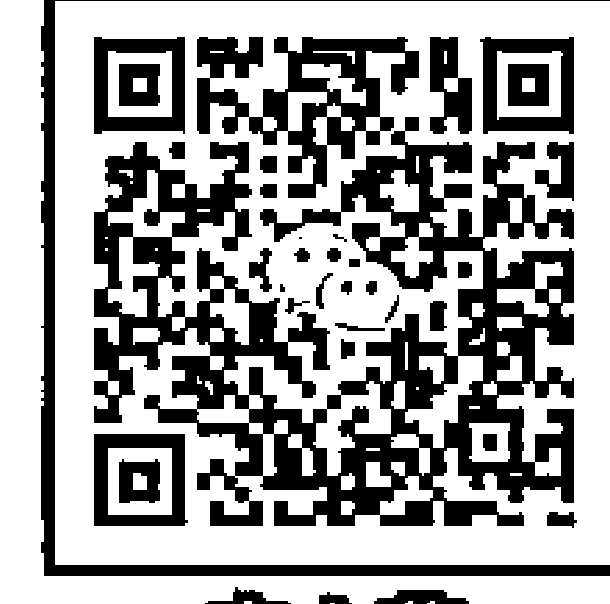

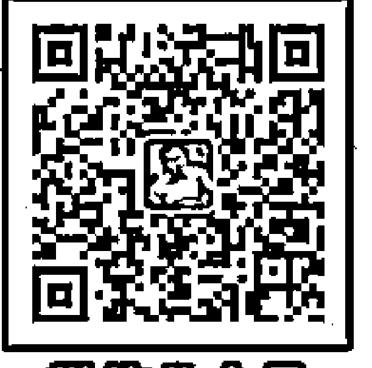

# 图书在版编目（CIP）数据

世界是个游戏，人生怎样才有意义 / 空心菜 著. ——成都: 四川人民出版社, 2017.11
ISBN 978-7-220-10353-7
Ⅰ. ①世… Ⅱ. ①空… Ⅲ. ①人生哲学—青少年读物 Ⅳ. ①B821-49
中国版本图书馆CIP数据核字(2017)第221006号

SHIJIE SHI GE YOUXI RENSHENG ZENYANG CAIYOU YIYI

# 世界是个游戏，人生怎样才有意义

空心菜 著

| 责任编辑 | 何朝霞 张东升 |
| :--- | :--- |
| 封面设计 | 张迪茗 |
| 版式设计 | 戴雨虹 |
| 责任校对 | 韩 华 |
| 责任印制 | 王 俊 |
| 出版发行 | 四川人民出版社（成都市槐树街2号） |
| 网 址 | http://www.scpph.com |
| E-mail | scrmcbs@sina.com |
| 新浪微博 | @四川人民出版社 |
| 微信公众号 | 四川人民出版社 |
| 发行部业务电话 | （028）86259624 86259453 |
| 防盗版举报电话 | （028）86259624 |
| 照 排 | 四川胜翔数码印务设计有限公司 |
| 印 刷 | 四川华龙印务有限公司 |
| 成品尺寸 | 155mm×230mm |
| 印 张 | 17.25 |
| 字 数 | 230千 |
| 版 次 | 2017年11月第1版 |
| 印 次 | 2017年11月第1次印刷 |
| 书 号 | ISBN 978-7-220-10353-7 |
| 定 价 | 49.00元 |

□版权所有·侵权必究
本书若出现印装质量问题，请与我社发行部联系调换
电话:（028）86259453

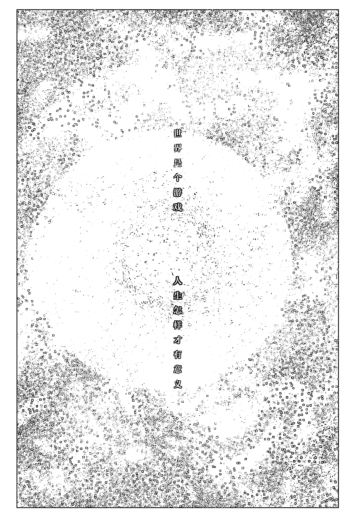

## 世界是个游戏

## 人生怎样才有意义

# 再版前言

几年前，在《世界就是一个游戏》（时代出版传媒股份有限公司、北京时代华文书局2013年版）出版时，我心中颇为忐忑。一方面担心自己一个学经济的人，贸然闯进哲学、科学、宗教的领域，提出的看法可能错漏百出；另一方面也担心自己的观点过于奇异，可能会遭到不理解之人的攻击。

但事实证明我的顾虑是多余的，几年来这本书及我发在网上的一个相关视频“中国学者：《道德经》揭开宇宙之谜”，收获的支持之多出乎意料。我终于明白，人类文明已经发展到了洞悉世界真相的边缘，只是需要有人去捅破那一层纸，而现在是时候了。

人类认识世界的过程就像盲人摸象，摸的部位不同，得到的经验也迥异，于是才有了不同学科分类。把盲人们摸到的所有部位拼凑起来，大象的轮廓就出现了；同样的道理，把哲学、科学、宗教的所有知识拼凑在一起，世界的真相就出现了。只是不知道老天爷为何如此幽默，竟想借一只税收专业毕业生的手来推进这个过程。

洞悉世界真相不是什么令人愉悦的事情，因为人类的前景并不乐观。然而只要有希望就应该努力，而且我相信，这原本就是我们应该承受的修行。

我将自己对于世界的看法分四本书来出版，它们的书名另定，但内容分别是“天之道”（世界观）、“地之道”（发展观）、“人之道”（价值观）、“心之道”（人生观），或者更简单地说讲述的是“宇宙”“文明”“社会”“人生”这四个话题。这是第一本书的再版。

感谢致力于推动本书出版和再版的朋友们，如果没有你们的帮助，仅靠我自己的努力，这本书恐怕难以这么快面世，你们功德无量。为本书第一版写序的清华大学曾国屏教授已仙逝，在此表示怀念。

但愿这本书能够帮到它的读者，让你们记起自己来这个世界的使命：在俗世中修行，在红尘中炼心。

愿人类能在游戏中通关。

空心菜

2017年3月

# 序

2016年3月12日我受邀到重庆演讲，演讲完后与太太搭船沿长江而下，以三天时间游览长江三峡及参观三峡大坝。途中有作者空心菜作陪，他特地由福建赶来重庆听我的演讲，也希望借由较长的时间陪伴可以讨论我过去二十多年所做的研究。

在船上他送了我一本他写的书《世界就是一个游戏》（时代出版传媒股份有限公司、北京时代华文书局2013年版），我一读之下对他搜集资料之广及提出人生就像一场电玩游戏，由背后的数字程序在掌控的观念大为佩服，因为真实的宇宙与电玩真的有点相似，尤其他对量子力学的理解相当深入，我以为他是念理工科出身对各种科学知识有基本的训练，一问之下才知道他是读社会科学出身，并非科班却对最新的科学知识能有这种理解和掌握，真不简单，所用插图经过精心选择美不胜收，看起来赏心悦目，加上智能的语言与对人生的很多洞见，读来畅快无比。这一次他根据多位老师的意见修改了原著，加了很多佛学的内容，整本书读起来更为充实。

我自己从事手指识字及念力的实验二十多年，从原本不相信这些人体潜能，到亲身投入后证实它们的存在，宇宙神秘面纱就一层一层地揭开，让我们逐渐了解这个世界的背后还有高层次的自然规律在影响我们的世界，而佛学里面都有相当详细的描述，不过现代大多数的人都只把它当作宗教的论述而非科学证实的世界。不过其中真的有部分论述经过我们实验的证实，二十多年来我一直坚信“实验是检验真理的唯一标准”，实验所显示的就是宇宙的真相。

作者引入的佛学内容我个人非常认同，加上他自己融会贯通后增加一些个人的创见及现代科学的发现，不断地问读者宇宙及生命最根本的三个问题，“宇宙从何而来？”“人类从何而来？”“人生的意义为何？”也就是人生的终极问题，并尝试解答，有些将佛学现代化的意图在内，这是一个了不起的尝试，我预祝他成功，也希望读者能够从书中获益良多。

> 前台湾大学校长 李嗣涔

# 序二

去年有一位朋友送我《世界就是一个游戏》（时代出版传媒股份有限公司、北京时代华文书局2013年版），他说这本书跟我的想法很接近，我一定会喜欢。果然如此！我才翻几页就不能罢手，很快便把整本书读完了。更令人惊喜的是，不久之前，我收到作者空心菜先生的电子邮件，我因此有机会跟作者做直接的交流。

《世界就是一个游戏》探讨的学科很多，差不多每一个学科都可以让人钻研一辈子，因此不可避免地，它没有办法像学术著作那样严谨。以笔者来看，这本书在佛学方面的叙述，便有一点误差。但这不是太大的问题。如同作者所说的：

> 钻研得深虽然理解更深，但成见也深，视野有时反而更狭隘。所以专家不必自傲，民科也无须自卑。我们都需要以开阔的胸怀来面对新思维，因为对于这个世界，每个人在认识上都是肤浅的，谁也不敢说自己有多深刻。

在真理的探究上面，保持客观理性的态度和方法，才是最重要的，只要有正确的态度和方法，即使有些错误也会陆续更正过来。这本来是无可争议的，但是实际上包括达尔文、爱因斯坦在内的许多科学家也不免有偏见，仍然会抗拒与自己主张相反的证据。《世界就是一个游戏》从各个学科的不同角度看问题，让我们有机会检查自己的偏颇，这是这本书最有价值的地方。因此，枝节的问题不用过多钻牛角尖，读者若是有兴趣，可以找各学科的著作继续深入研究。

世间智者一直在探索真相，但是每发现一点真相，就会发现还有更多无法明白的部分。对于不明白的地方，人们习惯以假说填补知识的空白。有时候这种假说太引人入胜，乃至出现相反的证据，大家也视若无睹。例如达尔文的进化论，虽然可以解释许多物种灭绝的原因，但是他以偶然的突变解释物种的进化，却没有足够的证据。如果物种的突变是生物进化的主因，应该会发现许多中间物种，但是达尔文期待的化石证据却始终没有出现，反而出现强而有力的反证。新出土的化石，显示在寒武纪有许多物种突然爆发式地出现，完全不是一点一滴地进化而来的。即使如此，大部分的学校仍然把进化论当成真理，用来教育学生。

与进化论相反的是决定论。决定论主张，万物是由神、造物主或本体所生，万物的各种性质与特征在出生之前便已决定。决定论又可以分为唯一能生论与多元能生论。唯一能生论可分为一神论与唯一体论。一神论主张，万物是由唯一的真神所创造的，这位真神能够听取信徒的祷告，决定是否应许其祷告。唯一体论则认为，能生万物的本体是不能知觉、没有意志的本体，这包括中国《易经》的太极、《道德经》的道、古印度的冥谛与西方哲学的本体论。

科学家不容易相信一神论，因为如果造物主有意志，我们应该可以观察到自然律被改变的事例，如同电影《冒牌天神》（Bruce Almighty）将月球拉近、猴子从一个人的肛门当中出生这种情节。唯一本体论不需要面对这种质疑，但是它只能解释共业共报，却没有办法解释别业别报的现象。

佛教是多元能生论或多元本体论，万物由阿赖耶识所生出，每一个有情各有一个阿赖耶识。阿赖耶识并非只是一种理论，它还是佛教修证的核心。佛经对阿赖耶识有具体的描述：一、它不能了别六尘境界，所以它没有烦恼，也不能听取信徒的祷告；二、它能够了别根身、器界、种子；三、它能够积集种子、生起现行。笔者在《禅宗的开悟与传承》及《实证佛教导论》曾经引用大量的经教证明，禅宗的开悟即是现实中发现阿赖耶识的具体作用。开悟之后，明白肉身和精神作用只是假我，便能渐次摆脱自私的心态和行为取向，最终转凡成圣。

各别有情的阿赖耶识出生各别的果报，如身体的强弱与智力的高下，这是别业别报。山河大地等生存的环境则是共业共报，由共业有情的阿赖耶识共同出生。阿赖耶识不在现象界，但是它与现象界互为因果，现象界是它的输出，有情身口意的造作则会改变阿赖耶识所含藏的数据，相当于对它的输入。每一个有情的阿赖耶识分别记载着它相对于其他有情的善业、恶业，等待着将来酬偿因果。每个人和其他所有的人都有相互的联系。它是平等的结构，没有中央主机，除此之外，它与网络游戏几乎没有什么不同。佛经常有“游戏神通”这句话，这并不只是譬喻，它显示的是佛教的世界观：世界就是一个游戏。懂得这个道理的人能够解脱烦恼，因此——

游戏吧！朋友！

吕真观①

> ①吕真观，1961年出生于台湾省桃园市，《实证佛教通讯》发行人，著有专书《禅宗的开悟与传承》和《实证佛教学导论》。1979年开始阅读佛经与禅门典籍，并到处参访知名禅师。2006年毕业于华梵大学东方人文思想研究所。随后三年于中国社会科学院研究生院主修宗教学，2009年毕业，获颁哲学博士学位。一生都在探寻真理，如今仍在继续着永不止息的旅程。

# 推荐语一

我在研究细胞和个体应对各种逆境的反应机制的过程中，时常为生命近乎完美的设计感到震惊。例如，细胞对紫外线的照射会产生一系列反应，能对DNA的损伤进行自我修复，在任一营养物过多或匮乏时均能产生反应，以维持细胞内的代谢平衡。每一种蛋白质似乎都有无穷的功能，其组合与调控的奇妙，甚至超乎了哪怕是最顶级电脑编程高手的想象。更有甚者，体内的细胞甚至还会因为“知道”自己已经癌变而自杀。

本人没有任何宗教倾向，但不可思议的生命之奇妙难免会让人对进化与造物之谜产生遐想，渴望一探究竟，也让我不禁想到一种思维方法论——目的论（teleology），生命似乎有内在预先设定的无限能力，它是自发的。

我常常勉励青年学者，要勇于大胆预想各种可能。假想落空了便作罢，万一验证了便可做出突破性的发现。友人推荐阅读的青年作者空心菜的《世界就是一个游戏》（时代出版传媒股份有限公司、北京时代华文书局2013年版）一书，其独特的视角和不落窠臼的奇思妙想就很能给人启发，引起共鸣。我认为此书有助于年轻学者激发创造性思维，在科学研究的道路上走得更远。

希望今后能多一些此类作品出版，在此推荐此书，愿您也能从中有所收获。

厦门大学生命科学学院院长 林圣彩

# 推荐语二

人类对宇宙和未知事物的理解、认知和描述常常使用之前已经掌握了的概念进行类比。牛顿时代的人们认为宇宙就是一个像钟表一样精密运行的机器；电子时代的人们认为宇宙的本质是带电的粒子；而在当今的信息时代、数码时代，我们对宇宙的认识也亟待发展和更新。

虚拟宇宙假说是德国计算机学家 Zuse 在1969年首先提出的。Zuse 是当之无愧的计算机先驱，他早在20世纪40年代时就开发出世界上第一台可编程计算机。他提出一个大胆的设想，即整个宇宙是一个计算机的运算输出。相对原子论、相对论和量子力学而言，虚拟宇宙假说有着鲜明的数码时代特征。Zuse之后的许多物理学家和计算机学家都试图发展这个学说，但至今并没有取得大的实质性进展。

难能可贵的是空心菜先生在东方哲学思想的指引下，首次揭示了宇宙程序的本质就是老子所说的道，从而为虚拟宇宙论的进一步发展提供了古老而坚实的哲学基础。相信本书一定会对新一代的科学家建立以东方哲学为基础的未来科学体系提供宝贵的思路和启迪。

旅英华侨、英国元计算学实验室创始人、国际华人超心理学会中国分会副秘书长、英国剑桥大学博士  段晓明

妈妈，
我觉得生命就像一场游戏，
人死了
你的游戏就结束了。

那是一个下午，就在我家楼下，一个只有八九岁的小男孩跟他妈妈说出这样一番话，我瞬间惊呆了。

很多人在儿时都萌生过对世界的好奇和幻想。我小时候就经常在夏日夜晚，坐在屋前的晒谷坪上，看缥缈的银河像一缕轻纱飘浮在夜空中，心中充满疑惑：天上有些什么？

仰望星空，在同样的夜色下，古往今来不知曾有多少的诗人哲人，在感叹着天地的广袤与生命的卑微，感伤着人生的短暂与时间的绵长，心中思索着那个亘古的疑问：天地因何而存在？人类从哪里来？

第一章 终极问题：宇宙从何而来？人生意义何在？ 1

第二章 超正常现象：为何存在自然规律？是谁制定了自然法则？ 11

第三章 天问：宇宙是无中生有的？宇宙外面是什么？ 22

第四章 何为真实：眼前的世界是真实的？别太相信你的眼睛！ 35

第五章 进化疑云：物种是进化而来的吗？有没有其他可能？ 44

第六章 智慧设计：宇宙定律像是一种精心设计，为了我们的存在 54

第七章 登山阶：世界就像是一条有台阶的山路，量子就是台阶 66

- 第八章 上帝的骰子：量子世界一切都是不确定的，上帝在掷骰子 76

- 第九章 镜花水月：量子论证明，世界只是镜中花、水中月？ 89

- 第十章 隐形的手：心灵感应式的量子纠缠，世界背后有只隐形的手 100

- 第十一章 不老传说：“天上才一日，世间已千年”，这种现象真的存在 110

- 第十二章 创世程序：世界就像游戏，是“道”这个程序运行后诞生的 123

- 第十三章 苍天在上：游戏背后的监控系统，我们称为“老天爷” 134

- 第十四章 造化论：世界如同游戏一样，是先被创造然后再演化的 144

## 第十五章 虚拟现实：造物主用“虚拟现实技术”创造了现实世界 155

## 第十六章 天外有天：在二维游戏中的人看来，我们就在高维空间 165

## 第十七章 时间真相：时间是宇宙演变的刻度，可以快播和慢播 178

## 第十八章 灵魂之谜：人有肉体和灵魂，如同电脑有硬件和软件 195

## 第十九章 神通：封闭肉体的功能后，打开灵魂被封印的功能 209

## 第二十章 红尘炼心：人类是到这个虚拟系统中修炼灵魂来的 226

## 第二十一章 谁是造物主：是谁构建了“三界六道”这个庞大的虚拟系统 239

## 第二十二章 人间是道场：实现人与自然、人与人、人与自身的和谐，集体通关 249

## 第一章 终极问题：宇宙从何而来？人生意义何在？

不知道上天为什么让我知道这个秘密，我相信，那一定是有原因的。
我要和大家分享的，是这个世界的终极秘密。
从古至今，人类一直在思考三个问题：“宇宙从何而来？” “人类从何而来？” “人生有什么意义？” 它们被称为人类的“终极问题”。
迄今为止，对终极问题的回答一般来自宗教和科学这两大思想体系，首先做出系统回答的是宗教。
在世界三大宗教中，基督教给出的答案是：上帝创造了世界和人类，人生来就有罪，因为上帝造人之后，人违背了上帝的意志。所以人生的意义是信奉上帝，洗净身上的罪，从而得到救赎，死后重新被上帝接纳，回到天堂。
伊斯兰教认为安拉是宇宙间至高无上的主宰，除此之外别无其他神灵。人生的意义在于信仰和顺从安拉，在现世创造美满生活的同时多做善功，死后等待被安拉复活，在接受安拉的审判后进入天堂。
佛教没有直接回答世界和人类如何起源的问题，只说万物都因缘集合而生、因缘散失而灭，有情众生在三界六道中不断轮回，主导这一过程的是“业”。众生皆苦，人生的意义是通过修行实现“涅槃”，脱离六道轮回，得到彻底的解脱。

宗教对于终极问题的回答有相当积极的意义，给信徒们指明了人生的方向，让他们的生命有了意义，精神有了归宿。虔诚的宗教教徒一般都能做到不浮躁、不焦虑、不生恶、不贪求，以淡定的心态过好此生，从容面对死亡的来临。

因为相信有神的监督，每个人的行为将决定自己死后进天堂还是下地狱；或者相信存在因果报应，今生的善恶会影响来世的命运，所以虔诚的宗教教徒都怀有敬畏之心，会自觉约束自己的行为，遵守宗教道德，不敢触犯戒律。宗教因此在维护社会秩序方面起到了正面作用，直到今天世界上很多国家还在依靠宗教建立社会道德价值体系。

在人类文明史上的相当长一段时期，宗教主导了人们对世界的认知，让我们相信终极问题已有确定的答案。活在信仰之中的人是幸福的，不管生活贫穷还是富裕，他们在精神上始终是富足的。但是很遗憾，后来宗教暴露出了许多问题。

> 米开朗基罗为罗马西斯廷教堂创作的巨幅天顶画《创世纪》中最动人心弦的一幕，画面体现的是从天而降的上帝将手指伸向亚当，神圣火花即将触及亚当的那一瞬间。

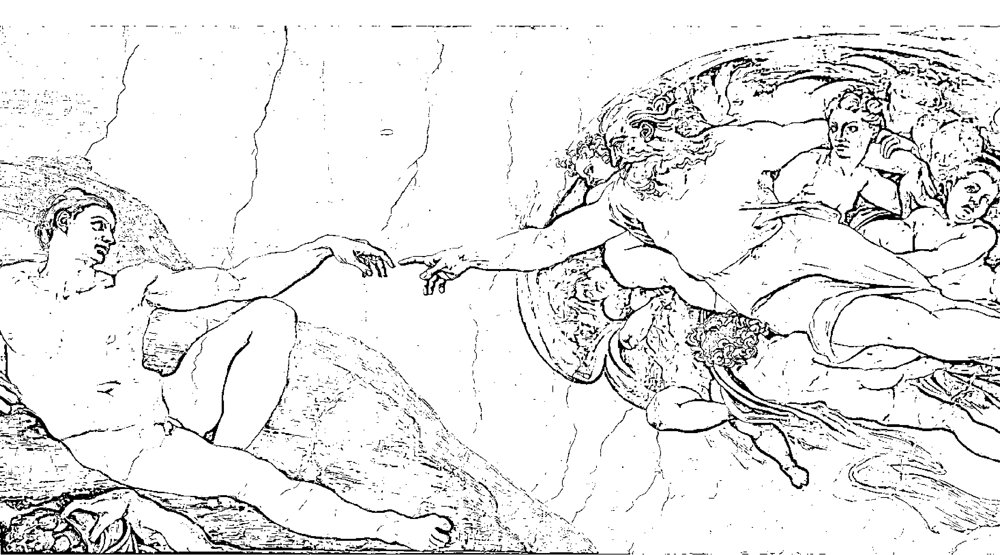

排他性是宗教的一个大问题。多数宗教都认为自己的教义绝对正确，但不同宗教的教义却又各不相同，它们不可能都对，一定是有人搞错了。于是为了争论谁对谁错，不同宗教之间经常打得头破血流，甚至连同一宗教的不同派别之间也是如此。

宗教教义的正确性也令人生疑。宗教创始人都声称自己的知识来自“天启”，然而我们却很容易观察到，宗教具有很强的地域性。正如早在公元前6世纪的古希腊哲学家色诺芬尼曾经指出的那样，埃塞俄比亚的神是扁鼻子的黑人，而色雷斯的神却是红头发蓝眼睛。相同地域的宗教之间就像是血缘相近的兄弟，有诸多相似之处。基督教、伊斯兰教，和犹太教一样都认为是上帝创造了世界和人类，差别只是称其为“耶和华”还是“安拉”；印度的佛教、印度教，和耆那教一样都相信存在“轮回”和“业”，相信依靠修行能脱离苦海、不入轮回，得到彻底的解脱，差别只在于通过的途径是“涅槃”还是“梵我合一”。

我们有理由相信，这些宗教的教义至少有部分不是来自天启，而是受到了创始人所处环境的影响。否则很难解释，为什么同一地域的宗教教义会如此雷同，而不同地域的宗教教义之间却千差万别呢？

更糟糕的是，虽然各个宗教都声称自己的教义是绝对正确的，但它们对世界的描述不仅粗糙、语焉不详，甚至还带有很多错误，很难经得起时间的检验。

《圣经》中这样描述世界的起源：起初，神创造了天地。在接下来的六天又依次创造了光与暗、苍穹、陆地与海洋、青草蔬菜果树等植物、日月星辰、鱼和飞鸟等生物、爬虫走兽，最后照着自己的模样造出人来管理其他生物。基督教因此认为，人类的地位在其他生命之上，因为在上帝的创世计划中人类就是管理者，而地球是宇宙的中心。

这些说法在基督教创立初期看不出什么问题，但后来随着科学不断刷新人们对世界的认知，就变得漏洞百出了。

16世纪波兰天文学家哥白尼提出“日心说”之后，事实逐渐证明地球是在围着太阳转动，“地球是宇宙中心”的说法就不能成立了。后来科学家们更是发现，宇宙诞生于137亿年前，而地球的年龄只有46亿年，它们出现的时间差距太远了，“起初，神创造了天地”的说法很明显是在想当然。

19世纪英国生物学家达尔文提出了“进化论”，认为地球上的物种不是在过去的某个时间同时出现，而是在漫长的岁月里逐渐进化而来的，这样一来，“神创造鱼和飞鸟等生物、爬虫走兽”的说法就不对了。更麻烦的是，达尔文还认为人是由古猿进化来的，而如果人类是上帝按照自己的模样造出来的话，那么这种创造应该是一次成型的，人一造出来就是人，不可能是其他物种经过长时间的演化才变成人，所以《圣经》中“上帝造人”的说法也被否定，基督教教义的基础被彻底推翻了。

宗教通常要求信徒无条件信从，不允许对教义做丝毫改动，这有助于凸现它的神圣与权威，但也堵死了自己向前发展的道路，使自己不再具有提升空间。因为无法根据发生的新情况对教义做出修改，科学层出不穷的新发现让宗教很尴尬、很无奈。“科学每前进一步，宗教就后退一步”，

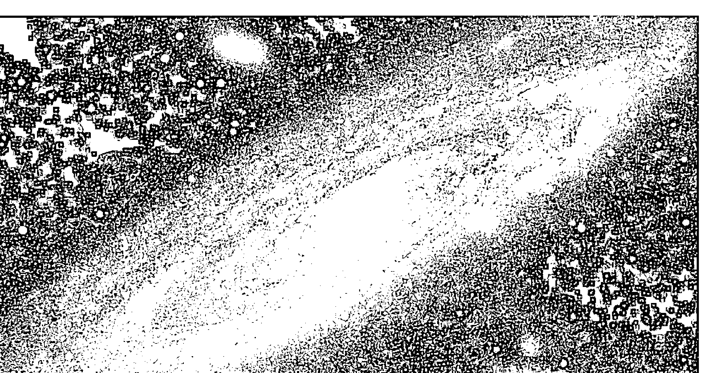

> > 很多宗教把人类当作是万物之灵，认为人类凌驾于其他物种之上，把地球当作是宇宙的中心。但现在我们已经知道，人类只是一种高级动物，地球不是宇宙的中心，只是茫茫宇宙中一颗普通的星球。

科学最终在理性的领域终结了人们的信仰，从此代替宗教主导了人类对于世界的认知。

科学家认为，主宰世界的不是神灵，是“自然规律”。科学研究就是要分门别类地通过观察和实验，发现宇宙演变过程中存在的这种规律性。

达尔文的进化论影响深远，在它的带动下，科学家们开始相信生命的出现只是一种偶然，是自然演变的结果。后来在研究行星、恒星、星系的演化过程之后，科学家更是认为整个宇宙都是自然演变而来的，跟神的创造毫不相干。

由此科学给出了自己对于终极问题的回答：世界是自然形成的，人类的出现也是自然演变的结果，与神无关。但这样一来，“人生有什么意义”这个问题就不太好回答了。因为既然人只能活一辈子，死了之后什么都不存在，那只要过好这一生就行了，不需要再考虑更多。我们只能说：“人生的意义就是过好你的人生，别无其他意义。”

在宗教之后，科学再一次让我们相信终极问题已有确定答案。但遗憾的是，现在我们发现科学也有问题。

其实仅从现象上就能看出一些端倪：尽管科学认为自己已经在理性的领域将宗教击垮，但奇怪的是世界各大宗教并未因此走向衰败，反而出现了与科学齐头并进的势头。

科学最大的问题是不能满足人的精神需求。科学摧毁了人们的信仰，当一个人缺乏信仰时，他在精神上是无家可归的，只能用物质来填补精神的空虚。那些相信只有今生没有来世的人，心中不再有敬畏，往往会理直气壮地疯狂追求物欲享受，甚至为逞私欲不择手段，期望在短暂的生命中得到最大满足，以不负此生，这给社会道德体系的维护制造了大麻烦。

18世纪德国的哲学家康德对此早有担忧。他说：无论理性或经验都无法确实证明上帝的存在，但为了维护道德的缘故，我们应该假定人有不朽的灵魂，上帝确实存在。也许正因如此，不管科学如何发达，宗教的作用仍然不可替代。

除此之外，我们还发现科学本身也是存在局限的。时至今日，科学已如此昌明，把世界研究得如此透彻，但我们却看到，科学的研究方法更适用于物质世界，而在精神领域的研究方面却收效甚微。所以对于人的精神世界，我们现在仍然知之甚少，至今不知道人的意识是如何产生的，它的运行机制又到底是怎样的。

正因为如此，当身体出了问题时我们会相信科学，去医院寻求医生的帮助；但当精神出问题时我们更愿意寄希望于宗教，去教堂、寺庙寻找心灵的慰藉。很少有人会在精神空虚、对生命的意义产生怀疑时去找科学家咨询，事实上，科学家在这方面根本就帮不了你。

科学家自己对此也有所意识，所以并不像一些人想象的那样，科学和宗教是死对头。很多科学家对于宗教并不排斥，甚至认为宗教对于科学来说是有益的补充。

科学界还有一个很有趣的现象，就是许多著名的科学家，研究到最后都走上了与宗教接轨的道路。远的如17世纪鼎鼎大名的英国科学家牛顿，近的如当代著名科学家、前台湾大学校长李嗣涔，以及前中国科技大学校长朱清时等，最终都与现代主流科学渐行渐远，而与宗教越走越近。

难道这些科学家年轻的时候头脑还清楚，年龄越大研究越深反而越糊涂了吗？

当然不是，科学与宗教之间的是非对错，并不像它们表面看起来那么简单。回顾历史，仔细推敲你会发现，科学实际上并没有彻底推翻宗教对于终极问题的回答。科学也许能够证明《圣经》中关于上帝创世的描述是错误的，但并不能就此证明上帝不存在，也无法证明自己所主张的“世界是自然形成”的观点是正确的。

> > 没有宗教的科学是跛脚的，没有科学的宗教是盲目的。

的确，宗教可以为科学注入精神力量，而科学可以帮助宗教提升其教义的正确性，使它从盲目的信仰中解脱出来，它们之间是互补的。

就像喊“狼来了”的孩子说了两次谎以后，再也没有人相信他一样，

宗教在一些方面透支了自己的信用，导致许多人在所有问题上都习惯性地排斥它的说法，而选择相信科学。但他们并没有意识到，科学其实也没有为自己给出的答案提供足够的证明。

时至今日，科学又有了许多令人匪夷所思的新发现。有意思的是，这些新发现未能进一步摧毁宗教信仰，反而在一定程度上与宗教教义相契合，对科学自身提出了严峻挑战。英国物理学家保罗·戴维斯说，相对论和量子论的发现让物理学家们开始意识到，对于实在的最基本方面需要做出全新的界定，“他们于是学着以完全出人意料的、全新的方法来解决问题，而这些方法似乎是违背常识的，它们更接近神秘主义而不是唯物论”。

一些科学家开始尝试从宗教教义中获取智慧，来解读科学的新发现，但这种倾向遭到了科学共同体的强烈抵制。正如在宗教主导社会主流意识

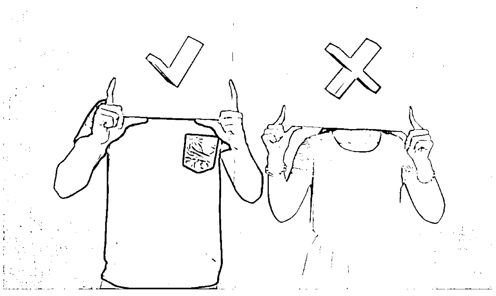

> 从“狼来了”的故事中我们可以得到一个教训，那就是人们很容易绝对化，凭经验把某个东西看成是绝对的好，或者绝对的坏；绝对的对，或者绝对的错。而现实中更多的情况是，对的东西不一定全对，错的东西也不一定全错。就像放羊的孩子虽然说过两次谎，但你凭什么认定他第三次说的就是谎话？

的年代，哥白尼、伽利略不敢轻易发表他们的观点一样，现在的科学家同样不敢随便公开自己在这方面的研究，否则很容易被主流科学界排斥而边缘化。

宗教信仰提倡无条件的信从，而怀疑的态度曾经是科学最为人称道的精神之一，但在怀疑到自己头上时，科学和宗教做出的反应并无不同。许多人在像对待宗教那样看待科学，一种理论凡是贴上科学的标签，就代表了绝对正确、不容置疑；而一种观念一旦与现有的科学理论相冲突，就毫无商量余地，一棍子打死。这样一来，科学对于某些人来说其实已经成为他们的宗教信仰。

事实上，科学原先对于终极问题的回答，现在已经被更新的科学发现所否定，我们原本以为科学已经给出了终极问题的清楚答案，但现在科学的新发现又一次把我们的认知搅得支离破碎，情况再次变得扑朔迷离。而且更为重要的是，这些科学新发现足以让我们对终极问题有全新的认识，对生命的意义有全新的了解。

保罗·戴维斯说：“我认为，与宗教相比，科学能为人指出一条更为确切的通向上帝的道路。”也许正如他说的那样，科学最后不仅不会成为宗教信仰的终结者，还会和宗教殊途同归，从不同的角度帮助我们找到世界的终极真相。

这本书可能会颠覆你的世界观、价值观、人生观，你准备好了吗？

### 延伸阅读

人类的偏执在宗教与科学中同样突出

世界上绝大多数的宗教，都以爱心、和睦、谦卑为美德，然而宗教迫害、宗教仇恨和宗教冲突却随处可见。一些人仅仅因为提出了与教义相违背的新思维、新观念就被残酷杀害，甚至在信仰同一宗教的人群中，也因对教义的理解不同而相互攻讦。不同宗教之间的对立更是问题严重，基督教与伊斯兰教在历史上曾经进行过长达200年的宗教战争——“十字军东征”，酿成了无数血流成河的屠城惨剧，直至今日仇恨仍在发酵，导致纷争不断。

为什么会这样呢？除了其中隐藏着某些宗教领袖的个人目的之外，一个很重要的原因是人们的偏执。许多宗教教徒很偏执，认为自己信仰的宗教正确性毋庸置疑，但却又不讲道理地断定，别人信仰的宗教是绝对错误的，并且丝毫不想给人以辩解的余地。这一问题至今依然存在，前些日子我想了解佛学知识，加入了一些佛学交流群，结果有些管理人员只是在带读经文，所做的解释也一看就是标准范本，不是自己的理解。在我提出一些问题时，却被告知只要跟着念经就行了，不要多问为什么。当我试图把自己的一些理解提出来探讨时，却发现自己很快就被踢出了群。这种盲目、狂热、偏执的毛病，在任何一种宗教身上都不同程度地存在着。

其实很少有宗教的创始人说自己就是神，最多只说是神的代言人，聆听过神的教诲。既然是人不是神，那么他们的话凭什么能绝对正确呢？更何况，目前传下来的宗教教义还不是他们的原话，都是别人根据回忆记录下来的。你可以回想一下曾经听过的讲座，试着把它整理成文字，再跟原始录音对照一下，看看准确率有多高？

令人遗憾的是，这种偏执不是宗教教徒才有，在许多科学人士身上同样存在，看来它是人类的通病。有些人不讲道理地认为，科学与宗教就是对立的，对于宗教莫名反感。更糟糕的是他们还把纯粹的精神与宗教等同起来，一提到精神的作用，就说那是宗教的糟粕。所以现在基本上没有几个在科学界混的人，敢去触及纯精神领域的研究，它似乎已经成为科学的禁区。

实际上科学与宗教之间并没有不可调和的矛盾。历史上许多的科学家都相信上帝的存在，比如牛顿、法拉第、道尔顿、孟德尔、麦克斯韦、冯·布劳恩等。爱因斯坦也相信宗教与科学是互补的，他说：“即便能对宗教和科学领域进行划分，其实二者之间的联系和依赖关系依然存在。宗教能够决定目标，科学能由渴求真理和知识的人创造出来，科学的手段能促成宗教目标的实现。”

宗教长于以直觉开展精神的研究，而科学长于以理性开展物质的研究，所以很多人会想把它们结合在一起。爱因斯坦说：“通向真正宗教之路不在于对生命和死亡的恐惧，也不存在于盲目的信仰之中，而在于对理性知识的不懈追求”；戴维斯也相信“科学能为人指出一条更为确切的通向上帝的道路”。然而这种结合必须有一个前提，那就是人类要能够克服自己身上的偏执，以包容的心态去拥抱世界的真相。

## 第二章

### 超正常现象：为何存在自然规律？是谁制定了自然法则？

> > 庄子说：“井蛙不可以语于海者，拘于虚也；夏虫不可以语于冰者，笃于时也。”

时空对于井里的青蛙、夏天的昆虫起到了巨大的制约作用，使它们的认识水平被限制在一个很可怜的狭小范围内。

人们常用“夏虫不可语冰”来讽刺一个人的见识浅薄。然而假如站在整个宇宙演变历史长河的跨度来看，人类讥笑井蛙夏虫其实毫无道理，因为和它们相比我们好不到哪里去。

从空间上看，人类被困在直径只有1.28万公里的一个小小星球上。宇宙的浩瀚出乎想象，假如我们能够以30万公里/秒的光速飞行，那么绕地球一圈只需0.13秒，但要到达目前所知的离我们最远的天体，却要走120亿年。地球的年龄到目前为止才不过46亿年，对比一下你就会知道宇宙究竟有多大，而我们的活动范围是多么的小。

从时间上看，人类的存在与整个宇宙演变的历史相比，只能说是短暂的。假如把宇宙137亿年的演化过程按比例缩小为1年，那么人类文明史要从新年钟声敲响前不到半分钟才开始。

只有清楚了在宇宙中的位置我们才会知道，原来自己在井蛙夏虫面前表现出来的骄傲，其实不过是五十步笑一百步而已。

井蛙一辈子待在井里，所以认为世界就是一洼井水加上井口大小的一

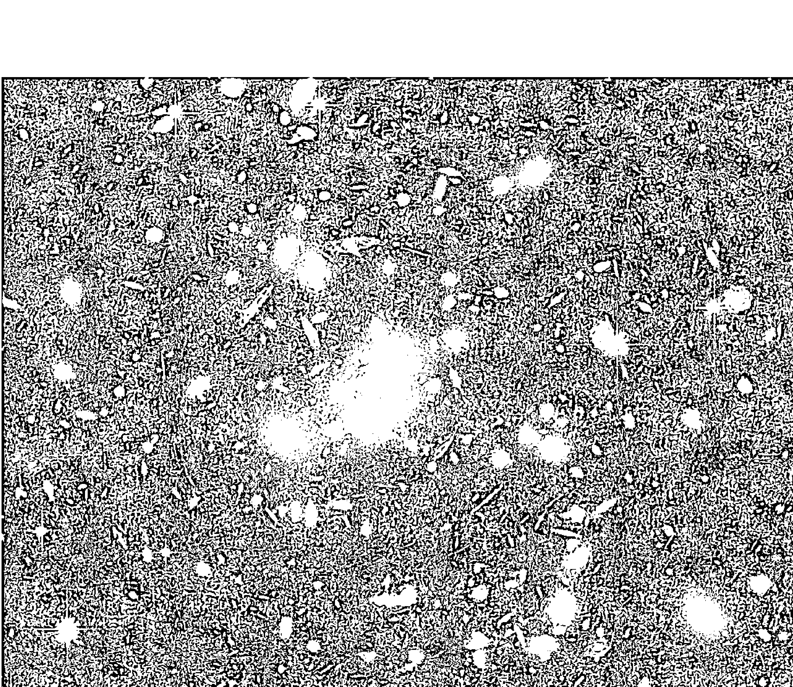

> 照片中的每一个发光体都可能是由无数恒星组成的星系，而地球是一颗行星，宇宙中随便一颗恒星都要比它大得多，太阳的体积就相当于它的130万倍。地球只不过是宇宙中的一粒微尘，被困在这个小小星球上的人类，视野能有多大可想而知。

片天；寿命短暂，只活了一个夏季的虫子，看到的都是流动的水，所以认为它永远如此，根本不能想象冬季冰封千里的景色，这些都是在有限时空中形成的狭隘印象。

世界的真实情况与井蛙夏虫的眼中所见差距是如此之大，人类是否也存在这样的问题呢？

情况差不了很多。自古以来，人类眼中看到的都是平坦的大地，太阳东升西落，满天星辰在围着大地四周转动，所以很自然地就认为大地是一个平面，地球是宇宙的中心。人类文明史上绝大部分的时间里，这种观念都在人们的认识中占据着主导地位。你怎么会想到，这种看似再正常不过的现象，背后的真相是地球在自转的同时还在绕着太阳转动？

在人们以为大地是一个平面的时候，因为有上下之分，所以树上的苹果往下掉看起来似乎是天经地义的。但现在知道，地球实际上是一个球体，在你认为的下方，球面另一端站着美洲人，他们照样站得稳稳的，并没有往下掉。此时你还会坚持认为，东西理所当然就应该往下掉吗？

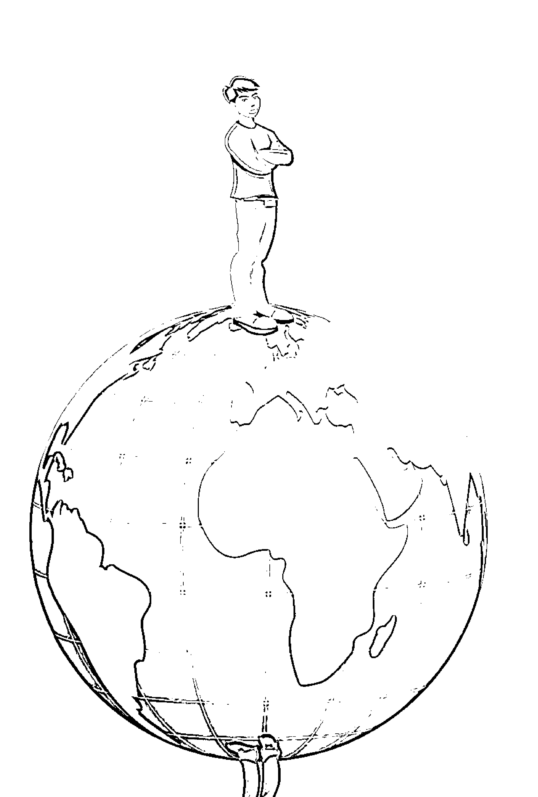

> > 如果古人知道地球是一个圆球，一定会感到疑惑：“美洲人为什么没有掉下去呢？”

现实世界中有些我们熟视无睹、认为再正常不过的现象，事实上并不正常，其背后蕴藏着秘密，我把这一类现象称为“超正常现象”。

在科学、哲学领域有很多的“超正常现象”，只是我们早就习以为常，没有给它们足够的关注。接下来我会指出一个又一个你以前也许觉得很正常的现象，挖掘它们背后的秘密，相信你会惊讶地发现，原来你从未真正认识过这个世界。当你看透世界的本质，揭开了蒙在它脸上的面纱之后，终极问题的答案就在眼前了。

> > 这个世界最让人难以理解之处，就是它竟然可以被理解。

我要说的第一个很多人从未感觉到异常的现象，是自然规律的存在。

在很久以前人们已经意识到，世界背后有一只无形的手，在安排着天地万物的运行秩序。昼夜更替，草木枯荣，抛石落地，水往低流，一切似乎都有章可循。更为奇怪的是自然界不同事件之间有着因果关系，可以找到其中的规律性，乌云密布意味着要下雨，蚂蚁搬家也能预示同样的结果。爱因斯坦曾对此表示吃惊：“这个世界最让人难以理解之处，就是它竟然可以被理解。”

我们通常把世界背后这种有秩序的表现称为“自然规律”，而在国外翻译过来的科普读物中，更多地表述为“自然定律”或者“科学定律”。人们认识自然规律的历史由来已久，尽管古人并不知道自然规律是怎么回事，但却很早就懂得不能违背自然规律的道理，“拔苗助长”的成语讽刺的就是不明白这种道理的无知者。

古人对自然规律运用水平的高超，有时会令现代人汗颜。李冰在公元前256年主持修建的都江堰，就已经懂得利用地形的特点和水流的规律，使之具备自动分流、排沙、控制进水流量等多种功能。基于对自然规律的深刻理解和巧妙运用，这一水利设施历经了2200多年时间的检验，至今仍在发挥着重大作用。

到了现代，科学发展让人们对自然规律有了更深刻的认识，对它的运用也得到了更大提高，由此推动了技术的飞速进步。但不管人类在运用自然规律方面取得了怎样的成功，对它的认识却仍然处在极肤浅的层次上。

人们往往把“自然规律”和“自然法则”混为一谈。其实自然规律和自然法则之间虽然存在着关联，但却是完全不同的两个概念，下面举个例子说明。

你站在一所学校门口观察，发现走出来的都是女生，毫无例外，这样你就发现了一个现象：从这所学校出来的学生都是女生。根据这个观察你可以预测，下一个走出来的应该还是女生。这就叫“规律”，它是人们凭经验对自然界和人类社会某种共同现象的归纳总结。

为什么会出现这样的规律呢？在进一步了解之后得知这是女子学校时，你就恍然大悟了。女校的招生规则规定了只招收女生，正是这样的规则造成了你只看到女生的规律。

需要注意的是，规则才是真正起作用的主体，而规律只是规则起作用后表现出来的现象。因为有规则的存在，事物的发展过程才会呈现出规律来，所以规则决定着规律，女校的招生规则决定了你只能看到女生的规律。而规律却不能反过来决定规则，你只看到女生并不能说明这里就是女校，一定只招收女生，也可能是因为这个校门刚好开在了女生宿舍前面。

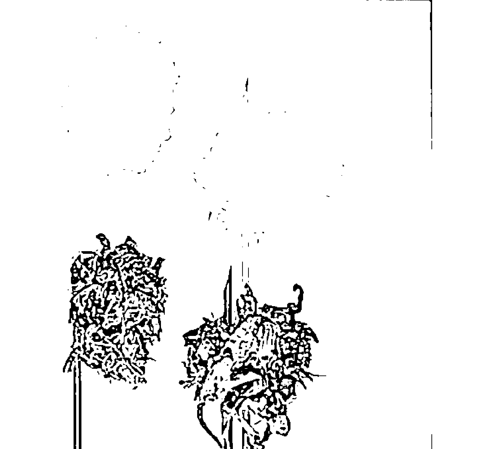

规律作为一种现象是有可能发生变化的，但它背后的规则不会随之改变。几个邻校的男生来女校串门就会打破你只看到女生的规律，但这不代表它的招生规则改变了。

因为把规律与规则的概念搞混了，有人想当然地把自然规律看作一种铁律，事实并非如此。随着观察角度的改变，人们总结的自然规律是会发生变化的，不变的是存在于背后的自然法则。遗憾的是我们能够发现和总结自然规律，却永远无法通过它来推知真正的自然法则，正如爱因斯坦说的那样：'你偷看不了上帝手中的牌。'

需要提醒你注意的是，科学定律只是人们总结出来的自然规律，不是自然法则。达尔文说：'科学就是整理事实，发现规律，得出结论。' 这话概括得不错。科学研究的对象是现实世界中存在的现象，采用的方法是进行分门别类的研究，得到的结果只能是对自然规律的局部认识，而不是对自然法则的整体认知。

历史证明，除纯思维的数学领域之外，科学定律被打破是家常便饭。19世纪末，由牛顿的经典力学、麦克斯韦的电磁理论、热力学三大定律构建的经典物理理论体系，取得了如此辉煌的成功，以至于让很多人感觉物理学已经接近终点了，却很快就在相对论和量子论面前土崩瓦解。

所有人们认为已经得到充分验证的科学定律，其实都只是得到了有限的验证而已，因为人们永远无法穷尽宇宙中所有的现象来证明它的正确。所以从严格意义上说，我们永远不能肯定科学定律是正确的，最多只能说暂时还没有发现它的错误而已。

由此甚至可以得出这样一个令人沮丧的结论：科学是永远无法让我们得到真理的。只是科学巨大的实用价值常常会让我们忽视这一点。

但更容易被人忽视的是这个问题：为什么会存在自然规律？

在人类历史上相当长的时间内，人们都对蕴含于世界背后的这种秩序习以为常。后来终于有人开始思考这个问题，托马斯·阿奎那这样写道：

> “人们在一切物体中都观察到趋向某个目的的行为秩序，一切物体都遵从自然规律，即使当它们没有意识时也是如此。”

阿奎那意识到了世界的运行在遵循着自然规律，他把这作为上帝存在的证据，认为在幕后制定规则的就是上帝。

从那以后，人们慢慢开始有意识地去发现自然规律。到17世纪已经开始出现了自然定律的现代概念，德国天文学家开普勒和意大利科学家伽利略都能够从现代科学意义上去理解这个术语的含义，伽利略还发现了不少的定律。

第一位明确并严格地表述现代自然定律概念的是笛卡尔，他认为所有物理现象都必须以运动物体的碰撞来解释，这一过程受到了自然定律的制约，他说的就是牛顿三大运动定律的前身。笛卡尔还很清楚初始条件的重要性，明白只有在初始条件确定的情况下，系统才会在自然定律的约束下随着时间演化，否则其过程就无法通过定律来推测。

最近几百年，科学的发展让人们对自然规律的认识日益深入，曾经隐藏在世界背后的运行机制日渐清晰地显现出它的身影。17世纪的英国科学家牛顿首次让人们清楚地认识到，自然事件因果关系之间的规律性原来可以用公式来量化。之后在各学科领域越来越多的科学定律被发现，人们眼中原先显得有些模糊的世界，逐渐被各种各样的公式描述得越来越清晰起来。

这些规律从何而来呢？早期的科学家，例如开普勒、伽利略、笛卡尔和牛顿，与阿奎那的意见大致相同，普遍相信决定世界运行轨迹的自然法则则是上帝的杰作。

可是到了现在，我们很难再听到自然法则出自于上帝之手的说法了。为什么会有这样的变化呢？原因还在于进化论。达尔文的进化论否定了上帝造人的说法，进而让人们不再相信世界是上帝创造的，这样同时也就否定了上帝制定自然法则的说法。

进化论认为，地球生物界复杂的秩序和生物的多样性，是在自然选择的作用下自动形成的，不是神有意识创造的。从这个逻辑出发人们开始考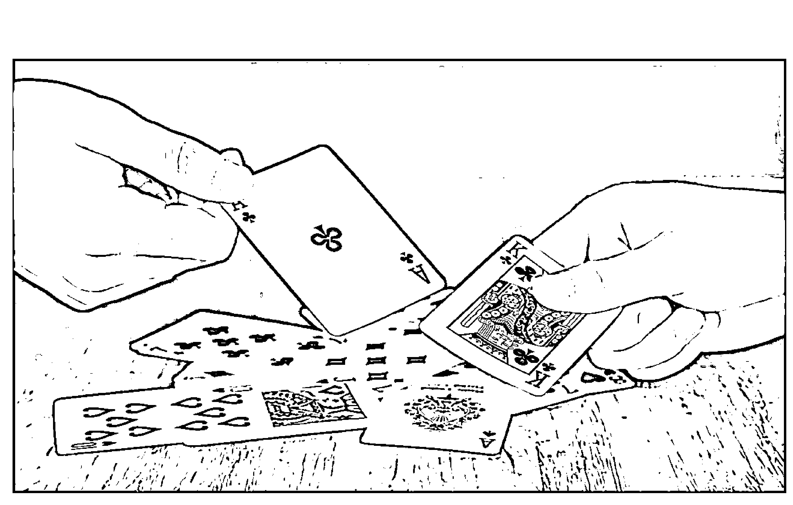

> “凭什么你的A大我的K？” “这是打牌的规则啊！” “规则是哪里来的？凭什么这样定？” “规则很早就有了，管它是哪里来的？反正我们一直都这么玩！”

考虑，既然复杂的自然生态秩序可以由普通的自然作用产生，不需要由谁来制定，那么复杂的自然法则本身，它是不是也可以在自然作用下自动生成呢？

随着进化论的深入人心，它的逻辑也开始在各个学科领域被广泛运用，认为自然法则可以自动生成的科学家越来越多，逐渐占据了主流。就这样，对于在自然界存在着自然规律的现象，人们又开始习以为常了。

但他们似乎有意无意地忽略了一点：科学界关于自然法则会自动生成的观点，其实从来就没有得到过证明。如此严密而繁复的自然法则，居然和基督教的上帝一样，能够自己生成自己，开什么玩笑？

这是关于存在“自然规律”这个“超正常现象”，我们要提出的问题：自然规律为什么会存在？是谁制定了自然法则？

### 延伸阅读

### 哲学思维、数学计算、科学验证及其他

人类对于世界的认识最初是非理性的，祭司这个职业在许多原始部落中都很重要，直到哲学家出现之后，他们的思维方式才给人们带来了理性认识。古希腊从公元前6世纪的泰勒斯开始，涌现出一大批的哲学家，中国也几乎在同期出现了以老子、孔子为代表的哲人，形成了思想界“百家争鸣”的空前盛况。

这种通过哲学思维得到的关于世界的认识，一般建立在经验的基础上，它们只是纯粹的思想，人们习惯于通过辩论来检验它，而不是通过实践来证明它，“理越辩越明”说的就是这个意思。哲学家往往也可以称作思想家，他们注重思想，却不重视实践；注重确定现象的性质，却不重视它的数量。柏拉图就认为，感觉的作用只限于对现象的理解，并不能成为获取理性知识的工具，真理是纯思维的产物，只能通过反思、沉思才能获得。

哲学思维的这种特征，使它能够站在比较高的位置，从整体上入手去观察世界，但它的认识却是粗略的、模糊的，既不精确，也不准确。

后来人们对这种认识世界的方法提出了质疑。伽利略认为，自然的语言是数学，观察和研究自然的最好途径是科学实验，要表达自然的运动规律应当使用数学公式和实验数据。有一则人们津津乐道的故事，伽利略在比萨斜塔上松开双手，让一大一小两个铁球同时往下掉，结果两个铁球同时着地，这样一个极其简单的实验，就粉碎了人们保持近两千年的观念——亚里士多德关于“重的物体下落速度快”的说法。

从那以后，科学实验和数学语言逐渐替代了哲学思辨，成为人类认识自然的主要工具，人们从侧重于“定性”转为侧重于“定量”，对于世界的认识也开始变得清晰而具体起来。

第一个以数学语言建立起完整的科学理论体系和宇宙论的人是牛顿。1687年，牛顿发表了《自然哲学的数学原理》一书，全书仿照欧几里得《几何原本》的框架，从最基本的定义和公理出发，通篇都是命题、公式和证明，几乎完全以数学语言描绘了一个他心中完整的宇宙。

这无疑是人类在认识世界方法上的一次重大突破。从此人们不再局限于哲学语言那对世界的大概表述，而改用精确的数学方法计算世界的运行情况，以科学实验验证对于世界的认识。这种方法迅速推动了科学的发展，彻底改变了人们认识世界的思维方式。

然而世事无绝对，这种转变同时也带来了一些问题。

人们常常会忽视一个问题，那就是世界上并不是所有的现象，都可以进行验证。人们总结出来的科学定律，固然可以通过实验的重演来验证，但对于许多东西，比如历史，你是没有办法进行验证的。你不可能用实验来证明，自己对于明朝覆灭原因的看法到底是对还是不对。

还有社会政治经济现象、文学艺术之类的东西，也是无法用公式表达并进行准确数学计算的。纯粹精神领域的东西，那就更复杂了，它既无法计算，也难以用实验来验证。由于无法进行计算和验证，在许多人的观念中，这些领域很自然地被排除在了科学的研究范围之外。所以现在一般意义上的科学，基本上指的是自然科学，实际上它反映的只是世界的一部分。

随着时间的推移，人们对于数学计算和科学实证的痴迷，逐渐演变到了无以复加的地步。许多有名望的科学家，都曾想过用一组简单的方程来描绘整个世界。而在科学实验和数学计算大行其道的同时，哲学思维却日渐被人们遗忘了。这样一来最直接的后果，就是造成了科学与人文、科学与大众、自然科学与社会科学之间的割裂，科学变成了只有专家才懂的东西。

在孔夫子他们生活的那个年代，随便一个山上的樵夫、田里的农夫，都有可能是对宇宙人生有深刻认识的哲人，但这种情形现在早已不复存在。世界的解释权成了专家们的私产，各个领域都砌起了一堵高高的墙，隔绝了墙内墙外的视线。

有人抱怨说民众不关心科学，但很少有人反思，究竟是大众不热爱科学，还是科学脱离了大众？

逻辑思辨才是绝大多数人习惯运用的思维方式，数学公式和科学验证则离日常生活比较遥远，《福尔摩斯探案集》肯定要远比《自然科学的哲学原理》容易看懂，因为前者中的逻辑推理更符合人们的思维习惯。但现在许多人认为，只有能计算和实证的才叫科学，思想的作用被完全漠视。他们习惯于用数学公式来表达，不会用逻辑语言来论述，这就难怪普通人没办法了解科学了，就像在习惯于讲汉语的中国，你非要坚持说英语，怎么还能责怪别人听不懂你在说些什么呢？

目前在科学界，思想远远跟不上实验的脚步，许多科学发现得不到合理的解释，这种现象跟对待哲学思维的极端态度，以及刻意回避对一些特殊领域的研究都不无关系。

这些问题要如何来解决呢？我们可以扩大科学的研究范围，把世界上的一切现象都纳入视野，而不只是局限于那些能够用科学定律来描述的领域。我们要承认，科学验证和数学计算不是研究科学的唯一方法，不是只有能够验证和计算的才叫科学，哲学思维甚至直觉对于科学来说其实也是同样的重要。

当然，我们也可以坚持说科学的研究范围，就只能是那些可以计算和验证的领域。但这样一来我们就必须明白，科学不是解释世界的唯一途径，在科学之外还有哲学，还有宗教，还有一些更玄妙的东西，它们对于认识世界是同样的重要。我们也不要在“科学”与“正确”之间画上等号，认为只有用科学方法得到的结论才是可信的，而应该鼓励人们到科学的盲点和禁区中去探索，不管用的是什么方法。

## 第三章

## 天问：宇宙是无中生有的？ 宇宙外面是什么？

我们最难感觉到异常的“超正常现象”，还不是自然规律的存在，而是我们身处其中的这个世界——宇宙，它为什么会存在？

对大多数人来说，宇宙的存在也许是一件再正常不过的事情，他们一辈子也不会去怀疑其中还有什么秘密。

但我们现在不得不开始怀疑了，原因是科学有了新发现——“宇宙大爆炸理论”。

我们先来看看这种理论的形成过程。

1666年，牛顿发现白光其实是一种复合光，它在通过三角形棱镜时，能分解成彩虹一样的多种颜色，这种现象叫作“色散”，分开的单色光依次排列而成的光带叫作“光谱”。

后来人们将望远镜聚焦在一个单独的恒星或星系上，观察从那里射来的光线的光谱，根据“多普勒效应”，通过分析这些光谱，可以确定这些星体相对于我们是静止的还是运动的，是在朝着我们而来，还是在离我们而去。假如它们在离去，那么我们接收到的光，波长将较长，光谱会向红端移动，这叫“红移”；反之则会向蓝端移动，叫“蓝移”。

20世纪20年代，当人们利用这一原理来观察那些遥远星系时，原本预料会发现同样多的红移和蓝移光谱，因为那时以为星系是随机运动的。

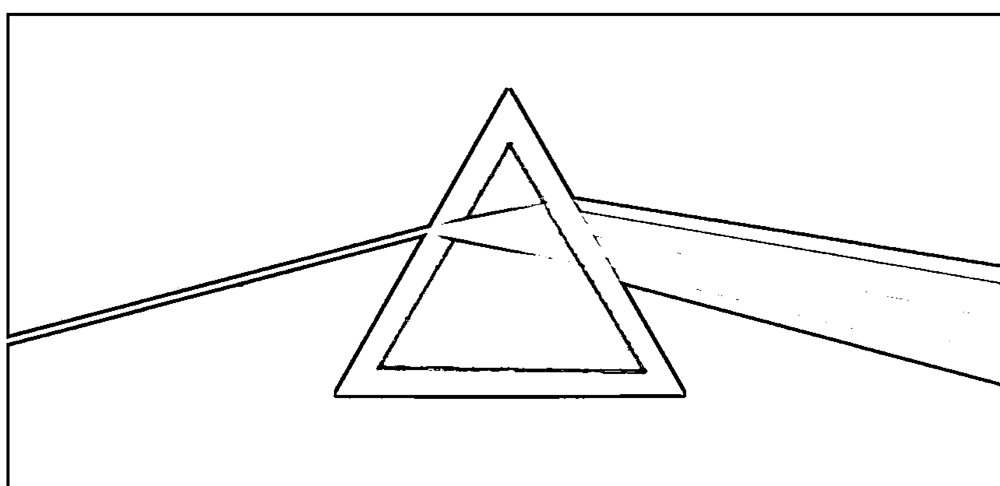

白光通过三角形棱镜后，会分解为红、橙、黄、绿、蓝、靛、紫七种颜色。

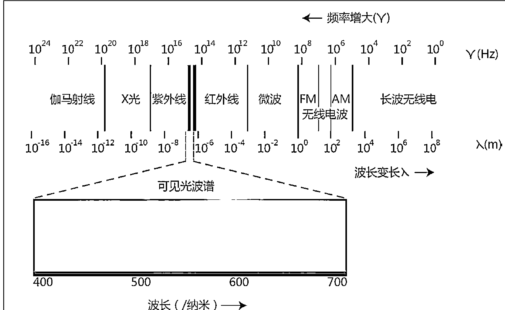

上图为电磁波谱。电磁波又称电磁辐射，无线电波、微波、红外线、可见光、紫外线、X射线和伽马射线都是电磁波，它们之间的区别在于频率和波长不同。无线电波的波长最长，频率最低；伽马射线的波长最短，频率最高。人们的眼睛能够看到的电磁波叫“可见光”，它在整个电磁波谱中只占据了一个很窄的波段。

而事实出人意料，在对银河系外的其他星系进行观测时人们发现，除了少数离我们很近的星系外，其他所有河外星系都表现出红移来，它们都在离我们而去，而且离得越远的星系，离开我们的速度越快。

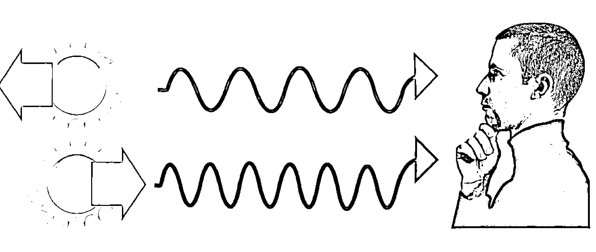

> 发出光线的星体，如果在朝着远离我们的方向运动，那么我们接收到光线的波长就会变长，光谱就会向红端移动，反之就会向蓝端移动。所以通过观察星星发出光线的光谱，就可以确定它是在靠近我们，还是在远离我们，还可以根据红移或者蓝移的程度，确定它们的速度。

在观测结果的基础上，人们想到了这样一种可能——宇宙不仅是有限的，而且正处在不断的膨胀之中，这一想法颠覆了人们之前对于宇宙的认知。

对这一现象进行更加深入的研究时，人们产生了一个不可思议的想法：如果宇宙一直都处在膨胀之中，那么把这个过程倒过来看，岂不是说宇宙在最初的时候，是从一个无限小的点开始的吗？也许正是这种想法催生了“宇宙大爆炸理论”。

大爆炸理论这样描述宇宙的生成过程：很久以前宇宙诞生于一次“大爆炸”，之后它始终保持着膨胀的趋势，就像一个从那时一直被吹到现在的气球。

这样一个令人匪夷所思的设想，最初当然不会有人相信，然而不可思议的是，后来竟然有越来越多的证据支持这个设想。大爆炸理论预言，宇宙诞生时大爆炸的余波，至今应仍在宇宙中回荡。结果1964年美国天文学家彭齐亚斯和威尔逊，在偶然中发现了宇宙微波背景辐射，证实了这一说法。这个发现为大爆炸理论提供了强有力的支持。

后来有更多的事实支持了大爆炸理论，宇宙学家们不得不面对现实，逐渐接受了这个奇怪的想法。这一理论表明，宇宙大约诞生于137亿年前，它不是无边无际的，是有限的；它有起始，极可能也有终结，并不是永恒的存在。

大爆炸理论给人们带来了许多的困惑。气球内的空间是有限的，这个我们很容易理解，因为气球有一层膜，把气球内、外的空间隔离开来了；但宇宙是有限的，这要如何理解呢？难道我们的宇宙也有一层膜，把宇宙内、外的空间隔离开来了吗？如果是这样的话，宇宙外面有些什么呢？假如不存在隔离膜，那么宇宙中绝大部分空间都是真空，它与宇宙外的空间又有什么区别？

为什么会发生大爆炸呢？最初大爆炸理论说，大爆炸始于“奇点”，它是一个体积无限小、密度无限大、温度无限高的点。这样的想法实际上是认为，现在宇宙中所有的东西，最初是被无限压缩、以能量形式存在于“奇点”处的。

后来人们更进一步认为，世界其实完全是在虚无中诞生的。包括时间、空间、物质在内的整个世界，都是从大爆炸开始的，在大爆炸之前，什么东西都不存在。宇宙的生成就像《圣经》中说的那样：“神说要有光，于是就有了光”，完全是一个无中生有的过程。美国物理学家艾伦·古斯形容说：“宇宙就是一份免费的午餐。”

大爆炸理论证明宇宙有创生的那一天，我们就再也无法对它的存在漠然视之了。宇宙不可能毫无缘故地无中生有，在此之前必定有些什么故事，在它之外也必定有些什么东西。

这就是关于“宇宙的存在”这个“超正常现象”，我们要提出的问题：宇宙为什么诞生？为什么会无中生有？是谁制造了宇宙？宇宙诞生之前有什么？宇宙之外又是什么？

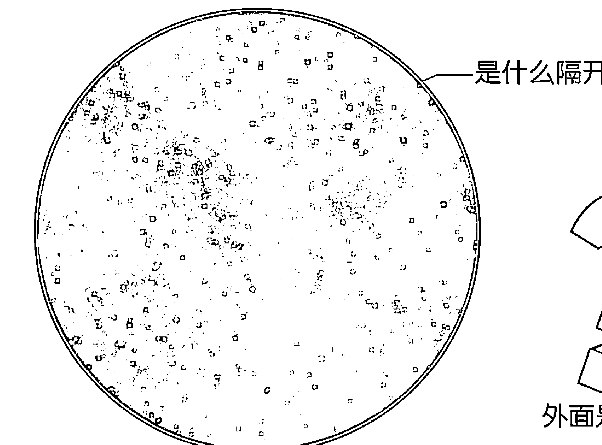

除了哈勃红移、宇宙微波背景辐射之外，支持大爆炸理论的主要证据，还有宇宙间轻元素的丰度比。大爆炸理论认为，在宇宙诞生后的最初几分钟里，宇宙间发生了核聚变反应，它的最终产物主要是氢原子和氦原子，这一过程叫“太初核合成”。按照计算，如果大爆炸的理论是对的，那么宇宙间的物质就应该主要是由25%的氦和75%的氢组成的，这一推断后来得到了观测结果的证实。

但不管这些证据如何有力，客观地说，想要证明大爆炸理论还是远远不够的。大爆炸理论还有太多问题无法解释，我就很想知道，如果宇宙是有限的，那么宇宙外面又是什么？

### 延伸阅读一

## 什么是“多普勒效应”？

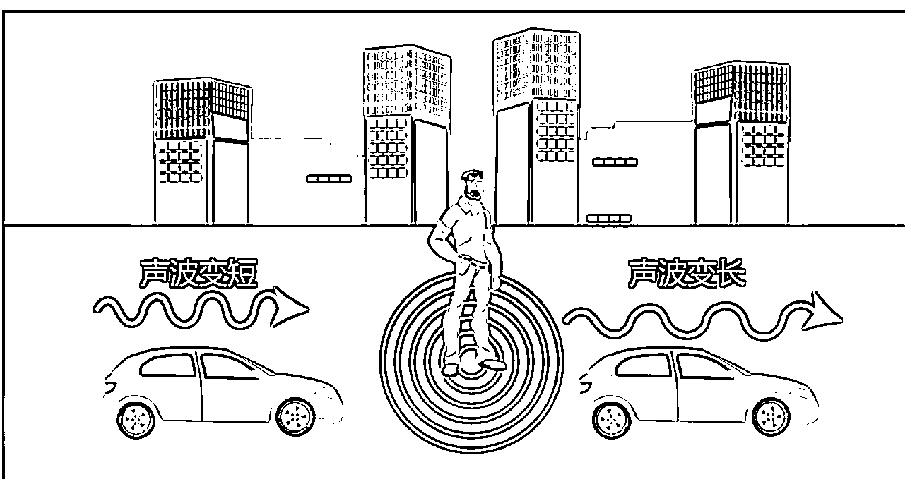

“多普勒效应”指的是，物体辐射的波长和频率，会因为波源和观测者的相对运动而发生变化，这一现象是奥地利物理学家克里斯琴·约翰·多普勒于1842年首先发现的。

据说有一天多普勒路过铁路交叉处，恰逢一列火车从他身旁驰过。他发现当火车从远处驶来时，汽笛声在变响，音调在变尖；而当火车从他身边驶向远方时，汽笛声在变弱，音调在变低。

他对此进行了研究，结果发现原因在于声波频率的变化（也可以说是波长，因为频率与波长成反比关系）。人们听到声音的声调高低，是由声波的频率决定的，频率高声调就高，频率低声调就低。

如果我们和声源都固定不动，那么我们接收到的声波，频率就和它发出时完全相同，声调不会发生变化。但如果声源在向我们靠近，那么我们接收到的声波，波长就会被压缩变短，频率就会提高，音调就会变尖，反之亦然。

“多普勒效应”是在对声波的研究中发现的，但它不仅适用于声波，还适用于其他所有类型的波，包括电磁波。波源移动的速度越快，波长和频率的变化就越大，这一原理常常被交警用来给车辆测速，也被天文学家们用来测量遥远天体的运动速度。

### 延伸阅读二

## “宇宙大爆炸理论”与空间膨胀

在“大爆炸理论”之前，人们以为宇宙空间本身是稳定的，只是宇宙中的星体间存在相对运动。就像一间大房子，房子里的人会走来走去，但房子本身的大小不会改变。从来没有人会想到，宇宙空间本身也处在变化之中，这间房子会像气球一样被吹大。

严格地说，人们通常所说的“宇宙膨胀”这个词，用得不是十分准确。这种膨胀不是宇宙的整体膨胀，仅仅只是宇宙背景空间的扩展，空间中的物体并没有变得更大。如图中所示，空间变大了，星体之间的距离也变大了，但星体没有变大。

“宇宙大爆炸理论”的形成过程大致是这样的，1924年，俄国物理学家亚历山大·弗里德曼基于广义相对论引力场方程，首先阐述了膨胀宇宙的思想；1927年，比利时宇宙学家勒梅特有了同样的发现，并提出宇宙起源于一个“原始原子”；1948年，俄国物理学家乔治·伽莫夫等人发表了“热大爆炸宇宙学模型”，认为宇宙最初开始于高温高密的原始物质，后来随着宇宙膨胀，温度逐渐下降，才慢慢形成了现在的星系等天体。根据这一理论，他们预言了宇宙微波背景辐射的存在。

支持这一理论的最早证据是人们对于宇宙的观测结果。1914年美国天文学家维斯托·斯里弗发现，多数星系存在红移现象。后来美国天文学家埃德温·哈勃进行了类似的观测，发现了更多的红移星系，1929年他发表了对观测结果的进一步分析，确定星系的红移程度，也就是说它们远离的线速度，与它们和我们之间的距离大致成正比关系，这就是“哈勃定律”。

星系红移现象的产生，有可能是星系都在朝着背离我们的方向运动。但假如是这样的话，我们无法解释为什么只有离得远的星系，才一律表现出红移来，而有些离我们近的星系，比如说仙女座星系，也会表现出蓝移现象。

排除了这种可能之后，产生星系红移现象最合理的解释，是宇宙空间本身在膨胀，背景空间任何两点之间的间距都在变大。根据哈勃定律，距离越远空间膨胀的现象越明显，它能把星系之间相对运动的因素抵消掉，所以那些遥远的星系都表现出红移来。而距离近的星系之间的空间膨胀速率较小，无法完全抵消星系间的相互运动，因而就既有可能出现红移，也有可能出现蓝移。

### 延伸阅读三

## 什么是“宇宙微波背景辐射”？

根据宇宙大爆炸理论，在宇宙诞生之初的高温高密度状态下，空间中充满了高能辐射，辐射产生粒子对，粒子又极快地在互相碰撞中湮灭，重新变成辐射。其后随着宇宙的持续膨胀和冷却，温度降低到一定程度，辐射不能再继续产生粒子了，但高温仍然足以使电子和原子核彼此分离，此时空间中充满了自由电子，阻碍了辐射的传播，所以宇宙是不透明的。

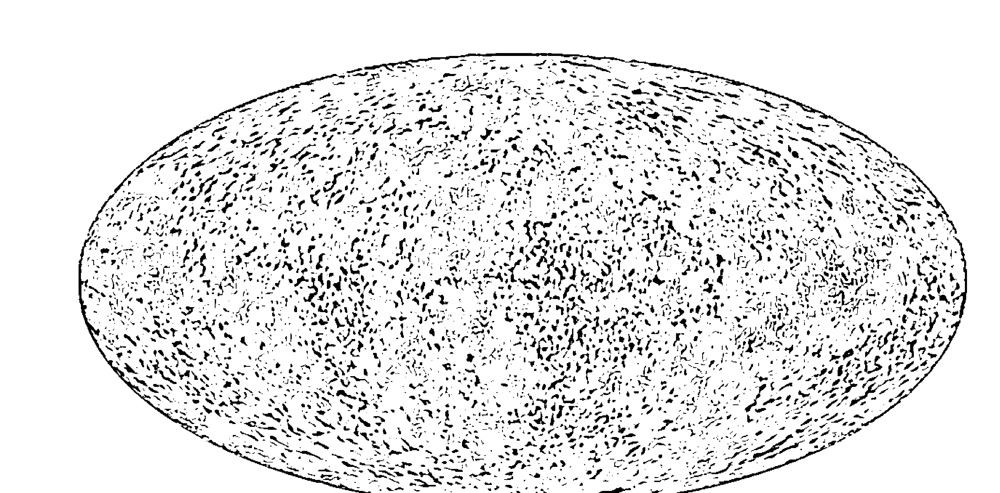

直到大爆炸发生后38万年，宇宙冷却到3000度时，电子无法再逃脱原子核的捕捉，最初的原子产生了。新形成的原子之间不再塞满了自由电子，空间变得空旷起来，宇宙一下子变得透明了，辐射可以不受阻碍地穿越整个宇宙。直到137亿年后的今天，我们仍然可以观测到当时留下的辐射，在漫长的传播过程中，它所经过的空间一直在膨胀，红移现象使它的波长变得越来越长，最后成了微波，这就是伽莫夫所预言的“宇宙微波背景辐射”。

这种辐射是近乎均匀的散射，因而从理论上说，它应该在宇宙中的任何一点都可以观测到，并且在各个方向上都具有几乎相同的能量密度。1964年彭齐亚斯和威尔逊为了改进卫星通信，建立了一个非常灵敏的角状天线接收系统。他们在对系统进行检测时，接收到一种额外的噪声。最初他们以为噪声是天线系统本身造成的，但在排除了一切可能的故障，甚至连天线上面的鸟粪都清除干净了之后，这种噪声仍然存在，而且不管天线指向哪个方向，噪声几乎都不发生变化。由此他们就在无意中发现了“宇宙微波背景辐射”，也正是因为这一发现，人们开始逐渐接受了大爆炸理论。

上图是根据美国发射的“威尔金森微波各向异性探测器”对宇宙微波背景辐射的观测，所绘制出来的反映137亿年前宇宙温度涨落的图像，这是一个婴幼儿时期的“宇宙蛋”。

## 延伸阅读四

## “奇点”中体现的惯性思维

广袤的宇宙竟然源自于一个小小的“奇点”，这已经是人们观念上的一次重大突破了。人们普遍同意，在奇点之前时间、空间都不存在，但在对奇点本身的认识上，却众说纷纭，难以形成统一的意见。许多人坚持认为奇点是一个实实在在的点，它的体积无限小，但却蕴含着近乎无穷大的能量。之所以会这么想，其实还是惯性思维在作怪，他们无论如何也没有办法接受，如此广阔的宇宙竟然是从一无所有中诞生的。

这种现象给了我们一个启发，人们很容易受到思想的束缚，固有观念是很难改变的。早在公元前4世纪，古希腊的哲学家柏拉图就已经明白，惯性思维太强大了。他讲了一个著名的“洞穴寓言”：有一群人住在山洞里，从出生开始他们就被绑住了，不能转头，只能永远看着洞穴中的那面墙壁。在他们身后有一群人每天举着火把来回走动，他们的身影投射到墙壁上，这就是那些洞穴人唯一能看到的东西。他问：“这些洞穴人会不会把墙壁上的影子当作了世界的真实图像？”果然有一天，一个洞穴人偶然间获得了自由，走出了山洞，看到了真实的世界。但当他回去讲述自己看到的景象时，根本就没有人相信，都说：“难道我们的眼睛瞎了，只有你才看得见吗？”

柏拉图的说法，在历史上屡屡得到验证。每当有人提出对于世界认识的新观念时，最初总会被人们拒绝，甚至要为此付出代价。哥白尼临死前才敢发表“日心说”，布鲁诺被烧死在广场上，伽利略无奈地在“悔过书”上签字，这些都是很好的证明。遗憾的是，人们一边在嘲讽历史，一边又在制造同样的历史。

## 延伸阅读五

## “无”中能够生“有”吗？

“无中生有”的思想在创世神话中并不罕见，比如基督教的上帝创世就既不需要材料，也不需要工具，仅凭语言就足以产生出整个世界。公元4世纪古罗马的奥古斯丁在《忏悔录》中写道：“你不是手中拿着什么工具来创造天地，因为这种不由你创造而你借以创造其他的工具，又是从哪里来的呢？哪一样存在的东西，不是因为你的存在而存在？你一言而万物兹始，你是用你的‘道’——言语来创造万有的。”

科学兴起之后，在很长一段时间里，人们不相信可以无中生有。然而在大爆炸理论逐渐为人们接受的过程中，一些人开始怀疑，既然时间、空间是从奇点开始，在此之前它们都是不存在的，那么物质和能量为什么不能也是如此呢？为什么非要认定宇宙是诞生于一个高温高密的奇点，而不是完全从一无所有中诞生的呢？

20世纪60年代末，有人开始分析宇宙从虚无中诞生的可能性。他们认为，引力的能量是负数，所以在宇宙诞生时，凭空出现的物质和能量之间形成了引力场，这种引力场的负能量，刚好能够与出现的物质和能量自身相互抵消。这样从技术层面来看，就可以在不违背守恒定律的情况下，凭空制造出一个宇宙来了。

1973年，美国物理学家爱德华·特赖恩提出了宇宙从虚无中诞生的思想，他认为宇宙是由于真空中的量子波动，在偶然中产生的。1980年，艾伦·古斯提出了“暴涨理论”，认为宇宙不是按照相对固定的膨胀速度，从奇点处一直膨胀至今的，而是在大爆炸之后的一瞬间，就立刻生成了一个浩瀚的宇宙，然后这个宇宙才按照比较缓慢的速度扩张，直到现在。

古斯的理论解决了一些原先大爆炸理论无法解释的问题。比如从下页图中可以看到，宇宙膨胀的速度总体来说比较平缓，按照这样的速度计算，在137亿年的时间里，宇宙不可能扩张到像现在那么大。但如果它经历过一个暴涨阶段，在瞬间就生成了一个很大的宇宙，那么这就很好解释了。

根据暴涨理论，宇宙是在一瞬间形成的。就像气球不是一点一点被吹大的，而是突然间空中就出现了一个很大的气球，然后它再慢慢地被吹得更大。当我们把这幅场景和引力场创生物质的机制结合起来时，很容易就会联想到，宇宙也许是从虚无中突然诞生的，并不存在一个实在的奇点。所以古斯经常把“免费午餐”这句话挂在嘴边。

> 英国物理学家保罗·戴维斯这样说：“按这种不同寻常的宇宙创生理论来看，整个宇宙完全是从无中生出来的，其创生过程符合量子物理的定律。这样的宇宙在其成长过程中创造了一切物质、一切能量，从而建成了我们现在所看到的宇宙。这样，这种理论说明了一切物理性的东西（包括时间和空间）的创生。这种量子时空模型并不规定一个不可知的奇点来给宇宙开头。”

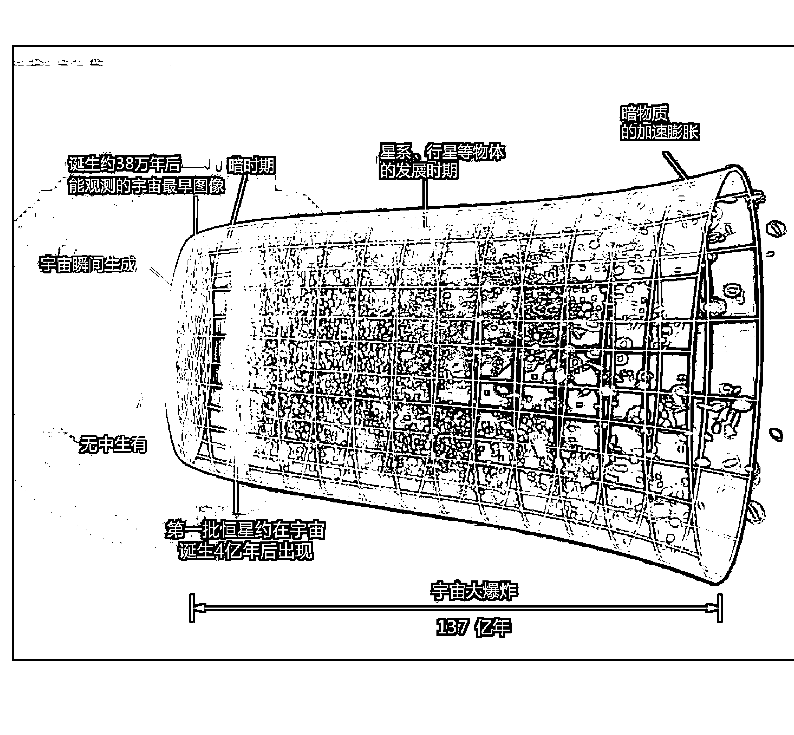

宇宙完全是从虚无中诞生的想法，被接受的程度没有大爆炸理论那么高。因为许多人始终认为创世需要原材料，哪怕只是一点点的东西。日本物理学家加来道雄就说：

> > “事实上，要创造像我们这样的一个宇宙，也许只需要非常小的净物质量，也许小到1盎司。”

宇宙这种“无中生有”诞生方式背后的真实意义，人们至今还知之甚少。古斯的暴涨理论中存在着一些让人困惑的问题：宇宙为什么会突然间变成那么大？又为什么会突然间停止了这种极速扩张，转为缓慢的膨胀？是什么驱动了暴涨，又是谁在喊停？

## 第四章

### 何为真实：眼前的世界是真实的？
别太相信你的眼睛！

相比“宇宙的存在”，还有一个更深层次、绝大多数人根本就意识不到的“超正常现象”，那就是“世界的真实性”。

记得很小的时候我有一次去看《十五贯》的戏，戏中有个杀人场面，当看到演员倒在地上时，我脑子里冒出一个念头：“每演一次戏都要死掉一个演员，哪有那么多演员来死啊？”

现在回想起来，觉得那时候特别幼稚可笑。但当时我真是这么想的，因为那时候还小，脑子里还没有“真”和“假”的概念，根本不知道戏中发生的事情是假的。

但你先别着急嘲笑我，因为在面对现实世界时，你其实和我一样，脑子里同样缺少“真”和“假”的概念。我们常说：“眼见为实”，理所当然地会把眼睛看到的世界当作是真实的。我们从来不会去想，眼前的这个世界是否也是一场戏，是假的？

当然也有例外，佛陀乔达摩·悉达多就有不同的看法。在《心经》中他说：“色即是空，空即是色”，这里的“色”是指我们眼中的世间万象，“色即是空”是说我们看到的世间万象其实都是空幻的。在《金刚经》中他还说：“凡所有相，皆是虚妄”，认为我们眼中看到的所有一切都是虚幻的。

一些哲学家也有类似看法。17世纪法国的笛卡尔就认为世界只是我们心中的幻影，不是真实的存在。但他同时又认为，对每个人来说自己的存在应该是确定无疑的，因为如果连你都不存在的话，那么是谁在思考、在怀疑呢？这就是哲学上的名言“我思故我在”的来历。

这类否定世界真实性的观点通常被称为“唯心论”，在当今世界被认可的程度不高，因为目前占据主导地位的是与此相对应的另一种理论——“唯物论”。

唯物论认为，世界是由物质构成的真实存在。这种思想由来已久，中国古代的“五行学说”就认为，世界是由“金、木、水、火、土”五种基本元素构成的。古希腊许多的哲学家也有原始的唯物论思想，赫拉克利特认为火是万物之源，整个世界就是一团永恒的活火，泰勒斯认为万物都是由水构成的，阿那克西美尼则认为气是万物的本原。

在古代唯物论的影响并不大，但到近代却成了主流思想，这种变化跟科学新发现密切相关，尤其是“质量守恒定律”。

很早以前就已经有人萌生出了“物质恒定”的思想。公元前5世纪古希腊的哲学家德谟克利特说：“任何存在的东西都不会消失”；我国明末清初的思想家王夫之也说：“聚散变化，而基本体不为之损益”。但在当时这仅仅只是一种想法而已，没有人能证明它是对的。

科学发展给这一设想带来了证实的机会。1620年，英国的哲学家弗兰西斯·培根提出了“质量”的概念，用它来衡量物体中所含物质的多少，这一概念的提出为对物质进行定量分析奠定了基础。

18世纪的俄国科学家罗蒙诺索夫首先提出了“质量守恒”的概念。他在写给列昂纳德·欧拉的信中说：“自然界所发生的一切变化都是这样的：一种东西失去多少，另一种东西就获得多少。因此，如果某个物体增加了若干物质，另一物体必然有若干物质消失。”他把锡放在密闭的容器里煅烧，生成了白色的氧化锡，经过测量发现容器里物质的总质量，在煅烧前后没有发生变化。于是他提出，在化学反应中物质的质量是守恒的，

但在当时这一说法没有引起科学界的注意。

后来拉瓦锡在对氧气进行研究时发现，燃烧的物体增加的质量，恰好等于氧气减少的质量。随后他通过一系列精确的定量实验，证明物体在化学反应中虽然会改变形态，但参与反应的物体，其总质量没有发生变化。于是拉瓦锡用化学实验证明了“质量守恒定律”，这一定律也从此开始被广泛接受。

这个定律认为，世间万物的总质量是恒定的，既不能增加，也不会减少。由此人们不难产生这样的想法：既然物质的总量是恒定的，永远都不会少掉，那么它就应该是永恒的存在，所以“质量守恒定律”又被称为“物质不灭定律”。有了这一定律的支持，唯物论逐渐流行起来，到19世纪已经在科学界占据了统治地位。

在唯物论的影响下，人们认为世界是由一大堆实实在在的物质组成的，而意识只不过是高度发达的物质系统——人脑的机能，是客观世界在人脑中的主观反映，因而意识才是虚幻的。这样一来，世界的真实性似乎已经得到了证明，不需要有任何怀疑了。

然而有意思的是，科学发现曾经造成了唯物论的流行，但现在更多的科学发现却越来越不利于这种理论。

进入20世纪之后，唯物论开始遭遇到严重挑战，它的基石“质量守恒定律”被推翻了。人们发现，这个定律只适用于化学反应，并不是世界的普遍规律。爱因斯坦的相对论表明，物体的质量不是恒定的，在做高速运动时，物体的质量会随速度的提高而增加。后来人们在粒子加速器中观察到，电子和质子在速度提高到接近光速时，其质量会增加几十倍甚至更多，这证明爱因斯坦是对的。

速度提高时质量跟着增加，只是现有东西可计量的质量增加了而已，其实东西还是那些东西。但更令人吃惊的是，事实证明我们真的可以制造出物质来。在实验室让2个高能质子以极快的速度相互碰撞，得到的并不是一堆碎片，而是3个质子、1个反中子和若干个 π介子，这些粒子的总质量远远大于原来2个质子的质量。

既然我们可以制造出新的物质，碰撞后粒子的质量会大于碰撞前质子的质量，这样东西确实变多了。

既然我们可以制造物质，那么“质量守恒定律”就完蛋了，唯物论也有了大麻烦：既然物质可以凭空生成，那么它怎么可能是“世界的本原”呢？

还好爱因斯坦的“质能方程”给了它自圆其说的机会。根据爱因斯坦的理论，在一定的条件下质量和能量之间可以相互转化，那些新生成的物质不是凭空而来的，它们来自于高能质子中蕴含的能量，这样“质量守恒”就变成了“质能守恒”。

于是有人把能量也列入物质的范畴，说能量也是物质，只要是客观实在的东西都是物质，常见的说法是“物质是不依赖于人的意识，并能为意识所反映的客观实在”。这样变通了一下，唯物论就不至于被推翻了。

但这里所讲的“实在”是什么意思呢？是“实体性的存在”，还是“真实的存在”？人们起初显然以为物质是“实体性的存在”，可以用质量的大小来衡量它的多少。但在发现“实体的物质和无形的能量之间可以相互转化”之后，人们只能把对“实在”的理解修改成“真实的存在”了。

可问题是，能量是无形的，意识也是无形的；能量是真实存在的，意识难道就不是真实存在的吗？每个正常的人都有意识，这可不是我们想象出来的。为什么能量可以是物质，而意识不能是物质呢？

有人也许会这样解释：能量和其他物质之间可以产生物理作用，所以能量是物质；意识和物质之间不能产生物理作用，所以意识不是物质。但这可不一定！后面我们会详细讲到，量子论已经证明意识是可以对物质产生物理作用的！

随着科学新发现的不断涌现，“世界的物质性”这个概念早已被搞得面目全非，如果你不是专业人士，会觉得很多事情已经离谱到你无法想象。

你能想到世界上有些粒子是没有质量的吗？确实有，“光子”和“胶子”就是没有质量的粒子。从“光线”这个词可以看出，人们原本认为光是连绵不绝的，但事实上它却是由于一个一个的光子组成。但光子没有静质量，所以光只能在运动中存在，一旦它停止下来就会消失得无影无踪。

最初培根是把“质量”这个概念作为“物质多少的量度”提出来的，从这个定义来看，质量的大小就代表着物质的多少，没有质量就意味着没有物质。但培根绝对不会想到，世界上居然存在没有质量的粒子。

这个结果其实不难预料。假如真的物质才是世界的本原，那么除了追求物质享受外，我们的人生还有什么可追求的呢？但事实上，在我们的生活中，物质仅仅只是一部分，否则生活也未免太无趣了。假如世界仅仅只是一堆物质的简单堆砌，那么人类创造的灿烂文化——历史、宗教、文学、艺术，还能有什么意义呢？

如果这些发现只是让你对世界的真实性心存疑虑的话，那么另一项科学发现也许会更加坚定你的想法，它就是前面说过的“宇宙大爆炸理论”。

大爆炸理论说，宇宙完全是在虚无中诞生的，这其实已经足以否定宇宙的真实性了。你可以想象一下，假如你有机会站在宇宙之外观察，当看到宇宙从虚无中诞生时，就像一个全息影像突然在你眼前冒出来，你还会认为它是真实的吗？或者换一个角度问，真实的东西，它能够凭空变出来吗？

相比我们的分析，有些人也许更愿意相信自己的眼睛，他会说：“这世界当然是真实的，是我亲眼看见的啊！”

但我们看见了什么，它真的就是什么吗？科学家们会对你说：错！你看见花儿红艳欲滴，只是因为花儿吸收了其他颜色的光，只把红光反射到你的眼睛里。也就是说，你看到花儿是红色的，不是因为它真的是红色的，只是因为它吸收不了红光而已！它真实的颜色是什么？只有天知道。

所以，千万别把“真实”想得太简单了，千万别太相信你的眼睛！

关于“世界的真实性”这个“超正常现象”，我们要提出的问题是：对于我们来说，什么才叫真实？世界是真实的吗？抑或它只不过是一场戏？

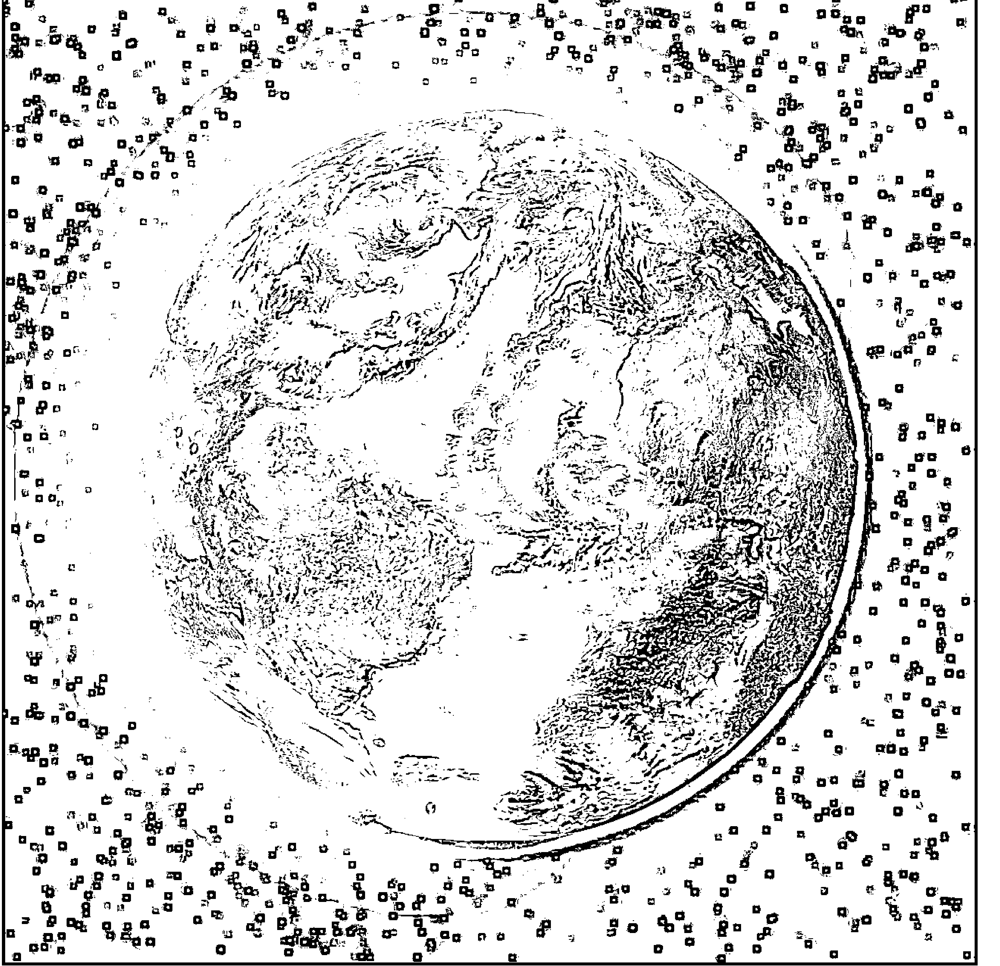

听一位朋友说过他在上海世博会的经历。在某个馆，当他进去的时候，看见一个讲解员正站在场地中间做精彩讲解，但奇妙的是，讲解结束后一闪之下人忽然就不见了。他感到非常吃惊，特意站在那里等待下一场，想看看到底是怎么回事。当第二场开始，看到讲解员在空空如也的地方瞬间冒出来时，他马上就明白了这是一个全息影像，不是一个真人。

设想一下，假如这位朋友第一次就从头到尾观看了整个过程，看到了讲解员突然出现的场景，那么他还会被骗吗？在“世界的真实”这个问题上，道理其实完全一样，我们出生一睁开眼睛看到的就是眼前的世界，所以很自然地就认为它是真实的。假如你曾经看见过世界从无到有的诞生以及完整的演化过程，你还会理直气壮地这么认为吗？

### 延伸阅读一

## 篮子里都是水果？

想要了解篮子里有什么东西，最好是把里面的东西掏出来看看，然后再做判断。

最初你从篮子里掏出了梨子、香蕉、杧果、葡萄、苹果……你发现这些都是水果，于是总结出了“唯水果论”：篮子里都是水果。事实上这一阶段掏出来的东西，确实都证实了你的判断。

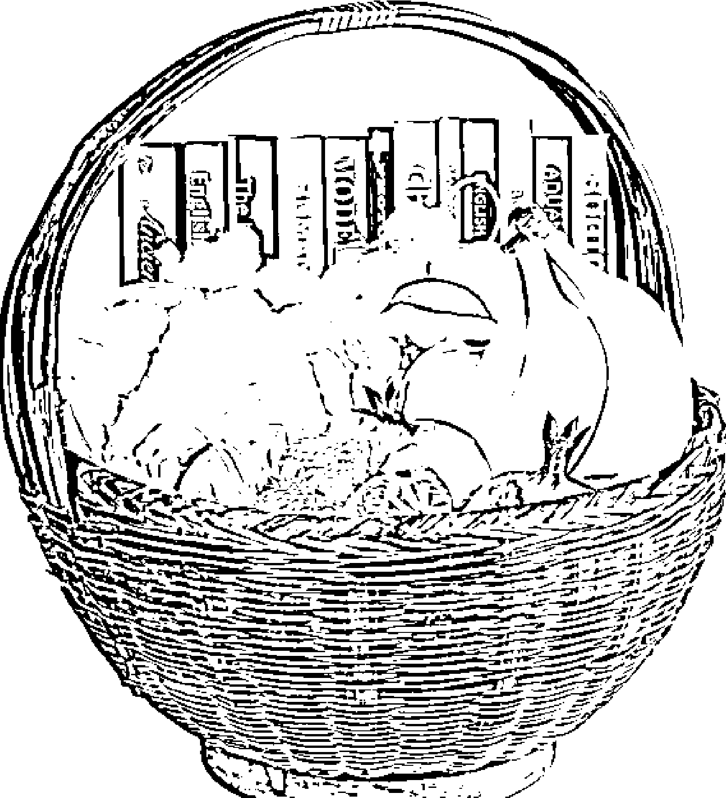

接着你继续往下掏，掏着掏着，突然掏出一个包菜来，“唯水果论”受到挑战了！但此时这种观念已经在你脑子里根深蒂固，变成了一种惯性思维，所以你的反应不是“我错了”，而是“原来包菜也是水果！”

后来你又从篮子里掏出了一本书、一个化妆盒、一卷纸……，难道这些都是水果吗？这时候你的脑子彻底乱了！但对你来说，“唯水果论”的观念已经难以抹去，所以干脆这样规定：“凡是篮子里有的东西，都叫水果！”

唯物论就是这样。早在公元前5世纪古希腊的德谟克利特就认为，世界是由原子和虚空组成的，这是典型的唯物论，认为世界的本质就是空间中存在着一堆物质。这里所讲的物质显然是指像原子这样的实体，后来很多人也都是这么认为的。牛顿就经常用“物质的量”来指称质量，他的这种说法实际上也是把物质当作实体，认为质量是对物质的最终量度。

人们根据“质量守恒定律”认定世界是物质的，此时物质的概念对于他们来说是清楚的。但后来发现存在没有质量的粒子，实体物质可以用无形的能量来转化，这要怎么解释呢？时间、空间、自然法则、社会结构等也都是世界的组成部分，假如说世界只是物质的简单堆砌，那么它们又算什么呢？这时候人们的思维已经混乱了，有人干脆就说，凡是真实存在的东西都叫作物质。

你认可这样的逻辑吗？

## 延伸阅读二 视觉器官的工作原理

在人类的各种感觉器官中，视觉无疑是最为重要的一种，它可以是一种遥感，能使我们接收到来自于远方的信息，而不必像触觉、味觉那样，需要通过直接接触。

视觉的形成首先需要有信息，这种信息包含在我们接收到的光线中，所以在完全没有光线的暗处我们是看不到东西的。接着为了感知光线中的信息，我们需要有能对光线起反应的检测器，那就是“视网膜”。当光线穿过眼睛的“晶状体”时，图像就会被反转，然后聚焦投射到眼球后表面的视网膜上。

视网膜既是一个信号接收器，也是一个信息转换器，它最里面的一层是由几百万感光细胞组成的，每一个感光细胞都含有光敏感分子，叫“感光色素”。当暴露在光线中时，这些感光色素就变得很不稳定，会发生分解，这一过程改变了感光细胞周围的电流流动，从而触发了下游神经元的动作电位。这样一来，感光细胞就将外界的光刺激转换成了大脑可以理解的内部神经信号。

接下来是信息的传输，视网膜信息的传出通道是神经节细胞，这种细胞的轴突形成了一束神经，叫“视神经”，视觉信息就是通过视神经被传递到大脑中枢神经系统的。

有意思的是，在视网膜上有大约2.6亿个感光细胞，但却只有200万个神经节细胞，接收信息的细胞远远多于传输信息的细胞。这说明了一个问题，那就是视网膜在把信息传输出去之前，对信息进行过压缩加工，这种压缩的效率之高，足以让目前市面上流行的压缩软件瞠乎其后。同时这一现象还表明，位于大脑的视觉中心是一个高效的处理器，解压缩的水平也是一流的，能从这种高度压缩的信息中恢复视觉图像的重要细节。

再接下来是大脑这个处理器把信息还原为图像，它的原理更为复杂，人们直到现在也还没有掌握其中的细节，只知道它做得很好。在生活中你应该有这样的经验，摄像机在快速抖动时拍到的画面会晃动得很厉害，让人难以辨别其中的图像，但人类在运动中看到的影像却仍然是清晰的，这说明大脑在对信号

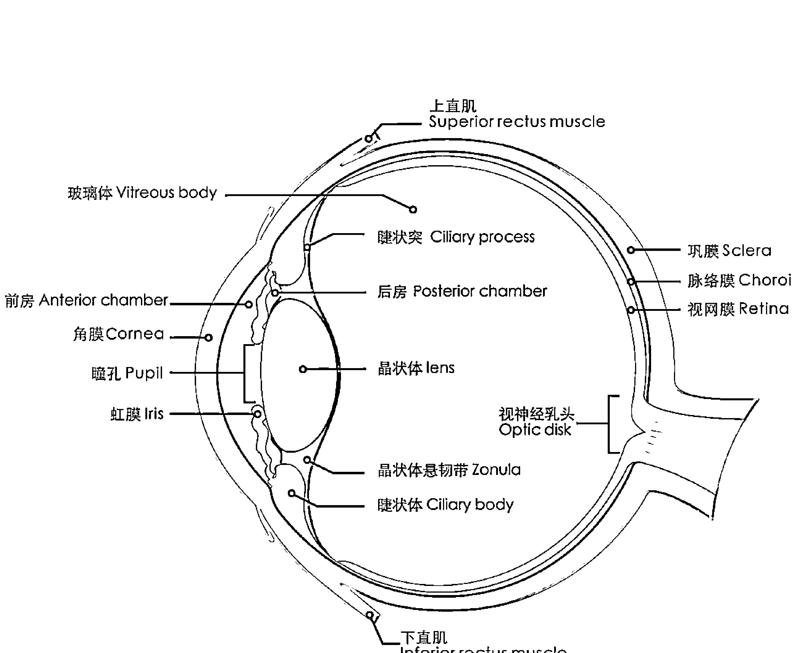

进行加工时，懂得自动消除晃动因素的影响，它的聪明程度远远超出了我们的想象。

从上述视觉形成的过程可以看出，我们看到的东西高度依赖于所接收到的信息，以及大脑处理这些信息时采用的模式。一旦这些环节出了问题，我们就会出现视觉障碍。有些人的视网膜中缺少对中波或长波敏感的感光色素，他们就成为红绿色盲；有人缺少短波感光色素，就成为黄蓝色盲。更有一种人的视锥细胞无法正常工作，天生就无法辨认色彩，对于这些人来说，他们生活的天地就是一个黑白世界。

从逻辑上看，视觉感官输入什么样的信息，我们就会看到什么样的东西，对于其他感觉器官来说也是一样。所以从严格意义上说，我们并没有真正感知到这个世界，我们感知到的只是信号输入而已。

## 第五章

### 进化疑云：物种是进化而来的吗？
有没有其他可能？

也有些“超正常现象”是人类自己制造出来的。一些影响巨大的科学理论，在刚提出来的时候也曾被人怀疑过，但后来人们接受了它，慢慢对它习以为常，把它的存在视为理所当然，进化论就是一个典型。

在科学史上，进化论无疑是争议最大的理论之一，但它的影响力也是无与伦比的。在科学与宗教的较量中，正是它给了教会致命一击，造成了基督教教义体系的崩溃。

达尔文曾在剑桥大学攻读神学，原本有望做个牧师，最后却成了冲击基督教教义的斗士，只能说是造化弄人。1831年他以博物学者的身份登上皇家军舰“贝格尔号”，开始为期5年的环球科学考察。这次考察让他脑洞大开，从此对生命的起源产生了怀疑。1859年，他出版了《物种起源》，在书的开篇就指出：“物种不是被上帝分别创造出来的，而是跟变种一样，由其他物种演化而来。”在这本书中，达尔文提出了与当时流行的“神创论”相对立的“进化论”，对后世产生了深远的影响。

进化论的观点是：生物普遍具有变异性，许多变异是可以遗传的；生物的种群内部和种群之间存在生存竞争，竞争能够保存有利的变异，淘汰有害的变异，这是“适者生存，不适者淘汰”的自然选择过程；自然选择的结果导致了生物的进化，地球上的现有生物，都是按照这一机制由共同

的祖先逐渐进化而来的。

或者我们可以用一句更简单的话来概括：地球上现有的物种，都是在自然选择的作用下，通过随机变异的积累而自然形成的。

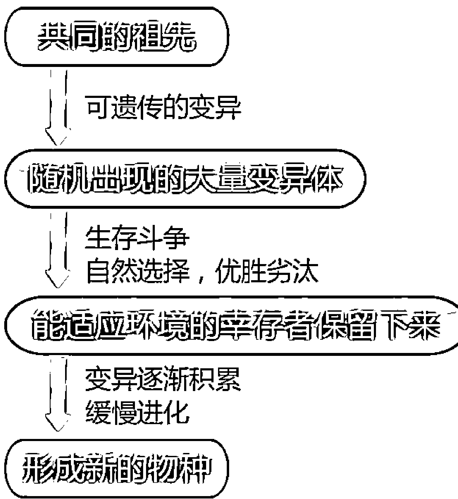

进化论的发表在当时引起了轩然大波，争议直到今天仍未平息，基督徒从来没有停止过对它的攻击。但在科学界进化论现在已经基本一统天下，成为不可撼动的支柱理论。

在那个年代，在那样的社会环境下，相信达尔文对是否公开自己的发现也是犹豫了很久，因为当时教会的势力还很大，这种行为要冒很大风险。但有趣的是，今天如果一个从事科学研究的人，想要提出否定进化论的观点，同样也是在冒险。因为进化论的存在已经成了一个人为制造的“超正常现象”，任何否定进化论的理论都有可能招致科学共同体的敌视甚至围攻，你有很大的可能会被边缘化，从此自绝于整个科学界。

虽然如此，在这里我仍然要指出，进化论中疑云重重，很难说其中到底有几分是正确的。

仅从常识来看，进化论的观点就值得怀疑。热力学第二定律表明，除非存在外力干涉，否则一个孤立系统总是会朝着无序的方向发展。我们很容易观察到，在自然状态下，如果不进行规范，事物的无序度是持续增加的。的，就像你不收拾屋子的话，它必定会变得越来越乱。但生物界的状况恰恰与此相反，它不仅能够保持井然有序的状态，而且这种秩序还在朝着越来越复杂的方向发展。进化论说这样的趋势是自然发生的，不管生态系统是如何的纷繁复杂，生物结构是如何的精致巧妙，它们都不过是一系列偶然叠加的结果。你难道不觉得这完全违背常识吗？

如果偶然的力量真有那么大，自然界为什么不能偶然生成一块手表、一架飞机呢？

对于自己理论中存在的缺陷，达尔文并非毫无觉察，也没有掩盖问题，这是他令人尊敬的地方。在书中他坦然地指出，进化论中存在一些难以解释的问题。这本身并不算什么，很多理论一开始都有缺陷，是后来才逐步完善的。但糟糕的是一百多年过去了，这些问题多数仍然没有解决，甚至根本就看不到解决的希望。这不能不让我们产生怀疑：难道达尔文错了？进化论错了？

进化论中第一个无法解释的问题是，如果物种是经过细微的渐变演化而来的，那为什么见不到大量的过渡类型呢？为什么自然界的物种之间区别是那样明显，而不是彼此混淆不清的呢？

我们来解释一下这个问题。进化论认为，物种的进化是在自然选择作用下随机变异累积的结果，那么这种变化总体来说应该是连续的。举一个简单的例子，现在人们通常认为鸟是由恐龙进化来的，按照进化论的逻辑，过程一定是这样：恐龙变得有点像鸟；变得很像鸟；最后变成了鸟。这样一来，在漫长的进化过程中，必定会出现无数介于恐龙和鸟之间的过渡物种，它们比恐龙更像鸟，比鸟更像恐龙。而且因为变异是持续发生的，所以中间过渡物种的数量和种类，应该要比恐龙和鸟本身还要多得多。

但事实上却是，在现实的自然生物界中根本看不到过渡物种。达尔文的解释是：过渡物种肯定存在，只是在自然选择的作用下，它们都灭绝了。同时因为地质记录不完全，所以才找不到它们存在的化石证据。以后随着技术的进步，在发现了更多的地质资料后，过渡物种的存在最终会得到证明。

然而世事经常不尽如人意，事态的发展出乎达尔文意料。现在科技已经相当发达，有了足够多的地质资料，但却仍然没有发现过渡物种的踪迹。

难道你不觉得进化论错了吗？

进化论中第二个无法解释的问题是，像眼睛这样的复杂器官的生成，也能用自然选择来解释吗？

达尔文认为能，而且希望会有更多证据支持他的观点。但现在我们通过简单的逻辑判断就可以得出结论，复杂器官是不可能自然生成的。

“放屁虫”的防卫器官就是很好的例子。放屁虫有一个简单的防卫系统，当受到威胁时，会从尾部喷射出一股滚烫的有毒溶液来杀伤天敌。这个防卫器官由以下部件构成：过氧化氢和对苯二酚、酶触催化剂、储囊、括约肌、膨胀器、外排导管。它的工作原理是，储囊中储存着过氧化氢和对苯二酚的混合物，当发现威胁时，括约肌会像控制阀一样打开，把混合物送入膨胀器中，然后再注入酶触催化剂，引发剧烈的爆炸后从尾部的外排导管精确喷出，喷到倒霉的敌人脸上。

显然，这个防御器官是一个完整的系统，缺少其中任何一个部件都不能正常工作。如果它是进化而来的，那么最先进化出的是哪个部件呢？从实用的角度出发，应该先进化出有利于生存的化学武器来，但过氧化氢、对苯二酚和酶触催化剂中哪一种最先出现呢？它们三种混合在一起才会发生爆炸，仅仅一种是不起作用的，所以不管谁先出现都不合适。就算三种化学物质能同时出现，如果没有括约肌的阻隔，放屁虫就会自己把自己炸成碎片，这不可能，所以需要先有控制开关。但在没有化学武器之前，放屁虫会先进化出一个开关来吗？假如会，那只能说明这种进化有目的性，不是随机的。

不管放屁虫先进化出防御系统中的哪一个部件，都完全发挥不了作用，不会对它的生存有任何帮助，反而会成为累赘。按照进化论的观点，这种变异体只会被淘汰，不可能在此基础上增加更多的累赘，直到最后所有的累赘叠加在一起，形成一个完整的防御系统。

就连这么简单的一个器官，从逻辑上来说都不可能自然形成，何况那些更复杂的器官？蝙蝠和海豚具有回声定位功能的声呐系统，需要有能发出很高音调的嗓子，能听到这种高音调的耳朵，能用三维技术描绘回声的大脑，根据声波形成立体图像，这个系统的复杂性超乎想象；人类的眼睛能够根据物体距离的远近自动调焦，根据光线的强弱进行调节，还能够纠正球面像差和色彩偏差，这样的彩色成像系统比放屁虫的防卫器官不知要复杂多少倍。它们又是如何自然形成的呢？

还有一种器官的生成更难用进化论解释，那就是生殖器官。众所周知，雄性生殖器与雌性生殖器是相互关联的，它们必须同时出现才能起作用，否则这种进化毫无意义。你怎样能够说服我，让我相信在出现雄性生殖器官的同时，恰好又进化出了雌性生殖器官，而且两种器官刚好配套，能够互动，会产生适当的反应？

现代“分子遗传学”指出，生物机体的生长发育和正常的功能运转，都处于细胞内部遗传基因的调控之下，其运行机制的精致与巧妙远远超乎想象，眼睛的复杂程度与之相比又不值一提了。甚至有人说，假如达尔文懂得分子遗传学，他根本就不会再发表进化论了。

难道你不觉得进化论真的错了？

进化论中存在的第三个无法解释的问题是，像蜜蜂筑巢这样极其复杂的本能，怎么可能由自然选择作用而获得和改变？

本能是动物与生俱来的能力，不需要通过学习来获得。我无法想象，动物本能的形成怎么用进化论来解释。从常识来看，身体的变异或许可以遗传，但后天获得的能力是无法遗传的，画家不可能把绘画的技能遗传给孩子，让他不用学习就懂得绘画。那么蜜蜂筑巢这么复杂的能力，蜜蜂是如何获得的，又是怎么遗传给下一代的呢？
进化论根本解释不了这种现象。

进化论中还存在第四个无法解释的问题，它不但令人疑惑，还带有些神秘色彩，那就是《物种起源》中有提到的“整群相关物种的突然出现”。

达尔文认为，进化是对生物随机产生的变异进行自然选择的结果。而要形成如此繁复的生物结构，从概率上计算，用来供挑选的随机变异是一个天文数字。要产生如此之多的变异，最好的解释就是变异是持续不断发生的，而且时间足够长。所以达尔文认为，生物应该是渐变式进化的，“自然界不存在飞跃”。

从现在掌握的情况看，地球诞生于约46亿年前，已发现的最早生命迹象距今约38亿年，这对进化论来说是个好消息，有这么长的时间，似乎可以产生出足够多的变异来了。按照达尔文的想法，最理想的状况莫过于在其后的时间里，生物都在持续不断地均衡进化着，但化石证据却没有支持他的愿望。

目前已经发现的化石证据表明，在距今5亿多年的寒武纪之前，生物确实一直在慢腾腾地演化着。最初30多亿年的漫长岁月里，生命几乎都还只停留在单细胞生物的阶段，此时的地球一片静悄悄的。然而进入寒武纪后，生命的演化来了一个突飞猛进，在短短几百万年时间内，几乎所有重大生物类群突然间冒了出来，这就是“寒武纪生命大爆发”。

这是一次生命的壮丽绽放，其规模之大超乎想象。简单地说，那时候生物的种类比现在还要多得多。我们现在能够看到的生物门类，在寒武纪几乎都能找到；而那时有的生物，有多达20个门现在已经消失了！

如此众多的生物种类在短暂时间内集中亮相，这种现象无论如何也不能用进化论来解释。这不仅仅是自然界的飞跃，而且是阵容华丽的集体跳跃。它更像是大自然一次狂放的实验，是造物主对于物种的集中投放，其中大部分都是不成功的试验品，不久后就灭绝了，只有少数存活下来，成为后来所有物种的祖先。

> 对寒武纪生命大爆发颇有研究的美国古生物学家史蒂芬·杰伊·古尔德，在《奇妙的生命》中这样写道：“生命史是一个大规模淘汰，然后少数幸存品种分化的故事，而不是通常认为的那样，是不断优化、复杂化、多样化的的故事。”

这一论点与进化论对于生命演化方向的判断完全相反。

问题还不止这些。我看了一部纪录片《杀手本能》，当电视上出现鳄鱼捕食野牛的画面时，解说词响起：“这种在史前就已经完成的进化，直到今天依然非常成功！”这段话提醒了我，生物界在2亿年前就已经出现了鳄鱼，而鲨鱼更是早在4亿年前就有了，而且最近1亿年间几乎没有变化。这种现象很不正常，按照进化论的观点，变异是随机的，进化应该是永无止境的。但鲨鱼竟然停止进化了，难道在这1亿年的漫长岁月中，它都在那打酱油？

> 仔细分析之下，进化论竟然漏洞百出，难以自圆其说。美国数学家科恩在《达尔文错了：关于或然性的研究》中这样写道：“进化论提出的所有概念都只是出于想象，微生物学、化石、数学概率中那些确凿可靠的科学事实都不支持这些概念，达尔文错了。”

关于“进化论”这个“超正常现象”，我们要提出的问题是：存在这么多的破绽，进化论还能是正确的吗？生命演化的真相到底是怎样的？

### 延伸阅读一

# 系统结构能自然生成吗？

在形容一群人缺少组织时，我们通常会说是“一盘散沙”。这个词语说明了一个问题，那就是沙堆中每粒沙子之间是松散的关系，拿掉几粒沙子，或者加上几粒沙子，沙堆仍然是沙堆，它不会出现任何的显著变化。这种简单累积的东西很容易在自然作用下自动生成。你眼前看到的沙堆，完全有可能是在风的作用下，每天刮来几粒沙子，日积月累之下慢慢形成的。

进化论认为物种是自然形成的，运用的就是这种逻辑。它认为一点一滴可遗传的变异慢慢累积起来，只要时间足够长，就可以自然生成眼前这个多姿多彩的生物界。

但是人们在进行这样的逻辑推导时，忽略了一个很重要的问题，那就是沙堆只是简单的堆砌物，而生物体却是一种系统结构，它们之间是有很大差别的。

系统结构的各个组成部分密切关联，只有在互相配合的前提下才能发挥好各自的作用，它们之间并不是“1+1=2”的简单关系。所以沙堆中拿掉几粒沙子无关紧要，而系统结构中如果缺少了一个部件，整体上就有可能会受影响，严重的甚至会使系统功能彻底丧失。就像你把手表的指针拿掉，它就起不到指示时间的作用；如果把发条拿掉，它就完全转不起来了。

整体性的存在，使得系统表现为一种功能显著、目的性很强的结构形式，它不像简单堆砌物那样，可以通过日积月累的作用自动生成，而只能进行有意识的制造。自然作用可以生成沙堆，却不可能自动生成一块手表，像手表这样的系统结构只能是人造的。

自然界连一块简单的手表都不能自动生成，它凭什么能自动生成结构复杂得多的生物器官呢？

达尔文早就意识到进化论存在硬伤，在《物种起源》中他这样写道：“假如可以证明，任何复杂的器官，不可能通过大量的、连续的和细微的改进而形成，那么我的学说便会彻底被粉碎。”

他不幸言中了。

# # 延伸阅读二
## 什么是“寒武纪生命大爆发”？

地球上的地质年代，通常按照“宙、代、纪、世”等划分为不同阶段，总的分为“太古宙”（25亿年前）、“元古宙”（25亿年前—5.7亿年前）、“显生宙”（5.7亿年前至今），显生宙又分为“古生代”“中生代”和“新生代”，“寒武纪”是古生代的第一个纪，约开始于5.7亿年前，结束于5.1亿年前。

“寒武纪生命大爆发”被称为古生物学和地质学上的一大悬案，长期以来一直在困扰着生物学家们。它指的是在寒武纪的年代，地球上很短时间内涌现出了各种各样的动物，它们不约而同地迅速起源，飞快出现。节肢、腕足、蠕形、海绵、脊索动物等都在地球上突然现身，它们囊括了现在生活在地球上的几乎所有动物门类，地球就像一下子从人烟稀少的荒漠变成了热闹的大集市。

寒武纪的生物集中亮相，让进化论的“共同祖先说”十分尴尬。如果说所有生物都是由共同的祖先逐渐进化而来，那么它们必然是在漫长的历史年代里陆续出现的，怎么会集中在这么短的时间突然冒出来呢？

达尔文对于这种“整群相关物种突然出现”的现象大感迷惑。他认为这种现象应该是一个假象，寒武纪动物的大量出现，一定是前寒武纪动物经过长时间进化而来的。而寒武纪动物化石出现的突然性和前寒武纪动物化石的缺乏，是由于地质记录不完全造成的，或者是由于老地层淹没在海洋中的缘故。

这完全是在想当然。在达尔文的时代，由于化石很稀少，人们对于寒武纪早中期生物的认识还很简单，达尔文根本就不知道这个“物种突然出现”的现象，究竟是多大的规模。即便是到1948年，普雷斯顿·克劳斯严肃地提出“寒武纪生命大爆发”假说时，化石虽然丰富了许多，也仍然处于“正常”的范围内。直到1973年，著名的“布尔吉斯页岩”被康韦·莫里斯等人重新发现之后，人们才真正意识到，这一次的生命绽放究竟是多么的壮丽！

时间过去了一个半世纪，生物化石证据越来越多，了，对进化论越来越不利。虽然1947年发现了埃迪卡拉动物群，证明在寒武纪前不久出现了软体动物，但它们在数量上远不能和寒武纪的生物群相比，而且形态也差异过大，很可能并不是现代生物的祖先。加拿大布尔吉斯生物群、贵州凯里生物群，尤其是1984年发现的云南澄江生物群，都无可争议地表明在寒武纪确实存在突然的生命大爆发现象。

进化论中疑点重重，生命演化的真相依然埋藏在云雾之中。

# 第六章

# 智慧设计：宇宙定律像是一种精心设计，为了我们的存在

进化论的影响深远之处在于，它远不只是一种生物学理论，其中还蕴含着丰富的哲学内涵。它的逻辑和哲学思维，已经渗透了整个科学领域和人类社会，对许多人的人生哲学产生了影响。

有人把“优胜劣汰”的逻辑应用在人类社会，形成了“社会达尔文主义”，认为生存竞争造成的自然淘汰，在人类社会也是普遍现象。在他们看来，社会不平等、种族歧视、帝国主义都有存在的理由，弱势群体不值得同情，扶贫济困毫无必要，因为“适者生存”是自然法则，弱者是理应被淘汰的。

有人把“弱肉强食”奉为人生哲学，迷信“赢者通吃”的丛林法则，不择手段地想要变得更强，来获取自己所认为的成功，把别人都踩在脚下。

这就是为什么我对达尔文十分尊敬，但对他的进化论却极其厌恶的原因。当然，这不是我们要讨论的重点，我们要重点讨论的是下面的问题。

有人把“物种是自然形成”的逻辑，从生物学领域延伸到宇宙学，说宇宙也是自然形成的。进化论认为，自然选择的作用淘汰了无数的随机变异，最后保留下来的就是我们眼前看到的物种；目前在宇宙学领域流行的一种说法运用同样的逻辑，认为在宇宙诞生的时候，生成的不只有一个宇宙，而是无数多个宇宙，它们的物理定律各不相同，其中绝大多数的宇宙因为物理定律不符合生命存在的要求，成了死宇宙、废宇宙，但其中必然有一个宇宙的物理定律适合生命的存在，那就是眼前的这个宇宙，否则我们就不会存在了。

“宇宙是在偶然中自然形成”的观念，因为进化论的巨大影响，就这样慢慢被科学界广泛认可，成为许多科学界人士眼中的“超正常现象”。

然而假如你用哲学思维去观察现代科学的新发现，会感觉到很多问题，我们这个宇宙不像是自然形成的，反倒更像是一种精心设计。

事实上，这种想法并非现在才有，其根源至少可以追溯到柏拉图的时代。柏拉图认为世界背后有一个实体模型，我们眼前的世界只是这个永恒模型的复制品，万物有生有灭，但模型永存不息。这些模型虽然数量众多，但并非乱成一团、没有秩序，它们构成的是一个相互关联的有机整体，一个很有条理的宇宙。

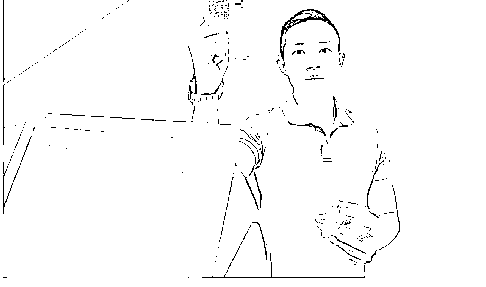

彩迷：“帮我把全部彩票号码都买了！其中肯定有一张是特等奖！”

彩票店老板：“要是多几个这种傻瓜，我就发财了……”

牛顿也相信世界是经过设计的，他认为世界并非“仅由自然定律从混沌中产生”，宇宙的秩序“最初是由上帝创造的，并由他将同样的状态和条件保存至今”。

1973年英国的天体物理学家布兰登·卡特指出：“人类从某种程度上说在宇宙中是处于特殊地位的。”这种观点被称为“人择原理”，它认为自然法则之所以会像现在这样，是因为它本身就是为了方便人类出现而设计的。

宇宙究竟是因为偶然而自然形成的，还是经过了精心设计的？我们来分析一下。

第一个需要思考的问题是，宇宙那么复杂，却又那么有秩序，它能否在偶然中生成？

我们以地球生命形成过程的一些片断为例，来看看这种复杂性达到了何等地步。

生命的出现，首先需要产生氨基酸等有机物，这相对来说还比较简单一些。但下一步把氨基酸串在一起制造蛋白质，就非常麻烦了。

如果蛋白质是偶然生成的，那么按照概率法则，要制造胶原蛋白，就需要从20种氨基酸分子中挑选出合适的种类，以绝对正确的顺序进行1055次排列。我们现在玩的一种15选5的福利彩票，只需要在15个号码中选对5个，就能获得特等奖了。但假如参考胶原蛋白的生成过程来制定彩票中奖规则，那么就需要在20个号码中连续选择1055次，每次都选对了才能拿到奖金。这种令人绝望的玩法一定会让全部的彩票站都关门倒闭。

这样的排列会有多少种可能性呢？是20^1055种。也许你并不清楚这个数字到底有多大，但我可以告诉你，如果大自然从宇宙诞生的那一刻起，就开始以自然生成的方式制造胶原蛋白，每毫秒尝试其中一种可能性，那么到现在它也不过才尝试了4.32×10^20种而已。

有些人也许会说，在宇宙中的不同地方，也许同时都在制造胶原蛋白，因而每毫秒不止尝试一种可能性。但是我可以告诉你，宇宙中所有原子的数量，据估算也就是10⁸⁰的数量级，就算宇宙中的每个原子都在参与制造胶原蛋白，也还是凑不到这么大的数字。

即便是简单的胶原蛋白分子，能够自然生成的概率就已经几乎是零了。有人形容说，发生这种事情的可能性，就相当于你厨房里的各种原料不知怎么凑在一起，自己把自己烤成了蛋糕。

要能够让生命出现，仅靠一种胶原蛋白是远远不够的，人体内的蛋白质也许就达到了100万种之多。一种蛋白质的生成，根据概率原则实际上已经是不可能的了，更何况还要生成如此多的种类？

接下来是由蛋白质和比蛋白质更复杂的DNA，以及其他的生命要素，组成细胞，这是一种复杂程度更高的结构。即便是制造一个基本的酵母细胞，所需要的零部件就和一架波音777喷气式飞机那样多，而且你还必须在直径仅有5微米的球体内将它们组装起来。

单个生命已经复杂得令人难以想象，但与地球生态系统比起来，又根本算不了什么。生态系统是一个完美的体系，仅以其中的食物链为例：植物通过光合作用，从土壤中摄取养分茁壮成长；食草动物吃植物，大型食肉动物吃小型食肉动物和食草动物；动物死亡后，由腐食性动物或者微生物进行分解，重归于尘土，这是一个完整而周密的循环系统。

地球生态系统的形成，与整个宇宙的演变相比较，又只是小菜一碟了。如此宏伟的体系，如此复杂的演变，它可能没有事先设计的程序，只是一个随机的过程吗？

这让我想起北京奥运会开幕式上的一场表演，在优美的钢琴声中，1000名穿着绿衣的演员在场地上来回走动，时而组出一只星光和平鸽的图案，时而搭出一个绿色的鸟巢，整个过程如行云流水般流畅。难道你认为这样的美丽画面，不需要设计和排练，只是表演者随机走动就可以形成吗？

第二个值得怀疑的现象是，宇宙的物理定律太精确了，无论怎么看都不像是偶然形成的，更像是一种精密的设计。

英国皇家学会前任主席、天文学家马丁·里斯认为，宇宙似乎受到了6个数字的支配，其中每个都有很精确的数值，就像是被精心调试过的一样。它们哪怕是发生细微的变化，世界就不会是今天的模样，生命就不可能存在了。比如引力如果稍微强一点，那么宇宙就会像个没有支好的帐篷那样塌下来；如果稍微弱一点，那就什么东西也不会聚集在一起，宇宙会永远是单调、分散、虚空的。核作用力只要改变4%，那么恒星中就不可能形成碳，以此为基础的生命就不可能出现。

霍金说：

> 自然定律形成了一个极端微妙的系统，在不毁灭我们所知道的生命发展的可能性下，物理定律能被改变的可能性是非常小的。若非在物理定律的精确细节上的一系列令人吃惊的巧合，人类和类似的生命形式似乎永远不可能形成。

宇宙中能够出现一个适合生命居住的地球，也是十分偶然的事情。在太阳系中，能够让生命存在的区域非常之少，而地球正好就处在这样的“金凤花区域”之内。假如地球离太阳的距离远一点，那么水就会被冻成固体，没有了液态的海洋，也就不可能出现生命。而如果地球离太阳近一点，那么就有可能成为像金星那样的“温室行星”，温度高达500℃以上，可怕得像个地狱。

这样的偶然性还很多。假如没有月亮，或者月球的大小不足以稳住地球的轨道，那么地球就会不停地摇晃，由此导致的剧烈气候变化，使生命的存在变成一种奢望。如果太阳系中没有木星这样的巨大行星，能以它的引力把小行星甩进外太空，用了10亿年的时间把太阳系形成时遗留的彗星和小行星碎片清理干净，那么地球就会经常遭到它们的袭击，不可能有相对稳定的环境条件来支持生命的出现。

美国古生物学家彼得·沃德和天文学家唐纳德·布朗利还列举了一系列令人叹服的事实，说明在地球的其他众多特征上，比如海洋、板块构造、氧气含量、热含量、地球轴线的倾角等，其数据都正好适合创造智慧生命。如果地球不是正好处在这样一个极小的区域范围内，那么人类就不金凤花有着又细又长的花梗，物理学家们就把能使智慧生命的出现成为可能的狭窄参数频带，形象地称之为“金凤花区域”。目前在宇宙的物理常数和地球的特性方面，已经发现了几十个这种“金凤花区域”，正是因为处在这样一个狭窄而细长的参数频带范围内，宇宙中构成智慧生命的化学物质才能够产生，地球上生命的出现才成为可能。

“举头望明月，低头思故乡”，天上那轮明月勾起过无数游子的思乡情怀。但相信多数人不会知道，月亮的存在并不是为了让你感怀的，它对于地球生命的诞生竟然是“必需的”。可能出现。

如此众多的巧合，难道都是出自偶然吗？谁能相信，这些十分精确的系统竟会是自然形成的，而不是来自于经过了精心调试的设计？

第三个值得怀疑的现象是，宇宙的不同区域之间存在惊人的相似性，如果它是自然形成的，这一点很难得到合理的解释。

天文观测发现，我们无论朝哪个方向看，宇宙似乎都一样，有同样类型的星系，几乎按照完全一样的模式分布。

这个事实让人费解，因为两个处于相反方向上距离我们90亿光年的星系，它们之间的距离是180亿光年，目前我们最普遍接受的宇宙年龄是137亿年，所以连光都没有足够的时间从这个星系走到那个星系，它们之间显然无法传递信息。

没有办法通信，它们之间就不可能开会讨论在演变方向上如何保持一致的问题。如果它们是自然生成的，那么两个星系之间怎么可能如此相似？它们之间的差异是通过什么办法来消除的呢？

有人认为，这种现象可以用暴涨理论来解释：在暴涨之前，宇宙曾经是如此的小，以至于各个部分之间有可能相互交流信息。我们觉得这种解释并不够，因为这只能说明，在暴涨刚刚结束时，也许宇宙的各个部分会很类似，但不足以解释为什么宇宙演变至今，它在各个方向上依然是如此的相似。

对于这种现象最合理的解释，是整个宇宙都在按照事先设计好的同一种轨迹演化，而不是像人们想当然认为的那样，完全是自然演变的。

第四个值得怀疑的现象是，宇宙在不同尺度的结构上有着不可思议的相似性，体现出了相同的设计风格。

宇宙在不同的尺度上，有着许多难以解释的重复性结构。新西兰物理学家欧内斯特·卢瑟福在20世纪初提出的原子模型，被人们称为“行星模型”，因为从这个模型可以看出，原子的结构看起来和太阳系真的很相像。原子99%以上的质量都集中在很小的原子核里，而太阳系的质量也都集中在太阳这个核心上，它们在整个体系中只占很微小的体积，却拥有其中绝大多数的质量；电子环绕在原子核的外面，就像行星环绕着太阳公转一样。在原子和太阳系这两个完全不同层面的体系之间，竟然存在着惊人的相似之处。

不仅如此，假如把原子和银河系、中子星进行对比，会发现它们在半径、周期、振动等许多方面十分相似，只要把原子按比例放大，就很像是一个银河系或者中子星了。一种“分形宇宙论”由此甚至认为，在我们这个宇宙中的每一个粒子里，又包含着一个完整的宇宙，而那个宇宙是由更小的无数个粒子构成的，而在那每一个粒子里面又会有其他更小的宇宙，这个过程就这样一直重复下去。

俄罗斯套娃是最常见的“分形结构”，我们打开一个大的套娃，会看到里面有一模一样的小套娃，只是比例缩小了；再打开这个小套娃，里面又有更小的套娃，这个过程可以重复很多次。

为什么宇宙在差距异常悬殊的结构上，会表现出如此惊人的相似之处呢？假如世界是自然形成的，这种现象很难解释；但假如世界是经过了设计的，那么就很好理解。装修过房子的人都知道，设计师往往会有自己的风格，在“地中海”风格的设计中，拱门这样的圆弧形元素会一再地重复出现。所以宇宙不同尺度之间的重复性结构，也许不过是体现了设计师独特的设计风格而已。

会让人对这个世界是否经过精心设计产生怀疑的事例还有很多，有些甚至近乎是无可辩驳的证据，比如基因语言的存在。

霍金在《大设计》中这样说：“在物理基本定律的精确形式与性质中的运气……不可能被轻而易举地解释，而具有深刻得多的物理和哲学含义。我们的宇宙和它的定律显得是一种设计，这两者都是为支持我们而量体裁制的。”

近年来美国的大学中也在流行一种叫“智能设计论”的思想，认为世界是经过设计的。

对于“宇宙是自然生成”的观念，我们要提出这样的质疑：宇宙有可能自然生成吗？它为什么那么像是经过了精心设计的？

### 延伸阅读一
### 以几何级数递增的数字到底有多大？

古印度的国王舍罕十分贪玩，宰相达依尔发明了国际象棋献给他。国王十分高兴，为了奖赏自己聪明的宰相，就许诺说可以满足他的一个要求。达依尔指着棋盘说：“陛下，请赏赐给我一些麦子吧！总共64格，只要在第一格放1粒麦子，第二格放2粒，第三格放4粒，后面每一格都比前面多一倍，按照这种方式把64个格子都放上麦子就行了！”

国王一听，感觉这种小小的要求，实在是算不了什么，就一口答应下来了。结果当他叫人扛着一袋袋的麦子来兑现承诺时，才知道自己被忽悠了。他万万没有想到，这种以几何级数递增的数字，竟然会大得如此恐怖。根据计算，国王要给宰相2^64-1粒麦子，也就是约1.845×10^19粒，按照1千克麦子25380粒来算，大约是7.268千亿吨。而2004年全世界的小麦总产量大约是6.27亿吨，也就是说，即便是以现代农业的生产能力，全世界人民帮国王一起来出麦子，也要1160年时间才能全部付清！

以几何级数方式递增的数字，一般用指数来表示，它看起来不起眼，实际上却大得吓人。只要你理解了这一点就会明白，生命是自然形成的说法，从概率上看完全站不住脚。

### 延伸阅读二
### 基因是一种语言

蛋白质是生命的物质基础，它是由“肽链”组成的高分子化合物，而肽链又是由20种基本的氨基酸按一定顺序排列而成的。假如按照达尔文的逻辑，自然界的蛋白质应该是偶然生成的。

但事实上，大自然采用的是另外的方法，蛋白质的氨基酸序列由“基因”这种遗传信息精确控制着，它的生成完全是一个按照设计图纸进行组装的过程。

基因通常处在细胞核内的染色体上。染色体主要由“核酸”和蛋白质组成，它在显微镜下呈圆柱状或杆状，很容易被碱性染料染上颜色，因此叫作“染色体”。

核酸有3种基本成分：磷酸、核糖或者脱氧核糖、碱基。含核糖的核酸叫RNA，含脱氧核糖的核酸叫DNA。RNA中有4种碱基，分别用G、C、A、U来代表；DNA中也有4种碱基，其中3种与RNA相同，只有1种不一样，分别用G、C、A、T来代表。

生物的遗传信息都包含在基因里。但基因中的遗传信息是如何表达的呢？我们要怎样才能读懂它的内容？

我们可以参考一下英语。英语中有26个“A、B、C、D”这样的字母，几个字母拼在一起可以组成如“home”这样的单词，单词按照一定的语法结构组织起来，就成为一篇文章，可以表达出完整的信息。

遗传信息的表达其实是一样的道理。DNA和RNA中有5种碱基，相当于5个字母；每3个字母连在一起组成一个单词，分别对应着20种基本氨基酸中的一种，比如“ACC”对应“苏氨酸”，“TCC”对应“丝氨酸”，“TTC”对应“苯丙氨酸”；这些单词以复杂的语法结构组织起来，就成为像“人类基因组”这样的一部“天书”。

大肠杆菌遗传密码的64个单词中，只有60个是对应氨基酸的，有1个是指示开始合成蛋白质的，还有3个是指示终止蛋白质合成的，这反映了一种简单的语法结构。随着人们对于基因研究的进一步深入，已经发现这些“天书”中语法结构的复杂，比人类语言有过之而无不及。

细胞生产蛋白质的过程很简单，它只是按照语法对每一个单词进行解读，然后找到对应的氨基酸分子，把它们按照顺序组装起来。

通过以上介绍，应该很容易看出基因密码其实是一种语言。它有点像英语，有字母、单词、语法结构，但更像是一种程序语言，因为它里头还有很多像“操纵子”“抑制子”“启动子”这样的条件控制语句。

我们知道，语言是高级生命特有的现象，没有生命的自然界不存在语言，低级生命也不可能产生复杂的语言。以“dog”这样的符号来代表“狗”这种生物，很显然是一种思维活动，而只有智慧生命才有思维，才会懂得去创造语言文字。

这样我们就要问了，如果大自然是没有意识的，如果生命是没有意识的自然界天然形成的，那么这种基因语言的存在又该如何解释呢？没有思维能力的大自然，怎么会知道用“TCC”这样的符号来代表“丝氨酸”这种实物？细胞又是怎么知道3个字母组成了1个单词，在对应着某种特定氨基酸的呢？

我们完全有理由相信，生命的出现根本不是一种偶然，而是一种设计。

## 第七章
### 登山阶：世界就像是一条有台阶的山路，量子就是台阶

有些科学理论的存在，本身就是一种不正常的“超正常现象”，例如进化论；也有些科学理论，本身没有发现什么问题，但其中一些现象却很有问题，比如量子论。

量子论是现代物理学的两大支柱理论之一，描述的是粒子世界的物理现象。对于普通阅读者来说，这恐怕是一个十分陌生的领域，理解起来难度很大。但如果想要了解这个世界的深层次奥秘，量子论又非常重要，它可以说是一把钥匙，你不能不掌握。

想要了解量子论，就不能不先搞清楚“量子”的概念。我们还是用日常生活来举例，这样可以更简单地理解什么叫“量子”。

装修房子的时候，对墙面的处理一般有两种方式。对于客厅和卧室，大多是刷水泥漆，刷子一路刷过去，整面墙是一个白色的整体，这种装修我们可以称之为“整体”风格。而对于厨房和卫生间，因为墙面经常会碰到水，所以通常会贴一块一块的瓷砖。有时候人们刻意把砖做得小小的，整面墙就像是一小块一小块拼接而成，这种装修我们可以称之为“马赛克”风格。

与装修的两种风格相对应，对于这个世界的构成，自古以来也存在两种不同的看法。

一种看法认为世界是“整体”的，物质、时间、空间都是连续的，因而可以无限分割。《庄子·天下》中这样说：“一尺之棰，日取其半，万世不竭。”用数学的语言来解释这段话，意思就是你可以把1尺长的棍子进行无数次对半分割，第一次对半分割后每段长0.5尺，第二次是0.25尺，第三次是0.125尺……这个过程可以无限地进行下去。

公元前4世纪的古希腊哲学家亚里士多德也认为世界是整体的，物质是连续的，人们可以将它无限地分割下去，我们永远也得不到一个不可再分割的最小颗粒。

另一种看法则认为世界是“马赛克”的。比亚里士多德更早出生的古希腊哲学家德谟克利特，相信物质中存在最小颗粒，他把这种粒子叫作“原子”，认为所有物质都是由原子组成的。按照他的说法，原子是一种不可穿透、不可分割的实体，一切原子都有着相同的性质，只是在形状、大小、重量、排列、位置上有所不同。万物有生有灭，但组成它们的原子却不会跟着毁灭，只会从死亡的物体转移到新生的物体身上。空间中的所有物质，都是由不能再分割下去的基本粒子——原子堆砌而成的。

这两种看法究竟谁对谁错呢？在最初相当长的时间内人们倾向于第一种看法，因为在我们的感觉中，世界是连续的，不像是由一个个细小颗粒组成的。就像你看一面镜子，看到的只是一个平滑的表面，不会发现其中有任何的间隙。

这个问题的答案，直到“量子论”诞生之后才真正揭晓，“量子”的概念就是对这个问题的最终回答。

量子论的发现经过很富有戏剧性。1900年德国物理学家普朗克在研究“黑体辐射”时，提出了一个公式，这个公式的计算结果通过了各种实验的检验。但有意思的是，这个公式完全是普朗克凭经验胡乱拼凑出来的，连他自己都讲不清楚这个公式为什么会是这样，怎么才能推导出这个公式，也不明白这个公式蕴含着怎样的物理意义。

经过一段时间研究之后普朗克发现，这个公式中包含了一个奇怪的前提：以前我们通常默认能量的传递是连续不断的，就像温度在从0℃上升到1℃时，经历的是一个持续不断的过程，可以在数学上分成无限多个状态，但这个公式却要求能量的传递不能是连续的，而只能是一份一份地进行传递，虽然每一份都极其微小，小到几乎忽略不计，让你可以近似地把它看作是一个连续的过程。

更通俗地说就是，普朗克发现了一个惊人的秘密，那就是世界不是“整体”的，而是“马赛克”的。自然界中能量的传递不是连续的过程，而是在断断续续地传递，并且每次传递的量都不能小于某个最基本的数值。这意味着温度在从0℃上升到1℃的过程中，它的数值不会有无限多种可能性，而只能出现有限多种状态。

这种现象可以用登山的例子来理解。普通的山路一般是倾斜的土坡，下雨天容易打滑，不便于攀爬，这种普通山路就可以视为一种连续的状态。为了方便群众，很多地方的山路修建了一级一级的石阶，这种有台阶的山路就不再是连续的状态了。在这种不连续的状态下，从理论上说，在从山脚到山顶的过程中，爬山的人经过了无限多个海拔高度的状态，但他实际上却只能停留在有限多个海拔高度的位置上。

为什么这样说呢？我们来看看爬山时走石阶和走斜坡有什么不同。假如攀爬的是连续的斜坡，那么你的脚步可以在任意一个位置上停留，因而从理论上来说，你是可以处于无限多个状态的。但假如走的是石阶，那么情况就完全不一样了，你的脚步能够停留的位置是有限的。假如每个石阶高12厘米，这就是一个基本单位，现在你站在海拔300米处，只要跨到下一个台阶上，位置就变成了300.12米。你不能在300米与300.12米之间的任何位置上停留，因为那里没有台阶。

普朗克把那个最基本的单位称作“量子”，“量子论”就这样诞生了。它明确无误地告诉我们，世界不是“整体”的，而是“马赛克”的，“量子”指的就是那最小块的“瓷砖”。

走斜坡的时候，你的脚步可以踩在任何一个位置上。但如果走的是台阶，那么你就只能踩在台阶上，而不能踩在两个台阶之间的空处。这时你的脚步是不连续的，每一步至少要跨一阶12cm，当然也可以同时跨两阶或者三阶，但却不可以跨0.1阶或者0.2阶。“量子”所代表的物理意义就是这个概念。能量在物体之间的传递，物体在空间中的转移，每次必定不能小于某个最小的量，因此它们都不是在持续改变，而是一个跳跃式的变化过程。

量子论把人们引入了一个神秘莫测的世界，就像巫师念动咒语，原本平淡无奇的石壁上突然打开了一扇门，门后出现了一个人们从未见过的崭新天地。量子世界的规则和我们熟悉的宏观世界完全不同，许多我们在日常生活中积累的经验，在这里毫无用处。在量子世界里，我们需要变换原先的思维方式，改用量子思维来思考问题。

举一个例子。在20世纪初人们就已经知道，当光照射到金属上时，会从它的表面打出电子来，这种现象叫作“光电效应”。但让人们大惑不解的是，对于某种特定的金属，光能否打出电子来，只和它的频率有关，跟它的强度一点关系都没有。

用传统思维来看，这是一个很怪异的现象。光是一种波，波的强度代表了它能量的大小，就像一支军队的强度代表了它战斗力的大小。探照灯照出来的一束光，和手电筒照出来的一束光相比，强度肯定要大得多；就像一支一百万人的军队，和一支一百人的军队相比，战斗力肯定要强得多。按照传统思维，能否从金属表面打出电子，显然应该要取决于光的强度才对，就像一支军队能否战胜敌人，应该要取决于它战斗力的大小。

但事实并非如此。光照能否打出电子，只跟光的性质有关，跟强度无关。频率高的光线，如紫外线，即便是强度再弱，也能打出电子；频率低的光线，如红光、黄光，即便是强度再强，也打不出电子来。就像一支军队，它能否打胜仗居然跟士兵的数量没有任何关系，只跟这支军队的士兵是哪个种族的人有关。

这种现象应该怎么解释呢？用传统思维根本解释不通，最终还是爱因斯坦用量子思维完美地解释了这一现象。

爱因斯坦说，我们看到的光线，看起来似乎是一条连续不断的线，但其实不是那样，它是由许许多多的“光量子”（现在通常称为“光子”）拼凑而成的。单个光子能量的大小是由它的频率决定的，而一束光线的强度不仅跟单个光子的能量有关，还跟光子的数量有关。有可能光线的强度很大，但单个光子的能量却很小，强度大只是因为数量多而已。

因为一束光线能不能在金属表面打出电子来，看的是单个光子与电子撞击时够不够力气，这就只取决于光的频率，只跟单个光子的能量有关了，跟整束光线的强度大小没有关系。

两支军队如果按照量子规则打仗，那就不是一拥而上地厮杀，而是一对一在阵前比拼。这时候输赢跟士兵的数量没有关系，只跟单个士兵的战斗力有关。如果一支军队的个人作战能力很强，那么即使它只有一个士兵，也可以把另一支个人作战能力很弱的军队灭了，即便那支军队有百万大军也没有用。

爱因斯坦的这一发现意义十分重大，以至于在科学史上出现了一个有趣的情况，那就是连大名鼎鼎的“相对论”都没有给爱因斯坦带来诺贝尔奖，用量子概念来解释光电效应的那篇论文却让他获奖了，爱因斯坦也因此成为量子论的奠基人之一。

量子世界是一个全新的科学领域，它的怪诞要远远超出你的想象。从物理意义上来说，量子论深刻地揭示出了这样一个问题，那就是我们所处的世界，在平常看起来让人感觉是平滑连续的，就像从很远的地方看那上山的路，是一条光滑的斜坡；但一旦把它放大到粒子水平，情况就完全变了，它变得不再连续光滑，就像你走到山前看，呈现在眼前的就不再是斜坡，而是一级一级的石阶。

在我们的直觉看来，世界是浑然一体的，然而现在量子论告诉我们，情况并非如此。我们这个世界就像搭积木一样，是由某种最基本单位拼接而成的，中间其实并不连贯。

20世纪以前的物理学理论，无论是牛顿的经典力学，还是麦克斯韦的电磁理论，都是建立在认为世界是平滑连续的基础之上的。在牛顿看来，当你用5千克的力推动一个物体时，这个力是一个整体，在连续地发挥作用，而不像量子论认为的那样，是由许多基本单位的微小的力拼凑而成。所以量子论完全颠覆了人们原先的认知，它和相对论一起，推翻了整个经典物理理论体系。

德谟克利特所说的原子是最小的粒子，是物质的基本单位，但我们现在说的原子并不具有这样的特性。那么究竟是什么最小的粒子呢？这个目前谁也不知道。但基本上可以肯定的是，这个世界一定是有最小单位的，把世界放大到粒子的层面上时，平滑连续的概念就再也没有市场了。在这里世界表现出了明显的量子属性，不仅物质如此，连时间和空间也是如此。假如世界没有最小单位的话，那么量子现象就根本没办法得到合理的解释。

大爆炸理论说世界起源于奇点，奇点之前什么都没有，那么有最小单位的世界，物质怎么可能在整体上被压缩成空无呢？按理说，即使压缩得再小，也不能小于基本单位啊？也许有人会说，按照爱因斯坦的质能方程，物质可以转化为能量，有可能在奇点处物质全部转化为无形的能量了。但这种说法肯定是错的，因为在奇点处什么也没有，不仅没有物质，也没有能量。而且更重要的是，能量本身也是量子化的！

世界诞生的时候，为什么生成的不是连续平滑的世界呢？为什么世界会出现量子属性呢？登山的时候，斜坡也是可以攀爬的，为什么一定非要台阶呢？我们知道，台阶的出现是人为造成的，自然界的山坡原先并没有台阶！

翻开相关书籍，随处可见人们如何发现量子论的介绍，却从来没有看见有人质疑过它为什么会存在。人们对这个问题似乎已司空见惯、习以为常，完全感觉不到它有什么不正常的。

大自然的壮丽和生物界的秩序让我相信，造物主是喜欢完美的。但现在的问题是，平滑连续的画面比起断断续续的图像，显然会感觉更漂亮、更完美一些。厨房与卫生间是为了要防水，迫不得已才贴瓷砖，所以才会采用马赛克的装修风格，除此之外是很少见到有人会把客厅和卧室贴满马赛克的。但造物主在创造世界时却没有选择整体风格，而是采用了拼接的方式，这到底是为什么呢？

关于“世界是量子化的”这个“超正常现象”，我们要提出这样的问题：“量子”为什么会存在？为什么我们这个世界会是马赛克的风格？

### 延伸阅读

## 什么是“黑体辐射”？

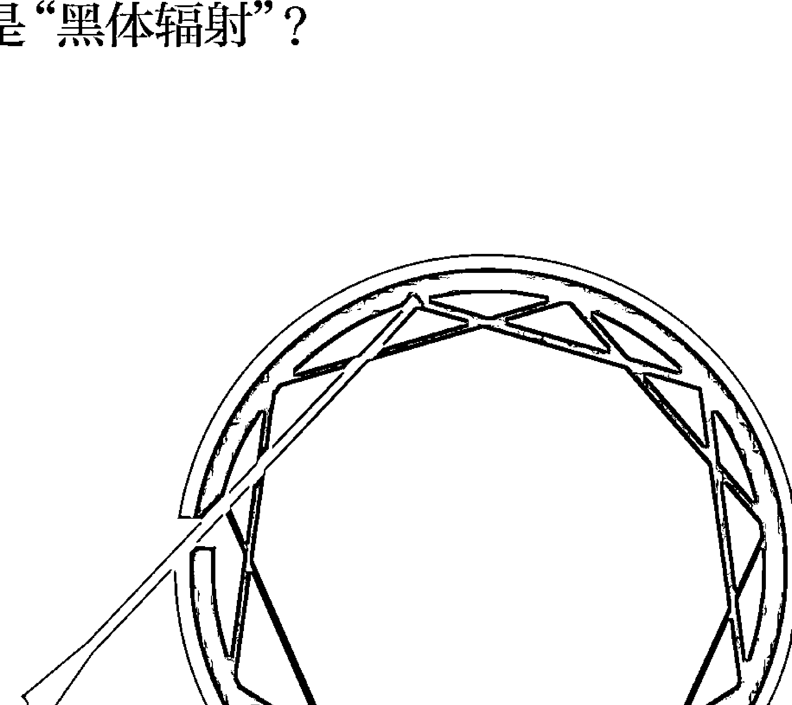

自然界的一切物体，包括你和我，都会因为具有温度而发射出电磁波，这种电磁波也叫“热辐射”，有一种“红外夜视镜”就是利用这一原理来看东西的。

这种辐射与物体的温度有关。温度越高，辐射的功率就越大，强度在光谱中的分布就越向短波转移。比如将一把铁钳持续加热，它会先变成暗红色，然后变成橙黄色，温度越高，它会变得越亮。

很显然，物体热辐射的能量与波长、温度之间，应该存在着一定的函数关系。

但这种辐射同时又与物体本身的特性有关。假如同样对一只瓦缸和一把铁钳加热，它们所表现出来的状况肯定会不一样。所以要确定辐射能量与波长、温度之间的函数关系，得先消除物体自身特性的影响，于是物理学家们假想出了一种理想的物体——“黑体”，用它来作为热辐射研究的标准物体。

黑体指的是能够完全吸收外来辐射的物体。在一定温度条件下，黑体同时也是辐射本领最大的物体，叫作“完全辐射体”。黑体放射出来的热辐射就叫“黑体辐射”，它能够在特定温度及波长下放射出最大量的辐射，而与物体自身的特性无关。

这样一来，物体自身特性的影响就被排除了，黑体辐射能量按波长的分布就只与温度有关，它们之间存在着对应关系。比如说我们观测到的“宇宙微波背景辐射”，就对应着一个约3K的黑体辐射，所以“宇宙微波背景辐射”也被称为“3K背景辐射”。

黑体只是一种假想的物体，在现实中并不存在。人们通常这样近似地来描述它：一个空心的球体，内壁涂上吸收辐射的涂料，外壁上开一个小孔，从小孔射进球体的光线无法反射出来，所以这个小孔就接近于是黑体。

普朗克在研究黑体辐射能量分布定律公式时，偶然间发现了“量子”的概念，从此拉开了量子论震撼20世纪物理学界的序幕。但这只是个意外发现，普朗克本人在事前毫无思想准备，事后很长一段时间里也连自己都难以接受。这就好比一个原本打算钓只海龟的渔夫，却拉上来一头大鲨鱼，把他吓了一大跳。

## 第八章
上帝的骰子：量子世界一切都是不确定的，上帝在掷骰子

理解“光电效应”需要的只是思维方式的改变，但要理解我们接下来将说到的量子论中的其他诡异现象，就需要整个世界观的改变了。

我们先来谈论一个有趣的话题，那就是“命运”。你相信命运的存在吗？是否冥冥之中自有天意，每个人不管怎么努力，最终都必须服从命运的安排，任由它来摆布，丝毫没有抗拒之力呢？

有一种叫“宿命论”的思想是这样说的：生死有命，富贵在天，所有事情上天都已经安排好了，你能活多少岁，赚多少钱，一切皆有定数。

现在的人很少再相信宿命了，他们普遍认为主宰世界的是自然规律，在科学技术的帮助下，人类通过把握自然规律已经能够掌握自己的命运了。

然而他们未必知道的是，相当长的一段时间里，在科学界存在一种占据统治地位的思想叫“决定论”，这种思想和宿命论一样，认为世界上所有的事情都是事先就已经注定的。

决定论的思想从何而来呢？

在学习中学物理时，经常会碰到这样的题目，告诉你一颗炮弹的初始位置、离开炮膛时的初始速度和射角，在不考虑空气阻力的情况下，让你计算在接下来的某个时点，炮弹会出现在哪里，最后的落点在什么位置。

这个题目反映了经典力学对世界的认识。它认为任何事件都有前因后果，这种因果关系可以用科学定律来描述。我们只要知道了初始条件，根据科学定律和方程，就可以预测事情发生的经过和结果。同样的道理，我们只要确定了事物在目前的状况，根据定律就可以倒推出它以前的情况。

这种观点似乎在现实中得到了证明。我们能够预测炮弹的运行轨迹和它的落点，能够预先知道日食将在什么时候发生，能够将人造卫星送入预定的轨道，依据的都是对于这种因果关系的了解。我们能够知道人类诞生以前发生的事情，能够测定地球的年龄，能够通过宇宙膨胀的现象倒推出大爆炸理论，依据的也是这种因果律。

按照这个逻辑往下推，会得出一个惊人的结论。我们知道，从宇宙诞生的那一刻起，整个世界演变的初始条件就已经确定了，而自然法则是固定不变的，事物都在按照它规定的因果关系演变着，这样一来我们似乎就可以做出判断：从宇宙诞生的那一刻起，它将会怎样发展演变，最终结果又会怎样，都是已经确定了的。

根据这一推断，假如我们能够了解宇宙所有的初始状态，又能够掌握所有的自然法则，还具有足够强大的计算能力的话，那么就可以预知整个宇宙的演化过程，直到世界终结。也可以这么说，我们目前无法掌握天地万物的演变轨迹和最终结局，只是因为人类的认识水平和计算能力不够而已，其实宇宙演变的过程和结果会怎么样都是早已确定了的。

这种思想就是“决定论”。

> 根据地球、月球各自的运行轨道，可以计算出月食将会出现的时间。也就是说未来将要出现的月食，是在发生之前就确定了的事件，它是早就已经注定要发生的。

决定论是伴随经典物理学理论而生的，牛顿就是决定论者，他认为宇宙就像是一个巨大的钟表，钟表的弦严格按照预定的方式放松，丝毫不爽。万事都已由物理定律所规定，连一个细节都不能更改，即便是每一个原子的变化轨迹，也都是在宇宙开始时就确定下来了的。过去和未来都像是已经写好的剧本，宇宙的发展只能严格按照这个剧本进行。

18世纪的法国天文学家，曾担任过拿破仑老师的拉普拉斯也认为，假如他能够知道某一时刻宇宙中每一个粒子的位置和运动情况，他便掌握了所有的细节，可以计算出整个宇宙的过去和将来。

决定论有些骇人听闻，但它在科学领域的影响力却超乎想象，曾经在很长一段时间里科学家们都相信决定论，就连爱因斯坦也是它坚定的支持者。

世界真的如同决定论说的那样，只是一部规模宏大的电影吗？情节尚未开始，结局就已经注定？从情感上来说，没有人会喜欢冷冰冰的决定论，相信所有事情都已确定，那意味着我们的一切努力都只是无谓的挣扎，都是徒劳。

在经典物理统治时期，人们很难挣脱决定论的牢笼，但值得庆幸的是，量子论出现之后，情况彻底改变了。

量子论是粒子世界的物理学理论。粒子世界对于普通人来说，是一个很抽象的领域，因为即便是用效率最高的“扫描隧道显微镜”，我们也只能看到原子层面的东西，没有办法看到比原子更小的粒子。所以对这个极端微观的世界，我们只能通过间接方法去认识，没有办法直接看到它们的真实情况。

当人们发现原子的时候，本以为找到了希腊人所说的不可分割的最小粒子，但英国物理学家J. J. 汤姆逊在研究阴极射线时，发现了原子中电子的存在，这表明原子也有自己的内部结构。汤姆逊把原子想象成了一个带正电荷的球，带负电荷的电子一粒粒镶嵌在这个圆球上。这种想象符合直觉，人们下意识地认为组成实物的微小颗粒应该是实心的。

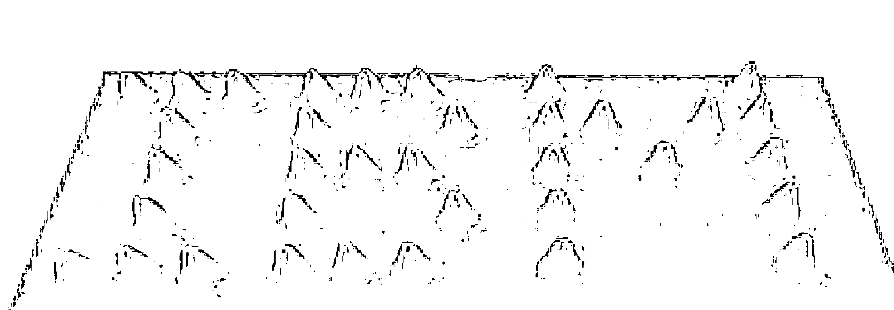

图为美国IBM公司的两位科学家通过“扫描隧道显微镜”，把35个氙原子排成了“IBM”字样。“扫描隧道显微镜”是利用“量子隧道效应”产生隧道电流的原理制作的显微镜，其分辨率可达原子水平，能观察到原子级的图像。原子水平已经是目前人类所能看到的最微观层面，我们无法直接看见任何比原子还小的东西。所以电子、质子、中子、夸克等都是根据实验结果间接推测出来的，实际上从来没有人真正看到过它们。

后来汤姆逊的学生卢瑟福通过实验发现，原子中有一个核心，这个核心带正电，它的半径还不到原子半径的万分之一。这个发现完全颠覆了我们的直觉，微小的原子竟然不是实心的，它就像我们的太阳系一样，里面绝大部分地方是空荡荡的！在此基础上卢瑟福提出了自己的原子模型，这就是“行星模型”。

然而从理论上说，卢瑟福的原子体系是不稳定的。根据经典电磁理论，它会释放出辐射能量而导致崩溃，假如现实中真有这样的原子，那么它很快就会自己解体了。

怎么解决这个问题呢？丹麦物理学家玻尔想到了量子思维。他发现，原子内部电子不同的轨道有着不同的能级，电子只能吸收相当于两个轨道之间能级差的能量，从较低能级的轨道跃迁到较高能级的轨道，或者释放出相同的能量，从较高能级跌回较低能级，而不能像经典理论假设的那样，能够连续不断地吸收或者释放能量。

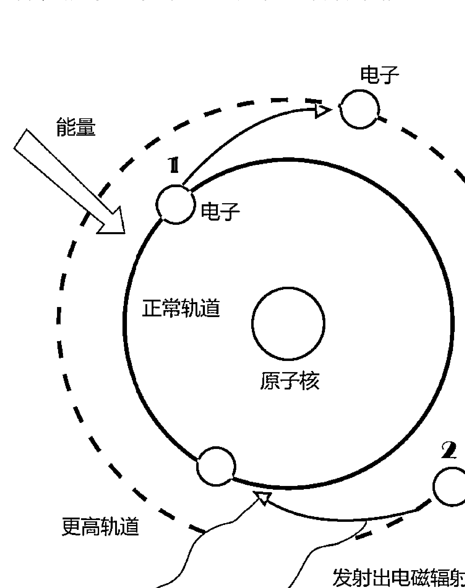

玻尔和卢瑟福的原子结构之间，虽然存在着能级的差别，但却有一个共同特点，那就是电子都有固定的轨道，在围绕着原子核旋转，就像行星绕着太阳转动一样。很显然这是一种惯性思维，当时的人们还很难摆脱电子的运动存在轨道这样的经典力学思维。

玻尔的原子理论能够解释氢原子的光谱规律，但却无法解释氢原子光谱的强度和精细结构，也无法解释稍微复杂一些的氦原子光谱，以及其他更复杂原子的光谱，所以只正确了13年就被推翻了。

到玻尔这里为止，一切都还在正常思维范围内，但正常思维解决不了问题。最终1925年德国物理学家海森堡发表了矩阵力学，1926年奥地利物理学家薛定谔发表了波动方程，解决了原子内部电子的运动问题。但他们的发现是如此怪异，不仅在20世纪物理学界掀起了轩然大波，而且其哲学意义甚至足以颠覆我们的世界观。

在经典物理学中，世界是确定的，任何事物都有确定的状态。我们眼前的实在之物，比如运动中的篮球，在每一时刻，它的状态都是确定的，有确定的位置、确定的速度，这些都是可以精准测量的。

但在量子论中，世界的“确定性”这个看似简单的问题却变得复杂了。1927年，海森堡通过矩阵力学推导出一个令人难以接受的结论：对于电子来说，它的位置和速度（通常说动量），我们只能确定其中之一，两者永远不可能同时为我们所知，这就是大名鼎鼎的“不确定性原理”。它表明对于电子，我们无法像篮球那样同时知道它在某一时刻的位置和速度。

人们最初对于这个原理在认识上有偏差，把它叫作“测不准原理”。言下之意是说，我们无法同时确定电子的位置和速度这两者的信息，是因为电子太小了，以我们目前的科技手段，只要一对它进行测量，它的状态就会发生变化，我们没有办法在不扰动它的情况下进行测量。就像市场上的鱼，我们想给它称重，但一把它从水中捞起来，它就被惊动了，在秤盘上拼命跳，所以就称不准它到底有多重。

但后来人们意识到，事情要比想象的复杂。我们无法知道电子在某个时刻的状态，不是因为测量的原因造成的，而是它本身就不确定！这就好比前面说的那条鱼，我们不知道它有多重，不是因为称不准，而是它的重量本身就不确定！

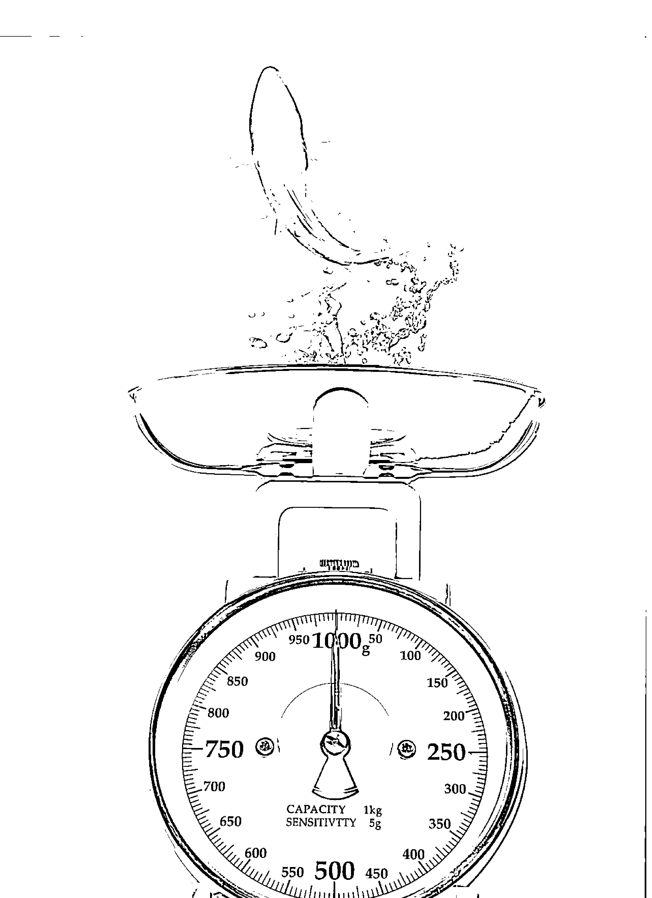

因为鱼一直在跳，很难称得准，所以我们不容易确定它的重量，这很好理解。
但假如有人说，这条鱼的重量本身就是不确定的，你能接受吗？

海森堡的“不确定性原理”揭示出这样一个事实，我们眼中的宏观世界是一个确定的世界，但是构成这个宏观世界的粒子世界却完全是另外一幅场景，这里的一切都是不确定的！

薛定谔的波动方程也包含了同样不可理喻的内容。在方程中有一个波函数ψ，但却连他自己也不知道这个函数蕴藏着怎样的物理意义。他曾以为它代表的是电子电荷的空间分布，但德国物理学家波恩在随后指出，事情远不是这么简单。波恩认为，ψ代表了一种随机性，一种概率，ψ的平方对应了电子在某个地点出现的概率。

原来电子的运动不像经典力学说的那样有确定的轨迹，它将会在哪里出现只是一种概率现象！

这要怎么理解呢？简单地说，按照经典力学定律运动的炮弹，在它射出的一刹那，初始状态是确定的，它有确定的初始速度，确定的初始位置，确定的初始射角。接下来受重力的影响，它一边往前冲一边往下掉，整个运动轨迹也是确定的，我们能够计算出它会落在哪里。

但假如炮弹是像电子那样运动，那麻烦就大了。首先你不可能同时知道它的初始速度和初始位置，它的初始状态根本就不确定；其次它的落点不是一个确定的点，有很多种可能性，它究竟会在哪一点落下完全是个随机的过程，其概率就像一个波，严格按照ψ的分布展开。这就意味着，我们没办法确定炮弹会落在哪里，只知道它落在某个点的概率，炮弹能不能落到敌人头上全看运气，运气差的时候它甚至可能会落在你自己头上。

波恩把波函数ψ称为“骰子”。每次掷骰子的时候，我们都不可能预先知道会出现什么点数，但却知道每种点数出现的概率都是1/6。所以波恩的意思是，你想知道电子将会在哪里出现吗？计算是没有用的，因为你能算出的只有概率，所以还不如干脆去掷骰子算了！

建立在经典力学基础上的决定论认为，世界的初始状态是确定的，演变的过程也完全由物理定律决定着，因而演变的结果是事先确定的。这原本在人们看来是理所当然的事情，但现在这种逻辑行不通了。

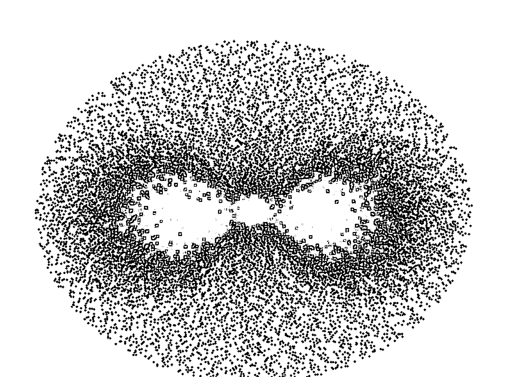

电子所作的高速运动与宏观世界的物体不同，它没有确定的轨道，而是以波的形式弥漫于整个空间中。由于它在某个时刻没有确定的位置和速度，所以我们不可能描画出它的运动轨迹来。

这样一来，电子的运动该要如何来描述呢？人们想到了一个办法，那就是用电子在各个地方出现的概率，来表现它的运动轨迹。如图所示，某个点附近的密度代表了电子在该处出现的机会大小，密度大的地方，电子在单位体积内出现的机会就多；密度小的地方，电子出现的机会就少。按照这种方式画出的电子运动图像，看起来就像是一团带负电荷的云，人们形象地把它叫作“电子云”。

首先是海森堡说我们不可能知道电子的初始状态，因为电子根本就没有确定的初始状态；接着波恩又说我们没办法根据物理定律来预测电子的行为，能够确定的只是概率。这样一来，电子最终会出现在哪里就完全是随机的，结果与它的初始状态和过程都没有严格的因果关系。在亚原子世界里，决定论的逻辑链条完全崩溃了。

这件事情的背后有更深的哲学含义，随着决定论一起崩溃的是我们的世界观。我们曾经毫无保留地相信，眼前的世界是一个真实的、确定的世界，但我们现在发现，世界是不确定的，那它还能是真实的吗？

也许正因为如此，很多人无论如何都不能接受这个结果，尤其是爱因斯坦。在1926年写给波恩的信中爱因斯坦这样说：“量子力学令人印象深刻，但是一种内在的声音告诉我它不是真的……我毫无保留地相信，上帝是不掷骰子的。”

后来爱因斯坦与玻尔展开了多次辩论，他到死也不相信构成宏观世界的粒子世界是不确定的。然而遗憾的是，越来越多的实验否定他的看法，事实证明上帝确实在掷骰子。

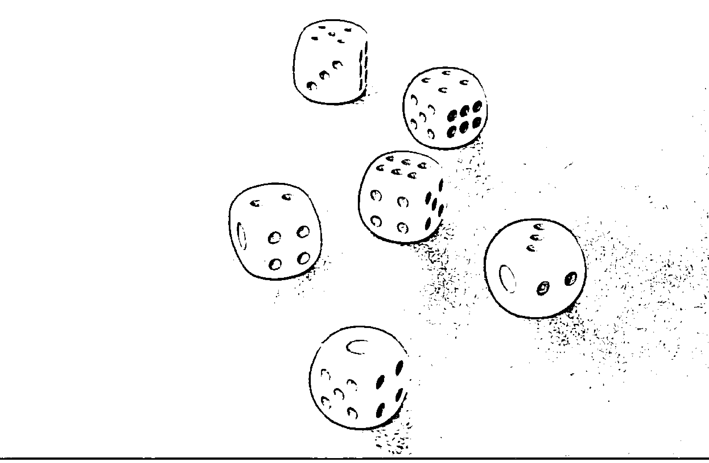

在日常生活中，一定程度上的“确定性”是必须存在的，否则我们的生活就没法过下去了。比如说往银行里存钱，如果原先你的存折里有5万元，现在再存10万进去，那么你的存折上就会有15万元，这是确定无疑的，整件事情的初始状态、经过与结果之间，有着严格的因果关系。假如你的账户上总共会有多少钱，跟最初有几万，后来又存进去多少都没有关系，银行完全是通过掷骰子来决定结果的，最后有可能是15万，也有可能仍然是5万，甚至有可能变成了2万，只是出现的概率不同而已，那么这样你还敢再往银行里存钱吗？

不确定性的存在让我们完全可以断定，世界并不像决定论说的那样，只是一部按照既定剧本拍摄的电影，结局从一开始就早已注定。

> “入芝兰之室，久而不闻其香；入鲍鱼之肆，久而不闻其臭。”

对于不确定性的存在，久而久之人们又习以为常，变成了一个“超正常现象”。其实仔细想想，爱因斯坦的质疑不无道理，这里面确实很不正常。只是爱因斯坦搞错了方向，他一直在怀疑现象，却没有进一步去思考背后的真相。

我想问的是：造物主为什么要设计一个充满随机性的系统呢？

### 延伸阅读

### 原子内部是个空荡荡的球馆

1909年，卢瑟福做了著名的“α粒子散射实验”，本来是想用它来验证汤姆逊的原子模型，但却得到了完全出乎意料的结果。这个实验是用天然放射性物质中放射出的α粒子来轰击金箔，绝大多数α粒子毫无阻碍地穿了过去，但有极少数粒子却发生了大角度的偏转，有的甚至被反弹了回来。

假如根据汤姆逊模型来计算，α粒子穿过金箔后偏离原方向的角度应该很小。因为α粒子的质量比电子大得多，它碰到电子就像是飞行的子弹碰到尘埃一样，不会明显改变方向。另一方面，原子的正电荷是均匀分布的，α粒子穿过时受到的斥力会相互抵消，所以也不应该出现大的偏转。

然而不应该出现的事情却发生了。卢瑟福后来回忆了当时的情形说：

> “这 是我一生中遇到的最难以置信的事，好比你对着一张纸发射炮弹，结果有些炮 弹却弹回来打在了自己身上……”

卢瑟福对实验结果进行分析后，认为发生这种现象只能有一种解释，那就是原子中几乎全部的质量和正电荷，都集中在原子中心的一个很小区域内，而其他绝大部分的区域都是空的。因为原子里面是空的，所以多数α粒子毫无障碍地穿过了原子；因为中间有一个致密的核心，所以极少数α粒子撞上了它，发生了大角度偏转甚至被弹了回来。

现在我们知道他的想法是对的，原子核确实很小，假如把原子比作是一个封闭的足球馆，那么原子核就相当于一只蚂蚁那么大。

当你用手抚摸着钢板的表面时，心中一定在想，这东西连根针都插不进去，它一定是很致密的，很自然地就会产生世界是由实体物质构成的想法。所以当人们发现原子时，第一反应是它应该是一个致密的实心球，但现在我们知道原子不是一个充实的球，而是一个空荡荡的球馆！

“分形宇宙论”认为，我们的宇宙就是一个大粒子，而宇宙中的每个粒子又都是一个小宇宙。现在也许你不会再笑话这种理论的荒诞，因为假如你是原子中一个电子那么大的生命，那么对于你来说，原子真的就像是一个小宇宙。

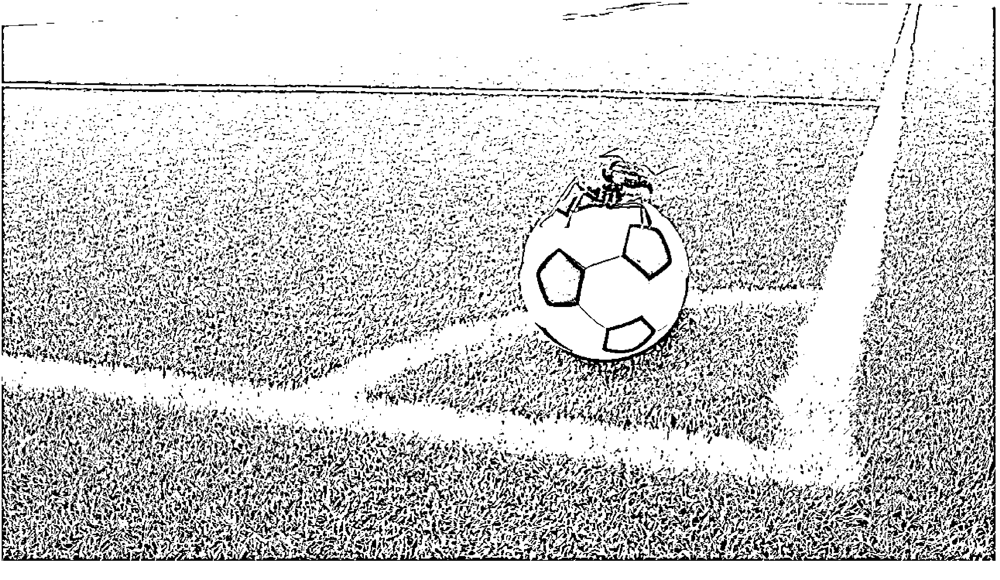

我们在拿原子核和原子作比较时，它就像是足球馆中的一只蚂蚁，但如果拿它和电子来比，那么情况就完全颠倒过来了，这时候原子核像是那个球馆，而电子像是那只蚂蚁！

太阳在太阳系中的大小，和原子核在原子中的比例是同一个数量级的，所以“分形宇宙论”说得还真是十分形象。

## 第九章

### 镜花水月：量子论证明，世界只是镜中花、水中月？

作为20世纪物理学两大支柱理论之一的量子论，比史上任何一种理论都引发了更多的技术革命，核能、信息技术、激光、半导体这些广泛运用的技术都和量子论分不开。

但有意思的是，量子论在技术运用方面的成功却是在原理不明的情况下取得的。就像古人不知道地球磁场的存在，却照样能够发明指南针一样，虽然量子论已经得到了广泛应用，但是直到现在物理学界还没有搞清楚它的原理是什么。

这是怎么回事呢？下面用一个实验来说明。

1807年托马斯·杨发表了一个著名的实验：光的双缝干涉。他把一支蜡烛放在一张开了一个小孔的纸前面，形成一个点光源，然后在这张纸后面再放一张纸，纸上开两道平行的狭缝，后面再放一个投影屏。结果发现，小孔中射出的光穿过两道狭缝投到屏幕上，形成了一系列明暗交替的条纹。

很显然这是干涉条纹，干涉是波的特性，实验证明光是一种波。从两条狭缝中穿过的两列光波，形成了干涉现象，波峰与波峰相遇的地方会相互增强，所以在屏幕上对应的位置出现了明的条纹；波峰与波谷相遇的地方会相互抵消，所以出现了暗的条纹。

后来这个经典实验在经过改动之后，成为量子论中的重要实验。人们用电子代替点光源来做这个实验，结果令人意外，屏幕上竟然同样出现了干涉条纹。这种现象相当挑战人们的神经，因为只有波才会产生干涉现象，而按照通常的认识，电子是原子的内部结构，它显然是一种粒子，粒子之间怎么可能产生干涉现象呢？

更有意思的事情在后头。我们知道两列波之间才会出现干涉现象，如果只有一列波，干涉就不可能发生。后来有人稍微修改了一下实验，试着控制电子的数量，每次只发射出一个电子，这样每次就只能在背后的感光屏上激发出一个小亮点。但令人惊讶的是，当人们把电子一个一个通过双缝打在感光屏上时，随着亮点慢慢增多，逐渐地又能看出干涉条纹来了。亮点越来越多，条纹就变得越来越清晰。

这些现象应该如何解释？电子到底是粒子还是波？衍射和干涉是波的特性，假如电子是粒子，那为什么在穿过双缝时会像波一样产生干涉现象呢？但波不是实体，假如电子是一种波，那为什么它在碰到屏幕时，却又会打出一个亮点来，从而表现出粒子的实体特征？

最难解释的是，当电子一个一个通过双缝时，为什么还会存在干涉现象？干涉条纹的产生需要同一时刻在两条缝隙中，存在着两列相互影响的波。而一个电子只能通过一条缝隙，也就是说只能产生一列波，它是怎么自己和自己产生干涉的？

问题还不止这些。在人们发射一个个电子的过程中，只要关闭掉双缝中的一条，后面那些电子马上就能感应到这种变化，打在屏幕上时不会再出现干涉条纹了。甚至在不关闭狭缝的情况下，只要在双缝的后面安装一个探测器，测量电子是从哪条缝出来的，电子就能马上做出反应，干涉条纹立即消失得无影无踪。

电子在穿过狭缝前的一刹那，是如何马上就知道另一条狭缝被关闭了的呢？相对于电子的大小而言，另一条狭缝与它的距离可不是一般的遥远，电子为什么在瞬间就能做出反应？除非它收到了某种瞬时传播来的信号，但这种信号是谁发送给它的？为什么有探测器看着它时，电子马上改变了行为方式？

因为如何解释以上现象的问题，物理学界闹得不可开交，解释版本一大堆，却没有哪一种能够统一大家的意见。这里我想重点介绍一下影响最大的版本——“哥本哈根解释”。

哥本哈根解释的内容主要包括3个部分，除了前面提到过的海森堡的“不确定性原理”和波恩的“概率解释”外，还有玻尔1927年提出的“互补原理”。互补原理比前面两种理论还要更夸张，它居然认为世界是由意识决定的。

互补原理说，实际上电子既是一种粒子，也是一种波，这叫“波粒二象性”。但在每一个特定的时刻，电子不可能同时既是粒子又是波，它的状态取决于是否有人在观察它。当没人观察时它就是波，以波函数的形式处在一种叠加的状态之中，弥漫于整个空间；而一旦有人观察时，波函数突然从空间中收缩，集中在一个点上，于是它就变成了粒子。波函数这种奇迹般的变化被称为“坍缩”。

按照玻尔的解释，在前面的实验中电子最初是一种波，以某种方式同时穿过了两条狭缝，自己与自己发生了干涉。在撞上感光屏的那一瞬间，这时候相当于有人观测它了，它马上变成了粒子，按照ψ的概率随机打在屏幕的某个位置上。在双缝后面装上探测器时，同样的道理，被观测的电子马上变成了粒子，粒子不会产生干涉现象，所以干涉条纹消失了。波是虚无缥缈的东西，不是实体，粒子才是实在的点状物。互补原理意味着，当我们没有看电子的时候，电子就不是实在的东西，它像个幽灵般向四周散发开来，以波的概率形态飘浮在空间中。但当你一睁开眼睛，所有幻影立刻消失，电子的波函数在瞬间坍缩，变成一个实实在在的粒子，随机出现在某个位置，让你能够看到它。

这多像是《倩女幽魂》中的场景啊！当你定睛看时，小倩就站在你的面前笑吟吟地看着你；但当你转过身去，她却立刻化作一道轻烟，消失得无影无踪。

这还能算是科学理论吗？它简直就是《聊斋》中的鬼故事！

更糟糕的是，人们用光子、介子等其他的亚原子粒子来做同样的实验，得到的竟是和电子完全一样的结果，甚至用原子来做也是如此。它表明这种属性不是某种粒子特有的，而是粒子世界的共有现象。

我们眼中的物质实体都是由粒子组成的，所以如果每一种粒子都是在有人观察时才是实在的，没有观察时只是一种虚幻的波，那就意味着由它组成的物质世界也应是如此。这说明了什么？难道真像18世纪爱尔兰的乔治·贝克莱主教说的那样，“存在就是被感知”，物质是由意识决定的？

当时有一句广为流传的话很好地描述了这一解释：“当我们不看它时，月亮是不存在的。”

这太可怕了。长期以来我们都认为，世界是客观的，它不依赖于人的意识而存在。你想，宇宙已经演变了137亿年，而人类出现的历史不过短短几百万年，在之前没有观测者的情况下，世界难道就不存在？这不管怎么看都是件荒谬的事情。

据哥本哈根的解释，以波的形式存在的电子，具有多种可能的叠加状态，只有当它被观察时波函数才会坍塌成一个粒子。这是否意味着，电子在前面曾经发生过的事情，是后面在意识的作用下才变成了现实的呢？假如是这样的话，那么从理论上讲，在事情已经发生后，到它被观测变成现实之前，我们应该还有机会改变它！

要想验证这样的想法不容易，但高人总是很多。1979年美国物理学家约翰·惠勒提出了大名鼎鼎的“延迟实验”，指出我们确实可以尝试使电子延迟做出决定，在它已经实际通过双缝之后，再来选择前面是通过一条缝还是两条缝，是出现干涉条纹还是不出现干涉条纹。更简单点说就是可以在电子通过双缝的事实发生之后，再来决定或者说修改它前面通过双缝时的方式。

惠勒设计的实验，形式上与双缝实验有所不同，但其原理是一样的。它相当于我们可以在电子通过了双缝之后打到感光屏上之前的这段时间里，通过放置或者撤掉探测器的手段，来决定电子在前面通过双缝时，是通过一条缝还是两条缝。

这真是一个令人匪夷所思的想法！在惠勒的设想提出5年后，美国马里兰大学的卡洛尔·阿雷带领一个团队做了延迟实验，结果真的证明，我们可以在电子通过了双缝之后再决定它前面通过双缝时的方式。

我们竟然真的可以在事情发生之后，再来决定它是怎样发生的，这到底是怎么回事？惠勒后来引用玻尔的话解释说：“任何一种基本量子现象，只在其被记录之后才是一种现实。”

宇宙的演变就像是拍电影，在拍完后直到上映之前，影片的内容都还不能说是确定的，因为导演随时可以对它进行剪辑。据说以前就曾经出现过这样的例子，有些女演员不愿意被潜规则，结果虽然参加了电影的拍摄，但属于她的那部分镜头却全都被剪辑掉了，以至于在播出的电影中根本就没有她什么事！

难道观测者就相当于电影的观众？电影要在跟观众见面后才是确定的，宇宙演变的历史也是在被观测之后才成为现实的吗？照这么说，宇宙一百多亿年的演变历史，都是等到它诞生出了能作为观测者的生命之后才成为现实的？
要接受“意识让世界变得真实”的想法的确需要勇气，也许你会想从其他的解释版本中寻找安慰，但问题是它们的解释还要更疯狂得多。

排在第二位的“多宇宙解释”拥有不少支持者。哥本哈根解释最让人难以接受的地方，是需要一个观测者来让处于叠加状态的波函数坍缩，从而把意识引入物理学，得出了精神能够在物质世界直接发挥作用的结论。有人对此难以接受，就想方设法要把意识的作用从物理学中清除出去，“多宇宙解释”就是一种尝试。

他们想，之所以要引入意识，是因为波函数出现了坍缩；而之所以认定存在坍缩，是因为在进行观测时，干涉现象会消失，我们只看见电子通过了一条缝，从来没有人观察到电子同时从两条缝中出来。由此他们进一步推断，假如在我们进行观测时，电子实际上是同时通过了两条缝的，并不存在坍缩现象，那么不就是把意识的作用排除出去了吗？

但为什么我们只看到电子通过了一条缝呢？“多宇宙解释”说，那是因为电子在双缝前面临选择时，我们的宇宙分裂成了两个“平行宇宙”。在其中一个宇宙，电子通过了左边那条缝，而在另一个宇宙，电子通过了右边那条缝。我们只处在其中一个平行宇宙，所以只看到电子通过了一条缝，而在另一个宇宙的我们，会看到电子通过了另一条缝。

这就意味着宇宙演变的每一种可能性都会对应一个平行宇宙，在一些宇宙中梁山伯与祝英台终成眷属，而在另一些宇宙中荆轲干掉了秦王。

“多宇宙解释”确实把意识的作用排除出去了，但代价惊人。浩瀚无边的宇宙，仅仅因为我们这个小小星球上一个小小实验室里一个小小电子的一次小小的选择，就必须分裂成两个。天知道，每时每刻在宇宙中到底有多少粒子在面临选择，我们这个宇宙又到底需要进行多少次的分裂！

你是愿意接受“意识让世界变得真实”的哥本哈根解释呢，还是愿意相信“一个电子的选择就能造成宇宙分裂”的“多世界解释”？相比之下，我觉得还是接受哥本哈根解释好一些，因为这个解释除了引入意识的作用有点奇怪之外，其他方面都很好理解。而“多世界解释”为了要排除意识的作用，让整个宇宙来迎合一个电子的行为，这实在太夸张了。

哥本哈根解释把意识引入物理学的行为，过于挑战人们的神经，所以饱受各方的指责、质疑和攻击。然而令人大跌眼镜的是，它竟然经受住了一次次的考验，所有试图为了推翻它而做的实验，却都反而更加证明了它的正确。

爱因斯坦对此极为反感，毕生都在为否定这一理论而努力，薛定谔也持同样的立场，然而在事实面前名气再大也不管用。最终物理学家们只能无可奈何地接受现实，干脆埋头享受量子论带来的实惠，再不去管它背后那令人瞠目结舌的哲学意义了。

镜中花、水中月，虽然美丽却只是幻影。量子论难道要告诉我们，眼前这个纷繁复杂、多姿多彩的世界，也只不过是镜花水月？

### 延伸阅读一
“实用”的就是“正确”的？

中国古代的人不知道“磁场”的概念，却能够发明指南针。这种现象给了我们一个启发，那就是一种理论的实用性，并不需要依赖于它的完整性和正确性，这两者之间不能直接画上等号。

一方面，不完整甚至还一片模糊的理论，往往就已经具有很高的实用价值了。比如人们在量子论的原理还不明确的情况下，就已经运用它制造出了大量的高科技产品。

另一方面，已经被证实很有用的理论，并不一定就很正确。牛顿的经典力学直到现在仍然很有用，人们至今还在利用它来计算弹道轨迹，但它却早已被相对论证明在正确性方面存在局限。

但在人们的思维习惯中，往往会理所当然地把一种理论的实用性，作为它正确与否的证明。就像在你看到一个和尚也在使用科技产品，拿着手机打电话时，你很自然地就会在心里对科学与宗教这两者的高下，做出一个新的评判。

> 保罗·戴维斯说：“在很多情况下，宗教观念与其说是被现代科学所证伪，还不如说是被现代科学所超越。”

的确，科学在实用方面远远超越了宗教，仅凭这一点就足以让它在与宗教的较量中占据上风。

但正如前面所说，实用的未必就是正确的，错误的也未必就不实用。假如对此缺少清醒的认识，那么你的思想就会容易被眼前的现象左右，蒙上一层浓厚的功利色彩。这种现象在生活中有个难听的说法：“有奶便是娘。”

### 延伸阅读二
波和波的反射、衍射、干涉

波动是生活中很常见的一种物质运动形式。比如在平静的水面上扔下一块石头，会荡漾起一圈圈的水波，水波是通过水来传播的；我们口中说的话，会以声波的形式传到别人耳朵里，声波是通过空气传播的。这些波都是弹性实体物质的机械振动，所以它们都叫“机械波”。

在很长的时间里，人们以为所有的波都是机械波，都需要通过介质才能传播。比如在太空中，不通过仪器我们将无法听到彼此说话的声音，因为声波不能在真空中传播。

后来人们发现了一种能够在真空中传播的波，叫“电磁波”。1865年英国物理学家麦克斯韦预言了电磁波的存在，这种波是变化的电场和变化的磁场在空间中的传播。他还推导出电磁波的传播速度等于光速，指出光就是一种电磁波。1888年德国物理学家赫兹用实验验证了电磁波的存在。

不管是机械波还是电磁波，都存在着一些共有的特性，比如说反射、衍射和干涉。人们往往就利用波的这些特性，来判断一样东西究竟是不是波。

当我们向山谷大声喊叫时，产生的回音就是声波的“反射”。

波如果在传播时碰到很小的障碍物，那么它会绕过去；如果碰到大的障碍物，但中间有跟波长相当或略小的缝隙或者孔洞，那么它会穿过去。在这个过程中，波的传播方向将发生变化，看起来就像是以障碍物、孔洞或者缝隙为波源，形成了一列频率相同的新的“子波”，这种现象叫作波的“衍射”。

两列频率相同的波，如果在传播的过程中重叠在一起，那么就会出现这样的现象：波峰与波峰相遇的地方振动加强，波峰与波谷相遇的地方振动减弱，而且加强的区域和减弱的区域会相互隔开，这种现象叫作波的“干涉”。

上图中，一列波通过障碍物A中间的小孔，形成了衍射；然后再通过障碍物B的两个小孔，形成两列衍射波，两列波之间出现了干涉。

### 延伸阅读三
世界只是一个幻境吗？

波是什么？波只是一种现象，不是实体。足球场上的“人浪”，是因为球迷们一个接一个站起和坐下，形成了有规律的动感图案，并不是真的存在“人浪”这种物质。水波也是如此，它是水面有规律地上下振动形成的，世间并不存在“水波”这种物质。

人浪和水波都可以算是“机械波”（当然人浪只是类比，它不是严格物理意义上的“波”），它们是实体物质的一种运动现象。需要特别指出的是，当机械波出现的时候，实体物质并没有消失，就此转化为虚无的“波”。就像人浪出现的时候，人依然是存在的；水波出现的时候，水依然是存在的。

然而“波粒二象性”表明，电子的粒子属性和波的属性不能同时并存，它只能在实体物质和虚无缥缈的波之间进行切换。当它变成波时，实体物质就在瞬间消失了；而当它变成实在的粒子时，波又在瞬间消失了。而且最为诡异的是，这种转换的理由，就如同王菲在歌中唱的那样，“只是因为在人群中多看了你一眼”。

电子有时是实在的粒子，有时是虚无缥缈的波；我们看它的时候它是粒子，不看它的时候它是波。这种亦真亦幻的场景，在什么地方经常出现？没错，是在修仙小说所描绘的幻境中。电子的“波粒二象性”难道预示着，我们所在的这个世界其实只是一个幻境？

## 第十章
隐形的手：心灵感应式的量子纠缠，
世界背后有只隐形的手

从哲学角度看，量子论是一种极具破坏性的理论，虽然它还没能帮助我们建立新的世界模型，却已把旧的世界观搅得支离破碎。它破坏了世界的确定性，推翻了“决定论”；它破坏了世界的真实性，让人们开始怀疑“实在论”；这还不够，接下来它还将破坏世界的定域性，挑战爱因斯坦的“相对论”。

“定域性”是指在某个时间段内，宇宙中所有的因果关系都必须维持在一个特定的区域之内，不存在超越时空的瞬间作用和传播。这是相对论的基础，任何信息的传输都不可能超过光速这个上限，宇宙中不可能有无视时间和距离的超距作用。

在我们的经验中，任何信息传送都是需要时间的。古代通信工具不发达，书信从京城抵达边关往往需要几个月，所以才有“家书抵万金”的说法。现在有了电话、互联网，但信息的传送依然需要时间，最快也不可能超过光速。这让我们相信，世界上并不存在类似于“心灵感应”的双向互动——不需要消耗时间的即时信息传输。

然而这个问题现在有了新的说法。量子论中有一个奇怪的实验，叫“EPR实验”，就涉及了粒子间的超距作用，让物理学家们感到困惑不解。

EPR实验是1935年爱因斯坦为了推翻哥本哈根解释，与两位同事发表的一个思维实验：

假设有一个大粒子，自旋为0，它不稳定，衰变成A、B两个小粒子，向相反的远方飞去。小粒子有两种自旋方式，分别叫“上旋”和“下旋”。按照“角动量守恒定律”，如果粒子A为下旋，那么粒子B就一定会是上旋，反之亦然。

依照哥本哈根解释，我们可以做出如下推断：两个小粒子的初始自旋状态是不确定的；当我们观察粒子A的时候，它会马上随机选择一种确定的状态，比如说下旋；按照守恒定律，粒子B必然会在同时确定为上旋。

但是问题来了，如果此时两个小粒子已经相隔非常遥远，比如几十亿光年，那么当粒子A的状态确定时，它是怎样将信息传递给粒子B，使得它能够同时做出反应的呢？

> > 如果在观测之前小粒子的自旋方向是不确定的，那么在其中一个粒子被观测的一瞬间，根据守恒定律的要求，两个粒子不管相隔多么遥远，都必定会同时做出反应，确定各自的自旋方向。

出现这种情况只能有两种解释：第一种可能是两个小粒子之间存在类似于心灵感应的超距作用，亦即某种超越光速的信息传输，这样它们之间才能进行即时沟通；第二种可能是两个小粒子并不像哥本哈根解释说的那样状态不确定，而是从分离的那一刻开始，它们的自旋状态就早已确定了。

爱因斯坦认为，相对论规定了任何信息的传输都不可能超过光速，宇宙中不存在不需要传输时间的超距作用，所以第一种可能性并不存在，这样就只剩下另一种可能——粒子的状态早已确定，这证明哥本哈根解释有问题。

爱因斯坦的这次发难让玻尔一时之间难以招架，郁闷了好一阵子。后来他解释说，两个小粒子之间其实并没有传递超光速的信号，只是在没有被观测之前，两个小粒子之间不管相隔多远，都仍然是一个整体，因而只要对其中的一个进行观察，另一个必然会相应地做出反应。

他们两个谁说的对呢？检验的关键在于确定远离的小粒子之间是否存在关联，是否有超距作用的“心灵感应”。如果玻尔是对的，那么小粒子在没有被观察之前仍然是一个整体，粒子A与粒子B之间必然会有一定的关联；而如果爱因斯坦是对的，那么两个小粒子从分开的那一刻开始，相互间就没有关系了。

这个思维实验在当时的技术条件下无法检验，玻尔和爱因斯坦至死也不知道自己是对还是错。后来北爱尔兰物理学家约翰·斯图尔特·贝尔在1964年发表了“贝尔不等式”，为检验EPR实验扫清了障碍。贝尔是爱因斯坦的支持者，他相信实验结果将告诉人们，粒子间心灵感应式的关联纯粹是胡说八道。

1982年，法国物理学家阿莱恩·阿斯派克特带领一个小组做了这个实验。这个实验的结果是如此重要，以至于有人甚至称之为“上帝的裁决”。结果竟然是爱因斯坦输了，事实证明分开的小粒子之间确实保持着一种微妙而神奇的联系，类似于超越时空的心灵感应，这种关联叫“量子纠缠”。

实验报告发表后，科学家们鸦雀无声，不知说什么才好。后来人们不断引入新的手段，提高实验的可靠性，多次重复了这一实验，但结果全都一样：不管两个小粒子相隔多远，它们之间都仍然存在一种神秘的关联。

现在我们面临两个艰难的选择。如果我们相信玻尔说的，两个粒子在没有被观察之前，不管相隔多远都还是一个整体，那意味着我们需要放弃世界的实在性，承认粒子只有在被观测后才成为现实的东西，世界是由意识决定的。另外我们只能接受这样的事实：粒子间确实存在快于光速的超距作用，但这样相对论的基石就动摇了。

阿斯派克特实验结果出来之后，有人邀请了8位量子论专家来做访谈，其中就包括阿斯派克特和贝尔。专家们的意见五花八门，阿斯派克特不相信存在超光速，宁愿放弃世界的实在性来换取定域性；而贝尔则沉默良久，最后宁愿牺牲定域性，相信确实存在超越光速的超距作用，也不愿意放弃世界的实在性，承认世界是虚幻的。

薛定谔和爱因斯坦一样既是量子论的奠基人，同时又是量子论的坚决反对者。在EPR实验发表之后薛定谔颇为振奋，认为抓住了哥本哈根解释的要害，为了补上一枪，他发表了一个著名的思维实验——猫实验：

假设把一个放射性原子装进一只不透明的箱子，箱子里有一种结构巧妙的精密装置，只要那个放射性原子衰变后放出一个中子，就能激发这个装置的一串连锁反应，最终会打破箱子里的一个毒气瓶，毒死箱子里的一只猫。

薛定谔说，既然哥本哈根解释认为，在没有观测之前粒子的状态不确定，处于各种可能的混合状态之中，那就意味着只要没有进行观察，放射性原子就处在模糊的状态之中，是否已经衰变并不确定。

这下问题来了，在我们打开箱子观察之前，原子是否衰变并不确定，也就意味着里面猫的死活也不确定。这个推断令人难以置信，难道猫在此之前都处于死与活的混合状态之中？

薛定谔的这次发难把哥本哈根派整得够呛。因为根据他们的理论，在我们没有观察之前，那只猫确实是不死不活、又死又活的。这个结论太骇人听闻了，你说粒子的状态不确定也就罢了，你说一只猫处在死与活的混合状态之中，这不是瞎扯吗？

在我们进行观察之后，猫的死活才能确定下来，这不就意味着我们的意识决定了猫的生死？假如我们一直不去观察，难道猫就永远都不会死了？而且这里说的不确定，不是因为我们不了解情况造成的，这个不确定是真的不确定，也就是说假如猫有自我意识的话，就连它自己也搞不清楚自己的死活。

薛定谔提出的问题确实很难回答。有人想到了“多宇宙解释”，他们分析说，在那么多的平行宇宙中，一些宇宙中的原子没有衰变，猫还活着；而在另一些宇宙中原子衰变了，猫已经死了。

不知道你信吗？反正我不信。

但EPR实验和猫实验的确令人费解。相隔几亿光年的小粒子为什么还会是一个整体呢？是什么把它们联系在一起的？一只活生生的猫怎么可能会处在死与活的叠加状态中呢？

其实只要想明白了一个简单的道理，也许这些问题就迎刃而解了，那就是——我们这个世界背后是有监控的。

在普法教育中我们经常会听到这样一句话：“要学会用法律的武器来保护自己。”现实中也确实有人运用法律手段维护了自己的合法权益。这样一来，就真的有人把法律当成武器了，认为它确实具有强大的力量，其实这不过是一种错觉。

法律作为一种规则，它本身是没有任何力量的，真正具有力量的是颁布法律的国家机器。法律之所以令人敬畏，是因为有国家机器在背后支撑，是国家强制力在监督法律的执行，对违反法律的人实施惩罚。对于一个国家来说，仅有立法机构还不够，法律不是制定出来就会自动生效的，还需要有执法部门来保障它的执行，监督社会公众遵守法律。一旦没有国家机器的支持，法律就完全失效了。

有人就是因为搞不清楚这一点，才会过分迷信法律。其实在人治社会，当你惹到你惹不起的人时，拿起法律的武器来保护自己只是一种徒劳。此时你会发现，没有了国家机器作后盾，法律就变得软弱无力、不再管用，再也保护不了你了。

有意思的是，在科学领域也经常会出现这样的常识性错误。科学家们大多认为是自然法则在主宰着世界，而科学定律中体现了自然法则，所以只要掌握了科学定律，就相当于掌握了能够主宰世界的强大武器，用一句广为流传的话来说是：“知识就是力量！”

而在掌握了科学定律之后，人们运用科学技术改造世界，确实取得了巨大成功。这似乎能够证明，科学定律背后的自然法则，真的是主宰世界的一种强大力量。

然而你想过没有，自然法则和法律一样，其实都只不过是一种规则而已，而规则本身是没有力量的。法律需要国家机器的支持，需要执法机构来监督实施，难道自然法则就不需要吗？

是什么在监督着世界严格遵照自然法则运行的呢？这个问题从来没有看到有人提起过。许多人天真地以为，自然法则本身就能起作用，这真是一种奇怪的想法，无异于相信法律只要制定出来就能够自动生效，不需要人来执行。

自然法则背后的力量，才是我们这个世界真正的主宰。这种力量是什么？它从何而来？我们并不清楚。但我们可以肯定的是，世界背后是有某种监控力量的，正是它在支持着自然法则发生作用。

只要明白了这一点，前面的两个实验就容易解释了。两个小粒子之间的神秘关联，假如是世界背后的监控系统在起作用的话，那就一点都不奇怪了，监控系统完全可以把两个分开的小粒子当成一个整体来看。相对论只是对属于我们这个世界的东西有效，对于世界背后的监控系统来说，并没有任何的约束力，它可以轻松地制造我们眼中的超距作用。

薛定谔的猫实验也很简单。哥本哈根解释中关于不确定性的认识，其实存在一些问题，因为不确定性实际上只会出现在系统的初始状态下，而不会存在于运行过程中。原子衰变是系统运行过程中的一个事件，在监控系统中肯定是有记录的，所以薛定谔的猫到底是死是活，对于监控系统来说是确定无疑的，绝对不会出现猫又死又活的状况。

对于世界背后的这只隐形之手，其实人们并非毫无察觉。在量子论中，除了“哥本哈根解释”和“多宇宙解释”之外，还有另一种解释版本——美国物理学家戴维·玻姆的“隐变量理论”，就在某种程度上反映了监控系统的作用。“隐变量理论”认为电子行为的不可预测，是因为主宰它们的是一些隐变量，这些变量是隐藏着的，你无法直接探测到它们。

我们要提出的问题是：EPR实验和猫实验是否意味着世界背后有一只隐形的手？这只手是什么？

宏观世界的运行过程，不可能在观测之前是不确定的，始终处于模糊的叠加状态之中。猫绝不会在人观察了之后才确定死活，宇宙也绝不会在观测者出现之后才成为现实，否则宇宙在这之前的演化怎么解释？还不存在的东西它怎么演变？

### 延伸阅读

### 宇宙中的守恒与不守恒

‘守恒定律’是自然规律中一类特殊的存在，它表明我们这个世界中真的有些东西是永恒不变的。两个小粒子之间会有相反的自旋方式，依据的就是其中的‘角动量守恒定律’。

在很久以前，人们根据经验就已经感觉到，世界一直在变化着。公元前5世纪的古希腊哲学家赫拉克利特说：‘人生不能两次踏入同一条河流’，他认为事物处在永恒的运动变化之中，当你下一次走进这条河时，一切都已经不同了。佛教中也有类似的说法，悉达多把这种现象叫作‘无常’。

虽然生命无法挽留，人们却总是希望有些东西能够永恒，比如爱情。沐浴在爱河中的有情人，喜欢用山盟海誓来加固彼此间的感情，期盼双方都能够做到情比金坚、忠贞不渝。有些人实现了承诺，做到了一生相守，但移情别恋、大难来时各自飞的例子也不罕见。世界时刻在变化着，要保持一颗不变的心，谈何容易啊？

自然科学的兴起却让人们看到了永恒的希望。早年的科学家们发现，宇宙中真的有些东西是永恒不变的，比如质量、能量、动量、角动量、电荷，于是一批守恒定律被提了出来。这些定律说，宇宙中的某些东西能永恒存在，它们既不会增加也不会减少，总量始终保持不变。

- ‘动量’这个概念相比质量、能量来说，我们可能会比较陌生，它指的是一个物体的质量乘以速度。‘动量守恒’意味着宇宙中物体的运动总量不会发生变化。
- 而‘角动量守恒’则意味着，物体在空间中所作的旋转运动，其总量是恒定的。
- 动量守恒定律和角动量守恒定律，都是基本粒子在衰变、碰撞和转变过程中普遍遵守的规律，‘EPR实验’中爱因斯坦断定两个小粒子的自旋方向必定相反，其根据就在于此。

然而后来人们在发现了质量、能量会相互转化之后，质量守恒定律和能量守恒定律就被打破了，取而代之的是质能守恒定律。这一发现真是令人失望，看来守恒是有条件的，连守恒定律自身都不能永恒，我们还能奢望爱情能够永恒吗？

下面我们说一个更有意思的守恒定律失效的故事。

事情先从“对称性”开始说起。物理定律中所说的对称性，和日常生活中的概念不同，它指的是在某种情况下，条件变化之后物理定律不会随之改变。比如你在某个惯性系统中，总结出来的运动定律是这样的，换一个惯性系统后运动定律还是这样，不会出现任何变化。1918年德国数学家艾米·诺特提出了著名的“诺特定理”，说宇宙中的每一种对称性都对应着一个守恒定律，从而将对称和守恒这两个概念联系在了一起。

基本粒子有一种很有意思的对称方式叫“宇称”，它所对应的守恒定律叫“宇称守恒”。“宇称”又叫左右对称，或者镜像对称。当我们照镜子时，镜子里的人虽然和我们左右相反，但不管我们在做什么，他都在照着做，这就是镜像对称。如果一个粒子的自旋方向是“左旋”，另一个同种粒子的自旋方向是“右旋”，那么这两个粒子就互为镜像粒子，按理说镜像粒子的物理表现应该是完全一样的，这就叫“宇称”。

在强相互作用和电磁作用下，人们确实观察到了“宇称守恒”现象。然而1956年美籍华人科学家杨振宁和李政道提出了一个惊人的预测，那就是在“弱相互作用下”宇称不守恒。

这一观点提出几个月后，同样是美籍华人科学家的吴健雄做了极化钴60（⁶⁰Co）的β衰变实验，β衰变是一种弱相互作用，这一实验证明了弱相互作用过程中宇称确实不守恒。仅仅一年之后，杨、李二人就因此双双获得了诺贝尔物理学奖。

这样看似理所当然的守恒定律居然也能失效，宇宙真是奇妙。不知道还有哪些守恒定律在面临失效的危险？不过可以肯定的是，任何的物理定律，包括一切的守恒定律，在“奇点”处都会失效。难道在我们这个世界，根本就不应该奢望有什么东西能够永恒？

## 第十一章

## 不老传说：“天上才一日，世间已千年”，这种现象真的存在

现代物理学的两大支柱理论，一个是“量子论”，另一个是“相对论”。如果说量子论给人的感觉是“诡异”，那么相对论给人的感觉就是“神奇”。

中国古代神话中有这样的传说：“天上才一日，世间已千年。”天界和人间的时间流速是不一样的，住在天上的神仙永远都不会老，能够与天地同寿，与日月同辉。

时光的流速可以变慢甚至停止，我们曾经以为那不过是人们的想象，但现在才知道竟然真有这么回事。

在经典物理时代，人们认为自己所处的时空是“绝对时空”。什么叫绝对时空呢？你可以简单地理解为，在任何时候，在宇宙的任何地方，时间流逝的速度是恒定的，空间的距离是固定的。不管是在地面上、飞机上、宇宙飞船上、火星上，1小时的长度应该都是一样的，1米的长度也应该是一样的。

这种认识很符合我们的经验，但这个看似理所当然的问题，现在却因为爱因斯坦的相对论而有了不同答案。

在经典物理的绝对时空中，物体的运动状态却是相对的。因为根据经典物理理论，判断任何物体的运动状态都需要选定一个参照物。对于同样的运动物体，假如选取的参照物不同，得到的结果就不一样。

比如说，“和平号”火车在铁轨上以每小时50公里的速度由西向东行驶，这句话中其实隐含了这样一个假设——以大地作为参照物。假如把参照物换掉，那么结果就不一样了。

只要你选取不同的参照物，就会得到物体不同的运动速度，除非存在绝对不变的参照系统，否则物体的运动速度就没有绝对的数值。按照这个思路，我们可以推测光速应该也不例外，假如一束光向你照过来，光速为C，当你以速度V向着光源的方向运动时，那么以你为参照物，光的速度就会变成C+V；而当你朝背着光源的方向运动时，你眼中的光速就应该是C-V。

这个问题的答案似乎显而易见。但1886年美国物理学家阿尔伯特·迈克尔逊和爱德华·莫雷在著名的“MM实验”中发现：地球朝着不同方向运动时，检测到的光速竟然没有丝毫变化。这意味着我们前面的推测完全错了，不管你是在朝着光源运动，还是在向垂直于光源的方向运动，甚至在背着光源运动，你看到的光速都是恒定的速度C，而不是C+V或者C-V。

物理学界对此一片哗然。不管以什么为参照物，所测量到的光在真空中的传播速度，都是一个恒定的数值，这完全违背了经典物理学的常识。

但现实比人强，在无可辩驳的事实面前，我们只能去寻找原因。按照经典物理学公式，速度=距离/时间，速度与空间和时间有关。既然光的速度是恒定的，那么发生改变的一定是空间和时间。

最终爱因斯坦发表了“狭义相对论”，指出是时间的流速在发生变化。

根据狭义相对论，高速运动物体的时间流速会变慢，自身的长度会缩短。物体的速度越接近光速，这种效应越明显，达到光速后时间将停止流动。假如你坐在一艘速度达到了光速0.99999倍的宇宙飞船中，那么你的1小时将不同于地球上的1小时，而会相当于地球上的250小时。同时，你的1米也将和地球上的1米不一样长，假如你量出飞船的长度是500米，那么地球上的人量出来的结果却只有2米。

不同运动状态物体的时间流速是不同的。经典物理研究的都是低速运动的物体，可以忽略时间流速的因素。但在研究高速运动物体的时候，它们的时间流速差异极大，就不能再忽略这个因素，把它们的速度进行简单加减了。

正是因为时间和空间存在这样的弹性，才导致了不管你在哪里、从哪个方向见到的光，它在真空中的传播速度都是大约每秒30万公里。

狭义相对论很好地解释了光速恒定的问题，后来也被越来越多的实验所证实，但爱因斯坦自己却很快就对它不满意了，他的不满意来自于其中的“狭义”二字。

“狭义相对论”在德文和英文中的本义是“特殊相对论”。它特殊在哪里呢？原来狭义相对论建立在两条假设的基础上：一是“光速不变原理”，也就是说光速是恒定的，与发光体和观察者是否运动无关；二是“相对性原理”，也就是说物理定律在所有“惯性系统”中都一样，无论选择哪一个惯性系统作为参照，都不会有丝毫影响。狭义相对论的特殊之处就在于，它只能适用于惯性系统，也就是静止或者做匀速直线运动的物体。

问题是世界上哪有东西绝对是静止或者做匀速直线运动的呢？以时速50公里向前直线行驶的火车，它的轨迹真的是直线吗？不，地球表面实际上是一个曲面；它真的能一直保持50公里的时速吗？不，它经常在加速和减速；静静地伫立在那里的大山，它真是静止的吗？不，它在随着地球绕太阳做圆周运动。

按照当时牛顿的引力理论，引力是一种超距作用，宇宙中每一个物体在任何空间位置上都要受到力的作用，所以根本就不存在绝对的惯性系统。原来搞了半天，爱因斯坦发现的只是一个在理想状态下才用得上的理论，当然他高兴不起来。

要怎样才能把“特殊”二字去掉，找到一个在现实世界中普遍适用的理论呢？

爱因斯坦想呀想，最后想通了，想通的原因在于他发现了“等效原理”，这一原理表明加速度和引力其实是等效的。这样一来，对于处在加速度下的“非惯性系统”，根据等效原理，就可以把它的加速度都当作引力来处理。所以只要在狭义相对论中加上引力因素，就能把物理定律在“所有惯性系统”中相同，扩展为在“所有系统”中都相同，这样就把它转化为普遍适用的理论了，这就是“广义相对论”。

广义相对论的方程比狭义相对论要复杂得多，因为在物体的运动过程中，受到的引力是一个随时变化的量，所以广义相对论的公式都是微分方程。爱因斯坦当年为了弄出引力场方程来，还特意去大学里恶补了一年微积分。

比狭义相对论复杂得多的广义相对论，从中推导出的结论也要神秘得多。爱因斯坦根据这一理论，得出了“引力会使时空弯曲”的结论，引力越强的地方，时空就被弯曲得越厉害。

时空弯曲的结果首先是时间流速变慢了。引力越强，时间流速就越慢，平地上的地球引力比高山上的地球引力要大，所以按照广义相对论的原理，平地上的时钟比高山上的会走得慢一些。但地球是在自转的，离地面越高，自转的线速度就会越大，按照狭义相对论的原理，速度快时间流速就会变慢，所以这样一来高山上的钟又要比平地上的走得慢。

狭义相对论和广义相对论的结论会自相矛盾吗？不，事实上是两种效应同时在发挥作用。按照计算，广义相对论的效应要更显著一些，所以综合考虑两种因素，最终还是平地上的时钟走得要慢一些，这一点后来被实验证明了。

时空弯曲的另一个意思，是在大质量的天体周围，空间不再是平坦的，而是弯曲着的。你可以想象把一个重重的大铁球放在一张拉伸的网上，铁球压着的位置会出现一个大的凹陷。宇宙空间就像是一张大网，天体就像是铁球，天体周围的空间会出现凹陷，这就是空间弯曲。

爱因斯坦由此认为引力并不是真正的力，而是因为空间凹陷造成的物体运动现象。就像玻璃弹珠滚到凹陷位置时，会一圈又一圈地绕着铁球滚动，看起来就像是有一种力在牵引着它似的。前段时间科学家们宣布观测到了两个黑洞合并时造成的时空涟漪——“引力波”，看来爱因斯坦是对的。

时空的弯曲程度，决定于物质能量密度、动量密度在时空中的分布。如果天体的质量很小，比如像地球这样，那么就只能把空间压出一个小小的印子来。但假如天体的质量非常大，体积又非常小，密度足够的大，那么它压出的就不再是一个凹陷的坑，而会是一个深深的洞。任何东西只要和这个洞靠得足够近，就会掉进洞里出不来，即便是光线也没办法从洞中逃离，这就是“黑洞”。

还有更神奇的事情。爱因斯坦发现，从理论上说，假如两个洞刚好屁股对着屁股连在了一起，那么就会形成一个能够贯通宇宙不同地域的通道。这有点像一只虫子在苹果中蛀出了一个洞，把苹果的上下两个面连在了一起，人们形象地把这种理论上可以连接宇宙不同地域的快速通道，叫作“虫洞”。当然，如果两个洞都是只进不出的黑洞，那么虫洞的存在就没有意义了，所以人们设想，这两个洞中一个是只会把东西吃进去的黑洞，另一个是会把东西吐出来的“白洞”。

相对论引起了人们对于时间旅行的大讨论。根据狭义相对论，速度越快时间流速就会变得越慢，在达到光速之后时间就停止流动了。由此许多人设想，要是超越了光速呢？那岂不是可以时间倒流了吗？

还是爱因斯坦粉碎了人们这样的梦想。他说，速度越快虽然时间的流速会变得越慢，但物体的质量却会变得越大。物体的速度越接近光速，它的质量就会越接近无限大。你不可能找到无限多的能量，来为质量无限大的物体加速，所以只要是有静质量的东西，它就永远不可能跑得像光一样快。而光子能以光速传播，那是因为它没有静质量。

“虫洞”又称“爱因斯坦—罗森桥”，是20世纪30年代由爱因斯坦及纳森·罗森在研究引力场方程时假想出来的东西。它是宇宙中可能存在的连接两个不同时空的狭窄隧道，未来的人们也许能够以某种方式通过虫洞，做瞬时的空间转移或者时间旅行。人们已经通过间接的方式找到了一些黑洞，但直到现在仍然没有证据表明，在宇宙间确实存在“虫洞”，目前它更多的还是存在于科幻小说中。

但在广义相对论中，时光旅行在理论上却是有可能的。时空是可以弯曲的，这种弯曲程度如果足够的大，就有可能弯回到以前去了。到底多大才叫作足够大？根据计算，应该是像黑洞里面那样的大，所以黑洞极有可能就是人们进行时光旅行的唯一通道。

爱因斯坦还有一个惊人的观点。他说，假如不把我们所处的世界单纯地看成是三维空间，而是看成四维时空的话，那么所有东西在四维时空中的速度都是光速C。

你可以想象这样一个直角坐标系，X轴代表物体的运动速度，Y轴代表时间的流速。所有物体的运动，都可以用以轴心为原点，处在X轴和Y轴之间扇形区域内同等长度的线条来表示，每条线的长度都等于C。

光正好处在X轴上，因为它的运动速度为C，但时间的流速为零，所以光永远不会变老，我们现在看到的远方星系传来的光，和它一百多亿年前从古老的星体身上发出来时是一模一样的。从这一点来看，光似乎天生就是设计来让我们看东西的，它可以保证我们看到的事物是它原先的样子。

假如有某个东西是绝对静止的，那么它会处在Y轴上，时间的流速最大，它的生命消耗得最快，但运动速度为零。其他物体的线段，越靠近X轴的，就运动速度越快，时间流速越慢；越靠近Y轴的，就运动速度越慢，时间流速越快。

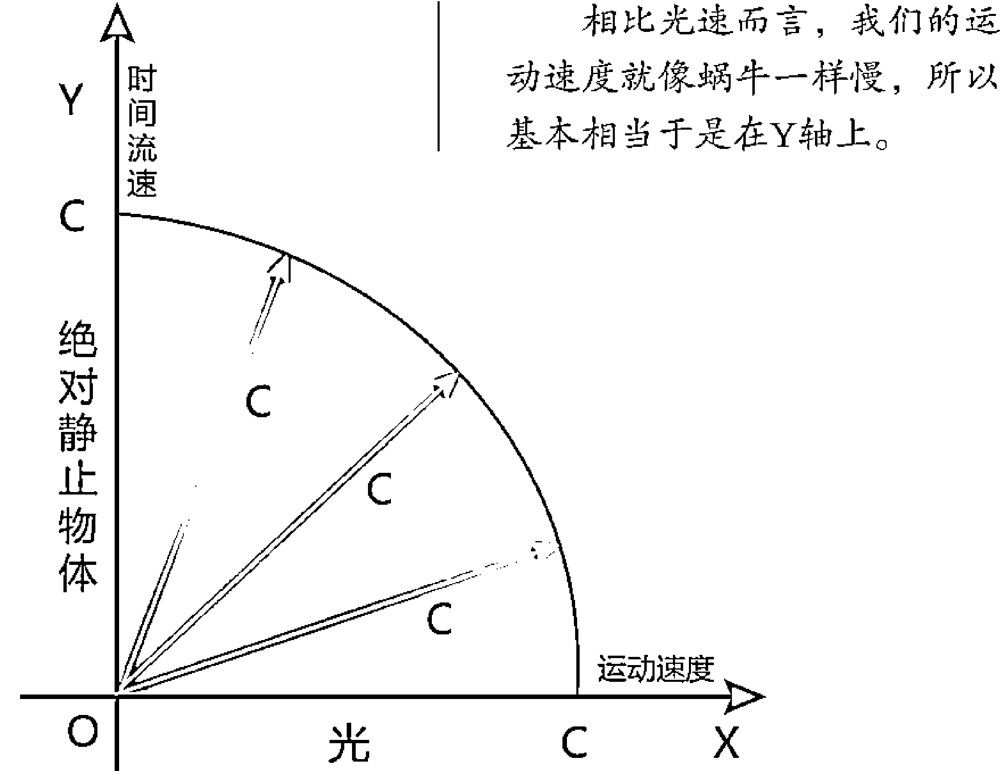

从这个角度来看，相对论揭示出的世界跟经典物理刚好相反。经典物理认为时空是绝对的，运动是相对的；而相对论则证明时空是相对的，但运动是绝对的。

现在我们要提出这样的问题：时间是什么？它的流速为什么会变化呢？它停止流动是否就意味着长生不老？

### 延伸阅读一
## “MM实验”与空间不“空”

“MM实验”在相对论的科普读物中，经常被用来作为引出“狭义相对论”的实例，但事实上爱因斯坦在1905年发表论文时并不太了解这个实验，麦克尔逊和莫雷做实验的初衷，也不是为了要证明“光速恒定”，而是为了测量地球在“以太”中的速度，以此来证明以太的存在。

以太是什么东西呢？这是古希腊哲学家亚里士多德设想的一种物质，后来笛卡尔把它引入了物理学中。在笛卡尔看来，物体之间的所有作用力都必须通过中间媒介来传递，不可能存在超距作用，所以空间不可能真是“空”的，它应该被某种媒介物质所充满，这种物质就叫“以太”。笛卡尔认为，以太虽然不能为人的感官所感觉，但却能传递力的作用。

17世纪的荷兰物理学家克里斯蒂安·惠更斯也相信，光之所以能在真空中传播，那是因为真空中充满了以太，光是以它为介质来传播的，引力的传播也是如此。

麦克斯韦也相信以太存在，并认为它是在真空中传播电磁波的介质。根据麦克斯韦方程组，计算出电磁波的传播速度和光速相同，所以麦克斯韦断定光是一种电磁波。但这里头有一个问题，这种速度是以什么作为参照物的呢？如果没有固定的参照物，凭什么说光速有确定的数值呢？大地显然不适合作为光的参照物，因为它自己也在移动，但有一种东西很合适，那就是以太。因为按照当时人们的设想，以太是充满整个宇宙的，它是绝对静止的宇宙背景，再没有比它更好的标准了。

在这样的情况下，假如一束光相对于以太的传播速度是C，地球在朝着光源的方向运动，相对于以太的运动速度是V，那么地球上的人看到的光速就应该是C+V；当地球的运动方向与光源的方向垂直时，地球上的人看到的光速应该是C；当地球在朝背着光源的方向运动时，看到的光速应该是C-V。

按照这样的推理，如下页图中所示，地球穿过以太绕着太阳公转，在地球正对着光源方向运动时测量到的光速，应该大于光源与地球运动方向垂直时测

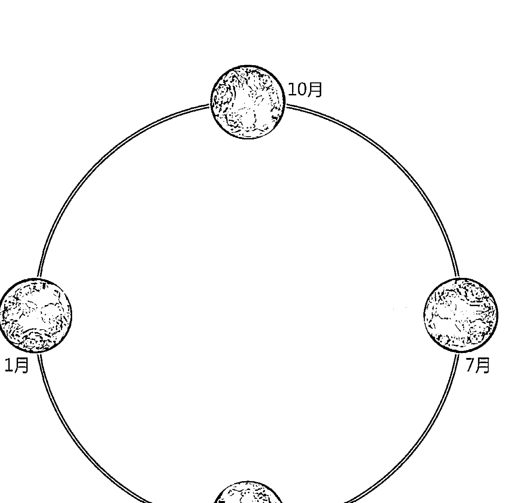

量到的光速。麦克尔逊和莫雷实验的目的，就是希望能够观测到这种速度差异，以此来确定以太的存在。

结果实验“失败”了，他们没有观测到丝毫的差异。后来爱因斯坦解释说，只要抛弃绝对时间的观念，就可以确定光对于任何参照物来说，速度都是恒定的，以太的观念就是多余的了。从那以后，以太的存在逐渐被人们否定，现在已经很少有人再提起它了。

然而仔细推敲一下我们会发现，爱因斯坦的相对论只是表明，光速恒定的问题不需要用以太来解释，并没有证明以太存在还是不存在，人们因此想当然地说以太不存在，其实并没有确切的依据。我们有必要考虑：空间真是“空”的吗？以太真的不存在吗？

## 延伸阅读二 什么叫“惯性系统”？

“牛顿第一定律”说，一切物体在没有受到力的作用时，总会保持静止或匀速直线运动状态，除非作用在它上面的力迫使它改变运动状态。物体这种保持原来运动状态的属性叫作“惯性”，所以牛顿第一定律也被称为“惯性定律”，它表明力不是物体保持运动状态的原因，而是物体改变运动状态的原因。

惯性定律还给人们提出了一个参考系统的问题。任何物体的运动状态，都是相对于参照物而言的，那么保持静止或匀速直线运动状态的这种惯性，是相对于什么参考系统来说的呢？

实践告诉我们，牛顿第一定律并不是对任何参考系统都成立的，我们把牛顿第一定律成立的参考系统称为“惯性系统”，牛顿第一定律不成立的参考系统称为“非惯性系统”。

大地看起来似乎是静止的，所以人们经常把它当作惯性的参考系统。比如在公路上行驶的汽车，如果突然急刹车，那么没有思想准备的乘客会纷纷向前倾倒，这种现象以地面作为参考系统很好解释，乘客具有惯性，要保持相对于地面不变的速度，而汽车相对于地面的速度却在下降，所以乘客相对于汽车来说就表现为向前冲。

一般来说，本身是静止或者在做匀速直线运动的系统，就可以说是惯性系统。如果汽车一直以不变的速度朝前开，那么车上的乘客就会保持原有的运动状态，倾倒的现象就不会发生，这时候它是一个惯性系统。而一旦它突然减速、加速或者急转弯，这时候乘客虽然没有受到外力，被人往前推、往后拽、往旁边拉，但相对于汽车却会改变他们的运动状态，出现往前冲、往后倒、往边上甩的现象，这说明牛顿第一定律在汽车内的这个系统中不成立了，所以它就已经不再是惯性系统。

我们通常把大地当作惯性系统来看，但它真的是吗？不，地球其实一边在自转，一边在绕着太阳公转，所以并不是严格意义上的惯性系统。我们可以想一下那些急速旋转的球，它上面的水滴是不是全都会被甩开呢？它怎么可能是惯性系统？好在我们的地球每天才自转一圈，正是这种慢悠悠的转速让它成了近似的惯性系统，否则我们就会像球上的水滴那样，被甩到外太空中去了。

宇宙中有什么东西真正是静止或做匀速直线运动的呢？看似静默伫立在荒原上的大树，其实在随着地球绕太阳转动，而太阳又在绕着银河系中心转动。所以想要在宇宙中找到一个绝对的惯性系统，还真不是件容易的事！

# 第十二章

## 创世程序：世界就像游戏，是“道”这个程序运行后诞生的

前面说了那么多的“超正常现象”和现代科学的未解之谜，无非是要告诉你一个事实：我们对于世界的看法，需要从根本上改变了。

至今还记得十几年前《黑客帝国》中出现的一个画面，莫菲斯摊开的双手中，有一红一蓝两粒小药丸，选择吃下蓝色那粒，就什么事都不会发生，明天太阳照常升起；选择吃下红色那粒，将会明白所有真相。

尼奥犹豫片刻之后拿起那粒红色小药丸，他最终选择了勇敢地面对真相。在莫菲斯的帮助下，他回到了现实世界中，才知道自己此前一直都活在虚拟世界里。原来在真实世界中，人类发明的人工智能机械人发生了叛变，人类迫不得已遮蔽了整个天空，想要切断机械人的太阳能源，结果却促使机械人开发了生物能源，利用基因工程制造人类，然后把他们接在母体（Matrix）上，让他们的意识生活在虚拟世界中，并把他们的身体当作生物电池来使用。

现在摆在你面前的也有两种不同的选择。你可以合上这本书，忘记前面所有疑问，继续你从前的生活；也可以选择继续往下看，去了解世界的真相，但请先确定自己有充分的心理准备。

我要告诉你的是，《黑客帝国》不是完全虚构的，影片中体现的哲学思维，正好通向终极问题的答案。

为什么科技如此发达，科学家们却仍然回答不了世界的终极问题呢？主要原因是“还原论”的思维主导了当前的科学研究。各学科之间界限分明、画地为牢，很少有人把各学科的知识联系起来考虑问题。

随着科学家们在自己的学科领域钻研得越来越深，现代各学科的分类变得越来越细，人们的视野也变得越来越狭窄。就像井里的青蛙，往下钻得越深，能看到的井口那片天空就越小。所以假如不能拆除学科之间的篱笆，从自己研究的单一学科中走出来，就绝不可能看清整个世界。

世界并不像“还原论”者说的那样，可以把它分割成小块来研究，然后再拼凑在一起，还原出它的整体面貌。事实上，世界在整体层面上的许多奥秘，只能通过整体的研究才有可能发现。

哲学是从整体上研究世界的学科。早期的哲人如老子、孔子、乔达摩·悉达多、柏拉图、亚里士多德等，曾经取得过辉煌成就，他们的真知灼见至今仍闪耀着智慧的光芒。和他们相比，现在的哲学研究者们已经误入歧途了，只是在玩文字和概念的游戏。

但不管怎么说，要回答终极问题还得把哲学和科学结合起来，不能撇开哲学。

机缘巧合，造化弄人。在偶然间我发现从那些古老的哲学和宗教中，竟然能够找到终极问题的答案，而且可以用它来解开现代科学中那些难以解开的谜团。

灵感来自于《道德经》。这是春秋时期老子留下的一部神秘经典，只有短短五千字，却极其深奥，尤其是其中最重要的概念——“道”，没有人知道它是什么东西。

老子对于“道”是这样描述的：“有物混成，先天地生。寂兮寥兮，独立而不改，周行而不殆，可以为天下母。吾不知其名，强字之曰道。”从这段话的意思来看，“道”不是我们这个世界的东西，因为它比天地更早生成，但它又和我们这个世界息息相关，能够生成天地万物，它独立自主、从不改变，循环运行、永不停息，能够具备所有这些特征的，到底是

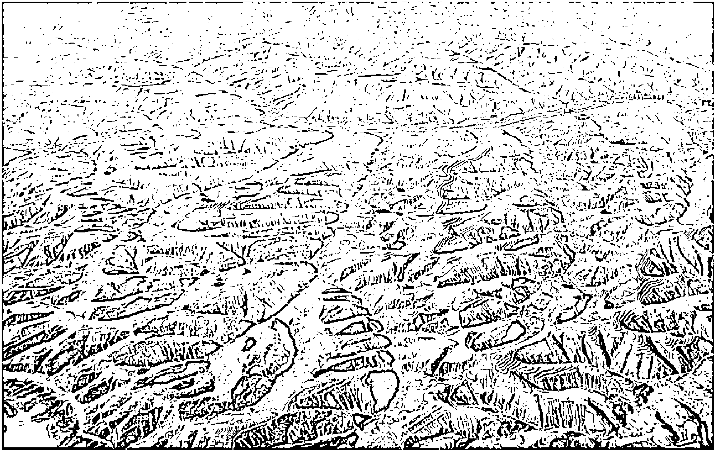

> “羊肚子手巾三道道蓝，咱们见面面容易拉话话难”，这句陕北民歌反映了黄土高原上遍布着道道深沟，沟两边近在几十米远的两个人，相互能看清对面人的模样，却没办法走到一起。目前科学领域的现状就是如此，科学与人文之间有难以跨越的鸿沟，不同学科之间竖立着无形的墙，甚至同一学科不同方向的研究人员之间，也相互搞不清楚对方在做些什么，整个科学界就像是沟壑林立的黄土高原。

什么东西呢？

学术界认为“道”指的是“世界的本体、动力和运行规律”。在看完这个解释后，你明白“道”是什么了吗？反正我是没看懂，我不明白“世界的本体”到底是什么东西。

学术名家们也不明白“道”具体是什么东西，或者根本就不认为它是具体的东西。梁启超在谈起“道”时，推脱说它本身就是“不可言说”的，所以说不清楚。胡适、冯友兰、陈鼓应则干脆说它是老子虚构出来的概念，其实现实中根本就不存在这样的东西。

事实真是这样吗？有段时间我在网上写书评，为了提升文章的档次，开始读起了《道德经》。在这个过程中，不可思议的事情发生了，我居然慢慢明白了老子说的“道”是什么。这个发现意义太大了，它不仅是解开《道德经》这本“天书”的钥匙，还能让你看懂这个世界。

老子的思想确实太超前。我完全能够理解，基于他生活的那个年代人们可怜的知识积累和简单的词汇表达，老子没办法用语言把自己的想法向世人解释清楚，这导致两千多年来《道德经》一直在被人们误读。

但现在人们的知识积累已十分丰富，见识水平已大大提高，要把“道”的含义解释清楚就不再是什么难事了。在揣摩老子思想的过程中我惊奇地发现，假如用电脑游戏来类比的话，我们可以很简单地把老子想说的东西解释清楚。

老子所说的“道”其实没有那么玄乎，更不是什么虚构的概念，它简单到可以用一个词语来表达，那就是：

“创世程序”！

确实很难相信，在2500多年前，以当时人们的认识水平，怎么可能会出现老子这样的智者，能够知道宇宙生成的缘由。

根据老子的观点，宇宙的诞生和电脑中游戏世界的生成一样，都是一个程序运行的结果。我们把《道德经》中那些看似晦涩难解的话，结合宇宙大爆炸理论，与游戏世界的生成来对照，就能从中领略到老子惊人的智慧与洞察力。

首先，老子说：“天下有始，以为天下母”。他肯定宇宙是有起始、有开端的，这一认识与宇宙大爆炸理论不谋而合。但比大爆炸理论更高明的是，他还进一步指出宇宙的诞生不可能是毫无缘由、凭空出现的，宇宙应该有自己的“母亲”。

宇宙的“母亲”是谁呢？是谁生成了这个浩瀚的宇宙？老子说：“有物混成，先天地生。”在宇宙诞生之前，就已经生成了一样东西。“吾不知其名，强字之曰道”，他不知道该如何称呼这种东西，就勉强把它叫作“道”。老子认为，这个他不知应该如何称呼的“道”，就是“宇宙之母”，所以说它“可以为天下母”。

在游戏世界中，是先有游戏程序，程序运行之后才出现游戏世界的；按照老子的观点，现实世界也是如此，是先有“道”这个程序，然后才有天地宇宙的。

在这一点上，“道”与游戏程序的特征完全吻合。

其次，游戏世界中的所有事物，都是由游戏程序产生的；老子认为，我们所在的现实世界也一样，“道”运行之后，就接二连三地诞生出了天地间的万事万物，这叫“道生一，一生二，二生三，三生万物”。

游戏程序的运行，会使游戏中源源不断地出现各种器具、角色之类的东西。同样的，老子说只要“道”一直在运行，天地间万物就会源源不断地出现，生生不息。从这点来看，“道”就像是一个伟大母亲的产门，是天地的根源，它的作用永远不会衰竭。这就叫“谷神不死，是谓玄牝。玄牝之门，是谓天地根。绵绵若存，用之不勤”。

在这一方面，“道”与游戏程序也很类似。

第三，电脑游戏的程序是可以运行的，而且不能停止运行，一旦停止游戏就没了。“道”也是如此，它是可以运行的，而且不能停止运行，一停下来我们这个世界就没了，所以说它“周行而不殆”。

游戏程序是独立运行的，不会随游戏进程的推进而改变。“道”也是如此，它始终独立运行着，在世界的演变过程中不会发生改变，所以说它

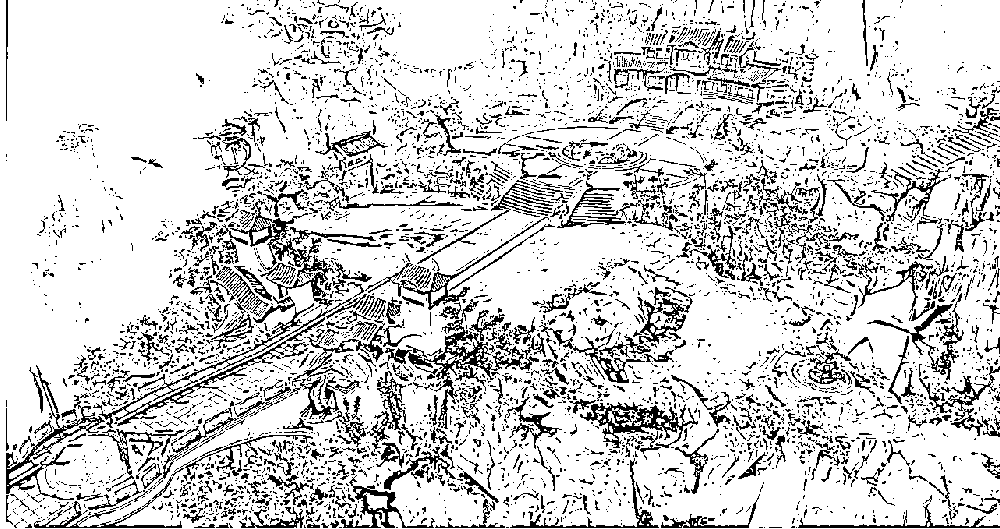

“独立而不改”。
“道”与游戏程序在这方面又是一样。
第四，游戏世界完全是从一无所有的状态中产生的，创造它不需要任何材料，只要有一个游戏程序就足够了；按照老子的观点，现实世界也是如此，“道”运行之后，世界就在虚无中诞生了。他说：“无，名天地之始；有，名万物之母”，“天下万物生于有，有生于无”。前面我们说世界是从虚无中诞生的，相信很多人会想，那怎么可能！但只要联想到游戏世界诞生的场景，你应该就会恍然大悟了。
“道”与游戏程序的特征，在这点上又是不谋而合。
第五，大爆炸理论说，宇宙一直处在膨胀之中，而在很多电脑游戏中，游戏地图也是一直在扩张的。老子对于宇宙的膨胀也有着令人吃惊的了解，他用“大曰逝，逝曰远，远曰反”来形容了宇宙膨胀的经过。
这里头的“反”字似乎还包含着这样的意思：宇宙膨胀到了极点后会收缩。真不知道老子的这种判断从何而来，也许是根据自然界存在物极必反，事物都在循环演变的规律推导出来的？对此我有些怀疑。在现有的网络游戏中，一般来说游戏世界都会一直扩张下去，没有见过它还会收缩。
倒是在天文学中有这样的说法，宇宙在膨胀到了尽头之后，有可能会反转收缩，霍金就曾经预言也许会出现“宇宙大坍缩”。
不管怎样，可以肯定的是老子对世界无中生有的整个过程，掌握得相当清楚。他所描绘的场景，和宇宙大爆炸理论及游戏世界的诞生，十分的接近。
老子所说的“道”，就相当于是我们这个世界的“创世程序”。从这一点出发，我们就可以把“宇宙大爆炸理论”中的几个问题，解释得十分清楚了。
第一个是“奇点”的问题。大爆炸理论说世界是从奇点开始的，但并不像有些人以为的那样，真的存在一个无限小的点，物质在那里有无限大的密度，从这个点中诞生出了整个世界。所谓的奇点其实只是一个界限，不是具体的实物，它指的是“道”这个创世程序启动运行的那一个瞬间。就好比一款新开发的游戏，从2017年4月10日上午10时开始正式投入运营，那么这个时点就是游戏世界的奇点。
第二个是暴涨的问题。古斯的“暴涨”理论认为，在大爆炸之后，曾经存在一个异常短暂的快速膨胀期，宇宙先是突然间迅速扩展到一个相当大的跨度，然后才回到比较稳定的膨胀速度，一直到今天。这一点原本很难想象，但和游戏世界的生成过程对照一下就很好理解了，游戏程序开始运行的时候，不也是突然间出现了一幅相当大的地图，然后这个地图再随着游戏进程在慢慢扩张的吗？
第三个是为什么会出现“大爆炸”的问题。这也很简单，只要游戏程序一点击运行，游戏中的虚拟世界就会突然出现；同样的道理，创世程序一开始启动，宇宙也就在一瞬间突然诞生了。
有人说，如果世界是从虚无中诞生的，但虚空中没有物质，它怎么可能发生爆炸呢？其实这是对“大爆炸理论”的一种误解。
世界诞生的时候，一张地图爆炸式地出现了，这里用“爆炸”这个词，主要是用来形容它的突兀和迅速。这张地图的扩张速度已经无法用一般的名词来描述，它甚至远远要比光速还快，所以使用了“大爆炸”这个

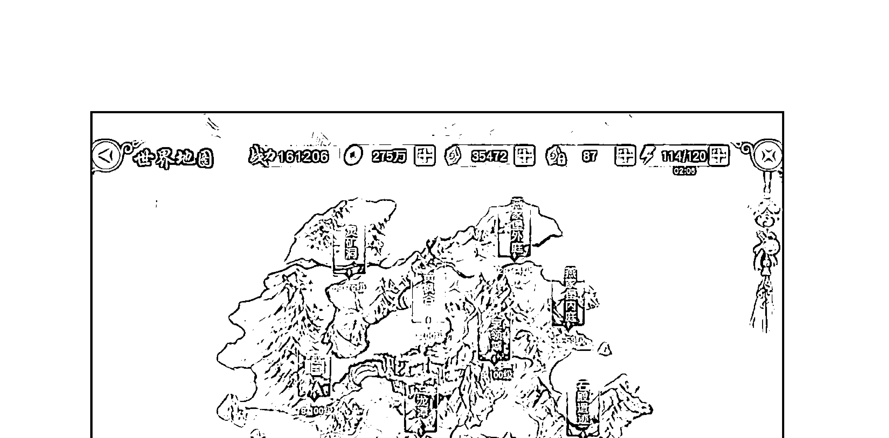

游戏地图是在瞬间生成，然后再缓缓向外延伸的。

词来形容它，并不是真的有什么东西在宇宙诞生时被点爆了。事实上，“大爆炸”一词最初并不是由这种理论的创始者，而是由它的反对者英国天文学家弗雷德·霍伊尔以嘲讽的口气提出来的。

> 尽管名字听起来很吓人，但大爆炸并不是空间中发生的爆炸，而是时间和空间的起点——或者更准确地说，是当前人类对物理学的领悟能把我们带到最接近起点的地方。

老子的思想很好地解释了“宇宙大爆炸”理论，同时也让我们前面提出的许多问题能够迎刃而解。

第一个是为什么存在自然规则的问题。在游戏世界中，必然会存在游戏规则，它们就蕴含在游戏程序之中；现实世界也是这样，创世程序中包含了世界的运行规则，万物的演变过程会因此而呈现出规律性来，这就是自然规律。老子说，只要掌握了自然规律，我们就能据此推导出事物以前的状况，或者预测它将来可能发生的变化，这叫“执古之道，以御今之有，能知古始，是谓道纪”，“道纪”指的就是自然规律。

第二个是世界像是经过了精心设计的问题。创世程序必定是某种超强智慧的结晶，是经过了精心设计的作品。由它所产生的世界，必然会显现出思维活动的特征——精细与繁复，并具有统一的风格。所以自然界的生物结构中令人叹为观止的复杂性，相隔遥远的星体结构中令人费解的相似性，宇宙在不同尺度上出现结构的重复性，这些都很好理解。

第三个是宇宙的物理定律和参数太过于精确，存在恰好适合生命出现的“金凤花区域”的问题。这也很好解释，创世程序在设计过程中肯定经过了精心调试，所以你能看到这些参数惊人地符合生命存在的要求，那是很正常的。从这点来看，“人择原理”是对的，物理定律就是为了生命能够出现而设计的。

看到这里，你是不是已经被吓了一跳呢？有些人可能甚至已经对生命的意义产生怀疑，心中升起一种强烈的虚无感了。但是别着急，大幕才刚刚拉开，好戏才刚刚开始。

你会发现，世界的神奇，要远远超乎你的想象。

### 延伸阅读
## “还原论”的是非功过

在生活中，很多人有这样的经验：整体的东西可以拆分成部分，部分的东西也可以组合成整体。你可以把机器拆解成一堆的零件，但只要把它重新组装起来，它又是一台完整的机器了。所以现代工业化生产大多是流水线作业，每个环节只负责制造或者安装一个部件。

这就是“还原论”的逻辑基础，它有时也被翻译成“化约论”或“分割论”。这种理论认为，世界上的各种现象都可以分解成基本的要素，这些要素相互独立，可以把它们分开来研究。当你将这些要素研究透了，把它们拼装起来还原出现象，就可以通过把握部分来推知整体了。

还原论的方法在科学史上影响深远，比如目前的学科分类就是这种思想的体现。在古代，人们是从整体上去理解自然界的，所以只有一个哲学，没有其他的学科。后来基于还原论的思维，人们对于自然的认识被分割成了物理学、化学、生物学等诸多学科，而且这种划分还在往越来越细的方向发展。

在西医中，连人体都是按照还原论的思维被拆分开的，所以医院里会有内科、外科、五官科、耳鼻喉科、骨科、神经科这样的科室划分，而传统的中医是不这样分的。

基于还原论的思维人们进一步认为，整体是建立在各组成部分之上的，所以可以用基础性的规律来解释整体现象。比如说在学科之间，有人提出了一个“物理学—化学—生物学—心理学—社会学”这样的层级，认为生命现象可以用化学反应来解释，化学反应可以用粒子的物理运动来解释，而物理学作为最基础的科学，可以解释世界上的一切现象。

正是基于这一认识，物理学家们在研究其他学科的人面前，往往会有一种莫名其妙的优越感。据说奥地利物理学家沃尔夫冈·泡利，在得知前妻嫁给了一位化学家时就大摇其头：“为什么是化学家呢？”

还原论是西方科学思想的灵魂，近几百年来科学的蓬勃发展，得益于还原论方法的广泛应用。还原论的确很实用，因为人类的智力有限，无法从整体上把握世间万物及它们之间的联系，所以把复杂的对象分割成小块，把它们与整体隔离开来研究，就能使复杂的问题简单化，研究起来要容易得多。

这种分割法取得了巨大的成功，小范围专门化的钻研，帮助许多领域的科学研究达到了前所未有的深度，人们对于世界的认识也进入了以前难以想象的细微层面。

然而还原论的成功掩盖不了它的先天缺陷。世界是一个有机整体，每一个构成部分之间都不是孤立的，所以现在人们已经越来越认识到，还原论这种机械的方法，不仅不能帮助我们看清世界的本来面目，反而有可能引导人类以改造世界的名义，肆意破坏自己的生存环境，造成灾难性的后果。可以这么说，目前人类已经面临诸多难以解决的生存问题，之所以会走到今天这一步，还原论难辞其咎。

## 第十三章
苍天在上：游戏背后的监控系统，我们称为“老天爷”

在人类文明史上绝大多数时间里，人们普遍相信世界是处于监督之下的。是谁在履行监督者的职责呢？通常人们认为是“神灵”。在许多文化中都有主宰世界的神灵，只不过叫法不同，形象各异。西方人一般把他称为“上帝”，而中国人通常称之为“天”，或者更通俗点说是“老天爷”。

古代的中国人相信，老天爷在全天候、全方位地监控着这个世界，人世间发生的一切，没有什么能逃得过它的眼睛。《后汉书》中记载了这样一个故事：东汉的杨震曾经举荐一个叫王密的人去当县令，后来有一次他经过这个县城时，晚上王密来到他的住所，要送给他十斤的金子。杨震不收，王密就劝说：“放心吧，没人会知道的！”杨震生气地说：“天知，神知，我知，你知，怎么会没人知道？”

这个故事告诉我们，人们非常敬畏这种来自上天的监督。这种无形的威慑是有益的，开车的人在经过有监控的路段时，会打起十二分的精神，以免在无意中违规受到处罚。来自于老天爷的监控也会让人们对自己行为有所约束，我们常常这样告诫别人不要做坏事：“人在做，天在看。”

相信因果报应的人认为，老天爷不但在一旁看着，假如发现你做的事情太恶毒，还会忍不住出手收拾你。有句话这样说：“善恶终有报，天道好轮回，不信抬头看，苍天饶过谁？”

在西方，上帝所起的作用和老天爷差不多，他的本事不比老天爷小。他是全知、全能的至高神，他无所不在、无所不知，也就意味着我们随时随地都处在他的监督之下，无处藏身。

没有人喜欢被监控，那只会让人感觉不自由，即便是神灵的监督也是如此。所以当后来达尔文颠覆了上帝造人的说法，进而否定了上帝的存在，神灵的光环日渐暗淡，在精神上慢慢失去对人们的控制作用之后，许多人欢呼雀跃，认为自己终于自由了。

从神权的威压下解放出来的人类，凭借掌握的科学技术，突然感觉自己原来是那么的强大，那么的了不起。于是人类开始有了向大自然叫板和挑战的勇气，嚷嚷着要征服自然、改造自然、主宰世界。

在没有监控的情况下，人们行车往往会不讲规则、横冲直撞，最终造成交通秩序的混乱甚至崩溃。同样地，失去了对自然和神灵的敬畏之后，人类在“人权”“自由”旗号的指引下，个性张扬、随心所欲，尽情享受着大自然提供的福利，却根本不管不顾自己的行为会对自然生态造成怎样的伤害。缺少监督就会无所顾忌，所以最近几百年来，人类对于自然的破坏，要比有史以来其他时期加起来的总和还多。

是不是真的没有监督呢？人类真的可以掌控自己的前途和命运吗？

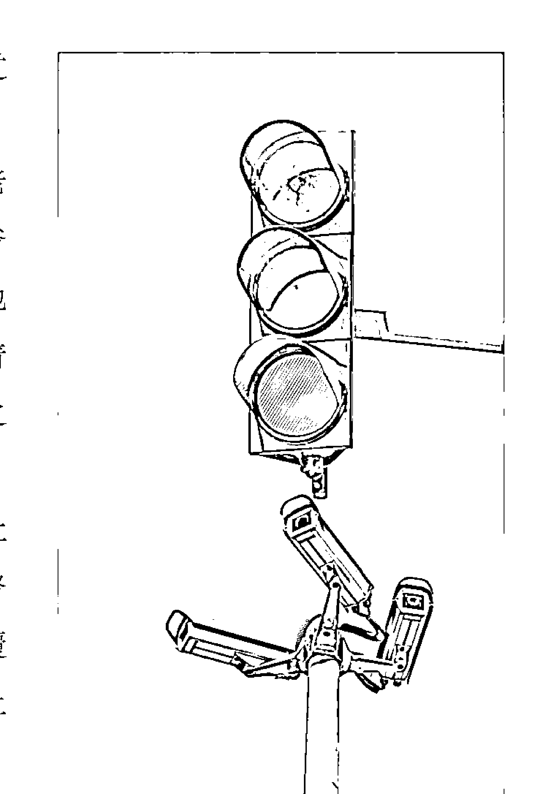

司机害怕的不是红绿灯，而是电子监控。因为闯红灯这件事本身对你没有什么伤害，只有在被拍到交通违章之后，才会受到扣分或者罚款的惩戒。

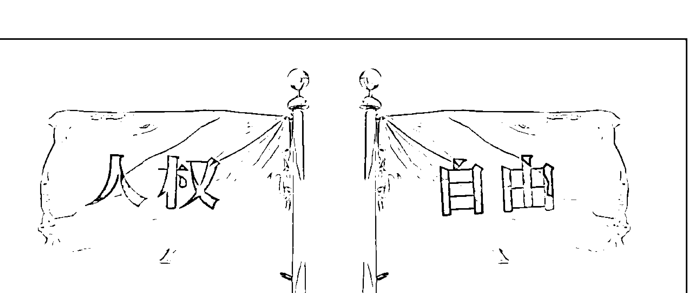

> “人权”与“自由”是现代西方的主流价值观，它们起源于文艺复兴。从处理人与人之间关系的角度来看，这也许是一个进步，但假如把这种观念无限放大，在处理人与自然的关系时也强调“以人为本”，漠视自然的承受能力，那么就会产生巨大的破坏力。人类肆无忌惮地破坏生态环境，也正是从文艺复兴鼓吹“人性觉醒”开始的。

不，事实上确实有一种东西始终在监督着我们，宇宙中发生的任何事情，在它眼中都无所遁形。

游戏世界的出现需要哪些条件呢？程序员把游戏程序开发好了之后，接下来会做什么？没错，是运行这个程序。那么程序应该放到哪里运行呢？显然，这时候需要有一台主机作为服务器。那么“道”这个创世程序呢，它是在哪里运行的？很显然，在我们这个世界背后，应该也有一个能够发挥服务器作用的东西，我把它称为“创世主机”。

我们这个世界确实存在着监控，只不过监督者不一定是人格化的上帝，而有可能是创世主机。正是它在严格地运行着创世程序，诞生出一个类似于广袤游戏世界的宇宙，并让它有条不紊地按照程序规定的路径演化着。我们可以回想一下牛顿的话：“宇宙的秩序最初是由上帝创造的，并由它将同样的状态和条件保存至今。”情况和他说的很近似，规则蕴藏于创世程序之中，在创世主机中一直运行到今天，始终还在保持着程序最初规定的演变路径。

如果存在创世主机，那么我们前面提出的很多疑问就有了简单的回答。自然法则为什么会生效？是什么力量在一丝不苟地监督着世界，严格按照自然法则来运转的呢？原来是创世主机。在双缝实验中，电子为什么能够感应到双缝变成了单缝，并且做出反应呢？很简单，其实不是电子有感应能力，而是创世主机时刻都在监控着世间的一切，它能够马上知道这种变化，并控制着电子遵守新的运动模式。

为什么两个相隔万里的小粒子之间仍然存在着感应呢？玻尔说它们仍然是一个整体，这原本很难想象，但现在很好解释了——它们都在同一台主机中。在我们眼中它们虽然相隔遥远，但对于创世主机来说却根本不存在距离的问题。只要创世主机把它们看作是一个整体，它们就仍然是一个整体，只要创世主机让它们之间保持联系，它们就会保持着联系。

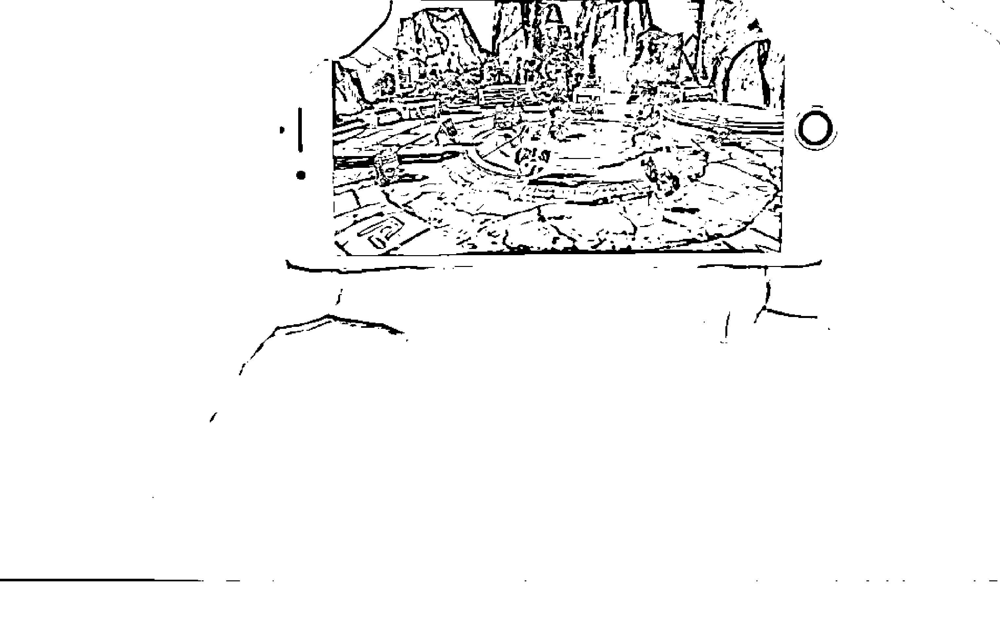

游戏程序是在游戏机中运行的，“道”这个创世程序，一定也需要服务器来运行，我们可以称之为“创世主机”。

爱因斯坦的相对论规定，任何信息的传输都不能超过光速，宇宙中不存在超距作用。但现在我们清楚了，这条规定只对存在于我们这个世界中的东西有效，对于创世主机是不起作用的。因为它根本就不属于我们这个世界，所以无须遵守我们这个世界的规则，而且恰恰正是它在执行着这些规则——这和在很多小地方，开着警车可以无视红绿灯的道理是一样的。

我们能够看到许多超光速现象的存在，但却不能利用它来传递信息，因为这些其实往往都是创世主机的行为。当然，以后科学家们能否利用创世主机的这一特点，开发出超光速传输信息的技术，这就不是我们现在所能预料的了。

为什么“延迟实验”中，在电子通过了双缝之后，打在感光屏上之前，更改实验的条件，就会改变是否出现干涉条纹的结果呢？合理的解释是，并非真的在事后还可以改变前面已经发生过的事情，而是创世主机能够即时感应到实验条件的变化，从而马上随之更改了实验的结果。

用创世程序和创世主机还可以解释很多问题，比如科学中为什么会存在“公理”。

广义相对论之所以能被人们普遍认可，最初是由于爱因斯坦设计了一个实验，使他的理论得到了验证。他判断说，光在弯曲的时空中并不会走直线，而会走曲线，因为光总是要走最短的路径，在弯曲的时空中不是直线最短，是曲线最短。根据这一原理爱因斯坦认为，因为光线的弯曲，在日全食的时候我们能够看到藏在太阳背后的星星。

爱因斯坦的这一判断得到了观测结果的验证，由此引起了轰动。但我们要问，光为什么总是会走最短的路径呢？这个问题爱因斯坦无法回答，他把它作为“公理”来看待。所谓公理就是指人们在实践中总结出来的，不需要证明并且也无法证明的规律。更直白点说就是，公理的存在是不需要原因的，而且也不可能找到原因。

事实真是这样的吗？不，现在我们知道了，许多被视为“公理”的规律，其实是有原因的，只不过这个原因无法在我们这个世界中找到。它是在我们这个世界之外的创世主机和创世程序规定的。

创世程序中确定的规则，由创世主机在监督执行着。

相对论的基础，是不管处在什么运动状态下的物体发出的光，也不管是相对于什么样的参照物，光在真空中总是保持恒定的速度。光为什么会这样？它为什么不会跑得快一点？或者是慢一点？假如从我们的世界中去找，这个问题永远都不会有答案，但现在我们可以回答说，这是创世程序中的设定。

任何问题在追溯到最初的根源时，都可以考虑用这个因素来解释，比如目前备受物理学界关注的“上帝粒子”问题。

> > 人们对于“希格斯玻色子”的重视超乎寻常，从它甚至被称作“上帝粒子”这件事情上，可以看出“还原论”思维在物理学界的渗透之深。正是因为这种思维，许多人才会天真地以为，只要搞定了世界的最基本结构，我们就能够在这个基础上解释整个世界。
>
> 然而事情根本没有那么简单。正如美国费米国家实验室的物理学家帕提·麦克布雷德说的那样：“即便有证据清晰地证明，目前我们新发现的这一粒子，确实就是标准模型所预言的希格斯玻色子，我们对于宇宙的认识也仍然是模糊不清的。”

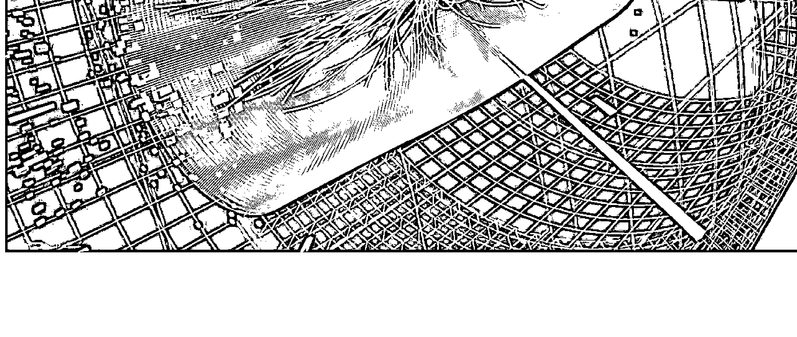

20世纪70年代物理学家们建立了一个标准模型，来解释在对撞机中发现的一大群粒子。这一模型对实验结果的解释很成功，但存在一个巨大的问题，它无法解释粒子质量的来源。为了弥补这一缺陷，人们假定存在一种叫作“希格斯玻色子”的粒子，它能够赋予其他粒子以质量。这种粒子的意义是如此重大，以至于甚至被人们称为“上帝粒子”。

标准模型预言的62个基本粒子中，其他61个已经找到，只有希格斯玻色子一直没有被发现。但就在2013年3月14日，欧洲核子研究中心的科学家宣布，已经找到了希格斯玻色子。

其实能不能找到希格斯玻色子关系不大，因为创世程序可以赋予其他粒子以质量，反正所有的问题一直往上追溯，最终总是来源于创世程序的设定。粒子的各种特性，包括质量的存在，完全可以是创世程序直接赋予的，就像公理一样，根本不需要从这个世界里找原因。当然，希格斯玻色子能够赋予其他粒子以质量的这种特性，也必定是创世程序所规定的。

我们再来看看关于创世主机的另一个问题。在基督徒的心中，上帝是一副严父的形象，它既是万能的，又是仁慈的。但是在这一点上，很早就有人指出其中存在逻辑上的矛盾：假如上帝是万能的，那么它在创造世界的时候，完全可以把世界造得十分完美，然而现实情况却是人世间有着数不清的苦难，这足以证明上帝或者不是万能的，或者不是仁慈的，它不可能同时兼具这两种特性。

我们心中经常会有这样的疑惑：都说苍天有眼，为什么现实中却并非如此？为什么恶人常常不会受到恶报，善人却往往不能得到善终？在评书和小说中，为什么我们更多听到看到，历朝历代似乎多数时候都是奸臣当道，可以肆意残害忠良？比干被挖了心肝，岳飞被诛杀在风波亭，袁崇焕被当街生吞活剥，假如老天爷是无所不知而且公正仁慈的，那么此时此刻他又在哪里？

其实有人早已看透了这一点。

> > 老子说：“天地不仁，以万物为刍狗”

他认为老天爷其实是冷酷无情的，根本就不把世间万物当回事。对此我们原先很难理解，具有无上智慧、无穷力量、无所不能的老天爷，竟然会没有任何情感？现在我们总算清楚是怎么回事了，原来主宰世界的是创世主机，不是神灵或者某种生物，它当然不会有情感了。

创世主机没有情感，所以在我们这个世界中，你看不到直接的因果报应，反而经常会看到小人当道、好人蒙冤的情况。很多人也许会想，我们是不是就可以肆无忌惮、随心所欲地干坏事，再也不用担心会受到上天的惩戒了呢？

当然不是。你的一言一行，别以为没有人知道，其实创世主机全都记录在案。有一种做法叫“秋后算账”，你做的那些坏事，未必马上就会出现后果，但很多宗教都告诉我们，“出来混，总是要还的”，你迟早要为此付出代价。

### 延伸阅读

### 科学与假设

因为科学的巨大影响力，在现代社会许多人眼中，“科学”这个名词已经可以代替“正确”来使用了，假如有人这样讲：“你的说法不科学”，他的意思就相当于是“你的说法不正确”。

科学真的可以作为正确的代名词吗？其实根本不是那么回事，科学只不过是一种假设，远不能把它看作是绝对正确的。

科学知识是怎么形成的？我们来看看20世纪初法国科学家亨利·庞加莱的观点。在《科学与假设》一书中，他首先认为“科学是用事实建立起来的，正如房子是用石块建筑起来的一样”，而“实验是真理的唯一源泉”，它能告诉我们什么是事实，所以实验是科学的基础。

接着他说，实验并不能代表一切，“收集一堆的事实并不是科学，正如一堆石头不是房子一样”，“实验只给我们一定数目的孤立的点，我们必须用一条连续的线把这些点联结起来，这就是概括”。运用逻辑和数学的工具将科学实验概括起来，所形成的就是科学理论。

庞加莱又说：“一切的概括都是假设。”所以科学理论实际上只是一种假设，如果它能够经得起实践的检验，就有可能为大众所接受，“如果它经不起这种检验，人们就应该毫无保留地抛弃它”。

我们举一个例子来说明他的观点。爱因斯坦的相对论对于每一个人来说都是如雷贯耳，现在很少有人会怀疑它是不是一种科学理论了。但你未必知道的是，在1905年爱因斯坦最初提出狭义相对论的时候，并没有马上引起人们的关注。事实上，在当时的人们看来，它只不过是以“光速不变原理”和“相对性原理”这两个假设为前提的一系列假设而已。现在的人们可能很难想象，1907年爱因斯坦想凭这篇论文去申请一个编外讲师的职位，竟然被拒之门外，因为人家根本就不相信他说的。

1916年，当爱因斯坦发表广义相对论时，最初人们的反应也是一样，只是把它当作一种假设来看。还好，他提供了三个可供实验验证的推论。第一是水星近日点的进动，这在当时就得到了解决；第二是在强引力场的影响下，从巨大质量的星体表面射到地球的光，它的谱线会向红端移动，这在1925年得到了观测的验证；第三是光线会在强引力场中偏转，这在1919年对日全食的观测中得到了检验。正是因为这一次的观测，广义相对论才在顷刻间闻名于世。

但不管现在相对论已经是如何的出名，它也仍然只是建立在两个假设基础上的假设。只要人们在现实中观测到超光速的运动现象，那么相对论马上就会崩溃，正如当初经典力学身上曾经发生过的场景一样。

科学与假设之间的关系还不止这些。不仅科学理论是假设，而且人们在建立科学理论时所运用的数学工具，很多也是建立在假设之上的，下面以“欧氏几何”为例来说明。

公元前4世纪，古希腊数学家欧几里得写了《几何原本》一书，两千多年来这部著作在几何教学中一直占据着统治地位，至今也没有动摇，包括中国在内的许多国家现在仍然以它作为几何教材，可见其影响之深远。然而这样的一部巨著，却完全是建立在假设基础之上的，整个欧氏几何的前提是5条公理和5条公设，假如离开了这些设定，后面的那些定义、命题和推论就根本无从谈起。

人们通常认为公理和公设是不证自明的，它们天然如此，没有什么缘由，但事实果真是这样吗？

我们可以假想一下，如果你是游戏中的人物，那么游戏中的一些设定，对于你来说就像是公理一样，天生就是这样，找不到任何的原因。但在游戏之外的我们却知道，它们并不是没有原因。其原因不在游戏世界之内，而在游戏之外——因为它们是游戏程序中的设定。

我们所说的公理，其实都是建立在经验基础上的假设。如果这种假设与创世程序中的设定一致，那么它就能在我们这个宇宙中永远成立，成为永恒的公理；假如它与设定之间有冲突，那么一旦人们发现了这种冲突，它马上就会崩溃，就不再是公理了。

欧氏几何中的“第5公设”现在就已经被推翻了。究竟还有多少被人们视为公理的东西，其实只是在一定层面上成立，在更高层次上会与程序设定相冲突呢？这只有天知道。

科学整个的就是一种假设，所以千万别在科学与正确之间画上等号，把它当作“真理”来看。

## 第十四章
造化论：世界如同游戏一样，是先被创造然后再演化的

看到这里你应该明白我要说什么了。是的，我们所在的这个世界，是以类似于制作电脑游戏的方式创造出来的。

从这一结论出发，我们在前面章节中讨论的那些难以解释的问题，都可以轻松地找到答案。

先说量子论中的“不确定性原理”和“概率解释”。

游戏和电影都是现在年轻人喜欢的消遣方式，但它们之间有一些很重要的区别。电影有确定的剧本，在你踏进影院之前，它的情节和结局就已经注定，不会因为你看电影时的情绪而改变。在整个过程中，你只是个旁观者，自己没有参与其中。按照决定论的看法，我们这个世界就像是一场电影，一切都早已注定。

但游戏不同，它的结果在事先是不确定的，游戏情节的推进需要你的亲身参与，你在游戏中的行为会推动和改变游戏的进程，这就使得游戏有可能出现很多种全然不同的结果。也就是说，电影的结局是确定的，但游戏的结果是不确定的。

游戏结果的不确定性主要源于两方面，第一方面是系统的初始状态不确定。相当一部分游戏的初始状态，是由系统临时按照随机的方式确定的，比如我们在网上玩的纸牌游戏，每一局系统发给我们的牌都是不一样的，这完全是一个概率事件。所以即便游戏规则是固定的，玩家也还是那同样的四个人，但每一盘玩的过程和结果都不会相同。

由此我们可以理解海森堡的“不确定性原理”和波恩的“概率解释”是什么意思了。我们玩纸牌游戏的时候，在牌发出去之前，牌的初始状态是怎样的，我们根本没办法知道，这就是“不确定性原理”的含义；在发牌的过程中，你会拿到怎样的牌完全是随机的，这就是“概率解释”的内涵。

和纸牌游戏一样，我们这个世界同样存在系统初始条件的随机性问题，这就是为什么会存在“不确定性原理”和“概率解释”。由于这一情况的存在，世界并不像决定论说的那样，有确定的初始状态，而是时刻都在随机产生着系统的某些初始条件。这说明我们的世界更像游戏而非电影。其实这正是生活的魅力所在，假如世界只是按照固定剧本演出的一幕大戏，那我们活着还有什么意思？

游戏中第二方面的不确定性源于玩家的选择，或者说是来自于“自由意志”。就像我们玩围棋游戏，但每一盘的初始状态都完全相同，都是一个空白的棋盘，游戏规则也是固定的。然而即便玩家是同样的两个人，

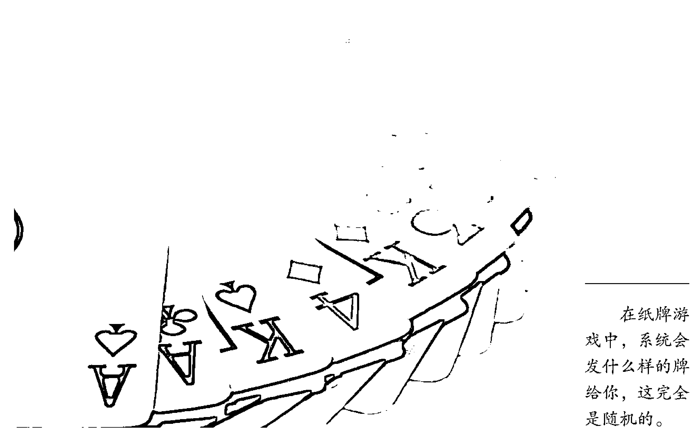

> > 围棋游戏每盘的初始状态都一样，但过程和结果却不相同，
> 这是因为玩家的想法随时都在变化。

同样是由其中的某个人先下，一般来说除非是双方都在刻意按固定的套路走，否则每盘的过程和结果都会不一样。这种不确定性来自于游戏中玩家的行为，在每一盘中双方对于怎么落子的考虑，都不可能跟另一盘完全相同，而会带有很大的偶然性和随机性。

在现实世界中情况同样如此。我们随时随地都在面临着选择。就像此时此刻，你可以选择继续看书，也可以选择出去和朋友看一场电影。在影院你有可能会碰上一位心仪的女孩，从此改变了你的人生。很多时候，究竟如何选择往往就在你的一念之间，不经意间的选择就能改变你的人生轨迹。

这种说法与决定论的观点是相悖的。决定论认为，世间的一切都早已确定，包括我们的选择，看起来似乎是由我们自主做出的，但事实上你会做出怎样的选择，这其实是早就已经注定了的。

决定论者做出这一判断的逻辑基础，是把大脑也看作是一台机械，认为意识只不过是大脑的机械功能。从这一点出发他们认为，大脑和其他人体器官一样，其运动规律也完全是由物理定律决定的。所以，只要知道大脑在某一时刻的初始状态，以及所有作用于它的外部因素，那么理论上就能精确地预测它在未来任何时刻的状态，包括它会做出怎样的决定。因此，所谓“自由意志”只是一种幻觉。

然而，这个逻辑基础本身就很可疑。将大脑类比为机械，认为其功能可以完全被物理定律所描述，这本身就是一种还原论的思维。我们前面已经讨论过还原论的局限性，它将有机的整体拆解为孤立的部件进行研究，恰恰丢失了整体所涌现出来的、无法被部分之和解释的特性——意识可能就是这样的特性之一。

再者，即便大脑的物理状态和过程可以被描述，意识体验本身——那种“我正在选择”的感觉——是否能够被物理定律完全容纳，仍然是一个巨大的哲学和科学难题，即所谓的“意识的困难问题”。决定论建立在物理主义的假设之上，但这个假设本身就像其他科学理论一样，也是一种尚未被最终证实的假设。

更重要的是，如果我们接受世界类似于一个大型游戏的设定，那么“自由意志”就有了新的解释空间。在游戏中，玩家的决策对于游戏内的角色而言，是来自“世界外部”的输入。游戏程序本身并不完全决定玩家的每一步操作，而是提供了一个规则框架和可能性空间，玩家的“意志”（选择）在这个框架内引入了真正的不确定性和创造性。

类比到我们的世界，如果存在一个“创世主机”在运行“创世程序”，那么我们的“自由意志”或许就扮演着类似“玩家”的角色。它可能并非完全由世界内部的物理因果链条所决定，而是作为一种更高层次或外部性的因素，参与到世界的演化中来。这并不是说我们的每个念头都凭空产生，而是说在物理规律设定的可能性范围内，“意志”的选择本身可能具有某种非决定性的、主动的特质。

因此，决定论与自由意志之争，或许恰恰反映了我们世界“游戏”般的双重属性：它既有严谨运行的底层程序（物理定律），又允许具有某种超越性的“玩家”（我们的意识或意志）在其中进行探索和创造。世界的结果因此才变得丰富多彩、充满惊喜，而不是一部从开头就能猜到结局的单调电影。

这种说法曾经让人们感觉相当的沮丧，因为假如一切都是在尚未发生之前就已成定局，那么我们还用得着伤脑筋去为生活操心吗？那不是瞎子点灯白费蜡？

但好在大脑并不像决定论者说的那样，只是一台简单的机器。我们的选择其实在很大程度上决定着自己的前途和命运，并不是全然没有意义的。

两个方面的不确定，让世界上充满着随机性。但需要特别指出的是，游戏中并不是所有东西都是随机的，它在某些方面相当确定，比如游戏规则肯定是事先就很明确的。很难想象，如果连游戏规则都不确定的话，比如玩纸牌游戏时，同种花色A和K哪个更大都不知道，那么这个游戏还怎么玩？

所以从这一点来看，不确定性原理其实并没有否定因果律。游戏规则是通过因果律来体现的，虽然在游戏初始状态下体现了随机性，但游戏的过程却照样遵守着严格的因果律。

游戏中另一种相当确定的东西，是已经发生了的游戏进程。纸牌游戏中初始条件的不确定，只存在于发牌之前，一旦牌发出来了，初始条件就确定下来了。在接下来玩牌的过程中也是一样，在玩家没有做出选择之前，一切皆有可能，可一旦玩家做出了选择，这个过程就确定下来了。牌已经打完了，过程却还不确定的状况是不可能出现的，猫也是现实世界中的玩家之一，它的状况不可能是模糊不清的。哥本哈根派就是没有搞清楚这个问题，才会被薛定谔的猫实验问得哑口无言。

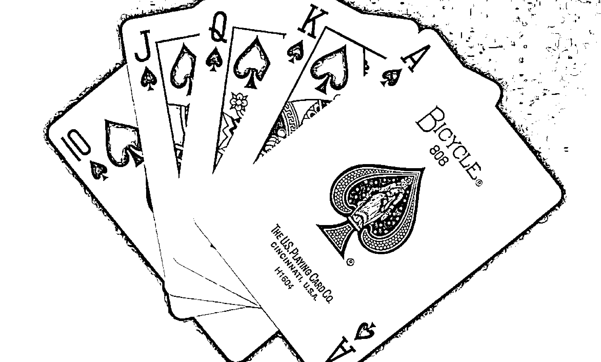

> 在确定的游戏规则之下，游戏过程、结果与初始状态之间存在着一定的因果关系。打牌的时候，假如能抓到一手好牌，那么你的赢面就会大很多。在拼爹的时代，假如是出生在显贵之家，那么不难想象你的行情看涨；假如你生在贫穷偏僻的小山村，那么大致可以断定，你就是那玻璃瓶里的蛤蟆——前途光明出路不大，除非有奇迹出现。

> > “世上没有后悔药”，指的是不管初始条件怎样，你做出的是怎样的选择，结果一旦形成之后就没有办法更改了，你不可能使时光倒流，让一切重来。如果把人生看作是一盘棋，那么一旦把子落下去，就没有办法再“悔棋”了。

游戏中综合了确定性与不确定性，现实世界也一样。自然法则就相当于游戏规则，它是确定无疑的，呈现在我们眼中就成了自然规律。事物在演变过程中都会表现出某种固定的规律性来，比如说太阳每天都会从东方升起，在西边落下。

这种确定性与不确定性并存的事实，使我们在一定程度上能够预测事物的发展趋势，但却做不到绝对准确，这在复杂现象中表现得尤为明显。比如气象台虽然能进行天气预报，但却会出现误报，让人印象最为深刻的是气象台发布的台风登陆地点，就经常在发生变化。

假如不存在确定性，那么天气预报就是完全不可能的事情，气象台也就可以关门了。假如不存在不确定性，那么天气预报就完全可以做到准确无误，而不只是大致准确。就不可能像混沌学理论说的那样，没办法进行长期的天气预报。从理论上说，只要计算能力足够强大，就有可能预报一个月后、一年后甚至一万年后的天气。

假如只是预测趋势，不要求精确的话，那么每个人都可以是很好的预言家。比如你预言说某个人总有一天会死的，这种预言一点也不精确，但却将是100%的准确。

如果能够很好地运用现实世界中确定性与不确定性并存的特点，你就可以成为预言大师了。那些成功的预言，都是既能符合事物发展的趋势，对于结果的表述又含糊其词的。

游戏规则的确定性，容易让一些人产生误会，认为命运是上天的安排。人生的最终结局是死亡，假如你把这种确定的游戏规则叫作“命运”，那么它确实存在。但假如你认定人生的幸运和不幸，全都是命运的安排，那么你就错了，因为这个过程受到“不确定性原理”和你自身选择的影响，并不是事先就已经注定的。

世界虽然有着确定的自然规则，但初始条件的不确定和生命“自由意志”的选择，造成了最终结果的不确定。“混沌学理论”说，在世界上随处可见“混沌现象”，其实就是这种结果的不确定性在现实生活中的体现。

量子论中的问题解答完了，接下来再说一说进化论中的问题：为什么没有中间过渡物种？复杂器官是如何形成的？动物的本能是如何产生的？“寒武纪生命大爆发”是怎么回事？为什么有些生物会停止进化？

我们可以参考一下电脑游戏，看玩家的等级是如何变化的。在QQ游戏“四国军棋”中，玩家的级别是这样规定的：最低级的是小兵，积分达到10分升为副班长，达到20分升为正班长，达到30分升为副排长……总共分为18个级别，最高级别司令的积分为12750分。

假如地球生命的演化过程，遵守的是类似于游戏升级的规定，那么很多困扰我们的问题就可以迎刃而解了。

首先是中间过渡物种的问题。在玩四国军棋的时候，级别的提升需要经过两个阶段：第一阶段是“积分”。从0分到9分，都还属于小兵这个级别，在这个阶段中积分的变化不会引起级别的改变，这段时间是一个渐变的过程。第二阶段是“晋级”。当积分达到9分时，只要再增加1分，量变就成了质变，在积分变化的同时，级别也从小兵提升为副班长。这时候渐变就成了突变，看起来就像是一种飞跃，它是一步到位的，不需要过渡阶段，游戏中并不存在介于小兵和副班长之间的“过渡级别”。

然后是复杂器官的生成和本能的产生。小兵晋升为副班长之后，它们两者是完全不同的角色，具有不同的特征。你可以把不同级别看成是不同的物种，把特定的器官和本能看成是特定级别玩家所具有的特征。所以只要级别上去了，不管它有多么复杂的器官，多么惊人的本能，都会马上自动出现，这是创世程序中的设定，根本就不需要我们去操心它如何生成的问题。

“寒武纪生命大爆发”应该如何解释呢？它应该是游戏达到了某种触发条件所致。当地球的环境演变到适宜复杂生命存在时，就达到了创世程序规定的基本条件，触发了程序中的某个按钮。于是创世主机就按照创世程序的规定，来了一个“玩家”的“集中注册”，一次性将大量物种密集投放到地球上，成就了我们眼中生命爆发的宏大场面。

停止进化的现象又是为什么呢？这有两种可能，一种是当你升到司令之后，即便积分再怎么往上增加，也只不过就是个“超级高分司令”而已，在级别上不会再有任何的提升。鳄鱼和鲨鱼停止了进化，也许只能说明它们运气不佳，踏上了一条断头路，再没有往前走的可能了。其实不仅是它们，人类极有可能也已经停止进化，没有通往更高级别的路了。假如有一天人类灭绝了，地球上或许还会出现比人类更高级的生命形态，它们也许是老鼠、蟑螂或者其他什么东西在升级，但这些跟人类已经没有什么关系了。

还有另外的一种可能性是，有些人玩了多年的四国军棋，却始终只能在小兵训练营里厮混，没办法升到更高的级别去，细菌和病毒也许就属于这种情形。

生命的演化机制要比达尔文想象的复杂得多。优胜劣汰的自然选择机制确实存在，但它只限于在积分阶段发挥作用。没能通过自然选择的物种，不但无法增加积分，还会被轰出去，造成个体死亡甚至种群灭绝。而积分达到一定要求的物种，在分数继续增加的同时，还会触发创世程序中的按钮，晋升到下一级别，成为新的物种。

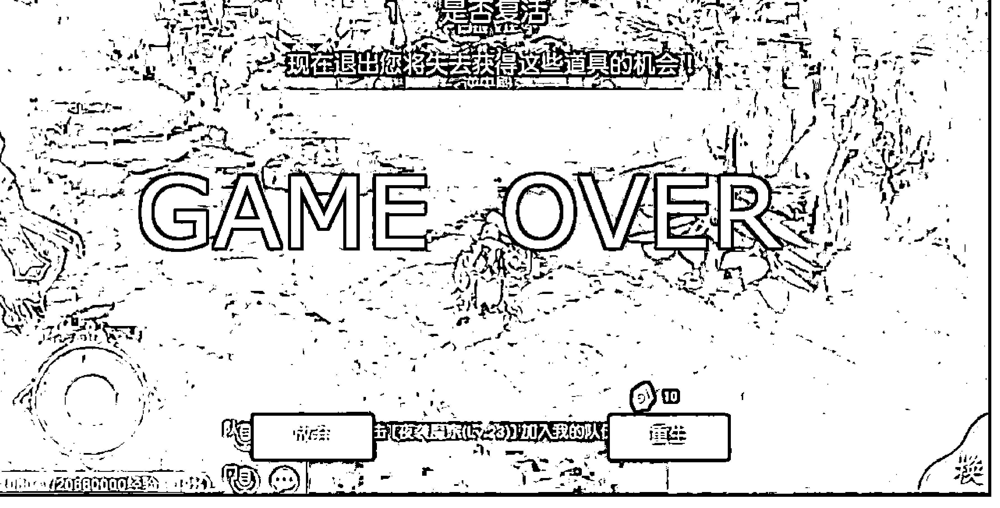

不能适应环境的物种将退出游戏，这就是我们眼中的物种灭绝现象。

这样看来，复杂多样的自然生态形成的全过程，并不像进化论说的那样是一个方向不确定的自然演变过程，而是一个类似于游戏中玩家打怪升级的定向演变过程。

综合这几章的分析，下面我们来对“世界从何而来”的问题做一个总结。

在宗教与科学的争论中，就“世界是被创造的还是自然形成的”这个问题，宗教回答正确，世界确实是被创造的，而科学错了。但在世界是如何被创造出来的问题上，宗教却完全搞错了方向。事实上，并不是像许多宗教所说的那样，神直接创造了世界、创造了万物。世界起源于一个程序，这个程序被老子称为“道”，我们可以叫它“创世程序”，是这个程序创造了世界，然后在程序规则的控制之下，世界慢慢地发展演化着。

人们至今仍在为世界是“创造”的还是“演化”的争论不休，神创论与进化论之间的斗争在世界各地频频上演。现在我们知道，创造说与演化说并不像人们以为的那样，是相互排斥、水火不容的，我们完全可以把它们结合在一起来解释世界的形成过程。单纯的创造说和自然演化说的观点都不够全面，实际上世界最初是被创造的，然后它又在程序规则的约束下自然演化着。

在《庄子·大宗师》中，有个名词很好地描述了这个过程，那就是“造化”。在我的QQ群里一位网名为“风”的网友建议，可以把这个关于世界起源的理论称为“造化论”。

宗教因为弄错了关键环节，把世界的形成过程看成是一种简单创造，以为它是一次成型、一成不变的，所以才被科学家们抓住了痛脚，批得体无完肤。科学在否定宗教的过程中树立了自己的权威，并通过科学技术的运用给人类带来的现实好处，使这种权威得到进一步的巩固。但事实上这并不表明科学就是完全正确的，它在世界起源问题上的错误回答，只是其中一个小的例证而已。

### 延伸阅读
什么是“混沌学理论”？

混沌学研究的是结果对于初始条件的依赖程度。这一理论表明，自然界的许多现象都是无法计算的，因为它对于初始条件的依赖性太大，而世间万物是普遍联系的，所以需要考虑的初始条件几乎是无限的多，其中的变化过程又太过复杂，因而最后的计算结果往往会陷入一片混沌之中。

美国的气象学家洛伦兹在研究天气预报的过程中意识到，最终结果对于初始条件的依赖性，比我们所能想象的要敏感得多。任何细小的干扰都能够对整个系统的发展造成极大的影响，差之毫厘，失之千里。最能形象说明这一点的是洛伦兹提出的“蝴蝶效应”：一只蝴蝶在亚马逊河的热带雨林中扇动翅膀，就有可能会在美国德克萨斯州引起一场龙卷风。

事物的演变结果高度依赖于细微因素的影响，这种思想早就存在于古人的典籍之中。我们平常所说的成语“千里之堤，溃于蚁穴”，来自于《韩非子·喻老》中的“千丈之堤，以蝼蚁之穴溃”，这说明人们在很久以前，就已经关注到了“蝴蝶效应”。

在现实世界中，会造成干扰的细微因素是非常多的，它们完全不可预测，所以很多复杂事物演变的结果根本无法预料。正如洛伦兹所说，任何具有非周期行为的物理系统，都是难以预计的，长期天气预报注定要失败。

混沌学理论告诉我们，在现实生活中，一些简单的事件之间存在着确定的线性关系，但同时在一些复杂事件中，也存在着不确定的混沌现象。即便是在宏观世界，不确定性也是与确定性同时并存的，并不能像决定论者那样简单地说，世界的演变是事先确定了的。

## 第十五章
## 虚拟现实：造物主用“虚拟现实技术”创造了现实世界

有人也许会问：游戏世界是电脑中的虚拟世界，难道我们眼前的世界也是虚拟世界吗？不会搞错了吧？

没有搞错，我想说的就是这个意思。

其实很久以前人们就已经在思考虚幻与现实的关系问题了，一个著名的典故是“庄周梦蝶”。《庄子·齐物论》中说，一天晚上庄周做了个梦，他梦见自己变成了蝴蝶，怡然自得地在花间飞舞，浑然忘记了自己是庄周。一直到他突然间醒了过来，才意识到原来自己是庄周，不是蝴蝶。

庄周在梦中只知道自己是蝴蝶，不知道自己是庄周。假如他一直都不醒过来，那么他是不是就永远也搞不清楚自己是在梦境里，还是在真实世界中呢？

笛卡尔也有类似的想法，他说：“当我仔细思索这个问题时，我发现人清醒时的状态与做梦时的状态，并不一定有所分别。”由此他进一步问：“你怎么能确定你的生命不是一场梦呢？”

这个问题，也是前些年热播的美国影片《盗梦空间》的主题。在电影中，窃贼道姆·科布善于潜入别人的梦境中，去盗取重要的信息和秘密。为了实现与儿女团圆的梦想，科布铤而走险，接受了一个危险任务，为此他与伙伴们深入到了第四层梦境，并差点永远留在了“迷失域”中，但最终他成功了。回到现实中与儿女团聚之后，就在他用陀螺测试自己是否还在梦境中时，电影突然结束，留下一个悬念：此时他到底是在现实中，还是在梦境里？

这部电影引起了很多人的深思。我们以前理所当然地认为，我们生活在一个真实的世界。但你想过没有，我们完全有可能是生活在一个虚幻的梦境里，从来就不曾醒来过。

人类对于世界所有的认知都来自于感官获取的信息。1981年美国哲学家希拉里·普特南阐述了一个假想：“如果有人被邪恶的科学家施行了手术，把他的脑从身体上切下来，放进一个装着能维持脑存活的营养液的缸中，脑的神经末梢连接在计算机上，这台计算机按照程序向脑传送信息，使他保持一切正常的感觉，那么将会怎样呢？”

这个假想被称为“缸中之脑”。它让我们不得不思考，假如人类大脑中关于外在世界的信息真的只是通过感官输入虚拟出来的，那么我们怎么去分辨它的真假呢？

事实上，我们眼前看到的这个世界，就是通过感官输入虚拟出来的。但为什么我们会把虚拟世界当成了真实世界呢？“虚拟现实技术”可以回答这个问题。

虚拟现实技术是用计算机来合成一个虚拟世界，在技术足够高明的情况下，这个虚拟世界能够以假乱真，让身在其中的你根本分不清它究竟是虚拟世界，还是现实世界。

这项技术能够取得成功的关键来自于四个方面的因素。首先是“多感知性”，在这个虚拟世界中你应该具有多种感知能力，能看、能听、能摸、能闻、能尝，它所具备的功能与人类的感官功能越接近，真实感就越强。其次是“存在感”，这个虚拟世界中的一切看上去都是真的，听起来是真的，动起来是真的，甚至闻起来、尝起来都是真的，就如同在现实世界中的感觉一样，让你无法辨别真假。第三是“交互性”，你和虚拟世界中的事物之间应该可以进行互动，能够用手去抓取物体，这时手中会有握着东西的感觉；能够感觉到物体的重量，视野中被你用手抓着的物体，会跟随着你的手移动。第四是“自主性”，在虚拟环境中要有物理规则，发生的事情要遵循严格的因果律，这样才像一个独立的真实系统。

以目前的技术水平而言，虚拟现实技术还远未达到理想状态，但它却已经得到了相当广泛的应用。早在20世纪70年代这项技术就已经开始用于培训宇航员；90年代初美国已经用它来模拟战场环境，进行单兵模拟训练，海湾战争中美国士兵对沙漠环境并不陌生，因为他们已经体验过了；克莱斯勒公司1998年开始运用这一技术进行新型车设计，还用它来做汽车冲撞试验。

目前存在感最高的虚拟现实系统是基于头盔式显示器的系统。在这个系统中，参与虚拟体验者要戴上一个头盔式显示器，然后人为地把视觉、听觉与系统外的世界隔绝，通过语音识别、数据手套、数据服装等先进的接口设备，使参与者以自然的方式与虚拟世界进行交互，就如同在现实世界中一样。头盔显示器能提供高分辨率、大视角的虚拟场景，让你看到和真实世界一样的画面。

好了，现在我们可以看看，造物主是如何运用虚拟现实技术，把创世程序产生的虚拟世界变成我们眼中的现实世界的了。

第一步是赋予我们多种感知能力，视觉、听觉、触觉、嗅觉、味觉，这些都是我们感知世界的基础。假如没有这些感官提供的信息来源，我们就对世界一无所知，也就根本不可能去考虑世界是真实还是虚拟的问题了。

第二步是制造存在感。造物主让我们能够把感官接收到的信息转换成感觉，又把我们的感官功能限制在一定的范围内。这就像魔术师表演魔术，往往需要把观众限制在台下观看，假如有人跑到后台去偷看，整个魔术就有可能穿帮了。

从这个角度看，我们所感受到的世界，其实只是造物主想要我们看到的模样，并不是它的本来面目。这一点早在公元前3世纪古希腊的哲学家皮浪就已经发现了，他告诫人们说我们的感官靠不住，它只能告诉我们事物表现出来是怎样的，不能告诉我们事物的真实面貌是怎样的。

第三步是制造交互性。真实感还来自于你和世界的互动，用手去摸绸缎，能感觉到它的柔软和丝滑；脑袋去撞墙，会感觉到它的坚硬，你自己头上还会撞出一个大包来；拿扫把追赶母鸡，母鸡会扑腾着跑开。这些现象表明世界看得见、摸得着，会因我们的动作而产生变化，所以是真实的。

第四步是制造自主性。要让人产生真实感，虚拟世界还需要是一个貌似完全独立的系统，其中的事物之间遵循严格的因果关系。所有东西看起来都像是由系统中相关联的事物产生的，就像你眼前的人是由他母亲生出来的，而不会好端端地突然间变出一个人来。因为一种东西的来历如果不能用这个世界的事物来解释，你就只能考虑是否存在更高层次的其他世界，这样就难免会让人怀疑眼前世界的真实性了。

尽管我们眼前的世界看起来如此真实，却无法骗过所有人，早在两千多年前悉达多就已经揭穿了造物主的高超手法。他认为人其实没有实在的身体，而是由“五蕴”构成的。“蕴”是“积累”的意思，所谓“五蕴”，即“色蕴”是指外界形形色色的事物；“受蕴”是指人体的感觉器官在接触外界时产生的感觉；“想蕴”是指对外界刺激产生感觉后，脑子里出现的想法；“行蕴”是指根据这些想法，去采取的行动；“识蕴”是对行动的后果进行总结，从中得出对于这个世界的知识。

我们举例说明一下。比如你眼前出现一个美女，这就是一种“色”；这美女实在太漂亮了！这就是“受”；你想，她要是我的女朋友该有多好啊！这就是“想”；你上前搭讪：“嗨，美女，做我的女朋友好吗？”“滚！”这就叫“行”；你明白了一个道理，天鹅肉不是那么容易吃的，这就是“识”。

悉达多把人类的感知能力称为“六根”，即“眼、耳、鼻、舌、身、意”，分别对应“视觉、听觉、嗅觉、味觉、触觉、知觉”。他已经认识到，我们对于眼前世界的感知完全依赖于感官。感官告诉我们眼前的世界是真实的，但事实并非如此。所以悉达多一再告诫：“色即是空，空即是色”，“凡所有相，皆是虚妄”，说我们感受到的这个形形色色的世界实际上是虚幻的。

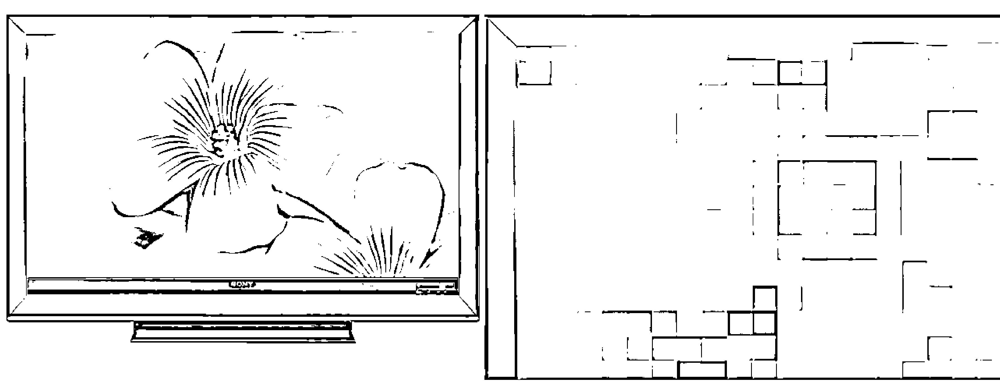

显示屏中的画面看起来似乎很流畅，其实是由微小的像素拼凑而成的。

造物主使用类似于虚拟现实技术的手法，让我们感觉到一个真实的世界。然而不管造物主的技术多么高超，我们还是能够发现一些破绽。

平常玩网络游戏的时候，我们是如何看到计算机中虚拟的游戏世界的呢？必须要有显示器。现实世界中也一样，我们每个人眼前应该都有一个显示屏幕。

不管什么样的显示器都有一个非常重要的特征，那就是有像素的限制。在正常情况下显示屏幕上出现的是连续平滑的清晰画面，但只要你把画面放得足够大，它就会变成一堆马赛克，看起来像是一个一个格子拼在一起似的。

正因为如此，世界平常在我们眼中呈现的是一幅清晰的画面，似乎我们所处的是一个连续平滑的世界，但当我们把世界放大到粒子水平时，我们就看到了马赛克，世界变得不再平滑连续，而像是搭积木一样拼接而成，从而在物理上呈现出明显的量子属性。

造物主已经把分辨率做得够高了，普朗克长度大致等于1.6×10^-35米，“普朗克正方体”应该就是一个像素的大小。对于人类来说，这是一个个小得令人吃惊的点，靠眼睛是无论如何也发现不了问题的。但人类的好奇心实在是太强了，搞出了一堆仪器，再细小的粒子都被找出来了，还制造出粒子对撞机把粒子加速后撞在一起，还有什么破绽是发现不了的？

还记得量子论中让人难以接受的“互补原理”吗？下面我们可以轻松地把它搞定，让你真正理解其中的含义了。

游戏显示器有一个显著的特征，就是它不能同时呈现整个游戏的所有场景，而是你想看什么，它就只显示什么。在玩网络游戏的时候，我们想看游戏中哪一个画面，就把鼠标移过去，显示器上就会出现这个画面，但我们不可能同时看到游戏的整个场景。这意味着当我们不看的时候，游戏世界就只是主机中运行的程序而已，并没有确定的画面。只有当我们去看它的时候，画面才会在显示器上呈现出来。

“互补原理”说电子具有“波粒二象性”，当你不看它的时候，它是虚无缥缈的波，而你一看它时就变成了真实的粒子，呈现在你的面前。玻尔说的不正是游戏显示模式的特征吗？现实世界的情况和游戏世界完全一样，当我们不观察它时，世界只是创世主机中运行的程序，只有当我们去观察它时，它才成为了真实的画面，出现在我们面前。这里说的我们，不仅仅指人类，而说的是自然界的所有生命。从这个角度来看，其实并非只有人的观察才会让波函数坍缩，猫的观察也照样可以。

> 在玩游戏时，显示屏上只会显示我们想要看的场景，我们没有看的地方就没有实在的画面。

还有，我们这里所说的观察，并不只局限于看，而应该包括了听、触、嗅、味等所有感觉器官的作用。

由于对这种观察模式缺乏了解，因而人们曾经产生过许多的误会，哥本哈根解释中就有部分内容是错的。这种理论认为，在我们没有观察的时候，世界是虚幻的，这没有错，但它进一步把“互补原理”与“不确定性原理”扯在一起，说当我们没有观察的时候，世界并不确定，而是处于各种可能状态的叠加之中，这就有问题了。

事实应该是这样的，当我们没有感应它时，世界只是运行着的程序，它没有确定的画面，但不可能没有确定的状态。电子表现出来的不确定性，只代表了系统的初始状态，并不是说整个世界都处在不确定的状态之中。世界上的某个具体事物，在某个时点上处于什么样的状态，我们也许不知道，但创世主机可是计算得一清二楚的。所以薛定谔的猫不管在任何时候，都不可能处在又死又活的状态之中。

到底什么是虚拟，什么是现实，现在你是不是有些糊涂了？造物主能够用创世程序创造出一个真实的世界来，那么假如我们的技术足够高明，是不是我们也可以成为造物主，造出一个真实世界来呢？或者根本就像某些科幻小说中说的那样，我们是由几百万光年外科技比我们发达得多的外星人创造的？

在下一章中，我们将继续为你解答。

### 延伸阅读

### 里奇·特雷尔的怪异理论

在国外的学术界公开发表言论，说人类生活在虚拟世界中的人很多，美国加州帕萨迪那市喷气实验室的里奇·特雷尔就是其中一个。在科学纪录片《与摩根·弗里曼一起穿越虫洞》第一集《存在造物主吗？》中，特雷尔展示了一个奇特的理论，被摩根·弗里曼称为“所有关于造物主的可能性中最怪异的一种”。

特雷尔认为，作为造物主应该能制定宇宙规则，并且也能够随心所欲地改变它，这种本领很像是程序员在模拟环境中搞的把戏。假如我们有一台功能强大的计算机，能够模拟出星球上的一切，也能模拟出人工智能，那么我们就能自己创造宇宙了。在这个用电脑创造的世界中，我们能改变物理定律，能做上帝能做的一切，我们具备了成为上帝的所有条件，只要给这个世界加上生物，我们就成了他们的神。

既然存在这种可能，那么我们这个世界，是否真的就是一个虚拟世界呢？

> 特雷尔说：“所有的电脑图像，不管多么真实，当你放大到足够的程度时，都会分解成像素。你也许觉得，在我们这个真实的世界里不可能如此，但是你错了。在上个世纪物理学家们发现，物质由很小的粒子组成，就像显示器上的图像是由像素组成的一样。量子力学意味着我们所看见的所有东西，也许真的是由能力强大的计算机里一行行的代码实现的。”

在纪录片中他还说：“量子力学的基本规则，适用于所有微小的亚原子粒子，当我们看它们时，它们是一个个的点；当我们移开目光时，它们就变化了物理状态，变得和我们观察时完全不同。这和我们玩游戏时看到的情节是多么的类似啊？在游戏里，当处在一个巨大的城市中时，我能从城市的每一部分找出我的路，因为这个游戏会给我提供我所需要的镜头。而当我看别的某处时，它又会给我相应的镜头。很奇怪，宇宙也是这样干的，当你看的时候，这个宇宙变成让你看到的样子，当你不看时，它就没必要在那儿了。”

这位科学家被称为最怪异的观点，我反倒认为是最切合实际的，当初也正是特雷尔的看法给了我启发，让我意识到了世界在显示模式上存在的像素问题。

可惜他最后的结论却让人大跌眼镜。他说：“我们的世界传递着所有模拟世界的特征，除了未来的人类，还有谁会模拟人类呢？”他想当然地认为，我们的后代最后变成了像神一样的生物，是他们创造了我们眼前的这个宇宙。

## 第十六章

### 天外有天：在二维游戏中的人看来，我们就在高维空间

如果我们这个世界只是创世主机中的虚拟世界，那创世主机在哪里呢？

想要回答这个问题，首先得搞清楚“世界”是什么。

“世界”一词来自于《楞严经》。经中说，“世”是迁流的意思，指时间像流水，从过去流到现在，从现在流到未来；“界”是空间的意思，指方位。世界的含义就是时空，一个世界就是一个独立的时空。

与“世界”相对应的名词是“宇宙”，它出自《庄子·齐物论》，意思和世界一样，都指的是时空。《文子·自然》中这样解释：“往古来今谓之宙，四方上下谓之宇。”世界和宇宙这两个来自不同国度的名词，却包含了相同的含义，它表明人们很早就认识到了时间和空间是万物存在的前提。

人们通常认为只存在一个世界。基督教之所以推崇托勒密的“地心说”，一个重要原因是这个体系能够为天堂和地狱留下位置，与它的教义相符。由此可见，基督教没有把天堂和地狱看成另外的世界，认为它们也是我们这个世界的组成部分。

在中国的神话传说中，世界上存在三个不同的地域：仙境、凡界、阴间。人们还把仙境叫作“天上”，凡界叫作“人间”，阴间叫作“地府”，可见它们只是同一世界的不同区域，不是三个不同的世界。

历史上也有人认为存在很多世界，比如悉达多。悉达多说有近乎无限多的世界，一千个小世界合起来叫一个“小千世界”，一千个小千世界合起来叫一个“中千世界”，一千个中千世界合起来叫一个“大千世界”。我们现在居住的大千世界叫“娑婆世界”，除此之外还存在很多大千世界，如“西方极乐世界”“东方琉璃世界”。

曾经有一段时间人们相信宇宙是无边无际、无始无终的，只存在一个世界。但宇宙大爆炸理论揭示出宇宙是有起始、有界限的，科学家们不得不考虑“多元宇宙”存在的可能性，否则就无法解释“宇宙起始之前有什么，宇宙之外是什么”的问题。

> 马丁·里斯说：“我们通常所说的宇宙，可能只是全体成员中的一个。可能还存在不计其数的规律不同的其他宇宙。”

> 霍金也在《大设计》中说，宇宙生成的场景就像是沸水中蒸汽泡的形成一样，生成的不仅仅是一个宇宙，而是一个无限的宇宙群。我们的宇宙只是其中一个气泡，另外还有无限多个其他宇宙。科学家们把这些宇宙叫作“平行宇宙”。

世界不只有一个，明白了这一点，创世主机在哪里的问题就很好回答了。答案很简单，他们处在和我们不同的世界里。

如果有很多世界，它们之间的关系是怎样的呢？

有人认为这些世界是平行的、并列的。美国物理学家加来道雄在《平行宇宙》中写道：

> “我们可能生活在这样一个宇宙的海洋上，每个宇宙都像是漂浮在海洋中的肥皂泡。”

也有人认为这些世界是层叠的。霍金在《时间简史》中讲了一个故事，一位小个子老妇人在伯特兰·罗素做完天文学演讲后，站起来说：

> “你讲的都是一派胡言，实际上世界是驮在一只巨大乌龟背上的平板。”罗素问：“那么这只乌龟是站在什么上面的呢？”老妇人回答：“这是一只驮着一只，一直驮下去的乌龟塔啊！”

以前人们曾经以为宇宙中只有一个星系，那就是银河系，但后来才发现原来银河系外还有无数的星系。以前人们曾经以为只有一个宇宙，但现在很多人意识到，宇宙之外应该还有无数的宇宙。

通常人们认为悉达多所说的世界也是分层次的，也就是所谓的“三界六道”。三界从低到高依次是欲界、色界、无色界，六道从低到高分别是地狱道、饿鬼道、畜生道、人道、阿修罗道、天道。

“六道”中其他五道都在欲界中，只有“天道”中的诸天遍布三界，其中欲界有六欲天，色界有四禅十八天，无色界有四天，共有二十八层天。

在“三界六道”的每一层级中，生活着的生命是全然不同的。欲界众生以欲望的满足为快乐，层次比较低级；色界众生层次稍微高一些，已经没有了欲望，却还没有摆脱物质的束缚；无色界的众生不仅摆脱了欲望的束缚，也不受物质的限制，是层次更高的生命形式。处境最差的是处于三十三个层级中最底层的“地狱道”，都是一些前世作恶多端的人投生在这里，他们在此要历经几十万亿年的痛苦煎熬，才有机会脱离苦海。

除了这两种说法，还有人认为世界是一层包着一层的。

1999年上映的美国影片《异次元骇客》中呈现了一种奇异的多层级世界。富勒和道格开发了一种电子系统，可以在网络中制造出一个真实的20世纪30年代的洛杉矶。无数人生活其中，他们和真实的人一样，不知道自己是网络制造出来的幻影。

后来富勒发现了一个秘密：不但他们创造的那个20世纪30年代的洛杉矶是虚拟世界，其实就连他自己所在的现实世界，同样也只不过是个幻境而已，这个幻境是由生活在更高层级的人们制造出来的。因为这个发现，富勒付出了生命的代价，他被来自于更高层级的人杀死了。

影片最后道格来到了现实世界的制造者们所在的空间——原来那些更高层级的人们存在于未来，他们生活在2024年。就在故事即将有一个完美结局之际，戏剧性的一幕出现了，“啪”的一声，这个更高层级世界的画面一闪而逝，就像是电视被拔掉了电源插头，也许这个更高层级的世界也只不过是个幻境。

三种说法哪个更现实呢？我们的世界，会不会像《异次元骇客》中说的那样，是由未来拥有更高科技的人类创造的？抑或是由生活在外星球的技术高超的外星人创造的？我们能不能像道格和富勒那样成为造物主，制造出一个真实的虚拟世界来？

回答这个问题需要涉及“维度”的概念。维度又称“维数”，在数学中指的是独立参数的数目，在物理学和哲学中指的是独立的时空坐标的数目。“次元”和维度是同样的意思，“异次元骇客”就是能够破解时空屏障，从其他维度空间来到我们这个世界的黑客。

人们意识到空间存在维度的时间不长。18世纪有人提出了“n维空间”的概念，但直到19世纪中叶之后，n维几何学才逐渐为数学界所接受。从此之后，虽然在数学上有了多维空间的概念，能够对其进行研究，但在物理学上，除了爱因斯坦的相对论给我们这个世界加上了一个时间维度，把它从“三维空间”变成了“四维时空”之外，我们对于高维空间的认识并没有多大的提高，不知道高于三维的空间是否真的存在。

我们所处的这个空间，很显然是一个三维空间，它有长、宽、高三个维度。

我说的“空间”是指纯粹的空间，没有把时间当作一个维度和空间扯在一起，只有在说“时空”时才把时间当作一个维度，和空间联系在一块。

高维空间的概念曾经是科幻小说中炙手可热的题材，但后来沉寂了很长一段时间，近年来因为“弦理论”的火爆，它才又成为物理学家们研究的热点。

在弦理论受到狂热追捧这件事上，充分体现了“还原论”的影响。正是因为信奉“只要找到了构成世界的最小粒子，弄清楚了它们之间的作用原理，就能够明白世间一切”的还原论逻辑，人们才会如此关注基本粒子的研究。

也正是因为这种逻辑，一些物理学家产生了“大统一”的思想。在科学史上，曾经有过许多新理论统一不同物理现象的先例。麦克斯韦以电磁理论统一了电与磁，爱因斯坦以质能方程统一了质量与能量，每次统一都给人类认识世界带来巨大跨越。于是一些人本着还原论的思维，希望能够发现一种理论，可以统一自然界的所有基本粒子和四种基本作用力。按照“基本粒子之间的相互作用能够解释世间一切现象”的逻辑，只要找到这种理论，就相当于发现了一个可以解释宇宙中所有事物的“万有理论”。

1968年，意大利物理学家维尼齐亚诺在研究粒子碰撞的数据时发现了一个公式，有人对它这样解释：粒子并不是一个点，而是一根弦，可以像橡皮筋那样拉伸，它们获得能量时伸展，失去能量时收缩，还能和橡皮筋一样振动。

以此为灵感，人们进一步发现，从“粒子是弦”这一点出发，我们就能统一自然界所有的粒子和所有的力。所有基本粒子都可以理解为弦的振动，所有的力也是如此，电磁力和核力源于开弦的振动，引力源于闭弦的振动。

“弦理论”这样描述：万物都是弦，宇宙就是一曲规模宏大的交响乐。这是一幅多么激动人心的美丽画卷！许多物理学家为之着迷，霍金甚至把最新版的弦理论——“M理论”称作“万物理论的唯一候选者”。

然而搞笑的是人们对于弦理论的认识，至今还停留在一种朦胧的感觉上。正如弦理论家格林在《宇宙经纬》中说的：“即使到了今天，在它出现30年之后，多数弦的实践者仍然相信我们不能满意地回答一个最基本的问题：弦理论是什么？”

> 物理学家L·斯莫林说：“在美国，追求弦理论以外的基础物理学方法的理论家，几乎没有出路。……当弦理论还在为科学争斗时，它在学术圈子里已经赢了。”

电磁理论的核心方程是“麦克斯韦方程组”，广义相对论的核心方程是“爱因斯坦场方程”，弦理论却没有自己的核心方程，甚至连一个对这种理论的清晰描述都没有。弦理论学家们只是肯定地说，整个宇宙都是由弦组成的，却完全说不清楚弦是怎样构成这个宇宙的。

虽然弦理论不算是一种完备的理论，却需要一个十分夸张的前提，那就是我们生活的世界，不能是四维时空，而必须是十一维的时空。但我们平常只能看到四维时空，多出来的七维哪里去了呢？弦理论解释说，这些额外的维度被蜷曲成了非常小的空间，小到我们用最先进的仪器都无法发现。

> 一根细小的线如果放大了看，也许其实是一根管，这样一维的东西就变成了三维的。弦理论认为，我们的现实世界就是如此，它看起来是四维时空，但只要放得足够大，就变成十一维的时空了。

但随后更大的问题来了。这种蜷曲不能是随意的，因为每一种蜷曲方式都对应着一组自然定律，或者说对应着一个截然不同的宇宙。按照弦理论学家们的计算，这样的蜷曲方式大概有10^500种，也就是在理论上可能存在10^500个不同的宇宙。

正是为了解释在这么多的可能性中，为什么刚好会出现一个像我们这样有秩序的宇宙，弦理论才需要引入“平行宇宙”的思想。达尔文说，在近乎无限多可能性的变异中，必然有一种与我们眼前的物种一致；弦理论沿用这一逻辑，认为在近乎无限多可能性的平行宇宙中，必然有一个刚好物理特性与我们这个宇宙完全相同。

仅仅为了坚守“自然生成”的理念，达尔文的逻辑就这样被各个领域普遍运用，制造出一个又一个十分可笑的理论。

弦理论认为我们的宇宙是十一维时空，这种观念居然得到了多数物理学家的认同。它至少表明要让人们接受高维空间的概念，并不是太困难的事。

悉达多说世界是分层级的，弦理论说世界是高维的。这些说法综合起来，参考《异次元骇客》中的场景，我们可以这样猜测：

在我们所处的三维空间之外，还存在许多不同维度的空间。可以把每一个空间维度都看成是一个层级，这样就存在许多不同的层级。在每一个层级中都存在着许多不同的世界，每一个世界里又生活着一些全然不同的生命。

我们可以参照游戏世界来理解这种多层级的世界。

假设有一天人类能够使自己制造的游戏人物产生意识、拥有智慧，那么人类就成了这个游戏世界的造物主。假如你是生活在二维空间《仙剑奇侠传三》中的景天，对你来说游戏世界就是一个小世界，跟你的世界处于二维空间同一层级的，还有《传奇》《魔兽世界》等其他游戏世界，它们对于你来说就是平行宇宙。

对景天来说，造物主是生活在三维空间中的人类程序员，是这些人创造了他赖以生存的宇宙，他处在人类的电脑之中。人类也许就在屏幕前默默注视着他，他们近在咫尺，但咫尺就是天涯，二维空间中的景天永远发现不了三维空间中的人类。

《仙剑奇侠传》与《魔兽世界》都是三维空间中人类开发的二维空间游戏，它们所在的虚拟世界之间就是“平行宇宙”的关系。

接着往下推，既然存在游戏世界的二维空间和现实世界的三维空间，那么为什么不能有四维空间呢？景天是二维空间中的生命，我们是三维空间中的生命，难道四维空间中就不能有生命吗？

这样看来，我们的世界不太可能是由未来的人类创造的，也不是由外星人创造的，而应该是由高维空间中的生命创造的。

造物主不可能只造了这一个世界。所以和我们的世界平行的，应该还有无数其他宇宙，它们和我们一样，都在创世主机中运行着。

在世界是平行的、层叠的还是相互包含的三种说法中，最有可能的是：从纵向来看，不同维度或者说层级的空间是相互包含的；从横向来看，同一层级中不同世界之间是平行的。

弦理论应该是错误的，它错误的根源在于还原论的思维。解释基本粒子的理论可能成为“万物理论”吗？即便弦理论真的能统一所有粒子和所有力，它就能解释宇宙间的一切现象吗？你怎么用弦理论来解释战争与和平、经济繁荣与衰退、政权建立与更迭呢？

人类能看到二维游戏中人物的一举一动，但即便是近在眼前，游戏中的人物也不会发现人类的存在。

四维空间示意图。实际上作为三维空间中的生物，我们永远也想象不出四维空间的真实模样。

引力和核力一个是在流畅画面下观测到的现象，一个是在放大到接近能够看清每个像素的水平，出现马赛克时观察到的现象。在这截然不同的两个层面，观察到的规律不一样是正常的，完全没有必要强迫它们统一起来，弦理论的研究也许一开始方向就错了。

> > 众多世界之间的关系应该是这样：一层包着一层，每一层中又有无数个世界。

如果说有“万物理论”，那么造化论倒是完全可以作为一个候选对象！

现在我们可以轻松回答前面提出的问题了：宇宙有没有边界？宇宙外面是什么？其实只要你想一想游戏地图的边界和边界之外的情形，就什么都明白了。

另外我还可以轻松地回答这个问题了：空间是什么？答案很简单，空间就是游戏中的那幅地图。

在游戏中，地图是有边界的，地图边界之外黑漆漆的一片，什么东西也没有。

### 延伸阅读

## 空间不是“空”的，“以太”真的存在

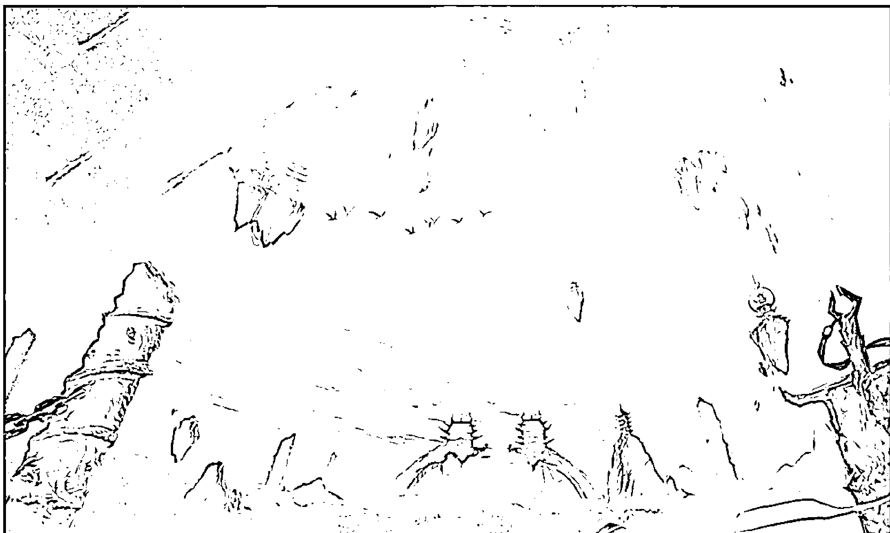

前面我们曾经讨论：空间真是“空”的吗？历史上人们对于这个问题的认识可谓是一波三折。

最早的时候，亚里士多德认为“自然界厌恶真空”，所以空间并不是“空”的，其间充满着第五元素“以太”。然而原子论者针锋相对地说，自然是由两件东西组成的：物体和虚空，因而空间真是“空”的。

后来笛卡尔相信物体之间的影响只有通过接触才能发生，认为空间不是“空”的，其中充满了不可见的物质“以太”。他认为空间像是充满漩涡的海洋，行星就在其中冲浪。然而牛顿的万有引力定律表明，引力是一种超距作用，太阳在不与地球接触的情况下也可以对地球施加引力作用。牛顿的粉丝们由此认为空间真是“空”的，在很长时间里否定了以太的存在。

再后来麦克斯韦认为，电磁波可以在空间传播是因为变化的电场产生磁场，变化的磁场又产生电场，所以空间不是“空”的，它至少充满了“场”。他相信以太确实存在，说：“广阔的行星际和星际区域将不再被视为宇宙中无用的场所……这些场所已经充满了这种神奇的介质。”他认为以太无所不在、没有质量、绝对静止，充满了整个宇宙，电磁波可以在其中传播。

但现代主流物理学界又不承认以太的存在了，原因是爱因斯坦在狭义相对论的论文中说：“引入以太将被证明是多余的”，从那时候开始人们又抛弃了以太。

爱因斯坦后来其实改变了态度，在1920年他说：“更仔细的思考告诉我们，狭义相对论并未迫使我们放弃以太。”人们没有意识到，广义相对论其实就是一个基于以太的理论，它认为引力是时空弯曲造成的，如果空间真是“空”的，它怎么弯曲呢？

空间到底是不是“空”的呢？我们还是先搞清楚“空间”是什么吧！

牛顿对于空间的含义有过认真的分析，他认为存在“绝对空间”与“相对空间”的区别。他说：“绝对空间的自身特性与一切外在事物无关，它处处均匀，永不移动。相对空间是一些可以在绝对空间中运动的结构，或是对绝对空间的量度，我们通过它与物体的相对位置来感知它。绝对空间与相对空间在形状与大小上相同，但在数值上并不总是相同。比如地球在运动时，大气层与地球之间的空间是不变的，但它在一个时刻通过绝对空间的这个部分，另一时刻又通过绝对空间的那个部分，因而站在绝对空间的角度来看，它是连续变化的。”

我们来解释一下牛顿说的是什么意思。假如把宇宙的演变看作是一出戏，那么牛顿认为舞台空间是固定不变的，这是一个绝对空间。如果舞台上的演员开着一辆道具车，那么道具车内的空间就是相对空间，道具车在舞台上移动，车内的相对空间没有发生变化，但是它在舞台这个绝对空间中的位置，却是在连续变化着的。

牛顿的说法对不对呢？我们还是以游戏世界来对照分析一下。

首先牛顿说的绝对空间肯定是存在的，这就是宇宙演变的大舞台，或者说游戏中的那张地图。在这一点上，爱因斯坦说不存在绝对空间，那是错误的。

其次牛顿说绝对空间与一切外在事物无关，处处均匀，永不移动，这一点错了。现在我们知道，宇宙空间始终是在扩张的，就像游戏地图一直在向外延伸一样，绝对空间中任何两点之间的距离都在变大。而且爱因斯坦的相对论表明，宇宙空间这个舞台本身就是表演的一部分，时空弯曲会导致空间中物体的物理属性发生变化，比如时钟变慢、光线弯折，就好像舞台的变化会引起演员情绪的转变，直接影响到他在演出中的发挥。

第三点是空间真是“空”的吗？这显然不是。舞台之内和舞台之外肯定是不一样的，游戏地图之内和地图之外也不同，地图之外才真正是“空”的。爱因斯坦后来认识到了这一点，他说：“根据广义相对论，没有以太的空间是不可想象的。因为在这种空间里不仅光无法传播，而且不可能存在空间和时间标准，因此任何时间间隔也没有物理意义。”他说得对，没有舞台演员还怎么表演呢？没有地图游戏还怎么进行呢？

美国物理学家弗兰克·维尔切克说：“在我们认为是虚空的地方，实际上充满了活跃的媒介，其活动铸就了这个世界。”这种媒介是什么呢？他说：“以太属于最接近本意的旧概念，但却让人感到观念陈旧缺乏新意”，所以他把这种东西叫作“网格”。

维尔切克说：“我开始怀疑我们称之为真空的实体，可能是一种古怪的超导体。你要有超导性，就必须有一种能够传导的物质。我们的这种古怪超导性既然是无处不在，那么这种物质就只能让充满空间的以太来承担了。”他认为，“世界是建立在充满以太的多层级空间基础上的”。

看完以上分析你应该很清楚了，在游戏地图之外什么东西都没有，那才真正是“空”的。在地图之内，即便没有其他东西，也至少还有背景存在，因而不能说它完全是“空”的。宇宙空间也是如此，我们可以把它看作是一张充满以太的地图，因而并不真正是“空”的。

真空中的“量子涨落”现象是一个很好的证明。根据“不确定性原理”，即便是在纯粹的真空中，也可以随机产生少许能量，从虚无中生成由粒子和反粒子组成的虚粒子对。也就是说在真空中可以毫无缘由地产生物质，然后又在极短的时间内湮灭。现在的技术水平已经足以观测到它们的存在，这证明在我们原先认为的“真空”中，并不真是“空”的。在宇宙外面真正是“空”的地方，绝对不可能出现“量子涨落”现象。

## 第十七章

### 时间真相：时间是宇宙演变的刻度，可以快播和慢播

很久以前古人就已经意识到，有些事物的存在很短暂，如白云苍狗稍纵即逝；有些事物的存在却长得不可思议，人类很难觉察到它们的生灭。也许就是因为观察到了事物存在的长短差异，才让古人们产生了“时间”的概念。

对于古人来说，对这种长短差异进行准确计量是一件有难度的工作。但是人们都很聪明，发现计量时间的最好办法，是找到一些以固定周期循环变化的事物来做参照。于是不管在地球上的哪个角落，人们都采用了解决方案，把春、夏、秋、冬四季轮回称作一年，把一个朔望月的循环称作一月，把一个昼夜交替称作一日。现在我们知道那分别代表着地球绕太阳公转一周、月亮绕地球公转一周和地球自转一周。

从人们普遍用“年”“月”“日”来计量时间的做法可以看出，时间是和事物的运动变化联系在一起的。一年代表了一个春暖花开、炎炎夏日、黄叶满地、冰封千里的轮回过程，一月代表了一个月亮阴晴圆缺的变化周期，一日代表了一次日出日落的循环更替。

为了准确计量时间，古人发明了“日晷”“漏壶”等计时工具。后来随着技术进步，出现了更精密的仪器——钟表，现在最精确的原子钟，2000万年内误差不超过1秒，可见人类对于时间的把握已经达到了何等精准的地步。

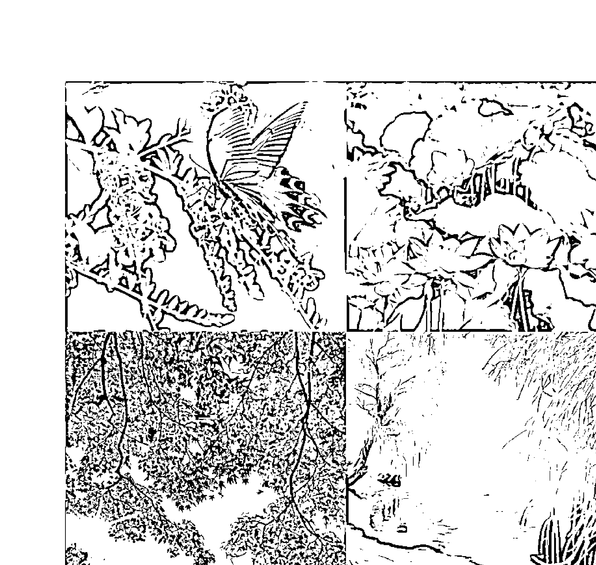

时光流逝标志着事物的变化，以固定周期的循环变化过程来计量时间，是古人最常用的方法。

到了这一步，人们对于时间的认识似乎已经没有悬念了。但假如你翻开霍金的《时间简史》，看到里面说，每个以不同速度运动，或在不同引力场中的物体，它们的时间标准都不同；时间不是永恒存在的，它在宇宙大爆炸时有一个开端，宇宙诞生之前的时间概念是没有意义的。这些问题肯定会让你对时间的概念又感觉陌生起来。

时间到底有什么秘密呢？我们还是参照电影和游戏来做一个分析。

第一个问题是：时间是什么？

时间的概念似乎是不言自明的，然而真要让你说的时候，恐怕不是那么容易讲清楚。时间一直是整个物理学的基础，但奇怪的是，居然从来没有一个对它的准确定义，连牛顿、爱因斯坦、霍金都不能明确告诉你：时间是什么？

在人们的日常观念中，时间其实有两种含义。如果有人问你：“你是什么时间结婚的？”他说的“时间”指的是你结婚的那个“时点”。而如果有人问：“你已经结婚多长时间了？”这里说的“时间”，指的是你从结婚到现在这个时段的长度，也就是“时长”。

“时点”与“时长”，哪一个真正能够代表时间的内涵呢？我认为是“时点”。所以这里声明一下，我们后面说的时间指的都是“时点”，对于某个时段的长度我们将用“时长”来表述，而不用“时间”这个词。

把时间确定为“时点”之后，我们就很清楚时间的本质了，它指的是一种描述事物进程的“刻度”，而不是“长度”。比如在一部电影中，男女主角初次见面的情节出现的时间是第11分25秒，结婚情节出现的时间是第50分33秒，生孩子情节出现的时间是第1小时4分32秒，这里时间指的是电影情节进程的刻度。

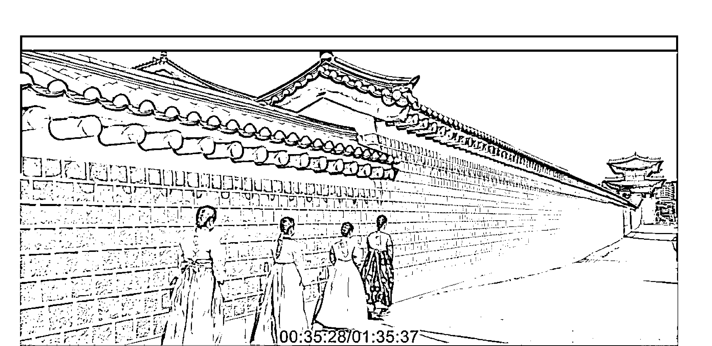

在电影中，时间指的是故事情节的刻度。图中的这部电影，时长为1小时35分37秒，出现眼前这个情节的时间在第35分38秒。

对于游戏世界来说，时间指的是游戏进程的刻度。在某个时间，游戏刚好处在这样的进程下：张三在打怪，李四在寻宝，王五在秒杀马六……

在现实世界中时间同样是一种刻度，每一个具体的时间总是和当时发生的具体事件联系在一起的，我们这个世界的时间就是整个宇宙演化进程的刻度和标识。

人们没有搞清楚时间的真相，所以认为钟表测量到的就是时间本身，浑然不知这样的认识已经偏离了时间的本质。

第二个问题是：时间是从什么时候起始的？

从常识来看，事物总是有开端的。但人类的寿命有限，出现的时间也短暂，所以知道的也就很有限。

正因为人类所知有限，所以“时间是从什么时候开始的”“在时间起始之前有些什么”这样的问题，就变得很难回答了。有些虔诚的教徒对“创世之前上帝在做什么”之类的问题极其厌烦，甚至回答说“那时上帝正在为问这类问题的人准备地狱”。

为了回避对这个问题的回答，曾经有一段日子人们相信宇宙是永恒的存在，时间既没有起始，也没有终结。但大爆炸理论凿穿了这种说法。宇宙是有开端的，那么作为宇宙演化进程刻度的时间，也一定是有开端的。

这个开端从哪里算起呢？电影的时间，是从开始播放的那一刻算起的；游戏世界的时间，是从游戏程序开始运行的一刹那算起的；我们这个世界的时间，是从“道”开始运行的那个时刻算起的，也就是从宇宙大爆炸的那一个瞬间开始的。

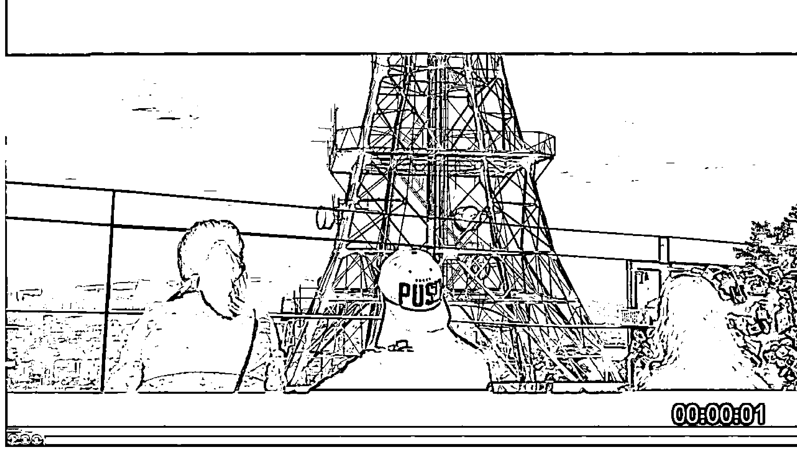

电影中的时间，是从它被播放的那一刻开始算起的；我们这个世界的时间，是从创世程序被点击运行的那一刻起始的。

第三个问题是：宇宙诞生之前的时间概念有意义么？

公元5世纪神学家奥古斯丁说，时间是上帝创造的世界的一个重要性质，在上帝创世之前，时间是不存在的。现代许多物理学家和天文学家也认为，在宇宙起始之前的时间概念是没有意义的。事实果真像他们说的那样吗？

仔细一想，实际上他们说这样的话时，话里隐藏着一句潜台词，那就是只有一个时间。

在以前人们认为只存在一个世界的时候，有这样的认识是再正常不过了。但我们现在知道，宇宙应该不只有一个，而是在纵向上按维度分成不同的层级，在横向上也存在许多的平行宇宙，所以也许存在无限多的宇宙。在这种情况下再认为时间只有一个就不合适了。

每个世界都有属于自己的运行进程的刻度，因而都有自己的时间，一个世界就有一个时间，无数多个世界就有无数多个时间。对于我们这个世界来说，在宇宙诞生之前，属于我们的时间还不存在，但还存在着其他世界的时间，因而并不能说时间的概念没有意义。比如我们的造物主所在的世界，在我们的时间尚未出现之前，他们的时间必定早已存在，而且即便是我们的世界毁灭了，他们的时间也仍将继续存在。

所以关于“创世之前上帝在做什么”的问题其实很好回答。造物主处在和我们完全不同的世界里，在那个世界有属于他们自己的时间。在创造我们这个世界之前，他们该干吗就干吗，跟我们这个世界时间的起始和终结毫不相干。

第四个问题是：要怎么理解时间流速的不同？

宇宙的演变是持续不断的，所以作为宇宙演变刻度的时间也是一直在流动的。

从经验出发，人们在很长的时期内都相信，在不同地域、不同年代，对于不同事物来说，时间都应该是以均衡的速度在流淌着的。或者说，宇宙演变的进程应该是以同样的速度在进行着的。

但在神话传说中，经常出现在不同地域时间流速并不相同的情况。爱因斯坦证明这是有可能的。在不同的运动速度之下，或者处于不同的引力场下，时间的流速有可能出现极为悬殊的变化。这种现象我们前面已经介绍过了，这里要说的是如何解释这种现象。

我们可以想一下用DVD看片子的情形。同样一部影片，选择以不同的播放速度来观看，结果就完全不一样。假设第一次是以正常速度播放，我们观看这部电影的时长是2小时40分钟；第二次改变播放方式，按下32倍快速播放的按钮，那么时长就变成5分钟；第三次是以放慢32倍的速度播放，那么时长就会达到85小时20分钟。

同样的一部影片，内容没有变化，为什么三次播放的时长却有那么大差异呢？原因是播放速度不同。

> 电影的播放器通常有快速播放和慢速播放的按键。按下快播键，电影中的时间流速就会加快，每个人的身手都变得异常敏捷；按下慢播键，人的动作会变得慢悠悠的。

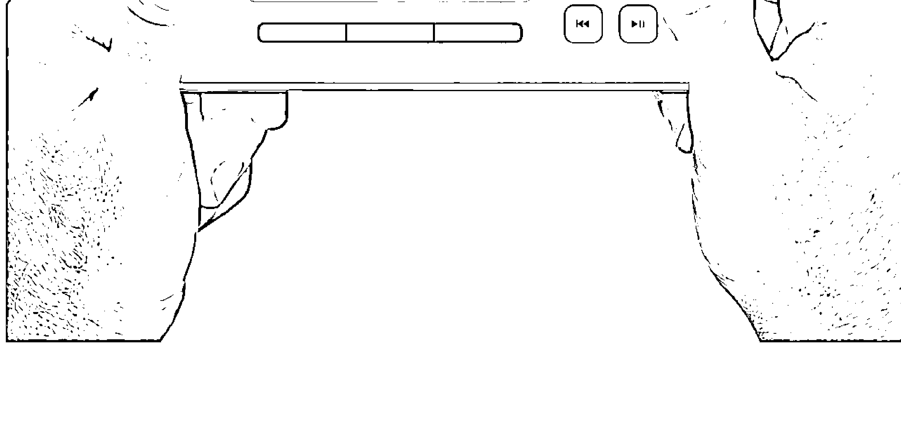

在运动的物体身上或者引力场中，时间的流速会被放慢，这相当于发生的事件是在以慢速播放。假如一对孪生兄弟，一个是在地球上过完一生，一个是在以接近光速航行于宇宙中的飞船上过完一生，时长就会完全不同。等飞船上的人年老垂死之际，回地球上去想看看他的兄弟，会发现他在地球上的兄弟很多年前就已经去世了。

有些聪明人可能会想利用时间流速的这一特点，让自己活得长一些，但他们注定要失望。孪生兄弟各自过完的一辈子，虽然表现出来的时长不同，但实际飞船上的人过的一辈子也还是那么长，在人的感觉中并没有变得更多。就像前面花了85小时20分钟才放完的电影，内容并没有比5分钟就放完的更多一些，时长不同是由播放速度的快慢造成的，电影的内容不会发生任何实质性的变化。

运动速度一直增加，时间流速就一直在放慢。当运动速度达到光速时，时间就完全停止了，这相当于在播放器中按下了暂停键。

造物主在创造我们这个世界时，为什么要在同一个系统中，根据运动速度和引力场的不同设置有差别的时间流速呢？我只能根据爱因斯坦把光速恒定当作一个前提才推导出相对论的事实，猜测也许在造物主创世时，从技术和逻辑上看，光速恒定就是一个必需的基础设定，所以造物主才会不嫌麻烦搞出了一个弹性的时间流速。

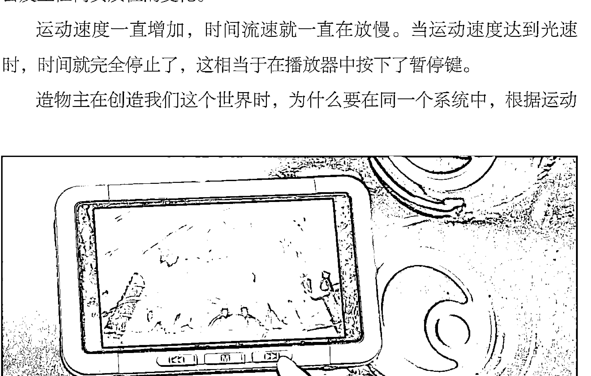

播放速度加快，看电影的时间会变短，但影片内容不会减少；播放速度慢下来，看电影的时间会延长，但影片内容不会增加。如果想通过改变时光流速来延展生命的长度，这种方法是行不通的。

第五个问题是：时间是否能够倒流？

经验告诉我们，时间是不可逆转的。人死不能复生，破镜不会重圆，玻璃杯可以掉到地上摔破，地上的碎玻璃碴却没有可能重新组合成一个完好的杯子。

我们很难从物理学上理解时间的这一特性。假如从力学的角度来看，事物的运动变化过程，无非是粒子间的碰撞。在微观世界里基本粒子有三种基本的对称方式，除了前面解释过的“宇称”之外，另外有一种是“时间反演对称”，即如果我们颠倒粒子的运动方向，粒子的运动是相同的。这意味着碰撞不管是顺过来还是倒回去，都没有质的区别，为什么玻璃杯却只能由完整的向破碎的变化，不能从破碎的向完整的变化呢？

时间和过程的不可逆转性，从物理学中很难得到合理的解释。

目前能用来解释时间和过程不可逆的物理学理论，基本上只有热力学第二定律。这一定律指出，自然界一切自发过程都具有不可逆性，热量会自发从高温物体传递给低温物体，物质会自发从高密度区域扩散到低密度区域，但这种自发过程是不可逆的，如果要实现相反的过程必须借助于外力。不过，热力学第二定律只是建立在经验基础上的定律，并没有在理论上得到很好的证明。

其实以游戏作为参照是很容易理解时间不可逆现象的。在游戏中，不同事件的先后次序相当重要，因为它们之间存在一定的因果关系。假如把次序搞乱了，那就会出现严重的逻辑冲突，导致系统崩溃，因而电影可以倒着播放，而游戏却不行。

我们的现实世界更像是游戏世界，因此时间不能倒流。但时间的暂停却是完全有可能出现的，假如创世主机中宇宙演变的进程暂时停下来，隔一段时间以后再继续，这样就相当于时间暂停了。在这种情况下我们不会有任何感觉，除非是一部分宇宙演化的进程暂时停止，而我们的这一部分进程仍在继续，这样在有参照的情况下，我们才会发现那一部分宇宙演化的时间停止了。否则在整个系统全部暂停，缺少参照的情况下，我们根本不会知道时间曾经暂停过。

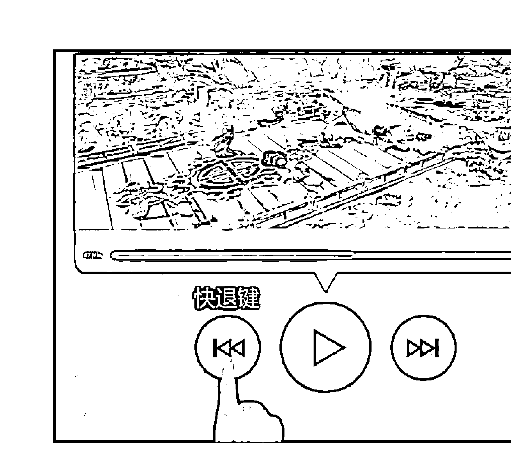

电影的播放器中有快退键，可以进行倒播，这相当于时间倒流，但在游戏中就没有这个功能。原因在于电影的过程和因果关系是确定的，不管顺播、倒播都没有关系，而游戏过程却是不确定的，倒退会造成因果关系的混乱。

第六个问题是：时间是相对的还是绝对的？

牛顿认为既存在绝对时间，也存在相对时间。他在《自然哲学的数学原理》一书中这样说：

> “绝对的、真实的和数学的时间，由其特性决定，自身均匀地流逝，与一切外在事物无关，又名延续。相对的、表象的和普通的时间是可感知和外在的（不论是精确的或是不均匀的）对运动之延续的量度，它常被用以代替真实时间，如一小时，一天，一月，一年。”

从那以后，这一观念在两百多年的时间里被人们广泛接受，直到爱因斯坦发表了狭义相对论。爱因斯坦颠覆了“绝对时间”的观念，指出只存在相对时间，不存在绝对时间。

为什么只存在相对时间呢？我们来看看爱因斯坦是怎样解释的。

在狭义相对论中，他提出了一个问题：一条笔直的铁轨上有相隔很远的A、B两个点，雷电同时击中了这两点，并同时发出了闪光。这句话的表述有问题吗？

也许你看不出其中有什么猫腻，但爱因斯坦说有问题。他说，你怎么能确定雷电是同时击中这两点的呢？也许有人会提出一个好办法，就是让一个人站在A、B两点中间位置的铁轨上，假如他同时看见两点出现闪光，那么就能够证明雷击是同时发生的。

但爱因斯坦接着说，这里头有问题。假如站在A、B两个点中间位置的那个人，并不是站在铁轨上，而是站在一列以速度V从A开向B，刚好经过中间位置的火车上，那么就将会是另一种情况了。此时他会先看到从B发出的光线，然后才看见从A发出的光线，因而他会认为雷击的顺序是先B后A，而不是同时发生的。

> 由此爱因斯坦说：“对于路基是同时的若干事件，对于火车并不是同时的，反之亦然。每一个参考物体都有它本身的特殊时间。除非我们讲出关于时间的陈述是相对于哪一个参考物体的，否则关于一个事件的时间陈述就没有意义。”

既然不同的参照物有不同的时间标准，那么绝对时间就不存在了。所以爱因斯坦又说：“在相对论创立以前，在物理学中一直存在着一个隐含的假定，即时间的陈述具有绝对的意义，亦即时间的陈述与参考物体的运动状态无关。但是我们刚才看到，这个假定与最自然的同时性定义是不相容的。”

在A、B两点发生雷击后，对于同在中点位置，但分别站在铁轨和火车上的两个人来说，闪光到达眼中的先后次序不同，所以他们对于两处雷击是否同时发生的判断也不一样。

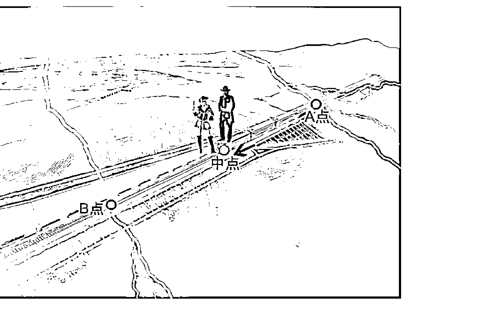爱因斯坦的说法曾赚足了眼球，但它完全是错的。在不同运动速度的参照系中观察到的时间不同，并不代表每个参照系都可以有自己独立的时间标准，更不能据此就推导出“绝对时间不存在”的结论。

这种说法中存在着一个严重的逻辑问题。爱因斯坦是因果律的信徒，这是他反对“不确定性原理”，说“上帝不掷骰子”的原因。但他似乎从来都没有意识到，自己提出的相对论中关于“世界没有绝对时间”的说法，其实就是违背因果律的。

因果律指的是前因会导致后果，前面的事件会引发后面的事件，但这里头有一个前提条件，那就是事件的发生必须有先后之分，而且是这种区分应该是绝对的，不是相对的。假如世界真像爱因斯坦说的那样，事物都有自己独立的时间标准，整个系统不存在绝对时间，那么也就意味着事件的发生并没有绝对的先后之分，哪个事件在前、哪个事件在后，标准是不统一的。这样连哪个是前因，哪个是后果都搞不清了，因果律还怎么存在？整个世界不早就乱套了吗？

仅仅只是从这一点出发，世界就不可能只存在相对时间，不存在绝对时间。但这个时间是以什么为标准的呢？假如在游戏世界中，不同的事物因运动速度的不同，会导致游戏推进速度的不同，那么整个游戏的时间刻度该怎么来确定呢？这很简单，每台服务器都会有一个时钟，它的时间就是游戏世界统一的标准时间，不可能游戏中的每件事物都存在自己的时间标准。

我们的现实世界也是一样的。创世主机中肯定有一个时钟，它能够标记整个宇宙演变的进程，不管其中的哪个部分是以怎样的速度运动的，它的演变过程是以怎样的速度推进的，其进度在创世主机中一定是被清楚而准确地标识着的，那就是我们这个世界的绝对时间。A、B两点被闪电击中，系统中必定是把它们当作两个已经发生的事件来记录，分别会标上一个确定的时间刻度，这跟别人的观察结果一点关系都没有。这个时间刻度是宇宙演化进程的唯一标识，它就如同牛顿说的那样：“自身均匀地流逝，与一切外在事物无关。”

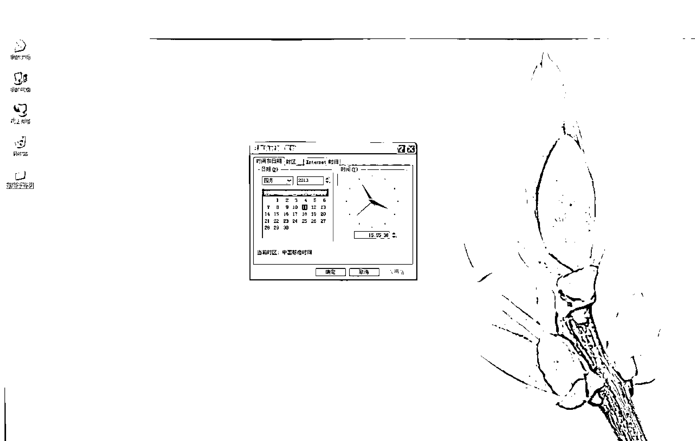

游戏进程会有一个共同的刻度，那是以服务器的时钟为标准的。

牛顿所说的绝对时间，指的是作为进程刻度的“时点”；而他所说的相对时间，指的是“时长”。爱因斯坦没有搞清楚“时点”与“时长”的区别，才会认为不存在绝对时间。在这一点上牛顿是对的，爱因斯坦错了，所谓“颠覆了绝对时间”的说法纯粹是一场闹剧。

有些人在描述因时间流速的变化而造成时长变短或变长的现象时，喜欢用“时间收缩”“时间膨胀”这样的名词，搞得人一头雾水。在这里我们要澄清一下，时间刻度是标准化的、绝对的、固定的，会出现变化的只是时间的流速，并相应地会导致时长发生变化。

所以在关于时间的相对性与绝对性的说法中，“时长”和“时间流速”确实是相对的，它们随时处在变化之中，但作为宇宙演变进程刻度的“时间”本身，它并不会发生变化。就像前面举的放电影的例子，如果用32倍快速播放，那么在放到生孩子的情节时，我们作为观众感觉到经历的时长是2分1秒，但在电影中它的刻度仍然是在1小时4分32秒这个位置上，播放器的时钟对它仍然是这么标识的，没有发生丝毫改变。

## 延伸阅读一 存在与感知

“存在就是被感知”，乔治·贝克莱主教这句话显然是错的。造物主赋予我们的感知能力有限，很多东西我们感知不到，却不能说它不存在。

然而在现实生活中，我们经常会把存在与感知的关系搞混。

法院判案实际上就遵循了“存在就是被感知”的逻辑。那些证据都是已经被法官感知了的事情，所以可以这么说，法官是根据自己的感知来判定事实真相的。虽然一些没有被法官感知的事情也实际存在，而且有可能与案子的关联度更高，会影响判定结果，但在判决时它们被自动排除在外了。

在科学上“感知”这个词被替换成了“测量”，人们下意识地认为，存在就是被测量。比如“质量”，当人们最初提出这个概念时，它所代表的含义是“物质的多少”。但对于一个具体的东西，我们怎么才能知道它含有的物质是多少呢？显然，我们只能依靠测量。

方法有两种，常用的一种是通过测量“重量”来确定“质量”。我们到市场上买猪肉，需要根据猪肉的多少，也就是它的质量大小来付钱。我们通常会用秤来称，这样称出的实际上不是质量，而是猪肉受到地球引力的大小，但我们用它来计量猪肉的质量，这叫“引力质量”。这种方法的适用范围有限，因为引力是会变化的，地球上5公斤的猪肉，在木星上会变重，在月球上会变轻，而在外太空“失重”的状态下会变得没有重量，甚至在加速上升或下降的电梯里也会称不准。

在物理学上更准确的方法，是通过对“惯性”的测量来确定质量。比如两个宇航员在外太空中彼此推开，其中一个人的质量是50千克，后退的速度是2米/秒，如果另一个人后退的速度是1米/秒，那么就能算出他的质量是100千克，这样测出的质量叫作“惯性质量”。

“惯性质量”能真正代表“质量”吗？不能。人们观测到，在加速器中粒子达到接近光速时，它的惯性质量会急剧增加。但假如从“质量是物质多少的量度”这个定义出发，这时侯粒子里的东西变多了吗？显然没有，一旦速度降下来，它的质量又会恢复到原先的水平。这说明就如同“引力质量”会随着引力强弱的变化而变化一样，“惯性质量”也会随着运动状态的变化而变化。

这个例子给了我们什么启示呢？它表明“存在就是被测量”的逻辑是错误的。测量到的质量增加，并不能等同于物质真正的增加，测量与存在之间是不能完全画上等号的。

爱因斯坦从在引力场中“惯性质量”等同于“引力质量”的角度出发，发现了“等效原理”，认为引力与加速度完全是等效的，这也是一种“存在就是被感知”的逻辑。引力和加速度背后代表的物理意义完全不同，在地球上我们是通过观测发现它们等效的，但在茫茫宇宙中，会不会某些特殊情况下它们并不等效呢？这完全有可能！就好像前面举的例子中，在超市买东西时用购物卡、银行卡、现金都可以付账，但在别的地方，也许购物卡就不能用了，有一些小店铺也许银行卡也不能用，只收现金。

在对于时间的认识上我们也经常会犯错误。我们其实没有看到作为刻度的时间本身，能测量到的只是它的流速和相对长度，假如对此没有清醒的认识，就会把存在与测量混为一谈，因时间流速和长度的变化，认为只存在“相对时间”，不存在“绝对时间”。

对于“同时性”问题的认识，人们出现的是同样的错误。系统背后的同时性肯定是存在的，只是我们不知道而已，我们知道的只是不同参照系统的测量结果，爱因斯坦据此得出了“每个系统都有一个时间标准”的结论，其实是把存在与感知的关系搞混了。

### 延伸阅读二
“量子引力”或许只是传说

爱因斯坦虽然在是否存在绝对时间、绝对空间的判断上出了偏差，但这不会动摇相对论的基础。相对论本身没有证明绝对时空到底存在不存在，爱因斯坦说它不存在纯粹凭的是直觉，并不是从理论中推导出来的。但有很多以“只存在相对时空，不存在绝对时空”为前提，根据相对论做出的推论，比如“双生子佯谬”，却需要进行相应更改了。

相对论的确是人类关于时空的一种超前认识，尤其是广义相对论中对引力的解释，就具有非凡的想象力，反倒是后来人们为了统一相对论和量子论搞出来的“量子引力”，也许只是一个美丽的传说。

下面我们来讨论一下这个问题，事情要从基本作用力和粒子开始说起。

-   按照通常的说法，自然界存在四种基本作用力，它们分别是引力、电磁力、强核力（强相互作用）和弱核力（弱相互作用）。

引力是四种力中最弱的力，存在于任何物体之间，电磁力只作用在带电荷的粒子上，这两种力的作用都可以是长距离的。

强核力是把原子核中的质子、中子、夸克等捆绑在一起的力，这种力非常强大，带正电的质子之间原本会相互排斥，却被强核力绑得紧紧的。弱核力是造成原子核的放射性或自由中子衰变的力，它主要存在于粒子的衰变过程中。强核力和弱核力的作用距离都很短，它们只存在于原子核内，我们不可能直接地接触到它们。

以上四种力之所以被称作“基本作用力”，是因为它们不能用更基础层面的力来解释。而在日常生活中我们经常见到的那些力，比如打架用的蛮力、轮胎的摩擦力、弹簧的弹力等，实质上只是电磁力的一种表现，因而都不是基本的相互作用力。

这些基本的力是怎么产生，又是依靠什么来传播的呢？在经典物理学中，力是由场来传播的，传播引力的叫“引力场”，传播电磁力的叫“电磁场”。但在量子论兴起之后，人们开始向量子世界中去寻找这些力的根源，从而发展出了“量子场论”。按照这种理论，力是由那些在物质粒子之间来回飞行，能够携带并传递力的粒子造成的。

根据在作用力中表现的不同，粒子可以分为强子、轻子和传播子三大类。强子是能参与强相互作用的粒子，它们由夸克组成，包括质子、中子、π介子在内的大部分粒子都是强子；轻子是参与弱相互作用、电磁力作用、引力作用，但不参与强相互作用的粒子，包括电子、电子中微子等；传播子是在物质粒子之间传播力的粒子。

目前后三种基本作用力已经被证实是由粒子传播的，并找到了这些粒子，传播强核力的是胶子，传播弱核力的是W+、W-、Z0粒子，传播电磁力的是光子。按照这一逻辑，人们认为引力应该也是由粒子传播的，并把传播引力的假想粒子称为“引力子”，这种被量子化的引力就叫“量子引力”。

然而许多年过去了，人们却始终没能观测到“引力子”的存在。这让我们不得不思考一个问题：“量子引力”真的存在吗？

按照爱因斯坦广义相对论的说法，引力其实不是真正的基本作用力。我们把一个很重的铁球放在床垫上，它会造成床垫的凹陷，同样的道理，一切物质都会使时空之网发生扭曲变形，穿过这时空的物体，运行轨迹就会因此而发生改变，看起来就像是被一种力牵引着一样。

结合绝对空间观，我们可以认为，宇宙就是一个充满以太的海洋，恒星等物质就像是漂浮在海洋中的球，会把周围的海水挤开，在空间中造成一个洞。海水会挤压周围的物体往洞里掉，这看起来就像是物体具有一种“吸引力”。如果这个说法是对的，那么引力实质上就只是一种表面现象而已，并不是真实的力。

1995年，美国马里兰大学物理系的特德·雅克布森发表了一篇文章，证明广义相对论与热力学之间存在着令人吃惊的相似之处。确切地说，爱因斯坦将时空扭曲及其中物质的表现相联系的方程，可以诠释为热力学家们非常熟悉的一种方程，即“状态方程”，这种状态方程不需要考虑微观细节，而是直接对整个物理系统的属性进行描绘。

气体是一种由四处乱窜的分子构成的集合，在宏观层面上，它会表现出温度、压力、体积、浓度、表面张力等诸多的性质，但这些性质在微观层面并不存在。比如皮球内部的压力，它只是作为封闭气体原子的集体属性，存在于我们所处的宏观层面上的，一旦我们深入到分子层面去探个究竟，它便消失得无影无踪了。

引力与热力学现象之间的这种相似性，促使人们对引力的性质进行反思，或许应该把它当作一种表面现象而不是一种基本作用力？荷兰理论物理学家埃里克·韦尔兰德说：“在我看来，那种所谓的探索最基本力和粒子的模式已经走到了尽头。如果引力只是一种表面现象，那么就不必挠破头皮对广义相对论进行量子化。因为这种理论描绘的既然是一种宏观的集体现象，那么它止步于量子世界的边界之外也就是可以理解的了。”

基于这些情况我们完全有理由相信，“量子引力”或许只是一个传说。

# 第十八章

### 灵魂之谜：人有肉体和灵魂，如同电脑有硬件和软件

世界充满了神秘色彩，但宇宙中最大的秘密或许并不是外在世界，而是人类自身，人类意识的存在就是一个最大的“超正常现象”。

对于“世界从哪里来”的问题，我们已经进行了详细的探讨，但“人类从哪里来”的问题却至今仍是一个谜。人类的科技已相当发达，但对于生命却知之甚少。我们能够制造计算机、原子弹、机器人、人造卫星、宇宙飞船，但却仍然无法制造完整的生命。

对于生命的基本性状为何能够代代相传，我们曾经充满疑惑，直到发现了遗传基因之后，才对生物体的成因有了直观的了解。原来生物的每个细胞中都有DNA或者RNA分子，里面携带着遗传信息，这就是“基因”。每个细胞中都有基因信息，就像一幢大楼中每一块砖里都附带着一张建筑施工图，只要按图施工就能够把大楼建起来。上一代生物的基因能够通过复制传递给下一代，保证了物种的特征能够传下去。生命的孕育、生长和凋亡，就是这样在基因信息的指导下，井然有序地进行着。

基因的存在让我们能够理解，生物为什么可以自然生长、繁衍后代。目前的技术甚至已经能够改造自然界的生物，制造试管婴儿、克隆羊、转基因生物。这是否意味着人类已经可以制造生命了呢？答案是否定的。因为生命的特征不仅包含外在的躯体，还包括内在的精神，对于精神如何产生的问题我们仍然近乎一无所知，更谈不上制造了。

在生命的所有特征中，精神是最神秘的，它和其他东西都不一样。在今天，很多以前我们看不见摸不着的东西，比如空气、辐射、电磁场，现在都可以计量和测量了。唯独精神，我们虽然知道它的存在，但却无法对它进行感知和测量。

正因为这样，人们对它的认识存在巨大分歧，在哲学上唯心论与唯物论的争论由来已久。唯心论认为精神是第一性的，是精神创造了物质，在决定着物质；而唯物论认为物质是第一性的，意识只是大脑的机能，是物质的产物，是物质在决定着意识。

17世纪英国的哲学家托马斯·霍布斯认为，自然界所有的现象，包括人和动物，都是由物质的分子组成的，甚至连人类的意识也是由人脑中的分子运动产生的。18世纪的法国哲学家J.O.拉美特里在《人是机器》一书中说，就像人的脚有肌肉可以行走一样，人脑也有肌肉可以用来思考。工业革命后，机器的构造变得复杂起来，功能也越来越强大。于是一些人想，也许当机器的结构复杂到一定程度时，就有可能出现意识这样的功能。到了19世纪，德国的唯物论者根据这一逻辑，说意识是大脑的机能，思想与脑袋的关系就像是尿液之于肾脏、胆汁之于肝一样。

到底是物质在决定着意识，还是意识在决定着物质呢？下面我们还是以游戏为参照来分析一下。

电脑游戏中的人物分为两种类型。一种叫“NPC”，即“非玩家控制角色”，它们完全受控于系统，纯粹是系统的傀儡。举个例子，在游戏中买卖物品时要点击的那个商人，就是NPC。另一种叫“PCC”，即“玩家控制角色”，它们背后存在着独立于系统之外的玩家，其意识完全不受系统的控制。简单地说，你注册的游戏角色就是PCC。

自然界的各种生命，像是游戏中的NPC还是PCC呢？这个问题有点复杂。我们知道，无机物是死的，而生命是活的。只要是活着的东西，它就能够感应环境的刺激，并做出具有一定选择性而不是完全机械式的反应。

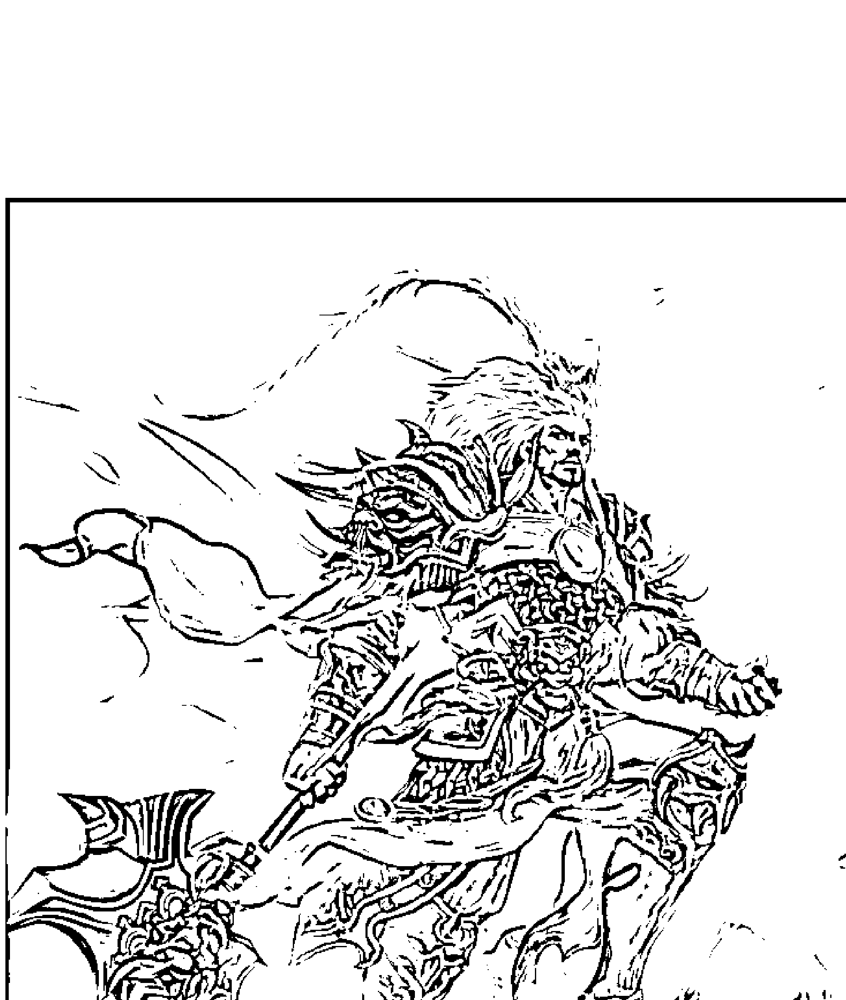

> 在我们玩的游戏中，“PCC”的背后是玩家，他们身上体现着玩家的自由意志，在游戏中不管做什么事情，都源于玩家的自主选择，而不是系统的决定。“NPC”则完全相反，他们的身上不存在自由意志，完全由系统控制着，在游戏中的行为是机械的。

即便是植物也有感应能力，能够做出主动的反应，比如说捕蝇草就能够感应到昆虫的存在，并用捕虫夹捕捉昆虫。所以从这个角度来看，生命不是NPC。

从最宽泛的角度来看，自然界的一切生命都是有感觉的，包括细菌、病毒和植物。只不过低级生物的感觉很原始，只表现为对环境的感应，而有了大脑的动物，就会表现出很明显的意识来。狗有超强的记忆能力，在很多年以后还能记住以前主人的模样；海豚有很好的学习能力，可以训练它们进行表演；蜜蜂有自己的语言，能够通过舞蹈传递哪里有花粉的信息。这些证据表明，动物不仅有自己的意识，还懂得怎样和同伴交流存在于意识中的信息。

生命不是NPC，那会是PCC吗？也不完全是。生物没有受控于系统外的玩家，它自己本身就有意识。但生物的意识又不完全独立于系统，多数生物的意识层次很低，只能依照本能行事。本能是系统赋予生物的程序化的行为规则，动物在本能面前没有选择，比如飞蛾即使会被烧死也仍然会在本能的驱使下冲向火焰。所以生物的行为不具有完全的独立性，仍然有部分受控于系统。

相比之下，人类有相对独立的思考能力，受到本能的束缚会弱一些，在行动上具有更大的自由度。人类的理性在一定程度上压制自己的本能，比如面对性感美女的诱惑，只要是正常男人都会产生本能的冲动，却不是每个人都会有进一步的行动，因为理性告诉我们道德和法律不允许我们这么做。尽管本能不会完全主宰人类的行为，就像动物那样，但它对人类的影响仍然是巨大的。所以有一种说法，人一半是神，一半是兽。自制力越差的人，受本能的驱使就越厉害，从这个角度看，人类的行为也不是完全独立的。

自然界的生命全都介于NPC和PCC之间，有自由意识，但行为却不是完全独立的。相比之下人类更接近PCC，独立性强一些；其他生命更接近NPC，基本受制于本能，独立性很差。

生命为什么会有意识呢？

早在6000多年前，古埃及人就相信灵魂的存在，认为人死之后会在另一个世界——阴间复活，所以要把尸体制作成不会腐烂的木乃伊，以便让它在地下与灵魂重新结合。这说明当时人们就已经开始用灵魂来解释意识的存在了。

很多人这么认为，在生物身上具有两种不同性质的东西，一种是以物质形式存在的躯体，另一种是以精神形式存在的灵魂。造物主在创造生命时，同时创造了它们的躯体和灵魂，灵魂是生命拥有意识的缘由。

这种观点在哲学上被称为“二元论”，认为精神和物质是同时并存的两种东西；而不管唯物论还是唯心论都认为只存在一种东西，另一种是由它派生出来的，所以叫“一元论”。笛卡尔就是典型的二元论者，他认为精神与物质在本质上完全不同，它们之间相互独立，不存在“谁决定谁”或者“谁派生谁”的问题。

世界上多数宗教都认为，每一个生命有自己独立的灵魂，肉体消灭之后，灵魂仍然可以继续存在。在人死后，一些灵魂升入天堂，一些下到地狱。但到了现代，科学主宰了社会的主流观念，多数人不再认同世间存在灵魂，认为意识只不过是大脑的机能，不是独立于物质的东西。

灵魂是否真的存在？它是不是生命拥有意识的原因？我们可以对照电脑的工作流程来分析一下。

电脑可以简单地分为四个组成部分：输入设备、中央处理器（CPU）、内部存储器、输出设备。它的工作流程是这样的：首先是输入，电脑在工作之前，需要我们通过输入设备，比如说键盘、光驱来进行。

信息输入，这种信息从本质上看都是数据；然后CPU对数据进行加工，这实际上是一个计算的过程；在整个过程中，需要记录的信息都储存在内部存储器上；最后输出结果信息，它可以是屏幕上的一组数据、一张表格、一篇文章，也可能是打印机打出的一张图片，或者音箱播放的一首歌。

仔细一想你会发现，电脑的工作流程和人脑极为相似。人脑的输入设备是感觉器官，包括视觉、触觉、味觉、嗅觉和听觉，比如说眼睛的视网膜上有感光细胞，一旦光线打到视网膜上，感光细胞中的感光蛋白会产生电流信号，把外部世界的信息传递到大脑中；大脑是CPU和存储器，能够对信息进行加工，并且能够以记忆的形式储存；而输出结果可以是用手画一幅画，嘴巴哼一首歌，说一段话，或者脸上做出一个表情。

当然电脑与人脑之间还是有区别的，后者的功能要强大得多，而且处理数据的方式也不一样。电脑的输入是数据，处理结果本质上仍然是数据；而人脑的输入是数据，但处理结果可以是数据，也可以是感觉，或者某种判断，这就是“意识”。电脑绝不会对输入的信息产生感觉，人脑却可以，这正是它的神秘之处。比如机器人把手伸到开水中去，脑中出现的是“100℃”这个数据；而人把手伸进去，得到的却会是“烫”的感觉。

人脑为什么能把数据转化成感觉，其中的机理是什么，我们到现在还没有一点头绪。而且这些感觉还是相通的，比如看见蓝色，这本来是视觉效果，但我们脑子里却可以出现“清凉”的感觉，这是一种触觉。还有，电脑一般只能处理确定的数据，而人脑却经常在进行模糊处理，比如我们可以感觉到某种场合的气氛，但电脑却无法把“气氛”转化为数据来表达。

尽管电脑与人脑在功能上差异很大，但它们的工作流程却很近似。有时候机器的功能会让人产生奇妙的感觉，很多人小时候都有过这样的体验，以为收音机里传出的歌声是因为里面有人在唱歌。

计算能力是人类思维活动中很重要的一项功能，而由机械组成的没有生命的电脑也能拥有强大的运算能力。由此我们是否可以推断，也许就像计算能力只是电脑的机能一样，思维也不过只是大脑的机能而已？也许意识是在大脑对感官提供的信息进行加工的过程中自然产生的，并不需要用灵魂来解释意识的存在？

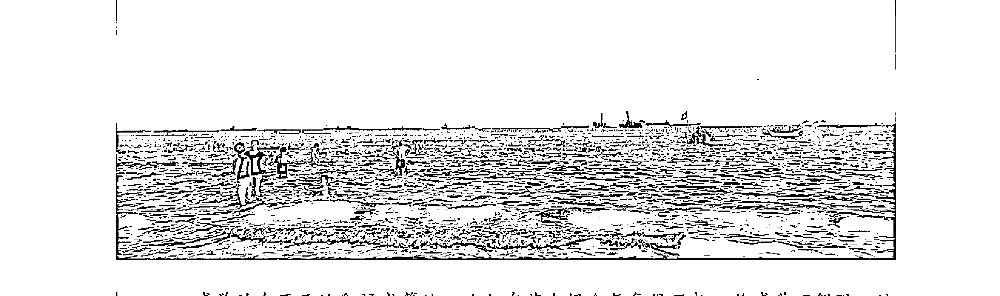

感觉的东西无法翻译成算法。比如在某个场合气氛很压抑，你感觉不舒服，这用文字容易描述，却很难用数据来表达。不过人们都懂得去适应气氛，在一个悲伤的场合，比如葬礼上，你会自觉地保持沉默，而不会开怀大笑。

看见蔚蓝的大海，心里感觉到一阵清凉，这是人类的一种心理现象，叫作“通感”，是不同感觉器官的作用串通起来了。通感现象在生活中很常见，比如说“你笑得很甜”，这是视觉与味觉的连通；朱自清在《荷塘月色》中写的“微风过处，送来缕缕清香，仿佛远处高楼上渺茫的歌声”，是嗅觉与听觉的连通。

我们之所以会这么想，是因为遗漏了一样很重要的东西。前面分析的电脑工作流程其实并不全面，只提到了硬件，没有考虑到软件。

没有安装任何软件的计算机叫作“裸机”，而裸机是不能正常工作的，它需要安装两种软件，一种叫“系统软件”，比如操作系统、语言处理系统等；另一种叫“应用软件”，比如办公软件Word、网页浏览器IE等。

现在问题来了，对于电脑来说，仅有硬件是不够的，需要有软件的支持才能正常工作，难道人脑不需要吗？

生物体主要是由没有生命的无机物构成的，但为什么无机物毫无生命迹象，而由它组成的生物体却如此不同呢？假如想通了电脑需要软件支持这一点，这个问题就非常好理解了。

电脑设备如果没有安装驱动程序，就不能正常工作，驱动程序是设备能够自主运行的原因。同样的道理，生物体能够感应到环境的刺激，并自主地做出反应，说明它们身上必定有一个“驱动程序”。

有些人在受到重大刺激时，一下子突然就疯掉了，成为精神病人。假如把人看成是一台机器，那么这就有点奇怪了，因为从硬件上来看，此时他的大脑结构并未受到物理损伤，与之前还是一个正常人时没有什么不同，这台机器为什么突然间就不能正常工作了呢？

这个事实在提醒我们，人脑的正常运转是需要“软件”支持的。精神病人之所以会精神失常不是出于“硬件”的原因，而是因为强烈的刺激让大脑中“软件”的运行出现了逻辑错乱，造成了“系统故障”。

任何生命都是一个完整的工作系统，身上应该都带有一个类似于系统软件那样的东西，我们可以把这种东西称作生命的“灵魂”。

灵魂与肉体就相当于电脑中软件与硬件的关系，意识相当于软件运行时系统产生的对外界和自我的认知，因而意识是灵魂的功能，不是物质的功能。正因为生物体最重要的生命现象不是来自物质，而是来自灵魂，所以生物体看起来与无机物之间才会如此不同。

这里我们需要强调一下，很多人把“灵魂”与“意识”混为一谈，其实它们之间是有区别的。

人类拥有自主意识，它在控制着我们的一言一行，我们感到饿了就会去找东西吃，感到渴了就会去找水喝。这种现象容易让人产生一种感觉，那就是人的所有行为都是在意识指导下完成的，但这么想完全错了。

实际情况是，我们在绝大多数情况下，身体反应都是在无意识的状态下完成的。晚上睡觉时意识消失了，但我们仍在有规律地呼吸着，身体各部分机能仍在正常运转；即便是在清醒的状态下，我们的身体也更多的是无意识的反应，有意识的行为只占少数。比如我们的意识没有指挥心脏的跳动，但它却一直在跳着。

由此看来，灵魂与意识是不一样的。灵魂就像是我们身体的系统软件和驱动程序，它掌控了我们的整个身体；而意识只是灵魂的一项功能，它只在比较高的层面上起作用。这就好比是在操作电脑听音乐时，你在播放器中点击某首歌，这相当于是意识主导下的行为；接下来那些读取歌曲文件、调用解码器解码、把信号传送到音箱去之类的工作，并不需要你逐项发出指令，操作系统会自动完成，这相当于是在没有意识主导的状态下，灵魂这个驱动程序做出的自动反应。

软件的运行离不开硬件，这就是为什么灵魂需要依赖于肉体存在，一旦肉体消亡，它也就跟着不见了。脑组织严重受伤时人会昏迷不醒，就像是电脑出现了硬件故障，软件的运行也会受到影响。睡觉时大脑会进入休眠状态，这相当于电脑在待机，电脑处于待机状态时很多应用软件会停止运行，所以人的意识出现中断，暂时失去了知觉。

软件的运行必须依赖硬件，它不能独立存在，也不能独立发挥作用，这容易让人产生一种错觉，以为是硬件在决定着软件。就像唯物论者认为是物质在决定着意识，意识是由物质派生出来的，是物质的附庸。但其实灵魂和肉体是两种互相独立的东西，就像软件和硬件是完全不同的两种事物一样，对于生命而言这两者同样重要，缺一不可。

软件虽然需要依赖硬件才能运行，但并不代表它完全受制于硬件。硬件的功能必须在软件的支持下才能够实现，否则它只是一堆废铜烂铁而已，对于生命来说也是一样，如果没有了精神，生物体就是一堆不会动的死肉。软件还可以影响硬件，某些病毒程序就可以攻击硬件系统，使硬件遭到损坏。同样的道理，精神对于肉体也有重要影响，精神愉悦对于身体健康起着积极作用；而在精神受到重创时，也会严重损害身体健康。

> | 计算机系统是由硬件和软件共同组成的，它们相互独立又相互依存，不管离开了谁都不再是一个完整的系统；肉体和灵魂也是如此，它们共同构成了生命，一旦把它们分开，肉体就变成了尸体，灵魂也会无处安身。

有时候会出现一些特殊状况，比如说人会做梦，这是怎么回事呢？是这样的，电脑在待机状态下有时候会进行自检，一部分的系统软件会偶尔自己运行一下。灵魂应该也会如此，做梦就是在身体处于休眠状态下系统软件的自动运行。

还有一些特殊状态下的意识，比如说有些人已经死过去了，后来又活了回来，结果会感受到一些难以言说的经验。这些“濒死体验”又是怎么回事呢？有一种简单的解释是，电脑在非正常关机后重启时，往往会出现软件功能异常，人脑可能也是如此。

为什么同样有灵魂，有些动物看起来比较聪明，有些看起来却傻乎乎的呢？原因很简单。计算器的原理和计算机一样，都有输入、输出、处理器、存储器，可为什么功能上会差那么远呢？因为它的内部构造的复杂程度和运行程序都不一样。生物也是如此，细菌和病毒只有简单的结构，相应的也只有简单的系统软件，和计算器一样只有简单的功能。人类的大脑占比比起其他动物要大得多，要复杂得多，所以性能也要好很多，安装的系统肯定也更高级，功能当然会更强大。

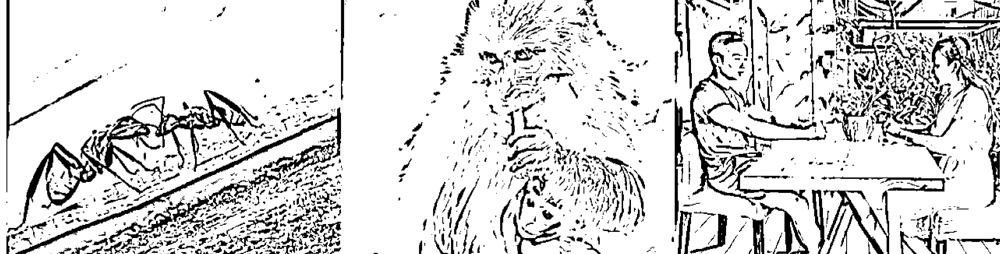

生命从低级向高级演变，躯体结构越来越复杂，表现出来的意识也越来越明显。假如真像达尔文说的那样，生命是在逐渐进化的，那么外观的变化还好说一些，这种内在控制程序软件的升级又该如何解释呢？它是怎样产生变异，变得越来越高级的呢？

事实是，达尔文根本就没有关注到这个问题。意识对于生物界来说，至今仍然是一个谜，所以生物学家们在讨论生命演变的过程时，直接把这一极其重要的因素给无视了。仔细思考一下不难发现，进化论解释不了意识的出现和提升，它根本就是一个跛脚的理论。

也许造物主赋予人类意识的目的，就是要在系统中制造出PCC来。当然动物也是有思维的，大猩猩和海豚据说就有相当于两三岁孩子的智商，因而也具有比较低级的思维能力。所以从根本上说，在这方面人类与动物之间并没有质的区别，只是程度上有所不同。

高度发达的人脑让人类拥有一项重要能力，就是可以把自己的意识表达出来。它最初的形式可能是表情、手势，后来发展到绘画、音乐、语言、文字和数学公式。人们可以相互交流自己对于世界的理解，以及在情感方面的感受。

这是人类明显高于其他动物的特征。也许在动物的大脑中只有基本的系统软件，或者说简单的驱动程序，没有更高级的应用程序，所以多数动物的行为只是出自本能。而人类大脑的系统软件功能要强大很多，可以在此基础上运行带有学习功能的应用软件，所以人类的学习能力很强，意识可以一直得到提高。

很显然，灵魂是存在的，但灵魂到底是什么？它又从何而来呢？

### 延伸阅读

## 埃本·亚历山大的灵魂之旅

2012年10月，美国《新闻周刊》杂志发表了哈佛大学医学院教授、知名神经外科医生埃本·亚历山大博士撰写的封面文章，他声称自己曾经到过天堂，而且这不是一种幻觉。纪录片《与摩根·弗里曼一起穿越虫洞》第二季第一集《有死后之生吗？》也讲述了这件事。

亚历山大是一名基督徒，但没有很深的宗教信仰。他原本不相信这个世界存在天堂，也不相信濒死体验，认为人们所描述的濒死体验是可以用科学来解释的，然而2008年秋天的一次亲身经历却改变了他的看法。

当时他患了一种罕见的细菌性脑膜炎，大脑皮质神经元陷入了“瘫痪”状态，昏迷了七天。在这段时间里，他的身体毫无知觉，大脑的高级功能停止了运作，然而他的自我意识却前往了另一个世界。在这个全新的世界中，他的意识脱离了大脑和身体的限制，成为一种独立的存在。正是这次体验让他相信，死亡并非灵魂的终点，而只是长途旅行中的一个小小章节。

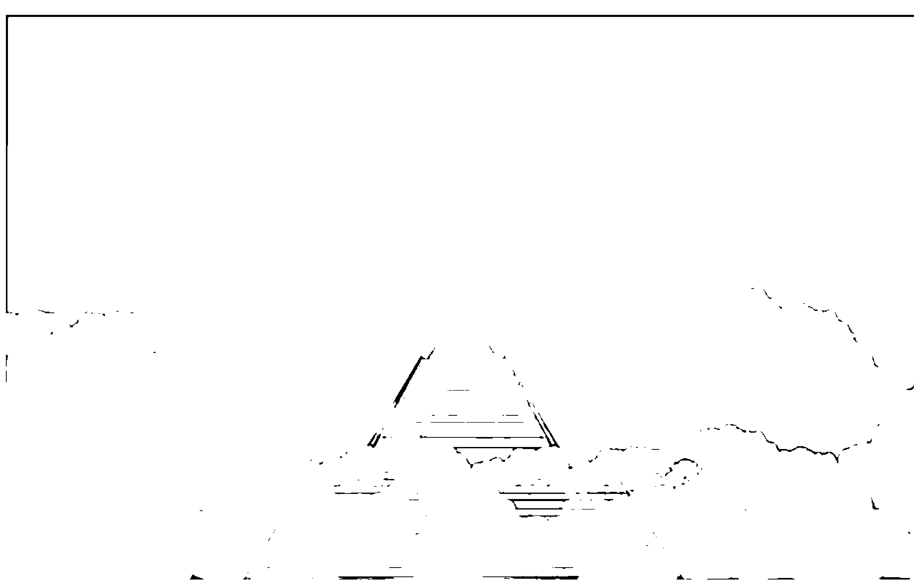

亚历山大描述了他所见到的天堂。他看到深蓝色的天空中飘浮着大朵蓬松的云彩，在云朵之上，透明、发光的生物成群结队飞过天空，留下长长的飘带般的痕迹。这些生物不同于地球上的任何生物，它们是更高级的生命形式。后来他听到从天上传来了巨大声响，好似一曲圣歌，这些声音来自于天上飞行的神秘生物，从中他体会到了一种欢乐的情绪。

在大部分的旅行中亚历山大不是一个人，有一名美丽的女子在陪伴着他。第一次看到她时，亚历山大和她正处于一个有着复杂图案的平面之上，后来他认出这是蝴蝶的翅膀。他们被无数翩翩飞舞的蝴蝶包围着，这些蝴蝶组成了一条色彩缤纷、充满生命的河流，流淌在空气之中。

美丽的女子注视着他，她的表情里没有爱慕，也不是友谊，这是超越地球上所有情感的一种表情，让人感觉其中承载着所有类型的爱，却又超越了所有类型的爱。不用语言，女子就能向他传递信息，她说：“我将向你展示这里的很多东西，但最终你还是要回去的。”

他们继续前行，进入了一片巨大的虚空，那里完全处于黑暗之中，面积无限广阔，令人感到极度舒适。虽然是一片漆黑，但亚历山大感觉到了光的存在，光线似乎源于一个明亮的球体，他感觉球体就在附近，它担任着“翻译”的角色，让他能跟周围的世界交流。他感觉自己就好像新生儿一般，“出生”到了一个更广阔的新世界里，整个世界就像一个巨大的子宫，而那个球体正在引导着他。17世纪诗人亨利·沃恩写道：“有人说，上帝居住的地方是深沉却耀眼的黑暗。” 亚历山大后来发觉，这个神奇的地方就好像沃恩诗句中描写的一样，它就是上帝居住的地方。

亚历山大根据自己的经历撰写了《天堂的证据》。他说：“我仍然是一名医生，也仍然和以前一样是一名科学家。但从内心深处来讲，我已经跟以前判若两人。”作为一名经验丰富的知名神经外科医生，又在美国最著名的高校授课多年，亚历山大过去也认为意识只由大脑产生，而宇宙是没有任何情感的。但经历过濒死体验之后，亚历山大对此产生了怀疑，他开始相信人类的自我不仅仅是人脑就能涵盖的。

和亚历山大一样有过濒死体验的人还很多，他们的叙述有着惊人的相似之处，比如灵魂脱离肉体，看到亮光，感觉到深刻的平和安详。这些经历难道都只是幻觉吗？

# 第十九章

## 神通：封闭肉体的功能后，打开灵魂被封印的功能

现代科学虽然无法解释清楚意识从何而来，但科学家们却不承认人有灵魂，不愿意用灵魂来解释意识的存在。

为什么会这样？我们看看科学是怎样认识世界的：首先是确定现象，通过观察或者科学实验发现自然界存在的客观事实；然后是提出假设，形成能够解释这种现象的观点；最后是进行验证，得出一些可供验证的推论，并且以实验进行检验。

由此可见，人类认识外在世界依赖于两个方面：感官和思维。我们需要依靠感官知觉来确定现象，需要依靠思维来进行分析并提出假设，需要依靠感官知觉反馈的结果来验证推论是否正确。

这种方法的运用隐藏着一个前提条件，那就是我们想要认知的外在世界，必须是可以通过感官直接或者间接感知的，而且每个人感知到的都一样，这样才可以重复验证。比如广义相对论关于“光线会在强引力场中弯曲”的推论，无论谁来验证都一样。如果你看的时候光线弯曲了，我看的时候光线没有弯曲，那就不是科学了。

人们运用这样的方法认识外在世界，成效显著，在此基础上建立起一整套的科学理论体系。但这一方法用在认识内在精神世界时却效果不佳，以至于人们直到现在对于意识的运行机制仍然知之甚少，这是为什么呢？

原因很简单。我们内在的精神世界与外在的物质世界全然不同，在这个领域感官失去了作用。对于一块物质的蛋糕，我们可以看到它的形状，摸到它的质地，闻到它的香气，尝到它的味道，听到吃它时发出的声响。然而我们却无法通过感官来感知以精神形式存在的灵魂，它对于我们来说完全是虚拟的东西，看不见、摸不着、闻不到、尝不来、听不了，这真是让人伤脑筋啊。

长期以来，对于灵魂我们感应不到它的存在，无法对它进行测量和计量，所以就认为精神只是虚幻的现象，是大脑的机能。因为感应不到它，所以上面的研究方法中就连第一步的确定现象都很困难，更不用说提出假设、进行验证了。正因为如此，纯精神领域的研究成为科学的禁区。

难道就完全没有办法研究灵魂吗？当然不是。但我们在研究一样东西之前，必须要能够接触到它，这样我们就要先解决一个问题：如何才能进入精神世界？

在这方面，东方文化要远远走在西方文化的前面，历史上曾经出现过许多大师，庄子就是这方面的专家。他说，我们离外在越远，就会离心灵越近，当我们完全摒弃了感官和思维的作用时，心灵就会变得敏锐，就能以心灵去感应这个世界。就像盲人失去了视觉，他们的听力会变得厉害；全色盲患者看不到色彩，他们却比我们更能捕捉光与影的明暗变化，在夜间能看见我们看不到的东西。

庄子把这种隔绝感官作用、摒除思维杂念、使心境虚静纯一的方法叫作“心斋”。心斋是精神的斋戒，

> > 《庄子·人间世》中说：“若一志，无听之以耳而听之以心；无听之以心而听之以气。听止于耳，心止于符。气也者，虚而待物者也。唯道集虚。虚者，心斋也。”

他的意思是说，把感官隔绝，把心放空，就叫心斋，这时候心灵可以通过气来感应天道。

在《大宗师》中庄子借女偊之口描述了这个过程：

> > 吾犹守而告之，三日而后能外天下；已外天下矣，吾又守之，七日而后能外物；已外物矣，吾又守之，九日而后能外生；已外生矣，而后能朝彻；朝彻，而后能见独。”按照他的说法，保持心灵的空明，逐渐遗忘了天下、万物、自身，就能够彻悟至道。

这个过程可以通过静坐来实现，庄子把这种修行方法叫作“坐忘”。《大宗师》中说：“堕肢体，黜聪明，离形去知，同于大通，此谓‘坐忘’。”在静坐时忘记肢体的感觉、停止思维的活动，达到“物我两忘”的虚无境界，就能进入玄妙的精神世界。

庄子的方法在原理上其实很简单。肉体和灵魂是两个不同的系统，平常我们运用的是与肉体相关的能力，灵魂的一部分功能就沉睡了。当我们关闭了与肉体相关联的功能，也就是感官和思维的作用之后，灵魂的深层功能就被唤醒激活。这跟弱视治疗的原理相同，当孩子们一只眼睛正常，另一只眼睛弱视时，医生就用眼镜把正常的那只眼睛遮住，迫使他用弱视的那只眼睛看东西，这样就能刺激它功能的恢复，逐渐提高视力。

庄子的思想与老子一脉相承。在老子的《道德经》中，有与此相近似的内容，如“致虚极，守静笃”， “载营魄抱一，能无离乎？专气致柔，能如婴儿乎？涤除玄览，能无疵乎？”老子和庄子创立的道家，其修行方法有一个特点，那就是涉及了“气”的概念，他们的修行方法可以称之为“练气”。

世界是公平的，当你在这里失去时，就会在那里得到补偿。这个道理常常在身体有障碍的人身上得到验证，弱视治疗和灵魂修行运用的都是这一原理。

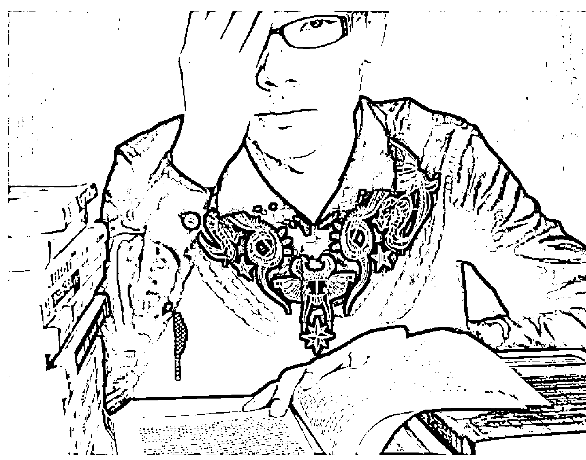

在现实中我接触过不少练气的朋友。我妻子原先腰椎和颈椎疾病非常严重，经常会眩晕，后来在朋友的指导下开始练气，效果确实十分明显，症状已得到很大程度的缓解。

道家的修行方法并非只此一家，在老子、庄子生活的年代，遥远的印度早已流传着另一种修行方法，那就是“禅定”。

从原理上看，禅修与道家的修行方法没有质的区别，但是在细节上却要清晰得多。禅修首先要求持戒，不杀生、不偷盗、不邪淫、不妄语、不饮酒，这是为了要守护感官之门，掌控进入感官的信息，不让更多刺激涌入内心，增加心中的杂念。可以这样比喻，我们的内心就像一台榨汁机，感官就像电源插头，把电源插上，我们的心灵就有可能会被搅得乱七八糟，而一旦拔掉插头，没有电流通过，我们的心就会停下来，恢复平静。

所以禅修者经常被告诫，感官刺激只能带来短暂的美好，追求感官的满足是不切实际的，万物生灭，世事无常，外在物质世界不能恒久，所以我们不要在乎外在的东西，要远离外界刺激，回归自己的内心。这些说法显然与庄子“外物”的观点很接近。

在隔离了感官功能之后，下一步是要消除思维的功能，达到心灵的宁静，做到忘我。对于禅修者来说，这时候要排除五大障碍，分别是贪欲、嗔恨、昏沉与懒惰、不安与担忧，以及疑惑，这些障碍被称为“五盖”。当放下了一切，舍弃了我执之后，心灵就会达到完全的寂止和平静，不再有任何念头，这时候与肉体相关的功能停了下来，体内的另一套系统开始启动，我们会感觉到一个完全不同的世界。

禅修和坐忘一样，更多是在静坐中修行，所以也称为“坐禅”。它是一个十分复杂的修行体系，层次分明，依据境界的高低分为不同等阶，也就是所谓的“四禅八定”。印度是世界上对于灵魂修行最有研究的民族，除了禅定之外，印度还有另一种很有名的修行体系，那就是“瑜伽”。

瑜伽同样是一种修行法门，正如一个瑜伽大师说的：“瑜伽是灵魂的科学，是修行的科学。”和练气、禅修不同的是，瑜伽有专门的“修炼秘籍《瑜伽经》，其中提出了八种功法，又称“八支行法”。这些功法是：禁制，指遵守戒律；劝制，指遵守道德准则；坐法；调息；制感，指抑制各种感觉感官；执持，使心专注于身体内的一处，或专注于外界的一种对象；禅定，使专注一处的心与所专注的对象相统一；三摩地，达到心与专注的对象冥合为一。三摩地中的“无想三摩地”，心的一切变化和作用都已经断灭，完全达到与专注对象合一的状态，这是瑜伽的最高境界。

对比之后会发现，瑜伽和禅修的原理是一样的，都要求通过持戒来隔绝感官刺激，通过断绝思维来实现心的空灵。不同的是瑜伽凸显了调身的体位法、调息的呼吸法、调心的冥想法，形式上有所差别。另外，瑜伽在断灭思维活动方面，采用了转移注意力的技巧，先是将注意力集中在某个特定对象，断灭其他的思维活动，然后再使心与专注对象冥合，从而断灭一切有意识的思维活动。

肉体和灵魂是人类身上独立的两大系统。从逻辑上看，既然我们可以通过体育运动来锻炼肉体，提高身体的机能，那么就完全也有可能通过某种方式来锻炼精神，使它得到提升。在以往的经验中，我们所有的知识都依赖于感觉器官和思维能力，这都是和肉体相关联的能力，灵魂的深层功能被屏蔽了。但练气、禅修、瑜伽等修行方法，给我们提供了锻炼灵魂的途径，打开了一扇进入精神世界的大门。

然而遗憾的是，这些修行方法不像体育锻炼那样直观、实用、见效快。修行的过程十分漫长而艰苦，又难以掌握诀窍，大多数人无法坚持，更多的人甚至摸不着门径。而且在这个物欲横流的时代，处处充满诱惑，要想静心修行就更加困难了。

就像游泳、篮球、跑步是体育锻炼的不同方式一样，练气、禅修、瑜伽也是不同的修行方法。不同的锻炼方式最终都会带来身体机能的提高，不同的修行方法是否也会带来同样的结果呢？

是的。这几种不同的修行方法，最终都殊途同归，进入的是相同的境界：“入定”。只不过练气的人，是在达到一定层次后才能入定。练瑜伽的人，需要在调身调息达到一定水平后，通过冥想来入定。这两种方法都有一个打基础的过程，因而讲究的是循序渐进、水到渠成。禅修却是一步到位，直接奔着入定的境界去，这样成功率会比较低，因为在缺乏铺垫的情况下身体容易吃不消。

前台湾大学校长李嗣涔教授曾运用科学方法对此进行过研究。1989年初，在台大医院神经科两位脑电波专家的帮助下，他邀请了各门各派众多师父级的人来量脑电波，证实他们在修炼时脑电波都会出现明显变化，并且存在两种不同的状态。练气的人最初处于“共振态”阶段，此时他们的脑α波会大幅度增加。但在达到较高层次后，不管是练气还是禅修的人，都会进入“入定态”阶段，此时他们的脑α波会受到抑制甚至消失。

这种现象证明，当心处于空灵状态，思维活动减弱甚至停止时，表现为脑α波受到抑制直至消失。此时灵魂的深层功能被唤醒，它代替意识接管了我们，我们就能进入精神世界，处于一种玄妙的状态之中，这就是“入定”。

说到入定的状态，很多人会想到这样的画面：禅修者静坐着，身体一动不动，没有思维如同死人一样。其实这是对入定的误解。盘膝静坐有助于心的平静，因而想要进入入定的状态，最普遍采用的是这一姿势。但事实上静坐未必就能入定，入定也未必需要静坐。

有人在专注于某种技艺或者对象时，在不知不觉中也能进入入定的状态，《庄子·养生主》中杀牛的庖丁说：“始臣之解牛之时，所见无非牛者；三年之后，未尝见全牛也。方今之时，臣以神遇而不以目视，官知止而神欲行。”这位仁兄太专心工作了，全神贯注，最终达到了不用眼睛看而用神去感应，感官知觉完全停止而神被激活的境界。这里说的“神”就是灵魂，庖丁在杀牛时无意中进入了入定状态。

这和瑜伽功法可以相互印证。“八支行法”中的“执持”，是使心专注于某个对象，当这种专注发展到了极致，心与专注的对象合而为一时，就能进入入定的状态。

在入定的状态下会发生许多奇异现象，与庄子提到的“神遇”“神行”相比，更玄妙的是“神游”。《列子·黄帝》中有这样的描述：“昼寝而梦游于华胥氏之国。华胥氏之国在弇州之西，台州之北，不知斯齐国几千万里，盖非舟车足力之所及，神游而已。”人们通常认为这里所说的“神游”，和“神交已久”这个词语中的“神”一样，只是对于精神的一种泛指。但实际上那些能够进入深层入定状态的修行人，很多都有过真实的神游体验：神魂能够直接观察外在的世界，甚至还能脱体而出，突破空间界限，到达其他层级空间与那里的生命进行精神交流。

这些在特定状态下出现的奇异现象，佛教称之为“神通”。具体有六种神通：“天眼通”“天耳通”“他心通”“神足通”“宿命通”“漏尽通”。它们是灵魂所具有的能力，与肉体的功能全然不同，让人感觉不可思议。

在入定之后，许多人身上会产生超越凡俗的智慧。出现这种现象的原因是，当意识掌控我们的时候，灵魂的深层功能处于休眠状态，我们依靠感官和思维来认识世界；而当灵魂直接掌控我们之后，意识进入休眠状态，这时候我们就能直接依靠灵魂来感知世界了。灵魂感知这种不同寻常的感知方法，会让我们对于世界产生全新的认知，这种认知超越了感官和思维，超越了我们的经验，具有超前的智慧。

庄子对此有充分的了解，他用“朝彻”和“见独”来描写这种现象。老子对此也了如指掌，所以他在《道德经》中说：“常无，欲以观其妙”，提倡要在空虚的状态下观察宇宙的奥秘。同时他还说：“致虚极，守静笃。万物并作，吾以观复”，认为在极度清虚的状态下观察万物生长的循环往复，往往能够大有收获。

禅修中也有类似的说法，那就是“戒、定、慧”，认为通过持戒进入入定的状态后，就能够产生大智慧，可以缘此看到宇宙的实相。这一禅修法门被称为“止观”，“止”是心念的止息，“观”是洞见一切真理，止观的意思是说入定后产生的智慧能够洞察真理。

在前面我们曾经对一个问题产生过疑惑，那就是老子超越时空的智慧从何而来？现代科学已经那么发达了，我们都还没有办法证明世界是虚幻的，老子是怎么知道的？他为什么能对世界的生成过程做出如此清楚的描述，其认识甚至超越了现代科学的水平？

如果说仅仅只是猜到世界是虚幻的，这还算不了什么，因为从古到今有这种想法的人不少。然而老子在此基础上建立起了一套严密的哲学体系，《道德经》中有一个关于世界观、发展观、价值观、人生观的完整理论框架。我们前面已经揭示出了其中蕴含的不可思议的智慧，但那还仅仅是冰山一角。

老子是周王朝的国家图书馆馆长，但他的智慧超越了那个时代太多，特别是关于“道”这个创世程序的概念，我们无法相信他能从书本中得到。因为这样的想法连现代人都想不到，还难以接受，就更别说那个时代的人了。现在这个问题可以得到解释了。原来在感官和思维之外，人类认识世界还存在另一条途径，能够由此感知到常人无法获得的宇宙真谛。在科学兴起之前，老子和悉达多身上出现的超越时代的认知，也许都是由此而来的。

> 老子在《道德经》中说：“不出户，知天下；不窥牖，见天道；其出弥远，其知弥少。”

以前我们很不理解老子为什么会说，足不出户就能明白天下之事，走得越远反而知道得越少？这样的说法非常不符合逻辑。现在我们终于明白，对于修行人来说，在感官和思维之外还存在认识世界的其他渠道。在神游状态下，通过灵魂的感知，确实足不出户就能了解外界的信息。正如庄子说的那样：

> “其耆欲深者，其天机浅”

你走的地方多，接触的事物多，受到的刺激和诱惑也多，就更不容易静下心来感悟天道。

当我们研究到世界的终极问题时，会发现科学与哲学殊途同归，运用现代科学手段得出的结论，和老子、悉达多在2500多年前得到的结果基本相同。这不由得让人联想起一句话：“当科学家千辛万苦爬到山顶时，哲学家们已在此等候多时了！”

有了互联网，你足不出户就能看到世界各地的新闻，掌握大量资讯，假如你自己去搜集反而未必能了解那么多，这表明适当的途径可以突破原先的认知障碍。

上述修行方法都来自于东方，但西方其实也有这样的说法，叫“超验主义”。康德在《纯粹理性批判》中说：“有些知识不与对象相关，只与我们认识对象的方法有关，而且这种认知方法又是先天的，我把这种知识叫作超验。”19世纪美国的思想家爱默生开创了超验主义思潮，他说：“有一类非常重要的思想和绝对必要的形式，并不来自于经验，相反人们是通过它们来获得经验的，它们是心灵本身的直觉，康德称之为‘超验的形式’。”这也许跟孔子说的“生而知之”是同一个意思。

人们通过感官和思维积累的知识叫经验，它是通过科学方法认识世界的依据，而“超验”却超越了经验。超验主义者同样认为在经验之外还有另一条途径，人们能够纯粹凭借心灵来感知外界，认识自然的真理。所以超验主义者有一句座右铭叫作“相信你自己”。

与东方不同的是，在西方没有灵魂修行的系统方法，偶尔出现的个别有超验体验的人，是因为他们天生与众不同，在这方面比较敏感，所以康德才会认为超验现象是先天的。但其实借助于东方的修行方法，普通人也完全可以体验这样的经历，并不一定需要天生有这种能力，这就是康德所不了解的了。

以前我们曾经认为，人类是出于对自然的畏惧和不知道如何解释自然现象的原因，才臆想出神灵的概念。但根据修行人的体验，心思单纯的人比心思深沉的人容易修行，没有文化的人比有文化的人容易修行，孩子比大人容易修行，这说明心越纯洁灵魂的潜能就越容易被激发。原始人蒙昧的心灵要比我们纯净得多，就像孩子一样，所以更容易产生神通，更容易感应到高层空间中的智慧生命。野兽的感应能力就比我们要强得多，在地震之前能做出反应，而我们人类对于即将来临的灾难却茫然不知。也许正是因为这种感应，才让早期人类的心中产生了神灵的观念，而不完全是出于恐惧和无知。

虽然我们不能通过感官和思维来触摸精神世界，却可以通过启动灵魂自身的功能来感应它。这为我们认识精神世界创造了必要条件，在此基础上，我们能否运用科学方法对它进行更深入的研究，得到更清晰的结果呢？

我们来看看中科院院士、前中国科技大学校长朱清时教授是怎么说的。

2012年12月，朱清时教授做了《我们从哪里来到哪里去——科学和佛学的宇宙本体》的演讲。他在演讲中说，科学与佛学认识真理的方法不同，“自然科学研究的对象是独立于观察者之外而存在的客观实体，不论谁去观察，用什么方法观察，结果都应该相同。这就是‘可重复性原则’；佛学认识真理的方法，是‘循业发现’，就是指根据自己业力的大小，认知能力的高下，发现宇宙的相应层次的真理。”

朱教授说，通过进入禅定状态提高认知能力，就可以感知到常人无法获得的宇宙真谛，这是逻辑推理加实验的科学方法之外人类认识世界的另一途径。但这种途径有一个很大的问题，就是各人的能力和层次不同，认识到的东西也不一样，因而不像建立在人类正常感官经验基础上的科学方法那样，对每个人都适用，并且可以进行重复验证。

这确实是一个大问题。由于每个人修行的境界不同，他们观察到的东西也不一样，仅仅是要做到确定现象就很困难了。更重要的是，修行人不是以感官而是以灵魂来观察世界的，所以他们很难向普通人描述自己观察到的现象，就像你很难跟盲人解释清楚色彩是怎么回事一样。对于没有类似体验的人来说，修行人的话简直就是天方夜谭，根本不可理喻。

但值得注意的是，李嗣涔教授在研究精神现象时采用的实验方法，为问题的解决提供了很好的参考方案。李教授在实验中用仪器测量修行人各方面的生理变化，使实验结果得到了实测数据的支持，这就把纯粹的个人感觉与实在的测量结果紧密联系在了一起，能够极大地排除因个人幻觉造成这些现象的可能性。李教授的实验表明，通过设计科学的实验方法，有可能把原先纯属个人体验式的心灵修行经历，以更加清晰化、标准化、可验证的方式展现出来，让更多的人了解它、掌握它。

### 延伸阅读一
### 科学界对灵魂的研究现状

目前世界各国都没有直接研究灵魂的学科，“灵魂学”尚未建立起来，与此关联度最高的学科叫作“超心理学”。

1928年，在美国杜克大学任教的心理学家莱恩博士成立了超心理学研究所，进行超自然现象的研究，他的主要研究方向是超感。莱恩曾获得植物生理学博士学位，他发现植物不仅具有生命力，而且也有感情，宇宙间的万物尤其是人类，都具有高层次的潜能。1934年，他发表了论文《超感觉的知觉》，后来这方面的研究发展成为一门学科，称为“超心理学”。

1957年，莱恩博士成立了超心理学的第一个学术性团体“超心理学协会”。为了使这个协会能纳入科学的学术团体，他提出了多项有关超能力的实验证据及统计数字，给当时最具权威性的科学团体“美国科学促进会（AAAS）”。经过两年半的实验，他收集了足够多的证据，终于使AAAS在1969年将“超心理学协会”接纳为正式会员，超心理学也从此被肯定为一门新兴的学科，学术地位正式得到认可。

灵魂的研究虽然是一个生僻领域，但涉足这一领域的并不都是一些无名之辈，也有一些很著名的人物，比如英国物理学家罗杰·彭罗斯和获得过1973年度诺贝尔物理学奖的布莱恩·约瑟夫森。

因为曾经和霍金合作在数学上证明了奇点的存在，罗杰·彭罗斯这个名字在霍金的科普书中被反复提起，让我们耳熟能详。这位物理学家和美国亚利桑那州大学意识研究中心的负责人斯图亚特·哈默罗夫博士一起，提出过一项引人注目的理论，说人类的灵魂存在于脑细胞内被称为“微管”的结构中，意识活动是这些微管内量子引力效应的结果。这就是“Orch-OR”理论。

根据他们的理论，意识是大脑内一台量子计算机的程序，人死后这个程序仍然可以在宇宙中存在。哈默罗夫在纪录片《与摩根·弗里曼一起穿越虫洞》中说：“心脏停止跳动，血液停止流动，微管失去了它们的量子态，但微管内的量子信息没有遭到破坏，也无法被破坏，会离开肉体回到宇宙中。如果患者苏醒过来，这种量子信息又重新回到微管，患者会说‘我体验了一次濒死经历’。如果没有苏醒过来，患者就会死亡，这种量子信息将存在于肉体外，以灵魂的形式。”

布莱恩·约瑟夫森是一个传奇人物，他22岁时就做了后来使他获得诺贝尔奖的工作，33岁荣获诺贝尔物理学奖，是历史上最年轻的获奖者之一。可是在之后的30多年时间里，他却放弃了传统的物理学，改行研究起了超自然现象。

他撰写了许多诸如《物理学与精神：下一个大统一？》之类的文章，试图用量子力学来解释超自然和心灵现象，还在剑桥大学领导了“心灵与物质大统一计划”。他经常说自己在超自然现象方面的研究，远比年轻时获得诺贝尔奖的工作重要。他认为传统科学一旦涉及意识的问题就无能为力了，因此有必要专门去研究关于意识和心灵的课题。

国内在这方面的研究是由钱学森教授倡导发展起来的，他将其称作“人体科学”。

### 延伸阅读二
### 李嗣涔教授的手指识字实验

目前在以科学方法对精神现象开展的研究中，李嗣涔教授的手指识字实验是比较有参考价值的案例。

李嗣涔是电机工程学专家，后来担任了台湾大学校长。他坚持做手指识字实验长达九年时间，这种实验是通过短期的培训，使受训的孩子在进入类似于入定的状态下，不需要用眼睛，只用手指触摸就能够看到折叠的纸条上写着的文字或者图案。实验采用了严格的科学方法，特别是后期采用的双盲法，受试人和测试人双方都不知道字条上的内容，因而得到的结果十分可靠。

在李教授做的实验中出现了许多的奇异现象。首先是孩子们在进入状态后，额前会出现一个类似于电视屏幕的荧幕，他们想要看的东西会慢慢出现在荧幕上。

如果说眼睛是身体的视觉器官，我们是通过眼睛看到世界的，那么通过李教授的实验发现，原来灵魂也有自己的眼睛。这个在特殊状态下出现的荧幕就是灵魂的视觉器官，我们可以称之为“灵眼”。通过灵眼，灵魂可以绕过身体感官，直接感应外部世界，甚至能够看到一些眼睛无法看到的东西。

第二个奇异现象是，有时候孩子们在灵眼荧幕上能感应到一些人影，这些人会和孩子们交流，教他们一些东西，甚至会帮他们做事，孩子们通常称呼他们为“师父”。有意思的是，通过手指识字实验，孩子们能够很方便地联系上他们的师父。只要把实验用的字符替换成一长串的问题，就能够把问题发送给师父，并能够接收到他们的回答。

对话中师父说，他可以直接听到我们的声音，甚至可以知道我们在想什么，而且对于我们来说，他无处不在。在问到一些有难度的问题时，他的回答很迟疑，显得没有把握。甚至有一次故意用古代闪族的文字请教他时，他明显不懂这种文字，并且承认自己也要学了才会。

从这些特征分析，我们认为这些师父是高维空间中的智慧生命，所以他能看穿我们，对于我们这个世界来说无处不在。但他不是万能的神，所以他也有不懂的东西，照样需要学习，并不能回答我们提出的所有问题。可以对照一下，在处于二维游戏世界的景天眼中，我们也就是这样的。

第三个更奇异的现象是，在孩子们灵眼荧幕所联系的高层空间中，竟然存在着一个类似于互联网络的结构。要进入这个网络，需要以一些特殊字符作为网址，通过手指识字辨认这些字符，就能够连接到网站的首页，李教授把它们叫做“诸神的网站”。

在诸神的网站中，和互联网一样，只要知道路径就能够越过首页，进入下一层的网页去浏览。孩子们通过“耶稣/SAM”这样的路径，看到了一个高耸入云、宏伟壮阔的十字架大门，然后在心里默念“哈里路亚”作为通过的密码，就进入了大门，周身浸入一片光芒之中；通过“观音/药师佛”这样的路径，孩子们看到了数十排发亮的小圆圈，在心中默念“我可以进去看吗”之后，就进去参观了药师佛的第一、第六及第八药园，看到了许多奇妙的植物。那些能够作为网址使用的特殊字符，甚至还包括了“老子”“孔子”“关公”等。

在孩子们做手指识字实验时，李教授对他们的生理状态进行了测试，发现如果在用右手做识字实验时，灵眼荧幕出现的同时中大脑和后大脑的动脉血流速度会下降20%左右，双手出现电压脉冲，右手为正。这样通过测量生理的变化，就能判断出孩子们的灵眼是否已经打开，就给实验提供了可靠的实测数据。

1999年8月，台湾物理学会会长带领台大、“清大”和“中研院”的物理教授和心理系教授共十多人，到台大观看李教授的手指识字实验。实验结果让教授们大开眼界，感到不可思议，却又哑口无言。

作者陪同李嗣涔教授（左）游长江三峡时合影。

### 延伸阅读三
### 什么是通灵现象

在西方人的超验感受中，比较常见的是“通灵”和“超感”。通灵是一些人具备的特殊能力，能够和与我们不在同一维度的生命进行交流。西方不少人声称自己有过“与神对话”的经历，其实就是一种通灵现象。

现实生活中的通灵现象并不罕见，近期很火的“最强大脑”节目中就有不少人会通灵。有一个烤鸭店的女老板，能够一眼就看出不超过12个字的一行字总共有多少笔画。嘉宾问她：“就算是你把每个字的笔画都背下来了，把12个数字加起来也需要时间啊？为什么你一下就能报出来呢？”那女的回答：“不是算出来的，我一眼扫过去，数字就出现在我的脑子里了。”这就是一种通灵现象。

还有一个智障的孩子，具有不可思议的计算能力，在节目现场能够在很短的时间内，计算出20位的数字开13次方这样复杂算式的准确答案。我的一位朋友告诉我，在看这个节目时，他的感觉是这个孩子根本就没有在计算，反而是歪着头在等待什么，就像是在等别人给他传递信息。这显然也是一种通灵现象，给他传递信息的也许是其他维度空间中的生命，或者说是灵界的生命。

民间有一些人，能够帮你联系过世的亲人，与他们进行交流。这不完全是迷信，其中一些人确实具有通灵的能力。在李嗣涔教授的实验中，孩子们能够联系上他们的“师父”，和他们交流，这也是通灵现象。

我们需要明白的是，通灵不是什么了不得的神通，通灵的人接触到的不一定就是神，也许只是其他维度空间中的普通生命而已。

## 第二十章

## 红尘炼心：人类是到这个虚拟系统中修炼灵魂来的

我们前面讨论了三个终极问题中的两个，现在可以探讨最后一个问题了：“人生有什么意义？”

人生有什么意义呢？现在人类完全依赖科学来认识世界，但科学却没能给出这个问题的答案。当科学说世界是一个钟表，所有事情都已事先确定的时候，人们的一切努力都是徒劳，人生还有意义吗？当科学说世界是空间中存在着一堆的物质，人类是物质机器，精神是大脑附属功能的时候，连精神本身都是虚幻的，那么提出“人生的意义”这种精神层面的问题，还能有什么意义呢？

爱因斯坦承认，有成百上千的人给他写信，请求他揭示生命的意义，但他爱莫能助，无法给他们以慰藉。艾伦·古斯说：“提出这些问题本身没有错，但你不应指望一个物理学家能给出什么更智慧的答复。”

也正因为如此，许多人不再从精神上追求人生的意义，转而去追求物质享受。

对物质的追求真的能够给我们的人生以意义吗？真的能够给我们以恒久的幸福满足吗？不能。因为物质带给我们的愉悦感是递减的，就像那些吸毒者一样，吸食次数多了感官会变得麻木，要想保持原先的刺激，就必须不断加大剂量，直到身体无法承受为止，所以这种满足感是不能持续的。

> 经常听到有人说：“这辈子什么好吃的都尝过，什么好玩的都试过，什么样的妞都泡过，现在就是死也值了。” 这说明在当代社会，有很多人把享乐看成了人生的意义。

难道人生就没有意义了吗？不。现代科学把物质看作是唯一的实在，想要从物质的角度来揭示精神的本质，所以才会在研究精神方面毫无进展；现代人简单地把世界看成是物质的，想要在物质世界寻找生命的意义，所以才会一无所获。

说到底，我们是不可能从物质中找到生命意义的，只能从精神的根源——灵魂中去寻找。这就要进一步搞清楚灵魂的真相：灵魂从何而来，灵魂是什么？

我们的灵魂是从哪里来的呢？这个问题还得从“空间”开始说起。

通常人们会说，零维空间是一个点，它没有方向；一维空间是一条线，它只能有两个方向，那就是前和后；二维空间是一个平面，它可以有前后和左右四个方向；三维空间就是我们现在所处的立体空间，它可以有前后、左右、上下六个方向。

从理论上讲，空间完全可以是四维、五维甚至更多维的。但在现实中，我们只知道自己是在三维空间，至于更高维空间是否存在，目前物理学界还没有找到确切的证据来证明。甚至对于二维空间和一维空间存在于何处的问题，也很少见到有人提起。

说到二维空间，有个问题我们不得不问：“二维空间到底在哪里呢？”我们所在的三维空间中能够看到二维空间的存在吗？再薄的平面都会有厚度，因而严格说起来并不是二维的，那么到底在哪里才能找到没有厚度的平面呢？

想通了这个问题，就会明白不同空间之间关系的真实含义了。电脑显示屏上的游戏世界，就是一个标准的二维空间，它是一个只有前后左右四个方向的平面，并且没有厚度。电脑中游戏世界所在的空间，与我们所处的三维空间之间是什么关系呢？原来它们在我们眼中只是虚拟空间，是一个虚拟世界。

高维空间与低维空间之间的关系具有怎样的物理意义呢？原来二维空间就是三维空间中的虚拟空间；以此类推，我们所在的三维空间，其实只是四维空间中的虚拟空间；而四维空间，又是五维空间中的虚拟空间……

这种维度的增长会无限延续下去吗？不知道。或许最终只存在一个真实空间，这个空间根本就不存在维度这种属性，其他所有的空间都不过是其中层层叠叠的虚拟空间而已。

一些科幻小说中有从低层级空间穿越到高层级的情节，就如同《传奇》中的道士通过修行突破空间界限，来到我们这个现实世界一样。这种事情有可能发生吗？

这个问题得分开来看。生命是由肉体和灵魂两部分组成的，它们相互独立又相互依存。在我们看来，肉体是实体的东西，灵魂是虚拟的东西，这就是为什么在对人脑进行解剖时，我们从来没有发现过灵魂的存在，就像我们把电脑主机拆开来看时，发现不了其中的软件。

> 以前有一部电影叫《画中仙》，说的是挂在穷书生家里的一幅画，画中的仙女会跑出来帮他做饭洗衣服，最后还成了他的老婆。这种美事在现实中可能存在吗？游戏中的人物能跳出屏幕，到现实世界中来和我们一起生活吗？

> 一位宇航员不相信上帝的存在，说：“我到了外太空，但从来没有看见过上帝。”一位外科医生反驳他：“做手术的时候，我经常打开人的脑子，也从来没有看到过思想。”其实电脑工程师还可以这样说：“我修电脑的时候，打开了主机，却从来没有看到过里面的软件。”

实体物质必须存在于时空之中，但虚拟的东西不一样，它的存在不受时间和空间限制。二维空间中的物体在我们看来是虚拟的，不可能拿到现实世界中来；但二维空间中的软件，跟三维空间中的软件没有质的区别。

由此看来，我们的肉体不可能脱离所在的时空，也就不可能穿越到高层空间中去，但灵魂却不受这种约束。瑞士心理学家卡尔·古斯塔夫·荣格就曾经这样说：“我相信，人类灵魂的某一部分，不受制于时间和空间的法则。”

人的灵魂有没有可能到更高层次的空间中去呢？在电影《异次元骇客》中，道格的肉体还留在现实世界里，但灵魂却能够进入层级更低的虚拟世界中的人身上，或者到达更高层级的未来世界的空间中。从理论上讲，既然灵魂可以无视空间规则的限制，那么它的穿越就是完全有可能的，它能够穿梭于不同空间，到达更高或更低层级的空间中去。

依靠虚拟现实技术，我们的意识可以进入虚拟空间，在那里进行接近真实的体验，美军运用虚拟现实技术来模拟战场环境，进行单兵作战模拟训练，依据的就是这一原理。这个事实给了我很大启发：我们的灵魂，有没有可能来自于宇宙之外，是到这个世界来进行某种训练的呢？

要增加体验者在虚拟现实系统中的存在感，需要把体验者的视觉、听觉等感官知觉与系统外的世界隔绝开来。如果我们的灵魂是到这个世界来锻炼的，那么它原本的功能必定是被封印了，不能让我们觉察到。

有意思的是，这一推断竟然可以从很多方面得到印证。不管是在现代心理学、道教典籍、催眠术还是佛教典籍中，我们都可以看到同样的说法：灵魂中确实有一部分是被封印的，我们的意识无法觉察。

1899年弗洛伊德在《梦的解析》中提出了“潜意识”的概念。他认为人的意识组成就像一座冰山，露出水面的只有小部分，那就是“意识”；其他大部分隐藏在水下，那就是“潜意识”。潜意识掌控着大部分的精神活动，但我们的意识却无法感应到潜意识的存在。

他在书中说：“潜意识才是真正的精神现实。但我们还不理解它的内在实质，如同我们不理解真实的外部世界一样。”

道教认为支配人行动的“神”有两种，一种叫“识神”，一种叫“元神”。识神是人体大脑中可以控制生命行为的意识，它依附于“魄”，掌握着人的清醒世界；元神来自于无极界，产生于精子和卵子结合的一刹那间，它依附于“魂”，掌握着人的非清醒世界。

道教内丹典籍《太乙金华宗旨》中说：“天地视人如蜉蝣，大道视天地亦泡影。惟元神真性，则超元全而上之。”这段话说元神才是超越天地的永久存在。“凡人投胎时，元神居方寸，而识神则居下心。”元神和识神是在投胎的时候产生的。

识神相当于弗洛伊德所说的意识，元神相当于他所说的潜意识。正如弗洛伊德认为潜意识才是真正的精神现实一样，道教也认为元神才是“真性”，才是可以永久存在的。

道家的观点与现代心理学之间是如此接近，以至于1927年有人把《太乙金华宗旨》译成德文，命名为《金花的秘密》，并请荣格为其作序时，荣格马上把它和自己的心理学研究进行了对照，写出了长篇评述，在西方学术界引起了很大反响。

相比心理学和道教，催眠术对灵魂的认知要更进一步。

我曾经看过何炅主持的一期综艺节目《催眠之夜》，来自于加拿大的催眠师当场把十几个现场观众催眠了。那些被催眠的观众明明意识很清醒，但却失去了对自我的控制能力。催眠师叫他们说什么，他们就说什么；催眠师叫他们做什么，他们就做什么；催眠师问他们什么，他们就老老实实地回答什么。这很容易让人联想到那些被种下了木马的“肉鸡”，虽然从表面看没有什么异常，但实际上这些电脑已经被人通过网络远程控制了。

迈克尔·纽顿是美国获得认证的催眠治疗大师，咨询心理学博士，1998年曾获得美国精神催眠治疗师国家协会颁发的年度大奖。1968年，在治疗一名叫尤娜的患者的过程中，他意外地发现了灵魂世界，深度催眠中的患者对这个世界栩栩如生的描述让他目瞪口呆。从此他开始潜心研究并设计了探索灵魂世界的工作模式，并把研究结果写成了一本著作《灵魂之旅》。

在多年的催眠实践中迈克尔·纽顿发现，人的心灵分为三个层次。最外面一层是“意识”；第二层是“潜意识”；第三层是最核心的一层，可以称之为“超意识”。平常我们的意识无法觉察到潜意识的存在，但催眠师在催眠中能够深入到被催眠者的潜意识中，通过潜意识控制他们的行为。此时被催眠者就如同那些被种下了木马病毒的电脑一样，仍然保持着清醒的意识，根本不知道自己已经被人控制了。

相比道教和心理学，迈克尔·纽顿进一步发现，原来“潜意识”或者说“元神”还可以分成两个部分：“潜意识”和“超意识”。他还发现，在意识层面记录的是今生的记忆，这是在现实生活中我们做出判断、分析和推理的源泉。在潜意识层面埋藏着前世今生所有的记忆，我们可以通过催眠来挖掘这里封存的秘密。在超意识层面珍藏着我们的真实本体，它是自我的总控制，这里隐藏的是灵魂的终极真相。

迈克尔·纽顿用仪器测量了被催眠者脑电波的变化。他发现，在清醒状态下，脑电波处于 β 状态；睡眠的时候，脑电波处于 δ 状态；在催眠过程的冥想阶段，脑电波处于 α 状态；而当被催眠后，脑电波最终会进入到 θ 状态。在被催眠的状态下，意识并非一无所知，还可以接收和发送信息，所有的记忆通道都是打开的。这些测量为他的发现提供了一定程度的科学佐证。

不过心理学、道教、催眠师的发现虽然令人震惊，但与悉达多的教法相比，就是小巫见大巫了。

佛经中对人的心灵有更为清楚的描述。悉达多说，人总共有“八识”，前五识为“眼识、耳识、鼻识、舌识、身识”，第六识为“意识”，第七识为“末那识”，第八识为“阿赖耶识”。

悉达多把人们通常认为的意识进一步细分为六识，这是有道理的。前五识依赖于意识存在，但它们和意识之间确实有差别。比如耳识可以让我们听到声音的高低起伏，但声音里面蕴藏的含义却要由意识来分辨，只有意识才知道它代表的是流行歌曲还是民族音乐。而且意识存在的情况下，前五识还有可能关闭，比如我在电脑上专心写东西的时候，就听不到电脑音箱发出来的声音，事后根本不知道它播过什么歌，这表示我的耳识暂时关闭了。

在“人有八识”这一思想的基础上，悉达多给我们描绘了一幅“三界唯心，万法唯识”的奇异图景。

电影《黑客帝国》中，当尼奥明白了真相后，再次进入虚拟实境中去体验。他用手摸着椅子，很不确定地问：“难道它不是真的？”莫菲斯回答：“什么是真实？如果你指的是味觉、触觉、嗅觉、听觉和视觉，那都是大脑接收的电子信号。你所认为的真实世界其实是‘母体’，一个虚拟世界。”

而在悉达多看来，三界六道整个世界体系全都是虚拟的，是一个庞大的“母体”。《中本起经》中说：“一切诸法本，因缘空无主，息心达本源，故号为沙门。”意思是三界诸法都是因缘所生，空幻不实，只有阿赖耶识是真实的，它是三界诸法的本源，我们在理解了这一点之后才能证沙门果。

阿赖耶识还可以称为“持身识”“入胎识”“持种心”“如来藏”“真如”，悉达多认为它是无始无终的存在。《阿毗达摩大乘经》中说：“无始时来界，一切法等依，由此有诸趣，及涅槃证得。”意思是阿赖耶识是有始以来就存在的，三界万法的显现都依赖于它，正是因为它才有了三界中的各种现象，也正是因为它我们才能证得涅槃。

在美军进行作战训练的虚拟系统中，士兵的意识是来自于系统之外的，它之所以进入这个虚拟系统是为了要接受训练。悉达多认为阿赖耶识也是来自于三界之外的，它也是来接受锻炼的。阿赖耶识能执持清净种子，修行人可以在不断地轮回中累积清净种子，清除被沾染的习气，直至成佛。《大乘密严经》中说：“阿赖耶识是诸如来清净种性，于凡夫位恒被杂染，菩萨证已，断诸习气，乃至成佛常所宝持。”

阿赖耶识在三界中是怎么运行的呢？就像士兵的意识进入虚拟系统后，要做到现实感强，就必须把他原先的感官功能屏蔽掉一样，阿赖耶识进入三界之后也被屏蔽了原先的功能，这时候第八识“阿赖耶识”就变成了第七识“末那识”。

第八识在三界中是以第七识的面目出现的，三界中有六道轮回，第七识就在六道中不断地轮回。但在具体的每一世轮回中，第七识“末那识”又被屏蔽了部分功能，只有这一世的记忆，变成了第六识“意识”。

在佛教中，有天眼通的人可以看到善人死后往生善道，恶人死后往生恶道；有宿命通的人，可以知道自己过去世的经历。就像催眠师可以在被催眠者的潜意识中看到他们的前世今生一样。

“母体”中的人无法接触到真实世界，前七识也无法接触到实相，它在三界中的所有经历都是模拟出来的。

> 《瑜伽师地论》说：“或立一种色，谓由眼所行义故。或立二种，谓内色、外色。”

这里“外色”是指眼睛从物理世界中获取的信息，“内色”是指在大脑中模拟出来的影像。士兵在虚拟系统中看到的所有事物，都是系统发送的模拟信号在他脑子里形成的影像。前七识在三界中接触到的都是模拟出来的影像，《楞伽经》称之“自心现境界”。

悉达多创立佛教的目的，就是要引导众生发现真相，改变身、口、意等行为取向，灭除一切烦恼，最终摆脱三界的束缚回归实相。就像士兵进入虚拟系统，目的是为了让自己的意识得到锻炼，在达到目的之后就要退出虚拟系统，回归真实世界一样。

但怎样才能发现真相呢？我们无法直接观察到阿赖耶识，只能透过它在三界万法中的作用，看穿背后的本质，才能感受到它的存在。

> 《金刚经》中说：“凡所有相，皆是虚妄。若见诸相非相，则见如来。”

意思是三界中所有现象都是虚幻的，如果能够看破这些现象，就能见到下面隐藏着的阿赖耶识。

遗憾的是，在现实中绝大多数人会把眼前的一切当成是真实的，把五蕴看作是真实的自己，这在佛教中称为“我见”，也叫“身见”。

笛卡尔说的“我思故我在”是把第六识当成了真实的“我”。这种观点其实很容易驳斥，人在睡眠或昏迷时没有意识，是不会思考的，但却还活着、存在着，所以很明显笛卡尔错了。

生死轮回中有一个不变的主体，那就是第八识，在《阿含经》中称为“我”，在大乘佛经中称为“阿赖耶识”“如来藏”。《金刚经》中说：“若以色见我，以音声求我，是人行邪道，不能见如来。”这里的“我”和“如来”都是指阿赖耶识，意思是如果你把眼前的声色都当成是真的，是不可能见到阿赖耶识的。

在投胎时，阿赖耶识进入婴儿的身体，所以它又被称为“入胎识”。《长阿含经·大缘方便经》在说到十因缘法的“识”时就提到了“入胎识”。

阿赖耶识是众生在三界六道中轮回时有自我意识、能够意识到自身存在的原因，所以又被称为“持身识”。但是我们的意识并不知道阿赖耶识的存在，不知道它是我们在三界中各种经历的缘由，所以《增一阿含经》中说：“此识最为原首，令人致此生、老、病、死，然不能知此生、老、病、死之原本。”

士兵在虚拟系统中的经历虽然是虚假的，但这些经历对他的意识所产生的影响却是真实的。第六识中虽然只有这一世的记忆，不能将记忆带到下一世中去，但这一世的行为习性却已经记录在第七识中，并且会带到下一世去。而更重要的是，这些行为会对阿赖耶识产生真实的影响。

如果这一世的烦恼没有根除，就会带入下一世，生出更多忧悲苦恼来。但假如有一世能够断除一切烦恼，第七识就会断灭，不再进入六道轮回，这就是“无余涅槃”。《楞伽经》中说：“妄想识灭，名为涅槃。”意思是灭掉妄想识或者说前七识就是“无余涅槃”，达到这种境界的人叫“阿罗汉”。这就像士兵达到了锻炼意识的预期目标，从虚拟系统中出来了一样。

但阿赖耶识是不会断灭的。《楞伽经》中说：“藏识灭者，不异外道断见论议。”如果有人认为连藏识或者说阿赖耶识都能灭掉，那就是“断灭见”外道了。

> “藏识灭者，不异外道断见论议。”

所以《大乘起信论》中说：“依如来藏，有生灭心转。不生灭与生灭和合，非一非异，名阿赖耶识。”阿赖耶识本身是不生不灭的，但依于阿赖耶识的第七识、第六识却在三界中生灭轮回着。不生灭的阿赖耶识中包含了生灭的第七识、第六识，它们不完全是一回事，但却又不能说它们是不同的东西，因为它们其实是一体的。

> “依如来藏，有生灭心转。不生灭与生灭和合，非一非异，名阿赖耶识。”

士兵到虚拟系统中是要锻炼他们的意识，提高对战场环境的适应能力，我们在三界中是要锻炼什么呢？很显然，我们到三界中来是要锻炼阿赖耶识的，或者说是锻炼我们的心灵。

许多修行人对此都有深刻的体会。德国的禅修大师艾雅·凯玛在《禅修次第》中说：“透过禅那，我们所体验到高层次的心识状态，显示我们只是在这个世界，却不属于这个世界。我们知道，虽然有这个身体和心，我们仍然可以超越。”

> “透过禅那，我们所体验到高层次的心识状态，显示我们只是在这个世界，却不属于这个世界。我们知道，虽然有这个身体和心，我们仍然可以超越。”

我们在俗世红尘中的行为是有意义的，它关系到了阿赖耶识的提升。六道轮回背后有一套完整的考核评价机制，印度的许多宗教把它称为“业力”。我们做的每一件善事和恶事都会变成我们的“业”列入考评，这种考评决定着来世我们将往生善道，还是往生恶道；是成为天界的天人，还是到地狱中受苦；是在六道中继续沉沦，还是涅槃后离开三界，得大自在。

万丈红尘中的物质诱惑和感官刺激是对我们的考验，它不值得我们过多地追求，也不是我们的人生意义所在。人生的意义是修行，是心灵的提升，真正的修行是“红尘炼心”，是佛教禅宗口中的挑水打柴、着衣吃饭，是在日常生活中磨炼你的心性。

一世人生经历就是一次修行之旅。修行无所不在，过好眼前的生活是修行，解决当前的问题是修行，通过学习提升自己是修行，通过挫折磨炼自己也是修行。不管你在做什么，只要专心致志，都能有助于提升你的心性，直至圆满融通。

迈克尔·纽顿在《灵魂之旅》中记录了大量与被催眠者对话的案例，这些对话表明，人死之后灵魂会脱离寄居的躯壳，走上通往灵魂世界的路。纽顿生动地描写了灵魂世界以及灵魂的经历，告诉我们：生命存在的根本目的就是为了修行，修行完美的灵魂将获得永恒的安宁。所以在他书的封面上赫然写着一句话：“生命在凡世中的演绎，原本就是灵魂的修行。”

### 延伸阅读

## 多重人格障碍

多重人格障碍是一种心理疾病，正式名称叫“分离性身份识别障碍”，表现为一个人具有两个以上的人格，就如同在一个身体里住着几个灵魂一样。

多重人格的各个亚人格是各自独立的，一种人格出现其他人格就会自动退场，任何时候都只有一种人格在控制，不会出现好几种人格争夺控制权的混乱状态。在某一个具体的时候，究竟由哪种人格来支配呢？这完全遵循“哪种人格最适应当时的环境和需要，就启动和出现哪种人格”的原则。这有点像“变色龙”，可以根据环境来调整身体的颜色。

多种人格的人会用自信的人格去应付竞争性的环境，用脆弱的人格去赢得同情。曾经有个这样的案例，有个人除了正常人格之外，在他的身体里还藏着三个不同的人格：一个儒雅理智，一个温柔多情，一个残暴冷酷。第一种人格往往出现在他认真工作的时候；第二种人格的出现是因为小时候母亲喜欢把他打扮成女孩，而他却渴望自己是个男子汉；第三种人格会出现在他被人殴打的时候。

多重人格在现实中是非常可怕的，有几部以此为主题的著名电影，例如《禁闭岛》《惊魂记》《致命ID》，几乎都是恐怖片。有多重人格的人在人格转换之后，就像完全变了一个人似的，性格改变了、记忆改变了，有些变成了左撇子，有些原先是斜视的，现在正常了！

这个问题原本很难解释，但在看了悉达多的教法之后，应该就很好理解了。正常情况下，人在一世中只有一个第六识，但也可能有例外。既然第七识可以在每次轮回转世时给你不同的意识，就完全有可能在同一世中给你几个不同的意识，当然这不是系统的正常行为，而是在受到强烈刺激时系统出现了混乱，才会发生这样的错误。

## 第二十一章 谁是造物主：是谁构建了“三界六道”这个庞大的虚拟系统

谁是造物主？这个问题比前面的所有问题都更难回答。假如存在造物主，很显然它不可能在这个宇宙中，我们到哪里去寻找它的蛛丝马迹呢？

很多民族有过创世神话，中国古代就流传着“盘古开天辟地”的故事。传说世界原来混沌一团，像一枚大鸡蛋，只有盘古在里头睡觉。有一天他睡醒了，一看四周黑漆漆的，很难受，他就举起巨斧一家伙把它劈开。大鸡蛋分成两半，清气上升成了天，浊气下沉变成地，他的躯体变成了日月星辰、河流山川……

但假如我们对这个故事追问下去，其中显然还有些问题是不够清楚的：原先那个像大鸡蛋一样混沌一团的世界是从何而来的呢？盘古又是从何而来的呢？

这则神话说世间万物是由盘古的身躯变化而来的，它代表了人们对世界的一种看法：神就是世界，神就是自然。很多哲学家都这么说过，被称为西方第一位哲学家的公元前6世纪的泰利斯，就宣称“万物之中皆有神在”。公元3世纪古罗马的哲学家普罗提诺更是认为，世界上万事万物都是一体的，上帝就存在于万物之中。普罗提诺甚至说自己曾经有过灵魂与上帝合而为一的体验，人们通常称呼这种体验为“神秘经验”。

但更为普遍的说法是，造物主是人格化的上帝，是万能的创世神。

《旧约·创世记》中说世界是神“耶和华”创造的。不过假如我们继续追问下去，同样也会存在一个问题：如果说世界是神创造的，那神又是从何而来的呢？

基督教给出的答案是：神是无始无终的存在，所以不需要问它从何而来的问题。从逻辑上来说，也只能这样回答了，否则这个问题就会没完没了。

这种回答方式不是基督教的专利，道家在解释“道”的来历时也是这么说的。老子自己没有回答“道”从何而来的问题，他很老实地承认“吾不知谁之子”，说自己不知道它是哪里来的。但庄子却回答了“道”的来历：“自本自根，未有天地，自古以固存。神鬼神帝，生天生地。在太极之先而不为高，在六极之下而不为深，先天地生而不为久，长于上古而不为老。”既然是“自古以固存”，那就是无始无终的存在了；既然是“自本自根”，能自己生成自己，就不需要回答它从何而来的问题了。

以现代人的眼光来看，前面那些创世神话中的说法显然不能当真，因为它所描述的造物主创世的经过，跟我们通过现代科学掌握的情况差异太大。

但也有人很早就猜对了造物主创世的方式。公元前6世纪古希腊的哲学家毕达哥拉斯说，上帝是用数来创造了宇宙万物的，所以万物都是数。他认为，通过对数的研究，我们就能更了解宇宙的奥秘，能使自己的灵魂升华，与上帝融为一体，因为上帝是通过数来统治宇宙的。

这种说法以前看起来很荒唐，但现在我们才感觉到它的独到之处。学过计算机编程的人都知道，程序语言最终是一大堆0和1构成的二进制代码。既然造物主是以制作游戏的方式制造出这个世界的，那么世间万物实际上就是一堆程序代码，所以毕达哥拉斯说万物都是数还真说对了。

科学家发现创世神话中描述的创世过程是错的，我们能就此否定造物主的存在吗？显然不行，事实上直到现在我们还没有找到这个问题的答案。

很多哲学家都相信确实存在一个人格化的上帝。亚里士多德认为地球上所有的活动都受到了星球运转的影响，而这些星球必须受到某种力量的操控才能转动起来，他称这个力量为“第一推动”或者“上帝”。牛顿受他的影响，也坚信“第一推动”确实存在。

现在我们完全可以用“创世程序”的设定来解释第一推动的问题。但亚里士多德的逻辑仍然成立，所有事情都有第一因，我们最终还是无法回避这个问题：造物主自身又是从何而来的呢？

当然，也有人试图寻找其他解释，认为造物主不是人格化的神，而是其他东西。

有人认为造物主只是一种理性，或者说某种最高智慧。古希腊哲学家赫拉克利特发现世界上有一种“普遍的理性”在指导着大自然中发生的一切，他认为这就是万物之源，并称之为“上帝”或“逻各斯”。公元300年左右雅典的斯多葛学派也认为世界上存在着某种公理，可以称之为“神明的律法”，它建立在亘古长存的理性之上，不会随时空改变，所有的自然现象都遵守着这种不变的法则。

但他们发现的显然不是造物主，而是我们这个世界的自然法则。因为自然法则同样在主宰着这个世界，就如同造物主在主宰世界一样，所以他们把自然法则误认为是造物主了。悉达多也不主张有一个人格化的造物主，而认为是阿赖耶识生成了三界万法。《大方广佛华严经》中说：“心如工画师，能画诸世间，五蕴悉从生，无法而不造。”意思是阿赖耶识就像一个画师，能画出六道中的世间百态，五蕴皆由此生成，三界万法没有它不能造就的。

《大乘本生心地观经》中也说：“三界之中以心为主，能观心者究竟解脱，不能观者究竟沉沦。众生之心犹如大地，五谷五果从大地生。如是心法，生世出世善恶五趣，有学无学，独觉菩萨及于如来。以是因缘，三界唯心，心名为地。”意思是五谷五果都是从地里生长出来的，众生的心灵或者说阿赖耶识就像大地一样，能够生出“世间法”和“出世间法”，包括五趣众生、声闻、缘觉、菩萨和佛。因为阿赖耶识能够生出三界中所有现象，所以说“一切唯心造”，可以把“心”称为能生成三界万法的“心地”。

《大乘起信论》中也说：“此识有二种义，谓能摄一切法，能生一切法。”意思是阿赖耶识有两种含义：一是能够统摄一切法，二是能够生成一切法。

悉达多的看法和赫拉克利特有相似之处，就是把某种非人格化的东西认为是造物主。但我们同样回避不了这个问题：赫拉克利特所说的逻各斯和悉达多所说的阿赖耶识，它们又是从何而来的呢？

基督教在回答这个问题时，给出的答案是“神是无始无终的存在”，佛教也不例外。《阿毗达摩大乘经》中说：“无始时来界，一切法等依。”意思是阿赖耶识有史以来就存在，不需要考虑它从何而来的问题。

以上这些说法到底对不对？造物主究竟是谁？他是什么形态？究竟是有一个人格化的上帝，还是仅仅是某种神秘的本源？

在刚刚意识到造物主是以制作游戏的方式制造了我们这个世界时，我以为造物主就是高维空间中的程序员。现实世界中的游戏不是一个人在开发，是一个团队共同努力的结果，所以我认为造物主也许不只是一个，而是一群，是一个团队。他们中有项目经理，有系统分析师，有业务设计员，有需求描述员，有软件架构师，有具体的程序设计人员，还有测试工程师……

但后来在看了吕真观的《实证佛教导论》，了解了悉达多关于阿赖耶识的教法之后，我才发现情况没有那么简单。如果三界六道全都是一个巨大的虚拟系统，那么造物主也许不在高维空间，而在三界六道之外，因为高维空间也还是虚拟世界。

如果真是那样的话，高维空间中的众生和我们一样，都处在三界六道之中，在不断轮回转世。和我们相比，他们的生命形态也许比我们更高级，但没什么了不起的。就好像1.5的视力和0.5的视力相比，能够看得更远一些，更清楚一些，但它们之间并没有质的差别。

有些人具有通灵的能力，可以与其他维度空间中的生命进行对话，这不足为奇。但有人以为自己是在与神灵对话，自以为得到了“天启”，那就完全是搞错了。

对于“悉达多认为是阿赖耶识生成了三界”的说法，我很是怀疑。因为美军士兵在虚拟系统中的所有经历，确实是因为士兵的意识进入了这个系统后才会产生，但并不能说是士兵的意识制造了这个虚拟系统。很显然，这个系统是美军军方搭建的，不是那些士兵搭建的。同样的道理，三界万法是因阿赖耶识的存在而显现的，但却不是阿赖耶识生成了三界六道这个虚拟系统。

我认为其实悉达多说的也许就是这个意思，只是后人误读了他的教法。但造物主究竟是谁呢？到底是谁搭建了三界六道这个庞大的“母体”呢？悉达多并没有做进一步的解释。事实上，对于这类哲学问题他通常判定为“无记”，就算有人问他，他也不予作答。

《箭喻经》中记载，有个叫“鬘童子”的青年佛弟子拜见悉达多，请教包括“世界恒常存在吗”“世界有边际吗”“佛死后还存在吗”在内的14个问题。悉达多说，我不会回答这类对修行无益的问题。他举了一个例子：就像有人身中毒箭，亲人家属赶紧为他寻医治伤，他自己却认为不用急着拔箭疗毒，要先弄清医生叫什么名字？长得什么样子？是什么身份？是谁用箭射我的？箭柄是由什么木材制成的……

这傻瓜坚持要把所有问题都搞清楚后再拔箭疗伤，却不知道还没等他搞清楚，他就已经先毒发身亡死翘翘了。

悉达多说，寻求解脱才是我们亟须解决的问题，就像对中了毒箭的人来说，赶紧找医生拔箭疗毒才是当务之急。所以对于那些与修行无关的玄奥问题，他从来都不去探讨。

凑巧的是，世间许多智者与悉达多持同样的态度。庄子说：“吾生也有涯，而知也无涯，以有涯随无涯，殆已！”人的生命是有限的，而知识是无限的，以有限的生命去探求无限的知识，那还不完蛋啊！生命有限，时间宝贵，人生应该做一些有意义的事情，而不是在一直追问那些没有意义的傻问题。

孔子也是这样的态度。《论语》记载：“子不语怪力乱神”，就像悉达多不去探究与修行无关的问题一样，孔子也不喜欢谈论关于鬼神的东西。他的弟子发现，从来都听不到老师谈论那些玄奥的问题，子贡感慨说：“夫子之文章可得而闻也，夫子之言性与天道，不可得而闻也。”

当有人问这类问题时，悉达多总是不予答复。孔子也是如此，《论语》中记载：“季路问事鬼神。子曰：‘未能事人，焉能事鬼？’曰：‘敢问死。’曰：‘未知生，焉知死？’”子路搞不清状况，问老师怎样和鬼神相处，孔子说：“连怎么和人相处都没搞清楚，为什么要去想怎么和鬼相处呢？”子路不死心，又问人死后会怎么样，孔子说：“连怎样好好活着都没搞清楚，为什么要去管死后会怎样呢？”

不知道这些智者是真的不懂，还是不愿意说出来。从逻辑上说，我们也许永远也不可能知道世界的终极真相，不知道三界六道之外的世界到底是怎样的，不知道是谁制造了三界和六道轮回，就像美军士兵的意识在虚拟世界中时，不可能知道这个虚拟世界是谁制造的一样。只有当他的意识退出虚拟系统回到真实世界时，才有可能了解到这方面的信息。

有朝一日等你涅槃了、成佛了，你的阿赖耶识回归到那个三界之外的本原世界，也许就什么都明白了。

智者们对待这件事情的态度无疑是对的。美军士兵到虚拟系统中来，不是为了要搞清楚这个系统是谁制造的，而是要锻炼自己的意识，在达到目的之后回归真实世界。我们也应该要这样，不必执着于谁是造物主，是谁制造了这个世界，而更应该关注要如何修炼自己，提升自己的心灵。

正因为众生修行的最终目的是修心，提升阿赖耶识，所以就算有些神通看起来很厉害，佛教也不鼓励修神通。

根据悉达多“人有八识”的说法，我认为神通其实就是阿赖耶识的正常功能，只是在进入三界之后被封印了。有些人身上之所以会具有神通，是因为封印被部分打开了，所以那些人所具有的神通，常常是在被雷电打了、濒临死亡被救回来之后出现的。

士兵在模拟系统中最重要的任务是锻炼自己的意识，而不是想办法解除为了增加真实感而被屏蔽的感官功能，那没有任何实际意义。三界众生也是如此，应该多修心才对，而不是痴迷于神通，想要解除对阿赖耶识的封印，恢复它的功能。

这几年我认识了不少有神通的人。但实事求是地说，其中相当部分人的修养不高，他们所拥有的神通并没有提升他们的心性，没能给他们的生活带来任何好处，甚至还带来了许多困惑和干扰。

也许正因为如此佛教并不鼓励修神通。在佛教中修行有两种渠道，第一种是“禅定”。从修禅定入手，有可能得到神通，但按照佛教的说法，这样做并没有什么好处。因为就算证得禅定，如果没有听闻正确的佛法，死后随禅受生，仍然无法脱离三界的束缚。拥有神通甚至有可能会影响你的修行，就像士兵恢复了在虚拟系统中被屏蔽的感官功能，反而会影响他的训练成绩，锻炼意识的效果会大打折扣一样。

佛教的另一种修行渠道是“观行”。如果由观行入手，一旦断三缚结，证得初果，提升了自己的心性，其见地就永远不会退失。即使此生不再修行，最多七返人天即可脱离苦海，远远胜过那些修禅定有成的人。所以现在很多佛门高僧只修心不修定，他们虽然不像我们想象的那样拥有神奇的能力，但是在心性修养方面的功夫非常高。

### 延伸阅读

### 普罗提诺与“神秘经验”

“神秘经验”指的是灵魂与至高精神融为一体的一种神秘体验，有过这种经验的人，大多是对世界有着奇特认识的神秘主义者。这些人认为，我们无法通过感官从现实世界中获得真理和智慧，要实现这一目标，就必须闭上肉体的眼睛，睁开心灵之眼，超脱于外物，返回自我，这样才能在心灵的静观中得到感悟。

一般的宗教都在强调，“神”高于它所创造的世界，但神秘主义者却不这么想，他们认为我们可以和“神”合而为一。他们中的许多人有过这样的体验，在某种特殊的状态下，当自我意识消失的时候，能够感觉到一个更大的“我”存在，他们认为这个更大的“我”就是“上帝”，或者叫“天地之心”。按照他们的说法，上帝存在于万物之中，所以当你消除了自我意识，融入天地万物时，感觉就像是一滴水融入了海洋，远行的游子重新回到了母亲的怀抱。

一位印度的神秘主义者这样形容他的经验：“过去，当我的自我意识存在时，我感觉不到上帝；如今我感觉到上帝的存在，自我就消失了。” 17世纪的基督教神秘主义者塞伦西亚斯则说：“每一滴水流入海洋后，就成为海洋；同样的，当灵魂终于上升时，就成为上帝。”

对多数人来说，失去自我意识是一种可怕的体验，所以人都很怕死。但神秘主义者相信，失去自我并不可怕，这时候你会发现自己变得更加广大了。眼前的自我总有一天会逝去，但那个更大的“我”却像一股神秘的火焰，会燃烧到永恒。

神秘经验并不是可以随便得到的，它需要通过修炼才能实现，一般的方式是过简朴的生活，坚持练习静坐，这样有一天就能够与神交流。

神秘主义并不局限于某一种宗教，这种现象在世界各大宗教中都能见到。而且奇怪的是，各种不同文化、不同信仰的人们所描绘的神秘经验，往往都极为相似。即便是没有宗教信仰的人，也有许多人曾有过神秘经验，他们会突然间感觉到某种“宇宙意识”的存在，自己的意识与之融为一体，似乎一下子就超越了时空，能够以前所未有的视野感受这个世界。

普罗提诺是新柏拉图派最著名的哲学家，他是一个神秘主义者，据称曾有过多次的神秘经验。他曾经参加古罗马远征军，前往印度研习东方哲学。他的学说融合了毕达哥拉斯和柏拉图的思想，以及东方的神秘主义，认为最高精神“太一”是万物之源，人生的目标就是要复返“太一”，和它合而为一。

## 第二十二章 人间是道场：实现人与自然、人与人、人与自身的和谐，集体通关

美军士兵最初在虚拟系统中锻炼的是单兵作战能力，他是一个人在战斗，没有伙伴。众生在三界六道中也是如此吗？只要提高个人的心性就可以了吗？如果是这样，那么修行就是一个人的事情，跟他人无关。许多心灵鸡汤就是这么劝导我们的：“外面没有别人，只有自己。”

原始佛教、部派佛教和现在的南传佛教都是这样，以自我完善和解脱为宗旨，主张修戒、定、慧三学，通过守持戒律、修习禅定获得智慧；修八正道，即八种正确的思维和行动方法。其中声闻乘从四圣谛入手，修到最高境界是阿罗汉，能断尽三界烦恼，超脱六道轮回；缘觉乘从十二因缘入手，修到最高境界是辟支佛。

这一佛教流派强调的是一个人的修行，以了断生死为初衷，以出离贪爱为根本，以灭尽身智为究竟，希望通过修行断除一切烦恼，实现个人解脱。他们都是出世的修行人，只顾自己解脱，不考虑救度众生，所以被讥为“自了汉”。这一佛教流派被称作“小乘佛教”。

但是在战场上你不是一个人在战斗，团队合作远比单兵作战重要，所以来虚拟系统更多地被用来训练团队协作。三界中的众生也是如此，修行不只是一个人的事情，只要做到自我完善就可以，而是要共修，要讲究整体配合。

大约在公元1世纪左右，印度佛教形成了一个新的教派，他们认为自己所信奉的佛教教义就像大船，能运载众生从生死轮回的此岸世界到达涅槃解脱的彼岸世界。他们修行的目的是普度众生，从而成佛。这一佛教流派被称作“大乘佛教”。

在大乘佛教看来，修行不只是一个人的修行，更重要的是要利益众生。众生要成佛必须先修菩萨乘，发大愿心，救度一切众生脱离苦海，最主要的有四条，称为四宏誓愿：“众生无边誓愿度，烦恼无尽誓愿断，法门无量誓愿学，佛道无上誓愿成。”

大乘佛教的宗旨可以概括为“上求佛道解脱生死，下化众生同离苦海”，所以除了要求修习三学、八正道，进行自我完善外，更重要的是要修习六度、四摄等菩萨行。六度是指布施、持戒、忍辱、精进、禅定、智慧，这六种方法是能够脱离生死苦海，达到涅槃彼岸的通道。四摄是指在与他人相处时需要遵守的原则，即布施、爱语、利行、同事，这是菩萨救度众生时应遵守的原则和方法。

如果说世界是造物主以制作游戏的方式制造出来的，三界六道是一个巨大的游戏场，那么菩萨就是要通过修行提高自身智慧，带领众生一起玩好这个游戏。游戏通关了，众生来三界中锻炼的目的达到了，就可以不入六道轮回，一起离开游戏，达到涅槃境界直至成佛，回到我们来的地方。

这很容易让人联想起孔子说的一段话。子路问怎样做才能算是君子，孔子给出了三个层次的答案：修己以敬、修己以安人、修己以安百姓。修己以敬就是提高自身修养，修己以安人、修己以安百姓则是在此基础上普度众生。

正因为这样，大乘佛教主张入世修行，在红尘中修行，在家中修行，不像小乘佛教那样要求出家当和尚。

地球只是三界六道这个大游戏中的一个小小副本，在这里进行的不是单人游戏，而是群体游戏。人间就是一个巨大的道场，怎样把它变成美丽而温馨的天堂，对于人类来说就是最好的修行。而那些能够发下愿心，引领众生一起实现这个目标的人，就是菩萨。

但具体要怎么做呢？佛经里除了说一些原则和方法之外，并没有很具体的实施方案。做事情不能只凭愿望，不然就有可能好心肠办坏事。就像现在一些放生的人，把外来物种放到当地的自然环境中，因为没有天敌制约，这些物种疯狂繁殖，对本地物种构成巨大威胁，把生态系统搞得一塌糊涂。这到底是在放生，还是在杀生呢？

怎样才能把人类共同的家园——地球建设成人间乐土？我们可以参考前人的智慧，“轴心时代”的智者们已经给出了答案，不过他们都只讲了一个方面，需要把他们的思想综合起来，形成一个完整的体系，才能指导游戏通关。

首先要解决的问题是人与自然的和谐。地球是人类和动物、植物、微生物等众生共同的家园，不只是属于人类。然而人类文明发展到现在，已经对地球生态造成了巨大破坏，正在引发第六次物种大灭绝。无数人类诞生之前就已经在地球上生存了很长时间的生物正在消失，这是人类共同造成的恶业，如果不及时纠正自己的行为，人类将自食其果。地球生态系统崩溃之日，也就是人类自身灭绝之时。

这个问题早就引起了有识之士的关注。世界文学名著《瓦尔登湖》的作者，19世纪的美国思想家梭罗，早在工业文明刚刚全球扩张的年代，就已经看到了将要出现的问题。梭罗指出，机器大工业能带来丰富的物质生活，但陶醉于物质享受将使人失去生活的真正意义，由此引发的物质至上的价值取向，将导致人们精神的贫瘠与虚无。所以他倡导并终生践行“回归自然、融入自然”的生活方式，主张在自然中简单地生活。

梭罗预料到了大量砍伐树木、破坏原始森林、污染河水、捕杀动物等行为将带来的严重后果，他说：“人定胜天是过去的理念，而人与自然的和谐秩序才是人类在这个星球上得以延续的关键。”

不过梭罗不是最早意识到问题的人。早在2500多年前，中国以老子为代表的道家就已经明白了“物壮则老”的道理，提出了“道法自然”“天人合一”的思想。

“天人合一”的理念，倡导简朴、自然的生活方式。《道德经》中有一个指导人类如何与自然和谐相处的完整理论，堪称是玩好地球副本这个游戏的“通关攻略”。

遗憾的是，虽然老子早就指出了问题所在，也给出了解决方案，但他的建议却至今无法得到落实。现在环境污染、气候变化、资源枯竭、物种灭绝已经成为严酷的现实，越来越多的人意识到了保护环境的必要性，电视上到处是环保公益广告，媒体上到处都在讨论环境问题，教科书中到处在教孩子要爱护环境，世界气候大会也开过多次了，然而吆喝的人多，行动的人少。人们说归说、做归做，一边在忧心忡忡，一边在继续破坏。

保护环境已经成为几乎所有人的共识，大家都知道这个问题很严重，关系到人类整体能否在地球上继续生存下去，但这样一个危害到全人类根本利益的问题，为什么迟迟没有真正的行动，让人看不到解决的希望呢？

我出生的地方和刚参加工作的地方都是山区，但两个地方的景象却完全不同。一个地方的山上郁郁葱葱，全是未经砍伐的原生林，生态保存得非常完好；另一个地方的山上却光溜溜的，难得见到几棵树，树全都被村民砍光了。

对比之后，我发现原因在于两个地方的民风不同。后一个地方民风不太好，人与人之间的关系不和谐，相互间非常计较，经常发生争抢地基之类的事情，山上的树就遭殃了，因为村民都争先恐后去砍树，唯恐迟了被别人砍回家去了。而前一个地方民风很好，人与人之间关系和谐，相互间不怎么计较，也就没人去惦记山上的树，没有必要把它们砍回院子里放着才觉得安心了。

这件事情让我明白了一个道理：要实现人与自然和谐这个目标，必须先要实现人与人之间的和谐。

现在世界各国在环境保护、气候变化的问题上互相扯皮的表现，不就像那些村民一样吗？总是在计较自己会不会吃亏，总是在担心资源会不会被别人抢占，巴不得把全世界的自然资源都变成钞票，放进自己荷包里了才安心。他们从来就没有想过，自然资源是人类和地球众生存活的基础，把它们都装进你的荷包了，众生还怎么存活呢？你自己又怎么存活呢？就像在大洪水中抱着一大袋金子的土财主，难道就不明白没有面包会饿死、金子是不能当饭吃的吗？

孔子的《论语》和柏拉图的《理想国》，探讨的都是怎样实现人与人之间和谐的问题。但遗憾的是，每个人都希望自己生活在一个和睦相处、没有钩心斗角的大同世界，一个公平正义、秩序井然的理想国度，但实际上却是处身于一个充满流血冲突、歧视欺凌、贫富差距的现实世界。

社会是由个人组成的。如果每个人真的都希望拥有一个大同世界，并且愿意为之付出努力，我们的愿望怎么可能得不到实现呢？为什么现实中要做到人与人之间的和谐会如此困难呢？

后来我想到了问题所在，原来人与人之间的不和谐，根源在于每个人内心的不和谐。人的内心深处充满了矛盾冲突，虽然理智告诉我们，一个和睦相处、没有纷争的大同世界是理想国，但情感和欲望经常会驱使我们为了满足个人私欲，做出违背大众利益、可能损害别人的事情。

从这个角度来说，想要实现人与人之间的和谐，又必须先要实现每个人内心灵与肉之间的和谐。这样就回到问题的原点了：共修的效果如何，最终还是取决于所有人的个人修行。所以菩萨不能只顾自己修行，而是要普度众生，引领大家一起修行到圆满的境界。

人的内心要如何实现和谐呢？这就要说到信仰了。一般来说，有信仰的人内心容易达到富足、平静、和谐，他们不会因为欲望得不到满足而忧虑。在这方面能够给我们最多帮助的是悉达多的教法，它的核心内容正是教导我们如何降伏自己的心。

现在我们这个社会最大的问题，是信仰缺失。在科学兴起之后，世界各大宗教同时受到了冲击，当今世界已经是科学当道，信仰被压缩到了社会的角落。当一个人缺乏信仰的时候，很自然地就会想，我只需要对自己负责，绝不能亏待了自己，至于什么伦理道德，什么社会责任，都滚一边去吧，“在我死后，哪管它洪水滔天”！

基于这样的理由，一位佛教徒这样说：“如果人们相信今生之后还有来世，他们的整个生命将会全然改观，对于个人的责任和道德也将了然于脑。如果人们丝毫不信这一世之后还有来世，必然会创造出一个以短期利益为目标的社会，也不会对自己行为的后果多加考虑。目前我们已经创造了一个残暴的世界，一个很少有真正慈悲心的世界，难道上述心态不是主要致因吗？”

正是因为许多人没有了信仰，失去了敬畏之心，人类才逐渐以自我为中心，向自然疯狂地索取，造成了生态环境毁灭性的破坏。在社会生活中，人们也在慢慢走上只顾自己、不顾他人，只追求物质享受、不顾精神满足的道路，社会道德日渐沦丧。

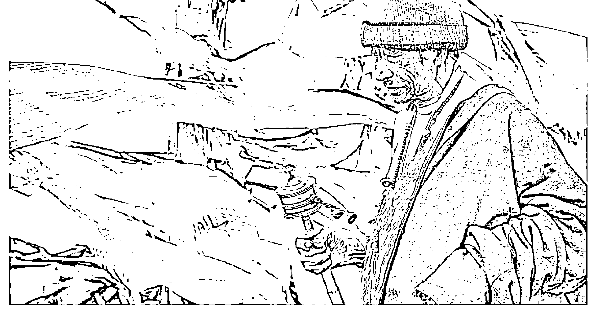

信仰在丰富一个人的精神世界方面所起的作用，无法用其他东西来替代。信仰不仅是个人问题，更是整个社会道德体系的基础，信仰缺失将造成严重的社会问题。

在科学昌明的今天，怎样才能在世界范围内重建信仰，以精神来引领这个世界，让它不至于陷入物质的泥沼呢？

首先要改变“重物质、轻精神”的观念。假如人们不改变观念，依然认为世界无非是一堆物质的简单堆砌，拒绝承认灵魂的存在，那么谈精神追求还有什么意义呢？既然只有物质是真实的，那怎么不会把对物质的追求摆在第一位呢？

物质至上的思潮一旦泛滥，追逐金钱成为人们的头等大事，为了赚钱很多人必定会不择手段。在因金钱而疯魔的人群中，社会道德的沦丧是一种必然趋势。

一个以物质为导向的文明必定会贪婪成性，无止境地向自然攫取，无法遏制对外扩张的冲动，不仅会祸害整个世界，最终也祸害了自己。一个以物质为导向的世界，必定会成为人间地狱。

奥地利哲学家施太格缪勒在《当代哲学主流》一书中说，唯物论在世界范围占据主导地位，把物质认为是唯一真正的实在，这也许是20世纪的一个失误。

选择建立怎样的信仰也是一个大问题。历史上因信息隔绝而在世界不同地域各自形成的宗教，教义相互冲突，难以做到和而不同，而且很多内容已经被科学否定。我们不管选择倡导信仰哪一个宗教，都必然会引起其他宗教教徒的不满，也不能被信奉科学的人们接受，最终结果只是使冲突更加激烈。

应该如何解决这个问题呢？我想，不管是哲学、科学还是任何一种宗教，其实反映的都是同一个世界。各自的角度可以不同，但真相只能有一个，所以它们有统一的基础。

在互联网史无前例地拉近了人们之间的距离，地域已经不再是信息交流障碍的今天，在实现信息互联的基础上，我们完全可以实现知识互联，把不同历史时期的人类智慧集结在一起，打通哲学、宗教、科学之间的壁垒，建立一个能够包容并蓄、反映世界真相的理论体系。

这个理论体系应该是开放的而不是封闭的，是允许提问的而不是不能质疑的，是可以修正的而不是不容更改的。这个体系应该既能体现前人的智慧结晶，又能留给后人以修补空间；既能涵盖现有的所有发现，又能指导人类前行的方向。

历史发展至今，仅仅依靠沿袭前人的智慧已经不足以引导我们走出困境。人类需要一个新的轴心时代，需要有更多的思想者，在继承前人知识的基础上，闪耀智慧的光芒，构建一个崭新的思想体系，引领整个种群拥抱灿烂的明天。

为此我愿意抛砖引玉，先提出一个理论框架来。在本书中我们讨论了“宇宙从哪里来”“人类从哪里来”“人生有什么意义”这三个问题，揭示了世界的本质和人生的意义，但这仅仅只是开始。在以后将要出版的一系列书中，我们还将就如何实现“人与自然的和谐”“人与人之间的和谐”“人内心灵与肉的和谐”做进一步的探讨。

人类怎样才能实现与自然和谐相处，使整个种群能够在地球上长久地繁衍生息，不至于陷入灭绝的危险呢？这些都有待探讨。

### 延伸阅读

## 轴心时代

寒武纪生命大爆发是生物学界的不解之谜，在很短的时间内物种爆发式地集中出现，令人感觉不可思议。但更不可思议的是，在人类思想史上居然有着与寒武纪生命大爆发相同的现象，在很短的时间内群星灿烂，人类历史上最伟大的思想家集中出现，他们的光芒照亮了一个时代历史的天空，这就是“轴心时代”。

轴心时代的概念是由德国哲学家雅斯贝尔斯在1949年出版的《历史的起源与目标》中提出来的。他发现，在公元前800至公元前200年之间，尤其是公元前500年前后，人类文明出现了一个轴心时代。这一现象发生的地区大概是在北纬25度至35度之间，不同地域的人类文明在这段时期内几乎同时出现了重大突破。

在轴心时代里，各个文明都出现了伟大的精神导师，古希腊有苏格拉底、柏拉图、亚里士多德，以色列有犹太教的先知们，古印度有悉达多，中国有老子、孔子，他们的思想塑造了不同的文化传统，持续影响着人们的生活。而且更重要的是，虽然中国、印度、中东和希腊之间有千山万水的阻隔，但它们在轴心时代的文化却有很多的相通之处。

在那个时代，古希腊、以色列、中国和印度的文化都发生了终极关怀的觉醒，人们开始用理智的方法、道德的方式来面对这个世界，同时也产生了宗教。以色列人创立了犹太教，后来催生出基督教和伊斯兰教；老子创立了道家思想，后来催生出中国本土的道家；悉达多创立了佛教。这些宗教对人类产生了不可磨灭的影响，影响了整个人类文明的进程。

他们的智慧光芒是如此闪耀，甚至可以这么说，人类的思想至今没有超越轴心时代。

这样的突破使他们的文化超越了原始阶段。这些文化的类型在当时就已经固定，决定了今天西方、印度、中国、伊斯兰的不同文化形态，就像生物门类在寒武纪生命大爆发中就已经形成，至今没有发生根本性的改变。那些在轴心时代取得了突破的文化一直延续到了今天，而其他没有实现超越的古文明，如巴比伦文化、埃及文化，虽然规模宏大却难以摆脱灭绝的命运，最终都成为文化的化石。

我有一种感觉，轴心时代的出现和寒武纪生命大爆发一样，并不是一种偶然。老子和悉达多的思想完全超越了那个时代人类智慧的正常水平，很明显带有一定的天启成分。如同寒武纪生命大爆发是系统对物种的集中投放一样，也许轴心时代思想家集中出现的现象，是系统对于游戏的一种提示？

但现在我们很难再指望会有天启了，新轴心时代能够依靠的只有人类的智慧。我们要在游戏中通关恐怕不能指望救世主，只能靠自己修行。

悉达多说，人人皆有佛性，人人皆可成佛。我们每个人都可以是救世主。