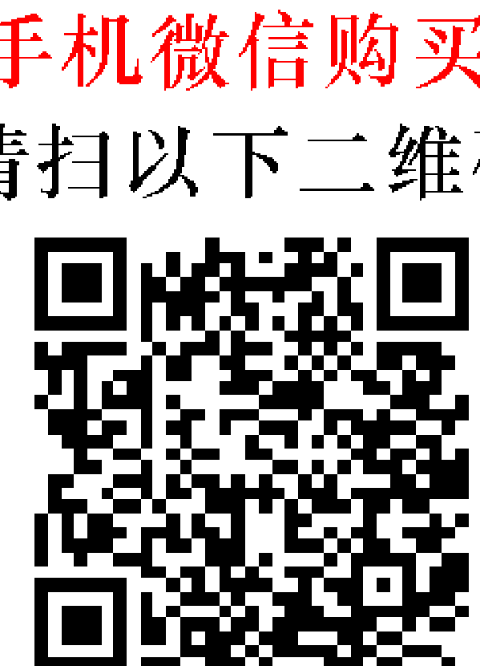
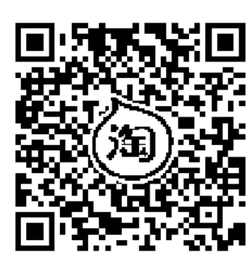
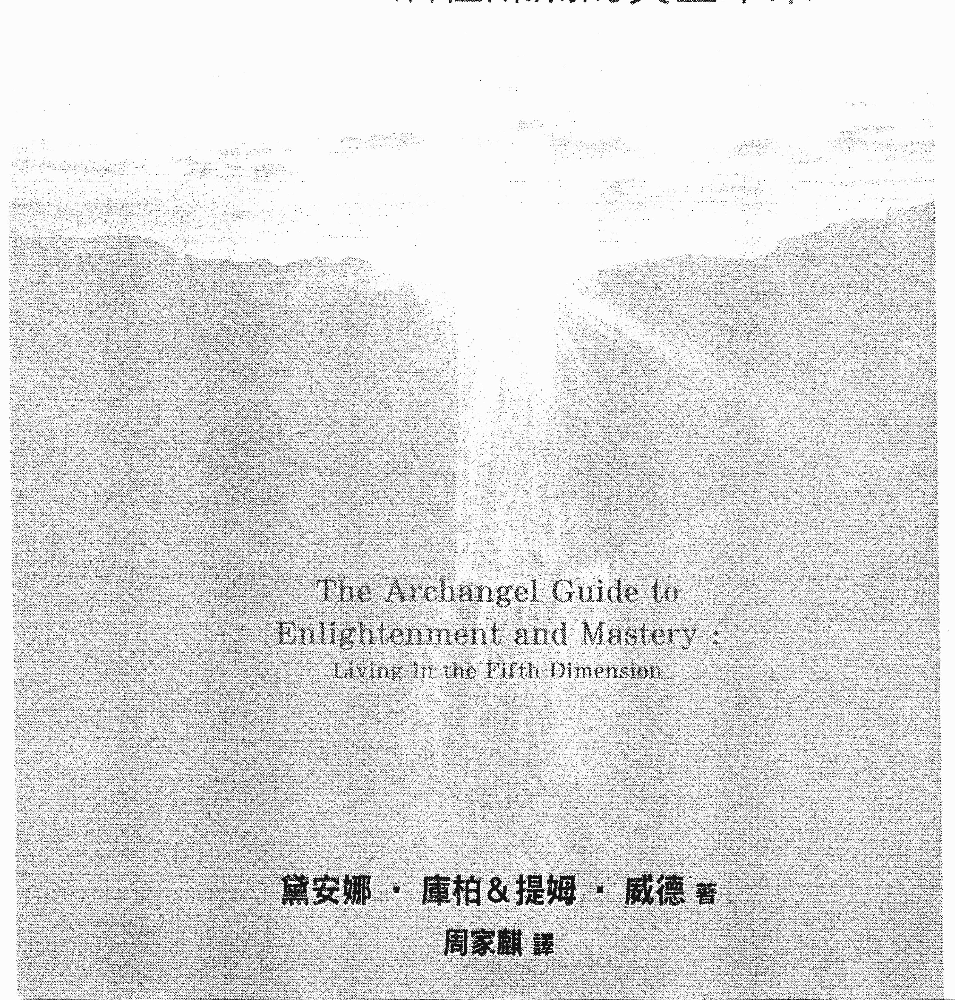
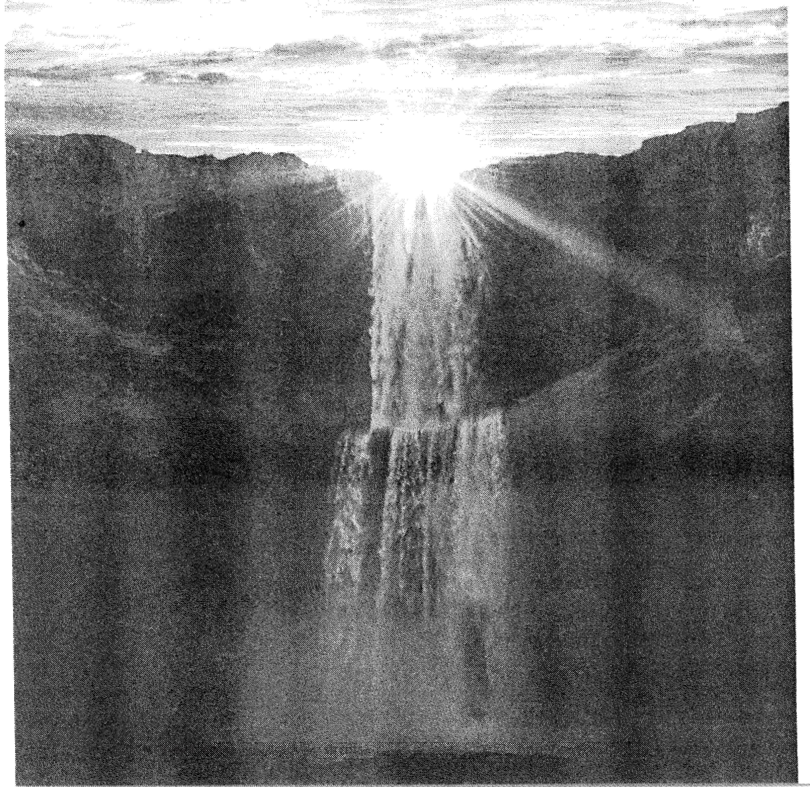
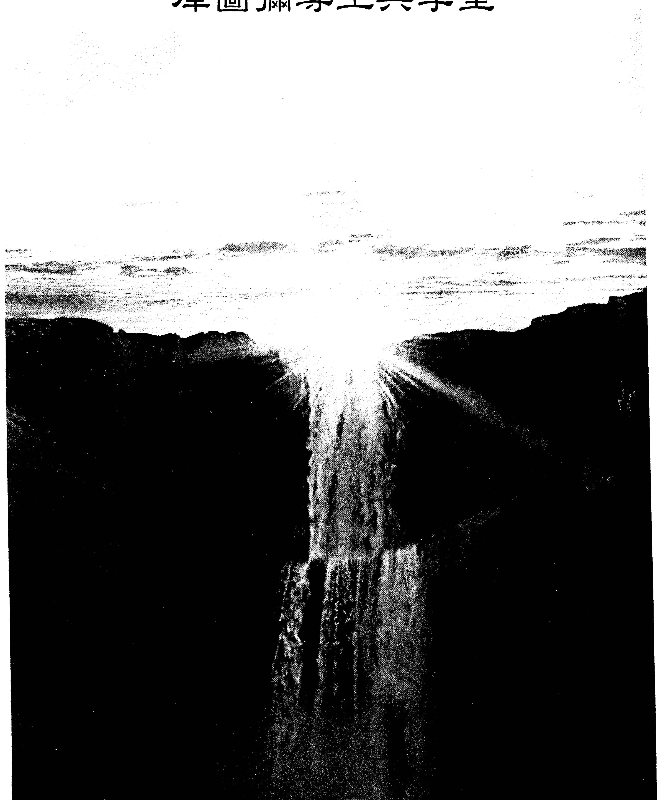

迎接黃金紀元，創造我們的光明願景。
連結高層存有，觸發內在的智慧和力量，
與大天使一起走在精通開悟的路上。

黛安娜·庫柏學校認證老師伊莉莎白 真心推薦

# The Archangel Guide to Enlightenment and Mastery — Living in the Fifth Dimension

# 活在燦爛的黃金未來 五次元的靈性覺醒

黛安娜·庫柏 & 提姆·威德•著 周家騏•譯

## 制作說明：

本書由 《天使神秘學院》 出重金從台灣購入的原版書籍掃描制作完成。為達到最好閱讀效果，特地把書全部切開後，再經由專業掃描設備高精度掃描完成，並經過一張張的PS後期處理最終成書，其間花費大量的人力、物力以及時間，只為能給大家提供經濟並優質的神祕學學習資料而努力。

本學院強力譴責某些機構和個人，把本學院花心血制作完成的電子書籍，包裝後直接放在自家網上低價傾銷的行為，以謀取不勞而獲的經濟利益。如果長此以往最終將無人願意再為大家花心思制作電子書，那以後可能大家再無新書可讀。

為讓大家以後能夠讀到更多的好書，也為了本學院的良性發展。本學院懇請大家儘量做到如下幾點：

-   一、儘量在天使神祕學院的官方網站購買電子書籍。
官網訪問地址：http://www.ac2011.cn
短網址：ac2011.cn
網址含義：(Archangel College 成立時間：2011年)

-   二、在收到電子書後小範圍傳閱即可，千萬不要公開傳播，更別掛到網上低價銷售。

同時為答謝廣大支持者，學院電子書將做如下調整：

-   一、學院會把一些早已收回制作成本的電子書折價銷售。

-   二、最新制作的電子書籍會開放打印功能，大家購買後有條件的可自行打印成書。

天使神祕學院
2022 年 1 月

# 五次元的 靈性覺醒 ——活在燦爛的黃金未來

# The Archangel Guide to Enlightenment and Mastery : Living in the Fifth Dimension

黛安娜·庫柏&提姆·威德 著
周家麒 譯

## 目錄

## 觀想列表

006

## 推薦序——精通自己的頻率在第五次元

是刻不容緩的當務之急！

伊莉沙白

010

## 導言

014

### 精通的未來

017

# 第一章 人間大師

018

# 第二章 下一步

024

# 第三章 亞特蘭提斯的重建

030

# 第四章 幫助孩子開悟並掌握黃金亞特蘭提斯的精通

044

# 第五章 開悟大師的回歸與冥界廳

050

## 擴張的脈輪

057

# 第六章 擴張的地球之星脈輪

058

# 第七章 擴張的海底輪

063

# 第八章 擴張的生殖輪

068

## 第九章 擴張的臍輪 072

## 第十章 擴張的太陽神經叢 076

## 第十一章 擴張的心輪 081

## 第十二章 擴張的喉輪 085

## 第十三章 擴張的第三眼 090

## 第十四章 擴張的頂輪 095

## 第十五章 擴張的因果輪 100

## 第十六章 擴張的靈魂之星 105

## 第十七章 擴張的星系門戶 110

## 第十八章 世界導師庫圖彌尊主 116

## 庫圖彌尊主與學堂 115

## 第十九章 學堂一 平衡的功課 123

## 第二十章 學堂二 至樂的功課 128

## 第二十一章 學堂三 了解水晶科技 134

## 第二十二章 學堂四 真理的振波 139

## 第二十三章 學堂五 隱藏在自然界的密碼 146

## 第二十四章 學堂六 無條件的愛 152

## 第二十五章 學堂七 高層覺知 157

## 第二十六章 學堂八 萬有合一 162

## 第二十七章 學堂九 在喜悅中服務 167

## 第二十八章 學堂十 通往其他次元的門戶 172

## 第二十九章 學堂十一 神聖的陰性能量 177

## 第三十章 學堂十二 你的第九次元宇宙大師之光 182

## 大師與祂們的教誨 191

## 第三十一章 成為星際大師 192

## 第三十二章 追隨啟明者的腳步 198

## 第三十三章 沃斯洛尊主 209

## 第三十四章 聖哲曼和梅林 217

## 第三十五章 耶穌——宇宙之愛的使者 222

## 第三十六章 女神大師 229

# 第三十七章 女神大師的影響力

236

# 龍之王國

243

# 第三十八章 龍族

244

# 第三十九章 與龍族合作

252

# 第四十章 龍如何幫助你完成靈魂使命

260

# 第四十一章 四大元素與自然界的精通

268

# 開悟的不同面向

277

# 第四十二章 源頭的紫丁香火焰

278

## 第四十三章 揚升的變生映像

285

# 第四十四章 精通合一法則

289

## 結論：開悟大師燦爛的黃金未來

294

## 觀想列表

-   為世界的揚昇做準備 022
-   創造你美好的未來 028
-   汲取內在小孩的天賦 048
-   與冥界廳連結 055
-   地球之星的擴張 061
-   高層海底輪的錨定與擴張 065
-   生殖輪的擴張 070
-   臍輪的擴張 074
-   太陽神經叢的擴張 078
-   昭告釋放所有前世的連結與合約 079
-   啟動第五次元的心輪 083
-   喉輪的淨化與擴張 088
-   融合你與沃斯洛尊主及瑟若佩斯·貝的頂輪和第三眼 092

### 頂輪的擴張與大師智慧的開啟 097

### 因果輪的擴張 103

### 進入靈魂之星脈輪 108

### 星系門戶的擴張 113

### 加入庫圖彌尊主的學校 120

### 拜訪平衡廳 126

### 拜訪至樂廳 132

### 拜訪水晶科技廳 137

### 拜訪真理廳 143

### 創造睿智、正面、充滿愛心的內在父母 144

### 拜訪自然廳 149

### 拜訪無條件之愛廳 154

### 拜訪高層感知廳 160

### 接收庫梅卡尊主的黃玉光轉化射線 163

### 拜訪萬有合一廳 165

### 拜訪喜悅服務廳 170

### 拜訪通往其他次元的門戶 175

### 拜訪神聖陰性智慧的神祕廳 180

### 拜訪第九次元的學堂 186

### 會見星際大師 196

### 會見蘭托大師 201

### 會見巴巴吉 203

### 會見大師約西亞 205

### 會見彼得大帝 207

### 拜訪沃斯洛尊主的靜修處 214

### 為了地球的至善與聖哲曼合作 220

### 照亮地球 227

### 與聖母馬利亞和觀世音連結 233

### 與更多女神大師連結 241

### 與龍族和祂們的能量連結 249

### 龍族的祝福 258

### 龍族的儀典 264

### 與元素一起愉悅地工作 273

### 源頭紫丁香火的旨令 280

### 源頭紫丁香火的運用與具現 283

### 更高層次的關係 288

### 遵行合一法則的生活 293

## 推薦序

### 精通自己的頻率在第五次元是刻不容緩的當務之急！

根據大天使麥可（Archangel Michael）的說法，目前已經有三顆地球成型了。

第一顆地球是人類尚未出現，保留最初原始風貌的地球。那是屬於地球原生物種的世界，是植物、礦物和動物的天堂，為了保有地球的原始根基與血脈而存在。

第二顆地球是在三至四次元頻率振動的地球，在這個頻率帶振動的人們，深陷在負面低頻的情緒中，過著分裂鬥爭、惶恐不安、辛苦艱難的生活。

第三顆地球是在五至七次元頻率振動的地球，這個頻率振動的人們，內心平安富足、互助合作，過著心想事成、揚昇開悟的生活。這三種振動頻率同時存在於一個物理地球裡，卻各自過著截然不同的生活。

誠如本書開宗明義提到的精通（Mastery），是指在任何情況下，都能控制自己的能量系統，並保持高頻率的能力。行止精通（Walking Mastery），是指活在肉身又能把自己維持在較高頻率第五次元的人。

現今已經有很多人的振動頻率達到第五次元甚至第七次元了，所以要進入更高次元並不困難，人的一天當中有可能在三次元和七次元之間來來去去。心情好、充滿光跟愛的時候，就在第五次元，心情不好、攻擊批判別人的時候，就回到第三次元。因此接下來的日子裡，全球人類將進入『精通』大作戰——訓練自己穩定在精通的狀態。因為要進入更高次元並不困難，但是如何維持在高頻不再掉墜，是人類要努力耕耘的重點。尤其地球將於二〇三二年邁入第五次元，因此地球自我清理、升頻產生的天災人禍在未來將越發層出不窮，二〇二〇年爆發的新型冠狀病毒肺炎（COVID-19）橫掃全球就是最典型地球自我清理的現象，人類如何能順利地與地球一同揚昇，個人振動頻率的高低是決定性的關鍵。然而讓自己的頻率穩定維持在第五次元，靠臨時抱佛腳是無法完成的，只有依靠大家自我鍛鍊，養成高頻的思想、態度和習慣堆積能量才能養成。本書《五次元的靈性覺醒》就是呼應大家現階段的需求應運而生的揚昇法寶。英國天使夫人黛安娜·庫柏老師一直以來就是帶領全人類揚昇到第五次元的人間天使，她的所有著作都內蘊著開悟的智慧與揚昇的契機，而且她的每本著作都比上一本的振動更快、眼界更高、光度更亮，她的每本智慧與經驗的結晶，都是值得大家品味收藏的靈性寶藏。繼《五次元的靈魂揚昇》一書中引導大家如何獲得大天使、獨角獸、龍、元素精靈、星際議會、基督的金色光束、宇宙鑽石紫色火焰等高頻能量的加持，協助我們釋放業力、提升頻率，並與內在純淨的神性再次連結。

《五次元的靈魂覺醒》則是繼續擴展提升五次元的十二個靈魂脈輪，讓五次元的梅爾卡巴穩定在我們的氣場；還帶領我們拜訪世界導師庫圖彌大師的十二學堂，進入十二神聖殿堂學習明心見性的功課；會見星際大師，進入星際訓練學校學習；接引神聖陰性能量與眾多女神大師連結；與龍族、元素精靈更密切的互動：……這些都是我們日常生活中維持在較高次元的簡易操作方法。

建議讀者安排每天一小段，十至十五分鐘獨處的時間，跟隨書中的冥想引導，這些冥想會帶領我們前往更高次元、接收更高層級神聖智慧的灌溉，協助我們適應並穩定在五次元的頻率中。當我們在五次元的頻率中越久，身心靈的光化轉換因此更快發生，地球自我清理產生的天災人禍與人類集體的負面潛意識影響就會變小。只能說有幸能閱讀此書的人，必定是得到上天恩寵之人！

如果有讀者已經練習過《五次元的靈魂揚昇》，我要恭喜你，你的光之振動已經進入第五次元，並朝著第七次元的頻率邁進！若是期望自身的光之振動能進入第九次元，繼續從事《五次元的靈魂覺醒》書中的各項練習，不只會是你的最佳選擇，更是你眼下的當務之急！

感謝黛安娜．庫柏老師以及生命潛能出版社為全球人類付出的貢獻，衷心祝福全球所有生命都能在二〇三二年之前順利升頻至第五次元，進入第三顆地球！

## 推薦序

### 伊莉莎白

-   英國天使靈氣教師
-   獨角獸靈氣源頭管道
-   龍吟靈氣源頭管道
-   英國黛安娜·庫柏白光學校教師
-   埃洛希娜白光天堂的創始人
-   《實現願望的獨角獸：月光寶盒》的作者

《天使能量排毒法》、《光行者》、《五次元的靈魂揚昇》、《不要讓人黯淡你的光》與《水晶天使444》等書的推薦序作者。

目前正...（注：原文省略）等書的推薦序作者。
天使之翼、揚昇大師鍊金術、銀河星際大使、天堂香巴拉的工作坊教學。

伊莉莎白個人連結：

臉書：Elizabeth Chou https://www.facebook.com/elizabeth.chou.16

臉書粉絲專頁：埃洛希娜白光天堂 https://www.facebook.com/elohimna/

## 導言

提姆·威德跟我一起與令人敬畏的大天使麥達昶合作了許多年，因此，當祂要我們合寫《五次元的靈性覺醒》時，我們感到非常興奮。

開悟就是從一個更高、更廣的視角看一切。當我們學會這麼做的時候，就會知道宇宙中存在的只有愛，因為其他的一切都是幻相。這種對生命的深刻了解便足以轉化我們整個存在的方式和關係。

精通意味著對發生在我們身上的一切事負起責任。它是告別內疚、譴責、傷害和憤怒。當我們把投入這些情緒上的能量收回來時，就會取回自己的力量。大師堅強不屈，昂首挺胸，他會憑著內在的智慧行動。

黃金亞特蘭提斯紀元的所有居民，都活在第五次元的境界裡。他們是開悟的大師──充滿智慧與天賦的存在。但自亞特蘭提斯墮落後的一萬年來，地球人一直活在第三次元的空間裡，不再對自己的行為或情緒負擔任何責任。

目前，我們正處於一個為期二十年的機會之窗，新的黃金時代正在建立，地球的頻率正在快速上升到亞特蘭提斯的層面。我們活在一個不平凡的時代，因為對那些準備好了的人來說，這是一個史無前例的靈性提升機會。

這本書從令人神往的亞特蘭提斯黃金紀元開始，因為他們的生活方式奠定了開悟精通的基礎，以及未來的人類生活方式。本書提供的資訊，會觸發你隱藏在內心深處的記憶，並揭開你沒有意識到，但已經知道的事情。

亞特蘭提斯黃金紀元的人都與龍族、天使和獨角獸有連結。現在是再度與他們連結的時候了。美麗又有智慧的龍族，正要重返地球幫助我們。因此，我們會介紹這些活在第四、五次元的存在，因為他們是人類的好朋友、同伴和保護者。

此外，第七和第九次元的獨角獸，也正大批地湧向地球，協助我們加快靈性成長的速度。觸及這些聖獸的能量，會帶來喜悅、愛和啟發。他們會幫助你活在第五次元的層面裡。

我們邀請一些偉大的啟明大師和女神大師，用祂們的光加持這本書。祂們走過地球上的揚昇之路，經歷了自己的考驗和啟蒙，因此，祂們很了解我們正在面臨的諸多挑戰。當祂們與我們連結時，就會觸發潛伏我們內在的開悟和精通的鑰匙與密碼。我和提姆衷心地向祂們致上感激之意。祂們的幫助會讓我們接收更多的光能，同時也能為世界提供服務。

庫圖彌尊主（Lord Kuthumi）是其中的一位，祂是一位光明的存在，現在的世界導師。祂在內層（inner plane）成立了十二個學堂。進入這些學堂就會接收到資訊、光與能量密碼，進而讓你在這一世成為一位開悟的大師。

由於頻率上升得太快，你的脈輪系統正在以前所未有的速度發亮和擴張。因此，我們也以高於以往的振波，把新的資訊納入書裡，加快你十二個第五次元脈輪的旋轉和容量。真誠地希望你喜歡書裡提供的高頻率新資訊，也希望你在每一章末尾進行觀想的練習時，能連結傾注其中的能量。希望你在經歷完全開悟的旅程中滿懷喜悅。願龍族、天使、獨角獸和啟明大師加持你，並照亮你的生命。

### 精通的未來

# 第一章 人間大師

精通（Mastery）是指在任何情況下，都能控制自己的能量系統，並保持高頻率的能力。「行止精通」（Walking Mastery）這個名詞指的是那些活在肉身，又能把自己維持在高層第五次元的人。當你的四身系統——身體、情緒體、心智體和靈性體，含有高百分比的光能時，行止精通就會發生。通過靈魂發出的考驗和啟蒙以後，你的氣場就會吸收這種光能。

地球上的每一個人，現在都有可能成為開悟的揚昇大師。能否達到這個目標，則取決於你的人格意圖和靈魂契約。以目前的可能性趨勢來看，地球上的七十億人都能達到這個層次。這種靈性的快速提升，是地球當前獨一無二的機會。

亞特蘭提斯在它們為期一千五百年的黃金紀元提供給世界行止精通的藍圖。那個時代的人演示了這種藍圖如何運作，本書依據的基礎之一正是來自他們的示範。所有需要的資訊都被編譯成符碼，置入我們每個人的化身中。
那個黃金時期的男女大祭司，都活在第五次元的上層。他們不斷地與第七次元的存有保持連結，也能很短暫地生活在第六次元裡。然而，即使是高度進化的存有，也無法在擁有肉身的情況下在這個層面生存。他們必須運用心靈的力量和水晶的協助，來管理圍繞在周圍的能量。
包括孩童在內的每一個人，無論處於什麼層次，都在亞特蘭提斯的黃金紀元受過心靈控制訓練，以維持他們在周圍設想出來的形體生命。這種不需要我執就可以完成的訓練，是讓他們成為行止高人的原因。
從第三次元往高層揚昇的條件，包括建立一個叫梅爾卡巴（MerKaBa）的純水晶光體。這個光體是由你的能量和靈魂藍圖共同創造出來的幾何形制。當你十二個第五次元脈輪都完全活躍的時候，靈魂就會向下投射一個四面體來容納身體發出的振波。梅爾卡巴是由兩個交互扣鎖的金字塔組成的立體六芒星。到了下一個階段，當神聖陰陽能量達到平衡時，它就會變成一個圓球。因為無角的圓能容納更多光能。
我們現在要進入的一個階段，涉及了所有第五次元存有的光體擴張。失去了個別顏色的脈輪，會變成半透明狀。當它們在白光的光譜中閃爍時，會產生統一的光柱，並從心中央的位置雙向擴張。作為揚昇過程核心的心輪，會驅動我們朝著精通的道路邁進。我執會隨著心力的壯大而失去掌控，進而遭到廢棄。凡是通過靈魂考驗的大師，都會發生這種情況。這些都是大師在進入肉身前為我執選擇的釘刑（crucifixion）。十二個脈輪每一個，都包含了心能量與個人生前設定的成長計劃。對那些致力於尋求開悟的人來說，這會為他們創造一條具有高度挑戰性的道路。目前為止，地球是全宇宙中最快、最艱難的一所學校。然而，這些挑戰在靈性上帶來的回報和獎賞，卻遠超過我們對宇宙的理解程度。你的靈魂必須處於第七次元以上的頻率，才能化身到地球來。當你遺忘了過去種種，掀起分隔前世今生的遮幕，進入肉身展開學習的過程後，這個頻率也許會急劇下降。某些人由於前世業力的平衡，而能使這個頻率繼續降低。許多靈魂為了彌補所有未完成的功課，並在新黃金紀元開始前清除宿業，而選擇了這個特殊的一生。這就是使地球人會有如此不同又艱困經驗的原因之一。當你學會並克服這些功課和經驗以後，不可思議的變化就會發生。心會啟動人類的進程，並推動著人類往前邁進。靈魂的意識也會隨著一起進化。你會想追求一種充滿愛、合作、分享，並與全人類連結的生活方式。這種寬闊的視野，會使你成為一個能覺察自己真實身份的大師。你會知道自己是以一個人類形式化身的靈魂。這種證悟本身就能完全改變生命的每一個面向，讓你把基督意識帶進每一個思想、言語和行為之中。這些變化正在世界各地的人身上發生。星際議會預## 第一章 人间大师

预测，地球及其居民会在二〇三二年以前进入第五次元的振波。

虽然精通的过程会影响所有的个体灵魂，但毕竟这是一个集体的运作。因为每一个从心觉醒的灵魂，都会影响周围所有人事物的能量状态。同样地，无论有没有情感知觉，地球上所有生命体之间的心流通讯将会在瞬间发生。大师将他们开放的心放射出去，映照出心灵封闭的人们真实的面目。当他们看到这个反映时，心灵的所有面向便会随之苏醒。

因此，大师单凭着他最纯净的本质，就可以转化出更多的大师。

行止精通是地球上每一个灵魂的神圣传承。

在未来的几年中，随着世界各地人们受到高层次元振波的触及，会迎来新一波的顿悟浪潮。有别于一九八七年谐波汇聚（Harmonic Convergence）以渐进的方式唤醒人类，这些新意识灵魂会在一夜之间找到自己选择的角色。

你必须经历和通过许多挑战和启蒙，才能成为一位行止高人。对那些觉醒速度缓慢的人来说，这会是一个漫长的过程。然而，一个快速觉醒的高人会在无意识的情况下完成他们的考验。这些灵魂将在瞬间理解和开悟。他们在源头变成实相的运作过程中，会本能地拥抱宇宙之流。能量与资讯会通过第五次元的心轮，即时地传递给他们，为他们提供高层的天使视角。这将是自亚特兰提斯沉没以来，我执第一次被遣散，所有的幻相都被真实的本心所见取而代之。

随着扬升的全面展开，许多大师现在都忆起了累世以来与他们共处过的灵魂。来自同

## 观想：为世界的扬升做准备

一个单子体（Monado）或原始神圣火花的庞大灵魂群体，都聚集在一起，把他们的灵魂之光固定在强大的能量池里。这些人会出于本能地并肩同行，把源头之光的高层光谱，吸引到他们居住的特定区域。这不仅加速了地球的高层振波，更让它完全锚定于此。而这些高层振波又会清除一些国家大批的共业能量。当灵魂有意识地把意图集中在这个愿景上时，就会进一步加快这个净化的过程。地球及其居民开始忆起爱的力量所蕴含的真实意义。来自更高层的能量会一直在侧守护这个过程的进行。地球上的启明大师们，会将引导扬升的模式从以前的全面互动改为温和的指导。同时，人类和天使界互动的频道会变得越来越靠近。这会使地球及所有众生的扬升变得更加容易。

1.  选择一个安静、祥和的地方，可以的话，点一支蜡烛。
2.  请求所有来自同一单子体的灵魂——你的灵魂群组，围绕着你。感知有许多美丽的能量与你同在，支持着你。
3.  当你们聚在一起，你们会是斑斓焰火与炽烈荣光的一分子。
4.  将这团火焰锚定在那个呼唤你的世界。
5.  知道你正在为净化世界和世界的扬升做准备。
6.  接着，以个人的身分离开火焰。
7.  觉察你的心轮辐射向四面八方的光。
8.  你来自爱的手足共同体。无论你走到哪里，都能看到并传播基督意识。
9.  像一位行止高人般顶天立地。
10. 睁开眼睛，微笑。

# 第二章 下一步

扬升能量的初始阶段已经整合到地球里了。一开始，这个能量会照亮地球的磁场。这个环绕地球的晶体矩阵，反映着我们此刻共振的第五次元振波。随着地球频率的上升，包括人类在内的每一个有觉知的生命都会受到它的影响。通过和谐波的共振，人类的能量与灵性建构必须与这种转化同步进行。许多人也许会感觉到这个转化正在改变他们的生命，但却不知道转化的原因何在。
一旦这种转化开始发生，第五次元的心轮就开始放光，你就会做出发自真心的决定。灵魂现在开始提出考验，以确保人们能完全掌控自己的真心。这是人们目前面临如此多挑战的原因之一。这也是他们准备要进入下一阶段的象征，因为艰困的道途意味着高层的召唤。

# 第二章 下一步

二〇一五年，地球发生了许多深层的转化。最重要的一个是春分点三重对位（the triple alignments of the Spring Equinox）时，位于天琴座基督之门（Christ Gate of Lyra）的开启。这是一个见证新月、日蚀与巨大春季新生能量扩展的日子。

大天使克里斯提尔（Archangel Christiel）通过天琴星系进入这个宇宙。他普照地球上每一个人的因果轮。因果轮是一个超凡的脉轮，它位于水晶骷髅头后部，能让人与天使、独角兽和灵界密切连结。它拥有神圣的阴性能量，并能从月亮汲取光能，让人平衡自己的阴阳能量并感到祥和。

对那些准备锚定自己的人来说，大天使克里斯提尔这一段时间滴灌到地球的微小能量，足以开启他们的因果轮。二〇一五年以来，大天使克里斯提尔倾注到星系门户的能量，能使地球七十多亿的人锚定自己的因果轮。每一个因果轮锚定的灵魂，都能进入他们的十二脉轮柱。地球上的每一个人，现在都蓄势待发，准备决定自己踏上黄金扬升之道的旅途。

阴阳能量经过一万年的平衡，在许多个人和社会结构中掀起了变化。由于本心运作的灵魂越来越多，因而建立了爱、合作与关怀的新五次元示范模型。我们会看到所有为地球和人类服务的结构正在快速成长。这会使灵魂的满足和快乐得以顺利地传播。

当天琴座的基督之门开启时，许多求道者发现幻相的第五层遮幕会在瞬间消失。这一层粉红色的遮幕与心轮密切连结。遮幕会在我们的心准备拥抱无条件之爱时消散。它带来深层的宽恕，并允许我们从更高的角度看情境与人。遮幕消散后，我们就可以进入能让我们在扬升过程中受益的前世。它也会开启我们与灵魂家族的连结，并把他们吸引到我们的身边。

## 五次元的灵性觉醒

对某些个体来说，这是一个非常微妙的转换。有的人会面临挑战，因为一切都会在一个更高的频率上进行调整和重组。这种情况之所以会发生，是因为当星系门户为了加速人类的扬升而开启时，成千上万的独角兽会从第九次元的星系门户发出纯白色的光。

独角兽在第七和第九次元之间发出振波。一九八七年的谐波汇聚时，人们的扬升之光就开始发射。第七次元的独角兽看到这个情形，藉机穿过天琴座通道中的一条裂缝。接着，他们就开始帮助那些头顶发出服务之光或心地纯净的人。

天琴座的星系门户在二〇一五年全面开启时，第九次元的独角兽藉此涌入，帮助那些敞开心轮的人。这种影响太过强大，以至于使另外百分之十的人类觉醒，并踏上他们的扬升之路。这也把许多扬升者从金色的扬升之路，推向更高频率的钻石路径，启动了他们的钻石光密码，也增加了他们在多元宇宙里的服务机会。

一旦这百分之十的人类觉醒以后，地球的集体意识就会转移到更高的八度阶，从而引发更多的和平运动以及与动物界更亲和的接触。

在天琴座星系门户开启的吉时，集体能量就会上升，使亚特兰提斯第十三个紫水晶骷髅头揭示灵性领域的知识。它会揭示来自冥界厅（Anunci）的古亚特兰提斯人的智慧。这

# 第二章 下一步

十三个水晶骷髅头包含了亚特兰提斯黄金纪元所有的古老智慧、科技和资讯。这种智慧将根据亚特兰提斯人的原理重建我们的社会，但却会在一个比新黄金纪元更高的频率上进行。社会将会在合一法则的基础上重建。

二〇一五年九月，大量的水晶钻石能量涌入，这意味着在地球上采取的所有行动，都会以即时业力（Instant Karma）的形式反映出来。这个情况适用于每一个人，并会迫使人对自己的思想、言语和行为承担责任。恩典、意图、显化、即时业力、责任和最后的无条件之爱，将成为建造新世界的基石。更多人会在这个巨大的转捩点上觉醒。

即时业力的返回意味着宇宙即将给予我们艰难之爱。因为所有被允许化身的人，必须拥有第七次元以上的灵魂。现在是这些灵魂忆起自己真实身分，并采取相应行动的时候。所有在旧典范中工作的人，都将与他们的真心连结，并看到自己的行为在日常生活中的反映。当这种情况发生时，他们就会觉醒，也会想改变。

这意味着结构会从内部改变，以便与真心的频率对位。其他人都会温和地消退，让位给更高的经济伦理。

当我们完全进入第五次元时，所有极端的选择都将从我们身上撤退。爱与正直会成为前进的道路。钻石路上的灵魂已经觉醒，准备进行威力强大的工作。

二〇一五年九月以后，又发生了一次巨大的调整，让地球灵魂的光体整合更高的频率。这掀起了一股地球与个人的净化浪潮，把灵魂看待生命的方式引入一个全新的途径。

## 观想：创造你美好的未来

一万年来，光之工作者第一次有机会获得真心的指引。第五次元心的敞开和锚定，使真理和正直的能量得以发射。
这标志着一个新纪元的开始。旧有的方式被一个以真心为基础的统一社会所取代。曾经在亚特兰提斯充分活跃的脐轮，再次闪耀光芒，提供灵魂在所有次元间进行全光谱的连结。例如，地球人现在能与他们的灵魂群体连结，包括在宇宙另一边的灵魂在内。以前的人会把时间、空间和距离视为无法克服的障碍。
第五次元黄金纪元将教导地球上的我们如何再度成为大师，如何驾驭宇宙能量，以及如何把光和爱带给地球。

1.  准备在你的神圣空间里冥想和放松。
2.  把一个石英水晶放在第三眼上（任何透明的水晶都可以，例如：黄水晶或紫水晶）。
3.  观想自己稳健地踏上扬升之路上，许多挑战紧随其后。
4.  感觉光和能量冲刷你的十二个脉轮和光体。你看见天使和龙族团队与你比翼飞翔。
5.  想象你来到一堵空白的墙前面。墙脚有几罐彩色的油漆。
6.  在你的心眼中，随心所欲地描绘一幅美丽的地球。你可以选择在墙上画任何一种情

## 第三章 亚特兰提斯的重建

## 神殿的创造

当亚特兰提斯展开最后的一个，也是第五个实验时，志愿服务者做的第一件事，就是建造一座实体的神殿来表达他们的感恩之情。这就是后来成为爱神阿芙罗黛蒂（Aphrodite）与维纳斯女神（Venus）监管的爱神殿。但在亚特兰提斯人建立家园和部落前的一段时期，他们都举行露天朝拜，向星空寻求光明和灵感。他们始终把与源头保持连结和表达感恩视为第一优先顺位。这就是他们保持清净、开悟和精通，进而导致亚特兰提斯黄金纪元的方式。由于那个纪元是我们黄金未来的模板，这一章就要介绍亚特兰提斯人在第五次元生活的基础。

7.  尽可能将你所想的画面精密、细腻地呈现出来。这是你的作品。
8.  完成后，退后几步，欣赏你的画作。你创造了什么？
9.  当你感觉完美时，请你的天使和龙族给予祝福，并放大作品的能量。
10. 看见自己走进画里，让它成为你统一的实相。你知道思想只是尚未显化的能量而已。
11. 随着创作的能量流动，感受其美妙之处。请你的水晶录下心之眼看到的画面，并把画面摆在光下。
12. 睁开眼睛，微笑。你正以高人的身分与神性共同创造。

## 第三章 亚特兰提斯的重建

亚特兰提斯文明与它所在的大陆历经了四度的瓦解。然而，他们力量的来源，包含狮身人面像和大水晶的波赛顿神殿，却得以幸存下来。但由于它们都建在亚特兰提斯大陆的最高点因而遗世独立，一般人无法通行。男女大祭司是唯一能进入这个圣地的人。他们能操纵地心引力，让自己以悬浮或飞行的方式进入。他们从神殿里倾注光、爱、启明和实用的资讯给山下平原的志愿服务者，让他们能维持自己的高频率。最后，人们得以在每一个社区中心建造奇妙、高频的圆形寺庙，以反映波赛顿神殿发出的爱与光。每一座神殿都代表着亚特兰提斯人生活的不同面向。这些神殿包括爱神殿、声音神殿、疗愈神殿、太阳神殿、月亮神殿、真理神殿、夜神殿、动物神殿、智慧与知识神殿、合一真光神殿、海神殿和自然神殿。其中有一些是用水晶建造的。他们会彼此分享资讯，帮助亚特兰提斯人建立社区。每一座神殿都围绕着清澈的流水，让圣殿维持在高频率上。每一座神殿都有其所属的黑猫来保持它的能量，以协助水晶的校准和神圣的炼金术。这个时代的亚特兰提斯人已经认知到一切众生都来自源头，最终都要为自己内在的一切负责。这是当今的高人们正在吸收的理解。由于亚特兰提斯人必须从开始学习所有的事物，他们发现了很多事物，也学会如何为至善的目的而实践这些知识。阅读与每一座神殿有关的资讯，都会触发你内在无意识的记忆和密码，从而扩张你的个人之光。

## 爱神殿

用玫瑰石英制造的爱神殿（The Temple of Love），可以直接接通宇宙之心的金星。从金星传来的光流携带着基督意识的钥匙和神圣的几何密码。凡是在这里献上感激的人都会沐浴在完美之爱里。这会帮助他们的心轮对准基督之光和爱的扬升频率。这是由大祭司维纳斯女神负责监管的。这个神殿里的男女祭司建立了较高的心频，也是在第五次实验中最先扬升的一批。维纳斯女神后来化身为掌管爱神殿的大祭司。

## 声音神殿

男女大祭司透过声音神殿（The Temple of Sound），把声音的重要性教给早期的亚特兰提斯人，让他们知道声音是建立和维持极高频率的快速方法。声音能改变固体的频率，使固体成为有声波共振的美丽物件。他们也把这个方法用在治疗上。亚特兰提斯人后来才明白，他们可以通过音波来操纵物质，并能借助心念的控制，使物体变轻或变重。他们使用这种技术建造了超出我们现有可能的先进建筑。他们也能为了让石头沉入井里而让石头变重。大量的灵性科技都来自这一座特别的神殿。如今，我们能通过水晶和声音的疗愈恢复

### 疗愈神殿
Temple of Healing

这些技术，但其中大部分的技术仍然超出我们的理解范围。

疗愈神殿（Temple of Healing）是用融合了祖母绿的石英水晶制造的。如果有人的频率严重偏离正确波段时，大天使拉斐尔（Archangel Raphael）就会用绿宝石放大他的疗愈之光帮他们治疗。这么做会把他们带入神圣的完美之中。

声音神殿与疗愈神殿彼此密切配合。这些神殿的男女祭司会协调工作，以产生强有力的疗愈能量。他们的意图始终都是为了让人们与他们真正的神圣蓝图贴合无间。

黄金纪元的高峰期没有业力，偏离中心的人只要重新平衡就可以了。这是任何一位男女祭司都能轻易做到的事。

太阳、月亮与治疗者的意图，会把能量加持给毫无瑕疵的水晶。再由治疗者拍打充满光能的水晶或发出嗡声。水晶释放的声波就能让患者的频率完美回到正确的波段上。

此外，昴宿星团（Pleiades）的存在也会把蓝光和知识注入神殿的水晶里，让祭司释放这些振波。它将带来不可思议强大的谐波心灵疗愈，使四身系统立刻平衡，并让身体回到最精准完美的状态。

随着亚特兰提斯人能量的消散，业力便开始发挥作用，这时就需要更强的疗愈能量

## 第三章 亚特兰提斯的重建

了。疗愈神殿里所有的治疗都是在恩典下进行的。恩典虽然消除业力，但开悟的祭司想展示灵性法则，让患者透过其他方式，经常是透过服务，消除疾病的业因。
黄金纪元开始时，男女大祭司就把草药的疗效教给人们了。后来，负责疗愈圣殿的祭司成为草药炼金士以后，来自四面八方的求治者，都会前来从他们的专业中受益。他们了解每一种草药会与身体的某一部位共振。一帖备制好的草药里，会含有那个器官的黄金蓝图。这个蓝图会覆盖身体，使器官恢复原初的神圣完美状态。
这种疗法既快速又轻易，因为患者只会有轻微的失衡而已。然而，由于现代人的业力已经根深蒂固，这种疗法的运作速度也就变得越来越慢了。
强大、神圣的几何图案也是用水晶制成的。躺在沙发上的患者，周围铺放需要由祭司的意图启动的网格。神殿里的猫通常会监督这个过程。有时候，也会为了完美校准而移动水晶。在其他情况下，他会坐在患者身上，尽可能地把最高层次的光能吸进患者体内。
亚特兰提斯黄金纪元的巅峰期，治疗师能运用高度先进的水晶科技，把患者安放在一个以水晶制成的舱中。接着，再把加持过的水放在患者身上，放大高频的水晶效果。这种方法有即刻疗愈的力量。
这些水晶舱同时也是一再生室，它能把高频光注入细胞，延长希望在地球上服务者的寿命。

## 太阳神殿

太阳神殿（The Temple of Sun）对亚特兰提斯人非常重要。他们明白太阳是通往更高次元的门户。它会让部分受控制的光流进入我们已知的宇宙，并与地球整合。这是对进入驱动亚特兰提斯大水晶之光的颂歌。

太阳神殿是非常清澈的石英、黄水晶和黄金混合物建造的。这有助于让光的折射达到最大程度。太阳神殿还会教导亚特兰提斯人使用水晶与含铜金属驾驭阳光，并把阳光当做动力，分配到整个亚特兰提斯大陆，为自己提供能量的方法。

这一座神殿里的男女大祭司，能直接连结大天使麦达昶（Archangel Metatron）的光和教导。大天使麦达昶训练大祭司雷（Re），运用他不可思议的知识，形成长达一千五百年的黄金纪元模板。

太阳神殿也能直接连通宇宙其他太阳的光流和密码。黄金纪元时期，这一座太阳神殿会接收大量传送来的纯净光能。再把光能传递给其他人，帮助整个亚特兰提斯快速建立宇宙的扬升过程。这已经超越了第五次元扬升的层次。这个次元里的灵魂会转移到自己的宇宙精通和周围宇宙的精通里。

太阳神殿的教导都保存在一个黄水晶的大师水晶骷髅头里。这个水晶骷髅头的第三眼镶了一个美丽的太阳石。只要利用大角星人（Arcturians）的知识，并将其运用在水晶的

## 月神殿

成形、熔化和雕刻上，就能达到这种难以置信的先进水晶科技。

只有最纯净的女祭司，才能进入这一座由大祭司爱希斯（Isis）建立的月神殿（Temple of Moon）。用月长石建造的月亮神殿，是神圣阴性能量的中心。月神殿对维持阴阳能量的平衡至关重要。
月神殿的女祭司，一生都奉献在尊崇月球的周期以及月光的获取和分配上。
大天使克里斯提尔会协助能量的流动。当亚特兰提斯部分地区的月光闪烁不定时，伟大的大天使克里斯提尔就会通报神殿，让他们对整个大陆进行调整。
所有把化身奉献给这一座美丽神殿的妇女，都在绝对和谐与彼此合作的情况下工作。
他们的身体与每一个月亮周期完美地协调一致，并为了所有人的至善而竭尽一切所能。
他们的神殿里有一颗由闪烁的月光石雕刻而成的水晶骷髅头。
当亚特兰提斯最后一次沉没时，古老的埃及重建了月亮姊妹会（Sisterhood of the Moon），并把月光的秘密交给狮身人面像保管。

## 第三章 亚特兰提斯的重建

## 真理神殿

用纯白色石英建造的真理神殿（The Temple of Truth），反映了大天使加百列（Archangel Gabriel）的纯净。大天使加百列直接与亚特兰提斯人合作，协助他们把真理和秩序带进生命里。

这个圣殿的纯净让祭司的脉轮发出白色的虹光，这显示他们已进化到第五次元的高层了。真理是灵性存在的整体核心，它也能提升振波。

## 夜神殿

这座神殿将透明的本质予以每一个亚特兰提斯人，使居民的一切言语和行为都流露出完全的诚实。

亚特兰提斯人把夜神殿（The Temple of Night）奉为地球生活的重要部分。日夜交替、冬去春来，亚特兰提斯进化的第五次元灵魂，对黑暗一无所惧，因为他们知道这是地球经验的一部分。黑暗蕴藏着神圣阴性的秘密，而真正的智慧能在这里找到。他们会用黑曜石建造这一座神殿，也是基于这个原因。

神殿的男女祭司透过不断监控内在的思想和感觉，而成为灵魂净化的专家。当他们发

## 动物神殿

现有人的情绪偏离了源头之爱时，就会把他们交给独角兽来净化。他们每天都会举行一场崇敬梦境的仪式，以确保神殿的祭司们随时能在睡眠中进入更高的灵界。他们会与保护他们安全的龙族同行。当他们在日间回到肉身时，便会带来从天使界获得的伟大知识和神圣的智慧。

动物神殿 (The Temple of Animal) 崇敬并尊重所有生命。亚特兰提斯人知道动物是从宇宙各个角落化身来地球的特殊灵魂。黄金纪元的动物都是为了亚特兰提斯实验而拣选出来，以支持人类扮演自己的角色。监督这一座神殿运作的是大天使斐利亚 (Archangel Phelyai)。他会定期向祭司发送进入亚特兰提斯新一波动物的培育资讯。亚特兰提斯的小孩喜欢这座神殿，也会成群结队地来神殿了解跟他们共同生活的美丽动物。小孩从小就要学习物种之间的合作，并在这里看到尊崇和敬重所有生命形式的示范。

第三章 亚特兰提斯的重建

智慧与知识神殿

这个普受尊敬的智慧与知识神殿（The Temple of Wisdom and Knowledge）崇敬所有众生的灵魂智慧。男女大祭司知道真正的智慧来自累世充满爱的灵性服务。他们相信每一个人都有一些能教导别人的东西。这个神殿的第一个功课，就是教导男女祭司如何正确地聆听。

很多化身于地球的智慧都被储存在这一座石英水晶建造的神殿里。他们对不同部落授予的资讯，也储存在个别的水晶骷髅头里，受到他们高度的尊重。与地球和精灵界保持连结的星际存在，负责传递大部分的资讯。

合一真光神殿

合一真光神殿（The Temple of the One True Light）是一座用石英制成的庞大神殿，彰显了当时的先进技术。它使用水晶科技，收集来自多重宇宙各角落的光能。当亚特兰提斯人需要快速进步时，就会用收集来的光能放大他们的光体。

沃斯洛尊主（Lord Vooslo）是曾在亚特兰提斯服务过的大祭司中，频率最高的一位。祂直接和这座神殿合作，并常带着新加入的成员进行他们初次的银河系链接。祂能让他们的身体充满纯净的光芒，引导他们的意识链接恒星。这种链接能使他们存取和下载星际间的知识和智慧。在指导下经历过神殿的人，都会看到自己与万有皆是（All That Is）之间无边无限的链接。这座神殿最伟大的教导，就是向亚特兰提斯人展示他们真正的本质。在沃斯洛尊主神殿里的男女祭司使用黄水晶和透明石英混合的高导电物质，吸收来自昴宿星、仙女座、大角星、天狼星、天琴座以及许多其他恒星、行星和星系产生的高振波。他们把这些光收集在神殿的水晶里，让神殿能在黑暗中发光。所有亚特兰提斯人都因为他们内在发光的太阳而备受荣耀。

海神殿

又名海王星神殿的海神殿（The Temple of the Sea），与海王星已扬升的面向——托地雷（Houttilay）上流动的水密切合作。这座神殿的男女祭司都专注在空间中不断移动的能量。亚特兰提斯人了解第三次元的能量会构成形体，也了解那个高频率能量会以液态光的形式连续流动。受过训练的海王星神殿的启蒙者，能使用频率比自己更高的能量。他们也会因此变成显化的专家。

海王星的能量始终要求关注内、外在的灵魂工作。这里会定期举行测试，以确保祭司链接自己最深处的情绪。因为这些情绪会极大程度地影响他们在实体世界中投射出来的创造物。

海王星神殿的教导非常神圣，以至于亚特兰提斯沉没后，仍然把它们送回海王星加以保护。对那些真正准备好接受灵魂的各种面向，并愿意为至善而竭尽全力的人来说，他们再度能够取用这个光能和资讯了。

自然神殿

自然神殿（The Temple of Nature）是亚特兰提斯最美的建筑之一。自然神殿矗立在灿烂的林地里，教导亚特兰提斯人自然律的各种面向，并展示如何尊重地球的灵体。盖娅女神（Lady Gaia）和祂的精灵大师泰亚（Heaia）直接与所有拜访这座神殿的高我（Higher Selves）一起工作。祂们向这些高层的大我展示如何崇敬和赐福大地，使他们迈出来的每一个脚步都能留下金色的足迹。

所有草木昆虫鸟兽都会被神殿的振波吸引而来。亚特兰提斯人会用几小时的时间与他们相处。

波赛顿神殿

波赛顿神殿（The Temple of Poseidon）有时也被称为圣高地（Sacred Heights）大教堂，是亚特兰提斯所有神殿中最雄伟、最有灵性的一个。前面说过，这座神殿建在波塞达岛（Isle of Poseida）的最高点，只有精通悬浮技术的亚特兰提斯人才能进入。黄金纪元的后期，祭司们决定修建一条通往山顶的道路，好把神殿开放给其他人参访。神殿里安放一个巨大的紫水晶骷髅头，水晶骷髅头里储存了所有水晶骷髅头蓄积的光、爱与智慧。亚特兰提斯的大师们会在这座神殿里聚集；高级的启蒙仪式会在男女大祭司密切的监督和星际议会的指导下，在这里进行。亚特兰提斯沉没时，波塞达岛的秘密就被储存在冥界厅里，直到今天，还是由阿努比斯军团（Legions of Anubis）守卫着。（阿努比斯军团是为阿努比斯神工作的人。他们都携带着祂的爱和高频率，并作为祂的延伸行动）。转世到地球来的大师们，才刚开始忆起获取这个神圣知识的方法。这些知识被用来把扬升过程转换到更高的传动档，并在地球进行心灵的交流（communion）。他们教导大家与地球生命的共生之道。由于尊重大自然的微妙平衡，并维持与所有人的和谐共处，地球便以聚宝盆来回报：高频率的营养食品、灿烂美丽的鲜花和葱郁的树草。

亚特兰提斯人的生活、合作、分享和爱，是扬升之道的基础。这个基础构成了地球上行止精通的模板。我们正在忆起那些时代，准备要把那些教导带回来，好让地球能完全扬升到第五次元，再度散发金色的光能。

第四章 帮助孩子开悟并掌握黄金亚特兰提斯的精通

亚特兰提斯黄金纪元的一系列，从开悟的角度进行；所有的决定，都经过精通的角度考量。把新灵魂带入世界并教育他们，被认为是一件无比重要的事。年轻人都要接受开悟和精通的训练。我们需要向这个纪元的人学习养育孩子的重要性和力量。这就是我们撰写这一章的原因。当我们以正直的态度朝着这条道路前进时，它就会提供我们许多开悟和精通的机会。

并非每一个人都适合为人父母。有贤士（Yogi）之称的大祭司与大多数启蒙者都是独身。只有准备要过独身生活的人，才能承担这个高度进化的角色。此外，也并非所有的妇女都要成为母亲。这个决定是在灵魂的层面上做出来的。有的人选择把一生奉献给创造之类的事物上；也有人致力于照顾别人的孩子、孤儿或从事教育工作。

当你像这个时期的人一样在第五次元的上层发出振波时，你体内的阴阳能量就会达到完美的平衡状态。因此，性爱被视为以生殖为目的的神圣行为。如果一对坠入爱河的男女想结婚，他们就得先去拜访当地的祭司。祭司是高度进化并受过心理训练的人。祭司会检视他们的气场，了解他们在身心灵和情感上的契合度。如果不契合，他们就不能，也不会想结婚。他们不会！如果婚姻不是为了所有人的至善，那就是一个没有目的的婚姻。

亚特兰提斯人务实，他们知道婚姻关系中充满了挑战。如果一对夫妻相处得不快乐，尽管他们可以事先采取预防措施来确保彼此的包容，即使离婚也没有什么问题。但这种情况极少发生。

婚礼是一场充满能量的仪式，他们会呼请巨大的灵性能量照亮这一对新人，但没有交换戒指或其他象征性的习俗，因为他们不认为有此必要。
这一对新人知道人一生中最大灵性责任之一，就是孕育一个灵魂。他们知道照料那个孩子，是一项至关重要的任务。他们也了解养育子女是一个高频率的服务工作。因此，他们在准备这一项被祝福的任务时，经常会与大家庭的人一起冥想，以便探索最适合他们提供服务的那一类灵魂。这个时机可能会出现两、三个灵体，想在受孕前探索彼此的能量，进而做出最适合双方的决定。肉体的性行为会吸引新的灵魂，前来与母亲的身体链接。

出生的婴儿会受到父母、直系亲属和整个社区的欢迎。在殷切期盼下诞生的婴儿，都会受到热烈的欢迎和深度的关爱。他们会被带到神殿，让祭司检视他们的气场，了解他们经历的灵魂旅程，以及他们带来的天赋和才华。这对孩子的发展有极大的帮助，因为父母和社区会尊重和鼓励孩子从事自己擅长的事情。每一个孩子的生命都会在潜能被引发出来的时候绽放。就这方面来说，亚特兰提斯黄金纪元的孩子特别幸运。贤士会凭着他们非凡的力量，从婴儿的母星球上吸引液态水晶。固化后的液态水晶，就成了孩子的生辰水晶。生辰水晶会与孩子的恒星或母星球链接，使孩子能与自己的家园建立强有力的能量接触。这也能帮助孩子有一份联系感和安全感，并从开悟的观点看待生命。你现在也可以选择一个吸引自己的水晶，要求它把你链接到自己的母星球。把水晶放在枕头下，让它在你入睡后建立能量的链接。随着链接的强化，你可能会有更舒适和安定的感觉。孩子很小的时候，一只小狗就会来到他的家门口。这一只在人们的期盼下到来的小狗，会变成陪伴孩子上学，保护他的伴侣。孩子也会学习照顾小狗来回报牠。当时的勒车犬（Lurchers）就拥有“狗”能量的完美蓝图。牠们优雅的性情和智慧，使牠们广泛被人们接受。孩子和狗始终都维持着非常亲密的联系，孩子在十六岁结婚或加入祭司行列以前都会养狗。狗完成任务以后就会返回灵界。这只狗会在孩子的整个成长过程中，确保孩子的安全受到妥善的保护。牠会让孩子的海底轮、生殖轮以高频率发光、旋转和辐射。这为精通打下了绝佳的基础。每一个家庭平均有三个孩子，因此也会饲养三只勒车犬，为家庭提供很多乐趣、游戏和非正式的活动。此外，每一个孩子都会养一只兔子。兔子来自于有“智慧星球”之称的猎户座。他们带着重大的使命来到地球，其中一部分是担任心的疗愈者。孩子不高兴的时候会抱着柔软、毛茸茸的兔子，兔子就会用爱和智慧疗愈他们。这使亚特兰提斯的孩子始终保持一颗完全敞开和正常运作的心。这也是培养美好行止精通的绝妙基础。
孩子到了三岁左右就被分成小组，带到大自然里，让他们了解大自然和灵界的事物。孩子的老师都很敬业。他们都是根据与不同年龄儿童的链接能力，分别甄选出来的。老师会鼓励儿童探索大自然的秘密，引导他们用开悟的眼光看待生命。
即使孩子年纪还小，老师也会教导他们培养集中、专注和想象力，因为当他们到达显化和创造的年龄时，这些能力将会为他们运用心理控制的技巧打下完美基础。
无论孩子几岁，老师都很注重培养孩子放松的习惯。学校是一个充满平静和快乐的地方。游戏、欢乐、音乐和特殊的呼吸技巧，能使孩子放松，进而轻易地吸收资讯。“教育”字面的意思是发挥潜能，这正是老师们在工作时应该具备的意图。
孩子长大以后，就要练习细胞层面的放松技巧。这种练习能伸展DNA的十二股线，使它们完美地彼此接触。这种链接会让孩子汲取自己全副的潜能。
亚特兰提斯人不会把别人的知识灌输到孩子们的心灵里。相反地，他们专注于让孩子们的天赋、才能和灵魂知识自然地浮现。他们会鼓励每一个人做自己最喜欢做的事。这种教育方式让他们长大后，在灵魂的层面上变得快乐和充实。唯一被允许教学的资讯，是以灵性知识编程的高频石英水晶。当孩子长大以后，就会被教导以直接的方式，或透过个人的教学石英水晶存取这些资讯。由于每一个人都有心电感应，他们只使用初级的语言，对文法毫无兴趣。每一个人都用思想或意像进行心对心的沟通。他们会用意图创造思想和图像，并透过第三眼传递到对方的第三眼。比如说，如果你想知道孩子在做什么，于是你发出一个心电感应的讯息，接着，你就会收到孩子直接从心里发出来的图像或视频。创意、艺术和音乐是右脑活动，因此会受到鼓励。运动负责维系身体的健康，因此也很受重视。纯净的水、爱的成长、加持过的素食与快乐，是掌控身体健康的要素。以下是一个有助于你对个人频率负责的观想。

观想：汲取内在小孩的天赋

1.  准备一个可以放松、不受干扰的空间。可以的话，点一支蜡烛。
2.  安静地坐着，舒适地呼吸，心里怀着从内在小孩那里提取天赋的意图。
3.  专注在已经启动的地球之星上。
4.  请大天使麦可（Archangel Michael）把祂深蓝色的保护斗篷披在你的周围。
5.  想像二岁的你正在和一只温柔的棕色狗，在美丽的林地上快乐地玩耍。
6.  你察觉精灵在草丛中飞舞，散发着光芒的天使正看着你。
7.  一位明智的老师坐在树下，你喜悦地奔向他。
8.  他说出你所有的优点，提醒你自己的天赋和才华。他甚至会说一些你完全没有意识到的事。
9.  他把你的生辰水晶交给你。水晶可能是任何颜色，而且形状也可能与你想像的不同。
    当你把水晶握在手里时，无论你是否意识到，它都与你的母星或行星建立了链接，即使是在另一个宇宙也不例外。
10. 随着你心中涌出归属感、安全感、自我价值感和希望的同时，你感觉自己放松了。
11. 睁开眼睛，把自己带到当下，让这些美好的感觉在你的内在成长和扩张。

第五章 开悟大师的回归与冥界厅

一九八七年的谐波汇聚（Harmonic Convergence）使开悟重返地球。亚特兰提斯沉没以后，紫色火焰和圣雄（Mahatma）之类的精神能量都被撤回了，以确保这一类能量只被那些心地保持清净的人处理。虽然地球上所有的灵魂心里都有清净，但大多数灵魂都遗忘了如何提取。只有某些携带了足够明亮光能的灵魂，才能使高层次的势域和星际议会从启明的次元里看到他们。不过，这就足以使能量返回地球了。

扬升过程的重要性在于，现在发生的一切都是在亚特兰提斯二十六万年前实验开始就计划好的。其结果是，受过高度训练的大师灵魂团体，同意在同一时间化身到地球来。他们都同意穿越失忆的遮幕，忘记自己的来源。这个遮幕包括七个层次的幻相。它确保了每一个大师，都能在非常人性的环境中生活。唯有如此，他们才会教导并带领数百万快速觉醒的灵魂，进入新的宝瓶时代（Golden Age of Aquarius）。你很可能就是其中之一。在过去的一千年中，许多大师在其他的化身或内在的层面上，达到了灵性觉悟的巅峰。这引发了一股巨大的期望感，来自宇宙各角落的存在来此聚集，一起见证并支持这个正在发生的转变。他们都以自己独特的方式提供协助。每一个化身的大师都掌握了一把开启这个过程的钥匙。每一个大师都带来一项与灵魂群体中其他光能协调一致的独特天赋和才能。这创建了一个以最高光能为目标的庞大大师团队。

灵魂团队的主要成员觉醒后，就立刻聚集成一个统一的群体。来自亚特兰提斯、列木里亚大陆（Lemuria）、埃及和所有其他进化文明的大师们，都忆起了自己的真实身份，以及多生累世以来与自己有过链接的其他灵魂。这些链接具有不可思议的强大威力。他们会让灵魂感到一股驱力，促使他们搬迁或改变所在的环境。如此一来，即使他们彼此并不认识，也会像团队一样展开积极的合作。他们来地球是为了维护、支撑和启发第一波的扬升过程，并用爱带领世界前进。

第二波的过程在二〇一五年九月开始汇聚动能，核心小组首当其冲地发挥了领导作用，为社会结构的实体转变做准备。二〇一二年以前，包括玛雅文明在内的许多文明，早就预见了世界末日的来临。但玛雅人真正看到的，是紧接着二〇一二年十二月二十一日宇宙时刻（Cosmic Moment）之后的一页空白。

拥有高频率的祭司也无法窥见在“宇宙时刻”结束的亚特兰提斯以后的纪元。有关这个时期的预言，大多数都是由携带第三次元振波的灵魂在通灵后撰写下来的。你无法解读超越自己的振波，这意味着，他们的预测都是扭曲且无效的。宇宙的未来完全会受目前的地球人，特别是扬升大师的影响。

爱与正面的创造是觉醒大师们最重要的职责。他们同意藉由敞开心扉，帮助人们打开心灵。

而这些知识和爱，已经在全球锚定了一张浩瀚无边的光网。社交媒体让这个过程变得轻易了。它让来自地球两侧的灵性团体，透过按键把能量集中起来。高级和初学者的支持小组会定期集会，担负起引导他们灵性成长的责任。新一波的大师们正随着这个振波的增加和成长向前迈进。

当一定比例的存有觉醒时，高能势域就会退场，让他们自己做决定。自立是精通最重要的面向之一。

许多这一类的灵魂都在一夜之间觉醒。他们选择在最适当的时间和地点这么做。他们很容易辨识，因为他们对宇宙的运作有广泛又直接的了解。

曾经在地球上度过生命的大师都前来提供帮助，其结果是，从更高的次元就能清楚地看见地球发出的金光。这些光之工作者现在开始运用冥界厅的知识来加速扬升的过程。

冥界厅

冥界厅（Halls of Anenti）是高层领域里一座浩大的宇宙图书馆。这些厅是宇宙天使为了记录所有已知宇宙的灵性成就而建立的。

冥界厅不同于阿卡西纪录（Akashic records），因为后者记录的是在地球上化身者的生命经验。许多有天赋的灵媒都能存取阿卡西纪录，但也只能存取那些振波与自己搭配的资讯。那些振波较高的人，才能深入灵魂更辉煌的历史。然而，应该注意的一点是，当事人的指导灵和天使有时会刻意阻止这些纪录的存取，因为与灵魂使命无关的前世资讯，往往会分散他们的注意。

冥界厅是一个充满光与爱的扬升空间。来自各个时空的所有大师，都拥有自己的房间。每一个房间里的资讯，都会随着灵魂在选择的道路上前进而扩张。

阿努比斯军团就是为了保护这些空间而创立的。他们以非常谨慎的态度保护着这些空间。

亚特兰提斯沉没时，许多大师赶在冥界厅落入歹人手里以前，就匆忙地把它塞满了自己的资讯。随着地球振波的上升，来自亚特兰提斯黄金纪元的科技和灵性工具又再度可以任人取用了。

冥界厅有几个入口点。一个是通过空心地球（Hollow Earth）首都的阿加斯（Aeart hs）找到的，另一个是在狮身人面像的脚底下。有人说，在这个点上可以很清楚地感到冥界厅的振波。西藏、希腊、美索不达米亚、马丘比丘的大金字塔与玛雅金字塔也可以进入。冥界厅令人叹为观止。入口处有一个金色的大门，进入后，有一条由火把照明的金色隧道。进入这条隧道的人，他们的扬升之路就会加速，并会受到更严苛的考验。通过这些启蒙的人，就会站在第一阶有守卫的门口。阿努比斯的哨兵会藉由扫描灵魂的光体，评估他们的振波，再决定是否要让他们通过。冥界厅的第一层像一个浩瀚无比的房间。房间里有所有为宇宙服务的大师名字。这个空间一直延伸到触目所及的远方，里面点着液态黄金的火炬。漂亮的沉思座排成一列，让访客在这里休息，吸收美丽的频率。房间的尽头有两个金色的哨兵，守卫着大师房间的入口。只有在地球上启蒙过的灵魂才能进入。有些大师往往要在门口站很多年才能获准进入，而且他们的启蒙往往充满了挑战。门打开以后，大师便可进入第二层充满灵性遗产的金字塔。有的大师会选择把这个房间当做静修所，在入睡的时候前往冥界进行各种计划。空心地球的奥秘保存在冥界厅的第三层。这一层仍然与地球的能量链接，但它的范围浩大，要花好几生的时间才能完全探索。手上握着白色扬升火焰的瑟若佩斯·贝（Serapis Bey），就在这个第七次元的空间里。

第四层链接着银河系的大师。这个厅含有外星人和宇宙天使的知识。它发出的是第八或第九次元的振波。
第五层是献给宇宙普世智慧的。源头可以触及这个第十次元的阶层。
第六层还没有人类的心灵探索过，但据说它蕴含了恒星的光与爱。扬升大师托特（Thoth）试图在睡眠中进入这一阶层，但却被告知必须先在自己的宇宙中做进一步的发展。这个阶层的振波已高达第十一次元，有时甚至会触及第十二次元。
第七层里充满了清净的源头之光。这个源头之光会传递给炽天使（Seraphim）和创造之龙（Dragon of Creation），因为他们要用光和爱来建造新的宇宙。这个厅会发出与源头对应的第十二次元振波。

观想：与冥界厅链接

1.  做好冥想的准备。把注意力集中在白天的冥界厅，发出要去拜访的意图。
2.  选择一个不受干扰的空间，希望的话，可以点一支蜡烛。
3.  召唤阿努比斯军团来密封你的神圣空间，并引导你前往冥界厅的入口。
4.  站在门口，陈述你想进去的意图。感觉从这个神圣空间里流泻出来的金色共振。

The request was rejected because it was considered high risk他們在地球上達到往高層面揚昇的關鍵。愛與美充滿了他們每一天的生活。

他們每個人的合一經驗，都被記錄在臍輪的藍圖裡。已經憶起了高層脈輪運作方式的我們，能獲取儲存在這裡的記憶。我們正在精心策劃下一階段的揚昇過程，讓我們的社會再度統一，但我們需要先做很多工作，才能實現這個目標。

隨著對臍輪工作的更加深入，我們就會看到它們開始散發金色的光能。這是從中心的一個小點開始，隨著我們擴展到高層意識狀態而逐漸向外擴張。當我們學會了把每一個個人視為自己的一部分時，就會體驗到黃金亞特蘭提斯的合一。地球將永遠朝著第五次元移動，讓我們有與源頭有合一的一天。

## 觀想：臍輪的擴張

1.  做好冥想的準備。在你最喜歡的神聖空間裡放輕鬆，點一支蠟燭。
2.  召喚強大的太陽火龍，讓祂盡可能地淨化你和你所在的空間。
3.  看著並感覺這些美麗的金龍從大中央太陽（Great Central Sun）的核心旋轉，前來與你同在。
4.  想像祂們在金色的漩渦中，以順時針和逆時針的方向旋轉。
5.  請求祂們除掉所有讓你與他人分離的阻礙。這些阻礙也許是你這一生或多生累世以來。
6.  感知並感覺第九次元的火焰把你敞開，讓你迎向所有的眾生。
7.  當你感到清淨和清明的時候，感謝火龍為你做的工作。
8.  召喚偉大的大天使加百列。請祂以最高的頻率點亮你的臍輪。
9.  你的臍輪位於太陽神經叢和生殖輪之間。看著它像你的太陽一樣發光。
10. 觀想流瀉出來的純金黃的光線，把你與地球上的每一個有生命的個體連結起來——飛禽走獸、昆蟲、人、植物和樹木。
11. 感覺這個聯繫蔓延到所有存在——包括地球上的岩石、水晶和山脈。感覺它們的振波是你親密的一部分。
12. 拉高這個連結，看著來自你的光化成縷縷絲線向上穿越時空，與其他的宇宙會合。認出並問候在那裡生活的靈魂，讓他們的知識與和平流過你。
13. 請你的臍輪向地球上的每一個人發送和平與統一的訊息。
14. 看著你的臍輪通過金線發送這個訊息，把你和這些靈魂連結起來。
15. 專注於臍輪的擴張，直到它包圍你的全身，並發出最亮眼的光為止。
16. 睜開眼睛，知道你是萬有皆是 (All That Is)。

# 第九章 擴張的臍輪

# 第十章 擴張的太陽神經叢

太陽神經叢是一個非常強大的精神中心。它保存著我們的直覺，伸出觸角，探查周圍發生的事件。幾千年來，由於地球上的靈魂疏忽了這個脈輪的精神力量，也因此只會運用邏輯思維引導道路方向。

一九八七年的諧波匯聚時，星際議會頒布旨令，宣告高層太陽神經叢錨定的時間到了。他們把象徵蛻變的紫色火焰（Violet Flame of transmutation）等工具歸還地球，讓我們除舊佈新，用更高的可能性取而代之。因此，聖哲曼（St. Germain）便用紫色火焰組織了一場大規模的淨化運動。太陽神經叢裡保有許多業力和能量的協議。這些協議是在二〇一二年的「宇宙時刻」當時或之後釋放出來的。當它處於第五次元時，你的太陽神經叢就會發出明亮的金光。

在星際議會的指導下，第一波揚昇的光之工作者基於無條件之愛，同意用他們的第五次元太陽神經叢支持其他人。光之工作者通過自己的太陽神經叢，提供能量給在道途上迷失的人。接著，他們就展開了除舊佈新的工作。許多在無意識下想加入第二波揚昇的人，都因此提升了整體的振波，也讓他們從更高的角度看待生命。接著，他們就能利用提供給他們的機會進化。

對那些一直處於自己的能量，並幫助身邊人的光之工作者，這是一項挑戰性的使命。一些光之工作者不得不退居前線之後，以便恢復他們的光能和靈性的平衡。

高能勢域目前正在協助這個使命，最近又通過下載的宇宙之光，清除了數百萬個太陽神經叢脈輪的紐帶和附加物。對地球上的光之工作者來說，這是一次極大的釋放，因為他們不需要再管理別人的能量，除非他們選擇要這麼做。這個工作的回報，就是第五次元太陽神經叢開始進化、強大，進而能與基督之光同時發光。這個脈輪現在可以向世界散發巨大的能量波，並能進入周圍發生的一切事件之中。由於它擁有龐大的力量，以至於有能力一次穿越多個次元空間。這使我們所有人都能清楚地感覺到所在地或情況的能量，明辨正確的行動路線。

許多走上揚昇之路的靈魂，為了進一步加速這個過程，都採取肢體行動釋放自己，或改變他們的處境，追隨真實的召喚。

太陽神經叢還會把我們的覺知帶到最高層，指導我們需要做出的深層改變。這些通常是改變生命的決定，並且會通過直覺，從靈魂中發出強烈的提示，以引起我們的注意。

黃金時代現在要求我們所有人都對自己的能量負起全部的責任。我們還必須覺察自己的能量場對周圍環境產生的影響。當你的太陽神經叢發出明亮的金光時，它就會擺脫別人的影響，並表現出你是在較高層的精通狀態。

## 觀想：太陽神經叢的擴張

1.  做好冥想的準備。點一支蠟燭，在一個不受干擾的地方放鬆下來。
2.  專注於呼吸，用深沉、緩慢的吸氣讓自己安定下來。
3.  每一次呼氣時，想像你的太陽神經叢在純金的光下發出燦爛的光芒。
4.  專注於你的脈輪，進入脈輪裡，感覺它發光的能量。
5.  它如何為你服務？它是清明、自由的嗎？
6.  召喚偉大的火龍加入你的冥想。感覺火龍輻射出來的能量在周圍旋轉，照亮你的神聖空間。
7.  要求火龍清潔和淨化太陽神經叢任何不屬於你的能量。
8.  放輕鬆，感覺祂們的揚昇之火正在淨化這些能量。你是純淨、明亮和清明的。
9.  觀看你的太陽神經叢，看著它如何發光。
10. 從太陽神經叢發送一個能量的觸角到第七次元。把這個火從你坐的地方向外推，看著它進入一個更大的空間裡。
11. 請你的太陽神經叢記錄它看到的一切，並用你容易了解的形式，把那些印象帶給你。
12. 接受它給你的第一個記錄，如果你願意，也可以把它寫下來。
13. 召喚大天使烏列爾（Aro­ma­heel Uriel）跟你合作七天，以便把你太陽神經叢裡蘊藏的最大潛力發揮出來。
14. 感謝火龍和大天使烏列爾的幫忙。
15. 睜開眼睛，帶著你是開悟大師的信心發光。

## 觀想：昭告釋放所有前世的連結與合約

邀請偉大的火龍來協助你。

接著，朝著日出的東方，對宇宙大聲說出這個旨令三遍：

『我，（姓名），以上帝的名義，遵循合一法則的指導，
完全廢除我在物質世界或乙太世界中訂立的現世或前世的協議或合約。
作為一個大師，我現在要撤銷所有的能量宣示。』

我命令我的身、心、靈享有完全的自由，以完成我在地球上的使命。

現在，我要發揮脈輪的最大潛能，並獻身於源頭的服務。

我是萬有皆是的高人。

說完以後，以「謹此宣佈」結束宣誓，並感覺火龍把這些話帶到源頭。記得向祂們致謝。

# 第十一章 擴張的心輪

現在是地球上每一個人展開第五次元揚昇的機會。二〇一四年夏至，振波會大幅度地上升。光線的集中會開啟地球上的能量窗口，並把數百萬的其他靈魂帶到揚昇的門檻。當我們達到百分之九十七以上的光度時，第五次元的脈輪柱就會展開工作。肉體和細微身必須協同合作，這就是揚昇真正開始的時候。

目前已經有許多地球人已經達到這個層次了。他們正通過考驗和功課的學習展開工作，並開始運用自己已經擴張的光體。

心輪是揚昇過程的核心。它透過連結宇宙之心，讓我們沉浸在基督意識中，展開四身系統的啟明。這是開悟的起步，因為它能讓我們體驗更高的層面的生命。

行止精通曾經在亞特蘭提斯黃金紀元運作過，最近才因為地球人與星際議會的協議而恢復。這一項新協議使我們能在擁有肉身的同時保持大量的光能。它被稱為亞當·卡蒙（Adam Kadmon）藍圖，其中的十二個第五次元脈輪完全運作，而二十四股DNA鏈則處於活躍的狀態——十二股屬於身體，十二股屬於靈性體。

在第五次元包含了三十三個無條件之愛的心輪，會發出純白色的振波。當我們在揚昇的階梯攀爬時，心輪就開始從高層的基督射線，發出美麗的金白色光芒。心輪也會變得更大。進化的靈魂中心會延伸到整個肩膀，以允許高層的頻率流動，並具有把光能傳遞給其他人的能力。這使我們能在不開口說話的情況下，把愛傳遞給其他人。

大師的心輪也能喚醒別人內在的精通。例如，早上帶著第五次元的頻率出門，你就會把精通的密碼傳遞給途中遇到的每一個人。當你進入一個房間時，整個房間裡的人都會變成第五次元。

每一個脈輪都有一個記憶或能量藍圖，這很類似運動員的肌肉記憶。一旦脈輪接收高層的振波後，它就會立刻覺醒，並以更高的潛能發光。這會使揚昇的過程以驚人的速度向前邁進。

星際議會說過，地球上現在有數百萬個通明的心在發光，分秒不斷地喚醒更多的人。大量湧入地球的神聖陰性能量，正在進行陽性能量的靈性化和平衡。這使地球人能從天使的角度看待萬事萬物，也是甦醒後的靈魂展開基督意識能量工作的第一組跡象之一。

國家的掌權者最後會意識到這個觀點。接著，我們的社會就會充滿了光和愛。

第五次元的心輪也是個人深層真理的中心。耶穌基督透過在逆境中宣講心中的真理，而得在地球上揚昇。祂的心地如此純潔，以至於開啟了地球高層次元的空間，讓基督之光得以返回。

我們的功課也許比不上耶穌經歷的那麼艱困，因為耶穌的工作是使追隨祂來地球的人，更容易進行揚昇的過程。

揚昇之路上所有大師的心靈力量現在都在接受考驗。我們的功課也許比不上耶穌經歷的那麼艱困，因為耶穌的工作是使追隨祂來地球的人，更容易進行揚昇的過程。

這二十年的地球過渡期，我們收到的祝福之一就是基督之光的接收。地球上的每一個靈魂，目前都沐浴在宇宙之心到月亮之間的頻率。

此外，心靈高層的面向，現在也開始接受來自天琴星門戶的基督之光密碼了。大天使克里斯提爾開啟了這個入口，為全面展開的第二波揚昇過程做準備。

## 觀想：啟動第五次元的心輪

1.  放鬆，為冥想做好準備。點一支蠟燭，找一個神聖的空間。
2.  安靜地坐著，專注於你的呼吸。
3.  感覺你的氣息充滿了肺部，你看著呼出來的氣息像一團金白色的光。
4.  把注意力轉移到胸部中央。看著你純白色的心輪，周圍環繞著美麗的金光。
5.  每一次吸氣時，看著你的心正在擴大，一直延伸到整個肩膀。
6.  感覺它的力量和莊嚴，看著它藉由金色的絲線與高層的領域連結。
7.  問你的心輪一個問題。這個問題可以是與你有關的事，或與地球有關的任何事情。
8.  等待它的回應。答案也許會以畫面、感覺的形式出現。
9.  接受它給你的第一個答案。感謝你的心輪。
10. 現在觀想你的親朋好友，甚至那些跟你不親近的靈魂。
11. 看著他們被你的心輪之光包覆著，沐浴在燦爛的光芒之中。
12. 看著他們的心輪開始像你一樣發光。
13. 要求大天使夏彌爾（Archangel Chamuel）、克里斯提爾和馬利亞，日以繼夜地照亮你心輪的所有面向。
14. 請祂們把你的光散播給你靈魂家族的成員。
15. 睜開眼睛，準備把光散播給你遇到的所有人。

# 第十二章 擴張的喉輪

說出來的話具有不可思議的力量。每一個詞語的本質裡都含有多重的密碼和振波。這些密碼和振波會影響周圍的一切事物。幾千年來，認知到這一點的人都會小心翼翼地使用這個掌控力強大的脈輪散發出來的振波。

由於亞特蘭提斯人通常透過心電感應的方式進行溝通，因此，他們只使用初階的語言。然而，他們還是非常神聖地看待兄弟姐妹的聲音。他們尊重所有的聲音，而且只說愛和正面的話語。事實上，他們的語彙裡沒有不是愛和非正面的詞句。他們活在當下，只使用現在式。聲音是一個能按摩人內在的音箱。這種肯定的音律，使亞特蘭提斯的居民得以維持內在的和諧。這種和諧會反映到外界，使他們的氣場和磁場保持徹底的清明。由於所有人都希望公平和誠實，他們也會秉持至善的原則討論事物。他們會使用紫色火焰和高層的寶石射線淨化磁場。也會貫徹始終地表現出他們堅強的意志力和自制力。

他們的喉輪已經擁有十足的威力，所以神殿可以運用他們的聲音來治療。聲波能在幾秒鐘之內調和人的四身系統。

但到了亞特蘭提斯的末期，他們不再聆聽男女大祭司的智慧之語。由於這個緣故，祭司便把他們神聖的知識下載到特製的高頻石英水晶裡加以保護。代表亞特蘭提斯十二個區的神殿，把這些神聖的知識儲存在水晶骷髏頭裡。這些資訊又被轉移到第十三個水晶骷髏頭裡，在紫水晶的內層被安全地隱藏。當有足夠數目的啟明大師活在第五次元時，他們就會把這些知識歸還我們。

大天使麥可掌管第五次元喉輪的開發。祂扮演的角色至關重要。祂會釋放這個中心的所有連結和束縛，讓光能毫無阻礙地流通。當高層的脈輪準備下降到光柱裡的時候，祂就會把自己的能量融入喉嚨的部位。這會清除喉嚨部位的負能量，並做好準備，讓這個榮耀的真理與力量中心永久錨定在那裡。

第五次元喉輪是寶藍色的。隨著脈輪頻率的升高，鑽石的光譜就會顯而易見。這是大師心輪的反映。第五次元高層範圍裡的鑽石光非常強烈，以至於會刺穿所有次元的遮幕，讓我們與高層的存有直接溝通。

在這裡幫助我們的啟明存有，會利用所有可能的機會與地球人交談。有的靈魂會發現自己能接收到来自較高層的古老光語。他們會在聲音轉化為療癒的能量以前，使用能量體可以辨識出來的振波說話。由於某些人靈魂藍圖裡潛伏的光之密碼被啟動了，當這種情況發生時，他們的進化就會急劇地加速。

通過音波與地球進行實體溝通的存在，通常是昂宿星（Pleiadians）上的天狼人（Sirian）。這是因為他們從列木里亞（Lemurian）時代，就開始與地球的大師密切合作的緣故。阿斯塔（Ashtar）指揮官是維納斯女神的化身。祂會定期地從祂的星際艦隊，向那些能通過喉輪接收或傳輸頻率的人發送訊息。

揚昇大師一生最大的樂趣之一，就是能自由自在地用純潔的心輪表達真理。對那些能聽到純潔語言的人，無條件之愛會進入他們的生命裡。你會自動自發地相信一個喉輪與真理共振的人。

當地球發展到第五次元時，每一個地球人都必須說出靈魂的真理。當每一個人類都在意識的層面上完全連結時，人和人之間就不再需要有秘密了。因為所有的秘密，都會通過他們的氣場和磁場的振波揭示出來。純粹的真理將會自地球放出光亮，大地會再度閃耀著金色的光芒。

## 觀想：喉輪的淨化和擴張

1.  做好冥想的準備。找一個不受干擾的空間。希望的話，可以點一支蠟燭。
2.  手上握著一個你喜歡的水晶。清澈的石英是這個練習的完美選擇。
3.  召喚偉大的大天使麥可，請祂做你觀想時的指導靈和同伴。
4.  請祂把手放在你的喉輪上，照亮你的喉輪，讓它變成最明亮的寶藍色。
5.  右手握著水晶，把它放在喉輪上。
6.  感知並感覺能量在放大，把能量錨定在第五次元的頻率上。
7.  接通喉輪的頻率。那裡有任何阻礙嗎？讓大天使麥可的能量釋放出來，化解阻礙你說出靈性真理的能量。
8.  現在召喚大天使加百列的臨在。看著祂手裡握著閃閃發光的七彩鑽石。
9.  邀請祂把鑽石擺在你的喉輪上。感知並感覺脈輪的振波繼續上升。
10. 看著光之密碼和純淨的振波從你的喉輪發出，與高層次元的光明存在連結。你有什麼問題要問他們嗎？
11. 如果有，安靜地坐著，等待你的回應。回應會以任何形式來臨，因此，敞開自己，準備接收。
12. 感謝大天使麥可和加百列的幫助。
13. 睜開眼睛，微笑。知道你說出來的每一個字裡都注入了純潔的愛，並能使身邊的人敞開。

# 第十三章 擴張的第三眼

「行止精通」的要件是，這些通往他們靈魂之路的人完全自給自足，對生命負起全部的責任，為自己做決定，並發揮個人的力量。最後，他們的靈魂才能與自己的真我重新取得連結，並進入完全的精通。

我們在地球上最有效的工具之一，就是有能力創造自己的實相。在高層次存有的協助下，我們正在以正面的方式學習這麼做。當地球的頻率增加時，我們再度有機會取得大師的能力，並憶起有效使用它們的方法。過渡到第五個次元的二十年時間，都會用來教導我們創造一個能帶來靈魂滿足的生命。

近年來，第五次元的頂輪已經開始與第三眼的水晶球融合。這大大地提升了光之工作者顯化的能力，地球能量的增加也在支持這些技能。自宇宙時刻以來，地球上的第五次元能量變得很容易取得。這讓我們能看到自己的念頭如何快速地變成現實。其結果是，新情境提出來的挑戰，是要我們從清淨的心中顯化念頭。它提醒我們專注於至善的目的，宇宙會提供我們真正想要的一切。

第三眼和頂輪中心的融合，是第五次元脈輪自然的發展。這需要我們更精密的處理。我們的第三眼正在擴張，因此，有越來越多的人開始看到靈性的世界。此外，第五次元的第三眼也讓我們享有天眼、天耳和透視的能力。我們的能力正在急速地擴展。第五次元的第三眼，像一個純淨、散發翠綠色光芒的水晶球。掌管脈輪發展的大天使拉斐爾，會用祂的能量放大這個效果。當我們開始錨定並使用擴張的第三眼時，它就開始與頂輪統一，讓我們的頭部外圍形成一個新的能量幕。這個能量幕通常位於前額前方十五公分（六吋）的位置，類似一個投射思想和願望的金綠色螢幕。當我們開始提取這些能力時，就是在與高層的神性共同創造。

在亞特蘭提斯黃金紀元時，阿爾塔賢士（Alta-Magi）已經把這種能力琢磨到完美無瑕的地步了。這些高度進化的存在以顯化大師的身分，與亞特蘭提斯的祭司們共同合作。他們受過良好的訓練，能運用心念的力量創造實物。我們之中有許多人，現在都憶起了自己在亞特蘭提斯時的身世，並開始形塑直通第五次元的光之路徑。

高層能量讓我們自由地以許多不同的方式創造愛與美。我們以大師的身分，把這種創造法教給自己和他人。用第三眼獲得高層顯化的最快方法之一，就是訓練自己始終活在輕快和正面的思考之中。這需要練習和奉獻的精神，不過一旦做到這一點，我們就能夠享用自己創造出來的愛與喜樂了。

幫我們進行第三眼和頂輪融合的揚昇大師有兩位，分別是亞特蘭提斯黃金紀元的大祭司沃斯洛尊主和瑟若佩斯·貝大師。祂們負責啟蒙和訓練特別挑選出來的高頻率賢士，讓他們獲得操縱現實的神奇力量。

在亞特蘭提斯黃金紀元，每一項工作的前線都安排有賢士以提升亞特蘭提斯大陸的整體頻率。

## 觀想：融合你與沃斯洛尊主及瑟若佩斯·貝的頂輪和第三眼

1.  做好冥想的準備。確保白天的飲食清淡、大量喝水。
2.  召喚宇宙鑽石紫色火龍來淨化你的身、心、靈和情緒體。
3.  感覺並看著這些強大的精靈，用水晶的紫火照亮你全身的每一個細胞。
4.  當你變得閃閃發光且清澈時，請沃斯洛尊主和瑟若佩斯·貝來你身邊。
5.  祂們加入你。瑟若佩斯·貝穿著純白色的衣服，沃斯洛尊主穿著像太陽一樣發光的長袍。
6.  祂們帶領你沿著美麗的燭光台階，進入一個圓形的房間。這個房間的牆壁上裝飾著金色的符號，金色的火焰杯上散發純淨的乙太光。
7.  祂們邀請你坐在房間中央一張華麗的椅子上，並要你閉上眼睛。感覺自己被純淨的金色火焰照亮，火焰以第五次元的頻率點燃你身體裡每一個細胞。
8.  覺察你的十二個脈輪與這個金光和諧地亮著。
9.  沃斯洛尊主和瑟若佩斯·貝站在你面前。你看著自己也被一群溫柔有力的存在包圍。
10. 沃斯洛尊主把手放在你的頂輪上。感知並感覺祂的能量在你的氣場和磁場裡脈動。
11. 觀想你的第三眼發出翠綠色的水晶光，並與你頂輪的純金光混合。
12. 能量往你身體的下部散佈，並在身體和磁場的周圍形成一件美麗的金綠色斗篷。當這一股能量與你融為一體時，放輕鬆，深呼吸。
13. 瑟若佩斯·貝拿一把白色的揚昇火焰，放進你的每一個脈輪裡。
14. 感覺火焰照亮了你的星系門戶、靈魂之星、因果輪、頂輪、第三眼、喉輪、心輪、太陽神經叢、臍輪、生殖輪、海底輪和地球之星脈輪。
15. 完成後，瑟若佩斯·貝說話了。祂告訴你，你被賦予了喚醒地球的重責大任。
16. 現在，你創造新實相的能力增強了。你將有能力以揚昇大師的速度，在自己的身邊顯化愛與美。

# 第十四章 擴張的頂輪

頂輪扮演的角色正隨著高層揚昇能量的接收，而發生巨大的變化。頂輪千瓣蓮花的每一辮，現在像天線一樣搜尋它能接通的高層頻率，再把這些揚昇的振波帶進我們的松果體。隨著頂輪頻率的升高，所有第七到第九次元的頻率，都將繞到星系門戶脈輪，接著，再變成一個與大中央太陽連結的聖杯。跨越整個宇宙大量的光之編碼，會注入這個金色的聖杯裡。你的星系門戶會根據你的使命，調整為支持你靈魂能量的特定密碼。在單子體（monad）的引導下，你個人的實相和宇宙的連結就會啟動揚昇的過程。大天使約菲爾（Archangel Jophiel）負責第五次元頂輪的早期開發階段。祂用高層的振波輕輕地充滿這個脈輪，幫助它的擴張。發生這種情況時，我們就會從單子體的臨在接收一波能量。這些接收來的能量波，會從頂輪中心通過靈性場，在我們周圍延伸三十二公里（二十哩）的距離。我們的靈場包含了我們為了執行地球使命所選擇的潛伏密碼。在高層存有的指導下，這些密碼現在都被啟動了。

接著，頂輪就會直接從我們的靈魂藍圖接收能量和指示。這可以引導我們邁向大師之路。我們在這個過程中接收的經驗，既具挑戰性又有廣泛性。

我們的揚昇使命會變得非常具體。我們在地球上的化身肩負著很重要的工作。首要的一個，就是專注於手頭上的任務。當我們的頂輪變成第五次元以後，就會吸引我們關注內在的知識和引導。在地球的最後一個典範期中，許多靈魂都追隨著指導靈和天使的提示，但祂們現在都為了讓我們自給自足而退居後位了。

提姆和黛安娜合寫第一本《五次元的靈魂揚昇》（The Archangel Guide to Ascension）時，就有過一次親身的經歷。他一直與祂的天使保持聯繫，也很習慣地接收源源不絕的資訊流。但在他寫作《五次元的靈魂揚昇》時，原來的資訊流停止了。這讓他很自然地感到困擾，因為他從未經歷過這種情況。他花了一些時間冥想這個問題，並接通真心的引導，想尋求解決之道。

一段時間過後，問題變得很明顯。地球急劇上升的振波，在他的能量場裡引發了巨大的變化。然後，他開始從內在尋找寫書需要的知識。他發現來自亞特蘭提斯圖書館的資訊早就已經啟動了。他利用當時身為大祭司的知識完成這本書的寫作，並汲取了他多生多世以前儲存在黃金亞特蘭提斯的重要資訊。那一年，他看到許多人都經歷這種情況，也都採用同樣的方式回應這個遭遇。這證實了我們身為大師的責任，已經開始增加和成長了。人類歷史中許多啟明的大師都被描繪成頭戴光環的人物。這意味著光或知識是從頂輪傾注給我們的。當第五次元能量在我們內部擴張時，頂輪就會開始閃耀金光，高層意識的千瓣蓮花也會綻放，以創造開悟智慧的完美平衡。我們曾經在過去的許多世中是大師，而且現在都擁有獲得這種智慧的機會，讓我們幫助地球進入黃金的蓋婭時代。

## 觀想：頂輪的擴張與大師智慧的開啟

- 做好冥想的準備。注意白天飲食的清淡與大量喝水。
- 在你神聖的空間裡放輕鬆。希望的話，也可以點一支蠟燭，並在蠟燭的周圍擺放水晶。
- 召喚火龍徹底清除你的脈輪和四身系統裡任何稠密的能量。
- 放輕鬆，讓祂們在你周圍旋轉，用金色火焰照亮你。
- 呼喚瑟若佩斯・貝尊主，請祂把亞特蘭提斯的白色揚昇火焰，放進你的十一個脈輪系統裡。
- 看著一身純白打扮的祂朝著你走來。祂微笑著，手裡握著白色的揚昇火焰。
- 感覺祂把你的星系門戶一直到下面的地球之星脈輪都點亮了。放輕鬆，讓這股能量沖刷你，直到你開始發光並進入第五次元為止。
- 瑟若佩斯·貝現在邀請你一起去祂在空心地球的金字塔。你們沿著一條金色隧道，直接朝著祂的水晶阿加莎金字塔（Pyramid of Agartha）前進。
- 瑟若佩斯·貝邀請你坐在金色寶座上，專注於你的頂輪。感覺它發出明亮的金光，開始像一朵綻放的千瓣蓮花。
- 祂告訴你，這本書裡有你許多前世時身為大師的智慧。祂邀請你把書打開。
- 瑟若佩斯·貝遞給你一本很大的書，你把書放在膝上。
- 你打開書，漂亮的造形、密碼和金色的字母從頁面升起，進入你的頂輪。
- 感覺它們把你的頂輪開啟到最大的限度，密碼開始在你的全身和能量場裡流動。
- 瑟若佩斯·貝把這些密碼和文字搓進你的氣場，並點亮它們，讓它們發出燦爛的明光。用幾個片刻的時間在你的心眼裡觀察一番。你能認出任何一個符號嗎？
- 向瑟若佩斯·貝與火龍致謝，離開金字塔。你知道自己可以隨時回到這裡。
- 睜開眼睛，微笑。你準備把自己的靈魂智慧傳播給其他人，幫助他們在旅途上邁進。

用這份禮物在你和他的生命裡共創純潔的愛。
用片刻的時間想像你周圍這一件金綠色的斗篷，看著它的光從你的第二眼流到你聚焦的每一個事物上。
站起來，感謝參與這一場儀式的瑟若佩斯·貝、沃斯洛尊主和亞特蘭提斯人的靈魂。
準備就緒後，離開美麗的房間，走回你的現實世界。
深呼吸，睜開眼睛。做好運用揚昇大師的神聖力量進行創造的準備。

# 第十五章 擴張的因果輪

月白色的因果輪位於水晶骷髏頭的後部。亞特蘭提斯時代，它和頂輪一樣有實體，佔據了顱骨後部的一個空間，為當時的人創造了加長的頭部。它首度啟動時是與頭部分開的，且位於頂輪和靈魂之星脈輪之間。隨著它的啟動，因果輪逐漸與第五次元的脈輪柱連結，後來就被吸入身體，進而與頭部有實質的接觸。這些超越的脈輪始終都屬於第五次元，是我們的第三個超越中心。它與月球連結，就像你個人的月亮一樣，會吸收並輻射神聖的陰性之光。它具有磁鐵的功能，可以直接把月光吸引到人的四身系統裡。這會提升你的振波，照亮靈魂裡的陰性智慧。自二〇一二年的宇宙時刻以來，所有覺醒靈魂的因果輪都在迅速地擴張。近年來不斷灑向地球的神聖陰性能量中，這是最強大的一次。這種智慧與慈悲的振波，在亞特蘭提斯沉沒後就被收回了。這種失落對接下來一萬年的人類旅程，產生了巨大的影響。然而，它現在又回到所有人的手中，讓我們得以化解不平衡的陽性力量，也讓真心再度掌權。由於月亮是一個揚昇的、擁有神聖陰性能量的高層衛星，因此，它在這方面扮演了重要的角色。這些是由宇宙天使馬利亞和祂的獨角獸團隊負責監控和分配。祂們在高峰時期收穫這種純淨、柔和的陰性光能，並讓光明湧向地球，創造更多陰柔的可能性。月亮也反射著太陽神赫利歐斯（Helios），又名大中央太陽的光能。這個第九次元的靈性之星，會透過我們的太陽，把光傳送到地球。當這種能量離開赫利歐斯時，它就會發出神聖的陽性振波，並與維斯塔行星（Vesta）的影響保持平衡。維斯塔是它在中央太陽系的神聖陰性對應體。地球的滿月期會有強大的銀色光湧入人類的心靈，對人類產生深沉的影響。它會在人類的覺悟上帶來巨大的轉變，為即將到來的新黃金紀元預做準備。滿月一直都是一個充滿魔幻和令人敬畏的時段。人類很早就知道動物和感覺敏銳的人，都很容易因為月亮發出的振波而受到深沉的影響。二〇一四到二〇一五年間，滿月的力量越來越大，最後在二〇一五年九月的滿月日達到最高峰。蓋婭已經獲得了足夠的月光，使得祂可以平衡地球上陰陽兩性的能量。雖然已有廣大人群的陰陽能量逐漸達到平衡，但滿月仍將繼續發揮它非比尋常的影響力。

因果輪除了會吸收和散播神聖的陰性之光，還有另一個強大的目的：為求道者提供一個與靈界深沉、密切的連結。這種連結的程度，取決於一個人前世帶來的靈性天賦。這也與他們的靈魂使命有關。

因果輪也會讓天使界的能量和光進行雙向的交流。這會把天使的振波帶給個人，並讓它永久錨定。當光之工作者的因果輪再度活躍時，獨角獸就會通過這些存在，把祂們令人敬畏的淨光連結到地球上。

當獨角獸看到你的服務之光在頂輪發光時，祂就會跟你建立連結，並通過因果輪進入你的能量場。由於這件事的意義無比重大、美麗和強大，以至於它有完全改變你靈魂之路的潛力。

獨角獸是唯一帶著純淨的恩典來與地球合作的存有。祂們用無條件的愛賜福所有的環境。這些偉大的存有，在第七和第九次元之間震動，照亮並觸動了所有人的心靈。

大天使克里斯提爾負責因果輪的發展。由於這個脈輪關係著人類開悟的進展，因此，祂繼續與我們一起在成就開悟大師的路上努力。

大天使克里斯提爾會隨著所有靈魂內在之光的亮度增加，把更高層的基督意識帶進地球的能量場。這個光會穿過因果輪和心輪。基督之光會在二〇三二年以前完成它在高層的體現，好讓我們為新的黃金紀元做好準備。

## 觀想：因果輪的擴張

- 做好冥想的準備。選一個神聖的地點，並按自己的意思點一支蠟燭。
- 呼喚大天使克里斯提爾，請祂用第九次元的基督之光充滿你的四身系統。
- 把基督之光吸入身體的每一個細胞，讓光把你徹底清洗乾淨。在這個光裡休息片刻。
- 把你的注意力轉移到因果輪，觀察它散發出來的明亮白光。
- 看著它用純白的光絲與月球接觸。
- 把月光帶到你的因果輪，看著它擴張，直到與你融為一體，再從你延伸到所有的眾生為止。
- 讓大天使克里斯提爾把脈輪的高層面向錨定到你的身體裡。感覺並感知這對你的能量場產生的影響。
- 感知你的因果輪把振波發送到天使界。
- 大天使和天使們來到你身邊。祂們手裡拿著淨光的禮物。祂們後面有一隻華麗的第九次元獨角獸在滑行。
- 讓祂們把禮物放進你的因果輪裡。感覺美和光在擴張你的因果輪，直到與月光的亮度一樣為止。
- 獨角獸向你走來，祂帶來一個條通往高層揚昇之路的訊息。這個訊息也許是文字、神聖的幾何圖形，或是一個感覺。用片刻的時間在你的心眼裡觀察它。
- 把訊息吸引到你的心輪，知道你的旅程會有最燦爛的明光相伴。
- 向天使和獨角獸致謝，回到你的神聖空間。
- 睜開眼睛，運用已擴張的因果輪，把天使之光遍灑到周圍每一個人的生命裡。

# 第十六章 擴張的靈魂之星

靈魂之星脈輪是第二個超越的靈性中心，它對我們的覺悟有相當大的影響。位於頂輪上方三十公分（十二吋）的位置，也就是整合因果輪正上方的靈魂之星，會在揚昇過程的早期啟動。它的特別之處是在一個人的光商數（Light Quotient）達到百分之九十九以前就能取用。唯一的條件就是靈魂要接受他的靈性使命。

靈魂之星脈輪保存著人在靈魂之旅中獲得的每一種天賦、才能和靈性的成就。這包括累世在其他身體、次元空間和宇宙中獲得的知識和智慧。因此，一旦這個脈輪開始活躍，求道者就能從一座龐大的圖書館裡存取資訊了。

靈魂之星開始甦醒時，大天使薩基爾和大天使馬利爾（Archangel Muriel）會監督它的發展。這些燦爛的存在會在它活躍的初期持續地參與發展過程。他們會確保靈魂之星能以最大的程度開啟和啟動。

靈魂之星分為高、低兩個面向。低面向會連結靈魂和它的本質，從單子體裡吸收光能，加速它在選擇的道路上邁進。許多人都會在邁向第四次元時發生這種情況。這就是當你把心敞開，開始認知自己的靈魂之旅的時候。

靈魂之星的高層面向是開啟你大師智慧的真正關鍵。

二〇一四年夏至，當這顆靈魂之星進入活躍的下一階段時，多彩明亮的洋紅光就會錨定在數百萬人的內在，讓所有人都能取用第五次元的揚昇脈輪。這為通往前世的天賦、知識和意識之路開啟了大門。

地球上得以汲取宇宙和個人成就寶藏的開悟大師們，正開始顯化他們偉大的技能。這使得每一個人都能進入更高層的振波。

提姆在二〇〇八年有過平生第一次靈魂之星的體驗。他經歷一場巨大的變化後，大天使麥可在他早上冥想時來拜訪他。大天使告訴他，儘管祂非常愛提姆，但提姆現在必須對自己的能量承擔更多的責任，不要經常召喚祂來。

接著，大天使麥可交給提姆一個叫藍星封印（Blue Star Seal）的亞特蘭提斯古科技，讓他能管理自己的能量系統。這是祂從提姆的靈魂之星找回來後再啟動的。提姆在托特（Thoth）那一生的記憶和天賦，隨之蜂擁而來。五年後，大天使麥可告訴提姆，可以把這個科技傳遞給做好準備的人。他在《五次元的靈魂揚升》這本書裡傳遞了這個科技。

靈性之路上所有的求道者，都能汲取同樣層面的資訊。然而，每一個靈魂都有自己獨一無二的道路要走。靈魂之星脈輪能提供一個大師需要的東西。它永遠不會拿出不適用或不合時宜的資訊或記憶。

當你直接與擴張的靈魂之星一起工作時，令人難以置信的大門就會為你開啟。當你直視靈魂之星脈輪時，就會看到在時空裡移動的純淨光線。這些光線會通過金色的開道，通向高頻率的前世記憶。這些明亮的開道是連結單子臨在（monadic presence）、空心地球、冥界廳和阿卡西紀錄的乙太知識儲存庫。

所有這些神聖的記錄，都可以視你的振波頻率狀態而存取。你的光照越耀眼，靈魂就會走到更遠的時空，找回你需要的東西。當你達到這個層面時，大天使薩基爾和馬利爾就會退開，讓你靠著自己的力量行動。由於許多走在揚昇之路上的人握有明光，他們正經驗靈性協助的撤離。高能域開始觀察我們，而不再親自一步步拉著我們前進了。引導始終都在，但只有地球上的大師才能真正錨定寶瓶時代的光能。亞特蘭提斯黃金紀元的男女大祭司，發揮了靈魂之星脈輪的全部潛能。阿爾塔（Alta）可以利用這個脈輪，開發足以提升他人振波的靈性工具。他們可以連結自己的單子在第十二次元的光能，讓他們提取不可思議的技術藍圖。

如果你在亞特蘭提斯黃金時代生活和工作過，你的靈魂之星脈輪裡就儲存著這個時期的光和愛。這種能量能讓地球在未來的二十年內燦爛地揚昇。接著，我們就能邁向靈性和科技的高度發展。這是亞特蘭提斯的智者難以想像的事。五次元生命基礎的因素之一。

## 觀想：進入靈魂之星脈輪

- 做好冥想的準備。找一個神聖的空間，也可以點一支蠟燭，然後，把自己完全放鬆下來。
- 閉上眼睛，深呼吸。把注意力轉移到頭頂上方三十公分（十二吋）處的靈魂之星脈輪。
- 看著它發出令人驚訝的洋紅色光。光的核心是亮藍光。
- 專注於這個藍光，把你的能量移到光裡。感覺它與你合為一體。
- 看著自己站在閃爍著藍色和洋紅色的大門外。大天使薩基爾和馬利爾在那裡迎接你。
- 祂們替你開門，讓你進去。
- 你面前有一條閃閃發光的銀色通道，一直延伸到觸目可及的遠方。路徑的兩側都有發光的入口，每一個入口都通往你經歷過的一個前世。
- 這些入口儲存了你所有光榮的靈性成就。選擇一個入口，打開它。
- 它裡面含有什麼能量？
- 接下它給你的第一個東西，把它吸引到你的心輪裡。感覺那一個前世的光把你的振波提升到一個新的高峰。
- 選擇另一個通道。如有需要，可以請薩基爾和馬利爾幫你打開更多扇門。
- 把所有的光能吸到你的心輪裡，讓光之密碼和振波擴散到全身。感覺你個人的宇宙知識讓你發光。
- 把注意力帶回頭頂上方的靈魂之星脈輪。看著它如何變大、變亮。
- 向大天使薩基爾和馬利爾致謝後，回到你的起點。
- 睜開眼睛，準備接受以任何形式出現的古老智慧。

你可以依照自己的需要多觀想幾次。

# 第十七章 擴張的星系門戶

從天使的角度來看，明亮的星系門戶脈輪是一幅最壯觀的景象。正在觀察我們進展的天使、指導靈和其他的光之存有，很樂於見到我們的光體與靈魂的本質一起綻放。第五次元脈輪柱發出不可思議的明光，吸引了來自宇宙四面八方的最高振波。

每一個人的脈輪系統都會散發自己這一生的靈魂使命，因此，也都有它獨一無二的光。星系門戶的任務是把肉身裡的靈魂，連結到它們所來自的源頭之光——我們起源的恆星或行星。

我們只有七個可操作的脈輪，而頂輪要負責接收和處理提供給我們的所有資訊。但隨著我們邁向第五次元的生活方式，這個角色就由星系門戶來接替。當它在揚昇的過程開始活躍時，我們所有的能量系統就會重新排列光和力量的路線。

星系門戶具有跨越所有時空次元界限的能力。它的工作是提供超過我們身體現有能力的頻率。它能接收來自第九次元的光源，並把它降低到讓我們感覺舒適的層面。這種驚人的連結，使許多正在使用第五次元脈輪柱的靈魂，以超過預期的速度發展靈性的進步。

星系門戶首度錨定和啟動時，是美麗的金橘色。它是由光之尊主大天使麥達昶負責監督。大天使麥達昶是宇宙所有已知光能的創造者。在我們揚升之旅的早期，祂小心翼翼把這個光傾注到脈輪裡，滋養我們的擴張。當這個進程被錨定下來以後，祂就會退開，讓我們用與靈魂使命協調的速度擴張。

星系門戶會在揚升過程的第二階段迅速地擴張。目前有許多靈魂正處於這個層面。金橘色在這個階段會呈現明亮的色調，因為它充滿了基督意識的更高頻率，而且脈輪也會不斷地改變形狀。它會根據我們個別的動力，形成複雜、神聖的幾何形狀，把正確的能量磁吸到光體上。這些能量總是連結著靈魂起源的恆星或行星系統。這可以為地球上的我們提供最高層面的支持。

我們的靈魂也許會有意識地發出對光和資訊的要求，星系門戶也會滿足這些要求。它也會獨立地為靈魂的成長尋找宇宙的資訊。它會被浩瀚空間裡的所有純淨的光吸引。這有助於它為我們在地球上的學習過程吸引新的經驗。

它這種工作方式形成了一個明亮的金色聖杯，上面散佈著美麗的金線，在時空的不同次元裡穿梭。這就是為何它從更高界域看會呈現如此奇景的原因。

自二○一二年的宇宙時刻以來，星系門戶一直負責接收大中央太陽的第一波光能。這個第九次元的靈性太陽，是餵養實體地球的光源。在地球上可以清楚地感覺和看到的太陽，它的功能遠超過只為我們提供光源和熱能而已。它以有形的方式，把第九次元的光降轉成地球能更處理的層面，再持續地分佈給我們，等於是高層光之編碼的轉化器。

在整個黃金亞特蘭提斯時期，地外文明和跨次元文明都來過地球。從那個紀元開始，他們就從遙遠的層面發送光和愛給我們。他們透過那些敞開和做好準備者的能量場，發送光之編碼。

亞特蘭提斯黃金紀元時，因為星系門戶脈輪的先進功能，男女大祭司才能與其他星際議會進行溝通。阿爾塔會在深度的冥想中與光的存有進行協商，讓無數恆星的療癒能量和先進科技都被下載到星系門戶裡。他們再把這些科技傳遞給賢士，賢士再傳給祭司。祭司會以充滿愛的方式，把科技轉化為有形的資訊，幫助人們把文明發展到更高的第五次元。

此外，我們個人的星系門戶脈輪也與北極星的星系門戶脈輪連結著。這個行星門戶的頻率正在上升，以配合地球的能量場。當它們的頻率上升時，我們也會跟著這麼做。我們到現在才真正看到自己與星球之間的緊密連結。

星系門戶特別與火星和它的揚昇面向耐吉雷（Ninigra）有關。這個星球或月牙會散發和平的靈性領袖之光。它的影響力也有助於反射和放大光能。

# 第十七章 擴張的星系門戶

光和愛給我們。這些不可思議的知識藍圖，都儲存在地球上所有星系門戶脈輪的高層面向裡。當我們準備再度使用這個知識藍圖時，它就會釋放出來。

## 觀想：星系門戶的擴張

1.  做好冥想的準備。找一個神聖的空間，按自己的需要點一支蠟燭。
2.  放輕鬆，專注在呼吸上。
3.  呼喚第九次元的基督黃金射線，讓它充滿你的四身系統，並密封你的神聖空間。把這股能量吸入你的每一個細胞裡。
4.  把注意力轉移到頭頂上方四十五公分（十八吋）處的星系門戶脈輪。
5.  著看它散發耀眼的金色光芒，要求它形成一個能反映你靈魂本質的形狀。
6.  放輕鬆，讓你的星系門戶採取它希望的任何形狀。
7.  要求它調用最高頻率的光能。這個光能也許來自宇宙裡的任何來源，因此，你要對可能出現的任何資訊保持開放的心態。
8.  著看從星系門戶傳播過來的純淨光絲與高層的光源連結。
9.  連結以後，讓光線通過光絲沖進你的脈輪裡，讓它擴張到最高的層面。
10. 讓這個光從你的星系門戶沖刷身體和脈輪系統的其他部分。看著它穿越你的靈魂之星、因果輪、頂輪、第三眼、喉輪、心輪、太陽神經叢、臍輪、生殖輪、海底輪，最後是你的地球之星脈輪。
11. 讓這個光通過你的地球之星，進入蓋姬之心和行星的矩陣裡。
12. 感知並感覺這個禮物帶給你和地球之母的振波。
13. 準備開始接收更高層面的揚昇資訊。
14. 睜開眼睛，散發你的宇宙精通之光。

# 第十八章 世界導師庫圖彌尊主

### 世界导师库图弥尊主

库图弥尊主（Lord Kuthumi）是地球上最伟大的启明大师之一。当你在通往精通和开悟的扬昇之路阅读或思考祂时，就会让祂的能量触动你，并扩张你的意识。

祂是库玛拉（Kumara），也就是来自上帝之心的四个灵魂之一。祂在宇宙中从事特殊的服务。这四个灵魂的化身，一出生已经是开悟与启明的状态。

库图弥尊主来自有爱的星球之称的金星。祂在漫长的灵性之旅中，始终在向所有人展示爱的力量。现在，祂在晶莹的黄色射线上振动。这个颜色来自通明的心灵，而且祂才刚成为世界老师。祂在为人类服务方面有着非凡而卓越的历史，尽管祂在多生多世中经历过非常艰巨的挑战。

祂的乙太静修处（etheric retreat）在印度阿格拉（Agra），美丽的泰姬玛哈陵（Haji Mahal）的上空。在祂成为沙贾汗大帝 (Shah Jahan) 的那一世，与祂最宠爱的妻子慕塔芝·玛哈 (Mumtaz Mahal) 经历过一段真爱。慕塔芝·玛哈去世后，祂建造泰姬玛哈陵，把完美的爱献给她。这个陵墓是用祂对细节的热爱和关注建造的。它的能量场至今仍然散发圣爱的光芒，吸引着准备体验无条件和虔敬之爱的人前来。

祂还动用庞大的经费在德里建造了一座红堡 (Red Fort)，与印度当时最大的一座清真寺。此外，祂也帮助穷人，并以公平正义治理国家。但由于祂的几个儿子彼此冲突对立，使祂度过了非常艰苦的一生。祂失去了大部分的帝国，后来被一个儿子监禁而死在牢里。这一生的经历相当程度地强化了祂在精通之路上的进展。

祂化身为圣方济各亚西西 (St. Francis of Assisi) 的那一世，把不伤害和慈爱普施给一切众生。祂的光环如此清晰、平静，让每一只靠近祂的动物都感觉十足的安全，没有受到任何伤害的恐惧。祂那一生不只把和平献给所有人。身为一个坚决服事天主的僧侣，祂也对自己的使命展现出极大的勇气、信任和信心。

祂化身为约翰至爱 (John the Beloved)、占卜耶稣出生地的智者巴萨扎 (Balthazar)，以及埃及法老图特摩斯三世 (Pharaoh Thutmose III)。

多年以来，库图弥尊主一直是第二道射线，也就是爱与智慧的黄射线的真主。祂一直非常关心灵性法则对人类的启发。祂是圣殿骑士团 (Knights Templar) 的创始成员。这个骑士团保留了古老的奥秘，并保护着朝圣者旅途的安全。

祂化身为毕达哥拉斯（Pythagoras）的那一世，把神圣的几何学、数秘术（numerology）、数学和不可思议的天体音乐（Music of the Spheres）引到世间，并为大白兄弟会（the Great White Brotherhood）建立一所神秘学校。他与大天使麦克是圣杯（holy grail）的共同保护者。圣杯代表自我了解和精通的神秘追求。

祂以无私奉献的精神，担任金袍兄弟会（the Brotherhood of the Golden Robe）的祭司长。这是一个透过金光传播和平并承担世界重任的职责。此外，祂还是古老奥秘的守门人。

祂目前正以世界导师的身分，把奥秘的资讯带给在扬昇之路上迈进，并能了解这些资讯的光之工作者。祂会散发这种高频率角色的水晶品质。

徽章已经扩张了六束额外的光线。祂一直以象征天地融合的六角星为徽章。六角星也是亚特兰提斯的象征。然而，在这个二O一二年的宇宙时刻以前，乙太有七所由库图弥尊主和迪瓦尔·库尔（Divine Khi）共同经营的学校。自从祂成为世界导师和学校的负责人以来，就在内在层面创建了十二所与宇宙能量和期望同步增长的学校。参加这些学校的不只地球，还有其他宇宙的生命。

这些不是初级学校，而是乙太大学。学校会透过一系列的课程，指导那些想成为宇宙扬昇大师的学生。许多人认为只有一个拥有肉身的人才能成为扬昇大师，但事实并非如此。黛安娜的指导灵库梅卡（Kuomoka），就是从未在地球化身的光之尊主和扬昇大师。祂们已经从非物质次元、学习、考验、测试和启蒙的课程中毕业了。

让一些存在停留在灵体的理由很多。他们也许被认为尚未做好实体经验的准备，有的灵魂也许需要更多的地球经验，或者由于非实体课程更能符合他们的灵魂蓝图。以黛安娜的情况来说，她是库梅卡的双生火焰（参阅286页的<灵魂伴侣>）。他们的灵魂合约规定由她来化身，祂则负责从内层引导祂。因此，这是一个牵涉了多生多世的约定。

乙太大学的十二座教学建物都是圆形的，就像一座发光的柱型神殿一样。已经化身的学生，会在入睡后进入祂们的灵体。

学校的教学法与亚特兰提斯黄金纪元的教学法如出一辙。每一座神殿里都会有一个水晶骷髅头，好让库图弥尊主下载资讯和知识。祂偶尔也会从星际议会那里下载。塞若佩斯·贝、迪瓦尔·库尔（Swjhai-Khul）、希拉灵尊主（Lord Hilarion）、沃斯洛尊主，以及一些伟大的神圣指导者，都在这里把智慧分享给宇宙学生。

每一个申请获准参加课程的学生，都会拥有个人的水晶骷髅头。他们可以把他们的水晶骷髅头链接到神殿里的主水晶骷髅头，下载小组的课程。接着，再把水晶骷髅头放在第三眼上，就可以存取教学资讯了。他们还可以参加专为个人订制的课程，再透过灵性密码存取课程资讯。许多参与课程的人，正在从非物质的层面协助地球。

大天使麦达昶的附殿里每一个学堂的教学空间，都沐浴在适当的色光里，每一个教学空间里，都有资讯相当具体地传达光的语言。当你造访世界导师的教学神殿，你就能下载大量含光的知识和智慧，这可以帮助你在成为大师的路上更臻完美。进入祂的教学学院就等同为你的启蒙和精通提供了速成的计划。

## 觀想：加入庫圖彌尊主的學校

1.  找一个安静、不受干扰的地方。可能的话，点一支蜡烛。
2.  闭上眼睛，舒适地呼吸，让心念集中。
3.  注意前方出现的黄色水晶光。这道光构成了进入内在层面的螺旋路径。
4.  循着这条路径前进，可以俯视在下方放射彩光的泰姬玛哈陵。
5.  一位穿着棕色袍子的纯朴僧侣，正走过来跟你会合。祂身边围绕着小鸟和动物，你一眼就能认出祂是圣法兰西斯（St. Francis）。
6.  祂热情地欢迎你的光临。接着，祂提醒你开悟和精通的道路也许不会一路顺风，但永远都会有回报。
7.  前方有一扇巨大、发光的黄色大门，旁边有一个门铃。圣法兰西斯点头微笑，所以你按下门铃。
8.  铃声响起，大门打开，浑身闪烁着明光的库图弥尊主本人就站在你面前。
9.  祂一见到你就对你微笑。
10. 你为了加快开悟和精通之路，谦卑地提出进入学校的请求。
11. 库图弥尊主检视你的光环，你能感知在周围旋转和发光的颜色。
12. 祂邀请你跟祂一起进入电梯，带你到一个架高的房间。
13. 你看到窗外有十二座冒着五颜六色光芒的建筑。
14. 来自整个宇宙的各种形状和大小的学生，不是在中庭里喧闹，就是往建筑物里走。
15. 库图弥尊主问你是否准备要加入祂的学校。
16. 如果你愿意，举起手，郑重地说出：
    > “我，（姓名），谨此申请加入库图弥尊主的学校学习。我保证尽力学习并尊重神圣的灵性教诲。”
17. 库图弥尊主递给你一个小水晶骷髅头，你小心翼翼地接过来。
18. 祂说：
    > “我接受你，（姓名），作为我的光之学校的学生。欢迎你的加入。”
19. 祂示意你该告辞了。你走进升降梯，来到下面的正门。
20. 圣法兰西斯向你道贺，陪你一起沿着漫长蜿蜒的黄色小径来到起点。
21. 你手里握着乙太水晶骷髅头，安静地坐着。
22. 接着，你睁开眼睛，回到房间。

# 第十九章 學堂一：平衡的功課

在过去的一万年里，人类不断地参访第一学堂，努力了解和遵守地球的灵性法则。当你收到来自盖姬母神化身的邀请时，这个邀请就会自动包括参访地球这个灵性教学机构里的特定学院。

学生会沐浴在这座神殿的淡紫丁香色的光里。这里的初级课程包括不断教导的七个第三元脉轮的平衡。但现在的能量已经上升了。最后，求道者的灵魂会整合这些课程，并准备与高层的脉轮合作。

自二〇一二年以来，这个学堂里教授的宇宙特定光能秘密，让十二个高频脉轮得以在和谐的气氛下彼此合作。当个人在这些中心下功夫时，他就能活在神圣完美的金色光环里。

此外，盖娅母神已经在二〇一五年九月，决定把即时业力应用在每一个地球人的身上，无论他的灵性层面如何。这导致许多灵魂的瞬间觉醒。

保持平衡是这个学堂里要传授的主要知识。对一个允许自由意志的世界来说，这是一门必修的功课。教学厅入口处挂了一个象征男女平衡的阴阳图。这个图像可以藉由操作松果体中一个能触发特定光之编码的按键来开启心门。这能使个人保持平衡，并在自己的内在找到完美、神圣的阴阳平衡。

由于地球仍然处于男性主导的优势，许多高度进化的大师，无论有无化身，都在帮助引导人们进入神圣的阴性能量。他们的做法是以轻声耳语的方式，把对高层的期盼传送到人们的心灵。

来自赫利欧斯的神圣阳性能量，是通过月亮反射出来的。这会以神圣的阴性之爱柔化太阳的光之编码。

此外，在大天使克里斯提尔的指导下，月亮天使也帮忙开启人们的心瓣。当作为阴性能量的基督之光在心轮启明时，它就会创造平衡。这个学堂的学生得到的教导是，把来自天狼星扬昇面向拉库美（Lakumi）的基督之光钥匙和密码，直接带进他们的脉轮里。这会让他们的心轮充满完美的爱。因为心轮会影响人的心灵，所以这么做会逐渐软化那些需要者的心态。

如果两个孩子坐在跷跷板上，一个孩子比另一个重，那么这两个孩子都要更加努力才能保持稳定。一旦他们的重量绝对相等时，谐波运动就会变得更加容易，而且也会让他们消耗更少的能量。

第一个学堂里所有的练习和测试，都与自我的平衡有关，接下来，就是帮助局势、家庭、国家、世界，以及其他星球找到稳定。这是一个实用又有挑战性的射线。其结果是，许多人仍然等待着进入需要自我之爱的第二阶段。这里提供的训练和发展课程，会要求他们练习能量的操纵，好让他们创造为能所有人带来至善的生活。毕业生必须能从高层心灵投射心理能量，使环境里的所有事物处于稳定的状态。此外，他们还必须能把神圣的和谐聚焦到远方的人、地方或情境上。

这里使用的教学和练习，与亚特兰提斯开发的心灵训练方法雷同。平衡的功课包括放下我执、取回自己的力量，并乐于以异中求同的态度与人相处。这些能量不仅从个人身上，也在星球的气场里散发。目前，我们的地球正努力平衡阴阳两性的能量，参加库图弥尊主训练的人，正在努力促进这个目标。

当你达到完美的平衡时，气场就会发光，并会做好进入下一步的准备。盖姬母神正热切地期盼这个颜色在地球的能量场中发展、壮大，好让我们的地球能转化，并帮助整个宇宙的和谐。

## 觀想：拜訪平衡廳

1.  准备一个能让你放轻松、不受干扰的空间。可以的话，点一支蜡烛。
2.  安静地坐着，舒适地呼吸，怀着拜访平衡厅的意图。
3.  专注于你已经启动的地球之星。
4.  请大天使麦克把祂深蓝色的保护斗篷披在你周围。
5.  呼唤库图弥尊主，请祂在你周围放一个有阴阳符号的球。
6.  观想自己在时空里升到第七次元的平衡厅。
7.  挂着一个巨大阴阳符号的大门开启，你走进一个美丽、闪闪发光、充满了学生的金色学习神殿。
8.  库图弥尊主站在一个架高的平台上，准备传授知识。
9.  你左手握着一个纯净、透明的水晶骷髅头，正与神殿中央那一个巨大的水晶骷髅头有力地链接着。
10. 你把水晶骷髅头放在第三眼上，感知松果体中的符号被启动了。
11. 你觉察心轮的花瓣正自动地绽放。
12. 你感知能量向下传播到地球之星脉轮，把它打开，并启动它。
13. 你的四身系统现在已达到完全平衡和均匀的状态。
14. 感觉你对平衡充分地了解，以光之编码的形式启动它。
15. 放轻松，准备好以后，回到开始的地方。

你在清醒状态中接收的资讯，会随着频率的增加随时供你取用。每当你提出请求时，库图弥尊主就会协助你进行这个过程。

祂要求你注意保持身体平衡、均匀与和谐的选择。做一个与解决这个问题有关的决定。

你在学堂中处于睡眠状态时学到的所有内容，都会反映在日常生活里。因此，你要觉察正在发生的变化，反之亦然。白天做的明智决定和反应，都会立刻影响并加速你在学堂的进步。

无论何时，在你感觉必要的时候，观想阴阳符号会有助于你再次找到自己的位置。

# 第二十章 學堂二：至樂的功課

扬昇大师之路是一条充满快乐、喜悦和知足的道路。无论你置身何处，它都会让你散发轻松、和谐的状态。身处神性第五次元里的正确位置，就是你的自然状态。这个课程最重要的部分就是信任宇宙会支持你。当你绝对知道自己的生存所需会得到满足时——事实上，不只是满足而已——就会发生这种情况：你知道自己会以充满爱、滋养的方式，得到丰富的生活。因此，这个学堂的教学基础就是海底轮的净化和开发。只有当海底轮得到放松，并注入闪烁的铂金光时，学生才会来敲这个教学设施的大门。进入这个教育殿堂所收到的钥匙和密码，会自动加快海底轮往第四和第五次元扬昇的速度。进入这个学堂的同时，就会祛除第六层的黄色幻相。这是第二个要解除的遮幕。当你相信灵性世界会照顾你的时候，就会发生这种情况。只是接受和相信灵性的帮助还不够，你还必须信任它。当你这么做的时候，围绕着你的巨大、无形的灵性大军就会愿意帮助你。

由于地球本身就是一所培养精通能力的学校，我们需要学习的功课会以经验的形式呈现。因此，你在学堂下载的光之编码，会转译为日常生活里的考验。因此，尽管你的气场会吸收高频光，但库图弥尊主会在你的形体生活中提出挑战，检查你是否真的在学习这些课程。如果你放松并相信一些完美的事物会提供给你，或者你会获得所需的支持，那么，你已成功地学会这个学堂教给你的功课了。当这种情况发生时，海底轮会发出越来越美丽的铂金光。

以下是遇到挑战时应该采取的几个步骤：

-   步骤一，放松，相信一切都在神圣的正确秩序下进行。
-   步骤二，聆听宇宙的声音。这种情境有把来自灵魂的讯息带给你吗？你朝着正确的方向前进，但你的决心有受到考验吗？现在是改变工作、家庭或其他事物的时候吗？你的自我信念或自我价值有受到考验吗？
-   步骤三，掌握个人的精通，并清楚地决定你的人生是朝着至善的方向迈进。
-   步骤四，以完美的信念和信任坚守你的愿景。

在这个学堂里沐浴着你的，是注入了钻石光的、浓郁的铂金色。第二阶段的功课，是当事物处于神圣一致状态时产生的深沉满足感。地球是一个很稀有的实体行星，住在地球上的我们，也拥有感官、感觉和情绪。这些礼物都是为了带给我们以下的幸福感，而特别放在这里的：

-   视觉很宝贵。观看鸟儿的飞翔、孩子的微笑或花朵的颜色，也许会生起喜乐的感觉。
-   听觉是一份来自神性的礼物。倾听一条银色溪流的声音，聆听爱人的声音，吸收合唱团的声音，都是为了带来极大的满足感而设计的。
-   触觉是身体经验的储存库。当我们抚摸柔软、毛茸茸的兔子，或漂浮在温暖的咸海里，或接受充满关爱的按摩时，一切都会协调一致。性的肤触是其中一个特殊的部分，因为性高潮是为了让两个人结合在一起，并把他们的频率提升到更高次元而设计的，这会暂时让他们完全处在当下的时刻。
-   味觉是保留给地球经验的另一种觉知。在炎热的夏天品尝草莓或芒果，或在寒冷的冬季吞食烤熟的马铃薯，都是一种特别的感受。同餐共食之乐也是地球提供的另一份特别礼物。
-   嗅一朵玫瑰或百合花，会让我们与天使的力量取得连结。闻一闻至爱生前擦过的香水，会唤回他们和灵界的记忆。气味有很大的诱发性，也会勾起深层的记忆。

情绪设计的初衷，是让我们扎根于地球上的生活，并帮助我们负起对自己的责任。然而，情绪的功能已经远超过这些了。它能让我们接近或远离人事物。它能让我们开启或关闭心房。它能提供机会让我们做出最卑劣或最利他的反应。它能提供我们庞大的成长经验。

它能提供的选择，让我们拥有掌握精通的机会。

在这个学堂里，你会以极大的感激之情了解这些威力十足的禀赋。感激是一把开启宇宙丰富意识的金钥匙。它照亮了你的海底轮，让你像磁铁一样吸引美好的事物。

一旦你美丽的第五次元海底轮下降时，就是你准备要体验至乐的时候了。你的第五次元蓝图嵌入了接受至乐的编码，而至乐是一种安全感和内在的知足感。这是赫利欧斯太阳神，也就是大中央太阳发出来的频率。光之编码会通过主水晶骷髅头传递给准备永久接受它的人。

学堂的象征是一个正方形的海底轮。它的设计初衷是为了保留和锚定神圣的至乐。

这一座神殿里的学生会沐浴在辐射的阳光黄里。当你吸收了这个从气场散发出来的光以后，那些进入你存在状态的人，就会感到难以言喻的快乐。

## 觀想：拜訪至樂廳

1.  准备一个能让你放轻松、不受干扰的空间。如果可以的话，点一支蜡烛。
2.  安静地坐着，舒适地呼吸，怀着拜访至乐厅的意图。
3.  专注你已经启动的地球之星。
4.  请大天使麦克把祂深蓝色的保护斗篷披在你周围。
5.  看到自己站在一个散发黄色阳光的正方形里。
6.  你在第二个学堂的院子里，库图弥尊主脸上挂着温暖的微笑，亲自在这里迎接你。
7.  尽管同学们包围着你，但你感觉自己是与库图弥尊主独处。祂把手放在你的胸口，好让你的十二个脉轮旋转得更快，准备下载神圣的至乐。
8.  觉察神殿中央昂扬的雏菊，它上面有一个巨大的黄色与铂金色的水晶骷髅头。
9.  把你的个人水晶骷髅头摆在面前，用所有的感官看、听、嗅、尝那个包含神圣几何象征和密码的光流，从中央水晶骷髅头倾注到你的水晶骷髅头里，再进入你所有的脉轮里。
10. 这会启动你的顶轮和海底轮，并让它们以真正扬昇大师的至乐为基准，找到其对应的位置。
11. 你也许会感到一股汹涌而来的快乐、喜悦、安全和对宇宙信任，或者，这些感觉会逐渐到来。

# 第二十章 學堂二：至樂的功課

- 慢慢回到開始的地方，給自己時間吸收高層的光之編碼和與它相關的感覺。
- 信任宇宙會傾盡全力支持你，並在所有事物中看到快樂。

# 第二十一章 學堂三：了解水晶科技

黃金亞特蘭提斯時代的每一個人，都有十二個輻射旋轉的脈輪和十二股活躍的DNA。由於擁有第五次元的能量，所以他們的身體是矽基的。矽基的身體比第三次元的碳基身體擁有更多的高頻光。光承載著靈性的資訊和知識，因此，你擁有的光越多，就越能使身體擁有更多的鑰匙和密碼，以瞭解這些取得馬上就能用的靈性知識。基於這個緣故，男女大祭司得以從星際議會獲得非比尋常的資料。其中包括與水晶特性和與精靈合作的資訊。接著，他們就會把適當的資訊傳遞給人們。這就是讓黃金亞特蘭提斯擁有強大威力的秘密。

同樣有幫助的是，當時的亞特蘭提斯人運用了百分之九十以上的腦容量。我們目前只運用了大腦容量的百分之十。

學生在這個學堂裡要學的，是如何把第三次元的碳基世界轉變成高頻的矽基世界。他們了解碳的能量屬性。碳只含有少量的相對低階頻光，而且這些光會膨脹成結晶的形式。這種轉換是當頻率提高到一定層面時，自動產生的結果。此外，他們還了解如何使用晶體形式中的神聖幾何形狀，使不平凡的事情發生。這些都超越了我們目前的理解力。目前有許多人正在參訪這個特殊的學堂，想把他們對新黃金時代水晶科技的了解帶回去。

這一座神殿裡的學生都沐浴在閃爍的金桃色光裡。這種顏色是金色的智慧、粉紅色的愛與鑽石光芒的合成物。

亞特蘭提斯人可以接通許多不同的頻段。例如，他們可以輕易地把自己內在的撥接盤切換到天使、獨角獸、精靈、樹木和動物的波長。這麼做就能讓他們通過思想、畫面或感官，直接與這些存在溝通。這是在有意圖的情況下完成的。這要歸功於亞特蘭提斯人的天眼、天耳和心電感應，使得他們能調整至與其他物種溝通的頻率。

現在的人正在無意識的情況下，重新取回這些通靈的能力。你也許聽不到聲音，但能接收音波傳來的印象。你也許看不到生動的畫面，但能感知正在發生的事情。你也許會對別人的想法有相當程度的了解。

這意味著你會通靈，而且很可能還會有其他類似的經驗，也就是一種高頻的了知能力。對一個已開悟的大師來說，你的任務是接納和信任。

每一個水晶裡都有來自自然界，並願意跟你建立連結的小精靈。當你對水晶有一份了解和熱愛的時候，你就可以學著與精靈溝通了。精靈會回應你充滿愛的命令和願望。例如，你提出點亮水晶的要求時，精靈也許會與水晶合作，以滿足你的要求。這就是黃金亞特蘭提斯人為住家照明的方法。

今天的電腦能完成的工作，當時都是通過水晶裡的精靈，直接用心念的力量，對水晶進行編程來完成的。

有一些水晶會變成高度進化存有的能量基地。他們會透過水晶的媒介，傳遞重要的資訊、療癒能量或其他的屬性。隨著黃金亞特蘭提斯的發展，人們已經能接通蘊藏在水晶裡的強大本質了。星際議會會在亞特蘭提斯居民準備好的時候，把近乎不可思議的高振波科技設計圖，下載到神殿裡那一顆巨大的水晶裡。這是由賢士先吸收和研究以後，再向人們解說的。用這種方式製造的火箭，就會以超乎我們想像的快速度運動。他們開發了多層次飛行運輸系統，也建立了先進、不需要人工即可栽種農作物的水耕法（hydroponics）。

亞特蘭提斯人有控制天氣的能力；他們使用雷射手術讓四肢再生；建造圓形建築物，與其他恆星系統通信。甚至能從其他恆星系統中獲取可以在地球使用的礦物。他們的方法是先把物質解構，吸到地面以後，再重組物質的結構。所有這些都從波賽頓神殿裡的大水晶提取的能量來提供動力，而水晶的動能則是來自純淨的源頭（Source）能量。

同時，他們卻是以極其簡單、和諧、有趣、放鬆、創意和關愛的互動，在大自然裡生活。他們的心智清明、平靜，因此，能以超出我們有能力的方式集中心念，顯化物質。但他們的科技基礎要透過心念的控制、聲光與觀想的力量，與水晶裡的生命力量進行溝通。

當你進入水晶科技神殿時，這些來自亞特蘭提斯第五次元藍圖中編碼的天賦、才能力量都會甦醒。他們會要求你保持覺知，將具啟發性的思想落實到心田。庫圖彌尊主和負責監督亞特蘭提斯水晶科技回歸的希拉靈尊主都會在這裡幫助你。記住向水晶致謝，包括在你電腦水晶裡的智能靈體。它們也像有覺知的生命一樣，會對人類的情緒有所反應。

## 觀想：拜訪水晶科技廳

- 準備一個能讓你放輕鬆、不受干擾的空間。
- 點一支蠟燭，把它奉獻為了眾生的至善而回歸地球的水晶科技。
- 專注於你已經啟動的地球之星。
- 請大天使麥可把祂深藍色的保護斗篷披在你周圍。
- 一架圓形的小飛行器在你旁邊降落。你進入飛行器，隨即就安靜無聲地被送到水晶科技廳。
- 你走出飛行器，發現自己站在大廳的院子裡。你可以看到許多其他的存有，也用相同的方式抵達。

你能看到光彩奪目的金黃桃紅色透過拱門閃閃發光。你跟著其他學生穿過拱門，進入大廳。你立刻沐浴在閃閃發光的金色桃紅光照之中。

庫圖彌尊主和希拉靈尊主並肩站在一個講台上，舉手向所有人致意。明亮的金黃桃紅射線從他們的手掌發出，照在你的第三眼上。

當你坐下吸收這些光能時，就會發現自己的手裡拿了一個水晶。感覺它，感知它，把它擺在你的第三眼上。覺察水晶裡的精靈。

帶著愛，要求精靈點亮水晶。你的水晶和大廳裡的其他水晶都立刻點亮了，創造出一個光彩燦爛的仙境。

庫圖彌尊主和希拉靈尊主向你發送了一些未來的靈性科技畫面。放輕鬆，讓某些東西掉進你的心海。

你藉由接收這種神聖的信任，幫助集體意識的改變，讓人類和地球的至善更迅速、更輕易地顯化。

向庫圖彌尊主和希拉靈尊主致謝後，返回等著載你返回起點的飛行器。

# 第二十二章 學堂四：真理的振波

庫圖彌尊主的興趣，始終都是那個支配著地球的偉大、恆常不變的靈性法則。這些法則說明了從業力到恩典，再到對振波做出反應的責任。

純粹真理的振波閃爍著耀眼的白光。它發自於一個健全且與神性完全協調一致的心靈。當你的氣場散發出這種白色的振波時，每一個人都會感受到它的共振，而且會信任你。它會帶給周圍的人安全感和希望。在日常生活的基礎上，你每一次以誠實和正直的態度說話和做事，都會在自己的能量場裡累積更多的白光。

這一座神殿裡的學生，都沐浴在完美的白光裡。白光在他們身體裡每一個細胞閃耀，同時也永遠夾帶在他們的氣場中。

你會在這一座神殿裡了解人類為了生存和保護自己，而發展出來的不同內在小孩策略。這方面的了解會在所有人心中引發宏大的悲憫之情。當你用新的眼光看人類和自己脆弱的一面時，這種悲憫會開啟高層的純白色心瓣。

孩子會為了獲得愛與關懷而取悅父母，例如，他們必須壓制自己的欲求。他們會為了討父母的歡心，而以微妙的方式講不真實的事，但也會因為不能做真實的自己而生氣。

他們長大後會成為一個令人愉悅的、順從的成年人，但別人不會真正信任他們，因為他們會說別人們想聽的答案，而不是誠實的答案。通過神殿的水晶骷髏頭下載到喉輪和太陽神經叢裡的光，會讓這一類的學生有說出真理的勇氣。

對那些把生存策略建立在謊話連篇的人們來說，這個學堂的教誨可能會讓他們難以消化，但當他們這麼做了以後，就必然會帶給他們不可限量的成長。

另一方面，為了獲得父母的讚同，而必須爭取第一或名列前茅的孩子，還會繼續在奮鬥中掙扎。除非他們療癒了內在的小孩，否則一旦成年以後，就會為了爭取勝利而把自己弄得精疲力盡。成功往往會變成一場搏命，甚至以犧牲正直為代價的奮鬥。成年以後，即使父母已經去世，這種個人情緒式的生存策略，也會以他們的成就來決定。對他們來說，把光下載到心輪裡，會使他們有被愛的感覺。這意味著他們可以在盡力而為的情況下享受生活，並保持內在人格的完整性。

為了獲得關注而用食物、謊言，或其他任何方式為手段的孩子，也會失去正直，最終會為自己招致惡業。那些仍然被這個內在小孩驅動的人，並不真正知道自己是誰。他們需要做一次充分的脈輪沖洗，才能清除自己採取的生存機制。如此一來，他們就可以做真正的自己了。

必須迎合父母而追求完美成就的孩子，會做任何事來掩飾自認為不完美的面向。這些會在他們在成年以後變成內心的陰影。有這種內在小孩的成人，經常會因為害怕失敗而不敢嘗試。同樣地，一次完整的脈輪浴，也會洗掉他們自覺不夠好的恐懼。

每一個成人都有一個需索無度的內在小孩。不快樂的人會創造嚴苛、批判或懲罰性的內在。這通常來自世世代代的傳承。

對所有人都懷著極大的悲憫和同情心的高層靈界，正在幫助我們找回內在的真理和美。二〇三二年的新黃金時代，標示了內在痛苦小孩的終結期。現在是改變並創造內在快樂人格的時候了。而，他們培養出來的內在智慧，會鼓勵、愛和幫助自己脆弱的部分。生活在肉身裡的大師們，仍然會有他們的內在小孩。這是他們地球經驗的一部分。然而，驅迫力。當你進入真理廳時，真我的鑰匙和密碼就會灌進你的體內，洗掉因為缺乏愛而產生的。

## 純白的真理

有些存在和團體已經發展出純白的真理，也能把這個神聖的了解傳授給別人。獨角獸以「純淨之最」著稱，因為他們會與神聖的真理共振。他們能把你的渴望和願景帶到源頭進行高層的啟動。他們在這座神殿裡用振波教學。臣服並接收他們的輸入，會為你帶來一次轉化性的體驗。

包括所有白色兄弟會（White Brotherhood）的大白兄弟會（The Great White Brotherhood），是由庫圖彌尊主創立的，現在由彌勒尊主（Lord Maitreya）負責帶領。大白兄弟會的成員都是已經贏得純白真理、正直、榮譽、和平與高層意圖的存在。他們的氣場會散發鑽石的白光。彌勒尊主和這個傑出團隊的其他成員，都在這一座神殿裡教學。

大天使加百列的能量場裡攜帶了真理的鑽石。當你從學堂畢業的時候，祂會親自把這個真理的鑽石放在你頭上。瑟若佩斯·貝會把祂攜帶的亞特蘭提斯純白火焰放在那些已經做好準備的人的能量場上方。

## 觀想：拜訪真理廳

- 準備一個能讓你放輕鬆、不受干擾的空間。可以的話，點一支蠟燭。
- 安靜地坐著，舒服地呼吸，懷著參訪真理廳的意圖。
- 專注在你已經啟動的地球之星。
- 請大天使麥可把他深藍色的保護斗篷披在你的周圍。
- 看著自己站在真理廳閃閃發光的白色大門旁。
- 你踏進大廳時，發現自己在一個發光、多面向的白色鑽石裡。它照亮了你真實的本質。
- 瑟若佩斯·貝走過來，把亞特蘭提斯的白色揚昇火焰放在你上方。你站在裡面，讓它清除並點亮你的十二個脈輪。
- 一隻雄偉、莊嚴的純白獨角獸降落在你身邊，把神奇、閃爍的白光傾注在你的上方。
- 最後，庫圖彌尊主把一隻手放在你的胸口，另一隻手放在你的第二眼上。你感覺古老的幻相在鍊金術般猛烈的白火中焚毀，你的心在真理的喜悅中點亮了。
- 你已經收到了一份做自己的禮物。你可以忠於真實的自己了。
- 你放射純真理的白光。
- 當你準備好的時候，向庫圖彌尊主致謝，回到你的起點。從現在開始放輕鬆，說出自己的真理。無論走到哪裡，你都會得到別人的信任和尊重。

## 觀想：創造睿智、正面、充滿愛心的內在父母

- 安靜地坐在一個可以放鬆、不受干擾的地方。
- 觀想金色的基督之光湧入你的心中。
- 覺察在你上方的天空裡那一座白色的大房子。
- 白色的台階從房屋向下延伸到你坐的地方。一道強烈的藍光正往台階下面移動。
- 光裡走出一個堅強、明智、微笑、充滿保護感的父親。
- 你跟他說出你的問題，他鼓勵、支持和幫助你。他提醒你，讓你知道自己很特別、很聰明。他愛本然的你。
- 他坐在你身邊，你能感受到他的支持和力量。放輕鬆。
- 一道粉紅色的光正走下階梯。
- 粉紅色的光裡站著一個溫暖、睿智、快樂、充滿愛心的母親。
- 她用雙臂抱著你，對你說你是完美、被愛、美麗或英俊的。
- 她鼓勵你，並提醒你記得她完全愛著你。任何事都不能阻止她對你的愛。
- 你坐在睿智、有愛心的父母中間，感受著父親的堅強和母親的溫暖。你有一種安全和支持的感覺。
- 想想你的家庭和工作，傾聽他們正面的輸入和關愛的支持。
- 從現在開始，每當你害怕、孤獨或感到自己不夠好的時候，傾聽他們的聲音。

接下來是觀想創造睿智、正面、關愛、支持、鼓勵、助人的內在父母的方法。他們也許跟你的親生父母很像，也許截然不同。當你遇到他們時，開始把他們融入你的日常生活裡，直到他們成為你新實相的一部分為止。

# 第二十三章 學堂五：隱藏在自然界的密碼

被自然界包圍是地球生活的樂趣和賜福之一。人類有責任照顧草木植物，以及牠們所支持的蟲魚鳥獸。

偉大的第九次元大師潘（Paa）負責照顧大自然，監督精靈，並幫助自然界在地球上的繁榮滋長。幾年前，黛安娜在樹林裡散步時遇過祂。祂靜立在一道巨大的光芒裡，安靜地看著黛安娜。當潘把鑰匙和密碼下載給她時，她入迷得無法動彈。接著，祂就消失了，留下她在驚奇和詫異的狀態下安靜地走著。

來自另一個宇宙的大天使波利梅克（Archangel Purlimiek），是要幫助大自然揚昇的。祂散發美麗的碧綠色光，監管綠色的大地。如果有人毫無必要地砍伐一棵樹，祂的天使就會輕聲細語地勸阻那個人。

潘大師和大天使波利梅克兩個偉大的存在，經常到學堂與庫圖彌尊主合作，幫助宇宙的靈魂了解隱藏在大自然裡的密碼。

地球是一所神祕的學校，我們要尋找的答案能在許多地方，尤其是在大自然裡找到。綠色是大自然的首選之色，因為綠色透過昴宿星團，合成了源頭的藍色、智能的淡黃色和太陽快樂的黃色。在象徵出生和更新的春天，充滿希望的新葉是陽光的黃綠色，並非一件偶然的事。

綠色是平衡的顏色，這種振波會護持地球上所有的生命。生活在花草樹木圍繞的環境裡，會讓人有更快樂、更平靜的感覺。

費波那西序列（Fibonacci sequence）和黃金分割，是支配花草樹木、蝸牛和大自然生長的神聖幾何形狀。神聖的幾何形狀會吸引天使的聲能。這意味著天使會對這種特殊的神聖比例建構的任何東西唱歌，並淨化它周圍的能量。例如，使用這種幾何形狀建造大教堂，它裡面發出的天使諧波就會促使奇蹟發生。奇蹟也會在樹木和植物的周圍發生，但我們比較不太能察覺這一類的奇蹟。

植物都經過仔細的編碼。例如，療癒性植物是按照神聖人體器官的幾何形狀編碼的。舉例來說，肝臟有缺陷的人攝食護肝的草藥時，草藥中健康的第五次元藍圖就會覆蓋肝臟，使肝臟按照完全的健康狀況重新排列。星際議會已經提供了會帶來完美記憶或深度放鬆的其他植物和草藥。亞特蘭提斯黃金紀元的人沒有業力，只要攝取植物就足以讓他們恢復健康。復完美的平衡，很快就能讓他們發出健康的振波。

花草香精設計的初衷，是為了影響人類腦部的接受器，讓我們敞開自己，擁抱愛、平、放鬆、喜悅和神聖的知足感。百合和玫瑰之類的花朵，能幫助我們與天使的共振連結起來。

自然界由精靈界王國負責照顧。與地、水、火、風合作的小精靈，會促進蟲魚鳥獸和人類的生存和繁榮。這些精靈裡有許多只包含一種元素，但也有一些是由一個以上的元素構成的。精靈和我們一樣都在進化。

- 風精靈包括西爾夫（sylph），祂們跟風合作，讓植物的根部自由活動；以及最近才從另一個宇宙來清除地球污染的艾沙斯（ossas）。花仙子（fairies）也屬於風精靈。祂們會幫助花朵生長，支持天使、大天使和獨角獸的工作。自二〇一二年的宇宙時刻以來，許多輕盈、充滿樂趣和美麗的花仙子已經揚昇成天使了。
- 跟土壤合作的地精靈是小妖精（pixies）和諾姆（gnomes），幫助樹木的是小精靈（elves）。高智力的哥布林（goblins）是擁有高度進化心輪的地精靈。
- 水元素包括照顧水生植物的美人魚（mermaid），讓海洋和河流暢通無阻的水女神（undines），以及剛從另一個宇宙來消除地球水域污染的克爾希斯（kylhis）。
- 火蜥蠑（salamander）是讓火焰持續燃燒的火精靈。
- 妖魔精靈（imps）和牧神羊男（fauns）會幫助植物的光合作用。祂們是地、風和水元素的混合物。
- 龍族也是由元素組成的。自古以來就是人類同伴和助手的龍族，目前正在返回地球，幫助人類和地球的揚昇。

## 觀想：拜訪自然廳

包括大自然的喜樂在內，太多的經驗都提供給我們生活所在的地面，以至於整個宇宙都以敬畏的眼光看待地球的化身。許多存在都希望來參觀這個特殊的學堂。這裡提供廣泛且兼容並蓄的課程。某些鳥類會唱一些讓人接通第五次元藍圖的音符。螞蟻會教導我們建築的密碼。蜘蛛則會示範如何有意圖地克服地心引力的方法。

綠色螺旋會讓人進入自然的祕密。在這個學堂裡的學生，都沐浴在半透明的淡黃色和數百種綠色色調的色光裡。當這些顏色出現在你的氣場中，你就能與自然和精靈合作了。它們會自動地回應你。

- 準備一個能讓你放輕鬆、不受干擾的空間。可以的話，點一支蠟燭。
- 安靜地坐著，舒服地呼吸，懷著參訪自然廳的意圖。
- 專注在你已經啟動的地球之星。
- 請大天使麥可把祂深藍色的保護斗篷披在你的周圍。
- 觀想自己慢慢地走過一條綠色螺旋，直到你發現自己站在美麗的綠林空地中央為止。草叢裡長滿了五彩繽紛的野花，溪流閃著微光，鳥兒唱歌，遊戲的動物沙沙作響。
- 雄偉的潘大師微笑地走過來。祂用手撫摸你的第三眼。
- 你有意或無意地覺察到樹幹、花瓣、蝸牛殼都是神聖的幾何形狀，包括你周圍的一切。同時，你也聽到唱歌的天使，把一切都點亮了。
- 當雄偉的自然界大天使波利梅克，盤旋在林間的空地上方，把祂的本質傾注在這一片神奇的地方上空時，你覺察到一道綠藍色的光。
- 你立刻覺察到坐在樹枝上的小妖精和妖魔精。睿智的哥布林向你揮手，牧神羊男、花仙子和風精靈圍繞著你盤旋。數百個精靈、有生命的火花，都在林間的空地上旋轉和跳舞。金色的龍族繚繞林間空地保護能量。
- 世界導師庫圖彌尊主本人出現在花草叢裡。祂舉起手，空氣中瀰漫著最美的香水味。玫瑰、百合、山百合、有香味的樹林，以及其他十二種高頻香水的氣味漂浮在空中，引發了快樂和愛。
- 你把香氣吸進來。無論你是否有覺察，它都在影響你的腦波，並把更多的自然秘密揭示給你。
- 向潘大師、大天使波利梅克和庫圖彌尊主致謝，然後，你看到自己通過螺旋回升到開始的位置。
- 準備以嶄新、閃亮的眼睛和發光的心靈看待自然界。

# 第二十四章 學堂六：無條件的愛

第六學堂裡的庫圖彌尊主，負責教誨所有不同面向的愛，以及如何把這些面向帶入基督純淨、超然的愛裡。

祂邀請了直接透過宇宙之心帶源頭之愛的偉大宇宙天使馬利亞，為這裡的教誨灑下光。宇宙天使馬利亞邀請了許多偉大的大師和女神，其中包括聖母馬利亞、聖克萊爾 (St. Clare)、錫耶納的聖凱瑟琳 (St. Catherine of Siena)、觀世音、亞維拉的聖德蘭 (Teresa d’Avila)、耶穌和聖哲曼 (St. Germain) 來跟祂配合。祂們的能量場裡都攜帶基督之光——純淨、無條件之愛的金白色第九次元振波。

每一種類型的愛，無論是母愛、夫妻愛或伴侶愛、孩子對父母的愛、友愛或任何真心的連結，都是用內在不同的神聖幾何形狀來象徵。但它們全部都被金白色光和宇宙天使馬## 第二十四章 学堂六：无条件的爱

利亚的淡蓝宝光照亮了。

当心轮因为某种原因而感到受伤时，纯白心轮神性之爱的神圣几何形状，就会因为原初感知的伤害而遭到不同程度的扭曲。两个相互矛盾的我执，会为了学习的目的而彼此伤害。在灵魂的层面上，两个人都会因为这个矛盾而内缩。没有灵魂的事先同意，任何事都无法做出任何伤害你的事，而且其中总会牵涉很多的功课。另一个人的高我，会怀着爱、悲悯和全然友好的态度观看这个情境。同样的情况也适用于两个陌生人之间。在灵魂的层面上，我们都是一体的。

无条件之爱的学堂里正在疗愈人类一万年以来，感知爱和情绪的旧有方式。现在是转型的时候了。

自黄金亚特兰提斯纪元以来，现在是灵界以基督之光的无条件之爱冲刷地球的第一次。这涉及了一个重新解构旧信念的过程。接下来，还包括了重新架构纯净和开放的心轮模板。这个过程太令人敬畏了！

许多伟大的启蒙大师，包括前面提过的圣母马利亚、圣克莱尔、锡耶纳的圣凯瑟琳、观世音、阿维拉的圣德兰、耶稣和圣哲曼，都点亮了他们内层的心灵，帮助我们理解真正的灵性之道，就是包含并接纳所有的宗教。由于一切都完美无瑕，所以并没有什么需要我们宽恕的，而爱是人类的自然状态。

宇宙天使马利亚和祂一起教学的老师，正在教导无条件之爱的厅的学生，让他们了解不同的疗愈法。这些方法都能让他们敞开心灵，使他们与宇宙之心协调一致。

心轮有三十三个心室。三十三是宇宙心和基督意识的数目。当我们通过课程以后，这三十三个心室的外层，就会有十个变成绿色。这时候，我们的心轮还没有打开。接着，随着对动物、他人和自身之爱带来的搅动，心瓣就会变成粉红色。伴随悲悯、关爱和宽恕等特质的成长和发展，下一层的灵性粉紫色心瓣就会开展。然后，随着心瓣变成纯白色，无条件和超然之爱的心瓣，与宇宙之心、宇宙之爱的链接，以及最后的合一，就会接二连三地发生。最后，我们的心轮就会变成芬芳绽放的白玫瑰，无论身在何处，都会散发纯洁的爱。我们已经成为一个行止高人了。

## 观想：拜访无条件之爱厅

这个学堂里的学生，沐浴在闪着淡宝蓝白，带着半透明浅粉色和深金色的神圣阴性能量里。当这个频率被我们的气场包裹，并成为我们的一部分时，它就会从能量场里发光。然后，我们就会自动地散播高层的灵性理解力。我们变成了宇宙之爱的持有者。

- 1. 准备一个能让你放松、不受干扰的空间。可以的话，点一支蜡烛。
- 2. 安静地坐着，舒服地呼吸，怀着拜访无条件之爱厅的意图。
- 3. 专注在你已经启动的地球之星。
- 4. 请大天使麦克把祂深蓝色的保护斗篷披在你的周围。
- 5. 你正站在一条小径起点的绿色草地上，发光的小径绕着山坡盘旋而上。
- 6. 你一面走，一面看着小径两旁的绿色田野。突然之间，日出把草地洒满了金光。一切都让人惊艳，你的心里也跟着起了一些变化。
- 7. 你觉察到铺满小路和草地的粉红色花朵。阳光洒在花上，照亮了许多你平常不会注意的人和动物。你的心瞬间充满了对所有众生的爱。
- 8. 你继续前进，阳光倾洒在环绕你的紫色天使身上，花朵随之散发一丝紫色的光芒。你敞开着心，对地球上的人怀着悲悯和同情。你真的关心他们发生的事。
- 9. 快走到山顶的你，可以看到螺旋小径的尽头发出纯白色的光。
- 10. 庄严的宇宙天使马利亚和大师马利亚、圣克莱尔、锡耶纳的圣凯瑟琳、观世音、阿维拉的圣德兰、耶稣和圣哲曼在为你歌唱，让你的心里充满了纯爱的密码。你张开双臂，把这些都吸进来。
- 11. 你的心是一朵完全绽放的纯白色、第五次元的玫瑰。你也许能闻到它散发出来的香味。
- 12. 你从山顶俯瞰，看到人们的我执正在彼此冲突。你用觉悟的眼睛，看到他们的高我正彼此手牵着手。
- 13. 你把爱散发给每一个人。那里只有爱。你与所有的人合一了。
- 14. 浅海蓝与白色交织的薄丝披风，把半透明的淡粉和深金色洒在你的能量场上。
- 15. 最后，你带着完全敞开、散发光芒的钻石心，返回起点的时候到了。

# 第二十五章 学堂七：高层觉知

来这个学校参加学习的存有，已经准备进入高级的开悟了。他们知道地球上的万事万物都是完美的。对生命来说，这里是精密法则的伟大实验场。然而，智力上的了解是一回事，本质上的感受和生活上的应用又是另外一回事。一切事物都要遵循灵性的法则运作。对地球上发生的某些事，我们该如何改变自己的看法呢？这个学堂里的学生，会从开悟的角度来看待一切。切记，除非自己的灵魂允许，否则任何人都不会发生任何事。如果有人正在经历压力或挑战，这必然是基于一个或几个理由才会发生的。主要的一个问题是，灵魂希望偿还业力，尤其是在现在这个时候。因为从二〇一二到二〇三二这二十年期间所提供的灵性成长机会，是宇宙前所未有的。

地球上的基本业力法则——你给出什么就得到什么——仍然是支配一切事物的至高法则。这也适用于前生与来世。我们现在正处在这个机会的末期。从现在开始到二〇三二年，在新黄金纪元开始以前，是让我们在这个存在层面，完成业力的最后一个机会。在灵魂的层面上，确实有数十亿的存有渴望偿还自己的业力，让自己获得自由。他们真的想学习自己的功课，以便掌握提供给他们的宇宙提升机会。那些准备好，也在灵性上达到平衡的人，会有参与地球新黄金时代的惊人机会。

以下是对其他挑战性的生活经历，可以采取的高层观点。灵魂可能很勇敢、很愿意付出，因此接受了艰巨的考验，以便把经验传给别人，使他们能扬升到地球的下一个黄金阶段。例如，一个人也许会在灵魂层面同意让自己成为残障，好让亲人了解无私的奉献和关怀，并在自己的气场建立许多高频的特质。残障者的灵魂也许想学习耐心、感恩，想放弃控制、依赖。这些也许不是凭着业力决定的，而是想成长的渴望，甚至是为了获得高频率的启蒙。老灵魂会为了受难和启蒙，而选择许多严峻的挑战。

除非所有参与剧码的灵魂都同意，否则什么事都不会发生在你身上。除非你的高我同意参与，否则你不会以某种特定的方式死亡。

在很多情况下，参与艰困处境和人际关系的双方，都是为了互相教导重要功课的灵魂伴侣。多年前，黛安娜跟母亲有过一段非常艰困的关系。她尝试过各种解决的办法，但这似乎是一个不可能的任务。后来，有一天晚上，她躺在床上，看到母亲的高我进入房间。那个女人散发着光芒，充满爱和关怀地看着她。黛安娜立刻知道这是妈妈的真我。他们在地球上建立的障碍只是一个幻相。这彻底改变了她对母亲的观感。此后，每当我执想要冒出头来，她就会回想起这场母女斗争的源头其实是母亲和她受过创伤的自我。她也会想起母亲的高我倾注出来的爱，然后就会微笑着把她放下。这个学堂里第一个要了解的是，没有谴责、罪恶感，也没有任何值得宽恕或哀伤的事物。

这是第七个学堂，七是天使的振波。这里的学生要学习的是透过天使的眼睛，也就是从第七次元的角度看事物。天使只会看到你辐射的高频率，看到你最大的潜能和灵魂的渴望。由于他们保存了这个伟大意图和希望的蓝图，因此也会帮助你实现它们。

这个庙里的学生还会学习到的是，当你把爱的蓝图放在一个人或情境上面时，它就会疗愈你扭曲的视野和认知。当有足够多的人都这么做时，它就能转变信念，修补爱破碎的钥匙和密码，重新排列它们，以恢复原来的神圣计划。

对一个人抱持纯粹的意图，也能帮助那个人实现目标。你可以透过与一个人或为一个人保存那个愿景，而帮助他实现那个愿景。

黛安娜曾经收过一封读者的来信。这个男人有一个被他形容为懒惰，对任何学术成就都不感兴趣的儿子，不过这个男孩很聪明。父亲用尽一切办法想激励他发挥自己的潜能，但仍然无济于事。他问黛安娜是否能描绘一幅孩子在学校表现优异的愿景。她同意了，并向宇宙发出一张清晰的画面：男孩轻松、快乐，并且在学校有非常出色的表现。她说自己不该对结果感到惊讶，但结果确实让他大吃一惊。学期结束时，男孩子的所有学科都名列前茅，并被学校选为橄榄球队员。此外，他也充满了上进的动力和快乐。

父亲对儿子的欲求被自己的懊恼、希望与执着渲染了。由于黛安娜从没见过这个孩子，她描绘的愿景里没有自己的执着，只是为了他的至善着想，所以灵性法则就会自动发挥作用。这就是为什么应该邀请一个跟自己没有联系的人，来描绘自己想要达到或吸引的画面的原因。

这个学堂里的学生，都沐浴在清净的钻石白、金色镶边与淡粉红结合的光里。你把这些颜色和相关的光保存在自己的气场里，人们就会信任你的智慧，愿意听从你的话。此外，你也能帮助他们发挥自己神圣的潜能。

## 观想：拜访高层感知厅

- 1. 准备一个能让你放松、不受干扰的空间。可以的话，点一支蜡烛。
- 2. 安静地坐着，舒服地呼吸，怀着拜访高层感知厅的意图。
- 3. 专注在你已经启动的地球之星。
- 4. 请大天使麦克把祂深蓝色的保护斗篷披在你的周围。
- 5. 专注在你的心轮上，看着它闪烁着镶了淡纯金和淡粉红色边的纯白色。
- 6. 你站在神殿挂着大型发光钻石符号的大门外。你的心轮发出的光线射进钻石造型里，把大门打开了。
- 7. 你进门时，库图弥尊主和数百个美丽的天使，用微笑和敞开的心向你致意。
- 8. 大厅中央的水晶骷髅头，对你发出前所未有的非凡能量。能量敲中你的第三眼。
- 9. 大厅的中心以旋转的方式开启，露出了一个洞，你可以从洞口看到地球。
- 10. 天使在上方为你歌唱，把你的频率提高，让你从神圣的角度看待生命的各种面向。
- 11. 当你俯瞰地球上一些艰困的处境时，更多的天使聚集在你的身边唱歌。你用天使般的眼神看他们。
- 12. 你用第三眼把神圣完美的蓝图射进一个艰困的处境。你看到所有参与者都以和平与爱行动，因为他们都处在扬升的境界里。
- 13. 向库图弥尊主和天使们致谢，返回你的起点。

# 第二十六章 学堂八：万有合一

库图弥尊主邀请最伟大的宇宙启蒙大师库梅卡尊主（Lora Kuumka）来这个学堂授课。他最近扬升到第十一次元了。他曾在许多宇宙里服务过，也是建立和监督亚特兰提斯第五个和最后一个实验团队的成员。黄金纪元就是在这个时期诞生的。为了回应帮助地球的号角，让地球可以顺利通过这个前所未有的二十年转型期，库梅卡尊主回来负责深度清洁、转化、喜悦和合一的第八射线。他透过这种奇妙发光的黄玉蓝光，帮助地球上的个体进行深度净化，好让他们准备与宇宙的合一链接起来。这带来了超然的喜悦与和平感。当我们把第五次元视为生活的重点时，他就会跟我们合作。

## 观想：接收库梅卡尊主的黄玉光转化射线

- 1. 准备一个能让你放松、不受干扰的空间。可以的话，点一支蜡烛。
- 2. 安静地坐着，舒服地呼吸，怀着拜访高层觉知厅的意图。
- 3. 专注在你已经启动的地球之星。
- 4. 请大天使麦克把祂深蓝色的保护斗篷披在你的周围。当你接近大厅时，你觉察到从大厅倾注出来的明光。你在一些巨大的蓝金色大门上看到似于侧躺的“8”，代表无限的符号“∞”。你怀着纯洁的意图走过去，它们就自动开启了。
- 5. 你穿过大门，发现自己站在一个巨大的、半透明的黄玉蓝色的光球里。球里有让你做为第五次元存在的完美密码。
- 6. 你正握着个人的水晶或水晶骷髅头。当你安静地在这个珍贵的学堂中等待时，你会透过它下载一些奥秘的资讯。这些资讯不是有意识地传给你的。放轻松，让它过滤你的能量场。
- 7. 你的本质会在过滤的过程中，被现世扬升大师的完美蓝图覆盖。这是一个令人敬畏的机会，它能让你敞开心，把自己臣服给最高可能的化身。进入这个学堂需要你放弃我执里所有限制性的自我意念，这样它才能把记忆和相关情绪带到表面，以松动你那些意念。接着，金色的光芒会带出你的高层智慧。
- 8. 你的单子体或“我是临在”（I AM Presence），是你第十二次元的面向。我们的内心深处都隐藏着这个难以置信的、照亮我们高层部分的蓝图。准备就绪以后，你与单子智慧的链接就会启动。你站在这个万有合一厅里，请库图弥尊主和库梅卡尊主调和你的振波。

我们在第十二次元的单子层面上都是合一的。这里只有源头的光与爱、炽天使的歌声，以及超乎我们了解的喜悦。这也许超出我们现在能承受的范围，但你可曾看过一片天空因为乌云密布，而让你难以想象其他的事物吗？突然之间，云层散开，你瞥见了明净闪耀的蓝天。它揭示了承诺和希望。它让你想起那一半被遗忘了的可能性。
在库梅卡尊主的监护下拜访万有合一厅，点燃了你内心的承诺和希望。它现在可以供你取用了。

有一天，黛安娜在林间安静地散步。她从心里要求库梅卡尊主和库图弥尊主，允许她进入万有合一厅。她的请求得到他们许可。接着，她发生一个非常有趣、不舒服、但又深刻的经验。当巨大的蓝色和金色大门打开时，她立刻发现自己在一个黄玉水晶球里。沿着这一条不寻常的透明蓝色能量球包围的小径，走了一段时间以后，她发现旧有的记忆浮上表面。这个多年没有经历过，但显然锁在十多岁内在小孩细胞里的感觉，从她存在的深处浮现。被遗忘的古老悲伤和无力感，都在她散步时被清洗和转化了。

这个经验结束后，库梅卡尊主反复地问她真正想要什么。她说想要所有能带来喜悦的事物。最后，金色的光芒在她周围闪闪发亮，她感觉有一些深沉的东西被转化了。这是她扬升大师的完美蓝图，摆在她的气场时发生的。她被一种神奇、难以捉摸的可能性感动了。
你想盖房子的时候，会先在心里生起一个画面。然后你会与建筑师讨论，接着，完成设计图和达成协议。最后，你就能真正地预设它的结果了。然后，你必须启动它。你的下一个任务，就是建造并居住在那个房子里。只要你是所有人的至善，那个房子就会成为一个充满喜悦和快乐的地方。

## 观想：拜访万有合一厅

- 1. 准备一个能让你放松、不受干扰的空间。可以的话，点一支蜡烛。
- 2. 安静地坐着，舒服地把气吸到心轮的部分，感觉自己臣服给高层的能量。
- 3. 专注在你已经启动的地球之星。
- 4. 请大天使麦克把他深蓝色的保护斗篷披在你的周围。
- 5. 觉察你正在不同的次元里上升，通过美丽、闪烁的光谱，超越了你见过的任何事物。
- 6. 你前面有一些蓝色和金色的大门，上面有一个代表无限的“8”字符号。
- 7. 当你请求库图尔尊主和库梅卡尊主允许你拜访万有合一厅时，心里想象着你用手指抚摸“8”这个数字。
- 8. 大门开启了。库图尔尊主站在大厅的一侧，发出金黄色的光，库梅卡尊主站在另一侧，身上发出蓝光。
- 9. 他们中间有一个巨大透明的黄玉球。你走进球里。
- 10. 你向正在发生的深度清洁臣服。你也许会感知或感觉一些旧有的东西浮上来等着被转化。
- 11. 库图尔尊主举起一只手，你接受下载的密码。这些密码正符合你下一阶段的进化。
- 12. 库梅卡尊主举起一只手，你感知一件含有扬升大师完美蓝图的薄纱披风，落在你的气场上。
- 13. 你往上看，看到一束很小的针状高频净光。它点燃了你内心的希望和喜悦。
- 14. 两位伟大的光之尊主触摸你的心轮，让它变得比以前大了数百倍。
- 15. 感谢光之尊主。感谢源头在这一刻赐给你的恩典。
- 16. 返回开始的地方，放松，好让自己吸收这个经验。

# 第二十七章 学堂九：在喜悦中服务

当你的第五次元心轮敞开，开始为他人、社区和世界的至善服务时，它就会变成你的喜悦和欢喜。事实上，它会带给你无比的至乐感，使你能散发别人看得到的光。由于这个缘故，充满喜悦的服务是最伟大的扬升途径之一。它会吸引许多心怀热望的人。如果你决定这是你的灵性之旅，你就会沉浸在学堂教诲的喜悦之中。怀着喜悦的服务不一定是你黄金扬升之路的唯一焦点。无论你选择哪一个途径，你也许会希望它成为你本质的一部分。无论哪一种方式，你都可以先参加库图弥尊主的课程，再决定是否适合你。库图弥尊主已邀请大天使麦达昶，跟他一起在这个厅里教学。大天使麦达昶的金橘色光，以及库图弥尊主的深黄色光。在领会这个训练课程的奇妙以前，你必须先感觉并了解合一。只有当你的心对所有众生的心敞开时，你才能真正体验自己与源头和众生最深层的链接。这是大天使麦达昶和库图弥尊主，送给真诚渴望在喜悦中服务的扬升大师们的一份扬升礼物。由于这个课程的毕业生，都会沐浴在最美的金橘色和黄色的光里，因此他们都会散发知足和快乐的光辉。当你把这种颜色带入自己的气场时，就会自动地把高层的扬升教诲和爱传播给别人。许多从事护理工作的人，都是这个学堂的学生或毕业生。这是他们的灵魂把他们放在这个位置的。那些在平静和喜悦中完成任务的人，会在白天完成他们的灵体在睡眠时学习到的功课。许多老人现在都同意活久一点，好让他们的子女或照护人，能在照顾他们时有敞开心轮的机会，让他们顺利地从这个学堂毕业。从灵魂的层面上来看，一切都是完美无瑕的。与人类相较之下，许多动物已经快速地扬升了。原因之一，他们用单纯的快乐为你服务。如果你对自己的狗发脾气，它下一次看到你还是会喜悦地摇尾巴，很高兴又能跟你在一起。动物的心是敞开的，他们不用左脑处理事物。他们活在一个右脑充满智慧、神圣和阴性接纳的当下。

在喜悦中服务需要活在真心、当下、完全的接纳和单纯的智慧里。你呼出的每一口气，都会把赐福和恩典提供给世界。
在这个教学厅里，从水晶骷髅头流进你的神圣几何密码，会唤醒你先天的了知，让你明白我们都是神。它会让你在神圣的火焰里净化，让你内在的一切都转化为最纯白的爱。天使在你的上方唱歌，净化你周围的能量，点亮你的心。这些荣耀的天使中，有一些会跟你一起回到日常生活里，继续为你唱歌。无论你周围发生什么，他们都把你与源头之爱接通。

当你参加这个训练课程，并通过所有相关的挑战以后，你就会被邀请加入金袍兄弟会（Brotherhood of the Golden Robe）。库图弥尊主是这个兄弟会的大家长。他承担着世界的重担，并透过他的存在转化世人。迪瓦尔·库尔（Dwahl Kuhl）和许多伟大的大师一样，也是金袍兄弟会的成员。另外，也有些化身到地球上的人，已经在前世担任过兄弟会的成员，而且仍然对自己身为这个庄严但谦卑结构的一部分毫不知情。他们乐于接受这个服务，也接受了天使界和大师的大力协助。

## 观想：拜访喜悦服务厅

- 1. 准备一个能让你放轻松、不受干扰的空间。可以的话，点一支蜡烛。
- 2. 安静地坐着，用你的心轮舒服地呼吸，感觉自己向高层的能量臣服。
- 3. 专注在你已经启动的地球之星。
- 4. 请大天使麦克把祂深蓝色的保护斗篷披在你的周围。
- 5. 你踏上闪着深黄色微光的升降梯，让自己通过灿烂的宇宙，被带到喜悦服务厅。
- 6. 库图弥尊主本人站在入口处。他满溢关爱的招呼打动了你的心。你的心发出白光。接着，他在你身上披了一件黄色长袍。
- 7. 圆形的大厅里挤满了人，你坐下来，让自己感觉舒服。
- 8. 你察觉到一个巨大的水晶骷髅头，金黄色和金橘色的脉冲光波缓慢地交替出现。
- 9. 如果愿意，你可以把个人的乙太水晶骷髅头放在第三眼上。或者，你也可以让光线进入你的第三眼。它包含的神圣几何密码，正在改变旧有的事物，唤醒你认识自己和每一个生命的神性我。放轻松。
- 10. 大天使麦达昶站在你后面。感觉自己像一座金橘色的灯塔发亮。
- 11. 他把手放在你的第三眼上，或放在你个人的水晶骷髅头上（如果现场有的话），把这些光密封在你的能量场里。

## 第二十七章 學堂九：在喜悦中服務

- 12. 当你接收了今天需要的一切时，库图弥尊主和大天使麦达昶询问你是否希望成为金袍兄弟会的成员。
13. 如果你拒绝，那就放轻松，继续沐浴在光里。如果你答应，祂们会触摸你穿的黄色长袍，直到它散发美丽的深金色为止。你现在可以真正地怀着喜悦服务了。
14. 你感谢库图弥尊主和大天使麦达昶后，返回升降梯。如果你是金袍兄弟会的成员，你就能看到或感受到你的金袍正在触及和转变全世界的问题。
15. 准备好以后，睁开眼睛，知道自己是一个货真价实的行止高人。

## 第二十八章
### 學堂十：通往其他次元的門戶

在生命的循环中，春天和新月提供了希望和崭新的开始。灵性之路也是同样的情形。在发展的某一个中心点上，当你完成一个循环以后，一扇光荣的新门就会为你开启，允许你进入其他的次元。在这个学堂里，有关精灵、天使和独角兽王国的资讯已经为你下载好，好让你用来开启新世界，在更深的层面上与高次元的众生连结。来自上帝之心的精灵和天使的存在，正加快牠们在灵性之路上的成长速度。牠们充分利用现在聚集在地球上的奇妙能量，牠们的成长也相应地跟着一起扩张。牠们就像一条朝着爱之洋奔驰的汹涌河流，大多数人类却以较慢的速度在旁边的一条平行道上流动。当你通过这个特殊的门户时，天使和启明大师就会对你发生真正的影响力。你会面对的抉择是，沿着当前的黄金之路飞翔，或决定转到一条不同的路径，探索那里提供的魔幻和神秘。

无论你怎么决定，每一件事都会加速进行。你踏进这个门户的时候是一只毛毛虫，但走出来的时候却蜕变成一只蝴蝶。一个全新的、充满了可能性的世界会为你开启。

当你进入这个学堂时，用来教学的水晶骷髅头会把最柔和的春绿色光洒在你身上，把有助于你脱离旧环境，拥抱新环境的钥匙和密码，下载到你的能量场里。

你在这里了解了神圣的几何造形。这些形态会使毛毛虫安息在神圣的茧里经历不可思议的变形，这都是基于信任和信心的神圣灵性法则，以及炼金术的神奇定律。憩息中的毛毛虫，身上覆盖着美丽、有翼生物产生的高共振模板。牠出茧后就是一只散发着猎户座智慧的第五次元蝴蝶，并担任天使真正的信差。

如果你愿意接受惊人的变化，并有报名参加的勇气，库图弥尊主就会邀请大天使加百列和克里斯提尔触动你的意识。大天使加百列会用祂的纯白光把你包裹一会，抹去你陈旧的东西，让真理之光在你的意识里瞬间闪过。祂会提供你一份难以言喻的礼物：最宝贵的蜕变（metamorphosis）机会。你内在的每一个层面都会发生变化。

你也许会发现身体这时候迫切地需要睡眠。你也许一直感觉疲劳，或者在最意想不到的时候发现自己正在打盹。这是因为你的灵体和肉体必须在正确的相对位置上，好让发生的变化能转移到你的意识里。

接着，大天使克里斯提尔会打开你难以言喻的因果轮，祂的月亮天使会在你建立的连结里唱歌。你也许会在这个时候看到或记起独角兽、天使、精灵、大师、龙族，或来自不同次元的其他存有。你也许会感知自己收到了大天使克里斯提尔的纯白色光。即使你看不到，也感觉不到任何东西，但你的气场和身体的细胞里，却发生了难以置信的变化。你知道自己的乙太翅膀已经发育完成了。你的神圣蓝图已经更改了。你拥有了无止无尽的新可能性。当你放松自己时，你可以翱翔在自己的生命之上，看到向你敞开的金色大门。之前看不到的路径都会出现。这是要向你确认你已经做好准备，并知道你需要的一切都会提供给你。事实上，你现在要做的就是为新的未来做好准备。其他的一切都会为你或替你完成。这超越了你的控制范围。像毛毛虫一样，现在是你臣服的时候了。蝴蝶信任胚胎，你也要如此信任自己。让大天使加百列用祂的光兰包裹你。一旦经历完这个过程，你就会知道一切都有可能发生。你会期待奇迹的发生，并知道奇迹是高次元日常生活的一部分。然而，你还是会维持这种既敬畏和又惊奇的感觉。这一点至关重要，因为让宇宙为你开启金色大门的正是这个能量。

## 觀想：拜訪通往其他次元的門戶

- 1. 准备一个能让你放轻松、不受干扰的空间。可以的话，点一支蜡烛。
2. 安静地坐着，舒服地呼吸，心里想着要去拜访其他次元的门户学堂。
3. 专注在你已经启动的地球之星。
4. 请大天使麦克把祂深蓝色的保护斗篷披在你的周围。
5. 一百万个光芒四射的天使环绕着你。祂们创造出你听力范围以外的音符。这些音符会推动你穿越次元，带你进入宏伟的次元门户所在的学堂。
6. 你坐在前排，正对着伟大的教学水晶骷髅头。
7. 柔和的叶绿光涌进你的心灵，充满你的气场，为你的变化做准备。
8. 库图弥主触摸你，感觉一股巨大的电流在你整个存在中流窜。你放轻松。
9. 大天使加百列把你放进一个纯白色的茧包里。随着陈旧的消失，你和明亮的新光一同进入茧包，让自己完全臣服。
10. 大天使克里斯提尔触摸你头顶上的因果轮。感知你的脉轮像发光的乳白色月亮一样敞开。
11. 你也许会听到天使唱歌。你也许觉察了周围的精灵、天使、独角兽或大师。享受这个印象。
12. 感知你的乙太翅膀扩张，你的身体变形为宇宙存有的身体。
13. 一扇巨大的金门敞开，你走进去或飞进去。继续对你进入的新世界里的可能性保持敞开。
14. 返回你的起点，向库图弥尊主、大天使加百列和克里斯提尔，以及扩张的世界致谢。
15. 预期即将来临的新事物。

# 第二十九章 學堂十一：神聖的陰性能量

你在第一个学堂里学习的是基本的平衡与和谐。当你进阶到第十一堂时，可以确定的是你的第十二个脉轮已经完全平衡，阴阳能量已经处于均衡的状态，而且你已经是一个行止高人了。

许多人都了解关爱、同理心、智慧、疗愈、和平、爱、仁慈和养育的神圣阴性特质，具有不可思议的强大力量。这些和其他许多的阴性特质，都可以化刚为柔、消融铁壁，并敞开心轮，这些都是阳性能量做不到的。只有当大师的工具库里兼具阴阳两性的特质时，他们才能被允许接触阴性智慧的更深层层秘密。阴性智慧的终极秘密就是生命本身的秘密。

过去的神圣学校里，女性更容易把这种启蒙带进宇宙的伟大奥秘之中。据了解，妇女被赋予一个子宫，是为了让生命在一个黑暗的洞穴里安全地活着，然后再生产母乳，让婴儿在完美的滋养下蓬勃成长。月经和分娩被认为是一种内在的启蒙，这就是传统上女性不需要外在启蒙的原因。

现在的男人正在平衡自己的十二个脉轮，并进入阴性与阳性力量彼此融洽共存的状态。许多男人已经做好进入这个学堂学习的准备。经历过神圣启蒙的男人，需要做好这个准备。

在第十一个学堂里，我们会被给予取得炼金术和神圣之光的最深奥秘。这些都被保留在黑暗的阴性能量里。

黑色是光的不在场。这个空间能让种子发芽、毛毛虫蜕变成蝴蝶、在女性的深凹处植入精子，并使胎儿发育成长。

在有意识关闭心智的睡眠里，就可以进入更深的理解状态。意识会在这种休眠的状态下转变。例如，如果你在睡眠的黑暗洞窟里，一只独角兽进入你的梦中，祂就会触动你的灵魂本质，让你经历毛毛虫蜕变成蝴蝶一样深刻的变化。当你入睡时，天使会在你的上方唱歌，实质地改变或疗愈你的心理、情绪、身体或灵性状态。

子宫里的婴儿有他的灵魂蓝图，但会受到外在因素（尤其是母亲的情绪）的影响。

种子也是同样的情形。每一颗种子都加密了它的神圣议程，让它发育为美丽的花朵、树木或蔬菜。然而，土壤的品质、气候和培育者的思想，都会影响种子的结果。

了解这一点的阴性智慧，会为婴儿和种子提供最佳的生存条件。一切都是我们与源头共同创造出来的。
贤士，也就是亚特兰提斯威力强大的男女祭司，是一种用生命之息唤醒愿景的能力。
光里包含了灵性的资讯和知识。新的存在在黑暗中的成长是一种创造，这种创造来自对神性的信任和臣服。让新的本质与源头连结，从而点燃生命之火的能力，就是神圣阴性能量的秘密。
呼吸是生命。它是源头能量。伟大的宇宙天使马利亚是这个光频的持有者。
贤士也知道灵魂能在黑暗的茧包里疗愈和成长。他们会把一个失去平衡的人，尤其是精神病患，移出他们的身体，放进一个黑色的茧包里。他们能透过唱歌，让他们再度与神圣和谐共处，或者透过对灵魂的耳语让改变发生。我们仍然能做到这一点。有了意图和臣服，你就能在这个学堂里把恐惧转化为爱，把不平衡转为平衡。
当足够多的人超越集体意识的局限时，我们就会有让四肢再生和改变DNA的能力。
对站在新黄金时代临界点的我们极为重要的是，有更多纯净大师能获得从学堂下载的圣光密码。
在这里学习的人，都沐浴在透明的海蓝光里，也都能永久取用猎户座的智慧、宇宙之心与冥界厅的爱。这些都是神圣阴性能量运作的例子。
猎户座的大师和天使握有这个宇宙的智慧。这些智慧超越了知识——了解如何为了至善而运用知识。当有足够多灵魂的能量场里保存着宇宙的智慧蓝图时，地球人就会自动地为所有人的至善而努力了。从某种意义来说，宇宙之心就是一个子宫。它从源头那里接收纯爱，使进入它的人再生，并把低能量转化为超越的爱。冥界厅蕴藏了庞大的知识。当你取用它的时候，这些知识就会自动确保你有用智慧使用它的力量。把伤害转化为爱的智慧，是神圣阴性能量的魔法。了解这一点会敞开通往高层开悟的大门。

## 観想：拜訪神聖陰性智慧的神秘廳

- 1. 准备一个能让你放轻松、不受干扰的空间。可以的话，点一支蜡烛。
2. 安静地坐着，舒服地呼吸，怀着拜访神圣阴性智慧神秘厅的意图。
3. 专注在你已经启动的地球之星。
4. 请大天使麦克把祂深蓝色的保护斗篷披在你的周围。
5. 一个金色的升降梯出现在你面前。你踏上升降梯，顺利地穿越次元，穿过通道，进入大厅。
6. 这里光线黯淡，但你能认出正在等你的库图弥尊主。祂带你入座，问你想改变自己的哪一个面向。放轻松。
7. 天使马利亚在这里用淡白、半透明的海蓝光沐浴你。光里充满了你陈述的愿望所触发的神圣几何密码。守着你的意图。
8. 光逐渐褪失，直到你发现自己在一个黑暗的茧包里为止。舒适地呼吸，臣服。改变会在无念的状态里发生。你超越了时间。
9. 半透明的海蓝光慢慢渗入你的茧包里。伸展四肢，感知茧包正在裂开。
10. 改变已经在你的灵魂里发生了。你也许有一段时间不会觉察。只要相信就好。
11. 库图弥尊主伸出一只手，拉着你到金色的升降梯。
12. 谢谢祂，让自己滑回清醒的现实。

## 第三十章
### 學堂十二：你的第九次元宇宙大師之光

只有那些处于第五次元高层的人，才能进入这个特定的学堂。但切记，许多已经达到这个层面的人，并没有归功于自己。我们习惯于只看自己的过失和错误，天使会从更高的角度看到我们。祂们看到我们的光能和庄严。因此，不要低估你的灵性之光。入睡或冥想前做好敲门的准备，并提出进入大厅的要求！

这个设施是明亮的钻石光，因为这是第九次元的教学空间。我们来这里是准备了解和接受第九次元的能量。第九次元的蓝图轻巧得令人难以置信。它完全对称的几何形状，会对我们的意识产生完美又正面的影响。

切记，高频率会吞噬较低的频率，好让我们进入这一座学习神殿时，大幅度地增加我们为世界提供服务的机会。这是因为我们的气场会把光带回地球的缘故。

你(们)会在大厅里与天狼星第九次元的扬升面向拉库美（Lakumay）直接连结。这里的基督之光会以第九次元的频率，储存在一个金色的四面体里。四面体的外围有一个完整的彩虹圈。基督之光是源头圣爱的金色面向。它能保护、疗愈和转化一切事物。当你沐浴在基督之光里时，未来的灵性科技钥匙与密码就会亮起来，与潜伏在你能量场里的钥匙和密码搭配，好让你能使用它们。当你把基督黄金射线的振波吸收到细胞结构里的时候，你就会辐射给别人，照亮他们，打开他们的心智，扩张他们的心智。昴宿星团是七次元的星团，但它拥有第九次元的疗愈之钥。在这个学堂里，你会被直接接插入昴宿星团耀眼的第九次元里。你会透过蓝色的宇宙玫瑰，接收直接下载的源头爱和疗愈。这会敞开并疗愈你的心脏下部，接着再照亮较高的超越心轮，并允许你把昴宿星团的心疗愈能量传播给其他人。昴宿星团大天使会跟你连结并帮助你。你还会连结到基督圣雄（Christed Mahatma）的第九次元面向。圣雄能量是亚特兰提斯黄金纪元最高频的存在，它是增加生命力的储存库。其结果是，当你召唤它时，这个能量就让你的扬升过程加速。它会把你与灵魂能量的高层面向连接起来。当你在这个大厅取得基督圣雄的金白色振波时，你就能把自己的第九次元宇宙大师面向添加到原初的光池里。你透过自己把圣雄吸引到地球与自身周遭，然后再回到能量池里，好让别人能提取。这么做会对你和地球的扬升带来极大的影响。库图弥尊主会把你介绍给猎户座的大师。祂们会向你展示宇宙第九次元的智慧蓝图。

这种喜悦、和平、爱与至乐，超越了我们目前的理解力。然而，由于未来的计划和愿景已经铺陈在你的意识上，因此也凿开了许多开口让你看见更多可能性。这相当于住在一个小木屋里的你，让一个启明、视野开阔的建筑师，把一个宏伟的建筑计划铺在原始的计划之上。你心灵里的某个地方，开始看到新的潜力和无限的可能性敞开了。你还会遇到海王星的大师。他们握着为宇宙带来的第九次元灵性之光。当你接通光能的时候，它们就会最大的程度下载到你身上。这是一条顿悟的捷径，这些光能让你从一个更高的角度看世界。最后，你就会以宇宙的智慧看待生命。第九次元的纯白独角兽，会以第九次元的祝福向你致敬。这些祝福会从祂雄伟的金角里倾泻而出，扩大你觉悟的范围，为你开启高层的精通之道。大天使萨基尔和加百列，会把你留在宇宙钻石紫焰的第九次元面向里。大天使萨基尔的紫色能量，会吞噬你细胞结构里的任何密集能量，并把它转化为净光。大天使加百列宇宙钻石的发光面会清洁、照明和净化你。当巨大的神圣钻石放在你的上方时，它会扩张你的觉悟范围，并用喜悦充满你。大天使麦达昶会把第九次元的扬升之光倾注给你。一旦你的星系门户完全打开，并以第五次元的高频旋转时，祂就会把第九次元的光源吸下来，让你沐浴在其中。这种情况会在你准备好要取用它的时候发生。伟大的宇宙天使马利亚也做好准备，愿意以第九次元的频率把海蓝的钻石光倾注给你，让你体验祂难以置信的爱、悲悯和纯洁的心。祂在这么做的同时，也会用巨大的羽翼包围你，并用祂神圣的至乐把你包裹起来。

当你准备接收的时候，就会有许多宇宙天使提供你特定射线的第九次元传输。这些天使的工作范围遍及整个宇宙。为了简单起见，我们用大天使来称呼他们，因为祂们生活第九次元的频率里。所有负责第五次元脉轮的天使都是宇宙天使。祂们目前正专注于地球，帮助我们为新的黄金时代做准备：

- 纯白的宇宙天使布亚里尔（Universal Angel Butyalil）会帮助你看见自己神性的庄严，并让你随着生命的洪流前进。
- 宇宙天使圣德芬会倾注银光给你，帮助你完全融入盖姬母神的心轮。
- 宇宙天使洛基尔（Universal Angel Roquiel）会倾注黑色的能量给你，让你更有效地利用能量线（ley lines），并帮助你在地球周围建立水晶网格。
- 宇宙天使乌列尔（Universal Angel Uriel）会倾注深金色的光给你，帮助你把最深奥的智慧带回去。
- 宇宙天使夏弥尔会把祂的粉红白光倾注给你，照亮你的心脏。
- 宇宙天使麦克会把祂的深宝蓝光倾注给你，扩大你的力量以及和宇宙的沟通。
- 宇宙天使拉斐尔会倾注祂的水晶翡翠光给你，扩大你的开悟能力。
- 宇宙天使约菲尔会把祂的水晶金光倾注给你，把你和宇宙里的高层能量连结起来。
- 宇宙天使克里斯提尔会把祂的金乳白光倾注给你，点亮你与高层大师、天使和光存在的连结。
- 宇宙天使马利尔会把祂的洋红光倾注给你，带动你的灵魂以更快的频率前进。
- 许多伟大的启明大师的能量场里都携带着第九次元的光。你也可以召唤祂们来为你洒光，并点燃你第九次元大師我的钥匙和密码。
身为库图弥尊主监督下的十二个学堂的毕业生，你会成为一位开悟的扬升大师。你的光会对地球人带来深刻的影响，并帮助地球的扬升。

## 觀想：拜訪第九次元的學堂

- 1. 准备一个能让你放轻松、不受干扰的空间。
2. 点一支蜡烛，把它献给高层的开悟和扬升。
3. 安静地坐着，舒服地呼吸，怀着拜访库图弥尊主第九次元学堂的意图。
4. 专注在你已经启动的地球之星。
5. 请求大天使麦克把祂深蓝色的保护斗篷披在你周围。
6. 想像或感知你的本质像玫瑰一样绽放，准备沐浴在第九次元的光照下。
7. 召唤拉库美内在第九次元的基督之光，感知金色的爱涌入你。放轻松，沐浴在光里，再把它传播开来。
8. 召唤昂宿星团蓝色玫瑰的第九次元的疗愈之光倾注给你。放轻松，沐浴在光里，再把它传播开来。
9. 召唤第九次元的基督圣雄，以金白光的方式流进你的内在。放轻松，沐浴在光里，再把它传播开来。
10. 召唤猎户星座的第九次元面向，把宇宙的智慧蓝图铺在你的灵魂蓝图上。放轻松，吸收它。
11. 召唤海王星第九次元面向的大师，让你浸透在宇宙的灵性之光里。放轻松，沐浴在光里。
12. 召唤第九次元宇宙钻石的紫焰放在你身上，扩张你的开悟范围，并用宇宙光充满你。
13. 召唤伟大的宇宙天使麦达昶，沐浴在源头第九次元的扬升之光里。放轻松，接受它，再把它传播开来。
14. 召唤第九次元的纯白独角兽，把开悟和精通的祝福倾注给你。
15. 召唤伟大的宇宙天使马利亚，把第九次元的频率把海蓝宝石光倾注给你，让你体验祂难以置信的爱、悲悯和纯洁的心。
16. 召唤宇宙天使布亚里尔，把纯白的第九次元光倾注给你，帮助你看到自己的神圣的庄严，并随着生命的洪流前进。
17. 召唤宇宙天使圣德芬，把第九次元的银光倾注给你，帮助你把自己完全扎根在盖娅母神的心轮里。
18. 召唤宇宙天使洛基菲尔，把祂第九次元的黑色能量倾注给你，让你能更有效地利用能量线，并帮助你在地球周围建立水晶网格。
19. 召唤宇宙天使乌列尔，把祂第九次元的金色光倾注给你，帮助你把最深奥的智慧带回去。
20. 召唤宇宙天使夏弥尔，把祂第九次元的粉红白光倾注给你，照亮你的心轮。
21. 召唤宇宙天使麦克，把祂的第九次元的深蓝光倾注给你，扩大你的力量以及你和宇宙的沟通。
22. 召唤宇宙天使拉斐尔，把祂的第九次元的水晶翡翠光倾注给你，扩张你开悟的范围。
23. 召唤宇宙天使约菲尔，把祂的第九次元的水晶金光倾注给你，让你跟宇宙里的高层能量连结起来。
24. 召唤宇宙天使克里斯提尔，把祂第九次元的金乳白色光倾注给你，照亮你与高层大师、天使和光明存有的连结。
25. 召唤宇宙天使马利尔，把祂第九次元的洋红光倾注给你，让你的灵魂以更快的速度前进。
26. 注意你的能量场是如何点亮和扩展的。
27. 感谢库图弥尊主，回到清醒的意识。知道你有一个面向是第九次元的行止高人。

## 大師與他們的教誨

# 第三十一章 成為星際大師

你最原始的神聖火花，其源頭是一個第十二次元的單子體。每一個人都是一個無以言表的單子體的一部分。你的單子體會為了學習和體驗的目的，把它的某些面向發送給宇宙。這些都被稱為靈魂的面向。你是靈魂或高我的一部分，開悟的目的就是從靈魂更廣泛和更高的視角看待一切。它很像祖父母的孩子分散在世界各地傳宗接代，有了自己的子孫。然而，即使他們自認為失去了聯繫，但仍然與原生家庭聯繫著。所有人都渴望與明智的祖父母團聚。

從某方面來看，我們就像一片樹葉一樣微不足道。另一方面，我們獨一無二，而且都具有無比的重要性。如果我們不是本然的自己，整個宇宙系統就會有所不同了！我們活在許多巨大、相連的多次元宇宙中的一個。儘管我們曾在許多行星和許多星系、宇宙空間和乙太的實相中學習過，但目前卻參與著地球上的活動。我們把這種地球經驗所需要的知識、智慧和光明帶進這一世的生活裡。我們的靈魂保存了更多的了解，可以讓我們在準備好的時候找回來。當我們成為開悟的大師時，就能取得更多的這種光。其中之一是接受星際大師的訓練。然後，我們就能在睡眠中從靈魂的層面運作，為宇宙服務了。一支為星際議會工作的大師團隊，維持著整個宇宙的平衡與和諧。

目前有許多人都曾在靈魂擴張期間，多次來過地球化身。雖然地球被認為是非常困難的訓練場，但它也會讓人產生愛、忠誠和服務的欲望。有許多對地球擁用愛、崇敬和尊重的人，都在擔任地球、乃至內層星際大使。

你或許想接受星際大師的訓練，或者還沒有意識到自己已經是一個星際大師了。由於這個工作是在無意識的層面完成的，因此，你無法判斷別人的生命。一個總是疲倦、生病或一無所成之人，也許正在透過自己的身體進行一項難以置信的靈魂工作。他們的靈體也許在每晚入睡或做白日夢時進入時空中旅行，從事神奇的療癒、搶救或星際工作。

只有當你的十二個第五次元脈輪完全活躍，並做好服務的準備時，你才能成為銀河系的使者、談判者、顧問或工作者。我們之中有許多人在亞特蘭提斯黃金紀元的化身時，扮演過這些星際角色。現在是覺醒的時刻了。現在是重新啟動我們的能量場鑰匙和密碼的時刻。如果你感到一股能量的拉扯，那也許代表你報名參加課程的時間到了。

## 星際精通

指揮官阿斯塔（Ashtar）和瑟拉菲娜（Seraphina）與威武的熾天使，負責訓練十二個星際學校裡的存有，好讓他們擔任地球的大使。召喚阿斯塔指揮官，如果這一條道路適合你，祂會邀請你來參加這些學校。這個邀請會暫時存放在你的能量場裡，你可以選擇現在或以後接受。

指揮官阿斯塔與馬可大師（Master Morya）密切合作。馬可大師是亞特蘭提斯的偉人，後來又成為印加文明的負責人。祂是我們太陽系裡最高銀河聯盟的代表。我們太陽系的首都在土星。它由一個九人議會和先進的團體意識掌管。在亞特蘭提斯黃金紀元時，男女大祭司都在那裡參加特別會議，他們的靈體會通過亞特蘭提斯大水晶的乙太公路進入土星。

另一個協助你星際精通的大師，是星際議會的成員希拉靈尊主。祂與阿斯塔指揮官和馬可大師密切合作。祂目前是土星議會的地球談判代表。

在整個宇宙裡工作的成千上萬個存在，特別值得一提的是非常有名的瑟若佩斯·貝。祂是亞特蘭提斯的大祭司，攜帶著亞特蘭提斯的白色火焰。亞特蘭提斯沉沒後，祂的靈體與大天使麥達昶和托特（Thoth）一起建造埃及的大金字塔。這一座宇宙金字塔與天狼星和獵戶座密切連結。這些恆星和星系的知識和智慧都來自銀河系。宇宙智慧的鑰匙和密碼都存在在那裡。這是一台龐大的宇宙電腦。托特和瑟若佩斯·貝為了啟動地球的亢達里尼（Kundalini）都曾進行過宇宙電腦的編碼。這個亢達里尼位於倫敦的地球之星裡。它在二〇一二年十二月二十一日上午十一點十一分的宇宙時刻升起過。同時，也開啟了三十三個引入基督之光的宇宙入口。

瑟拉菲娜的星際學校處理的不只是地球這一個區域而已。訓練的內容涵蓋了不同的恆星系統。參加這些學校，會讓你真實地感知自己是一個宇宙的開悟小孩。

因此，如果你對地球充滿熱愛，有一份想保護它的渴望，你也許希望接通一些能量，讓自己成為星際大師。

星際精通的第一步，就是學習把脈輪與對應的恆星連結起來，因為恆星、行星和星系都是宇宙的神聖脈輪。許多人目前正在做這個練習。由於這個練習非常重要，我和提姆·威德都透過研討會、CD或下載的文件教學。當你把脈輪與恆星連結起來時，你就開始把恆星的知識、智慧和光，下載到自己的脈輪系統裡了。由於光的手指會伸入宇宙並帶回淨光，你的氣場會變得更加強大、清晰和明亮。

當你的第五次元脈輪插入以第七次元頻率振動的天體時，能量系統就會充滿必須加以吸收和整合的光。你也許會需要在休息的時候讓它發生。

如果你深愛這個星球，也希望以宇宙人的身分提供服務，這麼做也許能幫助你認識一些星際大師，並吸收他們的能量。大天使布提亞里爾（Archangel Butyariil）是一位純白的天使，負責宇宙流的流動，並確保它們與宇宙維持在和諧的狀態。當你提出要求時，祂就會帶你前往瑟拉菲娜的訓練學校。

## 觀想：會見星際大師

- 1. 準備一個能讓你放輕鬆、不受干擾的空間。
- 2. 安靜地坐著，舒服地呼吸，懷著幫助你的星際大師相會的意圖。
- 3. 專注在你已經啟動的地球之星。
- 4. 請大天使麥可把祂深藍色的保護斗篷披在你的周圍。
- 5. 點一支蠟燭，獻給為宇宙服務的存在。
- 6. 覺察正朝你走來的純白火焰。瑟若佩斯．貝從火焰裡走出來。祂站在你面前，凝視著你的眼睛。你也許注意到流進你心裡的光。
- 7. 現在，一道耀眼的金光照耀在你身上。你察覺阿斯塔指揮官微笑著喚醒你服務的記憶。這也許只持續不到一秒鐘，但它能幫助你做出一些重要的決定。
- 8. 希拉靈尊主乘著一道橙色的閃光抵達。祂觸摸你的第三眼，瞬間點亮了你神聖藍圖裡蘊藏的高層可能性。
- 9. 最後，穿著星光燦爛的綠紫色斗篷的馬可大師站在你面前。祂向你伸出手，祂的光進入你的心裡。
- 10. 你向大師致謝後離開。
- 11. 你的氣場在擴張，把地球包圍起來。接著，再向宇宙延伸。
- 12. 你面前出現一扇標示了「星際訓練學校」的大門。如果你願意的話，可以把它打開。
- 13. 純白耀眼的光芒充滿了整個空間。大天使布提亞里爾等著你做決定。
- 14. 如果你希望跟祂一起去瑟拉菲娜的訓練學校，祂會在你今晚入睡時帶你去。用白天的時間提高自己的頻率，好讓自己為這個最令人敬畏的靈性進展做好準備。

# 第三十二章 追隨啟明者的腳步

開悟意味著從一個更高、更廣泛的角度覺察一切，觀照而不批判。用隱喻的意義來說，一位開悟的大師會站在山頂，觀察頂輪、第三眼和心輪都敞開的你，以及山下所有人的生命畫面。

敞開的頂輪表示你有威嚴、有力量地挺立著，你在主導情勢，並從浩瀚的宇宙裡接收高層的能量和智慧。你必須讓它接地。從靈性的角度來說，你是國王／女王或皇帝／皇后。

你的第三眼在高度拋光的水晶球裡。你可以清楚地看到，因為所有幻相的遮幕都已經化解了。彷彿你打開窗簾，透過一個非常乾淨的窗戶向外看。你可以透過人類誤解的迷霧，看到只有愛的神圣之光。你不必實際看到，只需知道那裡有愛就好。

你的心輪完全敞開，三十三片心瓣閃著白光。身為一個開悟的大師，你永遠不會執著心裡濃厚的情緒，因為你可以看到並感受到真理，也就是說，人的一切行為都是出於愛，或是前世靈魂服務協議的一部分。因此，你不需要批判，也沒有任何可以傷害的東西。

由於這個原因，第五次元高層開悟大師的藍圖都是完全健康和寧靜的。這種靈性特殊進展的時刻，我們都有實現這個目標的機會。所有希望在這一生成為行止高人的，現在都可以追隨偉大啟明者的腳步了。祂們已經在我們前面開闢了一條小路，等著擁抱和幫助我們。當我們閱讀、談論和進入祂們的頻率時，祂們的光就會觸及我們，推動我們前進。當我們自己也是行止高人的時候，就會轉而幫助別人。

我們追隨的所有偉大存在，都受過多生多世的任務訓練。祂們要讓你憶起，你的肉體和內在層面已經為這個特殊的、前所未有的一生做好了準備。不要低估規劃在你生命裡的力量。接受挑戰，活出一個不平凡的生命。這會影響你通往精通和開悟的靈魂之旅，你也可能影響成百上千的人。這裡要介紹幾個準備幫助你的啟明者。

## 蘭托大師

蘭托大師（Master Lanto）是地球有史以來最有愛心的啟明大師之一。祂充滿愛的心流瀉出金黃粉紅色的光。更奇妙的是，當他來到地球時，由於他的心輪處於過度發展的狀態，以至於人們可以透過他的皮膚看到他發光的心輪。

祂現在同意擔任「智慧與啟明第二射線」（the Second Ray of Wisdom and Illumination）的大師。祂的能力遠超過職位所需的資格，但他巨大的魅力，會使這個輻射光加速每一個人的精通和開悟。

就像身兼梅林賢士（Mage Merlin）的聖哲曼（St. Germain）一樣，蘭托也是鍊金術大師。這意味著祂有把光顯化為實物的能力。

祂的靜修處美國懷俄明州的提頓山脈（Teton mountains）上空，祂曾是皇家提頓靜修議會的大師（現在他的職位由揚昇大師孔子繼任）。這裡也是大白兄弟會聚會的地方。

祂在這些山脈的上空放了含有基督之光的金色啟明火焰，用來影響所有準備接受祂智慧的人。祂還在大天使約菲爾和克里斯汀（Archangel Chrestine）位於中國的靜修處，錨定了金色的啟明火焰給予中國人支持。

祂的前世是把政府、法律、音樂和藝術體系引介到中國的黃帝（Yellow Emperor）。同樣祂也支持道教。一千五百年後，祂又化身為中國的統治者周公（Duke of Zhou）。祂也是一個明智、以身作則，並堅信人天和諧的管理者。祂曾在多生多世中研究和實踐智慧與愛的治國之道。我們地球人能接通祂的頻率，並能從祂非凡的光中受益。

## 觀想：會見蘭托大師

- 1. 找一個能讓你放鬆、不受干擾的空間。
- 2. 想像一個酷熱的天氣，你站在一座純淨、發光的白色瀑布下面。
- 3. 帶著清潔和淨化的感覺走出瀑布。站在燦爛的烈日下把自己曬乾。
- 4. 察覺蘭托大師走過來。祂的氣場閃著黃色和粉紅色光，心輪閃著粉紅色的光。
- 5. 當祂走過來時，你能感覺祂金色的智慧和無所不包的愛流過全身。沉浸在祂的能量裡，放輕鬆。
- 6. 蘭托大師微笑著邀請你一同前往提頓山脈。
- 7. 你和祂來到山脈，一起站在啟明的金色火焰裡。
- 8. 祂逐漸褪失，讓你的氣場閃耀著金色和粉紅色光。

## 巴巴吉

巴巴吉（Baba‑ji）是「尊敬的父親」的意思。祂是大雄化身（Mahavatar），也就是「偉大的化身」，堪稱地球有史以來最偉大的化身之一。祂被稱為不死的化身，因為祂超越了死亡，已經為人類服務了數千年之久。祂可以出現、消失，或隨心所欲地讓自己隱形。

巴巴吉與基督之間一直保持著往來和溝通。祂們共同為了改善世界而努力。

有一次，她家裡開辦瑜伽課時，那個氣泡出現在老師前面。氣泡裡同樣有巴巴吉的靈體。祂這一次是在觀察和評估瑜伽老師的靈性進展。

當黛安娜在一把搖椅上放鬆，沉思著這一章要寫誰的時候，她想到了巴巴吉。沒多久，巴巴吉就化現了。祂置身在一個懸浮的、莊嚴透明的光球裡。黛安娜感受到一種很祥和、平常的感覺，她只有喜悅，沒有任何敬畏之情。在一般的情況下，她心裡想問的重大靈性問題都會從心裡消失，但這一次，她問了一個與氣泡有關的問題。它是一個高頻的氣泡嗎？祂提醒她，每一個化身的存在都必須與天使同行，以免人類的熱情干擾業力的平衡。這就是為什麼即使是最偉大的大師，被我們所見的時候都隔著天使氣泡的原因。

對巴巴吉的情況來說，氣泡是祂的守護天使。由於我們的天使在靈性上的進步，祂們也像我們一樣會提高頻率。巴巴吉就像熾天使一樣，閃爍著不可思議的光彩。而且，它是完全清澈的。這表示天使都使用主動的陽性能量，而不是乳白、不透明、被動的陰性光。顯然，那天晚上，巴巴吉再度出現在飄浮的氣泡裡，並邀請黛安娜陪祂一起出遊。她的靈體

令人驚奇的是，接下來的幾天，她和來訪的提姆都能感受到巴巴吉留在房間裡的能量。閱讀與巴巴吉有關的書籍或呼喚祂，都會自動帶來靈性的祝福。你會在瞬間被難以理解的十二次元能量觸動。這種能量會劇烈地推動你邁向開悟的精通之旅。

## 觀想：會見巴巴吉

- 1. 找一個安靜、不受干擾的地方。
- 2. 一個半透明的大氣泡正向你飄來。聲譽卓著的巴巴吉正盤著腿坐在裡面。
- 3. 光球飄到你的位置時打開了，你發現自己坐在巴巴吉的身邊。
- 4. 你們在喜馬拉雅山脈湛藍的天空裡滑翔，你感受到祂難以置信的祥和與洋溢的喜悅。
- 5. 你也許會聽到熾天使的歌聲。
- 6. 在一秒的微分之幾的時間內，你看到巴巴吉第十二次元的世界願景。深呼吸，因為這個動作會無意識地照亮你。
- 7. 當你和巴巴吉一起飄回起點時，升起的太陽預兆著一個新世界的來臨。
- 8. 永生的巴巴吉（Avatar Meher Baba）化身消失前，留下一些指導性的思想給你。
- 9. 你向巴巴吉大雄致謝。
- 10. 睜開眼睛，知道你已經啟動了開悟和精通的內在鑰匙。

## 約西亞大師

約西亞（Josiah）是一個知名度較低的啟明者，然而，祂還有很多可以教導我們的知識。祂來自天狼星（Sirius），現在是第九射線的因果輪尊主。

祂曾經做過猶大的國王。八歲那年，祂的父親阿蒙（Amon）被謀殺，使祂失去強大的男性影響力和保護者。然而，這反而增強了約西亞的力量，祂後來推動宗教改革，把純正與善良帶進教會。

祂有一世化身在龐貝城（Pompeii）。龐貝城被火山爆發摧毀時，祂在一場大災變裡喪生。祂保持鎮定，對該怎麼做了然於胸。祂與和平和智慧的大天使烏列爾合作，以橋梁的角色幫助他人轉型。祂無私的舉動，使一些人得以揚昇，許多人也從祂那裡得到了極大的幫助。

黛安娜的指導靈庫梅卡（Kuumeka）第一次提供《揚昇彩球》（Ascension Through Chann...）的資訊給她時，讓她大吃一驚。這對她產生了巨大的影響。即使到現在，她仍然要感謝自己在死後，她的靈魂也能成為幫助別人過渡的橋梁。終其一生地幫助別人到生命的最後一刻，似乎是一種美好的服務精神。

約西亞仍然會幫助解決火山和地震帶來的災難。如果你聽到或看到天災地變的消息，記得請祂和祂的光之工作者團隊來幫忙。無論在任何地方，祂都會帶來超越的愛。

## 觀想：會見大師約西亞

- 1. 找一個能讓你安靜的地方。願意的話，可以點一支蠟燭。
- 2. 將你的地球之星視作一個巨大的、讓你接地的銀球。
- 3. 讓大天使加百列把祂那顆純淨和保護用的偉大鑽石放在你的上方。你感知自己坐在裡面。
- 4. 觀察偉大的約西亞大師站在你面前。祂伸出手，你握住它。
- 5. 你跟祂來到一座雄偉的靈山上。山腳下有成千上萬個受驚的靈魂在呼救。
- 6. 你和約西亞大師走入人群，散佈祥和與平靜。
- 7. 美麗、智慧、金色的大天使烏列爾跟你合作。
- 8. 接著，你的靈體架起了一座大橋。這些靈魂都踏著你，進入更高的境界。
- 9. 你驚訝地凝視自己服務的結果。
- 10. 約西亞大師感謝你，並提醒你在任何情況下，都要保有服務的意圖。
- 11. 大天使烏列爾把金光放入你的氣場裡。

## 彼得大帝

經過多生多世的貴族化身以後，彼得大帝 (Peter the Great) 在十七和十八世紀化身為俄羅斯的皇帝。祂為了改善俄羅斯而推動廣泛的改革，希望把它建設成一個偉大的國家。像多數偉大的大師一樣，祂也面對了人們的反對，但祂克服了這些反對，並在那一生結束後揚昇了。

祂在那一生中熱愛自然和動物，現在負責的是環境和保育運動。祂與守護動物的大天使波利梅克就跟他們合作，幫助人類把意識轉向動物。當地球的污染者死亡時，祂和守護大自然的大天使波利梅克就跟他們合作，幫助人類把意識轉向動物。當地球的污染者死亡時，祂和守護大自然的大天使波利梅克就跟他們合作，幫助人類把意識轉向動物。

他們了解自己製造的污染帶來的影響。在亞特蘭提斯一項早期的實驗中，大陸到處都是巨象、猛瑪象、大鳥、大貓、大馬之類的巨型動物。這些動物變得非常有攻擊性，陸地幾乎不可能生活了。當所有和平的控制方法都失敗以後，五個民族的代表召開會議，一起討論這種局勢該如何處理。俄羅斯、蘇丹、印度和秘魯的代表通過瞬間移動（teleport）來到亞特蘭提斯。最後，他們終於在公元前五萬兩千年，引爆了地下的核彈，希望殺死那些兇猛的野獸。這一次核爆的確滅絕了那些生物，但最後也賠上了所有人類的生命。其結果是，兩千年以後，隨著地球軸線的移動，亞特蘭提斯終於變成了五個島嶼。那一場核爆炸的落塵仍然污染著地球，彼得大帝目前仍在深層進行清洗和療癒的工作。

## 觀想：會見彼得大帝

- 1. 找一個能讓你安靜和靜止的空間。可以的話，點一支蠟燭。
- 2. 讓你的根源深入蓋婭母神的心輪。
- 3. 用口述的方式，把基督的黃金光芒導引下來做全面的保護。
- 4. 你覺察到一個大廳裡擠滿了聽環境議題演講的人。
- 5. 彼得大帝站在講台後面，試圖影響群眾一起幫助地球。
- 6. 彼得大師看到你，跟你打招呼。祂請你守住清晰、美麗、無污染的地球願景。
- 7. 散發著燦爛黃光的動物天使——大天使斐利亞就站在你身邊。祂發射的黃光打動人們的心，讓他們看到動物真正美麗的靈魂。
- 8. 彼得大師現在與你同行，向你展示一個深入地心的深坑。深坑裡充滿了亞特蘭提斯核爆殘留的放射性物質。
- 9. 你們一起把白光傾注到深坑裡。
- 10. 彼得大師把手放在你的肩上，感謝你的服務。
- 11. 祂請你再度跟祂合作，幫祂完成任務，並加快你精通之路的速度。

# 第三十三章 沃斯洛尊主

啟明的存在沃斯洛尊主，是宇宙的揚昇大師和光之尊主。來自另一個宇宙的祂輻射著第十一次元頻率。祂最初是通過大中央太陽赫利歐斯（Helios）進入這個宇宙，後來又通過覺性更高的海王星面向（Neptune）把頻率降低。

當地球意識發生量子轉移（quantum shift）時，祂曾在那個關鍵的時刻幫助過地球。祂是地球第四次元非物質的黃金時代——姆文明時期（time of Mu）的一位智者，曾協助當時的存在揚昇到第五次元。在那個時代以前，祂已經幫助他們學習了來地球要學的東西，好讓他們回到內在的層面。

這位榮耀的揚昇大師，也曾在黃金亞特蘭提斯紀元幫助過地球。來自宇宙每一個角落的人，對參加亞特蘭提斯最後一次實驗的呼籲做出了回應。

志願者，都能在第五次元的高層光譜發出振波。黃金紀元的第十二位男女大祭司，讓這些靈魂了解地球，並幫助他們維持自己的頻率。當黃金紀元達到進化的巔峰時，他們邀請新的男女大祭司前來，讓人們做好準備，發揮內在已經編碼的天賦和力量，尤其是使用水晶科技的能力。

沃斯洛尊主就是為了督導下一個步驟，而在這個時候來的。身為有史以來頻率最高的一位化身，祂的能量場裡攜帶的鑰匙和密碼，足以照亮亞特蘭提斯人第五次元的完整水晶藍圖。這些鑰匙和密碼也能使意識躍進，進而引發亞特蘭提斯人全副的偉大潛能。

由於我們非凡的地球目前正在經歷前所未有的雙次元變化，因此，偉大的沃斯洛尊主再度光臨。祂這一次是專門來幫助我們揚昇的。祂在靈魂之旅中精通了所有頻率，包括第九射線、和諧的黃射線以及至善平衡。事實上，祂在亞特蘭提斯時代掌握了陰陽能量的均衡與平衡，以至於讓自己變成雌雄同體。祂在二〇〇一年把第九射線帶回地球。祂並沒有采取任何肉身，而是變成這個射線的淡藍綠色（Chohan）光暈。這種極高頻率的射線是美麗、溫暖的陽光黃色。它沐浴著那些在喜悅中取得它，並渴望把和諧帶給自己和地球的人。它的振波會觸發合作、團結、和平、渴望和完美的平衡。

沃斯洛尊主把這種陽光黃的能量，傾注到準備就緒的個人和團體靈魂的心智、脈輪和能量場裡，孜孜不倦地努力為新黃金紀元的人類意識做準備。祂的願景是幫助我們所有人順利## 第三十三章 沃斯洛尊主

陽光黃是一種快樂的顏色，吸收這種頻率就能像黃金亞特蘭提斯人一樣，體驗真正的喜悅、知足、恩典和至樂。此外，我們也能增強在金色揚升之旅中飛翔的願望。當光之工作者從氣場發射這種黃光時，它就能使人成為黃金時代的一座真理和智慧的燈塔。

沃斯洛尊主透過這一道黃光，不僅幫助我們了解了亞特蘭提斯黃金紀元的最高智慧，也療癒了我們靈魂深處的創傷。祂強化並平衡了細胞裡被低頻扭曲的所有鑰匙、密碼和神聖的幾何形狀。這使得神聖的至善和完美的健康，得以建立在充滿活力的模型裡。

這個射線是照亮並使十二個脈輪統一的射線之一。當它們變得平衡和活躍時，我們的十二股DNA鏈就會開始重新連結。這種情況會隨著越來越多人成為第五次元而發生。此外，自2012年以來，更多嬰兒的十二股DNA會在出生時就已經連結好了。這些DNA會在啟動以前是惰性的，但由沃斯洛尊主指揮的第九射線的陽光能量，正在啟動它們的反應。你也可以要求獨角獸和宇宙鑽石紫色火焰，為那些準備重新啟動十二股DNA的人清除、提高和賜福他們的能量。更多的奇蹟會隨著這種情況發生。

第九射線還有助於完全啟動我們的第五次元藍圖。它會點亮我們神聖潛能的所有鑰匙和密碼。如果我們準備好了，它就會讓我們以驚人的方式，參與黃金時代的冒險。透過與沃斯洛尊主的融合，我們就能經驗到人間天堂了。

一萬年來，人類和地球上的大多數存在都是碳基的（carbon-based），因此，他們的脈輪旋轉緩慢，也只能接受並發出微弱的暗光。樹木、花朵、許多動物、人類與一些昆蟲，正在建立他們的第五次元藍圖。第五次元的十二脈輪柱正在下降，並錨定到他們的內在。隨著這種情況的發生，他們就會變成晶體結構，而不是碳的結構，進而讓他們能包含並輻射更多的光能。

這個加速轉變的過程正在地球上發生。大天使麥達昶和沃斯洛尊主正在把第四、五次元水晶能量，放在第三次元存在的周圍，讓他們能在覺醒的時候立刻發光。數以百萬計的人類會因此突然被啟明，並做好在新黃金時代佔有一席之地的準備。

地球的設計，就是為了讓我們能進入比自己更高頻率的兩個次元。活在第三次元的我們能連結到第五次元，偶爾也可以連結到第七次元的天使界。因此，一個第三次元的人也許偶爾會有開放、慷慨、真誠合作與無私的時候，但終究還是會回到他熟悉的模式裡。第五次元的人，才能更穩定地連結第七次元的天使和大師。此外，他們還可以連結到令人敬畏、有著難以想像的輕盈又充滿喜悅的第九次元。

因為這個緣故，從二〇一二年的宇宙時刻以來，我們已經能在地球上取得第九次元的能量了。其中有一些是昴宿星團的藍色宇宙玫瑰、宇宙鑽石的紫色火焰、基督聖雄、基督的金射線、宇宙之心、瞬間太陽、第九次元獨角獸和獵戶座大師的光能。

在地球的頻率開始升高以前，偉大的大師和天使們正圍繞著地球創建一個第七次元的網格，向我們照射更高頻率的光能，為地球揚昇到第五次元做準備。沃斯洛尊主和大天使麥達昶，現在正領導著一個由進化存在組成的團隊，在地球周圍創建第九次元的網格。當你與沃斯洛尊主合作時，祂也許會邀請你加入這個團隊。

## 沃斯洛尊主的乙太靜修處

沃斯洛尊主的乙太靜修處位於巨石陣（Stonehenge）的上空。巨石陣是地球上最古老、最有威力的次元入口之一，也是世界上僅有的兩個雙向次元入口之一。它也是第九次元網格神聖幾何結構在地球上的錨點。它用很高的頻率連結著宇宙裡的所有錨點。數千年來，它一直處於關閉的狀態，目前仍然只有部分開啟而已。我們預計它會在二〇三二年完全開啟。然而，如果你在冥想或入睡時拜訪它，它就會帶你進入第七次元的光體。你會在這個層面上，透過天使般的眼睛看；換句話說，你會看到每一個人和情境的神聖完美。你會覺知隱藏在許多挑戰性環境背後的靈魂協議。你會看到和平、愛與和諧的光球，盤旋在世界所有社區的上空。你會用開悟的眼睛覺察，看到它在等待那些社區裡的人覺醒。看到他們用不同的眼睛看世界，進而能讓自己沐浴在發光的能量裡。黛安娜曾和黛安娜·庫柏基金會（Diana Cooper Foundation）的高頻率老師們一起拜訪沃斯洛尊主的靜修處，該次經驗非常美好。由於一次只允許二十二個人進入巨石陣的神聖中心，其他的成員只好站在圍繩外面與他們創造了一個升降梯，一起搭著升降梯參觀巨石陣上方的第七次元密室。接著，又前往沃斯洛尊主的第九次元的乙太靜修處，看到祂洋溢著喜悅等待他們的光臨。這種情況發生時，太陽一定升起了，因為黛安娜能感覺一股不尋常的太陽黃光照著她的背部和內在之眼，彷彿太陽正用它不尋常的陽光黃擁抱她似地。這是一種只能意會，無法言傳的感覺。

沃斯洛尊主、大天使麥達昶、烏列爾與這個小組合作，直到黛安娜能感覺黃光在她的周圍閃爍為止。當第九次元的能量湧入時，金光立刻彌漫了整個宇宙，把每一個恆星、行星、星系和神聖的能量，連結到一個由第九次元幾何線編織成的神聖恩典網路上。這個小組要幫助這個宇宙創造新的光能網格。

你也可以透過下面的觀想這麼做。

## 觀想：拜訪沃斯洛尊主的靜修處

1. 準備一個能讓你放輕鬆、不受干擾的空間。
2. 安靜地坐著，舒服地呼吸，懷著要拜訪沃斯洛尊主在巨石陣上空靜修處的意圖。
3. 專注在你已經啟動的地球之星。
4. 請大天使麥可把祂深藍色的保護斗篷披在你的周圍。
5. 點一支蠟燭，獻給為沃斯洛尊主服務，傳播宇宙陽光與和諧的自己。
6. 觀想自己在巨石陣古老又神聖的石頭裡面。如果你無法想像那個畫面，那就要求讓自己進入裡面。
7. 你正站在光能驅動的巨大升降梯中央。金色天使包圍的升降梯，載著你穿越次元，進入第七次元的諧波領域。
8. 你透過一個鑽石天使的門戶，看到地球上的人事物和生命。你用天使般的眼光看到這一切都是靈魂簽訂的協議。每一個情境都是參與者的完美功課。
9. 升降梯帶你到沃斯洛尊主在第九次元的乙太靜修處。
10. 你走下電梯，那個偉大的大師正散發喜悅的光芒等著你。你彷彿沐浴在太陽最柔和、最燦爛的光照下。
11. 閃爍著金橘色光芒的大天使麥達昶站在祂身邊。
12. 祂們一起把一個光球放進你的太陽神經叢。光球形成一個第九次元的瞬間太陽。
13. 看著或感知太陽球瞬間擴張到你氣場的遠方，形成一個環繞著你的第九次元光球。
14. 它吞噬了你四身系統裡所有的低能量。
15. 接著，再把它們收縮起來，直到那些低能量變成太陽神經叢裡的一個小硬球為止。
16. 大天使烏列爾出現，並走向前來。祂從你的太陽神經叢裡拉出一個小硬球，把它交給獨角獸。獨角獸把球拿走，並轉化它。
17. 當你的氣場再度擴張時，沃斯洛尊主用祂閃爍的黃光把它充滿。你現在也許能想像這一生最崇高的願景，並把它保留在顯化的光能裡。
18. 第九次元的能量現在被吸進來了。天狼星的基督金光、昴宿星團的藍玫瑰、基督聖雄、宇宙鑽石的紫色火焰、白色的揚昇火焰、宇宙之心的白光和蓋姬母神的愛，全部都湧進你的氣場裡。
19. 金黃色的光流從你的身上射出，通過第九次元幾何線的神聖網絡，把每一個恆星、行星、星系和神聖的能量連結起來。你正在幫助宇宙創建新的光能網絡。
20. 回到光的升降梯，向沃斯洛尊主和大天使麥達昶致謝。

# 第三十四章 聖哲曼和梅林

聖哲曼（St. Germain）是最傑出的揚升大師之一。祂起源於土星的揚升面向奎夏（Orishy）。祂啟明的靈魂就在這裡接受高層的啟蒙。這使祂能帶來地球和其他訓練設施所需要的靈性修煉。在我們第五次元海底輪裡編碼的靈性修煉之道，讓祂發展出成為魔術師、鍊金術士和永生存在的力量。當我們進入第五次元的脈輪時，就會接受與聖哲曼類似的課程，以便磨練我們成為大師所需要的靈性修煉。

作為歐洲貴族聖多美的聖哲曼（Comte de St. Germain）的祂，是鍊金術士和魔術師。祂在世的三百年，都在幕後從事為世界服務的工作。

祂作為亞瑟王宮廷的梅林那一世，被奉為聖者和自然秩序的男巫。祂有指揮精靈的力量，也每天跟他們合作。當阿瓦隆（Avalon）的秘密需要保護時，祂就會揚起濃霧，讓這個秘密消失，以免被人發現。祂還掌握了水域的指揮權，能在需要的時候提高湖泊河川的水位。祂在那一世的化身後期，定居在英國康沃爾郡的廷塔傑爾，把祂的能量與海洋之神連結在一起。祂在這裡從事高級鍊金術的研究，把基督之光送進地球的水域和包圍那個地區的麥可能量線（Michaelley lines）。

祂去過威爾斯，賜福巨石陣的石頭，讓它們充滿神奇的振波，以支撐雙向次元的入口。祂對鍊金術的掌握，讓祂能降低石頭的重量，以便輕鬆地運送到巨石陣的現場。後來，在一次德魯伊（Druidic）的滿月祭典裡，祂把巨石陣架構成能駕馭宇宙振波進入第七次元的入口。

為了護持自然法則，聖哲曼曾多次化身為德魯伊人和異教徒。祂定居在英國的康沃爾郡或南海岸，以保存能量線的能量。

作為一個兩千年前的德魯伊人，祂扮演了非常重要的角色。祂的能量使以利馬太（Arimathea）的耶穌、托特和約瑟夫，在訪問英國的格拉斯頓伯里（Glastonbury）時創造的光波迴流到能量線裡。聖哲曼為此舉行了一場威力強大的儀典，召喚整個精靈王國的力量前來加持。

在前一個埃及的約瑟夫化身時，祂經歷過不可思議的艱苦，因而使祂超越了自己的感情。祂的雙重定位能力，使自己的靈魂脫離肉身的監禁，自由自在地遊走。祂的肢體能力使祂得以解脫，成為法老王強大、明智的顧問。祂還化身為創立玫瑰十字會（Rosicrucians）和白色兄弟會（White Brotherhood）的先知撒母耳（Samuel）。此外，聖哲曼也為了幫助我們努力精進祂的內在層面。祂活在肉身的時候，靈體一直在星際議會中任職。祂經常會在我們有問題要提交議會時跟我們聯絡。祂可以持續地取得地球靈性發展的現況，密切地與我們的揚昇過程合作。多年以來，祂一直是儀軌、魔法和祭典紫射線第七道射線的大師。祂把轉型的紫色火焰帶給人類，並與紫色火焰的大天使薩基爾密切合作。祂現在的職務是宇宙最高的文明尊主。祂也是土星的九位大師之一。這九個負責管理土星的靈魂，正在錨定宇宙裡的靈性修煉能量。靈性修煉是至樂的基礎。當你與聖哲曼合作時，祂會幫你把第五次元的海底輪錨定在土星裡，讓你取得高層的精通、完全的信心和至樂。靈性修煉使他們能夠掌握所有身心控制的面向。今天的瑜伽士仍在修煉其中的部分形式。靈性修煉是亞特蘭提斯男女大祭司發展出來的。他們知道這是開悟和啟明精通的基礎。

## 觀想：為了地球的至善與聖哲曼合作

聖哲曼的乙太靜修處位於美國加州北部的沙斯塔山（Mount Shasta）。在這個美麗的地方，你可以更輕易地進入祂令人敬畏的紫色光能裡。

1. 做好冥想的準備。你可以選擇點一支蠟燭，把它獻給聖哲曼。
2. 呼喚祂來加入你，讓你沐浴在紫色的火焰裡。
3. 放輕鬆，紫色火焰會轉化你的四身系統，讓你發光，並讓你保持在第五次元裡。聖哲曼的臨在既溫和又威力十足。感知從祂身上散發出來的精神紀律。
4. 祂請你陪祂去沙斯塔山的靜修處。這是一個在山嶺上空第七次元的乙太靜修處，裡面充滿了純紫色的光。
5. 當你進入這個能量時，就能看到自己的揚昇脈輪變得完全純淨。
6. 聖哲曼詢問你的揚昇過程，是否有需要幫助的地方。你告訴祂旅程的種種，祂聽你講話。
7. 你講完的時候，祂告訴你現在有一個加速揚昇之道的機會。祂邀請你入睡後，跟祂一起去土星的靈性修煉廳。
8. 你感謝祂提供這個由土星大師教學的絕佳機會。從這一刻開始，你會與祂一起訓練，以擁抱你的靈性之路。這一項了不起的榮譽，會讓你以極快的速度前進。
9. 聖哲曼現在邀請你把紫色火焰發送到你想祝福的任何地方。
10. 你看著紫色的光波離開沙斯塔山，用它的恩典和轉化沖刷著地球。觀想第五次元裡的所有事物，並用那裡最高頻率的光祝福地球。
11. 感謝聖哲曼，返回你的神聖空間。
12. 睜開眼睛，知道你正在接受訓練，要成為一位充滿信心和至樂的土星大師。

# 第三十五章 耶穌——宇宙之愛的使者

自從亞特蘭提斯沉沒以後，人類開始探索自由意志，因而失去了靈魂與真正使命之間的連結。星際議會邀請一位偉大的大師，把宇宙之愛帶回地球，以提高所有人的頻率。這是迄今為止最具挑戰性的一項任務。為了這一項龐大的挑戰和驚人的使命而選擇好的偉大啟蒙者，在祂許多化身時準備好了。祂來自金星，沒有任何需要消除的業力。祂曾經化身為亞當、以諾、耶書亞、約書亞和以利亞。祂也曾化身為教導神聖法則的大師提亞納的阿波羅尼烏斯（Apollonius of Hyaana）。在這些累世的化身中，祂的靈魂能量只有一部分來過地球。然而，祂卻在化身為耶穌的那一生，把整個靈魂能量帶到地球上。星際議會和大白兄弟會為耶穌的化身做了非常細心的準備。馬利亞是議會為耶穌挑選的母親。由於她太純潔，以至於在四歲以前，父母不准她接觸地面，不是有人抱，就是站在一塊鋪在地上的白布上。這些都象徵了她的純潔無瑕，她的一生都是為了生養耶穌這個偉大的靈性任務做準備。她和耶穌的父親約瑟夫都是純粹的本體（essences）。他們每天都要做好幾小時的靈修和深奧的技術。這賦予了他們巨大的力量，使他們能進入宇宙的神聖奧秘中，包括處女生子在內。

耶穌誕生前，技藝精湛的星象家透過星象的計算，精確地指出祂的出生地，讓智者艾爾·莫里亞（El Morya）、迪瓦爾·庫爾（Divac Khei）和庫圖彌尊主（能夠順利找到祂。注意那些啟明的存在如何向耶穌致敬，又如何支持祂。看看你生命中的那些人，你不會詫異於他們真實的身分嗎？

祂誕生於四月，聖誕卡上那一隻春季的小羊羔就是祂的象徵。第五世紀以前，教父們經過多年的討論才頒布教令，正式把祂的生日公定為十二月二十五日。這是一個具有神聖意義的日期。

- 在十二月二十一日的冬至以前，基督之光和源頭之愛便開始滲入地球。
- 十二月二十四日午夜發生的一場宇宙變化，使神聖之光沖入地球的速度加快，讓我們在十二月二十五日沐浴在光裡。
- 由於這個改變，印度、中國、埃及和墨西哥等古文明，都把這一天當做宗教節日來慶祝。
- 據說，愛希斯（Isis）、歐西里斯（Osiris）、荷魯斯（Horus）、巴克斯（Bacchus）、阿多尼斯（Adonis）、赫丘利斯（Hercules）以及許多偉大的大師，都是在那個時間出生的。

正如祂父母奉献一生為祂的出生做準備，耶穌的一生也奉獻在為自己的使命做準備。 祂用了三年的時間傳播無條件之愛的基督之光，獲得了光榮的成功。當祂準備要接受宇宙基督的能量時，彌勒尊主與祂的內在配合，讓祂成為麥基洗德基督士團 (Order of Melchizedek) 的大祭司。 祂是最受愛戴的啟明大師，祂的內在層面被稱為薩南達 (Sananda) ，同時也是祂的高我振波。祂的雙生火焰是娜達女士 (Lady Nada)。 耶穌的使命是再次提升地球上的光能層面，讓靈魂能散發更大的潛能。祂的化身受到極大的挑戰，但祂終於克服萬難達成了目標。 祂在埃及去世後幾年，祂的教誨和開放的心胸被記錄在歷史中。祂打開並錨定了通往宇宙之心的巨大入口，讓光能再度沖刷我們的地球。在過去的兩年裡，這個光能強化了我們揚昇過程的準備工作。 耶穌與地球的靈魂一起工作時，傳授了開明之心的愛和謙卑，數以百萬計的天使湧入地球，展開他們的工作。這整個計劃都是在為第五次元星球和新黃金時代鋪路。 在耶穌四十多歲時，曾前往地球的心輪，就是現在被稱為格拉斯頓伯里 (Glastonbury) 的地方。祂與妻子抹大拉的馬利亞 (Mary Magdalene) 和揚昇大師托特離開埃及，在英格蘭的海岸遇見梅林。祂們結伴前往阿瓦隆，把自己的光能與阿里瑪西亞的約瑟夫（Joseph of Arimathea）的光結合，改變了地球能量歷史路線的任務。地球心輪圍繞著許多稱為龍脈（dragon lines）或能量線（ley lines）的純金光複雜能量路徑。能量線遍佈整個地球，可以說是蓋婭的神經通路。最初的能量線系統是托特在亞特蘭提斯化身之初親自建立的。隨著人類在亞特蘭提斯沉沒後的迷失，能量線開始斷裂、暗淡。耶穌被派去協助能量線的修復。祂到達阿瓦隆時，冬天已經籠罩了英格蘭，天氣非常惡劣。祂把馬利亞留在格拉斯頓伯里鎮。耶穌、托特和梅林在暴風雪中，掙扎著爬到托爾山頂。強風好幾次把祂們吹到陡峭的山坡下。托爾山頂有一堆岩石。耶穌、托特和梅林把它們重新排列成神聖的幾何圖案，其中還點綴著特別賜福過的水晶。接著，祂們開始冥想，把結合的能量傾注到地球的心輪裡，開始修復大地的神聖幾何形狀。托特召喚土龍前來，要求祂們把基督之光帶到地球各地。土龍按照祂的要求完成了任務。梅林呼喚第九次元的自然大師潘，以及風、火和水的大師多姆（Dob）、索爾（Thor）和波賽頓（Poseidon），要求祂們照亮格拉斯頓伯里托與金星的連結，並通過精靈傳播愛。後來，在托爾山腳懷特阿平（White Aping）舉行的儀式上，耶穌和抹大拉的馬利亞利用祂們愛與神聖的結合，把神聖的陰陽光能錨定在這個願景裡。

阿里瑪西亞的約瑟夫前往周圍的地區，利用祂神聖的知識，連結了基督之光與其他的地點。

這一切工作都是為了今天，為了奠定兩千多年後第五次元光能回來的道路。一九八七年的諧波匯聚發生時，地面做好了接受光能的準備。這要歸功於這些警覺的靈魂勤奮的工作。祂們在這一次旅行後分道揚鑣，各自回到自己的日常生活裡。

現在是第八射線的因果尊主，最近又擔任了宇宙之愛的使者，負責把愛傳播到地球的各個角落。當光的脈衝離開中央大太陽和宇宙之心時，人們就能在格拉斯特伯里直接接收，並從這裡向地球各地傳送。正如人類的心輪是最先覺醒的部分，行星的心輪也是如此。許多目前在揚昇過程工作的靈魂，已經把自己的愛和意圖傾注到這個區域，以便延續大師們的工作。地球周圍的光網現在又再度發光了。隨著地球頻率的急劇上升，住在這裡的靈魂，正努力地配合地球的進度。土龍也繼續與精靈合作，幫助需要高層能量湧入的地區。隨著第五次元脈輪系統的甦醒，許多人的心在甦醒，光的錨定和成長也變得更加強大。隨著第五次元脈輪系統的甦醒，許多地球大師現在都憶起了自己的真實身分，以及他們擁有的神奇技能。許多人正在為提高地球的頻率做出貢獻，而且這個人數每天都在增加。

## 觀想：與耶穌和宇宙之愛連結

1. 做好冥想的準備。
2. 在家裡或室外的露天處，選擇一個神聖的地點。
3. 右手握著水晶，要求它與宇宙之心連結。
4. 感覺第九次元的光或揚昇的金星充滿了你的水晶。
5. 讓這個光從你的水晶沿著手臂散播到整個身體。
6. 看著並感覺你的脈輪發光。
7. 當水晶充滿金色的光芒時，把它放在雙腳之間，讓它與你的地球之星脈輪連結。
8. 看著你的地球之星開始發出明亮的液態銀光。
9. 觀想水晶與地球之星融合並進入地球。
10. 看著金銀色的光合流到你周圍的能量線。無論身在何處，你都會把它點得非常明亮。
11. 呼喚偉大的巨龍，把這個光帶到最需要的地方。你心中甚至會有一個特定的地方。
12. 看著你在世界各地川流不息的光，發出更強烈的光芒。
13. 要求大天使聖德芬和麥達昶把天堂的高層錨定在地球裡。安靜地坐著，讓祂們執行這個行星任務。當你感覺到光已經錨定時，向祂們致謝。
14. 你也向土龍致謝，做一次深呼吸。

# 第三十六章 女神大師

本章是為了男性和女性讀者而寫的。它的對象是所有會因為開發陰性精通而獲益的人。亞特蘭提斯沒落後的一萬年來，有一個信念一直在人們的集體無意識裡，認為男人不只強而有力，而且比女人優越。那些化身為女性的人，必須超越這個信念才能實現精通。這個信念在今天依然適用，但已不像以前那麼極端了。挪開集體無意識的障礙，從來都不是一件容易的事。但近年來，每一個人的觀點和期望都發生了巨大的變化。誰會想到人類能搭飛機飛行？或隨身攜帶自己的電話？或在任何地方，從微型的手提電腦上接收資訊？或用義肢到處奔跑？科技時代擴大了我們的信念範圍。當我們從擴展的角度看事物時，就會變得更加開悟。

靈性科技的出現會使人類以更快的速度覺醒。由於靈性科技仰賴新思想和新觀念的右腦概念，因此，女性就會脫穎而出。許多偉大的大師，尤其是女性，在面對人類的集體意識時，曾勇敢地堅守著自己的光明和正直。這把祂們推向極具挑戰性的啟蒙，並因此引發了地球的變革。祂們的勇氣和奉獻導致了人類屬性的發展，這些屬性極大程度地照亮了祂們的氣場。祂們所獲得的光能，幫助了所有渴望成為行止高人的人。

## 馬利亞／愛希斯

偉大的啟蒙者馬利亞（Maria）在某一次的化身時，以處女生子的方式生下耶穌；祂在愛希斯（Isis）的化身時，也以處女生子的方式生下荷魯斯。這是一個道德困境，因為當時的人還不了解處女生子的概念。只有達到第五次元啟明高層振波的人，才能理解這個概念。然後他就會知道每一個概念都有身體和靈性的部分。某些情況下，女性的參與者都處於非常純潔的高頻率，使他們的靈性超越了身體行為的侷限。然而，當馬利亞和愛希斯在靈魂的層面同意受孕耶穌和荷魯斯時，祂們對上帝旨意的臣服，敞開了世界大規模變革的大門。

如果她們的故事觸動了你，那就調整你的頻率，接通祂們的能量。這麼做會讓你取得使祂們在精通上的屬性。

## 聖女貞德／布拉瓦茨夫人／錫耶納的凱瑟琳

聖女貞德（Joan of Arc）是一個具有非凡信念和熱情的偉大遠見者。雖然祂只是中世紀法國時的一個農家女，但聖麥可（St. Michael）和聖凱瑟琳（St. Catherine）的現身，都給祂留下了深刻的印象：祂是整個法國的救星，天主希望祂帶領法軍打敗英國，並告訴祂必須與法國王太子（Dauphin）查爾斯談話。祂不得不剪掉頭髮，女扮男裝前往覲見王太子。最後，祂果然領導法軍，在奧爾良（Orleans）贏得一場偉大的戰爭。然而，祂那一生的最後一次啟蒙是在火刑柱上燒死。火刑柱淨化了祂，使祂以壯觀的姿態揚昇。祂的第二個化身是十九世紀引導迪瓦爾·庫爾（Dwijhal Khu）成立通神學會（Theosophical Society）的海倫娜·布拉瓦茨基（Helena Blavatsky）。海倫娜克服挑戰，成功地在世界上建立了「白色火焰」教團。祂的另一生是十四世紀義大利的錫耶納的凱瑟琳（Catherine of Siena）。祂這一生從小就擁有各種神秘和宗教的憧憬。祂成年後過著非常嚴格和純潔的生活，並創建了一個極其嚴格的教團。祂試圖當一名和平大使，也為了促進宗教間的友好寫了許多信件。祂在三十三歲那年過世，而三十三是基督之光的號碼。祂目前正在內層努力把靈性帶入宗教。

## 觀世音

偉大的遠見者仍然過著非常有挑戰性的生活。即使是現在，心理學家和有靈性觀念的人，都會有超越自己時代的知見，但他們都可以透過進入聖女貞德／布拉瓦茨基夫人／錫耶納的凱瑟琳的能量而獲得幫助。如果你想成為攜帶白色揚昇火焰，為人類帶來和平與光。

由於兩萬年前在中國的化身時展現的愛、悲憫和智慧，使觀世音成為慈悲女神的代表。祂在這一段漫長的時間裡，雖然學會了出入多次元的能力，但還是選擇以肉身留在地球，幫助人類。祂活在第七次元，但能把頻率降低到第五次元。祂能在第五次元裡保持肉身，也能提升到第九次元。祂不需要食物，但在第五次元時喜歡吃帶給地球輕鬆、喜悅的水果和蔬菜。隨著光之工作者成為行止高人，更多人可以存在不同次元，也能呼請觀世音。祂對了解龍族並把龍視為生活一部分的東方，懷有一份熱愛。龍族現在正湧入東西半球。祂，現在擁抱了整個地球，讓我們得以沐浴在祂的愛裡。

祂一直被視為東方的聖母馬利亞。祂目前所做的一切，都是為了把神聖的陰性能量帶進人類的意識。祂目前在星際議會任職，負責傳播神聖的陰性智慧。許多婦女組織都能感受到祂的影響力。祂也在開啟世界各地的教師、監獄工作者，甚至政府和企業員工的心輪。

無論在任何的情況下，祂都會發送光能，幫助男人與祂們的陰性面有更多的連結。祂負責推動男性的交流社團，使男性對養兒育女的活動有興趣，幫助他們擁抱自己更有智慧、更溫柔的一面。

身為因果輪尊主董事會第六射線的大師，祂也會協助促進宗教和靈性之間的平衡。

如果你想把祂的光能散佈到地球，那就調整頻率，接通偉大觀世音女神的能量場。

如果你認為自己的使命是以某種方式，透過人們對男女屬性的集體了解來擴大世界的開悟，那你也許會想連結本節提到的女神大師。

## 觀想：與聖母馬利亞和觀世音連結

- 1. 找一個安靜、不受干擾的地方。
- 2. 觀想自己站在一個能量很強的地點，那裡的地球能量和美景會強化你的磁場。用一點時間吸收這個能量。
- 3. 最重要的是放鬆。因此，吸入周圍的和平與美，直到你感到平靜和處於中心為止。
- 4. 思考一下你的使命，或者思考在偉大女神大師的幫助下，你下一步要完成的使命。任何事都有可能發生。
- 5. 邀請祂們來協助你。
- 6. 覺察站在你面前的聖母馬利亞或愛希斯。祂的能量體點亮了一個海藍寶石和金色光芒的大球。祂努力獲得的光能從祂的身上輻射出來。
- 7. 向前走，好讓你進入祂脈動的高頻率光能和能量場裡。
- 8. 感覺祂的能量在你身上工作，療癒你、強化你、帶給你智慧、賦權給你，並用高層的屬性照亮你。慢慢來，繼續呼吸。
- 9. 當祂退出的時候，向祂致謝。
- 10. 現在，覺察聖女貞德、布拉瓦茨基夫人、錫耶納的凱瑟琳（其中的一位、兩位或三位）站在你面前。祂們巨大的能量閃爍著藍色、綠色和金色的光能。
- 11. 向前走，站在祂們脈動的高頻光能和能量場裡。
- 12. 感覺祂們的能量在你身上工作，療癒你、強化你、帶給你智慧、賦權給你，並用高層的屬性照亮你。不要急，繼續呼吸。
- 13. 祂們退出的時候，向祂們致謝。
- 14. 現在覺察慈悲女神觀世音站在你面前，祂巨大、發光和流動的能量體，散發著洋紅色、白色、金色和鑽石光芒。感覺祂的能量在你身上工作，療癒你、強化你、帶給你智慧、賦權給你，並用高層的屬性照亮你。不要急，繼續呼吸。
- 15. 當祂退出的時候，向祂致謝。
- 16. 你的能量場發生了一次非凡的轉變。你現在可以為了至善的目的從事任何的工作了。

# 第三十七章 女神大師的影響力

好幾個偉大的女神大師，都為了讓我們發展靈性角度的新理解而奉獻自己。祂們目前正在內層努力，把靈性而非宗教的印象，烙印在人類的心智裡。這些人裡有一些在多生多世中帶動了很大的改變，而且祂們的靈體還在繼續改變。覺醒大師的肉身角色和職責往往令人敬畏，但我們很少能覺察到這一點。另外，請切記，你的化身也許正在從事這項工作。你甚至會成為莊嚴大師的一個面向，氣場裡攜帶了一些祂們的能量。你也許本身就是一個偉大的大師，你會對自己的光產生的力量感到驚訝。這只有在你看到自己的真我才會知道。當你死後達到更高的證悟時，這種情況就會發生。

## 抹大拉的馬利亞

抹大拉的馬利亞（Mary Magdalene）是一個純粹的本體（Essence）。祂那一生是一個高度進化的大師。祂與耶穌一起化身，成為他的靈性伴侶。他們和女兒莎拉（Sarah）一起在脈輪的道路上前進。抹大拉的馬利亞一生遭受人們的誹謗，而且至今還有人繼續批評祂。
祂受過多年的內層訓練，能把療癒和靈性帶進第六射線的光裡。這是從第六射線大師耶穌承接過來的理想主義和奉獻的射線。
此外，祂也在星際議會負責監督用靈性點亮宗教的工作。祂擁有世界合一之愛的願景。
如果你想發展超越的愛，那就調整你的頻率，接通祂的能量場。

## 聖克萊爾

聖克萊爾（St. Clare）的肉身誕生於一個富有的義大利家庭，擁有備受寵愛的童年。然而，祂卻渴望過度誠和簡樸的生活。由於庫圖彌上主化身的亞西西的聖方濟各（St. Francis of Assisi）給祂很大的啟發，促使祂離開了舒適的家庭生活，成為一名修女。最後，她創立了貧窮修女會（the Order of Poor Clares）。這些修女宣誓守貧，獻身於濟貧扶弱的服務工作。

在靈性的領域裡，聖克萊爾現在的工作是把更大的靈性覺知帶給人類。她是三位女大師組成的團隊成員。這個團隊正為了提高人類的頻率而共同運作。另外兩個是錫耶納的聖凱瑟琳（Catherine of Siena）和亞維拉的聖德蘭（St. Teresa d'Avila）。

隨著時間的接近，聖克萊爾將再次化身，並在這一生從靈魂的層面，向世界導師庫圖彌上主報告她在提高地球靈性覺知上的進展。她也會跟他聯絡，討論這個過程該做些什麼。

如果你有一個需要勇氣和決心的願景，那就調整自己的頻率，接通聖克萊爾的能量場。

## 亞維拉的聖德蘭

聖德蘭（St. Teresa d'Avila）經歷過許多化身，最重要的是在十六世紀的西班牙時，作為亞維拉的聖德蘭那一生。她是一個宗教神秘主義者和預言家。母親在她幼年去世，世，她是被修女撫養長大的。她最後改革了加爾默羅教團（the Carmelite order），克服了改革過程中遇到的許多反對力量。

他在多生多世中召集了一個光之工作者團隊，許多人現在還跟他一起在內層工作。加入了他們行列的，還有大批的其他人。這些地球上的行止高人們，正為了在靈性世界扮演的更大角色接受訓練，以便承擔巨大的責任，並發揮深遠的影響力。聖德蘭目前正努力實現以靈性與眾生一體為基礎的、無教條式的宗教信仰。如果你想找高舉合一的火焰，那就調整你的頻率，接通聖德蘭的能量場。

## 娜達夫人

娜達夫人（Lady Nada）的Nada含有「空無」的意思，所以娜達夫人的名字來自於祂的無我（no ego）。祂是耶穌的高我薩南達（Sananda）的孿生火焰。祂有一世化身為施洗約翰（John the Baptist）的母親伊麗莎白。祂在先知穆罕默德（Mohammed）那個時代的化身，曾大力倡導伊斯蘭藝術。祂目前是祭典、儀式和魔法的第七射線大師。這一道射線將主導新黃金寶瓶時代，並能使身心靈融為一體。但他仍然是因果委員會裡負責第三射線的成員。祂的晉升意味著祂正在向宇宙傳播宇宙之愛。祂最近也擔任過星際議會的成員。祂正在幫助人們憶起古老的療癒法和智慧，並提出正逐漸發揮影響力的「替代」和「自然」療法。祂還教導那些為了至善而發揮天賦的人，讓他們的通靈力量更強大，並善於傾聽自己的直覺。如果你準備要推廣古老的療癒法和智慧，並傳播宇宙之愛，那就調整自己的頻率，接通娜達夫人的能量場。

## 雅典娜女神

雅典娜女神（Pallas Athena）是列木里亞大陸的首席顧問，也是亞特蘭提斯真理神殿的大祭司。祂代表因果委員會透過衝突產生的第四道和諧射線。祂攜帶所有地球人的正直屬性，並幫助所有推動真理的人。如果你希望發展真理和正直並傳播和諧，就調整頻率，接通雅典娜女神的能量場。

## 波夏女士

波夏女士（Lady Portia）被稱為自由女神。祂是亞特蘭提斯自由神殿的大祭司。祂與個人合作，幫助他們獲得心理和情緒上的自由。然而，在大多數的情況下，祂都會與威尼斯的保羅（Paul the Venetian），一起高舉自由之火，使人類在揚昇之路上向前邁進。現在我們照預定計劃自由體驗地球的時候了。

波夏女士的任務是把黃金亞特蘭提斯的能量帶回地球。祂是因果委員會第七射線的發言人。

如果你希望高舉地球的自由火焰，加速黃金亞特蘭提斯能量回歸，就調整頻率，接通波夏女士的能量場。

## 觀想：與更多女神大師連結

- 1. 找一個安靜、不受干擾的地方。如果可以，點一支蠟燭。
- 2. 用一點時間放鬆、集中自己，準備吸收女神大師的能量。
- 3. 觀想自己沿著一條鑲滿珠寶的金色小徑，朝著天空金色的神殿前進。
- 4. 高頻率的金龍盤旋在神殿上空。火龍在保護神殿的入口。祂們點頭歡迎你的光臨。
- 5. 你穿過閃閃發光的金色大門，聞到美麗的香氣，也聽到天使般的音樂。
- 6. 你走進一個陽光明媚的庭院，院子裡到處都開滿了鮮花。
- 7. 敞開心、散發愛與光的女神大師抹大拉的馬利亞、聖克萊爾、亞維拉的聖德蘭、娜達夫人、雅典娜女神和波夏女士都在這裡歡迎你。
- 8. 告訴祂們你想發展的女神大師屬性。你也可以只跟其中的一位大師說。
- 9. 祂們同時起身，彼此手牽手圍繞著你。
- 10. 你發現自己在一個旋轉著金色和彩虹光大圓圈的中央。
- 11. 你也許感覺內在的能量被釋放，密碼被點亮，派不上用場的陳舊信念也被移除了。
- 12. 每一個女神大師都在你的氣場裡放了一把火焰：抹大拉的馬利亞放了一把深粉色的火焰。聖克萊爾放淡藍色的。亞維拉的聖德蘭是深藍色的。娜達夫人是淡粉紅色的。雅典娜女神是黃金色的。波夏女士是閃閃發光的白色火焰。
- 13. 女神大師退去的時候，感覺祂們燦爛的光芒從你身邊掠過。
- 14. 知道你接受了一次神聖的陰性光浴，向祂們致謝。
- 15. 穿過金色大門，回到起點。
- 16. 感知你已經邁入精通和開悟新可能性了。

# 第三十八章 龍族

龍是精靈——但不隸屬於地、風、火、水四大元素——祂們屬於天使界。祂們的頻率超出了人類有限的視覺能力。
自地球形成以來，祂們就與地球一起合作。在地球誕生的第一個安加拉黃金紀元 (Golden Age of Angala) 時，祂們就開始幫忙把地球從火球變成一個充滿生命、有呼吸的世界。祂們與大天使麥達昶和神之臨在 (Shekinah) 的創造原力，一起在地球上建立了大陸的初期形式。此外，由於祂們也幫忙建立地球的能量線，能量線也因此被稱為龍脈。
黃金時代這個名稱的由來，是因為當時的人和土地都會散發熾烈的金色氣場。到目前為止，地球已經有過五個非常高頻率的時期了。
第一個是星球誕生的安哥拉時期，龍族曾在這個時期提供了特別的貢獻。這是一個永恆的時刻，因此，人類隨時都能取用此時重要的創造原力。第二個是被稱為派特尼姆紀元的非洲黃金時代。來自全宇宙的高頻存在，都回應了這個與生存有關的召喚。這個事件發生在非洲和規模比較小的亞洲地區。這個時期的非洲仍然是一個綠林蒼翠的時代，留在大地裡的能量正等著人們準備好的時候返回地面。龍族與活在乙太體中的第七次元存有合作，幫助人們在非洲和亞洲建立這個紀元。這個時期的地球只有第七次元的龍族。這些龍族擁有創造或摧毀物質的力量。因此，土龍和火龍幫忙開鑿山脈，水龍則幫忙淨化並用基督意識照亮水域。凡是有祂們聚集的地方，金色的光芒都會從水中散發出來。龍族負責大地萬物的運轉。龍族後來把維護這個不平凡的高頻時代工作，交給了非洲的天使部隊和第七次元的乙太行止高人。第三個姆黃金紀元是一個以太平洋為基礎，而且早於列木里亞大陸的紀元。這就是恐龍的時代。地球上還居住著第四到第五次元的乙太存在。他們沒有留下任何蹤跡，但非常熱愛並樂於協助大自然。他們仍然把麥可和馬利亞的海藍寶石療癒火焰，保存在空心地球以及海王星、獵戶座、天狼星和昴宿星團的中空內層。這些龍族與姆的存有合作，把天使麥可和馬利亞的火焰之光，越過地球的能量線帶進揚昇行星、恆星和星系的氣場裡。祂們服務的結果，讓這些特殊的龍族都在這個文明的末期揚昇到第五次元了。

列木里亞大陸是第四個黃金紀元，也是以太平洋為基地，發生在人類還不是第五次元存在的時期。列木里亞人很像天使，是五次元的光能，但振動的頻率比較低。他們熱愛地球，並熱切地想提供幫助。即便如此，它還是在遙遠的二〇一二到二〇二三年間經歷一個關鍵階段！列木里亞大陸留下一個了不起的禮物，要幫助我們完成目前正經歷的驚人轉換。他們把從源頭取得的光，以及來自恆星、行星和宇宙巨大能量的氣場融合、聚焦，直到它們變成熔融的狀態後，再傾注到龍脈，並在那裡形成高頻的列木里亞水晶。這就是地球的內部有輻射光的原因。龍族一直在保護這些列木里亞光的特殊縫隙，幫助我們通過這個過渡時期，順利進入下一個黃金紀元。「龍」（dragon）這個字的原意是「觀察者」（watcher）或「監護人」（guardian）。龍族一直照顧列木里亞人鍾愛的一切——土地、自然和人。祂們不愧為人類偉大的同伴、捍衛者、保護者和照顧者。列木里亞時代結束時，乙太存在祈禱自己能擁有肉身，讓他們得以全新的形式體驗生命。他們希望經驗這些感知，並希望以肉體的形式呈現大天使麥達昶和神之臨在（Shekinah）的能量，以便在地球上紮根。他們的要求被接受了，但條件是參與這個實驗的列木里亞人也要有情緒。號角聲發出後，就像以前那些偉大的機會一樣，全宇宙的志願者都來響應。列木里亞人從來沒有肉體的經驗，龍族也來幫助這些新人類。他們先協助列木里亞人在地球上建造結構，為實驗做準備，接著，再清除第一批亞特蘭提斯人周圍的能量，好讓一切都能很輕易地流動。龍族幫他們開鑿亞特蘭提斯的波塞冬山，和上面聳立著的波塞冬神殿。神殿裡安放了亞特蘭提斯大水晶。祂們還保護這個水晶發電器。大水晶在亞特蘭提斯末期掉進百慕達三角洲的中心時，水龍承擔了保護它的責任，因為它仍然是一個活躍的次元入口和強大的發電器。當星際議會需要使用入口時，它就會產生強光，讓三角洲的所有人事務都經歷一個次元間的轉換。這意味著他們會從人類的眼中消失不見。當然了，這是他們的靈魂事先同意的，這也為他們提供了一次靈性提升的機會。由於他們過去經常需要這個入口，也因此促生了今天的百慕達三角洲之謎。如今，由於行星的頻率增加，次元的入口開啟時，已經不會對周圍的人事物產生太大的影響了。二〇一五年是大水晶再度躍升的時間。龍族釋放祂們的保護能量，使光全部的力量像噴泉一樣升起，再度照亮了地球。這對地球的揚昇和精通過程產生了巨大影響。亞特蘭提斯在幾千年前沉沒時，龍族做出了巨大的犧牲：放棄揚昇的角色，採取了第四次元的乙太體，隨時準備在我們經歷的強大過渡期間幫助我們。祂們也因為這一次的犧牲而成為故事和童話的焦點。然而，這些故事鏤刻在每一個跟祂們一起在黃金紀元化身者的藍圖裡，讓他們長久保存這個記憶。凡是有意識或無意識地相信這些故事的人，都能吸收龍族的能量。

# 五次元的靈性覺醒

引一隻第四次元的龍族來幫助自己。

一九八七年的諧波匯聚，也就是地球淨化二十五年週期的開始，人們對龍的記憶讓這些有智慧的生物得以返回地球，讓他們重新在高層建立連結。

二〇一一年和二〇一二年，龍族的能量隨著三十三個宇宙入口的開啟而劇升。列木里亞大陸神聖入口的開啟，使大量的龍之光回到了地球。安道爾（Ardor）和檀香山的宇宙入口也是龍族的入口，可以讓這些有智慧的生物大量湧入。大量的龍族在那個時代進入地球，使祂們的數目立刻超過人類的兩倍。這些入口還會繼續開啟並照亮人類，直到二〇三二年全面運作為止。這意味著你現在正擁有一個精通和開悟的大好機會。

龍族現在正將很高的頻率引入並固化在地球上。由於祂們是威力無比強大的存在，因此會督促在精通之路上邁進的每一個人跟祂們連結。身為求道者的你，能在旅途中的任何時間進行連結。但由於次元間的遮幕越來越薄，這種連結就變得更加地勢在必行了。

二〇一三年，提姆寫作《五次元的靈魂揚昇》這本書以前，有一次在散步與大自然連結時，龍族便與他有過一次直接的接觸。一個很清楚的聲音跟他說：「我們是龍的原力，來此聽候你的差遣。」

提姆起初有些不安，因為從來沒有龍族接近過他。他決定按照連結外部能量源頭的方式把這個能量帶進自己的心輪，以驗證它的純淨性。他發現這是一種純度和完整性最高的能量。兩天後他開始與這些偉大的存在合作，並被祂們引導到一個浩瀚的光與愛的境界。

## 第三十八章 龙族

## 观想：与龙族和祂们的能量连结

1.  做好冥想的准备。
2.  选择一个安静、祥和的地方，点一支蜡烛。如果你有水晶，用它们绕着你围成一个圆圈。
3.  召唤宇宙钻石紫色火焰，让它冲刷你的全身和能量场。感觉这个紫光把你存在的每一个分子都转化成光。
4.  当你转换成高层的光能时，把焦点集中在第三眼的中心。深入这个中心。
5.  你正在穿越时空，回到一个漆黑的地点。
6.  看着前方的一道强光，走向它。你走得越近，它就会变得更亮。
7.  这是一团会移动的熔融火焰。你明白自己正在见证宇宙之初世界诞生的情景。它是地球。
8.  在这个火球周围，你看到两个巨大的宇宙天使——麦达昶和神之临在（Shekinah）。祂们轻轻地抚弄着球，用爱和慈爱塑造它。
9.  祂们停下来，从发光的金色心中涌出数以千计的龙族。这些龙族代表着形构新世界的精靈、能量和光能。
10. 你看著这些新生的龙族立刻展开工作，执行不同的角色和任务：土龙正在创造坚实的土地；水龙正在创造海洋的分子结构；火龙绕着地球雕刻金色的幾何线条，建立能量线的蓝图；风龙则正在吹出第一阵风。
11. 你明白自己正在目睹一个快速进行的建构过程。
12. 一只美丽的金龙接近你。祂介绍自己是基督大师之龙，也就是那个保护所有地球存在的基督意识。
13. 当你与这个光能存在连结时，你感觉自己的每一个扬昇脉轮都亮起来了：
金龙加持你的星系门户脉轮，把它点亮，让它发出明亮的金光。
祂加持你的灵魂之星脉轮，打开你所有的洋红和蓝色门户，迎接你所有的灵性天赋和才能。
祂加持你的因果轮，让你与最高的天使和独角兽之光完全连结。
祂加持你的顶轮，从你的灵魂中释放内在智慧的液态黄金密码。
祂加持你的第三眼，让你看透自己的幻相遮幕，并深入你真实的精通力。
祂加持你的喉轮，完全释放任何阻止你说出真理的前世协议。
祂加持你的心轮，用最纯净的基督之光点亮、扩张你的心轮，让它打通你的左右两肩。
祂加持你的太阳神经丛，完全释放所有不属于你的能量。
祂加持你的脐轮，让你与多重宇宙所有次元的存在融为一体。
祂加持你的生殖轮，用最深的超越之爱照亮你。祂加持你的海底轮，把它锚定在你强大的「我是临在」（I AM Presence）的全副力量里。最后，祂加持你的地球之星，把你与许多为地球扬昇过程做好准备的黄金时代智慧，完全连结起来。
14. 用一点时间把这些光整合起来。你刚刚接受了经过许多挑战的大师给你的加持。
15. 金龙邀请你坐在祂的背上，把你带回目前的现实里。
16. 感谢这美丽的生命所赐予的惊人礼物，睁开眼睛。
17. 大天使麦达昶和圣德芬把你安放在大中央太阳和空心地球的深处。
18. 请火龙用最明亮的火光包围你的扬昇之路。
19. 知道你与行止精通的距离更接近了。

# 第二十九章

## 與龍合作

當揚昇之路上的靈魂開始覺醒時，一隻能反映他們星座象限元素的，第四次元的龍，就會跟他們一起工作。這些龍包括土龍、風龍、火龍和水龍，偶而也有混合元素龍。然而，如果你的使命需要特定元素龍的才能，那一隻龍就會來找你。例如，如果你的靈魂之旅要你使用神通，或為夢想和想像的世界導航、或者要把大量的時間用在實體的水面或水裡，那你也許會吸引一隻水龍前來。黛安娜的星座是土元素的處女座。她有一隻火龍，因為她需要火龍燃燒所有阻礙她工作的能量。她像許多人一樣，幫助維護第五次元社區與下一時代黃金城市的願景，以及即將到來的寶瓶時代的新存在方式，因此，她也需要一隻火龍協助祂建構地球未來的構造。提姆是火象星座，所以他很自然地擁有一隻火龍。

## 第三十九章 與龍合作

龍是你最偉大的伴侶、保護者和支持者。你的守護天使也會執行這些任務，但天使在一個不同於龍的頻道工作。龍能實質地清除你周圍的低能量，並為了你的至善而操控物質。天使保存了你最大潛力的藍圖，也會把你最好的行動方針投入你的意識裡。

許多人會無意識地相信靈界，但他們會在清醒的世界中矢口否認。黛安娜的母親與自然非常協調，但卻是一個狂熱的無神論者。大自然會自動地敞開人的心輪，讓人接納神聖的能量。黛安娜的童年在喜馬拉雅山區度過。儘管她小時候經常搬家，但一支高大的木龍燈始終跟著他們。他們把客廳那一支木龍燈稱為杜吉（Duggie）。木龍燈甚至跟他們一家搬回英國。

有一次黛安娜進入心神領會的狀態，在與靈界進行交流的時候遇見了她的龍。她一開始以為祂叫杜吉，龍笑了起來，說杜吉是她母親那一隻龍的名字。顯然，她母親是在無意識下跟祂連結的！黛安娜的龍叫道格拉斯（Douglas）。她從這兩個名字的振波知道他們之間有很密切的連結。

### 龍如何幫助你？

#### 保護

黛安娜不太喜歡開車，但有一次，她不得不開車載著她的狗維納斯跨越大陸到法國南部。她每一次上車時都會請道格拉斯和龍族幫祂清除前方的障礙，並請天使包圍車子，獨角獸則負責照亮前面的路。她沿路的感覺就像自己在一個安全的繭包裡，沒什麼好讓她擔心的事。

#### 惡夢

惡夢通常是你今生或前世存在潛意識裡的情緒，在呼喚你把它們釋放出來。你睡覺的時候，會開啟潛意識和意識之間的通道，讓記憶浮上表面。附著在記憶裡的情緒，會保留在你的情緒體和集體的星光層。你的靈體會在你入睡後穿過星光層到靈體的層面。如果它遇到一個情緒，那個情緒就會浮到表面，引起你的注意。感覺敏銳的人和兒童，特別會受這種情緒的影響。你可以請你的龍為你的夢中之旅掃除障礙。龍也會吞噬祂需要的任何能量，好讓你享受清淨的睡眠。

#### 清潔地球

你看電視或聽新聞的時候，會覺察一些需要清除的能量。其中有一些會進入土地的深處。你可以派火龍去消除那些不是愛的能量。接著，再要求獨角獸在上空飛行，把光維持在那個地方。你可以請求火龍和天使之力清理一些地方，讓你進行大規模的神奇服務。

你也可以要求孩子的龍來守護他們。給孩子一隻玩具龍或在床邊擺一個保護性的龍模也有幫助。

#### 清潔我們的水域

水龍能淨化地球上的美麗水域。如果你有一隻水龍，請祂們去需要清潔的地方特別有效。我們的水域在呼喚著要恢復原始的純淨、充滿愛的自然狀態。因此，大天使麥達昶在二〇一〇年左右，向宇宙發出了邀請，希望有生命體能幫助地球實現這個目標。名為克希爾斯（Kyhiils）的元素精靈回應了祂的邀請，並以靈性的提升為條件，交換祂恢復純淨美好的海洋。

### 基督金龍

這些神奇、金色的第五次元龍族，正在把純潔的愛帶到地球。他們會回應人們的要求，圍成一個圓圈保護儀式或婚禮、生日派對之類的特殊場合。

### 愛的粉紅龍

檀香山的入口開啟時，攜帶著燦爛的超越之愛的粉紅色巨龍，在觀音大師的指導下，在宇宙時刻湧到了地球。這些明亮的、粉紅色的龍會化解阻礙個人或家庭無法經驗或實現的，潛在的愛。就像明亮的粉紅色燈光一樣，他們會照亮各種情境，讓參與其中的每一個人都可以從更高的角度，用愛的眼睛看事物。粉紅龍會融化舊有的性愛信念，讓療癒和快樂回來。他們會呼應你的召喚來找你。感覺敏銳的人經常會看到肩膀上纏著一隻粉紅龍的觀世音。

### 紫龍

當你需要轉換一個地方、情境或周圍的能量時，就可以召喚紫龍。這些神奇的龍可以跟紫色火焰一起工作，也可以獨立工作，讓你活得自由自在。當你處於第三次元時，他們就會隨時待命，聽從你的指揮。

當我們進入新的黃金紀元，那些仍然處於第四次元上層的少數人，就會有一些紫龍留在第四次元的身體裡協助他們。他們會進行最後一次清潔，讓地球再度發光。

大多數的人類都是第五次元的，因此，第五次元的紫龍會幫助他們創造新的黃金紀元。

他們能穩定高層的能量，在轉型發生時，把紫色火焰放在有需要的地方。

#### 黑龍

黑色一直是神聖的陰性色，代表黑洞裡的秘密寶藏和智慧會得到安全的維護。黑龍的保護性強、有智慧又神秘。他們會幫助那些在開悟和精通之路上的人，與自己最深層的智慧連結。當黑龍與你連結時，你就會知道自己是走在正確的道路上。

### 龍的精通術

人類的歷史中有些人與龍有著很深的連結，並且學會了用心靈力量引導和控制他們的方法：他們已經變成了龍大師。

亞伯拉罕大師（Master Abraham）是最著名的龍大師之一。他是艾爾·莫里亞（El Morya）的一個面向。艾爾·莫里亞是亞特蘭提斯的大祭司，也是麥基洗德（Melchizedek）教團的祭司。如果你想在內層接受龍大師的訓練或服務，那就召喚亞伯拉罕大師。這種訓練還包括幫助他人了解龍的力量，以及祂們服務的真正範圍。前面說過，經常有人看見有龍伴隨在側的觀世音。網路數百張與觀世音有關，而且有火、土、風和水龍的圖片。許多圖片描繪祂與龍一起在元素或龍控制的元素裡旅行。例如，祂能平息巨浪或狂風。龍的精通術是開悟和與精通之旅的一部分，你也許想成為一個龍大師。龍精通術的旅程是：培養龍陰陽兼具的屬性：善良、關愛、陪伴、勇猛、堅強、有力、開放和慷慨。控制自己的情緒，成為幫助他人的一座燈塔。掌握元素（如第四十一章所述）。始終守住自己的力量。

## 觀想：龍族的祝福

1.  做好冥想的準備。
2.  召喚火龍清理並照亮你的神聖空間。感覺他們以順時針或逆時針的方向繞著你旋轉，用一把金色火焰點亮你的周圍。
3.  請龍進入你的四身系統，淨化任何一個你感覺需要釋放的東西。感覺它被神聖的火焰溶解了。
4.  閉上眼睛，呼喚一隻龍代表來向你自我介紹。任何大小、顏色或能量的龍都可以。讓祂跟你一起安靜地坐著，感覺祂的能量。
5.  把注意力轉移到心輪。觀想它流出純潔、燦爛的白光。看著龍夥伴龐大的胸部中央也發出明亮的光輝。
6.  讓一束光從你的大師心輪流出，與龍的光結合。感覺你們之間的結合——合一。
7.  把你心輪想說的任何話告訴龍。要忠實、充滿愛和誠實。龍有無限的智慧。
8.  等祂的回應。如果你提出一個問題，答案也許會在稍後以訊息或同步的方式出現。
9.  召喚大天使加百列在你的龍心裡放一顆璀璨的鑽石。感謝龍為你、為人類和地球提供的無私服務。
10. 請加百列和祂的天使團把這個祝福賜給正在努力的所有龍族。看著所有天使的心輪都閃爍著鑽石的光芒。
11. 感謝大天使加百列，並知道你為蓋亞之龍提供了很好的服務。

# 第四十章

## 龍如何幫助你完成靈魂使命

靈魂使命通常是你喜愛做的事。它會讓你有實現感，讓你感覺生命是有價值的。你往往只能看到使命的下一個步驟。你可以請龍幫你達到這一步，也可以舉行一場龍儀式。只要是為了你的至善，龍就會幫你達成任何目標。

### 水龍

有一天，黛安娜在森林裡散步，心裡想著自己的靈魂使命。當時水想教她一些功課。她的房子裡有幾處漏水，這些都需要時間、金錢和精力才能解決。當時按摩浴缸上的水管斷了，沉積物堆在她供奉麥達昶那個房間的天花板上。這似乎要傳達給她一個明確的靈性訊息。

她呼喚水龍，請祂們幫忙她瞭解水想引起她注意些什麼。

她立刻被幾十條像蟒蛇一樣的綠蛟龍包圍。祂們都朝著她走路的方向，在她旁邊上下起伏地流動著。當她前進時，完美的景象出現了：黛安娜感覺自己與祂們同在那個流程裡。

但當她停下站著不動時，祂們就轉過身圍繞著她：祂們不流動了。她這才明白祂們在告訴她必須跟著宇宙的步調前進。

她明白了解這個訊息時，祂們又提醒她水是有彈性的，並要她走阻力最小的一條路。她必須跟她們要告訴她的是保持靈活，尋找磋商的方法，繞過障礙和問題，不要跟問題硬碰硬。

當她撫摸祂們時，她感覺自己像在撫摸一隻非常柔軟的貓咪。即使祂們沒有長毛，但仍然會給她柔滑的感覺。這是在提醒她要呼喚祂們的陰性能量。她比較習慣呼喚有強烈陽性氣質的火龍，但水龍的出現為她的前進提供了一個新的洞見。

黛安娜向水龍致謝。此後，只要她一想起水龍，祂們就會出現在她身邊，在空中起起伏，提醒她記得祂們的許多特質，例如：流動、彈性、淨化和清潔。最重要的一點是，水攜帶著對宇宙的愛。永遠懷著愛做任何事。

### 風龍

俏皮的藍色風龍會把輕盈和樂趣這種非常重要的屬性，帶進你的靈魂之旅。當你像一隻堅定的公牛一樣猛衝，既不看左也不顧右時，就會錯失目標。當你太專注於目的地，卻無視於步行的樂趣時，你就會錯失機會。人生不是急行軍。請風龍點亮你的生活，為你的生活帶來樂趣。接下來發生的事也許會讓你感到驚訝。你必須願意參與這種享樂。積極地加入提供給你的每一件事，否則風龍就會盤旋而出，到別的地方遊戲了。當你放鬆下來享受呈現給你的一切以後，風龍就會自動地用隱喻的方式，把風塞滿你的帆，讓你順風而行。

### 土龍

神奇的土龍鼓勵你接地、紮實、生根，並清潔你賴以生存和腳踏足履的土地。同時，他們也喜歡你隨著亢達里尼的上升，用充滿活力的舞蹈敲擊大地。土龍會積極地跟你合作，提升你內在的能量之蛇。因為這會提升你的頻率，讓生命為你帶來豐厚的回報。祂也會讓你與地球和蓋婭母神連結。蓋婭母神會自動地把你和你的靈魂使命連結起來。

### 火龍

威力強大又活力十足的橙色火龍，牠們會不由自主地吞噬和燃燒掉所有為了你的解脫釋放出來的一切。牠們喜歡像燃燒的燈塔一樣，清除你靈魂之路上的障礙，點亮你的道途。牠們用熱情燃燒你，而且是最兇猛的保護者。牠們會在你的靈魂之旅上提供非常大的幫助。

很多其他的龍也會幫助你完成靈魂使命。紫龍會轉化老舊的；粉紅龍會帶來高層的愛；基督的金龍會給你愛、智慧和保護。與大天使聖德芬合作的黑龍，會帶來宇宙最深奧、最有智慧的秘密。

當你與所有的龍族合作時，他們就會幫助你平衡陰陽兩性的特質、工作和遊戲，讓你有接地和飛翔的能力。有了他們，你就能掌握生命的元素，並真正享受地球上的生活。

## 觀想：龍族的儀典

你可以舉行以下的儀式，請龍點亮你的使命，幫助你完成自己的命運。

### 做好龍儀式的準備

1.  清楚地寫下你的使命，或希望龍幫你實現的目標。
2.  你也許會想做一個祭壇，放一些代表元素龍的物品：找一個能代表水龍的東西。一碗水或一瓶花都可以。風龍可以用羽毛來代表。一片樹葉、一個天使模型、獨角獸或仙女，都是風元素的代表。土龍可以用水晶或鵝卵石、一點土或活的植物來代表。火龍可以用一支蠟燭或火來代表。紫色、粉紅色、金色和黑色的龍，可以用一塊布、水晶、物件，或適當的顏色來代表。
3.  如果你特別想跟某一種龍合作，注意以下幾點：如果你特別想跟水龍合作，那就在海邊、河邊或湖邊舉行儀式。滿月時舉行的威力最強。如果你特別想跟風龍合作，就在早晨或週末到山頂或有風的地方舉行儀式。如果你特別想跟土龍合作，就在室外一個能量很強的神聖場所，或一個美麗的景點舉行儀式。如果你特別想跟火龍合作，就在夜晚發光的烈火，或一堆篝火旁邊舉行儀式。如果你特別想跟紫龍合作，用一塊紫色的布（參閱266頁的步驟五），在紫水晶排成的圓圈裡，或把紫水晶擺在你的圓圈中央舉行儀式。如果你特別想跟粉紅龍合作，把一塊粉紅色的布（參閱266頁的步驟六），或粉紅色的石英水晶放在祭壇上的心形裡。如果你特別想跟金龍合作，在祭壇上放一個金黃色的物件。如果你特別想跟黑龍合作，在祭壇上放一塊黑布（參閱第266頁的步驟八）或黑曜石，並在天黑後舉行儀式。

### 請龍幫你達成靈魂使命的儀式

1.  把代表水龍的物件擺在祭壇上，附帶以下的文字：「我呼喚心愛的紫龍用最短、最簡單的方法，讓我流向我的使命，並幫助我流向成功。」
2.  把代表風龍的物件放在祭壇上，附帶以下的文字：「我召喚心愛的風龍把我吹向靈魂的使命，讓我的旅途輕鬆、充滿樂趣，並把我吹往成功的方向。」
3.  把代表土龍的物件放在祭壇上，附帶以下的文字：「我召喚心愛的土龍把我和蓋婭母神連結起來，讓我的使命之旅落實並充滿活力。」
4.  把蠟燭放在祭壇上，附帶以下的文字：「我召喚心愛的火龍在我面前和周圍開闢一條小路。請你擔任我的燈塔，點亮我邁向靈魂使命的道路。」
5.  把紫色的布料或紫水晶放在祭壇上，附帶以下的文字：「我召喚心愛的紫龍，把我靈魂使命周圍的能量淨化，讓我像旋風一般邁向成功。」
6.  把粉紅色的布塊或玫瑰石水晶放在祭壇上，附帶以下的文字：「我召喚心愛的粉紅色龍，用愛充滿我的靈魂使命，以及每一個與使命有關的人。」
7.  把一塊金色的布或物件放在祭壇上，附帶以下的文字：「我召喚心愛的金龍，用基督之光充滿我和我的靈魂使命。」
8.  把一塊黑布或黑曜石水晶放在祭壇上，附帶以下的文字：「我召喚心愛的、神聖陰性智慧的黑龍，用與我的靈魂使命有關的、最深層的智慧充滿我。」
9.  大聲唸出你的靈魂使命。
10. 你也許想跳一段舞、唱個歌或冥想。
11. 向龍致謝。

# 第四十一章

## 四大元素與自然界的精通

微風、颶風、地震、風暴、洪水或大火的發生，都是由許多因素決定的。這些因素包括：

-   星際議會的旨令。
-   大天使波利梅克（Archangel Purlimiek）和蓋婭母神對自然界做的決定。
-   保存在大地裡的古老和近代的業力。
-   人類的情緒和他們對元素的掌握。

當有足夠的人類能掌控自己的情緒，並能與元素的靈體連結時，我們就能為了至善的目的，對自然界發揮重大的影響了。

## 風元素

除了鸵鳥、奇异鳥和其他不能飞翔的鳥類以外，所有鳥類都掌握了風元素的各種面向。老鷹和信天翁是充分掌握風元素的例子。牠們也不斷地向我們展示這一點。牠們展示了一個大師能上升到稀薄的能量裡，從更高的視角看待所有的事物。最重要的是，展示如何輕易地隨順生命之流飄浮。這是牠們要傳達給所有人、其他鳥類和動物的訊息。你必須超越人們對地心引力的集體信念，才能掌握風元素。前面說過，在黃金亞特蘭提斯紀元的早期，進入波賽頓神殿的唯一途徑是懸浮或飛行，當時的男女大祭司都能做到這一點。地球上有些生物會教導我們與集體信念有關的知識。從一個沒有重力的宇宙化身到地球的蜘蛛，向我們揭示了心靈力量勝過集體信念的力量。牠們堅守著對完成品的願景，才能克服地心引力，編織蜘蛛網。掌握風元素的關鍵，就是與負責風的獨角獸連結。牠們會與元素大師多姆（DOM）合作。我們有時會在雲裡看到多姆。祂是從來沒有化身過的乙太體。然而，祂卻支配了風精靈裡的小仙女（fairies）和西爾夫（sylphs）。如果我們敞開心接納祂，祂就會教我們與風的運動和力量有關的知識。這是一個非常簡單的練習。當你走進大自然時，調整你的頻率，接通西爾夫的能量。如果是一個寧靜無風的日子，請牠們騷動一下，讓樹葉飄動。如果是大風天，請牠們暫時安定下來。注意你跟牠們的合作，如何影響著空氣的流動和靜止。
隨著越來越多進化中的人類擔任揚昇大師的角色，堅守著祂們和平的力量與平衡，我們就能與獨角獸和元素大師多姆合作，吹走烏雲，甚至能平息颶風。

## 水元素

海豚在享受海洋世界展現了純粹的喜悅和至樂。牠們在歡樂之餘，也把亞特蘭提斯的愛和智慧，傳播給與他們共享海洋的所有生物。此外，牠們還透過自己的聲波把天使的能量帶來地球，淨化水域。

其他的第五次元水生物還有海龜、魟魚、鯨魚和鯊魚。牠們保護那些在能量場中攜帶著亞特蘭提斯智慧的天使海豚。牠們各以不同的方式掌握水元素，執行靈魂使命，並把牠們在地球上獲得的知識和智慧帶回恆星、星系或源頭。

海豚來自天狼星的揚昇面向拉庫美（Lakumay）。牠們的靈魂使命是把黃金亞特蘭提斯偉大文明的知識和智慧，傳播到世界各地的水域。因為水會保存含有能量的記憶印記，並在我們準備好的時候傳遞給我們。

鯨魚來自神之臨在（Shekinah）第十次元宇宙裡的一顆小行星。牠們的使命是散佈含有超越我們理解的知識、智慧和快樂的大量高頻光能。同樣地，水也保存了有能量的記憶印記。

烏龜來自木星的揚昇面向金貝（Jumbay）。牠們會透過水來傳播宇宙的豐盛意識，將第五次元的了解帶到世界。

鯊魚來自火星高層面向的奈傑利（Nigellay），負責海洋裡的巡邏工作。牠們是把紀律和秩序帶給海洋生物的靈性戰士。

此外，昂宿星團發出來的巨大射線，已經被個別化與三次元化。牠們能把心的療癒光能傾注到水域裡。

棲居在珊瑚礁裡的生物都是第五次元的。牠們負責把空心地球的能量和光帶進水域。

這些高度進化的生物，都掌握了水的不同面向，因此，都能用自己特殊的天賦為水域服務。我們可以透過與他們的認同來學習。如果你像如魚得水一樣地游泳，那麼你已經開始有掌握水的能力了。如果你能在水面漂浮，表示你允許並信任水元素給你的支持。

你可以從祝福水展開你精通水的旅程。你每一次這麼做的同時，都會把水的能量帶到第五次元，並影響每一個在水裡沐浴、游泳或生存的生物！

如果你與掌管水的波賽頓大師和祂的精靈大師海王星（Neptune）有共鳴，也會對你有幫助。

## 火元素

大天使加百列負責火元素，而祂的精靈大師索爾（Hron）則負責指揮火精靈蝾螈（salamanders）。有吞過火或走過火坑的人，都已經克服了他們對火的恐懼情緒，但他們還必須會用念力控制這個元素，才能完全掌控它。想練習火的精通術，可以點一把火或一支蠟燭，再與火精靈蝾螈連結。接著，再把它平息下來，或讓它和你的念力一起燒成一團熾烈的火焰。當你輕鬆地掌握了指揮權的時候，就能撲滅房屋或森林的大火。你甚至可以駕馭火光，幫助火焰傳播它的溫暖和歡呼。

## 土元素

儘管我們在土地上行走，並與土地保持不斷的接觸，但幾乎沒有人能掌握它。然而，第四次元的蠕蟲，卻能在土地裡蓬勃繁衍！牠們的服務就是把風元素帶進土壤裡。

有一些勇敢的靈魂，在地震或儀式中被活埋而劫後餘生，因而通過了啟蒙。他們已經掌握了土元素的各種面向。

蓋姬母神負責掌管土元素，精靈大師泰亞（Gaia）則負責監督地精靈諾姆（gnomes）和哥布林（goblins），以及已經成為土地一部分的妖魔精（imps）與小妖精（pixies）。

## 觀想：與元素一起愉悅地工作

1. 準備一個能讓你放鬆、不受干擾的空間。如果可以的話，點一支蠟燭。
2. 安靜地坐著，舒服地呼吸，懷著與精靈連結的意圖。
3. 專注在你已經啟動的地球之星。
4. 請大天使麥可把祂深藍色的保護斗篷披在你的周圍。

### 享受風元素

5. 想像自己站在山頂，俯瞰著廣闊、壯麗的景色。
6. 你正在觀看一隻凌空展翅的金鷹，順著氣流毫不費力地飄浮。
7. 牠轉身向你滑去，邀請你騎在牠的背上。
8. 你發現自己坐在老鷹背上，伸開雙臂，讓牠帶領你體驗掌握風元素的喜悅、和平與振奮。你可以盡情地體驗。
9. 老鷹帶你回來，你向牠致謝。

### 享受水元素

10. 想像自己身處在一個棕櫚樹成排矗立的白沙灘上。
11. 一隻從水裡冒出出來的烏龜走向你，邀請你騎在牠的背上。
12. 牠帶你到海裡。你們一起乘風破浪而行。
13. 在一個彩色的珊瑚礁上，色彩鮮豔的魚兒們衝過來環繞你。你會遇到海豚、鯊魚、魟魚和鯨魚等水大師。用一點時間享受這個經驗，知道牠們的智慧觸動了你。
14. 烏龜把你帶回岸上，你向牠致謝。

### 與火合作

15. 想像自己正在觀看一場森林大火。你感覺到熱、聞到煙味，並看到閃爍、熾熱的橙色火焰。
16. 精靈大師索爾走向你，用牠的保護圍繞著你。牠把你帶進火焰，你在那裡遇到了失控的火精靈蝾螈。
17. 索爾帶你回到森林的邊界，你像一位大師一樣從容鎮定地站在那裡。
18. 你從心裡丟出一條鎮靜用的毯子，安撫火精靈蝾螈。牠們安靜下來，一動不動。火熄滅了。
19. 感謝索爾，知道你已經體驗了火的精通術。

### 與土合作

20. 你正在鄉村與一條巨大的土龍坐在一起。
21. 土龍邀請你坐到祂的背上，跟祂一起去巡視能量線。
22. 你們一起跳入大地的深處，進入一個明亮的地底系統。
23. 你們上下遊走，穿過一個光明的入口。
24. 你來到隧道倒塌的地方，因為這裡的能量線斷了。
25. 身為土元素的大師，你投射一段強烈的愛之頻率到眼前的土地上。
26. 你看著能量線自動修復。你對愛的精通掌握阻止了一次地震或山崩。
27. 土龍載你回到地面。你放鬆，看著鳥類、海豚、篝火和一隻在土壤裡移動的毛毛蟲。

# 第四十二章 源頭的紫丁香火焰

一層新的、紫丁香火焰為我們釋放出來。紫丁香是由紫色和純白色，再加一點純愛的粉紅色混合而成的。這是一把自由的火焰。
神奇的大天使加百列掌管火元素，以及火元素轉化、淨化、清潔、啟發和溫暖的能力。白火是源頭之火。它是大天使加百列和祂的孿生火焰大天使荷伯（Archangel Hope）從第九次元的頻率下降到人間的。這是一種陽性能量。紫火代表大天使薩基爾和祂的雙生火焰紫水晶夫人（Lady Amethyst）。這是一種神聖的陰性光能。它能以柔和的方式，浸入我們的能量場，輕緩地進行清潔和轉化。它用悲憫但堅定的態度洗除雜質，留下希望和對美好事物的期待。
紫丁香火是第九次元完美平衡的精通和揚昇工具。至今為止，這是人類獲得的紫色火焰中顯化中最高、最精緻的一種。宇宙鑽石紫色火焰（Cosmic Diamond Violet Flame）也是共振最高的第九次元火焰。這是一個以陽性為主要成分的工具，因為鑽石會主動切除一切陳舊的事物。大天使加百列的乙太靜修處，位於加州的沙斯塔山（Mount Shasta）上空（與聖哲曼一起）。大天使荷伯在馬來西亞的上空。大天使薩基爾和紫水晶夫人共用一個在古巴上空的靜修處。這三個位置上方的三角形中心點，可以與源頭紫丁香火連結。當你這麼做的時候，燦爛十二次元裡圍繞著神格（Godhead）的六翼天使，就會投射祂們顯化的頌歌到裡面。這會讓火焰增加龐大的潛能和力量，也能強化和鞏固你的思想。你還可以召喚紫丁香火，讓它從第九次元的領域，把火傾注到你的能量場裡。一旦你擴張到高層的開悟和啟明以後，你只能將源頭紫丁香火的全部效用具體化一次。由於它具有化解陳舊和揭示純淨的能力，因此能透過開悟、精通和揚昇的過程，帶動地球和全人類通過這個過程。曾經是轉型第七射線大師的聖哲曼，具現過紫羅蘭火焰。在你準備就緒以後，就能馬上具體展現源頭紫丁香火了。以下的旨令可以幫助你做好準備。

## 觀想：源頭紫丁香火的旨令

> > 「我是源頭紫丁香火，我是愛的火焰，我是自由之翼，我是歡樂之歌，我是新黃金紀元的心臟。我準備好了。用你的光沐浴我。」

每天唸三遍，感覺你的光在錨定、放大和擴張。這是一項非常有威力，能在恩典下運作的旨令。因此，你不需要得到允許就能運用它。它能淨化你接觸到的任何事物，讓事物達到完美的平衡與和諧，並用愛充滿它們。

## 源頭紫丁香火的大規模分配

當大量的人發出這種強大的能量時，就會形成一個巨大的宇宙意向球。保管這個球的星際議會，會在需要的時候把它分配出去。例如，當整個國家都在戰爭或經歷內部衝突時，你就可以召喚它。你每一次思考或發送這個能量時，靈性層級體系（spiritual hierarchy）就會基於至善的目的啟動它。

## 龍族與天使

有一些美麗的元素龍，會攜帶源頭紫丁香火的頻率。牠們一直在空心地球裡等待它再次被揭示，而且，正回到地面與人類再一次合作。牠們把紫丁香之火傾注到公司、政府、大型組織和其他結構，以加快他們邁向第五次元典範的運動，好讓他們開始擁抱主導新黃金時代的倫理生活方式。

隨著全球心輪的敞開，紫丁香火龍也正在幫助轉化已經被沖掉的能量。對那些準備好的人來說，他們會在那些人的心輪中進行深而輕柔的工作，以加速這個過程。然後，他們就會敞開空間，讓新的揚昇能量錨定在人類的心中。

## 五次元的靈性覺醒

祂們也在等待我們的指示。有了我們的指示以後，祂們就可以用行動來清除、轉化和淨化地球和人民了，我們的進展也終於能夠加速進行了。

大天使薩基爾紫水晶夫人與成千上萬的天使在行星的層面合作，提供大量下載的紫羅蘭火焰。它們與來自中央大太陽的脈衝光波協調工作。這些脈衝的設計初衷，是要以非常快的速度提高地球能量的振動。祂們的工作是創造一個淨化的模板讓新的高頻光可以進入。在它們連續活躍的七天期間，會導致日蝕和日冕物質拋射（coronal mass ejections）等太陽事件，並為人類提供宇宙時刻以來最有價值的協助。

大天使薩基爾的天使們，也協助許多有抱負的人進行當前的教學計劃，向他們展示光榮與恩典，以幫助他們學習、吸收和前進。

祂們正在準備幫助第二批的光之工作者。這些最近才覺醒的光之工作者，需要下一階段使命的指導、淨化和清明。許多這一類的靈魂都選擇在第二次揚昇之波時覺醒。然而，他們必須在很短的時間內，在靈性的成長上大步邁進。大天使薩基爾和紫水晶夫人，已經用紫色火焰和源頭的紫丁香火做好準備，讓這些人的求道之路更容易一些。

## 觀想：源頭紫丁香火的運用和具現

1. 白天做好冥想的準備。吃清淡的食物，確保你有透過靈性事物的思考，把自己的頻率調到更高的層面。
2. 安排你的神聖空間，點一支蠟燭。
3. 召喚大天使薩基爾、紫水晶夫人與源頭紫丁香火。
4. 看著紫色火焰的能量傾注到你身上。
5. 從第九次元的高處，看著宇宙之心入口發出純愛的粉紅色光。
6. 看著兩股在你上空跳舞的能量融為一體，形成美麗、閃閃發光的紫粉色光。
7. 當這些光在你的星系門戶上空旋轉時，看著充滿活力的高頻龍族和天使正在成形。祂們隨著火焰的流動起舞。
8. 現在，把這一股能量召喚到你的身體和能量場裡。讓它在細胞的最深層整合，化解你滯留的能量或任何可能遭遇到的問題。
9. 感覺它蔓延到你存在的每一個面向，用恩典、純潔和愛的魔力照亮你。
10. 把這一股能量呼出去，讓它照亮你周圍所有的人、事、物。看到燦爛的紫粉色光正在轉化所有不是愛的事物，並用更高的振波取代它們。
11. 請求龍族和紫火天使前往需要幫助的地方。
12. 觀想這支由美麗存有們所組成的大軍，用鍊金術般的光芒沖刷地球，讓更高的可能性浮現。
13. 請求祂們將這一股揚昇能量永遠具現和錨定在你的能量場裡。
14. 向大天使薩基爾、紫水晶夫人、龍族和天使們致謝。
15. 回到你坐的地方，把紫丁香火散發給你生命裡的每一個人。

# 第四十三章 揚昇的孿生映像

## 雙生火焰

你的雙生火焰就是你靈魂的另一半。它也許在宇宙的任何一個角落。這兩個部分是完美的搭配。如果它們相會，就會創造一個非成長的關係，因為它們已經完全融合了。

由於地球是一所學習為目標的神秘學校，靈魂通常不會選擇一份無法提供成長的關係。每一個火焰都在靈魂旅程中積累不同的經驗，這也是雙生火焰很少相會的另一個原因。每一個火焰都在靈魂旅程中積累不同的經驗，它們的振波必須是完美的音調，才能把它們吸引在一起。

列木里亞時代結束時，乙太存在請求源頭允許他們擁有肉身，好讓每一個靈魂與自己的另一半做短期的連結。一個靈魂會化身來體驗形體世界，而另一個則會握著光從乙太世界引導地球人。在某些情況下，他們的角色會再改變。一段時間過後，當雙生靈魂的能量不再被視為最好的引導方式時，他們就會同意各自探索宇宙的不同面向。
前面說過，黛安娜的雙生火焰，是她主要的指導靈庫梅卡。祂始終停留在靈體裡，從來沒有化身過。黛安娜三十多歲時，庫梅卡才發現她的光。他們是在她開始執行靈魂使命的時候才連結上的。即使祂是一個靈體，但仍是嚴格的任務監督者，尤其是祂對居住在肉身裡的挑戰又毫無概念！
那些為了揚升而等著與雙生火焰相會的人，也許已經在幻相的誤導下轉移了注意力。
黛安娜認識一個與雙生火焰同一天出生的女性。他們在十六歲的生日那一天相會，也明白他們的生辰圖完美地交扣。但由於彼此交纏得太過親密而無法成長。由於他們都無法擴張自己，那位男性在三十多歲的時候過世。後來，她在他的靈體引導下，終於得以在這一生自由地體驗和擴張。

## 靈魂伴侶

靈魂伴侶是一個跟你發出相同頻率的人。這意味著你一生中也許會遇到幾個靈魂伴侶。由於你會與他們的某些振波共鳴，所以你通常會立刻被他們吸引。他們都提供了自己同意要教導的功課，因此，你們也許會互相吸引在一起。這些關係往往非常有趣，但也充滿了挑戰，因為他們需要的功課，會立刻浮上表面讓他們解決。
有時候，兩個或多個靈魂伴侶會同時出現在你的生命裡，為你的成長和愛提供獨特的挑戰和機會！
由於前世化身的靈魂伴侶，現在回來了結殘餘的業，因此，當這些問題成功地引導到正確的方向以後，這一份關係就會提供完美的相互支持，並為雙方提供在靈性之路上前進的完全自由。
了解目前經歷的是雙方個別的揚昇過程，這一點非常重要。身為大師的你，要為道路的所有面向負起全部的責任。精通最重要的步驟之一，就是實現你的完整性，並擁抱你自己的大師我。
當你明白了上述幾點，並對旅程的每一個面向負起全部的責任時，就是真正開悟的時刻。前面說過，高能勢域正在撤回大量的支援，讓靈魂做好面對這個功課的準備。祂們正退居幕後，讓我們有機會發展和運用自己的決定，創造自己的未來。
這也許會讓他們感到困惑不安。對那些感覺敏銳的人來說，這是一個特別重大的學習機會，因為他們經常聽從來自高能勢域的指導。然而，天使和指導靈退出的目的，是為了讓我們有機會發展和運用自己的決定，創造自己的未來。
當我們在揚昇的道路上發展出愛、悲憫、了解、耐心、溫暖和忠誠的特質，並把榮譽、領導力、力量和團結帶進所有的關係裡時，就會發出明亮的光能。

## 觀想：更高層次的關係

1. 準備一個能讓你放鬆、不受干擾的空間。如果可以的話，點一支蠟燭。
2. 安靜地坐著，舒服地呼吸，懷著提升生殖輪的光能，吸引高頻率關係的意圖。
3. 專注於你已經啟動的地球之星。
4. 請大天使麥可把祂深藍色的保護斗篷披在你的周圍。
5. 召喚大天使加百列的純白光來淨化和清除你的生殖輪。放輕鬆，讓祂進行這個工作。
6. 請祂在你的生殖輪裡放一顆閃亮的純鑽石。然後，看著光能擴張，並用柔軟的鑽石粉紅色填滿你的生殖輪。
7. 觀想一份以純愛和信任為基礎的關係。這也許是現在的友情、親密關係或伴侶，或者是一個你希望吸引的關係。
8. 看著這種柔軟、粉紅色鑽石能量，從你的生殖輪擴張，並觸及另一個人的生殖輪。
9. 想像你們的生殖輪發出與真愛相同的光芒。
10. 設定你想在這一生顯化的意圖，開始把它吸引過來。
11. 請求大天使加百列為了你們的至善灑光。

# 第四十四章 精通合一法則

大師會為生活中的每一個人、事、物負起全部的責任。他們知道是自己把各種人、事、物吸引到身邊的。如果你的生活中出現挑戰性的人物，要不是你吸引他們來，就是因為前世的協議而選擇他們的。你也許正在向他們學習，或者要以高層的了解和愛啟發他們。作為開悟的大師，你能看到他們的靈魂，並以平常心和不批判的態度對待他們。（這是理想的態度。）即使是揚昇大師也難免會有一點我執！你也要用同樣的態度對待情境。你會把每一種經驗，包括似乎不可能發生的經驗，吸引到自己的能量場裡。同樣地，這通常是為了讓你學習。因此，你有責任內觀是什麼原因讓你把它吸引到生命裡的。切記，你也許是為了幫助別人選擇這個經驗的。

這種了解有極大的解脫性，因為它會讓你創造更滿意的結果。

一個開悟的大師會問：

- 我是如何吸引這個人或情境的？
- 我如何透過內在的改變轉化外在的世界？
- 那個人為什麼用這種態度對我？
- 我能從他們的內心和靈魂裡，看到讓他們有這種行為的原因嗎？
- 我該如何對待他們，好讓他們對我有安全感，並照亮他們的大師我？
- 我如何給別人最好的服務？

當你的脈輪擴張到第五次元時，人們就會用不同的態度對你，你也會注意到這個改變。此外，你會自動點亮他們的心和其他第五次元的脈輪，好讓他們繼續在揚昇之路上邁進。

開悟大師的另一個任務，就是親身示範第五次元的生活。以肉身存在的你，能在面對挑戰時保持高層大師的屬性：平常心、不批判、全然真實、喜悅、信仰、慈愛、信心和開悟的視角嗎？你要像大師一樣堅守你的意圖和行為。

這正是你召喚書中提到的偉大啟明者的時刻。你可以請求祂們給你灑光，並強化你內在已編碼的屬性。這是一種實用、啟發性並能幫助你的方式。

# 第四十四章 精通合一法則

切記，當你發展並把這些恩典的屬性整合到能量場以後，你就會自動地提供相同的服務給別人。你甚至會在毫不覺察的情況下，幫助成百上千的靈魂。

當我們朝著新黃金寶瓶時代邁進時，就會再度擁抱地球的合一法則。遵循這種靈性法則生活的人，就自動地成為大師。

合一法則有七個面向，能讓我們與自己、與彼此，以及所有人和諧相處。

-   1. 恩典會從源頭之心傾注，化解所有低層振波。恩典的能量會立刻寬恕和遺忘，進而用淨光取代陳舊的一切。它能釋放我們，而我們也能把它提供給別人。
-   2. 意圖是專注在情境，讓它帶來至善結果的能量。由於它包含了心能量，因此，也具有不可思議的力量。
-   3. 顯化是運用念力把光煉為物質的能力。當它為了至善而被啟動時，那就是一項偉大的服務。
-   4. 因果報應是對自己的每一個身、語、意負責的方式，因為一切都會在生命之鏡中返回自己身上。
-   5. 責任是大師的標誌，因為他們知道自己要對生活中發生的一切負責。
-   6. 無條件的愛是一種不加批判地接納所有眾生的形式。
-   7. 合一法則是知道你在我的裡面，我在你裡面。這個法則適用於所有眾生。我們不會傷害任何有覺知的生命，因為這等於傷害自己。萬物都是源頭的一部分，而且也是彼此的一部分。

## 五次元的靈性覺醒

合一切法则是第五次元生活的模板。在亚特兰提斯黄金纪元建立的合一法则，让每一个人都能在和谐和真正的快乐里生活。

二〇一五年九月二十八日的血月（blood moon）使能量急剧地上升，以至于即时业力回到了地球。灵性层级体系有意用血月唤醒还活在睡梦里的地球灵魂。其结果是，随着地球频率的迅速上升，星际议会已经发布旨令，要把恩典法则运用在人类身上，使人类以低于许多光之工作者期望的速度，缓慢地扬升。

亚特兰提斯的所有灵魂都会记得如何遵循合一法则生活，因为这是团结、爱与至乐生活的万用钥。化身为黄金小孩（golden children）的灵魂，已经具有拥抱高层宇宙法则的能力了。他们现在抵达地球，以老师的身分为人们带路。自二〇一二年的宇宙时刻以来，这些年轻的启明者在出生时就拥有抛弃幻相遮幕的机会。他们之中有许多人都这么做了，因为他们忆起了自己的真我。

在接下来的五到十年之间，人类的生活会发生巨变，以便为二〇三二年开始的黄金时代做准备。觉醒的灵魂会引导脉动朝着扬升之路迈进。他们都是决心尽快引入新典范的远见者。

# 第四十四章 精通合一法則

隨著地球學生晉升為大師，合一法則在地球上的應用，就會開始為地球帶來美好的改變。

## 觀想：遵行合一法則的生活

-   1.  準備一個不受干擾的神聖空間。你也可以選擇一個戶外的神聖空間。
-   2.  面向東方，大聲向宇宙發出聲明：「我，（姓名），光的行止高人，現在以源頭的名義，發出遵循合一法則生活的旨意。」
-   3.  帶著能量和意圖重複以上的旨意三遍。
-   4.  結束時，再陳述下列內容一次：「誠於中，形於外。如其上，如其下。」

> 「我選擇走在恩典之美中。我選擇以周圍所有人的至善為意圖。我選擇以精通的生活顯化我需要的一切。我選擇用充滿愛的業力賜福我的生命。我選擇為自己和美麗的地球負責。我選擇無條件地愛自己和別人。我要秉持這些法則，擁抱最高程度的開悟！」

## 結論：開悟大師燦爛的黃金未來

靈性層級體系不斷地要我們觀想光輝燦爛的未來，好讓我們能把它創造出來。以下是一個黃金時代蓬勃發展的商業，都是那些為了至善而服務人類、動物或大自然的類型。

-   -   我們將會享有富有創造力又令人滿意的工作。
-   -   我們會把自己照顧的孩童和動物視為美麗的靈魂。
-   -   我們會尊重和崇敬大自然與水域。
-   -   我們會關愛自己的身體。
-   -   當金錢不再那麼重要時，靈魂的滿足感會成為我們一切行為背後的驅動力。
-   -   我們會與精靈、天使、龍族、獨角獸和前方的大師們溝通。
-   -   我們只說慈愛的話語。
-   -   我們會對自己接收的一切心存感恩。

以開悟大師的身分昂首邁步，影響你的世界，讓它成為一個黃金世界。

## NOTES

11167
台北市士林區承德路四段234號8樓
生命潛能文化事業有限公司

感謝所有支持及關心生命潛能的廣大讀者群，即日起，掃描生命潛能官方LINE@ QR Code，您將能獲得：

-   ◆ 官網專屬購物金
-   ◆ 當月出版新書資訊
-   ◆ 不定期享有獲得活動特殊好禮機會
-   ◆ 新舊書優惠特價資訊
-   ◆ 最新活動及工作坊開課資訊

## 生命潛能出版社 讀者回函卡

姓名：________ 性别：□男 □女 年龄：________

電話（含手機）：________

E-mail：________

購買書名：五次元的靈性覺醒

-   -   購買方式：□書店 □網路 □劃撥 □直接來公司門市 □活動現場 □贈送 □其他 ________
-   -   何處得知本書訊息：□逛書店 □網路 □報章雜誌 □廣播電視 □讀書會 □他人推廣 □圖書館 □演講、活動 □書訊 □其他 ________
-   -   購書原因：□主題 □作者 □書名 □封面吸引人 □書籍文案 □價格 □促銷活動
-   -   感興趣的身心靈主題：□天使系列 □高靈/靈魂系列 □塔羅牌/占卜卡 □心理諮商 □身體保健 □身體保健 □兩性互動 □親子教養 □水晶系列 □冥想/瑜珈

對此書的意见：

期望我們出版的主題或系列：

### 【聆聽您的聲音 讓我們更臻完美】

謝謝您購買本書。對於本書或其他生命潛能的出版品項，若您有任何建議與感想，歡迎您將上方的「讀者回函卡」（免郵資）或掃描線上版的讀者回函表，填妥後寄出，讓我們更能了解您的意見，作為出版與修正的參考。非常感謝您！

Scan me

線上版讀者回函表

## 內在價值工作坊

深入你內心的真實

你有多久沒有傾聽自己內心的聲音？

你經常神色匆忙地過生活嗎？常常感到情緒低落、悲傷、易怒、甚至失眠嗎？隱約知道原因，卻又不是太有把握……

你願意聽聽你的身體在跟你說些什麼嗎？

了解情緒如何控制你的人生，從內在找到自我價值。

擁抱脆弱，你會更完整。

更多內在價值工作坊介紹

## 五次元的靈性覺醒：活在燦爛的黃金未來

| 項目 | 詳細資訊 |
| :--- | :--- |
| 原著書名 | The Archangel Guide to Enlightenment and Mastery: Living in the Fifth Dimension |
| 作者 | 黛安娜·庫柏 (Diana Cooper) & 提姆·威德 (Tim Whild) |
| 譯者 | 周家麒 |
| 發行人 | 王牧紘 |
| 總監 | 王牧紘 |
| 執行編輯 | 朱婉慈 |
| 封面設計 | Scott Wang |
| 內頁設計 | 陳柏宏 |
| 出版發行 | 生命潛能文化事業有限公司 |
| 聯絡地址 | 台北市士林區承德路四段 234 號 8 樓 |
| 聯絡電話 | (02) 2883-3989 |
| 傳真 | (02) 2883-6869 |
| 郵政劃撥 | 17073315 戶名 / 生命潛能文化事業有限公司 (劃撥完成請務必來電告知) |
| E-MAIL | tgblife66@gmail.com |
| 網址 | http://www.tgblife.com.tw |
| 購書八五折，未滿 1500 元郵資 80 元，購書滿 1500 元以上免郵資 | |
| 內文編排 | 陳柏宏 |
| 印刷 | 博創印藝文化事業有限公司 · 電話 | (02) 8221-5966 |
| 法律顧問 | 大壯法律事務所 賴佩霞律師 |
| 版次 | 2021 年 2 月 5 日初版 |
| 定價 | 450 元 |
| ISBN | 978-986-99716-5-2 (平裝) |
| ARCHANGEL GUIDE TO ENLIGHTMENT AND MASTERY | |
| Copyright | © 2016 by Diana Cooper |
| Originally published | in 2016 By Hay House UK, Ltd. |
| Through | Bardon-Chinese Media Agency |
| Complex Chinese Translation Copyright | © 2021 by Life Potential Publications. |
| All Rights Reserved. | |
| 行政院新聞局局版台業字第 5435 號 | 如有缺頁、破損，請寄回更換 |
| 版權所有 · 翻印必究 | |

### 國家圖書館出版品預行編目（CIP）資料

> 五次元的靈性覺醒：活在燦爛的黃金未來 / 黛安娜. 庫柏 (Diana Cooper), 提姆. 威德 (Tim Whild) 著 ; 周家麒 譯 . -- 初版 . -- 臺北市 : 生命潛能文化事業有限公司, 2021.02
> 面 ; 公分 . -- (心靈成長系列 ; 227)
> 譯自 : The archangel guide to enlightenment and mastery : living in the fifth dimension.
> ISBN 978-986-99716-5-2 (平裝)
> 1. 超心理學  2. 靈修
> 175.9  109021524