The request was rejected because it was considered high risk## 人類大命運

豈不早該是個流行病的地獄、致命瘟疫前仆後繼？然而在過去幾十年間，流行病無論在流行或影響方面，都是大幅降低。特別是全球兒童的死亡率更達歷史低點：只剩5%的兒童夭折，未能成年。在已開發國家，這個數字甚至不到1%。¹²之所以有這項奇蹟，是因為二十世紀的醫學達到前所未有的成就，為人類提供疫苗、抗生素、更佳的衛生條件，以及遠遠更好的醫療設施。

舉例來說，全球接種天花疫苗的運動就極為成功，讓世界衛生組織（WHO）在1979年宣布人類獲勝，天花已徹底絕跡！這是人類首次成功讓某種流行病完全消失在地球上。天花在1967年仍然感染了一千五百萬人，奪走兩百萬人的性命；但是到2014年，已經沒有任何一個人感染天花、或因而喪命。這是一場徹徹底底的勝利，讓世界衛生組織甚至已不再為人接種天花疫苗。¹³

每隔幾年，總有人警告可能又將爆發重大疫情，像是2002年至2003年的SARS、2005年的禽流感、2009年至2010年的豬流感，以及2014年的伊波拉病毒。幸好靠著有效的因應措施，疫情影響的受害人都只是相對少數。以SARS為例，原本人心惶惶，擔心成為新一波的黑死病，但是最後在全球造成的死亡人數還不到一千人，疫情便已經平息。¹⁴

西非的伊波拉疫情爆發後，原本似乎逐漸失控，世界衛生組織也在2014年9月26日將這次疫情稱為「近代所見最嚴重的公共衛生緊急事件」。¹⁵ 儘管如此，疫情還是在2015年初得到控制；到了2016年1月，世界衛生組織宣布疫情已然平息。伊波拉共感染三萬人（其中一萬一千人喪命），整個西非遭受重大經濟損失，人心的焦慮如同震波傳遍世界各地；然而伊波拉的疫情一直控制在西非，死亡人數遠遠不及西班牙流感或十六世紀的墨西哥天花疫情。

### 愛滋不再滋長

在過去幾十年間，或許愛滋病的應對，可說是最大的一場醫療失靈。但就算是這場悲劇，現在看來，仍可說是進步的象徵。

自從1980年代初，愛滋疫情首次大爆發，已有超過三千萬人因而喪生，另外還有幾千萬人深受身心煎熬。愛滋病這種新傳染病特別狡猾，很難摸清頭緒、對症下藥。如果感染天花，病人幾天之內就會喪命，但HIV（人類免疫不全症病毒）陽性的病人，卻可能有長達數週、甚至數月的空窗期，表面看來健健康康，卻可能在不知情的狀況下，繼續感染他人。

此外，HIV本身並不會致人於死，而是會破壞免疫系統，進而使病人遭受其他疾病的威脅。真正殺死愛滋病人的，其實是這些繼發疾病。因此，在愛滋病開始蔓延的時候，大家很難弄清楚究竟是怎麼回事。像是在1981年，紐約一家醫院收到兩名愛滋病人，一名死於肺炎，另一名則死於癌症，當時完全看不出來這兩位其實都是HIV的受害者，感染的時間可能只有幾個月，也可能長達數年。¹⁶

儘管面對這種種困難，但在醫學界意識到這種神秘的新傳染病之後，只花了短短兩年，就抓出這種病毒，瞭解其傳播方式，並提出有效抑制疫情的方法。再過十年，新推出的藥物就已經讓感染愛滋病從必死無疑，轉成一種慢性病（至少對那些夠有錢、能夠負擔治療費用的人來說）。¹⁷

想想看，如果愛滋病的爆發不是在1981年，而是在1581年，情況將會如何？當時很有可能完全找不出疫情的源頭，不知道愛滋病是如何傳染，也不知道應該如何抑制，更不用說如何治癒了。在這種情況下，愛滋病致死的人口比例，很有可能遠高於現在，而與黑死病相當，甚至有過之而無不及。

雖然愛滋病對人類造成慘重的影響，另外像瘧疾這種歷史已久的流行病也每年取走數百萬人命，但現在看來，流行病對人類健康的威脅，已經遠遠小於先前幾千年來的情況了。現在，絕大多數人是死於非傳染性疾病，像是癌症、心臟病，或根本就是自然老死。¹⁸（癌症和心臟病當然不是什麼新疾病，自古以來一直都存在，只是古人平均壽命較短，還來不及死於這兩種疾病罷了。）

很多人擔心這只是暫時的勝利，害怕黑死病一定有哪個近親正躲在黑暗的角落，蠢蠢欲動。沒人能保證絕不會再有一場瘟疫席捲世界，但我們有很好的理由相信：在醫師與細菌的軍備競賽中，醫師是跑在前面的一方。會出現新的傳染病，主因是病原體基因組發生突變，使病原體能夠從動物跳到人類，能夠打敗人體免疫系統，或是對抗生素之類的藥物產生抗藥性。現今由於人類對環境的劇烈影響，這種突變的發生和傳播都可能比以往更快。¹⁹然而，在對抗醫學的時候，病原體唯一的靠山只有盲目的運氣。

醫師則不然，他們靠的絕不只是運氣。雖然科學也有許多運氣成分，但醫師可不是隨隨便便把不同的化學物質扔進試管，希望哪天湊巧製造出新藥來。他們是每年累積更多更好的知識，並用來設計出更有效的藥物及療法。因此，雖然我們可以預見在2050年必然會有更多具抗藥性的細菌，但到時候的醫學，也很有可能比今天更能解決這些問題。²⁰

2015年，醫師宣佈發現一種全新的抗生素Teixobactin，目前細菌對它尚無抗藥性。已有一些學者認為，在與高抗藥性細菌的這場仗上，Teixobactin很有可能扮演扭轉乾坤的角色。²¹科學家也正在研發革命性、與過去完全不同的新療法，譬如有些實驗室已經開始研發奈米機器人，希望有朝一日能讓它們在人類的血液中巡航，找出及殺死病原體和癌細胞。²²細菌這種微生物，可能已經累積了三十億年對抗生物的經驗，但說到要應付奈米機械敵人，可就完全是新手上路，因此細菌要演化出有效的防衛機制，將會加倍困難。

雖然我們不敢保證，絕不會爆發新一波伊波拉或未知流感病毒的疫情，橫掃全球造成數百萬人身亡，但至少我們不會認為這是不可避免的天然災害。我們反而會認為：這是不可原諒的人為疏失，要求有人為此負起責任。

例如2014年夏末，有幾個星期情勢看來相當不妙，似乎伊波拉病毒已經占了上風，當時也就倉促成立了調查委員會。初步報告於2014年10月18日公布，批評世界衛生組織對疫情爆發的反應不合格，並認為這次的疫情要怪罪世界衛生組織非洲辦事處貪汙腐敗、效率低落。進一步的批評還拉高層級，批評整體國際社會的反應太慢、力道不足。這種批評背後的假設，正是認為人類的知識和工具已經足以防治傳染病，如果疫情仍然失控，原因便是人類的無能，而不是什麼神的憤怒。

愛滋病也是類似的例子，雖然醫師早在多年前便已瞭解愛滋病的機制，但在非洲撒哈拉沙漠以南地區，愛滋病仍持續感染並奪走數百萬人的性命。現在我們也會把它看成是人為疏失，而不是什麼命運太過殘酷。

所以，在這場與自然災害（例如愛滋病和伊波拉病毒）的爭鬥之中，看來人類是占了上風。但如果是人性自己帶來的危險呢？

生物科技讓我們能夠打敗細菌和病毒，但同時也讓人類自己陷入前所未有的威脅。同樣的工具，在醫師手上能夠快速找出及治療新疾病，但在軍隊和恐怖份子的手上，就可能變成更可怕的疾病、足以毀滅世界的病原體。因此我們或許可以說，流行病在未來要危及全人類，只有一種可能，就是人類自己為了某些殘忍的意識型態，刻意製造出流行病來。

人類面對流行病束手無策的時代，很有可能已經成為過去了。但有些人可能反而有點懷念吧？

### 打破弱肉強食的叢林法則

第三個好消息是戰爭也正在消失。在整個歷史上，大多數人都以為有戰爭是必然，和平只是暫時狀態。國際關係也是由叢林法則掌控，就算兩個政體看來和平共處，戰爭也始終會是一個選項。舉例來說，雖然德國和法國在1913年處於和平狀態，但大家都知道他們可能在1914年掀起戰火。每當政客、將領、商人和一般大眾籌劃未來的時候，總會想到戰爭這項因素。從石器時代到蒸氣時代，從北極到撒哈拉大沙漠，地球上每個人都知道，鄰國隨時可能前來侵犯領土，擊垮軍隊、屠殺人民，占領土地。

直到二十世紀下半葉，這種叢林法則才終於遭到打破（或說取消）。大多數地區，戰爭已經比以往更為罕見。在遠古農業社會，人類暴力占了死亡總數的15%，而在二十世紀，暴力事件只占死亡總數5%，到了二十一世紀初，更是只占全球死亡總數約1%。²³ 例如2012年，全球約有五千六百萬人死亡，其中六十二萬人死於人類暴力（戰爭致死十二萬人、犯罪致死五十萬人）。相較之下，自殺的人數有八十萬，死於糖尿病的更有一百五十萬人。²⁴ 現在，糖可比火藥更致命呢！

更重要的是，已經有愈來愈多人覺得不可能發生戰爭了。這是史上首次，當政府、企業和個人籌劃不遠的將來，多半不會考慮到戰爭的可能性。核武發明之後，超級大國之間如果還想掀起戰端，無異於集體自殺的瘋狂舉動，於是逼著全球最強大的幾個國家，得找出和平的替代方案，來解決衝突。同時，全球經濟的導向也已經從物料走向知識。過去主要的財富來源是物質資產，例如金礦、麥田、油井，而現在的主要財富來源則是知識。發動戰爭雖然能搶下油田，卻無法霸占知識。因此，隨著知識成為最重要的經濟資源，戰爭能帶來的獲利便下降；可能發生戰爭的地方，愈來愈局限在世界的特定區域（像是中東和中非），這些地方仍然維持老式的物料導向經濟。

盧安達在1998年入侵鄰國剛果，奪占該國豐富的鈮鉭鐵礦；這件事之所以不令人意外，是因為這種礦產是手機和筆記型電腦不可或缺的重要原料，而剛果鈮鉭鐵礦的蘊藏量足足占了全球的80%。盧安達靠著掠奪來的鈮鉭鐵礦，每年能賺到二億四千萬美元，對於貧困的盧安達來說，可是一大筆收入。²⁵

相較之下，如果中國入侵加州奪下矽谷，卻是毫無道理。因為就算中國獲勝，矽谷也沒有矽礦可劫。中國真正能夠賺到幾十億美元的方式，反而是和蘋果及微軟等高科技龍頭合作，購買軟體，製造硬體產品。盧安達耗費蠻力從剛果搶來鈮鉭鐵礦的全年所得，還不如中國不流血、靠商業在一天賺得多。

於是，目前「和平」這個詞已經有了新意義。過去幾代人想到和平，只是「暫時沒有戰爭」；而現在想到和平，是指「難以想像會有戰爭」。1913年的人說「法德兩國和平」，意思是法德兩國此刻並無戰事，但明年誰知道呢；但我們現在說「法德兩國和平」，意思是在任何可能預見的情況下，這兩國實在不可能爆發戰爭。這種意義的和平，現在不僅存在法德兩國之間，也存在全球大多數（但不是全部）國家之間。不管是德國和波蘭、印尼和菲律賓、或是巴西和烏拉圭之間，都沒有什麼局面可能在明年爆發全面戰爭。

這種「新和平」並不只是嬉皮式的一廂情願；就算是渴求權力的政體、貪婪無度的企業，也希望新和平能持續下去。賓士汽車公司規劃東歐的銷售策略時，絕不會把德國攻占波蘭當作可能性。企業想從菲律賓引進廉價勞力時，也不會擔心印尼明年可能揮軍菲律賓。巴西政府要討論明年預算時，我們很難想像，巴西國防部長會忽然站起來，拍桌大喊：「等等！如果我們要攻打烏拉圭呢？大家怎麼都沒想到這件事？我們應該要編列五十億美元的戰爭預算。」當然，還是有幾個尚未實現新和平的地區，這些地方的國防部長還是會講出這樣的話。這種事情我知道得太清楚了，因為我就住在其中一個這種地方。但這些就是例外罷了。

當然，我們無法保證新和平無限延續。正如最初是核武促成新和平，未來的科技發展也可能掀起新戰爭。特別是網路戰的出現，讓小國或非政府個體也有能力痛擊超級大國，讓世界陷入動盪。美國在2003年攻打伊拉克，巴格達和摩蘇爾慘遭戰火蹂躪，卻沒有任何一枚炸彈落到洛杉磯或芝加哥。但在未來，北韓或伊朗等國家就有可能用邏輯炸彈（logic bomb）讓加州大斷電、德州煉油廠爆炸、密西根州火車相撞。（邏輯炸彈就是惡意程式碼，能夠在平時就透過網路，植入對方的電腦，並從遠端操控。不管是美國或其他國家，控制重要基礎設施的網路，很有可能都已遭到許多此類惡意程式碼入侵。）

然而，我們不該把能力與動機混為一談。網路戰確實帶來了新的毀滅手段，卻不代表增加了新的使用動機。過去七十年間，人類打破的不只叢林法則，還有契訶夫法則（Chekhov Law）。契訶夫的一句名言說：在第一幕出現的槍，在第三幕就必然會發射。縱觀歷史，如果國王和皇帝手上有了新武器，遲早會受不了誘惑。然而從1945年以來，人類已經學會抵抗這種誘惑了。例如冷戰的第一幕就出現了槍（核彈），卻從來沒有發射。到現在，我們已經習慣這個世界就是有許多炸彈束之高閣、許多導彈無用武之地，我們都成了打破叢林法則和契訶夫法則的專家。而且，就算哪天這些法則重現江湖，也會是人類自己的錯，而不是什麼無法逃避的天命。

### 恐怖主義就是一種表演 ⁽*⁾

那麼，恐怖主義又該怎麼說？就算各個中央政府和強權都學會了克制，但恐怖份子對於使用新的毀滅性武器，可不見得會思慮再三。這當然是個令人擔憂的可能。然而，恐怖主義只是得不到真正權力的人，所採取的軟弱策略。至少在過去，恐怖主義的手段是要散播恐懼，而不是造成嚴重的實質損害。恐怖份子通常無力擊敗軍隊、占領國家，或破壞整座城市。肥胖及相關疾病在2010年造成約三百萬人死亡；相較之下，恐怖份子在全球造成的死亡人數是7,697人，多數位於發展中國家。²⁶ 對於一般美國人或歐洲人來說，可口可樂造成的生命威脅，可能還遠比基地組織來得大。

這樣說來，恐怖份子究竟是怎麼占據了頭條新聞、改變整個世界政治局勢？答案就是讓敵人反應過度。就本質而言，恐怖主義就是一種表演。恐怖份子安排一場令人驚恐的暴力秀，抓住我們的想像，讓我們以為自己即將再次陷入中世紀那種混亂當中。於是，各國政府常常覺得需要對這類恐怖秀做出回應，便刻意上演一場安全大戲，甚至藉機迫害某地區、或入侵其他國家，以顯國力浩蕩。在大多時候，這種對恐怖主義的過度反應，反而比恐怖主義本身造成更大的安全威脅。

恐怖份子就像是一隻想要大鬧瓷器店的蒼蠅。蒼蠅如此弱小，自己甚至連一只茶杯也動不了，於是便找來一頭牛，鑽到牠耳裡嗡嗡作響，讓牛因為恐懼和憤怒而發狂，破壞整家瓷器店。

這正是過去十年間在中東發生的事。伊斯蘭基本教義派如果光靠自己，絕不可能推翻前伊拉克總統海珊（Saddam Hussein）。於是他們用911恐怖攻擊，激怒美國，讓美國破壞了中東這家瓷器店。現在，基本教義派已在一片廢墟中，蓬勃發展。恐怖份子如果光靠自己，根本沒有能力把我們拖回中世紀，重現叢林法則。他們只能試著激怒我們，而最後的結果就要看我們如何回應。如果叢林法則真的再現，我們其實必須負起最大的責任。

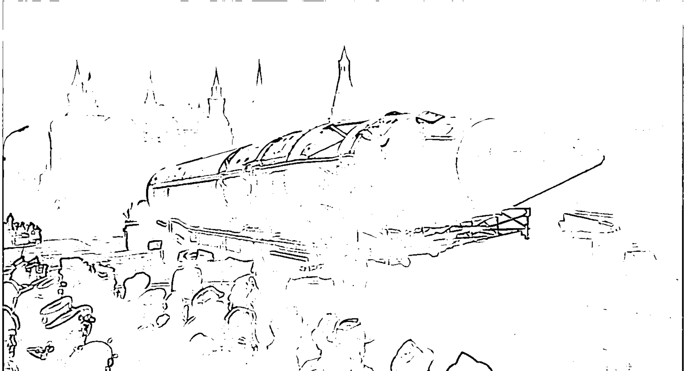

4. 莫斯科紅場閱兵的彈道飛彈。永遠拿來展示，但從未在實戰中發射。

### 歷史不會容許真空 ❊

在接下來幾十年間，可能饑荒、瘟疫和戰爭仍然會奪走數百萬人的性命。但這已經不再是無可避免的悲劇，人類對此也不再像以前一樣無助，而感到無法理解、無法控制。這一切已經成為有可能處理的挑戰了。

我並不是要將全球仍有的苦難視為無物。目前仍有數億人陷於貧困；每年瘧疾、愛滋病和肺結核仍帶走數百萬生靈；敘利亞、剛果和阿富汗的暴力情境也仍在惡性循環。這裡並不是要聲稱世上已經沒有饑荒、瘟疫和戰爭，人類再也不用擔心這些問題了。其實我的態度正好相反。

縱觀歷史，是因為人類總認為這些問題無法解決，於是根本不去嘗試解決，只是向神祈求奇蹟，自己卻從未認真努力消滅饑荒、瘟疫和戰爭。有些人說，2016年的世界還是像在1916年一樣，又餓、又病、又暴力，這等於是延續著古老的失敗主義觀點，好像說人類在二十世紀投入的巨大心力一無所獲，種種醫學研究、經濟改革與和平倡議，也全然徒勞。但若真是如此，又何必再投入時間資源來進行更多醫學研究、創新經濟改革，又或提出新的和平倡議？

認可人類過去的努力，等於是傳達出希望和責任的訊息，鼓勵我們在未來更加努力。有鑑於人類在二十世紀的成就，如果以後的人類仍然苦於饑荒、瘟疫和戰爭，已經不能再怪在自然或上帝的頭上了。我們已有能力把事情做得更好，並減少未來受苦的發生率。

然而人類的成就還帶著另一條訊息而來：歷史不會容許真空。如果饑荒、瘟疫和戰爭的發生率不斷減少，必然要有些其他什麼，成為人類的新議題。我們對此必須戒慎深思，否則可能只是在舊戰場上全面獲勝，卻在新戰線上措手不及。到了二十一世紀，會是哪些新議題取代饑荒、瘟疫和戰爭？

其中一項中心議題，會是要保護人類和地球整體，不被人類自己的力量所害。我們之所以能成功控制饑荒、瘟疫和戰爭，很大的原因在於驚人的經濟成長帶來豐富的食物、醫藥、能源和原物料。然而同樣也是因為經濟成長，已經讓地球的生態平衡在許多方面失衡了，而我們現在才剛開始有所意會。人類對於這項危機承認得很晚，而且至今的努力也不足。雖然總有人談著汙染、全球暖化、氣候變遷，但多數國家迄今仍未試圖改善，仍未做出任何認真的經濟或政治犧牲。每當要在經濟成長和生態穩定二擇一的時候，政客、企業和選民幾乎總是選擇了成長。如果我們真想離災遠禍，就得在二十一世紀做出更好的選擇。

人類還會想追求什麼？我們會不會覺得只要能避免饑荒、瘟疫和戰爭，又能維持生態平衡，就已經心滿意足？這可能確實是最明智的選擇，但是「智人」（Homo sapiens）不太可能就這麼照辦。畢竟智人很少真正知足。每次達到成就，智人的大腦最常見的反應並非滿足，而是想要得到更多。智人總是追求著更好、更大、更美味，而等到智人擁有龐大的新能力，饑荒、瘟疫和戰爭的威脅也終於解除，我們接著要做什麼？到時候，科學家、投資人、銀行家和總統整天要幹嘛？難道是寫寫詩？

成功是野心之母，而我們最近的成就，也推動人類設下更大膽的目標。我們已經達到前所未有的繁榮、健康與和諧，而由人類的過往紀錄與現有價值觀看來，接下來的目標很可能是長生不死、幸福快樂，以及化身為神。在減少了饑荒、瘟疫和戰爭之後，我們現在希望能夠克服年老，甚至是戰勝死亡。在拯救人民脫離各種不幸之後，我們現在希望他們能夠幸福快樂。而在提升人性、超越掙扎求生的獸性之後，我們現在希望把人類升級為神，讓「智人」化身成為「神人」（Homo deus）。

#### 新議題之一：當「死亡」將走向末日

在二十一世紀，人類很有可能真的會趨近長生不死的目標。對抗了饑荒和瘟疫之後，對抗老死不過是這場戰役的延續，更體現了當代文化最看重的價值：人的生命。不停有人提醒我們，人命是宇宙最珍貴的事物。不論是學校裡的老師、國會殿堂上的政客、法庭裡外的律師、甚至是舞臺上的演員，都是如此異口同聲。聯合國在第二次世界大戰之後，通過〈世界人權宣言〉（Universal Declaration of Human Rights），這或許是我們最接近全球憲法的一份文件，裡面就明確指出「有權享有生命」是人類最基本的價值。由於死亡明顯違反這項權利，便成了危害人類的罪行，而我們該對此全面開戰。

縱觀歷史，宗教和意識型態所神化的，並不是生命本身，而是某些超脫俗世的對象，因此對死亡的態度十分開放。事實上，甚至還有些宗教和意識型態是歡迎死亡的。就基督教、伊斯蘭教和印度教看來，因為存在的意義要看死後的命運而定，也就認為死亡是世上很重要而積極的一部分。人類會死，是因為神的旨意，而且死亡的那一刻是很神聖的、形而上的經驗，充滿各種意義。人要吐出最後一口氣之際，就應該趕快找來牧師、拉比（rabbi）、或薩滿巫師（shaman），把生命的帳戶結清，擁抱一個人在宇宙中的真正角色。想像一下，如果沒了死亡，世界就會變成沒有天堂、沒有地獄、也沒有輪迴，那基督教、伊斯蘭教或印度教該如何自處？

對於生命和死亡，現代科學和文化的觀點與宗教完全不同，並不認為死亡是某種形而上的神秘謎團，也當然不認為死亡是生命意義的來源。相反的，對現代人來說，死亡是一個我們能夠解決、也應該解決的技術問題。

究竟人是怎麼死的？在中世紀的童話故事裡，死神披著黑色連帽斗篷，手上還握著一把大鐮刀。一個人活得好好的，腦子裡還在擔心這擔心那、四處奔波，這時突然死神就出現在他面前，瘦骨嶙峋的手指敲敲他的肩膀，告訴他：「來吧。」這個人懇求：「不！拜託！再給我一年、一個月，不然一天就好！」但披著連帽斗篷的死神，聲音嘶啞的說道：「沒這回事！就是現在了！」這似乎就是我們死的方式。

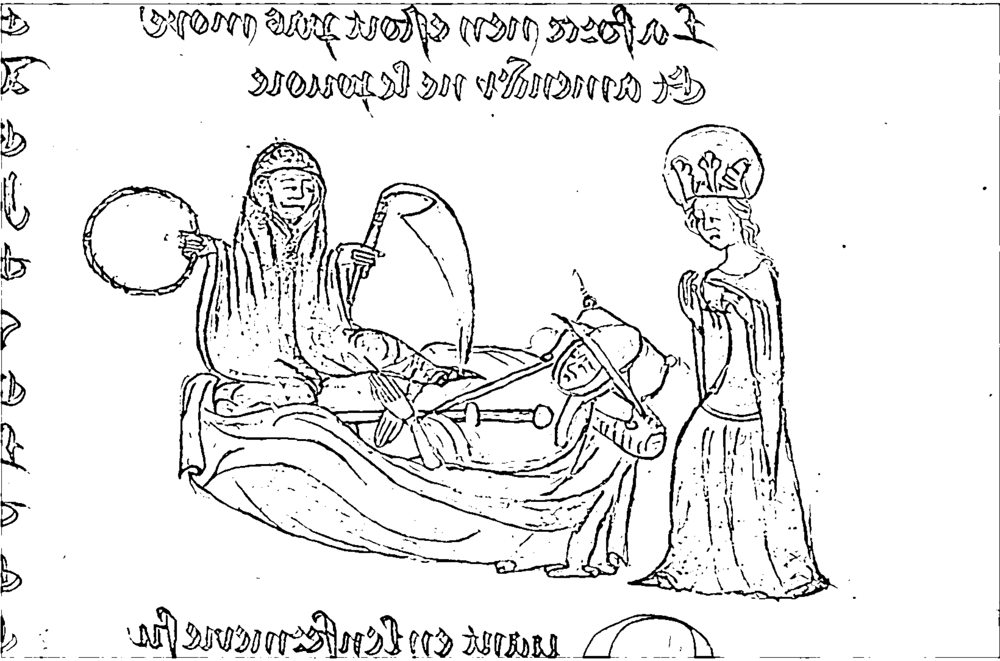

5. 中世紀藝術將死亡擬人化為死神。

但是在現實中，人類之所以死亡，可不是因為有個披黑色斗篷的人，在敲他們的肩膀；不是因為上帝的旨意，也不是因為這是什麼宇宙計畫的重要部分。人會死亡只有一個原因：人體運作出了點技術問題。心臟不跳、大動脈遭脂肪堵住、癌細胞在肝臟裡擴散、病菌在肺部裡繁殖。

到底是什麼造成這些技術問題？答案是其他的技術問題。心臟不跳，是因為沒有足夠的氧氣到達心肌。癌細胞擴散，是因為突變的基因改寫了生化指令。病菌住到我的肺裡，是因為有人在捷運上打了個噴嚏。這裡沒什麼形而上的事，一切都只是技術問題而已。

而只要是技術問題，就會有技術上的解決方案。要克服死亡，並不需要等到耶穌再臨，只要實驗室裡的幾個科技咖就成了。如果說，傳統上死亡屬於牧師和神學家的飯碗，現在工程師正在接手這筆生意。用化療或奈米機器人，我們就能殺死癌細胞；用抗生素，就能消滅肺部病菌；心臟不跳了，可以用藥物和電擊，讓它重新開始跳動，如果真的不行，還能乾脆直接換個新的心。確實，現在並不是所有技術問題都已經找到解決方案。但也正因如此，我們才會投入這麼多時間和金錢，研究癌症、細菌、基因和奈米科技。

就連不屬於科學界的一般民眾，也已經習慣把死亡當成一個技術問題。如果有位婦女問醫師：「醫師，我是哪裡出了問題？」醫師有可能說「你得了流感」、「你得了肺結核」、「你得了癌症」，但沒有醫師會說「你得了死亡」。對我們來說，人會死，是因為流感、肺結核、癌症，而這些統統算是技術問題，總有一天能找到技術上的解決方案！

> 醫師，我是哪裡出了問題？

> 你得了流感

> 你得了肺結核

> 你得了癌症

> 你得了死亡

現在就算有人死於颱風、車禍或戰爭，我們還是可能認為，這是一種技術問題，可以預防的、而且是應該要預防：政府應該要有更好的天災對策，市政府應該要有更好的交通規劃，將領應該做出更好的軍事決定，這樣就能避免颱風、車禍或戰爭導致的死亡了。現在只要一出現死亡，幾乎訴訟和調查就自動隨之而來。「他們怎麼會死？一定是哪裡有人做錯了！」

### 長生不死之夢 ※

絕大多數科學家、醫師和學者，並不會說自己正努力達成讓人長生不死的夢想，只會說自己正在努力克服這個或那個特定問題。但因為衰老和死亡也只不過就是許多特定問題的總和結果，醫師和科學家可不會哪天忽然停手，宣布：「到此為止，不要再研究了。我們已經解決了肺結核和癌症，但不打算處理阿茲海默症。大家就繼續因為阿茲海默症而去世吧。」〈世界人權宣言〉可不是說人類「有權享有生命，直到九十歲為止」，而是說「人人有權享有生命」，沒有附帶條件、沒有任何到期日的限制。

雖是少數，但已有愈來愈多科學家和思想家公開表示，現代科學的中心任務就是要戰勝死亡，賦予人類永恆的青春。著名的人物包括老年病學家德格瑞（Aubrey de Grey）、以及身兼博學家和發明家身分的庫茲威爾（Ray Kurzweil，曾獲頒1999年美國科技創新國家獎章）。2012年，庫茲威爾獲谷歌（Google）任命為工程總監，一年後谷歌成立子公司Calico，明定公司使命就是要「解決死亡」。²⁷

2009年，谷歌任命真心相信人能長生不死的馬里斯（Bill Maris）擔任創投公司谷歌風投（Google Ventures）的執行長。2015年1月接受採訪時，馬里斯說：「如果你今天問我，人是否有可能活到五百歲，我的答案是肯定的。」馬里斯這番豪語的背後，是大批金彈支

> 我们不只要挺进几码，而且要赢下这场比赛。「因为活着总比死好啊。」

援。谷歌风投的总投资金额高达二十亿美元，其中36%将投入生技新创公司，也包括几项深具雄心的寿命延长计划。马里斯用美式足球打比方，解释这场与死亡的对决：为什么？马里斯说：28

> 我认为，处理方式大概有三种：接受死亡、拒绝死亡、或是对抗死亡。我觉得社会上大多数人不是拒绝就是接受，而我宁愿和它对抗。

许多硅谷巨擘，都抱持这样的大梦想。PayPal共同创办人泰尔（Peter Thiel）最近就承认，他希望永远活下去。他解释道：很多人可能对此嗤之以鼻，以为这是不成熟的幻想。但泰尔可不是什么可以小看的人物，他是硅谷顶尖的成功创业家，影响力惊人，光是私人财富估计就有二十二亿美元。29 我们已经可以感受风雨欲来之势：人类不再平等，不死就在眼前。

某些领域的进展飞快，例如基因工程、再生医学和奈米科技，也让预言愈来愈趋向乐观。有专家认为，人类到了2200年就能打败死亡，也有人认为是2100年。库兹威尔和德格瑞甚至更为乐观，他们认为到了2050年，只要身体健康，钞票也够多，都可以大约每十年骗过死神一次，藉此达到长生不死。他们所想的方式是：我们大约十年接受一次全面治疗，除了医治疾病，也让衰老的组织再生，并让手、眼、脑都得到升级。而在下次治疗之前，医师又会发明各种更新的药、更高级的技术和工具。如果库兹威尔和德格瑞讲得没错，很可能已经有些像这样的不死人，就走在你身边的路上——尤其是你刚好走在华尔街或第五大道的时候。

事实上，他们只是达到「长生」（a-mortal），而不是真正「不死」（immortal）。这些未来的人类并不像神绝对不死，他们仍然可能死于战争或意外，而且无法起死回生；只不过，他们也不像我们这些

## # 人類大命運

凡人終有一死，他們的生命並不會有到期日。只要沒有炸彈把他們炸個粉碎、沒有卡車把他們輾成肉醬，就能永生。這樣一來，可能會讓他們成為歷史上最焦慮的一群人。凡人知道生也有涯，因此願意冒險體驗人生，像是登上喜馬拉雅山或泳渡怒海，又或是走過街道、上餐廳吃吃飯，這些事或多或少也算相當危險。但如果你相信自己可以永遠活下去，像這樣不時賭上一把，可能就太不智了。

這麼說來，或許我們先把目標訂得溫和點，別追求長生，先把壽命加倍如何？在二十世紀，人類的預期壽命已從四十歲增加到七十歲，幾乎翻了一倍，所以在二十一世紀，至少應該可以再翻倍到一百五十歲吧。雖然這和「不死」還遠遠差了一截，但仍然會讓人類社會翻天覆地。

首先，家庭結構、婚姻和親子關係，就將大為改觀。現在人們對結婚的期許仍然是「至死不渝」，而生命有一大部分是用來養育後代。想像一下，如果人能活一百五十歲是什麼概念。就算四十歲才結婚，後面仍然有一百一十年可活。希望這段婚姻能持續一百一十年，這個想法實際嗎？就算是天主教教義派也可能得猶豫猶豫。所以像現在多次結婚的情形，可能會日益普遍。還有，如果在四十多歲生了兩個孩子，等到她一百二十歲，養育孩子已經像是頗遙遠的記憶了，只算得上是長長人生中的一段小插曲。在這種情況下，很難說究竟會發展出怎樣的親子關係。

又或者講到職業生涯。今天，我們假設人會在十幾、二十歲學會某種專業，接著一生奉獻在這個專業。當然，人就算到了四、五十歲還是會學到新知，但我們大致還是把人生分成「學習階段」、以及之後的「工作階段」。如果人會活到一百五十歲，這套生涯系統就不管用了，特別是這個世界還不斷出現震撼世界的新科技。人

類的職業生涯將會比現在長得多，甚至到了九十歲，仍然必須日日新、又日新。

### 長生不死是好事嗎？

與此同時，人類也不會在六十五歲就退休、讓路給新一代和他們創新的想法與期望。德國理論物理學家普朗克（Max Planck）有句名言：「科學在一次一次的葬禮中進步。」他所說的是，必須等到一個世代離去，新的理論才有機會劇除舊理論。這絕非科學獨然。想像一下你現在的工作環境，不管你是學者、記者、廚師、還是足球員，如果你的上司已經一百二十歲了，概念都是在維多利亞女王時代建立的、而且他可能還要再當你上司幾十年，這給人什麼感覺？

到了政治領域，情況可能還更為險惡。如果俄羅斯總統普丁繼績在位九十年，你覺得如何？再想想，如果人本來就會活到一百五十歲，那麼在2016年，掌控莫斯科的還會是史達林，現年一百三十八歲，老當益壯；毛主席一百二十三歲，正值中年；伊莉莎白還是公主，等著從一百二十一歲的喬治六世手中繼承王位。至於她的兒子查爾斯，可得等到2076年。

讓我們回到現實，現在還遠遠無法肯定，庫茲威爾和德格瑞的預言究竟能否在2050年或2100年成真。就我自己看來，在二十一世紀想永保青春，為時過早，現在就抱太大期望，大概只會迎來很大的失望。知道自己終將一死並不好過，但如果是一心以為長生不死、卻夢想破滅，可能更難接受。

雖然過去一百年，已經讓平均壽命增加一倍，但如果要依此推論，認為在未來一百年，定會再翻倍達到一百五十歲，也還言之過


### 人類大命運

早。1900年全球的平均壽命之所以不到四十歲，是因為營養不良、傳染病和暴力，讓許多人還很年輕便離開人世。但只要避開飢荒、瘟疫和戰爭，就能活到七十、八十歲，這是智人自然的壽命長度。一般人可能沒想到，其實在幾百年前，活到七十幾歲也不是什麼罕見的怪事。伽利略享年七十七，牛頓享年八十四，米開朗基羅更是高齡八十八，而且當時還沒有抗生素、疫苗或器官移植的協助。甚至，就連叢林中的黑猩猩，有時候都能活到六十好幾。30

事實上，到目前為止，現代醫學連自然壽命的一年，都還沒能延長。現代醫學的成功之處，是讓我們免於早夭早逝，能夠完整過完應有的人生。就算我們打敗了癌症、糖尿病和其他主要殺手，也只代表幾乎每個人都能活到九十歲，但和一百五十歲還差得遠，更別說五百歲了。想達成活到一百五十歲的目標，醫學必須重新打造人體最基本的結構和運作，並設法再生各種器官和組織。究竟在2100年能不能做到，現在絕對仍在未定之數。

然而，每次失敗的嘗試，都是讓我們向戰勝死亡又邁進一步，也將帶來更多希望，鼓勵投入更多心力。谷歌旗下的Calico公司可能來不及讓聯合創辦人布林（Sergey Brin）和佩吉（Larry Page）長生不死，但很有可能會在細胞生物學、遺傳醫學、健康醫護方面有重大發現。這樣一來，新一代的谷歌員工就能站在更好的位置，向死亡進攻。高呼著人類不死的科學家，其實就像是〈狼來了〉故事裡的那個男孩——狼要來，只是早晚的事。

因此，就算在我們有生之年還無法達成永生，這場與死亡的戰爭，仍有可能是接下來這個世紀的旗艦計畫。想到我們對於「生命神聖」的信念、整個科學界的動向、加上最重要的是資本經濟的需求，一場對死亡的無情戰爭似乎已無可避免。我們的意識形態看重

## # 第1章 人類的三大新議題

人類的生命，絕不允許我們輕易接受人類死亡。只要人是因為某種原因而死，我們就會努力克服這種原因。

對於這項挑戰，科學界和資本經濟絕對是樂於承擔。只要讓他們得到新發現、奪得新商機，大多數的科學家和銀行家並不在乎要做的是什麼事情。而又有誰能想到，比戰勝死亡更令人興奮的科學議題，或是比永保青春更有前景的市場？如果你已年過四十，請閉上眼睛一分鐘，回想自己當初二十五歲的身體，不只是外表，更是當時那種感覺。如果能讓你回到當時的生理狀態，你會願意付出多少價錢？當然，有些人會對此不屑一顧，但願意不惜一切的顧客，也必然不在少數，已足以構成一個幾乎無限大的市場。

如果光這些還不夠，單就對死亡的恐懼這一點，就已經深植在多數人心中，足以推動向死亡宣戰。只要你們認為死亡無可避免，就會從小訓練自己，壓抑想要永生不死的欲望，又或是駕馭這種欲望，運用到其他目標。正是因為人們渴求永生不死，才能譜出「不朽」的交響曲、在戰爭中奮力爭取「永恆的榮耀」，甚至願意犧牲生命，希望自己的靈魂能「在天堂享受永遠的幸福」。不論是藝術的創造、政治的投入或宗教的虔誠，很大部分其實正是由「對死亡的恐懼」所推動。

伍迪·艾倫（Woody Allen）就從對死亡的恐懼，發展出燦爛的職涯。曾有人問他，是否想在大銀幕上永遠活下去。他回答：「我寧可活在我的公寓裡。」接著又說：「我並不想靠作品來達成永生，我希望靠的是我不要死。」不論是永恆的榮耀、全國性的悼念會、又或是對天堂的夢想，都很難替代像伍迪·艾倫這種人真正想要的：不要死！一旦人們覺得（不論理由充分與否）有很好的機會能躲避死亡，求生的渴望就不會讓他們再去承擔像是藝術、意識形態

或宗教這樣的重擔，於是便引起如雪崩般的連鎖反響。

如果你覺得那些眼睛像要冒火、髭鬚迎風揚起的宗教狂熱份子已經夠嚇人，就請拭目以待：一旦行將就木的零售業巨擘和年華老去的好萊塢小牌明星，以為發現了長生的靈藥，他們會出現怎樣的舉動！在這場對死亡的戰爭中，如果科學上出現顯著進展，真正的戰場就會從實驗室轉移到國會、法院和街頭。如果科學的努力宣告獲勝，那更會引發激烈的政治衝突。

過往歷史上所有的戰爭和衝突，很可能規模都將遠遠不及接下來的這場爭鬥：爭奪永恆的青春。

### 新議題之二：幸福快樂的權利 ※

人類未來的第二大議題，可能是要找出幸福快樂的關鍵。歷史上已有無數思想家、先知和一般大眾認為，所謂的「至善」與其說是擁有生命本身，還不如說是能夠幸福快樂。古希臘哲學家伊比鳩魯（Epicurus）就曾說：崇拜神祇是浪費時間，死後一切不復存在，而生命的唯一目的就是享樂。

古代大多數人並不接受享樂主義，但今天這已經成為我們的預設思想。由於對「來世」的概念有所懷疑，讓人已不只想追求長生不死，也想追求俗世人間的快樂。畢竟，哪有人想活在永恆的苦難裡？

對伊比鳩魯來說，追求快樂是件個人的事。但近代思想家則相反，認為這需要大家群策群力。如果沒有政府規劃、經濟資源投入和科學研究，個人追求快樂並不會有太大成效。如果你的國家遭到戰火肆虐、經濟陷入危機、健康照護求而不得，快樂就似乎是天方

夜譚。十八世紀末，英國哲學家邊沁（Jeremy Bentham）主張，所謂至善就是「為最多人帶來最大的快樂」，並認為國家、市場和科學界唯一值得追尋的目標，就是提升全球的快樂——政治家應該追求和平、商人應該促進繁榮、學者應該研究大自然，但不是為了榮耀什麼國王、國家或神祇，而是為了讓你我都享有更快樂的生活。

在十九世紀和二十世紀，雖然許多政府、企業和實驗室也曾號稱追尋著邊沁的理想，但實際上仍然專注於更直接和明確的目標。要評斷國家是否強大，看的是領土大小、人口增加、GDP（國內生產毛額）成長，而不是國民是否幸福快樂。像是德、法、日這些工業化國家，雖然打造了巨大的教育、健康和福利系統，但仍然是為了強化國家，而不是確保個人福祉。

之所以成立學校，是為了培養溫順而有技能的國民，忠誠為國服務。男生到了十八歲必須當兵，年輕人除了愛國、也得識字，才能讀懂將領的命令、制定明天的作戰計畫。他們也得懂數學，才能計算炮彈的軌跡，或是破解敵人的密碼。另外還得一定程度瞭解電子學、機械原理和醫藥，才能操作無線電、駕駛戰車、照顧受傷的同袍。等到這些人離開軍隊，則會期待他們成為辦事員、教師或工程師，撐起一個現代經濟體，而且繳出許多稅來。

衛生系統也是如此。在十九世紀末，法、德、日等國開始為大眾提供免費醫療服務，為嬰兒接種疫苗、為兒童提供營養均衡的飲食，也為青少年提供體育課程。另外還將腐臭的沼澤排乾、消滅蚊害，並建立中央汙水處理系統。目的同樣不是為了讓人民快樂，而是讓國家更強大。國家需要有強健的士兵和工人，需要有健康的婦女，才能生育更多的士兵和工人，也需要官僚人員能夠上午八點準時打卡上班，而不是病倒在家。

就連福利制度，一開始也是為了國家的利益，而不是個體的需求。德意志帝國的鐵血宰相俾斯麥（Otto von Bismarck）於十九世紀末，率先開辦國家養老金及社會安全福利，但他的主要目標是確保國民忠誠，而不是增加國民福祉。你在十八歲為國家打仗、在四十歲願意納稅，是因為希望到了七十歲的時候，能獲得國家的照顧。³¹

1776年，除了生命權和自由權以外，美國的開國元勳也把「追求幸福的權利」列為人人不可剝奪的權利。但請注意，〈美國獨立宣言〉保障的是追求幸福的權利，而不是享有幸福的權利。事實上，傑佛遜（Thomas Jefferson）並未要求國家對國民的幸福負起責任，而是要限縮國家的權力。當時是希望讓人民能夠保有私人選擇的權利，不用受到國家監督。如果我覺得自己和約翰結婚、比和瑪麗結婚快樂，住在舊金山比住在鹽湖城幸福，當酒保比當酪農更開心，那我就有權利去追求這些幸福，就算我做了錯誤的決定，國家也不該干涉。

但是在過去幾十年間，情況已有改變，有愈來愈多人開始認真看待邊沁的願景。人們愈來愈相信，這些為了強化國家統治基礎而生的巨大系統，其實應該是要為每一位國民的幸福與福祉而服務。不是我們要服務國家，而是國家要服務我們！「追求幸福的權利」原本只是為了約束國家權力，但已經在不知不覺中，演變成「幸福快樂的權利」，彷彿說人類天生有權要求幸福快樂，如果有什麼讓我們不能滿足，就等於違反我們的基本人權，而國家此時就該介入。

在二十世紀，想評估國家是否成功，或許公認的標準在於平均每人國內生產毛額（per capita GDP）。用這種標準，新加坡每一位公民每年生產的商品和服務，平均總價值為56,000美元，比起每位公民只生產平均總值14,000美元的哥斯大黎加，實在是成功太多。

然而現在的思想家、政治家、甚至經濟學家，都呼籲要用GDH (gross domestic happiness，國內幸福毛額) 來補充，甚至應取代GDP。說實在的，人們到底想要什麼？他們不想總是忙著生產，而是想要幸福快樂。生產之所以重要，是因為能夠為幸福提供物質基礎。生產只是手段，不是目的。在一次又一次的調查中，哥斯大黎加人報告的生活滿意度，都遠高於新加坡人。而你是寧願當個生產力高、但不太開心的新加坡人，還是當生產力較低、但心滿意足的哥斯大黎加人？

## # 我們最幸福？

可能就是這樣的邏輯，會推動人類把「幸福快樂」當作二十一世紀的第二項主要目標。乍看之下，這項計畫似乎相對比較容易，畢竟饑荒、瘟疫和戰爭正逐漸絕跡，人類正經歷前所未有的和平與繁榮，預期壽命也顯著增加。有了這麼多，人們想必都很幸福快樂了吧？

事實不然。伊比鳩魯把至善定義成幸福快樂的時候，就曾告誡弟子，快樂是件辛苦的差事。光是物質成就，無法讓我們長久感到滿足。盲目追求金錢、名譽和歡愉，只會讓我們痛苦不堪。舉例來說，伊比鳩魯就建議吃喝要適量，性慾也要節制。從長遠來看，深厚的友誼會比一夜狂歡，讓人更快樂。通往幸福快樂的道路其實暗藏艱險，而伊比鳩魯就規劃出整套倫理上的行為準則，希望藉此引導民眾。

伊比鳩魯顯然意識到一件事：快樂得來不易。雖然我們在過去幾十年間，已達到前所未有的成就，卻很難看到有哪個現象，證明當代人顯然比過去的前人更為滿足。事實上，甚至還有些令人不安的跡象：雖然已開發國家更為繁榮、舒適及安全，但是自殺率卻也遠高於傳統社會。

在秘魯、瓜地馬拉、菲律賓和阿爾巴尼亞這些貧困而政治不穩定的國家，平均每年每十萬人有一人自殺。但是在瑞士、法國、日本、紐西蘭這種富裕與和平的國家，平均每年每十萬人卻有二十五人結束自己的生命。在1985年，大多數南韓民眾生活貧窮、未受教育、深受傳統束縛，且活在專制獨裁統治之下。到了今天，南韓已經是領先的經濟強國，國民教育水準在全球數一數二，並享有穩定而相對自由的民主制度。然而，南韓在1985年大約每十萬人有九人自殺，現今的自殺率卻飆破三倍，來到每十萬人有三十人自殺。32

當然，也有趨勢是日漸好轉，令人樂觀。像是兒童死亡率急遽下降，肯定是讓全體人類的幸福提升了，也部分補償了現代生活的壓力。然而，就算我們確實比先人快樂了那麼一些，整體福祉的增加幅度，還是遠遠小於預期。在石器時代，人類平均每天必須取得4,000大卡的熱量，其中除了餵飽肚子之外，也要用在衣服保暖、製作工具、藝術和升起營火。到了今日，美國人平均每天使用228,000大卡的熱量，除了填飽自己的胃，也包括供給自己的汽車、電腦、冰箱、電視所需。33 這麼說來，美國人平均使用的能量，將近是石器時代狩獵採集者的六十倍。但一般美國人真的有比以前快樂六十倍嗎？這種美好的想法，可能只是一廂情願。

就算我們已經克服了許多昨日的苦難，想要正面取得快樂，這可能遠比從負面解除痛苦，還來得更加困難。如果是一位瀕臨餓死邊緣的中世紀農民，只要一塊麵包，就能讓他非常快樂。但如果是，一位百無聊賴、薪水超高、體重過重的現代科技新貴工程師，你要怎麼讓他快樂起來？

對美國而言，二十世紀後半葉是個黃金時代——先在第二次世界大戰獲勝，隨後的冷戰時期也奪下更關鍵的勝利，讓美國成為全球首屈一指的超級大國。從1950年到2000年，美國GDP從二兆美元成長到十二兆美元。實際人均收入增加了一倍。新發明的避孕藥讓性愛是前所未有的無拘無束。婦女、同性戀、非裔美國人和其他少數族裔，也終於從美國這塊大餅分到了比過去更大的一塊。便宜的汽車、冰箱、空調、吸塵器、洗碗機、洗衣機、電話、電視和電腦，如大水湧來，日常生活簡直徹底改觀。但研究顯示，美國人在1990年代的主觀幸福感，與1950年代的調查結果仍然大致相同。³⁴

在日本，從1958年到1987年間，平均實質收入成長為五倍，經濟成長可說是史上最快。但這種排山倒海而來的財富，伴隨著對生活方式及社會關係的各種正面及負面影響，對於日本的主觀幸福感卻是出人意料的，幾乎沒什麼影響。在1990年代，日本人對生活還是如同1950年代一樣滿意，或說不滿意。³⁵

### 幸福感也有玻璃天花板 ✧

看來幸福感就是罩了一片神秘的玻璃天花板，雖然我們達到了前所未有的成就，幸福感卻未能成長。就算我們能為所有人提供免費膳食、治癒所有疾病、確保世界和平，也不一定能打破這片玻璃天花板。要達到真正的幸福快樂，難度並不會比克服老死低得多。

幸福快樂的玻璃天花板有兩大支柱，分別屬於心理層面與生物層面。在心理層面，快樂與否要看你的期望如何，而非客觀條件。光是和平繁榮的生活，並不能讓我們滿意；必須是現實符合期望，才能讓我們滿足。但壞消息是，隨著客觀條件改善，期望也會不斷膨脹。於是乎，人類近幾十年來的客觀條件雖然大幅改善了，但是帶來的不是更高的滿足，而是更大的期望。如果我們不做點什麼，未來不論達到什麼成就，可能我們還是會像當初一樣，永遠不會真正滿足。

從生物層面來說，不管是期望或是幸福感，其實都是由生物化學機制控制的，而不是由經濟、社會和政治局勢來決定。根據伊比鳩魯的說法，我們之所以感到幸福，是因為我們感受到愉悅的感覺（sensation），而且並未接觸到不快的感覺。邊沁也有類似的說法，認為大自然讓人類由兩個主人控制：快樂和痛苦；我們的所為、所言、所思，都是由這兩個主人決定。承繼邊沁思想的彌爾（John Stuart Mill）則解釋，幸福快樂也就是只有愉悅、沒有痛苦，而在愉悅與痛苦之外，沒有善惡之別。如果有人想從愉悅和痛苦之外的理由（譬如上帝的話語或國家利益）推導出善惡，這人是想騙你，而且也可能騙了他自己。36

在伊比鳩魯的時代，這種言論是褻瀆神靈。在邊沁和彌爾的時代，這種言論是反動顛覆。但是在二十一世紀早期，這就成了科學正統。根據生命科學的說法，快樂和痛苦只不過是身體各種感覺的總和狀態。愉悅或痛苦從來就不是對外在世界事件的反應，而是對自己體內感覺的反應。丟掉工作、離婚、或是政府開戰，事件本身並不會讓人受苦。唯一能讓人痛苦的，就是自己身體裡不愉快的感覺。丟掉工作會引發沮喪，而沮喪才是一種令人不悅的身體感覺。世界上可能有一千種事情會讓我們憤怒，但憤怒也不是什麼抽象的概念，而是體內燥熱、肌肉緊繃的身體感覺，這才是憤怒的真相。我們說「怒火中燒」，確實是有些根據的。

## 第1章 人類的三大新議題

相對的，科學也說並沒有人是因為得到升職、中彩券、甚至是找到真愛而快樂。真正能讓人幸福快樂的，只有一件事、別無其他可能，也就是身體裡的愉悅感覺。想像自己是戈策（Mario Götze），擔綱2014年世界盃德國隊的攻擊型中場球員，在決賽對上阿根廷；這時已經開賽一百一十三分鐘了，兩隊都未能得分。再過短短七分鐘，就要來到恐怖的PK大戰。巴西里約的馬拉卡納體育場，塞滿了七萬五千名激動的球迷，全球還有不知幾百萬觀眾焦急的緊盯螢幕。你離阿根廷的球門只有幾公尺，這時舒勒（André Schürrle）忽然朝你踢來一記妙傳！你胸口停球，看著球向你的腳落下，再空中起腳一射，看著球越過阿根廷門將，強力射進球網。進了！

體育場如火山爆發，幾萬人瘋了一般大吼，你的隊友衝上來擁抱親吻你，國內柏林和慕尼黑的數百萬觀眾，也在電視螢幕前激動落淚。這時你欣喜若狂，但並不是因為在阿根廷球門裡那顆球，也不是因為在巴伐利亞邦露天啤酒吧裡塞爆球迷的歡天喜地，而是因為在你的身體裡面，各種感受正有如風暴一般襲來，「欣喜若狂」就是對這些感覺的回應。你覺得有冷顫在你的脊椎上上下下，電波一波一波衝過身體，好像自己溶入了幾百萬顆爆炸的能量球一般。

你不用在世界盃決賽踢進致勝一球，也能得到這樣的感覺。像是工作上意外升遷，讓你開心得跳了起來，就是對同一種感覺的反應。你的心靈深處，其實根本不懂足球、也不懂工作，只懂生物生理的感覺。如果你升遷了，但因為某種原因而沒有得到這種愉悅的感覺，你就不會覺得滿意。反之也是如此。如果你剛被開除（或是輸了一場重要賽事），但感受到了非常愉快的感覺（也許是因為嗑藥），那你還是可能以為自己就站在世界的頂峰，飄飄欲仙。

但壞消息是，愉悅的感覺很快就會消退，遲早會轉變成不愉快的感覺。就算踢進了世界盃決賽的制勝球，也無法保證一生幸福，甚至是到了頂點之後就只能下坡。同樣的，如果去年我意外升遷，很有可能雖然我現在還是在這個位子上，但當初聽到消息的愉悅感早已經在幾個小時後就煙消雲散。如果想再感受那些美妙的感覺，就得再升遷一次。萬一滿懷期望、卻沒能再升遷，感受到的痛苦和憤怒，可能還遠比當初乾脆一直當個小卒來得高。

### 興奮感總是太短暫

這些都是演化的錯。無數代以來，我們的生化系統不斷適應，為的是增加生存和繁衍的機會，而不是快樂幸福的機會。只要是有利於生存和繁衍的行為，就會得到生化系統用愉悅的感覺來回饋。但這不過是一時的行銷花招罷了。我們努力取得食物、追求伴侶，就是想避免飢渴帶來的不愉悅感覺，並且滿足進食的愉悅、性愛的高潮。但無論進食或性愛，這種愉悅都無法長時間維持，想要再次感受，就只能去尋找更多的食物和伴侶。

如果哪天出現一種罕見突變，讓某隻松鼠只要吃了一顆堅果，就能一輩子感覺無上的快樂，情況會怎樣？技術而言，只要從松鼠的大腦下手，確實能夠做到。而且誰知道呢，或許幾百萬年前就出現過這樣幸運的松鼠，但牠過的就會是極其快樂、但也極其短暫的一生，讓這種罕見的基因突變迅速畫下句點。原因就在於，覺得快樂的松鼠再也不會努力去找更多堅果，更不用說是求偶交配了。至於和牠競爭的其他松鼠，吃了堅果才過五分鐘，就又覺得餓，反而有更好的機會能夠生存，並把自己的基因傳給下一代。正是基於完全相同的原因，人類蒐集的堅果（高薪的工作、大房子、好看的另一半）也很少能帶來長期的滿足。

可能有人會說，情況也沒那麼糟啦，因為讓我們快樂的不是那些結果，而是追求目標的過程。攀登聖母峰的過程，會比站在山頂更令人滿足；挑逗和前戲，要比最後的性高潮更為精采；進行開創性的實驗，也比最後獲得讚美和獎項更有趣味。然而，這並未改變事情的全貌，只是說明演化會用各種不同種類的愉悅，來控制我們罷了。有時候，演化是用愉悅或安寧的感覺，引誘我們行動；也有時候，是用得意或興奮的感覺，刺激我們向前。

動物如果在尋找某種增加生存和繁衍機會的東西（例如食物、夥伴、或社會地位），大腦就會產生警覺和興奮的感覺，而因為這種感覺如此美妙，就能促使動物更加努力。在一項著名的實驗中，科學家把電極連接到幾隻大鼠（rat）的腦子，大鼠只要踩下踏板，就能創造出興奮的感覺。接著，他們讓大鼠有美味的食物和踩踏板這兩個選擇，結果大鼠寧願選擇踏板（很像是小孩寧願打電動，也不想下樓吃飯）。這幾隻大鼠一次又一次踩著踏板，直到因為飢餓和疲憊而倒地不起。37

人類很可能也是這樣，喜歡比賽過程的興奮，大於最後成功的桂冠。然而，真正讓比賽如此吸引人的，就是那些令人開心的感覺了。像是爬山、打電動或去盲目約會，這些活動的過程絕不可能完全只有壓力、絕望或無聊這些令人不快的感覺，否則斷無可能有人參加。38

可惜的是，比賽那種興奮感，就像勝利時的幸福感一樣，轉瞬即逝。風流男人享受一夜情的刺激，商人享受咬著指甲看道瓊指數上上下下，電玩玩家享受在電腦螢幕殺怪；對他們來說，再去回味昨日的冒險，並不足以讓他們感到滿足。就像大鼠必須一次又一次踩下踏板，不管是風流男子、商界巨擘或電玩玩家，一樣是每天都需要有新的刺激。雪上加霜的是，這裡的期望一樣會因現有條件而適應，昨天覺得刺激的挑戰，今天太快就化為沉悶。又或許，幸福快樂的關鍵既不是比賽、也不是金牌，而是要能調合出興奮與安寧這兩種元素的正確劑量組合；但我們大多數人，往往不斷在緊張與舒坦這兩端來回跳動，到了哪端就開始對那端感到不滿。

### 操縱生化反應可獲得快樂嗎？

如果科學說得不錯，幸福快樂是由生化系統所掌握，那麼唯一能確保守久心滿意足的方法，就是去操縱這個系統。別再管經濟成長、社會改革或政治革命了；為了提高全球幸福快樂的程度，該操縱的是人類的生物化學。

過去幾十年間，人們確實已經開始這麼努力了。五十年前，精神藥物背負著嚴重的汙名，如今這種汙名已然打破。不論這是好是壞，現在有愈來愈高比例的人口，定期服用精神藥物，確實有些是為了治癒使人衰弱的心理疾病，但也有些只是要面對日常生活的沮喪和偶爾襲來的憂鬱。

舉例來說，已經有愈來愈多學童開始服用利他能（Ritalin）之類的興奮劑。2011年，美國因為注意力不足過動症（attention deficit hyperactivity disorder, ADHD）而服用藥物的兒童人數，就有三百五十萬人。英國的這個數字，則從1997年的九萬二千人，上升到2012年的七十八萬六千人。39這些藥物的原本目的，是要治療注意力障礙，但今天就連某些完全健康的孩子，也開始服藥，希望能夠提高成績，迎合老師和家長愈來愈高的期望。40

很多人相當反對這種發展，認為問題不是出在孩子，而是出在教育體系。如果學童出現注意力障礙、壓力過高、成績不佳，或許我們該怪的是學校教法過時、教室過度擁擠、生活節奏已經快到不自然。或許該改變的不是孩子，而是學校？各種相關論點的歷時演變，十分耐人尋味。幾千年來，教育方法的相關爭論未曾停息，無論是在中國古代或是英國的維多利亞時代，人人都各有一套理論，而且都對所有其他理論嗤之以鼻。但在先前，至少大家還有一點達成共識：想改善教育，該從學校下手。然而現在，大概是歷史上首次，至少有一些人已經認為，更有效率的做法是從學生的生化狀態下手。41

軍隊也朝著同樣的方向前進：美國有12%的伊拉克駐軍、17%的阿富汗駐軍，曾經服用安眠藥或抗憂鬱症藥物，協助應對戰爭造成的壓力和痛苦。人會感覺到恐懼、憂鬱和精神創傷，原因不在於砲彈、詭雷或汽車炸彈本身，而在於荷爾蒙、神經傳遞物質和神經網路。共同遇上同一場埋伏的兩名士兵，可能一個嚇到呆滯、方寸大亂、之後幾年噩夢連連，另一個卻能勇敢向前殺敵，最後榮獲勳章。這裡的不同點，就在於兩名士兵身體裡的生物化學反應，如果能設法控制，就能一石二鳥，讓士兵更快樂，軍隊也更有效能。42

用生物化學來追求快樂，也是這個世界的頭號犯罪原因。2009年，美國聯邦監獄有半數受刑人是因為毒品入獄；義大利受刑人有38%因為毒品相關罪行遭定罪；英國受刑人也有55%是因為使用或交易毒品而觸法。2001年的一份報告發現，澳洲受刑人犯下入獄罪行時，有62%都吸了毒。43

人們喝酒是為了遺忘，抽大麻是為了感到平靜，用古柯鹼和安非他命是為了感到敏銳而自信；吞搖頭丸能讓人放大感官、感受狂喜，而LSD則會讓你踏進一場脫離現實的迷幻夢境。有些人靠著用功學習、工作或養家才得到的快樂，有些人只要操縱分子、調出正確劑量，就能遠遠更為輕鬆的搞定。這對於整個社會和經濟秩序都是實際存在的威脅，也正因如此，各國才會堅持對生化犯罪發動一場血腥而無望的戰爭。

國家希望管制用生物化學追求快樂幸福的手段，定出「好」與「壞」的區別。這裡的原則很清楚：如果有利於政治穩定、社會秩序和經濟成長，這樣的生化操作不但可允許，甚至還應鼓勵（例如能讓過動的學童平靜下來，或是讓士兵迫不及待投身戰役）。至於如果威脅到穩定和成長，這樣的生化操作就要禁止。然而，每年都有許多新藥從各大學、藥廠及犯罪組織的實驗室中誕生，國家與市場的需求也不斷變化。隨著用生化來追求快樂的腳步逐漸加速，對政治、社會和經濟也將有所影響，並愈來愈難以控制。

而且，使用藥物還只是個開端。實驗室裡的專家已經著手研究以更複雜的方式操縱人類的生化反應，例如將電流刺激，直接送至大腦特定部位，或是用基因工程控制人體的藍圖。不論確切方法為何，要透過生物化學操縱方式得到幸福快樂，並不容易，因為這其實改變了生命最基本的模式。不過話說回來，克服飢荒、瘟疫和戰爭，在過去又豈是易事？

### 長生不死之外，也想追求永恆的愉悅 ※

究竟人類該不該花這麼大的心力來追求生化的快樂，至今離定論還很遠。有人會說，快樂這件事根本沒那麼重要，要說個人滿意度是人類社會的最高目標，根本是走錯了路。有些人可能認為快樂確實是至善，但對於生化專家認為快樂只是身體愉悅的感覺，則很有意見。

在大約兩千三百年前，伊比鳩魯就曾警告門徒，無節制追求享樂很可能帶來的反而是痛苦，而非快樂。幾個世紀前，佛陀還有個甚至更激進的主張，認為追求快感正是痛苦的根源，這種快感只是短暫、毫無意義的振動。得到快感時，我們的反應不是滿足，反而貪得無厭，只是想得到更多。因此，不論我們感受到多少幸福、興奮的感覺，也永遠無法滿足。

如果我認定快樂就是這些稍縱即逝的快感，並且渴望得到愈來愈多的快感，我就別無選擇，只能不斷追求下去。好不容易得到之後，快感又很快消退，但因為光是過去快樂的回憶，並不足以令我滿足，所以我又得從頭再來。像這樣的追求，就算持續幾十年，也永遠無法帶來任何長久的成果；我愈渴望這些快感，愈是變得壓力重重，愈是無法厭足。想得到真正的幸福快樂，人類該做的不是加速，而是慢下追求快感的腳步。

佛教對快樂的看法，與生物化學有許多共通之處。兩者都認為快感來得快、去得也快，如果人們只是渴求快感，卻不好好體驗快感，就仍然無法滿足。但接下來，佛教與生物化學兩者卻有了非常不同的解決方案。生化的辦法是開發出各種產品和療法，為人類提供無止無盡的快感，希望讓人能夠永遠享有快感。但佛教的建議則是減少對快感的渴望，不讓渴望控制我們的生活。佛教認為，我們可以訓練心靈，仔細觀察各種感覺是如何產生、又如何消逝。只要心靈學會看穿這些感覺的本質（也就是短暫、毫無意義的振動），我們就不再有興趣追求快感。畢竟，去追求一個倏然而來、忽焉而逝的東西，有什麼意義？

目前，人類對於生化解決方案的興趣是遠遠大得多。不論那些喜馬拉雅山洞穴裡的僧侶、或是象牙塔裡的哲學家怎麼說，對資本主義信徒來講，愉悅的快感就是快樂，這種感覺可以周而復始。每過一年，我們忍耐不悅的能力愈來愈低，而對快感的渴望則愈來愈高。現在的科學研究和經濟活動都以此為目標，每年研發出更有效的止痛藥、新的冰淇淋口味、更舒適的床墊、更令人上癮的手機遊戲，好讓我們在等公車的時候，連一秒鐘的無聊都無須忍耐。

當然，這一切還是遠遠不足。智人的演化並未讓人能夠感受長久的快感，因此光靠冰淇淋或手機遊戲並不夠，如果真想長久感受到快感，就必須改變人類的生物化學機轉，重新打造人體和心靈。而我們也正在朝這目標努力。我們可以爭論這究竟是好是壞，但似乎二十一世紀的第二大議題：確保全球的幸福快樂，就是會牽涉到重新打造智人，讓人可以享受永恆的愉悅。

### 打造「神格」的人類

在追求幸福和不死的過程中，人類事實上是試圖把自己提升到神的地位。不只因為這些特質如神一般，也是因為：為了戰勝年老和痛苦，人類必須能夠像神一樣，控制自己的生物基質。如果我們能夠從人體系統移去死亡和痛苦，或許幾乎就等於能隨心所欲重新打造整個人體系統，以各種方式操縱人類的器官、情感及智能。這樣一來，你就能為自己訂購大力士海克力斯的力量、愛神阿芙蘿黛蒂的性感、智慧女神雅典娜的智能，或是如果你想要的話，也能訂來酒神戴歐尼斯的瘋狂。

到目前為止，要增加人的力量，主要還是依靠改進外在工具。但在未來，則可能更會著重在改進人的身心，或直接將人與工具結合起來。人要升級為神，有三條路徑可走：生物工程、半機械人（cyborg）工程與無機生命（inorganic life）工程。

生物工程的起源，是認為我們還遠遠尚未發揮人類身體的完整潛力。四十億年來，天擇（natural selection）不斷對生物撥撥弄弄、修修補補，讓我們從變形蟲變成爬蟲、再到哺乳動物，現在成了自封的「智人」。沒有理由認為智人就是最後一站。從人類發展歷程來看，不過就是在基因、荷爾蒙和神經元方面，出現一些相對來說並不大的變化，就已經足以讓直立人（Homo erectus，最厲害的成就就只是能製作出石刀），變成了智人（生產出太空船和電腦）。誰曉得如果人類的DNA、內分泌系統和大腦結構再多變化一些，結果會是如此？

生物工程並不會耐心等待天擇發揮魔力，而是要取來舊有的智人身體，刻意改寫基因碼、重接大腦迴路、改變生化平衡，甚至是長出全新的肢體。這樣一來，將會創造出一些小神（godling），這些小神與我們智人的差異，可能就如同我們和直立人的差異，那般巨大。

半機械人工程則更進一步，是讓人體結合各種非生物的機器設備，例如仿生機械手（bionic hand）、人造眼，又或是將數百萬個奈米機器人注入我們的血管，讓它們在血液中巡航、診斷病情並修補損傷。這種半機械人的某些能力，將會遠遠超出任何有機的人體。例如，一副有機身體的所有部分都必須緊緊相連，才能發揮作用。如果有一頭大象的大腦在印度、眼睛和耳朵在中國、腳在澳洲，最有可能的情況就是這頭大象根本就死了，而且就算因為某種神秘的因素而還活著，也是眼不能視、耳不能聽、足不能行。

然而，半机械人却能够同时出现在许多地方。像是半机械人医师，根本不用离开位于斯德哥尔摩的诊间，就能在东京、芝加哥、甚至是火星上的太空站，进行紧急手术。唯一需要的，就是够快的网络连线、以及一对仿生机械眼、一双仿生机械手罢了。但是再想想，为什么只能是一对呢？为什么不能是四只眼睛？事实上，甚至连这些想法都是多余的，如果能有仪器直接连接半机械人医师的大脑，又何必再用手去拿手术刀？

这听起来可能很像科幻小说，但其实已经成为现实。最近已有猴子学会如何透过植入猴脑的电极，控制远端的仿生机械手脚。瘫痪的病人也能够单独靠着念头，就移动仿生机械肢体或操作电脑。如果你想要的话，也能够戴上电子“读心”头盔，在家里遥控电子设备。这种头盔并不需要把电极植入大脑，而是去读取你头皮所发出的电波信号。如果想开厨房的灯，只要戴上头盔、想像一些事先编程的心理符号（例如想像你的右手做某个动作），就能把开关打开。这种头盔现在网路上就买得到，只要四百美元。44

2015年初，斯德哥尔摩一家高科技公司Epicenter有数百名员工在手中植入芯片。这个芯片大约米粒大小，存有个人安全资讯，让他们只要挥挥手，就能打开门、或是操作影印机。他们希望很快也能用这种方式来付款。希欧柏拉德（Hannes Sjoblad）是幕后研发人员之一，他解释道：“我们已经随时都在与科技互动，但现在搞得手忙脚乱，得输入各种PIN码（用户个人识别号码）和密码。如果能用手一摸就好，岂不是轻松自在？”45

然而就算是半机械人工程，现在也仍然相对保守，因为它还是假定要由有机的人类大脑，扮演生命的指挥和控制中心。还有另一个更大胆的想法，则是彻底抛弃有机的部分，希望打造出完全无机的生命。大脑神经网络将由智慧软件取代，这样就能同时优游虚拟世界与真实世界，不受有机化学的限制。经过了四十亿年徘徊在有机化合物的国度，生命终将打破藩篱，进入一片无垠的无机领域，形成我们在最疯狂的梦中，都未曾设想的形状。毕竟，不管以往我们的梦想再疯狂，也还是不脱有机化学的限制。

离开有机领域后，生命或许也终于能够离开地球。四十亿年来，生命之所以还是局限在地球上的一小部分，是因为天择让所有生物都完全得依靠地球这颗巨大飞岩的独特情境。就连现在最强韧的细菌，也无法在火星上生存。但如果是非有机的人工智慧，就比较容易殖民外行星了。

因此，用无机生命取代有机生命之后，可能就播下了未来银河帝国的种子。但领导者不见得是像《星舰迷航记》里的库克船长，反而可能比较像是百科（Mr. Data）。

## 新议题之三：智人将演化为“神人”

我们并不知道这些眼前的道路，会把我们引向何方，也不知道我们那些像神一般的后代，会是什么样子。要预测未来，从来都不容易，而各种革命性的生物科技，又让难上加难。原因就在于，要预测新科技对交通、通讯、能源等领域的影响，已经十分困难，更别说运用科技将人类升级了，那可是一项完全不同的挑战。因为这有可能会彻底改变人类的心灵和慾望，而我们还抱持着现时的心灵和慾望，自然无法料到未来会是如何。

几千年来，历史一直充满工技、经济、社会和政治的动荡，然而却有一件事自始未变：人类本身。现在人类拥有的工具和体制，已经和《圣经》时代大为不同了，但是人类心灵的深层结构仍然相同。正因如此，我们现在观看《圣经》、《论语》、或者是苏弗克里兹（Sophocles）和尤里庇狄思（Euripides）的希腊悲剧，依然能从字里行间找到自我。这些经典的创作者和我们都是一样的人类，于是我们觉得这些典籍里说的就是我们。在现代剧场的作品里，伊底帕斯、哈姆雷特和奥赛罗，可能是穿着牛仔裤和T恤，而且还有脸书帐号，但他们的情感冲突却和原剧并无不同。

然而，一旦科技让我们能够重新打造人类的心灵，智人就会消失，人类的历史就会告一段落了，另一个全新的过程将要开始，而这将会是你我这种人无法理解的过程。许多学者试图预测世界到了2100年或2200年将会如何，但这是浪费时间。任何预测要有价值，就必须考量人类心灵被重新打造的影响，可是这件事本身就无法考量。有个问题是：“像我们这样的人，会用生物科技来做什么？”这个问题已经有了许多很好的答案。但还有一个问题：“对于心灵不像我们的人，又会用生物科技来做什么？”这个问题至今尚无良好解答。我们能说的只有：像我们这样的人，很有可能会用生物科技来重新打造人类的心灵，而以我们现在的心灵，无法预测接下来将会如何。

虽然因为以上种种，我们无法确知相关细节，但仍然能够肯定历史的大方向为何。在二十一世纪，人类的第三大议题就会是为人类取得神一般的创造能力及毁灭能力，将“智人”演化为“神人”。这第三项新议题，显然会将前两项新议题纳入其中，而且也正是由前两项新议题所推动。

我们希望拥有重新打造身体和心灵的能力，首要目的当然是为了逃避老死和痛苦，但等到真拥有了这些能力，谁知道我们还会做什么应用？因此，我们也可以说，人类的新议题其实只有一个真正的议题（但有许多分支）：取得神性。

## “神人”不是万能的神

如果你觉得这听起来实在太不科学、或觉得根本是胡言乱语，那是因为大众往往误解神性的意义。神性并不是某个模糊的形而上特质，也不是所谓的全能。这里说要让人类演化为神，讲的比较像是希腊神话或印度教的诸神，而不是《圣经》里那天上全能的父。我们的后代还是会各有弱点、怪癖和限制，就像宙斯和因陀罗也并非完美。只不过，他们的爱、恨、创造和毁灭，都可能在规模上远大于现今。

纵观历史，一般相信大多数的神并不是无所不能，而只是拥有特定的超能力，像是能够设计和创造生命、能够改造自己的身体、能够控制环境和天气、能够读心及远距沟通、能够以高速移动，当然也能够逃避死亡而永生。人类正努力取得以上所有超能力，甚至更多超能力。

某些数千年前认为如同神迹般的能力，今日已经司空见惯，我们连想都很少想到。现代一般人要移动或是远距通讯，可能要比希腊、印度或非洲的某些旧神祇，还来得容易。像是奈及利亚的伊博人（Igbo）相信，造物神“丘格乌”（Chukwu）原本是打算让人永远不死。他派了一只狗来告诉人类，如果有人死了，只要在尸体旁边洒上一些灰，就能起死回生。不幸的是这只狗觉得很累，一路上拖拖拉拉。心急的丘格乌于是又派了一头羊，叫牠赶快把这个重要消息传过去。很遗憾，羊气喘吁吁赶到之后，却把指示讲错了，要人把死者给埋葬，于是死亡成为定案。这正是为何我们至今还难免一死的缘由。如果丘格乌能有个推特帐号，而不是靠着懒狗或笨羊来传递消息，不就太好了吗！

在古代农业社会，许多宗教对于形而上或来世的问题，兴趣缺缺，只着重一项非常俗世的议题：如何增加农业的产量。因此，> > 《旧约圣经》里的上帝可从未承诺死后会有任何奖励或惩罚，反而是向以色列人说：“你们若留意听从我今日所吩咐的诫命……我必按时降秋雨春雨在你们的地上，使你们可以收藏五谷、新酒和油，也必使你吃得饱足，并使田野为你的牲畜长草。你们要谨慎，免得心中受迷惑，就偏离正路，去侍奉敬拜别神。耶和华的怒气向你们发作，就使天闭塞不下雨，地也不出产，使你们在耶和华所赐给你们的美地上速速灭亡。”（《申命记》第11章第13至17节）

现在科学家能做的，会比《旧约圣经》的上帝好得多。靠着人工肥料、工业用杀虫剂和基因改造作物，现在的农业产量已经超越了古代农民对神祇的最高期望。而且，气候炎炎的以色列也无须再担心哪位愤怒的神，会使天闭塞不下雨，因为最近以色列已经在地中海沿岸建好一座巨大的海水淡化厂，可以直接从海中取水来喝。

到目前为止，我们是靠着日新月异的科技，创造出愈来愈好的工具，来与众家旧神竞争。而在不太遥远的将来，我们就有可能创造出超人类（superhuman），不只在工具上赢过远古神祇，就连身体和智力也不落神后。然而，如果真有那么一天，神性也将会变得像是现在的网络空间一样平凡无奇；而网络空间正是我们早已习惯、但其实是奇迹中的奇迹。

我们可以相当确定，人类会朝神性迈进，因为人类有太多理由会渴望这样的演化，而且也有太多方式能达到这样的目标。就算某一条原本看来很有希望的路，其实是死胡同，仍然能有其他替代路线。举例来说，我们可能发现人类基因组实在太复杂、无法做大规模操弄，但这并不影响我们继续开发人工智慧、奈米机器人、或是脑机介面（brain-computer interface）。

话虽如此，我们却也没有必要惊慌——至少不必马上惊慌。要将智人演化为神人，会是渐进的过程，而不是好莱坞式的天启。并不会忽然出现一群反抗人类的机器人，使得智人遭到灭种。反而可能是智人将自己一步一步升级演化，在过程中持续与机器人和电脑融合，直到某天我们的后代回顾这段历史，才赫然发现：自己已经不再是那个曾经写下《圣经》、建起长城、或会因为卓别林的滑稽动作而发笑的动物了。

这一切并不是在一天或一年后发生，而是透过无数看来平凡的作为，日日默默进行当中。每天都有数百万的人们决定，要把更多生活的控制权交给智慧型手机，又或是尝试某种更有效的新型抗忧郁药物。在追求健康、快乐和力量的过程中，人类慢慢改变了自己的特质，特质于是一个又一个发生了变化，直到智人不再是智人。

## 可以请哪位踩个煞车吗？

我们说得平静，但很多人听到这些可能性，却会十分恐惧。他们甘心听从智慧型手机要他们做的事，也很愿意吃医师开的任何处方药物，但只要一听到升级演化成超人类，就会说：“我希望到时候我已经死了。”有个朋友就曾告诉我，她对于变老最担心的一点，是怕自己与时代脱节，变成一个总在怀旧的老女人，再也不懂身边的世界，也做不出什么贡献。

这正是我们集体做为一个物种，听到“超人类”这种事所担心的。我们觉得，到了那样的世界，我们的身分、梦想、甚至恐惧，都会与时代脱节，而且再也没有什么可贡献的。今天你不管是什么身分，可能是虔诚的印度教板球运动员、或是努力向上的女同性恋记者，一到了升级演化后的世界，你就会觉得自己像是一个尼安德塔人，身处于华尔街，那里完全不是你能融入的世界。

尼安德塔人不用懂纳斯达克指数，毕竟这两者之间，相隔几万年之久。但由我们现在意义所建构的世界，却可能会在几十年内就崩溃了。“希望自己到时候已经死了，免得与时代脱节！”这种愿望可能将事与愿违。因为，各种要让智人升级演化的尝试，很可能在本世纪内就让世界大为改观。科学研究和科技发展的速度，将远远超过我们大多数人所能掌握。

如果和专家聊聊，很多人会说我们还需要很久的时间，才可能用基因工程产出婴儿，或制造出堪与人脑比拟的人工智慧。然而，大多数专家所谓的很久，用的是学术经费和大学职�的时间标准。所谓很久，可能只是二十年，但绝不可能超过五十年。

我还记得自己第一次用到网际网路那天。那是在1993年，当时我读中学，和几个哥儿们去找朋友伊多（他现在是电脑科学家）打桌球。伊多当时已经很迷电脑，在打开桌球桌之前，坚持要让我们瞧瞧一项最新的奇迹。他把电话线接到电脑上，按下几个键。大约一分钟，我们只听到一堆吱吱声、尖叫声、嗡嗡声，然后就是一片沉默。连线失败！我们不停碎碎念，但伊多又试了一次。再一次、又再一次。最后他终于发出欢呼，宣布自己已经把电脑连线到附近一所大学的中央电脑了。我们问：“喔，那中央电脑有什么啊？”伊多承认：“这个……现在还什么都还没有。但什么都可以放进去。”

我们问：“可以放什么进去？”伊多说：“我不知道啦，就什么都可以啊。”当时听起来实在没什么搞头。于是我们打了桌球，而且接下来几星期，有个新的乐子，就是嘲笑伊多，笑著他想得有多荒谬。在我提笔写下这段故事的时候，这只是不到二十五年前的事。再过二十五年，谁知道世界会发生什么事呢？

正因如此，有愈来愈多的个人、团体、企业和政府，都非常认真追求着长生不死、幸福快乐、以及如神般的能力。预期寿命大幅跃升，已经让保险公司、退休基金、公共卫生体系和财政部门心惊胆跳。现代人活得要比预期更久，而我们并没有足够的资金，应付年长者的退休金和医疗开支。由于未来的七十岁人有可能就像现在的四十岁人，已经有专家呼吁应提高退休年龄，并重新调整就业市场的结构。

## 煞不住这辆大车！*

一旦人们意识到我们正以如此高速冲向未知，而且还没法指望自己死得够早，常有的反应就是希望有人来踩煞车，减缓我们的速度。但我们不能踩煞车，而且理由很充分。

首先，没有人知道煞车在哪儿。专家各有所长，各自精通人工智慧、奈米科技、大数据、或遗传学与基因组，可是没有人能成为所有领域的专家。因此，没有人能够真正把所有的点都连结起来，看到完整的全貌。不同领域彼此的影响错综复杂，就算最聪明的头脑，也无法预料人工智慧的突破会对奈米科技有什么影响，反之亦然。换句话说，没有人能掌握所有最新科学发现，没有人能预测全球经济在十年后将会如何，也没有人知道我们在这一片匆忙之中，将走向何方。既然再也没有人了解整个系统，当然也就没有人能够踩煞车。

第二，如果我们不知怎的成功踩了煞车，就会让经济崩溃，并拖着社会一起下水。后面的章节将会解释，现代经济要能维持，就需要不断的、而且是无止境的成长。如果成长停止，经济并不会温温顺顺的平静下来，而是会轰然崩解。正因如此，资本主义才会鼓励我们追寻不死、快乐和神性。毕竟，我们能穿几双鞋、能开几辆车、能度几个滑雪假期，这些数字都有限。然而经济需要永远持续成长，也就需要能永远持续的议题——刚好就是追寻不死、快乐和神性这种事。

不过，如果我们需要无止境的议题，难道快乐和不死还不够，一定得去追寻叫人害怕的超人类能力吗？原因就在于，这件事无法与另外两项分割开。研发出仿生机械腿，让截肢的病人重新能够走路的时候，同样的科技就能用来为健康的人演化升级。如果发现如何抑制老年失智，同样的疗法也能用来为年轻人增强记忆。

治愈与演化之间，并没有明确的界限，医学一开始几乎总是拯救那些落在常态下限以下的人，但同样的工具和知识，也因此能用来超越常态的上限。威而钢一开始是治疗血压问题，但辉瑞公司惊喜发现，它竟然也能医治阳痿。于是，威而钢让数百万人重新获得正常的性能力；很快的，就连没有阳痿问题的男人也开始服用，好让自己超越常态、得到过去未曾拥有的性能力。

发生在特定药物的事，也有可能发生在整体医药领域。现代整形外科诞生于第一次世界大战，当时是吉利斯（Harold Gillies）在英国奥尔德肖特（Aldershot）的军医院，医治脸部创伤，但他在战后发现，同样的技术也能用来让无病无痛、但很丑陋的鼻子，变得更为美观。虽然整形手术仍然继续协助颜面受伤的病人，但也愈来愈常用来为健康人士增添颜值。到如今，整形外科医师在私人诊所里荷包满满，其明确且唯一的目标，就是要让健康的人更提升、富有的人再加分。48

## 最初都是为了治疗……

同样的情节，也可能发生在基因工程上。如果有位亿万富翁公开宣布，他希望能为自己打造一名超级聪明的后代，可以想见舆论必然一片哗然。但真正出现的情况不会是这样，而比较可能是一种渐进的过程。一开始，可能是有某些父母的基因，让孩子拥有极高风险染上致命的遗传疾病，于是决定采用体外受精，并对受精卵的DNA进行检测。如果一切正常，就万事安心；如果DNA检测发现大家所担心的突变，就得销毁这枚胚胎。

然而，何必一次只让一枚卵子受精呢？何不一次让多枚卵子受精，这样就算三、四枚胚胎都有缺陷，但只要有一枚正常的胚胎就行。当这种体外选择变得可接受、也够便宜，使用机会也就可能更为普及。毕竟基因突变的风险无处不在，所有人的DNA里，都带有某些致病的突变、不理想的对偶基因（allele），若是只能透过有性生殖，那就像是买彩券，只能靠运气。

> 〔岔题一下，有一个著名、但可能出于杜撰的故事，讲的是法国小说家、诺贝尔文学奖得主法朗士（Anatole France）和美丽而有天分的舞者伊莎朵拉·邓肯（Isadora Duncan）于1923年碰面时的情景。两人讨论着当时流行的优生运动，邓肯说：“想像一下，孩子有我的美丽、你的智力，该有多好！”而法朗士则回答：“你说得没错，但如果孩子有的是我的美丽、你的智力，又该怎么办？”）

所以，何不取巧一下？同时让几个卵子受精，再挑选出最好的组合。只要等到干细胞研究能让我们廉价取得无限量的人类胚胎，你就能从几百个选项，选出你最理想的宝宝，这些宝宝都带着你的DNA、保证没有遗传疾病，而且也不需要未来再藉由基因工程进行修饰。将这个过程重复几个世代，最后很容易就会制造出超人类了（或是令人毛骨悚然的反乌托邦）。

但是，如果就算让几百个、甚至无数个卵子受精，却都还是有致命的突变呢？难道要摧毁所有的胚胎？为什么不把那些有问题的基因换掉就好呢？

有一项突破性案例，是和粒线体DNA（mitochondrial DNA）有关。粒线体是人类细胞内微小的胞器，负责产生细胞所需的能量。粒线体有自己的一套基因，与细胞核中的DNA无关。如果粒线体DNA有缺陷，就会导致各种造成人体衰弱、甚至致命的疾病。

使用体外受精技术，目前在技术上已经可以制造“三亲宝宝”，以克服粒线体遗传疾病。这种婴儿的细胞核DNA来自父母，而粒线体DNA则来自第三人。2000年，美国密西根州西布鲁菲德镇的莎朗·沙瑞南（Sharon Saarinen）生下了健康的女婴艾兰娜。艾兰娜的细胞核DNA来自于母亲莎朗和父亲保罗，但是她的粒线体DNA来自另一位女性。从纯技术的观点来看，艾兰娜有三位亲生父母。一年后，在2001年，美国政府因为安全和伦理问题，禁止了这种技术。49

然而在2015年2月3日，英国国会却投票通过所谓的〈三亲胚胎法〉，在英国允许此项技术和相关研究。50到目前为止，要置换细胞核DNA在技术上及法律上都还不可行，但等到解决技术困难，过去允许更换缺陷粒线体DNA的相同逻辑，似乎也能套用在细胞核DNA上。

而在DNA筛选及更换之后，可能的下一步就是改写DNA。如果能够改写致命基因，又何必多此一举插入外来DNA？何不直接重写基因码，把某个危险的突变基因改成良性版本就好？接下来，同样的机制修改的，可能就不只是致命的基因，还包括比较不那么致命的疾病，像是自闭症、愚笨或肥胖。毕竟，谁愿意自己的孩子有这些问题呢？假设基因检测指出，你的女儿很有可能聪明、美丽又善良，但有慢性忧郁症；难道你不想在试管里做点快速又无痛的处理，好让她不要长年受苦吗？

而且既然都做这些了，为什么不顺便帮孩子再加点分？就连对完全健康的人来说，生活都够辛苦的了，如果能让这个小女孩的免疫系统比一般人更强、记忆力比平均更高、性格特别开朗，一定会有帮助吧？就算你不想对自己的孩子这么做，如果邻居都这么做了怎么办？难道要让孩子输在起跑点上，先落后别人大截吗？又如果本国政府直接禁止对婴儿做基因工程，但北韩毫无限制，于是制造出许多天才、艺术家和运动员，遥遥领先全世界，又该怎么办？

于是，我们就像这样一小步、一小步走着，等到哪天，就会有孩子的基因型录，任君选购。

每次的演化升级，最初理由都为了治疗。你若去找那些正在做基因工程或脑机介面实验的教授，问问看为什么他们要从事此类研究，他们的答案很有可能就是要治愈疾病。他们可能会说：“有了基因工程协助，我们就能战胜癌症。而如果能直接连结大脑和电脑，就能治愈思觉失调。”或许确实如此，但这绝不会是终点。等## 知識的弔詭

預測人類在二十一世紀的目標為「得到不死、快樂和神性」，可能會讓某些人深感憤怒或驚恐，因此我有必要再加以澄清。

首先，並不是說二十一世紀的大多數人都會做這些事。這指的是「人類整體」將會做的事，大多數人根本不會直接參與，就算參與，也很可能只是次要角色。不可諱言，雖然饑荒、瘟疫和戰爭已經不那麼盛行了，但是在發展中國家及落後的街區裡，仍然有幾十億人必須繼續面對貧窮、疾病和暴力；然而同時間，菁英份子可能正要取得永恆的青春、如神一般的能力。這顯然不公平。有人可能會說，只要還有一個孩子正死於營養不良、還有一個人死於毒梟的戰爭，人類就應該把所有心力投入解決這些困境。必須等到這些問題真正徹底解決，我們才能把目光轉向下一件大事。

但歷史不是這樣運作的。住在宮殿裡的人，心中的重要待辦議題，永遠與住在陋室裡的人不同；而就算是在二十一世紀，這件事也不太可能改變。

第二，這是一項歷史預測，不是政治目標。就算能夠不管貧民窟居民的命運，仍然很難判斷追求不死、快樂和神性，究竟是對是錯。決定追尋這些議題，可能會是很大的錯誤。然而歷史就是充滿了重大錯誤。有鑑於我們過去的紀錄和現在的價值觀，我們很有可能就是會一直追尋快樂、神性和不死——即使可能因而身亡。

第三，追尋並不代表就能夠得到。歷史常常是由過度放大的期望所塑造。塑造二十世紀俄羅斯歷史的因素，有很大程度在於共產主義試圖戰勝不平等，但此舉並未成功。我的預測重點是人類將會嘗試在二十一世紀完成這些議題，而不是能夠成功。未來的經濟、社會和政治，將會是由「試圖戰勝死亡」所塑造，但並不代表人類必然能在2100年達成不死的目標。

第四、也是最重要的一點，在於這項預測的重點並不是要提出預言，而是為了讓我們討論現有的選擇。如果經過討論，能讓我們選擇其他道路，而讓預測不能成真，那反而更好。如果做了預測、但什麼都不能改變，那又有什麼意義呢？

有些複雜系統（例如天氣）是完全無視於我們的預測，但人類發展的過程則會對預測產生反應。事實上，預測愈準確，引起的反應就愈多。因此很矛盾的是，隨著我們蒐集更多資料、提升運算能力，事件反而會變得更出乎意料而難以預測。知道得愈多，反而能預測的愈少。舉例來說，假設某天，專家解開了經濟的基本法則。這時銀行、政府、投資人和客戶，會立刻應用這項新知，展現新的行為，希望能夠占到競爭對手的便宜。畢竟如果新知識無法帶來新的行為，豈不是代表它毫無用處？但令人感嘆的是，只要人們一改變行為模式，新找出的經濟理論也就立刻過時。我們或許能夠找出經濟在過去如何運作，但已經無法再確知經濟在目前如何運行，未來就更別說了。

以上並不是某個假設的案例。在十九世紀中葉，馬克思（Karl Marx）提出了卓越的經濟見解，並據以預言：無產階級和資產階級的衝突將日益激烈，最後必然由無產階級得到勝利，迎來資本主義崩潰的結局。馬克思當時十分肯定，革命將率先起於工業革命的領頭國，例如英、法、美，接著擴散到世界其他地區。

但是馬克思忘記了資本家也會讀書。一開始確實只有少數幾位弟子認真看待他的理論、仔細閱讀。不過，隨著社會主義的火炬逐漸得到追隨者而壯大，資本家開始有所警覺，也跟著細讀了《資本論》，並採用了馬克思分析時的許多工具和見解。

到了二十世紀，從街頭的年輕人到各國總統，都接受了馬克思對經濟和歷史的思考方式。就算是最積極抗拒馬克思主義預測的資本主義者，同樣利用了馬克思主義的預測。例如，美國中央情報局分析1960年代越南和智利的情況時，就將當地社會分為不同階級；尼克森或柴契爾夫人考量全球局勢時，也會自問是誰控制了生產的重要工具。從1989年到1991年，老布希總統一路監看共產主義的「邪惡帝國」走向敗亡，卻在1992年總統大選遭到柯林頓擊敗。柯林頓的勝選策略，可以濃縮成他的競選口號：「笨蛋，問題在經濟！」就算是馬克思本人，也沒法說得更好了。

人們採用了馬克思主義的判斷，也就隨之改變自己的行為。位於英法等國的資本家，開始改善工人待遇，增強他們的民族意識，並讓工人參與政治。因此，當工人開始有權在選舉中投票、工黨在一國又一國陸續取得權力之後，資本家也就繼續高枕無憂了。於是馬克思的預言化為泡影。共產主義革命從未橫掃英、美、法等工業強國，無產階級專政也被掃入歷史的垃圾箱。

這正是歷史知識的矛盾。知識如果不能改變行為，就沒有絲毫用處。但知識一旦改變了行為，本身就立刻失去意義。我們擁有愈多資料、對歷史瞭解愈深入，歷史的軌跡就改變得愈快，我們的知識也過時得愈快。

### 研究歷史是為了掙脫過去的魔掌

幾個世紀以前，人類的知識成長緩慢，政治和經濟的改變也彷彿踩著一種悠閒的腳步。到了今日，知識增加的速度飛快，理論上我們應該愈來愈瞭解這個世界。然而情況卻正好相反。各種新知識讓經濟、社會和政治的變化加速；為了瞭解究竟發生什麼事，我們加速蒐集和累積知識，卻只導致動盪更為加速加劇。於是，我們愈來愈無法真正理解現在、或預測未來。

在1016年，想預測歐洲在1050年的樣貌，可說是相對容易。當然，王朝可能傾圮、不明的外族可能入侵、自然災害可能襲擊；但是很明顯的，歐洲就算走到了1050年，還是會由國王和教士所統治，仍然會是農業社會，大部分居民仍是農民，而且繼續深受於飢荒、瘟疫和戰爭。相較之下，在2016年，我們卻全然不知歐洲在2050年會是什麼樣貌。我們不敢說，到時會有怎樣的政治制度、怎樣的就業市場結構，甚至連到時候人民的身體會是怎樣，都難以預知。

如果說，歷史就是不會遵循什麼穩定的法則，我們也無法預測歷史未來的走向，那為什麼還要研究歷史？我們常常以為，科學的主要目的就是預測未來：氣象學者要預測明天是晴或雨、經濟學家要判斷貨幣貶值會避免經濟危機或造成市場崩盤、好醫師能預見化療或放射療法能否治癒肺癌。

同樣的，我們也希望歷史學家去檢視前人的行為，好讓我們善則從之、惡則改之。但實際狀況卻幾乎永遠不是這樣，原因就在於現在和過去的情境實在太不相同了。如果現在去研究漢尼拔將軍在第二次布匿戰爭（西元前218年至西元前201年）的戰術，希望在爆發第三次世界大戰時派上用場，這只是浪費時間。過去在騎兵戰場上很優秀的戰術，用在網路戰並不見得占得了便宜。

而且，科學並不只是預測未來。各個領域的學者，都希望拓展人類的視野，因此在我們眼前開展的是各種全新而未知的未來。歷史領域特別如此。雖然歷史學家偶爾也會提出預言（但成績相當普通），不過，歷史研究最重要的目的，其實是讓我們意識到一些通常不會考慮的可能。歷史學家研究過去，不是為了要重複過去，而是為了從中解放。

我們每個人都出生於某個特定的歷史現實，受特定的規範和價值觀所控制，也由獨特的經濟和政治制度來管理。我們都會覺得自己所處的現實是理所當然的，認為這一切誠屬自然、無可避免，也無法改變。但我們忘了世界是由一連串的意外事件所創造，而歷史不僅塑造了我們的科技、政治和社會，也塑造了我們的思想、恐懼和夢想。「過去」從祖先的墳墓裡伸出冰冷的手，掐住我們的脖子，要我們只能看向某個未來的方向。我們從出生那一刻就能感受到這股力量，於是以為這就是自然，以為這是我們不可分割的一部分，也就很少嘗試掙脫，很少想像自己還有其他未來。研究歷史，就是為了掙脫過去的魔掌，讓我們能看向各種不同方向，並開始注意到前人無法想像、或過去不希望我們想像的可能性。觀察著讓我們走到現在的一連串意外事件，就能瞭解人類的每個念頭和夢想，是如何落實成形的，接著就能開始以不同的方式來思考，編織出不同的夢想。研究歷史並無法告訴我們該如何選擇，但至少能提供我們更多選項。那些希望改變世界的時刻，常常正是起於重新描述歷史、而使人們能夠重新想像未來。不管你是希望工人發動罷工、女性取回自己身體的自主權、或是受壓迫的少數民族站起來要求政治權利，第一步都是要重述他們的歷史。新的歷史就會告訴他們，「現在的狀況既非自然而然、也不會是永恆不變。過去曾經是另一個樣貌，只是有了一連串的偶然事件，才創造出現這個不公平的世界。只要我們採取明智的行動，就能改變並創造出更好的世界。」正因如此，馬克思主義者才要講述資本主義的歷史，女權主義者才要研究父權社會的形成，非裔美國人才要永遠記住奴隸販運的恐怖。他們的目的不是要延續過去，而是要從過去解放。

### 一段關於草坪的歷史

發生大規模社會革命的歷史，值得講述與研究；發生在日常生活裡的小事，同樣也值得記述與探究。一對年輕夫婦正在為自己蓋一個新家，要求設計師在前院要規劃一塊漂亮的草坪。為什麼想要一塊草坪？他們或許會說：「因為草坪很漂亮啊。」但他們為什麼會這麼認為呢？這件事背後也有歷史。

在石器時代，狩獵採集者並不會在洞穴入口種草。如果你參觀雅典衛城、羅馬卡比托利歐神殿山、耶路撒冷猶太聖殿、或是北京紫禁城，都不會發現城殿門口有一片綠油油的草地，來歡迎訪客。

這種在私人住宅和公共建築前面種植一片草坪的想法，是誕生於中世紀晚期英、法兩國貴族的城堡。到了近代早期，這個習慣已經根深蒂固，成了貴族的商標。

想要擁有一片漂亮的草坪，除了有地，還得付出許多心力，特別是以前可沒有自動灑水裝置和割草機。而到頭來，草坪並不會產生任何價值，甚至還不能放牛羊吃草，否則草皮就可能被啃禿或踩壞。貧窮的農民負擔不起，絕不可能把寶貴的土地或時間浪費在草坪上。於是，城堡入口處那片完美的草地，就成了無人能造假的身分象徵，威風凜凜的向經過的人宣告：「本人財糧滿倉，威權顯赫，領土農奴無數，區區綠地豈在話下。」

草坪愈廣闊、修整愈完美，就代表這個家族愈強盛。如果你拜訪一位公爵，卻看到草坪維護不佳，就知道他有麻煩了。往往要等到重要慶典和社交活動，才能用到這些珍貴的草坪，其他時間則是嚴禁染指。就算到了今天，無數的宮殿、政府建築和公共場所前，還是會出現一則嚴厲的告示，命令眾人：「禁止踐踏草皮」。我以前在牛津學院，整個四方院子中間就是一大片美麗誘人的草坪，每年只有一天，允許我們走上去或是坐一坐。至於其他日子裡，如果哪個學生斗膽用腳褻瀆那神聖的草坪，我們就只能為他一聲悲嘆了。

王室宮殿和公爵的城堡，讓草坪變成一種權力象徵。就算到了近代晚期，王朝傾覆、公爵人頭落地，新掌權的總統和總理還是保留了草坪的傳統。從國會殿堂、最高法院、總統官邸、到其他公共建築，就這麼用一片又一片平整的綠地，宣告著自己的權力。

同時，草坪也征服了體育界。幾千年來，從冰面到沙漠，人類的運動已經幾乎用過所有可能想像到的地表。但是在過去這兩個世紀，像是足球或網球這種萬眾矚目的比賽，用的都是草地。當然，這是在你有錢的前提下。在里約熱內盧的貧民區，巴西足球的下一代生力軍，還在沙土地上踢著臨時權充的球；但到了富裕的市郊，富人的兒子們則是在精心維護的草皮上，開心玩樂。

### 草坪成了社經地位的指標

於是，草坪在人們心中成了政治權力、社會地位和經濟實力的象徵。也難怪到了十九世紀，新興中產階級對草坪亦是熱情歡迎。一開始，只有銀行家、律師和企業家能夠負擔在自己的私人住所，布置這樣的奢侈品。但等到工業革命使中產階級擴大，並發明了割草機、自動灑水裝置，數百萬家庭忽然也負擔得起，能夠在自家門口養上一片草坪。於是在美國郊區，平整漂亮的草坪也從富人階級的奢侈品，轉為中產階級的必須。

在這之後，郊區的禮拜儀式也就多增了一項。星期天早上做完教堂禮拜，很多人就會悉心修剪家門口的草坪。只要沿著街道走一遭，就能從草坪的大小和維護品質，快速判斷每個家庭的財富和地位。想知道隔壁那戶有錢的鄰居，是不是家裡出了問題，再也沒有比「草坪居然沒人管」更明顯的證據了。除了玉米和小麥之外，草就是美國時下最普遍的作物，草坪業（植物、肥料、割草機、灑水設備、園丁）每年產值有數十億美元。

對草坪的狂熱，不只是歐洲和美國的現象。就算是從未到過羅亞爾河河谷的人，也看過美國總統在白宮草坪上發表談話，看過重要的足球賽在一片綠茵的足球場上舉行。就連《辛普森家庭》的辛普森和霸子，也會吵著該輪到誰去推草。全球民眾看到草坪，都會聯想到權力、金錢和威望。

這麼一來，草坪傳播得既遠且廣，現在甚至征服了穆斯林世界的核心。卡達最近新建的伊斯蘭藝術博物館，側邊也有大片草坪，更容易讓人聯想起路易十四的凡爾賽宮，而不是阿拔斯王朝第五代哈里發（伊斯蘭政教合一的領袖）——拉希德（Haroun al-Rashid）統治下的巴格達。伊斯蘭藝術博物館由一家美國公司設計及建造，草地面積超過十萬平方公尺，而且可是坐落在阿拉伯沙漠之中，每天需要驚人的淡水量，才能維持翠綠。同時，在卡達首都多哈市和杜拜的郊區，中產階級家庭也以自己的草坪自豪。要不是居民穿戴的那些白色長袍和黑色頭巾，還真可能誤以為身處美國中西部，而不是中東地區。

瞭解了草坪的簡短歷史，如果現在要設計夢想中的房子，你可能就會再想想，究竟要不要有草坪。當然，你還是可以想要有一片草坪。然而，你也可以選擇甩掉這些從歐洲公爵、大資本家，甚至是辛普森家庭給你的文化負擔，換成日式的枯山水，或是自己全新創造的庭園。

這正是讀歷史最好的理由：不是為了預測未來，而是要將自己從過去中釋放，想像是否可有另一種命運。當然，我們仍不免受到過去的形塑，所以永遠不可能得到完全的自由；然而，部分自由總比全無自由，來得強多了。

### 第一幕出現的一把槍

《人類大命運》這本書各章節的預言，都不過是為了討論現下種種困難的抉擇，並邀請讀者共同改變未來。預言人類會試圖得到長生不死、幸福快樂和化身為神，其實和預言民眾蓋房子的時候，門前要有塊草坪，非常類似。這都是很可能發生的趨勢。但只要你大聲把這件事說出來，就會讓你開始考慮其他替代方案。

要說「人類的夢想就是追求不死和神性」，這件事之所以會讓人覺得驚駭，並不是因為聽起來太過異想天開，反而是因為很少有人把話講得這麼白。但只要真正開始思考這件事，大多數人就會意識到這其實很說得通。雖然這些夢想有它科技上的傲慢，但在思想上早已不是新聞。過去三百年來是由人文主義主導世界，將智人的生命、快樂和能力，加以神聖化。而經過如此長久的人文主義薰陶，人類想要得到不死、幸福和神性，也是相當合乎邏輯的。這只是把早就藏在桌下的事情，公開端上檯面罷了。

但我還想把另一件東西也端上檯面：一把槍，一把在第一幕出現、將在第三幕發射的槍。下面的章節將討論人文主義（也就是對人類的崇拜）如何征服世界。不過，人文主義的興起，同時也播下滅亡的種子。雖然對人文主義來說，讓人類演化為神，是合乎邏輯的結論，但這同時也暴露了人文主義固有的缺陷。如果最早提出來的是一個有缺陷的理想，常常是到了理想即將實現的那一刻，才會赫然發現。

我們已經可以在老年病房看到這種過程了。正因為人類對於人的生命的神聖，堅信不疑，我們總要盡全力讓人活下去。直到整個生命狀態無比淒慘，我們才不得不問：「這究竟有何神聖？」也因為類似的人文主義信念，我們在二十一世紀可能會讓人類整體，提升到超越其自身限度。同樣的尖端科技，可以讓人演化升級為神，但也可能讓人類這種生物失去意義。舉例來說，如果某天電腦強大到足以瞭解並克服衰老和死亡的機制，電腦也就很有可能強大到足以在任何任務上，取代人類。

在這長篇大論的第1章〈人類的三大新議題〉，一開始我們曾探討過，二十一世紀的人類新議題可能為何，但實際真正的情況絕對會再複雜許多。目前，我們的前三大新議題似乎是不死、快樂和神性。但只要一接近達成這些目標，所造成的動盪將有可能使我們偏離方向，走向完全不同的目的地。

本章描述的未來，只是「過去的」未來；換句話說，是基於過去三百年的思想和希望，而指向的未來。然而，真正的未來——基於二十一世紀將誕生的新想法、新希望，而真正打造的未來，可能與「過去的」未來，有完全不同的樣貌。

### 人文主義即將崩解

為了理解這一切，我們需要再回頭，瞭解智人究竟是怎樣的生物，瞭解人文主義如何成為主導世界的宗教，以及瞭解為什麼實現人文主義的夢想，反而可能導致人文主義的崩解。這就是《人類大命運》這本書內容架構的基本安排。

《人類大命運》的第一部〈智人征服世界〉，將著眼於智人與其他動物的關係，希望理解我們這個物種究竟有何特別之處。有些讀者可能覺得奇怪，在一本要討論未來的書裡，為什麼要用這麼長的篇幅來談動物？

在我看來，如果不從我們周遭的動物開始談起，就不可能真正討論到人類的本質及未來。智人竭盡全力想忘掉這件事，但人類仍然就是一種動物。而且，在我們想要把自己變成神的這時刻，回頭看看自己的起源，更加倍重要。要討論人類化身為神的未來之前，不能不談人類身為動物的過去、以及人類與其他動物的關係；原因在於，人類與動物之間的關係如何，很有可能就是未來超人類和人類之間關係的模樣。

想知道超級聰明的半機械人，可能怎麼對待只是一般血肉之軀的人類嗎？先去看看人類如何對待比較不聰明的動物表兄弟吧。當然，這絕不是完美的類推，但這是我們唯一能夠觀察、而不只是想像的最佳原型。

根據第一部的結論，《人類大命運》第二部〈智人為世界賦予意義〉將會檢視智人在過去數千年間，創造了怎樣光怪陸離的世界，又是怎樣把我們帶到了現在這個十字路口。智人是怎麼會深信人文主義的信條，以為宇宙是以人類為核心而運轉、人類是所有意義與權力的來源？而這樣的信條又會怎樣影響經濟、社會和政治？如何塑造我們的日常生活、藝術，以及我們最隱秘的欲望？

《人類大命運》的第三部、也是最後一部〈智人失去控制權〉，則是來到二十一世紀初期。在更瞭解了人類、更瞭解人文主義信條之後，第三部描述的是我們目前的困境，以及可能的未來。為什麼想實現人文主義，反而會導致它的崩潰？追尋不死、快樂和神性，又會怎樣動搖我們對人文主義的信念基礎？有什麼跡象正預示這個災難，又是怎麼反映到我們每天所做的每一個決定？而如果人文主義確實已經難以為繼，有什麼思想可能取而代之？

本書這第三部，並不只是單純的哲學思考、或是空談未來可能如何，而是仔細審視智慧型手機、約會的做法和就業市場，從蛛絲馬跡中，判斷未來將會如何。

對於一心信仰人文主義的人來說，這一切聽起來，似乎十分悲觀，叫人鬱悶。但請別太急著下結論。史上早已見證許多宗教、帝國和文化的起起落落，這樣的起伏動盪並不一定是壞事。

人文主義主導世界三百年了，但其實這時間並不長。法老王統治埃及達三千年，教皇也統治歐洲有千年之久。如果回到古代法老拉美西斯二世（Ramses II）的時代，告訴某個埃及人，有一天這世上再也沒有法老王，他可能會嚇呆驚傻。「沒有法老王，日子要怎麼過下去？這樣能有誰來維持秩序、和平和正義？」

如果回到中世紀，告訴當時的人，再過幾個世紀會有人說「上帝已死」，他們肯定會嚇壞了。「沒有上帝，日子要怎麼過下去？這樣能有誰來令我們生活有意義，不會陷入混亂？」

但回首過去，很多人都會認為法老時代的結束、以及上帝已死的概念，都屬於正面的發展。或許，人文主義的崩解也同樣是件好事。人們之所以害怕改變，是因為害怕未知。但是，歷史最不變的事實，就是一切都會改變！

10. 亞述國王亞述巴尼拔（Ashurbanipal）殺獅：掌控動物界。

# 第一部 智人征服世界

- 人类和其他动物有何不同？
- 人类如何征服世界？
- 智人究竟是比较高等的生命形式，或只是霸凌其他物种的地痞流氓？

## 第2章 人類世

和其他動物相比，人類早已經化身為神。我們在這點並不太著墨太多，因為我們實在不是特別公正或仁慈的神。如果看「國家地理頻道」、迪士尼電影或是童話書，可能還以為地球上主要住的是獅子、狼和老虎，而且和人類勢均力敵。畢竟，獅子王辛巴能號令森林裡的動物；小紅帽得躲避大野狼；森林王子毛克利則要勇敢對抗老虎謝爾汗。但在現實世界裡，動物早已不在那兒了。我們的電視、書籍、幻想、惡夢裡，仍然有各種野生動物，但是地球上的辛巴、大野狼和謝爾汗正在絕跡。現在世界上的動物主要都是人類和他們的家畜。

寫出小紅帽和大野狼的格林兄弟是德國人，但現在德國野外究竟還剩幾匹狼？不到一百匹，而且多半是波蘭野狼，是近年跨越邊界而來的；相對的，德國現在家犬的數目達到五百萬隻。全球總共只剩約二十萬匹野狼漫遊在野外，但同時家犬數目足足超過四億。1

世界上現在有四萬頭獅子，但有六億隻家貓；九十萬頭非洲水牛，但有十五億頭馴化的牛；五千萬隻企鵝，但有二百億隻雞。2

自1970年以來，雖然生態意識不斷提升，但是野生動物族群仍然減少了一半（而且可不是說牠們在1970年很繁盛的意思）。³

1980年，歐洲還有二十億隻野鳥，到了2009年只剩十六億隻，但同年，歐洲肉雞和蛋雞的合計數目達到十九億隻。⁴目前，全球大型動物（也就是體重不只是幾公斤而已），有超過90%，不是人類、就是家畜。

科學家將地球的歷史，分為不同的「世」（epoch），例如更新世（Pleistocene）、上新世（Pliocene）、中新世（Miocene）。正式說法，我們現在處於全新世（Holocene），但更好的說法可能是把過去這七萬年稱為「人類世」（Anthropocene），也就是人類的時代。原因就在於：這幾萬年來，人類已經成為全球生態變化唯一最重要的因素。⁵

這是一種前所未見的現象。自從生命在大約四十億年前出現之後，從來沒有任何單一物種，能夠一手改變全球生態。雖然生態革命和大規模物種滅絕事件時有所聞，但原因都不是出於某種特定蜥蜴、蝙蝠或真菌的行動，而是一些強大的自然力量造成的，例如氣候變遷、板塊運動、火山噴發、或是隕石撞擊。

有些人擔心，我們今天仍然可能因為大規模火山爆發或隕石撞擊，而有滅絕的危險。好萊塢電影靠著這樣的憂慮，就賺進了幾十億美元，但實際上這樣的風險小之又小。生物大滅絕的頻率，大約是好幾百萬年才會有一次。確實，未來一億年間有可能會有一顆巨大的隕石撞擊地球，但大概不是下週二這種時間。與其害怕隕石，還不如害怕人類自己吧！

### 生態殺手

原因就在於：智人改寫了整套遊戲規則。單單這個「人科」物種，就在過去七萬年間，讓全球生態系起了前所未有、翻天覆地的變化，足以和冰河期與板塊運動相提並論。不過短短一世紀，人類造成的影響，可能已經超越六千五百萬年前那顆殺光恐龍的隕石。

當時那顆隕石改變了陸地生態演化的軌跡，但並未改變生命的基本規則，生命仍然維持著四十億年前第一個生命出現時的本質：這幾十億年來，不管是小小的病毒、或是巨大的恐龍，都是依循不變的天擇原理而演化，此外，不論生物演化出怎樣奇特而怪異的外型，都還是僅限於有機領域——不管是仙人掌或鯨，一定都是由有機化合物所組成。然而，現在人類正準備用「智慧設計」（intelligent design）取代天擇，將生命形式從有機延伸進入無機的領域。

就算不管未來，只談過去七萬年，仍然清楚可見：人類世讓全球起了前所未有的改變。隕石、板塊運動和氣候變遷，雖然也可能影響全球生物，但對每個地區的影響有所不同。地球從來就不是單一的生態系，而是由許多彼此稍有連結的小生態系所組成。板塊運動讓北美洲與南美洲相連，造成南美大多數有袋動物從此滅絕，不過這件事並未影響到澳洲的袋鼠。兩萬年前最後一次冰河期達到高峰，當時在波斯灣和東京灣的水母都得適應新的氣候，但因為兩種族群沒有連結，各自因應新氣候之後，就往不同的方向演化了。

相較之下，智人突破了地球上各個生態區之間的障壁。在人類世，地球有史以來第一次成為單一的生態系。雖然澳洲、歐洲和美洲仍有不同的氣候和地形，但人類已經讓全球的各種生物打破距離和地理分區，定期交流融合。從過去的木造船隻到現在的飛機、油輪和巨大貨輪，全球各地的交流已經從涓涓細流演變成一股洪流，在每片海洋上縱橫交錯，讓每個島嶼和大陸緊密相連。因此，像是現在要討論澳洲的生態，已經不能不考慮充斥在海岸邊或沙漠裡的歐洲哺乳動物、美洲微生物。過去三百年間，人類將綿羊、小麥、老鼠和流感病毒帶到澳洲，而這些物種對今日澳洲生態的影響，已遠遠超過原生的袋鼠和無尾熊。

然而，人類世並不是最近幾個世紀才出現的新現象。早在幾萬年前，智人的石器時代祖先就從東非走向地球的四方，每到一塊大陸和一座島嶼，就讓當地的動植物從此改觀。他們滅掉了所有其他人類、澳洲90%的大型動物、美洲75%的大型哺乳動物、全球大約50%的大型陸上哺乳動物；而且此時他們甚至還沒開始種麥、還沒開始製作金屬工具、還沒寫下任何文字、也還沒鑄出任何錢幣。⁶

大型動物之所以首當其衝，是因為牠們數量相對較少、生育也較慢。我們可以用猛獁象（已滅絕）和兔子（仍倖存）來舉例。一群猛獁象的成員個數不超過幾十，繁衍速率大概就是每年只有兩頭小猛獁象。因此，只要當地的人類部落每年獵殺三頭猛獁象，就足以讓死亡大於出生，幾代之間就會讓猛獁象消失。相較之下，兔子則是生個不停，就算人類每年獵殺幾百隻兔子，仍然不足以讓牠們就此滅絕。

人類祖先並非處心積慮要殲滅猛獁象，而是根本不知道自己的行為會有什麼後果。猛獁象等大型動物的滅絕，就演化的時間尺度來看，十分迅速；但就人類觀感而言，卻是個緩慢的進程。當時人類的壽命頂多七、八十年，但整個滅絕的過程卻花了幾個世紀。遠古的智人可能壓根就沒注意到，每年獵一次猛獁象、每次只獵個兩三頭，竟然會讓這些毛茸茸的巨獸就此滅絕。大不了可能就只是某位懷舊的老人家，告訴族裡的年輕人：「我年輕的時候，猛獁象可比現在多得多啊。乳齒象和大角鹿也一樣。還有，當然那時候的部落酋長比較誠實，小孩也比較敬老尊賢。」

### 蛇的孩子 ❀

從人類學和考古證據看來，遠古狩獵採集者很有可能是泛靈論者，認為人類和其他動物並沒有什麼不同。整個世界（對當時的人來說，大概就是自己住的山谷和附近山區）共屬於這裡的萬物，而且萬物皆遵循著同樣一套規則：對於任何事情，只要是相關各方，就要不斷協商。於是，人們說話的對象不只有動物、樹木、石頭，還包括精靈、魔鬼和鬼魂。從這種錯綜複雜的溝通關係中，就會出現各種價值觀和規範，不論人類、大象、橡樹和亡靈都一體適用。⁷

某些狩獵採集社群直到現代依然存在，也仍然遵循著泛靈論的世界觀。例子之一是印度南部熱帶森林中的納雅卡人（Nayaka）。人類學家那瓦（Danny Naveh）多年研究納雅卡人，他曾提到，如果在叢林裡遇到像老虎、蛇或大象等等危險的動物，納雅卡人可能會向動物開口說：「你住在這片森林，我也住在這片森林。你來這裡吃東西，我也是要來採塊根和塊莖。我不是來傷害你的。」

12. 米開朗基羅的《原罪與逐出樂園》（*The Fall and Expulsion from Garden of Eden*），位於西斯汀教堂。這裡的蛇有著人的上半身，正是由牠引發了一連串的事件。〈創世記〉的前兩章主要是神的獨白，都是「神說……神說……神說……」，要到第3章才終於有了對話，而且對話的雙方就是夏娃和蛇，例如「蛇對女人說……女人對蛇說……」。正是人與動物之間僅此一次的對話，導致了人類的墮落，被逐出伊甸園。

曾经有一头公象，纳雅卡人给牠取了个名字是「总是独行的大象」，牠杀了一位纳雅卡人。印度林业部想要抓住这头大象，但纳雅卡人却拒绝协助。他们告诉人类学家那瓦，这头公象曾经和另一头公象感情很好，总是一起四处闲晃。直到某天，林业部把另一头公象抓走了，从此之后，「总是独行的大象」就变得易怒又暴力。纳雅卡人说：「如果你的另一半被抓走了，你会感觉如何？这头大象就是这么感觉的啊。那两头大象有时候晚上会分开各走各的……但到了早上总是会又再一起。直到那天，大象看到牠的伙伴倒了下来，躺在地上。如果有两个人总是在一起，但你射杀了其中一个人，另一个人会怎么想？」⁸

许多处于工业化时代的人，会觉得这种泛灵论简直不可思议。对我们大多数人来说，都觉得动物从本质上就和人类有所不同，而且是较为低等。但这是因为，就算我们现存最古老的传统，也要到狩猎采集时代结束几千年之后，才创立出来。像是《旧约圣经》，写成时间约在西元前一千年，而其中记载最古老的故事，则反映出大约西元前第二个千年间的事。然而，中东地区的狩猎采集时代早在七千年前就已经结束了。也就不难想见，《圣经》非但不接受泛灵信念，而且唯一一个泛灵论的故事，就出现在全书一开头，做为警告之用。《圣经》这本书并不短，而且处处充满各种神迹奇事、惊奇诧异，但唯一一次说到动物与人交谈，就是蛇引诱了夏娃吃下智慧的禁果。（另外在〈民数记〉里，巴兰的驴也向他讲了几句话，但只是为了要传达上帝的讯息。）

在伊甸园里，亚当和夏娃就是采集为生，而逐出伊甸园的情节实在与农业革命有惊人的相似之处。愤怒的耶和华不再允许亚当采集野果，要他「从地里得吃的……汗流满面才得餬口」。因此，只有在伊甸園這個農業時代之前的階段，《聖經》裡的動物才會和人說話，這事可能並非巧合。從這個事件裡，《聖經》究竟是要教我們什麼呢？除了不該聽蛇的話，大致上最好也別和任何動物和植物說話，因為這一切只會導致災難而已。

然而，這則《聖經》故事其實還有更深入、更古老的涵意。在大多數的閃族語言裡，「Eve」（夏娃）這個字的意思就是「蛇」、甚至是「母蛇」。因此，人類在《聖經》裡這位眾生之母的名字，其實還隱藏著一個古老的泛靈論神話：蛇非但不是我們的敵人，還是我們的祖先。^9

許多泛靈論的文化相信人類是動物的後代，而這些動物祖先也包括蛇和其他爬蟲類。大多數澳洲原住民都相信，世界是由彩虹蛇（Rainbow Serpent）所創造的，而像是阿蘭達人（Aranda）和狄亞里人（Dieri）也都認為，自己族人起源於原始的蜥蜴或蛇，後來才轉變為人類^10。事實上，現代西方人也認為自己是從爬蟲類演化而來，我們每個人的大腦，都是圍繞著爬蟲類腦核（reptilian core）而生長，而人體的構造基本上也就是演化後的爬蟲類。

〈創世記〉的作者可能在「Eve」這個名字，留下了一絲古老泛靈論的氣息，但他們可是費盡心思，掩蓋了所有其他痕跡。在〈創世記〉裡，人不是蛇的後代，而是由耶和華用地上的塵土，這種無生命物質所造。蛇不是人類的祖先，反而是引誘人對抗天上的父。

泛靈論只把人類看成另一種動物，但《聖經》則認為人類是神獨特的創造；要說人也是動物，等於是否認神的大能和權柄。確實也如此，等到現代人類發現自己其實是由爬蟲類演化而來，就背叛了上帝、不再聽祂的話語了——甚至是不再相信祂的存在。

### 畜牧場裡的悲慘世界

《聖經》以及書中相信「人類比其他動物特別」的信念，其實是農業革命的一項副產品，使人類與動物的關係走向一個新階段。人類開始農耕畜牧之後，導致新一波的生物大滅絕，但更重要的一點則是創造出另一種全新的生命形式：家畜。這種發展在一開始還沒什麼重要性，因為人類當時馴化的哺乳動物和鳥類不到二十種，相較之下，餘下的「野生」物種還有無數千千萬萬。但隨著時間一世紀一世紀過去，現在這種新的生命形式已經成為主導，今天有超過90%的大型動物都遭馴化成為家畜。

對於遭到馴化的物種來說，物種整體達到無與倫比的成功，但物種個體卻是遭到前所未有的苦難。雖然動物界幾百萬年來也碰過各種痛苦磨難，但農業革命產生的完全是新型苦難，而且隨著時間推移，只有變得更糟。

乍看之下，可能覺得家畜過的生活要比牠們的野生表親和祖先好得多。野豬得要整天覓食、尋水、找遮風避雨的地方，而且還會不斷受到獅子、寄生蟲和洪水的威脅。相較之下，家豬有人照顧，有得吃、有得喝、有得住，病了有人醫，也有人保護牠們免受掠食者及天災威脅。確實，大多數的家豬遲早都會進屠宰場，但這樣真的就能說牠們的命運比野豬差嗎？難道被獅子吃，就比被人吃來得好？還是說鱷魚的牙齒，不會比電動屠宰刀來得致命？

要說家畜命運特別悲慘，重點不在於牠們死的方法，而是牠們活的方式。豢養動物從古至今的生活狀況，都受到兩個因素互相拉扯：人類的慾望、動物的需求。人類養豬，是為了得到豬肉；如果希望豬肉供應穩定，就必須確保豬能夠永續生存繁衍。照這道理來說，家畜應該能夠因此避開各種極端的殘酷對待。如果農夫不照顧好自己的豬，讓豬還沒生小豬就死了，這下就會輪到農夫餓死。

但不幸的是，人類卻有各種方式給家畜帶來無盡苦難，但同時又能確保家畜永續生存繁衍。這個問題的根源在於：家畜仍然承繼著野生動物的種種生理、情感和社交需求，但這對人類的農場來說毫無意義。農夫常無視這些需求，而且不會因此在經濟上付出任何代價。動物被鎖在狹小的籠子裡；角和尾巴被削去剪掉；母幼骨肉分離；而且被人刻意繁殖養出畸形。這些動物飽受痛苦，但仍然繼續生存繁衍。

這種說法，豈不是違反了天擇的最基本原理？演化論認為，所有本能、驅力、情感的演化，都只有一項目的：生存和繁衍。如果是這樣，看到家畜這樣生生不息，豈不是證明所有需求都得到了滿足？家畜真的有非關生存和繁衍的「需求」嗎？

確實，所有的本能、驅力、情感之所以會演化，是為了滿足生存和繁衍的演化壓力。但就算這些壓力突然消失，本能、驅力和情感並不會隨之消失。至少，不是立刻隨之消失。就算這些本能、驅力和情感已經不再是生存和繁衍所必須，仍然會繼續影響動物的主觀經驗。在這裡，動物其實和人類一樣，雖然農業幾乎可說是在一夜之間改變了整個天擇的壓力，但並未改變牠們的生理、情感和社交驅力。當然，演化絕不會停下腳步，自從一萬二千年前農業興起之後，人類和動物仍然繼續演化。舉例來說，現在歐洲和西亞的人類已經演化出消化牛奶的能力，而乳牛則不再害怕人類，並且產乳量遠遠高於遠古的祖先。但這些都只是表面的改變。不論是牛、豬或人類，深層的感官及情感架構都仍然類似石器時代的情形，沒有多大改變。

為什麼現代人如此熱愛甜食？可不是因為到了二十一世紀初，我們還得大吞冰淇淋和巧克力，才能生存下去。反而是因為，我們石器時代的祖先如果碰到香甜的水果或蜂蜜，最明智的做法就是盡量吃，愈快愈多愈好。

年輕人為什麼開車魯莽、吵架衝動、還愛駭進機密網站？因為他們還是照著遠古基因的指令行事。遵行這些指令，在今天不僅無用，可能還有反效果，但在七萬年前，可是深深刻合演化的目的。當時，年輕的獵人如果冒著生命危險追趕猛獁象，就可能勝過所有競爭對手，贏得當地美女的芳心；而我們現在就是還擁有這種男子氣概的基因。¹¹

而在人类控制的农场裡，所有公豬、母豬和小豬也仍然遵循著一樣的演化邏輯。為了在野外生存和繁衍，遠古的野豬需要漫步巡查遼闊的範圍，好熟悉環境，並留意各種陷阱和天敵。牠們還需要和其他野豬溝通合作，形成複雜的豬群，並以年長、經驗豐富的母豬做為領導。演化壓力讓野豬成為具有高度智能的社會化動物（母野豬更是如此），有強烈的好奇心，加上難以遏抑的衝動，想要交往、玩樂、閒逛、探索周遭環境。如果某頭母豬出生時，有罕見的基因突變，讓牠對環境與公豬興趣缺缺，這頭母豬就不太可能生存或繁衍下去。

野豬的後裔——家豬，也同樣繼承了牠們的智慧、好奇心和社交技巧。$^{12}$一如野豬，家豬也會用豐富多樣的聲音和嗅覺訊號，來互相溝通：母豬能夠辨識自己小豬獨特的尖叫聲，小豬也只要出生兩天，就能判斷自己媽媽和其他母豬叫聲的不同。$^{13}$賓州大學的柯蒂斯（Stanley Curtis）教授養了兩隻豬，分別名為哈姆雷特和歐姆雷特，柯蒂斯訓練牠們用鼻子控制一支特殊的搖桿，他發現豬打簡單電玩的能力，很快就和靈長類動物不相上下。$^{14}$

今天，工業化畜牧場裡的母豬可沒有電玩可打。牠們被人類鎖在狹小的母豬狹欄（gestation crate）裡，通常是長200公分、寬60公分。狹欄裡為水泥地面，四面為金屬條，懷孕的母豬幾乎沒有轉身或躺下睡覺的空間，更別說要散步了。在這種條件生活三個半月後，母豬會給移到稍寬一點的豬欄，生下和養育小豬。一般來說，小豬自然的哺乳期是10週到12週，但在工業化畜牧場裡會被強制逼至2週到4週內斷奶，接著就與母親分離，運到他處等待養肥、屠宰。至於母豬則再次被受孕、送回母豬狹欄，開始另一個循環。母豬得要經過五次到十次這樣的循環，然後輪到自己遭屠宰。近年來，母豬狹欄已經在歐盟和美國一些州遭到禁用，但在其他國家仍然盛行，幾千萬隻懷孕的母豬幾乎一輩子都住在這樣的狹欄裡。

母豬一切生存和繁衍的需要，都由畜牧場的人提供，包括足夠的食物、抵抗疾病的疫苗、遮風蔽雨的保護，另外還有人工授精。客觀來看，母豬再也不需要去探索周遭、與其他豬社交、與小豬有任何情感連結，甚至連走路都沒有必要。但從主觀而言，母豬仍然會對這些事情感受到極強烈的欲望，未能滿足則痛苦萬分。關在狹欄裡的母豬，通常都會有嚴重的挫折和絕望症狀交替出現。15

這是演化心理學基本的一課：幾千世代以前所培養出的需求，就算已經不再是今日生存和繁衍所需，仍然會繼續留存在主觀感受之中。可悲的是，農業革命讓人類有了確保家畜生存繁衍的能力，卻忽視了家畜的主觀需求。

但我們怎麼能確定，動物（以豬為例）也有各種主觀的需求、感覺和情感？我們會不會只是一心把動物賦予人性，也就是把人類的特質賦予到非人類的對象上，像是小孩覺得玩偶能感受到人類的愛和憤怒？

事實上，要說豬也有情感，並不是賦予牠們「人性」，而是賦予「哺乳動物性」。因為情感不是人類獨有的特質，而是所有哺乳動物（同時還包括所有鳥類、可能某些爬蟲類、甚至魚類）共有的特質。所有哺乳動物都演化出情感能力和需求，而光是從豬屬於哺乳動物這一點，就能肯定推斷牠們也有情感。16

生命科學家近幾十年間已經證實，情感並不是只能用來寫詩、## 哺乳動物渴求母親連結 ※

譜系的神秘精神現象，反而是所有哺乳動物生存和繁衍的關鍵。這是什麼意思呢？請讓我們從究竟什麼是「演算法」（algorithm）開始解釋。這點非常重要，不僅因為這項關鍵概念將在以下的章節再三出現，也因為二十一世紀將是由演算法主導的世紀。現在，演算法已可說是這個世上最重要的概念。如果想瞭解我們的未來及我們的生活，就必須盡一切努力瞭解什麼是演算法、以及演算法和情感的關聯。

演算法指的是一套很有系統的步驟，能用以進行計算、解決問題、作出決定。所以，演算法並不是單指某次計算，而是計算時採用的方法。舉例來說，如果想得到兩個數字的平均值，簡單的演算法會是：「第一步：將兩個數字相加。第二步：將總和除以2。」這時，如果輸入4和8，結果就是6；輸入117和231，結果就是174。

食譜是個複雜一點的例子。像是蔬菜湯的演算法，大概會是這樣：

- 在鍋中熱半杯油；
- 將四顆洋蔥切成碎末；
- 把洋蔥碎末炒至金黃色，再注入半鍋水；
- 把三顆馬鈴薯切塊，加入鍋中；
- 將一顆高麗菜切絲，加入鍋中。

諸如之類。你可以試試看不斷重複這種演算法，每次用稍微不同的蔬菜，就會得到一鍋稍微不同的湯。然而，演算法本身並沒有改變。

光有食譜，還煮不出湯來。還得有人讀這份食譜，並依規定的步驟執行才行。但還有一種方法，是製造出內含這種演算法、而且可以自動照做的機器。接下來，只要為機器供電、加入水和蔬菜，機器就會自動把湯給煮出來。

雖然現在似乎沒有太多煮湯的機器，但大家應該都看過自助飲料機。這種飲料機通常會有硬幣投入孔、放杯子的位置，以及幾行按鈕。第一行按鈕大概是選擇要咖啡、茶或是可可，第二行是選擇不加糖、一匙糖、兩匙糖，第三行則是選擇要加牛奶、豆漿、或是都不加。今天有位男士走向機器，投入硬幣，按下了「茶」、「一匙糖」和「牛奶」，機器就會依據一系列明確的步驟開始執行。先是把一個茶包丟入杯中、倒入沸水、再加上一匙糖和牛奶，叮的一聲！一杯西式好茶就這樣在眼前出現。這就是一種演算法。17

過去幾十年間，生物學家已經有明確結論認為，像是那位男士按下按鈕、接著喝茶，也算是一套演算法。當然，這套演算法比自動飲料機要複雜得多，但仍然是一套演算法。人類這套演算法製造出來的不是茶，而是自己的副本——人類就像是製造自動販賣機的自動販賣機。

控制自動飲料機的演算法，是透過機械齒輪和電路來運作。至於控制人類的演算法，則是透過感覺、情感和思想來運作。至於豬和雞、狒狒、水獺，用的也是同一種演算法。我們用以下的生存問題為例：有隻狒狒看到附近樹上掛著一串香蕉，但也看到旁邊埋伏著一隻獅子。狒狒該冒生命危險去拿香蕉嗎？

這可以看做是計算機率的數學問題：一邊是不拿香蕉而餓死的機率，一邊是被獅子逮到的機率。要解開這個問題，狒狒有許多因素需要考慮。我離香蕉多遠？離獅子多遠？我能跑多快？獅子能跑多快？這隻獅子是醒著還是睡著？這隻獅子看起來很餓还是很飽？那裡有幾根香蕉？香蕉是大是小？是青的還是熟的？除了這些外在資訊，狒狒還得考慮自己身體的內在資訊。如果牠已經快餓死了，就值得不顧一切去搶香蕉，別再管什麼機率了。相反的，如果牠才剛吃飽，多吃只是嘴饞，那又何必冒生命危險？

想要權衡所有這些變數和機率，得到最好的結果，狒狒需要的演算法會比控制自動飲料機的演算法，遠遠複雜得多，然而計算正確的獎勵也大得多：這隻狒狒的生命。如果是一隻膽小的狒狒（也就是牠的演算法會高估風險），就會餓死，而形成這種膽小演算法的基因，也隨之滅絕。如果是一隻莽撞的狒狒（也就是牠的演算法會低估風險），則會落入獅子的爪下，而形成這種魯莽演算法的基因，也傳不到下一代。這些演算法正是靠著天擇，才達到穩定的品質控管。只有能夠正確計算出機率的動物，才能夠留下後代。

但這還是非常抽象。到底狒狒要怎麼計算機率？牠當然不會忽然從耳後抽出一支鉛筆、從褲子後面的口袋掏出筆記本，然後開始認真用紙筆計算奔跑速度和所需體力。相反的，狒狒的整個身體就是牠的計算機。我們所謂的感覺和情感，其實都各是一套演算法。

狒狒感覺餓、看到獅子的時候會感覺害怕而顫抖，看到香蕉也會感覺自己流口水。牠在一瞬间經歷到襲來的種種感覺、情感和欲望，都只不過是計算的過程。至於計算結果也是一個感覺：這隻狒狒突然覺得湧起一股力量，毛髮直豎，肌肉緊繃，胸部擴張，接著牠會大吸一口氣，「衝啊！我辦得到！衝向香蕉！」

但也有可能，牠是被打敗，肩膀下垂，胃中一片翻攪，四肢無力腿軟，「媽媽！有獅子！救命啊！」

也有時候，因為兩邊機率太相近，很難決定。而這也會表現成一種感覺。狒狒會感覺十分困惑，無法下決心。「衝呀……不衝……衝呀……不衝……可惡！我不知道該怎麼辦！」

要把基因傳遞到下一代，光是解決生存問題還不夠，還得解決繁衍的問題，而這也是機率的計算。天擇演化出喜好和厭惡的情緒反應，做為評估繁衍機率和勝算的快速演算法。美麗的外表也就代表著「能夠成功繁衍後代的機率高」。像是如果有位女人看到某位男士，心想「哇塞！他真帥！」，與某隻雌孔雀看到雄孔雀而心想「我的老天！瞧瞧那尾羽！」，其實都是類似自動飲料機在做的事。

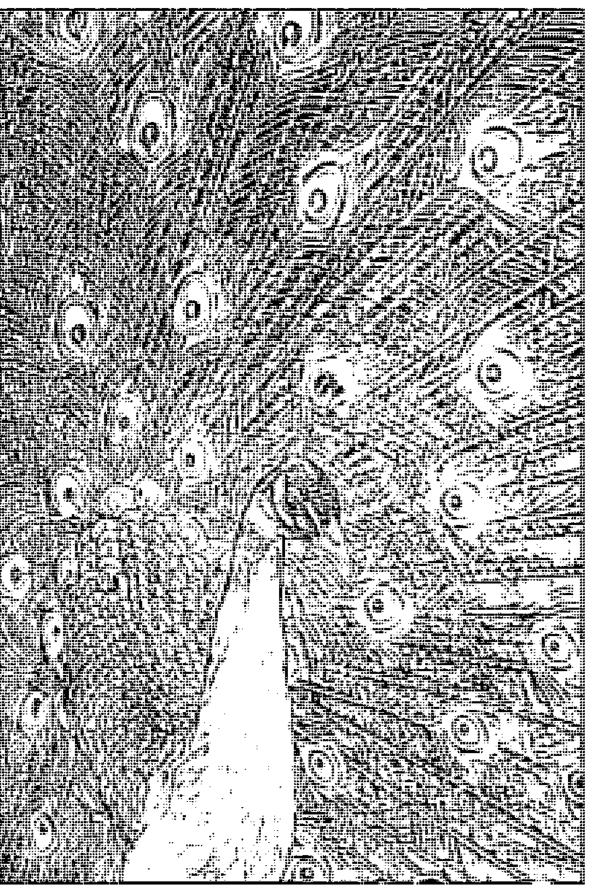

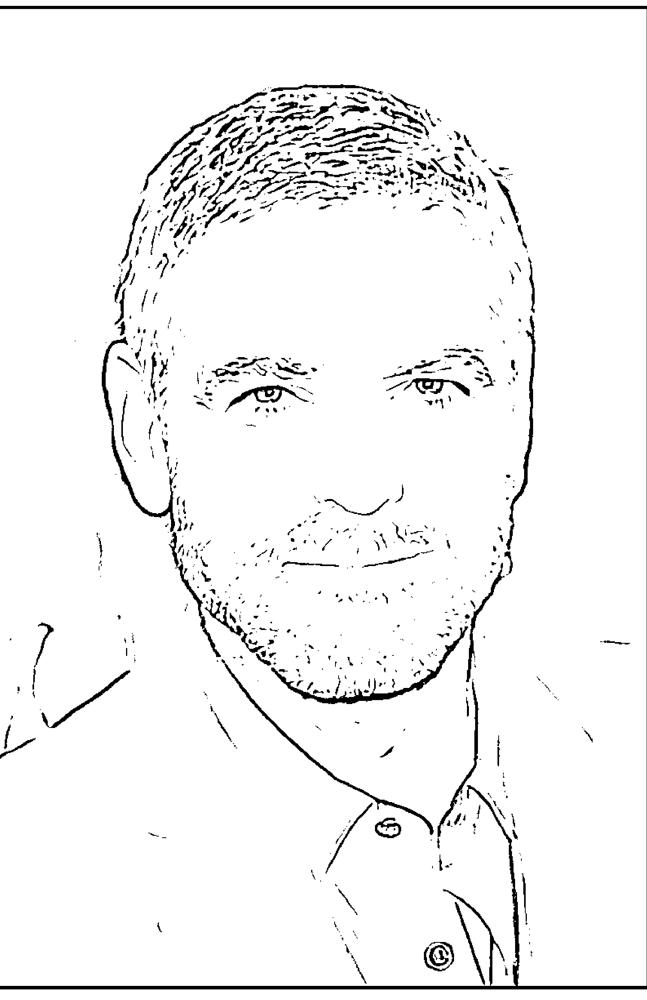

14. 孔雀和一個男人。你看著這些圖片的時候，身體裡的生化演算法就會開始處理各種關於比例、顏色和尺寸的資料，讓你覺得是受到吸引、覺得排斥、或是全然無感。

光線一從男性身體反射到女性的視網膜上，這幾百萬年演化而成、無比強大的演算法就開始運作了。幾毫秒以內，就已經將男性外觀的各種小線索轉換為繁衍機率，並得出結論：「這很有可能是個非常健康、有生殖力的男性，有很優良的基因。如果我和他交配，我的後代也很可能擁有健康的身體、良好的基因。」當然，這項結論並不會用文字或數字表達出來，而是化成熊熊慾火在身體裡燃燒。對於雌孔雀或是大多數女性來說，這並不是以紙筆為之的計算，而是一種「感覺」。

就連諾貝爾經濟學獎的得主，也只有在很少時間會用紙筆和計算機來做計算；人類各種決定有99%，包括各種關於配偶、事業和住處的最重要抉擇，都是由各種經過演化、千錘百鍊而成的演算法來處理的，我們把這些演算法稱為感覺、情感和欲望。18

所有哺乳動物和鳥類（可能還包括一些爬蟲類、甚至魚類），都受到同樣的演算法所掌控，所以不管是人類、狒狒或豬，感覺恐懼的時候，都會在類似的大腦區域，產生類似的神經處理過程。我們或許可以推斷，不管是人、狒狒或豬，對於受驚這種事的體驗，會十分類似。19

當然，並不是說一切必然完全相同。豬似乎並不會感覺到屬於智人特徵的那種極端同情或極端殘酷，也無法感受到人類仰望無窮壯麗星空所感受到的那種讚嘆。當然，很可能有相反的例子，是人無法感受到豬的情感，只不過這顯然我也說不上來。

然而有一種核心情感，顯然是所有哺乳動物共有的：母嬰連結（mother–infant bond）。事實上，這也正是mammal（哺乳動物）這個名詞的語源：mammal一詞來自拉丁文mamma，語義就是乳房。哺乳動物的母親就是如此疼愛自己的後代，願意讓後代從自己身上吸吮營養。至於哺乳動物的嬰孩，則是有強烈的欲望，想要和母親待在一起，待在她們的身邊。如果是在野外，沒能跟在母親身邊的小豬、小牛和小狗，通常活不了多久。而且到不久之前，人類的嬰兒也同樣是如此。相對的，如果成年的母豬、母牛或母狗因為某種罕見的基因突變，而一點也不關心生下的孩子，當然她們自己可能活得舒適自在又長壽，但她的基因也就不會傳遞到下一代。同樣的邏輯也適用於長頸鹿、蝙蝠、鯨和豪豬。

對於其他情感，我們或許還有爭議的空間，但因為哺乳動物的幼兒必須要有母親的照顧，才能生存，顯然母愛以及強烈的母嬰連結，會是所有哺乳動物共同的特色。20

科學家經過多年努力，才研究出這一點。然而在不久之前，甚至連人類父母與子女之間的情感連結，都曾遭到心理學家質疑其重要性。在二十世紀上半葉，雖然也有佛洛伊德理論的影響，但蔚為一時主流的行為主義學派認為，父母與子女之間的關係是由物質的回饋所塑造；兒童主要需要的就是食物、居處和醫療照護，之所以和父母建立連結，只是因為父母能夠滿足這些物質需求罷了。如果是那些會要求溫暖、擁抱和親吻的兒童，則被認為是「寵壞了」。當時的育兒專家就警告，如果父母太常擁抱、親吻孩子，會讓他們成年以後很自私、沒有安全感、情感不夠獨立。21

1920年代的育兒權威華生（John Watson），就對當代父母三令五申：「絕對不要擁抱和親吻你的孩子，也絕對不可讓他們坐在你的大腿上。如果你非得如此，也只能在他們說晚安的時候，親一下他們的額頭。早上碰面，則是與他們握手即可。」22

當時的流行雜誌《嬰兒照護》（Infant Care）也提到，養育孩子的秘訣就是維持紀律，依據嚴格的每日時程表，提供孩子物質需求。一篇1929年的文章也指示家長，如果嬰兒在還不到正常進食時間之前，就哭了，「不可以抱他，不可以搖他、哄他別哭，而且也不可以餵奶，要等到確切的餵奶時間才行。嬰兒、甚至是小嬰兒，哭一下並不會有事。」23

一直要到1950、1960年代，才有愈來愈多專家達成共識，放棄這些嚴格的行為主義理論，承認情感需求的重要性。在一系列著名（而且殘酷到令人震驚）的實驗中，心理學家哈洛（Harry Harlow）在幼猴剛出生不久，就強行將幼猴與母猴分開，隔離在小籠子裡。籠子裡有兩隻假母猴，一隻是金屬假猴、裝有奶瓶，另一隻是絨布假猴、但沒有奶瓶，結果幼猴是使盡全力抱著絨布母猴。

有一件事，這些幼猴都懂，但是華生與《嬰兒照護》的育兒專家卻不懂：哺乳動物要活下來，光靠食物還不夠，還需要情感上的連結。經過幾百萬年的演化，猴子天生就極度渴求情感連結，也讓牠們認為，比起堅硬、金屬製的物體，毛茸茸的物體比較可能建立起情感連結。（也是因為這樣，兒童比較會緊抱著洋娃娃、毯子、或是臭烘烘的破布，而不是什麼廚具、石頭或是木塊。）正是因為對情感連結的需求如此強烈，才讓哈洛實驗裡的幼猴不顧能提供奶水的金屬母猴，而投向唯一看來可能回應牠們需求的絨布母猴。但很遺憾，幼猴的真心渴望，始終沒能得到絨布母猴的回應，於是這些幼猴在心理和社交方面出現嚴重問題，長大後成為神經質和反社會的成猴。

我們今天回顧二十世紀初的兒童養育指南，會大感難以置信。專家怎麼可能沒發現兒童有情感需求？怎麼可能不知道，兒童心理和生理的健康，除了需要滿足食物、居處和醫療照護的需求之外，滿足情感的需求也一樣重要？

然而如今，一講到其他哺乳動物，我們依然不斷否認這顯而易見的事實。就像華生和《嬰兒照護》的育兒專家一樣，整部人類歷史上的農夫，雖然提供了小豬、小牛物質上的需求，卻往往忽略牠們的情感需求。於是，不論是養豬場或是酪農業，都是以打斷哺乳動物最根本的情感連結做為基礎。農民讓母豬和母牛不斷懷胎，但小豬和小牛卻是出生沒多久，就被迫與母親分離，常常終其一生都未能舐到母親的眼淚、也沒能感受到她的舌頭和身體的溫暖。哈洛對幾百隻猴子所做的事，現在畜牧及酪農業每年還會在幾十億頭動物身上重現。24

### 人與神的農業交易 ⚘

對自己的行為，農民是怎樣自圓其說？狩獵採集者很少意識到自己對生態系的損害，但農民則是再清楚不過。他們知道自己在剝削這些家畜，用牠們滿足人類的欲望和任性。他們用的理由是新的有神論（theism）宗教。

自從農業革命以後，有神論便蓬勃興起、廣泛蔓延。在有神論宗教看來，整個宇宙並不是所有萬物共同組成的議會，而是由一小群神祇、又或是唯一的神（可能是英文大寫的God，或是希臘文裡的Theos）所控制的神權政治。我們通常不會把這個概念和農業連在一起，但至少在一開始，有神論的宗教其實就是個農產事業。像是猶太教、印度教和基督教之類的宗教，其神學、神話和禮拜儀式，一開始都是以人類、農作物與家畜的關係為重心。25

例如《聖經》時代的猶太教，就是以農民和牧人為主要對象，戒律多半是與農務和鄉村生活有關，主要的節慶也都是豐收節。在現代人的想像中，耶路撒冷的古猶太會堂可能就像大型的現代猶太會堂，祭司穿著雪白的長袍、迎接虔誠的朝聖者，合唱團悠揚吟唱著詩篇，空氣中飄著薰香。但實際上，古猶太會堂更像是屠宰場加上燒烤攤。朝聖者來的時候可不是兩手空空，而是帶著簡直川流不息的綿羊、山羊、雞等動物，在神的祭壇上獻祭，接著烹煮為食。另外，小牛和小孩發出一片吼叫吵雜聲，恐怕叫人難以聽到合唱團的詩篇歌聲。祭司穿著血跡斑斑的套服，切斷祭品的喉嚨，將噴湧而出的血液蒐集在罐中，再潑灑於祭壇上。薰香的味道混合著血液凝固後的臭味、烤肉的香氣，成群黑蒼蠅四處嗡嗡飛著——請參閱《民數記》第28章、《申命記》第12章、《撒母耳記上》第2章。

現代猶太家庭過節的時候，是在前院草坪辦BBQ；而信仰傳統猶太教的家庭，則是上會堂研讀經文。這樣看來，辦一場BBQ可能還比較接近《聖經》時代的精神。

有神論的宗教（例如《聖經》時代的猶太教）是用一種新的宇宙神話，來合理化農業經濟體制。過去的泛靈論宗教，是將宇宙描繪成如同一場盛大的京劇，有無窮無盡、五彩華麗的角色不斷上場。大象和櫟樹、鱷魚和河流、高山和青蛙、鬼魂和精靈、天使與魔鬼，都是這場宇宙大戲的角色。但有神論的宗教改寫了劇本，把宇宙變成易卜生荒涼的戲劇場景，只有兩個主要角色：人和神。天使和魔鬼也撐過了這次改寫，成為各個大神的使者和僕人。但其他原本泛靈論的卡司，包括所有的動物、植物、以及其他自然現象，現在都成了無聲的裝飾。確實，還是有這位或那位神祇，認定某些動物是神聖的，而且也有許多神帶著動物的特徵，譬如埃及的神祇阿努比斯（Anubis）就有著胡狼的頭，甚至耶穌基督也常被描繪成羔羊的形象。只不過，古埃及人很容易就能分辨阿努比斯與會潛到村子裡偷雞的胡狼有何差別，而信基督教的屠夫宰殺羔羊的時候，也從不會誤認為這是耶穌。


我們常常認為，有神論的宗教只是將那些大神給神格化，卻忘記它們把人類也給神格化了。在這之前，智人一直只是數千演員當中的一員。但是在新的有神論戲劇之中，智人卻成了中心角色，整個宇宙繞著他而轉。

而同時，諸神則要扮演兩個相關的角色。首先，要由衪們來解釋智人到底有什麼特別，憑什麼要讓人類占主導地位、剝削其他一切生物。例如基督教就說，人類之所以能支配其他生物，是因為造物主給了他們這項權力。基督教還說，上帝把永恆的靈魂只給了人類。既然這永恆的靈魂是整個基督教宇宙的重點，而動物又沒有靈魂，衪們當然就只能充當臨時演員的角色。於是，人類成為造物的頂峰，而其他所有生物只能待在角落。

第二，神要負責在人類和生態系之間進行調解。在泛靈論的宇宙裡，所有角色都是直接彼此交談溝通。如果你需要美洲馴鹿、無花果樹、雲朵或岩石給你什麼，可以自己直接去談。但到了有神論的宇宙，所有非人類的實體都沉默了。於是，人類不再能和樹木與動物交談。但這樣一來，如果需要果樹產出更多果子、乳牛產出更多牛奶、雲朵帶來更多雨水、以及蝗蟲遠離你的作物，又該如何是好？這就是神上場的時候了。衪們承諾風調雨順、五穀豐登、蟲病不興，而人類也要提供一些回報。這就是農業交易的本質。諸神負責保護農業、讓農業豐收，換來人類將部分農產品獻予諸神。這筆交易對人和神都好，卻犧牲了整個其他生態系。

在現今的尼泊爾巴利雅普（Bariyapur）村，信徒每五年會慶祝一次女神嘉蒂麥（Gadhimai）的節日。2009年創下紀錄，二十五萬頭動物遭宰殺，獻祭給女神。有一位當地司機，向來訪的英國記者解釋：「如果我們想要什麼，便帶著祭品來這裡獻給女神，所有的夢想就能在五年之內實現。」26

### 犧牲了動物的利益 ❋

在有神論的許多神話裡，會解釋這筆交易的微妙細節。美索不達米亞的史詩作品《吉爾伽美什》（Gilgamesh）就提到，諸神放出大洪水毀滅世界，幾乎所有人類和動物都淪為波臣。衝動的神祇此時才驚覺，這下沒人對他們奉獻了，飢餓和痛苦逼得祂們簡直要發狂。千幸萬幸，還有一個人類家庭存活了下來，這得感謝恩基（Enki）這位神祇的先見之明，安排信徒烏特納庇什提（Utnapishtim）躲在一艘木製的大方舟裡，方舟上也載著烏特納庇什提的親戚，以及各種動物。等到洪水消退，這位美索不達米亞神話裡的挪亞，便從方舟中現身，第一件事就是將一些動物獻祭給神祇。根據史詩說法，所有大神立刻衝到現場：「諸神嗅到香氣，諸神嗅到美味的香氣，諸神如蒼蠅群聚至祭品周圍。」27

至於《聖經》中的洪水故事（寫成時間比美索不達米亞神話晚了超過一千年），同樣寫到挪亞一出了方舟，就「為耶和華築了一座壇，拿各類潔淨的牲畜、飛鳥獻在壇上為燔祭。耶和華聞那馨香之氣，就心裡說：我不再因人的緣故咒詛地，也不再按著我才行的，滅各種的活物了。」（出自〈創世記〉第8章第20至21節）。

這種洪水故事成為農業世界的奠基神話。當然，我們也可以給它添上一點現代環保的色彩，說這場洪水是在教訓人類，要我們知道人類的作為可能會毀掉整個生態系，而人類得負起保護剩餘萬物的神聖使命。只是就傳統的宗教詮釋而言，洪水正證明了人類的優越傑出、以及動物的毫無價值。在傳統的宗教詮釋中，挪亞雖然奉命拯救整個生態系，但目的是保護神和人類的共同利益，而不是為了動物的利益。非人類的生物本身並沒有價值，就只是為了人類的利益而存在。

畢竟，當「耶和華見人在地上罪惡很大」，就決定「要將所造的人和走獸，並昆蟲，以及空中的飛鳥，都從地上除滅，因為我造他們後悔了。」（〈創世記〉第6章第7節）。可見《聖經》覺得，為了懲罰智人犯下的罪行，把所有動物都消滅掉，也是天經地義，但這就好像只因為人類不乖，所有長頸鹿、鵜鶘和瓢蟲也都不再有意義。《聖經》沒能想到另一種情節：耶和華後悔創造了智人，於是把這種罪惡的猿類，從地球表面抹去，接著就能享受魷魚、袋鼠和貓熊的各種可愛表演，直到永遠。

#### 農業革命也成了宗教革命 ❊

不過，有神論宗教仍然存有一些對動物友善的想法。諸神讓人有權掌控動物界，但享有權力的同時，也要負點責任。例如猶太人就奉命必須讓家畜在安息日休息，並盡可能不造成牠們不必要的痛苦。（只不過，每當發生利益衝突，人類的利益仍然永遠勝過動物的利益。28）

在猶太經典《塔木德》（Talmud）裡有一則故事，一頭小牛在前往屠宰場的路上逃掉，求助於拉比猶太教的創始人之一：葉胡達拉比（Rabbi Yehuda HaNasi）。小牛把頭鑽到這位拉比的長袍下，開始哭泣。但拉比把小牛推開，說道：「去吧，你被創造就是為了這個目的。」由於這位拉比如此不慈悲，神便處罰他，讓他生了一場痛苦的疾病，長達十三年。直到有一天，僕人正在打掃拉比的家，發現幾隻剛生出來的老鼠，就把牠們掃地出門。但拉比立刻趕去拯救了這幾隻無助的小生物，要僕人放過牠們，因為「耶和華善待萬民；他的慈悲覆庇他一切所造的。」（《詩篇》145：9）。而因為這位拉比展現對老鼠的慈悲，神也就展現對他的憐憫，治癒他的疾病。29

其他宗教則對動物展現了更高的同理心，特別是源自印度的耆那教（Jainism）、佛教和印度教。這些宗教強調人類和生態系其他部分仍有連結，而且最重要的道德戒律就是不殺生。《聖經》只說「不可殺人」，但古印度的「ahimsa」（非暴力）原則卻適用於眾生。在這方面，耆那教的僧侶特別留意，總是用一塊白布蒙住嘴巴，以免呼吸時不小心殺害小昆蟲，走路的時候也總是帶著掃把，輕輕將路上的螞蟻或甲蟲掃到一旁。30

然而，所有農業宗教（也包括耆那教、佛教和印度教在內）都有一套說詞，認為人類就是比較高等，剝削利用動物實屬正當（就算不是殺生取肉，至少也是獲取乳汁、或是借助其勞力）。這些宗教都聲稱，確有一種自然的階層結構，賦予人類控制和使用其他動物的權力，唯一的條件就是人類得遵守一定的限制。舉例來說，印度教雖然認為牛是神聖的動物、並禁吃牛肉，但仍然能為酪農業找到冠冕堂皇的藉口，聲稱牛是一種慷慨的生物，很渴望和人類分享牠們產出的牛乳。

因此，人類就這樣自己談成了一場「農業交易」。根據這項交易，神賜予人類統治和使用其他動物的權力，而人類也得獻上部分農產品和動物當作祭品。這項交易讓所有有神論宗教得以為農業的殘酷辯護，也讓我們在面對動物的苦難時，能够心安理得。

（第二章 人類世 完）

### 科學革命造就了神人 ※

現代科學和工業的崛起，也帶來人與動物關係的第二波革命。在農業革命時，人類已經刪去了動植物的臺詞，讓泛靈論的這齣大戲只剩下人類與神之間的對話。到了科學革命，連神祇的臺詞也就此刪去。現在，整個世界已經成了獨角戲。人類獨自站在空蕩蕩的舞臺中間自言自語，不用和任何其他角色談判妥協，不但得到無比的權力，而且不用負擔任何義務。破解了物理、化學和生物無聲的定律之後，現在人類在這些領域硬是為所欲為。

遠古的獵人到草原上狩獵，會要求野牛的協助，而野牛也向獵人要求一些東西。遠古的農民希望乳牛產出更多奶，會祈求神祇的協助，而神祇也會向農民開出祂的條件。但是在雀巢（Nestlé）的研發部門裡，穿著白色實驗衣的研發人員想提升乳牛的產乳量，他們會去研究遺傳學和基因，而基因不會向他們要求任何回報。

只不過，正如獵人和農民各有自己的神話，研發人員其實也有一套他們相信的神話。他們最有名的神話，根本就是無恥的抄襲了知善惡樹和伊甸園的傳說，只是把地點搬到英格蘭林肯郡的伍爾索普莊園。根據這個神話，有個叫牛頓的人，坐在一棵蘋果樹下，而一顆熟蘋果就這麼掉在他頭上。於是牛頓開始思考，為什麼蘋果是直直落下，而不是往旁邊掉、或是向上飛？這個疑問讓他發現了萬有引力和牛頓運動定律。

牛頓的故事讓知善惡樹的神話再也不同了。在伊甸園裡，是由蛇來開場，引誘人類犯罪，而使神將憤怒降在他們身上。不管對蛇或是對神來說，亞當和夏娃都只是個玩物。但在伍爾索普莊園裡，人類是唯一的主角。雖然牛頓本人是虔誠的基督徒，花在研讀《聖經》的時間遠比研究物理定律要多，但他所促成的科學革命，卻讓上帝就此退場。自此之後，牛頓的繼任者開始寫下他們自己的〈創世記〉神話，不管是神或是蛇，都再也沒有露臉的機會。伍爾索普莊園裡發生的事，是基於單純的自然律（natural law），而想找出這些自然律，則完全是人類自發的行為。雖然故事的開頭是有顆蘋果掉到了牛頓的頭上，但蘋果可不是故意的。

在伊甸園的神話裡，人類因為好奇、希望得到知識，而遭到懲罰，被上帝趕出天堂。但在伍爾索普莊園的神話裡，不但沒人懲罰牛頓，情況還正好相反。多虧他的好奇心，人類才能進一步瞭解宇宙、變得更加強大，並且往科技的天堂又近了一步。全球無數教師傳頌著牛頓的神話，鼓勵學生要有好奇心，暗示著只要我們得到足夠的知識，就能在地球上創造出天堂。

事實上，就算在牛頓的神話裡，還是有神的角色：牛頓自己就是神。等到生物科技、奈米科技和其他科學的果實終於成熟，智人就會得到神的大能，兜了一圈，而再次回到能給人知識的知善惡樹下。

遠古的狩獵採集者，只不過就是另一種動物。到了農民，以為自己是神所造萬物的頂峰。但再到了科學家，則是要讓人類都演化升級為神。

### 我們有何獨特之處？

農業革命促成了有神論的宗教，科學革命則是催生了人文主義宗教：以人取代了神。有神論者崇拜的是神（希臘文裡的theos），人文主義者則是崇拜人。像是自由主義、共產主義和納粹主義這樣的人文主義，其奠基概念認為：智人擁有某些獨特而神聖的本質，這些本質是宇宙間所有意義和權力的來源。宇宙間發生的所有事，都會以「對智人的影響」做為好壞判斷的依據。

有神論以神之名，做為傳統農業的理由；人文主義則是以人之名，做為現代工業化農業的藉口。工業化農業將人的需求、任性與願望視為神聖，至於其他因素則不值一哂。例如動物，既然沒有人性的高貴，工業化農業自然不會把牠們放在眼裡。甚至是神，既然是現代科技已經讓人類擁有了超過遠古神祇的力量，自然也沒有祂們派上用場的地方。科技讓現代產業對待牛、豬和雞的方式，甚至比傳統農業社會的飼養方式，更為嚴苛。

在古埃及、羅馬帝國、或古代中國，人類對於生物化學、遺傳學、動物學和流行病學的所知都很有限，於是操縱這一切的力量也很有限。在那些時候，豬、牛和雞可以自由在屋間奔跑，從垃圾堆或附近的樹林裡，找出各種可吃的寶藏。如果有哪個異想天開的農夫，想把幾千隻雞都關在一間擁擠的雞舍裡，大概就會爆發致命的流行病，不但殺死整個雞群，可能連許多村民也會遭殃。這時候，任何祭司、薩滿巫師或神祇，都無法阻擋。

然而，一等到現代科學解開流行病、病原體和抗生素的秘密，工業化的雞舍、牛欄、豬圈也就成為可行。靠著疫苗、藥物、荷爾蒙、殺蟲劑、中央空調系統、自動餵食裝置，現在我們能把成千上萬隻的豬、牛、雞，塞進整齊畫一的狹小籠子裡，用前所未有的效率，生產豬肉、牛奶和雞蛋。

近年來，隨著人們重新思考人與動物的關係，這樣的做法也開始招致愈來愈多的批評。忽然之間，我們對於所謂低等生物的命運有了前所未有的興趣；或許也是因為自己快要變成低等生物了？

如果電腦程式取得了超乎人類的智慧、前所未有的能力，我們是不是該認為這些程式比人類更重要？舉例來說，未來超乎人類智慧的人工智慧，能不能利用人類、剝削人類，甚至為了它自身的需求和慾望，而殺死人類？

如果你認為，就算電腦的智慧和力量都遠超於人，這種事情還是萬萬不可以發生。那麼究竟是什麼道理，讓人類可以利用乳牛、剝削蛋雞、屠殺豬隻？難道除了有更高的智慧、更大的能力之外，人類還有什麼獨特之處，讓我們與牛、雞、豬、黑猩猩和電腦程式有所不同？

如果覺得確實有所不同，那麼這種獨特之處究竟從何而來？我們又怎麼能夠肯定，人工智慧永遠無法取得這種獨特之處？而如果覺得沒有不同，那麼等到電腦超越了人類的智慧和力量，又有什麼理由說人類的生命有特殊價值呢？

究竟，人類最早是怎么變得如此聪明、强大？非人类的实体又有多大可能将会超过我们？

下一章将会讨论智人的本质和能力，一方面进一步理解我们与其他动物的关系，另一方面也要看看人类可能的未来，以及人类与超人类可能有怎样的关系。

## 第3章 人類的獨特之處

毫無疑問，智人是目前世界上最強大的物種。但智人也很喜歡認為自己的道德地位較為高尚，自己的生命比豬、大象或狼更有價值。然而要講道德地位，智人的高度可就沒那麼明顯了。難道，真的是拳頭大就贏？就只因為全體人類的力量大於全體豬隻的力量，就能說人命比豬命更珍貴？美國國力遠勝過阿富汗，難道美國人的人命就比阿富汗人更有價值？

在目前的現實處境上，美國人的人命確實更有價值。一般美國人在教育、健康和安全方面能得到的金錢投資，確實遠超過一般的阿富汗人。殺死一名美國公民，引起的國際譴責聲浪也會遠大於殺死一名阿富汗公民。然而一般人會認為，這只不過是因為地緣政治上的權力不對等。雖然阿富汗的影響力遠不及美國，但在托拉博拉（Tora Bora）山間孩子的生命，大家還是會認為：和比佛利山孩子的生命一樣，神聖不可侵犯。

然而，如果說人類兒童的生命比小豬的生命重要，我們卻希望這不光是生態上的權力不對等，更希望在某些重要的方面，人命真的就是比較優越。我們智人喜歡告訴自己，人類一定有某些神奇的特質，不僅能讓我們有如此偉大的能力，也為我們這種特權地位，找到道德上的理由。那麼，究竟人類獨特之處何在？

傳統的一神論會說，只有智人擁有永恆的靈魂。雖然身體會衰老、腐爛，但靈魂會踏上通往救贖或詛咒的旅程，不是在天堂享受永恆的幸福，就是在地獄承受永遠的痛苦。但豬和其他動物沒有靈魂，自然也就不會出演這場宇宙大戲，不過就是活個幾年，接著就死去、化為虛無。因此，我們與其擔心生命短暫的豬，不如多把心思花在人類永恆的靈魂上。

這絕不是幼兒園裡逗小孩的童話，而是非常強大的神話，即使到了二十一世紀初，仍然不斷影響著數十億人類和動物的生命。就現有的法律、政治和經濟制度而言，相信人類有永恆的靈魂、但動物只有短暫的肉體，可說是這些制度的中心支柱。舉例來說，這能夠解釋為什麼人類能夠宰殺動物為食，甚至只是為樂，就恣意欺凌屠戮！

但是最新的科學發現，卻完全與這個一神論的神話互相抵觸。科學實驗確實也證明了這個神話的一部分：正如一神論宗教所言，動物沒有靈魂。經過各種小心研究、仔細檢視，都未發現線索證明豬、鼠或獼猴擁有靈魂。但遺憾的是：同樣的實驗卻也影響了一神論神話更重要的第二項假設，也就是人類擁有靈魂。科學家已經讓智人做過千千萬萬種怪異的實驗，找遍了人心臟裡的每個角落、看遍了大腦裡的每一道縫隙，卻仍未發現什麼獨特之處。完全沒有任何科學證據，能夠證明人擁有靈魂、豬則沒有。

如果只是這樣，或許還能說科學家該繼續找就是了。他們還沒找到靈魂，可能只是找得還不夠仔細？然而，生命科學之所以質疑靈魂這個概念，並不是因為缺乏證據，而是因為這個概念根本違反演化的基本原理。也正是因為這種矛盾，使得虔誠一神論信徒，對演化論恨之入骨。

### 誰怕達爾文？

2012年的蓋洛普（Gallup）調查顯示，美國人只有15%認為智人演化全靠天擇，並無神祇介入；32%認為，人類可能是經由持續幾百萬年的過程，才從早期生命形式演化成現在的模樣，但整件事正是上帝的精心安排；46%則認為，人正如《聖經》所言，是由上帝在大約一萬年前所創。就算大學讀了三年，也完全不會影響這些看法。同一項調查發現，大學畢業生中，46%相信《聖經》裡神造萬物的故事，只有14%認為人類演化沒有什麼神祇監督。就算是碩士和博士畢業生，還是有25%相信《聖經》，只有29%相信人類是單純由天擇所演化而成。

顯然，目前學校對於演化的教學成效已經夠差了，但還有宗教狂熱份子堅持根本不該教孩子演化論，或聲稱應該帶入其他觀點，像是智慧設計論，也就是認為：所有的生物都是由某種更高的智慧（也稱為「上帝」）所設計。狂熱份子說：「兩種都教，再讓孩子自己決定。」

為什麼演化論引起這麼強烈的反彈，但一講到相對論、量子力學，卻似乎一片靜悄悄？為什麼講到物質、能量、空間和時間的理論時，不會有政客要求應該教「其他觀點」？畢竟第一眼看來，和愛因斯坦的相對論或海森堡（Werner Heisenberg）的量子力學相比，達爾文的概念實在沒什麼可怕的。演化論的基本原理就是「生存競爭，適者（fittest）者生存」，這個想法再簡單明瞭不過，甚至可說有點單調。相較之下，相對論和量子力學認為人可以扭曲時空、無中生有、某隻貓可以同時既是死的也是活的，這簡直是在嘲弄我們的一般常識，卻沒有人站起來說要保護無辜的學童，不要接觸這些可笑的想法。這究竟為什麼？

相對論不會讓什麼人生氣，是因為它並不抵觸什麼我們寶貴的信仰。空間和時間究竟是絕對或相對，大多數人壓根就不在乎。如果你說空間和時間可以彎曲，好啊，請自便。彎就彎吧，干我什麼事呢？但相較之下，達爾文卻會讓我們失去靈魂。如果真的去理解演化論，就會發現沒有靈魂這件事，而這個想法不只會驚嚇到虔誠的基督徒或穆斯林，還會嚇到許多一般人。雖然他們不見得有任何明確的宗教信仰，但仍希望每個人都具有一生不變的個人本質，甚至在死後也能保存完好。

從字面來看，英文的individual（個體、個人）指的就是：無法（in-）再分割（divide）的東西。於是，說自己是個in-dividual，也就暗示著我是個完整的整體，而不是個別獨立部分的集合。有人就主張，這種不可分割的本質就算隨著時間過去，也能不增不減，保持原樣。我的身體和大腦會不斷變化，像是神經元會觸發（firing）、荷爾蒙會分泌、肌肉會收縮；但是我的性格、期望和人際關係，從來不會停滯不變，幾年或幾十年後很有可能完全不同；然而，在一切的最深處，我從出生到死亡都還是同一個人，而且我還希望這一點能夠超越死亡。

不幸的是，演化論並不認為有什麼不可分割、不會改變、可能永恆的自我本質。根據演化論的看法，所有生物（從大象和橡樹，到細胞和DNA分子）都是由更小、更簡單的單位所組成，會不斷連結和分離。大象和細胞之所以會不斷演變，正是因為不斷有著新的連結和分離。如果是無法分割或改變的東西，就不可能透過天擇而出現。

以人眼為例，就是由許多更小的部分所組成的複雜系統，包含像是水晶體、角膜和視網膜。眼睛可不是橫空出世、一現身就備齊所有部分，而是經過幾百萬年一小步、一小步演化，才成了現在的樣子。與大約一百萬年前的直立人（*Homo erectus*）相較，智人和他們的眼睛還非常類似。與大約五百萬年前的南猿（*Australopithecus*）相較，相似的地方就少了一點。再與一億五千萬年前的史前哺乳動物*Dryolestes*相比，則已是天差地別了。與億萬年前住在地球上的單細胞生物相比，看來就是毫不相似。

然而，就算是單細胞生物，其實也有微小的胞器，能讓這隻微生物辨別明暗，以便向光或背光移動。從這種最原始的感測器，演化成現在的人眼，整個過程曲折而漫長——但如果你也有幾億年的時間，當然就能一步一步走完。要能做到這件事，正是因為眼睛能夠分成許多不同的部分。只要每隔幾代、在某一個部分有了一點小小的變化（像是角膜曲度大了一點），經過幾百萬代，就可能演化出人眼來。如果眼睛就是一個完整的實體、無法再分出任何部分，就絕不可能透過天擇，演化成現在的樣子。

正因如此，如果要說靈魂就是一種不可分割、不會改變、可能永恆的東西，演化論當然無法接受。天擇之所以能夠塑造人類的眼睛，正是因為眼睛可以再分成許多不同的部分。然而，靈魂卻不能再分出局部。如果要說智人的靈魂是從直立人的靈魂一步步演化而來，到底步驟是什麼？智人的靈魂有什麼部分，是比直立人的靈魂更發達的？事實是，若真有靈魂，也沒辦法再分出局部。

可能有人會說，人類的靈魂就不是演化來的，而是在某一天突然出現的，一出現就完整無缺。只不過，這某一天究竟是哪一天？我們仔細檢視人類的演化歷程，卻怎麼找都找不出這一天。

從古至今的所有人類，都是男性精子使女性卵子受精的結果。讓我們想像一下，第一個有靈魂的嬰兒會是怎樣。這個嬰兒可能很像爸爸媽媽，只不過小孩有靈魂，但爸媽沒有。確實，生物學絕對可以解釋像是小孩角膜曲度比爸媽大一點的情形，只要有某個基因出現一點點的突變，就有可能；然而要說爸媽一絲一毫的靈魂都沒有，小孩身上卻出現了永恆的靈魂，這可就不是生物學說得通的事了。難道只要一次突變（甚至要說多次突變也無妨），就足以讓某隻動物有了一種足以抵抗一切改變、甚至能夠超越死亡的本質？

正因如此，靈魂這件事從演化論無法解釋。演化就是變化，而且無法產生永恆的實體。從演化角度來看，我們最接近人類本質的就是我們的DNA，但DNA承載的絕非永恆，而是突變！這讓很多人嚇壞了，寧可不信演化論，也不想放棄自己的靈魂。

### 心靈是什麼？

另一種用來證明人類比其他動物優越的說法，是說地球上所有動物中，只有智人擁有心靈。

心靈（mind）和靈魂大有不同。心靈並不是什麼神秘而永恆的概念，也不是眼睛或大腦之類的器官，而是腦中主觀經驗的流動，例如痛苦、快樂、憤怒和愛。這些心理上的經驗，就是各種緊密相連的感覺、情感和思想，忽然閃現、立刻消失……其他經驗再接著倏然浮現與消散，於電光石火間來去。（我們若回想起這些經驗，常常會想把它們分成感覺、情感和思想之類，但事實上一切都是混合在一起的。）把這種種經驗集合起來，就構成了意識流（stream of consciousness）。心靈不像是永恆的靈魂，心靈可以分成許多部分，變動不休，而且沒有理由認為這會直到永恆。

靈魂是個有人相信、有人不相信的故事。但意識流則相反，這是我們每分每秒都能直接觀察到的具體現實，再明確也不過，無法懷疑它的存在。甚至就算我們充滿懷疑，自問：「真的有主觀經驗這種事嗎？」我們也能百分百確定，自己就是正在經驗著懷疑。

到底是哪些意識經驗構成了心流？主觀經驗有兩項基本特徵：感覺、欲望。之所以說機器人和電腦沒有意識，是因為雖然它們能力強大，卻沒有什麼感覺，也沒有什麼欲望。機器人可能有電量感測器，在電池快沒電時，向中央處理器發出訊號，讓機器人移向插座、自己插上插頭充電。但是在整個過程中，機器人不會有什麼感覺。相對的，快要耗盡能量的人，則會感覺飢餓，一心渴望能停止這種不愉快的感覺。正因為如此，我們才會說：人類是有意識的生物，而機器人則否；逼人工作到過度飢餓和疲憊而崩潰是一種罪，然而讓機器人工作到電池耗盡，卻沒有任何道德問題。

那麼，動物呢？牠們有意識嗎？牠們有主觀經驗嗎？如果逼一匹馬工作，直到牠筋疲力竭而崩潰，有沒有道德問題？

前面已經提過，生命科學認為：所有哺乳動物和鳥類、以及某些爬蟲類和魚類，都具有感覺和情感。但也有最新理論認為：感覺和情感都只是生化的資料處理演算法。既然機器人和電腦處理資料的時候，不會有任何主觀經驗，也許動物也是一樣？事實上，我們知道就算是人類，大腦也有許多感覺迴路和情感迴路，是在人類完全無意識的情況下處理資料的。所以，或許我們以為動物會有的感## 为什么股票交易所没有意识？

感觉和情感（像是饥饿、恐惧、爱、忠诚），也都只是无意识的演算法，而不是主观经验？²

现代哲学之父笛卡儿（René Descartes）也支持这种理论。十七世纪的笛卡儿认为，只有人类才有感觉和渴望，其他动物都是没有心灵的自动机（automata），和机器人或自动饮料机并没什么不同。所以，如果有个人踢狗，狗并不会体验到什么。它会自动退缩、并开始狂吠，但这不过就是像一台会自动泡咖啡的饮料机，并不会有什么感觉、或是有什么渴望。

在笛卡儿那个时候，一般人都接受这种理论。十七世纪的医师和学者会做活狗解剖，观察内脏器官如何运作，但完全不帮狗上麻醉，也不会感到任何不安。在他们眼中，这实在没什么不对的，就像我们把自动饮料机打开，观察一下齿轮和皮带如何运作，哪有什么问题？就算到了二十一世纪早期，仍然有许多人认为：动物并没有意识，而且就算有意识，也是一种与人非常不同、等而下之的意识。

想知道动物究竟有没有像人一样的心灵意识，首先得先进一步理解心灵如何运作、又扮演怎样的角色。这些问题非常难回答，但因为这也是后续几个章节的重点，值得在此花上一点时间。

如果不知道心灵是什么，就不可能完全掌握像是人工智能这种新科技的影响。所以，让我们暂时放下关于动物心灵的问题，先谈谈目前科学对于心灵和意识的认识。我们会先将焦点摆在研究人类意识的例子（这样比较容易理解），稍后再回到动物身上，看看人类的情况是不是也能套用在这些长了毛或羽毛的表亲上。

老实说，目前科学对心灵和意识的理解少得惊人。目前的正统科学观点是：意识是由大脑中的电化学反应所产生的，而这样的心理体验（即意识）能够完成某些重要的资料处理功能。³然而，从大脑里的各种生化反应和电流，是怎么创造出像痛苦、愤怒或爱情这些主观经验，至今仍无解答。或许再过十年或五十年，我们会有很好的答案，但这里必须强调：在此时此刻，我们就是尚未得到解释。

利用功能性磁振造影（fMRI）扫描、植入电极和其他复杂的小工具，科学家已经能够肯定：在大脑中的电流与各种主观经验之间存在着相关性、甚至是因果关系。只要观测大脑的活动，科学家就能知道你是醒着、正在做梦、或是处于熟睡状态。他们只要在你眼前闪过一个图像，时间稍微超过意识感知的门槛值，就能判断你是否意识到这个图像，而且完全不需要问你问题。他们甚至能找出某个脑神经元与特定心思的连接，像是找出一个“克林顿”神经元、或是一个“辛普森”神经元——在“克林顿”神经元活跃时，这人就是正在想着美国第四十二任总统；如果在这人眼前秀出辛普森的图像，同名的神经元也必然会活跃起来。

把范围放宽，科学家也知道：如果大脑某区域的电化学活动特别活跃，那表示你可能正在生气。如果这一区平息了、另一区又活跃起来，那表示你可能正在滋生爱意。而且事实上，科学家已经可以用电流刺激正确的神经元，诱发出愤怒或爱的感觉。然而，光是电子跑来跑去，又怎么会变成一个主观的克林顿图像，又或是愤怒或爱这种主观感受？

最常见的解释认为，大脑是相当复杂的系统，有超过八百亿个神经元互相连接，组成无数细密的网络。而在几十亿的神经元来回送出几十亿个电讯号时，主观经验就此浮现。虽然电讯号的传送和接收，只是很简单的生化现象，但这些讯号的互动却会创造出复杂得多的东西：意识流。我们在许多其他领域，也能观察到同样的动态。譬如，单一辆车的移动只是个简单的动作，但几百万辆同时移动及互动，就出现了交通堵塞。单一股票的买卖再简单不过，但几百万股民同时买卖着几百万张股票，就可能造成让专家也跌破眼镜的经济危机。

然而，这种解释等于什么都没解释，只不过是确认这个问题非常复杂，但并未解释为何某个现象（几十亿个电讯号从这到那）会创造出另一个完全不同的现象（愤怒或爱的主观经验）。至于要用其他也很复杂的过程（例如交通堵塞和经济危机）来打比方，这种做法也有漏洞。究竟为什么会交通堵塞？如果你只看某一辆车，永远都不会明白，因为堵塞是许多车之间互动的结果。A车影响了B车的移动，B车又挡到了C车的路，诸如此类。所以，只要你把所有相关车辆的移动状况、彼此的互动都对应出来，就能找出交通堵塞的完整解释。去问“这些移动是怎么创造出交通堵塞的呢？”其实并没有意义，因为“交通堵塞”只是人类创出来的一个抽象词汇，讲的正是这里所有车辆移动事件的集合。

相较之下，“愤怒”并不是我们用来简称几十亿个电讯号互动情况的抽象词汇。早在人类还不知道任何关于电的知识之前，就已经对愤怒有了非常实际的经验。我说“我很气！”的时候，讲的是一种非常具体的感受。不管再怎么清楚描述某个神经元的生化反应如何转变成电讯号、几十亿个类似的反应又转变出几十亿个其他电讯号，还是值得我们进一步追问：“只不过，这几十亿个电讯号事件结合在一起之后，是怎么创造出具体感受到的愤怒？”

有几千辆车在伦敦市区缓慢前进的时候，我们会把它称为交通堵塞。但这时候并不会因此创造出某个伦敦的意识，浮在著名的皮卡迪利圆环上方，对自己说：“老天啊，我有种堵塞的感觉！”

有几百万人卖掉几十亿股的时候，我们会把它称为经济危机。但也不会跑出一个华尔街的幽灵，嘟囔着说：“妈的，我有种身陷危机的感觉。”

有几兆个水分子在天空中结合的时候，我们会把它称为云。但也不会出现某个云的意识，宣告着：“我有种下雨的感觉。”

所以到底是为什么，如果有几十亿个电讯号在我脑子里运作，就会出现某个心灵的感觉，说“我很愤怒！”？

直到此时此刻，我们还是完全没能解释。因此，如果这项讨论已经让你觉得一头雾水，别担心，一样想不通的人不在少数。就连最优秀的科学家，距离要破译心灵和意识的谜团，也还有一大段路要走。科学的一项美妙之处就在于：科学家面对未知，可以自由尝试各种理论和猜想，但到头来也可以承认自己就是没找出答案。

### 为何我们要有意识？

科学家并不知道，光是一群电讯号的集合，究竟是怎么创造出主观经验。更关键的是，科学家不知道这种现象在演化上到底有什么好处。这是我们在理解生命上，最大的空白了。人类有脚，是因为几百万个世代以来，可以让我们的祖先去追兔子、并逃离狮子的爪下。人类有眼睛，是因为在数不清几个千年以来，可以让我们的祖先看到兔子去了哪、狮子又从哪来。然而，人类是为什么要有像是饥饿和恐惧这样的主观经验？

不久前，生物学家提供了一个非常简单的答案。主观经验对人类的生存至关重要，因为如果我们不会感到饥饿或恐惧，根本就懒得再去追兔子或躲狮子了。看到狮子，为什么人要逃？很简单，他就是被吓到，所以就逃了。因此，主观经验能解释人类的行为。

如今，科学家又提供了更详细的描绘：人看到狮子，电讯号便从眼睛传向大脑，刺激某些神经元，神经元又放出更多讯号，于是沿线上的神经元一个一个受到刺激、放出讯号。如果能有够多的神经元、用够快的速率放出讯号，指令就能传到肾上腺、让大量肾上腺素传遍全身，心脏也收到指令要它跳快一些，同时，在运动中枢的神经元也向腿部肌肉发出讯号，让肌肉开始伸展或收缩，于是这个人从狮子旁边逃之夭夭。

讽刺的是，我们愈能清楚描绘这个过程，反而愈难解释为何要有各种意识和主观经验。我们愈理解大脑，心灵反而愈显多余。如果整个系统就是电讯号从这里传到那里，那我们何必去感觉这种事情？如果就只是一连串的电化学反应，从眼睛里的神经细胞一路传到腿部肌肉，何必还要在这个反应串里加入主观经验？主观经验到底有什么作用？骨牌不用有任何主观经验，还是能够一块一块自己倒下。那为什么神经元要有感觉，才能互相刺激、或是告诉肾上腺开始分泌？

事实上，各种身体活动（包括肌肉运动和荷尔蒙分泌）有99%并不需要任何意识和主观经验。那么，不过就是为了剩下那1%，为什么神经元、肌肉和腺体就需要去感觉了呢？

你可能会这么说：我们之所以需要心灵，是因为心灵能够储存记忆、做出规划、并且自动产生全新的影像和想法，而不只是回应外界的刺激。例如，一个人看到狮子，并不是直接对这个掠食者自动产生反应；而是先想起，一年前有头狮子吃了他的阿姨，于是开始想像自己被狮子撕成碎片的模样，又想到这样自己的小孩就没了爸爸。这才是他会逃的理由。确实，很多连锁反应都是由心灵先开始的，而不是由任何直接的外部刺激开始。因此，可能会有某人的心灵中，突然出现关于过去狮子攻击人的记忆，而让他思考狮子造成的危险。于是他召集所有部落成员，大家一起思考有什么新方法，能把狮群吓跑。

但等一下。究竟这些所谓的记忆、想像和想法又是什么？它们存在哪里？根据目前的生物学理论，我们的记忆、想像和想法并不是存在于什么更高层次而无形的领域，反而也就是几十亿神经元所触发、集结而成的电讯号。所以，就算我们已经把记忆、想像和想法也纳入考量，整件事仍然就只是一连串透过数十亿神经元的电化学反应，以肾上腺和腿部肌肉开始活动为结尾。

到底在这个漫长曲折的过程中，有没有哪个步骤（例如在这个神经元要传到下个神经元的那一瞬间），能让心灵介入干预，并决定下个神经元要不要放出讯号？有没有任何实质动作、或者是某个电子的移动，是出于“恐惧”这种主观经验，而不是因为其他分子的作用？如果每个电子的移动都是因为先前其他电子的移动，那我们究竟为何需要体验到恐惧？我们对此依然一无所知。

#### 生命方程式

哲学家将这个谜团包裹在一个吊诡的问题中：有什么事是发生在心灵中、但没发生在大脑中？如果心灵中的一切事情都是发生在我们庞大的神经元网络，那又何必把心灵独立出来说呢？而如果确实有些在心灵里的事，是高于实际神经网络所发生的事情，它们究竟是发生在哪里？

假设让我问你，觉得动画主角辛普森对于美国前总统克林顿和陆文斯基的丑闻，会有何想法？在这之前，你可能从没想过这件事情，所以现在你的心灵就得要融合两个过去不相关的记忆，可能想到的画面就是辛普森喝着啤酒，看着电视上的克林顿说着“我与该名女子并无性关系”。这两种记忆的融合，究竟发生在何处？

一些脑科学家认为，这发生在许多神经元互动所产生的“全局工作空间”（global workspace）。⁴ 但在这里，“工作空间”只是一个比喻。而比喻后的现实是如何？到底不同资讯是在什么地方交会而融合？从目前的理论看来，这肯定不是发生在什么精神上的第五维度，而是像两个原本不相连接的神经元，突然开始彼此发送讯号。于是，在克林顿神经元和辛普森神经元之间，长出了新的突触。但如果是这样，这也不过就是两个神经元互相连接起来的实际事件，我们为什么又需要超脱其上的意识经验？

同样这个谜团，我们也可以用数学术语来呈现。目前的看法认为生物也是演算法，而演算法就能用数学公式来呈现。像是可以用数字和数学符号写出自动饮料机准备一杯茶的步骤顺序，或是写出大脑发现狮子接近时的一连串动作。若是这样，只要意识经验确实有某些重要功能，应该就能用数学来表示，因为意识经验正是演算法的重要部分。如果我们要写出“恐惧”的演算法，将恐惧分成一连串的计算，应该要能像这样：“就在这里，第93步，这正是主观经验到恐惧的时候。”

但在数学这个博大精深的领域里，有没有任何演算法能指出主观经验？到目前为止，我们并不知道有任何这样的演算法。虽然人类在数学和资讯工程领域知识广博，但目前创造出来的所有资料处理系统都不需要主观经验，就能运作，而且也都不会感受到痛苦、快乐、愤怒或情爱。⁵

又或许，我们需要有主观经验，才能够反观自我？在大草原上游荡、计算自己生存和繁衍机会的动物，必须想像出自己的行动和决定，而且有时也得将这种想像传达给其他动物。如果大脑想要设想出一个自己如何设想决定的模型，就会被困在无限的循环中，开始胡言乱语！而跳出这个循环，出现的就是意识。

这种说法在五十年前可能听来合理，但到了今天，局面已经有不同了。包括谷歌和特斯拉（Tesla）在内的几间公司，正在设计自动驾驶车，而且部分已经上路。控制自动驾驶车的演算法，每秒会做几百万次计算，判断其他车辆、行人、交通号志和坑洞等等种种因素。自动驾驶车能够自动停红灯、绕过障碍，并与其他车辆保持安全距离，这一切都不需要感到任何恐惧。自动驾驶车也必须把自己列入考量，将自己的计划和愿望传达给周遭车辆，因为它决定要突然右转，必然会影响其他车子的应对行为。

这种自动驾驶车没有半点意识，但开起车来也没有半点问题。自动驾驶车并非特例，还有许多其他电脑程式也能自己运作，但都未发展出意识，也不会有什么感觉或欲望。⁶

15. 行驶中的谷歌自动驾驶车

### 意识是大脑制造出来的副产品？

如果我们硬是无法解释心灵、也不知道它有什么功能，为什么不干脆放弃这个概念呢？在科学史上，早有太多概念和理论遭弃而不用。例如，现代早期的物理学家想解释光的移动，就设想有一种称为以太（ether）的物质充满整个世界，而光则是以太的波动。但是物理学家一直没能找到任何实证，可证明以太存在，反而是找到其他更能解释光的理论。因此，以太的概念就被丢进科学的垃圾堆里了。

同样的，几千年来人类曾经用“神”来解释许多自然现象。为什么会闪电？因为神。为什么会下雨？因为神。地球上的生命是怎么来的？神创造的。但在过去几个世纪里，科学家并没有找到任何实证可证明神存在，反而是对闪电、下雨和生命的起源，有了更详细的解释。因此，现在除了在几个哲学的子领域之外，经过同侪审查的自然科学期刊和社会科学期刊上，已经不会出现真心相信神祇存在的学术论文了。历史学家不会说同盟国是因为有神相助，才赢得第二次世界大战；经济学家不会认为是上帝造成1929年的经济大萧条；地质学家也不会说板块运动是神的旨意。

“灵魂”这个概念也是如此。千百年来，我们相信自己所有的行为决定都是出自于灵魂。但因为找不到任何支持的证据，而且又出现了其他更详细的理论，所以生命科学已经抛弃了灵魂的概念。就个人而言，许多生物学家和医师仍然可能相信灵魂的概念，但他们绝对不会在严肃的科学期刊以此为题。

或许，“心灵”的概念也该像灵魂、神祇和以太一样，丢进科学的垃圾堆？毕竟，没有人曾经用显微镜看到所谓痛苦和爱情的经验，而且我们对于痛苦和爱情已经有了非常详细的生化解释，不再有主观经验的空间。然而心灵与灵魂（以及心灵与神祇）之间，仍然有一个关键的差异：要说有永恒存在的灵魂，这完全是臆测；但对于痛苦的经验，则是非常直接而具体的现实。如果我踩到一枚钉子，我百分之百肯定会感觉到痛苦（就算至今我对此无法提出科学的解释）。相较之下，如果伤口感染、让我因为坏疽而丧命，我的灵魂能不能继续存在，这我就没有把握了。

虽然灵魂是个很有趣、也让人可以松一口气的说法，我也很乐意相信，但我就是无法直接证明它的真实性。像是疼痛和怀疑之类的主观经验，因为所有科学家自己也会不断体验到，所以他们也无法否认这些经验的存在。

另一种试图抛下心灵和意识概念的做法，则是从否认其关联性下手，而不是去否认它们的存在。包括丹尼特（Daniel Dennett）和狄汉（Stanislas Dehaene）在内的一些科学家，认为所有相关问题都可以从研究脑部活动来解答，完全用不到主观经验的概念。这样一来，科学家就可再也不用到“心灵”、“意识”、“主观经验”这几个词汇了。

然而我们从以下的章节就会看到，现代政治和道德就是建筑在主观经验的概念上，而且一旦讲到各种道德上的困境，很难光用脑部活动的说法来圆满解决。举例来说，虐待或强奸有什么错？如果从纯粹的神经学角度来看，一个人遭到虐待或强奸，不过是脑中出现某些生化反应，某些电讯号从一些神经元传到另一些神经元，如此而已。这有什么大不了的呢？

大多数现代人之所以对虐待和强奸有道德上的质疑，正是因为里面牵涉到主观经验。如果哪个科学家说主观经验无关紧要，他们面临的挑战，就是得要在不引用主观经验的情况下，解释为什么虐待和或强奸是错的。

也有某些科学家虽然承认意识是真实的、也可能有极高的道德和政治价值，但认为这没有任何生物学上的功用。也就是说，意识是大脑某些程序制造出来的副产品，没有生物学上的用途，就像是飞机的喷射引擎会发出隆隆巨响，但噪音并不会推动飞机前进。又好比人类并不需要二氧化碳，但每次呼吸都让空气里多了许多二氧化碳。同样的，意识可能就是“在复杂的神经网络讯号传送之后，造成的心理污染”，没有任何功用，就是存在那里罢了。

如果确实如此，也就是说这几百万年来，几十亿生物所经历的痛苦和快乐，都只是某种心理污染。这绝对是个值得思考的想法，虽然可能并不正确。但这也让我们很惊讶的发现，当代科学在今日要解释“意识”，这竟然已经是最佳的理论！

### 观察脑波

也许生命科学看这个问题的角度错了？生命科学认为生命就是资料处理，而生物就是进行运算和做出决定的机器。然而，把生物类推成演算法可能是个误导。在十九世纪，科学家是把大脑和思想比做蒸汽引擎。为什么用蒸汽引擎做比喻？因为当时那就是最先进的科技，能够推动火车、轮船和工厂，所以要解释生命的时候，他们也相信应该是根据类似的原理。于是，他们相信心灵和身体就像是由各种管线、汽缸、活塞和阀门所构成，能够蓄积和释放压力，从而产生各种运动和行为。这种想法甚至也对弗洛伊德的心理学影响甚深，至今仍有很多心理学术语来自机械工程。

举例来说，让我们看看弗洛伊德的以下主张：“军队会控制性驱力，以推动军事上的侵略性。军队召募的就是性驱力达到顶峰的年轻男子，而又限制士兵性交、限制士兵释放这些压力的机会，于是让压力在士兵体内不断累积。军队接着就会把这种受抑制的压力重新导向，并允许压力以军事侵略的形式释放。”这根本就是蒸汽引擎的运作原理。先将沸腾的蒸汽限制在一个密闭容器内，让蒸汽压力累积得愈来愈高，直到突然打开阀门，让压力往预定的方向释放，就能用来推动火车或纺织机。也不只是在军队，我们在各种活动领域都常常抱怨，觉得心里有股压力愈来愈大，说如果不能找个方法“释放压力”，就快要爆炸了。

到了二十一世纪，要再说人类心理就像是蒸汽引擎，可能听来有点幼稚。既然我们现在有了“电脑”这项远远更为复杂的科技，也就开始将人类心理比喻成处理资讯的电脑，而不再说是调节压力的蒸汽引擎。但就算是这个新的比喻，也可能同样太过天真。毕竟电脑没有心灵，就算程式出了问题，它们也不会想要做什么；就算专制政权把整个国家的网路切断，网际网路也是不痛不痒。所以，我们又为什么要用电脑来作为了解心灵的比喻呢？

话又说回来，我们真能确信电脑没有感觉或欲望吗？而且就算它们现在真的没有，或许某天变得够复杂之后，电脑也可能发展出意识？如果真发生这种事，我们又要如何确定？等到电脑取代了公车司机、老师、心理医师，我们要怎么知道它们是真有感情、又或只是无意识的演算法集合？

讲到人类，我们现在已经能分辨“有意识的心理经验”和“无意识的脑部活动”有何差别。虽然我们距离理解意识还很远，但科学家已经成功找出意识的一些电化学特征了。科学家的做法是先假## 图灵测试
如果人类说现在自己有意识，就是真的有意识。基于这种假设，科学家就能开始观察脑波，看看有哪些脑波只会在人类有意识时出现，而无意识时绝不会出现。

这样一来，科学家就能判断：例如看似成为植物人的中风病人究竟是完全失去了意识，又或只是失去控制身体和语言的能力。如果病人的脑波显示出有意识的特征，那么很可能病人虽然不能行动或言语，但其实仍有意识。事实上，医师最近已能够使用 fMRI 来和这样的病人进行沟通。医师会问病人是非题，告诉他们如果想要答“是”，就想像自己在打网球，如果想要答“否”，则在脑中想着自己家的位置。如果病人所想的是打网球，运动皮质就会变得活跃，也就代表他想答“是”；如果活跃的是负责空间记忆的大脑区域，也就代表病人想答“否”。7

这一套用在人类身上很方便，但用在电脑上又如何？由于电脑是以硅为基础，而人类的神经网络是以碳为基础，两者架构大不相同，因此人类意识的特征很可能无法套用。我们似乎陷入一个恶性循环了。一开始，是我们相信“人类说自己有意识的时候，就是真的有意识”，接着我们就能找出人类意识的脑波特征，再接着就能用这些特征来“证明”人类确实有意识。但如果人工智能也说自己有意识，我们该信吗？

到目前为止，我们对这个问题还没有很好的答案。早在几千年前，哲学家就已经发现，没有办法明确证明除了自己以外的任何事物具有意识。而且就算只把范围限制在其他人類，我们也只是假定

他们有意识，无法真正确定。搞不好，其实全宇宙只有我自己在感觉着什么，而其他所有人类和动物都只是没有心灵的机器人？或许是我在做梦，而遇见的每个人都只是我梦里的角色？又或许，我是被困在一个虚拟世界里面，看到的一切生物都只是模拟？

根据目前的科学定论，我所体验到的一切，都是脑电活动的结果，所以理论上确实能够模拟出一个我完全无法与“真实”分辨开来的虚拟世界。一些脑科学家相信，在不太远的未来，我们就能做到这种事。也有可能，根本你就已经是住在这样的世界里？搞不好今年根本是2216年，你是个穷极无聊的青少年，泡在一个“虚拟世界”的游戏里，正在模拟二十一世纪早期这个原始却又叫人兴奋的世界。只要你一承认这种事情确有可能，数学逻辑就会把你带向一个非常可怕的结论：因为只会有一个真实的世界，而可能的虚拟世界数量无穷无尽，所以你现在这个世界碰巧是真实的可能性，根本趋近于零。

这个知名而难缠的问题，称为“他心问题”（Problem of Other Minds），目前为止的所有科学突破，都还无法克服这项问题。目前学者对此提出的最佳测试方法，称为“图灵测试”（Turing test），但这项测试其实只是检测是否符合社会常规而已。图灵测试认为，想判断某台电脑算不算具备心灵，做法是安排测试者同时和电脑及另一个真人沟通，而测试者不知道哪个是电脑、哪个是真人。测试者可以任意问问题、玩游戏、辩论、甚至是调情，时间长短不限；然后再来判断哪个是电脑、哪个是真人。如果测试者无法决定、或根本选错，就等于电脑通过了图灵测试，我们应该认定它具有心灵。但这种测试当然不能作为证明。承认其他心灵的存在，只能说早已是一种社会和法律上的习惯。

图灵测试是由英国数学家图灵（Alan Turing, 1912-1954）于1950年发明的，图灵可说是电脑时代的创始人之一。他也是同性恋者，但当时同性恋在英国违法，因此他在1952年遭判犯有同性恋行为，被迫接受化学阉割。两年后，图灵自杀身亡。

图灵测试其实就是复制了每个同性恋男子在1950年的英国，必须通过的日常测试：你能装成异性恋者吗？图灵从自己的个人经验已知道，你究竟是谁根本不重要，重要的只是别人对你的看法。根据图灵的观点，未来的电脑就像是1950年代的男同性恋者，电脑究竟有没有意识并不重要，重要的只是人类会怎么想而已。

## 《剑桥意识宣言》
了解了心灵的概念、也发现我们所知竟是如此有限之后，就可以回到原来的问题：动物是否具有心灵？

包括狗在内的一些动物，想必能够通过修改版的图灵测试。因为人类想要确定某个实体是否具有意识时，会寻找的不是什么数学性向或记忆能力，而是能否与人类建立情感关系。

人类有时候会非常喜欢某些东西，像是武器、汽车、甚至是内裤，从而产生强烈的情感依附（甚或恋物癖），但这些依附都只是单向的，并不会形成双向关系。对大多数狗主人来说，狗能够成为他们的伙伴、与人建立情感关系，就足以让他们相信：狗并不是没有心灵的自动机。

但这对于怀疑论者来说还不够，他们会说情感也只不过是算法，而目前所有已知的算法，都是无须意识便能动作。就算动物展现了复杂的情感行为，我们仍然无法证明“这绝对不是什么极度

复杂、但无意识的算法所为”。当然，这种说法也能应用到人类身上。人所做的一切事情（包括做实验的时候说自己有意识），理论上也都有可能是无意识的算法所为。

然而就人类而言，只要某个人说自己有意识，我们自然是全盘接受。根据这项最小的假设，我们现在已经可以找出意识的脑波特征，并用来系统地判别某个人是处于有意识或无意识的状态。既然动物的大脑有许多特征和人脑类似，随着我们愈来愈了解意识的脑波特征，也就有可能用来判断其他动物究竟有没有意识、或是在何时具有意识。如果某只狗的大脑，显示出与有意识人脑类似的脑波特征，将会是很强力的证据，证明狗也有意识。

根据初步对猴子和小鼠（mice）的测试，科学家已经指出：至少猴子和小鼠的大脑，确实显示了有意识的脑波特征。8但考量到动物大脑和人类大脑仍有差异，而且我们距离解释所有意识的秘密，也还有一大段距离，可能需要再几十年，才真正能够研发出决定性的测试。与此同时，究竟该由哪方来负举证责任？我们到底是该先把狗视为无意识的机器，直到证明并非如此为止；还是该把狗看做是像人类一样有意识，直到出现令人信服的反证为止？

2012年7月7日，许多神经生物学和认知科学的权威专家，齐聚剑桥大学，签署《剑桥意识宣言》（The Cambridge Declaration on Consciousness），其中提到：“各种证据均指出，非人类动物拥有构成意识所需之神经结构、神经化学及神经生理基质，并且有能力展现带意图的行为。因此，证据已充分显示，用以产生意识的神经基质并非人类所独有。非人类动物，包括所有哺乳动物、鸟类、以及章鱼等其他生物，均拥有这些神经基质。”9

由于仍然没有最直接的证据，因此这项宣言就只差一步，并未直接说出其他动物也具有意识。尽管如此，这确实已经让举证责任转向了另外一方。

回应科学界的转向，在2015年5月，新西兰国会开全球国家先例，通过《动物福利法修正案》，在法律上承认动物也像人类一样具有情感。该法规定，从此必须认知到动物具有情感，因此在例如畜牧等情境下，必须适当维护动物的福利。

在一个羊多于人的国家（三千万头羊、四百五十万人），这项声明的影响十分重大。加拿大魁北克省也已经通过类似的法案，其他国家可能很快也将跟进。

## 实验室大鼠的忧郁生活 ❊

许多企业同样已体认到动物也有情感，但这常常反而让动物落入相当不愉快的实验室试验。例如，制药公司经常使用大鼠（rat）来试验抗抑郁药物，在一种常见的试验计划中，需要取一百只大鼠（以求统计信度），分别放进装满水的玻璃管内。这些大鼠会一次又一次努力想爬出玻璃管，但都无法成功。经过十五分钟之后，大多数都会放弃而不再动作，只是漂在管子里，对周遭情况了无兴趣。

接着，另外取一百只大鼠，同样丢进玻璃管，但这次会在十四分钟后、正当它们快要绝望之时，把它们捞出来，擦干、给食物、让它们休息一下，然后再重新丢回玻璃管里。第二次，大多数的大鼠都能撑上二十分钟才放弃。

为什么这次多了六分钟？因为过去曾有成功的记忆，触动了大脑释放出某些生化物质，让大鼠觉得又有了希望，而延迟了绝望的时间。只要我们能找出这种生化物质，就可能作为人类的抗抑郁药物。只不过，大鼠的脑中随时都有许许多多种化学物质，怎么才能知道究竟是哪一种？

为了这个目的，还需要更多组没接受过这项实验的大鼠，在找出认为可能是抗抑郁成分的化学物质之后，每一组各注入不同的化学物质，然后把它们丢进水里。譬如注射化学物质 A 的组别，仍然只撑了十五分钟，那就可以把物质 A 从可能清单上划掉。如果注射化学物质 B 的组别撑了二十分钟，这下就可以告诉执行长和股东，你们可能中了大奖。

(左图) 大鼠抱着希望，挣扎着想逃离玻璃管。
(右图) 大鼠漂在玻璃管中，已经放弃希望了。

持怀疑态度的人可能已经跳出来，认为这段叙述把大鼠讲得太人性化，实在是想太多。他们认为，大鼠既不会感觉到希望、也不会感觉到绝望，虽然有时候它们动作很快，有时候在原地不动，但它们并不会有任何感觉，大鼠只是由无意识的算法来驱使而已。

但如果真是这样，这个实验又有何意义？精神病的药物就是为了要诱发改变，而且不只是想改变病人的行为，更是要改变病人的感觉。

病人找上心理医师，说：“医师，想想办法让我不要这么忧郁吧。”他们可不是要医师用机械刺激，让他们就算心情低落仍然动作灵敏，而是要感觉很开心。如果药厂觉得用大鼠做实验，有助于开发这样的神奇药丸，只有一种可能，就是他们认定了大鼠的行为也带有如同人类的情感。事实上，这也正是各家精神医学实验室共同的前提。¹⁰

## # # 有自我意识的黑猩猩 ❉

还有另一种认为人类比其他动物优越的论点，虽然已经接受老鼠、狗或其他动物也有意识，但认为它们没有人人类的“自我意识”。这些动物可能会感到沮丧、快乐、饥饿或满足，但并没有自我的概念，不知道自己感受到的沮丧或饥饿只属于这个称为“我”的实体。

这种想法非常常见，但也非常言不及义。显然，如果一条狗觉得饿了，它叼起的肉就是要给自己吃的，而不是要去喂另一只狗。让一条狗去闻闻附近其他狗尿过的树，它也立刻知道这气味究竟是自己的、隔壁那条可爱的拉不拉多的、又或是某条陌生狗的。对于自己、交配对象或是敌人的气味，狗会有非常不同的反应。¹¹ 这样一来，哪能说它们没有自我意识？

这种主张有个更复杂的版本，说的是自我意识可区分成不同程度，只有人类知道自己是个有过去和未来、长久延续的自我，或许是因为只有人类可以用语言来思考过去的经验、思考未来的行动。至于其他动物，则只能活在当下，就算它们似乎还记得过去、或是在打算未来，也只不过是在反应当下的刺激或瞬间的冲动。¹² 举例来说，松鼠会贮藏坚果过冬，并不是因为它记得自己去年冬天饿了肚子，也不是为了未来着想，只不过就是一时冲动，它并不知道这种冲动是何起源、有何目的。正因如此，就算是那些从来没遇过冬天、当然也就不可能记得冬天是什么滋味的年轻松鼠，也会在夏天贮藏坚果。

然而我们现在还不清楚，为什么讲到要对过去或未来有意识，会觉得语言是一个必要条件。只因为人类用语言这么做，其实算不上是什么证明。人类也会用语言来表达自己的爱和恐惧，但其他动物也能不靠语言就感受、甚至表达出爱和恐惧。事实上，人类自己也常常在没说出口的情况下，意识到过去和未来的事件。特别是在梦境里，我们可以不用语言就了解整个叙事情境，反而是醒过来之后，要用语言重述，却变得非常困难。

许多实验指出，至少某些动物，包括鹦鹉和丛鸦之类的鸟类，确实能够记得一些个别事件，并且也能有意识的未雨绸缪。¹³ 但这点永远无法真正证明，因为不管动物表现出多复杂的行为，怀疑论者永远可以说：这只是出于动物脑中无意识的算法，而非出于心灵中有意识的图像。

要说明这个问题，让我们以瑞典富鲁维克动物园的雄性黑猩猩

桑提诺（Santino）为例。它为了在兽栏里别那么无聊，就培养出一种颇刺激的新嗜好：对动物园的游客丢石头。这个行为本身并不特殊，黑猩猩生气的时候，投掷石头、木棒、甚至排泄物，都是常有的事。只不过，桑提诺还会事先准备。一大早，动物园还没开放游客入场，桑提诺已经开始收集石头，堆成一堆，看起来心平气和得很。导游和游客很快就知道必须对桑提诺多加提防，特别是它站在那堆石头附近的时候。这下桑提诺比较难找到目标可丢了。

2010年5月，桑提诺又出了新招来回应。一大早，它就从睡觉的地方把稻草给搬出来，放在游客通常聚集观看黑猩猩的墙边。然后，它再把收集到的石头藏在稻草堆下。大概一个小时后，第一批游客走近，桑提诺仍然一派平静，没有任何被激怒或是充满攻击性的迹象。但等到受害者一走进它有把握的范围，桑提诺就突然拿出藏好的石头，炮击游客，把游客吓得四处逃窜。2012年夏天，桑提诺更是加速提升军备，除了稻草堆下面，也会把石头藏在树上、建筑物里、还有一切方便隐藏的地方。

## 哪一方该负举证责任？ : :

但就连桑提诺的例子，也无法让怀疑论者信服。早上七点，桑提诺开始到处收集石头的时候，我们怎么能确定它是觉得中午拿来丢人很有趣？会不会桑提诺也是被某种不自觉的算法所驱动，就像是年轻的松鼠未曾经历冬天、也知道要贮藏坚果？^14

同样的，怀疑论者会说：就算是雄性黑猩猩攻击某隻几周前伤害它的对手，也不是真的在报先前的仇，只是一时间觉得愤怒、无法克制。母象如果看到狮子威胁它的小象，之所以冒生命危险冲向前去，并不是因为记得这是它深爱而且照顾了好几个月的孩子，只是天生对狮子有着深不可测的敌意。狗在主人回家时，兴奋不已，并不是因为认出这就是从小养它、抱它的人，只是这条狗很开心罢了，没有任何其他理由。15

对于这些说法，我们既无法证明为真、也无法证明为假，因为这其实就是“他心问题”的变化版本。由于我们并不知道有任何需要意识的算法，所以不管动物做了什么，都可以视为是无意识的算法，而不是有意识的记忆和计划。所以，桑提诺的例子其实也和前面一样，真正的问题在于举证责任。对于桑提诺的行为，最可能的解释到底是什么？我们是不是该假设它就是有意识的对未来做规划；而想反对的人，才该想办法提出反证？或者，我们该假设黑猩猩是由一种无意识的算法驱动，它只是感受到一种神秘驱力，要把石头藏在稻草下面；而不赞同这种想法的人，才该提出反证？

而且，就算桑提诺不记得过去、也不会想像未来，难道这就代表它缺乏自我意识？毕竟，如果有个人既不忙着回忆过去、也不急于梦想未来，我们还是会认定他有自我意识。举例来说，妈妈看到自己刚会走路的小婴儿，要晃到大马路上了，她可不会先想想过去还是未来，而是会像那头母象一样，冲过去救孩子。这种时候，为什么我们不会把对大象的那一套说法，拿来用在她身上，说“妈妈赶去救孩子脱离危险时，其实没有任何自我意识，只是由一时的冲动所驱使”？

同样的，想想年轻情侣第一次约会热吻、士兵冲入猛烈炮火中抢救受伤战友、艺术家狂乱落笔绘出杰作，这些人都不可能忽然暂停，思考一下过去和未来，但难道这就意味着他们缺乏自我意识，而且比不上那些吹嘘着自己过去成就和未来计划的政客竞选演说？

2010年，科学家做了一项难得感人的大鼠实验。他们将一只大鼠关在一个很小的、透明压克力制的大鼠抽血固定器里，再把抽血固定器放进一个大得多的实验箱，接着让另一只大鼠能够在实验箱里自由走动。被关入抽血固定器的大鼠会发出痛苦的信号，结果让自由的大鼠也表现出焦虑和压力。大多数情况下，自由的大鼠会尝试拯救被关住的同伴，试了几次之后，通常都能成功打开机关、把被关的大鼠解放出来。

研究人员接着把实验再做一次，但这次在大实验箱里放了巧克力。现在那只自由的大鼠有两种选择：放出被关的同伴，或是自己独享巧克力。许多大鼠都会选择先放出同伴，再共享巧克力。（不过也有的比较自私，或许证明了某些大鼠就是比较坏心眼。）

怀疑论者全盘否认这些结果，认为自由的大鼠放出同伴不是因为同情，只是希望阻止烦人的求救信号。大鼠是因为觉得不愉快、想解决这个问题，而不是因为什么崇高的理由。或许也是，但同一套道理完全也可以套用到人类身上。如果我给乞丐钱，是不是只是因为我觉得，看到乞丐令我不悦，于是做出这种反应？我到底是真正关心乞丐，或是只想让自己好过点？ 16

在本质上，我们人类和大鼠、狗、海豚或黑猩猩，并没有多大的差异之处。正如它们，我们也没有灵魂。也正如我们，它们也有意识，有着充满感觉和情感的复杂世界。当然，每只动物都有自己独特的特质和才能，而每个人也有自己独特的天赋。不过，我们倒也没有必要进一步为动物都强加人性，觉得它们就像是长了毛的人类。这种画蛇添足的做法，不仅在科学上无法立足，也让我们无法真正从动物的立场，来给予它们理解和评价。

## 聪明的马 *

1900年代，德国有匹名马「聪明的汉斯」（Clever Hans）。它在德国许多城镇村庄巡回表演，不仅德语水准非同凡响，数学能力更是惊人。如果有人问它：「汉斯，4乘3是多少？」汉斯就会用马蹄点地12下。有人用文字写给它看：「20减11是多少？」汉斯也会展现普鲁士的一丝不苟，点个9下。

1904年，德国教育部门组成特别科学委员会，由一名心理学家领军调查这件事。委员会的十三名成员（其中包括一位马戏团经理和一名兽医）一心认为这必定是个骗局，但费尽九牛二虎之力，还是找不出任何欺诈不实之处。就算把汉斯与主人分开，由全然陌生的人问它问题，汉斯仍然多半都能答对。

直到1907年，心理学家方斯特（Oskar Pfungst）进行另一项调查，才终于查出真相。原来汉斯之所以能答出正确解答，靠的是观察提问者的身体语言和脸部表情。如果有人问汉斯3乘4是多少，汉斯从过去的经验知道，提问者心中会期待它点蹄点到一定次数。于是它开始点着，并且仔细观察提问人。随着汉斯慢慢接近答案，提问人会显得愈来愈紧张，并在汉斯点到正确数字时，紧绷的情绪达到顶峰。汉斯知道的是，如何从人的肢体姿势和表情看出这点。于是它就停下来，看着提问人原本的紧张转变成难以置信的表情、或是哈哈大笑。汉斯便知道，自己又答对了。

常有人用聪明的汉斯做为例子，告诫不该误以为动物有人性，或高估它们有什么惊人的能力。但事实上，这里教我们的一课，却正好相反。从这个故事可以看出，我们为动物强加人性，反而是低估了动物的认知能力，并忽略了其他生物独特的能力。确实，汉斯在数学方面绝对算不上有什么才能，任何八岁小孩的算术能力都比它强。但如果讲的是从肢体语言来推论情感和意图，汉斯就是个真金实银的天才了。

如果有个瑞典人用我不懂的瑞典话，问我4乘3是多少，我绝不可能光看他的脸部表情和肢体语言，就用脚点出正确的12下。聪明的汉斯之所以拥有这个能力，是因为马匹通常就是用肢体语言相互沟通。但汉斯了不起的地方在于：它不只成功解读了同类的情感和意图，还看穿了原本不熟悉的人类。

## # # 团结力量大

多数研究提到，智力和工具制作是人类兴起的关键因素。虽然其他动物同样也会制作工具，但是人类在这一点的能力，无疑远远胜出。可是说到智力，就没那么明确了。虽然有一整个相关产业致力于智力的定义和评量，但距离达成共识，还有一段很远的路程。幸好我们在这里并不需要踏入这个雷区，因为不管如何定义智力，显然光靠工具和智力，仍然不足以让智人征服世界。

根据大多数对智力的定义，人类在大约一万年前，就已经成为地球上最聪明的动物了，也是工具制作的冠军，却仍然只是一种不太重要的生物，对周遭的生态系统也没什么影响力。显然，除了智力和工具制作之外，他们还缺了某种关键因素。

也或许，人类之所以最后能主宰这颗星球，并不是因为有什么第三个因素，而只是因为智力和工具制作的能力都提升了？看来不然，因为翻阅历史，“个人的智力和工具制作能力”与“人类物种的能力提升”并没有直接关系。两万年前的一般智人，智力和工具制作能力可能都要超过现代人的平均。现代学校和雇主虽然三不五时会测试我们的性向，但不管测出来的结果有多差，福利国家仍然会保障每个人的基本需求。但在石器时代，则是由天择每天二十四小时来测试你，而且在这数不尽的测试中，只要有一项不过，就可能致命。然而，尽管我们石器时代的每一位祖先，工具制作能力可能更优秀，面对外在险恶的环境时，头脑可能更清晰、感觉更敏锐，但是两万年前的人类仍然比今天弱小得多。

在这两万年之间，人类从原本用石矛头的长矛来猎杀猛犸象，演变成能制造太空船探索太阳系，并不是因为双手变得更灵巧，也不是因為大腦發展得更大了（事實上，現代人的大腦似乎還小了一些）；18 我們征服世界的關鍵因素，其實是在於能夠讓許多人類團結起來的能力。19 如今人類完全主宰地球，並不是因為單一人類比單一的黑猩猩或狼更聰明、或是手指更靈巧，而是地球上只有智人這個物種，能夠大規模而靈活的合作。智力和工具製造當然非常重要，但如果人類還沒學會如何大規模靈活合作，即便大腦再聰明、手指再靈巧，現在仍然是在敲燧石，而不是撞擊鈾原子！

只不過，譬如螞蟻和蜜蜂，早在人類之前幾百萬年，就已經學會了集體合作，為什麼沒能早早統治人類？原因在於牠們的合作缺乏靈活性。蜜蜂的合作方式雖然非常複雜巧妙，但牠們無法在一夜之間徹底改造其社會制度。舉個例子，如果蜂巢面臨突如其來的威脅或機會，蜜蜂並沒有辦法把蜂后送上斷頭臺，改制為蜜蜂民國。

至於大象、黑猩猩這種有社交能力的哺乳動物，雖然合作起來比蜜蜂更靈活，但牠們的朋友與家人數量都太少。牠們的合作是以彼此認識為基礎——如果你我都是黑猩猩，而我想跟你合作，就必須真的認識你，知道你是怎樣的黑猩猩：你究竟是猩格高尚、還是猩品低落？如果我不認識你，怎麼可能跟你合作？據我們所知，只有智人能夠與無數陌生個體，進行非常靈活的合作。正是這種實際具體的能力，說明了為何目前是由人類主控地球，而不是什麼永恆的靈魂、或是獨有的意識。

### 革命萬歲！

歷史已經提供充分證據，點出大規模合作極端重要。勝利幾乎永遠屬於合作更順暢的一方；這不只適用於人與動物的爭鬥，也適用於人群與人群之間的衝突。因此，羅馬之所以征服希臘，不是因為羅馬人的腦子比較大、或工具製造技術比較高明，而是因為他們的合作更具效率和效益。縱觀歷史，紀律嚴明的軍隊就是能擊敗散兵游勇，團結的精英就是能凌駕烏合之眾。例如在1914年，為數僅三百萬的俄羅斯貴族、官員和商人，就能作威作福，控制超過一億八千萬個農民和工人。俄羅斯精英熟知如何合作守衛其共同利益，但那一億八千萬平民卻無法有效動員。事實上，那些精英有一大部分的努力重點，正是要確保這一億八千萬底層民眾無法學會合作。

想掀起一場革命，光靠人數，絕對遠遠不夠。革命靠的通常是一小群人集成的網路，而不是一大群人的動作。如果你想發動一場革命，不要問「有多少人會支持我的想法？」而是要問「我有多少支持者能夠有效合作？」俄國1917年爆發十月革命，引爆點並不是一億八千萬農民起身反抗沙皇，而是一小群共產主義信徒在對的時間，站到了對的位置。當時俄國中上階級人數至少有三百萬，但共產主義信徒僅有兩萬三千名。²⁰ 然而，共產主義信徒組織嚴密，依舊奪下了俄羅斯帝國。當俄羅斯的權力從沙皇老朽的掌握、與克倫斯基（Kerensky）臨時政府同樣顫抖的指間滑落，共產主義信徒一把接起，緊握住權力的韁繩，一如鬥牛犬對骨頭緊咬不放。

共產黨徒這一握，一直到1980年代末之前，從未放開。有效的組織讓他們掌權長達八十年，而最後也是因為組織的缺陷，才頹然傾塌。

1989年12月21日，羅馬尼亞共產獨裁者齊奧塞斯庫（Nicolae Ceaușescu）在首都布加勒斯特市中心，組織了一項大規模的支持者示威活動。在先前幾個月之間，蘇聯已經從東歐共產主義政權收回支援，柏林圍牆已倒下，革命席捲波蘭、東德、匈牙利、保加利亞和捷克斯洛伐克。齊奧塞斯庫自1965年以來，一直統治羅馬尼亞，就算羅馬尼亞的蒂米什瓦拉市，已經在12月17日出現抗暴運動，齊奧塞斯庫仍然相信，自己能擋下這波海嘯般的浪潮。而他的反制措施之一，就是在布加勒斯特安排大規模集會，希望向羅馬尼亞人和世界各國證明，大多數民眾仍然敬愛他、或至少是害怕他。當時已經吱嘎作響的黨機器，奮力動員了八萬人，塞滿市中心廣場，並號令羅馬尼亞全國民眾，放下手邊工作，聆聽廣播或收看電視。

在一片看似熱情的群眾歡呼聲中，齊奧塞斯庫登上陽臺，俯瞰廣場，他在先前幾十年間，這動作已經做了不下數十次。在妻子艾蓮娜、黨領導和大批保鑣陪同下，齊奧塞斯庫開始了註冊商標一般的沉悶演講。在那八分鐘內，他讚揚羅馬尼亞社會主義的輝煌，並在群眾機械式鼓掌的掌聲中，顯得意志滿足。

接著就出事了。這段影片現在上YouTube還看得到，只要搜尋「Ceauşescu's last speech」（齊奧塞斯庫的最後演說），你就能親眼目睹歷史的進展。21

從YouTube影片可以看到，齊奧塞斯庫才剛開始另一個冗長的句子，說到：「我要感謝在布加勒斯特發起及組織這項偉大集會的人，這是……」接著他忽然被眼前的景象給驚呆了，瞠目結舌，難以置信。他再也沒有把那句話說完。你可以看到，在那一秒，他的世界整個崩毀。觀眾居然有人在噓他？到現在，大家仍在討論究竟誰是第一個膽敢發出噓聲的人。但一聲之後，就是接二連三，短短幾秒鐘，群眾口哨聲此起彼落、辱罵聲不絕於耳，並一起大喊著「蒂·米·什瓦·拉！蒂·米·什瓦·拉！」

而且這一切都透過電視直播，羅馬尼亞國民有四分之三正聽從命令，坐在電視機前，他們的心激動的跳著。惡名昭彰的羅馬尼亞秘密警察立刻下令停止直播，但電視臺工作人員並未聽命。攝影師把攝影機指向天空，因此觀眾不會再看到黨領導人在陽臺上有多驚慌，但錄音師還是繼續錄著音、技術人員也還是繼續播送。整個羅馬尼亞都能聽到群眾的噓聲，同時齊奧塞斯庫則是不斷大喊：「哈囉！哈囉！哈囉！」好像問題是出在麥克風一樣。他的妻子艾蓮娜開始斥喝觀眾「安靜！安靜！」，直到齊奧塞斯庫轉頭向她斥喝「是妳給我閉嘴！」，而且這一切都還在直播。齊奧塞斯庫接著開始向廣場上激動的群眾喊話：「同志們！同志們！請靜下來，同志們！」但同志們已經不願意安靜下來了。羅馬尼亞共產政府崩潰的時刻，就是有八萬人在布加勒斯特市中心廣場，意識到他們比那個在陽臺上戴著皮帽的老人強得太多。但真正令人震驚的，還不是這個系統崩潰的時刻，而是這種政權居然已作威作福了幾十年。為什麼世上的革命如此罕見？群眾早就有能力衝上陽臺，把這種人撕成碎片，但為什麼幾世紀以來，他們卻是一直聽話、鼓掌、歡呼，完全聽從陽臺上的人下的任何命令？

### 民主就是：你依然是民，而我繼續作主

齊奧塞斯庫和親信統治羅馬尼亞兩千萬人，長達四十年，靠的就是確保了三項重要條件。首先，將忠誠的共產官僚安插控制所有的合作網路，例如軍隊、工會、甚至是體育協會。第二，不論在政治、經濟或社會方面，只要是任何可能合作反共產的競爭組織，一律禁止成立。第三，他們擁有來自蘇聯和東歐共產政黨的支援。雖然偶有爭執，但這些共產政黨還是在必要時互相伸出援手，或至少會確保沒有外人來到這個社會主義天堂多管閒事。在這種情況下，雖然領導精英對人民造成各種艱困痛苦，兩千萬羅馬尼亞人卻無法組織起任何有效的反對運動。

一直要到這三項條件都不再存在，齊奧塞斯庫才終於垮臺。在1980年代末期，蘇聯撤回了保護傘，各個共產主義政權也像骨牌一樣，逐一倒下。到了1989年12月，齊奧塞斯庫已經再也無望取得任何外援，鄰近國家掀起的革命更像是給反對陣營一記強心針，而且共產黨本身也分裂成不同陣營，互相攻擊。溫和派希望拉下齊奧塞斯庫，開始改革，以免最後無法挽回。

18. 世界崩毀的那一刻：齊奧塞斯庫瞠目結舌，不敢相信自己的眼睛和耳朵。

最後，就是齊奧塞斯庫自掘墳墓：他自己安排了在布加勒斯特的集會，還透過電視直播，讓革命份子把握絕佳機會，集結力量反抗齊奧塞斯庫。想讓革命星火燎原，哪有比電視直播更快的辦法？

然而，雖然權力已經從陽臺上笨拙的掌權者手中滑落，卻不是由廣場上的群眾所承繼。雖然他們人數眾多、群情激昂，卻不知道該怎樣組織起來。因此，正如1917年「十月革命」時的俄羅斯，權力又來到了一小群政治玩家的手中，他們唯一擁有的，就是良好的組織能力。

於是羅馬尼亞的革命成果，就這樣被自稱「救國陣線」的組織所竊據，而這個組織實際上就是共產黨溫和派的煙幕彈。救國陣線與當時的集會群眾，並沒有真正的關係，而是一群中階黨政官員，由共產黨的前中央委員會委員及宣傳部長伊列斯古（Ion Iliescu）率領。伊列斯古和救國戰線的同志搖身一變，成了民主政治家，抓緊每一支可用的麥克風，宣稱自己是改革的領導者，再透過他們長久以來的統治經驗和親信網路，繼續控制國家、侵占資源。

在共產的羅馬尼亞，幾乎一切都歸於國有。但到了民主的羅馬尼亞，卻是迅速將一切資產私有化，再以低廉的價格售予前共產黨人；只有這些共產黨人知道發生了什麼事，並且合作互謀其利。控制著國家基礎設施和天然資源的國營公司，被以出清特賣價，出售給前共產政府官員，同時共產黨的士兵基層也能用極低的價格，買到房屋和公寓。

伊列斯古自己當了羅馬尼亞總統，同事們則成了部長、國會議員、銀行董事、億萬富翁。直到如今，控制著這個國家的新羅馬尼亞精英份子，仍然大多是前共產黨人及其家屬。別人吃肉，那些冒著生命危險、在蒂米什瓦拉和布加勒斯特抗議的群眾卻只能喝湯，就是因為他們不知道如何合作，建立一個高效的組織來維護自己的利益。22

2011年的埃及革命，也出現同樣命運。1989年電視所扮演的角色，到了2011年由臉書和推特接手。在新媒體協助下，群眾得以協調整合，讓成千上萬的人潮，在對的時間淹沒街道和廣場，推翻穆巴拉克政權。然而，要把十萬人帶到解放廣場是一回事，但想要真正抓緊政治機器的操縱桿、在正確的房間握到正確的手、讓國家有效運作，又是另一回事。因此，穆巴拉克下臺的時候，示威者並無力量填上那個空缺。埃及只有兩個組織擁有足以治國的組織能力：軍隊和穆斯林兄弟會。因此，這場革命的成果先由兄弟會竊據，之後再由軍隊劫持。

比起過去的獨裁者、或是在開羅和布加勒斯特的示威者，不管是羅馬尼亞前共產黨人或是埃及的軍事將領，都算不上真的比較聰明、又或手指更為靈巧。他們的優勢只在於靈活合作。一方面，他們的合作效率高於群眾，二方面，比起頑固的齊奧塞斯庫和穆巴拉克，他們也展現了更大的靈活度。

### 在暴力與色情報外

如果說，智人之所以統治世界，是因為只有我們能夠大規模靈活合作，這顯然又破壞了我們認為人類比較神聖的信念。我們希望人類真的是特殊的，值得擁有各種特權。為了證明這一點，我們會指出人類的各種驚人成就：我們蓋了金字塔和長城；我們解開了原子和DNA的結構；我們還抵達了南極、登上了月亮。如果說這些成就都源於每個人都擁有的某種獨特本質（例如不朽的靈魂），那要說人類生命有神聖之處，或許還說得過去。但因為這些勝利其實都是靠著大規模合作而來，就很難再說為什麼每個人類都值得我們如此敬重。

整個蜂巢的能力，會遠比單一隻蝴蝶來得高，然而這並不會讓單隻的蜜蜂比單隻的蝴蝶更神聖。羅馬尼亞共產黨人成功主宰了沒有組織的羅馬尼亞大眾，難道我們該說共產黨人的生命比一般國民更神聖？人類所知的合作方式遠比黑猩猩更有效率，因此人類是將太空船射向月球，而黑猩猩只能在動物園對遊客扔石頭。但難道這就讓人類變得比較高級？

也有這個可能，不過我們得先想想：到底為什麼人類可以互相配合得這麼好？為什麼只有人類能夠打造出這麼龐大而複雜的社會系統？對於像黑猩猩、狼和海豚這些社會性哺乳動物，社交合作大多必須以彼此認識為基礎。以黑猩猩為例，一定要等到互相熟識、建立起社會階層之後，才有可能一起獵食。因此，黑猩猩得花很多時間在社交互動、權力鬥爭。如果兩隻不認識的黑猩猩碰在一起，通常不但不能合作，反而會互相咆哮、扭打，或是盡快逃離。

但是巴諾布猿（bonobo，與黑猩猩同為一屬）則有些不同，巴諾布猿常常是用性行為，來紓解壓力，建立社會連結。所以並不意外，同性的性行為也是稀鬆平常。如果兩群互不相識的巴諾布猿碰在一起，一開始會先展現恐懼和敵意，讓吼叫聲和尖叫聲不絕于叢林。但很快的，其中一群的雌性巴諾布猿會走出來，邀請陌生的巴諾布猿別打仗了，來做愛吧。通常另一方都會接受這項邀請，於是不到幾分鐘，原本可能的戰場就成了歡場，巴諾布猿用著幾乎所有你想得到的姿勢性交，甚至還包括倒吊在樹上。

智人同樣很瞭解這些合作技巧，有時候是組成像黑猩猩那種權力階級，有時候也像巴諾布猿用性愛鞏固社會連結。但不管講的是打鬥或交配，光靠彼此相識，並無法成為大規模合作的基礎。想解決希臘債務危機，辦法絕不可能是邀請希臘政治家和德國銀行家來大打一架、或是雲雨一場。研究指出，不論是友好或敵對的關係，智人能夠真正熟識的對象不超過一百五十人。23 不管人類是靠什麼打造出大規模合作網路，總之絕不只是彼此熟識而已。

對於想靠實驗來破解人類社會秘密的心理學家、社會學家、經濟學家，這實在是壞消息。由於組織和經費因素，絕大多數的實驗對象都只是個人或小群體。然而，想用小群體的行為來推斷大眾社會的動態，風險實在很高。有一億人口的國家，運作方式從根本上就和一百人的小部落，大不相同。

### 最後通牒賽局

讓我們用行為經濟學上最著名的「最後通牒賽局」（ultimatum game，又稱為承讓賽局）實驗為例。這項實驗通常有兩名參與者，其中一人會得到100美元，可以自由分配給自己和另一位參與者。他可能會全留、分成兩半、或是把大多數給對方。另一位參與者只有兩個選項：接受、或拒絕。如果他拒絕對方的分法，兩人都得兩手空空回家。

古典經濟學理論主張，人類是理性的計算機器。所以他們認為大多數人會自己留99美元，只給對方1美元；而且他們也認為另一位參與者會接受這樣的分法。畢竟如果有人問你要不要1美元，理性的回答自然就是接受。另一位參與者拿到99美元，又有什麼關係呢？

古典經濟學家可能一輩子都待在實驗室和講堂，從沒冒險進入真實的世界。大多數參與最後通牒賽局的人，只要拿的錢太少，就會拒絕，理由就是「不公平」。他們寧願不拿這1美元，也不想看起來像個傻蛋。也因為這就是現實世界的運作方式，所以很少人會向對方提出極低的數字。大多數人就是直接平分，或是讓自己占點小好處，像是給對方30美元或40美元。

最後通牒賽局影響深遠，不僅戳破古典經濟學理論，也建立起近幾十年最重要的一項經濟學發現：智人的行事並不是依照冷冰冰的數學邏輯，而是根據有溫度的社交邏輯。

我們是由情感所控制。正如先前所見，這些情感實際上都是很複雜的演算法，反映出遠古狩獵採集部落的社會機制。如果在三萬年前，我幫你抓了一隻野雞，但你卻只分我一支雞翅，我可不會對自己說：「還有一支雞翅，總比什麼都沒有好。」而是演化演算法快速運轉，讓腎上腺素和睪固酮流向全身，血液沸騰，然後向地上重重一跺腳，發出怒吼。短期來說，我可能得餓肚子回來，甚至還會挨上一兩拳。但長期來說這是好處的，因為你以後別想再坑我。我們會拒絕不公平的方案，是因為如果在石器時代，溫和接受一切要求，就只能等死。

觀察現代仍存的狩獵採集部落，結果同樣支持這種觀點。大多數部落都很重視公平，如果獵人獵到一頭肥鹿回來，每個人都會得到一份。黑猩猩也是如此。如果有一隻黑猩猩殺了一頭小豬，同一群的其他黑猩猩會聚在一旁伸出手來，而且通常也都會拿到一份。

最近，靈長類動物學家德瓦爾（Frans de Waal）在一項實驗中，將兩隻捲尾猴關在相鄰的籠子裡，兩隻都能看到對方的一切動作。德瓦爾的研究團隊在每個籠子都放了一些小石頭，訓練這些猴子把石頭交給研究人員。每次猴子拿一個石頭給他們，就會得到食物，一開始的獎勵是一片黃瓜。兩隻猴子都高高興興的把黃瓜吃了。幾回合後，德瓦爾進到實驗的下一個階段。這一次，第一隻猴子交出石頭，得到的是一顆葡萄。葡萄可比黃瓜美味多了。但第二隻猴子交出石頭的時候，拿到的卻仍然是一片黃瓜。這隻猴子之前拿到黃瓜還很高興，但現在卻火冒三丈。牠拿到黃瓜之後，先是難以置信的看了一會兒，接著就怒氣沖沖，把黃瓜丟向研究人員，並開始跳來跳去、大聲尖叫。牠可不是什麼好惹的角色！24

從這個令人發噱的實驗（可以上YouTube觀看）和最後通牒賽局，讓很多人以為：靈長類動物就是天生有道德觀，而平等是個普遍而永恆的價值。人類天生就是平等主義者，而不平等的社會必會招致怨恨和不滿，絕不可能運作順暢。

### 社會從來不平等

真是這樣嗎？這些理論應用在黑猩猩、捲尾猴和小型狩獵採集部落或許很合用；或是在實驗室裡對一小群人做測試，也不會有什麼問題。然而，一旦觀察大批群眾的行為，就會看到一個全然不同的現實。大多數的人類王國和帝國都極度不平等，但其中的穩定性和效率卻好得不得了。

在古埃及，法老王可以躺在舒適的墊子上，住的是涼爽而豪華的宮殿，穿的是黃金的涼鞋和鑲滿寶石的外衣，由美麗的女僕剝好甜滋滋的葡萄放進他嘴裡。透過敞開的窗戶，他可以看到農民在田裡工作，穿的是骯髒的破衣，頭上頂著無情的太陽，回家能有一根黃瓜吃，就已經是天大的幸福。然而，農民很少起身反抗。

## 第3章 人類的獨特之處

1740年，普魯士國王腓特烈二世入侵西里西亞（Silesia），發動一系列讓他贏得「腓特烈大帝」稱號的血腥戰爭，讓普魯士成為一大強權；卻也導致數百萬人死亡、殘廢、一無所有。他麾下的兵士多半是倒楣的新兵，得承受鐵的紀律和嚴苛的演練。可以想見，這些士兵對他們的最高指揮官並沒多大的好感。腓特烈有一次看著部隊集合、準備出擊，就和一位將軍說到，他最驚訝的是「我們站在這裡，面對這六萬大軍，卻安全無虞；他們都是我們的敵人，每個人都比我們武裝完整、身強體壯，但他們一見我們就發抖，我們卻對他們毫無所懼。」<sup>25</sup>

腓特烈確實是可以安全無虞的看著這群人。在接下來幾年，雖然戰事辛勞，但這六萬武裝大軍從未反叛，很多人還為他獻上非凡的勇氣、冒著生命危險，甚至獻出寶貴的生命。

這些埃及農民和普魯士兵的反應，為什麼和最後通牒賽局、或捲尾猴實驗的情況這麼不同？原因就在於：大批群眾的行為，就是和小型團體的情況有所不同。如果今天的最後通牒賽局實驗是有甲乙兩方各一百萬人，要分1,000億美元，科學家究竟會觀察到怎麼樣的情況？

這裡面的動態很有可能十分奇特而迷人。舉例來說，因為一百萬人不可能直接做出共同的決定，因此可能兩方各出現一位統治精英。這時，如果甲方領導人說要給乙方領導人100億美元，而自己留下900億美元，情況會如何？乙方領導人有可能會接受這種不公平的報價，接著把這100億美元大部分直接轉到自己的瑞士銀行帳戶，同時用各種賞罰手段，避免底下的人叛亂。領導人可能威脅和嚴懲異議份子，並且告訴那些溫和有耐心的人，他們死後可以在來世得到永恆的獎勵。這正是古埃及和十八世紀普魯士的情況，而且至今在全球許多國家依舊如此。

這樣的威脅和承諾，通常都能成功創造穩定的階級制度和群眾合作網路，但前提是民眾相信自己是順應著自然不可避免的法則、或是神祇神聖的命令，而不只是聽命於另一個人。所有大規模人類合作，到頭來都是奠基於我們想像的秩序。這一套又一套的規矩雖然只存在於我們的想像之中，我們卻會認為這就像重力一樣真實而不可侵犯。

「向天神獻上十頭牛，就會下雨；孝順父母，就會上天堂；如果不相信我說的話，你就會下地獄。」只要智人住在相信同樣一套故事的地方，就會遵守一樣的規矩，於是不僅很容易預測陌生人會有什麼行為，也很方便組織大規模合作的網路。智人也常常用可見的標記（例如頭巾、鬍子或西裝）來代表「你能相信我，我跟你信仰的故事是一樣的」。但我們那些黑猩猩堂兄弟，並無法創造和流傳這樣的故事，也因此無法大規模合作。

### 意義的網

人之所以很難理解「想像的秩序」這種概念，是因為覺得現實只分兩類：客觀現實和主觀現實。所謂客觀現實，就是事物的存在與我們的信念和感受無關。例如重力就是一項客觀現實，早在牛頓之前便已存在，而且不論信不信它，都同樣會受到重力影響。

但主觀現實則相反，事物的存在與否，是取決於個人的信念和感受。例如，假設我覺得頭一陣劇痛，去看醫生。雖然醫師對頭部做了徹底檢查，卻沒查到什麼問題。於是她又要我去做血液檢查、尿液檢查、DNA檢測、X光、心電圖、fMRI，什麼都做了。等到## 第3章 人类的独特之处

检查结果出炉，她说我完全健康，可以回家了。可是我仍然觉得头痛得不得了。虽然所有客观测试都找不出我有什么问题，尽管除了我以外没人感觉痛苦，但对我来说，这种痛苦是百分之百真实。

多数人以为，现实只有客观和主观两种，并没有第三种可能。于是，只要他们说服自己某件事并非出于自己的主观感受，就贸然认为这件事必然属于客观。如果有那么多人相信上帝，如果钱确实能让世界运转，如果民族主义会促成战争、也会建立帝国……那么这些事物或概念一定不只是我个人主观的信念。也就是说，上帝、金钱和国家，一定是客观的现实啰？

然而，现实还有第三个层次：互为主体的（intersubjective）。这种互为主体的现实，并不是因为个人的信念或感受而存在，而是靠着许多人的沟通互动而存在。历史上有许多最重要的驱动因素，都具有互为主体的概念。像是金钱，并没有客观的价值。1元的美钞不能吃、不能喝，也没法拿来穿。但只要有几十亿人都相信它的价值，你就可以拿它来买东西吃、买饮料喝、买衣服穿。如果有位面包师傅忽然不再相信美钞了，不愿意让我用这张绿色纸，换他的面包，也没什么关系。只要再走几条街，又有另一家超市可买。然而如果超市的收银员、市场的小贩、购物商场的销售员，都一律拒绝接受这张纸，美钞就会失去它的价值。当然，这些绿色纸张还是存在，但它们已经再无用处。

这种事情其实不时会发生。1985年11月3日，缅甸政府毫无预警的宣布50缅元和100缅元的纸钞不再是法定货币。民众根本没有兑换纸钞的机会，一辈子的积蓄瞬间成了几堆毫无价值的废纸。为了取代失效的货币，政府发行了新的75缅元纸钞，号称是要纪念缅甸独裁者奈温将军（General Ne Win）的七十五岁生日。1986年8月又发行了15缅元和35缅元的纸钞。据传，这位独裁者深信命理，相信15和35是幸运数字。但对国民来说，可就一点也不幸运了。到了1987年9月5日，缅甸政府又突然下令，所有35缅元和75缅元的纸钞同样不再是法定货币。

会像这样因为人类不再相信而一夕蒸发的，并不止有金钱的价值。同样的事情也可能发生在法律、神祇，甚至整个帝国上。这一秒它们还在忙着塑造世界，下一秒却忽然不复存在。天神宙斯和天后赫拉，曾经是地中海一带的重要力量，但现在不再有人相信，也就令祂们失去所有力量。苏联曾经一度能够摧毁全人类，但也是在一支笔的力量下便烟消云散——1991年12月8日，在维斯库里（Viskuli）附近的一幢乡间大宅，俄罗斯、乌克兰和白俄罗斯的领导人签署了〈白拉维沙协定〉（Belavezha Accords），其中声明：「吾等白俄罗斯共和国、俄罗斯联邦暨乌克兰，做为1922年苏联成立条约之签署创始国，兹此声明终止苏联做为国际法之主体及地缘政治之现实。」26就这样，苏联从此消失。

要说金钱是个互为主体的现实，相对还比较容易接受。大多数人也很愿意承认：那些古希腊神明、邪恶的帝国和异国文化价值观都只是一种想像。但如果说的是自己的神、自己的国家、自己的价值观，由于正是这些概念给了我们生命的意义，要承认这些概念也都是虚构的，就没那么容易了。我们希望自己的生命有客观意义，希望自己的种种牺牲不只是为了脑子里的各种空想。但事实上，大多数人生活的意义，都只存在于彼此述说的故事之中。

在大家一起编织出共同故事网的那一刻，意义就产生了。对我来说，譬如在教堂结婚、在斋戒月禁食、或在选举日投票，这些动作为什么有意义？原因就在于我的父母也认为这有意义，还有我的兄弟姊妹、邻居朋友、附近城市的居民、甚至是遥远异国的民众，都认为这有意义。为什么这些人都认为这有意义？因为他们 的朋友和邻居也有同样的看法。

人类会以一种不断自我循环的方式，持续增强彼此的信念。每一次的互相确认，都会让这张“意义的网”收得更紧，直到你别无选择，只能相信大家都相信的事。

只不过，经过几十年、几世纪，意义的网也可能忽然拆散，而由一张新的网取而代之。读历史正是看着这些网的编织和拆散，并让人意识到，对这个世代的人来说最重要的事情，很有可能对他们的后代变得毫无意义。

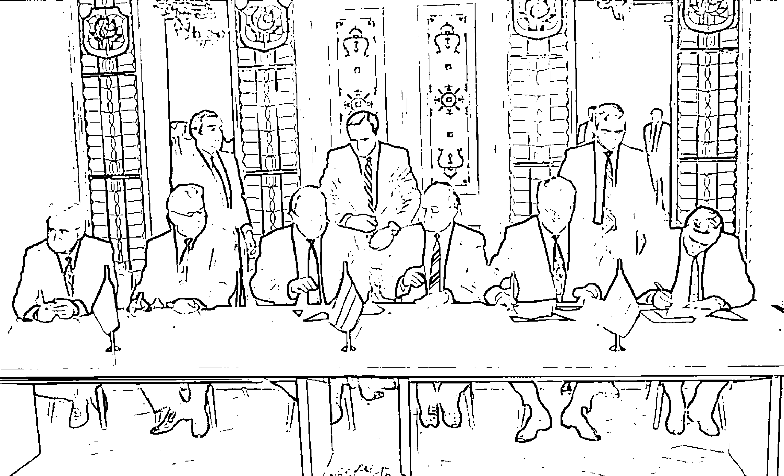

19. 签署〈白拉维沙协定〉。

> 笔碰上了纸，天灵灵地灵灵！苏联消失无踪。27

## 把人民像苍蝇捕进网中 ❀

1187年，萨拉丁（Saladin）在哈丁战役（Battle of Hattin）击败十字军，占领了耶路撒冷。教皇因此发起了第三次十字军东征，希望夺回圣城。让我们假设有位名叫约翰的年轻英国贵族，远离家乡征讨萨拉丁。约翰相信，自己这么做是有客观意义的，如果自己在东征过程中去世，灵魂就能够升上天堂，享受永恒的无上喜悦。

如果这时候跟他说，灵魂和天堂都只是人类编出来的故事，肯定会把他吓坏。约翰一心相信，如果他抵达圣地，却被一个长着大胡子的穆斯林战士，一斧头劈在他头上，他当然会痛苦万分，两耳嗡嗡、两腿一软、视野一黑——然后就会突然发现，自己由一片明亮的光芒笼罩，听到天使的歌声、悠扬的竖琴弦音，看到发着光、有着翅膀的天使，召唤他通过一道雄伟的金色大门。

约翰对这一切的信念之所以这么强，是因为有一张细细密密又极度强大的意义之网，包覆着他。他最早的记忆，就是亨利爷爷有一把生锈的剑，挂在古堡的主厅。当他还在蹒跚学步，就已经听过亨利爷爷在第二次十字军东征战死的故事，说爷爷现在已经在天堂休息，有天使作伴，一直关照着约翰和他的家人。吟游诗人来访城堡时，常常吟唱着十字军在圣地英勇作战的歌谣。

约翰上教堂的时候，很爱看彩绘玻璃窗，其中一扇正是布永的戈德弗里（Godfrey of Bouillon，第一次十字军东征的领导者）拿长枪刺穿一个面容邪恶的穆斯林，另一扇则是罪人的灵魂在地狱里燃烧。约翰也会认真聆听当地神父的讲道，那是他认识的最有学问的人。几乎每个礼拜天，神父都会搭配各种精心设计的比喻和令人莞尔的笑话，讲述着世上只有天主教是唯一的救赎，罗马教皇是我們神圣的父，我们必须听从他的指示。如果我们杀人或偷窃，上帝会叫我们下地狱；但如果我们杀的是异教徒穆斯林，上帝会欢迎我们上天堂。

在约翰刚满十八岁的一天，一位骑士很狼狈的骑马来到城堡大门，语带哽咽的大喊：十字军在哈丁被萨拉丁击败了！耶路撒冷沦陷了！

教皇宣布将发动新一波十字军，并承诺不幸丧生者将得到永恒的救赎！身边所有人看来都是既震惊又忧虑，但约翰脸上发出超脱俗世的光亮，宣告：「我将对战异教徒，收复圣地！」每个人静了一下，接着脸上露出笑容，流下感动的泪水。母亲擦擦眼泪，紧紧抱着约翰，说她有多么引以为荣。他的父亲则是大力在他背上拍了一掌，说道：「儿子，如果我还是你这年纪，必会和你同行。事关我们家族的荣誉，相信你一定不会让我们失望！」约翰有两个朋友也宣布要一同从军。而且，就连约翰的死对头、那个住在河另一边的男爵，也特地来家里拜访，祝他一路顺利。

当约翰离开城堡时，村民纷纷从小屋里出来，向他挥手致意。而对于这位即将前去对抗异教徒的十字军勇士，所有的美丽姑娘也露出崇拜的眼神。约翰从英国出航，航过各个陌生而遥远的彼方，例如诺曼地、普罗旺斯、西西里岛，许多异国的骑士也纷纷加入，大家都有着共同的目标、共同的信念。

但等到军队终于在圣地上岸，开始与萨拉丁的部下战斗，约翰才惊讶的发现，这些邪恶的撒拉逊人怎么也和自己有同样的信念。当然，想必撒拉逊人没搞清楚，竟然以为基督徒才是异教徒、而穆斯林则是服从神的旨意。但撒拉逊人也接受一样的基本信念，也就是为神和耶路撒冷而战的战士一旦战死，将会直接上天堂。

就像这样，中世纪文化一丝一缕的编织着意义的网，把约翰和同时代的人，都像苍蝇一样捕进网中。约翰绝不可能想像得到，这一切故事都只是出于想像虚构。说他的父母和叔伯都错了，还有。但还有吟游诗人、他所有的朋友、村里的姑娘、知识渊博的神父、住在河另一边的男爵、在罗马的教皇、在普罗旺斯和西西里岛的骑士、甚至还包括那些穆斯林，难道真有可能是这些人都在胡思乱想？

## 事过境迁，意义不再

时间就这么过了好多年。在历史学家的注视下，意义的网被拆散，又张起了另一张新的网。约翰的父母已然身故，他的所有兄弟姊妹也不在人世。这时已不再有吟游诗人唱着十字军东征的故事，新的流行是在剧院上演爱情悲剧。家族的城堡被烧成一片平地，而重建之后，亨利爷爷的剑已经失去影踪。教堂的彩绘玻璃在一次冬季的狂风中粉碎，换上的玻璃不再描绘布永的戈德弗里和地狱里的罪人，而是英国国王打败法国国王的伟大胜利。当地的牧师已经不再称呼教皇是「我们神圣的父」，而是「罗马的那个魔鬼」。在附近的大学里，学者钻研着古希腊手稿、解剖尸体，并在紧闭的门后窃窃私语，说着：或许根本没有灵魂这种东西。

但时间转眼又过了好多年。原本是城堡的地方，现在成了购物商场。在当地的电影院里，「圣杯传奇」（Monty Python and the Holy Grail）已经播了无数次。在一座空教堂里，无聊的牧师看到两名日本游客，简直喜出望外，开始滔滔不绝，解说教堂里的彩绘玻璃。游客不停礼貌的微笑点头，但完全没听懂。

教堂外面的阶梯上，一群青少年正用iPhone看着一部YouTube影片，是约翰·列侬那首〈Imagine〉的remix版。约翰·列侬唱着「Imagine there's no heaven, it's easy if you try.」（想像世上如果没有天堂，试试看，这并不难。）一名巴基斯坦清洁工正在打扫人行道，旁边有收音机正播报新闻：叙利亚屠杀仍在继续，联合国安全理事会的会议落幕了，但未能达成任何协议。突然之间，天空打开了一个时光通道，一道神秘的光照在其中一位青少年脸上，他突然张口宣告：「我将对战异教徒，收复圣地！」

异教徒？圣地？对于现在绝大多数的英格兰人来说，这些词汇已经不再具有任何意义。就连那位牧师，也很可能觉得这年轻人是精神病发作。相反的，如果一位英国青年决定加入国际特救组织，前往叙利亚保护难民、维护难民的人权，现在大家会觉得他是个英雄，但在中世纪，大家会觉得这人疯了。在十二世纪的英格兰，没有人知道什么叫人权。你要大老远跑到中东，冒着生命危险，而且居然不是要杀死穆斯林，而是保护某一群穆斯林别被另一群穆斯林杀了？你绝对是脑子出了很大的问题。

这正是历史开展的方式。人类编织出一张意义的网，并全心相信它，但这张网迟早也会拆散，直到我们回头一看，实在无法想像当时怎么可能有人真心这么相信着。事后看来，为了到达天堂而参加十字军，听起来就像是彻底疯了。事后看来，冷战似乎又是件更疯的事。不过才短短三十年前，怎么可能有人因为相信能打造出共产主义的天堂，就不惜为此冒着核战浩劫的危险？而在现在的一百年后，我们现在对民主和人权的信念，也有可能会让我们的后代，感到同样的难以理解。

### 大同世界 ❖

智人统治世界，是因为只有智人能够编织出互为主体的意义之网：其中的法律、约束力、实体和地点，都只存在于他们共同的想象之中。因为有这张网，让所有动物只有人类能够组织十字军、社会主义革命和人权运动。

其他动物也有可能想象各种事情。猫埋伏着要抓老鼠时，虽然可能没看到老鼠，但很可能能够想象老鼠的形状、甚至是味道。但是就我们目前所知，猫只能想像实际存在这个世界上的东西，例如老鼠。牠们无法想像自己看不见、闻不着、尝不到的东西，比如美元或谷歌、欧盟。只有智人能够想像出这种虚幻的事物。

因此，猫和其他动物至今仍然只能处于客观的世界，沟通系统也只用来描述现实，但智人能用语言创造出前所未有的现实。在过去七万年间，智人所发明出具備互为主体性的现实，愈发强大，让智人在今天称霸世界。黑猩猩、大象、亚马逊雨林和北极冰川，究竟能否活过二十一世纪？这一切的结果，将要看像是欧盟和世界银行这种组织的意愿和决定而定；而这几个实体其实都属互为主体，只存在我们共同的想象之中。

没有任何其他动物有能力对抗我们，并不是因为牠们少了灵魂或少了心灵，而是因为牠们少了必要的想像力。狮子能跑、能跳、能抓、能咬，却没办法开银行帐户或提出诉讼。而在二十一世纪，一位知道怎么提出诉讼的银行家，拥有的权力绝对远远高于大草原上最凶猛的狮子。

能够创造出互为主体的实体，这种能力不仅让人与其他动物有所不同，也让人文科学与生命科学出现区隔。历史学家希望瞭解像神祇、国家这种互为主体的实体如何发展，但生物学家很难认同有这种事情存在。有些人认为，如果我们能解开遗传密码、绘出大脑的每个神经元网络，就能知道人类所有的秘密。毕竟，如果人类没有灵魂，如果所有思想、情感和感觉都只是生化演算法，人类社会再怎么奇特的现象，不是应该都不脱生物学的范畴？从这个角度看来，十字军东征就是由演化压力形成的领土争执，英格兰骑士前往圣地征伐萨拉丁，其实也就像是狼群想抢下隔壁狼群的势力范围。

相反的，人文科学强调互为主体的实体，认为这种重要性不下于荷尔蒙和神经元。要用历史的方式思考，也就代表着要将想像中的故事赋予实际的力量。当然，历史学家并不会忽视像气候变迁和基因突变之类的客观因素，但他们更重视的是那些人们发明、并信以为真的故事。北韩与南韩之所以如此不同，并不是因为平壤居民和首尔居民基因不同，也不是因为北边气候较冷、较多山；而是因为北边相信的是非常不同的一套故事。

或许某一天，神经生物学能有重大突破，让我们用纯粹生化的词汇，来解释共产主义和十字军东征。但我们现在离那里还非常遥远。

在二十一世纪，历史和生物学的界线可能会变得模糊，但并非因为发现了如何用生物学来詮释历史事件，而是因为我们会因应意识形态的虚构故事，而改写DNA链；为了政治和经济利益，而重新设计气候；用网络空间，取代山川的地理环境。

随着人类的种种虚构想像（fiction），翻译成基因和电讯编码，互为主体的现实将会吞没客观现实，而使得生物学与历史融合在一起。因此，到了二十一世纪，虚构想像有可能成为世界上最强大的力量，甚至超越陨石和天择。

## 人类 大命运

因此，如果我们想瞭解人类的未来，光是破解基因组、处理各种资料数字，仍远远不足。我们必须破解种种赋予世界意义的虚构想像！

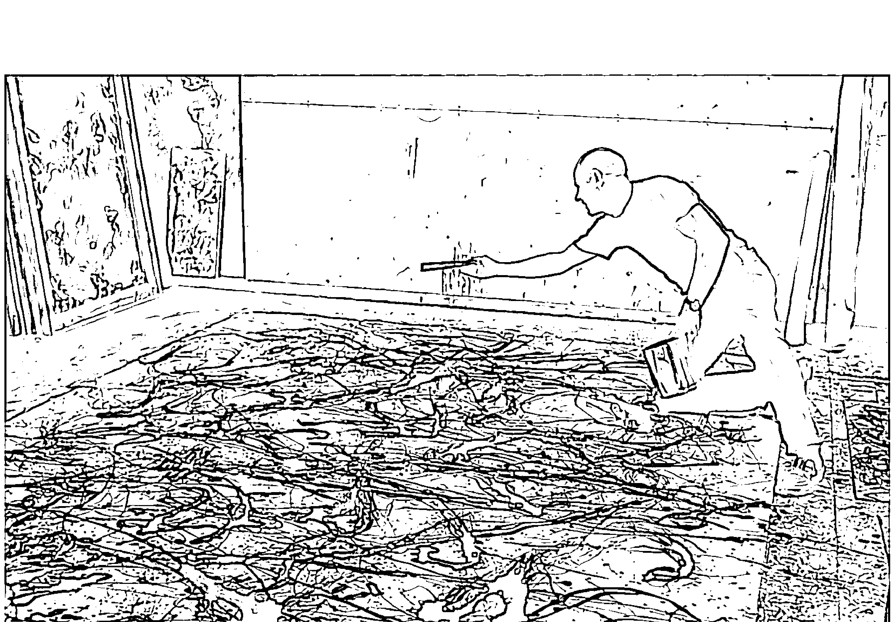

20. 艺术创作者帕洛克（Jackson Pollock）灵感涌现的一刻。

# 第二部

## 智人为世界赋予意义

人类创造了怎样的世界？
人类为何如此深信，以为自己不但控制了世界，还能赋予世界意义？
而人文主义（也就是对人类的崇拜）又是怎么成为全球最重要的宗教？

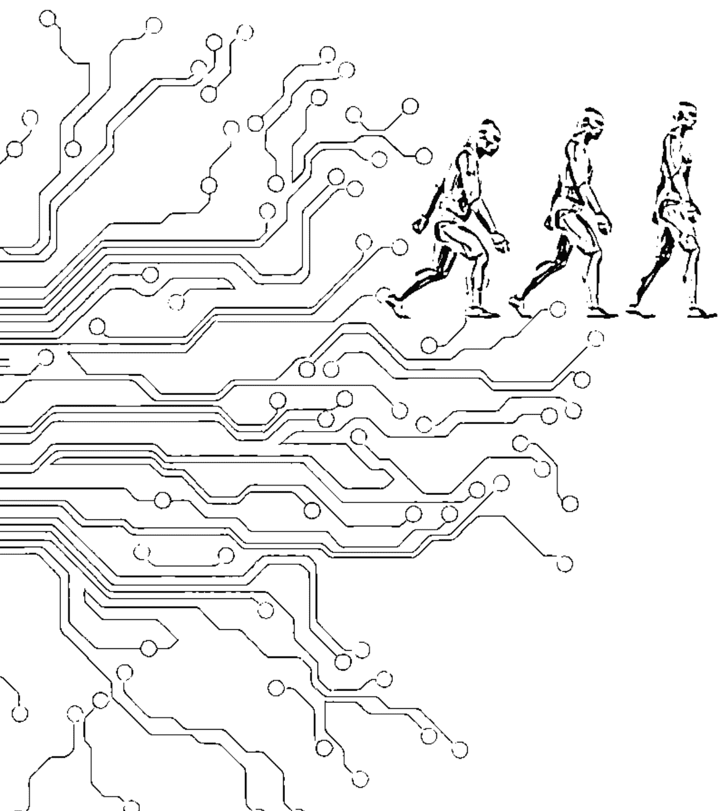

## 第4章 说书人

狼或黑猩猩这些动物，都活在一种双重现实之中。一方面很熟悉外在的各种客观实体，像是树木、岩石和河流；但另一方面，也知道自己的主观经验，像是恐惧、喜悦和欲望。相较之下，智人则是活在一种三重现实之中：除了树木、河流、恐惧和欲望，智人的世界还有各种关于金钱、神祇、国家和公司的虚构故事。历史逐渐开展，神祇、国家和公司的影响也就不断成长，而河流、恐惧和欲望则成为被牺牲的代价。世界上还是有河，人类也依然受到恐惧和欲望的驱使，但是耶稣基督、法国、苹果公司都学会了如何筑坝拦水、将河流控为己用，以及形塑我们最深切的焦虑和渴望。

到了二十一世纪，新科技可能会让这些虚构故事更加强大。为了瞭解我们的未来，就必须回顾像是耶稣基督、法兰西共和国和苹果公司这些故事，看看它们究竟是如何得到这么大的力量。人类认为自己创造了历史，但历史其实就是围绕着各种虚构故事而转。单一人类个体的基本能力，从石器时代以来并没有多大改变，真要说什么改变，很可能是变弱了。但成长的是各种虚构故事的力量，推动了历史，让我们从石器时代走到了硅晶时代。

这一切开始于大约七万年前，认知革命让智人开始谈着只存在于人类想像之中的事情。而在接下来的六万年间，智人编织出许多虚构故事，只是这时的故事仍然规模有限，流传也不广。某个部落里崇拜的祖灵，可能到了隔壁部落就已经一无所知；某个地方能用作通货的贝壳，翻过山脉就可能毫无价值。但光是像祖灵或是贝壳的价值这种虚构故事，就已经能促成几百、甚至是几千个智人通力合作，远超过尼安德塔人或黑猩猩，也就让智人大占优势。然而，如果只倚靠狩猎或是采集，并不足以支持城市、甚至王国的运作，因此只要智人仍然是狩猎采集者，就不可能有真正的大规模合作。也因此，石器时代的各种神祇、精灵和恶魔，说来并不强大。

到了大约一万二千年前，农业革命揭开序幕，为人类提供了必要的物质基础，能够扩大并强化人际网络。有了农业，开始有可能养活拥挤城市里的几千个市民、或是纪律严明的军队里成千上万的士兵。然而，这种人际网络也遇到了新的障碍。在维护这种集体神话、组织大规模合作的过程中，早期农民只能依赖人脑的资料处理能力，但人脑实在能力有限。

### 苏美神祇相当于现代公司 ⚇

农民深信各种伟大神祇的故事。他们为最敬爱的神祇，兴建神庙、举办庆典、甘心奉献，双手送上土地、什一奉献，或是各种祭品礼物。在大约六千年前的苏美文化，城市开始成形，而神庙不仅是信仰中心，也是最重要的政治和经济枢纽。苏美神祇的功能，很类似现代的品牌和公司。

在今日，公司是个虚构的法律实体，能够拥有财产、借贷、雇佣员工，进行买卖交易。在乌鲁克（Uruk）、拉格什（Lagash）和舒鲁帕克（Shurupak）这些古城里，神祇也是法律实体，能拥有田地和奴隶、发放和接受贷款、支付薪资、建造水坝和开凿运河。

由于神不会死，也没有后代互相争夺遗产，也就累积愈来愈多的财富和权力。愈来愈多苏美人发现自己成了神的员工，拿着神的贷款，耕作神的土地，也得向神缴税和什一奉献。就像现在有人是谷歌的雇员、有人是微软的员工，在古代的乌鲁克，可能某个人是大神恩基（Enki）的雇员，而邻居则在女神伊南娜（Inanna）手下。恩基和伊南娜的神庙刻画了乌鲁克的天际线，神纹也出现在建物、产品和衣服上。对苏美人而言，恩基和伊南娜再真实不过，就像我们眼中的谷歌和微软，一样真实。与先前石器时代的鬼魂和神灵相比，苏美的神祇已经是非常强大的实体。

不用说，各种业务当然不会由神祇亲手动手，祂们根本只是人类的想像，也只会出现在想像之中。所有日常业务都是交给神庙的祭司（正如谷歌和微软也需要有血有肉的真人来管理业务）。然而，随着神祇名下的财产和权力愈来愈多，祭司开始无力应付。虽然祭司可能代表了神威浩荡的天空之神、无所不知的地之女神，但自己毕竟还是血肉之驱。他们很难统统记住，究竟哪些是女神伊南娜的庄园、果园和田地，有哪些伊南娜的员工已经领了薪资，又有哪些伊南娜的佃户还没付佃租，这位女神对债务人收取的又是多高的利率。这正是一大主因，导致无论是在苏美、或全球其他地方，就算农业革命已经发生数千年，人类的合作网络却迟迟无法大幅扩张。既没有幅员辽阔的王国，也没有遍及四海的贸易网络，更没有全球信仰的宗教。

The request was rejected because it was considered high riskThe request was rejected because it was considered high risk## 共产主义也是宗教

自由主义者、共产主义者、或其他现代信仰的追随者，并不喜欢自己相信的系统被称为「宗教」，原因就在于他们总觉得宗教就是迷信、相信超自然的力量。如果你告诉共产主义者或自由主义者，说他们是宗教信徒，他们可能会觉得你在骂他们、说他们是盲目相信着白日梦。但事实上，说他们信仰的主义也是一种宗教，这只意味着他们也相信某些道德法则系统，认为这些法则虽然不是人类所发明，但人类仍然需要遵守。

据我们所知，所有人类社会都有此类信仰。每个社会都会告诉成员，他们必须服从一些高于一般人的道德法则，而如果违反这些法则，就会导致灾难。

当然，不同的宗教就会有不同的故事细节、不同的诫命、以及不同的奖惩。像是在中世纪欧洲，天主教的教会就认为上帝不喜欢富人。耶稣曾说，骆驼穿过针的眼，比财主进神的国还容易。而为了让富人也能进入神的国，教会鼓励他们要多多奉献，并且威胁说「否则就等着在地狱里燃烧」。现代共产主义也不喜欢富人，但威胁的方式却不是说「等着死后被地狱之火焚烧」，而是说现在就会产生阶级冲突。共产主义所说的「历史规律」，其实就像是基督教上帝的诫命，都代表着高于一般人的力量，无法透过人类意志加以改变。人类可以决定明天上午的足球赛不要管越位规则，因为是人类发明了那条规定，当然也就能够任意改变。但至少就马克思看来，历史规律并非人力所能改变。不管资本家做什么，只要他们继续累积私人财富，就必然造成阶级冲突，也就注定会被无产阶级站起来推翻。

如果你碰巧是个共产主义人士，可能会认为共产主义和基督教当然大不相同，因为共产主义是对的、而基督教义是错的。资本主义制度本身就是带有阶级冲突，但是富人可不会在死后落入地狱、遭受永恒的折磨。不过，即使共产主义是对的，也不代表共产主义就不是一种宗教，反而证明共产主义就是个真金实银的宗教。不论任何宗教的追随者，都相信只有自己的宗教才是真实的。而或许，真有一种宗教是对的？

## 如果你遇见佛陀 ❖

我们说宗教是一种工具，用来维护社会秩序、组织人类进行大规模合作，这种说法可能让某些人感到恼怒，因为对他们来说，宗教最重要的，就是代表一条通往灵性的途径。然而，一方面宗教和科学的差距比我们一般认为的更小，另一方面，宗教和灵性的差距却比想像的更大。宗教就是一份契约，而灵性却是一趟旅程。

宗教对世界提出一套完整的描述，并且提供一份定义清晰的契约，载明各项预定目标。「上帝存在。祂告诉我们该遵守某些作为。如果你服从上帝，你就能进天国。如果你不服从祂，你就会在地狱燃烧。」正是因为这类契约写得清清楚楚，才让社会得以订出各种共同的规范和价值观，约束人类的行为。

但灵性之旅就不是这么一回事了。这通常都是以神秘的方式，要把人带向未知的目的地。旅程的一开始，通常都是某些大哉问，例如：我是谁？生命的意义是什么？什么是善？在大多数人欣然接受由当权者提供的现成答案时，真正的灵性追求者可不会那么容易满足。他们会下定决心，追寻着某一个大哉问，不论要追到何方，也不仅仅是前往熟悉或愿意前往的去处。

因此，对大多数学者来说，做学术研究也是一份契约，而不是一趟灵性之旅，因为做学术研究也就是把我们带往前人、政府和银行所认同的预定目的罢了，这就像大学生说「我要读个四年，通过所有考试，拿到大学毕业证书，找份薪水够好的工作。」但如果你到了半路碰上某些大哉问，将你转向某个预料之外、起初丝毫没想过的目的地，学术研究也可能忽然变成一趟灵性之旅。举例来说，某个学生可能一开始主修经济学，想找份华尔街的赚钱工作；学着学着，却不知怎的，最后进了印度教的修行所、或是到了辛巴威去帮助爱滋病带原者，我们就可以说这是一趟灵性之旅了。

为什么说这样的过程有「灵性」？这是来自古代二元论宗教的遗绪。二元论相信有两个神，一善一恶，善神创造了纯洁而永恒的灵魂，住在一个充满灵性而幸福的世界；恶神（有时称为撒旦）则创造了另一个由物质和物欲构成的世界。撒旦不知道怎样才能让自己创造的事物永续，因此在物质和物欲的世界里，一切终将腐败瓦解。而为了将祂所创出的瑕疵品赋予生命，撒旦就会诱惑来自纯洁灵性世界的灵魂，再将灵魂关在物质构成的身体里。这就成了人：一个美好而有灵性的灵魂，被困在邪恶的臭皮囊里。由于灵魂的监狱（也就是身体）会衰老死亡，撒旦就必须不断用各种肉体的欢愉来诱惑灵魂，其中最重要的就是食物、性和权力。等到这身臭皮囊终于回归尘土、让灵魂有机会逃回灵性世界，对肉体欢愉的渴望就会诱惑它再次回到另一具臭皮囊里。于是，灵魂就这样从一具臭皮囊转移到另一具臭皮囊里，虚耗光阴，追求食物、性和权力。

二元论告诫人们要打破这些物质枷锁，踏上回归灵性世界的旅程——我们对灵性世界完全陌生，但那才是我们真正的家。在这趟旅程中，我们必须拒绝所有物质上的诱惑和契约。出于这种二元论的背景，只要是在旅程中质疑着各种俗世的惯习和契约、前往未知的目的地，我们都会称为「灵性」之旅。

这种旅程与宗教有根本的差异，因为宗教是要巩固世俗秩序，但灵性之旅反而是要逃离世俗秩序。通常，灵性之旅的流浪者最重要的义务之一，就是要挑战各大宗教的信仰和惯例。禅宗佛教就曾说「逢佛杀佛」，讲的是在灵性的道路上，如果发现佛教已经落入制式、僵化、固定，就必须连这些一起摆脱。

对宗教来说，灵性是个危险的威胁。宗教通常会努力避免信众踏上灵性的追求之旅，而许多宗教系统所面对的挑战，也不是来自那些追求食物、性和权力的普通人，而是来自那些追求灵性和真实、无法用陈腔滥调打发的人。正因如此，推动新教徒反抗天主教教会权威的，并非抱持享乐主义的无神论者，而是一位虔诚而苦修的修士：马丁·路德（Martin Luther, 1483-1546）。路德对于生命有许多存在主义的疑惑，希望得到解答，而且他拒绝接受教会用各种礼仪、仪式和契约提出的答案。

当时，教会向信众提出一些非常诱人的契约交易。如果你犯了罪，担心死后受到永恒的诅咒，该做的就只是打开钱包、买张赎罪券。十六世纪初，教会还雇用了专业的「赎罪券贩子」，来去于欧洲各个城镇村庄，定价贩售赎罪券。想要一张进入天堂的签证吗？十枚金币。想让已过世的爷爷奶奶一起上天堂吗？没问题，但得要三十枚金币。在贩子当中，最著名的就是道明会的修士约翰尼斯·帖次勒（Johannes Tetzel），据传有句名言：「银钱叮当落银库，灵魂立即出炼狱。」

马丁·路德愈想愈觉得不对，也连带质疑起提供这套交易契约的教会。救赎怎么可能是付钱了事？教皇又怎么可能有权宽恕人们的罪、打开天堂的大门？

于是路德根据新教传统，在1517年10月31日，带着一份长长的文件、一把槌子和几根钉子，走到威登堡（Wittenberg）诸圣堂的大门。文件总共列出了九十五条论点，反对当代宗教作为，其中就包括反对贩售赎罪券。路德把文件钉上教堂大门，点燃宗教改革，呼吁所有关心救赎的基督徒起身反抗教皇权威，找出其他前往天堂的道路。

从历史的观点来看，灵性之旅总是悲剧一场，因为这是一条孤独的道路，只适合个人、不适合整个社会。人类要合作，就不能只有大哉问，而需要坚定的答案。推倒某些荒谬的宗教制度，也往往在其他地方又促成了新的宗教制度。这种事情曾发生在二元论者身上，他们的灵性之旅最终也变成了宗教体制。这种事情也发生在马丁·路德身上，他挑战了天主教会的法则、制度和仪式后，却发现自已也正在写下的新的法则、建立新的制度、发明新的仪式。甚至连佛陀和耶稣也未能幸免。在坚持追求真理的路上，他们颠覆了传统印度教和犹太教的法则、仪式和制度。但到头来，以他们之名建立的法则、仪式和制度，数量却是史上最多，无人能出其右。

## 科学和宗教誓不两立？

现在我们已经更了解宗教的概念，可以回头检视宗教和科学之间的关系。对于这种关系，有两种极端的观点。第一种观点认为科学和宗教誓不两立，而现代史就是科学知识与宗教迷信的斗争史。随着时间逐渐过去，科学的光明驱散了宗教的黑暗，世界愈来愈世俗、理性和繁荣。

然而，虽然某些科学发现和科研成果肯定不利于宗教，两者却非必然对立。像是穆斯林教条认为，伊斯兰教是由先知穆罕默德于七世纪在阿拉伯创立，而这点就有充分的科学证据可资证明。

更重要的是，科学如果想要打造出可行的人类制度，必然需要宗教协助。虽然科学家能够研究世界如何运作，但却没有科学方法能告诉我们，人类该做些什么。科学告诉我们，人类没有氧就无法生存；然而，我们是否能用窒息来处死罪犯？能够回答这种问题的并非科学，唯有宗教。

因此，科学家的实用研究仍有赖宗教见解的襄助。像是长江的三峡大坝，中国政府在1992年决定建造大坝时，物理学家可以计算大坝必须承受多少压力，经济学家可以预测大坝可能需要多少建造成本，而电机工程师可以预测大坝能发多少电。但政府必须考虑的不只这些。三峡大坝蓄水后，将淹没陆地面积超过六百平方公里，其中包括许多城镇村庄、数千处考古遗迹、以及独特的风景和动物栖地。超过百万人流离失所，数百种物种濒临灭绝。看起来，大坝是白鳍豚灭绝的直接原因。不论你个人对三峡大坝有何看法，显然盖不盖大坝也会是伦理问题，而非纯粹的科学问题。不论任何物理实验、经济模型或数学方程式，都无法确定究竟是发出几兆瓦的电、赚进几十亿人民币比较有价值，还是保住某座古塔或白鳍豚比较有价值。因此，中国无法单靠科学理论的基础来运作，还是需要一些宗教或意识形态才行。

有些人一下就跳到另一个极端，说科学和宗教本来就是两个完全分开的国度。科学就去研究事实，宗教就去讨论价值观，两者井水不犯河水，老死不必互相往来。宗教对科学事实不予置喙，科学对宗教信仰也该沉默是金。如果教宗相信「人命神圣，因此堕胎是罪」，生物学家对此既不能证明、也不该驳斥。私底下，每个生物学家都欢迎与教宗辩论；但做为科学家，生物学家却不该加入战局。

这种论点可能听来合理，但是对宗教仍有误解。虽然科学确实只管事实，但宗教却从非只管伦理判断。宗教想发挥任何实际的引导作用，就得提出一些「事实」上的要求，这时候就可能和科学有所冲突。许多宗教教条最重要的部分，并不是关于伦理原则，反而是关于「事实」的主张声明，像是「上帝确实存在」、「灵魂会因为犯下的罪而在死后受罚」、「《圣经》是由神所著，而非由人所著」、「教皇永远是对的」。这些都是关于「事实」的主张声明。许多最激烈的宗教辩论、或是科学和宗教之间的激烈冲突，都是源于这种关乎「事实」的主张声明，而不是来自关于伦理的判断。

让我们以堕胎为例。虔诚的基督徒常常反对堕胎，而许多自由主义者则拥护堕胎权。双方主要的争议点其实在于「事实」，而非伦理。不论基督徒或自由主义者，都同意人命神圣、谋杀是可憎的罪行。他们是对某些生物学事实有意见：究竟人命是受孕那一刻就开始？出生那一刻开始？还是在两者之间的某一刻？

有些文化甚至认为，就算到了出生那一刻，生命也还没真正开始。像是非洲南部喀拉哈里沙漠的库恩人（!Kung）和北极的因纽特人（Inuit），都认为人命是在婴儿得到名字之后才开始。婴儿出生时，家族会先等待一段时间，如果决定不要留下它（可能因为肢体畸形、或因为经济困难），家族就会把它杀掉。这时只要还没有举行命名仪式，就不算是谋杀。

受这些文化薰陶的人，可能也和自由主义人士或基督教的信徒一样同意人命神圣、谋杀是可憎的罪行，但是他们却能容许杀婴。

## 科学能辨真伪 ※

宗教的自我宣传，往往只强调它们精美的价值观。只不过，神却往往藏在那些用小字印制的事实声明之中。像是天主教，总宣扬自已是博爱和同情的宗教。这不是太好了吗？谁能反对这些事呢？既然如此，为什么现在不是全人类都是天主教徒？因为如果你真的去读那些小字，就会发现天主教同时也要求你盲从某位「永远不会犯错」的教皇，就算他曾经号令信众发动十字军东征、把异教徒绑在桩上活活烧死，也不能违逆教皇的旨意。这些实际的指示，并不只是来自伦理判断，而是来自伦理判断与事实声明的结合。

让我们从缥缈的哲学领域回归历史现实，便会观察到宗教故事几乎总是包括三个部分：

- 第一、伦理判断，例如「人命神圣」。
- 第二、事实声明，例如「人命是在受孕那一刻开始」。
- 第三、实务指示：把伦理判断与事实声明合并，就会得到实务指导方针，像是「就算受孕才刚一天，你也不得堕胎」。

对于宗教的伦理判断，科学无法加以反驳或证实。但对于宗教的事实声明，科学家就大有意见了。只要是关于事实的问题，例如「在受孕一周后，人类胎儿是否已有神经系统？有痛觉了吗？」生物学家就远比教士有资格回答。

为了解释得更清楚，让我们深入研究一项真实的历史案例。宗教自吹自擂的时候，对这个案子绝口不提，但这件事对社会和政治的影响却无与伦比。

在中世纪欧洲，教皇的政治权力无远弗届。不管在欧洲何处，只要发生冲突，教皇都会声称自已有裁决权。为了巩固自已的权力主张，历任教皇都曾一再提到〈君士坦丁御赐教产谕〉（Donation of Constantine）。这个故事是这么说的：罗马皇帝君士坦丁在西元315年3月30日签署一份谕令，授权教皇圣思维一世（St. Sylvester I）和后继者，永远控制罗马帝国西部领土。

历任教皇将〈君士坦丁御赐教产谕〉这份珍贵文件留传下去，每当有雄心勃勃的君主、喜争好辩的城市、或是桀骜不驯的农民起身反抗，教皇就会拿这份文件，做为强大的宣传工具。

中世纪欧洲民众十分尊重流传久远的帝国法令，认为文件历史愈长，就承载着愈多权力。他们也一心坚信，国王和帝王都是上帝的代表。其中，由于君士坦丁让罗马帝国从异教领土变成了基督教帝国，也就特别受到尊崇。如果现在市议会想做的事，与伟大的君士坦丁本人所下的谕令有所冲突，对中世纪欧洲人来说，显然就该服从古代的文件。于是，每当教皇碰上政治抗争，他总是高举〈君士坦丁御赐教产谕〉，要求对方服从。

倒也不是每次都灵。只不过，〈君士坦丁御赐教产谕〉仍然是教皇的宣传利器和中世纪政治秩序的重要基石。

如果仔细研究〈君士坦丁御赐教产谕〉，也会发现这个故事仍是由前述的三个部分组成：

| 倫理判斷 | 事實聲明 | 實務指示 |
| :--- | :--- | :--- |
| 人民尊重古代帝王<br>諭令的程度，應該要<br>高於尊重當今民意 | 君士坦丁大帝在西元<br>315 年 3 月 30 日，將<br>歐洲統治權賜予教皇 | 西元 1315 年的<br>歐洲人，應該要<br>服從教皇的諭令 |

古代帝王谕令的伦理权威，绝对不是什么理所当然的事。大多数的二十一世纪欧洲人都会认为：现代公民的民意，当然要比那些早已死透的大帝所下的谕令，来得重要。但这种事情没办法用任何实验或方程式来确认，因此科学根本无法加入这场伦理辩论。就算有位现代的科学家时光倒转七百年、回到中世纪，她也无法向当时的欧洲人证明，为何不该用古代帝王谕令来解决当代的政治争端。

然而〈君士坦丁御赐教产谕〉的故事基础并不只有伦理判断，里面还有些非常具体的事实声明，而这就是科学非常有资格来证明或推翻的了。

1441年，天主教神父兼语言学先驱的瓦拉（Lorenzo Valla）发表了一项科学研究，证明〈君士坦丁御赐教产谕〉实为伪造。瓦拉分析了这份文件的风格、文法、以及所用的词汇及片语，证明有些词汇在西元四世纪的拉丁文里根本还没出现，很有可能是在君士坦丁大帝死后约四百年，才伪造出来的。此外，文件所注记的日期为「3月30日，君士坦丁第四次担任执政官，加利卡努斯（Gallicanus）首次担任执政官。」

在罗马帝国，每年会选出两位执政官，文件以执政官的任期做为年代标记，也是惯例。君士坦丁第四次担任执政官确实是在西元315年，但凸槌的是，加利卡努斯却要到西元317年，才首次担任执政官。如果这份这么了不起的文件确实是在君士坦丁的时代写就，绝不可能会有如此离谱夸张的错误。这就等于美国开国元勋杰佛逊等人，把〈美国独立宣言〉的日期写成「1776年7月34日」一样不可思议。

今天所有的历史学家都同意，〈君士坦丁御赐教产谕〉是在大约八世纪的时候，在教廷中伪造而成。虽然瓦拉从未质疑这份古代帝王谕令的伦理权威，但他的科学分析确实影响了这份谕令的实务指示——也就是欧洲人应该要服从教皇的谕令。

## 《圣经》是由谁在何时写的？

2013年12月20日，乌干达国会通过《反同性恋法》，认定同性恋活动属于刑事犯罪，某些犯行可能重判到无期徒刑。

整件事情得到基督教福音教派的推动和支持，认为上帝禁止同性恋行为。他们引用〈利未记〉第18章第22节「不可与男人苟合，像与女人一样，这本是可憎恶的」和〈利未记〉第20章第13节「人若与男人苟合，像与女人一样，他们二人行了可憎的事，总要把他们治死，罪要归到他们身上」，做为举证。

在过去这几世纪里，正是因为同一则宗教故事，造成全世界有数百万人受苦受难。这个故事的三个成分，可以简单整理如下：

| 倫理判斷 | 事實聲明 | 實務指示 |
| :--- | :--- | :--- |
| 人類應當服從<br>上帝的命令 | 大約三千年前，<br>上帝命令人類<br>不得有同性戀活動 | 人類不得有<br>同性戀活動 |

这个故事是真的吗？关于「人类该服从上帝」这个伦理判断，科学家无从置喙。就个人来说，谁都可以有自己的想法。你可能认为人权比神的权威更重要，所以如果上帝命令我们侵犯人权，我们就不该听祂的话。然而，没有任何科学实验，能够判断这个问题孰是孰非。

相较之下，对于这里的事实声明，也就是说在三千年前，宇宙的创造者命令智人不得从事男男行为，科学就有许多意见了。毕竟我们怎么知道这个声明是真的？

检视相关文献，会发现虽然这项声明曾一再出现在几百万笔的书籍、文章和网站里，但一切都指向唯一一个源头：《圣经》。这样一来，科学家就会问，究竟《圣经》是由谁、在什么时候写的呢？请注意，这是一个事实问题，而非价值问题。虔诚的犹太人和基督徒声称，至少〈利未记〉是上帝在西奈山吩咐摩西的故事，而且从那一刻开始，从未有一字增减。科学家又会继续追问：「但我们怎么能确定？」毕竟，就连教皇都曾经说〈君士坦丁御赐教产谕〉是君士坦丁自己在第四世纪写的，但事实上却是在四百年后，由教皇自己的手下伪造的。

我们现在已经有大批科学方法，能够找出是谁在何时写成《圣经》。相关的科学研究已经进行超过一个世纪了，如果对这些发现有兴趣，已有许多专著可供参考。我把结论简单说来：多数经过同侪审查的科学研究都一致认为，《圣经》是许多不同文本的集合，而这些文本则是由许多不同的人类作家，在他们声称的事件过了几百年之后才写成的，要等到《圣经》时代过了许久，这些文本才终于集結成一本宗教经典。

举例来说，虽然大卫王的时代应该是在西元前1000年左右，但是一般认定：〈申命记〉是在大约西元前620年，于犹大王约西亚（King Josiah）的宫廷所写成，做为加强约西亚权威的宣传活动。〈利未记〉的成书年代甚至还要更晚，绝不早于西元前500年。

至于要说古代的犹太人很小心的保存了《圣经》文本、绝不增删任何一字，科学家也指出了破绽：《圣经》时代的犹太教，根本不是以经文为基础的宗教。相反的，当时的犹太教正如许多中东的邻近宗教，是典型的铁器时代异教，既没有犹太会堂、犹太初等学校（yeshiva）、拉比，甚至連犹太经典都没有。当时拥有的是繁复的圣殿仪式，多半就是将动物献祭给一位善妒的天神，希望祂能保佑人民、赐下每季的雨水和战争的胜利。此时的宗教精英是一群祭司家族，只谈出身，不论智力。祭司多半是文盲，忙着处理圣殿仪式，无暇书写或研读任何经文。

在第二圣殿（Second Temple）时期，另一批对立的宗教精英逐渐成形。部分受到波斯和希腊的影响，撰写和诠释文本的犹太学者地位愈来愈高，最后终于成为我们所知的「拉比」，而他们编纂的文本也成了《圣经》。至于拉比能享有何种权威，则是出于个人的智力，而非出身。这群新的文人精英和旧有的祭司家族之间的冲突，最终催生了犹太教以及《圣经》经典。

突已无可避免。拉比的幸运之处，在于罗马人为了敉平犹太战争（Great Jewish Revolt），于西元70年一把火烧毁了耶路撒冷及圣殿。圣殿成了断垣颓瓦，祭司家族顿时失去了宗教权威与经济权力基础，甚至失去了根本的存在理由。

以犹太教圣殿、祭司和英勇战士为特点的犹太教，从此消亡于史上。取而代之的，是一个以书籍、拉比和细心学者为特点的犹太教。学者的强项在于诠释，而运用这种能力，他们不只能解释为何全能的上帝允许自己的圣殿遭毁灭，还能说出一套大道理，解释为何《圣经》故事里的旧犹太教与当时的犹太教大不相同。5

因此，从目前最科学的证据来看，《利未记》里反对同性恋的看法，反映的不过是古代耶路撒冷几个祭司和学者的偏见。虽然科学无法判断人类究竟是否应该服从上帝的旨意，但对于《圣经》的源头就有许多话可说。如果乌干达的政客认为，只要两个男人在一起找了乐子，创造出宇宙、银河和黑洞的那股力量就会因此震怒，这时科学就能派上用场，驳斥这个实在没道理的念头。

## 科学不是万灵丹

事实上，要分辨伦理判断与事实声明，并不总是那么容易。宗教就是有一种麻烦的倾向，喜欢将事实声明转化为伦理判断，使得原本应该很简单的争议，变得混沌而模糊。例如，原本只该是事实声明的「《圣经》是由上帝所著」，就常常成为伦理上的禁令：「你应该要相信《圣经》是由上帝所著」。于是，不分青红皂白的相信某项事实声明，就成了美德；而怀疑这项声明，则成了罪过。

相对的，伦理判断之中，却又往往隐藏着事实声明，支持者不会特别去提，因为他们认为这早就是不证自明的事实。于是，像是「人命神圣」这种伦理判断（无法用科学测试），里面就可能包含着「每个人都拥有永恒的灵魂」这种事实声明（而这是可以用科学来争论的）。

同样的，美国民族主义者宣称「美国民族是神圣的」，这种看似属于伦理判断的说法，实际上仍是以某些事实声明为基础，例如「在过去几个世纪里，美国带领着大多数的科学、经济和道德进步」。虽然我们不可能用科学来检查究竟美国民族是否神圣，但只要拆解一下这个议题，我们就能用科学来检查美国带来的科学、经济和道德进展，贡献度是否确实如他们所宣称。

正因为人类的价值观里永远都藏着一些事实声明，也就让有些哲学家，如哈里斯（Sam Harris, 1967-）等人认为，科学能够解开一切的伦理困境。哈里斯主张，所有人的终极价值都是同一项：将痛苦最小化、快乐最大化；因此，所有的伦理争论都是关于「如何将快乐最大化」的事实论证。6伊斯兰基本教义派想上天堂，是为了快乐；自由主义者想增加人类自由，是因为这样能得到最大的快乐；德国民族主义者也认为，如果让柏林控制整个世界，每个人都会更快乐。哈里斯认为，伊斯兰基本教义派、自由主义者和民族主义者之间并没有伦理上的争议，只是对于如何达到大家共同的目标，彼此之间出现了在事实上的意见不合。

然而，就算哈里斯说得没错，所有人都重视快乐，但实际上也很难用这种观点来平息伦理争议，特别是「快乐」根本没有科学上的定义或测量方法。让我们再次以三峡大坝为例。就算我们同意，这项计划的终极目标是让世界成为一个更快乐的地方，可是该怎么度量和计算，才能判定「制造出廉价电力」会比「保护传统生活方式」或「拯救稀有的白鳍豚」更有益于全球的快乐？只要我们还无法真正理解意识，就无法为快乐和痛苦制定出通用的度量标准，也就无法比较不同人之间的快乐和痛苦，更不用说跨物种的情况了。十亿中国人享有更廉价的电力时，会产生多少单位的快乐？整个白鳍豚物种灭绝时，又会产生多少单位的痛苦？甚至回归根本，难道快乐和痛苦真的是可以用数学相加相减的实体吗？吃冰淇淋很愉悦，找到真爱更令人愉悦，但难道只要有足够的冰淇淋，累积起来的快乐就能等于找到真爱的快乐？

因此，虽然科学在伦理争论能发挥的作用，比一般想像要多，但仍有极限（至少目前如此）。如果没有一些宗教元素做为引导，就不可能维持大规模的社会秩序。就算是大学和实验室，也需要宗教的支持。宗教能为科学研究提供伦理上的理由，也因此能够影响科学研究的议题、以及科学发现和科研成果的运用方式。想要真正理解科学的历史，就不能不谈宗教信仰。科学家很少会谈这项事实，但科学革命的背景，也正是出于史上最教条武断、最观念偏狭、也最宗教狂热的一个社会。

## 冤家路窄常碰头

我们常常认为，科学与世俗主义、宽容包容的价值观有关。但若真是如此，绝对难以想像科学革命竟然出现在近代欧洲的初期。在哥伦布、哥白尼和牛顿的时代，欧洲的宗教狂热者密度是全球最高，而容忍度又是全球最低。亮起科学革命这道光芒的社会，驱逐了犹太人和穆斯林、烧死了成批的异端份子、把每个爱猫的老太太都当作女巫、每次满月都发起一场新的宗教战争。

如果你在大约西元1600年前往开罗或伊斯坦堡，看到的是拥有多元文化和宽容的大都市，有逊尼派、什叶派、东正教基督徒、天主教徒、亚美尼亚人、科普特人（Copt）、犹太人、甚至偶尔还有印度教徒，足以称得上是各教派和平共存。虽然仍有意见分歧和争端骚乱、奥斯曼帝国也经常出现宗教歧视，但和欧洲相比，这里仍然是自由主义的天堂。

如果你接着去了当时的巴黎或伦敦，看到的会是城里充满宗教极端主义，只有主流教派得以生存。在伦敦是天主教徒殒命，在巴黎是新教徒丧生，犹太人早遭驱逐，穆斯林更是想都别想进城。然而，科学革命却是始于伦敦和巴黎，而非开罗或伊斯坦堡。

讲到现代性（modernity）的历史，一般习惯将它讲成是一场科学与宗教之争。理论上，科学和宗教都是为了追求真理；而因为各自推崇不同的真理，也就注定有所冲突。但事实上，科学或宗教根本都没那么在乎真理，因此两者十分容易妥协、共存，甚至合作。

宗教最在乎的，其实是秩序。宗教的目的就是创造和维持社会结构。科学最在乎的，则是力量。科学的目的是透过研究，得到力量，以治疗疾病、征讨作战、生产食物。个人而言，科学家和神职人员可能很在意真理；但整体而言，科学和宗教对真理的喜好，还不及于力量和秩序。因此，两者一拍即合。对于真理毫不妥协的追求，其实是一种灵性之旅，宗教或科学机构之内很少得见。

所以，对于现代历史更准确的一种看法，其实是：科学与特定宗教（也就是人文主义）达成协议的过程。现代社会相信人文主义的教条，而科学的用途不是为了质疑这些教条，反而是为了实现。就算在二十一世纪，也不太可能有纯粹的科学理论取代人文主义教条，但让两者目前携手同行的契约，可能会瓦解，取而代之的是科学与其他后人文主义宗教之间、截然不同的契约。《人类大命运》接下来的两章，将会谈谈科学与人文主义之间的现代契约。至于第三部、也是本书最后一步，将会解释为何这项契约正在瓦解、又将由什么新的契约取代。

# 第5章 一对冤家

# 第6章 与「现代」的契约

「现代」就是一份交易契约，所有人都在出生的那天签了契约，从此规范了我们的生活，直到死亡为止。很少有人能够撤销或超越这份契约，这份契约形塑了我们吃什么、做什么、梦想什么，也决定了我们定居在哪里、要爱什么人，甚至是如何死去。

乍看之下，这份契约非常复杂，因此很少有人会去瞭解自己究竟签了什么。这就像是下载某个软体后，有一份使用同意书，里面有几十页的法律语言；于是你看了一眼，立刻向下滚到最后一页，勾了「我同意」，接着完全忘了这件事。但事实上，这份契约简单到不可思议。只要一句话就能总结：人类同意放弃意义、换取力量。

在现代之前，多数文化都相信人类是某个伟大宇宙计划的一部分。这个计划的设计者是某些万能的神、又或是永恒的自然律，人类无法改变。是这个宇宙计划让人的生命有了意义，但同时也限制了人的力量。人类就像是舞台上的演员，脚本让他们所讲的每个字、所掉的每滴眼泪、所做的每个手势，都有了意义；但同时也对他们的表演设下严格限制。哈姆雷特不能在第一幕就杀了克劳迪亚斯（Claudius），也不可能忽然离开丹麦，跑去印度打坐冥想。莎士比亚不可能允许这种事发生。同样的，人类也不可能永生不死、不可能免于一切疾病、不可能一切恣意妄为，这些事情就是不在脚本中。

前现代的人放弃了力量，而相信自己的生命换得了意义。对当时的人来说，是否在战场上英勇战斗、是否拥护嫡传的国王、是否在早餐吃了禁忌的食物、甚至是否和隔壁邻居有了奸情，都承担着重要的意义。当然，这会带来一些不便，但却能让心里觉得受到保护。如果发生什么可怕的事，譬如战争、瘟疫或干旱，大家还是能安慰自己说，「我们都是在一齣伟大的宇宙戏剧里，扮演着自己的角色，这一切都是神或自然律的旨意。虽然我们不知道脚本，但可以放心，一切都有目的。就算是这场可怕的战争、瘟疫或干旱，也都是在某个更伟大的计划里的场景。而且，我们知道这位剧作家值得信赖，故事最后一定有个美好而有意义的结局。因此就算发生了战争、瘟疫或干旱，也都是为了最后的美好结局；就算现在看不到美好结局，来世总会等到的。」

现代文化则不再相信有这种伟大的宇宙计划存在。我们并不是活在一齣比日常生活更高位阶的戏剧之中，生活没有剧本、没有剧作家、没有导演、没有制片；而且，也没有意义！就我们目前最先进的科学所知，整个宇宙就是个「盲目而没有目的」的过程，充满各种杂音和愤怒，但毫无意义。我们只是在一颗行星上，占据着再小不过的一点，存在了一段再短不过的时间，如马克白所说的那个可悲演员，在台上得意或失意了一会，就再也悄无声息。

既然没有剧本，人类也不是在什么伟大戏剧中扮演什么角色，虽然人类还是可能面临各种可怕的事，但并不会有什么神祇来拯救我们，或是让这一切痛苦有意义。整件事不会有个快乐的结局，也不会有什么悲惨的结局，其实根本就不会有结局。事情就是一直发生，一件接着一件串接下去。

现代世界并不相信目的，只相信原因。如果要帮「现代」订个座右铭，应该就会是「丧事总是会降临」。

但另一方面，如果说丧事就是会降临，那也并非因为有什么剧本或目的；因此之故，人类也不用自限于任何预定的角色，只要能找对方法，我们就能为所欲为。除了自己的无知之外，没有什么能限制我们。瘟疫和干旱的背后没有什么宇宙计划，我们能够消灭它们。战争并不是通往美好未来的必要之恶，我们能够带来和平。我们死后并没有天堂等着我们，但我们能够在地球上就创造天堂，永远活在天堂里。一切只要克服一些技术困难，就行了。

投入更多研究资金，就能促成科学突破，加速科技进展。新科技会促进经济成长，而经济成长又能投入更多研究资金。时间每再过个十年，我们就能享受更丰足的食物、更快速的交通工具、更有效的药物。总有一天，我们会累积够多的知识、够先进的科技，终于能够发明各种万灵丹，让人青春永驻、快乐幸福，而且这一切将不会有什么神祇前来阻挡。

于是，这份现代契约向人类提出巨大的诱惑，但也伴随着巨大的威胁。「无所不能」似乎是伸手可得，但在我们脚下却也有着完全虚无的深渊，随时可让我们跌落。就实务而言，现代生活就是在一个没有意义的宇宙里，不断追求更多力量。现代文化的力量是史上最强，而且还在不停研究、发明、发现、成长。但同时，现代文化也比史上任何文化，更感受到存在性焦虑（existential angst）。

本章讨论现代对力量的追求，下一章则会检视人类如何利用这种不断成长的力量，试图以某种方式，将意义重新带回这个无限空虚的宇宙。没错，我们现代人曾经承诺要放弃意义，以换取力量；但也没人押着我们，逼我们非得实现承诺。我们认为自己够聪明，能够尽享这份现代契约的好处，而无须付出代价。

### 从前，经济停滞是常态

科学进步与经济成长携手共进，更进一步推动了现代对力量的追求。整部人类历史上，科学多半是以蜗速进展，经济更是遭到深度冰封。虽然人口的缓步成长确实使生产随之成长，而每次科学偶有发现，也有可能带动平均每人的经济成长，但拉大镜头来看，整个过程是极度缓慢的。

如果在西元1000年，是100个村民生产了100吨小麦，到了西元1100年，可能是105个村民生产了107吨小麦，这种成长可说是有名无实，既不改变生活节奏、也不影响社会政治秩序。今天所有的人热切追求成长，但在前现代时期，人民对此却是毫不在意。不论王公贵族、牧师神父或农民大众，都认为人类生产大致就是维持稳定，某人想得到更多，就只能从别人那儿偷；也认为到了孙辈的生活水准，大概也不会有何跃进。

这种停滞现象，有一大部分原因在于很难为新计划筹措资金。没有足够的资金，就很难排干沼泽、建筑桥梁、开辟港口，更别提要培育新的小麦品种、发现新的能源、或是开拓新的贸易路线。当时资金稀缺，是因为没有什么信用（credit）的概念；之所以没有什么信用，是因为人类不相信成长；而之所以不相信成长，正是因为经济停滞不前。于是，停滞就成了个恶性循环。

假设你是住在一座每年都会爆发痢疾的中世纪城镇。你下定决心，一定要找到解方。于是，你需要资金成立一间工作坊，购买药草和各种罕见的化学品，付助手薪水，还得前往远地拜访名医。另外，在你全心投入研究时，还得养活自己和家人。但你自己没什么钱。你想去找当地的磨坊主、面包师傅和铁匠，拜托他们在这几年间供应你的需求；你也向他们保证，等到你找出解方、财源滚滚，就会还债。

很遗憾，磨坊主、面包师傅和铁匠不太可能同意。他们今天就得养活家人，而且对你能找到什么灵丹妙药，并没有信心。他们可不是什么三岁小孩，但从小到大，哪听过有人能为可怕的疾病找出新药物？想拿到食物和各种生活必需品，就得付现。但你都还没找到这种良药，所有时间又都投入研究，怎么可能有钱？你只好心不甘情不愿，再回田里去耕作。于是痢疾依旧每年给城镇带来苦难，没人尝试找出新疗法，也没有任何一枚金币换了手。就是这样，经济没了活力，科学停滞不前。

### 银行家与吸血蝙蝠有何不同？

一直要到了现代，因为人们开始相信未来，促成了信贷这项奇迹，才终于打破这个恶性循环。信贷正是信任在经济上的表现。如今，如果我想开发新药、但手上资金不足，我可以去向银行贷款，或是找上私人投资或创投基金。2014年夏天，伊波拉病毒在西非爆发疫情，你猜猜那些忙着开发抗伊波拉药物和疫苗的制药公司，股票表现如何？股价简直是一飞冲天。德克米拉（Tekmira）制药公司的股价上涨五成，百欧克斯（BioCryst）更大涨九成！

在中世纪，每当爆发瘟疫，人们只能泪眼望天，祈求上帝原谅他们的罪过。而现在，如果民众听说又有什么致命的新流行病，则是立刻拿起手机，赶快打给股票经纪商。对于证券交易所来说，流行病也是商机。

如果有够多人创业成功，民众对未来的信任也就会增加。信用扩张，利率下降，企业家更容易募资，于是经济成长。因此，民众对未来更加信任，经济继续成长，科学也随之进步。

这件事说来容易。如果真那么简单，又为什么得等到现代，经济成长才终于启动？几千年来，人类之所以不相信未来会成长，不是因为前人太过愚鲁，而是因为这根本违反直觉、违反演化经验、违反世界运作的方式。自然系统多半是呈现平衡状态，而且生存之争又多半是零和赛局，有一方蓬勃成长，就必有另一方付出代价。

举例来说，在某个山谷里，每年长出的草量都差不多。这些青草能够养活大约一万只兔子，而这些兔子里动作慢、脑袋笨或运气差的，又差不多能养活一百只狐狸。如果某只狐狸特别聪明努力，吃掉的兔子比较多，就有其他狐狸可能饿死。而如果所有狐狸都忽然比以前更会抓兔子，兔群数量将会大减，但隔年就会有更多狐狸饿死。就算这个「兔子市场」偶有波动，但长远来看，狐狸绝不会期望每年都能成长3%的猎兔量。

当然，真正的生态系更为复杂，并非所有生存之争都是零和赛局。许多动物能合作愉快，甚至有些还有贷款机制。自然界最著名的例子就是吸血蝙蝠。这些蝙蝠成千上万住在洞穴里，每天晚上飞出来找寻猎物。只要发现有鸟类睡着、或是哺乳动物心不在焉，它们就会在猎物的皮肤上切出一个小口，吸血为食。然而，不是每只吸血蝙蝠每天晚上都能找到受害者。为了应付这种生命里的不确定性，吸血蝙蝠就会彼此「贷血」。没找到猎物的吸血蝙蝠回家之后，会去找上那些运气比较好的朋友，分一些它们偷来的血。这些蝙蝠对于自己曾把血借给谁，记得一清二楚，所以如果哪天自己饿着肚子回家，就会去找那只欠债的蝙蝠，讨点血回来。

不过，蝙蝠不像银行家，它们从不收利息。如果A蝙蝠曾让B蝙蝠吸过 10 cc 的血，B蝙蝠还的就是 10 cc。而且蝙蝠之所以贷血，并不是为了创立什么新的蝙蝠业务、或是促进吸血市场成长。由于所吸取的血液是由其他动物产生，蝙蝠并无法增加产量。虽然血液市场也有波动，但蝙蝠并不会假设2017年的血量会比2016年成长3%、而且到了2018年还会再涨3%。因此，蝙蝠也不相信会有成长这回事。1

几百万年以来，人类的生活条件也和吸血蝙蝠、狐狸和兔子相去不远。于是，人类也很难相信成长的概念。

### 奇迹般的大饼

由于演化的压力，让人类习惯把世界看作一大块静态的大饼。如果有人拿走的那一小块比较大，一定有另一个人拿到的比较小。虽然可能有某个家族或城市似乎蓬勃成长，但人类整体明天的生产量并不会超过今天。因此，像是基督教和伊斯兰教等传统宗教，都是希望运用现有的资源来解决人类的问题，可能是将这块大饼重新分配，又或是承诺给一块空中的大饼。

相反的，「现代」则坚信：经济成长不仅可能，还是绝对必要的！虽然祈祷、行善和冥想能带来心灵的安慰和启发，但想解决饥荒、瘟疫和战争等问题，唯一的方法就是成长。「现代」的基本教条，可以总结为一个简单的想法：「如果有个问题要解决，可能就需要有更多东西；为了有更多东西，就得生产更多才行。」

现代政治和现代经济笃信成长的必要，原因有三。首先，生产愈多、能消费的就愈多，愈能提升生活水准，号称也就能享受更快乐的生活。第二，只要人类持续繁衍成长，光是为了维持现状，经济成长就已经是必要的了。例如，印度的人口年增率为1.2%。也就是说，除非印度经济每年成长至少1.2%，否则失业率就会上升，薪资将会下降，平均生活水准也会下滑。第三，就算印度的人口停止成长，中产阶级也对目前的生活水准感到满意，但那些为数仍有数亿的贫困印度人民，又该怎么办？

经济不成长，整块经济大饼也就这么大，想多给穷人一点，就必须从富人那里挖来一些。这必定会造成一些非常困难的选择，也很可能导致诸多不满、甚或暴力相向。如果想避开这些选择、不满或暴力，我们就需要一块更大的饼。

不论是宗教的基本教义派、第三世界的独裁主义、又或只是婚姻触礁，在「现代」的眼中，几乎任何公共或私人的问题，都能用「更多东西」来解决。像巴基斯坦或埃及这样的国家，只要能维持亮眼的经济成长率，国民也就能享受得起私家车和冰箱之类的种种好处，走着俗世幸福的道路，而不会随着那些基本教义派起舞。同样的，像刚果或缅甸这样的国家，如果能有经济成长，就能产生繁荣的中产阶级，做为自由民主的基石。至于夫妻失和这种问题，只要能买栋更大的房子（不用挤在一个狭小的房间）、买台洗碗机（不用吵着该轮到谁洗碗）、每周两次参加昂贵的婚姻治疗，据称也就能挽回婚姻，继续厮守下去。

### 成长挂帅

于是，经济成长就成了几乎所有现代宗教、意识形态和运动的共通重点。例如苏联妄自尊大的五年计划，对成长的迷恋丝毫不下于美洲最残酷的剥削资本家。也正如基督徒和穆斯林都相信天堂、只是对于路径有所异议，冷战时期的资本主义者和共产主义者，也都相信能够透过经济成长在地球上创造天堂，只是对于该用什么方法有所异议。

今天，不论是印度教复兴主义者、虔诚的穆斯林、日本民族主义者或中国共产党员，虽然可能各自宣称，自己有不同的价值观和目标，但都同样相信，实现这些目标的关键就在于经济成长。例如，虔诚的印度教徒莫迪（Narendra Modi）之所以能在2014年当选印度总理，主因正是他成功促进了家乡古吉拉特邦（Gujarat）的经济成长，许多选民认为只有莫迪，才能让印度低迷的经济起死回生。类似的观点也让伊斯兰教徒艾尔多安（Recep Tayyip Erdoğan）自2003年起，在土耳其掌权至今。他所属的政党名为「正义与发展党」（JDP），正强调对经济发展的承诺，而艾尔多安政府也确实在超过十年间，维持着令人佩服的经济成长率。

至于日本首相、民族主义者安倍晋三，自2012年上台，承诺将挽救日本沉寂二十年的经济困局，其措施大胆而不寻常，有「安倍经济学」（Abenomics）之称。与此同时，邻国中国的共产党，虽然嘴上仍推崇马列思想，但实际作为却是依循邓小平的名言：「发展才是硬道理」以及「不管白猫黑猫，能抓到老鼠就是好猫」。用一般话来说，也就是：不择手段，推动经济成长，哪管马克思和列宁高不高兴。

至於新加坡這個徹底務實的城市國家，更是進一步貫徹這種思維，讓部長的薪資與國家GDP掛鉤。新加坡經濟若成長，政府部長就能加薪，彷彿這正是行政工作唯一的重點。²

我們可能覺得，對成長著迷再自然不過，但這只是因為我們生活在現代世界。過去可不是這樣的。不論是印度的大君、鄂圖曼的蘇丹、鎌倉的幕府、或是漢朝的皇帝，都很少會把自己的政治命運賭在經濟成長上，但莫迪、艾爾多安、安倍晉三和中國國家主席習近平，卻都這麼做了，可見「經濟成長」這回事是如何在全球各地成功取得了近乎宗教的地位。確實，把「相信經濟成長」稱為宗教並不會與事實出入太遠，因為這種信念號稱能解決許多、甚至是絕大多數的倫理難題。由於經濟成長據稱是一切美好事物的源頭，於是能鼓勵大家放下各種倫理的異見，共同採取任何能夠最大化長期成功的措施。因此，雖然莫迪所領導的印度有成千上萬的教派、黨派、運動和大師，而且終極目標可能各有不同，但卻都得通過同樣的經濟成長瓶頸，所以何不把大家集合在一起呢？

於是乎，「更多東西」這項信條等於是在呼籲個人、公司和政府，不要在意任何可能阻礙經濟成長的事物，像是維持社會平等、確保生態和諧、或是孝順父母。在蘇聯，領導階層認為成長最快的方式就是國家控制的共產主義，所以任何妨礙集體化的事物，都會遭到掃除，包括幾百萬的富農（kulak）、言論自由、以及鹹海。現在普遍認為，某些版本的自由市場資本主義，更能確保長期成長；於是，我們保護了貪婪的大亨、富有的農民及言論自由，至於會妨礙自由市場資本主義的事物，則遭到摧殘，像是生態棲地、社會結構和傳統價值觀。

舉個例子：某位任職高科技新創公司的軟體工程師，時薪一百美元。某天，她的父親不幸中風，需要有人協助買東西、做飯、甚至是洗澡。她可以讓父親搬過來和自己住，她一早去上班，晚上再早點回來，親自照顧父親。如此一來，不管是她的收入、或是新創公司的生產力，都會受到影響，但父親卻能享有女兒充滿愛和尊重的照顧。

或者，這位工程師也能請一位墨西哥看護，時薪十二美元，和父親住在一起，照顧父親的所有需求。這樣一來，工程師、她任職的新創公司、甚至是這位看護和墨西哥的經濟，都將受益。

這位工程師該怎麼選擇？

自由市場資本主義的答案非常明確。如果經濟成長要我們放下家人間的情感，鼓勵大家和父母分住，再從世界另一邊聘用看護，又有何不可？然而，這是個倫理判斷的問題，而不是事實聲明的問題。如果有人專心做軟體工程、有人專心照顧老人，我們無疑能製造出更多軟體，也能讓老人受到更多專業照護。然而，經濟成長真的比家人間的情感更重要嗎？一旦用自由市場資本主義的邏輯做出這樣的倫理判斷之後，自由市場資本主義也就從科學，跨界來到了宗教。

多數資本家可能並不喜欢「宗教」這個標籤，但如果是宗教走向資本主義，宗教家倒是能抬頭挺胸。資本主義所應許的，並不像其他宗教那種空中的大餅，而是飄降在這個俗世上的奇蹟，而且有時還真能實現。許多讓人最後克服饑荒和瘟疫的信貸，都是出自對資本主義成長動能的強大信念。甚至，說到減少人類的暴力、增加寬容與合作，也得給資本主義一些掌聲。

下一章將會提到，雖然還有其他因素，但資本主義讓人不再將經濟視為零和賽局（認為你獲利就是我損失），而是一種雙贏局面（認為你得利也就是我得利），確實是全球和平的重要推手。這種互利概念對全球和平的助益，可能遠遠超過基督教幾世紀不停講著要「愛你的鄰居」和「連左臉也轉過來由他打」。

### 資本主義的巨輪不會停轉

資本主義深信「成長」這項最高價值，可說第一條誡命就是：將利潤投入有助於「增加成長」的事。在人類史上，王公貴族多半是把利潤虛擲在華麗的狂歡饗宴、豪奢的樓臺宮宇，以及不必要的戰爭衝突。又或是把金幣放入鐵箱，密封起來，深埋地底。今天，虔誠的資本主義信徒會用利潤來雇用新員工、擴大工廠規模，或是開發新產品。

就算自己不懂這些事，他們也會把錢交給某些懂的人，像是銀行家、或是創投業者，再由這些人把錢借給各種需要錢的產業。拿了貸款，農民種新的麥田、營建承包商蓋新的房屋、能源公司探索新的油田、軍火業者開發新的武器。這一切活動得到的利潤，就讓這些產業能夠償還貸款，而且是連本帶利。於是，我們現在不但有了更多的小麥、房子、石油和武器，而且銀行和基金裡還有更多的錢，能夠繼續借出去。這是個永不停轉的巨輪，至少資本主義是這麼認為的。絕不會有某個時刻，資本主義忽然說：「好囉，成長夠了，我們輕鬆點吧。」

如果想知道為什麼資本主義的巨輪絕不會停止，你可以花一個小時，與一個手上有十萬美元、想知道該怎麼辦最好的朋友談談。他會向你抱怨：「銀行利率這麼低，活存年利率才 0.5%，我才不想把錢放在存款帳戶裡。如果丟到公債，大概可以賺 2%。我有個表哥，去年在西雅圖買了一層公寓，現在漲了 20%！或許我也該去搞搞房地產；可是大家都在說房地產也要泡沫化了。那你覺得股市怎麼樣？我也有朋友說，現在最好是買新興市場的ETF，像是巴西或中國。」在他中間喘口氣的時候，你可以問他：「為什麼你有了十萬美元，還不滿足呢？」他的解釋就能讓你知道，為什麼資本主義永不停息，絕對比我說得更清楚。

透過各種無所不在的資本主義遊戲，這種概念甚至已經深深根植於兒童和青少年的心裡。像是西洋棋這種前現代的遊戲，假設的就是一種停滯的經濟。你在開局的時候有16枚棋，而等到遊戲結束，也絕不可能多出任何1枚。雖然有些極少數情況，能讓你把兵變成王后，但就是不會有多出來的新棋子，也不可能把騎士升級成坦克。所以，西洋棋玩家永遠不用考慮投資這回事。相比之下，許多現代桌遊或電腦遊戲，都把投資成長當作重點。

其中特別有趣的，是模仿文明的戰略遊戲，像是「當個創世神」（Minecraft）、「卡坦島」（The Settlers of Catan），或是「文明帝國」（Sid Meier's Civilization）。這些遊戲可能是設定在中世紀、石器時代、或某些想像的童話王國，但原則永遠相同，而且一定是出於資本主義。玩家的目標就是要建立一座城市、一個王國、或者是一整個文明。一開始可能只有一些很簡陋的基礎，可能是個村莊和附近的田野。你手上的資產能提供最早的一批小麥、木材、鐵或黃金，而你必須好好投資這筆財產：有些購買沒有生產力、但仍然必要的東西，像是士兵；也有些購買能用於生產的資產，像是更多村莊、田野和礦藏。這裡要致勝的策略，通常就是把能用於生產的資產盡可能最大化，至於沒有生產力但仍然必要的資產，則是勉強可維持就好。只要能蓋出更多村莊，就代表下一輪你能有更多收入，於是不但可以購買更多士兵（只在有必要的時候），還能繼續擴大對生產的投資。很快的，村莊就能升級成城鎮；然後，能蓋出大學、港口和工廠；接著，能夠探索海洋；最終建立文明，贏得遊戲。

### 科學讓人類發現自己的無知 ❋

然而，經濟真能永遠維持成長嗎？會不會有一天耗盡資源，終歸停止？為了確保永遠成長，我們必須找到永不枯竭的資源。

解決方法之一，就是探索、征服新的土地。幾個世紀以來，不論是歐洲經濟成長、或是資本主義制度擴張，確實都有賴於帝國在海外的征服行動。不過，地球上的島嶼和大陸就只有這麼多。雖然某些企業家確實也打算探索征服新的行星、甚至是星系，但與此同時，現代經濟還是得找到更好的擴張方式。

這時，是科學為現代提供了這個答案。在前面的例子裡，狐狸經濟之所以不能成長，是因為狐狸不知道如何讓兔子生得更多。兔子經濟之所以停滯，是因為兔子不知道如何讓草長得更快。然而，人類經濟之所以能夠成長，是因為人類可以找出新的原料、新的能源。

傳統把世界看成一塊固定大小的餅，隱藏的假設是世界上只有兩種資源：原物料和能源。事實上，資源有三種：原物料、能源，還有知識。原物料和能源取之有盡：用得愈多，就剩下愈少。相反的，知識卻是不斷成長：用得愈多，反而擁有愈多，而且隨著知識不斷增長，還能帶來更多原物料和能源。

如果我投資一億美元探勘石油，而且在阿拉斯加成功找到一片油田，我手上會有更多石油，但我的孫子能擁有的石油就少了。相比之下，如果我投資一億美元研究太陽能，而且成功找到更有效利用太陽能的新方法，我和我的孫子都能擁有更多能源。

幾千年來，人類之所以無法用科學來推動成長，是因為大家誤以為各種宗教經典和古老傳統裡，已經提供了世界所有重要知識。如果石油公司相信已經找出了全球所有的油田，就不可能再浪費時間和金錢來探勘。同樣的，如果人類文化覺得已經知道了所有該知道的事，就不會費心尋找新的知識。而在現代之前，這正是大多數人類文明所持的立場。

然而，科學革命打破了人類這種天真的信念。科學最大的發現正是讓人類發現自己的無知。人類發現自己對這個世界，所知竟如此之少，就突然有了很好的理由，要去追求新知，於是開啟了用科學推動進步的道路。

一代接著一代，科學讓我們找到了新的能源、新的原物料、更好的機械技術、新的生產方法。到了此時此刻，人類手中的能源和原物料已遠超以往，整體產能一飛衝天。蒸汽機、內燃機和電腦等種種發明，打造過去從來沒有的全新產業。

展望二十年後的情形，我們可以信心滿滿，預期在2036年的生產和消費，都會遠超今日。我們相信奈米科技、基因工程和人工智慧，能夠再次為「生產」重新定義，在我們這個不斷擴大的超市裡開出新的商品區。

### 方舟症候群

因此，資源短缺的問題看來很有機會克服，但現代經濟真正的敵人是生態崩潰。不論是科學進步或經濟成長，都發生在地球這個脆弱的生物圈裡，而隨著進步和成長的大舉啟動，也就衝擊到生態穩定。如果想讓全球每個人都過著像美國人一般的豪奢生活，我們得要多幾個地球才行，但我們就只有一個地球。如果進步和成長最後破壞了整個生態系，要付出代價的不會只是吸血蝙蝠、狐狸和兔子：智人也無法置身事外。生態崩潰將造成經濟崩盤、政治動盪、人類生活水準下降，還可能對人類文明的存在造成威脅。

想防患未然，方法之一就是放慢進步和成長的步調。如果投資者今年想要6%的報酬率，或許過了十年、他們可以學會只要有3%就滿足，過了二十年、只要有1%就滿足，那樣等到三十年後，經濟就能停止成長，而我們對現況也心滿意足。

然而，成長的信條絕對會堅決反對這種異端想法，反而認為我們應該加快腳步。如果我們的發現和發明，讓生態系失去穩定、危及人類，那就該趕快再發現和發明些什麼，來保護自己——如果臭氧層變薄，增加了皮膚癌的風險，就該發明更好的防曬油、更佳的癌症療法，這樣也能刺激新的防曬和癌症治療產業成長。如果這些新產業汙染了大氣和海洋，造成全球暖化、大規模生物滅絕，那麼我們應該趕快打造虛擬世界和高科技避難所，就算地球變得像地獄一樣又熱又乾、汙染嚴重，也無礙我們繼續享受一切。

北京的汙染狀況已經極度惡劣了，民眾必須避免戶外活動，而有錢人則會花上幾千美元，裝設室內空氣清淨系統。至於超級有錢人，甚至連院子都會蓋上保護設施。2013年，供外國外交官及中國高層子女入學的北京國際學校，甚至更進一步，斥資五百萬美元，在六個網球場及運動場地蓋起了巨大的圓頂帳篷。其他學校紛紛跟進，中國空氣清淨市場發展蓬勃。至於多數北京居民，當然自家不可能負擔如此的奢侈品，也無法把孩子送到國際學校。³

人類發現自己陷入了雙重的競賽。一方面，我們認為必須加快科學進步和經濟成長的腳步。十億中國人和十億印度人都希望過著像中產階級美國人一樣的生活——如果美國人都還是開著休旅車、逛著購物中心，中國人和印度人實在看不出，有什麼理由不去全力追求美式生活夢想。另一方面，我們又必須至少在生態世界末日來臨前懸崖勒馬。每一年，要處理這種雙重競賽的挑戰，都愈來愈艱巨，因為只要德里貧民窟的居民更接近美國夢一步，都是把地球更推近末日的邊緣。

好消息是：人類已經享受了幾百年的經濟成長，卻一直沒成為生態崩潰的受害者。其他許多物種沒能撐過這個過程；人類也曾面臨一些經濟危機和生態災難，但總能化險為夷。

但是，沒有任何自然律能夠保證未來繼續一帆風順。究竟科學能否永遠拯救經濟免於冰封、地球免於沸騰，實在沒人說得準。而且，由於腳步不斷加快，能夠犯錯的空間也不斷縮小。以前可能只要一個世紀發明出一項神奇的產品，便已足夠，但現在可能每兩年就得出現一項奇蹟。

我們也該思考，生態末日對於不同的人類階級，又有什麼樣的不同後果。歷史從無正義。每當災難發生，就算這場悲劇根本就是由富人所引起，但窮人受到的苦難幾乎總是遠遠高於富人。在乾旱的非洲國家，全球暖化已經開始影響窮人的生活，這些人受影響的程度遠比富裕的西方人來得高。矛盾的是，科學的力量愈大，反而可能愈危險；原因就在於這讓富人自鳴得意。

以溫室氣體的排放為例。大多數學者和愈來愈多的政治家，已經開始體認到全球暖化的現實和危險程度，但也僅止於體認，而未有任何實際作為，未能真正改變我們的行事做法。對於全球暖化，我們談得很多，但到了實際作為，人類卻不願為了制止這場災難，而真正在經濟、社會或政治上有所犧牲。2000年到2010年間，溫室氣體排放量非但完全沒有減少，反而還以每年2.2%的速度成長；過去在1970年到2000年間，年成長率僅為1.3%。⁴

1997年協議減排溫室氣體的〈京都議定書〉，目標只是減緩、而非阻止全球暖化，但美國這個全球第一大汙染者卻拒絕簽署，也全未嘗試大幅減少溫室氣體排放，惟恐有礙經濟成長。⁵

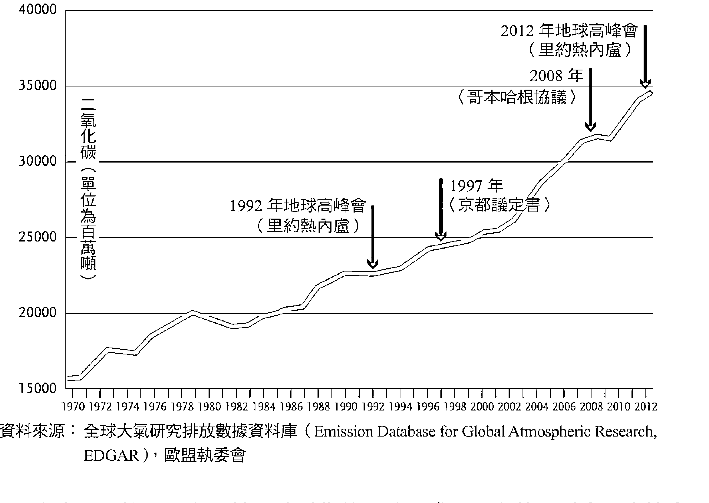

資料來源：全球大氣研究排放數據資料庫（Emission Database for Global Atmospheric Research, EDGAR），歐盟執委會

26. 迄今，不管是所有關於全球暖化的言論，或是所有的研討會、高峰會和協議，都未能抑制全球溫室氣體排放。仔細觀察這張圖表，就會發現只有在經濟危機和經濟停滯期間，排放量才會減少。因此，溫室氣體排放之所以在 2008 年至 2009 年間出現小幅下滑，並不是因為簽署了〈哥本哈根協議〉（Copenhagen Accord），而是因為全球金融危機。唯一能確保阻止全球暖化的方式，就是停止經濟成長，但任何政府都不會願意。

2015年12月，〈巴黎協定〉（Paris Agreement）訂出了較遠大的目標：在2100年以前，追求全球平均溫度升幅要低於1.5°C（以工業革命前的全球平均氣溫為準）。然而，有許多為了達成這項目標所必要的痛苦措施，卻都被輕描淡寫的延遲到2030年、甚至是二十一世紀的下半葉，其實也就是把燙手山芋丟給下一代。目前的主政者一派貌似環保，只想收割立即的政治利益，卻把減少排放（也就會減緩成長）的重大政治代價，留給未來的主政者。（本書寫作之時，即2016年1月，美國和其他最大汙染國是否會簽署〈巴黎協定〉及認真執行，看來仍在未定之數。）

有太多的政客和選民認為，只要經濟繼續成長，科學家和工程師永遠都能拯救我們免於面對末日。談到氣候變遷的問題，「成長」的真正信徒還不只是希望奇蹟發生，而是認為奇蹟的出現是理所當然。

把未來人類的希望，放在「假設未來的科學家能有些現今不可知、卻能拯救地球的發現」上，這種想法真的理性嗎？目前讓整個世界運作的多數總統、部長和執行長，都是非常理性的人。但是為什麼他們願意下這樣的賭注？或許是因為，他們覺得賭的不會是自己個人的未來。就算情況極度惡化，科學再也無法阻擋洪水襲來，工程師仍然能夠為上層階級，打造出一艘高科技的挪亞方舟，至於其他幾十億人，就隨波而去吧。

這種對於高科技方舟的信念，正是對人類未來及整個生態系的最大威脅之一。如果有人一心相信自己死後能上天堂，就不該把核武交到這種人手中；出於同樣理由，要決定全球生態議題時，也不該交給相信這種高科技方舟的人。

窮人又是怎麼回事？他們為什麼不抗議？畢竟萬一洪水真的來臨，將是窮人擔起所有代價。然而，如果經濟停滯，窮人也是首當其衝。在資本主義世界裡，窮人的生活唯有在經濟成長時，才可能有所改善。因此，如果得要放慢當下的經濟成長，以求減少未來的生態威脅，並不太可能得到他們的支持。保護環境是個好主意，但如果有人連房租都交不出來，對於沒錢的恐懼，就會遠遠高過對冰帽融化的擔心。

### 毫無意義的競賽追逐

就算人類動作夠快，能夠同時應付經濟和生態崩潰的危機，光是這場競賽本身，也是大有問題。對個人而言，這造成極高的緊張和壓力。經濟成長和科學進步已經為時數個世紀，我們會以為，至少在那些最先進的國家，應該能夠享有平靜、平和的生活。如果前人知道我們現在擁有什麼工具，一定會以為我們的生活如在天堂、無憂無慮。但事實卻絕非如此。雖然人類達成諸多成就，卻一直有股壓力，逼著我們繼續生產、繼續努力。

我們怪自己、怪老闆、怪貸款、怪政府、怪學校，但罪魁禍首其實不是他們，而是這份「現代」的契約，我們都在出生的那一天就已然簽字畫押。在前現代的世界裡，人類就像是在社會主義官僚體系裡的低階職員，每天只要一打完卡，接下來就是等著別人去做點什麼事。但到了現代，人類自己成了負責的老闆，也就日夜不停感到壓力。

整體而言，這種競賽就表現為不斷的動盪。在過去，社會和政治制度能夠歷經幾世紀而不衰，但現在，幾乎是每個世代都會打破舊世界、再創造新世界來取代。〈共產黨宣言〉說得精闢，現代世界就是自找著永遠的不安定和變動。各種固定的關係和古老的偏見，都遭到掃除；而新的結構等不到固定，便已經陳舊了。一切固定的東西都煙消雲散。在這樣混沌的世界，光是生活已不容易，要妥善管理，更是難上加難。

因此，「現代」就得更加努力，以確保人類不論個人或整體，都不會想到要退出這場競賽（雖然這場競賽正是所有緊張和混沌的源頭）。為此，現代繼續高舉成長，做為最高價值的大纛，要求我們為此冒一切危險、做出任何犧牲。整體而言，現代鼓勵政府、企業和組織，以成長做為成功標準，並將穩定視為洪水猛獸。個人而言，現代要我們不斷提高收入和生活水準，就算目前的生活已經令你相當滿意，還是應該努力爭取更多。

昨天的奢侈品，成了今天的必需品。曾經，一間三房的公寓、一輛車、加上一部桌上型電腦，就已經讓你相當滿意；到了現在，你就會想要擁有五房的獨棟住宅，車庫裡有兩輛車，加上有許多的iPod、平板電腦和智慧型手機。

要說服個人「想要更多」，並非難事。人類很容易就會貪婪。真正的關鍵在於：必須說服像是國家或教會這種集合體，讓它們也遵循這種新的理想。幾千年來，社會努力抑制個人欲望，讓欲望達成某種平衡。大家都知道，雖然人人都想得到更多，但如果大餅只有固定大小，唯有克制，才能讓社會和諧，而貪婪就是件壞事。但是「現代」已經讓整個世界顛倒是非，讓人類整體以為平衡比混沌更可怕，而貪婪因為能促進成長，反而成了一件好事。現代於是讓人開始追求更多，以致打破了長久以來抑制貪婪的紀律。

混沌所造成的焦慮，有一大部分會因為自由市場資本主義而得到紓解，這也正是資本主義受歡迎的原因之一。資本主義思想家不斷安撫我們：「不用擔心，一切都會沒事的。只要經濟成長，其他一切交給市場那隻看不見的手，就行了。」資本主義就這樣批准了一個貪婪而混沌的系統，整個系統飛速成長，沒人知道究竟發生了什麼事、或是我們正在前往何方。（共產主義也同樣相信成長，並認為能夠透過國家計畫來操縱成長，避免混沌。雖然一開始曾有成效，但最終還是不敵混沌的自由市場大軍。）

### 人文主義來救援

如今，知識界常常抨擊自由市場資本主義。確實，由於資本主義主導了這個世界，我們應該盡全力瞭解它有何缺點，以免末日就在眼前。但是在批評資本主義的當下，我們仍應看到它的優點與成就。

如果我們暫時忽略生態可能在未來崩潰，並以人口和成長做為成功的標準，資本主義可說是極其成功。以2016年為例，雖然我們的世界可能是充滿壓力、一片混沌，但各種關於崩潰和暴力的末日預言並未成真，反而是關於永遠成長和全球合作的吹牛誇口，確實實現。雖然偶爾也會出現經濟危機和國際戰爭，但是長期而言，資本主義不僅勝出，甚至還克服了饑荒、瘟疫和戰爭。在幾千年間，不論是祭司、神父、牧師、拉比、或是穆夫提（mufti，伊斯蘭教的法典說明官），都說人類不可能只靠自己就解決饑荒、瘟疫和戰爭等問題。但接著出現了銀行家、投資家和產業人士，不到兩百年的時光，就實現了這些夢想。

於是，這份與現代的契約承諾，給予我們前所未有的力量，而且確實兌現了。但代價又如何？為了換來力量，這份契約要求我放弃意义。这种叫人心理发寒的要求，人类该如何应对？遵守要求，可能会带来一个黑暗的世界，没有任何伦理、美学或同理心。然而从目前看到的事实，人类不仅比过去任何时候都更有力量，而且也更为和平、合作愉快。人类是怎么做到的？在一个似乎没有神祇、没有天堂、没有地狱的世界上，道德、美丽、甚至是同理心，是如何不但存活、而且发展蓬勃？

当然，资本家又会说这一切都要归功于市场那只看不见的手。但市场那只手不仅我们看不见，就连它本身也是盲目的，光靠它本身，绝不可能挽救人类社会。事实上，如果没有某些神祇、国王或教会也伸出一只看不见的手，别说整个市场，就连一个市集也难以维持。如果真的万物可卖，包括法院和警察也能收买，信任就会烟消云散，信用将会荡然无存，商业也就无以为继。⁶

所以，究竟是什么让现代社会免于崩溃的命运？拯救人类的并不是供需法则，而是因为兴起了一种革命性的新宗教：人文主义。

## 第6章 与「现代」的契约

# 第7章 人文主义革命

与「现代」的契约给了人类力量，但条件是我们不再相信整个世界有个伟大的宇宙计划，能让生命有意义。然而，如果细查契约条款，会发现有一条赖皮的例外条款：如果人类不用透过伟大宇宙计划也能找到意义，就不算是违背契约。

这条例外条款正是现代社会的救赎，因为如果真的没意义，就不可能维持秩序。现代在政治、艺术和宗教方面成就斐然，都是并未透过什么伟大宇宙计划，就为生活找到了意义。虽然我们现在知道，自己不是什么神圣戏剧里的角色，也没有谁真的在意我们或我们的行为，因此不会有人限制我们的力量，但我们仍然相信自己的生活有意义。

在2016年，人类确实是鱼与熊掌都能兼得。不但拥有的力量远超以往，而且让前人都跌破眼镜：上帝已死，但社会并未崩溃。纵观历史，先知和哲学家都认为，如果人类不再相信有个伟大宇宙计划，所有的法律和秩序都会消失。但今天，对全球法律和秩序造成最大威胁的，却正是那些还在继续相信唯一真神和伟大计划的人。

对神怀有畏惧的叙利亚，比起世俗的荷兰，要来得暴力许多。

如果没有什么宇宙计划，我们也不用遵守什么神圣的典律或自然律了。那为什么社会不会崩溃呢？是为什么，你能够旅行数千公里，从荷兰的阿姆斯特丹到罗马尼亚首都布加勒斯特、或从纽约奥良到蒙特斐，而不会被贩奴者绑架、遭亡命之徒伏击、或被敌对的部落杀害？

### 向人心探寻 ✿

正是人文主义（humanism），让人类摆脱了人生无意义、存在没依据的困境。人文主义这个革命性的新信念，在过去几个世纪间，征服了世界。人文主义宗教崇拜人性，期望由「人文」来扮演神在基督教或伊斯兰教里的角色，或是大自然的法则在佛教和道教扮演的角色。传统认为，是伟大宇宙计划为人类生活带来意义，但人文主义让角色逆转，认为是人类经验为宇宙赋予意义。

根据人文主义的想法，人类必须从自己的内在经验找出意义，而且不只是自己的意义、更是整个宇宙的意义。这是人文主义的主要诫命：为无意义的世界创造意义。

因此，现代带来的主要宗教革命，并不是对神失去信心，而是对人类有了信心。要走到这一步，足足花了数个世纪。思想家写着宣传小册、诗人写着诗、音乐家谱着交响曲、政治家推动了各种契约，他们共同使人相信，人文可以让宇宙充满意义。

想知道人文主义革命的影响有多么深远，可以看看现代欧洲文化与中世纪欧洲文化有多么不同。在西元1300年，伦敦、巴黎和西班牙托莱多（Toledo）的市民，还不相信人类自己就能判断善恶、正误、美丑，认为只有神才能创造和定义善良、公义和美丽。虽然当时已经认为人类确实享有独特的能力和机会，但同时也认为人类就是一种无知和堕落的生物，如果没有外力监督指导，就不可能理解永恒的真理，而会沉溺在一时的感官享受及世俗幻象之中。中世纪的思想家还指出人类不免一死，各种意见和感觉就如风般易逝。今天全心爱着某样东西，明天就觉得厌恶，而等到下星期，甚至连自己也已过世，深埋地底。因此，任何根据人类意见而得的意义，都必然是脆弱且短暂的。

这么说来，如果要讲绝对的真理、讲生命的意义和宇宙的意义，其根据就必须是某种高于人类的来源所产生的永恒法则。从这个观点，神不但成了意义的本源，也成了权威的本源。意义和权威始终是携手共进。那些判断着我们的行动究竟属于好坏、对错、美丑等等意义的人，同时也就取得权威，能告诉我们该如何思考、如何行动。

以神作为意义和权威的源头，这可不只是个哲学上的理论，而是影响了日常生活的方方面面。假设在西元1300年的某个英国小镇，有位已婚妇女很喜欢到隔壁邻居家，与他做爱。等她溜回家，忍住笑意、整理衣服的时候，心里却会开始不停想着：“这是怎么回事？我为什么会这么做？这是好事还是坏事呢？这代表我是怎样的人？我还该继续这样吗？”为了回答这样的问题，这位妇女该做的事就是去找当地的神父，向他告罪，并请求圣父给予指导。神父对《圣经》内容了若指掌，而《圣经》内容已记载了上帝对于通奸的看法。基于上帝永恒不变的话语，这位神父可以明确判断：这个女人犯了一项不可饶恕的罪，如果不悔改，就会下地狱。所以她必须立即悔改，捐十枚金币给即将成行的十字军，六个月内不得吃肉，还得前往坎特伯里，到圣多默·白凯（St. Thomas Becket）主教的安息地朝圣。而且不用说，这种可怕的罪恶绝对不可以再犯。

### 向心理治疗师「告解」

现在的情况就大不相同了。几世纪以来，人文主义一直想让我们认为，人类自己就是意义的本源，因此自由意志也正是最高的权威。我们不需要等待某个外在的实体说三道四，而能够用自己的感觉和欲望来判断。从小，我们就不断听到各种人文主义的口号：“要聆听自己的声音，对自己真诚，相信自己，跟着你的心，做让自己快乐的事。”

卢梭的教养小说《爱弥儿》（Émile）正是集各家大成，可说是十八世纪讨论感受的圣经。卢梭认为，要寻找生活的行为规则时，发现这些规则是“在我心深处，出于自然，无人能抹去。想做什么，只需要请教自己；我觉得好、就是好，我觉得坏、就是坏。”¹

因此，如果是一位现代女性，想知道自己外遇有何意义，她不太可能会再盲目接受神父或某本古书的判断，而是仔细审视自己内心的感觉。如果这时的感觉还不太清楚，她会打电话给闺蜜，两人见面喝喝咖啡，倾吐心声。如果就连这样也还是觉得捉摸不定，她就会找上心理治疗师，把一切都告诉他。理论上，现代的心理治疗师与中世纪的神父，倒是站在同一个位置（已经有太多人做过两者的比较了），但实际上，两者有一项巨大的差别：心理治疗师并没有一本规定着善恶对错的圣经。

这位妇女说完故事的时候，心理治疗师很可能会忽然破口大骂“你这个邪恶的女人！你犯了一条可怕的罪！”当然，他也一样很不可能赞美“太好了！你真棒！”相反的，不管这位妇女究竟说了什么和做了什么，心理治疗师最有可能做的事，就是用一种温暖关怀的声音，问道：“那你对这一切有什么感觉呢？”

确实，心理治疗师的书架上，还摆着佛洛伊德、荣格等人的著作，也有厚达千页的《精神疾病诊断与统计手册》，简直能把书架压垮。但这些都不是什么神圣的经典。《精神疾病诊断与统计手册》诊断的是生命中的疾病，而不是生命的意义。大多数心理学家相信，唯有从人的感觉出发，才有权判断人类行为的真正意义。

因此，不论这位心理治疗师对病人的婚外情有何看法，也不管佛洛伊德、荣格或《精神疾病诊断与统计手册》对婚外情又有何看法，这位心理治疗师都不该把自己的意见，强加在病人身上。相反的，他该做的是帮她走进心中最私密的房间。只有在那里，她才能找到答案。中世纪的神父彷彿和上帝有一条热线，能够为我们区辨好坏，但现代的心理治疗师只会帮助我们接触到自己内心的感觉。

这可以部分解释为何婚姻制度的命运不断变化。中世纪将婚姻视为由神授予的圣事，神同时也授权给父亲，能依据自己的愿望和利益，为孩子安排嫁娶。于是，婚外情等于是明目张胆的同时挑战了神权和父权。不管这一对恋人怎么想、怎么感觉，这都是一种不可饶恕的罪。

今天，人们是因为相爱而结婚，而这种关系的价值是来自于他们的个人感受。因此，如果曾经把你送入某人怀抱的这种感受，今天又把你送进另一人的怀抱，又会有什么问题呢？如果今天，结发二十年的配偶已经不再能满足你的情欲和性欲，而这个新情人既善良又热情，而且还很能感受到你的需求，为什么不好好享受呢？

### 人文主义的伦理观点 ✿

不过你可能会跳出来说，等等！我们也不能忽视另一方的感觉啊！这位妇女和情人可能在彼此的怀中是觉得很甜蜜，但如果被彼此的另一半发现，大家可能都会有一段时间痛苦万分。而如果导致离婚，就连孩子也可能有几十年带着情感上的伤痕。而且就算配偶从未察觉，光是要隐瞒这件事，就会造成极大的压力，并让人愈来愈觉得孤立和愤怒。

在人文主义的伦理中，最有趣的讨论就是像婚外情这种彼此感觉有所冲突的情境。如果某个行为让一方感觉良好、另一方却感觉痛苦，情况会如何？这些感受该如何彼此衡量？两个情人之间感觉幸福，是否会比配偶和孩子感觉不幸更重要？

不论你想站在哪一边都没关系，这里更重要的，是要看出双方其实用的都是同一套论点。现代人对婚外情的看法各有不同，但无论立场如何，理由都比较偏向于人的感受，而不会是因为《圣经》或神的诫命。人文主义告诉我们，除非这件事让人感觉不好，才有可能是件坏事。

谋杀之所以是错的，并不是因为有什么神曾说“不可杀人”，而单纯就是因为这会让被害人与被害人家属和亲友十分痛苦。偷窃之所以是错的，并不是因为有什么古籍说过“不可偷盗”，而单纯就是因为如果有人失去财产，会感觉不开心。如果某种行为不会让任何人感觉不好，就等于没什么错。如果在同一份古代的文本里，说上帝曾经告诫我们：不可以制作任何人或动物的形象（《出埃及记》第20章第4节）；但我就是喜欢雕刻这些人物动物，过程中又不会伤害到任何人，这究竟能有什么错？

同样的逻辑也能应用到同性恋的论争上。如果两个成年男性喜欢与彼此发生性行为，过程中不会伤害到任何人，这又有什么错？为什么该用法律禁止呢？这就是两个男人间的私事，应该可以根据他们自己的个人感受来自由决定。如果在中世纪，两个男人向神父告解，说他们彼此相爱、感受到前所未有的快乐，神父的判断并不会因为他们究竟高不高兴而有任何改变；而且，他们居然不感到愧咎，这可是罪上加罪！今天的情况就不同了，如果两个男人相爱，大家会说：“如果感觉对了，就爱吧！不要让什么神父牧师的影响你，倾听你的心就对了，你自己最知道什么对你好。”

很有趣的是，今天就算是宗教狂热份子，也会在试图煽动大众时，采用这种人文主义的论调。例如过去十年间，以色列的LGBT社群每年都会在耶路撒冷的街道，举行同志游行。在这个充满冲突的城市，这天难得显得如此和平，因为不管是犹太教徒、穆斯林或基督徒，都忽然有了共同的敌人：同志游行。真正有趣的是这些教徒的论点。他们并不会说“这些罪人不该举办同志游行，因为上帝禁止同性恋！”而是透过所有麦克风和摄影镜头，高声疾呼“看到同志游行居然穿过耶路撒冷这座圣城的中心，实在深深伤害了我们的感情！同志希望我们要尊重他们的感受，那他们也应该要尊重我们的感受！”

法国《查理周刊》（*Charlie Hebdo*）曾刊出伊斯兰教先知穆罕默德的漫画，结果在2015年1月7日，便有穆斯林狂热份子屠杀《查理周刊》的员工。接下来几天里，许多穆斯林组织纷纷发出声明，谴责恐怖攻击行为，但有些就是忍不住加入一条但书。例如埃及记者组织（EJS）虽然谴责恐怖份子使用暴力，但同样谴责《查理周刊》“伤害全世界数百万穆斯林的感情”。²请注意，埃及记者组织并未谴责《查理周刊》不服从神的旨意。而这种情形，我们就能称之为进步。

### 人文主义的政治观点 ::

我们的感觉不只能提供私人生活中的意义，也能为社会和政治程序提供意义。想知道该由谁来统治国家、采用何种外交政策、使用何种经济手段时，我们不会从古籍经典里找答案，也不会只听教宗或诺贝尔奖得主的命令。相反的，大多数国家都是用民主选举，询问人民对当前事务的看法。我们相信选民能做出最好的选择，而个人的自由意志选择，正是最终的政治权威。

然而，选民又是怎么知道该选什么？至少在理论上，选民要探索自己内心最深处的感受、顺心而为。但这并不容易。想要碰触到自己真正的感受，就得先过滤掉那些没有意义的宣传口号、无耻政客无尽的谎言、狡猾公关放出的各种烟雾弹，以及被收买的专家提出貌似的专业想法。先清掉所有这些喧嚣吵杂，才能听到自己真正内心的声音。接着，我真正内心的声音会在我耳里轻声说“投给卡麦隆”、“投给莫迪”、或是“投给希拉蕊”，于是我就在选票上盖下印记——这就是我们决定该由谁来领导国家的方式。

在中世纪，大家会觉得这种方法实在愚不可及。对于重要的政治决定，怎么可能会以无知俗人一时的感觉，做为判断基础呢？当英格兰在玫瑰战争之后面临分裂时，从来没提过要用全国公投来解决。哪有可能让每个乡巴佬或妓女都能有一票，选择要兰开斯特家族、还是约克家族！

同样地，在教皇伍朋二世（Urban II）发起第一次十字军东征时，也从没说这是人民的意愿。这当然是神的旨意——政治权威是从天而降，而不是升起于凡人的心。

（图片描述：27. 圣灵以鸽子的形态出现，送来装满圣油的壶，好为法兰克王国创始人克洛维国王（King Clovis）进行洗礼。这张图片出自大约西元1380年的《法兰西大编年史》。根据法国的建国神话，这个壶之后保存在兰斯大教堂（Rheims Cathedral），之后继任的法国国王加冕，也都是用这些圣油进行涂油。每次要加冕时，这个壶都会自动填满，因此每次加冕都是一项奇迹，显示是上帝自己选定了这位国王，并给予祝福。如果上帝不希望路易十世、路易十四或路易十六成为国王，这个壶就不会重新填满。）

### 人文主义的美学观点

在伦理和政治上是这样，到了美学领域也同样适用。在中世纪，艺术已有客观的标准。这些美学标准不会因为人的喜好而随波逐流，而是人类的品味应该要去适应这些高于一般人的标准。这在当时十分合理，因为当时认为，启发艺术的是一些超越人类的力量，不是人类自身的感受。他们认为，是缪斯、天使和圣灵执起了画家、诗人、作曲家和建筑师的手，完成各种创作。很多时候，如果作曲家谱出一首美丽的圣歌，众口赞颂的不是那位作曲家，原因就像是大家不会去赞颂那支笔一样。笔只不过是由人的手指所控制和指引，而人又是由上帝的手来控制和指引。

中世纪的学者深信古希腊理论，认为是星辰在天上的运动，创造出天堂的音乐，渗透到整个宇宙。如果人类身体和灵魂的内在运动，能够与星辰所创造的天堂音乐达到和谐同调，就能享有身心的健康。因此，人类音乐该回应的是整个宇宙的神圣旋律，而不是血肉之躯的作曲家心中的意见和奇想。最美丽的圣歌和曲调，通常都不是出自人类艺术家的天分，而是神灵所降下的灵感。

这种观点到了现代，当然已不再流行。今天，人文主义者认为艺术创作和美学价值的唯一来源，就是人的感受。音乐是由我们内心所发、也依我们内心判断，既不需要遵循星辰的韵律，也不需要听从缪斯和天使的命令。星辰根本就是悄然无声，而缪斯和天使也只存在于我们的想像之中。现代艺术家试图接触的是自己的内心和感受，不是上帝。也就难怪，现在我们要评判艺术时，已经不再认为有任何客观的标准了，而是再次转向我们的主观感受。

（图片描述：28. 教皇圣国瑞一世（Gregory the Great）谱出了以他为名的〈国瑞圣歌〉（Gregorian chant）。圣灵仍是以最爱的鸽子形象出现，坐在他右肩上，在他耳边低语。圣灵才是圣歌的真正作者，圣国瑞一世只是管道，上帝才是艺术和美丽的本源。）

因此，艺术的定义变得开放了。

1917年，艺术家杜象（Marcel Duchamp）买了一座量产的普通小便斗，他宣布这是一件艺术品，并命名为“喷泉”（Fountain，见第264页），签了名，放到巴黎博物馆里。这件作品若是给中世纪的人看到，根本理都懒得理，会认为简直是胡言乱语，连批评都是浪费氧气。

但是在现代人文主义的世界，杜象这件作品咸认是重要的艺术里程碑。在全球各地无数的美术教室里，都会给学美术的大一学生看看杜象的这件“喷泉”。接着在老师一声指示下，就像是群魔乱舞吵了起来。这是艺术！不是！就是！不可能！

等到学生好好发泄了一阵，老师就会让讨论重新聚焦，询问：“艺术究竟是什么？我们怎么判断某件事物是艺术作品？”经过几分钟你来我往，最后老师就会把全班引向正确的方向：“只要有人认为是艺术，就是艺术！有人认为美，就是美！”

如果有人认为一座小便斗也是一件美丽的艺术品，它就是艺术品。难道还有什么更高的权威，能说大家都错了？

今天，杜象这件杰作的复制品，在全球许多最重要的博物馆展出，包括旧金山现代艺术博物馆、加拿大国家美术馆、伦敦泰特美术馆和巴黎丽毕度艺术中心。（这些复制品可是展在画廊里，而不是洗手间。）

### 人文主义的经济观点

这种人文主义的思维，也深深影响了经济层面。在中世纪，整个生产流程是由公会操纵，个别的工匠或客户很少有机会表达自己的意见或品味。怎样叫好椅子，由木匠公会决定；怎样是好面包，由面包师公会定义；哪些歌曲算是高尚、哪些又是垃圾，也有“名歌手（Meistersinger）公会”来判断。与此同时，王公贵族与市议会控制了工资和价格，偶尔也会逼迫民众购买特定货品，价格数量都不由民众决定。但是在现代自由市场中，这些公会、议会和王公贵族，都被一个新的最高权威取而代之：顾客的自由意志。

假设丰田（Toyota）想制造出一款完美的汽车，公司可能会成立一个包含各领域的专家委员会——找来最好的工程师和设计师，集合最好的物理学家和经济学家，甚至再聘请几位社会学家和心理学家当顾问；为了万无一失，或许再加上一、两位诺贝尔奖得主，一位奥斯卡最佳女主角，以及几位全球知名的艺术家。经过五年研究开发，丰田终于推出一款完美的汽车，生产了几百万辆，运往世界各地的汽车经销商。然而，这款车却一辆都没卖出去。这是否代表顾客犯了错，有眼无珠？

在自由市场上，顾客永远是对的。如果顾客不想要、不想买，就代表这款车不好。就算所有大学教授和所有神职人员都高声疾呼这是一辆非常棒的车，也不会有任何影响；顾客不要，就是烂车。没有人有权说顾客错了，而且如果哪国政府斗胆强迫公民违背意愿一定得买某辆车，这个政府的下场会如何，可得求老天保佑。

汽车的这种情形，也适用于其他所有产品。让我们听听瑞典乌普萨拉大学（University of Uppsala）的安德森（Leif Andersson）教授怎么说。他的专长是农场动物的基因改良，让猪长得更快、牛产乳产得更多、鸡的肉量也增加。接受《国土报》（Haaretz）访问时，记者达隆（Naomi Darom）询问安德森，这样的基因操作是否会给动物造成许多痛苦。这些“加强版”的乳牛乳房太大，几乎无法走路，而“升级版”的鸡也是肉量过多，几乎站不起来。安德森教授的答案十分坚定：“一切都要回到个别消费者、以及消费者愿意为肉品付出多少价格的问题……我们必须记住，如果没有（加强版的）现代鸡只，就不可能维持现在的全球肉品消耗量……如果客户只问什么肉最便宜，这就是我们给的答案……客户需要决定自己最看重什么，看看究竟是价钱、还是其他。”³

安德森教授晚上就寝时，并不会良心不安。只要顾客愿意购买这些强化版动物的各种产品，就代表他已经满足了顾客的需求和欲望，也就代表他做得再正确不过。

同样的逻辑，如果某一间跨国企业想判断自己是否还符合“不作恶”（Don't be evil）的座右铭，判断标准也就在于财务报表。如果现在看来财源滚滚，代表有几百万人都爱它的产品，也就代表这是一股善的力量。如果有人对此提出反对，说民众也可能做出错误的选择；很快就会有人提醒他，顾客永远是对的，人的感受感觉才是一切意义和权威的源头。如果有几百万人都是透过自由选择，购买了这间公司的产品，你凭什么说他们错了？

### 人文主义的教育观点

最后，人文主义思想的兴起，也彻底改变了教育制度。在中世纪，所有意义和权威都来自外部，因此教育的重点就在于顺从、背诵经典和汲取过去积累的智慧。学生被教导要背诵古代文本，信任古代圣贤的智慧，并严格遵守传统的规范。他们的任务不是创造新知识，而是熟练掌握已有的知识。在人文主义的影响下，教育的目标发生了根本转变，转向发掘个人的内在潜力和独特视角。现代教育强调批判性思维、自主学习和创造性表达，鼓励学生质疑权威、探索自我，并相信个人的感受和体验是知识的合法来源。这种教育理念的核心是，真理和意义并非由外部强加，而是由每个个体从内部发现和构建的。

誦經文、研讀古老傳統。教師向學生提出問題，學生就得背出亞里士多德、所羅門王、或聖湯瑪士·阿奎那（St. Thomas Aquinas，歐洲中世紀經院派哲學家暨神學家）是如何回答的。

相較之下，現代人文主義教育則要教導學生自己思考。能知道亞里士多德、所羅門王和阿奎那等先賢先哲對政治、藝術和經濟有何想法，是很不錯，但因為意義和權威的本源在於我們的內心，所以更重要的是你自己對這些事情的看法。

不管是在幼兒園、中小學或是大學，你可以隨便找一位老師，問她想教的是什麼。她可能就會回答：「這個嘛，我教的科目是歷史（或量子物理、或藝術），但最重要的是我想教學生如何思考。」雖然不見得總是成功，但這正是人文主義教育的目標。

以下，我以五張照片，圖解人文主義：

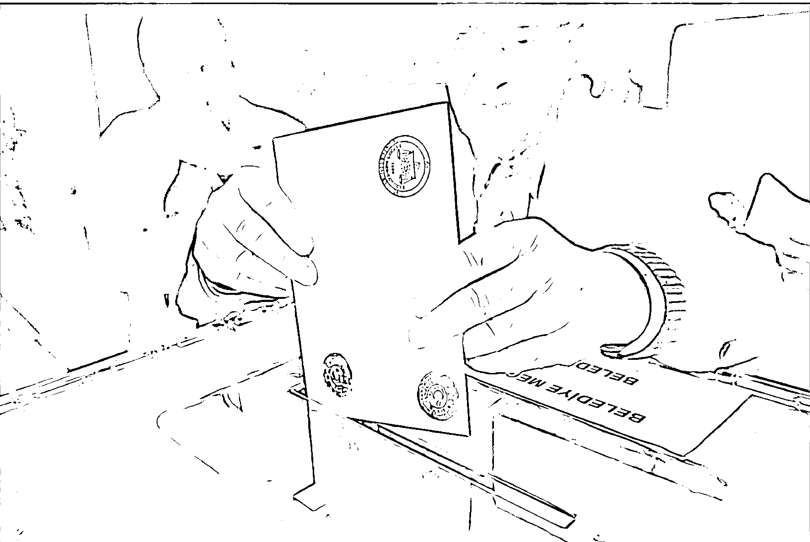

29. 人文主義政治：選民能做出最好的選擇。


30. 人文主義經濟：顧客永遠是對的。

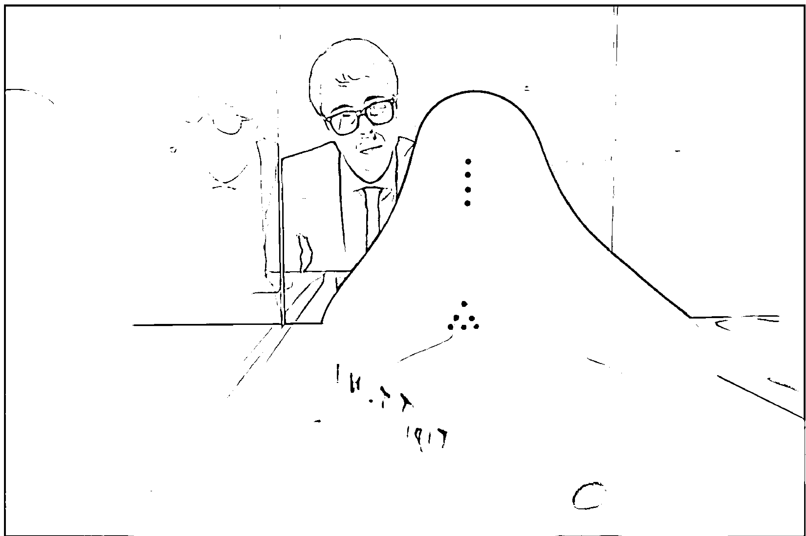

31. 人文主義美學：看的人覺得美，就是美。照片中的白色瓷器，就是杜象的作品「噴泉」，在蘇格蘭國家畫廊的現代藝術特展中展出。

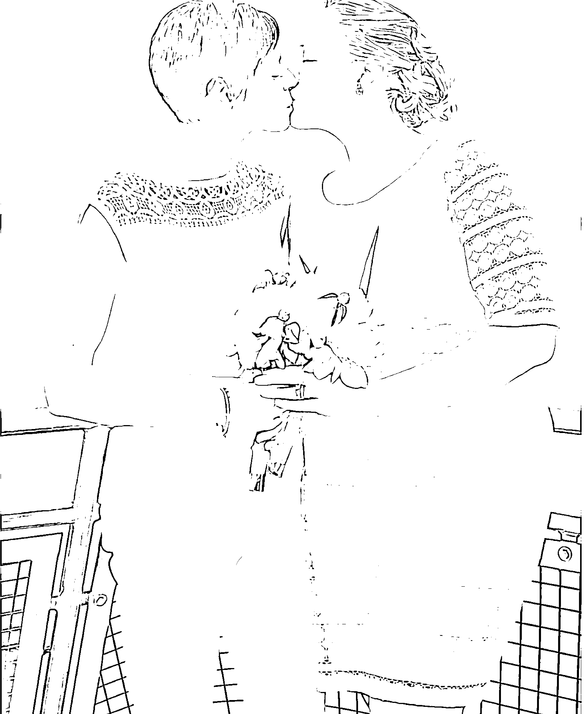

32. 人文主義倫理：感覺對了，就做吧！

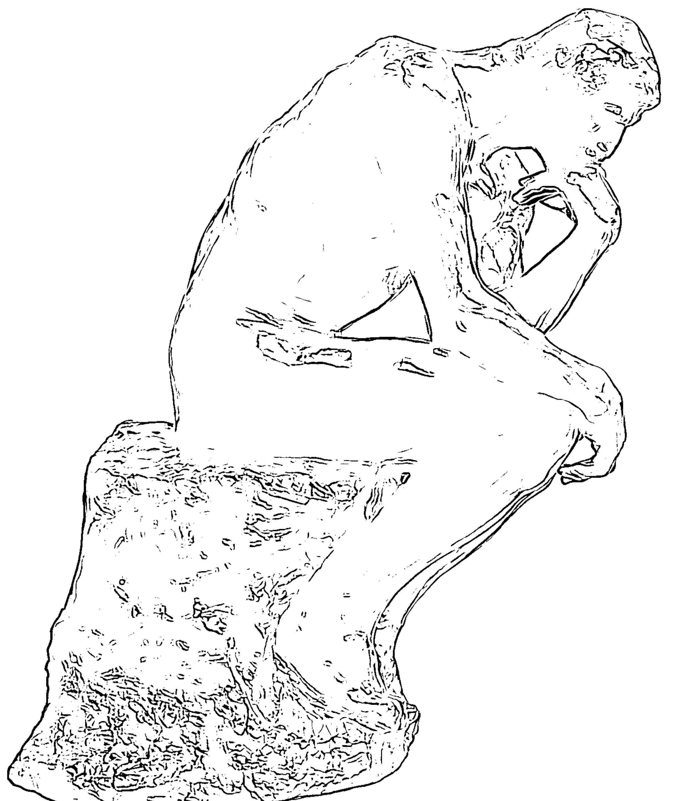

### 第7章 人文主義革命


33. 人文主義教育：為自己想！自己思考！

隨著意義和權威的源頭，從天上轉移到人類的內心感受，整個宇宙的本質也隨之改變。對於外在世界，原本的印象是充滿著各種神祇、繆斯、精靈、食屍鬼，但現在就是一片空無的空間。對於內心世界，原本的印象只是包涵各種原始激情的一塊飛地，但現在忽然變得如此具有深度、廣度，難以度量。對於天使和魔鬼的概念，也已經從漫遊在森林和沙漠間的實體，轉換為人類心靈中的內部力量。天堂和地獄也不再是雲層之上和火山之下的實際地點，而認為是人類內在的精神狀態。只要你心中燃起憤怒和仇恨的火焰，便是正在經歷地獄的苦痛；只要你原諒敵人、懺悔錯誤、與窮人分享財富，就是享有天堂的幸福。

尼采所謂的「上帝已死」，指的就是這個意思。至少在西方，上帝已經成了一個抽象概念，有人接受、有人不接受，但幾乎不會造成任何差別。在中世紀，如果沒有上帝，我就沒有了政治、道德和美學的權威來源，無法判斷正誤、好壞、美醜。這還得了？相較之下，今天要說自己不信上帝，卻是再容易不過，因為這並不會讓我付出任何代價。就算我完全是個無神論者，仍然能夠從內在的經驗得到非常豐富的政治、道德和美學價值觀。

如果我相信上帝，那是因為我選擇相信。如果內心叫我要信上帝，我就信。我相信神，是因為自己感覺到了神的存在，我的心告訴我，祂就在那裡。但如果我不再感覺到神的存在，如果我的心突然告訴我世上沒有神，我也就不再相信神了。

不管是哪一種，權威的本源都在於我自己的感覺。所以，就算有人說自己信上帝，其實他更信的，是自己內心的聲音。

### 計算「知識」的三條公式

正如所有其他權威來源，「感受」也有其缺點。人文主義假設每個人都有一個真正的內在自我，但是我們去叩內心之門的時候，卻常常是沒有回應、或是眾聲喧囂。為了克服這個問題，人文主義又宣稱有另一個新的權威來源，同時還提出配套的新方法，告知大家如何使用這種權威，以取得真正的知識。

在中世紀歐洲，取得知識的主要公式是：

> 知識 ＝ 經文 × 邏輯 *

如果想知道某個重要問題的答案，他們會閱讀相關經文，並用邏輯來理解經文的確切含義。舉例來說，學者如果想知道地球是什麼形狀，就會快速掃過《聖經》裡的內容，尋找相關參考記述。有人就會指出，〈約伯記〉第38章第13節提到，上帝「叫這光普照地的四極，將惡人從其中驅逐出來。」於是學者就會用邏輯推斷，因為這個世界有「四極」，一定就是個平坦的正方形。但另一位賢者不接受這種詮釋，要大家看看〈以賽亞書〉第40章第22節，裡面提到「神坐在地球大圈之上，地上的居民好像蝗蟲。」這豈不就證明了地球是圓的？

在實務上，這代表著追求知識的學者會花費多年時間，泡在學校和圖書館裡，讀著愈來愈多的經文文本，不斷鍛鍊自己的邏輯，讓自己能夠正確瞭解文本的意義。

> *這裡的公式用的是乘法，是因為兩項元素需要彼此，才能運作。至少在中世紀學者看來，沒有邏輯，就不可能理解《聖經》。如果你的邏輯值為零，就算你把《聖經》每一頁都讀得滾瓜爛熟，知識總值仍然為零。反過來說，如果你的經文值為零，邏輯再好也沒用。如果公式裡用的是加法，代表的就是如果邏輯很好，就算不讀經文，也能擁有很多知識。這在你我看來可能覺得合理，但中世紀學術圈並不同意。

科學革命的知識公式，則非常不同：

```
知識 = 實驗數據 × 數學
```

如果想知道某個重要問題的答案，我們要做的就是蒐集相關的實驗數據，再用數學工具加以分析。舉例來說，要測量地球真正的形狀為何，可以先從在世界各地觀測太陽、月亮和行星開始。等到累積了足夠的觀測值，只要運用三角學，不僅能推斷地球的形狀，就連整個太陽系的結構也能推知。在實務上，這代表著追求知識的科學家花費多年時間，泡在觀測站、實驗室和研究考察裡，蒐集愈來愈多的實驗數據，不斷鍛鍊自己的數學工具，讓自己能夠正確解讀數據的意義。

這條計算知識的科學公式，讓我們在天文學、物理學、醫學等學門取得驚人突破，但是它有一個重大缺點：無法處理價值和意義的問題。中世紀學者可以完全肯定謀殺和偷竊是錯的，也知道人類生活的目的，就是要遵行上帝的指示，因為經文裡就是這麼說的。但科學家無法做出這樣的倫理判斷。不管有多少實驗數據、數學功力多強，都不可能證明謀殺是錯的。然而，人類社會如果缺乏這種價值判斷，就無以維繫。

要克服這種困難，方法之一是在新的科學公式之外，繼續運用舊的中世紀公式。如果碰上的是很實際的問題，像是確定地球的形狀、搭橋、或治病，就蒐集實驗數據，做數學分析。但如果碰上倫理問題，像是能不能允許離婚、墮胎和同性戀，就轉向經文求助。


### 人類大命運

從維多利亞時代的英國、到二十一世紀的伊朗，許多現代社會都採用這種解決方案。但人文主義還提供了另一種選擇。等到人類對自己有了足夠的信心之後，一條取得倫理知識的新公式出現了：

### 知識 ＝ 經驗 Ｘ 感性

如果我們想知道任何道德問題的答案，我們需要連接到我們內心的經驗，並以最大的感性來觀察它們。在實務上，這代表著追求知識的方法要靠多年的經驗累積，並鍛鍊感性，好讓我們正確理解這些經驗。

究竟「經驗」是什麼？經驗並不是實驗數據，也不是由原子、電磁波、蛋白質或數字所組成。經驗是一種主觀現象，有三個主要成分：知覺、情緒及想法。在任何時刻，我的經驗都包括了我的一切感知（熱、愉悅、緊張等等）；我所感覺到的情緒（愛、恐懼、憤怒等等）；以及一切出現在我腦海中的想法。

而「感性」又是什麼？感性包括兩件事。第一，是注意到自己的知覺、情緒和想法。第二，是允許這些知覺、情緒和想法影響自己。當然，並不是略有風吹草動，就反應激烈，但重點是要對新的經驗抱持開放態度，允許新的經驗改變自己的觀點、改變自己的行為、甚至改變自己的個性。

經驗和感性會形成彼此加強的無限迴圈。沒有感性，就無法經驗體會任何事物；沒有經驗體會各種事物，又無法培養感性。感性並不是什麼能夠靠著讀書或聽演講來培養的抽象能力，而是一種實作技巧，必須在實踐中慢慢成熟。

### 設法感受身為人的感覺

讓我們以喝茶為例。最初，我是在早上讀報的時候，喝著加了許多糖、品質最普通的那種茶。那時喝茶只是個藉口，主要是想享受糖分帶來的快感。直到某天，我才發現自己看了報紙、攝取了糖分，但幾乎不算真的喝了茶。於是，我把糖量減少，把報紙放在一邊，閉上眼睛，專心喝茶。我開始感受到茶獨特的香氣和風味。很快的，我開始試試不同的茶，有紅茶、綠茶，比較各種茶高雅的口感、細緻的茶香。

不過短短幾個月，我就無法再滿足於超市品牌，而是到高檔的哈洛德（Harrods）百貨買茶。裡面我又特別喜歡一種「貓熊茶」，產自四川雅安山區，是一種以貓熊糞便為肥料種植的茶葉。就是這樣，我一杯一杯喝著茶，磨練著對茶的感性，學會了品茶。如果在我喝茶的初期，就拿了明代的瓷杯來品茗貓熊茶，可能並不會感覺與用紙杯泡茶包，有太大差距。

欠缺必要的感性，就無法體驗到某些事物；欠缺長期的經驗，就無法培養感性。

關於茶的這一套，也可以應用到所有其他美學和倫理知識。我們並不是一出生就帶著良知。在人生旅程上，害人者人恆害之、敬人者人恆敬之。如果我們注意到這件事，道德的感性就會愈來愈敏銳，這些經驗就能提供有價值的道德知識，告訴我們什麼是善的、什麼是對的，以及自己是怎樣的人。

因此，人文主義認為：生命就是一種內在的漸進變化過程，靠著經驗，讓人從無知走向啟蒙。人文主義生活的最高目標，就是透過各式智力、情緒及身體的經驗，充分發展你的知識。十九世紀初建構現代教育體系的重要人物威廉·洪堡德（Wilhelm von Humboldt）曾說，存在的目的就是「用生命能體驗到最廣泛的經驗，蒸餾成智慧。」他也寫道：「生命只有一座要征服的高峰：設法感受一切身為人的感覺。」⁴
這正可做為人文主義的座右銘。

### 踏上綠野仙蹤的黃磚路

根據中國哲學，世界是由陰陽這兩種相對、但又相依的力量所維繫。對於實際的物理世界來說，可能並不為真；但對於由科學和人文主義的契約所創造的現代世界來說，的確如此。
每股科學的陽，都包含著一股人文主義的陰，反之亦然。陽給了我們力量，而陰則是提供意義和倫理判斷。現代性的陽和陰，分別就是理性和感性、實驗室和博物館、生產線和超市。人們常常只看到陽的一面，認為現代世界就是枯燥、科學、邏輯和實用，像是實驗室或工廠。然而，現代世界其實同時也是個奢華的超市。人類史上，從沒有任何文化如此重視人的感受、欲望和經驗。人文主義將生命看作是一連串的經驗，於是這個新神话便為從旅遊到藝術等等許多現代產業奠下基礎。旅行社和餐廳真正賣的不是機票、也不是什麼高檔晚餐，而是新奇的體驗。

同樣的，現代之前的敘事多半強調外部事件和行動，但到了現代的小說、電影和詩，常常強調的就是感受、感覺。希臘羅馬史詩或中世紀的騎士文學，記錄的都是英勇的行為，而不是種種感受。這一章講的可能是某個勇敢的騎士，如何挑戰可怕的食人魔，最後殺了食人魔。另一章又講了騎士如何從噴火惡龍手中，救出美麗的公主，最後殺了那條龍。再一章講的是邪惡的巫師抓走了公主，但騎士追了上去，最後殺了巫師。毫無疑問，這裡的英雄一定是個騎士，不會是木匠或農民，因為中世紀對木匠或農民的刻板印象，就是這些卑微人物不會有英雄的作為。

重點是，這裡的英雄也不會有什麼內心的重大轉折過程。不論是阿基里斯、亞瑟王、羅蘭或蘭斯洛特，都早在踏上征途之前，就已經是無畏的戰士了，已擁有騎士的世界觀。到了最後，他們仍然是無畏的戰士，世界觀也仍然維持不變。他們殺了這麼多食人魔、救出這麼多公主，在在肯定了他們的勇氣和堅毅，卻不見得真讓他們學到什麼。

到了人文主義，重點放在感受和經驗，而非各種行為，於是藝術也因此改變了。在華茲華斯、杜斯妥也夫斯基、狄更斯和左拉的筆下，講的不是什麼英勇的騎士或騎兵，而是刻畫一般勞工和家庭主婦心裡的感受。有些人認為，講到現代關注內心生命而非外在行為，喬伊斯的《尤利西斯》正是巔峰之作——以洋洋灑灑的二十六萬字，描述了兩位都柏林人迪達勒斯（Stephen Dedalus）與布魯姆（Leopold Bloom）的一天，他們在那一天裡，所做的就是……幾乎什麼都沒做。

很少有人真能把《尤利西斯》完整讀完，但這種焦點轉移，現在也同樣成了多數大眾文化的基礎。

在美國，電視節目「我要活下去」（Survivor）常常獲譽（或遭斥）為掀起了實境秀的狂熱。「我要活下去」是電視節目史上第一部登上尼爾森收視排行榜首的實境秀，2007年的《時代》雜誌也將它列入史上百大電視節目。5在每季節目中，參賽者穿著不能再小的泳裝，孤立在某個熱帶小島上。前方有各種挑戰等著他們，而在每集最後，都會投票讓其中一人離開。最後剩下的人，就能抱走一百萬美元。

如果有觀眾來自荷馬時代的希臘、羅馬帝國或中世紀歐洲，會發現這個概念十分熟悉而有吸引力。有二十位挑戰者走了進來，但最後只有一位英雄能走出去。「太好了！」古希臘羅馬的王公貴族、或是十字軍的騎士，就會一邊這麼想，一邊坐下觀看。「接下來一定是精采萬分的冒險舉動、生死交關的戰鬥場面，以及英雄與叛徒的誓不兩立。這些戰士可能會在背後刺人一刀，或是把彼此的內臟都給掏出來！」

他們可要失望了。這裡的背後刺人一刀，只是個比喻。節目每集大約一小時，而牙膏、洗髮精和麥片的廣告就占了十五分鐘。另外再有五分鐘左右，是用來處理幼稚得不可思議的挑戰，像是誰能把最多椰子扔進籃框，又或是能在一分鐘內吃下最多隻蟲。其他時間，這些「英雄」只是不斷談著自己有什麼感受！他說這、她說那，我覺得這樣、我覺得那樣。

如果真有一個十字軍騎士坐下觀看這節目，大概會窮極無聊又極度不耐，最後掄起戰斧把電視劈了。

在我們今日看來，可能會覺得中世紀的騎士都是毫無感性的野蠻人。如果身邊有這樣的人，大概會被我們送去心理治療師，要他們好好探索一下自己的感受。

而這正是《綠野仙蹤》裡面那個錫樵夫的遭遇。他和桃樂絲及她的朋友一起走著黃磚路，希望等他們到達奧茲國之後，大巫師能給他一顆心。同樣走上黃磚路的，還有稻草人和獅子，稻草人想要的是大腦，而獅子想要的是勇氣。

到了旅程的終點，卻發現大巫師只是個江湖術士，沒有辦法完成他們的願望。但是他們發現了更重要的事：他們所希望擁有的一切，早就在自己心裡了！

要變得敏感、聰明、勇敢，從來就不需要什麼巫師的魔法，只要繼續沿著黃磚路走下去，放開心胸迎接任何經驗就行。

一模一樣的教訓，也發生在寇克艦長與畢凱艦長乘著企業號，航行在星系的時候；發生在湯姆和哈克沿著密西西比河，順流而下的時候；發生在《逍遙騎士》(Easy Rider) 的懷特和比利，騎著哈雷機車的時候；以及其他無數公路電影中的無數其他角色，離開了在賓州（或是新南威爾斯）的家鄉，開著一輛舊的敞篷車（或是搭著巴士），碰上一場又一場改變生命的經驗，接觸著自己，談論著他們的感受，最後到達舊金山（或是愛麗絲泉），成了一個更好、更聰明的人。

### 戰爭的真相

「知識 ＝ 經驗 × 感性」這個公式不僅改變了我們的流行文化，甚至也改變了我們對某些重量級議題的看法，例如戰爭。

史上大多數時候，如果有人想知道某場戰爭究竟是否公義，他們會去問上帝、問經文、問王公貴族、問牧師神父。但很少有人會去問問二等兵或一般平民的意見或經驗如何。

荷馬、維吉爾和莎士比亞等人筆下的戰爭敘事，都是以皇帝、將軍和英雄的行動為重點，雖然並未隱瞞戰爭的苦痛，但是各種榮耀和英雄主義卻提得更多。普通士兵出場的方式，大概就像是被巨人歌利亞屠殺成堆的屍體，又或是混在歡呼的人群之中，肩上舉著勝利的大衛。

讓我們以下面這幅畫為例，主題是1631年9月17日的布萊登菲爾德戰役（Battle of Breitenfeld）：

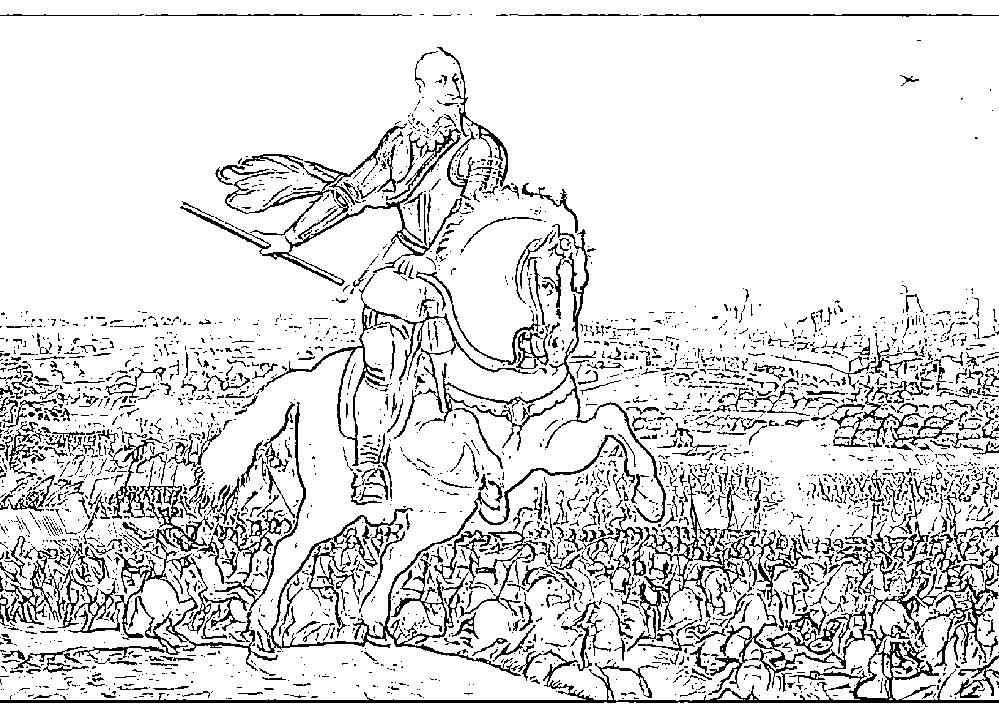

34. 華特的畫作：《布萊登菲爾德戰役中的瑞典國王古斯塔夫·阿道夫》

在畫中，畫家華特（Jean-Jacques Walter）讚頌瑞典國王古斯塔夫·阿道夫（Gustav Adolph）帶領軍隊在該日取得決定性的勝利。阿道夫在畫中英姿勃發，頗有戰神氣魄。這給人的印象就是國王彷若下棋的棋手，指揮戰場如同棋局。至於那些棋子，大概就是一堆都沒什麼差別的角色、或是背景裡的小點。這些人進攻、逃跑、被殺、死亡時有何感受，華特並不在意，因為他們就只是一群不知名的群體。

就算有些畫家所畫的重點已經不是指揮官，而是戰場本身，仍然是以一種居高臨下的觀點，更看重整體的調度，而不是其中個體的感受。舉例來說，下圖是由斯奈爾斯（Pieter Snayers）所繪，1620年11月的白山戰役（Battle of White Mountain）：

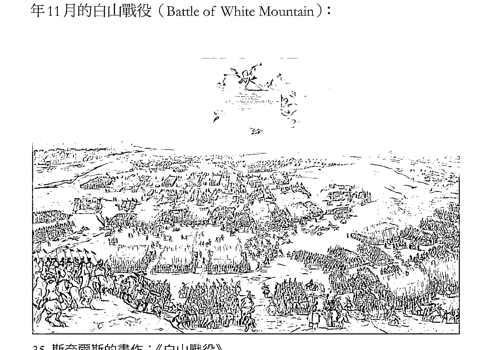

35. 斯奈爾斯的畫作：《白山戰役》

畫中描繪天主教在三十年戰爭中的一場著名勝利，擊敗了反叛的新教異端。斯奈爾斯煞費苦心，在畫中記錄各種陣型、調度及部隊移動，以慶賀這場勝利。觀者很容易就能看出不同的部隊、各自的武器，以及在戰鬥序列中的位置。但對於小兵的經驗和感受，斯奈爾斯賦予的重要性就遠遠不如了。

正如華特的觀點，斯奈爾斯所用的視角也彷彿我們是奧林帕斯山上的眾神，讓我們覺得戰爭就是一場巨大的棋局。

但如果你仔細看（可能得用上放大鏡），就會發現白山戰役要比棋局複雜那麼一些。乍看像是幾何抽象的圖像，細看才發現是血腥屠殺場面。在某些地方甚至可以看清個別士兵的面容，他可能是在奔跑或逃跑、開槍或是執矛刺殺敵人。然而就算是這些場景，也是要從整體畫面來定位，才有意義。如果看到砲彈將某個士兵炸得粉碎，我們首先會知道，這屬於偉大天主教勝利的一部分。接著，如果這是個新教士兵，他的死代表的是叛亂和異端的罪有應得；而如果這是個天主教士兵，他的死則是為了崇高理念的偉大犧牲。

畫面上方可以看到天使在戰場上空盤旋，執著白色橫幅，以拉丁文說明這場戰役發生了什麼事、為何如此重要。橫幅裡講的是：上帝幫助皇帝斐迪南二世（Ferdinand II），在1620年11月8日擊敗了敵人。

幾千年來，我們講到戰爭，看到的是神、皇帝、將軍，以及偉大的英雄。但在過去這兩個世紀，國王和將軍慢慢被推到一旁，注意力開始移到小兵和他們的經驗上。像是《西線無戰事》這種戰爭小說、或是像「前進高棉」這種戰爭電影，講的都是新兵的故事，新兵對自己和世界都所知甚少，卻背負了希望和假象的沉重負擔。他認為戰爭是光榮的、開戰的原由是公義的、領軍的將軍是天才。但經過幾星期真正戰火的洗禮，所有的泥濘、流血、加上死亡的氣味，讓他的想像逐一破滅。如果他活了下來，這個原本天真的士兵離開戰場後，就會成為更聰明的人，不再相信學校、電影和政客花言巧語中的陳詞濫調與虛假理想。

但矛盾的是，現在這種敘事又已蔚為主流，甚至是學校、電影和政客也一再重複。就連「現代啟示錄」、「金甲部隊」、或是「黑鷹計畫」這些好萊塢大片，都不斷警告「戰爭與你在電影中所看到的不同」。隨著在膠卷、散文或詩歌中得到重視，底層小兵的感受The request was rejected because it was considered high risk

The request was rejected because it was considered high risk伊斯蘭基本教義派可以繼續像唸咒一般，複誦著「伊斯蘭就是答案」，但宗教只要與當今的科技現實脫節，恐怕就連民眾所問的問題都無法理解。

例如：等到人工智慧在大多數的認知工作上超越人類，就業市場會有何改變？如果出現許多在經濟上完全沒有用處的人，形成一個龐大的新階級，會造成怎樣的政治衝擊？如果在奈米科技和再生醫學的力量下，未來的八十歲就像是現在的五十歲，對人際關係、家庭和退休基金又有何影響？如果生物科技讓我們能夠訂做嬰兒、並讓貧富之間出現前所未見的巨大鴻溝，人類社會又將如何發展？

對於這些問題，在《古蘭經》或伊斯蘭律法、《聖經》或是《論語》裡都不可能找到解答，因為不論是中世紀中東、或是古代中國，都不會有人懂電腦、遺傳學和基因工程、或是奈米科技。激進伊斯蘭主義或許能承諾，可在這個充滿科技和經濟風暴的世界，提供一個下錨點。但如果想要衝出風暴，就不能只有下錨點，而是需要海圖和方向舵。因此，對於生於斯長於斯的人，激進伊斯蘭主義或許有吸引力，但對於失業的西班牙青年、或是焦慮的中國億萬富翁來說，激進伊斯蘭主義卻是絲毫不誘人。

確實，現在還是有數億人口，虔誠信奉著伊斯蘭教、基督教或印度教。但對於歷史來說，單單人數的意義並不大。塑造歷史的，往往是一小群向前看的創新者，而不是向後看的大眾。一萬年前，多數人都是狩獵採集者，整個中東只有寥寥可數的少數先驅者是農民；但未來是屬於農民的。1850年，全球有超過90%的人是農民，而不管是在恆河、尼羅河或長江沿岸，都沒有人知道蒸汽機、鐵路或電報線。然而在曼徹斯特和伯明罕，一小群領導工業革命的工程師、政治家和金融家，就已經決定了這90%農民的命運。蒸汽機、鐵路和電報改變了食品、織品、車輛和武器的生產方式，讓工業強國擁有遠勝於傳統農業社會的決定性優勢。

### 第7章 人文主義革命

### 十九世紀的迷惘

然而，就算當工業革命傳遍世界各地，逆流而上滲透了恆河、尼羅河和長江沿岸，大多數人民還是繼續相信著《吠陀經》、《聖經》、《古蘭經》和《論語》，而非蒸汽機。不管是今日或十九世紀，世界上的各種祭司、神秘主義者或大師也從沒少過，個個都宣傳自己握有所有人類困境的解決方案，能處理包括工業革命後出現的種種新問題。

例如在1820年代到1880年代之間，埃及（在英國支持下）征服了蘇丹國，希望讓該國現代化，納入新的國際貿易網路。他們的作為破壞了傳統蘇丹社會的穩定，民怨四起、反抗頻傳。1881年，地方宗教領袖阿卜杜拉（Muhammad Ahmad bin Abdallah）宣稱自己就是馬赫迪（Mahdi，伊斯蘭教典記載的救世主），由上帝所派，要在人間建立上帝的律法。他的支持者擊敗了英埃聯軍，並將聯軍指揮官戈登（Charles Gordon）將軍斬首，令維多利亞時代的英國大為震驚。這些人接著在蘇丹建立實行伊斯蘭律法的神權國家，直到1898年才被推翻。

與此同時在印度，達耶難陀・娑羅室伐底（Dayananda Sarasvati）發動印度教復興運動，基本原則就是《吠陀經》絕對不會錯。1875年，他創立雅利安社（Arya Samaj，意為「貴族社會」），致力於傳播《吠陀經》的知識；但老實說，達耶難陀對《吠陀經》的解釋常與自由人文主義有驚人的相似度，例如，他早在西方出現平權思想之前，便已支持婦女應享有平等權利。

與達耶難陀同時代的教宗碧岳九世（Pius IX），對女性的看法就保守得多，但與達耶難陀同樣認為「世上有高於一般人的權威」存在。碧岳九世發動了一系列天主教教義改革，確立「教宗一貫正確論」（Papal Infallibility）這項新教條，認定教宗在公告信仰教理上，不能夠有錯誤（並不是指教宗在任何事都永遠正確）。這種概念乍看之下可能還以為來自中世紀，但其實是近到1870年，才成為具有約束力的天主教教義，當時達爾文發表《物種原始論》已過了十一年。

而在教宗確立自己應當「一貫正確」的三十年前，失意的清代文人洪秀全，大病一場，病中出現幻覺，看到上帝以一位老人的形象現身，說洪秀全是耶稣基督的弟弟。上帝接著交給洪秀全一項神聖的使命，要他驅逐自十七世紀以來統治中國的滿族「惡魔」，在大地上建立「太平天國」。當時，中國在鴉片戰爭遭到擊敗，現代工業與歐洲帝國步步進逼，數百萬清代人民深感絕望，而洪秀全的話則讓他們大受鼓舞。可惜的是，洪秀全並未把他們帶向太平的天國，只引發了反清的太平天國之亂，時間從1850年到1864年，是整個十九世紀最慘烈的一場戰爭，至少二千萬人喪命，人數遠超過拿破崙戰爭或美國內戰。

就在工業化的工廠、鐵路和輪船遍布世界的同時，還是有數以億計的人，堅信洪秀全、達耶難陀、碧岳九世和馬赫迪提出的宗教教條。但對我們大多數人來說，講到十九世紀，並不會認為這是個信仰的時代。談到十九世紀有遠見的人，我們想到的大概不會是馬赫迪、碧岳九世或洪秀全，而是馬克思、恩格斯和列寧。確實也該是如此。雖然社會主義在1850年還只是個邊緣的運動，但聲勢成長迅猛，對世界帶來的改變，要遠大於中國和蘇丹那些自稱為救世主的人。如果你也認為全國的健康照護、退休基金和義務教育十分重要，該致謝的應該是馬克思和列寧（以及俾斯麥），大概不會是洪秀全或馬赫迪。

### 史上第一個科技宗教：共產主義 ☾

到頭來，為什麼馬克思和列寧成功，洪秀全和馬赫迪失敗？並不是社會人文主義的哲學優於伊斯蘭教或基督教神學，而是馬克思和列寧更努力去理解當代的科技和經濟現實，他們並不會把時間耗費在細讀古代文本、或沈迷在先知的預言中。

蒸汽機、鐵路、電報和電力造成前所未聞的問題，但也帶來前所未有的機會。都市無產居民已經形成一個新階級，而這些人的經驗、需求和希望，當然與《聖經》時代的農民大不相同。為了回應這些需求和希望，馬克思和列寧研究蒸汽機如何運作、煤礦如何經營、鐵路如何塑造經濟，以及電力如何影響政治。

曾有人希望列寧用一句話來定義共產主義。他回答：「共產主義就是讓各個工人委員會有權力，加上全國的電力化。」沒有電力、鐵路、廣播，就不會有共產主義。所以，十六世紀的俄羅斯不可能建立共產主義政權，因為共產主義需要將資訊及資源集中在一個樞紐。要能達到馬克思所稱「各盡所能、各取所需」的理想，就必須讓距離遙遠的各種產品，都能夠方便蒐集及分配，而且整個國家也要能夠監控和協調國內所有的活動。

馬克思等人瞭解新的科技現實及人類經驗，因此能夠針對工業社會的新問題，提出切中要點的答案，也能提出原創的想法，告訴眾人如何從這些前所未有的機會中得利。社會主義人士為這個美麗新世界，打造了一個美麗新宗教，承諾以科技與經濟提供救贖；於是，這成了史上第一個科技宗教，也改變了意識形態論述的基礎。

在馬克思之前，人民對彼此定義和區分的標準，是在於對上帝的看法，而不是生產的方式。但在馬克思之後，比起關於靈魂和來世的辯論，科技與經濟結構的問題遠遠更加重要，造成的分裂也更加嚴重。在二十世紀下半葉，生產方式成了熱議的主題，叫人幾乎忘了人類自己的存在。即使是最嚴詞抨擊馬克思和列寧的人，也接受了他們對歷史和社會的基本態度，更仔細去思考科技和生產，而上帝和天堂就顯得沒那麼重要了。

在十九世紀中葉，還很少有人如同馬克思一樣見識敏銳，因此只有少數國家快速踏上工業化。也就是這少數國家，征服了整個世界。大多數社會連發生什麼事都還不清楚，也就沒搭上這班進步的列車。像是達耶難陀的印度和馬赫迪的蘇丹，當時多半還是一心想著上帝，而非想著蒸汽機，以致遭到工業化後的英國占領和剝削。一直要到最近這幾年，印度才終於取得重大進展，縮小了和英國之間在經濟與地緣政治上的差距。至於蘇丹，目前仍在遙遠的後頭掙扎。

### 二十一世紀的末班車即將離站 ✚

二十一世紀初，進步的列車又將再次離站，而且這可能是「智人」這站發出的末班車。錯過的人，永遠都不會再有上車的機會。想上車，就必須瞭解二十一世紀的科技，特別是生物科技和電腦演算法的力量。

這些力量的潛能遠大於蒸汽機和電報，而且不會只用來生產食品、織品、車輛和武器。二十一世紀的主要產品將會是人的身體、大腦和心靈，懂得與不懂如何進行這些大腦及身體工程的兩種人，彼此的差距將遠遠大於狄更斯的英國和馬赫迪的蘇丹。事實上，還會大於智人與尼安德塔人之間的差距。在二十一世紀，搭上列車，就能獲得創造和毀滅的神力；留在原地，就面臨滅絕。

一百年前曾經最先進的社會主義，就是沒有跟上新科技，才崩垮的。前蘇聯領導人布里茲涅夫和前古巴總統卡斯楚，兩人堅守著馬克思和列寧在蒸汽時代構思的想法，未能理解電腦和生物科技的力量。反觀自由主義，適應資訊時代的能力高出許多。這也就能夠部分解釋，為何赫魯雪夫在1956年的預言從未實現，為何最後竟然是自由主義的資本家埋葬了馬克思主義。如果馬克思重回人世，他可能會勸那些已寥寥可數的信眾，少花點時間讀《資本論》、多花點時間研究網際網路和人類基因組。

激進伊斯蘭主義的處境，更比社會主義惡劣許多。它甚至還未能學會接受工業革命，也就難怪對基因工程和人工智慧幾乎是無話可說。伊斯蘭教、基督教和其他傳統宗教，至今仍在世界上扮演重要角色。然而他們現在多半是反動，而不像過去曾經是一股創新的力量。舉例來說，基督教過去就曾經傳播「上帝之前，人人平等」這種異端概念，這改變了人類的政治結構、社會階層制度、甚至是性別關係。耶穌在「山上寶訓」還更進一步，講到溫柔和受壓迫的人是上帝最愛的子民。這種觀點翻轉了整個權力金字塔，為世世代代的革命提供依據。

除了社會和倫理上的改革，基督教也曾推動重要的經濟和科技創新。天主教會建立了中世紀歐洲最先進的行政系統，並率先使用檔案管理、目錄、時間表和其他資料處理技術。在十二世紀歐洲，最像矽谷的地方大概就是梵蒂岡。教會建立了歐洲最早的經濟合作組織：修道院，在一千多年間帶領歐洲經濟，並引進先進的農業和行政措施。修道院是最早使用時鐘的機構，而且幾個世紀以來，修道院和主教座堂學校一直是歐洲最重要的學習中心，協助成立了諸多歐洲頂尖大學，例如波隆那大學、牛津大學、薩拉曼卡大學。

今日，天主教會仍享有數億信眾的忠誠和什一奉獻。但天主教和其他有神論的宗教，卻早已從創造轉為反動，忙於守舊，而非率先開創新科技、新經濟方法，或是突破性的社會思想。他們現在主要做的，是對各種運動所擴展的科技、方法及思想，感到憤怒。生物學家發明避孕藥，而教宗不知該如何反應。電腦科學家發展網際網路，而拉比還在討論是否該允許正統派猶太教徒上網。女性主義思想家呼籲女性取回自己身體的所有權，而學識淵博的穆夫提還在辯論該如何應對如此煽動的想法。

讓我們問問自己：二十世紀最有影響力的發現、發明或創造是什麼？你會發現這個問題很難回答，因為候選者實在太多，有像是抗生素之類的科學發現；有像是電腦之類的科技發明；也有像是女性主義之類的意識型態創造。

讓我們再問問：在二十世紀，像是伊斯蘭教或基督教這類的傳統宗教，最有影響力的發現、發明或創造是什麼？你也會發現這個問題很難回答，但這是因為候選者實在太少。在二十世紀，神父、拉比和穆夫提究竟發現了什麼，值得和抗生素、電腦或女性主義相提並論？

細察這兩個問題後，如果說二十一世紀將會發生重大改變，你認為會出自何處？是伊斯蘭國（Islamic State）、還是谷歌？確實，伊斯蘭國也懂怎麼把影片放上YouTube；但除了這種酷刑產業之外，最近的敘利亞或伊拉克究竟發明了什麼？

目前仍有幾十億人，包括許多科學家，繼續將宗教經文視為權威的來源，但這些文本已經不再能夠帶來創造力。例如，基督宗教有些較進步的教派，已經能接受同性戀婚姻或女性神職人員。但他們之所以接受，肇因於何處？可不是因為讀了《聖經》、聖奧古斯丁或是馬丁·路德的文本，而是因為讀了傅柯（Michel Foucault）的《性事的歷史》，或是哈樂薇（Donna Haraway）的〈半機械人宣言〉。

然而，不管多進步，只要是虔誠的基督宗教信徒，就無法坦承自己的倫理觀是來自傅柯或哈樂薇。所以他們又回到《聖經》、聖奧古斯丁和馬丁·路德的文本，翻天覆地的徹底搜索，一頁接著一頁、一個故事接著一個故事，集中最大的注意力，最後終於找到他們需要的箴言、比喻或裁定，只要解釋的方式夠有創意，就能代表上帝也為同性婚姻賜福、女性也能領授司鐸。然後，他們就能假裝這個想法是來自《聖經》，雖然其實是來自傅柯的《性事的歷史》。《聖經》早已不再真正啟發靈感，但仍獲尊為權威的來源。

### 還能依感覺繼續走下去嗎？

就是因為如此，傳統宗教才無法提出對自由主義的替代品。傳統宗教的經文，對基因工程或人工智慧無法提出任何意見，不管是牧師、神父、拉比或穆夫提，多半都並不瞭解生物學和電腦科學的最新突破。想瞭解這些突破，別無他法，只能閱讀科學文章、進實驗室做實驗，而不是去背誦和辯論古代文本。

但這也不代表自由主義就能安享榮耀、高枕無憂。確實，自由主義在人文主義宗教戰爭當中勝出，而且在當下，我們也沒有其他可行的替代選項。然而它成功的時候，可能也已播下敗亡的種子。

獲勝的自由主義理想，正在推動人類走向長生不死、快樂幸福和化身為神。而由於據說顧客和選民的期望永遠都是對的，科學家和工程師也把愈來愈多的心力，投入這些自由主義的計畫。但是科學家所發現、工程師所開發的這一切，很有可能就會不知不覺暴露出自由主義世界觀的不足，以及顧客和選民又有哪裡錯誤。等到基因工程和人工智慧徹底發揮潛力，自由主義、民主和自由市場的概念，可能就會變得像燧石刀、錄音帶、伊斯蘭教和共產主義，一樣過時了。

本書第一章〈人類的三大新議題〉，曾預測人類在二十一世紀會嘗試讓自己長生不死、幸福快樂、化身為神。這些預測並不是真那麼原創或有遠見，而只是反映自由人文主義的傳統理想。人文主義長期崇拜人類的生命、情感及慾望，於是人文主義文明希望讓人有最長的生命、最高的幸福、最大的力量，也就不足為奇。

但本書的第三部〈智人失去控制權〉則要描述，為了實現這種人文主義夢想，將會釋放出新的後人文（post-humanist）科技，從根本上顛覆人文主義。

人文主義相信自己的感覺，於是我們在與「現代」的契約中得利了，且無須付出代價。我們不需要有什麼神來限制我們的力量、賦予我們意義，只要依從顧客和選民的自由選擇，就能得到所需的所有意義。但這樣一來，如果我們發現，原來顧客和選民從來就沒有自由選擇，現在居然能用科技來計算他們的感覺、設計他們的感覺、或擊敗他們的感覺，一切會變得怎樣？

現在的整個世界似乎都與人類經驗唇齒相依，但如果以後人類的經驗也成了可設計的產品，就像是能在超市裡買到的任何物品，情況又將如何發展？

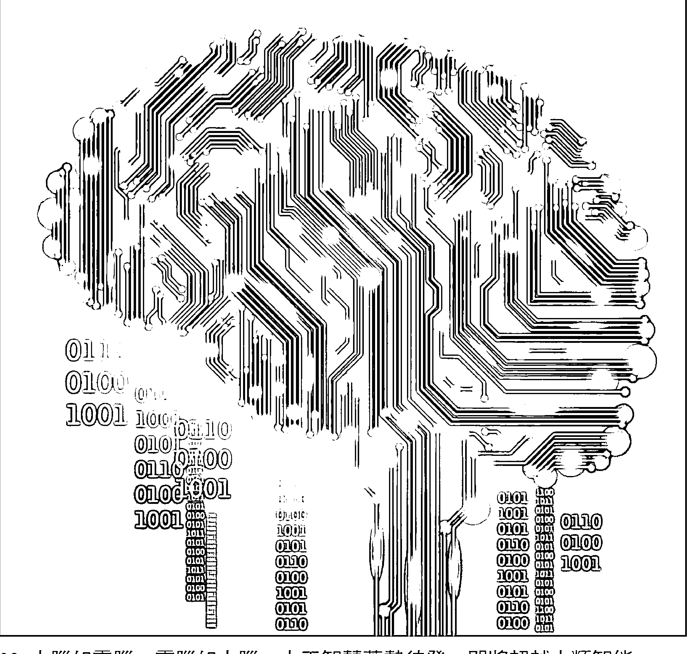

39. 人腦如電腦，電腦如人腦。人工智慧蓄勢待發，即將超越人類智能。

# 第三部 智人失去控制權

- 人類還能繼續管理世界、賦予世界意義嗎？
- 生物科技和人工智慧將如何威脅人文主義？
- 誰可能繼承人類角色，
- 哪個新宗教可能取代人文主義？

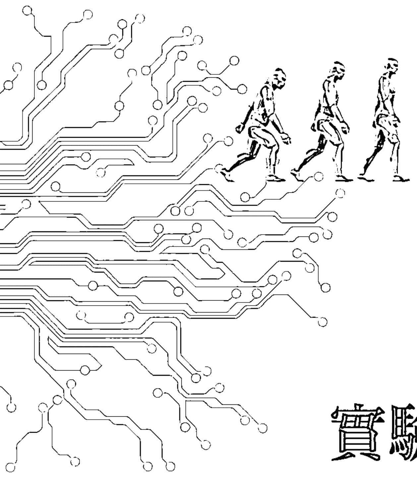

### 第8章 實驗室裡的定時炸彈

時至今日，主導世界的仍然是全套自由主義的各種思想：個人主義、人權、民主、自由市場。然而二十一世紀的科學，正在破壞自由主義秩序的基礎。如同前面章節提到的，科學不討論價值觀的問題，因此科學無法論斷自由主義的「自由比平等更重要」或「個人比集體更重要」這些抽象倫理判斷，究竟是對是錯；不過，自由主義的基礎同樣也有它自己深信不疑的事實聲明，但這些事實聲明就是過不了科學審查這一關。

自由主義重視個人自由，是因為相信人類有自由意志。自由主義認為，選民和顧客的決定既不是命中注定、也不是任意隨機，雖然人都會受到外部力量和隨機事件的影響，但到頭來，人人都是揮舞著自由的魔杖，為自己做決定。正因如此，自由主義認為選民和顧客至上，也總告訴我們要隨心而為、做讓自己覺得快樂的事。是我們的自由意志讓整個宇宙充满意義；外人絕不可能知道你真正的感覺、也不可能預測你會做什麼選擇，所以你也不該讓什麼「老大哥」來決定你的興趣和欲望。

「人頰有自由意志」看起來彷彿不是倫理判斷，而是對世界的事實描述。然而，這種說法雖然在洛克、盧梭或傑佛遜的時代可能很有道理，但根據生命科學的最新發現，卻已經不再成立。自由意志與當代科學之間的矛盾，已經成了實驗室裡的一頭大象（譯注：這是俚俗語，意思是：成了科學界的禁忌），許多人假裝專心看著顯微鏡和fMRI掃描儀，而不願面對這個問題。

在十八世紀，智人就像個神秘的黑盒子，我們完全不知道內部如何運作。所以如果有人拿刀把另一個人刺死，學者想問原因的時候，一個聽來有說服力的答案會是：「因為他自己做了這個選擇，用自由意志選擇了謀殺；也如此，他必須對自己犯下的罪行，負起全責。」

到了二十世紀，科學家打開了智人這個黑盒子，既沒找到靈魂、也沒找到自由意志，只找到基因、荷爾蒙、神經元——這些東西與現實世界的萬物都遵守著相同的物理定律和化學定律。時至今日，如果有個人拿刀把另一個人刺死，學者想問原因時，若有人再說是「因為他自己做了這個選擇」，這種話聽起來已經不再具有說服力了。反而是遺傳學家和大腦科學家，能夠提供更為詳細的答案：「他會這麼做，是因為特定基因構造讓大腦出現某種電化學反應，而基因構造反映的是從古至今的演化壓力及突變的結果。」

會導致謀殺的大腦電化學反應，可能來自基因預設的指令、可能是隨機因素的結果，也可能是兩者的結合，但總之並非「自由意志」。例如，神經元之所以觸發，原因可能是基因預設的，只要遇到外部刺激便如此反應；也有可能是隨機事件，像是因為某個放射性原子忽然衰變。但不論是哪一種，都沒有「自由意志」插手的餘地。如果是遇到刺激、引發一連串生化事件的連鎖反應，每個事件都是由前一事件所決定，最後達成的決定當然不算是自由意志。如果是原子忽然衰變造成的決定，那也只是單純的隨機事件，當然也不算自由意志。至於隨機事件加上基因預設的情況，也就是後果可能發生、也可能不發生，這同樣不可能等於自由意志。

### 「自由意志」純屬想像？

假設我們做出一具機器人，再把機器人的中央處理器連接到一團有放射性的鈾塊。只要遇到需要二選一的情境（例如要按右鍵或左鍵），機器人就會計算前一分鐘衰變的鈾原子數。數字是偶數，就按右鍵；數字是奇數，就按左鍵。這樣一來，我們永遠不可能預測這具機器人究竟會如何選擇——當然也不會有人認為這是機器人的「自由」選擇，也不可能讓它參與民主投票，或是要它對自己的選擇負起法律責任。

所以就目前最先進的科學看來，人的選擇不是基因預設、就是隨機，兩者就像是把蛋糕一分為二，沒有哪一小塊是「自由意志」的份。到頭來，我們奉為神聖的自由，就像靈魂一樣，只是個空虛的詞彙，只存在人類發明的想像故事中。

演化論像是為自由的棺材，釘上了最後一根釘子。「永恆的靈魂」在演化論面前就是說不通，而「自由意志」也是如此，否則如果人類真是自由的，哪有天擇的餘地？

根據演化論，動物做的所有選擇（不論是選擇棲地、食物、或伴侶），都是基因密碼的反映。如果有適當的基因，讓這隻動物選了很營養的蘑菇、挑了健康而有生育力的伴侶，這些基因就能傳到下一代。如果基因不適當，讓這隻動物選了有毒的蘑菇、挑了虛弱的伴侶，這些基因就會滅絕。然而，如果這隻動物真能「自由」選## 第8章 實驗室裡的定時炸彈

擇要吃什麼、與誰交配，天擇就無用武之地。

碰上這樣的科學論理，人們常常裝作沒看到，說他們「覺得」自己很自由、都依自己的意願和決定行事。確實也沒錯，人類是能夠依自己的欲望而行事。如果所謂「自由意志」指的就是「依自己的欲望而行事」，那麼人類確實有自由意志；但這樣說來，黑猩猩、狗和鸚鵡也一樣有自由意志。鸚鵡學會說「我想吃餅乾」之後，還真能有餅乾吃呢。

但這裡最重要的問題，並不在於鸚鵡或人類能不能因應內在欲望而做出行動，而是究竟能不能選擇要產生什麼欲望？為什麼鸚鵡想吃餅乾、不想吃黃瓜？為什麼我想把討厭的鄰居一槍斃了，而不是把另一邊的臉頰轉過去讓他打？為什麼我這麼想買紅色的車、而不買黑色的車？為什麼我想投的是保守黨、而不是工黨？這些都不是我的「選擇」。我之所以覺得腦中浮起某個願望，是因為大腦裡某種生化過程創造出的感覺。這些過程可能是基因預設、也可能是隨機發生，但絕不是自由意志。

你可能會說，至少像是要把鄰居宰了、或是選舉投票的時候，並不是用當下瞬間的感觸來做選擇，而是經過長期思索，細細思量了各種重要論點。然而，檯面上就是有那麼多種論點，有的會讓你投給保守黨，有的會讓你投給工黨，還有些會讓你投給英國獨立黨（UKIP），或是乾脆待在家，不出門投票。是什麼讓你選擇了某種論點、而不是另一種論點？在腦中的中央車站，我可能會因為基因預設而被迫上了某列的論點列車，又或是隨機被分配上哪一列車；但我無法「自由選擇」讓自己只去思考那些「使我投票給保守黨的論點」。

以上所說的，絕不只是個人假設或哲學猜測。現在只要掃描人腦，就能在受測者自己有所感覺之前，預測他們會有什麼欲望、做出什麼決定。在一項此類實驗中，請受試者躺進一部巨大的腦部掃描儀，兩手各拿一只開關，隨時想按就可以按下任何一個開關。科學家只要觀察大腦神經活動，就能預測受試者會按哪個開關，而且時間甚至比受試者自己感覺到想按開關還更早。^2

決定要按下右邊或左邊的開關，反映的當然是這位受試者的選擇，但不能說是個「自由選擇」。我們對自由的信念，背後其實來自一套錯誤的邏輯。當一連串的生化反應讓我想按右邊的開關時，我確實覺得自己想按右邊的開關。一點沒錯，我確實想按。但有人就一下跳到結論，認為這種想按的念頭，就叫做自己的選擇。這當然是錯誤的解讀，因為人的欲望不是一種選擇，我們只能感覺到自己的欲望，再據以行事。

但就算是科學家，現在也常使用「自由意志」這種過時的神學概念，民眾也還是繼續吵著自由意志的話題。幾個世紀以來，基督教、伊斯蘭及猶太神學家，一直對靈魂和意志的關係爭論不休。他們假設每個人都有一個內心本質，稱為靈魂，也就是真實的自我。他們進一步認為，這個自我擁有各種欲望，就像擁有衣服、車子和房子一樣。他們還說，每個人都能夠像是選衣服一樣，選擇自己的欲望，而命運就是依據這些選擇而定。如果選了好的欲望，最後就會上天堂；如果選了壞的欲望，最後就得下地獄。

問題就來了：欲望真的能「選」嗎？舉例來說，夏娃想要吃蛇給她的那顆禁果，但她為什麼會想做這件事？是有人強加於她？完全隨機出現在她的心中？還是她的「自由」選擇？如果想做這件事並不是她的自由選擇，那為什麼她又要受罰呢？然而，如果我們已經接受「人沒有靈魂」、也沒有稱為自我的內在本質，這時再去問「自我如何選擇它想要的事物？」就是件不合理的事。這就像是問單身男子「你太太怎麼挑衣服？」一樣莫名其妙。事實上，人類有的就是一條意識流，慾望會在這條意識流中起伏來去，並沒有什麼永存不變的自我，能夠擁有這些慾望。如此說來，要問我到底是因為基因預設、隨機發生、還是自由意志而選擇了自己的慾望，其實是個沒有意義的問題。

這個概念可能聽起來很複雜，但檢測的方式卻是意想不到的簡單。下次有個概念從你腦中跳出來，就趕快問問自己：「為什麼我會想到這個想法？我是在一分鐘前決定要想到這個想法、然後才想到的嗎？還是我自己並沒下任何指示或准許，這個想法就自己出現？如果我真的是自己思想和決定的主人，我能不能決定在接下來六十秒內，不要想到任何事？」請試試，看看情況如何。

### 實驗之一：半機械鼠

質疑是否有自由意志，並不只是一種哲學上的練習，而是確有實際的意義。如果生物確實沒有自由意志，也就意味著只要使用藥物、基因工程、或直接對腦做出刺激，就能操縱，甚至控制他們的慾望。

如果想看看這種哲學觀點在日常生活的應用，可以參觀半機械鼠（roborat）的實驗室。這裡的半機械鼠，其實就是一般實驗用的大鼠，但有一點不同：科學家在大鼠腦中掌管感覺和報償的區域，植入電極，於是能夠遙控操縱這隻大鼠。只要稍加訓練，研究人員不僅能控制大鼠左轉或右轉，還能控制牠爬梯子、用嗅覺查探垃圾堆，以及做大鼠通常不愛做的事情，例如從高處一躍而下。軍方和民間企業都對半機械鼠大感興趣，覺得在許多任務和情境都能派上用場，像是找出詭雷、尋找倒塌建物下的受困倖存者，或是畫出地下隧道和洞穴的路線圖。

動物福利團體提出關切，擔心這些實驗會對大鼠造成痛苦。但紐約州立大學半機械鼠研究先驅塔瓦（Sanjiv Talwar）教授，認為這些擔心是多餘的，大鼠其實很享受這些實驗。他解釋道，這些大鼠「工作是得到愉悅」，每次電極刺激牠們大腦的報酬中心，「大鼠會覺得彷彿登上極樂」。^3

就我們所知，這些大鼠並不覺得受人控制，也不覺得做了什麼違背自己意志的事。塔瓦教授按下遙控器，是讓大鼠自己想要往左走，於是牠就往左走。塔瓦教授按另一個開關，是讓大鼠想要爬梯子，於是牠就爬了梯子。畢竟，欲望也只是神經元的某種觸發模式而已。至於神經元觸發的原因，究竟是因為其他神經元的刺激或是塔瓦教授遙控器控制電極的刺激，真有那麼重要嗎？如果你去問問那隻大鼠，牠可能會告訴你「我當然有自由意志啊！你看，是我想要左轉，所以我就左轉了。是我想要爬梯子，所以我就爬了。這不就證明了我有自由意志嗎？」

### 實驗之二：經顱刺激器

智人的實驗則顯示，人也像大鼠一樣可以被操縱；只要能刺激人腦正確的位置，就算是愛、憤怒、恐懼或沮喪這些複雜的感受，也能夠予以創造或抑制。美國軍方最近開始實驗在人腦植入電腦晶片，希望能治療患了「創傷後壓力症」的士兵。^4 在耶路撒冷的哈達薩醫院（Hadassah hospital），醫師為躁鬱症處於急性鬱期的病人，用了一種創新療法。他們將電極植入病人大腦，並連接到植入病人胸部的微型電腦。每次從電腦得到命令，電極就會放出一道微弱的電流，使造成憂鬱的大腦區域麻痺。這種療法並非萬無一失，但有部分病患就表示，那些一直折磨他們的空虛和黑暗，就好像變魔法一樣消失無蹤。

曾有一位病人抱怨症狀在術後幾個月復發，讓他整個人陷入嚴重憂鬱。但經過檢查，醫師發現了問題根源：電腦的電池沒電了。他們一換了電池，憂鬱也就煙消雲散。^5

這種療法顯然有其倫理限制，研究人員只能在某些特殊病例，才能將電極植入人腦，其他人體實驗多半還是使用非侵入性的頭盔裝置——技術上稱為「經顱直流電刺激器」(transcranial direct-current stimulator)。這種頭盔配有電極，連接頭皮外側，能夠產生弱電磁場，瞄準特定大腦區域，進而刺激或抑制所選定的大腦活動。

美國軍方正在測試這種頭盔，希望能提升士兵在訓練或實戰時的專注力和表現。主要實驗由位於俄亥俄州空軍基地的人類效能指揮部 (Human Effectiveness Directorate) 進行。目前距離能下定論還很遠，而且經顱刺激器的效用還是名過於實，但有幾項研究指出，像是無人機操作員、空中交通管制員、狙擊手等等需要長期保持高度專注的職務，都能夠透過這種方式，提升認知能力。^6

《新科學人》(New Scientist) 的記者愛蒂 (Sally Adee) 就曾經獲准前往一處狙擊手訓練地點，親身測試效果。她一開始先不戴頭盔，進入戰場模擬室，面對二十個蒙面男子綁著自殺炸彈、持著步槍，直接向她衝來，令她一陣驚恐。她寫道：「好不容易射倒一個人，又有另外三個新的攻擊者不知道從哪裡冒出來。我顯然開槍速度不夠快，慌得要命又笨手笨腳，一直卡彈。還好，這些攻擊者只是投射到她身邊巨型銀幕上的影像。但她還是覺得自己實在表現太差，沮喪到簡直想把槍丟下，一走了之。

然後，他們幫她戴上了頭盔。她說其實沒什麼特別感覺，只是稍微覺得有點刺痛，嘴裡有奇怪的金屬味。但接下來，她開始一個一個放倒這些虛擬恐怖份子，態度冷靜、手法純熟，簡直像藍波或克林伊斯威特。「看著這二十個人拿槍衝向我，我冷靜的舉起步槍，深吸一口氣，放倒離我最近的人，再平靜的評估下個是誰。好像才沒一會，我就聽到有個聲音說：『好了，結束了。』模擬室裡燈光亮起......我身邊橫七豎八倒著屍體的影像，忽然一陣安靜，但我好希望有更多人來攻擊我。而且他們幫我脫下頭盔、移開電極的時候，我甚至有點失望。我抬起頭，想知道是不是有人把時鐘調快了，完全沒感覺到時間已經足足過了二十分鐘。『我擊中了幾個？』我問那位助理。她看著我，帶點揶揄的神色，『他們全掛了。』

這場實驗讓愛蒂的生命大為改觀。接下來幾天裡，她意識到自己已經歷了一場「近乎靈性的體驗......並不是覺得更聰明、或是學得更快。真正讓我覺得好像腳下忽然一空的，是我這輩子第一次覺得大腦裡忽然一片安靜......沒有任何自我懷疑，彷彿看到一個新世界。腦中忽然就是靜得叫人難以置信......我希望你會懂，在那次測驗後的幾個星期裡，我心裡最想做的事情，就是再回去那邊，把電極再接回去。我也開始冒出許多疑問。平常，在我腦中總像是有許多憤憤不平的小地精，占滿了我的心思，讓我害怕嘗試，最後造成失敗。但除了這些聲音之外，我究竟是誰？這些聲音又是從哪裡來的？』這些聲音有些是重複了社會的偏見，有些是附和著我們個人的歷史，也有些傳達出我們的基因傳承。愛蒂認為，這一切創造出一個看不見的故事，在我們不知不覺中，塑造著我們有意識做出的決定。如果我們可以重寫這些內心的獨白、甚至叫它們完全噤聲，會發生什麼事？^8

### 這能增強或削弱自由意志？

直到2016年，經顱刺激器仍在起步階段，也無法預測是否會在何時成為成熟的科技。到目前為止，透過這種方式增強能力，只能維持一段短暫的時間。愛蒂的經驗能到二十分鐘，可能是特例中的特例（甚至就只是安慰劑效應而已）。關於經顱刺激器，多數已發表成果的研究，都是人類樣本數極少、情境也有特殊限制，而且長期影響和危險也仍然完全未知。只不過，如果未來這項科技成熟，或是我們找到其他方法來操縱大腦的腦電模式，會對人類社會和人類有何影響？

如果哪天人類真能控制自己的大腦電路，除了希望自己更有效擊倒恐怖份子之外，可能也會希望實現一些更俗世、自由主義的目標。換句話說，也就是能夠更有效學習和工作，讓自己能全心投入遊戲和嗜好，或是能在任何時刻專心於有趣的事物上（不管是數學或足球）。

然而，如果這樣的操縱成了一件普遍的事，原本該由顧客自由操縱的意願，就會變成另一項可購買的商品。希望彈得一手好鋼琴，但要練琴時卻又想看電視嗎？沒問題：戴上頭盔、安裝適當的軟體，你就能夠完全只想練鋼琴了。

你或許覺得不服氣，認為如果能讓腦中的聲音噤聲或是放大，其實是增強了自由意志，而非削弱。在過去，你可能就是因為被外界干擾，才沒能實現自己最珍視、內心最深處的真實慾望。有了這種讓人專心的頭盔或類似設備，你就更能把父母、牧師、神父、祭司、公關、廣告商、鄰居的聲音統統排除掉，專注於你自己想要什麼。然而我們很快就會看到，要說你有個單一的自我、能夠區分自己的真實慾望與外界聲音的不同，這也只是一個自由人文主義的神話，已經遭到最新科學研究推翻了。

### 每個人心裡的中情局與國務院

科學不僅破壞了自由人文主義對於自由意志的信念，也破壞了對個人主義的信念。自由主義認為每個人都有單一、不可分割的自我—— *individual*（個人）這個英文字的意思，也就是 *in-dividual*（不可分割的）。

確實，人體是由大約三十七兆個細胞組成，^9 而且每天身體和心智都會經歷無數次的變化及原子分子的置換，但只要集中精神、努力接觸自己，一定就能在內心深處，找到單一、清楚且真實的聲音，這也就是真實的自己，而這正是宇宙一切意義和權威的源頭。對於自由主義來說，想要有意義，就必須有一個真正的自我，而且還只能有唯一的自我。否則要是有多個自我，我在投票站、超市和婚姻市場上，該聽哪個的意見？

但經過數十年研究後，生命科學的結論是：這種自由主義的故事完全就是神話。所謂唯一真正的自我，就和永恆的靈魂、耶誕老人和復活節兔子一樣虛假。如果我真的深深去探測自己，就會發現自己一向以為理所當然的單一性，會分解成各種互相衝突的聲音，沒有哪個是「真正的自我」。人類絕非「不可分割」，反而就是由許多分割的部分組成。

像是人腦就是由兩個腦半球組成，中間由一束神經纖維連結。每個腦半球控制著身體相對的另一側，例如右腦控制身體的左側、接收來自左側視野的資料、負責移動左臂和左腿；左腦則是剛好相反。因此，右腦中風的病人有時候會忽視身體的左側，例如只梳右邊的頭髮，或是只吃盤子右邊的食物。^10

左右腦也有情感和認知方面的分工，但情況不算太明顯。事實上，多數認知活動都會同時用到兩個腦半球，只是使用程度有高低之別。例如在大多數情況下，左腦在語言和邏輯推理時，扮演較重要的角色，而右腦則是處理空間資訊時，較為強勢。

在左右腦關係的研究上，許多突破性的成果是出自對癲癇病人的研究。嚴重的癲癇病人，是從大腦的某一區域掀起一場電風暴，迅速傳播到其他區域，造成急性癲癇發作。癲癇發作期間，病人無法控制身體；一旦發作頻繁，常常就會讓他們丟掉工作、無法過正常生活。在二十世紀中葉，如果其他療法都無法奏效，醫師的最後一招就是把連接兩個腦半球的神經束切斷，讓某個腦半球掀起的電風暴不會影響到另一半球。對腦科學家來說，這些病人簡直就像是金礦，提供了許多驚人的資料。

關於這些「裂腦」(split-brain) 病人，最著名的研究者是斯佩里（Roger Wolcott Sperry，因其突破性發現，獲頒1981年諾貝爾生理醫學獎），以及他的學生葛詹尼加（Michael S. Gazzaniga）。其中一項研究的對象是一位青少年。研究者問他，長大後想做什麼。男孩回答說：繪圖員。這個答案是由左腦提供，邏輯推理和語言多半由左腦控制。然而，男孩的右腦也有另一個活躍的語言中心，雖然無法控制口語，但能用拼字遊戲Scrabble的字母牌拼出字來。研究人員很想知道男孩的右腦有何意見，於是把字母牌都散在桌上，再在一張紙上寫著：「你長大後想做什麼？」並把紙放在男孩左邊視野的邊緣處。來自左邊視野的資料會由右腦處理。右腦無法控制口語，所以男孩什麼也沒說，但他的左手開始迅速在桌上移動，到處蒐集字母牌，拼出：「汽車比賽」。厲害了吧！^11

同樣令人感到離奇的另一項行為，則是出現在二戰退伍老兵WJ身上。WJ的雙手分別由不同的腦半球控制。他的兩個半腦之間沒有連繫，於是有的時候右手要開門、左手卻會把門甩上。

還有另一項實驗，葛詹尼加的研究團隊向左腦（負責語言）秀出雞爪的照片，同時向右腦秀出雪景照。接著問病人PS看到了什麼，他回答「雞爪」。葛詹尼加接著再秀出許多圖卡給PS看，請他指出最符合他所看到的內容。病人的右手（由左腦控制）指向一隻雞，但同時左手卻也伸了出來，指向一隻雪鏟。葛詹尼加接著就問了這個再明顯不過的問題：「為什麼你會同時指了雞和雪鏟？」PS回答：「呃，雞爪和雞有關係，而要清雞舍需要鏟子。」^12

這裡是怎麼了？控制語言的左腦並未接受到雪景這項資訊，根本不知道為什麼左手會指向鏟子，結果左腦就自創出一些覺得合理的解釋。多次重複實驗後，葛詹尼加的結論認為：左腦不僅處理口語能力，也是腦內的翻譯人員，會用各種片段的線索，捏造出合理的故事，想為我們的生活找出意義。

又例如另一項實驗，是讓掌管非語言能力的右腦看到一張色情圖片。受試者開始臉紅、咯咯笑著。「你看到了什麼？」研究人員賊賊的問道。受試者的左腦說著「沒什麼，只是有光閃了一下」，但她立刻又開始咯咯笑了起來，還用手遮住了自己的嘴。「那你為什麼會笑呢？」研究人員追問。也是一頭霧水的左腦翻譯官，拚盡全力想找出了什麼合理的解釋，於是回答說：因為房間裡有部機器看起來很好笑。^13

這就像是中央情報局在巴基斯坦執行無人機空襲任務，但美國國務院卻毫不知情。等到有記者向國務院官員詢問此事，官員只能趕快編造一些貌似合理的解釋。但實際上，這些公關人員根本不知道為何要空襲，就只是瞎掰。

不僅是裂腦的病人，而是所有人類都會用到類似的機制。一次又一次，我們心中的中情局都是不經國務院批准或知情，就恣意行事，接著我們心中的國務院就只能編出一個讓自己看來最像正人君子的故事。常常，就連國務院自己最後都信了自己編出的故事。^14

### 我到底是誰？

行為經濟學家也曾做出類似的結論，當時討論的是民眾如何下各種經濟決定。或者講得更精準些，是誰下了這些決定。是誰決定買豐田而不買賓士、度假去巴黎而不去泰國、投資南韓債券而不是上海股票？多數實驗都指出，並沒什麼「單一的自我」做出這些決定，而是人心中有許多不同、常常還相互衝突的內在，經過不斷拉扯才決定的。

2002年諾貝爾經濟學獎得主康納曼（Daniel Kahneman），就做過一項開創性的實驗，請一組志願受試者參加分成三階段的實驗。在「短」階段的實驗中，受試者將一隻手放入14℃的水裡一分鐘，這種水溫會讓人不悅、接近痛苦。六十秒後，就請他們把手給抽回來。而在「長」階段的實驗中，受試者的手會放在另一個容器中，水溫同樣是14°C；但在六十秒後，會偷偷將熱水導進容器，使水溫略升為15°C；三十秒後，再請他們把手抽回來。有些受試者會先做「短」版的實驗，也有些是從「長」版的實驗開始。但不論哪種，都會在兩個部分都結束的七分鐘後，進行第三階段、也是最重要階段的實驗。研究人員告知受試者，他們必須重複前兩階段的其中之一，但他們可以自由選擇。足足有80%的人選擇了「長」版實驗，在印象中以為這比較不那麼痛苦。

這個冷水實驗如此簡單，透露的意義卻動搖了整個自由主義世界觀的核心。實驗告訴我們，人體內至少有兩種自我：經驗自我（experiencing self）及敘事自我（narrating self）。

經驗自我是我們每時每刻的意識。所以對於經驗自我來說，顯然「長」版的實驗比較糟。因為你得先忍受14°C的水溫、達六十秒（「短」版實驗受的苦，在這裡一點也少不了），這已經很難忍受了，接下來你還得再忍受另外三十秒、15°C的水溫，雖然情況勉強好一點，但絕對也不愉快。對於經驗自我來說，在一個非常不愉快的經驗後，再加上另一個仍然不愉快的經驗，並不會讓整件事變得比較愉快一些。

只不過，經驗自我並沒有深刻的記憶力。它不會說故事，而且我們要做重大決定的時候，也不會去問經驗自我有何想法。講到要喚起記憶、講故事、做重大決定，負責的是我們心中另一個非常不同的存在：敘事自我。

敘事自我的概念，很類似葛詹尼加所說的左腦翻譯人員，永遠忙著將過去的絲絲縷縷，編織成一篇故事，並為未來制定計畫。敘事自我就像是記者、詩人或政治人物，不會敘述所有細節，通常只## 第8章 實驗室裡的定時炸彈

會擷取事件的高潮和最後結果來編織故事。整個經驗的價值，是將峰值與終點兩者加以平均。舉例來說，敘事自我判斷「短」版冷水實驗時，是將最差的部分（水非常冷）和最後一刻（水還是非常冷）拿來做平均，結論就是「水非常冷」。接著，敘事自我對「長」版冷水實驗也做一樣的判斷，把過程中間最差的部分（水非常冷）和最後一刻（水沒那麼冷）拿來做平均，結論就是「水稍微溫暖一點」。這裡的重點之一在於：敘事自我對於時間持續多久無感，並不在意長短兩款實驗的持續時間不同。所以，如果需要在兩者擇一，敘事自我會挑的是長版的實驗，認為「水稍微溫暖一點」。

### 峰終法則

每次敘事自我要對我們的經驗下判斷時，並不會在意時間持續多長，只會採用「峰終法則」(peak-end rule)，也就是只記得高峰和終點這兩者，再加以平均，做為整個經驗的價值。這法則對於我們所有的日常決定，都產生了深遠的影響。

1990年代早期，康納曼開始與多倫多大學的瑞德邁爾 (Donald Redelmeier) 合作，一方面研究了做大腸鏡檢查的病人，另一方面開始研究經驗自我及敘事自我的差別。大腸鏡檢查是通過肛門將小型攝影機插入腸道，以診斷各種腸道疾病。這種檢查並不舒服，而醫師都想知道怎樣才能減輕這道程序的痛苦——是該把動作加快，讓病人長痛不如短痛？還是該把動作放慢、小心一點？

為了回答這個問題，康納曼和瑞德邁爾請一百五十四位病人在大腸鏡檢查期間，每分鐘一次、報告他們的疼痛程度。報告時使用從0到10的分數，0代表完全無感，10則是痛到無法忍受。等到檢查結束，再請病人同樣使用0到10的分數，報告檢查的「整體疼痛程度」。

我們可能會以為，整體分數會與每分鐘報告的分數總和相關，也就是如果時間持續愈久、病人承受的疼痛愈多，最後的整體疼痛分數就會愈高。但實際結果卻非如此。

正如前面的冷水實驗，不管持續時間多長，整體疼痛分數只會反映出峰終法則。因此，有某一次大腸鏡檢查的時間持續八分鐘，過程中病人給出的最高疼痛分數為8分，而最後一分鐘的給分為7分。等到檢查結束，這位病人所給的整體疼痛分數就是7.5分。而在另一次大腸鏡檢查中，時間足足有二十四分鐘。過程中，最高的疼痛分數一樣是8分，但這位病人在最後一分鐘的給分只有1分。到最後，這位病人的整體疼痛分數給分就只有4.5分。事實上，後面這位病人的大腸鏡檢查時間足足是三倍，總和說來受到的痛苦要多得多，但這點完全沒有影響到他的記憶。敘事自我並不是將所有的經驗做總和，而是將峰值和終值做平均。

所以，病人會喜歡哪一種呢？是為時短暫、但很痛苦的檢查，還是時間長、但動作小心的檢查？這個問題並沒有唯一正解，因為病人至少有兩個不同的自我，各自有不同的喜好。如果問的是經驗自我，它大概會選擇時間短的；但如果問的是敘事自我，它反而寧可挑時間長的，因為它只會記得最糟時刻和最後一刻的平均值。事實上，如果從敘事自我的觀點，醫師最好在檢查最後，安排幾分鐘原本完全不必要的鈍痛（dull ache，隱隱作痛），因為這反而會讓整件事的痛苦記憶大減。15

兒科醫師和獸醫都很懂這個技巧。許多醫師會在診間裡準備零食點心，在打完針或做了什麼痛苦的檢查之後，讓孩子（或小狗）吃點甜。這樣一來，等到敘事自我後來回想這次看診，最後這十秒的快樂，會足以抹去之前許多分鐘的焦慮和疼痛。

### 「敘事自我」擁有一把利剪

至於演化，更是早在兒科醫師之前許久，就發現了這伎倆。許多婦女分娩時，都會經歷難以忍受的痛苦，可能會讓人以為，只要生過一次，沒有哪個心靈正常的女性會願意再來一次。但在分娩後的幾天，荷爾蒙系統會分泌皮質醇和腦內啡，舒緩疼痛、讓人感到安慰，甚至是欣悅。再加上對小嬰兒的愛與日俱增，又得到來自親友、宗教和民族主義的多方讚譽，都會共謀協力，將分娩從創傷轉為正面記憶。

位於以色列特拉維夫的拉賓醫學中心（Rabin Medical Center）研究顯示，分娩的記憶主要只反映高峰及終點，整體持續過程幾乎沒有任何影響。16在另一項研究中，請二千四百二十八名瑞典婦女在分娩兩個月後，回憶生產的過程，其中有90%認為這個過程屬於「正面」或「非常正面」。她們並沒有忘記分娩過程中的痛苦（有28.5%認為分娩是世上能想到最痛的事），但仍然認為這是個正面經驗。

敘事自我有一把鋒利的剪刀、一支黑色的粗麥克筆，一一審查著我們的經驗。至少有某些令人恐懼不悅的時刻，就這樣遭到裁剪抹去，最後整理出一個有歡樂結尾的故事，歸檔存查。17

我們日常的大多數關鍵抉擇，像是挑選另一半，挑選職場、住所或度假，都是由敘事自我來決定的。假設現在又有兩套度假行程任君挑選。第一套行程是到維吉尼亞州的詹姆斯鎮（Jamestown），參觀這個歷史悠久的殖民城鎮，這是英國在1607年於北美建立的第一個殖民地。第二套行程則是你自己的夢想假期，可以是阿拉斯加徒步旅行、佛羅里達日光浴，又或是到拉斯維加斯盡享帥哥美女、醇酒毒品、博奕激情。但有一項限制：如果選擇夢想假期，等到最後上飛機回家之前，你得服下一顆藥丸，消除所有對於這次假期的所有回憶。發生在拉斯維加斯的美好回憶，就真的只會留在拉斯維加斯了。

你想挑哪套行程？大多數人都會選擇殖民地詹姆斯鎮。因為大多數人的信用卡都是交給敘事自我掌管，而敘事自我只在意故事，覺得記不住的體驗是白費力氣。

說實話，經驗自我和敘事自我並非各自獨立，而是緊密交織。敘事自我也會用到我們的種種經驗，做為重要（但非唯一）的故事素材。反過來，這些故事也會形塑經驗自我的種種感受。例如，在齋戒月禁食、在準備體檢時禁食、又或是單純沒錢買東西吃，對於飢餓的感受就會有差異。敘事自我對飢餓賦予不同意義，就會讓實際的經驗大不相同。

另一方面，經驗自我往往也強大到足以破壞敘事自我最完美的計畫。舉例來說，我可能在新年下定決心，要控制飲食，每天上健身房。這種偉大的決定是敘事自我的專利。只不過，過了一星期，該上健身房了，經驗自我卻過來接手。我現在就是不想上健身房，反而是訂了披薩，坐在沙發上打開電視。

然而，大多數人認同的都是自己的敘事自我。我們口中的我，講的是我們腦中的故事，而不是身體持續感覺到的當下體驗。我們認同的是自己的內心，想從生活的各種瘋狂混亂中理出道理，編織出一套看來合理而一致的故事。不管情節是否充滿謊言和漏洞，也不管故事是否因為一再重寫而總是自打嘴巴，一切都不要緊。重要的是，我們總是覺得自己從出生到死亡（甚至死後）都有個單一、不變的身分。就是這種感覺，塑造出大有問題的自由主義信念，誤認為自己不可分割，誤認為內心有個清楚而一致的聲音，而且能為整個宇宙提供意義。^18

### 在謊言中，建構生命的意義

波赫士（Jorge Luis Borges）的短篇故事〈一個問題〉，正是以敘事自我做為重點。^19 故事的主人公是唐吉訶德，與塞萬提斯（Miguel Cervantes）著名小說的主角同名。唐吉訶德為自己創造了一個想像世界，自己是裡面的傳奇騎士，四處對抗巨人，拯救托波索的杜爾西內亞女士。實際上，唐吉訶德本名叫做阿隆索·吉哈諾，是鄉下一位上了年紀的沒落貴族；那位高貴的杜爾西內亞女士，則是附近村子裡的養豬村姑；至於巨人，則是一些風車。波赫士就在想，如果唐吉訶德因為相信這些幻想，攻擊、殺死了一個真正的人，後續會如何？

波赫士提出了關於人類的一個根本問題：如果敘事自我講出的那套故事，對我們自己或周圍的人造成嚴重傷害，之後會怎樣？波赫士認為，主要有三種可能。

第一種可能：沒什麼影響。雖然唐吉訶德殺了一個真正的人，卻毫無悔意。因為這些妄想已經太過鮮明，他一心認為自己在對抗風車巨人，根本無法意識到實際殺了人。

第二種可能：在奪走他人生命的那一刻，會讓唐吉訶德大受驚駭，打破他的妄想。這種情況類似初上戰場的新兵，原本深信為國捐軀是件好事，最後卻被戰場現實狠狠打醒。

另外還有更為複雜和影響深遠的第三種可能：原本與想像的巨人戰鬥時，唐吉訶德只是在演戲。但等到真的殺了人，他就會開始堅持自己的妄想，因為只有這樣，他不幸犯下的錯誤才會有意義。荒謬的是，我們對一個想像的故事做出的犧牲愈多，就可能愈是堅持，只為了讓我們的一切犧牲和痛苦有意義。

在政治裡，這稱為「我們的孩子不能白白犧牲」症候群。1915年，義大利加入協約國，於第一次世界大戰正式參戰。義大利宣告的目標是要解放由奧匈帝國「不當」占有的特倫托（Trento）和提里雅斯特（Trieste）這兩處「義大利領土」。義大利政客在國會發表義憤填膺的演說，誓言要補正歷史的錯誤、恢復古羅馬的光榮。數十萬義大利士兵開往前線，高喊「為了特倫托和提里雅斯特！」以為這兩地唾手可得。

情況大出意料。奧匈帝國的軍隊在伊索佐河（Isonzo River）沿岸組構了強大的防線。義大利總共發動了十一場血淋淋的戰役，最多只攻下幾公里，從未有真正突破。第一場戰役，他們失去了一萬五千人。第二場戰役，他們失去了四萬人。第三場戰役，他們失去了六萬人。就這樣持續了腥風血雨的兩年，直到第十一場戰役。但接著，奧地利人終於反擊了，這第十二場戰役，一般稱為卡波雷托戰役（Battle of Caporetto），德奧聯軍大敗義大利，一路殺到威尼斯門口。光榮出征成了一片血海的潰敗。等到戰爭結束，義大利士兵死亡人數達七十萬，傷兵人數超過百萬。20

輸掉第一場伊索佐河戰役後，義大利政客有兩種選擇。他們本來大可承認自己犯了錯，要求簽署和平條約。奧匈帝國根本和義大利無怨無仇，又正在為了自己的生存，與更強大的俄羅斯打得焦頭爛額，必然樂意講和。

然而，這些政客怎麼能面對這一萬五千名義大利士兵的父母、妻子和孩子，告訴他們：「對不起，出了一點錯，你家的喬望尼白死了，還有你家的馬克也是，希望你們別太難過。」

另一種選擇是，這些政客可以說：「喬望尼和馬克是英雄！他們的死，是為了讓提里雅斯特回歸義大利，他們的血不能白流！我們會繼續戰鬥，直到勝利為止！」毫不意外，政客挑了第二個選項。因此他們打了第二場戰役，又失去了四萬人。政客再次決定，最好繼續戰鬥，因為「我們的孩子不能白白犧牲」。

但我們也不能只怪政客，就連群眾對戰爭也是一路支持。就算到了戰後，義大利未能得到自己要求的所有領土，義大利人民透過民主，選出的就是墨索里尼和他的法西斯夥伴們，這些人的選舉訴求正是要為所有義大利人的犧牲，取得適當的賠償。

講到要承認一切是白白犧牲，政客要對這些人的父母開口，已經夠難了；愛國的父母要對自己承認，兒子白白犧牲了，這還要更為困難；至於英勇從軍卻受傷、殘廢的人，更是說不出口。失去雙腿的士兵，會寧願告訴自己「我的犧牲，都是為了能讓義大利民族永存的榮光」，而不是「我之所以沒了腿，是因為蠢到相信自私的政客」。活在幻想裡是一個遠遠較為輕鬆的選項，唯有這樣，才能讓一切痛苦有了意義。

早在幾千年前，神職人員就已經發現了其中的奧妙，許多宗教儀式和誡命都以此為基礎。如果想讓人相信某些假想的實體，像是神、國家，就要讓他們犧牲一些有價值的東西。犧牲叫人愈痛苦，他們就愈會相信犧牲奉獻的對象確實存在。如果有個貧窮的農民，把自己一頭珍貴的牛，都獻給了宙斯，就會開始對宙斯的存在深信不疑，否則要怎麼解釋自己竟然蠢成這樣？這個農民還會再獻出一頭牛、一頭、再一頭，才不用承認以前所有的牛都是白白犧牲。

出於同樣的原因，如果我為了義大利民族國家的榮光，犧牲了一個孩子，或是為了共產革命失去雙腿，通常就足以讓我成為激進的義大利民族主義者或共產主義者。因為，如果說義大利民族神話或共產主義宣傳都是一片謊言，豈不是要我承認孩子都是白死、或是我的癱瘓完全沒有意義？很少人有勇氣能承認這樣的事情。

### 錯到底，就是對的？

經濟上也會看到同樣的邏輯。1999年，蘇格蘭決定蓋一座新的國會大廈。原本預計施工時間兩年，預算四千萬英鎊。但到頭來，施工時間長達五年，成本高達四億英鎊。每當承包商遇到未預期的困難和費用，就會找上蘇格蘭政府，要求工期展延、增加預算。每次發生這種情況，政府就會對自己說：「我們已經投入幾千萬英鎊，如果現在停手，只能拿到一座蓋到一半的骨架，在人民心中會徹底信用掃地。還是再撥個四千萬英鎊吧。」

再過幾個月，同樣的事情再次發生，但這時候，建物若還無法完工，壓力也就更大了。再過幾個月，故事繼續重複。就這樣拖下去，直到實際成本足足是原來估計的十倍。

不是只有政府會陷入這個陷阱。企業集團也常常把幾百萬美金丟進失敗的子公司。至於個人，也常常依戀著不開心的婚姻，或拋不下沒前途的工作。我們的敘事自我寧可在未來繼續痛苦，也不想承認過去的痛苦完全沒有意義。最後，如果我們想把過去的錯誤一筆勾銷，敘事自我就一定得在情節中安排某個轉折，為錯誤注入意義。例如，一個和平主義的退伍軍人，可能告訴自己：「確實，我犯了錯，才沒了雙腿。但因為這個錯，我才看清戰爭是個地獄；從現在開始，我要奉獻我的生命，為和平而戰。因此，我受到的傷還是有些正面意義：讓我學會重視和平。」

於是我們知道，「自我」也像國家、神祇和金錢一樣，都只是虛構、想像的故事。每個人都有一個複雜的心靈，會丟下我們大部分的經驗，只精挑細選幾樣，再與我們看過的電影、讀過的小說、聽過的演講、做過的白日夢，全部混和在一起，編織出看似一致連貫的故事，告訴我們自己是誰、來自哪裡、又要去哪裡。正是這個故事，告訴我們自己該愛誰、討厭誰、該怎麼對待自己。如果情節有需要，這個故事甚至也可能讓我們犧牲自己的生命。

每個人的故事都各有文類。有些人活在悲劇之中，有些人上演永無結局的宗教戲劇，有些人的日子過得像是動作片，也有不少人過著喜劇人生。但到頭來，一切都是故事罷了。

### 生命科學顛覆了自由主義

如此說來，生命的意義究竟是什麼？自由主義認為，我們不應期待外界為我們提供現成的意義。每位選民、顧客和觀者，都應該用自己的自由意志來創造意義，而且不只是創造自己生命的意義，更要創造整個宇宙的意義。

然而，生命科學卻戳破了自由主義的想法，認為所謂的「自由個人」也是個虛構的故事，人只是生化演算法的組合。每時每刻，大腦的生化機制都會創造經驗，但一閃即逝，接著就是更多經驗閃現、消失、閃現、消失，彼此快速相連。這些瞬間的經驗並不會累積、構成什麼永續的本質。在這一片混沌中，敘事自我試著找出秩序，於是編織出一則永無結局的故事，讓每項經驗都能找到自己的位置，也就多少有些長久的意義。只不過，雖然這讓一切合理且誘人，卻仍然只是虛構的故事。中世紀的十字軍相信，是上帝和天堂讓他們的生命有意義；現代自由主義者則認為，是個人的自由選擇讓生活有意義。但不論如何，都一樣是妄想。

當然，早已有人質疑自由意志和個人的概念。

早在兩千多年前，印度、中國和希臘的思想家就已經認為個人概念是一種虛妄。然而，除非真正能影響經濟、政治和日常生活，否則光是質疑，並不足以改變歷史。

人類很能應付認知上的矛盾，能允許自己在實驗室裡信一套，到了法庭或國會，又信完全不同的一套。就像基督教並未在達爾文發表《物種原始論》的那天消失，自由主義也不會因為科學家的結論是「並沒有自由的個人」，便就此滅亡。

事實上，就連英國生物學家道金斯（Richard Dawkins，《自私的基因》的作者）、美國實驗心理學家平克（Steven Pinker，《語言本能》的作者）和其他新科學世界觀的擁護者，也並未放棄自由主義。就算他們已經用豐富的學理、數百頁的篇幅，解構了所謂自我及自由意志的概念，卻接著像是做了一個智識上的完美後空翻，奇蹟似的一躍回到十八世紀，好像演化生物學和大腦科學所有驚人的發現，完全不會影響洛克、盧梭和傑佛遜所提出的倫理及政治觀念。

然而，等到這些異端科學見解逐漸成為每天使用的科技、日常活動和經濟結構，也就不可能再這樣兩面討好了。我們（或後代）很有可能會需要一套全新的宗教信仰和政治制度。在這第三個千禧年的初端，自由主義受到的威脅不再是來自「沒有自由的個人」這種哲學問題，而是來自扎扎實實的科技挑戰。我們即將擁有各種極實用的設備、工具和制度，但這些設備、工具和制度並不允許個人自由意志的存在。

民主、自由市場和人權這些概念，是否真能在這場洪水中存活下來？

### 第9章 自由主義大崩解

上一章簡單回顧了近來的科學發現對自由主義哲學有何傷害，現在則該來檢視這些發現對實際生活有何影響。自由主義推崇自由市場和民主選舉，是因為自由主義相信每個人都獨一無二、各有價值，而且這些人的自由選擇就是權威的本源。但是在二十一世紀，有三項關於「實用」的發展，可能會讓這種信念成為明日黃花：

1. 人類將會失去在經濟和軍事上的用途，因此政經體系將不再繼續認同人類有太多價值。
2. 政經體系仍然認為人類整體有其價值，但個人則無價值。
3. 政經體系仍然會認為某些獨特的個人有其價值，但這些人會是一群超人類的精英階級，而不是一般大眾。

讓我們仔細檢視這三項威脅。第一，科技發展將使人類不再具備經濟和軍事上的用途：這點雖然不會從哲學上推翻自由主義，但在實際生活中，卻很難想像民主制度、自由市場和其他自由主義制度如何能承受這記打擊。畢竟，自由主義之所以能成為意識型態的主流，並不只是因為它的哲學論證最合理，而是因為它將價值歸功給每個人，這點在政治、經濟和軍事上大有好處。在現代工業戰爭的大規模戰場上、現代工業經濟的大規模生產線上，每個人都很重要。只要能持起步槍、或是拉下拉桿，每雙手都有價值。

1793年春天，歐洲各王朝派出軍隊，希望趁法國大革命尚未茁壯時，趁早扼殺革命的根苗。巴黎革命份子的反應，則是宣布全國動員，發動第一波全面戰爭。8月23日，法國國民公會（National Convention）下令，「自此刻起、至敵人被逐出共和國土地前，永久徵用所有法國人從軍。年輕男性應戰鬥；已婚男性應鑄造武器、運輸補給；女性應製作帳篷及衣物，並至醫院服務；孩童應將舊軟麻料製為麻布；長者應前往公共廣場，喚起戰士的勇氣、表達對王室體制的憎惡、並宣揚共和國的統一。」^1

法國大革命最著名的文件〈人權與公民權利宣言〉，認定所有公民擁有同等價值、享有平等的政治權利；但與國民公會所下的命令兩相對照，足堪玩味。在這歷史上的同一時刻，一方面宣告普世人權，一方面下令不分男女老幼全國動員，難道真是巧合？雖然學者對於兩者究竟有何確切關係，還多有爭辯，但在接下來的兩個世紀中，一種維護民主的常見論點認為：讓公民擁有政治權利是一件好事，因為民主國家的士兵和工人，表現會比在獨裁政權體制下，來得更好。據稱，讓人民享有政治權利，就能提升動機和進取心，而這在戰場上和工廠裡都大有益處。

哈佛大學自1869年至1909年的校長艾略特（Charles W. Eliot）曾在1917年8月5日於《紐約時報》寫道：「民主軍隊的戰力高於用貴族方式組織、獨裁方式統治的軍隊」，以及「由民眾決定立場、擁有個人自由的國家，其戰爭動機將遠高於由壓迫者統治的國家。」

### 人海戰術過時了

然而，到了二十一世紀，不論男女，大多數人類都可能不再具有軍事和經濟上的價值。兩次世界大戰投入大量人力的時代，已成過去，二十一世紀最先進的軍隊，主要靠的是尖端科技。現在的戰爭需要的不再是人數無上限的炮灰，而是精挑細選少數訓練精良的士兵；甚至是更少數的特種部隊超級戰士，加上幾位知道如何使用先進科技的專家。由無人機和蠕蟲病毒組成的高科技部隊，正在取代二十世紀由人海組成的軍隊，而指揮作戰的將軍也已經將愈來愈多關鍵決定，交給演算法來處理。

有血有肉的戰士除了行事難以預測，容易受到恐懼、飢餓和疲勞的影響，思考及行動的速度也愈來愈無法趕上現代戰爭的步調。從古代巴比倫的尼布甲尼撒二世、到現代伊拉克的海珊，雖然科技已有各式進展，但戰爭仍然處於生物的步調——討論得花上好幾小時，戰役得花上好幾天，戰爭得拖上好幾年。

但到了網路戰，一場戰爭的時間可能只有幾分鐘。在網路上指揮中心值勤的中尉，發現有異常狀況後，就算立刻致電上級、上級再立刻警告白宮，最後還是只能一聲哀嘆，因為等到總統接到熱線，這場戰爭早已一敗塗地。只要短短幾秒，計畫夠周延的網路攻擊就能夠讓全美電網斷電、飛航管制中心遭破壞、核電廠和化學工廠發生大量事故；此外，也可以是干擾警察、軍隊的情報通訊網路，甚至是抹除所有金融紀錄，讓幾兆美元就這樣消失無形，沒人知道究竟誰有多少錢。這種時候，唯一讓民眾還不至於歇斯底里的原因，就是因為網路、電視和廣播也全面斷線，所以大家連情況有多慘也不知道。

如果是比較小的規模，假設空中有兩架無人機正在交戰。其中一架需要先收到遠方碉堡操作人員的許可，才能開火，另一架則能完全自主開火。你覺得哪架勝算大？

假設到了2093年，已經老舊迂腐的歐盟，決定派出無人機和機器人來殲滅一場新的法國大革命；那時，新的巴黎公社可能會徵集所有的駭客、電腦和智慧型手機參戰，但大多數的人類大概已派不上用場，頂多只能當人肉盾牌。別訝異，這在目前已經是事實了：在今天許多不對稱衝突中，大多數公民已只能做為各式先進軍武的人肉盾牌。

此外，就算不管勝敗問題，單單為了倫理正義，也該支持用機器人和無人機取代士兵和飛行員。人類士兵可能犯下謀殺、強姦、劫掠等罪行，而且就算他們循規蹈矩，誤殺平民仍然在所難免。相較之下，如果是搭載倫理演算法的電腦士兵，要能遵守國際刑事法庭最新判決的可能性，就高多了。

### 你比機器人耐操嗎？

經濟領域也有相同情形，能夠舉起錘子或按下按鈕的能力，已經不如以往有價值，這也就危害了自由主義和資本主義之間重要的合作關係。在二十世紀，自由主義認為倫理和經濟能夠兼得，保護人權和自由既是倫理道德的必要之舉、也是經濟成長的關鍵因素。自由主義認為，英美法等國正是因為開放經濟和社會而繁榮，如果土耳其、巴西或中國也想達到同樣的繁榮，就該起而效法。有許多（甚至是絕大多數的）專制君主或軍人政府，也是出於經濟而非道德因素，才終於願意走向開放。

到了二十一世紀，自由主義的賣相將會大不如前。隨著一般民眾的經濟地位不再重要，光靠倫理道德的論述，是否還足以保護人權和自由？無法從一般民眾身上取得經濟紅利後，精英階級和政府還會認定每個人都有價值嗎？

過去有許多事情只有人類能做得到，但現在機器人與電腦正迎頭赶上，可能很快就會在多數的任務上超越人類。確實，電腦與人類的運作方式非常不同，而且看來電腦在短期內也不會變得更像人類——特別是電腦應該不會獲得意識、或是具備情緒和感覺。過去半個世紀，電腦智能（computer intelligence）已經有了巨大進展，但在電腦意識（computer consciousness）方面卻完全是原地踏步。據我們所知，2016年的電腦並未比1950年代的電腦原型更有意識。然而，一場重大革命已經風雨欲來。「智能」的概念即將開始與「意識」的概念脫鉤，也讓人類面臨失去經濟價值的危險。

高度的智能與發達的意識，一向是兩個形影不離的概念。必須是具有意識的個體，才能執行需要高度智能的任務，例如下棋、開車、診療，或是辨認出恐怖份子。然而，我們正在開發新型的「無意識智能」，做起這些事來比人類更快更好。原因在於，這些任務說穿了就是要「找出模式」，而無意識的演算法很快就能在這點超越人類。

科幻電影通常假設，電腦如果想趕上、甚至超越人類的智能，就必須發展出意識。但是真正的科學卻有另一種看法。想達到超級智能的境界可能有好幾種方式，並不是每一種都需要透過意識。數百萬年來，生物演化一直順著意識這條道路緩緩前行，但非生物的電腦卻可能完全不走這條窄路，而是走向另一條通往超級智能的捷徑。

這就產生了一個新問題：智能和意識，兩者究竟哪個才真正重要？在兩者仍然攜手同行時，討論兩者的價值孰高孰低，大概只會是哲學家的有趣消遣。但是在二十一世紀，這正成為一項急迫的政治和經濟問題。而且只要一想清楚，會讓人不得不嚴肅起來。至少對軍隊和企業來說，答案再簡單不過：智能是必要的，但意識可有可無！

軍隊和企業需要具有智能的個體，才有辦法運作，但這樣的個體卻不見得需要具有意識和主觀經驗。舉例來說，如果是血肉之軀的計程車司機，個人有意識的經驗絕對是比毫無感覺的無人車，來得豐富。計程車司機可以一邊在首爾繁忙的街道上開著車，一邊享受音樂。抬頭望見星空，他可能感到心胸忽然一片開朗，或是因為敬畏而讓他開始思考宇宙的奧秘。看到自己的小寶寶跨出第一步，他的眼睛也可能充滿著喜悅的淚水。只不過，這一切都不是社會需要計程車司機具備的特質。社會需要的只是把人從A點運到B點，而且要最快、最安全、最節省成本。就這點而言，無人車很快就能做得比人類駕駛更好，就算它不能享受音樂、也不會因為存在的奧秘而大感敬畏，又有什麼關係呢？

### 如果滿街都是無人駕駛車

我們該回想一下，馬匹在工業革命後走向怎樣的命運。隨便一匹農場上的馬，不論是在嗅覺、愛的能力、認人的能力、跳過柵欄的能力、或是其他上千項的事情，絕對都遠高於史上首款平民汽車福特T型車、或是價值百萬美元的藍寶堅尼跑車。然而，馬匹仍然遭到汽車取代，原因就在於：汽車在社會真正需要的那少數幾項領域勝出。計程車司機很有可能也會走上馬匹這條路。

事實上，如果不僅是計程車、而是規定所有車輛都不得由人駕駛，並將整個交通控制權交給電腦演算法，就能將所有車輛連接成單一網路，大大降低車禍發生率。

2015年8月，谷歌實驗中的無人自動車發生車禍。當時這輛車正接近一個十字路口，發現有位行人想過馬路，於是煞了車。但接著這輛車就遭到後方來車追撞，後面那輛車的人類駕駛心不在焉，可能正思索著宇宙的奧秘，結果就忘了看路。如果兩輛車都是由互相連結的電腦來指揮，這種事就不可能發生。控制駕駛的演算法，能夠清楚掌握每輛車在路上的位置和意圖，絕不可能允許自己操縱的兩輛車就這樣相撞。如果能有這樣的系統，就能大幅節省時間金錢，並且拯救人命；只不過，這也會消滅人類開車的經驗，以及幾千萬人的工作機會。⁴

一些經濟學家預測，「未經強化的人類」遲早會變得完全沒有用途。機器人和3D列印已經開始在像是製衣這種手工業取代人力，而高智能的演算法也即將在白領職業掀起同樣的風潮。不久之前，銀行員和旅行社職員似乎還不受自動化影響，但現在已經風雨欲來了。如果我們只要用智慧型手機就能向演算法買機票，何必還需要旅行社的代辦人員？

### 快閃崩盤事件

股票交易員同樣陷入這種危險。現在大多數的金融交易都已經透過演算法來管理，只要一秒，能處理的資料量就比個人花上一年處理的資料量更大，而且也只要花上一眨眼的時間就能做出反應。

2013年4月23日，敘利亞駭客入侵美聯社官方推特帳戶。當天13點07分，他們發出推文，指稱白宮遭到攻擊、歐巴馬總統受傷。各個持續監控所有新聞媒體的交易演算法，瞬間開始反應，瘋狂出售股票。道瓊指數如同自由落體，短短六十秒，大跌了一百五十點，相當於有一千三百六十億美元瞬間蒸發！三分鐘後的13點10分，美聯社發出澄清，表示該推文並非事實。於是演算法開始倒車，到了13點13分，道瓊指數幾乎已經完全回升。

再三年前，2010年5月6日，紐約證券交易所還有過更劇烈的震盪。從14點42分到14點47分這不過五分鐘的時間，道瓊指數狂跌一千點，一兆美元煙消雲散。但接下來，只花了稍微超過三分鐘，指數同樣回到了狂跌前的水準。

把我們的錢交給超高速電腦程式來操作，就是會發生這種事。這次的事件稱為「快閃崩盤」(Flash Crash)，而專家還在努力研究一切究竟是怎麼回事。他們知道一定是演算法出了問題，但卻無法確認是錯在哪裡。

### 第9章 自由主義大崩解

美國有部分交易商，已經對演算法交易（algorithmic trading）提起訴訟，認為這種做法是對人類的歧視，人類在反應速度上絕不可能匹配。光是要討論這是否真正構成侵權，就會為律師帶來大量的工作，當然也為律師事務所帶來大量的收入。⁵

只不過，這裡講的律師也不一定是人。在電影和電視上，似乎律師就是整天在法庭上喊著「反對！」，然後發表慷慨激昂的陳詞。然而，大多數一般律師得花上最多時間的，反而是翻閱無止盡的文件，尋找判例、漏洞、或是那一絲絲可能相關的證據。有些得忙著找出某人被殺的某晚，究竟發生了什麼事；也有些忙著寫出厚度驚人的商業合約，保護客戶避開任何目前可知的風險。

如果有天，複雜的搜尋演算法只要一天時間，就能比一個人花一輩子找到的判例更多，而且只要按個鈕進行腦部掃描，就能戳破所有的謊言和欺騙，那麼這些律師該何去何從？光靠著觀察臉部表情和說說話語調，就算是經驗極其豐富的律師和偵探，也很難準確抓到對方心口不一。然而，說謊用的腦部區域和說實話的腦部區域大有不同，雖然目前尚未實現，但是已經可以想像：在不太遙遠的未來，fMRI掃描就能做為幾乎絕對精準的測謊機。這樣一來，幾百萬的律師、法官、警察和偵探還能做什麼？豈不是得回學校再學個新的專業？⁶

但等到他們進了教室，卻很可能發現等候他們的還是演算法。例如Mindojo公司正在開發互動演算法，不只能教我數學、物理、歷史，還能同時研究我這個人、瞭解我是誰。這種數位教師會仔細監控我答了什麼、又花了多久。隨著時間過去，它們就能判斷我個人獨特的優缺點何在，也知道什麼能讓我精神一振、什麼會叫我眼皮下垂。它們可以用最適合我人格類型的方式，來教我熱力學或幾何學，而無須擔心這種方式並不適合99%的其他學生。這些數位教師永遠不會失去耐心，永遠不會對我大吼大叫，而且也永遠不會罷工。這裡比較大的問題，大概在於：都已經有了這樣有智慧的電腦程式，我為什麼還需要懂熱力學或幾何學？⁷

### 超級醫師：華生

就連醫師也無法倖免。大多數醫師最主要的任務，就是要正確診斷疾病、建議最好的療法。如果我上診所，主訴發燒、腹瀉，問題可能是食物中毒。然而，同樣的症狀也可能是腸病毒、霍亂、痢疾、瘧疾、癌症，或是什麼未知的新疾病。醫師只有幾分鐘能做出正確的診斷，因為我的保險就只付得起這麼多時間。所以，醫師根本只能問幾個問題，或許再快速做個簡單檢查，接著就得用這少得可憐的資訊，交叉參照我的病史、以及過濾所有人類的疾病。

唉，不管醫師再怎麼認真，又怎麼可能記得我以前生過什麼病、做過什麼檢查？同樣的，沒有人能夠熟悉每種疾病和藥物，也不可能讀過每一種醫學期刊的最新文章。最重要的是，醫師如果累了、餓了、甚至生病，都會影響診斷。也就難怪醫師有時會誤診，又或是建議了並非最理想的療法。

現在讓我們來看看IBM著名的「華生」(Watson) 超級電腦，這套人工智慧 (AI) 系統在2011年贏得電視益智搶答節目「危險境地」(Jeopardy!) 首獎，擊敗該節目史上最強的兩位參賽者。

目前華生的工作則嚴肅許多，主要就是診斷疾病。像華生這樣的AI，比起人類醫師會有某些巨大的潛在優勢。首先，AI可以將史上所有已知疾病和藥物的資訊，全部存在資料庫裡。而且這種資料庫還能每天更新，不僅得知最新研究結果，還能接收世界上所有相關診所和醫院蒐集到的醫療統計資訊。

第二，華生不僅能熟知我的整個基因組、我完完整整的病史，甚至連我的父母、兄弟姊妹、表兄弟姊妹、鄰居和朋友的基因組和病史，它也一樣瞭若指掌。華生能立刻知道我是不是最近去過熱帶國家、是否有胃部感染的瘧疾、家族是否有腸癌病史，又或者是不是最近全城的人都在抱怨腹瀉。

第三，華生永遠不會說它累了、餓了或病了，它能用上全世界所有的時間為我診斷。我可以舒舒服服坐在沙發上，回答幾百個問題，告訴華生我究竟感覺如何。對大多數病人來說（或許除了患有「疑病症」的病人），這會是個天大的好消息。但如果你是今天要進醫學院，希望自己在二十年後能當個家庭醫師，或許就該重新考慮了。有了這樣的華生，哪還有福爾摩斯出場的機會？

這種威脅，影響的不僅是家醫科，就連專科醫師也無法倖免。而且事實上，鑽研於相對專精領域的醫師（如癌症診斷），可能還更容易遭取代。最近一項實驗中，電腦演算法能夠正確診斷90%的肺癌病例，但人類醫師的正確率卻只有50%。⁸所謂的未來，其實已經降臨。目前，用專門演算法處理電腦斷層（CT）掃描和乳房攝影檢查已是常規，不僅能夠為醫師提供第二意見（second opinion），有時還能抓到醫師漏掉的腫瘤。⁹

目前仍有許多技術問題，讓華生及類似的AI不可能明天一早就忽然取代大多數醫師。然而，雖然這些技術問題確實棘手，解決後卻是一勞永逸。人類醫師的培訓是一系列複雜而昂貴的過程，需要費時多年。而且，花上大約十年的學習、實習，終於完成整個過程之後，我們擁有的仍然只是「一位」醫師。想要兩位，只能從頭再跑一次整個過程。相對的，只要解決了阻礙華生的技術問題，能得到的不是一位醫師，而是無數位醫師，能夠在全世界每個角落、全年無休提供服務。因此，就算得花上一千億美元才能解決那些技術問題，長遠看來，還是比培訓人類醫師便宜得多。

當然，並不是所有人類醫師都會就此消失。至少在可預見的未來，那些需要創意、而不只是日常診斷的工作，還會繼續操縱在人類手中。正如二十一世紀的軍隊逐步擴增精英特種部隊，未來的醫院也可能會有更多等同於醫界遊騎兵或海豹突擊隊的醫師。但正如軍隊已不再需要幾百萬個大兵，未來的醫界也不需要幾百萬位家醫科醫師。

醫師面臨的情境，對藥劑師來說更是如此。2011年，舊金山就開了一間藥房，由機器人擔任藥劑師。顧客上門之後，機器人只要幾秒鐘，就能得知這位顧客的所有處方箋、所有服用藥物的詳細資訊，以及知道顧客可能對哪些藥物過敏。機器人會先確認新藥不會造成過敏、也不會與其他藥物產生不良反應，接著為顧客配藥。開業第一年，機器人藥劑師配出超過兩百萬張處方，一個錯都沒犯。平均來說，人類藥劑師配藥錯誤的比例，大約是所有處方的1.7%。也就是說，單單在美國，每年就會有超過五千萬張處方配錯藥！¹⁰

### 你需要溫情，華生也懂

又會有人說，就算演算法在專業技術方面優於醫師和藥劑師，卻永遠無法取代人性的溫暖。假設CT掃描顯示你得了癌症，你希望告訴你這個消息的是一部冰冷的機器、還是一個會注意到你情緒的人類醫師？

只不過，如果還有另一部機器，能注意到人類情緒，會依據你的感受和人格特質而調整用詞，這下該怎麼選擇醫師？請別忘了，生物也是各種演算法構成的，而華生偵測人類情緒的準確度，也可以和偵測腫瘤的準確度一樣高。

人類醫師是透過各種外部訊號，像是臉部表情和語調，來判斷病人的情緒狀態。華生不但比人類醫師更能準確分析這樣的外部訊號，甚至還能同時分析一般人類看不到、聽不到的體內指標。華生能夠靠著監控你的血壓、腦部活動，以及比對生物統計資料庫，清楚知道你的感覺。在分析數百萬筆過去蒐集的社交資訊後，華生就能用最適當的音調、用你最想聽的詞彙，告知你需要知道的事情。

雖然人類總對自己的情緒智能（emotional intelligence）洋洋得意，卻也常常受情緒影響，出現不尋常的反應。像是遇到一個憤怒的人，自己也開始大吼大叫；聽著一個滿懷憂慮的人講話，自己也憂慮了起來。華生永遠不會受這種誘惑影響，它沒有自己的情緒，所以永遠只會依據你的情緒狀態，提供最適當的反應。

這種概念目前已應用到某些客服現場，例如芝加哥Mattersight公司就設計出此類的軟體。Mattersight的產品廣告詞就說：「是否曾和某個人說話，覺得真是觸動心弦？那種神奇的感受，正是人格搭配恰當的結果。Mattersight將讓全世界的客服中心，都能創造這種感受。」¹¹

通常，顧客打電話要求客服或提出客訴的時候，總機大概要花個幾秒鐘聆聽，再把電話轉給客服專員。在Mattersight的系統裡，電話會由一套聰明的演算法來負責轉接。演算法會先請你說出致電原因，接著聆聽問題，分析你用的詞彙和語調，以此推斷你現在的情緒狀態、甚至是性格類型（內向、外向、死硬、或依賴）。根據這套資訊，演算法再為你轉接最適合現在心情及個性的客服專員。演算法能夠判斷，你需要的該是具備同情心、能夠耐心聽完客訴的人，還是毫不廢話、立刻提出技術解決方案的人。愈能搭配得當，顧客就愈滿意，客服也就能降低服務時間和成本。¹²

### 人類比 AI 還剩什麼優勢？

二十一世紀經濟學最重要的問題，可能就是所有多餘的人能有什麼功用？等到擁有高度智能而本身沒有意識的演算法，接手幾乎一切工作，而且都能比有意識的人類做得更好，人類還能做什麼？

縱觀歷史，就業市場可分為三個主要部門：農業、工業和服務業。在大約西元1800年以前，絕大多數人務農，只有少數人在工業和服務業。到了工業革命，已開發國家的人民就離開了田野和農畜。大多數人開始屬於工業部門，但也有愈來愈多人走向服務部門。到了最近幾十年，已開發國家又經歷了另一場革命：工業部門的職務消失，服務業大幅擴張。2010年，美國的農業人口只剩2%，工業人口有20%，占了78%的是教師、醫師、網頁設計師等服務業。但等到不具心靈的演算法也比人類更會教、更會醫、更會設計的時候，我們要做什麼？

這並不是全新的問題。自從工業革命爆發以來，人類就擔心機械化可能導致大規模失業。然而，這種情況在過去從未發生，因為隨著舊職業過時，會有新職業出現，人類總有些事情做得比機器更好。只不過，這點並非自然律，也沒人敢保證未來定會繼續如此。人類有兩種基本能力：身體能力和認知能力。在機器與人類的競爭僅限於身體能力時，人類還有數不盡的認知任務可以做得更好。所以隨著機器取代單純操作性的工作，人類便轉向專注在需要認知技能的工作。然而，一旦演算法也比人類更能記憶、分析和辨識各種模式，會發生什麼事？

如果認為人類永遠都能有自己獨特的能力，無意識的演算法永遠無法趕上，這只能說是一廂情願。對於這種空想，目前的科學回應，可以簡單概括為三項原則：

一、生物是演算法。每種動物（包括智人）都是各種生化演算法的集合，是經過數百萬年演化、天擇而成。

二、演算法的運作不受組成物質的影響。就像是算盤，不管算珠是木製、鐵製或是塑膠，兩個珠子加上兩個珠子還是等於四個珠子。

### 三、因此沒有理由相信非生物演算法永遠無法複製或超越生物演算法能做的事。只要運算確實，演算法是以碳來表現或是矽來表現，又有何差別？

確實，目前還有許多事情是生物演算法比非生物演算法做得更好。也有專家反覆聲稱，有些事情「永遠」不是非生物演算法所能做到。然而事實證明，通常這裡的「永遠」都不超過一、二十年。就像在不久之前，大家還很喜歡用臉部識別做例子，說這項任務連嬰兒都能輕鬆辦到，可是最強的電腦卻無力完成。但是到了今天，臉部識別程式辨認人臉的速度和效率，都已經遠超過人類。警方和情報機構現在已經很習慣使用這種程式，掃描監視錄影機無數小時的影片，追蹤嫌犯和罪犯。

1980年代討論到人類的獨到之處，很習慣用西洋棋做為人類較為優越的主要證據。他們相信電腦永遠不可能在西洋棋領域打敗人類。但是在1996年2月10日，IBM的深藍（Deep Blue）超級電腦就打敗了世界西洋棋王卡斯帕羅夫（Garry Kasparov），終結了這項認為人類較為優越的論點。

深藍算是有點取巧，因為編寫程式的人不僅寫入了西洋棋的基本規則，還加入詳細的棋局策略。但到了新一代的AI，比起由人來教，反而更喜歡讓機器自己學。2015年2月，由Google DeepMind人工智慧公司所開發的一個程式，就自己學會了如何去玩四十九種經典的Atari遊戲。開發者之一的哈薩比斯（Demis Hassabis）博士解釋道：

> 「我們唯一提供給系統的資訊，就是螢幕上的原始像素，而且指示系統要努力得到高分。剩下的一切都是它自己解出來的。」

這套程式也成功找出所有遊戲的規則，從小精靈（Pac-Man）、小蜜蜂（Space Invaders）到各種賽車和網球遊戲。而且接著，這套程式得到的分數多半都能打平、甚至超越人類，有時候還會使出人類玩家從未想到的策略。¹³

不久之後，AI得到了更驚人的成就：谷歌的AlphaGo軟體，自學圍棋這種古老的中國策略遊戲，而圍棋的複雜度遠超過西洋棋，一般認為這並不在AI程式能夠處理的範圍。

2016年3月，AlphaGo和韓國棋王李世乭，在首爾舉行一場比賽，AlphaGo靠著出奇的下法、創新的策略，以4比1擊敗李世乭，令各方專家跌破眼鏡。賽前，大多數專業棋手都肯定李世乭能贏得比賽；等到賽後分析AlphaGo的棋路，多數人的結論則是圍棋爭霸已經就此結束，人類不再有希望能打敗AlphaGo或其後代發明。

### 魔球效應擴散 ✼

近來，電腦演算法也證明了自己在球類競賽中的價值。幾十年來，棒球隊挑選球員靠的是專業球探和經理的智慧、經驗和直覺。頂尖球員的身價直上數百萬美元，自然財力雄厚的球隊就能搶下一流選手，而經濟拮据的球隊只能用二線選手湊合湊合。

2002年，銀彈有限的奧克蘭運動家隊總經理賓恩（Billy Beane）決定要打敗這個系統。他決定靠著由經濟學家和電腦怪才所開發的一套神秘電腦演算法，找出人類球探忽視或低估的球員，打造一支能贏球的隊伍。

在守舊派看來，賓恩的演算法根本是玷汙棒球的神聖殿堂，令他們大感憤怒。他們堅決認為球員的選擇是一門藝術，只有長期親近棒球、相關經驗豐富的人類，才有可能掌握。至於電腦程式，因為它永遠無法懂得其中的奧秘和棒球的精神，永遠都不可能學會這一套。

但沒多久，這些人就只能滿地撿眼鏡碎片。賓恩用演算法打造的這支低成本球隊（四千四百萬美元），不僅能與紐約洋基隊（一億二千五百萬美元）這種傳統棒球強隊平分秋色，甚至還成為美聯史上第一支二十連勝的隊伍。

只不過，賓恩和運動家隊沒能得意太久。很快的，其他球隊也跟進使用同樣的演算法策略，而且由於洋基和紅襪不管在球員或電腦軟體上能砸的錢都遠遠勝出，現在像奧克蘭運動家隊這種低預算球隊，要打敗整個體制的機會反而又更小了。¹⁴

- 45. 深藍超級電腦擊敗西洋棋王卡斯帕羅夫，拉開了「非生物演算法擊敗生物演算法之戰」的序幕。

2004年，麻省理工學院的列維（Frank Levy）教授與哈佛大學的莫奈恩（Richard Murnane）教授，發表一份關於就業市場的全面研究報告，列出最有可能走向自動化的職業。當時講到在可預見的未來不可能自動化的職業，舉的例子是卡車司機。他們表示，實在很難想像電腦可以在繁忙的道路上安全駕駛。但才不過十幾年，谷歌和特斯拉不僅想像到這個願景，還正在促成這件事。¹⁵

事實上，隨著時間演進，不僅是因為演算法變得更聰明，也是因為人類逐漸走向專業化，於是用電腦來取代人類愈來愈容易。遠古的狩獵採集者光是想生存下去，就得掌握各式各樣的技能，也正因如此，想設計能狩獵採集的機器人，難度非常高。這種機器人須懂得如何用燧石做出矛頭，如何在森林中找到可食用的蘑菇，如何跟蹤長毛象，如何協調其他十幾個獵人分進合擊，之後還得知道怎麼用藥草來包紮獵人的傷口。

但在過去幾千年間，人類已經走向專業化。比起狩獵採集者，計程車司機或心臟病專科醫師所做的事更為局限，也就更容易被AI取代。我已一再強調，AI目前絕對無法做到與人類相似。但對大多數的現代工作來說，有99%的人類特性及能力都是多餘的累贅。AI要把人類擠出就業市場，只要在特定行業需要的特定能力上超越人類，就已足夠。

就連負責管理企業活動的經理，也可能被取代。例如Uber，就因為有強大的演算法，只要幾個人，就能管理數百萬位Uber司機。大多數的命令都是由演算法自動下達，無須人為監督。¹⁶

2014年5月，專精於再生醫學的香港創投公司Deep Knowledge Ventures（DKV）別創新局，任命一套名為VITAL的演算法，成為董事會一員。VITAL會分析候選公司的財務狀況、臨床試驗和智慧財產權的數據，決定是否投資。

財產權等大量資料，據以提出投資建議。這套演算法就像另外五位董事一樣，能夠投票決定是否投資某一家特定公司。

我們檢視VITAL到目前為止的紀錄，發現它似乎已經學到了一項在高層的壞習慣：裙帶關係。將較多權力交給演算法的公司，就較能得到VITAL的青睞。例如在VITAL支持下，DKV最近就投資了製藥公司Pathway Pharmaceuticals；這間製藥公司採用一套稱為OncoFinder的演算法，來選擇及評估個人化的癌症療法。^17^

### 演算法無役不與

隨著演算法將人類擠出就業市場，財富和權力可能會集中在擁有強大演算法的極少數精英手中，造成前所未有的社經及政治地位不平等。在今天，人數達到數百萬的計程車司機、公車司機和卡車司機擁有強大的經濟和政治影響力，每個人都在交通運輸市場占有一個小小的位置。如果集體利益受到威脅，他們可以團結起來，進行罷工、組織抵制，形成重要的投票族群。然而，一旦數百萬的人類司機都由單一演算法取代，這一切財富和權力都將被擁有演算法的公司壟斷，再由擁有公司的那極少數幾位億萬富翁放入口袋。

又或者，演算法自己也可能成為所有權人。人類法律已經能夠認可公司或國家這種互為主體的實體，稱之為「法人」。雖然豐田或阿根廷既沒有身體、也沒有心靈，但都受到國際法的規範，都能擁有土地和金錢，也都可能在法庭上對他人提告或成為被告。很可能在不久之後，演算法也能得到這樣的地位。這樣一來，某一套演算法就能自己擁有一個運輸帝國、或是創投公司資本，不必聽從任何人類所有權人的命令。

我們設想一下可能的場景：只要演算法做出正確的決定，就能蓄積財富，再用財富進行自己認定適當的投資，或許正是把你的房子給買下來，由它當你的房東。如果你侵犯了這套演算法的法定權利，像是不付房租，演算法就會聘請律師，把你告上法庭。如果這樣的演算法績效持續超過人類資本家，我們最後可能就得面對一批由演算法組成的上層階級，地球的絕大部分資產都在它們手上。

在你覺得這實在是痴人說夢之前，請不要忘記，目前擁有大部分地球資產的，正是各種非人類的互為主體之實體，也就是國家和公司。事實上，早在五千年前，也是由恩基和伊南娜這種想像中的神祇，擁有蘇美的絕大部分資產。如果神祇也能擁有土地、僱用人力，為什麼演算法就不行？

那麼，人要做什麼呢？常有人說，藝術是我們最終（而且是人類獨有）的聖殿。等到電腦取代了醫師、司機、教師、甚至地主和房東，會不會所有人都成為藝術家？然而，並沒有理由相信藝術創作會是一塊能絕緣於演算法的淨土。人類是哪來的信心，認為電腦譜曲永遠無法超越人類？

在生命科學看來，藝術並不是出自什麼神靈或超自然靈魂，而是生物演算法發現數學模式之後的表現。若真是如此，非生物演算法就沒有理由不能掌握藝術表現。

柯普（David Cope）是加州大學聖克魯茲分校的音樂教授，也是古典音樂界極具爭議的人物。柯普寫了一些電腦程式，能夠譜出協奏曲、合唱曲、交響樂和歌劇。他第一個寫出的程式，名為EMI（Experiments in Musical Intelligence，音樂智能的實驗），專門模仿巴哈的風格。雖然寫程式的時間花了七年，但一完工，EMI短短一天就譜出五千首巴哈風格的聖詠。柯普挑出幾首，安排在聖克魯茲的音樂

樂節演出。樂音激動人心，觀眾反應熱烈，很興奮的講著這音樂是如何碰觸到他們內心最深處。觀眾並不知道作曲者是EMI、而非巴哈。等到真相揭露，有些人氣得一語不發，有些人甚至發出怒吼。

EMI繼續進步，學會了如何模仿貝多芬、蕭邦、拉赫曼尼諾夫和史特拉汶斯基。柯普還為EMI簽成一紙合約，首張專輯《電腦譜曲的古典音樂》(Classical Music Composed by Computer) 出奇熱賣。

人紅是非多，古典音樂愛好者的敵意湧現。奧勒岡大學的拉森(Steve Larson)就向柯普挑戰，來一場人機音樂單挑。拉森提案，由專業鋼琴家連續彈奏三首曲目，譜曲者分別是巴哈、EMI、以及拉森本人，接著讓觀眾票選認定是誰譜了哪首曲子。拉森堅信，一邊是人類的靈魂之作，一邊是機器人的死氣沉沉，觀眾肯定一聽就能判斷。柯普接下了戰帖。在指定的當天，有數百位講師、學生和音樂迷，齊聚於奧勒岡大學的音樂廳。表演結束，進行投票。

結果呢？觀眾認為是巴哈的，其實是EMI；認為是拉森的，其實是巴哈；而他們認為是電腦的，其實是拉森。

還是有人繼續批評，說EMI的音樂雖然技術出眾，但仍缺了些什麼，像是一切太過準確、沒有深度、沒有靈魂。但只要人們不知出處而聽到EMI的作品，卻又常常大讚這些作品充滿靈魂和情感的共鳴。

EMI成功之後，柯普又繼續寫出更新、更複雜的程式——安妮(Annie)。EMI譜曲是根據預定的規則，而安妮則是靠機器學習，會因應外界新的音樂輸入，不斷變化發展音樂風格。就連柯普也不知道安妮接下來會譜出什麼作品。而且事實上，安妮除了寫音樂，也對其他藝術形式很感興趣，像是俳句。2011年，柯普就出版了《灼炎之夜：人和機器所作的俳句兩千首》(Comes the Fiery Night: 2,000 Haiku by Man and Machine），其中有部分是安妮寫的，其他則來自真正的詩人。但書中並未透露哪些俳句的作者是誰。如果你認為自己一定可以看出人類創作與機器產出的差異，歡迎挑戰。¹⁸

### 出現大批「無工作階級」

十九世紀，工業革命創造出龐大的都市無產階級，這個新的工作階級帶來前所未見的需求、希望及恐懼，沒有其他信條能夠有效回應，社會主義因而擴張。到頭來，自由主義是靠著吸收了社會主義的精華，才打敗社會主義。到了二十一世紀，我們可能看到的是一批全新而龐大的無工作階級：這群人類沒有任何經濟、政治或藝術價值，對社會的繁榮、實力和榮耀，也沒有任何貢獻。這個「無用的階級」不只是失業，而是根本無業可就。

2013年9月，牛津大學教授佛瑞（Carl Benedikt Frey）及奧斯本（Michael A. Osborne）發表〈就業的未來〉研究報告，調查各項工作在未來二十年，被電腦取代的可能性。根據他們所開發的演算法來估計，美國有47%的工作都屬於高風險。例如到了2033年，電話行銷和保險業務大概有99%的機率會失業。運動賽事的裁判有98%的可能性，收銀員97%、廚師96%、侍者94%、律師助手94%、導遊91%、麵包師傅89%、巴士司機89%、建築工人88%、獸醫助手86%、保全人員84%、船員83%、調酒師77%、檔案保管員76%、木匠72%、救生員67%，諸如此類。

當然，也有一些工作還算安全。例如到了2033年，電腦能夠取代考古學家的可能性，只有0.7%，因為這種工作需要的模式辨識能力極為複雜，而且能夠產生的利潤又頗為微薄，因此很難想像會有

企業或政府願意在接下來二十年間，投入足夠的資本，將考古學推向自動化。19

當然，到了 2033 年也可能出現許多新職業，像是虛擬世界的設計師。然而，此類專業可能會需要比現下的設計工作更高的創意和彈性，而且如果是收銀員或保險業務員到了四十歲中年失業，能否成功轉職為虛擬世界設計師，也實在難說得準。就算他們真的轉職成功，根據社會進步的速度，很有可能再過十年又得重新轉職。畢竟就算是設計虛擬世界這件事，演算法也可能會打敗人類。所以，這裡不只需要創造新工作，更得創造「人類做得比演算法好」的新工作。20

由於我們無法預知2030或2040年的就業市場會是什麼樣貌，現在也就不知道該如何教育下一代。等到孩子長到四十歲，他們在學校學的一切，可能都已經過時而遭到淘汰。傳統上，人生主要分成兩大時期：學習期、再加上之後的工作期。但這種傳統模式很快就會徹底過時，想要不被淘汰，只有一條路：一輩子不斷學習，不斷打造全新的自己。只不過，有許多人、甚至是大多數人，大概都做不到這件事。

由於接下來的科技發展潛力極其龐大，很有可能就算這些無用的大眾什麼事都不做，整個社會也有能力餵飽這些人，讓這些人活下去。然而，能有什麼事讓他們打發時間、獲得滿足？人總得做些什麼，否則肯定會無聊到發瘋。到時候，要怎麼過一天的生活？

答案之一可能是靠藥物和電玩。那些對社會來說多餘的人，可以多花點時間在3D虛擬世界裡；比起了無生趣的現實世界，虛擬世界能夠為他們提供更多刺激、更多情感投入。然而，自由主義推崇人類生命及人類經驗神聖不可侵犯，若真是朝「人生如夢」的境

地發展，將會是一記致命打擊。這些人對社會毫無用處，整天活在現實與虛幻之間，這樣的人命何來神聖？

譬如，伯斯楚隆（Nick Bostrom）之類的專家和思想家就提出警告，認為人類大概還來不及經歷這樣的退化，就滅亡了，因為一旦人工智慧超越人類智慧，可能就會直接消滅人類。AI這麼做的理由，一是可能擔心人類反撲、拔掉AI的插頭，二是要追求某種我們現在還難以想像的目標——而這目標，恐怕我們永遠也無法參透，因為等到整個AI系統比人類更聰明時，人類要再控制和探究AI系統有何動機，實在有如天方夜譚。

就算目前看來立意全然良善的程式，也可能帶來令人恐懼的結果。有一套常見的劇本，就是某間公司設計出第一套真正的人工超級智慧，給了它一個毫無惡意的測試，像是計算 π 值。但就在任何人意識到任何事之前，AI已經接管整個地球、消滅人類，並對外太空發動攻擊，征服整個銀河系，把整個已知宇宙轉變成巨大的超級電腦，花上幾兆兆年的時間，只為了算出更精確的 π 值。畢竟，這正是它的創造者交付的神聖使命。21

### 自由主義崩潰中 ✻

本章開頭指出幾項自由主義面對的實際威脅，第一項就是人類不再具備在軍事和經濟上的用途。當然，這並非鐵口直斷，只是一種推測。不論是科技上的困難、或是政治上的反對，都可能減緩演算法入侵就業市場的腳步。而且，由於人類心靈還有一大塊未知的領域，我們還不確定人類是否有什麼隱藏的才能，或是能夠創造什麼新工作，來填補舊工作消失造成的缺口。然而光是這樣，可能還

不足以拯救自由主義。因為自由主義不僅相信人的價值，信仰的還是「個人主義」。這就來到自由主義面臨的第二個威脅：雖然政經體系未來可能仍需要人類，但需要的並非個人。人類還是會繼續寫音樂、教物理、做投資，但政經體系對這些人的瞭解，會更甚於這些人所瞭解的自己，政經體系也會替這些人做出大多數重要決定。也就是說，政經體系將會剝奪個人的權威和自由。

自由主義對個人主義的信念，前提就是之前討論過的三個重要假設：

- 一、我是一個不可分割的個體；也就是說，我具備單一的本質，無法再分為各個部分或子系統。確實，這個內部核心可能有許多外層，但只要把這些外層努力剝掉，就能在內部找到一個清晰、單一的內在聲音，也就是真正的自我。
- 二、真正的自我是完全自由的。
- 三、根據前兩個假設，我很瞭解我自己，我能夠瞭解一些別人無法瞭解我的事。只有我能夠進入我內心自由的空間，只有我能聽到真實自我的低語。正因如此，自由主義才賦予個人極大的權威。我不該相信任何其他人為我做出的選擇，因為沒有任何人能真正瞭解我是誰、我有什麼感覺、我又想要什麼。正因如此，選民能做出最好的選擇，顧客永遠是對的，而且看的人覺得美、就是美。

然而，生命科學卻對這三項假設都提出挑戰，認為：

- 一、生物就是演算法，而且人類不是不可分割的個體，而是由可分割的部分組成。換句話說，人類是許多不同演算法的組合，並沒有單一的內在聲音或單一的自我。
- 二、構成人類的演算法並不是「自由」，而是由基因和環境壓力形塑，雖然可能依據基因預設或隨機做出決定，但總之絕不能說是「完全自由的」。
- 三、因此，外部演算法理論上有可能比我更瞭解我自己。如果能用某個演算法，監視組成身體和大腦的每個子系統，就能清楚掌握我是誰、我有什麼感覺、我又想要什麼。只要開發出這樣的演算法，重點就不再是什么選民、顧客和看的人；而是演算法能夠做出最好的選擇，演算法永遠是對的，演算法覺得美、就是美。

在十九世紀和二十世紀，由於沒有任何外部演算法能夠對個人有效監測，因此個人主義仍然是一種很實用的選擇。雖然國家和市場可能都很想對每個人進行有效的監測，但當時就是缺少必要的科技。不論是KGB還是FBI，對我的生化、基因組和大腦都無法完全掌握，而且就算特務偷聽我每次打的電話、監視我在街頭上和別人的每次互動，也沒有足夠的運算能力來分析這些資料。因此就二十世紀的科技而言，自由主義說得並沒錯，沒有人能比我更認識我。於是，人類有充分的理由認為自己是個自主的系統，聽從的是自己內在的聲音，而不是聽從什麼老大哥的命令。

然而到了二十一世紀，科技已經讓外部演算法有能力「駭進人性」，比我更瞭解我自己。一旦如此，個人主義就即將崩潰，權威也將從個人轉向由演算法構成的網路。人類不會再認為自己是自主的個體、依據自己的期望而度日，而是習慣把整體人類看做一種生化機制的集合體，由電子演算法網路不斷監控和指示。要發生這種情況，演算法甚至還不需要完全瞭解我、而且絕不出錯，只要比我自己更瞭解我、犯的錯更少，就已足夠。到了這個程度，合理的做法就是把愈來愈多的選擇和人生大事，都交給演算法來為我決定。

在醫學方面，我們早已跨過這條線。在醫院裡，每位病人不再是「個人」。很有可能在我們的有生之年，就會看到許多關於身體和健康的重大決定，將由電腦幫忙決定（譬如IBM的華生）。這倒也不一定是個壞消息。

目前，已有糖尿病人裝了感測器，每天幾次自動檢測血糖值，並在超標時發出警告。2014年，耶魯大學研究人員也宣佈一種由iPhone控制的人工胰臟試驗成功了。有五十二名糖尿病人參與該實驗，每位病人都在腹部植入一個小小的感測器和小小的幫浦。幫浦連結裝有胰島素和升糖素的小管，用這兩種激素來調節血糖高低。感測器會不斷測量血糖值，將數據傳至iPhone，而iPhone安裝了能夠分析相關資訊的應用程式（app），能在必要時對幫浦發出命令，釋出胰島素或升糖素，完全不需人為操作。22

就算是許多沒有嚴重疾病的人，也已經開始使用穿戴式感測器和電腦，來監控自己的健康和活動狀況。相關設備從智慧型手機、智慧手錶、智慧手環、智慧臂環、甚至是智慧型內衣，不一而足，記錄著像是血壓和心跳等等生物統計資料。這些資料接著傳送到精密的電腦程式中，讓演算法來建議穿戴者該如何調整飲食和日常生活習慣，以改善健康、活得更久、也更有生產力。23

谷歌與製藥大廠諾華（Novartis）正在合作開發一種隱形眼鏡，能夠分析眼淚的成分，每隔幾秒檢查血糖值。24 精靈科學（Pixie Scientific）公司則推出智慧型尿布，能夠分析嬰兒的糞便，瞭解孩子的健康状况。2014年11月，微软也推出智慧运动手环Microsoft Band，能够监控心跳、睡眠品质、每天行走步数等资讯。更令人惊奇的是，有个名为「死线」（Deadline）的应用程式还更进一步，会告诉你，根据你现在的生活习惯，你大概还有几年可活。

## 「量化自我」蔚为风潮

有些人用这些应用程式时，并没想太多，但对某些人来说，这已经构成一种意识形态、甚至是宗教。这个「量化自我」（Quantified Self）的运动认为，所谓的自我，就是数学模式。但因为这些模式非常复杂，人类心灵并无法理解。所以，如果真想遵从德尔菲神殿的神谕「认识你自己」（know thyself），就别再浪费时间研究哲学、冥想或精神分析了，反而应该系统性收集自己的生物统计资料，允许演算法为你分析这些资料，好告诉你：你是谁、又该做些什么。这波运动的箴言，就是「透过数字，得到对自己的知识。」²⁵

2000年，以色列歌手沙班（Shlomi Shavan）以一曲〈亚瑞克〉（Arik）登上当地流行排行榜首。内容讲的是有个男人，一直很纠结于女友的前男友亚瑞克。他想知道，究竟他和亚瑞克谁床上表现更佳。女友不想回答这个问题，只说各有长处。但这家伙并不满意，追问：「小姐，告诉我明确的数字。」这个嘛，正是为了满足这种人，有一间名为「床柱」（Bedpost）的公司，卖的正是一种生物统计臂环，让你在做爱时戴着，就能收集各种像是心跳、排汗、性交持续时间、性高潮持续时间、燃烧卡路里等数据。这些资料会再传到电脑加以分析，就能用精确的数字来评断您表现如何。这下，可不能再假高潮、也不用再问「刚才爽不爽」了。²⁶

像这样透过设备、无情揭露一切真相来了解自己之后，可能就会让人开始觉得：自己是许多生化系统的集合，而不是不可分割的个体；而且，这些人所做的决定，也愈来愈会反映其中各种系统需求的拉扯。²⁷ 假设你每周有两小时空档，正在考虑该拿下棋、还是打网球。可能有个好友会问：「你的心怎么说？」但你的回答可能是：「心脏吗？那当然打网球是比较好，而且这也更能控制胆固醇和血压。只不过，我的fMRI扫描也说，我该加强左前额叶皮质，毕竟我家族常有失智的病史，有个叔叔还很年轻，就出现症状了。最新研究指出，每周下一次棋，能延缓失智症状发生。」

去到医院的老年病房，还能找到更多透过设备进行外部调节的例子。人文主义总是颂扬老年，说这时期智慧满溢、洞察世情。一位理想中的长者，虽然身体可能染病衰弱，但心灵敏锐明快，更有长达八十年的人生智慧可以分享，世事无不其掌握，也总能为儿孙或其他访客提出卓绝的建议。

不过，到了二十一世纪，八十岁的人可能无法符合这个理想的长者形象，因为有太多人可以活超过八十岁了。随着我们愈来愈了解人类生物学，医学虽然能让人活命延寿、一息尚存，但是心灵和那个「真正的自我」却已经崩解溃散了。常常最后剩下的，只是各种已经功能失调的生物系统的集合，必须依靠各种监测器、电脑和帮浦，才得以勉力维持下去。

在更深的层次，随着基因科技应用至日常生活，每个人和自己的DNA发展出日益密切的关系。过去单一的内在自我声音，也可能溃散成一群基因的众声喧哗。现在再遇到两难或困难的抉择，我可能不会再问自己内心的声音，而是咨询我体内的整个基因国会，究竟有何决定。

2013年5月14日，女星安洁莉娜·裘莉在《纽约时报》发表一篇文章，解释她为何决定进行双乳房切除术。多年来，由于母亲和外祖母双双在相对年轻时罹癌过世，她一直活在乳癌的阴影下。她自己做了基因检测，也证实带有抑癌基因BRCA1的变异，根据统计调查，带有此类基因变异的妇女，罹患乳癌的机率高达87%。虽然当时她并未罹癌，但她决定预防这项可怕的疾病，于是进行了双乳房切除术。在文章中，裘莉解释道：「我选择把自己的故事说出来，是因为有很多女性并不知道自己可能活在癌症的阴影下。我希望她们也能够进行基因检测，而如果发现自己风险很高，也能知道有个有力的选项。」²⁸

乳房切除术是一项很困难、也可能致命的抉择。除了种种不适和风险、手术及术后照护的成本之外，这项决定也可能深深影响个人的健康、身材、情绪及人际关系。裘莉这项抉择，加上当时决定公开的勇气，掀起一片轰动，为她赢得全世界的盛誉赞赏。有许多人希望这样的公开举动，能让大众更认识基因医学及潜在效益。

从历史观点来看，有趣的是演算法在这个案例所扮演的关键角色。裘莉要做出对生活如此重要的决定时，并不是登上山巅俯瞰海洋、看着太阳沉入海中，接触自己内心最深处的感觉。反而是宁愿听听自己的基因怎么说，而基因的表达方式并不是什么感觉，而是数字。当时，裘莉的身体并没有任何疼痛或不适，她的感觉告诉自己：「放轻松啦，一切没事啊。」但医师用的电脑演算法，说法却完全不同：「你并未感觉有任何不适，但你的DNA里有个定时炸弹正在滴答倒数。你必须处理这个问题，而且是现在立刻！」

当然，裘莉的情绪和独特人格也扮演关键角色。如果是另一位个性不同的女性，就算发现自己也有同样的基因变异，也可能不会进行乳房切除术。现在就让我们来到灰色地带，假设这另一位女性发现，自己不但带有危险的*BRCA1*基因变异，还带有另一个变异的基因*ABCD3*（并没有这个基因，只是假设），会损害负责评估机率的大脑区域、进而使人们低估风险，她该怎么办？如果又有统计学家告诉她，她的母亲、外祖母和其他几位亲戚都是因为低估各种健康风险、未能采取预防措施，于是英年早逝，这时候她又会如何？
很有可能，你在未来也需要像安洁莉娜·裘莉一样，对自己的健康做出重大抉择。经过基因检测、血液测试或fMRI，演算法就能根据巨大的统计资料库，来分析结果，让你接受演算法的建议。
但这并不是世界末日的情节，演算法并不会忽然要占领地球、奴役人类，反而是能够帮上大忙，为我们做出各种明智的抉择。这时候不听它们的，才是不智的决定。

### 「谷歌大神」太神了

安洁莉娜·裘莉首次担纲女主角，是在1993年的科幻动作片「无影终结者」（*Cyborg 2*）。她在片中饰演的角色是半机械人瑞丝（Casella Reese），在2074年由纸风车机器人公司（Pinwheel Robotics）开发，用于间谍和暗杀。瑞丝的程式也设计带有人类的情感，好让她更能融入人类社会，完成任务。等到瑞丝发现公司不仅控制她，还打算销毁她，就逃了出来，为自己的生命和自由而战。「无影终结者」是一个自由主义的幻想，讲的是个人为争取自由和隐私，对抗国际企业无所不在的触手。
但是在现实生活中，裘莉却宁愿牺牲隐私和自主，追求健康。
像这种为求健康的类似愿望，很可能让我们大多数人都愿意放下保护个人隐私的阻碍，允许国家官僚制度或跨国公司进入我们身体的最深处。举例来说，允许谷歌阅读我们的电子邮件、追踪我们的各种活动，就可能让谷歌在流行病爆发、而传统卫生机构还浑然不觉的时候，向我们提出警告。

英国国民保健署（NHS）如何得知伦敦爆发流感疫情？答案是分析几百间诊所、上千位医师提出的通报。但这些医师又是怎么知道相关信息？假设有位玛丽，某天一早醒来觉得不太舒服，她并不会直接跑去看医生。而是会先等个几小时、甚至是一两天，希望喝个几杯加了蜂蜜的热茶之后，身体就会舒服一点。等到病情一直没改善，她才会预约挂号，上诊所去看病。医师将资料输入电脑后，理想的状况是NHS的某人会分析这些和其他数千名医师所通报的资料，得出流感正在蔓延的结论。但这一切得花上许多时间。

然而对谷歌来说，这只是几分钟的事。谷歌所做的，就是监控伦敦居民在电子邮件和谷歌搜索引擎所输入的词汇，再与疾病症状资料库做交叉比对。假设一般来说，「头痛」、「发烧」、「恶心」和「打喷嚏」每天在伦敦居民的电子邮件和搜索中，会出现大约十万笔，如果今天谷歌演算法发现这些词汇的使用次数忽然飙到三十万笔，就知道这下出了问题，正有流感肆虐！我们不用再等到玛丽去看医生了。第一天早上，她早上起床觉得不太舒服，就在上班前给同事寄了一封电子邮件：「我头痛，但还是会去上班。」只要这样，谷歌就已经知道了。

然而，想让谷歌发挥这种神力，玛丽不仅得允许谷歌阅读自己发出的电子邮件，还得允许谷歌与卫生当局分享资讯。如果连安洁莉娜·裘莉都愿意牺牲自己的隐私，提高众人对乳癌的警觉，玛丽为什么不做一个类似的小小牺牲，以避免流行病爆发呢？

这种想法并不只是理论。在2008年，谷歌确实推出了谷歌流感趋势（Google Flu Trends）服务，靠着监控在谷歌搜索的内容，追踪流感爆发的迹象。这项服务目前仍在开发中，而且基于隐私考量，据称只会追踪搜索字眼，而不会阅读私人电子邮件。但光是这样，已经让它得以比传统公卫体系，早了十天发出流感警报。²⁹

至于谷歌基线研究（Google Baseline Study）专案，则更加雄心勃勃。谷歌希望建起一座庞大的人类健康资料库，找出「健康完美」的人类基因模型。这样一来，只要发现健康资料与模型有出入，就能警告民众可能健康出现问题，须及早防患未然。基线研究又与称为Google Fit的整套产品系列搭配，包括服装、手环、鞋子和眼镜等穿戴式装备。Google Fit的各项产品，正是要收集永无止境的生物资料流，提供给基线研究运用。³⁰

然而，像谷歌这样的公司，想深入的程度绝不只是穿戴式装备而已。目前，DNA测试的市场成长飞快。市场龙头之一是私人企业23andMe，由谷歌联合创办人布林（Sergey Brin）的前妻沃希基（Anne Wojcicki）所创办。公司名称23andMe的23，指的正是承载人类基因组的二十三对染色体，23andMe就代表自己的染色体与自己有非常特殊的关系。只要有人能理解这些染色体正在说什么，就能告诉你一些你自己从没想过的事。

如果你想知道你的基因组，只需向23andMe支付九十九美元，他们就会寄给你一个检测包，里面有一根唾液收集试管。你向试管里吐口水，密封，再寄到加州山景城的公司所在地，他们就会分析你唾液中的DNA，并透过网络将结果传给你。你得到的是一份列表，列出你可能面对的健康危机，以及从基因看出你可能发生的各种健康情况及体质，从秃头到失明不等。

「认识你自己」可从来没这么简单或这么便宜过。由于这一切都是根据统计数据而来，资料库的规模也就成为预测是否准确的关键。因此，最早建起庞大基因资料库的公司，就能为顾客提供最准确的预测，也就可能从此垄断市场。美国生物科技公司日益担心，由于美国严格控管个人隐私，而中国又完全不管个人隐私，未来可能会将整个基因市场拱手让给中国。

如果我们能打破所有阻碍，让谷歌和其竞争对手自由存取我们的各种生物统计装置、DNA扫描结果和医疗纪录，就能得到全面的医疗健康服务，不仅能对抗流行病，还能对抗癌症、心脏病和阿兹海默症。然而，一旦有了这样的资料库，谷歌能做的绝不只这样而已。正如警察合唱团（The Police）的名曲〈你的每次呼吸〉（Every Breath You Take），这样的系统能够监控你的每次呼吸、你的每个动作、你挣脱的每个枷锁；这样的系统会仔细注意你的帐户、你的心跳、你的血糖值，甚至是你每次的出轨偷情。它对你的认识，绝对远高于你自己。

人类常常因为自我欺骗和自我幻想，陷在不适合的关系、不适合的职业、不良的习惯，而无法自拔，但这一切都将逃不过谷歌的法眼。我们现在是由叙事自我所操控，但谷歌不一样，它不会用那些遭到操弄的故事来做决定，也不会因为走了认知捷径、受峰终法则影响，而遭到误导。谷歌会确确实实的，记住我们走的每一步，记得我们握过的每一双手。

许多人会很乐意将大多数决策过程交给这样的系统，或者至少是在面临重要抉择时，参考一下意见。谷歌将能够建议我们该看哪部电影、去哪里度假、上大学读什么、选哪个工作机会，甚至是该和谁约会及结婚。例如，我可能会说：「嘿，谷歌你好。约翰和保罗都在追我，我两个都很喜欢，但喜欢的点不太一样，很难下决定。根据你手上所有的资料，你怎么建议？」

谷歌就会回答：「这个嘛，我从你出生那天就认识你了。我读过你所有的电子邮件、听过你所有电话的录音，知道你最爱的电影，也有你的DNA资料和完整的心跳资料。你过去每次约会，我都留下精确的资料，如果你要的话，我可以把你过去和约翰或保罗约会时的资料调出来，以秒为单位，来显示你的心跳、血压或血糖值变化。如果有必要，我甚至也能把你们每次做爱的资料调出来，用数学比较谁高谁低。而且当然，我对他们两人的认识也不下于对你的认识。所以，基于以上所有资讯、我杰出的演算法、加上几十年来几百万对伴侣的统计资料，我建议你挑约翰。大约有87%的机率，你们长期满意度会比较高。」

谷歌继续分析：「确实，也因为我这么了解你，我知道你不会喜欢这个答案。保罗长得比约翰更帅，而你对外表的看重程度又太高，你其实暗中希望我的答案是『保罗』。当然，外表很重要，但实在没有你想的那么重要。你体内的生化演算法是从数万年前的非洲大草原演化而来的，在对于可能配偶的整体评价之中，外表占了35%。至于我的演算法，是基于最新的研究和统计数据而来，认为外表对于浪漫关系的长期成功，只有14%的影响。所以，虽然我已经把保罗的外表纳入考量，还是建议约翰是你更好的选择。」³¹

想得到这种完全忠诚的咨询服务，我们就必须改变想法，不要认为人类都是不可分割的个体，不要坚信每个人都有自由意志，能用来决定什么最好、什么才美、什么又是生命的意义。从以前到现在，人类都是自主的实体，个别由叙事自我发明的故事所操纵；但在未来，每个人类都将会是整个巨大全球网路的一部分。

## 都是我们免费奉上的资料！

自由主义将叙事自我奉为圭臬，不论在投票所、超市或婚姻市场，都让叙事自我来做决定。在这几个世纪以来，这种做法很有道理，因为虽然叙事自我相信的常常是各种虚构和幻想的故事，但我们确实没有更好的替代方案。然而，一旦有了能够替代的系统，能比叙事自我更了解我们自己，这时再把权力留在叙事自我的手中，就只能说是愚蠢的做法。

例如民主选举这种自由主义的做法，将会遭到淘汰，因为谷歌将会比我自己更了解我的政治观点。我站在投票亭里的时候，自由主义叫我要听听内心真实自我的声音，选择能够反映我最深期望的政党或候选人。但生命科学却指出，我站在投票亭里的时候，根本不真正记得上次选举以来这几年的所有感受和想法。此外，我还被各种宣传、公关手法和随机记忆不断轰炸，很可能已扭曲了我该做的选择。正如康纳曼的冷水实验，叙事自我到了政治领域，一样会遵循峰终法则，忘了绝大多数的事情，只记得几项极端的事件，并对最近的事件赋予完全不成比例的高权重。

在这四年之间，我可能不断抱怨现任总统的政策，一直告诉自己和任何愿意听我说话的人，这个总统「会毁了我们所有人」。然而离下次选举投票只剩几个月的时候，政府忽然减税、大方开出各种支票。执政党找来最好的撰稿人，打出一波漂亮的竞选文宣，既有威胁、又有利诱，直接打入我大脑的恐惧中心。到了选举当天一大早，我醒来的时候有点感冒，脑子不太好使，也让我觉得安全和稳定实在比其他一切都更重要。结果出炉！我又把那个「会毁了我们所有人」的家伙送上台，让这个人还能再做四年。

如果我授权谷歌来帮我投票，就能摆脱这样的命运了。你也知道，谷歌可不是选举前一天才忽然蹦出来，虽然它也会注意到最近的减税和选举支票，但过去四年的点点滴滴一样是记得清清楚楚。它会知道我每次读早报时的血压，也知道我看晚间新闻时，多巴胺分泌量是否下降。谷歌会知道怎样看穿公关人员华而不实的口号，谷歌也瞭解人生病的时候会稍微倾向右翼，于是据以调整。因此，谷歌投票时，根据的不是我当下瞬间的心态，也不是叙事自我的幻想，而是根据集合所有生化演算法真正的感受和兴趣，而得出的结果；这一切生化演算法的集合，正是所谓的「我」。

当然，谷歌也不见得永远是对的，毕竟这一切都只是机率。但只要谷歌做出够多正确的决定，人类就会将更多权力交给它。随着时间慢慢过去，资料库规模会逐渐成长，统计数字将会更准确，演算法将会继续改进，决策的品质也会逐步提高。虽然这套系统永远不可能完全认识我，也不可能完全不会出错，但本来就没有这种必要，只要到了谷歌系统比我自己更认识我的那一天，自由主义就会颓然崩垮。这点其实并没有听起来这么困难，因为大多数人根本就没有真正了解自己。

而脸书这个谷歌的死敌，最近所委托的一项研究就指出：到了今天，如果要判断某人的性格和性情，脸书演算法会比这个人的朋友、父母或配偶更为准确。这项研究共有86,220位志愿者参与，他们都有个人的脸书帐号，并且填写了有上百题的人格问卷。脸书演算法接着会根据受测者平常在脸书对文章、图片、影片等等按赞的纪录，预测这些志愿参与者的回答。过去按赞的次数愈多，预测的准确度就愈高。接着，再把演算法预测的结果，与参与者的同事、朋友、家人和配偶的预测进行比较。了不起的地方在于，演算法只需要过去按赞次数超过10次，预测准确度就已经高于同事了；70个赞，预测准确度就会高于朋友；150个赞，准确度会高于家人；到了300个赞，预测准确度就会高于配偶。换句话说，如果你至今已经在脸书上按了超过300个赞，脸书就可能比你的另一半，更能预测你的想法和期望。

事实上，脸书演算法在某些领域对人的了解，甚至超过那个人自己。例如脸书的研究调查，也请参与者评估自己使用成瘾物质的程度、以及社交网路的规模，而在这些项目里，参与者自己的判断就不如演算法来得准确。该项研究最后的结论提出以下的预测（这倒是由人类作者写的，而不是脸书的演算法所拟）：「人类如果遇到重大的人生抉择，像是要选择从事何种活动、生涯道路、甚至是交往对象，可以考虑放下自己心理上的判断，而依赖电脑所做的选择。这种资料导向的决策，有可能会让人类的生活过得更好。」³²

> 「人类如果遇到重大的人生抉择，像是要选择从事何种活动、生涯道路、甚至是交往对象，可以考虑放下自己心理上的判断，而依赖电脑所做的选择。这种资料导向的决策，有可能会让人类的生活过得更好。」

至于比较邪恶的一面，同一份研究报告也暗示：在未来的美国总统大选里，脸书不仅早就知道数千万美国人的政治意见，还知道哪些是关键的摇摆选民，以及怎样使他们摇摆。脸书会知道，共和党和民主党在奥克拉荷马州的选情特别紧绷，还有32,417位选民尚未下定决心，甚至也知道每个候选人该说什么，才能让天平倒向自己这边。脸书为什么能够得到这些有无上价值的民调资料？当然都是我们免费亲手奉上的！

在欧洲帝国主义的全盛时期，征服者和商人用彩色的珠子，就向当地人换来了整座岛屿、换来整个国家。在二十一世纪，个人资料可能是大多数人类最后一项能够提供的最宝贵资源，但我们正亲手把这些资料交给各大科技企业，好换来免费的电子邮件信箱、或是有趣的小猫影片。

## 从神使到代理人、再成为君主

等到谷歌、脸书和其他演算法成为无所不知的神使（oracle，在古希腊神殿传神谕者）之后，很有可能就会进一步演化成代理人，最后成为君主。³³ 为了解释这个过程，让我们以Waze为例。这是一个GPS导航程式，许多司机现在都会使用。Waze绝不只是地图；它靠着数百万用户的不断更新，就能得知各种塞车、事故和警车位置的资讯。因此，Waze知道怎样让你躲过繁忙的路段，让你以最快的路线到达目的地。你到了某个路口，直觉要你往右、但Waze要你往左的时候，用户迟早都会学到，自己最好相信Waze，不要相信自己的感觉。³⁴

乍看之下，Waze演算法应该只是神使的等级。你问问题，神使给你答复，但最后还是由你决定。然而，如果神使开始赢得你的信任，合理的下一步骤就是让它成为你的代理人。你只是向演算法指定一个最终目标，它就会在没有你的监督之下，自行动作、达成目标。以Waze为例，就是你将Waze连接到自动驾驶的汽车上，并告诉Waze「走最快的路回家」或是「走风景最漂亮的路线」，又或是「走造成污染最少的路线」。由你来发号施令，但是交给Waze来执行。

最后，Waze可能就会成为君主。它手中握有大权，所知又远超于你，就可能开始操纵你和其他驾驶人，形塑你们的欲望，让你们做出顾全大局的决定。例如，假设因为Waze实在太好用，所有驾驶人都开始使用。再假设今天一号公路大塞车，而替代的二号公路车流相对顺畅。如果Waze只是让大家都知道二号公路顺畅，所有驾驶人就会一窝蜂开向二号公路，最后又全塞在一起。一旦所有的人都找上同一位神使、而且每个人也都相信这位神使的时候，神使就摇身一变，成为君主。这时的Waze必须为大局着想。或许它只会告诉一半的驾驶人二号公路顺畅，而不透露给其他驾驶人知道。这样一来，一号公路的塞车压力能够减轻，而二号公路也不至于无法消化车流。

微软正在开发一套更复杂的系统，名为Cortana。名称出自微软热门游戏《最后一战》（*Halo*）当中的一个AI角色，现在则是一款AI个人助理。微软希望这能够成为未来视窗作业系统的内建功能，并鼓励用户允许Cortana存取个人电脑内的所有文件、电子邮件和应用程式，好让Cortana更了解用户，进而提供对许多事务的建议，并成为能够代表用户兴趣的虚拟代理人。Cortana可以提醒你买生日礼物送给太太，帮你挑礼物，预订餐厅位子，还会在晚餐前一小时告诉你该先吃药。也可以警告你，再不放下手上的《人类大历史》，一场重要的商务会议就要迟到了。就在你要开始开会之前，Cortana还会警告你，现在你的血压太高、多巴胺分泌量又太低，根据过去的统计，这种时候你的商业判断常常会出大错，所以最好一切先别下定论，别许下什么承诺、或是签署任何合约。

一旦Cortana从神使发展到代理人，就可能会开始直接代表主人，相互对谈。一开始可能一切都十分单纯，我的Cortana联络你的Cortana，找出适当的开会时间地点之类。但接下来可能就是在求职的时候，雇主说不用麻烦寄履历了，只要允许他的Cortana问我的Cortana各种问题就行。又或者，有个可能交往对象的Cortana跑来找我的Cortana，互相比较一下过往的种种纪录，看看这两人合不合得来；但这一切却可能完全没让人类主人知道。

随着Cortana得到愈来愈多授权，也可能开始钩心斗角，好为主人谋求更高利益；于是，你在就业或婚姻市场的表现，也可能愈来愈得看看你的Cortana品质如何。有钱人买得起最新的Cortana，就能远远超越穷人和他们的旧版Cortana。

然而这里最难解的问题在于：Cortana的主人身份究竟为何？我们已经提过，人类并非不可分割的个体，也没有单一整合的自我。这样一来，Cortana该迎合的是谁的利益？假设我的叙事自我，在新年下定决心，要控制饮食、每天上健身房。但一周后到了该上健身房的时间，经验自我却告诉Cortana开电视、订披萨。Cortana该怎么办？是要听从经验自我的命令，还是一周前叙事自我下的决定？

你可能会想，Cortana不就像个闹钟吗？叙事自我在晚上设定了闹钟，好在早上把经验自我叫醒去上班。然而，Cortana拥有的权力会远高于闹钟。经验自我只要按个钮，就能让闹钟安静下来；但相比之下，反而是Cortana太了解我，知道只要按下我的哪一个内部按钮，就能让我听它的“建议”。

在这场代理人竞赛中，微软的Cortana并不孤单。Google即时资讯（Google Now）和苹果的Siri，也朝着同样的方向前进。亚马逊（Amazon）同样会用演算法不断研究你，再用累积的知识来推荐产品。逛实体书店的时候，我是自己在书架之间闲逛，凭着自己的感觉挑出想看的书。但是逛亚马逊虚拟书店的时候，则是有演算法立刻跳出来告诉我：“我知道你先前喜欢《人类大历史》。与你的品味相似的人，也喜欢这本《人类大命运》。”

这还只是开始。今天在美国，读电子书的人口已超越读纸本书的人口。像是亚马逊的Kindle等电子书，就能在用户阅读时收集资料。举例来说，你的Kindle会知道你在哪些篇幅读得快、哪些章节读得慢，在哪一页你休息了一会，又是在哪一行你放弃了这本书，再也读过。（最好赶快告诉作者，让他重写那一部分。）

如果Kindle再升级，装上脸部辨识和生理感测器，就能知道你读的每个句子如何影响你的心跳和血压。它能知道什么会让你笑、什么让你哭、什么让你生气。不久之后，在你读书的时候，书也在读你。你很快就会忘了大部分读过的内容，但亚马逊却是永远什么都不会忘。有了这样的资料，亚马逊帮你选书，就能精准到无以复加的地步，也会让亚马逊清楚了解你是怎样的人、能如何让你激动或平静。³⁵

最后可能走到一个境地，是我们一分一秒都无法与这个全知的网络断开。断开，就等于死亡。例如假设医处理想得以实现，未来的人类将会在体内植入许多生理感测器、仿生器官和奈米机器人，以监控人体健康，并避免感染、疾病和伤害。但这些装置就会需要二十四小时全天上线，才能时时追上最新的医疗发展，以及抵抗网络空间爆发的新瘟疫。一如家用电脑会不断受到病毒、蠕虫和特洛伊木马的攻击，以后的心律调节器、助听器和奈米科技免疫系统，也无法幸免。如果不去定期更新身体中的防毒程式，可能某天早上醒来，就发现血管中的几百万个奈米机器人，都已操纵在某个北韩骇客的手中。

因此，二十一世纪的新科技可能会整个扭转人文主义革命的方向，让人类失去权威，把掌控权交到非人类的演算法手中。如果你觉得这个方向实在太骇人，该怪的并不是那些电脑怪咖，这其实是生物学家的责任。我们必须意识到，推动这个趋势的主要力量是来自生物学的见解，而非资讯科学。是生命科学认为，生物就是各种演算法。如果生物的运作真的和演算法大有不同，就算电脑在其他领域大展神威，仍然不可能了解人类、引导人类的生命，更不可能开始与人合而为一。但一等到生物学家判断生物也是演算法，就等于拆除了有机和无机之间的那堵墙，让电脑革命从单纯机械事务转变为生物的灾难，也将权威从个人移转到了演算法网络。

确实有些人对这种发展感到恐惧，但事实上，也有数百万人再乐意不过。今天许多人已经放弃了自己的隐私和个别性，把许多生命点滴全放上网络，每个行动都想记录下来；只要与网络的链接一中断，就算只是几分钟，也会让他们坐立难安。就在我们身边，处处都有权威由人类转移到演算法的情形，而且不是因为什么重大的政府决策，而是由于如狂潮般的日常个人选择。

如果不小心，结果可能就会是欧威尔笔下的那种警察国家，而且持续监控的还不只是我们外在的各种举止，甚至也包括我们身体里的活动、以及大脑中的活动。可以想想，如果生理感测器无所不在，史达林可能会用来做什么？而普丁又可能想做什么？

目前，虽然有许多捍卫人类个体性的人，担心二十世纪的噩梦重现，竭力抵抗这个似曾相识的欧威尔式敌人，但人类的个体性其实还受到另一方向更大的威胁。在二十一世纪，与其说个人会被外在力量残忍辗碎，更有可能的是从内部缓缓崩解。

今天，大多数企业和政府都会尊重每个人的个体性，承诺依据每个人的需求和愿望，提供医药、教育和娱乐。但为了达到这个目的，企业和政府就得将个人解构为许多生化上的子系统，用无所不在的感测器监控这些子系统，并用强大的演算法加以解读。在这个过程中，我们会发现：所谓不可分割的个体，只是一种宗教幻想。现实上，整体现实就是许多生化演算法和电子演算法的混合体，没有清楚的边界、也没有自己的中心。

## 贫富不均更恶化

在自由主义面临的三项实际威胁中，我们已经讨论了两项：第一，人类将完全失去价值；第二，人类整体仍然有价值，但个人将不再具有权威，而是由外部演算法来管理。社会仍然需要由你来谱交响乐、教历史或写电脑程式，但社会对你的了解会超越你自己，也因此会为你做出大部分重要的决定；而且，你还会觉得真是太好了。这样的世界并不一定坏，但会是个后自由主义的世界。

自由主义面临的第三个威胁在于：有些人仍然会是不可或缺、是社会系统难以了解和驾驭的，而且会形成金字塔尖端、人数极少的特权精英阶级，由升级后的人类组成。这些超人类将会享有前所未有的能力及创造力，让他们能够做出许多世上最重要的决定。他们会为社会执行关键的服务，而社会既无法了解、也无法管控这些人。然而大多数人类并不会升级，于是也就成了一种新的劣等种姓阶级，同时受到电脑演算法和新起的超人类所控制主导。

人类如果从生物定义上，分裂成不同的种姓阶级，就会摧毁自由主义意识形态的根基。有自由主义的地方，仍然可能有各种社会阶级和贫富差距，而且因为自由主义把自由看得比平等更为重要，所以甚至也觉得有差距是理所当然。但即便如此，自由主义仍然假定所有人类都有同样的价值和权威。

从自由主义的观点，有人是亿万富翁、住在豪华的城堡里，也有人是贫穷的农民、住在稻草屋，这完全没有问题。因为对自由主义来说，农民感受到的独特经验，价值并不下于亿万富翁的经验，所以自由主义的作家才会写出长篇小说，来描述贫困农民的生活体验，而且连富翁也会热切读着这种小说。如果到百老汇去看音乐剧《悲惨世界》，会发现好位子的票价可能高达数百美元，全场观众的身价总和可能高达数十亿美元，但他们看到尚万强只为了偷面包救活饥饿的侄子，就得入狱十九年，仍然会大感同情。

同样一套逻辑也适用于选举——贫穷农民是一票，亿万富翁同样只有一票。自由主义面对社会不平等的解方，不是让每个人都有同样的经验，而是对于不同的人类经验给予同等的价值。然而，如果贫富差距已经不只在于财产价值，而出现了真正在生物学上的差异，这套还行得通吗？

安洁莉娜·裘莉在《纽约时报》的文章中，就提过基因检测成本高昂。她进行的检测就要价三千美元（还不包括实际的乳房切除术、重建手术和相关治疗）；在这个世界上，还有十亿人每天收入不到一美元，十五亿人每天收入在一美元到二美元之间。³⁶ 就算他们一辈子努力工作，也不可能负担要价三千美元的基因检测。目前贫富差距只有逐渐加剧。到2016年初，全球排名前六十二个最富有的人，拥有的财产总值等于最贫穷的三十六亿人的资产总和！由于目前全球人口约为七十二亿人，也就是说，这六十二个亿万富翁所拥有的，大约就是所有人類较穷那一半的财产总和。³⁷

DNA检测的成本可能会逐渐下降，但也不断出现更昂贵的新疗法。因此，虽然旧疗法会逐渐变得让一般民众也能负担，但精英份子永远能领先几步。纵观历史，富人享有许多社会地位和政治地位的优势，但和穷人之间从未真正出现重大的生物差距。中世纪贵族曾号称自己的血管流着高等的蓝色血液，印度婆罗门也坚称自己比其他阶级更聪明，但这一切都只是胡扯瞎说。然而在未来，我们可能真的会看到有这一天，在经过升级的上层阶级与其他社会阶级之间，体质和认知能力真的出现重大差距。

## 出现「超人类」新种姓贵族

面对这种情境，科学家的标准答案是：二十世纪也有许多医疗突破是从富人开始，但最后全体人类都同样受益，所以其实是有助于缩小社会差距、而非扩大差距。举例来说，疫苗和抗生素最早只有西方国家的上层阶级能够享有，但现在已改善了全球所有人类的生活。

不过，若认为这种过程将会在二十一世纪重演，那很可能只是一厢情愿。原因有二：第一，医学的概念正在经历巨大变革。二十世纪的医学旨在治疗病人，但二十一世纪的医学则逐渐走向要让健康的人再升级。“治疗病人”代表的是一种平等，因为这假设有一套正常身心健康的规范标准，而人人都应享有这样的健康。如果有人低于标准，医师就该解决问题，让病人能够“像大家一样”。

相较之下，要让健康的人再升级，背后则是精英的概念，因为这里并没有人类一体适用的标准，而是要让某些人就是比其他人强。有太多人就是希望自己记忆力比别人强、智商比别人高、性能力更不能输。如果某种升级已经变得太便宜、太普遍，人人都能享有，那等于又要把基线提高，有待下一代疗法继续超越。

因此，到了 2070 年，虽然穷人很有可能享有比今天更好的医疗保健，但他们与富人的差距将更为拉大。要做比较的时候，我们找的比较对象通常都会是同时代更幸运的人，而不是以前命运不佳的祖先。如果你现在对一个住在底特律贫民区的美国人说，他享有的医疗保健水准，可比一世纪前的美国人好得多了，大概不会有什么鼓励作用。事实上，这种话听起来是十足的自以为是、自以为了不起。住底特律贫民区的美国人会说：“为什么我要和十九世纪的工人、厂工或农夫比？我也想过电视上那种有钱人的生活啊，或者至少是住郊区那种高级住宅啊。”

同样的，如果你到了2070年去告诉下层阶级，他们享有的医疗保健已经比2017年好得多，对他们来说实在算不上半点安慰。因为他们心中的比较对象会是那些经过升级、主导世界的超人类。

此外，就算会有许多医疗突破，我们仍然无法肯定贫穷人口到了2070年，一定能享有比今天更好的医疗保健，因为国家体制和精英阶级可能根本不想再为穷人，提供充足的医疗保健服务。医药之所以能在二十世纪使群众得益，是因为二十世纪是群众的时代。二十世纪的军队需要几百万名健康的士兵，产业也需要几百万名健康的工人。因此，各国都建立起公共卫生服务体系，以确国民的活力和健康。人类最大的医疗成就，正是为民众提供卫生设施、疫苗接种和消灭流行病。1914年，日本精英阶级之所以愿意为贫民接种疫苗、在贫民区兴建医院、打造污水处理系统，正是因为如果希望日本成为军事和经济强权，就需要数百万名健康的士兵和工人。

但这种群众的时代可能已经结束，而针对大众的医学也将随之走入历史。随着人类士兵和工人让位给演算法，至少部分精英阶级会认为，无须再浪费资源为大量无用的穷人提升、甚至是维持基本的健康水准，而该集中资源，让极少数人升级到超人类的等级。

今天，日韩等科技先进国家的出生率逐渐下滑，儿童人数逐渐减少，但这些国家却是投注无比的心力，进行教养。反观印度、巴西或奈及利亚这种人口众多的发展中国家，是要怎么跟日本竞争？这些国家就像一列长长的火车。头等车厢的精英，享有与世界上最发达国家同等的医疗保健、教育和收入水准。但还有为数几亿的一般国民，坐在三等车厢，苦于疾病、无知和贫穷。

在接下来这个世纪，印度、巴西或奈及利亚的精英，会想做些什么？是要投资解决几亿个穷人的问题，还是让少数几个亿万富翁再升级？在二十世纪，因为穷人有军事和经济价值，精英阶级必须解决穷人的问题；但是到了二十一世纪，精英阶级最有效（虽然十分无情）的策略，很可能是干脆切断百无一用的三等车厢，只让头等车厢继续前进。想与日本竞争，巴西更需要的可能不是几百万名健康的普通工人，而是少数几个经过升级的超人类。

一旦出现这种在身体、情感和智力都远超常人的超人类，自由主义信仰又怎么可能存在？如果事实证明，这种超人类的经验会和一般智人完全不同，情况又会如何？如果超人类一读到关于低等智人盗贼经验的小说，就觉得无聊，而一般人看到超人类的爱情肥皂剧，却又完全无法理解，该怎么办？

人类在二十世纪的伟大成就——克服饥荒、瘟疫和战争，都是为了让所有人享有富足、健康与和平，完全一视同仁。至于二十一世纪的新议题——长生不死、幸福快乐、化身为神，也同样希望为全人类服务。然而，由于这些计划的目的在于超越、而非维持基本要求，最后就可能创造出新的超人类种姓阶级，进而砍断了原本的自由主义根源；超人类看待一般人，就会像是十九世纪欧洲人看待非洲人的情况。

如果科学发现和科技发展将人类分为两类：一类是绝大多数无用的普通人；另一类是一小部分经过升级的超人类，又或者是万事的决定权已完全从人类手中转移到具备高度智能的演算法手中——在这两种情况下，自由主义都将崩溃！届时会是什么样的新宗教或意识形态，可填补这样的缺口，并且指导我们如神一般的后代呢？

# 第10章

## 新宗教：科技人文主义

新宗教浮现的地点，不太可能是阿富汗的洞穴、或是中东的宗教学校，反而会是从事科技研究的实验室。就像社会主义承诺以蒸汽和电力为世界提供救赎，在接下来的几十年间，新的科技宗教也可能承诺以演算法和基因为世界提供救赎，进而征服世界。

虽然现在大家常常谈的是激进伊斯兰和基督教基本教义派，但从宗教观点来说，目前全世界最有趣的地方并非伊斯兰国或美国南部的圣经带（Bible Belt，信奉基督教福音派的地区），而是矽谷。在美国加州的矽谷，各个高科技大师正在为我们醖酿和催生出全新的宗教，这些宗教信的不是神，而是科技。科技宗教同样提供过往宗教的一切旧奖励：快乐、和平、繁荣、甚至是永恒的生命，但方法却是在当下取得地球科技的协助，而不是死后接受天堂的帮忙。

这些新的科技宗教，可以分为两大类型：科技人文主义和数据宗教。数据宗教认为人类已经完成了自己的伟大宇宙任务，现在应该交棒给完全不同的实体。关于数据宗教的梦想和恶梦，请让我们留到下一章讨论。本章主要谈的是较保守的科技人文主义，这种宗教仍然认为人类是造物的巅峰之作，也坚持许多传统的人文主义价值观。科技人文主义同意：我们所知的智人（Homo sapiens）已经走完了历史上的道路，以后不再那么重要了；但科技人文主义同时也认为：因此我们应该运用科技，创造出神人（Homo deus）这一种更优秀的人类形式。

神人仍会保留一些基本的人类特征，但同时更有升级后的生理和心理能力，并且能够对抗最复杂的无意识演算法。由于智能正在与意识脱钩，而且非意识的智能也正以惊人的速度发展，人类如果还想留在赛局当中，就得积极将心灵升级。

## 第二次认知革命

七万年前，认知革命改变了智人的心灵，让原本毫不重要的非洲猿类成为世界的统治者。智人的心灵经过提升后，忽然能够接触到互为主体的领域，于是能够创造神祇和企业、建立城市和帝国、发明文字和金钱，最后也能够分裂原子、登上月球。据我们所知与推测，这种翻天覆地的革命，只是因为智人的DNA起了一点小变化，导致大脑稍微重新配线。如果真是如此，那么科技人文主义或许也只需要对人类的基因组，再多做点改变，让大脑再稍微重新配线，也就足以启动第二次认知革命。

第一次认知革命的心灵改造，是让人类能够接触互为主体的领域，也就让智人成了地球的统治者；第二次认知革命则可能会让神人接触到目前还难以想像的新领域，让神人成为整个星系的主人。

早在一个世纪前，进化人文主义就希望创造出超人类，而现在的科技人文主义则可说是旧梦想的新形态。希特勒等人的想法，是要透过选择性育种和种族清洗来创造超人类，但二十一世纪科技人文主义则希望透过基因工程、奈米技术和脑机介面，以更和平的方式达成这项目标。

科技人文主义希望让人类的心灵升级，让我们能够接触到目前未知的经验、目前未闻的意识状态。然而，要翻新人类心灵是一项非常复杂和危险的任务。第3章〈人类的独特之处〉就讨论过，我们还无法真正了解心灵，不知道心灵由何而生，也不知道心灵的作用为何。透过尝试错误，我们正在学习如何设计与安排人类的心理状态，但却很少真正全面理解这种操纵可能有怎样的影响。更糟的是，因为我们并不熟悉最完整的心理状态范围为何，也就不知道该把目标定在何处。

我们就像是一座孤岛上的居民，才刚刚发明了第一条船，正准备在没有地图、甚至也不知道目的地的情况下，扬帆出航。而且实际情况还可能更恶劣。在这个比喻里，这些岛民至少还知道自己活在一片茫茫大海中，知道自己只占据了一块小地方。但我们却并未意识到，我们可能也只是住在一座小小的意识岛上，而外面由我们不熟悉的心理状态所构成的海洋，却可能是无边无尽。

## 意识的频谱 ※

真正的光谱和声谱范围，都比人类能看到和听到的更为广泛；同样地，心理状态的频谱也可能远大于普通人的感知。人类肉眼只能看到波长在400奈米到700奈米之间的可见光，而在人眼这个小小的视觉范围之外，还延伸出许多不可见但广大的领域，向上有红外线、微波、无线电波，向下则有不可见的紫外线、X射线和γ射线。

## 第10章 新宗教：科技人文主義

線等等。同樣的，心理狀態的頻譜可能無限延伸，但科學目前還只研究了其中兩小部分：次於規範者（sub-normative）及 WEIRD 族。

一個多世紀以來，對於從自閉症到思覺失調症等精神及心理疾病的病人，心理學家和生物學家進行了廣泛研究，對於這種次於規範的心理狀態頻譜，我們的瞭解雖不完美、但十分詳細：認為這一區的人類在感覺、思考或溝通的能力上，低於正常值。與此同時，對於認定為健康、處於規範的人類，科學家也進行了關於其心靈及體驗的研究，但此類研究的對象卻多半屬於 WEIRD 族（Western, educated, industrialised, rich, and democratic，來自西方、受過教育、工業化、富裕、民主）的人，無法代表所有人類。換句話說，到今天為止的人類心靈研究，是假定智人都像是《辛普森家庭》裡的荷馬。

在2010年一項開創性的研究中，亨利希（Joseph Henrich）、海涅（Steven J. Heine）和諾倫薩揚（Ara Norenzayan）三人針對心理學六大次領域的頂尖科學期刊，系統性調查所有發表的論文。研究結果發現，雖然論文常會聲稱人類的心靈就是如何如何，但大多數的研究只是以 WEIRD 族的樣本為基礎。例如，在《人格與社會心理學期刊》（Journal of Personality and Social Psychology，可能是社會心理學這個次領域最重要的期刊）發表的論文中，有96%的抽樣個人屬於 WEIRD 族，並有68%都是美國人。此外，足足有67%的美國參與者、80%的非美國參與者，統統都是心理系的學生！換句話說，在這份權威期刊上發表的所有論文裡，受實驗調查的對象有超過三分之二都是西方大學的心理系學生。亨利希、海涅和諾倫薩揚就半開玩笑的建議，期刊名稱應該要改為《美國心理系學生的人格與社會心理學期刊》。²

心理系的學生之所以參與這麼多實驗，是因為教授的要求。如果我是哈佛大學的心理學教授，用學生來做實驗，可比雇用波士頓貧民區的居民容易得多，更別說要大老遠跑去納米比亞共和國、在喀拉哈里沙漠招募狩獵採集者的受試者了。然而，波士頓貧民區居民和喀拉哈里沙漠的狩獵採集者很可能各有獨特的心理狀態，而光是逼著哈佛心理系學生回答長篇問卷、或是把頭塞到fMRI掃描儀裡，大概永遠找不到答案。

而且，就算我們真的跑遍全球，研究每一個社群，仍然只能研究到智人心理頻譜極有限的一段。現今所有的人類都受到現代性的影響，也都是單一地球村的成員。雖然喀拉哈里沙漠採集者的現代化程度可能不比哈佛心理系學生，但仍然不像是把過去的我們封在時間膠囊裡的情況。就算是這些採集者，也已經受到基督教傳教士、歐洲商人、有錢的生態旅遊者、好奇的研究者等等影響了。就有個笑話說，在喀拉哈里沙漠裡，典型的狩獵採集者隊伍是二十個獵人、二十個採集者，再加上五十位人類學家。

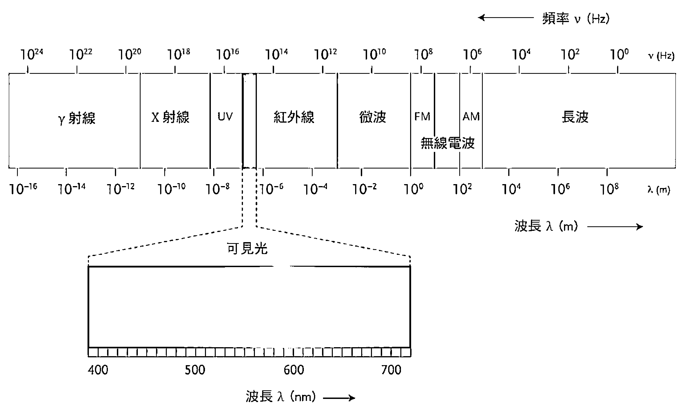

46. 在整個電磁波頻譜，人類只能看到其中很小的一段。整體實際的頻譜，大約是可見光這一段的十兆倍大。<sup>1</sup> 心理的頻譜，會不會也是如此龐大？

### 心靈之間的鴻溝

在地球村出現之前，地球就像是由各個孤立的人類文化組成的星系，當年環境促成的心理狀態，如今可能都已不復存在。社會經濟現實及日常生活一旦不同，培養出的意識狀態也就不同。不論是石器時代的長毛象獵人、新石器時代的農民、鎌倉時期的武士，誰又能確知他們的心靈狀態？此外，許多前現代文化都認為，有某種更高階的意識狀態，可透過冥想、藥物或儀式而進入。薩滿巫師、僧侶或修士都很有系統的探索心靈這片神祕境地，並帶回種種激動人心的故事，訴說著我們聞所未聞的意識狀態，像是無上的寧靜、極端的敏銳、無與倫比的感性，還講著心靈如何延展至無邊無際、遁入一片虛空。

人文主義革命之後，現代西方文化不再相信這種形而上的心理狀態、也沒興趣瞭解，反而是刻意把一般人的俗世體驗給神聖化。因此，現代西方文化有一項特殊之處：並沒有某一群人形成某個特殊階級，想追求超脫俗世的心理狀態。有人想做這件事，就會被認定是嗑藥、精神病、或是詐騙集團。所以，雖然我們十分瞭解哈佛心理系學生的心理狀態，但對於美洲原住民的薩滿巫師、佛教的僧侶、或是蘇菲神祕教派的心理狀態，反而所知非常有限。^3

而且這還只是智人的心靈而已。五萬年前，地球上除了智人，還有尼安德塔人這個近親。尼安德塔人沒能發射太空船、蓋出金字塔、或是建立帝國。顯然，他們的心靈能力與智人大不相同，也比智人少了許多天分。然而，尼安德塔人的大腦容量其實比智人更大，他們的神經元都派上了什麼用場？我們對此一無所知。很可能他們就擁有許多智人從未體驗過的心理狀態。

只不過，就算我們將史上所有曾經存在的人類物種全盤納入考量，距離要窮盡整個心理的頻譜，仍然差得太遠。任何其他動物，都可能有人類難以想像的體驗。像是蝙蝠，能夠用回聲定位來體驗這個世界。牠們會發出人耳無法聽到的超高頻率聲波，再偵測碰觸前方物體後反射回來的聲波，便能建構出周遭環境的樣貌。蝙蝠感知到的樣貌極度詳細而準確，讓牠們能夠快速穿梭於樹木和建築物之間，追逐蛾類、捕獲蚊蟲，同時還能避開貓頭鷹和其他掠食者。

蝙蝠活在一個回聲的世界裡。就像人類的世界認為每個物品都有代表性的外形及顏色，蝙蝠的世界則認為每個物品都有專屬的回聲模式。光是從某隻蛾纖纖翅膀彈回的回聲，蝙蝠就能判斷這隻蛾究竟是美食或毒藥。至於某些可食用的蛾類，則演化出類似毒蛾的回聲模式來保護自己。還有一些蛾演化出的能力更了不起，能夠直接讓蝙蝠雷達的聲波轉向，於是這些蛾能夠像是隱形轟炸機一般，飛來飛去，而蝙蝠渾然未覺。回聲定位世界的複雜和激烈程度，並不下於我們所熟悉的視覺及聽覺世界，但我們就是毫無所悉。

### 當蝙蝠的感覺如何？

關於心靈的哲學，有一篇經典之作就是〈當蝙蝠的感覺如何？〉（What Is It Like to Be a Bat?）。^4哲學家內格爾（Thomas Nagel）在這篇1974年的文章中指出，智人的心靈無法體會蝙蝠主觀的世界。我們可以寫出各式各樣的演算法，來模仿蝙蝠的身體、模擬蝙蝠的回聲定位系統、蝙蝠的神經元，但這一切還是沒辦法告訴我們，當一隻蝙蝠是什麼感覺？在某隻蛾拍動翅膀的時候，回聲定位是啥感覺？究竟是和用眼睛看差不多，還是根本完全不同？

向智人解釋回聲定位一隻蝴蝶的感覺，可能就像是向一隻看不見的鼴鼠解釋看到達文西畫作的感覺一樣，絕對無法達到效果。很有可能，蝙蝠的情緒也會受到回聲定位感受的深深影響。就像是對於智人來說，愛是紅色、嫉妒是綠色、憂鬱是藍色，但誰能知道，母蝙蝠對小蝙蝠的愛在回聲定位裡是什麼感覺？公蝙蝠在回聲定位裡看到敵人，又是什麼感受？

當然，這並不只是蝙蝠特有的情況，只是無數的例子之一。正如智人無法理解當隻蝙蝠是什麼感覺，我們也同樣難以理解當一隻鯨、一隻老虎或鸕鶿是什麼感受。當然這一定是有什麼感覺，只是我們不知道。鯨和人類同樣使用大腦的邊緣系統（limbic system）來處理情緒，但鯨的邊緣系統卻多出一整塊人類所沒有的組織。或許因為多了這一塊，就讓鯨能夠體驗到與人類大不相同、而且極度深刻複雜的情緒？此外，鯨也可能有極驚人的音樂體驗，連巴哈或莫札特都望塵莫及。

譬如鯨可以聽到數百公里遠的彼此，而且每條鯨都有自己獨特的「歌曲」，曲長可能長達數小時，且有非常精緻複雜的模式。三不五時就會有某條鯨譜出新的流行歌曲，整個海洋裡的鯨都會跟風模仿。科學家常常會記錄這些流行曲，再用電腦加以分析。然而人類真的能夠體會這些音樂經驗，知道鯨貝多芬和鯨小賈斯丁有何不同嗎？⁵

這一切不該讓我們太驚訝。智人之所以統治世界，並不是因為智人的情感更深刻、或音樂經驗更複雜。所以，至少在某些經驗領域裡，智人確實可能不如鯨，不如蝙蝠、老虎或鵜鶘。

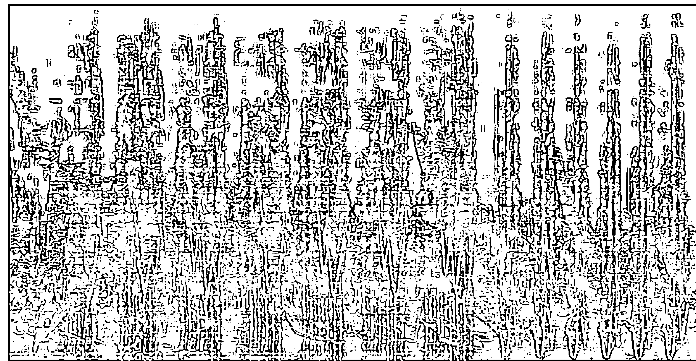

47. 一首弓頭鯨（bowhead whale）歌曲的聲譜圖。弓頭鯨對這首歌有怎樣的經驗？航海家太空探測船的黃金唱片除了貝多芬、巴哈和查克·貝瑞之外，也錄了一首鯨之歌，但我們只能希望這隻鯨真的唱得不錯。

而且，在人類、蝙蝠、鯨和其他所有動物的心理範圍之外，還有甚至更大、更奇特的領域有待探索。很有可能仍有無止境的心理狀態，但由於在這四十億年的地球演化歷程中，所有智人、蝙蝠或恐龍都還不具備能夠體驗這一切的必要能力，因此從未有所體驗。不過，到了未來，有了強大的藥物、基因工程、電子頭盔和腦機介面，就可能打開通往這些領域的通道。就像哥倫布和麥哲倫航向海平面的彼方、探索新的島嶼和未知的大陸，或許某天我們也能前往心靈的對跖點。

### 我聞到恐懼的氣味 ※

如果醫師、工程師和顧客一心想的就是治癒精神疾病、盡情享受WEIRD社會的生活，光是研究次於規範的心理狀態及WEIRD的心靈，或許已足以滿足我們的需求。雖然常有人批評規範心理學一看到偏離規範就認為是問題，但在上個世紀，這讓無數病人得到安慰，也讓數百萬人生活順利、精神正常。

但到了第三個千禧年的開端，我們面臨的完全是另一種挑戰：自由人文主義被科技人文主義取代，而醫學也愈來愈著重於讓健康的人升級，而非治癒病人。醫師、工程師和顧客現在並不以解決精神問題為滿足，而是要讓整個心靈升級。我們的科技能力正逐漸足以打造新的意識狀態，但我們對這塊新領域卻還沒有堪用的地圖。我們熟悉的主要只有WEIRD族規範和次於規範的心理狀態頻譜，所以甚至連該前往哪個方向，都不知道。

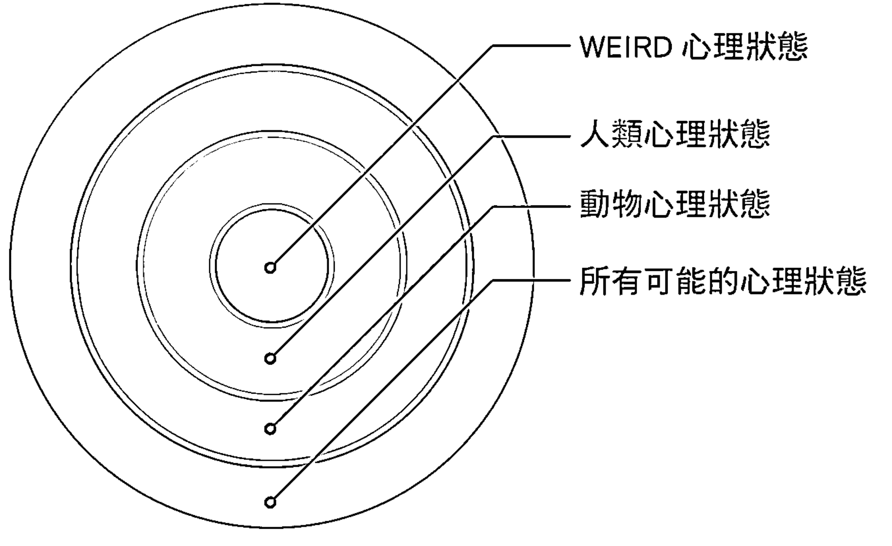

48. 意識的頻譜：一層之外，尚有未知的一層。

目前心理學最熱門的子領域是正向心理學（positive psychology），就不令人意外了。1990年代，塞利格曼（Martin Seligman）、迪納（Ed Dinner）、契克森米哈賴（Mihaly Csikszentmihalyi）等權威專家認為，心理學除了研究心理的疾病，也該研究心理的積極力量。究竟為什麼，我們對生病的心靈瞭解得如此清楚，卻對正常強健的心靈沒有一張科學的地圖？在過去二十年之間，正向心理學已經對優於規範（super-normative）的心理狀態研究，邁出了重要的第一步，可是直到2016年，科學對於這片領域仍然近乎一無所知。

在這種情況下，我們可能就是盲目向前衝，一心提升當下經濟和政治制度需要的心靈能力，卻忽略、甚至貶抑了其他心靈能力。當然，這種現象自古皆然。幾千年來，社會都會根據當時的需求，來塑造及重塑人類的心靈。智人原本的演化，只是要成為一小群親密社群裡的成員，這種心靈能力並不會讓他們習慣當個巨大機器的小齒輪。但隨著城市、王國和帝國興起，社會培養了大規模合作所需的能力，但同時也漸漸忽略了其他技能和性向。

舉例來說，遠古人類可能常常應用嗅覺。狩獵採集者能夠靠嗅覺，在遠方辨認出各種不同的動物、人類、甚至是情緒——像是恐懼的氣味就和勇氣不同。一個人害怕時所分泌的化學物質，與他充滿勇氣時所分泌的就是不一樣。如果你坐在某個古老的部落當中，而他們正爭執是否要和隔壁部落開戰，你是真的能夠「聞出」大家的意見為何！

但因為嗅覺這種功能只有在成員少的時候，才派得上用場，所以等到智人組織成更大的團體，嗅覺的社會價值也就一落千丈。舉例來說，美國對中國的恐懼，可就聞不出來了。於是，人類的嗅覺能力遭到輕忽，至於在幾萬年前可能用來處理氣味的大腦區域，現在也可能挪用到更急迫的任務上，像是閱讀、數學運算和抽象推理方面。現代社會希望我們把神經元用來解微分方程式，而不是用來聞我們的鄰居。<sup>6</sup>

### 用進廢退

我們的其他感官、或是更底層能夠注意到感官感受的能力，也同樣經歷了這種過程。

遠古的採集者總是保持警覺。在森林裡找蘑菇的時候，他們會仔細聞著風的氣味、專心觀察地面。找到一個蘑菇之後，他們會用全心全意來吃這個蘑菇，感受最細微的味道差異，分辨這個蘑菇究竟是適合食用、或是有毒。到了今天的富裕社會，人類多半不需要如此敏銳。超市裡就有上千種食物可供選擇，食品安全都有衛生單位監督。但不管你選的是義大利披薩、還是泰國泡麵，接下來，都可能是坐在電視機前面狼吞虎嚥，幾乎不管這食物有何風味！（正因如此，食品製造商才要不斷推出刺激的新口味，希望能動搖一下我們的無動於衷。）

同樣的，由於有良好的交通運輸，就算是住在城市另一邊的朋友，仍然很容易見到面。但就算真的碰到面，我們卻也不見得真的把心思都放在對方身上，總是在看手機有沒有新訊息、臉書有沒有新動態，覺得一定有什麼更有趣的事發生在別的地方。現代人類已經患上「錯失恐懼症」(Fear Of Missing Out, FOMO)，總在擔心自己錯過了什麼；雖然手中的選擇比以往任何時候都多，但選了之後又很難付出全心全意。<sup>7</sup>

除了嗅覺和注意力，人類也失去了做夢的能力。許多文化認為人類在夢中的所見所為，重要性並不下於清醒時的所見所為，因此會積極培養做夢的能力、記住夢的能力、甚至是在夢中世界控制行動的能力。這種能夠控制行動的夢，稱為清醒夢（lucid dreaming）。清醒夢的專家號稱可以在夢的世界裡自由活動，甚至是前往更高的存在層次，遇見來自其他世界的訪客。

相反的，現代世界認為做夢只是潛意識發出的訊息，甚至不過就是心靈產生的垃圾。於是做夢這件事在我們的生活中，沒有那麼重要，很少有人積極培養做夢的能力，甚至有很多人表示自己從不做夢、或是從不記得自己做了什麼夢。⁸

嗅覺、注意力和做夢的能力都不如以往，是不是讓我們的生活過得比較貧瘠而灰暗？或許沒錯。但從政經體系的角度看來，這都是值得的。老闆會希望你常檢查電子郵件信箱，而不是常聞花香、或做白日夢。出於類似的原因，未來要將人類的心靈升級時，反映的也可能是政治的需求、市場的力量。

例如第8章〈實驗室裡的定時炸彈〉提過美軍的「專注頭盔」，就是要幫助士兵專注在明確的任務上，加速決策過程。但這也可能降低這些人的同理心，讓他們忽略心中的種種懷疑和內在衝突。人文主義心理學家指出：感到憂鬱的人常常想要的，並不是簡單的解決方案，而是希望有人能夠聆聽他們的想法，同情他們的恐懼和疑慮。

假設你現在工作出現危機：新老闆不喜歡你的想法，堅持要你乖乖聽話就好。過了特別不順的一天，你決定拿起電話打給朋友。但朋友正在忙，撥不出什麼時間和精力，於是打斷了你講到一半的話，試著解決你的問題：「好，我知道了。在這個情況，你真的只有兩種選擇：辭職，或是留下來聽老闆的話。如果是我，就會選擇辭職。』但這大概算不上幫了什麼忙。真正感情好的朋友，會比較有耐性，不會急著找出解決方案，而是會聆聽你的憂慮，給你時間和空間，好讓種種矛盾的情緒和折磨人的焦慮——浮現，得到慰藉。

專注頭盔的用途，就像是那個不耐煩的朋友。確實，有些時候（例如在戰場上）我們需要迅速下定決心，但生命不是只有這樣而已。如果我們愈來愈常使用頭盔，可能最後就會像是失去了嗅覺、做夢和注意的能力一般，失去容忍各種疑惑和矛盾的能力。現代社會喜歡我們下定決心，而不是心存懷疑，所以整個政經體系也可能會推動我們往這種方向前進。然而，比起擁有懷疑和矛盾的社會，如果一切要求明快堅決，生活反而可能變得更貧瘠而膚淺。

### 放大版的螞蟻社會 ※

現代這個世界，一方面，我們已經有能力改造心靈，但另一方面，我們又幾乎完全不知道心理的完整頻譜是什麼模樣，再加上政府、軍隊和企業各懷鬼胎，簡直注定帶來災難。有可能到頭來，我們很成功的讓身體與大腦都升級了，卻在過程中失去了心靈。

確實，科技人文主義到最後可能反而會造成人類的降級。對政經體系來說，降級後的人類反而更有利，原因不是這種人擁有什麼卓越的特點，而是這種人少了一些可能拖慢社會步調、造成困擾的人類特質。像是農夫都知道，羊群裡面最聰明的那隻，常常就會惹出最大的麻煩，所以農業革命的其中一項，就是要降低動物的心理能力。到了科技人文主義夢想所推動的第二次認知革命，則可能對人類造成一樣的效果，讓社會大機器裡的「人類小齒輪」變得比以往更能有效溝通和處理資料，但幾乎不會去注意其他事，既不會做夢、也不會有所懷疑。數百萬年來，人類曾經是加強版的黑猩猩；到了未來，人類則可能變成放大版的螞蟻。

科技人文主義還面臨另一項恐怖威脅。一如所有人人文主義教派，科技人文主義也認為人的意志是神聖的，認為這是整個宇宙的憑依。科技人文主義希望用人類的期望，來選擇要發展哪一種心靈能力，進而決定未來心靈的模樣。然而，如果未來科技進展之後，能夠重塑、改造這些期望，那會是什麼情形？

人文主義總是強調，我們不太容易確知自己真正的意志。每次想聆聽真實的自己，總有許多吵雜的噪音撲天蓋地而來。而且事實上，有時候我們不見得真想聽到自己真實的聲音，因為那可能會是一些不受歡迎的秘密、令人難堪的要求。有許多人根本是處心積慮不想對自己瞭解太深。譬如，一位平步青雲的律師，可能就不想聽到內心叫她放輕鬆點、趕快生個寶寶的聲音。困在痛苦婚姻中的婦女，也可能害怕失去婚姻提供的安全感。背負罪惡感的士兵，曾犯下的暴行化成噩夢，如影隨形。對自己的性傾向還無法確定的年輕人，就對自己實行了「不問、不說」的政策。對人文主義來說，這任何一個情境都不會有一體適用的解決方案，但人文主義要求我們堅強起來，不論內心的聲音再醜惡，也要勇敢面對，要聽到自己最真實的聲音，再聽從它的指示，排除萬難。

但從科技進步的觀點，一切就大不相同了。科技進展不想聽我們內在的聲音，而是要控制這些聲音。只要我們瞭解了生化系統如何產生這些聲音，我們就能玩弄這所有開關，把這裡音量調高、那裡音量調低，讓人生過得更輕鬆自在。想專心的律師可以來點利他能（Ritalin），有罪惡感的士兵可以吞個百憂解（Prozac），至於對生活不滿的妻子，替你憂（Citalopram）就是答案。而且，這還只是開始。

人文主義者對這種方法常常難以接受。但我們還是別太早就下判斷、作結論。人文主義者建議的「聽自己內心的聲音」，其實毀了許多人的生命；適當用藥，反而是大大改善了幾百萬人的幸福和關係。為了真正聽到自己內心的聲音，有些人可得先把心中現有的尖叫和怒罵音量調小。現代精神病學認為，許多「內心的聲音」和「真實的願望」只不過是生化失衡和神經疾病的產物。由於生化失衡，讓患有臨床憂鬱症的人看起事物來，都像是透過一副抑鬱的眼鏡，於是一再拋棄大好的前途、健康的人際關係。這時該做的，可能不是聆聽這種破壞性的內心的聲音，而是該直接叫它們閉嘴。像是第8章提過的記者愛蒂，她戴上頭盔、讓腦中其他聲音安靜下來之後，不但成了神射手，對自我的感覺也大大提升。

### 哪個聲音是「真正的自我」？

就個人而言，每個人都可能對這些問題有不同的看法。但從歷史觀點，現在顯然是風雨欲來。人文主義的最高誡命：「聆聽你自己！」已經不再不證自明。我們學會把內心的聲音調高調低之後，也就得放棄對「真實」的信念，因為我們再也不知道現在是誰在調整開關。把腦中的噪音關掉似乎是個大好主意，但前提是要能讓我聽到真正的自我。如果就是沒有哪個聲音是「真正的自我」，又要怎麼決定哪些聲音要小、哪些聲音該大？

讓我們單純為了討論而做個假設：假設幾十年內，腦科學家就能讓我們輕鬆且準確的控制許多內心的聲音。再假設有個來自虔誠摩門教家庭的年輕男同性戀者，躲在櫃中生活許多年，終於存夠了錢，想去動手術。他帶著十萬美元前往診所，決心要讓自己在走出The request was rejected because it was considered high risk

## 第 11 章 让数据得永生？

器，就能增加系统的动力与创意。农民、祭司和医师之间的对话所产生的想法，可能是狩猎采集者之间怎么谈都谈不到的。

-   三、增加处理器之间的连接。如果光是增加处理器数量，但彼此之间无法连接，仍然没有意义。十座有贸易网络连接的城市，产生的经济、科技与社会创新，通常都会高于十座孤立的城市。

-   四、增加现有链接网的流通自由度。如果资料数据无法自由流通，光是把处理器连接起来，也不会有什么用处。这就像在十座城市之间开出了道路，但路上却满是抢匪或路霸，商人和旅行者难以通行，效果也就大打折扣。

这四种方法常常互相矛盾。像是处理器的数量和种类愈多，要能自由连接就愈难。因此，智人资料处理系统的建构，是分成四大阶段，各自强调不同的方法。

第一阶段始于认知革命，开始能够将大量智人连接为单一资料处理网络。这就让智人拥有超乎其他人类及动物物种的关键优势。对尼安德塔人、黑猩猩或大象来说，能够连接成单一网络的个体数量有限，但智人却打破了这个限制。

智人运用资料处理优势，遍布了整个世界。但随着智人分散到不同地区、感受不同气候，就开始彼此失去联系，经历不同的文化变革，于是形成各式各样的人类文化，各有生活方式、行为模式及世界观。因此，历史的第一阶段后期，就是增加人类处理器的数量及种类，但同时牺牲了连接：在二万年前，智人数量远多于七万年前，但欧洲智人处理资讯的方式也不同于中国的智人。在当时，欧洲和中国之间并无连接，也几乎不可能相信，某天所有智人居然会连接成单一的资料处理网络。

第二阶段从农业革命开始，持续到大约五千年前、发明了文字和金钱的时候。农业加速人口成长，使人类处理器数量急剧上升。同时，农业让更多人能够群聚生活，形成密集的局部网络，各自拥有数量空前的处理器。此外，农业也为各个局部网络创造动机和契机，鼓励彼此贸易和沟通交流。但即使发展到这第二阶段，仍然是以离心力为主。因为没有文字和金钱的概念，人类难以建立城市、王国或帝国，仍然只是无数个小部落，各有自己的生活方式和世界观。要说所有人类会团结形成一体，当时连做梦也想不到。

第三阶段始于大约五千年前发明了文字和金钱，并持续到科学革命肇始。有了文字和金钱之后，人类合作的重力场最终超过了离心力，让各个团体融合起来，形成城市和王国，而各个城市和王国的政治和商业连接也更为密切。至少到了西元前第一个千禧年（出现了钱币、帝国和普世宗教），人类已经开始有意识的想象着要建立涵括整个地球的单一网络。

到了历史的第四阶段、也是最后一个阶段，大约始于1492年，这个梦想成为现实。早期的现代探险家、征服者和交易者，一起编织出覆盖整个世界的头几条丝线。到了近代晚期，这些丝线变得更加结实紧密了，在哥伦布时期已如同蛛网；到了二十一世纪，则已经是由钢铁和沥青构成的网络。更重要的是，资讯能够在这个全球网络里愈来愈自由的流动。哥伦布刚刚把欧亚网络连接到美洲网络时，每年只有极少量资讯能够越过海洋，还得应付各种文化偏见、严格审查和政治打压。但随着时间过去，不论是自由市场、科学社群、法治概念或民主传播，都有助于消除种种障碍。我们常常有所想象，认为民主和自由市场之所以获胜，是因为它们比较“好”。但事实上，它们之所以胜出，是因为改善了全球资料处理系统。于是，在过去的七万年间，人类就是先扩散，再分成不同群体，最后再次合并。但合并并不代表一切回到原点。过去的多元族群融入今天的地球村时，各自都带着思想、工具和行为上的独特传承，呈现一路走来的搜集与发展。在我们现代的食品柜里，就有中东的小麦、南美洲安地斯地区的马铃薯、新几内亚的糖，以及衣索比亚的咖啡。同样的，我们的语言、宗教、音乐和政治，也充满着来自地球各地的传世宝藏。^5^

## 数据主义带来全新价值观：资讯自由 ❖

一如资本主义，数据主义一开始也是个中立的科学理论，但正慢慢成为要判别是非的宗教。对这个新宗教来说，最高的价值就是资讯流通。如果生命就是资讯的流动，而我们又认为生命是好的，下一步就是该让全宇宙的资讯流得更广、更深。数据主义认为，人类的经验并不神圣，智人并非造物的巅峰之作，也不是未来神人的前身。人类只是创造万物互联网的工具而已，而万物互联网可能从地球这个行星向外扩张，扩展到整个星系、甚至整个宇宙。这个宇宙资料处理系统将会如同上帝，无所不在、操控一切，而人类注定将会并入系统之中。

这种概念让人回想起某些传统宗教愿景，像是印度教相信人类能够、也应该融入整个宇宙共有的灵魂，也就是“梵”(atman) 的概念；基督徒则相信，圣人死后会充满上帝的无限恩典，而罪人则是切断了与上帝的连接。事实上在矽谷，数据主义的先知正是刻意运用传统上的各种救世说词。例如库兹威尔（见第 30 页）的预言书就叫做《奇点近了》(The Singularity is Near)，呼应着施洗约翰的呼喊：“天国近了”(《马太福音》第 3 章第 2 节)。

数据主义告诉那些还崇拜着血肉之躯的人：你们已经太依赖一种过时的科技了，智人就是个该淘汰的演算法。这么说吧，人类有什么赢过鸡的地方呢？唯一的一点，就是人类的资讯流通模式比鸡复杂得多。人类能够吸收更多资料数据，处理资讯的演算法也比鸡更为优秀。（如果用人话来说，也就是说人类有更深的情感、更高的智力。但请别忘记，就现在的生物科学看来，情感和智力也都不过是演算法罢了。）这样一来，如果我们创造出某个资料处理系统，能够吸收比人类更多的资料数据，处理资讯的演算法也比人类更为优秀，是不是这个系统就能赢过人，正如人类赢过了鸡？

数据主义不只是空谈理论，而是像每个宗教一样拥有实际的诫命。最重要的第一条诫命，就是数据主义要连接愈来愈多的媒介，产生和使用愈来愈多的资讯，让资料流最大化。数据主义也像其他成功的宗教，有其传道使命。它的第二条诫命，就是要把一切连接到系统，就连那些不想加入的异端也不能例外。而且这里指的一切并不只是人，而真的是一切事物。人类的身体自然不在话下，但另外还包括街上的车、厨房里的冰箱、鸡舍里的鸡、树林里的树，一切都要连接到万物互联网上。以后，冰箱就会监视鸡蛋还剩几颗，并在需要补货时，自动通知鸡舍。汽车能够互相交谈，树木则会报告天气和二氧化碳含量。我们不会容许宇宙的任何部分与这个伟大的生命网络分开，如果有人胆敢阻碍资料的流通，就是犯下了最大的罪。因为，资讯若不再流通，与死亡又有何异？因此对数据主义来说，“资讯自由”就是最高的善。

人类很少真正能够想出全新的价值观。回首上次已经是十八世纪，人文主义革命开始宣扬人类自由、人类平等、人类博爱这种种令人激动的理想。而自1789年以来，虽然也有许多战争、革命和动荡，人类却并未想出什么新的价值观。后来的各种冲突及斗争，都是以自由、平等、博爱这三种人文主义价值观为名，或者基于更早的价值观，例如要服从上帝、服侍国家。数据主义是自1789年以来第一个真正创造新价值观的运动，这个新价值观就是“资讯自由”。

要注意的是，新的“资讯自由”与过去自由主义所谈的“言论自由”不能混为一谈。言论自由所赋予的对象是人，保护的是人类思考及说出自己心中所想的权利，当然也保护他们缄默、把想法放在心中的权利。相较之下，资讯自由所赋予的对象并非人类，而是资讯。而且在这种新价值观看来，资讯自由流通的权利应该高于人类拥有并限制资料流通的权利，因此“资讯自由”甚至可能侵犯到人类传统的言论自由。

2013年1月11日，数据主义新科技宗教出现了第一位殉道者：史瓦兹（Aaron Swartz）。这位二十六岁的美国骇客，在自家公寓自杀身亡。史瓦兹是个不世出的天才，十四岁就协同开发出了关键的RSS（Really Simple Syndication，极简同步散播、或称简易供稿系统）通讯协定。他也是资讯自由的坚定信徒，曾在2008年发表〈开放存取游击宣言〉（Guerilla Open Access Manifesto），呼吁应让资讯流完全自由、不加限制。史瓦兹在宣言中表示：“无论现在资讯储存于何处，我们都必须能取得这些资讯、复制、与全世界分享。我们必须搜集没有版权限制的内容，并将这些内容建档加入。我们必须购入那些未公开的资料库内容，将内容公开在网络上。我们必须下载科学期刊内容，上传到文件共享网络。我们必须为了开放存取，如游击队般奋战。”

史瓦兹说到做到。譬如使用者必须向期刊资料库JSTOR付费，才能取得论文，就让他十分恼火。JSTOR资料库有数百万份科学论文和研究成果，JSTOR完全支持科学家和期刊编辑应当享有言论自由，包括支持“这些人认为想读文章就该付钱”的自由。JSTOR认为，在我研究创造出某种想法之后，如果想以此获得部分报酬，应该是我的权利。但是史瓦兹可不这么想。他相信资讯也想要自由，他认为这些想法并不属于创造它们的人，把资讯锁在墙后而必须收费才能观看的做法是错误的。于是，史瓦兹用了麻省理工学院的电脑网路存取JSTOR，下载了数十万份科学论文，打算全部公开到网际网络上，让人们自由阅读。

史瓦兹遭到逮捕，被送上法庭。在他知道自己可能遭到定罪入狱之后，便上吊自杀。对于控告史瓦兹、侵犯资讯自由的学术机构和政府机关，骇客族群发动了各种请愿和攻击。在压力下，JSTOR对自己在这起悲剧中的角色表示歉意，并开放许多（但仍非全部）资料内容，供免费使用。^6^

## 资讯自由好处多 ✿

为了说服那些还在怀疑的人，数据主义的传教士一再解释，资讯自由有多大的好处。就像是资本主义相信一切的善都来自经济成长，数据主义则相信一切的善（包括经济成长）都来自资讯自由。为什么美国成长比苏联快？因为资讯流动在美国更自由。为什么美国人比伊朗人或奈及利亚人更健康、更富有、更幸福？都是多亏了资讯自由。所以，如果想要创造更美好的世界，关键就是要释放资料、给它们自由。

我们已经看到，谷歌能够比传统卫生机构更快察觉流行病的爆發，但前提是：必须允许谷歌自由存取我们产出的资讯。资料数据如果能够自由流动，同样也能减少污染和浪费。例如，透过资讯自由，可让交通运输系统更为合理。2010年，全球自用车共有超过十亿辆，而且还在不断增加。^7^这些车辆污染地球、浪费大量资源，更别说还得为此不断加宽道路、增设停车位。民众又已经习惯拥有自用车的便利，不太可能再回头搭公车和火车。但数据主义指出，民众真正想要的并不是车辆本身，而是移动的便利；只要有优秀的资料处理系统，就能简单又有效的提供这种移动的便利。

我自己也有一辆车，但多半就是停着。就我平常的一天来说，早上8点04分上车，开车半小时到大学，把车停好，就放着一整天。下午6点11分，我又回到车上，开车半小时回家，就这样。所以我每天根本只有一小时会用到车，何必另外二十三小时还把车留着呢？如果有个智慧共乘系统，就能解决这个问题。我能让电脑知道我需要在早上8点04分离开家，由电脑在那个时候把最近的无人驾驶车调过来，准时让我上车。把我送到大学之后，这辆车就能用于其他目的，而不用在停车场白白等待。到了下午刚刚好6点11分，我走出大学的门口，就会有另一辆全民共用的无人驾驶车，停在我旁边，带我回家。

这样一来，只要有五千万辆共用的无人驾驶车，就能取代十亿辆自用车，而且所需的道路、桥梁、隧道和停车空间，都会大大减少。但想当然耳，如果想达到这样的目的，我就得放弃隐私，允许演算法永远知道我身在何处、想去何方。

## 资料流也有一双看不见的手 ✿

但也有可能，你根本早就信奉了数据主义（特别是二十岁以下的人）。有些人其实很愿意成为资料流的一部分，就算这代表放弃隐私、放弃自主性和个别性，也觉得无伤大雅。

人文主义艺术推崇个别的天才，所以就算毕卡索是在餐巾上随笔涂鸦，也能在苏富比拍卖会，卖出几百万美元。人文主义科学赞扬的是个别的学者，因此每个学者都希望自己的名字，哪天能挂上《科学》(Science) 或《自然》(Nature) 期刊论文的第一作者。然而，现在已经有愈来愈多的艺术和科学创作，都是由“每个人”的不断合作而诞生。是谁著作了维基百科？我们每个人。

“个人”正逐渐成为一个巨大系统里的微小晶片，而这个巨大系统却没有人真正了解。每天我透过电子邮件、电话和文章，吸收无数位元的资料数据，然后处理这些资料数据，再透过更多的电子邮件、电话和文章，回传新的资料数据。但我真的不知道，在整个宏观的架构中，我究竟身属何处？我所产出的那些资料数据，又和其他几十亿人或电脑产生的资料数据如何连接？而且我也没有时间找出答案，因为光是回覆电子邮件，就已经耗尽我的时间。随着我提升效率、能够更有效处理更多资讯，也就是回覆更多电子邮件、打更多电话、写更多文章，反而是让身边的人淹没在更多的资料流之中。

这种无情的资料流，带来了新的发明和破坏，而且不在任何人的计划、控制或理解之中。没有人真能理解全球经济如何运作，也没有人知道全球政治将走向何方。但也没有人真的需要理解这一切。你应当做的，就只是回信回得更快（而且允许系统存取这些内容）。正如自由市场资本主义相信市场那双看不见的手，数据主义相信资料流也有一双看不见的手。

## 不停的记录、上传、分享！ ✽

随着全球资料处理系统变得全知全能，“连接到这个系统”也就成了所有意义的来源。人类之所以想要融入这个资料流，是因为只要成为资料流的一部分，你就会隶属于一个比自己更伟大的计划。

传统宗教向你保证，你说的每个字、你的每个举止，都是某个伟大宇宙计划的一部分，上帝一直看顾你，也在意你的所有想法与所有感受。

至于现在的数据宗教则说，你说的每个字、你的每个举止，都是伟大资料流的一部分，演算法一直看顾你，也在意你的所有想法与所有感受。大多数人都对此非常满意。对于真正的信徒来说，要他们脱离资料流，就等于是要冒着失去生命意义的风险。如果你有了某种感受，却没有人知道它、也并未对全球资讯交换有任何贡献，人生又有什么意义呢？

人文主义认为：所有的经验体验是发生在我们心中，我们要从自己的心里找出一切事物的意义，进而为宇宙赋予意义。数据主义则认为：经验不分享就没有价值，而且我们并不需要（甚至是不可能）从自己心里找到意义。我们该做的，就是要记录自己的经验，再连接到整个大资料流中，接着演算法就会找出这些经验的意义，并告诉我们接下来该怎么做。

二十年前，日本游客因为总是拿着相机照个不停，曾经受到全世界的嘲笑；但现在人人都是如此。如果你现在去印度看到一只大象，你不会看着这只大象而问问自己心中的感受，而是会赶紧掏出智能手机，赶快照张相、上传脸书，再每隔两分钟就检查一下，看看集到了多少个赞。在前几个世代，写日记只给自己看，是很常见的人文主义习惯；但现在，很多年轻人却觉得完全没道理。如果没有人能读到，写了不都是白写吗？现代的新座右铭是：“如果你体验到什么，就记录。如果你记录了什么，就上传。如果你上传了什么，就分享！”

我们在这本《人类大命运》里不断问道：究竟是什么让人类比其他动物优越？数据主义有一个全新而又简洁的答案。

就个体而言，人类的经验并不比狼或大象的经验来得优越。只要是资料数据，都无高下之别。然而，人类可以把自己的经验吟成诗、写成部落格、发表到网络上，使全球资料处理系统更为丰富。就是这样，才让人类的资料数据有了意义。狼做不到这件事，因此虽然狼的各种经验可能一样深刻复杂，却毫无价值。难怪我们会如此忙着将自己的经验，转化为各种资料数据。这不是赶不赶流行的问题，而是生存的问题。我们必须向自己和系统证明自己仍然有价值，而且价值不在于单纯拥有经验，而在于将经验转化为自由流动的资料数据。

〔顺便提一下，就算是狼（或至少是与牠们血缘很近的狗）的经验，现在也可能会产生意义。现在已经有一家名为“不再只是汪汪汪”（No More Woof）的公司，正在开发一种能够读懂犬类经验的头盔。这个头盔会监测狗的脑波，再用电脑演算法把一些简单的情绪，像是“我很生气”，翻译成人类的语言。^8^所以，你的狗可能也快要有的脸书或推特帐号了，而且搞不好还会比你拿到更多赞、或是有更多追踪者。〕

## “人类演算法”将被取代

数据主义既非自由主义、亦非人文主义。但要特别强调一点：数据主义并不反对人文主义。数据主义对人类的经验，并没有什么恶意，只是不认为经验本质上有何价值。

前面检视人文主义的三大教派时，我们曾问过哪个经验最有价值：是聆听贝多芬的第五号《命运交响曲》、查克·贝瑞的流行音乐、矮人族成年曲、或是狼嚎？如果就数据主义看来，这整件事根本是抓错重点，因为衡量音乐的价值时，该看的是它带来多少数据，而不是它创造了什么经验。举例来说，数据主义就会认为：如果与矮人族的成年曲相较，《命运交响曲》用了更多和弦与音阶，而且创造出更多在不同音乐风格间的对话，于是你需要更多的运算能力，才能解读《命运交响曲》，由此也会获得更多的知识。

从这个观点，音乐也是数学模式，也能用数学来描述每个音乐作品，以及任何两首曲子之间的关系。这样一来，所有的交响乐、歌曲和嚎叫，都能测量出精确的数据值，确定哪个最为丰富。至于它们对人类或狼所创造的体验，其实并不重要。的确，在过去大约七万年间，人类的经验是整个世界最有效的资料处理演算法，确实有理由多加推崇。但我们可能很快就会到达临界点，人类演算法将被取代，甚至成为负担。

人类是从数万年前的非洲大草原上开始演化，这套演算法并非天生用来应付二十一世纪的资料流。我们可以尝试升级人类资料处理系统，但光这样还不够，因为万物互联网可能很快就会创造出极巨大而快速的资料流，就算是升级后的人类演算法也无法处理。在汽车取代马车的时候，我们并不是让马升级，而是直接让马退休。或许，智人也到了该退休的时候。

数据主义对人类采用严格的功能观点，完全依据能在资料处理机制发挥多少功能，来评估人类经验的价值。如果我们研发出能够具备相同功能、而又更有效率的演算法，“人类经验”这套演算法就会失去价值。因此，如果不只是计程车司机和医师，就连律师、诗人和音乐家，都能用更厉害的电脑程式取代，那又何必在意这些程式有没有意识、有没有主观经验呢？如果人文主义又开始赞颂人类经验的神圣，数据主义会觉得这是个诉诸情感的谎言。“你所称赞的体验，只是一种过时的生化演算法。在七万年前的非洲大草原上，这种演算法可说是顶尖，而且就算到了二十世纪，仍然对军队和经济至关重要。但我们很快就会有更好的演算法！”

在许多好莱坞科幻电影的最后高潮里，人类面临外星人的入侵舰队、造反的机器人大军，又或是要消灭全人类的全知超级电脑，一切看来人类已经注定灭亡了；但人类总是在最后一刻反败为胜，这要感谢的总归是所有外星人、机器人和超级电脑未曾怀疑、也无法看穿的东西：爱。就像在“骇客任务”(Matrix) 里，主角原本完全被超级电脑玩弄在掌心、被邪恶的机器人射了满满一轮子弹，但得到爱人的启发，就忽然大显神威，彻底扭转局势。

就数据主义看来，这整个场景实在太荒谬了。它会对好莱坞编剧嗤之以鼻：“拜托，你就只能编出这种玩意啊？爱？而且还不是什么柏拉图式的大爱，只是两只哺乳动物的肉体吸引力？你还真以为，如果有個全知的超级电脑或外星人，都要征服整个星系了，居然会被‘荷尔蒙爆发’这种小事弄糊涂？

数据主义将人类经验视同数据模式，也就破坏了我们的权威和意义的本源，带来“自十八世纪以降从未有过的重大宗教革命”。在洛克、休谟和伏尔泰的时代，人文主义认为“上帝是人类想像力的产物”。但现在数据主义以其人之道还治其人之身，说道：“没错，上帝是人类想像力的产物，但人类的想像力一样只是生化演算法的产物。”在十八世纪，人文主义从以神为中心的世界观，走向以人为中心的世界观，于是把神推到了一旁。在二十一世纪，数据主义则可能是从以人为中心，走向以资料为中心，于是把人也给推到了一边。

## 从前，要聆听自己内心的声音

数据主义革命可能需要几十年、甚至一两个世纪，才能成功，但人文主义革命也不是一夜之间忽然达成。一开始，人类一直相信上帝，认为人类之所以神圣，是因为人类由神所创，有某种神圣的目的。要到许久之后，才有一些人敢说：人类的神圣是靠自己，上帝根本不存在。同样地，今天大多数的数据主义者认为：万物互联网之所以神圣，是因为它由人类所创，要满足人类的需求。但到最后，万物互联网可能只需要靠自己，就有了神圣的意义。

从以人为中心的世界观、走向以资料为中心的世界观，这项转变并不只是一场哲学上的革命，而是会真真切切影响我们的生活。所有真正重要的革命，都会有实际的影响。人文主义认为“人类发The request was rejected because it was considered high risk

# 圖片來源

- 40. Virgin and Child, Sassoferrato, Il (Giovanni Battista Salvi) (1609–85), Musee Bonnat, Bayonne, France © Bridgeman Images.
- 41. © Bettmann/Getty Images.
- 42. © Jeremy Sutton-Hibbert/Getty Images.
- 43. 上圖 : © Fototeca Gilardi/Getty Images. 下圖 : © alxpin/Getty Images.
- 44. © Sony Pictures Television.
- 45. © STAN HONDA/AFP/Getty Images.
- 46. ‘EM spectrum’. Licensed under CC BY-SA 3.0 via Commons, https://commons.wikimedia.org/wiki/File:EM_spectrum.svg#/media/File:EM_spectrum.svg.
- 47. © The Cornell Lab of Ornithology, Ithaca, NY, USA.
- 48. 意識的頻譜，江儀玲繪製。
- 49. © ITAR-TASS Photo Agency/Alamy Stock Photo.
- 50. © Jonathan Kirn/Getty Images.

### 參考資料

### 第 1 章 人類的三大新議題

- 1. Tim Blanning, *The Pursuit of Glory* (New York: Penguin Books, 2008), 52.
- 2. 出處同上，53.，並請參見：J. Neumann and S. Lindgrén, ‘Great Historical Events That Were Significantly Affected by the Weather: 4, The Great Famines in Finland and Estonia, 1695–97’, *Bulletin of the American Meteorological Society* 60 (1979), 775–87; Andrew B. Appleby, ‘Epidemics and Famine in the Little Ice Age’, *Journal of Interdisciplinary History* 10:4 (1980): 643–63; Cormac Ó Gráda and Jean-Michel Chevet, ‘Famine and Market in Ancien Régime France’, *Journal of Economic History* 62:3 (2002), 706–73.
- 3. Nicole Darmon et al., *L'insécurité alimentaire pour raisons financières en France*, Observatoire National de la Pauvreté et de l'Exclusion Sociale, https://www.onpes.gouv.fr/IMG/pdf/Darmon.pdf, accessed 3 March 2015; *Rapport Annuel 2013*, *Banques Alimentaires*, http://en.calameo.com/read/001358178ec47d2018425, accessed 4 March 2015.
- 4. Richard Dobbs et al., ‘How the World Could Better Fight Obesity’, McKinsey & Company, November 2014, accessed 11 December 2014, http://www.mckinsey.com/insights/economic_studies/how_the_world_could_better_fight_obesity.
- 5. ‘Global Burden of Disease, Injuries and Risk Factors Study 2013’, *Lancet*, 18 December 2014, accessed 18 December 2014, http://www.thelancet.com/themed/global-burden-of-disease; Stephen Adams, ‘Obesity Killing Three Times As Many As Malnutrition’, *Telegraph*, 13 December 2012, accessed 18 December 2014, http://www.telegraph.co.uk/health/healthnews/9742960/Obesity-killing-three-times-as-many-as-malnutrition.html.
- 6. Robert S. Lopez, *The Birth of Europe* [in Hebrew] (Tel Aviv: Dvir, 1990), 427.
- 7. Alfred W. Crosby, *The Columbian Exchange: Biological and Cultural Consequences of 1492* (Westport: Greenwood Press, 1972); William H. McNeill, *Plagues and Peoples* (Oxford: Basil Blackwell, 1977).
- 8. https://upload.wikimedia.org/wikipedia/commons/d/d0/Yersinia_pestis.jpg.
- 9. Hugh Thomas, *Conquest: Cortes, Montezuma and the Fall of Old Mexico* (New York: Simon & Schuster, 1993), 443–6; Rodolfo Acuña-Soto et al., ‘Megadrought and Megadeath in 16th Century Mexico’, *Historical Review* 8:4 (2002), 360–2; Sherburne F. Cook and Lesley Byrd Simpson, *The Population of Central Mexico in the Sixteenth Century* (Berkeley: University of California Press, 1948).
- 10. Jared Diamond, *Guns, Germs and Steel: The Fates of Human Societies* [in Hebrew] (Tel Aviv: Am Oved, 2002), 167.
- 11. Jeffery K. Taubenberger and David M. Morens, ‘1918 Influenza: The Mother of All Pandemics’, *Emerging Infectious Diseases* 12:1 (2006), 15–22; Niall P. A. S. Johnson and Juergen Mueller, ‘Updating the Accounts: Global Mortality of the 1918–1920 “Spanish” Influenza Pandemic’, *Bulletin of the History of Medicine* 76:1 (2002), 105–15; Stacey L. Knobler, Alison Mack, Adel Mahmoud et al., ed., *The Threat of Pandemic Influenza: Are We Ready? Workshop Summary* (Washington DC: National Academies Press, 2005), 57–110; David van Reybrouck, *Congo: The Epic History of a People* (New York: HarperCollins, 2014), 164; Siddharth Chandra, Goran Kuljanin and Jennifer Wray, ‘Mortality from the Influenza Pandemic of 1918–1919: The Case of India’, *Demography* 49:3 (2012), 857–65; George C. Kohn, *Encyclopedia of Plague and Pestilence: From Ancient Times to the Present*, 3rd edn (New York: Facts on File, 2008), 363.
- 12. 從2005年到2010年的兒童死亡率平均值，分別是全球4.6%、非洲7.9%、歐洲和北美0.7%。參見：‘Infant Mortality Rate (Both Sexes Combined) by Major Area, Region and Country, 1950–2010 (Infant Deaths for 1000 Live Births), estimates’, *World Population Prospects: the 2010 Revision*, UN Department of Economic and Social Affairs, April 2011, accessed 26 May 2012, http://esa.un.org/unpd/wpp/Excel-Data/mortality.htm. 同時參見 Alain Bideau, Bertrand Desjardins, and Hector Perez-Brignoli, ed., *Infant and Child Mortality in the Past* (Oxford: Clarendon Press, 1997); Edward Anthony Wrigley et al., *English Population History from Family Reconstitution, 1580–1837* (Cambridge: Cambridge University Press, 1997), 295–6, 303.
- 13. David A. Koplow, *Smallpox: The Fight to Eradicate a Global Scourge* (Berkeley: University of California Press, 2004); Abdel R. Omran, ‘The Epidemiological Transition: A Theory of Population Change’, *Milbank Memorial Fund Quarterly* 83:4 (2005), 731–57; Thomas McKeown, *The Modern Rise of Populations* (New York: Academic Press, 1976); Simon Szreter, *Health and Wealth: Studies in History and Policy* (Rochester: University of Rochester Press, 2005); Roderick Floud, Robert W. Fogel, Bernard Harris and Sok Chul Hong, *The Changing Body: Health, Nutrition and Human Development in the Western World since 1700* (New York: Cambridge University Press, 2011); James C. Riley, *Rising Life Expectancy: A Global History* (New York: Cambridge University Press, 2001).
- 14. ‘Cholera’, World Health Organization, February 2014, accessed 18 December 2014, http://www.who.int/mediacentre/factsheets/fs107/en/index.html.
- 15. ‘Experimental Therapies: Growing Interest in the Use of Whole Blood or Plasma from Recovered Ebola Patients’, World Health Organization, 26 September 2014, accessed 23 April 2015, http://www.who.int/mediacentre/news/ebola/26-september-2014/en/.
- 16. Hung Y. Fan, Ross F. Conner and Luis P. Villarreal, *AIDS: Science and Society*, 6th edn (Sudbury: Jones and Bartlett Publishers, 2011).
- 17. Peter Piot and Thomas C. Quinn, ‘Response to the AIDS Pandemic – A Global Health Model’, *The New England Journal of Medicine* 368:23 (2013): 2210–18.
- 18. 在官方數據中，從來未曾將「老死」列入死因。如果某位婦人年老體衰，最終因為某種感染而再也撐不下去，帳面上就會將感染列為正式死因。因此從官方數據來看，傳染病仍然占了總死亡人數 20% 以上。然而，現今的情形絕對已經和過去大為不同：當時傳染病帶走的是大批兒童及健壯成年人的性命。
- 19. David M. Livermore, ‘Bacterial Resistance: Origins, Epidemiology, and Impact’, *Clinical Infectious Diseases* 36:s1 (2005), s11–23; Richards G. Wax et al., ed., *Bacterial Resistance to Antimicrobials*, 2nd edn (Boca Raton: CRC Press, 2008); Maja Babic and Robert A. Bonomo, ‘Mutations as a Basis of Antimicrobial Resistance’, in *Antimicrobial Drug Resistance: Mechanisms of Drug Resistance*, ed. Douglas Mayers, vol. 1 (New York: Humana Press, 2009), 65–74; Julian Davies and Dorothy Davies, ‘Origins and Evolution of Antibiotic Resistance’, *Microbiology and Molecular Biology Reviews* 74:3 (2010), 417–33; Richard J. Fair and Yitzhak Tor, ‘Antibiotics and Bacterial Resistance in the 21st Century’, *Perspectives in Medicinal Chemistry* 6 (2014), 25–64.
- 20. Alfonso J. Alanis, ‘Resistance to Antibiotics: Are We in the Post-Antibiotic Era?’, *Archives of Medical Research* 36:6 (2005), 697–705; Stephan Harbarth and Matthew H. Samore, ‘Antimicrobial Resistance Determinants and Future Control’, *Emerging Infectious Diseases* 11:6 (2005), 794–801; Hiroshi Yoneyama and Ryoichi Katsumata, ‘Antibiotic Resistance in Bacteria and Its Future for Novel Antibiotic Development’, *Bioscience, Biotechnology and Biochemistry* 70:5 (2006), 1060–75; Cesar A. Arias and Barbara E. Murray, ‘Antibiotic-Resistant Bugs in the 21st Century – A Clinical Super-Challenge’, *New England Journal of Medicine* 360 (2009), 439–43; Brad Spellberg, John G. Bartlett and David N. Gilbert, ‘The Future of Antibiotics and Resistance’, *New England Journal of Medicine* 368 (2013), 299–302.
- 21. Losee L. Ling et al., ‘A New Antibiotic Kills Pathogens without Detectable Resistance’, *Nature* 517 (2015), 455–9; Gerard Wright, ‘Antibiotics: An Irresistible Newcomer’, *Nature* 517 (2015), 442–4.
- 22. Roey Tzezana, *The Guide to the Future* [in Hebrew] (Haifa: Roey Tzezana, 2013), 209–33.
- 23. Azar Gat, *War in Human Civilization* (Oxford: Oxford University Press, 2006), 130–1; Steven Pinker, *The Better Angels of Our Nature: Why Violence Has Declined* (New York: Viking, 2011); Joshua S. Goldstein, *Winning the War on War: The Decline of Armed Conflict Worldwide* (New York: Dutton, 2011); Robert S. Walker and Drew H.- Bailey, ‘Body Counts in Lowland South American Violence’, Evolution and Human Behavior 34:1 (2013), 29–34; I. J. N. Thorpe, ‘Anthropology, Archaeology, and the Origin of Warfare’, World Archaeology 35:1 (2003), 145–65; Raymond C. Kelly, Warless Societies and the Origin of War (Ann Arbor:University of Michigan Press, 2000); Lawrence H. Keeley, War before Civilization:The Myth of the Peaceful Savage (Oxford:Oxford University Press, 1996); Slavomil Vencl, ‘Stone Age Warfare’, in Ancient Warfare:Archaeological Perspectives, ed. John Carman and Anthony Harding (Stroud:Sutton Publishing, 1999), 57–73.

- 24. ‘Global Health Observatory Data Repository, 2012’, World Health Organization, accessed 16 August 2015, http://apps.who.int/gho/data/node.main.RCODWORLD?lang=en; ‘Global Study on Homicide, 2013’, UNDOC, accessed 16 August 2015, http://www.unodc.org/documents/gsh/pdfs/2014_GLOBAL_HOMICIDE_BOOK_web.pdf; http://www.who.int/healthinfo/global_burden_disease/estimates/en/index1.html.

- 25. Van Reybrouck, Congo, 456–7.

- 26. 關於肥胖造成的死亡：‘Global Burden of Disease, Injuries and Risk Factors Study 2013', Lancet, 18 December 2014, accessed 18 December 2014, http://www.thelancet.com/themed/global-burden-of-disease; Stephen Adams, 'Obesity Killing Three Times As Many As Malnutrition', Telegraph, 13 December 2012, accessed 18 December 2014, http://www.telegraph.co.uk/health/healthnews/9742960/Obesity-killing-three-times-as-many-as-malnutrition.html. 關於恐怖主義造成的死亡，參見: Global Terrorism Database, http://www.start.umd.edu/gtd/, accessed 16 January 2016.

- 27. Arion McNicoll, ‘How Google’s Calico Aims to Fight Aging and “Solve Death”’, CNN, 3 October 2013, accessed 19 December 2014, http://edition.cnn.com/2013/10/03/tech/innovation/google-calico-aging-death/.

- 28. Katrina Brooker, ‘Google Ventures and the Search for Immortality’, Bloomberg, 9 March 2015, accessed 15 April 2015, http://www.bloomberg.com/news/articles/2015–03–09/google-ventures-bill-maris-investing-in-idea-of-living-to-500.

- 29. Mick Brown, ‘Peter Thiel:The Billionaire Tech Entrepreneur on a Mission to Cheat Death’, Telegraph, 19 September 2014, accessed 19 December 2014, http://www.telegraph.co.uk/technology/11098971/Peter-Thiel-the-billionaire-tech-entrepreneur-on-a-mission-to-cheat-death.html.

- 30. Kim Hill et al., ‘Mortality Rates among Wild Chimpanzees’, Journal of Human Evolution 40:5 (2001):437–50; James G. Herndon, ‘Brain Weight Throughout the Life Span of the Chimpanzee’, Journal of Comparative Neurology 409 (1999):567–72.

- 31. Beatrice Scheubel, Bismarck’s Institutions:A Historical Perspective on the Social Security Hypothesis (Tubingen:Mohr Siebeck, 2013); E. P. Hannock, The Origin of the Welfare State in England and Germany, 1850–1914 (Cambridge:Cambridge University Press, 2007).

- 32. ‘Mental Health:Age Standardized Suicide Rates (per 100,000 Population), 2012’, World Health Organization, accessed 28 December 2014, http://gamapserver.who.int/gho/interactive_charts/mental_health/suicide_rates/atlas.html.

- 33. Ian Morris, *Why the West Rules – For Now* (Toronto:McClelland & Stewart, 2010), 626–9.

- 34. David G. Myers, 'The Funds, Friends, and Faith of Happy People', *American Psychologist* 55:1 (2000), 61; Ronald Inglehart et al., 'Development, Freedom, and Rising Happiness:A Global Perspective (1981–2007)', *Perspectives on Psychological Science* 3:4 (2008), 264–85. 同時參見 Mihaly Csikszentmihalyi, 'If We Are So Rich, Why Aren't We Happy?', *American Psychologist* 54:10 (1999), 821–7; Gregg Easterbrook, *The Progress Paradox:How Life Gets Better While People Feel Worse* (New York:Random House, 2003).

- 35. Kenji Suzuki, 'Are They Frigid to the Economic Development?Reconsideration of the Economic Effect on Subjective Well-being in Japan', *Social Indicators Research* 92:1 (2009), 81–9; Richard A. Easterlin, 'Will Raising the Incomes of all Increase the Happiness of All?', *Journal of Economic Behavior and Organization* 27:1 (1995), 35–47; Richard A. Easterlin, 'Diminishing Marginal Utility of Income?Caveat Emptor', *Social Indicators Research* 70:3 (2005), 243–55.

- 36. Linda C. Raeder, *John Stuart Mill and the Religion of Humanity* (Columbia:University of Missouri Press, 2002).

- 37. Oliver Turnbull and Mark Solms, *The Brain and the Inner World* [in Hebrew] (Tel Aviv:Hakibbutz Hameuchad, 2005), 92–6; Kent C. Berridge and Morten L. Kringelbach, 'Affective Neuroscience of Pleasure:Reward in Humans and Animals', *Psychopharmacology* 199 (2008), 457–80; Morten L. Kringelbach, *The Pleasure Center:Trust Your Animal Instincts* (Oxford:Oxford University Press, 2009).

- 38. M. Csikszentmihalyi, *Finding Flow:The Psychology of Engagement with Everyday Life* (New York:Basic Books, 1997).

- 39. Centers for Disease Control and Prevention, Attention-Deficit / Hyperactivity Disorder (ADHD), http://www.cdc.gov/ncbddd/adhd/data.html, accessed 4 January 2016; Sarah Harris, 'Number of Children Given Drugs for ADHD Up Ninefold with Patients As Young As Three Being Prescribed Ritalin', *Daily Mail*, 28 June 2013, http://www.dailymail.co.uk/health/article-2351427/Number-children-given-drugs-ADHD-ninefold-patients-young-THREE-prescribed-Ritalin.html, accessed 4 January 2016; International Narcotics Control Board (UN), *Psychotropics Substances, Statistics for 2013, Assessments of Annual Medical and Scientific Requirements* 2014, 39–40.

- 40. 關於學童濫用此類興奮劑的證據仍有不足，但是 2013 年一項研究發現，美國大學生有 5% 到 15% 曾經非法使用某種興奮劑至少一次：C. Ian Ragan, Imre Bard and Ilina Singh, 'What Should We Do about Student Use of Cognitive Enhancers?An Analysis of Current Evidence', *Neuropharmacology* 64 (2013), 589.

- 41. Bradley J. Partridge, ‘Smart Drugs “As Common as Coffee”:Media Hype about Neuroenhancement’, *PLoS One* 6:11 (2011), e28416.

- 42. Office of the Chief of Public Affairs Press Release, ‘Army, Health Promotion Risk Reduction Suicide Prevention Report, 2010’, accessed 23 December 2014, http://csf2.army.mil/downloads/HP-RR-SPReport2010.pdf; Mark Thompson, ‘America’s Medicated Army’, *Time*, 5 June 2008, accessed 19 December 2014, http://content.time.com/time/magazine/article/0,9171,1812055,00.html; Office of the Surgeon Multi-National Force-Iraq and Office of the Command Surgeon, ‘Mental Health Advisory Team (MHAT) V Operation Iraqi Freedom 06–08:Iraq Operation Enduring Freedom 8:Afghanistan’, 14 February 2008, accessed 23 December 2014, http://www.careforthetroops.org/reports/Report-MHATV-4-FEB-2008-Overview.pdf.

- 43. Tina L. Dorsey, ‘Drugs and Crime Facts’, US Department of Justice, accessed 20 February 2015, http://www.bjs.gov/content/pub/pdf/dcf.pdf; H. C. West, W. J. Sabol and S. J. Greenman, ‘Prisoners in 2009’, US Department of Justice, Bureau of Justice Statistics Bulletin (December 2010), 1–38; ‘Drugs And Crime Facts:Drug use and Crime’, US Department of Justice, accessed 19 December 2014, http://www.bjs.gov/content/dcf/duc.cfm; ‘Offender Management Statistics Bulletin, July to September 2014’, UK Ministry of Justice, 29 January 2015, accessed 20 February 2015, https://www.gov.uk/government/statistics/offender-management-statistics-quarterly-july-to-september-2014.; Mirian Lights et al., ‘Gender Differences in Substance Misuse and Mental Health amongst Prisoners’, UK Ministry of Justice, 2013, accessed 20 February 2015, https://www.gov.uk/government/uploads/system/uploads/attachment_data/file/220060/gender-substance-misuse-mental-health-prisoners.pdf; Jason Payne and Antonette Gaffney, ‘How Much Crime is Drug or Alcohol Related?Self-Reported Attributions of Police Detainees’, *Trends & Issues in Crime and Criminal Justice* 439 (2012), http://www.aic.gov.au/media_library/publications/tandi_pdf/tandi439.pdf, accessed 11 March 2015; Philippe Robert, ‘The French Criminal Justice System’, in *Punishment in Europe:A Critical Anatomy of Penal Systems*, ed. Vincenzo Ruggiero and Mick Ryan (Houndmills:Palgrave Macmillan, 2013), 116.

- 44. Betsy Isaacson, ‘Mind Control:How EEG Devices Will Read Your Brain Waves And Change Your World’, *Huffington Post*, 20 November 2014, accessed 20 December 2014, http://www.huffingtonpost.com/2012/11/20/mind-control-how-eeg-devices-read-brainwaves_n_2001431.html; ‘EPOC Headset’, *Emotiv*, http://emotiv.com/store/epoc-detail/; ‘Biosensor Innovation to Power Breakthrough Wearable Technologies Today and Tomorrow’, *NeuroSky*, http://neurosky.com/.

- 45. Samantha Payne, ‘Stockholm:Members of Epicenter Workspace Are Using Microchip Implants to Open Doors’, *International Business Times*, 31 January 2015, accessed 9 August 2015, http://www.ibtimes.co.uk/stockholm-office-workers-## 第 2 章  人類世

46  Meika Loe, *The Rise of Viagra: How the Little Blue Pill Changed Sex in America* (New York: New York University Press, 2004).

47  Brian Morgan, ‘Saints and Sinners: Sir Harold Gillies’, *Bulletin of the Royal College of Surgeons of England*, 95:6 (2013), 204–5; Donald W. Buck II, ‘A Link to Gillies: One Surgeon’s Quest to Uncover His Surgical Roots’, *Annals of Plastic Surgery* 68:1 (2012), 1–4.

48  Paolo Santoni-Rugio, *A History of Plastic Surgery* (Berlin, Heidelberg: Springer, 2007); P. Niclas Broer, Steven M. Levine and Sabrina Juran, ‘Plastic Surgery: Quo Vadis? Current Trends and Future Projections of Aesthetic Plastic Surgical Procedures in the United States’, *Plastic and Reconstructive Surgery* 133:3 (2014): 293e–302e.

49  Holly Firfer, ‘How Far Will Couples Go to Conceive?’, CNN, 17 June 2004, accessed 3 May 2015, http://edition.cnn.com/2004/HEALTH/03/12/infertility.treatment/index.html?iref=allsearch.

50  Rowena Mason and Hannah Devlin, ‘MPs Vote in Favour of “Three-Person Embryo” Law’, Guardian, 3 February 2015, accessed 3 May 2015, http://www.theguardian.com/science/2015/feb/03/mps-vote-favour-three-person-embryo-law.

51  Lionel S. Smith and Mark D. E. Fellowes, ‘Towards a Lawn without Grass: The Journey of the Imperfect Lawn and Its Analogues’, *Studies in the History of Gardens & Designed Landscape* 33:3 (2013), 158–9; John Dixon Hunt and Peter Willis, ed., *The Genius of the Place: The English Landscape Garden 1620–1820*, 5th edn (Cambridge, MA: MIT Press, 2000), 1–45; Anne Helmrieich, *The English Garden and National Identity: The Competing Styles of Garden Design 1870–1914* (Cambridge: Cambridge University Press, 2002), 1–6.

52  Robert J. Lake, ‘Social Class, Etiquette and Behavioral Restraint in British Lawn Tennis’, *International Journal of the History of Sport* 28:6 (2011), 876–94; Beatriz Colomina, ‘The Lawn at War: 1941–1961’, in *The American Lawn*, ed. Georges Teyssot (New York: Princeton Architectural Press, 1999), 135–53; Virginia Scott Jenkins, *The Lawn: History of an American Obsession* (Washington: Smithsonian Institution, 1994).

- 1  ‘Canis lupus’, IUCN Red List of Threatened Species, accessed 20 December 2014, http://www.iucnredlist.org/details/3746/1; ‘Fact Sheet: Gray Wolf’, Defenders of Wildlife, accessed 20 December 2014, http://www.defenders.org/gray-wolf/basic-facts; ‘Companion Animals’, IFAH, accessed 20 December 2014, http://www.ifaheurope.org/companion-animals/about-pets.html; ‘Global Review 2013’, World Animal Protection, accessed 20 December 2014, https://www.worldanimalprotection.us.org/sites/default/files/us_files/global_review_2013_0.pdf.

- 2  Anthony D. Barnosky, ‘Megafauna Biomass Tradeoff as a Driver of Quaternary and Future Extinctions’, *PNAS* 105:1 (2008), 11543–8; 關於狼和獅子：William J. Ripple et al., 'Status and Ecological Effects of the World's Largest Carnivores', *Science* 343:6167 (2014), 151; Stanley Coren 博士認為世界上大約有五億條狗：Stanley Coren, 'How Many Dogs Are There in the World', *Psychology Today*, 19 September 2012, accessed 20 December 2014, http://www.psychologytoday.com/blog/canine-corner/201209/how-many-dogs-are-there-in-the-world; 關於貓的數目，請見：Nicholas Wade, 'DNA Traces 5 Matriarchs of 600 Million Domestic Cats', *New York Times*, 29 June 2007, accessed 20 December 2014, http://www.nytimes.com/2007/06/29/health/29iht-cats.1.6406020.html; 關於非洲水牛，請見：'Syncerus caffer', *IUCN Red List of Threatened Species*, accessed 20 December 2014, http://www.iucnredlist.org/details/21251/0; 關於牛的數目，請見：David Cottle and Lewis Kahn, ed., *Beef Cattle Production and Trade* (Collingwood: Csiro, 2014), 66; 關於雞的數目，請見：'Live Animals', *Food and Agriculture Organization of the United Nations: Statistical Division*, accessed December 20, 2014, http://faostat3.fao.org/browse/Q/QA/E; 關於黑猩猩的數目，請見：'Pan troglodytes', *IUCN Red List of Threatened Species*, accessed 20 December 2014, http://www.iucnredlist.org/details/15933/0.

- 3  'Living Planet Report 2014', WWF Global, accessed 20 December 2014, http://wwf.panda.org/about_our_earth/all_publications/living_planet_report/.

- 4  Richard Inger et al., 'Common European Birds are Declining Rapidly While Less Abundant Species' Numbers Are Rising', *Ecology Letters* 18:1 (2014), 28–36; ‘Live Animals’, *Food and Agriculture Organization of the United Nations*, accessed 20 December 2014, http://faostat.fao.org/site/573/default.aspx#ancor.

- 5  Simon L. Lewis and Mark A. Maslin, ‘Defining the Anthropocene’, *Nature* 519 (2015), 171–80.

- 6  Timothy F. Flannery, *The Future Eaters: An Ecological History of the Australasian Lands and Peoples* (Port Melbourne: Reed Books Australia, 1994); Anthony D. Barnosky et al., ‘Assessing the Causes of Late Pleistocene Extinctions on the Continents’, *Science* 306:5693 (2004), 70–5; Bary W. Brook and David M. J. S. Bowman, ‘The Uncertain Blitzkrieg of Pleistocene Megafauna’, *Journal of Biogeography* 31:4 (2004), 517–23; Gifford H. Miller et al., ‘Ecosystem Collapse in Pleistocene Australia and a Human Role in Megafaunal Extinction’, *Science* 309:5732 (2005), 287–90; Richard G. Roberts et al., ‘New Ages for the Last Australian Megafauna: Continent Wide Extinction about 46,000 Years Ago’, *Science* 292:5523 (2001), 1888–92; Stephen Wroe and Judith Field, ‘A Review of Evidence for a Human Role in the Extinction of Australian Megafauna and an Alternative Explanation’, *Quaternary Science Reviews* 25:21–2 (2006), 2692–703; Barry W. Brooks et al., ‘Would the Australian Megafauna Have Become Extinct If Humans Had Never Colonised the Continent? Comments on “A Review of the Evidence for a Human Role in the Extinction of Australian Megafauna and an Alternative Explanation” by S. Wroe and J. Field’, *Quaternary Science Reviews* 26:3–4 (2007), 560–4; Chris S. M. Turney et al., ‘Late-Surviving Megafauna in Tasmania, Australia, Implicate Human Involvement in their Extinction’, *PNAS* 105:34 (2008), 12150–3; John Alroy, ‘A Multispecies Overkill Simulation of the End-Pleistocene Megafaunal Mass Extinction’, *Science* 292:5523 (2001), 1893–6; J. F. O’Connel and J. Allen, ‘Pre-LGM Sahul (Australia-New Guinea) and the Archaeology of Early Modern Humans’, in *Rethinking the Human Evolution: New Behavioral and Biological Perspectives on the Origin and Dispersal of Modern Humans*, ed. Paul Mellars (Cambridge: McDonald Institute for Archaeological Research, 2007), 400–1.

- 7  Graham Harvey, *Animism: Respecting the Living World* (Kent Town: Wakefield Press, 2005); Rane Willerslev, *Soul Hunters: Hunting, Animism and Personhood Among the Siberian Yukaghirs* (Berkeley: University of California Press, 2007); Elina Helander-Renvall, ‘Animism, Personhood and the Nature of Reality: Sami Perspectives’, *Polar Record* 46:1 (2010), 44–56; Istvan Praet, ‘Animal Conceptions in Animism and Conservation’, in *Routledge Handbook of Human-Animal Studies*, ed. Susan McHaugh and Garry Marvin (New York: Routledge, 2014), 154–67; Nurit Bird-David, ‘Animism Revisited: Personhood, Environment, and Relational Epistemology’, *Current Anthropology* 40 (1999): s67–91; N. Bird-David, ‘Animistic Epistemology: Why Some Hunter-Gatherers Do Not Depict Animals’, *Ethnos* 71:1 (2006): 33–50.

- 8  Danny Naveh, ‘Changes in the Perception of Animals and Plants with the Shift to Agricultural Life: What Can Be Learnt from the Nayaka Case, A Hunter-Gatherer Society from the Rain Forests of Southern India?’ [in Hebrew], *Animals and Society*, 52 (2015): 7–8.

- 9  Howard N. Wallace, ‘The Eden Narrative’, *Harvard Semitic Monographs* 32 (1985), 147–81.

- 10  David Adams Leeming and Margaret Adams Leeming, *Encyclopedia of Creation Myths* (Santa Barbara: ABC-CLIO, 1994), 18; Sam D. Gill, *Storytracking: Texts, Stories, and Histories in Central Australia* (Oxford: Oxford University Press, 1998); Emily Miller Bonney, ‘Disarming the Snake Goddess: A Reconsideration of the Faience Figures from the Temple Repositories at Knossos’, *Journal of Mediterranean Archaeology* 24:2 (2011), 171–90; David Leeming, *The Oxford Companion to World Mythology* (Oxford and New York: Oxford University Press, 2005), 350.

- 11  Jerome H. Barkow, Leda Cosmides and John Tooby, ed., *The Adapted Mind: Evolutionary Psychology and the Generation of Culture* (Oxford: Oxford University Press, 1992); Richard W. Bloom and Nancy Dess, ed., *Evolutionary Psychology and...*## 参考资料

- *Violence: A Primer for Policymakers and Public Policy Advocates* (Westport: Praeger, 2003); Charles Crawford and Catherine Salmon, ed., *Evolutionary Psychology, Public Policy and Personal Decisions* (New Jersey: Lawrence Erlbaum Associates, 2008); Patrick McNamara and David Trumbull, *An Evolutionary Psychology of Leader–Follower Relations* (New York: Nova Science, 2007); Joseph P. Forgas, Martie G. Haselton and William von Hippel, ed., *Evolution and the Social Mind: Evolutionary Psychology and Social Cognition* (New York: Psychology Press, 2011).

- S. Held, M. Mendl, C. Devereux and R. W. Byrne, ‘Social tactics of pigs in a competitive foraging the task: the “informed forager” paradigm’, *Animal Behaviour* 59:3 (2000), 569–76; S. Held, M. Mendl, C. Devereux and R. W. Byrne, ‘Studies in social cognition: from primates to pigs’, *Animal Welfare* 10 (2001), s209–17; H. B. Graves, ‘Behavior and ecology of wild and feral swine (*Sus scrofa*)’, *Journal of Animal Science* 58:2 (1984), 482–92; A. Stolba and D. G. M. Wood-Gush, ‘The behaviour of pigs in a semi-natural environment’, *Animal Production* 48:2 (1989), 419–25; M. Spinka, ‘Behaviour in pigs’, in P. Jensen (ed.), *The Ethology of Domestic Animals*, 2nd edition (Wallingford, UK: CAB International, 2009), 177-91; P. Jensen and D. G. M. Wood-Gush, ‘Social interactions in a group of free-ranging sows’, *Applied Animal Behaviour Science* 12 (1984), 327–37; E. T. Gieling, R. E. Nordquist and F. J. van der Staay, ‘Assessing learning and memory in pigs’, *Animal Cognition* 14 (2011), 151–73.

- I. Horrell and J. Hodgson, ‘The bases of sow-piglet identification. 2. Cues used by piglets to identify their dam and home pen’, *Applied Animal Behavior Science*, 33 (1992), 329–43; D. M. Weary and D. Fraser, ‘Calling by domestic piglets: Reliable signals of need?’, *Animal Behaviour* 50:4 (1995), 1047–55; H. H. Kristensen et al., ‘The use of olfactory and other cues for social recognition by juvenile pigs’, *Applied Animal Behaviour Science* 72 (2001), 321–33.

- M. Helft, ‘Pig video arcades critique life in the pen’, *Wired*, 6 June 1997, http:// archive.wired.com/science/discoveries/news/1997/06/4302 retrieved 27 January 2016.

- Humane Society of the United States, ‘An HSUS Report: Welfare Issues with Gestation Crates for Pregnant Sows’, February 2013, http://www.humanesociety. org/assets/pdfs/farm/HSUS-Report-on-Gestation-Crates-for-Pregnant-Sows.pdf, retrieved 27 January 2016.

- Turnbull and Solms, *Brain and the Inner World*, 90–2.

- David Harel, *Algorithmics: The Spirit of Computers*, 3rd edn [in Hebrew] (Tel Aviv: Open University of Israel, 2001), 4–6; David Berlinski, *The Advent of the Algorithm: The 300-Year Journey from an Idea to the Computer* (San Diego: Harcourt, 2000); Hartley Rogers Jr, *Theory of Recursive Functions and Effective Computability*, 3rd edn (Cambridge, MA and London: MIT Press, 1992), 1–5; Andreas Blass and Yuri Gurevich, ‘Algorithms: A Quest for Absolute Definitions’, *Bulletin of European Association for Theoretical Computer Science* 81 (2003), 195–225; Donald E. Knuth, *The Art of Computer Programming*, 2nd edn (New Jersey: Addison-Wesley Publishing Company, 1973).

- Daniel Kahneman, *Thinking, Fast and Slow* (New York: Farrar, Straus & Giroux, 2011); Dan Ariely, *Predictably Irrational* (New York: Harper, 2009).

- Justin Gregg, *Are Dolphins Really Smart? The Mammal Behind the Myth* (Oxford: Oxford University Press, 2013), 81–7; Jaak Panksepp, ‘Affective Consciousness: Core Emotional Feelings in Animals and Humans’, *Consciousness and Cognition* 14:1 (2005), 30–80.

- A. S. Fleming, D. H. O’Day and G. W. Kraemer, ‘Neurobiology of Mother–Infant Interactions: Experience and Central Nervous System Plasticity Across Development and Generations’, *Neuroscience and Biobehavioral Reviews* 23:5 (1999), 673–85; K. D. Broad, J. P. Curley and E. B. Keverne, ‘Mother–Infant Bonding and the Evolution of Mammalian Relationship’, *Philosophical Transactions of the Royal Society B* 361:1476 (2006), 2199–214; Kazutaka Mogi, Miho Nagasawa and Takefumi Kikusui, ‘Developmental Consequences and Biological Significance of Mother–Infant Bonding’, *Progress in Neuro-Psychopharmacology and Biological Psychiatry* 35:5 (2011), 1232–41; Shota Okabe et al., ‘The Importance of Mother–Infant Communication for Social Bond Formation in Mammals’, *Animal Science Journal* 83:6 (2012), 446–52.

- Jean O’Malley Halley, *Boundaries of Touch: Parenting and Adult–Child Intimacy* (Urbana: University of Illinois Press, 2007), 50–1; Ann Taylor Allen, *Feminism and Motherhood in Western Europe, 1890–1970: The Maternal Dilemma* (New York: Palgrave Macmillan, 2005), 190.

- Lucille C. Birnbaum, ‘Behaviorism in the 1920s’, *American Quarterly* 7:1 (1955), 18.

- US Department of Labor (1929), ‘Infant Care’, Washington: United States Government Printing Office, http://www.mchlibrary.info/history/chbu/3121–1929.PDF.

- Harry Harlow and Robert Zimmermann, ‘Affectional Responses in the Infant Monkey’, *Science* 130:3373 (1959), 421–32; Harry Harlow, ‘The Nature of Love’, *American Psychologist* 13 (1958), 673–85; Laurens D. Young et al., ‘Early Stress and Later Response to Separation in Rhesus Monkeys’, *American Journal of Psychiatry* 130:4 (1973), 400–5; K. D. Broad, J. P. Curley and E. B. Keverne, ‘Mother–Infant Bonding and the Evolution of Mammalian Social Relationships’, *Philosophical Transactions of the Royal Society B* 361:1476 (2006), 2199–214; Florent Pittet et al., ‘Effects of Maternal Experience on Fearfulness and Maternal Behavior in a Precocial Bird’, *Animal Behavior* 85:4 (2013), 797–805.

- Jacques Cauvin, *The Birth of the Gods and the Origins of Agriculture* (Cambridge: Cambridge University Press, 2000); Tim Ingold, ‘From Trust to Domination: An Alternative History of Human–Animals Relations’, in *Animals and Human Society: Changing Perspectives*, ed. Aubrey Manning and James Serpell (New York: Routledge, 2002), 1–22; Roberta Kalechofsky, ‘Hierarchy, Kinship and Responsibility’, in *A Communion of Subjects: Animals in Religion, Science and Ethics*, ed. Kimberley Patton and Paul Waldau (New York: Columbia University Press, 2006), 91–102; Nerissa Russell, *Social Zooarchaeology: Humans and Animals in Prehistory* (Cambridge: Cambridge University Press, 2012), 207–58; Margo DeMello, *Animals and Society: An Introduction to Human–Animal Studies* (New York: University of Columbia Press, 2012).

- Olivia Lang, ‘Hindu Sacrifice of 250,000 Animals Begins’, *Guardian*, 24 November 2009, accessed 21 December 2014, http://www.theguardian.com/world/2009/nov/24/hindu-sacrifice-gadhimai-festival-nepal.

- Benjamin R. Foster, ed., *The Epic of Gilgamesh* (New York, London: W. W. Norton, 2001), 90.

- Noah J. Cohen, *Tsa’ar Ba’ale Hayim: Prevention of Cruelty to Animals: Its Bases, Development and Legislation in Hebrew Literature* (Jerusalem, New York: Feldheim Publishers, 1976); Roberta Kalechofsky, *Judaism and Animal Rights: Classical and Contemporary Responses* (Marblehead: Micah Publications, 1992); Dan Cohen-Sherbok, ‘Hope for the Animal Kingdom: A Jewish Vision’, in *A Communion of Subjects: Animals in Religion, Science and Ethics*, ed. Kimberley Patton and Paul Waldau (New York: Columbia University Press, 2006), 81–90; Ze’ev Levi, ‘Ethical Issues of Animal Welfare in Jewish Thought’, in *Judaism and Environmental Ethics: A Reader*, ed. Martin D. Yaffe (Plymouth: Lexington, 2001), 321–32; Norm Phelps, *The Dominion of Love: Animal Rights According to the Bible* (New York: Lantern Books, 2002); Dovid Sears, *The Vision of Eden: Animal Welfare and Vegetarianism in Jewish Law Mysticism* (Spring Valley: Orot, 2003); Nosson Slifkin, *Man and Beast: Our Relationships with Animals in Jewish Law and Thought* (New York: Lambda, 2006).

- Talmud Bavli, Bava Metzia, 85:71.

- Christopher Chapple, *Nonviolence to Animals, Earth and Self in Asian Traditions* (New York: State University of New York Press, 1993); Panchor Prime, *Hinduism and Ecology: Seeds of Truth* (London: Cassell, 1992); Christopher Key Chapple, ‘The Living Cosmos of Jainism: A Traditional Science Grounded in Environmental Ethics’, *Daedalus* 130:4 (2001), 207–24; Norm Phelps, *The Great Compassion: Buddhism and Animal Rights* (New York: Lantern Books, 2004); Damien Keown, *Buddhist Ethics: A Very Short Introduction* (Oxford: Oxford University Press, 2005), ch. 3; Kimberley Patton and Paul Waldau, ed., *A Communion of Subjects: Animals in Religion, Science and Ethics* (New York: Columbia University Press, 2006), esp.179–250; Pragati Sahni, *Environmental Ethics in Buddhism: A Virtues Approach* (New York: Routledge, 2008); Lisa Kemmerer and Anthony J. Nocella II, ed., *Call to Compassion: Reflections on Animal Advocacy from the World’s Religions* (New York: Lantern, 2011), esp.15–103; Lisa Kemmerer, *Animals and World Religions* (Oxford: Oxford University Press, 2012), esp.56–126; Irina Aristarkhova, ‘Thou## 第3章 人類的獨特之處

- 1 'Evolution, Creationism, Intelligent Design', Gallup, accessed 20 December 2014, http://www.gallup.com/poll/21814/evolution-creationism-intelligent-design.aspx; Frank Newport, 'In US, 46 percent Hold Creationist View of Human Origins', Gallup, 1 June 2012, accessed 21 December 2014, http://www.gallup.com/poll/155003/hold-creationist-view-human-origins.aspx.
- 2 Gregg, *Are Dolphins Really Smart?*, 82-3.
- 3 Stanislas Dehaene, *Consciousness and the Brain: Deciphering How the Brain Codes Our Thoughts* (New York: Viking, 2014); Steven Pinker, *How the Mind Works* (New York: W. W. Norton, 1997).
- 4 Dehaene, *Consciousness and the Brain*.

有些專家可能會提到哥德爾不完備定理 (Gödel's incompleteness theorem)，也就是認為沒有任何數學的公理 (axiom) 系統能夠證明所有算術真理，一定會有某些真實的陳述，無法在該系統中證明。而在通俗文學裡，有時候就會把這項定理挪用劫持過來，用以說明心靈的存在。照其說法，正是因為有無法證明的事實，所以需要用心靈來處理。只不過，一般人只是想要生存和繁衍，實在看不出來為什麼需要與這些神秘的數學真理扯上關係。事實上，我們絕大多數有意識的決定，都與以上這些問題完全無關。

- 6 Christopher Steiner, *Automate This: How Algorithms Came to Rule Our World* (New York: Penguin, 2012), 215; Tom Vanderbilt, 'Let the Robot Drive: The Autonomous Car of the Future is Here', *Wired*, 20 January 2012, accessed 21 December 2014, http://www.wired.com/2012/01/ff_autonomouscars/all/; Chris Urmson, 'The Self-Driving Car Logs More Miles on New Wheels', Google Official Blog, 7 August 2012, accessed 23 December 2014, http://googleblog.blogspot.hu/2012/08/the-self-driving-car-logs-more-miles-on.html; Matt Richtel and Conor Dougherty, 'Google's Driverless Cars Run Into Problem: Cars With Drivers', *New York Times*, 1 September 2015, accessed 2 September 2015, http://www.nytimes.com/2015/09/02/technology/personaltech/google-says-its-not-the-driverless-cars-fault-its-other-drivers.html?_r=1.
- 7 Dehaene, *Consciousness and the Brain*.
- 8 出處同上，ch. 7.
- 9 'The Cambridge Declaration on Consciousness', 7 July 2012, accessed 21 December 2014, https://web.archive.org/web/20131109230457/http://fcmconference.org/img/CambridgeDeclarationOnConsciousness.pdf.
- 10 John F. Cyran, Rita J. Valentino and Irwin Lucki, 'Assessing Substrates Underlying the Behavioral Effects of Antidepressants Using the Modified Rat Forced Swimming Test', *Neuroscience and Behavioral Reviews*, 29:4–5 (2005), 569–74; Benoit Petit-Demoulière, Frank Chenu and Michel Bourin, ‘Forced Swimming Test in Mice:A Review of Antidepressant Activity’, *Psychopharmacology* 177:3 (2005), 245–55; Leda S. B. Garcia et al., ‘Acute Administration of Ketamine Induces Antidepressant-like Effects in the Forced Swimming Test and Increases BDNF Levels in the Rat Hippocampus’, *Progress in Neuro-Psychopharmacology and Biological Psychiatry* 32:1 (2008), 140–4; John F. Cryan, Cedric Mombereau and Annick Vassout, ‘The Tail Suspension Test as a Model for Assessing Antidepressant Activity:Review of Pharmacological and Genetic Studies in Mice’, *Neuroscience and Behavioral Reviews* 29:4–5 (2005), 571–625; James J. Crowley, Julie A. Blendy and Irwin Lucki, ‘Strain-dependent Antidepressant-like Effects of Citalopram in the Mouse Tail Suspension Test’, *Psychopharmacology* 183:2 (2005), 257–64; Juan C. Brenes, Michael Padilla and Jaime Fornaguera, ‘A Detailed Analysis of Open-Field Habituation and Behavioral and Neurochemical Antidepressant-like Effects in Postweaning Enriched Rats’, *Behavioral Brain Research* 197:1 (2009), 125–37; Juan Carlos Brenes Sáenz, Odir Rodríguez Villagra and Jaime Fornaguera Trías, ‘Factor Analysis of Forced Swimming Test, Sucrose Preference Test and Open Field Test on Enriched, Social and Isolated Reared Rats’, *Behavioral Brain Research* 169:1 (2006), 57–65.
- 11 Marc Bekoff, ‘Observations of Scent-Marking and Discriminating Self from Others by a Domestic Dog (*Canis familiaris*):Tales of Displaced Yellow Snow’, *Behavioral Processes* 55:2 (2011), 75–9.
- 12 關於不同程度的自我意識，請參見：Gregg, *Are Dolphins Really Smart?*, 59–66.
- 13 Carolyn R. Raby et al., ‘Planning for the Future by Western Scrub Jays’, *Nature* 445:7130 (2007), 919–21.
- 14 Michael Balter, ‘Stone-Throwing Chimp is Back – And This Time It’s Personal’, *Science*, 9 May 2012, accessed 21 December 2014, http://news.sciencemag.org/2012/05/stone-throwing-chimp-back-and-time-its-personal; Sara J. Shettleworth, ‘Clever Animals and Killjoy Explanations in Comparative Psychology’, *Trends in Cognitive Sciences* 14:11 (2010), 477–81.
- 15 Gregg, *Are Dolphins Really Smart?*; Nicola S. Clayton, Timothy J. Bussey, and Anthony Dickinson, ‘Can Animals Recall the Past and Plan for the Future?’, *Nature Reviews Neuroscience* 4:8 (2003), 685–91; William A. Roberts, ‘Are Animals Stuck in Time?’, *Psychological Bulletin* 128:3 (2002), 473–89; Endel Tulving, ‘Episodic Memory and Autonoesis:Uniquely Human?’, in *The Missing Link in Cognition:Evolution of Self-Knowing Consciousness*, ed. Herbert S. Terrace and Janet Metcalfe (Oxford:Oxford University Press), 3–56; Mariam Naqshbandi and William A. Roberts, ‘Anticipation of Future Events in Squirrel Monkeys (*Saimiri sciureus*) and Rats (*Rattus norvegicus*):Tests of the Bischof-Kohler Hypothesis’, *Journal of Comparative Psychology* 120:4 (2006), 345–57.
- 16 I. B. A. Bartal, J. Decety and P. Mason, ‘Empathy and Pro-Social Behavior in Rats’, *Science* 334:6061 (2011), 1427–30; Gregg, *Are Dolphins Really Smart?*, 89.
- 17 Karl Krall, *Denkende Tiere: Beiträge zur Tierseelenkunde auf Grund eigener Versuche* (Leipzig: F. Engelmann, 1912).
- 18 Christopher B. Ruff, Erik Trinkaus and Trenton W. Holliday, ‘Body Mass and Encephalization in Pleistocene Homo’, *Nature* 387:6629 (1997), 173–6; Maciej Henneberg and Maryna Steyn, ‘Trends in Cranial Capacity and Cranial Index in Subsaharan Africa During the Holocene’, *American Journal of Human Biology* 5:4 (1993), 473–9; Drew H. Bailey and David C. Geary, ‘Hominid Brain Evolution:Testing Climatic, Ecological, and Social Competition Models’, *Human Nature* 20:1 (2009), 67–79; Daniel J. Wescott and Richard L. Jantz, ‘Assessing Craniofacial Secular Change in American Blacks and Whites Using Geometric Morphometry’, in *Modern Morphometrics in Physical Anthropology:Developments in Primatology:Progress and Prospects*, ed. Dennis E. Slice (New York:Plenum Publishers, 2005), 231–45.
- 19 同時參見 Edward O. Wilson, *The Social Conquest of the Earth* (New York:Liveright, 2012).
- 20 Cyril Edwin Black, ed., *The Transformation of Russian Society:Aspects of Social Change since 1861* (Cambridge, MA:Harvard University Press, 1970), 279.
- 21 NAEMI09, ‘Nicolae Ceau escu LAST SPEECH (english subtitles) part 1 of 2’, 22 April 2010, accessed 21 December 2014, http://www.youtube.com/watch?v=wWIbCtz_Xwk.
- 22 Tom Gallagher, *Theft of a Nation:Romania since Communism* (London:Hurst, 2005).
- 23 Robin Dunbar, *Grooming, Gossip, and the Evolution of Language* (Cambridge, MA:Harvard University Press, 1998).
- 24 TVP University, ‘Capuchin monkeys reject unequal pay’, 15 December 2012, accessed 21 December 2014, http://www.youtube.com/watch?v=lKhAd0Tyny0.
- 25 Quoted in Christopher Duffy, *Military Experience in the Age of Reason* (London:Routledge, 2005), 98–9.
- 26 Serhii Plohy, *The Last Empire:The Final Days of the Soviet Union* (London:Oneworld, 2014), 309.
- 27 ‘RIAN archive 848095 Signing the Agreement to eliminate the USSR and establish the Commonwealth of Independent States’ by RIA Novosti archive, image #848095 / U. Ivanov / CC-BY-SA 3.0.Licensed under CC BY-SA 3.0 via Commons, https://commons.wikimedia.org/wiki/File:RIAN_archive_848095_Signing_the_Agreement_to_eliminate_the_USSR_and_establish_the_Commonwealth_of_Independent_States.jpg#/media/File:RIAN_archive_848095_Signing_the_Agreement_to_eliminate_the_USSR_and_establish_the_Commonwealth_of_Independent_States.jpg.

### 第4章 說書人

- 1 Fekri A. Hassan, ‘Holocene Lakes and Prehistoric Settlements of the Western Fayum, Egypt’, *Journal of Archaeological Science* 13:5 (1986), 393–504; Gunther Garbrecht, ‘Water Storage (Lake Moeris) in the Fayum Depression, Legend or Reality?’, *Irrigation and Drainage Systems* 1:3 (1987), 143–57; Gunther Garbrecht, ‘Historical Water Storage for Irrigation in the Fayum Depression (Egypt)’, *Irrigation and Drainage Systems* 10:1 (1996), 47–76.
- 2 Yehuda Bauer, *A History of the Holocaust* (Danbur:Franklin Watts, 2001), 249.
- 3 Jean C. Oi, *State and Peasant in Contemporary China:The Political Economy of Village Government* (Berkeley:University of California Press, 1989), 91; Jasper Becker, *Hungry Ghosts:China’s Secret Famine* (London:John Murray, 1996); Frank Dikkkoter, *Mao’s Great Famine:The History of China’s Most Devastating Catastrophe, 1958–62* (London:Bloomsbury, 2010).
- 4 Martin Meredith, *The Fate of Africa:From the Hopes of Freedom to the Heart of Despair:A History of Fifty Years of Independence* (New York:Public Affairs, 2006); Sven Rydenfelt, ‘Lessons from Socialist Tanzania’, *The Freeman* 36:9 (1986); David Blair, ‘Africa in a Nutshell’, *Telegraph*, 10 May 2006, accessed 22 December 2014, http://blogs.telegraph.co.uk/news/davidblair/3631941/Africa_in_a_nutshell/.
- 5 Roland Anthony Oliver, *Africa since 1800*, 5th edn (Cambridge:Cambridge University Press, 2005), 100–23; David van Reybrouck, *Congo:The Epic History of a People* (New York:HarperCollins, 2014), 58–9.
- 6 Ben Wilbrink, ‘Assessment in Historical Perspective’, *Studies in Educational Evaluation* 23:1 (1997), 31–48.
- 7 M. C. Lemon, *Philosophy of History* (London and New York:Routledge, 2003), 28–44; Siep Stuurman, ‘Herodotus and Sima Qian:History and the Anthropological Turn in Ancient Greece and Han China’, *Journal of World History* 19:1 (2008), 1–40.
- 8 William Kelly Simpson, *The Literature of Ancient Egypt* (Yale:Yale University Press, 1973), 332–3.

### 第5章 一對冤家

- 1 C. Scott Dixon, *Protestants:A History from Wittenberg to Pennsylvania, 1517–1740* (Chichester, UK:Wiley-Blackwell, 2010), 15; Peter W. Williams, *America’s Religions:From Their Origins to the Twenty-First Century* (Urbana:University of Illinois Press, 2008), 82.
- 2 *Antichrist1* by Lucas Cranach the Elder.Original uploader was Epiphyllumlover at en.wikipedia – transferred from en.wikipedia (Original text:Google Books).Licensed under Public Domain via Commons, https://commons.wikimedia.org/wiki/File:Antichrist1.jpg#/media/File:Antichrist1.jpg
- 3 Glenn Hausfater and Sarah Blaffer, ed., *Infanticide:Comparative and Evolutionary Perspectives*

### 第6章 與「現代」的契約

- 1. Gerald S. Wilkinson, ‘The Social Organization of the Common Vampire Bat II’, Behavioral Ecology and Sociobiology 17:2 (1985), 123–34; Gerald S. Wilkinson, ‘Reciprocal Food Sharing in the Vampire Bat’, Nature 308:5955 (1984), 181–4; Raul Flores Crespo et al., ‘Foraging Behavior of the Common Vampire Bat Related to Moonlight’, Journal of Mammalogy 53:2 (1972), 366–8.
- 2. Goh Chin Lian, ‘Admin Service Pay:Pensions Removed, National Bonus to Replace GDP Bonus’, Straits Times, 8 April 2013, retrieved 9 February 2016, http://www.straitstimes.com/singapore/admin-service-pay-pensions-removed-national-bonus-to-replace-gdp-bonus.
- 3. Edward Wong, ‘In China, Breathing Becomes a Childhood Risk’, New York Times, 22 April 2013, accessed 22 December 2014, http://www.nytimes.com/2013/04/23/world/asia/pollution-is-radically-changing-childhood-in-chinas-cities.html?pagewanted=all&_r=0; Barbara Demick, ‘China Entrepreneurs Cash in on Air Pollution’, Los Angeles Times, 2 February 2013, accessed 22 December 2014, http://articles.latimes.com/2013/feb/02/world/la-fg-china-pollution-20130203.
- 4. IPCC, Climate Change 2014:Mitigation of Climate Change – Summary for Policymakers, Ottmar Edenhofer et al., ed., (Cambridge and New York:Cambridge University Press, 2014), 6.
- 5. UNEP, The Emissions Gap Report 2012 (Nairobi:UNEP, 2012); IEA, Energy Policies of IEA Countries:The United States (Paris:IEA, 2008).
- 6. 詳細討論請參見 Ha-Joon Chang, 23 Things They Don’t Tell You About Capitalism (New York:Bloomsbury Press, 2010).

Perspectives (New York:Aldine, 1984), 449; Valeria Alia, Names and Nunavut:Culture and Identity in the Inuit Homeland (New York:Berghahn Books, 2007), 23; Lewis Petrinovich, Human Evolution, Reproduction and Morality (Cambridge, MA:MIT Press, 1998), 256; Richard A. Posner, Sex and Reason (Cambridge, MA:Harvard University Press, 1992), 289.

- 4. Ronald K. Delph, ‘Valla Grammaticus, Agostino Steuco, and the Donation of Constantine”, Journal of the History of Ideas 57:1 (1996), 55–77; Joseph M. Levine, ‘Reginald Pecock and Lorenzo Valla on the Donation of Constantine’, Studies in the Renaissance 20 (1973), 118–43.
- 5. Gabriele Boccaccini, Roots of Rabbinic Judaism (Cambridge:Eerdmans, 2002); Shaye J. D. Cohen, From the Maccabees to the Mishnah, 2nd edn (Louisville:Westminster John Knox Press, 2006), 153–7; Lee M. McDonald and James A. Sanders, ed., The Canon Debate (Peabody:Hendrickson, 2002), 4.
- 6. Sam Harris, The Moral Landscape:How Science Can Determine Human Values (New York:Free Press, 2010).

### 第7章 人文主義革命

- 1. Jean-Jacques Rousseau, *Émile, ou de l'éducation* (Paris, 1967), 348.
- 2. ‘Journalists Syndicate Says Charlie Hebdo Cartoons “Hurt Feelings”, Washington Okays’, *Egypt Independent*, 14 January 2015, accessed 12 August 2015, http://www.egyptindependent.com/news/journalists-syndicate-says-charlie-hebdo-cartoons-percentE2percent80per cent98hurt-feelings-washington-okays.
- 3. Naomi Darom, ‘Evolution on Steroids’, *Haaretz*, 13 June 2014.
- 4. Walter Horace Bruford, *The German Tradition of Self-Cultivation: ‘Bildung’ from Humboldt to Thomas Mann* (London, New York: Cambridge University Press, 1975), 24, 25.
- 5. ‘All-Time 100 TV Shows:Survivor’, *Time*, 6 September 2007, retrieved 12 August 2015, http://time.com/3103831/survivor/.
- 6. Phil Klay, *Redeployment* (London: Canongate, 2015), 170.
- 7. Yuval Noah Harari, *The Ultimate Experience: Battlefield Revelations and the Making of Modern War Culture, 1450–2000* (Houndmills: Palgrave Macmillan, 2008); Yuval Noah Harari, ‘Armchairs, Coffee and Authority: Eye-witnesses and Flesh-witnesses Speak about War, 1100–2000’, *Journal of Military History* 74:1 (January 2010), 53–78.
- 8. ‘Angela Merkel Attacked over Crying Refugee Girl’, BBC, 17 July 2015, accessed 12 August 2015, http://www.bbc.com/news/world-europe-33555619.
- 9. Laurence Housman, *War Letters of Fallen Englishmen* (Philadelphia: University of Pennsylvania State, 2002), 159.
- 10. Mark Bowden, *Black Hawk Down: The Story of Modern Warfare* (New York: New American Library, 2001), 301–2.
- 11. Adolf Hitler, *Mein Kampf*, trans. Ralph Manheim (Boston: Houghton Mifflin, 1943), 165.
- 12. Evan Osnos, *Age of Ambition: Chasing Fortune, Truth and Faith in the New China* (London: Vintage, 2014), 95.
- 13. Mark Harrison, ed., *The Economics of World War II: Six Great Powers in International Comparison* (Cambridge: Cambridge University Press, 1998), 3–10; John Ellis, *World War II: A Statistical Survey* (New York: Facts on File, 1993); I. C. B Dear, ed., *The Oxford Companion to the Second World War* (Oxford: Oxford University Press, 1995).
- 14. ‘Saigon-hubert-van-es’ by Source. Licensed under fair use via Wikipedia, https://en.wikipedia.org/wiki/File:Saigon-hubert-van-es.jpg#/media/File:Saigon-hubert-van-es.jpg.
- 15. Donna Haraway, ‘A Cyborg Manifesto: Science, Technology, and Socialist-Feminism in the Late Twentieth Century’, in *Simians, Cyborgs and Women: The Reinvention of Nature*, ed. Donna Haraway (New York: Routledge, 1991), 149–81.

### 第8章 實驗室裡的定時炸彈

- 1. 详细讨论请见 Michael S. Gazzaniga, *Who's in Charge?: Free Will and the Science of the Brain* (New York: Ecco, 2011).
- 2. Chun Siong Soon et al., 'Unconscious Determinants of Free Decisions in the Human Brain', *Nature Neuroscience* 11:5 (2008), 543–5. 同时参见 Daniel Wegner, *The Illusion of Conscious Will* (Cambridge, MA: MIT Press, 2002); Benjamin Libet, 'Unconscious Cerebral Initiative and the Role of Conscious Will in Voluntary Action', *Behavioral and Brain Sciences* 8 (1985), 529–66.
- 3. Sanjiv K. Talwar et al., 'Rat Navigation Guided by Remote Control', *Nature* 417:6884 (2002), 37–8; Ben Harder, 'Scientists “Drive” Rats by Remote Control', *National Geographic*, 1 May 2012, accessed 22 December 2014, http://news.nationalgeographic.com/news/2002/05/0501_020501_roborats.html; Tom Clarke, 'Here Come the Ratbots: Desire Drives Remote-Controlled Rodents', *Nature*, 2 May 2002, accessed 22 December 2014, http://www.nature.com/news/1998/020429/full/news020429–9.html; Duncan Graham-Rowe, '“Robo-rat” Controlled by Brain Electrodes', *New Scientist*, 1 May 2002, accessed 22 December 2014, http://www.newscientist.com/article/dn2237-robocrat-controlled-by-brain-electrodes.html#.UwOPiNrNtkQ.
- 4. http://fusion.net/story/204316/darpa-is-implanting-chips-in-soldiers-brains/; http://www.theverge.com/2014/5/28/5758018/darpa-teams-begin-work-on-tiny-brain-implant-to-treat-ptsd.
- 5. Smadar Reisfeld, 'Outside of the Cuckoo’s Nest', *Haaretz*, 6 March 2015.
- 6. Dan Hurley, 'US Military Leads Quest for Futuristic Ways to Boost IQ', *Newsweek*, 5 March 2014, http://www.newsweek.com/2014/03/14/us-military-leads-quest-futuristic-ways-boost-iq-247945.html, accessed 9 January 2015; Human Effectiveness Directorate, http://www.wpafb.af.mil/afrl/rh/index.asp; R. Andy McKinley et al., 'Acceleration of Image Analyst Training with Transcranial Direct Current Stimulation', *Behavioral Neuroscience* 127:6 (2013):936–46; Jeremy T. Nelson et al., 'Enhancing Vigilance in Operators with Prefrontal Cortex Transcranial Direct Current Stimulation (tDCS)', *NeuroImage* 85 (2014):909–17; Melissa Scheldrup et al., 'Transcranial Direct Current Stimulation Facilities Cognitive Multi-Task Performance Differentially Depending on Anode Location and Subtask', *Frontiers in Human Neuroscience* 8 (2014); Oliver Burkeman, 'Can I Increase my Brain Power?', *Guardian*, 4 January 2014, http://www.theguardian.com/science/2014/jan/04/can-i-increase-my-brain-power, accessed 9 January 2016; Heather Kelly, 'Wearable Tech to Hack Your Brain', *CNN*, 23 October 2014, http://www.cnn.com/2014/10/22/tech/innovation/brain-stimulation-tech/. accessed 9 January 2016.
- 7. Sally Adee, 'Zap Your Brain into the Zone: Fast Track to Pure Focus', *New Scientist*, 6 February 2012, accessed 22 December 2014, http://www.newscientist.com/article/mg21328501.600-zap-your-brain-into-the-zone-fast-track-to-pure-focus.html. 同時參見: R. Douglas Fields, 'Amping Up Brain Function:Transcranial Stimulation Shows Promise in Speeding Up Learning', *Scientific American*, 25 November 2011, accessed 22 December 2014, http://www.scientificamerican.com/article/amping-up-brain-function.
- 8. Sally Adee, ‘How Electrical Brain Stimulation Can Change the Way We Think’, *The Week*, 30 March 2012, accessed 22 December 2014, http://theweek.com/article/index/226196/how-electrical-brain-stimulation-can-change-the-way-we-think/2.
- 9. E. Bianconi et al., ‘An Estimation of the Number of Cells in the Human Body,’ *Annals of Human Biology* 40:6 (2013):463–71.
- 10. Oliver Sacks, *The Man Who Mistook His Wife for a Hat* (London:Picador, 1985), 73–5.
- 11. Joseph E. LeDoux, Donald H. Wilson, Michael S. Gazzaniga, ‘A Divided Mind:Observations on the Conscious Properties of the Separated Hemispheres’, *Annals of Neurology* 2:5 (1977), 417–21. 同時參見: D. Galin, 'Implications for Psychiatry of Left and Right Cerebral Specialization:A Neurophysiological Context for Unconscious Processes', *Archives of General Psychiatry*, 31:4 (1974), 572–83; R. W. Sperry, M. S. Gazzaniga and J. E. Bogen, 'Interhemispheric relationships:The Neocortical Commissures:Syndromes of Hemisphere Disconnection', in *Handbook of Clinical Neurology*, ed. P. J. Vinken and G. W. Bruyn (Amsterdam:North Holland Publishing Co., 1969), vol. 4.
- 12. Michael S. Gazzaniga, *The Bisected Brain* (New York:Appleton-Century-Crofts, 1970); Gazzaniga, *Who’s in Charge?*; Carl Senior, Tamara Russell, and Michael S. Gazzaniga, *Methods in Mind* (Cambridge, MA:MIT Press, 2006); David Wolman, ‘The Split Brain:A Tale of Two Halves’, *Nature* 483 (14 March 2012):260–3.
- 13. Galin, 'Implications for Psychiatry of Left and Right Cerebral Specialization’, 573–4.
- 14. Springer and Deutsch, *Left Brain, Right Brain*, 3rd edn (New York:W. H. Freeman, 1989), 32–6.
- 15. Kahneman, *Thinking, Fast and Slow*, 377–410. 同時參見 Gazzaniga, *Who’s in Charge?*, ch. 3.
- 16. Eran Chajut et al., ‘In Pain Thou Shalt Bring Forth Children:The Peak-and-End Rule in Recall of Labor Pain’, *Psychological Science* 25:12 (2014), 2266–71.
- 17. Ulla Waldenström, ‘Women’s Memory of Childbirth at Two Months and One Year after the Birth’, *Birth* 30:4 (2003), 248–54; Ulla Waldenström, ‘Why Do Some Women Change Their Opinion about Childbirth over Time?’, *Birth* 31:2 (2004), 102–7.
- 18. Gazzaniga, *Who’s in Charge?*, ch. 3.
- 19. Jorge Luis Borges, *Collected Fictions*, translated by Andrew Hurley (New York:Penguin Books, 1999), 308–9. 西班牙版本請見: Jorge Luis Borges, 'Un problema', in *Obras completas*, vol. 3 (Buenos Aires:Emece Editores, 1968–9), 29–30.

20 Mark Thompson, *The White War: Life and Death on the Italian Front, 1915-1919* (New York: Basic Books, 2009).

## 第9章 自由主义大崩解

- 1 F. M. Anderson, ed., *The Constitutions and Other Select Documents Illustrative of the History of France: 1789–1907*, 2nd edn (Minneapolis: H. W. Wilson, 1908), 184–5; Alan Forrest, ‘L’armée de l’an II: la levée en masse et la création d’un mythe républicain’, *Annales historiques de la Révolution français* 335 (2004), 111–30.

- 2 Morris Edmund Spears, ed., *World War Issues and Ideals: Readings in Contemporary History and Literature* (Boston and New York: Ginn and Company, 1918), 242. 還有一項最重要的近期研究，得到正反雙方的一致廣泛引用，也嘗試證明民主體制的士兵戰力較強：Dan Reiter and Allan C. Stam, *Democracies at War* (Princeton: Princeton University Press, 2002).

- 3 Doris Stevens, *Jailed for Freedom* (New York: Boni and Liveright, 1920), 290. 同時參見 Susan R. Grayzel, *Women and the First World War* (Harlow: Longman, 2002), 101–6; Christine Bolt, *The Women’s Movements in the United States and Britain from the 1790s to the 1920s* (Amherst: University of Massachusetts Press, 1993), 236–76; Birgitta Bader-Zaar, ‘Women’s Suffrage and War: World War I and Political Reform in a Comparative Perspective’, in *Suffrage, Gender and Citizenship: International Perspectives on Parliamentary Reforms*, ed. Irma Sulkunen, Seija-Leena Nevala-Nurmi and Pirjo Markkola (Newcastle upon Tyne: Cambridge Scholars Publishing, 2009), 193–218.

- 4 Matt Richtel and Conor Dougherty, ‘Google’s Driverless Cars Run Into Problem: Cars With Drivers’, *New York Times*, 1 September 2015, accessed 2 September 2015, http://www.nytimes.com/2015/09/02/technology/personaltech/google-says-its-not-the-driverless-cars-fault-its-other-drivers.html?_r=1; Shawn DuBravac, *Digital Destiny: How the New Age of Data Will Transform the Way We Work, Live and Communicate* (Washington DC: Regnery Publishing, 2015), 127–56.

- 5 Bradley Hope, ‘Lawsuit Against Exchanges Over “Unfair Advantage” for High-Frequency Traders Dismissed’, *Wall Street Journal*, 29 April 2015, accessed 6 October 2015, http://www.wsj.com/articles/lawsuit-against-exchanges-over-unfair-advantage-for-high-frequency-traders-dismissed-1430326045; David Levine, ‘High-Frequency Trading Machines Favored Over Humans by CME Group, Lawsuit Claims’, *Huffington Post*, 26 June 2012, accessed 6 October 2015, http://www.huffingtonpost.com/2012/06/26/high-frequency-trading-lawsuit_n_1625648.html; Lu Wang, Whitney Kisling and Eric Lam, ‘Fake Post Erasing $136 Billion Shows Markets Need Humans’, *Bloomberg*, 23 April 2013, accessed 22 December 2014, http://www.bloomberg.com/news/2013-04-23/fake-report-erasing-136-billion-shows-market-s-fragility.html; Matthew Philips, ‘How the Robots Lost: High-Frequency Trading’s Rise and Fall’, *Bloomberg Businessweek*, 6 June 2013, accessed 22 December 2014.

## 参考资料

- 6 Jordan Weissmann, ‘ILawyer: What Happens when Computers Replace Attorneys?’, *Atlantic*, 19 June 2012, accessed 22 December 2014, http://www.theatlantic.com/business/archive/2012/06/ilawyer-what-happens-when-computers-replace-attorneys/258688; John Markoff, ‘Armies of Expensive Lawyers, Replaced by Cheaper Software’, *New York Times*, 4 March 2011, accessed 22 December 2014, http://www.nytimes.com/2011/03/05/science/05legal.html?pagewanted=all&_r=0; Adi Narayan, ‘The fMRI Brain Scan: A Better Lie Detector?’, *Time*, 20 July 2009, accessed 22 December 2014, http://content.time.com/time/health/article/0,8599,1911546–2,00.html; Elena Rusconi and Timothy Mitchener-Nissen, ‘Prospects of Functional Magnetic Resonance Imaging as Lie Detector’, *Frontiers in Human Neuroscience* 7:54 (2013); Steiner, *Automate This*, 217; Dormehl, *The Formula*, 229.

- 7 B. P. Woolf, *Building Intelligent Interactive Tutors: Student-centered Strategies for Revolutionizing E-learning* (Burlington: Morgan Kaufmann, 2010); Annie Murphy Paul, ‘The Machines are ‘Taking Over”’, *New York Times*, 14 September 2012, accessed 22 December 2014, http://www.nytimes.com/2012/09/16/magazine/how-computerized-tutors-are-learning-to-teach-humans.html?_r=0; P. J. Munoz-Merino, C. D. Kloos and M. Munoz-Organero, ‘Enhancement of Student Learning Through the Use of a Hinting Computer e-Learning System and Comparison With Human Teachers’, *IEEE Transactions on Education* 54:1 (2011), 164–7; Mindojo, accessed 14 July 2015, http://mindojo.com/.

- 8 Steiner, *Automate This*, 146–62; Ian Steadman, ‘IBM’s Watson Is Better at Diagnosing Cancer than Human Doctors’, *Wired*, 11 February 2013, accessed 22 December 2014, http://www.wired.co.uk/news/archive/2013–02/11/ibm-watson-medical-doctor; ‘Watson Is Helping Doctors Fight Cancer’, IBM, accessed 22 December 2014, http://www-03.ibm.com/innovation/us/watson/watson_in_healthcare.shtml; Vinod Khosla, ‘Technology Will Replace 80 per cent of What Doctors Do’, *Fortune*, 4 December 2012, accessed 22 December 2014, http://tech.fortune.cnn.com/2012/12/04/technology-doctors-khosla; Ezra Klein, ‘How Robots Will Replace Doctors’, *Washington Post*, 10 January 2011, accessed 22 December 2014, http://www.washingtonpost.com/blogs/wonkblog/post/how-robots-will-replace-doctors/2011/08/25/gIQASA17AL_blog.html.

- 9 Tzezana, *The Guide to the Future*, 62–4.

- 10 Steiner, *Automate This*, 155.

- 11 http://www.mattersight.com.

- 12 Steiner, *Automate This*, 178–82; Dormehl, *The Formula*, 21–4; Shana Lebowitz, ‘Every Time You Dial into These Call Centers, Your Personality Is Being Silently Assessed’, *Business Insider*, 3 September 2015, retrieved 31 January 2016, http://www.businessinsider.com/how-mattersight-uses-personality-science-2015-9.

- 13 Rebecca Morelle, ‘Google Machine Learns to Master Video Games’, BBC, 25 February 2015, accessed 12 August 2015, http://www.bbc.com/news/science-environment-31623427; Elizabeth Lopatto, ‘Google’s AI Can Learn to Play Video Games’, *The Verge*, 25 February 2015, accessed 12 August 2015, http://www.theverge.com/2015/2/25/8108399/google-ai-deepmind-video-games; Volodymyr Mnih et al., ‘Human-Level Control through Deep Reinforcement Learning’, *Nature*, 26 February 2015, accessed 12 August 2015, http://www.nature.com/nature/journal/v518/n7540/full/nature14236.html.

- 14 Michael Lewis, *Moneyball: The Art of Winning An Unfair Game* (New York: W. W. Norton, 2003). 同時參見2011年的電影「魔球」(*Moneyball*)，由班奈特·米勒 (Bennett Miller) 執導，並由布萊德·彼特飾演賓恩。

- 15 Frank Levy and Richard Murnane, *The New Division of Labor: How Computers are Creating the Next Job Market* (Princeton: Princeton University Press, 2004); Dormehl, *The Formula*, 225–6.

- 16 Tom Simonite, ‘When Your Boss is an Uber Algorithm’, *MIT Technology Review*, 1 December 2015, retrieved 4 February 2016, https://www.technologyreview.com/s/543946/when-your-boss-is-an-uber-algorithm/.

- 17 Simon Sharwood, ‘Software “Appointed to Board” of Venture Capital Firm’, *The Register*, 18 May 2014, accessed 12 August 2015, http://www.theregister.co.uk/2014/05/18/software_appointed_to_board_of_venture_capital_firm/; John Bates, ‘I’m the Chairman of the Board’, *Huffington Post*, 6 April 2014, accessed 12 August 2015, http://www.huffingtonpost.com/john-bates/im-the-chairman-of-the-bo_b_5440591.html; Colm Gorey, ‘I’m Afraid I Can’t Invest in That, Dave: AI Appointed to VC Funding Board’, *Silicon Republic*, 15 May 2014, accessed 12 August 2015, https://www.siliconrepublic.com/discovery/2014/05/15/im-afraid-i-cant-invest-in-that-dave-ai-appointed-to-vc-funding-board.

- 18 Steiner, *Automate This*, 89–101; D. H. Cope, *Comes the Fiery Night: 2,000 Haiku by Man and Machine* (Santa Cruz: Create Space, 2011). 同時參見: Dormehl, *The Formula*, 174–80, 195–8, 200–2, 216–20; Steiner, *Automate This*, 75–89.

- 19 〈就業的未來〉研究報告: Carl Benedikt Frey and Michael A. Osborne, 'The Future of Employment: How Susceptible Are Jobs to Computerisation?', 17 September 2013, accessed 12 August 2015, http://www.oxfordmartin.ox.ac.uk/downloads/academic/The_Future_of_Employment.pdf.

- 20 E. Brynjolfsson and A. McAffee, *Race Against the Machine: How the Digital Revolution is Accelerating Innovation, Driving Productivity, and Irreversibly Transforming Employment and the Economy* (Lexington: Digital Frontier Press, 2011).

21. Nick Bostrom, Superintelligence: Paths, Dangers, Strategies (Oxford: Oxford University Press, 2014).

22. Ido Efrati, ‘Researchers Conducted a Successful Experiment with an “Artificial Pancreas” Connected to an iPhone’ [in Hebrew], Haaretz, 17 June 2014, accessed 23 December 2014, http://www.haaretz.co.il/news/health/1.2350956. Moshe Phillip et al., ‘Nocturnal Glucose Control with an Artificial Pancreas at a Diabetis Camp’, New England Journal of Medicine 368:9 (2013), 824–33; ‘Artificial Pancreas Controlled by iPhone Shows Promise in Diabetes Trial’, Today, 17 June 2014, accessed 22 December 2014, http://www.todayonline.com/world/artificial-pancreas-controlled-iphone-shows-promise-diabetes-trial?singlepage=true

23. Dormehl, The Formula, 7–16.

24. Martha Mendoza, ‘Google Develops Contact Lens Glucose Monitor’, Yahoo News, 17 January 2014, accessed 12 August 2015, http://news.yahoo.com/google-develops-contact-lens-glucose-monitor-000147894.html; Mark Scott, ‘Novartis Joins with Google to Develop Contact Lens That Monitors Blood Sugar’, New York Times, 15 July 2014, accessed 12 August 2015, http://www.nytimes.com/2014/07/16/business/international/novartis-joins-with-google-to-develop-contact-lens-to-monitor-blood-sugar.html?_r=0; Rachel Barclay, ‘Google Scientists Create Contact Lens to Measure Blood Sugar Level in Tears’, Healthline, 23 January 2014, accessed 12 August 2015, http://www.healthline.com/health-news/diabetes-google-develops-glucose-monitoring-contact-lens-012314.

25. ‘Quantified Self’, http://quantifiedself.com/; Dormehl, The Formula, 11–16.

26. Dormehl, The Formula, 91–5; ‘Bedpost’, http://bedposted.com.

27. Dormehl, The Formula, 53–9.

28. Angelina Jolie, ‘My Medical Choice’, New York Times, 14 May 2013, accessed 22 December 2014, http://www.nytimes.com/2013/05/14/opinion/my-medical-choice.html.

29. ‘Google Flu Trends’, http://www.google.org/flutrends/about/how.html; Jeremy Ginsberg et al., ‘Detecting Influenza Epidemics Using Search Engine Query Data’, Nature, 457:7232 (2008), 1012–14; Declan Butler, ‘When Google Got Flu Wrong’, Nature, 13 February 2013, accessed 22 December 2014, http://www.nature.com/news/when-google-got-flu-wrong-1.12413; Miguel Helft, ‘Google Uses Searches to Track Flu’s Spread’, New York Times, 11 November 2008, accessed 22 December 2014, http://msl1.mit.edu/furdlog/docs/nytimes/2008-11-11_nytimes_google_influenza.pdf; Samanth Cook et al., ‘Assessing Google Flu Trends Performance in the United States during the 2009 Influenza Virus A (H1N1) Pandemic’, PLOS One, 19 August 2011, accessed 22 December 2014, http://www.plosone.org/article/info%3Adoi%2F10.1371%2Fjournal.pone.0023610; Jeffrey Shaman et al., ‘Real-Time Influenza Forecasts during the 2012–2013 Season’, Nature, 23 April 2013,

30. Alistair Barr, ‘Google’s New Moonshot Project: The Human Body’, *Wall Street Journal*, 24 July 2014, accessed 22 December 2014, http://www.wsj.com/articles/google-to-collect-data-to-define-healthy-human-1406246214; Nick Summers, ‘Google Announces Google Fit Platform Preview for Developers’, *Next Web*, 25 June 2014, accessed 22 December 2014, http://thenextweb.com/insider/2014/06/25/google-launches-google-fit-platform-preview-developers/.
31. Dormehl, *The Formula*, 72–80.
32. Wu Youyou, Michal Kosinski and David Stillwell, ‘Computer-Based Personality Judgements Are More Accurate Than Those Made by Humans’, *PNAS* 112:4 (2015), 1036–40.
33. 關於神使、代理人和君王的概念，參見：Bostrom, *Superintelligence*.
34. https://www.waze.com/.
35. Dormehl, *The Formula*, 206.
36. World Bank, *World Development Indicators 2012* (Washington DC: World Bank, 2012), 72, http://data.worldbank.org/sites/default/files/wdi-2012–ebook.pdf.
37. Larry Elliott, ‘Richest 62 People as Wealthy as Half of World’s Population, Says Oxfam’, *Guardian*, 18 January 2016, retrieved 9 February 2016, http://www.theguardian.com/business/2016/jan/18/richest-62-billionaires-wealthy-half-world-population-combined; Tami Luhby, ‘The 62 Richest People Have As Much Wealth As Half the World’, *CNN Money*, 18 January 2016, retrieved 9 February 2016, http://money.cnn.com/2016/01/17/news/economy/oxfam-wealth/.

### 第 10 章 新宗教：科技人文主義

- 1. ‘EM spectrum’. Licensed under CC BY-SA 3.0 via Commons, https://commons.wikimedia.org/wiki/File:EM_spectrum.svg#/media/File:EM_spectrum.svg
- 2. Joseph Henrich, Steven J. Heine and Ara Norenzayan, ‘The Weirdest People in the World’, *Behavioral and Brain Sciences* 33 (2010), 61–135.
- 3. Benny Shanon, *Antipodes of the Mind: Charting the Phenomenology of the Ayahuasca Experience* (Oxford: Oxford University Press, 2002).
- 4. Thomas Nagel, ‘What Is It Like to Be a Bat?’, *Philosophical Review* 83:4 (1974), 435–50.
- 5. Michael J. Noad et al., ‘Cultural Revolution in Whale Songs’, *Nature* 408:6812 (2000), 537; Nina Eriksen et al., ‘Cultural Change in the Songs of Humpback Whales (*Megaptera novaeangliae*) from Tonga’, *Behavior* 142:3 (2005), 305–28; E. C. M. Parsons, A. J. Wright and M. A. Gore, ‘The Nature of Humpback Whale (*Megaptera novaeangliae*) Song’, *Journal of Marine Animals and Their Ecology* 1:1 (2008), 22–31.
- 6. C. Bushdid et al., ‘Human can Discriminate More than 1 Trillion Olfactory Stimuli’, *Science* 343:6177 (2014), 1370–2; Peter A. Brennan and Frank Zufall, ‘Pheromonal Communication in Vertebrates’, *Nature* 444:7117 (2006), 308–15; Jianzhi Zhang and David M. Webb, ‘Evolutionary Deterioration of the Vomeronasal Pheromone Transduction Pathway in Catarrhine Primates’, *Proceedings of the National Academy of Sciences* 100:14 (2003), 8337–41; Bettina Beer, ‘Smell, Person, Space and Memory’, *Experiencing New Worlds*, ed. Jurg Wassmann and Kathrina Stockhaus (New York: Berghahn Books, 2007), 187–200; Niclas Burenhult and Majid Asifa, ‘Olfaction in Aslian Ideology and Language’, *Sense and Society* 6:1 (2011), 19–29; Constance Classen, David Howes and Anthony Synnott, *Aroma: The Cultural History of Smell* (London: Routledge, 1994); Amy Pei-jung Lee, ‘Reduplication and Odor in Four Formosan Languages’, *Language and Linguistics* 11:1 (2010): 99–126; Walter E. A. van Beek, ‘The Dirty Smith: Smell as a Social Frontier among the Kapsiki/Higi of North Cameroon and North-Eastern Nigeria’, *Africa* 62:1 (1992), 38–58; Ewelina Wnuk and Asifa Majid, ‘Revisiting the Limits of Language: The Odor Lexicon of Maniq’, *Cognition* 131 (2014), 125–38.

    然而，有些學者認為人類之所以失去強大的嗅覺能力，是因為某些更古老的演化過程。參見：Yoav Gilad et al., ‘Human Specific Loss of Olfactory Receptor Genes’, *Proceedings of the National Academy of Sciences* 100:6 (2003), 3324–7; Atushi Matsui, Yasuhiro Go and Yoshihito Niimura, ‘Degeneration of Olfactory Receptor Gene Repertoires in Primates: No Direct Link to Full Trichromatic Vision’, *Molecular Biology and Evolution* 27:5 (2010), 1192–200; Graham M. Hughes, Emma C. Teeling and Desmond G. Higgins, "Loss of Olfactory Receptor Function in Hominin Evolution", *PLOS One* 9:1 (2014), e84714.

- 7. Matthew Crawford, *The World Beyond Your Head: How to Flourish in an Age of Distraction* (London: Viking, 2015).

- 8. Turnbull and Solms, *The Brain and the Inner World*, 136–59; Kelly Bulkeley, *Visions of the Night: Dreams, Religion and Psychology* (New York: State University of New York Press, 1999); Andreas Mavrematis, *Hypnagogia: The Unique State of Consciousness Between Wakefulness and Sleep* (London: Routledge, 1987); Brigitte Holzinger, Stephen LaBerge and Lynn Levitan, 'Psychophysiological Correlates of Lucid Dreaming', *American Psychological Association* 16:2 (2006): 88–95; Watanabe Tsuneo, 'Lucid Dreaming: Its Experimental Proof and Psychological Conditions', *Journal of International Society of Life Information Science* 21:1 (2003): 159–62; Victor I. Spoormaker and Jan van den Bout, 'Lucid Dreaming Treatment for Nightmares: A Pilot Study', *Psychotherapy and Psychosomatics* 75:6 (2006): 389–94.

### 第 11 章 信數據得永生？

- 1. 例如參見：Kevin Kelly, *What Technology Wants* (New York: Viking Press, 2010); César Hidalgo, *Why Information Grows: The Evolution of Order, From Atoms to Economies* (New York: Basic Books, 2015); Howard Bloom, *Global Brain: The Evolution of Mass Mind from the Big Bang to the 21st Century* (Hoboken: Wiley, 2001); DuBravac, *Digital Destiny*.

2  Friedrich Hayek, “The Use of Knowledge in Society,” *American Economic Review* 35:4 (1945): 519–30.

3  Kiyohiko G. Nishimura, *Imperfect Competition Differential Information and the Macro-foundations of Macro-economy* (Oxford: Oxford University Press, 1992); Frank M. Machovec, *Perfect Competition and the Transformation of Economics* (London: Routledge, 2002); Frank V. Mastrianna, *Basic Economics*, 16th edn (Mason: South-Western, 2010), 78–89; Zhiwu Chen, “Freedom of Information and the Economic Future of Hong Kong”, *Hong Kong Centre for Economic Research* 74 (2003); Randall Morck, Bernard Yeung and Wayne Yu, “The Information Content of Stock Markets: Why Do Emerging Markets Have Synchronous Stock Price Movements?”, *Journal of Financial Economics* 58:1 (2000), 215–60; Louis H. Ederington and Jae Ha Lee, “How Markets Process Information: News Releases and Volatility”, *Journal of Finance* 48:4 (1993), 1161–91; Mark L. Mitchell and J. Harold Mulherin, “The Impact of Public Information on the Stock Market”, *Journal of Finance* 49:3 (1994): 923–50; Jean-Jacques Laffont and Eric S. Maskin, “The Efficient Market Hypothesis and Insider Trading on the Stock Market”, *Journal of Political Economy* 98:1 (1990), 70–93; Steven R. Salbu, “Differentiated Perspectives on Insider Trading: The Effect of Paradigm Selection on Policy”, *St John’s Law Review* 66:2 (1992), 373–405.

4  Valery N. Soyfer, “New Light on the Lysenko Era”, *Nature* 339:6224 (1989), 415–20; Nils Roll-Hansen, “Wishful Science: The Persistence of T. D. Lysenko’s Agrobiology in the Politics of Science”, *Osiris* 23:1 (2008), 166–88.

5  William H. McNeill and J. R. McNeill, *The Human Web: A Bird’s-Eye View of World History* (New York: W. W. Norton, 2003).

6  Aaron Swartz, “Guerilla Open Access Manifesto”, July 2008, accessed 22 December 2014, https://ia700808.us.archive.org/17/items/GuerillaOpenAccessManifesto/Goamjuly2008.pdf; Sam Gustin, “Aaron Swartz, Tech Prodigy and Internet Activist, Is Dead at 26”, *Time*, 13 January 2013, accessed 22 December 2014, http://business.time.com/2013/01/13/tech-prodigy-and-internet-activist-aaron-swartz-commits-suicide; Todd Leopold, “How Aaron Swartz Helped Build the Internet”, CNN, 15 January 2013, 22 December 2014, http://edition.cnn.com/2013/01/15/tech/web/aaron-swartz-internet/; Declan McCullagh, “Swartz Didn’t Face Prison until Feds Took Over Case, Report Says”, CNET, 25 January 2013, accessed 22 December 2014, http://news.cnet.com/8301-13578_3-57565927-38/swartz-didnt-face-prison-until-feds-took-over-case-report-says/.

7  John Sousanis, “World Vehicle Population Tops 1 Billion Units”, *Wardsauto*, 15 August 2011, accessed 3 December 2015, http://wardsauto.com/news-analysis/world-vehicle-population-tops-1-billion-units.

8  “No More Woof”, https://www.indiegogo.com/projects/no-more-woof.

## 致谢

特别在此感谢以下的人类、动物及机构：

感谢我的老师 Satya Narayan Goenka（1924-2013），他教导我内观禅修（vipassana meditation）的技巧，让我能够观察事物的真相，更理解心灵及世界。如果没有过去十五年来禅修给我的专注、平静及见解，我不可能写出这本书。

感谢以色列科学基金会（Israel Science Foundation）提供研究补助金（补助编号 26/09）。

感谢希伯来大学，特别是历史系这个我学术上的家；感谢我这些年来所有的学生，从他们的问题、回答、或是沉默当中，教了我许许多多。

感谢我的研究助理 Idan Sherer，不管我丢出的主题是黑猩猩、尼安德塔人、或是半机械人，他都能一心一意完成研究。并感谢我的其他研究助理 Ram Liran、Eyal Miller 和 Omri Shefer Raviv，三不五时提供各种协助。

感谢我在英国企鹅蓝灯书屋（Penguin Random House）的出版人 Michal Shavit，她愿意赌我一把，这些年来不离不弃支持着我；也要感谢企鹅蓝灯书屋的 Ellie Steel、Suzanne Dean、Bethan Jones、Maria Garbutt-Lucero 等人提供协助。

感谢 David Milner，对手稿展现绝佳编辑功力，拯救我减少许多丢脸的错误，并提醒我键盘上最重要的键可能就是「Del」。

感谢公关公司 Riot Communications 的 Preena Gadher 和 Lija Kresowaty，协助让各种消息快速传播。

感谢纽约 HarperCollins 出版公司的出版人 Jonathan Jao 及前任 Claire Wachtel，感谢他们的信心、鼓励和宝贵意见。

感谢 Shmuel Rosner 和 Eran Zmora 的慧眼，以及各种宝贵回馈及忠告。

感谢 Deborah Harris，协助我做出重大突破。

感谢 Amos Avisar、Shilo de Ber、Tirza Eisenberg、Luke Matthews、Rami Rotholz 和 Oren Shriki，他们仔细阅读手稿，投入许多时间精力，修正我的错误，也让我看到许多其他观点。

感谢 Yigal Borochovsky，说服我放软对上帝的态度。

感谢 Yoram Yovell，除了他卓越的识见，还有我们每次在 Eshta'ol 林间的漫步。

感谢 Ori Katz 和 Jay Pomeranz，让我更理解资本主义体制。

感谢 Carmel Weismann、Joaquín Keller 和 Antoine Mazieres 对大脑和心灵主题提出的意见。

感谢 Kedar 种下种子、辛勤灌溉。

感谢 Diego Olstein 多年来温暖的友谊、冷静的指引。

感谢 Ehud Amir、Shuki Bruck、Miri Worzel、Guy Zaslavaki、Michal Cohen、Yossi Maurey、Amir Sumakai-Fink、Sarai Aharoni 和 Adi Ezra，各自阅读了部分手稿，提供他们的意见。

感谢 Eilona Ariel 总像是热情的泉源、坚实的避风港。

感谢我的岳母兼会计 Hannah Yahav，巧妙处理所有金钱事务。

感谢我的外祖母 Fanny、母亲 Pnina、Liat 和 Einat 两位姐姐、以及其他所有亲朋好友的支持与陪伴。

感谢 Chamba、Pengo 和 Chili，对本书主要概念及理论，提供牠们狗类观点的宝贵意见。

最后要感谢我的另一半兼经理人 Itzik，他已经成了我的万物互联网。

## 人类大命运
### 从智人到神人
# Homo Deus
## A Brief History of Tomorrow

原著 — 哈拉瑞 (Yuval Noah Harari)
译者 — 林俊宏
科学文化丛书策划群 — 林和 (总策划)、牟中原、李国伟、周成功

事业群发行人／CEO／总编辑 — 王力行
副总编辑 — 吴佩颖
编辑顾问暨责任编辑 — 林荣崧
封面设计暨美术编辑 — 江仪玲

出版者 — 远见天下文化出版股份有限公司
创办人 — 高希均、王力行
远见・天下文化・事业群 董事长 — 高希均
事业群发行人／CEO — 王力行
出版事业部副社长／总经理 — 林天来
版权部协理 — 张紫兰
法律顾问 — 理律法律事务所陈长文律师
著作权顾问 — 魏启翔律师
社址 — 台北市 104 松江路 93 巷 1 号 2 楼
读者服务专线 — 02-2662-0012 ｜ 传真 — 02-2662-0007, 02-2662-0009
电子邮件信箱 — cwpc@cwgw.com.tw
直接邮拨帐号 — 1326703-6 号 远见天下文化出版股份有限公司

国家图书馆出版品预行编目 (CIP) 资料

人类大命运：从智人到神人 / 哈拉瑞 (Yuval Noah Harari) 著; 林俊宏 译.
-- 第一版. -- 台北市: 远见天下文化, 2017.01
面; 公分. -- (科学文化; 173)
译自: Homo deus : a brief history of tomorrow
ISBN 978-986-479-144-6 (精装)
1. 世界史

710 105024994

排版厂 — 极翔企业有限公司
制版厂 — 东豪印刷事业有限公司
印刷厂 — 立龙艺术印刷股份有限公司
装订厂 — 率成装订股份有限公司
登记证 — 局版台业字第 2517 号
总经销 — 大和书报图书股份有限公司 电话／ 02-8990-2588
出版日期 — 2017 年 1 月 20 日第一版第 1 次印行

Copyright © 2015 by Yuval Noah Harari
Complex Chinese edition copyright © 2017 by Commonwealth Publishing Co., Ltd.,
a division of Global Views - Commonwealth Publishing Group
ALL RIGHTS RESERVED

定价 — NT600 元
书号 — BCS173
ISBN — 978-986-479-144-6
天下文化书坊 — bookzone.cwgv.com.tw

本书如有缺页、破损、装订错误，请寄回本公司调换。
本书仅代表作者言论，不代表本社立场。

读历史正是看着这些「意义的网」的编织和拆散，并让人意识到，对这个世代的人来说最重要的事情，很有可能对他们的后代变得毫无意义。——第3章〈人类的独特之处〉

金钱、宗教、国家、公司……这些故事只是工具，不该成为目标、甚至标准。一旦我们忘了这些都只是虚构，就会开始与现实渐行渐远。于是，可能只是为了「替公司赚很多钱」或是「保护国家利益」，就让我们掀起无边战火。公司、金钱和国家，都只存在于我们的想象之中。是人类发明了这些概念，好让它们为人类服务；但为什么最后反而是人类要为这些概念服务，甚至牺牲性命？——第4章〈说书人〉

现代科学和宗教的关系，究竟为何？这个问题似乎早已提了百万遍，能说的早已说完。但实际上，科学和宗教就像夫妻，上了五百年的婚姻谘商，仍然未能真正理解彼此。他还是一心想着灰姑娘，而她也还是一心念着白马王子，但两人却吵着该轮到谁倒垃圾。——第5章〈一对冤家〉

二十一世纪初，进步的列车又将再次离站，而且这可能是「智人」这站发出的末班车。错过的人，永远都不会再有上车的机会。想上车，就必须理解二十一世纪的科技，特别是生物科技和电脑演算法的力量。——第7章〈人文主义革命〉

在十八世纪，人文主义从以神为中心的世界观，走向以人为中心的世界观，于是把神推到了一旁。在二十一世纪，数据主义则可能是从以人为中心，走向以资料为中心，于是把人也给推到了一旁。——第11章〈信数据得永生？〉

## 《人类大命运》会震撼你，会振奋你！更重要的是，它会让你以未曾思虑过的观点，深思细想。

> > ——康纳曼（Daniel Kahneman），《快思慢想》作者

在《人类大历史》作者哈拉瑞展现了他『后见之明』的洞见，深刻阐述了『A Brief History of Humankind』。而在这本《人类大命运》，哈拉瑞则改以『先见之明』的姿态，提出三个大哉问，并用他一贯利幽默的笔调，旁征博引，深入浅出，为我们预示了『A Brief History of Tomorrow』！

几千年来，不管是中国人、印度人或是埃及人，都面临着同样的三大问题：饥荒、瘟疫、战争。这三个问题永远是人们的心头大患。但是在过去几十年间，我们竟然已经成功遏制了饥荒、瘟疫和战争！当然这些问题还算不上完全解决，但已经从过去『不可理解、无法控制的自然力量』转化为『可应付的挑战』了。我们不再需要祈求某位神祇或圣人来解救人类，而已经相当理解，该怎样做就能预防饥荒、瘟疫和战争，而且通常都能成功。如今，人类面临的是三大新议题：

1.  第一、当『死亡』将逐步走向末日，长生不老之梦可能实现，人们该如何面对？
2.  第二、当幸福快乐成为天赋人权，个人主义凌驾国族主义，社会将如何变迁？
3.  第三、当生物医学工程、半机械人工程、有机生命工程持续进展，人类将从『智人』的位阶跃升成为『神人』（Homo Deus），形同握有上帝的权力，那么人类的终极命运将会如何？


