# 你可以通灵

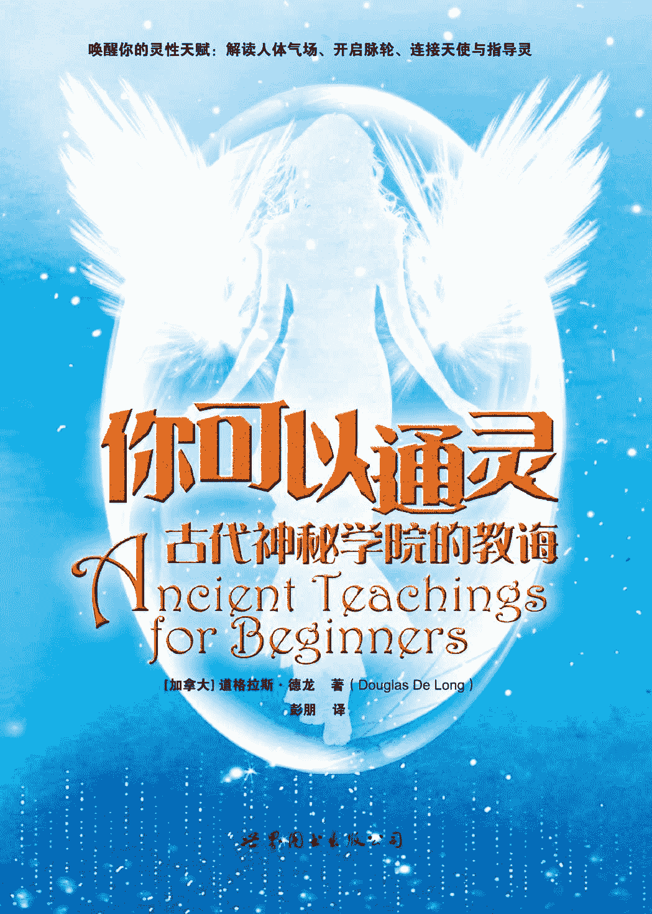

# 序言

本书是一部心灵进化与灵性成长教程，内容详尽、密集，其中包含着具体的练习与试验，可以帮助你全面开发自己的灵性潜能。借由这些行之有效的方法，你能大大提升自己的超自然能力（即灵力），并走向灵性觉醒。

我们都有独特的超自然能力，通过对这个教程的学习，你将自己的天赋开发出来。你可以拥有灵视力、灵听力、超感应力，学会观察人体气场、解读气场颜色，还可以与自己的天使、指导灵进行交流，成为运用宇宙能量的治疗师或才华横溢的导师、咨询师。在这个独特的教程中，蕴含着提升内在超自然能力所必需的教导与认识，它们将协助你疗愈自己，也疗愈他人。我们每个人都有特别的生命目的，这就是我们存在于此的原因，真诚地希望你能洞悉自己的生命目的，并因此而变得不同。

我最大的渴望与心愿，就是每个人都能实现自己的目标，从而帮助全人类一起提升。让我们携起手来，共同创造一个更加美好的世界。毕竟，我们来到世上，就是为了彼此协助。

愿天使的爱与光与你同在。

# 第一章　古代神秘学院与宗教简史

人类心智最高贵的应用，就是对造物主之造物的研究。

——《向汝坦诚》

现代世界充斥着科技：手机、电脑、航行世界的喷气式飞机、豪华的地面交通工具、矗立于大型都市的高大建筑，以及可满足全部日常生活需要的广大销售市场。看起来，这似乎是一个“奇迹时代”，然而果真如此吗？

事实上，现代世界既物质主义，又到处充满着压力。在很多家庭，父母双方都必须参加工作，仅仅是为了维持一个舒适的生活水准。“压力”已经成为许多人面临的主要问题。大量的学龄儿童被迫使用药物，而这只是为了让他们在上学的时候能够保持安静，遵守秩序。

幸运的是，也有许多人在追寻超越物质主义的事物，追求更高的生命目的。人们正在觉醒，并变得越来越有灵性。而当这些人的意识觉知提升到更高水平时，世界就会改变。他们与源自于神的高频能量共振，并借此帮助他人。如果这种情况能够持续下去，或许，我们美丽的星球将得以幸存。

## 古代神秘学院

在远古时代，人类与自然、精神和心灵的关系都比较和谐，对超自然领域也有着更多的接纳。对许多人来说，这是一种生活的方式。

那时，地球上存在着一些古老的神秘学院与疗愈中心，旨在教授初学者生命的秘密和奥妙。其中一些教导致力于自然疗愈能量的研究与恰当应用。在自然万物之中，蕴含着一种宇宙的疗愈能量，一种生命的力量，它遍布于人体内外。由于这种自然能量以很高的频率震动，所以大多数人无法感知到它。这种疗愈能量可以被导入人体，并激活人体自身的生命力量与疗愈能量。在这些学院和中心，学生以及初学者会接受古老疗愈技能的训练，学习观察人体气场或能量场，并解读气场色彩的含义。除此之外，他们也被鼓励去发展自身的超感应力，并最终走上一条服务他人的灵性道路。

## 从亚特兰蒂斯到埃及

在埃及文明之前几千年，就已经有一个重要的文明存在了——神秘的亚特兰蒂斯大陆，也就是那些古老神秘学院、疗愈中心的发源地。这些学院或中心遍及整个大陆，有一些还建立在山区。古希腊哲学家柏拉图（约公元前 400 年左右）曾经在《提迈奥斯篇》和《克里特阿斯篇》两本对话录中提及亚特兰蒂斯。前美国参议员伊格内修斯·唐纳利（Ignatius Donnelly）在他 1882 年的著作《亚特兰蒂斯：大洪水前的世界》（*Atlantis: The Antediluvian World*）中认为，东大西洋的亚速尔群岛（Azores Island）就是亚特兰蒂斯所在之处。事实上，亚速尔群岛至今仍保留着清晰的遗迹，表明亚特兰蒂斯人曾在那里举行神圣仪式。

在亚特兰蒂斯岛屿大陆最终覆灭之前，亚特兰蒂斯人曾在南美洲和埃及尼罗河谷建立聚居地。据埃德加·凯西（Edgar Cayce，美国著名的“沉睡的先知”）说，在亚特兰蒂斯预言中的毁灭到来之前，亚特兰蒂斯的领袖曾经让部分人口移民，以求在毁灭之后仍能保留其文明。这个事件发生在基督诞生的 10500 年前。这些讯息，是凯西在很深的催眠状态中通过他著名的“生命解读”获得的。

提出类似观点的还有其他人，比如唐纳利。唐纳利曾经描述了亚特兰蒂斯文明在南美洲的发展情况。如果我们纵览蓬勃发展于埃及和南美的先进文明，就不难想象这种可能性。在这些地域，天文学、数学、工程学都曾经高度发达，它们类似的建筑风格也让唐纳利的观点更为可信。

在这个过程中，亚特兰蒂斯的神秘学院与疗愈中心也被带到了这些地区。作为亚特兰蒂斯人的后裔，那些美洲原住民拥有历史悠久的与大地和谐共处的灵性传统。举例来说，伟大的北美印第安肖尼族（Shawnees）酋长特库姆塞（Tecumseh），就是以亚特兰蒂斯信仰为基石的神圣组织的成员。

那时，古代神秘学院在埃及扎下根来，变得欣欣繁荣。埃及文明在文化、宗教方面的发展，部分也归功于这些亚特兰蒂斯神秘学院。后期，古埃及祭司掌握了无上的权力，在他们创造的体制之下，法老王如果想夺得并保有宝座，就必须依赖祭司的强大影响力。

这些学院和疗愈圣殿教导了很多天资卓越的人，帮助他们日后的在各自的领域成为大师。这个教育体系之下最早为人所知的治疗师是印何阗（Imhotep），他是第三王朝（约公元前 2890 年）的御医及祭司，同时也是宰相、建筑师、学者、智者以及左赛尔法老（Zoser）王朝的首席治疗师。

因为印何阗卓越的疗愈能力和在草药方面的渊博知识，他在死后的大约 2300 年（约公元前 525 年）被奉为神。希腊、罗马时代，人们把他的埃及名字印和阗同希腊医师阿斯克勒庇俄斯（Asklepios）关联起来，后者凭借自己的能力成为希腊众神之一。如同罗马人接受其他希腊神一样，他们接受了阿斯克勒庇俄斯，将这位希腊医神“罗马化”为埃斯库拉庇乌斯（Aesculapius），奉为罗马万神殿中的重要神明阿波罗（Apollo）之子。象征他希腊医神地位的是众所周知的“蛇杖”（即双蛇缠绕一支棍棒的标志），这个标志最终也成了现代医学界的标志，你可以在任何一辆救护车上看到它。

## 位于狮身人面像的学院

神圣典礼及秘密仪式与古代神秘学院的关系根深蒂固。大部分仪式在午夜进行，有两个特殊地点专供仪式所用：位于卡纳克神庙（Karnak）的圣湖和当今开罗附近狮身人面像的周边。

狮身人面像周边的圣地要比圣湖早好几千年。圣湖是人造水体，为卡纳克神庙体系的一部分，而狮身人面像的历史比考古学家们估计的还要久远（有新证据指出它至少有 12000 年历史了）。在这座著名建筑的下方，是一个由密室、通道和房间构成的复杂系统。蔷薇十字会后期领导史班瑟·路易斯（H. Spencer. Lewis）的著作《大金字塔的预言符》（*The Symbolic Prophecy of the Great Pyramid*）首版印刷于 1936 年，在这本书中，他详细描述了这些位于狮身人面像和大金字塔下面的密室，并附了一张密室的插图。近代，在埃及文物部的指导下，考古学家们运用超音波技术对位于狮身人面像周围沙地之下的通道进行了全面勘探，揭开了现存通道的神秘面纱。

狮身人面像兽爪前的祭坛中燃烧着火焰，申请进入埃及神秘学院的求道者们在这里聚集。午夜的天空下，祭司举行了启动仪式——祭坛的火焰燃烧得更加明亮了，求道者们的意识进入了另一种状态。紧接着，祭司引领着队伍排成纵列，通过巨大狮身人面像胸膛下方的入口。求道者们一步一步走下长长的阶梯，看到入口上方那装饰着拱门的带翼圆盘。此后，托特美斯石碑（Thothmes tablet）会封住兽爪之间的入口，同时遮住更为古老的圆盘。

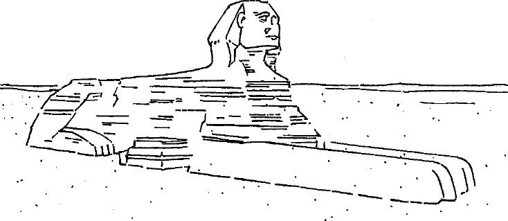

图 1.1　位于埃及古萨高原的狮身人面像。

在阶梯最底端，巨大的接待密室里，大祭司正站在那里等候。他身穿白衣，披着紫色的袍子，带领着求道者们进入密室的内室。他站在最北方，让求道者们围着他站成一个半圆。然后，大祭司就开始了古老的仪式，“开启”求道者们的顶轮与三眼轮（分别位于头顶与前额，后文会对此进行详细探讨）。借由唱诵特殊元音以及使用大型水晶，参加仪式之人的内在能量会被激活。这些人即将步入新的精神和灵性旅程，其心智中未开启的部分也即将被唤醒。在通往心灵觉醒的道路上，这种“首次启蒙”或“伟大启蒙”对那些即将在神秘学院接受密集训练的人来说至关重要。

在整个入门训练过程中，会有很多仪式在密室举行——学生们需要通过不同的学习阶段和程度级次，而每一次迈入新的级次，都需要老师传授或举行仪式。高阶学员则会被引领着通过地下长廊，来到大金字塔（一座几乎与狮身人面像一样古老的建筑）接受最后的特殊点化。至此，学员们所有的学习和点化就完成了，他们会成为神秘家、医师、祭司，做好了在各自的领域工作的准备。

接待密室北端有一个入口，通过一条长廊连接到一个稍小的密室。从这个小密室向外有三条长廊：一条向北，直达大金字塔正下方，与通向这座古建筑内部的秘密隧道贯通；第二条连接着西北方的一处古迹；第三条长廊则直通南方，长廊的尽头是一座祭拜和疗愈的神庙，一道隐秘的阶梯将神庙与下面的通道衔接起来。

其中第二条通道至关重要，因为它通向亚特兰蒂斯的档案圣殿。圣殿里的资料以类似图书馆的方式排序，储藏着亚特兰蒂斯无与伦比的智慧。不同色彩的水晶被放置在圣殿中，以保证这座建筑的照明与能量供应。几个世纪以来，埃及神秘学院的精英们一直维持着这个殊胜之地的运转，但是，它最终还是“遗失”了，被后来的文明淡忘了。相信在不久的将来，它会重见天日。

今天，各界对狮身人面像以及大金字塔存在的年代一直存有争议，但最近有了一些惊人的发现。一些地质学家认为，狮身人面像的建造年代在大约 12000 年之前，早于古埃及文明。或许某天，在科学的协助下，人类会揭示出更多的秘密，会了解古人是如何获得灵感并建造这些伟大的建筑的。

最终，古代神秘学院在全世界建造起来。西藏、印度、希腊、以色列、波斯……这些地点虽然很分散，却极为重要。另外，美洲也发现了类似的体系，比如玛雅和阿兹台克中心。虽然很多人坚信这些相似的传统是各自独立发展的，但如果我们考虑到这些神秘学院其实来自同一个源头——亚特兰蒂斯，那么这个谜团就可以轻易化解。以下是神秘学院一些最重要的分支，我们可以看看它们是怎样在世界各地演变发展的。

## 遗失的耶稣教诲

《圣经》中地处歌珊之地（land of Goshen）的城市埃利奥波利斯（Heliopolis），是最早受古代神秘学院影响的地点之一。这座城中有着宏伟的占地 3 平方英里的学习中心，据二十世纪早期大英博物馆亚述、埃及文物管理人华尔斯·布基（E. A. Wallis Budge）说，这座学习中心已淹没在苏伊士运河之下。

古时，作为声名远播的教学中心，埃利奥波利斯接收了很多极具天赋的学生，拿撒勒人耶稣（也称为加利利人约书亚）就是这个学院最具成就的学生之一。耶稣是回到地球进行教导和疗愈的古代上师，在他“行踪成谜的岁月”中，他大部分时间都在埃利奥波利斯学习包括能量疗愈、占卜、人类能量场解读、传导、通灵等在内的远古秘法。他通过核心十二门徒以及其他学生和信徒将这些教导传向世界，传道者中也包括了一些女性，她们在帮助他人的领域表现得尤其卓越。

一些现代神秘主义者揭示了耶稣与追随者们“行踪成谜的岁月”的秘密，他们的教导也因此而重见天日。这些神秘主义者中最著名的如埃德加·凯西，他在深度催眠中，通过“生命解读”获得了有关耶稣基督生活细节的资料。史班瑟·路易斯也在他的著作《耶稣的神秘人生》（*The Mystical Life of Jesus*）中描述了耶稣“行踪成谜的岁月”，讲述了耶稣的神秘教导，同时介绍了很多他的信徒。

耶稣离开地球之后，基督精神从一个平衡的体系转化为父权体系。很多原初的耶稣教导已经遗失，神秘主义也从基督教会的教义中被删除。权力、控制、政治成为新教的一部分。那些来自亚特兰蒂斯和奥波利斯神秘学院的耶稣神秘教导，已对民众隐匿了上千年。

## 艾赛尼派

大约与耶稣同一时期，一个名为艾赛尼派（Essene）的神秘教派遍布古以色列社区。这个教派同上文提到的埃利奥波利斯有着松散的关联，其成员创造了我们所熟知的《死海古卷》。

艾赛尼派分为两个独立教派，一个分布在死海沿岸的昆兰（Qumran），实行苦修，一个则位于加利利（Galilee）地区，由已婚夫妇组成。这些人中很多都具有疗愈天赋，会运用宇宙疗愈能量进行工作。他们全都在埃及神秘学院接受过秘密培训，受训内容就包括了疗愈技能。

虽然艾赛尼派被视为犹太教的分支，但他们对古犹太教的其他主要派别如法利赛教（Pharisees）、撒都该教（Sadducees）等都持批判态度。艾赛尼派教徒认为那些教派并不理解他们与上帝之间的契约。他们坚信，是他们的神圣信任为“救世主（anointed one）”、“公义教师（Teacher of Righteousness）”以及新世界秩序的降临铺平了道路。

希腊、罗马与其他地区的犹太人都曾对艾赛尼派的特质有所评断。如亚历山大里亚的斐洛（Philo of Alexandria），这位公元一世纪的犹太哲学家在他的演说（*Quod Omnis Probus Tiber*）中谈到这个群体，他的看法曾被鲍威尔·戴维斯（Powell Davies）在《死海古卷释义》中引用：

他们是犹太教分支，居住在叙利亚的巴勒斯坦，人数超过 4000 人。他们因崇高而被称为“Essaei”。希腊文的“崇高”（hosis）和“Essaeus”是同一个字。

加利利人耶稣（或称约书亚）的神秘主义背景就扎根于艾赛尼派的教导。他的父母约瑟、玛利亚，以及他的表兄施洗者约翰，也都曾承认与这个教派及教诲有联系。

更多对艾赛尼派的了解要归功于 1947 年《死海古卷》的发现。现在我们知道，这个教派的分布比我们最初所认为的要广泛许多，他们的信念和教导最终通向《新约》。已故考古学家、约旦文物局负责人兰卡斯特·哈丁（G. Lankester Harding）曾经谈到《死海古卷》的非凡意义，史班瑟·路易斯曾在他的著作《耶稣的秘密学说》（*The Secret Doctrines of Jesus*）中引用过：

目前为止，艾赛尼派文件所披露出的最令人吃惊的事实是：

这个教派在基督之前很多年，就使用一些被普遍认为只有基督教才使用的术语和礼仪。艾赛尼派实施洗礼，并举行由牧师主持的礼拜式圣餐，在圣餐上分享麦饼与葡萄酒。

艾赛尼派深信灵魂的救赎与永生。他们最重要的领袖是一位被称作“公义教师”的神秘人物，一位承蒙天启的弥赛亚先知祭司，他受到过迫害，并很有可能最终罹难了。

## 犹太卡巴拉

在犹太教中，艾赛尼派并不是一个完整的教派，一直与犹太教其他分支和平共处。一般来说，犹太教要求教众在最基本、最世俗的生活行为中都保有一种“仪式意识”。这意味着在艾赛尼派与耶稣在世时期，那些遵从教义的犹太教徒们会将“灵性”视作日常的宗教影响（religious influence）、灵感来源与生活指南。

由于对犹太教的践行影响着生活的方方面面，因此神秘界被视为人与神圣源头交流的顶点。可以说，所有类型的犹太教都包含神秘主义信仰，并阐释如何进入这种神秘意识。与此相关的看法，大多出自含有卡巴拉（Kabala，意即“传统”）教导的著作中。

卡巴拉是犹太教秘传的神秘主义形式，受诺斯替教派、希腊哲学，以及公元纪年初期新柏拉图主义研究的影响。其教导集中见于一些古代和中世纪的典籍之中，其中最具影响力的两本是《光辉之书》（*Zohar*）与《创世之书》（*Sepher Yezirah*）。

《光辉之书》（又名《辉煌之书》）著于十三世纪，而《创世之书》（意即“创造之书”）则著于公元三到六世纪之间。书中的教诲最初是以口授的方式由老师传给学生的。

这种以口授来传递智慧的传统，使艾赛尼派以及很多其他神秘学团体、灵性团体得以流传下来，教派的真理也因此被保存下来。

## 印度教

在东方，古代神秘教导的传播与在西方同样普遍。最古老的例子是印度教，它已经在印度发展了几千年，是世界现存最古老的宗教之一。

印度教的“中央”屹立着三位神明：创造者梵天（Brahma the Creator）、守护者毗湿奴（Vishnu the Preserver）、毁灭者湿婆（Shiva the Destroyer）。这是世上最古老的圣三位一体（基督教圣父、圣子、圣灵出现较晚，与印度教的圣三位一体来自同样的“三元神性”观念）。

作为一个有大约 4000 年历史并仍保持原貌的宗教，印度教为它的追随者提供了一个有组织的宗教系统，也提供了一种生活方式。印度教并没有正式的教令或严格的宗教教义，相反，它的信徒可以选择最符合他们人生愿望与需求的神明。

经过不断地发展，印度教将重心放在了对人体能量释放的研究上。通过男女两性的结合，这种被称为“昆达里尼”或“蛇能”的性能量可以被释放出来。双方脉轮或能量中心释放的强大能量，可以帮助修行者达到灵性开悟。古印度教的文本中常常讨论这一迷人的能量，比如《卡马经》（*Kama Sutra*），它指出人可以通过性的结合，最终达成与宇宙神性的合一。

## 佛教

佛教是继印度教之后另一个古代教诲传入东方的例子。同耶稣一样，佛陀是位开悟大师，他将古老的奥秘传给他众多的信徒。佛陀的教诲以轮回转世为核心，对西藏和北印度有着广泛、深入的影响。

释迦牟尼佛于公元前 563 年左右诞生在尼泊尔，是尼泊尔的王子，他的本名为悉达多·乔达摩，后来被尊称为“佛陀”，意为“开悟者”。

作为一国王子，乔达摩多年来都享受着富贵而奢华的生活。然而有一天，他在领地巡视，看到他的子民遭受着极端贫困的折磨。这让他抛弃了自己高贵的身份，转而成为智慧的追寻者。

在修行最初，乔达摩致力于钻研印度神圣古卷——印度教的核心经典《吠陀经》和《奥义书》。其中《奥义书》（创作于约公元前 800 年）在本质上更富灵性与哲学性，而《吠陀经》则主要阐述神话。虽然这两部经典都非常重要，但它们都没能给乔达摩带来他所追寻的“答案”。

一天，乔达摩在菩提树下禅坐。突然间，他接收到了上天的启示，顿悟成佛。在开悟的状态下，他创立了基于他深远的个人经历，混合古老的印度教义智慧而成的新宗教——佛教，并将其发扬光大。

## 波斯

另一个承接了古代教义智慧的区域是波斯（现伊朗）。距今约 2600 年前，上师琐罗亚斯德将“古宗教之光”的神秘奥义传授给波斯人，形成了今天我们所知的琐罗亚斯德教（袄教），这个教派主要涉及光与暗、善与恶的斗争。据说，琐罗亚斯德由一位处女所生——这位波斯灵性导师与耶稣基督的人生故事有很多令人惊讶的相似之处，这是其中之一。

琐罗亚斯德很可能出生在波斯帝国北部。据传说，光与善之神阿胡拉·玛兹达（Ahura Mazda）用光让一个女孩受孕，经由神与人的结合，琐罗亚斯德诞生了。琐罗亚斯德在童年时就非常博学，能够充满智慧地同成人侃侃而谈，这是他与耶稣另一相似之处。

30 岁左右，琐罗亚斯德开始转向宗教。在光与善之神阿胡拉·玛兹达为他净化之后，琐罗亚斯德进入沙漠去冥想以寻求开悟，最终，他在那里接收到了神的启示。

在开悟状态中，他将教导写入了神圣文本《阿维斯陀古经》（*Zend Avesta*），讲述对全能的，拥有真理、光、生命之力量的神的信仰，并以经文为载体将他的教导传播开来。琐罗亚斯德教导他的学生心存慈悲并多多行善，在他的哲学和灵性教导中，灵魂的纯洁是最核心的部分。

今天，在印度仍有一个追随琐罗亚斯德“古宗教之光”的团体——帕赛斯^((1))。同时，波斯人的后裔也仍旧在伊朗及全世界奉行琐罗亚斯德教的宗教仪式。

## 希腊

古代神秘教诲融入希腊的过程，主要发生在几个希腊人的特殊宗教中心，其中最著名的是盛行于地中海一带的埃莱夫西斯神秘教派（Eleusinian Mysteries）。这些教派最终在罗马社会确立了崇高的地位。有成千上万的人涌入埃莱夫西斯寻求点化入教。皈依者要参加在圣地及周围的神庙举行的神秘仪式——这是通过埃及传入此地的亚特兰蒂斯神秘教导的延续。在罗马，甚至连皇帝们也会加入埃莱夫西斯教，罗马皇帝马可·奥勒留（公元 161 年上任，公元 180 年去世）就是埃莱夫西斯教的众多教徒之一。

希腊是“神秘”（mystery）一词的发源地。在希腊语中，“mystes”意思为“秘密的知识”，有别于今天我们在非宗教意义上的应用。古希腊人的密教或“秘密传统”，是古代神秘学院的核心要素。

希腊人对神秘学院的热衷传遍了欧洲、北非，并随着罗马帝国的扩张传至中东，在那些地域，后世很多文明的宗教特质都可以寻根到古希腊。一些古希腊人践行的传统，在某些现代宗教仪式中仍然延续着。

## 麦琪

在罗马帝国扩张至地中海世界的时期（期间耶稣在世），地中海一带生活着一个智慧的群体，被称为“麦琪”（Magi，为 Magus 的单数形式），意为“智慧的人”。他们大多来自波斯，还有一些生活在巴比伦与埃及。麦琪都是琐罗亚斯德的信徒，在疗愈和超自然技能方面受过极好的训练。很多古老的中东统治者都对他们十分尊崇。

麦琪是占星学、天文学方面的专家，他们研究天体，并将其应用于宗教习俗与实践中。《新约》中提及的“东方三贤士”就是“麦琪”^((2))，因此当今大多数人对这个群体的了解主要是“占星家”这一身份。但是，很少有人意识到“东方三贤士”这个故事反映着这样一个内涵：许多的古老神秘学院，都在期待一位成道之主的诞生。

事实上，在麦琪、艾赛尼派、埃及神秘学院的成员中流传着一个预言：一位灵性导师或一位弥赛亚（来自希伯来语“moshiach”，意即“受膏者”）将会回归。这是这些团体的核心议题。对于熟知天文学的麦琪来说，那众所周知的“伯利恒之星”天文事件，就是“受膏者”重回地球的标志。

## 密特拉教

当麦琪仰望天空寻觅征兆时，诞生于印度的密特拉教（Mithraism）正在扩大它在整个罗马帝国的影响。密特拉教带着显著的波斯特质，极端重视神圣仪式以及灌顶点化，这一特质深深地吸引着接受性极强的罗马社会。密特拉教教派的中心是密特拉神（Mithra）——光与真理之神。

基督教会在成为罗马世界最具实力的宗教的过程中，曾借鉴了很多密特拉教的仪式和传统，以便改变群众的信仰。点燃乳香、没药，点亮蜡烛，由身着五颜六色法衣的牧师举行神圣仪式，以及以水来进行洗礼，这些都是今天组织教会中的一部分。而这些，全部都借鉴自敬献给密特拉神以及与之同宗的“异教”神明的古老宗教仪式。

## 基督教及灵性的流失

在罗马帝国的版图达至巅峰，并将触角从不列颠群岛延伸至波斯湾地区时，巴勒斯坦爆发了一场宗教斗争，这场斗争延续了数百年。不过，这个宗教比罗马帝国多“活”了一千五百年。从耶稣开始在地球上进行教导的那一刻起，基督教就被广泛接纳，它的光芒让希腊罗马的异教信仰全部相形失色。最初，很多信奉希腊罗马异教的统治者对基督徒采取虐待和残害的手段。比如罗马皇帝图密善（Domitian，公元 81 年左右继位），他完全禁止基督教，惩罚那些拒绝信奉罗马神明的人，并对举报“基督秘密信徒”者予以奖励。

对基督徒的迫害一直延续到公元 306 年君士坦丁大帝上任。君士坦丁大帝被认为是“第一位信仰基督教的皇帝”，在他的帮助下，基督教变成了罗马帝国的国教。他死后五十年之内，所有的非基督教信仰都从罗马帝国消失了。

不幸的是，当基督教在广阔的欧、亚、非地区成为唯一被信奉的宗教时，它摇身一变，成了其他信仰的迫害者。在亚历山大，伟大的亚历山大图书馆被一伙基督教暴民纵火焚烧，在这场针对异教文化思想的大清洗中，大量珍贵的知识随着数不尽的被焚烧殆尽的卷轴与书籍，永远地遗失了。在罗马，基督教会的主教至高无上，凌驾于其他宗教之上。很快，教会成为强有力的政治、宗教机构，推崇政治而将灵性教义弃之不顾。此时，主流的基督教已经偏离了耶稣的真正教诲。

基督教压倒罗马异教后，在最初的几个世纪里，有些忠于耶稣真实教导的团体一直在进行秘密聚会，并以这种方式传播智慧。诺斯替教（Gnosticism）就是这样一个遵循耶稣真实教导、挑战既成组织的基督教会的教派。“Gnostic”来自希腊词汇“gnosis”，意为“知识”^((3))。他们信奉耶稣的灵性教诲，有时被称为“耶稣教派”。但是，由于教会的压制和迫害，诺斯替教派最终带着它的灵性智慧转入了“地下”，诺斯替教派似乎受到了毁灭性的打击。

在基督教不断扼杀对手的信仰，并在整个欧洲扩大影响力时，基督教内部日趋保守，对性、神秘主义和人的个性方面进行压制。15 世纪 70 年代后期，伴随这种压制，欧洲进入了黑暗时代。那些实践神秘学或古代奥秘的人，生活在异教裁判所的恐惧之下。异教裁判所的密探专门负责揭发、惩罚和摧毁另类或异教的观点。它的残酷在西班牙闻名于世，在那里，异教裁判所迫使更多的个人和团体转入“地下”，所有的研究都在隐蔽之处秘密进行。在这样的高压之下，作为净光兄弟（Great White Brotherhood）或古代神秘学院的代表，共济会和玫瑰十字会的会员以神秘、谨慎的方式，将古亚特兰蒂斯与古埃及的教导传承下来。

对抗早期基督教会的团体还有凯尔特人（Celts）和德鲁伊特教徒（Druids），他们代表了那些有着极大差异的，但都信奉灵性至上，并与大地极为亲近的文化群体。凯尔特人的宗教建立在对大地母亲深深的敬仰之上，他们将大地看做养育、守护的存在，对人类提供无限的供应，因此很多凯尔特宗教仪式的举行都遵循太阳和月亮的轨迹周期。然而，这一切并没有持续太久，凯尔特人最终选择了对基督教臣服。其对本土文化和传统的遗忘，为基督教在不列颠群岛以及欧洲中部、北部打开了大门。至于其他的“异教”，比如那些在斯堪的纳维亚以及欧洲农业社区的异教，同样也在这次宗教思想的同化中消失了。

最后，随着欧洲人在美洲进行开发以及定居，土著人被征服、被同化，其充满灵性的生活方式几乎被完全摧毁，土地和自然资源也遭到掠夺。欧洲的贪婪与物质化，倾覆了美洲人可以溯源至古亚特兰蒂斯教导的灵性传统。

## 总结

古代上师们的真实教诲似乎已经遗失，至少是被埋在了“地下”。然而，新的调查仍然显示真理不会永远被掩埋。比如 1945 年，考古学家在埃及的纳格哈马地（Nag Hammadi）发现了一系列的诺斯替手卷，或称“福音书”。据报道，其中一些经书保留了耶稣基督的原话。在这些资料文本中，人们发现了被学者们称为《托马斯福音》（*Gospel of Thomas*）的第五部福音书^((4))。

如今，在我们迈入新的千禧年时，希望依然存在，我们依然有望扭转上个世纪的负面趋向，再次进入灵性至上的世界。接下来的内容，我们将讨论耶稣带来的最原初、最真实的教导，讨论那些亚特兰蒂斯以及埃及神秘学院的原始教诲，以及心灵和灵性发展必需的神秘技能。

————————————————————

(1) Parsis，意为“波斯人”，特指为逃避穆斯林迫害而从波斯移居印度的琐罗亚斯德教徒的后裔。——译者注

(2) 耶稣出生时，有三人在东方看见伯利恒方向天空上有一颗大星，于是跟随它的指引找到耶稣出生地。——译者注

(3) 尤其指通过信仰才能得到的知识。——译者注

(4) 新约圣经第一部分有四部福音书，分别为基督门徒马太、约翰、马可、路加所写，介绍耶稣的生平事迹。——译者注

# 第二章　三眼轮

成年人或许该向孩童学习，他们的心灵是如此纯净，因而伟大的神会向他们显示很多被其他人漏掉的东西。

——黑驼鹿（Black Elk，美洲原住民精神领袖，1863～1950）

古人相信宇宙的二元性。在他们的宇宙学里，有反映天空和星辰的宏观世界，也有反映土地与自然的微观世界。他们相信人类也有这种二元性：我们同时拥有身体（physical body）和灵性体（psychic body）两者。灵性体存在于身体之中，但是比起身体这个物理之“壳”来说，震动频率明显高得多。也可以这么说，人类体内不仅有身体器官，也存在着灵性器官。

## 气场与脉轮

自然界的万事万物都被不同的能量形式包围着。树木、植物、动物都有各自的能量形式，或是散发不同颜色的能量光。人类也不例外。有种神奇的能量场环绕在人的身体周围，它常被称为“气场”、电磁场或人类能量场。

在气场之内是人体的能量中心，叫做“脉轮”，这个词在梵语中的字面意思是“光之轮”。人类的气场有 7 个主要脉轮和约 120 个次要脉轮，它们透过气场和灵性体与身体的不同部位产生间接的关联。这些脉轮位于身体相关部位的上方或四周，振动频率非常高。

通过交感神经与中枢神经系统，人体主要脉轮也间接地连接到内分泌系统的 7 大腺体。这些脉轮由上至下，从头部一直到生殖系统。交感神经和中枢神经系统都从这 7 个主要脉轮接收能量或振动，并将之导向人体 7 大腺体。同时，振动也会向体内其他器官与区域传递。请记住：自然万物都有各自的振频。关于脉轮系统的更多细节，我们会在稍后讨论。

## 第三眼与松果体

“第三眼”是灵性体的主要能量中心之一。在这一章中你将会学习古老的第三眼唤醒技能，确切地说，运用这个技能会重新唤醒它。“第三眼”一旦开启，你就迈上了灵性发展与心灵成长的道路。

“第三眼”这个术语指的是人体的第六脉轮，即第三眼脉轮。它位于额头正中，与松果体紧密相连。这个人脑之内的特别腺体对医学界仍然是个谜，不过，科学家仍然赞同松果体在某些方面很像一个内在的时钟，受光线的间接影响。当黑暗靠近，松果体会刺激一种被称为“褪黑素”（melatonin）的激素释放；当白日降临，这种激素分泌就会停止。同时，很多科学家也相信季节性的情绪波动——比如“SAD”，即季节性情绪失调（seasonal affective disorder）就与这个腺体有关。在过去几年里，医生和研究者证明，对于受季节性情绪失调折磨的病人来说，光线疗法有很好的疗效。

事实上，松果体是身体内分泌腺体系统的一部分。“内分泌”这个术语（endocrine）来自希腊词汇“endo”和“krinein”，前者的意思是“内在”或“里面”，后者意为“分开”。内分泌腺直接向人体血液释放特定激素，因而有时候又被称为“无管腺体”。在内分泌系统之内，所有的腺体都彼此协调地工作着。

松果体也被认定与生殖繁衍有关，它与脑垂体以及大脑的下丘脑协同运作。“松果腺”这个称呼是有误的，实际上，它是一个器官。

法国哲学家勒内·笛卡尔认为，松果体是“灵魂之椅”，是心灵与身体相遇的地方。在古代，神秘学家和灵性道路上的学生都知道这个心灵与身体的交汇点。对这一腺体适当的开发和利用是打开直觉力与超感应力的钥匙。因为直觉力和创造力正是被储存在这里的。

孩童时期，我们的松果体功能是正常的，我们可以自由地使用直觉力、创造力和超感应力。很多孩子能看到人周围的气场或光，也有很多能看到死去的亲人、指导灵、天使，并同他们交流。这是很多孩童“想象伙伴”的来源。

一般在 12 岁左右，很多孩子渐渐失去了超感应力，这并不是因为青春期的到来，而是因为社会不鼓励他们使用这种能力。我们的教育系统强调的是逻辑思考和分析。很多家长、教育家、权威人士和其他的成人都不鼓励孩子使用超感应力，并把这种能力贬斥为虚假的想象或指责孩子编造故事。比如，叔叔或阿姨可能会说孩子的“想象伙伴”是纯粹的幻想，又或许小学老师会因为一个孩子谈论他看到他人周围的颜色而责备他。这种封闭的态度会对很多有天赋的孩子造成无法弥补的伤害。在这样的情况下，松果体会因为输送给它的能量减少而衰退和钙化，此人会因此丧失直觉力和超感应力。在 20 岁时，很多年轻人会完全失去这些能力。

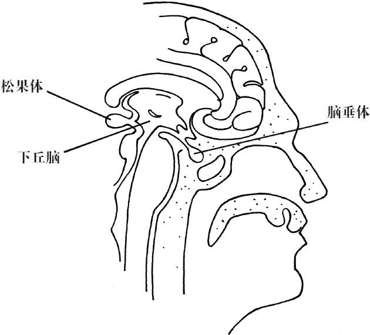

图 2.1　松果体、脑垂体、下丘脑的位置

幸运的是，我们的社会对这种有想象力的儿童的态度已经越来越开放和宽容。现在，很多成年人会鼓励孩子去表达他们的创造力，并帮助他们开发灵性天赋。这种开明的态度让孩子的松果体保持了活跃，也让直接受松果体影响的三眼轮运作良好。而三眼轮的激活或“打开”，使得这些“光的孩子”在灵性进化的世界中发出了耀眼的光芒。我们在第一章中提到的意识觉醒，也有部分要归功于三眼轮的开启。这些孩子会带着很多类似的特质长大成人，推动整个社会的觉醒。

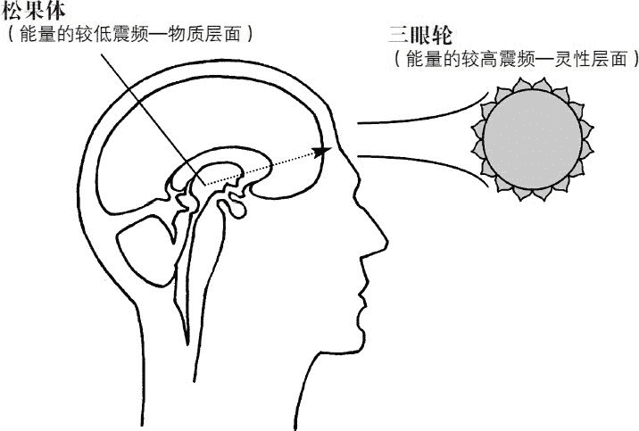

图 2.2　三眼轮位置

现在，成年人的松果体也开始被激活——这是开启三眼轮的必要步骤。在激活的过程中，个体的情绪和身体都会有一些感受。比如有的人会感觉到一种强烈的渴求，想在一个利他领域工作，为世界做出更多贡献。不过无论个体的感受如何，他们都会有更强的求知欲，尤其是在另类疗法或心灵探索方面。对这些人来说，赚取金钱、实现富裕的需求退居其次，服务他人、改变世界变得更重要。他们的日常生活也会发生剧烈的变化，包括世俗的职业、物质的累积、封闭的态度等。当这些人达到更高的意识水平，会发现在过去的生命中，有些很重要的事情被遗漏了。很快地，支付账单、工作、看电视、朝九晚五的生活态度……这一切似乎都变得没那么重要，更为广阔的生命展现在他们眼前。他们一旦觉醒，就会追寻生命的意义，探求自己活在世上的原因。就在这种对人生使命的追寻中，这些人迈出了灵性道路的第一步。

从身体层面（物质层面）来说，很多刚觉醒过来的成年人会在额头和太阳穴附近有压迫感、怪异感甚至疼痛感。这种感觉可能会伴随着头顶与整个头部的压迫或刺痛。如果不了解状况，他们或许会把这些身体上的感觉归咎于压力或疾病。但实际上，这代表着松果体的激活，第三眼脉轮也在开启。这些新觉醒的成年人正在回归他们真实的自我，如同那些拥有天赋的儿童一样，重新走在了充满直觉力和创造力的道路上。

想象一下这个比喻。灵性上，松果体（形状如同松果）可以比作一颗长在藤蔓上的葡萄。阳光的温暖和雨水的滋润让它健康成长，日渐饱满。但随着时间的推移，这颗葡萄会慢慢干瘪和枯萎——简单地说，它会变成葡萄干。孩提时代的松果体是健康、活跃、饱满的，这种状态会持续到 12 至 14 岁。而当此人长大成人，他的松果体就几乎完全干瘪，萎缩得像个葡萄干了。此时，即便此人的松果体依然会发挥生理上的功能，他的直觉力还是会部分丧失，甚至完全丧失。要想恢复失去的能力，就必须重新激活松果体，而激活成功的关键就是将能量传送到这个区域。这样一来，葡萄干会再次变成葡萄，松果体也会像孩提时代一样运作。

1956 年，英国出版了一本名为《第三眼》的书。这本书由生而具备玄学知识的西藏医疗喇嘛（medical lama）罗桑伦巴（Lobsang Rampa）著成，讲述了僧侣们在他身上进行的非凡而危险的手术。据伦巴说，这些僧侣将一根棍子在火中烧热，然后小心翼翼地插入他的松果体。他的松果体被成功激活，他所有的灵性潜能也被唤醒。这应该是棍子插入时的压力和振动刺激了松果体。虽然这个觉醒过程粗暴而危险，但它的确显示了西藏人对松果体和第三眼重要性的了解。

幸好，唤醒松果体这个重要的器官，还有更容易、更安全的方法。

## 第三眼开启技能

有一个重新激活松果体的古老技能被保留了下来，秘密流传了好几个世纪。它的原理是在头部引发一个振动，特别是在松果体以及它的周边区域。

这个振动的来源是什么呢？是字词发声的力量。如果以恰当的声调发声，就会产生一种能深刻影响大脑的能量或振动。这种技能被称为发声、唱诵或“做振动的功课”。

唱诵一个特定音符，会在松果体内引发振动（或者说声音的运动）。如果正确进行这个练习，它所起到的效果与西藏僧侣在罗桑伦巴身上进行的手术是相同的。

练习时需要唱诵“Thoh”^((1))。“Thoh”与“toe”元音合韵，按照字母的组合发声即可。以一个音节唱诵，音高介于中音 C 和高音 C 之间。如果你对音乐不太有感觉，也不必担心唱诵的振频是否精准，只要接近就会有效果。记住正确的声音是在低、高音之间的中音。换句话说，要达到正确的振频，你只需要唱诵“Thoh”，唱诵时不用深沉的低音，也不用高亢的高音，介于两者之间即可。

练习开始时先用鼻子深吸一口气，越深长越好。然后微微张开嘴唇，缓缓吐气。完成后再重复做两次。这个呼吸练习会将重要的生命能量或宇宙能量引入肺部，进而导入全身；也会降低你大脑脑波的频率，进入转换的意识状态，从β波（清醒状态）转入轻柔的α波。α波是开始冥想时的状态，你会变得更放松，从而更容易集中在“Thoh”的唱诵上。

接下来，用鼻子再深吸一口气，屏息几秒。在用嘴呼气之前，将舌头放在微启的牙齿之间，用牙齿轻压舌头。这个过程与发“the”的“th”是一样的。舌头就位时，用嘴缓慢地呼气，同时发出“T-h-h-o-h-h”，直到将所有的气呼出为止。你会感觉到空气从你的舌头与牙齿之间流过。如果操作正确，下颌与脸颊上会有压迫感。

再将这个步骤重复两遍，并在每个元音唱诵之间^((2))停顿一下。第一次尝试时，需要连唱三遍“Thoh”。大约 24 小时之后，以同样的方式重复练习：即连唱三遍“Thoh”，每一遍唱诵之间有个小小的间隔。

第三次的练习同样需要在 24 时后进行。这是整个练习中的最后一次唱诵。这个开发第三眼的技能是一次性的，不需要像大多练习那样反复做。如果你想再次尝试，至少要再过两周。

这个第三眼练习在你的下颌与脸颊制造了一个振动或压迫，并使振动能量进入松果体。这种振动能量会在松果体引发共振，并将它激活。记住，“Thoh”这个音应该以强有力的声音用中音 C 说出，甚至唱出，近似中音就足够。

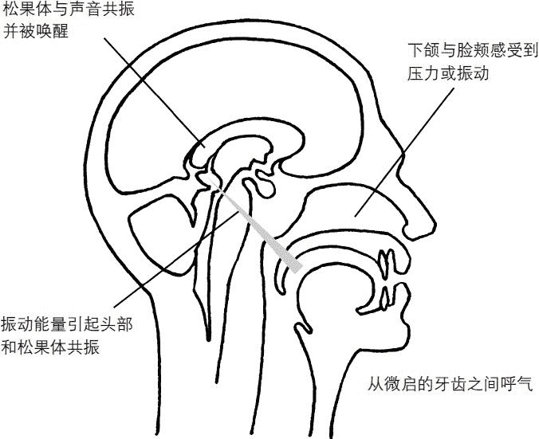

图 2.3　第三眼练习中舌头与牙齿的位置

对有些人来说，这个流传了几世纪的古老技能可能一开始没什么效果。不必担心，因为它的效果非常微妙。可能在很短的时间之内，你就有很多身体与灵性上的体会，但也可能这样的体会在几个星期内都不太明显。

## 第三眼练习引发的身体反应

首先，你可能会感觉头疼，或在前额正中、眉毛上方有压迫感。这感觉好像来自大脑内部，离额头表面一英寸或更深的地方。这表明松果体正被重新激活，并开始以健康的方式运作。有些松果体已经完全萎缩的人，可能会有连续几个小时的偏头痛。这种不适会在第三眼练习完全结束后的几天或几周内产生。大多数人感受到的压力或头痛是比较轻的。副作用的严重程度，完全取决于在这个练习之前，你的松果体功能是完全正常、部分正常还是完全萎缩。

大多数情况下，松果体保持了部分功能，也能比较有效地工作。这样你可能仅仅会感到前额有一点压迫感，这种感觉对有的人来说甚至是很舒服的。

如果你的确什么感觉都没有，那你可能要在大约三周内再做一次这个练习。这样的情况很少见。有时有的人可能身体感受很少或几乎无感，但会有一些灵性上的体验。这也是练习成功和觉醒开始的标志。

在感觉到头疼或前额的压力之后，可能某天早晨你醒来，会觉得前额有震颤或刺痛感，就像起鸡皮疙瘩一样。这种情况发生时，感觉会非常强烈，让你很想去照镜子看看额头上有什么，但你会发现什么都没有。额头还是老样子。可这种奇怪的脉动或震颤感可能会持续一整天。这是第三眼练习之后，你在生理上经历到的最后体验。这表明你的松果体终于被重新唤醒、激活了，它会再次像你孩童时那样运作。随着松果体变得活跃和平衡，你内分泌系统的其他部分也会变得更加平衡，从而能够更和谐地运作。

最终，这些奇怪的感受会停止。你可能会发现自己偶尔会头晕，越来越爱做白日梦。对那些原本就很爱做白日梦或者意识游离的人来说，这个变化可能就不那么明显。做白日梦和晕眩感意味着你的脑波模式变缓慢了。相比以前正常的清醒运作状态（即在白天以β波运作），你的脑波会开始以α波运作，更确切地说，是在一种轻微恍惚的状态下运作。你一天中大部分时间都会处于这种意识状态。在这种状态下，你会发现工作越来越有效率，你更能承受压力，时间也过得更快。

最终，你会在β波和α波状态中找到平衡，白日梦的次数也会减少。你的脑波会在轻微的α波状态下正常运作。在旁观者看来，你完全清醒。没有人会觉察到你在转化了的意识状态下工作和生活。

除此之外，在这种放松的状态下，你还能够更快地学习，对事件、日期的记忆也更容易，因为你更多地使用了大脑蕴藏的无限潜力。

## 第三眼练习引发的灵性反应

一旦松果体被激活，三眼轮或能量中心就会被激活，或者说“开启”了。

在灵性层面，会产生以下反应：

● 直觉力提升

● 创造力扩展

● 洞察力获得发展

● 移情能力增强

● 获得看到或感觉到人类气场的能力

● 超听觉力天赋被开发

随着第三眼的开启，你的这些天赋与能力就会显露出来。第三眼技能能够强力而有效地开发你的灵性能力。你不必再年复一年地与生活斗争，拼命去把潜力发挥到极限，而是会很轻易地提升意识状态、运用天赋。这种变化在短时期内（六个月或一年）就会发生。

第三眼技能是灵性发展和灵性觉醒的关键。随着松果体和三眼轮的觉醒，你会踏上新的旅程，朝着你生命真正的方向前进。

————————————————————

(1) 元音合韵指“oh”与“oe”均发元音[əu]，Thoh 的字母组合发音即 though[əu]。——译者注

(2) 即每次完整唱诵之间。——译者注

# 第三章　顶轮

永恒的智慧，驱散我们无知的黑暗。

——大主教阿尔昆（Archbishop Alcuin，735～804）

古代神秘学院拥有很特别的技能，能够引导学生和求道者，帮助他们踏上心灵发展与灵性觉醒的道途。几千年前，在狮身人面像之下的密室所举行的“大启动仪式”上，大祭司以特定的发声来唤醒入门修行者的灵性自我。“Thoh”这个刺激松果体、唤醒第三眼的唱诵，是大祭司使用的第一个振频唱诵。

接着，大祭司会进行第二个唱诵，目的是刺激隐藏于入门者头部深处的脑垂体。这个腺体与顶轮以及它更高的振动频率直接相连。顶轮的位置就在头部的顶端。

在开始第二个唱诵之前，我们有必要对脑垂体和顶轮稍作了解。

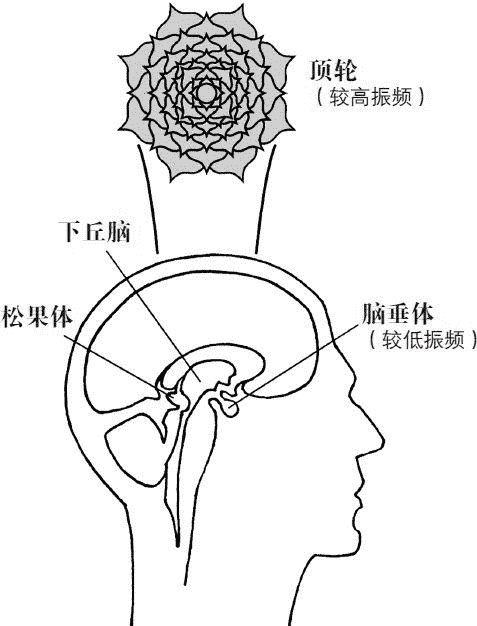

图 3.1　脑垂体以及顶轮的位置

脑垂体位于头部的正中。如果你看着一个人的鼻梁，然后想象一条直线深入头部大约 3 英寸，脑垂体就正好在这条直线上，大约有一颗豌豆那么大。即使脑垂体常被称作主腺体，它依然是下丘脑的下属器官，可以被看做连接下丘脑基部的附属器官。

脑垂体实际上分两个部分。前面部分被称为“垂体前叶”，后面部分则被称为“垂体后叶”。两个部分的功能彼此独立而又互补。垂体前叶负责释放一种叫做促长激素的生长荷尔蒙，这种荷尔蒙的分泌控制着骨骼、肌肉以及其他器官的生长。垂体前叶也直接影响其他很多内分泌腺，比如它会通过分泌促甲状腺激素来影响甲状腺。垂体后叶则作用于平滑肌系统。

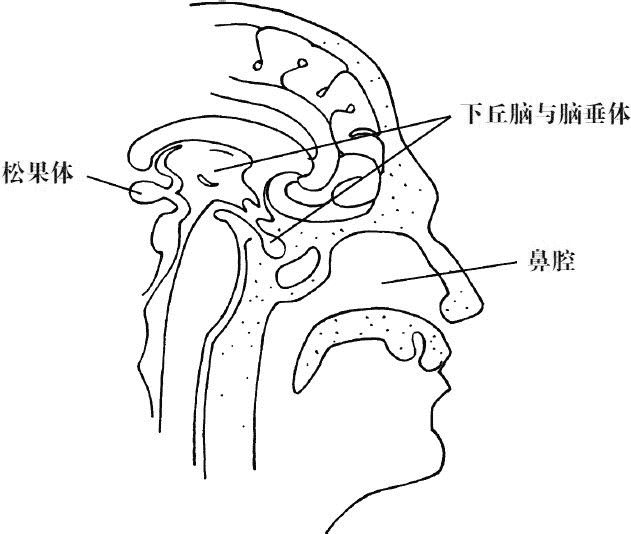

图 3.2　脑垂体、下丘脑、松果体的位置

现代医学对脑垂体的了解还仅仅停留在物理层面，忽略了它作为灵性觉醒及心灵拓展之钥的重要作用。在人类历史上，一些有识之士认为科学和灵性是可以补足彼此、共同协作的。

科学与玄学可以走得更近，也完全可以携手合作。

——威廉·詹姆斯（哲学家、科学家，1842～1910）

希望在不久的将来，能有更多人明白物质与灵性之间的关系。这方面的深刻领悟，能帮助我们创造出一个更具灵性的世界。

与脑垂体密切相连的是顶轮能量中心。在这个脉轮的内部和上方，振动着极高的超自然能量与灵性能量。这是宇宙能量的一种形式，渗透于一切造物之中，在空气、水、树木、植物，乃至地球之内，都有它的存在。一般来说，这一宇宙精华因为振频非常高而无法被肉眼识别，但是受过训练和足够精进的人，能够感知和经验得到。

对肉眼来说，电视与电台的电波都不可见，但即便如此，我们每个人还是能体验它们。只要打开电台或电视的接收器，我们就能“经验到”这些高频振动的电波。振动的速度是一种频率，用每秒钟的振动次数或每秒钟的循环次数（CPS，即周/秒）来计量。

请记住，万物都在以特定的频率振动着。地上一块普通的岩石，比一个活生生的动物振动频率要低。人类身体所有器官、腺体、神经、组织的振频，则远比一块无活动能力的岩石要高。每一个细胞、器官、组织及身体的每一部分，都有自己独特的振频或每秒循环次数。我们之所以会产生不适或疾病，就是身体的某器官、区域与身体其他部分不同步或不和谐所致。

有了这些了解，我们就可以再次讨论顶轮了。如果你能把这个能量中心视作宇宙高频能量和灵性能量的接收器，你就会对亚特兰蒂斯与埃及古神秘学院教导的一些秘密法则有基本的了解。

宇宙能量通过顶轮和头顶进入人体气场。当它进入大脑时，会开始降低振频。松果体如果运作正常，就会成为一种特殊的转换器，能够接收宇宙能量，并将它转换至较低的振动频率。然后，能量会通过下丘脑进入脑垂体。在这一过程中，脑垂体也会成为转换器，将宇宙及灵性能量转换到更低的振动频率。从这里，能量会被释放到大脑的其他部分，在那些部位它会作为超自然现象、疗愈能量、直觉力、上天启示、与高我交流、内在声音等方式被吸收和识别。以这种方式经验到的灵性能力与天赋包括：

● 超听觉力：以通灵的方式听到人声或声响

● 灵视力：以通灵的方式看到画面或事件

● 超感应力：以通灵的方式感觉或感知到情绪

从形而上学来说，松果体和脑垂体可以被看做相似的降压变压器，它们转换、降低、改变电流的频率或类型，将一种形式的能量转换为另一种形式。

要让能量转变过程发生，松果体和脑垂体都必须以健康的方式完全运作。顶轮和三眼轮能量中心也都必须被恰当地激活和“开启”。

我们在第二章介绍的三眼轮练习，是推动这个过程必须进行的第一步。松果体产生的振动激活或者唤醒了大脑的这个区域。它同样也通过下丘脑将振动输送到脑垂体，这又影响和帮助了脑垂体的激活。

“Thoh”的唱诵练习完成后大约 7～10 天，你就可以开始第二个练习了。中间的这段间隔，可以让三眼轮练习有足够的时间去激活松果体、刺激脑垂体。

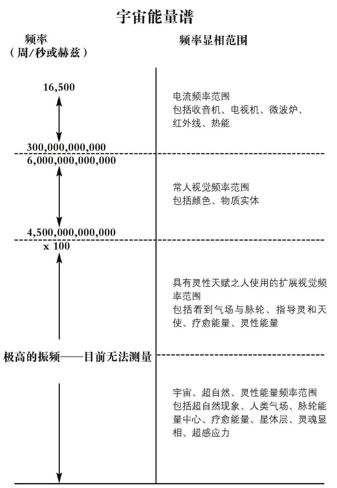

图 3.3　图为宇宙能量谱，它同时揭示了所有的“显相”基于何种振动频率。需要注意的是，宇宙、超自然、灵性能量的振频以目前的科技水平还无法测量。

## 顶轮开启技能

如同前文所述，这个练习是埃及大祭司在“大启动仪式”中所进行的第二个特殊唱诵。这个神秘仪式不仅曾在狮身人面像下的秘道举行过，也曾在几年后的卡纳克圣湖举行过。仪式上会点燃很多蜡烛和浓郁的熏香，仪式过程包括两个唱诵和神圣祈祷。这个仪式最初来自亚特兰蒂斯，后来被埃及神秘学机构沿袭继承，密特拉教和基督教也都采纳了仪式中的部分程序。在第二个唱诵中，你需要发出的声音是“May”，与五月“May”（[mei]）的读音相同。音高选用中音 C，或是介于低音与高音之间。与第三眼练习一样，这个唱诵也不需要非常精确，只要近似就好。可以简单地选用最适合你的音调。

一开始，先进行三到四个深长、放松的呼吸。感受空气从肺部进出。每次呼气时，都让你的气息缓慢、稳定地呼出。这种呼吸方式能让你的心率和血压降低，最重要的是能够减缓你的脑波模式。这样的放松状态会帮助你更有效地进行练习。

现在恢复正常呼吸，把所有注意力集中在鼻梁正上方额头的位置，也就是眉毛水平线之上大约一英寸，额头正中。持续把注意力放在这里几分钟，直到你感觉到压迫感、暖热感，或某些其他感受。如果你没有任何感觉，也不用担心，继续将注意力集中在三眼轮能量中心。

过一段时间，深吸一口气，憋气大约 5 秒钟，再深长而缓慢地用嘴呼气，同时唱诵“M-a-y”。在唱出这个声音时，感受进入你头部的能量或振动：先是通过额头的第三眼区域，然后进入脑部中央……它甚至会达到你的头顶，即顶轮所在之处。

当你将气全部呼出，就再次恢复正常的呼吸。花几秒钟放松一下。

简短的休息后，重复刚才的过程。深呼吸，然后进行“May”的唱诵，慢慢呼出气，像第一次做的那样。要记得把注意力集中在额头（三眼轮区域），然后是大脑中部，最后是头部顶端（顶轮区域）。让“M-a-y”的振动完全流经你的头部。如果你愿意，这个“May”的唱诵可以再做一次。

在任何你觉得需要时，都可以做这个练习。你可以将顶轮练习作为每周的灵性修持随意进行。

完成练习之后，就可以回到你的日常生活了。哪怕一开始你感觉不到什么特别，振动能量也会在你的大脑中工作。

## 顶轮练习引发的身体反应

对有些人来说，这个唱诵的功效会在完成练习之后很快地显现出来。而对另一些人来说，则会缓慢、逐步地显现。

第二章所讲述的三眼轮练习效果，有些也会在顶轮练习中出现。不过也有不同，还会有一些全新的体验，这都是某种灵性天赋被唤醒的结果。

“Thoh”唱诵所引发的头疼或不正常的压迫感（通常被称为“第三眼疼痛”）会减少或消失，代之以经过头部某处的能量感或能量激流。你会在头的内部感受到能量，因为“May”唱诵会持续在脑垂体、下丘脑和松果体运作。特殊的感觉会从头顶开始，进入头的内部，甚至头的后部。这些感受被描述为“刺麻感”，因为它很像头皮发麻的感觉。对大多数人来说，这种体验是宁静、温和的。它是物理层面的脑垂体受到刺激、灵性层面的顶轮被激活的主要迹象。当顶轮完全开启，能量感或“刺麻感”会完全地覆盖头部到耳朵的区域，感觉就像在头上戴了一个真正的王冠——这也是这个脉轮得名的原因^((1))。

“May”唱诵引发的振动开始在头部运作之后，头疼或压迫感会逐渐减轻，直至完全消失。当你的脑波由清醒的β波减缓到轻微恍惚的α波时，你可能会有片刻的头晕。这是很正常的，事实上，这正是我们期待的效果。这种“昏沉”或头晕的感觉会很快结束，但提升了的觉知会被保留下来。你的身体和大脑都在发生变化，以适应更高频率的能量振动，这会赋予你在完全清醒的情况下以α波状态有效运作的能力。获得这种能力的个体会变得更有效率、更健康、更快乐，生活中的压力也会大大减少。

如果“May”唱诵进行得正确，你的脑垂体会被激活，也会变得平衡，同时内分泌腺体系统的其他部分也得到了平衡。除此之外，这个唱诵还有很多益处，它甚至能大大减缓人的老化！

如果你是在晚上进行顶轮练习，可能你会在第二天早上看到一些积极的效果。起床后，立即从镜子里凝视你的脸，你会发现你的皮肤看起来更加光滑年轻，眼睛也更清澈、更明亮。

这个振动训练带来的另一个益处是幸福感，有时也表现为轻微的愉悦感。停留在脑垂体和它周边区域的振动能量以及你对大脑这些区域的关注，都会刺激内啡肽释放进血液，这会让你产生一种“兴奋感”，很像运动员奔跑时所带来的兴奋。对那些受情绪波动或抑郁症困扰的人来说，顶轮的练习能够减轻痛苦，帮助他们于内在达到情绪的平衡。“M-a-y”的振动练习已经帮助了很多患有躁郁症的人。

## 顶轮练习引发的灵性反应

当物理层面的脑垂体以恰当的方式得到激活时，灵性层面的顶轮也同时被激活了。随着顶轮的激活或“开启”，更多灵性天赋会显露出来。包括：

● 直觉力提升

● 创造力扩展

● 灵视力获得开发或扩展

● 移情能力增强

● 超听觉力获得开发或扩展^((2))

● 超感应力获得开发或扩展^((3))

顶轮开启后，这些能力会在不同的人身上以不同的方式显现。比如，灵视力可能会是你开发最好的能力，而对另一个人来说，超听觉力则会成为他最强大的灵性天赋。每个人都会拥有自己独特的能力。

当你的顶轮和三眼轮被恰当地激活并保持平衡后，你就能够通灵，并变得更有灵性。你能更多地使用大脑潜能，左右脑思考之间的转换也更加容易。

这一切的最终目的是帮助你在灵性与人性上都更有觉知。随着这些能力逐渐开启，你的人生使命也会显现——使用这些能力，去帮助自己与他人成长。对别人来说，你内在的灵魂会成为一道美丽的光，照亮整个人类灵魂觉醒的道路。

————————————————————

(1) 顶轮又称冠轮。——译者注

(2) 以通灵的方式来听到人声和声响的能力。

(3)  移情能力只是其中的一个方面，这个能力还包括：感受物体、人类的情绪和信息，或感受灵性存有与能量。

# 第四章　人体气场

过了六天，耶稣带着彼得、雅各和雅各的兄弟约翰暗暗地上了高山，就在他们面前改变了形象，面目明亮如太阳，衣裳洁白如光。

——马太福音 17：1～2

包裹在你身体周围的是“人体气场”——关于此，早在远古时期就已经有记载。“气场”（aura）这个词来自拉丁文的“aurum”，意为“金黄的”，希腊语中“aura”的意思则是空气或者风。有时人体气场也被称为电磁场或人体能量场。

人类是二元性的结合，生来便同时具有物质与灵性两个层面：物质存在（即身体）处于较低的振动频率；灵性存在（即灵性体与气场）则以极高的振动频率同时存在于物质与灵性两个层面。

拥有灵视力的人能够观察到人体的气场或能量辐射，它围绕在身体（尤其头部）周围，呈现出不同的颜色。通过特定的训练以及特别的可视化技巧，你就可以掌握感受到甚或看到气场的方法。本章与下一章的目的，就是教你如何看到气场并对它进行“解读”。

## 气场颜色（正向、中性和负向）

围绕在人体四周的多彩光芒，看起来很像暴风雨过后的美丽彩虹，或是冬夜里明亮的北极光。在人体气场中显现的有七个主要颜色：红、橙、黄、绿、蓝、靛、紫。它们产生自磁场、电场、紫外线辐射、荷尔蒙分泌、化学分泌，以及灵性能量。

每个主要颜色以及它的衍生色都有特定的含义。仅仅是感受到人体气场或能量场是不够的，你还要能够解释它们的意义。“解读气场”是个非常重要的技能，在私人关系和职场人际关系中，它都能给你带来很多好处。而那些需要被“解读”的颜色，一般是围绕在解读对象的头部、胳膊和手的周围。稍后，我们将更详细地介绍这个技能以及它的应用。

伴随这七个主要颜色的是其不同的色调，另外还有金色、白色、银色、灰色、棕色以及黑色。所有这些颜色可以分成两个部分：正向颜色与负向颜色。“正向颜色”指好的或者有益的颜色，“负向颜色”则指不好或不受欢迎的颜色。

### 正向颜色

我们先来讨论有益或正向的颜色。这些颜色呈现出漂亮、干净、清晰的能量光芒。简单地说，它们赏心悦目。有时，那些不能看到人体气场的人，也可以感觉或感应到气场的颜色，比如有人会在某些人的周围感觉到蓝色或绿色，这代表在这些人身边是非常舒适和令人愉快的。

正向颜色的光芒包括：浅蓝色、中蓝色、深蓝色、浅绿到深绿色、日光黄或淡黄色、淡橙到中橙色、淡粉色、中红到深红色、淡紫色、中紫色（靛蓝）、银色、白色、金色。

这些存在于人体气场中的灵性色彩振动频率非常高。迄今，还没有任何人类技术能对其进行切实的测量^((1))。

纯粹正向颜色，从高频到低频（振动频率）排列依次是：

● 浅蓝色

● 中蓝色

● 深蓝色

● 浅绿到中绿色

● 日光黄或淡黄色

● 淡粉色

● 中红到深红色（紫红色）

1．浅蓝色

这个美丽的光芒就如同夏日午后天空的蓝色。

浅蓝色代表一个充满爱意和灵性的人，一个宁静的个体。某人气场中的浅蓝色越多，就表示这个人越有爱、越灵性。它的振动频率非常高。在那些心中满怀悲悯，充满对他人之爱的导师、治疗师和咨询师的气场中，会有很显著的浅蓝色。你能在人的头部看到或感知到这个美好的颜色，它完全地包裹住头部，在身体向外 5～6 英寸（约 13～15.5 厘米）的地方环绕着。围绕头部的蓝色越浓密、越明亮，这个人的灵性进化程度就越高。

在观察人体气场时，浅蓝色是很重要的颜色之一。如果你在一个人头部的上方或四周“看到”丰溢的浅蓝色光，你就可以对这个人放心。但如果你在被观察或被“解读”之人的头部周围——不论是贴近头部表面，还是更远的地方——都看不到一点浅蓝色光，或是浅蓝色光特别少，那在同这个人打交道时，你就要多加小心。

2．中蓝色

这个颜色很像大海的中蓝色。它的振频要比前面提到的浅蓝色稍低一些，但仍旧非常高。

你通常能在人的头部四周看到这种色调的蓝，比浅蓝色靠外一些。它在离头部表面大约 2.5～7 英寸（约 6～18 厘米）的地方散发着光芒。

中蓝色代表专业技能和管理能力。散发中蓝光芒的代表人物有技术类作家、技师、电脑分析师、工程师、科学家、医生等。中蓝色也表示一个人非常的实际和商业化，因此，在气场或能量场中散发这种颜色光的人还有会计、商务经理、办公室经理、销售经理、企业家等。

气场中（尤其是头部）有中蓝色的光，并不意味着此人一定在这些领域任职。但是，中蓝色的存在表明在这些人的个性中，类似的特性或能力占主导地位，包括学习专业技能的巨大潜力，或是非常实际、商业化的倾向。与中蓝色较少的人相比，那些中蓝色多的人会更多地使用大脑的逻辑部分或左半部分。

在一个人运用他的专业技能或管理能力时，他气场里的中蓝色就会增加。换句话说，一个人越能发挥自己的天赋，他气场里的中蓝色就会越强烈、越宽广。如果某人在其职业领域内辛苦地工作了一段时间，他头部、肩膀、手臂周围的中蓝色就会显著增多。而在这个人休息期间，或者他没有投身相关的职业，其能量场中还是会有中蓝色，但是会少得多。

3．深蓝色

这种颜色很像傍晚时天空的深邃蓝色，仅比午夜蓝稍浅一点。它的振频在中等以上，低于浅蓝色，比中蓝色也稍低一些。凝视这个颜色，你会感觉到丰盛与美丽。

气场中深蓝色显著的人往往天生就非常有创造力，充满了艺术气息。我们能在这类人的头部四周看到或感觉到它，一般是在离头部表面 4～10 英寸（约 10～25 厘米）的范围内。能量场中有深蓝色的人包括作家、艺术家、手工艺者、画家、演员、舞蹈家、音乐家等。

同样，有的人可能气场里有深蓝色，但是他们却没有运用这些天赋，因为深蓝色的存在是表明此人拥有艺术性与创造性的潜力或倾向。可能有个杂货店的店员，他运用手工技艺的方式很平庸，可却梦想着成为作家或诗人。那么，当这个人拿起笔开始创作时，他能量场中（尤其是头部）的深蓝色光就会显著地增加。

4．淡绿到中绿色

淡绿到中绿色散发的光芒很像春天公园里的新叶，或是新生的小草。具有疗愈能量的色调或色度就分布在这两个颜色之间。它的振频非常高，比浅蓝色略低，比中蓝色和深蓝色略高。

这个颜色与疗愈有关。它非常显著地存在于那些天生的治疗师的气场中，一般围绕整个头部，离头发或皮肤表面非常近，也会出现在肩膀、手臂之上。它同样也可以由双手向外发散。对能轻易看到淡绿到中绿色光的灵视者来说，有这种颜色光的人的头发看起来会有些发绿，就像染了发一样。当然，你也可以培养出这种疗愈能力！

一些护士、咨询师、医生、导师、按摩师、正脊推拿师和那些从事疗愈相关职业的人，大多会被这样美丽的绿色能量围绕。

同样，也有一些天生拥有疗愈能量的人没有从事相关的职业。他们气场里的淡绿到中绿色表示其具有疗愈他人的潜力，即使他们还没有运用这种能力。当这个人发挥自己的天赋去进行疗愈，那在他疗愈之时和疗愈之后，气场中的绿色会大大增强。

比如一个气场中拥有绿色疗愈光的按摩师，在他为客人做完按摩治疗之后，他的头部、肩膀、整条手臂以及手掌、手指周围都会很明显地呈现出这个美丽的颜色。

大体上，气场中显现出淡绿到中绿色的光芒意味着两件事情：要么是疗愈者，要么此人正处在痛苦的疗愈过程中。生病、疲惫、感到不适和疼痛的人，或仅仅是身体状况不好、情绪低落的人，能量场中也可能会有这种颜色的光。疗愈能量会出现在这些人的头部和肩膀，或是身体某个特定部位——一般是在疗愈能量集中之处。

在“解读”人体气场时，对双手的观察是非常重要的。如果一个人的手掌、大拇指和其他手指都围绕着绿色光芒并向外发散，这表明他是健康的，天然的生命力在他身体的大部分区域自然流淌。相反，如果被观察者的双手手掌、大拇指和其他手指周围没有任何的绿色疗愈光芒，则表明他有健康方面的问题，或者他身体的天然能量没有很好地在身体运作。

治疗师或有疗愈潜能之人的整个头部、肩膀和手臂都会被这个美丽的疗愈色彩包围，并且颜色会从他的手中向外涌出。如果灵视者或气场解读者对这类人进行观察“解读”，会发现绿色是围绕在他们周围最主要或最显著的颜色。

生病之人，或是身体、气场正接受疗愈能量治疗的人，气场中不会有特别突出的绿色，他的双手也不会散发绿色能量。这种情况我们会在讨论人体气场的负向或不健康颜色时进行详细探讨。

5．日光黄或淡黄色

这种颜色像是透过窗户倾洒下来的浅淡的黄色阳光，也很像黄色郁金香散发的明亮光芒。它非常美丽，凝望着它会让人觉得充满活力。日光黄的振动频率处于中等位置，在深蓝色与中蓝色之下。

气场中日光黄或淡黄色显著的人，往往有很积极、开朗的性格和充沛的能量。这是一种非常干净、明亮的光芒，一般出现在人的头部，在头发或头表面向上 1～4 英寸（约 2.5～10 厘米）之处。随着个体精神状态、健康情况、体能状态的变化，它在头部环绕的宽度会扩展或收缩。一个人周围有越多的日光黄，这个人就越积极、越能量充沛。喜剧演员、性格外向的人，或是真正的乐天派，其气场中这种能量会非常多。

大多数人的能量场中都有或多或少的日光黄或淡黄光芒。但也有人的头部和身体周围只有很少的黄色能量，甚至根本没有这种能量。这样的人有着很消极的特质，比如有不良的心理状态，能量水平很低。这样的情况，我们会在谈论人体气场负向颜色时进一步讨论。

6．淡粉色

在气场颜色等级中，淡粉色的振频排在中低位置，低于日光黄。它的光芒看起来像婴儿毛毯或婴儿毛衣上的漂亮粉色。

气场中有这种美丽淡粉色的人，对人类有着深沉而广阔的爱。这种清淡柔和的光芒出现在离头部 8～14 英寸（约 20～35 厘米）之处，看上去好像粉色的光在气场外缘的上方或四周旋转。

那些奉献自己去帮助别人的人，能量场中会有大量代表普世之爱的淡粉色能量光。关爱他人的咨询师、充满爱的社会工作者或是友善的志愿者，都是拥有淡粉色光的最佳例证。你们一定曾在生活中遇到过这样的人。

这群特殊的人对他人有着过度的关怀，并有搁置自己个人需求与渴望的倾向——如果他们不学会同样关心自己，会对他们中的有些人带来伤害。

7．中红到深红色（紫红色）

在人体气场的所有正向颜色中，正向的红色振动频率最低。它看上去像是一杯红酒所呈现的那种漂亮而华丽的紫红色光芒。

气场中有这种华美、深邃色彩的人往往有着显著的性能量，他们大部分都天生“性欲旺盛”。

这种颜色的能量多见于头部周围，一般呈深红色小云团状或像泡泡那样排列，离头的表面或头发有 3～7 英寸（约 7.5～18 厘米）远。这种性能量也能在一个“性欲旺盛”之人的整个能量场中出现，此人的肩膀、胳膊、双手、双腿四周会被葡萄酒色或酒红色的光芒围绕。

一个人越“充满性欲”，中红到深红的颜色就越明显。很多时候这种颜色也会出现在胸部和腹部，能量的强度会随着个体情绪的变化而变化。如果一个人遭遇了性挫折，这种红色能量大多会出现在他的头部，颜色要稍浅一些。

### 中性颜色

以下颜色的含义没有好坏之分。当然，你可以根据自己对气场的经验，来形成对这些颜色的观点。

1．蜜棕色或金棕色

淡淡的蜜棕色有时候会进入人体气场。如果你把浅巧克力与金色蜂蜜融合，就能得到类似的色调。它看上去很平常。

蜜棕色或金棕色代表权力、财富和社会地位。它本身既不积极也不消极，仅仅是俗世物质能量的代表而已。政治家、律师、企业管理人、会计和富裕商人的能量场中可能会时不时地出现这种颜色的光。

在灵视者或气场解读者看来，蜜棕色或金棕色会完全围绕在个体的头部，有的情况下也会包裹住整个身体。你可以想象把一种金棕色的透明覆盖物扔到一个人身上，完完全全地充满他的气场——对能看到或感觉到这种蜜色能量的人来说，它就是这样的。

### 罕见的正向颜色

除了前文列出的纯粹的正向颜色之外，宇宙中还存在罕见的正向颜色：白色、金色、银色、淡紫色、中紫色（靛蓝色）、淡橙到中橙色。除了淡橙到中橙色，其他能量光都有着极高的振频。

在人体能量场中，这些罕见的颜色不像普通正向颜色那样经常出现。除了淡橙到中橙色，这些高频扩散的能量会在一个人变得更灵性、更有觉知时，较多地出现在他的气场中。

当人类物种由智人进化到超智人时，这些高频振动的颜色会进入更多人的能量场。这些能量散发着芒，代表着人类的真正觉醒。在未来，这些完全来自上天并连接到人体气场的能量，会与那些强大的疗愈师、伟大的导师、天赋的咨询师协同工作。

罕见的正向颜色，从高频到低频（振动频率）排列依次是：

● 白色

● 金色

● 银色

● 淡紫色

● 中紫色（靛蓝色）

● 浅橙到中橙色

1．白色

纯白色的光有点类似蓝天下飘过的蓬松的白色云朵，却比云朵更光彩夺目。如果你能想象天使翅膀的纯净光芒，你就能明白它的样子。经过恰当的训练和练习，你也能在更多觉醒之人的周围看到这一美丽的能量。在不久的将来，更多人的气场中会有这种能量光。代表纯净能量的白色光芒有着最高的振动频率。

这种极为特殊、纯净的能量来自更高的领域，或者说，它来自上天。如果你曾研究过物理学与色谱，就知道白色被描述为所有颜色的集合。这可能在物质层面是科学的、真实的。但是，白色光远远超出我们肉眼可见的物质范畴，它有着更伟大的“衍生物”（ramification）。

这种罕见的能量光，只会存在于那些踏上了真正的人生道路，或是准备好进入这一道路之人的气场中。当这些人变得更有觉知、更具感知力，他们就会透过顶轮接收来自上天的白色光芒。当某人开始履行他的人生使命，他气场中美丽的白色光芒就会增多。白光会缓慢地作用于人体气场，先是围绕住头部，最后弥漫至整个气场。

2．金色

这个美丽的颜色看上去很像珠宝中闪烁的浅色黄金，只是更为耀眼夺目。金色的振动频率极高，仅次于白光的纯粹能量。

金色光代表来自更高源头、更高次元的智慧与知识。能量场中有金色光的人，正在从更高的次元接收讯息。他们有时直觉非常敏锐，观察入微，有着很高的觉知。

被金色能量包围的最好的例子是那些极具天赋的导师和咨询师。不过金色光并不是一直显现在他们的气场中。金色光会在这些人运用其独特的灵性能量进行教导、咨询时变得更加明显，其宽度、密度也会增加。

金色光往往会出现在顶轮的外围，离头顶大约 7～12 英寸（约 18～30 厘米）之处。在罕见的情况下，金色能量会完全地包围住一个更具觉知之人的头部和整个身体。

宗教文学和灵性文学中，都曾提及“金碗”、“金色光环”、和“金色王冠”。甚至在达·芬奇、拉斐尔、乔托这样的艺术家创作的一些宗教作品中，宗教人物的头部周围也会呈现出金色的气场或“金色光环”。这些只是人体能量场出现金色光芒的几个简单例子。

3．银色

银色光看起来很像反射着太阳光的银饰。如果你能想象在纯白色光芒中混入一点浅浅的灰色，就能更好地认识这个颜色。你可以在离头部表面大约 1～3 英寸（约 2.5～7.5 厘米）之处看到或感知到银色能量，它代表着极高的振动频率，仅在金色之下，看上去非常悦目。

银色代表着灵力（即神通）与灵性的觉醒。当一个人对自己的人生使命或人生目的更有觉知，他的能量场中就会出现这种颜色。

那些感觉空虚，对人生与事业没有满足感，以及正为自身的存在寻找更高目的的人，气场中也会有银色的光芒。这些正在觉醒的灵魂拥有真诚的愿望，渴望去服务他人，渴望这世界变得不同。很多经历中年职业转换的人，还有在老年致力于慈善事业的人，其能量场中常常有银色光芒。

4．淡紫色

淡紫色光芒类似于丁香花的柔和紫色，非常美丽。这个象征灵力与灵性的能量振动频率极高，仅次于金色与银色。它由浅蓝色和中紫色（靛蓝色）混合而成。

柔和而美好的淡紫色代表灵力觉醒与灵性觉醒的结合。气场中有淡紫色的人是极具灵力的，同时其内在也很有灵性深度。他们经常会以充满灵性、爱意和关怀的方式，来运用其灵力天赋。

在能量场中呈现淡紫色光的代表人物，有充满直觉力的咨询师、灵性导师、灵性顾问和宗教领袖等。另外，拥有虔诚的宗教信仰与灵性信念的人，有时也会被淡紫色所围绕。

正在开发灵力和追寻灵性觉醒的人，气场中会出现淡紫色。当这些人开始喜欢这种颜色并被它吸引，可能就会在衣橱里增加一些紫色或淡紫色的衣服。对大多数人来说，他们自己都没察觉到这个变化。

一个人越有灵性，灵力越高，头部周围就会有越多的淡紫色，往往会在顶轮（头的顶部）和三眼轮（额头）处被看到或感知到。有时，这种能量会让头发像是变成了淡紫色的。

5．中紫色（靛蓝色）

中紫色（靛蓝色）的能量跟紫水晶的颜色很相似，但是要更明亮些。它的振频与普通的正向颜色相比非常高，但要比银色和淡紫色稍低一些。

这个深沉、美丽的颜色象征着灵力与灵力所蕴含的力量。它不像淡紫色那样同时代表灵性元素和以充满灵性的方式运用灵力，它只代表天赋的灵力。

气场中有中紫色（靛蓝色）光的人天生就有很强的灵力，但并不一定有灵性。他们往往运用自己的灵力（比如直觉力），用超自然的方式为自己和他人寻找答案。

灵视者、通灵者、气场解读师、前世回溯师和一些有超自然天赋的销售、商业人士，是被中紫色能量光围绕的代表人物。其他运用中紫色能量的人来自生活各个阶层，他们用这样的天赋来帮助自己、家人以及朋友。

一个人头部周围有越多的中紫色（靛蓝色），这个人的灵力就越发达。像淡紫色一样，中紫色也会出现在顶轮和三眼轮处。这个能量可能也会完全地围绕住整个头部和肩膀，它离表面很近，并向外扩散出大约 4 英寸（约 10 厘米）的宽度。

6．淡橙到中橙色

想象一下树上的橘子在阳光里闪耀的画面，你就能知道这个明亮、积极的颜色的真正模样。

与其他罕见的正向颜色不同，淡橙到中橙色的光芒振动频率稍低些，刚好比普通的日光黄或淡黄色振频低一点。

淡橙到中橙色代表创造性的幽默感。

天才的喜剧演员和诙谐的说书人会在气场之中，或稍微超出气场一点的地方散发出这种橙色。在灵视者或气场解读者看来，它会以淡橙到中橙色能量球的形式出现，通常悬浮在头上方或头侧 10～12 英寸（约 25～30 厘米）之处，恰好在气场外缘。在一个喜剧演员或其他幽默的人运用他们的喜剧天赋时，这种能量就会通过顶轮进入气场。在比较罕见的情况下，这种颜色会停留在能量场之内。

### 负向颜色

与正向能量颜色相对，有些负向、或不受欢迎的颜色会在某些情况下出现于人体气场（并非与生俱来）中。这些颜色有：黑色、灰色、浊黄色、浊橙色、褐色、亮粉色、淡红色、红紫色、深绿色。这些颜色散发出丑陋、浑浊或肮脏的能量光，给人带来不愉快的感受。

负向或不受欢迎的颜色会在不同情况下出现在气场中。负面的情绪如恐惧、愤怒、焦虑、悲伤等，都会影响到气场，会在改变气场颜色的同时带入负能量。像感冒、流感那样轻微的疾病，也会在能量场中显现出混乱和令人不悦的颜色。同样能在气场中看到或感知到的是个体的疲惫和缺少能量。另外性格的缺陷和不良的心理状态，也会在气场中显现出来。

比起正向颜色，气场中负向颜色的振动频率要低得多。你只要知道，这些肮脏、不受欢迎的颜色振频很低，而它们之间的差别仅仅在于对肮脏和丑陋的表现形式不同。

负向颜色，从高频到低频（振动频率）排列依次是：

● 黑色

● 灰色

● 浊黄色

● 浊橙色

● 暗褐色

● 浊褐色

● 亮粉色

● 淡红色

● 红紫色

● 深绿色

1．黑色

黑色能量与白色光的纯粹能量正好相对。它是很脏、很沉重的光，其含义依它在人体气场中的位置而定。气场中的黑色越明显，问题和情况就越严重。

那些思考方式非常负面或非常虚伪的人，气场中会有浓重的黑色，一般是围绕在头部周围，很多情况下也会像个罩子一样笼罩在身体其他部位。通常，这些人的气场是相当强大的，但却像是受过污染一样。要小心他们。在商业或私人关系中，这样的人不会忠诚，也不值得信任。有些人会有说谎的倾向，只透露部分实情和故意欺瞒他人。他们并不喜欢自己，并且会把这些不喜欢的、负向的感觉投射到亲密的朋友和亲属身上。在某些情况下，他们可能会在言语、感情或身体上对其配偶或亲密伴侣进行虐待。在他们头部周围，正向的颜色非常少。

某些情况下，当一个人欺骗你、对你说谎的时候，你可能会察觉得到。这一点我们会在第五章《人体气场解读》中详细介绍。

如果某些人的气场看上去或感觉起来与他们贴得非常近，他们的头部也围绕着浅淡、稀薄的黑色（一般离头部表面 2～4 英寸，约 5～10 厘米），这表明他们很疲惫，可能很沮丧。这些人的气场中也可能有一些正向颜色，尤其是在头部，但是与浅黑色能量混杂在了一起。

对咨询师和其他精通人性研究的人来说，了解下面这一案例，能为他们治疗特定人群提供很大的帮助。

如果你凝视一个人的脸，发现他的脸看上去被灰黑色的能量罩覆盖而无法看清，这表明此人在生命中经历过严重的虐待。这种虐待一部分来自他们小时候。这个不快乐的灵魂已经受情绪、语言和身体的虐待很久了。他需要通过咨询来打破过往虐待的循环，因为这虐待已经延续到了现在。

通过认出这种肮脏或讨厌的负向能量光，你能学会帮助他人，也保护自己。振频很低的黑色对敏感的人或同理心强的人来说，是非常沉重和不适的。

2．灰色

人体气场中的灰色与黑色能量有着同样的含义，但是程度要轻一些。灰色也表明一个人有疾病。如果在一个人额头的左侧眉毛处看到或感知到灰色的能量漩涡，代表他这里有疼痛感。

对有灵视力的人来说，气场里呈现灰色的人看上去很需要冲澡或泡个澡。

3．浊黄色

人体能量场中的浊黄色是很容易跟日光黄区分的，它像在美丽的黄色中掺入了泥巴或木炭粉，看起来很丑。

浊黄色标志着身体和气场中有引发健康问题的能量淤塞。一些感觉不适或承受病痛之人的能量场中会有这种不干净的颜色，一般是位于问题区域的前方。当你学会“观察”或感知人体气场的颜色，你就能辨明一个人是不是有健康问题。比如，一个患有早到中期乳腺癌的女人在胸部前面会浮动着这种肮脏的黄色。患关节炎的人也会有同样的能量围绕在患病部位，比如肩膀、腕关节、手指关节、膝盖等。背部有疾病的人，比如坐骨神经痛蔓延到双腿的人，依据疼痛程度的不同，会有浊黄色的条纹沿着一条腿或双腿往下流。如果这种浊黄色中有绿色融入，那说明疗愈的能量正在神经和其他患病区域运作。绿色疗愈能量出现在气场中有浊黄色能量的部位，也表明身体正在尝试疗愈这里。

从更积极的角度来说，一个爱运动的人刚刚使用了部分肌肉后，这部分肌肉群就会出现比浊黄色稍浅的颜色。

虽然浊黄色是个振频很低的负向、不洁能量，但它们也可以成为非常有价值的疗愈工具。在疾病恶化之前，浊黄色会提示此人体内有潜在的严重健康问题。在某些情况下，气场解读师或灵视者会在身体显现出疾病之前先在气场中“看到”疾病。如果能认识到浊黄色的真正价值，它就能成为疗愈领域绝佳的预防工具。

4．浊橙色

浊橙色的肮脏负向能量与浊黄色含义相同，但是它显示出的程度更为严重。换句话说，这种令人讨厌的颜色代表着疾病或伤害已经更严重或恶化了——它会是癌症或其他严重疾病的标志，往往已经发展到很难治疗的程度。

5．暗褐色

这种阴沉、负向的暗褐色光在人体能量场中出现的位置不同，情况也会有所不同。

如果某些人被褐色能量完全围绕住头部（有的情况下会是围绕整个身体），就代表他们是非常负面、狡诈的人，道德标准与品行都相当低劣。这种令人不悦的能量会以一种紧密但浅淡的巧克力色由气场外围向内辐射，但是离头部或身体表面仍有几英寸的距离。

性变态、恋童癖、心理变态的杀手、危险人物、腐败和不道德的生意人，以及那些不受欢迎的“社会渣滓”，都是呈现这种褐色能量的代表人物。

请不要将这种糟糕的颜色与下面的浊褐色混淆。

6．浊褐色

能量场中有浊褐色的人患有很严重的疾病。很多情况下它代表着晚期癌症，死亡近在咫尺。这个肮脏的能量一般悬浮在身体患病区域的上方，在那里不断地移动和旋转。

如果癌症病人的癌细胞已经蔓延到全身，这种褐色的负向能量就会在他的整个气场中悬浮、盘旋。看起来就像有人往他的气场里扔进了褐色的污泥和碳粉。

这个肮脏的褐色反映着不适或疾病的进程，在早期，它以浊黄色的能量呈现。随着一个人病得越来越重，他气场中的浊黄色会慢慢变成浊橙色，最终成为浊褐色。

对敏感和同理心强的人来说，病重之人的能量场感觉起来很虚弱，靠近他会很不舒服，会感到能量被耗尽了。

7．亮粉色

亮粉色是个刺眼的能量，不管是去观察还是感知，都令人不快。

想像一个柔和、清淡的粉色或“婴儿粉”色，然后向其中混入更浓密、粗糙的红色色调。对有些人来说，这种色调的粉色是令人不快的，甚至是很丑陋的，它是温和光芒与强烈愤怒的融合。

爱争吵的人能量场中往往会有亮粉色。这种明亮却丑陋的能量光通常会出现在头部周围，围绕整个头部或头的一部分，离表面 3～6 英寸（约 7.5～15 厘米）远。那些特别爱争执的人头部会完全被这种愤怒的颜色包围。不管什么时候，你都要尽可能地远离这些人。在比较罕见的情况下，这种颜色会在心脏周围像小云团似地浮动。

8．淡红色

淡红色代表愤怒、挫败，某些情况下也代表身体的能量阻碍。

能量场中常常出现淡红色能量光的人深埋着愤怒和挫败，某些情况下甚至是暴怒。他们没有很好地疗愈情绪，没有充分处理、释放这些怒气与其他负面情绪，因而变得像个压抑已久的情绪火山，随时准备爆发。这些有爆炸脾气的人，会有非常明显的红色光出现在头的上方及侧面，有时也可能会出现在心脏处。看上去就像红色的小云团在这两个区域悬浮，愤怒而丑陋。

不健康的情绪（如压抑的愤怒）会缓慢地进入能量场，最终变成能量瘀块，然后表现为身体上的瘀块或其他问题。

患有某种心脏疾病的人，在心脏之上或者整个胸部会有非常淡的红色，左肩和左上臂也一样。如果疾病处于潜伏期或可控范围内，心脏上方的淡红色能量几乎是不可见的。但如果心脏疾病处于发作状态，淡红色能量就会在整个胸部蔓延。

淡红色也会出现在受伤或生病的关节与肌肉处。如果一个人肩膀非常酸痛或患有关节炎，那在他肩膀上方离皮肤很近的地方，就会出现丑陋的淡红乃至稍深的红色。

淡红色代表着有能量淤结与健康问题，稍深的红色代表愤怒，这两个色调的红色也都同时象征着愤怒——可能是情绪上的愤怒，也可能仅仅是肌肉、肌腱或其他身体部位的“愤怒”。

如果你观察到一个气场中通常拥有正向颜色的人，在其头侧或心脏处有了红色的能量团，这表明他刚刚发怒了。随着他释放愤怒，恢复平静，气场中的红色就会消散。

在疗愈和咨询方面，观察或感知到气场中的低频负向颜色是很有帮助的。

9．红紫色

稍早时我们讨论了出现在人体气场中罕见的正向颜色。淡紫或浅紫色同时象征着灵力与灵性的觉醒，中紫或靛蓝色则单独象征着灵力的觉醒。红紫色看起来比这些正向的紫色能量要污浊、愤怒。想象中紫色被愤怒的淡红色弄脏，你就能对这个颜色有个大概的认知。这种颜色的光会出现在头顶的顶轮处和额头的三眼轮处，也可能会覆盖头的表面，看起来像是头发里渗进了这种丑陋的颜色。

人体气场中的红紫色同时意味着灵力与愤怒。气场里呈现这种负向能量的人有着相当强大的超自然力，但是充满了愤怒和挫败。对这些人来说，释放愤怒或其他负面情绪会触发或提升他们内在的灵力。这种时候就可能发生非同寻常的灵性现象，比如玻璃碎掉或物体自己移动。遥控能力（比如仅靠意念移动物体）只是这些情绪引发灵性现象的例子之一。

这些人可能拥有独特的灵力，但是倾向于用负面的方式来使用它们。然而，一旦这些人释放掉他们的愤怒，变得更加平静，其灵力就会成为真正的天赋。

10．深绿色

令人讨厌的深绿色与象征着疗愈的正向绿色完全不同。将夏草的中绿色与木炭粉混合在一起，差不多就能得到这种肮脏、负向的能量。它以灰色、中绿色的能量云呈现在气场中。这种令人不悦的能量围绕整个头部或头部的一部分，排列在距离头表面 4～7 英寸（约 10～18 厘米）的地方。

气场中有这种负向光的人往往对别人充满嫉妒和羡慕。他们有过分贪求他人所有物的倾向。这种性格缺陷，可能表现为对同事的小嫉妒，一直到对别人配偶、爱人的垂涎。人体气场中的负向深绿色越强烈，这个人天性中的嫉妒或羡慕倾向就越强烈。

## 气场颜色的转换

一定要记住，人体气场的正向颜色或有益颜色看起来非常的清晰、干净、美丽。气场和气场中的颜色总是不断地扩张和收缩。

能量的光芒转换或移动时，很像夜空中北极光所呈现的颜色。它们在身体周围旋转、融合。

因此请记住，我们所提到的这些颜色位置只是大概，因为它们会缓慢地移动。

过去，很多神秘学的导师和作家认为人体能量场是分很多层或是有很多部分的。但为了简便起见，这里我们将气场看做一个围绕在人体周围的完整体系。

————————————————————

(1) 本书第一版印刷于 2005 年。——译者注

# 第五章　观察与解读人体气场

神之手用彩虹的所有光芒画出了天空。

——道格拉斯·德龙

对人体气场的观察和解读有着不可估量的价值。在卫生保健领域，可以用这个工具做有效的预防与诊断；在咨询领域，这也是个很好的解读方法；针对私人关系及职业关系，你也可以借由它获得准确的洞见。在不久的将来，我们的社会会认识到人体能量场中颜色的重要性，并运用这种知识来帮助人类。

随着更多整体疗法的出现与普及，人们对运用自身天赋来“解读”人体气场健康问题的专业人员——专业的气场解读师、直觉治疗师、灵视者等——会有更大的需求。

本章将提供一些特殊的技法，协助你步入正确观察、解读人体气场的道路。对那些已经能看到气场颜色的人来说，这些方法或练习能提高这种能力。

如果你能培养出看到气场颜色的能力，并能正确解读颜色的含义，那么不论在专业解读还是私人解读领域，你都会成为一个称职的气场解读师。

## 发音法

在第二章和第三章，你学到了两个特殊的元音唱诵。“Thoh”和“May”的唱诵都是发展、提高看到气场的能力的重要方式。

如同前文所述，“Thoh”唱诵是一次性练习，最初的练习过后，你就可以长时间地放下它。反之，“May”唱诵则需要你定期练习。

在解读人体气场之前，你需要先以正确的方式唱诵“M-a-y”两到三遍。这会帮助你将脑波模式从清醒的β模式转换到α模式，或是稍微改变一下意识状态。一天内，这个练习不能超过两次^((1))。如果你在一天里进行“M-a-y”唱诵练习两次以上，可能会非常头晕、迷糊，甚至头疼。

在刚开始学习观察人体气场时，“M-a-y”的唱诵应该成为你日常训练的一部分。当你变得更善于观察和感知气场时，这个练习就不那么重要了。那时你就不必在每次开始前都唱诵“M-a-y”，你什么时候想唱诵都可以。在你能轻松地转换脑波状态后，一周唱诵一到两次就足够。

完成了“May”的练习，你就可以进行下一个预备性技能的练习了。

## 呼吸法

恰当的呼吸方法是很重要的。大多数人的呼吸都很浅。如果你能养成更深的呼吸习惯，那你的健康和能量水平都会提升。

在“解读”或观察人们周围的气场之前，要先以特定的方式进行深呼吸。慢慢地用鼻子深吸气，感觉你胸膛和横膈膜的扩张。将注意力集中在胸膛，扩展它，然后将注意力转移到下面的横膈膜，让进入肺部的空气把下面的区域也填满。你会觉得的整个胸部和上腹部都充满了空气。尽可能多地吸进空气后，屏息大约 5 秒，感受内在的空气。最后，温和、持续地用鼻子和嘴巴同时呼气，直到所有的气都从肺部呼出。将整个过程再重复一遍，如果你愿意可以再做一遍。

这个技巧的原理在于：在我们呼吸的空气以及周围的大自然中，充满了灵性能量（也叫气、生命力量或宇宙能量）。这种能量来自神圣源头、造物主以及上天。当它进入我们的物质世界，就弥漫渗透进岩石、树木、大海以及我们呼吸的空气里，就会渗透进万物之中。

通过吸气，你将灵性能量带入了肺部。屏息大约 5 秒则让灵性能量或生命力量得以在你体内循环。当生命力量进入你的身体，你的气场就会扩张，心率和呼吸就会变慢，最后，你的脑波模式也会减缓，进入轻微的恍惚状态或α状态。这就创造了一种更高的意识状态，让你比较容易看到气场和更高的能量振动。现在，请做好准备进行下一步的练习。

## 墙壁或背景法

将一把椅子靠着浅色的墙放好（之后你可以试验不同颜色的墙，从浅色到深色）。为了达到最好的练习效果，请将光线调到接近黄昏时的感觉。这个技法在白天练习要比晚上容易些，但如果你要在夜晚尝试，也可以用蜡烛与远处温和的光线来营造接近黄昏的氛围。

请一位志愿者或观察对象面朝你坐在椅子上，在你们两人之间留出大约 5～10 英尺（约 1 米～3 米）的距离。两人都做几个放松的深呼吸，然后恢复正常呼吸。请志愿者望向远方，不用做任何事情，只需要放松自在地坐在那里即可。

当志愿者做几次深呼吸并放松后，他的气场会很明显地扩张。这就让你更容易注意到白光或光晕。

现在，注视志愿者的头部附近。很放松地用不聚焦（unfocused）的眼神注视着志愿者头部后面的墙。让自己“看穿”墙壁，就好像你在看远处的什么东西一样。不要尝试去看或寻找志愿者周围的气场，持续地看穿这面墙。继续这样放松地看着，你会在志愿者头部上方和四周看到白光或能量光晕。此时，将你的注意力从“看穿墙壁”收回，扫视志愿者头部上方。只要你不过分专注地紧盯你所看到的，应该就能继续观察到志愿者头部所环绕的光。如果太过努力，你反而无法看到气场。要想训练眼睛稳定地看到光，你需要花些时间，多做练习。最终你能做到目光略微失焦，以便观察到别人周围的气场。

你在志愿者周围看到的白光或能量光晕，并不是我们之前提到的纯粹的白色能量。这是看到人体能量场的开端，是踏上气场解读之路的很棒的开始。通过持续的练习，你会在头部和身体周围看到颜色。

对专业的气场解读师或直觉治疗师来说，头部周围的能量会提供治疗所需信息的百分之六十左右。因此，这个区域是你观察和解读人体气场的重点之一。

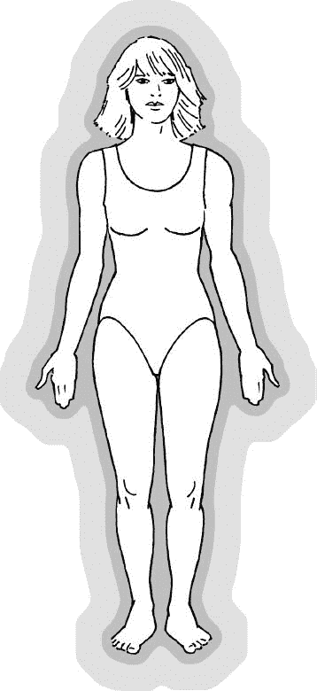

图 5.1　围绕着一位女性的能量场

墙壁法有一种衍生方法，即背景法：在被观察者头部正后方的墙上，悬挂一块黑色或深色的布。有时，较深的背景会让你更容易察觉到气场或能量场。

尽可能多地练习墙壁法或背景法。或许练习不能带来完美的效果（熟未必能生巧），但是它的确能让你更好地看到气场。你可以跟志愿者互换位置放松一下，跟朋友或亲属一起练习也可能会更愉快。

如果你已经能看到气场，那么这个技巧可以提高你观察的能力。有些人能在任何情况下都看到气场，不管是天光大亮还是天色渐暗。而很多孩子可以自然而然地做到这一点，因为他们的心灵足够敞开。

## 凝视树木法

大自然中的一切——动物、植物、石头、树木——都被特定的能量形式环绕着。

北美的土著人相信大地母亲和她所有的居民都是活生生的、有生命力的。比如，在克里族（Cree）的文化和语言中，石头是有生命的物体。在这一灵性信仰中，树木也包括在内。

记住这一点会有助于你进行凝视树木法的练习。这个练习的最佳时间是日落前后。当然，你也可以在一天中的任何时间进行，不论是早晨、中午、晚上，甚至深夜。夕阳西下时，地球的能量以及所有生命物体之中的电磁能量和灵性能量都会增加。空气中充满了振频更高的能量，就像暴风雨刚结束时的状态一样。这样的情况，为观察树木周围的光或能量创造了理想的环境。

在尝试凝视树木法之前，先让自己感觉舒适，做两到三个放松的呼吸，然后回到正常呼吸。将注意力集中在你选择的树木上，凝视树木几秒钟，再看向树的上方或四周，让你的目光穿过树木。很快，你会看到些微白色光或蓝白色光围绕着树木，就像剪影一样。现在把注意力放回树木的上方或四周，保持平静、安宁。如果练习成功的话，你就仍然能看到环绕着树木的能量光。你现在处于一个转换了的状态，一个更高的意识状态，你所看到的是能量的更高振动，包括树木周围的气场或能量场。

在夜晚和日落时都尝试一下这个方法，这可以训练你放缓脑波模式并看到能量场。如果你喜欢，可以用大的灌木代替树木进行练习。最终，你会看到大自然中其他物体周围的能量。

## 蜡烛与镜子法

这个特定的技法需要在暗室中练习。能在晚上练当然比较好，不过你可以拉上窗帘和其他遮光物来营造夜晚的环境。

### 第一阶段

创造出夜间的气氛后，拿出两根白色或浅颜色的蜡烛，点燃后，摆放在梳妆台或大镜子前的平台上。蜡烛要放在镜子两边，在你视线的直视范围之外。然后，凝视镜中你自己的身影，留心你脸上哪里有过多的阴影，再依据这些阴影来调整蜡烛的位置，让阴影越少越好。让烛光照亮你的头、脸、肩膀，让它们清晰地出现在镜子中。

之后，开始直接凝视镜中你自己的眼睛，让你的视线“看穿”你的眼睛。做几个深长、放松的呼吸，三到四个就够了。要记住，用鼻子吸气，让空气充满胸部和腹部，然后缓慢地呼气，用鼻子或嘴巴都行。三到四个深呼吸之后，再回到正常呼吸，依旧“看穿”你的眼睛，凝视远方。这时，你的眼睛和脸开始移动和变化。比如，你的鼻子可能看上去变长了，或者你的眼睛有一些不一样了。这是你进入更深入的专注状态时会有的现象。

现在，你的意识状态已经转换，可以进行蜡烛与镜子凝视技法第二阶段的练习了。

### 第二阶段

将注意力从“看穿”你的眼睛转回凝视你的眼睛，然后把视线上移到镜中你的头部。集中注意力凝视头顶上方 1～3 英寸（约 2.5～7.5 厘米）的地方。试着不要特意去看任何东西，允许事情自动发生。如果你成功了，你会看到围绕在你整个头部甚至肩膀的能量光。它看起来会像是白色或淡蓝色的剪影，从头部向外扩展 1～4 英寸（约 2.5～10 厘米）左右。

现在，你已经能看到自己的气场或能量场了。“更敞开”些的人还会看到气场里美丽的颜色盘旋在镜中身影的四周。这就是这一练习的最终目的。

在尝试几次蜡烛与镜子法（两个阶段）之后，你就可以试着去观察并解读你自己头部的气场了——省去练习的第一阶段，直接进入第二阶段即可。

在观察自己头部周围的能量时，先深吸一口气，屏息 5 秒左右，再缓慢、均匀地呼气。呼吸的同时注意你的气场，你会发现你头部的能量场开始向外扩展。在这方面，人体能量场跟其他能量场是一样的。其原理如同前文所述：气或灵性能量会进入你的肺部并在整个身体运作，这就能让你的气场扩张或增大。你可以在进行呼吸法训练时注意观察自己的能量，你可能会切实地看到这种现象发生。

当你完成了深呼吸和气场扩展实验后，试着把注意力集中在头顶上方约 1 英寸（2.5 厘米）的顶轮处。想象有人或物体在触摸你的头皮和头发。感受那里的能量感与压迫感。请在心中想象头顶有光或能量，然后看着这个能量从顶轮或头顶向上推。观想这个能量在头上和头的周围扩展开来，感受它。

现在，凝视镜中你自己影像头部的上方，你会注意到明显的变化——你头部周围的白光或浅蓝色光应该又向外扩展了几英寸。

你练习得越多，就越容易看到自己的能量场。随后，如果你愿意，可以尝试在没有蜡烛的情况下做两个阶段的练习。只要有一面镜子，然后确保在你所在的房间营造出接近黄昏的环境就好。过多的外部光线或阳光会妨碍你看到气场。

勤加练习，在镜中看到自己的能量会越来越自然。

## 凝视蜡烛法

练习凝视蜡烛法需要一支放在烛台里的白色或浅色蜡烛（蜡烛颜色不能过深或过于强烈，因为有色蜡烛的能量振频会稍微有些不同，有时会影响练习效果）。

先确保房间是暗的，然后把放入烛台的蜡烛摆放在平坦物体上面：化妆台、茶几，甚至地板都可以。

点燃蜡烛，找个舒适的位置坐下，离蜡烛 5 英尺（约 1.5 米）左右的距离。做几个深长、放松的呼吸，然后回到正常呼吸，把注意力集中在点燃的蜡烛上。让你的眼睛看穿烛火。现在，将视线转移到烛火的一侧，停留在火光的边缘。将注意力集中在火焰边缘的那一圈上，留心烛火最外缘所呈现的不同颜色或色调。

接下来的练习会很有趣，你会用到红、橙、黄、绿、蓝几种颜色。

继续观察烛火外缘的能量和颜色，在脑海中观想红色，并将它“投射”到火焰外缘去。观想这个红色能量在边缘摇曳、变幻，完全包围住火焰的光。红色能量真的会在烛火边缘显现。随着你继续凝视、观想红色光，它会变得越来越强烈。如果你观想红色有困难，就试着想象一辆消防车。这个方法可以用在其他颜色的观想上。比如观想绿草或绿树，绿色能量就能在你心中出现，并出现在烛火的外围。

当你看到红色光围绕在烛火外缘时，可能会觉得这仅仅是你的想象。但事实上，你真的用思想和心灵的力量改变了烛光能量的振动频率，从而导致了红色的呈现。从本质上说，你将红色的能量从宇宙引入了这个房间。

这是个非常强大的技巧，可以用于疗愈人类的疾病和痛苦。最终，你将能够显化不同的疗愈颜色，并将它们导入人的气场和身体。很快，我们的社会就会运用颜色、声音、振动和水晶来进行疗愈。

重复这个练习，然后再去显化橘色、黄色、绿色和蓝色。

请持续地练习这个技法，直到你非常熟练和精通为止。它能唤醒你大脑的特定区域，激发出你的特定能力——比如灵视力和气场解读能力。

## 凝视落日法

这是个非常简单、直接的方法。

有很多人不懂得好好享受日落的美丽，只把它视为理所当然。

然而，如果你能习惯于以平静、轻松的心情欣赏傍晚美丽的日落，你会更容易、更迅速转换意识状态。你会进入得更深，只要你愿意。

让自己处于舒适的状态，做两到三个深呼吸。开始凝望落日的景象，留心天空中不同的颜色与色调，尤其要注意云层丰富的颜色。好好欣赏、享受你眼前的一切，把所有的注意力都集中在夕阳西下的美景上，让自己随着空中美好的云朵飘浮。要知道，你正在欣赏的这些颜色，与人体气场中所呈现的颜色是非常相似的。当你察觉到日落时的美，并学会去欣赏它，你也会懂得和欣赏人体气场的光芒。然后，一个深层的领悟会升起：宇宙、自然、人类，原本就是一体。

进行这个练习时要注意一点：持续而直接地凝视太阳，会引起永久的失明或其他眼部损伤。请务必小心，等到太阳的光线不那么强的时候再去看。

永远将宇宙看做一个生命体，拥有同一实体、同一灵魂。

——马可·奥勒留（Marcus Aurelius，罗马皇帝、哲学家，公元 121～180 年）

## 解读气场法

解读或解析气场不能随意。要解读他人周遭的能量，你需要掌握特定的解读方法或模式。在整个解读过程中，要确保你的直觉力和敏感度得到最大程度的发挥。

大多数情况下，你应该从解读头部周围的颜色开始。如同前文所说，你能在这里看到大多数你所需要的信息。在集中注意力观察头部时，要记得检查顶轮和三眼轮，花点时间观察和感知这里的气场颜色，看看气场的光芒是干净还是肮脏。特别去感受一下你对面前这个人的感觉。同理心或敏感度会是你正确解读气场的辅助工具。如果你愿意，可以在身边放支笔和一个记录本，简略地记下你在头部周围看到和感觉到的讯息。你可以随时查阅你的记录来辅助观察，或者为观察对象和志愿者提供帮助。在整个解读过程中，你可以随时记录信息。

头部的解读结束后，将视线下移到肩膀，观察并觉知这里的正向与负向颜色。看看两个肩膀的能量是否有所不同。如果一侧肩膀看上去有负向能量，或是感觉起来有什么不对，可以向你的观察对象询问确认。很多人将压力储藏在身体的这个部位。当你越来越精通于气场解读，你会了解如何去诠释这一点。

接下来，将视线缓慢地转移到双臂，在肘关节周围停下，找找看这里有没有什么负面能量。然后继续下移视线到前臂，看看是否有绿色疗愈能量或是能量阻塞。最后，把视线定格在双手。双手是身体非常重要的一部分。通过“解读”双手和腕关节周围的颜色，你能看出这个人有没有生病，他的身体和经络内是否有能量淤塞，或者他是不是天生的治疗师。甚至在手和手腕处，你能看出对方关节炎的状况。当你将注意力集中在被观察者的双手时，如果你非常留心，你能“感觉”到这个人是否有病。如果一开始你在看到颜色方面有困难，不要气馁，去感觉颜色和能量就好。甚至，你可以用“第三眼”或“内在视力”来观察对方的正确颜色。

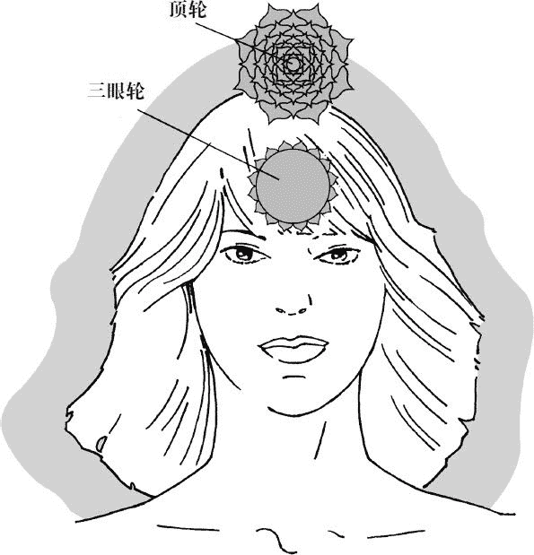

图 5.2　一个人头部和肩膀周围的气场
观察气场时，要确保观察对象的背后有墙或者背景

使用“第三眼”或“内在视力”来观察时，只需要简单地向内看。你可以保持眼睛睁开，并持续看着对方的双手或身体的任一部分，同时让你的意识向内进入头部。这跟白日梦非常像。如果你愿意，可以把眼睛闭一会儿，在心中将注意力集中到你所解读的身体部位，感受、观察、感知它周围的颜色。此时你接收到的印象或画面是非常真实、准确的。这不是你的想象！很多人能用这种方式学会正确地解读人体气场。

在解读和感知志愿者双手的能量时，可以根据你所看到和感觉到的，随时请他给你反馈与确认。

完成双手的解读后，将视线上移到脖子和喉咙，寻找负向能量或不干净的颜色。

现在，再看向胸膛。当你集中看着胸膛（尤其是心脏区域）时，让你的视线“穿透”胸膛，凝聚到远处的一个焦点上。在“看穿”胸膛后，观察胸膛周围的颜色和能量。如果有必要，就去查询第四章中的气场颜色表。这个方法近似于运用视线的边缘去看、去观察。

观察完胸部的能量或光晕后，将注意力转移到腹部，凝视肚脐上方的区域。使用同样的凝视技法，感受或观察这里可能有的能量阻塞，这里的阻塞看上去像是浮动着的灰色云团。如果的确是这样，那你就“读”到了一个能量阻塞。而且，在负向灰色云团的正下方，很可能存在着健康问题。

最后一步，迅速地解读志愿者的臀部和双腿。请对方站起来，将胳膊抬起，与身体分开一段距离。慢慢地沿着臀部两侧观察，将视线缓慢地下移，顺着一条腿的外侧一直看到脚部，然后是另一条腿的外侧——从臀部到大腿，再向下。不要着急，在看臀部与双腿时，短暂地关注一下膝盖处。如果你在一侧或两侧的膝盖观察到了负向的能量或颜色，代表这里有能量的淤塞，再次与观察对象进行确认。

甚至，你可以请观察对象转身背对你，以便你能解读脊柱、后背和臀部的能量。脊柱周围有负向颜色有时意味着此人有背部椎间盘方面的问题，甚至有多发性硬化症。如果在这些部位观察到浅绿色，则代表疗愈能量正被导入身体有能量阻塞和疾病的部位。

有时，你向观察对象确认你所看到或感知到的信息，但对方可能对疾病或能量阻塞完全没有觉察。这并不意味着你是错的，也不意味着他身体的这些部位没有问题。这可能代表被观察者没有觉察到身体的状况，或者这些负面能量还仅仅存在于气场中，尚未显化到身体层面。

最终，你的气场解读对象与志愿者会成为你以后的客户或病人（如果你有意成为直觉治疗师或职业气场解读师的话）。当你开发出自己这一极具价值的天赋后，你就可以帮到你的家人和朋友，藉由对他们的气场进行诊断。对身处医疗与咨询领域的人来说，这个能力可以进一步提高你的效率。毕竟，你人生的真正目标，就是帮助他人。

心之所愿，事无不成。

——弗朗西斯·培根（Francis Bacon，英国哲学家、科学家，1561～1626）

————————————————————

(1) 如同第三章所述，每次唱诵两到三遍。——译者注

# 第六章　脉轮系统

造物主之光，在你的光芒中闪耀。

——道格拉斯·德龙

人体气场环绕在人的身体与灵性体周围，在气场之内，还有很多被称为“脉轮”的能量中心。“脉轮”这个名称来自梵语，意为“光之轮”——这个描述是非常贴切的。

在人体气场内，有近 130 个与身体相连的能量中心（即脉轮），它们大部分都是次要能量中心，连接到身体的某个部分，比如双手、双膝以及双脚。其中，有七个主要的能量中心，对所有人都至关重要。这七个主要脉轮从上到下分布于身体的中间部位（包括头部），与身体的内分泌腺体系统有着紧密的联系。能量从这些中心流出，沿着身体向外扩展。它们有各自的特定名称和颜色，并与身体的特定腺体、区域相对应。详细信息请见下图：

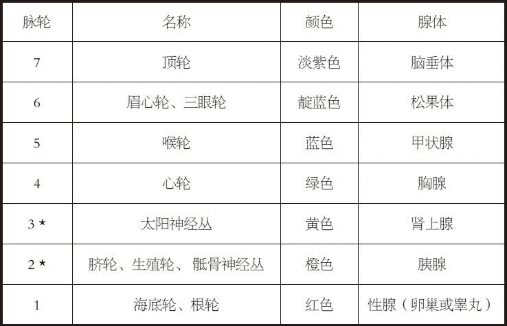

图 6.1　脉轮名称、颜色及相关腺体
* 第三脉轮和第二脉轮有时是互相连接的（例如，第二脉轮有时能影响肾上腺，第三脉轮也能影响胰腺）

当某人面朝你时，他的主要脉轮都会沿顺时针方向运行或旋转，这些旋转会围绕着一个相对固定的点，类似于人体气场的运动方式（想象一下天空中舞动的北极光，你就知道它们运动的样子了）。

每个主要脉轮都有不同的颜色，显示出它们不同的振动频率。这些颜色的振频由低到高排列，分别为红色、橙色、黄色、绿色、蓝色、中紫色（靛蓝色）、淡紫色。

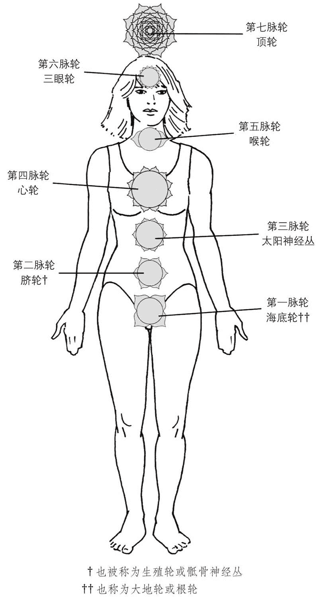

图 6.2　人体七大主要脉轮的位置

## 第七脉轮——顶轮

顶轮与源自造物主（即神）的宇宙高频振动直接相连，是你与本源（神）之间的桥梁。此处汇聚着宇宙的疗愈能量，并由自身导向其他脉轮、人体气场，甚至身体。顶轮呈淡紫色，以极高的速度或频率振动，在所有脉轮的颜色中，淡紫色振频最高。

这个中心的能量从头顶开始扩展，向上延伸大约 7～14 英寸（约 18～35 厘米），它的外缘恰好在人体气场边缘。

如第三章所述，顶轮与脑垂体相连。以特定方式进行“M-a-y”的元音唱诵，你就可能获得某些蕴藏在这里的“礼物”，或者获得某种裨益。

在佛教与印度教中，顶轮是开悟或联结神性的地方；在基督教中，这里是基督意识之所在；在神秘主义中，这是宇宙意识显现的位置。

## 第六脉轮——眉心轮或三眼轮

三眼轮是开启直觉力、创造力以及超自然能力的关键，它与顶轮的和谐运作能让你在生活中变得更高效、更全然。

第三眼的颜色通常为中紫色（靛蓝色），振频非常高，仅次于顶轮的淡紫色。它位于头颅内部的中央，同时从前后两个方向向外扩展。直觉治疗师、气场解读师和灵视者都能看到这个特别的能量中心，它呈现为环绕旋转的紫色能量，盘旋在额头前方。当他们面对面看着你的额头时，三眼轮的能量漩涡应该温和地沿顺时针方向运动。

像顶轮一样，我们已经在前文（第二章）讨论过这个脉轮。这个能量中心与脑部下方的松果体相连，以正确的方式进行“Thoh”的元音唱诵，你的直觉力、创造力以及超自然能力都能得到开发或提高。

解读气场、观察高频能量振动、从更高的源头接收灵性讯息……要发展这些能力，开发三眼轮是非常重要的。

## 第五脉轮——喉轮

喉轮是直觉性知识与智慧的表达中心。如果这个能量中心被恰当地开启，它能赋予你表达内在语言的技能，使你有能力进行直觉性的咨询和教导。

天赋的灵性治疗师、导师和咨询师会运用喉咙的能量来帮助他人。在恰当的时间说出正确的话——这能在疗愈过程中起到巨大的作用。声音与话语都有着真实的力量。

喉轮的颜色是蓝色，有很高的振动频率，仅次于靛蓝色与淡紫色。

在物质层面，喉轮与甲状腺相关。甲状腺是内分泌腺体系统的一部分，它影响新陈代谢，并通过释放特定的荷尔蒙影响肾上腺与神经系统。

如果喉轮被恰当地激活，脉轮与气场中的高频能量就能进入喉咙、甲状腺和脖子，维持这片区域的健康。在激活和开启喉轮后，保持它的平衡，智慧的语言会自然浮现。从生理上来说，喉轮能帮助甲状腺和甲状旁腺正常运作，也能让身体的内分泌腺体系统处于适度的平衡。如果有人甲状腺功能衰退，以特定的方式“刺激”他的甲状腺，就可以使其“加速”运作。

接下来，我们会介绍几个开启或激活喉轮的技能，以及一个刺激甲状腺的特别练习。

### 手掌脉轮开启法（暖手练习）

在进行任何一个开启喉轮的练习之前，你必须先做一个启动性、准备性的练习。

虽然双手（尤其是手掌）并不是主要的脉轮或能量中心，但它们仍然十分重要。对一个真正的治疗师来说，要想更有效率地工作，手掌脉轮就必须完全开启。

大多数人的手掌脉轮都没有开启。如果你看着一个人的手掌，想象皮肤上方盘旋着一个二十五美分硬币大小（约 1 元人民币大小）的光或能量的漩涡，你就知道大多数人的手掌脉轮开启的范围有多么微小了。

天赋治疗师的手掌能量中心是完全开启的，光或能量的漩涡会在整只手（包括手指）的上方盘旋。他们的双手非常温暖，神经能量与天然的疗愈精华在手掌和手指流动。

如果治疗师正确地开启了手掌能量中心，他就可以通过双手将疗愈能量传递到病人身上。病人的身体会接收到更多的宇宙疗愈能量，同时，其自身的天然疗愈能量也会被进一步激活。在这一过程中，病人受益良多。换句话说，随着时间的推移，治疗师与病人组成的“疗愈小组”会变得更有效率。

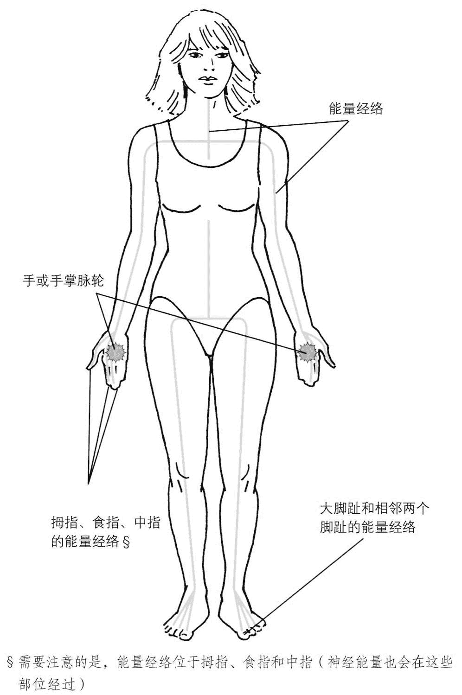

图 6.3　身体的能量经络

在人的胸膛、肩膀和上臂分布着一些能量经络，它们向下蔓延过整条手臂，经过手掌延伸到拇指、食指和中指。经络的末端在这三根手指的指尖，特定的神经能量会从指尖释放出来，导入另一个人的身体。手掌也能用同样的方式释放能量。

当手掌脉轮更加敞开，宇宙能量和人自身的天然能量就会不受阻碍地沿着经络流下，经过手掌，最终从拇指、食指和中指流出。这有助于适量的宇宙能量和天然能量流经这些身体部位和经络，从而保证个体或治疗师的健康。

下面这个特殊的暖手练习能帮助你“激活”手掌脉轮，让它更全然地开启。

首先，找个舒适的椅子坐下来。放松地深呼吸，双手合拢成一个祈祷的姿势，手指微微分开。保持这个姿势，将双手放在大腿上，温柔地移动双手手掌，让掌心之间分开大约 4 英寸（约 10 厘米）的距离（如图 6.4）。

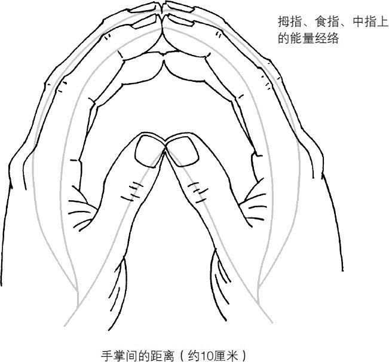

图 6.4　暖手练习中双手的正确位置
要激活和开启手掌脉轮，手掌之间必须生成温暖的能量

练习过程中，眼睛是睁开或闭着都没有问题。把所有的注意力集中在双手（尤其是手掌），感受温暖与能量进入此处。持续地专注于此，直到你在双手手掌感觉到一些温暖、知觉，甚至是流经手掌的一点脉动。此时，观想双手之间燃起白色的火焰或是有一根点燃的火柴，让温暖沿着双手手掌的皮肤表面蔓延。能量在手掌扩散开后，让它向上移入拇指，直到你在拇指（尤其是指尖）感觉到脉动或是温暖。现在，让双掌升起的温暖和能量上移到食指，直到食指指尖有了像大拇指指尖一样的感觉。最后，将温暖与脉动的能量移入双手的中指。

完成这些步骤后，再将所有的注意力集中在双手，感受那脉动、温暖和其他所有的感觉完全流淌过你的双手、手掌，进入大拇指和各个手指。让温暖的感觉持续一会儿。

如果你在感受能量或温暖时遇到困难，可以试着想象一个炎炎夏日，自己身处户外。温暖的阳光洒在双手上，碰触着皮肤。暖热的感觉穿透皮肤的表面进入双手，双手内外全都暖和起来。你也可以观想或是感觉自己将双手浸入了非常温暖的水中。为了帮助你感受，你可以回忆自己用热水洗盘子，或是把双手放入热洗澡水时的感觉。有时候，回忆能帮你达到想要的效果。

暖手练习成功后，你的手掌脉轮开始活跃、敞开。你练习得越多，就越容易让双手变暖，从而恰当地开启手掌脉轮，导入神经能量，让来自上天的宇宙能量和你内在的天然疗愈能量进入双手，并最终流向病人。

练习到一定程度后，大部分人只需要在治疗前简单地将注意力集中在双手上，疗愈能量和温暖就会自动进入。那时你就不再需要进行暖手练习，因为你自身的疗愈能量已经增强了。

### 拇指、食指与中指法

完成暖手练习后，你可以开始尝试拇指、食指与中指法，它能帮助你恰当地激活或开启喉轮。

将右手从大腿上移到喉咙，分开拇指、食指与中指，另两根手指则保持并拢。轻柔地将右手拇指放在喉咙右侧，就在“喉头”的旁边，然后将食指和中指放在喉头左侧，与拇指相对。男士可以直接把手指放在喉结处，而对女士来说，下巴与喉咙底端的中间位置最为恰当。将手指放在这里 3～4 分钟，集中注意力去感受指尖的温暖、能量和脉动。很快，你会发现指尖的脉动移入了喉咙、喉头，一直穿透到脖子后面。

手指在喉咙的停留，能够让热量、神经能量和天然疗愈能量进入此处。热量与能量可以共同协作，激活并“开启”喉轮，也能将温和、抚慰性的能量传递到甲状腺与甲状旁腺。

双手（尤其是手掌）的热量，对开启喉轮和其他脉轮都是非常重要的。进入甲状腺及其周边区域的热量和能量能够协助这个腺体达到平衡，并让整个内分泌腺体系统和谐运作。

对甲状腺亢进的人来说，这个简单却重要的技能可以减缓甲状腺的运作，就好像温和的按摩能够让身体放松一样。你会发现自己不再那么紧张焦虑，整个人都变得更加放松，更加平衡。在接下来的 7～10 天里，你可以重复练习两到三次。

这个独特的技能还可以减轻喉咙痛，并疗愈颈部的疼痛、僵硬等问题。它甚至还能放松颈部肌肉，从而减缓头痛。请记住，一旦热量和天然能量进入喉咙，这些感觉就会持续地涌入颈部，甚至进入头皮，把疗愈精华输送到需要的部位。

拇指、食指与中指法并非只能用于激活喉轮，它同时也是一个重要的疗愈技能。

当喉轮被适当地开启，你会成为更高效的治疗师、导师、沟通师与咨询师，并对自己真实的创造性天赋更加敞开。

### 喉轮开启技能（手掌环绕法）

练习几次拇指、食指与中指法后，你可以开始定期进行下面的练习。

先通过暖手练习温暖双手，然后将两手从大腿上移到喉咙附近。让手离开喉咙大约 6 英寸（约 15.5 厘米），恰好在人体气场之内、喉轮边缘。将左手拿开，垂放在身侧或是放回大腿上。

张开右手，让手掌朝向喉头（即喉咙中心），手掌与喉头之间保持 5～6 英寸（约 13～15.5 厘米）的距离，然后慢慢地在喉咙前方以逆时针方向做圆周运动。在小范围内缓慢、柔和地环绕右手，让手的运动轨迹覆盖整个喉咙（从下巴到喉咙底部）。然后，在继续这个动作的同时，慢慢将手向喉咙靠近 1～2 英寸（约 2.5～5 厘米）。保持掌心朝向自己，练习 1～2 分钟。这些步骤能够激活你的喉轮，让它沿着正确的方向缓慢转动。练习时如果把注意力集中在喉咙上，你会感觉到这里有轻微的活动，伴随着温暖或清凉的感受。请务必记住，当你从上往下看自己的手掌时，它是逆时针运动的。这能保证脉轮的正确转向——当别人面对着你和你的脉轮时，他会看到你的手在进行顺时针运动。

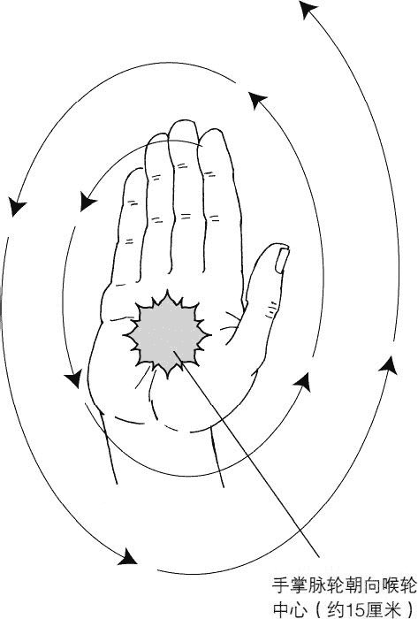

图 6.5　手掌旋转方向

有时，如果你运用脉轮的频率太低或是运用得不恰当，它就会自动“关闭”，需要被重新激活。因此，每当你感觉有必要这么做时，就进行这个练习。这能确保喉咙与喉轮都保持平衡、健康。

另外，手掌环绕法（手掌要朝向你自己）对所有的主要能量中心或脉轮都有效。在我们讨论其他主要脉轮时，还会再提到它。

### 刺激甲状腺法

前文中我们曾提到，有一个特殊的技能可以“加速”甲状腺运作。这会释放出特定的甲状腺激素，维持良好的新陈代谢以及提高能量水平。这个练习或许未必能彻底治愈甲状腺功能减退，但不论病人的病情是否严重，它都能在短时期内显著地缓解病症。

这个练习有两种不同的方式：第一种会运用拇指、食指与中指法，再以特别的方式进行特定唱诵；第二种则只需要进行唱诵。

在刚开始练习时，选取第一种方式或许是比较恰当的。请再一次练习拇指、食指与中指法，在你把手指轻轻地放在恰当位置时，深吸一口气，屏息约 5 秒后，缓慢吐气。然后，请恢复正常呼吸，将注意力集中在甲状腺区域。现在，你可以进行“K-a-y-e-e”的元音唱诵了，音调要比“T-h-o-h”或“M-a-y”的唱诵低一些，在低音 C 到中音 C 之间。同样，如果你对音乐无感，也无需担心，唱的时候比“M-a-y”唱诵稍微低沉些就好。

现在深吸一口气，屏息几秒，在用嘴呼气时唱诵“K-a-y”，像唱歌一样把它唱出来。然后缓慢而流畅地转换到“Y-e-e”，持续唱诵，直到你慢慢把气全部呼出。这个唱诵虽然是分两段进行的，但还是要连贯，两个部分要流畅地衔接在一起。

再进行一遍“Kayee”唱诵，试着降低或升高音调，同时留意你喉咙的振动，去感受这个振动完全地穿过整个喉咙。通过对音阶的测试，你会找到更和谐、更适合你的音高——低音 C 到中音 C 的范围只是一个参考，可以帮助你找到在喉咙引发恰当振动的音调。这个音调所引发的振动可以刺激甲状腺，引起甲状腺的共鸣或温和的共振，使它“加速”，从而向身体释放更多的甲状腺激素。练习的效果之一就是肾上腺素的增加。

“K-a-y-e-e”的元音唱诵不仅能刺激甲状腺和甲状旁腺，也能激活喉轮，让它更全然地敞开。如果你只希望激活或开启喉轮，唱诵一到二遍就会很有效。但如果你的甲状腺功能低下，则可以一次唱诵三到五遍，这会让你的能量与精力都得到提升。在过往对甲状腺功能低下的治疗中，这个方法的功效已经得到了证实。

如果你患有甲状腺功能低下一类的疾病，可以在第一次唱诵时唱三到五遍，大约两个星期后再唱三到五遍，这样可以增强你的生命力。此后，你只需要一个月练习一次，每次三遍就足够。

请注意不要在睡前进行这个练习，它会让你无法入睡——你的整个身体都会被大量的能量激活，无法进入休息状态。

如果你并没有甲状腺亢进或是功能低下的问题，只是想要激活喉轮，那每次唱诵“K-a-y-e-e”一到二遍就足够。觉得必要的话可以每个月重复练习一次。

这个练习很适合在早晨刚醒时进行，尤其是醒来后还觉得疲惫、懒散的时候。唱诵“Kayee”一到二次，你会发现自己的能量水平在提高。这个“唤醒”练习比喝几杯咖啡还要管用，但要注意适度，一次练习不要唱诵超过三遍！

现在，你已经学到一些开启喉轮、平衡内分泌腺体系统和保持健康的方法。当你能感受到喉轮或其他任何一个主要脉轮的能量，你会对自己的身体、能量中心，尤其是对自身的疗愈能量更有觉知。这种觉知能帮助你保持健康、快乐和平衡，而且可以给他人带来极大的帮助。

## 第四脉轮——心轮

不论是在自我疗愈还是疗愈他人方面，心轮都是一个很重要的能量中心。它散发着美丽的浅绿到中绿的颜色。这是振频非常高的绿色能量，对真正的疗愈来说，它非常必要。

依从内心来生活的代表有治疗师、照护师、社会安慰人员（comforters）等。我们所有人都应该学会立足心轮采取行动，因为这里是灵性之路开始的地方。

主耶稣大部分的工作与疗愈都渗透着他敞开的心轮所散发出来的爱与悲悯。事实上，很多耶稣基督的画像和雕像都会凸显他的心，也就是“圣心”。

你之心，即众生之心。

——拉尔夫·沃尔多·爱默生（哲学家、散文家，1803～1882）

心轮能量中心拥有高频振动的疗愈精华，在物理层面，它与位于胸膛上部的胸腺相关。胸腺位于心脏上方 2 英寸（约 5 厘米）左右，主要掌管身体免疫系统的平衡。作为身体防御系统的核心，胸腺会产生大量的特殊细胞，协助身体抵抗感染。这些特殊的细胞被称为 T 细胞。

绿色的疗愈能量从气场与脉轮中心“下降”到物质身体时，会降低自己的振频。如果心轮适度开启，允许爱与疗愈的进入，胸腺就能成功接收到这些能量。疗愈能量的振动会刺激胸腺产生轻微共鸣，释放 T 细胞和其他免疫系统所必需的分泌物，而胸腺作为免疫系统的一部分，也会变得更平衡与和谐。

压力是我们这个快节奏世界的主要问题之一，它会影响胸腺，引发胸腺的失衡与亚健康状况——这会导致疾病！减轻压力，为爱而敞开心轮，这对每个人都非常重要。

### 心轮开启技能

有几个特殊的技能可以唤醒和开启心轮，其中一个被称为“心轮开启技能”。

首先从暖手练习开始，在双手（尤其是手掌）变暖之后，将右手放在胸膛中央，让手的一部分盖到心脏。眼睛睁开或闭着都没关系。手放好后，将注意力集中在它上面，感受手掌贴合在皮肤表面的温暖。让这温暖从右手传递到正下方的皮肤表面，从一小块区域一直扩散到整只手的大小。随着你持续的专注，很快你会感觉到整只手（包括所有手指）的下方都充满了温暖。此时，感受温暖或能量从手的边缘向外扩散，延伸出 1～2 英寸（2.5～5 厘米）左右。继续专注于右手正下方胸膛处的温暖，持续几秒钟。

如果你对感受手掌与手指的温暖有困难，不用担心。刚开始练习这个技能时，在手掌感觉到凉意或是仅能感觉到手放在胸膛上，都是没问题的。以同样的方式让凉意或者对手的意识在胸膛表面蔓延开。不论你感受到的是温暖、清凉，还是手放在胸膛上的知觉，这个技能都可以有效地“激活”心轮。不管你有没有意识到，过程都已经开始——任何在心轮能量中心的温暖、知觉或是对它的关注，都会刺激它开启。

你感受到的温暖在胸膛上蔓延，其实就是心轮能量中心的激活与“开启”。这是你自我疗愈的重要一步，也是你疗愈他人的重要一步。

大多数生活在这个物质世界的人，成年后心轮都会关闭。如果我们想促进社会迈向觉醒，就必须有更多的人开启心轮。

### 专注呼吸法

接下来介绍的是一个特殊的呼吸练习，可以把它放在心轮开启技能的后面进行。这是一个将呼吸练习与专注力自然结合起来的方法。

在停止对胸膛上的温暖或能量的专注之后，让手保持原来的姿势，开始舒适而深沉地吸气。等空气充满肺部，就开始用鼻子缓慢地呼气。感受空气从胸膛进出，同时注意每次呼吸时胸膛的起伏。你所有的注意力都应该集中在呼吸与胸膛之上。注意你的手，它正在你的胸膛上随着每个深沉的呼吸而起起落落。这能确保你进行的是胸式呼吸而非腹式呼吸（腹式呼吸会在稍后用到）。

四到五个缓慢、深沉的呼吸之后，回到正常呼吸，仍旧专注于胸膛。能量已经进入了你的肺部和你的物质存在，这对打开心轮能量中心有极大的帮助。现在，你可以练习下一个心轮技能了。

### 观想婴儿法

这是个非常独特的方法，可以帮助你释放掉内在深埋的痛苦与情绪，也能帮助你释放出真实的爱的疗愈能量。它对所有人都有效，但可能对女士的帮助更大。

将右手放在胸膛上，正常地呼吸，在专注于呼吸的同时，想象自己正看着摇篮中一个可爱婴儿。这个观想可能会勾起一些人的美好回忆。看着婴儿，感受你心里对这个宝贝的爱。在心中俯下身，把婴儿抱起来，让他/她贴在你的胸前。温柔地抱着这个你深爱的婴儿，感受他/她紧贴着你的身体传递出来的温暖，倾听他/她发出的小小呢喃。轻轻给他/她一个拥抱，让爱与暖意在你的胸口蔓延。现在，抱着婴儿温柔地摇晃，然后轻吻他/她的额头，继续感受胸膛里涌动的爱与欢乐。最后，当你的内在感受到爱、温暖或淡淡的忧伤时，把婴儿放回摇篮，低头对着这个小家伙微笑。

把你心中的爱与温暖传递给他/她。感受爱从你的心中涌向这个神的孩子。再多体会一会儿，然后缓缓地做一个深呼吸，呼气的同时停止观想，让自己回到对当下所在的全然觉知中。

### 观想爱人法

这个技能可以作为观想婴儿法的延续。完成观想婴儿法的练习后，让上一个练习所带来的温暖与爱意留在胸中，转换心中的画面，想象一个你深爱的人。专注于你所爱的人，看到他/她也在望着你，对你微笑。甚至，你可以选择观想自己曾在过去深爱过的人，比如已过世的父亲、母亲或祖父母。

现在，想象自己张开怀抱向对方走去，在碰触到他/她时，给他/她一个拥抱。把你深爱的人抱在怀里，感受心中对他/她的爱。让所有的感情涌现。你甚至可以向他/她诉说你的爱意，体会蔓延在整个胸膛的温暖、情绪或感触。最后，将你的爱通过心轮传递给对方。给他/她一个告别的拥抱，松开手，对他/她说：“我爱你。再见。”

再次，将注意力回到你坐着或躺着的地方。

可能有人会观想自己的儿子、女儿、伴侣，甚至一个亲密的朋友。如果你决定观想一个已经往生的亲人或朋友，请意识到，回忆一个离去的深爱之人可能会引发悲伤、痛苦或愧疚的情绪。这是一种积极健康的疗愈方式，可以将深埋的情绪带到表面，进而将其释放。你也可以穿越生死，向天堂中的挚爱表达自己的感受与想法。对很多人来说，这是个强而有力的疗愈工具。

练习观想婴儿法有困难的人，可以尝试一下这个方法。很多时候，它对男士和女士都比前一个方法更有效。

你可以一起进行这两个观想练习，先观想婴儿，然后是爱人。两个练习之间的衔接要连贯。

如果你只想练习一个技能，可以先把两个都尝试一下，然后选择对你更有效的那个。你练习得越多，开启心轮的过程就越快、越容易。

最终，你会不再需要这些练习。你将够能直接专注于心轮，依照自己的意愿将它开启或关闭。对有些人来说，这需要练习和坚持，但天生的“感受派”在很短的时间内就能驾轻就熟。

这两个心轮的情绪释放技能可能会给不同的人带来不同的感受。或许你会在胸口感受到强烈的爱与温暖，或许会觉得极度悲伤，甚至哭泣。少数人的心脏附近会产生紧绷、压力或疼痛。甚至有部分人会觉得自己是不是心脏有问题。在比较罕见的情况下，会有人爆发轻微的焦虑。

这些感受是心轮被激活、开启的部分表现，也是身体与内在情绪得到确实疗愈的象征。等你回归正常意识，注意力回到周围的事物上，它们会很快消失。

几天甚至一周之后，你可以再次进行练习。不论你同时练习两个技能还是其中的一个，你都能更敏锐地意识到心轮在变暖、敞开。心轮开启时，大部分人都会感觉到弥漫在胸口的愉悦，也能很自然地让疗愈和爱的能量流淌。

第一次练习时，即使你在胸口感觉到悲伤、心悸、疼痛、压力或是轻微焦虑，在第二次或第三次练习时，这些感受都会减轻。很快你就能享受温暖与爱的能量，它们会取代先前的不快，会愉悦地穿过你的心轮，在整个胸膛扩散。从本质上说，这是因为你清理了内在的能量淤积，释放了深藏的痛苦，情绪、身体与精神层面的疗愈开始了。甚至，你已经触摸到了自己的灵魂——你内在的真实存在。

这些技能的终极目标，是教你快速地把注意力集中在心轮，并依照自己的意愿将它开启。最终，当你能够掌控心轮时，你就不必再依靠它们。但在你觉得需要时，请再次进行这些练习（心轮开启技能、专注呼吸法、观想婴儿法和观想爱人法）。举例来说，如果你度过了难熬的一天或一周，可以尝试一下观想婴儿法，它可以很有效地释放你在这段艰难时期从别人那里吸收的情绪痛苦。

在每次开启心轮之前，先做几个深呼吸的练习。不论你已经精通于能量工作还是刚刚入门，这都会对你有帮助。

### 观想小狗小猫法

练习这个特殊的冥想技能时，你可以选择专注于一只小狗或小猫（下面的讲解中，我们会以小狗为例，但如果你更喜欢小猫，也可以用小猫代替）。

你可以在完成心轮开启技能和专注呼吸法之后，立即进行观想小狗小猫法的练习，让它成为一个流畅而简明的延续。

专注呼吸法结束时，你的右手还放在胸口。此时，去感受内在的温暖，对你的呼吸保持全然的觉知。恢复正常呼吸，把注意力集中在一只可爱的小狗身上。想象你正站在户外的草地上，天气温暖而令人愉快。小狗就坐在你赤裸的双脚旁边。

在心中看到自己弯下腰，将这只可爱的、毛茸茸的小狗抱到胸前，温柔地搂住它。想象它贴在你胸前的身体是多么温暖。感受你心中对它的爱。

继续抱着小狗，用一只手抚摸它的头和身体。感受它靠在你胸膛上的温暖与重量。在它用凉凉的鼻子碰触你的脖子时，揉搓它毛茸茸的小脑袋和小身体。甚至，你可以想象这只小狗在你抱着它时努力地想要舔你的耳朵。最后，温柔地抱紧它，感受心中对这个小家伙的爱。

现在，把小狗放在你的脚边，看着它在青草地上奔跑。这个毛茸茸的小东西很笨拙，不断地跌倒。你看着它奔跑、摔跤，在草地上快乐地玩耍，不由自主地笑起来。继续看着小狗玩耍，感受你心轮中涌出的欢笑、快乐与幸福。

最后，深吸一口气，屏息 3 秒左右，用鼻子缓缓吐气。回到有意识的觉知中，让快乐的感觉在胸口回荡。

这个技能练习也可以单独进行。比如，不论你因为什么原因而感到悲伤和难过（或者可能在观想婴儿或爱人之后，感受到一些与之相关的不愉快情绪），观想小狗法都是个非常棒的练习，它能将你内心的负面情绪都转化为温暖、愉快的感受，唤起快乐的记忆与幸福的情绪。

### 温暖开花法

下面这个技能，对太阳神经丛、脐轮、海底轮和心轮都适用。

温暖开花法要在心轮开启和专注呼吸两个技能之后练习。回忆一下你是如何将右手放在胸前，感受手掌的温暖进入心轮，然后再专注于空气从肺部进出的……

练习完这两个技能后，开始进行温暖开花法。

把注意力集中在胸膛之内，从你手掌所接触的皮肤表面往下 1～2 英寸（约 2.5～5 厘米）。观想这里有一朵美丽的绿色鲜花，闭拢了所有的花瓣，含苞待放。继续以舒服的姿势躺着或坐着，想象一个暖洋洋的夏日，你躺在山坡上，享受着阳光的温暖。感受这温暖与能量渗透你的全身，强烈的暖意从头到脚地蔓延。然后再从脚趾开始，感受来自太阳的能量从下往上扩散，一直延伸到你的胸膛。回忆一下某次日光浴，可能会帮你唤起温暖的感觉。

专注于胸膛，感受太阳和你右手的温暖，让这能量进入你的胸膛，碰触到那美丽的绿色花朵（此时它仍是闭合的）。能量进入后，它开始张开花瓣。在心中看着这些美好的绿色花瓣慢慢伸展。花朵在你的胸口绽放，蔓延到心脏、肺部、肋骨，铺满整个胸腔。去感受这一切。感觉右手和太阳的能量倾洒到绿色的花瓣上，也洒满你的胸膛。最后，看到所有的花瓣都完全舒展开，感受它全然的绽放。花瓣随着太阳的能量和手的温暖穿透你整个胸膛，甚至向上进入肩膀、脖子、上臂。

享受在温暖的夏日躺在户外的感觉。感受阳光令人愉快的温暖照进你的心轮，从整个胸膛扩散开。你非常的放松、平静，能量倾洒在你的心脏、肺部、胸腔，以及胸膛上部的胸腺上。在这温暖愉快的感觉中多待一会儿，让美好的抚慰性的能量流经整个胸膛，享受内在升起的爱、和平与满足。

继续专注于这美妙而温暖的能量，3～4 分钟之后，想象自己仍旧躺在那里，太阳开始落山了。日落时，美丽的绿色花瓣开始在你的胸膛内收缩、闭合。慢慢地感受并观察到这些花瓣变得越来越小，在你的手掌下逐渐闭合，最后只留下些微的缝隙。感受你胸膛里手掌大小的温暖。这样做可以维持心轮适度的开启，好让疗愈能量流过。

现在深吸一口气，屏息几秒，用鼻子或嘴巴呼气。回归正常的呼吸与意识。你会感觉很放松，心轮还残存着些许暖意。透过这个简单而有效的技能，你可以学会依照自己的意愿打开、关闭心轮。你也可以稍微调整这个方法，用来打开或关闭其他能量中心。

多进行这个练习，你会越来越熟练。最终，你可以不依靠这个练习而非常娴熟地打开和关闭心轮。到那时，在你想打开、关闭心轮时，只要把注意力放在那里就可以。

如果你能有效地进行这个练习，你会成为一位更出色的治疗师、咨询师和导师。你能够把疗愈能量引导到全身，保持身体、心理，以及情感层面的健康。像乳腺癌、肺癌、心脏问题一类的疾病都会离你越来越远，因为在这些部位，爱与疗愈的能量充沛而流畅。

很多时候，如果疾病还不严重，这样释放心轮的疗愈能量会有助于身体的疗愈。比如有很多心律不齐的患者，就通过心轮的疗愈能量治愈了自己的疾病。

### 手掌环绕法

在对喉轮的探讨中，我们已经介绍过手掌环绕法。这个方法也可以用来平衡心轮。把右手手掌放在心轮能量中心前，离身体 3～4 英寸（约 7.5～10 厘米），进行同样的环绕练习就可以了。

当你敞开了心轮，你会变得更宽容、更温柔，对自己和他人都会有更多的爱。你将学会如何触及更多人的心与灵魂，从而创造一个更美好的世界。

## 第三脉轮——太阳神经丛

太阳神经丛位于肚脐正上方 1～3 英寸（约 2.5～7.5 厘米）处，振频低于心轮，颜色为黄色。

这一脉轮对应着物质世界较低等的原始情绪。大部分人是依从这个能量中心甚至更低的两个能量中心——脐轮与海底轮来生活的。

肾上腺是与太阳神经丛相关联的部位，它们属于内分泌腺体系统，分别位于两肾的顶端。交感神经系统是肾上腺与太阳神经丛较高脉轮能量之间的桥梁。

在超自然与灵性层面，太阳神经丛关乎于移情能力以及对人类情绪的敏感度。很多具有天赋的移情感应者与敏感之人，都能很好地通过这个能量中心与他人联结。虽然很多人会觉得他们的移情能力是种灾难而非礼物，但事实上，如果这种能力得到全面的开发和恰当的应用，它的确是个神圣的礼物。

肾上腺有个部位叫肾上腺皮层，它有时会被称为“情绪的镜子”。这是个非常贴切的称呼，因为这里分泌的很多荷尔蒙会直接影响到我们的情绪。

从物质层面来说，肾上腺是人类“战斗”或“逃跑”反应的源头。这两个内分泌腺体或器官分别包含内部髓质与外部皮层。内部髓质分泌肾上腺素和去甲肾上腺素，它们会刺激心脏，并能增加血糖、肌肉力量和耐受力。它们还能收缩血管、止血、传递神经冲动。英文中，肾上腺素有两个名称：“epinephrine”与“adrenaline”。

肾上腺的外部皮层则负责释放某种性激素与其他类固醇激素，让人感到舒适、愉快和平衡。

学会开启太阳神经丛，就能分泌出这些有益的物质，让你更平和、幸福、满足。你也可以从这个脉轮释放并导出疗愈能量，它会流经胃、肠道、肌肉和其他与太阳神经丛相关的部位。这种愉快的疗愈特质能抚慰胃部不适，减轻肠道疼痛，并适度放松、镇静这片区域所有的内部器官。

如果你患有大肠激躁症、克隆氏病或任何肠道疾病，开启太阳神经丛能量中心都能让疗愈发生，能极大地缓解疼痛与不适。如果你为性欲低落所苦，学会开启、关闭这个能量中心也能帮你矫正这个问题。

与太阳神经丛的能量协作，还能健康地释放你压抑的愤怒与情绪，有助于培养幸福和平衡的感受。

### 太阳神经丛开启技能

激活、开启太阳神经丛时，你会用到三个心轮的技能，包括心轮开启技能（此处又叫太阳轮开启技能）、呼吸专注法和温暖开花法，需要的话请复习这些技能。不过，此处我们要对这三个技能稍微进行调整，这一点会在下文中详述。请记住，这几个技能练习之间的连接要流畅而轻松。

做完暖手练习后，将右手轻轻放在胃部，在肚脐上方 2～3 英寸（约 5～7.5 厘米）的位置。体会手掌之下太阳神经丛所感受到的温暖，像心轮练习时一样。

让你的感受在太阳神经丛蔓延，并深入此处的内部器官。能量或温暖完全地扩散开后，开始进行呼吸专注法，但这次要进行深入的腹式呼吸，而非胸式呼吸。让呼吸深深地进入胸膛下部和横膈膜，在那停留几秒后，缓缓地用鼻子呼出。感受你放在胃部的手随着呼吸温和地起伏。再做两到三个深呼吸，然后恢复正常呼吸。

现在，专注于太阳神经丛上方右手的温暖。再次观想自己置身于夏日美丽的户外。让太阳的温暖与手掌的温暖一起穿透皮肤，进入表皮之下 2 英寸（约 5 厘米）左右的地方。这次，想象一朵黄色含苞待放的花，在能量碰触到它时，开始缓缓绽放。用心轮练习时对绿色花朵的同样方式对待这朵黄色的花，让它美丽的花瓣完全绽放，开满太阳神经丛，一直蔓延到所有的内部器官。如果你愿意，就让温暖伴随着这朵全然绽放的花多停留 5 分钟左右。

在美好的天气里，宁静而轻松地躺在室外。阳光穿透你的胃部，放松你的整个存在。享受这宁静的片刻。最后，你再次看到夕阳西下。随着太阳的下落，黄色花瓣开始在你的手掌下慢慢合拢，只保留一丝缝隙。现在，你手下的温暖应该变得与手掌差不多大小——让能量中心稍微开启，有助于保持适度的平衡和健康。

第一次尝试这三个技能的组合时，可能有些人会觉得太阳神经丛有压力或不适。这仅表示此处有身体层面的、情绪或能量上的淤塞。压力、担忧、焦虑和紧张都可能引起这种淤塞。

把一切都藏在“肚子”里的人，在练习中容易产生这种压力或不适的感受，因为脉轮能量会强有力地冲破太阳神经丛和内在器官的淤塞。这说明疗愈的能量流向了需要它的地方。

练习第二到第三次时，这些不适感会减轻，慢慢转变成温暖、满足的感觉。在这个过程中，一些悲伤、愤怒或伤痛可能已经通过有益的治疗方式得到了释放。

你最终能学会轻松而迅速地打开或关闭太阳神经丛，不再有任何令人不快的副作用。

你会变成太阳神经丛的专家，像对心轮那样依照自己的意愿或在需要时将它开启、关闭。对那些天生的感受派来说，这些方法会在很短的时间内就带来惊人的效果——比如在练习之后，你可能会变得非常放松、宁静。

参考此处的方法一样，你能用手掌环绕法来平衡太阳神经丛，让它回归自然的运作。将右手放在太阳神经丛前方，离皮肤表面 3～4 英寸（约 7.5～10 厘米），开始进行手掌环绕练习。

开启太阳神经丛对释放愤怒、减轻压力和放松都非常重要。

## 第二脉轮——脐轮或生殖轮

脐轮位于肚脐下方 1～3 英寸（约 2.5～7.5 厘米）处，颜色为橙色，振频要比太阳神经丛低。这个能量中心与权力、控制（程度较轻）及性能量相关。我们繁衍同类的渴望就深植于此，从某种程度来说，对他人的吸引力和自我保护意识也源自这个脉轮。

在物质层面上，脐轮与胰腺相关。胰腺是内分泌腺体系统的一部分，位于腹部之内。它释放某种消化酶，在平衡状态下能减缓人体的衰老。

脐轮有时会被称为生殖轮，因为脐轮的开启会刺激性腺等腺体，导致性激素的释放。脐轮“过度开启”的人往往性欲过盛，色情狂和性成瘾者就是比较极端的例子；而那些性欲低落或丝毫没有性欲的人，则受这种失调的对立面所苦——他们的脐轮是关闭的，这个区域中产生性激素的腺体功能过于低下。

无论哪一个极端都是不健康的。作为人，你会有性欲，这是你天性中的一部分，适量的性激素释放能让你充满活力，感到快乐和满足。某些分泌物的分泌不足会加速衰老的过程，导致内在的不快乐、不满足；而激素的过分活跃则会让你陷在低等、原始的情绪中——性欲会代替爱掌管你的生命。在这个较低的能量水平中，你是无法达到真正的开悟或灵性觉醒的。你必须在这两极之间找到平衡。开启并平衡的脐轮会带来内在的满足、更好的人际关系和健康平衡的消化系统。

### 脐轮开启技能

开启脐轮时，你会用到三个太阳神经丛的技能：心轮（脐轮）开启技能、专注呼吸法和温暖开花法。同样的，这些特殊技能应用于脐轮时会稍有不同。

这次，在温暖双手后，将你的右手放在脐轮能量中心，肚脐下面 1～2 英寸（约 2.5～5 厘米）的中间部位。

用心轮开启技能让手掌的温暖或感受进入正下方的脐轮。

专注于呼吸，感受空气深深地进入肺部和横膈膜，再向下进入骶骨中心。进行两到三次深沉的腹式呼吸，然后恢复正常呼吸。

现在，像之前一样，想象你在美好的一天身处室外。在你观想阳光进入身体的时候，将太阳的能量移动到脐轮，感受太阳与手掌的温暖穿透皮肤，进入脐轮，再向内深入 2～3 英寸（约 5～7.5 厘米），抵达橙色花朵的所在之处。花朵的花瓣是闭合的。

现在，右手与太阳的能量慢慢地碰触这朵花，橙色的花瓣开始缓缓绽放。让花瓣随着暖意完全铺满整个区域和这里所有的内部器官。感受、体验橙色的花瓣伴随舒缓的感觉从臀部一侧延伸到另一侧，在体内深处蔓延，再扩散到背部下方……你躺在夏日的暖阳下，享受脐轮内部的温暖、愉悦和宁静，全然地经验这个冥想。几分钟后，太阳再次下落。当太阳从地平线消失时，感受并看到橙色的花瓣慢慢收拢，直到花朵的开口只有你手掌大小。这会确保脐轮保持适度开启，好让你能接收到足够的疗愈能量。

温暖开花法也让一些温暖和能量从脐轮流入海底轮，从而激发唤醒海底轮。对脐轮来说，手掌环绕法也是适用的。

## 第一脉轮——海底轮、根轮或大地轮

在七个主要脉轮中，海底轮的振频最低，颜色为红色。它通过双脚脉轮与大地母亲相连。你最深的生存本能和原始冲动就来自这个脉轮。这里储藏着最基本、最原始的情感，包括对繁衍生息的强烈渴望。尽管海底轮的能量振频较低，并且不像其他较高的脉轮那样有着灵性的本质，但是对健康、生命力，以及平衡你物质的存在与灵性存在方面，是至关重要的。

透过这个能量中心，你会感受到对地球、自然和所有生命的深深敬畏。

海底轮与储藏在脊柱底端的昆达里尼能量（又称蛇能或气）紧密相连。在接下来的章节中，我们会非常详细地介绍这股强大的能量。

### 海底轮开启技能

大多数人的海底轮会被脐轮流淌下来的能量和温暖激活，所以在海底轮，我们不需要再用开启心轮、太阳神经丛和脐轮时的三个基本技能。你只要舒适放松地躺下或坐下，做几个深呼吸就好——这是海底轮开启技能所需的全部准备。在练习其他主要脉轮的开启技能时，唤醒第一脉轮的过程已经开始了。

开始时，将所有的注意力都集中在海底轮，想象海底轮内部有一朵红色蜷缩的花。持续专注于此，感受这里的压迫、触动或温暖。想象一个温暖的夏日，自己躺在户外，太阳的能量从腹股沟进入，碰触到这朵红花。太阳的温暖让花瓣绽放，并从海底轮铺展开来。感受并看到温暖随着红色的花瓣蔓延，从身体的一侧一直延伸到另一侧。甚至你可以观想大腿上半部分的花瓣和温暖，去感受它们。

享受这温暖愉快的感觉。大约 5 分钟后，太阳开始下落，红色的花瓣也慢慢闭合。最后，花朵只张开直径 3 英寸（约 7.5 厘米）左右的圆口。在这里保留淡淡的温暖或知觉，让疗愈能量能够流入。

在比较罕见的情况下，少数人第一次练习时会觉得海底轮有些不适。只要多练习几次，这些不适很快会被温暖愉快的感受取代。不舒服的感觉代表身体、情绪或能量层面有阻塞，以恰当的方式开启海底轮会有助于减轻这些感觉。

现在，你已经学会正确地激活和开启七个主要脉轮。最终，你将能娴熟地与自身能量中心协作，这会确保你的平衡、健康、快乐和满足，也会让你在自己独特的觉醒之路上快速成长。

我们都是拥有物质身体的永恒灵魂。对脉轮能量中心的运用，创造了内在本我（true self）与灵魂之间的特殊联结——正是人体脉轮系统的激活，带来了灵魂的进化，也使你成为了光之存有。

造物主的神圣火花就栖息在我们每个人之内。此时，在这个我们称之为“家”的地球上，它必须被呈现。

对第欧根尼来说，除了为灵魂（而非身体）带来勇气与力量的努力，没有任何努力是好的。

——爱比克泰德（Epictetus，希腊哲学家，公元 1 世纪）

# 第七章　唤醒昆达里尼

一旦我们对身体内部的能量流动敞开，我们就同时对宇宙的能量流动敞开了。

——威廉·赖希（Wilhelm Reich，心理分析家、理论家，1897～1957）

每个人的内在，都潜藏着一股不可思议的能量，对它的挖掘和释放会带来惊人的效果。在第六章，我们曾简要地提到它，它被称为昆达里尼（kundalini），有时人们也叫它气、普拉纳、蛇能或生命力量。

这股天然能量储藏在脊柱的底端，就在肛门与生殖器之间。

昆达里尼（kundalini）是个古老的梵语词汇，词根“kundala”，意思是“盘旋”。印度神话中有一个叫“昆达里尼”的女神，她充满性能量，外表是一条沿脊柱底端盘绕的沉睡之蛇。

运用适当的技法，昆达里尼能量能够被唤醒，之后这股能量沿着脊柱向上攀升，经过交感神经分支（植物神经系统的一部分），从颅骨顶端的顶轮冲出。

唤醒这股潜藏于海底轮的强大能量后，可以引导它进入、通过其他六个主要脉轮，并在沿途作用到内分泌腺体系统。

其实，身体的七个主要脉轮都与内分泌腺体系统相连，这种连接由植物神经系统的交感神经分支完成。

脉轮能量的极高振频会与交感神经系统协调运作，这个特殊的神经系统（或分支）与宇宙振动、宇宙能量、人体气场以及一切来自造物主与上天的灵性能量相通。（不幸的是，医学界并没有认识到这个和谐系统的真实潜力——他们迟早会的。）

在本章中，我们将对交感神经系统（分支）以及内分泌腺体系统进行探讨。同时，本章也会介绍一些释放及运用昆达里尼能量的特殊技能。正确地运用这些技能，可以将昆达里尼能量安全地释放，并使你从中获益。

你可能已经发现，在某些情况下，跳舞、唱歌、散步和跑步都能激发生命力量（昆达里尼），这股能量会温和地沿着脊柱往上流动，通过各个脉轮，最后从头顶的顶轮涌出。甚至，有时聆听一段美妙的音乐也能让这股能量进入脊椎，给你带来激昂兴奋的感觉——就像孩童玩耍的状态一样，此时，你已经释放了昆达里尼的能量流，体验到了高频能量和幸福感。

图 7.1 显示了七个主要脉轮、昆达里尼、脊柱（中枢神经系统）、自主神经系统（即植物神经系统，包括交感神经系统与副交感神经系统两个分支）之间的关系。接下来，我们会详细探讨这些系统与分支。

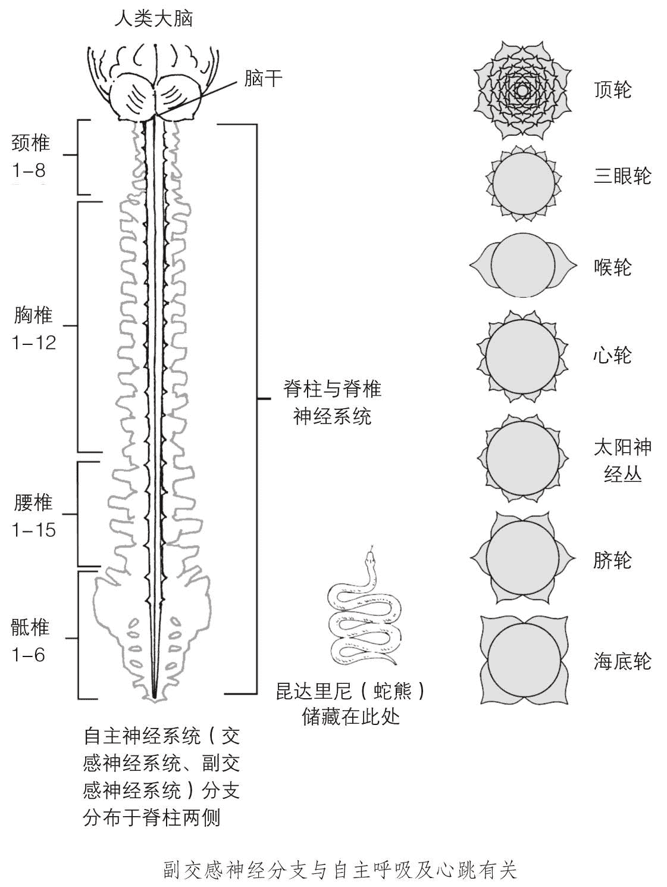

图 7.1　脉轮系统、神经系统与昆达里尼

## 唤醒昆达里尼能量的益处

在探讨唤醒和释放昆达里尼能量的技能之前，我们有必要先了解一下与昆达里尼和脉轮能量协同运作所带来的裨益。

下面列出的，是恰当释放昆达里尼与脉轮能量的一些益处。每个主要脉轮所蕴含的高频振动都与潜藏在脊柱底端的昆达里尼能量高度调谐。昆达里尼能量流能够刺激脉轮开启，并向每一个脉轮以及身体释放惊人的能量。

● 减轻压力。昆达里尼能量可以极大地减轻焦虑和压力，无论是心理上的，还是身体引起的。它能向血液释放特定的化学物质，从而平复情绪。这种能量作用于神经，就像温和、抚慰性的按摩一样。

● 灵性成长。你每次运用内在的昆达里尼能量，都能提升内在的灵性，获得更多的灵性领悟。

● 开发超自然能力（灵力）。昆达里尼能量流有助于顶轮与三眼轮的全然开启，这有助于你使用更多的天赋灵力。

● 增强性快感。通过训练和实践，与昆达里尼能量紧密相关的性能量会得到释放。除了寻常的身体上的快感与高潮，你还能体验到“能量的结合”。

● 提升自我觉知。随着昆达里尼与脉轮能量的释放，你会对真正的自我（即内在本我）有更高的觉知。你会明白，你是个永恒不朽的灵魂，栖息在短暂的肉体形式中。

● 与神性（即宇宙意识）融合。恰当地运用昆达里尼能量流，顶轮就会与第八脉轮——在顶轮正上方 8 英寸（约 20 厘米）左右——建立联结，上天的神性能量或宇宙能量可以通过脉轮进入你的身体与整个存在，给你带来美妙的神启或“天人合一”。

● 增强精力。每天释放出昆达里尼能量，能够增强生命力，提高能量水平，使你精力充沛。

● 促进疗愈。对昆达里尼与脉轮能量的持续运用，有助于身体疾病与心灵创痛的疗愈。在能量运作过程中，疼痛减轻了，细胞也会更新。

● 减缓衰老。昆达里尼能量通过交感神经系统进入身体，能够影响荷尔蒙分泌，平衡腺体，并减缓衰老过程。在某些情况下，老化过程甚至会出现逆转。

● 扩展和净化人体气场。这一强大的能量流能够扩展和净化你的气场，在负向颜色对身体层面产生影响之前，就将它们驱散。一个强大、扩张的气场能帮助你保持健康，并以充满爱与和平的方式影响他人。

● 平衡、开启脉轮。像之前所提到的，昆达里尼能量的释放能刺激开启各个主要脉轮，并向身体相应部位释放高频能量。从而，疗愈能量可以流入最需要的部位。

● 平衡内分泌腺体系统。昆达里尼能量流会影响主要脉轮，使它们以正向、有益的方式影响内分泌腺体系统，从而扭转化学物质失衡的情况。同时，某些荷尔蒙的释放也会给你带来内在的满足感。

● 增强心灵敏感度。昆达里尼能量释放进入大脑后，会深远地影响大脑以及此处的三眼轮和顶轮。你将能运用更多的大脑潜能和超自然能力。

从本质上说，昆达里尼——你的内在能量，能用于治疗工作，也能用来提升人类意识。

## 昆达里尼唤醒技能

有些特殊的方法能够安全、有效地唤醒或激活内在的昆达里尼，并把它传送到身体的各个部位。

但是请注意：这股沉睡于脊柱底部的能量是非常强大的，如果不加约束地释放，会爆发压倒性的能量潮。

冥想、瑜伽、观想练习等，都是一些有节制的技巧，能以积极的方式温和、舒缓地唤醒和引导昆达里尼能量。不论是对精神还是身体而言，昆达里尼都是强大的疗愈能量。

在探讨特殊的昆达里尼能量技能之前，我们有必要再给予最后的警示：一个不稳定或是未准备好与昆达里尼及脉轮能量一起工作的人，可能会不小心或不恰当地释放出这股能量，这会带来一些令人非常难受的副作用。同样，一个未得到良好训练的能量治疗师，也可能会引发客户激烈的情绪和身体反应。

这些副作用包括焦虑、恐慌、身体（与脉轮相关区域）疼痛、悲伤、沮丧、紧张、失眠、烦躁等。在某些情况下，昆达里尼能量会像火山一样喷发，迅猛而狂暴地从顶轮汹涌而出。这可能会引起身体某些部位的细胞损伤。因此，昆达里尼能量值得谨慎对待。

所幸，我们可以运用一些适当的、安全的方法为这种能量工作做准备。在第二章和第三章提到的三眼轮与顶轮技能，是两个必要的步骤，在你与内在生命能量和昆达里尼能量一起工作之前，你可以运用它们来做准备工作；第六章介绍的技能，是你进行安全的能量工作必不可少的方法。

很多关于昆达里尼和脉轮能量工作的教导体系，都强调以地球能量、双脚脉轮，尤其是海底轮为起点。这些体系或思想流派认为，地球能量（“大地母亲”）和海底轮是最为重要的。他们深信，地球能量可以通过双脚脉轮被引导入海底轮，或者，如果坐姿正确，地球能量也可以直接进入海底轮，然后将其激活、开启，唤醒储藏在它附近的昆达里尼。能量会沿着脊柱上升，通过其他六个主要脉轮，最后从头顶（顶轮）涌出。

对大多数刚刚开始这段旅程的人（包括能量中心不活跃或阻塞的人）来说，这个方法过于粗糙和困难，甚至可能完全无效。地球能量的确非常重要，海底轮也的确应该被激活，但同时，还有其他因素需要考量。

作为人类，我们需要宇宙能量（源头的灵性能量），也需要大地母亲的能量。与此同时，我们自身的内部能量（脉轮能量和昆达里尼能量），既要与上方的源头能量相连，也要与下方的大地能量相通。这三种能量对保持健康、平衡与和谐都是必需的。

灵性或宇宙能量就在你身边，随时等待你去取用。在进行任何昆达里尼练习之前，你必须先学会运用这些能量来适当、有效地开启脉轮。这确保内在的昆达里尼能量能被安全地激活，也能确保在它沿着身体向上攀升时，不会带来令人难受的副作用。

这种强大的能量就在你呼吸的空气中，在你喝下的水中，也在自然万物之中。宇宙能量的振频极高，它能通过顶轮进入，向下流入其他主要脉轮，最后唤醒潜藏在海底轮附近的昆达里尼。这个唤醒的过程是温和而平缓的，昆达里尼可以通过交感神经系统向上流入脊柱，经过内分泌系统与各个主要能量中心，最后由顶轮流出。

### 顶轮开启技能

如果你想在开始之前再进行一到二次“M-a-y”唱诵，可以使用下面的技能，它能让唱诵起到更好的效果。

以舒适的姿势坐好，双脚放在地板或大地上。不必在意你的脊柱是否笔直，这不重要，只要确保自己舒服地坐在椅子里就好。你甚至可以躺在躺椅上——如果是这样，要确保下垂的双脚放松。

缓慢、均匀地做二到三个腹式呼吸。在空气进出胸膛时，专注于胸膛的起伏。

现在，恢复正常呼吸，把注意力从胸膛上移到头顶顶轮能量中心所在之处。

把所有注意力都集中在这里，专注于一片直径 1 英寸（约 2.5 平方厘米）的区域。不用担心你的焦点是否正确，大概位置就好。

持续地专注于此，直到这里有了感觉（可能是压迫感或其他感觉，甚至像有人用手指碰触你的头皮）。让这感觉从直径 1 英寸（约 2.5 平方厘米）的范围向外扩展，完全地包围整个头顶。去感受它。对有些人来说，观想白光或能量围绕整个头顶，可能会起到同样的效果。

现在，看到或感觉到这种酥麻的能量蔓延过头发、头皮，向下进入头的后部和两只耳朵——大体上，要让能量完全覆盖整个头部（包括额头和三眼轮）。让能量在头部跳动，感觉或看到白色的光（能量）在整个头部扩散，甚至进入头的内部。

集中注意力去体验这股在头部蔓延的能量，感受它完全包围住双耳，从头顶蔓延到颅骨底端。专注地感受，持续一会儿后，引导它进入大脑。

最后，深吸一口气，屏息几秒后缓慢呼气。让能量或感受收缩，恢复到 25 美分硬币（约 2.5 平方厘米）大小，集中在这个范围内。如果你觉得有必要，可以去感觉、观想白光或能量像夕阳西下时的花朵一样把花瓣合拢来。“关闭”顶轮后，你的头顶还会有些轻微的感受，或是有一点压迫感。这表明你已经学会用正确的专注技能开启、关闭顶轮。头顶轻微的感受说明顶轮保持着平衡，开启适度。

他对他们说：“属光的人有光在他里面，这光要照亮全世界。若不照亮，就是黑暗。”

——耶稣语录

### 心轮——温暖开花法

在第六章，你已经学会用温暖开花法打开和关闭心轮。现在，请再进行一次这个重要的观想练习（记得心轮的花朵是绿色的）。确保你的双手已经以正确的方式变暖，把右手放在胸膛处，然后呼吸——就像最初教你的那样。请随时查阅第六章关于心轮的内容。

完成温暖开花法后，放松休息一会儿。恢复正常呼吸，准备开始下一个技能的练习。

### 顶轮到心轮能量流动法

在你准备好继续时，深吸一口气，从 1 数到 5，然后用鼻子缓慢地呼气。恢复正常呼吸，重复顶轮开启技能。

在白光或能量完全扩散时，让它从顶轮和大脑向下，进入第三眼能量中心。把所有的注意力集中在额头，感受、观察能量在额头蔓延。持续专注在这里，让压迫感或能量完全扩散，一直覆盖住眉毛以上的整个额头。你可以感觉压迫感或看到白光或从一侧的太阳穴扩展到另一侧太阳穴。

现在，你的额头正中应该产生了更强烈的压迫感，并向外蔓延，从皮肤表面进入头的内部，深入 1 英寸（约 2.5 厘米）左右。这表明松果体已经被激活，三眼轮也打开了。

再专注于三眼轮几秒钟，然后感受能量或看到白光慢慢从额头向下移到脸部。能量继续往下，经过嘴唇、下巴，进入喉轮。

把所有注意力都集中在喉轮，直到你感觉到温暖与能量，或是看到白色的光芒。体会此处的感受，让能量从喉咙扩散到脖子，当脖子中段有了光芒或温暖后，享受这种感觉，持续 3～4 秒钟。

现在，将这股能量下移到胸膛上部心轮的位置。

完全专注于心轮能量中心。如果你喜欢，可以把温暖的右手温柔地放在胸膛上，像之前讲过的那样。这一点并非必要，你可以自行选择。

在心轮，你要再进行一次温暖开花法，或者可以用观想婴儿法、观想爱人法代替，选用一个对你来说效果最好的技能。

在成功地敞开心轮后，你就可以将这里的温暖、感触或光芒向上移动了。记得不要关闭心轮，让它保持完全的开启状态，好让你能将心轮所有的爱和疗愈能量都移上去。

再感受一下心轮美妙的温暖或能量。然后将能量向上移动，穿过胸膛上部，进入喉轮。在喉轮处感受一下，然后让这抚慰的能量继续向上，进入脸部。集中注意力体会能量蔓过脸部、流入三眼轮的感觉。等能量进入三眼轮后，感受能量或看到白光再次在额头扩散开。你再一次刺激了松果体，也让三眼轮完全开启，因此你可能会再次感觉到额头中心的压迫感，这是很好的现象。

让额头的感触或能量上移到顶轮。享受这美妙的能量或酥麻感，让它完全覆盖整个头部，包括大脑和额头。

把注意力集中在此处，几秒钟后，将能量下移到脸部、喉轮，一直到心轮。

当能量再次抵达心轮时，像上次一样，让它在整个胸膛蔓延。

完成这一切后，再将能量上移，回到顶轮能量中心。

继续移动这股美妙的能量或白光，从顶轮到心轮，再从心轮到顶轮。让能量上上下下，在这些区域间流动，持续大约 5 分钟的时间（或在你觉得足够时停下）。现在，放缓能量的移动速度。感觉或看到它移动得越来越慢，最后在顶轮或心轮停下来——你可以凭感觉让能量停在一个脉轮上，顶轮或心轮都可以。你只需在能量的推进减缓之时，把注意力集中在它所在的脉轮，然后专注于此处，直到你感觉到温暖（心轮）或轻微的压迫感、酥麻感（顶轮）。

至此，整个练习完成了。深吸一口气，屏息由 1 数到 3，然后用鼻子缓慢、均匀地呼出。恢复正常的意识状态。

如果你在感受、移动脉轮能量时遇到困难，可以每次专注于一个脉轮，直到那里产生温暖、感触或压迫感为止。这是最合适的练习方式。举例来说，你可以专注于顶轮，直到你在此处有了感觉，然后把注意力转移到三眼轮，重复这个专注的过程。一个脉轮一个脉轮地继续。

当你能在每一个脉轮感觉到能量或温暖时，就可以练习将能量从一个脉轮流畅地移动到另一个脉轮了。最终，你将能加速这个过程，让脉轮的疗愈能量像温暖的溪流一样，在所有的脉轮之间流动。

### 心轮到海底轮能量流动法

现在，你已经准备好进行能量流动技能的第二阶段了。第六章的所有练习，以及你刚完成的顶轮到心轮能量流动练习，都能帮助你成功地在全身引导脉轮能量。

在开始心轮到海底轮能量流动法之前，再练习一次温暖开花法。

让美丽的绿色花朵在心轮完全开启，等花瓣绽开到极致时，保持住这个状态。这能确保心轮的敞开，让疗愈能量向下流入太阳神经丛。

喜欢的话，你可以将右手温柔地放在太阳神经丛上——如果手掌脉轮的温暖能帮你集中注意力，那就请多利用这个方式。对很多人来说，将温暖的疗愈能量或白色光芒从敞开的心轮下移到太阳神经丛，是非常轻松自然的。

把注意力集中在太阳神经丛，感受或观察温暖与能量在此处蔓延。也许温暖开花法可以协助你有效开启这个脉轮。

成功开启太阳神经丛后，引导能量向下经过肚脐，进入脐轮。在那之前（如果你愿意），将右手移动到脐轮，体会此处的温暖、能量或白色光芒。脐轮的脉轮能量正在整个区域扩散，感受它，直到它从臀部的一侧蔓延到另一侧。你也可以使用温暖开花法来协助能量扩散，记住这里的花朵是橙色的。

当脐轮的温暖、能量或花朵完全铺展开后，将它下移到海底轮。感受海底轮的温暖或观察此处的白光，让它扩散进入两条大腿。然后，将温暖的白光（能量）上移回脐轮，在脐轮处感受几秒钟，再缓慢地移到太阳神经丛，接着回到心轮。请感受整个过程中的温暖，或是观察白光的流动。

再次让能量在胸膛扩散，体会心轮处的爱与温暖。几秒钟后，重新开始整个过程。把能量或白光向下引导，穿过太阳神经丛、脐轮，进入海底轮。

能量抵达海底轮后，再次让它从臀部的一侧扩散到另一侧，然后再掉头向上，穿过脐轮、肚脐、太阳神经丛，最后回到心轮。

重复这个过程，引导温暖或光芒从心轮流入海底轮，再从海底轮流入心轮。让脉轮能量在身体以及几个脉轮之间平稳流畅地上下流动。

完成之后，开始减缓脉轮能量的流速，最后让它停留在心轮。把所有注意力集中在心轮，4～5 秒钟后深吸一口气，屏息一会儿，再用鼻子缓慢、均匀地呼气。恢复正常呼吸，回到正常的意识状态。

同样，如果你对感受和移动脉轮能量有困难，就试着每次集中于一个脉轮，直到你在这个脉轮感觉到温暖或其他感受为止。接着把注意力转移到下一个脉轮，继续保持专注，直到此处也产生了感觉。从心轮、太阳神经丛、脐轮、一直到海底轮，一个脉轮接着一个脉轮地进行专注练习，然后再慢慢加快速度，直到脉轮能量能够在所有脉轮中平缓、流畅地上下流动。

你越勤奋地练习，就能越轻松地引导能量。最终，你会像天生的“感受派”那样，自如地在身体和各个脉轮之间移动脉轮能量，获得益处。

当你能够娴熟地引导能量时，储藏在海底轮区域的昆达里尼能量就会被启动。被唤醒的昆达里尼能量会沿着身体向上，穿过交感神经系统、内分泌腺体系统，以及七个主要脉轮，最终从头顶涌出。昆达里尼会与脉轮能量汇合成一股能量，流经各处。

在这几个特殊技能中，对白光、温暖或能量的感受与观察，实际上会启动脉轮能量与昆达里尼能量的觉醒，并让它们以适当的方式流动。

现在，你已经领会到专注于身体某处，引导疗愈能量流经这里的强大功效了。

### 顶轮到海底轮能量流动法

这是最后一个技能，也是最重要的技能。显然，它是前面两个技能的结合。

练习开始时，你既可以选择顶轮作为起点，也可以选择心轮。让你自行选择的原因很简单：有些人会觉得激活和开启顶轮比较容易，但也有很多人觉得专注于心轮和开启心轮更得心应手。

不管你选择哪个脉轮作为起点，你都需要继续引导能量、温暖或光向下穿过所有的主要脉轮，然后再回头向上。基本上，你会重复“顶轮到心轮能量流动法”和“心轮到海底轮能量流动法”这两个技能。

现在，选择一个脉轮（顶轮或心轮）作为冥想起点，然后引导温暖、感触或光芒从这个脉轮一直向下流动，穿过各大脉轮，进入海底轮。当能量抵达海底轮后，引导它调头向上，穿过所有的主要脉轮，进入顶轮。感受整个头部的酥麻感，或观想白色的光（能量）覆盖整个顶轮。

现在，将脉轮能量向下引导，穿过所有的脉轮，抵达海底轮。感受能量或温暖在大腿上部和臀部扩散。然后，再次将能量向上引导，穿过主要能量中心，进入头顶。

重复这个过程，引导脉轮能量或白光在身体与各个能量中心之间流动。你可以温柔地将右手依次放在心轮、太阳神经丛、脐轮上面，运用手掌脉轮的温暖帮自己找到焦点。你也可以通过温暖开花法让心轮、太阳神经丛、脐轮和海底轮完全开启。

在引导光、温暖和能量在身体与所有脉轮中上下移动时，可以运用其中任何一个技能，也可以运用所有的技能，以达到最佳效果。

当脉轮能量流变得平稳流畅时，再次将它引入海底轮。让温暖或感触延伸到大腿上半部分，然后沿着大腿向下，穿过双膝，进入双脚。

感受双脚脚底的脉轮能量。在我们的两个脚底分别有一个能量中心，就像双手的手掌脉轮一样。体会或看到大地母亲的能量从脚底脉轮进入小腿、大腿，最后进入海底轮，感受它在海底轮的脉动。此时，昆达里尼已经被完全唤醒，请引导它向上移动，与脉轮能量一起，穿过所有能量中心，到达顶轮。

像之前一样，感受能量或看到白光布满整个头部，然后让能量向下流动，抵达海底轮，最终进入双脚。再次让大地能量进入身体，流经整个身体和各大脉轮，进入顶轮。

现在，请将所有的能量汇合，让大地能量、宇宙能量、昆达里尼能量和脉轮能量汇成一股能量流，在身体里上下流动，从头顶到脚底。

这美妙的能量就像温暖柔和的溪流一般，在身体里上下流动，流经脉轮甚至脊柱。享受过程中产生的触感、温暖和平静。甚至，有人还可能会有幸经验到上下冲刷脊柱的能量激流。

这个能量流的练习最多可以进行 5 分钟，然后就要减缓流速，最后停在心轮或顶轮。将所有注意力集中在能量停留的脉轮处，持续几秒钟。体会胸膛上部（心轮）的暖意或头顶（顶轮）的酥麻感。深吸一口气，屏息 3 秒，然后呼出。恢复正常意识状态。

在大多情况下，所有主要能量中心都会自动闭合一些，但会略微开启，保持平衡状态，这样疗愈精华会保留在脉轮中，维持身体的健康与和谐。

对天生的“感受派”来说，顶轮到海底轮的能量流动练习会自然而愉快，毫不费力。你可能会发现，自己能够跳过顶轮到心轮、以及心轮到海底轮的能量流动练习，直接进行最后的练习。

而对那些在开始练习时感到困难的人来说，本章和前一章中所给出的方法能帮你打开脉轮，让能量流动起来。你练习得越多，整个过程就会越轻松自然。

这个技能非常重要，如果无法每天练习，也要坚持每周练习一次。这一练习应该成为你日常生活的一部分。

另外，在你完成这个练习后，你的生活都会变得更宁静、和谐。练习大约三天之后，你会发现生活中的事件、境况和状态似乎都变得更顺遂。这股能量会改变你和你的感受，也能改变周围人对你的感受和反应。你学会了“柔和”自己的气场与脉轮，从你存在的本质向外释放更多平静安宁的能量。随着你持续地进行脉轮能量流动练习，其他人也会注意到你这种积极的转变。你会发展出更美丽、明亮、清澈的气场，你会散发出强大而柔和的能量。这种爱的能量会以微妙却深远的方式影响他人，帮助他们也迈向自己的灵性道路。

## 交感神经分支

人体内部含有中枢（脊髓）神经系统与自主神经系统（即植物神经系统）。

自主神经系统与疗愈和脉轮能量关系更为密切，它包含两个分支：交感神经分支和副交感神经分支。其中，交感神经分支与脉轮、人体气场、宇宙能量和大地母亲的能量直接相连。

正如前面提到的，交感神经系统分支与高频振动以及造物主神和谐一致。

自主神经系统位于脊柱的两侧^((1))。在脊柱中，又包含中枢神经系统。

这两大神经系统通过特定的神经群组（即“神经节”）互相连接，这种非同寻常的安排，确保了重要的神经能量可以在这两个神经系统间以及在整个身体中流动。

此外，交感神经分支通过神经节与人体的脉轮系统相连，它能与七大主要脉轮的高频振动产生共鸣或调谐。脉轮的振动能量流入这些神经时，能够“减速”或降低振频。然后，神经节会将“减速的”脉轮振动引导入中枢神经系统、内分泌腺体系统，以及几乎身体所有的部分（包括细胞）。

同样地，身体层面的低频能量（如不适、疼痛或疾病等），也能从腺体、器官、细胞、肌肉以及身体的中枢神经系统向外流出，进入主要脉轮或与患部紧密相关的脉轮。这就是气场解读师和直觉治疗师能看出气场或脉轮中含有的负向颜色的原因。

从本质上来说，交感神经分支就像一个双向街道，能让各种不同的能量沿着它向两个方向流动。

通过对交感神经分支以及其工作原理的了解，你会更深刻地认识到脉轮能量流动技能的价值。

昆达里尼、脉轮、宇宙能量和大地能量在七个主要脉轮、交感神经分支、内分泌腺体系统中上下流动，最后进入身体各个部位。这股能量具有强有力的疗愈功效，同时也能促进灵性的觉醒。

明智的人会记得，眼睛会被两种方式、两个原因迷惑——从光明进入黑暗，或从黑暗进入光明。他会认为，灵魂也是如此……

——柏拉图（希腊哲学家，公元前 5～4 世纪）

————————————————————

(1) 每一侧都同时含有交感神经分支与副交感神经分支。——译者注

# 第八章　与天使、指导灵合作

因为他会叮嘱他的天使看顾你，在你所有前行的道路上，守护你。

——赞美诗 91：11

几千年来，天使和指导灵一直是我们世界的一部分。从古至今，这些光之存有影响了众多的文化。正是他们的帮助，天堂的一部分才得以在地球上显现。

本章中，你将学习如何与你的天使、指导灵合作。如今人们对这种现象通称为“通灵”（channeling），在过去，这有时会被称为有灵媒能力或与死者沟通。这两种说法并不完全正确。事实上，通灵的范围要远远超出与指导灵或离开物质领域的人沟通。

由于对真相的无知，我们的社会称这些离开的人“已经死亡”。然而如果你愿意去了解真相，你首先会明白，死亡实际上是不存在的。是的，我们的物质身体——这只是个形式——会衰老、会死亡，但内在的灵魂是不朽和永恒的。我们的朋友或所爱之人永远不会真正死去。他们仅仅是进入了更高的存在次元，也就是我们所说的天堂或天国。这个概念我们会在稍后探讨。

## 天使与指导灵的区别

很多人会将天使与指导灵混淆，认为他们是同一类存有：天使就是指导灵，指导灵就是天使。

虽然这些存有总是互相合作，有时也会执行相似的任务或完成相似的使命，但他们是不同的。天使与指导灵属不同的类别或层级。

也有人认为，一些拥有神圣能力的特殊之人可能是地球上的天使，或者他们将在回归彼岸、进入天堂时成为天使。但事实上，天使就是天使——他们一直是天使，也永远是天使。

这些神圣的存有是造物主（神）的独特创造。他们与造物主（神）有着神圣的联结，并代表上天执行诸多任务。天使会在你的整个生命中疗愈你、抚慰你、保护你、指引你。

这些灵性存有也是天国的使者，他们会将上天的讯息或警示传达给人类。“天使”这个词来自希腊词汇“aggelos”或“angelos”，意为“传讯者（使者）”。

新约和旧约都曾多次提到这些神圣存有（总共有 300 多次）。比如在马太和路加福音书的前面章节，曾提到大天使加百列（archangel Gabriel）对撒迦利亚（施洗者约翰未来的父亲）和圣母马利亚（耶稣未来的母亲）的拜访。这位来自天国的特殊使者向两人预告了施洗者约翰和耶稣的降临。在圣经中，预警也是天使的职责。

天堂有着不同的层次或次元，那里的一切存在与存有都有着极高的振频。天堂也有不同的层级，以神（神圣力量，即造物主或上帝）为始。

在天堂的核心，造物主（神）兼有男女两性特质，向整个天堂辐射出神圣的能量，这股能量最终向下进入宇宙、恒星、行星和地球。这个神圣本质蕴含着智慧、力量和疗愈能量，渗透进入天堂较高的灵性振动，也遍及地球较低的物质振动。

神之天使在这两界之间穿梭、工作。他们像星辰一样繁多，每一个都非常独特，拥有各自的任务和目标。

有些天使会成为某人的守护天使，守护他/她的一生。事实上，很多孩子都能看到自己的守护天使，能以一颗敞开而单纯的心去接受这些神圣存有（见第二章）。即便是有着诸多缺点的基督教组织，现在也已经接受了这个观点。

在天国的层级中，有一个既定的天使秩序，以大天使为首。大天使拥有神奇的力量，对其他所有天使负责。

大天使与神非常接近，他们执行极为特殊的任务，身兼多种属性：神圣使者、奇迹工作者、伟大治疗师、守护者、灵性导师以及与邪恶和黑暗作斗争的战士。

### 天使

在这些充满爱与力量的存有中，有四位最为人所周知：大天使拉斐尔（Raphael）、大天使加百列（Gabriel）、大天使乌列尔（Uriel）和大天使麦克（Michael）。有灵听力（顺风耳）的人，能听到天使与指导灵对他们说话。

我们将在本章对这些能力进行介绍，希望你也能拥有并应用它们——就从这里提供的讯息学起，你也可以发展出特殊的灵视力与灵听力，与你的天使和指导灵进行沟通。

你的天使也会以奇特而惊人的方式与你合作。天赋治疗师和渴望运用这一潜能的人，能与治疗天使合作。当你的顶轮、三眼轮、心轮和手掌脉轮被激活和开启后，你就能从天界接收疗愈的能量，也会感受到治疗天使的存在与疗愈的力量。这些神圣存有拥有非凡的疗愈天赋，并且能降低振频以适应物质领域，他们会将自己的能量注入你的气场。

如果你是天生的治疗师，正在努力发展自己的技能，你会大大提升自己身体与气场的振频。你的气场会向外扩展。如果此时你的顶轮已经适当开启，治疗天使就会进入你的气场，与顶轮和三眼轮建立联结。接着，这位神圣存有会通过你来工作，将疗愈能量和宇宙能量从顶轮引入，向下进入心轮（现在心轮应该已经开启并充满爱）。从这里，这位天使的疗愈能量会伴随其他能量一起，沿着你的手臂流下，进入双手，从手掌和手指流出。大体上，会有更多的疗愈能量流经你，并透过你的身体传给你的病人或客户。这能让接受治疗的人接收到更多的外在疗愈精华，从而激发他/她释放出更多的内在疗愈能量。当这股流经你的能量增强时，你的病人或客户往往能意识到。

我们在前文中教授你诸多练习，目的之一是让你获得上述能力。当你的脉轮适度开启，就会有更多的潜能被轻松地展现出来。事实上，像刚才介绍的那样，与天使一起进行疗愈就是通灵的形式之一。在某些情况下，这些特殊的光之存有会进入正在进行治疗的房间，将天使之手放在病人或客户身上。接受治疗的人会觉得自己身上多了一双手。随着更多具有疗愈天赋的人的觉醒，并且提升自己气场、脉轮和身体的振频，这样的天使疗愈会变得相当普遍。

这些神圣存有有时会在病人睡着时来到他们身边，进行治疗，带来奇迹般的疗愈。甚至，一些有过濒死经历的人描述说，在这个意义深远的事件中，有天使或光之存有降临。

神也会将天使派遣到即将离世、回归彼岸的人身旁。在身体濒临死亡时，这些人会看到或感觉到天使、指导灵与挚爱之人的存在。或许他的守护天使会伴随他已经离世的祖母或祖父出现在房间中。这样的造访一般会发生在身体死亡的前一两天。这是帮助灵魂准备好从地球领域回归天堂的一种方式。一般来说，个体会在此时变得平静、安详。他在精神上已经与更高的次元契合，可能正安然地处于天堂与地球两个领域之间。不论在什么情况下，身体死亡时，人的灵魂都绝不孤单。死亡天使会守护着人类的灵魂（内在的真实存在）离开物质形式，他们会一起提高振频，步入天堂。

过去，某些藏传佛教的僧侣会接受特定训练，帮助离开肉体的灵魂回归彼岸。现在也有一些非常特殊的灵视者和感应者能够进行这样的工作。在不久的将来，会有人全职、专业地完成这类任务。

大多数主流宗教都相信天使的存在。犹太传统中曾提到过天使，伊斯兰教也接受这些神圣存有的存在。事实上，先知穆罕默德曾提到自己与大天使加百列的会面，在会面中，加百列承诺要为他的教导工作提供帮助。

天使们也曾出现在艺术作品中。文艺复兴时期，很多著名的艺术家都创造过展现宗教人物与天使的作品。1618 年，达·芬奇完成了他的杰出画作《圣告图》（又名《天使报喜》），描画了一位拥有翅膀和光环（即气场）的天使。在现代西方文明的诞生时期，关于天使的作品不计其数，《圣告图》只是浩瀚画作中的其中一幅。

近年来，人们对天使的兴趣与日俱增。这是有原因的。越来越多的人觉醒了，不再那么关注世俗事物和物质世界，而对灵性事物有了更多的觉知。与天使和指导灵一起工作也会成为普遍的现象。

很多人将天使看做爱与光、安抚与信心的传送者。对孩子们来说，他们是守护者，也是同伴。如果没有这些爱与光的存有，我们的世界会变成悲惨之地，大家仅仅是生存着，没有人真正地“活着”。

在寂静中，一个接一个。天国无垠的牧场里，灿烂的繁星开花了——那是天使的，勿忘我^((1))。

——亨利·沃兹沃斯·朗费罗（诗人，1807～1882）

### 指导灵

指导灵与天使一起工作。在帮助地球人类方面，他们有很多相似之处。指导灵的职责包括给人指引、教导和宽慰等。

人类家庭与指导灵之间有非常密切的关系。与天使不同，指导灵过去曾以人类形式存在过。他们曾经生活、感受过，也经历过以物质之身活在世间的所有情感。现在，他们不再拥有肉身，而是以灵魂本质存在，比人类有更高的振频。

在寄居于世的大部分时间中，许多人都会获得离世的所爱之人（比如祖父、祖母和其他已故的亲人、朋友）的指引、抚慰和帮助。有些北美印第安人把这种经历称为“与先祖同行”，澳大利亚土著人也有同样的信念。

一般来说，当人类死亡或回归天堂时，他们会回顾自己的一生，并检视此生的方方面面。刚离世的灵魂一般都会有足够的时间休息和恢复。

指导灵就像人类一样，来自“各行各业”。他们像人一样拥有自己独特的个性和特质。他们是这样一类存有：仅仅以灵魂本质的形式存在，不具备肉身，但愿意或希望与人类一起工作。他们会通过为人类提供指导而获得成长，并迈向自身的真正觉醒。

因此，指导灵也是会犯错误的。他们也有缺点，就像你一样。指导灵（尤其是在学习过程中的指导灵）来到地球，是为了学习和经验不同的境遇。每个人的身边都有指导灵和天使，并且，和天使一样，指导灵也有很多不同的类型。

有些人身边会有少数几位指导灵，随时为他提供帮助。而另一些人，则会有为数众多的指导灵指引他完成任务、经历人生。一个人身边指导灵数目的多少由以下几方面决定：在生命特定阶段所做的事情，灵性道路的发展进程，身体、气场和脉轮的振动频率。

有些指导灵拥有某些技能，与治疗师、商务经理、会计、演说家、老师等人的技能类似。他们会在不同的专业领域，为需要帮助的人提供服务。

天堂中所有的灵魂都在继续学习，致力于自身的灵性成长。这些不受肉体束缚的灵魂对人世与天堂都有更深远的理解。他们对自己很多前世都非常清楚，并且会在身居天堂时履行特定的职责。其中一些指导灵甚至会清楚了解自己在其他星球或物质领域的前世。

在天堂，会有充满爱与智慧的导师帮助这些灵魂进化，也会有很多天使加入教导的行列。当灵魂身处天堂时，他们会造访各处，进入不同的振动层级，探寻这些地方所蕴藏的宇宙智慧与更高的疗愈能量。

在物质层面，当人类想要学习时，会去图书馆看书、查资料；而在天堂中，人类灵魂则会去查阅阿卡西记录。阿卡西记录也被称为宇宙知识库，储藏着关于灵魂以及灵魂成长的讯息。

当天堂中的某个灵魂休整好后，会做准备回到物质身体之内，这被称为转世。天堂中有很多存有处于这一进程。天使、特殊的导师、指导灵和长老理事会将携手合作，帮助灵魂做好重回地球的准备。

灵魂会订下返回物质领域的“灵性契约”，他们会回到地球，在未来母亲的气场与子宫内外盘旋进出。这就是怀孕的女人看起来好像在发光的原因：她们的身体周围不仅环绕着自己的气场，还有未出生的灵魂的气场。

最后，做好充分准备的灵魂会在即将出生或出生之时，完全进入婴儿的身体。虽然在怀孕期间，灵魂会在未出生的孩子身体里进出盘旋，但是最终灵魂会完全进入身体，与其合而为一。这样，物质身体内有了灵魂，转世的过程又开始了。

天堂中，会有些人类的灵魂选择成为指导灵，而不是回到地球；有时，这些灵魂也会被指定担任指导灵。这些都需要练习和准备。

### 众神或长老理事会

在比指导灵振频更高的天国领域中，有一个被称为“众神理事会”或“长老理事会”的灵性中心。那里共有 12 个充满智慧的古老存有，他们会在需要时随时出现在理事会中。同时，还有很多同样睿智的灵魂工作于光之团体（理事会的扩展机构），与众神一起工作。

耶稣在地球上有很多信徒，也有自己的 12 人理事会（或核心集团）。这些人形成了一个专门的组织，在大约 2000 年前携手合作。耶稣在地球上建立的这个组织，就参照了天国长老理事会的形式。这也是数字“12”在上师耶稣时期非常重要的原因。

众神理事会承担着协调者的功能，管理着人类灵魂、指导灵和一些天使（在比较特殊的情况下）。他们负责保持天堂与地球的和谐平衡，其职责与转世轮回的生死过程、指导灵的选训和教导、人类灵魂的进化与灵性成长等诸多方面直接相关。

理事会中的智慧灵魂，对地球与人类未来的所有可能性及相关事项都了如指掌。他们中有很多是亿万年前生活在地球上的古代上师、灵魂或导师。在很多情况下，他们与大天使密切合作。

## 走在灵性道路上

前文中，我们曾简要探讨了踏上灵性旅程后出现的变化。当你进行脉轮能量工作、静心冥想和深层灵魂探索时，你的气场会变得更强大、清澈、明亮，脉轮（尤其是顶轮、三眼轮和心轮）也会被激活和开启，甚至连你的身体都会变得更加轻盈。在心理层面，你意识与潜意识的思维模式都会发生积极的变化。

当这一切发生时，你的气场、脉轮、身体以及整个存在都会以更高的频率振动。从本质上说，你会提升振频，让你的指导灵和天使能更轻易地在物质领域帮助你、与你合作。随着振频的提高，你身边会出现一些拥有更高能量的指导灵，他们会与你合作，通过你展现他们的力量、天赋以及能量。

在你的振频提升之后，你也会经验到天使强大的力量、无边的爱与惊人的疗愈能量。因此，如果你想接受并运用天使的能量，就必须提升自己的意识和振动频率。

这个世界的振动频率也在发生变化——它在提升自己的振频，向一些天堂的领域或次元靠近。这意味着“天堂在地球”的说法，不再仅仅是梦想。

现在，是时候掌握一些特殊的通灵技能了，它们不仅能帮助你学习通灵，还可以进一步协助你与天使和指导灵合作。

### 提升环境振频法

在进行任何形式的通灵之前，你必须先确定练习时所在的房间、住宅或场所宁静且有着较高的能量水平，这些地方的振频必须足够高，以便为通灵和冥想创造一个静谧、和谐、安全的环境。

有很多人对这方面并不十分注重，他们往往不采取任何适当的准备措施就开始通灵。有时，这会导致与低频存有或不善灵体的联结。请记住，不是所有的非物质存有都来自光（神）。因此，你必须提升环境的振频或能量，这样在保护自己的同时，可以确保与你联结且现身于此地的是天使和更觉醒的指导灵。

要提升环境振频，首先可以使用一些简单却有效的物品。白色或浅色的蜡烛、香（比如檀香或乳香）、温柔和缓的音乐，这些都是非常重要的。一起使用这些物品或选取其中几样，会有助于提高房间、封闭空间或指定区域的振动频率。美洲的原住民习惯于使用“烟熏”，即用鼠尾草和香草代替线香，如果你不喜欢线香，这个方法也是值得推荐的。

点燃蜡烛与香后，放一点安静、舒缓的音乐，然后进行下一步工作。音乐的音量不能过高，作为背景声存在就好，音乐类型可以从古典音乐一直到新世纪音乐——这取决于你个人的喜好，以及什么样的音乐能让你感到宁静。

在前面章节中，我们已经讨论过声音的力量。如果运用得当，你的声音能切实地改变或提升房间能量的振动频率。古埃及人和西藏僧侣都了解声音里潜藏的力量。

基督教会的仪式中会使用蜡烛、香和声音在封闭的环境（即教堂建筑）中创造合适的振动频率，但遗憾的是，教会的官员往往不了解仪式中这些程序的真正用意。大部分人从街道进入教堂后，很容易感觉到教堂的高频能量（尤其是那些神圣的大教堂），这正是有效通灵所需要的能量或高频振动。

造物主（神）是两种基本特性的结合体：男性特质与女性特质。这两种特质也被称为正性（男）和负性（女）。这同时也是电磁领域的科学规律：在创造实相时，两极皆为必要。中国哲学称之为阴阳，对两者所带来的生命平衡与生命和谐非常关注。

进入古埃及神秘学院与治疗圣殿的学员都会学习这些，同时，他们也会学习特定的元音唱诵，并通过唱诵创造两种特性的和谐与平衡，同时提升房间或封闭空间的能量。

这个元音唱诵是“M-a-h—R-a-h”。“Mah”代表女性、阴性及母性原则，“Rah”则代表男性、阳性及父性原则。唱诵时，应选取中音 C 的音高——同样，你不需要对音乐很精通，大概的音调就可以。你只要简单地让自己的声音保持在中音的范围，不要太高或太低就好。

开始时，让自己处于房间中央（或尽可能靠近中央）。放松下来，用鼻子深吸一口气，屏息大约 5 秒后，用鼻子或嘴缓慢、均匀地呼气。

再深吸一口气并屏息几秒。这次，在用嘴缓慢呼气的同时唱诵“M-m-a-a-h-h-h-r-R-a-a-h-h-h”，就像唱诵两个长长的音符一样唱出来，直到你将气全部呼出。试着让“Mah”和“Rah”保持同样的时长。休息一会儿，再深吸一口气，屏息几秒。

这次，唱诵“R-r-a-a-h-h-h-M-m-a-a-h-h-h”，也就是以“父性原则”为起点进行唱诵，用“Rah-Mah”代替“Mah-Rah”。

在房间中持续进行这个古老的唱诵，总共五到十次。每次唱完“Mah-Rah”，就以“Rah-Mah”代替，然后再唱“Mah-Rah”，这样反复交替直到唱诵完毕。

最后一次唱完后，找个舒服的地方坐下来，放松自己。1～2 分钟后，房间内的振动频率将会大幅提升。你可能会注意到蜡烛的火焰变高了，甚至你会感觉到脖子后面有轻微的刺麻，或是在心轮、太阳神经丛处感觉到温暖。你会完全地置身于平和之中。这一切都表明，房间的能量发生了微妙而积极的变化。

现在，你已经成功完成了安全通灵所需的第一步：提升环境振频。除此之外，这个方法还能应用于家里、办公室或商务场所，你可以在家中的各个房间进行唱诵，将整个家居环境都提升至高频、安宁、和谐的层次。

“Mah-Rah”唱诵也可以应用于你的办公室、店铺或任何工作环境。它对人以及人所在的环境都会产生微妙的影响。能量提升后，房间、办公室或封闭区域内会形成一种宁静、和谐、吸引人的氛围，你的父母、朋友、同事或客户都会被这种氛围的转变影响。身处这种高频能量附近，他们会变得更放松、更安宁。在商务领域，这个绝妙的方法能将人吸引到办公室、商店或其他工作区域，让生意更加兴隆。

一开始，你需要唱诵五到十次。在那之后，可以每周唱三到四次。如果你定期进行这个唱诵，就能在特定区域逐渐建立起高频能量。最终，这个区域会产生持续的高频振动，让身处其中的人感到平和与宁静。同事之间的相处会变得更友善，每个人似乎都更有合作精神。

如果你感觉有必要更频繁地进行这个唱诵，就遵从你的感受，这样做是不会过度的。如果家里或其他任何地方的能量非常混沌，有必要多进行几次“MahRah”唱诵。

如果一个房间或区域内充满了暴力、混乱与悲伤，可以让两人甚至更多的人同时进行唱诵，以此疗愈、改变和提升房间内的低频振动，将之转换为更温和、充满爱的高频能量。

### 提升个人振频法

在通灵之前还有一个重要的步骤，那就是提升你个人的振动频率。对此，有几个不同的方法。

在第三章，你学会了通过“May”唱诵来开启顶轮。你也可以在通灵前唱诵“May”一到二次，打开顶轮后，通灵会更轻松，你也更容易接收到指导灵和天使的振动能量。

在开启顶轮后，你还需要开启三眼轮，让它与顶轮一样拥有更高的振频。

然后，你可以选择任何一个作用于心轮的技能，比如心轮开启技能或观想婴儿法。通过对心轮的专注，你会开启心轮，并提升它与整个身体的振动频率。心轮中的温暖与疗愈的能量非常有助于提升你整个存在的振动频率。这对与指导灵的联结是非常重要的，因为指导灵直接与神和天堂相连，拥有很高的、充满爱的能量。

如果你愿意，可以再进行几次顶轮到海底轮的能量流动练习。完整的能量流动练习并非必要，但它能让你的气场扩张，更轻松地与天使和指导灵合作。一个强大、充满活力、清澈干净的人体能量场会将充满爱的光之存有吸引过来。

在通灵之前，你要做的最后一个练习还是与心轮有关。你只需简单地将注意力集中在心轮，想着“爱”这个字就可以了。持续地专注，10～15 秒后，大声说出（或是在心中默念）这个句子：“爱充满了我的心与我的灵魂。”在 1～2 分钟的时间内持续说出（或想着）这句话，然后试着去感受心轮以及灵魂（你的存在本质）的爱。

等你感觉到练习得够久时，深吸一口气，屏息几秒，然后用嘴或鼻子缓慢均匀地呼气。稍微放松一下。这些练习会大大提升你的振频，让身体、细胞、脉轮和气场都在很高的层次振动。这样一来，当指导灵和天使降低自己的振频与你联结时，你们才能在地球振频与天国振频的中间点，联结到彼此。

至此，通灵的准备工作就完成了。

## 通灵技能

在通灵之前，要确保你已经抛开了所有的负面思想，包括焦虑、恐惧、愤怒、悲伤和不快乐的思绪。你要非常放松与平和。

### 白光冥想

养成习惯，每周（最好是每天）观想白光围绕在你自己和你身处的环境周围。

这是个非常简单的观想练习。让自己放松，把眼睛闭起来一会儿。在心中观想你周围的环境。用一圈白光包覆住你所在的房间或场所，完全将这里的一切都罩住。然后，再用一个散发白光的外套将自己从头到脚包裹起来。现在有两层白光围绕着你，让自己融化在里面那层用白光做成的外套里。

练习这个冥想时，你实际上是在学习将白色能量的高频振动吸收到你和你的周围。这不是你的想象！这个技能可以帮你保护自己，把低频存有和负向灵体隔离在外，让它们无法进入你进行冥想的场所，或是任何一个被白光保护的地方。

甚至，你可以在旅行之前，用白光罩住你的交通工具。确保你和同行之人都被白光覆盖。

在前面章节中你所学到的唤醒超自然能力的练习，也会提高你的心智能力。随着心智能力的提升，你会更有效地运用意念的振频。从本质上来说，你将思想转化为物质实相的能力，会变得更加真实有力。这也是在你观想白光时，能将高频振动带到身边的原因。

意念有它真实的力量，因此，你要对自己的所思所想以及思考方式非常谨慎。学会积极地思考和表达。这句古老格言是非常正确的：“你怎样想，就怎样创造你的实相。”

现在，建议你列一张积极肯定语的表格。把它们写下来，反复阅读背诵，然后经常低声地念诵，或是在心中默念。持续这个练习大约 30 天时间。

慢慢地，这些肯定语会从你有意识的思考中，进入你的潜意识。在 30～40 天之后，你会发现自己的思考过程有了微妙而积极的变化。潜意识会吸收这些建设性的想法或肯定语，在潜意识与意识两个层面建立起健康的思维模式。

当你的精神力量提升后，伴随着巨大的变化，你能够在物质世界“创造”出更多有益的事件与物质实体。

### 蜡烛与镜子法（扩展）

在第五章学习观察与解读人体气场时，你掌握了蜡烛与镜子法的第一阶段。这个技能也可以用于通灵练习。

第一阶段

这次，你需要在镜子前停留更久。望着远方，看穿镜子中自己的眼睛，当你进入更深的意识状态或轻微的恍惚状态时，你会再次发现镜中的脸发生了变化。可能你的鼻子变长了，或是眉毛更高了。这是我们所追求的效果，不用担心。这表明你现在处于深沉、转换的意识状态中。

此时，你可能会注意到一些不寻常的现象：你面部的改变越来越明显，然后镜子中出现了另一张脸，就好像在你的脸上又覆盖了一张脸——这有点类似于照片的影像重叠。你在镜子中看到的眼睛会突然呈现出另一种样子，跟你自己的眼睛完全不同。可能看上去会很像亚洲人的眼睛^((2))，也可能变圆了，或是很像老年人的眼睛。

在这种恍惚的状态中继续看着镜子，你的眼睛可能会开始往左眼或右眼的方向移动。就让它发生，继续看着镜中的影像。

现在，随着眼睛的持续变化，整张脸也在变化。你可能会看到一个年轻男孩或女孩的脸，甚至会有一个胡子发灰的男人正在镜子中看着你。这种面部的变化会持续下去，你可能会看到五六张脸，甚至有数不清的面孔不停出现。

在第一阶段中，每个人会有不同的经验。不同的面孔会一个接一个地出现，或快或慢。比较罕见的情况下，有人可能会看到一张动物的脸。这也是正常的。

再凝视镜中的影像一会儿。面孔的转换会减缓，甚至停在某张特定的脸上。如果是这样，你要观察这张脸几秒钟，留意脸部细节。你会觉得你认识这张脸，它很像是你的一部分。在你继续凝视面前的影像时，这种熟悉感会唤起内在的满足。

很快，影象消失了。如果你足够幸运，镜子中的一切会变暗，直到你再也看不到自己的脸或其他容貌。你面前会有 1～2 秒钟是完全的黑暗。然后，如果你足够深入并进入中度催眠状态，你的眼前——你的正前方会出现一双美丽的眼睛。看穿这双眼睛。

这种现象被称为“碰触灵魂之眼”。这表明你的脑波模式已经比正常状态低很多，进入了α状态或是“失常”状态（即做梦），你因此联结到了你的“高我”（higher self），也就是你的内在“本我”（true self）。你成功地将自我（ego）或虚假人格（false persona）放下，碰触到了自己的灵魂。这种联结让你与自己更高的存在合为一体，并联结到充满爱与力量的“真实的你”（real you）。一旦这种情况发生，你以后可以更频繁地重复这个练习，通过放下小我，让真实存在缓慢浮现，你会成长得越来越灵性。这是一种真正的觉醒。

另外，你在蜡烛与镜子法第一阶段中观察到的不同面孔，是在镜子里看着你的指导灵或天使，也可能是你的某个前世人格。

在出现面部的叠影、面孔的时候，如果你在头顶（顶轮）没有感受到压迫感、触感或酥麻感，并且从顶轮到心轮也没有被能量充满，那么你就是经验到了自己的某个前世。如果你看到的面孔似乎在你的视野中停留了一段时间，并且你有一种熟悉感，这代表你某个重要的前世浮现了。在意识和潜意识层面，这个前世都对你现在的生活有很大影响。

如果在镜子中回望着你的是一位指导灵或天使，你会在顶轮感觉到压迫感、触感甚至是酥麻的能量感，然后会有温暖而充满爱的能量从顶轮进入，流经头部、大脑、脸部，然后从喉轮向下进入心轮，你会非常享受心轮中温暖而宁静的感觉。你甚至可能会经验到从顶轮一直到海底轮或双脚的能量流动（甚至能量激流）。这是指导灵或天使的高频能量正在你的气场和脉轮中运作的结果。

如果透过你工作的是一位天使，那么从顶轮倾泻下来的强大能量有时会压倒性地淹没你。如果是一位指导灵，能量则不会那么强大，但同样是充满爱并且有益的。

一旦你体验到与指导灵或天使的能量结合，以后你就能随时接通他们的能量与特质。第一次的联结是最重要的，地球领域和天堂领域的大门将在这次联结中打开，让你能够以某种特定的形式在这两界中运作。

前几次练习时，你的眼睛可能会在凝视影像 5 分钟后变红，并感到酸胀。这是正常的。多练习几次后，这种酸胀和发红就会消失，你会适应长时间地凝视镜子。

在完成扩展版本的第一阶段后，你可以停下来，深吸一口气，屏息几秒后呼出，慢慢恢复正常意识状态。或者，你也可以继续进行第二阶段的练习。你练习得越多，就越能轻松地联结到你的指导灵和天使，也能更容易经验到前世记忆或看到前世人格。

第二阶段

第五章已经对蜡烛与镜子法的第二阶段进行过详细介绍。请在必要时复习这个技能。

这个技能还包括一个特殊的顶轮专注练习，可以帮助你开启和扩展顶轮能量中心。在完成第二阶段后，请务必重复顶轮练习。

完成这些练习后，你就可以进行蜡烛与镜子法最后一个阶段的练习了。

第三阶段

这是个从未讨论过的崭新技能。请继续看着头顶上扩展后的顶轮与气场，持续几秒钟。

现在，让你的视线上移到气场之外，大约移动 6～12 英寸（约 15～30 厘米），到达头顶正上方或是一侧的位置。当你把视线停留在这里，你会注意到一个人形的轮廓飘浮在空中。轮廓是透明的非实体，呈现出美丽的颜色（淡蓝色、白色或淡黄色中的一种）。这是你其中一位指导灵——甚至可能是一位天使，正在你上方的气场之外盘旋。

持续将注意力集中在这位光之存有身上，感受他/她的存在和爱的能量。然后，请求他/她向下进入你的气场、脉轮和身体。大声请求或在心中默默请求都可以。

在宁静的期待中，看着你的指导灵或守护天使开始下降，从你头顶扩张的气场与顶轮进入。你会看到白光形成的头与肩膀的形状进入到你顶轮的光。当你的指导灵或天使通过顶轮进入你的气场，你的顶轮上方和头部周围都会变得更加明亮，你的气场会向外扩展更多。

这种联结建立时，你的顶轮也会产生酥麻感、压迫感或陌生的能量感（这种现象我们曾在前文中讨论过）。

请享受此时的能量。在你开始与指导灵进行沟通时，你会感到宁静、放松和平衡，你的顶轮、三眼轮、喉轮和心轮通常都会受到影响。从镜子中再看一下自己的身影，你会发现一些不同：这位光之存有的的轮廓会覆盖在你的脸上。

在镜子中凝视这位光与爱的存有，感受他/她爱的本质。你可能会听到你自己的声音或其他人在对你说话。如果是别人的声音，会有很明显的男性或女性特征——这取决于透过你工作的存有的个性；如果这个声音听起来像你自己的，会跟你平时的声音有点不同。不论是哪种情况，留意你所听到的。

有时你只会听到几个字，有时会是几句或几段话。然而，在很多情况下，当你的灵听力提升之后，你会听到大量的讯息。养成习惯将通灵讯息记录在笔记本中。这会让你有机会复习这些来自“更高领域”的讯息。

有些通灵讯息会是个人性的，有时也会是预言性的。这些讯息可能会包含你自己与他人需要的智慧和知识，也可能是指导和鼓励性的话语。

很多人可能听不到声音，但是会以另外的方式接收通灵讯息，比如脑海里浮现出什么，或是内在感受到强烈的直觉冲动。对这些人来说，跟随这些冲动或感受是必要的。

当你在这种特殊的冥想状态中与指导灵或天使联结，他们也会将画面、观点和想法输入你的脑海。

你上方的天使和指导灵会以不同的方式透过你运作，他们会传授知识、智慧，给你教导和指引。像之前所说的，他们也会透过某些通灵从业者传送疗愈的能量。

你从天使或指导灵那里会获得什么样的信息、能量和礼物，取决于你此刻发展的阶段，或是你气场、脉轮和身体的振动层次。

当你觉得已经与指导灵或天使交流了足够长的时间，请真诚地谢谢这位存有。你可以在心中想着断开联结，同时请他/她离开你的能量场。当这位爱的存有上升并离开你的能量场时，观察你的脸和气场，尤其注意一下头顶和顶轮。

这时，你可能会发现，在你的头顶上方的气场之外，还有另一个剪影在盘旋。这是附近另一位指导灵或天使在观察着整个事件。你也可以邀请这位爱的存有进入你的能量场和脉轮，与他/她进行交流。

有些人是天生的灵媒或通灵者，会有指导灵、离世的所爱之人或天使（在比较特殊的情况下）定期通过他们工作。这些人大部分从孩提时代就开始“通灵”，或是与更高的领域保持密切接触，只是很多人没有意识到这是一份礼物。可能有人会觉得自己有精神疾病，最起码是想象过度。但事实并非如此。希望这些人能认识到自己的能力，并运用它来帮助自己，帮助他人。

近年来，有些灵视者和灵听者接受了精神鉴定，一些无知的医生、专家将他们限制在某一机构里对他们进行观察。毕竟，看到事物或听到声音，曾被我们的社会看做精神疾病的讯号。

在你运用蜡烛与镜子法第三阶段的练习，与你的指导灵或天使建立起最初的联结后，你会逐渐精通通灵。很快，这会变成一个自然的过程，几乎会成为你的第二天性。

最后，你不再需要依靠蜡烛与镜子法就能自行感受他们的存在，请求他们中的任何一位进入你的气场和脉轮。如果你愿意，你还是可以将蜡烛与镜子法作为乐趣进行实验，但是在这个阶段，它已经不再是通灵所必需的了。

值得一提的是，在通灵过程中，松果体、下丘脑和脑垂体所起到的作用是最主要的。它们与顶轮和三眼轮相连，指导灵与天使的高频振动能量会向下进入这两个脉轮，并在这里进入脑垂体，然后是松果体。在这个过程中，能量会被两个腺体“降速”——这两个腺体很像电子领域的降压器，能将特定的振频改变或降低至另一个振频。

### 面孔对视法

面孔对视法是个令人非常愉快的练习。在这个练习中，你不会用到蜡烛和镜子，而是需要一位搭档或朋友的帮助。首先确定房间的光线接近黄昏，你也可以在完全的黑暗中点燃几根蜡烛，光线只要足够你们看到彼此就可以。

现在，两人之间相距 5 英尺（约 1.5 米）左右，面对面舒适地坐下。做几个深呼吸，让自己放松下来。然后，开始像蜡烛与镜子法第一阶段那样，“看穿”对方的眼睛和脸庞。

大体上，你们两人是用对方的脸代替镜子。因此，你们只需要进行蜡烛与镜子法三个阶段的练习，把凝视自己身影的部分改为凝视对方的脸和气场就可以了。

如果练习成功，在你们深深地进入转换状态时，你们都能看到对方指导灵和天使的剪影，也能感受到他们的能量。

继续凝视对方的双眼、脸庞以及扩张后的气场。观察你内在的感受，注意在你们两人周围看到或感觉到的一切。此时房间中的能量应该是平静而愉悦的。最终，在你们练习了足够长的时间后，深吸一口气，屏息几秒，然后缓慢地吐气。回归正常的意识状态。

需要提醒的是：在面孔对视法的练习中，请确定你所选择的搭档是平衡、快乐且稳定的。一个内在充满愤怒、哀伤或负面想法的人，有时很难将充满爱的存有吸引到自己身边。

你可以在任何时候进行这个愉快的技能练习，但是要做好必要的防护和准备，确保你和你的搭档以及所在房间的振动频率提升到可以进行安全有效的通灵的状态。

### 墙壁或背景法（扩展）

在第五章中，你已经学会了墙壁或背景法。需要的话，请复习这个技能，重复练习一下。

当你成功地在志愿者头顶和周围看到气场之后，看一下他的上方或一侧。如果你已经准备好并足够敞开，你会看到与蜡烛和镜子法第三阶段中一样的剪影（一个或多个）——在墙壁或背景的前方，会有缥渺的白色或淡蓝色人形轮廓出现。

你看到的是志愿者的指导灵或天使。将视线随着其中一位存有上下移动，甚至跟随这位存有进入志愿者的人体能量场。在这位光之存有与志愿者合一后，志愿者的能量场会扩展，顶轮区域也会变得更加明亮。

在蜡烛与镜子法（第一阶段）和面孔对视法中，你曾观察到脸的变化与影像重叠。与这两个技能一样，当你看着坐在前方的志愿者时，会看到同样的景象发生，并且可能持续出现好几次。

最终，让背对着墙坐在椅子中的志愿者深吸一口气，屏息由 0 数到 3，然后呼气，恢复正常意识。你也同样深呼吸，回归正常的意识状态。

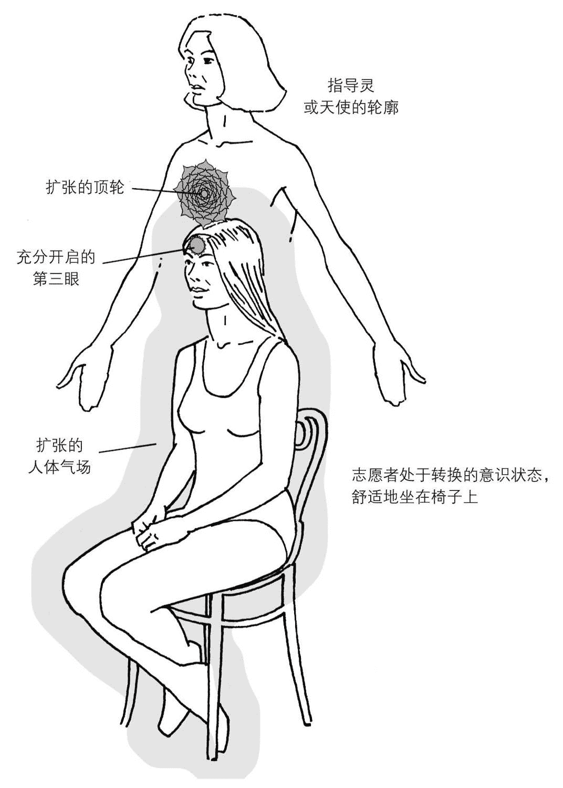

图 8.1　通灵过程：气场上方的指导灵或天使，正准备与此人合一

如果你们愿意，可以交换位置。请自由地尝试。

这个练习应该成为观察气场、指导灵和天使的日常练习的一部分。你开始与高频能量同频共振，并接通地球与上天的桥梁。

## 各类通灵（负向通灵、通灵板）

### 通灵的益处

通灵让你能够接通天堂与造物主（神），通过与指导灵和天使的联结，所有人都可以获得知识、智慧、神圣的洞见以及抚慰。

与这些降临到地球的光之存有合作，会让你获得一些特别的礼物。事实上，在你觉醒并成为“管道”（channels）后，教导、咨询和疗愈都会是诸多礼物中的一部分。

为了让众生获益，天使和指导灵将很多观念、创意以及解决问题的方案传递给众人。当你学会有效地与他们联结，并将自己的直觉力和创造力提升至一定的高度后，你就会接收到很多意义深远的讯息。甚至，在你开启了大脑更多的区域后，“超级学习力”的潜能也会在你身上展现。

在历史长河中，曾有许多富有创造性的个体以通灵的方式得到上天的讯息，并创造出伟大的作品。希腊与罗马的哲学家通过“通灵写作”，将深邃的思想和振奋的信念传递给人民大众；文艺复兴时期的艺术家米开朗基罗某天凝视天空，发现空中飘浮的白色云朵呈现出神圣的图像，于是将这一灵感呈现在伟大的艺术作品《在罗马的西斯廷教堂》中；古典音乐的作曲家将灵感记录下来，创作出无数来自天堂的乐章；很多像莎士比亚和伏尔泰一样的作家，给世人带来了无比精妙的文体表达；而具有天赋的诗人们，则将爱的语言注入诗歌之中。

这一切都让我们认识到，通灵现象已经在我们中间存在了几千年。它是人类的一部分，一直是，并将永远是。在未来，这种与更高领域进行交流的方式将会有更深更广的运用，甚至普及。当今社会已经显现出了这方面的证据——现在，已经有更多人从“多维存在”的潜力中觉醒，同时在天堂与地球两个领域工作。

现在的灵媒数量比以往任何时期都多。或许，你们中的某些人会发展出看到往生亲人、朋友并与他们对话的能力，从而抚慰、安抚和激励那些还留在物质领域的悲伤的人们。

随着你在灵性道路上的成长，死亡会变得不那么真实。与你的指导灵和天使一起工作，会让你明白死亡只是一个进入更高层次（天堂领域）的转换。你会认识到，你是造物主、上天以及宇宙振动能量的一部分，你会明白生死是一个有意义的安排。

用安全、适当的方式通灵，是通往真正觉醒的道途之一。

### 负向通灵以及附体

负向通灵指的是与来自黑暗的存有、灵魂以及灵体进行交流。这些非人类的存在将人类“宿主”视为猎物，没有任何的爱或关怀。当他们出现在一个人周围时，往往会让人感觉到他们是邪恶、混乱的，令人不舒服。

如果人类能够看到或是感觉到这些无明的灵体，会发现他们的样子往往是黑暗和畸形的。不了解的人会将这些灰暗、阴沉的存有当做指导灵。不要被误导！如果有被这种灵体侵袭的人出现在你面前，要对你看到和你感觉到的一切保持警觉。

这些负面灵体的主要宿主，是不快乐、悲伤、情绪混乱的青少年。这些年轻人往往拥有多种灵性天赋，比如移情能力和天然的通灵能力。因此，他们会“通灵”或与不知善恶的灵体联结，而并没有意识到会发生什么。这些人的消极与悲观降低了他们气场、脉轮和身体的振频，因此会容易吸引来与他们振频相似的低频灵体。

很快，这些来自黑暗的灵体会影响宿主的思想与行为。随着负向灵体对宿主越抓越紧，这些年轻人内在的抑郁症、自杀倾向以及其他的消极感受会越来越强烈，甚至他们的气场也会变得越来越肮脏。

依据布莱克·卢卡斯博士（Blake Lucas）的说法，负向通灵有四种程度或阶段：

1．阴影产生。此时负向灵体在宿主之外，离宿主的气场和身体很近，因此对人的影响是间歇和轻微的。

2．侵袭开始。负向灵体在人的气场之内。此时，人的情绪会受到负向灵体的影响，这种影响是可感知却微妙的。

3．附体开始。负向灵体侵入宿主的身体，将它自身的性格和习惯带入宿主，包括一些非常不好和令人厌恶的性格和习惯。被侵入的人常常会感到迷惑和混乱。

4．占有开始。侵入者（即负向灵体）将宿主的灵魂完全驱逐出去，占领宿主的身体，以它自己的行为方式行动，说它自己要说的话。这时，可能会发生占有与附体之间的转换。^((3))

有时，一些教授特殊功课的大学会设立心理玄学课，学生会学习到有关负向通灵的四个阶段的知识。英国圣公会和天主教的神父也会学习这些知识，这是他们培训的一部分。

如何避免负向灵体？最重要的一点，就是对通灵过程中的每个方面都保持全然的觉知。有益和无益的特质都要全面了解，从而让自己不那么惧怕、担忧黑暗面的影响。

前面所学的技能都可以确保你只与天使和指导灵协作，并将此作为终身灵性追求的一部分。

当你处于意识转换状态的时候，万一有负面灵体出现，你会立刻察觉到这是来自黑暗面的灵体，他们的振频很低，充满了负向的感觉。你必须立刻让他们离开，因为他们不属于“造物主与光”。请你的天使和指导灵前来保护你。感受内在的爱与宁静。很快，负向灵体会消失，你可以重新回到冥想和通灵中。

### 中性灵体

中性灵体只是一些处于天堂与地球之间的迷失的灵魂和无明灵体。他们是无害的，只是好奇或充满需求。很多中性灵体只是在两个领域之间徘徊。

### 通灵板

在这里，我们有必要简要提一下灵应牌（Ouija boards）和通灵板（spirit boards，它只是老式灵应牌的花哨样式而已）。不管应用哪个工具，都是非常原始和初级的通灵程序。

这些工具存在的问题在于，使用它们通灵时没有“筛选程序”。这就好像你在家里办聚会，开着前门，把大街上随便什么人都请进来一样。在这种情况下，你无法控制，也不知道会发生什么。正向和负向的灵体都能前来。很可能会有更多负向灵体和中性灵体出现在你家，尤其是出现在使用灵应牌或通灵板的房间。

一般来说，应该避免使用这样的工具。联结指导灵或天使唯一恰当的方法，是本书讲述的正确技能。

### 通灵与圣经

圣经（尤其是新约）中曾经多次提到通灵。在这神圣文本中，所有提到“Holy Ghost”或“Holy Spirit”^((4))的部分，都是特定通灵形式的范例。

或许福音书的作者对通灵并不完全了解，所以他们将自己见证的事件解释为“圣灵”或“上方神圣存有”所为；也可能是他们故意选择了这样的表达形式，以求将隐秘的教导传递给之后的神秘主义者和其他觉醒的个体。

新约中，很多类似的文章都是秘密流传下来的耶稣真实教导。如果你的第三眼已经开启，你会认出这些话。虽然古代的神秘学院和耶稣的真实教诲经历了几个世纪的审查、编辑和删除，这些教导还是以一种特殊而隐秘的方式，在现有的圣经框架内延续了下来。

不论你何时在圣经中读到“圣灵”，请试着忆起：这是高频的能量，是宇宙的疗愈能量，是天使的能量，也是神的爱。它们来自天堂，通过第八脉轮进入一个敞开之人的顶轮和三眼轮。这些高频能量也将透过人的身体、脉轮、气场以及整个存在来运作，给人们带来伟大的礼物。

你的天使和指导灵永远与你在一起，随时准备帮助你。他们会在你需要的时候安慰你、保护你、激励你。如果你给他们机会，这些光与爱的存有会在你的前方所有的道路中指引你。

爱与悲悯是必需品，不是奢侈品。没有它们，人类不可能生存……

——丹增嘉措（十四世达赖喇嘛，1935～）

————————————————————

(1) 勿忘我也被称为星辰花。——译者注

(2) 作者为美国人。——译者注

(3) 《回溯疗法：专业人员手册》（*Regression Therapy: A Handbook for Professionals*），二卷，358 页

(4) 二者的中文翻译都是“圣灵”。——译者注

# 第九章　星光体出游

内观！秘密就在你之内！

——慧能（中国佛教领袖，638～713）

星光体出游（又叫星体投射）的艺术，为我们提供了另一种与指导灵和天使相遇的方式。当你以星光体或灵魂形式存在时，你能更轻松有效地与这些光之存有交流。在这种状态下，你的灵魂不受肉体的束缚，天使和指导灵会在此时给你教导和建议。

你会发现，这些光与爱的存有非常幽默。通过他们，你能学会轻松地对待自己，并开始真正与这个世界的缺陷与乐趣和谐相处。

星光体出游、睡觉、死亡——这三种状态是紧密相连的，它们之间的差异非常小。在这些状态中，你的灵魂或本质都会跳出物质身体，在你的卧室（甚至整个家中）环绕，最终，灵魂会进入更高的层次或振频，在那里漫游。

你可以在以下状态中练习星光体出游的艺术：清醒并处于转换的意识状态时、处于睡眠和清醒状态之间时，以及在深沉的睡眠中时。基本上，当你睡觉时，你的灵魂会从太阳神经丛或顶轮离开你的身体和气场。

在全世界的灵性传统中，有许多星光体出游的例子。比如，在达科他州（Dakota）苏人（Sioux，又称达科他人）的信仰中，头顶是灵魂或灵魂的一部分离开身体进入灵性世界的地方。有时，触摸或拍打达科他孩童的头会受到指责，因为这会干扰灵魂的进出。

北美洲某些原住民有这样的传统：死者离世 4 天之后，送葬者才能将其埋葬或火化。在这些族群中，“4”是个神圣的数字，在任何情况下，都不能在死亡的 72 小时内处理物质身体。这样人类的灵魂才有时间完全从物质世界脱离，与前来迎接的天使和指导灵一起回归天国。

在世界的另一端，藏传佛教认为，人类的灵魂通过太阳神经丛离开身体。灵魂从气场离开时，会用光或能量索与身体保持连接，这个能量索又被称为“银索”，它保证身体与灵魂的连接，确保灵魂在漫游之后还能回到身体的物质形式中。在死亡时，银索会与身体断开，但仍与灵魂连着。它里面包含了无所不在的重要生命力量（宇宙能量）。一般来说，人类灵魂完全离开身体最多要花费三天的时间，这段时间内，它都会携带着能量索。因此，在藏传佛教中，一般会等至少 3 天，才对死者进行埋葬或火化，这与北美土著人的时间类似。

大部分人都能想起自己做过的飞翔或飘浮的梦，这是对星光体梦境或星际旅行的忆起，是非常正常的。实际上，你经常在睡眠时这样做，只是大多数时候你没有意识到而已。

在星光体出游中，你会拜访更高层次的存在。有些人会去疗愈圣殿，请治疗天使为自己进行特殊的治疗。有些人会到户外的花园和公园中，那里有指导灵导师和特定的天使导师向人们传授知识与智慧。人们醒来后需要将这些智慧和知识带回地球。有些人会调整灵魂的振频，使其与阿卡西记录或宇宙图书馆的振频一致，这样，当时机成熟，他们就可以在那里查阅过去未来的讯息。你也可以在那里获得他人的讯息，就好像图书馆里存放着地球上每个人的“灵魂档案”。在这个“更高的学习之地”，会有图书管理指导灵或学者指导灵提供帮助给你。

在特殊的情况下，你会为了疗愈他人而进行星光体出游。这是远距离疗愈的一种形式，借此，你的灵魂在睡眠或深度睡眠的状态中离开身体，来到一位生病的朋友或亲人床边。

当你以灵魂本质或星光体形式存在时，你能把手放在病人身上，将高频的疗愈能量传递到患病区域。如果你在心中请求天使的协助，会有一到两位甚至三位治疗天使来帮助你。他们会将自己的能量加入到你的能量中，协助你治疗病人。在必要时，你和天使甚至会将“手”穿透病人的身体，伸入他们的内部器官，将患病部分移除。这种类型的灵魂旅行和疗愈是非常罕见的，它要求灵魂有非常高的灵性进化程度，并拥有强大的灵力。

通过训练和练习，你可以将疗愈天赋发展到这个层级。历史上有很多治疗师运用了这些能力。埃及疗愈圣殿和古代神秘学院会将这种罕见的星光体出游方法传授给高级学员。近 2000 年前，耶稣和他的很多信徒都可以运用这种惊人的疗愈技能。西藏的医疗喇嘛也对此了如指掌。

想要学会星光体出游，你可以进行一些特殊的技能练习。

## 一杯水法

在第六章中，有一个开启手掌脉轮的练习。在这里，你可以再次进行这个练习来温暖双手（如果需要，请复习这个技能）。当你开启了手掌脉轮，并将增强的疗愈能量导入整只手，就可以开始下面的练习了。这是个自然的连续过程。

练习前，找个普通大小的玻璃杯，装满水。

完成手掌脉轮开启练习后，拿起那杯水，用双手握着。你的手掌和手指现在都已经“打开”，它们非常温暖，充满天然的疗愈能量。人体内重要的生命力量已经准备好从手掌脉轮、拇指、食指和中指释放出来。

以舒服的姿势用手拢住杯子，手的皮肤与杯子表面充分接触，通过这样的方式，你将生命力量或气输入了杯中，并被水所吸收。请记住，右手蕴含生命力量的阳性（正极）特质，左手则拥有阴性（负极）特质。根据磁性法则，同性相斥，异性相吸。右手的阳性特质会吸引左手的阴性特质，这两极会在水中合而为一。事实上，将装满水的杯子握在两手之间，这杯水最终会被“气”充满。

握着杯子时，持续将注意力集中在双手的手掌和手指上，同时扫视那杯水。感受手上的脉动越来越强烈，像是由这杯水发出的一样。专注于手的脉动，感觉两手之间的水变得不同。

持续专注地将能量传入水中，大约 5～10 分钟后，你会觉得水带电或磁化了。甚至，你会觉得玻璃杯在将你的双手向外推。

如果你所在的房间光线不太明亮或是近似黄昏，你会注意到水中有了淡蓝色的能量，能量也可能环绕在杯子周围，或出现在你的手上。

现在，拿起这杯水，迅速喝干。一会儿之后，你可能会在胃的底端感觉到温暖，或是有种放松的感觉在全身蔓延。这是我们所期待的部分效果。这杯带电的水饱含生命力量或能量，它现在正在你的整个系统运作，你的细胞、血液、淋巴的活力都被会被激发出来。它就像滋补品一样，滋润着你的整个系统，让你放松而充满活力。通过“一杯水法”，你的身体吸收了更多的阳性能量。

人类的身体和灵魂也在磁性法则之下运作。一般身体以阴性（负极）能量运作，灵魂则以偏向阳性（正极）的能量运作。这种安排让身体与灵魂能够紧密相连——因为异性相吸。

“一杯水法”改变了身体的极性，让它更偏向阳性。这有助于星光体出游的练习，因为更具阳性特质的身体会排斥阳性的灵魂，灵魂因此能轻松脱离身体。

你可以将一杯水法作为星光体出游的预备练习，在转换的意识状态下或睡觉之前进行。如果你在睡前做了这个练习，可能会有以下经验：

足够幸运的话，你可能会在转换或放松的非睡眠状态下，从身体里离开，在房间内飘浮。这更像是在似睡非睡之间，或是正进入睡眠时，带着完全的意识让灵魂脱离物质形式。

如果你在这种状态下星光体出游，你会对正在发生的一切有完全的意识，也会记得自己所经历的一切。因此，一杯水法能帮助你在醒来时，忆起你的飞行梦境或星光体出游。

对一杯水法和星光体出游，还有一件事要提及。当你躺着或坐着，准备进入转换的意识状态或睡眠状态时，你可能会有某些特殊的生理感受。有时你会觉得自己在身体里前后或上下振动，或者可能会感觉到你正从身体里往上升，向上面的天花板移动。这同样是因为身体对灵魂的束缚变小的缘故。

## 屏息法

屏息法应该紧接着一杯水法练习，它是整个星光体出游过程的重要部分。舒适地躺下或坐下，正常地呼吸，然后再吸一口气，屏息尽可能长的时间，直到肺中的空气好像要向外喷出来。感受胸膛内的压力，然后再用嘴缓慢地呼气。

以同样的方式练习第二次，然后是第三次——也是最后一次。

最后一次练习时需要做一点调整。用嘴很快地将气呼出，同时感受你自己被推挤出身体。如果你坐着，就专注于你前方的空间；如果是躺着，则专注于你的上方，观想你正在那里，看着自己的身体。

练习成功的话，你会从身体里滑出去，以星光体的形式看着自己的物质形式。如果没有成功，你可以让自己进入更深的冥想状态，或是直接睡觉。如果你选择进入冥想状态，你的灵魂会在冥想中离开身体，如果你睡了，当你再醒来时，将能够完全回忆起星光体出游的经历。有时，你会成功进入清醒与睡眠状态之间，在似睡非睡中享受星光体旅行。最终，你会对此很熟练，可以拜访更高层次的“天上领域”。

屏息法对星光体出游来说是非常重要的，因为空气中重要的生命力量（宇宙能量或高振频能量）被你吸入了肺部。通过尽可能地屏息，你让这些能量在你的血液、心脏乃至整个身体运作。这增加了身体的阳性能量，让灵魂更容易滑出。

你可以把一杯水法和屏息法连在一起做，这能提高你的成功率。

尽量多地进行这个星光体出游实验，你会越来越精通这门技能。学会这一段意味着你打开了一扇新的大门，有能力去探索新的世界。

你永远没有办法将灵魂想得过于伟大。你对灵魂的赞美，也永远不可能过于崇高。这就是神赋予它的本质。

——神谕

# 第十章　转世

是的，我与眼中万物，乃是一体，

微风与波浪，松树与棕榈；

我们有着相同的元素，

它们凝聚，而成我之唯一。

在树叶与繁花中，在蔷薇与玫瑰中，

我将永生……当我呼出这人类的气息。

死亡并不存在！

——罗伯特·史卫斯（Robert Service，诗人，1874～1958）

投生到一具身体之中，活着，死去，然后在另一具身体里重生——这就是转世的核心观点。很快，随着更多人的内在觉醒，有关这一转化过程的信念将成为西方社会文化的一部分。东方社会已经接受转世轮回的理论几千年了——事实上，它就是印度教与佛教的核心思想。这也是很多西方国家的人现在开始接受佛教的原因之一。

对于你来到地球的诸多原因，转世都给出了答案。它赋予你看待生命的正确观点，也让你对生死循环有更深入的理解。

大部分人^((1))都相信：你有不朽的灵魂，它在降生时进入身体，并在这一生都寄居在这个物质形式里；在死亡的那一刻，你的灵魂会离开身体（它的“外壳”），回归天堂。如果你愿意接受这个观点，为什么不愿意接受转世轮回呢？毕竟，如果不朽的灵魂能来地球并进入物质身体一次，为什么不能有第二次呢？

在上师耶稣的时代，转世被看做常理，它是人生的一部分。耶稣最原始的教导中，也包含转世的理论。不幸的是，在很多被看做圣经一部分的古老典籍中，耶稣以及其他伟大灵性导师对转世的论述，都被很小心地删除了。

在基督教会迅速发展的早期阶段，主教和领导人物的多数派想要删除圣经中所有关于转世的内容，因而，他们从神圣文献中删除了几本书^((2))。这些人受权力的驱使，想要控制所有人民，进而控制当时已知的整个世界（即罗马帝国）。他们从教义中删除了转世的理念，以“人只有一次生命，此人一生的行为，决定在他死后会进入永恒的地狱还是天堂”的理念代替，这样一来，人们就对教会产生了更大的依赖，教会被塑造成了实行死后救赎的机构。

随着人们开始探索真正的灵性道路，并在这一旅途中发现耶稣和古代神秘学院的真实教导，这个关于天堂和地狱的不真实观念对人们的控制会越来越小。

尽管早期教会曾尝试删除转世的理论，但在今天的圣经里，我们依然能看到他们遗漏的部分。新约的马太福音中，曾暗示耶稣基督是转世的先知以利亚（Elijah）。而旧约的出埃及记 20:4 和赞美诗 90:3 中，也曾提到转世。

本书的第九章曾说明了圣灵的真实运作方式，也描述了圣经字里行间中蕴藏着的神秘智慧和秘传讯息。事实上，圣经中对圣灵的提及，本身就涉及转世理论。早期基督教引用了古印度教教义的“圣三位一体”（Holy Trinity）理论，这个理论隐藏着有关转世的神秘讯息。

在长达几个世纪的时间里，古代神秘学院和治疗圣殿都会向求道者传授“三的法则”或“三角法则”。法则中讲到，要创造或显化事物（比如生命），必须具备三种“要素”。

耶稣也在一生中向很多男女信徒传授了同样的知识。这个“三的法则”也与转世理论有关，很多耶稣的信徒都曾将这样的教诲记录成文。

基督教早期的创始人——那些比较觉醒的人——将印度教的圣三位一体与基督教导的三角法则融合，创建了现在基督教认可的圣三位一体：圣父、圣子、圣灵。三者分别代表灵魂、身体和宇宙能量或生命力量。

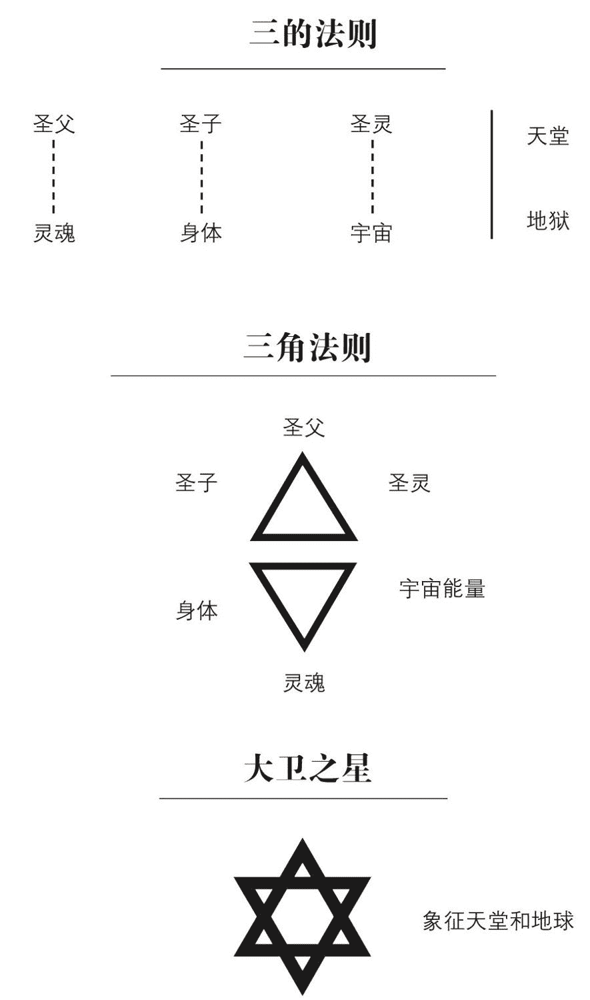

图 10.1　三的法则、三角法则以及大卫之星

像第九章所提到的，不朽的灵魂在出生时或出生之前进入物质身体，二者之间以必不可少的生命力量（又叫灵性能量或宇宙能量）联结。这股生命力量就像一个磁体，将人类的灵魂保持在物质形体之内。因此，要显化生命，这三个要素是必需的：灵魂、身体、生命力量。

死亡也遵循同样的法则。当一个人去世时，生命力量会离开身体与迅速耗尽的气场，回归宇宙。当这股能量离开时，不朽的灵魂就无法再维持在身体里，因此会在稍后回归上天。这时，死亡发生了。这个过程会反反复复地进行，直到你打破生死轮回，永远地回归上天。

人类的伟大导师与引路人的话语，是力量与光之流。

——苦行僧牟尼（Mouni Sadhu，神秘家及古鲁^((3))，20 世纪）

有两个先决条件能影响转世中的生死循环，它们被称为“业”与“法”。

在佛教和印度教中，“业”指的是某人在某一世中的行为。不论好坏，这些行为都可能会决定此人此生的命运，并一定会影响他来世的命运。这种信念认为，如果你在前世对自己的配偶很残忍并虐待她，那么你会在将来的某世经验到反向角色：那时，你的配偶会对你进行虐待。很多人都相信，你在此生经受的困难和麻烦，是源于前世的所作所为。

如果你能在当前这一世认识到这种业力或业债，然后转换你的模式，你就能从业力中解脱出来。从本质上来说，你会打破生与死的循环，因为你学会了你的功课。这是灵性成长或进化的一部分。你越快打破或释放业力，你的灵魂就能越快地成长，你也可以更早回归上天，并在那里永远驻留。

而另一方面，“法”是“业”的对立面。它只包含正念和善行。那些献身于服务人类的人，就是在创造“法”或“在天堂的得分”。

以爱与善意对待他人，能帮你更快地打破转世的循环——比你虚度此生、懵懂而过要快得多。

“法”也指进行大的净化来“清空不良记录”。当你无私地帮助他人，业债的负担会在很短的时间内被消除，但你的动机必须是纯洁和善意的。

始终对你的思想和行为保持觉知，试着不要太严苛地批判他人。在你的心中和脑海中创造爱与和平的思维。这会帮助你实现灵性成长，让你成为一个更美好的人，更善良的灵魂。

## 前世回溯的益处

在出生的痛苦过程中，会有一层屏障覆盖下来，让你忘记所有前世。通过前世回溯，你可以将这层屏障揭开。

挖掘过去、探索前世的益处有很多：

● 情绪疗愈。前世的某些事件和遭遇所引发的愤怒、哀伤、悲痛、憎恨以及其他负面情绪，能在前世回溯中被带到意识表面，并安全地释放。这能带来永久的疗愈。

● 身体疗愈。有些折磨你的莫名伤痛与健康问题，无法通过传统的医术治愈。在很多情况下，这能追溯到前世。通过“重新经历”前世的意外或死亡场景，你可以将伤痛的记忆带入意识觉知中，从而将其释放。此时，一些长期困扰你的问题可能会获得深层疗愈。

● 释放忧虑和恐惧。在前世回溯中，莫名的忧虑和恐惧会被忆起并带到意识表面，然后被迅速分解和释放。很快，困扰你多年的忧虑和恐惧会不复存在，或者，至少不会再对你产生那么大的影响。

● 了解并疗愈关系问题。回溯你与当下伴侣之间的前世关系，能帮助你理解关系之中的负面模式，从而打破或疗愈这个模式。你会明白你们爱恨关系的起源。

● 获得天赋与才能。通过回溯，你不仅能重新忆起前世，有时还会忆起或重新学习到前世的天赋与才能。比如，如果在某个前世，你是运用药草进行治疗的治疗师，那么在前世回溯中，你对药草的知识可能会被重新唤醒。这是超级学习的一种形式。

本书提供了很多详细的技能与练习，可以帮助你发展超自然能力并获得灵性成长。其中，有些练习也可以专门用作前世回溯。

最好的例子是蜡烛与镜子法的第一阶段。当你想发掘前世时，可以尝试这个技能。

引导式冥想和催眠疗法都是很有效的方式，能够揭开出生时笼罩在你身上的屏障，从而帮你忆起前世。特别设计的冥想引导录音带，也可能会对很多人有帮助。

请认识到，你是永恒的存在，是所有前世的集合。这能帮你领悟到：你真正是谁；你为什么出现在地球；在完成这个领域的经验之后，你将去向哪里。

我将我的奥秘揭露给值得拥有之人。

——耶稣基督语录

————————————————————

(1) 指西方人，特别是有基督教背景的人。——编者注

(2)  指公元 325 年在尼西亚城召开的基督教大公会议。这是基督教历史上第一次世界性主教会议，会上确立了现今大部分基督教会接纳的教义。

(3) 即上师。

# 第十一章　上师的最后时光

压迫之中，他依然挺立如同棕榈，像只高翔在天国苍穹的飞鹰，凝视着太阳的辉煌。

——神谕

古代神秘学院的秘密及其秘传教导，已经透过本书传授给各位求道者。在近 2000 年前，神秘学院也曾将同样的教诲灌输给耶稣基督——那时他进入到各式各样的形而上学研究中心和学校学习。在这里，我们将对耶稣这位极具魅力的人物的生平和智慧进行更详细的探察。

耶稣一生致力于将神秘学院的奥秘与哲学信念传授给自己的男女信徒。他将这些灵性与心灵的信条传递给追随者，追随者又将其传递下去。新约曾通过一些比较微妙的方式（比如讲述寓言或是描述奇迹）记录下这些秘传的讯息。也有些耶稣教导的智慧隐藏在圣经的福音书里。不幸的是，一些基督教的后期官员在编辑新约时，删除了耶稣大部分的教诲，让它们消失在普通大众的视线里。

20 世纪，在埃及纳格哈马迪（Nag Hammadi）附近，诺斯替福音书被发掘出来。这是一部圣经选集，包含一些耶稣的教导和他生平的讯息。耶稣是一个真实的人物，他就存在于历史之中，像我们每个人一样活着、爱着、欢笑、哭泣、承受痛苦。

由于诺斯替福音书的内容是基于古代神秘学院和耶稣基督的教诲，因此，对耶稣这位伟大导师的深入了解是至关重要的——这种了解，不是将他视为神一般的存在，而是将他视为一位高度进化、肩负人类使命的人。

作为人，耶稣也有对爱和性的正常需求与感受。对这一事实，在菲利普福音（纳格哈马迪保存下来的原始文本之一）中，有清晰的描述^((1))：

……抹大拉的马利亚是救世主的伴侣。但是基督爱她更甚于其他信徒，还经常亲吻她的嘴唇。这让其他信徒很不高兴……他们对耶稣说：“为什么你爱她胜过我们？”救世主回应说：“为何我不能像爱她一般爱你们？”

传统“认可”的四福音书（马太、马克、路加和约翰福音书）显示，耶稣曾在他短暂的牧师生涯中，出现在非常多的地方。这让一些读者相信耶稣无所不在，或是相信有一位与耶稣长得很像的人在协助他工作。

如果这是真实的，必然会引起一些质疑和推测。对上师耶稣的出生甚至死亡，都会有不同的阐释。

诺斯替教派有一部福音书，曾提到耶稣的一位孪生兄弟。而在被很多学者认为是耶稣真实话语记录的托马斯福音中，有一个特别令人吃惊的陈述（出处同上）：

耶稣在世时，曾说出一些机密，由他的孪生兄弟犹达·托马斯记录下来。

本章之所以列举出这些文章和著作中的证据，是为了增加下文内容的可信度。

本书的第二章到第十章，描绘了一个渐进的灵性、灵力成长过程：当你能看到气场、脉轮、指导灵和天使时，周围的世界会变得越来越奇妙；在睡眠或意识转换状态中与你的指导灵和天使协作，会让你获得美妙的讯息，这对你自己和他人都有很大的帮助；前世回溯能帮你打开更多扇门，能给予你领悟、讯息，赋予你参透有形世界背后奥秘的能力；提升振频的能力让你能够以星光体的形式出游，进入更高的天国领域，在那里，你能自行拜访疗愈圣殿，查阅阿卡西记录，并从这些来源中获得关于自己和周围之人的智慧与知识。

本书的作者已经开发出上述能力，现在，他正运用这些能力帮助他人。下面的这段对话，来自作者在耶稣时期那一世的清晰记忆，以及他在夜间对阿卡西记录的查阅。这段耶稣与信徒之间的对话尤为重要，在阅读时，请你保持开放的心。

## 耶稣之死

临终时，上师耶稣躺在艾赛尼派神秘学院的一间偏僻的卧房里。当时正是罗马皇帝图拉真（Trajan）登基的第二年。据说，那年耶稣已经将近 109 岁了。

在将近 70 年的时间里，耶稣都在卡梅尔山（Mount Carmel，艾赛尼派神秘学院所在地）上监管着他的组织，同时教导信徒。

马提亚（Matthias）是前任税官与耶稣门徒马太（Matthew）的孙子，他坐在耶稣床边的椅子里，凝视着耶稣老迈的脸庞。马提亚年轻而布满胡须的脸上，露出了悲伤的笑容。耶稣用美丽的蓝色眼睛回望着他，那双眼睛依然像以往那样明亮，洞悉一切。

“马提亚，我年轻的朋友和信徒啊，不要这样悲伤，”耶稣弯起嘴角笑了，“毕竟，这世上的万物都有它自己的循环。死亡只是生命更高形式的延续。”

“但是上师，”马提亚痛苦地喊，“我们会非常想您。”

“记住我所教你的，马提亚。没有死亡，永远不会有。人类的灵魂是永恒的，与上帝一脉相连，死亡的是我们在地球时暂居的身体。我们是拥有身体的灵魂，而非相反。当我们的物质形式不能再为灵魂提供居所时，我们就从这个房间搬出来，以更高的频率振动，回归天国。在那里，我们会得到休息，回顾过去的一生，并得到特殊的教导。当我们准备好时，就会再次回归地球，进入一个即将诞生的婴儿的身体。我们会一再地重复这个过程，直到我们在这个存在的物质层面学到我们的全部课程。”耶稣抬起右手，放在年轻信徒紧握的双手上。

“不要担忧。在天堂，在来生，我们都会再次相遇。”

这些话让马提亚有了力量，他松开自己攥紧的手，温柔地将耶稣的手握住，然后坐回椅子里，将手放在大腿上。“您召唤我来这里。一接到讯息，我就赶来了。”

“是的，我很高兴你在这里。我的时间已经很有限，但我必须告诉你一些往事，它们跟你有关。你的祖父马太临终前写下的手稿是很好的，但仍有缺憾。”

想到他多年的密友和信徒，耶稣几乎流下泪水。“你必须明白，我的教导是基于亚特兰蒂斯和埃及的古代教诲，这是一种灵性的生活方式，而不是一门宗教，也永远不该是宗教。对此，我有很大的担忧。”

年轻人心照不宣地低头看着上师，他想到自己一生中发生的那些变化。他知道耶稣是对的。“我知道，您指的是大数城的保罗（Paul of Tarsus），还有其他那些扭曲了真正教导的人们。”

上师的脸庞依然英俊，然而在回答马提亚时，他的脸痛苦地皱了起来。“保罗让我非常苦恼。他扭曲了我的教导和布道。他厌憎女人，极尽所能地贬低她们，把她们归入次等人。他影响了很多身居要位的男人，将我的组织变成了父权系统。但是，所有的教导与福音应该由男女信徒同时传播。我的很多信徒是女性。造物主上帝——这至高的存在，本身就同时拥有男性和女性两种特质。这两种能量对显化生命都是必要的。”

耶稣闭上眼睛，休息片刻，专心地呼吸。他的生命能量正在迅速消逝。而后，他再次睁开眼睛，继续说：“我希望你把我所说的记录下来，也记录下我将要讲述的故事。马提亚，你的记忆力非常好，所以你可以先听我讲述，一会儿我离世之后，你再将这些话记录成文。”

马提亚坐在椅子中，向前倾身，专注地倾听。

耶稣迟缓地往自己残喘的肺中深吸一口气：“我想谈一下所谓的受难和复活，它让我感到有些沉重。”

年轻的信徒惊讶地挑起眉毛：“您为何对神迹感到沉重？”

上师费力地抬起他的右手，示意他年轻的朋友安静。

“在我 40 岁时，我的教导和牧师生涯都进入了第四个年头。一个危险的情况发生了。大公会^((2))和其他一些当权派嫉妒我对大众的影响力，他们希望将我处死，并派了一个间谍到我身边，监视我的一举一动。他们设计了一个陷阱，要将我和我的核心十二信徒骗去耶路撒冷（Jerusalem）的逾越节（Passover），准备在那里逮捕并亵渎我，然后将我钉上十字架。

“亚利马太人约瑟（Joseph of Arimathea）是公会的一位成员，也是支持我们教导的盟友。他冒着极大的危险在伯大尼（Bethany）村附近与我密会，告诉了我这个阴谋。

“在一丛橄榄树旁，我们所有人——包括你的祖父马太——围着一个小火堆聚集起来，研究对策直到深夜。事实上，是马太想出了应对这个致命危机的方法。他提出，我的孪生兄弟犹达（Judah）可以帮助我们。我与犹达之间唯一能够分辨的区别，是他有一双棕色的眼睛，而不是蓝色。

耶稣停止说话，费力地喘息了好几次。他的眼睛闭了起来，脸庞也扭曲了。最终，他恢复了镇定。“不论如何，我们决定让犹达暂时做我的替身，像他之前一直做的那样。我的兄弟与我有同样的灵性信仰，他对这个决定非常赞同，全心全意地要帮助我们。不幸的是，在逾越节中，计划出现了偏差。

“很久之前的那个晚上，在客西马尼（Gethsemane）花园被捕的，是我的孪生兄弟犹达。加略人犹大（Judas Iscariot）担心自己的性命安危，所以指证犹达为上师，并亲吻他的脸颊。于是，犹达被带到本丢·彼拉多（Pontius Pilatus）^((3))面前。这位长官勉强对他表示了谴责——彼拉多不喜欢犹太人，对我的教导很宽容。他的确曾命令他的罗马士兵不要打断犹达的腿，希望能抢在他死之前，把他从十字架上解救下来。这位罗马的长官可能对一些人很残忍，但出于某种原因，他对温和的艾赛尼派和他们的生活方式有一些尊重。

“犹达代替我被钉上了十字架，这引发了轻微的地震和强烈的暴风雨。在这可怕的事件进一步发展时，我的信徒尼哥底母（Nicodemus）和亚利马太人约瑟私下找到本丢·彼拉多，恳求他将他们的上师从十字架上放下来。彼拉多很快同意了，他匆忙拟定了暂缓处刑的命令，并将文件交给这两人。

“因为强烈的暴风雨和地震，只有很少人留在了十字架的现场，其中有我的一些追随者、我的母亲和抹大拉的玛利亚。一个同情我们的罗马百夫长站在十字架附近，尼哥底母冲到他面前，将文件交给他。然后，所有在场的人将可怜的犹达从十字架上转移下来，用亚麻布包裹住他，运送到附近的艾赛尼派的治疗洞穴。那时犹达还活着。罗马百夫长继续守在他的岗位上，他告诉随后出现的所有好奇的旁观者说，耶稣已经死了，被带去亚利马太人约瑟的墓穴埋葬了。”

马提亚坐回椅子上，喘息着，敬畏地看着耶稣。小小的房间安静了片刻，只能听到卧室外偶尔传来的鸟叫声，还有微风温柔地拂过树丛的声音。

耶稣继续讲述他的故事。“让人难过的是，我勇敢的兄弟犹达没有从痛苦中恢复过来。本丢·彼拉多派了些罗马士兵守在墓穴那里，整整 3 天，不许人们靠近。最后，第 3 天，在我所谓的死亡之后，抹大拉的玛利亚和其他一些知情人来到墓穴。罗马卫兵已经移开了巨大的石块，露出空空的坟墓。抹大拉的玛利亚和其他人对公众宣布，耶稣复活了。很快，消息传遍了整个国家，大公会的一些成员极为惊恐。”

耶稣再次喘息，停止了他惊人的故事。他闭上蓝色的眼睛，躺在那里，挣扎着让维持生命的空气进入肺部。

马提亚把注意力从耶稣的脸上移开，凝视着窗外环绕着的石墙。一只黑色的鸟落在墙上。他开始在记忆中搜索黑鸟的意义。

耶稣用超凡的灵视力看到了自己背后的景象，他说：“马提亚，人们说看到黑鸟，预示着死亡。那面墙上就‘坐’着一个预兆。那是关于我的预兆。当它飞走时，我的灵魂也要飞走了。”

黑暗开始降临到耶稣身上，他用尽最后的力气说：

“我很想念我挚爱的抹大拉的玛利亚，还有我们的儿孙。我所有的老朋友与信徒都已过世。我感到悲伤又孤独。我活过，爱过，也哭过。这年迈的身体就像沙漠上的一粒沙，风吹来时，我将从地上消失，飞向远方。”一滴泪从耶稣的脸颊滑落，他的眼睛恍惚地看着远方。“答应我马提亚，你会记录下我所说的这一切。”

他闭上眼睛，低声呢喃：“玛利亚，我是那么爱你。我是那么想念你。是我该走的时候了。”耶稣呼出最后一口气，身体静止了下来。

突然，一道美丽的白光出现在他的床脚，很快显化为一位天使。同时，一道白光从耶稣基督的身体里升起，向美丽的天使移动。显化为男性形象的天国使者发出耀眼的光芒，又再次幻化为壮美的白光，然后越变越小。两道光芒一起在房间中移动，从卧室的窗口出去，飞向栖息在墙上的黑鸟。

马提亚凝视着窗外死亡的光影。两道白光一起盘旋舞动，飞向黑色的鸟。黑鸟振动着乌黑的翅膀，向天空飞去。壮丽的白光加入了它，随它一起向天堂攀升而去。很快，这壮美的奇观消失在马提亚眼前。死亡的黑鸟与这位特殊的同伴，一起飞上了天国。

耶稣的灵魂回家了。

来我这里吧，迷途的孩子。

来我身边，如此的温顺，充满善意。

当你的眼睛充满泪水，

当你的心中满是恐惧。

我会擦干你的眼泪，

抚慰你惊恐的哭泣。

——道格拉斯·德龙

————————————————————

(1) 引自佩格尔斯（Pagels）的《诺斯替福音》（*The Gnostic Gospels*）。

(2) 古犹太的教会和司法法院。

(3) 罗马帝国驻犹太总督。——译者注

# 附录 1　插图与表格索引

第一章

图 1.1　位于埃及吉萨高原的狮身人面像

第二章

图 2.1　松果体、脑垂体、下丘脑的位置

图 2.2　三眼轮位置

图 2.3　第三眼练习中舌头与牙齿的位置

第三章

图 3.1　脑垂体以及顶轮的位置

图 3.2　脑垂体、下丘脑、松果体的位置

图 3.3　宇宙能量谱

第五章

图 5.1　围绕着一位女性的能量场

图 5.2　一个人头部和肩膀周围的气场

第六章

图 6.1　脉轮名称、颜色及相关腺体

图 6.2　人体七大主要脉轮的位置

图 6.3　身体的能量经络

图 6.4　暖手练习中双手的正确位置

图 6.5　手掌旋转方向

第七章

图 7.1　脉轮系统、神经系统与昆达里尼

第八章

图 8.1　通灵过程：气场上方的指导灵或天使，正准备与此人合一

第十章

图 10.1　三的法则、三角法则以及大卫之星

# 附录 2　人体气场颜色、含义及位置

以下为气场颜色表，让你能迅速、轻松地查找这些能量与它们的含义。

每个人看待世界的方式不同，因此，同样的颜色在不同的人看来可能会有细微的差别，比如可能一个人看到的绿色比别人看到的更浅，这是正常的。

关于气场颜色及其特性的详细介绍，请查阅第四章。

正向颜色

浅蓝色、中蓝色、深蓝色、浅绿到中绿色、日光黄或淡黄色、淡粉色、中红到深红色

中性颜色

蜜棕色或金棕色

罕见的正向颜色

白色、金色、银色、淡紫色、中紫色（靛蓝色）、淡橙到中橙色

负向颜色

黑色、灰色、浊黄色、浊橙色、浊褐色/暗褐色、亮粉色、淡红色、红紫色、深绿色

表一

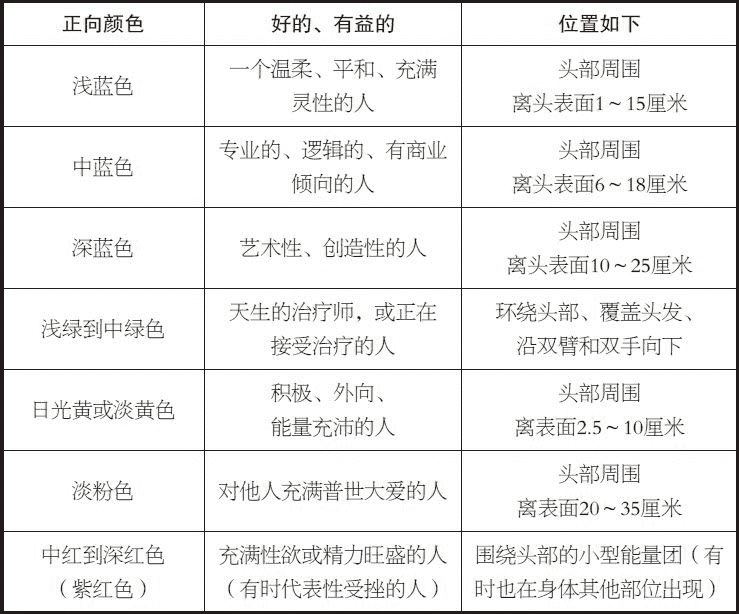

表二

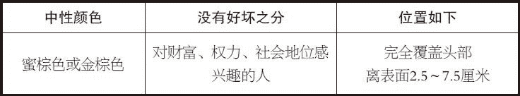

表三

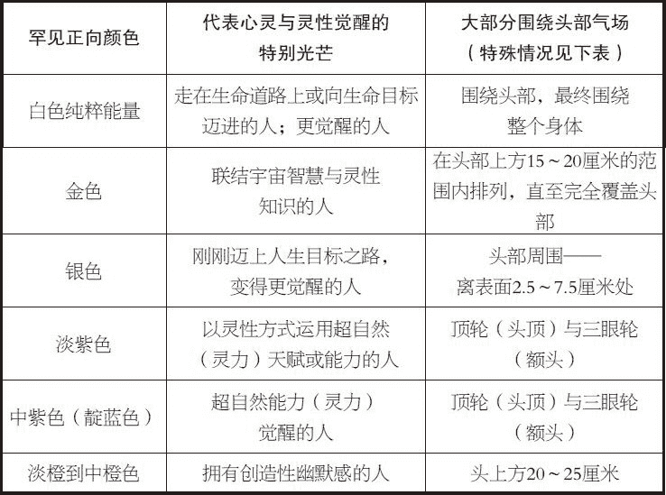

表四

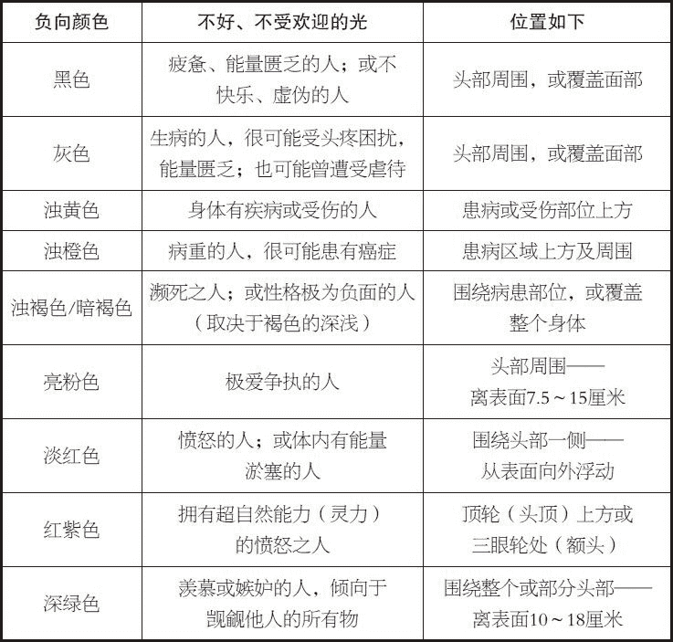

# 附录 3　练习与冥想索引

第二章

第三眼开启技能

第三章

顶轮开启技能

第五章

发音法

呼吸法

墙壁或背景法

凝视树木法

蜡烛与镜子法

凝视蜡烛法

凝视落日法

解读气场法

第六章

手掌脉轮开启法（暖手练习）

拇指、食指与中指法

喉轮开启技能（手掌环绕法）

刺激甲状腺法

心轮开启技能

专注呼吸法

观想婴儿法

观想爱人法

观想小狗小猫法

温暖开花法

手掌环绕法

太阳神经丛开启技能

脐轮开启技能

海底轮开启技能

第七章

昆达里尼唤醒技能

顶轮开启技能

心轮——温暖开花法

顶轮到心轮能量流动法

心轮到海底轮能量流动法

顶轮到海底轮能量流动法

第八章

提升环境振频法

提升个人振频法

通灵技能

白光冥想

蜡烛与镜子法（扩展）

面孔对视法

墙壁或背景法（扩展）

第九章

一杯水法

屏息法