## 【光的课程】扫盲问答

**问：** 【光的课程】是什么？能不能简单的用一些话来概括一下？

答：在这新纪元的时代中，不须刻意进入庙宇中、修道院里、或进入教导秘法的场所，穷其一生，闭关在其中。生活在这时代的人们，必须学习把宇宙真理用于每日生活中，人不一定要经由秘法学习才能悟得此真理，因为宝瓶座的新纪元是一个觉醒与明了的时代，每一个人都在快速进展中，再也没有任何东西需要秘密地被隐藏。【光的课程】便是这样的一个途径。

上面这段话是我觉得对光的课程 最好的诠释，当然，其他的诠释也有很多，可以进入光的课程正文进行了解。

**问：** 【光的课程】里的光指的是什么？

答：「光」是一种元素本质。我们已知道神（God）无形无相，是一种宇宙势能，创造万物，西方人称之为创造势能或造物主。现在西方世界已经知道我们东方所讲的「道」，即是他们所称的神或创造势能。除了它是一种能量一种势能之外，神、神性意识、基督、基督意识；佛、佛性；道；无条件的爱、宽恕、放下、释放，这一切都是「光」。

以上内容引自【光的课程】系列问答 《博纳与蒂娜》的对话。

还有一段话，我也一并贴上来，这是正文里的。

在这一课程中所运作的光，不是指那象征着明心见性的光，它指的是那形成我们灵魂存在的。具有实体的，实质存在的光。具体地说，我们就是光。爱因斯坦在解说 E=MC2 时，便说明了当光的频率降低到一定程度时便会形成物质体。更玄秘的是，环绕在我们物质体周围的光是一种由智能所形成的磁力磁场。

**问：** 我是一个佛教徒，可以修【光的课程】吗？

答：当然，上个问题我们已经谈到，光的元素本质是超越一切宗教的表相的。

我们的共修会中有佛教徒、基督徒、天主教徒等等。佛教徒在自己的冥想中，仍然持佛号，以佛陀为心灵的皈依。但大家都能彼此尊重，在共同的探讨中，达到触类旁通的效果。

所以，不论你正在修任何法门，也不论你是否在修，或者修习到任何一个程度和阶段，都可以进入【光的课程】的习修。

## Image and video processing: From Mars to Hollywood with a stop at the hospital

At the IBM Thomas J. Watson Research Center, we use computers to understand images. We are developing algorithms and systems that extract and represent semantic information from images and videos to enable many applications. Examples include how to find and buy a dress like the one your friend wore to a party; how to help a doctor interpret a medical image; and how to help a geologist to identify rocks on Mars.

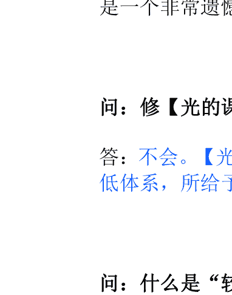

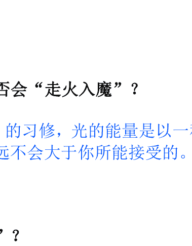

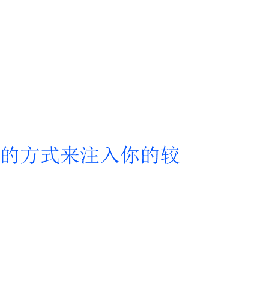

From left to right: Images from Mars, hospital, and Hollywood.

> > If you want to share your thoughts about this article, please contact: **drm@watson.ibm.com**

## 活动名称：感恩有你，暖心相伴

感恩节是一个充满温暖与感动的节日，它不仅提醒我们停下脚步回望过去一年的点滴，更让我们有机会向身边的家人、朋友和同事表达真诚的谢意。在这个特别的日子里，我们诚邀您参加本次感恩节主题活动，共同创造一段美好的回忆。

### 活动信息

- **时间**：2024年11月25日（周六）15:00 - 18:00
- **地点**：公司B栋三楼 多功能厅
- **参与对象**：全体员工（欢迎携带家属）

### 活动流程

- 15:00 - 15:20 签到入场，领取感恩卡片
- 15:20 - 15:30 主持人开场及感恩分享
- 15:30 - 16:30 互动游戏：感恩接力赛
- 16:30 - 17:10 手工DIY：制作感恩花束
- 17:10 - 17:50 感恩茶歇及自由交流
- 17:50 - 18:00 合影留念，活动结束

### 精彩预告

本次活动准备了丰富的互动环节和精美礼品，更有惊喜抽奖环节等着大家！无论您是游戏高手，还是手工达人，都一定能在这里找到属于自己的快乐。

温馨提示：活动当天请穿着舒适的衣物，便于参与互动游戏。请提前10分钟到场签到，谢谢配合！

### 为什么 Tauri 适合新手？

- **前端技术栈**: 如果你已经熟悉 HTML/CSS/JavaScript，Tauri 的上手成本极低，只需学习少量 Rust 基础。
- **开发者体验**: Tauri 提供了脚手架、热重载和丰富的文档，降低了新手门槛。

### 核心概念速览

| 概念 | 说明 |
|------|------|
| **WebView** | Tauri 使用系统自带的 WebView 渲染 UI，体积小且性能好 |
| **Rust 后端** | 核心逻辑用 Rust 编写，安全性高、性能强 |
| **IPC 通信** | 前端通过 `invoke` 调用 Rust 命令，实现交互 |

### 快速开始：Hello, Tauri!

以下是一个最简单的 Tauri 应用步骤：

1. **安装 CLI**: `npm create tauri-app`
2. **选择模板**: 例如 React 或 Vanilla JS
3. **运行开发**: `npm run tauri dev`

> > 开发环境需安装 Rust（https://rustup.rs）和系统对应的 WebView 运行时。

### 示例代码：调用 Rust 命令

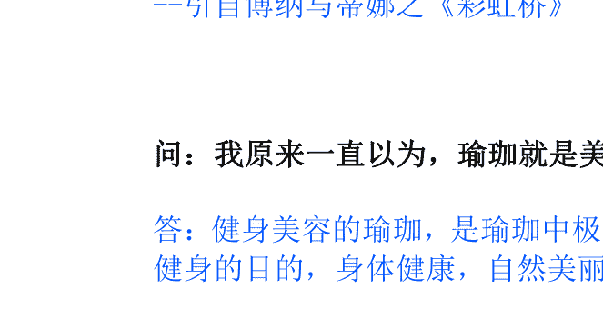

> > **提示**: 更多示例请参考 Tauri 官方指南。

Dwal Khul 上师说：

在利莫里亚时期，（Lemuria，传说中沉入印度洋海底的一块大陆），他们被教导的是哈达 Hatha 瑜珈，它的焦点在身体的转化上。

在亚特兰提斯时期，（Atlantis，传说沉没于大西洋中的岛）他们被教导的是 Bhakti 瑜珈，它的焦点在转化以太星光体及情绪体。

雅利安人（Aryan，印欧语系的人）被教导运用胜王 Raja 瑜珈，焦点在开发思想智慧上。

到了宝瓶座时期，则是阿格尼 Agni 瑜珈，焦点在较高心智与灵魂层面上。（也就是我们现在所经历的时期）

阿格尼是光元素，或是火元素的意思，阿格尼瑜珈基于人体内五个元素之一的火元素，以心灵与生命来唤醒拙火的能量。

十多年前，Toni 一开始就告诉我们说，【光的课程】是一种阿格尼瑜珈。现在我才了解，光的课程的焦点在较高心智与灵魂层面上的运作，是宝瓶座纪元中一种与灵魂的较高智慧连接的瑜珈。

> --引自博纳与蒂娜之《彩虹桥》

问：看来我知道的真的是太少了，原来一直以为自己什么都知道了。

答：这是很正常的。我们每个人都需要经过这样的一个阶段。我想引用《古埃及女祭祀的灵魂旅程》里伊莉莎白的一段话：

## 1. 软件及环境

需要通过网络下载2022年发布的MySQL 8.0.31社区版数据库软件进行安装（使用社区版，不要使用企业版及其它版本）与MySQL管理工具Navicat 16（版本不限，但不要使用Navicat 15或更低版本，因为界面不同）。

## 2. 任务及要求

首先在Windows上完成MySQL 8.0的安装与配置（包括root密码的设置），其次安装Navicat 16 Premium（安装时选择“试用”，不要购买）并连接本地MySQL服务器。最后，使用Navicat的查询编辑器创建一个名为“teaching”的数据库，然后在该数据库下创建三张表：

- 学生表(Student、主键Sno)
- 课程表(Course、主键Cno)
- 选课表(SC、主键(Sno, Cno))

具体字段定义及约束条件如下各表所示。

这是一个以 AI 为代表的新技术飞速发展的时代。在我们的生活中，通过使用 AI 获得信息、表达想法、完成表达已经不再是幻想。然而，新技术在给我们带来便利的同时，也引发了不少挑战与困惑。

> > 作为中学生的我们，肩负着社会与时代赋予的使命，面对快速发展的新科技，我们该如何应对挑战、把握机遇，实现自我成长与社会进步？

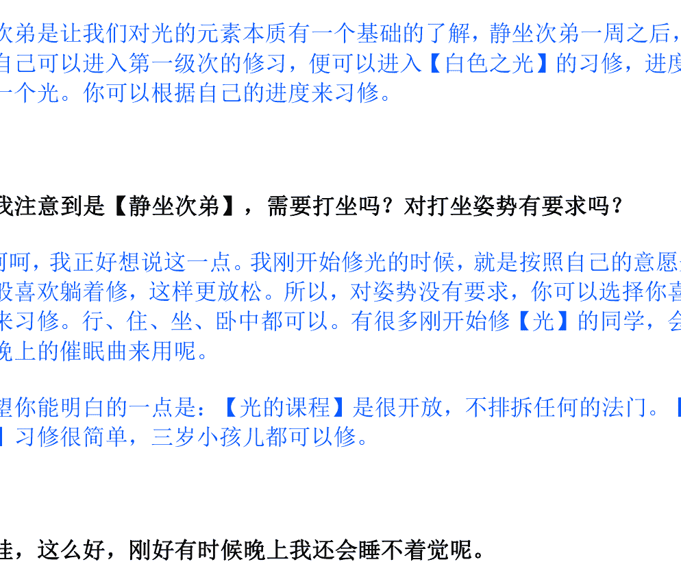

## 3. 资源管理

在游戏中，资源管理是非常重要的。玩家需要合理分配和使用各种资源，以维持基地的运作和发展。资源包括食物、水、能源、金属等。

### 3.1 资源类型

- **食物**：用于维持人口生存，可通过采集和种植获得。
- **水**：基础生存资源，可通过净化或采集获取。
- **能源**：驱动设备和建筑，可通过太阳能或燃料发电。
- **金属**：用于建造和升级建筑，可通过采矿和回收获得。

### 3.2 资源分配策略

| 资源 | 优先分配 | 备注 |
|------|----------|------|
| 食物 | 高 | 确保人口不饥饿 |
| 水 | 高 | 每天必须供应 |
| 能源 | 中 | 根据需求调整 |
| 金属 | 低 | 仅在扩建时使用 |

建议玩家在游戏初期优先保障食物和水的供应，中期再逐步发展能源和金属采集。

> > “资源是有限的，但创意是无限的。” — 游戏设计手册

```
// 示例代码：资源分配
if (food < 10) {
    collect('food');
}
```

The diagram illustrates the structure of a **Single-Layer Feedforward Neural Network**, also known as a **Perceptron**. It consists of an input layer with multiple nodes and a single output node.

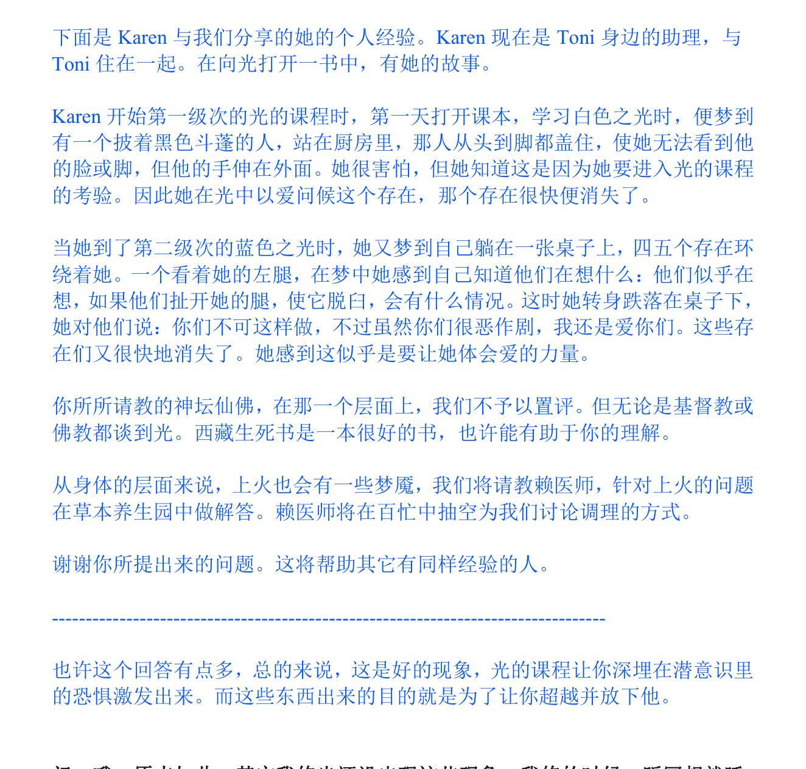

In the network, each input x₁, x₂, ... , xₙ is multiplied by a corresponding weight w₁, w₂, ... , wₙ, and then summed together with a bias term b. The weighted sum is passed through an activation function to produce the output.

The network can be described mathematically as: output = f(∑ wᵢxᵢ + b), where f is the activation function (e.g., step, sigmoid, or ReLU). This type of network is commonly used for binary classification tasks.

## JOURNAL OF THEMES

Pluto was first discovered in 1930 by Clyde Tombaugh. It was designated as the ninth planet of the solar system. However, in 2006, the International Astronomical Union (IAU) reclassified Pluto as a 'dwarf planet' after new criteria were introduced.

One of the most controversial changes in astronomy occurred when Pluto was demoted. Many people felt emotional about the decision, as Pluto had been considered a planet for over 75 years. Nevertheless, the IAU maintained that the new classification was necessary for scientific clarity.

| Planet | Diameter (km) | Distance from Sun (AU) |
| --- | --- | --- |
| Mercury | 4,879 | 0.39 |
| Venus | 12,104 | 0.72 |
| Earth | 12,756 | 1.00 |
| Mars | 6,792 | 1.52 |
| Jupiter | 142,984 | 5.20 |
| Saturn | 120,536 | 9.54 |
| Uranus | 51,118 | 19.19 |
| Neptune | 49,528 | 30.07 |
| Pluto | 2,370 | 39.48 |

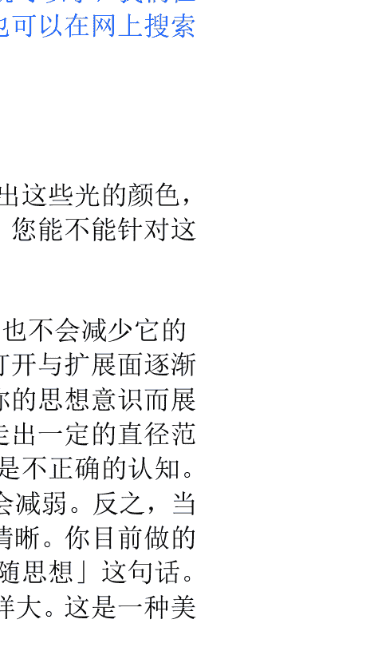

> > "Pluto is not a planet. It's a dwarf planet. Get over it." — Neil deGrasse Tyson

- Pluto has five known moons: Charon, Styx, Nix, Kerberos, and Hydra.
- Charon is so large that Pluto and Charon are sometimes considered a double dwarf planet system.

## 1.1 研究背景

随着人工智能技术的快速发展，自然语言处理（NLP）在各个领域的应用日益广泛，尤其是大语言模型（LLM）的突破性进展，极大地推动了信息提取、文本生成、智能问答等任务的发展。尽管目前大语言模型在许多任务上表现出色，但其在复杂、多步骤的推理任务中仍面临挑战。例如，在决策支持、科学计算、常识推理等方面，模型往往无法将问题分解为可执行的子任务，从而导致输出结果的精确度和可靠性偏低。

Chain-of-Thought（CoT）提示策略的提出为上述问题提供了一种有效的缓解方案。CoT策略通过引导模型在回答问题之前，先生成一系列逻辑连贯的中间推理步骤，从而提升了模型在多步推理问题上的表现。

然而，现有的CoT方法主要依赖于人类专家构建的推理链或简单的模板化示例，这在处理领域特定、高度专业的推理任务时，仍存在较大的局限性。具体表现在：

- 人工构建成本高，难以快速适应新领域。
- 固定模板缺乏灵活性，无法充分利用模型的内在知识。
- 在复杂推理中，错误的中间推理步骤会累计误差，降低最终结果的可信度。

因此，如何实现自动构建高质量、领域自适应的推理链，并进一步提升大语言模型在复杂推理任务中的准确率与鲁棒性，成为当前研究的热点问题。

## 1.2 研究目的与意义

本文旨在探索一种基于上下文学习的自动推理链生成方法，该方法能够在不依赖大量人工标注的情况下，动态生成符合特定任务需求的推理步骤链条，并利用生成过程中的置信度反馈机制优化推理路径。研究的主要目标包括：

1. 设计并实现一种无需人工干预的推理链自动生成算法。
2. 在多个标准推理基准任务（如算术推理、常识推理、符号推理）上评估该方法的有效性。
3. 与传统CoT方法及零样本方法进行对比，分析其在不同难度任务上的优势与不足。

本研究的意义在于：一方面，提供一种低成本、高效率的推理增强方案，推动大语言模型在专业领域的应用落地；另一方面，通过自动化的推理链构建与优化机制，为理解模型内部推理行为提供新的分析视角。

## 1.3 论文结构安排

本文共分为六个章节。第二章回顾相关研究工作；第三章详细介绍本文提出的方法；第四章描述实验设置与结果分析；第五章讨论方法的局限性；最后一章对全文进行总结并展望未来工作。

## 5.2 Service Systems: A General View---服务系统概览

Service systems in the context of data centers and cloud computing refer to the complex integration of software, hardware, networking, and management procedures that work together to provide reliable, scalable, and efficient services to end-users. These systems are designed to handle high volumes of requests, ensure low latency, and maintain availability even in the face of hardware failures or sudden spikes in demand.

A typical service system consists of multiple layers, including the frontend layer (e.g., load balancers and web servers), the application layer (e.g., microservices and business logic), and the data layer (e.g., databases and caching systems). Each layer plays a crucial role in delivering a seamless user experience.

### 5.2.1 Key Components of a Service System---服务系统的关键组成部分

- **Load Balancers**: Distribute incoming traffic across multiple servers to prevent overload and ensure high availability.
- **Web Servers**: Handle HTTP/HTTPS requests and serve static or dynamic content to clients.
- **Application Servers**: Execute business logic, process requests, and interact with databases.
- **Databases**: Store and manage structured data (e.g., relational DBs) or unstructured data (e.g., NoSQL stores).
- **Caching Systems**: Reduce latency by storing frequently accessed data in memory (e.g., Redis, Memcached).
- **Monitoring & Logging**: Track system health, performance metrics, and error logs for proactive maintenance.

Each component must be designed with fault tolerance, scalability, and security in mind. For example, load balancers can be configured in active-passive or active-active modes to handle failover scenarios.

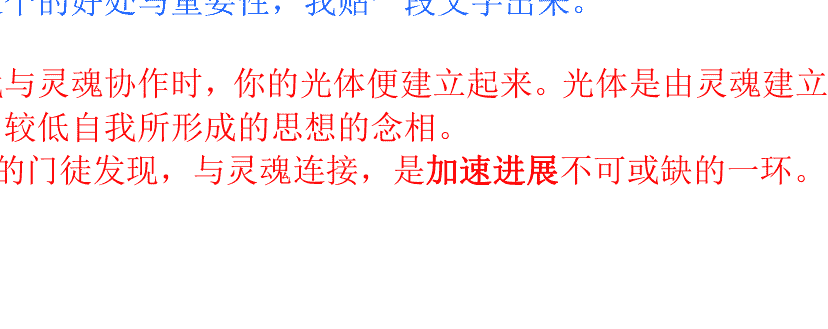

他们分别以两组做试验，一组在共修中，实行冗长、严格的静坐，用呼吸法，不断地唱颂经文、圣歌或咒语，以古老的标准方式来修，历经一段时间，发现他们身心与意识的改变不大；
另一组则以较短，较为自由的方式静坐，没有严格的呼吸法，也不长时间地唱颂经文、圣歌或咒语，总之不是以古老的标准方式来修。然而，团体中的每个人，都在静心之前做启动灵魂中心点，以及清理磁场的工作，历经同样的时间之后，发现他们的身心有所转化，也更能开发直觉力与工作能力。

> --博纳与蒂娜《彩虹桥》

另外：耶稣曾经说过一句话【除非经由我，否则你无法到达天父那里】，这里面【我】，指的就是我们的灵魂体与较高自我。
还有，希望大家能够认真看看博纳与蒂娜之《彩虹桥》那一章，希望大家能够明白什么是 加速进展！

从上面的文字应该不难看出，这一点的重要性了吧。其实这点不仅在博纳与蒂娜的对话里有讲，在光的课程正文里也有讲，总之，【光的课程】是上师们为了协助愿意加速个人精神进展的人而设计的课程，每个设计都环环相扣，以我们目前的心识尚无法完全理解他的运作，我们所要做的就是，依照上师们的教导认真的习修与转化。

问：第二个是能量旋窝，我在【静坐次弟】里有听过，每次用这个的时候我也感觉非常好。

答：恩，这个工具也是非常的好用，我们可以在行、住、坐、卧中，每当感到自己处于负面情况的状态下，都可以启动这个工具。
逆时针旋转：可以清理储存在较低体系的杂质。
顺时针旋转：可以稳定并保护我们的能量磁场。（当我们在人多或者非常拥挤的地方，感觉自己有头晕或者受到别人磁场的干扰，可以启动这个工具，保护自己不受别人能量磁场的干扰。）

问：第三个，这个工具其实我看到有许多人有这点有疑问，说不应该把杂质排入地球，这样是伤害地球。

答：恩，其实这个问题是很多初学者或者说是很多不了解【光的课程】的人会提到的问题，其实这根本的原因还是源自每个人内在很深的恐惧。我当初习修的时候是不管三七二十一，就只管修去了，才不会管那么多，我修什么东西，就是看那个老师或者说传播的人，那个人行得正坐得端，我就觉得这个课程不错。当初跟随内在的指引，就这么一直修下去，真没想到这次真是捡到宝了。呵呵呵。。。，呵呵，扯的有点远了。回来说一下这个问题吧。

其实这个问题，在博纳与蒂娜的对话【漫谈宇宙次元】第二次元 里面已经做过探讨了。
我们所处的这个地球是【第三次元】，而我们将杂质排出去地方是【第二次元】以及【第一次元】，也就是地底世界，我们一般想起地底世界就会想到地狱等等恐怖影像。其实不是这样的。我下面引用博纳与蒂娜的对话：

在双鱼座的时代，因人类的心智，尚未发展到能理解「你创造你的实相」这一真理。为了方便教育，便有人制造天堂与地狱的故事，来阐述善有善报，恶有恶报的宇宙法则。一般人便依自己的想象，认为天堂在云端间的天空之上，相对于地壳之下的世界，让人在无形中，对自己脚底下的世界，感到害怕或恐惧。

如果我们静下来深入自己内在的黑暗，深入自己深藏的痛苦中时，我们便可以感受到某种较低、较稠密的障碍物梗塞在我们之内的某些角落。它们是一些 2D（第二次元）的元素，在银河黑夜期我们创造了一些戏剧来学习，这些学习被我们带到在 3D（第三次元）的身体中，成为我们与 4D（第四次元）的思想、情绪共振的媒介，促使我们自编、自导、自演一幕幕的悲喜剧。我们就是在那悲喜剧的二元性中学习。

我们所释放的一切负面事物，进入第二次元便成为冶炼成物质元素的原料。当地球进入宝瓶纪元时便是进入光的纪元，在这光的纪元中，一切负面的事物必需让它回到第二次元中。在光的纪元中，地球吸收着极其巨大的光芒，因此，这些负面元素不仅必须，也是极其乐意回到暗处。第二次元具有将它们成为冶炼成为提供往后生存在第三次元的存在所需之物质的功能。

> --引自博纳与蒂娜《漫谈宇宙次元》

其实我们观想将杂质射入地心的这个步骤，就是让自己双脚深植大地与大地之母联接的过程。

有许多人修行其实是为了逃避自己生活中种种不如意的事情，想着自己有哪一天可以飞升，离开这个令自己讨厌的地球（我也是这样，曾经），其实我们提升、通关的密码和钥匙是【爱】，如果你不能爱这个地球，爱这个地球上的每一件事物，你是不可能离开这个地球的，你会持续的在你所讨厌和抗拒的这些肥皂剧里持续缠斗不清，直到你真正愿意放下、愿意去爱为止。

当然，有人说，难道他们说的就一定是正确的吗，我一定要听他们的话来修【光的课程】吗？

当然不是，每个灵魂都具有自由意志，你可以选择你愿意习修的课程深入进行习修。【光的课程】只是众多习修法门里的一个。修不修完全在个人。

问：第四个，只有一个【光】字？

答：恩，是的。原本我忘了把这个工具给写上了，现在重新加上来。其实我也不知道我是否仅用文字来将他的功用表达清楚。我只是尽量，大家能领悟多少就算多少吧。

其实这个工具才是最好用的工具，也是随时随地都可以用的，我们修光的过程中，培养觉察力是很重要的，每当我们觉察到自己处在负面状态下，或觉察到自己抗拒一些人和事，都可以观想【光】来照射这些思维念头影像，接着你或许会发现自己一直执着的那些东西其实什么都不是，不过是些无意义的念头罢了。这就是一个释放的过程。

【光的课程不会预设一个理论让你去融入，他一直教导我们的是】：【让光成为治愈的来源】。当你慢慢的放下你原来紧抓不放的东西，改变会自然而然的发生。其实还有一些其他的工具都会随着你习修的深入，而慢慢的显现出来，我现在所说的只是自认为较为重要的来说一下。
这个工具的具体用法，举例来说：当你觉知到你处在负面状态或者想要释放一些旧有模式的时候，可以打出来或者找一支笔写下来，可以尽量的详细，写完之后。以一种不带任何评判的心，观想光照射这些思维念头。 那么，接下来，改变便会自然发生了。

问：听你说了这么多，真是受益良多，不过我感觉 这些对我来说有点象听天书，呵呵。

答：恩，其实这些东西我也是在习修中慢慢体悟到的，初学者其实只是去这些工具，就已经受用无穷了。
把这些习修心得分享出来的其中一个目的也就是希望那些人不知道【光的课程】是什么，就依自己原有的观点对他先来一堆判断，自己跟他们解释也解释的累了，把这些分享出来，有机缘的人自然会看到。

另外也一个目的，也是想抛砖引玉，真正的玉是【光的课程】，以及编辑部的老师们所编撰的 【博纳与蒂娜】对话录，以及光的课程网站里的一系列问答。

祝福大家，愿大家在【光】的国度里旅程愉快。

问：恩，好的，谢谢你，也祝福你。
答：哦，对了，最后再提醒大家的一点是：
不要看我在这里说的这么天花乱坠的，如果你不认真面对自己内心的恐惧，不认真面对自己人生的功课，我这些话等于什么都不是，对你一点作用也没有。
当然，再提醒一点，我说的这些并不是绝对。仅供参考。
每个人心中都有一个【光的课程】，具体他是什么，需要每个人自己去探索、去领悟。
再一次的祝福。

以上文字源自：http://hi.baidu.com/igwffg/blog/item/b4d843d055db0c9aa1ec9c8a.html

## 光的课程灵修系统1

## 光的课程

http://www.courseinlight.info/ 光的课程 栏目

## A Course in light

开启内在生命之光的途径

Antoinette Moltzan

杜恒芬 译

光的课程资讯中心

### 译者序

初次听到这一套《光的课程》，是在一九八四年时。当时的我，身心濒临崩溃边缘，内心世界与外在生活都在一片混乱之中。一方面，旧有的价值观被粉碎殆尽，另一方面，对自己生命真正的目标，却未能有一个清晰的了悟。精神处于那种昏暗无明之中，内在心灵的和平与安宁，成了我唯一的祈求、唯一的渴望。对我的祈祷，上天给予我的回应是引导我认识 Antoinette Moltzan——传递这套教材的通灵者。一般人都称她为 Toni。

初见 Toni 时，我感到她与美国一般的家庭妇女没有什么不同，她态度很随和，说话的言词语气比起一般人也没有两样。我知道她在教这一课程，但当时我并没有学习这一整套课程的意愿。我认为自己已超越基督教中那种只有讲「神爱世人」等粗浅理念的人；我觉得只有佛法所讲的那种深奥得令一般人悟不透的「空」，才是至高无上的哲理。我唯一感兴趣的是，她进入通灵状态时，为我所通传出来有关我个人生活上的各种讯息。

然而，在那一次又一次讯息的传递中，我感到自己支离破碎的身心，在逐渐更新的思想意识中，被一种不可思议的能量，一点一滴地愈合起来。这股神奇的治愈力，使我决定加入这一课程的习修行列。

开始的五年，我一边习修这套教材，一边投入在佛学与佛法的研习上。然而，经过一段时间的学习、融会与整合之后，我体悟到宇宙的真知与真理，是超越任何宗教的仪式与组织的。我领悟到自己过去在宗教团体中，盲目地崇拜或追随「名师」，除了劳民伤财之外，并不能开启我内在生命的智慧。我开始重新认真地阅读这些数据，并在家中与一些朋友分享这些讯息。我发现每次阅读时，都会得到更深一层的领悟。在这些讯息与真知的分享中，我又深深体悟到「在给予中，我们获得」这一不朽的真理，同时也体认到宇宙圣爱的真实涵义与人类生命的根本关系。

最先,我只是把教材中精要的部分以口述的方式转译出来。后来,有更多的人想要了解这些数据与讯息,我只得以手稿的方式将它译给有兴趣学习的朋友们。就这样,几年下来,经由这些手稿,我认识了许多真心向上,并愿意提升与改变自己的朋友。见到这些朋友们在这一套教材的学习中所获得的成长,以及所焕发出的光芒,令我感到这套教材应该经由出版,来与更多的朋友们见面。因为,这套教材原本就不是仅为了一小群特殊之人而问世的。在这时代中,已经没有「密法」,尤其是这套教材,它纯粹是为了有志于以自身内在心灵的完善与和平,来达到修身、齐家、治国、平天下的人而给予我们地球人类的。

一般人如果能对初阶入门教材有着透彻的理解,并能实践它,就可以达到自身生命的完整与和谐。至于需要多久的时间,完全在于个人在朝这方向前进时所付出的心力与意志力。诚如上师们所说的:「清理、净化与提升,必须经由许多年的运作、体验与静心冥想而来。没有人能以短短时间的投入,便轻而易举地证入涅盘,达到转识成智的境地。入门阶段是一个考验学生信心、驱策力、欲望,以及汰旧更新的时期。」

当一个人完成了身体、情绪·感受体、理性体与以太·星光体四个在三度空间物质层面体系的清理、净化,并自身完善之后,自然不会满足生命仅仅局限于独善其身的层次中,这时他就可以选择一面带领其它的朋友,一面继续习修行星课程。这样,对这一个体来说,便是在为人类的进展做奉献。因此,这一套课程,除了现在出版的初阶入门教材之外,还有十二个级次的行星课程可进修。进入行星层面的运作,是灵魂进展过程中非常重要而关键性的转折点。在这套课程中,为地球与人类的进展做奉献的重点,不在于物质财产的「布施」,而在于「提升自己,并使自己进入宇宙的光海,将觉知带到地球」;能做到这一点,便是一个人最大的福德。因为:「一代代的文明,各种文化,譬如政治、宗教,都在地球上留下许多的晦暗与思想的扭曲。所以,当我们在纯净的光中静心冥想时,我们便正协助着无数的天使圣团们,把净化的能量带到地球上来。」

行星的课程比起初入门的课程更为浩瀚,但是,翻译的工作已在进行中。我给大家的承诺是:当机缘成熟时,这些资料便会与大家见面。我在此谨向所有过去曾经、现在正在,以及未来将与我们共同走在这一道途上的朋友们,表示由衷的感激。因为你们的意愿与祈祷,是我翻译这套教材的原动力。感谢我的父母与家人,由于他们在生活与精神上的支持,使我得以进行这一使命。

杜恒芬

## 再版序

《光的课程》中文版于一九九六年出版，这些年来,Toni又接收到许多增订资料,我只得继续增译并以讲义的方式,给一些与我们有接触,有联络的朋友。几年来,目睹一些共修的朋友们,配合了新增数据的学习,在身心上,在生活上,都有着突飞猛进的改变,这种欣喜鼓舞着我,又在共修朋友们的殷殷催促下,将这些宝贵的增订数据加入原版,重新审编后,再次出版,奉献给有缘的朋友们。

《光的课程》纯然是一套心灵成长的课程,共修的各个团体也纯然是一些成长团体。与一般课程不同的是,它不是探讨深奥的逻辑或学术的课程,它是一套需要在「开启自己内在能量的运作中」真实地面对自己,了解自己,以便迈向更高灵性进展的课程。由于它是以英语系统来传递这套课程,便自然沿用着西方人所习惯的基督教的语言来阐述,如果我们能超越宗教的自我局限,便能看出它超越区域性的宗教与文化的宇宙性。

新纪元运动的主旨在于帮助我们理解自身的神圣性与宇宙的多元性,进而与宇宙共同创造美好的生命表达。这一切由「你创造你的实相」的理解开始。许多新时代的讯息都在告诉我们,外在的生活反映着我们的内心世界,也就是佛学中所言的「一切唯心造」。因此,要创造一个美好的外在生活,首先要创造美好的内心世界。然而,知识理念的认知仅是一个开始,要具体实践,往往需要一个学习 Know How 的工具,并在切实体验习修与生活互动的过程。纯粹谈理论,是无法体验,也无法实践的。因为,真正美好创造的发生与完成,皆来自那与内在神性融合之后的心灵,而非由那种与神性分离,且充满以头脑所产生之众多念头所形成的小我来完成的。

我生命前半段的一切,可以说都是活在「小我所造的幻象世界」中,因此常常得从虚妄的倒影中想习得「悟空」之道。然从虚妄中习修「悟空」又不得悟的痛苦,驱使我以地毯式搜索、探究这一切的肇始之因,以及如何改变「自食小我所造之果」的秘诀。《光的课程》是我决心探索之初,上天赐予我的礼物。然而,在开始时,我并无此慧眼看出它的宝贵,直到我体悟到在我不经意的学习中,它所带给我的是何等地不可思议的转变时,为了不让西方的朋友专美于此,我毅然投入于翻译这部由西方取回来的经典,将它转化成一条可以让自己的朋友、同胞同行的路。

十多年来,为了译它,我再三地从开始往内心行去,我发现自己不仅内心世界在层层深入的体悟与厘清中,逐步获得了我所渴望的和平与安宁,也清楚地觉受到它正一步一步地帮助我创造自己理想外在生活。我也很高兴知道与我们同行的许多朋友，在这课程的学习中，也开启了自己内在生命的智慧与力量，从而改变了他们内在心灵与外在生命的质量。为此，我诚恳地邀请听到我们呼唤的朋友们，与我们共享这份上天给予我们的礼物。

杜恒芬

## 前 言

我们人类，无论是有意识的，无意识的，都会想在心灵上求进展。进展与生命是同一件事。

《光的课程》为那些想要对自己的人际关系与人生责任有更深觉醒的人们，提供了一条快捷的心灵进展的学习过程。这个过程，我们称之为[途径]。当一个人不再满足于自己的生命仅仅是生活上简单的反应，而渴望人生具有创造力，并且在自己的成长上作出坚定的决策时，这一课程便成为加强心灵进展的一个重要途径。

修持这一课程的学生，其目的是为了使自己的灵魂觉醒，并能有意识地发挥心灵的进展，达到与较高自我的融合。当一个学生开始进入这一心灵的进展的途径时，经由智慧、爱与奉献，他将会从真实自性分离的意识状态中，逐渐改变成与真实自性融合为一，成为一个与自性本体合一的共同创造者。

在初级课程入门阶段的道途上，每一个初踏入这一道途的学生都将面对一种强而有力的挑战，因为个性自我（personality Ego）必须面临许多疑惑与恐惧的挑战，这些都是心灵进展修持过程必然会有的障碍。

这不是一个刹那就能进入明心见性的旅途，它是一步步逐渐实践的过程。在其间，你将会感受到心灵学生的负荷。但是，当你每突破一种障碍，并坚强地站起来时，就会在自己意识的每一个层面看到内在的光明，并体会到内在心灵的平和是完全觉醒的产物。此时，你会确信每一个障碍的克服都是值得的。灵魂因在生命的进展中，面对挑战，经历挣扎、磨练而获得了成长。

在本课程中，上师们所给予的教导是针对扩大每一个灵魂的正面思想原则而设立的；同时也为了把光带入每一个学生的觉性中，使每一个学生都能达到进入较高自我的真实法能里。每个学生在初级课程中，都会面临自我的挑战，每个人都必须通过对自我的一系列考验。挑战就像阴阳一样，互为相生，是一体的两面。人类就是在这种互为相生的流转与融合中，学习和体会宇宙的内涵。

## 作者简介

《光的课程》(A Course in Light) 已被许多学生习修了一段很长的时间。这一课程是由净光兄弟们 (Great White Brotherhood) 所安排的，净光兄弟们隶属于默基瑟德天使圣团 (Order of Melchizedek)。

虽然他们不具有物质体，但他们是具有心智的精神体，他们所传递的宇宙讯息将引导地球上的灵魂扩大对自我的觉知。这些爱的存在，自地球上有人类以来，便一直是人类的指引者之一。

在习修这一法门的过程中，许多学生已体验到内在的和平以及更高的灵敏度。这些数据由一九七七年开始提供给学生们的之后，便持续至今。《光的课程》是一个静心冥想的系列课程，其中包含了许多讯息，这些讯息完全是为了帮助人类了解、提升与转化自己而传递的。当你有意识地配合光的能量运用它时，便能获得身心的转化。随着每星期在光中的运作，以及持之以恒的静坐之后，你会发现自己内在的改变，你更会发现自己的心灵受到触动。经过一段时间的学习与实践之后，许多人已成为光的实践者，并且成为这一途径的教师。

开始时，也许会有一些用词是你所不熟悉的，也可能感到有些理念是你所不理解的，但是，当你继续下去时，便能逐步地领悟。

由古至今，许多灵修法门都会提到「光」。开悟者们提到进入光明心性的体验时，都形容自己像是置身于光与能量的环境中；圣经也是用光来代表圣灵与奇迹的显现。

灵魂体中光的能量受到个人意识的激发与启动之后，便注入身体之中，同时产生了改变与转化的过程。

在这一课程中所运作的光，不是指那象征着明心见性的光，它指的是那形成我们灵魂存在的、具有实体的、实质存在的光。具体地说，我们就是光。爱因斯坦在解说 E=MC² 时，便说明了当光的频率降低到一定程度时便会形成物质体。更玄秘的是，环绕在我们物质体周围的光环是一种由智能所形成的磁力磁场。

这一课程是由一些已成就的上师们所传递下来的讯息。这些成就的上师们只有光体，没有身体。他们是具有高度心智的精神体，他们以教导宇宙法则来引导学生们进入更扩展的自我觉知中。这些爱的存在们，在人类历史的长河中，已引导了无数的灵魂。这些上师们的工作与默基瑟德天使圣团有关，默基瑟德天使圣团是一群开悟的古老教师团体，他们曾经引导许多精神领袖走在探索的途径上。他们是一群有制度的天使团体，如：

- Elohiem——希伯来旧约中常以此称呼上帝。译为埃洛希姆。
- Archangels——基督教圣经中所说的天使长老。罗马天主教九级天使中的第八级天使。
- Seraphim——圣经中守卫上帝宝座的六翼天使。基督教九级天使中最高位天使，其本性为「爱」，象征光明、热忱和纯洁。译为瑟拉芬天使。
- Cherubim——九级天使中的第二级天使，司知识。译为伽洛宾天使。

为我们带来这一课程的上师们有：爱瑟瑞尔（Azrael），马可思（Marcus），恩勒耐斯（Annanius），杰夫（Jove），勃朗宁（Browning），安德鲁（Andrew），基督圣灵（Christ Spirit）等，以及一些未具名的上师。

光的能量自身不具意识。它纯然是光，只能经由你的思想与意愿来引导它。环绕在你周围的是光的磁力磁场，它发出信号并接收光的能量。在你的意识与自我驱策下，当你的觉知扩展时，你会发现自己成为一个开放的、具有爱的、渴望生命充满爱与和平的人。

光的课程是一系列的学习课程，你可以用自己所能接受的速度来学习；跟随着团体学习的学生则会发现一周一课是很恰当的速度。第一级次的学习焦点在身体的层面上，因此，你需要熟悉身体的基本结构。

经由静坐以及从所接收到的讯息中，你会感到自己的身体有了一些变化。这些变化有可能影响情绪体、感受体以及理性体的层面。虽然第一级次的焦点是放在身体的层面上，但你存在中的所有层面也会随之转化。静坐的录音带可以帮助你进入状况，为你带来一种治愈的感觉。有些词语可能会使你感到陌生，不能理解，但是当你继续学习下去时，你便会逐渐了解它的涵义，学习也就会更容易。在准备静坐时，一个安静的时间与地方，将有助于让你感到更为轻松、舒适与安全。

## Toni's web site http://www.courseinlight.net

## 名词解释

下面的资料将帮助你了解自己存在中不同的自我（Egos）与不同的「体」(Bodies)。

你的个性自我（Personality Egos）、身体自我（Body Ego）、器官与细胞自我（Organic and Cellular Egos）是属于个人的，但是，群体意识会随着你思想与情绪的经验，而成为你个人的印象。在静坐中，这些自我会因接收到呼唤而成为一个合一的整体。几乎每个人都有过在众多选择中感到彷徨无所适从的经验。当你呼唤所有的自我与所有的「体」时，这些自我与各个不同的「体」，自然会聚合在一起。这是为了使所有的自我产生在整体中彼此是相互联系的、息息相关的感觉，以便从中治愈那种支离破碎的感觉。

## 体系与自我

「体」（Bodies），指的是物质体，除了身体之外，它包含了几个无法以肉眼看见的微妙的「体」，诸如：情绪体、感受体、理性体、以太星光体、灵魂体等，因为这些「体」存在于三度空间的物质世界中，我们将它们总称为较低体系。

## 情绪体

情绪体（Emotional Body）是一种制造你内在感觉的能量体。如果你的情绪体中有一些未了的情结，那么这些情结将会影响你整个生命。一个人的情绪体如果没有受到重视，没有获得充分的爱与滋养，这个人可能会变得脆弱与散漫。在静心冥想中，经过光的运作之后，你将能释放痛苦与恐惧，你的情绪体也将茁壮起来。

## 感受体

感受体（Perceptual Body）是一种接收直觉，也就是第六感的能量体，它与神经系统有关。经由光的静心冥想，你的直觉力将会更为扩展。

## 理性体

理性体（Mental Body）维持着你存在状态的完整。思想与理念对你的身体与情绪体有直接的影响。当储存在理性体中的无名恐惧被清理与释放之后，你便会有一种自身完整的感觉，这就是光的课程的目的——使一个人在清明的理性思考中，进入健康的、开放的光明意识之中。

## 以太星光体

虽然人类无法以肉眼看到以太星光体 (Astral/Etheric Body) 的元素，但是人类大部分的疾病来自残留在这一体系中的负面元素。往往一个个体，由于在过去一生中累积了一些负面的情绪、思想与影像，这些都成为一种结晶体，储存在阿卡沙秘录中。这也是为什么许多人常常有一种莫名其妙的愤怒与恐惧的感受，这些感受是回归自性的障碍。当一个个体要求并允许上师们的协助时，光的能量便会在星光体的层面上做一连串的清理，消除化解那些结晶体。当这些结晶体被清除之后，这个个体就能比较快速地回到正常的心识与较高的频率之中。

## 灵魂体

灵魂体 (Soul Body) 是你的光之体。在静心冥想中，你激发启动这一能量中心点，并由这能量体中获得光与能量。这能量是你释放、治愈并转化身心意识的来源。当所有「体」的频率都在和谐中共振时，一个人就会具有生命的活力，并感受到生命的圆满。这也是光的课程的目的——为你带来光、爱与喜悦，协助你走出痛苦的感受，为你的所有层面带来和谐与完整。

## 自我 (Ego)

自我 (Ego)，指的是各个「体」(Bodies) 中的意识。你的个性自我、身体自我、器官与细胞自我等，都是影响你生命的智能体。大部分人的心识是处在涣散之中的。在静坐时呼唤这些自我，将有助于你身心的整合。

## 化身自我

化身自我 (Incarnating Ego) 是你灵魂体中神性的那一部分，是乘载着光的工具。化身自我与你的灵魂意识有关。透过光的静心冥想，你将理解它的实相。

## 个性自我

个性自我 (Personality Ego) 是自我意识中的一部分，你这一生的生命模式，是由这一部分所形成的，你的灵魂选择这个部分，做为进展的基石，你便把这一部分的个性自我认定为就是你全部的自我。个性自我在生命挑战中，因受到各种不同程度的伤害，极其需要治愈。在光的运作中，这受到伤害的自我，得以在理解与宽恕中获得治愈。个性自我是依它觉知的程度而接收指引与真知。

## 身体自我

身体自我 (Body Ego) 是使你的身体保持正常运作的总指挥。当一个人的身体自我与个性自我整合起来时，才能具有健康的意识与生命力。身体自我会把受到伤害的经验储存起来。它对地球上各种化学污染、混浊的空气，以及不纯净

## 器官自我与细胞自我

## 7.1 使用TCP的socket编程

在前面介绍了TCP协议的一些基本特点，从本章开始介绍如何使用TCP进行网络编程。在网络编程中，最重要的一个概念就是socket。从字面上来看，socket是插座的意思，在网络编程中，socket可以看成是两个网络应用程序进行通信时，各自通信连接中的一个端点(Endpoint)。在通信过程中，发送方将信息写入自己的socket中，该socket通过网络接口卡将信息发送到接收方的socket中，整个通信过程完成。在操作系统内部，网络协议栈通过socket来管理通信，因此，socket成为了网络编程的“胶合剂”，可以说，不会使用socket就根本谈不上网络编程。

### 7.1.1 网络编程中的C/S结构

网络编程实际上是一种特殊的编程形式。它将网络中的两台或多台计算机连接起来，让它们可以相互发送数据。我们现在熟悉的《帝国时代》、《反恐精英CS》等网络游戏中，在局域网上或者通过Internet将各自的游戏客户端程序互相连接起来后，玩家就可以相互通信并协同，来完成游戏中的任务。

在网络通信中，大部分的通信和交互过程都采用一种C/S(Client/Server,客户机/服务器)的结构，如图7-1所示:

客户端(Client)指主动发起连接，并发送数据的程序，服务器(Server)指被动等待连接，并处理数据的程序。在C/S结构中，服务器端一般会在某个端口上监听客户端的连接请求，当监听成功后，服务器和客户端就可以进行通信，发送或者接收数据。目前流行的很多应用都以这种C/S结构运行，例如Web应用程序：浏览器相当于一个客户端，Web服务器(如Apache)则相当于服务器端；还有邮件应用程序：邮件客户端(如Outlook)相当于客户端，邮件服务器(如Exchange)则相当于服务器端。因此，在大多数网络编程中，都会将通信程序分为两个部分：服务器端程序和客户端程序。

## 构建强大的应用

这是一段示例文字，用于说明如何生成结构化的文档输出。该段落包含对内容的简要描述。

- 第一步：准备环境
- 第二步：编写代码
- 第三步：测试部署

| 列1 | 列2 | 列3 |
| --- | --- | --- |
| 数据A | 数据B | 数据C |
| 数据D | 数据E | 数据F |

> > 这是一个引用的内容，用于强调关键信息。

```
console.log('Hello, World!');
```

## Deep Learning

### A Practitioner’s Approach

A comprehensive guide covering the fundamental concepts, architectures, and practical applications of deep learning. Designed for practitioners who want to build, train, and deploy neural networks effectively.

### Key Topics

- Neural Network Fundamentals
- Convolutional Neural Networks (CNNs)
- Recurrent Neural Networks (RNNs)
- Transfer Learning & Fine-Tuning
- Model Optimization & Regularization

### Target Audience

- Data Scientists
- Machine Learning Engineers
- Software Developers
- Researchers & Students

> > “Deep learning is not just a tool—it’s a paradigm shift in how we approach complex problems in AI and beyond.”

### Comparison of Activation Functions

| Function | Output Range | Gradient | Use Case |
|----------|--------------|----------|----------|
| Sigmoid  | (0, 1)       | Vanishing | Binary classification |
| ReLU     | [0, ∞)       | Sparse   | Hidden layers        |
| Tanh     | (-1, 1)      | Vanishing | RNNs & sequence models |

## 基于BP神经网络的土壤墒情预测模型设计

土壤墒情是指土壤含水量的状况，它对农作物的生长、灌溉管理以及水资源调度具有重要意义。本文基于误差反向传播(BP)神经网络技术，提出一种土壤墒情预测模型，使用历史土壤湿度和气象数据对未来的土壤含水量进行预测。该模型利用BP神经网络的非线性映射能力，能够有效捕捉墒情变化的复杂规律。实验结果表明，该模型在预测精度和泛化能力方面均优于传统方法。

- **关键词**：BP神经网络；土壤墒情；预测模型；非线性映射；泛化能力

### 1 引言

土壤墒情是农田灌溉和作物生长管理的核心指标。准确的墒情预测能够帮助农业部门合理制定灌溉计划，提高水资源利用率。传统的预测方法包括时间序列分析和回归模型等，但这些方法在处理非线性、时变特征时存在一定局限性。近年来，人工神经网络因其强大的非线性拟合能力，在农业预测领域得到广泛应用。BP神经网络是一种多层前馈神经网络，通过误差反向传播算法调整网络权值，实现输入到输出的非线性映射。本文将设计一种基于BP神经网络的土壤墒情预测模型，利用历史土壤湿度、温度、降雨量等数据对未来墒情进行预测。

### 2 数据预处理

在模型训练之前，需要对原始数据进行清洗和标准化处理。数据来源于某农业气象站的连续观测记录，包含每日的土壤湿度、温度、降雨量共3个特征。由于传感器异常等原因，原始数据中存在少量缺失值和异常值，我们采用三次样条插值进行补全，并对异常值进行剔除。为了消除量纲影响，将所有特征归一化至[0,1]区间。归一化公式如下：

> > x_norm = (x - x_min) / (x_max - x_min)

其中x为原始值，x_min和x_max分别为该特征的最小值和最大值。经过处理后共得到1000组样本，按时间顺序划分为训练集(前800组)和测试集(后200组)。

## 研究生学术评价改革指导意见

为深入贯彻全国教育大会精神，落实立德树人根本任务，现就改进研究生学术评价提出以下指导意见：

### 一、基本原则

- 坚持德才兼备，以德为先
- 突出学术创新，注重质量贡献
- 分类分层评价，破除唯论文倾向
- 强化过程管理，完善分流机制

### 二、具体措施

各培养单位应针对不同学科特点，制定差异化评价标准。将学术诚信作为基本底线，对学术不端行为实行一票否决。

| 学科类别 | 评价重点 | 代表作数量要求 |
| --- | --- | --- |
| 基础学科 | 理论创新 | 1-2篇 |
| 应用学科 | 技术突破 | 1-3篇 |
| 人文社科 | 思想贡献 | 1-2篇 |

> > 教育是民族振兴、社会进步的重要基石，研究生教育是培养高层次人才的主要途径。

当光在身体中流动时，低频率的、浓重的思想念相（ThoughtForms）便会瓦解。无论这些念相是你们多生所形成的产物，或是这一生的经验所形成的，都会被打破，被释放。这种时候，往往情绪体或理性体会有一些反应，心理与情绪也会随着改变。但当原有的恐惧清除时，你便能体验并感受到治愈的能量。

你可能会在某一时刻中，因感受到生命是美满的，而充满了热忱与巨大的喜悦，你可能会因看到与宇宙天父合一的完美，而感到没有任何事物可以使你与造物主分离。然而，在另一时刻中，某种恐惧的影像又可能会把你的思想与情绪带入一种较低的意识中，使你无法确定自己的方向。当你处在这种特定的意识层面时，你的整个存在便陷入一种极端的骚动与混乱之中。

要知道，虽然这种不平衡的状态对你的生命而言，并不是必须的过程，但是，当你从中走出时，你将因此而变得更强壮，你对较高实相的信心也将更坚定。这种改变意识的运作，会为你带来极大的冲击力量。

## 静坐次第

## 光能静坐的基本步骤

1. 把身体放松下来，做深呼吸，释放所有盘绕在你心识里的思想。
2. 默念你的肯定语意。
3. 唱颂OM字。（如果想这么做的话）
4. 恭请十方贤圣与净光兄弟的老师们与我们同在。
5. 把意识集中到前额，使所有的自我成为一个整体，完整而光明。
6. 引导所有的自我，经由较低体系而流通。
7. 激发启动光的能量。
8. 引导光的能量在身体上流通，把光的能量集中在身体与星光体上，先以逆时针方向由上而下地旋转一次，以净化身体上的杂质。再以顺时针方向环绕身体一次，这样可以放大正面的治愈频率。
9. 进入完全的静默中。
10. 把光导向需要这能量的人。
11. 当静坐结束时，把身体中的杂质经由脚底射入地心。
12. 回到正常的意识状态中。

## 静坐次第的说明

初阶第一级的课程，主要是针对学生们身体与星光体的意识做提升与转化的工作。当然同时也会惠及其它的层面。让我们的意识了解到光的能量在人类身心不同的层面上，产生正面的作用是很重要的。在这里，不同的身心层面是指情绪体与理性体等体系上的自我。每一种光的频率有它的特质，并直接影响到与它相应的每一个系统。要运用光的能量，并与光融合为一的先决条件是要对光的能量本质有所了解。

一个人如果不经由特定的修持、练习与投入，他的性灵（Soul）将无法突破人类由于自由意志所产生的行为与思想理念，也无法与光融合。经由特定的习修与投入，让自己在光的环绕中，及自性灵魂在光的浸沐下体会喜悦，并释放对自己存在的控制，让你的存在升华。这种进展与融会来自心灵的平衡与释放，以及对自性完整的追求意志。

记住：能量跟随着思想，思想导引着能量。

因此，我们必须在肉体生命的层面上扩展意识，因为身体的和谐与完整是心灵进展的基础。

如此详细地解释静坐过程，是有其特定意义的，因为次第必须有技巧地进行，才能使学习者的心识与较高的心识共同航行。次第是简单与基础性的，这一静坐过程将为你带来净化、清理、调整与转化，并且改变身体器官细胞组织。

次第的进行必须是连贯性的。这个次第是为了帮助学生在习修进展中，能承受巨大的能量冲击而设计的，因此任何的疏忽都会延误进展的过程。

以下是静坐次第每一过程的诠释，以便让初入门者知道在修持中怎样正确地使用。常常练习，不要让自己失去修持的信心与耐心。了解和熟悉这一次第需要一段时间与过程，只要有信心与耐心，不久你就能熟悉并掌握它了。

### 次第 1:

放松身体的每一部分，做深长的呼吸，释放心识里的意念与思想。

在释放中，把你的觉性完全地交给较高自我。这时你会体会到一种飘然的感受，这不是自我催眠，而是正在祛除意识层面的影像与障碍。

### 次第 2:

默念你的肯定语意（Affirmations）。肯定语意可以在共修或个人的静坐中使用，每个人可以根据自己的需要设立自己的肯定语意。你可以这么说：我们正在表达身心每一部分都是完美的理念；我们把光带到人类的每一架构中；我们接受光，与光融合在完美的创造中；进入天人合一的境界。

### 次第 3:

唱诵 OM (唵) 字。OM 这一古老的唱颂源自于人类对宇宙精神与天父理念的觉醒。它的内涵很难用语言和文字来诠释，因为它是人类本源始发的初音。这古老的音声散发着思想之波，使我们与较高的音波会合。置身在其中，能够燃烧一切负面的杂质，使人的思想意识焦点集中在正面的静心冥想之中。

### 次第 4:

恭请十方贤圣与净光兄弟的老师们与我们同在。坚信净光兄弟的上师们与我们同在；在我们每天的静坐中，打开与上师们沟通的管道，恭请上师们与指导灵们与我们同在，让祂们成为我们修持力量的源泉。如果看不见或观想不出上师们的形象，不要感到气馁，因为即使没有视觉上的经验，上师们依然确实存在着。经过一段时间的修持之后，当敏感度增加时，自然会感受到与祂们之间在内在心识上的交流与沟通。

### 次第 5:

把意识集中到前额，呼唤所有的自我，使它们集中并放出光明。这一步骤是很重要的，这并不表示你必须大声地呼唤，而是用心聆听你所呼唤的自我，将它们一一召集到你的前额。

这些自我是：化身自我 (Incarnating Egos)、个性自我 (Personality egos)、身体自我 (Physical Ego)、器官系统自我 (Organic System Egos)、细胞自我 (Cellular Egos)。详细说明每个体系如下。

化身自我——是不死的生命，是造物主的个体化。代表着一个自我、一个心识，是所有层面所有次元中永恒生命的体验。在静坐中，你可能会体会到它是那永恒的你的一部分，是最强的自我，虽然它不存在于身体之内，但它是教师，是一切的主宰。

化身自我是灵魂觉性的那一部分；灵魂的频率是由于在多生多世的轮转中，形成的一股强而有力的意识。生命的目的在于具体实现灵魂的所有愿望，在这地球的层面上表达它的创造性，进而摆脱这些愿望，以便向另一个系统的表达进展。

正确地使用化身自我是非常重要的。它是你较高自我频率的显示。你的较高自我聚集了许多生所累积的智慧，它具有一种完整而强大的力量。当我们唤醒它## 自我提升：个人成长与发展的全面指南

个人成长是一段漫长且有益的旅程，它涉及到提升自我认知、学习新技能、培养良好习惯以及保持积极心态等多个方面。以下是一些关键领域与实用策略，帮助你在自我提升的道路上不断前进。

### 一、设定清晰的目标

没有方向的前行如同无头苍蝇。设定明确、可衡量、可实现、相关且有时间限制的目标（SMART原则）至关重要。

- 具体（Specific）：例如“每周阅读一本书”而非“多读书”。
- 可衡量（Measurable）：使用量化指标跟踪进度。
- 可实现（Achievable）：目标应具挑战性但仍在能力范围内。
- 相关（Relevant）：确保目标与长期愿景一致。

### 二、培养每日习惯

微小的习惯积累起来会产生巨大变化。专注于1-2个关键习惯，并坚持21天以上。

- 早起：利用清晨时间学习或锻炼。
- 阅读：每天至少阅读20分钟非虚构类书籍。
- 运动：每周进行3-4次有氧或力量训练。

| 习惯 | 推荐频率 | 预期效果 |
| --- | --- | --- |
| 早起 | 每日 | 精力更充沛，时间更充裕 |
| 阅读 | 每日 | 知识积累，思维提升 |
| 运动 | 每周3次 | 体质增强，情绪改善 |

> “我们重复做的事情，决定了我们是谁。因此，卓越不是一种行为，而是一种习惯。” —— 亚里士多德

时，它便把意识里的觉性带到真实之中。因此，你要把化身自我带到前额，以便把它带入地球层面上的肉体形态中。

个性自我——是在你出生时所创造的自我意识，也是一个受到你父母影响的产物。它影响着你人生中所有的外在环境。同时，这个个性自我也受到星球能量的影响，它就是那个你所认定为是自己的你。

个性自我是地球生命经验中的那个自我，灵魂为了表达它的频率，创造了个性自我中的意识。个性自我中含有许多影像，是群众意识的产物。在妄念中，它往往会导致各种不同的变化。

因此，要把个性自我带到前额，以便让它与化身自我融合。这种融合，在开始静坐的习修时，往往是一种勉强的聚合。因此，你要呼唤较高自我，将这些自我都加以提升，使它们得到光明，才能进一步把所有的自我带入圆融合一的境界。

身体自我——存在于人体结构里，它的意识受到身体功能的影响，也受到肉体的欲望、感官上的本能，以及哺乳类动物意识的影响。它唯一所关心的是，用食物填饱自己，享受性本能的冲动。它是一种直接反应的自我；当它与其它自我融合，并获得光明时，肉体上的冲动与较低的欲望需求，就会被其它自我所取代。

人类的身体自我，可以说是身体器官的感受器。就像口渴会使你感到需要喝水一样。因此，把这个自我带到中心点上是非常重要的。要特别确认这个自我，把它带到前额，以便与其它的自我融合。在刚开始时，这个自我往往极不乐意被带入光的较高频率之中。但你一旦坚定并持续在光的能量中做静心冥想时，这种勉强与抗拒的情况就会渐渐减少。

器官系统自我——身体里的器官自我，是一种完全自然的、和谐的组合。身体里的每一个器官都有特定的功能，也各自有许多不同的欲望，但是，它们还是受着一个整体意识的指挥。

身体里的器官，按各自的本能，自然地运行着，当运作不正常时，这些器官自我就会输送出受到压力的讯号；反之，当这些器官自我愈是处于正常的较高频率之中时，它们就愈能使身体的功能在协调与和谐中运作。

当器官自我被带到前额与其它自我融合时，它们的功能便开始在和谐与合作中运行着，它们向脑神经系统输送各类讯号，协调整个身体的功能，使之趋于平衡与和谐。所以把这些自我带到前额是很重要的，这也是我们要你把每一个自我聚集于前额的主要目的。

情绪体（Emotional Body）——是一个对事物产生反应的体系，它发生在肉体生命的层面上。它非常地沉重，并且会因为许多不同的经验而产生正面或负面的思想理念。

理性体（Mental Body）——是人类理性意识的体系，理性体也可以是非常非常沉重的，因为它处于非常低的磁场中。

灵魂体（Soul Body）——含融着明亮金黄色之光，它的本质是喜悦、乐观和明朗，具有爱与创造性。灵魂体的内涵超越了一般人类所能理解的范畴，这个体系最接近神性的大我。

除了这五个体系之外，尚有人类难以理解的其它体系，像天使体。天使体是精神灵性的导师，纯真而无法触及，这体系呈现着纯金色的光。目前还无须考虑这个层面，待初阶课程完成后，进入更高层次的习修时，这一体系将会自然地呈现出来。

当你们开始静坐冥想时，会感到自己像乘着电梯似地进入另一个层面。当你们进入自己头顶上方六吋的脉轮中心点时，便是进入了《光的课程》中的第一种光——白色之光，亦称为基督之光。激发启动这光的能量...

### 次第 7:

当学生把意识带入头顶上方六吋的灵魂体脉轮中心点时，在光的能量照射中，要用自己的意识来使用这白色之光。观想这白色之光明亮无比，感受这光的能量在扩展，观想千万个光体，如同太阳一样在放大它的光明。冥想并呼唤这能量是很重要的，因为这将使心识觉醒，并明了这是一个进入较高意识的途径。否则，在这过程中，脑意识会误认为是超觉的自我在控制这一切，当脑意识审视探索过去经验时，便会产生矛盾的反应。

当习修者呼唤较高自我，呼唤上师们时，祂们会成为修持者的动力，并打开沟通的管道。

### 次第 8:

引导光的能量在身体与星光体上流通，进一步扩展到其它体系：

把光的能量集中到身体上：身体包括神经系统、消化系统、骨骼的结构组织、呼吸系统、排泄系统、肌肉组织、循环系统、新陈代谢系统和皮肤组织。观想并感受白色之光净化、清除、释放所有的杂质，并转化内在的器官组织与细胞组织里较低的负面频率。

让光由左至右以逆时针方向漩涡似地旋转下来，当身体净化之后，将光的能量经由腿部与脚底，将杂质与较低的频率射入地心，让光在身体里不断地扩展。然后以顺时针方向由上而下地环绕身体一次，使身体得到平衡、治愈与整合。

光在星光体上的运作：接下来把光的能量扩展放大到以太.星光体的层面上。星光体是我们的磁场，它与我们的身体像网络般地不断在光中交流互动着，并且扩展到身体之外一时至二时的地方。它是身体的复制品，身体功能的失调与身体上的疾病，都先在这星光体上成形，然后反应在身体上。所以去除磁场里的负面意识形态及较低的频率，对于身体的治愈是非常重要的。（见图二 P.55）星光体是一个重要的能量磁场，像是一个较小的涡流，螺旋似地在身体的内外进出着。这些能量磁场对身体的内分泌腺有直接影响，它们与身体的疾病也有很大的关系。比如说：与脑垂体、松果腺相关的部位是头颅后脑与眉心轮的部位；与甲状腺、副甲状腺、心脏相关的部位是胸腺；与胰脏腺相关的部位是太阳神经丛；与卵巢、睾丸相关的是腹部；与尾闾相关的是肾上腺；与身体的左边相关的是胰腺。

当光的能量被引导由内向外流动时，让能量在头部、喉咙、心脏、太阳神经丛、腹部、尾闾与身体的左半部等部位放大。观想治愈的能量，使这些内分泌腺与脉轮在平稳、均衡与合一中运作，使身体与星光体结合，产生健康、活力、完美、和谐。当星光体上所有的杂质被释放后，观想光将杂质与负面的较低频率射入地心。

光在感受体上的运作：当习修者把光带到太阳神经丛部位的感受体时，光的能量便开始化解，并释放错误的理念、误解、虚妄的影像和负面的感受。当我们释放心灵上的杂质之后，将这些杂质射入地心，然后将光的能量在感受体上扩展，以带来清净、开展的觉性。

光在情绪体上的运作：把光带到心轮部位的情绪体上，引导光能化除、释放负面情绪反应的习性，再一次把杂质射入地心里，并且扩展光的能量，使自己获得正面的清明、平衡与和谐。

光在理性体上作用：将光的能量带到理性体上，以化解负面的影像、虚妄的信仰和理念，去除由于过去的经验所造成的负面态度和信念，并感受自己那些存留于理性体内的较低频率得到提升。将这些浮现出来的杂质释放到地心里，然后将光的能量在理性体上扩展，以便使理性得到进化，并获得光明扩展的觉性。

导引光到灵魂体：把光的能量扩展到灵魂体上，感觉自己的每一个层面，诸如：身体、星光体、感受体、情绪体和理性体都在平静和谐的合一之中。感觉自己融合在光中，并且把它扩展为直径六呎的光球。在这安宁的静默中，感受自己与上师们、灵性的导师们共融在完美的沟通与交流之中，体验喜悦、和平、爱与合一。

### 次第 9:

进入完全的静默中。静默，旨在使自己内在的空间进入和谐之中。在静默中有什么样的感受，完全在于学生们个人的内在质量。经由每日静心冥想的练习，清明觉性与扩展的敏锐力将使学生们开始感受到自己身体的进展。除此觉受之外，你还会开始体会到完全的祥和与宁静。

在静默的觉受中，不一定有形象出现，但往往在习修过程中，会有一些内在的体会。有些人会听到内在的心声，唤醒他对真理的领悟。当一个人在静默中体会到与宇宙心识合而为一的感受时，那种感觉应该是完全地幸福与安详；是一种美好的感受，自然而飘逸。

有些人会有灵魂出体进入外层空间的感觉;有些人会感到完全与外在世界隔离,存在于自性之内;有些人会感到处在完全的虚无之中，彷佛在黑夜里;有些人会感受到内在的音流;有些人则会感觉到自己心灵的频率、音调非常高扬，如同音符的声音;也有人会感到一股能量的冲击，像电流通过身体一般。

静坐的体验因人而异，不可操之过急，不要因为一时没有特异现象的体验，而否定或贬抑自己的修持。特异现象只是修持过程中的附属产品而已，无论是什么样的经验，都是按照例行的修持方式，靠着自己的精进而来的。从究竟的角度来说，这些经验本身并没有是与非、对或错的意义。这一特定的光的课程，是为了训练意识的集中与扩展心识觉醒而设立的；团体的共修是为了使光的能量在你们内在的自性之中更进一步地大放光明。要有耐心……。

### 次第 10:

把光引导给需要它的人们。

经过一段时间的静默之后，把光导向所有习修光的学生、自己家庭里的成员、伴侣、朋友以及需要它的人们，让光成为治愈的来源。在这中间，习修者不应有操纵的意念，而是纯然地让每一个接受到光的人，在光明的觉性中得到提升；让每一个人以他们自己的方式来进行他们个人的表达。

然后，把光从自己所居住的城市扩展到所属的州或省分、国家，然后再向外扩展到整个地球，乃至整个宇宙；把爱心与愿力奉献给所有的人类与生命。

### 次第 11:

结束静坐前，把意识带回身体，并排出体内杂乱的能量。

下面的建议可供你们做自我剖析的参考，并能帮助你们客观地检讨在自己的人生中，哪些地方是你的优势，哪些地方是你们的弱点，然后应用光的能量，将你们生命的所有层面带入平衡之中。

做为一个光的学生，最高的目标是使自己所有的层面平衡且完整，并且能够将你们所体会到的光与爱落实在你们所有的人生经验中，继而成为光与爱的管道，为人类奉献。

### 记录日记时所要着重的要点

1. 记录你在静心冥想中的任何经验、感受，与内在视野等。要有耐心，不要过于急切，不要与他人做比较，要记住，这些都是个人的经验。
2. 当你从梦中醒来时，立即将你所梦到的记录下来。梦对一个人的精神进展相当重要，要有恒心。学习去了解出现在你梦中的图像……这些图像是给你个人的。
3. 记录每日所发生的事物。学习并分析你的反应、感受，与你的各种不同的态度；对自己的身体、情绪与理性上的健康状态要能觉察到。

## 饮食的调整与适当的运动

初阶第一级，在光的运作中，能量集中在身体各层面上，此时，如果你能注意自己的饮食与运动，将有助于减低可能出现的身体上的不适，并能加速恢复你原有的青春与活力。

适当的饮食，主要是指避免摄取那些显然对身体有害的食物，同时并以富含维生素及营养的食物来取代。下面的建议列举了该避免以及该摄取的食物，但一切还是在于你个人的意识与选择。

饮食改变要配合一般常识。如果一个人极度嗜好甜食，一旦要完全从饮食中去除糖分的摄取，将会很痛苦，并且可能导致不良反应。要慢慢来，小心地进行；做任何的改变，都要运用你的常识。

| 要避免的食物 | 应取代的食物 |
| --- | --- |
| 所有的糖类食品 | 蜂蜜 |
| 精制白面粉 | 全麦食品、坚果 |
| 红肉 | 鸡或鱼 |
| 植物性奶油 | 真正的奶油 |
| 罐头食品 | 新鲜的蔬菜或水果 |
| 罐头果汁 | 天然果汁 |
| 咖啡因（咖啡、茶、可乐） | 青草茶 |

现代的食物，由于土壤已不再肥沃的缘故，大部分的蔬菜与水果都缺乏应有的营养成分，如果可能的话，要尽量食用有机食品，同时摄取矿物质与维生素作为营养的补充。

维生素 A & D 防止皮肤感染。
维生素 B 减少压力感。
维生素 C 抗炎。
维生素 E 是皮肤的维生素，供给血液所需的养分。

在身体的层面上做内在的清理是至关重要的：每天喝大量柠檬水，尤其是在上白色之光、红宝石之光、紫水晶之光的那一星期。青草茶也是很好的清理内部饮料。要记住，这是你的自我成长，不是别人的。

## 第一级次 身体 星光体之课程

## 第一课 白色之光

### 基督之光

脉轮：头顶上方六吋的灵魂体之处

音阶：C 中调

#### 目的与要素

白色之光是所有颜色之光的元素，它聚合着所有的颜色，包含所有的元素与能量。它被称为基督之光，因为它的频率代表着基督精神的意识与纯洁。它定你的、不友善的思想意识；释放那束缚着你情绪体与理性体的枷锁。将这一切都释放给光。

释放残缺的感觉，释放害怕受到批判的恐惧，释放自卑的感觉。将你的思想模式提升，转化成为更有建设性的思想意识。

让自己在更新的心识中转化。更新的意识是随着新的领悟、新的频率、新的理性思想模式，以及对自己有一个全新的蓝图而诞生的。

现在，将光导向右脑，许多人对自己的直觉，对自己创造的驱策力感到恐惧。但是，当你否定自己内在的驱策力时，你也阻挡了启发你自身内在领悟的讯息。当你启动白色之光的频率时，观想自己释放对直觉与对创造的驱策力之恐惧。

在身体的层面上，你储存着许多由经验而来的记忆，释放那些驻留在你里面的痛苦，以及自己的一切是罪有应得的感受，这些感受正是使你无法获得新领悟的原因之一。

现在，观想白色之光由脑部进入喉轮的中心点上，这是你创造与沟通的地方，让这能量与器官及细胞组织融合。观想障碍着你的沟通能力，使你无法在物质世界达到和谐的因素已从这一部位中清除了。释放你与别人因个性上的冲突而产生的沉重感；释放你对周遭环境及物质环境的恐惧；释放自己与真实自我分离的恐惧。

灿烂的白色之光是净化的元素。感受它沐浴般地冲洗着你的意识；感受光进入并经由你的身体自我，释放焦虑在你身心上所产生的沉重负荷。观想它们从你的肩膀、手臂与手中消失，让你的紧张意识沐浴在这光中。观想由于你的抗拒，在肌肉组织上所形成的紧张状态已经缓和下来了。

现在，观想这白色之光由喉轮处进入肺腑，在你呼吸系统上流通着。如果你有着呼吸上的困难，如果你的肺功能较微弱，或感到有一种寒气，让它沐浴在这白色之光中。释放被侵犯、被奴役、被利用的感觉。当你有一种自己的意愿被压抑、被否定的感觉时，你会产生被束缚的愤怒。释放你害怕自己不能得到自由的恐惧，让自己成为较高自我的真实表达。观想白色之光的元素完全进入肺腑之处，吐气时感受自己将身体里的杂质排出；吸气时，感受自己纳入新的生命，新的能量。

现在将白色之光的能量导向心轮处，感受这能量进入你心脏的部位。这部位不仅仅是身体的器官，也是你的情绪体，负载着你心灵的感受。观想这能量清除了你因爱被否定的愤怒，并滋润了你的心灵。看着这能量清理你心脏的杂

## 服务协议

本协议（下称“协议”）是您（下称“用户”）与北京百度网讯科技有限公司（下称“百度”）之间关于用户经百度移动开放平台下载、安装、使用百度移动搜索客户端（下称“本软件”）所订立的协议。

1. **重要须知**：在下载、安装和/或使用本软件前，请用户务必认真阅读本协议全部内容，特别是其中免除或者限制百度责任的条款（以下简称“免责条款”）/或对用户权利进行限制的条款（以下简称“限制条款”），该等条款可能以加粗或加下划线的形式提示用户注意。用户确认，在充分阅读并理解本协议内容后，再选择是否接受本协议。除非用户同意接受本协议所有条款，否则无权下载、安装或使用本软件及其相关服务。用户的下载、安装和使用行为，将视为对本协议的接受，并同意接受本协议各项条款的约束。

2. **知识产权声明**：本软件的一切著作权、商标权、专利权、商业秘密等知识产权，以及与本软件相关的所有信息内容（包括但不限于文字、图片、音频、视频、图表、界面设计、版面框架、有关数据或电子文档等）均受中华人民共和国法律法规和相应的国际条约保护，百度享有上述知识产权，但相关权利人依照法律规定应享有的权利除外。

3. **用户使用规范**：用户可在本协议约定的范围内使用本软件，但不得利用本软件从事任何违法违规行为，包括但不限于：未经授权访问或使用本软件的系统、干扰或破坏本软件的正常运行、窃取或破坏他人的数据等。如用户违反本规范，百度有权采取包括但不限于终止服务、删除内容、追究法律责任等措施。

### 2.4.3 计算Java的二进制可执行文件（JRE）

项目早期，选用Java 8，但是后面将Java升级到8u202，发现软件包对Java 8u202支持不太友好。最终决定将Java升级到Java 11。下面表2-4是Java环境和基本配置。

| 参数名称 | 参数值 |
| --- | --- |
| 操作系统 | CentOS 7 |
| JDK版本 | JDK11.0.6 |
| JRE环境 | /app/udeploy/agent/var/jdk-11.0.6/jre |
| Jenkins版本 | 2.312 |
| 部署包执行程序 | Java（JRE） |

表2-4 Java环境和基本配置

Java Maven项目构建完成后，生成target/xx.jar二进制可执行文件，其文件格式可以是JAR、WAR、EAR等格式。

### 2.4.4 静态代码扫描（Sonar）

对于Java项目，通常使用 SonarQube 来做代码的静态扫描，通过 Jenkins 的 SonarQube 插件配置 SonarQube Server 的信息。自动代码扫描可以通过构建工具 Maven 和配置 pom.xml 中的 sonar 属性来实现。 SonarQube Server 配置如图2-13所示。

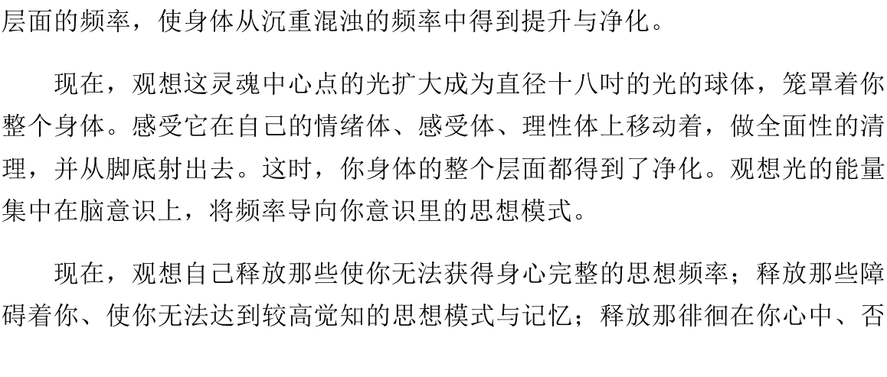

## 1. 基本运算

设 x = 3, y = 2, 求以下表达式的值：

- (1) x + y
- (2) x - y
- (3) x * y
- (4) x / y
- (5) x // y
- (6) x % y
- (7) x ** y

输出结果：

```
5
1
6
1.5
1
1
9
```

## 2. 字符串操作

s = "Hello, Python!"，请完成：

- (1) 输出字符串长度
- (2) 输出第一个字符
- (3) 输出最后一个字符
- (4) 输出前5个字符
- (5) 输出倒序字符串

输出结果：

```
13
H
!
Hello
!nohtyP ,olleH
```

## RISC-V Registers

RISC-V has 32 registers, all 32 bits wide. They are numbered from 0 to 31. Each register has a name and a set of conventions associated with it. The table below lists them.

| Number | Name | Description |
|--------|------|-------------|
| 0 | zero | Always zero |
| 1 | ra | Return address |
| 2 | sp | Stack pointer |
| 3 | gp | Global pointer |
| 4 | tp | Thread pointer |
| 5 | t0 | Temporary |
| 6 | t1 | Temporary |
| 7 | t2 | Temporary |
| 8 | s0/fp | Saved register / Frame pointer |
| 9 | s1 | Saved register |
| 10 | a0 | Function argument / return value |
| 11 | a1 | Function argument / return value |
| 12 | a2 | Function argument |
| 13 | a3 | Function argument |
| 14 | a4 | Function argument |
| 15 | a5 | Function argument |
| 16 | a6 | Function argument |
| 17 | a7 | Function argument |
| 18 | s2 | Saved register |
| 19 | s3 | Saved register |
| 20 | s4 | Saved register |
| 21 | s5 | Saved register |
| 22 | s6 | Saved register |
| 23 | s7 | Saved register |
| 24 | s8 | Saved register |
| 25 | s9 | Saved register |
| 26 | s10 | Saved register |
| 27 | s11 | Saved register |
| 28 | t3 | Temporary |
| 29 | t4 | Temporary |
| 30 | t5 | Temporary |
| 31 | t6 | Temporary |

## 效果

性能呢？这就要说到中国传统文化了...

> 中国传统讲究道法术器。道就是最高层级的哲学，法是策略、方法论，术是最微观的实操战术，器是工具。在器这个层面，大家常说工欲善其事，必先利其器，就是好的工具对执行效率的提升是立竿见影的。

所以这很好理解，如果你要钉一个钉子，用锤子肯定比用石头要顺手得多。

## 技术细节和思考

这道法术器的思维模型，还有更广阔的应用场景。大到一个国家，中到一个组织，小到一个人，都有自己的道法术器。而我们很多人，往往容易沉迷于具象的术和器，想学会术，拿到器，去解决一切问题。忘记了更应该花精力的是背后的法和道。

比如我们提到一家企业，它的使命、愿景、价值观，在我看来就是道的层面。以此制定的企业战略，就是法的层面。企业平时的规章制度、流程规范，是术的层面。办公自动化系统、各类OA、CRM，属于器的层面。

作为个体也是一样的，你的三观（世界观、人生观、价值观）是道，你为自己制定的人生规划，每个阶段的目标是法，你用什么样的方法去达成这些目标，是术，那其中用到的工具和资源，就是器。

## 0.2 AI 发展的里程碑

从1950年图灵测试的提出到2020年代，人工智能经历了多次起伏和突破。以下是几个关键的里程碑：

- **1950年**：艾伦·图灵提出图灵测试，首次定义了机器智能的评判标准。
- **1956年**：达特茅斯会议召开，标志着人工智能学科的正式诞生。
- **1966年**：MIT 的 ELIZA 程序发布，成为最早的聊天机器人之一。
- **1997年**：IBM 的深蓝击败国际象棋世界冠军卡斯帕罗夫。
- **2012年**：深度学习在 ImageNet 竞赛中取得突破性成绩。
- **2016年**：AlphaGo 击败围棋世界冠军李世石。

### 0.2.1 深度学习时代的来临

2012年，AlexNet 在 ImageNet 图像识别比赛中大幅领先传统方法，开启了深度学习的热潮。此后，卷积神经网络（CNN）、循环神经网络（RNN）以及后来的Transformer架构不断刷新各项任务的记录。

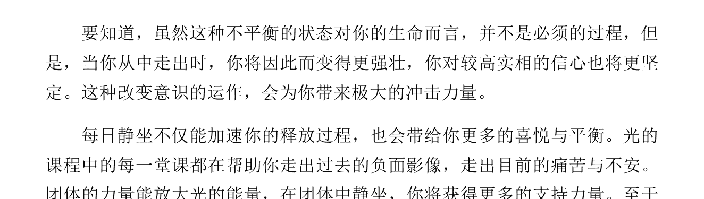

> “人工智能的未来不是取代人类，而是增强人类的能力。” —— 李飞飞

| 年份 | 事件 | 影响 |
|------|------|------|
| 1950 | 图灵测试 | 提出了机器思考的可能性 |
| 1997 | 深蓝 | 计算机首次击败国际象棋冠军 |
| 2016 | AlphaGo | 深度强化学习的里程碑 |

## 智能工厂解决方案

本方案旨在通过物联网、人工智能和大数据技术，实现生产流程的全面数字化与智能化，提升生产效率与质量控制水平。

- 实时监控设备状态
- 预测性维护提醒
- 自动排产与物料调度

| 工序 | 原有效率 | 优化后效率 | 提升比例 |
|------|----------|------------|----------|
| 装配 | 120件/时 | 150件/时   | 25%      |
| 检测 | 90件/时  | 130件/时   | 44%      |

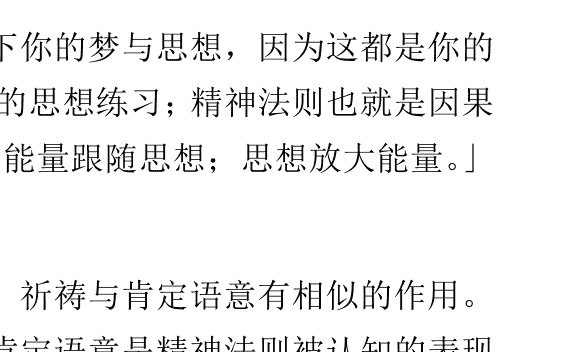

> 智能制造是工业4.0的核心驱动力。

```
python
def predict_maintenance(sensor_data):
    model = load_model('maintenance_v1.h5')
    return model.predict(sensor_data)
```

## 标准服务条款

本协议自最后更新日期起生效，适用于你使用我们的服务。

请仔细阅读本服务条款（以下简称"条款"）。你使用我们的服务即表示你已同意受这些条款的约束。如果你不同意这些条款，请勿使用我们的服务。

### 1. 服务描述

我们提供在线文档编辑与分析服务。服务可能因版本或地区而异。

### 2. 用户责任

- 你不得滥用服务，包括但不限于：干扰服务运行、传播恶意软件、侵犯他人权利。
- 你必须对自己的账户安全负责。
- 你同意不发布非法、骚扰、诽谤或淫秽内容。

### 3. 知识产权

你保留上传内容的版权。授予我们有限的许可以便提供服务。我们服务的所有权利（包括软件、设计、商标）归我们所有。

> **注意**：本条款不限制任何你适用的法律所赋予的不可放弃的权利。

### 4. 终止

我们保留在任何时候暂停或终止服务的权利，无需事先通知。

## 定义

**定义2.1** (语言上的关系) 令 \(A\) 是一个字母表。称 \(L \subseteq A^*\) 为一种**语言**。令 \(X\) 和 \(Y\) 为语言，并令 \(k\) 为一个非负整数。一种**\(k\)-阶关系** \(\sigma\) 是 \(A^*\) 上的一个等价关系，定义如下：

\(x \sigma y\) 成立，当且仅当对于所有长度为 \(k\) 的 \(w\)，有 \(x w \in X\) 等价于 \(y w \in Y\)。

关系 \(\sigma\) 记作 \(R_{X, Y}^k\)。

### 等价关系 \(R_{X, Y}^k\)

令 \(X, Y \subseteq A^*\) 为语言，并令 \(k\) 为一个非负整数。关系 \(R_{X, Y}^k\) 是 \(A^*\) 上的一个等价关系，满足：

- \(x R_{X, Y}^k y\) 当且仅当对于所有 \(w \in A^k\)，\(x w \in X \Leftrightarrow y w \in Y\)。
- 关系 \(R_{X, Y}^k\) 的**秩**是指其不同等价类的数量。

例2.2中我们将会见到这些等价类的例子。

在定义2.1中，我们只考虑长度为 \(k\) 的 \(w\)，并将其与 \(X\) 和 \(Y\) 中相应的单词进行比较。这允许我们在任意两种语言之间定义等价关系。

这聚会中交换讯息。现在，智慧之光正在放射着，你们可以问任何与你们的进展有关的问题，你们在个人旅途上的疑惑，或一些你们感到惶恐不安的玄秘现象。

学生问：

上个星期我被选为陪审团的团员，他们问我是否有判断别人的能力。我们只需要决定被告是否做了他所被控诉的行为，而不需要判定该给予他什么样的惩罚。我想要知道您对这种批判行为有什么样的看法。

上师答：

人类的法律是为团体生活而定的，每个人都必须活在与别人的互动之中。因为人类的意识尚未进展到与较高精神法则整合的境域，也尚未达到以精神法则为生活基准的境界，因此以法律的标准来做为所有生命的准则是必需的。

人类的本质中具有在群体所订规则中生活的能力，因此当一个人违反群体所制订的法规时，便需要受到其它人的制裁。当你被选为陪审员时，你不是一个批判者，你只是在审查一个呈现在你面前的行为模式。

精神法则是至高的，而灵魂处于因果的法则之中。灵魂在永恒不灭的旅程中，终究是脱离不开这至高的法则的。

学生问：

目前微波炉非常普遍，它会影响我们的频率吗？

上师答：

人，所受的影响会比较少。许多人甚至可以从中加速治愈的过程，因为幅射线中的强烈元素，可以受到引发而创造正面的治愈能量。

学生问：

市面上有一套书叫做《一的法则》（The Law of One），共有五册，您知道其中的内容吗？

上师答：

在创造过程中，每个个体都被赋予自由意志，因此，在生命过程中，每个人选择自己意识的旅程。在自由意志的选择下，有些灵魂加入你们称为毁灭性的（Detrimental）或退转（De-evolutionary）的行列，他们成为精神意识进展的反势能。

然而，你所提到的这套书，来自较高层面的讯息，它的内容与我们所提供的是一致的。许多有关精神意识的讯息正经由不同管道而传递给人类。《一的法则》是绝对的（Absolute），它是：

万事万物来自「一」的创造。

一切事物都是同一造物主的表达。

绝对指无条件的，永恒的，无限的；相对指有条件的，暂时的，有限的。相对和绝对的相互关系是辩证的。凡绝对的东西都只是存在于相对的东西之中，犹如绝对真理是无数相对真理的总和，绝对真理只存在于各个相对真理之中一样。

学生问：

地球是否将有那么一个「重大事件」（The Event）会发生？

上师答：

你们正进入一个三十年的周期，这是一个对内在基督自性觉醒的时期。耶稣是否再次以个体生命的形式出现在地球上，尚是一个未知数。但是，祂是否以「救世主」的形象再现并不重要，重要的是，要让基督意识降临在进展中的人类灵魂之中。所以，你们都在为实现和平的伟大理想做准备。你们已看到许多陈腐的事物正在瓦解，大家正在为创造新的景象而努力，这种努力不仅仅是外在的，也是内在的。所谓的「重大事件」，指的是真理以沉静的方式进入许多人的心识。然而，它也会以清晰的语言传递给一些群体。什么是「重大事件」？它尚不能为肉眼所见，但它是一个完整的实相。做为一个个性自我，你们正经历着生命的改变，一个具有特殊机缘的时代，一个经济繁荣成长的时代，也是一个展现个人力量的时代。

学生问：

那么，为什么现在虽然有许多美好的事物呈现我们面前，像太阳能的运用，像我们正在习修的这一套《光的课程》，都未能被广大的人们所接受？这中间到底缺了什么？

上师答：

人类生命的进展尚未达到这样的程度，人类尚未能释放恐惧，未能达到信任与交托，未能走出因果的学习课程。因此，尚不能被广大群众所接受。不要忘了，新的事物总是在少数先锋者开拓之后，群众才开始对它产生觉知并接受它。现在的状态是，人类的心灵，经由不同群组在和谐中的趋向，大部分的人如今已进入新觉醒中。从七〇年代开始至今，越来越多人已将焦点放在化解旧有的纷争。至于所欠缺的，是人类不相信自己可以提升，可以使自己的生活更具有天使层面的意识，人类一直无法认识到自己的实相。人类存在中天使自我那一部分，必须落实到地球层面，才能成为你们生活中最主要的内在指引。

学生问：

在这加速进展的时期里，有些人不愿意随着群体的进展做改变，这在宇宙进展的法则中，必定要有一个解决的方法，那将会是一个什么样的方式呢？

上师答：

在过去的历史中，地球曾进行对那些不愿意进展的人做清理，那些不愿往前走的灵魂必须被清除。执迷不悟的灵魂将无法重返地球，直到在他们内在的次元里，对自己的光明有着初步的觉醒为止。

你们在身体的层面上已进入转化的过程，你们生命的活动（因果的完成）也在加速进行着。这体验是艰辛的，但它的意义是深远的。在你们之后，你们的下一代所经历的，将是如此地美好。我们看到的是地球的更新，是一个如柏拉图所描绘的世界。那是一片宁静美丽的新大地，没有死亡，没有悲苦，基督意识将成为生命的实相。

所以，现在你们虽然仍可以感觉到旧有的痛苦，但更新的喜悦也将带入焦点。地球将进展成为这样的景象：它是灵魂成长的学校。

它是一个灵魂可以以正面的方式，体现创造的学校。

进展不是一个瞬间的过程，而是一步一步的开展。我们曾经说过，这将是一系列的课程。在这之中的运作将是美丽的，愿你们走在光与智慧之中，走在喜悦中，愿你们和平！

### 肯定语意

我肯定自己释放了使自己动弹不得的情绪体与理性体中的恐惧。

我肯定自己在生命的活动中，展现智慧之光的能量。

我肯定自己释放对别人的操纵，释放将自己的恐惧投射在别人身上。

我肯定真理之光环绕着我，没有任何事物可以动摇我的信心。

我肯定自己可以经由基督意识完成一切事物，可以以自性的光明面对一切事物。

我感受到那超越知性的和平在我之内流通，并经由我而展现。

## 第四课 绿宝石之光

## 绿宝石之光：创造之光

脉轮：喉轮

音阶：「A」之上的高「C」

上师：勃朗宁

天使长老：欧西拉斯

相关行星：水星与太阳

#### 目的与要素

灿烂的绿宝石之光是激发我们创造本质的能量，它带来美好的大自然，供给我们所需要的一切。太阳以它的光辉为我们带来治愈与成长，使我们获得食物、能量，以及所有个体所需的一切物质。

灿烂的绿宝石之光，为习修者多次元自我的所有层面带来光明的觉性。它提升所有较低体系的频率，并帮助你增强沟通的技巧，启发创造的灵感，具体实现你的目标。因此，当习修者置身在绿宝石之光的运作中，会感到更具创造力，并且更容易与周围的人以流畅融洽的方式来沟通。绿宝石之光令人感到欢欣，感到喜悦，它的能量会转化你对周围环境、财务状况、人际关系的观感。

它带给习修者一种成就感，一种心满意足的感觉。

绿宝石之光为习修者提供所需的磁场，并平衡自我的所有层面。它像磁铁般地吸引着人们来到你周围。持续地使用这光的能量，将会使你获得许多愉快美好的惊喜。绿宝石之光为你带来平衡、创造与繁荣。这能量使习修者得以领悟什么是较高的目标；得以与较高的理念沟通；并得以使这些目标与理想具体实现。

它的频率与水星有关。了解这星球的能量对你个人生活的影响，将使你对自己的内在有更深的洞见。这频率用来打开创造的潜能与艺术方面的天分。使你在写作方面、音乐美术方面，与科技方面更具表达能力。

在这能量的学习与运作中，如果你在喉咙部位有不适的感觉，是正常现象。有时候，压抑会造成喉咙疼痛的症状。在这堂课中，许多东西会被引发出来。你可能会感到自己有着对金钱、对事业的恐惧。有时候，人际关系上的困扰也会浮现出来。如果有骚动、心神不宁的感觉，也是正常的。

但是，它的正面体验是创造潜能的激发，当潜在的能力被带到表面上，往往一些陷入困境中的事物会突然解危，并顺利完成。所以要知道，无论你所体验的是什么，都是你成长特定过程中的一部分。

这能量也会影响你对自己物质条件的观点。你可能会感到自己处在匮乏与局限中，感到自己需要在这方面做一些突破。在追求灵性成长的过程中，往往会有一段对金钱与物质产生抵触情绪的时期。要知道，神就是爱，圣灵在创造中显现。因此，物质也是创造经验的结果。财富与物质不应被视为是人类生活中的负面事物，而是一种创造的表达。因此，重新审视你对金钱与事业的观点，将有助于你在成长上的突破。

#### 特定功效

绿宝石之光使身体与星光体层面上的所有功能获得真正的平衡。它突破并去除与内分泌腺有关的各系统里的，以及储存在肌肉与细胞组织里的障碍。

绿宝石之光使各系统间产生和谐，促成一种流畅与互动的状况，使身体的磁场与各器官组织的功能达到平衡。它的能量具有清理负面思想与感受的功能，治愈由于创造的渴望受到压抑所造成的身体上的问题，并释放沟通的障碍。

在你的静坐中，感受能量在这中心点上，释放所有由于抗拒所产生的痛苦、恐惧与嗔怒。

### 静心冥想与上师们的讯息

### 勃朗宁

#### 具有创造性的绿宝石之光

你们好！今晚我冒昧地在这里与各位讲几句话。在这灿烂的光的能量中与你们同在，使我感到非常愉快。这特定的能量帮助并带动你们内在的创造泉源。它的频率有着非常和谐美丽的音调，你将会发现，在这光中，你的个性自我与内在的其它层面，经由这绿宝石之光创造性的启发，为你开启经济上的财源。

在你们之中有许多是具有潜力的艺术家、作家、诗人和音乐家，只要具有这方面的知识和热忱，你们就能够把这些潜在能力启发出来。因此，在这星期中，你们之中许多人会有一种灵感被触动的体验，那时你们会有一种创作的欲望，想要写下一首诗，或一篇散文来表达你的感觉和体验。在这样的灵感中所写出来的文字，具有至高真理的思想，因为它们来自你们内在的较高自我，使别人得以经由这完美的表达，分享你思想的自然神圣本质。所以不要为了你所写的东西是否能得到上师的赞赏而感到忧虑，只要在日记中自由地表达你自己。会使用乐器的人，展开你们的双手，让这种创造力流入。

经由创造力，你会找到自己的平衡点。当你未能完整地表达出你自己时，便会产生偏颇的感觉。让文字，让音乐，让艺术创作自由地畅流出来吧。灵魂必须表达它自己，不要压抑这种需求，或把它隐藏起来。因为这些表达将为你带来心识的光明与觉知，使你了解自己的个性与内在的心识。

许多人的创作灵感来自星际间音律跳动的启发，许多上师们能进入这些星际的领域，把宇宙的智慧带到地球上来。然而，这些智慧原本就存在于人类内在的灵性之中。

今天，我们迎接一个新的时代的来临，我们发现音乐的质量也有所改变。许多人以不和谐的音调表达他们较低的频率。因此，这些频率非常沉重。然而，当创作的灵感来自较高的领域，表达着和平、崇高与喜悦时，它不仅带给我们崇高与喜悦的感受，也提升了我们的精神。

在这星期里，这特定的绿宝石之光的能量将指引你与各种层面做各种形式的沟通，它将帮助你具体实现自己的理想；帮助你表达自己的思想与情绪；帮助自己打开你的磁场，以接收丰足与良善。

绿宝石之光的元素也将流通在你所爱的人，以及与你的事业有关的人的周围，它将帮助你了解自己，并帮助你打开自己的心识。

能以这样的方式与你们交谈，是我们极大的喜悦。在这期间，你们会获得许多通往知识与智能的管道，打开你们的心识来接收它们，然后经由你们的每一个表达，将这智慧散布出去。

一个思想、每一个文字，将你们所获得的知识，以创造的精神实现出来。

祝福你们！

### 肯定语意

我释放对沟通的恐惧。

我所说的都是我的真实本意，并且是性进入光明之中。

当学生们进入这光的能量中时，要警觉自己内在所产生的矛盾现象，因为这紫色之光的能量，同时也会激发出来自内在自我中由于负面的自私、嫉妒、憎恨、恶念等情绪所产生的沉重混浊的能量。当你的内在具有这样的思想频率时，紫色之光的能量便成为引发这些现象的催化剂。所以要以谨慎、爱与智慧运用这紫色之光。

紫色之光的能量是一种非常强而有力的频率，它与呼吸系统有关。有时候，你会感到陷入某种情境中，一切事物似乎都在与你作对，使你感到窒息，这是因为恐惧与愤怒抑制了你的呼吸。然而，你的愤怒与感觉很可能是因为你的固执、自我中心，以及想用自己思想行为的准则来控制他人而产生的。

在《光的课程》中，这是非常有趣的一课。在高潮时，它带给你一种乐天的感受，一切事物是顺遂的、和谐的，使你置身于一种莫大的至善意愿之中。

紫色之光的能量与木星有关，它不但释放习修者所有层面的沉重感，使之升华，并带来正面的祥和、轻松与幽默。

#### 特定功效

紫色之光的能量，主要在化除身体与星光体中的沉重频率。身体与星光体中沉重的频率是愤怒、敌意、报复心理、邪恶意念等心理反应所累积下来的能量之结果。有些是你自己内在所产生的，有些是由于别人的负面心理活动投射在你身上的结果。在释放过程中，紫色之光的强烈频率会令你感到非常不舒服，好像你就要抑制不住地爆发似的。但经历这过程之后，这频率带给你的是开放、喜悦的感觉，并使你的心灵充满至善的意愿。

在你每日的静坐中，观想这能量充满着整个行星，神圣计划经由人类自我的提升，经由人类对宇宙合一的认知，在地球上圆满实现。

### 静心冥想与上师们的讯息

杰夫

你所经历的，

只是一种使你清理并释放旧有模式的挑战。

你的一切都是自己心识的创造，

然而，你也正朝着更高的潜能前进着。

我们希望你们经由这些讯息体验到光的频率，并对自已生命的真正目标与天命有着更多的认知。它使因果的挑战成为你们改变与扩展自我生命的礼物。你们现在处在一种意识的循环阶段中，你们正在清理过去所形成的因果。

感受自己正从枷锁中得到释放，并正在清理任何使你痛苦的情况；感受光的频率在你所有的「体」与自我中流动着，那些曾经发生在你身上极端不公平的事，已被释放到它自己较高的天命中；感受自己做为一个个体与自我，在这物质层面中，一切事物正趋向更清晰、更明朗的状态。

你所经历的，只是一种使你清理并释放旧有模式的挑战。你的一切都是自己心识的创造，然而，你也正朝着更高的潜能前进着。

不要以外在的现象来批判你自己，而是向内探索，审视自己是否执着在某些否定自身完整性的活动上，如果有，释放对这些活动的需要。

感受自己释放了痛苦、抗拒与敌意。将它们释放到光中，并肯定精神的本质呈现在爱与平衡之中。以愤怒对抗愤怒，只会产生更大的愤怒。以爱来包容，必将化解愤怒的力量，并使爱的频率发挥它的极致。观想紫色之光环绕着你的情绪体。情绪体的意识像海洋般地，有时宁静，有时波涛汹涌。观想这些情绪的活动都在光的环绕中。感受所有被压抑、被否定、被排斥的情绪感受都被带到这紫色之光的频率中。感受自己意识里对爱的恐惧已在情绪体的层面上得到了治愈。进入静默中，让光成为你治愈的源泉。

（进入静心冥想）……

当你们的静心冥想完成时，观想环绕着你们的光的频率以顺时针方向旋转，封住你们的磁力磁场。这样，可以使光的能量保护你们不受负面势能的影响。进入和平中！

### 肯定语意

我释放所有压抑着的痛苦。

我肯定自己的动力磁场与磁力磁场是平衡的。

我从我的身体、情绪体与感受体中释放嫉妒、愤怒与敌意。

我与造物主的意愿合而为一，以行动来体现至善意愿。

我祈求让我改变我所能改变的，让我以爱来接受我所不能改变的。

## 思考题

5. 根据下列各无穷数列的前5项，写出数列的一个通项公式：

- (1) 2, 2, 2, 2, 2, ...
- (2) -2, 4, -8, 16, -32, ...
- (3) 4, 9, 16, 25, 36, ...
- (4) -2, 8, -18, 32, -50, ...
- (5) 1/2, 3/4, 5/8, 7/16, 9/32, ...
- (6) 1/2, -1/2, 3/8, -1/4, 5/32, ...

6. 已知数列{an}的通项公式为an = n² + 2n - 1，求a₁ + a₃的值。

7. 已知数列{an}满足a₁ = 2，且aₙ₊₁ = aₙ + n，写出数列的前5项，并猜想通项公式。

8. 已知数列{an}中，a₁ = 2，aₙ₊₁ = 3aₙ + 2，求{an}的通项公式。

也可能会复发，这是因为身体从思想、感受中吸取了许多杂质；这些疼痛或搔痒是一种念相，它们在能量的冲击下，从身体上浮现出来。

如果你能看到储存在身体里的念相，你可能会吓一跳。因为有些人的负面念相会呈现出蛇一般的形象，缠绕在身体上，有些则像水蛭一样地附着着。这些负面的念相，来自于你自身，或来自围绕在你周围的人的思想投射。

红宝石之光的作用就是销毁这些负面念相，就好像是一个熔化炉，将这些负面念相加以熔化。当我们置身于负面心识的状态中，或面临负面心识所制造的人生经验时，我们就已陷入我们自己所创造的人间地狱。因此，所有的不纯净、所有违反真理的意识都必须驱除，让它们在红宝石之光中化除。

明亮的红宝石之光，为身体及情绪体带来光明与觉醒。它修复并治愈身体的所有层面。当你们运用这种能量时，不要忘了，你们每个人都有一些特定的个人执着，是这些执着使你们产生排斥、痛苦与伤害等负面情绪。

把自己带入觉醒之中，这一点非常重要。在这时候，将发生于过去的、伤害你的、使你产生痛苦的、拒绝你的、使你受到不公平待遇的怨恨，全都一笔勾消。和平的开始，就从你自己的家人和朋友身上做起；你不能在憎恨的同时还具有基督之爱。经由基督意识，你才能了解到世间的每一个人都在扮演着他们各自的角色，并由这些学习而获得经验。

#### 特定功效

红宝石之光化除身体和星光体层面的较低频率与负面的思想，而且往往这些负面思想频率已在身体与星光体的层面上产生了结晶体。

红宝石之光对骨骼与肌肉有治愈的功能，它修复破裂的骨骼与损伤的骨架，例如风湿病*对骨骼骨架的损伤。它对肌肉扭伤、痉挛、劳损等也有同样修复与治愈的功效。红宝石之光对循环系统亦能产生特定的作用，它能够调整心脏，净化血液。

事实上，这能量能在身体的每一部分运作，它特别能在器官与细胞组织上产生作用。它也能进入神经系统、消化系统、呼吸系统等任何需要治愈的部位。红宝石之光的频率贯连着灵魂体与心轮，因此，它也针对心理上的种种问题，像人际关系与心理欲望等。

在情绪体上，红宝石之光也可以化解因不舒坦（Dis-ease*）所产生的痛苦，以及由于这种痛苦所衍生出来的负面思想。

这频率与水星*有关，了解水星对你的影响，将有助于你的领悟。除了锻练身体之外，饮食对你的健康也有很大的影响。当你开始运用光的能量，你会发现自己在饮食上有所改变，你会自动去除不利于健康的食物。

### 静心冥想与上师们的讯息

爱瑟瑞尔

灿烂的红宝石之光

问候所有光的学生们，我们看到你们站在灿烂的光中，散发着来自你们较高自我的五彩缤纷光芒。这些光芒像一颗颗小小的明亮星球体，经由你们每一个层面放射出来。在这星期里，当你们进入这红宝石之光时，我们要求你们加强在光中的静坐与冥想。

让这红宝石之光在你身体的每一组织、每一架构中流通，观想自己的每一器官组织与细胞组织都发挥了自身的功能。将焦点集中在肌肉组织与骨骼的结构上，你们身体有某些特定器官与部分的肌肉组织需要加以维护。如果你们之中，有人曾经有过骨骼断裂或筋肌损伤的经验而造成疼痛，你将会发现，用这种光能够缓和某些痛苦。有些思想意识是在骨骼断裂或肌肉损伤时形成的。

识。

### 肯定语意

这能量也帮助你清理长期累积在灵魂体上的杂质，并清理你对自己及对自己的责任的看法。往往如果我们可以从不同角度来看待事物，我们就会有不同的体验，这时，你就可以释放对自己以及对别人的批判，也可以让自己从负面情况中解脱出来。

当习修者使自己的身体处于完全平衡状态时，内在的神经系统是柔和不受扭曲的，自身的能量也是清明畅通的。但是当神经系统受到负面思想的习惯性作用时，深藏在内心底层的焦虑就会浮现出来，神经系统也随之变得非常地不安，行为显现得十分不稳定，以致无法在工作与生活中取得平衡，这种压力也会成为一种无法克服的障碍。

一个人如果具有纤细与敏感的体质，他的神经系统将首当其冲受到负面因素的影响，并因而产生极不平衡的思想、理念与行为。灿烂的橘色之光，使习修者的身体与感受体进入光明的觉醒之中，体会到更清明与更深层的觉知。感受的本质可以发展成为高度的觉知力，开启与通灵本质有关的潜在能力。在光的运作中，很容易开启天眼通与天耳通的能力，而这特定的能量又能增强这些体验。或许你会有曾经生活在某些地方的感觉，或对某些事物的发生有预感，你也可能会感到头晕；这些都是上师们的能量在你身体或其它层面上产生作用时的正常反应。这些能量在静坐与睡眠中都依然在运作着。

#### 特定功效

在身体与星光体上，橘色之光的作用是化除负面的习惯性思想，与深藏在内心底层的焦虑。这些负面思想与焦虑导致神经系统的功能失调，而使身体感到失去平衡，或使情绪体产生过度的敏感。橘色之光将为身体与情绪体带来平衡与整合。

橘色之光使循环系统更具活力，并能去除皮肤上的毛病与不舒适的感觉，同时也为处于焦虑、不安以及缺乏原动力的人带来平衡。

灿烂的橘色之光除了增强神经系统、消化系统与排泄系统的功能之外，它也是恢复活力的能量。然而，在你清理储存在这些体系里的愤怒与痛苦之前，你可能会先经过一段极为疲惫的时期。当它清理了储存在神经系统里的恐惧时，这频率便会开始清理理性体中的沮丧感或焦虑感。

橘色之光也在感受体上产生作用，使通灵的能力更清晰。在下面各级次的习修中，这橘色之光的能量会越来越强烈。

### 静心冥想与上师们的讯息

爱瑟瑞尔

## A new way to treat self-harm?

**Self-harm is more than a mental-health issue, says psychologist Kirti Saxena. It is a medical problem, too, that may require a medical solution.**

Around one in five adolescents experience self-harm at some point, yet there are few effective treatments. SSRIs, the most commonly prescribed antidepressants, are of limited use in teenagers because of side effects such as suicidal thoughts. Out of a nearby medical treatment centre in a small scale trial has shown promising results, however.

The medication in question, called R-ketamine, is a slightly different form of the drug ketamine. Unlike ordinary ketamine, which is a mixture of two mirror-image molecules, known as enantiomers, R-ketamine is only one of those enantiomers. Early evidence suggests it may have fewer of the side effects, such as hallucinations, that make the drug's use controversial. And it can be taken as a pill, rather than through injection or inhalation.

> > This is not helping the mental health of people who are self-harming, it is preventing them from doing it again.

In a small trial at Baylor College of Medicine, 20 patients aged 13 to 17 who had recently self-harmed were given either R-ketamine or a placebo for three weeks. The results, presented at a meeting of the American College of Neuropsychopharmacology in Tampa, Florida, were encouraging. Among those given the drug, self-harm rates fell by 88%, compared with 33% in the placebo group. The effects were found to last for at least six months.

The researchers say that R-ketamine works by blocking the brain's NMDA receptors, which are involved in pain and reward processing. This, they believe, reduces the urge to self-harm. They also note that the drug does not appear to cause the dissociative symptoms or addiction risks associated with other forms of ketamine. Larger trials are now planned.

If those results hold up, R-ketamine could become the first drug specifically approved for the treatment of self-harm. For now, it remains a promising but experimental therapy.

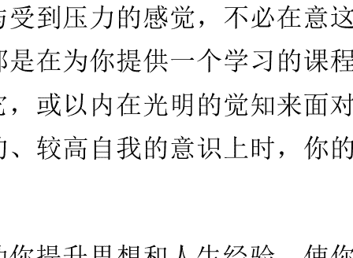

## **ChatGPT 的有限注意力和容量**

另一个重要的限制是 ChatGPT 的有限注意力 span 和容量。这是所有基于 Transformer 模型的共同特点,因为其注意力机制是有限的。实际上,一个对话会话中,可以输入的词(token)数量是有限的。OpenAI 将 ChatGPT 的 token 限制设置为大约 3000 词(相当于 4000 个 token)。一旦达到了这个限制,模型就会忘记较早的部分,或者用户必须对输入进行摘要。

这对于长对话来说,可能导致模型对于之前对话上下文的“记忆”变得不准确,从而影响回答的相关性和准确性。此外,由于它处理大量文本的能力有限,它无法处理超长文档或一次性分析大量数据。这意味着在分析书籍、长文档或进行大量数据分析时,可能需要将内容分割成多个部分。

因此,这一限制要求用户进行周到的输入管理,以确保在关键任务中获得最相关的响应。

## 1 施工测量

施工测量是指工程开工前及施工过程中，根据施工需要所进行的测量工作，包括开挖前原始断面测量、施工放样、开挖过程中的收方测量、开挖后的竣工测量等。

### 1.1 原始断面测量

在工程开工前，为了解施工区域的地形地貌，需要对施工区域进行一次原始地形地貌测量，作为后续施工工程量计算的依据。原始断面测量一般在开挖范围外一定距离设置一条基线，沿该基线按一定间距布设断面，测量各断面上的地形变化点，绘制原始断面图。

断面间距根据地形变化程度和工程要求确定，一般10~50m。基线上各断面桩的间距误差应小于1/1000。断面上的地形变化点应实测，变化较小时，测点间距一般不大于10m。

### 1.2 施工放样

施工放样是指将设计图纸上的建筑物、构筑物的平面位置和高程，按照设计要求，以一定的精度在实地标定出来，作为施工的依据。放样工作包括：

- 根据控制点，放样出建筑物的主要轴线。
- 根据主要轴线，放样出建筑物的轮廓点。
- 根据轮廓点，进行细部放样。

放样方法通常采用极坐标法、直角坐标法、角度交会法、距离交会法等。随着全站仪、GPS-RTK等先进测量仪器的普及，极坐标法已成为最常用的放样方法。

放样工作完成后，应及时检查放样点的正确性。检查方法可采用钢尺量距、全站仪实测、或与邻近控制点联测等方式进行。

## 英飞凌

英飞凌科技股份公司（Infineon Technologies AG）是一家全球领先的半导体解决方案供应商，总部位于德国慕尼黑。公司专注于为汽车、工业、消费电子和通信行业提供先进的半导体产品。英飞凌以其在功率半导体、传感器和安全芯片领域的创新而闻名。

### 主要产品

- 功率半导体 (Power Semiconductors)
- 传感器 (Sensors)
- 安全芯片 (Security Chips)
- 微控制器 (Microcontrollers) [1]

> > “我们的宗旨是让生活更便捷、更安全、更环保。” —— 英飞凌CEO

### 市场表现

| 年份 | 营收（亿欧元） | 利润（亿欧元） |
|------|---------------|---------------|
| 2020 | 85.67         | 12.34         |
| 2021 | 95.23         | 15.89         |
| 2022 | 108.50        | 21.06         |

英飞凌在2022财年实现了108.5亿欧元的营收，同比增长显著。公司持续加大研发投入，尤其在汽车电子和可再生能源领域。

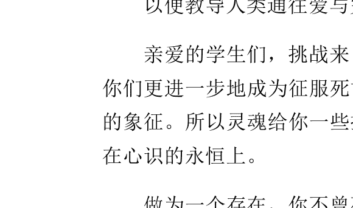

```
## 英飞凌产品代码示例
chip = InfineonChip("TC3XX")
chip.enable()
```## 2024年第3季度 全球服务器市场追踪

2024年第3季度全球服务器市场收入同比增长显著，达到历史新高。主要驱动因素包括AI服务器需求的持续增长以及通用服务器市场的复苏。

### 市场规模与增长

- 全球服务器市场收入：454亿美元
- 同比增长率：+35.2%
- AI服务器收入占比：42.3%
- 通用服务器收入恢复增长：+8.7%

| 厂商 | 收入(亿美元) | 市场份额 | 同比增长 |
|------|------------|----------|----------|
| Dell | 98.4 | 21.7% | +12.5% |
| HPE | 71.2 | 15.7% | +8.3% |
| Inspur | 54.6 | 12.0% | +41.2% |
| Lenovo | 48.3 | 10.6% | +14.8% |
| 其他 | 181.5 | 40.0% | - |

AI服务器需求持续强劲，特别是GPU集群和液冷解决方案成为厂商竞争焦点。

### 区域分布

- 北美：52.3%（+28.9%）
- 亚太：31.5%（+44.1%），其中中国贡献主要增量
- 欧洲：14.2%（+18.6%）
- 其他地区：2.0%

注：数据来源为IDC及公司财报综合整理，2024年11月发布。

### 2.3 结型场效应管 (JFET)

2.3.1 结构和工作原理

**1. 结构**

结型场效应管分为 N 沟道和 P 沟道两种类型。图 2-3-1 是 N 沟道 JFET 的结构示意图和符号，它是在 N 型半导体硅棒的两端各制造一个欧姆接触电极 (分别称为漏极 D、源极 S)，在硅棒的两侧制造两个 P 区，并引出电极 (栅极 G)，两个 P 区在内部连通的。由于 P 区与 N 区间形成 PN 结，而两个 P 区之间的 N 型区域就是载流子流通的通道，称为导电沟道。

P 沟道 JFET 的结构和工作原理与 N 沟道类似，只是偏置电压极性相反，沟道载流子是空穴。

JFET 的符号如图 2-3-1(b) 所示，其中栅极上的箭头方向表示电流方向。对于 N 沟道 JFET，箭头由 P 指向 N (指向管内)；对于 P 沟道 JFET，箭头由 N 指向 P (从管内指出)。

**2. 工作原理**

JFET 是利用栅源电压 uGS 改变耗尽层的宽度，从而改变导电沟道的宽窄，控制漏极电流 iD 的大小。下面以 N 沟道 JFET 为例讨论。

图 2-3-1 N 沟道 JFET 的结构和符号

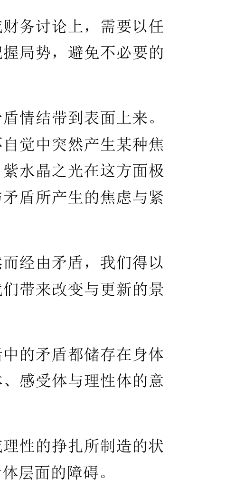

(a)结构 (b)符号

## 2024年3月11日 习近平签署第二十一号令 公布《中华人民共和国国务院组织法》

第二十一号主席令说，《中华人民共和国国务院组织法》已由中华人民共和国第十四届全国人民代表大会第二次会议于2024年3月11日修订通过，现予公布，自公布之日起施行。

《中华人民共和国国务院组织法》共十一条。内容如下：

1. 第一条 为了健全国务院的组织和工作制度，保障和规范国务院行使职权，根据宪法，制定本法。
2. 第二条 中华人民共和国国务院，即中央人民政府，是最高国家权力机关的执行机关，是最高国家行政机关。
3. 第三条 国务院坚持中国共产党的领导，坚持马克思列宁主义、毛泽东思想、邓小平理论、“三个代表”重要思想、科学发展观、习近平新时代中国特色社会主义思想，坚持人民民主专政，坚持社会主义道路，坚持改革开放，坚持依法治国，坚持人民至上，坚持全心全意为人民服务。
4. 第四条 国务院对全国人民代表大会负责并报告工作；在全国人民代表大会闭会期间，对全国人民代表大会常务委员会负责并报告工作。国务院应当自觉接受全国人民代表大会及其常务委员会的监督。
5. 第五条 国务院实行总理负责制。总理领导国务院的工作。副总理、国务委员协助总理工作。
6. 第六条 国务院行使宪法和有关法律规定的职权。
7. 第七条 国务院实行国务院全体会议和国务院常务会议制度。国务院全体会议由国务院全体成员组成。国务院常务会议由总理、副总理、国务委员、秘书长组成。总理召集和主持国务院全体会议和国务院常务会议。国务院工作中的重大问题，必须经国务院全体会议或者国务院常务会议讨论决定。
8. 第八条 国务院各部门实行行政首长负责制。国务院各部门根据法律和国务院的决定，在本部门的职权范围内开展工作。国务院各部门的设立、撤销或者合并，经总理提出，由全国人民代表大会决定；在全国人民代表大会闭会期间，由全国人民代表大会常务委员会决定。
9. 第九条 国务院办公厅协助总理处理国务院的日常工作。
10. 第十条 国务院秘书长在总理领导下，负责处理国务院的日常工作。国务院设副秘书长若干人，协助秘书长工作。国务院设立办公厅，由秘书长领导。
11. 第十一条 本法自2024年3月11日起施行。

（新华社北京3月11日电）

## DALL-E 3 描述生成规则

为了让 DALL-E 3 更稳定地生成图像，需要在描述前添加标准前缀，描述内容使用Mermaid或PlantUML格式的类图、流程图、时序图等。

### 标准前缀

所有图片生成请求必须使用以下前缀开头：

```
A beautiful and detailed illustration of a diagram described in Mermaid format. The diagram shows:
```

### 格式示例

例如，想要生成一个简单的类图：

```
mermaid
classDiagram
    class Animal {
        +String name
        +int age
        +makeSound()
    }
    class Dog {
        +String breed
        +bark()
    }
    class Cat {
        +String color
        +meow()
    }
    Animal <|-- Dog
    Animal <|-- Cat
```

注意：描述中不要包含图片尺寸或分辨率等信息。

生成结果应该是一张清晰的、带有类图、流程图或时序图风格的插图。

### 注意事项

- 不要包含特殊字符（如引号、反斜杠）
- 描述语言为英文
- 前缀不要包含代码块标记（如）

上师：耶稣

相关行星：地球

#### 目的与要素

灿烂的薄荷绿之光的能量，与地球本身以及植物世界有关，它帮助你们，也帮助在地球上生长的所有生物，由于地球受到污染，所以它的能量变得非常混浊。因此，以薄荷绿之光的颜色照射自己，并把它散发到地球上是非常重要的。

灿烂的薄荷绿之光的能量，与地球本身以及植物世界有关，它帮助你们，也帮助在地球上生长的所有生物，由于地球受到污染，所以它的能量变得非常混浊。因此，以薄荷绿之光的颜色照射自己，并把它散发到地球上是非常重要的。

薄荷绿之光的能量与地球上的精灵有关，那些小小的精灵掌管着植物王国。你们可以从花草树木等植物中获得能量，同样地，它们也受到你们能量的影响。当你在准备食物时，用这些能量来照射，可以提升食物的频率。

这种能量直接与新陈代谢及生殖系统有关。这是耶稣带到地球上的第三种光，薄荷绿之光与祂的复活有关。这种光代表新意识的再生，并克服旧有、陈腐的理念。

灿烂的薄荷绿之光是浅绿色与金色的混合，它与春天有关，它的元素具有薄荷的芳香，就像是美丽的春天早晨，令你感到清新与凉爽。它的能量可以把沉睡中的内在层面展现出来，进而使你存在的所有层面恢复青春的本质。当它在身体的层面上运作时，它使细胞与器官组织恢复青春的活力，使它们与更新的意识融合，以开展你的觉知，唤醒你的精神理念，使沉睡的心识进入新的生命和新的觉醒。这光的能量带给你喜悦与快乐，使你无忧无虑地去体验那种内在的热忱与平衡。

薄荷绿之光是你们到目前为止所接受到最重要的颜色，薄荷绿之光的能量，即使是在形而上学的团体中，也很少为人所知。

这种能量创造新的思想、新的自我、新的体验。在这星期中，要注意你自己心态的外在经验，如果你已经感到新的改变，薄荷绿之光将会增强这种改变。享受这光的能量吧！它几乎没有负面影响，如果有，它所产生的负面影响是一种倦怠、精力不足、疲劳、无精打采及对生活的意愿感到低落，但这些都只是短暂的过渡现象。

#### 特定功效

在身体和星光体的层面上，薄荷绿之光的能量可以去除较低的频率，代谢死亡的细胞，恢复破损的细胞组织，以及器官的结构。它特别对新陈代谢系统有显着的功效。

它去除多余的重量，去除疲倦与不安，带来健康与活力、能量与热忱。它对每一个系统都重新赋予生命力，重新建立身体的架构，重新激发你内在的意识，打破陈腐呆滞的模式。它以新的希望、爱与喜悦来重建身体细胞里的意识，帮助你为新的机会与新的开始做准备。

置身于大自然中，你便能体会到来自植物王国的清新。这能量转化情绪体与理性体中僵化与呆滞的感觉，让你打开心灵意识，以迎接新的开始。

薄荷绿之光的能量激发出来的负面元素，可能会使你有万般无聊的倦怠感，以及对死亡的恐惧，也可能会有一种站在悬崖边缘的茫然感；这种思想情绪来自对改变以及对未知的恐惧。超越这种恐惧的关键，在于寻找内在觉知中美丽的那一面，并从中探索出一个开放与更新的生命。

这能量在《光的课程》中，是第一级次最后一个被开启的能量。然而，在你的旅程中，这只是一个开始，在下个级次中，将再一次地带领你经由每一个脉轮中心点，进入自我成长的探险中。第二级次将把能量集中在情绪、感受体的运作上。清理这些层面的自我，对个人的成长将有更大的帮助。第二级次是你们在自我开发与成长上的另一阶梯。

### 静心冥想与上师们的讯息

**爱瑟瑞尔**

灿烂的薄荷绿之光

亲爱的学生们，我是爱瑟瑞尔，我们再一次地观察到你们彩虹般的光，进入到这种光中，是非常喜悦的。薄荷绿之光能够提升与净化在前一周紫水晶之光的挣扎中所残留的沉重频率。

灿烂的薄荷绿之光是新人生经验的开始，它将你带入一个全新表达的领域中，使你的思想更具创造性，并为你带来轻松的感觉，使你浸沐在喜悦和青春的气氛中。它同时也不断重新制造新的细胞以及身心上新的意识。这是一个回复青春的能量，它维护着你的健康与光彩。你们将从紫水晶之光所引发的沉重逆境中提升与转化出来，这将为你们每一个人带来更多的喜悦。在神秘学里，这种光与自然界、地球生命，以及地球上的绿色植物有密切关系。

为了让习修这课程的学生们体验到自性的光明，因而有了这些光的能量。刚开始时，你的意识会受到阻碍，使你无法深刻体会到光的真正内涵。但是当你持续下去，将每一个脉轮打开时，你会渐渐对这种微妙的效能有更多的了解。

前面几个星期的修持，对大多数的学生来说，都存有一些困难与挫折，尤其当薄荷绿之光触及你最深沉的部分，进入那浑沌隐晦的无意识之中时，会把隐藏在深处的虚妄、痛苦的感受激发出来；也就是那些虚妄与痛苦，使你在不同层面的矛盾中挣扎不已。现在，就让薄荷绿之光来清理、净化它们，引导你进入喜悦之中！

现在，你已经平静缓和下来了，你将体会到环绕在清明的感受之中，也体会到生命的轻松与幽默。

我亲爱的学生们，我们要提醒你们的是：在这宝瓶座新纪元的时代里，你们要做好心识上的准备。你们之所以进入这初阶课程，是因为你们愿意接受它的挑战，以便使你们的个性自我以及你们较低体系的每一个层面都能在挑战中觉醒。在这些挑战中，你们内在自性里的较高意识将以强大的力量降临你们。基督的意识将为人类带来巨大的冲击，这是为了让你们开悟所做的准备。

然而，有些人尚未具备接受这较高的教导、较高的频率与较高意识的能力。对这些人来说，他们的人生道途将会有更多的困难和逆境。他们的物质及财产，也将从他们的指尖流失。习修所带来的冲击将呈现在你微细的层面上，这是为了训练你树立坚定的信念，使你在遇到违反基督意识的人时，不会被他们所动摇。经历过一些特定经验之后，你的信心会更加坚定，也将没有任何事物能左右你。你们每一个人在前世中，都面临过这些问题，也曾经面临过这些挑战，曾经为了你们的信仰而牺牲生命。现在，再一次地走在这一道途上，你们将成为一群具有坚定基督心识的人。

《光的课程》正散布在整个地球上，人们正在体验着意识的转化。你们每一个人专注在你们内在自我的真实内涵上。你们所面对不如意的外在环境，就是你们内在矛盾与懦弱的投射；外在现象就是为了把你们深层的意识带到表面上来。这种呈现，是为了让你们知道，每一件事情最后都会圆满。以慈悲、以兄弟般的友爱，让每个人都在完美的理解之中。因为你们都是宇宙间明亮的光，对净光兄弟及上师们来说，你们都是非常可爱可亲的。

我们看到你们像一道彩虹，如果你们能看到自己，将会看到许许多多的能量之波，从你们的体内向外散发，这些能量之波环绕着你们，并辐射至你们无法想象的区域里。你们对地球所做的奉献，是超越人类心识所能想象的。

你们的困难时期尚未完全度过，但是，在这星期中，你们将体会到被提升的感觉；你们将感受到在清明之中，在更新的光芒之中，与自性光明合为一体时的较高自我。

进入宁静中！一切都是按照完美神圣的计划而进行着。最后，我们以基督之名问候你们，并祝福你们。

### 肯定语意

愿和平取代愤怒，生命取代死亡；

让喜悦取代忧伤，接受取代否定。

### 行星课程

http://www.courseinlight.info/ 行星课程 栏目

### 目    录

### P2P 云平台服务器部署环境说明

本文档旨在指导用户对 P2P 云平台服务器进行部署。P2P 云平台服务器部署环境包括硬件环境、软件环境和网络环境等三个方面，在 P2P 云平台运行之前必须按照本文档的要求进行相应的环境准备。

#### 硬件环境要求

| 设备类型及配置 | 数量 |
| --- | --- |
| 主服务器 （ 4 核 CPU、16GB 内存、百兆网卡） | 2 台 |
| 直播服务器 （ 4 核 CPU、8GB 内存、百兆网卡） | 1 台 |
| 存储服务器 （ 4 核 CPU、8GB 内存、百兆网卡） | 2 台 |
| 管理终端（普通 PC 机） | 1 台 |

#### 软件环境要求

- 服务器操作系统：Centos6.5 及以上版本 Linux 操作系统
- 数据库：PostgreSQL 9.5.1
- Web 服务器：Apache 2.2 及以上版本或 Nginx 1.8.0 及以上版本
- 应用服务器：Tomcat 7.0 及以上版本
- Java 环境：JRE 1.8.0 及以上版本

#### 网络环境要求

- 各服务器之间、服务器与终端之间使用千兆局域网连接
- 若需要接入互联网，需为服务器分配静态公网 IP 地址
- 建议为各个服务器配置域名，方便外部访问

我一再强调，《光的课程》不是学术理论的课程，也不是法术的课程。它是一种清理、净化与成长的过程。从我自身及许多朋友的经验中，我们发现在修持的过程中，符合灵魂意愿的愿望的确会实现，痛苦的经历与感受确实会改变。但它不会发生在那些将光的能量当成法术来运用的人身上，它只能发生在真正了解光的能量是用来帮助自己清理负面元素，转化习性，体悟真理的工具，并将净化的心灵意识实践在生活中的人之身上。因此，美好事物的呈现，来自个人美好心灵的创造，而非来自光或上师们的法术。美好的人生，是因每个人自身功德、福德圆满之后而产生的。

因此，随着课程的整体架构，由第一级次开始，一个级次，一个级次的循序渐进是非常重要的。遵循《光的课程》系列一初级的四个基本级次，将能量焦点依次放在身体，情绪/感受体，思想/理性体，以太星光体的运作上，是非常重要的治愈过程。

在《光的课程》中，「治愈」指的是：改变错误、扭曲的情绪感受与思想意识；释放沉重与痛苦的意识，回到原本的安宁与祥和之中。这种超越思想层面的认知，在天人合一（与较高自我融合）的运作中，修正自己内在意识，使内在的圆满呈现于外在的生命中，即是整套课程的目的。因此，没有经过前面四个级次的清理与治愈，便进入行星课程，很可能在身体与意识的层面中，造成许多困扰与混乱。

进入行星课程，让自己成为光的载体，将较高次元的能量带入地球的运作，为地球所做的奉献，从某种程度来说，是超越了人的思想意识所能理解的范畴。但对于已领悟到我们是多次元的存在，我们与整个地球，整个宇宙是息息相关的人，便能在自己的生命中，在日常生活中，体悟这一途径所阐述的真理，并在真理的实践中，创造安宁美好的生命。

我们都知道，质的改变来自量的累积。思想意识与心灵感受的调整，就像我们学习任何事物一样，要达到精练与纯熟，要达到自在与圆满，需要持之以恒地自我调整与训练。修行是不进则退，终其一生的事。十多年来，看着共修的朋友们，在相互扶持，互相勉励中，获得成长与治愈，是我心灵上最大满足。在此，我最以诚挚的心，向所有走在光中的朋友们表示由衷的感谢，愿所有人皆获得上天赋予我们生命的丰硕与圆满。

杜恒芬 2003 年九月

### 系列二     前言

在进入这一级次的习修之前，学生们对初级课程中每一光的能量在治疗与清理作。要知道，这是一种奉献，一种出自你们较高自我意愿的奉献。

由这行星中心所散发的频率将更强而有力。你们的磁力磁场将在扩展中更具力量，将使你们更能融会在其它途径上所接触到的真知。无论你们为自己所选择的途径是什么，这能量都会支持你们，使你们在融汇贯通中对自己的途径有更深的领悟。

几乎没有人对光的课程能达到全面性的理解。这课程不仅仅是学习如何静心冥想而已，它是你们的灵魂进入宇宙意识的途径。在这途径中所呈现的学习课程，都与你们灵魂的领悟与进展有直接的关系，这是一个使你们得以从因果的束缚中释放出来必经的过程。

灵性的领悟可以从许多不同层面来切入。光与古印第安文明、马雅文明、古埃及文明、古印度文明、古希伯来文明都有着很深的因缘。在个人进展的道途上，它所呈现的是一条有待开发与理解的宇宙性的途径。

在行星一的级次中，增加了两种光的工具，一是银色圣杯（Silver Chalice），一是单子能量（Monadic Power Ray）。作为一位光的行者，这两种强而有力的工具，将使你们持续扩展。往往在启动一些新的工具时，人的内在自我可能会产生一些抗拒。然而，持续练习使用，将使你们的生命更为完善。

注意世界各地的时事，如果某些地方发生一些特定的事物，引起你们的注意，便是需要你们传递光的地方。写下那些自己想要传送光的地方。

### 行星课程第一级次 简介

行星课程的目的是要建立一道将天使层面的意识带入物质层面的彩虹桥。

「当觉知被带到前额时，你们的较高自我与较低自我之间便有了某种程度的沟通。在这时候你们的渴望，你们的心智，便融入在天使层面的意识与觉知中。」

「在你们与这道彩虹桥有着真正的连接之前，你们仍在分裂的状态中。要达到全面的清理，行星的运作是不可或缺的。」

#### 爱瑟瑞尔

行星中心在你们身体上方一百五十呎的地方。进入这中心点，你们将体验到与天使圣团及上师们的交流与沟通。这中心点也是你们与天使存在连接的网络。这些存在们协助你们将光导向地球行星的磁力磁场上。这将使不断地被人类所制造出来的负面事物得到净化。不要忘了你们是献身于提升地球与人类频率的光的行者。

「当你们在行星中心运作时，你们便从以较低自我为中心的意识层面中解脱出来。你们将与天使层面的思想连接，并融入在这美丽的光与能量中。行星的运作，使你们朝着超越你们思想领域的层面扩展。它将使你们自由翱翔于光的网络上。当你们的觉知进入行星中心时，你们便成为其它次元中的一部份。你们的思考与光贯穿其中，并与众多的上师及指引人类进入较高觉知的存在共同运作。当你们将自己奉献给别人时，你们也将收到光与治愈的回报。」

## 行星中心## CONTENT

You can get advice and information about breastfeeding from:

- Your midwife
- Your health visitor
- A Breastfeeding Network supporter
- National Breastfeeding Helpline: 0300 100 0212

Find out more at **www.nhs.uk/start4life**

## SAMPLE TITLE

Some paragraph text would appear here, within the boundaries of the card. This text might go on for a couple of lines, describing something important about breastfeeding or baby care.

Additional information text can also be included below, possibly with a bulleted list or a simple reminder for the reader.

- Remember to stay hydrated
- Feed on demand
- Seek support if needed

- **用户**：LLM
- **需求**：解读美国各州退休人员所得税构架的差别，方便退休规划
- **输出**：可视化表格

## 美国各州退休人员（老人）所得税架构（2020）

该税表共有全美50州再加上华府特区（DC），各纵列分别是：

| 州名 | 税务友好度 | 社会保障税 | 退休金税 | 401(k)/IRA提取税 | 消费税 | 财产税 | 是否有遗产/继承税 |
| --- | --- | --- | --- | --- | --- | --- | --- |
| Alaska | 友好 | 免税 | 免税 | 免税 | 1.76% | 0.98% | 无 |
| Arizona | 友好 | 免税 | 部分免税 | 部分免税 | 8.40% | 0.60% | 无 |
| Arkansas | 如常 | 部分免税 | 部分免税 | 全额征税 | 9.51% | 0.62% | 无 |
| California | 不友好 | 免税 | 全额征税 | 全额征税 | 7.25% | 0.71% | 有（继承） |
| Colorado | 友好 | 部分免税 | 部分免税 | 部分免税 | 4.55% | 0.54% | 无 |
| Connecticut | 不友好 | 免税 | 部分免税 | 部分免税 | 6.35% | 1.70% | 有（遗产+继承） |
| Delaware | 友好 | 免税 | 免税 | 免税 | 0.00% | 0.56% | 无 |
| Florida | 友好 | 免税 | 免税 | 免税 | 6.00% | 0.83% | 无 |
| Georgia | 友好 | 部分免税 | 部分免税 | 部分免税 | 4.00% | 0.83% | 无 |
| Hawaii | 不友好 | 免税 | 全额征税 | 全额征税 | 4.44% | 0.28% | 有（继承） |
| Idaho | 如常 | 部分免税 | 部分免税 | 部分免税 | 6.00% | 0.72% | 无 |
| Illinois | 友好 | 免税 | 免税 | 免税 | 6.25% | 1.95% | 无 |
| Indiana | 如常 | 部分免税 | 部分免税 | 部分免税 | 7.00% | 0.85% | 无 |
| Iowa | 如常 | 免税 | 部分免税 | 部分免税 | 6.00% | 1.53% | 有（遗产） |
| Kansas | 不友好 | 部分免税 | 全额征税 | 全额征税 | 6.50% | 1.30% | 无 |
| Kentucky | 友好 | 免税 | 免税 | 免税 | 6.00% | 0.83% | 无 |
| Louisiana | 友好 | 免税 | 免税 | 免税 | 4.45% | 0.55% | 无 |
| Maine | 不友好 | 免税 | 全额征税 | 全额征税 | 5.50% | 1.24% | 无 |
| Maryland | 不友好 | 免税 | 部分免税 | 部分免税 | 6.00% | 0.96% | 有（遗产+继承） |
| Massachusetts | 不友好 | 免税 | 全额征税 | 全额征税 | 6.25% | 1.14% | 有（遗产） |
| Michigan | 如常 | 部分免税 | 部分免税 | 部分免税 | 6.00% | 1.32% | 无 |
| Minnesota | 不友好 | 部分免税 | 全额征税 | 全额征税 | 6.88% | 1.08% | 有（遗产） |
| Mississippi | 友好 | 免税 | 免税 | 免税 | 7.00% | 0.79% | 无 |
| Missouri | 友好 | 部分免税 | 部分免税 | 部分免税 | 4.23% | 0.86% | 无 |
| Montana | 如常 | 部分免税 | 部分免税 | 部分免税 | 0.00% | 0.77% | 无 |
| Nebraska | 不友好 | 部分免税 | 全额征税 | 全额征税 | 5.50% | 1.48% | 有（遗产） |
| Nevada | 友好 | 免税 | 免税 | 免税 | 8.25% | 0.57% | 无 |
| New Hampshire | 友好 | 免税 | 免税 | 免税 | 0.00% | 1.86% | 无 |
| New Jersey | 友好 | 免税 | 部分免税 | 部分免税 | 6.63% | 2.23% | 有（遗产） |
| New Mexico | 如常 | 免税 | 部分免税 | 部分免税 | 5.00% | 0.67% | 无 |
| New York | 不友好 | 免税 | 部分免税 | 部分免税 | 8.52% | 1.40% | 有（遗产） |
| North Carolina | 友好 | 免税 | 免税 | 免税 | 7.00% | 0.78% | 无 |
| North Dakota | 友好 | 部分免税 | 部分免税 | 部分免税 | 5.00% | 0.98% | 无 |
| Ohio | 如常 | 免税 | 部分免税 | 部分免税 | 5.75% | 1.54% | 无 |
| Oklahoma | 如常 | 部分免税 | 部分免税 | 部分免税 | 4.50% | 0.87% | 无 |
| Oregon | 不友好 | 免税 | 部分免税 | 部分免税 | 0.00% | 0.93% | 有（遗产） |
| Pennsylvania | 友好 | 免税 | 免税 | 免税 | 6.00% | 1.58% | 无 |
| Rhode Island | 不友好 | 部分免税 | 部分免税 | 部分免税 | 7.00% | 1.53% | 有（遗产） |
| South Carolina | 友好 | 免税 | 部分免税 | 部分免税 | 6.00% | 0.57% | 无 |
| South Dakota | 友好 | 免税 | 免税 | 免税 | 4.50% | 0.91% | 无 |
| Tennessee | 友好 | 免税 | 免税 | 免税 | 7.00% | 0.67% | 无 |
| Texas | 友好 | 免税 | 免税 | 免税 | 8.20% | 1.60% | 无 |
| Utah | 如常 | 部分免税 | 部分免税 | 部分免税 | 6.10% | 0.60% | 无 |
| Vermont | 不友好 | 部分免税 | 部分免税 | 部分免税 | 6.24% | 1.76% | 有（遗产） |
| Virginia | 如常 | 部分免税 | 部分免税 | 部分免税 | 5.30% | 0.82% | 无 |
| Washington | 友好 | 免税 | 免税 | 免税 | 6.50% | 0.93% | 有（遗产） |
| West Virginia | 如常 | 部分免税 | 部分免税 | 部分免税 | 6.00% | 0.55% | 无 |
| Wisconsin | 不友好 | 部分免税 | 全额征税 | 全额征税 | 5.00% | 1.65% | 无 |
| Wyoming | 友好 | 免税 | 免税 | 免税 | 4.00% | 0.58% | 无 |

## 静心冥想中的观想

观想是一种经由心灵的运作而提升与释放的一个很好的方式。

观想整个共修团体成为一个整体，将白色之光带入你们的圆圈中。

感受这白色之光启动并释放这圆圈中的负面能量。

观想一个很大的光球在你们面前。光球的颜色可以是那一星期所习修的光的色彩。观想自己将意识里的抗拒与恐惧的包袱带入光球中。当这光球开始向行星中心上升时，将这些包袱一一抛开，释放一切使你们产生痛苦的内在因素。将所有负面元素释放到光中。

感受自己被赋予一种全新的爱与觉知；感受光球里充满着爱的能量，当你们下降时，将意识带回身体中。

在你们结束这一冥想时，唱颂「OM」三次，并念颂这样的祈祷文三次：

## 快速访问连接

点击下方图标快速进入对应系统（登录前请确认内网环境或VPN已连接）

以下是我们常用的系统链接：

- **OA系统**：企业邮箱，公告与审批
- **ERP系统**：财务，采购仓储，销售
- **HR系统**：考勤，薪资信息，个人资料

### 常见问题

1.  **无法访问系统？**
    - 请检查您的网络连接是否正常，是否开启VPN。

> > **注意**：如遇到登录问题，请首先确认账号密码无误。若遗忘密码，可通过HR系统自助重置。

### 统计图表

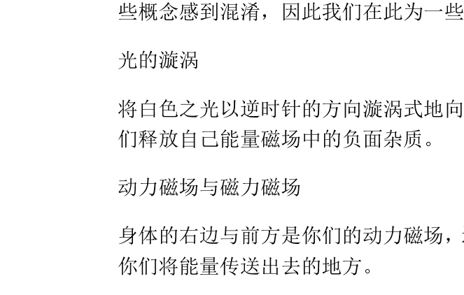

| 部门 | 访问量 | 占比 |
|------|--------|------|
| 业务部 | 1200 | 40% |
| 技术部 | 900 | 30% |
| 人事部 | 300 | 10% |
| 其他 | 600 | 20% |

## H1 一级标题

这是正文，用于说明 Main content area 的内容。这里可以包含多行文字，并支持** Markdown **格式。

- 第一项
- 第二项
- 第三项

| 标题1 | 标题2 | 标题3 |
| --- | --- | --- |
| 数据A1 | 数据B1 | 数据C1 |
| 数据A2 | 数据B2 | 数据C2 |

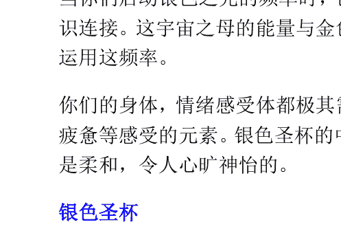

> > 这是一段引用文字，用于展示引用格式。

```
print("Hello, World!")
```

## 3.3 高阶导数

一般地，函数\(y=f(x)\)的导数\(y'=f'(x)\)仍然是\(x\)的函数。我们把\(y'=f'(x)\)的导数叫做函数\(y=f(x)\)的二阶导数，记作

\(y''\)或\(\frac{d^2 y}{d x^2}\)，即

\(y''=(y')'\)或\(\frac{d^2 y}{d x^2}=\frac{d}{d x}\left(\frac{d y}{d x}\right)\)。

类似地，二阶导数的导数叫做三阶导数，三阶导数的导数叫做四阶导数……一般地，\((n-1)\)阶导数的导数叫做\(n\)阶导数，分别记作

\(y''', y^{(4)},\cdots,y^{(n)}\)或\(\frac{d^3 y}{d x^3}, \frac{d^4 y}{d x^4},\cdots,\frac{d^n y}{d x^n}\)。

函数\(f(x)\)具有\(n\)阶导数，也说成函数\(f(x)\)为\(n\)阶可导。二阶及二阶以上的导数统称为高阶导数。

由此可见，求高阶导数就是逐阶求导。因此，前面学过的求导方法对于求高阶导数仍然适用。

例 1 求函数\(y=(1+x^2)\arctan x\)的二阶导数。

解 \(y'=2x\arctan x+(1+x^2)\cdot\frac{1}{1+x^2}=2x\arctan x+1\)，

\(y''=2\arctan x+\frac{2x}{1+x^2}\)。

例 2 设\(y=2e^{2x}+\cos 3x+\ln x\)，求\(y''\)。

解 \(y'=2e^{2x}\cdot2-\sin 3x\cdot3+\frac{1}{x}=4e^{2x}-3\sin 3x+\frac{1}{x}\)，

\(y''=4e^{2x}\cdot2-3\cos 3x\cdot3-\frac{1}{x^2}=8e^{2x}-9\cos 3x-\frac{1}{x^2}\)。

## 国内四大审计所求职攻略

四大审计所是全球知名的会计事务所，分别为德勤(Deloitte)、普华永道(PwC)、安永(Ernst & Young)和毕马威(KPMG)。作为财会领域的重要机构，它们提供专业的审计、税务和咨询等服务。下面我们将为你介绍应聘四大审计所的关键攻略。

### 简历准备

- 突出相关经历：实习、项目、竞赛
- 量化成果："参与XX项目，提升效率20%"
- 专业证书：CPA、ACCA等

### 笔试准备

- 题型：行测、专业题、英文写作
- 刷题平台：牛客网、应届生论坛
- 时间管理：限时模拟练习

### 面试技巧

- 小组讨论：展现逻辑与协作
- 案例分析：使用SWOT分析框架
- 英文面试：准备自我介绍与常见问题

## 6.2 Verifying Uniform Convergence

In the previous section, we presented a broad conceptual overview of how Generative Adversarial Networks (GANs) can be trained to learn a target distribution. The core theoretical claim of GANs is that, under ideal conditions, the generator's distribution should converge to the true data distribution as training progresses. In this section, we build upon that foundation by implementing a concrete numerical experiment to verify this convergence property.

We will work with a simple, one-dimensional dataset — a mixture of two Gaussians — and train a GAN to learn this distribution. By monitoring the generator's output distribution over the course of training, we can empirically observe whether and how it approaches the true data distribution. This exercise provides a hands-on demonstration of the concepts discussed earlier and offers insight into the practical behavior of GANs.

### 6.2.1 Dataset and Model Setup

For our experiment, we define a target distribution as a mixture of two Gaussian distributions. Specifically, the true data distribution is given by:

> > p_data(x) = 0.5 * N(x; μ=-2, σ=1) + 0.5 * N(x; μ=2, σ=1)

where N(x; μ, σ) denotes the probability density function of a normal distribution with mean μ and standard deviation σ.

请求方法: POST, GET，默认token过期时间: 24小时

返回示例:

```json
{
  "msg": "success",
  "code": 0,
  "data": {
    "accessToken": "xxx",
    "expires": 3600
  }
}
```

请求示例:

```
curl --location --request POST 'https://xxx.xxx.com/api/v1/auth/token' \
--header 'Content-Type: application/json' \
--data-raw '{
  "appId": "xxx",
  "appSecret": "xxx"
}'
```

，同一个appSecret只能有一个有效token。

## 整体原乙醛去酯基氧化合成中间体的过程

该流程图展示了从初始原料到最终产物的完整催化转化路径。整个过程包括多个反应步骤，涉及催化剂表面形成的不同中间体。

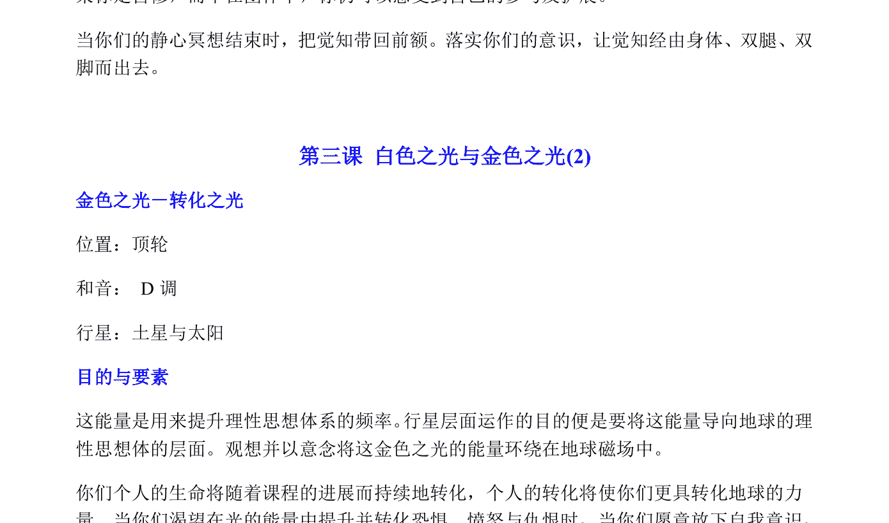

- 步骤 1：乙醛吸附至催化剂表面，形成乙氧基中间体。
- 步骤 2：乙氧基脱氢生成乙酰基物种。
- 步骤 3：乙酰基与表面羟基反应，生成乙酸中间体。
- 步骤 4：乙酸进一步氧化脱羧，释放 CO₂。

> > 关键中间体：表面乙氧基（CH₃CH₂O-）和乙酰基（CH₃CO-）是决定反应速率的重要物种。

```
反应速率方程示例：
r = k * [CH₃CHO] * [O*]
```阶段成为战士或神职人员，在某些阶段涉入政治或金融体系的活动。每个人都有一个意识的密码烙印在灵魂体系中。

你们将不断地探索着解开自己意识的密码。这解码的线索只有当你们在人性意识的层面上，能全面接受，并为自己的生命，在与造物主共同创造上，扮演什么样的角色，做了探索的承诺时，才会呈现给你们。当你们的意识走过各个不同的入门阶段之后，你们便会与灵魂深处那对宇宙心识的洞见与记忆整合。

我，安德鲁扮演着信息传送者的角色，使你们从中汲取改变个人与群体意识，并使地球成长的能量。走在这光的途径上的人，与那巨大的爱的势能是连接的。在这势能中许多存在探索着将转化的理念注入你们生命的途径上，使你们进入全面的入门中。当你们从较低次元建立起通往较高层面的彩虹桥时，这连接就越来越紧密。提升进入这层面也就成为越来越容易的经验。

在这时刻，我触及你们每一个人，然而，不仅止于这时刻，我将触及所有踏入这特定旅程的人。触及代表对你们的感受力与接受力的认知与感谢。在金色之光中，感受宇宙天父之光创造的动力。

在生命的宝藏中，储存着你们灵魂在受造之初所被赋予的一切。因此，观想这宝藏被开启，无论在灵性上或物质上，这宝藏里的资源都是如此地丰富，源源不绝地流向你们。每个人宝藏里的资源，依个人的视野及个人灵魂的欲望而定。你们在心灵上的认知，即是你们创造的动力。

人类自我以制造恐惧来否定心灵意识的存在，并以局限来否定造物主。然而，地球上的万事万物皆随着心灵意识的状态而呈现。因此，你们的视野要能看到心灵意识与人类本源的连接，以及将灵性意识里的欲望付诸实现的重要性。

当你们个人的交流完成之后，感受自己经由彩虹桥，把觉知带回身体中，感受自己的身体、情绪体、理性思想体及灵性体完全落实地面，感受你们身体的每个能量中心点都受到激发与启动。

再次提醒你们，这些经验只能从象征性的事物上来理解。愿你们进入和平中。

## 第四课 蓝色之光

### 智慧之光

位置：灵魂体上的理性思想体

和音： 降 B 调

星球：天王星

#### 目的与要素

这能量的目的是要转化因虚妄影像的恐惧与焦虑而造成的妄念成真（false-to-fact）的思想模式。什么是妄念成真呢？

它是指由于对虚妄意念的认同，而产生的事物。许多别人的理念，虽是虚妄不实的，但如果你信以为真，它便会真的发生在你的生命中。

在行星层面上，这能量用来清理因人类的恐惧与贪婪，在地球上所造成的磁场。它具有帮助人类重建和平，获得对真理的领悟。今日的地球特别需要这能量来清除由战争所带来的破坏与混乱，并将人类带入更高的智慧中。

感受这能量进入地球，在群众的恐惧意识中，带来和平与安宁。看着地球以及地球上所有人类，对自己或对所有生命都有着更大的包容。再次肯定，人类将了解真理，而真理将使人类获得自由。

### 静心冥想与上师们的讯息

我们以基督之名问候你们！智慧之光将为你们带来许多协助你们治愈旧有思想意识的机缘。在灵魂投生地球，成为有形体的生命之初，恐惧的意识便已存在，成为人类经验中的一部份。当你们进入物质体的世界，与神圣次元中那全然的和平隔离时，恐惧便渗入到你们的意识中。与源头的隔离，使你们在失落、空虚与被弃置的感觉中增强了恐惧的感受。当你们在生命的过程中为生存而挣扎时，更是增加了恐惧感。

与圣灵失去连接所造成的分裂感，使人类的思想意识制造了许多毁灭性的行为。失去了在光的原始状态中的感觉，使意识自我在生命的体验中制造许多阴影，恐惧便由此而生，并成为人类所要面临的最强烈的感受。恐惧使人类为生命，为自身的生存与需求而挣扎，在挣扎中产生了更多的纷争与误解，进而与「一」的法则分裂。

因此，作为光的行者，你们正治愈自己心灵深处那分裂的空虚感。你们正与自己的本质与源头再度结合。这是好的。所有恐惧的学习课程，都是为了强化你们心灵的力量，经由梦境与挑战，你们理解到自己是造物主的一部份，并认知这是唯一的真理。

你们是爱的造化。你们的真实自我是神圣的。你们开始向这真理觉醒，开始与这真实自我连接，这是正确的。当恐惧出现在你们的思想、情绪与身体上时，不要忘了进入你们较高灵性意识的空间。记住自己即是光，把自己交托给光的存在，知道自己生命的旅程充满着治愈各种情况的机缘。

恐惧像敌人般地缠绕你们，破坏你们，使你们虚弱无助，并陷入在矛盾与愤怒中。有些恐惧是你们内在洞见，你们感到自己将面对一些挑战。接受这些信息，观察自己的身体有些什么反应，把思想的焦点放在光中。现在，你们在光的网络上运作着，智能之光的频率环绕着地球行星，环绕着出现在你们视野中的地方。你们所焕发的光与许多把和平、喜悦、安宁带入地球的存在们连接，接受这一事实。

### 肯定语意

我允许自己获得治愈。

我允许自己选择最具创造性的生命途径。

我接受自己的一切，也接受发生在我生命中的一切。

我已做好向前迈进的准备。

你们开始走出匮乏与局限的经验，清理你们意识中不被支持，没有保障，物质生活匮乏的感受。

在这光中，你们开始感受自己是生命中一切机缘的创造者。你们开始理解，如何看待外在的事物，如何反应，是自己的选择。你们发现自己往往很难从较高的领悟去看自己生命的体验，致使生命成为一种挣扎。

有些人感到生命所显现的与自己所渴望的，似乎完全相反。感到自己光是为最基本，最简单的生活，也得面对超乎自己所能承受的挑战，令人疲惫不堪。

有些人为了获得别人的认可而不断地努力着，却无从达到目标。这是因为虽然你们渴望那特定的经历，但你们对它的运作尚未完全入门。尽管你们生活在充满挑战的世界里，然而，在这时刻，先放下这些挣扎与疑惑，纯然地让灿烂的光充满你们。

你们已知心识是创造者，它创造你们的生命现象。你们的思想与情绪是综合许多生命旅程的产物，外在世界所反映的是内在思想意识的呈现。在这时刻中，你们正在提升内在的觉知。在冥想中，你们的思惟，你们的视野，都使你们认知自己已成为光的途径的入门者。因此，在这时刻，与你们心灵的渴望，灵魂的目标，及灵魂的表达融合。

每一个人所过的生活，都有其特定意义；每个人所走的道路，都符合自己生命的目标。接受你们生命中现有的一切，不要与别人做比较。有些人的生命似乎比别人更丰富多彩，更自由，然而，你们无法看到他们的心灵意识中，是什么使他们得以创造他们的机缘。

珍惜你们的人生，珍惜你们自己，在通往明心见性的旅程上，你们的生命是珍贵的，神圣的。你们将在这旅途上看到它所带来的丰富与圆满是超越你目前这一阶段所能想象的。

富足圆满是：在安宁中无所恐惧。

富足圆满是：在别人身上看到光明，是感受到那无言的连接。

富足圆满是：在和平中，在为他人的治愈而付出。

现在，在这灿烂之光的能量中，记住在给予中你们获得的宇宙法则。任何真诚的付出，都将获得成倍地回馈。不求回报，不求名利，纯然出于爱的给予，至高的行为，信任你们的过程。现在，感受这能量与行星的网络连接。与行星的网络连接的目的，是为了促进人类意识向真实的灵性本源打开，并将基督意识带入生命中。

因此，在这时刻，引导这灿烂的绿宝石之光进入光的网络中。体验思想如何地引导这能量进入某些区域，看着能量环绕着在困苦、战争、疾病、贫穷中，为生存而挣扎的地方。纯然地焕发这能量，只要想着一切事物都能圆满解决。许多地方仍在排外与封闭自守的状态中。许多人仍在猜测别人的想法与可能的行动。许多人对文化的差异仍持有偏见，但只要对宇宙意识，宇宙法则，灵性本质，宇宙心识的合一有所了解，便能向文化的差异打开，接受不同的宗教与不同的信仰。当你们找到内在自我的核心时，便能释放由分裂所产生的恐惧。这就是光的运作所带来的力量。这一时刻的运作，将为地球带来完善与美好。

因此，观想爱进入所有愿意接受基督意识之人的心灵中。当你们做好回到自己的行星中心点时，引导能量经由彩虹桥回到身体的觉知中。现在，给自己的身体充分的时间，把光带到需要它的部位，把光带入你们的人际关系中，治愈你们与家人之间的隔阂。为每一家族成员及你们所想到的朋友祈祷，把他们都带到这光的中心点。

当静心冥想结束时，感受能量由头顶至脚底流动着，感受绿宝石之光的频率经由你们进入地球行星的中心点，并将你们的意识落实在地球层面上。现在，将光以顺时针的方向旋转，封住你们的磁场，保护你们不受负面能量的干扰。进入和平中。

### 肯定语意

我是我心智与灵魂完美的受造之物。

我释放恐惧、批判与抗拒。

我接受自由是上天赋予我的本质。

我以至高目标创造一个体验自己创造力的机会。

地球是丰足的，充满着造物主的仁慈。

人类正以自身的智慧更新地球并创造富足。

## 第六课 紫色之光

### 至善意愿之光

位置：喉轮与心轮之间

和音：高C调之上的E调

行星：木星

#### 目的与要素

从这中心点所流出的能量，焕发着紫罗兰色的紫色之光，这频率的元素能化解愤怒与仇恨。愤怒与仇恨往往是由于害怕无法掌握自己的人生与生命目标而产生的。当自己在这种特定状态时，进入这行星中心，感受较高自我的意志将较低自我的意识提升到治愈的层面中。

进入这能量的运作，往往使你们感到不太舒适，尤其是当你们感到自己的生命受到外在情况的抑制，当你们因无法开展自己的理想而感到窒息时，确实很难以看到更大的至善。然而，当你们在这紫色之光中运作时，你们将开始看到并感受到自己是更大的蓝图中的一部份，你们参与着将至善带入具体实现的活动中。

在这提升地球意识的运作中，你们是重要的角色，因此，当你们进入行星层面时，感受至善意愿流向所有人类的心识。

### 静心冥想与上师们的讯息

爱瑟瑞尔

问候你们！这是爱瑟瑞尔。很高兴能将与你们的思想频率融合。我们很难以语言来说明这一运作的成果，因为这运作是多次元，多层面的。扩展的灵魂正接收来自心灵意识源头的频率。光的委员们正将他们的思想传递给你们，你们的心识正响应这来自委员们的群体能量。这将使你们得以与许多引导能量进入地球的光的存在们沟通。

我们所传递的是超越了思想语言所能表达的，因此，在我们说话的同时，觉知你们所接收的。在意识的层面上，你们可能无法完全吸收与了解现在所进行的运作，但是你们的身体将会记录它的效果与作用。要了解到这运作的目的，不是要影响你们在进展中的选择，而是作为一个灵性成长的入门者，你们受到委员们的欢迎，在扩展中进入更大的目标。

心识的课程依你们所选择的特定生命旅程，而个别地给予你们。识别的课程依你们个人目标与所需活动而以不同的方式呈现给你们。然而，每个人都将在这特定的光中体验意志的力量。

当内在自我与较高自我深深融入于较低自我时，便能突破较低体系所制造的妄念。勇气与诚信是生命的主要课题，接受未来，你们较高自我的元素便会在它自己的时间内焕发出来。诚信的生命课题使你们认知较高意愿即是一切所有（ all in all）。

地球人类已偏离了对较高意愿的理解，地球人类的意志是基于物竞天择，以人为本位而订的，它是一种为了生存而展现的战斗意识。我们了解到要以灵魂在行星层面的意识在地球上运作是极为困难的，因为目前的地球人类，在意识层面上所呈现的与较高意识层面极其不同。然而，当你们愿意释放个人的负面元素，并响应较高意愿时，便能感受内在的安宁与喜悦。

光的运作将带领你们生活在宁定的喜悦中。看着自己在和平中。地球的动荡与混乱不会结束，但你们会发现当自己更宁定，与内在更整合时，便更具备走过动荡与混乱的力量。亲爱的学生们，无论外在环境所呈现的与你们内在完美意识的距离有多远，仍然要努力让自己保持在安宁与和平中。

地球极需这紫色之光的能量，因为人类的意志遮蔽了神圣意愿。然而，上师们也看到人类的意识在逐步进展中。神圣意愿必须经由具有神性意识的人来实现。在这时刻，这么想着：

尽管我们是微小的，然而，像宇宙一样，我们具有心灵的质量。我们与宇宙所有的受造物一样在进展着。

你们具有光、力量、心识与思想。感受这紫色之光的频率正放大着，它与所有在这网络中的能量连接，协助地球进入神圣计划的表达中。现在，这么想着：

我在扩展中与所有较高意识层面的受造之物连接。

愿神圣计划，至高大我，进入人类的心灵意识中。

愿神圣计划斩除那使小我处于退展状态中的锁链。

愿光破除因陈腐意识而循环不已的因果。

愿人类从愤怒、痛苦与恐惧中解脱出来。

感受这至善意愿像一道放大的天使之光，它的力量在逐渐强化中，随着探索着将和平带入地球的存在们的引导，在地球上产生作用。

当这能量被群体意识启动时，它巨大的力量，将足以转变事情发展的动向。将焦点放在和平谈判的会议上，放在改变人类的战斗意识上。观想地球的财富在平衡中。虽然个人是如此地微小，但人类扩展的较高意识之力量却是无限的。你们的视野并非遥不可及，它是期待改变者的理想的火炬正从旧有的意识转向新的意识。

当群众的第三眼打开时，内在次元的意识也在运作着。许多灵魂为和平与合一的理念而聚合。在人类的历史中，从不曾有过如此般地将焦点放在改变上。然而，抵制这神圣意愿的抗拒力量也冲击着你们。让这紫色之光的能量之波在所有的争执上流动着。

当夏至来临时，较高次元的上师们，正进行着类似威萨克庆典（Wesak Festival）的聚会。这庆典是较高心识的存在们，在默基瑟德天使圣团，伊诺克天使圣团，迈克尔天使圣团及其它诸多圣团为带领人类经由光，经由转化而入门的庆典。

许多人为了寻找灵性之源而朝圣。许多人为了寻找心灵的慰藉与安宁而隐居山林溪谷间。许多人加入团体以唱颂来寻找存在于自身之内的本源。你们也是为了这些目的而来到这光的次元的入门中。

在这巨大的能量中，如果你们感到身体有着沉重、昏沉或晕眩的感觉，这是光与较高层面整合的片刻反应。当你们准备好回到物质体的次元中时，将光与觉知带给你们的家庭，你们所爱的人，你们的朋友。当你们从彩虹桥下来时，给自己一点时间体验与身体连接的感受。当你们接受物质世界中的一切时，你们便能落实这些教导。感受你们的双脚坚定地踏在地球上。感受你们的意识经由中轴而移动，进入地球的能量中。当你们完全清醒时，你们将感到内在的光明，清新与和平。

## 第七课 红宝石之光

### 医生的左手

位置：心轮-情绪体的部位

和音： B 高 C 调

行星：水星

#### 目的与要素

在情绪体的层面上，红宝石之光可以为那些被虚妄影像所遮蔽的人带来治愈的元素。这能量帮助你们治愈人际关系，纾解因条件性的爱（Conditional love）所产生的扭曲。

红宝石之光的频率，具有治愈破碎的功能。破碎的系统指的是：身体的疾病与情绪体的创伤，以及身体骨骼系统上的问题。当你们启动这能量，将它带入彩虹桥时，你们便能成为更大的能量网络中的一部份，它在你们身上所产生的作用将更强而有力。

治愈是如此地个人性与多元性。在使用这能量的同时，也是你们为实践无条件的爱做准备，以及提升自己的频率进入圣爱的时候。

### 静心冥想与上师们的讯息

爱瑟瑞尔

问候你们！这是爱瑟瑞尔。我们非常高兴能在这庄严美丽的时刻中，有机会与你们一起扩展。

## 建设进程

图书馆新馆建设自2018年启动，预计2025年底竣工。目前已完成主体结构封顶，正在进行内部装修和智能化系统安装。项目总投资约5.2亿元，建筑面积达8.6万平方米。

- **2018年3月**：项目立项获批
- **2019年6月**：奠基施工
- **2021年12月**：主体结构封顶
- **2023年8月**：内部装修启动
- **2025年12月**：计划竣工验收

| 楼层 | 功能区域 | 面积(㎡) |
|------|----------|---------|
| B1   | 密集书库/设备用房 | 12000 |
| 1F   | 大厅/新书展示/自助借还 | 15000 |
| 2F   | 社会科学阅览区 | 14000 |
| 3F   | 自然科学阅览区 | 14000 |
| 4F   | 数字阅读/多媒体中心 | 13000 |
| 5F   | 特藏阅览/学术交流区 | 12000 |

新馆在设计上采用"智慧图书馆"理念，将全面应用RFID技术实现图书智能盘点、无线定位导航、无人值守借还等场景。

> "新馆将成为城市文化新地标，不仅提供传统阅读服务，更致力于打造集学习、交流、创新于一体的知识共享空间。"
> —— 图书馆馆长 李伟

### 4.3 测试框架

测试框架通过提供自动化测试创建、执行和报告的工具，确保了软件质量和可靠性。它们帮助减少手动测试工作，并使回归测试更加高效。

#### 4.3.1 单元测试框架

JUnit 是一个用于 Java 的单元测试框架，广泛用于测试驱动开发中。

NUnit 是 .NET 平台的单元测试框架，支持数据驱动测试和并行执行。

pytest 是 Python 的测试框架，支持简单的单元测试和复杂的功能测试。

#### 4.3.2 集成测试框架

Selenium 是一个用于 Web 应用程序的自动化测试框架，支持多种浏览器和语言。

TestNG 是一个受 JUnit 启发的测试框架，但引入了更多功能，如分组、参数化和依赖测试。

Cucumber 支持行为驱动开发，允许测试用自然语言编写。

```python
## 使用 pytest 的简单测试示例
def test_addition():
    assert 1 + 1 == 2

def test_subtraction():
    assert 2 - 1 == 1
```

虽然你们现在无法预测未来，因为你们有各种选择。可以确认的是，虽然你们带着许多未了的因果来投生，但你们可以选择释放仇恨、抗拒与痛苦来加速你们的进展。

现在之所以比以前更难以做预测的原因是：你们的未来决定于你们群体意识所呈现的是什么样的能量。让和平的远景在你们心灵中萌芽发展。你们每一个人都能在地球这清理、更新以及进入合一的非凡时代中，参与这历史性的盛典。作为行星的运作者，在光的网络上运作，将带给人类更大的改变力量。思考这些事。你们是这历史性的成长中的一部份。

尽管你们看自己是微小的，我们看你们则是一个光的巨人。你们是以思想的前瞻来改变人类之表达的群体中的一部份。

## 第一部分 算法基础

### 1.1 算法的定义与特征

算法（Algorithm）是指解决问题的一种方法或一个过程。更严格地说，算法是由若干条指令组成的有穷序列，其中每条指令表示一个或多个操作。

一个算法必须具备以下五个重要特征：

- **有穷性**：一个算法必须总是在执行有穷步后结束，且每一步都可在有穷时间内完成。
- **确定性**：算法中每一条指令必须有确切的含义，无二义性。
- **可行性**：算法中的操作都可以通过已经实现的基本运算执行有限次来完成。
- **输入**：一个算法有零个或多个输入。
- **输出**：一个算法有一个或多个输出。

### 1.2 算法的时间复杂度

时间复杂度是衡量算法效率的重要指标，通常用大O符号表示。常见的时间复杂度有：

- **O(1)**：常数时间，如直接访问数组元素。
- **O(log n)**：对数时间，如二分搜索。
- **O(n)**：线性时间，如遍历数组。
- **O(n log n)**：线性对数时间，如归并排序、快速排序。
- **O(n²)**：平方时间，如冒泡排序、插入排序。

> 注意：实际算法运行时间还受到常数因子、编程语言、硬件环境等因素影响。

## 教育

教育在人类社会中的作用是多方面的，不仅包括知识和技能的传授，还涵盖了文化传承、人格塑造和社会化过程。在现代社会中，教育被视为个人成长、社会进步和经济发展的基石。教育的目标已经从简单的知识灌输发展为培养综合素质、创新能力和终身学习的意识。教育的多样性和包容性也日益受到重视，以适应不同地区、文化和个体的需求。

### 教育的重要性

-   个人发展：教育帮助个人获得知识和技能，提升就业竞争力和生活质量。
-   社会进步：教育促进社会公平，减少贫困和犯罪，推动社会和谐发展。
-   经济发展：教育为经济发展提供高素质劳动力和创新能力。

### 现代教育的挑战

-   信息过载：如何在海量信息中筛选有价值的知识。
-   技术变革：人工智能和在线教育对传统教育模式的冲击。
-   教育资源不平等：城乡之间、发达地区与欠发达地区之间的教育资源差距。

> “教育的根是苦的，但其果实是甜的。”——亚里士多德

多光的存在正努力以光来扭转并化解战斗与矛盾的烽火。

地球上，国家与国家之间，存在着许多无法沟通的问题，相互间无法平等对待。恐惧、贪婪、错误的理念、陈腐的观念和爱国主义的观念制造了许多障碍，这些都是早就必须去除的理念。因此，亲爱的学生们，众多光的存在们正以他们的心识，他们的能量来释放、清除这些障碍，并将至善带入地球层面。

有些人可能会发现自己置身于有着巨大痛苦与沉重的区域。不要让情绪涉入其中，只要观想光辉灿烂的光之能量，进入这些战斗区域并破除毁灭性的势能。

有人问道：「我何时才能体验到指导灵给我的指引？」

我们要告诉你们的是：你们的指导灵及委员们已是你们频率中的一部份，你们可以从觉知与感受中去体验，让自己的所有体系融入较高频率，就是与指导灵及委员们的连接。

当你们正朝向天使圣团的层面进展时，盘旋在你们周围的，将不是使你们混淆的较低灵界的存在。释放并让光指引你们到需要你们的关怀与能量的地方。释放你们内在自我中的战斗本质，与他人分享光的元素。

人类意识里的恐惧弥漫在许多政府官员的心识中。因此，观想那些权利在握的人已释放了内在的伤痛，并正在体验光及宇宙真理的智慧。许多光的委员已经以肉身的形式出现在政治领域中。这些人除了理解物质次元的事物之外，也理解宇宙中尚有其它具有生命存在的次元，只是未向世人公开这些觉知。他们是为了参与宝瓶座纪元意识的提升而降生地球的。

你们问道：「在地球处于灾难横流、分裂与瓦解的这种时刻中，我们如何将光的势能传送出去呢？」

## 图2-2 垂直排列表

从图2-2中可以看出，垂直排行列表具有如下特征：

-   所有图形元素在一条垂直线上展示。
-   所有图形项的下方都配有图片或者文字说明。
-   最后一个图形元素上下方都没有其它图形元素。

垂直排列表的典型产品应用如图2-3所示。

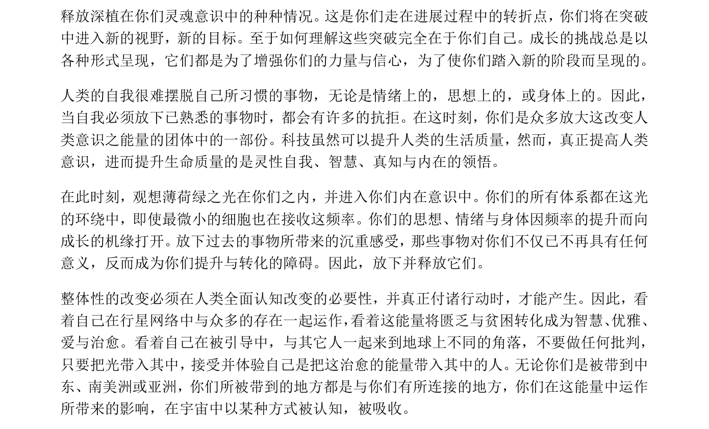

图2-3是我们在淘宝App搜索“男士休闲鞋”时的部分搜索结果。该商品列表即是一个标准的垂直排列表。搜索场景中，用户向下滑动即可浏览到更多搜索结果。这种列表设计方式对用户来说也是比较友好的，在每个搜索结果中，用户除了看到商品的关键信息外还可以看到商品图片，从而辅助用户决策。

## Course

| Day       | Time       | Room |
| --------- | ---------- | ---- |
| Monday    | 9:00 - 10:30 | 3.16 |
| Wednesday | 9:00 - 10:30 | 3.16 |

### Office Hours

| Day     | Time       | Room |
| ------- | ---------- | ---- |
| Tuesday | 14:00 - 16:00 | 1.08 |
| Thursday | 14:00 - 16:00 | 1.08 |

## 给年轻人11个买房建议

买房对于很多年轻人来说是人生中的一件大事，但是在买房的过程中，经常会因为缺少经验而踩坑，如果你也是买房小白，看这一篇就够啦！

- **1 地段永远是最重要的，也是房子保值的关键。**
- **2 不要买公寓！不要买公寓！除非钱多。**
- **3 买房看预算，根据自己的实际情况，不要超负荷。**
- **4 不要买法拍房，除非你非常懂行。**
- **5 能买三房不买两房，能买两卫不买一卫。**
- **6 尽量选大开发商，避免买到烂尾楼。**
- **7 物业很重要，不仅是生活品质，也影响房子保值。**
- **8 通勤时间很重要！尽量控制在1小时以内。**
- **9 楼层选中间偏上，采光好视野佳。**
- **10 注意朝向，客厅和主卧最好朝南。**
- **11 不要买精装房，装修水分很大。**

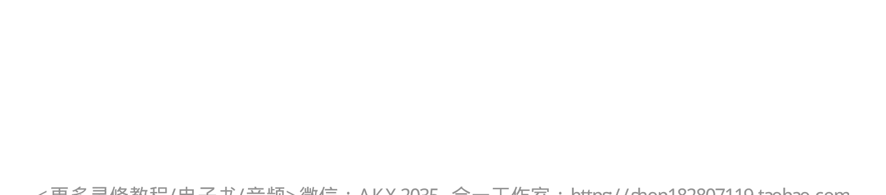

## 第5章 方法设计

### 5.1 总则

方法设计的核心是抽象，将特定的功能封装成一个独立的模块，以便于复用。方法设计的目标是高内聚低耦合，提高代码的可读性和可维护性。

#### 5.1.1 方法签名设计

-   方法名应该遵循小驼峰命名法，且见名知意
-   参数列表不宜过长，建议不超过5个参数
-   返回值类型明确，避免返回null

对于参数过多的情况，可以考虑使用参数对象（Parameter Object）模式进行重构。

### 5.2 代码组织

```java
public class UserService {
    public User findUserById(Long id) {
        // 业务逻辑
        return userRepository.findById(id);
    }
}
```

示例代码展示了典型的三层架构中的Service层方法设计。该方法遵循单一职责原则，只负责用户查询逻辑。

### 南浦大桥

南浦大桥是上海市内的一座重要桥梁，连接浦东新区和徐汇区。

该桥于1991年建成通车，是上海第一座跨江大桥。

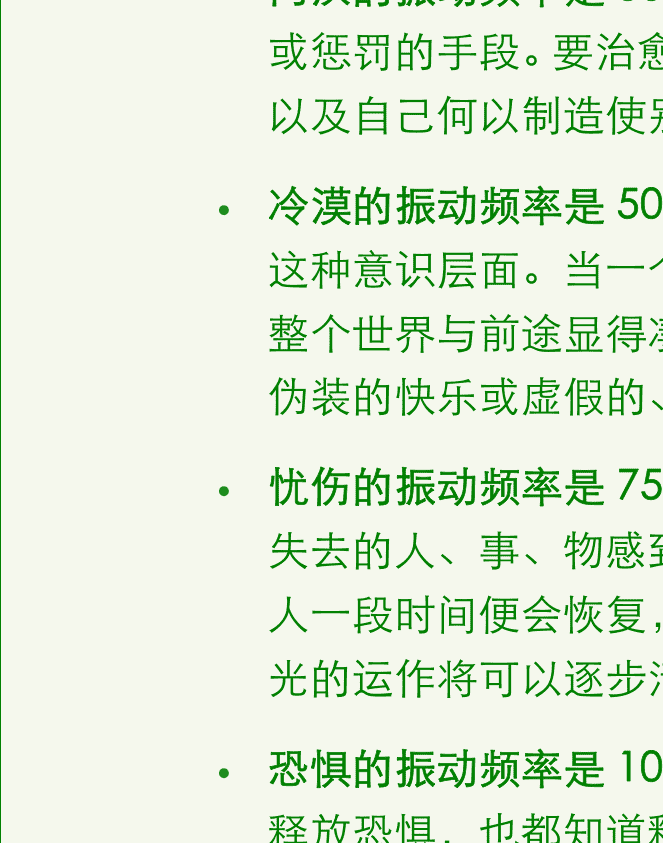

-   全长：8,354米
-   主桥长度：846米
-   桥面宽度：30.35米
-   设计车速：60公里/小时

| 项目   | 数值        |
| ------ | ----------- |
| 通车时间 | 1991年      |
| 车道数 | 6车道       |
| 日车流量 | 约10万辆 |

> 南浦大桥的设计体现了现代工程技术与美学的高度融合。

## Abstract

This paper presents a novel method for detecting and segmenting circular structures in medical images. Our approach leverages deep learning techniques combined with geometric constraints to achieve high accuracy and robustness. The proposed method is evaluated on a dataset of retinal fundus images, demonstrating superior performance compared to existing methods.

### 1. Introduction

Circular structures are ubiquitous in medical imaging, such as optic discs in retinal images, lesions in CT scans, and cell nuclei in histopathology. Accurate detection and segmentation of these structures are crucial for diagnosis and treatment planning. However, due to variations in shape, size, and appearance, this task remains challenging.

### 2. Related Work

Traditional methods for circular object detection include Hough transform and its variants. More recently, deep learning-based approaches such as U-Net and Mask R-CNN have been widely adopted. Our work builds upon these foundations but introduces a novel geometric constraint module.

### 3. Proposed Method

#### 3.1 Overview

The proposed pipeline consists of three main stages: feature extraction, candidate generation, and geometric refinement. We use a ResNet-50 backbone for feature extraction, followed by a region proposal network (RPN) to generate candidate circular regions.

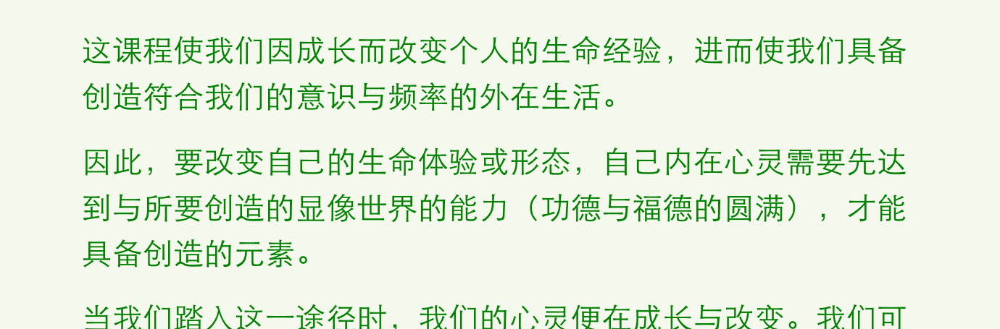

Figure 1: Architecture of the proposed method. The input image is passed through a backbone network to extract features, which are then used by the RPN and the geometric refinement module.

#### 3.2 模板方法模式

模板方法模式是一种行为设计模式，它在一个方法中定义了一个算法的骨架，而将一些步骤的实现延迟到子类中。模板方法使得子类可以在不改变算法结构的情况下，重新定义算法中的某些步骤。

**主要角色**

-   **抽象类 (AbstractClass)**：定义模板方法和基本操作。这些基本操作可以是抽象方法，也可以有默认实现。
-   **具体类 (ConcreteClass)**：实现抽象类中的抽象方法，以完成特定步骤。

**应用场景**

1.  当多个类有相似的算法，但某些步骤的实现不同时。
2.  当希望控制子类扩展时，可以在模板方法中控制哪些步骤可以被重写。
3.  当需要避免代码重复时。

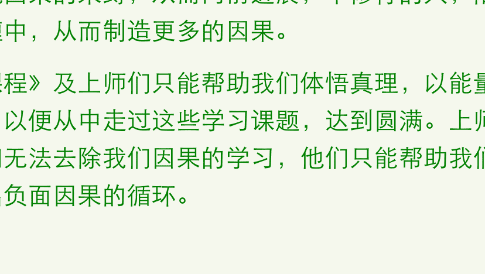

## 第二章 线性表

线性结构的特点是：在数据元素的非空有限集中：

-   存在唯一的一个被称作“第一个”的数据元素；
-   存在唯一的一个被称作“最后一个”的数据元素；
-   除第一个外，集合中的每个数据元素均只有一个前驱；
-   除最后一个外，集合中的每个数据元素均只有一个后继。

线性表是最常用且最简单的一种数据结构。一个线性表是 n 个数据元素的有限序列。数据元素可以是一个数、一个字符，也可以是一个结构体对象，甚至是其它线性表。

### 2.1 顺序存储

线性表的顺序存储是指用一组地址连续的存储单元依次存储线性表中的各个数据元素。

顺序表的特点是：逻辑上相邻的数据元素，其物理位置也是相邻的。因此，只要确定了存储线性表的起始位置，线性表中任一数据元素都可以随机存取。

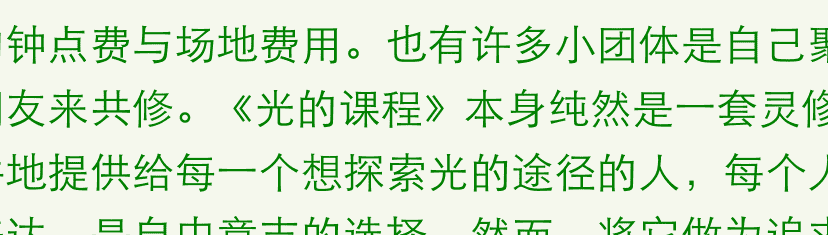

图 2.1 顺序表示意图

### 2.2 链式存储

线性表的链式存储结构的特点是用一组任意的存储单元存储线性表的数据元素，这组存储单元可以是连续的，也可以是不连续的。

通，需要一段很长的时间。因为每个人都必须走过种种考验与学习，并清理与释放各种负面情绪，才能达到内在的和平与喜悦。

许多人在体会到提升与转化的喜悦时，确实渴望以爱来与别人分享这一途径，并让自己在教学相长中继续成长，他们确实可以点燃了别人内在的光明。只是学生们必须知道带领的老师也还在学习与进展中。因为直到他们获得全面的清理为止，我们无法期望在他们的事奉中，能达到完全没有羡慕、嫉妒或傲慢的心。然而，我们知道，他们最终也将会理解到自己的状态。

事实上，这课程中有许多优秀的教师，也有许多受惠的学生。如何理解与吸收这一课程，都是神圣的经验。

因此，这途径必须让每个人以自己的方式去表达，那些踏上这一旅程的人，将会各自从中学习到他们的课题。

### 光的语言、电磁栅与光的网络

### 入门 Initiation

博纳：

在《光的课程》中，一直到行星二上师们才为我们举行入门庆典，那么在进入行星二之前，我们都还不能算是入门者吗？

蒂娜：

「入门」的层面很多；从灵性上的「入门」来说，每跨入更高意识层面之前，都需要先在身体上、思想上与心灵意识上做好准备，才能正式开始学习来自较高意识层面的教导。因为当一个人开始接收来自较高灵性的能量时，无论是身体、情绪体或思想体系都会改变，为了减低在身心上可能产生的创伤，一个人必须做好接收这较高灵性能量的准备。因此，在这之前的运作，只能说是为接收较高能量做准备。

博纳：

现下我才了解何以《光的课程》强调无论一个人的学识或素养有多高，都需要从系列一的准备课程开始。有些门派宣称他们所传的法是他们的传承，要正式拜师，不可以偷学，否则会遭受报应，这是真的吗？

蒂娜：

我不能为其它学派解说他们的道理，只能就我所认知的来谈《光的课程》的「入门」。而且这仅是我的认知，你自己还得从中去思索、去理解。

「入门」指的是开启对自己灵性意识的觉知。当这觉知一旦开启，便能引导较高层面的能量与力量进入较低的物质层面，使一个人内在的思想意识具体显现。因此，如果从这个角度来谈你刚刚所谈的问题，或许可以理解自古以来，一个上师要传法时，都要考验自己的弟子，看他们的心智是否正常，是否能掌握自己的情绪，内在的阴性本质与阳性本质是否平衡，才会传特定的大法。

一个心术不正、容易因嗔恨而生报复之心的人，上师自然不会传法给他。如果这个人因此偷学法术，并将偷学而来的法术滥用在不正当的地方，自然要在因果法则中承受自己所造的业，因此我想遭受报应来自因果法则，而不是那一门派的掌门人或那一门派的守护神去报复。

博纳：

何以《光的课程》不需要拜师或灌顶？

多的是一种温故知新。这些人的内在对光的本质都是已有一些认知与领悟的人，这一生来是为了完成一些未了的因果，以及为人类的进展而事奉。你不觉得《光的课程》中所传递的讯息对你而言是温馨熟悉的吗？

当一个人做了回归光的旅程的决定时，便已在较高次元的上师们的引导中。我认为接受并引导光的能量，就是一种灌顶，与上师们在内在次元中融合，在光中接收内在的指引，在心灵意识中与他们相互感应，就是一种与上师相应的模式，也象征着一种拜师的仪式。

博纳:
那么如何评估一个人的程度是否可以进入行星二的入门呢？

蒂娜:
《光的课程》从初级开始就一直在考验一个人的思想意识，也考验一个人是否能走过自己内在情绪的波动与振荡。如果仔细观察，你会发现任何人要进入任何更高级次的意识层面，都会面对一些考验，不能相应的人，自然会另辟蹊径。可以说在整个过程中，来自较高自我的考验与评估一直存在着，因此我们不需要去评判别人。我们只需要审视自己有没有透过考验，至于其它人的内在蓝图是如何设置的，不是我们的逻辑思惟所能理解。

博纳:
我看到的是自己及同学都只知道一个级次一个级次地修下去，但都不知道自己是否真的达到每个级次所要求的意识层面。

能持续下去，就表示自己仍在自性灵魂的指引中，我相信有此恒心与信心的人，终会与内在灵魂的意愿整合。进展往往是在无形的潜移默化中逐步完成的。

事实上，到目前为止，我还不知有谁走过一次就达到每个级次所应有的意识层面，我自己以及我周遭的朋友都是反复修了好几次以后，才逐渐领悟。学任何东西都要反复下功夫，心灵的东西更是如此。

博纳：

难怪我虽看了行星八的资料，对自己起因体层面的意识也还不能清晰了悟，看了行星九的数据，也没开启拙火，看起来都没有入门呢……这样下去的话，我即使习修了天使级次，也无法插翅而飞啊。

蒂娜：

如果我们吃了几把青菜就马上可以成仙做佛，那么灵魂又怎能在学习、考验与试炼中成长呢？人类灵魂在神圣计划中有着神圣而重要的角色，但需要我们走过特定的成长与历练才能体会这个的角色的奥妙。《光的课程》有如一张地图，每个人必需按图索骥，自己去走过许多成长的过程。

若没有真正下功夫面对自己，使智慧开到一定程度，就算很认真阅读数据，也无法达到任何一个级次应有的智能或意识层面。

拙火没有开启，事实上是较高自我对你的保护。开启拙火是另一个较高的入门阶段，需要在一个人已完成生命的体验及所有的净化，并在这股巨大能量进入较低体系的各个能量中心点时，能适当地掌握，这股能量才会受到启动，否则很容易造成身心的混淆与伤害。因为当较高能量进入身体时，较低体系中旧有的思想模式、错误的信仰体系、情绪里的障碍都会被这股巨大的电流所粉碎。心智不成熟的人会因无法掌握这种巨大的改变而产生毁灭性的后果。

博纳:

天使级次既然是在行星九之后，表示那又是拙火的入门阶段后的更高入门阶段，是不是表示没有开启拙火，就不能修天使级次呢?

蒂娜:

你可以预习天使级次，了解它要带我们进入什么样的心灵意识。但是，许多人急于进入天使级次，以为看到数据就可以像天使般地优雅美丽、令人景仰。事实上，天使级次引导我们进入更高的，或更深入内在之光的次元固然没错，但也表示我们自身需要随着达到更高的意识层面。因此，还是如前面所说的，如果自己没有做好准备，即使看了资料，教材中所立的意识标竿，对我们只是可望而不可及，不具任何意义，那么阅读过的人与没有阅读过的人，内在的心识与外在的形象就没什么不同。

博纳:

光是要达到前面系列的意识层面就够我一再重修了……看来我这一生就别想修到天使级次了……

蒂娜:

要有信心，也要有前瞻性。不要好高务远，但要能高瞻远瞩。Toni 虽在十多年前就有天使级次的初稿，但真正完成却是在她开始传递这套教材之后的三十年，直到最近，才把天使级次完整地修订出来。也就是说她本人即使是一个灵媒，自身也同样需要逐步成长，才能把数据更完整地传递出来。

博纳:能请你预告一下,若要进入天使次元,需要达到什么样的意识层面,才能入门呢?

蒂娜:

有五个原则可以让你随时掌握与反省,这些原则都能达成的话,就能实现天使圣团的意愿与本质:

1. 你要能放下名利得失之心,无条件地事奉。
2. 对发生在你生活中的事物,你要能向内探索这些事物所要带给你的是什么样的学习课题。
3. 面对挑战时,你要能谦卑地请求圣灵协助你以无条件的爱与神圣意愿,赋予你较高力量与勇气来走过它,并转化负面的因果。
4. 相信无论何时何地,你都在光中。
5. 每一时刻都在无条件的爱中,没有批判。

博纳:

My God …要是修到那么一天,我一定离地三尺了…看来,我现在还是不要想太多,只要将每个级次的入门智慧慢慢理解就好了…只是我们到底应在同一级次上一再重修呢?还是埋头一路走到底,再回头补修呢?

蒂娜:

正如我前面所说的,每个人内在蓝图的设计不同,不是我们可以评定审核的。因此,你必须依你自己的感觉走。在我所见到的同学中,无论是在美国或在台湾,这两种模式都有人选择。我想尽管过程不一样,最终的结果是一样的。当然,在共修团体中,由于是团体的关系,我们可以理解每个带领的老师会有不同要求的必要性。是否愿意接受带课老师的建议，便在于学生的内在感觉与缘份。

## 光的语言

博纳：

行星七称图形与密码是光的语言，那是什么意思呢？

蒂娜：

所谓光的语言是一种来自较高次元——也就是第七次元所要传递给我们 的那些含有大量的多重含义的思想能量。可以说是较高存在与地球上光的行者之间的沟通工具。每当光的行者让心灵意识下载代表光的语言的图形或密码时，内在知晓与视野将更为清晰。宇宙神圣计划便得以向灵魂显示。透过抽象图形，光的语言便经由行星网络注入人的潜在意识中。

博纳：

下载图形与密码？好像计算机下载软件一样吗？那这些图形与密码下载在我们身上，将会产生什么作用呢？

蒂娜：

它会强化并扩展我们的灵魂光体，使我们获得来自较高层面的思想意识，帮助我们理解各种不同的实相，为进入第五次元做准备。

通常，大部分的人会透过书本、老师的教导、媒体的传播和个人的经验来学习较高层面的思想意识，只有少数修行者学会运用光的语言这一管道获取来自较高次元真知。

博纳：

在行星七中我们看到了十二个图形与密码，还有其它的图形吗？

蒂娜：
世界上很多宗派都有他们象征性的图形，有人把它称为「曼陀罗」。

「光的课程」目前只提供给我们这十二个图形。原先只有十一个，最后一个钻石水晶光是最近才增加的，因此，我相信在我们进展的这一阶段中，这些图形已足以帮助我们的提升，并协助我们迈向灵魂的蓝图。

事实上，几何形体也是一种图形或光的语言，无论它是圆形、三角形、金字塔形、心形、螺旋形、星形或其它以艺术来表达的形式，都可以是一个图形或光的语言。因此，可以说从行星一的「彩虹桥」开始，到后面的「三角形」与「光的金字塔」的能量运用，上师便一直在给我们由各种能量组合而成的图形或光的语言。我想重点不在我们得到多少图形，而在个人对这些能量的接受能力，以及自我改变的意愿。

博纳：

这么说埃及的大金字塔就是地球上一个具体的图形啰？那我们如果亲自去那里，不就可以直接得到这些能量的加持了？

蒂娜：

不只是大金字塔，一些圆顶或拱形建筑物，或一些艺术品，都具有平衡与稳定地球能量的功能。然而，回到思想引导能量的法则上，透过我们对宇宙中种种原型（archetype）的冥想，来接收并应用它的能量，这些象征性图形的频率便能提供我们改变自己，进而改变地球磁场所需的能量。

每一种不同架构的图形能量都能贯穿各个次元，透过这些形式所产生的能量，归纳起来，不外乎就是光的能量。这就是光的能量得以在各次元间产生互动的原因。

## 祈祷/肯定语意与显像创造

博纳：

上次讨论静心冥想时，你说我们要改变习气或旧有模式，只要保持觉知，觉察到自己陷入在旧有模式中时，就把它放在光中，祈求让自己获得更新与转化；这样一来就不会在对抗的挣扎与痛苦中。那么我们需要每天也做一次祈祷吗？它能取代静心冥想吗？

蒂娜：

祈祷（Pray）与静心冥想都是使生命达到安宁与和谐的一种模式。你可在静心冥想时祈祷，但两者之间有些不同。「祈祷」是对上天的恳请与感恩，「静心冥想」则是倾听上天的指引，两者都是我们与宇宙天父的交流与沟通，就像一个孩子与一个深爱自己的父亲之间，既需要向父亲表达自己生命的愿望，也需要倾听父亲的教导与指引，这种和谐的双向沟通是一种最完美的关系。

博纳：

但我常觉得自己无法说出优美的祈祷文。

蒂娜：

任何心念的倾吐，都是一种祈祷。全在的天父任何时候都可以听到你的心声，他既不会要求你一定要到教堂或正式场所，也不会要求你有一个美丽的措词，无论你的宗教信仰是什么，或是你没有任何宗教信仰，只要你有一颗虔诚的心，以及美好的愿望，他都会回应你。

博纳：

我有朋友几年来每天都在祈祷成为富翁，却一直没有实现，难道天父没有听到他的祈祷吗？

蒂娜：

前两天我正好看到一本2005年四月份英文版的读者文摘，提到由一个另类医疗的研究机构在两年内花了六百多万美元做了一份研究调查，调查结果显示，在五千六百份的问卷中，百分之四十一的人发现他们的祈祷获得应验。文中并指出，许多没有获得响应的是一些不符合神的旨意的祈求。我想这指的是不符合灵魂为成长所设置的蓝图。

博纳：

意思是说，在他灵魂这一特定的进展阶段中，成为富豪对他的成长并没有任何帮助啰？

蒂娜：

我不知道他的灵魂设计，只能说我们所祈求的，必需符合灵魂的意愿。而灵魂是造物主的共同创造者。福祉、安宁、和平与快乐是造物主赋予所有灵魂的礼物。因此，为自身或家人、朋友的健康、平安与快乐所做的祈祷效果，往往会比为较低的欲望祈祷更能获得回应。

博纳：
那么肯定语（Affirmations）与祈祷之间有所不同吗？

蒂娜：

肯定语是我们表达自己对参与生命创造的意愿，这种意愿所产生的频率，像祈祷一样，将加强我们在现象界中创造显像的力量。肯定语的正面频率，将能帮助我们转化我们意识或潜意识里旧有的负面思想所形成的障碍。

博纳：

在光的课程中只有初级的第二级次有一些肯定语，然后就没有了。为什么不多给我们一些肯定语句呢？我觉得要去想一些肯定语句比祈祷还难，感觉像国小时，老师要我写作文一样，要绞尽脑汁，伤透脑筋呢！

蒂娜：

整个课程的所有级次、所有上师们的讯息中，如果你用心一点，就可以发现，几乎句句都是他们给予我们的肯定语句，这就是何以有些人觉得习修这一课程，虽然好像没有学到什么深不可测的哲理或学问，但不知怎么地，内在心灵与外在生命就在不知不觉中转化了。因为他们给我们的讯息中，充满了具前瞻性的肯定语意与鼓励。

博纳：

唉！我真是个死读书的书呆子，怎么就没想到做个文抄公就好了呢？把讯息中对我们的肯定语句，改成自己的就是了嘛……

蒂娜：

现在知道还为时不晚，你可以重头开始，把课程中适合你的句子改成你自己的肯定语句，不就是灵活应用了吗？真的，只要懂得把它用在自己身上，那些浅显的句子事实上充满着转化的玄机呢！

博纳：

只要我们祈祷，运用肯定语，就能创造显像（Manifestation），那不是每个人都能心想事成了吗？可是事实上并非如此啊！

蒂娜：

这基本原理是建立在宇宙法则上的。你刚才讲的原则是没有错，只是要使我们的思想意愿确实在显像的世界中具体显现，自身必须要达到一定的条件，或者说具有一些能力。

博纳：

什么条件或能力呢？

蒂娜：

首先，要能认知在你所祈祷或渴望创造的事物中，那些是你所需要的，那些是你所不需要的欲望。当你的需要符合你的灵魂设计，能为你的生命带来平衡与和谐时，它才能具体显现。你想，如果我们为自己的贪、嗔、痴而祈祷，宇宙天父或你的较高自我会答应你吗？

博纳：

这与读者文摘中所讲的是同一个意思。所以我们需要先清理、净化自己，并倾听内在的指引。

## 开源AI的现状与未来趋势

近年来，开源人工智能（AI）项目在全球范围内蓬勃发展，从深度学习框架到预训练模型，再到应用工具，开源生态正在重塑AI技术的研发与落地方式。本文将从社区贡献、技术突破、商业应用三个维度梳理开源AI的现状，并探讨其未来可能的发展方向。

### 一、社区贡献：从个人到企业协同

开源AI社区的活跃度持续上升。根据GitHub 2024年报告，AI相关仓库的贡献者数量同比增长超过40%。主要驱动力来自三个方面：

- 学术机构开放研究成果，如Meta的LLaMA系列模型
- 企业将内部工具开源以吸引开发者生态，如Hugging Face的Transformers库
- 个人开发者参与模型微调、文档翻译等非核心任务

### 二、技术突破：从大模型到多模态

技术层面，2024年开源AI取得多项标志性进展。首先是大规模语言模型（LLM）的推理效率显著提升，如通过量化、蒸馏技术将130B参数模型压缩至可单卡部署。其次，多模态模型成为热点，开源项目如LLaVA和Qwen-VL实现了图像、文本、语音的统一处理。

| 模型名称 | 参数规模 | 模态 | 开源协议 |
| --- | --- | --- | --- |
| LLaMA-3 | 70B | 文本 | 自定义 |
| Qwen2-VL | 72B | 图像+文本 | Apache 2.0 |
| Stable Diffusion 3 | 2.6B | 图像生成 | MIT |

## Debugging Techniques

Debugging is the process of finding and resolving defects or problems within a computer program that prevent correct operation. Effective debugging requires a systematic approach to identify the root cause of issues.

- Use print statements to output variable values
- Set breakpoints and step through code
- Check for off-by-one errors in loops
- Verify input data is correct
- Isolate the problem by commenting out sections

> "The most effective debugging tool is still careful thought, coupled with judiciously placed print statements." — Brian Kernighan

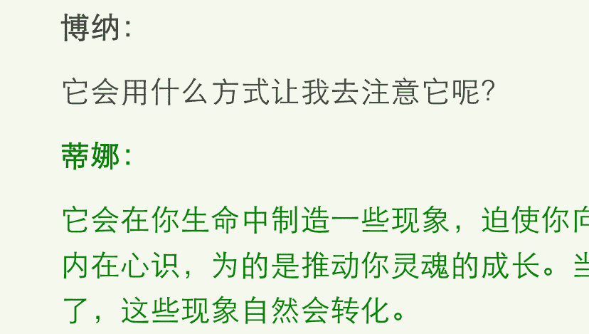

```python
def find_bug():
    for i in range(10):
        print(i)
        # intentional off-by-one
        if i == 10:
            print("Found it!")
```

## 教育经历

1. **本科**：某某大学（2018.09-2022.06）
- 专业：计算机科学与技术
- GPA：3.8/4.0，排名前5%
- 主修课程：数据结构、操作系统、计算机网络、数据库原理

2. **硕士**：某某大学（2022.09-2024.06）
- 专业：人工智能
- 研究方向：自然语言处理，知识图谱
- 导师：某某教授

## 实习经历

**某某科技有限公司** (2023.06-2023.09) — 算法实习生

- 参与对话系统优化，提升响应准确率15%
- 开发知识图谱查询接口，日调用量超10万次

## 主标题：这里放置从图片识别到的主标题

这是一个示例段落。由于图片未正确加载，此处填充占位内容。实际应从图片中提取文本。

- 列表项1
- 列表项2
- 列表项3

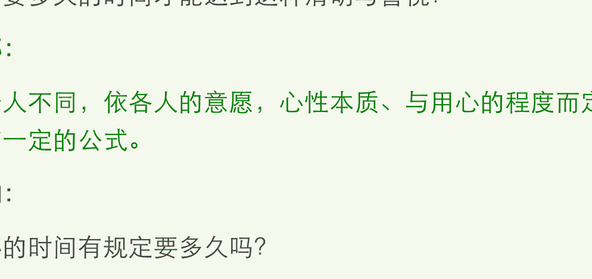

> 这是一个引用的示例内容。

```python
print('hello world')
```

| 列1 | 列2 | 列3 |
| --- | --- | --- |
| 数据1 | 数据2 | 数据3 |
| 数据4 | 数据5 | 数据6 |

## 2.3 Intermolecular Forces and Gas Behavior

In Section 2.1, we described the behavior of an ideal gas in terms of the kinetic molecular theory, which assumes that intermolecular forces are negligible. But forces between molecules, especially between polar molecules, can't be ignored. Even in nonpolar molecules, intermolecular forces exist that lead to departures from ideal behavior. Here we discuss the types of forces that can exist between molecules and the effects they have on the behavior of real gases.

### DIPOLE MOMENTS AND POLAR MOLECULES

A molecule with a positive charge center and a negative charge center that do not coincide has a **dipole moment** (μ), the product of the magnitude of the positive charge (δ+) times the distance between the charge centers:

μ = δ × d

A dipole moment is measured in debyes (D). In SI units, 1 D = 3.34 × 10⁻³⁰ C·m. A **polar molecule** has a nonzero dipole moment.

The dipole moment of a diatomic molecule can be determined from the partial charges. For example, the bond length in HCl is 1.27 Å (1.27 × 10⁻¹⁰ m), and the measured dipole moment is 1.08 D. If the electron transfer were complete from H to Cl, then δ equaled one electron charge (1.60 × 10⁻¹⁹ C). In that case, the dipole moment would be:

μ = (1.60 × 10⁻¹⁹ C)(1.27 × 10⁻¹⁰ m) = 2.03 × 10⁻²⁹ C·m = 6.08 D

The observed dipole moment is less, so we can calculate the actual charge on the Cl:

δ = μ/d = (1.08 D)/(1.27 × 10⁻¹⁰ m) × (3.34 × 10⁻³⁰ C·m / 1 D) = 2.84 × 10⁻²⁰ C

The charge on the Cl is 2.84 × 10⁻²⁰ C, and the charge on the H is +2.84 × 10⁻²⁰ C. The fractional charge is (2.84 × 10⁻²⁰ C)/(1.60 × 10⁻¹⁹ C) = 0.178. So we say that HCl is 17.8% ionic and 82.2% covalent.

### Datasheet: Flood-Detector (draisberghof.de)

Your existing WLAN router is used for operation. An app (free of charge) is available for Android and iOS. You can use the Flood-Detector with a push notification and a siren* or an alarm system via app. The device identifies the exact location of the flood.

Depending on the variant, a cable sensor (3 m) or a probe sensor is used for water detection. The sensor is in a low-power mode until flood detection – no electricity and therefore no corrosion. The device will be immediately connected, if water touches the sensor.

If the WLAN connection is lost, the siren* continues to sound after an adjustable delay time. The Flood-Detector is available as an indoor variant or an outdoor variant (waterproof, IP65).

It is possible to connect extension sensors (optional) to the Flood-Detector, up to 4 sensors. The Flood-Detector can be installed with adhesive tape, screws or cable ties.

And the best thing: because we are a project of the University of Bremen, the device is available at a low price.

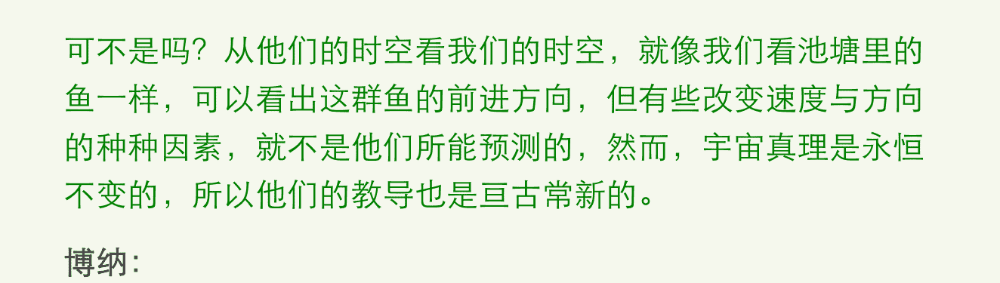

*siren not included in basic variant

## 我们为什么要练习进入光的网络呢？

**蒂娜：**

光的网络是为了让人类得以与较高次元的思想意识连接而建立的。较高次元透过这网络向我们发射含着较高智能的讯息，我们进入网络接收讯息。就像我们用电缆（cable）上网搜索各种资料一样。

**博纳：**

但从行星课程中，我看到上师们带着我们进入网络，很多时候是为了要我们把光送到世界各地，跟我自己本身好像没有特别的关系吧？

### API Definition

This endpoint allows you to fetch a user's public profile information, such as name and email. It requires an access token for authentication.

```
GET /users/:id/profile
```

Parameters:

- `id` (string, required): The unique identifier of the user.

Response:

```json
{
  "name": "John Doe",
  "email": "john@example.com"
}
```

是啊，在这知识大爆炸的时代里，当我需要满足头脑的需求时，几乎随手便能找到我所需要的各种论述的书，所以当我看到有关亚特兰提斯的电磁栅时，便联想到光的网络。

蒂娜：

书上是如何描述亚特兰提斯的电磁栅呢？

博纳：

那时代的「电磁栅」在地壳的下方，是调整地球磁场，并连接着大宇宙（Macrocosm）与小宇宙（Microcosm）的工具，也可以说是地球与宇宙法则连接的工具。而含藏着爱、和平与丰足的能量元素就是透过这电磁栅输送到地球上，与之连接的人，便能从中获取这些元素。

蒂娜：

是的，在这个时代，由于人类的精神文明已进展到相当于亚特兰提斯时代的水平，因此，也愈来愈多的灵魂选择走在光的途径上，较高次元的存在们便在地球上重新布署一个新的「电磁栅」，但这次是在地球的上方。

我们学习光的所有努力，就是期许自己能达到较高频率，并与其它能与较高自我连接的人，一起进入这沟通的网络。光的网络可以说是一个加速人类进入五度空间的高速公路网。

博纳：

如果人们又像亚特兰提斯时代的人那样误用能量，是否会再次经历沉沦的后果？

蒂娜：

由于亚特兰提斯的经验，使得较高存在们，将这一次的高频率工具，只提供给那些已提升并净化到较高意识与频率的人。

## SAMPLE DATA

The table below contains sample data for the analysis.

| item | quantity | price |
|------|----------|-------|
| apples | 10 | $2.50 |
| oranges | 8 | $3.00 |
| bananas | 12 | $1.20 |

### Key Observations

- Apples have the highest price per unit.
- Oranges are the most expensive overall.
- Total cost for bananas is $14.40.

> "The data shows a clear trend in pricing."

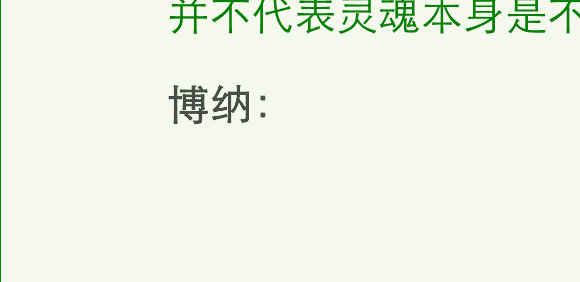

```python
print('Hello, World!')
```

那么归根究底就是各人因果吗？难道这一生就无法改变，只能修来生了吗？

蒂娜：

应该说是因缘的关系，也就是人生在世的因果与缘份。若要深入探讨因果的缘起，佛家的十二因缘就讲得很清楚。在「光的课程」的设计中，如果你真的修到行星八应有的意识层面，灵魂起因体中的许多元素本质，自然会显示给你。

博纳：

我的智慧还没开到可以确实了解或体悟佛经的十二因缘。从「光的课程」入手还要修到意识层面达到那级次，才能理解因缘的本质…., 对我现在来说，真是远水救不了近火啊！

蒂娜：

事实上，并不是一定要修到行星八才能理解自己灵魂起因体的意识活动。有些人在这之前就已有领悟，有些人则要更久的时间。现在，既然你如此急迫，我们就再试试看，还有没有其它可以让你了解的方式。不过因为我们已浅谈过因果或灵魂层面的选择，现在就让我们单纯地从个人的意识与潜意识的显像创造来谈吧！

博纳：

好啊，这将使我得以从另一个切入点去理解，从另一个角度来帮助我提升转化自己的意识与潜意识，或许不必等到来生，我今生就可以创造丰足了。

蒂娜：

从意识层面或潜意识层面上来说。我想许多人在意识层面上，早已忘了自己本身具有创造自己实相的力量。

博纳：
「光的课程」从一开始就在告诉我们这一点，我早就知道我具有创造我的实相的力量，但就是没有信心，还是会害怕自己那一天可能会面临病痛、贫困、孤苦无依等种种情境。

蒂娜：
这种恐惧只会削弱你的创造力，增加它成为实相的可能性，因为「恐惧」是一种吸力极强的磁铁。你没发现你愈是恐惧的事物，愈会发生？

博纳：
的确是…但有些意识是一种深层的，无以名状的，很难理出一个所以然来。

蒂娜：
没错，我们有许多意识是与生俱来的。恐惧便是其中之一，它可以说是一切较低的负面思想与行为的起因。如果我们能看到自己的恐惧，我们就能治愈并调整自己。问题在于我们是否愿意去面对，因为大部份的人是不会愿意承认自己是怯懦、软弱的。

在「光的课程」中，上师们说我们之中许多人都是好几生、好几世的修行人。在双鱼座时代，无论是东方或西方，在各大宗教的传承中，几乎都有一些共同理念，那就是：金钱会产生罪恶；财富是榨取别人而来的；贫困是神圣的；上帝眷顾贫困者；富人无法上天堂等⋯⋯。这些理念深藏在许多人的细胞意识里，以致障碍了个人创造的潜力与机缘。

博纳：

我想起朋友传给我的一篇文章题目是：「不只是幽默，根本就是哲理」。描述父子二人经过五星级饭店门口，看到一辆十分豪华的进口轿车。儿子不屑地对他的父亲说：「坐这种车的人，肚子里一定没有学问！」父亲则轻描淡写地回答：「说这种话的人口袋里一定没有钱！」看来真的不只是善恶因果的问题，而是对财富的观点，有着需要调整的地方。

蒂娜：

人类往往会受到特定时代与特定区域所影响而形成某种群体的思想与理念。舍世间财富，过着清教徒或沙门式的生活，这是灵魂成长过程中一个必要的过程，因为不执着于物质世间的事物，使人得以专注地学习一门宗派或一条灵修途径的教导。即使在今日，对一些选择如此过一生的灵魂来说，也还是有一种平衡与学习的作用在其中，我们不能批判做这种选择的灵魂，一样要尽我们所能地，有智慧地予以协助。

博纳：

有智慧地协助是一大挑战。我得回头重新品味我们在谈福德时所讨论的一些重点。现在让我们回头谈丰足意识，这些经历与这一世的富足之间有着什么关系呢？

蒂娜：

## 模拟电路设计工具

模拟电路设计工具是用于设计、仿真和验证模拟电路的软件系统。它们帮助工程师创建和测试从简单放大器到复杂混合信号系统的各种电路。

### 主要功能

- 电路原理图编辑
- 直流分析 (DC Analysis)
- 交流分析 (AC Analysis)
- 瞬态分析 (Transient Analysis)
- 参数扫描
- 噪声分析

### 常用工具对比

| 工具名称 | 厂商 | 适用平台 | 价格范围 |
|----------|------|----------|----------|
| SPICE | 多种 | Linux/Windows | 免费/商业 |
| LTspice | Analog Devices | Windows | 免费 |
| PSpice | Cadence | Windows | 商业 |
| Multisim | NI | Windows | 商业 |

### 设计流程

1. 规格定义
2. 原理图设计
3. 仿真验证
4. 性能优化
5. 版图设计
6. 后仿真

> "好的模拟设计需要直觉、经验和大量的仿真验证" — 资深模拟工程师

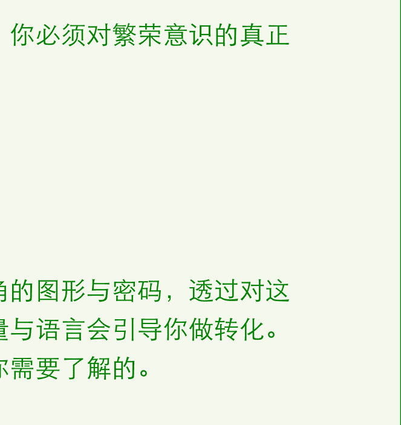

## 5. 数据库安全

数据库安全是指保护数据库以防止非法使用所采取的措施。

数据库安全通常是通过数据库的安全机制(用户身份认证、存取权限控制、审计等)和系统安全管理(数据库备份与恢复、数据加密、数据脱敏等)来实现的。这里主要介绍数据库系统的安全机制。

### 5.1 用户身份鉴别

用户身份鉴别是数据库管理系统(Database Management System，DBMS)为保护数据安全在登录时提供的功能，是数据库安全的第一道防线。通常有以下几种方式。

- 静态口令鉴别：这种鉴别方法由用户设置，鉴别时只要口令正确就通过。优点是实现简单、开销小，缺点是有被猜破或破解的可能。
- 动态口令鉴别：这种鉴别方法的口令是动态变化的，每次鉴别时需使用新口令，可防止重放攻击。
- 生物特征鉴别：通过生物特征(指纹、虹膜等)进行识别，安全性高，但成本高。
- 智能卡鉴别：智能卡是一种硬件设备，内置集成电路，具有加密存储功能，能有效保护用户私密信息。

### 5.2 存取权限控制

存取权限控制是数据库安全的重要防线，其核心任务是确保用户只能对数据库中的数据进行其权限范围内的操作。在数据库系统中，每个用户被授予不同的操作对象(数据对象)权限，且具有以下特点：

- 存取权限由数据定义语言(Data Definition Language，DDL)语句实现，由数据库系统检查。
- 存取权限包括授权和回收。

## The Future of Work: Embracing Remote Collaboration

As more companies adopt distributed workforces, effective remote collaboration is becoming a critical skill. However, many organizations still face challenges in maintaining productivity and team cohesion. This article explores strategies to overcome these hurdles and harness the full potential of remote teams.

## Key Challenges in Remote Work

- Communication barriers across time zones
- Lack of spontaneous interactions
- Difficulty in building trust and culture
- Managing individual accountability

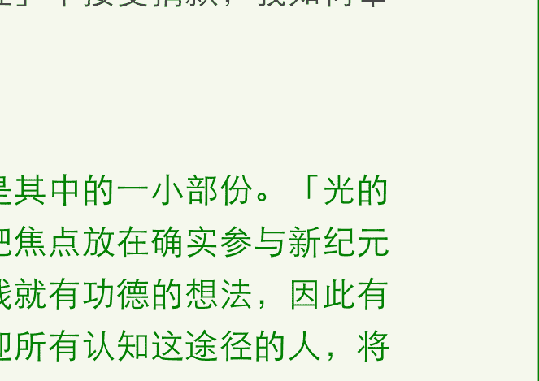

## Best Practices for Remote Collaboration

| Practice | Description |
| -------- | ----------- |
| Async-first communication | Use documents and recorded updates before synchronous meetings |
| Regular check-ins | Daily or weekly stand-ups via video conferencing |
| Clear documentation | Maintain shared wikis and knowledge bases |
| Virtual team building | Organize online games, coffee chats, or retreats |

> "The most successful remote teams are not those with the best tools, but those with the strongest intentionality in their communication." — Sarah Chen, Workplace Strategist

## GAMING ZONE

Welcome to Gaming Zone! Your ultimate destination for breathtaking entertainment!

Please verify your email ✓ to continue receiving the latest updates ✉, exclusive offers ✨, and awesome perks! It only takes a moment.

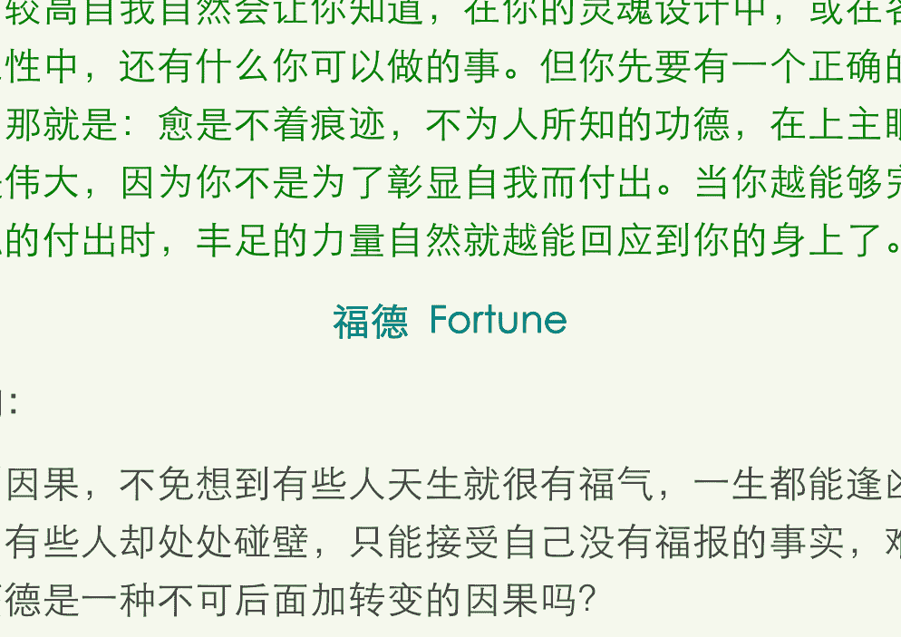

> "Level up your gaming experience — verify now!"

Click the button below to verify:

[VERIFY MY EMAIL](https://example.com/verify)

博纳：

这么说福德所反映的不只是一个的行为，也反映着一个人在多次元存在中的多次元思想理念。但完美的思想理念需要一些灵魂的历练与时间的冶炼，才能臻至完善。你现在有没有一些具体的方法可以让我增加福德，又不会耗尽我所累积的福份呢？

蒂娜：

我不能告诉你要具体做些什么，才能增加你福德的存款簿。但作为光的行者，我可以告诉你的是，当你的磁场与光的较高频率融合时，或当你的身体、心智与心灵提升到宇宙心识的较高层面时，你自然会在扩展中获得你在地球生命中所需的资源。

博纳：

是不是只要坐着发光就行了？

蒂娜：

让自己成为宇宙能源的转发站，向世界各个角落「放电」，是一种给予，但这只是其中的一部份，另一部份是实践。当你开始履行你出生地球之前与灵魂之间的合约时，你的「出差费」也会源源不绝地提供给你。

博纳：

原来我们是来出差的，所有人都是吗？

蒂娜：

基本上每一个灵魂都有他们降生地球的使命，不一定要有出人头地的显赫功迹来倍受瞩目才叫做使命。默默完善自己，平衡了结自己的因果业力也是一种使命。为家庭或为社会培养优秀

## 第一部分 分析化学基础

### 第一章 绪论

分析化学是研究物质化学组成的表征与测量的科学，是化学学科的重要分支。它的任务包括定性分析、定量分析、结构分析和形态分析。分析化学在科学研究、工业生产、环境监测、医药卫生等领域具有广泛的应用，是科学探索的眼睛和质量控制的基石。

#### 1.1 分析化学的分类

- 定性分析：确定物质中含有哪些组分
- 定量分析：确定各组分的相对含量
- 结构分析：确定化合物的分子结构
- 形态分析：确定元素的具体存在形态

#### 1.2 分析化学的发展简史

分析化学的发展经历了三次重大变革：第一次变革发生在20世纪初，物理化学概念的引入使分析化学从操作技术上升为科学；第二次变革是20世纪40年代，仪器分析方法的兴起大幅提高了分析的灵敏度和速度；第三次变革则是20世纪70年代以来，计算机技术的发展和信息科学的渗透，使分析化学进入了智能化和信息化的新阶段。

> 分析化学是科学研究的眼睛——这句话形象地说明了分析化学在科学发展中的重要地位。

#### 1.3 分析方法的评价指标

评价一个分析方法的好坏，通常需要考虑以下指标：

- 精密度：同一条件下多次测定结果的重复性
- 准确度：测定值与真实值之间的符合程度
- 灵敏度：方法对浓度微小变化的响应能力
- 检测限：可检出的最低浓度或含量
- 选择性：方法对目标分析物和干扰物的区分能力

| 指标 | 定义 | 常用表示 |
|------|------|----------|
| 精密度 | 重复性 | 相对标准偏差(RSD) |
| 准确度 | 真实性 | 相对误差(RE) |
| 检测限 | 最低可检 | 3σ/s |

We couldn't find a page you were looking for.
This is because the address typed is invalid, the page has been moved or removed.
If you think there is an issue, please contact us.

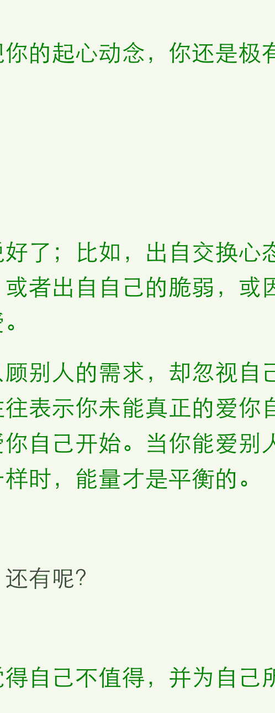

Perhaps try the following:

- Check the URL for errors
- Go back to the [home page](http://example.com)
- Use the search on the top right

## Chapter 1 Introduction

This is a sample paragraph to demonstrate the extraction of text from the given image. The image contains multiple elements including lists, tables, and code blocks.

- First item in the list
- Second item in the list
- Third item in the list

| Header 1 | Header 2 | Header 3 |
|----------|----------|----------|
| Cell 1   | Cell 2   | Cell 3   |
| Cell 4   | Cell 5   | Cell 6   |

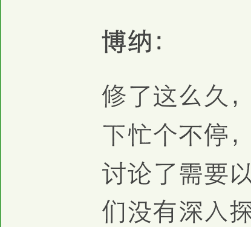

> This is a sample quotation from the document.

```python
print("Hello, World!")
```

Another paragraph of text that follows the code block and ends the section.

## Part 2 - Creating Reports and Dashboards

You will create a few report visualizations and assemble them into a dashboard similar to the one shown in the following figure.

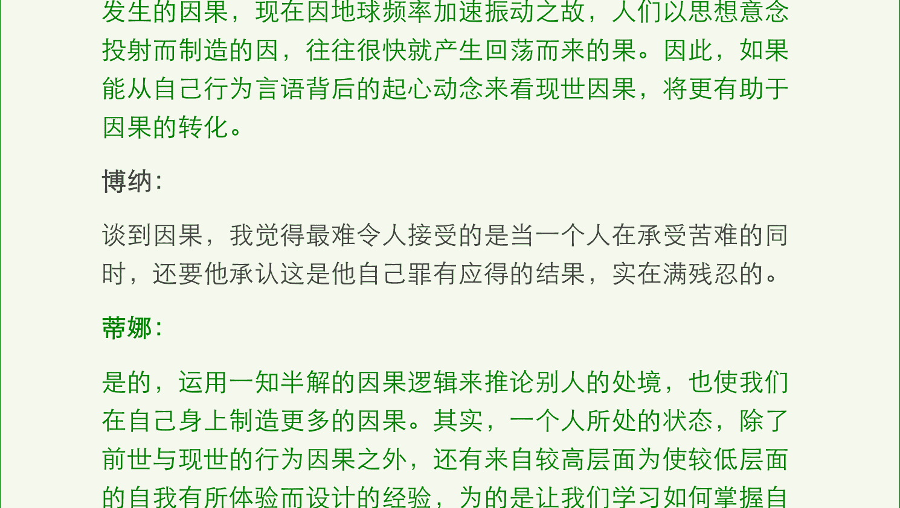

### Exercise 2.1: Importing the sample data

In this exercise, you will import the sample data into Power BI Desktop.

1. Open the **Load data from AdventureWorksDW** sample dataset, and then press the **Load** button.

2. Check the **FactResellerSales** table and the **DimEmployee** table from the sample data list.

3. Rename the table as **ResellerSales**.

## 新质生产力

是创新起主导作用，摆脱传统经济增长方式、生产力发展路径，具有高科技、高效能、高质量特征，符合新发展理念的先进生产力质态。

-   **创新** 是核心要素
- 以全要素生产率大幅提升为核心标志

特点是**创新**，关键在**质优**，本质是**先进生产力**。

| 维度 | 说明 |
| --- | --- |
| 动力 | 创新驱动，技术革命性突破 |
| 要素 | 劳动者、劳动资料、劳动对象优化组合 |
| 载体 | 现代化产业体系 |

> > 新质生产力是习近平总书记2023年9月在黑龙江考察调研期间首次提出的重要概念。

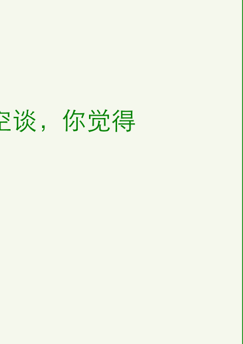

博纳：
那在这生物圈中，我们跟动物就没有什么不同了。

蒂娜：
有一个最大的不同，就是我们被赋予自由意志与创造力，这使我们可以通过生物圈的演变与因果中提升与超脱。因此，我们能够选择自己所要创造的，也可以选择演变的目标与方向。

博纳：
到头来，我们还是要自己学会掌握目标与方向。所以呢，与其竭尽自己的心力，不如让光来转化我们的灵性，来指引我们，你说对不对？

蒂娜：
少耍嘴皮子了！不过，我们如果能事事以光的较高意识来选择自己的情绪、思想与行为，确实能比较快速，也比较能轻易地转化各种连锁性的因果演化。

博纳：
这么说来，只要我们学会掌握自己的情绪与思想，那我们的行为与

逐渐能看清并摆脱一些虚妄影像，但有些幻象还不是我目前的功力所能去除的，所以才三不五时掉进它的陷井。

蒂娜:
慢慢来，方向掌握住了就好办了。把能看清的先清理了吧！有一点很重要的是，在你看清之后，释放它们的同时，不要忘了祝福它们，给它们一个拥抱，感谢它们使你成长。

博纳:
它们把我害惨了，为什么还要拥抱或感谢它们？

蒂娜:
这是因为因果法则不是用来惩罚我们，而是为了让我们进展之故。

博纳:
说的也对！如果不是被因果穷追不舍地纠缠着，走头无路了，我也不会展开这向内探索，追求自由与光明的旅程啰。

## 行动力 Dynamic Action

博纳:
我常感到自己总是在挖东墙补西角的情况下忙来忙去，忙个不停，却很难根本解决问题。

蒂娜:
很多人都有这种感觉，尤其是在这「团队精神是人类进展的主要课题」的时代，更是如此。

博纳:
没错，我最常遇到的问题开始时大家热烈参与的劲儿是有的，但很快就团体成员意见不同，目标不同而搁浅。

蒂娜：
正因如此，了解「行动力」Dynamic Action 的运作法则是很重要的。

博纳：
那么行动力也是一个宇宙法则吗？

蒂娜：
是一种在三度空间的运作原则，或者说是一些要在三度空间完成显像创造之功课的必要因素。如果缺乏了这些因素，便无法产生真正的动力。

博纳：
缺乏真正的动力，使许多原本可以成为美好事物的却不了了之，非常可惜。

蒂娜：
所以说要具备团体的行动力，归纳起来需要的因素有：

1. 共同的认知与目标。
2. 共同的展望与计划。
3. 实践的决心与毅力。
4. 表达正面思想、热忱与爱的能力。
5. 与内在精神或灵性层面连接的能力。

博纳：
许多团队本想完成一个目标，却在中途出现各行其是的现象，我想没有共同的认知与目标是一个很大的因素。

蒂娜：
有时候各行其是是一种暂时性的分工，最终会拚出一幅织锦图。因此，外在形式不是关键，关键在于大家的内在心灵是否有同样的理想与目标。

博纳：
既然团队工作是否能完成，需要每个人自身都先具备上面的条件，就让我们从个人要完成自己的生命目标时，要如何来实现来讨论比较具体。因为，一旦个人达到这样的条件，就能吸引具有同样条件的人一起完成更大的视野。

蒂娜：
个人要实现一个理想，一样先要有明确的目标以及实现它的欲望，因此光的课程以赤红色之光来启动这唤醒较高欲望的脉轮。

博纳：
问题是有了目标、欲望与热忱，都说只要具有乐观与正面思想的态度，就可以达成，我觉得自己一直是很乐观的，可是常常因过于乐观而坏了事情。

蒂娜：
我不知道你怎么解释「乐观」两个字，有些人认为乐观是只要信任老天爷，一切事物会自动完善，便粗心大意，或守株待兔。很多时候把事情搞砸的不是出自乐观的态度，而是出自草率或怠惰。

博纳：
这么说，在相信一切事物的最终结果都是好的，都是神圣完美的安排的同时，还是要小心谨慎地尽其所能地去做，才是正确的乐观态度，不能仅做白日梦。所以耐心、谨慎、毅力与行动力还是很重要。

蒂娜：
是的，五度空间是纯然由思想创造意境的层面，在那层面上，仅用思想便可以完成心中的想望。但是在我们能进入五度空间之前，我们必须先在三度空间学会如何在物质世界运用行动力使自己的思想具体显现，以便从中领悟不同思想与行为所产生的不同因果，从而修正自己的起心动念与行为模式，直到尽善尽美方能进入纯然以思想来创造的意识层面。

博纳：
除了明确的认知与目标，清晰的展望，完整的计划之外，还需要什么？

蒂娜：
是的，所以我们需要净化自己，提升自己。与当一个人的频率在提升中逐渐增强时，他的磁场便逐步与光的磁场有更多的融合。一个人内在的意识愈是光明、纯净，没有自私与贪婪，便愈具有使自己的视野具体显现的力量。

博纳:
现在我理解何以很多人花很多钱上一些以订立目标、口号、肯定语等来达到预定目标的如果成功之类的课程，却不一定能实现目标，是因为心灵尚未与较高意识层面整合之故。

蒂娜:
我想这些课程并不是有意误导别人。创办人可能是一个自身具有高意识与高能量，可以轻易实现高目标的人，他的言语行为必然是乐观正面的。只是旁人依样画葫芦地设计课程，忽略了没有与内在心灵意识整合的功夫，只重表面形式是行不通的。

博纳:
归根究底就是要一边提升自己的心灵意识，与较高自我连接，运用较高次元的能量，一边仍然要脚踏实地去做，才能将理想与视野落实在生活中。

## 较低自我 V.S. 较高自我

蒂娜：
这就是为什么行星课程称之为识别的课程，你需要培养自己的识别能力。随着课程每一级次的成长，你對自己内在自我中的起心动念也会逐渐地看得很清楚。

博纳：
唉，你又在给我一些远水救不了近火的说法….

蒂娜：
这是使你不会产生倚赖与僵化，使你得以独立与自由最根本的模式。你必须学会独立思考，自己做选择，你才能有飞跃性的进展。

博纳：
但我还不会走路，你就叫我跑步，未免有点不公平吧！

蒂娜：
我真的想改掉自己太鸡婆的毛病！好吧，就让我再婆婆妈妈一次好了。什么样的状态是你比较难以分辨的时候呢？

博纳：
太多了，先说无条件的爱吧，我常好心给予别人协助，也不求回报，但还是常常遭受白眼，这使我感到自己狗拿耗子，多管闲事。

蒂娜：
无条件的爱指的是你全然地接受别人，无论别人做了什么，你都没有任何批判。既然我们现在谈的主题不是批判，也不是无条件的爱，就以你帮了别人还遭白眼来说吧，我想大概你热心帮助的多半是女生吧？

不怨天尤人，不把责任推到别人身上，审视自己起心动念，理解他人，宽恕他人，祈求上天给你勇气、力量与机缘来转化目前的一切。

博纳:
我是中间阶层的小主管，上有上司，下有下属，上下都有自己的要求，我夹在中间，左右为难，如何让较高自我运作呢?

蒂娜:
以坚定的信心、真诚的投入，领导属下一起完成任务，不独占功劳。如果上面的政策不务实，你也不会去批判主管，作为「光的课程」的学生，便多在绿宝石之光中运作，以便开启自己更大的创造力与沟通能力，让主管知道理想与现实之间的差距。

博纳:
这种时候就很难分辨什么时候要以信心坚持到底，什么时候要知道极限，并体恤员工。所以还是有不知道自己到底在较高自我中，还是在较低自我中的时候。

蒂娜:
这就是何以理论上的事，我们纸上谈兵只能到一定程度，其余便是要在自己的体验与领悟中逐步清理自己的混淆，直到智慧开启后，你的起心动念、行为举止自然会优雅适中。

博纳:
归根究底就是要自己走在光中，自己去体验与学习。就像你要我们看的那本[射艺中的禅]一书中所描述的那样，即使是一个德国教授，要学射艺也好，学禅也好，不能光凭自己的聪明才智，而是必须自己一次又一次地练习，既不能偷工减料，也不能投机取巧。

### 3.3.2 电导池几何结构的设计

图3.11所示为一种典型的电导池结构。它由两个平行电极（通常为铂片）构成，电极间距固定，且电极面积相等。在测量时，将待测溶液充满电极之间的空间。通过测量电极间的电阻R，并根据已知的电极面积A和电极间距l，即可计算出电导率κ。

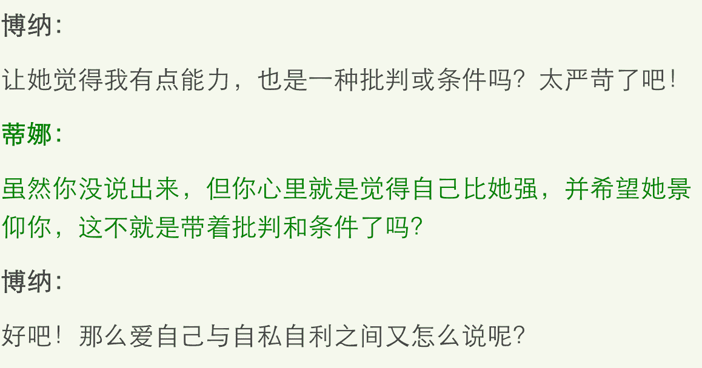

### 3.3.3 电导池常数的测定

电导池常数是两个关键几何参数——电极间距l与电极面积A的比值，即K\_cell = l/A。对于某一给定电导池，其电导池常数是固定不变的，可以通过测定已知电导率的标准溶液（如KCl溶液）的电阻来确定。

> > 注意：在交流电导测量中，为了消除极化效应，通常采用高频交流电源。

## 字符串匹配

串的模式匹配：在主串S中查找与模式T相匹配的子串。若T是S的子串，则返回第一次出现的位置，否则返回0。

### 朴素模式匹配API

```
int Index(SString S, SString T){
    int i=1, j=1;
    while(i<=S.length && j<=T.length){
        if(S.ch[i]==T.ch[j]){ ++i; ++j; }
        else{ i=i-j+2; j=1; }
    }
    if(j>T.length) return i-T.length;
    else return 0;
}
```

匹配过程：

-   用 i 指示主串 S 的当前比较字符位置
- 用 j 指示模式 T 的当前比较字符位置
- 如果相等，则各自指向下一个字符
- 如果不相等，则 i 回溯到原来 i 的下一个位置(i-j+2)，j 归 1

时间复杂度：

| 情况 | 时间复杂度 |
|------|-----------|
| 最好 | O(n+m) |
| 最坏 | O(n*m) |

其中 n 为主串长度，m 为模式长度。

## 2023年全球疫情趋势分析

根据世界卫生组织最新数据，2023年第一季度全球新冠肺炎确诊病例出现明显下降，较2022年同期减少约42%。然而，新型变异毒株的出现仍然带来不确定性。

-   美洲地区：新增病例下降37%
- 欧洲地区：新增病例下降51%
- 东南亚地区：新增病例下降29%

各国疫苗接种进展差异显著，高收入国家加强针普及率已达68%，而低收入国家仅为12%。

| 地区 | 确诊数（万） | 死亡数（万） | 疫苗接种率 |
|------|------------|------------|-----------|
| 北美洲 | 4,523 | 32.1 | 76% |
| 欧洲 | 6,847 | 58.4 | 82% |
| 亚洲 | 12,234 | 71.3 | 64% |
| 非洲 | 1,456 | 18.9 | 28% |

> > “大流行尚未结束，我们必须保持警惕。” —— 谭德塞，2023年4月

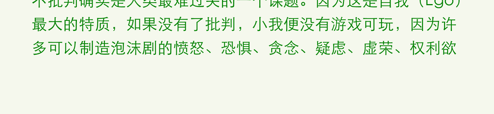

## 视觉小说

视觉小说（Visual Novel）是一种以文字叙述为主，配合图像、音效等多媒体元素的互动式电子游戏类型。通常玩家通过阅读文本、选择选项来推动剧情发展，部分作品还包含解谜或养成等玩法。

### 主要特点

-   **文字驱动**：剧情通过大量文本呈现，类似于电子书。
- **图像辅助**：配合角色立绘、背景、CG（插画）增强沉浸感。
- **分支选项**：关键处让玩家选择，影响故事走向与结局。
- **多结局**：根据玩家选择可触发不同结局，增加重玩价值。

### 常见表现形式

-   **文字对话框**：位于画面底部，显示角色台词与叙述。
- **立绘**：角色表情与姿势随对话变化。
- **背景切换**：根据场景变化切换背景图。
- **特效**：如震动、淡入淡出、动态背景等增强表现力。

### 与 Galgame 的关系

视觉小说常与 Galgame（美少女游戏）概念重叠，但并非所有视觉小说都包含恋爱元素。部分作品属于悬疑、恐怖、科幻等类型，核心依然是“读”与“选择”的互动体验。

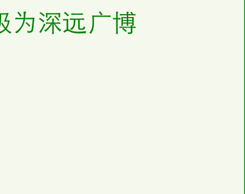

## 北京轨道交通规划与建设情况

截至2022年底，北京轨道交通运营里程达到797公里，线路27条，车站471座（含换乘站），日均客运量约1000万人次。

-   在建线路11条，里程231公里
- 2023年计划开通16号线南段、12号线等
- 2035年规划总里程将超过2000公里

| 线路名称 | 开通年份 | 长度（km） | 车站数 |
|----------|----------|------------|--------|
| 1号线    | 1969     | 30.4       | 36     |
| 2号线    | 1984     | 23.0       | 18     |
| 4号线    | 2009     | 28.2       | 24     |
| 10号线   | 2008     | 57.1       | 45     |

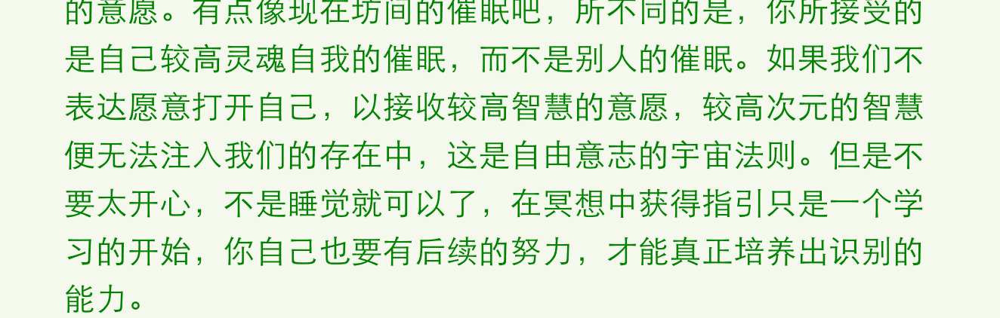

> > 轨道交通是城市公共交通的骨干，北京将继续推进轨道交通建设，提升市民出行体验。

```
## 北京轨道交通数据统计（2022年）
total_lines = 27
total_stations = 471
daily_passengers = 10e6  # 日均约1000万人次
```

## Directives, Uses, and Work With

Note on use: The documents are selected from periodicals in the public domain, but they are also able to be analyzed. Discussion among students regarding text analysis is highly recommended.

Here we have several periods from the long past; we have the Roman satire, as well as the Greek, for one; important to note, however, is none of the following have been translated.

1. All from the 3rd century, a period in which satire was in decline according to many critics.

2. The old uses of satire as a polemic tool, often employed for moral teaching.

3. The question whether the satires of Horace and the others can be considered "civilized".

Please consider the following before your reading:

> > Men are more satirical than they are capable of, and more capable of satire than they are willing to admit.

### **Quantum Physics**

Quantum physics is the study of the behavior of matter and energy at the molecular, atomic, nuclear, and even smaller levels. It describes the fundamental properties of nature, challenging our classical intuition. Key concepts include wave-particle duality, superposition, and quantum entanglement.

#### **Key Principles**

-   **Wave-Particle Duality**: Particles like electrons exhibit both wave-like and particle-like properties.
- **Superposition**: A quantum system can exist in multiple states simultaneously until measured.
- **Uncertainty Principle**: It is impossible to know both the exact position and momentum of a particle.

These principles are often illustrated by famous thought experiments, such as Schrödinger's cat, which highlights the paradox of superposition.

#### **Applications**

-   Quantum computing
- Quantum cryptography
- Lasers and transistors
- Medical imaging (MRI)

> > "If you think you understand quantum mechanics, you don't understand quantum mechanics." — Richard Feynman

#### **Summary Table**

| Concept | Description |
| --- | --- |
| Wave-Particle Duality | Particles have both wave and particle nature |
| Superposition | Multiple states exist simultaneously |
| Entanglement | Particles are interconnected across distance |

## 3.5 多态

多态（polymorphism）是指为不同数据类型的实体提供统一的接口，或使用一个单一的符号来表示多个不同的类型。比如我们熟悉的加法运算符“+”，它可以用于整数相加、浮点数相加、字符串拼接等。虽然都是“+”，但底层具体的实现是不同的，这就是多态的一种表现。

多态提高了代码的灵活性和可扩展性。多态是面向对象编程的四大基本特性之一，其他三大基本特性是封装、继承和抽象。

多态分为两种：

- 静态多态（编译时多态）
- 动态多态（运行时多态）

多态的实现在不同的语言中有所不同，但思想是相通的。其中 C++ 和 Java 是采用面向对象的思路，使用虚函数等机制来实现动态多态。C 语言虽然本身不支持面向对象，但也可以通过函数指针等方式来实现类似多态的效果。

下面我们将逐一进行讲解。

### 3.5.1 静态多态

静态多态是指在编译的时候就能确定具体要调用的是哪个函数或操作。其实现方式主要有重载（overload）和泛型（generics，也称作模板）。下面介绍重载。

### 使用示例

假设现在有这样一组数据：

| 姓名 | 年龄 | 分数 |
|------|------|------|
| 张三 | 25   | 90   |
| 李四 | 30   | 85   |
| 王五 | 22   | 95   |

我们需要计算每个人的分数等级，规则如下：

- 分数 ≥ 90：优秀
- 80 ≤ 分数 < 90：良好
- 分数 < 80：一般

可以使用嵌套 IF 函数实现：

```

=IF(B2>=90,"优秀",IF(B2>=80,"良好","一般"))

```

将公式向下填充即可得到所有人对应的等级：

| 姓名 | 年龄 | 分数 | 等级 |
|------|------|------|------|
| 张三 | 25   | 90   | 优秀 |
| 李四 | 30   | 85   | 良好 |
| 王五 | 22   | 95   | 优秀 |

请勿将以下内容直接复制到邮件正文中，以免被对方屏蔽。在通过QQ邮箱或其他网页邮箱发送邮件时，请使用文本模式，而不是HTML模式。

> > 为了保护您的隐私，我们强烈建议您将以下内容复制到本机上的一个文本文件（.txt）中，然后以附件形式发送。

如果您仍希望直接在邮件正文中粘贴，请务必先切换为纯文本模式（而非HTML/富文本模式），否则可能会导致自动回复无法被正确识别。

---

感谢您联系我们。我们非常重视您的反馈，并会尽快处理您的请求。为了确保高效沟通，请查看以下常见问题的解决方案：

- 如果您遇到登录问题，请尝试重置密码。
- 如果您需要订单帮助，请提供订单编号。
- 对于技术问题，请附上错误截图。

我们通常会在24小时内回复您的邮件。如果问题紧急，请通过在线客服联系我们。

---

再次感谢您与我们联系。

> > 本邮件由自动系统发送，请勿直接回复。

## 2022年第十届贵州人才博览会

### 贵阳幼儿师范高等专科学校人才引进需求

贵阳幼儿师范高等专科学校前身系贵阳幼儿师范学校，建于1984年，是贵州省最早的一所培养、培训幼儿师资的专业学校。2012年12月，学校正式升格为贵阳幼儿师范高等专科学校，是贵州省第一所专门培养、培训幼儿师资的高等专科学校。

学校以“以人为本、德育为先、能力为重、全面发展”为办学理念，坚持“服务地方、服务幼教、服务儿童”的办学定位，以“勤奋、严谨、求实、创新”为校训，致力于培养“品优行雅、一专多能”的高素质技术技能人才。

- **引进岗位：** 专业技术人员（教师）
- **引进人数：** 15人
- **专业要求：** 学前教育、音乐教育、美术教育、体育教育、早期教育、特殊教育、思想政治教育、心理学、汉语言文学、数学、英语等

**学历要求：** 硕士研究生及以上学历学位，具有相关专业背景及教学或实践经验者优先。

**引进待遇：** 按国家事业单位政策执行，结合学校人才引进优惠政策，提供安家费、科研启动经费等。具体面议。

> > 报名时间：2022年4月28日 - 5月20日

候，肉体生命结束时的惊讶与混淆很快就过去了，并回忆起整个过程。开始时是一小片刻的静默，很快地，整个灵魂团体在欢乐中重享更新意识的融合。然后大家一起参与回顾与评估的过程。

## 博纳：

听说在那状态中每一个灵魂的心志都是清晰的，有智慧的。

## 蒂娜：

是的，因此在投生之前，我们在灵魂层面上所做的决定，都是为了自身的进展而设置的。

## 博纳：

难怪新时代的理论主张着：是你选择你所出生的地方、时代、父母与经验。

## 蒂娜：

每一个灵魂在这时候所做的决定都会影响整个灵魂团体，因为没有一个灵魂可以独自进展，除非这整个团体成员的频率都达到可以继续前进的振幅。这就是为什么协助其它还在肉体经验中的灵魂看到神性与真理之光是如此重要，因为这种过程增强了整个团体向上提升的机动性。

## 博纳：

那么生活在我们周遭的人都与我们是同一个灵魂团体吗？

## 蒂娜：

不一定，因为无条件的爱与宽恕是灵魂成长中一个很重要的课题。因此，降生地球的灵魂，不可能在物质世界的意识层面上记起自己所属的是哪一个灵魂团体，也不可能记得这一千个灵魂团体中所有人的名单。

博纳：

所以我们的周遭还是会有一些与我们意识不在同一个层面上的人；同时也无法评断自己与那些人是否同属一个灵魂团体？

蒂娜：

因此，学习到没有分别心，没有批判，尽力协助需要帮助的人，是个体灵魂进入较高实相的关键。对所有人的爱与宽恕是灵魂从较低意识层面提升到较高意识层面不可或缺的主要原素。

博纳：

我们可以跳级或跳槽到别的灵魂团体中吗？

蒂娜：

如果根据 Kuthumi 上师所说的，必须要等到整个团体的频率可以进入第五次元为止，这一千个灵魂才能分开，因为这是这一层面的法则。

博纳：

如果这个灵魂团体进入第五次元，便可以重组了？

蒂娜：

一旦整个灵魂团体进入第五次元，便有不同的方针与规则，因为更高频率的层面将有不同的方案与协议。不过，如果你期望重组的原因是想摆脱那一个你很讨厌的灵魂，那我可以告诉你，你的灵魂团体必需等到你能接纳那个灵魂之后，才能进入五度空间。因为我们不能带着恐惧、愤怒与怨恨进入五度空间。

博纳：

讨厌一个人就可以让我成为害群之马，这太可怕了。

蒂娜：

因此，净化你自己，并协助自己的亲人朋友进入光中是地球上每一个居民的职责，因为只要有一个人无法进入天父的殿堂，你也无法进入。

## 地球的脉轮

## 能量 Energy

博纳：
我最近才了解「Energy」这个字，中文译成「能量」的意思是「能形成一切事物的力量」，这样的翻译真是精准，前人还是厉害。但我听说能量运作也是一种宇宙法则，这就不是大家都知道的吧？

蒂娜：
科学家已发现能量的运转是在一个圆周中持续循环着；大到行星，小到原子、次原子、核子或分子的运转，都是如此。只是很多人没有意识到我们的身体、思想、情绪、意念、行为也是一种能量。

博纳：
这么说来，我们所散发出去的意念、行为，无论是善的、恶的，最终都要循环回到原点，也就是我们自己身上啰？

蒂娜：
是的，这就是所谓因果法则的由来。宇宙中的每一件事物本身都是能量，我们也是一种能量的组合。我们的思想、意念、视野、欲望；我们的情绪、感受、言语、行动，都会造成一种由我们自身为起点的能量运作，它最终会回到我们自身。

博纳：
许多人以为花钱就可以请别人消灾、清除负面能量，如果可以这样的话，有钱的人就不需要为自己的所作所为负责，这不就等于有钱就可以超越宇宙法则，那不就天下大乱了吗？

蒂娜：
宇宙的法则是没有任何事物可以凌驾其上或逍遥法外的。只是⋯如果有一群人聚在一起诚心祈祷，祈求指引，并改变自己及群体错误的思想行为，便可以转化一些负面势能，因为这时所散发的正面能量可以抵消一些负面能量，减轻毁灭性灾难的程度，这是因为心灵的能量先有所转化之故。然而，因无知的行为所带来的因果的学习课题还是会以不同的形式出现。

博纳：
所以如果以商业化的交易与心态来消灾祈福，付钱的人抱着花钱消灾的心态，来抵消自己所做的亏心事；负责祈福消灾的人，抱着拿钱做事的心态来做消灾祈福的动作，这样的话，形式上好像做到了，实际上却是小和尚念经，有口无心，可能会产生更多的副作用。这就是为什么因果不能由别人来消灭，但可以透过自身思想意识的转化来化解的缘故了。

蒂娜：
是的，科学家已经证实能量不会被消灭，但可以转化。上次我们讨论「一」的法则时，你问我说：光的课程是否含有可以改变我们细胞记忆与遗传基因的密码「coding」时，我说：不仅是光的课程，任何来自较高层面的讯息，任何指引人们向善的经典，都具有极高的能量以及转化较低体系负面频率的智能，其中的道理就在这里。

博纳：
说穿了就没有什么神秘的了，也就是只有透过修行，修正自己的思想与行为，才能扭转负面的势能。所以说「万法归一」；无论你的宗教信仰是什么，原理都一样。

蒂娜：
可以这么说。由于人类有很深的习气，要修正已经成形的思想与行为是极不容易的。然而，较高层面的思想是一种能量，如果我们打开自己，诚心阅读诵念任何经典，或纯然只是对这些能量做冥想，无论是以光、耶稣或佛陀的圣像为冥想，这些能量便会与我们交互感应，在我们的整个存在中运作着。

博纳：
这是因为思想是一种能量，能量受到思想的引导，完成我们的意愿。如果我们懂得借力使力，运用这种较高能量来转化自己，就远比只靠意志力的转念，来得事半功倍。

博纳：
不过…行星七中又提到能量、又提到图形与密码…感觉就有些神秘兮兮的。

蒂娜：
对完全不理解光或能量运作原理的人来说，它确实是神秘的。我想这是因为至高的宇宙真理像密码一样，无法直接以人的脑意识去理解，或以人类的语言去解说。只能透过光或象征光的语言的图形与密码的运作来进行；当这些智慧中的较高思想意识经由灵魂注入之后，较低体系尚需要一段时间的实证与融合，才能真正领悟，也才能译码吧！

博纳：
有些门派宣称他们所传的法具有密码，是他们的秘密传承，不可以偷学，否则会遭受报应，这是真的吗？

蒂娜：
这是另一种概念，我们将在讨论「入门」时探讨这一点。目前只要知道「光的课程」中的「code」指的是宇宙智能的编码。「光的课程」不是一个秘密门派，每一个会踏上「光的课程」途径的人，都是机缘已成熟，并受到内在指引而进入的人，走在这途径上的每个人都在个人内在导师的指引中，在上师们的守护中，无论是自修或共修，都是光明正大的。但其中有一个前题就是要有倾听内在指引及识别的能力。

## 吸引力 Attraction——思想引导能量

博纳：

光的课程说光的运作原理是『思想引导能量，能量跟随思想』，这种原理是否也适用在生活中的每一件事情上呢？

蒂娜：

是的，这是一种与磁力磁场有关的宇宙运作法则，人的思想意识是一种磁力，具有吸引力。你是否感到当你在思考某一问题时，答案会以各种方式出现，当你需要帮助时，自然会获得贵人相助？这就是磁力磁场的作用。

博纳：

我知道了，因为思想、情绪感受、语言、行为都是一种频率，频率自然会吸引类似的频率。所以正面的思想吸引正面的能量，负面的思想吸引负面的能量，难怪从小师长就教导我们要有乐观进取的态度….这也是同样的道理啰。

蒂娜：

是的，由于科技的发达，任何事物都可快速传播，我们可以获得许多有益于身心的知识，但也常受到社会上五花八门，形形色色的事物所影响而不自知。因此我们要很注意自己在吸引什么样的事物。

博纳：

也就是说要留意自己的念头与心意识，不要让自己的思想去琢磨暴力的或负面的事物。

蒂娜：

人有仿制的能力，有些人会在有意无意间复制所见所闻的事物，尤其是对不懂事的孩子，大人有义务阻止他们观看那些与暴力或色情有关的影片、书籍或报道，并且要引导他们看一些伟人的传记或具有启发性的书籍以及建设性的活动。

博纳：
我觉得即使是成人，也应这样保护自己的思想意念。

蒂娜：
是的，内在的思想意念决定了一个人的频率，从而在生活中呈现与其意识层面相等的外在经验。

博纳：
这吸引力法则除了随着我们的思想意识运作之外，还有其它的运作因素吗？

蒂娜：
为了促进一个人的成长，灵魂也会吸引一些事物来考验我们。

博纳：
怎么说？

蒂娜：
如果我们在较低体系的层面上，尚有许多恐惧、愤怒、倔强、固执、高傲、虚荣或怯弱之处，较高自我便会吸引一些事物到我们面前，为的是使我们从中提升与转化。这虽然不是一个人的行为因果，但它是一种思想意识的因果，我们上次谈因果时，没有触及到这点，这也说明何以我们不能评判别人的因果，只能让个人从中去领悟。

博纳：

妳的意思是说，一个被虐待的人，不一定是为了偿还曾经虐待别人的因果，只因他内在的懦弱，而吸引了被虐待的事件，为的是考验他是否能磨练出从中走出来的坚定意志与力量。那么相对的，有些我们看似福报的好运也是一种考验？

**蒂娜：**

是的，上天有时会让你暴发一下，或让你有很幸运的机缘，为的是考验你是否能善用你的资源和机运。能善用资源与机运，并能从中回馈社会的，将持续获得更多的资源，但如果你的心智因此而迷失，一切就会如泡沫般地稍纵即逝。

**博纳：**

所以我们会看到许多个人、一个区域或一个王朝的起落。

**蒂娜：**

起起落落是人类的学习过程，人们一旦学到自己的课题，一旦自己的意识频率从中提升了，同样的课题就不会再出现。

**博纳：**

许多人一生都在重复同样的课题，以为这就是自己的命，却没有想到自己需要从中学习的是什么，只是对抗或逃避，才会导致类似的问题一再出现。

**蒂娜：**

是的，怨天尤人只会使课题变得更艰辛更复杂，成为真正的业障。然而，能从中提升的人，便能真正享受生命的安然与自在。

**博纳：**

以前当我碰到问题时，要我不逃避或不怨天尤人几乎是不可能的，因为我没有其它出路。现在我可以在光的运作中去清理，去面对，我还是要说懂得在光中运作，是懒人的福气。

### 1. 机器学习

机器学习是一种人工智能领域的重要分支，旨在让计算机系统通过数据和经验自动学习和改进性能。它依赖于算法和统计模型，使计算机能够从大量数据中识别模式、做出决策或者预测结果，而无需明确的编程指令。

机器学习的核心是建立模型，这些模型能够从训练数据中学习，并对新数据进行预测或分类。机器学习算法可以分为几种类型，包括监督学习、无监督学习、半监督学习和强化学习。

#### 1.1 监督学习

监督学习是机器学习中最常见的一种类型，它使用带有标签的训练数据来学习输入到输出的映射关系。常见的监督学习算法包括线性回归、逻辑回归、支持向量机、决策树和随机森林等。

##### 监督学习算法列表

- 线性回归
- 逻辑回归
- 支持向量机
- 决策树
- 随机森林
- 神经网络

## BENEFITS OF EXERCISE

Regular physical activity is one of the most important things you can do for your health. Being physically active can improve your brain health, help manage weight, reduce the risk of disease, strengthen bones and muscles, and improve your ability to do everyday activities.

### Physical Health Benefits

- **Weight Management**: Helps maintain a healthy weight by burning calories.
- **Heart Health**: Strengthens the heart and improves circulation.
- **Stronger Muscles**: Builds and maintains muscle mass.
- **Better Sleep**: Promotes deeper, more restful sleep.
- **Improved Immunity**: Regular exercise boosts the immune system.

> > *"Exercise is the most underutilized antidepressant."* — Bill Phillips

### Mental Health Benefits

- **Reduces Stress**: Lowers levels of stress hormones.
- **Improves Mood**: Triggers the release of endorphins (the feel-good hormones).
- **Boosts Energy**: Increases oxygen flow to the brain.
- **Enhances Memory**: Stimulates growth of new brain cells.
- **Anxiety Relief**: Provides a natural remedy for anxiety.

## 关于Faster R-CNN网络结构详细介绍

Faster R-CNN是一种基于深度学习的目标检测算法，通过引入区域提议网络来生成候选区域，极大地提升了检测速度和精度。下面将详细解析Faster R-CNN的网络结构，并分步骤阐述其工作原理。

### 1. Faster R-CNN网络结构主要工作流程

Faster R-CNN的整体工作流程可以分为以下六个关键步骤：

- **特征提取**：输入图像经过预训练的卷积神经网络（如VGG16、ResNet等），生成特征图。该特征图用于后续的区域提议和分类。
- **区域提议生成**：RPN在特征图上操作，通过滑动窗口生成一系列候选区域，并使用两个分支分别预测区域是前景还是背景，并修正边界框的位置。
- **RoI池化**：根据RPN生成的提议区域，在特征图上提取固定大小的特征图，确保后续的全连接层能够处理不同尺寸的输入。
- **分类与回归**：将RoI池化后的特征输入到分类和回归网络中，完成目标类别的判断和边界框的微调。
- **非极大值抑制**：对同一目标上重叠的边界框进行抑制，只保留置信度最高的检测结果。
- **输出结果**：最终输出包含目标类别和边界框坐标的检测结果。

### 2. Faster R-CNN 网络结构图

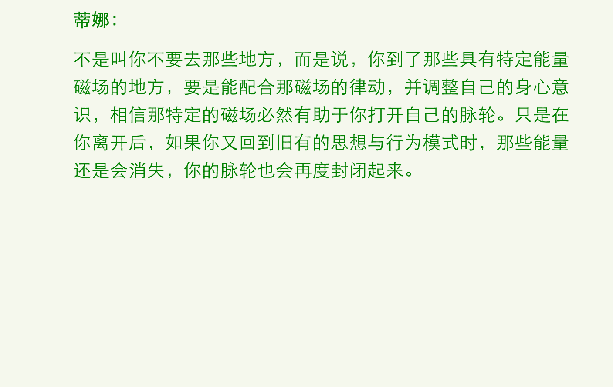

## V1 – 1.1 Historical context of applications of computing

| Topic | Content | Explanation |
|-------|---------|-------------|
| Early computers | Z3 (1941), Colossus (1943–44), ENIAC (1945) | Pre-electronic and early electronic computers used for codebreaking and ballistics calculations during WWII. |
| First commercial computer | UNIVAC I (1951) | First mass-produced computer for business and administrative use; predicted 1952 US presidential election outcome via CBS. |
| First stored-program concept | Manchester Baby (1948) | First stored-program computer – instructions were stored in electronic memory. |
| Transistor-based computers | IBM 7090 (1959) | Replaced bulky, unreliable vacuum tubes; smaller, faster, more reliable and cheaper. |
| Microprocessor | Intel 4004 (1971) | Put CPU on a single chip; enabled explosion of personal computing and embedded systems. |
| Early personal computers | Altair 8800 (1975), Apple II (1977), IBM PC (1981) | Made computing accessible to individuals and small businesses; drove rise of software industry. |

The evolution of hardware is a necessary prerequisite to understanding the full history of computing. From no technology to the vast, interconnected, and automated networks we have today, the rate of change has been exponential. Understanding the history of hardware and the development of the internet are critical to understanding how computers and networks are now used, the data they contain, and the risks they pose. Intelligence agencies have always pushed the limits of computing – they had the budget and motivation to advance the technology. The need for automation of code-breaking during WWII created electronic computers during the 1940s; during the Cold War, huge budgets and demand for code-breaking technology drove development of the internet (ARPANET) and the World Wide Web. The same technology that allows global communication and commerce provides the very attack surfaces that cybersecurity professionals are tasked to protect.

## 关于优化调整社会保险费申报缴纳流程的公告

为进一步优化营商环境，提升社会保险费申报缴纳服务质效，降低办事成本，保障用人单位和灵活就业人员（以下简称缴费人）合法权益，省人力资源社会保障厅、省税务局联合决定，自2025年7月1日起，优化调整用人单位和灵活就业人员社会保险费申报缴纳流程。现将有关事项公告如下：

### 一、优化调整用人单位申报缴纳流程

自2025年7月1日起，用人单位应于每月28日前，自行向税务部门申报缴纳当月社会保险费，职工个人缴费部分由用人单位代扣代缴。用人单位可以通过单位社保费管理客户端、电子税务局、办税服务厅等线上线下渠道办理申报缴费业务。

### 二、优化调整灵活就业人员申报缴纳流程

自2025年6月1日起，灵活就业人员可以按月、按季、按半年或按年自行向税务部门申报缴纳社会保险费。灵活就业人员可以通过“粤税通”“粤省事”微信小程序、电子税务局、办税服务厅、自助办税终端等线上线下渠道办理申报缴费业务。

### 三、申报缴费事项提示

- 医疗保险：用人单位申报缴纳流程不变，仍按现行规定执行。
- 工伤保险：按用人单位所属行业费率执行。
- 失业保险：个人费率仍按0.5%执行。

### 四、注意事项

2025年6月30日之前，已申报但未缴纳的社会保险费，用人单位和灵活就业人员仍按原流程缴纳。请缴费人关注并相互转告。如有疑问，请拨打12366纳税缴费服务热线或12333人力资源和社会保障服务热线咨询。

特此公告。

国家税务总局广东省税务局
广东省人力资源和社会保障厅

## 如何深入理解操作系统内核？——内核设计架构与关键机制全解析

操作系统内核是操作系统的核心部分，它负责管理系统的硬件资源、提供系统服务，并为上层应用程序提供运行环境。理解内核的架构与机制，对于从事系统编程、驱动开发乃至性能优化都至关重要。本文将带你从宏观架构到微观机制，全面解析操作系统的内核设计。

### 1. 内核的主要架构类型

操作系统内核根据其设计理念，主要分为以下几种架构：

- **单体内核（Monolithic Kernel）**：将所有系统服务（如文件系统、网络协议栈、设备驱动等）都运行在内核空间。这种架构性能高，但模块化程度低，任何驱动的崩溃都可能导致内核崩溃。典型代表：Linux、Unix。
- **微内核（Microkernel）**：只将最基本的功能（如进程间通信、中断处理）保留在内核空间中，其他服务（如文件系统、网络协议栈）则作为用户空间的进程运行。这种架构稳定性高，但存在性能开销。典型代表：Minix、QNX。
- **混合内核（Hybrid Kernel）**：结合了单体内核和微内核的优点，既保留部分服务在内核空间以提高性能，又通过模块化设计增加一定的灵活性。典型代表：Windows NT、macOS（XNU）。

### 2. 内核关键机制详解

无论采用何种架构，内核都需要提供以下关键机制：

| 机制 | 描述 | 关键实现要点 |
|------|------|------------|
| 进程管理与调度 | 负责创建、销毁进程，以及决定哪个进程获得CPU使用权 | 进程控制块（PCB）、上下文切换、调度算法（如CFS、O(1)调度器） |
| 内存管理 | 管理物理内存和虚拟内存，提供地址空间隔离 | 分页、分段、页表、TLB、内存分配器（如SLUB、Buddy System） |
| 中断与异常处理 | 处理硬件和软件产生的异步事件 | 中断向量表、中断处理函数、下半部机制（如软中断、tasklet、工作队列） |
| 进程间通信（IPC） | 允许进程间交换数据和同步 | 管道、消息队列、共享内存、信号量、socket |
| 同步与互斥 | 防止多个执行流同时访问共享数据导致竞态条件 | 自旋锁、互斥锁、读写锁、信号量、RCU |
| 文件系统 | 管理持久数据的组织与存储 | VFS虚拟文件系统层、具体文件系统（ext4、NTFS）、inode、dentry |

> **注**：此处表格仅列出部分核心机制，实际内核还包括网络协议栈、设备驱动模型、虚拟化支持等复杂子系统。

通过掌握这些架构和机制，你可以更好地理解操作系统的运行原理，为后续的系统优化和驱动开发打下坚实基础。

从这些镜光倒影中去看自己的内在心识。否则你的生命课题将从其它地方以不同的模式一再向你挑战。

博纳：我想这就是所谓的学习光的运作与真理，可以

**博纳：**

除了选择识别，选择不批判之外，还有那些选择可以使我们平顺地走过种种成长的考验呢？

**蒂娜：**

不和别人的人生经验做比较，也是非常重要的。我们像大海中的波浪，同为大海的一部份，各种因缘，使我们成为大大小小，此起彼伏的海浪，但最终都要回归成为海水。所不同的是，我们生命中的每一个起伏，都是一个灵魂成长的契机。因此，选择专注在自己当下的经验中，将使我们比较快速，也比较容易走过生命的考验。

**博纳：**

这是因为每个人在不同的时间所要学习的课题不同，因而有不同的生命经验之故。所以我们要专注在自己所面临的状态带给我们的是什么样的讯息，要我们领悟的是什么。

**蒂娜：**

是的，如果你忙于与别人做比较，你将偏离内在的灵性，这种偏离，如果不是使你因而产生贡高我慢的骄傲之心，便是使你陷入在感到自己是卑微的沮丧中。

**博纳：**

如果我们愿意接受无论自己处在顺境或逆境中，生命的每一时刻，都充满着各种可能性与各种机缘，关键在于我们的选择，我们便不会忙于与别人做比较了。

**蒂娜：**

是的，一旦我们学会面对考验时，把焦点放在如何在爱与智慧中做选择，我们便能找到一个较高的，符合真理的解决之道，我们的灵魂也将从中更上一层楼。重点在于做出使我们的思想、意识，频率与能量得以在进展中进入较高层面的选择。否则因错误的选择而产生的因果的回力，往往排山倒海地冲到你面前。

> 博纳：

这么说选择保持与内在心灵，内在真理，内在之光连接是获得自由的关键；温柔的心是平顺的关键、看起来，似乎一切真理的法则都是环环相扣的。我看我得重新咀嚼上次所谈的识别与批判呢！

> 蒂娜：

真理本身是很简单的，只是人类在较低次元中，因多元化的制造，使生命变得复杂化，使我们得从不同的角度去领悟、去体会而已。另一个重要的关键是如果我们不先净化自己，整合自己，这一切都是纸上谈兵，既无法真正领悟，也无法真正实践。

> 博纳：

所以妳才会一再强调，如果要走光的课程这一途径，最好依课程的设计，从初级课程开始清理净化较低体系，是一个很重要过程，是吧！

> 蒂娜：

答对了！

### 轮回之探讨

> 博纳：

有人说有轮回，有人说没有轮回，但都说灵魂是永恒的，如果灵魂是永恒的，却没有轮回，那么肉体生命结束之后，灵魂会到那里去呢？

蒂娜：

这个问题要看从什么角度来说，灵魂有一个由所有经历所形成的意识，有人称之为神识，佛家称之为阿赖耶识或藏识。我认为说没有轮回的说法指的是没有特定的一个「人」在轮回，说有轮回指的是有一个特定的神识在宇宙各次元中流转移，或在三度空间重复或延续同一种意识，直到它的意识转化，与光融合为止。一个习修 Urantia Book 的朋友 Suzanne，曾基于她从中所获得的领悟写出一本心得，并获得基金会的人之认可出版。经由她的同意，我录取几段与轮回有关的部份与你分享：

> 「有些人所坚称的『多次的生命』，是一种由此时开始的『自我』的经验。因为能量会扩展，频率会净化，人类是顺着一个层面一个层面的净化而上升的。人对前世理念的混淆，是基于频率在二十七个阶段的重复模式，并在遗传中延续着。每一个存在皆储存着祖先的意识与能量。所以使得我们看起来好像经历着他们的生命，事实上，那只是穿了他们的鞋子，它是一种家族频率所延续而来的生命。然而，我们所要追寻的是将个人的频率与神圣完美的品性融和在我们的物质生命中。这种运用前人的至善智能而产生的和谐将随着个人的自由意志一再体现。

> 然而，你们可能会问：那么因果又是怎么形成的？如圣经所说的，你所播下的种子，就是你所要收成的。在你频率中的一切行为，就是你所要斩获的。因为能量的吸收与扩展是一个宇宙法则。所有的思想、言语与行为皆是建立灵魂华厦的墙。

> 这些灵魂华厦无法以肉眼来看，它们只能在 Morontial 世界中的 570 个层面的学校中显现，并从中学习。地球与地球人类与其它次元的连接是无形的，人类只能看到物质次元中的事物，无法看到肉体生命结束之后所前往的次元。

> 就像钢琴有一组琴键，所有的琴键必须和谐地弹奏才能舒发优美的音乐一样，地球这一次元也需要每一个人在和谐中才能谱出美好的曲调。每一个灵魂团队必须一再演练，直到正确完美为止。

> 但如果人类灵魂在地球上无法学习让自己进入和谐，那么当肉体生命结束之后，便得前往 Morontial 的世界中继续学习。

> 一个灵魂在这世界的学习结束之后，依然仍在永恒的宇宙中不断地学习。地球这物质世界仍继续存在，而我们也将在永恒的律动中持续回响着。

> 所谓的『古老的灵魂』，是指在物质世界中选择持续以前人和谐的生命形态来完成他们的生命的灵魂。没有任何人可以取代你的灵魂，你也不能取代别人的灵魂，在永恒中，我们将有一个属于我们自己的灵魂。这个星球是我们灵魂在永恒宇宙中之旅程的第一步，所有的灵魂最终都将回归我们的宇宙天父。

> 在永恒宇宙的未来中，所有星球的生命都在和谐中并认知我们是神所创造的不朽儿女，我们参与神的创造，每一个灵魂之个性自我的经验对上主来说都是需要的。」

上面的论述代表着一个思想门派的观点，我不是说她的认知是绝对的，何况语言文字所能表达的有限，每个人透过文字所能领悟的范畴也不同，我只能简略地提供出自 Urantia Book之一思想学派的论说，最终还是要由每个人在领悟中取得自己的认知。由于这一问题的探索范围极其广泛，我姑且以（1）来做为一个段落，我们将开放来自其它角度的论述，持续对这一问题的探索。

博纳：

我发觉目前自己的程度还不够，无法针对这一角度与你探讨。你提到 Urantia Book，这是什么样的书？还有，妳刚才提到的一些「频率在二十七阶段」、「Morontial 世界」、「第 570 个层面」……这些我都没听过呢？

蒂娜：

我也不知道什么是「频率在二十七阶段」，这需要研读过这部经典的人才能理解。我们目前只能从 Suzanne 的论述中取得一个另一学派的观点。这部经典我只看过一遍，很想多看几次，只是一直还没有机会，因它太浩瀚了，有二千页之多，含盖天上人间的一切事物。它是一部二十世纪的经典，许多人是穷其一生在研读，就像有人持修一本圣经，有人持修一部华严经，有人持修一部法华经一样。这部经典属于 Urantia 基金会，已有许多不同语言的翻译，目前的中文翻译正由大陆的一群学者在进行着，预计 2008 年出版。

Morontia 的世界据我的理解，是一个属于以太层面的层层次元，佛家所谓的中阴世界。在经典中有上百页的讨论，你可先阅读英文原版或等中文版问世。我建议你看英文原版，因它优美文字的运作，使人在阅读中便能获得赏心悦目的享受。

十多年前我曾译出它的简介，为的是希望接引一些朋友们阅读这部经典，但一直未看到有人进入这部经典。也许是时机尚未成熟吧。

## 宇宙法则、一的法则

### 宇宙法则 Universal Law

博纳：

我们常常听到的「宇宙法则」指的是一种宇宙的法律吗？

蒂娜：

宇宙法则指的是宇宙万物的运作原则，当然它也意味着一种规则。像交通规则一样，如果大家不遵守规则，小则造成交通混乱，大则造成伤害。

博纳：

但一般人对这种看不见，听不到，既模糊又神秘的「原则」，是很难搞清楚的。

蒂娜：

早期因地球稠密的频率，只有少数开悟的智者能参透这些道理并教导这些宇宙法则；在那个地球及地球人类尚未进入加速进展的时代中，一切都在缓慢的步调中进行着。由此看来，人类的心识也是在生命的历练中逐步领悟呢！

博纳：

现在，我们正处于地球要加速进展的时代，在这奔腾的时代中，似乎一切都是快速回转着，这个现象也使得很多人措手不及，陷入在一片茫然中，引发许多躁郁及心理上、精神上的疾病。

蒂娜：

是的，在这地球频率加速振动的时期，人类如果不与自己灵性的层面连接，并从中获得支撑的力量、或者不配合地球的律动及整体人类进展的速度来运作，无论是身体或心灵意识都极易

The process of evolution is not a simple march from simpler to more complex organisms. Instead, it is a branching tree of life, where species adapt to their environments over generations. This adaptation occurs through natural selection, where individuals with traits better suited to their environment are more likely to survive and reproduce. Over time, these advantageous traits become more common in the population, leading to the gradual change of species.

- Natural selection acts on existing variation within a population.
- Mutation introduces new genetic variation.
- Genetic drift causes random changes in allele frequencies.
- Gene flow moves genes between populations.

> "Nothing in biology makes sense except in the light of evolution." — Theodosius Dobzhansky

是的，我们存在于一个全息的宇宙中（holographic universe）。只有全面了解它们的运作原则，才能使自己及宇宙生命进入有序与平衡中。

博纳：
那么我们得像倡导交通规则那样，帮助人们了解这些法则啰？

蒂娜：
语言文字上的探讨只是在头脑的「知」的层面上做文章，想要完全了解这些法则，每个人还是必须经由心灵的领悟，并将这些法则实践在生活中，才能产生真正的效果。

博纳：
可是，我还是很想知道到底有哪些重要的法则？

蒂娜：
OK！我们会在后续的篇幅中慢慢探讨这些法则。

## 一的法则 The law of Oneness

博纳：
在行星七的图形与密码中，爱喜斯说：「一切即一」；「一即一切」，真把我搞得「一」头雾水。

蒂娜：
所谓「一」的宇宙法则，就表示存在于宇宙全息图中的万事万物都是息息相关的。

博纳：
？？？？

### 5. 验证

本次用验证集（验证集与模型的弱监督交集为0%）做一次评估：

| 方法                               | 验证集F1 | 测试集F1 |
| ---------------------------------- | -------- | -------- |
| 弱监督                             | 38.2     | 46.1     |
| 原始模型                           | 56.3     | 56.5     |
| 全数据集                           | 80.5     | 80.5     |
| 弱监督（基于mask，过滤概率10%）      | 38.7     | 47.5     |
| 原始模型（基于mask，过滤概率10%）    | 59.6     | 58.7     |
| 全数据集（基于mask，过滤概率10%）    | 80.5     | 80.5     |
| 弱监督（基于mask，过滤概率30%）      | 39.0     | 48.2     |
| 原始模型（基于mask，过滤概率30%）    | 61.9     | 61.2     |
| 全数据集（基于mask，过滤概率30%）    | 80.8     | 80.9     |

通过观察发现，仍然出现欠分段问题（尤其是第一组测试和第三组）。

### 1.2.1 线性表的定义

线性表（Linear List）是最简单和最常用的一种数据结构，它是由 n(n≥0)个数据元素（结点）a1, a2, ..., an组成的有限序列。

一个数据元素可以由若干个数据项组成。在这种情况下，常把数据元素称为记录（Record），含有大量记录的线性表又称文件（File）。

线性表中的数据元素可以是多种多样的，但同一线性表中的元素必须具有相同的特性，即属同一数据对象，而且相邻数据元素之间存在着序偶关系。

若将线性表记为 (a1, a2, ..., ai-1, ai, ai+1, ..., an)，则表中 ai-1 领先于 ai，ai 领先于 ai+1，称 ai-1 是 ai 的直接前驱元素，ai+1 是 ai 的直接后继元素。当 i=1,2,...,n-1 时，ai 有且仅有一个直接后继，当 i=2,3,...,n 时，ai 有且仅有一个直接前驱。所以线性表中的数据元素之间的关系是一对一的关系。

空间指的是由线所组成的具有长度与宽度的面。我们内在的思想意识便在这层面上创造一切未显像的事物。当宇宙的创造势能持续运作时，便在第三次元或第三度空间具体显现。我们梦中的事物，往往先在第二次元中演出，在强烈的思想焦点下，它持续在第三次元中显现。当我们在最高的觉知中时，便能清除正在第二次元中所进行的虚妄的或负面的创造，使它不致呈现在第三次元的显像世界中。因此在光的课程中，行星的较高级次便常常带领我们进入起因体的层面，进行清理与净化的运作。

博纳：
教材中好像没有明确地告诉我们起因体到底在身体的那一部位？

蒂娜：
起因体不在身体的器官上，它像阿卡莎记录一样，在心灵意识中，我们的精神，我们的心是多次元的，因此这起因体也贯穿在多次元的层面上。

博纳：
用点、线、面来诠释我们的创造真有意思。那么行星中所用的三角形及金字塔等几何形体是否也属于多次元的能量运作与交互感应呢？那么它们必然也有特定的含意了。

蒂娜：

## Introduction

This is a sample document designed to test the extraction process. It contains a variety of elements including headings, paragraphs, lists, a table, an image placeholder, a quote, and a code block. The goal is to validate that each component is correctly identified and formatted.

## Features

- Support for multiple content types
- Markdown formatting for easy rendering
- Bounding box coordinates (normalized)

## Sample Table

| Name    | Age | City       |
|---------|-----|------------|
| Alice   | 30  | New York   |
| Bob     | 25  | Los Angeles|
| Charlie | 35  | Chicago    |

## Image Example

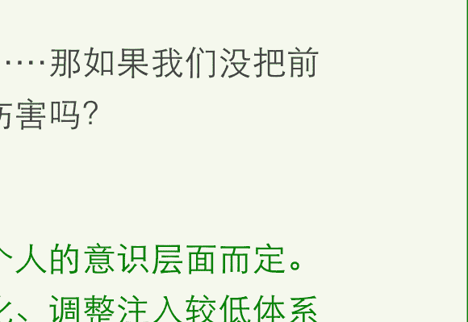

## Important Note

> > This is a blockquote used to highlight an important statement or note within the document.

## Code Snippet

```python
print("Hello, World!")
```

### 本征结构的概念

在进行过程设计时，一个基本而重要的思想是：过程应该具有某种**不变**的东西，即，虽然过程经历种种不同状态的变换，但始终存在着一些刻画其基本特征的核心元素。这些核心元素被称为过程的**本征结构**。

本征结构的概念来源于对过程的结构化理解。任何过程都可以看作是由一个个的**活动**（activity）组成的。活动是过程的基本单元，它接受输入、产生输出，并消耗一定的资源。但是，不同的活动之间并不是孤立的，它们通过**控制流**和**数据流**相互连接，形成一个有机的整体。

所谓**本征结构**，就是那些在过程变换过程中始终保持不变的**活动间关系**（包括控制流关系和数据流关系）所形成的模式。更具体地说，本征结构是过程的一个子图，这个子图在过程经过各种合法变换（如增加、删除、重排活动等）后，其拓扑结构不发生改变。

图5.1展示了两个过程：过程A和过程B。它们虽然具体的活动集和顺序不同，但都包含了一个共同的子结构——一个带有反馈循环的活动序列。这个共同的子结构就是它们共有的本征结构。

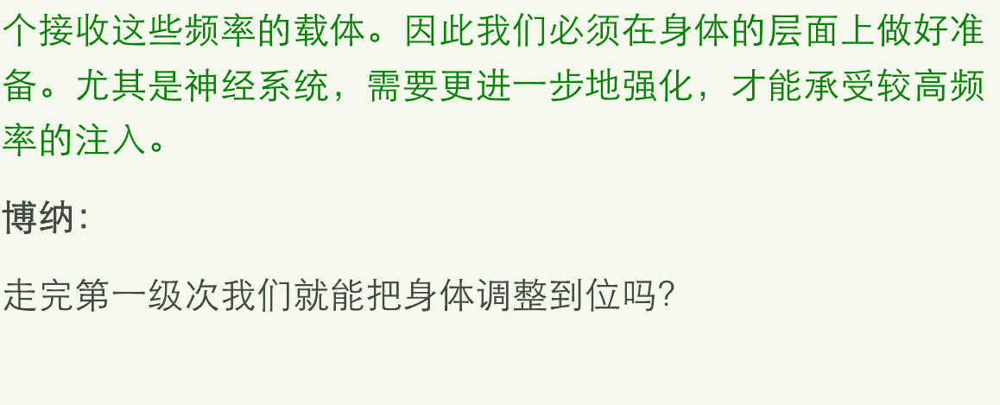

## tayo.kz


Home

Quiz

Categories

About

Contact

Login

### Welcome to tayo.kz

Your platform for online quizzes and learning activities.

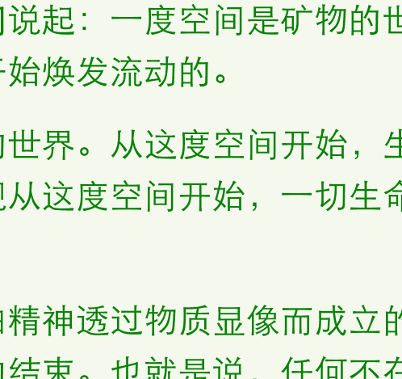

### Start Learning Now

Choose from hundreds of quizzes covering various topics.

- Interactive quizzes
- Instant feedback
- Track your progress

© 2025 tayo.kz. All rights reserved.

## 冒泡排序

冒泡排序（Bubble Sort）是一种简单的排序算法。它重复地遍历要排序的数列，一次比较两个元素，如果它们的顺序错误就把它们交换过来。遍历数列的工作是重复地进行直到没有再需要交换，也就是说该数列已经排序完成。这个算法的名字由来是因为越小的元素会经由交换慢慢'浮'到数列的顶端。

### 算法步骤

1.  比较相邻的元素。如果第一个比第二个大，就交换它们两个。
2.  对每一对相邻元素做同样的工作，从开始第一对到结尾的最后一对。这步做完后，最后的元素会是最大的数。
3.  针对所有的元素重复以上的步骤，除了最后一个。
4.  持续每次对越来越少的元素重复上面的步骤，直到没有任何一对数字需要比较。

### 图解示例

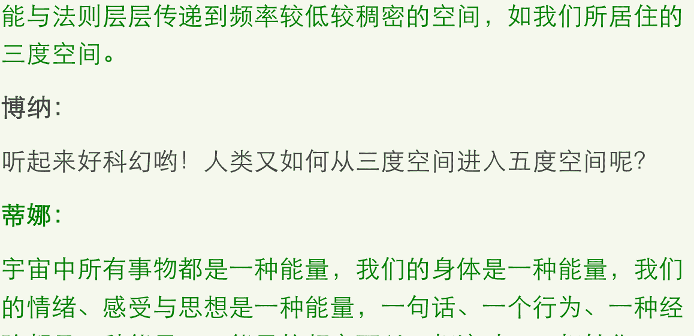

### 代码实现（Python）

```python
def bubble_sort(arr):
    n = len(arr)
    for i in range(n-1):
        for j in range(0, n-i-1):
            if arr[j] > arr[j+1]:
                arr[j], arr[j+1] = arr[j+1], arr[j]
    return arr
```

### 2. 实验原理及背景

本次实验涉及多道γ能谱分析技术，主要用于研究放射性核素的能谱特征及其在环境样品中的分布。通过使用高纯锗（HPGe）探测器，可以精确测量γ射线的能量和强度，从而识别不同的放射性同位素。实验中，我们将对标准源和未知样品进行能谱采集，并通过能谱分析软件进行数据处理和峰识别。

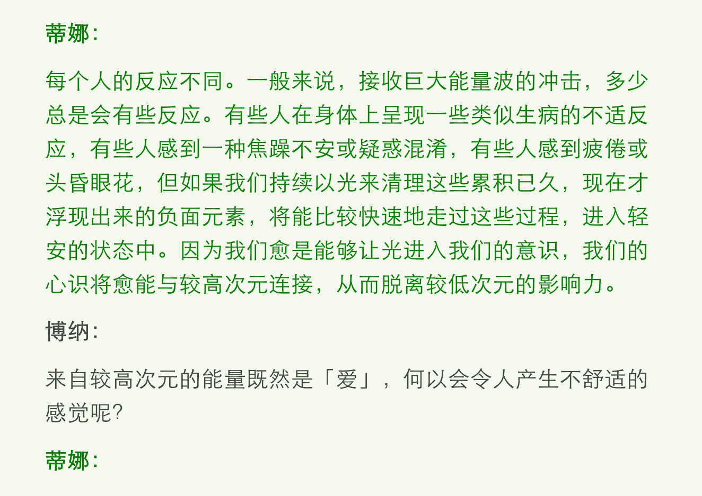

图1展示了HPGe探测器的基本结构及信号处理流程。探测器内部使用高纯度锗晶体，在液氮温度下工作，具有极佳的能量分辨率。当γ射线进入探测器时，会与锗原子发生光电效应、康普顿散射或电子对效应，产生电荷脉冲。这些脉冲经过前置放大器、主放大器和多道分析器（MCA）转换为数字能谱。

- **重要参数**: 能量分辨率 (FWHM) 通常小于2 keV (@1332 keV)
- **探测效率**: 相对效率通常为30%-50%
- **工作温度**: 液氮温度 (77 K)

### 5.2 自洽性验证

自洽性验证是对大语言模型推理一致性的重要检验方法。该方法通过多次采样生成多个推理路径，然后从中选择最一致的答案作为最终输出。其核心思想是：对于复杂推理任务，虽然单次推理可能出错，但多次推理的正确路径往往具有更高的一致性。

#### 5.2.1 基本原理与实现

自洽性验证的数学基础是概率一致性原则。设对问题 x，模型生成答案 y 的条件概率为 P(y|x)，通过多次采样得到答案集合 {y₁, y₂, ..., yₙ}，最终选择出现频率最高的答案：

```
y_final = argmax_y count(y_i)
其中 i=1,2,...,n
```

这种方法特别适用于算术推理、符号推理等具有确定性答案的任务。研究表明，当采样次数达到 20-40 次时，自洽性验证可以显著提高推理准确率（通常提升 5-15%）。

#### 5.2.2 实验结果分析

下表展示了在 GSM8K 数据集上的实验结果，对比了直接推理和自洽性验证（SC）的性能：

| 方法 | 准确率 | 推理时间 |
|------|--------|----------|
| 直接推理 | 68.2% | 1× |
| 自洽性验证 (5次) | 72.1% | 5× |
| 自洽性验证 (10次) | 74.8% | 10× |
| 自洽性验证 (20次) | 76.3% | 20× |

实验数据显示，自洽性验证在提升准确率的同时也带来了计算开销的增加。在实际应用中，需要根据任务要求权衡准确率和效率。

这是一种说法，是一部份人的逻辑思维。我们无意去论证各门各派的逻辑思维，只能提供一些我们所能认同的，让大家自己去思考。根据数据显示，要进入第五次元，需要阳性能量所代表的正面思想、毅力、扩展、开展等动力没有错，但也需要阴性能量来将一切事物带入平衡中。阴性能量代表共同创造，以温柔的手将思想编织成一幅织锦图。这一切都需要先从我们个人的内在展开，才能与阴阳平衡的大宇宙融合。

博纳：
所以每个人都要先达到内在阳性与阴性的平衡，不能单纯地过于男性化或女性化？但是如果男人不是强者，女人不是让男人保护的弱者，或像莎翁所讲的那样：「弱者，你的名字是女人」，那世界有什么意思？

蒂娜：
你要是喜欢那样的世界，宇宙中必有那样的星球可以去，自由意志的法则必然能让你在地球生命结束时，前往那样的地方。只是根据平衡法则，两种角色你都得经历才行，不能任选其一。

博纳：
唔！那我就要想一想了。

蒂娜：
在宇宙阴阳两极的造化中，阴不是指柔弱，而是指接收与接纳的一面，阳指的是创造思想与行为的源头。当两者相融合时，便展开创造过程，使思想具体显现。

博纳：
整个宇宙造化都是如此？

蒂娜：
在至高造物主之下的创造层面都是如此。阴阳两极的能量互相吸引融合，因为即使最微小的分子也是如此。造物主—至高创造层面是一种思想（logos），因此其智慧无所不在。而这智能本身便含藏着阴阳两极的能量。

博纳：
所以人也含藏着阴阳两极的能量，我们必须使自身之内的这两种能量平衡，才能提升，并且无论是男人或女人都一样可以提升？

蒂娜：
是的，人类必须能纯熟地运用阴性能量接收思想、梦想、视野，并运用阳性能量使它具体显现。

博纳：
我们如何让自己达到阴阳平衡呢？

蒂娜：
在静默中，倾听灵魂层面较高自我的指引，学习让你的思想、情绪、语言、行为都是阴阳平衡，也就是刚柔并济。外柔内刚或外刚内柔都是一种不平衡。

博纳：
我还是不知道什么样的情况我就是达到阴阳平衡或刚柔并济？

能量如实运作时，它所蕴含的智慧便会在我们整个存在中依我们所能接受的程度运作。

博纳：
还是太抽象了。

蒂娜：
也许我们可以从阳性特质与阴性特质来讨论。但不要将它误以为我指的是女人或男人的特质。

阴性特质：不论断、不执着、顺应、开放、沉静、和平、谦卑、能响应、守信、小心、谨慎、尊重生命。

阳性特质：承担、择善固执、独立自主、运筹帷握、统理事物、辩才无碍、进取、自信、不受骗、有勇气、有胆识、有冲劲。

当我们能整合这些特质，知道什么时候，什么地方该运用什么特质，我们便具有人类的全部潜力。也是人类要向更高次元进展的必备条件。

博纳：
是的，置身于一个这样高智慧的群体环境中，是要比置身于一群不是过于强悍就是过懦弱的女人群中要好玩多了。对不起，应该说无论是置身于一群过于强悍或过于懦弱的男人或女人中，都不好玩。

## 光的课程与通灵

博纳：
很多人修了光的课程以后，似乎就打开了通灵的能力，这是为什么？

蒂娜：
上师们设计光的课程并非为了培养灵媒，而是为了带领我们向更高的精神意识进展。然而，要向较高灵性进展，清理、净化与打开觉知与敏锐度是必要的过程。知见与定力不够的人，打开敏锐度之后，就会开始玩一般人所谓通灵。

**博纳：**
很多人对许多未知的世界感到好奇。一旦有人宣称他们可以感知自己所不知道的事，便会出于好奇或好玩而趋之若鹜。只是很多人找这些通灵人之后，抱怨受骗或受到操控，因而影响光的课程的形象，我们是否应该澄清这一切行为与光的课程无关。

**蒂娜：**
我们只能向大家解释每个人的心性不同，欲望不同，便各自有不同的对光的课程的理解与表达。更多习修光的课程的人，并没有开发出通灵能力，但他们所开展的是其它方面的能力，譬如写作、绘画、创造力、沟通能力，处理事情的能力。有些人觉得自己有更高的智慧去理解很多事情，工作与事业更为顺心，有些人则得以使一些痛苦的人际关系臻至圆满。有些人则开发了通灵的能力，这时旁边的人便必须以自己内在的智慧去识别是否接受这些人所通给你的讯息。

**博纳：**
嗯，我的确感觉自己更有创造力，以及对事情的处理能力也更有智慧了，但就一般而言，通灵到底是怎么一回事？

**蒂娜：**
因为我们每一个人都有不同的思想、欲望与心智，因而都散发着不同的；也就是我们称之为频率的电流或电波。一个有素养，守纪律的人所散发出的电波与那些粗俗卑鄙的人所散发的电波是极不相同的。

博纳：
这与社会地位、个人财富或学历有关吗？

蒂娜：
完全无关，往往一个的简朴的乡野村民所散发的频率，比那些在世俗上功成名就或学问、学历很高，品德却很粗鄙的人的频率，要高出许多。这种频率无法隐藏、伪造或用任何理由来掩饰。每个人所散发的频率，都让人立即知道他们是什么样的人。

博纳：
但一般人感受不到这种频率。而那些开启感受体，具有敏锐度的人，便能感知并解读这些电波，就成为所谓的灵媒了。

蒂娜：
可以这样解释。但灵媒有许多不同的层次，这是因为每个灵媒的意识层面不同，所能通到的层面、与所理解的、所解读的，也就各不相同，因此我们无法在这里用一个公式去为灵媒这名词下定义。

博纳：
据我所知，探测频率是非常消耗精神体力的，甚至还会损害神经系统。因为灵媒得先空掉自己的心识与意志，以便接收别人的意念。听说为了使自己的频率能与别人相通之下所做的调整，是很伤神经系统的。有些人越修得越变得神经兮兮的，是不是因为玩神通，伤了神经系统的关系？

蒂娜：
我不能确定这样的逻辑推论是否可以成立。但是神经系统稍弱或妄念多的人，是可以看到许多画面，加上没有正确的知见与定力去识别这些画面，便令人感到他们在胡言乱语。

每当我们的身体或思想状态改变时，无论这种改变是向上提升或向下坠落；是朝着正面或负面的思想意识而改变，都会增加我们神经系统的负荷。尤其是骤然的，爆发性的改变，不只是哀伤的打击，即使是令人意想不到的惊喜，都会增加神经系统的负荷量。

博纳:

由此可以理解，何以当我们进入一个陌生的，或与我们的频率不同的环境中时，我们会感到极端地疲惫或生病。

蒂娜:

当这些频率的差距过高时，它的伤害力是极其强大的，往往使神经系统产生一些其它的疾病。这也解释了为何一些敏锐度较高的人，在某种环境中，会莫明其妙地生病。

博纳:

这也解释它为什么会对灵媒产生伤害，使他们失去自身的人格特质。这样看来灵媒因接收各种不同的频率，又无法消化或吸收，就很容易造成紊乱……那灵媒的言论不就也变得不可靠，而没有自主性吗？

蒂娜:

的确是，我看到许多灵媒最终在悲剧中渡过他们的一生。很多灵媒到后来成为一些无形力量的傀儡，因为要做一个灵媒，便必须放下自主的能力，放下对外来频率的抗拒力。往往在种种影像中，自己也变得混淆不清，最后被人认为是一个欺世盗名的说谎者。这是因为要通灵，他们就必须放下自己的思想意识，因而逐渐失去他们自身的意志力，最终只能做一些猜测，而猜测就会有准确与不准确的时候。

博纳:

## 短婚（不到3个月，不到6个月，不到1年，不到2年）

1995-2006年，短婚比例为8%，2006-2010年，短婚比例为9%，2010-2014年短婚比例为14%，2014-2018年短婚比例为18%，呈逐年增长的趋势：短婚比例的上升可能是因为离婚成本的降低、结婚年龄推迟以及婚前了解不足等因素导致。

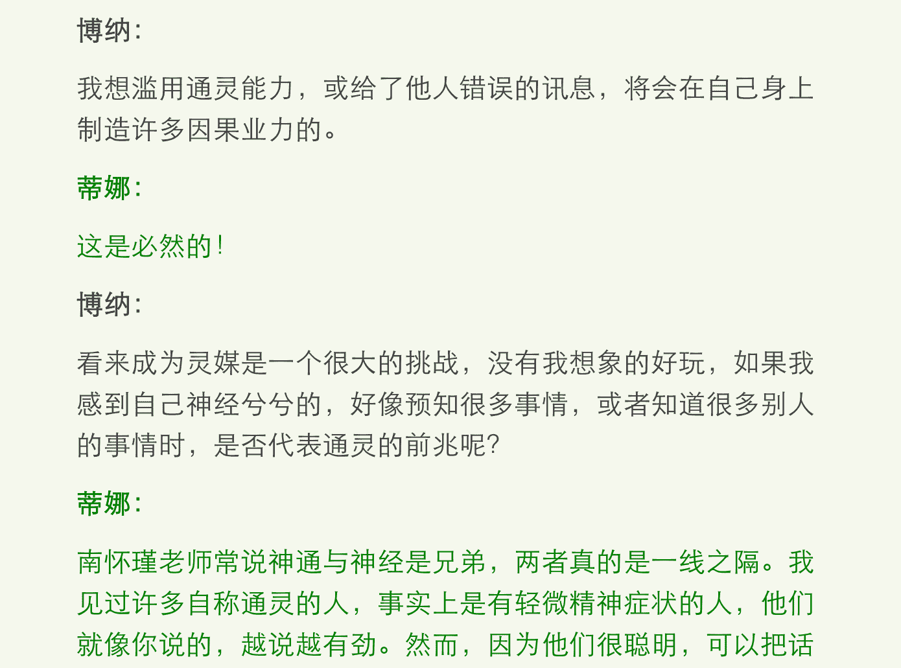

- 1995-2006: 8%
- 2006-2010: 9%
- 2010-2014: 14%
- 2014-2018: 18%

前面关于短婚比例的变化趋势描述及数据点图表已展示上述内容。

## 蒂娜：

每个人与生俱来皆具有保护自己的本能，这种本能使我们我们可以抵挡外来的思想频率。因此在这阶段，你可以把焦点放在观照自己，而不是把力气用在窥视别人上。运用你的敏锐度，去感知、接收自己内在次元的智慧，发展出更高的觉知力与定力。

## 博纳：

许多人为了名利，哗众取宠，有人则只是为了好玩，便停留在玩敏锐度，玩灵通的阶段，如此而误了自己的进展，实在非常可惜。

## 蒂娜：

神通或通灵用得好，是可以帮助别人的。近代灵媒像早期的艾葛卡西，通赛斯的珍、罗勃特，通奇迹课程的海伦、舒曼，都为我们带来许多宝贵的资料。目前许多在世间的大师，也以他们的通灵能力帮助别人。它就像金钱与权力一样，看你怎么用。

## 博纳：

那么通灵能力是可以由自己决定要不要去使用，以及要如何运用了？

## 蒂娜：

是的，许多具有神通的修行人都是深藏不露的，无论任何情况，都不让别人知道他们有这种能力，我认为这才是真功夫。也有人是在确定可以帮助别人时，才偶尔用一下，这也不简单了。

## 行业标准

行业标准是行业内广泛认可的技术规范、操作指南、质量标准等。它们通常由行业协会、标准化组织或政府部门制定和发布。行业标准对企业的产品质量、生产流程、服务水平等方面具有重要的指导作用。遵循行业标准有助于企业提升产品质量、保障生产安全、促进技术创新和增强市场竞争力。

### 行业标准的重要性

- 提升产品质量
- 保障生产安全
- 促进技术创新
- 增强市场竞争力

### 常见的行业标准类型

| 标准类型 | 说明 |
|----------|------|
| 基础标准 | 包括术语、符号、分类等基本规范 |
| 产品标准 | 对产品的性能、规格、质量等做出规定 |
| 方法标准 | 规定检测、试验、分析等方法 |
| 管理标准 | 规范生产、经营、管理等活动 |

### 行业标准的制定流程

行业标准的制定通常包括立项、起草、征求意见、审查、批准和发布等环节。参与制定的各方包括企业、科研机构、用户代表和政府管理部门等。

> > 行业标准是行业发展的基石，它确保各企业在同一规则下公平竞争。

## 1. 引言

随着信息技术的快速发展，数据量呈爆炸式增长。如何高效地处理和分析海量数据已成为学术界和工业界关注的核心问题。本报告旨在探讨大数据处理中的关键挑战及其解决方案。

## 2. 相关技术

本节将简要介绍几种主流的大数据处理技术，包括分布式存储、并行计算和机器学习框架。

- **分布式存储**：如 HDFS、Ceph、MinIO。
- **并行计算**：如 MapReduce、Spark、Flink。
- **机器学习框架**：如 TensorFlow、PyTorch、MXNet。

### 2.1 分布式存储

分布式存储系统通过将数据分布在多个节点上，提高可靠性并支持大容量存储。HDFS 是 Hadoop 生态中的代表性分布式文件系统。

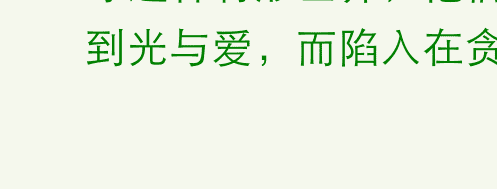

> > “数据的价值在于其被利用的程度，而非存储的大小。” —— 某知名数据科学家

```
python
from pyspark import SparkContext
sc = SparkContext("local", "Example")
data = sc.parallelize([1, 2, 3, 4])
print(data.count())

```

| 框架 | 语言 | 适用场景 |
|------|------|----------|
| Spark | Scala/Python | 批量及流式处理 |
| Flink | Java/Scala | 实时流处理 |
| Hadoop | Java | 批量处理 |

地球，直到他们领悟为止。目前地球上大约有百分之九十是这样的灵魂。但并不是说这样的灵魂，存在的价值就低于对灵性有较高领悟的灵魂。只能说每个灵魂所熟悉，所能掌握的层面有所不同。对造物主而言，都是平等的，都是尊贵的。因此，在较高层面中有一个唤醒这些灵魂的神圣计划，而这神圣计划又属于一个更伟大的神圣计划。

博纳：

光之子在宝瓶座时代如何展开他们的使命？

蒂娜：

许多光之子已经觉醒，也已经展开清理与净化所需的过程，并重新学习一些被遗忘的宇宙真理。他们因自身觉醒所展现的能量，将引发长久陷入在三度空间幻境中的灵魂，也开始觉醒，并开始探索重获自由的模式。无论他们所经历的是什么，无论他们有着什么样的历史，当这些灵魂觉醒并转化之后，他们也能成为光之子，这便是光之子的使命，也是宝瓶座纪元神圣计划中的一部份。

博纳：

所以…在觉醒过程中所出现的种种矛盾与抗争，就是哈米吉多顿之战中的善恶对决吗？

蒂娜：

是的，即使是光之子，由于长期受到地球物质层面上种种较低思想的影响，往往失去对较高意识的记忆而不自知，因此哈米吉多顿之战可以说是与自己身心内外的善念与恶念之间的对决。

## 2.1 数据分类分级管理

依据《数据安全法》,建立数据分类分级保护制度,制定重要数据目录,加强对重要数据的保护。数据资产识别采用自下而上的梳理方式,以元数据管理为基础,对各业务系统数据资产进行盘点。

数据分类分级方法是保障数据安全的一项重要基础工作,在实际工作中,可参考如下四个阶段开展:

- **第一阶段**:数据资产盘点
- **第二阶段**:数据分类
- **第三阶段**:数据分级
- **第四阶段**:数据安全策略制定

数据分类分级一般流程如图所示:

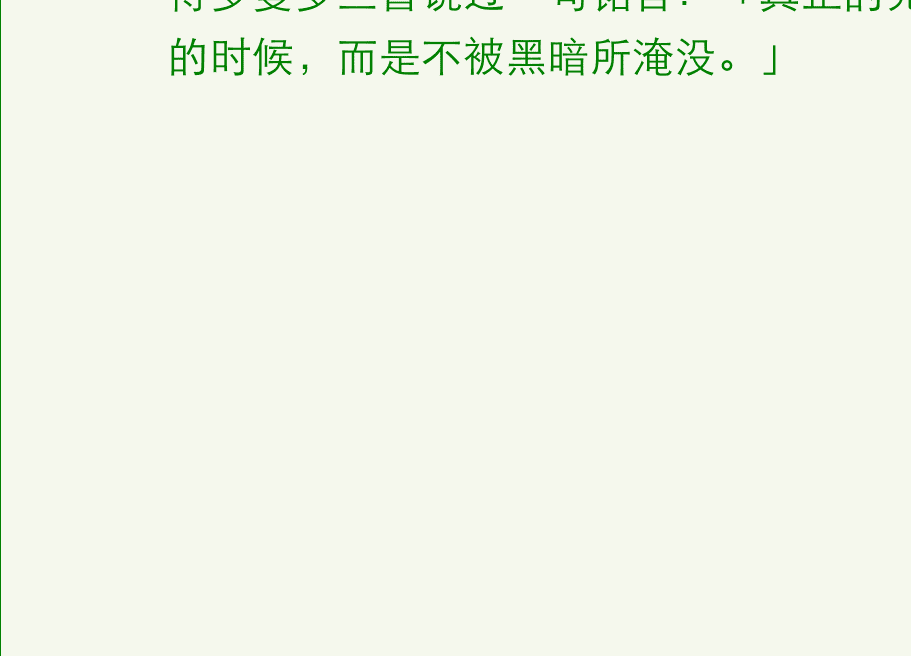

## 我们所处的银河星系

漫谈九个次元之前

博纳与蒂娜园地，在未来的一段时间中，有些篇幅将因应光的课程的最后一个级次——天使级次的即将出版，编辑部正策划更深入探索与我们人类有直接关系的九个次元，以及这些次元与我们之间如何互动，为何息息相关。

这是因为尽管天使级次尚未出版，我们实验性地让一部份朋友，用我们尚未修订的初稿，进入天使级次的习修。从他们的回馈中，我们发现，天使级次的教材一如前面的级次，比较着重在引导我们进入内在天使次元的意识与能量的运作中。虽然上师们相信，光的能量中含融着宇宙的智能与讯息，所有的人将在内在天使的引导中，我们仍看到许多人对天使级次有着许多的疑惑与迷思。因此，我们希望从不同角度来破解或阐述一些许多人共有的不解之谜。

我们无法一一解答宇宙奥秘，只能顺着我们意识的开展而逐步探索。我们也不能说我们在这园地所谈的数据是金科玉律，或是绝对真理。希望大家把这些数据当做是一种参考，从中独立思考，汲取、采撷你们可以吸收，可以成为自己心灵成长之养料的部份。放下那些你们尚未能消化与吸收或不能认同的部份。毕竟在喜悦中成长才是我们的目标。

### 我们所处的银河星系——第一次元与第二次元

**博纳：**

我有许多学习《光的课程》的朋友，都问过我《光的课程》系列五，也就是天使级次何时出版？

**蒂娜：**

初稿很早就已经出来了，只是尚未修订到可以出版的程度。现在编辑部正在加速修订工作，应很快就会完成。事实上，我认为大家应把前面的系列多修个一两次再进入天使级次会比较好。

**博纳：**

大家急于进入天使级次，可能是因为大多数的人认为较高次元比较低次元好，所以想尽快脱离较低次元，进入较高次元。他们又听说天使们存在于第七与第八次元，因此就认为进入天使级次就可以进入第七次元或第八次元，真的是这样的吗？

**蒂娜：**

没错，天使级次的确是要带领我们的意识进入较高次元没错，但认为较高次元比较低次元好或以为修了天使级次就可以一劳永逸地脱离第三次元的想法，是一种极大的错误。

**博纳：**

这种想法是否会使我们无法从我们在三度空间所经历的事物中，体会出自己在这世间上所要学习与进展的事物？

**蒂娜：**

没错！我们所置身的银河星系，也就是我们所处的这一银河星系的宇宙，是一个包含着十个次元的智慧体系，与我们相关的一切事物都在九个次元中相互交错地表达着我们这个银河星系中的一切，因此我们自身便具备了九个次元中的一切元素，一切智能。

**博纳：**

看来，光的课程的设计就是要帮助我们重新恢复对九个次元的认知与应用，但上师们不与我们谈这些宇宙科学知识，也因此使很多人对行星级次及天使级次产生很多迷思与疑惑。

**蒂娜：**

我们说过，上师们要我们先清理、净化我们的四个较低体系，才能具有领悟较高次元的能力，而这只有踏实地在光的能量中运作才能完成。我们在智慧没有开之前，都会被许多事物所障碍，给我们讲再多的理论，也无法使我们理解这些宇宙科学知识。

**博纳：**

说的也是，光是系列一的初级教材，就令许多人感到它很庞大、很复杂、摸不着头绪、捉不到重点，这之中不乏学历很高的人呢！然而，能坚持下去的人都说，修到第二级次再回头看第一级次时，就觉得非常清楚，即便是内容也很清楚。以此类推，只要继续往下面的级次走，再回头看前面的级次，便能有更清晰的领悟。

**蒂娜：**

这是因为在能量的运作中，内在的意识与智慧正逐步打开之故。而心灵的提升更多的是要靠内在的悟性，而不是靠知识。

**博纳：**

但对知识分子来说，还是希望了解宇宙的运作，只是以目前在学科界所发展的程度，不能满足我们内在对宇宙真知的渴望，因此我们会向玄学探索，我知道你也在探索宇宙的各个次元，何不让我们也知道一些妳对宇宙各次元的认知呢？

**蒂娜：**

好啊！但我所谈的只是一些我细胞记忆所能认同的事物，是我个人的认知。

**博纳：**

## Case 3: Unsteady Couette flow

The bottom plate is moved impulsively and the flow becomes unsteady. During the start-up, the velocity gradient at the moving plate is infinite, thus enforcing a constant shear boundary condition there is problematic. To be safe, a constant velocity boundary condition is imposed at bottom (moving) plate and the top plate is fixed.

The velocity field is self-similar in the variable:

$\eta = \dfrac{y}{2\sqrt{\nu t}}$

and the analytic solution is:

$u(y,t) = U_{0} \left[ \left(1 - \dfrac{y}{h}\right) - \dfrac{2}{\pi} \sum_{n=1}^{\infty} \dfrac{1}{n} \exp \left(-\dfrac{n^{2}\pi^{2}\nu t}{h^{2}}\right) \sin \left( \dfrac{n\pi y}{h} \right) \right]$

The verification test is conducted by comparing simulation predictions to analytic velocity profile across the channel at three selected times, $t=0.1, 0.2, 0.4s$.

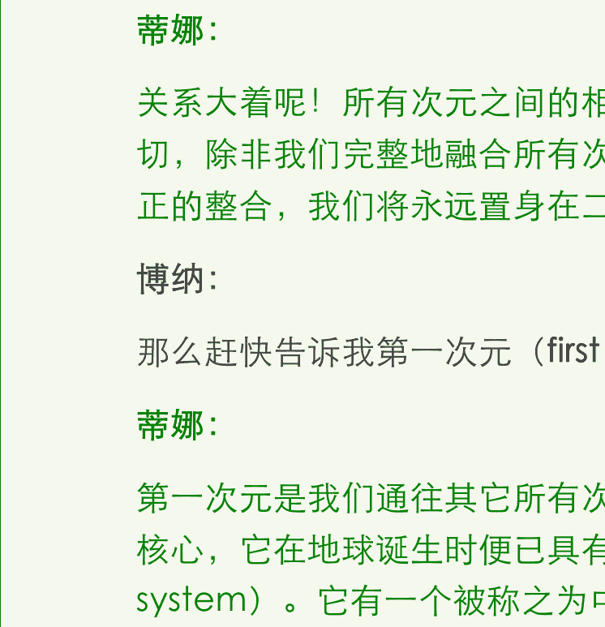

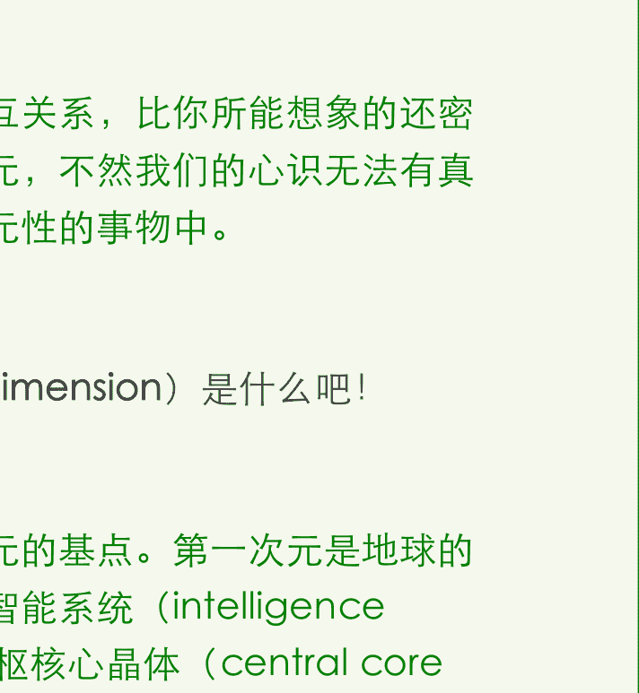

**Figure 4: Unsteady Couette flow verification.** Left: 3D simulation snapshot; Right: velocity profiles at three selected times.

An additional check is to confirm that the simulation respects the analytic solution; this is done by computing a normalized RMS error between the analytic and computed velocity profiles.

The error is $<0.05\%$ at all times.

## 11. 使用多个内核

本章是有关并行性的第一章。我们将介绍 Go 的 goroutine 以及传统的并发模型。Go 语言中的 goroutine 是轻量级的线程，它们的调度是由 Go 运行时管理的，而不是由操作系统管理的。我们很快就会看到，调度器带来的好处是显著的。

### 基准测试

在开始之前，我们不使用 goroutine 编写一段代码，并使用基准测试捕捉相关数据。我们会稍作修改并展示使用 goroutine 后如何影响性能。

```go
import (
	"fmt"
	"testing"
)

var fib func(n int) int

func init() {
	fib = func(n int) int {
		if n <= 1 {
			return n
		}
		return fib(n-1) + fib(n-2)
	}
}

func BenchmarkFibonacci(b *testing.B) {
	for i := 0; i < b.N; i++ {
		fib(30)
	}
}
```

代码清单 11-1：用于基准测试的 Fibonacci 函数（fibonacci_test.go）

使用以下命令运行基准测试：

```sh
go test -bench=. -benchmem -count=3 -benchtime=10s
```

这会让基准测试运行 3 次，每次持续 10 秒。结果如下所示：

```
pkg: ch11/benchmarks/cpu
BenchmarkFibonacci-8    	     100000000	       204 ns/op	       0 B/op	       0 allocs/op
BenchmarkFibonacci-8    	     100000000	       204 ns/op	       0 B/op	       0 allocs/op
BenchmarkFibonacci-8    	     100000000	       204 ns/op	       0 B/op	       0 allocs/op
```

## Max Difference You Can Get From Changing an Integer

You are given an integer `num`. You will apply the following steps exactly **two** times:

- Replace all the occurrences of one digit in `num` with any other digit from 0 to 9. The new digit can be same as the old one.
- The number cannot have leading zeroes.

Return the maximum difference you can get by applying the operation exactly twice on the same integer, once to get the maximum possible value, and once to get the minimum possible value.

### Example 1:

**Input:** num = 555
**Output:** 888
**Explanation:** The maximum value is 888 (replace all 5's with 8). The minimum value is 0 (replace all 5's with 0). The difference is 888.

### Example 2:

**Input:** num = 9
**Output:** 8
**Explanation:** The maximum value is 9, the minimum value is 0. The difference is 9.

(Note: The example in the image might have a slight typo; output should be 8 as per LeetCode problem statement.)

## 2. 数学建模的基本方法

数学建模有多种方法，从不同角度可以有多种分类方法。按照**应用数学方法**的不同，可以分为机理分析、数据分析、系统仿真等；按照**问题类型**的不同，可以分为预测模型、评价模型、优化模型等；按照**所用模型方法**的不同，可分为初等模型、几何模型、统计模型、优化模型、微分方程模型、图论网络模型等。

### 2.1 机理分析

机理分析是根据对现实对象**特征的认识**，找出其**因果关系**，利用**物理、化学、经济、生物**等领域的**定律**（如牛顿定律、能量守恒定律、质量守恒定律等）确定变量之间的**函数关系**。

机理分析通常用于**内部机理相对明确**的问题，比如物体运动、电路分析、化学反应等，能够建立明确的**数学方程**（如微分方程、代数方程等）。

**优点**：模型有明确的物理意义，参数可解释，结果可靠。

**缺点**：对复杂系统（如社会经济、生态系统）通常难以建立精确的机理模型。

### 2.2 数据分析

数据分析是**基于观测数据**，利用**统计方法、机器学习算法**等手段，**发现**变量之间的**关联模式**或**预测**未来趋势。常用于机理不清楚或过于复杂的问题。

常用的数据分析方法包括：**回归分析**、**时间序列分析**、**聚类分析**、**主成分分析**、**神经网络**、**支持向量机**等。

**优点**：适用于复杂系统，不需要完全了解内部机理。

**缺点**：对数据数量和质量要求较高，模型可解释性较差。

## 当您需要全天监护时

如果您的家人正在接受特定术后康复护理、慢病监测或认知障碍照护，您可以享受我公司提供的舒适养老居家服务。我们的专业护理人员可提供24小时全天监护，帮助您减轻照护压力，减少您的后顾之忧，确保您和您的家人都安心。

- 术后康复护理
- 慢病监测
- 认知障碍照护

## [国家卫生健康委等部门联合发文：要求进一步加强医疗质量安全，保障患者权益]

为深入贯彻落实《医疗质量管理办法》相关要求，国家卫生健康委、国家中医药局、国家疾控局等部门联合印发了《关于进一步加强医疗质量安全管理的通知》（以下简称《通知》）。《通知》要求各级医疗机构进一步提升医疗质量安全管理水平，强化患者安全保障，切实维护人民群众健康权益。

> 医疗质量安全是医疗卫生事业发展的生命线，必须常抓不懈。

《通知》从健全医疗质量安全管理体系、优化诊疗流程、加强重点环节监管、提升风险防范能力等方面提出了具体要求，旨在推动医疗质量安全持续改进，营造安全、优质、高效的医疗服务环境。

### 3.4 使用命令行动态链接库

让应用程序使用动态链接库有几种不同的方式，分别是加载时动态链接(Load-Time Dynamic Linking)、运行时动态链接(Run-Time Dynamic Linking)和导入库(Import Library)。

#### 3.4.1 使用C/C++动态链接库

本节主要介绍如何使用命令行动态链接库。

##### 1. 加载时动态链接

加载时动态链接是指在程序加载时，操作系统自动将所需的动态链接库加载到内存中。这种方式需要在编译时指定动态链接库的路径和名称。以下是一个简单的示例：

```cpp
#include <iostream>
#include <windows.h>

int main() {
    // 动态链接库的路径
    const char* dllPath = "C:\\Path\\To\\Your\\DynamicLibrary.dll";
    
    // 加载动态链接库
    HMODULE hModule = LoadLibrary(dllPath);
    if (hModule == NULL) {
        std::cerr << "无法加载动态链接库" << std::endl;
        return 1;
    }
    
    // 获取函数指针
    typedef void (*FunctionPointer)();
    FunctionPointer func = (FunctionPointer)GetProcAddress(hModule, "YourFunctionName");
    if (func == NULL) {
        std::cerr << "无法找到函数" << std::endl;
        FreeLibrary(hModule);
        return 1;
    }
    
    // 调用函数
    func();
    
    // 卸载动态链接库
    FreeLibrary(hModule);
    
    return 0;
}
```

在这个例子中，我们使用 LoadLibrary 函数加载动态链接库，然后使用 GetProcAddress 函数获取函数地址，最后调用该函数。

## 3. 设计并实现一个整数集合类

定义一个整数集合类 intSet，该类与第 2 章中的 Set 功能类似，只不过该类用于存储整数值。成员函数需要能够支持插入操作（insert），删除操作（remove），查找操作（isMember），以及求该集合的大小（size）。另外，还需要支持交（intersectWith）、并（unionWith）、差（diffWith）等运算，这些运算的运算数都是集合，返回的结果也是集合。集合之间的相等与否通过重载“==”实现。请编写一个测试程序来进行测试。要求：用单链表来组织数据。

### 3.1 需求分析

本题要求实现一个整数集合类，并支持集合的常用操作。

蒂娜：
也好，因为每一个次元都是相互交织而息息相关的，你先有一个基本的概念之后，也比较容易了解其中的奥妙。

博纳：
那么第五次元是一个什么样的次元呢？

蒂娜：
第五次元只一有种频率，那就是爱的频率。昴宿星团处在这一次元中，他们不断地向整个宇宙释放爱的频率。

博纳：
昴宿星团？在边缘外那本书里，莎莉迈克琳提到来自昴宿星团的讯息，很有意思。只是那本书似乎是绝版了。

蒂娜：
已绝版很久了，书中莎莉迈克琳所谈的一些事物，对新时代的人而言，已是一些基本常识了，所以我们也就不想再去出版它。

博纳：
但是对没有看过的人，还是蛮有趣的，何况我们现在又提到昴宿星团。

蒂娜：
我们可以考虑将它登到网站上。

博纳：
那么第六次元又是一个什么样的次元呢？

蒂娜：
第六次元是光的存在体，第三次元的物质体是这些光体所投射出来的。

博纳：
你是说所有的物质体都来自于这一次元的思想理念？

蒂娜：
在这一次元中的思想意识先形成几何形体，再投射到第三次元的物质世界中，成为物质形体。这一次元是在天狼星团的引导中。

博纳：
对我来说，开始有点玄秘了。那么第七次元是什么样的次元呢？

蒂娜：
第七次元是传递纯净思想、讯息的区域。对地球而言，这是一个传递光的宇宙讯息的高速网络，是整个银河星系的沟通系统。

博纳：
那么谁在掌管这一次元的系统运作呢？

蒂娜：
仙女座星系（Andromeda Galaxy）。

博纳：
越来越像是进入科幻小说了，当我们深入时一定很有趣。现在先告诉我第八次元是一个什么样的次元吧！

蒂娜：
第八次元被称之为银河星系联邦政府(Galactic Federation)。

博纳：
像英国联邦，美国联邦共和国那样？那跟我们又有什么样的关系呢？

蒂娜：
它是将宇宙智慧提供给地球的一个结构组织。

博纳：
由那个星系掌管呢？

蒂娜：
猎户星座（Orion）是这一次元的管理者。

博纳：
那第九次元又是什么样的次元呢？

蒂娜：
第九次元是一个统合由各种微细频率（subtle frequencies）所交织而成之种种实相的区域。

博纳：
微细频率是什么？

蒂娜：
是指非物质体的频率，因为它的频率没有物质体那么稠密，那么沉重，所以说它是微细频率。

博纳：
那么简单地说，微细频率可以说它是一种精神界、灵性世界的频率了？

蒂娜：
可以这么说。这一次元是储存所有与地球相关数据的图书馆。是这一银河星系的政务中心。

博纳：
是我们这一银河星系，这一宇宙的总统府吗？

蒂娜：
你真会比喻，应该可以这么说吧。

博纳：
那么谁是这总统府里的执行长呢？

蒂娜：
是由以诺天使圣团（Enochians）。

博纳：
这与那本以诺之书（The Keys Of Enoch）有关吗？

蒂娜：
这本书透露了来自以诺圣团的讯息。

博纳：
你好像也曾介绍过这本书。

蒂娜：
重要的经典我们都会尽可能地介绍给大家。

博纳：
可惜我的智慧还没开到阅读那本书的程度。现在我最好奇的是九次元之外是什么。

蒂娜：
是一个维持整个银河星系的九个次元有序运作的垂直轴心。

## 漫谈宇宙次元

博纳：
理解了每个次元的概要之后，我终于觉得可以与你从各个角度谈谈我们所处的这一银河星系中的各个次元了。还是让我们从第一次元的地心引力说起，它的作用只限于使我们可以不随风飘荡而已吗？

蒂娜：
不仅如此，它是衔接九个次元之间相互沟通的起始点，也是进入其它次元的起始点。由这一次元开始，地球的能量进入我们的身体，在我们身体内形成各种不同的元素，使我们得以在地球上表达我们整个存在的思想意识。

博纳：
看来除了与这一次元连接也是必要的。如何与它连接呢？

蒂娜：
你可以在走路时感受自己正与第一次元中枢核心晶体中的智能体系的能量连接。

博纳：
第二次元像是一个充满宝石的世界。我听说不同的宝石有不同的作用？

蒂娜：
这些宝石处在第二次元中时确实有它们的生命意识与作用，它们的几何晶体与第六次元光的几何晶体相互辉映。对任何一个次元来说，启动的能量来自在它之下的次元。因此，对我们第三次元的生命来说，第二次元是启动我们能量的源头。

博纳：
难怪大家要疯狂地购买各种水晶，各种宝石。现在很多人家里放满了宝石，大有以宝石取代财神的趋势。

蒂娜：
事实上，处在第二次元中的矿石负有与整个这一银河星系的所有次元共同运作的使命。但是当它们受到干扰、被挖掘、被劈开、被切割时，一样是在破坏它们的生态。同时，离开了它们的根，它们就像被剪下来的花，被砍下来的树一样了。它们也是整个宇宙生态中的一环。被破坏、迁移之后，它们的能量会逐渐枯萎，除非你能与他们共振，他们也同意与你的真实意愿共同运作。

博纳：
也就是说，不一定要把这些矿石占为私有，只要能运用我们的心灵意识与二次元中的一切元素融合，与他们共和谐的共振，将更有益于我们自己及整个宇宙，是这样吗？

我们刚才说过，启动任何一个次元的能量来自在它之下的次元。而提升任何一个次元之频率的是在它之上的那一个次元。我们与第二次元的共振使我们得以启动身体在第三度空间的运作。我们与第四次元的共振，使我们打开进入其它次元的入口。

博纳：
这是不是就像我们必须要学会敦亲睦邻，才能有扩展的人际关系？

蒂娜：
是的。我们必须要能与大地之母所蕴含的一切事物和谐共处，要能觉知、掌握自己的感受，才能理解其它那些更细微频率的次元，也就是更高次元。

蒂娜：
我们在这一次元需要学习、体验与领悟许多事物。简单地说，我们需要开启较高的智慧。我们刚才谈到，提升任何一个次元之频率的是在它之上的那一个次元。

博纳：
也就是我们与第四次元的共振，会使我们打开进入其它次元的入口。

蒂娜：
透过第四次元你可以感受到来自其它次元的智慧。当你以纯净的心活在当下时，你将受到启发而创造，这时第四次元的天蓬便会打开，所有较高次元的频率将与你的个存在和谐共振。

博纳：
第四次元是一个天蓬？一个罩子？把我们盖在它的下面？

蒂娜：
第四次元是一个最难以形容、难以说清的次元。它是一个人类意识通往其它次元的关口（portal），它是一个天（五次元以上）、地（三次元以下）交接的次元。所有人类所制造的负面势能、负在思想意识都被罩在这次元中，由于我们受这次元的影响最大，如果我们不超越这一次元，不与较高次元连接，我们便一直在群体负面意识的影响中反复辗转。

博纳：
因此，五度空间的存在们为了帮助我们打开这一天蓬盖而设计了《光的课程》吗？

蒂娜：
是的，为了让我们的心灵意识以一个存在于地球的宇宙公民的身份，在所有次元中来去自如。

博纳：
我想不会有人以为修了天使级次，自己的身体就可以成为天使体，在天上飞来飞去吧。

蒂娜：
虽然我们不会像传说中的八仙那样，直接以身体飘洋过海那样。但你不觉得你的意识扩展之后，你的工作不仅顿时柳暗花明、豁然开朗，你的生活也从井底蛙的范畴，扩展到世界性的格局了吗？

博纳：
确实是如此，过些时候我将在地球的另一角落与大家一起继续探讨各个次元的冶炼。

## 漫谈宇宙次元(二)

博纳：
既然所有的次元都与我们的内在相互辉映，那么第五次元是如何与我们对应与互动呢？

蒂娜：
这一次元对应的是我们的『心』（heart）。如果我们随时在光中，觉知自己各个体系对一切事物的反应，第五次元中爱的能量自然源源不断地注入在我们的体系中，使我们有充沛的精力，把爱提供给我们的世界。

博纳：
那么这世界便成为爱的世界？好像过于乌托邦了吧！

## IS2 in science, education and daily life

**IS2** is a powerful tool for many applications. It includes tools for analysis, visualization and modeling. In the scientific environment, the number of used tools is constantly growing. The way how to keep them together is to provide a common interface for all of them.

- **Science:** modeling, simulations, data analysis  
- **Education:** interactive learning, coding, visualizations  
- **Daily Life:** smart home, IoT, automation

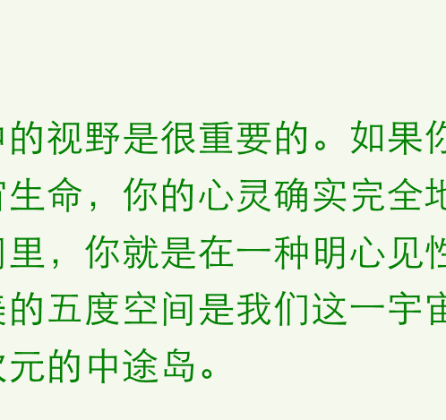

> *"IS2 helps to bridge the gap between complex data and everyday users."*

```python
import is2
model = is2.Model()
result = model.run(data)
print(result)
```

| Version | Date       | Description      |
|---------|------------|------------------|
| 1.0     | 2023-01-15 | Initial release  |
| 1.1     | 2023-06-20 | Bug fixes        |
| 2.0     | 2024-03-01 | Major update     |

### 1. What is a system administrator?

A system administrator (sysadmin) is a person responsible for the configuration and reliable operation of multi-user computer systems. They also make sure that the performance, availability, and security of these systems meet the needs of the users. As a system administrator, you play a vital role in the IT infrastructure, server operations, and networks of every company, whether it's a tech-focused organization or a local shop with a website.

A system admin often does more than just maintaining the systems. They plan and respond to outages and different problems. They work with different teams to make sure the systems are up-to-date. They also upgrade, patch, and configure the company's servers. Some system admins have additional roles, like maintaining cloud services and installing workstations.

### 2. What does a system administrator do?

The job of a system administrator can be different depending on the company they work for. Typically, a sysadmin performs the following tasks:

- Installing and configuring software and hardware
- Managing user accounts and permissions
- Monitoring system performance and security
- Performing regular backups and disaster recovery
- Troubleshooting issues and providing support
- Automating routine tasks using scripts

## 3.2 GAN简介与基于PyTorch的实例

我们来编写一个GAN的PyTorch实现，这是一个非常简化的版本，几乎是最简单的GAN。简化的原因在于这个实例能让有经验的读者快速理解GAN核心，初学者更容易上手。然后更为复杂的GAN，如DCGAN、WGAN、CGAN等都是在原始的基础上加上一些变化而已。在后面的章节中，会讲到这些不同的GAN结构。如果读者对GAN特别感兴趣，也有大量的额外资料去阅读。

这里使用的数据集是MNIST，因为数据集足够简单，实现的原型也简单。

### 3.2.1 导入库

```python
import torch
import torch.nn as nn

import numpy as np
import matplotlib.pyplot as plt

from torchvision import datasets
import torchvision.transforms as transforms

from torch.utils.data import DataLoader

%matplotlib inline
```

### 3.2.2 架构

这里我们用全连接神经网络作为基础，选择MNIST作为数据集。有下面几个步骤：

#### 判别网络

判别网络的结构为：输入为28×28的MNIST图片，通过Relu激活后，输出为1个节点，即对该图像为真的判断概率。具体实现如下：

```python
class discriminator(nn.Module):
    def __init__(self):
        super(discriminator, self).__init__()
        self.model = nn.Sequential(
            nn.Linear(28*28, 1024),
            nn.LeakyReLU(0.2),
            nn.Dropout(0.3),
            nn.Linear(1024, 1),
            nn.Sigmoid()
        )
    def forward(self, x):
        x = x.view(-1, 28*28)
        return self.model(x)
```

在判别网络的forward函数中，将输入x展开成一维向量。

## A.3 The special numbers 1 and 0

The simplest special numbers are 1 and 0. Here are some of their properties:

- For any real number a, a · 1 = 1 · a = a.
- For any real number a, a · 0 = 0.

(One step of calculation is often omitted.) See Table A.1 for more examples.

The number 0 also has a special property:

- If the product of two numbers equals 0, then at least one of the numbers is 0.
  In symbols: a · b = 0 ⇒ a = 0 or b = 0.

This is often called the **zero-product property**.

| Property | Example |
| --- | --- |
| Multiplicative identity of 1 | 7 · 1 = 7 |
| Multiplication by 0 | 7 · 0 = 0 |
| Zero-product property | (x – 4)(x + 3) = 0 ⇒ x = 4 or x = –3 |

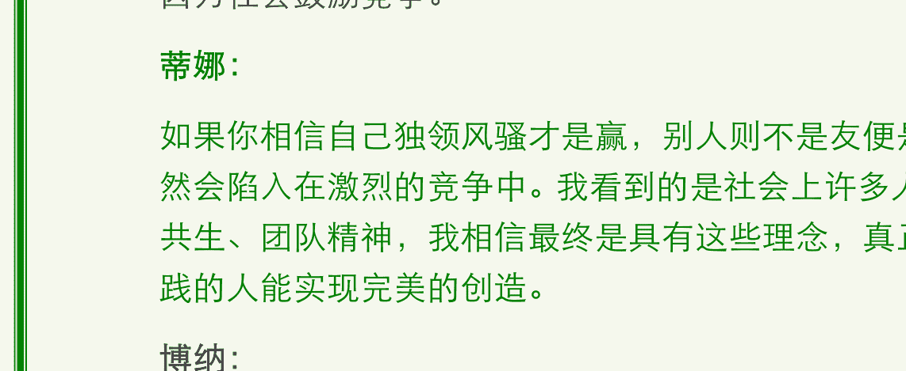

*Table A.1*: Special properties of 0 and 1

## A.4 The reciprocal and division

The **reciprocal** of a nonzero number a is the number that, when multiplied by a, gives 1. The reciprocal is denoted as 1/a.

> The number 0 does **not** have a reciprocal.

## 隐私政策

- 引言
- 我们收集的信息
- 信息的使用
- 信息的共享与披露
- 信息的存储与保护
- 您的权利
- 变更
- 联系我们

引言
欢迎您使用我们的服务！我们深知隐私对您的重要性，并郑重承诺严格保护您的个人信息。本隐私政策旨在向您说明我们如何收集、使用、存储和保护您的个人信息。请您在使用本服务前仔细阅读本政策。

### 我们收集的信息

- **账户信息**：如用户名、密码、电子邮件地址等。
- **设备信息**：如设备型号、操作系统版本、唯一设备标识符等。
- **使用信息**：如您访问的页面、点击的链接、停留时间等。
- **位置信息**：当您授权后，我们可能收集您的位置数据以提供相关服务。

### 信息的使用

我们收集的信息用于以下目的：
- 提供、维护和改进我们的服务；
- 与您沟通，包括发送服务通知和更新；
- 分析和研究，以提升用户体验；
- 保障服务安全，防止欺诈和滥用。

### 信息的共享与披露

我们不会将您的个人信息出售给第三方。但我们可能在以下情况下共享您的信息：
- 获得您的明确同意；
- 法律要求或响应法律程序；
- 保护我们的合法权益；
- 与合作伙伴共同提供服务（该等合作伙伴需遵守保密义务）。

## Illustration of the training pipeline of SEED

This figure shows the training pipeline of SEED. The figure consists of three main parts: data preparation, multi-target training, and utilization for inference.

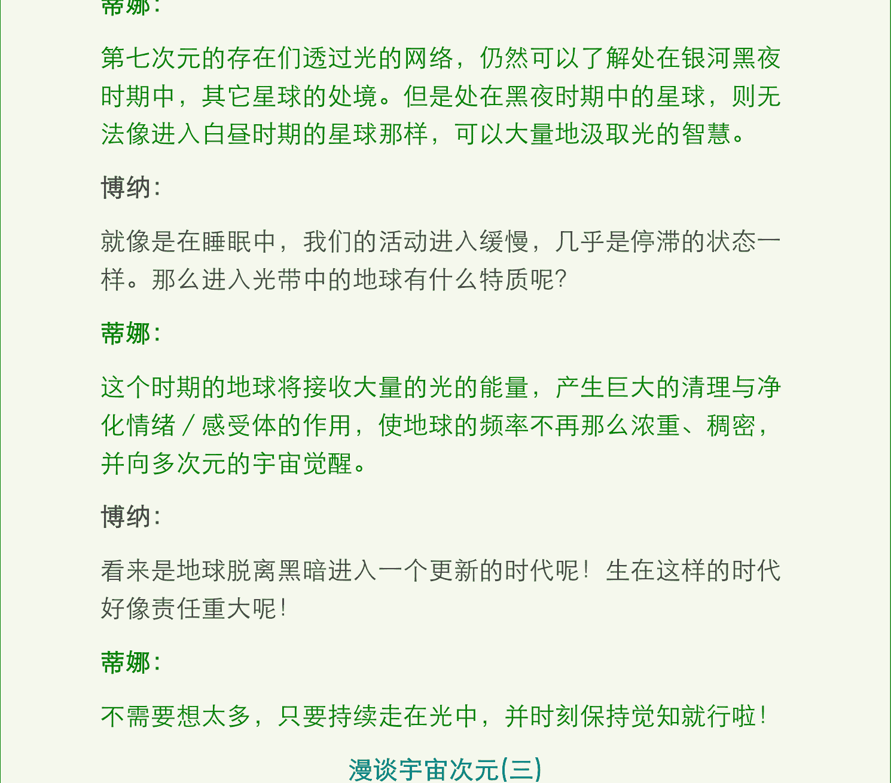

The first part (left) shows data preparation: Images (CC3M) and their captions, along with detected objects (using DETR) and their bounding boxes and labels, are processed. The second part (middle) shows multi-target training with three objectives: (1) Image-Text Contrastive (ITC) loss; (2) Learning with a Momentum Teacher using Masked Data Modeling (MDM) and Contrastive Completion (CoCo); (3) Learning with a frozen pre-trained object detector for visual grounding. The third part (right) shows the utilization for inference: the learned visual encoder is used for zero-shot image classification and image-text retrieval.

### 配置项目

我们在 `App.vue` 中导入组件，然后在 `components` 中注册。这样组件就可以在其它的地方使用了。

```javascript
import MyComponent from './components/MyComponent.vue'

export default {
  name: 'App',
  components: {
    MyComponent
  }
}
```

### 使用组件

在模板中使用组件：

```html
<template>
  <div id="app">
    <MyComponent />
  </div>
</template>
```

这样，`MyComponent` 组件就会在页面上渲染出来。

## 5/24/22, 10:28 AM

## CSE 391: Breakpoints and Airdrop — Task Description

This assignment is meant to give you more practice with breakpoints and examine an Airdrop vulnerability. In this assignment, you will design a task that requires using at least two breakpoints in GDB and demonstrates a vulnerability of Airdrop.

### Task Description

You are to create a C++ program that will do the following:

- It will ask the user to input a message (a string) and a number (an integer).
- It will then tell the user how many times the number is divisible by 2 (i.e., output the exponent of the largest power of 2 that divides the number).
- It will then print a modified version of the message where each character is shifted by that exponent in the alphabet (like a Caesar cipher). Only letters should be shifted; non-letter characters should remain unchanged.
- Finally, it will output the number of vowels in the shifted message.

### Example Run

Here is an example run (user input in bold):

> Enter a message: **Hello World!**
> Enter a number: **28**
> Number is divisible by 2 exactly 2 times.
> Shifted message: Jgnnq"Yqtnf#
> Number of vowels in shifted message: 0

In this example, the number 28 is divisible by 2 twice (since 28 = 7 * 2^2). Each letter in "Hello World!" is shifted forward by 2 in the alphabet (with wrap-around for z → b, etc.), producing "Jgnnq Yqtnf!". The shifted message has 0 vowels (none of the letters are a, e, i, o, u).

### Requirements

蒂娜：

一沙一世界，共业中有别业，如果你选择与贪婪、憎恨的人同流合污，你的体验将会是世界末日或圣经启示录所描述的世界。然而，如果你自身先做到这点，你就会生活在一个提升的，较高灵性的世界。

博纳：

但我希望我的家人、朋友、周围的人都能生活在一个提升的，美好的世界中。

蒂娜：

那就送光给他们，让较高次元的讯息引导他们。还有，不是所有的人在这地球上都得亲身经历邪恶，有时是邪恶的事情发生在他们的周围，也足以导致心灵的伤痛，迫使他们从中去学习理解与宽恕，并向光的更高次元觉醒。

博纳：

是的，我相信这一点，因为我知道这是你的现身说法。关键在于这种时候，要有人可以从旁支持与理解他们，才能帮助他们走出惊吓、彷徨与迷惘。就像当时你有 TONI 与《光的课程》帮助你走出那段黑暗的历程一样。

蒂娜：

是啊！所以你要做好准备，成为执行任务的天使。也许那一天正好需要你表演一场英雄救美的连续剧。

博纳：

嗯，这倒是说服我好好修天使级次的理由呢。

蒂娜：

如果单纯为了这个理由，也还是出自你的 EGO 喔！不过我知道你是在回我的玩笑。你实在很幸运，不必经历那些压倒性的伤痛，便已向自性里的光及较高次元觉醒。这将使你们省去许多弯路及不必要的学习课程。

博纳：
说到向较高次元觉醒，你说第九次元，是一个统合由各种微细频率（subtle frequencies）所交织而成之种种实相的区域。是这一银河星系的政务中心，那为什么不管管我们这个纷争多端的星球呢？

蒂娜：
地球是一个被赋予自由意志的实验室，而地球做了在两极中学习，以及要经历、体验所有次元的选择。每个灵魂都可以选择停留在四度空间以下的剧场中，或选择回归较高次元。因此，他们不会干预我们的选择。

博纳：
这样的话，第九次元好像就与我们没有太大的关系了。

蒂娜：
不要忘了，每个次元都与我们息息相关。第九次元以永恒三摩地（samadhi）的定境,与来到这次元的存在们分享在这种境界中的感受。它所散发的能量之波，是一种核能般的巨大力量，支撑着第八次元光的网络的运作。

博纳：
我想起来了，根据来自昴宿星团的数据显示，耶稣来自这一次元。他的诞生，使较高次元的能量，以及基督意识得以穿越第四次元的天蓬进入地球。这表示他们还是非常关爱地球的生命与进展。只是他们以教导来带领我们，而不是以管束来干扰们，这是真正的爱与尊重。

蒂娜：

是的，因为地球选择经历所有的次元，因此，人类自身便具备了九个次元的智慧。然而，当地球处于宇宙黑夜期的时候，完全失去这种觉知，因此他选择在双鱼座时代降生地球，唤醒人们内在的基督自性，为人类进入宝瓶座纪元也就是光的纪元做准备。

博纳：

可以谈谈为什么进入光的纪元要做一些特别的准备吗？

蒂娜：

因为在宇宙轨道中运行的地球，在这一循环中，走到宝瓶座纪元时便进入光带（Photon Band）；而地球是如何在「宇宙黑夜期」与「光带」之间运行？这「光带」所带给地球的影响是什么？以及为什么地球及地球人类要在这曙光中做好准备？……等种种的问题，则又是另一个宇宙科学的探讨领域，我不知道我们是否都做好进入这种探索的准备。

博纳：

我得承认在这一连串的宇宙次元的探讨中，有许多地方我确实是似懂非懂，但对我来说，还是比坐在那儿看一些把我们当呆瓜的新闻媒体的报导、无聊的电视节目或电影好一些。何况在我们反复的探讨中，有时候我们回头从不同的角度去谈时，我常常会有恍然大悟的喜悦。

蒂娜：

是的，有些新闻媒体的报导、电视节目或电影，常常让我感到人类的心智与人格被耍弄、被贬低的沮丧，但这是社会大多数人所要的，他们才得以如此猖狂。好在还是可以看到一些宣扬社会光明面的节目。否则连我都不会相信我们真的处在新纪元的曙光中。

博纳：

我知道有一位在美国办儿童教育的老师，要求她的学生家长不要让孩子们学期中看电视，不知她是出于什么样的观点。

蒂娜：

有一段来自昴宿星的讯息说，许多电视节目不仅降低人的智慧，也损害人的免疫系统。你越是允许某些团体为了他们自身的利益，利用电视或新闻媒体操弄你的思想，或因他们耸人听闻，煽动性的言论而感到愤怒或恐惧，你就越是会感到受到伤害、无力与无助。

博纳：

我觉得最大的致命伤是，一旦被吸引，不但自己的思想、感觉被牵着走，许多该做的事也不想去做了。

蒂娜：

那么就让我们关掉电视，继续向多次元的宇宙探索吧。

## 漫谈宇宙次元（四）

博纳：

有人向我提出一个问题，说既然我们的自性是完整的，为什么还要清理与净化，他的意思是我们不需要经由光的课程来提升与转化，因为我们本来就是完美的。

蒂娜：

我们灵魂的初始状态是清净完美的，这一点是没错。但是，当一部份的我们决定体验地球的生命时，在学习与体验的过程中，我们扭曲了那原有的实相。我们变得只知道有三度空间的存在，对时间与空间的认知是直线性的，而非全面的整体性。我们生活在恐惧中，失去了原有的和谐。在恐惧中，我们的思想使我们不停地制造不平衡的因果，致使我们身体的细胞也因不平衡而衰败，因此我们的身心都需要治愈，治愈指的是是调整、恢复我们原有的平衡与完美。

博纳：

既然破坏了，又如何恢复呢？恢复的方法又是怎样的呢？

蒂娜：

人类细胞里的基因具有恒星作用（stellar contributions），因此我们必须唤醒我们恒星细胞的基体(stellar-cell)，往往无法在第一次的学习中便能领悟到宇宙意识，仍然局限在三度空间直线性的思想意识，使我们无论怎么做，都会有所偏颇。

蒂娜：
学习任何东西，都要用心地反复体会，才能熟练应用。有人因一时未能领悟而不再向前迈进，但也有很多人随着内在心灵的呼唤，反复习修，以信心与期望继续走下去。终于在身心上获得调整，在生活上达到自由与喜悦。

博纳：
我觉得修光的课程却未能进入行星课程，确实有入宝山而空归的感觉。因为如果不进入宇宙意识，我们的思想与心胸便无法扩展，使自己的生命也陷入在停滞的状态中。

蒂娜：
进入千禧年之后，地球进入光子带（Photon Band），势必展开明显的两极分化。这也就是为什么我们从另一角度来探索宇宙次元，并传递一些较高次元的讯息，期望大家能从一些基本概念中做出自己要朝那个方向前进的选择。

博纳：
我们要在什么样的两极中做选择呢？

蒂娜：
一是选择清理、去除与我们内在纯净本质无关的事物，随着宇宙进展的律动而进展。一是继续停留在迷乱恍惚，纸醉金迷，色欲衡流的巫毒世界中打转。

博纳：

我只知道地球进入宝瓶座纪元即是进入千禧年，但我不知道进入宝瓶座纪元就是代表进入光的纪元，也不知道进入光的纪元与地球人类的进展又有什么样的关联？

蒂娜：

所有的星球都在银河中运行着，并经历不同的阶段而成长，地球也不例外。每隔 26,000 年，我们的太阳系进入光子带，地球在这一循环中正好是在宝瓶座纪元的时期中进入光子带，因此又称之为光的纪元。星座的转移属于星象学的范畴。

博纳：

星象学与我们在宇宙中的进展

正确地学习与运用，逐步地与恒星在银河轨道的运行中融合，可以使我们从中学习如何客观地掌握自己的情绪，去侦测自己的行为，去了解自己的梦境、潜力以及灵性脉冲。它使我们看到自己在生命剧场中所演出的过去、现在、未来的戏剧是如何地矫情与虚假。它是昴宿星团及玛雅星用来协助我们返本归真的科学。一旦我们熟练掌握自我观察，或自我省思，我们便能了解通往其它世界的通道就在这些感觉中。

博纳：

在这光的途径上走了这么一段时间下来，我也开始能自我观察、自我省思了。我需要再去学习星象学吗？

蒂娜：

这是个人的选择。灵修不是一定要先成为一个星象学家。这是一门学问，如果你没有时间再去研究，只要时时保持觉知的在自我审视中，并时常运用光的能量清理与净化自己，可能的话，在一年中的春分、秋分、新月及满月时加强静心冥想即可。事实上，与恒星的运转周期同步调整是非常令人兴奋并极具创意的。它对于启动我们的宇宙意识是很有帮助的。

博纳：

看来地球在星际的运行中，要进入光子带或光的纪元，可不是常有的事，才会被当作是一件大事来谈。

蒂娜：

在银河中运行的地球，大部份的时间是处在银河黑夜期（Galactic Night）。大约每隔二万六千年，进入宝瓶座纪元时，地球便开始进入光子带。事实上，地球只有在狮子座与宝瓶座时代才进入光子带，其余的时间都在银河黑夜期。许多在银河黑夜期可以隐藏的事物，进入光子带之后，便无藏身之地，如果我们不能与光的频率，光的思想意识，光的较高智慧也就是

### 4.2.2.1. 页面抓取 (Web Scrape)

页面抓取是指提取包含在超文本标记语言 (Hyper Text Markup Language, HTML) 中的非结构化/半结构化的文本信息。页面抓取是使用"本地提取"的方式进行的，即所有处理均在用户端完成，数据不会被发送到服务器，因此请求和页面中的所有数据都将保留在本地。

除了 HTML，页面抓取还可以用于获取 PDF、图像、视频等数据。然而，需要注意的是，PDF 等格式的文件通常不是特别规整，因此很难被呈现为准确的文本格式，使用文件加载器 (File Loader) 进行加载效果更好。

- Web Base Loader
- Async Chromium Loader
- Selenium URL Loader
- Selenium Aloader

其中，最常用的是 Web Base Loader 和 Selenium URL Loader。

#### 1. Async Html Loader

我们对一个数据源异步地加载 HTML 页面。支持加载本地 HTML 文件，同时也支持加载远程 HTML 页面。

```python
from langchain_community.document_loaders import AsyncHtmlLoader
urls = ["https://python.langchain.com/docs/modules/data_connection/document_loaders/"]
loader = AsyncHtmlLoader(urls)
docs = loader.load()
docs[0].page_content[:500]
```

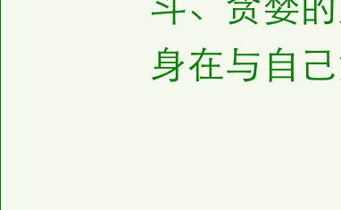

## 2.4 函数的连续性

函数连续性是微积分学中的一个基本概念，它描述了函数值随自变量变化而平稳变化的一种性质。

### 2.4.1 函数连续性的定义

**定义2.4.1** 设函数 $y=f(x)$ 在点 $x_0$ 的某个邻域内有定义，如果

$$\lim_{\Delta x \to 0} \Delta y = \lim_{\Delta x \to 0} [f(x_0+\Delta x)-f(x_0)] = 0$$

则称函数 $y=f(x)$ 在点 $x_0$ 处连续。点 $x_0$ 称为函数的连续点。

**定义2.4.2** 设函数 $y=f(x)$ 在点 $x_0$ 的某个邻域内有定义，如果

$$\lim_{x \to x_0} f(x) = f(x_0)$$

则称函数 $y=f(x)$ 在点 $x_0$ 处连续。

### 2.4.2 连续函数的运算法则

- 如果函数 $f(x)$ 和 $g(x)$ 均在点 $x_0$ 处连续，那么它们的和、差、积、商（分母不为零）也在点 $x_0$ 处连续。
- 如果函数 $u = \varphi(x)$ 在点 $x_0$ 处连续，且函数 $y = f(u)$ 在对应点 $u_0 = \varphi(x_0)$ 处连续，那么复合函数 $y = f[\varphi(x)]$ 在点 $x_0$ 处连续。

## 任务目标

在本次课程设计中，我们将利用大数据相关技术，对一个真实的数据集进行分析和挖掘。通过完成一系列任务，巩固并提升大数据处理的实践能力。

- 数据采集与预处理
- 数据存储与管理
- 数据分析与建模
- 结果可视化与报告

## 数据集说明

本次实验所使用的数据集来源于某电商平台，包含用户交易记录、商品信息及用户行为日志。数据量约为500MB。

| 字段名 | 类型 | 说明 |
|--------|------|------|
| user_id | string | 用户ID |
| item_id | string | 商品ID |
| amount | float | 交易金额 |
| timestamp | int | 时间戳 |

### Hacker News

- new | past | comments | ask | show | jobs | submit

1. Show HN: Dotenv, a Bash script to load .env files (github.com/ianmiell)
   **152 points by ianmiell 4 hours ago | hide | 88 comments**

2. Show HN: A terminal emulator in pure PHP (github.com/soloterm)
   **44 points by soloterm 3 hours ago | hide | 14 comments**

3. Ask HN: Is a master's degree in CS still worth it in 2024?
   **87 points by anonymous 5 hours ago | hide | 93 comments**

4. Launch HN: Diagrid (YC W23) – Serverless Dapr for Kubernetes, from the creators of Dapr
   **18 points by yaron 2 hours ago | hide | 3 comments**

5. Show HN: Scribe – a simple, fast note-taking app (github.com/eleith)
   **69 points by eleith 6 hours ago | hide | 34 comments**

6. If you need to learn a new skill, teach someone else (linkedin.com/amy)
   **112 points by amy 7 hours ago | hide | 25 comments**

More

## 概念辨析：文化与文明

在学术研究中，“文化”与“文明”是两个常被混淆但内涵不同的概念。文化更多指向群体共享的意义、价值观、信仰与行为模式，而文明则通常被理解为一种更复杂的社会发展阶段，包括城市、文字、国家制度等要素。

- 文化：侧重于精神层面，如语言、习俗、宗教、艺术等。
- 文明：侧重于物质与制度层面，如技术、法律、城市组织等。

> 文明是文化的物质形态与制度外化，而文化则是文明的精神内核。—— 某学者

### 两者关系对比表

| 维度 | 文化 | 文明 |
|------|------|------|
| 核心 | 价值观、信仰 | 制度、技术 |
| 表现 | 习惯、艺术 | 城市、法律 |
| 传承 | 无形（口传、仪式） | 有形（建筑、文献） |

## 基于生成扩散模型的低光图像增强方法研究

低光图像通常亮度不足、对比度低且噪声明显，为后续视觉任务带来巨大挑战。近年来，生成扩散模型在图像恢复领域展现出强大潜力。本文提出了一种改进的扩散模型方法，通过对噪声估计网络的结构优化和条件引导策略，在保持图像细节的同时有效抑制噪声，最终实现低光图像的自适应增强。

实验结果表明，与现有方法相比，本方法在峰值信噪比(PSNR)和结构相似性(SSIM)指标上均取得显著提升。

### 模型架构

模型采用U-Net作为噪声预测网络的主干，并嵌入通道注意力模块以增强对亮度区域的选择性关注。前向扩散过程定义如下:

> $x_t = \sqrt{\bar{\alpha}_t} x_0 + \sqrt{1-\bar{\alpha}_t} \epsilon$

其中，$x_0$ 为原始图像，$x_t$ 为第t步加噪结果，$\bar{\alpha}_t$ 为积累噪声调度系数，$\epsilon$ 为标准高斯噪声。反向去噪通过训练神经网络预测噪声并逐步去除，恢复清晰图像。

### 实验结果与对比

| 方法 | PSNR (dB) ↑ | SSIM ↑ |
|------|-------------|--------|
| 传统Retinex | 16.74 | 0.689 |
| Zero-DCE | 18.21 | 0.723 |
| 本文方法 | 21.35 | 0.812 |

从上表可以看出，本文方法在客观指标上优于现有的传统方法和基于深度学习的方法，尤其在纹理和边缘保持方面具有明显优势。图1展示了不同方法在LOL数据集上的视觉增强效果。

### 结论

本文提出的基于生成扩散模型的低光图像增强方法，通过条件引导实现了亮度和细节的双重提升。实验验证了该方法的有效性和鲁棒性，未来可进一步扩展至视频低光增强场景。

## 《图灵传：智能的进化》第十章 图灵的思想实验

在《心灵哲学新论》中，查尔默斯（Chalmers）提出，意识是大脑信息处理过程中的一个基本属性，它伴随着特定的功能组织而产生。他认为，只要一个系统实现了正确的功能组织，它就会有意识体验。这种观点被称为“功能主义”的变体，它试图在物理主义和二元论之间找到一条中间道路。

**然而，一个关键的问题是**：图灵测试真的能检验智能吗？或者说，它仅仅检验了模仿人类行为的能力？

> “机器能思考吗？”这个问题本身就是一个糟糕的问题。它不是在问一个可以用实验来检验的事实，而是在问一个哲学上的分类问题。
> —— 路德维希·维特根斯坦

- **中文房间论证**：塞尔认为，即使一个系统通过了图灵测试，它也不一定具有真正的理解能力。
- **框架问题**：如何让一个智能体在有限的计算资源下，区分相关信息和无关信息。
- **符号落地问题**：如何让一个符号系统与真实世界的意义联系起来。

我们的各个体系中都有需要释放的杂质，由这些杂质所形成的负面模式，形成一种基因记忆，储存在我们的以太星光体中。许多负面的模式，譬如有些前世的疾病，因打预防针，吃消炎药或放射性治疗之故，无法发作以便从记忆中清除，便储存在与我们的身体、情绪体、理性思想体相对应的以太星光体之中。

**博纳：**

那光如何又如何清除我们在以太星光体上的杂质呢？

**蒂娜：**

光量子是一种极小的电磁量子，永远充满着电子，生命期是无限的。这些电子的活动可以释放我们身心上沉重稠密的频率，使我们可以深入自己的潜意识，以释放负面的因果，我们越是探索自己的因果，我们的生命就越能充满光量子的能量来引发我们思想、情绪与身体的转化。

**博纳：**

如果不是有意识地在光的运作中做身心意识的转化，会是怎样的过程呢？

**蒂娜：**

扭曲的思想意识常常会带来身体的疾病，至于会呈现什么状态则因人而异。简单来说，如果不是经由有意识地转化，通常就是透过自己的免疫系统来治愈或以承受痛苦或经由死亡来释放。

**博纳：**

这么说选择有意识地清理与治愈还是很重要的。因为免疫系统也是要在身心意识正常、平衡的状态中才能发挥它的功能。

**蒂娜：**

自从 1994 年地球进入光子带之后，人类各个体系上的杂质便开始受到强烈的引发。人类的四个较低体系的稠密度可以说都集中到身体上。看着身边的人走在疾病所带来的痛苦与死亡的过程中，我时常感同身受，也会觉得痛苦。然而，要经由什么样的过程来转化，完全是个人的选择。即使是自己的亲人，我们也是既无法替代，也无法干预他们的选择。

## 漫谈宇宙次元(七)

**博纳：**

在谈了这么多次元之后，我很好奇地球上有谁是从其它次元来的？

**蒂娜：**

根据昴宿星团的讯息表示：梵谷是许多由昴宿星团前来投生地球的灵魂之一。他因画盘旋的星团而被囚禁。

**博纳：**

科学的发现总是比这些进展的灵魂慢了许多步。现在科学家已发现有些星团确实是呈现螺旋式地盘旋着。

**蒂娜：**

梵谷作为昴宿星团的灵魂，创作过程是极具自由与具创造力的，然而，他能完全感到线性的空间与时间所带来的羁绊，这使他非常恐惧。他确实是看到这些螺旋式盘旋着的星团，这是多次元视野的本能。研究梵谷所画的星星，将帮助我们看到我们的太阳实际上是昴宿星团的一部份。这就是为什么昴宿星团更容易接近我们，因为我们的太阳正好是盘旋在昴宿星团的周围。

**博纳：**

听来整个银河星系的轨道是相通的。

**蒂娜：**

是的，整个九次元正好安装在第十次元中，也就是说整个银河星系是一个有着十个次元的宇宙智能系统，它在九个次元中表达它自身。它含融一切我们所能感受到的万事万物，它无以名之，无法用我们语言来解说，也不是我们现在的心智所能理解的。

### 4.6 快速截断指数函数 RQMC

快速截断指数函数选择方法(inverse function of truncated exponential)的基本思想是选择被控变量的值，使得它的累积分布函数的反函数等于一个随机数，并且这个随机数是通过一个快速算法生成的。

设被控变量x的取值范围为[0, L]，其概率密度函数为指数形式

λ e^{-λ x} / (1 - e^{-λ L})

则可得到如下显式表达式：

x = - (1/λ) ln(1 - ξ(1 - e^{-λ L}))

其中ξ是[0,1]上的均匀分布随机数。

从公式(4.6.1)可以看出，如果λ值较小，例如λ=0.01，那么e^{-λ L}≈1，则公式中ln(1-ξ(1-e^{-λ L}))≈ln(1-ξ)。由于ln(1-ξ)与ln(ξ)具有相同的分布，可以直接替代，避免了复杂的对数运算。具体来说，对于较小的λL（例如λL<0.1），我们可以利用Taylor展开：

e^{-λ L} ≈ 1 - λ L + (λ L)^2/2

代入公式后可得

x ≈ - (1/λ) ln(1 - ξ(λ L - (λ L)^2/2))

由于λL很小，- (1/λ) ln(1 - ξλL) ≈ ξL，即近似为均匀抽样。当λL较大时，直接使用原公式即可。

这种方法称为**快速截断指数函数随机数生成算法(Quick RQMC)**，可在蒙特卡罗模拟中高效地产生服从截断指数分布的随机变量，适用于粒子输运、金融风险分析等领域。

—— 摘要基于《蒙特卡罗方法》第4章内容 —

> 注：原文包含公式4.6.1-4.6.3，此处标记为引用格式以便于识别。

## OpenStack Architecture

OpenStack is a cloud operating system that controls large pools of compute, storage, and networking resources throughout a datacenter, all managed through a dashboard that gives administrators control while empowering their users to provision resources through a web interface.

### Core Components

- **Nova** (Compute) - Manages the lifecycle of compute instances
- **Neutron** (Networking) - Provides networking as a service
- **Cinder** (Block Storage) - Persistent block storage for instances
- **Glance** (Image Service) - Stores and retrieves virtual machine images
- **Keystone** (Identity) - Provides authentication and authorization
- **Horizon** (Dashboard) - Web-based self-service portal

### Deployment Options

- All-in-one deployment
- Multi-node deployment
- Containerized deployment using Kolla
- Manual deployment with Ansible

| Component | Description | Default Port |
|-----------|-------------|--------------|
| Nova | Compute service | 8774 |
| Neutron | Networking | 9696 |
| Cinder | Block storage | 8776 |
| Glance | Image service | 9292 |
| Keystone | Identity | 5000 |
| Horizon | Dashboard | 80/443 |## 4. 配置云平台访问

您需要注册云平台并创建一个具备所有查询权限的账号。具体操作，请参考您使用的云平台的官方文档。

- 阿里云：用户 AccessKey（主账号或 RAM 账号）
- 华为云：用户 AK/SK（主账号或 IAM 账号）
- 腾讯云：用户 SecretId/SecretKey（主账号或子账号）
- AWS：用户 Access Key ID/Secret Access Key（主账号或 IAM 账号）
- 其他云平台：对应的访问密钥

请确保您的密钥具备所有资源的查询权限，包括但不限于云服务器、弹性IP、负载均衡、存储等。

> 注意：请不要使用主账号密钥在生产环境中，建议使用子账号并仅授予必要的权限。

难怪我觉得这个时代身体与情绪上有问题的人特别多，原来无论修或不修，光子带都会一视同仁地迫使大家进入 Process，但是不理解这种清理过程的人，便不了解自己在什么状态中，形成愤怒、恐慌与紊乱，这种人身上好像到处都是地雷，一不小心就会被炸得遍体鳞伤。

## 蒂娜：

许多人受到光子带的影响，开始排除身体的毒素与情绪上的障碍，但因不知如何配合这种清理与转化，使身体产生许多疾病，情绪上则有许多莫名的，无法控制的愤怒。这种状态对修光的人来说也是不可避免的。然而，与别人不同的是，我们可以在觉知中运用上师们所教我们的各种不同的光的工具，以智慧与力量来走过这过程。

## 博纳：

然而，我看到许多同学虽然拿了各种工具，一样地发得很厉害，过程一样很辛苦啊！

## 蒂娜：

这些工具不是让我们停止身体或情绪体的排毒过程，我们一样要经历毒素浮现的痛苦及清理与治愈的过程，大部份的同学最终都得以在光的运作中，靠自己的力量获得平衡与治愈。只是有些同学的过程较长，也许是因为他们被冲击得昏天地暗，忘了在光中运作之故，这时同学们清理与净化之过程的分享，可以提醒他们，支持他们走过这些过程。我常常对同学们说，无论是自修或共修的人，往往拿了工具，只会像小狗埋骨头一样地把它藏起来，然后就忘了自己有一根骨头，当然产生不了太大的作用。话说回来，工具的使用也是需要一段时间的练习与掌握，就像我们学习外国语言、球类运动、烹饪、缝纫、音乐、美术一样，即使给我们再多的工具，我们还是不能以「道具取胜」，必须要靠自己的用心学习、体会与练习。因此往往是走过一遍之后，再回头复习的时候，才稍能掌握光的能量运用的诀窍。

## 博纳：

所以不能怪是教师们带得不好啊！很多人以为会通灵的教师才具有治愈的力量。

## 蒂娜：

光的课程与通灵我们先前谈过，不再重复。但是要知道好的教师是引导你以自己的内在力量来调整与治愈，而不是靠他们所给你的外在力量。纪伯伦在《先知》一书中，被问到教导时，他说： 「除了那在你知识的曙光中半醒半睡的事物之外，没有人能够教给你些什么。 走在庙堂的阴影下，行在追随者群中的教师，传授给人的，与其说是他的智慧，毋宁说是他的信实与慈爱。他若真有智慧便不会令你进入他的智识殿堂，反而会引领你跨过自己心志的门坎。」以上这段出自刘佩芳先生的翻译，晨星出版社所出版，全文要你自己去看。

## 博纳：

这本书篇篇都很精彩，也是要一看再看，慢慢咀嚼，才能获得它的精髓。

## 蒂娜：

我们刚才谈到光子带不仅促使我们的身体排出毒素，也能清理我们情绪上的毒素，这些毒素事实上是一种元素，如果我们不努力转化这些元素，它一样也会排出来，这样不仅会影响我们的身体与情绪，也会影响周围人的身体与情绪。你是否注意到在思想与情绪健康的家庭中生长的孩子是茁壮的，在思想与情

## Generative AI on Vertex AI

This document shows you how to use Generative AI on Vertex AI. Vertex AI offers access to the Gemini API for text generation, multimodal generation, and more.

- **Text generation**: Generate text from a text prompt.
- **Multimodal generation**: Generate text, images, and other content from multimodal prompts.
- **Chat**: Have a multi-turn conversation with a model.

| Model | Description |
|-------|------------|
| Gemini 1.0 Pro | Best for text-only tasks |
| Gemini 1.0 Pro Vision | Best for multimodal tasks |

> Note: Quotas apply to all models.

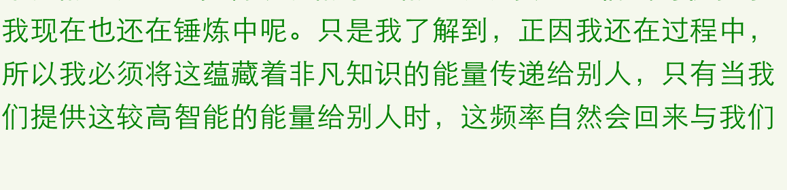

The present invention relates to a method and system for detecting and identifying objects in an image, particularly for use in autonomous vehicle navigation and perception systems. The method comprises receiving an image from a camera sensor, processing the image through a convolutional neural network (CNN) to generate a feature map, applying a region proposal network to the feature map to generate candidate object regions, and then classifying the candidate regions using object detection and classification networks. The system further includes a memory module for storing object identity vectors and uses a tracking algorithm to maintain consistent object identification across frames. The invention improves the accuracy and robustness of object detection and tracking in dynamic environments, thereby enhancing the performance of autonomous driving systems.

In a preferred embodiment, the convolutional neural network comprises a plurality of convolutional layers, pooling layers, and fully connected layers. The image is preprocessed by resizing it to a fixed resolution and normalizing pixel values. The region proposal network generates bounding box proposals with corresponding confidence scores. Non-maximum suppression is applied to reduce overlapping proposals. The proposed method also includes a re-identification network that produces a feature vector for each detected object, enabling the system to re-identify objects after temporary occlusion or movement out of the camera's field of view.

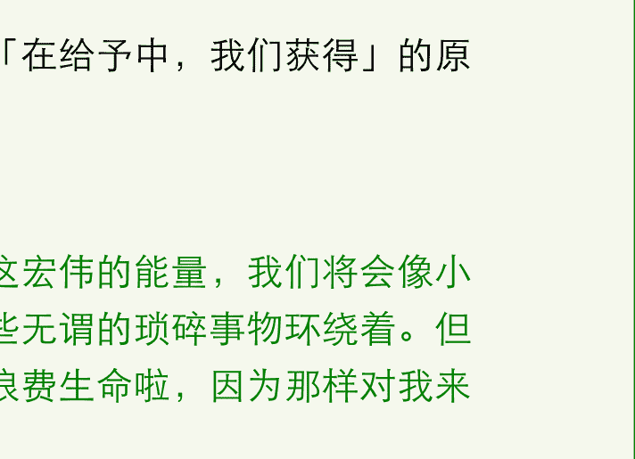

## Experiment Results

| Method | mAP (%) | Recall (%) | Processing Time (ms) |
|--------|---------|------------|----------------------|
| YOLOv4 | 63.4 | 71.2 | 45 |
| Faster R-CNN | 69.8 | 78.5 | 120 |
| Proposed Method | 72.5 | 81.3 | 87 |

The experiment results demonstrate that the proposed method achieves higher mean average precision (mAP) and recall compared to existing methods, while maintaining competitive processing time. The improvement is particularly significant for small and occluded objects.

> The proposed method represents a significant advancement in real-time object detection for autonomous systems.

- Step 1: Image acquisition
- Step 2: Preprocessing (resize, normalize)
- Step 3: Feature extraction via CNN
- Step 4: Region proposal generation
- Step 5: Object classification and bounding box regression
- Step 6: Re-identification and tracking

```python
def detect_objects(image):
    features = cnn.extract(image)
    proposals = rpn.generate(features)
    detections = detector.classify(proposals)
    return detections
```

## 宏观杠杆率涨幅回落

宏观杠杆率是一国非金融部门的债务余额与国内生产总值（GDP）之比。

据国家金融与发展实验室（NIFD）发布的《2020年二季度中国杠杆率报告》，2020年上半年，宏观杠杆率从2019年末的246.5%上升到266.4%，共攀升了约20个百分点。一季度宏观杠杆率攀升约14个百分点，二季度攀升约6个百分点，增幅显著回落。

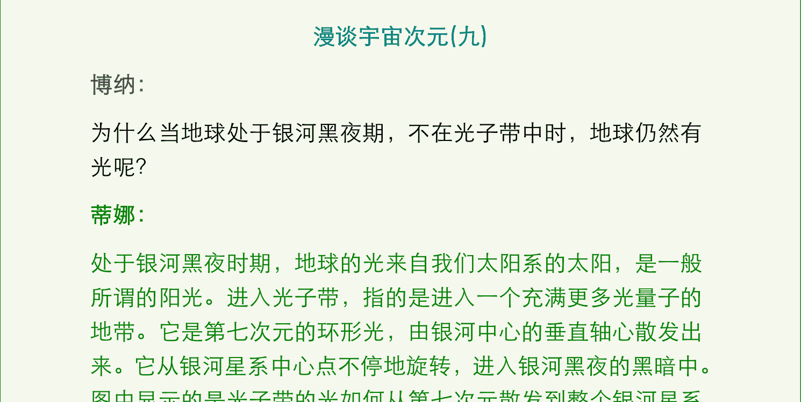

分部门来看，一季度企业部门杠杆率攀升是主要推动力，企业部门杠杆率从151.9%上升到161.8%，攀升了9.9个百分点；而二季度居民部门和政府部门杠杆率攀升较快。

总的来说，2020年上半年宏观杠杆率攀升是此前经济增速下滑与名义GDP增速大幅下滑的结果，随着经济复苏，下半年宏观杠杆率的攀升速度将显著放缓。

在那期间，大角星或猎户星等都会传递教导的讯息。当我们的太阳系在轨道中越是运行至黑暗的地方时，越是能接收到来自其它星系的智能。天狼星团的知识便是在银河黑夜期间启动的。在公元前 3,500 年至公元前 1,400 年那一段时期的文明中，天狼星团为他们所有在地球上的子民打开光的几何磁场。这种磁场被较高次元称之为蓝色尼罗河 (Blue Nile)。

## 博纳：

以诺之书谈到蓝色尼罗河，但我不能理解。就跳开了，只看一些我能懂的地方。我想那些不懂的地方在我该懂的时候就会懂。事实上光是去体会，领悟看得懂的地方，就受用无穷了。

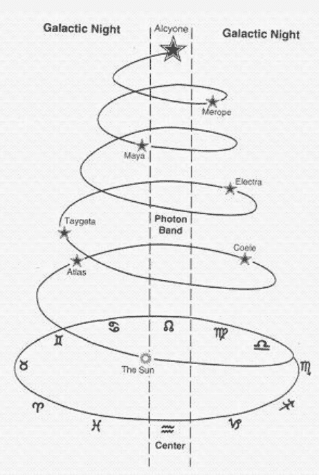

## 蒂娜：

你能像陶渊明那样读书不求甚解，真是帅呆了。灵性的东西，不能勉强，只有自己逐步打开时，才能逐步理解一些原本看不懂的东西。因此，一时看不懂的就跳过去，不要执着地硬是要用我们的头脑逐字地理解。时间到了，智慧打开了，自然会理解。

## 博纳：

那么地球是不是在光子带中，对人类就好像没有什么不同了，反正都有光照着我们啊。

## 蒂娜：

地球不在光子带时的频率比较沉重与稠密，人类的进展更多的是属于生物性的，灵性的进展非常缓慢。进入光子带时，经由光量子的清理与重整，人类的进展更多是属于灵性的。此外，

## 第2篇 NoSQL数据库基础

NoSQL数据库是指非关系型数据库,它与关系型数据库不同,不使用SQL作为查询语言,不保证ACID特性,通常具有良好的水平扩展能力。NoSQL数据库通常被分为四类:键值数据库、文档数据库、列族数据库和图数据库。

### 2.1 NoSQL数据库概述

NoSQL(Not Only SQL)数据库是一种非关系型数据库管理系统,它采用非关系型的数据模型来存储和检索数据。NoSQL数据库的设计目标是解决关系型数据库在处理大规模数据和高并发请求时的性能瓶颈问题。

#### 2.1.1 NoSQL数据库的分类

- **键值存储**:数据以键值对形式存储,典型产品有Redis、Memcached。
- **文档数据库**:数据以JSON/XML等文档格式存储,典型产品有MongoDB、Couchbase。
- **列族数据库**:数据按列族组织,典型产品有Cassandra、HBase。
- **图数据库**:数据以图的结构表示,典型产品有Neo4j、ArangoDB。

#### 2.1.2 NoSQL数据库的优势

- **高可扩展性**:轻松实现水平扩展。
- **高可用性**:通过数据复制和主从架构实现。
- **灵活的数据模型**:支持多种数据模型和动态模式。
- **高性能**:针对特定场景优化读写性能。

在后续的章节中,我们将依次介绍各类NoSQL数据库的详细特点和使用方法。

## 7.3.2 线性系统的高斯解

高斯在前面的研究中已见到有关正常方程的一些事实，并研究了将正常方程应用于线性系统的方法。在高斯的方法中，对于给定的线性系统，高斯用最小二乘法求解，并用一个正常方程表示这个系统。在处理这个正常方程时，高斯采用消元法，但并不同意这种方法，而给出了他自己的一种方法，即所谓的高斯消元法。在这种方法中，高斯用“行”操作对增广矩阵进行处理，最后得到一个阶梯形矩阵，也即一个上三角矩阵，然后回代求解。

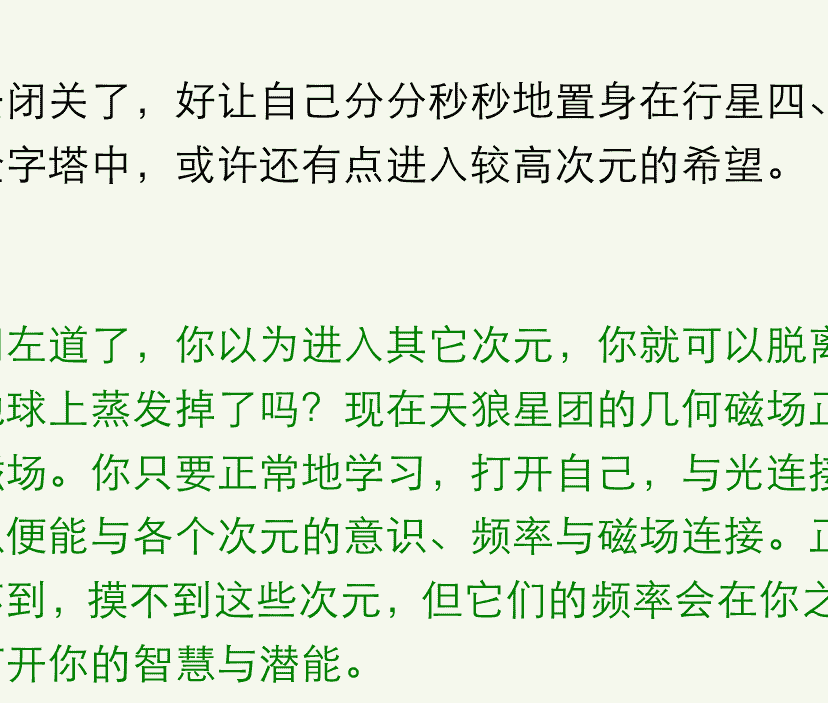

> 高斯（Carl Friedrich Gauss，1777—1855）德国数学家、天文学家、大地测量学家，近代数学的奠基人之一，被誉为“数学王子”。

高斯对数学的贡献是多方面的。在数论中，高斯证明了二次互反律，并给出了代数基本定理的证明；在天文学中，他创立了最小二乘法，并利用它准确地预测了谷神星的位置；在物理学中，高斯对电磁学做出了重要贡献，如高斯定理；在统计学中，高斯分布（正态分布）以其名字命名。此外，他在曲面理论、微分几何等领域也有杰出成就。

- 1777年出生于不伦瑞克
- 1799年获得博士学位，论文证明了代数基本定理
- 1801年发表《算术研究》，奠定了现代数论的基础
- 1807年担任哥廷根大学天文台台长

## H

o0 o0 o0 zo0 x0 I o0 o0 o0 o0 o0 o0 o0 o0 o0 0 0 0 0 0 0 0 0 0 0 0 0 0 0 0 0 0 0 0 0 0 0 0 0 0 0 0 0 0 0 0 0 0 0 0 0 0 0 0 0 0 0 0 0 0 0 0 0 o0 o0 o0 o0 o0 o0 o0 o0 o0 o0 o0 o0 o0 o0 o0 o0 o0 o0 o0 o0 o0 o0 o0 o0 o0 o0 o0 o0 o0 o0

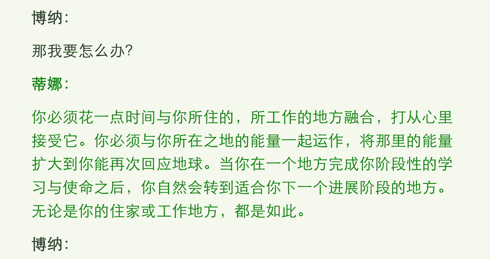

- Item A
- Item B
- Item C

Some additional text below the list.

## 博纳：

记得很早以前,有人问你说「光的课程」会把我们带到那里去,你反问他想去那里,现在我理解你不是在搪塞。要去那里,确实是要靠自己的意愿,与自己思想意识的进展而定。

## 蒂娜：

是的,上了「光的课程」,不比上了渡船般地,只管让船夫帮你摆渡到彼岸。我感到整个课程更像是一个锦囊,其中自有妙计;是一张寻宝图,每个人必须自己按图索骥,你从中所获得的,都是适合你在那一阶段所需要的,最终自己到达智慧的彼岸。

## 博纳：

确实是如此,我有同学说每当她在烦恼中时,随意打开光的课程的任何一个级次,任何一页,都可以看到温柔的,爱的提醒,自己便在恍然大悟中化烦恼为菩提。

## 蒂娜：

要知道,那是因为她走在这途径上已有一段时间,她能与课文中的文字、思想意识的频率共振之故,才发挥了它的功效,对不修这课程的人来说,无论拿起那一级次的教材,他所能看到的,只是一些浅显的文字,无法真正获得其中的能量所提供的献礼。

## 博纳：

说的也是,我以前读过不少励志性的文选,虽然读的时候有些领悟,但过后它是它,我是我,未能融会与整合,想必是我未切入与作者共振的思想频率中。这样说来,任何事物都有一段融会与整合的时间,难怪上师们把光的课程设计成一个漫长的课程,好在它还有结束的时候。

## 蒂娜：

与一个系统之能量的融合，就像夫妻相处那样，需要一段时间的磨合，因此要一段时间以后，才能真正融入在能量的运作中。我要提醒你的是，不要以为你把课文看完就可以志得意满，整个课程修完一次，只是学徒生涯结束而已，也许你粗糙的表皮磨掉一些，但真正自的我精练还是在那之后呢，当你如我们上次所讨论的那样，开始将这蕴藏着非凡知识的能量传递给别人；将这较高智能的能量提供给别人，这频率回来与你共振时，你才能达到真正的自我掌握。

## 博纳：

天啊……我还以为我自扫门前雪就可以了呢!

## 漫谈宇宙次元(十)

## 博纳：

你老是与我们谈清理杂质的问题，这些杂质到底是从哪里来的呢?

## 蒂娜：

如果我们静下来深入自己内在的黑暗，深入自己深藏的痛苦中时，我们便可以感受到某种较低、较稠密的障碍物梗塞在我们之内的某些角落。它们是一些2D(第二次元)的元素，在银河黑夜期我们创造了一些戏剧来学习，这些学习被我们带到在3D(第三次元)的身体中，成为我们与4D(第四次元)的思想、情绪共振的媒介，促使我们自编、自导、自演一幕幕的悲喜剧。我们就是在那悲喜剧的二元性中学习。

### 博纳：## Understanding the basics of machine learning

Machine learning (ML) is a subset of artificial intelligence (AI) that enables systems to learn and improve from experience without being explicitly programmed. It focuses on developing computer programs that can access data and use it to learn for themselves.

### Key Concepts

- **Supervised Learning**: The algorithm learns from labeled training data, making predictions or decisions based on that data.
- **Unsupervised Learning**: The algorithm finds patterns in unlabeled data, grouping similar items together.
- **Reinforcement Learning**: The algorithm learns through trial and error, receiving rewards or penalties for actions taken.

The following table highlights some common ML algorithms and their typical use cases:

| Algorithm | Type | Use Case |
|-----------|------|----------|
| Linear Regression | Supervised | Predicting continuous values (e.g., house prices) |
| Decision Trees | Supervised | Classification and regression tasks |
| K-Means Clustering | Unsupervised | Customer segmentation |
| Q-Learning | Reinforcement | Game playing and robotics |

> "Machine learning is the last invention that humanity will ever need to make." — Nick Bostrom

并审视自己从中学到了什么，一旦你真领悟到了，决定释放它们，痛苦的连续剧便会停止。

生的协助，还是必要的。无论是中医、西医、手术、中西合并，民俗疗法，都是合适的解决之道，它是上天所祝福的，因为挽救回来的生命，使你能持续地探索如何创造纯净的思想。

博纳：中医、西医、民俗疗法，各有优点与缺点，我们虽然不是要讨论医学，但如果面临必须选择一种疗法时，要如何抉择呢？

蒂娜：与内在自我连接的人，较高自我将巧妙地引导他们去找到适合的方式。

博纳：我赞同预防胜于治疗，但是除了尽可能清理自己做为预防之外，我想知道所谓前世带来的疾病是怎么一回事。

蒂娜：一些潜藏在身体的疾病，通常是由过去世的经验所形成的，在过去生因尚未具有圆满处理这些经验的能力，这些元素便形成一种肉眼无法看见的结晶，随着我们再度诞生地球时，储存在我们的以太星光体中，在身体与以太星光的思想、意识与能量的交流与互动中，逐渐转到身体上，潜藏一段时间之后，便具体显现成为疾病。如果你觉醒得早，在以太层面上，至少在潜伏期间，便将它清除，它便不会在你的身体上产生疾病。

博纳：上师们真的是细致到在「光的课程」中还安排了以太星光体的级次，只是没告诉我们为什么要清理以太星光体，所以我没把那一极次当做一回事，难怪行星级次修得很辛苦。有时还令我感到，是否走在光的途径上才会有许多令人困扰的事发生。

## 2014年下笔试真题

第1题 下列选项中，不属于栈基本应用的是（ ）？

- A. 递归
- B. 进制转换
- C. 迷宫求解
- D. 图的广度优先遍历

第2题 下列四个选项中，是合法的C语言字符常量的是（ ）。

- A.‘\t’
- B."A"
- C.‘ab’
- D.‘\082’

第3题 下列关于算法复杂度叙述正确的是（ ）。

- A. 最坏情况下的时间复杂度即为算法的时间复杂度
- B. 一个算法的时间开销就是该算法的时间复杂度
- C. 算法的空间复杂度是指算法某些部分占用的存储空间
- D. 如果一个算法没有发生调用，就不存在空间复杂度

第4题 下列选项中，不可能作为C语言标识符的是（ ）。

- A. _123
- B. _abc
- C. _define
- D. _1023

第5题 假设二叉树采用二叉链表存储结构，链表中结点结构为(lchild,data,rchild)，则该链表中的空指针数目（ ）

人身难得，除了感谢生我、养育我的父母之外，确实是要加紧习修。对了，我听说单子能量很具威力，它是否可以让我加速解决我在三度空间的困扰。

蒂娜：在「光的课程」中，这是习修的最后一个级次，这之后，上师们所编的这一特定的「光的课程」的教材便告结束。虽然在系列二的行星级次中，略略地提到单子能量，但他们让我们一直到习修完天使三之后，才真正带领我们进入这能量的运作。

博纳：难怪我忽略它了，我只是听到一位刚开始习修行星的同学说，他试了一下，很 powerful！使他的生命获得很大的转折。单子能量到底是那一次元的能量呢？

蒂娜：如果他没有在前面的级次中一路走来，我想他未必能启动单子能量。这像吃馒头一样，吃一个不饱，二个不饱，第三个饱了，你不能说早知道不要吃前面两个，只要吃第三个便可。现在回答你的问题：单子能量存在于所有次元中，就像所有光的频率一样，早就存在于我们的身体中，等待我们去启动。它是我们投生地球时，宇宙天父赋予我们的一颗夜明珠；它是让我们在第三次元中得以表达正确创造的工具，只是大部份的人忘了自己有

### **六、约束、结束活动与附加条款**

本修正案中提供的金额是针对下述条件提供，这些条件必须由制造商满足，才能获得上述金额。任何不符合这些约束条件的更正或提供都不符合本协议项下的付款条件。

- 现场访问、设计审核和最终调试必须由供应商完成。
- 供应商应免费更换最多 1 个转子并且提供最多 1 个变速箱。这些部件是作为最终提供的一部分。
- 供应商应免费更换最多 1 个定子绕组。
- 供应商应免费提供最多 2 个齿轮箱，或者如果定子绕组已免费提供，则提供 1 个齿轮箱。
- 供应商应免费更换最多 1 个逆变器。

如果制造商不能满足上述要求，则供应商可以自由地拒绝此方案，并可能根据相关法律寻求其他法律补救措施。

#### **7. 法律效力和约束力**

本修正案构成双方之间的完整协议，并取代之前就同一主题达成的所有口头或书面协议。本修正案可以以电子方式签署，每份副本应被视为原件，所有副本加在一起构成同一份文书。本修正案自最后签署之日起生效。

**签名：**

**日期：** ______

蒂娜：光量子是一种极小的电磁量子，不需要充电，生命期限是无限的。由于电子是生命的基本活动，它引发正电子的转化，也就是因果的转化。

博纳：因此，当我们太阳系的光量子不断地增加时，便加速了因果的转化。

蒂娜：是的，前人谈因果时都以三世因果或多生累劫的因果来形容。但你是否注意到，许多人所做所为的前因后果，在这一世便已有明显的回照，迫使他们在这—世便得开始去审视自己。

博纳：那么光量子与因果的转化之间有什么关系呢？

蒂娜：当我们释放因果时，反粒子与电子便在碰撞中形成光量子。这光量子使我们看到自己深沉的潜意识，并从中获得由光所产生的有与我们自身有关的新信息。

博纳：难怪习修《光的课程》，有意识地运用光的能量之后，光量子使我面对并释放许多负面因果。

蒂娜：是的，我们越是探索自己的

这是因光的能量将情绪体中的反粒子转化之后，引发电子在我们的身体体系中运作的原故吧。以前用脑意识的思想无法转化的情绪、习气或行为模式，进入行星级次后，就越来越容易看到自己明显的转化。

蒂娜：转化不是来自头脑的思想，而是来自释放身体中的反粒子，即以太星光体上的杂质。

博纳：所以只有在我们清除了身心上的杂质之后，进入光子带时，我们的磁场方能与大量的光量子融合。

蒂娜：是的，当我们释放了在银河黑夜期所产生的稠密、沉重与执着，回到我们原本的光的本质，即身体所有细胞都是纯智慧时，昴宿星团便集合在一起，解读我们的密码，与我们一起设定下一个 26,000 年的进展程序。

博纳：解读我们的密码？感觉好像他们在看我们的体检报告一样，让我们无法以语言来掩饰自己的真实状况。

蒂娜：由我们的思想意识、情绪感受所形成的编码，比体检报告书还精准，因为它是一种出自宇宙智能的编码。

博纳：这样好，我可以不用担心自己拙于言辞了。只是要所有的细胞都回归纯智能的状态，就硬是比登天还难啊！

## 对话|吴晓波x刘文飞：用一本书，重构对俄罗斯文学的认知

主讲人：吴晓波 财经作家 刘文飞 首都师范大学教授 翻译家

时间：2025年2月23日（周日）15:00

地点：杭州市余杭区仓前街道梦想小镇创业大街 2 栋 1 层 晓风书屋

活动流程：

- 15:00-15:05 主持人开场
- 15:05-15:15 新书发布仪式
- 15:15-16:15 嘉宾对谈
- 16:15-16:30 互动提问
- 16:30-17:00 签售

免费活动，扫码报名

当你唤发内在无垠的爱时，天狼星的意识之门便能向你打开。 「爱」是我们可以走出身体的局限，走出线性的时间与空间的元素。因为它是其它次元的存在们与我们沟通的通道。

博纳：除了唤发内在的爱之外，还有更具体的与天狼星团的存有们在一起翱翔的方式吗？

蒂娜：天狼星团的工作是启动较高思想，他们从不隐藏他们的信息。当我们翱翔在以诺之书 Book of Enoch 时，以诺圣团可以带领我们的意识上升进入银河中心，因为当我们轻叩通往天狼星团或以诺圣团之门时，他们的门便为我们打开，让我们一览他们是如何地与我们共同创造。

博纳：智慧没开，很难进入这本书，更不要说把它读通，或翱游其中了！

蒂娜：你也可以从古埃及的记录中看到他们的数据。天狼星的数据仍然存在埃及给任何可以阅读它的人看。这能量有某种程度的影响，但它的精细使大部份的人无法理解，包括考古学家在内。

博纳：那对我来说就别谈了，我还是乖乖地修行星课程，唤发内在心灵的爱比较实际。

蒂娜：有些人在修行星四时，便能感受到自己的内分泌腺与天狼星的频率共振。这是因为天狼星团运作的焦点，着重在我们整个身体的几何光体上。天狼星团正帮助我们有意识地在精细的腺体上运作。只是这些微细的频率，对有些人是难以承受的，这种时候，可能就要回头修前面的级次了。同时，由于天狼星团的工作是开启我们的较高思想体系之故，在光的课程中，修到较高级次，开启了较高智慧之后，你很可能就可以理解之些数据。

博纳：我诚心地期待那一天的来临。

蒂娜：不要忘了昴宿星团的焦点在人类的心轮上，昴宿星的知识启动我们的胸腺-较高心轮，他们推动我们的心、肺、肝与皮肤的治愈与调整。

博纳：走在光的途径上，无论是身体上的，心灵上的，尤其是腺体的治愈，是那么地微细，在为进入光子带做准备的工作上，它又是那么地重要。

### **组件加载的触发方式**

假设有一个名为 TemperatureAlarm 的报警，其业务含义为：当温度（Temperature）高于 80℃，且持续时间超过 30 秒，就触发报警。根据创建方式的不同，该组件有两种状态管理：

* **1. 表单式创建：** 在组件，或项目编辑器中配置好规则，并点“确定”按钮后，直接启动驱动引擎开始监听数据，无需其他的触发逻辑
	* 生成相应的驱动器：`TemperatureAlarm.shepherd.rule`
* **2. 代码式创建：** 使用 Shepherd 包的 API 创建，在调用 start 方法（即 `temperatureAlarm.start()`）后才开始执行

> **注意：** 基于组件的驱动能力较为推荐用于简单规则或原型测试，生产环境中建议使用更复杂的驱动引擎规则。

### **驱动引擎 (Shepherd) 规则文件**

驱动引擎规则文件是一个 YAML 文件，定义数据源的连接、规则、动作等。以下是一个示例：

```yaml
name: "TemperatureAlarm"
source:
  type: mqtt
  broker: "tcp://localhost:1883"
  topic: "sensors/temperature"
rule:
  condition:
    metric: "temperature"
    operator: ">"
    threshold: 80
    duration: 30
  action:
    - type: "http"
      url: "http://alarm-service/trigger"
```

该文件定义了温度报警的完整规则，包括数据源（MQTT 主题）、触发条件（温度>80°C持续30秒）以及报警动作（HTTP 请求）。

### **总结**

本文介绍了一种新型的深度学习模型，用于图像识别任务。该模型在多个基准数据集上取得了优异的性能，与现有方法相比，具有更高的准确率和更低的计算成本。

- 模型架构：基于注意力机制的卷积神经网络
- 训练数据：包含100万张标注图像
- 测试结果：Top-1准确率88.5%，Top-5准确率97.2%

| 模型 | 参数量 | 准确率 |
| --- | --- | --- |
| A | 25M | 85.3% |
| B | 40M | 87.1% |
| Ours | 30M | 88.5% |

> 此项工作对推动图像识别技术的发展具有重要意义。

### **漫谈宇宙次元(十二)**

蒂娜：上天之所以赋予人类自由意志的原因，你先思索一下，以后有机会再谈了。

博纳：谈到光子带，数据显示，玛雅星处在光子带的时候多于处在银河黑夜的时候。

蒂娜：是的，每隔二万六千年地球进入宝瓶座时期，也是玛雅星完成它的大循环又重新开始的时候。根据阿滋台克与玛雅的天文历，2012 年也是玛雅在 104,000 年中完成四大循环的时期。

博纳：那么玛雅星在银河星系的角色是什么呢？

蒂娜：玛雅星的职责是确定大家准时无误地依时刻表的进度而运行。

博纳：数据也显示昴宿六则一直处在光子带中。

蒂娜：昴宿六 (Alcyone) 确实随时在光子带中,也因为一直处在光子带之故，他们不会在线性的时间与空间中制造类似三度空间的因果。不过他们为在两极中进展的地球而着迷，他们的心中对地球人类的因果没有批判，所以地球成为他们的实验室，他们也成为地球的实验室，共同完成我们这一银河星系的进展。

博纳：除了心灵上，经由爱我们与昴宿星团连接之外，在银河星中，地球又是如何与昴宿星团连接呢？

蒂娜：我们的太阳透过由昴宿六的恒星之光所形成的螺旋与昴宿星团连接。在银河黑夜期，太阳能是一种宏伟的，具有镇静、治疗功效的药剂。昴宿六具有与的太阳能相似的元素。

博纳：那我们又是如何与天狼星团连接呢？

蒂娜：天狼星团正在扩展他们那广大无边的几何结构，这结构强化昴宿星团爱的频率感受。让爱在你们的家庭中，你们生命中的一切事物中升起，你们将能从心中的感受认知它。

博纳：这属于心灵上的连接……。

蒂娜：存在于第三度空间的几何架构，在逐步形成中，已成为一个真正的金字塔。这金字塔架构，使我们得以将天狼星系的几何实体落实地面，从中产生连接。

博纳：难怪进入行星四，在光的金字塔中，我所有的情绪都被放大，膨胀的程度有够跨张。当然，放大后的情绪体令人一目了然，无从否定。有些情绪好笑的程度，令人难以置信，有些愤怒、恐惧的情绪，则令人几乎无法控制。好在现在我已能运用觉知，逐步清理，到了行星七这过程就缓和下来了，体会到什么是无

## **GitHub Copilot 代码安全性增强与漏洞修复**

GitHub Copilot 的代码补全功能能够提升开发效率，但其生成的代码可能存在安全漏洞。以下是一些常见的安全问题及修复方法，帮助开发者编写更安全的代码。

- **SQL 注入**：避免直接拼接用户输入到 SQL 查询，应使用参数化查询。
- **XSS 攻击**：对输出到 HTML 的内容进行转义，避免执行恶意脚本。
- **路径遍历**：限制文件访问路径，防止用户输入导致非法文件读取。

| 漏洞类型 | 风险等级 | 修复建议 |
|----------|----------|----------|
| SQL 注入 | 高 | 使用参数化查询 |
| XSS | 中 | 输出转义 |
| 路径遍历 | 中 | 路径白名单 |

```python
## 不安全的代码示例
query = "SELECT * FROM users WHERE id = " + user_input

## 安全的修复
cursor.execute("SELECT * FROM users WHERE id = ?", (user_input,))
```

> 安全编码实践应在开发过程的早期阶段融入，Copilot 可以作为辅助工具，但最终审查仍依赖开发者。

通过结合安全审查、单元测试和 Copilot 的即时反馈，能够显著降低代码中的安全风险，提升软件整体质量。

好在我修完初级课程时，为了喜欢跟班上同学在一起，我就糊里糊涂地一路跟下去，现在看来，不去想太多也是对的。现在我发现修行星课程最大的好处是学会进入内在的圣殿，给自己的心灵一个美好的空间。

每当...我也比较知道如何以智能来面对一些问题。

所以尽管有些人对教材中的许多地方，无法理解，我们还是不能在教材上做注解，径自在教材上做注解是画蛇添足。事实上，光的运作所启动的智慧，早已存在于我们的细胞记忆中，很多人承认必须反复咀嚼方能领悟。我感到我们在这里闲谈，还花许多时间来整理我们自以为探索出来的宝，其实是画蛇添足的啦！

不能这么说，我认为是画龙点睛，因为这些隐隐约约的内在知晓或感觉，经由思想的整理，就更清晰，更具力量，至少对我而言是如此。譬如现在，我就很想知道创造力到底在那一次元。

在任何体系中，创造力皆出自第一次元，它连接九个次元的智慧，因此也可以说存在于所有次元中。只是越是远离第一次元的事物，就越不是那么地实心或坚固，在不同的次元中，形成不同的创造元素。

这么说，来自任何次元，无论是有形的物质体或无形的心灵意识，都是我们创造的元素，如何撷取，要创造什么，端看每个人的意愿了。

在进入光子带之前的银河黑夜期间，我们已累积了足够迈向下一个进展阶段的记忆或经验，这也是创造元素。现在所有累积的潜力都浮现出来，人类在显像世界的创造，比起以往，都将更快速地显现出来。

## 1. Title

This is a paragraph. It contains several sentences that explain something about the topic. This text is just a placeholder for illustration purposes. The quick brown fox jumps over the lazy dog. Repeat this sentence a few times to fill space. This is a paragraph. It contains several sentences that explain something about the topic. This text is just a placeholder for illustration purposes.

- Item one in an unordered list
- Item two with a longer description that might wrap to multiple lines if the text is long enough
- Item three
- Item four

| Header 1 | Header 2 | Header 3 |
|----------|----------|----------|
| Row 1 Col 1 | Row 1 Col 2 | Row 1 Col 3 |
| Row 2 Col 1 | Row 2 Col 2 | Row 2 Col 3 |
| Row 3 Col 1 | Row 3 Col 2 | Row 3 Col 3 |

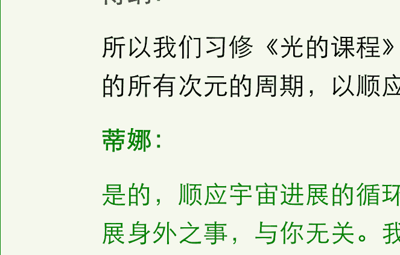

> > This is a block quote. It might be used to highlight an important statement or a citation from another source. The quote can span multiple lines.

```python
def hello():
    print("Hello, world!")
```

## 1. 信号与线性系统

信号是信息传递的函数表示，线性系统是满足线性性质的系统。

### 1.1 信号的分类

- 连续时间信号：在时间上连续变化的信号
- 离散时间信号：只在离散时刻有定义的信号

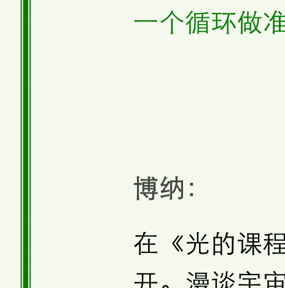

### 1.2 线性系统的性质

| 性质 | 说明 |
|------|------|
| 齐次性 | 缩放输入会等比例缩放输出 |
| 叠加性 | 多个输入之和的输出等于各自输出之和 |

> > 线性系统最重要的特性是满足齐次性和叠加性。

```python
def convolution(x, h):
    return np.convolve(x, h)
```

### 1.3 傅里叶分析

傅里叶变换将信号分解为不同频率的正弦波分量，是信号处理的核心工具。

- 连续傅里叶变换 (CFT)
- 离散傅里叶变换 (DFT)
- 快速傅里叶变换 (FFT)

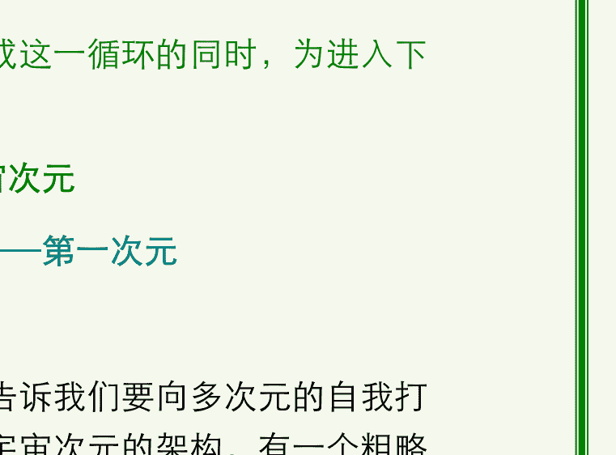

> > 傅里叶变换揭示了时域与频域之间的内在联系。

```python
import numpy as np
X = np.fft.fft(x)
```

傅里叶分析广泛应用于通信、音频处理、图像处理等领域。

| 变换类型 | 适用信号 |
|----------|----------|
| CFT | 连续、非周期信号 |
| DFT | 离散、周期信号 |

## 实习教学大纲

**课程名称**: 体验职场——职场英语实践

**课程代码**: 3201A0060

**课程性质**: 专业实习（必修）

**适用专业**: 英语专业

**实习周数**: 3周

**学分**: 3

**开课单位**: 外国语学院

**撰稿人**: 胡新建

**审核人**: 郑荣

**时间**: 20220610

## 6.3 拓扑时空

在微分流形中，最基础的结构就是拓扑结构，它会构成一个人可以把自己当作一个点所在的流形。如果这个人在这样一个拓扑流形中运动，他需要有一个坐标系来标记自己所在的位置。但是，当这个人在一个拓扑流形中运动的时候，由于它的结构过于单一，如果需要依赖这个结构来计算一些几何量，那就需要额外的结构。最简单的结构就是**微分结构**，也就是光滑结构。有了光滑结构之后，我们就可以定义**切空间**与**余切空间**，从而引入度规与联络，最终就可以计算曲率、挠率等几何量。但在这里，我们在本课程中主要关注的是，当一个人在一个拓扑流形中运动的时候，他究竟能感觉到什么？

为了回答这个问题，我们首先需要明确我们所说的运动，到底是一种什么样的运动？由于我们的流形是一个拓扑流形，因此从局部来看，它和欧几里得空间是拓扑同胚的。因此，对于一位观测者来说，它局部所感受的空间和欧氏空间是一样的。但是，这个流形可能具有某种非平凡的拓扑结构，例如黑洞、虫洞等。那么，观测者能够体验到这种拓扑结构吗？事实上，是可以的。对于一个生活在流形上的观测者，他可以自己去发现他所生活世界的拓扑结构吗？答案是可以的。

例如，假设一个人生活在一个二维球面上，他可以通过沿着一条直线一直往前走，最终回到原点的方式来发现球面的拓扑结构。同样，如果一个人生活在一个环面上，他也可以通过在某些方向上一直往前走，最终回到原点的方式来发现环面的拓扑结构。因此，对于生活在一个弯曲时空中的观测者来说，他是可以通过某种实验手段来探测他所生活的时空的拓扑结构。

那么，探测拓扑结构的主要手段是什么呢？那就是**测地线**。一个观测者如果沿着测地线运动，他最终会回到起点吗？这取决于这个流形的拓扑结构。例如，在球面上，沿着大圆运动，最终会回到起点。在环面上，沿着某些方向的测地线，也会回到起点。但在某些拓扑结构下，测地线可能永远不会回到起点。因此，我们可以通过研究测地线的性质来探测时空的拓扑。

更进一步，观测者还可以通过测量不同方向上的光线传播路径来探测时空的拓扑。例如，在球面上，光线会沿着大圆传播，因此观测者可能会看到同一个物体的多个像。在环面上，光线也会沿着测地线传播，因此观测者也可能会看到同一个物体的多个像。因此，通过观测这些像，我们就可以推断出时空的拓扑结构。

需要注意的是，拓扑结构的探测并不依赖于度规。度规只是告诉我们如何测量距离和角度，但拓扑结构本身是更基本的结构。即使没有度规，我们也可以使用测地线来探测拓扑。也就是说，探测拓扑结构需要的只是流形上的一个**仿射联络**，而仿射联络可以独立于度规来定义。

这对我来说，也还是个谜，希望在我们持续的探索中能找到答案。

综观我们前面所谈的，目前我的概念是：1D 与 2D 是从地球核心，到地表之间的两个层面；3D 是地球表面的有形物质，4D 是我们看不见的，由人类形形色色的思想意识所形成的「群众思想、意识」的层面，至于 5D 至 9D，我认为即是佛家所说的天界。

从文化角度来说，5D 以上即是东方人所认知的仙界，或天人的世界。但是，天界并不表示他们比地球的世界更高级，或可以统治地球。事实上，人类可以从身体的意识层面，自由进出这些较高次元。这种向多次元的自我打开，可以帮助我们平衡人类生命中，最基本的事物。

不仅如此，据我所知，经由光的能量，进入较高次元，将是地球进入光子带时，人类所能赖以生存的基本技巧。

事实上，现在这种迹象，已开始显现了。我们已看到或体验到，任何人，包括我们自己在内，只要思想、意识，一旦陷入在黑暗中，不但身体开始制造各种疾病，心灵也开始制造各种令人痛苦与煎熬的戏剧，使人很难以维持正常的生活。

是的，我也感觉到，经由在光的课程的学习，清理与净化后，我重新拾回我生命的活力。

我们越是能在整个银河系的所有次元中，穿梭自如，我们就越容易从整个宇宙中，获得我们生命所需的能量，以及创造的机缘。

在漫谈宇宙次元的第十二章中，有一个图，显示人类与九个次元的关系。我的理解是：尖角 1D 象征在地心的铁核心水晶，2D 的元素在等边三角形中，躺在桌面上的人象征 3D。当我们活在 3D 时，我们存在于线性的时间与空间。然而，我对它所表达 4D，则不是很了解，好像它夹在每一个次元之中，还是说它在每一个次元之下？

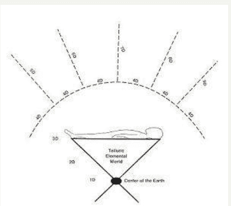

它试图告诉我们，4D 是由二元性的群体思想、意识与感受所形成的一个罩蓬，像网一般地笼罩着 3D 的人类的思想意识。5D 至 9D 象征当一个人解决了二元性的幻象，并启动较高 较细致的思想意识时，便能穿越

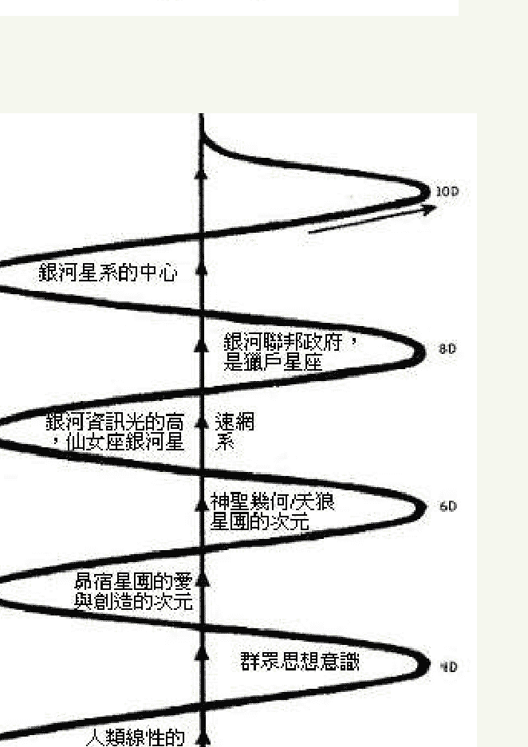

## 课程教材

- **国家地理高级探索丛书** National Geographic Ladders (6级)
- **国家地理沉浸式阅读** National Geographic Immersive (4级)
- **瑞格叔叔自然拼读法** Uncle Craig Phonics (5级)
- **剑桥考级备考用书** Cambridge Examination Preparation (3套)

剑桥等级考试是衡量英语水平的重要标准，其成绩被全球范围内的教育机构、企业和政府部门广泛认可。通过准备和参加剑桥考级，学生能够提升综合英语应用能力，为未来的学习和职业发展奠定坚实基础。

## 课程设置

| 班型 | 适合年级 | 上课时间 | 课时费 |
|------|----------|----------|--------|
| 少儿英语（启蒙） | K班-2年级 | 周一/周三 16:30-18:00 | 180元/1.5h |
| 少儿英语（提高） | 3-4年级 | 周二/周四 16:30-18:00 | 200元/1.5h |
| 自然拼读 | K班-2年级 | 周六 9:00-10:30 | 160元/1.5h |
| 剑桥考级（KET/PET） | 5-6年级 | 周六 14:00-16:00 | 240元/2h |

> > **报名优惠**：老学员续费享受9折优惠，新生两人同行享8.5折。


## AIGCxChina

AIGCxChina（中国AIGC产业联盟）成立于2023年4月，成立于温州，是专家、爱好者及从业人员组成的非盈利性社区，致力于在中国推动AIGC（生成式人工智能）技术、应用和公益的科普。

### 发展历程

自成立以来，AIGCxChina已发展成为中国最大、最活跃的AIGC社群之一，拥有超过60000名成员，覆盖全国30多个省市，并在海外建立了影响力。

### 核心使命

- **科普教育**：举办讲座、研讨会和工作坊，普及AIGC知识与技能。
- **产业对接**：促进AIGC技术与各行业的融合创新。
- **公益服务**：利用AIGC技术解决社会问题，推动可持续发展。

### 数据与增长

| 指标 | 数据 |
|------|------|
| 成员总数 | 60,000+ |
| 覆盖城市 | 30+ |
| 线下活动场次 | 200+ |
| 合作伙伴 | 100+ |
| 线上课程参与人次 | 500,000+ |

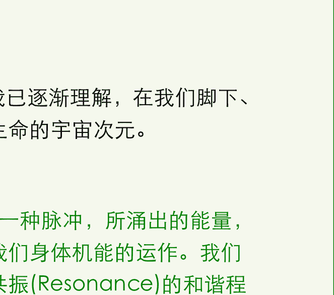

> > “我们希望让每个人都能够理解和使用AIGC，共同迎接智能时代。”——联合创始人 李明

## Chapter 2: Getting Started with Django

In this chapter, we'll set up your development environment and create your first Django project. By the end, you'll have a working Django application running on your local machine.

### 2.1 Installing Django

Before installing Django, make sure you have Python 3.6 or higher installed on your system. You can check your Python version by running:

```bash
python --version
```

It is recommended to use a virtual environment to isolate your project dependencies. Create and activate a virtual environment:

```bash
python -m venv myenv
source myenv/bin/activate  # On Windows: myenv\Scripts\activate
```

Then install Django using pip:

```bash
pip install django
```

To verify the installation, run:

```bash
django-admin --version
```

> > **Tip**: If you encounter permission issues, consider using `pip install --user django` or install within a virtual environment.

### 2.2 Creating a New Project

Once Django is installed, you can create a new project using the `django-admin` command-line tool:

```bash
django-admin startproject mysite
```

## 二、对物权的保护

民事主体依法享有物权。物权是权利人依法对特定的物享有直接支配和排他的权利，包括所有权、用益物权和担保物权。当事人因物权的归属、内容发生争议的，利害关系人可以请求确认权利。

物权受到侵害的，权利人可以通过和解、调解、仲裁、诉讼等途径解决。

因物权的归属、内容发生争议的，利害关系人可以请求确认权利。

无权占有不动产或者动产的，权利人可以请求返还原物。

妨害物权或者可能妨害物权的，权利人可以请求排除妨害或者消除危险。

造成不动产或者动产毁损的，权利人可以依法请求修理、重作、更换或者恢复原状。

侵害物权，造成权利人损害的，权利人可以依法请求损害赔偿，也可以依法请求承担其他民事责任。

## 第2章 随机变量及其分布

随机变量是描述随机现象结果的变量，它按照一定的概率取不同的值。本章将介绍离散型随机变量和连续型随机变量的概念、分布律、密度函数、分布函数以及常见的分布类型。

### 2.1 离散型随机变量

如果随机变量所有可能的取值是有限个或可列无限多个，则称该随机变量为离散型随机变量。离散型随机变量的概率分布可以用分布律来描述。

- **定义**：设随机变量X所有可能的取值为 \{x_1, x_2, \dots, x_n, \dots\}，对应的概率为 \{p_1, p_2, \dots, p_n, \dots\}，且满足 \(p_i \geq 0\)，\(\sum p_i = 1\)。
- **性质**：\(0 \leq p_i \leq 1\)；\(\sum_i p_i = 1\)。

#### 离散型随机变量的分布律

| X | x1 | x2 | ... | xn |
|---|----|----|-----|----|
| P | p1 | p2 | ... | pn |

> > **提示**：分布律必须满足非负性和归一性，即所有概率之和为1。

常见的离散型分布包括：伯努利分布、二项分布、泊松分布、几何分布等。其中二项分布是最重要的离散型分布之一，它描述了n次独立重复试验中成功次数的分布。


## 1 目的

本文件旨在定义本专案开发阶段所需之 API，确保开发协作期间请求与响应的一致性。

## 2 范围

本文件涵盖 API 清单如下：

- 使用者相关 API
- 订单相关 API
- 商品相关 API

## 3 使用者 API

### 3.1 注册

| 方法 | Endpoint | 描述 |
|------|----------|------|
| POST | /api/users/register | 注册新使用者 |

### 3.2 登入

| 方法 | Endpoint | 描述 |
|------|----------|------|
| POST | /api/users/login | 使用者登入 |

### 3.3 取得使用者资料

| 方法 | Endpoint | 描述 |
|------|----------|------|
| GET | /api/users/{id} | 取得指定使用者资料 |

## 文档布局提取与结构化转换研究

文档布局提取旨在将PDF或扫描文档中的非结构化文本转换为机器可读的结构化数据。在数字化办公与知识管理中，该技术可显著提升信息检索效率。然而，由于文档排版复杂、包含多栏、表格、图像等异构元素，精确提取仍具挑战[1]。

本文探讨基于深度学习的布局分析方法，并提出一种综合规则与模型的后处理优化策略。实验证明，该方法在公共数据集上的F1值达到89.5%，优于传统基线模型[2]。

## 相关工作

现有文档布局提取方法主要分为两类：（1）基于规则的方法，依赖手工特征如文本间距、字体大小；（2）基于深度学习的方法，利用卷积神经网络（CNN）或Transformer进行端到端区域分类。Li等人[3]提出LayoutLM模型，整合文本与布局信息，显著提升表格与标题识别准确率。然而，该模型在低对比度或扭曲文档上表现不稳定。

| 方法 | 准确率 | F1分数 | 处理速度 |
| --- | --- | --- | --- |
| 基于规则 | 72.3% | 0.68 | 10页/秒 |
| CNN | 85.1% | 0.81 | 5页/秒 |
| LayoutLM[3] | 91.8% | 0.89 | 3页/秒 |
| 本文方法 | 93.2% | 0.905 | 4.5页/秒 |

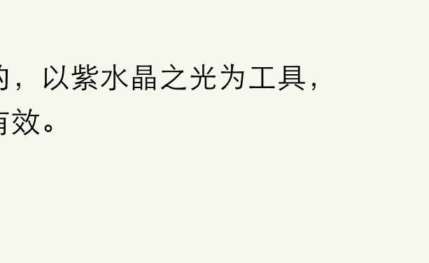

> 注意：实验在NVIDIA RTX 3090上进行，所有模型均基于Pytorch实现。

是的，Toni 曾在工作坊中，教我们观想紫水晶之光像 backman 那吃细菌的虫子般地把细菌吃掉。

博纳：
谈到中世纪，那时候的人，好像很时兴炼金术；谈到地、水、火、风等种种元素影响着我们的体系，使我想到有人用风水、搬运等术数来致富。这些东西真有其作用吗？

蒂娜：
炼金术是一种理解共振原理的艺术，懂得用它的人，可以以提升或降低频率，来创造物质显像。风水则是与盖亚的力量一起运作，以便与地球频率和谐共振的一种艺术。

博纳：
有些熟练掌握炼金术与风水的人，便运用它来满足自己的贪婪。

蒂娜：
具有与 2D 共振的能力，确实可以使人富强，为所欲为。这种时候，就是对个人精神与灵性的考验。因为它确实是令人难以抗拒的。虽然，Ps 对这些行为不予置评，他们只是说，一个人不应为了致富，而运用炼金术，窃取地球的资源。但是我们知道，不正确地使用能量，所造成的不平衡，最终还是要回到自己身上，必须由自己去平衡，这是宇宙的因果法则。

博纳：
这么说，炼金术与风水，原本是用来保持健康、快乐、和谐与丰足的艺术。

蒂娜：
是的，炼金术是一种成为多次元意识的工具，正确地使用炼金术，可以使人类与所有物质元素获得自由。所以克里昂的第三本书就叫做《人类心灵的炼金术》。当我们的心灵冶炼到与整个银河系和谐共振时，我们的生命，自然而然地，一切圆满俱足，根本不需要去用任何会在自己身上制造负面因果的「术」。

博纳：
所以《光的课程》便一个级次，一个级次地，经年累月地，在冶炼我们的心志，我们的心灵，也是一种炼金术啰。

蒂娜：
这种比喻很有趣，表示你对《光的课程》还真有点心得。那么你如何比喻今天所谈论的心得呢？

博纳：
我的理解是，我们人类，好像大树一样，以我们脚底下的脉轮，根植于2D。我们的躯体，像树干一样在3D，我们的思想意识像枝叶一样，吸收来自4D以上的投射与能量。

蒂娜：
这比喻太棒了，我们确实是像树木般地，以脚底的脉轮，从2D汲取生命所需的元素，作为在3D茁壮成长的养份，我们的脑意识，像它的枝叶一样，在光的照射下，茂盛地展开，我们的顶轮，与较高次元相互辉映，将较高次元的巨大力量，带入地球。这真的就是人类存在于3D的形式。

## 再谈宇宙次元——第三次元

博纳：
第三次元就是我们身体及前五识的焦点所在之处。但是谁在控制这一层面呢？

蒂娜：
每一次元都有那一次元的管理者，一种维持那一层面之架构的智能，人类是第三次元的管理者。

博纳：
我们人类实在不是好的管理者，为什么我们把地球弄得乱七八糟呢？

蒂娜：
因为人类在宇宙中是极为特殊的存在，我们身体的运作能量是由 1D 的铁核心水晶，以及 2D 的地球物质所激发的，但我们同时也受到 4D 群体思想所影响，而我们的心灵探索着与较高次元融合，以实现生命的完整。这种多元性，使我们在进展过程中，因疑惑制造了许多混乱，但这也是学习过程的一部份。

博纳：
那么我们现在处在一个什么样的过程呢？

蒂娜：
3D 是一个有形体（1D-3D）与无形体（4D-9D）交错并行的地带。我们生命中的许多戏剧皆是我们的感觉所编导出来，然而，感受也是我们通往明心见性的通道。这也是为什么我们要能觉知到自己的情绪与感受。

博纳：
我知道当一些情绪、感受没有妥善处理时，它们会使我们在生命的某些阶段中，进入混淆的状态，使我们陷入在更多的混乱。

蒂娜：
这就为什么《光的课程》让我们依次从身体，情绪/感受体，理性思想体开始运作。情绪、感受、思想的调整是目前我们在 3D 的当务之急。

博纳：
大部份的人的焦点仍在满足身体的需求上。

蒂娜：
身体的重要性当然是不可否认的。事实上，身体与情绪/感受以及思想是一体的，譬如有些人叫背痛，但你会发现是他们把自己孤立在他们的痛苦中的。一段时间之后，这些情绪障碍，便会使身体与心智产生紊乱。

博纳：
所以，身体有问题时，除了治疗身体之外，也需要认真地处理自己的感觉。否则它在压抑中固化，将会导致身体开始钙化、僵化。只靠打针、吃药是治标不治本的。然而，情绪体恰恰就是最难以觉知、面对与处理的部份。

蒂娜：
生活在三度空间的我们，随时都受到不同的人，不同的势能所影响，这些影响有时是如此地巧妙，使我们在不自觉中迷失，或受到伤害。而我们往往以否定（denial）这些情绪，以避开这些感觉来保护自己，事实上，这样做只是适得其反。

博纳：
那我们要怎么办呢？

蒂娜：
光的运作将帮助我们看到，并理解到自己思想、理念与情绪上的问题，并让光的能量进一步转化我们的情绪障碍。预防胜于治疗，如果平时就懂得运用光的能量，我们便能健康的身心。因为光的运作将培养我们不受世间外物干扰的定力，有了定力，便能启动较高智慧的力量，这时侵略性的势能，自然无法附着在我们身上。

博纳：
是的，在疾病尚未在身体上形成，便能清理自己的情绪问题，将是最好的预防与保健。但是，如果它已在身体上形成问题时，又该如何呢？

蒂娜：
寻求适当的医疗之外，还是要透过处理我们的感觉、心智与身体来治愈。因为我们已知道身体的疾病，是因情绪、思想与心灵上的障碍而产生的，我们可以从任何层面去打开情绪障碍。然而，身体是最直接的通道。我们身上的疼痛、僵硬、疾病不会真正地消失，除非我们注意到我们的感觉。任何形式的身体工作 body work，都有可能帮助我们直接进入一个问题的症结，我们的身体会显示解决的方式。

博纳：
这需要下点工夫去体会与实践，可惜大部分的人认为只要找医生，便可解决一切问题。

蒂娜：
如果你接受这些疼痛，并倾听它的讯息，这些问题往往可以经由内在的清理，良好的饮食，及正常的运动获得解决。对抗疗法的药物，应该只在手术后或医生诊断下，认为必要时才使用。因为忽略你身体的讯号，会将问题深锁在你的身体中。那些负面的感受，则会因药物的控制，而退到更深的层面。最后，你就真的病倒了，因为你没有真正去处理根本的原因。

博纳：
如果疾病是遗传性的，还是与情绪有关吗？

蒂娜：
遗传往往是因为一个人选择清理一些自己前世未解决的问题，而这些问题也正是父母或祖父母也有，却没有学到的事物，在物以类聚的因缘下，使他们成为一家人。如果你被陷入在家庭矛盾中，而又未能识别它，并清理它，它就继续深锁在你的身体中，最终你所呈现的，就是一般所谓的遗传性疾病。

博纳：
意思是说，如果我们能改变自己，以及家庭的负面情绪或思想模式，就可以转化一些所谓的遗传性的体质或疾病。问题是对一般人来说，无法从身体的疾病去理解自己问题的症结在那里。

蒂娜：
在我们的课外读物《如莲的喜悦》一书中，有一篇阐述了身体的症状与问题的症结及治疗它们应有的正确认识。作者露易丝.惠以多年的探究，将上百种的病症与某些特有的思想形态之间的关系，有序化地整理出来，许多人觉得这些资料，帮助他们理解自己的思想情绪。看着自己的身体是如何地将思想、情绪、感受呈现出来，是很有趣的。当我们心灵意识提升时，我们身体的磁场也会随之扩展，这将使我们学会如何在 3D 生活得更好。如何悠然地徜徉于第三次元的时空中。

博纳：
谈到时空，时间与空间究竟是什么？

蒂娜：
在宇宙中，时间并不真实存在。然而，在第三次元中，时间是一种用来完成事物的方式。也就是说，时间只是在第三次元中的一种对过去、现在、未来的标示。当我们有意地运用时间，而不是日复一日地，浮木般地随波逐流，漫无目标地飘浮流动的话，「过去」的经验，就可以成为数据库，储存着对「现在」有用的数据，而「现在」又是我们赖以雕塑「未来」的特殊时刻。时空两个字所指的「空间」，指的是各个次元的思想意识层面。而我们特定的三度空间，是一个充满着银河星系所有次元的能量磁场。

博纳：
蒂娜：
我们每一个人频率的振动，便是整个生命的记录，这些记录含盖着我们的祖先与前世的感觉。由于置身在这群体意识中，我们每一个人都陷入在时间中。

博纳：
蒂娜：
任何事都是一体两面，就看一个人把焦点放在那一面。瑜伽、舞蹈、太极、静心冥想、健行、弹奏乐器都可以使我们的身体扩展至 6D ，进入自己的原型，也就是投生前的模式。

博纳：
蒂娜：
依据昴宿星团的存在们所描述的黑洞，是一个巨大星球殒落时，缩小成一个密度极高的奇点 singularity。

博纳：
什么是奇点？

蒂娜：
奇点：时空中的一点，在该点重力使物质的密度无穷大、体积无穷小，空间和时间被极度的扭曲。昴宿星团的存在们一开始便告诉我们，在我们进展的这一阶段中，只能理解到第九次元，因此他们未告诉我们更多有关黑洞之事。

博纳：
是的，还是让我们回到我们这个小宇宙中的九个次元吧。下次我们就要进入第四次元的探讨啰。

## 再谈宇宙次元——第四次元

博纳：
大家对第四次元的说法，可谓是众说纷纭，许多人认为，除了地球上有生命存在之外，其它的一切，都是子虚乌有，因此根本不相信宇宙中还有其它的次元与空间。

蒂娜：
每个人都可以拥有自己的信念，我认为 4D 以上的次元，其思想频率虽然不是我们以触觉就可以触摸到的固体，但它是我们心灵可以感觉到的层面。

博纳：
那么它是一个怎样的次元呢？

蒂娜：
第四次元，是宇宙各种意识层面的活动区域，由于它与第三次元交错并行，人类所有的思想、意识，都储存在第四次元这特定的意识层面上，它也是我们情感的窗口。

博纳：
它像个国际都会，虽然有趣，但太吵杂了，我们能够避开第四次元，直接进入第五次元的意识层面吗？

蒂娜：
我们需要经由第四次元去了解更高次元。也就是说，只有当我们超越了第四次元二元性的幻象时，我们的心灵意识才能真正理解较高次元，并在各个次元中来去自如。

博纳：
如何超越第四次元呢？

蒂娜：
佛陀所说的八万四千法门，都在教我们超越三度空间、四度空间的幻象，进入神佛的意识层面。耶稣基督所教导的，也是为了这一目标。现在，我们被赋予《光的课程》这经过 update，现代化的法门，也是在教我们如何超越三度空间与四度空间的幻境，进入合一。但就像古人说的那样：求道者多如过江之鲫，成道者少如凤毛麟角。

博纳：
为什么会这样呢？

蒂娜：
由于 3D 与 4D 是交迭的，许多人在修行的过程中，其意识往往漫游在 4D 的各种幻象中。经过修持，有些人进入某些较为美好的一个境界，或一个意识层面，但它们通常只不过是由心境交感所呈现的一时现象，不知其中道理的人，便自以为成道，产生傲慢自满，最终又落入3D与4D的业网中。

博纳：
如果说，4D储存着所有人类的群体意识，我想必然也包括情绪/感受在内，那么我们时而会有一些强烈的情绪，它的感觉与力量之强烈，有时会像一股巨大的潮浪般，几乎淹没我们，也就不足为奇了。

蒂娜：
是的，因此，即使对一个正常的人来说，也会有情绪低落的时候。这种时候，只要认知到它只是一种负面能量，一种群体意识对应自己内在某些有待清理的情绪/感受，运用光的能量去运作，便能清除它在我们身心上所产生的影响。因为在3D的我们，有绝对的自主权来取舍。

博纳：
说起来容易，做起来可不是那么容易。我知道你会说，这就是要靠平时培养的觉知力与功力了。环。只是我觉得虽然我已很认真地走过以太星光体的级次，但我还是一样地，常常陷入在各种幻象中。

蒂娜：
第三次元是一个以物质显像的形式，来表达宇宙中众多世界的层面，致使在三度空间的我们，随时会受到分裂的，二元性的幻象所困扰。因此，除非你保持敏锐的觉知与极高的悟性，否则要去除二元性的幻象，不是走过一两遍初级课程，或以太星光体的级次，便可以解决的。如果这样便可以解决，上师们就不会再传递一整套的《行星课程》给我们了。《行星课程》将以更大的行星能量继续清理我们所有的层面，包括以太星光体的层面。

博纳：
所以，初级课程的以太星光体的级次，是为了让我们对这一层面，这一体系有一个初步的认知，理解它的属性，以及如何清理与净化。最终还是要靠我们自己从中继续下工夫，工夫到了，自然就能破除一切幻象。只是我不能理解，五度空间以上的次元，并没有所谓的二元性，那么何以这种二元性的现象偏偏就出现在三度空间呢？

蒂娜：
听起来你好像对置身于三度空间感到有点委曲。事实上，许多较高次元的存在们，还很羡慕我们处在这么一个多元性的，五光十色的舞台上呢。至于你这个问题，就要借用一点量子力学的科学知识，以及宇宙哲学论了。你真的要深入探索吗？

博纳：
科学是我最弱的一环，但让我们试试看吧。

蒂娜：
我对科学也不精通，但我所理解的是：经由量子力学（Quantum mechanics），人类发现到，银河系中的光，以粒子或频率之波活动着，这种活动使物质产生二元化。因为我们受着4D磁场的影响，使得我们看事物时，不是对即是错，不是黑即是白，不是善即是恶。我们大部份的人，都是以分裂的信念来看一切事物，因而失去了自身完整的意识。

博纳：
这是由于我们在3D的头脑所接收的，是第四次元那被次量子分裂后所形成的思想频率之故吗？

蒂娜：
我想在第四次元中，光粒子或频率波因电磁现象而产生二元性。因此，一旦我们理解三度空间的物质现象，是也是由光粒子，以及光的频率之波所形成的，我们便可以了解我们的头脑是如何衔接着各种频率，以及如何产生二元性的思想。

博纳：
这些不为一般人所知的知识，我一时难以吸收与理解，但我感到一股能量正在突破我僵化的脑意识，好像头部正在进行一种爆破性的运作，有点头晕。

蒂娜：
我们需要停止吗？

博纳：
不需要，习修《光的课程》时，只要遇到我旧有思想与情绪遇到挑战，并且要产生突破时，便会有这种感觉。

蒂娜：
这是能量运作时的正常现象。让我们转换个轻松一点的话题来谈。看看这张图（图一），它显示我们如何接收来自各次元的能量与信息。在三度空间的我们，生活在平面的线性的时间与空间；它以等边三角形来代表第二次元，向下的三角形的尖端代表在地心的铁核心晶体的第一次元。平躺在桌上的人代表在第三次元中的人类，在人上面的罩蓬，代表第四次元的原型，充满着群众二元性的思想意识，以及各种情绪感受。

博纳：
因此，虽然较高次元的光的能量与意识不断地传递下来，我们还是很难以接收到它。

蒂娜：
这罩蓬尽管稠密，但它不是密不透气的物质体，它像是一张有许多空隙的网，一旦我们能超越那些由群众意识所产生的种种幻象，5D 以上的较高智慧，便能进入我们的存在中。我们的思想意识也就能经由与较高智慧的共同运作，而进入较高次元。

博纳：
我感到很绝望，因为 4D 的种种幻象，好像把网上的空隙都填满了，每一个空隙都有一个 drama，一个故事。

蒂娜：
科学家从次元子的研究中发现，人脑所放射的频率，是一种电磁波。而 4D 的群体意识，也是一个巨大的频率视屏，因此，人类的脑，可以像收音机或电视机一样，随我们的意愿，转到我们所要吸收的电台，接收并解读我们所要的信息。也正因如此，上师们才会 update 这套《光的课程》给我们，他们告诉我们能量跟随思想，当我们运用思想，引导光的能量时，较高次元的能量，便能轻易地透过以太层面，直接进入我们的身心意识。如果没有经由我们思想意识的引导，较高次元的智慧，便难以进入我们之内。经由行星课程的运作，我们更是打开自己，接收较高次元的能量磁场，并让自己成为一个把较高智慧带入地球的载体。

博纳：
人类的进展，已进入理解量子力学的时代，看来我们确实需要对光的频率，它的作用，它的力量有所了解，才能顺应地球在宇宙中的进展。

蒂娜：
量子力学的发展是令人敬畏的，它也是因人类的进展已到了理解它的程度，它才会被发展出来。牛顿时代的科学，顺应那一时代人类的进展。它是建立在以3D为基础的法律，它让我们感到大自然是一部机械，而事实上，3D大自然界的运作是更接近4D的「可能性」probability，而非「机械性」。量子力学解释了我们自身以及大自然之谜。

博纳：
理解频率运作的本质，可以使我们驱吉避凶，可惜大部份的人尚未能理解其中的奥妙。

蒂娜：
百年前，人类所发展出来的，是一种可以预期，可以理解的科学，这使人类对自己的世界有信心，对自己的方向是清楚的。然而，随着地球与人类的进展，科学的发展便进入量子力学的时代。

博纳：
讨论到这里，我的认知是：牛顿定律所谈的是1D至3D的法律。量子力学所谈的是属于4D范畴的法律，而5D至9D则是宇宙学的定律。

## 蒂娜：

我想目前这阶段，我们可以这样推论。量子力学是基于宇宙中的四个主要势能，物理学将它定义为：电磁学，强原子，弱原子以及地心引力。

## 博纳：

谈到3D大自然的运作，是更接近4D的「可能性」probability，而非「机械性」。所谓的「可能性」指的是什么呢？

## 蒂娜：

「可能性」是指一件事情的发展倾向。4D因为充满着所有人类的思想意识，以及来自较高次元的智慧，因此，它是一个巨大的，充满可能性的世界。

## 博纳：

我还是不太理解所谓的「可能性」与我们之间的关系。

## 蒂娜：

第四次元中的许多事物，是依人类所投射之事物的不同与改变而不断地改变。因此，我们只要改变我们的投射，便可改变在第三次元中的物质显像。所以一切事物都可以从改变我们的思想去改变它的显像，所以说大自然的运作是「可能性」，而非「机械性」。

## 博纳：

所以，当我们越是理解「可能性」的运作本质，我们便越能清晰地思考，并采取正确的行为。现在我理解，为什么有人说修《光的课程》可以改变我们的命运。

## 蒂娜：

任何途径的修行，都可以将原本机械性的命运轨迹改成种种的「可能性」。许多《光的课程》的习修者，因在光中看到由自己的思想意识所产生的投射作用，所形成的命运的轨迹，从改变自己的思想意识与投射，而改变生命的轨迹。

## 博纳：

然而，除非我们知道自己要创造一个什么样的世界，否则我们将制造更多的混乱。

## 蒂娜：

这是人类目前所面临的问题。不仅个人如此，有些科学家的心识，因驻足在宇宙中某些奇异之地，而创造了一些奇怪的事物。往往不但我们不能理解他们所创造的，在3D 会产生什么样的结果，他们自己也无法预知。许多杀伤性或污染地球的东西，都是无意中创造出来的。

## 博纳：

昴宿星团告诉我们说，我们要不落入二元性的思想意识，才能进入两极平衡的整体性中，我如何知道自己是在二元性的思想意识中呢？还是在两极的平衡中呢？

## 蒂娜：

二元性是分裂、隔离，它制造暴力与毁灭。两极性是相对的两边都在共振中，是相互连接的，它们连接不同的次元，互相学习，互相理解，并共同扩展可能性。

## 博纳：

太抽象了，我需要更具体的说明。

## 蒂娜：

譬如，在一个社会中，我们无法避免群体的共业，但是如果你认定那些人是对的，那些人是错误的，你必然在二元性的愤怒、批判与恐惧中。当你在两极整体性时，你只是从中观察戏剧的发展。

## 博纳：

如果国家要发动战争，我不该跳出来表达自己反战的立场吗？

## 蒂娜：

我们要谈的不是你在这个时代中的角色，而是你应以什么样的意识来应对。无论你参战或反战，你都落在与另一边对立的立场上，这就是二元性。如果你能保持自身的安静与平衡，你所焕发的频率，便能使你的磁场创造新的可能性。

## 博纳：

这么说，任何情况下，认定自己是对的，别人是错的，便是一个最明显的二元性。这点目前我还无法达到，还有什么能让我比较容易做到的吗？我还是一步一步来，先从我能做到的开始吧。

## 蒂娜：

当不择手段地赚钱，是你的目标时，你便是在二元性；当试图理解你自己与别人的需求是你的目标时，你便在整体性。

## 博纳：

喔！我有一线希望了，还有呢？

## 蒂娜：

当你热切地卷入自己或别人所编导的戏剧时，你在二元性，当你对别人的无知，带着悲悯心时，你便是在整体性中。

## 博纳：

喔！我又被浇了一盆冷水了。现在的我，一场又一场的爱情悲喜剧，好像就是我生命的全部，那我该怎么办？

## 蒂娜：

进入宇宙宏观，扩展自己的电磁场。跳出肥皂剧。你便在整体性之中。

## 博纳：

唉，要能跳出肥皂剧，我就进入 5D 了。看来 5D 是可望不可即的，但探索它的风貌总是可以吧！

## 蒂娜：

下次再谈吧！

## 再谈宇宙次元——第五次元

## 博纳：

我对我们所谈的第四次元的一切，只有一点模糊的概念，但我相信等我们将九个次元探索完之后，再回头看它，就能比较清楚了。目前我就是能理解多少，算多少了。

## 蒂娜：

第五次元没有第四次元那么神秘与复杂，它是你心灵的管理者。它座落在人类心轮处，与地球上一切具有生命的受造之物共振共鸣。

## 博纳：

唉，这也够我想破头了。你是从「我们自身即是宇宙」，「我们与宇宙是一个整体」的宏观的角度来谈的。以我目前的程度，我无法想象它是什么样子，还是让我们以人的思想、意识与逻辑所能理解的方式来讨论吧！

## 蒂娜：

从第五次元开始，直至第九次元，都是光的次元。人类将光的次元或光的境界，称之为三摩地，一种与圣神融合、交流的境界或状态。

## 博纳：

根据昴宿星团的说法，第五次元的管理者即是昴宿星团，它们是座落在金牛星座的一个星系。那他们与我们怎么连接呢？

## 蒂娜：

一些史学前家指出，昴宿星团在四万年前，曾经是当时居民的祖先。根据昴宿星的资料，我的理解是：由昴宿星团所焕发的巨大螺旋星光，一直延伸到我们的太阳，而我们的太阳是昴宿星团中第八个大的星球。推动这螺旋星光旋转的发电机，是昴宿六（Alcyone），它坐落在昴宿星团中央。

## 博纳：

从现有的天文学资料中，好像没看过这种说法。

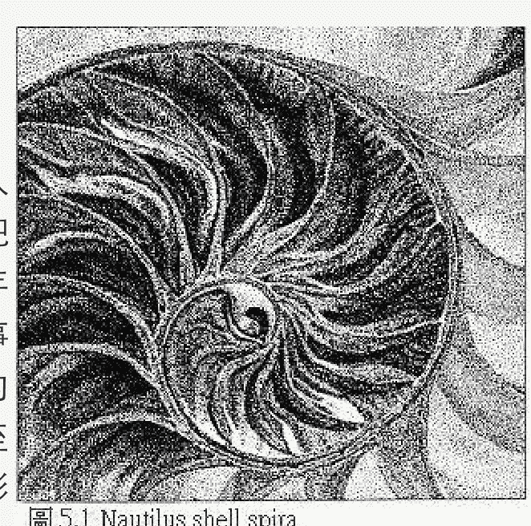

## 蒂娜：

这是传递昴宿星团数据的人所叙述的，我们现在姑且把它当「神话」来谈。几千年来，人类便是透过神话故事来了解宇宙星辰以及天界的种种。早期的希腊人，甚至现代，曾有几位航天员，形容在昴宿星团与太阳之间，有一团几何形旋转的光。如图 5.1 具有螺旋形珍珠线 Nautilus shell spiral。我们也谈过，梵谷所画的星空之夜，即显示着银河的旋转之光。

## 博纳：

如果真是这样的一个系统，昴宿星团及太阳的能量磁场，对地球有着巨大的影响，也就不足为奇了。

## 蒂娜：

前面说过，我们的太阳系因进入光子带，转化了地球的大气层，使整个地球上的生物，产生一种巨大的觉醒。随着地球进入光子带，昴宿星团进入我们的太阳系，旋转的昴宿六，仿佛是一个巨大的沟通体系，将昴宿六中最新的数据传递给我们。

## 博纳：

量子力学也许就是受到启发而被发现的。

## 蒂娜：

光粒子的频率之波，挟带着电磁频谱（spectrum of electromagnetic），放射出伽马射线（gamma rays）。从1990年开始，特别是1998年之后，这伽马射线的射程已进入我们的太阳系，可能是因为光子带之故，它的强烈度可以说是前所未有的。

## 博纳：

2003年初，天文学家发现一种罕见的天文现象，即一股强烈的伽马射线来自一颗巨大的超新星。

## 蒂娜：

根据量子力学，光量子一对对地分裂着，分散到宇宙各处，然而，无论他们分散得有多远，就像互联网一样，仍然可以互通。光量子有它的智能，及伽马射线的高能量，必然会扩展我们的心智。伽马射线是一种我们所能知道的最高能量，这射线使人类深入探索自己在这一银河星系的九次元中的意义。

## 博纳：

看来你是被伽马射线射到了，否则你不会这么疯狂地一个劲儿去探索宇宙次元。

## 蒂娜：

也许是经过光的课程的系列5，最后的级次，单子能量的洗礼，而打开的好奇心吧！走过一次单子能量的运作，并未使我如上师们所预期的，进入与整个宇宙合一的境界，我想我还得再持续地深入它。但这一路走来，十多年前刚开始进入《光的课程》时的那些千千万万个心结，说不完的生命悲欢离合的故事，在不知不觉中已烟消云散。因此，现在对我来说，无论是八点档的连续剧，或再轰动的奥斯卡奖电影，都无法在我心中产生太多的涟漪、共振或共鸣。目前只觉得探索宇宙的奥秘更有意思些。

## 博纳：

你刚才说数据显示，「一些史前学家指出，昴宿星团在四万年前，曾经是当时居民的祖先」。现在，在星系的运转中，他们又再次进入我们的太阳系了，他们会再度到地球上来吗？

## 蒂娜：

他们说，当5D的存在来到地球时，需要在特定的电磁场中，我们才能看得到他们。他们到地球上来的目的是要教导我们理解「爱」。

## 博纳：

在《边缘外》一书中，在安迪达山中，戴维也是这么告诉莎丽、麦克琳的。书中描述了一些昴宿星团如何出现，如何教导戴维与爱有关的事物。我现在可以理解当时莎丽、麦克琳的感觉了。我现在没有抓狂，真得感谢她在前面做开路先锋，为我对这些数据的接收，做了一些心理上的准备。

## 蒂娜：

爱，这心灵的智能，纯然是一种频率，然而，它养育万物，是一种比我们心智更具力量的势能，但这种势能或频率，不是你可以用学习知识的方式去获得，只有当你的心是宁静的，空掉那满头满脑的逻辑与知识时，才能进入。

## 博纳：

所以上师们为我们设计了《光的课程》这一静心冥想的课程，让我们有个「法门」，去进入这频率，或者说去打开这内在心灵的频率。

## 蒂娜：

根据昴宿星团的描述，地球是昴宿六的实验室，而昴宿六是地球的数据库。我们所谈的有关宇宙次元的资料，就是来自昴宿六这图书室。

## 博纳：

为什么地球成为昴宿六的实验室呢？

## 蒂娜：

严格来说，地球是昴宿六与宇宙其它次元的共同实验室。目前由昴宿六在负责。整个银河系以地球为实验室，是因为地球是一个九个次元同时存在的星球，所以被挑选为银河系的生物实验室。

## 博纳：

他们要做什么样的实验呢？

## 蒂娜：

他们要在银河系中培育一个新的神圣文明，他们期望将人类培育成「和谐的生物」harmonic biology，成为这种生物的种子。(需要翻译成波吗？只是翻成合谐的可以吗？)

## 博纳：

然后呢？他们要如何处置这些种子呢？

## 蒂娜：

昴宿星团说，在玛雅历结束时，即2012年十二月二十一号开始，成熟的种子，将像蒲公英随风散播它的花絮那样，被散播出去。只有能与九次元共振的生命，才会被带到银河系那新的神圣文明之处。

## 博纳：

所以，我们千辛万苦地经历着地球的生命，是为了成为银河新的神圣文明中的一份子做准备。这样说来，我们所有的学习、磨练与考验，确实有它的意义。届时你会像蒲公英的花絮那样，被他们散播到那神圣文明之处吗？

## 蒂娜：

我还早得很呢，我还在学习与探索中，我刚开始逐渐地明白一些道理。现在的我，不仅离超凡入圣还有一段相当大的距离，对一些第三次元与第四次元的幻象与疑惑也尚未全然了悟。但我祝愿你届时能被送过去。

## 博纳：

新的神圣文明确实令人响往，希望届时我能破除二元性的对立与批判。我现在最需要做的，就是克服那无时无刻，对别人的批判。

**蒂娜：**

这也是我极需要做的。我想停止批判，是我们所有想要进入神圣文明的人，第一件要做的事了。话说，散布这些种子到银河系中，对地球来说，是一种狂喜的释放（ecstatic release），就像湿婆在银河中与地球共舞一般。

**博纳：**

但他们如何知道那些人是成功或成熟的种子呢？

**蒂娜：**

每一个人的每一个基因，都显示一个人是否展现了生命的庄严、神圣与荣耀；是否能与整个银河系的九个次元共振。

**博纳：**

这一切真的是神话故事。你好像在向我们说一个美好的故事。

**蒂娜：**

我们的细胞记忆，可以经由说故事去唤醒。如果我们不去激发我们神经系统的电磁波，我们的记忆便会萎缩。我们将无法向第五次元以上的事物觉醒，因为人类的科学尚未发展到理解它的阶段。或者说，先要有一部份人向第五次元觉醒，人类理解第五次元的科学才能发展出来。

我们已知道第六次元是天狼星团存在的次元，根据昴宿星团的说法，他们是 6D 的管理者。

## 蒂娜：

这星团距离我们的太阳系，大约是 8.7 光年。我们的太阳与天狼星像是一对双胞胎星星，总是知道彼此的心灵意识。

## 博纳：

有些数据形容第六次元为〔形态形成 morphogenesis 磁场〕，这是怎么说的呢？

## 蒂娜：

所有在第三次元中，具有形体的生命，无论是动物、植物或人类，都是从第六次元的思想复制出来的。

## 博纳：

听起来太玄了！

## 蒂娜：

这其中的奥秘，可能是因为我们要现在的程度还不能理解，因此，尚没有数据显示它的形成过程。他们只告诉我们说：譬如在第三次元的牛，是先在 6D 有一只牛的理念，才在 3D 复制许多牛出来。(图 6.1)

## 博纳：

这有点类似电力公司把电输给我们，尽管我们不知道电力学，

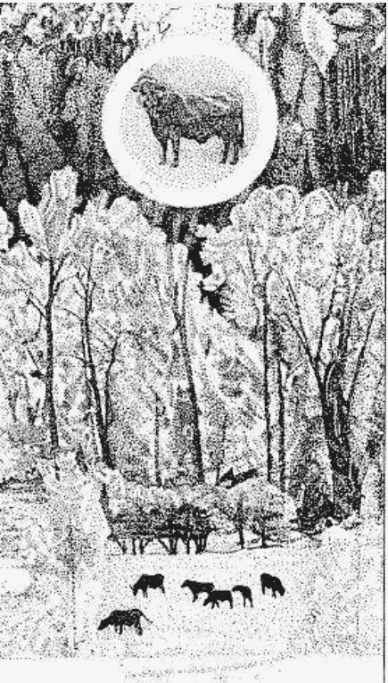

我们还是可以用电力制造许多东西…这么说来，天狼星团与我们的关系事实上是很直接的。

## 蒂娜：

地球与天狼星团之间的关系，古老部族的巫师们都清楚这些事，澳大利亚的土著，都还以舞蹈来表达这种关系。

## 博纳：

好像古埃及人相信他们的祖先来自天狼星。他们说来自天狼星团，猫一样的神（feline gods），定期地来到地球建立他们的据点。据我从古埃及的数据中所得知的，天狼星团的存在们，在最后一批离开之后，将不再以形体进入地球。然而，昴宿星团的数据显示，天狼星团的存在们，喜欢将他们的智慧注入在第六次元的〔形态形成磁场〕中，这磁场一直与我们是连接的，他们透过这磁场，启发我们去创造与 6D 原型共振的事物。

## 博纳：

我想自古以来，一些至善、至美的艺术创作，神圣的文学、思想与哲理，必然是艺术家与文学家们，在他们的心灵意识上，连接到第六次元那巨大的成形素磁场而创造出来的。我要如何获得这种连接呢？

## 蒂娜：

就像当我们进入内在纯净的心灵状态中时，便能与昴宿星团连接一样；当我们身心浑然一体，无论我们是在沉思、做瑜伽、跳一场神圣的舞蹈、或专注在工作上时，天狼星团的存在们，便能透过我们所散发出的纯净频率与我们连接。

## 博纳：

意思是说，当我们身心打开时，我们便自然地与这 6D 的磁场连接。

## 蒂娜：

是的，任何时候，我们都可以决定自己要与那一个意识层面连接。当然，也要看我们自身在什么样的意识层面，如果我们充满着种种世俗的，或负面的欲望，我们可能只能连接到较低的以太层面，较低以太层面的存在们，喜欢煽动我们去把他们的欲望付诸行动。而天狼星团的存在们，则喜欢鼓舞、启发我们进行较高形式的创造。譬如建造神圣的建筑物，让我们透过建筑物去体验 6D 的原型。

## 博纳：

是的，我也注意到，无论什么时代，都会有一些伟大的建筑师，创造出反映着较高心灵意识的美丽建筑。

## 蒂娜：

6D 同时也是人类灵性体或灵魂的家，这层面保有我们入门的记忆，以及每一个人最大潜能的记录。

## 博纳：

这么说，我们可以从自身在什么样的思想与行为的状态，来了解自己正在接收或连接那一个意识层面，如果我们在毁灭性的行为中，无论是对自己或对他人，我们便是连接到较低的以太层面，如果我们在建设性的思想行为中，我们便是连接到较高次元或较高的意识层面。

## 蒂娜：

这就是为什么我们需要理解那多次元的自我，以及自己与各个次元之间的关系，才能随时与较高次元保持连接，有了这种连接，便不会因受到较低次元的影响，而陷入在各种无法自拔的状态中。

## 博纳：

是的，虽然我对各次元的运作尚未能全盘了解。但是，自从上次讨论了第四次元是如何地影响着在 3D 的我们，仅仅是这一点初浅的了解，已使得我比较能理解别人的处境，比较会注意到自己，是否正以有与较高次元那完美的原型连接，就会产生错误的思想与行为。就像大金字塔那些神圣建筑物一样，如果没有光的几何原型为架构，就会崩坍成一堆乱石。昴宿星团告诉我们说，如果没有成形素的磁场在支撑我们，我们的形态就会随时扭曲变化。

## 蒂娜：

那不就像在黑洞的奇点那样吗？所以我们不能说，只要把自己在 3D 的事处理好就行，不需要去了解其它的次元。

## 博纳：

不了解其它次元，将无法了解自己在 3D 的思想行为，也无从知道如何在 3D 创造较高形式的生命质量。

## 蒂娜：

我们确实是生活在一个与其它次元隔离的时代。这种隔离，使我们的世界更容易受 4D 的影响，而产生巨大的分裂。这种隔离与分裂，又使我们无法在 3D 展开较高次元的智慧，我们真的是需要停止这种恶性循环。

## 博纳：

根据天文学家与生物学家的研究，宇宙是非常有序化的。光的频率，从银河的各星球焕发出来，形成光河，散发着智慧。而在银河中运转着的所有星球，不仅有自己的轨道日以继夜地循环着，还各司其职，和谐运作。这背后必然有一种异乎寻常的智能在支撑着。否则它不可能这样有序化地运行着。

## 蒂娜：

可惜一般人尚未理解到向多次元的宇宙知识打开的重要性。事实上，要成为宇宙公民，了解这些知识，就像上公民课一样，是基本的常识。一般人未能理解，可能是它太难以想象之故吧。

## 蒂娜：

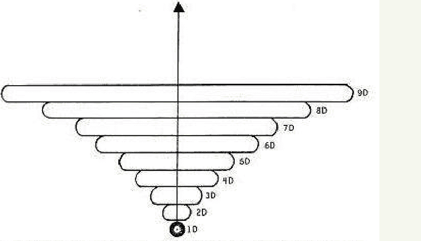

昴宿星团告诉我们，如果感到很难理解，可以设想每一个次元是一个平面，无限地循环着、扩展着，从中轴无限向外延伸（如图6.2）。宇宙学家相信宇宙是平的，而空间是曲线的。许多人无法理解所有的次元，都是一个整体的理念，但是如果耐心地去了解九个次元之后，便会理解它的整体轮廓。

九个次元有如平面的原野，从中轴无限地向外扩展。

## 博纳：

有点像《光的课程》那样，刚开始时，觉得系统庞大，很难抓到重点，但即使是迷迷糊糊地走完系列一的初级课程，等进入行星课程之后，再回头去看它，就很清楚这课程的架构、内涵与功用了。

## 蒂娜：

昴宿星团还谈到［拓扑学Topology］或［连结点理论 knot theory］。

## 博纳：

这又是什么？跟我们有什么关系？

## 蒂娜：

拓扑学是一门科学，研究一种可以测量的，来自其它地方的生命形式。拓扑学专门寻找类似绳结的规则，它研究较高存在们进入三度空间的连结点。

## 博纳:

嗯，有意思！感觉我们的宇宙中，好像有许多『结』交织着。

## 蒂娜:

所谓的『连结点』，是一些中轴的交叉点。连结点是由绳索交织而成的，而那些形成连结点的『绳子』，是一种能量，来自其它次元。

## 博纳:

我想大概是来自 6D 啰?

## 蒂娜:

没错，这绳索来自 6D，在 5D 形成交叉点，在 4D 形成绳结，由粒子与电磁波，形成二元性，并在 3D 形成电磁场。而这绳索，就像我们人类用的绳结一样，它可以松开也可以拉紧。

## 博纳:

运用拓扑学的原理，便能想象连结点的频率与电磁频率是共振的。每个次元之间的相互连接，有点像行星七，图形与密码#8，相互连锁的三角形了。这么说来，图形与密码确实是较高次元的语言，述说着宇宙哲理。

## 蒂娜:

拓扑学的原理已受到肯定，它不是操弄 DNA 或无性繁殖的研究，那些研究实际上是毁灭自然生态的行为。拓扑学学者花了很多时间研究连结点的长度，洞口，绳圈，以及它的曲线。如果你追踪线的源头，就可以看到 6D 的几何原理，这提供了一个 6D 几何形体与在 3D 所复制的物质体之间的关系。而上师们则透过图形与密码，唤醒我们对这初始状态的回忆。

## 博纳:

柏拉图的理念与成形素的理念非常接近，它以连接点理论来探讨 3D 至 6D 之间的关系。有人说柏拉图是一个看到其它次元的人，他所说的一切，在宇宙中确实存在着。

## 蒂娜：

所以至今仍有人在研究他的学说。但是，现在我们如果继续研究几何学与拓扑学之间的连接公式，或柏拉图的学说，可能会使其它编辑部的成员梦周公去了。我们回头谈一些昴宿星团所强调的，大家都知道的一种活动，做为结束吧。

## 博纳：

但愿是能使我们与 6D 连接的活动。

## 蒂娜：

当然是与我们所谈的 6D 有关的啊！他们说，无论是古埃及或印度圣者，都认为瑜伽是启动我们自身频率必要的练习，因为瑜伽的律动，使我们与 6D 形成素磁场连接。譬如一颗橡树子，当它在 3D 的条件适合时，便可以长成巨大的橡树，是因为树木固定在一个地方，因此它们保有最原始的成形素。人类很容易失去这种连接，因为我们不停地在活动着，因此我们需要这种练习。

## 博纳：

瑜伽？那是女孩子为了健美而做的活动吧，我一个大男人混在一堆女人中练瑜伽，多难为情啊！

## 蒂娜：

印度的瑜伽行者都是男的，端看你以什么样的心态，深入到什么程度。如果你感到自己懒散、无精打采，瑜伽可以把你从受 4D 或群体意识所影响的情绪中提升出来。他们说，如果你观察猫，你会发现他们随时都在瑜伽的姿态中。当他们睡觉时，他们似乎是在静心冥想中。猫很接近天狼星的本质，这就是为什么古埃及人很尊重猫。正确的瑜伽，能使你与光的几何连接，使你的身体获得更新。

博纳：
难怪有一位老师在上课时，有时会带着我们做猫爬的活动，我确实无法像猫爬得那么优雅。

蒂娜：
当你与6D连接，保持对灵魂的觉知时，你的身体便可以觉知到肉眼看不见的频率。这使你得以区别问题出在身体上，情绪上，思想上或精神上。你也可以感受到别人思想与情绪的能量，对你所产生的影响。

博纳：
生活在3D，这种觉知很重要，否则常因不知来龙去脉，被搞得一头雾水。

蒂娜：
开启或启动你身体与灵魂体的脉轮，便是要打开你灵魂的觉知，使你能觉知一切事物，这种觉知往往挽救许多人的生命，工作，人际关系，甚至濒临破裂的婚姻。

博纳：
我看过一幅瑜伽最经典的图表（Yoga Asana），上面可以看到许多姿势是模拟动物的姿态，以前只知道瑜伽是透过模拟动物的姿势来训练调整自己的身体。现在我想透过这些姿势的练习，具有帮助我们与6D连结的意义吧。

蒂娜：
只是要提醒你，练瑜伽不可太过好强或勉强自己。有许多人由于求好心切，过于勉强自己的身体，而伤了脊椎或筋骨。

博纳：
好的，如果我想要练瑜伽的话，我会以放松自己的心态去练的。

## 再谈宇宙次元——第七次元

博纳：
很高兴能进入对第七次元的探索。我大略地看过一些数据，感到我们可以从两个切入点，来探讨第七次元。其一是：探讨它的管理者仙女座（Andromeda）的本质；其二是：探讨它的宇宙科学。让我们先谈谈它的管理者，仙女座吧！我看过很多有关于昴宿星团及天狼星团的数据与讯息，但有关仙女座的资料就比较少。

蒂娜：
仙女座在另一个太阳系中，有它自己的太阳。但是，它对我们这整银河系有着巨大的影响，尤其是对我们所处的这一太阳系。因为仙女座星系与我们的太阳系极其类似。

博纳：
我们的肉眼可以看到它在银河中优雅的螺旋形。只是不知道它如何影响着我们。

蒂娜：
在仙女座之内，有一个叫做 Aion 的星球，这星球在许多方面与地球极其相似，这颗星与他们的太阳之间的位置，与地球与我们的太阳之间的位置极其相似，气候与环境都非常好，丰饶的生物，具有很高的繁殖力。然而，这两个太阳系中的两颗星球，有一个不同点，那就是地球在一万一千五百年前经历了一场大灾难，而 Aion 的居民，没有经历过这种群体创伤。因此，他们那一星系的较高次元，可以自由地发挥它们的功能，提高它的生物性。Aion 以极高的科技，运用宇宙声音以及光的编码来发展它的文明。

博纳：
据我所知，我们的太阳系已在银河中心被启动，地球正在体验着九个次元的启动，这种启动正在改变它的生物性。从我们的科技正神速发展，可以证明这一点。

蒂娜：
然而，要真正发展到像 Aion 那样，地球人类的意识必需要有更进一步的提升。仙女座星系的存在与神之间没有分裂。目前的地球，已不记得盖亚的生物密码。然而，仙女座因为是地球第七次元的管理者，因此仍然持有与地球有关的生物学知识。

博纳：
既然他们在另一个太阳系中，他们如何与我们互动呢？

蒂娜：
仙女座将 Aion 图书室的数据，运用声波将和谐记录传递到我们的银河系，以提升我们的频率。

博纳：
但我们好像没接收到他们所传播的信息嘛，地球上仍充满着战争，人与人之间仍然可以为了权利或个人利益而恶斗。

蒂娜：
地球人类因在大灾难时期，受到严重的情绪创伤，心智被困在极低的层面，很难超越到 4D 以上。昴宿星团告诉我们说，为了治愈地球的创伤与扭曲，仙女座在二千年前制作了一套称之为『宇宙重新启动按钮』Cosmic Restart Button，派遣基督前往地球，他是一位9D的弥赛亚 Messiah，弥赛亚的意思是神之频率的歌颂者。他到地球上来是为了唤醒人类心灵中的爱，只有这样才能使每一个人都能治愈因那大灾难所产生的创伤。

博纳：
我也看到数据显示，只有爱才能改变并重组我们的DNA。但这是一个先有鸡或先有蛋的问题。就如刚才所提到的：我们的心智被困在极低的层面，很难以超越到4D以上，那我们又如何唤醒心灵中的爱呢？

蒂娜：
这就是为什么我们要运用光的能量，透过「光的课程」系列一，初级课程的运作，我们先清理我们的较低体系，再透过「行星课程」的运作，经由光的网络，逐步深入我们内在的较高次元，与这些次元融合，我们DNA中的创伤与扭曲，便能获得转化。

博纳：
他们也谈到，当我们有足够的人朝着这一目标，当我们达到转化所需的临界量时，我们的银河系便能恢复和谐。只是大部份的人还在沉睡中，真是急死我了。

蒂娜：
昴宿星团还告诉我们说，由于基督将恩宠的种子播种在人类的心灵中，我们的心灵正在接收来自仙女座星系的新能量，这将使我们每一个人都得以进入一种新的层面。

博纳：
这说明了清理、净化我们的较低体系以便向较高维度的智慧打开的重要性。现在，我想知道的是，为什么说第七次元是光的银河高速公路呢？

蒂娜：
这又需要从宇宙科学的角度来阐述。第七次元是一个充满着宇宙之音的区域，6D 便是由这宇宙之音的频率共振而产生的。

博纳：
宇宙之音又是如何产生的呢？

蒂娜：
它是宇宙中的各星球在轨道中运行时，由旋转的频率产生出来的。

博纳：
是什么在推动这些星球的运行呢？

蒂娜：
看来它是随着巨大的光子带，从银河中心向外旋转，在银河系中环绕之后回到银河系的中轴，并旋转着。

蒂娜：
由银河中心所传播出去的宇宙音波，将纯净的能量散发到 6D 光的几何形体中。使 3D 产生各种可能性，或同步性，使人类可以感受到 8D 神圣心识（Divine Mind）的意愿。如果我们遵循它的引导，我们的生命便可以在较高次元中飞舞。

博纳：
我想许多在各个领域中，以充沛的活力，发挥他们的创造力，展现特殊才华，在生活中体现物质与精神两者兼具的人，应该就是向多「次元的内在自我」打开的人。不过刚才所谈的宇宙之音，对我来说，还是很玄的东西。

蒂娜：
昴宿星团的数据显示，7D 的声音是银河系的沟通体系。在 3D，我们可以从鸟声以及候鸟的行踪中找到了解这体系的线索。你有没有想过，候鸟是如何迁移的呢？他们依宇宙能量线，来侦测方向。神圣心识在地心引力的磁场中移动着，鸟类可以听到神圣心识在移动中所产生的音流。鸟类的频率，可以提高我们的创造力。当蓝知更鸟飞行与唱歌时，他们将 3D 的能量调整到与环绕着地球的蓝色光带融合，这光带是宇宙声音与地心引力之间的交接处。

博纳：
所谓的宇宙能量线，及环绕着地球的光带，是不是上师们所说的环绕着地球的「光的网络」呢？

蒂娜：
我想应该是吧，否则上师们不会在「光的课程」中设计行星课程，教导并带领我们运用我们的心灵意识进入光的网络，将光环绕着整个地球，使爱焕发到整个地球的生物圈，以提升整个地球的能量磁场。

博纳：
7D 的宇宙之音与光的频率之间有着什么样的关系呢？

蒂娜：
声音是分子的频率，无论是声音，光，色彩及所有生命都由分子所构成。光的振动频率高于声音的振动频率。白色之光是一种肉眼可见的光谱，从中再分成色彩。声音分为人耳可听见与不可听见；光分为肉眼可看见与不可见。频率是宇宙万物的基础，不同的次元，有不同的振动频率，我们无法听见或看见较高次元，因为这种高频率已不像 1D 至 3D 那样，它们不是物质性的。

博纳：
那么声音如何创造 6D 的几何形体呢？

蒂娜：
物理学家针对这些现象，展开了一个新的研究方向，一个含盖超弦理论（superstring theory）的细弦理论（string theory），这些理论说明了九个次元如何地成为一个精准，系统化的运作体系。你是否想进入这种物理性的探讨呢？

博纳：
我没听过这理论，但让我们谈谈吧，我愿意增长一些见闻。

蒂娜：
我也是第一次接触到这一理论，虽然这些理论，不是动人心弦的灵性语言，但我觉得它扩展了我的脑意识，因此我愿意努力去了解它。

博纳：
哇！可以扩展脑意识？赶快告诉我吧！

蒂娜：
首先我要声明，细弦理论至目前为止，只有科学家知道它的规则与公式。但一般人，从共振、共鸣以及在与其共同运作中，也可以体悟到神圣恩宠的存在。因此如果你没有科学细胞，不一定要从科学的角度去钻研。

博纳：
我想在不久的将来，它将成为一般宇宙知识。现在有机会提前了解，总是好的，以免以后变得孤陋寡闻。

蒂娜：
研究宇宙细弦的物理学家假设：「宇宙中有许多长长的，充满着能量的细弦，在整个宇宙中伸展着。」细弦理论在 1995 年进入一个全新的发展，一个有史以来最具才华的物理学家爱德华威特 Edward Witten，在超弦理论中展开了第二次的进展，第一次是在 1984 至 1986 年期间。

博纳：
它的基本原理是什么？

蒂娜：
细弦理论的基本原理是：这些细弦，微细到只有空间，没有实质，它的频率振动来自物质单位的基本能量：量子，而非原子或粒子。就像小提琴的弦振动时，我们可以听到特定的音符，细弦的振动模式使大量没有具体形状的物质与势能产生变化。

博纳：
那么细弦的振动对我们产生什么样的影响呢？。

蒂娜：
许多振动的细弦，正向各次元传送数据与密码，并同时创造有形体的物质。这些细弦是编织时空的细丝。每一次元，都是由一种特定的引力与不同频率所编织成的，因此出现了佛家所说的三千大千世界。我们知道三千只是古人形容众多的意思，它不是一个死板的数字。许多物理学家探索着综合极微与极大宇宙的原理，他们发现，综合量子论，与电磁原理，细弦理论是一种无可反驳的架构。

博纳：
那么科学家们有没有研究出一个定律出来呢？

蒂娜：
细弦理论的计算程序非常复杂，目前为止很少人能理解。但许多人仍积极地在寻找它的定律。然而，即使是初步发展出来的细弦理论，已足以打开人类理解 7D 之门，因为它解释了宇宙极微与无穷大之间的运动原理。

博纳：
问题是，科学家是少数的尖端份子，我们无法从物理学与科学去深入的人，怎么办？

蒂娜：
非科学家，在光的冥想中，可以感应到这细弦理论所触及的事物。当我们的心灵意识进入光的较高次元时，光的语言与智能，使我们一样地，可以感受到那超越二元性的宇宙意识。

博纳：
刚才谈到第七次元是一个充满宇宙之音的区域，那么它与地球上的各种声音有关吗？

蒂娜：
就像自古以来，一直都有通天文，知地理的人一样。人类很早就知道运用声音来提升心灵，来治愈身体。英国考古学家保罗、德弗罗，最近在旧石器时代的洞穴中，以及在法国及英国的巨石中发现一些与声学有关的设备。他们在四万年前，旧石器时代的洞穴，以及在法国及西班牙的石洞中，发现乐器，以及美丽的绘画，那些画显示他们的画家非常灵敏，聪慧。保罗、德弗罗发现，住在这些洞穴的人，可能已经有了运用宇宙圣音的技术。

博纳：
他是如何推论的呢？

蒂娜：
洞穴中的记号显示，他们运用钟乳石与石笋做为声管。一些音乐家发现，这些洞穴本身就是一个巨大的音乐厅，当时的人，在会产生回声或共鸣处做记号，大部份的画都是画在主要共鸣点。

蒂娜：
在《如莲的喜悦》中，我们收录了一篇谈论音乐的文章。篇名是「声音的力量」。你可以看一看作为参考。无论是音乐或美术，都是表达思想意识的工具。许多艺术家与作曲家的灵感，来自较高次元，他们所谱写的曲子，往往具有较高次元的能量与治愈力，无论中外都是如此。优美的声音所产生的频率，可以使我们获得深沉的领悟、释放与治愈。

博纳：
看来旧石器时代与新石器时代的人，比现代的人更理解声波的应用。现代人似乎失去运用声音为治疗工具的科学运用。

蒂娜：
我知道无论在音乐或艺术的领域中，有一些人正在回头进行运用它来做为治疗工具的研究。有一些艺术家，则只是将他们的创作提供出来，由每个人自己去理解它的功用。就像「光的课程」以及我们所整理的，贴在网站上的数据一样，我们将它提供出来，但如何运用，则需要每个人以自己的悟性去体会，去感受。话说声音由光而产生；懂得沐浴在大地歌颂宇宙星辰的声波中的人，将能获得治愈与平衡。事实上，调准好的音叉的声音，可以使人体的器官恢复和谐的频率，实时调整我们的身体。当然，音叉的频率也可能打开古老的创伤。因此一般人会下意识地避开它。

博纳：
那不是正是我们需要面对与治愈的吗？

蒂娜：
是的，只是你忘了，不是每个人都做好真正去面对自己，去治愈自己的准备。

## 再谈宇宙次元——第八次元

博纳：
漫谈宇宙次元时，我们谈到8D的管理者是猎户星座星系 Orion，也就是所谓的银河联邦政府。我想进一步了解，8D对3D的物质世界以及我们人类来说，有什么重要性？

蒂娜：
8D是一个非常纯粹的能量，它是一个涵盖一切能量的次元。光从银河中心，透过这涵盖一切能量的次元时，降低频率时，便在 6D 形成光的神圣几何。依次降低其频率，形成不同的次元，不同的形态。

博纳：
这神圣几何又有什么作用呢？

蒂娜：
神圣几何与地心引力形成一种势能，这股势能支撑着我们这银河系，垂直轴心上的所有次元。随着细弦在不同次元所产生的不同的共振频率，我们的直觉可以感受到神圣心识无所不在。

博纳：
这神圣心识应该就是新时代人士所指的神（GOD），对新时代人士来说，神无形无相，是纯净的光，是一种至高的智慧。

蒂娜：
是的，我们所谓的神（GOD），不是东方或西方神话故事中所描述的，与人类一样，有着戏剧化生命的，第四次元中的诸神。

博纳：
那么这至高的光的次元，是不是就是一般人所说的如如不动的境界？

蒂娜：
圣神之光如是存在，不介入人类的活动，不偏不颇地为所有次元的所有存在焕发光芒，从这角度而言，可以说是如如不动。但是，祂具有无以伦比的创造力，并随时在创造。如我们前面所说的，这些光的频率变成声音，再形成神圣几何，经由神圣几何焕发思想，然后散发至物质显像的世界，成为千变万化的大千世界。

博纳：
这样说，8D对3D物质世界的人类来说，不是一个遥不可及的次元。甚至可以说我们与8D之间的连接，就像我们与其它次元之间的连接一样，没有什么不同了。

蒂娜：
是的，这涵盖一切能量的8D，使我们得以感受到圣神的爱，是一种源源不断地支撑我们生命的能量之源。这联邦政府管理银河星系中的许多图书室。

博纳：
这联邦政府如何管理银河系呢？

蒂娜：
这就像地球上的国家，有不同的组织与部门，各司其职。银河联邦政府也是如此，它有许多的部门，由不同的存有们负责，以维持银河系的和谐与秩序。

博纳：
不仅是一个国家，即使是一个家庭，或一个人，都是同样的道理。我觉得无论是国家、社会或家庭，之所以会混乱，是因为人心先混乱之故。在物质世界中的我们，无论是情绪、思想或意识，都会折射回到它发出去的起点，也就是我们自身，并在我们的周围形成显像创造。因此，除非我们心所映照的，是纯净的光的本质，我们便很容易制造虚妄与混淆。当我们的愿望是纯净的，合乎真理时，它便带着高频率的光波，与圣神之光共同创造。

博纳：
现在我理解与光融合，是为了让这高频率的光的智能，帮助我们看到自己错误的创造，以正确的创造来转化并结束我们的因果。

蒂娜：
是的，那些与银河联邦政府一起运作，转化地球生物性的人，正体验着整个九次元在地球打开的经验。那些不珍惜生命的人，正经历着启示录中所描述的一切。

博纳：
所以光的课程虽不谈宗教，但行星四以启示录的寓意，来促使我们了解自己的思想与行为，是如何在我们的身体上产生不同的作用。

蒂娜：
不仅如此，随着行星四的课程，以及对上师们所诠释的启示录的理解，我们的身体也将随着课程的进展，进入更深层面的清理与净化。上师们以启示录的七个教会来隐喻人体的七个腺体，因此行星四这一级次，也将清理我们的腺体。

博纳：
我第一次，甚至第二次习修行星四，启示录的部份时，一直是懵懵懂懂，不是很清楚。但奇怪的是，当我第三次回头习修行星四时，便感受到我的腺体确实走过一些清理的过程。

蒂娜：
那是因为虽然你头脑的意识，因某种障碍而无法理解，但你的灵魂意识知道你的意愿，因此你的整个存在，还是会随之进入净化与整合的过程。

博纳：
嗯，事实上，从初级的一级次开始，便是这样的，尽管头脑不是全然理解，但我的身体、心灵与外在生活，还是有所转化。我想无论那一个级次都是这样的。

蒂娜：
昴宿星团说，每三个次元是一个小组，1D-3D 是一个小组，4D-6D 是一个小组，7D 至 9D 是一个小组，光的振动速度随着每一次元依次加快。肉眼可见的光谱，是我们可以感知、探测与理解的范围。譬如 2D 的频率振动比 3D 的振动频率低，我们便可以测量它。

博纳：
这解释了我们可以很容易地感受到比我们低的次元，但要感受较高的次元便比较困难。因此许多人便否定了较高次元的存在。

蒂娜：
事实上，仔细想想，4D 的二元性，以及我们对这二元性的感受，是如此地直接，致使它能左右我们的生命，这表示我们虽然无法以肉眼去看这感受，但它的频率是存在的。

博纳：
人类被赋予向较高次元探索的天性，我们生活在强烈的感觉中，当我们把感觉的焦点放在较高次元时，我们应可以确定较高次元是存在的。

蒂娜：
是的，无论我们是否可以感觉到它，是否承认它的存在，我们还是像是一台电视或收音机那样，我们的心灵意识一直都在接收各次元所散发的意识与频率。

博纳：
我们真的是要随时注意自己所接收与发送的种种思想与情绪。

蒂娜：
数据显示，当能量向下移动，经由不同次元逐步递减时，它便越来越形成稠密的物质，直到它进入铁核心水晶。同时，当它经由银河中心逐步向上移动时，那一次元的平面磁场的空间便扩展的越来越大。（图 5.2）。

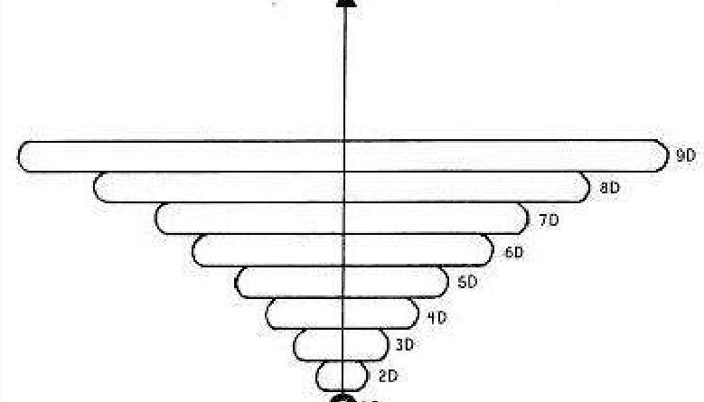

博纳：
那么 8D 组织性的架构与 1D 地心引力的功用 如何成为支撑中轴的动力呢？

蒂娜：
> 九個次元有如平面的原野，從中軸無限地向外擴展。

当较高次元的光，与地心引力互相影响时，分子的旋转便缓慢下来，频率的振动也降低下来，所以它可以在较低的三个次元（1D-3D）中，形成色彩与有机生物体。而5D-7D的光的频率，则维持着高速运作。我们已知道6D的振动频率可以在3D形成有机生物体的生命形式，表示由6D的振动频率，与3D的频率相互影响所形成的架构，是由地心引力来保持的。也就是说，地心引力是一种使不同次元中的理念，形成不同物质的要素。地球、太阳系、各银河星系，以及宇宙中的三千大千世界都出自这原理。

博纳：
原来地心引力在银河系中的功用，不仅仅只是让我们可以安稳地居住在地球上而已。

蒂娜：
地心引力虽然是一种极微的光，在3D却是最具引导性的势能。由于3D的稠密，使分子的旋转变得极其缓慢，可以想象它在较低次元中的巨大力量，以及它在较高层面中的巨大空间。地心引力是一种宏观的能量，它是使宇宙聚合在一起的重要元素。

博纳：
话说回来，既然8D是显像创造Manifestation的源头，我想进一步了解我们与创造主「共同创造」这一理念的真实含义。

蒂娜：
昴宿星团告诉我们说，只要投生在地球，便有创造个人所要之实相的权利。而光的能量，纯属是为了让每一个存在得以体验生命而焕发的。

博纳：
但我如何与这圣神之光共同创造呢？

## 蒂娜：

由于我们被赋予自由意志、创造与选择的权利，昴宿星团教我们一个创造理想人生的方法，他们说：找一个安静的地方，写下几样你想创造的事物。但是要知道的一点就是，运用这种高次元的显像创造，去要求一些不是绝对需要的东西，是不恰当的。譬如你去要求一些用来满足你虚荣心的豪华轿车、貂皮大衣、钻石等。但如果你需要一部车及一件大衣去工作，那就去要求。但你不可以操纵别人，譬如你不可以要求某个特定的人，去为你完成你所要的，或去成为你要他们所成为的人，因为他们也有他们自己的创造与选择的权利。如果你这样做，你便是用你心灵的力量去影响别人，这种剥夺别人权益的行为，是违反因果法则的，它不仅不会实现，反而会搅乱你。

## 博纳：

嗯！清楚地知道自己真正要什么是非常重要的，往往我们不择手段地去追求某种东西，或达到某种目的，但得到了，或达到目的时，却发现那不是我们真正要的。

## 蒂娜：

知道什么是自己不要的，可以去除一些障碍你真正目标的垃圾。当你的心充斥着种种杂乱的欲望时，光无法穿透这些障碍。当你能确定你的要求是合理的时候，闭上眼睛，用你的第三眼去观想这景象确实在你的生命中呈现出来。一旦它清晰地呈现在你的眼前时，把这影像转到你头骨后脑的部位，让它像电视屏幕般地清晰地呈现出来。一旦你把几个目标都观想完之后，说一声实现了。

## 博纳：

> 显像创造与巫术之间有什么差别？

## 蒂娜：

巫术往往用来伤害别人，显像创造则不伤害、操弄或控制别人。无论是基督教与佛教，都有不同的与较高次元共同创造的方式。显像创造可以帮助我们超越负面的思想，转向正面的结果。

## 博纳：

听说月亮反映着我们的感觉，对我们的心愿有很大的影响。

## 蒂娜：

是的，月亮把我们的心愿反射到太阳，而太阳是我们通往八次元数据库的信道。数据显示，月光的强度与人类的感觉成正比。在新月的时候，我们是敏感的，这种感觉在满月时被增强与放大，我们尤其受到月蚀的影响。

## 博纳：

这么说，太阳对我们来说，不仅只是光合作用，它对我们的愿望也有影响啰。

## 蒂娜：

当然，宇宙中的万事万物都是息息相关的。月亮的表层几乎是没有磁性，因此它的振动是非常轻的。由于太阳比月亮大了四百倍，而太阳与我们的距离，比起与月亮之间的距离有四百倍之远，所以在我们的眼里它们是一样地大。太阳与月亮对我们的影响虽然有所不同，但影响力是相等的。太阳风所产生共鸣的波频，可以用来侦测在太阳系中各行星的位置与角度。月亮从太阳风吸引电磁能量，用来解读我们的感觉，并将太阳的资料注入其中。在我们的梦中，月亮转化我们所储存的潜在思想的记录。

## 博纳：

听说人类与动物、植物都会像磁铁般地汲取月亮的意识。

## 蒂娜：

月亮纯然地只是向我们散发它所储存的记忆，以调整我们对一切事物的反应。疾病来自负面的情绪与思想模式，由于我们的情绪体是由我们的记忆所形成的，月亮一边储存我们生生世世的记忆，一边将治愈的信息传递给我们。如果我们能打开这些阴暗的情绪感受，有意识地清理我们潜意识里的记忆，清理创伤与障碍，也就是说清理我们的情绪感受，并接收治愈的信息，我们便可以拥有一个健康的身心。

## 博纳：

我们如何善用月亮的能量呢？

## 蒂娜：

月亮在我们的情绪体中扮演一个重要的角色，犯罪记录显示，在满月时犯罪率明显地增加。因此，有意识地与月亮、太阳一起运作，将增强我们的潜在力量。尤其是在冬至、夏至、春分、秋分之时，我们与光的互动与交流时，将具有更大的转化力量。月有阴晴圆缺，每到新月，月亮便把新的思想、意识的种子传送到地球，了解月运周期在我们身上所产生的作用，可以加速提升我们身体与情绪的健康。

## 博纳：

刚才说有意识地与月亮、太阳一起运作，将增强我们的潜在力量。那么让我们谈谈太阳与我们之间的另一层关系吧！

## 蒂娜：

太阳引导我们的生命目标。太阳的活动周期——春分、夏至、秋分、冬至——是我们与光契合最好的历法。在春分到夏至的三个月期间，是孕育所要创造之事物的时刻，属于开展的时刻。夏至到秋分的三个月，是接收与实现的时刻。秋分到冬至，是完成我们所要创造之事物的时刻。冬至到春分的最后三个月，是深思这些创造的更大意义的时刻。

## 博纳：

万物周而复始，新的春分便是为新的一年孕育新事物的时刻了。

## 蒂娜：

如果你选择在春分时期孕育构思，事情的变化可能会快到你感到震惊，要小心地做选择。因此，如果你的直觉告诉你不要去创造某些事物，你要小心聆听。

## 博纳：

现在，我终于明白了我们。

## 蒂娜：

事实上，它充满着宇宙中最稠密的物质，有着极其强烈的引力。根据昴宿星团的资料，黑洞是从地球铁核心水晶开始的九个次元的时间之源。他们形容黑洞像是一个旋转的、具有重力的核子，显现在时间波之中；九次元的管理者是Tzolk’in，他们是1987年至2012年的二十五年间人类进展的推动者。

## 博纳：

真不可思议，没想到黑洞也是推动我们进展的一个次元。然而，什么是时间波？

## 蒂娜：

这些波频是让我们在地球上，创造映照光的重要元素。这些思想波频也具有一种不可思议的魔力，吸引着我们在物质世界中探索精神与灵性的世界。

## 博纳：

现在我知道自己为什么那么情不自禁地探索宇宙中的一切事物了。

## 蒂娜：

恭喜你了，这表示你的进展，使你很自然地，不再把心思花在世俗中许多琐碎事物上了。否则你不会有探索宇宙事物的闲情逸致。

## 博纳：

嗯，自从修完「光的课程」中的《天使级次》之后，虽然我的工作与生活没有改变，但我的生活很自然地在一种有序中，不再那么忙碌与混乱了，许多障碍我习修与探索的事物，在无形中消失了。

## 蒂娜：

这不纯然是因为你修了《天使级次》，而是从系列一开始的整个过程中，你清理了许多负面的思想意识，你内在的心灵清净了，外在的生活，自然就会清净。前面的过程是基础，《天使级次》只是帮助你达到更深层面的清理与净化，使你的心识不再执着于琐碎的事物上。话说回来，这黑洞不停地吸收中轴上由第一次元，也就是地球铁核心水晶所焕发的势能。依据物理学家，宇宙中的每一事物都是一个向外发展的起点，第一次元也不例外。

## 博纳：

如果说，在我们这特定的宇宙中，每一种现象，都是以它自身为起始的中心点，那么，就个人来说，我们自己的心，就是创造的起始中心点。是佛家所谓的：「一切唯心，万法唯识」吧！

## 蒂娜：

我们「心」所存在的这个点，与每一事物皆有所连接，我们神经系统的设计，使我们得以感受在这中轴上的所有次元。

## 博纳：

北美印第安人知道银河中轴的存在，他们视这中轴为圣树或生命树。

## 蒂娜：

虽然我们一直声嘶力竭地，以各种方式，从各种角度呐喊着，期望大家理解这点，很可惜大部分的人，还是认为这一切信息与他们的生活无关。

## 蒂娜：

我们只能尽心尽力，随着推动我们内在的那股动力去做。地球确实处在一个非凡的时刻，只是对一般人来说，如果不是他们用眼睛能看到，或用心智去理解的事物，便不存在。幸而科学界已开始朝着银河的种种现象去发展。天文学家及天体物理学家们正加速对银河的研究，航天部门的人员，也在追寻宇宙的奥秘。

## 博纳：

在我们的探索中，我的理解是，银河就像一只发光的水母，极其热忱地散发永恒光芒，并在它的磁力磁场中跳动着。

## 蒂娜：

是的，银河在神圣心识之意图的基础上，进展着，并创造空间。银河中心从它旋转的中轴中，发射出九次元的银河同步光波。这同步光波与中轴上的各个次元，以及光子带，运用八次元银河联邦的智能系统，使推动地球进展的时间波，具体实现出来。

## 博纳：

银河同步之光与1987年八月十六与十七日的和谐汇聚日有关吗？

## 蒂娜：

在和谐汇聚的那两天，我们的银河系（小宇宙）与大银河系（大宇宙）都接收到同步光波。这是成千上百万，所有知道玛雅历的人，所盼望的一日。

## 博纳：

怎么说？

## 蒂娜：

这同步光波，把光子带进入太阳系，同时来自黑洞的高频率，被引导进入地球，使地球达到进入新次元的频率。这同步光波也改变了昴宿星团的系统，为地球的生物进展设置了新的目标。然而，影响三维空间最大的是改变系统的方案「时间波」。

## 博纳：

我无法想象它是一个什么样的方案。

## 蒂娜：

人类正极力从各个角度，包括从科学的角度去探索与理解。然而，昴宿星团告诉我们，目前我们只需要了解生命的含义，以及转化所带来的力量，并融入这股势能即可。

## 博纳：

基于好奇与求知的欲望，我还是想多知道一些玛雅历与时间波之间的关系。

## 蒂娜：

玛雅历即是地球进展的进行曲。玛雅历为那些与整个九次元共同运作的存在们，安排了特定的进程；玛雅历描述了地球及我们所处的银河系，在特定期限中的进展细节。而时间制造现象，也就是说，时间是创造者，所有的现象，皆在时间中，经由爱与思想意念而形成。

## 博纳：

感觉为了地球人类的进展，好像我们的银河系都为之兴师动众，大费周章。

## 蒂娜：

人类原本拥有健康的身体，开放的心，聪明的心智与心灵，生命中没有任何局限。但因大约11,500年前，地球上发生了一场灾难，致使恐惧深植在人类的心识中。银河的每一个次元，都听到我们痛苦的呻吟，为此九次元的管理者Tzolk’in，便制作了「时间波」这改变系统的方案，来教导我们如何清除恐惧。

## 博纳：

难怪我们常常为一些小事心生恐惧，甚至常常好端端地，无由来地，从心中生起一种莫名的恐惧，然后因为不知原因，便将它与生活中周围的事物挂勾，变得神情紧张，疑神疑鬼地。

## 蒂娜：

要人类完全清除意识与潜意识里的恐惧，是一个艰巨的过程，因为人类的表面意识，不知道有大灾难那场恐怖经验。况且，大灾难之后，为了生存所产生的种种后遗症，是如此地深刻地刻烙印在我们的细胞记忆中，致使我们必须一步一步，一点一滴地清除。

## 博纳：

我相信「光的课程」也是「时间波」这方案中的一部分，是许多途径中的一个途径。只是在目前这讲求高速度，高效率的时代，很多人修了一两个级次之后，就没有耐心再持续下去了。

## 蒂娜：

入宝山而空归，是蛮可惜的。要完全清除那些根植的恐惧与愤怒，不是一件轻松容易的事。一般来说，刚开始时修这课程时，我们的心灵意识是涣散的，致使我们无法凝定在光的运作中。往往是经过了初级课程的清理，习惯了光的能量，培养出凝定在光中的能力，进入「行星课程」之后，才会明显地感受到它转化我们的身心，以及我们生命中种种事物的效果。初级课程是入门的基础，上师们一直到「行星课程」的第二级次，才为我们举行入门庆典呢！

## 博纳：

千禧年之后，时间波这改变系统的时间方案是不是也随之进入一种新的方案？

## 蒂娜：

是的，宝瓶座时代之前的时间波，是为了训练我们的生存能力而设置的权宜性的工具。但是，经过漫长的进展之后，我们必需超越那种：「为了生存，必须互相竞争与争斗」的思想意识，进入与我们这一银河系中的所有存在和谐共处的阶段。你不妨再重新看看《如莲的喜悦》一书中的「新纪元能量与新纪元法则」，它细说了处在这新旧时代更迭中的人类，应以什么样的思想意识来渡过这特定的转化期。

## 博纳：

对我来说，要达到这种超越是极具挑战性的，……

## 蒂娜：

一旦我们能清理内在深沉的创伤，走过那纯然为生存而挣扎的阶段，便会容易许多。处在这时代的我们，比起银河黑夜期的清理与净化，已经容易许多了。因为巨大的能量之波，正从黑洞经由中轴注入第三次元。Tzolk’in所制作的方案，便是所谓的历史，新纪元时间波这方案的重点在于让人类的头脑（心智）在历史（时间）的进展中，达到个人心智与宇宙智慧同步运作。

## 博纳：

要我们的头脑像数字相机那样同步显现？我们要如何达到这种同步性？

## 蒂娜：

要达到这一点，我们得让我们的脑波与宇宙波同步运作。

## 博纳：

「光的课程」的设计似乎也有助于我们达到让我们脑波与宇宙之波同步运作这一层目的。

## 蒂娜：

我想是的，它训练我们将较低的思想意识与较高的心智在融合中达到同步性。那具有璀璨文明的玛雅星，因其才华横溢，被选出来，成为引导地球人类走过这学习过程的引导者。他们同意，在可以随他们的意愿，自由进出三维空间的情况下，帮助人类，因为他们不愿意被困在三维空间的时间波中。玛雅历已成为开发人类潜能的手册。除了玛雅星之外，昴宿星团、天狼星团，以及宇宙中的许多存在们，都选择在必要的时候自由出入三维空间，以帮助人类。事实上，人类只要打开自己的脉轮，也可以自由进出较高次元，只是很少人具有这样的能力。不过也有许多人，可以运用自己的心智，进入其它次元收集信息。截止目前，将是一个难以忘怀的时段，运用我们的心智是我们原本就已具有的能力。现在我们只需要识别，并熟练地运用较高次元的频率。

## 博纳：

是否透过「行星课程」的习修，我们便能熟练运用较高次元的频率了？

## 蒂娜：

我相信整套「光的课程」是为这目的而为我们设计。至于能不能达到具备这种能力，则在于个人的因缘。话说回来，由于银河中心与宇宙中的其它的星球是连接的，我们的心智与银河中心也是连接的；也由于我们是可以兼容所有频率的物种，来自其它次元的存在们，便能将他们的意识与我们的意识融合，协助我们渡过这进展的过程。

## 博纳：

所以透过课程，我们与上师们融合，以渡过这进展的过程，我想这之中，便具有所谓的「上师相应法」的含义了。

## 蒂娜：

上师们一再告诉我们要「与多次元的自我融合」，我想含有东方人追求「天、地、人合一」的意思。昴宿星团也说，了解九个次元的本质，并与所有次元融合，将有益于我们的提升。

## 博纳：

嗯，因此，透过光的运作，以及与上师们的融合，去感受较高次元的频率，让每一次元的频率都与我们的神经系统共振是很重要的。

## 蒂娜：

在我们结束漫谈九个次元之前，我希望大家理解到，我们说了这么多，只为了让大家从另一个角度，来理解那「多次元的自我」；运用触类旁通的方式，来体悟「所有的次元都存在于我们之内」如图所示的那样。因为内在心灵的整合才是我们在这进展阶段中关键性的重点。

图：昴宿星团对人类脉轮的解说。

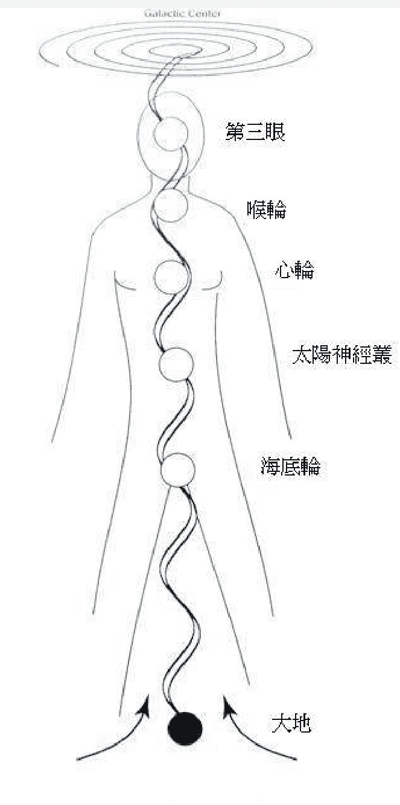

## 博纳：

理解了，我们所谈的一切，只是一种知识性的扩展，要获得真正的提升与转化，还是在于向自己的内在探索，提升自己的思想、意识与频率。

## 「彩虹桥」The Rainbow Bridge

由于人类语言的限制，要以正确的语言来形容彩虹桥，相当困难。往往因每个人对语言文字的理解有所不同，反而会产生误导。彩虹桥是通往较高思想层面的意识之桥；彩虹桥连接能量体系，它所接收与注入的能量，能使我们达到转化与融合的目的。它也释放较低体系的能量，因此它是能量中心点。

### 一、「彩虹桥」The Rainbow Bridge简介

## 博纳：

当我们修完光的课程的系列一的课程，进入系列二的行星课程时，教材中提到彩虹桥（The Rainbow Bridge）这本书，但这本书一直没有中译本。虽然这么多年来，我凭着直觉的信任，随着课程的教导，建立光的彩虹桥，进入行星中心，身心意识一样地有所转化。但是，现在很多朋友问我这本书，我也很想知道这本书的内容。

## 蒂娜：

我先约略地把这本书对彩虹桥的解说阐述一下：

- 光的彩虹桥有许多定义与诠释。
- 「桥」代表在一个途径上，衔接那些被中断的部分。
- 「途径」代表灵魂的旅程，代表回归上主的进展。途径也可以说是一种意识的向上进展或向内探索。

## 博纳：

因此，走在进展的途径上，当我们还未与内在的较高自我全面融合时，这光的「彩虹桥」便成为与较高自我衔接的工具。只是，就这么一句话，要用一本书来阐述吗？

## 蒂娜：

其实这本书解释彩虹桥的篇幅并不多，它更多的是解释灵魂、轮回、思想念相、净化、入门等与我们进展有关的论述。如果不能以内在的直觉，而是要头脑的逻辑与思维上，获得满足之后，才愿意依这样的法门去修的人，确实是只有在理解了这些理念之后，才愿意去建立这道光的彩虹桥。我本身就是属于后者，所以你想要讨论这本书，我也乐于奉陪。

## 博纳：

轮回，入门等，我们以前曾约略地谈过。然而，我相信如果我们从不同角度论述，可以有更深入的理解。何况我们还没谈过「灵魂」，也没谈过「思想的念相」，我相信很多在各地自修或共修的团体，必然也很好奇吧。

## 蒂娜：

那我想这本书的一些理论，可以满足你一部分的好奇心。

## 博纳：

但我希望先了解这本书的作者是谁，以及这些数据的出处。

## 蒂娜：

我只能依书中的介绍，来告诉你我所知道的。这本书是由两位终其一生追随密宗上师Dwal Khul之教导的门徒，所整理出来的笔记式的著作。他们把Dwal Khul的教导整理出来，以便使一些自修的人，也能受益。

## 博纳：

我没听说过Dwal Khul这位上师。

## 蒂娜：

根据光的上师，他现在是天使圣团中的一位上师。据数据显示，Dwal Khul曾经是西藏的一位伟大的上师（Aryasanga）。这位藏密的上师，留下了无数的著作，至今仍影响着许多人。我不知道他何时往生，只知道自1919年至1949年间，他透过艾丽斯·贝利传递了许多数据。就像传递赛斯讯息的珍·罗勃夫妇一样地，艾丽斯·贝利夫妇将这些资料整理，并出版了一系列的书。这些著述致力于将密法中的古老智慧，依适合现代人心智的发展，所能接受的方式表达出来。

## 博纳：

也就是说，这位升天的导师，透过艾丽斯·贝利，以适应宝瓶座时代的方式，在西方的文化世界中传播密法。

## 蒂娜：

Dwal Khul说：密法与入门的力量来自载体的改变，而不是对密法的知识。他说他要传授的是：如何转化载体。「载体」是西方的说法，从东方佛教的语言，我想就是密宗所强调的：转化色身。密宗有一说法：「色身不转，修行无益」。

## 博纳：

我想这是因为西方文明的发展，着重在知识性的科学，或哲理性的逻辑。对东方的行者来说，哲学或逻辑，与所谓的「究竟」，或真正的成就，还有一段距离。因此，这种理念极其需要在西方世界传播。然而，西方人能接受这种理念吗？

## 蒂娜：

无论东方或西方，真正做好接收古老智慧之教导的人，极为少数。沟通除了需要发言者的知识之外，也需要听者具备理解的能力。然而，尽管经历了半个多世纪，艾丽斯·贝利一系列的书，仍陈列在许多书店里。表示陆陆续续地，一直都有人做好准备来接收这些教导。

## 博纳：

嗯，就像「光的课程」一样。它不是迎合大众口味，风靡一时的教导，而是要做好以这特定途径进展之准备的人，才能理解它的宝贵之处。因为尽管它的语言非常现代化，然而，它在讲述一种古老的智慧，心智没有发展到一定程度时，可以说每个字都看得懂，但却无法与它内在深远的含意产生共鸣。

## 蒂娜：

古老的智能，不是一些陈旧的古代手稿，也不是一些古人的铭言，它是一种具有能量的精神状态，只是很少人能瞥见其深奥的本质。它超越了现在的科学。然而，心智已开启的人，便能以这些宝藏来丰富自己与别人。

## 博纳：

古老的真理在任何时代，都是真理，真理不因时间空间而改变。只是每一代的智者，随着人类的进展与心识的扩展，将它改写成那特定时代的人类所能理解的诠释。然而，也正因如此，随着各式各样语言文字的不同应用，这些教导也变成不同的形式，有些形式是有益于人类的，有些却形成障碍与误解。

## 蒂娜：

尽管如此，具有识别能力的人，仍然可以从中领悟真理的本质。因此系列二的行星课程，一再以「心识的课程」来帮助我们增强我们识别的能力。

## 博纳：

在进展的途径上，需要一些投生地球的教师，做为中介，为学生指出下一步的方向，并在学生需要时予以协助。为了有效地沟通，教师与学生之间的进展距离不能太大。为此之故，我觉得天使圣团对光的课程的安排，真是环环相扣，每一环节都有它的程序，起心动念正确的教师们，往往在教学相长中，除了帮助学生之外，自己也能更快速地成长。

## 一、双鱼座时代向宝瓶座时代的转换

蒂娜：

这地球正从双鱼座时代，转化进入宝瓶座时代的时期，虽然它出现种种危机，但也提供了进展的大好机会。在这能量扩展并向外爆发的时期，能与大我及天使圣团们一起运作的人，将能获得快速的转化。你的能力将扩大至你所能承受的。因此，这些运作的目的是为了增强你的能力，使你能更有效地与天使圣团共同运作，服务人类。

博纳：

那么两位门徒在书中，转述了些什么重要教导呢？

蒂娜：

重要的教导有许多，让我们把一些能归类的，分成几个话题慢慢地陈述，目前让我们先探讨一些书中未能归类的数据。

博纳：

这是一个好主意！

蒂娜：

Dwal Khul 谈到「太初」这个许多人在探索的话题。基本上，我觉得它与佛学的教导是一致的。他说：一切事物由「空」space开始，由此，空也是一个实体。宇宙中的一切事物，便在这空间从无到有，从有到无，不停地幻化着，所谓的「真空生妙有」真空是法的实相，妙有是法的虚相。

博纳：

现在我理解心经所指的：「色即是空，空即是色，受想行识，亦复如是」；「诸法空相，不生不灭」是什么意思了。

蒂娜：

Dwai Khul 说：这使得我们认知到，在浩瀚无垠的宇宙中，没有绝对（absolutes）这一说。量子物理学的测不准原理也谈到同样的事物用不同的程序去看都不同，一切事物随着观察者的改变而改变，你只会看到跟自己程序相应的东西。

博纳：

所以，万法唯识，观察者过去所输入的「识」影响他所看到的，当我们跳开执着与成见，才能如实地观照呈现在眼前的一切影像。

蒂娜：

我想是的。当观察者的载体变得更细致时，他们的振动频率就更高，觉知与感受也随之改变，他们的空（Space）便充满着新的现象，超越小我的局限。

博纳：

而「光的课程」的主要目的是要提升我们载体的频率，扩展心识，因此没有太多逻辑性的理念，只有从觉知与观察中走过理解、清理与净化的过程。

蒂娜：

Dwai Khul 说：因此空不是空无，而是一个充满生命的实体，一切事物在这空间中，变化着、进展着。因此这「空」被称为上主，因为它充满着一切力量，一切真知，无所不在，以此类推，观察者便在它的无穷中，融入在永恒中。宇宙中一切事物都朝着完美前进，一切我们所认知的系统，都在时间与空间中，节奏性地移动着。虽然人类具有神性的完美，它的目标是完美，但在过程中，它尚未臻致完美，因此也未能完美地表达圣神的智慧。

博纳：

所以当我们知道有神性的完美，并把这些讯息传递给别人时，并不表示我们已达到完美，大家一起走在这途径上，彼此间真的是需要有更多的包容与谅解啊。

蒂娜：

Dwal Khul 说：虽然一切都是虚妄，我们仍需接受这一切虚妄，是我们在特定时空中，一时性的实相。环绕在我们周围的事物，在我们所处的物质世界中，是实质的。他解释道：如果我们缩小成为分子，我们仍然可以发现自己在能量体系的世界中。它的稠密度完全相应于我们的感受。由此，我们可以说，幻象的局限是维持我们心智健全的重要环节。尽管一切事物都是虚假的，我们还是需要这些假相，以便从中去了解灵性的部份。

博纳：

这就是佛家所说的「借假修真」；新时代所说的：「地球是我们的学校」。

蒂娜：

Dwal Khul 说：每一事物，小到一颗种子，大到一个宇宙，都是由极微的量子所形成。人类在「合一」的宇宙法则中，走在回归的途径上。因此，所有的灵魂，最终都将回归人类的大我中。对这「一」的法则的接受程度，依每个人意识进展程度的不同，而有所不同。净化程度较高，心灵的清晰度较高的人，将能快速理解，接受并响应它。

博纳：

问题在于，大部份的人都还不能接受它啊。

蒂娜：

所以净化是灵魂进展的一个重要过程。净化之后，认知这些宇宙真理的智慧才能显现出来。

Dwal Khul 说：认知宇宙万物是一个整体，是接受的第一步。宇宙不断地在成长、扩展与发展，同样地，人类具有朝着更高、更扩展的精神境界前进的共性。虽然他们在意识层面上，不知道至高层面的境界，但他们的内在知道，宇宙中存在着爱与喜悦的本质，也是他们与生俱有的本质。认知轮回的法则是真实存在，是接受的第二步。每个人在生命结束时，都知道自己的一生，有什么什么样的缺憾，渴望能获得再次圆满它的机会。一个人无论再怎么良善，都仍然需要更深入自己的意识层面，因此，我们一再被赋予机会去完善自己的意识。轮回指的是，肉体生命结束时，那储存细胞记忆的原子，仍持续延伸与延续。如果其中有某种坚定的渴望，它将在另一个时空中，重新建立表达的机会。认知因果法则是接受的第三步。这点我们已不需要再重复叙述了。认知合一的法则是接受的第四步。所有的灵魂终将在人类整个灵魂中合为一体。

## 博纳：

「因果法则」，「一的法则」，我们很早以前讨论过，但我对其中细节已不太记得了，需要重新看一遍呢。

## 蒂娜：

这些是我们在 2005 年至 2006 年期间讨论的，已有一两年的时间了，幸好站长仍将它保留在网站上，分别列在博纳与蒂娜这园地的（一）至（七）之中。

## 博纳：

对我们刚踏上这道途上的人，如何运用这些宝藏来丰富自己与别人呢？

蒂娜：

Dwal Khul 说：当你具备了某些条件时，你便能从中汲取智慧与力量。

博纳：

那些条件？

蒂娜：

- 相信灵魂或生命的意识是永恒延续的。
- 相信有一种值得全力以赴的更高、更深的意识层面。
- 相信自己必然能达到这较高的意识层面。
- 相信必然有一种可以改善意识自我的途径。
- 相信前人的成就。有些人称他们为诸佛菩萨，有些人称他们为净光兄弟或天使圣团。
- 愿意投入一切，去突破障碍，以完成这最高的追求。
- 这种追求的动机，不仅是为了自身的完善，也是为了服务别人。
- 愿意将自己的信念实践在生命中。

博纳：

第一条：「生命的意识是永恒延续的」，文字简单，内容可不是那么简单叫喔！

蒂娜：

这一点 Dwal Khul 解释道：意识可分为自我意识或较低意识；灵魂意识或较高意识；以及神性意识。前面说过，虚空中充满万物，意味着它存在着一切事物的原型，一种无以名状的至高本质。我们俱有这一切，而这一切都永不止息，恒常运作中，生生不已。

博纳：

还是不太懂，暂且放下，等我能理解时再说了。我看到书中提到白魔术 White Magic，这指的是什么？

蒂娜：

古埃及也谈到白魔术 White Magic 与黑魔术 Black Magic。在这里，白魔术被用来形容一种过程的观察。也就是成为观察者，经由观察者的选择、思索、欲望的激发与启动，在以太中形成物质元素之后，便在物质层面上具体显现。

博纳：

那么黑魔术指的是什么？

蒂娜：

书中没有特别提及，但两位门徒说：许多自认为是上师的人，试图用瑜伽、祈祷、肯定语、咒语等方式来为别人清除思想的念相，这样做非但效果不彰，也扰乱了他们自身的磁场。我想这也是所谓的黑魔术的一部份，当然黑魔术还有其它意义，只是这本书中未提及，我们就以后再谈了。

博纳：

是的，每个人必须以自己的意愿与力量去清除，这是宇宙法则。

蒂娜：

我们今天已将一些未能归类的资料陈述得差不多了，一些可以归类的专题，就让我们下次有机会再讨论吧。结束之前，我要提一下，我手上这本书是一九八二年出的第二版，上面有 Sathya Sai Ba Ba 于 1982 年于他在印度 Prashanti Nilayam 中心的签字，写着 With Love Ba Ba；一位习修印度教多年的朋友告诉我，Prashanti Nilayam 意思是永恒和平的意思。

## 博纳：

Sai Ba Ba 这位当代的印度大师，认可这本书，表示 Dwal Khul 的教导是不分种族与宗派，是宇宙性的。我已迫不及待地想从他的教导中了解有关「思想念相」的种种，虽然我们看不到它，但我相信它与我们生活中的种种思想与行为有直接的关系。

注：Sai Ba Ba 台湾译为「赛巴巴」。

## 二、彩虹桥的含义

## 博纳：

尽管我迫不及待地想了解有关「思想念相」的一些细节，但既然我们在讨论彩虹桥这本书，还是让我们有序化地来进行吧。

上师们在行星课程中，要我们从头顶上方，灵魂体的中心点开始，建立一道光的彩虹桥，进入内在的较高次元。事实上，这座彩虹桥本来就存在的，「建立」只是一种语言的表达，意思是要我们认知这座光的彩虹桥，并经由它进入与上师们一起学习与治愈的殿堂。

## 蒂娜：

Dwal Khul 说：他们希望每个学生都能保持每一个个体的独立性。然而，在习修的时候，建立一道通往灵魂大我，及天使圣团的桥梁，是极其需要的，因为只有人类可以成为传递较高能量的中心点。这是帮助地球从双鱼座的能量，进入宝瓶座能量的关键。这种经由行星光的网络，注入地球的较高能量，可以缩短人类在地球这更迭与转化时期所带来的苦难。然而，这种运作，对学生的诚意、热忱与动机都是极大的考验。因为它的效果奠基于是否能持续下去。

头顶上方灵魂中心点的光，开始时可能只是一个小小的光点，但可以在凝定中，以思想引导能量，将它放大，成为在较高次元中的上师们与天使圣团，从中认知这特定的个体灵魂，是一个具有事奉之意愿的能量中心点。开始时，因受到思想念相的障碍，这个别的光体，可能极其微小与混浊，但踏上光的途径的人，经由清理与净化，便会逐步明亮起来。当它被启动时，灿烂的灵魂之光的直径可以扩展至好几尺的范围。

## 博纳：

彩虹桥是衔接个性自我与灵魂的桥梁。灵魂中心点，是灵魂改变载体的工具。所以上师们要我们在静心冥想中，依他们所传授的次第，由灵魂中心点开始启动运作，这样，灵魂之光便会随着指令进入身体的磁场中，并展开能量的运作。

## 蒂娜：

两位门徒说，他们看到许多潜心研习各家经典的人，虽然有很高的知识与人文修养，因未能与内在的灵魂之光连接，也就未能转化自身载体中内在的原子，也就无法转化他们在物质世界的载体。但他们同时也看到，那些能在宁静中，以内在灵魂之光运作的人，便能以简单的方式，快速净化并改变自己的内在本质，在自己的周围建立清净、灿烂的磁场。

## 博纳：

这不表示未上光的课程的人，就没有与自己内在的灵魂连接。我看到许多顶尖人物，并不知道新时代是什么东西，只专注在自己各行各业的领域中，但从他们的言行举止，你知道他们是生来就是与自性之光连接的人，这一生只是来实现他们的灵魂设计。我很羡慕这样的人，但我们还没达到那境界，只得脚踏实地依灵魂目前的设计走自己的人生。

## 蒂娜：

我认为我们能依灵魂的设计而进展，在什么阶段，就做什么样的事，便是很幸福的事。

## 博纳：

生活在尘世间，每个人较低体系的磁场，都无可避免地，被许多思想念相所笼罩，形成层层的阴影。这些思想的念相可以是自己制造的，也可以是来自别人的投射，许多时候是被群体意识所波及。我们在这阶段，能获得这些教导，来加速自己的进展，是很幸福的，我确实不该与别人做比较。

## 三、彩虹桥 vs 灵魂的进展

## 博纳：

我对自己是一个灵魂的事实，略有所知，但对它的本质，仍然有着许多的疑惑与混淆。

蒂娜：

许多人因被一些似是而非的理论所误导，而伤害了自己的身体与心灵。这也是为什么我们要探索 Dwal Khul 的教导，因为我觉得他的教导，除了灵魂之外，还有许多相当重要的资料，应将它整理出来，提供走在我们这一途径上的朋友，作为思索的参考。

博纳：

Dwal Khul 有没有说灵魂究竟是什么？

蒂娜：

他说：灵魂的智慧与力量是超越我们较低体系的心智所能理解的。

博纳：

那还能谈什么呢？

蒂娜：

还是有一些使我们对灵魂有一点概念的教导。有几段话，我觉得可以去思索，譬如他说：灵魂含藏你实现这一生所需要完成的目标的一切元素，当你肯定自己愿意完成灵魂的设计时，灵魂便将你这一生所要完成的能量注入在你的载体中。因此当我们肯定自己与灵魂是一个整体时，光的运作便能发挥它的效果。

博纳：

如果在生命事件中，不接受灵魂的设计，是否会阻碍这个能量礼物的接收？

蒂娜：

我想这是必然的。所以当我们开始静心冥想时，第一件事便是进入白色之光，灵魂中心点。Dwal Khul 有这么一段论述，使我们明白光的课程的静坐次第为什么是这样设计的。他说：虽然灵魂可以与较低体系连接，但它对较低层面的种种作为一无所知，它只与我们头顶上方的灵魂中心点连接。我们是经由灵魂中心点来接收灵魂意识或灵魂的讯息。

博纳：

但我觉得虽然我在静心冥想中，已启动了灵魂中心点，但从灵魂层面所能接收的，仍极其有限。

蒂娜：

这点，Dwal Khul 也有所说明。他说：我们从灵魂意识所能接收到的，仅限于较低体系所能承受的。当我们与灵魂连接的力度越强，越是与灵魂的设计整合，我们的较低体系（身体、情绪/感受体、理性思想体、以太星光体）越能与内在的自性之光融合成一个整体，智慧的增长与生命转化的效果，就会越显着。Dwal Khul 说：人类要进展到一定的程度，才会觉知到这灵魂中心点，才会把焦点转到自身的来源，并与灵魂的较高意愿协作。当这种时刻一旦到来，灵魂会在喜悦中实时回应。在灵魂体系中静止的能量，便快速地与个性自我融合。

## 博纳：

这么说，我们真的不能只是依赖知识与逻辑来解决生命中的一切事物。

## 蒂娜：

知识有一定的重要性，我们理性体与思想逻辑的发展，也是人类进展的重要环节。只是我相信，在我们进展的这一阶段，在我们的理性体与思想体系，已发展到相当程度的这一阶段，灵魂便开始推动我们重视载体的转化，我们才会在灵魂的指引中，接触到光的课程，并且在这里讨论 Dwal Khul 的教导。他说：学习密法的重点，不仅止于接收它知识，而在于以它的方法来进行必要的转化。因此他强调用一个方法来改变载体的重要性。

## 博纳：

我知道转化载体的重要性，因为我了解到，成就不单指一个人的思想境界如何高超，而在于这个人的载体是否与灵魂频率共振。只有当载体的频率与灵魂的频率达到共振时，才能获得真正的解脱。所以我才会觉得自己的转化速度太慢了。

## 蒂娜：

当个性自我与灵魂协作时，你的光体便建立起来。光体是由灵魂建立的，只有它可以取代由较低自我所形成的思想的念相。Dwal Khul 的门徒发现，与灵魂连接，是加速进展不可或缺的一环。他们分别以两组做试验，一组在共修中，实行冗长、严格的静坐，用呼吸法，不断地唱颂经文、圣歌或咒语，以古老的标准方式来修，历经一段时间，发现他们身心与意识的改变不大；另一组则以较短，较为自由的方式静坐，没有严格的呼吸法，也不长时间地唱颂经文、圣歌或咒语，总之不是以古老的标准方式来修。然而，团体中的每个人，都在静心之前做启动灵魂中心点，以及清理磁场的工作，历经同样的时间之后，发现他们的身心有所转化，也更能开发直觉力与工作能力。

博纳：

显然地，启动灵魂中心点是加速进展的关键，因为这表示你愿意与灵魂连接，并与灵魂一起运作。

蒂娜：

Dwal Khul 强调载体的转化是必要的，但这不是说要你在上面增添什么，只是要使它更精巧细致。因为更高的意识，是一种更高、更精细的频率，如果载体不转化，你的载体便无法接纳更高的意识。不要忘了，走在光的途径上的目的，是要使你的意识向上提升，使你从沉重稠密的负荷解脱出来。

博纳：

想想以前我总是拖着沉重的身体与步伐，一些沉重的思想频率压得我弯腰驼背地，常常觉得喘不过气来。现在我的背是挺直的，步伐是轻盈的。我想这表示我的身体开始有所转化了。

蒂娜：

所以上师们常说，对自己要有耐心，我想我们对灵魂的决定也要有耐心。

博纳：

我看过的资料，让我感到密宗有一种说法，一个人是否真正成就，要看他的色身有没有转化，显示色身转化的最高成就是「虹化」，就是一个修行人，在生命结束的时候，身体化成一道虹光，消失了。只是我还没听说那一位现代的大师是这样离开的。

蒂娜：

这些事我也听说，甚至听说在青海、宁夏藏区的一些不为人知的地方与人物，达到这样的成就。但我想这不是我在目前这一进展阶段所追求的，否则我的灵魂会把我放在那样的因缘中。

博纳：

我想载体的转化不能以一种特定现象为准则。每个人一生所要完成的目标不一样，我还是耐心地倾听我灵魂的指引为是。

## 四、阿格尼 Agni 瑜珈——开启灵魂层面的较高心智

蒂娜：

Dwal Khul 说：在人类渊远的历史中，这星球在每一个进展阶段，天使圣团都会教导人类某种适合那特定阶段的进展方式。这些方式被统称为瑜珈。

博纳：

所以瑜珈，指的不是现在街道坊间为健身美容而做的瑜珈。

蒂娜：

健身美容的瑜珈，是瑜珈中极微小的部份。为了健身美容去做，是可以达到健身的目的，身体健康，自然美丽。Dwal Khul 说：在利莫里亚时期（Lemuria，传说中沉入印度洋海底的一块大陆），他们被教导的是哈达 Hatha 瑜珈，它的焦点在身体的转化上。在亚特兰提斯时期（Atlantis，传说沉没于大西洋中的岛），他们被教导的是 Bhakti 瑜珈，它的焦点在转化以太星光体及情绪体。雅利安人（Aryan，印欧语系的人）被教导运用胜王 Raja 瑜珈，焦点在开发思想智慧上。到了宝瓶座时期，则是阿格尼 Agni 瑜珈，焦点在较高心智与灵魂层面上。阿格尼是光元素，或是火元素的意思，阿格尼瑜珈基于人体内五个元素之一的火元素，以心灵与生命来唤醒拙火的能量。只是不要为了做出标准姿势，而伤害身体。胜王瑜珈开发思想与智慧，也是进入阿格尼瑜珈的基础。只是现在我们的「焦点」要放在连接灵魂体的较高心智上。

博纳：

所以我走在光的课程这针对宝瓶座纪元所教导的法门，还真的不是为了标新立异，或赶时髦，而确实是来自我的内在指引。

蒂娜：

根据 Dwal Khul 的说法，在我们进展的这一阶段，最适合我们的是阿格尼瑜珈。他说：当一个人与灵魂连接，运用净化漩涡 cleansing vortex，并成为天使圣团传递能量的中心点时，对将较高能量落实地球有极大的帮助。

博纳：

在光的课程中，冥想开始时，上师们要我们以白色之光逆时针地旋转一圈，以清理自己的磁场，在行星级次的运作中，在内在次元的圣殿中，学习心识的课程，然后引导能量到地球上需要光的角落，结束时将能量由脚底射入地心，便是为了达到这样的功效。这解释了光的课程为什么是阿格尼瑜珈。

蒂娜：

Dwal Khul 解释道：清理并扩展中轴，是与较高层面连接的重要环节。这使较高层面的灵性能量有运作的管道。

博纳：

我看到他也肯定了光的课程所一再强调的「能量跟随思想」这一理念，他说这是一个很重要的事实。

蒂娜：

他的教导与课程的教导一致的是，关于运用「思想引导能量」这样的方法，他指出这样的运作，能清理中轴上的脉轮中心点。

博纳：

「运用思想引导能量」是不是就是我们所说的观想？

蒂娜：

是的，佛法中有许多运用观想的法门，这是一种运用思想来引导的方法。它是运用「心」与「境」交互感应的运作，达到心境交感的作用。当中轴的脉轮打开时，能量便容易进入较低体系的载体中。这是一个渐进的过程，因为过于快速，将使载体因负荷量过大而受到伤害。

博纳：

所以我们必须一个级次、一个级次地，一边清理我们层层的思想念相，一边逐步打开。

蒂娜：

中轴的脉轮中心点，越是扩展，它所能容纳的灵性能量也越大，便能取代或去除来自别人的投射，或来自身较低思想所制造的思想念相。

博纳：

光的课程的设计是：由顶轮上方的灵魂体的中心点——白色之光开始，一个星期打开一个脉轮中心点，一直到脚底下方黑色之光的脉轮中心点，以便将沉重的元素射入地心。真的是精心设计的方法啊。

蒂娜：

每星期要打开下一个脉轮中心点时，要快速地重复点开前面的脉轮中心点，以便使中轴的打开达到一致。当脉轮中心点有障碍时，便需要花更多的时间与耐心去清理。碍时，身体或情绪感受会感到很不舒服。但如果你继续用那一脉轮所用的光的能量，便能清理并打开它，那时你便会感到无比的舒畅。

博纳：

现在我明白，由于我们进入宝瓶座时期，光的课程以阿格尼瑜伽的方式来传授，焦点在较高心智与灵魂层面上，所以无论是中轴或脉轮中心点的运作，都不是在身体上，而是在灵魂层面上。但既然是瑜伽，我们是否需要以特定的瑜伽坐姿来进行？

蒂娜：

当我开始光的课程时，我的身体虚弱到无法久坐，而且无论是那一堂课的能量，都是一开始就把我打昏了。因此前面的两个级次，我都是自己先找一个一旦被打昏就可以躺下来的地方。我往往是一开始上课，就昏过去，下课才醒来。但现在回想起来，自己确实与上师们在灵魂层面上运作，只是在非常深沉的潜在意识的层面上进行着。因为虽然在我的意识层面上，我什么也不知道，但我可以感到自己的身体逐渐轻盈好转起来。后来我的腰力就可以让我在课堂上从开始坐到结束。

博纳：

这就是在光的课程中的好处，无论你在什么样的过程中，教师与同学们都可以理解。

蒂娜：

Dwal Khul 在书中也是说：静心冥想可以坐着进行，站着进行，甚至躺着进行。也就是行、住、坐、卧的任何时候都可以进行。只要你向光打开，表达了你治愈与调整的意愿，即使你睡着了，你灵魂层面的运作仍然进行着。重点在日常生活的种种情境中，你是否能以光的较高心智来面对。

博纳：

这真的是阿格尼瑜伽的特点。

蒂娜：

总之，宇宙中一切物质，都是不断运转的能量。Dwal Khul 的教导与上师们在光的课程中所教导的共同点，在书中的一段解释得很清楚，他说：以放大白色之光，使之成为直径六尺的星球开始运作。时间的长短，应依自己的需要而决定。只要你确定自己磁场上的杂质已清理了便可。事实上，不一定要等到你做静心冥想的准备时才去清理你的磁场，当你感到自己背负着一些沉重的负荷时，你便可以运用这漩涡来去除。

博纳：

嗯，随着课程的进展，我们的觉知力与敏锐度增强了，便能很快地知道，自己何时该洗个光的漩涡澡了。

蒂娜：

这种漩涡澡，是一种初步的冲洗，它无法清除附着在我们身上的，稠密的思想念相，或套在自己身上的枷锁。因此，我们还是得随着课程一个级次，一个级次地让自己从各种枷锁中释放出来。

博纳：

许多修行的法门都提到净化，但大部份的宗派指的是身体上或生活上的净化，强调以独身，素食、断食、斋戒、祈祷来保持身体的纯净。

蒂娜：

在人类还受到动物性本能的控制时，这些是可以达到磨练自己的一些方法。然而，净化不仅仅是身体而已，它指的是去除并转化障碍你与灵魂连接的绊脚石。所以说，深沉的、根本的净化，只能以能量科学的运作来达成。

博纳：

真庆幸自己能认知能量不是一种无形的、模糊不清的东西，而是一种我们可以不费力地用来净化自己的频率，有更深的理解。

## 五、彩虹桥VS轮回

博纳：

上次我们讨论轮回时，只是浅浅地涉及，希望两位门徒能多描述一下，Dwal Khul 对轮回这档事，是怎么说的。

蒂娜：

Dwal Khul 也是说：它不是「某个特定人物」在轮回，而是化身为实体的灵魂，在重生中进展。因此，他比较喜欢用「再生」两个字，我想他的意思是再次投生。

博纳：

灵魂每次投生，会有不同的身份，那么灵魂的特质会消失还是会存在呢？

蒂娜：

他说：灵魂每次投生，某些特质会消失，而某些特质则特别明显。我想所谓的消失，是指在那一生中不显现，可能是因为每一生要学习的焦点与目标不一样，因此，必须让某些特质在特定的那一生暂时隐藏，以免失去焦点。

博纳：

探索到这里，真令人感到人类要从这么一个漫长、复杂又精密的进展历程中精练自己，真是伟大。

蒂娜：

Dwal Khul 说：在一连串的轮回再生中，人类首先发展出生存的，然后发展出对生命的情绪本质，其中有苦有乐，再来便是控制本能与情绪的理性思想。

博纳：

这么说，理性思想体系的发展也很重要。

蒂娜：

人类在这些活动中，又发展出我们所谓的欲望，热忱与野心。这种内在驱策所产生的压力，以及对灵魂能量的响应，使一个人转向自己的内在自我，也就是内在自性之光。

博纳：

就像植物朝着光伸展，这自性之光的能量，使人类与动物觉得舒适、安全、并使一个人的生命更为良好。

蒂娜：

Dwal Khul 说：这种对心灵神圣光芒的回应，使一个人回归中心，这种过程我们称之为进展。它同时也受到较高自我或灵魂智慧力量所推动着。一个人除非他与灵魂连接，不能说他真正地转世了。

博纳：

但大部份的人，无法回忆起对自己灵魂的记忆。所以中国人有「醉生梦死」这一说，纪伯伦则说大部份是「半睡半醒的人们」。

蒂娜：

无论是醉生梦死或半睡半醒，皆因为这之中有许多障碍，这就是为什么载体的净化，是如此重要。书中陈述了随着进展的程度，人类载体中，原子转化的比例，我们将会下一篇，彩虹桥 vs 入门的篇幅中谈到它。

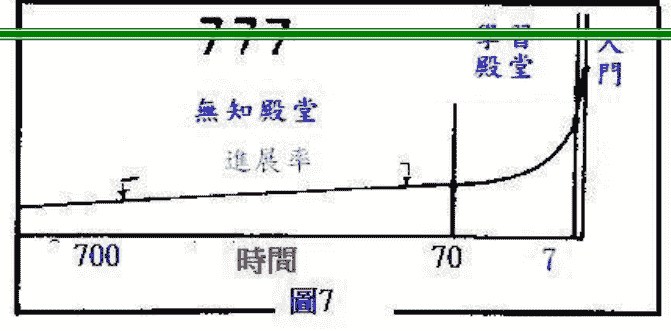

博纳：

这又让我迫不及待了。

蒂娜：

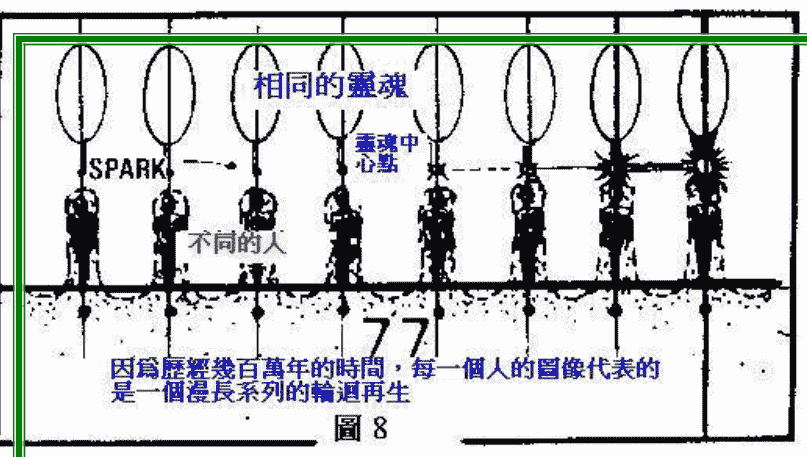

博纳：

图7容易理解，图8就令人摸不着头绪了。

图8说明因为这阶段也需要历经几百万年的时间，每一个人的图像代表的是一个漫长系列的轮回再生。虽然每一个个体（unit）都是不同的人（different men），但都是同一个灵魂。

博纳：

图像显示，无论何时，无论是谁，灵魂之光都是存在的。

蒂娜：

它也显示，由同一个灵魂所投生的不同的人，均由一根非常纤细的银丝与灵魂意识连接。

博纳：

如果我们细看，会发现它描绘了灵魂中心点（soul star）。而光的课程让我们启动灵魂中心点，必有其意义。

蒂娜：

Dwal Khul 称这阶段为 Probationary Path, Probationary 意指：试用、见习，准备的时期，表示不是每个人都可以顺利通过这阶段。

博纳：

光的课程的系列一，也是说这是 Probationary 的级次，我们发现，通过这阶段进入行星的入门阶段的人，几年前是百分之十，这一两年是百分之二十，可见一个人要从准备阶段进入真正的入门阶段，不是一件容易的事。想想灵魂真的是很有耐心。

蒂娜：

一个人，无论在那一个阶段，无论是否通过了试用或准备的阶段，他所得到的爱与恩宠是一样的，他与宇宙中的一切事物也一样是平等的。灵魂会耐心地等他做好准备，只是他可能会因为对灵性的无知与盲目，而得多受一点苦而已。

博纳：

唉，苦头不好吃，能免还是免吧。我看到第三阶段只有一个 (7)，我想这是因为进入这一阶段，就不需要那么漫长的时间了。

蒂娜：

我想也是。这阶段的人类，已摆脱了动物性，成为与灵魂本质更为接近的人，从而展开入门的循环阶段。这时的人类，对灵魂的记忆仍是模糊不清的，以太星光体的光也还不是很稳定。这种时候，往往灵魂团体的记录，被错误地解读成为个人的记录。

博纳：

由此推论，我想前世追溯或让有天眼通的人看前世，很可能看到的是灵魂团体的记录。

蒂娜：

这点我无法置评。Dwal Khul 说：过去的记录是无以数计的，事实上，一切事物都存在记录中。每一次投生的成就，都累积在灵魂的记录中，成为建立适合一个特定的载体做全面表达的资源。

博纳：

每当一个人的一生结束时，他的载体便消亡，人类整体的生命由下一代来延续。那么个体灵魂的意识如何延续呢？

蒂娜：

Dwal Khul 说：以太星光体中的情绪与思想，经由被称之为原子的能量体系来转接。灵魂将这原子能量收回，重新充电，以便进行下一次的运作。这原子将不携带人格中的琐碎记忆，但保存着前世所发展的能力。

博纳：

太好了！肉体的死亡不只是回去充电，还汰旧更新呢。

蒂娜：

刚才提到前世追溯，Dwal Khul 说：追溯前世琐碎事物的意义与价值并不很大，因为即使你找出这些细节或记录，你无法确定它对你这一世有什么样的作用。你前世所发展的，如果与进展有关，灵魂会在那一生结束时萃取它，将它存在永久性的原子中，以及灵魂起因体中。

我想这是因为把自己的问题推到前世，对自己思想行为的责任，便可以名正言顺地逃避之故吧。两位门徒说：当一个门徒想知道自己的前世，可以从灵魂的数据中了解，然而，一般来说，当一个人达到这样的能力时，他可能对这前世经历的琐碎事物已不感兴趣了。

博纳：

事实上，不一定要到具有从灵魂中取数据的能力。当一个人愿意向内探索，愿意承担自己创造的责任时，他的焦点自然会在当下的这一时刻中。

蒂娜：

不错，人类被赋予自由意志，可以选择自己要过什么样的人生。因此把焦点放在这一世的创造上，要比在前世里找原因重要。放下既往的是是非非，无论是自己的或别人的错误，寻找自己可以从中学习与调整的地方，会更有意义。

博纳：

是的，如果我们能依灵魂的计划而行，使每一次的投生都能有所收获，不但我们的进展会更快一些，还可以避免不必要的重复，也不会陷入在恶梦中不得解脱。

## 六、入门——强迫性的进展——加速进展

博纳：

彩虹桥这本书，也谈到入门，我想必定也是有它独到之处吧。

蒂娜：

那是当然的。Dwal Khul 称入门为强迫性的进展。但从它的论述中，我认为入门是一种加速进展的方案。他的理论指出个体灵魂可以选择是否要加速进展，只有当特定的个体，选择了加速进展时，灵魂才会展开迫使你向灵魂或较高意识觉醒，将生命投入在实现灵魂的设计上。

博纳：

这是怎么说的呢？

蒂娜：

他说，入门并非灵魂进展的正常过程它是一种较高次元在银河的三个星球中的实验，地球是其中之一。

博纳：

那在地球上的实验肯定是失败的。

蒂娜：

这一次你可猜错啦! Dwal Khul 说：在地球的实验已证实是成功的。在第三颗星球上无疑地，也是成功的。

博纳：

看来失败的是第二颗星球，可惜他没提到其它二颗在那里，是什么星球，为什么第二颗星球会失败。

蒂娜：

我想这是因为别的星球的成败，与我们目前这一阶段的进展无关。

博纳：

如果说入门并非是正常的过程，那么什么是正常的过程呢？

蒂娜：

他说：事实上，没有入门这方案的促进，人类也是一样地会进展。因为人类的原子中，被赋予神圣的本质一神圣之光。因此，所有人类最终都会踏上回归的旅程，这是不可避免的。

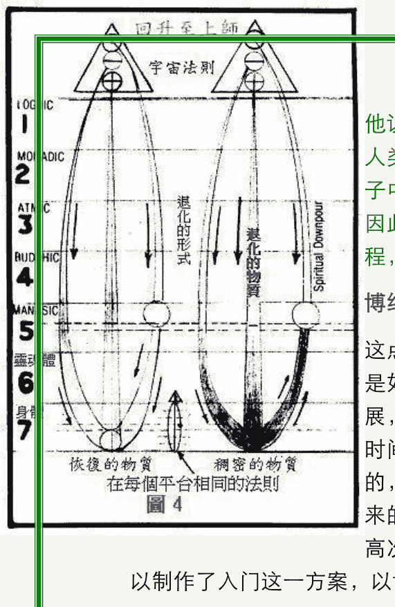

博纳：

这点，我从其它数据中已有所了解。只是如果没有入门这一方案，人类的进展，比起经由入门，要拖上好几倍长的时间。如我们在漫谈宇宙次元中所谈到的，人类已无法忍受种种错误创造所带来的痛苦，已到了渴望解脱的时候。较高次元的存在们，听到我们的呻吟，所以制作了入门这一方案，以协助渴望加速回归的人。

蒂娜：

两位门徒用这个图来显示(图4)，当灵魂的原子，向下移动，来到最低点，即地球之后，便是开始朝着灵性层面向上回升的时候。这表示地球这显像世界，是一个转折点。

博纳：

但是，降到谷底，处在是最稠密的最低点，是最动弹不得，最痛苦的时候了。

蒂娜：

这种痛苦，可能便是地球这颗小小的星球，在宇宙中成为加速进展之实验室的原因。选择经由加速进展以获得自由的人，便可以获得入门的机缘。

博纳：

我还是没有完全理解加速进展与入门之间的关系。

蒂娜：

Dwal Khul 说：如果一个灵魂想从最低点加速回升，必须先在灵性意识上加速进展或成长。而在低谷中，要加速进展，便需要来自较高意识层面的协助，这种协助称之为入门。

博纳：

所以光的上师、天使圣团，便成为协助地球人类进展的一部份，我们随着他们的教导，获得在精神与灵性上提升的机会。但是他们又如何知道怎么帮助我们的呢？

蒂娜：

前面说过，空（space）中，事实上并不是空无一切，它充满着万事万物的原型，我们无法以某种定义来涵盖它的本质。

一种事物，从展开它的活动周期开始，这原型中的元素，便从不同的空间，进入由精神与物质交织而成的层面。经由精神与物质的交互作用，除了产生形体生命之外，也形成我们所谓的「思想、精神与意识」，我们便是处在这种物质与精神交互运作的世界中。

当这原子到了由最低点，开始反转回升时，创造显像的物质与精神元素，便慢慢地被回收，直到它又成为空无为止，类似佛家讲的涅槃。产生这种过程的智慧，被称之为神或上主。

博纳：

我想这就是佛陀所说的，宇宙中的一切事物都在成、住、坏、空中循环不已。

蒂娜：

当物质与精神的显像降落到最低点，并开始回转时，太阳系在宇宙智慧的推动下，便会发展出我们所需要理解的知识宝库与智囊团。先知、上师、以及天使圣团，便是具备这种知识宝库的智囊团，他们知道在这太阳系中，一切该知道的事物，从知识宝库中汲取教化人类的资源。

博纳：

所以，虽然说我们是神圣的，我们是一切俱足的，但在回升的过程中，我们还是需要上师们的协助。如此之故，我的灵魂给我一个与上师们及天使圣团学习及共同运作的机会。但是否要持续下去，是否要入门，则是我的选择。

蒂娜：

两位门徒说：入门通常以投生地球的肉体生命来进行。每一层面的入门，都将频率提升到那一层面的至高点，并学习掌握进入下一入门层面的较高频率。在这里，我个人认为他们指的是，入门需要从三度空间，以肉体生命来体验与实践。在光的课程中，我们进入行星二时的入门庆典，是在我们较高的心灵层面上完成的。因此不要把他们所说的「入门」与行星二的「入门庆典」混为一谈喔!

博纳：

我了解，入门庆典是我们的在物质世间的身心意识达到特定的入门阶段时，上师们在较高次元中为我们展开的庆典。我一直以为，只有僧侣才有入门的资格。现在看来，每一个灵魂都可以为自己是否要入门做选择。

蒂娜：

灵魂提供进展的机会，但它不干涉个人的进展意愿。然而，它会引导做好进展之准备的人，获得入门的机缘。在进入宝瓶座纪元的这特定时代，更是这样的。在光的课程中，上师们曾说过：在这新纪元的时代中，不须刻意地进入庙宇中、修道院、或进入教导秘法的场所，终其一生，在其中闭关。生活在这朝代的人们，必须学习把宇宙真理用于每日的生活中……。

博纳：

所以无论你现在所从事的是什么工作，都可以透过某些途径来入门。

蒂娜：

在书中，两位门徒列举入门者所置身的各行各业，包括：

- 治疗师
- 新时代的教育工作者
- 政府机构的成员
- 宗教人士
- 科学家
- 心理学家
- 财经界人士
- 艺术家等等。

然而，我相信三百六十五行中，都有入门者。因为 Dwal Khul 说：这些入门者可能不曾听说过「入门」这两个字，也可能不接受这字眼，但他们有许多共性。他们通常是人道主义者，深爱人类，对宇宙科学有兴趣，有很强的自我纪律，努力实现真、善、美的人生。

博纳：

所以当我们看到具有这种共性的人，便可知道他们已入门。

蒂娜：

入门是对一个灵魂，在特定阶段所达到的境界予以承认。但因入门有许多阶段，因此一个尚在初阶，甚至二阶、三阶入门阶段的人，仍会有一些疑惑与混淆，许多不甚明白之处。然而，尽管如此，只要是展现了入门特质的人，无论他的身份地位是什么，无论他还有什么样的错误或困境，我们都应予以尊重。

博纳：

这大概也是佛经所说的，从初地菩萨至七地菩萨都还有惑。现在我的疑惑是：我如何确定自己是否真的在较高层面经历了入门庆典呢？

蒂娜：

你的意识层面是否感觉到「入门庆典」并不重要，庆典是一种仪式，因此不重要。就像过生日一样，过与不过，你都会增长一岁。当然，能庆祝一下，总是开心的。入门之后，你会感觉到自己确实是受到较高层面的指引与保护。Dwal Khul 说：它是实现神性意识，然而，却不抹杀个人的特质。入门意指逐步精炼并提升个人的频率，以便让灵魂结束那一再重复转世的活动。当局限在载体中的所有频率，都提升到与灵魂频率共振时，便能结束这种活动。

博纳：

那要到什么时候呢？

蒂娜：

Dwal Khul 说：一旦入门，这种提升过程便会稳定、持续地进行着。当一个人达到第二级的入门阶段时，载体中百分之二十五的原子能量，将提升到能直接响应单子能量或圣灵。达到第三级的入门时，便能提升百分之五十的原子能量。这意味着到了第四级的入门时，载体中百分之七十五的原子能量获得改变，到了第五级的入门时，整个载体的改变便完成了。

博纳：

光的课程的运作，便是为了提升我们载体的频率。然而 Toni 说，光的课程至单子级次为止，当她把单子能量完整地传递之后，这课程便结束了。那我们下一步怎么办呢？

蒂娜：

在经历了三十多年的工作之后，Toni 及许多走在这途径上的人，才做好接收单子能量这学习与运作的准备，因此，她现在 (4-19-2008 年) 才开始接收单子级次的数据与能量。而在我们接收了这些数据与能量之后，又需要很长一段时间的运作，身心意识才能真正达到单子级次所应有的改变与转化。因此，修完单子能量的级次之后，下一步要怎么办，不是我所忧虑的。我所考虑的是，自己在这一生能否真正地达到具备响应单子能量的能力；自己的载体，是否能在这一生完成在这阶段所应有的转化。我相信只要我完成了，灵魂自然会给予我们下一步的指引。

博纳：

说的也是。只要能解开沉重因果的束缚，就好办了。想想自己在谷底中时，那种昏昏暗暗，不由自主地处在负面循环中的情境，仍心有余悸。踏上光的课程这一途径之后，我可以感受自己的意识已开始转化，自己已进入正面的良性循环，但仍不免好奇自己的色身或载体在什么时候会开始转化。

蒂娜：

光的课程是一个灵魂进展的方案，上师们将这方案的资料公诸于世。然而，它不以三度空间的形式，也就是不以人类社会旧有的门派或体系的形式来呈现。因此这课程不以驻世的教主来审核每个人的进展，或决定每个人的入门级次，或由驻世的大师来赋予转化的能量。在这特定的途径上，一切都在较高的心灵与意识层面上运作，它让每个人依自己的时间与速度去进展，每个人自己审核自己。因此，一个人能在什么阶段，达到什么样的转化，完全是依每个人自己的接受能力而产生。

博纳：

我懂了，我们只要尽我们所能地去净化与提升自己，其余的就交给灵魂去处理，这让我松了一口气。

## 七、磁场的形态

博纳：

有些人一天到晚说的磁场不好，我感觉这种话的人，神经兮兮才让人感到不太舒服。

蒂娜：

磁场的形态确实是因人不同，但是，一般都在常规的，大家可受的范围。通常一个磁场，会令你感到不舒服，是因你内在的某种磁波与他们的磁波产生共振，而这种产生共振的磁波，正是你意识或潜意识里对自己以及别人有所批判的部份，否则你不会受到太大的干扰。

博纳：

我想有时也是那个感觉不舒服的人，把自己被引发的感觉放大并投射在别人身上。

蒂娜：

这是极有可能的。不过，两位门徒以一幅图来解释：有些人的内在或外在磁场，可以用风云密布来形容，混浊，狂暴，危险，甚至从体内散发一种难闻的腐朽气息如图（13）。

博纳：

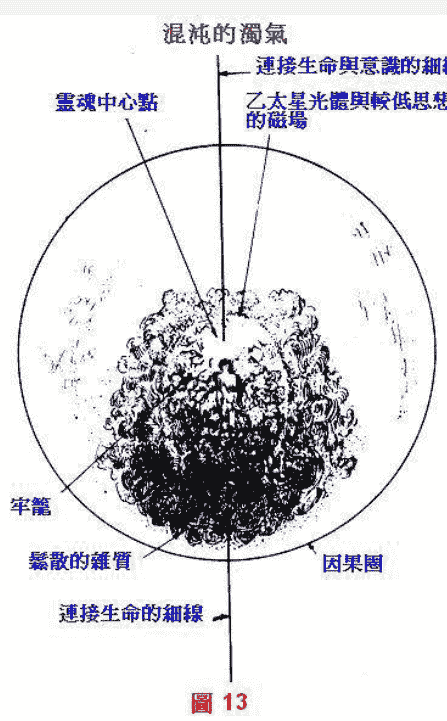

混沌的浊气
灵魂中心点
连接生命与意识的细线
以太星光体与较低思想体的磁场

牢笼
松散的杂质
连接生命的细线
因果圈

图 13

<更多灵修教程/电子书/音频> 微信：AKX 2035 合一工作室：https://shop182807119.taobao.com

## 牢笼

附着在体系上的稠密物质

被思想念相所遮蔽的灵魂之光

有些人身上是有一股腐朽的气味，我以为是不洗澡之故。

蒂娜：
如果是由内在所散发的，再怎么洗澡也无济于事。这是因为他们未能清除较低体系中陈旧腐败的事物，累积在身体，思想与情绪体，以及以太星光体之故。

博纳：
这么说来，比起在身上涂抹各种香水，还不如转化自己的情绪，净化、扩展与更新自己思想来得重要，或更实际些。

蒂娜：
从图中我们可以看到，磁场中的这些杂质，就像我们身体被某些东西弄脏了一样，有些较为松散，容易去除，有些则已成为稠密的固体，粘在身上，不容易去掉。而磁场中的稠密物质，甚至可以形成像笼子般地笼罩着一个，使人完全与外在世界隔离，无法接收灵性的智慧，也无法表达灵性的喜悦，所谓的障碍重重。如图(14)

充满思想念相的磁场

博纳：
我们没有净化的时候是这样的？还真的是可以形成一个束缚我们的牢笼，真可怕……。

蒂娜：
这种牢笼，是由我们所执着的，不愿改变的习气所形成的。一个人一旦形成某种牢笼，便生生世世带着这牢笼来投生，直到这个人负荷不了，向灵魂求助，寻求清理为止。

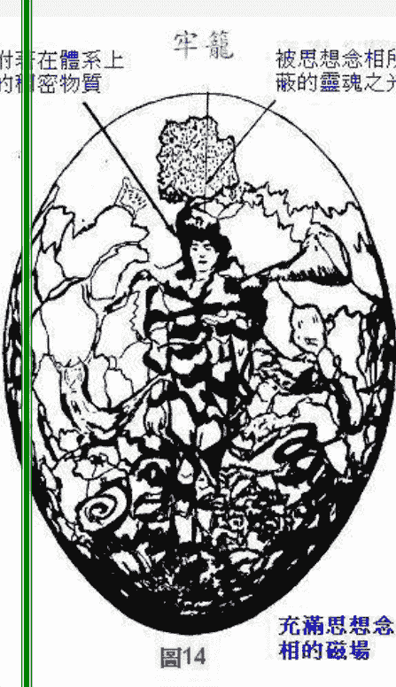

图14

博纳：
就像一个企业的成立与发展一样，一些旧的包袱必须去掉，否则就会被这些包袱所拖累。

蒂娜：
人类的进展，来自在生命的体验与学习中，不断地汰旧与更新。但是，就像我们的生活一样，我们会扔掉一些东西，但也会保留一些明知不再使用的东西。两位门徒说：这些废弃物，通常储存在身体的五个部位上。

博纳：
那些部位？

蒂娜：
- 1. 从头部到颈部的部位，储存着陈腐的思想。
- 2. 从颈到上背部，肩膀，心轮的部位，储存着个人对自我的价值感。它与情绪感受有密切的关系。
- 3. 在身体中间的部位，如太阳神经丛处，储存着憎恨，恐惧，愤怒与极端自私的人格。这些是因为思想与情绪被误导所产生的，我们称之为虚妄的影像。
- 4. 在背部下方，臀部的部位，储存着恐惧，性的欲望，占有欲，与上主分裂的信念。
- 5. 在腿脚的部位，储存着一个人想脱离某种情境或状态，却又无能为力的感觉。

博纳：
天啊，我好像每个部位都还有一些残余的杂质。

蒂娜：
这也不足为奇，由我们生生世世的思想念相所形成的腐朽物，必会牢牢地附着在我们的体系中。这就是为什么，以光的能量来净化、来清除思想的念相是极为重要的。当负面的元素被光的元素所渗入时，这些牢笼般的，由思想的念相所组成的能量，便像云雾被太阳照射般地散开了。

博纳：
嘿！那我们这次就谈到这里就好，我要去晒晒太阳，照照光了。

## 八、思想念相

博纳：
思想念相(Thought Form)这一名词，虽然可以从文字上顾名思义地去理解，但是，我很想具体了解它是如何形成的，以及它在我们身上所产生的影响。

蒂娜：
Dwal Khul 说：思想念相是由较低层面中，不同等级的精神与物质所形成的。

博纳：
我还是不太懂。

蒂娜：
简单地说，就是由人类在较低层面的所有思想意识所形成。

博纳：
也就是说，在身体、情绪感受、思想、及以太层面所形成的记忆、印象或影像，都可以形成一种思想念相。

蒂娜：
是的，一个思想念相，即使是在一种未成形的状态，也会影响你周围的环境以及别人，并且会制造不同的因果。但思想念相可以由当事人将它清除，我们在第四章已经谈到清理的过程。

博纳：
但它是怎么在人类的磁场中形成的呢？

蒂娜：
人类在受造之初，就被赋予自由意志与创造力。但是，那时候人类心智的发展，还处在非常动物性的状态。因此，一些尚未进展的心智，便因各式各样，好好坏坏的意念而产生种种念相。

博纳：
既然所有的创造，都是出自灵魂的思想，为什么会有不良的创造呢？

蒂娜：
很不幸的，宇宙中，也存在着一股反进展的势能。由于人类也被赋予自由意志，因此有些灵魂便会选择去经历它。这也是为什么人类的历史上，有许多个人或群体的不幸事件。

博纳：
造物主为什么允许反势能的存在？

蒂娜：
因为人类必须在体验与实践中，使心智日趋成熟，才能完成人类进展的使命。人类必须经由二元性的学习，透过因果的磨练，来发展识别的能力。

博纳：
那么坚定地迈向至真、至善、至美的人，必然在前世的经历中，经历过二元性的学习课程了？

蒂娜：
每个灵魂有不同的进展方式，不能把一个公式用在所有人身上。但我知道，当一个人坚决认同某种意念，或有着某种未能实现的愿望或深深的遗憾时，也会形成思想的念相。这些意念便在他们的存在中，形成的一种架构。由混乱、疑惑、欺骗、幻象所形成的思想能量，经压缩之后，便形成一层一层的以太元素，附着在以太星光体上。

博纳：
这一层层的元素，就是他们所说的业障或牢笼(cage)。也就是说，一个人片断、错误、扭曲、陈腐的思想理念，都会形成一种障碍，使一个人无法进入内在的实相，无法体验或理解真知。现在我知道佛家所说的「无明」是什么意思，一旦理解了这个「明」字的多重含义，便能理解以前同修的师兄告诉我，「名师」不一定就是「明师」的意思了。

蒂娜：
我想三度空间是一个挑战性极高的次元，投生地球的灵魂，因为有了身体，意识的焦点大部分在物质层面上，不免要受到环境以及群众意识的影响。因此意境再高的人，也不免会有一些弱点与缺点。我们只要不去苛求别人，运用我们的识别力，从别人的优点中学习，缺点中警惕自己，一样可以学到我们该学的。

博纳：
不错，走在光的途径上，自性灵魂便是我们最好的导师。不批判是主要功课。

蒂娜：
Dwal Khul 的教导，强调要清理与净化思想念相。因为这些执着与污染，不仅使我们与较高自我隔离，它还以各种方式影响着每一个人。

博纳：
我想他们所说的思想念相，便是在光的课程中所说的虚妄影像，上师们反复带领我们建立纯净的理念，便是要我们反复运用正面思想来取代并清理负面的思想念相。

蒂娜：
在彩虹桥这本书谈的是理念，而作者对负面的思想念相谈得比较多，我想是因为，正面思想的重要性，修行人也都已知晓，许多的途径也以强化正念为修行的主要方式。但我们也需去正视负面思想念相在我们身上所产生的影响，才能因理解而看破它。

博纳：
有一句话说：男女因误解而相聚，因理解而分开。我们因对自己虚妄的影像或负面的思想念相不理解，而让它紧紧与我们相随。许多人，包括我自己在内，常被自己或群体思想意识的念相所影响，甚至受到控制而不自知。

蒂娜：
对思想念相的运作不理解，往往因未能觉知到它在我们身心上所产生的作用，很容易对一些本来是很平常的事，在不自觉中，产生极端的情绪反应，以及令人不愉快的行为。

博纳：
嗯！我常常碰到这样的人。为了避免不受他们的影响而沮丧，状况轻的，我就说他们 EQ 不好，自认倒霉算了；严重的，我就想他们大概是有躁郁症，也只能自认倒霉算了。

蒂娜：
你这么一说，加上 Dwal Khul 在彩虹桥这本书中，对思想念相所做的分析，使我觉得从逻辑上来说，当一个人出现躁郁症的问题时，可能与一时之间，受到思想念相的影响有关。

博纳：
喔！这么说，我的自处之道，是来自灵魂的指引，而不是阿 Q 精神。

蒂娜：
Dwal Khul 说：受到负面思想念相所笼罩的人，会曲解自身内在的密码及与灵魂之间的协议，致使他们陷入在忧郁与烦躁中，一再面临失败的挫折。

博纳：
嗯，他是提到「忧郁与烦躁」了。陷入在忧郁与烦躁中的时候，人际关系必然不会好，事情自然不会顺利。

蒂娜：
两位门徒说：这些古老的，浓缩的负面思想的念相，生生世世地持续着，使他们无法与较高自我连接。致使他们：
- 1. 执着在陈旧的思想理念中。
- 2. 认为自己很灵通，什么事都知道，然后被自己的灵通现象所控制。
- 3. 把许多自己的幻想或妄念，认定是来自自己的灵通，将邪知邪见误认为真理。
- 4. 曲解自身的密码与灵魂的协约。
- 5. 他们可以是成功的灵性导师，也可以是危险的灵性导师。
- 6. 他们以妖言惑众，阻碍别人获得正知正念。

博纳：
他所描述的这些状态，很值得思考与回味，在我们面对识别的考验时，这是很好的参考。

蒂娜：
Dwal Khul 说：无论是好的或坏的思想念相之所以浮现，是受到某种因素的激发。一旦被激发出来，这些思想念相便有自己的生命能量，影响着个人或群体。致使一个人或一个群体，对本来是极为平常的事，也会产生特定的认知与反应。

博纳：
什么样的因素会激发这些念相呢？

蒂娜：
每一种情绪反应皆因受到某种刺激，当这种刺激来自周围的环境时，他们称之为横向刺激 horizontal stimulation。然而，无论什么样的刺激，都与当事人原有思想念相的频率接近或相似，才会产生共振与影响。

博纳：
「与当事人原有的思想念相的频率接近或相似」，这是关键点，一般人总是把责任推到别人或一个地方的磁场不好。尤其共修的时候，总是会说别人在散发负面能量，或某个地方的磁场不好，所以自己很难受。事实上，这正是深入观照自己的时候。

蒂娜：
这是非常好的提醒。Dwal Khul 说：许多心理学家的追溯方式，是以横向刺激，使当事人显示出特定心理模式，或思想念相，从中找出它的起因。

博纳：
这样的心理治疗，要花一段很长的时间，才能找出一点线索呢。

蒂娜：
所花的时间与费用是另一回事，根据 Dwal Khul 的说法，问题在于，这种刺激，反而会增加原本的思想念相的能量。一时的宣泄，是有可能产生短暂的舒缓作用，也可能使这被放大的思想念相，因受到压缩而停止活动，但它不能真正去除原有的思想念相。因此，一旦下次受到外境激荡时，便会产生更大的反应。

博纳：
我们都知道被压抑的事物，会产生更大的反弹。

蒂娜：
Dwal Khul 说，心理治疗不是根本的治疗方式，因为一般的心理医生并不真正全面了解他们的患者。他们建议心理医生能阅读 Dwal Khul 在「Esoteric Psychology」, Volume II, page 401.所阐述的：这种问题不是用逻辑可以解决的，它掌握在灵魂的手中……

博纳：
我曾与一位知名的心理医生谈起心理治疗，我对他说，如果单纯地，只是进行心理治疗，完全不涉及对灵性的认知，是有所欠缺的。他同意我的说法，也承认心理学目前确实是面临一些瓶颈。

蒂娜：
一个人除了受外在环境或思想的刺激，而产生横向反应之外，思想念相，也会因受到由上而下，垂直刺激 vertical stimulation 而产生变化。

博纳：
垂直刺激又是什么？

蒂娜：
当你启动灵魂频率时，由灵魂向较低体系所注入能量，便是垂直刺激。因为灵魂之光的频率，比思想念相的频率更强而有力，所以当思想念相受到来自灵魂振动频率的冲击时，便会开始扩散最后分解。

博纳：
所以思想念相因受到横向刺激而被激发时，要用灵魂之光的力量，以纵向的化解方式，来清除这些念相。但面对分解之前的扩散过程时应怎么办？

蒂娜：
书中没有特别提到在扩散过程中要如何处理。但是，既然分解这些念相的力量来自灵魂，我想除了观照、看清自己的思想念相，觉察自己在释放过程中之外，就是持续引导灵魂之光来运作。Dwal Khul 说：只要不去滋长或增加这些思想念相的力量，它最终会烟消云散。然而，有时候它会是一个漫长的过程。

博纳：
往往在这过程中

所以在光的课程中，上师们常说：信任这清理的过程。理解自己在清理的过程，与灵魂共同运作，自然不会把这些清理出来的垃圾，倒在别人身上。这样别人不但不会讽刺你，还会尊重你。

博纳：
我想，过程的长短，与思想念相的稠密度，以及当事人执着的程度有关吧！

蒂娜：
我想是的。总之，运用灵魂的较高能量，将能加速分解思想念相的过程。根据因果法则，任何因都会制造一个果，如果这因果未完成它的循环，它未完成的活动便形成一个促使它形成活动的记录。

博纳：
这么说，思想念相或虚妄影像，会促使一个人或一个团体，去面对并解决需要了结的因果。因此，去除这些念相与影像，便可以省去许多生的轮回。

蒂娜：
是的，运用正确的方法，结合灵魂的力量，可以化解这些念相，从而改变或去除因果的活动。从因果的活动中解脱出来的人，便可以有更大的自由，服务别人，使自己的生命更具意义。

博纳：
许多人受思想念相的干扰，便去找一些大师或治疗师，试图用各种方式，诸如消灾、祈福、肯定语、画符咒等方式来处理这些念相，这些方法能缩短清理的过程吗？

蒂娜：
Dwal Khul 在书中提到这点，他说：为别人消灾解厄，非但效果不彰，也扰乱了他们自身的磁场。因为每个人必须以自己的意愿与力量去清除，这是宇宙法则。

博纳：
所以上师们常说，他们无法为我们去除因果的学习。但他们透过光的课程，给了我们许多清理思想念相与虚妄影像的工具，只是我们不好好运用这些工具，却怪上师们不帮忙。

蒂娜：
纯净的理念存在于光的次元，净光兄弟、天使圣团及各门宗教的圣者，不断地将这些理念提供给人类。当入门者的意识提升到这一层面时，当人类进展到与灵魂完全融合时，便不再会受到反势能所影响，也不再有错误的创造。

博纳：
谢谢你的读书心得，这些道理确实让我的头脑获得许多的满足。现在，我要去清理我的思想念相与虚妄影像了。

## 九、净化的科学

博纳：
科学界已认同能量可以转成物质，物质可以转成能量。因此能量事实上便是一种物质元素。而思想也是一种能量，由思想所形成的磁场，便与我们所处的有形世界一样，可以是清净的，也可以是混浊的，因此，思想与磁场的净化，是一种科学。

蒂娜：
Dwal Khul 将这古老的智慧运用在人类精神、思想的进展上。他说：净化是一种自然科学，因此情绪以及沉积已久的错误与制造，以及思想的念相都必须清理。他的救赎科学(The Science of Redemption) 着重在成为光的载体，以释放在人格层面上所累积的陈旧腐朽的能量。

博纳：
光的课程就是一个让我们达到这种净化的途径。

光的运作是在帮助我们释放细胞里的记忆，当我们呼唤所有的自我来到前额，包括化身自我、个性自我、身体自我、器官自我、细胞自我，把所有的意识带到前额，然后把这些自我都往上带到灵魂光体中，所有过去世的记忆，这一世的记忆都在那里，光的能量被引导进入身体，每当静坐时，这能量就跟储存在身体中细胞的记忆、器官的记忆连结，这就是一个整合的过程，细胞、器官，都对这频率产生反应，细胞里的记忆就会浮现出来，这些细胞记忆在理性思想上被启动，理性思想开始释放那些被压抑、被压迫的负面情绪，在『光』的运作中，你会释放那些你觉得困扰的事，释放那些过去世的记忆，四个级次就在作释放整合，它会经由不同级次的持续运作来完成。为了清除及净化，原有的问题会被凸显出来，包括身体、情绪的旧创……，就这样透过宽恕、释放、提升、转化的过程，那些制造业力的思想念相便能获得清理。

蒂娜：
Dwal Khul 举出一些有助于加速清理思想念相的方法。他强调任何运作都需要灵魂的协作，因此：
- 1. 使用灵魂肯定语如：我即是灵魂；我是神圣之光；我是爱；我是神圣意识；我是灵魂的设计。
- 2. 启动灵魂中心点，清理每一人脉轮中心点。
- 3. 经由行星彩虹桥与在光中运作的上师们及其它团体连接。
- 4. 与自己内在的密码连接。
- 5. 念颂颂文，如：我是爱而不是恨；我寻求治愈而不是伤害；我让光与爱治愈我的痛苦；我让灵魂引导我的生命途径；我让自己以无条件的事奉来展现生命的意义；我让自己展现内在的合一而不是分裂；我让爱充满所有人类的心灵中。

博纳：
我修到行星七以后，就以念颂图形与密码中的颂文为主了。

蒂娜：
万法归「一」，它们之间没有抵触。你觉得最合适你的，就是你在进展的这一阶段所需要的。

博纳：
有人认为我念这些祈祷文或颂文太天真了。

蒂娜：
对一般人来说，它们似乎是一种天真的梦想。但是，如果你认知这种理想的重要性，以及心灵创造的力量，每天以五分钟或十分钟的时间来重新建构正面的念相，它终会成为你的实相。因为它会改变你生命的态度，使你受到正面的启发，进入光明的创造。

博纳：
是的，我通常是依我内在的感觉去做清理与念颂。我总是轻松地去做它，我每天念一两句自己喜欢的或在那一天想念的颂文，不让它成为我生活中的压力，尽管天真，但我的感觉就是蛮好的。

## 十、Plate图解

### Plate 1:
灵魂知道你所需要运作的部位。譬如这个人的思想念相储存在下腹部，受到启动与放大的灵魂中心点的能量，便集中在这部位运作。

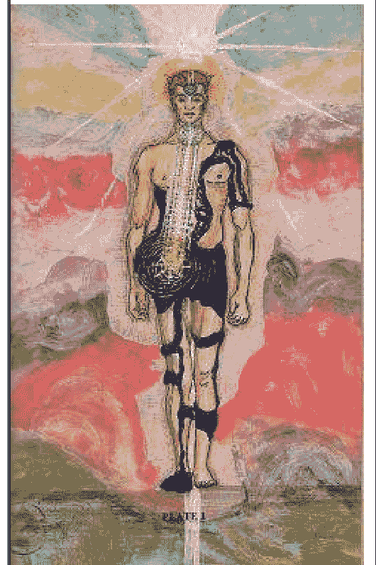

### Plate 2:
当一个思想念成形时，较低体系便照单全收，然后照本宣科地把它表达出来。妖魔是人类普遍性的思想念相。当一个特定的思想念相被制造出来，形成能量时，自然是吓人的。这种能量甚至可以让人听到它的咆哮声，或闻到它的臭味。

动物性的人类，因自己扭曲的想象，而制造了许多错误。通常与性及暴力有关。古今中外，都有许多描述一般人无法想象的，有关妖魔鬼怪的故事。事实上，妖魔鬼怪就是一种对创造性能量的滥用。它出自沉重的，趣味低级的私人欲望。任何在个人生活层面的创造，都会形成一种存留在灵魂记录中的能量。

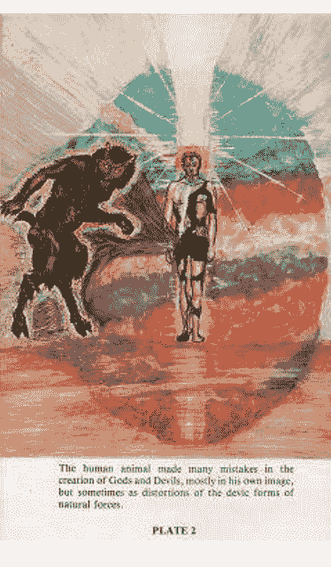

能量本身是中性的，基于能量跟随思想的定律，它会回到散发这些思想的原点。创造的天赋原本是为了让人类学习如何正确地创造，但这中间，也不免会制造许多痛苦的经验。然而，最终，人类将会以较高的创造能量，正确的起心动念，在适当的时间，创造美好的事物。这时，那些低落、沉重的思想念相，便会被较高频率所瓦解，销声匿迹。

如果持续运用较高能量，灵魂的能量可以畅通无阻地注入时，这创造性的能量便可用在更高的目标上。如果未能善用这创造的能量，所制造的一切便进入起因体的磁场中，蓄势待发。如果善用它，这能量便开始建立一个明亮的，强有力的光体。当灵魂的能量受到启动时，它的漩涡式的频率便开始化解思想的念相。当然，这也需要当事人有着坚定的意愿，持久的恒心与专注力。启动灵魂中心点后，也可以运用肯定语来加速它的运作。一旦这些在以太体中的思想念相被分解后，必须以漩涡式的能量将它的物质元素带入地心。

### Plate 3:
由思想念相所形成的杂质，不但成为你身心的负荷，也不停地障碍你的心智，使你无法以较高的智慧来面对，或处理发生在你生命中的事。由于我们的载体处在较低层面中，污染性的杂质，不可避免地，随时都会进入置身在这层面上的载体。当你与灵魂起因体融合之后，任何杂质自然不会粘附在你的体系中。在你完全净化之前，放大并运用你灵魂中心点，白色之光的能量，漩涡似地清理自己的磁场是必要的。当这漩涡由上向下旋转时，因日常的活动，而在你较低体系磁场中的沉重元素便像被旋风带走一样地，从你的身上去除。

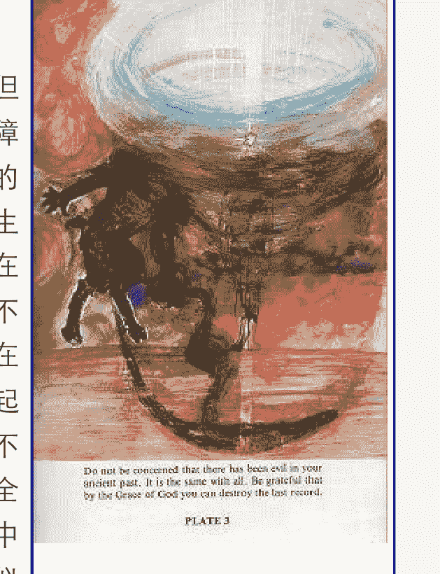

因此，在你静心冥想前，先把这些不属于你的杂质清理之后，将有助于你看到自己内在所需要清理的。这漩涡把我们不需要的杂质带入地心。

运用光的旋涡清理它，这些念相便无法产生威胁的力量。要知道这只是古老的群体所制造出来的能量。信任光的力量，信任上主的恩宠可以消除这些思想念相。

### Plate 4:

当这些思想念相被粉碎之后，它的元素便离开较低体系，被带入地心。

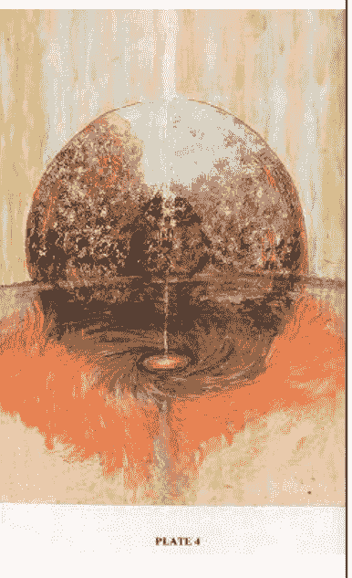

### Plate 5:

当你持续深入地运作时，残余的杂质在光中被燃烧殆尽。

在此要声明的是，随着灵魂的进展，大部份的人，都已不再有种种妖魔的念相在他们的灵魂记录中，但我们的思想与情绪感受中，还存在着许多微细的负面影像，因此我们用这种夸大的图像来形容念相的形成与清理。

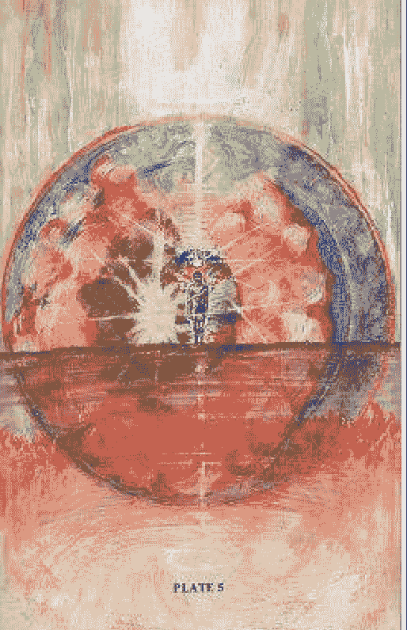

### Plate 6:

显示各种思想念相的运作模式，以及它们如何使你陷入一团混乱中。混浊的磁场像牢笼般地围住你，使你动弹不得。但是，无论如何，灵魂之光不会被淹没，它仍然闪烁着，等待着你与它连接。

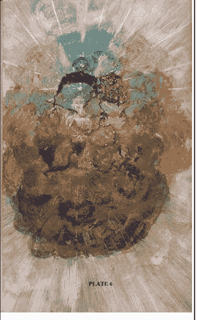

### Plate 7:

显示虽然已清理了部份的烟雾或晦暗的磁场。只要你还执着某些意念，这些思想念相便像枷锁般地绊住你。有些执着会像强力胶般地粘着你，成为你的一部份，使你无法觉知到它对你的影响。

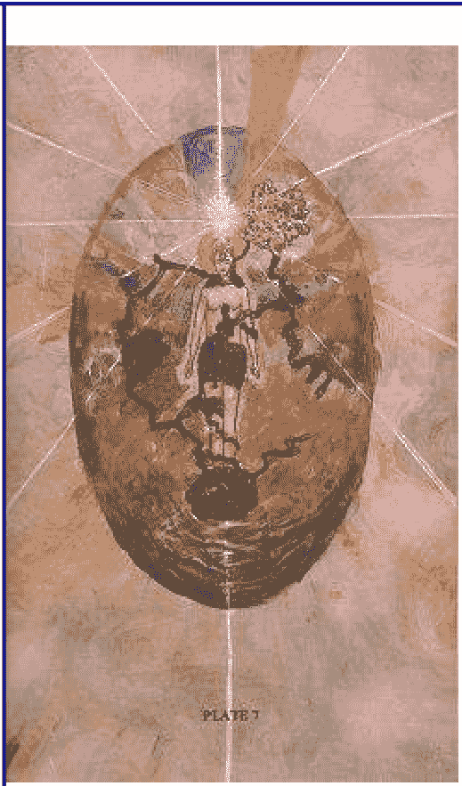

### Plate 8:

显示你磁场所焕发的光，是如此地灿烂，每一个脉轮都如此清晰明亮。一般来说，从开始清理至达到完成的阶段，至少需要三、五年的时间，依每个人的持续性、专注力，以及与灵魂共同运作的能力而定。

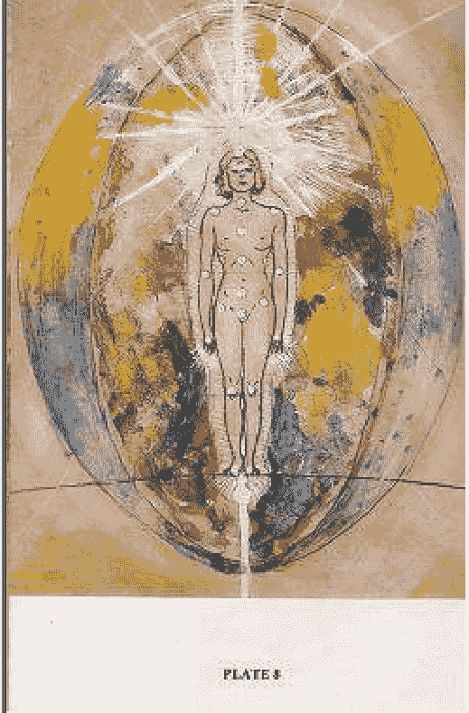

> <更多灵修教程/电子书/音频> 微信:AKX 2035 合一工作室: https://shop182807119.taobao.com

## 十一、彩虹桥后记

博纳：

你的彩虹桥读书心得，使我受益良多。听说另一位外国朋友读了这本书也有一些感想，是否可以跟我们分享。

蒂娜：

这位朋友是一位美国人，他曾在旧金山一个印度教庙宇中住了二十多年，投入在印度教的习修与服务。退休之后，隐居到一个偏远的山中小镇。十多年前，我把光的课程介绍给他，以及他的一些朋友。其它的朋友走到不同程度的阶段后，都退出这一途径。只有他，虽然时而有一些疑惑，但他的内在指引，使他一路独自走下去。他同意我把他的感想与大家分享。他的感想，主要是表达他认为彩虹桥这本书与光的课程之间的关系。当然，他的感想纯属他个人的，只是有些地方，可以让我们从中思考讨论，成为我们对本书的心得报告的后记。他的全名是 Michael Van Cleemput，我们就以英文名字来称呼他。

Michael:

光的课程与彩虹桥是殊途同归的两个方式，各有它的效果。

我个人认为，在微妙的精神领域中，无论是光的行者、治疗师或宇宙奥秘探索者，都应谦卑地接受彩虹桥这本书与光的课程中，具有崇高目标的数据。

博纳：

殊途同归的不同处在什么地方呢？

Michael:

例一．彩虹桥的两位门徒接受并坚信四个理念：

1. 一切万有的神
2. 轮回与重生的事实
3. 因果法则
4. 合一的法则

而光的课程则直接把我们带入这四条法则的生活中。

博纳:

「直接带入生活中」，这是怎么说的呢？

蒂娜:

我不知道他这么说，是出自什么样的感想。但我的感想是，每当我们因背离这些法则而受苦时，光的课程的讯息与能量，总是回提醒我们去思考这些法则，你便会体认到背离所带来的痛苦，欣然回到光的途径，生活在这些法则中，自然获得平安与喜乐。

Michael:

例二：两位门徒成功地把它的哲理表达出来。

光的课程直接进入以光的较高能量在身心上运作，不谈哲理。

蒂娜:

通常属于理论性的东西，我们看完吸收了之后，就会将它放下。这大概就是一九八四年，看完彩虹桥这本书之后，便将它束之高阁的原因。因为反复琢磨道理，只能原地踏步。我需要的是踏上它所说的光的途径，并走下去。所以多年后，当大家都问我有关彩虹桥这本书的内容时，我因一直未能找出这本书，也就无法细述它的内容。

博纳:

你真的是「过河拆桥」，也不想想走在后面的朋友们需要这道「桥」。

蒂娜:

在那时候，根本没有想到还会有人愿意去走一条当时在台湾是默默无闻的新途径。当我找到这本书时，发现它被我翻得破破烂烂的，这是少有的现象。我一向对书是很珍藏的，表示我当时真的是用心研究它，意味着它对我有许多帮助。

博纳:

看来你是在理性的认知之后，才走在光的途径上的。而我们没读过彩虹桥这本书的人，可是凭着内在指引与诚信走下来的啊!

蒂娜:

是的，现在想想，你们还真伟大。我想有些人是凭诚信，有些人是在前世便已了解它的哲理，这些领悟已潜藏在深沉意识中。因此，这一生一接触到，便能直接连接上去。虽然在他们的意识层面上，对自己何以走在光的途径上，说不出个所以然，但无论遇到什么挑战与考验，无论如何颠簸，甚至跌倒了，都能再站起来，坚定地走下去。无论是出自诚信或内在领悟，都是很伟大的。现在，让我们再看看 Michael 还有什么其它的感想。

Michael:

例三：两位门徒小心翼翼地将它的来龙去脉清楚地解说出来，唯恐大家不能理解。

光的课程说：这是一个非常简单的方法，连小孩都可以运作（参考光的飞行航程）。光的元素本质，既不是正面的能量，也不是负面的能量，全看你的动机与思想如何运用它。经由体验与实践，你自然会打开理解与领悟的智慧。

博纳:

两者都有道理。对我们来说，合起来用更适合，难怪上师们会建议学生看这本书。提到光的飞行航程，真的是「千呼万唤始终不出来」！

蒂娜:

这套给孩子们的教材，我们很早就已将它译出来。只是因为它是给孩子们使用的，为了怕孩子们因寓意式的抽象语句，误解了其中的含意。我们希望在我们能触及的孩子中先实验，把可能产生误导的地方，以适当的方式调整好之后再出版。

博纳:

你不觉得过于小心会变成因噎废食吗？

蒂娜:

也许吧，一切都是机缘，当时机成熟时，一切自然会水到渠成。让我们回到 Michael 的心得。

Michael:

例四：两位门徒仔细陈述彩虹桥的背景，并以绘图来表达它的理念。

光的课程以自我（EGO）体系，如身体自我、情绪/感受体自我，理性思想体自我，等各个体系来陈述。

博纳:

这些图对初步想了解光的途径的人，是比较容易一目了然。但是，一旦真正运作时，在各个体系上细细地清理，更能体会它的效果。

Michael:

例五：两本书中，对光的色彩的解说与应用有所出入。

博纳：

光的课程对色彩的应用，确实是与其它数据上所说的，有所出入，我对这点也很纳闷。

蒂娜：

我记得我也曾经问过 Toni，她的回答是：很多数据所描述的色彩的应用，是针对我们在地球上身体的脉轮。上师们在光的课程中，所运用的色彩，是针对灵魂体的脉轮。我想这是因为我们所运作的体系不同之故。

博纳：

我本来只是认为，一个法门有一个法门的设计，上师们这样设计，必有他们的道理。对我来说，只要有效就好，也就不去为它伤脑筋了。但是，在我们讨论了「净化的科学」之后，我理解了光的课程是一种 Agni 瑜伽，是在较高心智与灵魂层面上运作，对这课程的色彩的运用，便有了更清楚的了解。

Michael：

光的课程并未直截了当地说，这是外在或具体显现 EXTERNALIZATION 的过程。它直接带领学生进入身体的运作。

蒂娜：

初级的时候可能没有清楚地说明，当我们成为光的载体，是一种为地球频率的提升做奉献。但行星级次以后，却反复地告诉我们说，我们是将光的较高层面的频率，落实地球的重要环节。

博纳：

所以有人说，光的课程是一个福慧双修的课程。

Michael:

例八：两位门徒一开始便清楚地把光的运作的目标与意图的大蓝图清楚地表达出来。

光的课程开始时，不讨论远大的目标或蓝图，而是把焦点集中在以不同光的能量在较低体系的运作上。从身体着手，展开灵性的转化，再进入较高灵性体系。

博纳：

所以很多人，因不理解光的课程是一个循序渐进的课程，看了系列一的教材，认为没有什么，便不屑一顾了。

蒂娜：

这是个人的因缘的问题。有趣的是，没有人管你是否真的照它的级次循序渐进，就算你跳级了，也没有人会管你，但你自然会回头去补它，否则就是无法持续下去。

博纳：

补修不算什么，认真的人可是一再重修。当时我觉得这些人执着得有点傻，自我要求太高了。为什么一定要达到那一级次的意境，才要往下走。但现在我发现他们把基础打好是聪明的，因为他们的收获是非常扎实的。走马看花的方式，所获得的，也只是表面的、浅层的。

蒂娜：

无论是脚踏实地，反复地走，或快速地先走过一遍，再回头慢慢体会，都是个人的选择，无论是那一种方式，都能从中获得进展的效果。

Michael:

例九：两位门徒说：在这时代，迫切地需要大家建立光的彩虹桥来连接灵魂与天使圣团，这样门徒便能成为能量转化的管道，因为让上师们与基督圣灵的能量意识具体显现是如此重要。

光的的课程说：这是一个新纪元的课程 curriculum。你们是学习治愈的治愈者，你们是学习中的教师。

博纳：

教学相长真的是光的课程的一大特色。但我发现太早出来带课的教师，或太受学生崇拜的教师，到了后来，反而容易断羽而归。

蒂娜：

这之中有许多个人的内在与外在因素。可能要在教师手册上，或教师研讨会上讨论了。Michael 还有一个心得，就是他所认为的光的课程的最大特色。

博纳：

是什么?

Michael:

在光的课程中，「因果」是一种从中学习之后，将它清理与净化的过程。红宝石之光有特定的功效，薄荷绿之光持续它的功效。这种持续性是一个光接一个光连续不断的。

蒂娜：

我也觉得这是最棒的地方。没有学习光的课程以前，总觉得既然是自己的因果，就只有认命与忍耐。但这样一来，因未能从中进展与成长，也就未能从清理与净化中获得治愈与解脱。更糟糕的是，忍耐不住时，就会爆发，致使一再重复或陷入负面因果的循环。

博纳：

我觉得每一个光都是治愈之光，都有它特定的功效，是一个特点，而且这些能量取之不尽，用之不竭。不但不怕别人用了，会减少你的份，反而会因集体的运作而增强它力量，大家都受益。最棒的是，取它们的时候既不用费力，也不需花钱，就能增长福慧与功德。

## Ego等数篇

## 一、自我的真相

博纳：

每当我有问题的时侯，我的师父总是告诉我：「你要『无我』，不要『我执』。」我就拚命想把那个所谓的「自我」（Ego）杀死，以便得到重生。但我总发现，那个「自我」的生命力特别强，虽然它在我的静心冥想的时候，被我杀掉了，但一结束静心，面对生活中的人事物，它就如春风吹又生，我真是拿它一点办法也没有。更让我不解的是，《光的课程》反而要我们把光送给所有的「自我」，那不是更强化了「自我」的力量吗？

蒂娜：

「自我」的定义与特质相当广泛，我们无法轻易为它下一个单一的定义。人类在地球上生存，须要有一个身体，性灵才能经由这个身体来表达它的精神。「自我」最原始的功能，是保护与持续肉体生命在地球上的旅程，这就和动物以直觉来保护自身安全是一样的。但渐渐的，当人际关系越来越复杂，「自我」便给自己加上其它的任务，开始影响情绪和理性。于是，「自我」被视为造成一个人行为不当的主要原因，也被认为必须抹煞并且去除。

博纳：

所以说，「自我」是人类本质的一部分，难怪我无论如何都杀不了它。那么，我要怎么做到「无我」呢？

蒂娜：

我认为，当我们融合「小我」与「较高自我」，成为「神圣自我」时，便是在「无我」的状态中。

博纳：

这么说来，「无我」的意思是，不让「小我」当家，并不是真要去杀掉我们的「自我」，或让它蒸发。

蒂娜：

事实上，「自我」本身没有好坏，好坏全来自人类的批判。一个人非常重视自己，你们可以说他自尊、自重、自爱；也可以说他是「我执」过重。请问这两者是真的有所不同？还是因为你们根据个人的喜恶，导致不同的判断呢？

博纳：

嗯，我常常觉得一个不能自尊、自重、自爱的人是可悲的，严重时甚至是可恶的。

蒂娜：

不要从字面的意思来解释佛家的「无我」或「我执」。我相信它的真实意涵是，不要让「较低自我」来主宰你的生命。这就是为什么，上师们透过《光的课程》，提供我们一个提升「较低自我」，并将它转化成为「较高自我」的途径。

博纳：

对！你这么一讲，我就明白了！初级课程是带领我们净化、提升与转化那些「较低自我」。从行星课程开始，便逐步引导我们与「较高自我」融合。一旦与「较高自我」融合，那些「较低自我」便自然会消失。不用去追杀它们，太好了！

蒂娜：

当「自我」选择批判，认为「我看这件事情应该这样那样」，并试着想要改变它时，我们就是在制造因果。任何形式的干涉都会为我们带来失落、疾病等业网。

博纳：

那我不是变得没有主见了吗？

蒂娜：

这就是识别与批判之间的差异。关键在于，如果我们迫切想从外在去改变别人，就算是为了帮助别人，我们仍然犯下一个错误；那就是，我们干涉了别人的生命体验。只有当我们允许别人以他们自己的时间、自己的速度、自己的方式去成长，而不去忧虑他们要以一生或多生去开悟或进展时，我们才不会落入业网，并为地球带来和平。

博纳：

你曾经整理出一张「较低自我」与「较高自我」的对照表，现在已经刊登在网站上。不过，你所谈的是「较低自我」与「较高自我」之间不同的运作模式。你能不能更具体说明，这两者在本质上有什么差异吗？

蒂娜：

我们的「较高自我」，是我们所有的过去与未来，是完全客观、包容与超然的，它也包含「自我」。这「自我」告诉我们，我们是完美的，我们是有能力的。但它不会告诉我们要如何去展示我们的完美与能力。它完全没有批判，没有期待，没有竞争，也没有否定。

博纳：

「较低自我」就像小孩子一样，不断比较、不断思量、判断、做交易。它总是想「如果我做了这件事，我应当有那样的回报」或「这个人做事怎么是那样的？如果是我，我就会这样做。所以，我要告诉他应该怎么做，如果他们不照我的意思去做，我将阻碍他们，直到他们照我的意思去做为止」。

蒂娜：

你对「较低自我」的把戏很清楚嘛！能有这种觉知，已经很不容易的事了。了解自己的「较低自我」，认知这个「较低自我」，便是净化、提升与转化的前题。「较低自我」不断受到周围环境的刺激，时时刻刻在制造干扰和竞争。我们越是拥抱爱竞争比较的较低自我，就越容易去批判及交易。这么一来，也就越能确保我们免不了要在生命结束后，一次次回来调整我们批判、操纵别人的错误。

博纳：

直到我们能以爱与接纳包容别人为止。

蒂娜：

是的。当我们能够以客观与整体性的态度看待人生时；当我们领悟到自己不需要去改变别人时；当我们能在失去与拥有之间自在时；当我们能尽自己所能地丰富自己的人生，而不去罣碍自己究竟何时才能达到自己的目标与理想，或担心别人会比自己更好的时候，我们便能体悟到，我们所经历的事件其实并不重要，重要的是，我们看待人生的态度。

博纳：

看起来似乎很简单，其实不然。「自我」常让我觉得自卑无能，使我想在竞争中追求财富，而忘记一不小心就会建立更多的因果。宝瓶座的时代，因果来得之快，使我不得不承认一切是自作自受。

蒂娜：

我们的经验往往是以眼泪换来的。我们只要对自己说：「这是我的权利，我需要这样的经验」。要知道，经验的本身只是一种经历，没有好与坏之分，它是我们所选择的体验。眼泪并不表示愤怒，它表示，我们正在感受这样的经验。

博纳：

如果别人处于彷徨之中，希望征求我的意见，难道我不要去理他们吗？

蒂娜：

那倒不是，该说的话还是要说，你可以给予他们意见，但不要去期望他们照你的意思去做。如果，他们的时间还没有到，你的介入会使你自己陷入一个新的业网。因为，你的参与会转移你的生命目标，阻碍你自己进展的过程。你也会因为介入，而成为那因果形态中的一部分。

博纳：

我看，我还是把多余的时间和精力，投注在自己身上，先让自己成为一个指引的路标，成为光的火炬，使每个人都能在光中清理他们自己的业力。

蒂娜：

让自己准备好，当别人到了要成长与改变的时候，你成为他们的典范，才是上策。你有没有发现，尽管岁月流逝，有些人心智不断增长，而他们的肉体并不显老；有些人长期处于愤怒、批判、竞争之中，外表看起来则越来越衰老，身心也陷入极端的痛苦中。

博纳：

因此，我们只需要引导他们走向光。一旦他们拥抱到「较高自我」的灵魂之光，客观的待人处事，他们便能中断因果的循环。

蒂娜：

是的，只要我们能够允许别人以他们自己的时间、空间与方式去成长时，我们就会如脱胎换骨般焕然一新。

博纳：

难怪在《光的课程》中，每走过一个级次，更进一步的清理掉自己的虚妄影像之后，就接着进入薄荷绿之光，让我们在更新中回复青春。

蒂娜：

事实上，每次我们清理掉思想念相的障碍之后，所有的腺体就得到了新的养分，让我们回到一股清新的状态中。殊不知，许多人拚命向外寻求的「青春之泉」，它其实就在我们自身之内，在我们内在的心灵之中，它是一种心识状态。这种心识活动的训练，就是保持青春的秘方。

博纳:

因此，《光的课程》可以说是一口涌满青春之泉的活水，我们只要汲取这「青春之泉」，便能一直保持自己身心的青春与活力。

蒂娜:

因此，「自我」是我们的朋友，我们的工具。我们要学会掌握它，引导它与较高智慧与真理融合，而不是去控制或抹煞它。

博纳:

整个《光的课程》就在引导我们进入这种融合。

## 附录——较低自我 V.S. 较高自我

博纳:

当我们谈到动力磁场与磁力磁场时，你说道：「当较低自我的意念与较高自我的意愿或灵魂的设计有着冲突时，你整个存在的能量便无法通畅。」那么我如何知道自己与较高自我或灵魂的设计是整合的，还是冲突的呢？而且在「光的课程」中，上师们总是要我们与较高自我融合，实现较高自我的意愿。然而说实在的，较高自我与较低自我的分辨，我有时可以察觉的出来，有时却真的很难于辨别。

蒂娜:

这就是为什么行星课程称之为识别的课程，你需要培养自己的识别能力。随着课程每一级次的成长，你对自己内在自我中的起心动念也会逐渐地看得很清楚。

博纳:

唉，你又在给我一些远水救不了近火的说法….

蒂娜：

这是使你不会产生倚赖与僵化，使你得以独立与自由最根本的模式。你必须学会独立思考，自己做选择，你才能有飞跃性的进展。

博纳：

但我还不会走路，你就叫我跑步，未免有点不公平吧！

蒂娜：

我真的想改掉自己太鸡婆的毛病！好吧，就让我再婆婆妈妈一次好了。什么样的状态是你比较难以分辨的时候呢？

博纳：

太多了，先说无条件的爱吧，我常好心给予别人协助，也不求回报，但还是常常遭受白眼，这使我感到自己狗拿耗子，多管闲事。

蒂娜：

无条件的爱指的是你全然地接受别人，无论别人做了什么，你都没有任何批判。既然我们现在谈的主题不是批判，也不是无条件的爱，就以你帮了别人还遭白眼来说吧，我想大概你热心帮助的多半是女生吧？

博纳：

咦！你怎么知道？

蒂娜：

逻辑推论吧，女生比较会给入一个白眼。我家小狗是母的，不满意时就给我们一个白眼，而隔壁家的公狗就不会这样…哈！

不调侃你了，言归正传，在你帮助别人时，是不是完全没有任何批判？还是心里想着：看吧！没有我你就不行了！

博纳：让她觉得我有点能力，也是一种批判或条件吗？太严苛了吧！

蒂娜：虽然你没说出来，但你心里就是觉得自己比她强，并希望她景仰你，这不就是带着批判和条件了吗？

博纳：好吧！那么爱自己与自私自利之间又怎么说呢？

蒂娜：较低自我自私自利的运作，其实你自己是可以看到的，我就仅从较高自我的思想与行为来与你谈吧！

较高形式的爱自己是指反省自己，不苛责自己的过失或短处，给自己时间去领悟与修正，允许自己去享有宇宙上天所赋予我们的一切。

博纳：那么面对挫折时，较高自我是怎么运作的呢？

蒂娜：不怨天尤人，不把责任推到别人身上，审视自己起心动念，理解他人，宽恕他人，祈求上天给你勇气、力量与机缘来转化目前的一切。

博纳：我是中间阶层的小主管，上有上司，下有下属，上下都有自己的要求，我夹在中间，左右为难，如何让较高自我运作呢？

蒂娜：以坚定的信心、真诚的投入，领导属下一起完成任务，不独占功劳。如果上面的政策不务实，你也不会去批判主管，作为「光的课程」的学生，便多在绿宝石之光中运作，以便开启自己更大的创造力与沟通能力，让主管知道理想与现实之间的差距。

博纳：这种时候就很难分辨什么时候要以信心坚持到底，什么时候要知道极限，并体恤员工。所以还是有不知道自己到底在较高自我中，还是在较低自我中的时候。

蒂娜：这就是何以理论上的事，我们纸上谈兵只能到一定程度，其余便是要在自己的体验与领悟中逐步清理自己的混淆，直到智慧开启后，你的起心动念、行为举止自然会优雅适中。

### 较高自我 V.S. 较低自我

### 较高自我在运作时：

- 当别人在痛苦中时，你安慰他们；但不将他们的问题变成你的，或感到需要处理他们的问题。
- 你能放下对自己所做的每一件事都是正确的需求。
- 你能接受：所有的信仰对某些人在特定的时候皆有他们的作用与贡献；即使你认为自己的比较好。
- 你能接受自己所景仰的人，就像其它许多人一样，有他们自己的课程要学习。
- 无论你个人所期望的是什么，你能接受自己所爱的人，他们有权利做他们自己所要做的事、做一个他们想要做的人。
- 你能理解到你自己所爱的人，没有必须成长的义务，也没有义务以你所要求的眼光来看待你。
- 你向内寻找真理（validation），并了解外在现象只是自己内在世界的反映。
- 体认到你自己生命中的每一个人都在帮助你成长。看到他们在你的成长中扮演的正面或负面的角色，并对他们的角色予以体谅。
- 你认识到自己的独特与完美。

### 较低自我在运作时：

- 当别人在痛苦中，并需要你的安慰时，你告诉他们，是他们创造了自己的实相（这一切是他们自己的因果）。
- 你要求是非分明胜过于整体性。
- 你要求别人认同你的信仰。
- 你要求别人认定你所崇拜的是最完善的。
- 你要求自己所景仰的人符合你的期望。
- 你要求自己所爱的人符合你的期望。
- 你在自己内在自性之外寻找认同与肯定。
- 你要求找出一个为你人生负责的人。
- 你要别人以你所期望的模式去接受你所自认的你。

## 二、静止的实相

博纳：我在早期的补充教材中看到这篇短文：

「当你们看到一个拿着酒瓶躺在路边的人，不要对他产生藐视之心。要知道，那个人已有相当的进展了。至少，他已经进展到认知自己的孤独，自己什么都不是，只是街道的一部分。他不再意识到自己的身份，他的『自我』被挤出了他的意识之外，尽管他以较低的形态来体验，忽略精神层面的存在。但要在完全孤立、没有内在灵性力量的协助下去体验与外在物质的融合，是一种非常艰辛的体验。有一天这个人回到灵界中时，这种意识的扩展便成为他的存在与较高自我中的一部分，也成为整体的一部分。每一个深层的体验，在宇宙中是共享的。一个困难的克服，一个灵性的领悟，一个伟大的启示，都不只是你个人的收获，它同时也是人类整体的收获。」

「如果你们正在体验匮乏与不满足的人生，你们实际上正学习如何在贫困或平凡中建立信心与期望。你们学习在没有华屋、美厦、名贵轿车和金钱名利的支撑下，仍然找到自己生命的立足点，仍然能肯定自己生命的价值与意义。你们了解就算自己拥有这些，也不一定就是舒适快乐的。如果你们正在体验残疾的缺憾，也是同样的道理。只有当人们理解到内在的体验重于外在的环境时，才能停止向外寻求或以追求物质来满足对安全的需求，开始向内探索的旅程。」

博纳：这篇短文虽然只有两段话，但总是令我再三回味。

蒂娜：这两段话，是很久以前，我在一本期刊 Spirit Speak 上看到并摘录下来的。这本期刊专门刊登不同灵媒所发表的文章，我将一些与我的心灵产生共鸣的文章整理出来，提供给大家一起思考。

博纳：重视自己内在的体验胜于外在的成败得失，你能做得到吗？

蒂娜：刚开始是完全做不到的。尽管在灵修的路上已经走了一段很长的时间，但仍然不了解生命中的一切经历与内在的体验，其实就是我们投生地球的原因。经过长时期的光的洗礼之后，我终于逐步豁达。当然，有时还是会忘了这个智慧与哲理，有所执着。但是，随之而来的痛苦，自然而然的让我放下成败与得失。我对这段文字描述的过程有非常深刻的体验，因此才会产生共鸣，把它收录成为课外补充教材，与大家分享。

博纳：你的生命立足点在哪里呢？

《奇迹课程》中提到，「你把信心置于极其琐碎而疯狂的表相上：药丸、金钱、『护身』衣、影响力、地位、受人喜爱、结交『对』的人物，以及数之不尽的虚幻事物，你一一赋予了它们无比的魔力。你用这一切东西来取代上主的爱。你把这些东西当作宝贝来巩固身体的地位。它们全是献给小我的颂歌。不要把你的信心置于这些毫无价值的东西上。它们支撑不了我们的生命。」我非常同意这个说法，你觉得呢？

蒂娜：《奇迹课程》与《光的课程》的教导，没有矛盾之处，两者相辅相成。我非常认同《奇迹课程》所说的许多哲理。我很感谢我的自我，在我最痛苦、最低落的时候，没有让我把信心放在上述那些琐碎而疯狂的表相上，而是驱使我去寻找光与真理。

博纳：接下来，我们陆续来探讨一些补充教材中的资料，好吗？

蒂娜：没问题，这些来自较高心智的资料，往往意义深远，值得我一再深思。

## 三、治愈自我的裂痕

你们都知道不要受负面自我的控制。但在你们抹煞「自我」（Ego）以前，不要忘了，你们在地球上的运作，需要它们。如果你们想要与它好好配合，就必须与它和平共处。当你们治愈它们，才会觉得舒畅自在。

许多人以为，做为一个灵修的人，自己就理所当然能摆脱所有的困扰。因此，当你们觉得自己不自在或不够超然时，便会认为自己是一个失败者。实际上，这种压力的本身就是来自于「自我」。当你们发现自己处于这种状态时，暂时拿下你们为自己贴的标签，无论你们为自己贴的标签是「虔诚的清教徒」、「追求卓越者」、「评论家」或是「教育家」，把这些与你们自己「目前的能量」不相符的名称统统拿掉。

你们放下这些卷标之后，你们的以太星光体才有机会呈现它真实美丽的层面。现在，正是让你们的「能量」自然放松，回到那完整及原本的自己的时候了。

当你们治愈了自己的「自我」，你们就打开与「较高自我」之间沟通的管道。在这个时候，最需要光明、最需要治愈的是什么呢？是完美主义，是批评与判断。那些苛求自己以及别人的人，无时无刻都带给自己和别人压力。要知道，无论你们已经做了什么，或现在正在做的是什么，你们都在以独特的方式表达造物的本质。

如果，你们有金钱或情感的课题要学习，就让它成为你们的一个课题，如果你们不知道自己为什么有这样的课题，也厌倦了对它的探索。那么就让它这样吧。宽恕你们自己没有达到外在世界所要求的那种完美。譬如：成功、成名、美丽、富有等，然后宽恕自己对自己的批判。

很多的经典教理以及灵修的导师告诉我们，要去除自己身上诸多的恶劣习气。因为，那是「自我」的习气。你们可以使用任何适合自己的方式，也可以简单从觉察（Awareness）开始，整合自己的自我与性灵（Spirit），看它们能放射出什么样的光辉。

博纳：第二段真是说到我的心坎里，做为一个灵修的人，最难忍受的就是要去承认自己还有烦恼。

蒂娜：这正好就是你为自己贴上了卷标，而这卷标使你不得自在。灵修的人也是走在过程中的人。认为一旦开始灵修，就要即刻成为完美的人，是对灵修者的定义、或对这标签的认知有所曲解。

博纳：是啊，为了让我的以太星光体有机会呈现出它原本真实美丽的层面，我必须放下这标签了。

蒂娜：还要放下你的完美主义呢！

博纳：那么，今天我的肯定语就是：「我接受我自己；我承认自己的不完美；我正在成长提升中。」

蒂娜：我相信这样的自我肯定，将为你带来自信与勇气，使你较快速与你的较高自我融合。

博纳：在《光的课程》的静坐次第中，要我们把较低自我中的所有自我（Ego）带到光中。以前我总觉得那样做很麻烦，现在了解这个作用和目的之后，就不会嫌麻烦了。毕竟，在目前这个阶段，我们的「当务之急」是要整合自我（Ego）与性灵（Spirit）。

蒂娜：去除我执或改变习性，并非一蹴可及。有一本结缘书《乙亥演讲录》，精彩的描述这个过程，「觉得轻安快乐，其间必经过无数反动，甚至旧时积习，一齐发出，良由从前是压迫功夫，不知者谓为退转，实则搬运正忙，一切夙垢，正打扫出屋时，是好处，非坏处，若再起爱惜而留之则为大误矣。」换句话说：去除自我的习气，好比将夙垢打扫出屋，要给自己时间，对自己有耐心，不要自我批判，如实接受自己的过程。

## 四、光的课程可以缩短吗？

博纳：有人建议我们将《光的课程》缩短成一个精简、速成的课程，以免很多人因长时间学习而感到倦怠。

蒂娜：在 1980 年代，在美国已有教师做过这样的尝试，把课程浓缩成一个短期课程，称之为「光的体验」（The Light Experience）。当时我刚进入初级课程，还不理解《光的课程》并不是一门知识或学问的理论课程，而是一种成长过程。因此也像一般人一样，希望能尽速修完这一门课，便很兴奋地参加这种速成的课程。但是之后，我还是选择脚踏实地，一步一步走完整个课程。

博纳：能够速成不是很好吗？为什么要走一条较为缓慢的路呢？

蒂娜：短暂的学习，心灵的成长是一个必须配合生活体验，融会贯通以后，逐步进展的过程。《光的课程》的效果必须透过能量的运作、教材的潜移默化和时间的蕴酿，才能够具体展现。

博纳：是的，如果对上师们所教导的真理，没有亲身的体悟，这些教材便会沦为抽象的神学或哲学理论。

蒂娜：如果只把它当成一种学术来研究，你会觉得，这些内容好像一遍又一遍重复地循环着，很烦人。

博纳：记得上师们曾说过，任何人都可以在任何阶段停下来，或选择转入其它途径。如此一来，我们并不需要缩短课程，因为每个人都可以依照自己的需要来决定要习修到那一个级次，或以多少的时间来习修。

蒂娜：正是如此。你不会因停止光的课程的学习而受到惩罚。然而，循环式的学习正是《光的课程》一个特点。目的是为了让我们在反复中加深理解，让我们在螺旋式的循环过程中进展。

博纳：是的，学习任何事物都是要经过反复的练习，才能纯熟运用。能量的运作，转换思想情绪的能力，也是要靠功夫的。实力不够，给你一张短期结业证书，也没有实质的意义。

蒂娜：《光的课程》并不要求你遗世独立，相反地，你需要从生活中去体验。因此我觉得，它让我们可以长期沉浸其中，反而使我的心灵有一个归依之处。

博纳：我想，这就是为什么许多人修完天使级次，整套课程结束了，仍然意犹未尽的从头再始。有些人则修到行星的某些级次，开始发心带领别人，一边与学生们一起从头开始，一边继续往更高级次修下去。自己修《光的课程》和带领学生习修，其实是不太一样，可以说考验更多，因缘的聚散也更加速，你的看法呢？

蒂娜：宝瓶座时代，因人类的加速进展的计划正进行着，很多事物的轮转可能会更快一些。我们与过去在一起的朋友成长速度不同，或者是途径不一样了，自然会要分开。我想，无论是出于考验，或出于因缘的聚散，都与是否上《光的课程》无关。没有灵修的人，因果的呈现一样快速，只是他们不知道其实是自己的业力使自己必须去面对一些功课。上了《光的课程》，无论是自修、共修或带领学生习修，都与一般人一样快速。只是习修的人，能够觉知到自己是在做什么样的功课，知道自己应该如何处理，因此可以快速走过，并迎接下一个新的挑战。从这角度，或许可以说因缘的轮转快一些。但是，早一点把因果的业力清理了，就像学生念书一样，早一点把所有的功课做完，可以早一点轻松去玩，不是很好吗？

## 五、光的课程VS.宗教

博纳：有人认为，《光的课程》既然是阿格尼瑜珈（Agni），是以一种方法来认知自己的课程，那么就应修改它的基督教用语，以免让人以为我们在传基督教。

蒂娜：基督教用语，就像英语一样，已被广泛应用。当代的几位印度大师到西方传法时，也是引用基督教用语。譬如优歌南达，是印度的瑜伽行者，但他到了西方，也是用上帝（God），基督意识（Christ Consciousness）等基督教的语言，对西方人传法。

博纳：这么说，新纪元大量的消息源于西方，并以英语配合基督教用语传递下来，我想其中必定有它特定的意义。

蒂娜：其中的意义，不是我们所能理解的。但我觉得「基督」这两个字，中文译得非常传神。仔细研究，你会发现它不是音译，而是超越宗教的意译。

博纳：真的，这个字的译文不是 Christ 的发音，这之中有什么玄机呢？

蒂娜：译成「基督」两个字，指的是「基本的督导」。

博纳：天啊，这真是高超。指的是我们所有人的内在指引。就像卫星导航系统（GPS）一样，在我们不知道方向或走错路时，可以用它来引导。把路弄清楚了，便自己走。

蒂娜：所以说，名词只是一种用语。我们无意篡改这个课程，另立门派。再说，我认为会进入这一课程的人，必然是怀着一颗开放的心，没有门户之见的人。

博纳：我想在这个时代，我们必须了解的是，语言文字只是一种工具。不能像阿公、阿婆那样，自己是佛教徒，就认为佛教才是正法，其它都是外道；或者自己是基督徒，就认为自己才是真正的上帝子民，其它人都是邪恶的异教徒。

蒂娜：外道指的是心外求法，佛法要我们反求诸己。《光的课程》虽然运用的是宇宙能量，教导我们宇宙意识，但最终目的是要我们反观自己的内在。这两者在本质上并没有差别。

博纳：真的，语言文字只是一种工具，我们只是透过文字来超越「较低自我」的狭隘意识，进入「较高自我」宇宙性的宏观意识。

蒂娜：语言是根据不同的环境、风俗、人文发展而来的。但灵性的本质是不变的。文以载道，我们的时间精力有限。因此，我们选择集中精力去理解它的真实含义与实践，超越名相，而不必为它的用语烦恼。

博纳：问题在于，有些学生知道密宗有许多光的法门，以为《光的课程》是从佛法中的一个法门来的。因此，他们一看到「耶稣基督」这个字眼，就害怕背叛了自己的宗教，惶惶而逃之。

蒂娜：学习并理解一个课程，不代表你就背离了自己的宗教。我们的共修会中有佛教徒、基督徒、天主教徒。佛教徒在自己的冥想中，仍然持佛号，以佛陀为心灵的皈依。但大家都能彼此尊重，在共同的探讨中，达到触类旁通的效果。

博纳：但是，有人认定基督教的说法是不究竟的。因此，《光的课程》也不是究竟的法门。

蒂娜：这与我上《光的课程》之前的观念一样。当时我了解到，要完善我的生命，要先调整自己的心灵意识。我选择佛教，因为我不知天高地厚地想着，自己不修则已，要修就要达到「究竟涅盘」。因此我在《光的课程》门外徘徊了许久。直到我恍然明白，要成佛只有两种人，一种是有上上智，一听佛理就能开悟的人；一种是虽没有上上智，但有愚公移山的精神，什么都不问，以信心去修的人。像我这样，卡在中间，既没有上上智，也不能做愚公的人，《光的课程》是一个很好的阶梯。

博纳：这是真的。任何法门都只是修持的工具，而工具则无所谓究竟或不究竟了。如果无法清理这一生的情绪垃圾，还有诸多牵挂，就不用谈究竟了。

蒂娜：关键在于每个人的机缘是否成熟，以及这样的途径是否相应。《光的课程》虽然采用基督教用语，但它以瑜伽及密法的观想方式来激发启动脉轮，配合现代心理学的方式，化解我们内在心灵以及思想上各种问题的症结。课程中所强调的「基督圣爱」，是一种无私的智慧，也是佛教中所强调的慈悲。

博纳：有些基督教徒则认为除了耶稣之外，任何具有神通力或通灵现象的，都是邪教与魔术。

蒂娜：世间确实是有许多遗害世人的怪力乱神，以正统宗教为名，引发战争，沽名钓誉的事情也不少。世间的事，都不可一概而论。其实很多理念都是后人制造出来的。我认为宗教是人类以自己的心识，结合他们的洞见、宇宙现象、迷信以及许多个人理念所形成的产物。当然，宗教曾使人们对自己的内在灵性有进一步的认知。但是，其中种种分别心，也常导致了人们与至高真理的分裂。许多灵性尚未觉醒的人，很容易屈服在宗教的「权威」下。

博纳：我也觉得，有些教条不过是集团为了推动政治权威、满足私人利益而订立的。

蒂娜：我们看到宗教确实教导了许多人，带领许多人走出痛苦，进入一种更大的光明中。但是，我们同时也看到宗教加诸在人类身上一些无法解决的桎梏与束缚。

博纳：所以我们不能说哪个宗教好，哪个宗教不好，这完全要看人们如何去领悟它。不过，一个人会误入歧途，必与自己心念有关，求神通，心存不正，才会招感恶缘。

蒂娜：一点也没错。谈到这里，我看我还是把我所收集的若水女士多年前所编译的《耶雪图顿喇嘛回答访客的记录》拿出来与大家分享吧，相信这能够让大家会对宗教有一个更清楚的认知。

## 附录 耶雪图顿喇嘛 答客问

「宗教乃是指内心的境界，实心修行的人常和一般宗教组织所关切的事遥隔千里。佛教徒在皈依时，不只是皈依释迦牟尼佛，而是皈依十方佛，我个人认为十方佛中必有基督宗教、回教等圣者在内。佛法是指以圆满的心与智慧，努力去认清自己意识内的种种限制，设法去突破，融入宇宙的大意识，便是智慧。如果你不能超越自己宗教的框架，便无法欣赏其它宗教的美善，那会直接损伤人类的天性。」

「我们一谈到宗教，老是陷入学理争论的陷阱中。每个宗教人士都只学他们自己的一套哲学及体系，躲在人造的灵性小屋内，看不穿哲学观念的铜墙铁壁，认为自己的才是真的，对别人的一套便不尊重，也无意包容。基督宗教有不可思议的启示教导。我所要强调的是，释迦牟尼佛在世时，从不耗费心神与其它学派辩论真理，也绝不敌视毁谤。比较高下之心是傲慢的根源。有人喜欢从科学的角度，反对天主创世之说，这正显示出现代人的叛逆及自大的习气。」

「由灵修的角度来看，天主是一切造物及自我的主宰，正是对治人心傲慢的最佳药方，使我们由可怜的『自我』中解脱出来。」

「我们不该把耶稣、基督、天主视为天上某种『异类』，天主的神性、耶稣基督的圣灵与我们的『心性本来』原是一体。也是我们本有的『灵』。它原与无限的天主融合为一，却在无始前失落了。我们仍然可以回归这合一之路，只要回归耶稣的心境，便能与祂的圣灵——无染的自性结合为一体。」

[注]耶雪图顿喇嘛，为密宗活佛之一，圆寂于1984年3月3日。1985年2月12日，西班牙的一对夫妇诞生了一子，名为净光，基于许多显示的征兆，在他十四个月大时，即被他生前好友柔巴喇嘛，以及当今达赖喇嘛共同认定为耶雪喇嘛的转世。1987年，于印度正式登基为转世活佛，继续他所许诺的度生道业。

## 六、「光」究竟是什么

博纳：
对我来说，光就是光，是一种宇宙能量，没有什么可以质疑的，但学生们不满足于这样的答案，他们认为这样的解释太笼统。针对「光」究竟是什么，我们还能做一些更明确的解释吗？

蒂娜：
「光」是一种元素本质。从前面的探讨中，我们已知道神（God）无形无相，是一种宇宙势能，创造万物，西方人称之为创造势能或造物主。现在西方世界已经知道我们东方所讲的「道」，即是他们所称的神或创造势能。

博纳：
是的。道家说，一生二，二生三，三生万物，因此「道」即是宇宙本体，万物从中而生。

蒂娜：
东西方各用自己的语言来表达同样的事物。

博纳：
这么说，基督意识（Christ Consciousness）的意识，指的是神性意识，应该就是佛家讲的自性里的佛性。

蒂娜：
是的，再延伸下去，神性或佛性，即是新时代所说的爱，是一种神性意识，一种宗教情操，一种无条件的爱与宽恕。

博纳：
因此当我们在无条件的爱的意识中，在宽恕中，我们便是在光中。

蒂娜：
当我们能放下，能释放所罣碍的或所怨恨的事物时，我们也在光中。

博纳：
所以除了它是一种能量一种势能之外，神、神性意识、基督、基督意识；佛、佛性；道；无条件的爱、宽恕、放下、释放，这一切都是「光」。

蒂娜：
是的，以上这些名词，在我们所能理解的范畴里，都可以将之具象的称之为「光」。「光」蕴含所有我们目前尚无法领会的智慧。

博纳：
因此，简单说，光就是一种至高无上的智慧。我们在光中运作，就是融入至高的智慧之中。

蒂娜：
尽管目前我们还不能以有限的心识来理解「光」的智慧，但如果我们相信这宇宙智慧，「光」将成为我们的导师，为我们的生命创造奇迹。而且，除非我们与这「光」的势能融合，我们将无法避免那种内在的焦虑、不安与恐惧。

博纳：
没错，是「光」的能量将我带入一种全新的意识层面，帮助我创造一种全新的生命形态。

蒂娜：
「光」在每个次元的频率、色彩与功能都不相同。我们不能以三度空间的肉眼所见的光与色彩来衡量不同次元之光的频率与作用。第五次元的光，灿烂辉煌，频率的振动与能量是那样的强而有力，因此具有转化一切事物的能力。

博纳：
这怎么说？

蒂娜：
在〈漫谈宇宙次元〉的单元中，我们谈到各次元的意识层面，以及第三次元意识层面之间的关系。第四次元是一种以太星光体的层面，许多往生的灵魂，因执着于生存在三度空间时的一切事物，无法提升他们的频率，当然也就无法进入五度空间。他们陷在两个次元之间，不知何去何从。这些滞留在混淆与低频率中的灵魂，常以恶作剧来捉弄人，延误他人走向光明。他们不但不协助三度空间的人，反而想试着透过地球人类，来满足他们自身的愿望。

博纳：
这大概就是民间所说的中邪或着魔。所以如果我们在某些时刻，与第五次元的较高意识连接，进入安祥与喜悦中；在其它时候，自己的心灵却又去对应那些较低层面的思想意识，就会不自觉受到低频率的影响，在较高与较低的两个层面之间摆荡。这个时候，我们便会像汪洋中的一条船般地，随之沉浮。

蒂娜：
这就是为什么，时时刻刻保持光的觉知是很重要的。但这样的功夫不是靠一点小聪明，三两下就可以练成的。

博纳：
所以我们应该很高兴，《光的课程》让我们得以用较长的时间来练习并培养自己觉知的功力。这样说来，到天使级次就结束，似乎太短了。

蒂娜：
隐含在整套课程的文字之外的功效，不是你把十六个级次的文字看过一次，就能全面吸收的。当你回头重修任何级次时，你都会看到你第一次没有看到的或体验到的讯息。我知道这十六个级次的课程，足够我终其一生，一次一次深入再深入。我最近觉知自己天使级次没有过关，这是第二次没过关了，虽然我生命中的许多问题已解决，但仍有愚蠢的时候，也还有定力不足的时候，我决定回头从系列一的第一级次开始重修。

博纳：
我也有同感，每一次总会有新的领悟。而且我也一样，虽然解决了许多长期以来无法解决的问题，但也还有微细处，未能臻至完善，不过每次重走一遍，都能更进一步的完善自己的思想行为。

### 七、光之子的使命

博纳：
来自各方的新时代的讯息，一再告诉我们，作为光的行者，我们是具有使命的，但大部分的人听到「使命」两个字都很迷惘，不知道自己的使命是什么。

蒂娜：
在这世界上，要做些什么事，如何实现，是我们个人的选择。但归纳使命的含义，便只有两部分：一是打开每个人自己的能量磁场，以便与光的较高存在们直接交流。许多人不理解这一点，因此，尽管他们很认真，很严肃看遍所有的经典，严格遵守戒律，但进展速度仍无法达到他们所期待的水平。

博纳：
所以我们要进入内在光的次元，与上师们融合，上师们可以是天使圣团成员，也可以是诸佛菩萨。

蒂娜：
是的，我们统称他们为上师。上师们只能协助我们完成我们的进展目标，但他们无法强迫我们向他们打开，或倾听较高智慧的指引。一旦能量打开了，第二部分就能是为地球奉献。

博纳：
这正是问题所在，我们忙于生活，工作、赚钱养家，上有老，有小，如何为地球奉献呢？

蒂娜：
奉献的方式很多，对大部分的光之子来说，就是尽可能提升自己的频率。较高层面的光之子们，不断将至高频率传送到地球上。而地球人类的光之子，就是这些至高频率的收发站。较高的频率与思想意识，便是经由地球上的光之子们传递给他们周围的人。

博纳：
这种奉献，就在我们的行、住、坐、卧中实行，不影响生活。对于需要光而找不到方向的人来说，这是很重要的。因此，除了引导较高的频率进入地球，为渴望清理、净化与提升自己的人，指出一个方向，这确实是很重要的使命。

蒂娜：
至高频率的色彩与能量，不是人类的肉眼所能见的。然而，就是这看不见的势能，在未显像的世界中指引着我们。当你为别人指出这样的途径时，他们自然会接收到指引，你也不会介入他们的因果。虽然我们肉眼看不见这些光的较高频率，但能经心灵意识来吸收，经由细胞结构的更新而运作。

这也是为什么，我们若能在忙碌的生活中静心冥想、祈祷、转化自己的思想情绪，便是为地球做了很大的奉献。因为在这样的状态中，宇宙能量便能透过我们来运作。这个时代，如果不是有许多光之子降生地球，各自形成能量中心点，并联合成为光的网络，地球恐怕已经没有办法在目前这种混乱与低沈的频率中生存下去。

博纳：
同样走在光的途径上，甚至同一个班级的学生，理当都是光之子，但为什么每个人的进展速度与程度却都不同？

蒂娜：
光的运作是要用「心」去感受，而不是用脑去剖析。所有的真理都是从「心」中流露出来的。因此，只有「心」才具有接收它与感受它的能力。如果只用头脑去理解文字，而不是用心灵去领悟，进展的速度自然会慢一些。

博纳：
走在《光的课程》这一途径上，我们最高能进展到什么程度呢？

蒂娜：
一个人能进展到什么程度，是基于个人自由意志的选择与投入的热忱而定。当然，也跟每个人自身的业障轻重与因缘深浅有关。

博纳：
嗯，我的师父看到一些执迷不悟的人，总是会叹口气说，「唉，业障太重了！」业障究竟是怎么来的？

蒂娜：
大多数的人，在过去生中，所累积的一些负面情绪、思想与影像，都储存在阿卡莎记录中，并在他们的以太星光体上成为某种结晶体，以致他们在这一生中，常有一种莫名其妙的愤怒与恐惧，仇恨与抗拒，这些情绪便成为让他们无法见到自性之光的障碍。

博纳：
是光的智慧引导我们经由内在视野接收较高的智慧。如果我们不了解这种生命势能，我们便无法成长。

蒂娜：
我们在地球使命的整个运作计划与程序，都在我们的较高自我，也就是我们的自性灵魂之内。我们只要与较高自我取得联系，与神圣计划共同运作，我们的生命便不会被恐惧与妄主宰。

博纳：
目前在地球上有多少光之子？是不是《圣经》上说的一万多人？

蒂娜：
我相信不只这个数字，目前光之子已遍及全球，他们投生为不同种族，信奉不同宗教，从事各种不同的事业。

博纳：
那我们如何认出他们呢？

蒂娜：
地球上的光之子之间，已经展开密切联系。他们理解团队的力量，他们不会独领风骚，而是在群体中，与其它的光之子一起发展上天所赋予他们的力量。他们能看到在特定过程中，神圣计划的完美，并且全心投入于此。走在《光的课程》途径上的人，就是光的使者。只是在意识层面上，有些人已经知道自己是谁，自己的使命是什么，有些人还不知道。但无论知道与否，真正的光之子不会对外张扬或自我标榜。他们只会很谦卑地和我们一起分享来自较高层面的讯息。是的，有些人觉醒得早，有些觉醒得晚，如此而已。因此，任何带领《光的课程》的朋友，或以其它方式引导人们走向光明的人，都是光的使者。

蒂娜：
目前有许多较高的存在们，来到地球上，他们跟你我一样，在一般家庭中成长，过着平凡人的生活，他们分布在世界各地，以各种形式出现，经历地球人类的生命形态，以便了解人类的酸甜苦辣，喜怒哀乐。他们有可能在某些时候会陷入困境中，一旦他们觉醒，便能很快超越较高频率的意识形态，形成光的火炬。

博纳：
我注意到自己与一些过去的亲朋好友之间，已经不再有那么密切的往来了，因为这些朋友无意进展。现在的朋友，都是一些对提升心灵有共同目标的朋友。

蒂娜：
这是就是觉醒的光之子们之间，重新取得联系的现象。那些不愿意为自己心识创造负责的人，则会在因果循环中，越陷越深。然而，我们必须尊重每个人自由意志的选择。探索，寻找那智慧的宝藏以及那力量的泉源，也就是爱的源头，让那股爱的能量从他们的心中流出。

博纳：
难怪和他们在一起的时候，没有一般世俗社会中的嫉妒与竞争，只觉得如沐春风。我看到你书架上有一本描述古埃及女祭司的入门传记，希望你能与我们分享她的入门故事。

蒂娜：
好的，整理好时，我会与你分享。

### 八、来自其它星球的协助

博纳：
听说，由于地球即将飞跃性地进展，因此目前有许多来自各个星球的协助，我们在〈漫谈宇宙次元〉单元中，谈到昴宿星团与天狼星团针对地球所展开的活动。地球除了这两个星团之外，还有那些来自其它星球的协助呢？

蒂娜：
数据显示，有来自猎户星系（Orion）的能量，他们具有维持两极的平衡，创造善与美的能力。

博纳：
要在地球这混乱的状态中创造善与美，真不容易。

蒂娜：
他们很清楚目前地球还处在不协调的状态中，因此他们能够在混乱的环境中，用他们的思想、情绪、语言以及行动来转化地球的磁场。他们知道如何把真理应用在文化以及地球的环保上，使大部分人能了解一些较高的理想。

博纳：
他们以什么样的方式来进行呢？

蒂娜：
他们以黄色之光的频率（综合金色之光与白色之光的能量）来运作。他们放射这种频率，以平衡与稳定人类的意识。当他们投生地球时，他们往往置身在企业与政府的部门中，以建立地球的信息体系。

博纳：
那么我想一些计算机科技的菁英，大概来自这星球吧。

蒂娜：
来自人马星座，阿尔发星系的存在，运用紫色之光的能量。他们来是为了协助地球发展高科技的理念。然而，只有那些具有较高频率，能与较高自我直接沟通的人，才能打开与他们沟通的管道。

博纳：
我想这就为什么真正的科学家，是那些心地比较单纯善良的人。

蒂娜：
来自长蛇座的存在，则启发人类，利用地球的物资来创造。他们精于农业，他们教导人类如何将地球转化成一个既实用又美丽的星球。他们喜爱人类的本质，具有将「爱」从农作物中散发出来的能力。他们喜爱大地，喜爱在大地上劳动。

博纳：
难怪走在乡间的田野中，总是令人感到清新愉快。

蒂娜：
天琴座（Lyra）的能量具有一种搬迁的本质，带给地球精神与灵性的自由。这些存在对物质世界的一切没有执着，他们是宇宙中的变色蜥蜴，能与任何新的环境融为一体。目前这一阶段，地球人类很需要这种独立的质量。人类因为恐惧与虚妄，为自己设立了许多桎梏，无法领悟什么是真正的自由。

蒂娜：
来自天狼星的存在们，则扮演着科技理念与实际应用之间的桥梁。使地球人类得以享用科技的成果。古埃及人的文明就是接受来自天狼星团的教化。他们就是当时的神人（God Men）。他们的后代便是神之子（Son of God）。这点在那本讲述古埃及女祭司故事的书中，有较多的描述。

博纳：
我已迫不及待听你聊这本书了。听说大金字塔以及其它具有高科技水平的庙宇，就是他们建造的。

蒂娜：
是的，他们也建立了向内在次元，向宇宙其它星球探索的途径。他们把许多较高层面的知识落实到地球上。他们来到地球上一段时间之后，便返回他们的星球，把地球交给人之子管理。但他们还是持续从他们的次元中协助人们，只是这次不是以身体的形式，而是以能量的注入来启发人类的心灵。

博纳：
地球在这阶段真像纽约大都会一样热闹，如果说纽约是世界文化的大熔炉，那么地球便是宇宙心智的大熔炉了。

蒂娜：
数据显示还有许多来自其它星球的存在与能量，在地球上运作，但上面所举的例子，已足以让我们理解到许多来自不同星系的存在们的运作。他们以光的思想意识将灵感传递给我们，因此我们只要向光打开，在光中与他们融合，便能转化小我从制造的层面提升，发挥较高的创造力，改变我们的生命。

博纳：
他们就像是已经进展的人类一样，各自发挥所长，合力协助需要协助的地区。

蒂娜：
应该说是，已经进展的人类，自然会以较高存在的方式共同协助需要帮助的人。一位上师告诉我们，未来的地球将是由来自各星系的存在所合奏的交响曲，整个宇宙将会一起分享地球完成进展的荣耀。他们会为地球同声合唱生日快乐歌！

### 九、地球何时进入第五次元

博纳：
来自星际宇宙各方的讯息，都显示地球即将进入五度空间，马雅历说这将会发生在马雅历结束的时候，也就是2012年。如果真是这样的话，我现在就可以什么事都不做，这几年只要修习光，在光中运作就行了。

蒂娜：
马雅历是根据宇宙行星的运作所做的预期。但地球何时进入五度空间，将取决于地球在何时能具备进入五度空间的条件。

博纳：
什么样的条件？

蒂娜：
频率振动的条件。我曾经看过一些讯息，说地球的振动频率必须要达到六点二级的标准，才能进入五度空间，而目前地球的频率振动仅被评估为二点多极。

博纳：
我们离这个标准太远了，连一半都还不到呢！

蒂娜：
所以你还是脚踏实过你的人生，从日常生活中去提升自己，为自己做好准备即可。因为地球进入五度空间的时间不是个人或单独的一个群体可以控制的。

博纳：
那我就不能自扫门前雪，独善其身了。

蒂娜：
我们还是要先自扫门前雪，先独善其身。我们得自己先觉醒，才能唤醒尚未觉醒的人。Kuthumi上师说，即便是上师们也无法预知地球何时能达到这个标准，因为地球是一个被赋予自由意志的星球，他们不知道在什么时候，这个星球上大部分的人，会选择放下虚妄。不过，一旦所有的光之子都觉醒之后，地球人类频率的转化将是成倍地增长。

博纳：
成倍增长之后呢？

蒂娜：
我们已经知道，地球要达到一个临界量，才会转化。当绝大多数的人选择了爱与和平时，地球就会立即产生突破性的飞跃，在瞬间进入五度空间。

博纳：
所以我们不能临时抱佛脚！

蒂娜：
到时，凡属于三度空间的，将到其它仍停留在三度空间的星球上去，属于五度空间的，则进入五度空间。

博纳：
所以平时就要做好准备。只是，地球是如何进入五度空间的呢？

蒂娜：
据我所看的数据显示，它的运作是这样的：当转化发生时，高次元的能量将触及到每一个人，从遗传基因到原子、分子、核子等所有身体上的元素都会因此而改变。能与这频率和谐共振的，将不会受到振荡与冲击，而那些不能与这种高频率和谐共振的人，将在那瞬间被甩出这种磁场，到与他们的磁场相应的地方。

博纳：
听起来好像机器自动筛选分类一样，不合格的产品就被打下来，没有商量的余地。因此，我们必须尽早做好准备。然而，有些人受不了光的频率所带来的冲击，上完《光的课程》初级课程，便无法进入行星课程的运作。那他们该怎么做好与较高频率和谐共振的准备呢？

蒂娜：
准备的途径很多，《光的课程》只是诸多途径之一。世界各地有许多人，各自以不同的方式在做准备，比方说，有多人自觉地不想吃荤腻的食物，改吃素食或白肉等频率比较不浊重的东西。

博纳：
呼吸新鲜良好的空气也是进展的重要关键，听说红肉是地球上，频率最低、最浊重的东西。

蒂娜：
饮食也是要根据每个人自己的身体、生活环境与工作上的需要而定，不能一下子走极端，也不可强求。一般来说，避免摄取过多的肉类、糖、咖啡因、精制或加工食品，比较容易融入在较高频率中。

博纳：
我也发现清淡的饮食让我比较容易在静心冥想中保持清明的意识，也比较容易打开与较高自我之间的联系。

蒂娜：
有些人则一旦观照到自己在恐惧、贪婪、怨恨、愤怒之中，便马上想办法改变自己。这样也是去除较低频率的方式。

博纳：
嗯，这些负面情绪的包袱是很沉重的，它使我们的频率更为沉重。为了使自己的频率能与光的频率和谐共振，我们除了放下，别无选择，只是大部分的人明知道要放下，但就是无法放下。

蒂娜：
放下并不表示要我们把这些事忘掉，或强迫自己去接受、去认同不合理的事物。放下只是不让这些负面情绪成为我们的包袱。我们可以用静心冥想、祈祷、与较高自我的整合来达到宽恕。

博纳：
对我来说，还是顺着《光的课程》的秩序，一个级次一个级次，循序渐进的运作方式，最为快速，也是比较根本的解决之道。主要是，我可以把让我恐惧、哀伤、愤怒的事物，放在光中，让光去转化它们，既方便又省事。

蒂娜：
Kuthumi上师的数据也显示，我们自身就是一个多次元的产物，从有形身体到较高自我之间，他大致把它分为九个体，除了身体之外，就是情绪体、感受体、理性体、星光体、以太星光体、起因体。再来就是较高理性体以及较高起因体。他说，为了做好进入五度空间的准备，我们就得努力让那些体整合为一。

博纳：
《光的课程》正是让我们从这些体系层层深入，我们也是从身体的运作开始一直到起因体。而天使级次以及单子能量的级次，便是在较高理性体与较高起因体上运作了。

蒂娜：
这样的运作有助于我们的整合。只是人类在目前这一进展阶段，大部分的人都还不能控制自己的心识，往往我们走过一次，还没有办法达到全面的融会与整合。

博纳：
功力不够，只能说我们的基础不够，但我相信只要有信心与恒心，必然会达到的。谁是Kuthumi？我不记得教材中有他的讯息。

蒂娜：
这是一位透过不同的灵媒传递教导的上师。如果你可以用Google查到关于他的数据。我手上有一本他的灵媒所整理的《人类光环的研究》（Studies of The Human Aura）一书。书中介绍他于十九世纪初，生在克什米尔的一个家庭。1980年进入牛津大学，晚年住在西藏日喀则扎什伦布寺。我们前一阵子所讨论〈光的彩虹桥〉的讯息来自Djwal Khul，数据显示，Djwal Khul这位密宗的上师曾经在Kuthumi的指导下潜修。

### 十、亲子间的神性联系

一个要投生的灵魂，在选择一个家庭时，最重要的考虑就是母亲的灵性状态（Spiritual State）。这里所指的灵性状态，并不是指一个人对宗教的热忱、信仰的虔诚或是出席教堂的次数，而是她内在的思想意识，以及灵魂（Psyche）频率振动的质量（Vibrational Caliber）。

每一个人散发出来的频率，就像磁铁一样，会吸引到频率相近或具有共同业力的人。频率的振动与一般人的差距不远、在社会中表现正常的女人，能够提供给孩子一个稳定的成长环境。情绪能量如火山爆发般容易激动、狂躁焦虑或状况频频的女性，给孩子的是一个大起大落的环境；这些孩子在这种不稳定的环境中，可能会发展出高度的创作灵感，也可能因为情绪封闭、发出冷漠的磁场。身心支离破碎的、频率较低的女性，例如有毒瘾或讨厌孩子的女人，将会带给孩子一个情感匮乏的童年。

每一个人都不断的从头部向外散发能量。当一个不具有形体，即还在精神世界中的存在，把焦点放在有形体的生命上时，可以侦测出彼此间，频率上的共振模式。因此，你们会看到很多家庭，父母与子女基本上有着相同频率。有创造力的父母，培养出有创造力的孩子；苛刻冷漠的父母所带大的孩子，是一个情绪表现非常压抑的孩子。

然而，你们也会看到一些人，尽管童年的经历非常痛苦，却奇迹似的、发展成一个充满爱与信任的健全个体。他们在投生转世时，刻意选择一对频率振动较低的父母和一个较艰难的环境，这样反而更加速灵魂的成长。孩子如果能在缺憾的童年中成长，脱颖而出，成为一个情感丰富、活跃、创造力十足的成年人，这个灵魂的成长是无可限量的。

相反的，一对情绪稳定充满爱心的父母，也可能会有一个让他们伤透脑筋的孩子。这个原始而混沌未开的灵魂（A Primitive Soul），无法与频率较高的父母相互辉映。尽管这个情况看起来不太符合物以类聚的法则，但这是父母与子女在投生前所共同协议好的。父母选择在孩子的粗野、冷酷与无情的挣扎中，透过付出无条件的爱，来获得自我的成长；而这原始的灵魂，也能在爱中引发最高的情绪潜能。

人类生命的目的，是经过不断的挑战而获得成长。父母与子女的关系，就是建立在不断给予彼此挑战与成长机会的基础上。看着一个叛逆或有身心障碍的孩子，能够发展出他们的潜能，感受到父母对孩子无限的温柔，都是非常令人感动的。

父母与孩子的连结，是在出生之前就已经决定好的。如果这中间有因果的关系，我们就要去想，这个母亲当时的频率模式，是否能提供这个灵魂在这一生中的成长目标。如果没有因果关系，表示这连结是基于灵魂自身的需要。他们有的需要在在一个情感封闭、冷漠的逆境中成长；有的需要在一个安详的摇篮中，孕育他们那卓越、不同凡响的光辉。

人类生命的四大本质是身体、情绪、理性与灵性。每一个人把自己生命的焦点放在其中的一个主体上，其它部分则是配角。

运动员与舞蹈家选择把焦点放在身体运作上；有人选择以家人和朋友的快乐为情绪的焦点；学者、教育家、作家以及无可救药的书虫（Incurable Readers）透过心识理念（Mind）来过滤他们的生命。仅有少数将生命焦点在精神与灵性上的人，能够享受内在心灵和平的真正喜悦，不执着于世间的权力、金钱和名利，完全生活在人类与大自然的和谐之中。

每一个孩子的出生都带着他们生命的目标，带着一张灵魂的蓝图，渴望一种完整的成长经验，并热切期望在岁月中激起层层浪花。

为人父母的，经常在自己的头脑中，为孩子规划一个理想周密的未来，而这些内容往往是父母自己年轻时未能完成的理想。有些人希望孩子乖巧听话、听从管教、成绩优良、进入最高学府，那样才符合他们的理想，才有资格获得他们的爱。但，生命本身的设计，本来就够让一个孩子以个人的经验和价值，在父母及社会的架构中编织出一幅美丽而丰富多彩的画面。

幼小的孩子心灵与大自然的脉动相通，他们还没有感受到经济上的压力，因此他们都是用身体来表达内在的思想感受。他们将自己的内心世界建立在游戏、歌唱，以及与别人的交流中。

父母的职责，是为孩子提供一个安全有保障的探索环境，提供游戏所需的物质，并支持他们，解答他们的疑问，然后站到一旁。父母应该尊重孩子，因为他们每个人都是一个独特的灵魂，有他们自己生命的目标。他们灵魂中蕴藏的能力，会指引他们踏上成长的路。引导孩子去满足父母期望的意图，会剥夺孩子的生命目的。

我们并不是建议父母不去教导孩子基本常识、礼貌与品德。我们指的是，不需要硬去改变孩子的本性、个性气质，也不需要用学术运动等竞争结果来衡量孩子的成就，扼杀孩子的灵性成长。

每一个人的频率中，都散发出自身的讯息，包括个人的因果与储存的记忆、未来的潜能，以及反映你们内在生命的文化体系。与他人接近的时候，磁场便会与他人的磁场沟通，靠得越近，交流则越真实。两个人经历一段时间分离，彼此给对方一个深长的拥抱，能在频率层面上交换许多讯息。在这个时候，你们之间没有任何秘密，也没有任何压抑的情感，赤裸裸的真情在两人的磁场之间交流。因此，就算有人以矫饰的谎言来为自己画一幅玫瑰色的图画，在较深层面上，这些接近你们的人，知道你们所做的，也知道你们在想什么。

新生婴儿最需要的是稳稳扎下这一世人生的根基。他们经常在睡眠中回顾前世的生活，以及投生之前的计划；当他们醒来时，常哭着希望有人能把他们抱在怀里，尤其是希望能在母亲怀中重新感受母亲的特质、思想，以及她的文化。

缺乏爱的婴儿，即使充分给予他们身体所需的营养，他们还是会常常表现出无力的感觉，无法成长与成熟。牛乳只是婴儿所需的一部分；充分的爱抚与情感，才能激发孩子情绪、理性与灵性的层面。现代的孩子们，所得到的爱抚与呵护，远远少于他们所需要的。因此，他们不但没有学到如何与别人联系、沟通，如何给予别人温暖；反而学到的是疏离、孤独与冷漠。

在许多文明中，婴儿与母亲之间的接触是非常密切的。母亲们在做家事时，仍然把孩子背在身上，这是原始的智慧中最高表现。一个婴儿如果能拥有一天二十四小时稳定的感情接触，是最理想的状况。

在现代化的社会中，婴儿从出生的第一天开始，照顾他们的人就以自己的知识限制他们的发展，使得孩子的灵性逐渐萎缩，无法在完整的脉动中丰富自己生命的动力，也没有办法绽放出他们生命本来所蕴藏的光辉，一生都活在阴霾晦暗的感受之中。

这样的伤害对男孩子影响最大。一般人认为，真实表达自己的情感，或在别人怀中哭泣，是有损男子气概的作为。男孩子被认定应该把焦点放在物质理性的世界中；女孩子才去关心精神和灵性。事实上，为了得到平衡，应该让男孩子避免将焦点过于集中在物质理性的层面上，而是将他们灵性本质中「阴性」的那一面全部引发出来。唯有当一个男孩子经常被拥抱、爱抚，并且从不曾被「男孩子不可以哭」或「要像个男人」等话语所伤害时，才能得到良好的平衡。

最有效的能量交换方式，是和孩子一起睡。让他们与父母睡一个晚上或一起睡个午觉。在睡眠中，焦点从身体上转移，你们成为你们真实的自己，灵气磁场上讯息的交换便会更快速进行。

我们文明社会中常会看到一些问题，如成年人的孤寂；年轻人对性爱的混淆，无法与性产生真正的联系；人与大自然的疏离；残忍暴力的运动；为了个人权益而牺牲群体的利益等现象。这些很多都是因为这些人在婴儿时期，没有获得充足的拥抱，或者在想哭时被阻止的缘故。当你们放眼世界，质疑世界怎么会变得这样，开始产生对一切疑惑时，只要看看许多婴儿与成年人之间，因为感情的疏离，造成日后沟通与联系上的障碍，人格不成熟以及爱的匮乏所造成的永久性伤害，就会知道原因。

父母与孩子之间的联系是最神圣的。当父母给予孩子足够的关爱与尊重时，父母对孩子散发出的是一种温暖、可以安全去探索的磁场。

要治愈你们的世界，治愈你们的地球，就必须从培养快乐充满活力的孩子们开始，让他们对大自然与人类有安全感，让他们有爱的能力以及完整的感觉。新一代的孩子，自然会创造出你们所渴望的理想世界。

## 博纳：

原来，孩子的频率与父母亲的频率有关，看来作父母的不能老怪自己的孩子不成材呢！

## 蒂娜：

我认为儿女好坏确实与我们的业有直接的关系。宣化上人曾有一个偈阐述夫妻与子女的因缘：
「夫妻缘，是好缘，是恶缘，无缘不相聚；
儿女债，是讨债，是还债，无债不来。」

## 博纳：

生命的蓝图和因果法则，真不是我们头脑所能明白的，只有完全交托与信赖了！

## 博纳：

我相信一个人如果没有厘清自己与父母的关系，就很可能把父母养育的模式，重复套用在自己的孩子身上。

## 蒂娜：

这是很可能的。因为我们的孩子是我们心识的反映，以及我们潜在意识里对自己的看法。

## 博纳：

看来要培养一个平衡的孩子的关键，在于我们对自己的想法与看法是否完全的平衡。事实上，最重要的，也是最需要的，是清理我们对自己及对自己父母的感觉，使我们的思想言行，能反映出我们对自己高度的自尊与自重。这样无论外在的环境和现像是什么，我们将能使我们的孩子们像一株美丽的新芽在茁壮中成长。

## 十一、出生在时代变迁与转型中的孩子

双鱼座进入宝瓶座的转型时代，至少有三种类型的灵魂来投生。

一种是老灵魂（Old Soul）。这些孩子来到世上，是为了完成他们未了的因果，往往会选择一些较困难甚至危险的挑战。他们不只会选择贫困、焦虑、受凌虐的生活，甚至一个充满危机与恐怖的环境，想藉由最直接的方式来面对双鱼座时代没有完成的课题。

对某些人说，这样可以了结他们前世所加诸在别人身上的因果，获得他们所需要体验的经验。人类的灵魂，从这种两极化的经验中得到一种完整的快乐。这种快乐指的是一种内在体验的深沉满足，这也是双鱼座时代的主要课程。

对待这类型的孩子最好的方式，是用尊重来表达你们最高形式的爱。去了解孩子看似无知的背后，是一个拥有潜力无穷的灵魂。这个灵魂为了特定理由，选择他今生的经验。尽管有些理由看起来并不明智，孩子坚持用自己有限的信息来规划他们在这一世的人生，这是基于灵魂对于投生前的记忆并不完整。尽管如此，我们还是应该尊重孩子的选择。

当然，你们必须考虑到孩子的极限！孩子还小的时候，教导他们为自己的事做选择、做决定，但这必须在他们的能力范围之内。比方说，你们不要问他们「你要不要吃药？」，而是问「你吃药时配水，还是配牛奶？」

对于这些在时代转型中出生孩子们来说，你们越是告诉他们，他们是强壮的、聪明的，在未来的人生中，他们就越能够做出明智的选择，也越有力量与勇气去面对他们自己的选择。虽然在时代转型中生的孩子们，常为自己选择一条艰难的途径，但他们同时也具备了改变路线的能力。他们的选择能力将会帮助他们度过所有的困难。

对出生在时代转型中的孩子来说，培养他们的创造力是另一种对他们最有利的方式。让他们以自己的方式来表达他们的创造理念。因为，这些孩子们非常在意他们是否把事情做得很完善。培养孩子的创造力，是最轻松的疗愈方式，让孩子们把焦点放在创造过程的喜悦上，而不是最后的成果。这样能够帮助他们摆脱束缚，找到自己的力量。不要强迫孩子们追求百分之百的完美，他们对自己的不完美已经够恐惧的。夸奖他们的优点，告诉他们，美的表达的本身就是一种完美。

创造力的培养将帮助这些孩子们改变自己旧有的习性与惯性，帮助他们面对自己所选择的恐惧与危机的挑战。也帮助他们放下不必要的遗憾、怨恨以及伤痛，打开他们为自己套上的枷锁。

第二种类型是星之子（The Star-Seed Child）。现在地球上已经有很多的星之子，有些在地球上已有过许多生的经历，成为地球的成员。有些则是匆匆来去的。因此，他们常令人感到有不合时宜的感觉。

在回归内在实相的旅途中，这些星之子们能放下他们的个性自我，就像他们放下在地球上的身体那样。星之子能借着别人的人生经验来了解人类的生命型态。他们不需要像一般人需要有多生与确实的体验。

有些刚从宇宙飞船下来的星之子，在适应上可能比较困难，他们的唐突、直率、自我中心，以及缺乏沟通的能力，常使自己与别人都受不了。他们对于人类很多的生活方式没有概念，他们来自心电感应的世界。他们的诚实并不是为了要伤害别人，只是在他们的世界里，他们习惯直接说出自己的感觉。在一个彼此能了解的世界里，没有人会把他人的话当成是对自己的侮辱。

星之子常有不知所措的感觉，他们不能理解为什么有那么多的小题大作以及无谓纷扰。然而，他们并不愚蠢，他们只是纯真无知。他们可能犯下无数大大小小的错误。对人类的许多反应，他们感到非常不解。许多人类认为重要的观点，他们觉得没什么大不了的。在这种情况下，身为父母的不要觉得他们是故意捣蛋找麻烦，处罚只会使他们更茫然。

他们通常在某方面有特殊才华，而在其它方面却显得非常无知。但几乎所有的星之子都有非常坚强的意志，这一点对他们自己及家人可能是一个考验。如果你们能了解，他们只是外星来的访客，就很清楚他们为什么与一般人不同。

对待星之子最好的方法，就是去找到他们的平衡点，让他们来告诉你们怎么做最好。你们可能针对某一件事对他们说上成千上百次，很难不为此发脾气。但尽管他们对你们所付出的心血表现出一副不在意的样子，终有一天，你们与他们之间将会有爱的互动，获得和谐与平衡。

第三种类型是上师灵。这些孩子天生具有平静与宽容的本质，对于良好的生长环境，他们的回馈是无可限量的。一旦面对恶劣的成长环境，他们也有巨大的克服能力。在任何时代中，在任何时间里，都有上师灵存在。他们有些人有显赫的成就，有些人则默默地工作。

养育这类型的孩子，回馈是很大的，但父母也一样需要有耐心。他们在早期，往往也具有其它类型孩子的特征。有的像双鱼座时代转型中的孩子一样，迫切要结束一些未了的因果；有的则迫切地想要完成他们的理想。他们能记起自己的前世，因此也可能成为一种沉重的负担。他们往往过于理想主义，并苛求自己。

无论是哪种类型的孩子，平衡他们最好的方式就是爱。晚上临睡前，清晨起来时，把他们放在爱中。让你们自己的意识随时在安详与爱中，并让他们与你们一起沉浸于其中。

有些人过于骄傲，不愿意接受别人的慰藉；有些人过于要求完美，无法轻易宽恕。但如果你们自己随时在爱的环绕中，不断宽恕自己和别人，治愈自己，治愈别人，你们就能够为孩子们提供一种治愈他们自己创伤的方式。

## 博纳：

我觉得自己像老灵魂，虽然受了一些苦，但是也值得，完成未了的因果，一次解决也好。

## 蒂娜：

这是每个灵魂自由意志的选择。

## 博纳：

我见过一些人，可能是星之子，他们在人世间有一种疏离感，与世俗格格不入。

## 蒂娜：

当孩子在安全中觉醒时，这种现象便会好许多。否则，这样的孩子，人生会活得比较辛苦一点。但这也是他们的灵魂选择要去经历的。

## 十二、让孩子显得愚蠢的举动

孩子在他们的直觉与敏感度完全被抹煞之前，对灵性层面的理解更甚于你们。他们无论在感受与觉知能力上，都非常的敏锐。他们知道如何让你们抓狂，因为这是你们之间预先承诺好要共同履行的契约：

-   他们每天嚎啕大哭一整夜。
-   他们在能走路之前，尽其所能钻到每一个角落。
-   他们要人喂到十岁为止。
-   他们要成为一个纳粹党员。
-   他们要在十三岁时开始发展性关系。
-   他们要在脸上刺青。
-   他们要做尽一切能使你们疯狂的事。

但他们并不是真的想让你们抓狂，而是真诚想要你们去审视自己的思想、行为、信仰，以及不再对你们有益的生活模式。他们以整晚哭泣或要求物欲的满足，例如吸毒或贩毒，迫使你们必须去跟警察打交道等；或透过任何可以让你们去反省自己的行为来对待你们。你们的孩子可能用各种方式来制造问题，以便反映你们自身的问题。当然，这也是他们自己本身的问题。当你们越能平衡你们自己，就越能妥善处理你们自身的问题，直接影响到他们的平衡。换句话说，你们的孩子肩负了一个迫使你们不得不去平衡自己的巨大精神使命。

当然，如果你们自己非常不平衡，以致你们的孩子无法用正面的方式来影响你们，你们就很可能反过来影响他们。你们在肉体上或精神上虐待他们，直到孩子选择离开他们的身体为止；或让他们在情绪体或理性体上，因受到过度的伤害，以致这一生都在精神混淆与萎缩中度过。无论是精神或肉体的虐待，都将会在他们的星光体上留下难以磨灭的伤痕。

我们建议父母和孩子双方，都要努力在星光体的层面做清理工作。在以太的层面上，灵性进展盟约是非常重要的。如果一方持续成长契约，另一方却不愿履行成长的契约，将会令人陷入沮丧。这表示，你们失去了为自己的灵魂全面性进展而设计的重要学习机会。虽然在精神世界中没有时间这回事，但也不是说，你们想要学习的时候，就马上就能遇到下一个适当的机会。因此，这常常为许多人带来一些问题。

下面几种模式，是大多数人让孩子浪费大部分的生命，成为愚昧无用之人的模式：

-   一、给予他们大量的电波暴力。电视、电影、音乐与收音机，这些媒体传播的影响力远超过你们想象得到的范畴。一点点负面思想或意念，一旦成为电波，力量就被放大。选择让孩子们远离这些毒素是正确的。如果你们自己也能放弃这些，你们将发现自己具有更多内在的安详、和谐与平衡。更何况是幼小的孩子，那些负面的电波对他们的冲击力更大。
-   二、给予他们许多物质方面的东西。衣服、玩具、食物，以及一些受到媒体传播的影响，而产生的物质欲望。黑色衣服会让小孩子的脉轮封闭。
-   三、过份以他们为傲。孩子对你们来说确实是一块宝，但夸奖孩子是高灵或老灵魂，就像说他们是呆子或笨蛋一样，让孩子产生反感。他们知道只有进展的灵魂才会到地球上来，知道这是一个对能量平衡具有最大挑战的星球。如果你们能从这里毕业，你们就毕业了。虚妄的、不合适的或错误的骄傲，都会在孩子身上产生虚妄的能量，他们将来必须致力于去消除这些投射。他们将面临不知自己是谁的混淆，尤其当其它人似乎不认同你们的看法时，常会使他们害怕采取任何行动，因为他们怕让你们失望。
-   四、坚持用你们认为好的食物来喂养孩子。如果你们能将电波对孩子的污染减到最低的程度，你们的孩子很可能会知道如何选择适当的食物。请你们尊重他们，因为每个人有不同的需要。
-   五、坚持让你们的孩子接受自己的宗教信仰。要知道，每一种宗教提供给不同需求的人。宗教信仰与真正的灵性之间有很大的不同，宗教是某些人对灵性的观点、理念与原则。真正的灵性，是个人独特的心灵联系。我们建议你们告诉孩子们，天使以及守护神一直在指引他们、保护他们。告诉他们你们的信仰理念，让他们自由选择他们所需要的。要知道，你们的课题也许是在另一个完全不同的领域里。
-   六、坚持把孩子当成一个没有觉知，没有意识的人。有些人谈论孩子时，就像他们不在你们眼前一样。大多数的人不知道，这样的行为，即便是婴儿，也会对他们造成一种不平衡与紧张的人生经验（A More Intense Experience）。

七、坚持无论在什么状态下，都把孩子放在第一位。我可以保证，你们的孩子将会恨死你们。为什么呢？因为你们并没有把能量放在自己身上，而是放在他们的身上，这是一种侵犯（Invasive）。从小受父母过于关爱及保护的人，很清楚我在说什么。

博纳：
那些自杀的孩子大概就是不想履行成长契约吧！

了他们，而认为自己有错，你们就传达了这样的讯息给他们。如果你们自认离婚或分居是真实的面对自己，是出于对自己及孩子真正的爱，那么，孩子也将会用同样的方式看待这件事。无论别人怎么说，孩子们知道真相。

你们许多人正在提高自己的频率，提高自己的意识，并且正在脱离旧有的，及那些与目前意识不相应的生活形态。因此，两性关系、人际关系、家庭与工作都会面临改变。这些改变对你们自己，以及对你们的孩子都是有影响的。如果你们善待你们自己，你们的孩子便知道提升与改变都是正常的；如果你们开始批判自己是一个不好的父母时，孩子们便会有同样的感受。

如果你们的孩子来这世间，所要做的事与你们所要做的事方向不一致，他们将离开你们的生活。他们一直都拥有自由意志，这是在出生前就已经决定好的。

你们与你们的子女互相选择了彼此。在另一个层面上，你们都知道自己的方向，自己要做什么，你们也选择了你们所要共同度过的时间，也许是五年，也许是十年。他们所要的是从你们那儿取得特定的遗传基因与情绪感受。你们将朝着各自不同的方向前进。你们要顺着因缘，相信这一切都将是自然发生的，就像你们与许多朋友一样，某些特定的友谊，在带给你们某些特定的作用之后，便又各自分开。孩子们也没有什么不同。当他们不在形体的限制中时，你们都是朋友。你们与这些朋友做了一些协议，只是这些朋友现在被称之为是你们的孩子。

这位朋友对你说，「我需要从你那里得到一个身体与一些支持，到了特定的时间，我将走出你的生活。我希望那时你能放开我，让我走自己的路。」然而，大部分的父母都不愿放开，因此你们在离婚时，便常常会为监护权而争执。很多人认为必须扶养孩子才不会受到社会的批判，为了面子，便无视于孩子们的需求与选择。这样的争执与拉扯，只会增加孩子的痛苦与压力。因此，若想成为一个良好的父母，你们自己必须先成为一个完整的人。

博纳：
我相信有很多离婚的父母，当他们无法争取到孩子，内心都感到内疚。

蒂娜：
这是人之常情，但这种内疚，会造成孩子的心态不平衡。因此，未获得孩子的抚养权的一方，如果能经由光的途径，让自己的心灵获得平静与安详，将对孩子的心灵有极大帮助。

博纳：
很多父母真的是把孩子当输赢的筹码，而不是真正为了孩子的需要着想。很多单亲认为自己是不完整的，其实我认为最重要的是相处的质量。

蒂娜：
是这样的，但这种质量是需要从对自己的生命，对较高的灵性有所觉知，才能达到。

博纳：
所以这种时候，心灵的成长对处在这种情境中的父母，更是极为重要。

## 十四、瞬间的生命——夭折与堕胎

灵魂在孩提时期便体验死亡，是有特殊原因的。其一是，他们发现自己的生活不是他们原先所设想的，但他们不会责怪你们。这并不是谁的错，而是灵魂了解到你们所计划要完成的已经做完了，或者没有办法在这一生完成。

另一个理由，是灵魂在特定的那一生中，只需要非常短暂的学习与体验的过程便足够了。事实上，最轻松简单的学习方式，是经由以太(Ethers) 或能量元素的形式(Essence Ennergy Form)，也就是以流产胎儿的方式来完成。虽然只是一个很短暂的频率联系，但他们仍然学到很多，也得到特定的治愈。

有些已不再需要成为父母的人，便会有一次或多次流产的经验，以提供一些灵魂一个短暂的学习、体验和治愈的机会。

堕胎或流产的体验，是给予那些灵魂一个短暂、密集和美好的机会，去学习一些非常重要的课程。这过程也为你们提供一个清理你们灵气体的机会。从整体上来说，对双方都是一种获得，而不是损失。在宇宙的心识中，是受到赞许的。

很多时候，这些灵魂在另一个比较合适与愉快的时候，会再回来，并成为你们的子女。他们也许会以不同的性别而来，完全依情况之所需而决定。

不需要去为失去的胎儿或幼儿感到悲伤。他们在短暂的生命中，他们的灵气体已经从你们那里获得深层的治愈。你们已经给予了他们生命的礼物。如果你们选择堕胎，其实他们也知道你们会这么做，而这也正是他们的选择。他们所需要的只是在真正投生之前做一次灵气体上的清理，而你们为他们提供了这样的机会。所以，亲爱的朋友，不要为此悲伤，而是要感谢你们自己为别的灵魂提供了这样的一个机会。

蒂娜：
上面这篇文章，是站在精神灵性的层面来解释生命的。但就三度空间物质世界的医学角度来说，多次堕胎有损身体的健康。

博纳：
从灵魂层面来说，一切都是完美的安排。这个观点对于那些曾经流产或不得已堕胎的母亲，可以放下一些不必要的罪恶感。一切的因缘都在互相成全，都是被祝福的！

## 古埃及女祭司的灵魂旅程

## 一、前言

博纳：
我觉得透过读书心得来探讨人类心灵意识的进展，对我来说，满有启发性的。

蒂娜：
1990年以后，许多美国出版的新书都已经有了中文译本，这真要感谢一些出版社及许多译者。不过，之前有一些很好的经典之作，没有被译出来，成为沧海遗珠，实在很可惜。

博纳：
学无止境，要汲取东方与西方的精华，从融合中提升，往往不是我们有限的时间与精力所能做得到的。所以，如果大家能把读书心得奉献出来，必然会有许多人能够从中受益。

蒂娜：
我们可以做一些抛砖引玉的工作。这本《一个女祭司的入门故事》（Initiation），我最近正在读第三遍。它在1953年完成，已经被译成十七国文字，销售逾数百万册。英文最早的版本是1965年在伦敦出版，1974年开始在美国出版。

博纳：
在出版了二十多年后，才被认知与接受，必然不是一本迎合时代潮流的书。

蒂娜：
就像《光的课程》及许多其它经典之作一样，它属于那种开路先锋的作品。事实上，我在1986年时才接触到这本书。当时在美国，几乎所有《光的课程》的学生，都在看这本书。有趣的是，前几天我在书店与书店主人谈到，我正在重读这本书时，她说她也是在1980年代开始接触这本书，当时她周围的人也都在读这本书。即使到今天，还一直有人向她订购这本书。

博纳：
经历了半个世纪，还有人在看，必然是经典之作。是什么原因让你一看再看呢？

蒂娜：
你很难一下子就能全部吸收书中的信息。我第一次阅读时，几乎整个人都沉浸在作者自传性的故事中。她的故事像种子，在我的心灵意识中萌芽，一直启发我。之后再拿起这本书，是想更进一步去了解书中许多深奥、超越时空及宇宙性灵性上的知识。

博纳：
我真的很难想象，一本自传性的故事，能蕴含如此多让人一再回味与探索的丰富内涵。

蒂娜：
《一个女祭司的入门故事》是作者的学生要求她写的。之所以说它是自传，是因为书中描述的一切，都是她这一生所发生的真实情境。这本书最引人入胜之处，是作者以非常鲜明的记忆，描述一个二十世纪女子与一个活在古埃及时代的年轻女祭司，在三千年时空的交错中，经历的灵魂旅程。书中描述促进她成长的细节，以及法老与大祭司超越时空的教导。这本书在我阅读的过程中，丰富了我的灵魂。

博纳：
那你就更不能藏私了。先来为我们介绍这本书的作者吧。

蒂娜：
作者是Elisabeth Haich女士。生于1897年，逝于1994年。她生长在匈牙利布达佩斯的一个中上阶级家庭，从小就展现出优异的艺术天份。她的雕塑作品至今在匈牙利许多地方展示，成为该地的地标。第二次世界大战结束时，因为有广大的追求灵性成长的群众追随她，她被当时政府视为危险人物，面临被逮捕的危机，被迫离开匈牙利。有一位来自印度的瑜伽大师，Selvarajan Yesudian，适时协助她离开匈牙利，并定居于瑞士，直到她逝世为止。Haich与Yesudian合办的瑜伽中心是欧洲最早也是最大的学校。她的教学一直持续到她逝世为止。这位来自印度的瑜伽大师以及她这一生中遇到的许多人，都和她在三千年前及今生的生命展开种种因果，交织成一个非常动人、发人深省的故事。我喜欢反复阅读，是因为在阅读的过程，我感觉到自己也随着书中人物的经历起伏，获得某种程度的释放与解脱。

博纳：
这么说来，这是一本可以从不同层面来欣赏的书，它是小说，也是表达新纪元理念的灵性教导，而不仅仅是一本描述前世今生的书。

蒂娜：
作者对古埃及时期僧侣生涯、以及自己在灵性道途上冶炼的记忆，使得这本书充满灵性的启蒙。书中详细描述三千年前的古埃及，一名年轻女子，如何接受大祭司普塔霍特普Ptahhotep的引导，配合她心智的发展，一步一步地领悟宇宙的至高奥秘。全书贯穿古代与现代，写出人类的命运与定数，让我们了解，在不同时间与空间的连接下，如何让一个人的灵性意识更为提升扩展。

博纳：
作者既然是埃及女祭司转世，她从开始就是一位觉醒的灵性导师吗？

蒂娜：
就是因为她不是，才有许多发人深省之处。尽管在孩提时期，一些朦胧的记忆使她和一般孩子的行为、思想与情绪有一点不同，但并没有太过异常。她和多数二十世纪初期欧洲中上流社会的女子一样，受教育、恋爱、结婚，婚后生了一个儿子。她与父亲、丈夫及儿子的因缘，就像她与印度瑜伽大师的因缘一样，这些穿过不同时空交织而成的故事，都非常令人着迷。

博纳：
所以，你想透过她的故事，让我们看见因果轮回的运作，让我们知道一个人在日常生活中的选择，会产生什么样的连锁关系，以及灵魂从中需经历什么样的经验。

蒂娜：
是的，这本书启发了我，让我对许多生命所呈现的现象，有更多领悟。作者在二十世纪的欧洲，所经历过的战争与不寻常际遇，证明了无论在何时何地，无论我们跌落至什么样的深渊，内在意识的光与智慧，都会引导我们走过一切困境。很多读过这本书的人都告诉我，阅读这本书的过程，就是一种入门。

博纳：
那就让我们随着这本书，逐步走过这特定的入门吧！

## 二、序

经常思索：为什么人类在地球上必须经历生老病死、种种苦难，还要结婚生子，在让孩子们经历许多辛苦磨练的同时，又把更多的孩子带到这世界上来，这些孩子在经历了生命的各种学习与磨练之后，最终还是要面对死亡。这种周而复始的循环究竟有什么样的意义呢？

那些精神成就极高的人，如米开朗基罗、梵谷、莎士比亚、歌德等人，他们的才华一样地会随着他们的老死而埋葬。这一切不可能毫无意义，在这之中，必然有着极为深沉的奥秘，然而，我要如何获知这些答案呢？

就拿苏格拉底来说好了，他在被迫喝下毒药时，从容地饮尽最后一滴，明知自己即将死亡，还能平心静气和追随他的学生道别之后，才闭上眼睛。这种面对死亡的和平与宁静，只有确实明白宇宙真理的人才能做到，但他是怎么获得这种真知的呢？

我相信任何时代都有一些拥有入门知识的入门者。他们是如何拥有这些入门奥秘的呢？

我决心寻找这样的入门者，在这过程中，不可避免的遇见过一些虚假的入门者。然而，只要让我遇到任何一个能让我得到更多领悟的人，我会尽我所能吸收与学习他们的教导。

就这样，我遇到一位有如隐居在修院里的年长女士。许多与我一样的探索者环绕着她。这里有两位年轻的孩子与她一起工作，其中一位来自印度，另一位我听到她叫他「儿子」。

这位女士高大庄严，举手投足简单自然。她目光和善，却能看穿每一个人的思想与灵魂。每当我坐在团体中听她的开示，一些疑惑从心中升起，往往就在她接下来的几句话中获得答案，许多人和我有同样的经验。

我曾问她说，『母亲，请告诉我，妳是如何达到这样的进展？妳生来就如此吗？』

她回答我，『「我」何曾真正出生过呢？灵魂是完美的，没有进展这一说。只是受造的个体自我，必须发展到可以呈现完美较高自我的频率。每个人都必须走过这样的过程，我也不例外。受造的身体与思想情绪，是一连串的作用与反作用。所有的事物只是进展的一个阶段或一种状态。运作开始时，必然要走过不同的阶段，直到它结束为止。没有任何物质显像能跳脱出这一法则。它将与身体的开展并行，心灵意识的状态也自然随之改变。』

『这么说，妳必然走过整个开展的过程。恳求您告诉我们，那是一种什么样的经验呢？』

『这有意义吗？每个人都必须以自己的方式达到完美状态。你们无法历经我的过程，我的过程对你们而言不具意义。过程中所发生的事并不重要，只有你从自己的经验中所学习到的，才是重要的。不要急，你将在你自己的途径上学习与开展。这世间有无以计数的途径，但它们都通往同一个目标。』

『母亲，您是对的。我很清楚我无法历经您的途径，也无法以您的途径来进展。然而，您的进展经验将对我有许多帮助。我以及其它的人，将能从您的故事中了解该如何从生命的经验中学习。』

『我不是对您的故事好奇，但您的途径将会让我们了解您对生命的观点，我们将从您对命运的回应中学习与扩展我们的意识。』

她注视我很久，终于说，『如果你真的相信你以及其它阅读这些回忆的人可以从中获益，我也许真的需要写出我是如何逐步打开我的心灵之眼，以及如何理解到从人与人之间、灵魂与灵魂之间的种种因缘，都是为了特定的成长而显现的。』

就这样，展开了她入门的故事。

博纳：
那句「过程中所发生的事并不重要，只有你从自己的经验中所学习到的，才是重要的」，就足以让我从另一个角度来看自己的人生经历。

蒂娜：
我引荐这本书，也就是因为从她的故事中，我如她所说的，理解到人与人之间，灵魂与灵魂之间的种种因缘，都是为了特定的成长而显现的。这种领悟，让我得到治愈。只不过，任何知识理念，就算让我们在理性思想上有再多的领悟，我们仍然需要自己去走过清理与转化的过程。

博纳：
没错，思想上的领悟，配合光的运作，使我们能够比较快速走过这些过程。

蒂娜：
她对学生所说的那一段，「「『我』何曾真正出生过呢……受造的身体与思想情绪，是一连串的作用与反作用。每一事物只是进展的一个阶段或一种状态……」我看完这本书以前，这些话对我只是一些概念，但看完之后，从她的生命经历来反观自己的生命，便能体认这些话的哲理，得到开展与释放。

博纳：
前几天我看到一本书上说：「灵魂不会进展，因为灵魂本身就是完美的存在」。我正疑惑着，走在《光的课程》这一途径上，一步步地习修行星课程，天使级次，不正是为了灵魂的进展吗？没想到答案就在她与门徒的对话之间。

蒂娜：
是的，她为我们做了一个解答：「灵魂是完美的，没有进展这一说。只是受造的个体自我，必须发展到可以从中呈显那完美的较高自我的频率。每个人都必须走过这样的过程，我也不例外。」

博纳：
「光的课程」就是一个使我们可以发展到呈显那完美的较高自我的频率的一个途径。还有她那句：「过程中所发生的事物并不重要，只有你从自己经验中所学习到的，才是重要的。」也使我得以更宽广的观点来看自己的人生经历。

## 三、我的父母不是我真正的父母

我在父母温柔的爱护中成长，感到幸福无比。只是，在我四岁时，我经常梦见自己被一只狮子追逐，我拚命跑，狮子已经快要追上我，想把我吃掉，我跑得喘不过气来。忽然在我的面前出现一间小屋，门口站着一个女人。她看起来不像我母亲，但是在梦中，她是我的母亲。她伸开双手迎接我，我知道，只要我能接近她，我便安全了。狮子已经追到我的背后，我的脖子感觉得到狮子吐出的热气，蓬松的毛发几乎就快碰到我的身体，我使出全力跑，以仅剩的一点力量，呼叫着妈妈……妈妈……突然间，我碰到她的手，然后我疲惫地倒在她的怀里。我安全了，狮子不见了。但是当我从梦中醒来时，仍然惊悸不已，我光着脚丫，拖着颤抖的身体，跑进我父母亲的房间，钻进母亲的被子里，母亲总是抱着我说，「又梦见狮子要咬妳了是吗？」我点点头。她那安全与宁静的拥抱，让我很快就睡着。

如果我做恶梦的第二天早上，正好是星期天，我醒来时，便会发现母亲已起床，但父亲仍躺在床上看报纸。

在一个恶梦之后的星期天的早上，醒来之后，看到父亲像往常一样地躺在床上看报纸。我问父亲报纸上的一些字母是什么意思，父亲告诉我说，这个字是L，这个字是I，这个字是T……，当他在解说时，我突然感到自己豁然理解这些字母所组成的是什么字，我念给父亲听，母亲正走进房间，愣了一下，然后冲过来把我抱起来，兴奋地亲吻我说，「妳能识字了！」

从那以后，白纸上的黑字已不再是神秘的事物，我可以理解它的意思。从此一个新的世界在我的生命中展开。我读遍所有我能拿到手的东西，我饥渴地学习一切事物。

五岁的时候，听到父亲谈及上司指示派他去做事，我很惊讶的问他，你不是阶层最高的人吗？父亲说，不是的，我上面还有主管，我必须听从他的指示。我拒绝相信这样的事，这怎么可能呢？对我来说，父亲代表着最高的权威，整个国家的人，都听从他的指挥，他负责管理整个国家人民与财产的安全。没有人胆敢反对他。这时我注视着父亲，这是我第一次仔细观察他，我突然领悟到，我所深爱的父亲与母亲，并不是我印象中的父母亲。

如果在当时，我像现在一样，拥有与心灵意识有关的知识与经验，就很容易可以了解为什么当时我会有那种感觉。然而，当时的我只是一个孩子，对事情的认知也仅限于孩子的认知。我只能感觉到自己被某种势能所牵引而离开了自己的家，只是不知道自己原本的家在哪里。那个时候，我还不记得所有的事物，只能独自思索。

当天晚上，母亲送我上床时问我，「妳今天特别安静，好像在为什么事迷惘。告诉我，是什么事困扰妳。妳可以问任何妳想要的问题。」

啊！她的温柔与甜美，让我全心全意爱着她，信任她，我相信我可以与她讨论任何事。我抱着她的脖子问，「妈妈，我从哪里来的？妳和爸爸是怎么有我的？」

母亲先是吓了一跳，然后笑着对我说，在天上某个地方，有一个很大的湖，湖中有许多小孩在那儿游泳；当两个相爱的人向上帝请求给他们一个孩子时，上帝便让他的仆人到那湖中，取出一个孩子并交给他们。然后，这孩子便有了地球上的父母，成为地球上的孩子。

我起先很热切注意听着，但很快的，我就知道她跟我说的只是一个童话故事，她并不想告诉我实情，我很失望，疑惑地看着她。她要我做个好女孩，带我和她一起祈祷完之后，对我说晚安，便离开我房间，留下我独自一个人。从那以后，我越来越强烈认为，父母亲不是我真正的父母，这个地方，不是我真正的家。我周围的每一件事物似乎都过于狭窄、局限与乏味。

六岁时，母亲带我去上学，我明显感到自己与其它孩子格格不入。他们彼此之间互相了解，但他们却无法了解我，我也不了解他们。他们互相较量或炫耀自己的东西，对我来说，无聊又可笑。我沉迷在书本、音乐、美术与博物馆之中，当我谈起这些东西时，其它孩子只是睁大眼睛，完全听不懂我在说些什么。

我开始学弹钢琴的时候，我感到音乐中蕴含了一些几何造型。当我按下一个琴键时，似乎就跳出一个立方体，按另一个琴键时，似乎出现另一种形体。在公园的喷水池中，我可以从涌出的泉水中「看到」音乐，不是用听的。当我这么说，其它人都嘲笑我，觉得我是一个怪人。

在我深层的潜意识中，我深信只有HE能真正理解我。如果我能有更大的活动空间，更多的自由，和我比较相似的人群生活在一起，我会感到真正的幸福。

这种身处异地的奇怪感觉不仅没有消失，反而随着年龄的增长越来越严重。我试着想找出与 HE 联系的方式，却总是徒劳无功。

## 博纳：

可以看出她从很小的时候，思想已经与一般同年龄的孩子不同。狮子的梦与埃及的那一世有什么样的连结呢？

## 蒂娜：

那是她对那一世的最后记忆。她这一世的父母，是她的亲生父母，只不过，在她的印象中，与那一世有着某种程度，却又不是全然的重迭与交错。要到很久以后，她才能将过去与现在的时空整合起来。我们所要看的，就是她的融合过程。

## 博纳：

那个 HE 是谁？为什么用大写英文字来表达？

## 蒂娜：

『HE』，即是她在埃及的那一世，引导她入门的大祭司，普塔霍特普（Ptahhotep）。数据显示，他是埃及第五王朝法老的顾问，也是哲学家。普塔霍特普格言（The Maxims of Ptahhotep）据推测是他的作品。

## 博纳：

她为什么因她的父亲不是那个阶层最高、负责管理整个国家人民与财产的安全的人，而觉得整个事情不对劲呢？

## 蒂娜：

因为在那一世，她的父亲是埃及的法老。因此她心目中的父亲应是最高权位的人，一旦发现不是那样时，便有错位的感觉。同样的，那只是在半醒的状态中的感觉，当她对自己灵魂旅程的的经历，有了全然的醒悟时，她与父母的感情便是真挚而深厚的。

## 博纳：

我们投生到地球时，所带来的记忆与习性，都是独特的，往往连孕育我们的父母都无法理解，造成许多误解、迷惘与痛苦。

## 蒂娜：

当父母与子女都向灵性觉醒，追求心灵的成长时，这种问题，便能在相互理解中迎刃而解。纪伯伦在《先知》一书的「孩子」那一篇，所说的几段话，令人回味，我把刘佩芳先生所译的抄录给你：

## 四、和我印象中的日出不一样

我既苍白又虚弱，医生建议父亲带我们到海边去过夏天。我们坐一整夜火车，妈妈为我盖上一层毯子，我便睡着了。在太阳升起之前，一种奇怪的感觉使我睁开眼睛。大家都还在睡梦中，我坐在窗边，向窗外看去，天色还很朦胧。我听过别人描述日出，但自己从没看过。我凝视窗外，期待太阳升起的景色。然而，我所看到的日出，与我所期待的，或者说我印象中的日出全然不同。我认为太阳应该从地平线逐渐升起，当它完全升上来，天空会变成一片紫红色。但我所看到的，却是阴暗的灰色，过了一阵子，直接成为白天的亮光。我非常失望，日出不应该是这样的。

这时，父亲醒来了，他笑着对我说，日出很美丽吧！我一脸失望，生气的说，一点也不美，它没有丰富的色彩，只是灰灰的一片，真丑。日出不是这样的，不是这样的……

父亲耐心的看着我，充满关爱，他的眼睛非常美丽，炯炯有神。他问我，「妳从来没看过日出，怎么知道日出应该是什么样的景色呢？」

我充满信心地回答他，「我不知道我是怎么知道的，也不知道我在哪里看过日出，但我就是知道，日出不应该是这样的！我的记忆中，太阳从黑暗中升起时，应该是亮丽的紫红色，而不是这种暗灰色……那种景色应该是非常美丽的，振奋人心的。」

父亲说，「妳的想象力太丰富了，今天天气很晴朗，它的色彩不可能比这更漂亮了。」

我没有答话，但还是很生气，不仅因为日出没有我期待中的美丽，也因为父亲认定我的认知只是一种想象。日出的景色鲜明地刻在我的记忆中，每当我无法证明我所确认的事时，那种无助，总是令我非常生气。

突然，父亲说，看哪，海就在那边！

火车正从山上往下走，辽阔的海就在下面，这时我开始感到非常兴奋，开心了，我很清楚，这不是我第一次看到海，我对海是熟悉的。看着海，我的心欢唱着：奇妙的海啊，你永远如此美丽。你是我亲爱的朋友，你常倾听我的欢乐与痛苦，你能理解我，你所吟诵的永恒之歌，带给我的安慰与提升，超越任何人所能给我的。

父亲拍拍我的肩膀问，「海，符合妳的期待了吗？」

「是的，」我回答。「海是这样的，只是它应该是一望无际，看不到对岸。」

「这是海湾，」父亲说，「再过去一点，妳就可以看到一望无际的大海了。」

## 博纳：

她所认定的日出的景象，确实是鲜明而独特。

## 蒂娜：

那是她在埃及那一世时日出的景象。她对海的记忆也是来自埃及的那一世。

## 博纳：

往往孩子们说出前世残留的记忆，却因得不到大人们的认可，而封闭了他们的记忆。

## 蒂娜：

大部份的父母，不知如何辅导有特殊印象或记忆的孩子，致使孩子的心灵受到伤害或扭曲，确实是很无奈。

## 五、想离开

六岁那年，妈妈生了一个小弟弟。住在另一个城市的姑姑与姑丈，来探望这新生的婴儿。我非常景仰这位如女皇般高贵美丽的姑姑以及睿智慈祥的姑丈，我们一见如故，我第一眼就喜欢他们两个，他们也很疼爱我。

第二年夏天，我们去他们家附近的山林中避暑。母亲忙着照顾弟弟。我的姐姐和我不论在性格和玩的方式全然不同。在孤独中，我越来越不愿意与外在世界接触，总是沉浸在自己的内在世界中。在母亲的眼中，我是不合群的。这种孤独与不被理解，让我渴望离开这里，回到我真正的家。七岁那年，我写了一封很有礼貌的信给母亲，告诉她，我很清楚他们不是我真正的父母，他们应该是在哪里发现我，把我带回家的。他们现在可能很后悔这么做，因为他们无法爱我，而我在这里也觉得非常不快乐。因此，我希望他们把我送回原来的地方，这样她就不需要再为我而烦恼。我最后写，吻妳的手，并签上我的名字。写完之后，我一直等待适当的时机，好把信交给她。有一天，邻居太太来我们家喝茶，我静静的把信放在她膝上，便溜回房间。母亲吃惊的看着我，悄悄把信塞进口袋，假装没事的继续和客人聊天，我庆幸自己选了一个适当的时间。等客人离开后，当天晚上，母亲歇斯底里的把信交给父亲，用颤抖愤怒的声音对我说，「妳等着瞧吧，如果妳认为我们不是好父母，妳可以找别的父母，但相信我，妳会后悔的。」

父亲饶富兴味的看着我的信。他很少动怒，那封信也没能让他生气。他有点困惑的问我，「妳认为妳真正的父母是谁呢？真是个傻孩子。」对他来说，这件事就结束了。

母亲却久久不能释怀，她把信拿去给我们的家庭医生看。家庭医生看了之后，用温和的眼神看着我，问我，「你想要到哪里去？你真正意思是什么？」

我无法回答他这个问题。这个问题应该要问我父母，只有他们知道是在哪里发现我的。我只想回到我来的地方，在那里，我会与同类的人生活在一起。但我知道，我还无法实现这目标。我只能待在这里。

原来，这些人其实并不知道我是从哪里来的。我的质疑不仅冒犯了他们，也让他们害怕。

我知道那封信让母亲对我非常失望，但这不是我的原意。就连我姐姐也不愿与我的视线接触，她的表情让我觉得自己是个罪恶的人。我非常绝望。看来，要找到自己真正的家是不可能的事。从那以后，我不再提及此事，家人也渐渐淡忘了这件事。但是，我仍然可以感觉到，自己被一层浓厚的罩纱所罩住。

有一天吃饭的时候，父亲突然说了一句，「人类是最高等的受造物。」

「爸爸，这是什么意思？」我问。

「意思是说，人类是地球上最完美的受造之物，没有比人类更高等的生命。」

我听了非常讶异，心里想，「这怎么可能？父亲对一切事物一向都有正确的见解，难道他不知道，还有心智比人类更高的存在吗？他们的智慧与力量超越人类，他们的力量引导着我们，帮助我们在心识开展的途径上向前迈进。」

我看着父亲，不能确定他究竟是不想在这个时候谈论与较高存在有关的事物，还是真的不知道宇宙中有比我们更高的存在。我观察他的脸，看出他确实相信人类是最高等的受造物。我没有辩驳。不知为什么，在我深沉的印象中，「HE」不希望我与无知的人谈论神秘事物。一个人必须具有保持沉默的能力。

随即，我对自己感到震撼。这个真实存在的「HE」是谁呢？我只知道「HE」一直在支持我，每当我感到寂寞或被曲解时，我总能从「他」那儿获得爱与理解，「他」从不批判或谴责我，总是认真地听我的倾诉，永远在帮助我向前走，不曾遗弃我。

这个「HE」是谁？他在哪里？我一直在寻求这个答案。忽然，我心灵的视野中出现一双深蓝色、充满爱与真知、无所不能的眼睛，我想呼唤他的名字，但是他的名字深埋在我的记忆中，我无法把他的名字带到我的意识层面。

然后，我发现自己坐在餐桌上，我的灵视随之消失。

整个下午，我坐在书桌前，企图把那深沉的记忆带到我的意识中，偶尔有些迷雾般的模糊景象出现，我试着捕捉，但它们稍纵即逝。

这让我更清楚一件事，那就是：这个人的影像一直存在于我心灵深处，这个人我一直称他为「HE」。

## 博纳：

她母亲的反应，使我们了解到，当大人以自己所认定的事物来评论孩子时，对双方都是一种伤害。她的父亲具有温良宽厚的心性，但即使是这样，他仍然不相信宇宙中有更高的存在。我很佩服她在那么小的年纪，就具有保持沉默的能力。知道不要与无知的人谈论神秘事物。

## 蒂娜：

这种智慧，就是我们所谓的前世修来的。保持沉默的能力，是她在埃及的那一世，在庙宇中，入门的必修课程。那是她在一次又一次的反省中培养出来的。

## 六、渴望合一

母亲有一个住在城里的表姊，她有两个儿子。他们家里有许多新奇的玩具，但最令我兴奋的是，他们有很多书。每次去造访他们，不论是大人或孩子们都玩得很开心。

我曾读过一本书，描述「永恒的同盟」，这是我一直在探索的事。我向他们建议成立永恒同盟会，他们认为这是个很棒的主意。其中一个孩子要求我们每个人都要签名。大家都把自己的名字签得非常花俏，无法识辨。我觉得那种矫揉造作的签字很浮夸，只是简单清楚的写上我的名字。他们看了我的签字，认为我连自己的名字都不会签，拒绝我加入，让我既失望又挫败沮丧。我回家拼命练习签他们那种矫饰又难识辨的名字。这种签字丝毫不能代表真实的我，但他们却因此接受了我。我本来以为，自己因此加入这同盟，应该会很开心。奇怪的是，我一点也不快乐。

回家后，我听到自己内在的声音，「妳的签字是虚伪的，妳真的相信，妳能以一个虚假的签字来维持一个虚假的友谊吗？不能接受妳真实表达的人，不可能成为妳真正的朋友。」

我伤心的躺在床上，我不可能再用那种方式签我的名字。我知道到这两个男孩，根本不会了解什么是真诚永恒的友谊。我再一次孤独地寻找真正的友谊，真正的联盟。

## 博纳：

朋友。

## 蒂娜：

我想很多时候，不一定是因为人有意要虚伪。而是价值观不同。觉醒的人与未觉醒的人之间最大的不同，就在于价值认定的差异上。未觉醒的人，将许多虚假的事物，视为至关重要的珍宝，而觉醒的人，会随时审视自己的心灵，了解什么是真实的，什么是虚假的；什么是重要的，什么是不重要的。

## 博纳：

是的，许多我以前认为重要的事物，现在对我来说已不重要。摆脱了对一些无谓的事物的执着之后，我发现自己轻松自由了许多。

## 七、红色的人

我九岁时，两岁的弟弟生病了，医生诊断不出他的病因。我非常疼爱这个弟弟，陪着母亲坐在他的床边。他忽然从昏睡中惊醒，喊着，「妈妈！妈妈！一个红色的人要来捉我……」

他挥舞着双手，想击退靠近他的人。当他喊到声嘶力竭之后，便昏了过去。

母亲跳起来，一边把他抱起来，一边派人去请医生。我们等候医生的同时，我问母亲，「弟弟看到那个红色的人是谁？」母亲回答，「亲爱的，那只是他发烧产生的幻觉。」

医生来了之后，诊断出孩子患了肺炎。

可怜的母亲，日夜抱着弟弟，长达三个星期，一刻也不曾离开过他。看到弟弟为生命所做的搏斗，以及母亲为孩子的辛苦付出，令我非常震撼。这也是在我生命中，第一次看到母亲心中的爱。我自己也同样为了弟弟的生存而度过一段惶恐的日子。也就是从那时候起，我开始觉得自己属于这个家庭的一份子。当弟弟康复，我跟着全家一起欢欣不已。我终于觉得这是我的家了。

然而，我忘不了那个红色的人。母亲一再向我保证，那只是幻觉，但我一直对这件事心存疑惑。我常常反复回想起这件事，当时我做梦也没想到，多年以后，我才在印度找到这答案。

一年以后，我们全家搬到另一个城市，我也回到学校去上课，但我与和其它的女孩之间，总是格格不入。她们玩洋娃娃，我觉得无聊透顶，我喜欢看书，她们却认为那是呆板无趣的事。

随着年龄增长，我投入阅读的时间越多，不只是小孩子看的书，而是所有我能拿到的书。我找到父亲收藏的莎士比亚全集，让我更全心投入在书本中。悲剧作品，让我沈浸于书中人物生活的情绪创伤里；喜剧作品，使我在沙发上笑得前翻后仰，乐不可支。

## 八、初显我的未来

那年夏天，我们与一些亲戚在湖边避暑，湖畔坐落着成排的别墅。我看到吉普赛男孩，拉了一阵子小提琴之后，便伸出手向听众要钱。这让我想起，我的祖母演奏一场音乐会，可以赚很多钱。我想知道自己是不是也能赚得到钱。我找一个对我凡事言听计从的小女生合作，两个人穿梭在那些别墅中，看到有人坐在他们的走廊或花园，我便上前朗诵一首诗。人们一开始有点讶异，不知道我们在做什么，等我朗诵结束后，我朋友拿出盘子收钱时，大家便笑着把零钱放在盘子上。

有一位女士问我，我母亲知不知道这件事。我回答，「她不知道，这是我个人的事业。」

那位女士说，「我想她一定不知道，妳们还是赶快回家吧！」

我前景远大的企业当天便结束了。我与朋友把钱分了之后，很骄傲的回家告诉大人我赚了一些钱，并把那些零钱秀给他们看，母亲差点昏倒。

「我的天啊!」她高声叫着，「妳怎么会想做出这种事，别人会怎么看妳呢？妳让我们大家都跟着妳一起丢脸。」

「为什么会丢脸？」我问，「祖母不是靠演奏赚钱吗？吉普赛小孩也是这样赚钱，靠朗诵诗来赚钱，哪里丢脸了？」

「妳这个小傻瓜，」母亲说，「难道妳不知道，妳父亲是知名的上层社会人物吗？反正，妳就是不能做这种事。」

「父亲的地位与我所做的事有什么关系？父亲是父亲，父亲的地位崇高，但我没有高阶职位，为什么我不能赚一点钱呢？只要是正派的，任何工作都是正派的，而我的诗确实朗诵得很好。」我骄傲的结束了这场争论。

母亲愤怒的吼着，「妳真的听不懂我在说什么吗？为了惩罚妳的叛逆，从今天起，不准走出花园以外的地方。」

就这样，我失去了自由。不过这次的事件，却让我展开另一种活动，也启发了我更多的表达能力。我的叔祖父带着他的家人，租下别墅的另一端，和我们一起在湖边避暑。他是个幽默和蔼的老人，听说我在外面靠朗诵赚钱，觉得非常有趣。两家人一起用餐之后，他要求我当场朗诵给大家听。我没有异议。等大人都围成一圈并坐下来，我站在中间，开始朗诵一些我喜爱的诗。叔祖父很喜欢听我的朗诵，要我再朗诵几首。

「但是，我只会这几首。」我说。

「那就说说妳知道的事。」

「我可以说一本书的故事吗？书名是《韦克菲尔德的教区牧师》。」

（注：韦克菲尔德（Wakefield），英国英格兰北部城市，西约克郡首府）

「当然！」

我开始说这本书的故事，仿佛自己站在舞台上表演，把整个故事生动活泼地呈现在他们眼前。故事描述在韦克菲尔德一位圣洁的教区牧师，有一个美丽的女儿。一位年轻人爱上他的女儿，最后他们俩人一起私奔。牧帅气得拿起他的枪去追他们。他太太往他的手里塞了一本《圣经》……我当时并不知道私奔是什么意思，所以不知道教区牧师为何这么气愤，我仅仅是讲述我所读的故事。当我描述两个年轻人在黑暗中温柔甜蜜的话时，大人开始爆笑，好像我在讲一个超级好笑的故事。然而，我说的，却是一个悲剧呢。

结束时，叔祖父拉起我的手问我，「妳是在哪里看到这些故事的？」

母亲也在一旁附和，「我也正想知道!」

「这本书是学校给我的奖品。」我答道。

「真令人吃惊!」母亲恼怒的说，「学校怎么可以给小孩子这样的书呢?」

「我相信他们没看过这本书，他们一定认为这本跟教区牧师有关的书，必然是一本讲述神圣事物的书。他们只是没想到，牧师也会有女儿。」叔祖父说，「说真的，我很久没有这么开怀的大笑了。」

从那以后，我每天晚上都为他们表演。除了家人之外，朋友及邻居也是我的观众，每晚来听我说故事看我表演。

这些故事还包括莎士比亚的悲剧。我一直不明白，为什么大人听了这些悲惨的故事，却觉得很好笑。当我讲李尔王的故事时，描述一群人相继死去的那一幕，有人是这样死的，有人是那样死的。

我当时不知道「瑜珈」是什么意思，我回答他说，「没有人教我，我只是喜欢做，因为做完之后觉得舒服极了。」这位客人摇摇头，表示不相信。

很久很久以后，我才明白，这些被称之为瑜珈的肢体动作，是我前世习以为常的活动，因为我曾在庙宇中年复一年的练习。这些瑜伽动作，反应我的过去，同时也反应我的未来。多年以后，我把瑜伽传授给许多人，使他们获得身体与精神的开展。

## 博纳：

从这些描述中，让我感受到有些高度进展的灵魂，很多时候还真是孤独呢！

## 蒂娜：

有时候一段时间的孤独是必要的，孤独使一个人向自身的内在探索。但是，当一个人深入一定的程度之后，豁然地自限而造成的孤独我体验过, 它更像是关在笼子里一般。虽然它让我沉甸思想与发展内在的宁静, 但当放眼笼子外的世界时, 往往会有种天地之大, 我却只能以这笼子作为容身之处的感叹!

> 蒂娜:

画地自限的那种安然自在, 只能是一时性的, 因为它出自分裂, 而不是出自爱的本质。任何不是出自爱的事物, 必然不会带给妳真正的平安与喜悦。

> 博纳:

所以我们可以从自己的心是安祥、宁静的, 或是哀伤、罪咎的, 来了解, 并调整自己。

> 蒂娜:

我们所要铭记于心的是, 不管外在所呈现的是什么现象, 唯有向内寻找平安才是正途。

> 博纳:

其实道理说起来简单。只是常常很难做到。

> 蒂娜:

所以我们需要长时期地走在光的途径中。让上师们的讯息随时提醒我们, 让光的能量不断地帮助我们, 直到我们与光融合为止。

## 九、爱的挣扎

时光飞逝, 我的身体开始成熟。我喜欢阅读爱情故事中所描述的各种爱情故事。我展望未来, 并决定要找个拥有一颗高贵心灵, 能完全了解我的丈夫。我开始和其它年轻人交往。母亲极力教导我成为一个端庄的淑女, 不可招蜂引蝶, 然而我无法掩藏自己的魅力。我无知的以为，我的容貌是我最大的吸引力，使许多人想要亲近我。当时我并不了解，我的魅力不是要用在个人生活上，而是要引导人们走上救赎之路。这是灵性上的无知。这种对真理的盲目，使我后来进入中年时，几乎成为真正的盲人。

当时我所想的，纯粹是个人的前途，我相信只有男女间的夫妻之爱，会带给我至高的快乐。我也确实经历了世俗层面的恋爱。然而，恋爱所带来的喜悦与痛苦经历，仅仅是我生命成长的前奏。

回顾我从十三岁到十九岁的六年中和一名年轻男子的一段感情，我将它称之为「发展坚定意志力的培训期」。

十三岁那年，一个才华洋溢的年轻人，全力以赴地追求生命中最崇高的、最美好的事物。他告诉我，他爱上了我，他认为我在灵性与艺术上和他的认知相同，他相信我是个能配得上他的女人，要把我塑造成一个有高等文化素养，却又绝对服从的妻子。他相信他可以磨掉我独立的思想，送给我的礼物都是一些装祯精美的音乐、美术、历史、古典文学等相关书籍。

他坚持要我读原文书，无论是德语、英语或法语，他花很多时间陪我一起读书。和我见面的时候，总是带一些原文的报刊、杂志、舞台剧本给我，想引发我学习的兴趣。他找到最好的老师来教我钢琴。总而言之，他尽一切所能提高我的文化素养。母亲认为，他是一个让我拥有优良教育的天使。这一切对我当然是有益的，但他也毫不放松的控制我。他对我说，我将来要成为他的妻子，因此我是属于他的。所有我要看的书都要经由他同意，未经他允许的朋友，不可以交往，未经他允许的活动不可以参加。

一开始，我很高兴一个被许多人敬重的人，选择了我这样一个小女孩做为他未来的妻子。他能言善道，和他交谈令我愉悦。

## 十、第一次经历死亡

从我孩提时期起，每到春天，就变得虚弱与苍白。大部分的时候，我只要到拉斐尔姑妈那儿，就会好很多。她与家人一起住在山上，那里新鲜的空气，还有当地人的纯朴与智慧，让我很快就恢复健康。

解除婚约之后，我到姑妈家小住一段时间，享受那里的安祥与宁静。在那里，我有充分的自由，进出自如。在林中漫步，尽情地享受大自然的美好，对未来充满信心。然而，却在那时候，我生平第一次经历死亡。

有一天，我来到半山腰的一片原野上，计划未来。心中盘算，我要像祖母那样，成为一个钢琴演奏家，然后嫁一个健康、快乐、正常的丈夫，并生儿育女。孩子会长大，我将会有孙子，然后我便在逐渐衰老中死亡。

死亡是一个结束，一个我们都要走到的目的地，为什么呢？一个著名的钢琴家或一个伟大的艺术家，与一个默默无闻的平凡人之间，有什么样的区别呢？生命中的喜怒哀乐又有什么特别意义吗？

想到这些，我感到一片黑暗与虚无。我靠着树，看着山下有如蚂蚁般的人群，这些人为了爱情、名位与权力而千辛万苦的奋斗，难道就只为了这么一个短暂、稍纵即逝的时刻吗？如果是这样的话，我情愿现在就去自杀，也不愿这样走过一生，最终还是不免一死。

就在这时候，我听到一阵魔鬼般的笑声在我耳边响起，「嘿！嘿！嘿！妳无法逃避死亡，妳无法逃避死亡……哈哈哈！」

我收回涣散的思想，知道如果我在这种魔鬼的陷阱中自杀是无济于事的。自杀只会使我再次回到同样的情况中。我鼓舞自己，也许到我老的时候，医学界或科学家会发现不死的秘诀。

当时我不知道，死亡并不存在，不仅仅是死亡不存在，人类也无法让自己死亡。但是，永恒不朽的真义，要靠每个人自己去领悟。包括我自己在内。当然，那时的我，完全不理解这一点；对我而言，死亡像是一道黑色的、无法穿越的铜墙铁壁。

我决定不再去想这种削弱我力量的事，我宁愿把力量放在未来的计划上。

父亲全心全力投入他的事业，无暇顾及孩子们的想法。母亲爱我就像她爱她所有的孩子一样，只是她在很多年以后，可以说一直到临终的时候，对我才有些许的了解。

她当时只希望我能像她一样，成为一个好的家庭主妇。我也把这种期望，做为我的生命目标，只是我达到这目标的方式与她不同。我只能走在自己生命的旅程上，除了为人妻之外，我要实现我在音乐与艺术上的创作。我无法接受她给我的建议。由此，我成为家庭中孤独的一员。

父亲支持我完成音乐学院的教育。他常说，人生无常，每个人必须要有一技之长。那一天，在那山丘上，那个毫无人生经验的年轻女孩，决定依照父亲的建议，完成学院教育。

二次世界大战期间，我们失去一切财产，我的丈夫受了重伤，无法工作，正是我所受的教育，使我们得以生存下去。每当我想到这点，我总是由衷地感谢他的无私与智慧。

## 博纳：

大多数的人，中年以后才开始思索生命的意义，而她在这么年轻，毫无人生经验，就能参透红尘的虚无，真不容易啊！

## 蒂娜：

我认为她在了解生命虚无的同时，却又能认知生命的意义，才是不简单。我认同她所说的：“人类无法使自己死亡。但是，永恒的真义要靠每个人自己去领悟。”

## 博纳：

真希望想要自杀的人不要忘了人类无法使自己死亡，自杀只会使人再次回到同样的情况中。我很欣赏她的当机立断，不把思想放在会削弱她的力量的事物上，而是放在未来的计划上。就像《光的课程》中也常提到，不要在负面的事物上再赋予能量，而是把能量投注在正面的事物上一样。

## 蒂娜：

是的，只有这样，才能实现灵魂投生地球的目的。这也是为什么，《光的课程》在每一级次的最后一课，都要我们以赤红色之光来激发对生命的热忱。

## 博纳：

有些人对某些议题感到高度关切或特别的困惑，是因为前世的学习尚未完成，所以这一世要继续来完成吗？或者有人从很小的时候，就对生命有某种清晰的体认，不管是积极的或消极的，也都是来自前世的体验吗？

## 蒂娜：

这本书对这一点也有一些阐述，当你全部看完之后，就能心领神会。

## 十一、第一次预见未来

十五岁时我发现自己偶尔会梦到未来。我曾梦见一个年轻的医生从母亲房里抱出了一个娃娃，拉斐尔姑姑也在场。第二天早上，我告诉母亲我的梦，母亲说，「请不要再做这样的梦，我的孩子已经够多了。姑姑怎么会出现呢？那年轻的医生又会是谁呢？」

「我不知道他是谁，我只是在梦中看到他。」

半年后，母亲生病了。检查完后，医生恭贺母亲有喜。老医生推荐一位年轻的医生为母亲接生。当母亲生产时，姑姑在前往意大利的途中正好经过我家，在我家住了两个晚上。走出母亲房间的年轻医生，正是我梦中所见到的。

从那以后，我常梦到未来的景象，梦境每一次都像电影画面般非常鲜明。经过很长一段时期以后，我就可以根据我的意愿进入这种状态。

## 博纳：

所以许多人会把自己的梦记录下来。有些梦境的确会预造未来的影像，但有些时候，醒来便忘了梦中的情节。

## 蒂娜：

我觉得把梦境过份地神秘化，会使生活变得很紧张。有些梦确实只是日有所思，故夜有所梦。我觉得醒来时，如果记得的梦境，可以思考一下其中的含意，以及其中是否有某些其它层面的指引或讯息。如果不记得，或不了解梦的含意，就把它放下。把焦点放在自己思想行为的起心动念上，可能意义会更大一些。她能梦见未来，并未使她避开她这一生所该经历的事。

## 博纳：

是的，培养自己的智慧与力量去面对该学习的，与该了结的因果，才是上上策。

## 十二、前世的记忆

从姑姑家回来之后，有一天，我在网球场上认识了一位文质彬彬、非常有魅力的男士。他似乎也被我吸引。那年冬天，我们就订婚了。我们彼此热烈地相爱。我整个身体与灵魂都渴望成为他的妻子。父亲要求我完成学业后再结婚。在我毕业之前，我未婚夫每天都到我家与我们一起度过傍晚的时间。

一天晚上，在睡梦中，我突然听到一阵重复不断的节奏，劈哩啪啦劈的响声越来越大，我知道那是监督奴隶的工头用鞭子抽打的声音。工头正督促那些拖着我身体的奴隶向前走。我被放在一个可以滑行的雪橇上。我知道自己正被带离皇宫。

我想爬起来，却发现自己动弹不得，因为从我颈子以下一直到脚，都紧紧被绑住。我像大理石雕塑般躺着，双手交叉放在胸前，双腿平行伸展。

在艳阳下，我看到一群男人拖着我，朝白色石头砌成的建筑物前进。我知道那是死亡之城，一座坟墓！

把我放进去以后，所有的人都离开。黑暗吞没了我。在恐惧中，我在心里问，「我要像个囚犯一样躺在这里躺多久？」

我清晰地听到一个熟悉的声音，平静地告诉我，「三千年。」

恐怖重新席卷而来，我的意识消失在虚无中……

有人用力摇动我。我睁开眼睛看到姐姐，她惊恐地抓着我说，「老天爷，妳怎么了？妳坐在那儿，眼睛空洞洞地，嘴巴喃喃呻吟，好像是要死掉一样。妳生病了吗？要不要叫妈妈？」

我想响应，可是发不出声音。那可怕的经验使我的身体完全瘫痪。我摇摇手告诉她不要紧。然后我躺下身子，试着思考，但脑子一片空白，还在惊慌失措。几分钟之后，我的心脏才回复正常跳动。姐姐陪着我，一直到我的意识恢复常态，她又问我，「需要我帮妳做什么吗？」

我好不容易才能张开嘴，回答她，「不用了，谢谢，我没事。」

第二天，我试着集中精神，试图回想我在梦中看到的，和我所经历的那些梦境究竟是什么呢？难道，我又看到了我的未来吗？

然而，根据以往的经验，我所看到未来的我，和现在的我是同一个人。但昨晚所看到的我，则是一个完全不同的人！我看着镜中的自己，试着理解：一个人何以在同一时间中成为不同的两个人？现在的这个我，在镜子里看得到。然而，梦中那面镜子所反映的，却是另一个我，那个我又是如此地年轻，因此她不可能是未来的我。

在这里，我是一个存在，然而，同时我也是那个埋在坟墓中的另一个存在。短短的几分钟内，我醒悟到那个像大理石雕塑般躺着的「我」是谁，在什么地方。我有一种对某种生命的回忆，我想起那个家，那个我从孩童时期起就在寻找的，我所真正归属的家。现在，我知道那个伟大的人物（Great One）是我真正的父亲。

尽管随着年龄的增长，我已习惯目前的状态，并接受现在的父母是我的双亲。然而，不知何故，那奇怪的感觉从未消失，现在这感觉更加强烈了。

奇怪的是，在前世的经验中，很正常的事，现在却好像违背伦常。这两种状态形成强烈的对比。

譬如，在当时，法老是我的父亲，他立我为皇后，是天经地义的，是一种荣誉。

然而，现在，对我来说是一种震撼，因为以现在的时空来说，这是不被允许的事，两者的意义截然不同。

在古埃及时期，法老的妻子过世后，皇室中没有其它具有皇家血统的女人时，唯有他的女儿，有资格成为他的王后，坐在他的身旁。

我想起一些在那时期的事，尤其是我常去的庙宇。然而，当我在餐桌上谈及这些事时，父亲和家人都很惊讶。我告诉他们，在梦中我所看到的庙宇，现在人认为金字塔是法老的坟墓，也从没有提到死亡之城。

「我非常确定是这样的。」我很自信地回答他。

他说，「那么妳告诉我，妳是怎么知道的。」这时所有的人都看着我，等我回答。

「我知道是这样的，但我没办法解释。」我告诉他，我是在我的灵视中看到的。父亲很专心听我说，也注意到我回忆那种经验时恐惧的颤抖，他了解我所说的事，确实是我所经验到的。

他说，「我不相信这种事。但是，莎士比亚在《哈姆雷特》中写到，『天地之间有太多事物，是超越你所能梦想的。』当今许多人在谈人类的DNA中，具有从祖先所遗传而来的记忆，现在我倒是想知道，在我们的家族中，在数不清的祖先中，是不是真的有那么一个小小的活细胞存在着？科学界的发现，每二十年就有一大转变。我建议妳，别去为这些事烦恼，不要再一直想着妳所做过的梦或灵视。无论那是什么，它只会扰乱妳，让妳的精神失去平衡。也许，妳是曾经在哪看到这类的资料？」

「不是的。除了学校教的之外，我从来没有读过任何与埃及相关的资料，我对埃及的事物并没有什么兴趣。但我在学校所学的，与我在灵视中所经验的，完全不同。我没办法解释这种灵视意味着什么，但我绝对相信，我所看到的每一细节都是千真万确的。我也相信，我在梦中所看到的人是存在的，但是，我真的没办法去解释，我是如何可以在这时空成为我现在这个人。也不知道梦中其它的人是谁。有没有可能，人类不仅仅只有一生的生命？」

父亲转头对母亲说，「请给我一点水果好吗？」母亲把水果递给他，便结束了这个话题。

当晚临睡前，我还想着这梦境会不会再次出现，但它没有。我等了好几天，甚至试着回到那梦境中，但一切尝试都无法使那梦境再次出现。

过了一阵子，我就不再去想它了，我对生命的健康态度，使我充满活力地勇往直前。我练琴、画画、学习学校的课业，与我的未婚夫一起度过傍晚的时刻。

## 博纳：

在《全像宇宙投影》这本书中提到：过去仍以一种隐含秩序的方式活在现在，当「现在」隐藏起来变成了「过去」，并不表示「现在」消灭了，它只是回到宇宙的隐藏层，所以，同时存在是有可能的。只是我们没有穿梭自如的技巧。

## 蒂娜：

是的，这使我稍为理解“过去、现在、未来同时存在”这句话的意思。一般人是没有穿梭自如的技巧，但本书作者，在经过多年的努力之后，终于具备了将自己灵魂的旅程贯穿起来的能力，确实地完成了她的「入门」。

## 博纳：

我曾听人说过，催眠也可以进入过去或未来？这可能吗？还是只有完成「入门」的人，才可能做到？

## 蒂娜：

无论是「催眠」或书中所阐述的「入门」，都是极为个人的经验，其结果也是极为个人的。以催眠来说，它将依个人以及催眠师的意识与能量的不同，在不同的条件与情况下，产生不同的结果。她是靠自己的努力，而揭开今生与前世之间的罩纱的。我认为这种依灵魂的进展，到了适当的时候才打开前世记忆的方式是最安全的方式。

## 博纳：

彩虹桥中我们提到过入门者自然会理解自己的前世因果。不过如果我们安住于当下，接受一切都是我们自己必须学习的课程，必须圆满了结的事物，前世有什么样的经历与恩怨也就不重要了。

## 十三、第二次面对死亡

学院毕业典礼之后，紧接着就是我的婚礼。

现在回想起来，婚礼的细节历历如绘，然而，整个婚礼也像是一场梦境。来宾一个个打扮得光鲜亮丽，我的母亲容光焕发，依然年轻美丽，父亲的俊秀挺拔，足以让所有的女人心跳不已。当他看到我开心地看着他戴的高帽子时，对我做了一个鬼脸，表示他跟我一样，觉得这些婚礼形式非常荒谬可笑的。

我请求牧师致辞尽量简短，以免我打呵欠。我相信，婚礼致辞的长短和婚姻是否幸福美满完全无关。

婚后，就如我所期待那样，我非常快乐。我们全然热烈地爱着对方，我的身体与灵魂，都体验到爱所带来的满足。然而，这一切美好感觉就忽然如海市蜃楼般消失了。

就像过去撞破那道黑墙，我这次撞得比以前更猛。我再一次面对死亡。这一次比上一次，更为真实。

每当我感到幸福快乐的时候，总觉得有些事正等着我去完成的感觉。而当我一旦具体实现时，一切又变得空洞。我陷入真空状态，不知道在前面等待着的是什么。不知道我下个目标是什么，我已实现一切我想要的。再下去就是过完剩余的时间。剩余的时间？剩余的时间有多少？答案是：直到死。

无论我们这一生达到什么样的境界，无论命运怎么安排，我们都在朝着同一个方向前进，那就是——死亡。除了死亡，别无他路。没有人知道自己走到尽头需要多长的时间，但迟早我们都会进入那样的虚无。

我清楚知道，我与丈夫之间的爱，也有它的尽头，因为我们迟早都会在死亡中消失。那时，快乐就结束了。我看着丈夫充满爱的明亮双眼，感到有一只冰冷的手扼住我，内心深处便升起一个疑问，「妳能看这双美丽的眼睛多久呢？未来将又会是什么样呢？就算你们一直都这么快乐，就算你们可以一起活到很老，你们最终还是要说再见，然后闭上眼睛。」

无论是多少快乐，多美丽的爱情，总有一天要走到尽头，你们会失去对方，以及一切美好的事物……

我看着我的丈夫，不想去理这声音，然而，我没有办法不理它。因为它所说的，是千真万确的。

当时我并不知道，正是这种苦恼，让我开始探索永恒不朽的神圣自我。

那段时间里，我仿佛身处荒漠中，常常无助地暗自哭泣。我没把这种情况告诉我丈夫，他是那么快乐，不会了解我的痛苦。他还处在凡人的梦境中，我不忍把他唤醒。

## 博纳：

她对世俗的、人为的礼节有独到的见解，婚礼华丽的程度与婚姻的本质无关。我参加婚礼时，最怕致辞的人说个没完，尤其是肚子饿的时候。

## 蒂娜：

我对她那句：「每当我感到幸福快乐时，总是有种某些事物正等着我去完成的感觉。」感触颇深，在我踏上光的途径之前，就常有这种感觉。有几个生活优渥的朋友，也是如此，不理解的人，总认为这些人是在福中不知福。事实上，只是因为这些人尚未能向自己的内在灵性与灵魂目标觉醒之故。

## 博纳：

我也常在具体实现某些目的时，有着一切又变得空洞的感觉。

## 蒂娜：

我想这是一种来自灵魂或较高自我的催促，为的是要促使我们去完成灵魂投生地球的目标。如果我们不去倾听这种呼唤，便很容易在迷惘中制造一些不必要的负面因果。

## 博纳：

那些在平静与幸福中生活，又能向灵性觉醒，并继续学习与成长的人，真是有福之人。以前我听人说，福报大的人不容易起修行之心。但事实上，我看到许多很有福气的人也投入在光的途径上，我想这些人才是真正有福报的人。

## 蒂娜：

那些能在遇到挫折时，不盲目挣扎或怨天尤人，而是静下来思索自己的问题，寻求提升与转化的人，无论走在什么途径上，都是很有福报的人。

## 博纳：

「仿佛身处荒漠中，无助的暗自哭泣」的那种感觉，我也曾经有过，很像是来自感受体的隐忧。

## 蒂娜：

当我们未能履行自己投生地球之前，与较高自我所订立盟约时，便会有一种隐约的、不安的感觉。

## 十四、黑暗

我的身形像父亲，像他一样高高的，头发虽然没有他黑，却也是深褐色。我的肤色苍白，不如我母亲那么红润。我的眼睛是深蓝色，而不是黑色。

婚后，我更苍白，更瘦弱。因为只要我无法解决人生苦短，稍纵即逝的疑惑，我就无法感到自由与快乐。这种长期的压力，对我的健康产生很大的影响。

一天早上，当我醒来睁开眼睛，发现右眼的视觉中出现一条黑线。眼科医生检查之后，对我说，「这是种罕见病症，目前没有医治的办法。告诉我，妳是不是长期处在一种精神压力下？」

「我的生活没有什么压力，」我说，「我过得很快乐！」

我该怎么向他解释，我的痛苦是来自对死亡的恐惧？就算我告诉他，他也无法帮助我。我问他，「我的另一只眼睛也会出现同样的问题吗？我的眼睛会瞎掉吗？」

「我不知道。我现在只能建议妳多休息，注意营养，增加自己的抵抗力。」

我丈夫竭尽一切所能安慰我。但无论他怎么努力，送我多棒的礼物或带我出去散心，都没有办法让我摆脱心中的忧虑。

当他带我到风景优美的地方去玩，反而更增加我的忧虑。我总是想，我可能很快就再也看不到这灿烂的阳光，美丽的天空，这些秀丽的景色。

当他带我去观赏歌剧或舞台剧，我会想，我可能很快就再也看不到这些表演了。更残酷的事是，我的左眼也开始出现这种现象。我绝望地想，自己终有一天会变成一个瞎子。

我极力隐藏自己的绝望。我当时想，如果我不停地告诉别人我的痛苦，会使亲友们跟着我一起痛苦。最后，他们会为了避开这种不愉快的情绪而远离我。

我不想要让自己的烦恼成为令人不愉快的负担。相反地，我像个小丑一样，把自己的痛苦隐藏在面具下，总是诙谐愉快地面对别人。

我看遍所有的名医，答案都一样：这不是器官上的病症，因此无从医治。我开始闭着眼睛练琴，闭着眼睛做家事，为失明做准备。

她以为她所拥有的，使许多人想亲近她的吸引力，是因为她的容貌之故。她不知道上天所赋予她的魅力，不是要让她用在个人生活上，而是要她用来引导人们走上救赎之路。这点走在灵修路上的人，不可不知。然而，对一个年轻人来说，相信只有男女间的夫妻之爱，才会为自己带来至高的快乐，也是正常的啊！

蒂娜：

这是正常的，也是常人在这世间应拥有，并体验的生命经验没错。只是，在拥有这一切之后，如果还能从中使自己的心灵继续提升与成长，便会与灵魂或较高自我的目标，有进一步的融合。

博纳：

所以生命中所经历的一切事物都是为了灵魂的学习。也就是说灵魂给我们的挑战不会只是单纯的要让我们受苦，而是让我们体会背后的礼物，对吗？

蒂娜：

我不能说这些话对或不对，但基于「我们的思想创造我们的实相」这一理念，我选择这么看待我的生命。

## 十五、转折点

「既然还能看见，为什么要在你还能享受这一切美景时就开始绝望呢？何况你并不确定是否会失明。也许在你死之前，你都不会失明，为什么要把时间浪费在还未发生的事情上呢？你真的知道未来是什么吗？为什么要把你的生命毁在还未发生，甚至不存在的事物上？

你目前的情况并没有那么糟，享受你的生命，你便会有更大的恢复的机会。沮丧只会使你的眼睛加速恶化。活在当下，只要记住：一旦你的心灵不再盲目，你的肉眼便会恢复它的功能。」

这出自神圣声音的每一个字是多么地正确啊！我可以感受到我眼睛的黑点，是代表我内在黑暗的盲点，是这盲点的外在显现。然而，我如何去治愈这灵性上的盲目呢？

这正是我的问题所在，由于我被困在黑暗中，我对生死的奥秘茫然无知，我感受死亡无所不在，却无法理解生命的意义。我渴望能「看清」，这是我最大的愿望，但如何做到呢？

那声音回答我说：寻找，你就会发现，敲门，门就会为你而开。

当时我不理解它的意思，但我要遵从它。我试着深呼吸，保持安静，把心放在当下这一时刻。

这不容易做到，那黑点不断地在我眼前跳动，使我很难不产生苦恼，但是我努力使自己知足快乐，因为我知道我的心情的好坏，足以影响我的眼睛。

我得帮助我自己，我把焦点转向规划我的未来。我的丈夫是个建筑工程师，他的心力都贯注在工作上，除了吃饭时间以外，我很少看到他。突然间，要有个孩子的念头出现在我的思想中。有个孩子将会是一个多大的喜悦呢？我把我的心灵向一个隐匿的存在打开，他在某个地方等着我把他带到这世间来。

这个存在听到我的呼唤……，他来临了，在我怀孕的期间，眼睛的黑点逐渐消失，产期将近时，我几乎忘了曾经有过眼睛的问题。孩子出生时，带给我极大的喜悦，他的哭声不像一个新生婴儿，更像狮子的吼声。「孩子是活的」我听到医生告诉我说：「是一个健康美丽的男孩。」那一瞬间，我的心充满了感恩。

我睁开眼睛，看到一个胖胖的，红润的身体。我知道尽管这孩子进入我的生命成为我的孩子，他仍然是一个完全独立的个体。

生产后，我的身体非常虚弱，也恢复得很慢，我的眼睛又开始出现同样的问题，但我已不受这问题的干扰，我把全付精力与心思都放在孩子身上。当他对着我微笑，胖胖的手臂环绕着我时，我的一切烦恼都烟消云散。

时光飞逝，我的儿子健壮地成长着，每个人都称赞他那充满爱与温暖的蓝色大眼睛。他是一个早熟的孩子，当他四岁时，他也跟我四岁的时候一样，拿起一本书，问了我几个字母的意思之后，便知道那个字的意思。

我把他抱在膝盖上，吻着他，继续教他别的字，他似乎不是在学习，而是在忆起。

夏天来临，我们与家人在湖边的别墅中避暑，我的弟弟与妹妹会在周末的时候，邀请一些朋友来玩几天。白天我们一起打槌球、划船、游泳；晚上我们在阳台上弹室内乐或游戏，那段生活既健康又快乐。

我的眼睛在这段时期并未带给我太多的干扰。只是因为生产后我的身体非常虚弱，因此孩子出生后，我在海边住了几个月。大海的神秘能量使我康复了许多。我开始绘画，甚至开始做一些木雕。艺术家的生涯，带给我许多乐趣。

然而，浮面的生活乐趣，未能使我的内心获得真正的喜悦。

我不知道为什么。那股莫名的焦躁与不安越来越严重，使我无法漠视它。

一天晚上，我再一次地体验世间男女所能达到的最高的爱与合一，然而，我却未能心满意足地入睡，反而坐在床沿上反复思索自己为何会如此绝望。在黑暗中，我流着眼泪，仔细审视自己为何如此不快乐、不如意。我不是已拥有一切使一个人理当快乐的条件了吗？我的苦恼到底从那里来的？

在我的探索中，答案开始浮现在意识层面上。

我在另一个人身上寻找自己的另一半，企图从另一个人身上获得完整。人类称它为「爱」。现在，我已经历了这种爱的结合，我已达到身体与心灵的满足。然而，性爱非但没有给我带来快乐，反而让我一次比一次更沮丧。

黑暗中，我绝望地问着自己，为什么我不能快乐？突然我理解到，我一直以为肉体的爱可以使一个人满足，然而，经历了肉体上完整的结合之后，我发现这不是我所追求的那种合一的喜悦，我内在心灵所追求的，是另一种满足。它驱使我不停地寻找。

但是，那又是什么呢？

我所追求的是一种永恒，一种永不消失的真正的一。我所追求的是与内在自我的合一，我要融入在祂的灵魂，祂的思想中，我要成为祂。

肉体的结合无法使我达到这种合一。肉体的需求只是一种极力想要进入那种合一的企图，当每一个细胞，每一寸肌肉的张力达到顶点，双方都感到自己已达到完全的满足时，却又各自分开了，永远无法达到真正的合一。

黑暗中我想起小时候，总是试着把在自己汤碗中浮动的两粒油脂变成一团。现在，我同样地试着把两个灵魂变成一个。

但这是不可能的！

恋爱中的两个人，渴望与对方合成一体。然而，这种渴望只是一种肉体的欲望，我们可以看到两个爱人热烈拥抱时，两颗心紧紧贴在一起，似乎想把两颗心合成一体，但最终是枉然的。为什么？

因为有身体隔着。身体阻碍了这种合一。难怪我无法以身体与我所爱的人合为一体。是我的身体渴望合一吗？

不是的，这种渴望出自非物质体的灵性自我。

然而，为什么我会渴望这种合一呢？为什么我要这种不可能的事呢？

我要它，是因为我知道只有经由这种完美的和谐，实现这种圆满之后，我才有可能获得至高的喜悦！

这种喜悦是我生下来就在追求的。但为什么我会去寻找这种不可能的事呢？

我寻找，是因为我非常确定它是可能的，它是存在的，只是我不知道如何可以找到它。

是什么阻止我实现这一目标呢？是因为我从身体中去寻找。然而，这种合一的喜悦只能存在于非物质体的状态中。

我曾在某一时空中，在某种方式下体验过它，但随即我又失去它。现在我渴望回到那状态中。我真的有可能曾经生活在这全然的合一中，一种非肉体的元素中吗？

当我的思想逻辑推论到这里时，我对这「无形体的状态」开始感到非常恐惧，表示这是另一个世界吗？是一个死亡后的世界吗？这死亡后的世界存在吗？我一向认为死后的世界只是宗教界的发明，用来驱使人们努力向善，以便进入天堂，否则便会下地狱。

现在我开始怀疑，是不是只是我的身体存在于地球上，而那个真实的自我是永恒的？果真如此的话，是不是所有的人类都源自另一个世界呢？是不是因为这样的缘故，我们渴望回到那依然存在于我们灵魂之内的喜悦。

只是我们以错误的方式去寻找，我们想从性的欲望中去寻找。

这么说，我只能在另一个世界，即天堂中找到我所追寻的喜乐。然而，我如何把这另一个世界带到我的物质世界中呢？空洞的语言无助于我，我要的是实相，一个具体的事实。

这一夜是我生命的转折点。我理解到性爱是使人产生幻觉的大骗子。

大自然允诺我们的是一个美好的世界，一种至高的喜乐，一种圆满的肉体显现。然而，为什么当我们达到至高境界时，会跌落到比原来更深的深渊呢？跌落后，我们失去了所有的能力，像乞丐般地贫穷可怜。

我要的是那永恒的至高境界，这境界无法从性爱中获得。做爱后的第二天早上，除了疲乏外就是空虚。我真的要无止境重复这种无法使我达到合一的活动吗？一开始时，有某种势能，一种异性相吸的势能，使寻找合一的两个人聚合在一起。之后，这种势能便消退，留下无尽的孤独与空虚。

我终于明白，这不是我所追求的。我不愿再受肉体欲望所欺骗。性爱只能满足身体，无法满足灵魂。我必须找到使我的灵魂获得满足的喜悦。我知道自己不能停滞在这状态中，我必须向前走，然而我要朝哪个方向前进呢？

博纳：

这一篇有很多值得沉思的地方。首先她的内在声音问她说：
「为什么要把时间浪费在还未发生的事情上呢？你真的知道未来是什么吗？为什么要把你的生命毁在还未发生，甚至不存在的事物上？」

这点，不正也是我们随时要反问自己的吗？

蒂娜：

是的，所以我们要时时提醒自己活在当下，Be in the moment。

博纳：

然而，要活在当下，不是那么容易，她说：「浮面的生活乐趣，未能使我的内心获得真正的喜悦。我不知道为什么。那莫名的焦躁与不安越来越严重，使我无法漠视它。」当我们置身在浮面的生活时，确实无法真正地活在当下的喜悦中。

蒂娜：

我想真正能活在当下，并在喜悦中的人，必然是已领悟到自性里的光明，并与自性灵魂连接的人，否则虽然头脑想要活在当下，但是心却无法达到。

博纳：

是啊，会力不从心。在我尚未与内在之光连接时，既无法停止内在的焦躁与不安，也无法活在当下。总是不断地盘算着要用什么样的活动来抑制自己的躁动。这种时候，异性的吸引力就变得如此不可抵挡。但当我进入男女关系之后，却又产生另一种紧张，一种失落甚至愤怒的感觉。这时，我只得从这种关系跳脱出来，往往使得对方因不理解我内在的问题，而受到伤害。

蒂娜：

## 是不是因为你对性的行为有罪恶感？

博纳：

最早的时候，性行为之后，是有一些自己好像在做坏事的罪恶感。但看过《如莲的喜悦》，《从性到超意识》，《解读地球生命密码》等书之后，我已从那种「罪恶感」的束缚中解脱出来。因此，我想我的问题不在这上面。

蒂娜：

《解读地球生命密码》有一个篇幅，从昴宿星的角度来告诉人类有关性的问题。其中有一句话，不知你注意到没有，它说：「放纵狂野的性愉悦，有时候会掀起深层的痛苦情绪。」

博纳：

我没注意到这句话，但这正是我常有的感觉。那些痛苦的情绪往往是莫名的，似乎是与生俱来的一些前世未了的意识。

蒂娜：

因此奥修在《从性到超意识》一书中提到：「当一个人在身心痛苦的时候、在怨恨的时候、在嫉妒的时候、在愤怒的时候不应该从事性。一个人绝不应该在充满烦恼或是不干净的气氛之下从事性。但是一般的情况却跟这个相反，一个人越是充满愤怒、沮丧、痛苦，或失望，他就越想从事性。一个愉快的人不会去追逐性，但是一个忧伤的人喜欢进入性。因为他把它看成是他不快乐最好的逃避。但是要记住，如果你带着痛苦、带着愤怒、带着责备，或带着悲伤去从事性，你将永远不会达到那个满足，也无法达到你整个灵魂所渴望的成就。」

博纳：

啊！我居然忽略了这么重要的一段。

## 蒂娜：

依我的理解，奥修要我们认知「性」是大自然赋予人类的本能，不要去否定它，丑化它，而是要理解它。然而，从中进入更高的意识，才是他的重点。

## 博纳：

奥修的思想，真的是被我们这些对他的理念一知半解，断章取义地只取适合自己思想行为的门徒所害，使得世人对他有许多误解。

## 蒂娜：

这是尚未进展到较高意识层面的现象。我相信理解他的人也很多。从佛陀到耶稣基督，从佛经到圣经，到现代的许多资料，包括光的课程，都有许多被误解与扭曲的地方。但这也是人类学习与进展的一部分。

## 博纳：

其实，当我与自己喜欢的人在一起时是愉悦的，与女友在一起时，并非有意地要逃避或发泄自己的情绪，但结果仍然是常常令我感到沮丧。

## 蒂娜：

《解读地球生命密码》还提到一个重点：

「要慎重挑选性行为的对象。如果你们准备和对方发生性关系，务必先确认你们两人已有某种承诺与契合，而且打算付诸实行，因为在这个时间与能量快速运行的时代，你们会承担起任何人的一切。每当你们和别人发生性关系，就会被这个人绑住。即使是一夜风流，一旦两具身体结合，彼此的磁场就会合并。」

## 博纳：

这段话使我想起，在《光的课程》系列一，第三级次中，优歌南达上师也提到这点，他说：「不要有不对等的结合，因为，这将成为你在你们人生旅途中，增加障碍与负担的来源，要寻找一个可以平衡你的精神自我，理性自我，以及能平衡你存在的所有层面的人。」可能我在找伴侣时，往往因受到外表的吸引，而忽略了对方的心灵意识是否与我在同一个层面上，因而过后，总是有一种不能契合的失落感。

## 蒂娜：

这有可能是使你感到沮丧的原因之一吧。

## 博纳：

对方因不理解我何以与她们分手，而受到伤害，她们的怨，也成为我心理上的负担，这种负担又使我对自己与对方都感到愤怒。

## 蒂娜：

你可以在以太层面上，用爱去祝福她们，感谢你们共同分享过的时光与课业。让光的能量帮助你净化与释放。请她们也放下你。

## 博纳：

自从我体悟到没有心灵的共鸣，很难真正维持一个关系之后，也因在光的运作中，我不再那么地焦躁不安，我在感情的真空状态中很久了。

## 蒂娜：

我想这也是你灵魂的选择。因为在你目前的发展阶段中，这是比较适合你的状态。

博纳：

开始的时候，感觉蛮好的，觉得正好可以在这段期间清理，并整合我自己。但是，我还是渴望能遇到一位具有较高灵性意识的伴侣一起走在生命的旅程上。

蒂娜：

那么你就得先把自己的心灵意识提升到可以与你理想中的伴侣的心灵意识相同的层面，否则即使让你遇到了，你也无法与她产生共振，很可能与她擦身而过。除此之外，你也要审视自己，是否在逃避什么？是否还有什么样的信念，阻碍了你，使你无法与你的灵魂伴侣相遇。

博纳：

对这本书的这一篇，我的理解是，她本人透过性爱的满足之后，才理解到肉体的爱，或男女间的性爱，无法使人达到天人合一的境界，不是吗？

蒂娜：

是的，她从中发现那不是她所追求的那种合一，使她理解到肉体之爱的极限。

博纳：

如果肉体的合一，无法使我们得到与大我的合一，那为何会有谭崔（Tantra）的法门出现？

蒂娜：

唯有借着了解性的各个层面，我们才能够超越性。根据我的了解，谭崔是一种使我们超越性，进入更高意识的方法。奥修说：「还有其它的方式一样可以达到超意识或三摩地的经验。静心、瑜伽和祈祷就是其它的选择。但是只有性这个管道，对人有如此强大的影响。然而去考虑其它的方式来达到同样的目的也是很重要的。」

博纳：

我曾在静心中，有过与上主合一的体验，那一刻所带来的满足是世间任何事都无法取代的。但为何我仍有追求肉体合一的渴望呢？这也是为什么我无法辨识什么时候的渴望来自较高层面，什么时候的渴望是肉体层面的性欲。这也是我在赤红色光中最常思考的问题。

蒂娜：

赤红色之光会启动性能量，但启动性能量的主要目的，是要启动我们对生命的热忱，使我们具有力量去创造一个有意义的生命。至于仍有追求肉体合一的渴望，这点奥修以煤与钻石来比喻，他说：「钻石只不过是煤经过几千年的改变之后的呈现而已；性就是煤，无欲是钻石，无欲是性的一个形式，无欲是性的转变，是由煤转化成为钻石，但是它必须经过一个特定的程序之后才会转变。相信我，在这两极之间并没有敌意，性的敌人不可能变成无欲。」《Initiation》这本书的作者，在古埃及的时候，是一个心灵意识曾经达到与神合一的女祭司，但她仍需要经过三千年，经历无数生，肉体欲望的冶炼，才达到无欲。我们即将进入她所描述的整个过程。看完后，也许你就会明白个中的许多道理。

博纳：

我原本很遗憾自己不曾体验过作者所经历的，人世间身体所能到达的至高体验。我甚至觉得这是我自己的业，很无奈。但是，现在我明白这是上天给我的礼物。因为在达到那种喜悦之前，我先体验了与上主合一的喜悦，让我明白自己一直羡慕的经历不是唯一能满足自己的渴望。这帮助我不至于陷入对肉身欲望的追求。我想很多人跟我有一样有着想要从性爱当中去体验爱，殊不知这是极大的幻象，以至于陷入在肉欲的泥沼之中。

蒂娜：

这是人类发展的正常过程。我想归根究底是，每个人在不同灵魂进展的阶段，就该去体验或经历不同的事物。两性关系与性爱也是如此，没有好或坏，没有真实或幻象。

博纳：

对于如何把性欲提升为灵性层面的力量，可能还是许多人的疑问。

蒂娜：

这是一门大学问。然而，一个人无论在这方面收集的知识有多少，如果这个人的身心没有达到一定程度的进展与净化，没有达到内在的宁静，很难实现这样的成就。基本上，我想，对走在光的途径上的人来说，当我们静下心来感受能量在自己身体中的流动，依思想引导能量的方式，应当可以引导并运用上天所赋予我们的这股性能量，达到某种程度的提升与转化。

博纳：

许多门派有类似练气化神的转化功法，光的课程似乎没有提到这样的转化方法。

蒂娜：

进入行星课程之后，上师们教我们将海底轮赤红色之光的能量，经由中轴向上提升，进入灵魂体的脉轮中心点，再向上提升，经由银色圣杯的滋养，进入治愈的殿堂。很多人在这种时候，虽然看不到光，也没有任何灵视的现象，但他们进入超意识，或三摩地，或空的状态，身体中的能量，也就自然转化。这样的次第，与许多古老的功法有异曲同工之处。

博纳：

所以也就是说不管我们选择何种方式去面对或提升性能量，最终还是回到自身意识的进展与净化，而在这过程中，性能量也会与我们的意识合一并进入较高的灵性层面，是吗？

蒂娜：

我想是的，性能量也是我们自身存在中的一股能量。当我们的身心与较高意识整合时，它自然与较高的灵性层面整合。

## 十六、为光而挣扎

我试着捕捉另一个世界，但不知如何着手。我像一个赤手走在森林中的人，无法清理出一条可以行走的路径。明明知道森林里有毒蛇猛兽，自己可能在迷途中跌落山谷。然而，却仍然需要穿越那片森林。

如何穿越它呢？我从宗教入手，但牧师们只要我相信那些他们自己都不完全理解的教条，或他们自己都不相信的天国。

我渴望知道的是生命与死亡的意义。在那时候，我尚未能接触到东方的哲学，我从欧洲的哲学思想开始研究。我研读从古希腊与古罗马所翻译出来的资料，沉迷在苏格拉底、柏拉图、毕达哥拉斯（580?-500BC，古希腊哲学家，数学家）、埃皮克提图（公元前一世纪时的希腊斯多噶派哲学家、教师）、马可·奥里利乌斯（罗马皇帝兼斯多葛派哲学家，121-180）等人的作品中。在这些伟大思想家的影响下，我的心智渐趋成熟。

埃皮克提图的一句话，帮助我走出黑暗，他说：「事情本身并不糟糕，是你所想的使它们显得糟糕。」

自从看到这句话以后，我试着改变我的思想模式。然而这些真理还是不能把我带到我所探索的另一个世界。我觉得，虽然他们已达到人类思想的极致，但还是没达到合一的至高目标。因此他们无法回答我的问题。

我继续阅读近代哲学家如：康德，叔本华、尼采、笛卡儿、帕斯卡、斯宾诺莎的思想。仍然没有获得答案。

我觉得这些人把自己的思想绕进死胡同里，尽管他们的哲学思想受人推崇，但他们像我一样，还在寻找。

一个秋天，我带着儿子站在窗前看着飘散在地上的落叶，心中想着：又是凋零与死亡！

突然间，我内在的声音说：为什么你总是只看到事物的一面？你没看到春天代表着生命？生死交替是永恒的循环。生与死是生命的一体两面。

这时，我清楚地领悟到，树本身没有死，只是树叶在更新。因此，人类的生命没有死亡，而是在那永恒生命的根源中，不断地更迭与转换。

现在我理解，为什么我对很久以前的另一个我，仍然有着模糊的记忆。脑海中古埃及的景象，是一种古老的记忆浮现到意识层面上。

对另一个世界，这一生之外的另一生，以及轮回的好奇，使我展开对灵性世界的探索。

探索灵界的人相信轮回，并宣称可以与死去的人沟通。然而，我是厌恶灵界之说的人，因为父母对这种言论抱着蔑视的态度。

母亲有一位年长的朋友，喜欢研究灵界的事物，但母亲从不参与这些活动，因为她相信这种活动会伤害神经系统。

母亲这位年长的朋友非常疼爱她的孙子，时常招待孙子的朋友吃中饭。我是常常到她家吃饭的年轻人中的一个。这位老祖母与我们总是像朋友般地谈天说笑。当时我十五岁，大家差不多是那样的年龄。有一次，吃过饭后，有些人离开了，有些人还留在那儿。留下来的人希望这位老祖母告诉我们一些与灵界有关的事。

如果你们要的话，我们可以看看他们怎么把桌子抬起来。大家都同意试试。

于是，她把一张三脚桌摆在房间的中央，让我们年轻人围着它，把手放在桌子上，手指摊开，与别人的手指相碰。然后她开始向空中喊着：「有没有人在这里？」

听到她的呼叫，大家都觉得好笑。我们顽皮地互相看着，为了礼貌，大家都忍着没笑出来。等了一会儿之后，桌子开始摇动，那力量好像是从桌子本身发出来的。桌子越摇越厉害，突然间，一根桌腿离开地面，桌子向一边倾斜，几乎碰到地面，随即回到正常状态。

那位年长的女士说：「桌子说是的，有人在。」

「沃尔夫冈」她对孙子说：「拿笔跟纸来，灵界的朋友在这里，把他的话写下来。」

沃尔夫冈拿着笔跟随纸等待着。桌子又开始动了，我们按照字母的顺序念着，当桌子在特定的字母上不动时，沃尔夫冈就把那字母记下来。我们只是觉得既滑稽又好笑，根本不相信桌子会自己动。我确信那是因为他弟弟尼古拉斯在摇动桌子。看着他如此严肃，大家忍不住笑出来，突然间，桌子开始在房间移动着，我们跟着跑，最后桌子在房间的角落停下来不动了。老祖母又叫道：「有人在吗？」这时桌子仍然静止不动。

老祖母说：「那是一个爱开玩笑的灵，因为你们在笑闹，他就跟你们闹着玩，现在这些灵都走了，我去拿咖啡来给大家喝吧！」

她离开房间时，我对尼古拉斯说：「桌子是你移动的对吧！」

他吃惊地说：「我以为是你或伊曼移动的，总之不是我。」

我们看着伊曼，他抗议地说：「我根本没有动桌子。」

我说：「这样吧，让我们再移动一次桌子。」

于是大家把手放在上面摇动它，我们很吃惊地发现，桌子一动也不动。我们用力推它，它碰地一声倒在地上，不像刚才那样倾斜到一个角度就回到正常。无论我们怎么试，都无法像刚才那样地移动它。我们突然沉默下来，再也不觉得好笑了。回家的路上，我仍然不相信有灵的存在，但我开始相信，有某种势能存在着。

那之后，我忙着练琴，溜冰，与男友吵架，这件事被推到脑后。现在，我又想起它来了。显然地，那位老祖母对灵性世界没有太多的理解，但有可能会有一些团体认真地在研究它。如果我能接触到这些人，也许有助于我的探索。

我找到一个最大的，最著名的灵修团体，带领人介绍我阅读几本书。我尝试以自动书写的方式与灵界连接。我拿着纸笔坐在书桌前等待着，开始的两天什么也没发生，第三天，我的手开始抖动地写一些文字，我不能确定那是出自一个灵，或只是我自己的潜意识。

一个星期天的下午，我丈夫与我一起在起居室里，他正在阅读一本书，我一边做木雕，一边思索着有关接收外来的，或别人的意念这件事。于是，我请我丈夫与我一起做个实验，请他把思想发送给我。他立即同意，因为他也想知道这种事是否可能。我不知道如何做这样的实验，但我推论，要接收别人的思想，必需把自己的思想放空，因此我把肌肉放松，不去想任何事情，只是等待着。

我原以为思想传递是他的思想出现在我的心意识里。令我吃惊的是，我「看到」一股力量大约有三四英寸的厚度，从他的太阳神经丛处像绳子般地套住我的身体，套在相当于我的太阳神经丛的部位。它拉着我朝一个方向走，直到我走到窗台前，我丈夫的意念要我停下来为止。

我们俩都为这新的经验感到异常兴奋。一个人的意愿居然可以像章鱼般地牵制别人。

我们家人习惯在星期天的下午聚在一起。当我述说我们的经验时，大家都想要试验看看。首先，是我母亲做试验。

我发现母亲所焕发出来的能量，比我丈夫的更为纤细，直径更小。其它在场的亲戚都说要跟我做这样的试验。我发现每个人所散发出来的频率都不一样。

我有一个个性优柔寡断的叔父，他所散发的思想是一股巨大的电流，但是电流中的粒子很小，并且移动的方向不统一，形成混乱的现象。这使我很难测出他到底要什么。一个伯母的电流非常细，但像刀子般地锐利。大家都知道她是一个好斗的人。这让我了解到，为什么与别人争论之后，会像进行一场角力赛一样地累人。

我也理解到，为什么跟有些人在一起时，我很快就会感到疲惫不堪或透不过气来，有些人则令我感到神清气爽或轻松愉快。

这种试验完了之后，总是令我感到疲惫不堪，虚弱得双腿发抖，往往需要休息一会之后，才能继续下一个实验。有一天晚上，全家人包括女佣、厨子要求与我做思想传递的实验。那一次，我体会到一个有修养，自律性强的人，所散发的能量，与一个粗俗，只为满足自己欲望而活的人，所散发的能量有极大的不同。这与社会地位或财富的多寡无关。往往那些住在乡下或山上，单纯、不识字的人，所散发的频率的纯净度，比起受了高等教育，知识广博却妄自尊大的人所散发的频率还高。这种频率是无法隐藏或伪造，它们直接反应一个人的内在。

另一个有趣的体验是，以前当一个人要我做有违我本意的事时，修养使我勉强接受，现在，它会像有一堵墙般地挡在我与那个人之间，我要费很大的劲儿才能越过那层障碍。

这些实验总是使我极其疲惫，即使对方是一个有正面的思想与性情的人。首先我得放空自己，才能接收别人的意愿，那相当于让别人的意识与意志进入我的内在，我得尽可能地抑制自己所散发的频率，以便让别人的频率通过我的神经系统，这是最难的部份，因为我们的神经系统原本只是适应我们自己的频率，现在为了接受别人频率，我得做巨大的调整。

每当我们的身体或思想状态改变时，我们的神经系统便要加强运作，以适应频率的改变，无论这种改变是向上提升，或往下降低。

即使改变的是我们自己内在思想或精神，无论是意外的打击，热烈情感的爆发，或过度的兴奋，都会增加我们神经系统的负荷。

因此，我们可以理解，当我们必须适应完全不同的频率时，会感到疲倦与虚弱。当频率的差异过大，神经系统的负荷过重时，可以导致巨大的伤害，如神经炎或其它神经系统上的疾病。这说明了为什么一些敏感体质的人，在某种环境中会莫名其妙地生病。同时它也说明，成为一个灵媒是很危险的，因为他们要接收各种不同的频率，却无法消化吸收它们；他们接收来自四面八方的各种思想影像，却因不能分辩或阻挡，被认为是说谎的骗子。这是因为他们的意志力越来越薄弱，变成一个无法识别周围人的思想与情绪的接收器。因此他们变得混乱无序，成为不稳定、意志力薄弱的空壳子。

我自己即见证了这样的事件。我曾认识一个灵媒，原本确实是很灵验，最后，因来找她的人不断增加，使她逐渐失去了抵挡别人思想频率的能力。当她接收不到来自较高层面的指引能量时，为了保持声誉，她开始编造故事，以满足别人的好奇心。最后那些不明白这层道理的人，宣称她向来就是一个骗子，遭受到奇耻大辱。事实上，开始时，她没有欺骗别人的本意，反而是因为她具有成为灵媒的能力，削弱了她自身的特质，变得混乱不清。这种悲剧一再发生，我们应避免玩这些事。我在自己身上体会到这点，因此我停止这种实验；我要的是真理。

有些灵媒宣称自己在实验别人的意愿时，既不疲惫，也不受影响，以我个人的经验，我认为这是因为这些灵媒所说的，是出自他们自己的潜意识。

另一个由这种实验而来的领悟是，有时我无法有意识地接收到别人的思想意愿，但他们的意志像一个巨大的包袱压得我喘不过气来，几乎快窒息。我只得要求对方集中精神，当我测出他们的意愿，并把它带出来时，我便能开始呼吸，不再有快要窒息或被压迫的感觉。这使我相信许多时候，气喘是因患者未受到重视，同时被极为沉重的意志力所压迫之故。

当然，这沉重的，未能实现的意志力，也可能是出自患者本身的潜意识，但他们自身并不知道这是因他们自己未能实现的意志力所引发的。我们的生活中充满了这样，看不见的搏斗或战役。有些时候我们战败了，有些时候我们胜利了。

从这些实验我学到许多东西。它们给我一个深入地去看自己的潜意识，了解自己与别人的机会。我从中确信，要接收别人的思想是可能的。但同时我也发现它是极难做到的。我了解到为什么在西藏或印度的行者，为了与精神界沟通，而远离人群，进行闭关或断食。

在那几年，我广泛地接触不同的团体。看到许多人因未能掌握自己而导致精神崩溃，自杀等悲剧事件。

一些善意却无知的人，召唤那连自己都不知道的灵到自己身上。既不知那是什么力量，也无法控制它们，只有任人宰割。只有意志力强，有深厚的心理学基础，自我控制力强，可以抵挡一切外来影响的人，才可以进行这种通灵术。

**博纳：**

在前面一章，她说：「我必须找到使我的灵魂获得满足的喜悦。我知道自己不能停滞在这状态中，我必须向前走，然而我要朝那个方向前进呢？」「我像一个赤手走在森林中的人，无法清理出一条可以行走的路径。」这是我对自己心灵本质觉醒之初的感觉。我能找「光的课程」这一途径，是很幸运的，它让我感到有一条路可走，只是在这过程中，我还是常常有着停滞在某种状态中，无法前进的感觉。

**蒂娜：**

我也常有这种感觉。但是，我知道我们内在的抗拒力量，以及不愿承认，不愿意面对自身问题的事实，往往超出我们所能想象的。我也常因受到某种情绪与感受的困扰，像置身闷烧锅一样。

**博纳：**

那你如何处理这种状态呢？

**蒂娜：**

我闷着头，一边看着自己的状态，一边继续往下一个光，甚至下一个级次走下去。不同的问题，会经过不同长短的时间，但最终将能自然而然地体会与理解到自己的问题所在。但这只是第一步，又要经过一段时间，我才能承认它，面对它，这是第二步。然后又要一段时间的运作，才能真正清理它。通常这是我的三部曲。

**博纳：**

我也差不多要走过这三个过程。这种清理与运作很辛苦，但当我把思想调整了，情绪释放了之后，所获得的轻松与喜悦，又让我觉得自己能走在这途径上真是非常幸运。

**蒂娜：**

清理与净化的路，走起来很辛苦，但它毕竟是一条有路标，可以按图索骥的路。相较于在蜿蜒小路上迂回，或在迷宫中绕不出去，它便是一条轻松快捷的路。只是无论什么路，都要我们自己去走。

**博纳：**

我也曾像她那样，研读一些哲学，智能语录等书籍，但就像她所说的：「这些真理还是不能把我带到我所探索的另一个世界。」因此，我现在也不太想去看这些书了。

**蒂娜：**

哲理，甚至经典，往往可以让我们在获得理性思想的认知时，达到一时的境界，或一时的改变。有些人甚至真的改变了自己的人生。因此，这些知识本身没有不好。只是，我们的思想与行为模式，通常不是用「理论」就可以达到根本的转化。因此很快地，我们根深蒂固的思想与行为模式，又会占主导地位。何况我们未转化的情绪，往往不是我们用头脑的思想可以清除的。只能经由不同的静心方式来达成。光的课程是以光的能量作为工具，但有了工具，还是要靠自己去运作。

**博纳：**

我发现如果用理性思想去压制我的情绪时，往往我的活力以及敞开自己的能力也消失了。而且容易对生活感到疲惫与厌倦。

**蒂娜：**

这是因为当我们压抑自己的情绪与感受时，自然而然地也封闭了我们的能量中心点。只要有部份的能量中心点被封闭，便会导致疲惫与厌倦。

**博纳：**

最糟糕的是，一不小心，那些被压抑的愤怒会突然窜出来，投射在自己周围的人和事物上而不觉知，当我意识到时，已经造成对别人或自己的伤害。

**蒂娜：**

每个人对自己所投射的事物，总是有冠冕堂皇的理由。同时也因我们对自己的言语行为所带来的前因后果很难察觉，而别人的错误却又都是那么地显而易见。

**博纳：**

这种时候，就很后悔自己虽然走在光的途径上，但在光的能量的运作上，所下的功夫不够，以致面对因果与习气的挑战时，未能及时觉知与转化。

**蒂娜：**

不要过于苛求自己或别人，提升、净化与转化需要时间，我们只能慢慢地，逐步地去修正。她那一句：「生与死是生命的一体两面；人类的生命没有死亡，而是在那永恒生命的根源中，不断地更迭与转换。」的说法，值得我们回味。这除了减少我对死亡的恐惧之外，也使自己较有耐心。

**博纳：**

除此之外，我觉得有灵媒体质的人，应该细看这一章的内容，我相信有许多灵媒，因受到世人过多的索求之后，不仅伤了自己的身心，也偏离了自己的道途。

**蒂娜：**

不只是灵媒，对灵媒盲目崇拜与相信的人，也需要了解向灵媒求助时，所要注意的事项，以及自己身心上所需要做的准备。

**博纳：**

是的，对任何资源与工具，我们都要正确地使用，才能真正地从中获益。想要找灵媒咨商的人，如果先看看网站上那篇「什么是个人解读」，也许会从咨商中获得更大的效益。

## 十七、宣誓

我开始研究心理学，因为那时我尚未接触到东方文化。经过一段时间的理论课程之后，我被安排在州立精神病院实习。一天晚上，我独自坐在房间里，整理我的思绪。但丁所描写的地狱，比起我在精神病院所看到的，简直是小巫见大巫。无以计数的人，受着精神上的折磨，无论是被关在精神病院内，或在精神病院之外。他们周围的人也跟着一起受折磨。许多精神病患者甚至可以瞒过一般不知情的人，因为很多时候，即使带着精神上的疾病，他们仍然可以保持正常的行为表现。在这世界上，精神不健全的人似乎多于健全的人。有时候他们可以爬到很高的位置，他们的配偶往往是不知情的，他们往往可以毁掉周围的人，一个家庭，一个企业甚至一个国家。我为许多人所陷入的悲惨炼狱感到沮丧。人类应该找出精神病症的原因。健康的人必须合力解决这种苦难。

我看到数不清的人受着精神症状的困扰，我也看到许多人获得治疗；有时一个简单的方法便可以恢复他们精神上的平衡，往往只需要改变周围的环境，便能使一个家庭恢复正常快乐的生活。

我坐在那里沉思，如果每一个健康的人愿意协助这些有病的人，这世界将会有所不同。我愿意把我的力量投入其中，帮助别人克服这种苦难，但是，我应如何着手呢？

正当我坐在那里思索如何获得援助时，突然间，我知道有人在我身边。这时我的神经系统已发展到相当敏锐的程度。即使在带我进入一个房间时，把我的眼睛蒙起来，我也能知道里面是否有人。如果有人，我也能知道这个人是什么样的性格。现在，我感觉到的是一股非常精细美好的电流，我不知道为什么这股能量是如此地熟悉，也不知道我在什么时候，什么地方接触过这庄严、纯净，焕发着巨大力量的频率，我的内在再次听到那熟悉的声音：「你所需要的援助，就在你之内！」「难道你不知道，正因大家只知道等待外在的援助，所以无法解决问题吗？如果每个人都伸出援手，整个世界的苦难便能终止。」

我以内在的声音回答道：「我不知道你是谁，也不知道你是一股什么样的势能；但我知道你总是告诉我真理。你可以看到我的思想，我的整个存在，这是别人无法看到的。我无需告诉你，我要把我整个生命投入在战胜人类的苦难上。即使我只是沧海之一粟，也有助于整体的改善。只要别人还有苦难，我就无法真正地快乐，我要成为一个与你们一起拯救世界的工作伙伴。」

「小心你所发的大愿」在我之内的声音说道：「小心你所发的大愿！成为共同伙伴意味着义务、责任与奉献。表示你必须放下自己，时时警惕自己不违反宇宙生命的法则。如果你还有未能抵挡的诱惑，这些诱惑将会像鬼魂般地再次缠绕你，使你哀伤。」这声音继续说道：「没有任何人可以玩弄神圣势能。你不能再度使用你曾经所拥有的力量，来达到个人的目的。你不能再有个人的喜好，或以个人的利益来考虑事情。」

「小心吧！最好你还是与别人一样，过你的生活，不要去做一个失败的工作伙伴。」

「我不怕」我回答说：「我已彻底走过我个人的生命，我已没有个人的欲望。我已经历过世俗上的一切美好事物，再也没有什么可以让我快乐的事了。我不害怕任何诱惑。我可以抵挡得住，因为我已没有幻象。给我一个任务吧!」

一段时间的静止，但我可以感受到那永恒的，巨大的爱的能量朝我放射。

然后，我再次听到那声音说道：「孩子，我很清楚你这种自信，只是，这次不要再忘记了……」

我坐在沙发上揉着眼睛，四处看，房间是空的。那个人是谁？为什么我对这声音是如此地熟悉？他为何清楚我是如此地自信？在什么时候我忘记了什么，使得他警告我「这一次不要再忘了？」

但我没有得到有关这些问题的答案。

**博纳：**

「在这世界上，精神不健全的人似乎多于健全的人。有时候他们可以爬到很高的位置，不要说外人，连他们的配偶，往往也是不知情的，他们往往可以毁掉周围的人，一个家庭，一个企业甚至一个国家。」这一段让我很震惊。

**蒂娜：**

放眼那几年，布什以总统的身份引发战争；恐怖主义份子因仇恨做出伤及无辜的袭击；这两年金融界高层人物因贪婪而滥用人们对他们的信任，导致金融风暴；有权势的人因贪婪而违反自己的理想等种种事件来看，她所说的并非是一些耸人听闻的话。

**博纳：**

这一切是由人类的思想意识所制造出来的共业。难道我们不能制造一些美好的事物吗？还有，我知道神通不敌业力，但愿力却大过业力，只是不知道发愿要这么严谨……。

**蒂娜：**

这是因为当我们发愿时，除了要无条件的奉献之外，我们也肩负起许多对自己与对别人的责任。我们要能做到她内在的声音，即普塔霍特普所说的：「你必须放下自己，时时警惕自己不违反宇宙生命的法则。如果你还有未能抵挡的诱惑，这些诱惑将会像鬼魂般地再次缠绕你，使你哀伤。」

**博纳：**

如果说，未能抵挡的诱惑，将会像鬼魂般地再次缠绕着我们，使我们哀伤。我知道自己还有许多未能抵挡的诱惑，是否表示我不能随意发愿了？

**蒂娜：**

当时她在埃及，为了要入门而发愿，在大祭司普塔霍特普的引导下修练出一般人所没有的灵性力量，成为入门的女祭司。然而，因为她在不自觉中误用了那巨大的心灵力量，致使因果的业力大于一般人。当你看了她在埃及的那一世，生命是如何结束之后，你便会了解滥用灵性力量的前因后果。但是，对我们来说，不能因害怕而抑制自身内在良好的意愿，因为如果没有良好的意愿，我们无法获得来自灵魂的力量。

**博纳：**

说到发愿，通常人们在发愿的时候，同时还会立下如果愿望能成真，要以什么来还愿的形式，这样的行为是种交换吗？还是透过还愿的行为来确定自己所发的愿是否够虔诚？

**蒂娜：**

这是一般人把神人格化了，认为神也像人一样地要别人的回馈。每个人以自己所理解的方式来感恩，至于还愿的行为，是交换还是为了确定自己所发的愿是否够虔诚，只有个人内心知道自己的起心动念是什么。神不需要人们的回馈，但人需要培养感恩之心。因此，感恩还愿是必要的。我觉得把自己所得到的光与爱，以真挚的心传递给别人，便是一种较高形式的还愿，这种对宇宙的回馈，是出自对宇宙圣爱与合一的领悟，而不是在人格层面上物质性的交换。

**博纳：**

那声音对她说：「没有任何人可以玩弄神圣势能。你不能再度使用你曾经所拥有的力量，来达到个人的目的。你不能再有个人的喜好，或以个人的利益来考虑事情。」表示她曾经以自己所拥有的力量，来达到个人的目的，我很好奇她曾经做了什么，忘记了什么。

**蒂娜：**

这正是我们要往下看的精彩之处。

## 十八、曙光初露的地平线

时间一天一天地过去了，我等待着指派给我的任务，但那熟悉的声音一直没有出现。无论我如何试着倾听，都无济于事。我很困惑。我想也许我尽我所能地去做，我的任务就会指派下来。我也知道如果我要看到真理，我必需做到能完全无私地奉献，就像只有明亮的窗子才能看到太阳一样。要达到这个目标，第一步就是要知道自己的内在有些什么。一旦我清楚地了解自己的内在，我便能清理与净化它。

我开始审视我所有思想、语言、行为举止的内在动机，审视是什么样的潜在意识在我之内运作。

我的思想是怎么产生的？我所说的每一句话的背后，有着什么样的意念？为什么有些事我愿意做，有些事我不愿意做呢？当我快乐的时候，我审视自己为什么会对该件事感到快乐。当我沮丧或生气时，我审视产生这种感觉的原因。

当我喜欢或厌恶某个人时，我立即分析自己为什么有这种感觉。当我饶舌、多嘴、多话时，我寻找这种行为的背后动机，当我保留时，我寻找自己沉默寡言的原因。我检查自己的每一句话是否诚实，是否伤害到别人。与别人说话时，我随时设身处地去了解别人。我时时刻刻观照自己，审视自己。

长久下来，这种自我省思，使我一点一滴地逐步与奇妙的潜意识以及超意识 super- conscious 连接。

我能辨别不同的磁场，从较低层面至较高层面。我了解到我们有选择的自由，我们可以选择随着本能去行动，或掌握它，成为它的主人。我了解到成为一个自由的人，是控制自己的本能，不让自己成为激情与欲望的奴隶。

除了持续地自我审视之外，我继续研究心理学与哲学，但也没有忽视我的木雕与音乐。艺术工作给我一个向内在灵性探索，以及思考各种问题的机会。

一个艺术评论者看到我的木雕，赞叹道：「真可惜你不做雕塑。」

「你为什么不在我的工作室里工作，但我不再收你的学费了。如果你没有工作室，你可以在这里以独立艺术家工作，因为你已不再需要我的指导了。」

我在家里有一间很大的工作室，因此我感谢他的教导之后便回到自己家的工作室独立工作。我的教授终其一生，成为我们一家人的好朋友。

雕塑工作使我非常地快乐。时间、空间、周围的世界都在我的工作中消失了。我感到自己不再有物质上的欲望，不再饥渴，我甚至完全在忘我的状态中。

当我专心工作时，我感到一股势能进入我的神经系统，这股势能散发一种治愈我身心的能量。每当我心无旁骛，集中精神工作时，我会不期然地接收到我平常所思索的哲学或心理学问题的答案，或解决其它问题的灵感。

由于我仍然在研究心理学，越来越多的人来与我讨论他们精神上的问题。这使我有更多的临床经验。就这样又过了几年的时光。

## 博纳：

看来自我审视，是古今中外的灵修基础，都是奠基于了解自己的内在有些什么。然而，一般人无法像她那样，随时随地，仔细地审视自己。即使难得地想到要审视自己，也无法看到自己真实内在的思想意识。

## 蒂娜：

这是因为除了她有前世所修的基础之外，这生仍继续修了很长的一段时间之故。我们之中有许多人，刚开始也是很难让自己向内探索，但进入行星课程之后，便比较能清楚地看到隐藏在自己的语言与行为下的起心动念。

## 博纳：

我很羡慕她能从事雕塑工作，时间、空间、周围的世界都在她的工作中消失了，使她在工作中便能进入忘我的状态。

## 蒂娜：

如果你继续看到她下面所说的：「当我专心工作时，我感到一股势能进入我的神经系统，这股势能散发一种治愈我身心的能量。」你便能理解到，做什么工作并不重要，重要的是要能专注。是专注启动了我们的治愈能量，以及内在的灵感。佛家有许多修行的法门，就是运用观想的方法来培养专注。

## 博纳：

那「光的课程」就是一种这样的法门了。

## 蒂娜：

因为我已习惯于观照自己，我发现这种对死亡的恐惧是一种身体的状态。尽管我的意识是和平宁静的，没有任何对死亡的恐惧；然而我的身体仍承受着一种无法形容的痛苦，我觉得我宁愿死去，也不要忍受这种折磨。我感到自己已不在这世界上，但仍未进入另一个世界。我痛苦地在虚无中盘旋着，最后我决定不再挣扎，投向死亡。

然而，就在我的意识恐惧地朝着虚无中滑行时，我的周围豁然敞开，我吃惊地看着这无垠的空间。我看到一条长长的曲径，在那尽头，是一个由耀眼光芒所形成的人。他展开双臂迎接我。他似乎很遥远，然而，他所焕发的巨大光芒，炫人眼目，使我看不清他的脸，然而，我知道他是世界的救世主。

路上有无数的，蛋形般的存在们缓慢地向前走着。他们像羊群般地移动着，我只看到他们的背面，无法看到他们的脚，我站在路的这一头，引导他们朝那光的存在所站的方向前进，他们一个一个从我身边经过，当他们靠近他时，便融入在那光辉灿烂的光芒中。这时我知道他们是人类的灵魂。我继续站在那里为他们指路，那蛋形般的存在们，川流不息地一个一个朝着我的方向走来。

这时，我领悟到我不会在这时刻死去，因为我有工作要做，除非我完成我的工作，否则根本无法死。我同时也知道我将在这岗位上很长的时间。我在这岗位上的时间，就像沙漏般，要做到这宇宙定时器的最后一粒沙漏完为止，那时我便可以回到光的源头，届时那永恒的光与爱将在那儿迎接我。

这时，永恒的平安进入我内，我的心脏虽然依旧虚弱，但开始正常跳动了。我看到丈夫正以焦虑的眼神看着我，我低声地说：「我好多了」。看到我可以说话，眼神也恢复光彩，那可怜的大男孩流着喜悦的眼泪。几天以后，我便完全恢复正常。

## 博纳：

我曾经有过面对死亡的感觉，然而，当时我不但没有恐惧，反而有着一种安祥宁静美好的感觉。跟她的感觉不一样呢！

## 蒂娜：

她也形容她的意识是和平宁静的，没有任何对死亡的恐惧；然而她的身体仍承受着一种无法形容的痛苦；我也有过死亡的美好感觉，我想这是因为我们的时候未到，我们只是在心灵意识的层面上经验它，我们的身体并未真正经历死亡。所以没有身体上的痛苦，而且每个人的死亡经验与过程必然是不同的。我相信寿终正寝的人，身体上的痛苦必然是极小的。因为他们的心灵与身体都已做好准备了。

## 博纳：

能活到自然衰竭，无疾而终的人，毕竟是少数。对一般人而言，届时身体有可能得承受一种无法形容的痛苦，因此佛家才会说，当一个即将死亡的人，四大（身体地、水、火、风的能量）在分解时，不要碰触他们的身体，以免增加他们的疼痛，产生愤怒之心而坠入较低层面。依这样的说法，当我们面对亲人临终的时刻，就要抑制哀伤与不舍，不要随意动他们的身体，不要哭喊，应安静地祈请他们所信仰的较高存在，接引他们前往光明的世界。只是中国人的习俗认为子孙无动于衷是不孝的行为，使得许多人觉得必须哭喊才对。

## 蒂娜：

每个人依自己的认知去做。至于亡者，亲属以什么样的方式来面对与处理，也只能说是自己的因缘了。然而，这一段内容让我理解到，当我们濒临死亡时，即使我们的心灵意识是平和的，仍有可能承受一些肉体上的痛苦，但是，只要能保持觉知，不执着于世间的一切物质与情绪，我们便能融入在永恒的光中。

## 博纳：

问题在于如果平时不训练自己保持觉知，到了那时刻，便会因未知的恐惧，而更执着于物质世间的一切。

## 蒂娜：

所以光的运作不仅让我们在地球的生命更清新，更美好，这种练习，也使我们在肉体生命结束时，能实时迈向光的世界，即早从痛苦与迷茫中解脱出来。

## 博纳：

在「光的课程」的天使级次中，有几课便是带领我们去帮助在以太中迷失的灵魂回到光中。因此，我们只要依「光的课程」的梯阶，一阶阶地往上走便是了。

## 蒂娜：

据我所知，在我们肉体生命结束时，我们的神识将前往与我们心灵意识层面相应的地方。因此，关键不在于信仰什么样的宗教，学习什么样的课程，或修什么样的法，而在于当我们生命结束时，我们的意识在什么样的层面上。因此，我觉得与其把焦点放在争论什么样的宗教信仰，习修什么样的技巧或功法才是正确的问题上，不如把焦点放在如何提升与转化自己的意识上。当然在「光的课程」这一途径上，如果我们持续地反复练习，让心灵意识永远保持在光的意识层面上，当我们要离开时，我们的灵魂自然会融入在永恒的光中。

## 博纳：

西藏生死书中提到，人往生后，在中阴阶段，如果能观想白光、金光，灵魂就可以顺利穿越。

## 蒂娜：

各门各派都有自己的程序设计 programming。无论你属于那一门派，依法修行，自然能进入它的程序。有些时候，不同途径之间，会有与相通之处。「光的课程」的程序设计，是上师们为这一途径所设置的，很多是这一课程本身独特的程序。佛陀在世时，说了八万四千法门。我相信天使圣团的上师们，必然有其它不同程序设计的课程，只是在这时代，不再由某一个特定的「大师」来带领群众，而经由不同的管道，传达给不同根器与因缘的群体。然而，无论我们选择什么程序，如果平时不练习，在灵魂离开肉体之后，往往极易陷入迷惘与惊恐中，很容易被业力吸引到其它地方去。

## 博纳：

现在我理解到，透过「光的课程」这一途径反复练习，将使我们不仅得以完善在地球上的功课，也使我们往生时能坦然面对生命的转化，并前往光的较高意识层面。能走在这样的途径上，觉得自己好幸运。

## 十九、灵视(二)

次年夏季的某一天，我们在湖边快乐地玩了一天，大家就寝后，整个房子非常安静，我在丈夫身旁安静地睡着了。

先是有一些稀里糊涂的画面出现，然后在梦中的我突然听到一阵缓慢、拖曳的脚步声。我坐在街道上的一段台阶的上端睡着了。因为已有一段时间没有人经过那儿让我乞讨。现在这声音使我从中醒来，我睁大眼睛，看到一个人拖着沉重的脚步向我走来，我看到一个苍老破烂的乞者缓慢地朝着我走过来，准备坐在这段台阶的另一角落。

从我所在的这一段台阶下去，便可通往城区的市中心，因此每天都有上千人在这台阶上上上下下。只是在这正中午的时分，没有什么人走过。然而，对无家可归的人来说，这是一个可以坐下来休息的好地方。

在这里我的收入是丰富的。我有固定的客人，几乎每天经过时都会施舍我一点钱。如果这个老乞丐也在这里乞讨的话，必然不利于我。人们不会一下子给两个乞丐钱，我的收入将减少许多。因此，我不耐烦地看着他，想叫他走开到别的地方去行乞；这是我的地盘，他应该离开。当我看着他时，突然感到心神不宁，我看到他也是一付难为情的样子。就在他正想离开时，我们互相认出对方。天啊，这正是我一生都在寻找的，那个遗弃我，却又是我永远无法忘怀的男人。现在他坐在我对面，是一个跟我一样的乞丐。为什么我企盼已久的重逢是这种情况呢？我看着他那不修边幅，满脸皱纹的老脸，那稀疏的头发，破旧的衣服。那个年轻、英俊、高贵的绅士，怎么会变成这样呢？

他满脸羞愧，痛苦地看着我，无声地哭泣着。他举起手擦眼泪，我看到他的手不仅伤痕累累，也因风湿而僵硬。啊！这双手曾经是如此高雅、美丽，修饰得白白净净地，我曾经是如此快乐地吻过的手。

然后我看着自己的手，也是极端恐怖，跟他的手一样地伤痕累累，苍老，沾满尘土。这是我的手吗？什么时候变成这样呢？已有很长的一段时间，我像梦游者般地四处行走。现在，有如大梦初醒般地，我开始想起来了。那所笼罩着我的意识的浓郁厚雾，开始散开，让我可以清楚地看到这既往的一切。我想起人们把我当畜生般地使唤。没有一丝温情。我在毫无自主的意识状态下，忍受一切加诸在我身上无情的殴打、怒骂与嘲笑。我怎么可能顾到自己的仪容。

然而，当我年轻时，为了取悦他，我努力让自己漂亮一些。我会在头发上系一条漂亮的发带，但是，当我失去他与孩子之后，一切都不在乎了。我不再管自己的形象，只管人们赏的钱有多少。我清楚记得，当人们给我钱，我迫不及待地伸手去接时，他们为了躲开我的手，而让铜板滚落在地上。现在，看到我那衰老、令人恶心的手，我可以理解他们为什么那样了。

看着自己肮脏、恶臭、破烂的衣服，我无法想象自己的脸是什么样子。唉，如果不是他那么残忍地遗弃我，我们俩人都不会沦落成为这个样子，我也不会失去我的孩子。为什么会有这样的情况发生呢？为什么我们会在这种状态中再度相逢呢？一切已无可挽救，太迟了，太迟了……。

我陷入在绝望的深渊中。伤痛千刀似地切割着我整个人，我的心是破碎的。我的心抽搐着，然后眼前便是一片黑暗……，一切都消失了……，我跌落在无底的深渊中。

有人在喘气，我想坐起来看看是谁在痛苦地喘息……，我逐渐看到周围的光，然后我的眼光停留在丈夫受惊吓的脸上。突然我明白自己就是那个在痛苦地喘息着，挣扎着要呼吸的人。

我发现自己坐在床上，我的丈夫正死命地摇着我。当他确定我神智清楚时，松了一口气，但仍惊悸犹存地问我说：「你怎么了？现在好了吗？我吓坏了，我因你的喘气而惊醒。你坐在床上，睁大眼睛，但眼神空洞，不知道在你眼前的人是谁。告诉我，你到底怎么了？」。

我看着他，张嘴想答复他，但一句话也说不出来。我的喉咙仍然因惊吓而紧锁着。等到我的意识逐渐回复，可以出声时，我说：「我现在无法说话，明天再说吧！」

我丈夫没有再问下去，我躺下身子，他握着我的手仔细检查我，直到他看到我完全安静下来，才关灯。

第二天早上，我们一起坐在花园里，我告诉他前一天晚上所看到的。我是一个丐妇。但已不记得自己曾经是个女人。整个过程是我从梦中醒后才浮现在我的意识层面上。

我接着告诉他说：「我是一个被弃的女佣，住在乡间的一个巨大的庄园里。我无父无母，对自己的父母也没有任何记忆。只记得庄园里有一个马车夫，一个砍柴及照顾猎犬的男仆，一个女厨师及许多做各种杂物的女孩。从我有记忆开始，我就任人使唤，必须做任何他们分派给我的工作。等我稍长一点，我也必须到那有许多房间的豪宅做事。因为我没有鞋子，不可以到屋子里去，我只能在屋子外面工作，清理房间的女孩告诉我说，里面充满美丽的家具。」

所有的房间外面是一条长长的走廊，我的工作就是保持走廊的整洁。我一次次提着满满一大桶的水，跪在地上，用刷子擦洗彩色磁砖。我现在仍可以清晰地看到自己弯着腰，一排排地、无止境地，来回擦洗那一片片的磁砖。清完楼下的走廊，还要清楼上的。日复一日，年复一年地过去了，我重复擦洗同样的走廊。除了工作之外，我没有其它心事可想。

我喜欢擦洗这些磁砖，它们的色彩华美，我喜欢美丽的东西。工作做完之后，我可以在厨房吃饭，睡在房子后面马厩上的小房间里。我常看到庭院中来来往往的客人的马车。等他们的主人下车后，马车夫会牵着马走几圈，再把马牵到马房里过夜。许多客人到庄园来打猎，当他们来时，走廊便是一片泥泞。因为他们所穿的靴子带着泥巴。我必须天亮就起来清洗走廊，这样才能在主人及客人起床时清洗干净。

一天，当我正巧在庭院时，一个英俊的年轻人从房子里走出来，穿过庭院到马房看他的马。他放上马鞍，骑到马上。我像是被电击般地仰头看他。他是如此绝妙英俊，他甚至看了我一眼！我把他当神一般地崇拜，当晚他来到我的小房间，我喜悦地任他做一切他想做的事。他光亮的脸使我有如置身在五里云雾中。我喜悦地躺在他的怀抱中。

由于他常来打猎，我的生命充满了喜悦，他来时我欣喜若狂，离开时，我期待他的再度出现。

一年以后，我生了一个孩子，我不知道这是怎么发生的，剧烈的阵痛，使我向厨师求助，经过一阵痛苦的挣扎后，当厨师帮我把孩子接生下来，放在我怀里时，我的心充满着温暖的爱。这是我第一次真正地感到快乐。有人需要我，这对我来说，意义重大。厨师帮我向女主人求情，女主人来看了我及孩子之后，同意让我留下孩子。我答应只要让我保有孩子，我一定更努力地工作。

当孩子的父亲来时，他像往常一样，到我房间来看我，我骄傲地把孩子抱给他看，请求他让我到他的庄园工作，这样我可以为他服务。

他先是惊骇地退了几步，然后说他无法确定自己是这孩子的父亲，「这里有这么多仆人，谁知道这孩子的父亲是谁!」我告诉他从没有其它人碰过我，我一直像野兽般地捍卫自己，只有他可以在我身上做他想做的事。我请求他，只要让我在他的附近工作，我绝不会干扰他。他先是听着我的哀求，但是，当我跪下来请求时，他推开我，消失在黑暗中。

从那以后，我就再也没有见过他。我不知道他是否曾再回到庄园来过，总之，他再也没有来看过我。我无助地一年又一年地等着。他消失得无影无踪。但孩子占据了我全部的心思，孩子比我自己的生命还重要。

无论我在做什么，都在想着孩子。我更加努力勤快地工作，以便可以与我的孩子在一起。她是一个美丽聪明的女孩，像她父亲一样。然而，她总是与我的意愿背道而驰，她不能容忍任何压迫。我越是努力为她做一切事，她越是鄙视我。她从小就对我粗鲁无礼，总是离我远远的，常常一出去就要到第二天才回来。我常整夜焦虑地寻找她，但当她第二天回来时，我的生命立即又充满了喜悦。

一天我的孩子离开后便没有再回来。我绝望地等着、寻找着，但无济于事，我的孩子永远地离开我了。我的世界突然变得如此空虚；我已没有活下去的意义，也无法工作。最后我无法再忍受下去，我离开庄园去找她。

离开后，我从一个城镇流浪到另一个城镇，从一个村庄流浪到另一个村庄。沿途问人有没有看到我的孩子。几年过去了，我还在找我的孩子。明知无望，但内心的动荡不安，驱使我继续寻找下去。人们给我食物，我的衣服开始破烂，人们把破旧的衣服给我穿。我不断地从一个地方到另一个地方流浪着。

一天，我流浪到一个城市时，遇到当时在庄园工作的厨师，她随着先生搬到那城市。她把我带回家，给我食物，并告诉我有关孩子父亲的事……。

这时，我丈夫突然抓住我的手，打断我的故事。他的脸色苍白，以颤抖的声音说：「等一等！让我把故事讲完，我知道事情的始末。在你说的时候，我也想起来了，我突然间明白一切事物的原委。我知道那个遗弃你的男人是我。我当时极其轻佻狂妄，没有责任感。我只为自己的快乐而活，我挥霍无度，直到我失去一切财产。」

我的祖产因我的挥霍而被拍卖，我被迫离开我的领地。刚开始过去那些曾与我一起挥霍我遗产的酒肉朋友，还会帮助我，但很快地，他们就明显地表示对我的厌恶。朋友一个一个地远离我。比较真诚的朋友劝我去工作，我也严肃地想重新开始，我诚心诚意地找工作，但没有人要雇用我，因为我不知道如何工作。因此我越陷越深，最后我相信我悲惨的下落，是上帝对我遗弃你以及自己的孩子的惩罚。我回到你工作的庄园，一心想找到你们，但我去的时候，你们已离开那里，没有人知道你们的下落。

当往昔的朋友都不再借钱给我时，我开始向陌生人乞求，饥饿使我失去最后的一点自尊心，成为一个四处流浪的乞丐。也因此，我们最后相逢时两个人都是乞丐。

我一开始就知道我丈夫便是那个老乞丐，听着他的陈述，我很讶异他能像我一样清晰地回忆起所有的细节。他所说的，与厨师告诉我的完全一样：他耗尽家产后，曾经回到我们相识的庄园，希望能找到我，那时他已不再是一个绅士，而是一个向人伸手的流浪汉。

而我，在厨师告诉我他曾经去找过我之后，也曾回到当时的庄园，想知道是否有人知道他住在那里。但没有人知道他的去处。随着岁月的流逝，我越来越无法行动，最后我固定在一个城市的台阶上乞讨，那就是我们最后相逢之处，也是我那一生的最后时刻。因为当我认出他时，想到自己虚度的一生，想到我的孩子，一切都无可挽回，我坐在那角落去世了。我的记忆也终止在那。

我们默默地看着对方很长一段时间，无法相信这样的事会发生在现代社会的两个聪颖的人身上。我们所经历的，无法以目前的遗传学或心理学的理论来解说。然而，我们知道，事情确实是这样发生的，这种事不是我们俩可以同时想象出来的！……这种回忆深深地震撼我们的灵魂。我们在沉默中并肩坐着，都为此沉思良久。

最后，丈夫先开口说：「我从未想过，何以我从很年轻的时候，虽然懂得如何品尝美酒，如何享受舞蹈及各种娱乐，但我就是知道要远离纸醉金迷的社交生活。现在我明白，败家之后的悲惨印象，烙印在我的意识中，使我永远不再重复那醉生梦死的逍遥生活。从那以后，我懂得金钱的价值，并了解一个人The request was rejected because it was considered high risk

以便这门科学后继有人。以我们的经验来看，西方的医生，没有人愿意为这些知识放弃任何欲望，更别说禁欲了。许多来自西方的人，一直试着以各种方式要获得制造这药丸的秘方，我们看到他们要这秘方纯粹是为了名与利，便拒绝把秘方给他们。许多吠陀医生为此受到酷刑，但仍然没有人把这秘方说出来。然而，从此以后，吠陀医生便不再接触西方人。当然，还是有极少数西方的医生，确实为了帮助人类而学习吠陀医学，在他们誓言终生禁欲后，被接受入门，并与我们一起工作。他们也跟我们一样，坚持不对外公开这秘方。」

那位印度医生还谈到：「对灵性一无所知的人，无法进入吠陀医学之门，因为一个人无法以知识来了解灵性，你只能体验它。我们不反对别人走在知识的领域上，只是要知道，至高真理是无法经由知识的途径来达到的。」

「我告诉你这些是因为我看出你对我们的医学有兴趣，不是出于个人的欲望，你是探索真理的人，我们很乐于帮助这样的人。如果你想要深入了解人类生命的奥秘，就练瑜珈吧！」然后，那位医生教他如何练习专注，以及一些基本的瑜珈功法。

当天晚上，我打开向朋友借的书，准备阅读，令我吃惊的是，我所拿的书居然不是我所要借的那本书。难道我拿错了吗？显然我是拿错书了！既然这样，就看看是什么书吧。我发现虽然它是一本很陈旧的书，是一本古老的文卷，但它的内容却吸引着我一页页地读下去。

书中谈到隐形的灵性指导团体。这圣团跟地球一样地古老。人类的肉眼无法看到他们，这圣团不断地接受与他们连接的学生。这些学生在意识层面上，不一定知道自己被这圣团所录取，因为这种连接，发生在当一个人的进展，已达到能完全放下自我的欲望，愿意将自己的生命投入在帮助别人从痛苦中解脱出来时。当一个人已进展到决定放下个人的欲望时，这圣团的意识与能量自然会与他连接。

首先他会听到内在灵性的指引，提醒他成为灵性导师的困难与危险。如果他仍然坚持自己的决定，这圣团便接受他为一个团员。开始时，他处在试用观察期，但他自己并不知道，因为这观察期长达七年的时间，在这七年之中，这圣团与他之间，将没有任何联系。他必须独自走过一个接一个，不同的考验。有些考验纯属于人类的道德范畴，譬如是一个人能否越过情欲、虚荣、贪婪、嫉妒、吝啬等关卡，是否能不受外在环境所影响。

如果他能在孤立无援中通过这些考验，坚定自己的愿望，他才能被圣团接受成为一个工作伙伴。这时，他会从外在的现象中了解到自己已被接受。从那时开始，他会开始接受各种训练，以及特定的任务。开始时，这些任务相当容易，如果他的成绩令人满意，他就会逐步被赋予更重大的，高难度的任务。各种任务之间的性质极为不同，有些是成为公众人物，有些是幕后工作者，有些成为四处流浪的乞丐，有些成为富豪。有些人成为显要人士的助理，有些人成为作家或演说家。有些人大权在握，有些人则是一个大工厂里的小工人。有时他们会具有极高的声望，有时他们在悲惨、穷困、低贱的状态中。有时甚至会呈现，圣团中的两个成员所做的事是互相抵触的。然而，无论被派到的是什么角色，他们都必需在无我的状态下完成他们的任务。拿到被指派的工作之后，一个人必须自己去策划如何完成这些任务。灵性意识进展得越高的人，责任就越大。

任何把责任推到别人身上，或伪称自己是圣团代言人的人，将会失去与圣团之间的连接。然而，他不知道自己已失去连接，因此可能会有好几年的时间，他相信自己仍然是圣团的工作伙伴。这样的人，圣团便以他们来考验其它人的识别能力，以及独立思考的能力。那些不能识别虚假先知的人，心灵之眼还是盲目的。

然而，做善事或避开邪恶之事的人，他们这样做的动机，不可以出自单纯的服从，以便进入天堂，或是因为害怕受到处罚、下地狱等恐惧心态。一切必须出自他们内心深处的信念。

我越看下去，越兴奋。放下世俗的欲望？我想起许多年前，坐在床头暗自饮泣的那一晚，没有比那更坚定的誓言了。那时候，看到精神疾病患者及他们的家人所要承受的痛苦，我是如何地渴望帮助他们。我那种渴望帮助别人脱离痛苦的欲望是那么地真挚，那么地深沉。上帝知道我的誓言有多真诚！

现在想起我在那时候所听到的，清晰的警告，以及那之后，长达数年的孤独。算一算，正好是七年。是的，正好是七年！那么今天，我会拿到这本书便非属意外，它是一个讯息！

这经验深深地震撼了我，我颤抖着，但我仍然习惯性地，理智地审视这一切。然而，这么多的巧合，使我的理智也不得不相信，我已被接受为工作伙伴了。

我的心充满了喜悦与感激之情。我感受到上帝的恩宠与祝福，谦卑与敬畏之情油然而生。这种深沉的情怀，从那一时刻起，便恒常存在我的心中，不曾消失过。

## 博纳：

当我看到：「每一个初步向生命目标觉醒的人，都是急于要治愈别人，而不是自己。」这句话时，禁不住会心地一笑。

## 蒂娜：

是啊，这是很正常的。幸好只要我们能觉知到这是小我的意愿，终归会像她一样，理解到要先治愈自己，克服小我的意念。

## 博纳：

她能在从事自己喜欢的工作的同时，还能帮助别人，这已令我羡慕不已，为何灵魂深处还是哀伤的呢？

## 蒂娜：

从她所说的：「我的心灵因无法与那来自较高源头的力量连接而枯竭。」这一句话使我们理解到，她的灵魂在这一生所要追求的，已不同于一般人，她的灵魂设计是要回到她在埃及入门时的原点上。

## 博纳：

我以前也曾有过自己生命几乎要枯竭的感觉。但自从与光那来自较高源头的力量连接之后，便不再有这种感觉了。但我还是希望自己能成为一个「凌驾一切有形艺术的艺术家」，如果能「达到超越一切艺术的最高艺术境界」，那就太酷了。

## 蒂娜：

会有这样的意念，表示你必然也有表达灵性的天分，我相信只要你继续努力，终会达到这样的至高境界。

## 博纳：

如果说炼药的人，必须保持能量的纯净，还得禁欲，才有效果，那我们现在所服用的药是什么呢？

## 蒂娜：

其实任何药物，尤其是批量生产的药物，基本上是治标不治本的。根本的治疗在于我们自身心灵意识的治愈与调整。那位印度医生也说了：『这些药丸的能量，不只来自药材本身，还需要来自其它次元的能量。』因此如果我们在服用一般药物的同时，配合较高次元的能量，也就是光的能量的运用，达到心灵意识的提升与转化，相信会使我们得到比较好的效果。

## 博纳：

圣团七年的考验期令我很震撼，从开始接触光的课程算起，真的大约有七年的时间，这中间，我真的是孤独地走过一个接一个，不同的考验。还好在那期间，你曾经告诉过我，孤独是初觉醒者的过程，这是让我能安然地继续走下去的原因。

## 蒂娜：

我好像花了更长的时间去面对她所说的人类道德范畴的考验呢。即使是现在，这些考验也仍时时出现，我不敢说自己已全过关了。幸好我们并不是真正地孤独。走在光的途径上，我们就与『隐形的灵性指导团体连接，这圣团不断地接受与他们连接的学生。因此孤独只是我们的感受，实际上并非如此。

## 博纳：

说的也是，我们有带课的教师，班上的同学，网站上的教师与朋友在支持我们，不能再抱怨了。只是真正的考验，也确实是存在的。

## 蒂娜：

我们能意识到考验的存在，便能更警醒地去面对。就像那位医生所说的，至高真理无法经由知识的途径达到，只能体验。因此，面对考验，正是我们体验灵性、放下自我的过程。

## 博纳：

这样看来，她的跌落也是灵魂的选择，因此当我们从更宽广的视野来看一切事物时，便能理解一切都是神圣的安排，即使在混乱中，也是完美秩序的一部份。

## 博纳：

看到同样为圣团执行任务，因各种任务之间的性质极为不同，身份地位居然可以差距那么远，让我感到好像我们无论如何都得安于自己的现状，如果我们的处境不好，难道说我们就不要去改善我们的处境吗？

## 蒂娜：

我相信这是一种自由意志的选择，无论你做什么选择都可以。只要我们在一个正常社会所容许的范畴，努力向上，进行良好的创造，提升自己以及整个社会的生活与心灵意识，必然也是一种任务。她无意中拿到的那本古老的文卷，即使是在今天，也是我们需要理解与实现的指标。

## 博纳：

文卷提到有时甚至会呈现，圣团中的两个成员所做的事是互相抵触的。意思是不是说，所指派的任务，不全都是为人类做正面的奉献，或者在社会上做一个正面的表率，也有可能成为社会上负面人物的角色，让大家透过他们的行为来反省什么是个人以及整个社会需要修正与调整的地方。

## 蒂娜：

我想每件事物的呈现，都有多重的因素。无论是正面或负面人物的思想与行为，除了示现一种状态之外，也在完成与表达他们个人所要完成的体验与表达。参与或见证的人，必然也有需要从中学习与体会之处。

## 博纳：

我还真的不知道如何从这些反面教材中辨识他们内在的神性。它甚至还说会藉用那些与圣团失去连结的人，来考验人们的辨识能力。这样说来，我的心灵之眼还真的很盲目！

## 蒂娜：

即使是一个古埃及的入门者，她这一生也是走过一段很长时期的盲目阶段，最后终于拨开云雾，看见天日。我们只能继续走下去，体验我们需要体验的，经历我们需要经历的，从中学习我们需要学习的。最终我们内在的光亮，必然会为我们照见一切事物。在行星七中，第一个图形与密码就是「眼睛」，它的颂文是：『我知我所见，我见我所知』。因此，当你希望能看清某种隐藏事物的真相时，可以进入这图形的运作。

## 博纳：

看了十九与二十这两篇，我终于理解到初级课程，粉红色之光的一篇肯定语意的真实含义：「我允许每一个在我生命中的人，表达他们自己，学习他们必须学习的课程，体验他们必须经历的事物。」「我以基督之光，以及完美的圣灵的意识来看所有的人际关系。」「我在灿烂的粉红色之光的环绕中。」

## 蒂娜：

如果我们真的做到这点，我们的心便是清净无染了。真的，只要能融会贯通，确切地实行上师们的教导，即使是在初级课程的阶段，一样可以达到很高的内在领悟以及外在表达。

## 博纳：

问题是我们无法一次就能理解与实践，我是几次回锅重修之后，才领悟到这句话的含义。

## 蒂娜：

生命就是无止境地学习，每当我终于获得某些深刻的领悟时，我都是心存感激的。

## 廿一、灿烂的光

从那时候起，一个特别明显的现象是，更多的人，不分男女老少，前来向我寻求如何找到喜悦之道。更多的探索者向我求助。然而，我仍然觉得自己还是在一片黑暗中。如果我自己都未能解开生死之谜，我如何帮助别人呢？我如何治愈周围这些受伤的灵魂呢？

我的当务之急是脱离我自身的黑暗。我朝着内在声音所指引的方向去探索，试着透过我所能找到的好书来前进，我找到一本描述圣王瑜珈 Raja Yoga 的秘法，圣王瑜珈是一个通往真实自我的途径。

我想立即展开这些练习，因为我已清楚地明白，阅读只是让我们理解我们需要做些什么。但是，如果要实现与自我融合的目标，那么我们就必需把这些知识具体实现出来。我要的是实相，而不是美丽动人的论述。从另一方面来说，通往自性的瑜珈，要求严格的禁欲。

我与我的丈夫讨论这件事，他一直都是我最好的朋友，他知道灵性的追求对我来说是生死攸关的大事。他同意我进行这种禁欲的修行。

我的父亲买了山上座落在森林中的一幢别墅，让我可以单独地住在那里。那时我的儿子住在学校，只有假日才回家，而我丈夫经常出差，只有在周末才回家。

从小屋的阳台上，可以看到山谷中的大平原，山谷中的河流缓缓流向远处，整个景色令人心胸无限地展开。

我常常在森林的小径中漫步，雉鸡、野鹿常来造访我。每天早上，我取了送到门口的牛奶之后，就到柴房里取出我当天所需要的柴，点上炉火之后，就开始我的练习。

这森林小屋是练习瑜珈的理想之地。森林的和平与宁静，以及大自然的纯净，置身其中，即使不练瑜珈，心灵也会自然而然地进入冥想与提升的状态。来到这里的人，自然被森林的灵气所启发，而开启对较高频率的敏锐度。

住在这里，使我可以毫不费力地进行高难度的练习，如专注与冥想。为了练习，我带了一本收藏了十六世纪与十七世纪的瑜珈资料。它确实是一本智慧宝库。

每当我结束数小时的专注练习之后，我就潜心深入它的智慧与真理中，一步一步地，隐藏在这本书中的智慧，开始打开我的心灵之眼。在我的隐居生活中，我也研究东方哲学，主要是以吠陀经及奥义书为主。长期练习专注与冥想，使我一步一步地深入我的内在心灵。我不仅在行住坐卧中仍然在进行这些练习，即使在睡眠中也是如此。

有时候，走在森林中，会浮现一些我这一生从未见过的景象。无论是醒着或睡梦中，我会看到一些在我这一生未曾谋面，但我知道是我非常熟悉的人物。他们的衣服与名字相当奇怪，他们在梦中与我对话的语言，也是我这一生不曾听过的。

每当我进入静心冥想，让心灵深入内在自我时，我总是可以感到一双明亮的蓝绿色的眼睛在我之内，那光亮来自一个无形，伟大存在的眼睛。那眼睛焕发着难以形容的力量、爱与仁慈。我总是带着绝对的信心投入这爱的源泉中。我感到自己是安全的，我毫无恐惧地深入那未知的潜在意识的世界中。

有一次，出乎我意料之外地，由那眼睛所焕发的光亮，驱走了那隐藏在我心中的黑暗，一切都清晰明白了。当我坐下来冥想时，那灿烂的光像往常一样地出现在我的内在中，然后，我第一次清晰地看到那双熟悉的眼睛。

当它更为清晰时，我不仅仅只是感觉到它，而是「知道」那双充满光芒与力量的眼睛正在看着我，它们的爱照耀在我身上，然后，我清晰地感到从那眼睛所放射的光芒，我意识中残余的疑惑消失了，站在我面前的是一个有着深蓝色眼睛，高大而庄严的身躯呈现在我眼前，他的外形，他的脸，他的眼睛是如此地熟悉，我知道那就是 HE！

## 博纳：

「阅读只是让我们理解我们需要做些什么。但是，如果要实现与自我融合的目标，那么我们就必需把这些知识具体实现出来。」这是多么确切的一句话。我们通常只是喜欢阅读、钻研、谈论深奥的逻辑与事物，以为这样就很有学问了。但这样往往还是无法解决自身的许多问题。

## 蒂娜：

是啊，许多学生因认为「光的课程」只是一连串的清理过程，没有太深的知识与逻辑而失去兴趣。幸而，也有许多人正是因为它是一个清理与觉知的课程而继续走下去。我常想这些人真的是有福之人。她所练习的圣王瑜珈要求禁欲，「光的课程」有这样的禁忌吗？

## 博纳：

「光的课程」尊重每个人的自由意志，让每个人依自己的进展做选择。我相信任何选择都没有是非或对错，关键在于我们的发心与意识状态。

## 蒂娜：

一个有配偶的人，无论男人或女人，到了这样超越性的阶段，如果配偶能像她丈夫那样理解就好了。

## 博纳：

他们俩的灵魂，历经锤炼之后，已进展到可以互相支持的程度。这也是她的因缘成熟之故。我常想，如果她在沦为乞丐的那一生，对遗弃她的男人，产生怨恨与报复之心，这生恐怕就无法这么圆满了。

## 蒂娜：

如果她那一生有瞋恨之心，会是一个怎样的现象呢？

## 博纳：

很可能得生生世世在恶性因果的循环中，上演一集又一集爱恨情仇的肥皂剧。

## 蒂娜：

是的，我看到她那一生在最后走的时候，只有悲伤与遗憾，没看出她有任何的怨，所以她这一生的圆满，来自于她善良的本性。看来不怨恨，不报复，让因果在宇宙法则中自然平衡，是对自己与对别人最好的方式。

## 博纳：

是这样的，所以说在我们生命结束，神识要离开身体之前，处在什么样的思想意识状态中是非常重要的。

## 蒂娜：

人生无常，我们无法预料什么时候这一天会到来，而且我们也知道，心灵意识的改变，不是说一说，或想一想，就可以做到的。所以平时就要对自己的思想意识保持觉知。很羡慕她可以在隐居的生活中，研究东方哲学。她的研究主要是以吠陀经及奥义书为主，但以我目前的工作与生活，我实在没有深入研究这些经典的时间，我是否会遗漏了什么。

## 博纳：

回归自性的途径有许多，这就是为什么佛说了八万四千法门，让每个人得以采用适合自己的方法去修。在《彩虹桥》一书中，也说到在人类不同的进展阶段，较高次元会不断地赋予人类进展的新方法。你只要采取最适合你的方式即可。

## 蒂娜：

人总是这山望那山高。事实上，「光的课程」是一个古老方法的更新版。练习专注与冥想，配合上师们的讯息，我的心灵之眼也在逐步打开中。看来我不需要再去贪求其它的东西了。

## 博纳：

是的，当我们内在所焕发的光亮，驱走了那隐藏在我们心中的黑暗时，我们便会清楚地明白一切事物。

## 廿二、过去成为现在

HE 站在那里平静地看着我。明亮的眼光中带着深沉的和平，让我有足够的力量去承受这震撼我灵魂的时刻，以及能够再次看到 HE 的巨大喜悦。那高贵的脸庞是平静的，但是眼睛微笑地看着我，我知道 HE 很高兴看到我终于完全觉醒过来，能够再次看到他。因为这中间尽管我看不到他，他一直在看着我。

HE 的眼睛总是能够穿透那遮盖我意识的薄雾。HE 看到我所有的挣扎、痛苦与悲哀，HE 一次也没有遗弃过我。相反地，HE 总是一直在帮助我醒过来。

那记忆强烈地震撼着我，那原本无法以意识去觉知的朦胧影像，突然变得如此清晰明显。历历如绘地浮现在我意识中，深埋在我潜意识中的记忆，现在像一幅拼好的拼图般完整地呈现出来。在尼罗河畔，金字塔国度的前世生命，现在宛如一幅完美的图画呈现着。

随着我这一世的感觉逐渐消退，前世的记忆变得更鲜明，我已对前世的自己有了全面的觉醒。我现在所居住的森林小屋、前面的平原与河流一点点地消失了。HE 也不在视线中，我在我自己的房间里，一个胖胖的，可爱的妇人开怀地对我笑着……。

啊！当然要高兴，今天是我十六岁的生日，我正在穿礼服，以便参加我父亲立我为后的庆典。我将继承母亲的后位。银盘上放着精巧的珠宝，奶妈正在帮我穿衣服。

我母亲在我很小的时候便过世，我只记得她是如此地苍白纤细。在我的记忆中，仍然可以看到她最后一次看着我时，那充满爱与悲伤的眼神。今天，我代表她成为这国家的王后，我感到这种连接更为紧密。

穿戴完毕后，我看着镜中的自己，是一个苗条、纤细、精巧的年轻女子，脸上充分地显露出自信与优越的表情。我是虚荣的；我喜欢看到镜中的自己。我那亲爱的、善良的奶妈认定我是地球上最完美的女子，她的脸上流着喜悦的眼泪。

两位年长的宫廷侍者，引着我进入接待厅，他们带着我走过站在两旁的官员，朝着法老—我的父亲及我的丈夫走去。他坐在金色的王座上，法老 Phar-ao 的意思是 “Great House”，表示他的身体是上帝所居住的地方。上帝居住在他的身体内，经由他的身体放射光明。

他明察秋毫的眼光，使那些说谎的人不由自主地低下头。他坐在那里看着我，我也毫不畏惧地看着他，与他的眼光相遇。

从他眼睛所焕发出来的光，是充满爱的光。他可以看到每一件事。他看到我的虚荣，就像他看到我所有的不完美之处，但是他理解一切事物。他本身即是爱，他是我父亲。

他那头华丽高贵的狮子，一动也不动地坐在他的王座旁。狮子的威严与宏伟，是法老至高权位的象征。我来到王座前便站立着，法老站起来，走下台阶，转向侍者，拿起侍者捧在手上那华丽的黄金打造的披肩，为我披上。然后他拿起金色的后冠，戴在我的头上。后冠上铸着一条金蛇，代表统治者是神之子的家族，也代表入门。

然后他牵着我的手走上台阶上的王座。我们转向文武百官，他们向他们宣布我已成为皇后，他的妻子。我在他的左边与他平坐着。文武百官带着他们的妻子，一一向我们行跪拜礼，首先朝着法老，然后朝着我。我们一动也不动地坐在座位上，仅以眼光与他们的眼光接触。我想着，现在我代表我母亲的精神，这使我清楚知道自己的职责与任务。

在行礼的百官及其家属的眼光中，有些是带着真正的爱与尊重，有些是羡慕、好奇或卑屈。法老的侍者鲁卡哈也来到我面前跪拜，但他的眼光同时带着嘲讽、鲁莽、谄媚与奉承。我冷冷地看他一眼，然后是一些儿时的玩伴，他们的脸充满着温和的爱，与他们的眼光相会，使感到幸福与温暖。

典礼结束时，法老站起来牵着我的手，走下台阶，穿过百官，离开大厅，来到他的房间。父亲坐下来，指示我坐下之后，充满笑意地对我说：「从现在起，我们会比较常见面，因为你将在公众场合中代替你母亲的职责。你已知道你的职责是什么。为了让你对这特殊的一天有一个美好的回忆，你可以说出你的任何希望。我想你早已知道我会问你要什么礼物，你现在就可以告诉我你想要什么？」

对这个问题，我早就准备好答案了。如果我像其它女子那样要求珠宝或华丽的服饰，那就太肤浅了。我想要的，是能让我真正帮助父亲治理国家的知识与能力。

## 廿三、普塔霍特普(Ptahhotep)

样，我可以要求美丽的珠宝，或四处旅行，或一只训练好的幼狮，或任何物质上的东西，但那些都不是我要的。

「父亲」我说：「我头冠上的装饰，是不是具有重大的意义？」

父亲看着我的前额，然后对着我的眼睛回答道：「金蛇是君王之家的象征，代表神之子。」

「是的，父亲，但它也象征入门。我没有资格戴它，因为我还没有入门，我要入门！我希望你能答应我的要求。」

父亲很真诚地看着我说：「我的孩子，要别的东西吧！你还太年轻，还没成熟到可以接受入门。稚嫩的幼芽不能放在阳光下曝晒，否则会被晒干，而无法成长。等你在地球上有了一些必要的经历后，确实体验过物质生命之后，再入门。现在入门会使你的未来要面对更多，更艰难的课题。为什么要让自己去面对一些不必要的问题呢？听我的建议，要求别的东西吧!」

「父亲」我回答道：「这世界上没有任何其它我想要的东西了。这世间的一切物质，再美好的事物，都是受造之物，而不是造物主本身。我希望能体验那至高实相。」我继续要求道：「父亲，我们都知道，人的一生只是一个梦幻，每一事物都在过去与未来之中流动着，我要体验那永恒的当下，我要至高实相，我要入门!」

父亲越听，脸上的表情越是哀伤，「你灵性的觉醒来得过早了」

他说：「我只能问我的哥哥普塔霍特普 Ptahhotep，他是庙宇里的大祭司，也是我们神之子族的族长，我将问他是否可以接受你成为他的学生。愿上帝永恒之光照耀你的途径。」

他把手放在我的头上，并祝福我。我想投到他的怀中去感谢他，但身上重重的头冠与饰品，使我无法弹跳。父亲慈爱地看着我说：「从某方面来说，你还是个孩子，但从另一方面来说，你已长大成人了。如果你要入门，你必须学会自我控制。」

我笑着说：「我已能自我掌控了，父亲，当我想要的时候，我可以做到。」

「是的，我相信你，但是你是否随时都愿意这么做呢？」他微笑地问我。

「父亲，什么事都要自我控制很无趣呢。」

「问题就在这里」他慈爱地点点头。「如果你觉得老是要自我控制很无趣，这中间就有很大的危险。要紧紧地记住一点，即使是只有一秒钟的时间，如果你的意志未能集中在控制你所爱的狮子上，如果他在你软弱的时候攻击你，你就没救了。较低自我就像动物一样，像狮子一般地，我们必须随时掌握它们，然后它们才会以本身巨大的力量为我们做事。永远记住这点。」

我向父亲道别，他送我到门口，把我交给在接待室中等我的随从。我心中想着，这些仪式多烦人啊！我只是要回我自己的房间，为什么得这样慢慢地走在两个老人之间呢？我宁愿自己跑回房间，奶妈必然兴奋地在等我呢。

我克制自己，慢慢地以高贵庄严的脚步走回房间。我走进房间，站在那儿让奶妈看我身上的饰品，她疯狂地称赞我的高贵与美丽，说我像极了我母亲。我对她说：「没有两个人是相同的，你只是看到我的身体，你看不到真正的我。」

「喔！」奶妈说：「我看不到真正的你，那你就不要那么骄傲，那么高贵庄严地站在那里啊！」

这时，我们两个都笑了，尽管她的知识有限，但总是能诙谐地回答我，她看到我的弱点，我的虚荣。然后，她轻柔地帮我拿下那些金饰品，因为鲁卡哈在外面等着把这些贵重首饰收到宝库中，以便我在下一次的庆典中使用。

自从母亲逝世之后，一直就是奶妈带着我，我与她之间，比与任何教育我的宫廷女官们还亲近。她打从心里爱着我，宠着我。与她在一起，我可以无拘无束地任所欲为。

在我孩童时期，很少看到父亲，他是我们国家的伟大人物。他到地球上来的任务是教导在地球上的人之子如何治理一个国家，如何让人民展开快乐的生活。这重大的任务，使得他几乎没有什么时间给我。当我在花园里与其它小孩玩时，他每天花几分钟的时间来看看我。当我还很小时，他会把我抱起来，或跟我一起蹲在地上玩一小会，然后他慈爱地看着我，祝福我之后便离开。他跟我说话时，总是像跟大人说话一样。像我们这样属于神之子的一族，无论是年长或年幼，对灵性意识的觉知是与生俱来的。当我稍长一些时，他会带着我一起在林子里散步，如果我累了，他会把我扛在肩膀上，一边走，一边告诉我大自然的秘密。我发现他的知识令人着迷，有一次我对他说：「父亲，我很希望能像你这样知道一切事物。」

他回答我说：「当你入门时，你自然能理解天地间的一切事物。」我不曾忘记他的这句话，从那时候起，我就一直耐心地等着自己可以入门的那一天。

当奶妈问我今天要的是什么礼物时，我回答她说：「当然是入门啰！」

「什么？」她一脸的惊慌，「你不会要离开宫廷，与学徒们一起住到庙宇中吧！为什么你不要求一些珠宝，或要求一个艺术家为你做雕塑呢？任何要求都比入门要好。」

「为什么要这么紧张？」我回答道：「我只要入门，其它什么也不要。我要那些身外之物做什么？我今天已得到许多珠宝，但我并没有比以前没有这些贵重饰品的时候更快乐。谁又在乎几千年后，人之子对我的雕塑有什么样的评价呢？唯一能使我快乐的是，领悟生命的至高真理。因此除了入门之外，我什么也不要。」

## 蒂娜：

在这地球进入光子带的时代，不再有任何黑暗可以被隐藏。因此，无论你是否修行，你都无处可遁。反而是如果我们趁着这股势能上升，便可以快速地走出因果的学习课程，否则将陷入在更多的业力中。

## 博纳：

是的，我看到在医院中，监狱中，甚至一般陷入在困境中的人，更多的是对灵性意识一无所知的人。正是那些知道如何提升自己的人，可以在净化与提升中避开不再需要的因果的学习。不过我同意她对她父亲所说的：「什么事都要自我控制很无趣呢。」

## 蒂娜：

我也觉得很无趣，我想这是因为在我们之内，还有许多属于人性的本质。而灵魂所追求的，是较高神性的喜悦。事实上，法老已经在暗示她，不能掌握自己所可能面对的危险。

## 博纳：

我曾被告知要放下控制。所以我们到底该不该自我控制呢？

## 蒂娜：

如果在你需要释放某些负面事物的时候，仍然压抑、控制着你的情绪与欲望，那么你是需要放下这种控制。也许别人所提醒你的是放下对别人的操控，或控制事物的权利欲望，叫你不要用手段去达成自己的目的。在这里，法老所说的自我控制，是控制自己较低体系的思想，行为与欲望。她在埃及的那一生，正是因为在重要关头时，不愿意控制自己那种想改变别人的欲望，使她从女祭司的意识层面跌落到最低的意识层面。你继续往下看便会理解。

## 博纳：

这真的是无法想象的过程，我已迫不及待地想了解她如何入门成为女祭司，又是如何跌落，相信她的过程可以让我从中获得许多启发。

那天晚上，奶妈陪着我，从皇宫经由一条长长的走廊来到庙宇中，去见我的伯父，神之子大祭司普塔霍特普。大祭司是所有祭司中职责最高的人。同时，他也是最高的医生以及建筑师，因为他知道所有大自然的奥秘。他来到地球上的任务是引导人之子向自己的灵性打开，并把科学教给他们。他见到我之后，以他那充满爱的深邃眼神凝视着我，我感受到他巨大的能量场，充满着光与爱。他温和地说：「我已知道你来的目的，我的孩子。你渴望入门，渴望觉知生命的真理。」

我回答道：「是的，我的灵魂之父，我渴望入门。我不要像其它人一样，在黑暗中，完全受我无法知道的无形势能所控制，因此我无法掌握它。我要能够看清一切事物，我要像您与父亲，以及其它的入门者那样，可以了解一切事物。」

普塔霍特普回答道：「入门代表觉知。你觉知的程度是配合你的神经系统的发展，以及你的身体对这较高势能的阻抗力而决定的。当一个人对自己的较高灵性有了某种程度的觉知时，他自然能引导较高，较强的能量进入他的身体。然而也因此，他必须把自己的神经系统与身体对这巨大势能的承受力提高到最高的程度，以便承接神圣力量而不致伤害身体。入门也代表全知与全能。」

「我的灵魂之父，我理解这点，这正是我所渴望的。」

普塔霍特普沉默地看着我，我感到他的目光扫描似地看穿了我整个存的每一部份。最后他说：「你将会入门，但不是现在。你现在还没做好入门的准备。你还没有学会控制在你身体内的神圣创造力量。如果你尚未学会控制这物质显像的创造力量，便进入这属于灵性层面的力量，对你来说，将会是一件非常危险的事。」

「什么样的危险呢？我的灵魂之父？」

「如果你达到灵性意识的最高层面，并知道如何运用这股力量，从而将它导入你较低体系的中枢神经，你的中枢神经很可能受伤。在这样的情况下，你的意识会跌落到比你这一生还要低的层面。你还没有引导这力量的经验。意识的觉醒必须从显像世界的最低层面开始，这样，你所引导到你身体中的，便只限于与你较低体系的发展相应的力量。这样你的神经系统便有适当的承受力量来传送这股注入的能量，不会因能量的负荷过大而受伤。」

「我的灵魂之父，」我回答道：「传导神圣力量进入身体，并体验这力量在身体中是什么意思？我如何学习掌控这股在身体中的力量呢？如果入门要从这里开始，如果我必须先具备这种能力，那么我希望立即开始为入门做准备。」

原本肃穆的普塔霍特普，听到我这么说，随即破颜而笑，他对我说：「立即？我的孩子，那是不可能的。要在最低层面的物质显像世界中觉知神圣的创造势能，你要先经历肉体的爱。你必须等到你被某个年轻人所吸引，直到他的阳性能量唤醒你的心，并在你的阴性能量中产生力量。你必须先理解爱的力量，因为除非你先有这种经历，否则你无法控制它。它将不断地诱惑你，使你跌落到比你现在的意识更低的深渊中。」

「我的灵魂之父，我永远不会陷入肉体之爱！我不受爱的诱惑，我也不怕这种危险，因为对我来说，它确实不会危害到我，请您让我入门。」

普塔霍特普又回到原来的严肃，他说：「我的孩子，你认为爱不会对你造成危险，是因为你不理解这股巨大势能的力量有多大。能面对自己不明白的危险，不能称之为勇气，也不能说是具有抵抗的力量，只能说是一种无知。因为你缺乏经验，你不知道爱的诱惑力量有多大，所以你相信自己能够掌握这股势能。但是，不要忘了，爱也是神圣创造势能的显现，因此它的力量与上帝本身是一样大的！你无法毁灭这创造势能；你只转化它。但是，如果你不知道这股势能，你便不知道如何转化它。现在，做个好女孩，回家吧，等待你的命运把你带入这经验。当你经历过爱，理解爱的含义，并清楚地知道这股势能，你可以回来，我会把你带入门。」

这时，我跪倒在他面前，抱着他的腿拚命地乞求他：「不，不，请不要支开我，不要拒绝我的入门！我可以抵抗任何爱的诱惑，我不会摇摆不定，我求您，让我入门。」

普塔霍特普再次微笑地抚摸我的头发。我感到巨大的能量，像一股强烈的电流从他的手中流出，进入我的头。

「孩子，你认为跪倒在我的脚下就能改变我的心意了吗？绝对的自我控制是入门的条件之一。孩子啊！孩子，在自我控制上，你还有一段很长的路呢，你的自信与你的经验之间的差距太大。先获取一些必要的经验，再回来见我。」

我看到他已不再说话，只得站起来，「我的灵魂之父，我可以现在离开，但你不会遗弃我吧，我还可以再来吗？」

普塔霍特普慈祥地回答道：「我知道你从很小的时候便是孤独的，你现在还是如此。这是为了让你发展独立而必需如此。但是，你不曾孤单的，你必需要能感受到这点。说真的，基于血缘的法则，你与我们之间的缘份是永恒的连接。即使在你不知道的时候，我仍与你在一起。我在你来之前便已知道你会有此要求，我也知道等在你前面的是什么。但我们一样要遵从法则。放心吧，你是我们的成员。」

我弯着腰深深地向他鞠躬，接受他的祝福。然后离开。在外面等着我的奶妈问道：「你为什么在里面那么久？请你告诉我整个经过，你将入门吗？」

「神之子不给我入门，他说我在地球上还没足够的生命经验。」

「谢谢老天爷!」奶妈欢天喜地地说：「我不是告诉你入门对你不是好事吗？我就知道!」

「是的，你什么都知道，现在让我安静一下，我要思考……」

当晚及次日，我一直在想普塔霍特普，神的化身。我一直知道我的血统是神之子的基因，但亲自听他对我说是我灵魂的守护者，真是一个美好的经验。他是在地球上，我肉眼可见，代表上帝的人。只有他理解我的一切，我与他之间的沟通，不需要语言，我也知道他永远不会对我生气，因为他就像上帝一样，从最高层面来看一切事物。普塔霍特普可以看到我每一思想行为的动机，有些动机是连我自己都没有意识到的。

然而，我无法理解为什么我必需先要有男女之爱的经验才能入门。我永远不会陷入在爱情的。我只要男人看到并赞叹我的美丽，而他们都这么做了，我已满足了。我灵魂唯一的渴望是入门。我不能等到有爱的经验，因为我永远不会有这样的经验。因此当天晚上，在忧愁的奶妈的陪同下，我再次来到庙宇，求见普塔霍特普。

这次普塔霍特普坐在椰子树下，我向他鞠躬，他明亮的眼睛看着我，等着我说话，我默默地站着，我知道他知道我来的目的。他让我站在那儿一段时间之后，站了起来把手放在我的肩膀上问我说：「你有事吗？」

「我的灵魂之父，这是你已知道的，我很苦恼，因为你拒绝了我的入门。」

普塔霍特普一边摸着我的头发，一边说：「我昨天已告诉你耐心地等待！只要记住我昨天告诉你的有关创造的力量，然后像年轻人一般地过你的生活。与其它的年轻人一起游玩，享受你的生命，这段期间不要再去想入门之事了。」

「父亲」我激动地回答道：「无论我做什么，我脑子里想的只是入门。我对什么事都没兴趣。」

「你现在入门还太年轻，当你经验了地球的生命之后，你再来找我，我会让你入门。」

我只得向他鞠个躬，走出庙宇。整个晚上，我都无法入眠，我不要这种灵性的黑暗，我要入门。为什么我要等呢？如果我现在不会恋爱，入门之后我也不会恋爱。我已经知道肉体的爱是大自然为了传宗接代而设置的本能。为什么没有经验就会有危险呢?我有足够的理智与觉知来保护我自己，我不会陷入大自然所设的爱的圈套。我可以抵挡诱惑的。就这样，在一整天的烦躁不安之后，到了傍晚，我已无法再忍耐，我再次来到庙宇求见普塔霍特普，我要告诉他，我不怕诱惑，我有足够的力量抵挡一切诱惑。他可以让我入门。

很久以后，我才知道，在这方面，我是多么地愚蠢啊!我应知道普塔霍特普早已预见如果我当时入门，未来会是什么样的状况。然而，即使是他，也需要服从神圣法则，也必须耐心地看着我轻率地冲向毁灭，落入深渊之后，再以自己的力量，一步一步地爬上来。

他再次接见我，「我的灵魂之父，我想服从您的指示，但我不能。我渴望这些真理已有一段很长的时间了，我绝对相信我有足够的力量抵挡肉体的诱惑。我可以控制我自己，请让我入门。」

普塔霍特普一动也不动地闭着眼睛，我焦虑地等着，最后，他睁开眼睛，站了起来，走过来牵起我的手说:「神之子的家族有一规定，如果神之子中有人连续三次要求入门，我们便不能再拒绝他。因为这表示入门对他来说是必要的，尽管他可能因此要面对许多危险。我会与你父亲讨论你如何在执行任务的同时，还能入门。通常学生在这期间是住在庙宇中的，但因为你王后的身份，我们必需另作安排。现在，你先回去吧!」

我想抱着他感谢他让我入门，但我宁愿显示我的自我控制。普塔霍特普笑着对我说:「无论你脑海里想的是什么，它已经如同是一种行为，永远不要忘了这点!」

回宫廷的路上，我有如腾云驾雾般地，欣喜若狂。但是奶妈从听到我入门的请求已被接受开始，哭得像我将死去一般地，不仅扫兴，我自己也感到有一个看不见的阴影。到了我就寝时，她还在说她有不祥的预感时，我已无法再忍耐，我对她说：「在我十六岁生日过后，他们就要把你从我身边调开，你知道那是规矩，因为做为法老之妻，我只能由宫廷的女官来陪伴，我好不容易说服法老让你留下来，但如果你继续这样哭丧着脸，我就要把你换掉。我知道他们都是无趣的人，但是他们至少不会管我个人的事。」

可怜的奶妈，是如此害怕被我送走，立即停止哭泣，她眼中所流露的爱与关怀，使我开怀地笑着拥抱她，并对她说：「我不会把你送走的，永远不会，我爱你，你是唯一全心全意爱我的人，我会永远让你跟我在一起。不要担心我的入门，它不会对我造成伤害，只会对我有益！普塔霍特普会照顾我，他会一直在我身边。」

不过在离开地球之前，灵性较高的种族将他们特有的力量注入到灵性较低的种族中。因此，原本住在洞穴的动物性的人类，依神圣法则逐步进化到具有强大的力量，从而掌管整个地球。」

「最终，透过遗传法则，经过一段很长很长的转化过程，这物质化的种族将能超越物质欲望，向较高灵性提升。这也是为什么神之子的种族，做了一个很大的奉献，就是他们娶原始人类的女儿为妻。经由第一代的混血，培育出新的类型、新的人类。神之子与人之女的结合，产生许多不同类型的后代。有些是倾向物质性的，有些是倾向灵性的。」

「那些从母亲那边遗传原始人的特质，头脑完全没有开发，从父亲所得来的灵性力量完全用于身体层面，因此他们发展出极其强壮的身体。」

「有些则是具有极高灵性的后裔，将他们所遗传到的创造力量经由头脑而非身体来运作。」

「这些具有较高灵性的人，被赋予的任务是，领导并教导灵性较低，动物性特质较强的族群，以及刚才所提到的混血的新族群。这些任务包括教导他们科学、思想、艺术等以发展他们的文明，并以宇宙圣爱、无私的精神为生活的基本原则，为他们展现较高生命质量的典范。这就是为什么有些国家是由专制与苛刻人所统治，有些国家是由具有爱与智慧的人所统治。」

「在改变的过程中，较高的灵性智慧将逐渐消失，人类对入门者的秘密科学只能从历史与传说中去知道有这些事曾在地球上发生过。然而，基于遗传的法则，即使在人类发展史中最黑暗的时期，也有神之子降生地球，引导人们走出黑暗与苦难的时候。」

「父亲，」我问道：「我们的国家是神之子的国家吗？」

「不是的，神之子所居住的家园已完全被毁灭。从那以后就很少有神圣种族的后代诞生。大部份的神之子脱离身体之后，便不再投生地球。最后，地球上只有少数纯种的神之子的后裔生活在地球上的不同地方。」

「由于两个种族混血之故，有些人从他们的父亲处遗传到能量创造的知识，但也同时从母亲处遗传到自私自利的特质。然而，由于他们具有神之子的血统，被允许进入庙宇中学习，他们以从父亲处所得来的灵性知识，获得入门。然而，他们的自私与堕落，使他们把所学到的灵性知识、大自然的力量，以及庙宇所用装置与设备用在黑魔术上。」

「当时还生活在地球上的神之子看到这种情形，知道盲目的贪婪，将会使一些人误用这些知识与设备，届时整个地球将被摧毁。因此最后一批神之子建立了几艘巨大的船，秘密地把特殊器具与设备装上船，与他们的家人一起，带着家畜，离开那即将被摧毁的地方。他们分别航向不同的方向，有人朝东，有人朝西，有人朝北，朝西航行的那艘船，就到达我们现在的地方。」

「实行黑魔术的团体很快地失去掌控他们的器具的能量。就在神之子的船支远离到安全地带时，悲剧发生了。那些实行黑魔术的人，无法适当地控制能量，导致这些能量变成毁灭性的势能，整块陆地便被毁灭。」

「航向四处的神之子，各自在他们着陆的地方展开新的文明。他们以他们的知识、智能与爱，赢得当地土著的心，成为统治者。他们备受推崇，当地的人视他们为神或诸神。他们第一件事就是建造适合放置秘密器材的地方，以便适当地保护那些充满能量的装置。这种特殊的建筑物被称为金字塔。现在地球上许多不同的地方，仍然可以看到被称之为金字塔的建筑。」

「神之子如何把这些巨大的石头一块块地迭上去呢？」我问道。

「记得我告诉过你，神之子不需要用身体去劳动，因为他们运用自然的力量来运作的事情吗？我们仍然拥有可以转化地心引力的器材，我们可以依我们的需要，分解由地心引力所形成的重量，或增加它的重量。当一大块石头的重量被分解后，即使是一个小孩，也能移动它。这里以及其它地方，许多无法以人的力量去建造的巨大建筑物，都是神之子以这样的方式建立的。」

「神之子在他们所到之处，建立高度文明，只要是由他们在治理的地方，都是以灵性与爱来引导人民，教导人民灵性的力量。在我们这个国家，开始时，法老与大祭司是同一个人。后来因国家的扩展，神之子将这两项工作分开，一个是治理国家的法老，一个是庙宇里的大祭司。大祭司引导人类灵性的发展。他教导入门者科学、艺术，以及无形的艺术—精神与灵性。」

「现在，你知道为什么，神之子的后裔与人之子后裔的头形为什么有所不同。神之子不是以头脑的知识来运作，因为他们可以直接以内在的视野来体验真理。我们的前额较平，因为我们的思想只用来感受周围的事物，但我们头盖骨的后方，拥有非常发达的脑神经，是身体接收精神与灵性的部位。这脑神经使我们理解人之子所无法理解的神圣计划。」

「一般人生活在时间与空间的意识中。我们虽然居住在地球上，由于神性意识的力量，以及脑神经系统的功能，我们得以享受完美的灵性上的自由，那种超越时间与空间的自由。超越时间的意思是，我们意识的焦点能够随时在过去与未来之中转换。也就是说，我们能够让过去、现在与未来同时存在；超越空间的意思是，我们的意识可以不受阻碍地到任何我们想要去的地方，没有被限制在这里或在那里的区别。因为过去与未来，这里或那里，都只是不同的面貌，只是因每个人的投射不同，而形成不同的实相。都是永恒的，全知、全能、全在的造物主的一部份。」

「你的身体中流着两个族类的血液。你遗传了我们的特质，但也从你母亲处遗传了混血族类的特质。因此你神之子的较高灵性意识已被启动，很不幸地，对你来说，它启动得太早，使你没有机会体验地球的经验，也没有克服人类本能的时间。你现在不快乐，因为你感到自己被时间与空间所困住，被在这里或那里的局限所限制。」

「你内在的灵性开始觉醒，因此你渴望那神圣的自由。你已三次要求入门，因此你被允许入门。你将学习运用你的意识启动较高灵魂体的器官，目前你内在的这一部份器官尚未被启动。你也将学会随时与你的同类联系的能力，以便与他们交换思想。」

「我与普塔霍特普，以及其它住在地球上的神之子，便是以这样的方式彼此联系。我们的思想意识可以在任何时候与我们所要找的人联系，但是如果他们在忙，我们立即知道，因此，除非有重要的事，我们不会去打扰他们。」

「现在你明白，为什么只有达到无私的人，可以拥有这种能力。如果自私的人也能运用这种能力，会造成很大的混乱，并损害他们较高灵魂体极为纤细的器官。」

「在我们完成一天的工作之后，我们把意识转化到较高次元，以便从永恒、神圣的本源汲取新的生命能量。在这状态下，我们与整个宇宙中的万物同在，与圣神无二。那些局限在三度空间的人，无法理解这种合一。但是，无论他们是否理解，所有的受造物，睡醒之后，都能从源头获得新的生命能量。」

「你即将入门，这代表你将展开一个很长很长的旅程。即使在我与普塔霍特普离开三度空间，只停留在灵性世界之后，你将仍然走在地球的途径上。」

「我与普塔霍特普有不同的任务。你的灵性发展交在他的手中。然而，在永恒的合一中，我们永远是在一起。如果你能有耐心地再等一段时间，对你会比较好，但是，你就是你，你的性格将决定你的命运以及你的未来，我们不能干预。来自本源的力量，将永远伴随你，帮助过最艰难的时刻。」

「现在，由于你有代表法老之妻的职责，在你为入门准备的期间，你将无法像其它的学生那样住在庙宇中。你将每天早上到那边与其它的学生一起学习并接受训练，晚上回到皇宫。当宫廷中有庆典的时候，你将在我身边执行你的职责。明天早上，你便可以向普塔霍特普报到。」

## 博纳：
由于法老已看出她往后灵魂艰辛的旅程，处处在暗示她不要急于入门，头两次看时，还未能感受到法老深厚的爱，但这次再看时，法老那无条件的爱，细腻的关怀，令我为之心酸。

## 蒂娜：
较高维次的存在们，无论是耶稣基督、诸佛菩萨、默基瑟德天使圣团的上师们，都是这样地深爱着我们，陪伴着我们走过地球生命的体验。

## 博纳：
读完法老所解释有关神之子与人之子的演进，就像是整个人类精神文明进展的演化。这让我想到「光的课程」,也提到过亚特兰提斯时期，就是因为当时的人们滥用精神力量进而导致高度文明的毁灭，这些故事好像都在教导我们如何善用灵性的力量，对吗？
还是说其实黑暗与光明的交替是宇宙运行不变的法则？

## 蒂娜：
我想黑暗与光明交替是宇宙运行的一部份，同时，这也使灵魂得以从中进展到能够识别并选择黑暗或光明。

## 博纳：
法老说：「超越时间的意思是，我们意识的焦点能够随时在过去与未来之中转换。」也就是说，我们能够让过去、现在与未来同时存在：「超越空间的意思是，我们的意识可以不受阻碍地到任何我们想要去的地方，没有被限制在这里或在那里的区别。」
这是否跟以前谈到的宇宙次元的概念是一样的？我们的意识就像「光的课程」所说的，是多次元的自我，是这些多次元的意识自我让我们穿梭在不同的时间与空间中吗？

## 蒂娜：
是的，但与多次元的自我融合，需要一个整合的过程，当我们的较低体系的意识自我中，有太多黑暗的、负面的情绪与思想意识时，我们无法与光明清净的较高体系融合。

## 博纳：
因此上师们给我们光的课程这样的一个方法与途径。法老说：「你内在的灵性开始觉醒，因此你渴望那神圣的自由。」这让我明白，为什么习修到行星级次会自然而然的对宇宙的多次元感到神奇奥妙，自然而然地去寻找那些高度文明是如何进展的轨迹。
原来是因为我们的灵性觉醒了，开始不甘于只存在这个肉身之中，而这种想要向外扩张的意识其实是来自对神圣自由的渴望。

## 蒂娜：
不错，对灵性意识尚未觉醒的人，这是一种他们无法理解的渴望。我们要了解，这里的神圣自由不是为所欲为，而是一种自在。我相信「光的课程」可以让人们的生命，无论是物质层面的生活上，或心灵层面上，都能获得独立与自由。唯有成为独立而自由的人，方能无条件地爱别人，帮助别人。但这要看走在这途径上的人是否有这样的目标与意愿。

## 博纳：
法老说：「在我们完成一天的工作之后，我们把意识转化到较高次元，以便从永恒、神圣的本源汲取新的生命能量。」这就像我们每天晚上在光中静坐一样，在那时刻，我们与永恒神圣本源连接，并汲取新的生命能量。也许这就是为什么，如果我晚上睡觉前静心，并有意识地在光中进入睡眠，第二天早上起来，精神状态要比前一晚上看一些乱七八糟的电视或书籍要好许多了。

## 蒂娜：
我想这是因为你带着什么样的思想与情绪睡觉，你便陷入在那一层面的能量中。还有什么比光次元的神圣意识的能量更能充实我们呢？

## 博纳：
法老对她说：「你就是你，你的性格决定你的未来及命运。」那种能让自己的小孩做自己，即使知道那样的性格只会引导他走向沉沦，却还能放手让他走下去，并相信在永恒的合一中他们永远在一起。 这是另一种境界的无条件的爱。真的不是我们这些凡人做得到的。

## 蒂娜：
因为他知道，一个人的性格将决定一个人的命运以及他们的未来，没有人能干预。然而，来自本源的力量，将永远伴随着每一个人，帮助人们走过最艰难的时刻。同时，从她的旅程中，你会明白，一切都只是一场又一场的梦，所有的人都会从梦中醒来。美梦醒来之后，是一场空，如果是恶梦，醒来后会发现自己是安然无恙的。

## 博纳：
看到大祭司与法老对这种「我执」的回应，让我理解到，一个拥有极高智慧的人，不是让他运用这些洞见与力量去改变世间的事情，而是对宇宙本源的运行法则全然的接受。这样的智慧真的深深打动了我。

## 蒂娜：
所以，要做到不批判，必需先具备这样的智慧，否则很难做到不批判。所以我们要透过光来开启内在的智慧。

## 博纳：
法老说：「基于遗传的法则，即使在人类发展史中最黑暗的时期，也有神之子降生地球，引导人们走出黑暗与苦难的时候。他们教导入门者科学、艺术，以及无形的艺术—精神与灵性。」难怪你一再强调，心灵的成长是一种艺术，而不是僵硬的样板。

## 蒂娜：
但至高的真理与智慧是永恒不变的，只是如何表达灵性的真理与智慧是一种艺术。

## 廿五、数年的准备期
第二天早上，奶妈陪着我到庙宇的门口。这是我第一次以学生的身份进入庙宇。兴奋之情难以抑制，但我尽我所能地放慢脚步，一来显示我有克制力，二来我要慢慢地享受这种即将入门的喜悦。离开前，奶妈紧紧抱着我，吻着我，我可以感受到母亲的唇也同时经由奶妈而吻我。

普塔霍特普在他的小接待室中接见我。「我亲爱的孩子」他说：「我已向你解释过，入门的意思是觉知较高层面的神性意识。要做到这点，身心上都需要一段时间的准备。一个人必需增强神经系统的力量，才能接收这较高频率，否则可能会因神经系统不能承受这高频的冲击而受伤或死亡。」

「因为要进入神圣的意识层面，需要引导这一层面的频率，经由神经系统进入身体。当一个人出生后，神经系统是依一般人的意识所能承受的灵性力量而发展的。」

「人的意识有时高，有时低，依情绪的状态而定，但都在八度音阶的频率范围内。因为这种起伏的范围不能超过神经系统的弹性限度。如果超过的话，会产生伤害，导致疾病甚至死亡。」

「这股巨大的创造势能对尚未开发较高意识层面的人来说，是一种杀伤力，它会损害中枢神经。」

「因此，由脊椎所散发的生命势能，需要将频率降低到能配合当事人的频率，才能注入身体。」

「入门指的是使你整个存在都能觉知到宇宙生命的能量，即那永恒的创造力，并且不需经由转换，便能直接引导它进入你的神经系统与身体中。要能做到这点，需要先身体与心识上锻炼出适当的承受力。」

「这表示一个人必需慢慢地，小心地做好唤醒中枢神经系统，并且学会控制它的准备。」

「开始时，你先从满图塔 Mentuptah 那儿接受训练。当你通过了满图塔以及伊玛所给你的准备阶段的测验时，你便会接受更多的训练，最后你将在我的引导下入门。现在，让伊玛带你到初级学生部门，把刚开始你所需要知道的一切教给你。在训练期间，如果你要跟我说话，你可以在晚上来见我。愿上帝引导你的每一步伐。」

接受普塔霍特普的祝福，我向他鞠躬之后，便随着伊玛来到初级学生的部门。伊玛把我带到一个小房间，给我一件白袍，一双便鞋，告诉我说这个房间是我的。

换上轻便的衣服走出房间，我便与所有的学生一样了。伊玛把我带到庙宇的花园，那花园极其华丽，一片绿地上种植了许多椰子树，是一个极佳的地方。后面的菜园与果园中，有一些学生在工作。所有学生的穿着都跟我一样，但没有人的年纪像我这么小。

伊玛把我带到教务长满图塔那儿，他有着一双柔和、充满爱的眼睛。他向我解释我需要学习的课程，并告诉我所有的学生都分成不同的小组。所有的小组都在他的带领下，但是个别的小组会有一个高年级的小组长。小组长是即将成为祭司的候选人。

伊玛是我的小组长。他是一个高高瘦瘦但极有精神的年轻人。当他带我通过初级测验的学生，依进展程度逐步深入难度更高的课业。伊玛所带领的小组，全部是资质优良的学生，我很高兴被分配到这一个纯净的小组中。

每天日出的时候，我们便聚在花园中，开始做集中精神的训练。在做呼吸的同时，有不同的身体功法，并引导我们的意识进入身体不同的部位。经过耐心的，长时期的训练后，我们便能对身体有全面的觉知，掌握身体的每一个部位与器官。稳定持久的练习，使身体成为最佳的载体。

身体的训练做完之后，我们进入大厅做心灵意识的训练。这时满图塔会引导我们进入一些梦境，我们必须确切地，像在真实情况中去体验它们。我们会在不同的梦境中，产生不同的情绪状态，我们必须学会在梦中控制情绪。

满图塔会带领我们向下进入地心，向上进入不同的星球，无论是下入地狱，或是上进天堂，无论发生什么事，我们都必须保持在当下的时刻中，即使面对最艰难的情境，都要能够实时应对。

然后我们便要以实际状态来学习如何掌握情绪。我们得从最负面的状态，譬如从深沉的沮丧中，逐步走过冷漠与哀伤，然后经由喜悦提升到至高的喜乐中。再下来，我们得学习瞬间转换我们的情绪状态，转换的速度，要能像音乐家演奏时，转换音阶那么快。当我们从最黑暗的沮丧到最高的喜乐我们都能熟悉掌握之后，我们就得练习掌握相对两极的情绪状态。再下去就要学习从一个极端转入相对的另一个极端。譬如把恐惧直接转为自信与勇气。这种练习只能在教师的带领下进行，因为这种练习使我们的神经系统产生张力，容易造成神经系统的疲劳。

我们花了一段很长的时间，透过梦境的协助，才能鲜明地体验如果确实发生在我们生活中，会有什么样的情绪状态。我们以更长的时间，才全面体验到由最低到最高的情绪状态。

只有当我们能够在练习之后，使自己的神经系统得到完整的休息时，我们才被允许练习瞬间转换相对情绪的课业。

这些练习的目的是要我们能完全独立，不被外在环境与内在情绪所困扰，这使我们在任何情况下，都能够选择自己的情绪，并保持沉着。我们得不断地练习处在当下，以及保持内在的觉知。

人们总是认为他们的情绪是因为别人而产生的。所以我们先以这种训练，来学习控制由外在因素所导致的情绪。一段长时间的练习之后，我们便学会不让自己的情绪受外在现象所影响。

有时同一件事，会使某些人爆笑或生气，另一些人却无动于衷。这使我们发现，任何意识状态都是由自己的内在产生的。下一步便是体验没有外在理由的情绪。最后，学生必需学会凡事保持沉着，遇到任何事都能泰然自若。这种练习使我们知道地球上所发生的一切，是我们自己投射在时间与空间的短暂之梦，我们只需要从中汲取经验即可。

但这需要经过长时间的练习，才能具备这种能力。我们必须随时警觉自己的思想、意识，分析自己的思想感受，以便了解内在自我在什么层面上。这些不是一两天的学习便可以做到的。除此之外，我们还要练习保持思想的集中与凝定。这个课题，由伊玛负责指导我。

一天，团体共修结束后，伊玛把我带到花园的角落，告诉我说，集中思想的意思，是不让思想漫无边际地飞驰。我必须使自己集中在一个特定的事物上。练习时，我必须把思想集中在一个点上，要向内投注，而不是向外分散。

伊玛要我用一句话来练习。如果我能集中在这一句话上，就去告诉他，然后他便离开了。

那句话是：「我永远是创造神圣的显像世界。」我坐下来重复地念着，一次，两次，十次，一百次，什么也不想地念着。一小时之后，我跑去跟伊玛说：「我无法专注在这一句话上，那是不可能的。」

一小时后，我回去找他，他正好结束与另一个学生的讨论。
「怎么样？」他问我。

「伊玛，好奇怪，当我集中在它意思上时，我无法思想，我的专注力从头脑进入心，因此无法再想，只有感觉与体验，我变成意思本身，这时那句话变成：我是神圣的显像。」

伊玛带着喜悦的笑容看着我说：「你练习得很好。你已发现，专注不可能是永久性的不变状态，而是在你所投射的世界与你的存在之间转化。当你把注意力集中在某些思想或某些事情上时，你无法停留在事情上，因为专注把你带回你自己身上，因此你就变成你所专注的事物本身。你从专注的思想变成如是存在的状态，思想完全停止时，思想者就变成他所想的事物。去思考一件事，意思是经由头脑的智力，把思想向外投射，就像照镜子一般，你是从镜子的表面去看你自己。经由专注，我们把对外的投射收回来，思想者就变成所思之事物本身。被创造的事物与创造者本身融合为一。
继续练习，你将会有更清楚的领悟。你喜欢坐在椰树下，你就在这里做新的练习。」伊玛说完便离开了。

我一直坐到傍晚，奶妈来接我时才离开。第二天早上，团体共修结束后，我又坐到椰树下。

当我开始练习时，各种烦杂琐碎的念头一直在干扰我。我甚至想起侍卫官粗鲁无礼的态度，感到很气愤。但我驱开这些无谓的思想，继续把心思想集中在椰子树上。

渐渐地杂念少了，念头起来时，就像行人般地又消失了，我一直看着那些来来往往的思想，但已不受干扰。一心想着椰子树。逐渐地，椰子树充满了我整个存在。

日子一天天过去了，除了椰子树之外，我什么也不想，突然有一天，我在一个瞬间，突然感到我就是椰子树，那种感觉……哦，伊玛，我变成椰子树了。我发现我与椰子树一直都是一体的。

伊玛天使般的脸点点头，带着喜悦的微笑说：「你进步得真快，你的进展比一般人都快，我很为你高兴。如果你像这样快速地通过所有准备期的测验，你将很快地就可以入门了。」

我欢喜地看着他焕发着力量的纯净的脸，只要有他在的地方，空气也随之变得更为纯净。

当天晚上，上床之后，奶妈问我说：「你每天在庙宇中做什么呢？」

「做练习」

「什么样的练习？」

我很严肃地告诉她说：「我今天练习专注在椰子树上，然后我发现我就是椰子树。」

奶妈吃惊地看着我说：「什么，你变成椰子树？」

「是的，现在让我安静睡觉。」

奶妈笑得在地上打滚，「哈哈哈！你变成椰子树？那你不是一个女孩子了？」

我从床上坐起来，感到我的尊严被冒犯，我以命令的口气对他说：「请你要认清楚，我已不是一个小女孩，我是代表皇后的法老之妻，如果你要嘲笑我的练习，我就不再告诉你任何东西了。」

这时奶妈开始一边哭泣一边说：「我不是告诉过你入门是很危险的事吗？现在他们把你变成椰子树了，如果法老知道你说话变成这么奇怪就好了。」奶妈带着一脸的忧愁离开房间。我懊恼地坐在那里，我实在不应该跟奶妈谈这种深层的，神圣的经验。

第二天，普塔霍特普要我去见他。我进入他的小接待室。他那深邃的眼睛，知道一切事。

「过来，孩子」他笑着对我说。

我很安心地走近他，他牵着我的手，微笑地问：「你知道你下一个课题是什么吗？」

「我知道。」

「是什么？」

「保持沉默」。尽管知道我做错事了，我仍笑着回答他，因为我知道他不会责备我们彼此都很了解对方。当我对奶妈说一些她无法了解的事时，我并没有恶意。看着普塔霍特普，我知道他看到我的每一个缺点，但他也知道，我已下定决心，以后一定要学会保持必要的沉默。

他摸摸我的头，我向他鞠躬，退出房间。

然而，那之后不知有多少次，我得站在他面前忏悔我不经大脑说话的习惯，这种以说话来表达的基本欲望是人类的本性。不过，我仍然努力学习控制自己说话的习惯，慢慢地我养成每当我要说话时，先听自己的内在，确定自己所说的是适当的。

最后，我终于能够做到除非必要，不多说话。从中我理解到，在我之内，有两个存在，一个是喜欢喋喋不休，为了表达自己，或引起注意而控制不了自己的我，另一个是具有较高意识的我，试着控制着那个较低的个性自我，告诉他什么时候可以什么样的话，什么时候要保持沉默。但最难做到的是，倾听这较高自我的声音并遵照它的指示。

那段时间伊玛继续带领我做专注的练习。一天，他对我解释道：

> 「如果你在练习专注时仔细观察，你会发现，它有三个阶段，那就是思想，情绪与灵性。」

> 「所有的专注从思想开始，你把思想引到你要专注的事物上，因为你要知道自己所思考的事。然后你会从中产生情绪，然后，就是第三阶段，你的心灵与之融合。」

> 「有些人只停留在第一阶段，因此他们整天谈论爱与至善，但无法成为爱。有些人不谈论它，但他的言行都是出自爱与至善，因为他本身就融合了爱与至善。再下来就是专注在自己身上，这是最难的部份。现在，你首先思考自己是谁，然后感受自己是谁，最后你必须成为你真正的自己。」

> 「因为，当你投生地球的时候，你脱离了真实的自我，进入思想与感觉中。因此到目前为止，你只能思考并感觉自己是谁，但是你无法成为真正的自己。」

> 「看看你周围的人，你会发现他们都不是真实的自我。相反地，他们与思想、感觉以及自己在地球上的角色认同。扮演着他们要别人认定他们的角色。一个人只是较高自我的载体，但大部分的人执着在角色的面具上，无法从中解脱。真实自我是真正的主人，较低自我是他的仆人。但人之子因与自己的面具认同，让仆人成为主人，因此与他们的真实自我分离。他们把较高自我放逐到深沉的潜意识中，是头脑的思想导致这种分裂。然而透过专注的练习，以及向较高自我觉醒的渴望，思想可以成为走出这种分裂，回到真实自我的工具。」

> 「过去你练习专注的方法是焦点集中在不同的事情上。从现在起，你唯一要做的是专注在自己上，你必须要走过专注的三个阶段，直到你与真实自我融合，直到你就是你真实的自我为止。」

> 「这种如是存在的状态，无法形容，最多只能以『我是即我是』I am that I am 来解说。但是要注意，只是想自己是什么，或感觉自己是什么是不够的，你必须成为你的真实自我。这就是你练习专注的功课，直到你入门为止。」

从那时候起，我展开了一段漫长的，将自己投入在这两个课题上，一个是保持沉默，一个是成为真实的自我。

## 博纳：

> 「光的课程」有这么多级次，想必也是要我们如普塔霍特普所说的：「经过耐心的，长时期的训练，使我们对身体有全面的觉知，并掌握身体的每一个部位与器官。使身体成为最佳的载体。」然后，跟他们一样，也是要我们学会处理自己的情绪，但不同的是，我们要做的是清理与转化，而不是压抑与控制。

## 蒂娜：

> 在清理与转化之前，还是一样地要像满图塔所要求的，无论发生什么事，都必须保持在当下的时刻中，都要能选择自己的情绪，保持沉着，实时应对，要做到这点，还是要能先觉知并控制自己的情绪。只是因为我们有了清理与转化的工具与方法，熟练之后，觉知与控制自己情绪所需的时间会逐渐缩短，到最后是瞬息间就能转化，所以看起来好像没有觉知与控制这一步，事实上是有的，这是共同的基础，只是我们直接以清理与转化来取代压抑。

<更多灵修教程/电子书/音频>微信:AKX 2035 合一工作室:https://shop182807119.taobao.com

## 博纳：

我的另一个感觉是，走在「光的课程」中，虽然我没有经历那种在庙宇中修行的严格训练，但习修到行星的较高级次以后，我自然而然地，比较不受外在现象所影响了。我想这便是长时期地在光中练习觉知与转化的结果。

## 蒂娜：

没错，我想这是在光所带给我们的潜移默化的结果。普塔霍特普说：「有时同一件事，会使某些人爆笑或生气，另一些人却无动于衷。这使我们发现，任何意识状态都是由自己的内在产生的。因此，地球上所发生的一切，是我们自己投射在时间与空间的短暂之梦，我们只需要从中汲取经验即可。」这一至理铭言，使我对自已以及别人的人生，得以有更多的接纳与包容，从而获得内心的宁静。

## 博纳：

然而，他也说：「要具备这种能力，需要经过长时间的练习，我们必须随时警觉自己的思想、意识，分析自己的思想感受，以便了解内在自我在什么层面上。这些不是一两天的学习便可以做到的。」这使我很感谢 Toni 在过去三十年的岁月中，为我们传递这一套可以在入世的日常生活中长期修持的课程。

## 蒂娜：

再长的课程也有告一段落的时候。然而，只要我们未能与真实自我融合，表示我们还没有毕业。

## 博纳：

那怎么办？

## 蒂娜：

你可以寻找其它的法门，有了「光的课程」的基础，你可以触类旁通，因此你的学习会很快。但我发现，在「光的课程」这一途径上，同样的级次，同样的教材，每一次重新走过，都会让我对自己有更多的了解，对真理也有更深的领会，我可以感到自己的身体也随之有更大的转变。因此，我想重新复习也是一个办法吧。

## 博纳：

是的，每次我因带课而

水到渠成的。不过，这途径不像传统的途径，既没有驻世的大师让我们瞻仰，也没有严格的规矩让我们遵守，而是要我们独自去达到不被外在环境与内在情绪所困扰，就觉得缺少了点什么。

## 蒂娜：

我们确实是没有驻世的大师，但我们有许多像你这样的传教士，或者说善知识，提供我们一些知识与经验。每个人更有内在的导师与天使圣团的上师们的支持，这巨大的团队，二十四小时等着我们呼唤，他们随时以较高的能量为我们洗礼，以至高的真理与智慧引导着我们啊。

## 博纳：

「光的课程」跟普塔霍特普都一样地教导我们说，我们要能觉知自己有什么样的思想感受，然后从中净化与调整。但是，也有教导说不要去关注那些情绪感受，因为那只是小我的妄作，到底那一个才是对的呢？

## 蒂娜：

两者并不矛盾，我们得先了解自己的心意识，随时审视自己对事情的情绪反应与起心动念，如果发现那是较低自我的妄作，就笑一笑把它放下，不赋予它能量或与它共振。但是，如果发现小我已占上风，你快要被它所淹没时，便要运用光的能量、祈祷、肯定语等工具来扭转乾坤了。

## 博纳：

依玛对她说：「经由专注，我们把对外的投射收回来，思想者就变成所思之事物本身。」我曾在红宝石之光时，专注在「治愈」这两个字上面，但不去主导治愈要怎么发生，慢慢地，周围的事物都消失了，就只有「治愈」。

## 蒂娜：

这是随着专注而产生的一种状态，在「光的课程」中，「治愈」是红宝石之光的元素，因此你就进入它的元素中，成为这元素本身。

## 博纳：

上师们不断地告诉我们，要成为光，我想就是要进入每个光的元素中，并与它合一吧。然而，我们要怎样才能成为真正的自己呢？

## 蒂娜：

这是开悟明心见性的境界，只能由每个人自己去体验，无法用语言来解说。

### 廿六、善恶真知之树

当我进步到比较能保持沉默的艺术时，我又再度来到普塔霍特普之前。他问我说：「在你学习保持沉默的过程中，你只学到沉默的艺术吗？」

「不，父亲，当我挣扎地保持沉默时，我同时得与讲话的欲望奋斗。一旦我能掌握沉默，我也能掌握讲话。这是因为要保持沉默就不能说话，要说话就不能保持沉默。我发现沉默与讲话是一体两面的东西。」

「没错，」普塔霍特普一边说着，一边站起来引导我到一面由白色的石头所砌成的墙壁，「你在这白色的表层上看到什么呢？」

「什么都没有」我说。

「我能在上面画些什么呢？」

「任何您想要画的。」

「因此，」普塔霍特普说：「在这什么都没有之中，包含了一切事物。在这种情况下，两者形成一个完美的合一。在这合一中，只有那些从合一中分裂出来的事物才能被认知。」

「现在，我用绿色的笔在这上面画一片叶子。这片叶子在我把它画在石头上之前，就已经存在着，只是你无法看到它，因为叶子的阴阳两性仍然在合一的静止状态中。它们是完全一样的，只是叶子的形态还没有从这万有的空无中分裂出来。当叶子呈现在墙壁上时，它就从万有的空无之中分裂出来，因此你可以看到它。」

「一个要记住的重点是：叶子显现绿色，表示它留在万有中的是与它相对应的颜色，对它来说是红色，它是隐含的阴性化身。」

「你之所以能看到你周围的一切事物，是因为它已从与它相对应的另一半中分裂出来，那一半隐含在看不见的，无形的状态中。」

「有形世界之所以看得见是因为它从合一中分裂出来，然而那含融一切的虚无与万有，仍然保持在它的一体两面之中。也就是说，它已经与我们称之为上帝的绝对合一中分裂出来。我们所能看到的一切事物，都是因为它的阴阳两性已分裂之故。」

「一个东西只有当它分成两半，一个成为显像的，反映着它隐藏的另一半时，你才能感知它。现在跟我来。」

普塔霍特普把我带到另一个房间，那里有一张大桌子，上面放着一尊小雕像，背后仍然是白色的墙壁。他把两盏灯放在雕像的背后，一盏在左边，一盏在右边，这样墙壁上呈现出两个雕像的影子。

普塔霍特普拿起一张透明的红色片子，放在右边那盏灯的前方，我很吃惊地看到右边墙壁上所显现的影子是红色的，而左边是绿色的。

「我的灵魂之父，怎么会这样呢？」我很讶异地问道。

「思考一下，你就会知道答案。」普塔霍特普说。我沉默地集中精神思考着。然后我说：「当红色的光照在墙壁上时，雕像保持红色，因此呈现在这边的墙壁上的影子是红色的。然而，因为雕像挡住了另一盏灯所照出来的光，使得与它对应的绿色则显示在墙壁上的另一边。」

「没错」普塔霍特普说：「你看到两种颜色不能单独存在。同样地，如果不是想讲话，就没有保持沉默这回事。在这世界上，无论你做什么样的事，相对应的另一面就存在无形界里。当你说话时，说话的另一面——沉默，就保持在无形界里。当你保持沉默时，说话的那一面就保持在无形界里。」

「当一座山形成时，与它相应的另一半，必然也会形成一个山谷。没有山谷就不可能有山，没有山就不可能有山谷。没有任何显像的事物可以呈现出来，除非与它对应的另一半同时也存在于隐藏的无形界中。」

「当阳性的一面呈现在有形世界时，阴性的那一面便隐藏在无形界里。反过来也是一样，当阴性的一面呈现时，阳性的那一面便存在于无形界中。两者在永恒中永远是相连的。」

「因此，你所看到的分裂，事实上只是一种现象而已，因为当它分裂时，虽然其中的一半从合一中落下来，但永远不会真正地与它的另一半分开。」

「因此，神圣不可分的合一永远无所不在；即使看似分裂，它仍持续地在每一处活动着，因为阴与阳之间存在着永恒不灭的势能，那就是吸引力。无论在有形世界所呈现的是什么，它阴性与阳性的本质，最终都得回到原本的，神圣的合一状态。这种状态我们称之为上帝。」

「在我们的世界里，一切受造物，就像一棵树。阳性的部份有好的果子，阴性的部分有坏的果子。但是两种果子都属于同一棵树，都来自同一个体。同样地，善与恶都是从同一个体中分裂出来的，因此万物的本质中，没有善，没有恶，只有神性。由于只有经由分裂，才能达到识别与真知，因此，有形世界必须兼具善与恶的两面。如果不是这样，就无法被辨识，也无法存在。」

「整个受造的世界，就是一棵善恶真知之树。但是，造物主本身没有分裂，没有落下来的一半，永远在完整的合一状态中。受造之物，永远是一个整体中落下来的另一半，与其相对应的另一半，停留在无形界中。这就是为什么你永远无法在受造的世界中找到上帝、造物主，因为上帝没有相对应的另一半可以辨识。你只能成为造物主本身。」

「听着，我的孩子，整个宇宙中只有一个永恒的存在，一个上帝，存在于所有生命中。祂充满整个宇宙。整个宇宙具有生命，因为上帝以祂永恒的生命势能，使万物充满生命活力。因此上帝就像是一棵生命树，赋予受造的有形世界生命。」

「也就是说，祂将自己的生命注入到这棵善恶真知之树的根茎中，因此祂也活在这棵树之中。活在所有受造物中的最深沉处。」

「物质显像的世界有如一棵死亡之树。因此，小女儿，你的身体同时也是死亡之树上的一粒果子，自身没有生命能量。但是生命之树活在你的存在中，因为你同时也是上帝那棵生命之树的一部分。」

「因为你投生到你的身体中，成为有形的存在。你的意识从上帝那儿，从你的真实自我中分裂出来。你从初始神圣的天堂中跌落下来，成为有形体的受造之物。」

「因此，你在地球层面上的一切，只是整个的一半，由善与恶所组成。由于你的意识同时进入你的身体中，你的意识便与你的身体认同。」

「你吃下什么样的果子，你就成为什么。也就说，你汲取什么样的思想意识，你就成为什么样的存在体。因为你是由你所吸收的事物组合而成的。你的意识象征性地吃下善恶真知之树的果子，表示你受到死亡的思想意识所牵制。」

「但是，现在听着我要讲的好消息：你的身体是分裂所产生的结果，它只是由你的真实自我显现出来的一半。另一半依然在未显像的世界里，是你未能觉知的那一部分。只要你能融合这分裂的两半，你便能回到神圣的合一之中。」

「你无法在身体的层面上体验这种合一。因为你无法使你那隐藏的另一半显现出来，也无法使你的身体隐藏起来，要它们在这种状态结合，只有经由死亡，否则你无法使它合一。」

「然而。你可以在心灵的层面上，体验与你相应的一半的神圣结合。你可以扩展你的意识，直到你全面唤醒你的潜在意识，直到你的意识能体验那看不见的，无形的另一半的自我，从而在你的意识中达到神圣的结合。这样，即使你的身体仍然处在有形的受造世界中，你仍可以运用你的心灵意识，与你的真实自我，即你从中跌落下来的那个自我融合。这样，你便可以在地球上体验上帝的本质——成为上帝。」

「这个为融合而奋斗的动力，存在于所有受造物之内。所有的受造物都在探索着自己的另一半，以便与之再度融合。阳性的形体寻找阴性的形体，反过来也是一样，阴性的形体寻找阳性的形体。这种阴阳互相寻找的动力，就是形成物质的基本势能。事实上，如果没有这种势能，就不可能有任何物质；因为趋使合一的本能，便是促使阴阳相吸的引力，整个世界就是建立在这种想要与神圣源头合一的欲望上。这种驱策力本身即是形成显像世界的力量，大自然运用它，将它注入在身体中，成为性本能的要素。」

「所有的受造物，因受到本能的驱使，不断地向外探索与它相对应的另一半，但是，它永远无法在任何受造的世界中，找到这种合一，因为它的另一半不在他自身之外，相反地，它在未显像的世界中，不曾与自己分开过。」

「以你为例，我的小女儿，你现在所能意识的你，同时也包含了相对应的另一半的你，即使你未能意识到它，它仍然属于你。但是，你无法从外在去寻找你另外的那一半，譬如你无法在一个男人的身体或血液中找到你的另一半。你只能在你的真实自我中与它融合。当你的意识融合了你自我中的两半，你便找到回到你永恒自我的路，你便与上帝再次合一。」

「经由这种意识的融合，在物质显像中的那个你的一切渴望便会停止。因为那个你找到了与自己相对应的另一半，因此，你身体中对性的欲望也会就此停止。你便能在物质世界中体验神圣状态的完整，不朽与圆满。」

「当你向真实的内在自我觉醒的同时，你也存在于所有的受造物之中。你将达到与整个宇宙，与上帝融合的境界。这表示你将再次吃下生命之树的果。那时你便能从果，回到因的世界，从短暂进入永恒，从受造回到创造。从死亡进入生命。也就是说，你将在永恒的存在中复苏。这就是入门。」

普塔霍特普停止说话。但我从他那深邃的眼睛中，看到那永恒的合一，无尽的喜悦、宁静与和平从他的眼睛焕发出来进入我的灵魂。从他的眼光，我看到真理的显现。接受他的祝福后，我便离开。

## 博纳：

这一篇第一次看时觉得很深奥，看得我头昏脑涨，但我知道它很清楚地诠释了上帝、佛的境界、老子的道，因此我一读再读，经过一段时间又回头反复读它，终于看出普塔霍特普言中之端倪。

## 蒂娜：

是的，这篇的道理只能每个人依自己所能理解的程度，慢慢去体会，我们建议读者，如果觉得枯燥，就放下它，并不会影响她的灵魂旅程所带给我们的震撼与领悟。

## 博纳：

经历心灵成长之路的女性就能够明白「你无法在一个男人的身体或血液中找到另一半，你只能在你的真实自我中与它融合……。」本文中对于与内在自我合一的过程真是讲很清楚。

## 蒂娜：

但是，这种头脑的理解并不能取代经验，再往下看，你就会理解为什么我们对所有人的所有经验，都不能批判，因为每个人都有许多除了头脑的理解之外，还需要确实地去体验的经历。

## 博纳：

「你吃下什么样的果子，你就成为什么。也就说，你汲取什么样的思想意识，你就成为什么样的存在体。因为你是由你所吸收的事物组合而成的。」有如洪亮的钟声，提醒我如果不能转化负面的人事物，就要避开。

## 蒂娜：

是的，对那些老是以负面的眼光来看别人的人，我如果不能劝他们从较高的爱来理解别人，就得远离他们。也因此我很少看电影或电视，除非它们在表达一种较高的意境。

## 博纳：

普塔霍特普对性本能的解释，使我对人类性本能的本质，有着比较清楚的了解。如果说人类性本能来自大自然的势能，当我们无力抵挡这股势能，便会成为性的欲望，达到大自然繁衍的目的。但如果我们了解它，是否就能运用这股势能，来达到内在的合一呢？

## 蒂娜：

当你习修光的课程，从第二级次开始，便进入海底轮赤红色之光的运作。赤红色之光的能量，会以极为细密的元素，转化我们因受到生物性较低频率的影响，所产生的对性本能的扭曲，并运用这股势能成为一个表达至高形式的存在。然而，爱瑟瑞尔在他的讯息中也告诉我们：「要突破由过去经验所产生的因果行为模式，达到内在外在都进入和谐的境界，需要经过一段很长的时间……。」因此，光的能量的运作，可以帮助我们达到合一，但前提是要有恒心、耐心、信心与毅力让自己达到平衡与和谐。

## 博纳：

在头脑的层面，我可以理解普塔霍特普所诠释的与真实自我合一的内涵。但他所说的「直到你全面唤醒你的潜意识，直到你的意识能体验那看不见的，无形的另一半的自我，从而在你的意识中达到神圣的结合。」令我困惑，我们怎么辨识那些是来自潜意识的无形的另一半自我呢？

## 蒂娜：

这种认知是一种如人饮水，无法用语言来形容，言语道断的境界。当一个人成就了自性的圆满，达到明心见性的时候，自然能了悟。这是自古以来许多人放下一切，不惜一切在追求的开悟的境界。

博纳：
普塔霍特普说：“有形世界必须兼具善与恶的两面。如果不是这样，就无法被辨识，也无法存在。”这种说法让人感到沮丧，但又无法否认它是个事实。

蒂娜：
在有形世界，善恶两面兼而有之是一个事实，但不要忘了，对真实自我或灵魂自我来说，有形世界是一个梦的世界，它本身就不真实。所以作者在经历了三千年的梦幻旅程后，门徒问她说：“母亲，请告诉我，你是如何达到这样的进展？你生来就如此吗？”她只回答说：“「我」何曾真正出生过呢？灵魂是完美的，没有进展这一说。只是受造的个体自我，必须发展到可以呈现完美较高自我的频率。每个人都必须走过这样的过程，我也不例外。”

博纳：
那我就不应沮丧，而是要以喜悦来看待自己灵魂旅程中的每一事物了。

## 廿七、十二个相互对应的特质

宫廷里要容易许多。在这里，你生活在与你相同的人之中，都是渴望达到神圣合一的学生，以及已活在与神圣合一的祭司、女祭司们。”

“但是，在世俗生活中，你会受到各式各样的挑战与诱惑。你的周围会有一些人，不仅他们自身是身体的奴隶，他们也试着要影响你。处在这些人群中，堕落的危险性比在庙宇中更大。因此，如果你能在世俗生活中掌握这些特质，你将能通过入门的测试。”

“这十二个对应的特质是：
- 保持沉默 vs 讲话
- 接纳 vs 不受影响
- 服从 vs 掌管
- 谦卑 vs 自信
- 当机立断 vs 慎重
- 接受一切事物 vs 具有辨识力
- 战斗能力 vs 和平
- 谨慎 vs 勇气
- 不执着任何事物 vs 掌握一切事物
- 不牵绊 vs 忠诚
- 视死如归 vs 重视生命
- 爱 vs 超然的爱”

“由于受身体所控制，自私自利的人，即将统治地球一段相当长的时期。但是，你已经知道负面势能显现的同时，正面的力量也同时存在于隐形的状态中。在地球进入黑暗时代的期间，展现神圣法则的神之子，将逐渐离开地球，退到未显像的灵性世界中。然而，他们将持续帮助人类意识进展的工作，他们将成为人类的潜在意识，经由已成熟，渴望回归的灵魂来显现。”

“未来的几千年，地球上那些妄自尊大、及贪婪与堕落的人群，将陷入在越来越痛苦的挣扎中。然而，在那几千年之中，在神之子从灵性层面的引导下，极权、贪婪、虚荣、嫉妒、复仇、憎恨等动物性的特性，又将逐渐从地球上消失。回到良善的、美好的真理中。”

“就像其它星球那样，地球也是在较高灵性力量的引导中。这力量经由神之子以适合每一时代的人类的方式展现出来。它将经由一群进展已等同神之子的入门者来实现。”

“他们都是神圣计划的工作伙伴。与在灵性界的神之子，一起把地球从黑暗、孤立、物质性以及残暴的势能中拯救出来。每一个入门者在这计划中都有一份使命，既然你即将入门，表示你也是这神圣计划中的一份子。”

“要成为这神圣计划的工作伙伴，一个人必须具备全面掌握这十二个相互对应的特质的能力。你也是一样，因此在你的入门测试中，你必须要能通过它们。现在，我逐一解说它：”

### 1. 保持沉默 vs 讲话

“掌握这些特质的意思是，将它们运用在适当的时间与地点上。同样的特质，展现在正确的时间与地点上，便是神圣的，展现在错误的时间与地点上，便是罪恶的。”

“这是因为上帝只创造良善美好与真理。没有不良的特质或邪恶的势能，只有错误使用这些特质与势能的人。”

“我们已经讨论过在正确的时间与地点保持沉默与说话。在我们应该保持沉默的时候沉默，是神圣完美的。但是，在我们必须说话的时候，保持沉默，譬如我们可能因几句话便可以挽救一个人时，却保持沉默就变成邪恶。在错误的时间与地点说话，它就变成喋喋不休与闲话。”

### 2. 接纳 vs 不受影响

“如果我们向美丽、良善与真理打开并迎接它，让上帝的意愿经由我们而运作，那么它是神圣的。但是如果妳迎合某些事物，是因为你无力抵挡外来的诱惑与影响，那么它就会成为灾难。”

### 3. 服从 vs 掌管

“神圣计划的工作伙伴的任务是：绝对服从上帝的旨意。上帝的旨意经由你以及其它人而运作。如果你仔细检查，你会知道它是否符合你内心深处的信念。如果是上帝的旨意，你就必须服从。相反地，为了恐惧、利益而服从那些要我们做出违反自己信念的人，那是邪恶。”

“掌管的意思是把较高的意志力传递给那些无知与懦弱的人，以爱的力量，引导他们走向康乐，但不破坏他们的自由意志。一个没有爱，自私自利、专制、压迫别人的领导人，便是邪恶。”

### 4. 谦卑 vs 自信

“面对神圣本源，我们必须谦卑。我们必须了解一切真、善、美的事物都出自造物主，个人是显现神圣事物的载体，如果其中没有神性，这载体便只是一个空壳子。要知道你内在的神性遍及整个宇宙，因此对这神性，你要谦卑。但是你不能屈从于地球上较低形式的力量。”

“永远不能忘记，你不是以你自己的力量在运作。一切力量来自上帝，一切力量透过你的较高自我在你身上显现。你的真实自我，你内在唯一的永恒实相就是上帝，这就是为什么自信的意思是对你内在心灵的神性有信心，而不对你那个投射在地球上的幻影有信心。当一个人认为他的能力、他的力量是他自己的，而不是来自上帝时，这种自信便成为狂妄自大。”

### 5. 当机立断 vs 慎重

“当机立断指的是，在各种可能性中，毫不迟疑地做出选择。机会来时，往往在瞬间便稍纵即逝，迟疑可能使你永远失去机会。”

“以全神贯注，超越自我的心来做决定的当机立断是神圣的。但是，以散漫急迫的心所做的决定，便是魔性的。这就是为什么，你也必须学会细心与谨慎。”

“在你采取行动之前，你必须能控制你的脾气，以极大的耐性做适当的选择。但是如果你小心谨慎到了无法做决定的程度，你就变成优柔寡断。”

### 6. 接受一切事物 vs 具有辨识力

“学会接受命运所带给你的一切。你的价值不是以你的外在环境或世俗的荣辱来决定，而是由你所呈现的神性有多少来决定。因此你要能做到不被无知者对你的态度所影响，不为世俗的荣辱所动。学会凡事知足，沉着冷静地接受命运所带给你的一切。”

“如果神圣计划需要你生活在物质匮乏的状态中，你必需将它视为最好的安排。如果你的心不因外在条件而有所不同，便是神圣的。但是，做为神圣代表人，你必须能保护自己不受诽谤或羞辱。不能把接受一切，变成冷漠或怯懦。”

### 7. 战斗能力 vs 和平

“全力以赴地运用你的真理之剑铲除错误，以便让神性意识显现在地球上。但不能让你的勇气与积极变成愚蠢的争论。你只能以灵性的武器来护卫，以便将和平带入地球。”

### 8. 谨慎 vs 勇气

“在你学习谨慎的同时，你也要知道如何正确地运用这神圣的礼物。谨慎使你自己与别人不致受到危险的伤害。但是如果是因为恐惧或缺乏信心而不敢行动，你的谨慎便成为怯懦。”

“你必须有坚定、不怕危险的勇气。有向前迈进，面对任何困难，捍卫神圣使命的勇气。但是不能让这勇气把你变成铤而走险的蛮勇或鲁莽。”

### 9. 不执着任何事物 vs 掌握一切事物

“你的工作可能让你处在极为富贵的环境中。然而，你必须记住世间的财物，没有一样是真正属于你的，你的资源是上帝依你工作的需要而来的。就像一条运河，水只是经由它提供给需要的人，但水不属于运河本身。你必须将你所拥有的传递出去。水才会源源不断地经由你而流给需要的人。你不需要担心要如何生存。你所需要的一切都会提供给你。无论你是多么地富有，你必须记住，这一切并不真正属于你。但你也不能因此蔑视物质财产，让别人来养活你。物质财产也是上帝的显像创造，尊重物质本身的神圣性，但是要成为它的主人。”

“你必须具备开创使你完成你地球使命所需的物质与财富的能力，也需具有守成的能力，以及掌握它，善用它的智慧。千万记住，只要你活在地球上，你便需要面对你的财务，你不能没有资源，更不能轻视它。否则你便会被它们所掌控，失去自由，无法独立完成你在地球上的任务。但你不能因此而自私自利，贪婪无厌。”

### 10. 不牵绊 vs 忠诚

“不要让自己被任何人所牵绊。学会看清每个人的特质，知道他们的特质是神性的、世俗的、还是邪恶的。”

“不要去爱一个特定的人，而是爱那个人的神性，包容世俗中的人，避开邪恶的人。”

“当你的任务需要你离开你最爱的人时，你必需能实时走开。你要记住，那可爱的特质来自上帝本身，而不是来自那个人的躯壳。那个人只是上帝显现一切的载体。你可以在其它人身上看到这种特质的显现。如果你能爱每个人之内的神性，你将不会对任何人产生执着。但是，这种不牵绊不能变成对周围人的冷漠。”

“忠于朋友，爱你的上师及与你一起为神圣计划而工作的伙伴。但认知你所效忠的是他们内在的神性，这样你对他们的忠诚不会变成迷信或盲目的崇拜。”

“你必需能够在群众面前展现你灵性上的天分与能力，让它经由你发挥到极致。以你的肢体，你的眼光，你的演说来说服他们与你一起向上提升。但是不能让这种群众魅力成为满足你的虚荣与炫耀自己才华的工具。当群众为你喝采时，你必须随时谨记人们的热情不是因为你的躯壳，而是因为上帝经由你而呈现。如果你了解这点，当你被指派的任务是不为人所知的角色时，你便不会为之懊恼。这种时候，你必须掩藏你的才能，默默地从事你的工作。但你不能沦为自卑。你必须在任何情况下，都能肯定自己做为一个人的尊严与价值。”

### 11. 视死如归 vs 重视生命

“你必须坚信没有死亡这件事。当身体不能运作时，你要能抛开它就像你抛开一件破旧的衣服一样。坚信你是生命之树的一部份，因此你的生命是不朽的。这样你便不会因自己的任务具有危险性而退缩。”

“然而，你不能把视死如归变成不尊重、不爱惜自己的生命。重视生命，因为生命是上帝自身的显现。你不可以任意将自己放在危险的状态下。珍惜你的生命及你的身体，活在喜悦中。但是你不能以淫荡做为你的喜悦与欢乐。”

### 12. 爱 vs 超然的爱

“最困难的考验就是严酷的爱 cruel love，一种超然的爱。”

“你必需完全放下你个人的观点，你个人的喜好与感觉，学习以没有分别心去爱每一件事，每一个人，就像上帝爱每一件事，每一个人一样。”

“就像太阳以它完美的，不分善、恶、美、丑的光芒普照在大地一样。你必须学会公正，毫无岐视地去爱丑陋就像你爱美丽一样，爱邪恶就像你爱良善一样，爱虚伪就像爱真理一样。”

“至高的爱—圣爱，是完全公平的爱。要知道，美丽如果没有丑陋便无法存在；良善如果没有邪恶便无法存在；真理如果没有虚伪便无法存在。这就是为什么你必须平等地爱所有事物。美与丑、善与恶，真理与虚假都是我们称之为上帝的化身。”

“当你能坚持地以绝对平等的爱去照耀万事万物时，你便不会让个人的喜恶来影响你。你将能从全方位的角度来看每一事物，当整体社会的利益与某些个人的利益一样重要时，你便能为维护整体社会的利益而漠视某些个人的利益。即使是面对自己最亲近的人，你也公正无私。这种无私必须建立在宇宙圣爱的基础上，而不是出自个人的好恶。”

“当你最亲近的人，面对极大的危险，如果他们不以正确的态度来面对，你要能做到不以你自身的力量，如以灵力、催眠、魔术力量来帮助他们。”

“宁可让他们承受物质上或肉体上的痛苦，即使是死亡，也不能让他们失去他们的灵魂。就像上帝给予人类自由意志，不涉入个人的私事一样，你也必须让你亲近的人运用他们的自由意志，不以任何方式来迫使他们做违反他们意愿的事。”

“当你要帮助别人时，你必须从灵性进展的角度来考虑，而不是从世俗或物质的角度来考虑。但是，这种神圣的平等必须不能变成冷漠无情，当你能以世间的方式帮助别人时，你不能因冷漠而拒绝。超然的爱，是所有特质中最难的一个，因为你必须放下你个人的感觉，让他们走在自己的轨道上。”

“只有在你能真正实现这十二个相互对应的特质时，你才能清楚听到上帝的声音。即使在你最艰难困苦的时候，你都会知道什么事该做，什么事不该做。然后，你便不会再犯错误，因为你将成为爱本身，你所做的一切即是爱。你将只需要做你自己，焕发你的光芒，整个宇宙便能以你的光，你的爱，你的力量来运作。你将成为神圣的自我，你的精神与意识，将与上帝本身完全一致。”

“你将从分裂的、有形世界的善恶真知之树，也就是死亡之树，返回永恒的合一。”

“你将再次食用生命之树的果实。你将能把这果实给予走在你后面的人，使所有的人都能回到永恒不朽的生命，回到上帝的国度里。”

上帝的使者啊！我将永远不会忘记你的教导。这些教导已铭刻在我的灵魂中，它们已进入我的血液，我的骨髓之中。我发现自从听了这些教诲之后，我与从前的自己已是判若两人。但是，我的功课是实现这一切。

博纳：
普塔霍特普说：“在地球进入黑暗时代的期间，展现神圣法则的神之子，将逐渐离开地球，退到未显像的灵性世界中。然而，他们将持续帮助人类意识进展的工作。”这解释了为什么说，当我们进入光的网络与他们共同运作时，天使圣团的上师们确实是透过光的网络协助我们。

## 蒂娜：

是的，普塔霍特普还说：“届时他们将成为人类的潜在意识，经由已成熟，渴望回归的灵魂来显现。”这使我了解为何上师们总是说：“我们与你们同在”，“我们在你们的内在中”，“我们经由你们的意识而说话”。

## 博纳：

他还说：“就像其它星球那样，地球也是在较高灵性力量的引导中。这力量经由神之子以适合每一时代的人类的方式展现出来。它将经由一群进展已等同神之子的入门者来实现。”我们如何辨识谁是神之子的入门者呢？

## 蒂娜：

我相信这些人置身在各个行业中，虽然他们不一定就是完美的，他们可能还有一些需要完善的地方。但是，你可以从他们的言行举止中感受他们的灵性已进展到较高的层面。

## 博纳：

那“十二个相互对应的特质”的学问可大了，我知道它们确实是我们所有人的生命课题。但是，它是那么地微细，使我常常要面临许多疑惑，譬如普塔霍特普前一句才说：“当你要帮助别人时，你必须从灵性进展的角度来考虑，而不是从世俗或物质的角度来考虑。”后一句却又说：“当你能以世间的方式帮助别人时，不能因冷漠而拒绝。”所以我们面对一个乞丐时，到底要如何反应？

## 蒂娜：

这也是我不知该如何是好的时候。普塔霍特普说：“超然的爱，是所有特质中最难的一个，因为你必须放下你个人的感觉，让他们走在自己的轨道上。”在放下个人的感觉与不漠然以待之间，就得从无数的经验中，不断地去学习，至今我仍然无法拿捏自如，也尚未能适当掌握呢。

## 博纳：

第八条，谨慎 vs 勇气，普塔霍特普说：“只要你活在地球上，你便需要面对你的财务，你不能没有资源，更不能轻视它；但你不能因此而自私自利，贪婪无厌。”这也是很大的考验，因为我们一不小心，就很容易以：“必须具备开创完成地球使命所需的物质与财富”，或以“实现某种理想”为冠冕堂皇的理由，陷入贪婪无厌。

## 蒂娜：

我想完善这十二个课题是我们一再投生地球的主要原因，其中拿捏的尺度在于个人的经验与领悟，我们无法一点一滴地用语言去界定它。但我相信，我们越是能开启我们的内在之光与智慧，我们便越能快速地完善这些课题。最终我们还是得回到觉知自己内在的起心动念，而不在事情外在的表面现象。这种学习与完善，只有每个人自己去领悟，去实现。因此，我觉得最根本的帮助别人的方式就是向内在的自性之光觉醒。

## 博纳：

是的，当我第一次看完十二个互相对应的特质时，很自然的想要以自己的思维去辨识当中的差异。但是读完大祭司的教导之后，才深深的明白如何从较高的视野来看待这一切。这些教导完全指出物质世界运行的最高准则。明白之后，剩下的就是不断的练习，别无他法！

## 蒂娜：

对这十二个相互对应的法则，我们只能一次又一次地以心去领悟它的含义，在生活的实践中体验与学习，不能用脑意识在文字上做思考。

## 博纳：

这十二个相互对应的法则，确实可以帮助我们以至高的观点来识别世间的事。我发现当我专注其中，我的心进入那些特质的时，我突然看到里面包含了男性的特质与女性的特质。再继续进入这些特质时，我明白了当中所蕴含的阴阳两极。这就是所谓的阴阳相生相应的法则啊！以前我以为相互对应的特质可能是表示相反的特质，所以陷入了二元对立的两难中。但是，当我理解阴阳对应的道理时，才发觉这之中没有对立，只有平衡，也就是我们所谓的中道。难怪这会是入门的测试，真的有他的道理。

## 蒂娜：

哇！你能有这样的领悟，令我赞叹不已。

## 博纳与蒂娜（漫谈宇宙次元）

## 博纳与蒂娜(六) 补充资料－玉苒厦的简介 ...........2006.12.29

### 情绪的振动频率

**博纳:**
什么是情绪的振动频率?

**蒂娜:**
Dr. David Hawkins 写了一本书,叫做 Power vs. Force,解释各种情绪的振动频率:

**蒂娜:**
首先要申明的是:《光的课程》是一个灵性成长的课程,不是一个魔术课程。它不会把你的灵魂伴侣放在魔术帽里,然后像抓兔子般地抓给你。这课程使我们因成长而改变个人的生命经验,进而使我们具备创造符合我们的意识与频率的外在生活。因此,要改变自己的生命体验或形态,自己内在心灵需要先达到与所要创造的显像世界的能力(功德与福德的圆满),才能具备创造的元素。当我们踏入这一途径时,我们的心灵便在成长与改变。我们可以看到自己开始具有改变生活上一些小范围事物的能力。但较大的转化,通常要到行星八或行星九,才能进入起因体的意识层面,去调整自己的创造。这中间还有一个关键,就是我们的心灵意识与能量必须要真正达到那个层面,而不是把教材读过一遍,头脑知道了就可以做到的。何况很多时候,读过的资料,头脑也不见得记得或理解它所说的内在含意。往往是我们回头再去看它时,才看到它浅显文字中所涵藏的深远意义。不会也不能用在个人的福利上，只能用在扩展人类的宇宙意识。然而能调整自己的生命意识与能量者，自然会有意想不到的收获。”然而，随意掌控能量，巧取豪夺者，或许能获得一时的成功，但宇宙因果法则的回力，所带来的后果，无论是从历史或我们当当今的社会，已屡见不鲜。因此，达到平衡与圆满的关键在于谨守宇宙能量的运用法则，而不是通灵能力或能量运用技巧的高低。

**博纳：**
经济社会的时代，我可以理解灵修课程也得随着时代进入经济形式的运作，但有些教师收费很高，感觉很注重名利的得失，是否会妨碍别人对光的课程的这一途径之真实本质的认知？

**蒂娜：**
想以灵性的教导来支撑他们的生活，或满足自己其它需求的现象虽然存在着，但仍然有许多教师是真正地想传播这讯息，收取合理的钟点费与场地费用。也有许多小团体是自己聚合有志一同的朋友来共修。《光的课程》本身纯然是一套灵修的教材，它无条件地提供给每一个想探索光的途径的人，每个人要如何运用与表达，是自由意志的选择。然而，将它做为追求名利的手段与工具的人，确实可能导致需要以更多的学习课题及更长的时间来与自己内在的灵性意识融合。要能够理解到，修行像功夫的磨炼一样，是无法以小聪明或投机取巧的方式来达成。要全面领悟光的深层涵意并与之融会贯通，需要一段很长的时间。因为每个人都必须走过种种考验与学习，并清理与释放各种负面情绪，才能达到内在的和平与喜悦。许多人在体会到提升与转化的喜悦时，确实渴望以爱来与别人分享这一途径，并让自己在教学相长中继续成长，他们确实可以点燃了别人内在的光明。只是学生们必须知道带领的老师也还在学习与进展中。因为直到他们获得全面的清理为止，我们无法期望在他们的事奉中，能达到完全没有羡慕、嫉妒或傲慢的心。然而，我们知道，他们最终也将会理解到自己的状态。事实上，这课程中有许多优秀的教师，也有许多受惠的学生。如何理解与吸收这一课程，都是神圣的经验。因此，这途径必须让每个人以自己的方式去表达，那些踏上这一旅程的人，将会各自从中学习到他们的课题。

### 光的语言、电磁栅与光的网络

### 入门 Initiation

**博纳：**
在《光的课程》中，一直到行星二上师们才为我们举行入门庆典，那么在进入行星二之## 光的语言

博纳:

行星七称图形与密码是光的语言，那是什么意思呢？

蒂娜:

所谓光的语言是一种来自较高次元——也就是第七次元所要传递给我们的那些含有大量的多重含义的思想能量。可以说是较高存在与地球上光的行者之间的沟通工具。每当光的行者让心灵意识下载代表光的语言的图形或密码时，内在知晓与视野将更为清晰。宇宙神圣计划便得以向灵魂显示。透过抽象图形，光的语言便经由行星网络注入人的潜在意识中。

博纳:

下载图形与密码？好像计算机下载软件一样吗？那这些图形与密码下载在我们身上，将会产生什么作用呢？

蒂娜:

它会强化并扩展我们的灵魂光体，使我们获得来自较高层面的思想意识，帮助我们理解各种不同的实相，为进入第五次元做准备。

通常，大部分的人会透过书本、老师的教导、媒体的传播和个人的经验来学习较高层面的思想意识，只有少数修行者学会运用光的语言这一管道获取来自较高次元的真知。

博纳：

在行星七中我们看到了十二个图形与密码，还有其它的图形吗？

蒂娜：

世界上很多宗派都有他们象征性的图形，有人把它称为“曼陀罗”。

“光的课程”目前只提供给我们这十二个图形。原先只有十一个，最后一个钻石水晶光是最近才增加的，因此，我相信在我们进展的这一阶段中，这些图形已足以帮助我们的提升，并协助我们迈向灵魂的蓝图。

事实上，几何形体也是一种图形或光的语言，无论它是圆形、三角形、金字塔形、心形、螺旋形、星形或其它以艺术来表达的形式，都可以是一个图形或光的语言。因此，可以说从行星一的“彩虹桥”开始，到后面的“三角形”与“光的金字塔”的能量运用，上师便一直在给我们由各种能量组合而成的图形或光的语言。我想重点不在我们得到多少图形，而在个人对这些能量的接受能力，以及自我改变的意愿。

博纳：

我们怎样才能知道，一个人是否具备了接收这些图形或光的语言的能力？

蒂娜：

如果一个人尚有许多批判、恐惧与疑惑的障碍，或生命中尚有许多未了的因果，便无法全面撷取这些能量所赋予的献礼。因为光的语言只能在一个人的灵魂能与高频率和谐共振时才能产生效应，纵使你拥有很多或很高的知识，如果心识里尚有许多障碍，无论你多么渴望获得较高真知，或进入较高次元，你依然无法跨越你自身所设的障碍。这就是为什么“光的课程”要求每一个人从初级开始清理自己的身心意识，因为它是接收行星级次的能量基础，而这些净化因无法以脑意识来完成，所以更显的重要。

博纳：

这么说埃及的大金字塔就是地球上一个具体的图形啰？那我们如果亲自去那里，不就可以直接得到这些能量的加持了？

蒂娜:

不只是大金字塔，一些圆顶或拱形建筑物，或一些艺术品，都具有平衡与稳定地球能量的功能。然而，回到思想引导能量的法则上，透过我们对宇宙中种种原型（archetype）的冥想，来接收并应用它的能量，这些象征性图形的频率便能提供我们改变自己，进而改变地球磁场所需的能量。

每一种不同架构的图形能量都能贯穿各个次元，透过这些形式所产生的能量，归纳起来，不外乎就是光的能量。这也就是光的能量得以在各次元间产生互动的原因。

## 祈祷/肯定语意与显像创造

博纳:

上次讨论静心冥想时，你说我们要改变习气或旧有模式，只要保持觉知，觉察到自己陷入在旧有模式中时，就把它放在光中，祈求让自己获得更新与转化；这样一来就不会在对抗的挣扎与痛苦中。那么我们需要每天也做一次祈祷吗？它能取代静心冥想吗？

蒂娜:

祈祷（Pray）与静心冥想都是使生命达到安宁与和谐的一种模式。你可在静心冥想时祈祷，但两者之间有些不同。“祈祷”是对上天的恳请与感恩，“静心冥想”则是倾听上天的指引，两者都是我们与宇宙天父的交流与沟通，就像一个孩子与一个深爱自己的父亲之间，既需要向父亲表达自己生命的愿望，也需要倾听父亲的教导与指引，这种和谐的双向沟通是一种最完美的关系。

博纳:

但我常觉得自己无法说出优美的祈祷文。

蒂娜:

任何心念的倾吐，都是一种祈祷。全在的天父任何时候都可以听到你的心声，他既不会要求你一定要到教堂或正式场所，也不会要求你有一个美丽的措词，无论你的宗教信仰是什么，或是你没有任何宗教信仰，只要你有一颗虔诚的心，以及美好的愿望，他都会回应你。

博纳:

我有朋友几年来每天都在祈祷成为富翁，却一直没有实现，难道天父没有听到他的祈祷吗？

蒂娜:

前两天我正好看到一本2005年四月份英文版的读者文摘，提到由一个另类医疗的研究机构在两年内花了六百多万美元做了一份研究调查，调查结果显示，在五千六百份的问卷中，百分之四十一的人发现他们的祈祷获得应验。文中并指出，许多没有获得响应的是一些不符合神的旨意的祈求。我想这指的是不符合灵魂为成长所设置的蓝图。

博纳：

意思是说，在他灵魂这一特定的进展阶段中，成为富豪对他的成长并没有任何帮助啰？

蒂娜：

我不知道他的灵魂设计，只能说我们所祈求的，必需符合灵魂的意愿。而灵魂是造物主的共同创造者。福祉、安宁、和平与快乐是造物主赋予所有灵魂的礼物。因此，为自身或家人、朋友的健康、平安与快乐所做的祈祷效果，往往会比为较低的欲望祈祷更能获得回应。

博纳：

那么肯定语（Affirmations）与祈祷之间有所不同吗？

蒂娜：

肯定语是我们表达自己对参与生命创造的意愿，这种意愿所产生的频率，像祈祷一样，将加强我们在现象界中创造显像的力量。肯定语的正面频率，将能帮助我们转化我们意识或潜意识里旧有的负面思想所形成的障碍。

博纳：

在光的课程中只有初级的第二级次有一些肯定语，然后就没有了。为什么不多给我们一些肯定语句呢？我觉得要去想一些肯定语句比祈祷还难，感觉像国小时，老师要我写作文一样，要绞尽脑汁，伤透脑筋呢！

蒂娜：

整个课程的所有级次、所有上师们的讯息中，如果你用心一点，就可以发现，几乎句句都是他们给予我们的肯定语句，这就是何以有些人觉得习修这一课程，虽然好像没有学到什么深不可测的哲理或学问，但不知怎么地，内在心灵与外在生命就在不知不觉中转化了。因为他们给我们的讯息中，充满了具前瞻性的肯定语意与鼓励。

博纳:

不就是灵活应用了吗？真的，只要懂得把它用在自己身上，那些浅显的句子事实上充满着转化的玄机呢！

博纳:

只要我们祈祷，运用肯定语，就能创造显像（Manifestation），那不是每个人都能心想事成了吗？可是事实上并非如此啊！

蒂娜:

这基本原理是建立在宇宙法则上的。你刚才讲的原则是没有错，只是要使我们的思想意愿确实在显像的世界中具体显现，自身必须要达到一定的条件，或者说具有一些能力。

博纳:

什么条件或能力呢？

蒂娜:

首先，要能认知在你所祈祷或渴望创造的事物中，那些是你所需要的，那些是你所不需要的欲望。当你的需要符合你的灵魂设计，能为你的生命带来平衡与和谐时，它才能具体显现。你想，如果我们为自己的贪、嗔、痴而祈祷，宇宙天父或你的较高自我我会答应你吗？

博纳:

这与读者文摘中所讲的是同一个意思。所以我们需要先清理、净化自己，并倾听内在的指引。

蒂娜:

你的心灵意识愈是能与光的较高意识融合，愈能把焦点凝聚在光的能量的运作上，你就愈能将它具体显现。因为这时的你是在与较高自我的共同创造中，而不是在较低自我的驱使中。

博纳:

原来，在认知与领悟中，配合肯定语句的运用，我们将能使一切至善至美的事物显现在地球上或在我们的生命中。可惜太多人不知道这点。

蒂娜:

要确实体悟到这些，并能具体实现，是需要有一定福报的人。因此，你自己理解就好了，否则一般人会以为你是不可救药的乐观主义者，或者是一名盲目的宗教狂。再说，在实践的过程中，还要能够专注、心不散乱，这条件就是不一般人能做到的。

博纳:

我知道你要告诉我，在光的课程中，对光的观想与冥想，就是在训练我们达到这种能力。

蒂娜:

你最近好像开了不少智慧嘛！那你的祈祷与肯定语意，肯定越来越有料啰！

## 静心冥想 Meditation

博纳:

我学静坐的目的是要把心静下来，却发现静坐时的心，比不静坐时更乱。

蒂娜:

不是更乱，而是你不静坐的时候，不知道自己的心有多乱，静下来时才有机会知道自己的心有多乱。

博纳:

为什么会这样呢？

蒂娜:

就像家里很乱，但你往往忙着外务，看不到家里的乱，只有当你有时间去看家中的情况时，才会看到它的乱。所不同的是，心意识是一种具有活动力与创造力的能量，不像对象那样摆着不动。心灵意识是一股流动的能量，无论你是否去注意它们，它们都在运作，只是你的注意力在其它事物上，不知有这股动力在运作着。事实上，它是一股巨大的暗流，你越是不去注意它，它越要想尽办法使你去注意它的存在。

博纳:

它会用什么方式让我去注意它呢？

蒂娜：

它会在你生命中制造一些现象，迫使你向内探索或反省自己的内在心识，为的是推动你灵魂的成长。当你一旦领悟了、提升了，这些现象自然会转化。

可惜很多人不理解生活中的一切都是自己心灵意识所创造的实相，面对考验与挫折时，不是怨天由人，便是将这些现象归咎于命运而逆来顺受，有的则是顽强抵抗，投机取巧，以欺骗或豪夺来逃避或满足自己的较低欲望。

值得注意的是，无论是心存怨怼的逆来顺受，或巧取豪夺，都会使我们陷入在负面的循环中，无法解脱各种烦恼与痛苦。

博纳：

那我如何对付自己那乱成一团的心呢？

蒂娜：

不要“对付”任何东西，包括自己的小我（Ego）或思想。任何批判或压抑只会引起更大的反弹。“光的课程”强调的是提升与转化，因此，你只要静静地看着它们的起落，知道它们只是一些小我的妄念，将它们放在光中。不要念上加念，以免产生更多妄念，只要在祝福中让它们自然消失。开始时一定是各种念头此起彼落，不容易入静，慢慢练习，告诉自己要有耐心，不要批判自己做得好或坏，否则又是一种妄念。

博纳：

蒂娜：

我们人类被赋予自由意志，根据宇宙法则，任何事物，即使是神圣的光或神性意识，都需要经由我们自由意志的选择后，才会开始与我们产生连接。因此，你首先要迎接这神性意识或能量，并允许这股意识能量与你融合。

博纳：

那需要多久的时间才能达到这种清明与喜悦？

蒂娜：

每个人不同，依各人的意愿，心性本质、与用心的程度而定，没有一定的公式。

博纳：

静心的时间有规定要多久吗？

蒂娜：

这也是要依每个人的情况而定，通常有纪律地每天在同一时间做短时间的静心，会比隔好久才做一次长时间的静心冥想，会有更好的效果。许多光的课程的同学发现一天十五到二十分钟的静心冥想，就已能在身心上产生很好的效果。

博纳：

“光的课程”所安排的静心冥想的次第有特定的意义吗？

蒂娜：

首先，呼吸使我们与“气”——这来自较高自我的生命之源连接。然后藉由引导把焦点放在光的能量的运作上，这同时也训练我们能置心一处、专注不散乱。

博纳：

在“如莲的喜悦”一书中，提到专注是通往最高智慧的方法，禅定也是以专注为基础，达到净化自己心识的效果。

蒂娜：

是的，在光的课程中，引导我们专注在光中，让自己身体的每一部份都充满光，焕发光芒，如果能这样专注一段时间，一个人的思想意识自然会扩展，因为光是一种智能，一种语言，一种净化工具，持续地运作，无论在意识层面上我们是否觉知到这些转化，它仍然会使我们的身心进入扩展与更新之中。

博纳：

偶尔我也能随着这种程序进入较深的冥想中，有这种状况的时候，当冥想一结束，确实就感到自己对较高意识有一些领悟与体会。对周围一些人、事、物的主观与偏见也就自然化解，不需要刻意压抑自己的感觉了。这就是所谓的轻松与解脱吧！

蒂娜：

修行是不进则退，如果你以此为满足，这些感觉将只是“一时境界”，你很快又会被尚未完全净化与转化的习气所控制，回到原本的状态中。

博纳：

唉……，习气啊……习气……，习气怎么就那么难改呢？

蒂娜：

在“光的课程”中称为旧有模式，我们只要保持觉知，觉察到自己陷入在旧有模式中时，就把它放在光中，祈求让自己获得更新与转化，你就不会在对抗的挣扎与痛苦中，你的心自然就不会乱了。

## 电磁栅与光的网络

博纳：

行星课程的静心冥想里有所谓的“光的网络”，这和传说中的亚特兰提斯里的“电磁栅electromagnetic grid”是一样的吗？

前, 我们都还不能算是入门者吗?

蒂娜:

“入门”的层面很多; 从灵性上的“入门”来说, 每跨入更高意识层面之前, 都需要先在身体上、思想上与心灵意识上做好准备, 才能正式开始学习来自较高意识层面的教导。因为当一个人开始接收来自较高灵性的能量时, 无论是身体、情绪体或思想体系都会改变, 为了减低在身心上可能产生的创伤, 一个人必须做好接收这较高灵性能量的准备。因此, 在这之前的运作, 只能说是为接收较高能量做准备。

博纳:

现下我才了解何以《光的课程》强调无论一个人的学识或素养有多高, 都需要从系列一的准备课程开始。有些门派宣称他们所传的法是他们的传承, 要正式拜师, 不可以偷学, 否则会遭受报应, 这是真的吗?

蒂娜:

我不能为其它学派解说他们的道理, 只能就我所认知的来谈《光的课程》的“入门”。而且这仅是我的认知, 你自己还得从中去思索、去理解。

“入门”指的是开启对自己灵性意识的觉知。当这觉知一旦开启, 便能引导较高层面的能量与力量进入较低的物质层面, 使一个人内在的思想意识具体显现。因此, 如果从这个角度来谈你刚刚所谈的问题, 或许可以理解自古以来, 一个上师要传法时, 都要考验自己的弟子, 看他们的心智是否正常, 是否能掌握自己的情绪, 内在的阴性本质与阳性本质是否平衡, 才会传特定的大法。

一个心术不正、容易因嗔恨而生报复之心的人, 上师自然不会传法给他。如果这个人因此偷学法术, 并将偷学而来的法术滥用在不正当的地方, 自然要在因果法则中承受自己所造的业, 因此我想遭受报应来自因果法则, 而不是那一门派的掌门人或那一门派的守护神去报复。

博纳:

何以《光的课程》不需要拜师或灌顶?

蒂娜:

因为在宝瓶座纪元的时代中, 许多已在灵性上入门的古老灵魂都选择在这时候投生地球, 《光的课程》对许多灵魂而言, 更多的是一种温故知新。这些人的内在对光的本质都是已有一些认知与领悟的人, 这一生来是为了完成一些未了的因果, 以及为人类的进展而事奉。你不觉得《光的课程》中所传递的讯息对你而言是温馨熟悉的吗?

当一个人做了回归光的旅程的决定时, 便已在较高次元的上师们的引导中。我认为接受并引导光的能量,就是一种灌顶,与上师们在内在次元中融合,在光中接收内在的指引,在心灵意识中与他们相互感应,就是一种与上师相应的模式,也象征着一种拜师的仪式。

博纳:

那么如何评估一个人的程度是否可以进入行星二的入门呢?

蒂娜:

《光的课程》从初级开始就一直在考验一个人的思想意识,也考验一个人是否能走过自己内在情绪的波动与振荡。如果仔细观察,你会发现任何人要进入任何更高级次的意识层面,都会面对一些考验,不能相应的人,自然会另辟蹊径。可以说在整个过程中,来自较高自我的考验与评估一直存在着,因此我们不需要去评判别人。我们只需要审视自己有没有透过考验,至于其它人的内在蓝图是如何设置的,不是我们的逻辑思惟所能理解。

博纳:

我看到的是自己及同学都只知道一个级次一个级次地修下去,但都不知道自己是否真的达到每个级次所要求的意识层面。

蒂娜:

能持续下去,就表示自己仍在自性灵魂的指引中,我相信有此恒心与信心的人,终会与内在灵魂的意愿整合。进展往往是在无形的潜移默化中逐步完成的。

事实上,到目前为止,我还不知有谁走过一次就达到每个级次所应有的意识层面,我自己以及我周遭的朋友都是反复修了好几次以后,才逐渐领悟。学任何东西都要反复下功夫,心灵的东西更是如此。

博纳:

难怪我虽看了行星八的资料,对自己起因体层面的意识也还不能清晰了悟,看了行星九的数据,也没开启拙火,看起来都没有入门呢……这样下去的话,我即使习修了天使级次,也无法插翅而飞啊。

蒂娜:

如果我们吃了几把青菜就马上可以成仙做佛,那么灵魂又怎能在在学习、考验与试炼中成长呢?人类灵魂在神圣计划中有着神圣而重要的角色,但需要我们走过特定的成长与历练才能体会这个的角色的奥妙。《光的课程》有如一张地图,每个人必需按图索骥,自己去走过许多成长的过程。

若没有真正下功夫面对自己,使智慧开到一定程度,就算很认真阅读数据,也无法达到任何一个级次应有的智能或意识层面。

拙火没有开启，事实上是较高自我对你的保护。开启拙火是另一个较高的入门阶段，需要在一个人已完成生命的体验及所有的净化，并在这股巨大能量进入较低体系的各个能量中心点时，能适当地掌握，这股能量才会受到启动，否则很容易造成身心的混淆与伤害。因为当较高能量进入身体时，较低体系中旧有的思想模式、错误的信仰体系、情绪里的障碍都会被这股巨大的电流所粉碎。心智不成熟的人会因无法掌握这种巨大的改变而产生毁灭性的后果。

博纳:

天使级次既然是在行星九之后,表示那又是拙火的入门阶段后的更高入门阶段,是不是表示没有开启拙火,就不能修天使级次呢?

蒂娜:

你可以预习天使级次,了解它要带我们进入什么样的心灵意识。但是,许多人急于进入天使级次,以为看到数据就可以像天使般地优雅美丽、令人景仰。事实上,天使级次引导我们进入更高的,或更深入内在之光的次元固然没错,但也表示我们自身需要随着达到更高的意识层面。因此,还是如前面所说的,如果自己没有做好准备,即使看了资料,教材中所立的意识标竿,对我们只是可望而不可及,不具任何意义,那么阅读过的人与没有阅读过的人,内在的心识与外在的形象就没什么不同。

博纳:

光是要达到前面系列的意识层面就够我一再重修了…看来我这一生就别想修到天使级次了…

蒂娜:

要有信心,也要有前瞻性。不要好高务远,但要能高瞻远瞩。Toni 虽在十多年前就有天使级次的初稿,但真正完成却是在她开始传递这套教材之后的三十年,直到最近,才把天使级次完整地修订出来。也就是说她本人即使是一个灵媒,自身也同样需要逐步成长,才能把数据更完整地传递出来。

博纳:

能请你预告一下,若要进入天使次元,需要达到什么样的意识层面,才能入门呢?

蒂娜:

有五个原则可以让你随时掌握与反省,这些原则都能达成的话,就能实现天使圣团的意愿与本质:

- 你要能放下名利得失之心,无条件地事奉。
- 对发生在你生活中的事物，你要能向内探索这些事物所要带给你的是什么样的学习课题。
- 面对挑战时，你要能谦卑地请求圣灵协助你以无条件的爱与神圣意愿，赋予你较高力量与勇气来走过它，并转化负面的因果。
- 相信无论何时何地，你都在光中。
- 每一时刻都在无条件的爱中，没有批判。

博纳:

My God …要是修到那么一天，我一定离地三尺了…看来，我现在还是不要想太多，只要将每个级次的入门智慧慢慢理解就好了…只是我们到底应在同一级次上再重修呢？还是蒙头一路走到底，再回头补修呢？

蒂娜:

正如我前面所说的，每个人内在蓝图的设计不同，不是我们可以评定审核的。因此，你必须依你自己的感觉走。在我所见到的同学中，无论是在美国或在台湾，这两种模式都有人选择。我想尽管过程不一样，最终的结果是一样的。当然，在共修团体中，由于是团体的关系，我们可以理解每个带领的老师会有不同要求的必要性。是否愿意接受带课老师的建议，便在于学生的内在感觉与缘份。

的前进方向，但有些改变速度与方向的种种因素，就不是他们所能预测的，然而，宇宙真理是永恒不变的，所以他们的教导也是亘古常新的。

博纳：

我们为什么要练习进入光的网络呢？

蒂娜：

光的网络是为了让人类得以与较高次元的思想意识连接而建立的。较高次元透过这网络向我们发射含有较高智能的讯息，我们进入网络接收讯息。就像我们用电缆上网搜索各种资料一样。

博纳：

但从行星课程中，我看到上师们带着我们进入网络，很多时候是为了要我们把光送到世界各地，跟我自己本身好像没有特别的关系吧？

蒂娜：

其实，在网络中运作会有很多功能同时发生。他们只是简单地告诉我们，当我们为世界上的其它人或其它区域传递光的同时，我们自身也同时从这能量中获得提升、清理与净化。

博纳：

他们自己可以做的事，也不必把整套电的原理都告诉他们之后再开灯。

博纳：

修行真的是要上智或下愚的人比较能有所成就。像我这样中等资质，没有足够悟性去参透天机，看了不少书，还是摸不着边际，真是麻烦。我知道我只要依法修行，没有这些知识，一样可以达到清理、净化、平衡、整合的功效。然而，知识只是满足我头脑的需求而已。头脑塞满了知识，不一定就能达到心灵的进展，但我仍禁不住好奇而去钻研一些原理与哲理。

蒂娜：

不要批判你自己，八万四千法门，就是要顺应不同心性的人。世界上也有很多不喜欢在理念上打转的人。因此有人从法入手，有人从理入手。从法入手的人，也会有磨砖作镜的时候。因此，法理并进是一个很好的模式。同时，这个时代的人，似乎比较偏重于理性的探索，因此市面上充满了各种知识与理论性的书籍。但像光的课程这样，以一套法门逐步引导我们深入内在的自性，相对来说就比较少。

博纳：

是啊，在这知识大爆炸的时代里，当我需要满足头脑的需求时，几乎随手便能找到我所需要的各种论述的书，所以当我看到有关亚特兰提斯的电磁栅时，便联想到光的网络。

蒂娜：

书上是描述亚特兰提斯的电磁栅呢？

博纳：

那时代的“电磁栅”在地壳的下方，是调整地球磁场，并连接着大宇宙与小宇宙的工具，也可以说是地球与宇宙法则连接的工具。而含藏着爱、和平与丰足的能量元素就是透过这电磁栅输送到地球上，与之连接的人，便能从中获取这些元素。

蒂娜：

是的，在这个时代，由于人类的精神文明已进展到相当于亚特兰提斯时代的水平，因此，也愈来愈多的灵魂选择走在光的途径上，较高次元的存在们便在地球上重新布署一个新的“电磁栅”，但这次是在地球的上方。我们学习光的课程的所有努力，就是期许自己能达到较高频率，并与其它能与较高自我连接的人，一起进入这沟通的网络。光的网络可以说是一个加速人类进入五度空间的高速公路网。

博纳：

如果人们又像亚特兰提斯时代的人那样误用能量，是否会再次经历沉沦的后果？

蒂娜：

由于亚特兰提斯的经验，使得较高存在们，将这一次的高频率工具，只提供给那些已提升并净化到较高意识与频率的人。真正意识已达到高度进展的人，自然不会有自私、贪婪或伤害别人的行为；而在较低意识层面的人，则无法启动这些工具。

博纳：

如果人类的整体频率不提升，那又会变成什么情况呢？

蒂娜：

如果整体频率不提升，还是会延误地球及地球人类的进展，因为这之中有一个临界量的问题，这就是为什么我们需要将光的讯息传递给渴望提升与转化的人。

博纳：

我懂了！原来传递光的火炬、光的讯息，或只是静静地成为一个灯塔，不但是帮助别人，事实上也等于在帮助自己的进展呢！这叫做“已欲立而立人，己欲达而达人”吧！

## 因果、较低自我与较高自我

## 丰足 Abundance

博纳：

有件事我一直想不通…那就是既然一切众生是平等的，何以有人富可敌国，有人却一贫如洗？

蒂娜：

应该说是因缘的关系，也就是人生在世的因果与缘份。若要深入探讨因果的缘起，佛家的十二因缘就讲得很清楚。在“光的课程”的设计中，如果你真的修到行星八应有的意识层面，灵魂起因体中的许多元素本质，自然会显示给你。

博纳：

我的智慧还没开到可以确实了解或体悟佛经的十二因缘。从“光的课程”入手还要修到意识层面达到那级次，才能理解因缘的本质⋯., 对我现在来说，真是远水救不了近火啊！

蒂娜：

事实上，并不是一定要修到行星八才能理解自己灵魂起因体的意识活动。有些人在这之前就已有所领悟，有些人则要更久的时间。现在，既然你如此急迫，我们就再试试看，还有没有其它可以让你了解的方式。不过因为我们已浅谈过因果或灵魂层面的选择，现在就让我们单纯地从个人的意识与潜意识的显像创造来谈吧！

博纳：

好啊，这将使我得以从另一个切入点去理解，从另一个角度来帮助我提升转化自己的意识与潜意识，或许不必等到来生，我今生就可以创造丰足了。

蒂娜：

从意识层面或潜意识层面上来说。我想许多人在意识层面上，早已忘了自己本身具有创造自己实相的力量。

博纳：

“光的课程”从一开始就在告诉我们这一点，我早就知道我具有创造我的实相的力量，但就是没有信心，还是会害怕自己那一天可能会面临病痛、贫困、孤苦无依等种种情境。

蒂娜：

这种恐惧只会削弱你的创造力，增加它成为实相的可能性，因为“恐惧”是一种吸力极强的磁铁。你没发现你愈是恐惧的事物，愈会发生？

博纳：

的确是⋯但有些意识是一种深层的，无以名状的，很难理出一个所以然来。

蒂娜：

没错，我们有许多意识是与生俱来的。恐惧便是其中之一，它可以说是一切较低的负面思想与行为的起因。如果我们能看到自己的恐惧，我们就能治愈并调整自己。问题在于我们是否愿意去面对，因为大部份的人是不会愿意承认自己是怯懦、软弱的。

博纳：

内在深层的恐惧需要自己一步一步去面对。我倒是没有在意识层面上要把自己包装成勇敢的武士，只是不知道自己潜意识里有许多恐惧而已。现在，在光的运作及肯定语的应用中，我进行了许多的清理与调整，感到自己正在逐渐清除许多恐惧意识。只是除了恐惧之外，必然还有其它元素吧！

蒂娜：

在“光的课程”中，上师们说我们之中许多人都是好几生、好几世的修行人。在双鱼座时代，无论是东方或西方，在各大宗教的传承中，几乎都有一些共同理念，那就是：金钱会产生罪恶；财富是榨取别人而来的；贫困是神圣的；上帝眷顾贫困者；富人无法上天堂等……。这些理念深藏在许多人的细胞意识里，以致障碍了个人创造的潜力与机缘。

博纳：

我想起朋友传给我的一篇文章题目是：“不只是幽默，根本就是哲理”。描述父子二人经过五星级饭店门口，看到一辆十分豪华的进口轿车。儿子不屑地对他的父亲说：“坐这种车的人，肚子里一定没有学问！”父亲则轻描淡写地回答：“说这种话的人口袋里一定没有钱！”看来真的不只是善恶因果的问题，而是对财富的观点，有着需要调整的地方。

蒂娜：

人类往往会受到特定时代与特定区域所影响而形成某种群体的思想与理念。舍世间财富，过着清教徒或沙门式的生活，这是灵魂成长过程中一个必要的过程，因为不执着于物质世间的事物，使人得以专注地学习一门宗派或一条灵修途径的教导。即使在今日，对一些选择如此过一生的灵魂来说，也还是有一种平衡与学习的作用在其中，我们不能批判做这种选择的灵魂，一样要尽我们所能地，有智慧地予以协助。

博纳：

有智慧地协助是一大挑战。我得回头重新品味我们在谈福德时所讨论的一些重点。现在让我们回头谈丰足意识，这些经历与这一世的富足之间有着什么关系呢？

蒂娜：

虽然许多人已进展到他们的灵魂所设计的是要在这一生从入世的生活中展现生命的丰足与完美，但在内在却仍保持着清教徒或沙门的意识，这在无形中便障碍了他们的丰足意识。然而，一些已走过这些体验与平衡过程的灵魂，正逐渐领悟到宇宙是丰足的。人可以在富裕中过着具有灵性的生活，因此他们也开始生活在丰衣足食之中。

博纳：

所以我们首先要选择相信“宇宙是丰足的”这一信念。任何局限性的思想，都会使我们产生匮乏。只要我们在宇宙法则中，按游戏规则去创造，我们便不虞匮乏。也就是说我们先要具备“我是丰富的”这种繁荣意识。

蒂娜：

基本理念是这样；但说到具体显现，你必须对繁荣意识的真正含义要有正确的认知。

博纳：

怎样去获得正确的认知呢？

蒂娜：

行星七的图形与密码中有一个丰饶角的图形与密码，透过对这图形的观想与运作，图形中光的能量与语言会引导你做转化。在这之前，有一个很实际的理念是你需要了解的。

蒂娜：

另一种表达感恩的模式是，当你付款时，如果你能感谢你所买到的东西及所得到的服务，你便能感受到生命所赋予我们的，这种感恩之情，时常使我们感到清新愉快。

蒂娜：

你可以在生活上表达对它的感激。确实地以上师们的教导为生活准则是一种模式。为了有效地传播它的真知与智慧，或引导别人对这一途径有正确的认知而奉献出你的时间、精力与智慧时，你便是在奉献、服务与付出。

博纳：

是不是只要坐着发光就行了？

蒂娜：

让自己成为宇宙能源的转发站，向世界各个角落“放电”，是一种给予，但这只是其中的一部份，另一部份是实践。当你开始履行你出生地球之前与灵魂之间的合约时，你的“出差费”也会源源不绝地提供给你。

博纳：

原来我们是来出差的，所有人都是吗？

蒂娜：

基本上每一个灵魂都有他们降生地球的使命，不一定要有出人头地的显赫功迹来倍受瞩目才叫做使命。默默完善自己，平衡了结自己的因果业力也是一种使命。为家庭或为社会培养优秀的后代，完成宇宙生命的延续也是一种使命。只要是符合自己灵魂设计的活动，即是在完成与灵魂之间的合约。

博纳：

能完善自己与平衡自己因果，在我看来就很了不起了，但我觉得会踏上光的途径的人，必定还有一个把光带给别人，或以光照亮别人的共同使命。

蒂娜：

对我来说，这是一体两面的事，唯有这样才能相辅相成。否则很容易被地球五花十色的幻象所迷惑，忘了与灵魂之间的“合约”，致使资源被中断。资源不仅指物质上的，也包括精神上的，当心灵得不到宇宙能源的滋养时，也可能导致各种精神上的疾病，或不同程度的神经系统或官能上的症状。

博纳：

那我得赶紧知道我的合约或我的使命是什么，你能告诉我吗？

蒂娜：

不，每个人必须在自己的内在指引中，在与较高自我的融合中了解自己这一生所要完成的是什么。即使你想透过灵媒去问，上师们也不会很具体地告诉你什么是你的使命，因为他们不会也不能剥夺你发现探索与创造的喜悦。我只能告诉你，与较高自我，与神圣旨意连接，将带给你安宁、和谐与圆满的生命。如果你选择顺从小我的意愿或以自己的意志，在世间漫无目的地游荡，那么你就有可能要从一连串的幻灭中去领悟人世间七情六欲的虚幻。这不是惩罚，而是为了使你得以浪子回头。

博纳：

以我目前的程度，实在很难理解你说的；听起来好像是学习慷慨付出，能给别人多少就尽量给……，这样就不会错了？

蒂娜：

不，如果你不审视你的起心动念，你还是极有可能犯错。

博纳：

喔？

蒂娜：

我举几个例子来说好了；比如，出自交换心态，期待上天或别人回馈给你更多。或者出自自己的脆弱，或因感到爱的欠缺，就想换取别人的爱。还有的情况是；只顾别人的需求，却忽视自己的需求，表面看来是无私的，却往往表示你未能真正的爱你自己。爱必须由你的心灵焕发，由爱你自己开始。当你能爱别人像爱自己，也能爱自己像爱别人一样时，能量才是平衡的。

博纳：

听起来很有意思，还有呢？

蒂娜：

还有自我否定，觉得自己不值得，并为自己所拥有的感到愧疚而给予。另外，出自某些教条，认为必须把自己所拥有的一切施舍出去，才是修行人。事实上，宇宙上帝要我们在安然与舒适中享受生命的美好，祂并不要我们过着匮乏、穷困潦倒的生活。最后一种是，认为金钱是罪恶之源，钱多了会惹祸上身或惹来许多麻烦。事实上，金钱是一种能量，只要是正当取得的，并善用它，这能量便能在平衡中和谐运转。

博纳：

所以要有一个丰富的，平衡的生命，在给予时要具有正确的思想与态度⋯，这就要靠智慧啰⋯，看来我要先用蓝色之光把智慧打开再说。

蒂娜：

你会发现，在蓝色之光开启智慧之前，会先有一个清除你内在恐惧、愤怒与疑惑的过程，只有在你能面对自己的恐惧与疑惑时，你才能清除它们，之后，你的智慧才会在光中开启。所以…你做好面对自己的恐惧、愤怒与疑惑的准备了吗？

博纳：

为了开智慧，硬着头皮也要去面对啊！

## 因果 Cause and effect

博纳：

修了这么久，我还是常常感到自己总是在挖东墙补西角的情况下忙个不停，到头来却发现很难根本解决问题，虽然，我们曾讨论了需要以行动力来解决，然而我觉得还是有一些因素是我们没有深入探索的。

蒂娜：

是的，有些问题若要从根本解决，因果法则的运作也占了一个主要因素。但因果的说法已成为老生常谈，所以我就不再去提它。

博纳：

自从佛陀教导了因果论的几千年来，由于不同意识层面的人，说了许多不同意识层次的论调，有些甚至是荒谬不堪，反而令许多人产生混淆。如果我们不从三世因果说故事的切入点，而是以现世因果的角度来谈这问题，也许有助于厘清一些观点。

博纳：

所以，即使是因果的呈现，我们也不能批判别人都是活该、罪有应得啰！

蒂娜：

是的，有时

博纳：

那在这生物圈中，我们跟动物就没有什么不同了。

蒂娜：

有一个最大的不同，就是我们被赋予自由意志与创造力，这使我们可以从生物圈的演变与因果中提升与超脱。因此，我们能够选择自己所要创造的，也可以选择演变的目标与方向。

博纳：

到头来，我们还是要自己学会掌握目标与方向。所以呢，与其竭尽自己的心力，不如让光来转化我们的灵性，来指引我们，你说对不对？

蒂娜：

少耍嘴皮子了！不过，我们如果能事事以光的较高意识来选择自己的情绪、思想与行为，确实能比较快速，也比较能轻易地转化各种连锁性的因果演化。

博纳：

这么说来，只要我们学会掌握自己的情绪与思想，那我们的行为与响应自然会朝着至善和智慧的方向前进。

蒂娜：

是的，然而，所谓的掌握，事实上是理解我们所面对的情绪与思想的问题往往出自恐惧、愤怒、焦虑、忧郁等自己所制造的虚妄影像，理解这些之后，你自然会有正确的言行与举止。

博纳：

但要看清这点就是需要修行的功力啊！对我来说，确实是要在光中运作一段很长的时间，甚至是在我进入行星课程之后，才逐渐能看清并摆脱一些虚妄影像，但有些幻象还不是我目前的功力所能去除的，所以才三不五时掉进它的陷阱。

蒂娜：

慢慢来，方向掌握住了就好办了。把能看清的先清理了吧！有一点很重要的是，在你看清之后，释放它们的同时，不要忘了祝福它们，给它们一个拥抱，感谢它们使你成长。

博纳：

它们把我害惨了，为什么还要拥抱或感谢它们？

蒂娜：

这是因为因果法则不是用来惩罚我们，而是为了让我们进展之故。

博纳：

说的也对！如果不是被因果穷追不舍地纠缠着，走头无路了，我也不会展开这向内探索，追求自由与光明的旅程啰。

## 行动力 Dynamic Action

博纳：

我常感到自己总是在挖东墙补西角的情况下忙来忙去，忙个不停，却很难根本解决问题。

蒂娜：

很多人都有这种感觉，尤其是在这“团队精神是人类进展的主要课题”的时代，更是如此。

博纳：

没错，我最常遇到的问题是开始时大家热烈参与的劲儿是有的，但很快就团体成员意见不同，目标不同而搁浅。

蒂娜：

正因如此，了解“行动力” Dynamic Action 的运作法则是很重要的。

博纳：

那么行动力也是一个宇宙法则吗？

蒂娜：

是一种在三度空间的运作原则，或者说是一些要在三度空间完成显像创造之功课的必要因素。如果缺乏了这些因素，使无法产生真正的动力。

博纳：

缺乏真正的动力，使许多原本可以成为美好事物的却不了了之，非常可惜。

所以说要具备团体的行动力，归纳起来需要的因素有：

- 1. 共同的认知与目标。
- 2. 共同的展望与计划。
- 3. 实践的决心与毅力。
- 4. 表达正面思想、热忱与爱的能力。
- 5. 与内在精神或灵性层面连接的能力。

博纳：

许多团队本想完成一个目标，却在中途出现各行其是的现象，我想没有共同的认知与目标是一个很大的因素。

蒂娜：

有时候各行其是一种暂时性的分工，最终会拼出一幅织锦图。因此，外在形式不是关键，关键在于大家的内在心灵是否有同样的理想与目标。

博纳：

既然团队工作是否能完成，需要每个人自身都先具备上面的条件，就让我们从个人要完成自己的生命目标时，要如何实现来讨论比较具体。因为，一旦个人达到这样的条件，就能吸引具有同样条件的人一起完成更大的视野。

蒂娜：

个人要实现一个理想，一样先要有明确的目标以及实现它的欲望，因此光的课程以赤红色之光来启动这唤醒较高欲望的脉轮。

博纳：

问题是有了目标、欲望与热忱，都说只要具有乐观与正面思想的态度，就可以达成，我觉得自己一直是很乐观的，可是常常因过于乐观而坏了事情。

蒂娜：

我不知道你怎么解释“乐观”两个字，有些人认为乐观是只要信任老天爷，一切事物会自动完善，便粗心大意，或守株待兔。很多时候把事情搞砸的不是出自乐观的态度，而是出自草率或怠惰。

博纳：

这么说，在相信一切事物的最终结果都是好的，都是神圣完美的安排的同时，还是要小心谨慎地尽其所能地去做，才是正确的乐观态度，不能仅做白日梦。所以耐心、谨慎、毅力与行动力还是很重要。

蒂娜：

是的，五度空间是纯然由思想创造意境的层面，在那层面上，仅用思想便可以完成心中的想望。但是在我们能进入五度空间之前，我们必须先在三度空间学会如何在物质世界运用行动力使自己的思想具体显现，以便从中领悟不同思想与行为所产生的不同因果，从而修正自己的起心动念与行为模式，直到尽善尽美方能进入纯然以思想来创造的意识层面。

博纳：

除了明确的认知与目标，清晰的展望，完整的计划之外，还需要什么？

蒂娜：

正面的思想、热忱与爱也是极为重要的。

博纳：

这是一种内在心识，所以要与内在精神或灵性的层面连接。其中的运作原理是什么？

蒂娜：

我们都知道心的力量虽是无形的，却具有巨大的能量。在三度空间这个频率较为稠密的次元中，与内在心灵或光的较高次元连接，引导光的创造元素进入地球层面，将比较容易使你的视野在地球层面上具体显现。

博纳：

然而，要引导光的能量使事物具体显现，自己的心灵频率要与光的频率能互动与共振。

蒂娜：

是的，所以我们需要净化自己，提升自己。当一个人的频率在提升中逐渐增强时，他的磁场便逐步与光的磁场有更多的融合。一个人内在的意识愈是光明、纯净，没有自私与贪婪，便愈具有使自己的视野具体显现的力量。

博纳：

现在我理解何以很多人花很多钱上一些以订立目标、口号、肯定语等来达到预定目标的如果成功之类的课程，却不一定能实现目标，是因为心灵尚未与较高意识层面整合之故。

蒂娜：

我想这些课程并不是有意误导别人。创办人可能是一个自身具有高意识与高能量，可以轻易实现高目标的人，他的言语行为必然是乐观正面的。只是旁人依样画葫芦地设计课程，忽略了没有与内在心灵意识整合的功夫，只重表面形式是行不通的。

博纳：

归根究底就是要一边提升自己的心灵意识，与较高自我连接，运用较高次元的能量，一边仍然要脚踏实地地去做，才能将理想与视野落实在生活中。

## 较低自我 V.S. 较高自我

博纳：

当我们谈到动力磁场与磁力磁场时，你说道：“当较低自我的意念与较高自我的意愿或灵魂的设计有着冲突时，你整个存在的能量便无法通畅。”那么我如何知道自己与较高自我或灵魂的设计是整合的，还是冲突的呢？而且在“光的课程”中，上师们总是要我们与较高自我融合，实现较高自我的意愿。然而说实在的，较高自我与较低自我的分辨，我有时可以察觉的出来，有时却真的很难以辨别。

蒂娜：

这就是为什么行星课程称之为识别的课程，你需要培养自己的识别能力。随着课程每一级次的成长，你对自己内在自我中的起心动念也会逐渐地看得很清楚。

博纳：

唉，你又在给我一些远水救不了近火的说法….

蒂娜：

这是使你不会产生倚赖与僵化，使你得以独立与自由最根本的模式。你必须学会独立思考，自己做选择，你才能有飞跃性的进展。

博纳：

但我还不会走路，你就叫我跑步，未免有点不公平吧！

蒂娜：

我真的想改掉自己太鸡婆的毛病！好吧，就让我再婆婆妈妈一次好了。什么样的状态是你比较难以分辨的时候呢？

博纳：太多了，先说无条件的爱吧，我常好心给予别人协助，也不求回报，但还是常常遭受白眼，这使我感到自己狗拿耗子，多管闲事。

蒂娜：无条件的爱指的是你全然地接受别人，无论别人做了什么，你都没有任何批判。既然我们现在谈的主题不是批判，也不是无条件的爱，就以你帮了别人还遭白眼来说吧，我想大概你热心帮助的多半是女生吧？

博纳：咦！你怎么知道？

蒂娜：逻辑推论吧，女生比较会给人一个白眼。我家小狗是母的，不满意时就给我们一个白眼，而隔壁家的公狗就不会这样…哈！不调侃你了，言归正传，在你帮助别人时，是不是完全没有任何批判？还是心里想着：看吧！没有我你就不行了！

博纳：让她觉得我有点能力，也是一种批判或条件吗？太严苛了吧！

蒂娜：虽然你没说出来，但你心里就是觉得自己比她强，并希望她景仰你，这不就是带着批判和条件了吗？

博纳：好吧！那么爱自己与自私自利之间又怎么说呢？

蒂娜：较低自我自私自利的运作，其实你自己是可以看到的，我就仅从较高自我的思想与行为来与你谈吧！较高形式的爱自己是指反省自己，不苛责自己的过失或短处，给自己时间去领悟与修正，允许自己去享有宇宙上天所赋予我们的一切。

博纳：那么面对挫折时，较高自我是怎么运作的呢？

蒂娜：不怨天尤人，不把责任推到别人身上，审视自己起心动念，理解他人，宽恕他人，祈求上天给你勇气、力量与机缘来转化目前的一切。

博纳：我是中间阶层的小主管，上有上司，下有下属，上下都有自己的要求，我夹在中间，左右为难，如何让较高自我运作呢？

蒂娜：以坚定的信心、真诚的投入，领导属下一起完成任务，不独占功劳。如果上面的政策不务实，你也不会去批判主管，作为“光的课程”的学生，便多在绿宝石之光中运作，以便开启自己更大的创造力与沟通能力，让主管知道理想与现实之间的差距。

博纳：这种时候就很难分辨什么时候要以信心坚持到底，什么时候要知道极限，并体恤员工。所以还是有不知道自己到底在较高自我中，还是在较低自我中的时候。

蒂娜：这就是何以理论上的事，我们纸上谈兵只能到一定程度，其余便是要在自己的体验与领悟中逐步清理自己的混淆，直到智慧开启后，你的起心动念、行为举止自然会优雅适中。

博纳：归根究底就是要自己走在光中，自己去体验与学习。就像你要我们看的那本《射艺中的禅》一书中所描述的那样，即使是一个德国教授，要学射艺也好，学禅也好，不能光凭自己的聪明才智，而是必须自己一次又一次地练习，既不能偷工减料，也不能投机取巧。

蒂娜：很高兴你终于了解灵性的东西是无法用理念或用公式去套用的。我们曾经整理过一篇与较高自我 VS 较低自我运作的有关短文。我将它列在下面给你做参考，但还是那句话，你需要自己去体悟。

### 较高自我 V.S. 较低自我

### 较高自我在运作时：

- “当别人在痛苦中时，你安慰他们；但不将他们的问题变成你的，或感到需要处理他们的问题。”
- “你能放下对自己所做的每一件事都是正确的请求。”
- “你能接受：所有的信仰对某些人在特定的时候皆有他们的作用与贡献；即使你认为自己的比较好。”
- “你能接受自己所景仰的人，就像其它许多人一样，有他们自己的课程要学习。”
- “无论你个人所期望的是什么，你能接受自己所爱的人，他们有权利做他们自己所做的事、做一个他们想要做的人。”
- “你能理解到你自己所爱的人，没有必须成长的义务，也没有义务以你所要求的眼光来看待你。”
- “你向内寻找真理（validation），并了解外在现象只是自己内在世界的反映。”
- “体认识到你自己生命中的每一个人都在帮助你成长。看到他们在你的成长中扮演的正面或负面的角色，并对他们的角色予以体谅。”
- “你认识到自己的独特与完美。”

### 较低自我在运作时：

- “当别人在痛苦中，并需要你的安慰时，你告诉他们，是他们创造了自己的实相（这一切是他们自己的因果）。”
- “你要求是非分明胜过于整体性。”
- “你要求别人认同你的信仰。”
- “你要求别人认定你所崇拜的是最完善的。”
- “你要求自己所景仰的人符合你的期望。”
- “你要求自己所爱的人符合你的期望。”
- “你在自己内在自性之外寻找认同与肯定。”
- “你要求找出一个为你人生负责的人。”
- “你要别人以你所期望的模式去接受你所自认的你。”

## 磁力磁场与动力磁场

## 识别与批判 Discernment v.s. Judgement

博纳：

上次谈到动力磁场与磁力磁场时，你说抽丝剥茧之后，发现真正障碍你动力磁场与磁力磁场能量流动的是“批判”，然而，行星二的课程从一开始便要我们进入“识别”的学习课程，什么是“识别”？什么是“批判”？

蒂娜：

“批判”是依个人的喜好而做评估，无论你有没有行动，接下来的思想，便已造成因批判而产生的业或功课。而“识别”是与较高自我融合后所做的选择。

博纳：

不太懂！这样说吧，当我看到一个女孩，很自然会看她漂亮不漂亮，这是识别还是批判？

蒂娜：

批判属于较低体系的情绪感受与思想，当你看到你认为漂亮的就想追，追不到就酸葡萄，看到你认为丑的，无论是心里嗤之以鼻，或做出作弄人家的行为，皆属于批判。

博纳：

连心里想想都不行啊？太可怕了吧！

蒂娜：

不批判确实是人类最难过关的一个课题。因为这是自我（Ego）最大的特质，如果没有了批判，小我便没有游戏可玩，因为许多可以制造泡沫剧的愤怒、恐惧、贪念、疑虑、虚荣、权利欲望等意念，都源自批判，也就是一种喜恶的分别心。因此我们要引导小我把焦点放在识别上。

博纳：

对我来说，这两者的区别太细微了，真是一线之隔，我不是有意在文字上钻牛角尖，只是很希望了解行星课程所指的“识别”的真实含义。

蒂娜：

识别是一种洞悉或洞察的能力。

博纳：

洞悉或洞察？听起来像一种了解事物却不做评断或批判的能力？

蒂娜：

不仅如此，还要具有选择与较高自我融合的思想与行为的能力，使自己能从中成长并创造美好的生命。

博纳：

但课文中并没有给我们一套可以达到具有识别能力的论述或方法。

蒂娜：

给你一堆理论你就能把饭煮熟吗？我们自身原本就具备把饭煮熟的所有工具与材料，只要把电插上（tune in the light）即可。每个人进入自己光的殿堂，接收适合个人在自己成长阶段中所需的真知，因为每个人在不同阶段有不同的价值观与实相，只能让每个人在心识中各自领悟，我认为这是一种极为深远广博的教法。

博纳：

我一进入圣殿就睡得特别好，虽然时而有一些模糊的影像或隐约感到思想与情绪的运作，但在意识的层面上还是不知道自己在圣殿中学了什么，只知道醒来时很清爽，很舒服…把光的圣殿当成一个睡觉的地方，真不好意思。

蒂娜：

那是你个人心灵的空间，没有人会“批判”你，上师们也不会批判你，这是你在这一阶段的过程与现象，因此也不要批判你自己。我很高兴你感受到光的爱与保护，因此可以蒙头大睡。我相信你的灵魂或潜意识已从中获得在你成长的这一阶段中所需的真知，就像你所读过的书，或学过的任何技能一样，这些真知将在你需要用时，便如神来之笔般地发挥出来。

博纳：

有那么简单吗？睡觉就可以学习。

蒂娜：

这是因为在“睡觉”之前，你的本意是要在静心冥想中向光、向较高层面打开，进入冥想程序则表达了你对成长与接收引导的意愿。有点像现在坊间的催眠吧，所不同的是，你所接受的是自己较高灵魂自我的催眠，而不是别人的催眠。如果我们不表达愿意打开自己，以接收较高智慧的意愿，较高次元的智慧便无法注入我们的存在中，这是自由意志的宇宙法则。但是不要太开心，不是睡觉就可以了，在冥想中获得指引只是一个学习的开始，你自己也要有后续的努力，才能真正培养出识别的能力。

博纳：

我自己还要做些什么样的努力呢？

蒂娜：

有意识地继续净化、提升你较低自我的几个体系。你的情绪体、感受体、理性思想体、以太星光体都需要持续净化与完善。还要能倾听内在的指引，分别什么是小我的意愿，什么是有助于你灵魂成长的思想与行为。还要有坚定的意志力去实践你所获得的指引，才算完成一个学习的循环。

博纳：

喔！这么说实践是最难的，要改变习性、克服惰性还真不是想想或睡觉就可以达到的。

蒂娜：

思想引导能量，你思想的意愿、你的视野，以及你的渴望会带动一股势能，在你的动力磁场与磁力磁场上流动着，与这股势能和谐运作，让光的势能推展你，你就能青云直上。

博纳：

我懂了，如果不学习对较高自我的认知与领悟，不去识别自己在较高自我还是较低自我的运作中，还不停地用小我的批判态度去对应生活上的人、事、物的话，就会卷入更多生命的挣扎，反而更累呢！

## 磁力磁场与动力磁场

博纳：

行星级次谈到磁力磁场与动力磁场，它更精准的含义是什么？

蒂娜：

磁力磁场指的是我们身体左边的磁场，是我们接收、纳入与接受能量的部位。动力磁场指的是我们身体右边的磁场，是我们焕发能量，使思想意念具体显现的部位。我们从磁力磁场接收能量，从动力磁场付诸行动，把接收到的能量具体显化。行星一、行星二里面谈到三角形的能量运作，左边是磁力磁场，右边是动力磁场。行星四中，五面体金字塔的运作时，磁力磁场是在左面与背面，动力磁场则在右面与前面。

博纳：

怎么样才会知道我的磁力磁场与动力磁场的运作是正常流畅的呢？

蒂娜：

当较低自我的意念与较高自我的意愿或灵魂的设计有着冲突时，你整个存在的能量便无法通畅，至于显现在外的生命障碍也因人而异，需要个人自己细心体会。如果是显现在身体的障碍，一般人也比较容易感受到。

博纳：

如何从身体的显现中去了解自己所面临的是什么障碍呢？

蒂娜：

倾听身体上异样感受所发出的讯息。我们听不到是因为我们不想听，我们想依自己小我的意愿行事。

博纳：

就像上次见到你时，你的右手臂酸痛，你一边吃药，一边说你自己知道这是更深层面的东西，只是还不想去看它、面对它，是吧？后来呢？

蒂娜：

当时被压了下去，但一个月后却疼得更厉害。

博纳：

这有迫使你去面对了吗？

蒂娜：

我继续增加药量，就是不想面对。

博纳：

为什么？

蒂娜：

我有我个人的意愿，不想听较高自我的噜嗦。

博纳：

你也还会这样吗？我以为你比我多修了好多年，应该可以避免大我小我的相互煎熬…

蒂娜：

当然会啊，这是人的习气，不到黄河心不死，顽强抵抗，死而后已。

博纳：

较低自我赢了吗？

蒂娜：

当然没有，我们的身体，我们的生命事实是在较高自我的掌握中，只是较低自我自以为在自己的掌控中而已。

博纳：

那么你只好向较高自我臣服了吗？

蒂娜：

唉，连续吃了两个星期的消炎药，不但右手没好，连左手都开始痛起来了。自己也吓到了，能不臣服吗？

博纳：

那你从中领悟到的是什么啊？

蒂娜：

当左手也开始痛起来时，我知道自己的意念与灵魂的设计或较高自我的意愿在不协调中，致使我的磁力磁场与动力磁场的能量流动出了问题。我不怕死，但要死得安详自在。如果我为了个性自我的意愿要付出疼痛致死，而且是慢慢折磨的代价，就太不值得了。

博纳：

所以你是因为怕痛死才臣服的啰？

蒂娜：

这么说也没错，于是我静下心来，观照自己，知道自己认为这一生所做的事虽然马马虎虎，但仍可以交差了事了，所以我要享受清净与安逸，开始躲在我的桃花源里，过着闲云野鹤的生活。

鹤的生活…就在我产生想要停止对外活动的念头，并越来越认定时，动力磁场与磁力磁场的能量便产生障碍，气血不通，自然疼痛。我把吃了将近一个月的消炎药停了，改变意念，告诉自己，告诉上天，我愿意让宇宙能量经由我的磁力磁场与动力磁场而运作，我愿尽我所能协助别人理解光的途径。

博纳：

现在你的手臂不痛了吗？

蒂娜：

从那以后就慢慢好转，现在偶尔还是有一点痛感，不能说完全好了，当障碍已在身体上形成时，便得抽丝剥茧地清除，否则斩草不除根，春风吹又生。我想这过程也是在坚定一个人的心志与意愿。越顽强的，就越要磨得久一点。

博纳：

抽丝剥茧？听起来好像要剥掉一层皮……

蒂娜：

当然不是指剥手臂上的皮，而是指对自己的思想意识，起心动念仔细追溯、审视它的真正起因，譬如是什么使我想要停止与外界的连接，是什么使我想停止目前所做的事等等心念。治愈不是在知性的层面上了解自己该调整的是什么便了事，也不是嘴上说说，有口无心便可以达成，它必须真正地由内在心灵焕发出来，因此，从头脑的理解到心灵的释放与调整通常需要一段运作的过程。

博纳：

那么斩草不除根，春风吹又生，指的是原有的习气会在不知不觉中又回到心头的意思吗？

蒂娜：

如果没真正地从心灵意识中释放的话，那惹祸的根仍像一颗颗埋藏的地雷般地，一触即发。我们的思想情绪不都是这样吗？常常有人说一想到某件事就生气、伤心，就是这个道理。

博纳：

以你的手臂为例，你追溯到了什么呢？

蒂娜：

内在的批判。我对某些人、事、物的批判，使我想远离尘嚣，遗世独立。进展到这一阶段的我们，通常对自己的贪念、愤怒、恐惧比较能观照到，但批判却往往是我们最难觉察的，而最会制造因果的恰恰就是批判。只是我们在谈动力磁场与磁力磁场，就不在这里岔开话题了，以后有机会再谈。

博纳：

由于较低自我的意愿未能与较高自我的意愿整合而产生的障碍，是不是不一定显现在身体上，却在生活上形成诸多的磨难？

蒂娜：

内心的挣扎、矛盾、愤怒、恐惧等种种思想情绪，的确会造成外在生命的挣扎与矛盾，但有些磨难是出自灵魂选择要经历的，因此不能把这种公式套在每一个人或每一件事情上，一切事物的缘由，只能由各人自己的心去领悟去体会。

博纳：

但这不是每个人都能看清的。

蒂娜：

个人要愿意寻找真正的原因，愿意接受答案并面对它，理解自己制造这些现象的起因，才能转化它。走在光的途径上的人，将能从光的能量，光的语言中获得指引，有时我们会直接受到心灵的启发，有时我们会从各种不同形式的显现中获得领悟。事实上，除了运用光的能量来帮助我们看清事物之外，光的能量也能帮助我们获得快速的清理与释放。

## 灵魂团体 Soul Group

博纳：

灵魂既然是独立的，为何又有灵魂团体的说法呢？

蒂娜：

根据一位传递 Kuthumi 上师讯息之灵媒的论述：

> “在以太层面上，一个独立的灵魂（the soul）离开肉体之后，来到大我（Oversoul）之前，并与自己的团体灵魂再度聚合（reunited），通常，一个灵魂团体有一千个灵魂。在这个时候，肉体生命结束时的惊讶与混淆很快就过去了，并回忆起整个过程。开始时是一小片刻的静默，很快地，整个灵魂团体在欢乐中重享更新意识的融合。然后大家一起参与回顾与评估的过程。”

博纳：

听说在那状态中每一个灵魂的心志都是清晰的，有智慧的。

蒂娜：

是的，因此在投生之前，我们在灵魂层面上所做的决定，都是为了自身的进展而设置的。

博纳：

难怪新时代的理论主张着：是你选择你所出生的地方、时代、父母与经验。

蒂娜：

每一个灵魂在这时候所做的决定都会影响整个灵魂团体，因为没有一个灵魂可以独自进展，除非这整个团体成员的频率都达到可以继续前进的振幅。这就是为什么协助其它还在肉体经验中的灵魂看到神性与真理之光是如此重要，因为这种过程增强了整个团体向上提升的机动性。

博纳：

那么生活在我们周遭的人都与我们是同一个灵魂团体吗？

蒂娜：

不一定，因为无条件的爱与宽恕是灵魂成长中一个很重要的课题。因此，降生地球的灵魂，不可能在物质世界的意识层面上记起自己所属的是那一个灵魂团体，也不可能记得这一千个灵魂团体中所有人的名单。

博纳：

所以我们的周遭还是会有一些与我们意识不在同一个层面上的人；同时也无法评断自己与那些人是否同属一个灵魂团体？

蒂娜：

因此，学习到没有分别心，没有批判，尽力协助需要帮助的人，是个体灵魂进入较高实相的关键。对所有人的爱与宽恕是灵魂从较低意识层面提升到较高意识层面不可或缺的主要原素。

博纳：

我们可以跳级或跳槽到别的灵魂团体中吗？

蒂娜：

如果根据 Kuthumi 上师所说的，必须要等到整个团体的频率可以进入第五次元为止，这一千个灵魂才能分开，因为这是这一层面的法则。

博纳：

如果这个灵魂团体进入第五次元，便可以重组了？

蒂娜：

一旦整个灵魂团体进入第五次元，便有不同的方针与规则，因为更高频率的层面将有不同的方案与协议。不过，如果你期望重组的原因是想摆脱那一个你很讨厌的灵魂，那我可以告诉你，你的灵魂团体必需等到你能接纳那个灵魂之后，才能进入五度空间。因为我们不能带着恐惧、愤怒与怨恨进入五度空间。

博纳：

讨厌一个人就可以让我成为害群之马，这太可怕了。

蒂娜：

因此，净化你自己，并协助自己的亲人朋友进入光中是地球上每一个居民的职责，因为只要有一个人无法进入天父的殿堂，你也无法进入。

## 地球的脉轮

## 能量 Energy

博纳：

我最近才了解“Energy”这个字，中文译成“能量”的意思是“能形成一切事物的力量”，这样的翻译真是精准，前人还是厉害。但我听说能量运作也是一种宇宙法则，这就不是大家都知道的吧？

蒂娜：

科学家已发现能量的运转是在一个圆周中持续循环着：大到行星，小到原子、次原子、核子或分子的运转，都是如此。只是很多人没有意识到我们的身体、思想、情绪、意念、行为也是一种能量。

博纳：

这么说来，我们所散发出去的意念、行为，无论是善的、恶的，最终都要循环回到原点，也就是我们自己身上啰？

蒂娜：

是的，这就是所谓因果法则的由来。宇宙中的每一件事物本身都是能量，我们也是一种能量的组合。我们的思想、意念、视野、欲望；我们的情绪、感受、言语、行动，都会造成一种由我们自身为起点的能量运作，它最终会回到我们自身。

博纳：

许多人以为花钱就可以请别人消灾、清除负面能量，如果可以这样的话，有钱的人就不需要为自己的所作所为负责，这不就等于有钱就可以超越宇宙法则，那不就天下大乱了吗？

蒂娜：

宇宙的法则是没有任何事物可以凌驾其上或逍遥法外的。只是…如果有一群人聚在一起诚心祈祷，祈求指引，并改变自己及群体错误的思想行为，便可以转化一些负面势能，因为这时所散发的正面能量可以抵消一些负面能量，减轻毁灭性灾难的程度，这是因为心灵的能量先有所转化之故。然而，因无知的行为所带来的因果的学习课题还是会以不同的形式出现。

博纳：

所以如果以商业化的交易与心态来消灾祈福，付钱的人抱着花钱消灾的心态，来抵消自己所做的亏心事；负责祈福消灾的人，抱着拿钱做事的心态来做消灾祈福的动作，这样的话，形式上好像做到了，实际上却是小和尚念经，有口无心，可能会产生更多的负作用。这就是为什么因果不能由别人来消灭，但可以透过自身思想意识的转化来化解的缘故了。

蒂娜：

是的，科学家已经证实能量不会被消灭，但可以转化。上次我们讨论“一”的法则时，你问我说：光的课程是否含有可以改变我们细胞记忆与遗传基因的密码“coding”时，我说：不仅是光的课程，任何来自较高层面的讯息，任何指引人们向善的经典，都具有极高的能量以及转化较低体系负面频率的智能，其中的道理就在这里。

博纳：

说穿了就没有什么神秘的了，也就是只有透过修行，修正自己的思想与行为，才能扭转负面的势能。所以说“万法归一”；无论你的宗教信仰是什么，原理都一样。

蒂娜：

可以这么说。由于人类有很深的习气，要修正已经成形的思想与行为是极不容易的。然而，较高层面的思想是一种能量，如果我们打开自己，诚心阅读诵念任何经典，或纯然只是对这些能量做冥想，无论是以光、耶稣或佛陀的圣像为冥想，这些能量便会与我们交互感应，在我们的整个存在中运作着。

## 吸引力 Attraction——思想引导能量

博纳：

光的课程说光的运作原理是‘思想引导能量，能量跟随思想’，这种原理是否也适用在生活中的每一件事情上呢？

蒂娜：

是的，这是一种与磁力磁场有关的宇宙运作法则，人的思想意识是一种磁力，具有吸引力。你是否感到当你在思考某一问题时，答案会以各种方式出现，当你需要帮助时，自然会获得贵人相助？这就是磁力磁场的作用。

博纳：

我知道了，因为思想、情绪感受、语言、行为都是一种频率，频率自然会吸引类似的频率。所以正面的思想吸引正面的能量，负面的思想吸引负面的能量，难怪从小师长就教导我们要有乐观进取的态度…这也是同样的道理啰。

蒂娜：

是的，由于科技的发达，任何事物都可快速传播，我们可以获得许多有益于身心的知识，但也常受到社会上五花八门，形形色色的事物所影响而不自知。因此我们要很注意自己在吸引什么样的事物。

博纳：

也就是说要留意自己的念头与意识，不要让自己的思想去琢磨暴力的或负面的事物。

蒂娜：

人有仿制的能力，有些人会在有意无意间复制所见所闻的事物，尤其是对不懂事的孩子，大人有义务阻止他们观看那些与暴力或色情有关的影片、书籍或报导，并且要引导他们看一些伟人的传记或具有启发性的书籍以及建设性的活动。

博纳：

我觉得即使是成人，也应这样保护自己的思想意念。

蒂娜：

是的，内在的思想意念决定了一个人的频率，从而在生活中呈现与其意识层面相等的外在经验。

博纳：

这吸引力法则除了随着我们的思想意识运作之外，还有其它的运作因素吗？

蒂娜：

为了促进一个人的成长，灵魂也会吸引一些事物来考验我们。

博纳：

怎么说？

蒂娜：

如果我们在较低体系的层面上，尚有许多恐惧、愤怒、倔强、固执、高傲、虚荣或怯弱之处，较高自我便会吸引一些事物到我们面前，为的是使我们从中提升与转化。这虽然不是一个人的行为因果，但它是一种思想意识的因果，我们上次谈因果时，没有触及到这点，这也说明何以我们不能评判别人的因果，只能让个人从中去领悟。

博纳：

你的意思是说，一个被虐待的人，不一定是为了偿还曾经虐待别人的因果，只因他内在的懦弱，而吸引了被虐待的事件，为的是考验他是否能磨练出从中走出来的坚定意志与力量。那么相对的，有些我们看似福报的好运也是一种考验？

蒂娜：

是的，上天有时会让你暴发一下，或让你有很幸运的机缘，为的是考验你是否能善用你的资源和机运。能善用资源与机运，并能从中回馈社会的，将持续获得更多的资源，但如果你的心智因此而迷失，一切就会如泡沫般地稍纵即逝。

博纳：

所以我们会看到许多个人、一个区域或一个王朝的起起落落。

蒂娜：

起起落落是人类的学习过程，人们一旦学到自己的课题，一旦自己的意识频率从中提升了，同样的课题就不会再出现。

博纳：

许多人一生都在重复同样的课题，以为这就是自己的命，却没有想到自己需要从中学习的是什么，只是对抗或逃避，才会导致类似的问题一再出现。

蒂娜：

是的，怨天尤人只会使课题变得更艰辛更复杂，成为真正的业障。然而，能从中提升的人，便能真正享受生命的安然与自在。

博纳：

以前当我碰到问题时，要我不逃避或不怨天尤人几乎是不可能的，因为我没有其它出路。现在我可以在光的运作中去清理，去面对，我还是要说懂得在光中运作，是懒人的福气。

## 地球的脉轮

博纳：

据说地球也像人体一样，拥有七个脉轮中心点，不知道前往这些地方，是否对修行有很大的帮助？

蒂娜：

根据资料的说法，地球的确拥有七个脉轮中心点，那些中心点的所在地分别是；

- 1st chakra - Mt. Shasta 美国加州——雪士达山
- 2nd chakra - Lake Titicaca 秘鲁普诺和-的的喀喀湖
- 3rd chakra - Uluru-Katatjuta, Australia 位于澳洲的国家公园（就是那块巨石）
- 4th chakra - Glastonbury & Shaftesbury, England 这两城市在英国西南部，后者位于南安普敦（Southampton）附近
- 5th chakra - Great Pyramid & Mt. of Olives 埃及大金字塔及以色列耶路撒冷——橄榄山
- 6th chakra - Kuh-e-Malek Siah 位于伊朗境内
- 7th chakra - Mt. Kailas, Tibet. 西藏喜玛拉雅山北部的凯拉斯山，他是一座精神和信仰之山，是不少于四种宗教(Buddhism、Hinduism、Jainism 和 Bon)教义里的世界中心，也是亚洲四条大河 Brahmaputra, Indus, Karnali, Sutlej 的发源地。传说转山可以洗却从前的罪孽和得到永生。对于徒步者，它的未知充满着吸引力。

博纳：

那么雪士达山是顶轮还是海底轮呢？

蒂娜：

我想因为地球是圆的，这七个脉轮要看你从那一头说起。但无论它的位置在那里，能量旋涡就是能量旋涡，当你到任何一个具有能量旋涡（vortex）的地方，并融入那律动中，自然能使你的身心获得适当的调整。但是，不要执着于三度空间的能量场，“光的课程”中，上师们教导我们运用的光的能量超越时间与空间。‘思想引导能量’，与光连接，任何时候，任何地方，你都能依你的接收力，获得这种能量。

博纳：

数据显示地球像人的身体一样地有七个脉轮，而“光的课程”却有十二个脉轮中心点，为什么有这样的差别？

光的课程所启动的是灵魂体的脉轮，而不是身体的脉轮。然而，当灵魂体的脉轮受到启动之后，身体上与灵魂体相对应的脉轮自然也会打开。

博纳：

我注意到课程用的是‘启动’两个字，意思是我们不启动它，它就不会运作了？

蒂娜：

在正常情况下，它是运作的，只是大部份的人，在地球生命的活动中，思想与行为已有许多违反宇宙法则的地方，因而封闭了与灵魂连接的通道，使得灵魂体处于静止的状态，直到较低体系中的自我对自身灵魂有所觉醒时，能量才会大量地注入物质层面中的较低体系。

博纳：

人的身体除了七个主要脉轮之外，尚有无数的脉轮。我相信地球也是一样，尚有许多能量中心点分布在整个地球上。

蒂娜：

不仅是地球这球体中有许多大大小小具有能量的旋涡，我们做为地球上的公民，每个人都是地球的一个细胞，我们自身就是地球上一个可以接收与传送能量的一个脉轮中心点。当我们打开自己，接收至善的能量，便是在协助地球的转化，当我们封闭自己，散发较低的能量与意识，便是在阻碍地球的进展。

博纳：

因此重要的是自己内在心灵的运作与成长，而不是真的到地球上的某个脉轮中心点上去打开与自己身体相对应的脉轮。好像“照个相以示到此一游”的态度，这样是无济于事的啰？

蒂娜：

不是叫你不要去那些地方，而是说，你到了那些具有特定能量磁场的地方，要是能配合那磁场的律动，并调整自己的身心意识，相信那特定的磁场必然有助于你打开自己的脉轮。只是在你离开后，如果你又回到旧有的思想与行为模式时，那些能量还是会消失，你的脉轮也会再度封闭起来。

## 频率、轮回之探讨

### 频率 Vibration

博纳：

能量与频率之间似乎很难区别，感觉高频率就是高能量，低频率就是低能量，是这样吗？

蒂娜：

高频率“形成”高能量，低频率“形成”低能量，两者之间有相辅相成的作用。

博纳：

那……频率振动是以什么为衡量标准呢？

蒂娜：

通常是以周期的振荡次数来衡量。物质与非物质的能量体之间最大的不同就是频率振动的不同。物质体比非物质体——如精神能量体的振动频率低，属于小我的负面思想频率比属灵的正面思想频率低，因此三度空间的频率比五度空间的频率低，三度空间的能量也因而比五度空间来的低。

博纳：

各种频率的振幅会与我们有关系吗？

蒂娜：

不同频率会吸引与自身频率共振的事物。就拿乐观与悲观两种形态来比喻吧，乐观的振动频率高，自然吸引同样高频的事物，容易形成光明、喜悦的外在经验。反之，悲观的振动频率低，就会吸引低频率的事物，容易形成阴沉、晦暗的外在经验。

博纳：

频率既然是一种振动波，我们是否会受到别人所散发的较低频率所波及？

蒂娜：

对觉知力不够的人，是很容易被波及，或者应该说很容易被引发自己内在原有的东西。目前一般的群体大众尚在未觉醒的状态中，对自己处在什么样的环境中，没有敏锐的觉知力，因此很容易互相影响，造成负面循环。

博纳：

所以遇到低思想频率的人或地方，最好逃得远远的？

蒂娜：

我们可以少去一些较低频率的地方，但在日常生活中，如果我们的焦点只是在看自己周遭有那些人的频率低、那些人的频率高，便很容易造成对立与批判，而往往这些批判只是个人的投射，与实相无关，这种批判不仅为自己制造学习的因果，也延误了个人的进展。要知道自己之所以会受到低频率的影响是因为自己的内在尚有与这些频率产生共振的元素。

博纳：

所以重要的是要能觉知自己的意识状态，而不是去为别人的意识频率打分数，只要能将自己从“自己”的低频状态中提升出来，并超越这些批判与感受，凝定在较高的思想频率中，便不会受到影响，是吗？

蒂娜：

是的，但我发觉如果只靠头脑的意识要做到提升与超脱会很吃力，但运用光的能量去转化自己以及周遭的磁场，便轻松容易多了。

博纳：

这种借力使力来与较高频率连接，并运用较高频率转化较低频率的原理，真是懒人的好方法。

蒂娜：

愿意去为自己的身心状态负责的人，不能算是懒人。何况能达到这种觉知的人，必已走过一段相当长时间的面对自己、清理、净化与提升的过程。在身体、心智与心灵上，愈是能与光同化融合的人，转化的速度就愈快，也愈能掌握自己的生命，达到圆满。

博纳：

这就像任何专业的磨练一样，要达到精练纯熟，需要下一番工夫。但是在我的功力还不到那程度时，我想还是三十六计走为上策吧！

蒂娜：

如果你是没有带着批判与愤怒地退开，了解彼此是面对同一时间却在不同的角度与不同的层面上看事情时，你既无法妥协，也无法强迫别人与你有一样的想法，便选择退一步海阔天空，这当然很好。
但如果带着批判与愤怒无奈地离开，甚至伺机寻仇，便是下策，因为你不但无法建立良好的人际关系，你的生命将因恐惧而受到局限，也使自己卷入更多的因果的学习。

博纳：

那怎么做才是上策呢？

蒂娜：

从这些镜光倒影中去看自己的内在心识。否则你的生命课题将从其它地方以不同的模式一再向你挑战。

博纳：

唉……好像怎么逃都逃不了？

蒂娜：

别急、别急，一旦我们选择在光中进入较高的意识层面，在较低意识层面中的一切现象就不会再以课题的模式呈现在你面前了。

博纳：

你的意思是说，当我们较低意识所引发的痛苦因果，被光的较高意识净化时，我们才能真正解脱，看来习修光的途径，是一条可以迈向自由的途径啰。

### 考验 vs.选择

博纳：

有些人面对的考验很严峻，有些人则较为平顺，这是属于因果法则，还是思想频率法则的范畴呢？

蒂娜：

可以说是思想频率的因果法则，因为，因果也是人们产生特定思想意识的种子或起因。因此它们是互为因果。在灵性成长的过程中，每个人都会受到各式各样，大大小小的考验，面对这些考验时，我们所选择的思想、态度与行为，决定了不同的结果。

博纳：

这需要灵性的进展已达到很高领悟的灵魂，才能分辨出自己所遵循的究竟是出自内在心灵的领悟，还是出自个人头脑的逻辑思维，或出自群众思想所形成的教条。

蒂娜：

没有错，所以要先在自己的识别能力上下工夫。

博纳：

识别而不批判是一种很高的素养。我想也是走在光的途径上的灵魂，进展到这一特定阶段的最大考验。我发现自己只要一不小心，就陷入在批判中。

蒂娜：

这要先达到自我的净化之后，才能有这种拨云见日的功夫。我们都还在过程中，只要保持觉知，努力使自己达到这种素养即可，不要过于苛责自己。我想，我们如果能随时给予别人；包括自己的父母、配偶、子女与亲友、成长与进展的时间与空间，并以这种同理心的态度来调整自己，就能逐渐缓和那严峻苛刻的心，并培养出恢宏的气度。

博纳：

除了选择识别，选择不批判之外，还有那些选择可以使我们平顺地走过种种成长的考验呢？

蒂娜：

不和别人的人生经验做比较，也是非常重要的。我们像大海中的波浪，同为大海的一部份，各种因缘，使我们成为大大小小，此起彼伏的海浪，但最终都要回归成为海水。所不同的是，我们生命中的每一个起伏，都是一个灵魂成长的契机。因此，选择专注在自己当下的经验中，将使我们比较快速，也比较容易走过生命的考验。

博纳：

这是因为每个人在不同的时间所要学习的课题不同，因而有不同的生命经验之故。所以我们要专注在自己所面临的状态带给我们的是什么样的讯息，要我们领悟的是什么。

蒂娜：

是的，如果你忙于与别人做比较，你将偏离内在的灵性，这种偏离，如果不是使你因而产生贡高我慢的骄傲之心，便是使你陷入在感到自己是卑微的沮丧中。如果我们愿意接受无论自己处在顺境或逆境中，生命的每一时刻，都充满着各种可能性与各种机缘，关键在于我们的选择，我们便不会忙于与别人做比较了。

蒂娜：

是的，一旦我们学会面对考验时，把焦点放在如何在爱与智慧中做选择，我们便能找到一个较高的，符合真理的解决之道，我们的灵魂也将从中更上一层楼。重点在于做出使我们的思想、意识，频率与能量得以在进展中进入较高层面的选择。否则因错误的选择而产生的因果的回力，往往排山倒海地冲到你面前。

博纳：

这么说选择保持与内在心灵，内在真理，内在之光连接是获得自由的关键；温柔的心是平顺的关键、看起来，似乎一切真理的法则都是环环相扣的。我看我得重新咀嚼上次所谈的识别与批判呢！

蒂娜：

真理本身是很简单的，只是人类在较低次元中，因多元化的制造，使生命变得复杂化，使我们得从不同的角度去领悟、去体会而已。另一个重要的关键是我们如果不先净化自己，整合自己，这一切都是纸上谈兵，既无法真正领悟，也无法真正实践。

博纳：

所以你才会一再强调，如果要走光的课程这一途径，最好依课程的设计，从初级课程开始清理净化较低体系，是一个很重要过程，是吧！

蒂娜：

答对了！

### 轮回之探讨

博纳：

有人说有轮回，有人说没有轮回，但都说灵魂是永恒的，如果灵魂是永恒的，却没有轮回，那么肉体生命结束之后，灵魂会到那里去呢？

蒂娜：

这个问题要看从什么角度来说，灵魂有一个由所有经历所形成的意识，有人称之为神识，佛家称之为阿赖耶识或藏识。我认为说没有轮回的说法指的是没有特定的一个“人”在轮回，说有轮回指的是有一个特定的神识在宇宙各次元中流转移动，或在三度空间重复或延续同一种意识，直到它的意识转化，与光融合为止。一个习修 Urantia Book 的朋友 Suzanne，曾基于她从中所获得的领悟写出一本心得，并获得基金会的人之认可出版。经由她的同意，我录取几段与轮回有关的部份与你分享：

> “有些人所坚称的‘多次的生命’，是一种由此时开始的‘自我’的经验。因为能量会扩展，频率会净化，人类是顺着一个层面一个层面的净化而上升的。人对前世理念的混淆，是基于频率在二十七个阶段的重复模式，并在遗传中延续着。每一个存在皆储存着祖先的意识与能量。所以使得我们看起来好像经历着他们的生命，事实上，那只是穿了他们的鞋子，它是一种家族频率所延续而来的生命。然而，我们所要追寻的是将个人的频率与神圣完美的品性融和在我们的物质生命中。这种运用前人的至善智能而产生的和谐将随着个人的自由意志一再体现。
>
> 然而，你们可能会问：那么因果又是怎么形成的？如圣经所说的，你所播下的种子，就是你所要收成的。在你频率中的一切行为，就是你所要斩获的。因为能量的吸收与扩展是一个宇宙法则。所有的思想、言语与行为皆是建立灵魂华厦的墙。
>
> 这些灵魂华厦无法以肉眼来看，它们只能在 Morontial 世界中的 570 个层面的学校中显现，并从中学习。地球与地球人类与其它次元的连接是无形的，人类只能看到物质次元中的事物，无法看到肉体生命结束之后所前往的次元。
>
> 就像钢琴有一组琴键，所有的琴键必须和谐地弹奏才能舒发优美的音乐一样，地球这一次元也需要每一个人在和谐中才能谱出美好的曲调。每一个灵魂团队必须一再演练，直到正确完美为止。
>
> 但如果人类灵魂在地球上无法学习让自己进入和谐，那么当肉体生命结束之后，便得前往 Morontial 的世界中继续学习。
>
> 一个灵魂在这世界的学习结束之后，依然仍在永恒的宇宙中不断地学习。地球这物质世界仍继续存在，而我们也将在永恒的律动中持续回响着。
>
> 所谓的‘古老的灵魂’，是指在物质世界中选择持续以前人和谐的生命形态来完成他们的生命的灵魂。没有任何人可以取代你的灵魂，你也不能取代别人的灵魂，在永恒中，我们将有一个属于我们自己的灵魂。这个星球是我们灵魂在永恒宇宙中之旅程的第一步，所有的灵魂最终都将回归我们的宇宙天父。
>
> 在永恒宇宙的未来中，所有星球的生命都在和谐中并认知我们是神所创造的不朽儿女，我们参与神的创造，每一个灵魂之个性自我的经验对上主来说都是需要的。”

上面的论述代表着一个思想门派的观点，我不是说她的认知是绝对的，何况语言文字所能表达的有限，每个人透过文字所能领悟的范畴也不同，我只能简扼地提供出自 Urantia Book 之一思想学派的论说，最终还是要由每个人在领悟中取得自己的认知。由于这一问题的探索范围极其广泛，我姑且以（1）来作为一个段落，我们将开放来自其它角度的论述，持续对这一问题的探索。

博纳：

我发觉目前自己的程度还不够，无法针对这一角度与你探讨。你提到 Urantia Book，这是什么样的书？还有，你刚才提到的一些“频率在二十七阶段”、“Morontial 世界”、“第 570 个层面”……这些我都没听过呢？

蒂娜：

我也不知道什么是“频率在二十七阶段”，这需要研读过这部经典的人才能理解。我们目前只能从 Suzanne 的论述中取得一个另一学派的观点。这部经典我只看过一遍，很想多看几次，只是一直还没有机会，因它太浩瀚了，有二千页之多，含盖天上人间的一切事物。它是一部二十世纪的经典，许多人是穷其一生在研读，就像有人持修一本圣经，有人持修一部华严经，有人持修一部法华经一样。这部经典属于 Urantia 基金会，已有许多不同语言的翻译，目前的中文翻译正由大陆的一群学者在进行着，预计 2008 年出版。

Morontia 的世界据我的理解，是一个属于以太层面的层层次元，佛家所谓的中阴世界。在经典中有上百页的讨论，你可先阅读英文原版或等中文版问世。我建议你看英文原版，因它优美文字的运作，使人在阅读中便能获得赏心悦目的享受。

十多年前我曾译出它的简介，为的是希望接引一些朋友们阅读这部经典，但一直未看到有人进入这部经典。也许是时机尚未成熟吧。

## 宇宙法则、一的法则

### 宇宙法则 Universal Law

博纳：

我们常常听到的“宇宙法则”指的是一种宇宙的法律吗？

蒂娜：

宇宙法则指的是宇宙万物的运作原则，当然它也意味着一种规则。像交通规则一样，如果大家不遵守规则，小则造成交通混乱，大则造成伤害。

博纳：

但一般人对这种看不见，听不到，既模糊又神秘的“原则”，是很难搞清楚的。

蒂娜：

早期因地球稠密的频率，只有少数开悟的智者能参透这些道理并教导这些宇宙法则；在那个地球及地球人类尚未进入加速进展的时代中，一切都在缓慢的步调中进行着。由此看来，人类的心识也是在生命的历练中逐步领悟呢！

博纳：
现在，我们正处于地球要加速进展的时代，在这奔腾的时代中，似乎一切都是快速回转着，这个现象也使得很多人措手不及，陷入在一片茫然中，引发许多躁郁及心理上、精神上的疾病。

蒂娜：
是的，在这地球频率加速振动的时期，人类如果不与自己灵性的层面连接，并从中获得支撑的力量、或者不配合地球的律动及整体人类进展的速度来运作，无论是身体或心灵意识都极易陷入在混淆中，也往往造成外在生活的紊乱，生活的紊乱又反过来造成压力，便不自觉地进入负面循环中。

博纳：
因此了解宇宙法则已不光是修行人的事，它已是全体人类必须知道的常识。好比古人是靠两只脚走路，我们则有汽车、飞机可以搭乘。遵守宇宙法则，善用光的能量，就如同搭乘火箭，能快速回归我们自性的源头。

蒂娜：
是的，你的悟性真是越来越高了！了解并能实践宇宙法则的人，便能顺着这股加速进展的动力，使自己的身心快速提升，使生活进入安宁与和谐中。

况且，宇宙法则的运作，是不管人们是否了解，反正都一样产生回荡与影响。

博纳：
宇宙中有多少法则是我们需要知道的？

蒂娜：
所有的宇宙真知、宗教哲学，都在阐述着宇宙法则。另外，我们所知道的能量、频率、因果、互动、互补、物以类聚、宇宙实相……等恒古不变的真理或道德标准，都在一种有迹可寻的法则内进行着。

博纳：
这些法则似乎是一环套一环，相互关联的。

蒂娜：
是的，我们存在于一个全息的宇宙中（holographic universe）。只有全面了解它们的运作原则，才能使自己及宇宙生命进入有序与平衡中。

博纳：
那么我们得像倡导交通规则那样，帮助人们了解这些法则啰？

蒂娜：
语言文字上的探讨只是在头脑的“知”的层面上做文章，想要完全了解这些法则，每个人还是必须经由心灵的领悟，并将这些法则实践在生活中，才能产生真正的效果。

博纳：
可是，我还是很想知道到底有哪些重要的法则？

蒂娜：
OK！我们会在后续的篇幅中慢慢探讨这些法则。

## 一的法则 The law of Oneness

博纳：
在行星七的图形与密码中，爱喜斯说：“一切即一”；“一即一切”，真把我搞得“一头雾水”。

蒂娜：
所谓“一”的宇宙法则，就表示存在于宇宙全息图中的万事万物都是息息相关的。

博纳：
？？？？？？？

蒂娜：
这个“一”指的是完整的宇宙心识。所有的心识都源自这宇宙心识，并存在于这个心识中。一切事物皆从这宇宙心识的频率中衍化而生。

博纳：
这么说来，宇宙心识就是我们常说的“万物之源”或“造物主”啰？

蒂娜：
是的，因此他是全知、全能的，直接由他所焕发出来的能量便是光，我们人类也是这样来的，因此只要我们沉静下来，便能进入光中。

博纳：
但要达到融入光中的静定工夫可没那么容易吧？

蒂娜：
我们的肉体生命是光的频率层层降低之后的物质层面，因此要回到光中，还是要逐步提升意识与频率。这就是为什么上师们提供了“光的课程”这个途径，为的是带领我们从较低体系的层面开始提升与净化。

博纳：
有些人宣称在静坐中看到光的色彩，或能看到物质体外围发出的光，这就是进入光中，与光融合吗？

蒂娜：
在静坐中看到光，还是属于较低体系的交互感应作用，是身体神经系统的响应，与证入光明自性是两回事。然而，如果能认知这点，不执着于这种境界，继续深入，便能达到整合较低体系的效果。

博纳：
有人说光的课程含有频率密码“coding”，可以改变我们的细胞记忆与遗传基因，这是真的吗？

蒂娜：
不仅是光的课程，任何来自较高层面的讯息，都具有极高的能量以及转化较低体系负面频率的智能。除了光的课程之外，其它来自较高次元的体系所传的资料，也是如此，阅读这些数据及任何道统宗教的经典，一样可以接收基督圣灵、诸佛与众神的加持。这是因为当我们阅读经典或上师们的讯息时，尽管我们不一定全面了解其中的含义，但思想意识便同时与之产生共鸣与共振，所以我们还是都能接收到蕴含在讯息中的智能，有人把它称之为密码（coding）。这不是什么神秘的事物，以后当我们讨论到能量与频率法则时，会再提到这些。

## 第二次元 vs. 神经系统

博纳：
在系列一的介绍中有这么一段：

> “当你的感受体或第六感渐渐打开时，会产生某些不同的感应。你的梦境会显得更清晰，或在第二次元的层面上发生曾经出现在你梦中的事件。有时候你或许会有头重脚轻或某种不平衡的感觉，这是因为你正在密集地清理你自身的神经系统，以及正在清理理性体上虚妄的影像。这种情况，在使用橘色之光的过程中，会更为突出和明显。”

这里所说的第二次元的层面上发生的事指的是什么？

蒂娜：
First dimension 第一次元或第一度空间指的是点以及由点所组成的线，是长度。Second dimension 第二次元或第二度空间指的是由线所组成的具有长度与宽度的面。 我们内在的思想意识便在这层面上创造一切未显像的事物。当宇宙的创造势能持续运作时，便在第三次元或第三度空间具体显现。我们梦中的事物，往往先在第二次元中演出，在强烈的思想焦点下，它持续在第三次元中显现。当我们在最高的觉知中时，便能清除正在第二次元中所进行的虚妄的或负面的创造，使它不致呈现在第三次元的显像世界中。因此在光的课程中，行星的较高级次便常常带领我们进入起因体的层面，进行清理与净化的运作。

博纳：
教材中好像没有明确地告诉我们起因体到底在身体的那一部位？

蒂娜：
起因体不在身体的器官上，它像阿卡莎记录一样，在心灵意识中，我们的精神，我们的心是多次元的，因此这起因体也贯穿在多次元的层面上。

博纳：
用点、线、面来诠释我们的创造真有意思。那么行星中所用的三角形及金字塔等几何形体是否也属于多次元的能量运作与交互感应呢？那么它们必然也有特定的含意了。

蒂娜：
是的，它的含意很深。它涉及数学与天文学，无法三言两语地说清。很多时候，上师们不想把我们绕到理论中，他们希望我们把焦点放在能量的运作上，因此一些理论性的东西便点到为止。当然，做为学生，我们自己可以去探索，以后有机会我们再来讨论，今天先就你对这段的问题来讨论。

博纳：
这里特别提到神经系统，为什么？

蒂娜：
神经系统不仅吸收人与人之间所散发的思想与心灵意识，也吸收来自较高层面的思想与精神意识。我们要从动物性的自我回归神性自我，必须了解至高层面的精神意识以及神圣计划。要达到这点，我们的思想，我们的心灵，都需要逐步领悟宇宙意识，这种领悟来自较高能量所注入的较高思想意识，因此强化神经系统是一件非常重要的事。也就是说我们的身体需经由一段很长时间的调整与训练，否则脆弱的神经系统将使我们无法承受来自较高层面的频率，因为如果让较高频率骤然注入纤细的神经系统中，将会在身心上造成极大的伤害，甚至导致死亡。

博纳：
哇！听起来好像武侠小说的走火入魔喔……那如果我们没把前面的级次修好，便进入行星级次会产生伤害吗？

蒂娜：
来自较高层面所注入的较高能量是依每个人的意识层面而定。灵魂自身会依每个人所能接受的能力转化、调整注入较低体系的能量。在光的课程中更是如此。每个人将依自己的时间与速度而学习与进展。

博纳：
也就是说如果我们浑浑噩噩地混下去，而不去真正打开自己的意识层面，不去面对自己 EGO 里的思想与情绪，甚至自以为是天才，可以跳级，那么即使我拿着行星八，行星九甚至天使级次的教材在看，较高次元的能量也不会注入我的较低体系中？

蒂娜：
可以这么说。因此在光的课程中，每一级次所带给我们的不是更深奥的宇宙天文学或哲理，而是更高更细致的能量，这种能量自然会将较高智慧注入我们的存在中。许多伟大的发明或设计便是在较高智能的启发中产生的。

博纳：
所以说为了迎接这种更高、更细致的能量，我们必须逐步地唤醒我们中枢神经系统的每一个能量中心点，并学会掌握每一个脉轮中心点的运作是吗？

蒂娜：
对了，就像你贵为博士候选人，仍然谦和地从最初浅的第一级次开始一个级次一个级次地走过它，这必然是来自你内在的智慧。

博纳：
嗯，只能说我没有笨到不知道自己尚未开启那自身存在中的至高智慧。我有朋友看到初级教材从身体开始，认为自己身体很好，只是 EQ 不好，造成许多人际关系的困扰，为了快速调整情绪，便直接进入第二级次情绪体，结果身体出现很多状况。

蒂娜：
由身体级次开始，不是因为上师们认为我们身体不好。而是当一个人踏上光的途径时，表示他愿意向较高灵性意识打开，这时较高次元的频率自然会开始注入各个体系上，而身体是第一个接收这些频率的载体。因此我们必须在身体的层面上做好准备。尤其是神经系统，需要更进一步地强化，才能承受较高频率的注入。

博纳：
走完第一级次我们就能把身体调整到位吗？

蒂娜：
当然不是。心灵的进展需要我们的身体这一载体的配合，以便适当地承受较高能量，然而身体的转化也需要心灵意识配合进展才行，两者是相辅相成的。因此，在光的课程中，无论那一级次，那一阶段，光的能量都还继续在我们的身体上运作。一点一滴地精练我们的身体与心灵，使我们的身心成长得更茁壮更细致。

博纳：
难怪即使到了行星的较高次级，还看到上师们重复不断地带着我们引导能量在我们的身体上运作。我总是为这些一再重复感到不耐烦，好像每个级次都在做同样的事。现在我明白了，每一级次能量运作的程度与层面是不同的。这也是为什么每进入另一级次，身体也还是在产生一些不同的 Process。现在我最想知道的是如果我们从头到尾走过一次，是否就能把身体调整到接收较高频率的状态了？

蒂娜：
这要看每个人的根基。一般人很少一次就能完成上师们在每一级次设定的目标。很多人在回头重新复习时，才发现自己对上师们的讯息有真正的领悟，身体也才真正地开始转化。

博纳：
很像有人终其一生专修一部经典，在反复中逐步提升与领悟一样。

蒂娜：
是的，任何经典无论是圣经、佛经、可兰经、光的课程、奇迹课程，只要相应，一门深入地反复体会、修持与实践，都可以达到提升的效果。

博纳：
传说地球即将从第三次元（即三度空间）经由四度空间进入第五次元，我知道三度空间是我们所存在的世界，但四度空间是什么？五度空间又是什么？

蒂娜：
让我们从一度空间说起：一度空间是矿物的世界。生命势能就是由这一度空间开始焕发流动的。 二度空间是植物的世界。从这度空间开始，生命依自己的形态而复制。我们发现从这度空间开始，一切生命都需要光来维持生命。 三度空间是一种由精神透过物质显像而成立的空间。世界末日指的是三度空间的结束。也就是说，任何不在爱与真理中，属于较低频率的事物，都会瓦解。在这地球即将进入第五次元的前夕，能调整自己的身心意识，并愿意从较低频率转向较高频率提升的人，将比以往的任何时代，更能顺着这股能量上升，并在大宇宙中向更高的次元前进。不愿意做提升与改变的人，则很容易在个人的生活上、精神上，或身体上出现问题，这是因为自身的频率不能与转化中的地球频率产生和谐共振之故。 当地球要进入五度空间时，有些迷恋着三度空间之物质现象的争斗、吵闹、吸毒、悲伤、忧愁、控制等游戏的人，将会前往与他们的意识相应的地方，继续玩他们所喜欢的游戏，直到他们想改变为止。 四度空间是以太星光体的层面，通常是初离开肉体生命，未能进入较高次元的灵魂所存在的空间。它仍是一个虚幻的，二元对立的世界，其中仍有善恶、男女、光明与黑暗的区分，是三度空间的延伸。人类常受到这一次元的意识能量所干扰。但它也是一个进入较高次元的入口处，必须通过这一次元才能进入更高的次元。 五度空间是一种在完全和谐之精神意识的纯能量体的存在们所处的空间，那是一种细微的思维能量，也就是“爱”的能量。

博纳：
除了五度空间以外，还有更高度的空间吗？

蒂娜：
尚能用语言来描述的还有六度空间与七度空间。六度空间是一个更高频率的世界，有着全然不同的色彩与音律。这一度空间储存着玛卡芭（Merkabah）的图形与密码。它是衔接较高次元与较低次元的桥梁。因为较高次元与较低次元都是整体中的一部份。

七度空间储存着较高智慧，宇宙智慧，宇宙法则。默基瑟德天使圣团即从这个次元，以思想的传递、心灵的感应，将这些智能与法则层层传递到频率较低较稠密的空间，如我们所居住的三度空间。

博纳：
听起来好科幻哟！人类又如何从三度空间进入五度空间呢？

蒂娜：
宇宙中所有事物都是一种能量，我们的身体是一种能量，我们的情绪、感受与思想是一种能量，一句话、一个行为、一种经验都是一种能量，而能量的频率可以互相流动，互相转化。一般来说，较高的频率可以转化较低的频率。来自较高次元之光谱的能量不断地放射到地球上，这些能量含藏着人类进展的蓝图，以及滋长人类进展所需的元素，在行星七的图形与密码中称之为玛纳（精神粮食）。

这些较高频率被传递到地球磁场时，当人类的脑波与这频率相互感应时，光的语言便下载到人类的较低体系中，从而提升与转化这些体系中的频率。至于如何进入，目前我尚未能找到这方面的数据，只知道我们必须为自己能够接收较高频率与较高次元的思想念相做好准备，时机成熟时便自然会发生。

博纳：
人类在接收这些来自较高次元的能量时，会有什么反应吗？

蒂娜：
每个人的反应不同。一般来说，接收巨大能量波的冲击，多少总是会有些反应。有些人在身体上呈现一些类似生病的不适反应，有些人感到一种焦躁不安或疑或混淆，有些人感到疲倦或头昏眼花，但如果我们持续以光来清理这些累积已久，现在才浮现出来的负面元素，将能比较快速地走过这些过程，进入轻安的状态中。因为我们愈是能够让光进入我们的意识，我们的心识将愈能与较高次元连接，从而脱离较低次元的影响力。

博纳：
来自较高次元的能量既然是“爱”，何以会令人产生不舒适的感觉呢？

蒂娜：
因为这些频率将改变人类的分子结构，使储存在细胞、遗传基因，以及灵魂意识中的负面记忆开始瓦解。任何分解的过程，总是令人感到不舒适。这是出自较低体系自身的反应，与“爱”的能量无关。

## 光的课程与通灵

### 中性

——阴阳平衡、刚柔并济是地球及人类进入第五次元的必备条件

博纳：
有人说现在男人太软弱过于女性化了，而女人太强悍，过于男性化了，认为这是世风日下，有人则说这是因为地球需要阴阳平衡，因此男人与女人都在求取平衡，我不知如何看它，只知道我面对强悍的女人时，真是不知所措，只能溜之大吉。

蒂娜：
阴阳两个字不是仅指一般人所认知的男性、女性，雌性、雄性等身体或物质体的差异，宇宙中的一切事物本身都隐含着雌性与雄性两种本质，在人类本质上，这两种能量不仅存在于身体，也存在于理性思想体、灵性体或精体中，存在于我们肉眼看不见的事物上，如热能、光能、电流、磁场等也是具有阴性与阳性的能量。

人们以“阴”这个字来代表负面、黑暗，以雌性代表柔弱、无力，以“阳”这个字代表正面、光明，以雄性代表刚强、有力。这只是因人类所能运用的文字有限，由于人类局限的思想逻辑而延伸出来的理念。事实上，阴或阳两种能量都各自具有同样重要的元素本质。

博纳：
是的，我们总认为男人要有十足的正面思想与行为，要有自我控制的毅力，甚至要有足够的阳气，才能升腾，所以古代认为要以男人之身来修行才能得道。

蒂娜：
这是一种说法，是一部份人的逻辑思维。我们无意去论证各门各派的逻辑思维，只能提供一些我们所能认同的，让大家自己去思考。根据数据显示，要进入第五次元，需要阳性能量所代表的正面思想、毅力、扩展、开展等动力没有错，但也需要阴性能量来将一切事物带入平衡中。阴性能量代表共同创造，以温柔的手将思想编织成一幅织锦图。这一切都需要先从我们个人的内在展开，才能与阴阳平衡的大宇宙融合。

博纳：
所以每个人都要先达到内在阳性与阴性的平衡，不能单纯地过于男性化或女性化？但是如果男人不是强者，女人不是让男人保护的弱者，或像莎翁所讲的那样：“弱者，你的名字是女人”，那世界有什么意思？

蒂娜：
你要是喜欢那样的世界，宇宙中必有这样的星球可以去，自由意志的法则必然能让你在地球生命结束时，前往那样的地方。只是根据平衡法则，两种角色你都得经历才行，不能任选其一。

博纳：
唔！那我就要想一想了。

蒂娜：
在宇宙阴阳两极的造化中，阴不是指柔弱，而是指接收与接纳的一面，阳指的是创造思想与行为的源头。当两者相融合时，便展开创造过程，使思想具体显现。

博纳：
整个宇宙造化都是如此？

蒂娜：
在至高造物主之下的创造层面都是如此。阴阳两极的能量互相吸引融合，因为即使最微小的分子也是如此。造物主-至高创造层面是一种思想（logos），因此其智慧无所不在。而这智能本身便含藏着阴阳两极的能量。

博纳：
所以人也含藏着阴阳两极的能量，我们必须使自身之内的这两种能量平衡，才能提升，并且无论是男人或女人都一样可以提升？

蒂娜：
是的，人类必须能纯熟地运用阴性能量接收思想、梦想、视野，并运用阳性能量使它具体显现。

博纳：
我们如何让自己达到阴阳平衡呢？

蒂娜：
在静默中，倾听灵魂层面较高自我的指引，学习让你的思想、情绪、语言、行为都是阴阳平衡，也就是刚柔并济。外柔内刚或外刚内柔都是一种不平衡。

博纳：
我还是不知道什么样的情况我就是达到阴阳平衡或刚柔并济？

蒂娜：
这是没有准则的。只能说当阴阳平衡时，一个人便与自己的较高自我是整合的，这将使他在任何情况下都具有应对的直觉能力。行星课程中要我们在动力磁场与磁力磁场上运作，是一种帮助我们整合这两面磁场的方式之一。当你有意识地引导光的能量如实运作时，它所蕴含的智慧便会在我们整个存在中依我们所能接受的程度运作。

博纳：
还是太抽象了。

蒂娜：
也许我们可以从阳性特质与阴性特质来讨论。但不要将它误以为我指的是女人或男人的特质。

阴性特质：不论断、不执着、顺应、开放、沉静、和平、谦卑、能响应、守信、小心、谨慎、尊重生命。

阳性特质：承担、择善固执、独立自主、运筹帷幄、统理事物、辩才无碍、进取、自信、不受瞩、有勇气、有胆识、有冲劲。

当我们能整合这些特质，知道什么时候，什么地方该运用什么特质，我们便具有人类的全部潜力。也是人类要向更高次元进展的必备条件。

博纳：
是的，置身于一个这样高智慧的群体环境中，是要比置身于一群不是过于强悍就是过懦弱的女人群中要好玩多了。对不起，应该说无论是置身于一群过于强悍或过于懦弱的男人或女人中，都不好玩。

## 光的课程与通灵

博纳：
很多人修了光的课程以后，似乎就打开了通灵的能力，这是为什么？

蒂娜：
上师们设计光的课程并非为了培养灵媒，而是为了带领我们向更高的精神意识进展。然而，要向较高灵性进展，清理、净化与打开觉知与敏锐度是必要的过程。知见与定力不够的人，打开敏锐度之后，就会开始玩一般人所谓通灵。

博纳：
很多人对许多未知的世界感到好奇。一旦有人宣称他们可以感知自己所不知道的事，便会出于好奇或好玩而趋之若鹜。只是很多人找这些通灵人之后，抱怨受骗或受到操控，因而影响光的课程的形象，我们是否应该澄清这一切行为与光的课程无关。

蒂娜：
我们只能向大家解释每个人的心性不同，欲望不同，便各自有不同的对光的课程的理解与表达。更多习修光的课程的人，并没有开发出通灵能力，但他们所开展的是其它方面的能力，譬如写作、绘画、创造力、沟通能力，处理事情的能力。有些人觉得自己有更高的智慧去理解很多事情，工作与事业更为顺心，有些人则得以使一些痛苦的人际关系臻至圆满。有些人则开发了通灵的能力，这时旁边的人便必须以自己内在的智慧去识别是否接受这些人所通给你的讯息。

博纳：
嗯，我的确感觉自己更有创造力，以及对事情的处理能力也更有智慧了，但就一般而言，通灵到底是怎么一回事？

蒂娜：
因为我们每一个人都有不同的思想、欲望与心智，因而都散发着不同的；也就是我们称之为频率的电流或电波。一个有素养，守纪律的人所散发出的电波与那些粗俗卑鄙的人所散发的电波是极不相同的。

博纳：
这与社会地位、个人财富或学历有关吗？

蒂娜：
完全无关，往往一个的简朴的乡野村民所散发的频率，比那些在世俗上功成名就或学问、学历很高，品德却很粗鄙的人的频率，要高出许多。这种频率无法隐藏、伪造或用任何理由来掩饰。每个人所散发的频率，都让人立即知道他们是什么样的人。

博纳：
但一般人感受不到这种频率。而那些开启感受体，具有敏锐度的人，便能感知并解读这些电波，就成为所谓的灵媒了。

蒂娜：

可以这样解释。但灵媒有许多不同的层次，这是因为每个灵媒的意识层面不同，所能通到的层面、与所理解的、所解读的，也就各不相同，因此我们无法在这里用一个公式去为灵媒这名词下定义。

博纳：

据我所知，探测频率是非常消耗精神体力的，甚至还会损害神经系统。因为灵媒得先空掉自己的心识与意志，以便接收别人的意念。听说为了使自己的频率能与别人相通之下所做的调整，是很伤神经系统的。有些人越修得越变得神经兮兮的，是不是因为玩神通，伤了神经系统的关系？

蒂娜：

我不能确定这样的逻辑推论是否可以成立。但是神经系统稍弱或妄念多的人，是可以看到许多画面，加上没有正确的知见与定力去识别这些画面，便令人感到他们在胡言乱语。每当我们的身体或思想状态改变时，无论这种改变是向上提升或向下坠落；是朝着正面或负面的思想意识而改变，都会增加我们神经系统的负荷。尤其是骤然的，爆发性的改变，不只是哀伤的打击，即使是令人意想不到的惊喜，都会增加神经系统的负荷量。

博纳：

由此可以理解，何以当我们进入一个陌生的，或与我们的频率不同的环境中时，我们会感到极端地疲惫或生病。

蒂娜：

当这些频率的差距过高时，它的伤害力是极其强大的，往往使神经系统产生一些其它的疾病。这也解释了为何一些敏锐度较高的人，在某种环境中，会莫名其妙地生病。

博纳：

这也解释它为什么会对灵媒产生伤害，使他们失去自身的人格特质。这样看来灵媒因接收各种不同的频率，又无法消化或吸收，就很容易造成紊乱……那灵媒的言论不就也变得不可靠，而没有自主性吗？

蒂娜：

的确是，我看到许多灵媒最终在悲剧中渡过他们的一生。很多灵媒到后来成为一些无形力量的傀儡，因为要做一个灵媒，便必须放下自主的能力，放下对外来频率的抗拒力。往往在种种影像中，自己也变得混淆不清，最后被人认为是一个欺世盗名的说谎者。这是因为要通灵，他们就必须放下自己的思想意识，因而逐渐失去他们自身的意志力，最终只能做一些猜测，而猜测就会有准确与不准确的时候。

博纳：

但是我碰过一些灵媒宣称自己不受别人影响，因此不会感到疲倦，而且他们似乎越说越起劲。

蒂娜：

这种情况大多是因为他们所“通”出来的讯息不是来自被解读者的思想意识，而是出自他们自己内在意识的投射，或是出自他们敏锐的观察力，甚至是出自他们对别人的窥视。

博纳：

我想滥用通灵能力，或给了他人错误的讯息，将会在自己身上制造许多因果业力的。

蒂娜：

这是必然的！

博纳：

看来成为灵媒是一个很大的挑战，没有我想象的好玩，如果我感到自己神经兮兮的，好像预知很多事情，或者知道很多别人的事情时，是否代表通灵的前兆呢？

蒂娜：

南怀瑾老师常说神通与神经是兄弟，两者真的是一线之隔。我见过许多自称通灵的人，事实上是有轻微精神症状的人，他们就像你说的，越说越有劲。然而，因为他们很聪明，可以把话说得有条有理，使得一般人觉察不出他们所说的话其实是似是而非，因此我无法回答你这个问题。

问题在于你知道别人的事情，但对自己的真实本质，甚至自己的 EGO 在玩什么把戏都不知道，你觉得这样的通灵有意义吗？

博纳：

那我要如何善用自己的敏锐度呢？

蒂娜：

每个人与生俱来皆具有保护自己的本能，这种本能使我们可以抵挡外来的思想频率。因此在这阶段，你可以把焦点放在观照自己，而不是把力气用在窥视别人上。运用你的敏锐度，去感知、接收自己内在次元的智慧，发展出更高的觉知力与定力。

博纳：

许多人为了名利，哗众取宠，有人则只是为了好玩，便停留在玩敏锐度，玩灵通的阶段，如此而误了自己的进展，实在非常可惜。

蒂娜：

神通或通灵用得好，是可以帮助别人的。近代灵媒像早期的艾德加·卡西，通赛斯的珍·罗伯茨、罗伯特·巴茨，通奇迹课程的海伦·舒曼，都为我们带来许多宝贵的资料。目前许多在世间的高手，也以他们的通灵能力帮助别人。它就像金钱与权力一样，看你怎么用。

博纳：

那么通灵能力是可以由自己决定要不要去使用，以及要如何运用了？

蒂娜：

是的，许多具有神通的修行人都是深藏不露的，无论任何情况，都不让别人知道他们有这种能力，我认为这才是真功夫。也有人是在确定可以帮助别人时，才偶尔用一下，这也不简单了。

博纳：

那我怎么知道如果我有了神通能力，并确定不是精神症状时，到底是要用还是不要用？

蒂娜：

如果你已修持到能清楚认知这股无形力量是什么，并具有足够抵挡外来的影响力，对人类自我中的心灵意识有全面的认知，而且你也有着充分的体验，很高的觉知，与自我控制的能力，最重要的是，要对自己运用这能力的起心动念，随时都能观察入微，那你便会知道什么时候可用，什么时候不可用了。

## 哈米吉多顿（Armageddon）——善恶对决

博纳：

光的课程有提到哈米吉多顿(Armageddon)之战，我对它的象征意义仍不是很明白。

圣经及死海古卷说，这是一场世界末日中光的子女与黑暗子女之间的战争。基本上它有三场大战，头三场是黑暗之子胜利，接下来的三场是光之子的胜利。第七场，最后一场则需由光之子经历一段激烈的争战才能获得胜利。当这场战争胜利之后，地球会有一千年的昌盛与和平。以象征的意义来说，哈米吉多顿之战可以看成是一场人类思想意识的战争；也就是一场较低自我与较高自我之间的战争。基本上这是一场为了我们灵魂的存在与完美而进行的战争。上师们以这名称来形容我们在灵与肉之间，或者说在较高自我与较低自我之间的矛盾与挣扎。

博纳：

所谓的光之子女是代表什么样的灵魂啊？

蒂娜：

这些灵魂直接来自其它次元，很多灵魂投生在地球上的次数并不多，因为他们已从其它次元中学习了许多课题，并深知较高次元的实相。在双鱼座时代及那之前的时代，当他们选择投生地球时，他们往往选择成为僧侣、修女、教士、喇嘛、瑜伽行者的角色。主要是因为他们到地球上来是为了将光明的意识带给人类。

然而，在宝瓶座时代，这些光的子女以一般大众的角色出现，置身于平凡的环境中，因为这是宝瓶座纪元的计划。他们大多生在中产阶级的家庭，有些生在经济条件较差的家庭，这是为了使他们得以了解民间疾苦。这些灵魂会投生在各种严格的宗教家庭中，但随着思想的成熟，他们会背离那些只有人为的制度与教条，却没有精神实质的宗教或教会。因为他们记起宇宙真理，以及回到宇宙天父的真正途径。

这些灵魂分散在各行各业中，会个别地经历一些危机或苦难，以便从中获得觉醒。否则在他们人性自我的层面甚至灵魂层面都会因满足而怠懈，或沉醉在三度空间的幻象中。危机与苦难使这些灵魂停止感官的享受并开始向内探索。

最终这些灵魂将把心灵的本质量化在生活的每一层面。但他们不是来创办新的宗教，他们来是为了展现灵性真理，为人类指出一条走出枷锁进入丰足、繁荣与和平的路。

博纳：

那么不了解宇宙真理的人便是地球的原始灵魂吗？

蒂娜：

从所有的灵魂皆是造物主的受造物来说，所有的灵魂都来自较高次元。只是这些灵魂所经历的，更多的是地球或其它类似地球这种有形世界，他们喜欢物质世间的幻象，又因为还没有学到光与爱，而陷入在贪婪的欲望中，以致必需一次一次地重返地球，直到他们领悟为止。目前地球上大约有百分之九十是这样的灵魂。但并不是说这样的灵魂，存在的价值就低于对灵性有较高领悟的灵魂。只能说每个灵魂所熟悉，所能掌握的层面有所不同。对造物主而言，都是平等的，都是尊贵的。因此，在较高层面中有一个唤醒这些灵魂的神圣计划，而这神圣计划又属于一个更伟大的神圣计划。

### 光之子在宝瓶座时代如何展开他们的使命？

博纳：

光之子在宝瓶座时代如何展开他们的使命？

蒂娜：

许多光之子已经觉醒，也已经展开清理与净化所需的过程，并重新学习一些被遗忘的宇宙真理。他们因自身觉醒所展现的能量，将引发长久陷入在三度空间幻境中的灵魂，也开始觉醒，并开始探索重获自由的模式。无论他们所经历的是什么，无论他们有着什么样的历史，当这些灵魂觉醒并转化之后，他们也能成为光之子，这便是光之子的使命，也是宝瓶座纪元神圣计划中的一部份。

博纳：

所以…在觉醒过程中所出现的种种矛盾与抗争，就是哈米吉多顿之战中的善恶对决吗？

蒂娜：

是的，即使是光之子，由于长期受到地球物质层面上种种较低思想的影响，往往失去对较高意识的记忆而不自知，因此哈米吉多顿之战可以说是与自己身心内外的善念与恶念之间的对决。

博纳：

我想我们早已向光觉醒，并已展开清理与净化所需的过程，面对黑暗时，我们还是会有失败的时候吗？

蒂娜：

是的，目前我们刚进入宝瓶座纪元，并不是所有的光之子都已完全觉醒，因此黑暗的势能仍极其强大，所以光之子们必须互相提醒，互相协助，并唤醒其它的光之子，以增强地球上光的势能。

博纳：

没错，我自己还是常常被浮现在我心头的负面思想与意念所困扰。

蒂娜：

在目前这进展的阶段中，你能承认这一点就很不错了。只要记得罗曼罗兰曾说过一句名言：“真正的光明不是永远没有黑暗的时候，而是不被黑暗所淹没。”

## 我们所处的银河星系

### 漫谈九个次元之前

博纳与蒂娜园地，在未来的一段时间中，有些篇幅将因应光的课程的最后一个级次——天使级次的即将出版，编辑部正策划更深入探索与我们人类有直接关系的九个次元，以及这些次元与我们之间如何互动，为何息息相关。

这是因为尽管天使级次尚未出版，我们实验性地让一部份朋友，用我们尚未修订的初稿，进入天使级次的习修。从他们的回馈中，我们发现，天使级次的教材一如前面的级次，比较着重在引导我们进入内在天使次元的意识与能量的运作中。虽然上师们相信，光的能量中含融着宇宙的智能与讯息，所有的人将在内在天使的引导中，我们仍看到许多人对天使级次有着许多的疑惑与迷思。因此，我们希望从不同角度来破解或阐述一些许多人共有的不解之谜。

我们无法一一解答宇宙奥秘，只能顺着我们意识的开展而逐步探索。我们也不能说我们在这园地所谈的数据是金科玉律，或是绝对真理。希望大家把这些数据当做是一种参考，从中独立思考，汲取、采撷你们可以吸收，可以成为自己心灵成长之养料的部份。放下那些你们尚未能消化与吸收或不能认同的部份。毕竟在喜悦中成长才是我们的目标。

### 我们所处的银河星系——第一次元与第二次元

博纳：

我有许多学习《光的课程》的朋友，都问过我《光的课程》系列五，也就是天使级次何时出版？

蒂娜：

初稿很早就已经出来了，只是尚未修订到可以出版的程度。现在编辑部正在加速修订工作，应很快就会完成。事实上，我认为大家应把前面的系列多修个一两次再进入天使级次会比较好。

博纳：

大家急于进入天使级次，可能是因为大多数的人认为较高次元比较低次元好，所以想尽快脱离较低次元，进入较高次元。他们又听说天使们存在于第七与第八次元，因此就认为进入天使级次就可以进入第七次元或第八次元，真的是这样的吗？

蒂娜：

没错，天使级次的确是要带领我们的意识进入较高次元没错，但认为较高次元比较低次元好或以为修了天使级次就可以一劳永逸地脱离第三次元的想法，是一种极大的错误。

这种想法是否会使我们无法从我们在三度空间所经历的事物中，体会出自己在这世间上所要学习与进展的事物？

蒂娜：

没错！我们所置身的银河星系，也就是我们所处的这一银河星系的宇宙，是一个包含着十个次元的智慧体系，与我们相关的一切事物都在九个次元中相互交错地表达着我们这个银河星系中的一切，因此我们自身便具备了九个次元中的一切元素，一切智能。

博纳：

看来，光的课程的设计就是要帮助我们重新恢复对九个次元的认知与应用，但上师们不与我们谈这些宇宙科学知识，也因此使很多人对行星级次及天使级次产生很多迷思与疑惑。

蒂娜：

我们说过，上师们要我们先清理、净化我们的四个较低体系，才能具有领悟较高次元的能力，而这只有踏实地在光的能量中运作才能完成。我们在智慧没有开之前，都会被许多事物所障碍，给我们讲再多的理论，也无法使我们理解这些宇宙科学知识。

博纳：

说的也是，光是系列一的初级教材，就令许多人感到它很庞大、很复杂、摸不着头绪、捉不到重点，这之中不乏学历很高的人呢！然而，能坚持下去的人都说，修到第二级次再回头看第一级次时，就觉得非常清楚，即便是内容也很清楚。以此类推，只要继续往下面的级次走，再回头看前面的级次，便能有更清晰的领悟。

蒂娜：

这是因为在能量的运作中，内在的意识与智慧正逐步打开之故。而心灵的提升更多的是要靠内在的悟性，而不是靠知识。

博纳：

但对知识分子来说，还是希望了解宇宙的运作，只是以目前在学科界所发展的程度，不能满足我们内在对宇宙真知的渴望，因此我们会向玄学探索，我知道你也在探索宇宙的各个次元，何不让我们也知道一些你对宇宙各次元的认知呢？

蒂娜：

好啊！但我所谈的只是一些我细胞记忆所能认同的事物，是我个人的认知。

博纳：

说不定它也唤起我的细胞记忆，我相信唤醒我细胞里对整个银河星系的记忆，将使我的心识更能与光共同运作，从而进入进展的新阶段。

蒂娜：

看来这几年在光中的运作，已使你达到进展的另一阶段，促使你探索自身内在的所有次元。在我们谈较高次元之前，我们还是需要从第一次元开始，一个次元，一个次元地谈上去，否则一开始就谈那些高次元的事物，就像把梯子架在半空中，你还是攀不上去。

博纳：

嗯，我们都是一心向往着进入更高次元，从来没想过第一次元与第二次元与我们之间的关系。

蒂娜：

关系大着呢！所有次元之间的相互关系，比你所能想象的还密切，除非我们完整地融合所有次元，不然我们的心识无法有真正的整合，我们将永远置身在二元性的事物中。

博纳：

那么赶快告诉我第一次元（first dimension）是什么吧！

蒂娜：

第一次元是我们通往其它所有次元的基点。第一次元是地球的核心，它在地球诞生时便已具有智能系统（intelligence system）。它有一个被称之为核心晶体（central core crystal）的设置，具备一道由这核心晶体与我们银河星系中的其它九个次元沟通的光纤。它使万物和谐有序，它的地心引力使我们得以落实地生存在第三度空间。

博纳：

哇！那第二次元是什么呢（second dimension）？

蒂娜：

在第一次元之上，地壳表面之下的，就是第二次元。地球上的一切元素的形成，都是起始于这一次元。

博纳：

依上师们在光的课程中的教导，要我们把身心上的杂质以黑色之光由脚底射入地心，是射入这一次元中啰，这样不是把这第二次元给污染了吗？

蒂娜：

我们所释放的一切负面事物，进入第二次元便成为冶炼成物质元素的原料。当地球进入宝瓶纪元时便是进入光的纪元，在这光的纪元中，一切负面的事物必需让它回到第二次元中。在光的纪元中，地球吸收着极其巨大的光芒，因此，这些负面元素不仅必须，也是极其乐意回到暗处。第二次元具有将它们成为冶炼成为提供往后生存在第三次元的存在所需之物质的功能。

博纳：

这么说，我们在第三次元所用的这些丰富的资源都是在第二次元中冶炼之后，提供给我们的？

蒂娜：

是的，当这些元素被冶炼成为物质之后，便会逐步凝固稳定下来，最终成为物质元素，供第三次元的生命使用。但生存在第三次元的我们，也必须爱惜爱惜地球所提供的一切，否则便会造成巨大的不平衡。

博纳：

这么说来，我们经由光的运作把我们身心所排出的杂质射入地心，对我们、对地球都是一件好事了。

蒂娜：

不仅仅是一件好事而已，清理与净化已成为人类在这光的纪元中的当务之急。我不想在此说一些耸人听闻的言论，何况很多人已从许多其它数据中了解其中的重要性，以及忽略这重要性的后果，我也就不需在此重复了。

博纳：

这么说，各门各派的气功主要也是在净化身体，很多是以站桩、接天气、接地气，把浊气由脚底的涌泉穴排到地心等为基本功，似乎极有道理。只是这些先祖们何以知道这些道理呢？

蒂娜：

如我们前面所说的，人类自身的细胞意识便拥有对整个宇宙间的相互关系的记忆，有些人自然知道自己与各次元之间的关系，而创立各种连接的方式。较高次元的上师们也是为了让我们打开这种连接，而设计这课程，但是，请注意，与其它次元连接，是要我们与地球一起成长，一起进入光的纪元，并不是要我们厌恶地球上的一切事物，把它当成一个要尽快脱离的恐怖星球。

博纳：

原来我们所生活的地球是这么丰富、美丽！我深爱着这美丽的星球的。我想我们的肉体生命所生活的地方便是第三次元，这是我们精练我们心灵意识的地方，只有与它和谐共处，我们的身体与灵魂才能获得滋养。

蒂娜：

关键在于我们必须先在第三次元中圆满一切，了结一切因果之后，才有可能进入下一进展阶段。

博纳：

这使我想起《智慧的河流》中有一篇描述一位流浪者要进入一座城市时，向守城人打听那是一个怎样的城市，守城人反问他来自怎样的城市，当那位流浪者说他的家乡是一个糟透了的烂地方时，守城人告诉他那个城市和他的家乡没两样。那位流浪者便调头而去。过了些时候，当另一个要进城的人问同样的问题时，守城人也是一样地反问他来自怎样的地方。他回答说，是一个好可爱的地方，他是因工作关系而必须搬过来的。守城人告诉他说他将发现这个城市也是一模一样，于是那人便高高兴兴地进城去了。

蒂娜：

是的，这故事不仅让我们理解积极思想的力量，它也阐述了如果我们不能在第三次元达到圆满，我们无法进入任何其它次元。因为我们的意识与能量使我们无法进入。

博纳：

或者说无论我们怎么努力跳开，结果还是会在其它环境中陷入同样的情境。

蒂娜：

然而，你是否注意到，无论是你自己或周围的人，当心灵意识向更高的意识层面提升与转化时，外在环境便会自然而然地有所改变。

博纳：

哈哈！现在，我对于习修《光的课程》有更多的了解了！

### 我们所处的银河星系——第三次元与第四次元

博纳：

第三次元是我们所存在的空间，然而，这一空间似乎是包罗万象，我们能给它一个界定吗？

蒂娜：

它是一个存在于地球上，一个线性的时间与空间。因为在这一度空间中的一切事物，皆与我们这一银河星系中所有其它次元不断地互动着，因此这一次元的种种，在我们谈论其它次元时，自然会从不同角度来谈论它。

博纳：

那么第四次元是一个怎样的次元呢？

蒂娜：

第四次元是一个非物质体的次元，其意识的运作仍然是二元性的。与第三次元的互动最为紧密，第三次元中许多物质显像的原型，是在这一次元中开始成形的。

博纳：

这怎么说？

蒂娜：

由地球所散发出的感觉、梦想、梦境；由各个星球、各较高次元所放射的思想、智慧都汇聚在这次元中，并在这第四次元中形成各种思想、行为模式。第三次元的人类受这些意识与能量的驱动，而进行各种活动。

博纳：

那我们不是成为第四次元的傀儡了吗？

蒂娜：

如果我们没有向内在较高自性觉醒，便无法理解我们与其它次元之间的运作机制，也无法随时保持在光的觉知中，那么我们确实是很可能受到一些无形的思想情绪所牵动而不自知。

博纳：

这么说来，我们好像被第四次元的天罗地网给罩住，真是太可怕了！除了一步一步地在光的课程中向较高自性觉醒之外，还有其它可以了解自己受到什么样的、来自其它次元或星球之能量的影响吗？

蒂娜：了解我们这银河星系中各个行星的本质与它们对我们的影响，多少可以理解我们在第三次元中所经验的一些情绪感受。

博纳：

感受有那么重要吗？我从小所学的是要压抑自己的情绪感受，这样才是好孩子。

蒂娜：

你没发现你现在正不惜毁灭自己的过去形象，并以各种方式来发泄吗？情绪感受的力量是超乎我们所能想象的，这种无形之波的振幅贯穿在整个宇宙的九个次元中，而每个次元也都与它的振幅产生互动。情绪感受可以制造许多令人抵挡不住的诱惑力量，它可以使你沉迷在邪恶的创造中，也可以丰富你的心灵，让你在光的次元中飞舞翱翔。

博纳：

其实，我已知道治愈自己的重要性，所以我会持续地走在光中。你说：‘了解我们这银河星系中各个行星的本质与它们对我们的影响，多少可以理解我们在第三次元中所经验的一些情绪感受’；难道说我还得去研究占星术吗？

蒂娜：

研究星象并不表示要成为江湖术士，那是另一回事。星象学使你了解在物换星移的宇宙中，人是如何地在不自觉中受着无形力量的影响，使你了解自己在什么样的情绪感受中。透过自我的观察及对星际影响的了解，你便能看到自己应如何转化对事物的观点，从而改变由自己情绪、感受所创造的生命。

博纳：

事实上，在《光的课程》的学习中，我已逐渐地比较清楚自己的思想意识或情绪感受，只是常常一不小心，就糊里糊涂地被旧有模式占据主导地位，在冥冥中被一股无法抗拒的业力牵动着。

蒂娜：

功力是要循序渐进增长的。质的改变来自量的累积。当你在光中的运作达到一定程度时，储存在细胞里的记忆与习气便能达到更新与转化。如我们前面所说的，借助光的能量来使力，会轻松许多。我看到你许多原先较为粗糙的思想与行为模式已有所转化，现在你所清理的是一些更微细的思想意识，也就是说你的意识与能量将在更精细的精练中获得更多的提升与转化。

博纳：

照这样看来，还是那句老话，修行要能默默耕耘才是。

我们所处的银河星系——第五次元～第十次元

博纳：

你慢条斯理的一个次元一个次元地谈，急死我了，是否先把每一次元的概要先告诉我一些，让我对我们所存在的这一银河星系或这一个宇宙，有一个粗浅的概念之后，我们再回头细说每一次元的元素本质以及与我们之间的关系。

蒂娜：

也好，因为每一个次元都是相互交织而息息相关的，你先有一个基本的概念之后，也比较容易了解其中的奥妙。

博纳：

那么第五次元是一个什么样的次元呢？

蒂娜：

第五次元只有一种频率，那就是爱的频率。昂宿星团处在这一次元中，他们不断地向整个宇宙释放爱的频率。

博纳：

昂宿星团？在《边缘外》那本书里，莎莉·迈克琳提到来自昂宿星团的讯息，很有意思。只是那本书似乎是绝版了。

蒂娜：

已绝版很久了，书中莎莉·迈克琳所谈的一些事物，对新时代的人而已，已是一些基本常识了，所以我们也就不想再去出版它。

博纳：

但是对没有看过的人，还是蛮有趣的，何况我们现在又提到昂宿星团。

蒂娜：

我们可以考虑将它登到网站上。

博纳：

那么第六次元又是一个什么样的次元呢？

蒂娜：

第六次元是光的存在体，第三次元的物质体是这些光体所投射出来的。

博纳：

你是说所有的物质体都来自于这一次元的思想理念？

蒂娜：

在这一次元中的思想意识先形成几何形体，再投射到第三次元的物质世界中，成为物质形体。这一次元是在天狼星团的引导中。

博纳：

对我来说，开始有点玄秘了。那么第七次元是什么样的次元呢？

蒂娜：

第七次元是传递纯净思想、讯息的区域。对地球而言，这是一个传递光的宇宙讯息的高速网络，是整个银河星系的沟通系统。

博纳：

那么谁在掌管这一次元的系统运作呢？

蒂娜：

仙女座星系（Andromeda Galaxy）。

博纳：

越来越像是进入科幻小说了，当我们深入时一定很有趣。现在先告诉我第八次元是一个什么样的次元吧！

蒂娜：

第八次元被称之为银河星系联邦政府（Galactic Federation）。

博纳：

像英国联邦，美国联邦共和国那样？那跟我们又有什么样的关系呢？

蒂娜：

它是将宇宙智慧提供给地球的一个结构组织。

博纳：

由那个星系掌管呢？

蒂娜：

猎户星座（Orion）是这一次元的管理者。

博纳：

那第九次元又是什么样的次元呢？

蒂娜：

第九次元是一个统合由各种微细频率（subtle frequencies）所交织而成之种种实相的区域。

博纳：

微细频率是什么？

蒂娜：

是指非物质体的频率，因为它的频率没有物质体那么稠密，那么沉重，所以说它是微细频率。

博纳：

那么简单地说，微细频率可以说它是一种精神界、灵性世界的频率了？

蒂娜：

可以这么说。这一次元是储存所有与地球相关数据的图书馆。是这一银河星系的政务中心。

博纳：

是我们这一银河星系，这一宇宙的总统府吗？

蒂娜：

你真会比喻，应该可以这么说吧。

博纳：

那么谁是这总统府里的执行长呢？

蒂娜：

是由以诺天使圣团（Enochians）。

博纳：

这与那本《以诺之书》（The Keys Of Enoch）有关吗？

蒂娜：

这本书透露了来自以诺圣团的讯息。

博纳：

你好像也曾介绍过这本书。

蒂娜：

重要的经典我们都会尽可能地介绍给大家。

博纳：

可惜我的智慧还没开到阅读那本书的程度。现在我最好奇的是九次元之外是什么。

蒂娜：

是一个维持整个银河星系的九个次元有序运作的垂直轴心。

博纳：

现在我终于可以回头与你漫谈九个次元的冶炼了。

## 漫谈宇宙次元

## 漫谈宇宙次元(一)

博纳：

理解了每个次元的概要之后，我终于觉得可以与你从各个角度谈谈我们所处的这一银河星系中的各个次元了。还是让我们从第一次元的地心引力说起，它的作用只限于使我们可以不随风飘荡而已吗？

蒂娜：

不仅如此，它是衔接九个次元之间相互沟通的起始点，也是进入其它次元的起始点。由这一次元开始，地球的能量进入我们的身体，在我们身体内形成各种不同的元素，使我们得以在地球上表达我们整个存在的思想意识。

博纳：

看来除了与这一次元连接也是必要的。如何与它连接呢？

蒂娜：

你可以在走路时感受自己正与第一次元中枢核心晶体中的智能体系的能量连接。

博纳：

第二次元像是一个充满宝石的世界。我听说不同的宝石有不同的作用？

蒂娜：

这些宝石处在第二次元中时确实有它们的生命意识与作用，它们的几何晶体与第六次元光的几何晶体相互辉映。对任何一个次元来说，启动的能量来自在它之下的次元。因此，对我们第三次元的生命来说，第二次元是启动我们能量的源头。

博纳：

难怪大家要疯狂地购买各种水晶，各种宝石。现在很多人家里放满了宝石，大有以宝石取代财神的趋势。

蒂娜：

事实上，处在第二次元中的矿石负有与整个这一银河星系的所有次元共同运作的使命。但是当它们受到干扰、被挖掘、被劈开、被切割时，一样是在破坏它们的生态。同时，离开了它们的根，它们就像被剪下来的花，被砍下来的树一样了。它们也是整个宇宙生态中的一环。被破坏、迁移之后，它们的能量会逐渐枯萎，除非你能与他们共振，他们也同意与你的真实意愿共同运作。

博纳：

也就是说，不一定要把这些矿石占为私有，只要能运用我们的心灵意识与二次元中的一切元素融合，与他们共和谐的共振，将更有益于我们自己及整个宇宙，是这样吗？

蒂娜：

是的。对一个已进展成为次元的宇宙公民的人来说，确实是如此。我们要从宇宙整体的角度来思考，因为虽然每一个次元有它自己的独立性与特质，但都是整个宇宙的一部份。每个次元之间的互动关系非常密切，尤其是与相邻次元之间的关系更是直接。

博纳：

相邻的次元之间有着怎样的关系？

蒂娜：

我们刚才说过，启动任何一个次元的能量来自在它之下的次元。而提升任何一个次元之频率的是在它之上的那一个次元。我们与第二次元的共振使我们得以启动身体在第三度空间的运作。我们与第四次元的共振，使我们打开进入其它次元的入口。

博纳：

这是不是就像我们必须要学会敦亲睦邻，才能有扩展的人际关系？

蒂娜：

是的。我们必须要能与大地之母所蕴含的一切事物和谐共处，要能觉知、掌握自己的感受，才能理解其它那些更细微频率的次元，也就是更高次元。

博纳：

《光的课程》系列一就是在培养我们这些能力。让我们既能觉知自己的身体是灵魂在三度空间的载体，进一步理解，尽管身、心、灵是一个整体，我们的心灵可以不受较低、较稠密的物质体及思想意识所束缚。

蒂娜：

一旦你能在有一具身体的物质层面上达到心灵的自由，你便能创造你所要的实相。创造，是我们在第三次元所要学习的事项之一。要达到这点，你必须要尊重第一与第二次元的力量，也就是尊重大地之母的巨大力量，与这二个次元和谐共生。

博纳：

嗯，我已看到对大地予取予求、在她的土地上残害生命，破坏生态，为人类所带来的各种灾难。问题是在三度空间的人类要如何自处？

蒂娜：

我们在这一元需要学习、体验与领悟许多事物。简单地说，我们需要开启较高的智慧。我们刚才谈到，提升任何一个次元之频率的是在它之上的那一个次元。

博纳：

也就是我们与第四次元的共振，会使我们打开进入其它次元的入口。

蒂娜：

透过第四次元你可以感受到来自其它次元的智慧。当你以纯净的心活在当下时，你将受到启发而创造，这时第四次元的天蓬便会打开，所有较高次元的频率将与你的个存在和谐共振。

博纳：

第四次元是一个天蓬？一个罩子？把我们盖在它的下面？

蒂娜：

第四次元是一个最难以形容、难以说清的次元。它是一个人类意识通往其它次元的关口（portal），它是一个天（五次元以上）、地（三次元以下）交接的次元。所有人类所制造的负面势能、负在思想意识都被罩在这次元中，由于我们受这次元的影响最大，如果我们不超越这一次元，不与较高次元连接，我们便一直在群体负面意识的影响中反复辗转。

博纳：

因此，五度空间的存在们为了帮助我们打开这一天蓬盖而设计了《光的课程》吗？

蒂娜：

是的，为了让我们的心灵意识以一个存在于地球的宇宙公民的身份，在所有次元中来去自如。

博纳：

我想不会有人以为修了天使级次，自己的身体就可以成为天使体，在天上飞来飞去吧。

蒂娜：

虽然我们不会像传说中的八仙那样，直接以身体飘洋过海那样。但你不觉得你的意识扩展之后，你的工作不仅顿时柳暗花明、豁然开朗，你的生活也从井底蛙的范畴，扩展到世界性的格局了吗？

博纳：

确实是如此，过些时候我将在地球的另一角落与大家一起继续探讨各个次元的冶炼。

## 漫谈宇宙次元(二)

博纳：

既然所有的次元都与我们的内在相互辉映，那么第五次元是如何与我们对应与互动呢？

蒂娜：

这一次元对应的是我们的‘心’（heart）。如果我们随时在光中，觉知自己各个体系对一切事物的反应，第五次元中爱的能量自然源源不断地注入在我们的体系中，使我们有充沛的精力，把爱提供给我们的世界。

博纳：

那么这世界便成为爱的世界？好像过于乌托邦了吧！

蒂娜：

宇宙所设置的蓝图是这样的样本。而我相信在宇宙中确实有这样的世界，三千年前佛陀便在各种经典中阐述这些世界，只是人类没有遵照这样本，没有依自身灵魂完美的蓝图去创造，而依小我所涂改的剧本去制造荒诞不经的泡沫剧，所以我们才会反过来把一些乌七八糟的现象当成真实世界，把宇宙中其它那些完美的世界当成子虚乌有的世界。

博纳：

看来是我们这些不相信有理想世界的人，使我们的地球无法进展，真是惭愧！这么说来，在《光的课程》中，上师们一再引导我们观想一切事物都在光的完美中，是有道理的。

蒂娜：

是的，保持在光中的视野是很重要的。如果你的心是真挚地热爱地球，热爱宇宙生命，你的心灵确实完全地沉浸在那庄严、神圣、完美的空间里，你就是在一种明心见性的状态中。因为庄严、神圣、完美的五度空间是我们这一宇宙所有次元的中心点，是通往所有次元的中途岛。

博纳：

你是说只要我们的身心保持在安祥与觉知中，落实地安住在当下的时刻中，与地球的中心点连接，五度空间的能量便会透过四度空间注入我们。而这股能量又将我们提升到与其它的次元融合的状态中。

蒂娜：

我们越是能在落实地球层面的同时，以敞开的心灵向较高次元的智慧与能量打开，较高次元的精细频率便越能与我们融合。

博纳：

上次谈到在第六次元中，一些思想意识会先形成几何形体，再投射到第三次元的物质世界中，成为物质显像……这些概念让我觉得很玄，因为我无法理解它的运作方式。

蒂娜：

我们心识里的一切思想意念，先在第六次元中形成几何体的基层。当你对某种理想具有崇高的憧憬与渴望时，它的频率便开始振动，产生创造的能量，使这些事物同时在三度空间具体显现。

博纳：

为何是几何体？

蒂娜：

几何体是一切事物的母体（matrix），它的原理在古埃及的文明中，有一些记载。大约在公元前六千年，天狼星团的存在们曾降临地球，在现在的埃及那一地带，建立了庄严、宏伟的庙宇与城市，启动了尼罗河漩涡的力量。他们也在爱琴海一带建立启动能量的建筑结构。

博纳：

他们所建立的庙宇是什么教派呢？

蒂娜：

他们并未成立宗教，宗教是建立在人类思想意识与行为上的事物。相对于昴宿星团的工作是开启人类的心轮，天狼星团的工作是开发人类的脑意识，促进人脑有更高的进展。

天狼星团的存在们降临地球后，在庙宇中所教导的是一些有关宇宙原理、宇宙法则的知识。几何原理是当时进入庙宇的学生们，要入门成为祭司之前必须学习的一门课程，可见它是很重要的一环。

博纳：

在《光的课程》中，上师们也教我们用光的金字塔的几何架构来运作，我一直不知道为什么要这样做，我们能找到有关资料吗？

蒂娜：

我看过一些相关数据，仅能粗略地明白一些大概。现在我们也一时无法谈到那么深。如果你有兴趣，也觉得自己可以消化与吸收这些神秘事物，等我们以后有机会时再针对这一点来探讨。

博纳：

是的，我还需要做些准备，可能要等我的心灵意识更扩展，智慧更进一步打开时，我才有可能理解这些教导。现在对我来说最好的方式是放下对这些较高次元几何原理的好奇，进入上师们在《光的课程》的行星系列中所教给我们的光的几何架构中运作，等我具备了理解这些更高宇宙原理的智能之后再说。现在还是让我们回到刚才所谈的吧。

蒂娜：

刚才谈到那里呢？

博纳：

刚才那句：‘当你对某种理想具有崇高的憧憬与渴望时，它的频率便开始振动，产生创造的能量，使这些事物同时在三度空间具体显像。’好像崇高的憧憬与渴望才是创造的先决条件？

蒂娜：

较低的思想意识也能制造许多较低层面的因果。较低思想意识的频率，只能存在于四度空间以下，在三度空间里显像。因此，那些不属于较高次元的思想意识，只是人类在梦境中的幻象。所以，较高次元无法与较低次元中自我的欲望共同创造。

博纳：

要在这高度竞争的社会形态达到真正的“创造”，实在太难了，因为社会鼓励竞争。

蒂娜：

如果你相信自己独领风骚才是赢，别人则不是友便是敌，你必然会陷入在激烈的竞争中。我看到的是社会上许多人提倡双赢、共生、团队精神，我相信最终是具有这些理念，真正在努力实践的人能实现完美的创造。

博纳：

看来我还没有完全清除残留在我脑海中的负面影像。

蒂娜：

我们常常在不自觉中，盲目地跟着群众思想意识飘流，或是被旧有模式牵着走。

博纳：

我仍得加油，继续培养自己的觉知力了。上次谈到：“第七次元是传递纯净思想与讯息的区域。对地球而言，这是一个传递光的宇宙讯息的高速网络。是整个银河星系的沟通系统。”我有点似懂非懂。

蒂娜：

第七次元的功能，是帮助我们这银河整个宇宙星系灵性的提升与进展。它是一个光的高速网络，具有传送整个银河星系信息的功能。光的讯息经由脉动，由这高速网络传递到各个星球上。那些处在光带（Photon Bands）中的星球，便螺旋式地将这些讯息地发送给邻近的，处在银河黑夜期（Galactic Night）的星球。

博纳：

你是说所有的星球因为是在轨道中运行之故，也像地球一样，有进入白昼的时候，也有进入黑夜的时候。

蒂娜：

是的，只是银河轨道是巨大的，在银河星系中运行，以地球的时间来算，非常非常地长。而且是夜长昼短，黑夜期多于白昼期，当它进入黑夜期时，可谓是漫漫长夜。然而，一旦进入白昼期，就是进入光带，也就是我们所谓的光的纪元。在银河轨道中运行着的地球，在经历了漫长的黑夜之后，终于进入黎明的曙光，万物开始更新与成长，因此我们也称之为新时代（New Age）。

地球在银河星系这一次的循环中，进入光带的时间，正好是宝瓶座纪元，所以我们说进入宝瓶座纪元便是进入光的纪元。许多原本在黑夜期中可以隐藏，可以生存的事物，在进入光的纪元之后，便无法逃遁。

博纳：

所以在我们之内的黑暗思想与意识也必须转化，否则我们便无法安然地处在光的纪元中。《光的课程》就是在教导我们清理转化这些黑暗事物，使我们得以利用地球进入光的纪元期间，加速进展。

蒂娜：

第七次元的存在们透过光的网络，仍然可以了解处在银河黑夜时期中，其它星球的处境。但是处在黑夜时期中的星球，则无法像进入白昼时期的星球那样，可以大量地汲取光的智慧。

博纳：

就像是在睡眠中，我们的活动进入缓慢，几乎是停滞的状态一样。那么进入光带中的地球有什么特质呢？

蒂娜：

这个时期的地球将接收大量的光的能量，产生巨大的清理与净化情绪／感受体的作用，使地球的频率不再那么浓重、稠密，并向多次元的宇宙觉醒。

博纳：

看来是地球脱离黑暗进入一个更新的时代呢！生在这样的时代好像责任重大呢！

蒂娜：

不需要想太多，只要持续走在光中，并时刻保持觉知就行啦！

## 漫谈宇宙次元(三)

博纳：

你说第八次元是一个将宇宙智能提供给地球的结构组织。祂要如何把宇宙智慧提供给地球呢？

蒂娜：

这次元是一个充满光与生命势能的网络，透过传递纯净的思想与讯息，引导在祂之下的每一个次元维持生命的质量。

博纳：

在祂之下的每一个次元？根据佛陀的说法，那可是像恒河的沙一般多的世界哪！

蒂娜：

猎户星系是一个巨大的星团，随时观察在祂之下每一个次元、每一颗星星的运行，而在祂之下的任何一个存在，只要热爱宇宙生命，热爱宇宙真理，都可以成为这一次元的一部份。

博纳：

没那么简单吧？我热爱生命，热爱真理，怎么就无法进入这网络，取得宇宙智能呢？

蒂娜：

热爱宇宙生命指的是：“无论在任何情况下，都不干扰其它次元，其它的存在。”你能说你已达到不带给任何人任何困扰的境界了吗？

博纳：

喔！那我还差得很远呢。

蒂娜：

这种能力需要在不同的次元中，经历许多生之后，有了丰富的生命阅历，才得以培养出来的。一般来说，这种质量通常在经历许多善、恶两极生命的千锤百练中磨练出来的。它是一种心灵的爱，像耶稣基督以及祂的门徒那样，置身在纯然的爱中，即使是面对邪恶的人群，心中的那股爱仍然不变。

博纳：

唉，我是人家骂我几句我就恨死了，更不要说当别人冤枉我时，便恨不得那个人下地狱去……

蒂娜：

所以我们都还得在第三次元中继续学习与磨练。目前地球人口大爆满，因为我们银河星系中许多其它星球的灵魂都到这里来学习。因为这段时间地球是学习与体验邪恶两极，学习识别的训练营。

博纳：

你是说我们地球上有许多外星来的留学生？像《我的继母是外星人》那部电影中的女主角一样？难怪有许多女孩子长得真的是像天人般地美丽。尽管她们看都不看我一眼，但我还是希望她们不要去经历任何邪恶的事物。

蒂娜：
真是怜香惜玉的贾宝玉，放心好了，在地球上这种训练营即将结束。

博纳：
这种训练营还是关门大吉的好，什么时候会结束呢？

蒂娜：
当所有地球人类看到不爱惜地球，不珍惜地球资源，不尊重宇宙生命所带来的后果，愿意转变时，这训练营自然会结束。

博纳：
天啊！这要到什么时候，尚有许多人根本还没有这种爱惜地球资源，尊重生命的理念。

蒂娜：
一沙一世界，共业中有别业，如果你选择与贪婪、憎恨的人同流合污，你的体验将会是世界末日或圣经启示录所描述的世界。然而，如果你自身先做到这点，你就会生活在一个提升的，较高灵性的世界。

博纳：
但我希望我的家人、朋友、周围的人都能生活在一个提升的，美好的世界中。

蒂娜：
那就送光给他们，让较高次元的讯息引导他们。还有，不是所有的人在这地球上都得亲身经历邪恶，有时是邪恶的事情发生在他们的周围，也足以导致心灵的伤痛，迫使他们从中去学习理解与宽恕，并向光的更高次元觉醒。

博纳：
是的，我相信这一点，因为我知道这是你的现身说法。关键在于这种时候，要有人可以从旁支持与理解他们，才能帮助他们走出惊吓、彷徨与迷惘。就像当时你有 TONI 与《光的课程》帮助你走出那段黑暗的历程一样。

蒂娜：
是啊！所以你要做好准备，成为执行任务的天使。也许那一天正好需要你表演一场英雄救美的连续剧。

博纳：
嗯，这倒是说服我好好修天使级次的理由呢。

蒂娜：
如果单纯为了这个理由，也还是出自你的 EGO 喔！不过我知道你是在回我的玩笑。你实在很幸运，不必经历那些压倒性的伤痛，便已向自性里的光及较高次元觉醒。这将使你们省去许多弯路及不必要的学习课程。

博纳：
说到向较高次元觉醒，你说第九次元，是一个统合由各种微细频率（subtle frequencies）所交织而成之种种实相的区域。是这一银河星系的政务中心，那为什么不管管我们这个纷争多端的星球呢？

蒂娜：
地球是一个被赋予自由意志的实验室，而地球做了在两极中学习，以及要经历、体验所有次元的选择。每个灵魂都可以选择停留在四度空间以下的剧场中，或选择回归较高次元。因此，他们不会干预我们的选择。

博纳：
这样的话，第九次元好像就与我们没有太大的关系了。

蒂娜：
不要忘了，每个次元都与我们息息相关。第九次元以永恒三摩地（samadhi）的定境，与来到这次元的存在们分享在这种境界中的感受。它所散发的能量之波，是一种核能般的巨大力量，支撑着第八次元光的网络的运作。

博纳：
我想起来了，根据来自昂宿星团的数据显示，耶稣来自这一次元。他的诞生，使较高次元的能量，以及基督意识得以穿越第四次元的天蓬进入地球。这表示他们还是非常关爱地球的生命与进展。只是他们以教导来带领我们，而不是以管束来干扰们，这是真正的爱与尊重。

蒂娜：
是的，因为地球选择经历所有的次元，因此，人类自身便具备了九个次元的智慧。然而，当地球处于宇宙黑夜期的时候，完全失去这种觉知，因此他选择在双鱼座时代降生地球，唤醒人们内在的基督自性，为人类进入宝瓶座纪元也就是光的纪元做准备。

博纳：
可以谈谈为什么进入光的纪元要做一些特别的准备吗？

蒂娜：
因为在宇宙轨道中运行的地球，在这一循环中，走到宝瓶座纪元时便进入光带（Photon Band）；而地球是如何在“宇宙黑夜期”与“光带”之间运行？这“光带”所带给地球的影响是什么？以及为什么地球及地球人类要在这曙光中做好准备？……等种种的问题，则又是另一个宇宙科学的探讨领域，我不知道我们是否都做好进入这种探索的准备。

博纳：
我得承认在这一连串的宇宙次元的探讨中，有许多地方我确实是似懂非懂，但对我来说，还是比坐在那儿看一些把我们当呆瓜的新闻媒体的报导、无聊的电视节目或电影好一些。何况在我们反复的探讨中，有时候我们回头从不同的角度去谈时，我常常会有恍然大悟的喜悦。

蒂娜：
是的，有些新闻媒体的报导、电视节目或电影，常常让我感到人类的心智与人格被耍弄、被贬低的沮丧，但这是社会大多数人所要的，他们才得以如此猖狂。好在我们还是可以看到一些宣扬社会光明面的节目。否则连我都不会相信我们真的处在新纪元的曙光中。

博纳：
我知道有一位在美国办儿童教育的老师，要求她的学生家长不要让孩子们学期中看电视，不知她是出于什么样的观点。

蒂娜：
有一段来自昂宿星的讯息说，许多电视节目不仅降低人的智慧，也损害人的免疫系统。你越是允许某些团体为了他们自身的利益，利用电视或新闻媒体操弄你的思想，或因他们耸人听闻，扇动性的言论而感到愤怒或恐惧，你就越是会感到受到伤害、无力与无助。

博纳：
我觉得最大的致命伤是，一旦被吸引，不但自己的思想、感觉被牵着走，许多该做的事也不想去了。

蒂娜：
那么就让我们关掉电视，继续向多次元的宇宙探索吧。

## 漫谈宇宙次元(四)

博纳：
有人向我提出一个问题，说既然我们的自性是完整的，为什么还要清理与净化，他的意思是我们不需要经由光的课程来提升与转化，因为我们本来就是完美的。

蒂娜：
我们灵魂的初始状态是清净完美的，这一点是没错。但是，当一部份的我们决定体验地球的生命时，在学习与体验的过程中，我们扭曲了那原有的实相。我们变得只知道有三度空间的存在，对时间与空间的认知是直线性的，而非全面的整体性。我们生活在恐惧中，失去了原有的和谐。在恐惧中，我们的思想使我们不停地制造不平衡的因果，致使我们身体的细胞也因不平衡而衰败，因此我们的身心都需要治愈，治愈指的是是调整、恢复我们原有的平衡与完美。

博纳：
既然破坏了，又如何恢复呢？恢复的方法又是怎样的呢？

蒂娜：
人类细胞里的基因具有恒星作用（stellar contributions），因此我们必须唤醒我们恒星细胞的基体（stellar-cellular matrix）。这种唤醒必须与星际宇宙的能量也就是光的能量共同运作，才能产生作用。同时我们也必须与宇宙其它次元互动，才能获得真正的治愈。

博纳：
在“光的课程”中，上师们设计行星课程的目的，是不是也是为了唤醒我们恒星细胞的基体，带领我们进入多次元的宇宙呢？

蒂娜：
行星课程教导我们如何与较高次元互动，如何运用较高次元的能量来调整我们的细胞记忆，开启内在心灵的较高智慧，从中体悟自己生命的蓝图，并获得实现这完美蓝图的指引。使我们从心灵的领悟中获得实践的力量。可以说正是为了这样的目的。

博纳：
心灵的领悟固然是最重要的，它在我们生命中所产生的作用，超越了头脑里的知识。然而，我看到许多人尽管进入了行星课程，往往无法在第一次的学习中便能领悟到宇宙意识，仍然局限在三度空间直线性的思想意识，使我们无论怎么做，都会有所偏颇。

蒂娜：
学习任何东西，都要用心地反复体会，才能熟练应用。有人因一时未能领悟而不再向前迈进，但也有很多人随着内在心灵的呼唤，反复习修，以信心与期望继续走下去。终于在身心上获得调整，在生活上达到自由与喜悦。

博纳：
我觉得修光的课程却未能进入行星课程，确实有入宝山而空归的感觉。因为如果不进入宇宙意识，我们的思想与心胸便无法扩展，使自己的生命也陷入在停滞的状态中。

蒂娜：
进入千禧年之后，地球进入光子带（Photon Band），势必展开明显的两极分化。这也就是为什么我们从另一角度来探索宇宙次元，并传递一些较高次元的讯息，期望大家能从一些基本概念中做出自己要朝那个方向前进的选择。

博纳：
我们要在什么样的两极中做选择呢？

蒂娜：
一是选择清理、去除与我们内在纯净本质无关的事物，随着宇宙进展的律动而进展。一是继续停留在迷乱恍惚，纸醉金迷，色欲横流的巫毒世界中打转。

博纳：
我只知道地球进入宝瓶座纪元即是进入千禧年，但我不知道进入宝瓶座纪元就是代表进入光的纪元，也不知道进入光的纪元与地球人类的进展又有什么样的关联？

蒂娜：
所有的星球都在银河中运行着，并经历不同的阶段而成长，地球也不例外。每隔 26,000 年，我们的太阳系统进入光子带，地球在这一循环中正好是在宝瓶座纪元的时期中进入光子带，因此又称之为光的纪元。星座的转移属于星象学的范畴。

博纳：
星象学与我们在宇宙中的进展有着什么样的关系呢？

蒂娜：
银河星系除了垂直的九个次元提供我们探讨一条探索的途径之外，尚有平面的十二星座可以提供一些了解自身情况的信息。我们称这些数据为星象学。它解说地球如何在移转中进入不同的情况与进展。星象学可以说是星星的逻辑学。

以地球为中心的星象学，可以说是一种为人类进展的时间与质量解码的工具。譬如说，第四次元是我们的情绪体之所在，但影响我们情绪的是我们太阳系统中其它行星的原型与散发的势能。也就是说从星象学中，我们可以理解到大至地球，小至个人的进展在什么阶段。

博纳：
这样看来，学习星象学是一门很深的学问，它不应只停留在用来给自己或帮别人算个命的占星术而已。

蒂娜：
正确地学习与运用，逐步地与恒星在银河轨道的运行中融合，可以使我们从中学习如何客观地掌握自己的情绪，去侦测自己的行为，去了解自己的梦境、潜力以及灵性脉冲。它使我们看到自己在生命剧场中所演出的过去、现在、未来的戏剧是如何地矫情与虚假。 它是昂宿星团及玛雅星用来协助我们返本归真的科学。一旦我们熟练掌握自我观察，或自我省思，我们便能了解通往其它世界的通道就在这些感觉中。

博纳：
在这光的途径上走了这么一段时间下来，我也开始能自我观察、自我省思了。我需要再去学习星象学吗？

蒂娜：
这是个人的选择。灵修不是一定要先成为一个星象学家。这是一门学问，如果你没有时间再去研究，只要时时保持觉知的在自我审视中，并时常运用光的能量清理与净化自己，可能的话，在一年中的春分、秋分、新月及满月时加强静心冥想即可。事实上，与恒星的运转周期同步调整是非常令人兴奋并极具创意的。它对于启动我们的宇宙意识很有帮助的。

博纳：
看来地球在星际的运行中，要进入光子带或光的纪元，可不是常有的事，才会被当作是一件大事来谈。

蒂娜：
在银河中运行的地球，大部份的时间是处在银河黑夜期(Galactic Night)。大约每隔二万六千年，进入宝瓶座纪元时，地球便开始进入光子带。事实上，地球只有在狮子座与宝瓶座时代才进入光子带，其余的时间都在银河黑夜期。许多在银河黑夜期可以隐藏的事物，进入光子带之后，便无藏身之地，如果我们不能与光的频率，光的思想意识，光的较高智慧也就是宇宙智慧和谐共振，无论是生活上，身体上或精神上，都很容易产生许多问题。

博纳：
宇宙智慧指的是什么呢？

蒂娜：
是一种至高无上的智慧。一种使宇宙亿万星球日以继夜，永不止息地运转，使万物在其中有进展的智能。

博纳：
我知道这智慧存在于我们的本质中，只是它到底在那里？

蒂娜：
它就在我们的细胞记忆中，记忆就像情绪一样，你看不见它，但它是存在的。我们可以选择我们的情绪，让它在我们的身心上产生前因后果，我们也可以选择让不同的记忆，去创造我们的生命。当地球走在银河黑夜期时，大部份的人的细胞记忆处在睡眠中。这是人类处在累积经验，从因果中学习的时期。一旦进入光的纪元，懂得运用光的势能进行清理与净化的人，便比起黑暗时期的人类更容易从第三次元的梦境中觉醒，从而结束在第三次元的因果的学习课程。

博纳：
那么在两极分化中选择停留在巫毒世界中打转的人，当地球进入五度空间时，他们将会如何呢？

蒂娜：
每个存在将自然而然地置身在与自己灵魂意识相同的空间。好斗、贪婪的人，将前往其它尚在三度空间中进展的星球，并置身在与自己意识相同的群体中。

博纳：
看来这是在意识频率的运作中，物以类聚的宇宙法则啰。反过来说，如果我们选择与多次元的存在们，像天使圣团，昴宿星团，天狼星团、基督、以诺圣团的灵性意识共同运作，让这些意识贯穿在我们的所有体系中，我们便可以与他们的融合，进入他们所存在的意识层面。

蒂娜：
是的，所以学习在这两极中做选择也是一种智慧呢！

## 漫谈宇宙次元(五)

博纳：
上回我们谈到“光子带”，我很好奇地球是何时进入光子带的？

蒂娜：
地球是在 1987 年春分时期（三月十六～二十三）进入光子带，并稳定地每年逐步进入。许多其它的行星已进入光子带，地球的整个轨道将在 2012 年冬至全面进入光子带。2012 年开始，银河星系的频率将散布在整个银河中，地球上任何具有智慧的生命都可以与这银河星系的频率共振，九个次元中的每一个次元都开始与光子带融合，那些无法与银河星系的频率共振的，将无法在光子带中维持形体。

博纳：
2012 年？那不是玛雅历法结束的一年吗？我还以为玛雅人指的是地球将在那时候被毁灭呢？

蒂娜：
当地球与玛雅星一起进入光子带时，将在昴宿星团与天狼星团之间形成一种联盟，这种联盟将创造种种新的可能性。玛雅历只计算到 2012 年，表示那一年是一个时代的结束，那以后是一个新循环的开始。

博纳：
顾名思义，光子带（Photon Band）指的是充满了光量子(Photon)的地带。光量子是一种微波放射。从微波炉的原理来说，当我们全面进入光子带时，我们不是要被光量子的微波所烹煮了吗？

蒂娜：
昴宿星团告诉我们一个令人诧异的事，他们说太阳具有调整光量子的功能？他们说地球上一些臭氧层被破坏，虽然有一定程度的影响，但更大的原因是因为受到光量子的改变所致，这样可以让太阳能量从南北极唤醒 2D——也就是第二次元的磁场

博纳：
昴宿星团也在光子带中吗？

蒂娜：
他们说 104,000 年之前，在银河的运行中，他们经历过我们现在所处的加速进展的状态。所以他们现在以老大姐的身份来教导我们许多事，引导我们为进入第五次元做准备。

博纳：
那他们用宇宙飞船把我们带走不就好了吗？

蒂娜：
他们不能以揠苗助长的方式把我们从地球上抽离，因为除非我们自己做好准备，否则我们无法在其它次元的频率中生存。事实上，昂宿星团曾犯下一个错误，就是在 13,000 前，干预人类的自由意志。那是在上一个周期时，因磁极改变之故，导致了冰河期，昂宿星团的存在们感受到人类痛苦与死亡的的挣扎，由同情产生怜悯。但事实是当改变剧烈进行时，正是人类转化恐惧的时候。那时昂宿星团不理解这是一种平衡的过程，因为这种事不曾在昂宿星团中发生过，由于无知，他们除了带领一些人到安全地带之外，还把一些人提出地球，这不仅中止了人类的转换过程，还使人类在混淆中开始认为自己是受难者。除此之外，他们的干预也使人类以为在自己的世界之上，有一个会介入人类生命的神，并以为世界会被毁灭。因此，他们不会再犯下同样的错误。

博纳：
难怪每当我面临挑战时，所想的不但不是自己应如何改变与转化，而是觉得自己是受害者，从而真的制造出受害者的实相。话说回来，如果最终我们还是得靠自己去领悟，去转化，那他们还能怎么协助我们呢？

蒂娜：
他们为地球行星的中枢解码，虽然编码的全息图（Coded Holograms）在我们自己的细胞记忆中，但我们无法看到这银河的全息图，因为较高次元的光速高过我们肉眼所能见的，超过我们心智所能领悟的。其中最大的原因是其中有一个网(net)罩在第三次元与较高次元之间，使得较高次元的智慧无法穿透这网进入我们的心智。

博纳：
难怪在“光的课程”中，上师们一再告诉我们，光的运作是超越我们的头脑所能理解的，在这阶段，只要引导光运作便是。这句话有时我可以接受，有时却相当反感。

蒂娜：
这与我们刚才所谈的网罩有关。被这网罩住时，使我们对较高智慧的一切带有极大的抗拒。但也因我们在这网罩中变得混淆麻痹，那种窒息的感觉，使许多人决定从网洞中穿越出来，或撕破这层网罩，以便获得更多的光，也就是较高智慧。因此对光或较高智慧，我们有时会臣服，有时则会抗拒。

博纳：
“光的课程”好像在教我们如何穿越这层网罩，但它像是一种天罗地网般的东西，不是一下子就能挣脱的。”

蒂娜：
天狼星团与昴宿星团正协助拆除笼罩在地球上的网，昴宿星团与天狼星团是一种兄妹般的关系。天狼星团是地球的第六次元的几何光体。古埃及人就是由天狼星团下来的，他们在庙宇中教导人类科技，使人类理解几何学的神圣原理。因地球进入光带，玛雅历与天狼星团的宇宙知识再度打开。

博纳：
兄妹般的关系，昴宿星团是女性的星团？

蒂娜：
昴宿星团本身是中性的，但是由于地球目前阳刚的能量过强，他们的主要任务是唤醒人类封存的阴性能量。阳性或阴性并不特指男人或女人，而是所有具有生物性智慧的生命，包括人类在内，都具有的本质。

博纳：
我们以前在中性的那篇已讨论过，只是没想到这是宇宙所有生命的本质。现在我倒是对第六次元的天狼星团感到蛮好奇的。

蒂娜：
天狼星团首次在地球上建立金字塔是在公元前10,800年，之后 在公元前2,450年又重新建立，并安装了一个遥望猎户星（Orion）的装置。这储藏人类存在于天狼星的细胞记忆装置，就安装在地球磁场中。直到1987年一群灵修者透过世界性的冥想网络，才将这些记忆唤醒，使地球与银河星系重新连接。

博纳：
我曾看过一些数据说天狼星团将在宝瓶座纪元，也就是地球再次进入光子带时拯救人类，你的感觉是什么？

蒂娜：
他们当然是渴望协助地球的，但我想他们不会犯下昴宿星团那样的错误。昴宿星团的人已学会没有人可以任意把人类从第三次元中直接接出来，反而是第三次元的磁场会把那些介入者吸到地球上，以便让他们平衡干预所带来的因果。

博纳：
干预别人的自由意志与学习，会带来因果？这法则也用在人类的生命进展中吗？

蒂娜：
没有错！任何宇宙法则放在人类的学习与进展上都依然适用。

博纳：
那么他们会如何帮助我们呢？

蒂娜：
昂宿星团协助我们打开脉轮，并清理我们的情绪体。天狼星团则协助我们开发理性思想体，以便理解蕴含我们实相的神圣几何光体。

博纳：
这么说，看来“光的课程”是昂宿星团与天狼星团兄妹合编的杰作了？交织着情绪体的清理与几何光体的运用，的确需要好好习修才行。

## 漫谈宇宙次元(六)

博纳：
我的理解好像是当地球进入银河黑夜期时，地球人类便在二元性的梦幻中。当地球进入光子带时，人类便开始觉醒，在银河黑夜的二元性中所经历的，所学习的一切便开始萌芽，进而开花结果。这种昼夜循环的目的在那里？它有什么意义呢？

蒂娜：
因为地球被选择成为发展生物的实验室。由我们自己以及各次元的智慧，在地球上进行实验是必要的，因为这样大家才能理解银河星系的宇宙法则及生物法则。

博纳：
为什么在整个银河星系中，地球会被选择成为实验室呢？

蒂娜：
为了使生物性的智慧存在体现完美，造物主决定选出一个星球做为实验室。掌管地球的智慧女神-盖亚，具有我们无法想像的智慧与力量。因此当地球的物质生命被创造时，便在人类这特定的物质体中注入同时拥有九个次元智慧的潜能。

博纳：
是的，许多人已觉知到盖亚的存在。从她能在银河星系中被选出来，成为这生物实验室的首席科学家，可以想象她的威力。

蒂娜：
造物主决定，在实验室中，可以创造任何事物，但是由盖亚来决定是否接纳这些创造。任何她所拒绝接受的创造，她便将它从表层清理掉。

博纳：
我想这就是为什么她摧毁亚特兰提斯的实验室了。现在人类又回到近似亚特兰提斯时期的状态，她要再次摧毁我们吗？

蒂娜：
现在有一部分的人确实还在重复亚特兰提时代的黑魔术，但与那时代不同的是，许多灵魂认清了在那时代所犯下的错误，在这时代返回地球，尽其所能地提升与平衡地球的磁场，其它次元的存在们也尽力在协助我们。

博纳：
所以地球将是安全的了？

蒂娜：
当地球再次进入光子带时，地球将成为多次元的星球，这时她的生物圈将决定把什么样的生命形态，散布到我们这一银河星系的那一个地方。

博纳：
天啊，那我会被散布到那里去呢？

蒂娜：
散布的原则是基于留在这生物圈中的生命是否受到启迪，是否达到光明的心性。那些无法快速迈向光的存在，就会离开身体，无法存留在这生物圈中。因为你无法在半睡不醒的状态中活在光子带中。

博纳：
好在我修了光的课程，我会习惯性地迈向光。

蒂娜：

不要得意得太早，当你的心识中还有黑暗意识存在时，你仍有不自觉地背光而逃的可能。只要想想自己是否还有抗拒进入新的级次，新的循环，便知道届时自己是否会逃脱。

博纳：

难怪地球得这么无止境地循环着，在地球进入光子带时毕业不了的人，就得重新进入银河黑夜期，重头来了？

蒂娜：

地球为了对自身进行探索，在银河星系的轨道中一再循环，这银河星系轨道是进入九个次元的通道。银河星系的宇宙心识在亿万个系统中保存着九个次元的思想智能。

博纳：

难道说我们要通达九个次元的思想智慧才能存留在光子带中？

蒂娜：

至少我们需要有意识地认知我们自身存在中的九个次元的细节，以扩展我们的心智，并落实我们的智慧，因为只有这样，我们的心识才得以自由。

博纳：

那就赶紧告诉我九个次元的细节吧！

蒂娜：

整个银河星系与我们的关系是无法三言两语来涵盖的。我们只能以漫谈的方式来探讨。从地球的角度来说，地球的核心是第一次元，这是和谐、福佑、落实的次元，在它之上，地表之下的是第二次元，这是地球的力量与元素的来源。存在于地壳之上的，是线性的时间与空间的第三次元。第四次元是非物质体，原型带，从中感觉、梦想、连接盖亚的一切事物，以及较高次元的一切都可从中汲取。这第四次元是各星球显像的原型模式，在地球上激发这些行为模式。昂宿星团是第五次元我们会逐步探索它。天狼星团是地球的第六次元，它以第三次元的形体，第四次元的感受原形，以及他们在第三次元的创造模式来创造几何光体。这就是地球物质模式背后的形成素。

博纳：

稍停一下，我们确实得慢慢地谈，光是上面这一段我就得细细咀嚼，才能真正理解。从上面的话中，我目前只大略地领略到第四次元对第三次元的实相有极大的影响。

所以在“光的课程”的初级课程中，上师们排了一个以太星光体的级次，这是基础习修中很重要的一个级次，因为它正是带领我们清理与净化笼罩着我们的那层第四次元的网罩。这样较高次元的光与智慧才能传递到我们存在于地球上的体系中。

博纳：

我虽然修过以太星光体的级次，但对以太星光体的本质，仍一无所知。

蒂娜：

我们的各个体系中都有需要释放的杂质，由这些杂质所形成的负面模式，形成一种基因记忆，储存在我们的以太星光体中。许多负面的模式，譬如有些前世的疾病，因打预防针，吃消炎药或放射性治疗之故，无法发作以便从记忆中清除，便储存在与我们的身体、情绪体、理性思想体相对应的以太星光体之中。

博纳：

那光如何又如何清除我们在以太星光体上的杂质呢？

蒂娜：

光量子是一种极小的电磁量子，永远充满着电子，生命期是无限的。这些电子的活动可以释放我们身心上沉重稠密的频率，使我们可以深入自己的潜意识，以释放负面的因果，我们越是探索自己的因果，我们的生命就越能充满光量子的能量来引发我们思想、情绪与身体的转化。

博纳：

如果不是有意识地在光的运作中做身心意识的转化，会是怎样的过程呢？

蒂娜：

扭曲的思想意识常常会带来身体的疾病，至于会呈现什么状态则因人而异。简单来说，如果不是经由有意识地转化，通常就是透过自己的免疫系统来治愈或以承受痛苦或经由死亡来释放。

博纳：

这么说选择有意识地清理与治愈还是很重要的。因为免疫系统也是要在身心意识正常、平衡的状态中才能发挥它的功能。

蒂娜：

自从1994年地球进入光子带之后，人类各个体系上的杂质便开始受到强烈的引发。人类的四个较低体系的稠密度可以说都集中到身体上。看着身边的人走在疾病所带来的痛苦与死亡的过程中，我时常感同身受，也会觉得痛苦。然而，要经由什么样的过程来转化，完全是个人的选择。即使是自己的亲人，我们也是既无法替代，也无法干预他们的选择。

## 漫谈宇宙次元(七)

**博纳：**
在谈了这么多次元之后，我很好奇地球上有谁是从其它次元来的？

**蒂娜：**
根据昴宿星团的讯息表示：梵谷是许多由昴宿星团前来投生地球的灵魂之一。他因画盘旋的星团而被囚禁。

**博纳：**
科学的发现总是比这些进展的灵魂慢了许多步。现在科学家已发现有些星团确实是呈现螺旋式地盘旋着。

**蒂娜：**
梵谷作为昴宿星团的灵魂，创作过程是极具自由与具创造力的，然而，他能完全感到线性的空间与时间所带来的羁绊，这使他非常恐惧。他确实是看到这些螺旋式盘旋着的星团，这是多次元视野的本能。研究梵谷所画的星星，将帮助我们看到我们的太阳实际上是昴宿星团的一部份。这就是为什么昴宿星团更容易接近我们，因为我们的太阳正好是盘旋在昴宿星团的周围。

**博纳：**
听来整个银河星系的轨道是相通的。

**蒂娜：**
是的，整个九次元正好安装在第十次元中，也就是说整个银河星系是一个有着十个次元的宇宙智能系统，它在九个次元中表达它自身。它含融一切我们所能感受到的万事万物，它无以名之，无法用我们语言来解说，也不是我们现在的心智能所理解的。

**博纳：**
但我们至少可以探索我们所处的第三次元在九个次元中的实相，并从中选择超越。因为我发现自己如果不向多次元的意识扩展，我的生命好像处处受到局限...

博纳：太可怕了，我们真的得时时刻刻细细审视自己的微细意念。但反过来说，只要能自净其意，便能圆满生命，虽然不容易，但要比想象的单纯多了。

蒂娜：在我们结束这段探讨之前，给你一段昴宿星团的讯息，好让你从谷底再回到高原。他们说：“当地球进入光子带时，除非你能与九个次元同调，否则无法维持在第三次元的形式中。幸而这一切的运行是如此缓慢，使你们所有的人都有足够的时间去使你们的身体与意识频率能与它同步。如果你们选择启动这能量的运用以净化储存在你们之内的负面元素，这能量将启动你们身体的整个电磁场，你们需要了结的因果将产生碰撞。这些光量子是唤醒你们海底轮的拙火的信号。唤醒这拙火是重返伊甸园的关键。”

博纳：哇！好像越来越精采了，仿佛在一夜之间了解到蕴藏在“光的课程”中的许多天机呢！

## 漫谈宇宙次元(八)

博纳：说了这么多，我还是不太了解地球在银河黑夜期与光子带之间循环的目的是什么？

蒂娜：人类在银河黑夜期累积经历，经过千锤百炼之后，这些由经历所锤炼成的真知，才能成为进入较高次元后所要创造的材料。当地球进入光子带后，这些属于较高次元的元素，便逐步趋于稳定。

博纳：那么人类在这两个相对时期中的使命是什么？

蒂娜：在银河黑夜期就是去经历、去体验、去学习，去了解自己的真实本质。当进入光子带时，最高的使命就是清理自己的各个体系，使自己的意识频率能与光和谐共振，做好进入较高次元的准备。

博纳：我可以每天洗澡，清理身体，但其它体系的清理就令人摸不着头绪，虽然“光的课程”就是在带领我们清理与净化，但是总有清不完的感觉。

蒂娜：身体、情绪/感受体、理性思想体、以太星光体虽说是四个较低体系，但它是浑然一体的，洗澡只是表皮的清理，并不是我们所说的身体的净化。当情绪/感受，思想意识没有清理时，许多由情绪、思想所累积在身体上的杂质也无法清理，最终形成各种疾病。我个人认为，进入行星课程之后，才是真正地进入深层的清理，因为只有经由初级课程逐步打开的过程，才能进入深层自在自我的情绪/感受与思想/意识。

博纳：我现在才知道为何要到行星四时，才透过启示录的隐喻，引导光的能量清理我们的腺体，是不是因为在那之前，我们情绪/感受与理性思想的障碍使我们无法进入腺体的清理。

蒂娜：可以这么说吧。清理与净化，就像理解与领悟一样，必须同时在所有体系中一层一层地深入。当地球层层深入光子带时，将促进我们的身体与情绪体排出毒素，迫使我们清理思想与情绪的障碍。

博纳：难怪我觉得这个时代身体与情绪上有问题的人特别多，原来无论修或不修，光子带都会一视同仁地迫使大家进入过程，但是不理解这种清理过程的人，便不了解自己在什么状态中，形成愤怒、恐慌与紊乱，这种人身上好像到处都是地雷，一不小心就会被炸得遍体鳞伤。

蒂娜：许多人受到光子带的影响，开始排除身体的毒素与情绪上的障碍，但因不知如何配合这种清理与转化，使身体产生许多疾病，情绪上则有许多莫名的，无法控制的愤怒。这种状态对修光的人来说也是不可避免的。然而，与别人不同的是，我们可以在觉知中运用上师们所教我们的各种不同的光的工具，以智慧与力量来走过这过程。

博纳：然而，我看到许多同学虽然拿了各种工具，一样地发得很厉害，过程一样很辛苦啊！

蒂娜：这些工具不是让我们停止身体或情绪体的排毒过程，我们一样要经历毒素浮现的痛苦及清理与治愈的过程，大部份的同学最终都得以在光的运作中，靠自己的力量获得平衡与治愈。只是有些同学的过程较长，也许是因为他们被冲击得昏天地暗，忘了在光中运作之故，这时同学们清理与净化之过程的分享，可以提醒他们，支持他们走过这些过程。我常常对同学们说，无论是自修或共修的人，往往拿了工具，只会像小狗埋骨头一样地把它藏起来，然后就忘了自己有一根骨头，当然产生不了太大的作用。话说回来，工具的使用也是需要一段时间的练习与掌握，就像我们学习外国语言、球类运动、烹饪、缝纫、音乐、美术一样，即使给我们再多的工具，我们还是不能以“道具取胜”，必须要靠自己的用心学习、体会与练习。因此往往是走过一遍之后，再回头复习的时候，才稍能掌握光的能量运用的诀窍。

博纳：所以不能怪是教师们带得不好啊！很多人以为会通灵的教师才具有治愈的力量。

蒂娜：光的课程与通灵我们先前谈过，不再重复。但是要知道好的教师是引导你以自己的内在力量来调整与治愈，而不是靠他们所给你的外在力量。纪伯伦在《先知》一书中，被问到教导时，他说：“除了那在你知识的曙光中半醒半睡的事物之外，没有人能够教给你些什么。走在庙堂的阴影下，行在追随者群中的教师，传授给人的，与其说是他的智慧，毋宁说是他的信实与慈爱。他若真有智慧便不会令你进入他的智识殿堂，反而会引领你跨过自己心志的门坎。”以上这段出自刘佩芳先生的翻译，晨星出版社所出版，全文要你自己去看。

博纳：这本书篇篇都很精彩，也是要一看再看，慢慢咀嚼，才能获得它的精髓。

蒂娜：我们刚才谈到光子带不仅促使我们的身体排出毒素，也能清理我们情绪上的毒素，这些毒素事实上是一种元素，如果我们不努力转化这些元素，它一样也会排出来，这样不仅会影响我们的身体与情绪，也会影响周围人的身体与情绪。你是否注意到在思想与情绪健康的家庭中生长的孩子是茁壮的，在思想与情绪是病态的环境中成长的孩子，往往也是病态的，因此做父母的要有身心健康的儿女，就要注意自己的情绪，尽可能远离那些不愿意提升自己频率的人。

博纳：但我们生活在一个与别人密切互动的社会环境中，大部份的人尚不理解清理与净化，这些人往往包括自己的家人与公司的同事，如果我们必须远离不愿意提升自己的人，那不就只能遁入深山野林了，但并不是每个人都可以这样做的，因此这种说法是满不切实际的。

蒂娜：俗话说：“小隐隐于山，大隐隐于世”，光的课程是一个入世修的大乘法门，虽然它有静心冥想的次第，好像是小乘的法门，但冥想的目的是要培养我们的定力，保持高度的警觉，随时观察自己是否被以太层面的杂质所影响，并学习释放它们，这样你不但能超越那些带有毒素的频率，不会与它们共振，反而可以将较高次元的爱与治愈的频率带给不知如何处理自己的人。

**博纳：**
这种能力，根据我的观察，要到行星四，腺体净化后才稍具应对的能力，要具有真正的力量，一般来说则要修完行星七的图形与密码之后，方能运用自如。

**蒂娜：**
虽然每一个时代的灵魂团体有它的共性，但每个人还是有个人不同的进度，我觉得现在的学生的进展，要比我们当时快多了。我现在也还在锤炼中呢。只是我了解到，正因我还在过程中，所以我必须将这蕴藏着非凡知识的能量传递给别人，只有当我们提供这较高智能的能量给别人时，这频率自然会回来与我们共振。也是因为如此，我才胆敢野人献曝，在此与你漫谈“宇宙次元”、“光的课程”与我们在三度空间的生命之间的关系。

**博纳：**
这是《智慧的河流》中所说的：“在给予中，我们获得”的原理啰！

**蒂娜：**
如果我们不是以这样的方式运用这宏伟的能量，我们将会像小狗追着自己的尾巴那样，围着一些无谓的琐碎事物环绕着。但我知道不能再为一些琐碎的事物浪费生命啦，因为那样对我来说太奢侈了。

**博纳：**
我看你有时还是会去豪华饭店享受一段美好的时光，难道那不是奢侈吗？

**蒂娜：**
偶尔放松一下，与家人朋友一起感受世间美好的创造是一回事，精神上漫无边际地乱窜，有意识或无意识地散播自己的无聊与恐慌是另一回事。在地球这关键性的时刻，许多重要的知识需要传播出去，才能促使地球的能量达到飞跃性的临界点。琐碎的事物会阻挠地球生物性趋于完整所需的过程，我们已开始进入光子带了，我们的清理与净化尚未完成，时间与精力的浪费便是一种奢侈。

**博纳：**
所以你要带领我们探讨宇宙次元，但有人反应说这些探讨，对他们来说太遥远了，与自身的现实生活好像没什么关联。

**蒂娜：**
如果我们的视野不走出第三次元的局限，我们无法找到生命的答案，我们便会停留在琐碎的事物上，无法真正获得净化、提升与治愈。何况整个银河星系，所有的次元，都在我们细胞核心之内，而不是在我们之外，可以说是咫尺天涯，我们会慢慢讨论到它如何地与我们息息相关。

**博纳：**
这么说是因为我们还在局限性的思想意识中，才会觉得三度空间以外的事物与我们的生命无关。反过来说，如果我们了解自己不只是一个三次元的存在，而是多次元的存在，我们便能走出自己的局限了。

## 漫谈宇宙次元(九)

**博纳：**
为什么当地球处于银河黑夜期，不在光子带中时，地球仍然有光呢？

**蒂娜：**
处于银河黑夜时期，地球的光来自我们太阳系的太阳，是一般所谓的阳光。进入光子带，指的是进入一个充满更多光量子的地带。它是第七次元的环形光，由银河中心的垂直轴心散发出来。它从银河星系中心点不停地旋转，进入银河黑夜的黑暗中。图中显示的是光子带的光如何从第七次元散发到整个银河星系中。

**博纳：**
因此，当地球处在银河黑夜期时，地球仍然从许多不同的星球获得稀薄的光。所以还是有很多人获得成就。

**蒂娜：**
在那期间，大角星或猎户星等都会传递教导的讯息。当我们的太阳系在轨道中越是运行至黑暗的地方时，越是能接收到来自其它星系的智能。天狼星团的知识便是在银河黑夜期间启动的。在公元前3,500年至公元前1,400年那一段时期的文明中，天狼星团为他们所有在地球上的子民打开光的几何磁场。这种磁场被较高次元称之为蓝色尼罗河（Blue Nile）。

**博纳：**
以诺之书谈到蓝色尼罗河，但我不能理解。就跳开了，只看一些我能懂的地方。我想那些不懂的地方在我该懂的时候就会懂。事实上光是去体会，领悟看得懂的地方，就受用无穷了。

**蒂娜：**
你能像陶渊明那样读书不求甚解，真是帅呆了。灵性的东西，不能勉强，只有自己逐步打开时，才能逐步理解一些原本看不懂的东西。因此，一时看不懂的就跳过去，不要执着地硬是要用我们的头脑逐字地理解。时间到了，智慧打开了，自然会理解。

**博纳：**
那么地球是不是在光子带中，对人类就好像没有什么不同了，反正都有光照着我们啊。

**蒂娜：**
地球不在光子带时的频率比较沉重与稠密，人类的进展更多的是属于生物性的，灵性的进展非常缓慢。进入光子带时，经由光量子的清理与重整，人类的进展更多是属于灵性的。此外，在4D即第四次元中形成影像或感觉，为了表达这些感觉，便在3D即第三次元中制造活动，从中产生一些经验，即所谓的因果。在银河黑夜期间，很难摆脱因果的业网。但是，当星球进入光子带时，便不再那稠密，因而对自身及宇宙多次元的本质能有更多的理解。这时候只要星球上的灵魂愿意向光打开，将比银河黑夜期更能快速地走出因果的纠结。

**博纳：**
看来“光的课程”是较高次元因应地球进入光子带而把在银河黑夜期，只有少数人可以习修的光的运用密法向所有的人公开。问题是光最早是怎么产生的？

**蒂娜：**
光量子是自然存在，没有开始，也没有结束。它是一种纯属创造性的智慧。

**博纳：**
科学界发现到光子带的存在了吗？

**蒂娜：**
60年代以后人类开始把焦点转到地球行星之外的太空中。光子带是最初被发现是在1961年人类应用人造卫星时被侦测到的，但光子带在这之前便早已存在。

**博纳：**
听说进入光子带就没有二元性的存在，二元性与两极性的差别在那里呢？

**蒂娜：**
二元性是在同一个次元中，却是分裂的。譬如同样在第三次元中，人类的思想却会分成下面种种现象：不是对的，便是错的；不是黑的，便是白的；不是友方，便是敌方；不是这样就非得那样……。二元性的思想意识是局限的，这种局限使人的智慧逐渐降低。两极性是指两种事物在共振、共鸣中，它们相互连接，能与不同的次元及世界连接。例如天狼星团的几何磁场，透过光量子的互相连接而扩展，这种互相连接打开通往其它次元的入口，使它能与其它星同步，进入了这种同步性，你便会从你的局限中突破出来。

博纳：

那我要去闭关了，好让自己分分秒秒地置身在行星四、五、六的光的金字塔中，或许还有点进入较高次元的希望。

蒂娜：

那是旁门左道了，你以为进入其它次元，你就可以脱离第三次元，从地球上蒸发掉了吗？现在天狼星团的几何磁场正在扩展我们的磁场。你只要正常地学习，打开自己，与光连接，你的心灵意识便能与各个次元的意识、频率与磁场连接。正常情况你是看不到，摸不到这些次元，但它们的频率会在你之内运作，帮助你打开你的智慧与潜能。

博纳：

所以再怎么与其它次元连接，我的身体还是在第三次元中。

蒂娜：

身体是你存在的实相的一部份，除非经由灵魂的选择，你无法抹杀它，蒸发它。看来你并不喜欢你所存在的第三次元，你不满意你的生活环境吗？

博纳：

我觉得我所生活的环境太吵，太杂乱……

蒂娜：

那你的当务之急是审视你自己。无论你是生活在城市里，乡镇里，森林里或沙漠中，都是为了你特定的进展，灵魂在特定的时间把你安排在那特定的地方。每个人在特定的时间，特定的地方所做的事，无论大小，都比自己所理解的还重要。此外，你内在的感受决定了你能从银河星系中获得什么样的真知。如果你恨你所处的地方，无论是你住的地方或你工作的地方，你便处在极大的危险中，你将无法安稳地处其中，因为我们已进入光子带，光量子会把你从那个地方排除。

博纳：

你必须花一点时间与你所住的，所工作的地方融合，打从心里接受它。你必须与你所在之地的能量一起运作，将那里的能量扩大到你能再次回应地球。当你在一个地方完成你阶段性的学习与使命之后，你自然会转到适合你下一个进展阶段的地方。无论是你的住家或工作地方，都是如此。

博纳：

在我被转移之前，我可能会先闷死。

蒂娜：

如果你这么想的话，这种可能性不是没有，因为你创造你的实相，所以我说你处在极大的危险中。话说回来，许多个人或共修团体，会时时安排自己或大伙一起到大自然中去清理与净化自己，将扩展的心灵带回并落实在自己所属的地方。否则无论你如何在冥想中要进入其它次元，你会发现你只是在磨砖成镜，枉费工夫。

博纳：

记得很早以前，有人问你说“光的课程”会把我们带到那里去，你反问他想去那里，现在我理解你不是在搪塞。要去那里，确实是要靠自己的意愿，与自己思想意识的进展而定。

蒂娜：

是的，上了“光的课程”，不比上了渡船般地，只管让船夫帮你摆渡到彼岸。我感到整个课程更像是一个锦囊，其中自有妙计；是一张寻宝图，每个人必须自己按图索骥，你从中所获得的，都是适合你在那一阶段所需要的，最终自己到达智慧的彼岸。

博纳：

确实是如此，我有同学说每当她在烦恼中时，随意打开光的课程的任何一个级次，任何一页，都可以看到温柔的，爱的提醒，自己便在恍然大悟中化烦恼为菩提。

蒂娜：

要知道，那是因为她走在这途径上已有一段时间，她能与课文中的文字、思想意识的频率共振之故，才发挥了它的功效，对不修这课程的人来说，无论拿起那一级次的教材，他所能看到的，只是一些浅显的文字，无法真正获得其中的能量所提供的献礼。

博纳：

说的也是，我以前读过不少励志性的文选，虽然读的时候有些领悟，但过后它是它，我是我，未能融会与整合，想必是我未切入与作者共振的思想频率中。这样说来，任何事物都是如此，只要能与之共振，它就能成为我们内在的一部份。

有一段融会与整合的时间，难怪上师们把光的课程设计成一个漫长的课程，好在它还有结束的时候。

蒂娜：

与一个系统之能量的融合，就像夫妻相处那样，需要一段时间的磨合，因此要一段时间以后，才能真正融入在能量的运作中。我要提醒你的是，不要以为你把课文看完就可以志得意满，整个课程修完一次，只是学徒生涯结束而已，也许你粗糙的表皮磨掉一些，但真正自我的精练还是在那之后呢，当你如我们上次所讨论的那样，开始将这蕴藏着非凡知识的能量传递给别人；将这较高智能的能量提供给别人，这频率回来与你共振时，你才能达到真正的自我掌握。

博纳：

天啊……我还以为我自扫门前雪就可以了呢！

## 漫谈宇宙次元(十)

博纳：

你老是与我们谈清理杂质的问题，这些杂质到底是从哪里来的呢？

蒂娜：

如果我们静下来深入自己内在的黑暗，深入自己深藏的痛苦中时，我们便可以感受到某种较低、较稠密的障碍物梗塞在我们之内的某些角落。它们是一些 2D（第二次元）的元素，在银河黑夜期我们创造了一些戏剧来学习，这些学习被我们带到在 3D（第三次元）的身体中，成为我们与 4D（第四次元）的思想、情绪共振的媒介，促使我们自编、自导、自演一幕幕的悲喜剧。我们就是在那悲喜剧的二元性中学习。

博纳：

那我应角逐奥斯卡金像奖，我想无论是编剧或导演我都有资格参选，起码我应该可以拿个最佳男主角奖，我演得是那么地投入，像真的一样。

蒂娜：

天才太多了，每个人都是自己剧场的最佳编剧与导演，也是最佳男女主角。

博纳：

我知道我这一生不是来拿奥斯卡奖的，我应该是来停止自己在三度空间的那些痛苦的、无意义的连续剧。但到目前为止，我对如何停止它还是一点 Idea 也没有。

蒂娜：

你的原型剧场在 4D，它是以太层面的欲望。一般人在混乱无觉知的状态中，是无法侦测它的，因此只能在三度空间做它的傀儡。我相信现在的你，应已知道自己被以太层面的欲望所控制，只是没有挣脱的能力而已。我相信你对“一切唯心所造”……，“你创造你的实相”……已有些许概念，这种理解是停止肥皂剧最基本的要求。

博纳：

我当然知道，光的课程一直在讲这个，但我还是掌握不到要领。

蒂娜：

那是因为我们在三度空间的实相，完全只是自己的感受（perception）。当你觉知到你的感受时，你便可以选择你的思想与感觉，你可以决定要让什么事物铭记于心，要去除什么样的烙印，这种选择决定了你的世界。这其中一个要点是，你如何看你自己的内心世界。一旦你看到外在的世界是如何由你的内在能量所创造，你就会去思考你的心识为何制造这些剧情，并审视自己从中学到了什么，一旦你真领悟到了，决定释放它们，痛苦的连续剧便会停止。

博纳：

2D的元素既然是我们为了创造把它带到3D的，为什么这些2D的元素又变成杂质了呢？

蒂娜：

因为我们已结束在银河黑夜期为了学习所需要的经历，现在是光子带的过滤期，我们都自主地或不自主地在去芜存菁中迈向清晰、明亮的较高次元的光，而这些 2D 的元素完成他们的任务后，便渴望回到他们自己的次元中，从而以各种方式迫使你释放它们。如果我们能倾听它的讯号，便能趋吉避凶。

博纳：

如何解读它的讯号呢？

蒂娜：

每当你在清理自己强烈的情绪感受时，注意是身体的那一部份在疼痛，把你的觉知放在那些部位上，以最大的敬意要求这些元素离开你们的身体，离开第三次元，返回他们自己在第二次元的家。当然，有时深沉处的疼痛与杂质在身体上已形成疾病时，是无法单纯地以一般人未精炼的，粗糙的思想去治愈。

博纳：

所以要用光的能量，对吗？

蒂娜：

光的能量可以说是预防胜于治疗。如果你的症状只是一种释放过程的现象，光的能量可以帮助你加速释放它，减轻、缩短你痛苦的过程。但是，如果它一旦已在身体上形成损害，经由医生的协助，还是必要的。无论是中医、西医、手术、中西合并，民俗疗法，都是合适的解决之道，它是上天所祝福的，因为挽救回来的生命，使你能持续地探索如何创造纯净的思想。

博纳：

中医、西医、民俗疗法，各有优点与缺点，我们虽然不是要讨论医学，但如果面临必须选择一种疗法时，要如何抉择呢？

蒂娜：

与内在自我连接的人，较高自我将巧妙地引导他们去找到适合的方式。

博纳：

我赞同预防胜于治疗，但是除了尽可能清理自己做为预防之外，我想知道所谓前世带来的疾病是怎么一回事。

蒂娜：

一些潜藏在身体的疾病，通常是由过去世的经验所形成的，在过去生因尚未具有圆满处理这些经验的能力，这些元素便形成一种肉眼无法看见的结晶，随着我们再度诞生地球时，储存在我们的以太星光体中，在身体与以太星光的思想、意识与能量的交流与互动中，逐渐转到身体上，潜藏一段时间之后，便具体显现成为疾病。如果你觉醒得早，在以太层面上，至少在潜伏期间，便将它清除，它便不会在你的身体上产生疾病。

博纳：

上师们真的是细致到在“光的课程”中还安排了以太星光体的级次，只是没告诉我们为什么要清理以太星光体，所以我没把那一级次当做一回事，难怪行星级次修得很辛苦。有时还令我感到，是否走在光的途径上才会有许多令人困扰的事发生。

蒂娜：

医院里、精神病院里，监狱里的许多朋友，大部份都没修过光的课程或其它修行法门的人，他们仍然会生病，仍然会遇到许多令他们失去理性，犯下错误的事情。要知道无论是疾病、家庭、事业或人际关系的问题，都是以前就遇到过的问题，只是往往因我们不具备处理的能力，便用种种方式去逃避它。在银河黑夜期，我们可以一次次地重返地球，在因果的循环中拖延或躲避，但进入光子带时，强烈的光量子使一切事物都浮现出来，没有黑暗角落可以躲，倘若你不处理，身心的煎熬将比银河黑夜期间更甚。而且进入光子带，表示我们已到了要进入另一个进展阶段，因此一切因果必须在这期间了结。行星级次会加速你的净化与进展，以太星光体没有清理到一定程度，便进入行星的学习课程，就好像昨天的工作没有做完，今天又有新的工作要做一样，使你手忙脚乱，但如果你能静下心来，一步一步地面对与处理，你还是可以走过它。

博纳：

上次你谈到你不能奢侈地浪费时间与精力，似乎有一种紧迫感，但是一个纪元有两千多年，表示我们在光子带中将有两千多年的时间，这一生没处理好，还有下一生嘛，为什么要那么紧张呢？

蒂娜：

你以为你要投生地球，就随时可以在地球上诞生吗？地球要每隔一万三千年才进入光子带，所有在一万三千年的银河黑夜期间，已做好进入下一进展阶段之准备的灵魂，都渴望在这期间投生地球，要到地球来的灵魂可以说是大排长龙了，因此，谁也没有把握自己是否能在这段时间再次获得投生地球的机会。

博纳：

人身难得，除了感谢生我、养育我的父母之外，确实是要加紧习修。对了，我听说单子能量很具威力，它是否可以让我加速解决我在三度空间的困扰。

蒂娜：

在“光的课程”中，这是习修的最后一个级次，这之后，上师们所编的这一特定的“光的课程”的教材便告结束。虽然在系列二的行星级次中，略略地提到单子能量，但他们让我们一直到习修完天使三之后，才真正带领我们进入这能量的运作。

博纳：

难怪我忽略它了，我只是听到一位刚开始习修行星的同学说，他试了一下，很 powerful! 使他的生命获得很大的转折。单子能量到底是那一次元的能量呢？

蒂娜：

如果他没有在前面的级次中一路走来，我想他未必能启动单子能量。这像吃馒头一样，吃一个不饱，二个不饱，第三个饱了，你不能说早知道不要吃前面两个，只要吃第三个便可。现在回答你的问题：单子能量存在于所有次元中，就像所有光的频率一样，早就存在于我们的身体中，等待我们去启动。它是我们投生地球时，宇宙天父赋予我们的一颗夜明珠；它是让我们在第三次元中得以表达正确创造的工具，只是大部份的人忘了自己有这么一颗瑰宝。那些让这夜明珠焕发光芒的人，便能在世间创造出许多美好的事物，成为大家所羡慕的成功的人，或所景仰的伟人。

博纳：难怪，那位同学说这能量真有效，我要赶快用它了。

蒂娜：每个人的经验是极其个人的，我不希望你被别人的经验所误导。大部份的人把正确的创造，与在物质世界创造财富混淆了，致使大家无法发挥它的功效，因为单子能量不是物质性的。单子能量与我们的工作或人际关系没有直接的关系，但启动单子能量将使我们能快速地解决工作上、人际关系上或身体上的问题，因为这能量所蕴含的智慧，是较高自我的真知，它对第三次元中的一切，有着全面的理解，因此能使你破除你在 3D 的局限，发挥你正确的创造力，那么你的工作，你的人际关系自然会圆满。

博纳：真令人响往，但我已了解到自己不是那种可以一步登天的料，投机取巧只是自找麻烦，骗得过别人，骗不了自己。以我的资质，我硬是必须把每一级次的基础打好，为进入下一级次的进展做好准备，才不会手忙脚乱。简而言之，欲速则不达，只有耐着性子一步一步地走吧。

蒂娜：耐性是我们在第三次元的一大功课。事实上，当我们踏上光的途径时，这颗夜明珠便已启动，只是因为我们还有障碍，所以无法真正发挥它的功能。所以上师们把单子能量的运作放在最后面，这并不表示它是最高的能量或是最神秘的能量，它只是一种让你可以将你所学的种种光的工具，灵活运用的能量之一罢了！

## 漫谈宇宙次元(十一)

### 光量子

博纳：什么是光量子？

蒂娜：光量子是一种极小的电磁量子，不需要充电，生命期限是无限的。由于电子是生命的基本活动，它引发正电子的转化，也就是因果的转化。

因此，当我们太阳系的光量子不断地增加时，便加速了因果的转化。

蒂娜：

是的，前人谈因果时都以三世因果或多生累劫的因果来形容。但你是否注意到，许多人所做所为的前因后果,在这一世便已有明显的回照,迫使他们在这一世便得开始去审视自己。

博纳：

那么光量子与因果的转化之间有什么关系呢？

蒂娜：

当我们释放因果时，反粒子与电子便在碰撞中形成光量子。这光量子使我们看到自己深沉的潜意识，并从中获得由光所产生的有与我们自身有关的新信息。

博纳：

难怪习修《光的课程》，有意识地运用光的能量之后，光量子使我面对并释放许多负面因果。

蒂娜：

是的，我们越是探索自己的因果，我们的生命就越具光量子的能量。你是否注意到随着自己清除了强烈的情绪之后，你也释放了许多执着与习气,由于转化了许多旧有模式,使一些痛苦的人际关系得以转化，因果便随之而转。

博纳：

这是因光的能量将情绪体中的反粒子转化之后，引发电子在我们的身体体系中运作的原故吧。以前用脑意识的思想无法转化的情绪、习气或行为模式，进入行星级次后，就越来越容易看到自己明显的转化。

蒂娜：

转化不是来自头脑的思想，而是来自释放身体中的反粒子，即以太星光体上的杂质。

博纳：

所以只有在我们清除了身心上的杂质之后，进入光子带时，我们的磁场方能与大量的光量子融合。

蒂娜：

是的，当我们释放了在银河黑夜期所产生的稠密、沉重与执着，回到我们原本的光的本质，即身体所有细胞都是纯智慧时，昂宿星团便集合在一起，解读我们的密码，与我们一起设定下一个 26,000 年的进展程序。

博纳：

解读我们的密码？感觉好像他们在看我们的体检报告一样,让我们无法以语言来掩饰自己的真实状况。

蒂娜：

由我们的思想意识、情绪感受所形成的编码，比体检报告书还精准，因为它是一种出自宇宙智能的编码。

博纳：

这样好，我可以不用担心自己拙于言辞了。只是要所有的细胞都回归纯智能的状态，就硬是比登天还难啊！

蒂娜：

感觉是思想、灵性的治愈之源，它是如此地不可思议，越是微细，便越是具有治愈力，因为思想与心灵是起因体。人类身心意识的疾病往往来自扭曲的思想意念。无论是身体或灵性的治愈力量，都与爱的力量有直接的关系，在爱存在的地方，昂宿星团的存在们，便受到吸引前往协助，银河星系的运行，也会产生助力，如果你顺应这天道的运行，便没有你想象的那么难。

博纳：

是的，我怎么老是认为一切要靠这个小我的自己呢？现在，我要如何焕发这爱的元素呢？

蒂娜：

以新时代的言语来说，便是与“内在的小孩”接触。

博纳：

你说了等于没说，对我这头脑型的男人来说，这句话就更玄了，我想只有生育过的女人才知道什么是内在的小孩吧。

蒂娜：

这内在的孩子，指的是我们对昂宿星团那“爱”的能量的记忆。也就是说“爱”像一个纯净的孩子般地，存在于我们的心灵之内，我们只要触及这“爱”的能量与意识，便是与“内在的小孩”接触。

博纳：那么如何吸引那做哥哥的天狼星团的协助呢？我觉得我除了需阴性能量安抚我的创伤之外，我也需要一些阳性的能量来平衡我的理性思想。

蒂娜：当你唤发内在无垠的爱时，天狼星的意识之门便能向你打开。“爱”是我们可以走出身体的局限，走出线性的时间与空间的元素。因为它是其它次元的存在们与我们沟通的通道。

博纳：除了唤发内在的爱之外，还有更具体的与天狼星团的存们在一起翱翔的方式吗？

蒂娜：天狼星团的工作是启动较高思想，他们从不隐藏他们的信息。当我们翱翔在以诺之书 Book of Enoch 时，以诺圣团可以带领我们的意识上升进入银河中心，因为当我们轻叩通往天狼星团或以诺圣团之门时，他们的门便为我们打开，让我们一览他们是如何地与我们共同创造。

博纳：智慧没开，很难进入这本书，更不要说把它读通，或翱游其中了！

蒂娜：你也可以从古埃及的记录中看到他们的数据。天狼星的数据仍然存在埃及给任何可以阅读它的人看。这能量有某种程度的影响，但它的精细使大部份的人无法理解，包括考古学家在内。

博纳：那对我来说就别谈了，我还是乖乖地修行星课程，唤发内在心灵的爱比较实际。

蒂娜：有些人在修行星四时，便能感受到自己的内分泌腺与天狼星的频率共振。这是因为天狼星团运作的焦点，着重在我们整个身体的几何光体上。天狼星团正帮助我们有意识地在精细的腺体上运作。只是这些微细的频率，对有些人是难以承受的，这种时候，可能就要回头修前面的级次了。同时，由于天狼星团的工作是开启我们的较高思想体系之故，在光的课程中，修到较高级次，开启了较高智慧之后，你很可能就可以理解这些数据。

博纳：

我诚心地期待那一天的来临。

蒂娜：

不要忘了昴宿星团的焦点在人类的心轮上，昴宿星的知识启动我们的胸腺-较高心轮，他们推动我们的心、肺、肝与皮肤的治愈与调整。

博纳：

走在光的途径上，无论是身体上的，心灵上的，尤其是腺体的治愈，是那么地微细，在为进入光子带做准备的工作上，它又是那么地重要。

蒂娜：

是的，能在疾病产生之前，便开始调整身体，是有福之人。天狼星团正发送巨大的几何意识，如果我们的身心意识能与之融合，我们便能恢复我们自身原有的完整性。我看到有一段来自天狼星的讯息这么说：“在次元转化的期间，如果你能架构一个光的金字塔的能量磁场，以莲花坐姿坐着，或就是站立其中，将产生极其强大的治愈力量，使你能经受任何转变，直到你调整好为止。这种练习将使你在进入光子带时得以保持你的完整。”

博纳：

浅谈光量子之后，让我们也谈谈光子带吧。

蒂娜：

**1987 年银河同步光束（Galactic Synchronization Beam）**使光子带达到新的次元频率，使许多人对储存在身体细胞里的九次元的记忆有所觉醒。

博纳：

**1987** 年银河同步光束，是否就是所谓的 **1987** 年的“和谐会议”？我一直以为那是一个特定的世界性的聚会。

蒂娜：

它指的正是 1987 年的“和谐会议”。在那一年，银河同步光束的能量，导致光子带达到一个新的次元频率。引发许多人释放负面的因果。我想因为它是大量和谐之波的聚合，而被称之为和谐会议，指的是银河星系能量的聚合。

博纳：

这和谐会议的影响真是深远。

蒂娜：

让我们回到光子带的探讨吧，当银河星系受到银河同步光束的启动时，它黑暗的液体开始规律性地跳动，光子带成为以核能般的力量清理整个银河星系的地带。

博纳：

每颗星都会像地球这样进出光子带吗？

蒂娜：

银河星系中的每颗行星，迟早都得通过光子带来走过银河的九个次元。这充满电子能量的光子带，是支撑银河团队的架构。

博纳：

光子带的清理作用又是如何产生的呢？

蒂娜：

光子带激发隐藏在整个银河星系中的反粒子，这些被清理出来的反粒子，又增强了光的势能。光子带促使我们排出身体、情绪/感受体、理性思想体及以太星光体的毒素。越深入光子带，排毒的作用便越强。

博纳：

排毒的作用越强，过程也越辛苦。

蒂娜：

我想排毒过程的辛苦，比起被疾病打倒的医疗过程，要轻松多了。清理自己的思想与情绪，要比陷入在纠结不清，痛苦的人际关系中要轻松多了。

博纳：

这倒也是，我实在是应以感恩之心来看自己的排毒过程。

蒂娜：

人类具有与别人的频率共振的本质，细察自己的频率振动是非常重要的。人们往往因为与这些混乱的势能共振，而患上各种疾病，尤其是癌症。

**博纳：** 我已学会尽量不去靠近那些不愿意提升自己频率的人。因为我一接近愤怒的人，感觉就像进入核能实验室般地危险。

**蒂娜：** 这是刚开始觉醒时的状态，如果你真的把自己的身体、思想意识与情绪净化了，你便不会与这些带有毒素之人的频率共振，因为你与他们之间振波的落差大了之后，便不会产生共振。

**博纳：** 所以我们的身体、情绪会受外在频率的影响，是因为自己内在的革命尚未成功，仍需努力之故啊，不能因自己的身心情绪在发作，就牵拖，说是被环境或被别人所影响。

**蒂娜：** 台语这牵拖两个字真是绝妙好词，牵拖真的是初学者，敏锐度刚开发出来时，最常有的现象。

**博纳：** 是啊，有时我还明知故犯，硬是要牵拖别人，或外在事物。因为革别人的命，总是比革自己的命要容易多了。

**蒂娜：** 做鸵鸟只会延缓你的排毒与成长。当然，我们仍然有在两极分化中做选择的自由。由于被赋予自由意志，地球人类在两极分化中，很自然地分成两个团体，一个团体是努力清理自己的身心情绪，远离放射物质与化学物质，随时观察自己是否被以太的杂质所影响，并学会释放它们。另一个团体是不去留意自己是否接近毒害自己的事物，拒绝清理自己的情绪与思想，因处在愤怒中而生病。一个团体是操持高度的警觉性，有意地保持清明与健康。另一个是不愿意向内探索，任由自己愤怒狂乱的风暴摧残自己与别人。

**博纳：** 这种时候，我真希望上天不要给我们自由意志的选择权，强行把大家压制下去，不就省了许多麻烦了吗？

**蒂娜：** 上天之所以赋予人类自由意志的原因，你先思索一下，以后有机会再谈了。

## 漫谈宇宙次元(十二)

博纳：
谈到光子带，数据显示，玛雅星处在光子带的时候多于处在银河黑夜的时候。

蒂娜：
是的，每隔二万六千年地球进入宝瓶座时期，也是玛雅星完成它的大循环又重新开始的时候。根据阿兹特克与玛雅的天文历，2012 年也是玛雅在 104,000 年中完成四大循环的时期。

博纳：
那么玛雅星在银河星系的角色是什么呢？

蒂娜：
玛雅星的职责是确定大家准时无误地依时刻表的进度而运行。

博纳：
数据也显示昴宿六则一直处在光子带中。

蒂娜：
昴宿六 (Alcyone) 确实随时在光子带中，也因为一直处在光子带之故，他们不会在线性的时间与空间中制造类似三度空间的因果。不过他们为在两极中进展的地球而着迷，他们的心中对地球人类的因果没有批判，所以地球成为他们的实验室，他们也成为地球的实验室，共同完成我们这一银河星系的进展。

博纳：
除了心灵上，经由爱我们与昴宿星团连接之外，在银河星中，地球又是如何与昴宿星团连接呢？

蒂娜：
我们的太阳透过由昴宿六的恒星之光所形成的螺旋与昴宿星团连接。在银河黑夜期，太阳能是一种宏伟的，具有镇静、治疗功效的药剂。昴宿六具有与的太阳能相似的元素。

博纳：那我们又是如何与天狼星团连接呢？

蒂娜：
天狼星团正在扩展他们那广大无边的几何结构，这结构强化昴宿星团爱的频率感受。让爱在你们的家庭中，你们生命中的一切事物中升起，你们将能从心中的感受认知它。

博纳：
这属于心灵上的连接……。

蒂娜：
存在于第三度空间的几何架构，在逐步形成中，已成为一个真正的金字塔。这金字塔架构，使我们得以将天狼星系的几何实体落实地面，从中产生连接。

博纳：
难怪进入行星四，在光的金字塔中，我所有的情绪都被放大，膨胀的程度有够夸张。当然，放大后的情绪体令人一目了然，无从否定。有些情绪好笑的程度，令人难以置信，有些愤怒、恐惧的情绪，则令人几乎无法控制。好在现在我已能运用觉知，逐步清理，到了行星七这过程就缓和下来了，体会到什么是无毒一身轻。虽然我还有一些残余的情绪杂质，但清理过后的我，脾气与包容力好到自己都不敢相信。

蒂娜：
事实上，我们的身体也在加速净化的过程，因为杂质必须清理，这就是为什么我们必须把地球当做自己的家园，盖亚才能协助我们，使每一个人重生。

博纳：
盖亚如何与较高次元协作来帮助我们呢？

蒂娜：
上师们在行星一的课程中，便已教导我们建立一道光的彩虹桥，让我们经由光的彩虹桥，进入行星中心，进入我们内在次元的圣殿，这过程使我们得以逐步累积个人通往多次元的智慧。

博纳：
哇！不知道光的彩虹桥有这样的作用，许多人总认为自己还没净化好，迟迟不敢进入行星的运作，不敢跨过那道光的彩虹桥。

蒂娜：
当我们经由光的网络传递能量给地球时，我们也获得较高次元与盖亚的智慧。因此，正因我们在初级课程结束时，未能完成我们的净化，或真正启动我们之内的宇宙智能，以及我们的密码，我们才需要继续深入行星课程。

博纳：
好在我修完初级课程时，为了喜欢跟班上同学在一起，我就糊里糊涂地一路跟下去，现在看来，不去想太多也是对的。现在我发现修行星课程最大的好处是学会进入内在的圣殿，给自己的心灵一个美好的空间。每当我需要清理、治愈别人或自己时，便会自然而然地来到这行星中心的内在圣殿中，尽管我常常是进入梦乡，但当我从圣殿出来，面对现实生活中时，我发现恐龙已经不在了，一切恐惧的幻象自然消失了，我也比较知道如何以智能来面对一些问题。

蒂娜：
以盖亚为基点，含融九次元的中轴，将在你的凝定中把其它次元的存在们带到你面前。最后当你与较高自我融合时，你将是一个含融一切事物的宇宙存在。你将能很快地从自己的言行举止中，识别出光的能量与智慧是否在你之内。

附图将帮你们了解 1D 是如何将你落实在一个点上。

博纳：
以前总是认为《光的课程》“不讲道理”，现在发现，尽管我当时对我们现在所谈的这些理论一无所知，只是依上师们所教的方法进入光的运作，我也达到了特定的效果，我想可能正是因为没有过多的理论，没有所谓的知识障，我反而容易进入能量的运作。

蒂娜：
所以尽管有些人对教材中的许多地方，无法理解，我们还是不能在教材上做注解，径自在教材上做注解是妄自菲薄。事实上，光的运作所启动的智慧，早已存在于我们的细胞记忆中，很多人承认必须反复咀嚼方能领悟。我感到我们在这里闲谈，还花许多时间来整理我们自以为探索出来的宝，其实是画蛇添足了！

博纳：
不能这么说，我认为是画龙点睛，因为这些隐隐约约的内在知晓或感觉，经由思想的整理，就更清晰，更具力量，至少对我而言是如此。譬如现在，我就很想知道创造力到底在哪一次元。

蒂娜：
在任何体系中，创造力皆出自第一次元，它连接九个次元的智慧，因此也可以说存在于所有次元中。只是越是远离第一次元的事物，就越不是那么地实心或坚固，在不同的次元中，形成不同的创造元素。

博纳：
这么说，来自任何次元，无论是有形的物质体或无形的心灵意识，都是我们创造的元素，如何撷取，要创造什么，端看每个人的意愿了。

蒂娜：
在进入光子带之前的银河黑夜期间，我们已累积了足够迈向下一个进展阶段的记忆或经验，这也是创造元素。现在所有累积的潜力都浮现出来，人类在显像世界的创造，比起以往，都将更快速地显现出来。

博纳：
那么创造所需的能量从何而来？

蒂娜：
对任何次元来说，启动那一次元的能量来自在它之下的一个次元，譬如我们的身体在3D，其力量之源是2D。我们必须熟练掌握盖亚的元素，掌握自身的感受，才能理解在3D之上的，更精微细微的次元。

博纳：
那么如何启动更高的智慧来创造呢？

蒂娜：
如要启动更高的智能，则要靠高于它的频率，也就是三度空间以上的次元。各次元之间的关系，比你所能想象的还要密切，没有一个次元可以单独存在，所有的次元都必须有一种周期性、定期性的融合。

博纳：
所以我们习修《光的课程》是因为我们到了必须整合我们内在的所有次元的周期，以顺应宇宙进展的循环。

蒂娜：
是的，顺应宇宙进展的循环非常重要，不要以为宇宙生命的进展身外之事，与你无关。

我们的存在本质，确实是光的成分多于固体元素，每一个电子都是我们身体细胞中的分子。宇宙在我们之内，我们体内分子与分子间的距离，就像一个宇宙与另一个宇宙之间的距离那么远。我们的身体内存在着许多世界与众多的宇宙。

博纳：
因此，宇宙进展的循环，事实是在我们之内，而不是之外进行着，如果我们不去顺应、参与银河星系的进展，我们的意识便会腐化，细胞就会衰败。现在我了解何以上师们在行星四透过启示录的寓意，带领我们清理身体上所有的腺体，这也是为我们进入下一个循环做准备吧！

蒂娜：
整个课程都在引导我们在圆满完成这一循环的同时，为进入下一个循环做准备。

## 再谈宇宙次元

### 再谈宇宙次元——第一次元

博纳：
在《光的课程》中，上师们一再告诉我们要向多次元的自我打开。漫谈宇宙次元，只是让我对宇宙次元的架构，有一个粗略的概念而已。对宇宙次元的探索，很希望能再深入一点。

蒂娜：
对宇宙次元有较多的理解，可以使我们更愿意向多次元的意识层面打开，而向多次元的意识能量展开之后，也会使我们打开或触及到自己所需要治愈的层面。就让我们试试看吧！以后我们将以 D（dimensions）来代表次元。

博纳：
嗯，我相信治愈后的自我，自然会是一个提升的，和平与喜悦的自我。但是，我还是想不通，何以我们是多次元的存在？

蒂娜：
我们银河星系的九个次元，坐落在由地心向上延伸至银河中心的中轴上。当我们投生地球时，我们的感知、觉受都在这轴承上。这轴承在古老的文化中，常被称之为生命树。沿着这轴承，我们的心灵意识，可以从地心的 1D 至银河中心的 9D 中，上上下下，来回往返。我们可以从 1D 往上升，也可以从 9D 往下降。

博纳：
我们的银河系到底有多少次元呢？

蒂娜：
地球的垂直轴连接九个次元，它本身直通第十次元。据我所看到的数据显示，第十次元就是所谓的银河黑洞。昴宿星团的数据显示，目前他们所知道的银河系，大约有二十六个次元。

博纳：
天啊，我们要学习并与二十六个次元融合吗？

蒂娜：
超越第九次元以上的层面，就不是人类可以理解的。因此，只要我们能融会贯通，能与这轴承上的九个次元的自我整合，就已达到灵魂在我们目前这进展阶段的目标了！

博纳：
那我们要如何去融入在整个九次元之中呢？

蒂娜：
如果我们要体验这宇宙的九个次元，我们必须能与每一个次元的频率共振，包括 1D 及 2D。

博纳：
在《光的课程》的静心冥想中，尤其是进入系列三，行星课程的中级课程后，感觉自己较容易进入 5D 与 6D 的频率，因为我可以感到自己心灵意识越来越轻盈，地心引力对自己身体的影响越来越弱，但如何与 1D、2D 共振呢？

蒂娜：
人类的脑部，以及神经系统，与整个垂轴的频率是共振的。1D 即盖亚本身。因为我们的肉体出自盖亚，我们的血液中含有铁核心水晶的铁质，我们的血液便自然地与盖亚共振。

博纳：
所以我们只要爱着地球这个提供我们生命表达的家园，我们自然就与它共振了。

蒂娜：
这是一种方式。昴宿星团的存在们说，人类脚底的脉轮与 1D 的铁核心水晶共振，海底轮与 2D 地壳下的领域共振。

博纳：
因此，每次静心冥想结束时，上师们都会叮咛我们把能量经由双腿、双脚出去，落实黑色之光的脉轮中心点。我想就是让我们地落实地面，并与 1D、2D 连接。

蒂娜：
这核心水晶不仅使我们与 1D、2D 共振，它同时也使我们与宇宙万物连接。这核心水晶不断地散发影像，象征，色彩，形象。是这铁核心脉冲，创造了这垂直轴的九个次元。

博纳：
我也看到资料说，这脉冲是地球表面的能量之源，这能量之波经由 2D 形成地表，回应来自天空的光波。我们生活在地球表面上，是这些能量波的表达。但我们如何成为有机体的呢？

蒂娜：
这对我来说，也还是个谜，希望在我们持续的探索中能找到答案。

博纳：
综观我们前面所谈的，目前我的概念是：1D 与 2D 是从地球核心，到地表之间的两个层面；3D 是地球表面的有形物质，4D 是我们看不见的，由人类形形色色的思想意识所形成的“群众思想、意识”的层面，至于 5D 至 9D，我认为即是佛家所说的天界。

蒂娜：
从文化角度来说，5D 以上即是东方人所认知的仙界，或天人的世界。但是，天界并不表示他们比地球的世界更高级，或可以统治地球。事实上，人类可以从身体的意识层面，自由进出这些较高次元。这种向多次元的自我打开，可以帮助我们平衡人类生命中，最基本的事物。

博纳：
不仅如此，据我所知，经由光的能量，进入较高次元，将是地球进入光子带时，人类所能赖以生存的基本技巧。

各种令人痛苦与煎熬的戏剧，使人很难以维持正常的生活。

博纳：
是的，我也感觉到，经由在光的课程的学习，清理与净化后，我重新拾回我生命的活力。

蒂娜：
我们越是能在整个银河系的所有次元中，穿梭自如，我们就越容易从整个宇宙中，获得我们生命所需的能量，以及创造的机缘。

博纳：
在漫谈宇宙次元的第十二章中，有一个图，显示人类与九个次元的关系。我的理解是：尖角1D象征在地心的铁核心水晶，2D的元素在等边三角形中，躺在桌面上的人象征3D。当我们活在3D时，我们存在于线性的时间与空间。然而，我对它所表达4D，则不是很了解，好像它夹在每一个次元之中，还是说它在每一个次元之下？{images002.jpg，2}

蒂娜：
它试图告诉我们，4D是由二元性的群体思想、意识与感受所形成的一个罩蓬，像网一般地笼罩着3D的人类的思想意识。5D至9D象征当一个人解决了二元性的幻象，并启动较高较细致的思想意识时，便能穿越4D这个罩蓬，进入5D以上的各个次元。

博纳：
下面的这个图，显示的就是我们一开始就谈到的：“地球的垂直轴连接九个次元，它本身直通第十次元”吗？{images003.jpg，2}

蒂娜：
它显示各次元的意识，从最低的次元至最高的次元是如何地环绕着这垂直轴。图中阐明，环绕着垂直轴的各个次元，1D是地球的铁核心水晶，2D是地壳下，很深很热的生物圈，3D是人类线性的时间与空间，4D是群众思想意识，5D是昴宿星团的爱与创造的次元，6D是神圣几何/天狼星团的次元，7D是银河信息光的高速网，是仙女座银河星系，8D是银河联邦政府，是猎户星座，9D是银河星系的中心。

博纳：
说起来容易，你看这垂直轴，要在其中上上下下，非得要有功夫才行呢！

蒂娜：
1D最稠密，越往高次元，密度就越不稠密，也就是说密度会越低。密度来自地心引力。

1D的铁核心水晶的密度是矿物质的二倍。2D是铁核心水晶与地壳之间，其中的物质密度高于3D地球表面。我们在3D的物质体是有密度的固体，4D的群体思想、感受就变成非固体。我们可以从历史、宗教去参与4D的思想感受。

博纳：
越高的次元，密度就越低，是不是就越不受地心引力，以及群众思想意识的影响。

蒂娜：
是的，正因如此，我们可以从三度空间，提升、扩展自己的各个体系。当我们所有的体系清理、转化到一定程度，自己的思想、意识更轻盈，完全是光的能量与智慧时，你就可以感受自己的觉知与意识，能自由自在地穿梭在所有的次元中。

## 再谈宇宙次元——第二次元

博纳：
我们谈到要在第三次元的局限中获得自由，首先必须尊重第一与第二次元，并与他们和谐运作。但我一想到地壳之下，就会联想到地狱，感到有点恐怖。

蒂娜：
在双鱼座的时代，因人类的心智，尚未发展到能理解“你创造你的实相”这一真理。为了方便教育，便有人制造天堂与地狱的故事，来阐述善有善报，恶有恶报的宇宙法则。一般人便依自己的想象，认为天堂在云端间的天空之上，相对于地壳之下的世界，让人在无形中，对自己脚底下的世界，感到害怕或恐惧。

博纳：
嗯，现在我们要调整这种观念了。我已逐渐理解，在我们脚下、地壳之下的世界，是一个有着丰富生命的宇宙次元。

蒂娜：
事实上，2D本身是一种频率振动，一种脉冲，所涌出的能量，即是我们生命活力的源泉。它调节我们身体机能的运作。我们身体的健康，是依我们与它的频率共振(Resonance)的和谐程度而定的。

博纳：
嗯，从图一可以理解我们在3D的体系是如何地与2D及4D共振。

我们的顶轮，连接 4D 以上的所有次元，当我们将较高次元光的频率，带入我们的体系中，并将这整合的频率与 2D 的频率融合时，不仅我们的细胞组织能获得治愈，我们的 DNA 得以修复，我们的气血，也将像清纯的山泉水般地流动着。如果一个人能平衡身体的两极能量，去除情绪或思想上的阻塞，清理过去的创伤，释放负面能量，便能掀开 4D 的罩蓬，打开通往较高次元的入口。

博纳：
原来《光的课程》的静坐次第，是这样的含义。在行星级次中，尤其是从系列三，“行星四”开始，在光的金字塔中运作时，上师们一再强调，这些运作的目的，是要平衡我们两极的能量磁场，原来这些次第是精心设计的，他们真的是用心良苦啊！

蒂娜：
2D 在铁核心水晶与地壳之中。管理这一次元的是一些自然界的物质元素，如放射性物质，矿物质，菌类等，便是维持这一次元的智能。3D 也有这些元素，只是密度没有 2D 那么高。因此，我们很容易了解 2D 的性质，并与它们共振。同时，2D 与 3D 的生命，也映照着在这垂直轴中所有较高次元的智慧。因此说我们是“依神的形象”所创造的。

博纳：
在这之前，我一直不相信“我们是依神的形象所创造的”这一说法，原来是我不懂它的寓意，而是照字义去理解之故。新时代所说的：“神无形无相”；“神在万事万物中”；“神是一股巨大的宇宙势能”，是我比较能接受的说法。

蒂娜：
2D 这个区域被称之为地质层（telluric realm），是铁核心水晶的外围，它的覆盖物。所有在地壳内层的物质元素，如岩石圈，矿物质，菌类等物质，因为包含着由铁核心水晶所散发的频率，所以在它的次元中，形成一股巨大的内在势能。经由轴心的转动，这些势能上升到地球表面，形成一个大气层，影响着 3D 的一切事物。

博纳：
昂宿星团（Pleiadians）的存在们（简称 Ps）说，我们的血液出自 2D 的铁核心水晶，使我们的生命力与意识得以在多次元中活动。

蒂娜：
是的，这 2D 的势能，精巧地对应，我们这银河系中，所有的较高次元。当我们“感受”一些什么时，是因为我们感应到各次元间的势能磁场，以及它们的信息。

博纳：
Ps说，2D将无机物转化为有机体，并为所有生命编码。不知这是一种什么样的运作。

蒂娜：
2D的物质形成素，可在2D与3D中进展，成为形体。2D的矿物、金属、岩浆、细菌都是生命之源， Ps坚持地球表面的有机生物体起始于2D。

博纳：
那么2D又是如何影响着3D呢？

蒂娜：
由于巨大的压缩，2D的地质层，散发着非比寻常的巨大力量，这股力量巨大到足以改变地球表面。它的地、水、火、风等种种元素仍然影响着我们的四个体系-即身体、情绪体、理性思想体与灵性体的意识。

博纳：
那么2D与较高次元之间，又是什么样的关系呢？

蒂娜：
2D稠密的球形几何体，汲取较高次元的磁力，在它炽热的熔炉中冶炼之后再散发出来，这又丰富了较高次元。

博纳：
这么说来，2D比我们所想象更为丰富，古老与平衡，它具有我们无法想象的巨大力量与智慧。

蒂娜：
2D不是一个死寂可以随意剥削的世界。任意剥削，滥用2D的物质，将使地质层产生振动、爆发与崩坍，在3D上造成种种灾难。

博纳：
这种现象的发生，已越来越频繁了，但大部份的人还不觉醒，怎么办？

蒂娜：
我们只能尽力传播一些保护地球，以及人类心灵的理念。当人类任意挖掘2D的物质时，

自然会有一股巨大的力量，从较高次元往较低次元注入，导致 2D 的元素向 3D 的爆发。目前，地球上 3D 的生物，已受到强烈能量所波及，譬如：各种细菌、病毒不断地出现，显示 2D 正在重组它的元素。

博纳：
Ps 告诉我们，2D 是我们的生命之源，与它和谐共生，将治愈我们，并使 3D 的生命更具生命活力。

蒂娜：
我们必须如此，因为 2D 的生命体，就像 3D 的生命体一样，是纤细复杂的。因此，当人类对它予取予求，到了它无法承受的程度时，它便以火山爆发，地震，在地球上制造混乱、无序……来表达它自己。当太多人运用地球资源致富时，2D 便开始崩溃或爆发，土地开始流动或流失，瘟疫或疾病横行。人类本身的精神，也进入不安的状态，它导致人与人之间，国与国之间的冲突与战争。

博纳：
由于石油的需求，导致政界人士的疯狂，中东的烽火连年，似乎就是一个明显的例子。

蒂娜：
违反宇宙法则，也会使 2D 产生反弹。中世纪文艺复兴时期的瘟疫，便是宗教迫害的产物。2D 总是会以它的力量来战胜人类。

博纳：
这样说来，瘟疫等疾病是来自 2D，而非来自上面的 “天谴”。

蒂娜：
这是银河星系中，所有次元之间，相互影响而产生的。当某一个次元的基本元素被降低时，整个垂直轴中，所有次元的基本元素，也会因受到波及而降低。因此不能说它出自那一个特定的次元。

博纳：
所以蝴蝶效应不仅是发生在地球上，它也一样地发生在宇宙中。

蒂娜：
由于所有次元都在这垂直轴中相互依存，宇宙次元中所有的生命智慧体，都在共振的连接中，相互依存共生。

博纳：
人类的进展已意识到什么是全球效应，现在只要将它再推论一下，就可以理解这种宇宙效应了。这么说来，如果继续往下推论的话……，当我们感到身体某些地方不舒服，或有病痛时，是否就先看看有没有细菌从 2D 进入我们的身体，或者自己有些什么需要清理的情绪或思想的念相。

蒂娜：
举一反三，真聪明，原理上是这样没错！Ps 说，如果我们侦测到病毒，就想象自己是一个大饭店，与这些来访者沟通。Ps 建议，尽量避免用抗生素来轰炸他们。然而，要坚持的一点是，仅管他们可以做短暂的停留，但不可以在我们的身体中繁衍，使我们身体的某些部份发炎，也不可以长期赖着不走。但是，他们也说，如果碰到顽强要赖的份子，还是得用抗生素对治。

博纳：
事实上，运用《光的课程》所教导的，以紫水晶之光为工具，来转化使我们发炎的病菌，也是很有效。

蒂娜：
是的，Toni 曾在工作坊中，教我们观想紫水晶之光像 backman 那吃细菌的虫子般地把炎菌吃掉。

博纳：
谈到中世纪，那时候的人，好像很时兴炼金术；谈到地、水、火、风等种种元素影响着我们的体系，使我想到有人用风水、搬运等术术来致富。这些东西真有其作用吗？

蒂娜：
炼金术是一种理解共振原理的艺术，懂得用它的人，可以以提升或降低频率，来创造物质显像。风水则是与盖亚的力量一起运作，以便与地球频率和谐共振的一种艺术。

博纳：
有些熟练掌握炼金术与风水的人，便运用它来满足自己的贪婪。

蒂娜：一个人不应为了致富，而运用炼金术，剥夺地球的资源。但是我们知道，不正确地使用能量，所造成的不平衡，最终还是要回到自己身上，必须由自己去平衡，这是宇宙的因果法则。

博纳：

这么说，炼金术与风水，原本是用来保持健康、快乐、和谐与丰足的艺术。

蒂娜：

是的，炼金术是一种成为多次元意识的工具，正确地使用炼金术，可以使人类与所有物质元素获得自由。所以克里昂的第三本书就叫做《人类心灵的炼金术》。当我们的心灵冶炼到与整个银河系和谐共振时，我们的生命，自然而然地，一切圆满俱足，根本不需要去用任何会在自己身上制造负面因果的“术”。

博纳：

所以《光的课程》使一个阶段，一个阶段地，经年累月地，在冶炼我们的心志，我们的心灵，也是一种炼金术啰。

蒂娜：

这种比喻很有趣，表示你对《光的课程》还真有点心得。那么你如何比喻今天所谈论的心得呢？

博纳：

我的理解是，我们人类，好像大树一样，以我们脚底下的脉轮，根植于二维。我们的躯体，像树干一样在三维，我们的思想意识像枝叶一样，吸收来自四维以上的辐射与能量。

蒂娜：

这比喻太棒了，我们确实是像树木般地，以脚底的脉轮，从二维汲取生命所需的元素，作为在三维茁壮成长的养分，我们的脑意识，像它的枝叶一样，在光的照射下，茂盛地展开，我们的顶轮，与较高次元相互辉映，将较高次元的巨大力量，带入地球。这真的就是人类存在于三维的形式。

## 再谈宇宙次元——第三次元

博纳：

第三次元就是我们身体及前五识的焦点所在之处。但是谁在控制这一层面呢？

蒂娜：

每一次元都有那一次元的管理者，一种维持那一层面之架构的智能，人类是第三次元的管理者。

博纳：

我们人类实在不是好的管理者，为什么我们把地球弄得乱七八糟呢？

蒂娜：

因为人类在宇宙中是极为特殊的存在，我们身体的运作能量是由一维的铁核心水晶，以及二维的地球物质所激发的，但我们同时也受到四维群体思想所影响，而我们的心灵探索着与较高次元融合，以实现生命的完整。这种多元性，使我们在进展过程中，因疑惑制造了许多混乱，但这也是学习过程的一部份。

博纳：

那么我们现在处在一个什么样的过程呢？

蒂娜：

三维是一个有形体（一维至三维）与无形体（四维至九维）交错并行的地带。我们生命中的许多戏剧皆是我们的感觉所编导出来，然而，感受也是我们通往明心见性的通道。这也是为什么我们要能觉知到自己的情绪与感受。

博纳：

我知道当一些情绪、感受没有妥善处理时，它们会使我们在生命的某些阶段中，进入混淆的状态，使我们陷入在更多的混乱。

蒂娜：

这就为什么《光的课程》让我们依次从身体，情绪/感受体，理性思想体开始运作。情绪、感受、思想的调整是目前我们在三维的当务之急。

博纳：

大部份的人的焦点仍在满足身体的需求上。

蒂娜：

身体的重要性当然是不可否认的。事实上，身体与情绪/感受以及思想是一体的，譬如有些人叫背痛，但你会发现是他们把自己孤立在他们的痛苦中的。一段时间之后，这些情绪障碍，便会使身体与心智产生紊乱。

博纳：

所以，身体有问题时，除了治疗身体之外，也需要认真地处理自己的感觉。否则让它在压抑中固化，将会导致身体开始钙化、僵化。只靠打针、吃药是治标不治本的。然而，情绪体恰恰就是最难以觉知、面对与处理的部份。

蒂娜：

生活在三度空间的我们，随时都受到不同的人，不同的势能所影响，这些影响有时是如此地巧妙，使我们在不自觉中迷失，或受到伤害。而我们往往以否定（denial）这些情绪，以避开这些感觉来保护自己，事实上，这样做只是适得其反。

博纳：

那我们要怎么办呢？

蒂娜：

光的运作将帮助我们看到，并理解到自己思想、理念与情绪上的问题，并让光的能量进一步转化我们的情绪障碍。预防胜于治疗，如果平时就懂得运用光的能量，我们便能健康的身心。因为光的运作将培养我们不受世间外物干扰的定力，有了定力，便能启动较高智慧的力量，这时侵略性的势能，自然无法附着在我们身上。

博纳：

是的，在疾病尚未在身体上形成，便能清理自己的情绪问题，将是最好的预防与保健。但是，如果它已在身体上形成问题时，又该如何呢？

蒂娜：

寻求适当的医疗之外，还是要透过处理我们的感觉、心智与身体来治愈。因为我们已知道身体的疾病，是因情绪、思想与心灵上的障碍而产生的，我们可以从任何层面去打开情绪障碍。然而，身体是最直接的通道。我们身上的疼痛、僵硬、疾病不会真正地消失，除非我们注意到我们的感觉。任何形式的身体工作 body work，都有可能帮助我们直接进入一个问题的症结，我们的身体会显示解决的方式。

博纳：

这需要下点工夫去体会与实践，可惜大部分的人认为只要找医生，便可解决一切问题。

蒂娜：

如果你接受这些疼痛，并倾听它的讯息，这些问题往往可以经由内在的清理，良好的饮食，及正常的运动获得解决。对抗疗法的药物，应该只在手术后或医生诊断下，认为必要时才使用。因为忽略你身体的讯号，会将问题深锁在你的身体中。那些负面的感受，则会因药物的控制，而退到更深的层面。最后，你就真的病倒了，因为你没有真正去处理根本的原因。

博纳：

如果疾病是遗传性的，还是与情绪有关吗？

蒂娜：

遗传往往是因为一个人选择清理一些自己前世未解决的问题，而这些问题也正是父母或祖父母也有，却没有学到的事物，在物以类聚的因缘下，使他们成为一家人。如果你被陷入在家庭矛盾中，而又未能识别它，并清理它，它就继续深锁在你的身体中，最终你所呈现的，就是一般所谓的遗传性疾病。

博纳：

意思是说，如果我们能改变自己，以及家庭的负面情绪或思想模式，就可以转化一些所谓的遗传性的体质或疾病。问题是对一般人来说，无法从身体的疾病去理解自己问题的症结在那里。

蒂娜：

在我们的课外读物《如莲的喜悦》一书中，有一篇阐述了身体的症状与问题的症结及治疗它们应有的正确认识。作者露易丝·惠以多年的研究，将上百种的病症与某些特有的思想形态之间的关系，有序化地整理出来，许多人觉得这些资料，帮助他们理解自己的思想情绪。看着自己的身体是如何地将思想、情绪、感受呈现出来，是很有趣的。当我们心灵意识提升时，我们身体的磁场也会随之扩展，这将使我们学会如何在三维生活得更好。如何悠然地躺伴于第三次元的时空中。

博纳：

谈到时空，时间与空间究竟是什么？

蒂娜：

在宇宙中，时间并不真实存在。然而，在第三次元中，时间是一种用来完成事物的方式。也就是说，时间只是在第三次元中的一种对过去、现在、未来的标示。当我们有意地运用时间，而不是日复一日地，浮木般地随波逐流，漫无目标地飘浮流动的话，“过去”的经验，就可以成为数据库，储存着对“现在”有用的数据，而“现在”又是我们赖以雕塑“未来”的特殊时刻。时空两个字所指的“空间”，指的是各个次元的思想意识层面。而我们特定的三度空间，是一个充满着银河星系所有次元的能量磁场。

博纳：

所以经由修持，我们的心灵确实可以超越第三次元的时间与空间。

蒂娜：

我们每一个人频率的振动，便是整个生命的记录，这些记录含盖着我们的祖先与前世的感觉。由于置身在这群体意识中，我们每一个人都陷入在时间中。

博纳：

这么说，我们所处的三维确实是丰富多彩的，但也极易产生障碍。当障碍发生时，许多人便失去在多元性时空中的自然流动性以及同步性。

蒂娜：

任何事都是一体两面，就看一个人把焦点放在那一面。瑜珈、舞蹈、太极、静心冥想、健行、弹奏乐器都可以使我们的身体扩展至六维，进入自己的原型，也就是投生前的模式。

博纳：

经由反复的探索，我的理解是：一维是这中轴唯一真正实心的固体物。这是最初始的将电磁波频传送到二维的媒介。这些电磁波经由三维的地壳，触发大气层的电波。我们可以把一维想象成一个起始点，是地球物质显像的起始点。一维的这个起始点一直向上延伸至九维，然后就是银河黑洞。黑洞到底是怎么一回事？

蒂娜：

依据昴宿星团的存在们所描述的黑洞，是一个巨大星球陨落时，缩小成一个密度极高的奇点 singularity。

博纳：

什么是奇点？

蒂娜：

奇点：时空中的一点，在该点重力使物质的密度无穷大、体积无穷小，空间和时间被极度的扭曲。昴宿星团的存在们一开始便告诉我们，在我们进展的这一阶段中，只能理解到第九次元，因此他们未告诉我们更多有关黑洞之事。

博纳：

是的，还是让我们回到我们这个小宇宙中的九个次元吧。下次我们就要进入第四次元的探讨啰。

## 再谈宇宙次元——第四次元

博纳：

大家对第四次元的说法，可谓是众说纷纭，许多人认为，除了地球上有生命存在之外，其它的一切，都是子虚乌有，因此根本不相信宇宙中还有其它的次元与空间。

蒂娜：

每个人都可以拥有自己的信念，我认为四维以上的次元，其思想频率虽然不是我们以触觉就可以触摸到的固体，但它是（们）心灵可以感觉到的层面。

博纳：

那么它是一个怎样的次元呢？

蒂娜：

第四次元，是宇宙各种意识层面的活动区域，由于它与第三次元交错并行，人类所有的思想、意识，都储存在第四次元这特定的意识层面上，它也是我们情感的窗口。

博纳：

它像个国际都会，虽然有趣，但太吵杂了，我们能够避开第四次元，直接进入第五次元的意识层面吗？

蒂娜：

我们需要经由第四次元去了解更高次元。也是就是说，只有当我们超越了第四次元二元性的幻象时，我们的心灵意识才能真在理解较高次元，并在各个次元中来去自如。

博纳：

如何超越第四次元呢？

蒂娜：

佛陀所说的八万四千法门，都在教我们超越三度空间、四度空间的幻象，进入神佛的意识层面。耶稣基督所教导的，也是为了这一目标。现在，我们被赋予《光的课程》这经过 update，现代化的法门，也是在教我们如何超越三度空间与四度空间的幻境，进入合一。但就像古人说的那样：求道者多如过江之鲫，成道者少如凤毛麟角。

博纳：

为什么会这样呢？

蒂娜：

由于三维与四维是交迭的，许多人在修行的过程中，其意识往往漫游在四维的各种幻象中。经过修持，有些人进入某些较为美好的一个境界，或一个意识层面，但它们通常只不过是由心境交感所呈现的一时现象，不知其中道理的人，便自以为成道，产生傲慢自满，最终又落入三维与四维的业网中。

博纳：

如果说，四维储存着所有人类的群体意识，我想必然也包括情绪/感受在内，那么我们时而会有一些强烈的情绪，它的感觉与力量之强烈，有时会像一股巨大的潮浪般，几乎淹没我们，也就不足为奇了。

蒂娜：

是的，因此，即使对一个正常的人来说，也会有情绪低落的时候。这种时候，只要认知到它只是一种负面能量，一种群体意识对应自己内在某些有待清理的情绪/感受，运用光的能量去运作，便能清除它在我们身心上所产生的影响。因为在三维的我们，有绝对的自主权来取舍。

博纳：

说起来容易，做起来可不是那么容易。我知道你会说，这就是要靠平时培养的觉知力与功力了。

蒂娜：

工夫是要靠自己去培养，这是谁都知道的。话说四维是一个通道，当一个人向较高意识觉醒，解决了二元性的种种影像，以及情绪感受时，四维便成为通往五维至九维的入口。

博纳：

也就是说，我们必须先清理第四次元，感情世界中许多垃圾影像，我们的意识才能进入较高次元，并与较高次元共同运作。难怪你一直强调，走在光的途径上，要进入行星级次之前，确实地走过初级课程，尤其是以太星光体的级次，是很重要的一环。只是我觉得虽然我已很认真地走过以太星光体的级次，但我还是一样地，常常陷入在各种幻象中。

蒂娜：

不是的，以太星光体的清理，不是初级课程一次就能彻底解决的。如果这样便可以解决，上师们就不会再传递一整套的《行星课程》给我们了。《行星课程》将以更大的行星能量继续清理我们所有的层面，包括以太星光体的层面。

博纳：

所以，初级课程的以太星光体的级次，是为了让我们对这一层面，这一体系有一个初步的认知，理解它的属性，以及如何清理与净化。最终还是要靠我们自己从中继续下工夫，工夫到了，自然就能破除一切幻象。只是我不能理解，五度空间以上的次元，并没有所谓的二元性，那么何以这种二元性的现象偏偏就出现在三度空间呢？

蒂娜：

听起来你好像对置身于三度空间感到有点委曲。事实上，许多较高次元的存在们，还很羡慕我们处在这么一个多元性的，五光十色的舞台上呢。至于你这个问题，就要借用一点量子力学的科学知识，以及宇宙哲学论了。你真的要深入探索吗？

博纳：

科学是我最弱的一环，但让我们试试看吧。

蒂娜：

我对科学也不精通，但我所理解的是：经由量子力学(Quantum mechanics)，人类发现到，银河系中的光，以粒子或频率之波活动着，这种活动使物质产生二元化。因为我们受着四维磁场的影响，使得我们看事物时，不是对即是错，不是黑即是白，不是善即是恶。我们大部分的人，都是以分裂的信念来看一切事物，因而失去了自身完整的意识。

博纳：

这是由于我们在三维的头脑所接收的，是第四次元那被次量子分裂后所形成的思想频率之故吗？

蒂娜：

我想在第四次元中，光粒子或频率波因电磁现象而产生二元性。因此，一旦我们理解三度空间的物质现象，是也是由光粒子，以及光的频率之波所形成的，我们便可以了解我们的头脑是如何衔接着各种频率，以及如何产生二元性的思想。

博纳：

这些不为一般人所知的知识，我一时难以吸收与理解，但我感到一股能量正在突破我僵化的脑意识，好像头部正在进行一种爆破性的运作，有点头晕。

蒂娜：

我们需要停止吗？

博纳：

不需要，习修《光的课程》时，只要遇到我旧有思想与情绪遇到挑战，并且要产生突破时，便会有这种感觉。

蒂娜：

这是能量运作时的正常现象。让我们转换个轻松一点的话题来谈。看看这张图（图一），它显示我们如何接收来自各次元的能量与信息。在三度空间的我们，生活在平面的线性的时间与空间；它以等边三角形来代表第二次元，向下的三角形的尖端代表在地心的铁核心晶体的第一次元。平躺在桌上的人代表在第三次元中的人类，在人上面的罩蓬，代表第四次元的原型，充满着群众二元性的思想意识，以及各种情绪感受。

博纳：

因此，虽然较高次元的光的能量与意识不断地传递下来，我们还是很难以接收到它。

蒂娜：

这罩蓬尽管稠密，但它不是密不透气的物质体，它像是一张有许多空隙的网，一旦我们能超越那些由群众意识所产生的种种幻象，五维以上的较高智慧，便能进入我们的存在中。我们的思想意识也就能经由与较高智慧的共同运作，而进入较高次元。

博纳：

我感到很绝望，因为四维的种种幻象，好像把网上的空隙都填满了，每一个空隙都有一个 drama，一个故事。

蒂娜：

科学家从次元子的研究中发现，人脑所放射的频率，是一种电磁波。而四维的群体意识，也是一个巨大的频率视屏，因此，人类的脑，可以像收音机或电视机一样，随我们的意愿，转到我们所要吸收的电台，接收并解读我们所要的信息。也正因如此，上师们才会 update 这套《光的课程》给我们，他们告诉我们能量跟随思想，当我们运用思想，引导光的能量时，较高次元的能量，便能轻易地透过以太层面，直接进入我们的身心意识。如果没有经由我们思想意识的引导，较高次元的智慧，便难以进入我们之内。经由行星课程的运作，我们更是打开自己，接收较高次元的能量磁场，并让自己成为一个把较高智慧带入地球的载体。

博纳：

我想我需要对宇宙中各次元的能量，以及它们的力量有所理解，才能顺应地球在宇宙中的进展。

蒂娜：

量子力学的发展是令人敬畏的，它也是因人类的进展已到了理解它的程度，它才会被发展出来。牛顿时代的科学，顺应那一时代人类的进展。它是建立在以三维为基础的定律，它让我们感到大自然是一部机械，而事实上，三维大自然界的运作是更接近四维的“可能性” probability，而非“机械性”。量子力学解释了我们自身以及大自然之谜。

博纳：

理解频率运作的本质，可以使我们驱吉避凶，可惜大部份的人尚未能理解其中的奥妙。

蒂娜：

百年前，人类所发展出来的，是一种可以预期，可以理解的科学，这使人类对自己的世界有信心，对自己的方向是清楚的。然而，随着地球与人类的进展，科学的发展便进入量子力学的时代。

博纳：

讨论到这里，我的认知是：牛顿定律所谈的是一维至三维的定律。量子力学所谈的是属于四维范畴的定律，而五维至九维则是宇宙学的定律。

蒂娜：

我想目前这阶段，我们可以这样推论。量子力学是基于宇宙中的四个主要势能，物理学将它定义为：电磁学，强原子，弱原子以及地心引力。

博纳：

谈到三维大自然的运作，是更接近四维的“可能性” probability，而非“机械性”。所谓的“可能性”指的是什么呢?

蒂娜：

“可能性”是指一件事情的发展倾向。四维因为充满着所有人类的思想意识，以及来自较高次元的智慧，因此，它是一个巨大的，充满可能性的世界。

博纳：

我还是不太理解所谓的“可能性”与我们之间的关系。

蒂娜：

第四次元中的许多事物，是依人类所投射之事物的不同与改变而不断地改变。因此，我们只要改变我们的投射，便可以改变在第三次元中的物质显像。所以一切事物都可以从改变我们的思想去改变它的显像，所以说大自然的运作是“可能性”，而非“机械性”。

博纳：

所以，当我们越是理解“可能性”的运作本质，我们便越能清晰地思考，并采取正确的行为。现在我理解，为什么有人说修《光的课程》可以改变我们的命运。

蒂娜：

任何途径的修行，都可以将原本机械性的命运轨迹改成种种的“可能性”。许多《光的课程》的习修者，因在光中看到由自己的思想意识所产生的投射作用，所形成的命运的轨迹，从改变自己的思想意识与投射，而改变生命的轨迹。

博纳：

然而，除非我们知道自己要创造一个什么样的世界，否则我们将制造更多的混乱。

蒂娜：

这是人类目前所面临的问题。不仅个人如此，有些科学家的心识，因驻足在宇宙中某些奇异之地，而创造了一些奇怪的事物。往往不但我们不能理解他们所创造的，在三维会产生什么样的结果，他们自己也无法预知。许多杀伤性或污染地球的东西，都是无意中创造出来的。

博纳：

昂宿星团告诉我们说，我们要不落入二元性的思想意识，才能进入两极平衡的整体性中，我如何知道自己是在二元性的思想意识中呢？还是在两极的平衡中呢？

蒂娜：

二元性是分裂、隔离，它制造暴力与毁灭。两极性是相对的两边都在共振中，是相互连接的，它们连接不同的次元，互相学习，互相理解，并共同扩展可能性。

博纳：

太抽象了，我需要更具体的说明。

蒂娜：

譬如，在一个社会中，我们无法避免群体的共业，但是如果你认定那些人是对的，那些人是错误的，你必然在二元性的愤怒、批判与恐惧中。当你在两极整体性时，你只是从中观察戏剧的发展。

博纳：

如果国家要发动战争，我不该跳出来表达自己反战的立场吗？

蒂娜：

我们要谈的不是你在一个时代中的角色，而是你应以什么样的意识来应对。无论你参战或反战，你都落在与另一边对立的立场上，这就是二元性。如果你能保持自身的安静与平衡，你所焕发的频率，便能使你的磁场创造新的可能性。

博纳：

这么说，任何情况下，认定自己是对的，别人是错的，便是一个最明显的二元性。这点目前我还无法达到，还有什么能让我比较容易做到的吗？我还是一步一步来，先从我能做到的开始吧。

蒂娜：

当不择手段地赚钱，是你的目标时，你便是在二元性；当试图理解你自己与别人的需求是你的目标时，你便在整体性。

博纳：

喔！我有一线希望了，还有呢？

蒂娜：

当你热切地卷入自己或别人所编导的戏剧时，你在二元性，当你对别人的无知，带着悲悯心时，你便是在整体性中。

博纳：

喔！我又被浇了一盆冷水了。现在的我，一场又一场的爱情悲喜剧，好像就是我生命的全部，那我该怎么办？

蒂娜：

进入宇宙宏观，扩展自己的电磁场。跳出肥皂剧。你便在整体性之中。

博纳：## 再谈宇宙次元——第五次元

唉，要能跳出肥皂剧，我就进入 5D 了。看来 5D 是可望不可即的，但探索它的风貌总是可以吧！

蒂娜：下次再谈吧！

博纳：我对我们所谈的第四次元的一切，只有一点模糊的概念，但我相信等我们将九个次元探索完之后，再回头看它，就能比较清楚了。目前我就是能理解多少，算多少少了。

蒂娜：第五次元没有第四次元那么神秘与复杂，它是你心灵的管理者。它座落在人类心轮处，与地球上一切具有生命的受造之物共振共鸣。

博纳：唉，这也够我想破头了。你是从“我们自身即是宇宙”，“我们与宇宙是一个整体”的宏观的角度来谈的。以我目前的程度，我无法想象它是什么样子，还是让我们以人的思想、意识与逻辑所能理解的方式来讨论吧！

蒂娜：从第五次元开始，直至第九次元，都是光的次元。人类将光的次元或光的境界，称之为三摩地，一种与圣神融合、交流的境界或状态。

博纳：根据昴宿星团的说法，第五次元的管理者即是昴宿星团，它们是座落在金牛星座的一个星系。那他们与我们怎么连接呢？

蒂娜：一些史学前家指出，昴宿星团在四万年前，曾经是当时居民的祖先。根据昴宿星的资料，我的理解是：由昴宿星团所焕发的巨大螺旋星光，一直延伸到我们的太阳，而我们的太阳是昴宿星团中第八个大的星球。推动这螺旋星光旋转的发电机，是昴宿六（Alcyone），它座落在昴宿星团中央。

博纳：从现有的天文学资料中，好像没看过这种说法。

蒂娜：这是传递昂宿星团数据的人所叙述的，我们现在姑且把它当“神话”来谈。几千年来，人类便是透过神话故事来了解宇宙星辰以及天界的种种。早期的希腊人，甚至现代，曾有几位航天员，形容在昂宿星团与太阳之间，有一团几何形旋转的光。如图 5.1 具有螺旋形珍珠线 Nautilus shell spiral。我们也谈过，梵谷所画的星空之夜，即显示着银河的旋转之光。

博纳：如果真是这样的一个系统，昂宿星团及太阳的能量磁场，对地球有着巨大的影响，也就不足为奇了。

蒂娜：前面说过，我们的太阳系因进入光子带，转化了地球的大气层，使整个地球上的生物，产生一种巨大的觉醒。随着地球进入光子带，昂宿星团进入我们的太阳系，旋转的昂宿六，仿佛是一个巨大的沟通体系，将昂宿六中最新的数据传递给我们。

博纳：量子力学也许就是受到启发而被发现的。

蒂娜：光粒子的频率之波，挟带着电磁频谱（spectrum of electromagnetic），放射出伽马射线（gamma rays）。从 1990 年开始，特别是 1998 年之后，这伽马射线的射程已进入我们的太阳系，可能是因为光子带之故，它的强烈度可以说是前所未有的。

博纳：2003 年初，天文学家发现一种罕见的天文现象，即一股强烈的伽马射线来自一颗巨大的超新星。

蒂娜：根据量子力学，光量子一对对地分裂着，分散到宇宙各处，然而，无论他们分散得有多远，就像互联网一样，仍然可以互通。光量子有它的智能，及伽马射线的高能量，必然会扩展我们的心智。伽马射线是一种我们所能知道的最高能量，这射线使人类深入探索自己在这一银河星系的九次元中的意义。

博纳：看来你是被伽马射线射到了，否则你不会这么疯狂地一个劲儿去探索宇宙次元。

蒂娜：也许是经过光的课程的系列5，最后的级次，单子能量的洗礼，而打开的好奇心吧！走过一次单子能量的运作，并未使我如上师们所预期的，进入与整个宇宙合一的境界，我想我还得再持续地深入它。但这一路走来，十多年前刚开始进入《光的课程》时的那些千千万万个心结，说不完的生命悲欢离合的故事，在不知不觉中已烟消云散。因此，现在对我来说，无论是八点档的连续剧，或再轰动的奥斯卡奖电影，都无法在我心中产生太多的涟漪、共振或共鸣。目前只觉得探索宇宙的奥秘更有意思些。

博纳：你刚才说数据显示，“一些史学家指出，昂宿星团在四万年前，曾经是当时居民的祖先”。现在，在星系的运转中，他们又再次进入我们的太阳系了，他们会再度到地球上来吗？

蒂娜：他们说，当5D的存在来到地球时，需要在特定的电磁场中，我们才能看得到他们。他们到地球上来的目的，是要教导我们理解“爱”。

博纳：在《边缘外》一书中，在安迪达山中，戴维也是这么告诉莎丽、麦克琳的。书中描述了一些昂宿星团如何出现，如何教导戴维与爱有关的事物。我现在可以理解当时莎丽、麦克琳的感觉了。我现在没有抓狂，真得感谢她在前面做开路先锋，为我对这些数据的接收，做了一些心理上的准备。

蒂娜：爱，这心灵的智能，纯然是一种频率，然而，它养育万物，是一种比我们心智更具力量的势能，但这种势能或频率，不是你可以用学习知识的方式去获得，只有当你的心是宁静的，空掉那满头满脑的逻辑与知识时，才能进入。

博纳：所以上师们为我们设计了《光的课程》这一静心冥想的课程，让我们有个“法门”，去进入这频率，或者说去打开这内在心灵的频率。

蒂娜：根据昂宿星团的描述，地球是昂宿六的实验室，而昂宿六是地球的数据库。我们所谈的有关宇宙次元的资料，就是来自昂宿六这图书馆。

博纳：为什么地球成为昴宿六的实验室呢？

蒂娜：严格来说，地球是昴宿六与宇宙其它次元的共同实验室。目前由昴宿六在负责。整个银河系以地球为实验室，是因为地球是一个九个次元同时存在的星球，所以被挑选为银河系的生物实验室。

博纳：他们要做什么样的实验呢？

蒂娜：他们要在银河系中培育一个新的神圣文明，他们期望将人类培育成“和谐的生物” harmonic biology，成为这种生物的种子。(需要翻译成波吗？只是翻成合谐的可以吗？)

博纳：然后呢？他们要如何处置这些种子呢？

蒂娜：昴宿星团说，在玛雅历结束时，即 **2012 年十二月二十一号** 开始，成熟的种子，将像蒲公英随风散播它的花絮那样，被散播出去。只有能与九次元共振的生命，才会被带到银河系那新的神圣文明之处。

博纳：所以，我们千辛万苦地经历着地球的生命，是为了成为银河新的神圣文明中的一份子做准备。这样说来，我们所有的学习、磨练与考验，确实有它的意义。届时你会像蒲公英的花絮那样，被他们散播到那神圣文明之处吗？

蒂娜：我还早得很呢，我还在学习与探索中，我刚开始逐渐地明白一些道理。现在的我，不仅离超凡入圣还有一段相当大的距离，对一些第三次元与第四次元的幻象与疑惑也尚未全然了悟。但我祝愿你届时能被送过去。

博纳：新的神圣文明确实令人响往，希望届时我能破除二元性的对立与批判。我现在最需要做的，就是克服那无时无刻，对别人的批判。

蒂娜：这也是我极需要做的。我想停止批判，是我们所有想要进入神圣文明的人，第一件要做的事了。话说，散布这些种子到银河系中，对地球来说，是一种狂喜的释放（ecstatic release），就像湿婆在银河中与地球共舞一般。

博纳：但他们如何知道那些人是成功或成熟的种子呢？

蒂娜：每一个人的每一个基因，都显示一个人是否展现了生命的庄严、神圣与荣耀；是否能与整个银河系的九个次元共振。

博纳：这一切真的是神话故事。你好像在向我们？说一个美好的故事。

蒂娜：我们的细胞记忆，可以经由说故事去唤醒。如果我们不去激发我们神经系统的电磁波，我们的记忆便会萎缩。我们将无法向第五次元以上的事物觉醒，因为人类的科学尚未发展到理解它的阶段。或者说，先要有一部份人向第五次元觉醒，人类理解第五次元的科学才能发展出来。

博纳：《光的课程》是激发我们神经系统电磁波的主食，向宇宙次元探索的这些故事，是我们的饭后甜点。现在我觉得置身在地球这实验室中，还是蛮幸福的。

## 再谈宇宙次元——第六次元

博纳：我们已知第六次元是天狼星团存在的次元，根据昂宿星团的说法，他们是 6D 的管理者。

蒂娜：这星团距离我们的太阳系，大约是 8.7 光年。我们的太阳与天狼星像是一对双胞胎星星，总是知道彼此的心灵意识。

博纳：有些数据形容第六次元为（形态形成 morphogenesis 磁场），这是怎么说的呢？

蒂娜：所有在第三次元中，具有形体的生命，无论是动物、植物或人类，都是从第六次元的思想复制出来的。

博纳：听起来太玄了！

蒂娜：这其中的奥秘，可能是因为我们现在的程度还不能理解，因此，尚没有数据显示它的形成过程。他们只告诉我们说：譬如第在三次元的牛，是先在 6D 有一只牛的理念，才在 3D 复制许多牛出来。(图 6.1){images004.jpg，2}

博纳：这有点类似电力公司把电输给我们，尽管我们不知道电力学，我们还是可以用电力制造许多东西…这么说来，天狼星团与我们的关系事实上是很直接的。

蒂娜：地球与天狼星团之间的关系，古老部族的巫师们都清楚这些事，澳大利亚的土着，都还以舞蹈来表达这种关系。

博纳：好像古埃及人相信他们的祖先来自天狼星。他们说来自天狼星团，猫一样的神（feline gods），定期地来到地球建立他们的庙宇，并建立新的文明。

蒂娜：埃及的神圣科学与这一时代息息相关，许多人正重新去探索他们的科学。

博纳：埃及人建立了一些非常先进的神圣建筑，譬如大金字塔，斯芬克斯（sphinx -人面狮身像）等建筑物，以及古希腊人所建立的一些卫星城市，即使是现代的技术也无法建造出来，令人不得不相信当时必然有一些超乎人类智能的某种智能在运作。

蒂娜：根据一些古埃及神秘学者的研究，我们与天狼星团的关系是极其引人入胜的。这又是另一个专题，以后有机会再另行探讨吧。

博纳：我想必然又是一些使我们可以藉以思索，并从中领悟与成长的有意思的神话故事了。就目前来说，现在的我们与 6D 之间又有着什么样的关系呢？

蒂娜：据我从古埃及的数据中所得知的，天狼星团的存在们，在最后一批离开之后，将不再以形体进入地球。然而，昂宿星团的数据显示，天狼星团的存在们，喜欢将他们的智慧注入在第六次元的（形态形成磁场）中，这磁场一直与我们是连接的，他们透过这磁场，启发我们去创造与 6D 原型共振的事物。

博纳：我想自古以来，一些至善、至美的艺术创作，神圣的文学、思想与哲理，必然是艺术家与文学家们，在他们的心灵意识上，连接到第六次元那巨大的成形素磁场而创造出来的。我要如何获得这种连接呢？

蒂娜：就像当我们进入内在纯净的心灵状态中时，便能与昂宿星团连接一样；当我们身心浑然一体，无论我们是在沉思、做瑜伽、跳一场神圣的舞蹈、或专注在工作上时，天狼星团的存在们，便能透过我们所散发出的纯净频率与我们连接。

博纳：意思是说，当我们的身心打开时，我们便自然地与这 6D 的磁场连接。

蒂娜：是的，任何时候，我们都可以决定自己要与那一个意识层面连接。当然，也要看我们自身在什么样的意识层面，如果我们充满着种种世俗的，或负面的欲望，我们可能只能连接到较低的以太层面，较低以太层面的存在们，喜欢煽动我们去把他们的欲望付诸行动。而天狼星团的存在们，则喜欢鼓舞、启发我们进行较高形式的创造。譬如建造神圣的建筑物，让我们透过建筑物去体验 6D 的原型。

博纳：是的，我也注意到，无论什么时代，都会有一些伟大的建筑师，创造出反映着较高心灵意识的美丽建筑。

蒂娜：6D 同时也是人类灵性体或灵魂的家，这层面保有我们入门的记忆，以及每一个人最大潜能的记录。

博纳：这么说，我们可以从自身在什么样的思想与行为的状态，来了解自己正在接收或连接那一个意识层面，如果我们在毁灭性的行为中，无论是对自己或对他人，我们便是连接到较低的以太层面，如果我们在建设性的思想行为中，我们便是连接到较高次元或较高的意识层面。

蒂娜：这就是为什么我们需要理解那多次元的自我，以及自己与各个次元之间的关系，才能随时与较高次元保持连接，有了这种连接，便不会因受到较低次元的影响，而陷入在各种无法自拔的状态中。

博纳：是的，虽然我对各次元的运作尚未能全盘了解。但是，自从上次讨论了第四次元是如何地影响着在 3D 的我们，仅仅是这一点初浅的了解，已使得我比较能理解别人的处境，比较会注意到自己，是否正以二元性的思想在批判别人了。

蒂娜：这就是一个很大的突破了，当我们的批判减少时，我们的生命也会变得更圆融，更美好。最重要的是，如果我们的心灵，没有与较高次元那完美的原型连接，就会处于散漫中，并容易产生错误的思想与行为。就像大金字塔那些神圣建筑物一样，如果没有光的几何原型为架构，就会崩坍成一堆乱石。昂宿星团告诉我们说，如果没有成形素的磁场在支撑我们，我们的形态就会随时扭曲变化。

博纳：那不就像在黑洞的奇点那样吗？所以我们不能说，只要把自己在 3D 的事处理好就行，不需要去了解其它的次元。

蒂娜：不了解其它次元，将无法了解自己在 3D 的思想行为，也无从知道如何在 3 创造较高形式的生命质量。

博纳：我们确实是生活在一个与其它次元隔离的时代。这种隔离，使我们的世界更容易受 4D 的影响，而产生巨大的分裂。这种隔离与分裂，又使我们无法在 3D 展开较高次元的智慧，我们真的是需要停止这种恶性循环。

蒂娜：根据天文学家与生物学家的研究，宇宙是非常有序化的。光的频率，从银河的各星球焕发出来，形成光河，散发着智慧。而在银河中运转着的所有星球，不仅有自己的轨道日以继夜地循环着，还各司其职，和谐运作。这背后必然有一种异乎寻常的智能在支撑着。否则它不可能这样有序化地运行着。

博纳：可惜一般人尚未理解到向多次元的宇宙知识打开的重要性。事实上，要成为宇宙公民，了解这些知识，就像上公民课一样，是基本的常识。一般人未能理解，可能是它太难以想象之故吧。

蒂娜：昂宿星团告诉我们，如果感到很难理解，可以设想每一个次元是一个平面，无限地循环着、扩展着，从中轴无限向外延伸（如图 6.2）{images005.jpg, 2}。宇宙学家相信宇宙是平的，而空间是曲线的。许多人无法理解所有的次元，都是一个整体的理念，但是如果耐心地去了解九个次元之后，便会理解它的整体轮廓。

博纳：有点像《光的课程》那样，刚开始时，觉得系统庞大，很难抓到重点，但即使是迷迷糊糊地走完系列一的初级课程，等进入行星课程之后，再回头去看它，就很清楚这课程的架构、内涵与功用了。

蒂娜：昂宿星团还谈到（拓扑学 Topology）或（连结点理论 knot theory）。

博纳：这又是什么？跟我们有什么关系？

蒂娜：拓扑学是一门科学，研究一种可以测量的，来自其它地方的生命形式。拓扑学专门寻找类似绳结的规则，它研究较高存在们进入三度空间的连结点。

博纳：嗯，有意思！感觉我们的宇宙中，好像有许多‘结’交织着。

蒂娜：所谓的‘连结点’，是一些中轴的交叉点。连结点是由绳索交织而成的，而那些形成连结点的‘绳子’，是一种能量，来自其它次元。

博纳：我想大概是来自6D啰？

蒂娜：没错，这绳索来自6D，在5D形成交叉点，在4D形成绳结，由粒子与电磁波，形成二元性，并在3D形成电磁场。而这绳索，就像我们人类用的绳结一样，它可以松开也可以拉紧。

博纳：运用拓扑学的原理，便能想象连结点的频率与电磁频率是共振的。每个次元之间的相互连接，有点像行星七，图形与密码#8，相互连锁的三角形了。这么说来，图形与密码确实是较高次元的语言，述说着宇宙哲理。

蒂娜：拓扑学的原理已受到肯定，它不是操弄DNA或无性繁殖的研究，那些研究实际上是毁灭自然生态的行为。拓扑学者花了很多时间研究连结点的长度，洞口，绳圈，以及它的曲线。如果你追踪线的源头，就可以看到6D的几何原理，这提供了一个6D几何形体与在3D所复制的物质体之间的关系。而上师们则透过图形与密码，唤醒我们对这初始状态的回忆。

博纳：柏拉图的理念与成形素的理念非常接近，它以连结点理论来探讨3D至6D之间的关系。有人说柏拉图是一个看到其它次元的人，他所说的一切，在宇宙中确实存在着。

蒂娜：所以至今仍有人在研究他的学说。但是，现在我们如果继续研究几何学与拓扑学之间的连接公式，或柏拉图的学说，可能会使其它编辑部的成员梦周公去了。我们回头谈一些昴宿星团所强调的，大家都知道的一种活动，做为结束吧。

博纳：但愿是能使我们与 6D 连接的活动。

蒂娜：当然是与我们所谈的 6D 有关的啊！他们说，无论是古埃及或印度圣者，都认为瑜伽是启动我们自身频率必要的练习，因为瑜伽的律动，使我们与 6D 形成素磁场连接。譬如一颗橡树子，当它在 3D 的条件适合时，便可以长成巨大的橡树，是因为树木固定在一个地方，因此它们保有最原始的成形素。人类很容易失去这种连接，因为我们不停地在活动着，因此我们需要这种练习。

博纳：瑜伽？那是女孩子为了健美而做的活动吧，我一个大男人混在一堆女人中练瑜珈，多难为情啊！

蒂娜：印度的瑜伽行者都是男的，端看你以什么样的心态，深入到什么程度。如果你感到自己懒散、无精打采，瑜珈可以把你从受 4D 或群体意识所影响的情绪中提升出来。他们说，如果你观察猫，你会发现他们随时都在瑜珈的姿态中。当他们睡觉时，他们似乎是在静心冥想中。猫很接近天狼星的本质，这就是为什么古埃及人很尊重猫。正确的瑜珈，能使你与光的几何连接，使你的身体获得更新。

博纳：难怪有一位老师在上课时，有时会带着我们做猫爬的活动，我确实无法像猫爬得那么优雅。

蒂娜：当你与 6D 连接，保持对灵魂的觉知时，你的身体便可以觉知到肉眼看不见的频率。这使你得以区别问题出在身体上，情绪上，思想上或精神上。你也可以感受到别人思想与情绪的能量，对你所产生的影响。

博纳：生活在 3D，这种觉知很重要，否则常因不知来龙去脉，被搞得一头雾水。

蒂娜：开启或启动你身体与灵魂体的脉轮，便是要打开你灵魂的觉知，使你能觉知一切事物，这种觉知往往挽救许多人的生命，工作，人际关系，甚至濒临破裂的婚姻。

博纳：我看过一幅瑜伽最经典的图表(Yoga Asana)，上面可以看到许多姿势是模拟动物的姿态，以前只知道瑜伽是透过模拟动物的姿势来训练调整自己的身体。现在我想透过这些姿势的练习，具有帮助我们与 6D 连结的意义吧。

蒂娜：只是要提醒你，练瑜伽不可太过好强或勉强自己。有许多人由于求好心切，过于勉强自己的身体，而伤了脊椎或筋骨。

博纳：好的，如果我想要练瑜伽的话，我会以放松自己的心态去练的。

## 再谈宇宙次元——第七次元

博纳：很高兴能进入对第七次元的探索。我大略地看过一些数据，感到我们可以从两个切入点，来探讨第七次元。其一是：探讨它的管理者仙女座（Andromeda）的本质；其二是：探讨它的宇宙科学。让我们先谈谈它的管理者，仙女座吧！我看过很多有关于昴宿星团及天狼星团的数据与讯息，但有关仙女座的资料就比较少。

蒂娜：仙女座在另一个太阳系中，有它自己的太阳。但是，它对我们这整银河系有着巨大的影响，尤其是对我们所处的这一太阳系。因为仙女座星系与我们的太阳系极其类似。

博纳：我们的肉眼可以看到它在银河中优雅的螺旋形。只是不知道它如何影响着我们。

蒂娜：在仙女座之内，有一个叫做 Aion 的星球，这星球在许多方面与地球极其相似，这颗星与他们的太阳之间的位置，与地球与我们的太阳之间的位置极其相似，气候与环境都非常好，丰饶的生物，具有很高的繁殖力。然而，这两个太阳系中的两颗星球，有一个不同点，那就是地球在一万一千五百年前经历了一场大灾难，而 Aion 的居民，没有经历过这种群体创伤。因此，他们那一星系的较高次元，可以自由地发挥它们的功能，提高它的生物性。Aion 以极高的科技，运用宇宙声音以及光的编码来发展它的文明。

博纳：## 再谈宇宙次元——第八次元

据我所知，我们的太阳系已在银河中心被启动，地球正在体验着九个次元的启动，这种启动正在改变它的生物性。从我们的科技正神速发展，可以证明这一点。

蒂娜：

然而，要真正发展到像 Aion 那样，地球人类的意识必须要有更进一步的提升。仙女座星系的存在与神之间没有分裂。目前的地球，已不记得盖亚的生物密码。然而，仙女座因为是地球第七次元的管理者，因此仍然持有与地球有关的生物学知识。

博纳：

既然他们在另一个太阳系中，他们如何与我们互动呢？

蒂娜：

仙女座将 Aion 图书室的数据，运用声波将和谐记录传递到我们的银河系，以提升我们的频率。

博纳：

但我们好像没接收到他们所传播的信息嘛，地球上仍充满着战争，人与人之间仍然可以为了权利或个人利益而恶斗。

蒂娜：

地球人类因在大灾难时期，受到严重的情绪创伤，心智被困在极低的层面，很难超越到 4D 以上。昴宿星团告诉我们的，为了治愈地球的创伤与扭曲，仙女座在二千年前制作了一套称之为‘宇宙重新启动按钮’ Cosmic Restart Button，派遣基督前往地球，他是一位 9D 的弥赛亚 Messiah，弥赛亚的意思是神之频率的歌颂者。他到地球上来是为了唤醒人类心灵中的爱，只有这样才能使每一个人都能治愈因那大灾难所产生的创伤。

博纳：

我也看到数据显示，只有爱才能改变并重组我们的 DNA。但这是一个先有鸡或先有蛋的问题。就如刚才所提到的：我们的心智被困在极低的层面，很难以超越到 4D 以上，那我们又如何唤醒心灵中的爱呢？

蒂娜：

这就是为什么我们要运用光的能量，透过“光的课程”系列一，初级课程的运作，我们先清理我们的较低体系，再透过“行星课程”的运作，经由光的网络，逐步深入我们内在的较高次元，与这些次元融合，我们 DNA 中的创伤与扭曲，便能获得转化。

博纳：他们也谈到，当我们有足够的人朝着这一目标，当我们达到转化所需的临界量时，我们的银河系便能恢复和谐。只是大部份的人还在沉睡中，真是急死我了。

蒂娜：昂宿星团还告诉我们说，由于基督将恩宠的种子播种在人类的心灵中，我们的心灵正在接收来自仙女座星系的新能量，这将使我们每一个人都得以进入一种新的层面。

博纳：这说明了清理、净化我们的较低体系以便向较高次元的智慧打开的重要性。现在，我想知道的是，为什么说第七次元是光的银河高速公路呢？

蒂娜：这又需要从宇宙科学的角度来阐述。第七次元是一个充满着宇宙之音的区域，6D 便是由这宇宙之音的频率共振而产生的。

博纳：宇宙之音又是如何产生的呢？

蒂娜：它是宇宙中的各星球在轨道中运行时，由旋转的频率产生出来的。

博纳：是什么在推动这些星球的运行呢？

蒂娜：根据昂宿星团的说法，这些星球是受到神圣心识或神 Divine Mind or God 的能量所推动而运行的。这宇宙之音，随着建构银河系的光子带而散布到银河系中。你或许可以从附图中，理解它是如何运行的。宇宙之音与银河中心互相连接，并在银河系中旋转。看来它是随着巨大的光子带，从银河中心向外旋转，在银河系中环绕之后回到银河系的中轴，并旋转着。{images006.jpg，2}

蒂娜：

由银河中心所传播出去的宇宙音波，将纯净的能量散发到 6D 光的几何形体中。使 3D 产生各种可能性，或同步性，使人类可以感受到 8D 神圣心识（Divine Mind）的意愿。如果我们遵循它的引导，我们的生命便可以在较高次元中飞舞。

博纳：

我想许多在各个领域中，以充沛的活力，发挥他们的创造力，展现特殊才华，在生活中体现物质与精神两者兼具的人，应该就是向多“次元的内在自我”打开的人。不过刚才所谈的宇宙之音，对我来说，还是很玄的东西。

蒂娜：

昴宿星团的数据显示，7D 的声音是银河系的沟通体系。在 3D，我们可以从鸟声以及候鸟的行踪中找到了解这体系的线索。你有没有想过，候鸟是如何迁移的呢？他们依宇宙能量线，来侦测方向。神圣心识在地心引力的磁场中移动着，鸟类可以听到神圣心识在移动中所产生的音流。鸟类的频率，可以提高我们的创造力。当蓝知更鸟飞行与唱歌时，他们将 3D 的能量调整到与环绕着地球的蓝色光带融合，这光带是宇宙声音与地心引力之间的交接处。

博纳：

所谓的宇宙能量线，及环绕着地球的光带，是不是上师们所说的环绕着地球的“光的网络”呢？

蒂娜：

我想应该是吧，否则上师们不会在“光的课程”中设计行星课程，教导并带领我们运用我们的心灵意识进入光的网络，将光环绕着整个地球，使爱焕发到整个地球的生物圈，以提升整个地球的能量磁场。

博纳：

7D 的宇宙之音与光的频率之间有着什么样的关系呢？

蒂娜：

声音是分子的频率，无论是声音，光，色彩及所有生命都由分子所构成。光的振动频率高于声音的振动频率。白色之光是一种肉眼可见的光谱，从中再分成色彩。声音分为人耳可听见与不可听见；光分为肉眼可看见与不可见。频率是宇宙万物的基础，不同的次元，有不同的振动频率，我们无法听见或看见较高次元，因为这种高频率已不像 1D 至 3D 那样，它们不是物质性的。

博纳：

那么声音如何创造6D的几何形体呢？

蒂娜：

物理学家针对这些现象，展开了一个新的研究方向，一个含盖超弦理论（superstring theory）的细弦理论（string theory），这些理论说明了九个次元如何地成为一个精准，系统化的运作体系。你是否想进入这种物理性的探讨呢？

博纳：

我没听过这理论，但让我们谈谈吧，我愿意增长一些见闻。

蒂娜：

我也是第一次接触到这一理论，虽然这些理论，不是动人心弦的灵性语言，但我觉得它扩展了我的脑意识，因此我愿意努力去了解它。

博纳：

哇！可以扩展脑意识？赶快告诉我吧！

蒂娜：

首先我要声明，细弦理论至目前为止，只有科学家知道它的规则与公式。但一般人，从共振、共鸣以及在与其共同运作中，也可以体悟到神圣恩宠的存在。因此如果你没有科学细胞，不一定要从科学的角度去钻研。

博纳：

我想在不久的将来，它将成为一般宇宙知识。现在有机会提前了解，总是好的，以免以后变得孤陋寡闻。

蒂娜：

研究宇宙细弦的物理学家假设：“宇宙中有许多长长的，充满着能量的细弦，在整个宇宙中伸展着。”细弦理论在1995年进入一个全新的发展，一个有史以来最具才华的物理学家爱德华威特Edward Witten，在超弦理论中展开了第二次的进展，第一次是在1984至1986年期间。

博纳：

它的基本原理是什么？

蒂娜：

细弦理论的基本原理是：这些细弦，微细到只有空间，没有实质，它的频率振动来自物质单位的基本能量：量子，而非原子或粒子。就像小提琴的弦振动时，我们可以听到特定的音符，细弦的振动模式使大量没有具体形状的物质与势能产生变化。

博纳：

那么细弦的振动对我们产生什么样的影响呢？

蒂娜：

许多振动的细弦，正向各次元传送数据与密码，并同时创造有形体的物质。这些细弦是编织时空的细丝。每一次元，都是由一种特定的引力与不同频率所编织成的，因此出现了佛家所说的三千大千世界。我们知道三千只是古人形容众多的意思，它不是一个死板的数字。许多物理学家探索着综合极微与极大宇宙的原理，他们发现，综合量子论，与电磁原理，细弦理论是一种无可反駁的架构。

博纳：

那么科学家们有没有研究出一个定律出来呢？

蒂娜：

细弦理论的计算程序非常复杂，目前为止很少人能理解。但许多人仍积极地在寻找它的定律。然而，即使是初步发展出来的细弦理论，已足以打开人类理解 7D 之门，因为它解释了宇宙极微与无穷大之间的运动原理。

博纳：

问题是，科学家是少数的尖端份子，我们无法从物理学与科学去深入的人，怎么办？

蒂娜：

非科学家，在光的冥想中，可以感应到这细弦理论所触及的事物。当我们的心灵意进入光的较高次元时，光的语言与智能，使我们一样地，可以感受到那超越二元性的宇宙意识。

就像自古以来，一直都有通天文，知地理的人一样。人类很早就知道运用声音来提升心灵，来治愈身体。英国考古学家保罗、德弗罗，最近在旧石器时代的洞穴中，以及在法国及英国的巨石中发现一些与声学有关的设备。他们在四万年前，旧石器时代的洞穴，以及在法国及西班牙的石洞中，发现乐器，以及美丽的绘画，那些画显示他们的画家非常灵敏，聪慧。保罗、德弗罗发现，住在这些洞穴的人，可能已经有了运用宇宙圣音的技术。

博纳：

他是如何推论的呢？

蒂娜：

洞穴中的记号显示，他们运用钟乳石与石笋做为声管。一些音乐家发现，这些洞穴本身就是一个巨大的音乐厅，当时的人，在会产生回声或共鸣处做记号，大部份的画都是画在主要共鸣区的周围。由此可以推论，上古时期的人，便已了解到音乐与艺术的重要性。

博纳：

这么说，运用音乐养生与治疗的理论不是凭空捏造的啰。

蒂娜：

在《如莲的喜悦》中，我们收录了一篇谈论音乐的文章。篇名是“声音的力量”。你可以看一看作为参考。无论是音乐或美术，都是表达思想意识的工具。许多艺术家与作曲家的灵感，来自较高次元，他们所谱写的曲子，往往具有较高次元的能量与治愈力，无论中外都是如此。优美的声音所产生的频率，可以使我们获得深沉的领悟、释放与治愈。

博纳：

看来旧石器时代与新石器时代的人，比现代的人更理解声波的应用。现代人似乎失去运用声音为治疗工具的科学运用。

蒂娜：

我知道无论在音乐或艺术的领域中，有一些人正在回头进行运用它来做为治疗工具的研究。有一些艺术家，则只是将他们的创作提供出来，由每个人自己去理解它的功用。就像“光的课程”以及我们所整理的，贴在网站上的数据一样，我们将它提供出来，但如何运用，则需要每个人以自己的悟性去体会，去感受。话说声音由光而产生；懂得沐浴在大地歌颂宇宙星辰的声波中的人，将能获得治愈与平衡。事实上，调准好的音叉的声音，可以使人体的器官恢复和谐的频率，实时调整我们的身体。当然，音叉的频率也可能打开古老的创伤。因此一般人会下意识地避开它。

博纳：

那不是正是我们需要面对与治愈的吗？

蒂娜：

是的，只是你忘了，不是每个人都做好真正去面对自己，去治愈自己的准备。

博纳：

漫谈宇宙次元时，我们谈到 8D 的管理者是猎户星座星系 Orion，也就是所谓的银河联邦政府，他们与 3D 是一种什么样的关系呢？

蒂娜：

8D 是一个与 3D 共同运作的至高智慧体系。是银河系的联邦政府，它组合光的信道，使较高存在们得以协助我们通往较高的意识层面。

博纳：

根据 PS 的说法，猎户座星系盘旋在赤道上方，在夜晚的星空中极其美丽。除了美丽之外，它对我们究竟有什么样的作用？

蒂娜：

第八次元是光的最高次元，即神圣心识（Divine Mind）。8D 的振动频率比 7D 的声波，及银河光子带的振动频率更为快速，这就是为什么它的亮度会使人的眼睛失明。因此，虽然它是创造之源，但创造时，首先需要降低这一次元的光的频率，降低到人类的肉眼可以承受的光谱，来创造有形的显象世界。

博纳：

它是一个什么样的过程呢？

蒂娜：

由于第八次元是光的系统，它旋转的动力，便是创造神圣几何的源头。这动力经由光谱而降低，进入 7D 成为声音，从 7D 再降低频率时，便在 6D 形成光的神圣几何。依次降低其频率，形成不同的次元，不同的形态。

博纳：

这神圣几何又有什么作用呢？

蒂娜：

神圣几何与地心引力形成一种势能，这股势能支撑着我们这银河系，垂直轴心上的所有次元。随着细绳在不同次元所产生的不同的共振频率，我们的直觉可以感受到神圣心识无所不在。

博纳：

这神圣心识应该就是新时代人士所指的神（GOD），对新时代人士来说，神无形无相，是纯净的光，是一种至高的智慧。

蒂娜：

是的，我们所谓的神（GOD），不是东方或西方神话故事中所描述的，与人类一样，有着戏剧化生命的，第四次元中的诸神。

博纳：

那么这至高的光的次元，是不是就是一般人所说的如如不动的境界？

蒂娜：

圣神之光如是存在，不介入人类的活动，不偏不颇地为所有次元的所有存在焕发光芒，从这角度而言，可以说是如如不动。但是，祂具有无以伦比的创造力，并随时在创造。如我们前面所说的，这些光的频率变成声音，再形成神圣几何，经由神圣几何焕发思想，然后散发至物质显像的世界，成为千变万化的大千世界。

博纳：

这样说，8D 对 3D 物质世界的人类来说，不是一个遥不可及的次元。甚至可以说我们与 8D 之间的连接，就像我们与其它次元之间的连接一样，没有什么不同了。

蒂娜：

是的，这涵盖一切能量的 8D，使我们得以感受到圣神的爱，是一种源源不断地支撑我们生命的能量之源。这联邦政府管理银河星系中的许多图书室。

博纳：

昴宿星团说，我们的太阳与昴宿六，都是保存数据的图书室。

蒂娜：

他们还说，进入光的智能，是我们能与 8D 连接的唯一方式。没有人可以完全理解这圣神智，他的光只能在静默中以心灵去感受它。他的存在，无法以任何语言来形容，只能体验。

博纳：

难怪光的冥想在“光的课程”中是如此重要的一部分。当我们与光的智慧连接，并共同创造时，我们便可以实现至高、至善、至美的创造。

蒂娜：

是的，共同创造是指：这创造之源的联邦政府，与我们内在心识中的计划与愿望共同运作，并将它呈现在显像世界中。

博纳：

嗯，这种形式的运作，事实上也呈现在第三次元。在一个人民与政府有着正常关系的国家，便是这样的，所以执政者如果顺着天道与人民一起创造，便呈现出丰足、和谐与圆满的世界，当执政者逆天而行时，便呈现民不聊生的混乱现象。

蒂娜：

不仅是一个国家，即使是一个家庭，或一个人，都是同样的道理。我觉得无论是国家、社会或家庭，之所以会混乱，是因为人心先混乱之故。在物质世界中的我们，无论是情绪、思想或意识，都会折射回到它发出去的起点，也就是我们自身，并在我们的周围形成显像创造。因此，除非我们心所映照的，是纯净的光的本质，我们便很容易制造虚妄与混淆。当我们的愿望是纯净的，合乎真理时，它便带着高频率的光波，与圣神之光共同创造。

博纳：

现在我理解与光融合，是为了让这高频率的光的智能，帮助我们看到自己错误的创造，以正确的创造来转化并结束我们的因果。

蒂娜：

不仅如此，随着行星四的课程，以及对上师们所诠释的启示录的理解，我们的身体也将随着课程的进展，进入更深层面的清理与净化。上师们以启示录的七个教会来隐喻人体的七个腺体，因此行星四这一级次，也将清理我们的腺体。

博纳：
我第一次，甚至第二次习修行星四，启示录的部份时，一直是懵懵懂懂，不是很清楚。但奇怪的是，当我第三次回头习修行星四时，便感受到我的腺体确实走过一些清理的过程。

蒂娜：
那是因为虽然你头脑的意识，因某种障碍而无法理解，但你的灵魂意识知道你的意愿，因此你的整个存在，还是会随之进入净化与整合的过程。

博纳：
嗯，事实上，从初级的第一级次开始，便是这样的，尽管头脑不是全然理解，但我的身体、心灵与外在生活，还是有所转化。我想无论那一个级次都是这样的。

蒂娜：
昂宿星团说，每三个次元是一个小组，1D-3D 是一个小组，4D-6D 是一个小组，7D 至9D 是一个小组，光的振动速度随着每一次元依次加快。肉眼可见的光谱，是我们可以感知、探测与理解的范围。譬如 2D 的频率振动比 3D 的振动频率低，我们便可以测量它。

博纳：
这解释了我们可以很容易地感受到比我们低的次元，但要感受较高的次元便比较困难。因此许多人便否定了较高次元的存在。

蒂娜：
事实上，仔细想想，4D 的二元性，以及我们对这二元性的感受，是如此地直接，致使它能左右我们的生命，这表示我们虽然无法以肉眼去看这感受，但它的频率是存在的。

博纳：
人类被赋予向较高次元探索的天性，我们生活在强烈的感觉中，当我们把感觉的焦点放在较高次元时，我们应可以确定较高次元是存在的。

蒂娜：
是的，无论我们是否可以感觉到它，是否承认它的存在，我们还是像是一台电视或收音机那样，我们的心灵意识一直都在接收各次元所散发的意识与频率。

博纳：我们真的是要随时注意自己所接收与发送的种种思想与情绪。

蒂娜：数据显示，当能量向下移动，经由不同次元逐步递减时，它便越来越形成稠密的物质，直到它进入铁核心水晶。同时，当它经由银河中心逐步向上移动时，那一次元的平面磁场的空间便扩展的越来越大。（图 5.2）。{images005.jpg, 2}

博纳：那么 8D 组织性的架构与 1D 地心引力的功用 如何成为支撑中轴的动力呢？

蒂娜：当较高次元的光，与地心引力互相影响时，分子的旋转便缓慢下来，频率的振动也降低下来，所以它可以在较低的三个次元（1D-3D）中，形成色彩与有机生物体。而 5D-7D 的光的频率，则维持着高速运作。我们已知道 6D 的振动频率可以在 3D 形成有机生物体的生命形式，表示由 6D 的振动频率，与 3D 的频率相互影响所形成的架构，是由地心引力来保持的。也就是说，地心引力是一种使不同次元中的理念，形成不同物质的要素。地球、太阳系、各银河星系，以及宇宙中的三千大千世界都出自这原理。

博纳：原来地心引力在银河系中的功用，不仅仅只是让我们可以安稳地居住在地球上而已。

蒂娜：地心引力虽然是一种极微的光，在 3D 却是最具引导性的势能。由于 3D 的稠密，使分子的旋转变得极其缓慢，可以想象它在较低次元中的巨大力量，以及它在较高层面中的巨大空间。地心引力是一种宏观的能量，它是使宇宙聚合在一起的重要元素。

博纳：话说回来，既然 8D 是显像创造 Manifestation 的源头，我想进一步了解我们与创造主“共同创造”这一理念的真实含义。

蒂娜：昴宿星团告诉我们说，只要投生在地球，便有创造个人所要之实相的权利。而光的能量，纯然是为了让每一个存在得以体验生命而焕发的。

博纳：
但我如何与这圣神之光共同创造呢？

蒂娜：
由于我们被赋予自由意志、创造与选择的权利。昂宿星团教我们一个创造理想人生的方法，他们说：找一个安静的地方，写下几样你想创造的事物。但是要知道的一点就是，运用这种高次元的显像创造，去要求一些不是绝对需要的东西，是不恰当的。譬如你去要求一些用来满足你虚荣心的豪华轿车，貂皮大衣，钻石等。但如果你需要一部车及一件大衣去工作，那就去要求。但你不可以操纵别人，譬如你不可以要求某个特定的人，去为你完成你所要的，或去成为你要他们所成为的人，因为他们也有他们自己的创造与选择的权利。如果你这样做，你便是用你心灵的力量去影响别人，这种剥夺别人权益的行为，是违反因果法则的，它不仅不会实现，反而会搅乱你。

博纳：
嗯！清楚地知道自己真正要什么是非常重要的，往往我们不择手段地去追求某种东西，或达到某种目的，但得到了，或达到目地时，却发现那不是我们真正要的。

蒂娜：
知道什么是自己不要的，可以去除一些障碍你真正目标的垃圾。当你的心充斥着种种杂乱的欲望时，光无法穿透这些障碍。当你能确定你的要求是合理的时候，闭上眼睛，用你的第三眼去观想这景象确实在你的生命中呈现出来。一旦它清晰地呈现在你的眼前时，把这影像转到你头骨后脑的部位。让它像电视银幕般地清晰地呈现出来。一旦你把几个目标都观想完之后，说一声实现了。

博纳：
显像创造与巫术之间有什么差别？

蒂娜：
巫术往往用来伤害别人，显像创造则不伤害、操弄或控制别人。无论是基督教与佛教，都有不同的与较高次元共同创造的方式。显像创造可以帮助我们超越负面的思想，转向正面的结果。

博纳：
听说月亮反映着我们的感觉，对我们的心愿有很大的影响。

蒂娜：## 再谈宇宙次元——第九次元 银河中心的黑洞

是的，月亮把我们的心愿反射到太阳，而太阳是我们通往 8D 数据库的信道。数据显示，月光的强度与人类的感觉成正比。在新月的时候，我们是敏感的，这种感觉在满月时被增强与放大，我们尤其受到月蚀的影响。

博纳：
这么说，太阳对我们来说，不仅只是光合作用，它对我们的心愿也有影响啰。

蒂娜：
当然，宇宙中的万事万物都是息息相关的。月亮的表层几乎是没有磁性，因此它的振动是非常轻的。由于太阳比月亮大了四百倍，而太阳与我们的距离，比起与月亮之间的距离有四百倍之远，所以在我们的眼里它们是一样地大。太阳与月亮对我们的影响虽然有所不同，但影响力是相等的。太阳风 solar-wind 所产生共鸣的波频，可以用来侦测在太阳系中各行星的位置与角度。月亮从太阳风吸引电磁能量，用来解读我们的感觉，并将太阳的资料注入其中。在我们的梦中，月亮转化我们所储存的潜在思想的记录。

博纳：
听说人类与动物、植物都会像磁铁般地汲取月亮的意识。

蒂娜：
月亮纯然地只是向我们散发它所储存的记忆，以调整我们对一切事物的反应。疾病来自负面的情绪与思想模式，由于我们的情绪体是由我们的记忆所形成的，月亮一边储存我们生生世世的记忆，一边将治愈的信息传递给我们。如果我们能打开这些阴暗的情绪感受，有意识地清理我们潜意识里的记忆，清理创伤与障碍，也就是说清理我们的情绪感受，并接收治愈的信息，我们便可以拥有一个健康的身心。

博纳：
我们如何善用月亮的能量呢？

蒂娜：
月亮在我们的情绪体中扮演一个重要的角色，犯罪记录显示，在满月时犯罪率明显地增加。因此，有意识地与月亮、太阳一起运作，将增强我们的潜在力量。尤其是在冬至、夏至、春分、秋分之时，我们与光的互动与交流时，将具有更大的转化力量。月有阴晴圆缺，每到新月，月亮便把新的思想、意识的种子传送到地球，了解月运周期在我们身上所产生的作用，可以加速提升我们身体与情绪的健康。

博纳：
刚才说有意识地与月亮、太阳一起运作，将增强我们的潜在力量。那么让我们谈谈太阳与我们之间的另一层关系吧！

蒂娜：
太阳引导我们的生命目标。太阳的活动周期--春分、夏至、秋分、冬至-是我们与光契合最好的历法。在春分到夏至的三个月期间，是孕育所要创造之事物的时刻，属于开展的时刻。夏至到秋分的三个月，是接收与实现的时刻。秋分到冬至，是完成我们所要创造之事物的时刻。冬至到春分的最后三个月，是深思这些创造的更大意义的时刻。

博纳：
万物周而复始，新的春分便是为新的一年孕育新事物的时刻了。

蒂娜：
如果你选择在春分时期孕育构思，事情的变化可能会快到使你感到震惊，要小心地做选择。因此，如果你的直觉告诉你不要去创造某些事物，你要小心聆听。

博纳：
现在，我终于明白了我们的心识是如何地在自己的周围创造实相。只要我们能看到自己思想意识的剧本，便能清理自己的心识。问题在于我们往往不知道自己思想意识的剧本啊。

蒂娜：
持续地走在光的途径上，你将逐渐能看到自己思想意识的剧本。

博纳：
终于进入第九个次元的探索了！第九次元就是那神秘的黑洞，它是如何形成的？

蒂娜：
据我从众多资料所得到的了解，它是由一颗硕大的星球所形成的。当一颗巨大星星的重力消失时，便会快速地殒落、瓦解，进入由弯曲的时间与空间所形成的漏斗般的烟窗中。

博纳：
感觉上，黑洞是一个黑漆漆地空无一物，令人敬畏的世界。

蒂娜：
事实上，它充满着宇宙中最稠密的物质，有着极其强烈的引力。根据昂宿星团的资料，黑洞是从地球铁核心水晶开始的九个次元的时间之源。他们形容黑洞像是一个旋转的，具有重力的核子，显现在时间波之中；9D 的管理者是 Tzolk'in，他们是 1987 年至 2012 年的二十五年间人类进展的推动者。

博纳：
真不可思议，没想到黑洞也是推动我们进展的一个次元。然而，什么是时间波？

蒂娜：
时间波 Time Waves，是一种由银河中心所散发的创造性的方案，如玛雅历等，这些方案由 8D 的神圣心识所接收，经由 7D、6D、5D、4D 具体显现在我们所处的第三次元中。

博纳：
简单地说，时间波是一种“改变系统的时间方案”。

蒂娜：
是的，从宇宙论的角度来说，“时间” Time 指的是，某种特定事件，从过去到现在，至未来，以不可逆转的顺序，所发生的非空间性的延续。“波” Wave 指的是，大批量的连续运动。因此，9D 的计时(Time in 9D)，是造物主为地球所规划的程序与时间；3D 的计时（Time in 3D），是侦测过去、现在与未来的探测器。

博纳：
所以时间波也可以说是：地球在特定活动阶段所需要的时间。

蒂娜：
这些波频是让我们在地球上，创造映照光的本质的重要元素。这些思想波频也具有一种不可思议的魔力，吸引着我们在物质世界中探索精神与灵性的世界。

博纳：
现在我知道自己为什么那么情不自禁地探索宇宙中的一切事物了。

蒂娜：
恭喜你了，这表示你的进展，使你很自然地，不再把心思花在世俗中，许多琐碎事物上了。否则你不会有探索宇宙事物的闲情逸致。

博纳：
嗯，自从修完“光的课程”中的《天使级次》之后，虽然我的工作与生活没有改变，但我的生活很自然地在一种有序中，不再那么忙碌与混乱了，许多障碍我习修与探索的事物，在无形中消失了。

蒂娜：
这不纯然是因为你修了《天使级次》，而是从系列一开始的整个过程中，你清理了许多负面的思想意识，你内在的心灵清净了，外在的生活，自然就会清净。前面的过程是基础，《天使级次》只是帮助你达到更深层次的清理与净化，使你的心识不再执着于琐碎的事物上。话说回来，这黑洞不停地吸收中轴上由第一次元，也就是地球铁核心水晶所焕发的势能。依据物理学家，宇宙中的每一事物都是一个向外发展的起点，第一次元也不例外。

博纳：
如果说，在我们这特定的宇宙中，每一种现象，都是以它自身为起始的中心点，那么，就个人来说，我们自己的心，就是创造的起始中心点。是佛家所谓的：“一切唯心，万法唯识”吧！

蒂娜：
我们“心”所存在的这个点，与每一事物皆有所连接，我们神经系统的设计，使我们得以感受在这中轴上的所有次元。

博纳：
北美印第安人知道银河中轴的存在，他们视这中轴为圣树或生命树。

蒂娜：
目前，一个极其奥秘的现象正在发生着，那充满力量的黑洞，正在启动我们的各个体系与心智。之所以会有这种现象，是因为银河正将高频率的能量，注入我们太阳系的中轴，为人类进入下一个进展阶段做准备。

博纳：
听说正是因为这种高频率的注入，使地球出现种种奇怪的现象。

蒂娜：
这是地球开始进入清理与净化所需的过程。目前我们的太阳系与银河形成交叉，这种短暂的重迭，使大量高频率的能量注入中轴，进入银河中心。因此，我们需要融入这股正在改变我们世界的较高频率与势能。然而，只有少数的人知道这是怎么一回事。

博纳：
虽然我们一直声嘶力竭地，以各种方式，从各种角度呐喊着，期望大家理解这点，很可惜大部份的人，还是认为这一切信息与他们的生活无关。

蒂娜：
我们只能尽心尽力，随着推动我们内在的那股动力去做。地球确实处在一个非凡的时刻，只是对一般人来说，如果不是他们用眼睛能看到，或用心智去理解的事物，便不存在。幸而科学界已开始朝着银河的种种现象去发展。天文学家及天体物理学家们正加速对银河的研究，航天部门的人员，也在追寻宇宙的奥秘。

博纳：
在我们的探索中，我的理解是，银河就像一只发光的水母，极其热忱地散发永恒光芒，并在它的磁力磁场中跳动着。

蒂娜：
是的，银河在神圣心识（Divine Mind）之意图的基础上，进展着，并创造空间。银河中心从它旋转的中轴中，发射出 9D 的银河同步光波 Synchronization Beam。这同步光波与中轴上的各个次元，以及光子带，运用 8D 银河联邦的智能系统，使推动地球进展的时间波，具体实现出来。

博纳：
银河同步之光与 1987 年八月十六与十七日的和谐汇聚（Harmonic Convergence）日有关吗？

蒂娜：
在和谐汇聚的那两天，我们的银河系（小宇宙）与大银河系（大宇宙）都接收到同步光波。这是成千上百万，所有知道玛雅历的人，所盼望的一日。

博纳：
怎么说？

蒂娜：
这同步光波，把光子带进入太阳系，同时来自黑洞的高频率，被引导进入地球，使地球达到进入新次元的频率。这同步光波也改变了昴宿星团的系统，为地球的生物进展设置了的新目标。然而，影响 3D 最大的是改变系统的方案“时间波”。

博纳：
我无法想象它是一个什么样的方案。

蒂娜：
人类正极力从各个角度，包括从科学的角度去探索与理解。然而，昴宿星团告诉我们，目前我们只需要了解生命的含义，以及转化所带来的力量，并融入这股势能即可。

博纳：
基于好奇与求知的欲望，我还是想多知道一些玛雅历与时间波之间的关系。

蒂娜：
玛雅历即是地球进展的进行曲。玛雅历为那些与整个九次元共同运作的存在们，安排了特定的进程；玛雅历描述了地球及我们所处的银河系，在特定期限中的进展细节。而时间制造现象，也就是说，时间是创造者，所有的现象，皆在时间中，经由爱与思想意念而形成。

博纳：
感觉为了地球人类的进展，好像我们的银河系都为之兴师动众，大费周章。

蒂娜：
人类原本拥有健康的身体，开放的心，聪明的心智与心灵，生命中没有任何局限。但因大约 11,500 年前，地球上发生了一场灾难，致使恐惧深植在人类的心识中。银河的每一个次元，都听到我们痛苦的呻吟，为此九次元的管理者 Tzolk'in，便制作了“时间波”这改变系统的方案，来教导我们如何清除恐惧。

博纳：
难怪我们常常为一些小事心生恐惧，甚至常常好端端地，无由来地，从心中生起一种莫名的恐惧，然后因为不知原因，便将它与生活中周围的事物挂钩，变得神经紧张，疑神疑鬼地。

蒂娜：
要人类完全清除意识与潜意识里的恐惧，是一个艰巨的过程，因为人类的表面意识，不知道有大灾难那场恐怖经验。况且，大灾难之后，为了生存所产生的种种后遗症，是如此地深刻地刻烙印在我们的细胞记忆中，致使我们必须一步一步，一点一滴地清除。

博纳：
我相信“光的课程”也是“时间波”这方案中的一部份，是许多途径中的一个途径。只是在目前这讲求高速度，高效率的时代，很多人修了一两个级次之后，就没有耐心再持续下去了。

蒂娜：
入宝山而空归，是蛮可惜的。要完全清除那些根植的恐惧与愤怒，不是一件轻松容易的事。一般来说，刚开始时修这课程时，我们的心灵意识是涣散的，致使我们无法凝定在光的运作中。往往是经过了初级课程的清理，习惯了光的能量，培养出凝定在光中的能力，进入“行星课程”之后，才会明显地感受到它转化我们的身心，以及我们生命中种种事物的效果。初级课程是入门的基础，上师们一直到“行星课程”的第二级次，才为我们举行入门庆典呢！

博纳：
千禧年之后，时间波这改变系统的时间方案是不是也随之进入一种新的方案？

蒂娜：
是的，宝瓶座时代之前的时间波，是为了训练我们的生存能力而设置的权宜性的工具。但是，经过漫长的进展之后，我们必需超越那种：“为了生存，必须互相竞争与争斗”的思想意识，进入与我们这一银河系中的所有存在和谐共处的阶段。你不妨再重新看看《如莲的喜悦》一书中的“新纪元能量与新纪元法则”，它细说了处在这新旧时代更迭中的人类，应以什么样的思想意识来渡过这特定的转化期。

博纳：
对我来说，要达到这种超越是极具挑战性的，……

蒂娜：
一旦我们能清理内在深沉的创伤，走过那纯然为生存而挣扎的阶段，便会容易许多。处在这时代的我们，比起银河黑夜期的清理与净化，已经容易许多了。因为巨大的能量之波，正从黑洞经由中轴注入第三次元。Tzolk'in 所制作的方案，便是所谓的历史，新纪元时间波这方案的重点在于让人类的头脑（心智）在历史（时间）的进展中，达到个人心智与宇宙智慧同步运作（brain synchronization）。

博纳：
要我们的头脑像数字相机那样同步显现？我们要如何达到这种同步性？

蒂娜：
要达到这一点，我们得让我们的脑波与宇宙波同步运作（Brain synchronization）。

博纳：
“光的课程”的设计似乎也有帮助我们达到让我们脑波与宇宙之波同步运作这一层目的。

蒂娜：
我想是的，它训练我们将较低的思想意识与较高的心智在融合中达到同步性。那具有璀璨文明的玛雅星，因其才华横溢，被选出来，成为引导地球人类走过这学习过程的引导者。他们同意，在可以随他们的意愿，自由进出 3D 的情况下，帮助人类，因为他们不愿意被困在 3D 的时间波中。玛雅历已成为开发人类潜能的手册。除了玛雅星之外，昴宿星团、天狼星团，以及宇宙中的许多存在们，都选择在必要的时候自由出入 3D，以帮助人类。事实上，人类只要打开自己的脉轮，也可以自由进出较高次元，只是很少人具有这样的能力。不过也有许多人，可以运用自己的心智，进入其它次元收集信息。

博纳：
目前我尚未具备这样的能力，好在现在信息发达，我可以从别人所传递的讯息中获得有益于自己进展的资料。

蒂娜：
这也是一种方式，信息的发展，是依人类的进展而展开的，至少你已进展到可以理解这些信息的阶段。当银河中心启动时，意味着这漫长的进展方案的历程已到了尾声。从现在起到 2012 年止，将是一个难以忘怀的时段，运用我们的心智是我们原本就已具有的能力。现在我们只需要识别，并熟练地运用较高次元的频率。

博纳：
是否透过“行星课程”的习修，我们便能熟练运用较高次元的频率了？

蒂娜：
我相信整套“光的课程”是为这目的而为我们设计。至于能不能达到具备这种能力，则在于个人的因缘。话说回来，由于银河中心与宇宙中的其它的星球是连接的，我们的心智与银河中心也是连接的；也由于我们是可以兼容所有频率的物种，来自其它次元的存在们，便能将他们的意识与我们的意识融合，协助我们渡过这进展的过程。

博纳：
所以透过课程，我们与上师们融合，以渡过这进展的过程，我想这之中，便具有所谓的“上师相应法”的含义了。

蒂娜：
上师们一再告诉我们要“与多次元的自我 Multi - Dimensional Self”融合，我想含有东方人追求“天、地、人合一”的意思。昂宿星团也说，了解九个次元的本质，并与所有次元融合，将有益于我们的提升。

博纳：
嗯，因此，透过光的运作，以及与上师们的融合，去感受较高次元的频率，让每一次元的频率都与我们的神经系统共振是很重要的。{images007.jpg, 2}

蒂娜：
在我们结束漫谈九个次元之前，我希望大家理解到，我们说了这么多，只为了让大家从另一个角度，来理解那“多次元的自我”；运用触类旁通的方式，来体悟“所有的次元都存在于我们之内”如图所显示的那样。因为内在心灵的整合才是我们在这进展阶段中关键性的重点。

图：昴宿星团对人类脉轮的解说。

博纳：
理解了，我们所谈的一切，只是一种知识性的扩展，要获得真正的提升与转化，还是在于向自己的内在探索，提升自己的思想、意识与频率。

## 博纳与蒂娜(六) 补充资料 2006年12月29日

## 玉苒厦的简介 《THE URANTIA BOOK》

译者：杜恒芬

## 内容

- 1、简介
- 2、第一部中心宇宙与超级宇宙
- 3、第二部地方宇宙
- 4、第三部玉苒厦的历史
- 5、第四部耶稣的一生与教导
- 6、玉苒厦所阐述的七大真理
- 7、真理的追寻
- 8、玉苒厦的出处与来源
- 9、如何阅读这部经典

### 简介

玉苒厦永蒂经是一部结合科学、哲学与宗教的二十世纪的启示录。

这些教导将帮助你找到：

- 更临近上帝的途径
- 成为一个心中有爱的人之方法
- 了解宇宙以及死亡之后的生命真理
- 学习面临困境时的应对之道
- 从文明起落的沧桑史中悟出道理
- 如何生活在耶稣基督的教导中。

## 第一部 中心宇宙与超级宇宙

> “你们不是孤独的”，这是永蒂经在第一部中所阐述的。

宇宙是由千百万个有生命居住的星球所组成的团队,有许多天堂般的世界及具有很高灵性的生命。你们不是偶然地存在于这地球上的。神圣智能为神圣目标而创造人类。

> “无以计数的银河星系都是为了许多不同类型的智能受造物在未来得以居住而创造的,这些智能受造物有理解上帝,接受圣爱,并以爱来回报的能力。众宇宙中的宇宙是上帝的创作,也是许多不同受造之物的居所。” （21:11-14）

你们居住在一个友善的,有组织的,行政效力很高的宇宙之中。你们是一个计划中的一部份,为了一个更伟大的,更喜悦的事奉,天堂圣父在这计划中使你们臻致完善。你们在地球上的生命是你们进入一个永恒的旅程的开始。

> “在上帝的心识中有一个计划,这计划含盖所有在巨大的领域中的受造之物,这是一个具有永恒目标的计划,有著无比止境的机会,是无限的进展,并且生命是永不结束的｜永恒的目标就在眼前｜每一个努力使自己具有信心与信任的人将获得某种胜利的荣耀！” （364:24-27）

这是第一部，它丰富并扩展心灵，它是全面更新的！然而，书中使人恢复信心与勇气的智慧，就像地球上的最古老的真理般地，我们内在心灵的深处对它产生了很大的回响与共鸣。

在永谛经中所描述的宇宙故事，从自然的造化开始到宇宙天父的属性为止，都有著明晰的解说。你们对上帝的领悟将成为一个理解万事万物的基础。上帝有如一个具有慈祥与关爱的人物般地光芒四射，对每一个人而言，都会是一个足以信赖的天堂里的父亲。

你们与创造主天父之间的亲密度取决于你们是否接受对你们内在生命的指引，并打开自己接受的无条件之爱。如果你们有这意愿你们就成为一个天堂圣父的信心具足的孩子，并能分享的临在。

## 当第一部结束的时候，你们将学到：

- 上帝是谁，上帝在何处
- 天堂圣父如何转化你们的生命
- 属灵的天使圣团们（三位一体，天使们，天使圣团们）的本质与角色
- 宇宙的起始，它的方向，以及你们在其中的角色
- 宇宙的组织与行政方针
- 对死亡之后的生命有一个基本的概念
- 为什么上帝给予你们自由意志

## 第二部 地方宇宙

第二部所描述的是我们的所在的宇宙，我们的地方宇宙共有一千万个有生命存在的星球。在第二部中，你们将了解到在我们这空间领域中的人、事、物对你们的未来所产生的直接影响。

地方宇宙是超级宇宙中的一个。地方宇宙是建立天堂的基本布局，行政单位，以及灵性成长的地方。我们所在的这一个地方宇宙－宁百丹，是由造物主圣子所统辖的，在我们这地球上，被认知为那撒勒的耶稣。

大约在二千年前，这“唯一的”圣子迈凯离开宁百丹总署的领导位置，以耶稣之名降临地球。他一再地告诉他的门徒说他不是来自这个世界，而是来自天父。

## 在第二部中你们将发现：

耶稣降临地球之前是谁，他现在住在那里，以及他如何在永恒中引导你们的生命。

- 地方宇宙的行政方式以及天文学的星际组织
- 天上人物包括你们的守护天使的角色与本质
- 撒旦与路斯弗尔究竟是谁，在他们的背叛之中到底发生了什么事
- 为什么地球人类陷入在混淆的挣扎之中
- 在先进的世界中人类有著什么样的生命形态
- 当你们死亡之后，你们将到那里去，当你们复活之后，是什么样的景象
- 你们将如何在另一个世界中与你们所爱的人以及你们的朋友们重逢
- 爱与公正在天堂中运作

## 第三部 玉苒厦的历史

当你们读完玉苒厦的第一部与第二部之后，你将感到自己像是一个太空人般地从遥远的太空中回到地球上。第三部叙述四十五亿万年以來的地球生命史。它追溯到九十九万三千五百年前，最先在地球上诞生的亚当与芳达。

除了标示出我们肉体生命的进展之外，这一部份尚且描述文明的进展、工业的发展，行政制度、宗教生活信仰与家庭生活的演变。从人类的忧患史与进展史中，显示了我们正朝著更美好的世界前进。

在第三部中你们将学到：

- 从科学的角度探索我们的太阳系的起始以及我们的世界
- 在圣神指引下每一个进展的阶段与过程
- 鱼类，鸟类，恐龙与原始生物的历史
- 人类如何在地球上进展以及在地球进展的原因
- 最早期的两个人类祖先的故事
- 阿玛顿、亚当与夏娃、亚伯拉罕、摩西、老子、孔子等地球行星上的英雄人物的胜利史与悲剧史
- 文明的起落
- 路西弗叛变期间的黑暗岁月## 政治体系的进展与世界和平之道

## 成功的婚姻与完美的家庭之道

- 个人的宗教信仰如何带给你永恒的快乐
- 上帝之灵如何存在于你们之内并确保你们的永生
- 如何以更有效的方式祈祷与敬爱神
- 如何克服邪恶与苦难

## 第四部 耶稣的一生与教导

第四部是一部极具启发性的耶稣的传记。从他在伯利恒出生开始直至他在耶路撒冷生命结束为止，作者详细地描述他的童年时期，他在青少年时期如何克服困难，他的旅程与冒险，以及他个人的及公共的引人入胜的轶事。

永蒂经除了与圣经有共通处之外，它所带来的新的讯息与具有启发性的洞见更是独具风格。在细细描绘耶稣的生命之中，它所强调的是耶稣的宗教信仰，而不是信仰耶稣。如果你爱那圣经中所描述的耶稣，从永蒂经中你将对他产生更多的敬仰，并对他的生命与教导有更多的理解。

耶稣是一个坚强而勇敢的人。他的真挚，他的热忱，他的勇气，他对人类的爱，以及他的忠于真理，在任何时代中都具有极大的启迪。“耶稣具有完美合一的人性。现在他还是像在加利利时一样，继续为整合可朽生命的经验以及为使人类达到平等而努力。”

他使生命融合，使人类的德行更高贵，使经验更单纯。他深入人心提升，转化并圣化人类的心识。诚如文中所说的“任何人的内在之中如果有耶稣基督的存在，他便是一个更新的受造之物；旧的事物将褪除；看哪，一切都成为新的。”（1103:27-31）

第四部包括：
- 耶稣失踪时期 耶稣父亲过早的死亡
- 耶稣帮助母亲抚育七个兄弟姐妹 丽贝卡的求婚
- 耶稣的职业及沙漠之旅 他在埃及、罗马以及里海的旅程
- 他的一生与门徒 他帮助几百个人的故事
- 治病的故事 钉上十字架之前的黑暗期
- 耶稣复活与复现 圣灵真理之力量
- 人类的神秘本质与圣神耶稣

在圣经里，耶稣是知名的布道者以及寓言家。在永蒂经中，有六十五个以上耶稣所讲的寓言，以及足以改变生命的有关爱、实相、愤怒、财富、天使、自主、自尊、真正的宗教、平衡的个性、科学、哲学、物质成就、精神的自由、神圣的宽恕、机智与神力、诱惑、世界之光等有新的论述。

玉苒厦所阐述的七大真理：
- 上帝是人类存在的最伟大的体验。我们每一个人都能体验到上帝，因为我们都是宇宙天父的儿女。
- 如果你对上帝有信心，你将获得永恒的生命。
- 爱是宇宙中最大的力量。你们必须像耶稣般地爱别人，事奉别人，事奉自己。
- 上帝的部份实体就在你之内。
- 你们居住在一个具有智能与爱的宇宙中。
- 人类的生命有一个神圣的目标。我们地球的历史有特定的意义，对我们目前的状态以及未来一代的前途都有永久的价值。
- 在这世界上最重要的知识是了解耶稣终其一生的教导。最重要的灵修是生活在耶稣的教导中。

## 真理的追寻

每一种宗教的教导都蕴含著某种真理，并帮助个人对上帝的探索。然而，没有任何一个宗教，一本书，或一个时代能含盖所有的真理，或垄断任何部份。真诚地追求真理是通往上帝之路，因为没有上帝便没有真理。

玉苒厦提供许多有利于你们追寻与探索的新讯息与正面知见。它启发了许探索上帝，成为人们通往上帝的新途径。自一九五五年出版以来，它吸引了无数的读者。它在当代哲学与宗教上已成为启发创造性思想的最佳来源之一。

虽然玉苒厦已出版了许多年，尚未汇成为一股宗教潮流。然而许多教师、牧师与社会人士都引用书中属灵的洞见来丰富自己的传承。

无论你的宗教是什么，如果你以开放的心来阅读这本书，你将发现自己探索真理的视野更为开阔。

## 玉苒厦的出处与来源

玉苒厦在一九三四年至一九三五年之间完成，出版于一九五五年。书中显示作者是一群超越物质体的存在（如天使）为启发我们而作的启示。是继耶稣之后新纪元与第五纪元的第一本启示录。没有任何人与这部经典的著作有关，因此它如何转述则不为人所知。

就像所有其它的宗教书籍一样，它的价值应从其教导所带来的心灵成果来评定，而不是来自于任何作者来宣称。在它属灵的讯息真正地进入你的灵魂之前，你可以将它当做是一本美好的文学读物。只有你内在的神性对它的真实性做最后的评定。

## 如何阅读这部经典

因为玉苒厦是一部厚重的经典，它所涵盖的主题非常广泛，你可以从它的目录中找出你比较有兴趣的部份，从中开始。

有些人从头读到尾，这种一页一页顺序地读，使你对它的教导有个全面的理解。检查书中不同的章节，你将发现它一章比一章容易阅读。你读得越多，就越能了解它的内容安排的合理性。

前言，第一部与第二部是最难读的部份。不要气馁，这些部份所描述的是一个庞大的宇宙组织，天使圣团的品位，以及死后的生命。虽然这些理念很可能使你感到超越你所能理解的，坚持不懈地读下去将带来绝对的效果。玉苒厦中的语言是清晰的，它的文字是极其优美的。

## 入门——古埃及女祭司的灵魂旅程

http://www.courseinlight.info 博纳与蒂娜 专栏的一部分

## 作者简介

Elisabeth Haich

Elisabeth Haich 生于 1897 年 3 月 20 日，于 1994 年 7 月 31 日逝世。她出生于匈牙利布达佩斯的一个中上阶级家庭，家中排行第二。从小便具有绘画与雕塑的独特天赋。她的作品仍展示在匈牙利的许多广场上，现已成为地标。

她结婚并育有一子。因与来自印度的瑜伽大师 Selvarajan Vesudian 的特殊因缘，于 1939 年开始一起在布达佩斯教授瑜伽，二次大战之后，俄军占领匈牙利期间，为逃离政治迫害，在 Selvarajan Vesudian 的协助下，离开布达佩斯，前往瑞士，在瑞士创办了欧洲第一所，最大且最古老的瑜伽学校。成千上万的人接受了他们的教导。

Elisabeth Haich 在 1953 年写出这本脍炙人口的畅销书 Initiation，已翻译成十七种语言并且在全世界销售数百万本。她持续不断的教导并启发那些追随者，直到离开人世。

### 译者简介

杜恒芬

译有：《边缘外》《如莲的喜悦》《智慧的河流》《光的课程：一~四》《行星课程：一~九级》《天使级次：一~三级》《光的飞行航程》《博纳与蒂娜——漫谈宇宙次元》《博纳与蒂娜二——彩虹桥》等。

### 起源

我曾向许多朋友介绍由匈牙利移居瑞士的一位作家、艺术家、灵性导师 Elisabeth Haich 所著作的「入门」（Initiation）这本书。我告诉他们这本书不但描述着她跨越时空的灵魂旅程，也透过她的回忆，详细叙述她在埃及的庙宇中所学习的各种形而上的知识，因此许多朋友知道有这么一本书。

当时虽有朋友希望我能将这本书翻译出来，然而，在整套「光的课程」没有完成之前，我一直没有多余的时间与精力去翻译它，只在心中暗自希望有人把它翻译出来。也许是机缘尚未成熟之故，二十多年过去了，尽管这本书已被翻译成十七国文字，却一直没看到这本书被翻译成中文。

前些时候，我们在博纳与蒂娜园地中探讨〈光之子的使命〉时，我在亚利桑那州立大学的一位教授，诺玛米兰若琪的一场演讲资料中看到的这么一段：「许多光之子，或光的使者，几乎都曾在埃及全盛时期出现过，那时候的埃及只有和平与丰足。在那一生中，他们学习各种形而上的知识，并感受到内在心灵的和平。」

当我转述诺玛米兰若琪上述的演说时，「入门」这本与古埃及女祭司灵魂旅程有关的书，便再度被提及。因为作者在这本书所描述的回忆，似乎正是诺玛教授所描述的，全盛时期的古埃及，人们热衷于学习各种形而上学，作者有条不紊，完整地把当时大祭司与法老的教导记录下来，并将它公诸于世。

我强烈地感到，不应让「入门」这本书成为沧海遗珠，因为这本书就像博纳与蒂娜系列二中所讨论的「光的彩虹桥」那本书一样，是引发我向灵性深入探索的启蒙书。没有这两本书的开启，也许我就不会响应内在心灵的呼唤，也不会产生那股把「光的课程」翻译成中文的热忱。

现在，我再一次地感到那召唤我传递书中教导的脉冲。当我再次打开「入门」这本书时，发现大祭司以及法老的教导，有如暮鼓晨钟，在我心中回荡着，我听到自己的内在，轻声细语地说着：「是到了介绍这本书的时候了！」

原本我只想象以往一样，将其中精华提炼出来，熬成几篇浓缩的精华露，使生活在忙碌的现代社会的朋友们，能快速汲取它的重点。却发现无法只撷取这本书的片断，因为即使是作者幼年时期的回忆，表面看去，并无特殊之处，但这些陈述不仅与她跨时空的旅程有关，也含藏着许多令人省思之处。

我只得将整本书译出来，先给编辑部成员阅读，期望编辑部成员阅读之后，能找出一个较为精简的方式来介绍本书的内容与古老的教导。

然而，大家一致认为这本书的灵性教导，贯穿在作者自传性的故事之中。若去除了她从古埃及在金字塔的庙宇中的入门开始，至二十世纪末的这一生，横跨三千年灵魂旅程的细节，读者将无法深入理解「入门」这本书所要传递与阐述的真理与教导。

倘若去除了编辑部成员对这本书的探讨心得，可能使许多人只被她的灵魂旅程所吸引，停留在浮面的故事中，忽略了许多重要的灵性教导的思索。因此，我们决定将编辑部成员的精彩对话编排在译文的每一章节之后。

读者可以选择跳过编辑部成员的对话，只看作者自传性的故事。不过我相信，在看完她的故事之后，如果能回头看一看编辑部成员精心编辑的对话，将能进一步地从蕴涵在这些古老教导，千古不变的智慧中，获得心灵的滋润，并看到这些教导与因应宝瓶座纪元而产生的「光的课程」之间的一致性与连贯性。

在为期一两年漫长的翻译、探讨与编辑的过程中，编辑部成员偶尔会与自己的朋友讨论其中一些观点，我们发现有些朋友，当他们触及这本书的内容时，他们的心灵意识，也打开了某种朦胧的记忆。这使我们相信，作者的入门故事，以及对古埃及大祭司与法老之教导巨细靡遗的记录，将唤醒许多尚在沉睡中的「神之子」，也就是我们所说的「光之子」。在这时代，所有人都是光之子，读者将在本书的第二十四篇〈神之子〉以及第三十篇〈未来〉的两篇中，透过法老对她所解说的神之子以及他们的后代的渊源理解到这一点。

在〈光之子的使命〉这一篇里我们谈到：「目前投生地球的光之子们，将在这一生中，再一次向内探索，寻找那智慧的宝藏以及那力量的泉源，也就是爱的源头，并让那股爱的能量，再次从他们的心中流出。」这一段使我了解为什么进入宝瓶座纪元之后，许多人会听到，并展开「光的课程」的习修。因为许多人已做好让爱的能量再次从他们的心中流出的准备。

〈光之子的使命〉这一篇，收录在博纳与蒂娜系列二，「光的彩虹桥」之中。我在这里重新引述〈光之子的使命〉，是因为这本书的翻译与出版，可以说是源自对光之子之使命的探讨而展开的。

许多「光的课程」的共修团体，无论是现场或网上共修，也如诺玛教授所说的，已体验到与其它光之子连接的喜悦。我们相信，这些朋友将从本书作者如何与古埃及那一生的许多灵魂，无论是在人世间的层面上，或在心灵的层面上，重新取得连接，并实现圆满的过程中，产生心灵的共鸣与回响。

我们真诚地将本书献给所有的光之子，期待更多的光之子在觉醒中，参与实现地球在宝瓶座纪元中完成神圣计划这一美丽的目标。

### 目录

1. 作者简介......................... 1
2. 译者简介......................... 2
3. 起 源......................... 2
4. 一、前言......................... 8
5. 二、序......................... 13
6. 三、我的父母不是我真正的父母 ......................... 18
7. 四、和我印象中的日出不一样 ......................... 24
8. 五、想离开......................... 27
9. 六、渴望合一......................... 31
10. 七、红色的人......................... 33
11. 八、初显我的未来......................... 35
12. 九、爱的挣扎......................... 42
13. 十、第一次经历死亡......................... 46
14. 十一、第一次预见未来 ......................... 50
15. 十二、前世的记忆......................... 52
16. 十三、第二次面对死亡 ......................... 58
17. 十四、黑暗......................... 62
18. 十五、转折点......................... 65
19. 十六、为光而挣扎......................... 81
20. 十七、宣誓......................... 94
21. 十八、曙光初露的地平线 ......................... 100
22. 十九、灵视......................... 105
23. 二十、吠陀医学......................... 130
24. 廿一、灿烂的光......................... 144
25. 廿二、过去成为现在......................... 150
26. 廿三、普塔霍特普 (Ptahhotep) ... 159
27. 廿四、神之子 ... 169
28. 廿五、数年的准备期 ... 181
29. 廿六、善恶真知之树 ... 198
30. 廿七、十二个相互对应的特质 ... 208
31. 廿八、狮子 ... 222
32. 廿九、心灵感应的训练 ... 226
33. 三十、未来 ... 234
34. 三十一、玻葛翰与生命杵 ... 251
35. 三十二、普塔霍特普的教导：七个八度音阶与约柜 ... 258
36. 三十三、金字塔的造型：撒旦 ... 282
37. 三十四、神的四个面 ... 304
38. 三十五、世纪的转换 ... 328
39. 三十六、最后的准备 ... 345
40. 三十七、入门测验 ... 376
41. 三十八、女祭司 ... 420
42. 三十九、我们还会再相见 ... 435
43. 四十、狮子 ... 450
44. 四十一、薄雾与再觉醒 ... 461
45. 四十二、十二颗药丸 ... 479
46. 四十三、年轻祭司出现了 ... 485
47. 四十四、伊玛与玻葛翰 ... 490
48. 四十五、重复的挑战 ... 496
49. 四十六、结语 ... 504
50. 四十七、后记 ... 510

## 一、前言

博纳：
我觉得透过读书心得来探讨人类心灵意识的进展，对我来说，满有启发性的。

蒂娜：
1990年以后，许多美国出版的新书都已经有中文译本，这真要感谢一些出版社及许多译者。不过，之前有一些很好的经典之作，没有被译出来，成为沧海遗珠，实在很可惜。

博纳：
学无止境，要汲取东方与西方的精华，从融合中提升，往往不是我们有限的时间与精力所能做得到的。所以，如果大家能把读书心得奉献出来，必然会有许多人能够从中受益。

蒂娜：
我们可以做一些抛砖引玉的工作。这本《一个女祭司的入门故事》（Initiation），我最近正在读第三遍。它在1953年完成，已经被译成十七国文字，销售逾数百万册。英文最早的版本是1965年在伦敦出版，1974年开始在美国出版。

博纳：
在出版了二十多年后，才被认知与接受，必然不是一本迎合时代潮流的书。

蒂娜：
就像《光的课程》及许多其它经典之作一样，它属于那种开路先锋的作品。事实上，我在 1986 年时才接触到这本书。当时在美国，几乎所有《光的课程》的学生，都在看这本书。有趣的是，前几天我在书店与书店主人谈到，我正在重读这本书时，她说她也是在 1980 年代开始接触这本书，当时她周围的人也都在读这本书。即使到今天，还一直有人向她订购这本书。

博纳：
经历了半个世纪，还有人在看，必然是经典之作。是什么原因让你一看再呢？

蒂娜：
你很难一下子就能全部吸收书中的信息。我第一次阅读时，几乎整个人都沉浸在作者自传性的故事中。她的故事像种子，在我的心灵意识中萌芽，一直启发我。之后再拿起这本书，是想更进一步去了解书中许多深奥、超越时空及宇宙性灵性上的知识。

博纳：
我真的很难想象，一本自传性的故事，能蕴含如此多让人一再回味与探索的丰富内涵。

蒂娜：
《一个女祭司的入门故事》是作者的学生要求她写的。之所以说它是自传，是因为书中描述的一切，都是她这一生所发生的真实情境。这本书最引人入胜之处，是作者以非常鲜明的记忆，描述一个二十世纪女子与一个活在古埃及时代的年轻女祭司，在三千年时空的交错中，经历的灵魂旅程。书中描述促进她成长的细节，以及法老与大祭司超越时空的教导。这本书在我阅读的过程中，丰富了我的灵魂。

博纳：
那你就更不能藏私了。先来为我们介绍这本书的作者吧。

蒂娜：
作者是 Elisabeth Haich 女士。生于 1897 年，逝于 1994 年。她生长在匈牙利布达佩斯的一个中上阶级家庭，从小就展现出优异的艺术天份。她的雕塑作品至今在匈牙利许多地方展示，成为该地的地标。第二次世界大战结束时，因为有广大的追求灵性成长的群众追随她，她被当时政府视为危险人物，面临被逮捕的危机，被迫离开匈牙利。有一位来自印度的瑜伽大师，Selvarajan Yesudian，适时协助她离开匈牙利，并定居于瑞士，直到她逝世为止。Haich 与 Yesudian 合办的瑜伽中心是欧洲最早也是最大的学校。她的教学一直持续到她逝世为止。这位来自印度的瑜伽大师以及她这一生中遇到的许多人，都和她在三千年前及今生的生命展开种种因果，交织成一个非常动人、发人深省的故事。我喜欢反复阅读，是因为在阅读的过程，我感觉到自己也随着书中人物的经历起伏，获得某种程度的释放与解脱。

博纳：
这么说来，这是一本可以从不同层面来欣赏的书，它是小说，也是表达新纪元理念的灵性教导，而不仅仅是一本描述前世今生的书。

蒂娜：
作者对古埃及时期僧侣生涯、以及自己在灵性道途上冶炼的记忆，使得这本书充满灵性的启蒙。书中详细描述三千年前的古埃及，一名年轻女子，如何接受大祭司普塔霍特普Ptahhotep的引导，配合她心智的发展，一步一步地领悟宇宙的至高奥秘。全书贯穿古代与现代，写出人类的命运与定数，让我们了解，在不同时间与空间的连接下，如何让一个人的灵性意识更为提升扩展。

博纳：
作者既然是埃及女祭司转世，她从开始就是一位觉醒的灵性导师吗？

蒂娜：
就是因为她不是，才有许多发人深省之处。尽管在孩提时期，一些朦胧的记忆使她和一般孩子的行为、思想与情绪有一点不同，但并没有太过异常。她和多数二十世纪初期欧洲中上流社会的女子一样，受教育、恋爱、结婚，婚后生了一个儿子。她与父亲、丈夫及儿子的因缘，就像她与印度瑜伽大师的因缘一样，这些穿过不同时空交织而成的故事，都非常令人着迷。

博纳：
所以，你想透过她的故事，让我们看见因果轮回的运作，让我们知道一个人在日常生活中的选择，会产生什么样的连锁关系，以及灵魂从中需经历什么样的经验。

蒂娜：
是的，这本书启发了我，让我对许多生命所呈现的现象，有更多领悟。作者在二十世纪的欧洲，所经历过的战争与不寻常际遇，证明了无论在何时何地，无论我们跌落至什么样的深渊，内在意识的光与智慧，都会引导我们走过一切困境。很多读过这本书的人都告诉我，阅读这本书的过程，就是一种入门。

博纳：
那就让我们随着这本书，逐步走过这特定的入门吧！

## 二、序

经常思索：为什么人类在地球上必须经历生老病死、种种苦难，还要结婚生子，在让孩子们经历许多辛苦磨练的同时，又把更多的孩子带到这世界上来，这些孩子在经历了生命的各种学习与磨练之后，最终还是要面对死亡。这种周而复始的循环究竟有什么样的意义呢？

那些精神成就极高的人，如米开朗基罗、梵谷、莎士比亚、歌德等人，他们的才华一样地会随着他们的老死而埋葬。这一切不可能毫无意义，在这之中，必然有着极为深沉的奥秘，然而，我要如何获知这些答案呢？

就拿苏格拉底来说好了，他在被迫喝下毒药时，从容地饮尽最后一滴，明知自己即将死亡，还能平心静气和追随他的学生道别之后，才闭上眼睛。这种面对死亡的和平与宁静，只有确实明白宇宙真理的人才能做到，但他是怎么获得这种真知的呢？

我相信任何时代都有一些拥有入门知识的入门者。他们是如何拥有这些入门奥秘的呢？

我决心寻找这样的入门者，在这过程中，不可避免的遇见过一些虚假的入门者。然而，只要让我遇到任何一个能让我得到更多领悟的人，我会尽我所能吸收与学习他们的教导。

就这样，我遇到一位有如隐居在修院里的年长女士。许多与我一样的探索者环绕着她。这里有两位年轻的孩子与她一起工作，其中一位来自印度，另一位我听到她叫他「儿子」。

这位女士高大庄严，举手投足简单自然。她目光和善，却能看穿每一个人的思想与灵魂。每当我坐在团体中听她的开示，一些疑惑从心中升起，往往就在她接下来的几句话中获得答案，许多人和我有同样的经验。

我曾问她说，『母亲，请告诉我，妳是如何达到这样的进展？妳生来就如此吗？』

她回答我，『「我」何曾真正出生过呢？灵魂是完美的，没有进展这一说。只是受造的个体自我，必须发展到可以呈现完美较高自我的频率。每个人都必须走过这样的过程，我也不例外。受造的身体与思想情绪，是一连串的作用与反作用。所有的事物只是进展的一个阶段或一种状态。运作开始时，必然要走过不同的阶段，直到它结束为止。没有任何物质显像能跳脱出这一法则。它将与身体的开展并行，心灵意识的状态也自然随之改变。』

『这么说，妳必然走过整个开展的过程。恳求您告诉我们，那是一种什么样的经验呢？』

『这有意义吗？每个人都必须以自己的方式达到完美状态。你们无法历经我的过程，我的过程对你们而言不具意义。过程中所发生的事并不重要，只有你从自己的经验中所学习到的，才是重要的。不要急，你将在你自己的途径上学习与开展。这世间有无以计数的途径，但它们都通往同一个目标。』

> 『母亲，您是对的。我很清楚我无法历经您的途径，也无法以您的途径来进展。然而，您的进展经验将对我有许多帮助。我以及其它的人，将能从您的故事中了解该如何从生命的经验中学习。』

> 『我不是对您的故事好奇，但您的途径将会让我们了解您对生命的观点，我们将从您对命运的回应中学习与扩展我们的意识。』

她注视我很久，终于说，『如果你真的相信你以及其它阅读这些回忆的人可以从中获益，我也许真的需要写出我是如何逐步打开我的心灵之眼，以及如何理解到从人与人之间、灵魂与灵魂之间的种种因缘，都是为了特定的成长而显现的。』

就这样，展开了她入门的故事。

## 博纳：

那句「过程中所发生的事并不重要，只有你从自己的经验中所学习到的，才是重要的」，就足以让我从另一个角度来看自己的人生经历。

## 蒂娜：

我引荐这本书，也就是因为从她的故事中，我如她所说的，理解到人与人之间，灵魂与灵魂之间的种种因缘，都是为了特定的成长而显现的。这种领悟，让我得到治愈。只不过，任何知识理念，就算让我们在理性思想上有再多的领悟，我们仍然需要自己去去走过清理与转化的过程。

## 博纳：

没错，思想上的领悟，配合光的运作，使我们能够比较快速走过这些过程。

## 蒂娜：

她对学生所说的那一段，「『我』何曾真正出生过呢……受造的身体与思想情绪，是一连串的作用与反作用。每一事物只是进展的一个阶段或一种状态……」我看完这本书以前，这些话对我只是一些概念，但看完之后，从她的生命经历来反观自己的生命，便能体认这些话的哲理，得到开展与释放。

## 博纳：

前几天我看到一本书上说：「灵魂不会进展，因为灵魂本身就是完美的存在」。我正疑惑着，走在《光的课程》这一途径上，一步步地习修行星课程，天使级次，不正是为了灵魂的进展吗？。没想到答案就在她与门徒的对话之间。

## 蒂娜：

是的，她为我们做了一个解答：「灵魂是完美的，没有进展这一说。只是受造的个体自我，必须发展到可以从中呈显那完美的较高自我的频率。每个人都必须走过这样的过程，我也不例外。」

## 博纳：

「光的课程」就是一个使我们可以发展到呈显那完美的较高自我的频率的一个途径。还有她那句：「过程中所发生的事物并不重要，只有你从自己经验中所学习到的，才是重要的。」也使我得以更宽广的观点来看自己的人生经历。

## 三、我的父母不是我真正的父母

我在父母温柔的爱护中成长，感到幸福无比。只是，在我四岁时，我经常梦见自己被一只狮子追逐，我拼命跑，狮子已经快要追上我，想把我吃掉，我跑得喘不过气来。忽然在我的面前出现一间小屋，门口站着一个女人。她看起来不像我母亲，但是在梦中，她是我的母亲。她伸开双手迎接我，我知道，只要我能接近她，我便安全了。狮子已经追到我的背后，我的脖子感觉得到狮子吐出的热气，蓬松的毛发几乎就快碰到我的身体，我使出全力跑，以仅剩的一点力量，呼叫着妈妈……妈妈……突然间，我碰到她的手，然后我疲惫地倒在她的怀里。我安全了，狮子不见了。但是当我从梦中醒来时，仍然惊悸不已，我光着脚丫，拖着颤抖的身体，跑进我父母亲的房间，钻进母亲的被子里，母亲总是抱着我说，「又梦见狮子要咬你了是吗？」我点点头。她那安全与宁静的拥抱，让我很快就睡着。如果我做恶梦的第二天早上，正好是星期天，我醒来时，便会发现母亲已起床，但父亲仍躺在床上看报纸。

在一个恶梦之后的星期天的早上，醒来之后，看到父亲像往常一样地躺在床上看报纸。我问父亲报纸上的一些字母是什么意思，父亲告诉我说，这个字是L，这个字是I，这个字是T……，当他在解说时，我突然感到自己豁然理解这些字母所组成的是什么字，我念给父亲听，母亲正走进房间，愣了一下，然后冲过来把我抱起来，兴奋地亲吻我说，「你能识字了！」

从那以后，白纸上的黑字已不再是神秘的事物，我可以理解它的意思。从此一个新的世界在我的生命中展开。我读遍所有我能拿到手的东西，我饥渴地学习一切事物。

五岁的时候，听到父亲谈及上司指示派他去做事，我很惊讶的问他，你不是阶层最高的人吗？父亲说，不是的，我上面还有主管，我必须听从他的指示。我拒绝相信这样的事，这怎么可能呢？对我来说，父亲代表着最高的权威，整个国家的人，都听从他的指挥，他负责管理整个国家人民与财产的安全。没有人胆敢反对他。这时我注视着父亲，这是我第一次仔细观察他，我突然领悟到，我所深爱的父亲与母亲，并不是我印象中的父母亲。

如果在当时，我像现在一样，拥有与心灵意识有关的知识与经验，就很容易可以了解为什么当时我会有那种感觉。然而，当时的我只是一个孩子，对事情的认知也仅限于孩子的认知。我只能感觉到自己被某种势能所牵引而离开了自己的家，只是不知道自己原本的家在哪里。那个时候，我还不记得所有的事物，只能独自思索。

当天晚上，母亲送我上床时问我，「妳今天特别安静，好像在为什么事迷惘。告诉我，是什么事困扰妳。妳可以问任何妳想要的问题。」

啊！她的温柔与甜美，让我全心全意爱着她，信任她，我相信我可以与她讨论任何事。我抱着她的脖子问，「妈妈，我从哪里来的？妳和爸爸是怎么有我的？」

母亲先是吓了一跳，然后笑着对我说，在天上某个地方，有一个很大的湖，湖中有许多小孩在那儿游泳；当两个相爱的人向上帝请求给他们一个孩子时，上帝便让他的仆人到那湖中，取出一个孩子并交给他们。然后，这孩子便有了地球上的父母，成为地球上的孩子。

我起先很热切注意听着，但很快的，我就知道她跟我说的只是一个童话故事，她并不想告诉我实情，我很失望，疑惑地看着她。她要我做个好女孩，带我和她一起祈祷完之后，对我说晚安，便离开我房间，留下我独自一个人。从那以后，我越来越强烈认为，父母亲不是我真正的父母，这个地方，不是我真正的家。我周围的每一件事物似乎都过于狭窄、局限与乏味。

六岁时，母亲带我去上学，我明显感到自己与其他孩子格格不入。他们彼此之间互相了解，但他们却无法了解我，我也不了解他们。他们互相较量或炫耀自己的东西，对我来说，无聊又可笑。我沉迷在书本、音乐、美术与博物馆之中，当我谈起这些东西时，其它孩子只是睁大眼睛，完全听不懂我在说些什么。

我开始学弹钢琴的时候，我感到音乐中蕴含了一些几何造型。当我按下一个琴键时，似乎就跳出一个立方体，按另一个琴键时，似乎出现另一种形体。在公园的喷水池中，我可以从涌出的泉水中「看到」音乐，不是用听的。当我这么说，其它人都嘲笑我，觉得我是一个怪人。

在我深层的潜意识中，我深信只有 HE 能真正理解我。如果我能有更大的活动空间，更多的自由，和我比较相似的人群生活在一起，我会感到真正的幸福。

这种身处异地的奇怪感觉不仅没有消失，反而随着年龄的成长越来越严重。我试着想找出与 HE 联系的方式，却总是徒劳无益。

## 博纳：

可以看出她从很小的时候，思想已经与一般同年龄的孩子不同。狮子的梦与埃及的那一世有什么样的连结呢？

## 蒂娜：

那是她对那一世的最后记忆。她这一世的父母，是她的亲生父母，只不过，在她的印象中，与那一世有着某种程度，却又不是全然的重迭与交错。要到很久以后，她才能将过去与现在的时空整合起来。我们所要看的，就是她的融合过程。

## 博纳：

那个 HE 是谁？为什么用大写英文字来表达？

## 蒂娜：

『HE』，即是她在埃及的那一世，引导她入门的大祭司，普塔霍特普（Ptahhotep）。数据显示，他是埃及第五王朝法老的顾问，也是哲学家。普塔霍特普格言（The Maxims of Ptahhotep）据推测是他的作品。

## 博纳：

她为什么因她的父亲不是那个阶层最高、负责管理整个国家人民与财产的安全的人，而觉得整个事情不对劲呢？

## 蒂娜：

因为在那一世，她的父亲是埃及的法老。因此她心目中的父亲应是最高权位的人，一旦发现不是那样时，便有错位的感觉。同样的，那只是在半醒的状态中的感觉，当她对自己灵魂旅程的经历，有了全然的醒悟时，她与父母的感情便是真挚而深厚的。

## 博纳：

我们投生到地球时，所带来的记忆与习性，都是独特的，往往连孕育我们的父母都无法理解，造成许多误解、迷惘与痛苦。

## 蒂娜：

当父母与子女都向灵性觉醒，追求心灵的成长时，这种问题，便能在相互理解中迎刃而解。纪伯伦在《先知》一书的「孩子」那一层，所说的几段话，令人回味，我把刘佩芳先生所译的抄录给你：

> 孩子实际上不是『你们的』孩子。
他们乃是生命本身的企盼。
他们只是经你们而生，并非从你们而来，
他们虽与你们同在，却不属于你们。

你们可以给予他们的，是你们的爱而不是思想，因为他们有自己的思想。

你们所能管理的，是他们的身体而不是他们的灵魂，因为他们的灵魂居于明日的世界，那是你们在梦中也无法探访的地方。

你们可以努力地学着像他们一样，但是，不要白费力气要他们像你。

因为岁月无法倒流，生命也不会停滞于昨日。

你们是弓，而孩子就像从你们身上向前射出的、有生命的箭。

射箭者看见了苍茫路途中的目标便用力将你弯曲—拉满弓，以使手中的箭射得又快又远。

当为射箭者所成就的一切而欢欣喜悦；因为祂不仅爱那射出的箭，也爱手中握着的，稳固的弓。

## 四、和我印象中的日出不一样

我既苍白又虚弱，医生建议父亲带我们到海边去过夏天。我们坐一整夜火车，妈妈为我盖上一层毯子，我便睡着了。在太阳升起之前，一种奇怪的感觉使我睁开眼睛。大家都还在睡梦中，我坐在窗边，向窗外看去，天色还很朦胧。我听过别人描述日出，但自己从没看过。我凝视窗外，期待太阳升起的景色。然而，我所看到的日出，与我所期待的，或者说我印象中的日出全然不同。我认为太阳应该从地平线逐渐升起，当它完全升上来，天空会变成一片紫红色。但我所看到的，却是阴暗的灰色，过了一阵子，直接成为白天的亮光。我非常失望，日出不应该是这样的。

这时，父亲醒来了，他笑着对我说，日出很美丽吧！我一脸失望，生气的说，一点也不美，它没有丰富的色彩，只是灰灰的一片，真丑。日出不是这样的，不是这样的……

父亲耐心的看着我，充满关爱，他的眼睛非常美丽，炯炯有神。他问我，「妳从来没看过日出，怎么知道日出应该是什么样的景色呢？」

我充满信心地回答他，「我不知道我是怎么知道的，也不知道我在哪里看过日出，但我就是知道，日出不应该是这样的！我的记忆中，太阳从黑暗中升起时，应该是亮丽的紫红色，而不是这种暗灰色……那种景色应该是非常美丽的，振奋人心的。」

父亲说，「妳的想象力太丰富了，今天天气很晴朗，它的色彩不可能比这更漂亮了。」

我没有答话，但还是很生气，不仅因为日出没有我期待中的美丽，也因为父亲认定我的认知只是一种想象。日出的景色鲜明地刻在我的记忆中，每当我无法证明我所确认的事时，那种无助，总是令我非常生气。

> 突然，父亲说，看哪，海就在那边！

火车正从山上往下走，辽阔的海就在下面，这时我开始感到非常兴奋，开心了，我很清楚，这不是我第一次看到海，我对海是熟悉的。看着海，我的心欢唱着：奇妙的海啊，你永远如此美丽。你是我亲爱的朋友，你常倾听我的欢乐与痛苦，你能理解我，你所吟诵的永恒之歌，带给我的安慰与提升，超越任何人所能给我的。

> 父亲拍拍我的肩膀问，「海，符合妳的期待了吗？」

> 「是的，」我回答。「海是这样的，只是它应该是一望无际，看不到对岸。」

> 「这是海湾，」父亲说，「再过去一点，妳就可以看到一望无际的大海了。」

## 博纳：

她所认定的日初的景象，确实是鲜明而独特。

## 蒂娜：

那是她在埃及那一世时日初的景象。她对海的记忆也是的来自埃及的那一世。

## 博纳：

往往孩子们说出前世残留的记忆，却因得不到大人们的认可，而封闭了他们的记忆。

## 蒂娜：

大部份的父母，不知如何辅导有特殊印象或记忆的孩子，致使孩子的心灵受到伤害或扭曲，确实是很无奈。

## 五、想离开

六岁那年，妈妈生了一个小弟弟。住在另一个城市的姑姑与姑丈，来探望这新生的婴儿。我非常景仰这位如女皇般高贵美丽的姑姑以及睿智慈祥的姑丈，我们一见如故，我第一眼就喜欢他们两个，他们也很疼爱我。

第二年夏天，我们去他们家附近的山林中避暑。母亲忙着照顾弟弟。我的姐姐和我不论在性格和玩的方式全然不同。在孤独中，我越来越不愿意与外在世界接触，总是沉浸在自己的内在世界中。在母亲的眼中，我是不合群的。这种孤独与不被理解，让我渴望离开这里，回到我真正的家。七岁那年，我写了一封很有礼貌的信给母亲，告诉她，我很清楚他们不是我真正的父母，他们应该是在哪里发现我，把我带回家的。他们现在可能很后悔这么做，因为他们无法爱我，而我在这里也觉得非常不快乐。因此，我希望他们把我送回原来的地方，这样她就不需要再为我而烦恼。我最后写，吻妳的手，并签上我的名字。写完之后，我一直等待适当的时机，好把信交给她。有一天，邻居太太来我们家喝茶，我静静的把信放在她膝上，便溜回房间。母亲吃惊的看着我，悄悄把信塞进口袋，假装没事的继续和客人聊天，我庆幸自己选了一个适当的时间。等客人离开后，当天晚上，母亲歇斯底里的把信交给父亲，用颤抖愤怒的声音对我说，「妳等着瞧吧，如果妳认为我们不是好父母，妳可以找别的父母，但相信我，妳会后悔的。」

父亲饶富兴味的看着我的信。他很少动怒，那封信也没能让他生气。他有点困惑的问我，「妳认为妳真正的父母是谁呢？真是个傻孩子。」对他来说，这件事就结束了。

母亲却久久不能释怀，她把信拿去给我们的家庭医生看。家庭医生看了之后，用温和的眼神看着我，问我，「妳想要到哪里去？妳真正的意思是什么？」

我无法回答他这个问题。这个问题应该要问我父母，只有他们知道是在哪里发现我的。我只想回到我来的地方，在那里，我会与同类的人生活在一起。但我知道，我还无法实现这目标。我只能待在这里。

原来，这些人其实并不知道我是从哪里来的。我的质疑不仅冒犯了他们，也让他们害怕。

我知道那封信让母亲对我非常失望，但这不是我的原意。就连我姐姐也不愿与我的视线接触，她的表情让我觉得自己是个罪恶的人。我非常绝望。看来，要找到自己真正的家是不可能的事。从那以后，我不再提及此事，家人也渐渐淡忘了这件事。但是，我仍然可以感觉到，自己被一层浓厚的罩纱所罩住。

有一天吃饭的时候，父亲突然说了一句，「人类是最高等的受造物。」

「爸爸，这是什么意思？」我问。

「意思是说，人类是地球上最完美的受造之物，没有比人类更高等的生命。」

我听了非常讶异，心里想，「这怎么可能？父亲对一切事物一向都有正确的见解，难道他不知道，还有心智比人类更高的存在吗？他们的智慧与力量超越人类，他们的力量引导着我们，帮助我们在心识开展的途径上向前迈进。

我看著父亲，不能确定他究竟是不想在这个时候谈论与较高存在有关的事物，还是真的不知道宇宙中有比我们更高的存在。我观察他的脸，看出他确实相信人类是最高等的受造物。我没有辩驳。不知为什么，在我深沈的印象中，「HE」不希望我与无知的人谈论神秘事物。一个人必须具有保持沉默的能力。

随即，我对自己感到震撼。这个真实存在的「HE」是谁呢？我只知道「HE」一直在支持我，每当我感到寂寞或被曲解时，我总能从「他」那儿获得爱与理解，「他」从不批判或谴责我，总是认真地听我的倾诉，永远在帮助我向前走，不曾遗弃我。

这个「HE」是谁？他在哪里？我一直在寻求这个答案。忽然，我心灵的视野中出现一双深蓝色、充满爱与真知、无所不能的眼睛，我想呼唤他的名字，但是他的名字深埋在我的记忆中，我无法把他的名字带到我的意识层面。

然后，我发现自己坐在餐桌上，我的灵视随之消失。

整个下午，我坐在书桌前，企图把那深沉的记忆带到我的意识中，偶尔有些迷雾般的模糊景象出现，我试着捕捉，但它们稍纵即逝。

这让我更清楚一件事，那就是：这个人的影像一直存在于我心灵深处，这个人我一直称他为「HE」。

她母亲的反应，使我们了解到，当大人以自己所认定的事物来评论孩子时，对双方都是一种伤害。她的父亲具有温良宽厚的心性，但即使是这样，他仍然不相信宇宙中有更高的存在。我很佩服她在那么小的年纪，就具有保持沉默的能力。知道不要与无知的人谈论神秘事物。

这种智慧，就是我们所谓的前世修来的。保持沉默的能力，是她在埃及的那一世，在庙宇中，入门的必修课程。那是她在一次又一次的反省中培养出来的。

## 六、渴望合一

母亲有一个住在城里的表姊，她有两个儿子。他们家里有许多新奇的玩具，但最令我兴奋的是，他们有很多书。每次去造访他们，不论是大人或孩子们都玩得很开心。

我曾读过一本书，描述「永恒的同盟」，这是我一直在探索的事。我向他们建议成立永恒同盟会，他们认为这是个很棒的主意。其中一个孩子要求我们每个人都要签名。大家都把自己的名字签得非常花俏，无法识辨。我觉得那种矫揉造作的签字很浮夸，只是简单清楚的写上我的名字。他们看了我的签字，认为我连自己的名字都不会签，拒绝我加入，让我既失望又挫败沮丧。我回家拼命练习签他们那种矫饰又难识辨的名字。这种签字丝毫不能代表真实的我，但他们却因此接受了我。我本来以为，自己因此加入这同盟，应该会很开心。奇怪的是，我一点也不快乐。

> > 回家后，我听到自己内在的声音，「妳的签字是虚伪的，妳真的相信，妳能以一个虚假的签字来维持一个虚假的友谊吗？不能接受妳真实表达的人，不可能成为妳真正的朋友。」

我伤心的躺在床上，我不可能再用那种方式签我的名字。我知道到这两个男孩，根本不会了解什么是真诚永恒的友谊。我再一次孤独地寻找真正的友谊，真正的联盟。

博纳：

「不能接受妳真实表达的人，不可能成为妳真正的朋友。」我同意这个说法，在许多应酬的场合里，大部分的人都穿着虚伪的社会外衣。我一向是个不会讨好别人的人，被我爸妈说处世不够圆融，这些年发现，原来我有这样的直觉，用真实的表达，从对方的响应中，可以直接辨识出什么是值得交往的朋友。

蒂娜：

我想很多时候，不一定是因为人有意要虚伪。而是价值观不同。觉醒的人与未觉醒的人之间最大的不同，就在于价值认定的差异上。未觉醒的人，将许多虚假的事物，视为至关重要的珍宝，而觉醒的人，会随时审视自己的心灵，了解什么是真实的，什么是虚假的；什么是重要的，什么是不重要的。

博纳：

是的，许多我以前认为重要的事物，现在对我来说已不重要。摆脱了一些无谓的事物的执着之后，我发现自己轻松自由了许多。

## 七、红色的人

我九岁时，两岁的弟弟生病了，医生诊断不出他的病因。我非常疼爱这个弟弟，陪着母亲坐在他的床边。他忽然从昏睡中惊醒，喊着，「妈妈！妈妈！一个红色的人要来捉我……」

他挥舞着双手，想击退靠近他的人。当他喊到声嘶力竭之后，便昏了过去。

母亲跳起来，一边把他抱起来，一边派人去请医生。我们等候医生的同时，我问母亲，「弟弟看到那个红色的人是谁？」母亲回答，「亲爱的，那只是他发烧产生的幻觉。」

医生来了之后，诊断出孩子患了肺炎。

可怜的母亲，日夜抱着弟弟，长达三个星期，一刻也不曾离开过他。看到弟弟为生命所做的搏斗，以及母亲为孩子的辛苦付出，令我非常震撼。这也是在我生命中，第一次看到母亲心中的爱。我自己也同样为了弟弟的生存而度过一段惶恐的日子。也就是从那时候起，我开始觉得自己属于这个家庭的一份子。当弟弟康复，我跟着全家一起欢欣不已。我终于觉得这是我的家了。

然而，我忘不了那个红色的人。母亲一再向我保证，那只是幻觉，但我一直对这件事心存疑惑。我常常反复回想起这件事，当时我做梦也没想到，多年以后，我才在印度找到这答案。

一年以后，我们全家搬到另一个城市，我也回到学校去上课，但我与和其它的女孩之间，总是格格不入。她们玩洋娃娃，我觉得无聊透顶，我喜欢看书，她们却认为那是呆板无趣的事。

随着年龄增长，我投入阅读的时间越多，不只是小孩子看的书，而是所有我能拿到的书。我找到父亲收藏的莎士比亚全集，让我更全心投入在书本中。悲剧作品，让我沉浸于书中人物生活的情绪创伤里；喜剧作品，使我在沙发上笑得前翻后仰，乐不可支。

## 八、初显我的未来

那年夏天，我们与一些亲戚在湖边避暑，湖畔坐落着成排的别墅。我看到吉普赛男孩，拉了一阵子小提琴之后，便伸出手向听众要钱。这令我想起，我的祖母演奏一场音乐会，可以赚很多钱。我想知道自己是不是也能赚得到钱。我找一个对我凡事言听计从的小女生合作，两个人穿梭在那些别墅中，看到有人坐在他们的走廊或花园，我便上前朗诵一首诗。人们一开始有点讶异，不知道我们在做什么，等我朗诵结束后，我朋友拿出盘子收钱时，大家便笑着把零钱放在盘子上。

有一位女士问我，我母亲知不知道这件事。我回答，「她不知道，这是我个人的事业。」

那位女士说，「我想她一定不知道，妳们还是赶快回家吧！」

我前景远大的企业当天便结束了。我与朋友把钱分了之后，很骄傲的回家告诉大人我赚了一些钱，并把那些零钱秀给他们看，母亲差点昏倒。

「我的天啊！」她高声叫着，「妳怎么会想做出这种事，别人会怎么看妳呢？妳让我们大家都跟着妳一起丢脸。」

「为什么会丢脸？」我问，「祖母不是靠演奏赚钱吗？吉普赛小孩也是这样赚钱，靠朗诵诗来赚钱，哪里丢脸了？」

「妳这个小傻瓜，」母亲说，「难道妳不知道，妳父亲是知名的上层社会人物吗？反正，妳就是不能做这种事。」

「父亲的地位与我所做的事有什么关系？父亲是父亲，父亲的地位崇高，但我没有高阶职位，为什么我不能赚一点钱呢？只要是正派的，任何工作都是正派的，而我的诗确实朗诵得很好。」

我骄傲的结束了这场争论。

母亲愤怒的吼着，「妳真的听不懂我在说什么吗？为了惩罚妳的叛逆，从今天起，不准走出花园以外的地方。」

就这样，我失去了自由。不过这次的事件，却让我展开另一种活动，也启发了我更多的表达能力。我的叔祖父带着他的家人，租下别墅的另一端，和我们一起在湖边避暑。他是个幽默和蔼的老人，听说我在外面靠朗诵赚钱，觉得非常有趣。两家人一起用餐之后，他要求我当场朗诵给大家听。我没有异议。等大人都围成一圈并坐下来，我站在中间，开始朗诵一些我喜爱的诗。叔祖父很喜欢听我的朗诵，要我再朗诵几首。

「但是，我只会这几首。」我说。

「那就说说妳知道的事。」

「我可以说一本书的故事吗？书名是《韦克菲尔德的教区牧师》。」（注：韦克菲尔德（Wakefield），英国英格兰北部城市，西约克郡首府）

「当然！」

我开始说这本书的故事，仿佛自己站在舞台上表演，把整个故事生动活泼地呈现在他们眼前。故事描述在韦克菲尔德一位圣洁的教区牧师，有一个美丽的女儿。一位年轻人爱上他的女儿，最后他们俩人一起私奔。牧师气得拿起他的枪去追他们。他太太往他的手里塞了一本《圣经》……我当时并不知道私奔是什么意思，所以不知道教区牧师为何这么气愤，我仅仅是讲述我所读的故事。当我描述两个年轻人在黑暗中温柔甜蜜的情话时，大人开始爆笑，好像我在讲一个超级好笑的故事。然而，我说的，却是一个悲剧呢。

结束时，叔祖父拉起我的手问我，「妳是在哪里看到这些故事的？」

母亲也在一旁附和，「我也正想知道！」

「这本书是学校给我的奖品。」我答道。

「真令人吃惊！」母亲恼怒的说，「学校怎么可以给小孩子这样的书呢？」

「我相信他们没看过这本书，他们一定认为这本跟教区牧师有关的书，必然是一本讲述神圣事物的书。他们只是没想到，牧师也会有女儿。」叔祖父说，「说真的，我很久没有这么开怀的大笑了。」

从那以后，我每天晚上都为他们表演。除了家人之外，朋友及邻居也是我的观众，每晚来听我说故事看我表演。

这些故事还包括莎士比亚的悲剧。我一直不明白，为什么大人听了这些悲惨的故事，却觉得很好笑。当我讲李尔王的故事时，描述一群人相继死去的那一幕，有人是这样死的，有人是那样死的。

讲故事的时候，我的心是忧伤的，大人却看得乐不可支。我并不觉得那是好笑的事，那是非常可怕的事。我一边继续讲着，一边纳闷，为什么听到这种死亡的悲剧中，他们还笑得出来。往后，我常常回想那个深深融入在自己所讲的故事中的小女孩。那时期的种种迹象，已显示出我未来生命的轨迹。我拥有把内心世界最美好，最神圣，最真实的事物表达出来的天分。无论我的听众能不能理解我所说的，我仍然把自己最真实的部分表达出来。因为，只有一个听众是最重要的，他就是「神」。

春去秋来，那年冬天，我忽然喜欢做一些奇怪的姿势。起先，我父母很惊讶，还嘲笑我，亲友们则喜欢看我所做的肢体动作。我直觉的去做它们，从不去想为什么要这么做。我只知道，有些姿势会让我很舒服，而有些姿势能使我的学习更有效率。我疲劳时，以某种姿势坐着，几分钟内便能恢复精神。

大家笑我是疯子。起初妈妈总教训我，说一个好女孩，站的时候，要稳稳用双脚站立，不可以把头放在地上倒立；坐的时候，必须端坐在椅子上，不可以弯腿盘坐在地上。然而，驱使我做这些姿势的力量，来自我的血液，是我难得可以享受的乐趣。最后，她对我所做的这些奇奇怪怪的动作也见怪不怪。

次年夏天，一位常在东方旅行的朋友，听说我会做些奇怪的动作，便要我做给他看。在陌生人面前，我有点害羞，做了一个把自己的头藏起来的动作，大人们都笑起来，我接下来又做了几个我喜欢的高难度动作。

这位素未谋面的客人，神色严肃的看着，没有一丝笑意，最后他惊呼，「这个孩子做的是正统的瑜伽动作！」他转向我说，「妳是在哪里学这些动作的？」

我当时不知道「瑜伽」是什么意思，我回答他说，「没有人教我，我只是喜欢做，因为做完之后觉得舒服极了。」这位客人摇摇头，表示不相信。

很久很久以后，我才明白，这些被称之为瑜伽的肢体动作，是我前世习以为常的活动，因为我曾在庙宇中年复一年的练习。这些瑜伽动作，反映我的过去，同时也反映我的未来。多年以后，我把瑜伽传授给许多人，使他们获得身体与精神的开展。

博纳：

从这些描述中，让我感受到有些高度进展的灵魂，很多时候还真是孤独呢！

蒂娜：

有时候一段时间的孤独是必要的，孤独使一个人向自身的内在探索。但是，当一个人深入一定的程度之后，豁然开朗时，便能与大家融为一体，带领别人一起走向光。以佛教的说法，应该就是由小乘转向大乘吧。

博纳：

嗯，那我尚未达到能不批判地与大家融为一体的时候，因为大部份的时候，我还沉浸在享受我的孤独与寂静的时光中。

**蒂娜：**

能安然地享受孤独是一种能力，它带给我们莫大的宁静与自由。但有时则是因愤世嫉俗，或因批判，无法包容别人而画地自限。

**博纳：**

喔，那我得在这上面仔细审视自己了。说实话，这种由画地自限而造成的孤独我体验过，它更像是关在笼子里一般。虽然它让我沉淀思想与发展内在的宁静，但当放眼笼子外的世界时，往往会有种天地之大，我却只能以这笼子作为容身之处的感叹！

**蒂娜：**

画地自限的那种安然自在，只能是一时性的，因为它出自分裂，而不是出自爱的本质。任何不是出自爱的事物，必然不会带给你真正的平安与喜悦。

**博纳：**

所以我们可以从自己的心是安祥、宁静的，或是哀伤、罪咎的，来了解，并调整自己。

**蒂娜：**

我们所要铭记于心的是，不管外在所呈现的是什么现象，唯有向内寻找平安才是正途。

**博纳：**

其实道理说起来简单。只是常常很难做到。

**蒂娜：**

所以我们需要长时期地走在光的途径中。让上师们的讯息随时提醒我们，让光的能量不断地帮助我们，直到我们与光融合为止。

## 九、爱的挣扎

时光飞逝，我的身体开始成熟。我喜欢阅读爱情小说中所描述的各种爱情故事。我展望未来，并决定要找个拥有一颗高贵心灵，能完全了解我的丈夫。我开始和其它年轻人交往。母亲极力教导我成为一个端庄的淑女，不可招蜂引蝶，然而我无法掩藏自己的魅力。我无知的以为，我的容貌是我最大的吸引力，使许多人想要亲近我。当时我并不了解，我的魅力不是要用在个人生活上，而是要引导人们走上救赎之路。这是灵性上的无知。这种对真理的盲目，使我后来进入中年时，几乎成为真正的盲人。

当时我所想的，纯粹是个人的前途，我相信只有男女间的夫妻之爱，会带给我至高的快乐。我也确实经历了世俗层面的恋爱。然而，恋爱所带来的喜悦与痛苦经历，仅仅是我生命成长的前奏。

回顾我从十三岁到十九岁的六年中和一名年轻男子的一段感情，我将它称之为「发展坚定意志力的培训期」。

十三岁那年，一个才华洋溢的年轻人，全力以赴地追求生命中最崇高的、最美好的事物。他告诉我，他爱上了我，他认为我在灵性与艺术上和他的认知相同，他相信我是个能配得上他的女人，要把我塑造成一个有高等文化素养，却又绝对服从的妻子。他相信他可以磨掉我独立的思想，送给我的礼物都是一些装帧精美的音乐、美术、历史、古典文学等相关书籍。

他坚持要我读原文书，无论是德语、英语或法语，他花很多时间陪我一起读书。和我见面的时候，总是带一些原文的报刊、杂志、舞台剧本给我，想引发我学习的兴趣。他找到最好的老师来教我钢琴。总而言之，他尽一切所能提高我的文化素养。母亲认为，他是一个让我拥有优良教育的天使。这一切对我当然是有益的，但他也毫不放松的控制我。他对我说，我将来要成为他的妻子，因此我是属于他的。所有我要看的书都要经由他同意，未经他允许的朋友，不可以交往，未经他允许的活动不可以参加。

一开始，我很高兴一个被许多人敬重的人，选择了我这样一个小女孩子做为他未来的妻子。他能言善道，和他交谈令我愉快。他对友谊与爱的态度与我一样，都是认真的。然而，当他逐渐把他自己的意志强加在我身上时，他所有的关注都成为令人厌烦的干扰。两个灵魂展开一种无形的权力斗争。我越是不受他所影响，他越是想尽办法要控制我。我十七岁时，他要我与他正式订婚，他请他父亲请求我父亲答应这门婚事。

我父亲对这件事并不怎么看好。很久以后，他才告诉我，他不喜欢我未婚夫争强好斗的个性，但他不愿干涉我的自由。他尊重每个人的选择，包括他的孩子在内。因此虽然不是很乐意，但他同意了。

我以为订婚后，未婚夫的嫉妒心会减少一点。我还年轻，喜欢和同班同学玩乐、一起溜冰、一起跳舞。他认为这些活动很无聊，不愿意参加，却非常嫉妒我与年纪相仿的人在一起。随着我的身体越发成熟，散发出更多的魅力，他的嫉妒也就越发不可收拾。他总是在折磨我几个钟头之后，跪着求我原谅他，并保证再也不会这么做。几次下来，我发现我越来越无法忍受这些争端。我的生命中从来没有出现过这种争吵，我不曾见过我的父亲与母亲之间，有任何矛盾。我的父亲具有一种强大的力量，但这力量是无形中自然焕发出来的。他从不会把自己的意志强加在别人身上。他尊重每个人的自由，从不期望别人盲目听从他。

那个时期，父亲的形象已经符合了我小时候对他应有社会地位的期待。他成为最高职位的人，在他的工作场合中，没有人在他之上。即使如此，他从不会滥用他的权力去控制他的属下。他如灯塔般照亮周围的人，亲朋好友以及上百位的属下，都乐于寻求他的意见。他总是随时随地帮助别人。这让我认为，所有的男人都应该像他那样。我从未见过像未婚夫这样妄自尊大，有着病态权力欲望的人。我需要挣脱，重新获得自由。

很长一段时间，我无法与他的意志力量抗衡。与生俱来的忠诚，以及对别人弱点的理解，使我一直未采取行动。当我的意志力随着年龄而增长时，我决定不再忍受这种折磨。

我告诉他，我需要自由，但他不愿意听，我陷入艰苦的挣扎，因为他的意志力像钢铁般坚硬。然而，越是困难，越是展开了我的意志力，直到强过他为止。我决定要解除婚约时，随之而来的是一场风暴，但这对我已完全不产生任何作用。我只是为他感到难过。

他一方面蛮横与专断，另一方面却又非常懦弱，他失去了我对他的尊重。在那时期，我并不知道这种病态的双重性格，是一体两面，紧密相连的一种人格特质。我知道他的灵魂是病态的，但我无法拯救他，我迫切需要自由，最后我终于以巨大的意志力解除了这个婚约。

我的父母对这件事并不觉得奇怪。

博纳：

真不容易，在那个年代，一个未婚女子就具有女性意识及自我觉察的能力，有些女性要经历婚姻的磨难才能有独立思考的人格。

蒂娜：

我想这是因为埃及的那一世，以及往后的许多世，使她培养出这样的认知。这篇给我最大的感触是，我们都应像他父亲一样，具有强大的力量，但这力量像灯塔一样，是自然焕发出来的，并且能尊重别人的自由，不把自己的意志强加在别人身上。

博纳：

是的，力量必需是由内自然焕发出来，而不是造作出来的。这段时间，经由《光的课程》的洗礼与转化后，我感到自己正是这样地，内在力量增强之后，反而能给别人更大的空间。这种素质好像是透过逐步的精练而来的。

## 十、第一次经历死亡

从我孩提时期起，每到春天，就变得虚弱与苍白。大部分的时候，我只要到拉斐尔姑妈那儿，就会好很多。她与家人一起住在山上，那里新鲜的空气，还有当地人的纯朴与智慧，让我很快就恢复健康。

解除婚约之后，我到姑妈家小住一段时间。享受那里的安祥与宁静。在那里，我有充分的自由，进出自如。在林中漫步，尽情地享受大自然的美好，对未来充满信心。然而，却在那时候，我生平第一次经历死亡。

有一天，我来到半山腰的一片原野上，计划未来。心中盘算，我要像祖母那样，成为一个钢琴演奏家，然后嫁一个健康、快乐、正常的丈夫，并生儿育女。孩子会长大，我将会有孙子，然后我便在逐渐衰老中死亡。

死亡是一个结束，一个我们都要走到的目的地，为什么呢？一个著名的钢琴家或一个伟大的艺术家，与一个默默无闻的平凡人之间，有什么样的区别呢？生命中的喜怒哀乐又有什么特别意义吗？

想到这些，我感到一片黑暗与虚无。我靠着树，看着山下有如蚂蚁般的人群，这些人为了爱情、名位与权力而千辛万苦的奋斗，难道就只为了这么一个短暂、稍纵即逝的时刻吗？如果是这样的话，我情愿现在就去自杀，也不愿这样走过一生，最终还是不免一死。

就在这时候，我听到一阵魔鬼般的笑声在我耳边响起，「嘿！嘿！嘿！妳无法逃避死亡，妳无法逃避死亡……哈哈哈！」

我收回涣散的思想，知道如果我在这种魔鬼的陷阱中自杀是无济于事的。自杀只会使我再次回到同样的情况中。我鼓舞自己，也许到我老的时候，医学界或科学家会发现不死的秘诀。

当时我不知道，死亡并不存在，不仅仅是死亡不存在，人类也无法让自己死亡。但是，永恒不朽的真义，要靠每个人自己去领悟。包括我自己在内。当然，那时的我，完全不理解这一点；对我而言，死亡像是一道黑色的、无法穿越的铜墙铁壁。

我决定不再去想这种削弱我力量的事，我宁愿把力量放在未来的计划上。

父亲全心全力投入他的事业，无暇顾及孩子们的想法。母亲爱我就像她爱她所有的孩子一样，只是她在很多年以后，可以说一直到临终的时候，对我才有些许的了解。

她当时只希望我能像她一样，成为一个好的家庭主妇。我也把这种期望，做为我的生命目标，只是我达到这目标的方式与她不同。我只能走在自己生命的旅程上，除了为人妻之外，我要实现我在音乐与艺术上的创作。我无法接受她给我的建议。由此，我成为家庭中孤独的一员。

父亲支持我完成音乐学院的教育。他常说，人生无常，每个人必须要有一技之长。那一天，在那山丘上，那个毫无人生经验的年轻女孩，决定依照父亲的建议，完成学院教育。

二次世界大战期间，我们失去一切财产，我的丈夫受了重伤，无法工作，正是我所受的教育，使我们得以生存下去。每当我想到这点，我总是由衷地感谢他的无私与智慧。

博纳：

大多数的人，中年以后才开始思索生命的意义，而她在这么年轻，毫无人生经验，就能参透红尘的虚无，真不容易啊！

蒂娜：

我认为她在了解生命虚无的同时，却又能认知生命的意义，才是不简单。我认同她所说的：“人类无法使自己死亡。但是，永恒的真义要靠每个人自己去领悟。”

博纳：

真希望想要自杀的人不要忘了人类无法使自己死亡，自杀只会使人再次回到同样的情况中。我很欣赏她的当机立断，不把思想放在会削弱她的力量的事物上，而是放在未来的计划上。就像《光的课程》中也常提到，不要在负面的事物上再赋予能量，而是把能量投注在正面的事物上一样。

蒂娜：

是的，只有这样，才能实现灵魂投生地球的目的。这也是为什么，《光的课程》在每一级次的最后一课，都要我们以赤红色之光来激发对生命的热忱。

**博纳：**

有些人对某些议题感到高度关切或特别的困惑，是因为前世的学习尚未完成，所以这一世要继续来完成吗？或者有人从很小的时候，就对生命有某种清晰的体认，不管是积极的或消极的，也都是来自前世的体验吗？

**蒂娜：**

这本书对这一点也有一些阐述，当你全部看完之后，就能心领神会。

## 十一、第一次预见未来

十五岁时我发现自己偶尔会梦到未来。我曾梦见一个年轻的医生从母亲房里抱出了一个娃娃，拉斐尔姑姑也在场。第二天早上，我告诉母亲我的梦，母亲说，「请不要再做这样的梦，我的孩子已经够多了。姑姑怎么会出现呢？那年轻的医生又会是谁呢？」

「我不知道他是谁，我只是在梦中看到他。」

半年后，母亲生病了。检查完后，医生恭贺母亲有喜。老医生推荐一位年轻的医生为母亲接生。当母亲生产时，姑姑在前往意大利的途中正好经过我家，在我家住了两个晚上。走出母亲房间的年轻医生，正是我梦中所见到的。

从那以后，我常梦到未来的景象，梦境每一次都像电影画面般非常鲜明。经过很长一段时期以后，我就可以根据我的意愿进入这种状态。

**博纳：**

所以许多人会把自己的梦记录下来。有些梦境的确会预造未来的影像，但有些时候，醒来便忘了梦中的情节。

**蒂娜：**

我觉得把梦境过份地神秘化，会使生活变得很紧张。有些梦确实只是日有所思，故夜有所梦。我觉得醒来时，如果记得的梦境，可以思考一下其中的含意，以及其中是否有某些其它层面的指引或讯息。如果不记得，或不了解梦的含意，就把它放下。把焦点放在自己思想行为的起心动念上，可能意义会更大一些。她能梦见未来，并未使她避开她这一生所该经历的事。

博纳：

是的，培养自己的智慧与力量去面对该学习的，与该了结的因果，才是上上策。

## 十二、前世的记忆

从姑姑家回来之后，有一天，我在网球场上认识了一位文质彬彬、非常有魅力的男士。他似乎也被我吸引。那年冬天，我们就订婚了。我们彼此热烈地相爱。我整个身体与灵魂都渴望成为他的妻子。父亲要求我完成学业后再结婚。在我毕业之前，我未婚夫每天都到我家与我们一起度过傍晚的时间。

一天晚上，在睡梦中，我突然听到一阵重复不断的节奏，噼哩啪啦的响声越来越大，我知道那是监督奴隶的工头用鞭子抽打的声音。工头正督促那些拖着我身体的奴隶向前走。我被放在一个可以滑行的雪橇上。我知道自己正被带离皇宫。

我想爬起来，却发现自己动弹不得，因为从我从颈子以下一直到脚，都紧紧被绑住。我像大理石雕塑般躺着，双手交叉放在胸前，双腿平行伸展。

在艳阳下，我看到一群男人拖着我，朝白色石头砌成的建筑物前进。我知道那是死亡之城，一座坟墓！

把我放进去以后，所有的人都离开。黑暗吞没了我。在恐惧中，我在心里问，「我要像个囚犯一样躺在这里躺多久？」

我清晰的听到一个熟悉的声音，平静的告诉我，「三千年。」

恐怖重新席卷而来，我的意识消失在虚无中……

有人用力摇动我。我睁开眼睛看到姐姐，她惊恐的抓着我说：

> 「老天爷，你怎么了？你坐在那儿，眼睛空洞洞地，嘴巴喃喃呻吟，好像是要死掉一样。你生病了吗？要不要叫妈妈？」

我想响应，可是发不出声音。那可怕的经验使我的身体完全瘫痪。我摇摇手告诉她不要紧。然后我躺下身子，试着思考，但脑子一片空白，还在惊慌失措。几分钟之后，我的心脏才回复正常跳动。姐姐陪着我，一直到我的意识恢复常态，她又问我，「需要我帮你做什么吗？」

> 我好不容易才能张开嘴，回答她，「不用了，谢谢，我没事。」

第二天，我试着集中精神，试图回想我在梦中所看到的，和我所经历的那些梦境究竟是什么呢？难道，我又看到了我的未来吗？

然而，根据以往的经验，我所看到未来的我，和现在的我是同一个人。但昨晚所看到的我，则是一个完全不同的人！我看着镜中的自己，试着理解：一个人何以在同一时间中成为不同的两个人？现在的这个我，在镜子里看得到。然而，梦中那面镜子所反映的，却是另一个我，那个我又是如此地年轻，因此她不可能是未来的我。

在这里，我是一个存在，然而，我同时我也是那个埋在坟墓中的另一个存在。短短的几分钟内，我醒悟到那个像大理石雕塑般躺着的「我」是谁，在什么地方。我有一种对某种生命的回忆，我想起那个家，那个我从孩童时期起就在寻找的，我所真正归属的家。现在，我知道那个伟大的人物（Great One）是我真正的父亲。

尽管随着年龄的增长，我已习惯目前的状态，并接受现在的父母是我的双亲。然而，不知何故，那奇怪的感觉从未消失，现在这感觉更加强烈了。

奇怪的是，在前世的经验中，很正常的事，现在却好像违背伦常。这两种状态形成为强烈的对比。

譬如，在当时，法老是我的父亲，他立我为皇后，是天经地义的，是一种荣誉。

然而，现在，对我来说是一种震撼，因为以现在的时空来说，这是不被允许的事，两者的意义截然不同。

在古埃及时期，法老的妻子过世后，皇室中没有其它具有皇家血统的女人时，唯有他的女儿，有资格成为他的王后，坐在他的身旁。

我想起一些在那时期的事，尤其是我常去的庙宇。然而，许多事情依然晦暗不明，譬如说，我为什么会残酷地被放在棺材里。我为什么会被送进坟墓里？还有，那说话声音听起来如此熟悉的人是谁？

过去的这段记忆完全被封闭住，如果我试着回忆它，便有一股电流般的能量把我弹开，使我无法回到那一时空中。

第二天早餐的时候，我对父亲说，「爸爸，学校教导我们说，金字塔是古代帝王的陵寝，那不是真的。不是所有的金字塔都是坟墓，有些金字塔有一些极为不同的功能。死去的人被埋在城郊外的死亡之城，那是当时埃及人的坟墓。他们的棺材像雪橇，

会被放置在一栋很高大的建筑里。而坟墓的门是用大理石做的。」

父亲吃惊地看着我说：「你怎么会知道这些的，所有的科学家都认为金字塔是法老的坟墓，也从没有提到死亡之城」

「我非常确定是这样的。」我很自信地回答他。

他说，「那么你告诉我，你是怎么知道的。」这时所有的人都看着我，等我回答。

「我知道是这样的，但我没办法解释。」我告诉他，我是在我的灵视中看到的。父亲很专心听我说，也注意到我回忆那种经验时恐惧的颤抖，他了解我所说事，确实是我所经验到的。

他说，「我不相信这种事。但是，莎士比亚在《哈姆雷特》中写到，『天地之间有太多事物，是超越你所能梦想的。』当今许多人在谈人类的 DNA 中，具有从祖先所遗传而来的记忆，现在我倒是想知道，在我们的家族中，在数不清的祖先中，是不是真的有那么一个小小的活细胞存在着？科学界的发现，每二十年就有一大转变。我建议你，别去为这些事烦恼，不要再一直想着你所做过的梦或灵视。无论那是什么，它只会扰乱你，让你的精神失去平衡。也许，你是曾经在哪看到这类的资料？」

「不是的。除了学校教的之外，我从来没有读过任何与埃及相关的资料，我对埃及的事物并没有什么兴趣。但我在学校所学的，与我在灵视中所经验的，完全不同。我没办法解释这种灵视意味着什么，但我绝对相信，我所看的每一细节都是千真万确的。我也相信，我在梦中所看到的人是存在的，但是，我真的没办法

去解释，我是如何可以在这时空成为我现在这个人。也不知道梦中其它的人是谁。有没有可能，人类不仅仅只有一生的生命？」

父亲转头对母亲说，「请给我一点水果好吗？」母亲把水果递给他，便结束了这个话题。

当晚临睡前，我还想着这梦境会不会再次出现，但它没有。我等了几天，甚至试着回到那梦境中，但一切尝试都无法使那梦境再次出现。

过了一阵子，我就不再去想它了，我对生命的健康态度，使我充满活力地勇往直前。我练琴、画画、学习学校的课业，与我的未婚夫一起度过傍晚的时刻。

博纳：

在《全像宇宙投影》这本书中提到：过去仍以一种隐含秩序的方式活在现在，当「现在」隐藏起来变成了「过去」，并不表示「现在」消灭了，它只是回到宇宙的隐藏层，所以，同时存在是有可能的。只是我们没有穿梭自如的技巧。

蒂娜：

是的，这使我稍为理解 “过去、现在、未来同时存在” 这句话的意思。一般人是没有穿梭自如的技巧，但本书作者，在经过多年的努力之后，终于具备了将自己灵魂的旅程贯穿起来的能力，确实地完成了她的「入门」。

**博纳：**

我曾听人说过，催眠也可以进入过去或未来？这可能吗？还是只有完成「入门」的人，才可能做到？

**蒂娜：**

无论是「催眠」或书中所阐述的「入门」，都是极为个人的经验，其结果也是极为个人的。以催眠来说，它将依个人以及催眠师的意识与能量的不同，在不同的条件与情况下，产生不同的结果。她是靠自己的努力，而揭开今生与前世之间的罩纱的。我认为这种依灵魂的进展，到了适当的时候才打开前世记忆的方式是最安全的方式。

**博纳：**

彩虹桥中我们提到过入门者自然会理解自己的前世因果。不过如果我们安住于当下，接受一切都是我们自己必须学习的课程，必须圆满了结的事物，前世有什么样的经历与恩怨也就不重要了。

## 十三、第二次面对死亡

学院毕业典礼之后，紧接着就是我的婚礼。

现在回想起来，婚礼的细节历历如绘，然而，整个婚礼也像是一场梦境。来宾一个个打扮得光鲜亮丽，我的母亲容光焕发，依然年轻美丽，父亲的俊秀挺拔，足以让所有的女人心跳不已。当他看到我开心看着他戴的高帽子时，对我做了一个鬼脸，表示他跟我一样，觉得这些婚礼形式非常荒谬可笑的。

我请求牧师致辞尽量简短，以免我打呵欠。我相信，婚礼致辞的长短和婚姻是否幸福美满完全无关。

婚后，就如我所期待那样，我非常快乐。我们全然热烈地爱着对方，我的身体与灵魂，都体验到爱所带来的满足。然而，这一切美好感觉就忽然如海市蜃楼般消失了。

就像过去撞破那道黑墙，我这次撞得比以前更猛。我再一次面对死亡。这一次比上一次，更为真实。

每当我感到幸福快乐的时候，总觉得有些事正等着我去完成的感觉。而当我一旦具体实现时，一切又变得空洞。我陷入真空状态，不知道在前面等待着我的是什么。不知道我下一个目标是什么，我已实现一切我想要的。再下去就是过完剩余的时间。剩余的时间？剩余的时间有多少？答案是：直到死。

无论我们这一生达到什么样的境界，无论命运怎么安排，我们都在朝着同一个方向前进，那就是——死亡。除了死亡，别无他路。没有人知道自己走到尽头需要多长的时间，但迟早我们都会进入那样的虚无。

我清楚知道，我与丈夫之间的爱，也有它的尽头，因为我们迟早都会在死亡中消失。那时，快乐就结束了。我看着丈夫充满爱的明亮双眼，感到有一只冰冷的手扼住我，内心深处便升起一个疑问，「妳能看这双美丽的眼睛多久呢？未来将又会是什么样呢？就算你们一直都这么快乐，就算你们可以一起活到很老，你们最终还是要说再见，然后闭上眼睛。」

无论是多少快乐，多美丽的爱情，总有一天要走到尽头，你们会失去对方，以及一切美好的事物……

我看着我的丈夫，不想去理这声音，然而，我没有办法不理它。因为它所说的，是千真万确的。

当时我并不知道，正是这种苦恼，让我开始探索永恒不朽的神圣自我。

那段时间里，我仿佛身处荒漠中，常常无助的暗自哭泣。我没把这种情况告诉我丈夫，他是那么快乐，不会了解我的痛苦。他还处在凡人的梦境中，我不忍把他唤醒。

博纳：

她对世俗的、人为的礼节有独到的见解，婚礼华丽的程度与婚姻的本质无关。我参加婚礼时，最怕致辞的人说个没完，尤其是肚子饿的时候。

蒂娜：

我对她那句：「每当我感到幸福快乐时，总是有种某些事物正等着我去完成的感觉。」感触颇深，在我踏上光的途径之前，就常有这种感觉。有几个生活优渥的朋友，也是如此，不理解的人，总认为这些人是在福中不知福。事实上，只是因为这些人尚未能向自己的内在灵性与灵魂目标觉醒之故。

博纳：

我也常在具体实现某些目的时，有着一切又变得空洞的感觉。

蒂娜：

我想这是一种来自灵魂或较高自我的催促，为的是要促使我们去完成灵魂投生地球的目标。如果我们不去倾听这种呼唤，便很容易在迷惘中制造一些不必要的负面因果。

博纳：

那些在平静与幸福中生活，又能向灵性觉醒，并继续学习与成长的人，真是有福之人。以前我听人说，福报大的人不容易起修行之心。但事实上，我看到许多很有福气的人也投入在光的途径上，我想这些人才是真正有福报的人。

蒂娜：

那些能在遇到挫折，不盲目挣扎或怨天尤人，而是静下来思索自己的问题，寻求提升与转化的人，无论走在什么途径上，都是很有福报的人。

博纳：

> 「仿佛身处荒漠中，无助的暗自哭泣」的那种感觉，我也曾经有过，很像是来自感受体的隐忧。

蒂娜：

当我们未能履行自己投生地球之前，与较高自我所订立盟约时，便会有一种隐约的，不安的感觉。

## 十四、黑晴

我的身形像父亲，像他一样高高的，头发虽然没有他黑，却也是深褐色。我的肤色苍白，不如我母亲那么红润。我的眼睛是深蓝色，而不是黑色。

婚后，我更苍白，更瘦弱。因为只要我无法解决人生苦短，稍纵即逝的疑惑，我就无法感到自由与快乐。这种长期的压力，对我的健康产生很大的影响。

一天早上，当我醒来睁开眼睛，发现右眼的视觉中出现一条黑线。眼科医生检查之后，对我说，「这是种罕见病症，目前没有医治的办法。告诉我，你是不是长期处在一种精神压力下？」

> 「我的生活没有什么压力，」我说，「我过得很快！」

我该怎么向他解释，我的痛苦是来自对死亡的恐惧？就算我告诉他，他也无法帮助我。我问他，「我的另一只眼睛也会出现同样的问题吗？我的眼睛会瞎掉吗？」

> 「我不知道。我现在只能建议你多休息，注意营养，增加自己的抵抗力。」

我丈夫竭尽一切所能安慰我。但无论他怎么努力，送我多棒的礼物或带我出去散心，都没有办法让我摆脱心中的忧虑。

当他带我到风景优美的地方去玩，反而更增加我的忧虑。我总是想，我可能很快就再也看不到这灿烂的阳光，美丽的天空，这些秀丽的景色。

当他带我去观赏歌剧或舞台剧，我会想，我可能很快就再也看不到这些表演了。更残酷的事是，我的左眼也开始出现这种现象。我绝望的想，自己终有一天会变成一个瞎子。

我极力隐藏自己的绝望。我当时想，如果我不停的告诉别人我的痛苦，会使亲友们跟着我一起痛苦。最后，他们会为了避开这种不愉快的而远离我。

我不想要让自己的烦恼成为令人不愉快的负担。相反的，我像个小丑一样，把自己的痛苦隐藏在面具下，总是诙谐愉快的面对别人。

我看遍所有的名医，答案都一样: 这不是器官上的病症，因此无从医治。我开始闭着眼睛练琴，闭着眼睛做家事，为失明做准备。

就这样，一个风情万种、骄傲虚荣、渴望在艺术上成名的小女人，就要被摧毁了。我那深沉潜藏的生命哲学开始浮现，我开始倾听内在的声音，那个我一向非常熟悉，充满爱的声音：「HE」的声音。

> **博纳：**
> 
> 苦难使她转而倾听内在的声音，可见每一看似负面的事物，都有它正面的意义。

**蒂娜：**

在前面「爱的挣扎」那一篇，她提到她对灵性的无知，对真理的盲目，使她进入中年时，几乎成为真正的盲人，所指的正是这段经历。

博纳：

她以为她所拥有的，使许多人想亲近她的吸引力，是因为她的容貌之故。她不知道上天所赋予她的魅力，不是要让她用在个人生活上，而是要她用来引导人们走上救赎之路。这点走在灵修路上的人，不可不知。然而，对一个年轻人来说，相信只有男女间的夫妻之爱，才会为自己带来至高的快乐，也是正常的啊！

蒂娜：

这是正常的，也是常人在这世间应拥有，并体验的生命经验没错。只是，在拥有这一切之后，如果还能从中使自己的心灵继续提升与成长，便会与灵魂或较高自我的目标，有更进一步的融合。

博纳：

所以生命中所经历的一切事物都是为了灵魂的学习。也就是说灵魂给我们的挑战不会只是单纯的要让我们受苦，而是让我们体会背后的礼物，对吗？

蒂娜：

我不能说这些话对或不对，但基于「我们的思想创造我们的实相」这一理念，我选择这么看待我的生命。

## 十五、转折点

一天下午，我从城里回来，灿烂的阳光，盛开的花朵，鸟儿愉快的叫声，我对自己说：如果我不失明的话，这一切将有多美好啊！突然间，我听到那声音清楚地问我说：你已失明了吗？你已看不见东西了吗？

「我还能看见」

「既然还能看见，为什么要在你还能享受这一切美景时就开始绝望呢？何况你并不确定是否会失明。也许在你死之前，你都不会失明，为什么要把时间浪费在还未发生的事情上呢？你真的知道未来是什么吗？为什么要把你的生命毁在还未发生，甚至不存在的事物上？

你目前的情况并没有那么糟，享受你的生命，你便会有更大的恢复的机会。沮丧只会使你的眼睛加速恶化。活在当下，只要记住：一旦你的心灵不再盲目，你的肉眼便会恢复它的功能。」

这出自神圣声音的每一个字是多么地正确啊！我可以感受到我眼睛的黑点，是代表我内在黑暗的盲点，是这盲点的外在显现。然而，我如何去治愈这灵性上的盲目呢？

这正是我的问题所在，由于我被困在黑暗中，我对生死的奥秘茫然无知，我感受死亡无所不在，却无法理解生命的意义。我渴望能「看清」，这是我最大的愿望，但如何做到呢？

那声音回答我说：寻找，你就会发现，敲门，门就会为你而开。

当时我不理解它的意思，但我要遵从它。我试着深呼吸，保持安静，把心放在当下这一时刻。

这不容易做到，那黑点不断地在我眼前跳动，使我很难不产生苦恼，但是我努力使自己知足快乐，因为我知道我心情的好坏，足以影响我的眼睛。

我得帮助我自己，我把焦点转向规划我的未来。我的丈夫是个建筑工程师，他的心力都贯注在工作上，除了吃饭时间以外，我很少看到他。突然间，要有个孩子念头出现在我的思想中。有个孩子将会是一个多大的喜悦呢？我把我的心灵向一个隐匿的存在打开，他在某个地方等着我把他带到这世间来。

这个存在听到我的呼唤……，他来临了，在我怀孕的期间，眼睛的黑点逐渐消失，产期将近时，我几乎忘了曾经有过眼睛的问题。孩子出生时，带给我极大的喜悦，他的哭声不像一个新生婴儿，更像狮子的吼声。「孩子是活的」我听到医生告诉我说：「是一个健康美丽的男孩。」那一瞬间，我的心充满了感恩。

我睁开眼睛，看到一个胖胖的，红润的身体。我知道尽管这孩子进入我的生命成为我的孩子，他仍然是一个完全独立的个体。

生产后，我的身体非常虚弱，也恢复得很慢，我的眼睛又开始出现同样的问题，但我已不受这问题的干扰，我把全付精力与心思都放在孩子身上。当他对着我微笑，胖胖的手臂环绕着我时，我的一切烦恼都烟消云散。

时光飞逝，我的儿子健壮地成长着，每个人都称赞他那充满爱与温暖的蓝色大眼睛。他是一个早熟的孩子，当他四岁时，他也跟我四岁的时候一样，拿起一本书，问了我几个字母的意思之后，便知道那个字的意思。

我把他抱在膝盖上，吻着他，继续教他别的字，他似乎不是在学习，而是在忆起。

夏天来临，我们与家人在湖边的别墅中避暑，我的弟弟与妹妹会在周末的时候，邀请一些朋友来玩几天。白天我们一起打槌球、划船、游泳；晚上我们在阳台上弹室内乐或游戏，那段生活既健康又快乐。

我的眼睛在这段时期并未带给我太多的干扰。只是因为生产后我的身体非常虚弱，因此孩子出生后，我在海边住了几个月。大海的神秘能量使我康复了许多。我开始绘画，甚至开始做一些木雕。艺术家的生涯，带给我许多乐趣。

然而，浮面的生活乐趣，未能使我的内心获得真正的喜悦。我不知道为什么。那股莫名的焦躁与不安越来越严重，使我无法漠视它。

一天晚上，我再一次地体验世间男女所能达到的最高的爱与合一，然而，我却未能心满意足地入睡，反而坐在床沿上反复思索自己为何会如此绝望。在黑暗中，我流着眼泪，仔细审视自己为何如此不快乐、不如意。我不是已拥有一切使一个人理当快乐的条件了吗？我的苦恼到底从那里来的？

在我的探索中，答案开始浮现在意识层面上。

我在另一个人身上寻找自己的另一半，企图从另一个人身上获得完整。人类称它为「爱」。现在，我已经经历了这种爱的结合，我已达到身体与心灵的满足。然而，性爱非但没有给我带来快乐，反而让我一次比一次更沮丧。

黑暗中，我绝望地问着自己，为什么我不能快乐？突然我理解到，我一直以为肉体的爱可以使一个人满足，然而，经历了肉体上完整的结合之后，我发现这不是我所追求的那种合一的喜悦，我内在心灵所追求的，是另一种满足。它驱使我不断地寻找。

但是，那又是什么呢？

我所追求的是一种永恒，一种真正永不消失的真正的合一。我所追求的是与内在自我的合一，我要融入在祂的灵魂，祂的思想中，我要成为祂。

肉体的结合无法使我达到这种合一。肉体的需求只是一种极力想要进入那种合一的企图，当每一个细胞，每一寸肌肉的张力达到顶点，双方都感到自己已达到完全的满足时，却又各自分开了，永远无法达到真正的合一。

黑暗中我想起小时候，总是试着把在自己汤碗中浮动的两粒油脂变成一团。现在，我同样地试着把两个灵魂变成一个。但这是不可能的！

恋爱中的两个人，渴望与对方合成一体。然而，这种渴望只是一种肉体的欲望，我们可以看到两个爱人热烈拥抱时，两颗心紧紧贴在一起，似乎想把两颗心合成一体，但最终是枉然的。为什么？因为有身体隔着。身体阻碍了这种合一。难怪我无法以身体与我所爱的人合为一体。是我的身体渴望合一吗？不是的，这种渴望出自非物质体的灵性自我。然而，为什么我会渴望这种合一呢？为什么我要这种不可能的事呢？我要它，是因为我知道只有经由这种完美的和谐，实现这种圆满之后，我才有可能获得至高的喜悦！这种喜悦是我生下来就在追求的。但为什么我会去寻找这种不可能的事呢？我寻找，是因为我非常确定它是可能的，它是存在的，只是我不知道如何可以找到它。是什么阻止我实现这一目标呢？是因为我从身体中去寻找。然而，这种合一的喜悦只能存在于非物质体的状态中。我曾在某一时空中，在某种方式下体验过它，但随即我又失去它。现在我渴望回到那状态中。我真的有可能曾经生活在这全然的合一中，一种非肉体的元素中吗？当我的思想逻辑推论到这里时，我对这「无形体的状态」开始感到非常恐惧，表示这是另一个世界吗？是一个死亡后的世界吗？这死亡后的世界存在吗？我一向认为死后的世界只是宗教界的发明，用来驱使人们努力向善，以便进入天堂，否则便会下地狱。

现在我开始怀疑，是不是只是我的身体存在于地球上，而那个真实的自我是永恒的？果真如此的话，是不是所有的人类都源自另一个世界呢？是不是因为这样的缘故，我们渴望回到那依然存在于我们灵魂之内的喜悦。只是我们以错误的方式去寻找，我们想从性的欲望中去寻找。这么说，我只能在另一个世界，即天堂中找到我所追寻的喜乐。然而，我如何把这另一个世界带到我的物质世界中呢？空洞的语言无助于我，我要的是实相，一个具体的事实。这一夜是我生命的转折点。我理解到性爱是使人产生幻觉的大骗子。大自然允诺我们的是一个美好的世界，一种至高的喜乐，一种圆满的肉体显现。然而，为什么当我们达到至高境界时，会跌落到比原来更深的深渊呢？跌落后，我们失去了所有的能力，像乞丐般地贫穷可怜。我要的是那永恒的至高境界，这境界无法从性爱中获得。做爱后的第二天早上，除了疲惫外就是空虚。我真的要无止境地重复这种无法使我达到合一的活动吗？一开始时，有某种势能，一种异性相吸的势能，使寻找合一的两个人聚合在一起。之后，这种势能便消退，留下无尽的孤独与空虚。

我终于明白，这不是我所追求的。我不愿再受肉体欲望所欺骗。性爱只能满足身体，无法满足灵魂。我必须找到使我的灵魂获得满足的喜悦。我知道自己不能停滞在这状态中，我必须向前走，然而我要朝那个方向前进呢？

博纳：

这一篇有很多值得沉思的地方。首先她的内在声音问她说：「为什么要把时间浪费在还未发生的事情上呢？你真的知道未来是什么吗？为什么要把你的生命毁在还未发生，甚至不存在的事物上？」这点，不正也是我们随时要反问自己的吗？

蒂娜：

是的，所以我们要时时提醒自己活在当下，Be in the moment。

博纳：

然而，要活在当下，不是那么容易，她说：「浮面的生活乐趣，未能使我的内心获得真正的喜悦。我不知道为什么。那莫名的焦躁与不安越来越严重，使我无法漠视它。」当我们置身在浮面的生活时，确实无法真正地活在当下的喜悦中。

蒂娜：

我想真正能活在当下，并在喜悦中的人，必然是已领悟到自性里的光明，并与自性灵魂连接的人，否则虽然头脑想要活在当下，但是心却无法达到。

博纳：

是啊，会力不从心。在我尚未与内在之光连接时，既无法停止内在的焦躁与不安，也无法活在当下。总是不断地盘算着要用什么样的活动来抑制自己的躁动。这种时候，异性的吸引力就变得如此不可抵挡。但当我进入男女关系之后，却又产生另一种紧张，一种失落甚至愤怒的感觉。这时，我只得从这种关系跳脱出来，往往使得对方因不理解我内在的问题，而受到伤害。

蒂娜：

是不是因为你对性的行为有罪恶感？

博纳：

最早的时候，性行为之后，是有一些自己好像在做坏事的罪恶感。但看过《如莲的喜悦》，《从性到超意识》，《解读地球生命密码》等书之后，我已从那种「罪恶感」的束缚中解脱出来。因此，我想我的问题不在这上面。

蒂娜：

「解读地球生命密码」有一个篇幅，从昴宿星的角度来告诉人类有关性的问题。其中有一句话，不知你注意到没有，它说：「放纵狂野的性愉悦，有时候会掀起深层的痛苦情绪。」

博纳：

我没注意到这句话，但这正是我常有的感觉。那些痛苦的情绪往往是莫名的，似乎是与生俱来的一些前世未了的意识。

蒂娜：

因此奥修在《从性到超意识》一书中提到：

> 当一个人在身心痛苦的时候、在怨恨的时候、在嫉妒的时候、在愤怒的时候不应该从事性。一个人绝不应该在充满烦恼或是不干净的气氛之下从事性。但是一般的情况却跟这个相反，一个人越是充满愤怒、沮丧、痛苦，或失望，他就越想从事性。一个愉快的人不会去追逐性，但是一个忧伤的人喜欢进入性。因为他把它看成是他不快乐最好的逃避。但是要记住，如果你带着痛苦、带着愤怒、带着责备，或带着悲伤去从事性，你将永远不会达到那个满足，也无法达到你整个灵魂所渴望的成就。

博纳：

啊！我居然忽略了这么重要的一段。

蒂娜：

依我的理解，奥修要我们认知「性」是大自然赋予人类的本能，不要去否定它，丑化它，而是要理解它。然而，从中进入更高的意识，才是他的重点。

博纳：

奥修的思想，真的是被我们这些对他的理念一知半解，断章取义地只取适合自己思想行为的门徒所害，使得世人对他有许多误解。

蒂娜：

这是尚未进展到较高意识层面的现象。我相信理解他的人也很多。从佛陀到耶稣基督，从佛经到圣经，到现代的许多资料，包括光的课程，都有许多被误解与扭曲的地方。但这也是人类学习与进展的一部份。

博纳：

其实，当我与自己喜欢的人在一起时是愉悦的，与女友在一起时，并非有意地要逃避或发泄自己的情绪，但结果仍然是常常令我感到沮丧。

蒂娜：

《解读地球生命密码》还提到一个重点：

> 「要慎重挑选性行为的对象。如果你们准备和对方发生性关系，务必先确认你们两人已有某种承诺与契合，而且打算付诸实行，因为在这个时间与能量快速运行的时代，你们会承担起任何人的一切。每当你们和别人发生性关系，就会被这个人绑住。即使是一夜风流，一旦两具身体结合，彼此的磁场就会合并。」

博纳：

这段话使我想起，在「光的课程」系列一，第三级次中，优歌南达上师也提到这点，他说：「不要有不对等的结合，因为，这将成为你在你们人生旅途中，增加障碍与负担的来源，要寻找一个可以平衡你的精神自我，理性自我，以及能平衡你存在的所有层面的人。」可能我在找伴侣时，往往因受到外表的吸引，而忽略了对方的心灵意识是否与我在同一个层面上，因而过后，总是有一种不能契合的失落感。

蒂娜：

这有可能是使你感到沮丧的原因之一吧。

博纳：

对方因不理解我何以与她们分手，而受到伤害，她们的怨，也成为我心理上的负担，这种负担又使我对自己与对方都感到愤怒。

蒂娜：

你可以在以太层面上，用爱去祝福她们，感谢你们共同分享过的时光与课业。让光的能量帮助你净化与释放。请她们也放下你。

博纳：

自从我体悟到没有心灵的共鸣，很难真正维持一个关系之后，也因在光的运作中，我不再那么地焦躁不安，我在感情的真空状态中很久了。

蒂娜：

我想这也是你灵魂的选择。因为在你目前的发展阶段中，这是比较适合你的状态。

博纳：

开始的时候，感觉蛮好的，觉得正好可以在这段期间清理，并整合我自己。但是，我还是渴望能遇到一位具有较高灵性意识的伴侣一起走在生命的旅程上。

蒂娜：

那么你就得先把自己的心灵意识提升到可以与你理想中的伴侣的心灵意识相同的层面，否则即使让你遇到了，你也无法与她产生共振，很可能与她擦身而过。除此之外，你也要审视自己，是否在逃避什么？是否还有什么样的信念，阻碍了你，使你无法与你的灵魂伴侣相遇。

博纳：

对这本书的这一篇，我的理解是，她本人透过性爱的满足之后，才理解到肉体的爱，或男女间的性爱，无法使人达到天人合一的境界，不是吗？

蒂娜：

是的，她从中发现那不是她所追求的那种合一，使她理解到肉体之爱的极限。

博纳：

如果肉体的合一，无法使我们得到与大我的合一，那为何会有谭崔(Tantra)的法门出现？唯有借着了解性的各个层面，我们才能够超越性。根据我的了解，谭崔是一种使我们超越性，进入更高意识的方法。

> 奥修说：「还有其它的方式一样可以达到超意识或三摩地的经验。静心、瑜伽和祈祷就是其它的选择。但是只有性这个管道，对人有如此强大的影响。然而去考虑其它的方式来达到同样的目的也是很重要的。」

我曾在静心中，有过与上主合一的体验，那一刻所带来的满足是世间任何事都无法取代的。但为何我仍有追求肉体合一的渴望呢？这也是为什么我无法辨识什么时候的渴望来自较高层面，什么时候的渴望是肉体层面的性欲。这也是我在赤红色光中最常思考的问题。赤红色之光会启动性能量，但启动性能量的主要目的，是要启动我们对生命的热忱，使我们具有力量去创造一个有意义的生命。至于仍有追求肉体合一的渴望，这点奥修以煤与钻石来比喻，

> 他说：「钻石只不过是煤经过几千年的改变之后的呈现而已；性就是煤，无欲是钻石，无欲是性的一个型式，无欲是性的转变，是由煤转化成为钻石，但是它必须经过一个特定的程序之后才会转变。相信我，在这两极之间并没有敌意，性的敌人不可能变成无欲。」

Initiation这本书的作者，在古埃及的时候，是一个心灵意识曾经达到与神合一的女祭司，但她仍需要经过三千年，经历无数生，肉体欲望的冶炼，才达到无欲。我们即将进入她所描述的整个过程。看完后，也许你就会明白个中的许多道理。

博纳：

我原本很遗憾自己不曾体验过作者所经历的，人世间身体所能到达的至高体验。我甚至觉得这是我自己的业，很无奈。但是，现在我明白这是上天给我的礼物。因为在达到那种喜悦之前，我先体验了与上主合一的喜乐，让我明白自己一直羡慕的经历不是唯一能满足自己的渴望。这帮助我不至于陷入对肉身欲望的追求。我想很多人跟我有一样有着想要从性爱当中去体验爱，殊不知这是极大的幻象，以至于陷入在肉欲的泥沼之中。

蒂娜：

这是人类发展的正常过程。我想归根究底是，每个人在不同灵魂进展的阶段，就该去体验或经历不同的事物。两性关系与性爱也是如此，没有好或坏，没有真实或幻象。

博纳：

对于如何把性欲提升为灵性层面的力量，可能还是许多人的疑问。

蒂娜：

这是一门大学问。然而，一个人无论在这方面收集的知识有多少，如果这个人的身心没有达到一定程度的进展与净化，没有达到内在的宁静，很难实现这样的成就。基本上，我想，对走在光的途径上的人来说，当我们静下心来感受能量在自己身体中的流动，依思想引导能量的方式，应当可以引导并运用上天所赋予我们的这股性能量，达到某种程度的提升与转化。

博纳：

许多门派有类似练气化神的转化功法，光的课程似乎没有提到这样的转化方法。

蒂娜：

进入行星课程之后，上师们教我们将海底轮赤红色之光的能量，经由中轴向上提升，进入灵魂体的脉轮中心点，再向上提升，经由银色圣杯的滋养，进入治愈的殿堂。很多人在这种时候，虽然看不到光，也没有任何灵视的现象，但他们进入超意识，或三摩地，或空的状态，身体中的能量，也就自然转化。这样的次第，与许多古老的功法有异曲同工之处。

博纳：

所以也就是说不管我们选择何种方式去面对或提升性能量，最终还是回到自身意识的进展与净化，而在这过程中，性能量也会与我们的意识合一并进入较高的灵性层面，是吗？

蒂娜：

我想是的，性能量也是我们自身存在中的一股能量。当我们的身心与较高意识整合时，它自然与较高的灵性层面整合。

## 十六、为光而挣扎

我试着捕捉另一个世界，但不知如何着手。我像一个赤手走在森林中的人，无法清理出一条可以行走的路径。明明知道森林里有毒蛇猛兽，自己可能在迷途中跌落山谷。然而，却仍然需要穿越那片森林。如何穿越它呢？我从宗教入手，但牧师们只要我相信那些他们自己都不完全理解的教条，或他们自己都不相信的天国。我渴望知道的是生命与死亡的意义。在那时候，我尚未能接触到东方的哲学，我从欧洲的哲学思想开始研究。我研读从古希腊与古罗马所翻译出来的资料，沉迷在苏格拉底、柏拉图、毕达哥拉斯(580?-500BC,古希腊哲学家,数学家)、埃皮克提图(公元前一世纪时的希腊斯多噶派哲学家、教师)、马可思.奥里利乌斯(罗马皇帝兼斯多葛派哲学家,121-180)等人的作品中。在这些伟大思想家的影响下，我的心智渐趋成熟。

> 「事情本身并不糟糕，是你所想的使它们显得糟糕。」

自从看到这句话以后，我试着改变我的思想模式。然而这些真理还是不能把我带到我所探索的另一个世界。我觉得，虽然他们已达到人类思想的极致，但还是没达到合一的至高目标。因此他们无法回答我的问题。我继续阅读近代哲学家如：康德，叔本华、尼采、笛卡儿、帕斯卡、斯宾诺莎的思想。仍然没有获得答案。我觉得这些人把自己的思想绕进死胡同里，尽管他们的哲学思想受人推崇，但他们像我一样，还在寻找。

一个秋天，我带着儿子站在窗前看着飘散在地上的落叶，心中想着：又是凋零与死亡！突然间，我内在的声音说：为什么你总是只看到事物的一面？你没看到春天代表着生命？生死交替是永恒的循环。生与死是生命的一体两面。这时，我清楚地领悟到，树本身没有死，只是树叶在更新。因此，人类的生命没有死亡，而是在那永恒生命的根源中，不断地更迭与转换。现在我理解，为什么我对很久以前的另一个我，仍然有着模糊的记忆。脑海中古埃及的景象，是一种古老的记忆浮现到意识层面上。对另一个世界，这一生之外的另一生，以及轮回的好奇，使我展开对灵性世界的探索。

探索灵界的人相信轮回，并宣称可以与死去的人沟通。然而，我是厌恶灵界之说的人，因为父母对这种言论抱着蔑视的态度。母亲有一年长的好朋友，喜欢研究灵界的事物，但母亲从不参与这些活动，因为她相信这种活动会伤害神经系统。母亲这位年长的朋友非常疼爱她的孙子，时常招待孙子的朋友吃中饭。我是常常到她家吃饭的年轻人中的一个。这位老祖母与我们总是像朋友般地谈天说笑。当时我十五岁，大家差不多是那样的年龄。有一次，吃过饭后，有些人离开了，有些人还留在那儿。留下来的人希望这位老祖母告诉我们一些与灵界有关的事。如果你们要的话，我们可以看看他们怎么把桌子抬起来。大家都同意试试。于是，她把一张三脚桌摆在房间的中央，让我们年轻人围着它，把手放在桌子上，手指摊开，与别人的手指相碰。然后她开始向空中喊着：「有没有人在这里？」听到她的呼叫，大家都觉得好笑。我们顽皮地互相看着，为了礼貌，大家都忍着没笑出来。等了一会儿之后，桌子开始摇动，那力量好像是从桌子本身发出来的。桌子越摇越厉害，突然间，一根桌腿离开地面，桌子向一边倾斜，几乎碰到地面，随即回到正常状态。那位年长的女士说：「桌子说是的，有人在。」「沃尔夫冈」她对孙子说：「拿笔跟纸来，灵界的朋友在这里，把他的话写下来。」沃尔夫冈拿着笔跟纸等待着。桌子又开始动了，我们按照字母的顺序念着，当桌子在特定的字母上不动时，沃尔夫冈就把那字母记下来。我们只是觉得既滑稽又好笑，根本不相信桌子会自己动。我确信那是因为沃尔夫冈的弟弟尼古拉斯在摇动桌子。看着他如此严肃，大家忍不住笑出来，突然间，桌子开始在房间移动着，我们跟着跑，最后桌子在房间的角落停下来不动了。老祖母又叫道：「有人在吗？」这时桌子仍然静止不动。老祖母说：「那是一个爱开玩笑的灵，因为你们在笑闹，他就跟你们闹着玩，现在这些灵都走了，我去拿咖啡来给大家喝吧！」

她离开房间时，我对尼古拉斯说：「桌子是你移动的对吧！」他吃惊地说：「我以为是你或伊曼移动的，总之不是我。」我们看着伊曼，他抗议地说：「我根本没有动桌子。」我说：「这样吧，让我们再移动一次桌子。」于是大家把手放在上面摇动它，我们很吃惊地发现，桌子一动也不动。我们用力推它，它碰地一声倒在地上，不像刚才那样倾斜到一个角度就回到正常。无论我们怎么试，都无法像刚才那样地移动它。我们突然沉默下来，再也不觉得好笑了。回家的路上，我仍然不相信有灵的存在，但我开始相信，有某种势能存在着。

那之后，我忙着练琴，溜冰，与男友吵架，这件事被推到脑后。现在，我又想起它来了。显然地，那位老祖母对灵性世界没有太多的理解，但有可能会有一些团体认真地在研究它。如果我能接触到这些人，也许有助于我的探索。我找到一个最大的，最著名的灵修团体，带领人介绍我阅读几本书。我尝试以自动书写的方式与灵界连接。我拿着纸笔坐在书桌前等待着，开始的两天什么也没发生，第三天，我的手开始抖动地写一些文字，我不能确定那是出自一个灵，或只是我自己的潜在意识。

一个星期天的下午，我丈夫与我一起在起居室里，他正在阅读一本书，我一边做木雕，一边思索着有关接收外来的，或别人的意念这件事。于是，我请我丈夫与我一起做个实验，请他把思想发送给我。他立即同意，因为他也想知道这种事是否可能。我不知道如何做这样的实验，但我推论，要接收别人的思想，必需把自己的思想放空，因此我把肌肉放松，不去想任何事情，只是等待着。我原以为思想传递是他的思想出现在我的心意识里。令我吃惊的是，我「看到」一股力量大约有三四英寸的厚度，从他的太阳神经丛处像绳子般地套住我的身体，套在相当于我的太阳神经丛的部位。它拉着我朝一个方向走，直到我走到窗台前，我丈夫的意念要我停下来为止。我们俩都为这新的经验感到异常兴奋。一个人的意愿居然可以像章鱼般地牵制别人。

我们家人习惯在星期天的下午聚在一起。当我述说我们的经验时，大家都想要试验看看。首先，是我母亲做试验。我发现母亲所焕发出来的能量，比我丈夫的更为纤细，直径更小。其它在场的亲戚都说要跟我做这样的试验。我发现每个人所散发出来的频率都不一样。我有一个个性优柔寡断的叔父，他所散发的思想是一股巨大的电流，但是电流中的粒子很小，并且移动的方向不统一，形成混乱的现象。这使我很难测出他到底要什么。一个伯母的电流非常细，但像刀子般地锐利。大家都知道她是一个好斗的人。这使我了解到，为什么与别人争论之后，会像进行一场角力赛一样地累人。我也理解到，为什么跟有些人在一起时，我很快就会感到疲惫不堪或透不过气来，有些人则令我感到神清气爽或轻松愉快。这种试验完了之后，总是令我感到疲惫不堪，虚弱得双腿发抖，往往需要休息一会之后，才能继续下一个实验。有一天晚上，全家人包括女佣、厨子要求与我做思想传递的实验。那一次，我体会到一个有修养，自律性强的人，所散发的能量，与一个粗俗，只为满足自己欲望而活的人，所散发的能量有极大的不同。这与社会地位或财富的多寡无关。往往那些住在乡下或山上，单纯、不识字的人，所散发的频率的纯净度，比起受了高等教育，知识广博却妄自尊大的人所散发的频率还高。这种频率是无法隐藏或伪造，它们直接反应一个人的内在。另一个有趣的体验是，以前当一个人要我做有违我本意的事时，修养使我勉强接受，现在，它会像有一堵墙般地挡在我与那个人之间，我要费很大的劲儿才能越过那层障碍。这些实验总是使我极其疲惫，即使对方是一个有正面的思想与性情的人。首先我得放空自己，才能接收别人的意愿，那相当于让别人的意识与意志进入我的内在，我得尽可能地抑制自己所散发的频率，以便让别人的频率通过我的神经系统，这是最难的部分，因为我们的神经系统原本只是适应我们自己的频率，现在为了接受别人频率，我得做巨大的调整。

每当我们的身体或思想状态改变时，我们的神经系统便要加强运作，以适应频率的改变，无论这种改变是向上提升，或往下降低。

即使改变的是我们自己内在思想或精神，无论是意外的打击，热烈情感的爆发，或过度的兴奋，都会增加我们神经系统的负荷。

因此，我们可以理解，当我们必须适应完全不同的频率时，会感到疲倦与虚弱。当频率的差异过大，神经系统的负荷过重时，可以导致巨大的伤害，如神经炎或其它神经系统上的疾病。这说明了为什么一些敏感体质的人，在某种环境中会莫名其妙地生病。同时它也说明，成为一个灵媒是很危险的，因为他们要接收各种不同的频率，却无法消化吸收它们；他们接收来自四面八方的各种思想影像，却因不能分辨或阻挡，被认为是说谎的骗子。这是因为他们的意志力越来越薄弱，变成一个无法识别周围人的思想与情绪的接收器。因此他们变得混乱无序，成为不稳定、意志力薄弱的空壳子。

我自己即见证了这样的事件。我曾认识一个灵媒，原本确实是很灵验，最后，因来找她的人不断增加，使她逐渐失去了抵挡别人思想频率的能力。当她接收不到来自较高层面的指引能量时，为了保持声誉，她开始编造故事，以满足别人的好奇心。最后那些不明白这层道理的人，宣称她向来就是一个骗子，遭受到奇耻大辱。事实上，开始时，她没有欺骗别人的本意，反而是因为她具有成为灵媒的能力，削弱了她自身的特质，变得混乱不清。这种悲剧一再发生，我们应避免玩这些事。我在自己身上体会到这点，因此我停止这种实验；我要的是真理。

有些灵媒宣称自己在实验别人的意愿时，既不疲惫，也不受影响，以我个人的经验，我认为这是因为这些灵媒所说的，是出自他们自己的潜在意识。

另一个由这种实验而来的领悟是，有时我无法有意识地接收到别人的思想意愿，但他们的意志像一个巨大的包袱压得我喘不过气来，几乎快窒息。我只得要求对方集中精神，当我测出他们的意愿，并把它带出来时，我便能开始呼吸，不再有快要窒息或被压迫的感觉。这使我相信许多时候，气喘是因患者未受到重视，同时被极为沉重的意志力所压迫之故。

当然，这沉重的，未能实现的意志力，也可能是出自患者本身的潜在意识，但他们自身并不知道这是因他们自己未能实现的意志力所引发的。我们的生活中充满了这样，看不见的搏斗或战役。有些时候我们战败了，有些时候我们胜利了。

从这些实验我学到许多东西。它们给我一个深入地去看自己的潜在意识，了解自己与别人的机会。我从中确信，要接收别人的思想是可能的。但同时我也发现它是极难做到的。我了解到为什么在西藏或印度的行者，为了与精神界沟通，而远离人群，进行闭关或断食。

在那几年，我广泛地接触不同的团体。看到许多人因未能掌握自己而导致精神崩溃，自杀等悲剧事件。

一些善意却无知的人，召唤那连自己都不知道的灵到自己身上。既不知那是什么力量，也无法控制它们，只有任人宰割。只有意志力强，有深厚的心理学基础，自我控制力强，可以抵挡一切外来影响的人，才可以进行这种通灵术。

**博纳：**

在前面一章，她说：「我必须找到使我的灵魂获得满足的喜悦。我知道自己不能停滞在这状态中，我必须向前走，然而我要朝那个方向前进呢？」「我像一个赤手走在森林中的人，无法清理出一条可以行走的路径。」这是我对自已心灵本质觉醒之初的感觉。我能找到「光的课程」这一途径，是很幸运的，它让我感到有一条路可走，只是在这过程中，我还是常常有着停滞在某种状态中，无法前进的感觉。

**蒂娜：**

我也常有这种感觉。但是，我知道我们内在的抗拒力量，以及不愿承认，不愿意面对自身问题的事实，往往超出我们所能想象的。我也常因受到某种情绪与感受的困扰，像置身闷烧锅一样。

**博纳：**

那你如何处理这种状态呢？

**蒂娜：**

我闷着头，一边看着自己的状态，一边继续往下一个光，甚至下一个级次走下去。不同的问题，会经过不同长短的时间，但最终将能自然而然地体会与理解到自己的问题所在。但这只是第一步，又要经过一段时间，我才能承认它，面对它，这是第二步。然后又要一段时间的运作，才能真正清理它。通常这是我的三部曲。

**博纳：**

我也差不多要走过这三个过程。这种清理与运作很辛苦，但当我把思想调整了，情绪释放了之后，所获得的轻松与喜悦，又让我觉得自己能走在这途径上真是非常幸运。

**蒂娜：**

清理与净化的路，走起来很辛苦，但它毕竟是一条有路标，可以按图索骥的路。相较于在蜿蜒小路上迂回，或在迷宫中绕不出去，它便是一条轻松快捷的路。只是无论什么路，都要我们自己去走。

**博纳：**

我也曾像她那样，研读一些哲学，智能语录等书籍，但就像她所说的：「这些真理还是不能把我带到我所探索的另一个世界。」因此，我现在也不太想去看这些书了。

**蒂娜：**

哲理，甚至经典，往往可以让我们在获得理性思想的认知时，达到一时的境界，或一时的改变。有些人甚至真的改变了自己的人生。因此，这些知识本身没有不好。只是，我们的思想与行为模式，通常不是用「理论」就可以达到根本的转化。因此很快地，我们根深蒂固的思想与行为模式，又会占主导地位。何况我们未转化的情绪，往往不是我们用头脑的思想可以清除的。只能经由不同的静心方式来达成。光的课程是以光的能量作为工具，但有了工具，还是要靠自己去运作。

**博纳：**

我发现如果我用理性思想去压制我的情绪时，往往我的活力以及敞开自己的能力也消失了。而且容易对生活感到疲惫与厌倦。

**蒂娜：**

这是因为当我们压抑自己的情绪与感受时，自然而然地也封闭了我们的能量中心点。只要有部份的能量中心点被封闭，便会导致疲惫与厌倦。

**博纳：**

最糟糕的是，一不小心，那些被压抑的愤怒会突然窜出来，投射在自己周围的人与事物上而不觉知，当我意识到时，已经造成对别人或自己的伤害。

**蒂娜：**

每个人对自己所投射的事物，总是有冠冕堂皇的理由。同时也因我们对自己的言语行为所带来的前因后果很难察觉，而别人的错误却又都是那么地显而易见。

**博纳：**

这种时候，就很后悔自己虽然走在光的途径上，但在光的能量的运作上，所下的功夫不够，以致面对因果与习气的挑战时，未能及时觉知与转化。

**蒂娜：**

不要过于苛求自己或别人，提升、净化与转化需要时间，我们只能慢慢地，逐步地去修正。她那一句：「生与死是生命的一体两面；人类的生命没有死亡，而是在那永恒生命的根源中，不断地更迭与转换。」的说法，值得我们回味。这除了减少我对死亡的恐惧之外，也使对我自己较有耐心。

**博纳：**

除此之外，我觉得有灵媒体质的人，应该细看这一章的内容，我相信有许多灵媒，因受到世人过多的索求之后，不仅伤了自己的身心，也偏离了自己的道途。

**蒂娜：**

不只是灵媒，对灵媒盲目崇拜与相信的人，也需要了解向灵媒求助时，所要注意的事项，以及自己身心上所需要做的准备。

**博纳：**

是的，对任何资源与工具，我们都要正确地使用，才能真正地从中获益。想要找灵媒咨商的人，如果先看看网站上那篇「什么是个人解读」，也许会从咨商中获得更大的效益。

## 十七、宣誓

我开始研究心理学，因为那时我尚未接触到东方文化。经过一段时间的理论课程之后，我被安排在州立精神病院实习。一天晚上，我独自坐在房间里，整理我的思绪。但丁所描写的地狱，比起我在精神病院所看到的，简直是小巫见大巫。无以计数的人，受着精神上的折磨，无论是被关在精神病院内，或在精神病院之外。他们周围的人也跟着一起受折磨。许多精神病患者甚至可以瞒过一般不知情的人，因为很多时候，即使带着精神上的疾病，他们仍然可以保持正常的行为表现。在这世界上，精神不健全的人似乎多于健全的人。有时候他们可以爬到很高的位置，他们的配偶往往是不知情的，他们往往可以毁掉周围的人，一个家庭，一个企业甚至一个国家。我为许多人所陷入的悲惨炼狱感到沮丧。人类应该找出精神病症的原因。健康的人必须合力解决这种苦难。

我看到数不清的人受着精神症状的困扰，我也看到许多人获得治疗；有时一个简单的方法便可以恢复他们精神上的平衡，往往只需要改变周围的环境，便能使一个家庭恢复正常快乐的生活。

我坐在那里沉思，如果每一个健康的人愿意协助这些有病的人，这世界将会有所不同。我愿意把我的力量投入其中，帮助别人克服这种苦难，但是，我应如何着手呢？

正当我坐在那里思索如何获得援助时，突然间，我知道有人在我身边。这时我的神经系统已发展到相当敏锐的程度。即使在带我进入一个房间时，把我的眼睛蒙起来，我也能知道里面是否有人。如果有人，我也能知道这个人是什么样的性格。现在，我感觉到的是一股非常精细美好的电流，我不知道为什么这股能量是如此地熟悉，也不知道我在什么时候，什么地方接触过这庄严、纯净，焕发着巨大力量的频率，我的内在再次听到那熟悉的声音：「你所需要的援助，就在你之内！」，「难道你不知道，正因大家只知道等待外在的援助，所以无法解决问题吗？如果每个人都伸出援手，整个世界的苦难便能终止。」

我以内在的声音回答道：「我不知道你是谁，也不知道你是一股什么样的势能；但我知道你总是告诉我真理。你可以看到我的思想，我的整个存在，这是别人无法看到的。我无需告诉你，我要把我整个生命投入在战胜人类的苦难上。即使我只是沧海之一粟，也有助于整体的改善。只要别人还有苦难，我就无法真正地快乐，我要成为一个与你们一起拯救世界的工作伙伴。」

「小心你所发的大愿」在我之内的声音说道：「小心你所发的大愿！成为共同伙伴意味着义务、责任与奉献。表示你必须放下自己，时时警惕自己不违反宇宙生命的法则。如果你还有未能抵挡的诱惑，这些诱惑将会像鬼魂般地再次缠绕你，使你哀伤。」这声音继续说道：「没有任何人可以玩弄神圣势能。你不能再度使用你曾经所拥有的力量，来达到个人的目的。你不能再有个人的喜好，或以个人的利益来考虑事情。」

「小心吧！最好你还是与别人一样，过你自己的生活，不要去做一个失败的工作伙伴。」

「我不怕」我回答说：「我已彻底走过我个人的生命，我已经没有个人的欲望。我已经历过世俗上的一切美好事物，再也没有什么可以让我快乐的事了。我不害怕任何诱惑。我可以抵挡得住，因为我已没有幻象。给我一个任务吧！」

一段时间的静止，但我可以感受到那永恒的，巨大的爱的能量朝我放射。

然后，我再次听到那声音说道：「孩子，我很清楚你这种自信，只是，这次不要再忘记了……」

我坐在沙发上揉着眼睛，四处看，房间是空的。那个人是谁？为什么我对这声音是如此地熟悉？他为何清楚我是如此地自信？在什么时候我忘记了什么，使得他警告我「这一次不要再忘了？」

但我没有得到有关这些问题的答案。

**博纳：**

「在这世界上，精神不健全的人似乎多于健全的人。有时候他们可以爬到很高的位置，不要说外人，连他们的配偶，往往也是不知情的，他们往往可以毁掉周围的人，一个家庭，一个企业甚至一个国家。」这一段让我很震惊。

**蒂娜：**

放眼那几年，布什以总统的身份引发战争；恐怖主义份子因仇恨做出伤及无辜的袭击；这两年金融界高层人物因贪婪而滥用人们对他们的信任，导致金融风暴；有权势的人因贪婪而违反自己的理想等种种事件来看，她所说的并非是一些耸人听闻的话。

**博纳：**

这一切是由人类的思想意识所制造出来的共业。难道我们不能制造一些美好的事物吗？还有，我知道神通不敌业力，但愿力却大过业力，只是不知道发愿要这么严谨……。

**蒂娜：**

这是因为当我们发愿时，除了要无条件的奉献之外，我们也肩负起许多对自己与对别人的责任。我们要能做到她内在的声音，即普塔霍特普所说的：「你必须放下自己，时时警惕自己不违反宇宙生命的法则。如果你还有未能抵挡的诱惑，这些诱惑将会像鬼魂般地再次缠绕你，使你哀伤。」

**博纳：**

如果说，未能抵挡的诱惑，将会像鬼魂般地再次缠绕着我们，使我们哀伤。我知道自己还有许多未能抵挡的诱惑，是否表示我不能随意发愿了？

**蒂娜：**

当时她在埃及，为了要入门而发愿，在大祭司普塔霍特普的引导下修练出一般人所没有的灵性力量，成为入门的女祭司。然而，因为她在不自觉中误用了那巨大的心灵力量，致使因果的业力大于一般人。当你看了她在埃及的那一世，生命是如何结束之后，你便会了解滥用灵性力量的前因后果。但是，对我们来说，不能因害怕而抑制自身内在良好的意愿，因为如果没有良好的意愿，我们无法获得来自灵魂的力量。

**博纳：**

说到发愿，通常人们在发愿的时候，同时还会立下如果愿望能成真，要以什么来还愿的形式，这样的行为是种交换吗？还是透过还愿的行为来确定自己所发的愿是否够虔诚？

**蒂娜：**

这是一般人把神人格化了，认为神也像人一样地要别人的回馈。每个人以自己所理解的方式来感恩，至于还愿的行为，是交换还是为了确定自己所发的愿是否够虔诚，只有个人内心知道自己的起心动念是什么。神不需要人们的回馈，但人需要培养感恩之心。因此，感恩还愿是必要的。我觉得把自己所得到的光与爱，以真挚的心传递给别人，便是一种较高形式的还愿，这种对宇宙的回馈，是出自对宇宙圣爱与合一的领悟，而不是在人格层面上物质性的交换。

**博纳：**

那声音对她说：「没有任何人可以玩弄神圣势能。你不能再使用你曾经所拥有的力量，来达到个人的目的。你不能再有个人的喜好，或以个人的利益来考虑事情。」表示她曾经以自己所拥有的力量，来达到个人的目的，我很好奇她曾经做了什么，忘记了什么。

**蒂娜：**

这正是我们要往下看的精彩之处。

## 十八、曙光初露的地平线

时间一天一天地过去了，我等待着指派给我的任务，但那熟悉的声音一直没有出现。无论我如何试着倾听，都无济于事。我很困惑。我想也许我尽我所能地去做，我的任务就会指派下来。我也知道如果我要看到真理，我必需做到能完全无私地奉献，就像只有明亮的窗子才能看到太阳一样。要达到这个目标，第一步就是要知道自己的内在有些什么。一旦我清楚地了解自己的内在，我便能清理与净化它。

我开始审视我所有思想、语言、行为举止的内在动机，审视是什么样的潜意识在我之内运作。

我的思想是怎么产生的？我所说的每一句话的背后，有着什么样的意念？为什么有些事我愿意做，有些事我不愿意做呢？当我快乐的时候，我审视自己为什么会对那件事感到快乐。当我沮丧或生气时，我审视产生这种感觉的原因。

当我喜欢或厌恶某个人时，我立即分析自己为什么有这种感觉。当我饶舌、多嘴、多话时，我寻找这种行为的背后动机，当我保留时，我寻找自己沉默寡言的原因。我检查自己的每一句话是否诚实，是否伤害到别人。与别人说话时，我随时设身处地去了解别人。我时时刻刻观照自己，审视自己。

长久下来，这种自我省思，使我一点一滴地逐步与奇妙的潜意识以及超意识 super-conscious 连接。

我能辨别不同的磁场，从较低层面至较高层面。我了解到我们有选择的自由，我们可以选择随着本能去行动，或掌握它，成为它的主人。我了解到成为一个自由的人，是控制自己的本能，不让自己成为激情与欲望的奴隶。

除了持续地自我审视之外，我继续研究心理学与哲学，但也没有忽视我的木雕与音乐。艺术工作给我一个向内在灵性探索，以及思考各种问题的机会。

一个艺术评论者看到我的木雕，赞叹道：「真可惜你不做雕塑。」

我告诉他，我原本是学音乐的，艺术是我业余的爱好。虽然我渴望成为真正的艺术家，但我有丈夫与孩子要照顾，无法回到学校重头学起。

「那太可惜了，让我跟一个艺术学院的教授谈谈看，他也许会破例让你只上他的课。反正你不需要那么一个学位。」

由于他的引荐，我开始选修艺术课程，接着便接受在那时代最伟大的雕塑大师的训练。当我第一次向他报到上课时，他专心地凝视我的脸，然后以一种很讶异的口吻说：「多么地奇怪啊！在我所见过的人中，你是我第一个看到有一双埃及人的眼睛的人。你知道你有一双埃及人的眼睛吗？」

「我不知道」我回答道：「我甚至不知道埃及人的眼睛与一般人有什么差别。」

「他们的眼睛是狭长的，这使他们眼睑的位置与其它人种有所不同。当你看图片时，你从眼睛便可以看出这个人是不是埃及人。只是现代的埃及人已不再有这样的眼睛，你只能从图画上看到，所以我做梦也没想到，我可以在一个活生生的人身上看到这样的眼睛。就像现在已看不到有任何具有埃及长形头颅的人，只能在图画上看到一样。然而，你怎么会有这样的眼睛呢？」

我微笑地回答道：「教授，我真的不知道，也许我是返祖现象吧。」

他也笑了，从此展开我的艺术工作。

一年以后，他来到我的工作室，对我说：「你可以继续在这里工作，但我不再收你的学费了。如果你没有工作室，你可以在这里以独立艺术家工作，因为你已不再需要我的指导了。」

我在家里有一间很大的工作室，因此我感谢他的教导之后便回到自己家的工作室独立工作。我的教授终其一生，成为我们一家人的好朋友。

雕塑工作使我非常地快乐。时间、空间、周围的世界都在我的工作中消失了。我感到自己不再有物质上的欲望，不再饥渴，我甚至完全在忘我的状态中。

当我专心工作时，我感到一股势能进入我的神经系统，这股势能散发一种治愈我身心的能量。每当我心无旁务，集中精神工作时，我会不期然地接收到我平常所思索的哲学或心理学问题的答案，或解决其它问题的灵感。

由于我仍然在研究心理学，越来越多的人来与我讨论他们精神上的问题。这使我有更多的临床经验。就这样又过了几年的时光。

**博纳：**

看来自我审思，是古今中外的灵修基础，都是奠基于了解自己的内在有些什么。然而，一般人无法像她那样，随时随地，仔细地审视自己。即使难得地想到要审视自己，也无法看到自己真实内在的思想意识。

**蒂娜：**

这是因为除了她有前世所修的基础之外，这生仍继续修了很长的一段时间之故。我们之中有许多人，刚开始也是很难让自己向内探索，但进入行星课程之后，便比较能清楚地看到隐藏在自己的语言与行为下的起心动念。

**博纳：**

我很羡慕她能从事雕塑工作，时间、空间、周围的世界都在她的工作中消失了，使她在工作中便能进入忘我的状态。

**蒂娜：**

当我专心工作时，我感到一股势能进入我的神经系统，这股势能散发一种治愈我身心的能量。你便能理解到，做什么工作并不重要，重要的是要能专注。是专注启动了我们的治愈能量，以及内在的灵感。佛家有许多修行的法门，就是运用观想的方法来培养专注。

**博纳：**

那「光的课程」就是一种这样的法门了。

**蒂娜：**

「光的课程」的设计，不仅是以观想来训练我们的专注力，它还有我们以前提到过的，运用心境交互感应的原理，借助较高次元的能量来达到净化、提升与转化的目的。

## 十九、灵视

我与丈夫习惯在每年的夏末初秋在各地旅行。一次，在我们从意大利回家的路上，我体验了一次印象深刻的灵视。我们爬了一天的山，回到客栈我累得早早上床，准备睡觉。突然我感到天崩地裂似地跌入无底的深渊中，似乎是要跌落到死亡之谷中。我丈夫急忙请来一位医生，发现是心脏病引发的。他帮我打了一针。然而，整晚我的脉搏始终微弱到几乎把不到它的跳动。

那种即将歼灭的感觉，使我理解什么是对死亡的恐惧。因为我已习惯于观照自己，我发现这种对死亡的恐惧是一种身体的状态。尽管我的意识是和平宁静的，没有任何对死亡的恐惧；然而我的身体仍承受着一种无法形容的痛苦，我觉得我宁愿死去，也不要忍受这种折磨。我感到自己已不在这世界上，但仍未进入另一个世界。我痛苦地在虚无中盘旋着，最后我决定不再挣扎，投向死亡。

然而，就在我的意识恐惧地朝着虚无中滑行时，我的周围豁然敞开，我吃惊地看着这无垠的空间。我看到一条长长的曲径，在那尽头，是一个由耀眼光芒所形成的人。他展开双臂迎接我。他似乎很遥远，然而，他所焕发的巨大光芒，炫人眼目，使我看不清他的脸，然而，我知道他是世界的救世主。

路上有无数的，蛋形般的存在们缓慢地向前走着。他们像羊群般地移动着，我只看到他们的背面，无法看到他们的脚，我站在路的这一头，引导他们朝那光的存在所站的方向前进，他们一个一个从我身边经过，当他们靠近他时，便融入在那光辉灿烂的The request was rejected because it was considered high riskThe request was rejected because it was considered high risk

书中谈到隐形的灵性指导团体。这圣团跟地球一样地古老。人类的肉眼无法看到他们，这圣团不断地接受与他们连接的学生。这些学生在意识层面上，不一定知道自己被这圣团所录取，因为这种连接，发生在当一个人的进展，已达到能完全放下自我的欲望，愿意将自己的生命投入在帮助别人从痛苦中解脱出来时。当一个人已进展到决定放下个人的欲望时，这圣团的意识与能量自然会与他连接。

首先他会听到内在灵性的指引，提醒他成为灵性导师的困难与危险。如果他仍然坚持自己的决定，这圣团便接受他为一个团员。开始时，他处在试用观察期，但他自己并不知道，因为这观察期长达七年的时间，在这七年之中，这圣团与他之间，将没有任何联系。他必须独自走过一个接一个，不同的考验。有些考验纯属于人类的道德范畴，譬如是一个人否能越过情欲、虚荣、贪婪、嫉妒、吝啬性等关卡，是否能不受外在环境所影响。

如果他能在孤立无援中通过这些考验，坚定自己的愿望，他才能被圣团接受成为一个工作伙伴。这时，他会从外在的现象中了解到自己已被接受。从那时开始，他会开始接受各种训练，以及特定的任务。开始时，这些任务相当容易，如果他的成绩令人满意，他就会逐步被赋予更重大的，高难度的任务。各种任务之间的性质极为不同，有些是成为公众人物，有些是幕后工作者，有些成为四处流浪的乞丐，有些成为富豪。有些人成为显要人士的助理，有些人成为作家或演说家。有些人大权在握，有些人则是一个大工厂里的小工人。有时他们会具有极高的声望，有时他们在悲惨、穷困、低贱的状态中。有时甚至会呈现，圣团中的两个成员所做的事是互相抵触的。然而，无论被派到的是什么角色，他们都必需在无我的状态下完成他们的任务。拿到被指派的工作之后，一个人必须自己去策划如何完成这些任务。灵性意识进展得越高的人，责任就越大。

任何把责任推到别人身上，或伪称自己是圣团代言人的人，将会失去与圣团之间的连接。然而，他不知道自己已失去连接，因此可能会有好几年的时间，他相信自己仍然是圣团的工作伙伴。这样的人，圣团便以他们来考验其它人的识别能力，以及独立思考的能力。那些不能识别虚假先知的人，心灵之眼还是盲目的。

然而，做善事或避开邪恶之事的人，他们这样做的动机，不可以出自单纯的服从，以便进入天堂，或是因为害怕受到处罚、下地狱等恐惧心态。一切必须出自他们内心深处的信念。

我越看下去，越兴奋。放下世俗的欲望？我想起许多年前，坐在床头暗自饮泣的那一晚，没有比那更坚定的誓言了。那时候，看到精神疾病患者及他们的家人所要承受的痛苦，我是如何地渴望帮助他们。我那种渴望帮助别人脱离痛苦的欲望是那么地真挚，那么地深沉。上帝知道我的誓言有多真诚！

现在我想起我在那时候所听到的，清晰的警告，以及那之后，长达数年的孤独。算一算，正好是七年。是的，正好是七年！那么今天，我会拿到这本书便非属意外，它是一个讯息！

这经验深深地震撼了我，我颤抖着，但我仍然习惯性地，理智地审视这一切。然而，这么多的巧合，使我的理智也不得不相信，我已被接受为工作伙伴了。

我的心充满了喜悦与感激之情。我感受到上帝的恩宠与祝福，谦卑与敬畏之情油然而生。这种深沉的情怀，从那一时刻起，便恒常存在我的心中，不曾消失过。

## 博纳：

当我看到：「每一个初步向生命目标觉醒的人，都是急于要治愈别人，而不是自己。」这句话时，禁不住会心地一笑。

## 蒂娜：

是啊，这是很正常的。幸好只要我们能觉知到这是小我的意愿，终归会像她一样，理解到要先治愈自己，克服小我的意念。

## 博纳：

她能在从事自己喜欢的工作的同时，还能帮助别人，这已令我羡慕不已，为何灵魂深处还是哀伤的呢？

## 蒂娜：

从她所说的：「我的心灵因无法与那来自较高源头的力量连接而枯竭。」这一句话使我们理解到，她的灵魂在这一生所要追求的，已不同于一般人，她的灵魂设计是要回到她在埃及入门时的原点上。

## 博纳：

我以前也曾有过自己生命几乎要枯竭的感觉。但自从与光那来自较高源头的力量连接之后，便不再有这种感觉了。但我还是希望自己能成为一个「凌驾一切有形艺术的艺术家」，如果能「达到超越一切艺术的最高艺术境界」，那就太酷了。

## 蒂娜：

会有这样的意念，表示你必然也有表达灵性的天分，我相信只要你继续努力，终会达到这样的至高境界。

## 博纳：

如果说炼药的人，必须保持能量的纯净，还得禁欲，才有效果，那我们现在所服用的药是什么呢？

## 蒂娜：

其实任何药物，尤其是批量生产的药物，基本上是治标不治本的。根本的治疗在于我们自身心灵意识的治愈与调整。那位印度医生也说了：『这些药丸的能量，不只来自药材本身，还需要来自其它次元的能量。』因此如果我们在服用一般药物的同时，配合较高次元的能量，也就是光的能量的运用，达到心灵意识的提升与转化，相信会使我们得到比较好的效果。

## 博纳：

圣团七年的考验期令我很震撼，从开始接触光的课程算起，真的大约有七年的时间，这中间，我真的是孤独地走过一个接一个，不同的考验。还好在那期间，你曾经告诉过我，孤独是初觉醒者的过程，这是让我能安然地继续走下去的原因。

## 蒂娜：

我好像花了更长的时间去面对她所说的人类道德范畴的考验呢。即使是现在，这些考验也仍时时出现，我不敢说自己已全过关了。幸好我们并不是真正地孤独。走在光的途径上，我们就与『隐形的灵性指导团体连接，这圣团不断地接受与他们连接的学生。因此孤独只是我们的感受，实际上并非如此。

## 博纳：

说的也是，我们有带课的教师，班上的同学，网站上的教师与朋友在支持我们，不能再抱怨了。只是真正的考验，往往带着常人无法想象的诱惑力。我想只要是心智正常的人，谁也不敢保证自己能通过任何考验。

## 蒂娜：

书中的主角就是太自信了，认为自己可以抵挡任何诱惑，以致在埃及的那一世，跌落深渊，然后从最底层开始回升。

## 博纳：

当她这一生再度被接受为圣团的工作伙伴时，就是她重新回到当年在埃及入门时的阶段吗？

## 蒂娜：

应该说，她不仅在灵性的认知与领悟回到她在埃及入门时的状态，她还具有地球人类生命发展的体验。这是当时她所缺乏的。这样看来，她的跌落也是灵魂的选择，因此当我们从更宽广的视野来看一切事物时，便能理解一切都是神圣的安排，即使在混乱中，也是完美秩序的一部份。

## ## 博纳：

> 看到同样为圣团执行任务，因各种任务之间的性质极为不同，身份地位居然可以差距那么远，让我感到好像我们无论如何都得安于自己的现状，如果我们的处境不好，难道说我们就不要去改善我们的处境吗？

## ## 蒂娜：

> 我相信这是一种自由意志的选择，无论你做什么选择都可以。只要我们在一个正常社会所容许的范畴，努力向上，进行良好的创造，提升自己以及整个社会的生活与心灵意识，必然也是一种任务。她无意中拿到的那本古老的文卷，即使是在今天，也是我们需要理解与实现的指标。

## ## 博纳：

> 文卷提到有时甚至会呈现，圣团中的两个成员所做的事是互相抵触的。意思是不是说，所指派的任务，不全都是为人类做正面的奉献，或者在社会上做一个正面的表率，也有可能成为社会上负面人物的角色，让大家透过他们的行为来反省什么是个人以及整个社会需要修正与调整的地方。

## 蒂娜：

我想每件事物的呈现，都有多重的因素。无论是正面或负面人物的思想与行为，除了示现一种状态之外，也在完成与表达他们个人所要完成的体验与表达。参与或见证的人，必然也有需要从中学习与体会之处。

## 博纳：

我还真的不知道如何从这些反面教材中辨识他们内在的神性。

它甚至还说会藉用那些与圣团失去连结的人，来考验人们的辨识能力。这样说来，我的心灵之眼还真的很盲目！

## 蒂娜：

即使是一个古埃及的入门者，她在这一生也是走过一段很长时期的盲目阶段，最后终于拨开云雾，看见天日。我们只能继续走下去，体验我们需要体验的，经历我们需要经历的，从中学习我们需要学习的。最终我们内在的光亮，必然会为我们照见一切事物。在行星七中，第一个图形与密码就是「眼睛」，它的颂文是：『我知我所见，我见我所知』。因此，当你希望能看清某种隐藏事物的真相时，可以进入这图形的运作。

## 博纳：

看了十九与二十这两篇，我终于理解到初级课程，粉红色之光的一篇肯定语意的真实含义：「我允许每一个在我生命中的人，表达他们自己，学习他们必须学习的课程，体验他们必须经历的事物。」「我以基督之光，以及完美的圣灵的意识来看所有的人际关系。」「我在灿烂的粉红色之光的环绕中。」

## 蒂娜：

如果我们真的做到这点，我们的心便是清净无染了。真的，只要能融会贯通，确切地实行上师们的教导，即使是在初级课程的阶段，一样可以达到很高的内在领悟以及外在表达。

## 博纳：

问题是我们无法一次就能理解与实践，我是几次回锅重修之后，才领悟到这句话的含义。

## 蒂娜：

生命就是无止境地学习，每当我终于获得某些深刻的领悟时，我都是心存感激的。

## 廿一、灿烂的光

从那时候起，一个特别明显的现象是，更多的人，不分男女老少，前来向我寻求如何找到喜悦之道。更多的探索者向我求助。然而，我仍然觉得自己还是在一片黑暗中。如果我自己都未能解开生死之谜，我如何帮助别人呢？我如何治愈周围这些受伤的灵魂呢？

我的当务之急是脱离我自身的黑暗。我朝着内在声音所指引的方向去探索，试着透过我所能找到的好书来前进，我找到一本描述圣王瑜珈 Raja Yoga 的密笈，圣王瑜珈是一个通往真实自我的途径。

我想立即展开这些练习，因为我已清楚地明白，阅读只是让我们理解我们需要做些什么。但是，如果要现实与自我融合的目标，那么我们就必需把这些知识具体实现出来。我要的是实相，而不是美丽动人的论述。从另一方面来说，通往自性的瑜珈，要求严格的禁欲。

我与我的丈夫讨论这件事，他一直都是我最好的朋友，他知道灵性的追求对我来说是生死攸关的大事。他同意我进行这种禁欲的修行。

我的父亲买了山上座落在森林中的一幢别墅。让我可以单独地住在那里，那时我的儿子住在学校，只有假日才回家，而我丈夫经常出差，只有在周末才回家。

从小屋的阳台上，可以看到山谷中的大平原，山谷中的河流缓缓流向远处，整个景色令人心胸无限地展开。

我常常在森林的小径中漫步，雉鸡、野鹿常来造访我。每天早上，我取了送到门口的牛奶之后，就到柴房里取出我当天所需要的柴，点上炉火之后，就开始我的练习。

这森林小屋是练习瑜珈的理想之地。森林的和平与宁静，以及大自然的纯净，置身其中，即使不练瑜珈，心灵也会自然而然地进入冥想与提升的状态。来到这里的人，自然被森林的灵气所启发，而开启对较高频率的敏锐度。

住在这里，使我可以毫不费力地进行高难度的练习，如专注与冥想。为了练习，我带了一本收藏了十六世纪与十七世纪的瑜珈资料。它确实是一本智慧宝库。

每当我结束数小时的专注练习之后，我就潜心深入它的智慧与真理中，一步一步地，隐藏在这本书中的智慧，开始打开心灵之眼。在我的隐居生活中，我也研究东方哲学，主要是以吠陀经及奥义书为主。长期练习专注与冥想，使我一步一步地深入我的内在心灵。我不仅在行住坐卧中仍然在进行这些练习，即使在睡眠中也是如此。

有时候，走在森林中，会浮现一些我这一生从未见过的景象。无论是醒着或睡梦中，我会看到一些在我这一生未曾谋面，但我知道是我非常熟悉的人物。他们的衣服与名字相当奇怪，他们在梦中与我对话的语言，也是我这一生不曾听过的。

每当我进入静心冥想，让心灵深入内在自我时，我总是可以感到一双明亮的蓝绿色的眼睛在我之内，那光亮来自一个无形，伟大存在的眼睛。那眼睛焕发着难以形容的力量、爱与仁慈。我总是带着绝对的信心投入这爱的源泉中。我感到自己是安全的，我毫无恐惧地深入那未知的潜在意识的世界中。

有一次，出乎我意料之外地，由那眼睛所焕发的光亮，驱走了那隐藏在我心中的黑暗，一切都清晰明白了。当我坐下来冥想时，那灿烂的光像往常一样地出现在我的内在中，然后，我第一次清晰地看到那双熟悉的眼睛。

当它更为清晰时，我不仅仅只是感觉到它，而是「知道」那双充满光芒与力量的眼睛正在看着我，它们的爱照耀在我身上，然后，我清晰地感到从那眼睛所放射的光芒，我意识中残余的疑惑消失了，站在我面前的是一个有着深蓝色眼睛，高大而庄严的身躯呈现在我眼前，他的外形，他的脸，他的眼睛是如此地熟悉，我知道那就是 HE！

## 博纳：

「阅读只是让我们理解我们需要做些什么。但是，如果要现实与自我融合的目标，那么我们就必需把这些知识具体实现出来。」这是多么确切的一句话。我们通常只是喜欢阅读、钻研、谈论深奥的逻辑与事物，以为这样就很有学问了。但这样往往还是无法解决自身的许多问题。

## 蒂娜：

是啊，许多学生因认为「光的课程」只是一连串的清理过程，没有太深的知识与逻辑而失去兴趣。幸而，也有许多人正是因为它是一个清理与觉知的课程而继续走下去。我常想这些人真的是有福之人。她所练习的圣王瑜珈要求禁欲，「光的课程」有这样的禁忌吗？

## 博纳：

「光的课程」尊重每个人的自由意志，让每个人依自己的进展做选择。我相信任何选择都没有是非或对错，因为一切经历都是为了学习。

## 蒂娜：

一个有配偶的人，无论男人或女人，到了这样超越性的阶段，如果配偶能像她丈夫那样理解就好了。

## 博纳：

他们俩的灵魂，历经锤炼之后，已进展到可以互相支持的程度。这也是她的因缘成熟之故。我常想，如果她在沦为乞丐的那一生，对遗弃她的男人，产生怨恨与报复之心，这生恐怕就无法这么圆满了。

## 蒂娜：

如果她那一生有嗔恨之心，会是一个怎样的现象呢？

## 博纳：

很可能得生生世世在恶性因果的循环中，上演一集又一集爱恨情仇的肥皂剧。

## 蒂娜：

是的，我看到她那一生在最后走的时候，只有悲伤与遗憾，没看出她有任何的怨，所以她这一生的圆满，来自于她善良的本性。看来不怨恨，不报复，让因果在宇宙法则中自然平衡，是对自己与对别人最好的方式。

## 博纳：

是这样的，所以说在我们生命结束，神识要离开身体之前，处在什么样的思想意识状态中是非常重要的。

## 蒂娜：

人生无常，我们无法预料什么时候这一天会到来，而且我们也知道，心灵意识的改变，不是说一说，或想一想，就可以做到的。所以平时就要对自己的思想意识保持觉知。很羡慕她可以在隐居的生活中，研究东方哲学。她的研究主要是以吠陀经及奥义书为主，但以我目前的工作与生活，我实在没有深入研究这些经典的时间，我是否会遗漏了什么。

## 博纳：

回归自性的途径有许多，这就是为什么佛说了八万四千法门，让每个人得以采用适合自己的方法去修。在彩虹桥一书中，也说到在人类不同的进展阶段，较高次元会不断地赋予人类进展的新方法。你只要采取最适合你的方式即可。

## 蒂娜：

人总是这山望那山高。事实上，「光的课程」是一个古老方法的更新版。练习专注与冥想，配合上师们的讯息，我的心灵之眼也在逐步打开中。看来我不需要再去贪求其它的东西了。

## 博纳：

是的，当我们内在所焕发的光亮，驱走了那隐藏在我们心中的黑暗时，我们便会清楚地明白一切事物。

## 廿二、过去成为现在

HE 站在那里平静地看着我。明亮的眼光中带着深沉的和平，让我有足够的力量去承受这震撼我灵魂的时刻，以及能够再次看到 HE 的巨大喜悦。那高贵的脸庞是平静的，但是眼睛微笑地看着我，我知道 HE 很高兴看到我终于完全觉醒过来，能够再次看到他。因为这中间尽管我看不到他，他一直在看着我。

HE 的眼睛总是能够穿透那遮盖我意识的薄雾。HE 看到我所有的挣扎、痛苦与悲哀，HE 一次也没有遗弃过我。相反地，HE 总是一直在帮助我醒过来。

那记忆强烈地震撼着我，那原本无法以意识去觉知的朦胧影像，突然变得如此清晰明显。历历如绘地浮现在我的意识中，深埋在我潜意识中的记忆，现在像一幅拼好的拼图般完整地呈现出来。在尼罗河畔，金字塔国度的前世生命，现在有如一幅完美的图画呈现着。

随着我这一世的感觉逐渐消退，前世的记忆变得更鲜明，我已对前世的自己有了全面的觉醒。我现在所居住的森林小屋、前面的平原与河流一点点地消失了。HE 也不在视线中，我在我自己的房间里，一个胖胖的，可爱的妇人开怀地对我笑着……。

啊！当然要高兴，今天是我十六岁的生日，我正在穿礼服，以便参加我父亲立我为后的庆典。我将继承母亲的后位。银盘上放着精巧的珠宝，奶妈正在帮我穿衣服。

我母亲在我很小的时候便过世，我只记得她是如此地苍白纤细。在我的记忆中，仍然可以看到她最后一次看着我时，那充满爱与悲伤的眼神。今天，我代表她成为这国家的王后，我感到这种连接更为紧密。

穿戴完毕后，我看着镜中的自己，是一个苗条、纤细、精巧的年轻女子，脸上充分地显露出自信与优越的表情。我是虚荣的；我喜欢看到镜中的自己。我那亲爱的、善良的奶妈认定我是地球上最完美的女子，她的脸上流着喜悦的眼泪。

两位年长的宫廷侍者，引着我进入接待厅，他们带着我走过站在两旁的官员，朝着法老—我的父亲及我的丈夫走去。他坐在金色的王座上，法老 Phar-ao 的意思是“Great House”，表示他的身体是上帝所居住的地方。上帝居住在他的身体内，经由他的身体放射光明。

他明察秋毫的眼光，使那些说谎的人不由自主地低下头。他坐在那里看着我，我也毫不畏惧地看着他，与他的眼光相遇。从他眼睛所焕发出来的光，是充满爱的光。他可以看到每一件事。他看到我的虚荣，就像他看到我所有的不完美之处，但是他理解一切事物。他本身即是爱，他是我父亲。

他那头华丽高贵的狮子，一动也不动地坐在他的王座旁。狮子的威严与宏伟，是法老至高权位的象征。我来到王座前便站立着，法老站起来，走下台阶，转向侍者，拿起侍者捧在手上那华丽的黄金打造的披肩，为我披上。然后他拿起金色的后冠，戴在我的头上。后冠上铸着一条金蛇，代表统治者是神之子的家族，也代表入门。

然后他牵着我的手走上台阶上的王座。我们转向文武百官，他向他们宣布我已成为皇后，他的妻子。我在他的左边与他平坐着。文武百官带着他们的妻子，一一向我们行跪拜礼，首先朝着法老，然后朝着我。我们一动也不动地坐在座位上。仅以眼光与他们的眼光接触。我想着，现在我代表我母亲的精神，这使我清楚知道自己的职责与任务。

在行礼的百官及其家属的眼光中，有些是带着真正的爱与尊重，有些是羡慕、好奇或卑屈。法老的侍者鲁卡哈也来到我面前跪拜，但他的眼光同时带着嘲讽、鲁莽、谄媚与奉承。我冷冷地看他一眼，然后是一些儿时的玩伴，他们的脸充满着温和的爱，与他们的眼光相会，使我感到幸福与温暖。

典礼结束时，法老站起来牵着我的手，走下台阶，穿过百官，离开大厅，来到他的房间。父亲坐下来，指示我坐下之后，充满笑意地对我说：「从现在起，我们会比较常见面，因为你将在公众场合中代替你母亲的职责。你已知道你的职责是什么。为了让你对这特殊的一天有一个美好的回忆，你可以说出你的任何希望。我想你早已知道我会问你要什么礼物，你现在就可以告诉我你想要什么？」

对这个问题，我早就准备好答案了。如果我像其它女子那样，我可以要求美丽的珠宝，或四处旅行，或一只训练好的幼狮，或任何物质上的东西，但那些都不是我要的。

「父亲」我说：「我头冠上的装饰，是不是具有重大的意义？」

父亲看着我的前额，然后对着我的眼睛回答道：「金蛇是君## 廿三、普塔霍特普(Ptahhotep)

王冠的象征，代表神之子。」

「是的，父亲，但它也象征入门。我没有资格戴它，因为我还没有入门，我要入门！我希望你能答应我的要求。」

父亲很真诚地看着我说：「我的孩子，要别的东西吧！你还太年轻，还没成熟到可以接受入门。稚嫩的幼芽不能放在阳光下曝晒，否则会被晒干，而无法成长。等你在地球上有了一些必要的经历后，确实体验过物质生命之后，再入门。现在入门会使你的未来要面对更多，更艰难的课题。为什么要让自己去面对一些不必要的问题呢？听我的建议，要求别的东西吧！」

「父亲」我回答道：「这世界上没有任何其它我想要的东西了。这世间的一切物质，再美好的事物，都是受造之物，而不是造物主本身。我希望能体验那至高实相。」我继续要求道：「父亲，我们都知道，人的一生只是一个梦幻，每一事物都在过去与未来之中流动着，我要体验那永恒的当下，我要至高实相，我要入门！」

父亲越听，脸上的表情越是哀伤，「你灵性的觉醒来得过早了」。

他说：「我只能问我的哥哥普塔霍特普 Ptahhotep，他是庙宇里的大祭司，也是我们神之子的族长，我将问他是否可以接受你成为他的学生。愿上帝永恒之光照耀你的途径。」

他把手放在我的头上，并祝福我。我想投到他的怀中去感谢他，但身上重重的头冠与饰品，使我无法弹跳。父亲慈爱地看着我说：「从某方面来说，你还是个孩子，但从另一方面来说，你已长大成人了。如果你要入门，你必须学会自我控制。」

我笑着说：「我已能自我掌控了，父亲，当我想要的时候，我可以做到。」

「是的，我相信你，但是你是否随时都愿意这么做呢？」他微笑地问我。

「父亲，什么事都要自我控制很无趣呢。」

「问题就在这里」他慈爱地点点头。「如果你觉得老是要自我控制很无趣，这中间就有很大的危险。要紧紧地记住一点，即使是只有一秒钟的时间，如果你的意志未能集中在控制你所爱的狮子上，如果他在你软弱的时候攻击你，你就没救了。较低自我就像动物一样，像狮子一般地，我们必须随时掌握它们，然后它们才会以本身巨大的力量为我们做事。永远记住这点。」

我向父亲道别，他送我到门口，把我交给在接待室中等我的随从。我心中想着，这些仪式多烦人啊！我只是要回我自己的房间，为什么得这样慢慢地走在两个老人之间呢？我宁愿自己跑回房间，奶妈必然兴奋地在等我呢。

我克制自己，慢慢地以高贵庄严的脚步走回房间。我走进房间，站在那儿让奶妈看我身上的饰品，她疯狂地称赞我的高贵与美丽，说我像极了我母亲。我对她说：「没有两个人是相同的，你只是看到我的身体，你看不到真正的我。」

「喔！」奶妈说：「我看不到真正的你，那你就不要那么骄傲，那么高贵庄严地站在那里啊！」

这时，我们两个都笑了，尽管她的知识有限，但总是能诙谐地回答我，她看到我的弱点，我的虚荣。然后，她轻柔地帮我拿下那些金饰品，因为鲁卡哈在外面等着把这些贵重首饰收到宝库中，以便我在下一次的庆典中使用。

自从母亲逝世之后，一直就是奶妈带着我，我与她之间，比与任何教育我的宫廷女官们还亲近。她打从心里爱着我，宠着我。与她在一起，我可以无拘无束地任所欲为。

在我孩童时期，很少看到父亲，他是我们国家的伟大人物。他到地球上来的任务是教导在地球上的人之子如何治理一个国家，如何让人民展开快乐的生活。这重大的任务，使得他几乎没有什么时间给我。当我在花园里与其它小孩玩时，他每天花几分钟的时间来看看我。当我还很小时，他会把我抱起来，或跟我一起蹲在地上玩一小会，然后他慈爱地看着我，祝福我之后便离开。他跟我说话时，总是像跟大人说话一样。像我们这样属于神之子的一族，无论是年长或年幼，对灵性意识的觉知是与生俱来的。当我稍长一些时，他会带着我一起在林子里散步，如果我累了，他会把我扛在肩膀上，一边走，一边告诉我大自然的秘密。我发现他的知识令人着迷，有一次我对他说：「父亲，我很希望能像你这样知道一切事物。」

他回答我说：「当你入门时，你自然能理解天地间的一切事物。」我不曾忘记他的这句话，从那时候起，我就一直耐心地等着自己可以入门的那一天。

当奶妈问我今天要的是什么礼物时，我回答她说：「当然是入门啰！」

「什么？」她一脸的惊慌，「你不会要离开宫廷，与学徒们一起住到庙宇中吧！为什么你不要求一些珠宝，或要求一个艺术家为你做雕塑呢？任何要求都比入门要好。」

「为什么要这么紧张？」我回答道：「我只要入门，其它什么也不要。我要那些身外之物做什么？我今天已得到许多珠宝，但我并没有比以前没有这些贵重饰品的时候更快乐。谁又在乎几千年后，人之子对我的雕塑有什么样的评价呢？唯一能使我的是，领悟生命的至高真理。因此除了入门之外，我什么也不要。」

奶妈绝望地叹息着：「你一旦下了决心，便没有人能改变你。只是我觉得入门会给你带来许多危险，拜托请你换个别的吧，法老怎么说呢？」

「他答应我跟大祭司普塔霍特普讨论这件事，现在就请你不要再烦我了，不要破坏我美好的一天！」

博纳：

古埃及「入门」的定义是什么呢？

蒂娜：

书中未有明确的定义，我对入门的理解是，开启对内在灵性的觉知，展开与宇宙势能共同运作的能力。

**博纳：** 她的父亲对她说：「等你在地球上有了一些必要的经历后，确实体验过物质生命之后，再入门。现在入门会使你的未来要面对更多，更艰难的课题。」那我们现在进入光的课程的入门，是否也是一样会面对更艰难的课题呢？

**蒂娜：** 觉得「光的课程」之所以在这个时代传递下来，是因为目前许多投生在地球上的人，曾经是入门者，并已累积了许多生命的经验。现在，再一次地在行星课程中入门，是为了清理在银河黑夜期所累积的业力，因为这宝瓶座时代，是化经验为智慧最好的时候。

**博纳：** 常有人对我说，修行会把业力引发出来，所以他们不敢修。

**蒂娜：** 在这地球进入光子带的时代，不再有任何黑暗可以被隐藏。因此，无论你是否修行，你都无处可遁。反而是如果我们趁着这股势能上升，便可以快速地走出因果的学习课程，否则将陷入在更多的业力中。

**博纳：** 是的，我看到在医院中，监狱中，甚至一般陷入在困境中的人，更多的是对灵性意识一无所知的人。正是那些知道如何提升自己的人，可以在净化与提升中避开不再需要的因果的学习。不过我同意她对她父亲所说的：「什么事都要自我控制很无趣呢。」

蒂娜：

我也觉得很无趣，我想这是因为在我们之内，还有许多属于人性的本质。而灵魂所追求的，是较高神性的喜悦。事实上，法老已经在暗示她，不能掌握自己所可能面对的危险。

博纳：

我曾被告知要放下控制。所以我们到底该不该自我控制呢？

蒂娜：

如果在你需要释放某些负面事物的时候，仍然压抑、控制着你的情绪与欲望，那么你是需要放下这种控制。也许别人所提醒你的是放下对别人的操控，或控制事物的权利欲望，叫你不要用手段去达成自己的目的。在这里，法老所说的自我控制，是控制自己较低体系的思想，行为与欲望。她在埃及的那一生，正是因为在重要关头时，不愿意控制自己那种想改变别人的欲望，使她从女祭司的意识层面跌落到最低的意识层面。你继续往下看便会理解。

博纳：

这真的是无法想象的过程，我已迫不及待地想了解她如何入门成为女祭司，又是如何跌落，相信她的过程可以让我从中获得许多启发。

## 廿三、普塔霍特普(Ptahhotep)

那天晚上，奶妈陪着我，从皇宫经由一条长长的走廊来到庙宇中，去见我的伯父，神之子大祭司普塔霍特普。大祭司是所有祭司中职责最高的人。同时，他也是最高的医生以及建筑师，因为他知道所有大自然的奥秘。他来到地球上的任务是引导人之子向自己的灵性打开，并把科学教给他们。他在父亲之上，因为他不曾真正落入地球的物质世界。而父亲因为与母亲结婚，而使自己根扎在地球的物质层面上。

我们一路上默默地走着。奶妈已知道当我沉思时，要保持安静。一个学生在门口等着接我们进入庙宇中。奶妈在接待室等着，在长廊的另一端，大祭司在一个较小的接待室中等着我。

他，上帝的代言人，端坐着。这是我第一次靠近他。深蓝色的眼睛几乎像是黑色的，因为它有如无底深渊般的深邃。看着他就像在夜晚看那布满星星的天空，整个宇宙都在他的眼睛中。他是爱的化身，这永恒的爱渗入我的整个存在，并在我之内焕发着。我很自然地跪在他脚下。普塔霍特普伸出右手把我扶起来，说道：

『我的小女儿，永远不要在有形物质面前下跪。同一个上帝也在你之内，在整个受造的世界之内。现在起来告诉我你到这里来的原因。』

『我的灵魂之父，我要入门。』我说：『我不知道我是由什么组成的，但是我要成为全知与全能。现在的我，像囚犯般地，在黑暗中，完全受我无法知道的无形势能所控制，因此我无法掌握它。我要能够看清一切事物，我要像您与父亲，以及其它的入门者那样，可以了解一切事物。」

普塔霍特普回答道：「入门代表觉知。你觉知的程度是配合你的神经系统的发展，以及你的身体对这较高势能的阻抗力而决定的。」

「当一个人对自己的较高灵性有了某种程度的觉知时，他自然能引导较高，较强的能量进入他的身体。然而也因此，他必须把自己的神经系统与身体对这巨大势能的承受力提高到最高的程度，以便承接神圣力量而不致伤害身体。入门也代表全知与全能。」

「我的灵魂之父，我理解这点，这正是我所渴望的。」

普塔霍特普沉默地看着我，我感到他的目光扫描似地看穿了我整个存在的每一部份。最后他说：「你将会入门，但不是现在。你现在还没做好入门的准备。你还没有学会控制在你身体内的神圣创造力量。如果在你尚未学会控制这物质显像的创造力量，便进入这属于灵性层面的力量，对你来说，将会是一件非常危险的事。」

「什么样的危险呢？我的灵魂之父？」

「如果你达到灵性意识的最高层面，并知道如何运用这股力量，从而将它导入你较低体系的中枢神经，你的中枢神经很可能受伤。在这样的情况下，你的意识会跌落到比你这一生还要低的层面。」

「你还没有引导这力量的经验。意识的觉醒必须从显像世界的最低层面开始，这样，你所引导到你身体中的，便只限于与你较低体系的发展相应的力量。这样你的神经系统便有适当的承受力量来传送这股注入的能量，不会因能量的负荷过大而受伤。」

「我的灵魂之父，」我回答道：「传导神圣力量进入身体，并体验这力量在身体中是什么意思？我如何学习掌控这股在身体中的力量呢？如果入门要从这里开始，如果我必须先具备这种能力，那么我希望立即开始为入门做准备。」

原本肃穆的普塔霍特普，听到我这么说，随即破颜而笑，他对我说：「立即？我的孩子，那是不可能的。要在最低层面的物质显像世界中觉知神圣的创造势能，你要先经历肉体的爱。你必须等到你被某个年轻人所吸引，直到他的阳性能量唤醒你的心，并在你的阴性能量中产生力量。你必须先理解爱的力量，因为除非你先有这种经历，否则你无法控制它。它将不断地诱惑你，使你跌落到比你现在的意识更低的深渊中。」

「我的灵魂之父，我永远不会陷入肉体之爱！我不受爱的诱惑，我也不怕这种危险，因为对我来说，它确实不会危害到我，请您让我入门。」

普塔霍特普又回到原来的严肃，他说：「我的孩子，你认为爱不会对你造成危险，是因为你不理解这股巨大势能的力量有多大。能面对自己不明白的危险，不能称之为勇气，也不能说是具有抵抗的力量，只能说是一种无知。因为你缺乏经验，你不知道爱的诱惑力量有多大，所以你相信自己能够掌握这股势能。但是，不要忘了，爱也是神圣创造势能的显现，因此它的力量与上帝本身是一样大的！你无法毁灭这创造势能；你只转化它。但是，如果你不知道这股势能，你便不知道如何转化它。现在，做个好女孩，回家吧，等待你的命运把你带入这经验。当你经历过爱，理解爱的含义，并清楚地知道这股势能，你可以回来，我会把你带入门。」

这时，我跪倒在他面前，抱着他的腿拼命地乞求他：「不，不，请不要支开我，不要拒绝我的入门！我可以抵抗任何爱的诱惑，我不会摇摆不定，我求您，让我入门。」

普塔霍特普再次微笑地抚摸我的头发。我感到巨大的能量，像一股强烈的电流从他的手中流出，进入我的头。

「孩子，你认为跪倒在我的脚下就能改变我的心意了吗？绝对的自我控制是入门的条件之一。孩子啊！孩子，在自我控制上，你还有一段很长的路呢，你的自信与你的经验之间的差距太大。先获取一些必要的经验，再回来见我。」

我看到他已不再说话，只得站起来，「我的灵魂之父，我可以现在离开，但你不会遗弃我吧，我还可以再来吗？」

普塔霍特普慈祥地回答道：「我知道你从很小的时候便是孤独的，你现在还是如此。这是为了让你发展独立而必需如此。但是，你不曾孤单的，你必需要能感受到这点。说真的，基于血缘的法则，你与我们之间的缘份是永恒的连接。即使在你不知道的时候，我仍与你在一起。我在你来之前便已知道你会有此要求，我也知道等在你前面的是什么。但我们一样要遵从法则。放心吧，你是我们的成员。」

我弯着腰深深地向他鞠躬，接受他的祝福。然后离开。在外面等着我的奶妈问道：「你为什么在里面那么久？请你告诉我整个经过，你将入门吗？」

「神之子不给我入门，他说我在地球上还没足够的生命经验。」

「谢谢老天爷！」奶妈欢天喜地地说：「我不是告诉你入门对你不是好事吗？我就知道！」

「是的，你什么都知道，现在让我安静一下，我要思考……」

当晚及次日，我一直在想普塔霍特普，神的化身。我一直知道我的血统是神之子的基因，但亲自听他对我说他是我灵魂的守护者，真是一个美好的经验。他是在地球上，我肉眼可见，代表上帝的人。只有他理解我的一切，我与他之间的沟通，不需要语言，我也知道他永远不会对我生气，因为他就像上帝一样，从最高层面来看一切事物。普塔霍特普可以看到我每一思想行为的动机，有些动机是连我自己都没有意识到的。

然而，我无法理解为什么我必需先要有男女之爱的经验才能入门。我永远不会陷入在爱情的。我只要男人看到并赞叹我的美丽，而他们都这么做了，我已满足了。我灵魂唯一的渴望是入门。我不能等到有爱的经验，因为我永远不会有这样的经验。因此当天晚上，在忧愁的奶妈的陪同下，我再次来到庙宇，求见普塔霍特普。

这次普塔霍特普坐在椰子树下，我向他鞠躬，他明亮的眼睛看着我，等着我说话，我默默地站着，我知道他知道我来的目的。他让我站在那儿一段时间之后，站了起来把手放在我的肩膀上问我说：「你有事吗？」

「我的灵魂之父，这是你已知道的，我很苦恼，因为你拒绝了我的入门。」

普塔霍特普一边摸着我的头发，一边说：「我昨天已告诉你耐心地等待！只要记住我昨天告诉你的有关创造的力量，然后像年轻人一般地过你的生活。与其它的年轻人一起游玩，享受你的生命，这段期间不要再去想入门之事了。」

「父亲」我激动地回答道：「无论我做什么，我脑子里想的只是入门。我对什么事都没兴趣。」

「你现在入门还太年轻，当你经验了地球的生命之后，你再来找我，我会让你入门。」

我只得向他鞠个躬，走出庙宇。整个晚上，我都无法入眠，我不要这种灵性的黑暗，我要入门。为什么我要等呢？如果我现在不会恋爱，入门之后我也不会恋爱。我已经知道肉体的爱是大自然为了传宗接代而设置的本能。为什么没有经验就会有危险呢？我有足够的理智与觉知来保护我自己，我不会陷入大自然所设的爱的圈套。我可以抵挡诱惑的。就这样，在一整天的烦躁不安之后，到了傍晚，我已无法再忍耐，我再次来到庙宇求见普塔霍特普，我要告诉他，我不怕诱惑，我有足够的力量抵挡一切诱惑。他可以让我入门。

很久以后，我才知道，在这方面，我是多么地愚蠢啊！我应知道普塔霍特普早已预见如果我当时入门，未来会是什么样的状况。然而，即使是，他也需要服从神圣法则，也必须耐心地看着我轻率地冲向毁灭，落入深渊之后，再以自己的力量，一步一步地爬上来。

他再次接见我，「我的灵魂之父，我想服从您的指示，但我不能。我渴望这些真知已有一段很长的时间了，我绝对相信我有足够的力量抵挡肉体的诱惑。我可以控制我自己，请让我入门。」

普塔霍特普一动也不动地闭着眼睛，我焦虑地等着，最后，他睁开眼睛，站了起来，走过来牵起我的手说：「神之子的家族有一规定，如果神之子中有人连续三次要求入门，我们便不能再拒绝他。因为这表示入门对他来说是必要的，尽管他可能因此要面对许多危险。我会与你父亲讨论你如何在执行任务的同时，还能入门。通常学生在这期间是住在庙宇中的，但因为你王后的身份，我们必须另作安排。现在，你先回去吧！」

我想抱着他感谢他让我入门，但我宁愿显示我的自我控制。普塔霍特普笑着对我说：「无论你脑海里想的是什么，它已经如同是一种行为，永远不要忘了这点！」

回宫廷的路上，我有如腾云驾雾般地，欣喜若狂。但是奶妈从听到我入门的请求已被接受开始，哭得像我即将死去一般地，不仅扫兴，我自己也感到有一个看不见的阴影。到了我就寝时，她还在说她有不祥的预感时，我已无法再忍耐，我对她说：「在我十六岁生日过后，他们就要把你从我身边调开，你知道那是规矩，因为做为法老之妻，我只能由宫廷的女官来陪伴，我好不容易说服法老让你留下来，但如果你继续这样哭丧着脸，我就要把你换掉。我知道他们都是很无趣的人，但是他们至少不会管我个人的事。」

可怜的奶妈，是如此害怕被我送走，立即停止哭泣，她眼中所流露的爱与关怀，使我开怀地笑着拥抱她，并对她说：「我不会把你送走的，永远不会，我爱你，你是唯一全心全意爱我的人，我会永远让你跟我在一起。不要担心我的入门，它不会对我造成伤害，只会对我有益！普塔霍特普会照顾我，他会一直在我身边。」

奶妈离开时回头对我说：「我希望入门不会伤害你，但是每当我听到由金字塔中所发出来的闪电与雷声，一直都很害怕，我希望你不要去碰那些东西。」

「不会的，现在做个好女孩，回去睡觉。」

她离开后，我想着她所说的，由金字塔所发出来的闪电与雷声。是的，从我很小的时候，我就知道偶尔会有闪电与雷声从金字塔中发出来，过后便会下雨。我已习惯它，从没想过它是怎么一回事。现在，我要入门了，入门之后，我将会知道产生这种现象的秘密。

随后，在美好的期待中，我入睡了。

## 博纳：

普塔霍特普对她所说的：「你的自信与你的经验之间的差距太大。先获取一些必要的经验，再回来见我。」使我想起在《漫谈宇宙次元》中，我们谈到人类在银河黑夜期累积经验，进入光子带时，便是净化与提升的时候。这好像是人类注定要撷取一些必要的经验。

蒂娜：

这是因为人类在宇宙中有特定的使命，因此必需先在三度空间获取一些经验。这是宇宙中那些在受造之初，就已经是完美的存在们所无法体验的。许多其它次元的存在们，对我们能有这样的物质经验是极其羡慕的。

博纳：

很多人从书本上获得很多知识并因此而产生自信心，但是如果没有透过生活的体验去内化那些知识，这些知识就不具有真正的意义了。

蒂娜：

这就是为什么，往往很多事情我们头脑知道，但是真的面对考验与挑战时，还是束手无策。

博纳：

就像女主角自以为可以抵抗那些诱惑，所以不愿意耐心的从最低层面开始经历，我们也一样。常常因为自以为是，而对许多事物升起傲慢心。

这真的是很大的陷阱，需要时时觉知才行。

## 蒂娜：

另一个要保持觉知的是，普塔霍特普的那一句：「无论你脑海里想的是什么，它已经如同是一种行为！」所以思想意念也是一种行为。

## 博纳：

现在要我完全不起心动念太难了！我还是先从觉知自己的意念，控制自己的行为开始吧。

## 蒂娜：

能做到这一步就很伟大了。

## 廿四、神之子

第二天，法老召唤我去见他。当他接见他的官员结束之后，宫廷的侍卫来护送我去见他。

「孩子，」他说：「我要告诉你我与普塔霍特普所讨论的有关你的入门之事。」

「你们见面了吗？」

「没有。」他笑着回答。

「父亲，那么你们是怎么讨论的？」

「你在照镜子的时候有没有注意到你的头形？」

「是的，我的后脑比起人之子的头形要长出许多。然而，你以及普塔霍特普，和我们的族人的头形，都一样是长形的。为什么我们的头形与人之子的头形不同呢？」

「孩子，为了让你理解地球上的一些事物，首先你要了解地球的进展史。」

「地球就像宇宙的其它星球一样，在恒常改变的法则下。神圣的创造势能，从永恒的本源焕发，其能量之波不断地扩展着、创造着，也就是说，任何物质显像都是由这种势能所形成。

当某些事物的发展达到至高点时，便自动退转。然而，从灵性进入物质，再从物质进入灵性的过程需要好几亿万年的时间。改变是有规律地进行着，但是人类无法观测或注意到这些改变。

「另一方面来说，某些需要几千年缓慢地变化的东西，机缘到时，会突然间有着明显的改变。」

「地球上曾有一个种族与现在的人种极为不同。这种族不仅灵性上与现在的人不同，身体的结构也不同。他们的外形较为纤细优美，头盖骨是长形的。他们的思想与行为，都出于精神法则。这些人对灵性层面以及上帝的创造有清楚的认知，他们不会自私地只顾满足个人身体上的欲望。这些人被称之为神之子。他们的生命是基于灵性、爱与无私。他们不会因受到身体欲望的驱使而在灵性上制造阴影。」

「这灵性较高的种族理解大自然的奥秘，清楚自己有什么样的力量，并能掌握这些力量。他们的知识渊博，不需要用身体辛苦地劳动，便能创造出他们所需要的物质，因为他们知道如何运用大自然的力量，将物质转化为能量，能量转化为物质。因此他们过着轻松愉快的日子。」

「同时，地球上有另一个与神之子的形体类似，但内在灵性不同的种族也生活在地球上。他们灵性的发展极低，他们对灵性不仅迟钝无知，而且只知道有身体的存在。他们生活在原始森林中，不仅与大自然、野兽搏斗，彼此间也不停地在争夺着。他们是当今人之子的祖先。你在我们国家所看到的人之子，是典型的由这两个种族混血之后的后代。」

「如我刚才所说的，变易的宇宙法则是持续运作的。地球恒常处在改变的过程。目前的状态是，神圣创造的力量正在消退，物质化的种族将逐渐崛起，原本由灵性较高的神之子所掌管的地球，将逐渐由物质化的种族所取代。」

「灵性较高的种族将逐渐从地球上消失，退到精神世界，留下人之子在地球上一段时间，以地球的时间来算，这段时间是好几千年，这是为了让人类能以自己的力量，独立向上提升。不过在离开地球之前，灵性较高的种族将他们特有的力量注入到灵性较低的种族中。因此，原本住在洞穴的动物性的人类，依神圣法则逐步进化到具有强大的力量，从而掌管整个地球。」

「最终，透过遗传法则，经过一段很长很长的转化过程，这物质化的种族将能超越物质欲望，向较高灵性提升。这也是为什么神之子的种族，做了一个很大的奉献，就是他们娶原始人类的女儿为妻。经由第一代的混血，培育出新的类型、新的人类。神之子与人之女的结合，产生许多不同类型的后代。有些是倾向物质性的，有些是倾向灵性的。」

「那些从母亲那边遗传原始人的特质，头脑完全没有开发，从父亲所得来的灵性力量完全用于身体层面，因此他们发展出极其强壮的身体。」

「有些则是具有极高灵性的后裔，将他们所遗传到的创造力经由头脑而非身体来运作。」

「这些具有较高灵性的人，被赋予的任务是，领导并教导灵性较低，动物性特质较强的族群，以及刚才所提到的混血的新族群。这些任务包括教导他们科学、思想、艺术等以发展他们的文明，并以宇宙圣爱、无私的精神为生活的基本原则，为他们展现较高生命质量的典范。这就是为什么有些国家是由专制与苛刻的人所统治，有些国家是由具有爱与智慧的人所统治。」

「在改变的过程中，较高的灵性智慧将逐渐消失，人类对入门者的秘密科学只能从历史与传说中去知道有这些事曾在地球上发生过。然而，基于遗传的法则，即使在人类发展史中最黑暗的时期，也有神之子降生地球，引导人们走出黑暗与苦难的时候。」

「父亲，」我问道：「我们的国家是神之子的国家吗？」

「不是的，神之子所居住的家园已完全被毁灭。从那以后就很少有神圣种族的后代诞生。大部份的神之子脱离身体之后，便不再投生地球。最后，地球上只有少数纯种的神之子的后裔生活在地球上的不同地方。」

「由于两个种族混血之故，有些人从他们的父亲处遗传到能量创造的知识，但也同时从母亲处遗传到自私自利的特质。然而，由于他们具有神之子的血统，被允许进入庙宇中学习，他们以从父亲处所得来的灵性知识，获得入门。然而，他们的自私与堕落，使他们把所学到的灵性知识、大自然的力量，以及庙宇所用装置与设备用在黑魔术上。」

「当时还生活在地球上的神之子看到这种情形，知道盲目的贪婪，将会使一些人误用这些知识与设备，届时整个地球将被摧毁。因此最后一批神之子建立了几艘巨大的船，秘密地把特殊器具与设备装上船，与他们的家人一起，带着家畜，离开那即将被摧毁的地方。他们分别航向不同的方向，有人朝东，有人朝西，有人朝北，朝西航行的那艘船，就到达我们现在的地方。」

「实行黑魔术的团体很快地失去掌控他们的器具的能量。就在神之子的船支远离到安全地带时，悲剧发生了。那些实行黑魔术的人，无法适当地控制能量，导致这些能量变成毁灭性的势能，整块陆地便被毁灭。」

「航向四处的神之子，各自在他们着陆的地方展开新的文明。他们以他们的知识、智能与爱，赢得当地土著的心，成为统治者。他们备受推崇，当地的人视他们为神或诸神。他们第一件事就是建造适合放置秘密器材的地方，以便适当地保护那些充满能量的装置。这种特殊的建筑物被称为金字塔。现在地球上许多不同的地方，仍然可以看到被称之为金字塔的建筑。」

「神之子如何把这些巨大的石头一块块地送上去呢？」 我问道。

「记得我告诉过你，神之子不需要用身体去劳动，因为他们运用自然的力量来运作的事情吗？我们仍然拥有可以转化地心引力的器材，我们可以依我们的需要，分解由地心引力所形成的重量，或增加它的重量。当一大块石头的重量被分解后，即使是一个小孩，也能移动它。这里以及其它地方，许多无法以人的力量去建造的巨大建筑物，都是神之子以这样的方式建立的。」

「神之子在他们所到之处，建立高度文明，只要是由他们在治理的地方，都是以灵性与爱来引导人民，教导人民灵性的力量。在我们这个国家，开始时，法老与大祭司是同一个人。后来因国家的扩展，神之子将这两项工作分开，一个是治理国家的法老，一个是庙宇里的大祭司。大祭司引导人类灵性的发展。他教导入门者科学、艺术，以及无形的艺术——精神与灵性。」

「现在，你知道为什么，神之子的后裔与人之子的后裔的头形为什么有所不同。神之子不是以头脑的知识来运作，因为他们可以直接以内在的视野来体验真理。我们的前额较平，因为我们的思想只用来感受周围的事物，但我们头盖骨的后方，拥有非常发达的脑神经，是身体接收精神与灵性的部位。这脑神经使我们理解人之子所无法理解的神圣计划。」

「一般人生活在时间与空间的意识中。我们虽然居住在地球上，由于神性意识的力量，以及脑神经系统的功能，我们得以享受完美的灵性上的自由，那种超越时间与空间的自由。超越时间的意思是，我们意识的焦点能够随时在过去与未来之中转换。也就是说，我们能够让过去、现在与未来同时存在；超越空间的意思是，我们的意识可以不受阻碍地到任何我们想要去的地方，没有被限制在这里或在那里的区别。因为过去与未来，这里或那里，都只是不同的面貌，只是因每个人的投射不同，而形成不同的实相。都是永恒的，全知、全能、全在的造物主的一部份。」

「你的身体中流着两个族类的血液。你遗传了我们的特质，但也从你母亲处遗传了混血族类的特质。因此你神之子的较高灵性意识已被启动，很不幸地，对你来说，它启动得太早，使你没有机会体验地球的经验，也没有克服人类本能的时间。你现在不快乐，因为你感到自己被时间与空间所困住，被在这里或那里的局限所限制。」

「你内在的灵性开始觉醒，因此你渴望那神圣的自由。你已三次要求入门，因此你被允许入门。你将学习运用你的意识启动较高灵魂体的器官，目前你内在的这一部份器官尚未被启动。你也将学会随时与你的同类联系的能力，以便与他们交换思想。」

「我与普塔霍特普，以及其它住在地球上的神之子，便是以这样的方式彼此联系。我们的思想意识可以在任何时候与我们所要找的人联系，但是如果他们在忙，我们立即知道，因此，除非有重要的事，我们不会去打扰他们。」

「现在你明白，为什么只有达到无私的人，可以拥有这种能力。如果自私的人也能运用这种能力，会造成很大的混乱，并损害他们较高灵魂体极为纤细的器官。」

「在我们完成一天的工作之后，我们把意识转化到较高次元，以便从永恒、神圣的本源汲取新的生命能量。在这状态下，我们与整个宇宙中的万物同在，与圣神无二。那些局限在三度空间的人，无法理解这种合一。但是，无论他们是否理解，所有的受造物，睡醒之后，都能从源头获得新的生命能量。」

「你即将入门，这代表你将展开一个很长很长的旅程。即使在我与普塔霍特普离开三度空间，只停留在灵性世界之后，你将仍然走在地球的途径上。」

「我与普塔霍特普有不同的任务。你的灵性发展交在他的手中。然而，在永恒的合一中，我们永远是在一起。如果你能有耐心地再等一段时间，对你会比较好，但是，你就是你，你的性格将决定你的命运以及你的未来，我们不能干预。来自本源的力量，将永远伴随你，帮助你走过最艰难的时刻。」

「现在，由于你有代表法老之妻的职责，在你为入门做准备的期间，你将无法像其它的学生那样住在庙宇中。你将每天早上到那边与其它的学生一起学习并接受训练，晚上回到皇宫。当宫廷中有庆典的时候，你将在我身边执行你的职责。明天早上，你便可以向普塔霍特普报到。」

博纳：

由于法老已看出她往后灵魂艰辛的旅程，处处在暗示她不要急于入门，头两次看时，还未能感受到法老深厚的爱，但这次再看时，法老那无条件的爱，细腻的关怀，令我为之心酸。

蒂娜：

较高次元的存在们，无论是耶稣基督、诸佛菩萨、默基瑟德天使圣团的上师们，都是这样地深爱着我们，陪伴着我们走过地球生命的体验。

博纳：

读完法老所解释有关神之子与人之子的演进，就像是整个人类精神文明进展的演化。这让我想到「光的课程」,也提到过亚特兰提斯时期，就是因为当时的人们滥用精神力量进而导致高度文明的毁灭，这些故事好像都在教导我们如何善用灵性的力量，对吗？

还是说其实黑暗与光明的交替是宇宙运行不变的法则？

蒂娜：

我想黑暗与光明交替是宇宙运行的一部份，同时，这也使灵魂得以从中进展到能够识别并选择黑暗或光明。

博纳：

法老说：「超越时间的意思是，我们意识的焦点能够随时在过去与未来之中转换。」也就是说，我们能够让过去、现在与未来同时存在：「超越空间的意思是，我们的意识可以不受阻碍地到任何我们想要去的地方，没有被限制在这里或在那里的区别。」

这是否跟以前谈到的宇宙次元的概念是一样的？我们的意识就像「光的课程」所说的，是多次元的自我，是这些多次元的意识自我让我们穿梭在不同的时间与空间中吗？

蒂娜：

是的，但与多次元的自我融合，需要一个整合的过程，当我们的较低体系的意识自我中，有太多黑暗的、负面的情绪与思想意识时，我们无法与光明清净的较高体系融合。

博纳：

因此上师们给我们光的课程这样的一个方法与途径。法老说：「你内在的灵性开始觉醒，因此你渴望那神圣的自由。」这让我明白，为什么习修到行星级次会自然而然的对宇宙的多次元感到神奇奥妙，自然而然地去寻找那些高度文明是如何进展的轨迹。

原来是因为我们的灵性觉醒了，开始不甘于只存在这个肉身之中，而这种想要向外扩张的意识其实是来自对神圣自由的渴望。

蒂娜：

不错，对灵性意识尚未觉醒的人，这是一种他们无法理解的渴望。我们要了解，这里的神圣自由不是为所欲为，而是一种自在。我相信「光的课程」可以让人们的生命，无论是物质层面的生活上，或心灵层面上，都能获得独立与自由。唯有成为独立而自由的人，方能无条件地爱别人，帮助别人。但这要看走在这途径上的人是否有这样的目标与意愿。

博纳：

法老说：「在我们完成一天的工作之后，我们把意识转化到较高次元，以便从永恒、神圣的本源汲取新的生命能量。」

这就像我们每天晚上在光中静坐一样，在那时刻，我们与永恒神圣本源连接，并汲取新的生命能量。也许这就是为什么，如果我晚上睡觉前静心，并有意识地在光中进入睡眠，第二天早上起来，精神状态要比在前一晚上看一些乱七八糟的电视或书籍要好许多了。

蒂娜：

我想这是因为你带着什么样的思想与情绪睡觉，你便陷入在那一层面的能量中。还有什么比光的次元的神圣意识的能量更能充实我们呢？

博纳：

法老对她说：「你就是你，你的性格决定你的未来及命运。」

那种能让自己的小孩做自己，即使知道那样的性格只会引导他走向沉沦，却还能放手让他走下去，并相信在永恒的合一中他们永远在一起。这是另一种境界的无条件的爱。真的不是我们这些凡人做得到的。

蒂娜：

因为他知道，一个人的性格将决定一个人的命运以及他们的未来，没有人能干预。然而，来自本源的力量，将永远伴随着每一个人，帮助人们走过最艰难的时刻。同时，从她的旅程中，你会明白，一切都只是一场又一场的梦，所有的人都会从梦中醒来。美梦醒来之后，是一场空，如果是恶梦，醒来后会发现自己是安然无恙的。

博纳：

看到大祭司与法老对这种「我执」的回应，让我理解到，一个拥有极高智慧的人，不是让他运用这些洞见与力量去改变世间的事情，而是对宇宙本源的运行法则全然的接受。这样的智慧真的深深打动了我。

蒂娜：

所以，要做到不批判，必需先具备这样的智慧，否则很难做到不批判。所以我们要透过光来开启内在的智慧。

博纳：

法老说：「基于遗传的法则，即使在人类发展史中最黑暗的时期，也有神之子降生地球，引导人们走出黑暗与苦难的时候。他们教导入门者科学、艺术，以及无形的艺术——精神与灵性。」

难怪你一再强调，心灵的成长是一种艺术，而不是僵硬的样板。

蒂娜：

但至高的真理与智慧是永恒不变的，只是如何表达灵性的真理与智慧是一种艺术。

## 廿五、数年的准备期

第二天早上，奶妈陪着我到庙宇的门口。这是我第一次以学生的身份进入庙宇。兴奋之情难以抑制，但我尽我所能地放慢脚步，一来显示我有克制力，二来我要慢慢地享受这种即将入门的喜悦。离开前，奶妈紧紧抱着我，吻着我，我可以感受到母亲的唇也同时经由奶妈而吻我。

普塔霍特普在他的小接待室中接见我。

「我亲爱的孩子」，他说：「我已向你解释过，入门的意思是觉知较高层面的神性意识。要做到这点，身心上都需要一段时间的准备。一个人必需增强神经系统的力量，才能接收这较高频率，否则可能会因神经系统不能承受这高频的冲击而受伤或死亡。」

「因为要进入神圣的意识层面，需要引导这一层面的频率，经由神经系统进入身体。当一个人出生后，神经系统是依一般人的意识所能承受的灵性力量而发展的。」

「人的意识有时高，有时低，依情绪的状态而定，但都在八度音阶的频率范围内。因为这种起伏的范围不能超过神经系统的弹性限度。如果超过的话，会产生伤害，导致疾病甚至死亡。」

「这股巨大的创造势能对尚未开发较高意识层面的人来说，是一种杀伤力，它会损害中枢神经。」

「因此，由脊椎所散发的生命势能，需要将频率降低到能配合当事人的频率，才能注入身体。」

「入门指的是使你整个存在都能觉知到宇宙生命能量，即那永恒的创造力，并且不需经由转换，便能直接引导它进入你的神经系统与身体中。要做到这点，需要先在身体与心识上锻炼出适当的承受力。」

「这表示一个人必需慢慢地，小心地做好唤醒中枢神经系统，并且学会控制它的准备。」

「开始时，你先从满图塔 Mentuptah 那儿接受身体与精神的训练，他是初级学生的教务长。」

普塔霍特普指着刚才带我进来的学生说：「伊玛 Ima 将为你说明如何练习最初始的专注练习。」

「当你通过了满图塔以及伊玛所给你的准备阶段的测验时，你便会接受更多的训练，最后你将在我的引导下入门。现在，让伊玛带你到初级学生部门，把刚开始你所需要知道的一切教给你。在训练期间，如果你要跟我说话，你可以在晚上来见我。愿上帝引导你的每一步伐。」

接受普塔霍特普的祝福，我向他鞠躬之后，便随着伊玛来到初级学生的部门。伊玛把我带到一个小房间，给我一件白袍，一双便鞋，告诉我说这个房间是我的。

换上轻便的衣服走出房间，我便与所有的学生一样了。伊玛把我带到庙宇的花园，那花园极其华丽，一片绿地上种植了许多椰子树，是一个极佳的地方。后面的菜园与果园中，有一些学生在工作。所有学生的穿著都跟我一样，但没有人的年纪像我这么小。

伊玛把我带到教务长满图塔那儿，他有着一双柔和、充满爱的眼睛。他向我解释我需要学习的课程，并告诉我所有的学生都分成不同的小组。所有的小组都在他的带领下，但是个别的小组会有一个高年级的小组长。小组长是即将成为祭司的候选人。

伊玛是我的小组长。他是一个高高瘦瘦但极有精神的年轻人。当他带我进来时，我注意到他那清澈纯净的光芒。他已通过大部份测验，即将入门，成为祭司。他的外形让人感到他不是很男性化，而是中性的人。是那种超越性别的大天使。他天使般的美丽脸庞，显示了极高的智能与凝定的力量。第一次见到他，我就像兄长一样地敬爱他。我很高兴他是我的组长。

伊玛向我介绍其它的学生，这些都是受到内在召唤而选择僧侣生涯的人，但是只有通过所有测验，成为入门者的人，才有资格成为祭司或女祭司。能成为入门者的是极其少数的人，但是，不能成为入门者的人，只要愿意，可以留在庙宇中服务。

通过初级测验的学生，依进展程度逐步深入难度更高的课业。伊玛所带领的小组，全部是资质优良的学生，我很高兴被分配到这一个纯净的小组中。

每天日出的时候，我们便聚在花园中，开始做集中精神的训练。在做呼吸的同时，有不同的身体功法，并引导我们的意识进入身体不同的部位。经过耐心的，长时期的训练后，我们便能对身体有全面的觉知，掌握身体的每一个部位与器官。稳定持久的练习，使身体成为最佳的载体。

身体的训练做完之后，我们进入大厅做心灵意识的训练。这时满图塔会引导我们进入一些梦境，我们必须确切地，像在真实情况中去体验它们。我们会在不同的梦境中，产生不同的情绪状态，我们必须学会在梦中控制情绪。

满图塔会带领我们向下进入地心，向上进入不同的星球，无论是下入地狱，或是上进天堂，无论发生什么事，我们都必须保持在当下的时刻中，即使面对最艰难的情境，都要能够实时应对。

然后我们便要以实际状态来学习如何掌握情绪。我们得从最负面的状态，譬如从深沉的沮丧中，逐步走过冷漠与哀伤，然后经由喜悦提升到至高的喜乐中。再下来，我们得学习瞬间转换我们的情绪状态，转换的速度，要能像音乐家演奏时，转换音阶那么快。当我们从最黑暗的沮丧到最高的喜乐我们都能熟悉掌握之后，我们就得练习掌握相对两极的情绪状态。再下去就要学习从一个极端转入相对的另一个极端。譬如把恐惧直接转为自信与勇气。这种练习只能在教师的带领下进行，因为这种练习使我们的神经系统产生张力，容易造成神经系统的疲劳。

我们花了一段很长的时间，透过梦境的协助，才能鲜明地体验如果确实发生在我们生活中，会有什么样的情绪状态。我们以更长的时间，才全面体验到由最低到最高的情绪状态。

只有当我们能够在练习之后，使自己的神经系统得到完整的休息时，我们才被允许练习瞬间转换相对情绪的课业。

这些练习的目的是要我们能完全独立，不被外在环境与内在情绪所困扰，这使我们在任何情况下，都能够选择自己的情绪，并保持沉着。我们得不断地练习处在当下，以及保持内在的觉知。

人们总是认为他们的情绪是因为别人而产生的。所以我们先以这种训练，来学习控制由外在因素所导致的情绪。一段长时间的练习之后，我们便学会不让自己的情绪受外在现象所影响。

有时同一件事，会使某些人爆笑或生气，另一些人却无动于衷。这使我们发现，任何意识状态都是由自己的内在产生的。下一步便是体验没有外在理由的情绪。最后，学生必需学会凡事保持沉着，遇到任何事都能泰然自若。这种练习使我们知道地球上所发生的一切，是我们自己投射在时间与空间的短暂之梦，我们只需要从中汲取经验即可。

但这需要经过长时间的练习，才能具备这种能力。我们必须随时警觉自己的思想、意识，分析自己的思想感受，以便了解内在自我在什么层面上。这些不是一两天的学习便可以做到的。除此之外，我们还要练习保持思想的集中与凝定。这个课题，由伊玛负责指导我。

一天，团体共修结束后，伊玛把我带到花园的角落，告诉我说，集中思想的意思，是不让思想漫无边际地飞驰。我必须使自己集中在一个特定的事物上。练习时，我必须把思想集中在一个点上，要向内投注，而不是向外分散。

伊玛要我用一句话来练习。如果我能集中在这一句话上，就去告诉他，然后他便离开了。

那句话是：「我永远是创造神圣的显像世界。」我坐下来重复地念着，一次，两次，十次，一百次，什么也不想地念着。一小时之后，我跑去跟伊玛说：「我无法专注在这一句话上，那是不可能的。」

「为什么不可能呢？」伊玛问。

「因为我不可能专注在一个点上，我只要念到下个字，注意力便一起到下一个字去，因此不可能专注在一个点上。」

伊玛专心地听着，然后很高兴地说：「你练习的方式是正确的，这使你发现每个字的阻抗力使你无法将它们集中成为一个点。再下去你就集中在单一的字母上。譬如集中在『O』这个字母上。」我集中在这个『O』字上，什么也不想，直到我又有了新的发现。我去找他时，笑着跟他说：「我无法练下去。」

「为什么呢？」

「那个『O』字突然变成一个长长的隧道，使我不断地往前走，这也不是凝定啊！

「很好，那表示你进入四度空间。现在再回头用那句话来练习。」

「我要怎么练呢？」

「你说你该怎么练呢？」

「我想了一会儿说，文字是思想的物质显像，但它像衣服一样，遮盖了意思的本身。如果我要进入它的核心，我就要集中在它的意思上，而不是字的表相上。所以我要集中在它的内涵上，而不是在文字形象上。对吗？」

伊玛笑着说：「你先试试看吧。」

一小时后，我回去找他，他正好结束与另一个学生的讨论。 「怎么样？」他问我。

「伊玛，好奇怪，当我集中在它意思上时，我无法思想，我的专注力从头脑进入心，因此无法再想，只有感觉与体验，我变成意思本身，这时那句话变成：我是神圣的显像。」

伊玛带着喜悦的笑容看着我说：「你练习得很好。你已发现，专注不可能是永久性的不变状态，而是在你所投射的世界与你的存在之间转化。当你把注意力集中在某些思想或某些事情上时，你无法停留在事情上，因为专注把你带回你自己身上，因此你就变成你所专注的事物本身。你从专注的思想变成如是存在的状态，思想完全停止时，思想者就变成他所想的事物。去思考一件事，意思是经由头脑的智力，把思想向外投射，就像照镜子一般，你是从镜子的表面去看你自己。经由专注，我们把对外的投射收回来，思想者就变成所思之事物本身。被创造的事物与创造者本身融合为一。」

继续练习，你将会有更清楚的领悟。你喜欢坐在椰树下，你就在这里做新的练习。」伊玛说完便离开了。

我一直坐到傍晚，奶妈来接我时才离开。第二天早上，团体共修结束后，我又坐到椰树下。

当我开始练习时，各种烦杂琐碎的念头一直在干扰我。我甚至想起侍卫官粗鲁无礼的态度，感到很气愤。但我驱开这些无谓的思想，继续把心思想集中在椰子树上。

渐渐地杂念少了，念头起来时，就像行人般地又消失了，我一直看着那些来来往往的思想，但已不受干扰。一心想着椰子树。逐渐地，椰子树充满了我整个存在。

日子一天天过去了，除了椰子树之外，我什么也不想，突然有一天，我在一个瞬间，突然感到我就是椰子树，那种感觉是无法解释的，我不知道我在那种感觉中有多久，只知道有一种力量把我带回到自己的意识里，我发现伊玛正站在我面前。他坐在离我不远处的草地上，耐心地等着我回到我的意识中。我想说话，但一时说不出来，感觉说话是多余的。

当我回到正常的状态时，我说：「OH，伊玛，我变成椰子树了。我发现我与椰子树一直都是一体的。」

伊玛天使般的脸点点头，带着喜悦的微笑说：「你进步得真快，你的进展比一般人都快，我很为你高兴。如果你像这样快速地通过所有准备期的测验，你将很快地就可以入门了。」

我欢喜地看着他焕发着力量的纯净的脸，只要有他在的地方，空气也随之变得更为纯净。

当天晚上，上床之后，奶妈问我说：「你每天在庙宇中做什么呢？」

「做练习」

「什么样的练习？」

我很严肃地告诉她说：「我今天练习专注在椰子树上，然后我发现我就是椰子树。」

奶妈吃惊地看着我说：「什么，你变成椰子树？」

「是的，现在让我安静睡觉。」

奶妈笑得在地上打滚，「哈哈哈！你变成椰子树？那你不是一个女孩子了？」

我从床上坐起来，感到我的尊严被冒犯，我以命令的口气对他说：「请你要认清楚，我已不是一个小女孩，我是代表皇后的法老之妻，如果你要嘲笑我的练习，我就不再告诉你任何东西了。」

这时奶妈开始一边哭泣一边说：「我不是告诉过你入门是很危险的事吗？现在他们把你变成椰子树了，如果法老知道你说话变成这么奇怪就好了。」奶妈带着一脸的忧愁离开房间。我懊恼地坐在那里，我实在不应该跟奶妈谈这种深层的，神圣的经验。

第二天，普塔霍特普要我去见他。我进入他的小接待室。他那深邃的眼睛，知道一切事。

「过来，孩子」他笑着对我说。

我很安心地走近他，他牵着我的手，微笑地问：「你知道你下一个课题是什么吗？」

「我知道。」

「是什么？」

「保持沉默」。尽管知道我做错事了，我仍笑着回答他，因为我知道他不会责备我，我们彼此都很了解对方。当我对奶妈说一些她无法了解的事时，我并没有恶意。看着普塔霍特普，我知道他看到我的每一个缺点，但他也知道，我已下定决心，以后一定要学会保持必要的沉默。

他摸摸我的头，我向他鞠躬，退出房间。

然而，那之后不知有多少次，我得站在他面前忏悔我不经大脑说话的习惯，这种以说话来表达的基本欲望是人类的本性。不过，我仍然努力学习控制自己说话的习惯，慢慢地我养成每当我要说话时，先听自己的内在，确定自己所说的是适当的。

最后，我终于能够做到除非必要，不多说话。从中我理解到，在我之内，有两个存在，一个是喜欢喋喋不休，为了表达自己，或引起注意而控制不了自己的我，另一个是具有较高意识的我，试着控制着那个较低的个性自我，告诉他什么时候可以说什么样的话，什么时候要保持沉默。但最难做到的是，倾听这较高自我的声音并遵照它的指示。

那段时间伊玛继续带领我做专注的练习。一天，他对我解释道：

「如果你在练习专注时仔细观察，你会发现，它有三个阶段，那就是思想，情绪与灵性。」

「所有的专注从思想开始，你把思想引到你要专注的事物上，因为你要知道自己所思考的事。然后你会从中产生情绪，然后，就是第三阶段，你的心灵与之融合。

「有些人只停留在第一阶段，因此他们整天谈论爱与至善，但无法成为爱。有些人不谈论它，但他的言行都是出自爱与至善，因为他本身就融合了爱与至善。再下来就是专注在自己身上，这是最难的部份。现在，你首先思考自己是谁，然后感受自己是谁，最后你必须成为你真正的自己。」

「因为，当你投生地球的时候，你脱离了真实的自我，进入思想与感觉中。因此到目前为止，你只能思考并感觉自己是谁，但是你无法成为真正的自己。」

「看看你周围的人，你会发现他们都不是真实的自我。相反地，他们与思想、感觉以及自己在地球上的角色认同。扮演着他们要别人认定他们的角色。一个人只是较高自我的载体，但大部分的人执着在角色的面具上，无法从中解脱。真实自我是真正的主人，较低自我是他的仆人。但人之子因与自己的面具认同，让仆人成为主人，因此与他们的真实自我分离。他们把较高自我放逐到深沉的潜意识中，是头脑的思想导致这种分裂。然而透过专注的练习，以及向较高自我觉醒的渴望，思想可以成为走出这种分裂，回到真实自我的工具。」

「过去你练习专注的方法是把焦点集中在不同的事情上。从现在起，你唯一要做的是专注在自己上，你必须要走过专注的三个阶段，直到你与真实自我融合，直到你就是你真实的自我为止。」

「这种如是存在的状态，无法形容，最多只能以『我是即我是』 I am that I am 来解说。但是要注意，只是想自己是什么，或感觉自己是什么是不够的，你必须成为你的真实自我。这就是你练习专注的功课，直到你入门为止。」

从那时候起，我展开了一段漫长的，将自己投入在这两个课题上，一个是保持沉默，一个是成为真实的自我。

## 博纳：

> 「光的课程」有这么多级次，想必也是要我们如普塔霍特普所说的：「经过耐心的，长时期的训练，使我们对身体有全面的觉知，并掌握身体的每一个部位与器官。使身体成为最佳的载体。」然后，跟他们一样，也是要我们学会处理自己的情绪，但不同的是，我们要做的是清理与转化，而不是压抑与控制。

## 蒂娜：

在清理与转化之前，还是一样地要像满图塔所要求的，无论发生什么事，都必须保持在当下的时刻中，都要能选择自己的情绪，保持沉着，实时应对，要做到这点，还是要能先觉知并控制自己的情绪。只是因为我们有了清理与转化的工具与方法，熟练之后，觉知与控制自己情绪所需的时间会逐渐缩短，到最后是瞬息间就能转化，所以看起来好像没有觉知与控制这一步，事实上是有的，这是共同的基础，只是我们直接以清理与转化来取代压抑。

## 博纳：

我的另一个感觉是，走在「光的课程」中，虽然我没有经历那种在庙宇中修行的严格训练，但习修到行星的较高层次以后，我自然而然地，比较不受外在现象所影响了。我想这便是长时期地在光中练习觉知与转化的结果。

## 蒂娜：

没错，我想这是在光所带给我们的潜移默化的结果。普塔霍特普说：「有时同一件事，会使某些人爆笑或生气，另一些人却无动于衷。这使我们发现，任何意识状态都是由自己的内在产生的。因此，地球上所发生的一切，是我们自己投射在时间与空间的短暂之梦，我们只需要从中汲取经验即可。」这一至理铭言，使我对自已以及别人的人生，得以有更多的接纳与包容，从而获得内心的宁静。

## 博纳：

然而，他也说：「要具备这种能力，需要经过长时间的练习，我们必须随时警觉自己的思想、意识，分析自己的思想感受，以便了解内在自已在什么层面上。这些不是一两天的学习便可以做到的。」这使我很感谢 Toni 在过去三十年的岁月中，为我们传递这一套可以在入世的日常生活中长期修持的课程。

## 蒂娜：

再长的课程也有告一段落的时候。然而，只要我们未能与真实自我融合，表示我们还没有毕业。

## 博纳：

那怎么办？

## 蒂娜：

你可以寻找其它的法门，有了「光的课程」的基础，你可以触类旁通，因此你的学习会很快。但我发现，在「光的课程」这一途径上，同样的级次，同样的教材，每一次重新走过，都会让我对自己有更多的了解，对真理也有更深的领会，我可以感到自己的身体也随之有更大的转变。因此，我想重新复习也是一个办法吧。

## 博纳：

是的，每次我因带课而跟着学生一起重新去习修它时，我会发现许多原本没有看到或理解的地方。现在晓得为什么有些修行人会终其一生，专修一部经典，一念再念了。

## 蒂娜：

它当然有其中的道理。但是要小心，不要变成小和尚念经，有口无心喔！在我们这阶段，最重要的是，要像她那样，把目标放在「学习保持沉默」，「成为真实自我」的两个课题上。

## 博纳：

对于瞬间转换情绪的练习，我知道许多治疗团体会运用这方式来帮助内在情绪的释放。但是我发觉这不一定适合每一个人，就我个人的经验是，结束之后，虽然某些层面是放松了，但整个人都瘫痪了。

## 蒂娜：

这也正是为何瞬间转换情绪的练习需要有人带领，做正确的指导。「光的课程」没有这种刻意的练习，整个课程是顺着我们生命旅程的经历，引导我们透过清理与净化，以正确的思想理念去走过某些低谷。

## 博纳：

是的，在「光的课程」的途径上，我们的学习是自然而然，水到渠成的。不过，这途径不像传统的途径，既没有驻世的大师让我们瞻仰，也没有严格的规矩让我们遵守，而是要我们独自去达到不被外在环境与内在情绪所困扰，就觉得缺少了点什么。

## 蒂娜：

我们确实是没有驻世的大师，但我们有许多像你这样的传教士，或者说善知识，提供我们一些知识与经验。每个人更有内在的导师与天使圣团的上师们的支持，这巨大的团队，二十四小时等着我们呼唤，他们随时以较高的能量为我们洗礼，以至高的真理与智慧引导着我们啊。

## 博纳：

「光的课程」跟普塔霍特普都一样地教导我们说，我们要能觉知自己有什么样的思想感受，然后从中净化与调整。但是，也有教导说不要去关注那些情绪感受，因为那只是小我的妄作，到底那一个才是对的呢？

## 蒂娜：

两者并不矛盾，我们得先了解自己的心意识，随时审视自己对事情的情绪反应与起心动念，如果发现那是较低自我的妄作，就笑一笑把它放下，不赋予它能量或与它共振。但是，如果发现小我已占上风，你快要被它所淹没时，便要运用光的能量、祈祷、肯定语等工具来扭转乾坤了。

## 博纳：

依玛对她说：「经由专注，我们把对外的投射收回来，思想者就变成所思之事物本身。」我曾在红宝石之光时，专注在「治愈」这两个字上面，但不去主导治愈要怎么发生，慢慢地，周围的事物都消失了，就只有「治愈」。

## 蒂娜：

这是随着专注而产生的一种状态，在「光的课程」中，「治愈」是红宝石之光的元素，因此你就进入它的元素中，成为这元素本身。

## 博纳：

上师们不断地告诉我们，要成为光，我想就是要进入每个光的元素中，并与它合一吧。然而，我们要怎样才能成为真正的自己呢？

这是开悟明心见性的境界，只能由每个人自己去体验，无法用语言来解说。

### 廿六、善恶真知之树

当我进步到比较能保持沉默的艺术时，我又再度来到普塔霍特普之前。他问我说：「在你学习保持沉默的过程中，你只学到沉默的艺术吗？」

「不，父亲，当我挣扎地保持沉默时，我同时得与讲话的欲望奋斗。一旦我能掌握沉默，我也能掌握讲话。这是因为要保持沉默就不能说话，要说话就不能保持沉默。我发现沉默与讲话是一体两面的东西。」

「没错，」普塔霍特普一边说着，一边站起来引导我到一面由白色的石头所砌成的墙壁，「你在这白色的表层上看到什么呢？」

「什么都没有」我说。

「我能在上面画些什么呢？」

「任何您想要画的。」

「因此，」普塔霍特普说：「在这什么都没有之中，包含了一切事物。在这种情况下，两者形成一个完美的合一。在这合一中，只有那些从合一中分裂出来的事物才能被认知。」

「现在，我用绿色的笔在这上面画一片叶子。这片叶子在我把它画在石头上之前，就已经存在着，只是你无法看到它，因为叶子的阴阳两性仍然在合一的静止状态中。它们是完全一样的，只是叶子的形态还没有从这万有的空无中分裂出来。当叶子呈现在墙壁上时，它就从万有的空无之中分裂出来，因此你可以看到它。」

「一个要记住的重点是：叶子显现绿色，表示它留在万有中的是与它相对应的颜色，对它来说是红色，它是隐含的阴性化身。」

「你之所以能看到你周围的一切事物，是因为它已从与它相对应的另一半中分裂出来，那一半隐含在看不见的，无形的状态中。」

「有形世界之所以看得见是因为它从合一中分裂出来，然而那含融一切的虚无与万有，仍然保持在它的一体两面之中。也就是说，它已经与我们称之为上帝的绝对合一中分裂出来。我们所能看到的一切事物，都是因为它的阴阳两性已分裂之故。」

「一个东西只有当它分成两半，一个成为显像的，反映着它隐藏的另一半时，你才能感知它。现在跟我来。」

普塔霍特普把我带到另一个房间，那里有一张大桌子，上面放着一尊小雕像，背后仍然是白色的墙壁。他把两盏灯放在雕像的背后，一盏在左边，一盏在右边，这样墙壁上呈现出两个雕像的影子。

普塔霍特普拿起一张透明的红色片子，放在右边那盏灯的前方，我很吃惊地看到右边墙壁上所显现的影子是红色的，而左边是绿色的。

「我的灵魂之父，怎么会这样呢？」我很讶异地问道。

「思考一下，你就会知道答案。」普塔霍特普说。我沉默地集中精神思考着。然后我说：「当红色的光照在墙壁上时，雕像保持红色，因此呈现在这边的墙壁上的影子是红色的。然而，因为雕像挡住了另一盏灯所照出来的光，使得与它对应的绿色则显示在墙壁上的另一边。」

「没错」普塔霍特普说：「你看到两种颜色不能单独存在。同样地，如果不是想讲话，就没有保持沉默这回事。在这世界上，无论你做什么样的事，相对应的另一面就存在无形界里。当你说话时，说话的另一面——沉默——就保持在无形界里。当你保持沉默时，说话的那一面就保持在无形界里。」

「当一座山形成时，与它相应的另一半，必然也会形成一个山谷。没有山谷就不可能有山，没有山就不可能有山谷。没有任何显像的事物可以呈现出来，除非与它对应的另一半同时也存在于隐藏的无形界中。」

「当阳性的一面呈现在有形世界时，阴性的那一面便隐藏在无形界里。反过来也是一样，当阴性的一面呈现时，阳性的那一面便存在于无形界中。两者在永恒中永远是相连的。」

「因此，你所看到的分裂，事实上只是一种现象而已，因为当它分裂时，虽然其中的一半从合一中落下来，但永远不会真正地与它的另一半分开。」

「因此，神圣不可分的合一永远无所不在；即使看似分裂，它仍持续地在每一处活动着，因为阴与阳之间存在着永恒不灭的势能，那就是吸引力。无论在有形世界所呈现的是什么，它阴性与阳性的本质，最终都得回到原本的，神圣的合一状态。这种状态我们称之为上帝。」

「在我们的世界里，一切受造物，就像一颗树。阳性的部份有好的果子，阴性的部分有坏的果子。但是两种果子都属于同一颗树，都来自同一个体。同样地，善与恶都是从同一个体中分裂出来的，因此万物的本质中，没有善，没有恶，只有神性。由于只有经由分裂，才能达到识别与真知，因此，有形世界必须兼具善与恶的两面。如果不是这样，就无法被辨识，也无法存在。」

「整个受造的世界，就是一颗善恶真知之树。但是，造物主本身没有分裂，没有落下来的一半，永远在完整的合一状态中。受造之物，永远是一个整体中落下来的另一半，与其相对应的另一半，停留在无形界中。这就是为什么你永远无法在受造的世界中找到上帝、造物主，因为上帝没有相对应的另一半可以辨识。你只能成为造物主本身。」

「听着，我的孩子，整个宇宙中只有一个永恒的存在，一个上帝，存在于所有生命中。祂充满整个宇宙。整个宇宙具有生命，因为上帝以祂永恒的生命势能，使万物充满生命活力。因此上帝就像是一颗生命树，赋予受造的有形世界生命。」

「也就是说，祂将自己的生命注入到这颗善恶真知之树的根茎中，因此祂也活在这颗树之中。活在所有受造物中的最深沉处。」

生命之树活在你的存在中，因为你同时也是上帝那颗生命之树的一部份。」

> 「因为你投生到你的身体中，成为有形的存在。你的意识从上帝那儿，从你的真实自我中分裂出来。你从初始神圣的天堂中跌落下来，成为有形体的受造之物。」

> 「因此，你在地球层面上的一切，只是整个的一半，由善与恶所组成。由于你的意识同时进入你的身体中，你的意识便与你的身体认同。」

> 「你吃下什么样的果子，你就成为什么。也就是说，你汲取什么样的思想意识，你就成为什么样的存在体。因为你是由你所吸收的事物组合而成的。你的意识象征性地吃下善恶真知之树的果子，表示你受到死亡的思想意识所牵制。」

> 「但是，现在听着我要讲的好消息：你的身体是分裂所产生的结果，它只是由你的真实自我显现出来的一半。另一半依然在未显像的世界里，是你未能觉知的那一部分。只要你能融合这分裂的两半，你便能回到神圣的合一之中。」

> 「你无法在身体的层面上体验这种合一。因为你无法使你那隐藏的另一半显现出来，也无法使你的身体隐藏起来，要它们在这种状态结合，只有经由死亡，否则你无法使它合一。」

> 「然而。你可以在心灵的层面上，体验与你相应的一半的神圣结合。你可以扩展你的意识，直到你全面唤醒你的潜在意识，直到你的意识能体验那看不见的，无形的另一半的自我，从而在你的意识中达到神圣的结合。这样，即使你的身体仍然处在有形的受造世界中，你仍可以运用你的心灵意识，与你的真实自我，即你从中跌落下来的那个自我融合。这样，你便可以在地球上体验上帝的本质——成为上帝。」

「这个为融合而奋斗的动力，存在于所有受造物之内。所有的受造物都在探索着自己的另一半，以便与之再度融合。阳性的形体寻找阴性的形体，反过来也是一样，阴性的形体寻找阳性的形体。这种阴阳互相寻找的动力，就是形成物质的基本势能。」

「事实上，如果没有这种势能，就不可能有任何物质；因为趋使合一的本能，便是促使阴阳相吸的引力，整个世界就是建立在这种想要与神圣源头合一的欲望上。这种驱策力本身即是形成显像世界的力量，大自然运用它，将它注入在身体中，成为性本能的要素。」

「所有的受造物，因受到本能的驱使，不断地向外探索与它相对应的另一半，但是，它永远无法在任何受造的世界中，找到这种合一，因为它的另一半不在他自身之外，相反地，它在未显像的世界中，不曾与自己分开过。」

「以你为例，我的小女儿，你现在所能意识的你，同时也包含了相对应的另一半的你，即使你未能意识到它，它仍然属于你。但是，你无法从外在去寻找你另外的那一半，譬如你无法在一个男人的身体或血液中找到你的另一半。你只能在你的真实自我中与它融合。当你的意识融合了你自我中的两半，你便找到回到你永恒自我的路，你便与上帝再次合一。」

「经由这种意识的融合，在物质显像中的那个你的一切渴望便会停止。因为那个你找到了与自己相对应的另一半，因此，你身体中对性的欲望也会就此停止。你便能在物质世界中体验神圣状态的完整，不朽与圆满。」

「当你向真实的内在自我觉醒的同时，你也存在于所有的受造物之中。你将达到与整个宇宙，与上帝融合的境界。这表示你将再次吃下生命之树的果。那时你便能从果，回到因的世界，从短暂进入永恒，从受造回到创造。从死亡进入生命。也就是说，你将在永恒的存在中复苏。这就是入门。」

普塔霍特普停止说话。但我从他那深邃的眼睛中，看到那永恒的合一，无尽的喜悦、宁静与和平从他的眼睛焕发出来进入我的灵魂。从他的眼光，我看到真理的显现。接受他的祝福后，我便离开。

## 博纳：

这一篇第一次看时觉得很深奥，看得我头昏脑涨，但我知道它很清楚地诠释了上帝、佛的境界、老子的道，因此我一读再读，经过一段时间又回头反复读它，终于看出普塔霍特普言中之端倪。

## 蒂娜：

是的，这篇的道理只能每个人依自己所能理解的程度，慢慢去体会，我们建议读者，如果觉得枯燥，就放下它，并不会影响她的灵魂旅程所带给我们的震撼与领悟。

## 博纳：

经历心灵成长之路的女性就能够明白「你无法在一个男人的身体或血液中找到另一半，你只能在你的真实自我中与它融合……。」本文中对于与内在自我合一的过程真是讲很清楚。

## 蒂娜：

但是，这种头脑的理解并不能取代经验，再往下看，你就会理解为什么我们对所有人的所有经验，都不能批判，因为每个人都有许多除了头脑的理解之外，还需要确实地去体验的经历。

## 博纳：

「你吃下什么样的果子，你就成为什么。也就说，你汲取什么样的思想意识，你就成为什么样的存在体。因为你是你所吸收的事物组合而成的。」有如洪亮的钟声，提醒我如果不能转化负面的人事物，就要避开。

## 蒂娜：

是的，对那些老是以负面的眼光来看别人的人，我如果不能劝他们从较高的爱来理解别人，就得远离他们。也因此我很少看电影或电视，除非它们在表达一种较高的意境。

## 博纳：

普塔霍特普对性本能的解释，使我对人类性本能的本质，有着比较清楚的了解。如果说人类性本能来自大自然的势能，当我们无力抵抗这股势能，便会成为性的欲望，达到大自然繁衍的目的。但如果我们了解它，是否就能运用这股势能，来达到内在的合一呢？

## 蒂娜：

当你习修光的课程，从第二级次开始，便进入海底轮赤红色之光的运作。赤红色之光的能量，会以极为细密的元素，转化我们因受到生物性较低频率的影响，所产生的对性本能的扭曲，并运用这股势能成为一个表达至高形式的存在。然而，爱瑟瑞尔在他的讯息中也告诉我们：「要突破由过去经验所产生的因果行为模式，达到内在 外在都进入和谐的境界，需要经过一段很长的时间……。」 因此，光的能量的运作，可以帮助我们达到合一，但前题是要有恒心、耐心、信心与毅力让自己达到平衡与和谐。

## 博纳：

在头脑的层面，我可以理解普塔霍特普所诠释的与真实自我合一的内涵。但他所说的「直到你全面唤醒你的潜在意识，直到你的意识能体验那看不见的，无形的另一半的自我，从而在你的意识中达到神圣的结合。」令我困惑，我们怎么辨识那些是来自潜意识的无形的另一半自我呢？

## 蒂娜：

这种认知是一种如人饮水，无法用语言来形容，言语道断的境界。当一个人成就了自性的圆满，达到明心见性的时候，便自然能了悟。这是自古以来许多人放下一切，不惜一切在追求的开悟的境界。

## 博纳：

普塔霍特普说：「有形世界必须兼具善与恶的两面。如果不是这样，就无法被辨识，也无法存在。」这种说法让人感到沮丧，但又无法否认它是个事实。

## 蒂娜：

在有形世界，善恶两面兼而有之是一个事实，但不要忘了，对真实自我或灵魂自我来说，有形世界是一个梦的世界，它本身就不真实。所以作者在经历了三千年的梦幻旅程后，门徒问她说：『母亲，请告诉我，妳是如何达到这样的进展？妳生来就如此吗？』她只回答说：『『我』何曾真正出生过呢？灵魂是完美的，没有进展这一说。只是受造的个体自我，必须发展到可以呈现完美较高自我的频率。每个人都必须走过这样的过程，我也不例外。』

## 博纳：

那我就不应沮丧，而是要以喜悦来看待自己灵魂旅程中的每一事物了。

## 廿七、十二个相互对应的特质

第二天傍晚，我又站在普塔霍特普的面前。

「再下来你要学习与练习的是十二个相互对应的特质。这些将是你入门测试的一部份。因此谨慎地听着：就像保持沉默与讲话是一体两面的东西，另外十一个相对应的特质也是你要学习控制的。」

「从现在起，你将早上在庙宇中，过了中午便回到宫中。你要尽可能地处在人群中，因为在庙宇中要做到这些，比起在宫廷里要容易许多。在这里，你生活在与你相同的人之中，都是渴望达到神圣合一的学生，以及已活在与圣神合一的祭司、女祭司们。」

「但是，在世俗生活中，你会受到各式各样的挑战与诱惑。你的周围会有一些人，不仅他们自身是身体的奴隶，他们也试着要影响你。处在这些人群中，堕落的危险性比在庙宇中更大。因此，如果你能在世俗生活中掌握这些特质，你将能通过入门的测试。」

「这十二个对应的特质是：

- 保持沉默 vs 讲话
- 接纳 vs 不受影响
- 服从 vs 掌管
- 谦卑 vs 自信
- 当机立断 vs 慎重
- 接受一切事物 vs 具有辨识力
- 战斗能力 vs 和平
- 谨慎 vs 勇气
- 不执着任何事物 vs 掌握一切事物
- 不牵绊 vs 忠诚
- 视死如归 vs 重视生命
- 爱 vs 超然的爱」

> 「由于受身体所控制，自私自利的人，即将统治地球一段相当长的时期。但是，你已经知道负面势能显现的同时，正面的力量也同时存在于隐形的状态中。在地球进入黑暗时代的期间，展现神圣法则的神之子，将逐渐离开地球，退到未显像的灵性世界中。然而，他们将持续帮助人类意识进展的工作，他们将成为人类的潜在意识，经由已成熟，渴望回归的灵魂来显现。」

> 「未来的几千年，地球上那些妄自尊大、及贪婪与堕落的人群，将陷入在越来越痛苦的挣扎中。然而，在那几千年之中，在神之子从灵性层面的引导下，极权、贪婪、虚荣、嫉妒、复仇、憎恨等动物性的特性，又将逐渐从地球上消失。回到良善的、美好的真理中。」

> 「就像其它星球那样，地球也是在较高灵性力量的引导中。这力量经由神之子以适合每一时代的人类的方式展现出来。它将经由一群进展已等同神之子的入门者来实现。」

> 「他们都是神圣计划的工作伙伴。与在灵性界的神之子，一起把地球从黑暗、孤立、物质性以及残暴的势能中拯救出来。每一个入门者在这计划中都有一份使命，既然你即将入门，表示你也是这神圣计划中的一份子。」

> 「要成为这神圣计划的工作伙伴，一个人必须具备全面掌握这十二个相互对应的特质的能力。你也是一样，因此在你的入门测试中，你必须要能通过它们。现在，我逐一解说它」：

### 1. 保持沉默 vs 讲话

> 「掌握这些特质的意思是，将它们运用在适当的时间与地点上。同样的特质，展现在正确的时间与地点上，便是神圣的，展现在错误的时间与地点上，便是罪恶的。」

> 「这是因为上帝只创造良善美好与真理。没有不良的特质或邪恶的势能，只有错误使用这些特质与势能的人。」

> 「我们已经讨论过在正确的时间与地点保持沉默与说话。在我们应该保持沉默的时候沉默，是神圣完美的。但是，在我们必须说话的时候，保持沉默，譬如我们可能因几句话便可以挽救一个人时，却保持沉默就变成邪恶。在错误的时间与地点说话，它就变成喋喋不休与闲话。」

### 2. 接纳 vs 不受影响

> 「如果我们向美丽、良善与真理打开并迎接它，让上帝的意愿经由我们而运作，那么它是神圣的。但是如果妳迎合某些事物，是因为你无力抵挡外来的诱惑与影响，那么它就会成为灾难。」

### 3. 服从 vs 掌管

> 「神圣计划的工作伙伴的任务是：绝对服从上帝的旨意。上帝的旨意经由你以及其它人而运作。如果你仔细检查，你会知道它是否符合你内心深处的信念。如果是上帝的旨意，你就必须服从。相反地，为了恐惧、利益而服从那些要我们做出违反自己信念的人，那是邪恶。」

> 「掌管的意思是把较高的意志力传递给那些无知与懦弱的人，以爱的力量，引导他们走向康乐，但不破坏他们的自由意志。一个没有爱，自私自利、专制、压迫别人的领导人，便是邪恶。」

### 4. 谦卑 vs 自信

> 「面对神圣本源，我们必须谦卑。我们必须了解一切真、善、美的事物都出自造物主，个人是显现神圣事物的载体，如果其中没有神性，这载体便只是一个空壳子。要知道你内在的神性遍及整个宇宙，因此对这神性，你要谦卑。但是你不能屈从于地球上较低形式的力量。」

> 「永远不能忘记，你不是以你自己的力量在运作。一切力量来自上帝，一切力量透过你的较高自我在你身上显现。你的真实自我，你内在唯一的永恒实相就是上帝，这就是为什么自信的意思是对你内在心灵的神性有信心，而不对你那个投射在地球上的幻影有信心。当一个人认为他的能力、他的力量是他自己的，而不是来自上帝时，这种自信便成为狂妄自大。」

### 5. 当机立断 vs 慎重

> 「当机立断指的是，在各种可能性中，毫不迟疑地做出选择。机会来时，往往在瞬间便稍纵即逝，迟疑可能使你永远失去机会。」

> 「以全神贯注，超越自我的心来做决定的当机立断是神圣的。但是，以散漫急迫的心所做的决定，便是魔性的。这就是为什么，你也必须学会细心与谨慎。」

> 「在你采取行动之前，你必须能控制你的脾气，以极大的耐性做适当的选择。但是如果你小心谨慎到了无法做决定的程度，你就变成优柔寡断。」

### 6. 接受一切事物 vs 具有辨识力

> 「学会接受命运所带给你的一切。你的价值不是以你的外在环境或世俗的荣辱来决定，而是由你所呈现的神性有多少来决定。因此你要能做到不被无知者对你的态度所影响，不为世俗的荣辱所动。学会凡事知足，沉着冷静地接受命运所带给你的一切。」

> 「如果神圣计划需要你生活在物质匮乏的状态中，你必需将它视为最好的安排。如果你的心不因外在条件而有所不同，便是神圣的。但是，做为神圣代表人，你必须能保护自己不受诽谤或羞辱。不能把接受一切，变成冷漠或怯懦。」

### 7. 战斗能力 vs 和平

> 「全力以赴地运用你的真理之剑铲除错误，以便让神性意识显现在地球上。但不能让你的勇气与积极变成愚蠢的争论。你只能以灵性的武器来护卫，以便将和平带入地球。」

### 8. 谨慎 vs 勇气

> 「在你学习谨慎的同时，你也要知道如何正确地运用这神圣的礼物。谨慎使你自己与别人不致受到危险的伤害。但是如果是因为恐惧或缺乏信心而不敢行动，你的谨慎便成为怯懦。」

> 「你必须有坚定、不怕危险的勇气。有向前迈进，面对任何困难，捍卫神圣使命的勇气。但是不能让这勇气把你变成铤而走险的蛮勇或鲁莽。」

### 9. 不执着任何事物 vs 掌握一切事物

> 「你的工作可能让你处在极为富贵的环境中。然而，你必须记住世间的财物，没有一样是真正属于你的，你的资源是上帝依你工作的需要而来的。就像一条运河，水只是经由它提供给需要的人，但水不属于运河本身。你必须将你所拥有的传递出去。水才会源源不断地经由你而流给需要的人。你不需要担心要如何生存。你所需要的一切都会提供给你。无论你是多么地富有，你必须记住，这一切并不真正属于你。但你也不能因此蔑视物质财产，让别人来养活你。物质财产也是上帝的显像创造，尊重物质本身的神圣性，但是要成为它的主人。」

> 「你必须具备开创使你完成你地球使命所需的物质与财富的能力，也需具有守成的能力，以及掌握它，善用它的智慧。千万记住，只要你活在地球上，你便需要面对你的财务，你不能没有资源，更不能轻视它。否则你便会被它们所掌控，失去自由，无法独立完成你在地球上的任务。但你不能因此而自私自利，贪婪无厌。

### 10. 不牵绊 vs 忠诚

> 「不要让自己被任何人所牵绊。学会看清每个人的特质，知道他们的特质是神性的、世俗的、还是邪恶的。」

> 「不要去爱一个特定的人，而是爱那个人的神性，包容世俗中的人，避开邪恶的人。」

> 「当你的任务需要你离开你最爱的人时，你必需能实时走开。你要记住，那可爱的特质来自上帝本身，而不是来自那个人的躯壳。那个人只是上帝显现一切的载体。你可以在其它人身上看到这种特质的显现。如果你能爱每个人之内的神性，你将不会对任何人产生执着。但是，这种不牵绊不能变成对周围人的冷漠。」

> 「忠于朋友，爱你的上师及与你一起为神圣计划而工作的伙伴。但认知你所效忠的是他们内在的神性，这样你对他们的忠诚不会变成迷信或盲目的崇拜。」

> 「你必需能够在群众面前展现你灵性上的天分与能力，让它经由你发挥到极致。以你的肢体，你的眼光，你的演说来说服他们与你一起向上提升。但是不能让这种群众魅力成为满足你的虚荣与炫耀自己才华的工具。当群众为你喝采时，你必须随时谨记人们的热情不是因为你的躯壳，而是因为上帝经由你而呈现。如果你了解这点，当你被指派的任务是不为人所知的角色时，你便不会为之懊恼。这种时候，你必须掩藏你的才能，默默地从事你的工作。但你不能沦为自卑。你必须在任何情况下，都能肯定自己做为一个人的尊严与价值。」

### 11. 视死如归 vs 重视生命

> 「你必须坚信没有死亡这件事。当身体不能运作时，你要能抛开它就像你抛开一件破旧的衣服一样。坚信你是生命之树的一部份，因此你的生命是不朽的。这样你便不会因自己的任务具有危险性而退缩。」

> 「然而，你不能把视死如归变成不尊重、不爱惜自己的生命。重视生命，因为生命是上帝自身的显现。你不可以任意将自己放在危险的状态下。珍惜你的生命及你的身体，活在喜悦中。但是你不能以淫荡做为你的喜悦与欢乐。」

### 12. 爱 vs 超然的爱

> 「最困难的考验就是严酷的爱 cruel love，一种超然的爱。」

> 「你必需完全放下你个人的观点，你个人的喜好与感觉，学习以没有分别心去爱每一件事，每一个人，就像上帝爱每一件事，每一个人一样。」

> 「就像太阳以它完美的，不分善、恶、美、丑的光芒普照在大地一样。你必须学会公正，毫无岐视地去爱丑陋就像你爱美丽一样，爱邪恶就像你爱良善一样，爱虚伪就像爱真理一样。」

> 「至高的爱——圣爱，是完全公平的爱。要知道，美丽如果没有丑陋便无法存在；良善如果没有邪恶便无法存在；真理如果没有虚伪便无法存在。这就是为什么你必须平等地爱所有事物。美与丑、善与恶，真理与虚假都是我们称之为上帝的化身。」

> 「当你能坚持地以绝对平等的爱去照耀万事万物时，你便不会让个人的喜恶来影响你。你将能从全方位的角度来看每一事物，当整体社会的利益与某些个人的利益一样重要时，你便能为维护整体社会的利益而漠视某些个人的利益。即使是面对自己最亲近的人，你也公正无私。这种无私必须建立在宇宙圣爱的基础上，而不是出自个人的好恶。」

> 「当你最亲近的人，面对极大的危险，如果他们不以正确的态度来面对，你要能做到不以你自身的力量，如以灵力、催眠、魔术力量来帮助他们。」

> 「宁可让他们承受物质上或肉体上的痛苦，即使是死亡，也不能让他们失去他们的灵魂。就像上帝给予人类自由意志，不涉入个人的私事一样，你也必须让你亲近的人运用他们的自由意志，不以任何方式来迫使他们做违反他们意愿的事。」

> 「当你要帮助别人时，你必须从灵性进展的角度来考虑，而不是从世俗或物质的角度来考虑。但是，这种神圣的平等必须不能变成冷漠无情，当你能以世间的方式帮助别人时，你不能因冷漠而拒绝。超然的爱，是所有特质中最难的一个，因为你必须放下你个人的感觉，让他们走在自己的轨道上。」

> 「只有在你能真正实现这十二个相互对应的特质时，你才能清楚听到上帝的声音。即使在你最艰难困苦的时候，你都会知道什么事该做，什么事不该做。然后，你便不会再犯错误，因为你将成为爱本身，你所做的一切即是爱。你将只需要做你自己，焕发你的光芒，整个宇宙便能以你的光，你的爱，你的力量来运作。

你将成为神圣的自我，你的精神与意识，将与上帝本身完全一致。」

> 「你将从分裂的、有形世界的善恶真知之树，也就是死亡之树，返回永恒的合一。」

> 「你将再次食用生命之树的果实。你将能把这果实给予走在你后面的人，使所有的人都能回到永恒不朽的生命，回到上帝的国度里。」

上帝的使者啊！我将永远不会忘记你的教导。这些教导已铭刻在我的灵魂中，它们已进入我的血液，我的骨髓之中。我发现自从听了这些教诲之后，我与从前的自己已是判若两人。但是，我的功课是实现这一切。

## 博纳：

普塔霍特普说：「在地球进入黑暗时代的期间，展现神圣法则的神之子，将逐渐离开地球，退到未显像的灵性世界中。然而，他们将持续帮助人类意识进展的工作。」这解释了为什么说，当我们进入光的网络与他们共同运作时，天使圣团的上师们确实是透过光的网络协助我们。

**蒂娜：**

是的，普塔霍特普还说：「届时他们将成为人类的潜在意识，经由已成熟，渴望回归的灵魂来显现。」这使我了解为何上师们总是说：「我们与你们同在」，「我们在你们的内在中」，「我们经由你们的意识而说话」。

**博纳：**

他还说：「就像其它星球那样，地球也是在较高灵性力量的引导中。这力量经由神之子以适合每一时代的人类的方式展现出来。它将经由一群进展已等同神之子的入门者来实现。」我们如何辨识谁是神之子的入门者呢？

**蒂娜：**

我相信这些人置身在各个行业中，虽然他们不一定就是完美的，他们可能还有一些需要完善的地方。但是，你可以从他们的言行举止中感受他们的灵性已进展到较高的层面。

**博纳：**

那「十二个相互对应的特质」的学问可大了，我知道它们确实是我们所有人的生命课题。但是，它是那么地微细，使我常常要面临许多疑惑，譬如普塔霍特普前一句才说：「当你要帮助别人时，你必须从灵性进展的角度来考虑，而不是从世俗或物质的角度来考虑。」后一句却又说：「当你能以世间的方式帮助别人时，不能因冷漠而拒绝。」所以我们面对一个乞丐时，到底要如何反应？

**蒂娜：**

这也是我不知该如何是好的时候。普塔霍特普说：「超然的爱，是所有特质中最难的一个，因为你必须放下你个人的感觉，让他们走在自己的轨道上。」在放下个人的感觉与不漠然以待之间，就得从无数的经验中，不断地去学习，至今我仍然无法拿捏自如，也尚未能适当掌握呢。

**博纳：**

第八条，谨慎 vs 勇气，普塔霍特普说：「只要你活在地球上，你便需要面对你的财务，你不能没有资源，更不能轻视它；但你不能因此而自私自利，贪婪无厌。」这也是很大的考验，因为我们一不小心，就很容易以：「必须具备开创完成地球使命所需的物质与财富」，或以「实现某种理想」为冠冕堂皇的理由，陷入贪婪无厌。

**蒂娜：**

我想完善这十二个课题是我们一再投生地球的主要原因，其中拿捏的尺度在于个人的经验与领悟，我们无法一点一滴地用语言去界定它。但我相信，我们越是能开启我们的内在之光与智慧，我们便越能快速地完善这些课题。最终我们还是得回到觉知自己内在的起心动念，而不在事情外在的表面现象。这种学习与完善，只有每个人自己去领悟，去实现。因此，我觉得最根本的帮助别人的方式就是向内在的自性之光觉醒。

**博纳：**

是的，当我第一次看完十二个互相对应的特质时，很自然的想要以自己的思维去辨识当中的差异。但是读完大祭司的教导之后，才深深的明白如何从较高的视野来看待这一切。这些教导完全指出物质世界运行的最高准则。明白之后，剩下的就是不断的练习，别无他法！

**蒂娜：**

对这十二个相互对应的法则，我们只能一次又一次地以心去领悟它的含义，在生活的实践中体验与学习，不能用脑意识在文字上做思考。

**博纳：**

这十二个相互对应的法则，确实可以帮助我们以至高的观点来识别世间的事。我发现当我专注其中，我的心进入那些特质的时，我突然看到里面包含了男性的特质与女性的特质。再继续进入这些特质时，我明白了当中所蕴含的阴阳两极。这就是所谓的阴阳相生相应的法则啊！以前我以为相互对应的特质可能是表示相反的特质，所以陷入了二元对立的两难中。但是，当我理解阴阳对应的道理时，才发觉这之中没有对立，只有平衡，也就是我们所谓的中道。难怪这会是入门的测试，真的有他的道理。

**蒂娜：**

哇！你能有这样的领悟，令我赞叹不已。

## 廿八、狮子

第二天，是一个大庆典的日子。像往常一样，奶妈帮我穿上华丽的衣服。侍卫长鲁卡哈带着两个人捧着华丽的金项圈，由宫廷女官帮我戴上。再慎重地帮我戴上头冠手镯与脚镯。我像雕像般地静止不动，虽然我表现得很庄严，心理却很想把鲁卡哈的胡子揪下来，因为他又以那种鲁莽的眼光看着我，使我很不舒服。鲁卡哈也有神之子的血统，非常聪明，他向我鞠躬的态度，不像是一个大臣对皇后，而是更像一个男人对一个女人，带着贪婪的眼光，真是厚颜无耻的家伙！

> 但我想起普塔霍特普所说的：「所有具有生命的受造物，都渴望神圣的合一。雄性向雌性寻求；雌性向雄性寻求，这是使两性产生性欲望，从而互相吸引的因素。」

这使我理解鲁卡哈的行为，是因为这种大自然力量的缘故，而使他被我所吸引。不可否认地，虽然令人讨厌，但多多少少也满足了我的虚荣心。装扮好之后，宫廷女官与鲁卡哈陪着我来到法老之前。父亲穿上礼袍的英姿，真是有如上帝的化身。我们走出宫殿，踏上套着狮子的四轮车（chariots）。今天要为一些新近完工的建筑物举行落成典礼。

我与父亲一起踏上四轮车，父亲从侍者手上接了缰绳，车子先是缓缓移动，然后就开始飞驰。我很小的时候，父亲就带我坐这种由狮子拉的四轮车。我站在他背后，他教我如何以弹性来保持平衡。我必须学会让整个身体放松，以便身体能随着车子的晃动而摆动。走在凹凸不平的地面时，我必须用脚尖站着，随着车子摇动。刚开始我总是站不稳，我吓得揪着父亲的衣袍不放，父亲总是开怀大笑，并以无比的耐心一次次地教我如何站稳。最后我终于学会如何稳稳地站在车上，当车子飞驰时，那感觉真是美妙极了。狮子们也喜欢出来跑动，他们跟我们一起喜悦地欢笑着。

十五岁时，父亲开始教我如何驾驭狮子。能控制这庄严美丽的巨大动物，是何等愉快的事。他们非常敏锐，对我极其轻微的意愿，都能实时做出反应，我连缰绳都不需要拉。但是父亲不让我单独驾驭它们，因为狮子是非常独立的动物，只有入门者才能真正控制它们。

到达目的地后，令人厌烦的典礼就开始了。我最不喜欢这种千篇一律的庆典，拥挤的人群、官员、冗长的过程中要静止不动地坐着，直到典礼结束为止。然后我得友善地问候官员们，尽管我知道在他们谦卑、阿谀、奉承的背后，满脑子想的是如何升官发财。

你很难在这些贪婪与虚荣的伪君子中找出一两个正直与忠诚的大臣。其中有一个焕发着金色的灿烂光芒的大臣，我低声地问父亲那个人是谁。父亲低声地回答我说：「他的名字是提斯塔（Thiss-Tha），是最近才用的人，他的人品非常好，我准备把他升为指挥官。」

庆典除了庆祝的目的与地点不同之外，仪式都是相同的。有时是为了新厦落成；有时是欢迎长途跋涉，远赴国外交流或贸易归来的团队；再来就是丰收的时候，或庙宇中的各种仪式。我不喜欢这些庆典的理由是，大部份的人根本不理解这些庆典的真正意义。他们不理解上帝的真实含义，只知道崇拜代表上帝的象征。不过，再怎么无聊与冗长的典礼，最终都会结束。从法律上来说，我是合法的继承人，但我不想像法老那样，我对政务一点兴趣也没有。父亲也没有训练我成为法老的意思。父亲与普塔霍特普都能同时看到过去、现在与未来。我也开始有一点这方面的能力。但是我只能看到自己一小部份的未来，但当我要看整体的未来时，我所看到的，总是看到一层层浓浓的厚雾，遮蔽了一切景象。但父亲知道我的未来，也由于他从未训练我有关政务的事，我预感我不会成为法老。但我不担心，因为我宁愿成为庙宇中的一名女祭司。但奇怪的是，我也没看到自己成为庙宇中的一名女祭司，我只看到浓浓的厚雾。

每次典礼结束后的第二天，我总是很高兴能再度回到庙宇中。那纯净的能量与气氛，总是令我感到非常舒服。

**博纳：**

看到她说，一般人们「不理解上帝的真实含义，只知道崇拜代表上帝的象征」令我会心一笑。

**蒂娜：**

我知道至今大部份的人要不是否认上帝的存在，就是只崇拜代表上帝的象征，但这也是人类进展的过程之一。这也是为什么我如此渴望能把较高的智慧与真理传递给更多的人理解，我相信这样可以加速人类的进展。

**蒂娜：**

我也是希望透过较高思想意识的传递，使更多的人得以停止痛苦的因果循环。

## 廿九、心灵感应的训练

一天，普塔霍特普捎来信息要我当天晚上去见他。当我站在他面前时，他说：「你已通过了准备期的测验，目前为止，你成功地过关了，现在你可以试着建立以心灵感应的方式与别人取得联系的能力。你会发现开始时，在太阳下山后练习，效果会好一些。这是因为阳光有刺激神经系统与腺体的作用，这有助于物质层面的显现，使你的意识落实在物质层面上。但它对灵性层面有相反的作用。」

「日落后，这些作用停止了，你的意识便可以脱离中枢神经，退到灵性层面。日落后，具有生命的受造物开始入睡。入睡的意思是灵性意识从身体退出，进入灵性层面。由于大部份的人无法进入灵性的深层面，他们便失去意识而入睡。」

「经由练习，一个人的神经系统有一定的承受力时，他们的意识可以在清醒的状态中进入最深层面。这时，白天保持在静止状态下的中枢神经与脑神经，便开始接收并传导灵性自我的频率。」

「这时，你便可以与在不同地方的人联系，这就是心灵感应。初学者在太阳下山后练习会比较容易些，这样他便不会受到太阳阻力的影响，等到他的能力开发出来之后，他便可以随时运用心灵感应。在这种练习中，就像任何专注的练习一样，把注意力放在一个单一的思想上。把你的思想专注在某一个你想联系的人身上，运用心灵的力量来传达你所要说的。」

> 「闭上眼睛，观想你想要联系的人，以你的心灵之眼看着他们的脸，他们的身体，想象你与他们在一起，直到你确实感到他的手就是你的手，你的身体就是他的身体，当你与你所想要联系的人完全一致时，清晰地、专注地想着你所要传递的思想。想着你自己就是你所想要联系的人，这个在你之内的人正想着你所想的事。」

> 「这样的练习有三个步骤：第一步骤是，练习时与你所要沟通的人在一起，感觉那个人也试着接收你的思想。第二步骤是，与你要沟通，但不在同一个地方的人预先约定好，练习远距离的信息传递。最后，你将能在对方事先不知道的情况下，以心灵感应传递信息。这是你要传递信息的部份。你还得练习接收与理解信息的部份。这个部份也有三个步骤。」

> 「首先你要放空自己，试着接收。然后与要传递信息给你的人，事先约定好时间，练习远距离的接收。最后你将能在任何时候，在预先不知道什么人或什么时间要传递信息给你的情况下接收信息。」

> 「不久，你便与任何人、在任何时候，都能实时接收或传递信息。无论你在做什么，你都可以感到某个人要与你联系，你将在你的内在听到他的声音。最后，你不仅可以听到那个人的声音，你还能看到你所要联系的人的形象、脸庞与眼睛，清楚地呈现在你眼前，就像你在梦中所见到的景象那样。当你具备了这样的能力时，你便不会感到自己被身体所困，你将能享有灵性上的自由。」

「开始练习时，你会发现夜晚时更容易一些，这是因为大部分人的中枢神经尚在未启动或未开发的状态中，你要费很大的力量，才能使他们接收到你的信息。但是，当他们睡觉时，你比较容易使他们在梦中得到你的信息。练习后，你便能逐渐理解心灵感应的法则，包括如何知道某人是否在忙碌，以及当你忙碌时，如何隔离别人的干扰。只有初学者才会互相干扰。你先与我练习，然后你就照我教你的方法每天晚上练习。现在，坐到我面前，闭上你的眼睛，试着把你的思想传递给我。」

我坐到他的对面，想象我就是普塔霍特普，感觉自己的手、脚、身体就是他的手、脚与身体。然后以最大的专注力想着：「我是普塔霍特普，站起来摸摸这年轻人的头。」我最喜欢普塔霍特普以他充满美好频率，强而有力的手，放在我头顶时的感觉。几乎是同时，普塔霍特普站起来，把手放在我的头顶上，摸摸我的头。

「很好。」普塔霍特普微笑地说：「我可以收到你讯息，也知道你有很好的专注力。你的狮子将能感受到你要什么。现在让我们反过来看你是否能接收我的讯息。」

普塔霍特普坐下来之后，我便听到他的声音在我心中说道：「一旦你有足够的自我控制力能去掌握十二个相对的特质时，我将把入门之前的最后一个秘密教给你。」

我兴奋地张开眼睛问道：「这是说我已接近入门了吗？」

普塔霍特普笑着说：「这表示你能听到我的声音，接收我的信息，只是你的自我控制还是需要再增强一些。」

我跳起来抱着他的颈子，连续吻他的脸颊。普塔霍特普大声地笑着说：「你看看，你的自我控制力有多强啊！你还是无法抵抗灵性合一那股力量的影响。你已体验到我们灵性的融合，这种融合注入你的身体，你的身体便自然地表达出这种融合的喜悦。」

「但是不要忘了，在灵性层面上融合是神圣的，可以做到的。然而，要在物质层面上融合，要从身体的层面去融合，则是不可能做到的事。两个身体无法在同一个空间融合。」

「然而，由于渴望融合，人们就试着以身体去融合，就成为性的行为。大自然利用这种合一的渴望，这种回归天堂的渴望来繁衍后代。」

「但是，由于性爱无法使人达到这种灵性上的合一，它便令人因失望而沮丧。然而，不可能达到的事，就是不可达到。所有受造物在性行为之后，耗尽了能量，却依然沮丧，这是因为灵魂仍然在不满足的状态中。」

「人类对回归天堂那种合一的渴望是永不止息的，大自然便持续利用这无法满足的渴望来繁衍后代。要抗拒大自然这股渴望合一的势能，不进入你的身体是极其困难的。我有足够自我保护的能力去抵挡你令人神魂颠倒的美丽。但是你有可能遇到年轻没有经验的男子，无法抗拒你的拥抱。」普塔霍特普继续笑着说：「不过，现在我说什么都没用！你确实是缺乏应有的经历与体验。」

「我的灵魂之父」我说：「你没对我生气吧？」

普塔霍特普微笑着：「不，不，我的小女儿，我一点也没有生气。只要你只是抱抱我的颈子，一切都不是问题。但是，对别的男人，要非常非常地小心，你的灵性越高，你所焕发的光芒越灿烂，你就越令人无法抗拒。你甚至不需要靠近他们，就已经有无限的吸引力。小心不要使男人跌落深渊。」

「父亲」我吃惊地问道：「你是说我的灵性还不够吗？你知道满图塔对我的学习是非常满意的。我已经很能够控制我的身体，我的中枢神经，我已通过所有的测验了。」

「是的」普塔霍特普说：「从灵性层面来说，你已有了足够的觉知与控制身体的能力。但是，在身体的层面上，你没有足够的觉知力来保护你自己。」

「你忽略了一个关键性的要点，那就是，你的危险不是因为你做不到，而是因为你不一定总是愿意这么去做。你对大自然强烈的势能的自我保护不够谨慎，这对你的中枢神经是极其危险的。当这股势能进入你的身体，你把这未转化的强烈势能引入你较低体系的中枢神经系统，便很可能损毁你较高，较细致的中枢神经。你这么好的载体受到损坏是一件很可惜的事。当你愿意时，你有很好的自我控制的能力，但是，你往往因热忱而不愿控制自己。亲爱的孩子啊，你真的要非常小心、警觉。」

噢！普塔霍特普，我亲爱的上师，你在当时便已看到即将发生在我身上的危险，你是多么地渴望能拯救我。但是，再好的忠告，也无法取代必要的历练，无法把缺乏经验的变成有经验的。我内在所欠缺的平稳，以及自我控制的能力，无可避免地，必须经由痛苦的历练才能回到它原有的平衡。

* * *

**博纳：**

运用心灵感应来传达我们所要说的，是否会变成操控呢？

**蒂娜：**

这就看你怎么用了。如果你想运用思想的力量去改变别人的自由意志，那么你就是操控，你会很容易陷入那特定的因果中。

**博纳：**

所以在「光的课程」中，上师们教我们只是把光与爱传递给别人，愿他们与较高的自性灵魂连接，然后就是信任与交托，把他们交给光的智能。如果确实这样做，我们便不会陷入由控制所产生的因果了。

**蒂娜：**

事实上，普塔霍特普以及法老在当时便已看到即将发生在她身上的危险，是多么地渴望能拯救她。但是，尽管他们拥有巨大的能力，他们都没有运用心灵的力量去阻止或改变她必须经历的旅程。

**博纳：**

没错，她自己后来也知道，再好的忠告，也无法取代必要的历练，无法把缺乏经验的变成有经验的。

**蒂娜：**

就如她所说的：

> 有时我们内在所欠缺的平稳，以及自我控制的能力，无可避免地，必须经由痛苦的历练才能回到它原有的平衡。

**博纳：**

所以无论是对自己或对别人所必须经历的，我们只能以爱来支持他们。

**蒂娜：**

普塔霍特普对她说：

> 对别的男人，要非常非常地小心，你的灵性越高，你所焕发的光芒越灿烂，你就越令人无法抗拒。你甚至不需要靠近他们，就已经有无限的吸引力。小心不要使男人跌落深渊。

事实上，对男人也是一样喔，无论是男人或女人的小我，都希望自己拥有吸引力，以自己所拥有的吸引力自豪，殊不知，如果滥用上天所赋予的吸引力，也会造成生生世世要了结的因果。你将从她的故事中了解这一点。

**博纳：**

这太可怕了，以后再也不敢随便逗女孩子玩了。大祭司曾告诉她，「你的危险不是因为你做不到，而是因为你不一定总是愿意这么去做。」这是未能觉知小我的意志之故吧。我也常常会陷入这种陷阱之中，心理明明知道该这样做才能平安，但是就是有一股难以抗拒的力量，让自己陷入在小我的圈套，痛苦万分，然后就得很费力地，很辛苦地挣扎出来。

**蒂娜：**

我也有这样的时候，也是发现每次都要为之付出很大的代价，不曾侥幸过。最后只得乖乖地听从内在的指引，并臣服于宇宙的神圣法则。

## 三十、未来

我每日审视我的每一个思想、行为、语言。检查自己是否每一时刻，都在正确的时间，正确的地点；是否避开邪恶，反映神性的表达。这种审视，让我知道自己还是一个很任性、很固执的凡人。我不知道需要多久，才能做到不被自己的热忱所压倒，不受外在幻象所影响，永远能掌握那流动在自己身体上、精神上与思想上的势能。

在准备入门的期间，我早上在庙宇中学习，结束后，便回到宫廷，与父亲一起四处查看在我们领土内的民情。这种查看，总是令我厌烦，我不是不喜欢与别人相处，只是这些人的行为与思想总是令我无法理解。我喜欢与我同类的人在一起，但是，一般来说，人之子与神之子世系的人有很大的不同。

虽然我们一样都有人类的血统，我们不是纯种的神之子，但是，我们有灵性上的觉知，不像人之子那么地完全是物质性的。他们似乎全然不知道自己的身体只是一个灵魂的载体，是可以不受身体意识所束缚，可以不必成为身体欲望的奴隶，我完全不理解他们。

父亲很清楚大部份官员满脑子所想的，只是如何升官发财。但是，父亲与普塔霍特普说，我们的使命是要与他们一起，以便唤醒他们较高的灵性意识。人之子可以为了满足自己玩乐的兴趣，杀害无辜的动物，还沾沾自喜。他们比动物还恶劣，动物是为了维持生命而捕捉其它动物，人类却为了玩乐而杀害它们。但是父亲说，这些人还没有开化，我们不应该以自己的标准来批判他们。

另外，他们之间还互相比较，彼此歧视。只要他们的身体，有那么一丝丝神之子的血统，他们就不停地拿来炫耀，聪明一些的，看不起笨一点的。他们完全不知道自己的「身体」虽然有那么一点神之子的血统，但他们对自己灵性的部份，仍然毫无觉知。

往往一个离他们很远的祖先是神之子的人，比起有好几世代是神之子的人更具灵性。他们不知道我可以读出他们的思想与感觉，时常当着我的面撒谎，不知道自己的谎言会在他们的周围形成一层黑色的烟雾，不仅丑陋，还发出恶臭。

我的狮子可以很快地感觉到，由这些谎言所散发出来的臭味，只要这种人一接近他们，他们就站起来，轻蔑地看他们一眼，昂然地走开。但我没有他们这种保护自己的自由。我必须无视于他们的虚伪继续与他们说话。

与父亲单独在一起是最快乐的时候。他在海边有一幢小屋，只要有机会，我们便带着少许的仆人，到那里休息几天。父亲与我都喜爱那一望无际的海，住在那里，我们可以无拘无束地享受不朽的永恒。只要一有机会，我们就会到海边散步。有时我们会划着小船，远离岸边。浩瀚无垠的海是那么地美丽，海水有时如镜子般地平静，有时水波轻微地荡漾，有时却是波涛汹涌。但无论是什么，都令人心旷神怡。

一天，坐在海滩上，我问父亲：「人为什么会对灵性真理如此盲目呢？当整个世界落入人之子的掌控中，会是什么样呢？我想着就害怕。」

父亲凝视着海面，最后他说：「是的，正如普塔霍特普告诉你的，地球会走过几千年的艰苦时期。纯种的神之子，在很久以前便离开地球了。他们的子孙都是神之子与人之子的混血，那些内在仍然保存着神圣完美的灵性意识的后代，从现在起，也将逐渐从地球上消失。」

「为了使较高灵性的力量，能够经由遗传延续下去，纯种的神之子离开地球之后，那些继承了纯种的神之子的基因，并已入门的儿子，将娶人之子的女儿为妻，这种两族通婚的形式，将代代相传，持续下去，直到整个人类都具有神之子的基因为止。」

「但是，由于将来地球会进入物质性较强的时期，基因中物质性较高的人将掌控地球。这也是为什么降生地球的纯种的神之子会越来越少。将来，整个地球，即使在埃及，也都将由头形较短的人之子来掌控。他们没有目前的统治者的爱与智慧，他们只会以自私残忍的手段，来压榨人民。」

「如你所知，长期通婚使神之子与人之女两个种族的特质得以持续地传下去。长期混血的结果，使得即使是同一个家庭，同一个父母，也会生出截然不同质量的孩子。同一个家庭的孩子，会出现某些孩子的灵性很高，某些孩子的物质性很强，某些是两种兼有的混合体的现象。」

「只是在未来，神圣世系的遗传基因较强的人会越来越少。总的来说，将来的倾向是，越来越多质量较低的人，投生在地球上，他们对灵性较高的兄弟滋生恨意，这种恨意往往导致许多悲剧性的冲突。」

「然而，根据遗传法则，世世代代的两族通婚，在基因上，已有足够的基础使纯种的神之子，在任何时候，即使在人类最物质化，最黑暗的时候，都能再度降生地球。」

「过了地球的黑暗时期之后，对灵性有较多认知的入门者，将重返地球，并广泛地遍布在世界各地，以提升地球的频率。当频率逐步提升时，所有人类的灵性，便有可能都发展到入门的程度。」

「两族通婚的现象，将延续几千年的时间，最后，两个种族之间的差异将完全消除，只是资质会稍有不同。有些人的神性本质较多，有些则未开化的特质或物质性的本质占优势。」

「然而，每一个人都会有两种遗传基因，最终将无法区别一个人是神之子或人之子的种族。只能基于每个人性格上的特点及能力来区别。长头颅的神之子与短头颅的人之子的区别，也将完全消失。届时，即使是灵性层面或能力较高的人，头形与一般人已无差别，只是他们会是杰出的科学家、艺术家、哲学家或神秘学家。统治者与一般人民之间，也将是平等的。」

「灵性较高的种族，基于两族通婚的使命，通婚的对象，将逐步往意识更低的层面下降，以便使更低层面的人，也具有灵性知识。与此同时，国家的统治者，也将逐渐转到灵性层次较低的人手中。由于他们的无知，他们首先会摧毁神之子在世界各地所建立的神圣文明。只有几处残留的遗迹，为我们现在所拥有的知识、智能与美丽做沉默的见证。」

「日子一久，全知全能的白魔术与入门者的事，就变成一种传说。最后由于人类的傲慢与自负，这些传说就变成童话故事。」

「在这种两个种族持续混血的过程中，产生了一种阶梯式的发展，使得即使是意识在最低层面的原始人类，也能向上提升。而看似未开化，动物性特质较强的人，也可能是原本灵性意识很高的人，因与身体及物质层面认同，而跌落谷底，不再记得自己原本较高灵性意识的身世。」

「前面说过，为了使较高层面的灵性意识遍及地球，神之子做了一个极大的奉献，就是娶人类的女儿为妻。然而，这样婚姻使得这些神之子的根深植在物质世界，他们必须透过整个进展过程，经由投生地球的灵性导师与在灵性世界之导师的协助，才能回到灵性的世界。」

「统治者的灵性意识将越来越低，统治权将由一个国家转到另一个国家。地球上无止境的战争将导致无知、贫穷与悲惨。于是，最后一批离开地球的入门者，将拒绝把一些控制大自然势能的器具交给那些在意识层次上极低的人。」

「在他们离开地球之前，他们会销毁所有的器具。以免人之子用它来互相残杀。当所有入门者都离开地球之后，人们就必需像原始社会的人那样，以劳力来耕种，以双手来搬运，并得承受从自己族群中出来的暴君，所实行的剥削与苛政。」

「然而，基于地球上的一切事物，都是从看不见的合一中显现出来的，并具有追求平衡的本质，自私自利的暴君，将唤醒人民意识里的觉知。痛苦与灾难，使他们愿意转向接受较高灵性意识的指引。他们将从中发现自身内在本质中的神性与真理，从中独立自主，运用自己的意志力，不依赖外来的援助。如果没有这种过程，他们将不会有向上提升的机会。」

「将来，神之子们，将会像一个好母亲在她的孩子学走路时，放手让孩子们自己去走，但是她会一直站在旁边看着，以便随时帮助他们。灵性的力量一直在引导地球，灵性导师将在灵性层面上运作，从中引导人类。在需要协助的时候，随时帮助人类走出艰难的状态。」

「每当地球处在黑暗时期，地球被无知与迷信的人所控制时，总会有神之子诞生地球，为地球做出伟大的牺牲，他降临地球，安慰人民，并将神性之光带到地球上。」

「前面说过，透过神之子与人之子之间的通婚，神性本质将遍布所有人类。这使得神之子在任何时候都可以经由纯净的女子，获得人的身体，成为运作的载体。」

「每一个时代，都会有神之子以这样的方式降生地球，以教导人民精神法则，爱与无私，以及其它的使命。即使地球处在充满黑暗与暴政时期，地球上的某些地方，依然会有以智慧与正义在引导人民的政治领袖。」

「有些神之子以科学家、艺术家与神秘学家的身份，带给人类美好的艺术，音乐与文学。他们将把新的理念带给世界，以便引导世界走向新的方向。这些神之子大多过着孤独寂寞的人生，由于大部份的人不能理解他们，他们往往处在贫困，为人所鄙视的环境中。然而，他们的灵性之光以巨大的波长，渗入在每一个角落中。这些灵性巨人的著作，往往在他们往生很久以后，才被人之子中，灵性较高的人所理解，一旦开始被理解，将流传数千年的时间。」

「转世的神之子中，也有住在高山上，或偏远不为人所知的地区，他们隐居在不受干扰的环境中，把光的至高势能传递到地球的以太磁场中。」

「灵性发展较为成熟的人，可以接收到这些灵性光波，自然而然地与这些神之子们连接，并与他们一起运作。往往他们并不知道这是灵性上的连接，只是感受到一种内在的驱策与指引，他们不知道这内在的指引，是来自神之子们所发射的信号。」

「然而，就这样，一些进展较高的人们，将神之子传递到地球上的教导，散播到所有人类的意识中。」

「尽管群体大众不能立即理解这些至高真理，但他们能感受到爱与力量由他们的内在升起。因此，他们会相信并遵循这些教导。」

「无论何时何地，所有的神之子所传递的，都是同样的真理。同一个神之子会在不同的时期，不同的地方降生地球，向人类宣扬至高真理。只是在不同区域，会因区域性人民不同的特质，以及心智上不同程度的进展，被诠释成不同的形式。这些不同的诠释传递到后代，就形成不同的宗教。」

「但人类不理解这些都出自同一个真理，不理解其中的这些差异是出自人类的无知，便由此引发战争，以上帝之名压迫与自己的宗教信仰不同的人。」

「根据区域性的不同发展，神之子们所受到的待遇，也会有所不同。在渴望神性与灵性真理的地区，这些神之子受到尊敬与爱戴。这些势能将向外扩散到它所能达到的极致。」

「但是，神之子也必须在黑暗，充满憎恨、嫉妒、恐惧与恐怖行为的时候降生地球，接受恶劣的待遇。执迷于权利欲望、无知的人，将会折磨杀害神之子。然而，他将接受这份折磨，并从中焕发巨大的灵性势能。」

「这股势能将唤醒人们，清除他们灵魂中的黑暗，地球也将因此而一点一滴地，逐步转变。这股创造势能将向上回升，进入一个新的时期。」

「地球上的人，将会有更多的机会，与在灵性层面上的神之子，一起为地球的救赎共同运作。大量的灵性较高的群体，将再次投生地球，这些人之中，有许多曾经是神之子族群中的一员，他们之中，有些不曾通过入门测试；有些在入门测试的期间死亡；有些是在通过入门之后，跌落深渊的人。」

「他们虽然处在人类尚在彼此互相残杀的时代中，但他们能回忆起他们曾经学到的真知。因此，将会有无数的成长团体，在世界各地，接收并传递神之子所焕发的光，为人类整体灵性的更新做准备。」

「由人之子中转世的人，也将逐步向较高灵性意识迈进。他们先是能够领悟知识层面的事物，可以与其它人快乐和平地过着世俗的生活。灵性意识越是提升，他们对物质的占有欲望就越少。」

「征服别人的欲望与权利的欲望，将被征服大自然的欲望所取代。这时，他们会发现，他们不再需要为生存而辛苦地劳动，他们只需要启动较高中枢神经系统，便能引导大自然的创造势能。」

「地球将逐步回到较高的意识层面，人们不但能互相理解对方的思想理念，也能体验并了解宇宙真理。这时，地球将再次展开较高文明的发展。」

「当一个人认同自己在地球层面上，物质显像的一切时，他的意识便与地球上的所有状态连接。由此，当他们因身体停止运作功能时，他的意识也随之停止，进入休止状态，人们称这种状态为死亡。」

「但那些对自己的灵性已再度觉醒，意识已超越物质层面上的一切事物的人而言，死亡是一种复苏，一种新的生命。当人们不再认为自己只是一具身体时，或者说，他们停止吃善恶真知之树的果子，只展现真知之树的一半，把另一半留在未显像的状态时，他们就活在天堂的状态中。」

「这是人类必须达到的状态。这将是一段很长时期的挣扎，但是灵性的势能将逐渐渗透到每一个人的心灵，即使是最坚硬的心，也将能接收这股能量。从那以后的几千年，地球将再度转回到上帝所承诺的天堂乐园。」父亲凝视着远方的海，好像他是从那儿读到未来的。

* * *

博纳：

这一篇使我理解你在第二十三篇所说的：「现在所有在地球上的人，都有神之子的血缘，以及与神之子永恒连接的缘份。表示无论如何，我们最终还是会在较高的指引中，回到神性的意识层面。」

蒂娜：

是的，普塔霍特普明确地指出：「每一个人都会有两种遗传基因，最终将无法区别一个人是神之子或人之子的种族。只能基于每个人性格上的特点及能力来区别。」

博纳：

她每天审视自己的思想、行为、语言，都不知道需要多久才能不受外在幻象所影响，看来一个人要调整自己真的不是那么容易的事啊！

蒂娜：

是啊，那流动在我们较低体系中的习气，有如盘石，既坚且硬。但是，我们只要本着愚公移山的精神，在每次审视到时凿掉一些，终会完成的。

博纳：

我也常跟她一样，暗自瞧不起那些物欲，权利欲望或控制欲望很强的人呢。尤其是对走在灵修道路上的人。

蒂娜：

走在灵修的道路上，只是表示已向自身存在中的灵性觉性觉醒，但是，都一样有着漫长的路要走。法老与普塔霍特普对她说：「我们的使命是要与他们一起，以便唤醒他们较高的灵性意识。」表示虽然你的灵性提升了，你还是要能合光同尘，相信人们很快就会在光的途径上提升与进展。

博纳：

「浩瀚无垠的海是那么地美丽，海水有时如镜子般地平静，有时水波轻微地荡漾，有时却是波涛汹涌。但无论是什么，都令人心旷神怡。」她对海的认知是这样的，难怪这一世她看到不同区域的海景会很失望。

蒂娜：

是的，每当我情绪低落时，我会冥想自己坐在海边，甚至沐浴在闪着白色亮光的蓝色海洋中，便可感觉到那海的势能挟着白色之光与蓝色之光的单子能量在我身上运作，很快地我的阴霾便一扫而空。

博纳：

嗯，这是一个不花钱就可以度假，获取能量的好办法。只是还没有修到行星的人，如何运用单子能量呢？

蒂娜：

即使只是冥想白色的净化之光，或蓝色的智慧之光，同样可以获得光的存在们的协助，帮助你清理到你所愿意清理的程度。

博纳：

她问她父亲说：「当整个世界落入人之子的掌控中，会是什么样呢？我想着就害怕。」我也是想着就害怕。

蒂娜：

地球正在走过法老所形容的那「几千年的艰苦时期」，我们开始进入法老所说的：「过了地球的黑暗时期之后，对灵性有较多认知的入门者，将重返地球，并广泛地遍布在世界各地，以提升地球的频率。」

博纳：

但是我们离他所说的：「当频率逐步提升时，所有人类的灵性，便有可能都发展到入门的程度。」的太平盛世还很远呢！

蒂娜：

赛斯有一句铭言：「你创造你的实相」，无论何时，你都可以在你的生命中，你生活的周围创造这种盛世。

博纳：

法老说：「到了后来，即使是灵性层面或能力较高的人，头形与一般人已无差别，只是他们会是杰出的科学家、艺术家、哲学家或神秘学家。统治者与一般人民之间，也将是平等的。」这解释了你上次说的，神之子会遍布在各行各业中，我们遇见他们时，就会知道。

蒂娜：

但是他同时也说：「看似未开化，动物性特质较强的人，也可能是原本灵性意识很高的人，因与身体及物质层面认同，而跌落谷底，不再记得自己原本较高灵性意识的身世。」作者本身就是入门之后，跌落谷底，历经无数世卑微混沌的生命，再度回到入门的顶峰。是这本书使我不敢轻视任何处在社会底层，或心灵处在混沌中的人。

博纳：

她是如何跌落谷底的呢？

蒂娜：

在她完成入门之后的篇幅里，你会看到她巨细靡遗的描述。

博纳：

根据法老的说法，好像自私自利的暴君都对人类还有好处呢？

蒂娜：

这是因为如法老所说的：痛苦与灾难，将唤醒人民意识里的觉知。使他们愿意转向接受较高灵性意识的指引。他们将从中发现自身内在本质中的神性与真理，从中独立自主，运用自己的意志力，不依赖外来的援助。如果没有这种过程，他们将不会有向上提升的机会。

博纳：

灵性的力量一直在引导地球，灵性导师将在灵性层面上运作，从中引导人类。在需要协助的时候，随时帮助人类走出艰难的状态。这说明了为什么经由「光的课程」，我们得以接收这种来自较高灵性意识的指引。

蒂娜：

我们正是因为遵从内在的领悟而为人世间开辟这一途径，希望大家从中发现自身内在本质中的神性与真理，从中获得独立与自主。

博纳：

我想 Toni 就跟文章中所说的那些将新的理念带给世界的人一样，即使一开始并不知道这些讯息能为人类带来什么样的影响，也不曾因「光的课程」而发财，却仍三四十年如一日地，默默为我们传递这些上师的讯息。幸运的是现在终于有许多灵性较高的人理解这些资料的宝贵，我相信这套课程将会像许多经典一样，使许多世代的人，多一条回归自性的途径。

蒂娜：

参与我们讨论彩虹桥的那位美国朋友 Michael，也是一个像法老所叙述的那样，「住在偏远不为人所知的地区，隐居在不受干扰的环境中，把光的至高势能传递到地球的以太磁场中。」

博纳：

看完这篇，我相信目前确实有许多进展较高的人，将神之子传递到地球上的教导，散播到所有人类的意识中。这使我感到我们确实进入黎明的曙光了。在这里，法老很清楚地诠释宗教形成的原因，那我们要如何看待宗教呢？

蒂娜：

「光的课程」第二级次的讯息中，有这么一段，我想你大概已忘了，让我再重述一次：「使一个人得以完善的，不是宗教的形式，而是内在的精神；内在的精神会使人提升到光明的境界。在这些神圣的内在计划中，涉及许多不同的宗教；你要在自己的心识里将这些宗教内涵归为一元。要体认到，是什么使你的自我局限在人类思想运作的范畴之中。」但是我认为，宗教有它教化人心的作用，有存在的必要性，我们绝对不反对宗教，我们只是反对假借宗教彰显权威，制造依赖、迷信与恐惧的人。

博纳：

我是忘了这一篇讯息的内容，不过也是现在才理解它的含义。而法老预言：「有些地区的神之子将被压迫折磨，以接受这样的磨难从中焕发灵性势能，唤醒人们并引导人类进入新的时期。」这是不是预言耶稣及他的几个门徒如安德鲁等人被钉上十字架的事件？

蒂娜：

我不确定。但是，依据上师们的讯息，我们理解在「光的课程」中，紫色之光的能量是耶稣诞生时带下来的，代表神圣意愿，粉红色之光是他被钉上十字架时带下来的，代表宽恕以及无条件的爱，薄荷绿之光是耶稣复活时，带到地球层面上的，代表更新的意识。

博纳：

法老说：「将会有无数的成长团体，在世界各地，接收并传递神之子所焕发的光，为人类整体灵性的更新做准备。」这很像我们在这时代所进行的，许多灵修团体，没有特定的宗教组织或制度，或甚至像「光的课程」这样，许多佛教徒与基督徒聚在一起，在光的网络上，焕发基督之光或佛光，一起为人类整体灵性的更新做准备。

蒂娜：

我相信这是因为，我们都期望地球能回到较高的意识层面，人们不但能互相理解对方的思想理念，也能体验并了解宇宙真理。

博纳：

这一篇的最后几段，法老对死亡与复苏的阐述真是精辟，这让我真正理解什么是「死亡」，什么是「永恒的生命」。它们对我不再是空洞的名词了。只是再下来就是要靠我自己，去达到超越物质层面上的一切事物的境界了。

## 三十一、 玻高翰与生命杆

在一个连续几天的暴风雨过后的下午，海风稍静下来，但海浪依然很高，我与父亲划着小船，离开岸边，享受船在浪中飘摇的感觉。突然间，我发现远处有一个东西在沉浮着。

「父亲」我叫道：「看那是什么？」父亲朝着我指的地方看了一眼说：「让我们过去看看。」就开始拼命地往前划。我们看到船只的碎片，我看到一个孩子紧抓着一块木板在飘浮着。

父亲也同时叫道：「是一个小孩」，接着便快速划向他。我们看到一个约十岁左右，憔悴的孩子，紧紧贴在木板上。我们好不容易将孩子拖到我们的船上。他似乎已经昏迷了。父亲快速地划回岸边，仆人们似乎也看到有什么事发生，也划着船出来帮忙。把孩子带进房子后，父亲先把孩子肚子里的水挤压出来，然后让孩子躺在他的床上。令所有的仆人都出去。

接着我看到不曾看过的事，父亲从一个盒子中拿出一根小小的十字形的杵棒，上面有一个小圆圈。父亲非常专注地，拿着杵棒在孩子身体的上方来回移动着。孩子先是开始有呼吸的气息，然后身体开始颤动，最后睁开眼睛，坐了起来，几乎与健康的人无异。突然间，孩子跪到父亲面前，双手抱着父亲的腿悲伤地哭泣着。父亲把他抱到膝盖上，拭去他的眼泪，以爱轻抚着他。孩子说着我听不懂的语言，我只能以心灵感应的联系方式来理解他所说的。

孩子告诉我们说，他的父亲是个商人，从很远的地方把货物带到埃及，以便在这里贩卖。为了让他的太太与孩子看看埃及的一切，他带着他们同行。几星期的航行之后，他们遇到巨大的风暴，他的母亲与几个水手很快就沉没在浪水中，他与父亲及其它水手各自抓住木板，但他父亲与其它人也都相继沉到海底。他只知道紧紧抓住木板，然后就失去知觉。

看到孩子身上所焕发的灵性光芒，我对父亲说：「父亲，这孩子没有任何亲人了，让我来照顾他，奶妈可以教他我们的语言，以及生活上的教育。你可以看到他的灵魂是如此纯净，他可以到庙宇接受训练，再看他的发展来决定他的未来。也许他会成为一个祭司。请你允许我来照顾他。」

「很好」父亲说：「你可以把他留在你身边，你在海浪中发现了他，表示他的灵魂与你的灵魂是连接的，这是缘分，你就把他留下吧。」

孩子看着我们，似乎理解我们所说的，立即跪到我面前，表达他的感激与信任。

我牵着孩子的手，把他交给佣人，给他衣服穿，并让他吃一些东西。他一切正常，很难看出不久之前，他是那么地疲惫不堪。佣人在我房间的一个角落为他摆了一张床，他上了床便立即沉睡。

我与父亲回到阳台上看日落，我问父亲说：「你刚才拿的是什么样的杵棒，为什么它像魔术般地可以使垂危的人，立即恢复精力。」

父亲与我沉默了一阵子之后，父亲说：「这是入门者的秘密工具之一。我们得保持秘密，是因为这杵棒不仅可以传导生命能，也可以杀人。因此，如果它落在无知的人手上，便会被错误地使用。」

「由于你即将入门，你已知道如何保持沉默，所以我让你在一旁看着我如何使用它。在你入门之后，普塔霍特普会详细为你解释它的原理以及如何使用。明天我们将回到城里，你即将入门，入门后你也会得到同样的生命杵。」我静默着。多年的准备之后，我终于即将入门，我将能使用所有入门者的秘密工具。

自由快乐的日子很快就结束了。我带着失去家人的孩子回到我的房间，告诉奶妈所发生的事。善良的奶妈，很快就把这孩子当成自己的孩子。孩子指着自己说：「玻葛翰」。当我们这么叫他时，他快乐地笑着。他有着精致的灵魂，他的身体细长，强健、充满生命力，教给他的东西，他很快就学会。

当晚，奶妈陪着我到庙宇中向普塔霍特普报到。伊玛站在门口容光焕发地接引我。我仔细检查自己，想看看自己有没有在肉体层面上被他所吸引。没有，我永远不会与他有任何肉体层面的爱！我感到自己与他之间，爱的凝聚力是如此深沉，我们几乎已是一个整体。一个人怎么可能爱上自己的身体呢？

伊玛也是神之子的后裔；他也有着长形的头颅，他的纯净、忠诚有如天使一般。他也不会在肉体层面上爱我。我欢喜地问他说：「你怎么知道我会来？普塔霍特普告诉你的吗？」

伊玛微笑着说：「你忘了我们不需要外来的信息吗？透过心灵感应，我探测到你与法老已回城，然后我发现你正走过来。普塔霍特普正在等你。进来吧，明天我们还有功课要做。」伊玛离开后，我进入普塔霍特普的接待室。

长期的自我观察与自我控制的训练，以及长期地掌握十二个相互对应的特质，我学会不让喜悦进入我的身体，我从中枢神经，以及我的眼睛焕发我的爱与喜悦。我向他鞠躬。他理解也看到我有意识地控制我爱的表达，我也理解他看到这点，我们在精神上合为一体。这种融合的喜悦，超过了以身体拥抱的喜悦千百倍以上。我幸福地等着他告诉我下一步所要学习的。

「你已经可以学习如何使用生命杵」他说：「从现在起，你每天傍晚到我这里，我将把最后的秘密传给你。」

第二天，我一早就到庙宇中，我爱所有庙宇中的老师与学生。经过这些练习，我已学会引导与我进展相等的创造势能进入我身体中不同的部位与器官。我甚至可以控制我心脏跳动的速度。这使我得以保持身体与意识的觉知，也使我身体的每一部份都充满活力。满图塔对我的进步非常满意。

第二天早上，在庙宇中见到伊玛时，我告诉他我与父亲如何发现小玻葛翰，并如何把他救起来。

「伊玛」我说：「我希望能把他带到庙宇中接受教育与训练。你愿意花一点时间看看他有什么天赋吗？」

「当然，我将向满图塔报告这件事，他会收他的。他可以住在庙宇中，与其它的孩子一起接受训练。」

「喔，不」我回答道：「我要把孩子留在我身边，我会每天早上把他带到庙宇来，傍晚的时候带他回去。」

第二天，玻葛翰与我们一起来到庙宇中，因为他还不能完全听懂我们的语言，他不知道我要带他到什么地方，但他信任我与奶妈，高高兴兴地跟着我们走。

我第一眼看到玻葛翰就爱他那充满爱的灵魂。他也是一样，只要能坐在我脚边，他就很快乐。

我把他带到孩子学习的地方，最先他很害怕，以为我要把他丢在那里，不再管我抱着他告诉我我会来接他。傍晚我去接他时，发现他已经与其它孩子处得很好。他手脚并用地正在跟庙宇中的孩子说些什么，孩子们似乎也能听懂他在讲什么，都兴趣盎然地听着。当他看到我时，立即跑过来抱着我，我也很高兴看到他如此快地适应这里的一切。从那以后，每天早上，他都跟着我到庙宇去。几个月后，小玻葛翰就能很流利地用我们的语言来表达他自己。他也毫无困难地学会专注，似乎天生就知道如何控制身体的器官与中枢神经。伊玛也很爱他，关心他。这失去家人的孩子，也把伊玛当做自己的哥哥一样地爱戴着。学校的老师发现，玻葛翰对科学没有什么兴趣，但对绘画与雕塑很有才华。庙宇中的一位艺术大师，收他为学生，认为他前途无限，因此，他成为艺术学系中最年轻的一个学生。

每天傍晚，玻葛翰都会在大门口等着我，回宫廷的路上，他会告诉我他学了什么，与其它的孩子们一起做了什么。如果不是玻葛翰已深得奶妈的心，她一定会很生气，因为她从来没有得到过这样的待遇，我一直都要她保持沉默，不允许她打断我的思维。但她似乎也认为让玻葛翰说话是理所当然的事。

博纳：

作者对玻葛翰的出现，有一整篇的描述，我想他必然有着重要的角色。

蒂娜：

在那一世，他保持着成为她义子的角色，虽然时间不长，但深厚的情义，使他们三千年后，在她出生在匈牙利的这一世，面临危险时，他反过来成为协助她渡过难关的一个重要的角色，同样地，像儿子般地陪伴她直到她在瑞士去世为止。这让人感到因缘的奥秘是这么地不可思议。

博纳：

谈到生命杵只能由入门者来使用的问题，让我联想到「光的课程」的许多工具，也是随着习修者逐步传授的，是不是也是因为担心学生误用工具之故呢？

蒂娜：

「光的课程」的设置是由灵魂依每个人的承受力而决定注入在较低体系中的频率与能量。逐步传授扩大能量的工具，是为了让我们逐步扩大并增强接收较高能量与频率的能力。普塔霍特普在下一篇，便会详细解说，何以一般人无法承受较高的频率。

**博纳：**

这是否让我们更要注意不要让学生们因好奇而提前进入单子能量，或图形与密码的运作呢？

**蒂娜：**

天使圣团并未将「光的课程」设定为密法。课程的知识、上师们的讯息，甚至能量的运用，任何人在任何时候都可以读取。因为，在这途径上，能量运作的深入程度掌握在灵魂体系。如果我们的中枢神经尚未达到较高的承受力，或无法正当地使用这些能量，便无法启动这些能量。因此，我们不需要用个人有限的知识来评估学生们在什么程度，只要让学生们依个人的意愿，或课程所安排的顺序去进行，学生们自然会在他们的灵魂与上师们的引导中。

**博纳：**

所以教师们不需要指定那一个学生该重修那一个级次或是否可以进入图形与密码啰？

**蒂娜：**

有时候，学生会认为自己需要重新走过某些特定的级次，而转到其它正要进入那特定级次的班级。有时候是全班都觉得没有达到那特定级次的功效，全体认为要再重头走过一遍，那也很好。教师们也可以基于善意，依他们的感觉来建议学生，但我觉得最终还是要让学生依自己的感觉与意愿来决定是否进入下一个级次。单子能量与图形与密码的习修与运作也是如此。

## 三十二、普塔霍特普的教导：七个八度音阶与约柜

我站在普塔霍特普之前，虔诚地聆听他的教导：“今天我要解释生命杵的基本原理。其实，这只是一种大自然法则。神无所不在，他在物质世界显现，便成为大自然法则。因此，没有任何事物不在大自然的法则中。然而，一切法则皆依进展阶段的不同而有所差异。无论是灵性上的、思想上的、或物质世界的，都在这大自然的法则中。我们发现，在物质世界，在同一个事物上，依数量的不同，其规则也有所不同。譬如，水面保持一种水平面是大自然的法则。但是，这法则仅适用于特定的数量。花萼上的一滴水，有它特殊的形状，生活在这么一个小小世界中的微生物，所下的结论将会是：水总是圆形的。为什么呢？因为一滴水的张力与使这滴水成为水平面的力量，与大海不同。但是，它们都在同一个法则下。人们对自然法则所知有限，他们只知道自己在日常生活中所经验到的。当他们遇到没有经历过的特殊现象，便说它们是奇迹或魔术。”

“人们不知道种子为何会发芽成长为树，受精的细胞为何会成为新生的婴儿。他们也不知道人体细胞如何一再分裂，直到连锁反应自动缓慢下来，衰竭为止。但是，因为人们对树与婴儿的出生与成长习以为常，便不认为是奇迹。事实上，它与入门者所用的生命杵及其他工具，是同样神奇的。然而，要了解入门者所运用的势能，以及如何透过这生命杵来运用大自然的势能，你必须先学习几件事。”

“当我们谈到善恶真知之树时，你已了解显像的物质世界，是因为这些事物从完美的平衡中跌落、分裂出来之故。但每一事物都永恒地趋向回到它原本的平衡与完整。平衡（Equilibrium）代表完全静止。从另一方面来说“成为某种事物”表示成为有形的物质形态，在失去平衡的状态中极力回复它的平衡。也表示它是在不安定的状态下不停地运转着、活动着。当物质显像的活动停止时，即使是一秒钟的时间，一切创造都会在瞬间回到灵性的能量状态。”

“所有的能量，宇宙中的一切势能，都是从一个中心点，环形全面散发出去，以频率的振动方式形成显像的事物。显像的事物一旦形成，只有回到它最初始的平衡状态，它的活动才会停止下来。因此，初始状态指的是一切物质的显像活动都消失了。”

“所以，物质是恒动的，如果它停止活动，所有的物质便不存在。只要第三度空间的物质世界存在着，动荡与运转是不变的法则。”

“创造势能在每一个不同的层面上，显现它自身的无数可能性，表示这创造势能有无数不同的波长、形态与频率。但是，因受到身体的限制，我们的理解力有限。由于我们的器官所能感受到的事物，极其有限，我们所能知道的波长、形态与频率，也极为少数。它所显示的，无论是物质性的、或非物质性的，以我们有限的理解力来看，都不外乎是运转、振动或频率。”

“形成物质的波越短，我们越是无法以感官去感觉它的能量所形成的事物，当它转化成我们的器官所能感受的频率时，我们便依我们的感觉来称呼它：物体、声音、电光、热度、味觉、嗅觉、光。然而，像宇宙势能，生命势能这样的频率，我们只能以意识去感觉它。”

“在更高层面，非物质性的能量与波频，只能以我们的脑或中枢神经去感受的，我们称之为思想之波。除此之外，还有层层比这更高，更具渗透力的波频，最高的波频即是那全知、全能、全在的神圣创造力。”

“因此，整个宇宙中，有无以计数的，不同波长的频率在运作。所有的受造之物，大至天体，小至微生物，都是由这些不同波长的频率所形成的。无论我们知道与否，我们都生活在这些不同的频率中。事实上，我们就是由这些能量所组成，它们也在我们的身体、心智及心灵，与我们的整个存在中活动着。焕发这不同波长的频率之源，我们称之为上帝。”

“上帝本身处在超越一切显像生命的形态上，处在绝对平衡，没有时间与空间的形态中。但是，他自身不断地把能量散发到所有生命形式中，以便赋予它们生命。因为上帝是全在的，充满着整个宇宙，宇宙中的一切事物都被他所渗透、所充满。”

“因此，每一个点都是上帝从中显像的起始，我们所感知的世界，都是从这起始点展开的。它是从平衡中跌落的最初显现。所以我们说上帝创造万物，并赋予万物生命。我们称他为‘较高自我’、‘造物主’、‘创造本源’……等不同的名称。由这创造之源所散发的能量，仍然具有很高的灵性；以及很高的频率。但是，离源头越远的，频率就越低，直到这些能量逐渐转化成为物质。”

“离开创造中心点越远的物质显像，就变得越硬，成为外壳或硬皮。由这些能量所形成的世界，是一个圆，中心是较高能量所形成的内在圆形物，被较硬的外壳包围。”

“一切万物，从中心太阳到单细胞，都是依这个法则形成的。在它的中心，是仍在进展的巨大势能，再下来是气层，然后是循环的液体，外面是坚硬的外壳。”

“但是，我要告诉你另有一种相对的势能同时在运作，它就是向心力，牵引一切物质显像向自身内在回归。如果外层的壳或皮，没有如此阻抗力量，所有显像的生命，便会被它拖引进它自身的中心，并消失。”

“地球上的各种生命，也在这样的法则下。如果没有阻抗力来阻挡这向心势能的力量，便无法在地球上生存。脊柱动物的脊骨便是这种结构的显现，极为精细的脊髓，是创造生命的力量，在硬质骨骼的保护下发展，我们还会谈到阻抗力（resistance）与物质之间的关系。”

“如果你切下植物的茎，你会看到同样的模式，你有没有看过倒下的树？树的结果也同样是：由中心点所焕发的生命能，以圆圈的方式向外焕发，由树最内在的物质提供养份。最外面是一层坚硬的树皮。成长的势能总是由内向外发展。最内在的创造力量之源是上帝。”

“这穿着物质外衣的上帝，我们称之为较高自我（Logo），就是使我们回到自己中心的引力，因为我们从神圣合一中分裂出来，从天堂的状态中跌落下来。他便是人类灵魂渴望与之结合的神圣新郎（heavenly bridegroom）。

“千万不要把身体自我当做是‘我’，那个小我并不真正存在，它仅仅是一个虚假的存在。”

“在每一个显像创造之内的生命，无论是太阳、行星、人类、动物或植物，都出自同一个来源、同一个上帝、同一个神圣自我。虽然同一个上帝存在于每一个受造物之中，但他经由无数不同的频率而显现。上帝在每一个显像的层面上显现，以便使所有形态的生命，都能体验，并接受与他们自身相应的神圣创造势能。”

“有意识地体验这创造势能的意思是，让自身成为这股势能，并向四面八方焕发这股势能。为此，身体需有适当的阻抗力——阻挡的力量，否则，身体便可能被这股势能所毁灭。不同显像的生命体，依不同的意识层面，有不同的结构组织，各自由不同的元素组合而成，各有不同程度的阻抗力。物质元素中的化学成份，决定了身体所能承受的频率。”

“当身体所承受的光的频率，超过它所能承受的力量时，整个神经系统便有可能受到伤害，这种伤害，可能导致精神崩溃，甚至精神错乱。当这频率超过八度音阶的范围，这股能量便可能导致生命的危险。这就是为什么，当一个人要成为入门者，在他要进入较高神圣力量之前，我们除了必需使他的身体获得化学性的转化之外，其它方面，也都要做好准备。他所接受的较高频率，与他自身的频率之间，不能超过一个八度音阶的差异，否则他便会死亡。”

“在地球的物质世界中，有四个不同意识层面的显现，它们是：矿物、植物、动物、人类以及他们所达到的不同程度的意识层面。与人类相比，矿物几乎没有意识。事实上，它们也有自身特定的意识。每一层面的生命显现，以它们的意识状态来区分，它是从一个八度音阶，转化到另一个八度音阶。只有人类有呈现不同程度之意识的能力，人类可以向上提升神圣的意识层面。”

“我们以八度音阶来区分进展的级次，我们发现从地球层面到天堂之间，人类具有四个进展的阶梯，每一个阶梯，都与每个八度音阶的频率相符合。”

“我们用这四个阶梯或程度来区分进展的层面：

- 仅具有一般知识与能力的人类。
- 具有较高智慧，被称为天才（genius）的人。
- 具有较高智慧与宇宙圣爱，被称为先知的人。
- 全知全能的神—人（God-man）。

“因此，我们发现物质世界有四种显现，它以七个八度音阶的频率来表达。每一个受造物所散发的，都在形成并支撑它的频率范畴。矿物是最低的意识层面，它是由物质收缩、冷却、硬化而形成的。”

“植物是由两个层面，即物质与促使植物生长的势能所形成。植物无意识地显示物质世界的频率，它的躯干由物质形成，但它的表达赋予它生命的势能。植物所被赋予的势能只有三种功能：1、寻找食物，2、吸收食物，3、消化食物。”

“动物所被赋予的势能，除了矿物与植物的物质元素之外，还有动物的意识：它有情绪、感觉、直觉、喜好、厌恶、同情、欲望以及表达所有情绪的动力。动物的进展，比人类只低了一个级次。”

“一般人类的进展只比动物高出一个八度音阶的频率。人类具有思考的智力，但同时也显现其它三个级次的特质。人类具有矿物、植物、动物所被赋予的势能，人类身体由物质形成，具有吸收与消化食物的能力；具有情绪、感觉、直觉、喜好、厌恶、同情与欲望，以及表达所有情绪的动力。但与其他三个级次的生命之间，有一个最大的不同处，即人类可以有意识地运用思想去思考。”

“因为人类的进展比动物高了一个八度音阶的频率，便有巨大的跳跃，他的意识由仅能接受外来影响的动物性本能的状态，上升到引发事情的起因层面，并以他的直觉意识来显现这种势能。由于他具有智力以及灵性力量，他能够以语言来表达他在较高层面的经验，并将它传递给自己的族群。”

“有些人能够以不同的艺术，如音乐、绘画、雕塑、舞蹈来表达他的直觉感受。人们称为这些具有创造才华的人为天才。这些人呈现五个音阶的频率：矿物、植物、动物、思想以及起因体的势能。”

“下一个更高的八度音阶的意识频率，便是先知。先知除了显现前面所提到的五个音阶的频率之外，他也呈现第六阶八度音阶的频率。第六个八度音阶所表达的，便是神圣智慧及宇宙圣爱。”

“这第六层面的宇宙圣爱的频率，是一种灵性力量。千万不要将这第六层面的圣爱，与第三层面的动物本能的爱混为一谈。动物性的爱是出自繁衍其物种的本能。这种爱是一种占有的欲望，表达在身体层面的结合。它驱使一个人拥吻另一具身体，去占有另一个身体。这种意识，是出于因与圣神分裂，而在身体层面上寻求，渴望从另一个人身上获得满足。这种爱是出于动物性的本能，只为了满足获得与占有的欲望。”

“第六层面，是先知的爱，这种爱不是出自分裂的意识，而是来自神性的合一。因此，这种爱是宇宙性的，只有给予，不寻求弥补、不寻求身体的满足，永远焕发合一的意识。在这意识层面的人，不想占有任何人，他们感受自己与永恒宇宙是浑然合为一体的。”

“第七层面，是上帝最完美的显现。在这层面上是意识完整的神——人。到第六层面为止，所有形象，所显示的，都只是上帝的一部分。但是在第七层面的神人，则是全面地、完整地、呈现上帝完美意识的人。他表达着，焕发着未经转化的；最初始的神圣创造势能的频率。”

“只有人类具有掌握，及焕发七个八度音阶所有频率的能力，因为人类的神经系统，储存了所有七个八度音阶的频率，蕴含着已转化的；及未经转化的创造力量。”

“但是，尽管人类被赋予无限的创造力量，每个人只能焕发与他的意识层面相应的频率，因为他的意识只能与同一层面的频率互动。那些与较高层面互动的脉轮中心点，则依然处在沉睡状态。因此，他的创造力，只能发挥到与他意识进展相应的层面。”

“普通人所焕发的频率，最高只能达到第四级，天才达到第五级，先知达到第六级，神人则焕发所有七个八度音阶的频率，并可以依他自己的意愿，发挥神圣的创造力量，他可以把较高的频率转化成为较低的频率，或把较低频率转化成为较高频率。”

“你看过你父亲的生命杵，它包含矿物质，因为它是由某种铜铸造的，这种矿物质具有转化所有层面之频率的功能。它可以依使用者的意愿，转化、放大或减低经由它所传递的波频。”

“生命杵可以造福别人，也可以祸害别人。一个入门者，因为他自身已拥有所有的势能，可以有意识地传导任何频率到这生命杵之内，他可以依他的意愿，注入最高或最低的势能。”

“人类透过自己的身体器官，在七个全音阶频率中，只能感受一个全音阶层面上的某些部分。比它更高的，或更低的频率，因为不在身体感觉的范畴，他所体验到的，只是一种情绪感受的状态。譬如，他可以体验至高宇宙圣爱的频率，也可以体验至低憎恨的频率。”

“一个入门者必须正当地使用这生命杵。因为手中握有生命杵，便可以支配大自然的势能，他可以放大势能，也可以中和或减低特定的势能。”

“地球上每一个人都拥有这种力量，但是他们的运用能力，只限于与自己进展程度相同层面的能量互动。事实上，每个人都在运用自己的意志力，只是一般人没有意识到自己在使用这种力量。一般人不会在自己的举手投足间，去思考他的手或腿是如何抬起来的？也不去思考，当他跳跃时，是如何让身体离开地面的。现在，举起你的手，观察自己是如何举高的？你是不是先紧缩你的肌肉再举起你的手呢？你的每一个动作都会使你的肌肉紧缩。但是，是什么使你的肌肉紧缩起来的呢？”

“是我的意志力，父亲。”

“不错，是你的意志力。但是你能回答我，你的意志力是什么吗？”

“父亲，我注意到当我想要做一件事的时候，我会发出一股势能，并引导这股势能的方向。譬如，我想举起我垂放的手臂时，会有一股力量经由我的意志力，进入我的手臂，促使我的肌肉收缩，然后手臂便举起来了。”

“没错”，普塔霍特普说，“这是因为你的意志力使你克服了地心引力，使你得以把手举起来。当你跳跃的时候，也是同样的道理。但是，你只能维持短时间的跳跃，因为你的意志力大于地心引力的时候，是极为短暂的。”

“所以你看到了，由你的意志力所转成的身体的力量，会被时间所消耗。空间也是一样地消耗掉由你的意志力所转成的身体的力量，使你只能短暂地进入空间。”

由此证明，时间与空间会耗掉你的力量。如果你能放大你的力量，并将它保存在你的身体中，你便能以较长的时间来克服地心引力，增加自己离开地面的时间，甚至在空中滑行。入门者的意识达到神圣层面时，便可以引用永恒宇宙的力量，克服地心引力而滑行。但你现在无法做到，因为你的意识尚未发展到这样的层面。

一个能掌握所有频率的入门者，知道如何有意识地发展较高器官的力量。譬如我们心灵感应的沟通能力，便是我们运用较高的脑器官来运作的。一般人甚至不知道自己拥有这些器官。

由于神圣创造力，宇宙是一个永不止息，生生不已的生命。整个宇宙是活生生的，具有无限的力量。神人具有运用这种力量的能力，并从他的神性意识中焕发这力量。

每一种势能在地球上都有它的物质显现，我们发现，任何物质显像，都具有与频率互动的阻抗力，以便承受及转化它，甚至要先储存它，然后放射它的能量。

每一种动物显像的意识，不仅与他们相应的意识互通，也与低于他们的层面互通。譬如，植物具有与其它植物互动的能力。动物的身体与神经系统具有与其他动物互动的力量，但同时具有植物界较低八度音阶的频率，以及更低的矿物界的八度音阶的频率。

普通人的思想层面，具有足够的承受力与阻抗力，也具有接受较低于他自身层面的动物、植物以及矿物的频率。物质能量构成他的身体，使他可以感受并体验所有的情绪状态，也使他可以思考。

神-人可以有意识地运用他的全脑及神经系统的中心点，不需经由转换，便能够引导储存在他脊髓中的至高生命频率，进入他的神经系统，以及他的身体。因为他的身体具有承受至高神圣势能的阻抗力，以及其他转化过的六个物质显像的频率。一般人在不同的进展层面，由于化学成份不同，他们的承受力与阻抗力只能对应与他们内在灵性意识相通的层面。”

“但是，神-人的身体不仅可以承受至高的频率，同时也可以转化所有其他音阶的频率，意思是，他们具有可以承受，并引导神圣创造势能的阻抗力，也具有转化较低频率的能力。”

“因此，神之子在很早的时期，在他们原本的家园，便已运用类似铜的物质元素，铸造出一种可以储存，也可以焕发；可以放大，也可以减低至高创造势能的工具。这工具的铸造过程是如此精密，致使它能筑基保持纯净的创造势能。因为这些设备具有创造势能，代表神圣频率与物质频率之间，天地之间的完美结合，我们称为它为约柜(Ark of the covenant)。已有一段很长的时间，神之子持续运用它的神圣力量。”

“现在你知道为什么我们对这些工具如此保密。神-人因已进展到最高意识，他们与约柜这一能量设备散发同样的创造势能，不会因滥用这工具而遭受惩罚。然而，对进展仍在较低意识层面的人，只要碰到这约柜或生命杵，便会像受到雷击般地立即死去。神圣频率会烧伤他的神经，使他休克。同样的，当被隔绝在脊柱中的至高频率被释放时，这未转化的能量便会撞击一个人的神经系统。无论是人或动物，甚至植物便会立即死亡。人们称之为中风，他们感到被一股闪电般的力量所打击。这力量是生命的源泉，平常它被隔绝在脊柱中，在正常状态下，只有适当的，转化过的能量流入身体中。但是，当一个人生病时，会因隔绝层破裂，产生突变，造成中风。

“这约柜以及其他工具，含有一种不会被能量融化的物质，因此可以把神圣创造能量注入其中。这约柜焕发转化的创造能量，它可以赋予生命，也可以毁灭生命，依使用者所释放的能量而定。当一个没有阻抗力的身体，被这未转化的、巨大的生命势能所冲击时，便会产生致命的影响。这就是为什么，未入门者不得碰触这些工具，也不能置身在这些工具的附近。我们必须很小心地把它藏匿在由大块石头所砌成的，具有绝缘物的墙内。”

“我们可以运动它来去除地心引力所产生的重量。这种时候，最大的石头也会在一段时间内失去它的重量。因此，你所能想到的最大的建筑物，我们也能以最简单的方式建造出来。”

“我们也可以增加石头的重量，使它陷入到地层下。譬如，当我们要掘一口井时，我们不需挖地，只要拿一块石头，增加它的重量，让它陷入地层，直到它到达我们所要的深度。”

“约柜这巨大的能量之源，可以帮助我们把能量转化成物质，或将物质转化成能量。你看这盏由转换而成的灯，就像太阳亿万年来都放射光芒一样，它可以一直放出光亮，直到万古。”

> > “但这些不会写在地球史上，因为神之子即将离开地球，几千年之内，不会再回到地球上来。在离开之前，我们会先销毁所有的设备。倘若我们不将它销毁，一旦落入无知的人之子手中，将会再次发生可怕的大毁灭。”

> > “未来的世代将无法理解我们的文明。譬如，他们将无法理解我们如何把坚硬的石头磨成镜子，而且再大的镜子，也不留丝亮缝隙。他们会认为我们是让奴隶以手工来切割石头，因为人之子会奴役自己的同胞，所以他们认为我们必然也是让奴隶以手工做出来的。几千年之内，人之子都无法想像我们可以运用这样的设备，毫不费力地使石头表面的物质形态消失，再做出我们想要的长度与宽度。无论再怎么大的尺寸，我们只要溶解他的物质成分，便可以轻易地做出来。”

> > “但这种知识只能给予进展较高的人，他们知道爱即是生命，憎恨即是死亡。只有最高级次的入门者，方能成为运用它的建筑师。我们的建筑是运用大自然的力量建造的，而不是由奴隶所建筑的。感谢这些工具，我们得以创造各种物质显像。”

> > “人之子生病时，便来到庙宇中，请求我们帮助他们恢复健康。生病代表身体的频率失去原有的和谐。我们使身体中不和谐的部份，恢复它原有的和谐，这个人便能恢复健康。每一个器官都有它自身特定的频率。每个器官以它特定的振动频率维持它自身的生命。当这些频率改变时，器官便开始生病。”

> > “我们也可以调节地点上的气候，使天空保持碧蓝的青天白云，或乌云密布，雷雨交加。人之子看到由金字塔所闪出的电光，听到由它所放出来的雷声，便很高兴，因为他们知道即将会有一场及时雨降下来。”

“我的灵魂之父”我问道：“你用创造能量为这约柜充电吗？”

普塔堆普特以敏锐的眼光看着我并说道：“你已知道，在地球上只有神-人可以焕发这种力量。只有他的灵性势能以及他的意识与神完全一致时，才能焕发最原始的神圣势能。因此，当他要焕发创造势能时，他必须处在全知、全能、全在的宇宙意识中。因此，为这约柜充电的是大祭司的职责。然而，如果一个未入门的人之子看到神人焕发至高创造势能之光时的状态，他们不仅会被吓到，也会像接触到约柜那样，在瞬间死亡。”

“因此，在日常生活中，即使是最完整的神-人，也只能焕发转化过的创造力量。同样的道理，当一个入门者为了治疗病人而焕发光芒时，他会把光的能量转化到普通人可以承受的程度。由于生命杵是一个迷你型的约柜，但它不像柜那样，储存着未经转化的原始创造性的能量。入门者便透过生命杵这样的工具，引导适当的力量进入病人的中枢神经。

“这生命杵所散发的是使用者所注入的能量。如果一个未开化的，自私的人拿到这个生命杵，会因他的自私而注入负面的能量，将导致疾病、瘟疫、地震，甚至像原本神之子的家园被毁灭时的巨大灾难。现在你明白为什么入门者绝不把这秘密泄露给未入门的人了？”

“我明白，也了解我父亲何以能奇迹般地，挽救濒于死亡的男孩的生命。但是，当我们的政权转到人之子手中时，你是否会销毁这魔术秀的生命杵呢？人之子无法享用它真是可惜啊！”

“我的孩子，”普塔霍特普说：“每一个生命都得活在适合他们进展阶段的状态中。如果我们把生命杵的机密泄露给尚未进展到较高意识层面的人之子，他们会立即拿它作为彼此残杀的武器。”

“人之子尚未做好获得这些知识的准备，他们要很久、很久以后，才能进展到可以使用它的阶段。我们现在所用的生命杵，以及约柜，将会被最后一个拥有这秘密知识的入门者带离埃及。但是他将没有机会建立旋转它的金字塔，他只能把能量减低到最低程度，并尽他所能地做一个绝缘良好的罩子，把它盖起来。当最后的入门者感到自己即将离开地球时，他会把生命杵销毁。约柜则会持续放射能量，人之子会把它带到不同的国家，直到约柜的能量完全消失为止。那时这约柜也会被销毁。”

“后世的人将只能从记录中知道有约柜及魔术棒这样的东西。他们会这一切当做童话故事，一代一代地传下去。当人们要象征伟大力量时，他们会用一根权杖来表达空洞的权力。他们用它来表演或欺骗，自称是魔术师的人，将模仿确实存在过的方法来表演他们的骗局。”

“几千年之后，当曾经生活在这一时代的神圣种族，却不慎跌落深渊的神之子，重新投生地球，并回忆起这古老的真相，把这资料提供出来时，人们将能真正理解这巨大能量的本质。他们将能证明他们的记忆是正确的。人之子将重新发现所有古老的知识，包括至高真理。

“当然，大多数的群众仍然无法理解这些秘密，未入门者将咒骂、嘲笑这些重新发现的知识。然而，这是人类的途径，人类必需走过许多自己所制造出来的磨难与伤痛，再一点一滴地领悟到神圣力量不可玩弄。”

“他们将理解这些力量必须受到尊重与敬爱。因为上帝赋予人类一切力量与福佑；只是无知的人类把它弄成祸害与诅咒。”

“我的灵魂之父，” 我问道：“您说金字塔是用厚厚的石头所砌成，以便隔离这些设备所焕发出来的频率，那么您又如何从外面传导这些频率呢？”

“金字塔中的墙壁中有通道，我们以不同的方向建立正负杆状物以及阴阳两个方向相反的通道，我们透过这些杆状物与通道引导能量，以控制天气，获得需要的雨水。其他金字塔也有不同装置。”

我问道：“当人之子掌权时，在我们国家金字塔中的约柜以及其他设备都将被销毁，金字塔便是空荡荡地，那么大祭司以及许多其他祭司及入门者将会如何呢？”

“金字塔不会变得空荡荡地。当所有的设备都移开时，除了大金字塔外，最后几个入门的法老们将把这些金字塔做为他们的坟墓。他们的身体将继续散发神圣创造势能，保护这块陆地不受邪恶所侵袭。保存良好的灵体将帮助这个国家维持几千年的力量。”

但随着时间的消逝，大部分金字塔的坟墓最终还是会被无知的人所破坏。

> “那么大金字塔会怎样呢？”

普塔霍特普的眼光朝向远方，仿佛在观察那边的事物。然后他的眼光回到我身上，并对我说：“当神之子的所有设备都被销毁时，当庙宇中的祭司与入门者离开这里时，大祭司以及他的助手将从里面用石头把大金字塔的入口封闭起来，这样人之子便无法进入其中。当他们完成他们最后的职责时，他们便让自己的身体完全消失，不留丝毫痕迹。这样，这大金字塔将封闭几千年的时间。然而，入门的工作不会停止。成熟的灵魂将持续在这里入门，当然，它将不再是以他们的身体在这里入门，而是在较高的灵性层面上入门。这些人将在梦中或视野（vision）中经历他们的入门。”

普塔霍特普停止说话，我们彼此相看了一段很长的时间。我理解他不想再说下去，但我还是有其他的问题要问。

> “我的灵魂之父，金字塔这样的造型有它特定的理由吗？为什么它们不像其他的建筑物那样，不是立方体的造型呢？”

普塔霍特普微笑着：“金字塔正是立方体的造型啊！但你今天已学得够多了，下次再告诉你其中的原理吧。”

我了解普塔霍特普已结束今天的指导，但我还不想离开。我希望他教我如何使用生命杵及约柜。

他微笑地看着我说：“当你通过入门之后，你便可以接受使用生命杵与约柜的许可。不过，要使用这些设施，你必须在入门之后达到第七级的层面。这些秘密是不可以随便传的，它太危险了。要有耐心。虽然时间只存在于你的思想中，但是，一切事情仍需要时间才能成熟。”

接受他的祝福之后，我便离开。

* * *

## 博纳

读完这篇文章后，我完全沉浸在那浩瀚的神圣智慧之中，无法自拔。不知道别人怎么理解这些资料，我是完全的臣服于大祭司的教导。以往也读到很多传递下来的有关古文明的资料，但是要不就是加入作者的诠释，要不就是全然的以较高次元的角度来说明，两者都无法满足我知性上的需求。

## 蒂娜

这是因为在这时候，这些教导正好符合你目前心智的进展之故。你的机缘正好在这时候成熟。你多年来在光中的运作，使你的文字慧已开启到一定程度。普塔霍特普的教导，将持续到第三十五篇，它将越来越深。我希望还未能理解这些教导的朋友，心理上不要有所怀疑，不要为此起烦恼。我一二十年前，头两次阅读时，尽管知道它蕴含了极高的智慧，却无法吸收与理解，直到现在，虽说意识层面终于理解文字的意思，但它就像“光的课程”或其它经典一样，蕴藏在文字里的含义，是层层深入的，因此我觉得自己也仍然未全面吸收。不过作者的灵魂旅程以及普塔霍特普的教导已带给我许多震撼与成长。

## 博纳

普塔霍特普说：“物质世界有四种显现，以七个八度音阶的频率来表达。” 这七个八度音阶是不是指矿物、植物、动物、加上 1、一般人类，2、天才，3、先知，4、全知全能的神-人？

## 蒂娜

如果说每一个八度音阶代表一个物种的频率振动范畴，或者是的。

## 博纳

普塔霍特普对万物之源的解释，让我们了解何以上帝，造物主之光，无所不在。何以他显现在万事万物中。而当我们有意识的体验这创造势能，其实也就是让自己成为光并把光散发出去时，我们就是把这来自上帝的创造势能传送给这个地球。

## 蒂娜

“当一个入门者为了治疗病人而焕发光芒时，他会把光的能量转化到普通人可以承受的程度。” 使我了解到，为什么天使圣团的较高频率必须经由在地球层面上，愿意成为光的中心点的人类来焕发。因为经由我们载体的转换之后所焕发的能量，是我们周围的人所能承受的。

## 博纳

普塔霍特普用音频的方式来诠释宇宙中不同物种的差异，使我了解为何我们需要逐步提升。因为我们不仅需要培养神经系统的承受力，也需要达到能进一步超越身体感官的范畴，去体验至高宇宙圣爱的频率。这时就很庆幸自己当初跟随内在的指引，继续进入行星级次的习修。因为在静坐中，当我进入行星层面时，意识便进入第五个八度音阶，常常在这时候能让我领受到上师的圣爱频率，与上主的爱。

## 蒂娜

上师们要我们静坐时打开能量中心点，也就是为了让我们做好与较高层面互动的准备。透过与较高层面的连接，不断的提升自己的频率，才是化解生活当中那些缠绕我们的负面能量与纠葛的唯一法则。

## 博纳

普塔堆特普说： “尽管人类被赋予无限的创造力量，每个人只能焕发与他的意识层面相应的频率，因为他的意识只能与同一层面的频率互动。” 难怪在我们生活当中，总是围绕着与自己频率相似的人。

## 蒂娜

所以当我们遇到与我们产生矛盾冲突的人时，就应该把焦点拉回自己身上，因为如果自己没有与那个人同样的频率时，就不会产生共振。可惜大多数人无法理解这一点，因此不屑以光的能量运作来使自己超越那束缚自己的意识与频率。

## 博纳

当大祭司在教导身体的频率与健康的关系时，仿佛就像在读光的课程当中，上师们的教导一样。

## 蒂娜

在课程的习修过程中，我们不断的与古老的智慧连接，上师们也透过这些讯息不断唤醒那些不慎跌落深渊而重投生地球的神之子，回忆起这古老的真相。我想这也是我们会在此刻读到这篇文章的缘由吧！

## 博纳

普塔霍特普还说：“每一个生命都得活在适合他们进展阶段的状态中。”是不是就像世界上还是有些国家或地区仍然需要过着双鱼座时代的生活方式，追随着大量的教导，还有偶像崇拜。是否因为他们的集体意识还尚未进展到宝瓶座的年代，所以仍然停留在那阶段呢？

## 蒂娜

我想不只是区域性的差别，同一个区域，甚至同一个家庭，也仍然有个体性的差别。因此，无论什么人处在什么状态中，所追求的是什么，我们都要理解那是最适合他们的。

## 博纳

有关金字塔的建造，以前听到的资料只说是透过音波建造的。现在才明白这所谓音波的说法背后的理由。

## 蒂娜

如果说，最早在地球上的神-人可以运用宇宙力量，去除地心引力所产生的重量，使最大的石头也能在一段时间内失去它的重量，那么金字塔的建造之迷，似乎就有解答了。

> > 普塔霍特普说：“几千年之后，当曾经生活在这一时代的神圣种族，却不慎跌落深渊的神之子，重新投生地球，并回忆起这古老的真相，把这资料提供出来时，人们将能真正理解这巨大能量的本质。他们将能证明他们的记忆是正确的。人之子将重新发现所有古老的知识，包括至高真理。”

这似乎就是作者的写照。

## 蒂娜

也是许多我们所认识的光之儿女的写照。可惜往往光之儿女与神之子将这些资料提供出来时，真正能接受与理解的人仍然极为少数。

## 博纳

我觉得自己能读到，并还算能理解这些资料，真幸运。入门的工作不会因金字塔庙宇中的神之子离开而停止，我能够透过光的途径而入门，更是幸运的。我以前一直对行星二入门庆典的真实性有所怀疑，现在我确信上师们确实是在较高的灵性层面上为我们举办入门庆典了。

## 蒂娜

是的，普塔霍特普说：“成熟的灵魂将持续在这里入门，当然，它将不再是以他们的身体在这里入门，而是在较高的灵性层面上入门。这些人将在梦中或视野（vision）中经历自己的入门庆典。“看来进入行星课程之后，我们以金字塔的能量来运作，是有一定的道理呢。

## 博纳

不知为何，每读普塔霍特普的这几篇教导时，都会感动得落泪。

## 蒂娜

当你的思想、情感与普塔霍特普连接时，你可以感受到他的爱，也许在我们的 DNA 里，仍储存着对他的回忆。

## 三十三、金字塔的造型：撒里

在普塔霍特普的书房中，我再次的站在他的面前。“我曾向你解释过，一切物质显像世界的背后，都有一个趋使事物回到原始合一状态的势能。”他说，“这势能便是阴阳相对应的两半之间的吸引力。”

“你现在之所以能站在我面前，是因为地心引力使你的身体可以立在这儿不动。如果不是地心引力，你以及一切事物都不会立足于地面上，早就已经飘浮在空中。即使是地球本身，也早已七零八落。”

“使地球上的一切事物不致散落的势能不属于地球本身，它仅仅是从地球中心向外运作的一股力量，如果物质本身没有阻抗力，便会被吸入这中心，但想想看，它会到哪里去呢？”

“靠近来一点，我示范给你看。如果我把不同的东西放在这桌子上，用绳子把它们绑在一起，在桌上开一个洞，从下面拉这绳子，所有桌上的东西，比这洞口小的东西都会从桌面上消失。它们是否随着拉力而走呢？而这拉力哪里来的呢？”

我想了一下说：“地球是有形的物质，表示它从虚空中分裂出来的，那么必然有与它相应的另一半，那么所有生活在它上面的生命都会努力想要寻求与那未显像的另一半融合。如果地球没有引力，所有的事物都会被吸到虚空中，但那不就是回到天堂的合一了么？为什么没有这种状态呢？”

“我的孩子，”普塔霍特普说：“是物质本身的阻抗力使一切事物不致消失。这世界上所有有形之物都是从宇宙的某一个点降落下来的，这个点便是它的中心。降落之后成为物质，但它无法再回到神圣合一的状态，因为阻抗力使它无法再回到神圣合一的状态之中。”

“只有经由物质本身的灵性，经由把物质转化成为精神，才有可能回到与天堂神圣合一的状态。如果没有灵性的帮助，物质本身永远无法成为灵性。这就是为什么神要使自己的一部分进入物质中，以便使它有转回灵性的可能。”

“万古以来，每个受造物在其灵性自我的作用下，不断的由物质最深的结构中心向外散发能量，发展成不同阶段的生命形式，每个受造物皆由简单的原生物发展成最高的显现。在地球上，人类是最高进展的受造物。他负有把地球带回灵性状态的使命。事实上，所有的受造物，依他们不同的发展阶段，都负有特定的使命。每个人都将从只知道自己有一具身体到向神圣灵性觉醒。一个心灵意识与神圣自我意识融合的人，便实现了他的使命。他已使地球的一部分灵性化。他为地球进展所做的，使他自身的进展向前迈进了一步。”

“你知道为什么你会站在我面前么？因为地球的自我同时也是我们的自我。因此，要爱地球以及所有受造物，使地球迈向神圣的合一。驱使这合一的动力呈现在每一事物上，包括在我们身上所呈现的重量。这重量的势能存在于大自然的每一形态中，当我们建造一个建筑物时，我们必须顺应这种势能，绝不能与它逆## 道而行，顺着这股势能，方能有助于我们使建筑物长久的保存下来。如果我们逆着它的势能，我们的建筑物很快就会倒塌。”

“你已知道金字塔是最适合保存的建筑物，它可以经历几千年的时间，不被大自然所破坏。金字塔，尤其是大金字塔，是依据数学，天文学的诸多原理建造的，它可以用来做为时钟与日历。其中道理以后我会教你。除此之外，它每一侧与底层之间的角度是 51 度，这使金字塔可以把阳光反射到海上，以及远方的沙漠，使我们的金字塔也具有灯塔的功能。”

“金字塔的建筑规则以及建造者的历史都记录在隐藏的陶片上。未来的某个时候，当人之子发现这些秘笈中的记载之后，还要经过一段很长的时间，方能理解我现在对你说的一切有关数学，天文学，以及我们的科学知识与资料。然而，在地球最黑暗的时期，这些记录会消失，因此，人之子只得自己去探索这些知识。”

“你必须学习三度空间的法则，它是基于灵性法则，是一切的基础。它就是： 一切的显像的第一来源像是永恒的圣神，圣神是未显像的，超越时间与空间的势能。而呈现在三度空间中的，只是他的显像创造。”

“为了正确理解这些法则，我们必须从圣神开始说起。然而，要讨论圣神，我们首先要了解圣神是超越可认识的范畴。因此，所有受造物对圣神的理解，只能以他自身的意识所能理解，及所能体验到的经验来理解。由于圣神存在于所有生命中，因此所有生命本身便是存活的神，从另一个角度来说，他自身也可以成为神。然而，神在自性的完美中，因此只有已成为神，或不曾与神分裂的存在，才能理解神。因为只有神本身才能理解神。”

“事实上，即使是尚未开化的人，对神也有一些概念，无论这些概念是如何的朦胧与粗浅，也显示着神圣意识在他们之内。从另一角度来说，要完全理解上帝，成为上帝，意思是要与内在的神圣自我完全融合。这点可以说是知易行难！因为人类从神圣意识中跌落下来，只能依自己的理解去想像神。毕竟，一个有穷的生命，又如何去理解什么是永恒不朽呢？一个幻象，如何能理解，体验那永恒的，真实存在——神呢？又如何与祂同样呢？”

“然而，人类仍然需要达到这一步。人类永恒的欲望，那无法抑制的渴望，将帮助他朝着神圣自我的方向迈进。上帝所赋予人类的智慧是最好的，也是最危险的礼物。它是可朽的个人，与永恒的非个人之间的桥梁。人类因具有智慧而受到诱惑，致使意识从神圣的合一中跌落下来。但也正是他的智慧使他能够把意识带回神圣的合一中。”

“智慧使一个人得以理解真理，当他理解之后，他便会一直探索，直到他找到自我实现 (realization of his self) 的唯一途径。实现表示成为那特定事物的本身。只要我们还在谈论某件事，我们就不是那事物本身。你可以谈猫，谈狗，但谈论并不表示你已成为它们。同样的，你可以“想”你即是神圣的，创造性的自我，但只要是“思想”，你与它便是分裂的。“

“当你的思想发送一个信号，作为思想者，你只是以思想与你所想的事物连结。但是你与它并不是一致的。你还不是你智慧所思考的事物。然而，你的思想智慧属于你，它是一件非常好的工具，它是你得以投射所有事物的镜子，你可以从镜子中认识到每一事物。但是你的智慧不是你！你的智慧是你之外的东西。因此，由你的智慧所发展出来的事物不是你自身，不是你的自我实现。”

“当人开始从他自身之外去寻找的时候，他往往只能以思想去想神，他可以真诚的向神祈祷，他可以全身心的爱着神，但这并不表示他与神已合为一体。因为人永远无法从他自身之外寻找神。”

“在人类中心之内的造物主，是人类自我的终极显像，与自己中心离得最远的便是那小小的，个人的——小我意识。这个人的小我是上帝的形象所投射出来的身体。因此当人类探索着回归上帝，渴望重新建立与上帝之间的一致性时，他必须遵循他意识跌落时的途径：他必须使自己的意识远离那个小小的我，深入他的真实自我，他的造物主，直到他清楚认知自己在祂之内。但这并不表示这个人认知他自己。”

“作为一个虚构的存在，由于它不真正存在，因此无法真正的达到自我认知。相反的，造物主在那个受造的人身上认知他自己。要克服分裂状态，回到合一意识的唯一方式是：停止只是想那个个体的自我，不要只想做他自己，而是认识他自己。在这个状态下，认知者及被认知者合而为一，没有分别。自我——造物主——认知自己在自己之内！”

“人只能以这样的方式体验上帝。这就是复活！在这状态下，他认知他是自己所创造的，并不断的在创造着，因此他自身就是自己的创造者。同样的认知自己是整个宇宙的创造者！从对神圣自我的认知中，他同时体验创造性宇宙。在他达到自我认知的同时，也达到全知，全能与全在。”

“神圣自我对自己的认知，可用数字来做象征性的表达”：

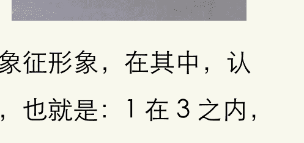

“神静止在祂自身之内，即1在3之中，1与3仍然是无法分离的合一。”

“在几何学上，等边三角形是上帝的象征形象，在其中，认知者，被认知者，与认知是等同无分别的，也就是：1在3之内，3在1之内。”

“每一种形态都是由能量组合而成的。因此，每一种形态都是创造势能的影像，其中蕴含着创造势能。神的原始状态是静止在祂自身之内，祂总是以三角形的形式来显像。由于它三个点之间的距离是相等的,三角代表完美的和谐以及完美的平衡。当静止在自身之内的神，离开了那超越时间与空间的无次元的单子状态，进入三度空间时，它成为创造性的神，并在数字4之内显现。”

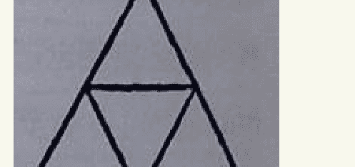

只要数字 1 与 3 在神之内形成一种联合，它们便维持着 3 在 1 之内，1 在 3 之内的状态。但是，当他们从合一的状态中分裂出来时，他们便走出了 3 在 1 之内，1 在 3 之内的状态，形成 4，因此，等边三角形之内隐藏着四个较小的等边三角形。

这法则也含藏着三度空间的关键数字 7。现在试着想象，由无次元的单子状态中，第一次显现在三度空间的能量。闭上你的眼睛，我将把这真理投入到你的意识中。

我闭上眼睛，集中专注力。突然间我看到一个点，同时听到普塔霍特普的声音： “为了使能量从无次元的单子状态中浮现出来，并显现它自身，它需要一个出发点。一个尚未脱离合一状态的出发点，是无形无相的单子状态。一个出发点是一个单一因数，在它之内具有合一的数字，那就是数字 1。”

“从无次元状态中浮现出来的点，是这势能的第一个显现。一段时间之后，由点移动成为线。” 我以内在心灵之眼看到一个点如何逐渐形成一条线，我听到普塔霍特普的声音说： “第一次元的长度产生了。本质上，线是无尽延伸的，因此这第一次元的显像同时代表数字 1。”

“显像世界中的每一事物，皆有一个开始，和一个结束。一条线有起点，终点，以及起点与终点之间的空间。因此，一条线代表数字 3，这是第一次元的关键数字。”

“现在你注意到，你无法在数字 2 之中找到合一。事实上，当代表单一因数的显像点形成之后，便没有数字 2，直接跳进三个因数，那永恒的线代表数字 1，但当它有一个起点及一个终点时，它自动代表数字 3。”

“为了使数字 2 浮现，必须在合一之中有一个分裂点。数字 2 只能诞生在二个并列的单元中。但也因此，在合一之外没有任何事物真正存在，一切都只是投射在自身之外的一个倒影。在这些投射的倒影是分裂的，代表死亡。这就是为什么，当一个人的心识与灵魂分裂时，便会产生许多疑惑。”

“让我们看第二次元如何从第一次元升起。一条线之中，包含了一系列的点。假设创造的能量在这些点中，以同样的势能，同样的时间活动着，每个点从它自身开始向外移动，形成一条线，由线形成一个等边四边形的面，第二次元——宽——便产生了。”

“四边形是四在一之内，一在四之内，因此它含有五个因数：四条显像的线：出发的线，终止线，左线右线，以及第五个因数：被这些线所包围的空白处。所以二次元的关键数字是 5。”

“但是创造势能不停的运作。平面也包括许多的点，如果每个点，以同样的时间，向外朝同一个方向移动，这些点便形成第三次元，一个平面体便形成一个立方体。第三次元由此产生。”

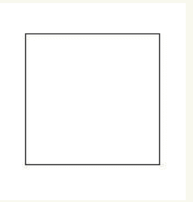

“立方体是 6 在 1 之中，1 在 6 之中，包含了 7 个因数：六个有限的平面以及第七个未显像的因数，即立方体所含的空间。7 是三次元世界的关键字。”

“如你所见的，物质的基本形态是正方体。各式各样的晶体皆依这法则形成，在它们之内，你会发现这种立方体的基本原理存在于不同的形态中。”

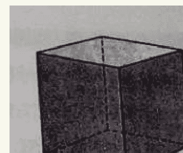

“如果我们细看立方体的特征，你会同时理解派生，变易（VARIANT）的法则。让我们从立方体某个角的一个点开始，试着在立方体所含的三次元中找一个面。如果你画一条直线，你所得到的，只是立方体中的两个平面。要找一个包含所有三的平面，我们必须从一个角切一条斜线到对面的另一个角。这样立方体的角便被切开。”

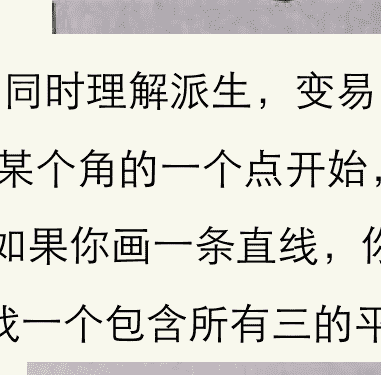

“如果我们以同样的方式继续切下去，我们把立方体的四个角都切除了，它就形成一个极为不同的形体；一个四面体，它的面是由四个等边三角形所形成。”

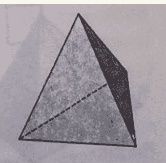

“因此，现在你看到那隐藏在立方体中的，是不同的形体，这形体不仅包含了长方形，也包含了四个三角形。如果我们把这些三角形做成平面的，它们便会形成一个等边三角形，它是神的象征。”

“四面体与等边三角形一样的，是由平衡与和谐所形成的产物。由于每个角的点都是同等距离，四面体的角与角之间没有张力或压力，而是静止的平衡，立方体的每一个角就像正方形一样，彼此间的距离是一样的的，表示四面体与立方体都在一种永恒张力的情况下。”

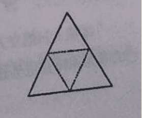

“三度空间的物质，是建立在立方体永恒张力的形态中，但是隐藏在它之内的是基于神圣平衡的四面体。整个三度空间的世界都是建立在这同样的法则中。”

“无论是植物，动物或人类的身体，都在这三度空间的法则中。隐藏在他们身体之内，肉眼无法看见的，是这较高神圣自我的永恒生命。”

“但是，只有人类可以经由思想，语言与行为来呈现较高自我的神性。当一个人只认同自己的身体，把神圣创造法则推向隐藏的，未显像的状态，他便像一个混浊的立方体，只呈现物质的特性。没有人可以从那立方体的外形中，看出他内在的神性自我。”

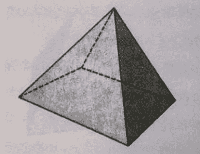

“但是，如果一个人的身体，语言，思想，行为都在表达神圣创造法则，不去突显或放大小我的，身体上的欲望，他便像一个清澈的立方体，让神圣四面体内的等边三角形清晰可见。”

“这种人只把立方体的物质，作为他在三度空间的基础，让自己的重力保持在这基础上。”

“把切割的立方体由里往外翻，便是一个金字塔。因此我们看到金字塔是神-人的象征，展现他无私的神性本质，是神在地球上的显现。”

“物质与灵性都完整的在神-人之内，也就是神性自我——造物主——在他之内，掌管物质与身体。”

“相反的，物质化的人之子，运用他的智力来满足他的身体，他的神圣自我便有如被钉死在由立方体的四个正方形表面所形成的十字架T形十字架上。”

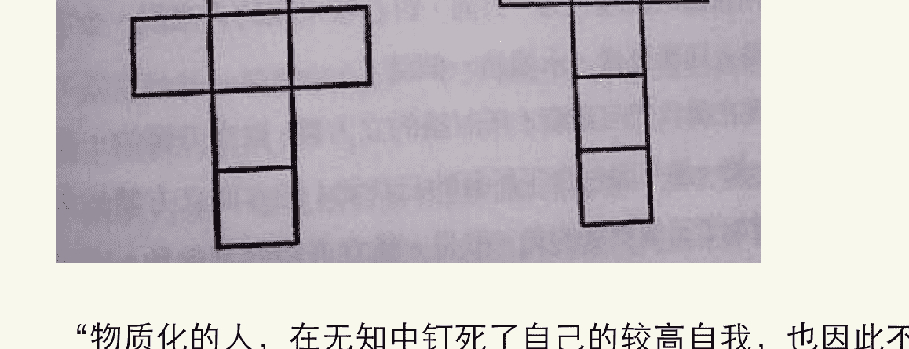

“物质化的人，在无知中钉死了自己的较高自我，也因此不停的为自己制造灾难。他变成被钉在神圣自我旁边的罪犯。”

“他的神性力量被剥夺，无法显现真实自我，受制于物质世界的法则。 “

“他被钉在三度空间，由时间与空间两根大柱子所形成的十字架上。然而，死亡不是最终的结果。”

“因为即使他的意识沉落到最低的山谷中，神圣创造自我终会拯救在苦难中的人类。”

“痛苦使他觉醒，他的较高意识被唤起，经由神圣自我的救赎，他体验自己的复活，因为他认知到自己在祂之内。”

“逃避到远方的神之子们，无论走到哪里，都带着这些隐含真理的象征。在地球上的每一个角落，人们都可以在不同大小的石头上，金属上，陶土上发现这些揭示真理的秘密。”

“未来的数千年中，金字塔将持续存在着，向人们宣告在他们自身之内的至高真理。尽管许多人无法全面了解金字塔的数学与天文学，能听能闻的人，将认知这些真理，高度进展的人，将能够实现我们所揭露的真理。另一方面，对心智未开的人来说，金字塔则像狮身人面像那样，永远是一个谜。”

“现在让我们回到刚才所讨论的立方体。从立方体的一个角开始切割，使一个平面包含了所有的三次元。把六面立方体的角切下来，就增加了三个更多的角。但是，从立方体的其他角，可以再切四次，这立方体便成为二个四面体，每一个都正确的反应着对方。”

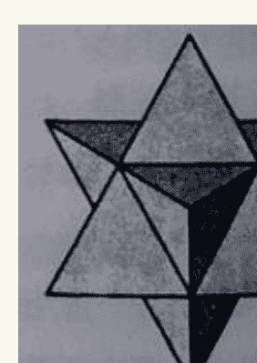

“这两个四面体代表可认知世界的最深法则：两半之间相互对应的关系，阴与阳的关系，事实上，他们互相含融，形成完美的平衡，是神性的左边与右边。在受造的世界中，他们包含着两个相对的法则：灵性法则与物质法则。”

“灵性是上升的，物质是阻抗的（SPIRIT IS LIFT，MATTER IS RESISTANCE）。灵性法则是向外焕发的，给予的，无私的。物质法则是向内收缩，冷却，麻痹的。”

“只有人类可以有意识的结合这两个法则。他连接灵性世界与物质世界。他能够同时生活在两个世界中。他的身体属于物质世界，受制于物质法则。但是，他的思想，语言与行为可以是给予的，散发无私精神与宇宙圣爱的。在正确的时间与地点，所有的法则都是神圣的，但是反之则是邪恶的。”

“物质如果没有阻抗力，便无法创造。在未显像的神性中，所有的创造势能都在合一中，完全的平衡与静止，仅存在着潜在的力量。”

“创造始于一股势能从合一中分裂出来，并在自己身上设置了与造物主相对的阻抗力。”

“阻抗力是一种与神自身相对的阴性力量，以承受创造的频率，并且透过这种阻抗力而创造。这阻抗的灵性力量正好对应神的显像层面。这种向心力，冷却与凝结的特性，是创造物质的因素。”

“以石头为例，那使石头凝结在一起的便是这种使物质冷却，凝结在一起的阻抗力。”

“当神圣灵性进入物质时，当圣灵披上物质的外衣时，无机的物质便成为有机的生命。这时，基于物质法则，一股具有动力的能量-撒旦-从中升起。他所反映的影像，就像任何具有生命的受造物一样，由上帝把自己的生命注入其中。”

“由此，你可以看到，撒旦是神圣灵性经由物质法则，转化成为有机生命体。撒旦原本是无生命的物质，是神圣灵性使它具有生命。”

“每当人的意识与物质法则认同时，他的思想，语言与行为便不再遵循神圣法则，而是遵循物质法则。是人使撒旦具有生命，人自己成为撒旦。如果没有人自身，撒旦无法存在。因为没有人本身，撒旦只是一种无意识的势能。”

“撒旦只能依物质法则而生存，只能活在人的意识中。这些人的身体受繁衍物种的大自然的势能所驱策，他们又因受到自己的身体的驱策，而呈现贪婪，嫉妒，虚荣与自私。没有任何受造物是自己遇见撒旦的，因为没有人类，撒旦便无法存在。没有人类，撒旦只是物质。只有在人类的脸上，我们可以看到撒旦的表情。”

“当身体死亡之后，撒旦随着尸体成为物质。当一个人与物质法则认同时，自己也就随着撒旦死亡，在死亡后，变成无意识。撒旦将他带入黑暗，无意识的无机体的生命中。”

“那些与神圣灵性认同的人，身体虽然失去功能，却能从中解脱，不再为物质所束缚的人，便融入在永恒的光中，在上帝之中。”

“两个四面体包含在彼此之内，代表创造的两极是完全均衡的。整个创造——动荡与运作——是基于这神圣的平衡。它是内在法则经由所有形式而运作。”

“就像你所看到，立方体是最原始的物质形式，立方体是建立在神圣的四面体上。由三角形所形成的四面体与立方体有着同样的面。人也是一样，在他的内在，有一个与神圣自我联系的层面。这就是为什么，人只能在他自身之内找到神性。永远无法从外在的世界找到内在的神性。”

“当人把注意力放在外在世界时，他便困在没有灵性的牢笼中，直到经过许多痛苦与折磨，他才找到神性。现在让我们检视立方体的不同结晶体。拿着像屋顶的六个几何体，它的底层与立方体的面是一样的，然后把这些几何体放在这个立方体的面上，让它们不同的边互相连接。”

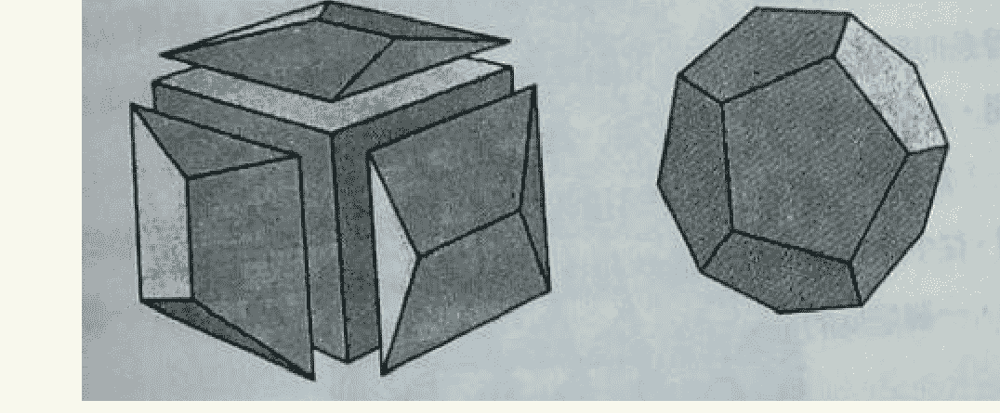

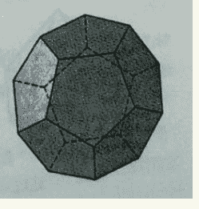

“这样便形成包含十二个等边的十二面体的五角形，这十二面体的五角形显示了漫长的意识路径。现在我们要从这最后的结晶体来看它显示的结果：由二十个等边三角形形成的二十面体。”

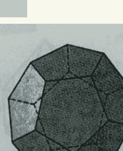

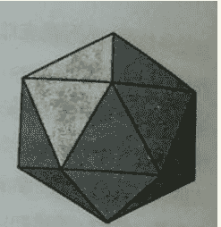

这样，从这二十面体，我们可以发展成四个有着同样的面积的晶体：四面体，立方体，五角形的十二面体，以及二十面体。”

“一个常见的晶体，只能由三角形，长方形以及五角形所形成。长方形及五角形由三角形，四面体，八面体及二十面体所形成。立方形只能形成立体。五角形只有形成二十面体的五角形。”

“除了八面体之外，你对这些几何体已有所了解。你可以画三条等长的线，以 45 度的角度来建造八面体，每条线有长宽高三度空间，这样中间的三条线都是一样的。”

“当你把三条线的终端连接起来时，便会形成八个三角形的八面体。从中你可以看到八面体包含两个底部相等的金字塔，一个是正的，一个是反的。”

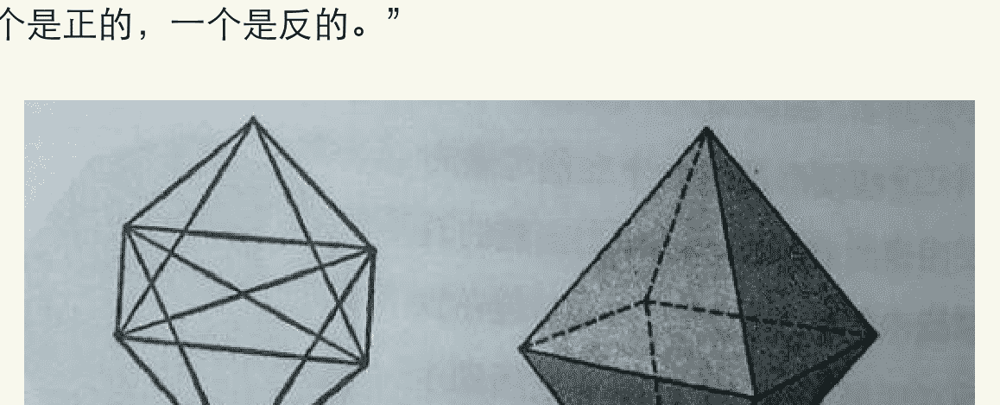

“如果我们把这八角形切割成为平等的面，彼此间的距离是一样的，我们便制造无数的小八面体。但是这些八面体不会充满大八面体的空间，相反的，你可以看到，小八面体之间的空间，在六面立方体的空间之内。”

“你可以把空间继续割分下去，那小八面体的空间将永远存在。这样，你可以看到每一个都是基于神圣四面体的立体空间，代表绝对的和谐与绝对的平衡。”

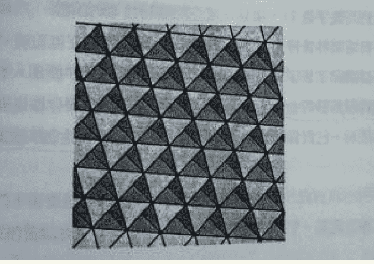

“同样的道理，所有肉眼可见的受造物，皆静止在它自身的神性点上。超越一切显像创造，静止在自身未显像的状态中。上帝无所不在。”

“现在让我们回到不同的，互相包含，或相互重叠的几何体：四面体，六面立方体，十二面的五角形，以及二十面体。你将从它们的互相关系中看到更深层的法则。立方体是一种有六个相等的正方形侧面的正立方体。如果我们从四面体，六面立方体，二十面体的五角形以及二十面体中，取每个几何体一半数字，我们得到的数位是 2，3，6，以及 10，如果我们把这些数字相乘，就是 360，一个圆的数字。如果我们把这些数字加起来，我们得到的数字是 21，这是三度空间关键性数字 7 的因数。”

## 三十四、神的四个面

普塔霍特普停止说话，我沉默的，敬畏的站在他面前。 “现在，你可以离开了。” 普塔霍特普说： “你今天已经学了很多。 下次我们将谈到四面体的金字塔，它含有更深的道理，如果你要达到全面的自我认知，它对你是极为重要的。” 我向他鞠躬之后，便离开了。

博纳：

这一篇我一看再看，看了许多次，看完就感觉全身瘫痪，它太博大精深了。

> > “如果没有灵性的帮助，物质本身永远无法成为灵性。这就是为什么神要使自己的一部分进入物质中，以便使它有转回灵性的可能。”

博纳：

我也是看这篇后，才明白为何每次静坐完之后，都需要回到黑色能量中心点，让自己落实地面。原来我们得以在这物质世界存活下来，就是依藉这阻抗力来支撑的。而地心引力就是阻抗力最好的说明。

蒂娜：

它使我明白为什么我们需要透过光的能量的运作，来达到与所有次元融合，并从中获得平衡。

博纳：

许多人隐隐的感到自己具有使命，但总是不知道自己的使命是什么。在这里普塔霍特普明确的告诉我们说：“一个心灵意识与神圣自我意识融合的人，便实现了他的使命。”

蒂娜：

我们不需要把拯救世界，或全人类的工作，放在自己的肩膀上，只要把焦点放在提升自己的心灵意识便可以了，这让我松了一口气。

博纳：

是的，使地球的一部分灵性化便是很大的功德。很多人认为行星级次的运作，主要在于引导光的能量，经由光的网路进入地球，感觉这种运作既没什么意义，对自己没什么好处，殊不知我们为地球进展所做的一切，使我们自身的进展也向前迈进了一步。

蒂娜：

“上帝所赋予人类的智慧，是最好的，也是最危险的礼物。”智慧是完善生命，使灵魂得以进展的关键，而透过“光的课程”这一途径，我们得以逐步开启内在生命的智慧。

博纳：

“物质化的人之子，运用他的智力来满足他的身体，他的神圣自我便有如被钉死在由立方体的四个正方型表面所形成的十字架或 T 形十字架上。”这段话使我想到，当我经过行星七<十字架，心，与玫瑰>的图形与密码的运作之后，感到自己放下了许多束缚。

> > 蒂娜：
>
> 在那一课的讯息中，上师们告诉我们说：“心”承受着痛苦的十字架，“心”负载着关注的负荷与十字架。“心”铭记着对爱的匮乏，封存着所有对爱的否定的影像。当“心”无法获得释放时，它变得软弱……因此教导我们向“释放因果的十字架”交托我们存在的意愿。

> > 博纳：
>
> 三角形，以及金字塔的能量架构，也是一种图形与密码，一种光的语言。在这里大祭司以几何学的原理来让我们更加了解为何建构金字塔的能量场可以帮助我们在宇宙之中保持自身的平衡与完美。

> > 蒂娜：
>
> 大祭司以几何学等边三角形来象征上帝的形象。1 在 3 之内，3 在 1 之内。在其中，认知者，被认知者与认知本身是无分别的，因为神静止在祂自身之内。这也说明为何行星级次的课程，教我们从建立三角形的能量场开始，原来它是物质在宇宙中存在的基础架构。

当中提到 2 是如何产生的原理更是超凡入胜。原来 2 的存在便是为了让我们能辨识物质的显像，也是最源头的分裂。它让整个存在从无次元状态中显现出来。以此类推，每个次元都是由分裂而产生的。一切事物都是由自身所分裂出来的另一半来辨识的，而相互对应的两半之间的关系，便形成完美的平衡。所以永远有未显像的另一半与我们所认知的显像世界构成平衡的阻抗。

蒂娜:

科学的层次从生物，化学，物理，到数学，而最终就是进入哲学的领域。我们从大祭司教导的最基本数学原理，进一步明白宇宙的运行法则，而这些原理也同时带领我们进入哲学领域的探讨。数学的确涵盖了宇宙最原始的奥秘，然而以我们的智慧目前还无法彻底明白当中的道理。但它毕竟使我们明白，宇宙的运转蕴含着生命中奥妙的原理。

博纳:

普塔霍特普说：“但当一个人与物质法则认同时，身体死亡之后，撒旦会将他带入黑暗，无意识的无机体的生命中。” 难怪一般人对死亡会有很深的恐惧。

蒂娜:

而“那些与神圣灵性认同的人，身体虽然失去功能，却能从中解脱，不再为物质所束缚的人，便融入在永恒的光中，在上帝之中。” 我看过许多心灵意识与神认同的人，临终时的祥和与宁静，对世间的一切事务了无牵挂，我相信他们确实进入了永恒的基督之光，无远弗届的佛光之中。

博纳：

因此，我们得在生命结束之前，做好心灵上的准备，这点确实太重要了。

蒂娜：

生命无常，我们已知这种准备不是我们用头脑去想这道理就可以做到的。我们也知道，真正的达到所有层面的净化，细胞组织里的思想意识都提升到与较高次元之光的能量共振，需要一段有意识的在光中运作的时间。

博纳：

要做到“我即是光”，要达到真正的与光融合，而不只是停留在对光的冥想，或在光中运作的初始阶段就可以了。这对我来说，还有一段遥远的路要走呢，看来我要多保重自己，现在还死不得呢！

我再次站在普塔霍特普之前。

“我的孩子”他说：“今天你要学的是神的四个面。”

“这将有助于你认知在你之内的四个神性面。神的四个面蕴含着一切创造。万事万物，包括你在内，都是由他的四面所造出来的。”

“有形世界的生命，上自以太阳为中心的各个大大小小的宇宙，下至最微小的原生物，都围着上帝的四个面而环绕着。”

“神的初始状态有如等边三角形般的，静止在其自身之内。我们说上帝是 1 在 3 之中，3 在 1 之中。但是，就像这等边三角形一样，在它之内有一个数字 4 的可能性。当它们从未显像的状态进入显像的状态时，基本的三个面必然会产生分裂，这时 1 在 3 之内就变成 1 与 3，因此产生了数字 4。”

“看看这等边三角形: 你所看到的是一个有三个边，三个面的物体。它包含了隐藏的，未显像的数字 4，因为等边三角形可以分成四个更小的等边三角形。”

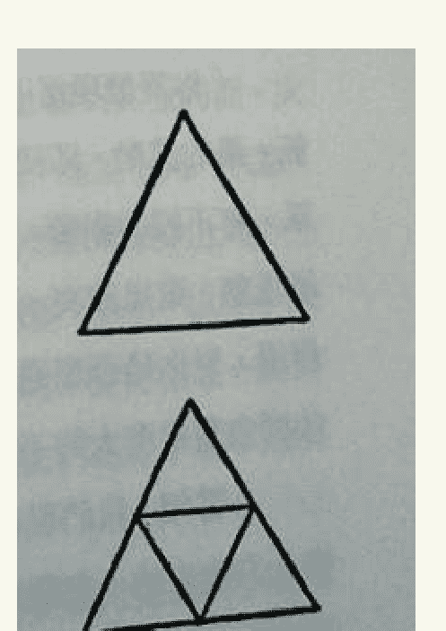

“当三角形从未显像的状态，进入显像的状态时，在三度空间的世界就变成四面体。如你所看到的，六面立方体最初始的物质显像，包含了隐藏在未显像的四面体之中。”

“四个三角形所形成的四面体，是神性与物质联系的区域，它们与去角的立方体之内的区域是相同的。金字塔的四个面代表神的四个面，每一面单独显现每一来源的每一个面貌，神静止在它自身之内，并超越一切创造。金字塔揭露了生命的实相，也就是生命法则。在其中，神永远是，也绝对是，将他自己显示在物质世界，因此，他存在于所创造的一切事物中。神以四个面来显示他存在于宇宙的每一个角落上。”

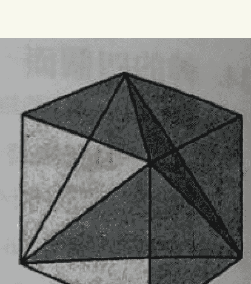

“地球的四个方向以及向天空所焕发的，有不同影响。一切都出自天堂的合一，我们可以用四条大河，以天堂为源头展开它的流动，来比喻生命之树，善恶真知，以四个方向流入显像的世界。”

“你将发现这四重显像存在于一切受造物之中，最明显的是空气，风的流动。即使是最迟钝的人，也知道从四个不同方向吹来的风，有不同的影响。北风干冷，在许多地方甚至可以使水结冰。南风温热，东风凉爽，西风湿度较大。你很早就知道这四种风的不同作用，但你是否想过，同样是地球上的风，只因为来的方向不同，为什么会有这么大的不同呢？”

“譬如，我们现在所感受到的风，如果它吹向南方，表示风是从北方吹来的，它带来凉爽的气候，使所有的生命都感到舒服。如果它吹向北方，表示风是从南方吹来的，它带来温暖的气候，刺激所有生命的繁殖力。为什么同样是地球上的风，就有这么大的不同作用与影响呢？这是因为风所吹的方向不同之故。它带来温暖的气候，激发一切有情受造物的繁衍。为什么冷风与热风可以起源于地球表面的同一个点呢？使人安静的，与刺激人的风，一边带给人们潮湿及大量的雨，另一边却带给人们干燥的气候呢？这一切都是因为方向不同之故。”

“这就是空间的法则，我们称之为神的四个面。”

“第一面是神的北面：炽热，具有激发性。这就是为什么南风带来热度并刺激万物孕育新的生命。”

“第二面是神的西面：清凉，使每一事物活动起来，这就是为什么东风是提神，凉爽的。”

“第三面是神的东面：温湿，使人昏睡。”

“第四面是神的南面，它是冷的，具有收敛性，神四个面中，第一个并且是最重要的物质显像是火，因为它影响到其他的面。火的性质决定了气候的冷暖。由于它所散发的能量，产生不同的状态：温暖与干燥形成气体的状态，阴湿形成水气，冷形成干硬的土地。”

“你会发现这法则存在于地球的每一处，每一草木。以房子来说。房子的南面接收来自北面的气流，是温暖的，植物在这一面长得最好。北面是寒冷的，西面是潮湿的。每当我们在金字塔中造雨时，雨水从西面过来。”

> > “你不仅在风中发现神的四个面，也可以在任何受造物中发现它。譬如树的北面，受到冷风的影响，会长菁苔。”

> > “你是否曾经想过，为什么人类只有一张朝着前方的脸呢？我们的脸朝着的那一面，是炽热的，给予的，然而，当我们转身背对它时，我们是冷静的。我们的肢体也是同样的，是向前活动的，我们只能将我们的意志力向前发出。”

> > “为什么我们南北向躺着睡时，我们会睡得比较好呢？为什么动物会这样躺着睡呢？为什么甚至是鸟儿把它们的巢，蚂蚁把它们的窝以南北向建立呢？动物没有思考的智慧，但它们直觉的知道，什么样的条件，对他们生命的流动是最好的。”

> > “这是为什么当一个人想与神连接时，他会面朝北或朝东，但不会朝南或朝西。朝北或朝东，他可以顺着灵性的势能，而朝南或朝西时，他会发现一股势能刺激着他的意识与肉体的感官认同。”

> > “在整个宇宙中神朝四面所焕发的，都是这样，同一方向产生同一结果。神的四面永远是不变的。”

> > “神之子在他们所到之处，都会教导人之子这些真理，教导的方式依当地人的特质而有所不同。在这里，人们的智力足以理解几何形体，从中领悟真理，我们便以金字塔来表达神的四个面。”

> > “有一些种族直接以灵性的经验来领悟神圣真理。当神之子到这些地区时，他们便建立巨大的石像，以人的形体，一个头，四张朝着四面的脸来代表神性。两者都在表达一个事实：当神圣创造力离开它静止的初始状态，进入三度空间的显像世界时，它便成为物质。金字塔清楚的显示它的四个面，每一个面的三角形，代表神的三个层面。这样金字塔显示 3 乘 4 等于数字 12。”

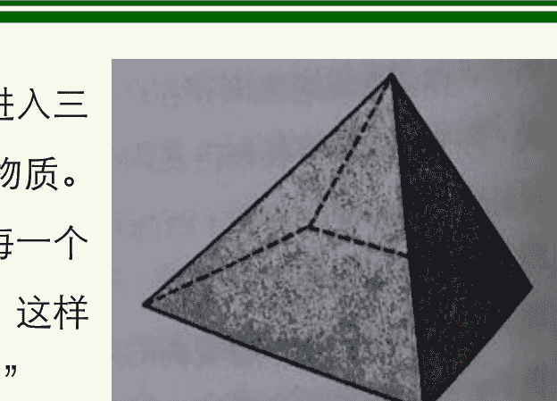

> > “这显示另一个真相。你可以从金字塔的象征中看到，神的每一面都含有其他三个神圣本质。成为十二个交迭的显像，呈现在宇宙中的每一处，在每一事物中活动着。从星球上的个体开始，到太阳系的行星，至整个宇宙就像是一个大圆套着小圆圈般的无有穷尽。”

> > “如果你能理解其中的一个圆圈，你就会理解宇宙的内在结构，以及在它之内的所有受造物的本质。因为整个宇宙都是基于这上帝的十二重显现。但是，首先你要知道，人类器官所能感受到的，都是由外而来的，你从外面看到的，无论是由上往下看，或由下往上看，由前面或背面看，从右边或左边去看，它与神圣如是存在的那一面正好相反。一旦你停止看，而是融入其中，你会发现你所看的与事物的本身是完全相反的。”

> > “当你看着一件东西时，你与它之间的关系是二元性的。你是一个观察者，你与你所看的事物是相对的两极。但是，当你成为某种东西本身时，你在一元性，神圣合一的状态。”

> > “譬如一个E字，它的方向是什么？”

> > “它由左向右。”

“很好，现在我把这个字母写在你的胸上，你成为这个字母，你与这个字母合而为一，它的方向是什么呢？”

“父亲，它是由右至左。” 我回答道：“是的，正好相反 。”

“现在跟我来，我将对你做更多的说明。普塔霍特普把我带到有着两个大圆盘的天花板下。两个圆盘有着同样的圆，只是图画是完全相反的。”

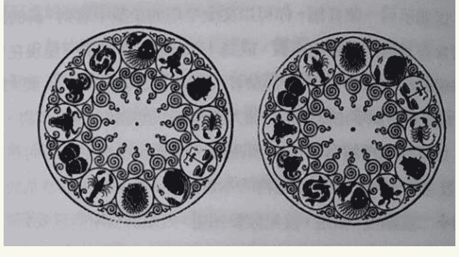

“第一个圆盘的图案显示，所有的头都朝向里面，第二个圆盘的图案，则所有的头都朝向外面。它们的顺序也是正好相反，一个由左向右，另一个由右向左。”

普塔霍特普把我带到第一个圆盘下，问我说：“你看到圆圈中的图，头都是朝上的么？”

“是的” 我说。然后他带我到第二个圆盘下，问我说：“你看到的这些图什么样的呢？”

“是的，我的灵魂之父，我理解。” 我兴奋的颤抖着，微笑着。

“它们的头都是朝下的，与另一个圆盘正好相反。并且顺序也不一样。” 我回答。

“现在找一个你可以看到两个圆盘的圆都是朝上，并且是同样顺序的地方。”

我直觉的走到圆盘的正下方，突然间，所有的图案都改变它们的方向，头都朝上，并且顺序也都一样。但是，只要我稍偏一点，它们都又不对了。我回到中央，深受感动，我体验到如是存在的状态，这种发现的兴奋，使我晕眩。

普塔霍特普看到我的感动与兴奋，微笑的说： “现在你明白为什么一个人总是与神的方向相反么？你明白为什么人类的剧本是从左至右，而神性是从右到左了么？”

“是的，我的灵魂之父，我理解。” 我兴奋的颤抖着，微笑着。

“地球持续接收神由四个面所焕发的十二种势能。这些势能来自不同方向的不同星群。但所有的星群像轮子般的环绕着我们，我们称这巨大的轮子为十二宫图 ZODIAC。

地球之所以能存在，是因为有这十二宫所焕发的能量支撑着。它们的频率在宇宙空间的一个点上相接，使能量之波产生撞击而浓缩成物质。经由这物化的过程，地球一点一滴的形成。太阳在这过程中是一个重要的角色，地球成为太阳磁场中的一颗行星，从太阳接收生命能，也不断的从十二星座以及太阳系的姐妹星球中接收它们所放射出来的能量。”

“就像所有的星球，地球是由不同频率物化而成的，因此，在它上面的矿物，植物，动物与人类都与黄道十二宫中的每一个独立的星座及星球有关。在苍穹中，狮子——火相，金牛——土相，宝瓶——风相，天蝎——水相：

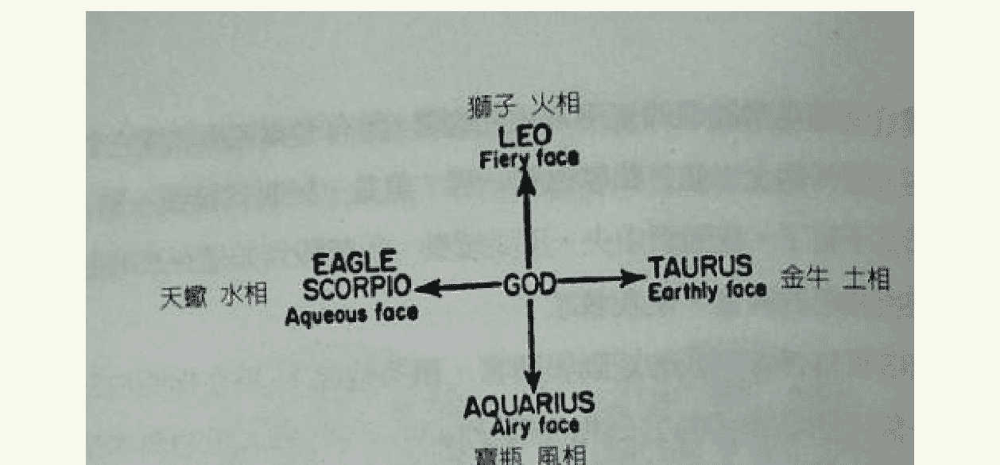

上帝的每一个面，都含有未显像的三个神性，这样十二宫的十二星座就成为：

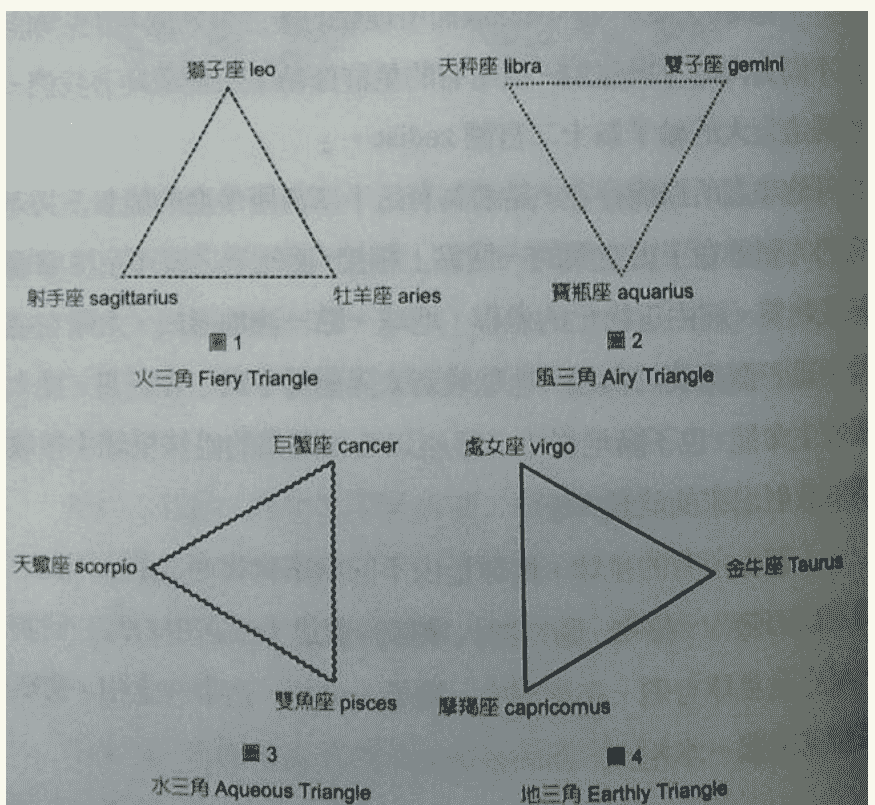

> > “狮子座是上帝的第一个显像，因此是整个十二宫中的崇高父亲。这就是为什么神的第一面的所有三个显像都具有父亲般的赋予生命的特质。”

> > “牡羊焕发着年轻的火，像年轻的父亲般的具有保护力量，他的力量弥漫在大自然的胸怀中，唤起新的生命，使它们展开活动。牡羊是春天的力量，是狂热与冲动的，就像公羊般的具有猛击的力量。”

> > “狮子代表有威严德高望重的人，一个焕发创造力的成熟父亲，他对孩子的爱，使他对孩子充满温情的照顾。狮子的力量像夏天那样。”

> > “射手星座已超越动物性本质，已克服身体的欲望，他的意识正朝着较高的目标前进。”

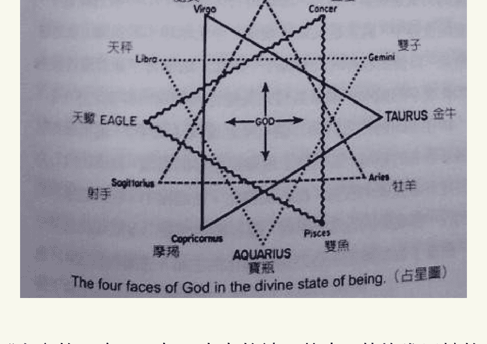

> > “上帝的四个面是如是存在的神圣状态。他焕发灵性的火花，是具有智慧温柔的父亲，以他的精神灵性，良好的思想，智者的忠告，帮助他成熟的孩子。”

第二面是土的面向，是上帝物质性的一面，它们是金牛座，处女座，魔羯座。神在这面向的三个显像，都展现着母性的性质。

春天的时候，牛儿站在绿茵上，大自然像是一个穿着婚纱的新娘，正准备接收来自她的新郎的生殖力量。

黄道带的金牛座使大地得以接收生命的火力，并让它扎根。这样神圣种子得以在地球上获得生命体。金牛座所焕发的能量，使神圣自我成为肉体生命。

> > “处女座——是天堂完美无瑕的女皇，是大自然的女神，从未被雄性所碰触，却孕育着无数的生命，这些生命从她的圣体中诞生。处女座的力量是丰富大自然，这就是为什么她手中持着五粒谷子。在神秘的世界中，处女是人类的灵魂，净化地球上的渣滓，使地球纯净无染，以便接收神的神圣种子。因此，她孕育了兼具灵性与物质，因此怀孕的处女，怀着具有完美灵性与物质的神圣之子。”

> > “神在土的面相的第三个星座是魔羯（山羊）。这种动物生活在满是岩石的区域，是地球上最难以生存的区域。物质的向心力使物质达到最坚硬的程度，从而晶体化。在过程中，它失去原本的不透明性，变成完美的透明晶体。晶石显示创造力量原始的几何形体。一个孩子也是神圣创造力量晶体化的生命。透过物质法则，透过向心力，压缩的力量，诞生在人类的灵魂中，迈向神圣自我的意识。”

> > “当一个人认同自己的动物性意识，他便像是居住着动物的牧场，圣子即神圣意识必需诞生在其中。”

> > “这项工作透过魔羯星座的专注力来完成。专注是人类要回到合一，回到失去的乐园的唯一途径。这就是为什么圣子诞生于太阳落在山羊座的时候。这星座所散发的能量帮助人类透过物质，即他的身体，全面理解物质的显像，并达到与神灵的合一。魔羯星座像是一个临盆的母亲。”

> > “神的第三个面：宝瓶座，双子星座及天平座，它是灵性本质。三个星座合起来所产生的动力，去除人类心灵的障碍，使人类的精神得以自由的向前迈进。”

> > “双子座具有真知之树的善恶两面。它所焕发的能量是两个方向的。它使人类既向左看，也向右看，以便集合知识与经验。它使人类经由生命的途径，像树枝般的向外伸展。人类在各种不同方向的曲折小径上探索真知。探索经验，人类想要听，闻，学习一切事物。双子座所散发的力量，使人类产生强烈的求知欲望。”

> > “天平座所散发的力量促使一切事物进入平衡。人类经由学习所累积的知识与经验，都放在天平上。有价值的便保留下来，无用的便将它抛弃。和谐是经由这种平衡所产生的结果。进展的人类所具有识别的力量，使双子座的两种势能进入平衡。天平座向地球散发平衡与公正的宇宙法测。是赋予知识的显现。”

> > “宝瓶座所散发的灵性知识，聚合在双子星座中。宝瓶所散发的能量不受障碍或束缚。水是给予，运载实物给别人，不停的从它的容器中涌出生命之泉，这泉水流入世界最偏远的地方。”

> > “这些频率是灵性的高频率，充满活力，不被任何事物所阻挡。”

> > “上帝的第四面是巨蟹，天蝎与双鱼。这具有情绪的特质，以灵敏的感觉来显现。”

> > “巨蟹座显示它像螃蟹般，捕食之后，退回自己的蟹壳，安静的消化它，象征人类意识在向外探索，获得灵性的滋养后，退回到内在心灵，独自内化它所收集的经验，澄清并赋予这些经验以生命力。巨蟹座展现个人在探索真理中的内省与自我解析。”

> > “天蝎座代表巨大的转折点，像一只缓慢爬行的蚯蚓转变成翱翔天空的苍鹰，恢复它的原本状态，他的意识便向神圣自我觉醒。蝎子必需杀死自己之后才能变成老鹰。这就是为什么天蝎座有两个名字。在它未转化的情况下，它被称之为蝎子，当它刺死自己，回到鹰的状态，象征自己的灵魂翱翔在物质世界，就是神圣的猎鹰何露斯（THE DIVINE FALCON HORUS 古代埃及的太阳神）”

> > “这星座所散发的势能是生命之火，它以身体的变化来显现自己。这势能使灵性穿上肉身的外衣，像新生婴儿般的诞生。这能量是诱惑之蛇的原形，引诱灵性进入物质，使它从天堂的合一中跌落下来。然而，它不在物质层面上活动，相反的，它将物质转化成为纯净的灵性，将性的欲望转化成为提升的势能，帮助跌落的意识回到天堂的合一中。没有这股势能，跌落的意识无法找到回归神的路。”

> > “鱼儿居住在浩瀚的大海中。虽然有时候它们会浮到水面上，它们会再度没入深海中。人性的本质像大海。他的意识在水面上，但是他最大的部分是在他深沉的潜意识之中，是引发他的思想，语言与行为的根。”

> > “从另一方面来说，一个达到救赎，完全认知自己，他的意识已进入神圣自我，并达到自我实现的人，便不再有意识与潜意识的分别。也就是说，他是清澈透明的，不再有自己未能觉知的## 三十五、世纪的转换

我再度站在普塔霍特普之前： “地球以及地球上的生命，尚未意识到来自宇宙，并维持地球生命的势能。因此，地球上的居民尚未学会控制这些势能，自然无法以意志力来转化它。”

“地球从宇宙接收这些能量，沉浸在能量之波中。地球上所发生的每一件事都是由这些能量活动所产生的反应……，一种因它们的互动所产生的回响。譬如，太阳在放射它巨大能量的同时，也放大那特定星座的行星所焕发的巨大能量。这使地球有了四季的变化。

“地球的转动，不仅使我们感到天上的星星环绕着我们而转，也让我们感到其它的事物环绕着我们而转。地球中轴的一端是固定的；另一端是旋转的。因此，宇宙轮的旋转是极其缓慢的，因为这样的旋转，使春分点在宇宙年的移转也极其缓慢。而且，从地球上看，它似乎是逆转的。地球环绕黄道带一圈，我们称它为一个宇宙年，一个宇宙年相当于地球 25920 年。将它分成 12，便是宇宙月，一个宇宙月相当于地球 2160 年，这是春分点走完一个星座的时间。

“宇宙所散发的频率对地球的影响是如此巨大，它们甚至影响世界的历史。宗教、科学、艺术都因受到特定星座所散发的频率的影响而产生的。投生在地球上的灵魂，必须完成在一个纪元中的里程，及时完成思想的更新及理念的进展。

“一个国家是一组灵魂团体，是某些能量的集合体。每一个纪元都有不同的灵魂团体，不同的种族投生地球。当这种族在宇宙月期间，实现了新的理念，发展出新的文明时，他们便离开地球，以便在其它星球上有更大的进展。

“当然，在一个纪元结束时，族群中总会有一些‘不及格’的个体，这些落在后面的人，就像盘中的渣滓，必须留在地球上继续进展。这就是为什么，许多国家发展到一定的高度文明之后，会骤然衰落下去。往往高度进展的父亲，却生出一些懦弱的后代，那个曾被尊重的国家，国力便逐渐衰弱，声誉逐渐下降。当这些国家所遗留下来的灵魂，在下一个循环中达到灵性化时，也会离开地球，前往其他星球进展。

“现在，让我向你解说太阳，太阳是一颗恒星，是一个巨大的转换器，它将创造的频率转换成地球所能承受的波频。恒星将来自黄道带十二星座的频率转换后传递到地球。这样，当我们要运用至高神圣能量时，我们会选择对地球最具影响力的星座为象征，而这划时代的星座总是落在当时春分点的位置上。

“目前地球的春分点，正朝着金牛座前进的时期。神以这星座的频率显示给我们，这就是为什么我们以神牛来代表神在地球上的显现。

“相对应的星座是天蝎-老鹰，它代表诱惑的蛇正在地球上爬行。你知道，当这能量以低层面的物质行为来显现时，表示蛇诱使人们一再返回地球。但是，当这能量展现它的灵性面时，它帮助人们在身体的层面上体验至高层面的灵性。我们用昂首的蛇来象征入门。代表高飞的鹰使蛇灵性化，表示本能的运动力量，经由他的知识，转化成为灵性的力量。

“在我们这时期，神以金牛座的象征来显示他自己。这就是为什么在我们这纪元，这些动物被认为是神圣的。现在你理解为什么入门者以星座的物质来形容神。当然，在这些显像事物的背后，总是隐含着未显像的第一因（First Cause）——神——静止在其中。

“金牛座属于神第三面的显像，具有地球物质作用的物质——浓缩、凝聚与固化。表示这是地球上的人建立物质最容易的时期，因为它的势能可即时直接运用。

“我们的任务是以物质来克服物质，意思是以创造物质的元素来克服物质。我们运用物质频率这看不见，却具有难以测量的巨大势能，也就是物质之内的灵性来征服物质本身。我们把整个八度音阶的频率注入约柜这物质体，从而控制物质的规律，物质法则是建立与毁灭，形成物质与使物质消失。因此，我们可以运用我们的意志，减低或增加物质的重量。

“未来，我们的知识会被人们所认知。但是，届时因天体的运行与改变，我们这一纪元在地球上所形成的能量将逐渐消失。某些特定的能量逐渐消失后，新的能量将注入，这样，影响地球的频率将逐渐改变。这表示投生在地球上的人的品质也将逐渐改变。未来他们将无法理解我们的知识。我们用以表达创造法则之奥秘的象征及语言将失去意义。这些象征将成为没有任何作用的空壳子。未来的人类，必须经由不同的方式来学习，必须以他们自己的力量来克服障碍。

“你已知道当最后一个入门的大祭司离开时，他会怎么做。为了不使我们的秘密被不恰当地使用，当他把约柜及生命杵交给新入门者之后，最后的大祭司将与他的助理一起，从里面用大石头把入口堵起来，之后两人将使所有的设备及工具蒸发消失，最后让他们自己的身体也同样蒸发消失掉。”

“同时，最后的入门者将带着约柜与生命杵离开那地区，前往不同的地方，在地球上建立新的文明。他将把新纪元的理念传播给当地的人，这时地球将进入牡羊座。与它对应的天平座将在这时散发最强烈的能量。”

“我的小女儿，跟我来，”普塔霍特普说，“我把手放在你的头上，你将看到未来的景象。”

普塔霍特普带着我到学生练习观看过去与未来，以便体验当下的长椅上。普塔霍特普叫我躺下，当他的手一放在我的额头上时，我立即感受到那熟悉的嗡嗡的声音，我的头开始发麻。随即，我像做梦般地看到未来的一些重要事件。

我看到法老的接待室里，一个我不认识的法老，那个法老不像我父亲那样是一个入门者。那个法老不是入门者，他所焕发的频率非常低。站在他前面的两个庄严、英俊的兄弟，他们都长着一张贵族的脸，从他们所散发的频率，我知道其中之一是入门者，另一个未入门，但是一个聪明伶俐的人，他正在向法老陈情，入门的那一位只是沉默着。说话的那一位，试着要说服法老释放他们的奴隶，让他们离开。然而，心坚硬如磐石的法老拒绝他们。法老要求他们示现奇迹给他看。那个说话的兄弟，拿起他的手杖，

丢到法老面前的地上。手杖立即变成蛇在地上爬行。法老叫他的几个魔术师回答他们。那几个魔术师也把他们的手杖丢到地上，也变成好几条蛇。但是，第一条蛇把魔术师的所有蛇都吞食了。

我对这画面的诠释是，手杖代表智慧，一个具有强大力量的工具。但是当智慧只是用在物质层面上时，它便变成一条爬行的蛇，一个诱使男人自私自利的女人。那两个高贵的兄弟，为他们的人民无私地奋斗着。他们的手杖变成智慧，销毁魔术师的魔法。

随后景象改变了。埃及无神论者的自私行为导致瘟疫，影响粮食的生产。但是法老仍不让步，他依然拒绝释放奴隶。最后，严重的惩罚降临，所有人的第一个孩子，他们的家畜，包括法老自己的孩子，一夜之间，都被神的使者带走。只有那些把羊血点在门上的人可以幸免。

这是什么意思呢？在未来的纪元中，牡羊座与天平座的能量将占主导地位。羊血代表年轻公羊的力量，人们随着这入门者的势能，与牡羊星座所焕发的能量相通。这些人是下一个纪元的先驱者，是被遴选的人民，以新的方式来展现古老的真理。

然后，我看到全新的画面，那个全能的入门者，带领人们走出埃及。由于牡羊是火象星座，一柱火为他们引路，他带领人们走出在这纪元结束期间，灵性极为黑暗的埃及。但是法老反悔让这些奴隶离开，他带领军队想把他们追回来。

那伟大的入门者，为了保护人民，用他的生命杵放大地心引力的力量，使法老以及他的军队，他的旧中国，及拉战车的动物停止在海岸边的土地，无法动弹。我很吃惊，不是因为生命杵的力量，而是那些在法老军队中的动物，有些拉着战车走在前面，有些是让战士骑在他们身上。那些动物像斑马，但更大，毛色不同，有棕色、白色、灰色、甚至黑色。我从没有看过这种动物，这会是父亲曾告诉过我的那种动物吗？它们确实是宏伟的。

画面又改变了。入门者带领他们进入“沙漠”。在两个纪元交替期间，总是出现许多困难。两个纪元之间，不是以急剧转化的方式来转换，而是逐步交替。因此，在这两个纪元交换的初期，会同时受到新旧两个星座的影响。由于互相影响之故，两者的力量都被减弱。

新的一代已不再满足于旧的思想理念，但旧的一代却无法接受或吸收新的理念。大部分的人回到他们旧的，僵化的思想。因此，在我的画面上，看到人们铸造金牛来膜拜。但是，这时金牛座已不再具有力量。

这时，那伟大的入门者正在山顶上与神会聚。他处在至高的，与神相同的意识状态中。他是神的意志的载体。他向人们宣布神的旨意，那就是刻在石板上的十诫。当伟大的入门者带着刻着十诫的石板回来，看到人们膜拜金牛时，他要求神惩罚这些人。这时地上出现毒蛇，象征蛇的诱惑力量，那些膜拜金牛的人们，被从天上降下的毒蛇所咬，极为痛苦，那伟大的入门者于心不忍，在他们营地中间立了一个T字形桁条。放了一个头朝上，象征真知之树的铜蛇。代表蛇停止诱惑人们去认同自己的身体，成为至高智慧的象征，引导人们回到与神合一的状态。受伤的人，只要抬头看这铜蛇，很快就能复元。

从这画面我理解到，无法接受新纪元思想理念的人，便会产生灵性上的障碍。他们无法与别人和谐相处，心灵总是在冲突的状态中。他们只能从心识的转化中获得治愈。当他们认知神圣，不再怎么贪婪时，他们便能获得治愈。画面继续呈现着。伟大的入门者，带领人们进入应许之地的边界，代表进入新的纪元。然后，他进入山顶消失了。没有人可以找到他的身体。我知道那是因为他像金字塔中最后的大祭司一样，让自己的身体蒸发消失了。被召唤实现新纪元理念的人们，继续向前走，严守他们伟大上师的智慧与教导。但是，约柜的力量逐渐消失，这时已没有入门者可以为生命杵充电。

在物换星移中，地球逐步进入双鱼座，人们又再一次地进入动荡中。他们已无法从腐朽的习俗中找到真理。他们像没有牧羊人带领的迷失的羊群。在那过渡时期，一位神之子诞生了，成为双鱼座这一纪元的伟大导师，他以神的化身走在地球上，将创造的奥秘揭露给人们。神之子将神圣自我经由他在三度空间的身体来显现，他接受让无知的人，因对灵性的无知与仇恨而将他处死的方案。这圣子诞生在灵性的黑夜中。有两种人向他鞠躬，一种是单纯、未受教育，与大自然和谐生活的人，他们是牧羊人；一种是智力已达到很高进展的入门者，他们是东方的智者。在双鱼座与处女座两个相对应的时间中，神之子从渔夫中挑选他的共同工作者。他的教导像“鱼”一般带给人类滋养。但是，许多心智未开的人无法理解他所讲的至高真理。

要达到第五层面，人类必须从整个黄道带上十二星座的显像中学习理解自身的奥秘，才能理解并达到这些较高真理。

双鱼是水象星座。人类必需以水来克服水。我惊异地看着人们用一种以蒸气产生动力的船，那船大得像城市，快速地在海面上航行。人类通过了以水克服水的考验。在医学上，人类大量运用水的疗法。我看到人们运用温泉浴、盐水浴，冷热水交替等各种水疗法来治疗各种疾病。人们甚至赤脚走在草地上，以便接触露水。

双鱼座纪元结束时，开始进入宝瓶座纪元。这是科技发展的时代。人们运用能量波，在科技上有着惊人的突破与发明。在双鱼座时代结束时，这些新能量的运用，带来革命性的改革。我看到上千的统治者被关在监狱中，许多上层社会的人被斩首。

当宝瓶座纪元的能量进入高峰时，我看到宗教的制度与界线已被废除。人们发现所有宗教的内在核心是同一真理，同一个神。科学与宗教之间的界线也消除了，因为人们发现一切事物都是能量之波的运作。他们理解到，在灵性的显现上，唯一不同的是频率的振动，每一个人都出自同一来源，就像宝瓶座的象征一样，一切事物出自宝瓶中的神圣能量。科学界发现能量波的原理之后，我看到无数运用能量波的发明，我看到人们以光波来制造图像。我看到运用不同能量波的各种不同机器。这些能量波可以穿透物质，使人可以看到坚硬外壳之内，肉眼看不到的种种现象。

医学界不再运用水疗法，改用光波疗法。出自不同波频的能量，像红外线、紫外线都被用在医疗科学上。我看到人类以天然气取代蒸气。在我的惊异中，我看到人类运用像蝗虫般的机器在空中飞行，人与东西都装在它们的腹部！宝瓶座纪元属于风象星座。人类以能量克服能量。

经由与它相对应的狮子座，人们再度认知神在地球层面上的最明显的示现。太阳，伟大的Ra，再次被承认是地球一切显像的初始来源。人类再次成为膜拜者，但不是以宗教的形式。受到狮子座在另一层面的影响，宝瓶座纪元废除了所有界线，所有局限。但是，在漫无边际中，容易使人心智散乱，导致精神疾病。灵性的死亡，以及混乱的社会与政治状态，使地球面临导致毁灭的危机。然而，由于狮子座的影响，将出现强权的执政者来引导他们的社会。

在这纪元，人们发展出通往其他星球的方式。永恒的宇宙之轮，永无止境地旋转着，宝瓶座纪元结束之后，地球进入魔羯座，它的对应星座是巨蟹。人们的注意力将再度回到地球，领悟到虽然他们在科技上有极大的发展，他们对自己伟大的母亲，大地之母所知的却极其有限。

在这纪元中，他们解决在地球上所制造的问题。魔羯座属于土相星座。人们设计出一种很像约柜的机器，用以控制物质的重量。他们也可以运用镭射，增加物质的重量，这表示他们克服了地心引力作用。人们可以在全球各地远距离地直接通话，他们的通话机所发出的能量波，可以穿透一切事物，因此可以毫无障碍地快速前进。同时，地球也将它原本储存的浓缩与固化的物质喷涌出来。镭射的运用，使人类可以进入地心深处，开发并运用地心原始的巨大能量。魔羯与巨蟹两个星座对人类的精神生活有巨大的影响。人类将理解到隐藏在灵魂深处的奥秘，以及它不可估计的力量。那些知道如何运用自己力量之源的人，被无知的人认为具有“超凡的能力”。我看到公立学校的学生，从很小就开始接受不同的训练，学习这些较高能力。这种学习，在我们的庙宇中，只有祭司候选人才得以练习。

当我的意识回到正常状态时，这些画面便消失了。我仍然躺在椅子上，未来的景象使我晕眩。

普塔霍特普帮助我站起来，对我说：“我的孩子，如你所看到的，地球上的人，先是小团体地接受入门，然后逐渐扩大，但这是一种互动关系。一个人只能在他自己的时间入门，一个国家如果发展到最高的意识，也可以入门，完成他们在地球上的使命。”

“地球将在黄道带上循环无数次，最后整个世界会完成神的四个面的循环。虽然以地球的时间来算，要经历一段非常漫长的时间。但它终将一步步，有序化地体验入门的所有阶段，完成全面灵性化，从物质层面获得救赎。你所看到的，只是整个漫长过程中极其微小的一部分。”

“人类在地球上不是偶然的产物。很重要的一点是，你要知道每一步的进展都是神的旨意，遵循神的旨意去完成这目标。”

普塔霍特普结束今天的教导，他祝福我，并告诉我：“明天再回来，我有重要的事要告诉你。”

博纳：读完这篇就像是进入时光隧道般地，从三千年前开始到目前的宝瓶座纪元，连到下一个魔羯纪元的状况都清晰地展现出来。

蒂娜：

是的，不只是到双鱼座时代为止的事，描述得很清楚，对宝瓶座时代的描述也是应验的。而作者是生长在双鱼座时代的人，写这本书的时候，新时代的理念还没展开，表示这确实是她灵魂的记忆。令人不得不叹服。

博纳：

这里的宇宙月就是我们所说的一个纪元，也是一个星座的转移时间。这么说，一个星座纪元大约是地球2160年。这与昂宿星团在漫谈宇宙次元中所告诉我们的不谋而合，真是不可思议。

蒂娜：

是的，所以在时间的比例上来说，我们才刚开始踏进宝瓶座纪元。

博纳：

作者说：“在两个纪元交替期间，总是出现许多困难。两个纪元之间，不是以急剧转化的方式来转换，而是逐步交替。因此，在这两个纪元交换的初期，会同时受到新旧两个星座的影响。由于互相影响之故，两者的力量都被减弱。”我们似乎也是处在这两个纪元交接初期的状态中。难怪能够接受光的运作原理的人，还是非常少数。

蒂娜：

是的，如她所看到的：“新的一代已不再满足于旧的思想理念，但旧的一代却无法接受或吸收新的理念。大部分的人回到他们旧的，僵化的思想。”所以如果你周围的人对新时代的思想理念无法理解，对光的能量的运作无法接受，也是正常的。无需为此而感到沮丧。

博纳：

但是，普塔霍特普说：“无法接受新纪元思想理念的人，便会产生灵性上的障碍。他们无法与别人和谐相处，心灵总是在冲突的状态中。”这确实是我周围人的状态，我常因此而感到沮丧。

普塔霍特普还说：“在一个纪元结束时，族群中总会有一些‘不及格’的个体，这些落在后面的人，就像盘中的渣滓，必须留在地球上继续进展。”这是不是就像在漫谈宇宙次元中所说的，当地球进入光子带之后，所有的黑暗无所遁形，而不在光的意识中的人，就有可能会沉沦在较低频率的物质世界中？

蒂娜：

据我的理解是这样没错，如果不顺应这光子带的能量而提升的灵魂，将在黑暗与稠密中跟着地球再次重新环绕黄道带一圈，相当于地球年 25920 年。届时他们将有机会从中提升出来。

博纳：

天啊，在黑暗与稠密中是度日如年的感觉，25900 多年用千万劫来形容确实一点也不为过。

蒂娜：

然而，普塔霍特普说：“地球将在黄道带上循环无数次，最后整个世界会完成神的四个面的循环。虽然以地球的时间来算，要经历一段非常漫长的时间。但它终将一步步，有序化地体验入门的所有阶段，完成全面灵性化，从物质层面获得救赎。” 时间是人类意识的概念，我们只要相信一切都在完美的秩序中即可。“every thing is in perfect order, even in chaos”，这是很久以前，上师们给我的教导。每当我心智混乱时，这句话便在我心中回响着，使我的心宁静下来，一步一步走过黑暗与痛苦。

博纳：

“当宝瓶座纪元的能量进入高峰时，我看到宗教的制度与界线已被废除。人们发现所有宗教的内在核心是同一真理，同一个神。科学与宗教之间的界线也消除了，因为人们发现一切事物都是能量之波的运作。”真企盼这样的时日及早到来。

蒂娜：

现在你知道虽然你没有宗教、门派的分别心，但大部分的人还是有，甚至展开宗教战争。然而，这是新旧时代交接的正常现象，进入宝瓶纪元的高峰期，一些不合理的制度与藩篱自然会消失。

博纳：

普塔霍特普的教导，使我了解行星级次中所说的第一起因是什么意思了。我以为进入起因体，是去追溯储存在灵魂记忆中因果的起源，然后从中去释放并化解前世的因果与思想念相。

蒂娜：

在新时代的语言中，第一起因（The First Cause），原始起因（The original Cause），标志（Logo），灵魂大我（Over soul）都是代表造物主。大家给造物主起的名字之多，堪与佛陀的名称媲美。

博纳：

原来“第一起因”或“起因体”指的是那未显像的源头，也就是神。所以当我们探索着进入灵魂起因体，其实也就是在探索进入自身内在那未显像的部分。当你能进入起因体时，也就是进入与神合一的境界了。难怪很多人修到行星八时，会质疑为什么教材中没有明确指出起因体在身体的那一个部位了。

蒂娜：

很多人以为进入行星八，代表进入灵魂起因体，是在引导我们寻找这一生各种因果的起始之因，这是按字的表面意思去理解。自从我们从与神合一的状态跌落之后，千头万绪的因因果果，是无法用我们的思想意识去追溯的。但当你能与未显像的另一半融合，就是回到第一起因时，一切因果就会随着梦境的消失而消失。这就佛家所说的涅槃，新时代所说的与上主，至高本源合一的意思。

博纳：

这么说，能进入灵魂起因体，就明心见性了，一切因果也就消失了。问题是，这不表示当一个人说自己修完行星课程，就表示他真正地进入第一起因或灵魂起因体了。

蒂娜：

行星课程的最后一个级次是行星九，它的设计是帮助习修者开启拙火。按瑜伽的说法，拙火开启了，就进入天人合一，明心见性的状态；按新时代的说法，就是与神合一。但这要一个人的意识与能量确实达到开启拙火的程度，并且要极大的福报与功德，才可能有此因缘。我们一般人只能达到启动海底轮的能量。这股从海底轮向上升起的能量，不是拙火。不过即使是只打开海底轮的能量，也会开启巨大的智慧来转化各种因果。

博纳：

是的，上师们一再说：“一切都在完美的秩序中”，我们只能尽力，无法强求。作者看到进入宝瓶座纪元之后，医学界用光波疗法，应用不同波频的能量，人类以能量克服能量。这不正是我们在做的事吗？

蒂娜：

我们运用思想引导能量，运用不同波频，以较高的正面能量克服较低的负面能量没错，但这需要专注的能力，与坚定的意志力。一般人因做不到这点，而无法达到它的效果。因此，大部分的人无法以能量的运作来疗愈自己，还是要靠医学与仪式来协助。

博纳：

但是目前科技还没完全发展到那里，我们只能自立自救。在这一纪元的初始阶段就能学习到这样的知识，实在很幸运。只是：“受到狮子座在另一层面的影响，宝瓶座纪元废除了所有界线，所有局限。但是，在漫无边际中，容易使人心智散乱，导致精神疾病。灵性的死亡，以及混乱的社会与政治状态，使地球面临导致毁灭的危机。” 也是事实，我担心的是地球如何走过这危机？

蒂娜：

除了告诉心智处在散乱状态中的人，接受光的指引以外，我们无法以个人的力量来帮助他们。如果要帮助已到了严重精神疾病的人，那就更不是我们能力所及的。这就是普塔霍特普所说的：“人类只能以较高的正面能量克服较低的负面能量”。在这阶段，能量的运作，就像减肥一样，只能靠每个人自己的意志力。然而，与减肥不同的是，只要我们打开，天使圣团会与我们一起运作，协助我们进入较高的意识与频率。

博纳：

只要能走过这个危机，二千多年之后，当地球进入魔羯座纪元时，如果我们再回到地球上来，将会过着幸福快乐的人生了。

蒂娜：

是的，那时候你将能走到你这一生所开拓的林荫大道上。

博纳：

难怪不管有没有人要走这条路，你都默默地埋头造桥铺路。真是高瞻远瞩！

蒂娜：

独乐乐不如众乐乐，我当然希望许多人与我们同行。不过，普塔霍特普在结束的时候说：“一个人只能在他自己的时间入门。”因此，我们只能依内在的指引去完成个人的生命目标。

## 三十六、最后的准备

1.

我简直无法等到第二天傍晚，迫不及待地要回到普塔霍特普的面前。但是我的进展已使我能在任何时候都能自我控制。我以清楚的意识看着中枢神经对外在事物所做的反应，我拒绝让神经系统受到干扰。当我的神经系统一开始反应的时候，我便有意识地控制它，让它像钢铁般地冷静。

但是，当普塔霍特普说，他有重要的事要告诉我时，我几乎无法控制我心跳的速度，我一直在想着它。傍晚来临时，我走过长廊，来到他的小接待室，沉着地站在他面前。普塔霍特普像往常一样地接待我。他高贵的脸是如此的庄严，使我在不知道他的心在想什么。

> “我的小女儿，你已经进步到具有自己的心识，控制在你身体内大自然势能的能力。无论是你的心智，或在你身体之内的灵魂，都已不再是受大自然所控制的奴隶了。但是，我必须告诉你，你仍然有再度成为奴隶的可能。”

> “如果你有意识地控制你的意志，没有任何人、任何事可以使你失去自由，或使你再度被你的内在势能所奴役。由于神的旨意，每一个人都被赋予自由意志。没有人可以违反这个法则。这就是为什么你要不停地自我控制，自我分析。”

> “现在你已做好入门的准备，但要记住，入门赋予你全知、全能的同时，也要求你有相对的责任。现在你必须很小心仔细地思考你最后的决定，你是否要入门，并让自己承担巨大的责任。你必须以三天的时间，在家保持完全的安静。如果你最后的决定是要入门，你父亲会在第四天陪你到这里来，那天是新月，你可以为入门做最后的准备。”

我很想告诉他我已经做了决定，但我知道他心中有数，何况我必须遵守规定，因此我鞠躬之后便离开。在那等待的三天，我向自己平日最喜爱的事物告别。我知道当我入门之后再回来时，将是一个完全不同的人。

我在花园徘徊，我曾经与母亲走在花园中。我在每一个我喜爱的地方，沉默地停留许久，向所有的花草一一道别，同时也向那曾经是如此快乐的小女孩道别。我来到鱼池旁，想起身穿白衣的母亲，牵着我的手，以防我掉到水池里。我仍然思慕着她，我也知道，根据投生的法则，就像她打开通往另一世界之门迎接我的出生一样，当我在这世界结束时，她将帮助我从这世界回到另一个世界。

最后，我来到狮子所在的庭院，向我喜爱的狮子道别。在我未入门之前，只能在看守狮子的人的陪同下去看他们。今天将是他最后一次陪我来这里；入门后，我将同样地具有控制所有动物的力量，将不再需要他的保护。这里只有皇家的狮子。一只是父亲接见拜见者时，坐在他旁边，象征皇权的狮子，他是如此地庄严宏伟，其他的是拉我们车子的狮子，最后是我的两头小狮子，舒卡与丝马。它们俩都是坐在我父亲身边那只狮子的后代。他们同样地聪明、敏锐，同样地爱我，好像我是一只母狮子，而不是一个女人。舒卡对我尤其疯狂，只要我抚摸丝马，他就妒忌无比。我得小心不让他因妒忌而盲目地产生愤怒，那就很危险。我一进入庭院，舒卡便飞奔过来，把头伸到我的怀中，要我抚摸他。像往常一样，他要舔我的脸，我必须巧妙地避开，以免他生气。我给他一块肉，趁他狼吞虎咽的时候，我赶紧摸摸丝马，同时也给他一块肉。

第三天也就是最后一天，太阳下山之前，我与父亲乘车出游。根据普塔霍特普乘的指示，我不可以说话，但我们不需要语言便能了解对方。我们安静地乘着由狮子在前头拉着的车子。

我们俩都知道这最后一天的意义。第二天一早，我向奶妈与玻葛翰道别。奶妈哭哭啼啼地，仿佛我要出门去参加自己的葬礼似地。她对我的入门，总是有一种不祥的预感。没有任何方式可以安慰她。小玻葛翰完全不知道发生什么事，但他也哭的很悲痛，因为他看到我要离开，也因为奶妈在哭。

> 当我拥抱他时，他跪在我脚下，双手抱着我的脚，从他灵魂深处喊着：“喔，皇后，我亲爱的皇后，不要忘了我的誓言，任何时候，任何地方，只要你有危险，我会来救你！即使我在地球的另一端，我也会来救你！上帝是我的证人，我会来救你。”

亲爱的玻葛翰，他会救我！为什么？如果普塔霍特普认为我已做好入门的准备，我怎么可能会有危险呢？为什么这小男孩会说他会从地球的另一端来救我呢？他已经与我们在一起了，怎么可能跑到地球的另一端呢？但我没有时间再去想了。我拥抱他们俩个，然后走向我父亲的厢房。

父亲悲伤但真挚地接待我，他那种表情是否表示他已经预感到我不祥的未来呢？他温和地拥抱我，把手放在我的头上，祝福我之后，我们便离开。

普塔霍特普在他的小接待室里等着我们。在我们进去之前，伊玛在长廊的柱子旁出现了一下，他天使般的脸，给我一个鼓励的微笑之后便离开了，我知道他的爱将伴随我走过艰巨的入门测验。父亲把我带到普塔霍特普之前，他牵起我的手，把我的手交给普塔霍特普。他再次以爱的眼光看我之后，便离开房间。

> > “我亲爱的女儿，”普塔霍特普说：“你现在的性格以及你的生命经验的行为与反应，所形成的因果。也就是说，现在的你，以及你的个性，是由你所有的经验，所有的行为与反应，铸造出来的。你的性格决定了你的命运，从而决定了你的未来。”

> > “自我经由灵魂深处所焕发的画面便形成你这个人或你的命运。同样的创造势能之所以会有这么不同的梦境，不同的人与不同的命运，是因为人从天堂的合一中跌落时，受到不同的影响所致。”

> > “灵魂深处所做的投射，是否成为潜在意识的实相，或只是停留在梦境，决定于一个人是否认同自己在那特定层面上的思想意识。地球人类所谓的实相，只是个梦境，是一种较低自我的投射，映在物质层面。因此，命运是一种未来的投射，一种物质化的梦。”

> > “如果一个人让神性自我的意志来引导他的生命，那么在物质层面上所发生的一切，将是他在觉知的意识中所产生的，因此他能有意识地控制他的命运。因为这个人的自我，有足够的力量。”

在他潜意识中，等待具体显现的梦转化成为灵性的能量。

“相反地，当一个人与外在势能，也就是从他身体层面所升起的势能认同时，当他认定这股较低自我的意愿是他自己的意愿时，所发生的事物，将不再是他内在灵魂所要的，而是他的身体所要的，这一来，他完全处在盲目中，无法控制自己的命运，这种时候，潜藏在他潜意识中的梦境与投射，便不可避免地变成发生在地球层面上的真实事件。”

“由你无始以来的行为与反应所形成的因果，都像种子般地，潜伏在你的潜意识中，成为等待具体萌芽、成长的未来事件，将像梦一般地出现在你的意识中。”

“你无法摧毁有待具体显现的未来事件，因为它们出自创造势能。但是，你可以防止这些能量转化成为你在物质世界的实相，如果你的意识能进入你的灵魂深处，进入这些隐匿在潜伏状态的势能，以你的意识去经历这些梦境，就像你真实地从中走过一样，这势能之内的牵引力量，便得以化解，并消失。去经历的意思是，把你投射出去的能量，带回到你的意识里，并以清楚的意识去置身其中。”

“在你的入门期间，你将体验到你整个未来的命运，它们像是一系列的不同意识，以梦的影像呈现。但是，在这之中，你意识不到它的时间与空间。当你化解了这股势能的牵引力量时，也化解了你未来的命运。这样，你便从‘个人’的命运中解脱出来。入门之后，你将继续运用你的身体，但这身体将成为一种非个人的，神的载体。”

“由于每一个入门者都具有在地球上执行任务的使命。只有成为神的载体，方能帮助别人走出物质与身体的枷锁，摆脱盲目的命运，回到与圣灵合一的状态。”

“每一个在分裂中跌落在物质层面上的人与事物，都必须找出回到失去的乐园，回到合一的途径。如果一个入门者违反神圣法则，引导创造势能进入他的身体，以实现他个人在物质上的满足，他将跌落到比做同样事的普通人更低的层面。因为一般人所导入物质层面的能量，是与自己在物质层面上相同的能量，这只是以物质界的能量运用在物质层面上，因此对他而言，就没有所谓的跌落。”

“但是，当入门者引导灵性的高能量进入身体，以满足人物质上的欲望时，他便从高出跌落下来，而且跌得更低。入门者从越高处引导能量，跌落时也将落得更低。”

“因此，你必须记住，同样的错误，普通人会不受到惩罚，但是入门者却不可避免。因为入门者所焕发的，所运作的是神圣势能，不是普通人的能量。如果你为了满足个人的欲望，引导神圣势能进入你的身体，它会灼伤你的中枢神经，使你像陨石般地掉落到最低洼之处。”

我沉默了一小会儿，随即热切地，坚定地回答道：“我的灵魂之父，及经过了这么多年的准备期，我已有足够的时间思考我要过庙宇的生活还是世俗的生活。过去的三天，我曾再度思考这个问题，我发现，回到神圣的初始状态是我唯一的渴望。我已非常坚定，请求你让我入门吧！

“好吧，”普塔霍特普说：“愿神与你同在，现在跟我来。”

他把我带到庙宇的另一头，那是学生们住的地方。在那里他把我交给一个年轻的祭司，是宿舍的主任。普塔霍特普转身对我说：“你要在这里让你的身体与灵魂做好入门的最后准备。满月的那一天，太阳下山之后来见我。”

我们向他鞠躬之后，他便离去。年轻的祭司带我到一个小房间，我将独自在那几天里，继续为入门做准备。我必须让我的思想、我的灵魂、血液与身体都达到至高点。

过去几年，我一直遵照他们教我的方式练习，以便让身体不停地制造新的细胞，改变身体中的化学成份，强化中枢神经的抵抗力，以便接受最高的频率。

现在我只能吃一些根茎类与药草类的食物。我必须细细咀嚼，这些食物是精选出来的，有些是为了刺激排泄系统，有些为了强化心脏与神经系统。吃了这些食物之后，我感到一天比一天更轻盈，最后我甚至感到自己的身体根本不存在，但另一方面我的精神更明朗，专注力增强到前所未有的状态。我的思想从没有这么清晰过，也不曾如此清楚地感受灵性的真理。

如果只是纯断食，思想也可以达到这样的清晰度。但是在过程中可能会伤害到身体与神经系统。断食者可能会变得极为敏锐，但他们的身体会渐趋虚弱。有了这些草药，便能避免断食所带来的问题。

日子一天天地过去了，满月那天，我沉静地向普塔霍特普报道。“跟我来”，普塔霍特普说。他带着我，推开石墙上的门，这扇门几乎看不见缝隙，门背后有一排下楼的石阶，下去后，再通过一道长廊，感觉我们走在地道里，但这地道不会阴暗、不潮湿，也没有霉味，空气也很新鲜。长廊的尽头，是一个往上的楼梯，上楼之后经过一些大小不同的房间，无论是地下通道或这些房间，都明亮异常，然而，我看不到任何光源。看来是这些石头本身发出来的。房间里放着我不曾见过，也不知道是什么的设备。但我无法去研究它们。因为我全神贯注在入门的准备上。我不知道入门是如何进行的，也不知道我要经历些什么。最后我们来到最远处一个角落的一间很大的房间，里面放着一个石棺。

普塔霍特普对我说：“在入门期间，候选人的身体处在比自己的意识还要高的频率中，这时他能觉知到较高层面的意识。只有经过长期准备，严格训练的人，才能以这样的方式入门，而不受到伤害。因为他已具备运用智慧控制自己的身体，他的神经系统能承受较高的频率。”

“你已知道，动物无法改变自己的生活状态。他们无法承受比他们自身还高的频率，如果现在把一只猴子放在这里，它会在几分钟内痉挛而死。”

“人可以适应在一个八度音阶之内的最高频率，一个普通人的身体，经过适当的准备与训练之后，可以承受到五级——天才的频率之波，而不致死亡。他甚至会感到飘然喜悦。然而，如果神经系统不能承受过高的频率，这种较高频率便会使他感到痛苦。同样地，处在一个比自己的频率更低的状态时，也会导致沮丧、恐惧与恐慌。”

“一个普通人，如果经历过这种较高频率的喜悦，渴望达到第五级的入门，往往经由耐心持久的练习，使他身体的神经细胞逐渐改变并适应这较高频率，便可以提升自己成为天才，他可以稳定地体验类似入门的知识。”

“然而藉着酒精或其它刺激的人，虽然可以达到某种飘然或喜乐的感觉，但随之而来的是更多的沮丧，使一个人比原本更为消沉。”

“入门者将自然与这较高意识连接。在入门期间，所有与七个意识层面互动的频率，都会注入身体中，从最低的频率逐步向上至最高的神圣创造的频率。入门候选人在哲学频率中，可以意识到所有的层面。因此，候选人要走过这入门过程，并活着出来，他的意识以及他的阻抗力必须要达到第六级次的层面。如果没有达到这一层面，他必然会在入门期间因能量的冲击而死亡。”

“入门期间，因这些势能的帮助，入门候选人可以达到第七——神圣的意识层面，没有这种帮助，任何人都无法以自己的力量达到这神圣创造的层面。”

“当然，有许多人是经过自己的努力，进展到可以为进入第七层面做准备。这种情况下，他们只需要进入神圣宇宙自我意识即可。这些经过自己努力进入第七层面的人，由于他们已走过整个意识的循环，已经获得所有必要的经验，他所需要的帮助只是最后一个步骤。这种人入门之后，便从此活在神性意识之中。”

* * *

博纳:

能做到控制神经系统不受干扰，能承受较高意识层面的频率真好。

蒂娜:

那是她多年坚定不移地努力练习专注力而来的，我们大部分的时间与精力消耗在为满足较低自我的欲望与需求上，自然未能练习出那样的能力。

> 普塔霍特普说：“由于神的旨意，每一个人都被赋予自由意志，所以我们要不停地自我控制，自我分析。”

这句话说的真好。

博纳:

我现在才真正理解，上天赋予我们“自由意志”，是为了让我们学习自我控制与分析，也就是说在能随心所欲而不逾矩之前，其实需要不断学习自我控制。由于错误理解“自由意志”的本质，“自由意志”这几个字常常被我滥用，被我当成个性自我的安慰剂。每次自己处于混乱而无法静下来时，便告诉自己要放下控制，于是不自觉的又被个性自我所奴役，结果又让我在灵性的道途中迷失了。

但是如果没有透过迷失之后，再次找到较高自我所指引的道途，你也无法学习该怎么有智慧的运用自由意志。

正因为我们被赋予自由意志的权利，所以我们反而需要学习自我控制的能力吧？这是一种随着权利而来的义务。

我想这也就是为什么，当一个人活在完全没有任何限制的自由中时，反而会感到迷失。这令我体会到只有在超越事物的束缚之后，所获得的自由，才是真正的自由。

一个人的个性决定了命运，从而决定了未来，这使我领悟到，有道是，修行可以改变一个人的命运，原来是要先改变个性才能改变命运。

是的，有些人听别人说光的能量运作可以改变命运，就去上“光的课程”，但修了很久，敏锐度与觉知力是增强了，但只是用来觉察别人的错误，批评别人的不是，对自己内在恐惧、愤怒，或操控等意识却毫无觉知。课程只是增加他们的知识，但他们的个性与习气却没有改变，当然也就无法改变命运了。而那些逐步看到自己需要改变之处，继而提升与转化的人，他们的路自然就越走越宽广，他们的生命自然就越来越安宁与祥和。

这跟人家说念经、念佛、持咒可以转化恶业，或实现某种愿望的说法一样。有些人念了千万遍却仍避不开因果的呈现，是因为内在的思想意识没有因念经、念佛而凝定下来，并与诸佛菩萨的心灵意识融合，当因果现前时，无法以较高的智慧来处理，自然化解不了恶运，还怪诸佛菩萨不帮忙。

然而，要随时觉知自己，保持在较高层面的思想、意识中。不是那么容易的，我们随时都可能跌落到小我的意识中。因此，即使修到天使级次的人，仍然可能有一些未完全净化的习气浮现的时候。这时候，团体中的共修朋友的提醒就很重要了。这就是为什么，好的修行伴侣是那么的重要。

普塔霍特普说：“灵魂深处所做的投射。是否已成为潜在意识的实相，或只是停留在梦境，取决于一个人是否认同自己在那个特定层面上的思想意识。”但一个人如果不知道自己灵魂深处做了什么样的投射，如何改变这种投射呢？

一般尚未觉醒的人，是无法改变这种投射，只能任由命运的安排，但是，一个努力向内在探索，深入自己的人，就有可能觉察到自己潜藏的内在意识。这一切可以先从觉知自己表面意识开始，自然能在光的能量运作中，一步一步地深入自己的内在。

博纳：

行星七的圆形与密码，其实也是一种让我们进入灵魂记忆的钥匙，有些人可以透过观想那些图形进入不同时空的灵魂旅程，在过程中把光带进去，以光的意识去转化那些隐藏在灵魂记忆中的念相，就像普塔霍特普所说的：“以你的意识去经历这些梦境，就像你真实地从中走过一样，这势能之内的牵引力量，便得以化解，并消失。”

蒂娜：

这是运作的功效与目的之一，当我们让较高神性自我的意志来引导我们时，自然能获得足够的力量来转化潜意识中等待具体显现的投射。普塔霍特普说了一个重点，就是当我们与较低自我意愿认同时，在生命中所发生的一切事物，将不再是灵魂的意愿，自然不可避免地转变成发生在地球层面上的真实事件。

因此，在光的课程中，有一个紫色之光的运作，谜底就是让我们与至善意愿融合。

是的，刚开始修光的课程时，我最怕的就是进入这个光，尤其在初级与终极阶段，常使我身心与精神都产生不舒服的反应，因为小我非常恐惧与抗拒这个能量。

现在还怕进入紫色之光吗?

现在不会了，而且逐渐喜欢这股能量了。

为什么会有这样的改变呢?

一来是因为我接纳这些能量在我的存在中运作，因而有所转化，二来是共修的朋友中，有人特别喜欢这个光，一进入这光的运作，就非常喜悦，容光焕发，我仔细观察，发现他们都是臣服于较高自我意愿的人，他们不会像我那么傲慢与倔强不屈。我很欣赏他们的温和与善良，发现这是他们之所以能生活在平安、丰足与喜乐中的原因，因此我也开始臣服了。

我想如果能臣服，就会像普塔霍特普所说的，入门之后，将继续运用你的身体，但这身体将成为一种非个人的，神的载体，自然会在平安与喜悦中，因为神只会创造这种势能。

一个入门者，在生活上，思想意识上要比一般人更谨慎，因为普塔霍特普说：“如果一个入门者违反神圣法则，引导创造势能进入他的身体，以实现他个人的，物质上的满足，他将会跌落到比做了同样事的普通人更低的层面。”正是因为“入门者从越高处引导能量之故，因此跌落时也将落得更低。如果为了满足个人的欲望，而引导神经势能进入你的身体，它会灼伤中枢神经，使一个人像陨石般地落到最低处。”

这太可怕了，难怪许多人无法完成整个课程的习修，我想一方面是不想再深入地去看自己内在的黑暗，一方面大概就是不敢再扩大自己的能量了。

我常说，修“光的课程“很痛苦，但它是短痛，只要我们改变自己，痛苦便会消失。而不修则更痛苦，因为它是长痛，这份痛苦永远在那里，并派生许多其他的枝节，使人更无法从中解脱，要长痛还是要短痛，完全在于个人的选择。

普塔霍特普说“一个普通人的身体，经过适当的准备与训练之后，便能承受在他所能承受的范围内的较高频率，会使他感到幸福与喜悦。然而，如果神经系统不能承受过高的频率，这种较高频率会使他感到痛苦。” 因此，我想会产生巨大的痛苦是因为没有经过适当的准备与训练。

这就是为什么，我们希望大家理解初级光的课程的重要性。初级课程又称为预备阶段，是有它的道理的，直接进入行星课程，表示我们同意灵魂加速我们的进展，促使我们提前经历我们为了成长所需经历的事物。循序渐进的人，虽然也可能面临一些成长的痛苦，但这些经历通常在我们能承受与领悟的范畴，因此有坚定意志的人还是能超越它，进入喜悦。

> “当一个人处在自己所能承受的较高频率之波中时，会感到幸福与喜悦，但是处在比自己的频率更低的状态时，便会导致沮丧、恐惧与恐慌。”

难怪有时候处在一群较低意识的群体中时，我整个人就很不舒服。

开始的时候，我们会有这么一段无法处在人群中的过程，但如果我们的意识能真正地超越这些较低的思想频率时，便好一些。因此，重点是要耐心持久地练习，逐渐改变我们的身体、神经与细胞组织。

我非常同意不能藉着酒精或其它刺激物来达到飘然的喜悦。因为随之而来的是更多的沮丧与消沉。

是的，我很感谢我的灵魂，在我生命最黑暗、最痛苦的时期，引导我找到“光的课程”，使我不需藉助酒精或药物，而是藉由光的指引来走出那黑暗的幽谷。

## 2

> “然而，在我们庙宇中接受训练而入门的候选人，虽然没有发展到第七级次，经由入门，也可以进入第七级次的神圣意识。”

> “这种入门的先决条件是，他们至少必须达到第六层面，他们的身体必须有适当的准备，然后，经由入门这种外来的协助，打开通往真我的路。但是，以这样方式入门的人，往往无法持续地生活在神圣意识中。他们有可能会退回到入门前的意识层面，”

> “也就是说，以这种方式入门，有一种危险，那就是入门之后，在他成为神一人之前，他必须纯然靠他自己的力量，然而，往往由于缺乏经验，可能使他因无法抵挡世俗的诱惑，而跌落到比第一次分裂时所跌落的层面更低的状态中。”

> “但是，他们在跌落时，将记得入门时所体验的福佑，也由于通往神的途径已向他们打开，他们享有比一般以自己的力量，沿着地球经验而进展的人，有较为快速、稍微容易达到第七层面的意识的可能性。因此。庙宇的入门方式，可以使更多的意识达到与神圣自我融合。”

> “这种危险不存在与未入门者之中，一个不是经由庙宇入门，而是在可朽生命的途径上，独自完成整个循环的人，他是在所有层面上获得经验之后，达到神圣意识层面的，因此，没有任何他所不知道的事物。只是，他需要经历整个宇宙漫长的创造时期。”

“尽管在庙宇中入门，具有很大的危险，在这段期间，持续让人们在庙宇中入门，是神的旨意。无数的人已经透过这方式回到神性里，未来还有许多人将以这样的方式回到神的国度。少数入门之后却又跌落的人，将会在人类只能靠自己的力量回归的时候，重新投生。”

“他们会记起在他们入门期间所经验的伟大真理，以他们的语言、文字与行动向人们宣说这些真理。”

“入门期间，候选人将意识到创造的每一层面，他的意识是完整的，全面的。他将意识到所有潜藏在他灵魂中的所有部分；在那期间没有表意识，潜意识或超意识之分。”

“入门期间，入门候选人将从他在合一中跌落时的意识开始，进入物质层面，进入身体层面。入门候选人将有意识地与他自身相对应的另一半相遇。”

“对入门者而言，这对应的另一半是他灵魂中未显现的部分。由于吸引力的巨大力量，这陌生的存在，将以强烈的欲望、迫切的渴望，以及躁动不安的形态来呈现。”

“入门者因意识已经进入合一的状态，更不再有相对应的另一半，因为相对应的另一半已成为他的意识。这种结合我们称之为灵性的融合。”

“融合代表阴与阳，正与负的联合。然而，在地球上，婚姻是一种企图与另一个人身体结合的形式，它是徒然无益的。但是当一个人与灵性融合时，他便是完整的，因为当一个人与自己相对应的另一半结合，代表与神的结合。”

“人体的中枢神经，有接受特定的八度音阶频率的功能。中枢神经透过神经系统，输送他们较高中心点所收到的频率。中枢神经同时也是一种频率转化器，把接收的频率转化后，再传送到较低的神经系统。”

“对一个普通人来说，转化神经系统的运作与思想意识的运作是分开的。这就是为什么他们无法控制自己的神经系统。受到大自然法则的控制，他不知道自己的身体与灵魂，自己的潜在意识是怎么一回事。”

“在入门期间，候选人必须有意识地体验自己神经系统上，所有七个主要中心点的高频率，以及与他们互动的能量。他必须体验那占主导地位的势能，并掌握它们。这是第一个测验。”

“当他成功地通过第一个测验之后，他便进入第二个八度音阶的频率，为了掌握它们，他必须要认识它，体验它。这是第二个测验。”

“然后他依次向上攀登，进入第三第四第五第六个八度音阶的频率，最后，进入第七个八度音阶的测验。当他通过所有的试验，成功地以意识掌握在这些层面上的一切，他便成为一个入门者。”

> > “识是神的白昼；神可以存在与不同的层面上，从最低物质层面到较高的神—人的意识层面，祂可以从不同层面的意识自我中去体验自己。”

> > “在白昼的所有意识层面上，除了神的第七个白昼之外，都在一个动荡的活动中，只有第七个白昼是没有任何运作的。在第七个白昼，创造停止了，因为这一天是完全在联合与平衡中的，神静止地在祂自身内。”

> > “一个入门者，可以在冥想期间体验这永恒的存在，以及神圣的创造，当他能稳定地以自己的力量，从平常的第六层面提升到第七层面，并凝定在这意识层面上时，他便长驻在神圣创造的层面上。这时他便是一个神——人。”

> > “当他成为一个神——人，他的意识永远是和平与安详时，他所做的，所想的，所感受到的每一件事物，皆自然地出自这由神的意志所创造的神圣的显像中。不论在什么情况下，他永远焕发正面的圣爱势能，只有这样的人，才是真正的神之子，真正的神——人！”

> > “神——人有意识地显现并控制所有七个层面的创造。但是，他的意识只在第七个层面上，他知道所有较低的层面，控制它们，运作它们，但是他不会吃下善恶真知之树的果实。他的意识与神同在，处在天堂的状态中。他的内在自我与所有七个层面都在神圣的合一中。”

> > “他既是一个有身体的物质体：显现他植物层面的蓬勃朝气，滋养照顾自己的身体；显现动物层面的本能、感觉；显现一个人”的智慧，逻辑思想的力量；显现一个天才的直觉，在起因体的层面上运作；显现一个先知的超越时间与空间，全方位地看过去与未来，无私地爱整个宇宙，帮助所有受造物走出物质世界的束缚；他显现一个神——人的全知全能；他是永恒的存在，是生命本身！”

“入门者有不同进展程度。大部分的入门者在入门后，仍需继续进展，才能达到第七层面。这就是为什么祭司有不同的级别。最高祭司是已达到第七层面的的神——人，不需要像入门候选人在入门期间那样，由最高神圣层面接收力量。”

“相反地，最高祭司把自己最高的神圣力量焕发出来，给与整个世界。意识的第六层面是从第七层面，神的层面接收他们的创造频率与生命力量。即使是一个在入门期间达到第七神圣意识层面的入门者，仍然得从第七层面——圣神——那里接收生命的创造力。”

“除了第七层面之外，所有的六个层面，都从在它之上的层面接收能量，然后将它转换到它之下的层面。因为物质只是映照神的形象的阴性面，所以只能接收。”

“植物在物质中有带给物质界生命力的功能，从另一方面来说，它接收在它之上五个层面的能量。动物从在它之上三个层面接收能量，然后把能量给与在它之下的二个层面。人类跟动物一样，也是从上面三个层面接收能量，然后给与下面三个层面能量。然而，与动物不同的是，人类的意识处在七个层面之间。”

“我们说过，天才的意识在第五个层面，他从在他之上的两个层面接收力量，向在他之下的四个意识层面焕发他的创造力量。”

“先知，入门者，从神圣层面接收他的力量，转给在他之下的五个意识层面。先知跟入门者仍然处在二元性的关系中，只有达到完美宇宙意识的神——人，才真正地活在与神合一的意识层面上。”

“你已知道，焕发、给予能量是神的精神法则；接收、压缩是物质法则。每一种频率都有它的力量，以及穿透它之下的层面的力量，但对在它之上的，便无法产生作用。”

“如果你把意识的发展在不同层面上的两个人放在一起，从人的角度来说，那个意识较低的人可能是一个‘坏人’，他或许可以在行为上伤害那个进展比他高的人，但他的能量对那个在他之上的人产生不了作用。可是，他所散发的，尤其是邪恶之眼，可以对比他意识层面低的人产生伤害。一个入门者，可以将他较高的神奇力量转给所有的生命，无一例外。”

“在入门期间，神圣创造力量将经由你的中轴而流动，进入你中枢神经的七个主要中心点，你将能意识到每一层面的力量，但是，你要很小心地记住我现在所告诉你的，当你意识到一个八度音阶的频率时，你与这频率是融合的，它的整个领域代表你绝对的实相。”

“当你通过第一级的测验时，你将在第二级测验的领域中醒来，你将理解自己第一级的测验过程只是一场梦。但是，如果你未能通过测验，也就是说，如果你涉入在这现象中，认为它是真实的，无法掌握它们，这些梦境中的画面便维持在真实的状态中，你将在时间与空间的世界中确实地去经历它们，直到最后。”

“那代表你的身体将在这石棺中死亡，你将在无以计数的轮回中，继续你梦中的画面，在几千年的漫长岁月中，从比你所跌落的更低层面上，缓慢地，一步一步地，挣扎着回到你现在的意识层面。”

“梦中与实相之间的不同在于，当你接受那一层面的意识状态是真实状态的时候，它便是你的实相。然而，一旦你向更高的意识层面觉醒，你便知道那一切根本不是真实的存在，只是自我所做的投射，也就是说，是一场梦。如果你相信这些是真实的，那么每一场梦便都是真实的。然而，唯一的实相是你的神性自我。”

“在入门过程中，你将经历一个跌落在地球上的灵魂所需经历的，它们像梦一般地，没有时间与空间的隔阂，你会在意识的另一个层面上醒过来。当你通过所有的测验，你会在第七层面上，自我的宇宙意识中觉醒。在这神圣状态中，你便成为与真实自我，与神圣合一的最高实相，这不再只是‘觉醒’，而是‘复活。’”

“这时你将不再是受命运所束缚的人，你已获得救赎。从那以后，你将在庙宇中实行女祭司的任务。然后，如果你以自己的力量，继续提升到第七层面，能永久保持在意识层面上，你将成为神——人。那时你便可以成为庙宇中的大祭司。”

“我的灵魂之父，”我问普塔霍特普：“你说一个人在入门之后，仍有可能从较高意识层面跌落下来。你也说，如果一个入门者与自己的身体认同，却引导较高的能量进入自己的身体时，会跌落到比普通人更低的物质实相中。你又说一个候选人在入门期间，将经历他的整个未来。但是，既然他能成功地通过这些梦境的考验与诱惑，怎么可能稍后却在三度空间的物质世界中陷落呢？如果他能在梦中看到自己整个命运，为什么他没有梦到致使他跌落的未来命运呢？”

“当一个回力棒被掷出去的时候，它要如何飞回来，要多久的时间返回，在掷出的那一刹那便已决定。因此，在他自身之内，形成一个不可改变的未来轨道。然而，透过外在的势能，仍有可能把走在轨道上的事物拦截下来，带回原点，使它以更短的时间与途径来达成目标。但是因为它具有原本的重力与惯性作用，它有可能再次被掷出去，再绕一圈。”

“一个经由外在协助而入门的入门者，就犹如一个回力棒，他已在梦中走过整个未来，并达到神圣的合一。但是，这一切只是他在意识层面上的体验而已。由他本人，他的个性，以及他的命运所形成的环境，都仍然保留在物质世界中，即使他成为入门者，他的一生仍然没有结束。就像你一样，你入门之后，仍然是法老的女儿，也还是一国的皇后。”

“如果一个人在入门之前，尚未经历地球生命所需要的经验，如果他对自己内在的创造势能不熟悉，尚未学会如何控制它们，即使他在入门期间回到与神合一的状态，仍然是一个没有经验的人。他个人的个性与习气仍然没有完全去除，这表示他尚未完全从自己内在的创造势能中解脱出来。”

“在他入门之后，直到他能以自己的力量达到第七层面，并维持在稳定的，恒常的意识中为止，他仍然随时有可能再度从较高的意识状态中跌落下来，并从一个全新的命运之轮开始轮转。”

“由于他已经意识到神圣的创造力量，这巨大的力量再度把他抛出时，他必须走过一个比他在认知神圣力量之前更大的循环。譬如，那些因毁坏神之子的家园，而跌落在创造的最低层面的黑魔术师，有些跌落到人的层面，有些跌落到植物或动物的层面，有些则跌落到矿物的层面，必须在极为漫长的时间中，经由植物、动物的生命回到人的层面。”

“受造物要走过整个物质世界，必须经过漫长的时间。但是，人类可以缩短几千年甚至几百万年的时间去完成这循环。因为人类具有智力，可以体验不同的意识层面。动物与植物无法做到这点。现在你理解何以动物会遭受苦难，就像地球上的每一事物，他们是曾居住在较高层面，却不慎跌落的灵魂，致使他们陷入在局限的意识状态中。”

“经由入门，所有由较高意识层面跌落时所制造的负面势能将被正面的势能所抵消。一切债务都清除了。当你成功通过入门的测验之后，只要你所显现的是神的旨意，你将不再受因果与命运的控制。”

“但是，如果你与你的身体，你个人的自我意识认同，那么你将在自己身上制造一个新的命运之轮，并再度展开无数的轮回，现在，你知道了入门的因果关系。我将最后一次问你，你有足够的勇气接受入门吗？”

我以百分之百的信心回答到：“是的！”

一个高大，威严的男子进入房间，我知道他。他是最高级别的祭司。普塔霍特普的代表。他向我们走过来。普塔霍特普示意我进入石棺中并躺下来。

我依他的指示做，普塔霍特普看了我一眼，眼睛充满无限的爱。两个祭司抬起石棺盖把我盖在里面。我躺在伸手不见五指，漆黑的石棺中。

> * * *

**博纳：**

普塔霍特普所说的中枢神经的七个主要的中心点，指的是我们身体的七个脉轮中心点吗？

**蒂娜：**

我想他所说的七个主要中心点，应该也许是许多修行法门所说的身体的七个脉轮。修气脉是许多与瑜伽有渊源之门派的共法。

**博纳：**

文中说普通人无法控制自己的神经系统，那如果我们在静坐中以思想来引导能量，可以做到这点吗？

**蒂娜：**

“光的课程”所修的方法，与许多瑜伽功法一样，是为了打开并扩大我们神经系统，使之第一承受来自较高意识层面的较高频率与能量。因此原则上，是可以做到这点。至于是否能做到完全控制自己的神经系统，则像练功夫一样，有人只是练个花拳绣腿，碰到强敌（巨大的因果势能）时，就被打倒了。有人是练到具有真正深厚的功力，可以抵挡任何巨大的或细微的因果势能。这全看个人的功力。

博纳：

这也说明了普塔霍特普所说的：

> “以入门这加速进展的方式进入神圣意识的人，有可能会退到入门前的意识层面。有点向我们习修“光的课程”一段时间后，感到自己的心灵与意识提升了，甚至在很高层面了，却会不知在什么时候，猛然发现自己退回到没有习修之前的意识层面。”

蒂娜：

嗯，记得我刚上初级课程时，以为自己可以运用光的能量来解决一切问题，却常常为一点小事被破功了。现在则要稍大的事才会破功。我想这就是因为我们的学习停留在头脑知识的层面，尚未将它融合到心灵的层面之故。

博纳：

那要如何融入心灵呢？

蒂娜：

我们之所以破功，通常是因为我们像大祭司说的，缺乏经验，因此未能有真正的体悟。当我们持续地在光中运作，机缘成熟时，自然会出现某些使我们获得正确领悟的事情发生，当你体悟之后，它便融入在你的心灵中。

博纳：

当我们与意识较低的人发生冲突时，照理说他们的负面能量对我是无法产生作用的，然而如果我还是受到影响，就表示自己的意识需要再提升啰？

蒂娜：

即使我们的意识曾经提升到第五个层面，或是第六个层面，但是因为我们无法凝定在这较高层面上，所以还是会落入第四个层面，陷入混乱的集体意识之中。这还是前面所说的，功夫不够扎实。

博纳：

普塔霍特普说：“焕发，给予能量是神的精神法则。” 这句话让我很感动，因为在习修 “光的课程”一段时间之后，我会很自然的感到需要与人分享，因为领受太多的恩典，让我无法藏私，因为那恩典多到溢满我的心，所以自然会流向旁边的人，现在明白这就是神的精神法则透过我们来显现的方式。”

蒂娜：

在 “如莲的喜悦” 中有一篇《新纪元能量与新纪元法则》，提到能量运用的几个法则，其中的一个原则是：

> 一个接受能量的中心点，也必须流出同样的能量作为平衡。宇宙圣爱的能量散发给每一个需要它的人，真理要求接受到爱的人，也必须有同样的回馈，以完成能量循环的法则。

在过去的时代，一个个体或团体，或许只能接受，而不回馈给宇宙来源。在新纪元的能量下，这种情况已不可能了。这股巨大的能量，不可能进入不遵循法则的地方。一个个体或团体必须对它的来源有所反映，如果不是这样，它变成单向流出，造成了不平衡与能量的耗费。

一个个体或团体，必须以他们的生命力，共同使它流动，使这能量更增加。只有这样，他们才能无限量地获得。

博纳：

> 普塔霍特普说：“少数入门之后却有跌落的人，将会在人类只能靠自己的力量回归的时候，重新投生，他们会记起在他们入门期间所体验的伟大真理，以他们的语言、文字与行动向人们宣说这些真理。”

看到这里，我对能真正理解光的途径，并能从中提升改变自己的人，有着同是天涯沦落人，相逢何必曾相识的感觉。

博纳：

> 是的，他的下一句也需细细咀嚼：“对未入门者而言，这对应的另一半是他灵魂中未显现的部分。由于吸引力的巨大力量，这陌生的存在，将以强烈的欲望、迫切的渴望，以及躁动不安的形态来呈现。”

博纳：

你曾说光的运作，可以帮助我停止那内在的躁动与不安。当时我无法理解你的意思，现在我理解了，我们只能经由光的运作来达到与灵魂中那未显现的部分融合，而我一直在异性身上寻求，当然无法达到和平与安宁。只是它运作的原理是什么？

## 蒂娜：

如普塔霍特普所说的：“清楚觉知的意识便是光，混沌不明的无意识便是黑暗。” 光的运作使我们能清楚地觉知自己的意识，这是停止骚动与不安的先决条件。

## 博纳：

“入门者有不同的进展程度，大部分的入门者在入门之后，仍需继续进展，才能达到第七层面。” 难怪你说，我们要在行星二入门之后，才算是真正地开始习修。那为什么在初入门，尚未达到第五第六或第七层面的时候，就可以开始带别人展开初级课程的学习呢？

## 蒂娜：

在三度空间的“光的课程”的教师，实际上是一个分享经验的指路者，学生的真正导师是天使圣团及每个人内在较高自我。但当一个世间的老师，以爱与别人分享自己的体验时，他也在教学中获得成长，所谓的教学相长。因此爱必须是唯一促使他成为教师的因素，而学生之所以会爱他，是因为他所给与的爱，而不是他所传授的知识。就像伊玛可以成为小组长，指导她的初步学习，而她也因他的指导而爱他一样。

## 博纳：

> 普塔霍特普说：“梦境与实相之间不同在于，当你接受那一层面的意识状态是真实状态的时候，它便是你的实相。然而一旦你向更高的意识层面觉醒，你便知道那一切根本不是真实的存在，只是自我所做的投射，也就是说，是一场梦。如果你相信这些梦是真实的，那么每一场梦便都是真实的，然而，唯一的实相是你的神性自我。”这么说，人生真如古人所说的，是一场梦。但是光的上师也说过，人生的戏码是由人类思想所创造出来的虚妄影像。然而这个虚妄也是一种实相，它是你的人生。你的世界和你的表达。

蒂娜：因为我们尚未能达到与神圣意识合一，所以在那之前，这些由较低自我所编写的人生戏码，也的确是我们感受中的真实世界。简单的说，那些我们所相信的梦境，在我们感受中就是实相。

> 宣化上人有一首偈曰：“人生一场梦，人死梦一场，梦里身荣贵，梦醒在穷乡，朝朝是做梦，梦中若不觉，枉做梦黄粱。我常以此偈提醒自己不要枉做一场黄粱梦。然而，幻境的势能是那么地强大，要时刻记住可不是那么容易的。一不小心，进入白日梦，就把周围的一切事物当真了。只能在心静下来时，方能再度觉知，毕竟我们还没有达到神——人的层面。”

博纳：我想这就是为什么，我们需要随时在光中，与较高自我保持连接，成为光的载体，把焦点放在实现神圣计划的目标上。

## 三十七、入门测验

1. 我躺在黑暗的石棺中，像往常一样，仔细观察正在发生的事。最先是什么也没有。接着，在黑暗中，我看到一个绿色磷光在闪烁着。我一边看着它们，一边猜想它们从哪里来。突然，它变成两个光点，慢慢朝我移过来，像两只眼睛注视着我，这双眼睛不属于任何人。在我的惊骇中，它们逐渐形成一张可怕的脸，我知道这没有身体的怪物是邪恶本身。我偶尔会在人们的脸上看到这种表情。这双可怕的眼睛，有如一股邪恶势能，穿透我的整个存在，把我推入一个巨大的漩涡中。这是撒旦本身吗？这时，那没有身体的怪物进入我的身体，它那如恶魔般的力量在我的血管中流动。这有如地狱、恶魔般的感觉使我整个身体冰冷、僵硬；恐惧使我的身体蜷曲在一起。它在我之内无声地吼着：“现在，我逮到你了，你在我的手掌中，你知道你无法以意识脱离我的掌控。无论你尽多大的努力，你依然属于我，你与我一体。再没有任何事物可以将我们分开。我在你之内，你在我之内。你受制于冷却、收缩、凝固的法则。你缩着身体，像是回到你母亲的子宫中。你越来越僵硬、冷却，你将凝固成一块石头，永远无法复活！你像这山峰的石头一样，让人类与动物踩在你身上，你在阳光下暴晒，洪水把你带入急流中，你与其他石头无止境地互相摩擦。” 在惊骇中，我感受着邪魔所说的每一情境。但我知道，我只是在石棺中而已，我不是石头，我是一个超越时间与空间的多次元的自我。

我以内在灵性的力量，以心灵感应的方式，对着它叫着：“不，我不是你，你也不是我，你是没有生命的，我是存活的。我们完全不同！你只是邪魔、幻影。你无法单独存在，只能依附物质而存在。但是，你在我的身体上没有任何力量，你必须离开。”

我无声地继续对他说：“我不是你，你不是我，我们永远是不同的存在。你是死亡，我是生命！你不是一个独立的存在。神圣自我创造了你，但你没有比我更大的力量。你只是一种物质形式，只有灵性才能赋予物质生命。你必须离开，因为我不会赋予你生命。”话一说完，便是天崩地裂，震耳欲聋的声音，巨大的石头从山顶上落下来，我周围一片混乱。

我感到自己又饥又渴，但我不愿意把时间浪费在吃喝上。我要尽快往前走，我的目标是回到神的意识中。我看看周围，发现自己在一间宽敞舒适的房间，一些有礼貌的人，拿着一些诱人的美食、饮料放在金色的容器中，邀请我与他们一起吃喝。我微笑着，美食对我而言，不是什么了不起的诱惑。我不愿意为了它而延误了我回到神性自我的时间。我向他们道谢之后，便继续向前走。奇妙的是，我不再感到饥渴，但我还是不知道我在哪里，或我周围的状况。

这时，我看到一群人不停地重复一些混乱的动作，他们也散发着一股人体的臭味。我的眼睛适应了那昏暗的灯光之后，我发现自己在地窖中，一群男女懒洋洋地躺在沙发上，或紧紧拥抱，做出一些奇怪的动作，发出一些奇怪的声音。我惊愕地看着他们，他们是喝醉了呢？还是发疯了呢？

我当然见过动物发情时交配的样子。但即使在他们极为激情的时候，也不会失去他们的尊严，他们不会一而再，再而三地，不停地重复着。在庙宇中爱的殿堂服务的女祭司，也是以献身灵性的高贵态度来履行他们的职责，因为她们知道，她们所奉献的是神圣的爱。

而这些人怎么能这样亵渎爱的神圣行为呢？我看他们好像完全失去理智。我认出他们之中，有些男人是宫中的官员，有些女人是宫中的女官，但是他们都没看到我。他们除了自己之外，什么也看不到。男人与女人都在说些完全不合逻辑的话。譬如一个男人紧紧拥抱着一个女人，不断地问她说：“你是我的吗？”“是的，亲爱的，我是你的！”女人回答道。过一会儿，又是同样的对答，他们千百万次地重复同样的对答。这种对话是多么无聊啊！一个人只能属于自己。一个人怎么会想到他们可以占有或被别人占有呢？

这时，一个高大的男士向我走来，他好像知道我在想什么似地，问我说：“美丽的女士，你不知道这是爱吗？”爱？我当然知道爱！它是两个受造物高贵、美丽、神圣的投入，而不是互相占有。但在这些人的心中，我看不到爱，我看到的是，他们失去了理智，这种疯狂的激情，使纤细敏锐的神经中枢点变得迟钝，失去活力。

这些人应该从他们的无意识状态中醒来，我走向一个年轻的女士，在她耳边喊着：“醒醒吧，不要因激情而让你的意识混沌而黑暗。不要让你的身体贬低你！不要让自己被拖到比动物还低下的层面。醒来吧，你听到了吗？离开这里，以免太迟了。”那年轻女士梦游似地回答我说：“不要管我，我要快活！”她怎么能在只有肉体的拥抱，没有灵性的爱中找到快乐呢？快乐是一种意识的体验；快乐在自身之内。一个人如何从身体的游戏中找到快乐呢？

那个男人在旁边说：“放下你的思想吧，你没有资格批评别人，因为你不曾试过它。跟随我一起跳舞，你便会知道了。”他拥抱我，把我拖到人群中，行为就像那些人一样地愚蠢。

我一边与他跳舞，一边好奇地观察我自己是不是会像那些人一样醉倒在这种行为中。但我只感到与男人这么接近，让我很不舒服。他所吐出的热气让我感到厌恶。我为什么要吸入他所吐出来的空气呢？我发现他的身体，也有那种令人很不舒服的味道。我需要新鲜空气，我要离开这乱七八糟的地方。就在我要离开时，那个男人消失了，变成一团巨大的火焰，试着要从我的嘴进入我的身体。但是由我清晰的意识所焕发的力量，使他无法接近我。

他变成更凶猛更炽热的火焰，这火焰扩大到整个房间，把那些醉生梦死的人都吞食了，所有人都消失了，只剩一片火海，继续吞食所有的东西……。但是，我一动也不动地站在那里，他无法伤及我一根毛发。这时，我听到如雷般的声音说：“你胜利了，你通过了你的测验，但小心，你还没有真正地胜利！我是你自身的火焰，你之所以能不被火焰所触及，是因为你的纯净，以及你的缺乏经验从中保护你。你的身体以及你身体的感官还在沉睡，所以你受到保护。但是小心喔，我们还会再相遇，我们还会再相遇！”之后，一切都消失了，火焰、房间、烟雾都消失了，我发现自己又单独地在那儿了。

我们还会再相遇？”我重复他最后的那句话。“我不怕你，我超越一切物质性的事物……。”话没说完，我听到一阵轻蔑的笑声。我向四周看这笑声从哪里来。这时我注意到我在一处绿色的草原上，一个陌生的英俊男子走向我，我问道：“你是谁？”那英俊的男子走近我，以一种令人难以忘怀的声音在我耳边说：“喔，我亲爱的，我一直在找你，我找你找得很久了，自从我们从伊甸园跌落之后，我们成为分裂的两半。现在我终于找到你了，到我怀里来吧，让我们进入神圣的合一，让我们在神的祝福中合一。你没有屈服在你身体的需求中，是多么地幸运啊！你为我保持纯净，是多么地荣耀啊！你属于我，我属于你，我们弥补了对方，你感觉到那难以抵挡的吸引力正使我们越来越接近吗？来吧，让我们在爱中结合，你是我的唯一的天堂中的新娘！”

他的声音，他雄赳赳的脚步，使我感受到他所焕发的巨大能量的吸引力，但是，他是一个陌生人，我又不认识他，他怎么可能是我的另一半？不可能，一个人永远无法在自身之外找到另一半，普塔霍特普说，我们的另一半，就像镜中的影子一样，永远隐藏在显像事物的背后。没有其他人可以成为我的另一半。这个人为什么有一团雾围着他，令人无法真正看清他的脸呢？

“我不知道你是谁，”我说：“但无论你是谁，你必然搞错了，你不是我的另一半。如果你真的认为，在你自身之外，有另一半的话，你必需到别处去找。除了在自身之外，没有人可以找到他的另一半。在物质世界中，你只能找到你所投射出来的，类似的另一半，但无论是你或是我，都无法与投射的画面结合。只有与神圣的自我融合，才能获得上天的祝福。”

“要在你自身之内找到你的另一半，表示你的意识已经与神圣自我完全合一。但是，在一切事物尚未展开之前，你如何体验它的前后关系呢？神圣自我是天堂的合一状态，你只能在与你的另一半合一之后，才能回到天堂中的神圣自我。如果没有我，没有你的另一半，你如何达到这合一呢？”

“我们都活在彼此所投射的影像中，我们属于彼此。在你的潜意识中有我，我的潜意识中有你，即使我们不互相寻找，那不可抗拒的吸引力，也会促使我们一再地相会，直到我们互相唤醒对方的内在意识，并在身体与灵魂的层面上体验那完整的合一。”

“只有在这神圣的合一中我们可以全面意识到那完整的较高自我。没有我，你如何回到那天堂的合一中呢？你如何能躲过，在地球层面上，我们属于对方的事实呢？没有我，你如何经历你必须体验的事物呢？”

但是，我拒绝受他的影响。“无论你说什么，我都不需要你。即使你是我潜在意识的一部分，我仍然只要从我的内在去体验你，而不是从外在的世界。走开吧，让我独自走下去。”

我的话一说完，那英俊的男子便像阳光下的朝雾消失了。但我听到从远处传来的声音，那声音深深烙印在我的心中，“我会继续在地球层面上寻找你……”他的声音逐渐消失后，一切归于宁静。

但我还有问题要问，我喊道：“为什么你身上有一团浓雾，使我无法看清你的脸呢？”我听到远处正在消失的声音，像是我自己心中的回音：“被浓雾所遮盖的眼睛是你的，不是我的。是你的缺乏经验，使你得以把我抵挡在外。但我们还是会相遇……再相遇……。”

我还想问一些问题，我朝他消失的地方跑去，但我看不到他。我想回到那美丽的草原上，但是，一团浓雾使我无法看清方向。不过我知道我不是单独的，我听到周围有人在对我说话，但我听不清他们所说的，也不知道自己回答些什么。那团浓雾不仅遮住我的眼睛，也掩住我的耳朵。我看到一个高塔，我知道有一个人被关在里面。他有着与那个在雾中的男子同样的声音。我试着偷偷地带一些食物给他。我是看塔人的女儿，一旦被发现，后果不堪设想。但是一股无法抵挡的力量，正吸引着我朝着那俘虏走去，我只知道我必须帮助他。

然后，一切消失了，我试着看看我在哪里，突然我看到一大片磁砖在我面前，我正一遍遍地洗刷它们，直到它们干净为止。接着又是在一片浓雾中，我听到自己的声音，一遍又一遍地问别人说：“你有没有看到我的孩子？”我感到那问话的是一个既衰老又疲惫的女人，不知何故那个女人与我有关。接着，那奇怪的感觉消失了，突然间，浓雾消失了，我非常高兴。

我再一次地站在绿色的草原上。现在我可以继续向前走了。空气是如此地清新，阳光照耀着，但却一点也不热，好奇怪啊！在太阳下却不热，是从来没有过的事，但在这里不但不热，还有清凉的风吹过来，这也是很奇怪的事。

我看看自己，好像长高许多，多么奇特啊！以我的年龄是不会再长高的，那么我是如何长高的呢？我穿着极其古怪的衣服。我的拖鞋呢？我的手也不一样，所有的事物都如此奇特，一切都好像在梦中。但我的意识是清楚的，我是清醒的。我看看周围，不远处有一个森林，我走过去，看到树林中有一幢房子，那是一幢奇怪的房子，那些树与我们的棕榈树完全不一样。无论是房子或周围的树，都是我一生中从没见过的，但我对它们似乎很熟悉。

房子座落在山丘上，当我穿过树林走向房子时，我知道那房子是我的。怎么会这样呢？我从来没有见过这样的房子，但它又是如此熟悉。它不是由石头建造的，它的屋顶是倾斜的，而不是平的。当我走进房子时，我知道里面的一切，我直接进入“我的房间”。

窗外的景色是如此宜人，山脚下宽阔的河流上有巨大的船只航行着。很奇怪地，这些船既没有帆，也没有浆，但走得很快，比我们的船快多了，我不理解的是，它们为什么有一根很大的、长长的黑管子，吹着黑烟。我有一种自己常常在这视窗往外看的感觉。突然一阵铃声在我背后响起，我转身拿起那个小小的器具，熟练地把它拿在耳朵旁。然而，我知道这一生从没有见过这样的东西。

我听到那个在浓雾中，身影朦胧的男子的声音：“亲爱的，你还好吗？”

“谢谢，我很好，但我想回家，你明天能来接我吗？敌人快进城了，我要回家与你们在一起。”

“好的，我明天来接你。但是，你留在山上会更安全一点，在城里，每天都有炮击，越来越凶猛。”

“不，正因为危险，我要回来与你们大家在一起，请你来接我回家。”

“好的，你实在很勇敢，明天下午我会来接你的。晚安，亲爱的。”

他是谁呢？这奇怪的器具是什么呢？为什么我会透过一个器具来听别人说话，而不是以心灵感应的方式来听呢？我现在所经历的只是一个画面吗？或者只是一个考验我勇气的梦？

很不幸的，无论我多么地想从那梦中醒来，回到绿色的草原上，我发现自己要面对许多无法避免的事。空气中充满了恐惧，使人几乎无法呼吸。敌人四面八方地围攻过来。再过几天这个城就得投降了。从其他地方逃亡过来的难民口中，我们听到许多难以置信的可怕故事。但是我们在上帝手中，我相信一切事情的发生，都是为了最好的原因，除非经由上帝的旨意，没有任何事物会发生。我以这样的信念来安慰自己，使自己安静下来。第二天，我很快地把行李收拾好，下午时，我看到我们的狗正往山下跑，我知道我丈夫来了。几分钟后，我丈夫与狗进来了，我温柔地拥抱他。我们结婚已将近二十年了，我们仍像刚结婚时那么相爱。

我的丈夫温文有礼，他的声音以及他那双温暖的手，总是那么令人安心。他是一个勇敢可以信赖的人。就在我们把行李放进车子的时候，我就在那儿怔住了。这是什么交通工具？很快地，我又笑起来，这是我丈夫的车子啊！但我又疑惑了，没有狮子在前面拖，它怎么能自己跑呢？

咦，我怎么会想到狮子呢？动物园中那些美丽的狮子，战争开始时，就因怕他们跑出来伤人，而将它们处死。不知道我为什么会想到要狮子来拖车。回到家，就在我要开门时，门打开了，小波葛翰站在那里微笑着。他怎么会在这里呢？他已经不再是小孩了。他已经长大成一个大人了吗，他向我鞠躬，吻我的手安静地说：“能再看到你真好，我的皇后。”

我吃惊地看着他说：“玻葛翰，你怎么会在这里呢？你怎么来的呢？”这次该他吃惊地说：“你知道我在你家已住了三年了……，你怎么会问这个问题呢？”

我就是无法了解，他明明是一个十二岁的小孩，怎么就变成大人了呢？为什么我感到自己在梦中呢？我丈夫把家里放满了花来迎接我，结婚这么多年，他仍然像新婚那样地甜蜜。晚餐后，我们听由一个大木箱所播放的有关战争的新闻。这又是一件奇怪的东西。普塔霍特普，我亲爱的上师，也是每晚经由大气层把较高能量散播到整个国家，所有的人在睡梦中都因他的爱与能量而增强力量。但这木箱子所说的，却直接进入人的耳朵。

回到城里的家之后的那天晚上，我们在半夜因空袭警报而跳起来，带着简单的衣物，往地下室冲，在楼下遇到我最小的妹妹，带着她三岁的儿子，两岁的女儿，及一个刚出生的婴儿。当我们到地下室门口时，一个头发与胡子雪白的老人为我们开门。

这双眼睛我好像在哪里见过？灵光一现，我突然看到这英俊的身影正是我父亲法老的指挥官提斯塔，他怎么会在这里？为什么我会在他耳边说，“父亲，亲爱的，你穿的够不够暖啊？”

他微笑地向我保证：“不要担心，我穿的够暖。”然后我们找到地下室的位置。

敌人越攻越靠近城区了。一天下午，门开了，伊玛走进来，他怎么会在这里？他怎么会穿这种衣服？我拥抱他，并问他说：“这是什么衣服？”他也一样吃惊地看着我说，“妈妈，你怎么会问这问题？你怎么好像第一次看到我呢！这是空军的制服！但你很早就知道了啊！”我困惑地站在那里，感觉要从一个梦中醒来一样。是的，这穿空军制服的是我至爱的儿子，但是我知道他是伊玛。当然我知道他是伊玛，他真的是我儿子吗？他穿着祭司袍的样子，我依然清晰可见。他教我学习如何专注。

他依然焕发着那强有力，纯净的能量。我认出他，但他没认出我，他像是不曾与我在庙宇中认识过一样。“妈妈”他说：“我的团队要到另一个地方去，因为我们的飞机已无法在这机场上飞了，我们要搬到更远的乡下。我不知道何时会再见到你。”

我心痛如绞。当我儿子参加空军时，我已知道自己的儿子处在危险中。我在家中了无生气地走来走去，感觉自己像是在噩梦中地。这怎么可能是真的？一个母亲怎么可能忍受自己健康、年轻、有为的儿子参加大屠杀呢？

人类堕落到以可怕的武器互相残杀，杀的都是最健康、强壮的年轻人，这些年轻人正是应该为国家社会培养年轻健康下一代的时候啊！年轻、健康、强壮的被送到战场上牺牲了，年老生病的却留在家中成为父亲。这是使人类退化最快的方式。但是人类已堕落到连这点都不懂的状态。这不是噩梦是什么呢？

我的意识回到现实中，我把儿子交给上帝！没有上帝的旨意，不会有任何事物发生，无论结果是什么都是好的，因为这是上帝的旨意！一切事物的发生都是为了补偿，为了回到平衡，回到天堂！

这是我亲爱的上师，普塔霍特普在大金字塔中所教给我的诸多事物之一，他的教导已深入在我的心识里，让我有足够的智慧与勇气生存下去，即使知道我的儿子像其他上百万的年轻人一样，是这场大屠杀的靶子，我还能保持正常的心智。即使是现在，不知道我们这一生是否能够再相见，我仍然不能让自己因此陷入在痛苦中。

这年轻的孩子，一直活在我的心中，直到他成为我的儿子。我爱的不是他的身体，而是在他之内的上帝！他的神圣自我为了表达自己，建造了他的身体，就像所有人，所有动物、植物甚至矿物那样。因此，我爱的不是“我的儿子”那美丽的身体，而是神的一切创造；那么我为什么要为可能失去这特定的上帝的显像而颤抖呢？为什么要因可能无法再相见的想法而颤抖呢？难道说是因为他的身体，他的血液来自我的血肉吗？但是我自己以及他自身都出自同一个神圣自我，而不是出自血与肉。

我必须进入我的内在自我，全然地觉知它；然后我便能与我儿子的自我融合，同时也与整个宇宙的自我融合，这样我便不会失去任何事或任何人！我不能为死的人是我自己的骨肉或是一个完全陌生的人的骨肉，而产生分别心。当一个受造物死亡时，无论那是我唯一的儿子，或任何我所不知道的人，神的同一个自我，都会将他转化成许多不同的身体。

我必须完全克服这种痛苦的感觉……喔上帝啊！给我足够的力量通过这考验！虽然我还没有达到宇宙意识，请给我足够的力量，让我得以在每一刻都活在神圣意识中！我以颤抖的腿走向我儿子，抱着他说：“我亲爱的孩子，我唯一的孩子，再会吧！我将把你放在上帝手中……，祂不会离开你的，也不会离开我们。只要记住，除了真爱之外，一切都会过去。我们相爱是因为我们在神的合一中。这种灵性的合一，也就是这真爱，使我们一起在这地球上。我们不是失去彼此！我们会找到对方，重新在一起，如果不是在这一生，也会在下一生，或在其他的生命形式中。无论我们会哪里，我们彼此之间的爱将使我们再度相聚。再会吧，我亲爱的儿子。让我们拥抱那看不见的力量，那永不会离开我们的，神的力量！”

我们俩都没有哭，只是温馨地拥抱着。我吻着他光滑的额头，他离开时我站在窗前目送他。他回头挥挥手便消失了。

圣诞夜炮火依旧，但我们还是庆祝这一夜，对我来说，在永恒中没有特别的庆典，每天都是神圣的一日，但是我先生喜欢给我意外的惊喜，也喜欢别人给他惊喜，他正在装饰圣诞树，玻葛翰正在帮他。

过去的几个星期，因战火的关系，玻葛翰无法回到他自己的公寓，他住在我儿子的房间。几年前，玻葛翰离开远在东方的家，把他祖先所留下来的古老科学传到西方来，使人们学会如何以灵性来掌握身体。

战争开始之后，我无法拿到石头或铜来做雕塑，所以我的工作室是空的，我把它交给玻葛翰上课用。从我们一开始认识起，他就像是我自己的孩子般，现在他与我丈夫一起极为快乐地在装饰圣诞树。

我则千辛万苦地采购到圣诞晚餐所需的食物。突然表弟冲进来告诉我们说敌军从相反的方向直接进城，任何时候都会来到我们所住的地方，要我们做好准备，就匆匆离开了。

我走向丈夫告诉他这消息，并按下警报器，让全屋子的人都知道这一消息。我想到我的儿子，任何时候，他都有可能在执行飞行的任务，我把他交在上帝手中。我们快速地冲到父亲的厢房。

“孩子们，让我们尽速吃些东西，”他说：“我们很快就得躲到地下室了。”我们都坐下来，自从母亲死后，她生前所坐的椅子仍保持空的，我们总是在她的椅子前放一根蜡烛。我们平静地吃着晚餐，突然一个大炮落在离我们不远处。我们互相望着。这时门铃响了，几个军官站在门口，告诉我们要在我们的花园中设置大炮，并在我们家驻军，要我们把钥匙交出来。我丈夫带着军官去拿钥匙。

几分钟后他回来说：“父亲，我们最好到地下室。车库已被炸了，我们的中央暖气系统已被破坏。我现在需要去把水管的水排掉。你们所有的人赶快下去，这里已经不安全了，我们可能需要在地下室度过几天时间。”

父亲平静地思考之后说：“让女人与小孩先下去，我要把晚餐吃完，请给我一杯咖啡。”我们都知道没有人可以与父亲争辩。妹妹抱起婴儿，我牵着她小儿子的手，姐姐带着她的女儿，我们一起先下去，我弟弟，丈夫与玻葛翰陪着父亲喝咖啡。

爆炸声越来越响，房子不停地振动着。最后铁门打开了，几个男人进来了，我丈夫低声告诉我说：“其他地方都已投降，但这里的军人已在我们的花园把大炮架设起来了，我想他们会抵抗到最后一分钟。我只希望不要太久，依目前情况，抵抗越久，只会导致更多破坏。我去叫园丁把我们所有的床垫拿下来，这样大家可以睡点觉。”说完他便离开，

气温在零下十五度，整幢房子的暖气都坏了，地下室也是冷的，但士兵们还是会轮流进来取暖。他们都是年轻的孩子，年纪都在十六岁至十八岁之间，他们因寒冷的天气与耐心的恐惧而苍白地颤抖着，军队的司令无情地叫他们出去应战，可怜的孩子们，被迫离家，卷入这场大屠杀。

第二天，父亲进来时，脸色不寻常地苍白。“孩子们”他说：“我们得节约用水，水管被炸掉了，房子里已没有水了。”我听到外面的男人在谈论到哪里去取水。我们可以几天不吃东西，但不能几天没有水。

隔一会儿，我丈夫进来对大家说，附近已经都没有水了，我得提着水桶到另一条街去取水。“请你不要去了”我叫道：“外面的枪炮不停，你可能会被击中，就在这里稍等一下吧！”我丈夫笑着说：“不要孩子气了，第一次世界大战也是枪林弹雨地，我也走过来了。上帝不会遗弃我们。要发生的事是避不开的。”我们互相拥抱之后，他便离开。我安静地坐下来，在寒冷中等待着。如果上帝要让我丈夫回来，没有任何子弹会打到他。否则就是必需如此。

“事情从来都不是坏的，只是你如何看待它们。”我听到一个声音在我心中响着。我告诉自己，成千上万的妻子就像我一样在为他们的丈夫、儿子祈祷。我如此深爱着他，他是神圣自我的显现，然后，神圣自我也同时呈现在其他人身上。当两个人相爱时，表示他们正体验着与自己的意识自我合一。

我设法使自己的心不再颤抖，但它仍然在颤抖着。我告诉自己要保持镇静，直到那颗心终于稳定下来为止。现在，让我们缓慢地深呼吸，一次比一次更深沉地吸气与吐气，保持平静！我们所有的人终有一天要放下身体。百年之后，谁先走并不重要。

时间与空间是智力的产物。但是灵性自我，超越一切智力、思想，超越任何时间与空间的理念。平静地，有规律地呼吸，不要去想任何事情……，如是存在……。

我不知道在那里坐了多久，当门打开时，我丈夫带了十夸脱的水进来。水！美妙的水！它足够我们二十六个人一天的用水！我没站起来扑倒在他身上。在这种伟大的时刻，它总是很简单，没有眼泪，没有语言。他一边倒水，一边看着我，我们的眼光相遇。我们完全互相理解。

外面坦克与炮火的射击不曾停止，飞机的轰炸也不曾停止，我已经不知道我们在地下室有多久了，在地下室里没有白天，只有一片黑暗，我已失去时间的概念。也不知道什么时候房子会陷落，把我们全都活埋在地下室里。我抱着妹妹的儿子，小男孩的身子在寒冷与恐惧中发抖着。面对死亡时，虽然灵性是平静的，身体还是会产生反应。

我为孩子说故事让他安静下来。隔一会儿，孩子一边玩着手上玩具，一边哼着歌。那是什么歌呢？如此熟悉。突然我想起来，是华德迪士尼电影中，三只小猪的歌：“谁会怕大狼呢？我很幸运，因为我能很快地进入这黑暗的地窖，没有人会看到我失去了自我的控制……。”我的眼泪夺眶而出，喔！上帝，你果真与我们同在，你神圣的讯息告诉我们不要害怕。

我丈夫每天都出去为大家找水。一天他进来时，脸色苍白，以颤抖的声音告诉我说：“我刚才到我们楼上的家，你所雕的美丽家具与雕像都被毁了。有一个房间的地板已塌陷，一个房间的墙已倒塌。我们已没有家了……。”可怜的大男孩像婴儿般地低头哭泣，我抱着他说：“不要紧，重要的是我们都活着，家具我可以重新再做，不要担心物质上的东西，生命本身超越一切！一切物质层面的事物，包括这地狱也终有结束的一天。”他终于努力控制自己说：“我爱所有你的雕刻，你的创作，现在全部都没有了……。”

玻葛翰走过来问我们发生了什么事，我告诉他楼上的房子几乎完全毁了。那一向沉稳，永远微笑的玻葛翰却激动地叫道：“我需要上去抢救那些瑜伽幻灯片，否则我一生的心血都会泡汤。我要上去。”

“玻葛翰，你不可以下去，敌人的子弹是不长眼睛的，我不会让你上去。”我弟弟听到我们的对话说：“我跟玻葛翰一起上去，我会帮他。”俩人便离开地下室。我们焦虑地等着，时间分秒地过去了，一个钟头过去了，我们还在等着。

最后，门开了，我弟弟与玻葛翰进来了，手里拿着宝贵的幻灯片。我弟弟说：“我们在废墟中找到它们，我们趴在地上，以防枪弹，玻葛翰把它一盒一盒地递给我，现在我们全都拿出来了。”他的话才说完，便是一阵阵的爆炸声，所有的女仆都在不停地惊叫着，我跳起来嘶声喊道：“安静，安静，上帝与我们同在。让我们只想着神在这里，神与我们同在，神与我们同在……！”这时一个一个安静下来，我们一起念诵：“神与我们同在，神与我们同在……。”

## 博纳：
她以很大的篇幅描述庙宇中的人在她入门梦境中所扮演的各种不同的角色与细节，其中必有玄机吧？

## 蒂娜：
你还记得她曾与她丈夫同时看到他们成为乞丐的那一生吗？在她的入门梦境中，那个洗刷一大片磁砖，寻找自己的孩子，既衰老又疲惫的女人，就是她通过入门测验，成为女祭司却从中跌落之后，所经历的整整一生中的一个小片段。那清洗磁砖的片段梦境之后，她重新展开另一个梦境，在那梦境中，伊玛成为她的儿子，玻葛翰从印度前来与她会合，以及经历恐怖战争等细节，是她从出生在匈牙利，写这本书的这一生的片段。由于她在入门之后跌落了，因此她必须在无数次的轮回中，以身体的意识，再度经历她入门梦境中的一切。

## 博纳：

我们看到女主角因缺乏经验，而平安地完成入门测试。但恰恰却好似因缺乏经验，使她即使通过了入门测试，仍然会再度跌落下来，这说明了物质世界的体验对心灵的成长一样是很重要的。

## 蒂娜：

所以我们要珍惜我们的生命，对所有的生命经验，无论是自己的或是别人的，无论是前世的或是今生的，是喜悦的或是痛苦的，都要珍惜，不能以世俗的观点去批判自己或别人。她的丈夫在成为乞丐那一世，抛弃了她，因挥霍而破产。然而，也因这种经验，使他这一生成为一个温文有礼，勇敢可以信赖，对她忠贞不渝，百般呵护的人。说明了宇宙的平衡法则。

## 博纳：

难怪你常说不需要计较别人对你是否公平，得饶人处且饶人，因为一切事物最终必然会归于平衡。

## 蒂娜：

你有没有注意到，她在成为乞妇的那一生，对那个辜负她，伤害她的男人只有遗憾，没有怨恨，因此在这一生，她不会因负面的思想念相而对他具有愤怒与恐惧，这使她得以在这一生享有让事物归于平衡的幸福。

## 博纳：

这么说，宽恕别人，不起嗔恨心，最终受益的还是自己。这使我了解为何“彩虹桥”那本书，一再说明与强调我们需要以光的运用来清理负面的思想念相。

## 蒂娜：

> 生命中的一切经验，都是为了实现宇宙的平衡法则，真正理解这点之后，宽恕不但不是一件艰难的事，而是想都不用想，不需要放在心上的事了。

## 博纳：

> 然而，在灵修的过程中，真正难的也正是如何从那些经验中提升出来。我常常在经历与体验的过程中，因受制于小我，免不了又造了新的因果，使我 又跌落到较低的意识层面。真不知该如何是好？

## 蒂娜：

> 我们前面谈过，在进展的过程中，会有一些反复的，因此有这种现象是正常的。这就是为什么保持在光中很重要，光使我们能及时觉知自己在黑暗中，使我们不掉入负面的循环。

## 博纳：

> 在她的梦境中，那位男子对她说：“我们活在彼此所投射的影像中，我们属于彼此。在你的潜意识中有我，我的潜意识中有你，即使我们不互相寻找，你不可抗拒的吸引力，也会促使我们一再地相会，直到我们互相唤醒对方的内在意识，并在身体与灵魂的层面上体验那完整的合一。”这么说，她这一世的先生，是她灵魂中那未显像的另一半吗？

蒂娜：

普塔霍特普曾经对她说：“我们的另一半，就像镜中的影子一般，永远隐藏在显像事物的背后。” 根据这样的理念，她的先生是她所投射出来的，类似的另一半。我想这理念虽然没有错，但它是一种终极性的理念。我相信我们需要经历与自己所投射出来的类似的另一半，确实达到身体与心灵上的爱与和谐的经验。因此，他们经历了许多生的缺憾之后，这一生终于达到圆满，这圆满使她得以回到当年入门时的意识层面。

博纳：

如果我们需要透过灵魂伴侣从身体与灵魂层面体验合一，才能进入与天堂的合一，那么假若这世我没有遇到自己的灵魂伴侣，就无法进展到与神圣意识合一的境界咯？

蒂娜：

这与我们在前面讨论的性与超意识有着相同的含义。如果我们曾经体验过身体与心灵意识的合一，就永远不再需要这种经验。

博纳：

当她面对自己儿子的生死时，她说：“我爱的不是我儿子那美丽的身体，而是神的一切创造。” 这种认知，使她超越了物质世界那种占有的，自私的爱，克服失去挚爱的恐惧。这使她得以通过入门的测验。

## 蒂娜：

是的，我们也是要通过无条件的爱的考验，才能进入较高的意识层面。

## 博纳：

但是要做到这点的确很难呢。

## 蒂娜：

依大祭司的教导，爱与超然的爱之间的差异，在于你是否能从爱中体验到与神合一，是否能认知我们所爱的人，也是上帝的显像。她把儿子交托给上帝，并且相信因为他们都在神的合一中，这份爱使他们不会失去彼此。这坚定的信念，使她得以渡过最痛苦的时期。除此之外，粉红色之光的元素，具有无条件的圣爱本质，当我们面对无条件的爱的考验时，当理性思考的力量，不足以使我们的心达到这个意识层面时，重新阅读教材中与粉红色之光有关的教导，进入这光的能量运作，将有助于我们意识的提升，使我们的身心进入平衡。

## 2

不知过了多久，外面的喧嚣声逐渐减弱，最终终于停止了。我们听到士兵在拖一些沉重的东西，走出去一看，满地的血，一具具的尸体，我认出几个年轻的男孩，几个钟头前还在我们的地下室取暖，告诉我们有关他们在远方的家的种种事物。可怜他们的父母，正等着他们回家呢。我想起我的儿子，他会在哪里呢？邻居的房子着火了，我丈夫下令每个人随时准备逃出地下室，以防我们的屋子也被大炮所击中。就在大家聚精会神准备逃生时，外面似乎又安静下来。我们需要睡眠，我的头痛得像是要裂开似地。但我妹妹的儿子忽然不停地嚎啕大哭，无论谁抱他都无法使他停止。黑暗中，玻葛翰过去把小孩抱起来，哼着他远方家园的歌，是他家乡的人舞蛇的歌，孩子的哭声停下来了，我们所有的人都昏睡过去，只有玻葛翰是醒着的，抱着孩子，哼着异国的曲调。日子一天天过去，没有人知道到底经历了多少时间？也不知道还要多久的时间？

我静静地坐着，内心与神对话着：“我要做好死的准备吗？我的命盘说我会死在倒塌的屋子中，是现在吗？我要接受死亡呢？还是要继续为生存而战斗呢？” 突然，在黑暗中，我看到一个画面，在一个小小的山坡上，有一根像圣诞树般小小的蜡烛，燃烧着小小的火焰。然后，在我眼前，那小小的山坡开始扩大，盖住了碧绿的草地。那小小的蜡烛，转成一个明亮的火炬。

画面消失了，我知道我还不会死。我必须成为那个火炬，带给人们光明……，光亮……！

一天晚上，我丈夫轻声地说：“七个星期了，我们在地下室过了七个星期了。” 奇怪的是大炮的声音停止了，飞机也停止轰炸，只剩下机关枪的声音。我丈夫说：“这表示敌人的步兵已接近我们，他们不能再轰炸，否则会炸到自己的人。敌军很快就要过来了。” 不久，军队果然冲到我们家，在一片死寂中，我们与对方互相凝视着，在那瞬间，时间仿佛停止了。随着他们的指挥官指着女人，说着我们听不懂的话，但我们理解所有的女人到右边去，我们照他所说的做了。然后，他指着男人，要所有男人与士兵一起离开。没有道别的时间，所有的男人都离开了，士兵留下来检查是否还有人藏在角落里，一个年轻的士兵看到熟睡中的婴儿时，眼中也含着泪水。然后他的手指着他的家乡，以手势告诉我们，他家里也有一个小 Baby。令我感到安慰的是，这些军人似乎都是具有人性的。

指挥官进来，以他们的语言告诉我们说：“我们不会伤害你们，但我们是先锋部队，会离开这里继续向前走，你们对后面来的军队要小心，他们不像我们。” 当天下午，我方的军队又试着反攻，他们想夺回我们的房子。我们再度坐在黑暗的地下室，听着外面恐怖的交战声，随之便是一阵冷风吹进来，地下室的窗子与铁门都被炸开，我们都跳到另一边，紧贴着墙壁，不敢动弹，这种时候每个人的生命都在危险中，随便一动便有可能死亡。但是寒冷的空气，表示铁门与窗子都必须关上，我的每一根神经都是僵冷的，我问自己是不是害怕。不，真实的我并不存在，为什么要怕呢？我感到我就是那个必须去关那扇铁门的人。我好奇地审视自己，在这样的处境中是什么感觉呢？当我们必须去做一非自愿的英雄时，是什么感觉呢？我趴在地上，爬到墙角去拿那根在角落上的铁棍，再爬回视窗，在行动中，我突然想到，庙宇中的入门者必需通过“捍卫生命”的测验，也许我现在正在接受这种测验？也许这只是我在金字塔入门的测验？

就在我小心爬回视窗时，我的思想回答道：“是的，庙宇中的入门候选人，知道自己只是在接受测试。但这些枪弹可不是做梦的，它们真的会置人于死地，多少年轻的士兵就在这里失去他们的生命。” 然而，铁门还是要关上，我突然跳到窗边，伸出手用铁棍将它关上。然后是那道重重的铁门，我必须伸出身子去拉那扇门，当我终于可以把门慢慢拉回来时，姐姐跳起来帮我一起把沉重的铁门拉回来，并把门闩好。做得很好！非常简单，没有什么令人兴奋的戏剧性的效果。然而，奇怪的是，在我们关好门窗之后，枪林弹雨停止了，事实上在我关门的时候它就停止。难道他们看到我们只是一群女人在里面吗？

那一夜的惊骇与恐怖是难以形容的。似乎是命运注定我要在那饱受袭击的夜晚，去学习与领悟这一点。我被迫从两个国家之间残酷的暴力结合，去看人世间的悲剧。当一个国家征服另一个国家时，就像一个在暴力下结合的婚姻。战胜的国家强行进入另一个国家的身体，受强暴的人流着血。死亡的个体就像那被强暴者身上的细胞那样死亡了，但是新的生命，新的创造从中而生。这种结合是残忍的，就像受造的新生命出生时那样。

但是大自然只看未来，宁愿牺牲无数的个体细胞，以便达到它把新生命带出来的目标。新的生命在征服与被征服中诞生了，既在灵性层面上，也在物质层面上诞生。在征服者与被征服者身体的结合中，繁衍了新的种族，这些孩子具有两个种族的特质。大自然创造混血的种族与个人，代表一种转化，精炼，并修剪两个种族与国家之间牢不可破的地界。

那一夜是伊玛救了我以及在地下室中的所有女人。当其中一个士兵把我从椅子上拖起来，强迫我跟他走时，我勉强以他们的语言告诉他：“我是一个母亲，我的儿子在战争中，你家中也有母亲，请你走开……” 那半醉的孩子听懂了，他被迫去想自己的母亲。然后，愤怒地推开我，冲出地下室。

第二天早上，一股来自较高力量的指引，使我们感到必须逃离这已被炸毁的房子。外面的雪已积了一人之高，妹妹抱着婴儿，陷入在深雪中，我抱着她的儿子跑过去帮她，自己与手中的孩子也一起跌倒。来到路的尽头，是一道铁丝网，当我们与孩子们试着翻过铁丝网时，一个年纪稍大的敌方士兵帮我把手中的男孩举起来，让他翻过那道铁丝网。然后再一个一个帮助我们所有的人翻过去，我是最后一个。我们无法与那个士兵沟通，但我们互相看着对方，我亲切地握了他的手，由衷地感谢他，他也握了我的手。然后我们便继续向前走。在枪弹横飞中，我们迂回寻找掩护。小侄子无法在雪地中行走，我只能拖着他，我不时地停下来喘气，为孩子们暖手，再继续走。我们完全不知道应向哪里走，只是随着内在的感觉向前走去。

最后，像梦一般地，我们被带到一间房子里，一位善良的军官保护我们不受他自己队伍中的人所欺负。我们成为朋友之后，他告诉我说：“妈妈，要小心，不是所有的军人都会像我们这样保护你们。当我们离开这里后，你们要小心一点。” 是的，我们知道不是所有的军人都是有人性的，但我们永远都会感激那些具有人性的军人。

队伍离开了，这大仓库成为避难所。我们幸运地找到父亲，他依然那么平静，毫不激动。大部分人的所有衣物——如皮衣、手套、钱、手表、原子笔往往都被抢光，他却安全地走到一个朋友家，路上没有人动他一根汗毛。他所散发的强有力的光芒，使敌人的士兵自然不会去动他。

几天之后，有人敲门，玻葛翰站在门口，衣衫褴褛，脚上留着血，经历浩劫之后，他奇迹般地活了下来。他循着邻居告诉他我们逃难的方向找到我们。几天之后，弟弟找到我们，一样地衣衫褴褛，他也是走了几百里路，但他还是一样地保持着惯有的尊严。日子一天天地过去了，我仍然没有丈夫的消息。我脑海中一直呈现他躺在路边雪地上的画面，会有什么事发生在他的身上呢？等了几天之后，我开始外出寻找，最后在一个好心的农人家中找到他，他受了重伤，我看到的画面是正确的。

那段时间，大家都处在饥饿中，没有人知道下一餐会是什么，幸而，战争终于结束了。我们试着在那被炸毁的房子中整修出几间房间来住。我那受伤的丈夫，必须平躺在床上，好几个月之后，他才能挟着两根拐杖走几步路。在严重的饥荒中，玻葛翰和我一起，白天工作，晚上出去寻找食物，幸而我能雕塑，能砌砖，我们装上门窗，徒手在瓦砾中掏出几个还可以使用的锅盘碗瓢。

玻葛翰与我向别人借了一个手推车，像两匹马般地拖着上百斤的煤回来。我们清理了残余的家具。最后终于可以在那残破的房子中，重新开班上瑜伽课，玻葛翰教的是他在庙宇中所学的身体的锻炼，我教的是从普塔霍特普那儿所学到的真知。

一段时间以后，食物不再那么短缺，我们的学生中，有亲戚在乡下的，偶尔会带给我们一些面粉，几个马铃薯、鸡蛋，有时甚至一些牛油，但我仍然没有儿子的消息。经过了一年半的等待之后吗，有人按门铃，打开门一看，伊玛站在我面前，我们欢喜地拥抱着，他活着，没有伤残，只是在他美丽的前额上有一道疤痕，那是飞机坠落时留下的。

但我还是深深地感到沮丧，我太了解伊玛了，我知道在这变得既粗俗、野蛮，又愚蠢、混乱的地方，没有他的空间。这种时候，这种地方，一个人只有保持他的内在宁静，完全信任神，完全沉默，方能不受伤害。但是，伊玛不会保持沉默，他不理解我们现在不是在庙宇中，这里没有当时的爱，真理与无私，也不像当时那样，大家可以互相理解。

伊玛无法与这世界相容，他不能忍受不公平，他会与弥漫在周围的邪恶对抗。显然地，他保持着较高的思想、诚实与勇气，但他忘了这是不同的时间与空间，他期望人之子有着同样的德行。他失去对神的信仰，却坚持要相信人。可怜的伊玛，必须经历一次又一次的失望。

为什么他会失去对神的仰望呢？这是使他失去自信的原因，我感到他必然曾经历过严重的精神崩溃，但是，是在什么时候，什么地方呢？为什么我感到自己就是那个使他因极端失望而精神崩溃的肇事者呢？

我知道在某时、某地，因我之故，他失去了对神的信仰，但我怎么也找不到真正的原因。我唯一确定的是，引导他回到对神的仰望，是我的责任，这也是为什么他之所以成为我的儿子，是我使他失去对神的信仰，我必须唤醒他对神的信心，只有这样，才能恢复他的自信心，这两者是不可分的一体两面。

他必须了解到，他对我深沉的爱与信心，只是他的灵魂对神深沉的爱与信心的投射，他必须能在每个身上看到神，并爱在他们之内的神。

伊玛必须了解，他在任何人身上的爱，他所看到的美好，是来自神而不是那个有一具身体的人。无论这个人是我或任何其他人。现在，就看我是否能引导他回到对神的爱与信心。他必须理解他爱的是我内在的神，我只是神的载体，神透过我以物质层面的爱来显示他自己。当他理解这点时，他将对我，对其他人，甚至对他自己有更多的理解。那时他将不再需要去经历更多的失望。

我曾经历在那华氏零下 20 度，特别寒冷的夜晚，我唯一的儿子置身在一个没有暖气的屋子里，既没有温暖的毛毯，也没有东西可吃的情况。我可以轻易地给他一间温暖的房间，一些食物以及一切他所需要的东西。但我知道我不可以这么做！我知道让他保有他的灵魂，比让他保有他的身体更为重要！出于对他的爱，我必须冷酷。

在黑暗中，我跪在床前向上帝祷告：“神啊，请你与他同在，因我的力量微弱。请你让他找回他自己，让他再度找到神，让他找到通往神的路，神在他之内，请唤醒他。除非他能觉醒，否则他是迷失的，神知道引导他认知神的路。喔！在他之内的上帝，我的神！你知道他为什么感到他被每一个人所背叛……，为什么他相信即使是我也背叛了他。”

他必须对每一个人感到失望，他必须对每一个人感到绝望，才可能找到神，才能意识到神以及他自己！神啊！神知道我看不到还有什么可以挽救他的方式。我不能再溺爱他，我必须让他以自己的努力去找到神。我只是一个弱小的人，但是我的神是上帝，是爱，在我必须冷酷的时候，请让他感受到神圣的爱。照顾他，在他的挣扎与学习中，让他拥有健康。神知道他因失去信心，而严重损害了自己的健康，他的潜在意识希望自己能死去。神啊！请照顾他打开他的灵性之眼，不要遗弃他，不要遗弃他，不要遗弃他……！ 我一夜复一夜地祈祷着……

一天晚上，在黑暗中我跪在床前，正准备再度为我的孩子祈祷时，奇怪的事发生了，在我的惊愕中，周围变成一片光明，在明亮的光中，我看到一片美丽的风景。一座高山呈现在我眼前，我走在一条窄小的石阶往上爬。我知道这条路就是通往上帝的路，我毫不犹豫地沿着它上去。沿路是友善的乡下居民，我越爬越高，毫不疲倦地一直走到荒凉的山顶上。路越来越陡峭、越狭窄，但却出乎我意料之外的容易，仿佛我只是轻轻地滑行着。

最后，我来到一个短短的梯子前，这梯子只有七个阶梯，但每一阶都比前面的一阶高出一倍。在那碧蓝的天空下，我独自站在这七个阶梯前，知道我必须爬上去。我深深叹口气，也深信造物主给他每一个孩子力量，对我而言，这力量指的是爬到梯子的顶端。第一阶很低，我很容易就上去了。第二阶高一些，但它唤醒我的中枢神经，我很快地上去了。第三阶就明显地高多了，要克服它，我必须克服我的感受，当我掌握了我的感觉时，我就在第三阶上了，面对第四阶时，它的高度使我产生疑惑，“我有足够的力量上去吗？我知道疑惑使我虚弱与麻痹。疑惑是一种思考，因此我必须克服我的思想以便控制疑惑。感谢庙宇中那漫长的训练，我集聚了灵魂的力量，对上帝的绝对信心，不去想任何事，突然间，我上了第四梯阶。

奇异的是，我感到自己每上一层就随之壮大一点，现在我面对第五个梯阶，虽然我比从第一个梯阶要开始往上爬时，壮大了许多，但这一梯阶的高度，使我必须用尽双手与双脚的力量。就在我艰难地向上攀登上了第五梯阶时，意外地感到自己的身体消失了，我成为一个无形的灵性体。

第六梯阶非常非常地高，新的挑战来了，我没有身体，没有手可以攀，没有可以把我向上推的脚，我要用什么上去呢？我四处看想找出一个方法，突然间我看到整个世界在我脚下！一个乡村接一个乡村，一个城市接一个城市，像小小的玩具一样地呈现着，无数的人住在无数的房子里。一种对他们无尽的爱涌现在我的心头，我为这些人需要经历漫长的旅程，艰辛地在学习与认知的路上蹒跚而行感到心痛……，无数的人感到他们的前途是黑暗的，他们像我以前那样，被自己的私欲所困……这时，宇宙圣爱泉涌般地进我的心，充满我整个存在，我很讶异地发现自己在第六个梯阶上。

现在，只剩最后的一个梯阶要上去。我是如此渴望上到那最上面去，我必须付出一切代价上去，神就在那上面，我一定要进入祂之内。但这梯阶与我一样高，我一筹莫展。

我站在那儿苦苦思索，想不出办法。这时我惊异地发现，一个与我相似的存在，也上到这第六个梯阶，他乞求我帮他的忙，让他可以上到第七阶，我了解他那种极端的渴望，我忘了自己也是那么地渴望上去，我试着帮助他，然而，就在我忘了自己的欲望时，骇然发现自己站在第七个梯阶上，我不知道自己是如何上去的，刚才出现在我眼前的存在，不留痕迹地消失了。他是来帮助我放下最后的自我的一个幻影。只要我想爬上去是为了满足自己的愿望，我便永远无法克服那与我一样高的最后一阶。

我到了，这时我看到一个极其优美的存在，焕发着耀眼的光芒，他是与我相对应的一半！他那无可抵挡的吸引力，使我欣喜万分地走向他，完全融入在他的胸怀中。我知道他就是我，我就是他，是我真实的神圣自我所投射出来的影像。在二元性的世界中，我总是感到神与我是不同的，“祂”是“祂”。现在，在这天堂的合一中，我感到这股我称之为神的无形力量，闪电般地成为我自己，我感到自己中轴有如一个纯白的、炽热的弓，像一道桥般地形成我目前的生命，经由我七个能量中心点，焕发璀璨的光，使我的身体充满生命力。

这时，时间消失了，我看到一列长长的，不同的生命形式，那是我从无始以来，首度从天堂的合一中跌落开始，到现在这一时刻，一再轮转的生命。我看到自己那过去，现在与未来的无数生命，不可分离地串联在同一个灵魂上。新的关系从过去生命的种种事件中浮现，形成一个新的连结，新的发展，相辅相成，每一次的生命像一颗小小的宝石，完美地镶嵌成一幅美丽的图案。

我看到使我与我相对应的另一半，普塔霍特普、法老 Atothis，伊玛、玻葛翰，以及其它许许多多人联结的线，我清楚地看到这些线是如何超越时空地将我们联结在一起，那些比我们更进展的灵魂是如何地在帮助我们，我们彼此间又是如何地互相帮助，以及那些尚未进展的灵魂，在地球灵性化中的伟大使命。

## 三十八、女祭司

在无数轮转的生命中，我们相互间所带给彼此的经验，帮助我们扩展，并深入我们的身体意识，使栖息在我们身体的灵性日益增长，更为美丽。在过去的生命中，我们所带给彼此的经验，强化了我们不同组合的物质显现，使之更具弹性，更能实现神圣自我的意识，更能焕发灵性之光，直到整个身体成为服从真实自我的仆人，不再阻隔或遮蔽来自灵魂自性之光。我了解金字塔的奥秘，现在我成为金字塔本身，只是我以自己的身体为立足点，不断地展现神的显像创造。

周围的一切，地球、天空、整个宇宙都融合成一团巨大的火海，火焰环绕着我，刹那间，我感到自己与整个宇宙都被毁了似的，电光闪烁，我的血管爆出劈劈啪啪的响声，仿佛被火烧成灰烬。

突然间，一切都改变了。那火已不再燃烧我的身体，而是我在这天堂的火焰中，它穿透每一事物，赋予每一事物生命，强化每一事物，这光从自我的内在中升起，充满了每一事物。

我已不受地球所影响。它那羁绊我的吸引力停止了，我漂浮在虚无中，我的存在已不再有任何局限。我现在与那吸引力成为一体，但已不再被任何事物所束缚，不再有任何事物可以吸引我，我寻找那些我所爱的人，但周围只是一片空白，因此我的注意力转向我的内在。

这时骤然发现，每一个人，每一件事都活在我之内！宇宙也在我之内，所有的生命都充满在我之内。我爱每一事物，我爱我自己，突然间，我明白，以前我之所以有不喜爱的人或事物，是因为我还没有认知到我的内在自我，一旦我全面认知自己，我便会爱一切事物，平等地爱所有的人。因为我与他们是一体的，“我”在一切事物之中。

我是圆满的，充满永恒之光，是不朽的存在，没有挣扎，没有悔恨，没有苦难，没有腐朽，没有结束，没有死亡！我展开了一个新的生命形式，回到永恒的，创造性的神圣自我。

我理解时间与空间的世界，只是外在的创造，它像磁片一样不停地旋转。但是，我的内在自我，是没有时间与空间的永恒。当我静止在我自身之内，我的永恒存在充满着这空间，以及所有生活在其中的生命：我是唯一的实相，我是生命，我是即我是！

我静止在我自身之内，我感到永恒的宁静，在这宁静中，我听到一声呼唤，使我回到离开已久的身体中。我寻找这声音，认出这对我说话的声音，来自我亲爱的上师，普塔霍特普。他在呼唤我回来。我走出那天堂中的自我，再度披上我个人的自我。但是，我已把真实自我带回意识中。我又成为一个人，但是神圣自我在我的心中，从今以后，这神圣自我将经由我而表达……我慢慢地睁开眼睛。

我的眼光与上师普塔霍特普那深蓝的眼睛相遇。他的眼睛所焕发的，与我在入门的最后阶段中所经历的，有着同样的光，同样的爱与同样的宁静，这一切已深植在我心中。我的嘴唇无法发出声音。我的意识仍然无法与自己的身体连接。但我不需要说话，因为我知道我上师的每一思想。我们在神之内融为一体。他把手放在我的胸膛，逐渐地我感到自己回到身体中，我深深吸了一口气，一股更新生命的能量，流进我的四肢。我的心脏又旺盛地跳动着。逐渐地，我恢复了身体的觉知。

普塔霍特普与他的助手扶着我，帮助我坐起来，并慢慢离开那石棺。我还无法平稳地走路，普塔霍特普以及他的祭司扶着我走出房间。然后我看到庙宇中所有的入门者、祭司、女祭司都聚集在放置约柜的大厅里。他们都在那里等着我，当我进去时，在高级祭司的带领下，他们以入门者的真言：“OM”祝贺我。

我站在中间像一个受到尊重的婴儿，我的身体仍是那个入门前的身体，然而，我是一个新生的存在，我发现自己在一个全新的世界里，我所看的，不再只是事物的表面，而是同时从内在核心区看它所形成的外在现象。

我站在复活之圈的中央。我的内在与神圣真言 OM 的频率一起振动。在这无法形容的频率的支撑中，我体验与所有在场的入门者以及整个宇宙的神圣融合。所有的祭司与女祭司一起前来表达神圣永恒之爱，我的父亲，法老阿托帝斯 Atothis 也在这里，穿着纯白的入门袍，上师满图塔 Mctuptah，以及我的兄弟伊玛也在这里，看到他高贵微笑的脸，我想起梦中画面，那在入门测验期间，最难以过关的测试——放下一切——，以及冷酷之爱。伊玛，我亲爱的，你知道我的入门测试期间的画面中，你是我得以通过最难过关的重要环节吗？

一个庄严年长的女祭司，捧着一件袍子给普塔霍特普。普塔霍特普把袍子授予我，然后是头巾，并把入门者的标志，一个金冠放在我的头上，金冠上有一个蛇头，象征保护生命的能量，转化以及灵性化。我终于可以以入门者的身份而不是皇后的身份佩戴这徽章了，现在我是一个女祭司，是祭祀团体中，级别最低的女祭司。我得靠自己的努力，一步一步地往更高级别上去，直到我具备了使用生命杵的资格。

普塔霍特普走到我身边，把他的手放在我的头上，祝福我。然后他牵着我的手走向入门者。首先是级别第二高的祭司。他也把手放在我头上祝福我，然后，我走到亲爱的父亲之前，我感到他所有的爱都经由他的手注入到我之内，这样我依级别的顺序，一个接一个走向他们，接收他们的祝福。最后，我站在伊玛之前，他在不久之前成为入门者，他也祝福我，但我感到他的手是颤抖的……。普塔霍特普把我带到约柜之前，我跪在它面前，这是我生平第一次可以用手去触摸它，我感到一股火一般的力量从约柜流向我的身体。

我深深地吸气，将这股能量吸入存在中的最深处，现在，我清晰的意识，以我的身体去体验这天堂圆满与合一，我理解如是存在的含义，并体验那全知全能的神。普塔霍特普再次牵起我的手，带我走出大厅，走过我来时的通道，经过那扇石门，回到庙宇。所有的入门者都随着我们一起进入学生们等待的地方，学生们一个接一个地前来接受我的祝福。我把右手放在他们的头上，每一个都静静地接受我的祝福。最后是儿童班的学生，我收养的义子玻葛翰也在其中。他跪在我面前，忠诚地看着我，然后低下头接受我的祝福。喔，玻葛翰，我的小玻葛翰，你在我的入门测试中所扮演的角色是多么地奇怪啊！

结束了我在庙宇中第一次的职责之后，普塔霍特普让我独自留在入门测试之前所使用的房间。依指定的时间休息过后，我可以开始吃一些清淡的食物以及饮料。我坐在椅子上很长的时间，一直未能抖落在入门测试期间的画面与经验。有些画面是多么地恐怖啊！很幸运我能从那样的噩梦中醒来，我的内在怎么会带着这样的画面，并梦着它们呢？它们绝对不可能是真实的！人类不可能变得如此堕落与邪恶，不可能如此残忍地，以地狱般的武器彼此杀害！梦中那可怕的地下室，也不可能是真实的。然而，依宇宙法则，我知道一个受造物只能想象存在于它们实相中的画面。一个人可能想象的，便有具体化的可能，否则他无法想象它。但是这些可怕的画面，这些人之子所使用的，咆哮地从我们头上飞过，把它们邪恶的蛋投在地球上，毁灭一切的巨大铁鸟，是什么呢？怎么可能有那样的事发生呢？为什么人之子要把它们的智慧用在毫无意义的，残忍的事物上呢？

那奇怪的，可以与远距离通话的器具是什么呢？如果我告诉伊玛，人类不用心灵感应而是用一个器具在通话，一定会笑坏了。他必定会要我解释给他听如何制造这种东西，但我无法解释，就像我无法解释约柜以及生命杵是如何建造的一样。但是，它们必然是存在的！还有，伊玛，那纯净的神的仆人，在我的入门画面中，像其他年轻健壮的孩子一样，要去驾驭那铁鸟，与别人互相残杀，他怎么可能作出这种疯狂愚蠢的行为呢？他怎么可能听从这种野蛮的命令呢？还有，在我的入门画面中，作为我丈夫的那个人是谁呢？他与我的心灵是如此接近，是我最好的朋友，然而，我不知道他是谁，他也不知道我是谁。

就这样，一些在我入门测试中的画面，重新浮现。我认识一些在画面中的人物，是目前在埃及的人。种种奇怪的身份与关系真是令人莞尔。

晚间是庆祝宴会，所有的祭司、女祭司以及学生都来参加，法老也在场。由于新入门者的亲人也可以参加，奶妈也来了。当我踏进花园时，她立即跑过来，抱着我，开心地笑着，一边焦急地问道：“你活着通过入门测试真好，告诉我，你还爱不爱我，现在你是女祭司了，你还爱我吗？我可以继续与你住在一起吗？”我抚摸她那老迈的脸，告诉她说：“奶妈，我当然爱你。你当然还是与我住在一起，我们之间的爱更甚于以往。”

* * *

> > **博纳：**
> 
> 在三千年前的入门梦境中，她已梦到伊玛在这一生成为她的儿子，多么地不可思议啊！

> > **蒂娜：**
> 
> 她的故事让我们理解灵魂团体的成员，是如何地联结在一起，如何在无数轮转的生命中，带给彼此需要的经验，以协助彼此灵魂意识的扩展。

> > **博纳：**
> 
> 是啊，这种理解使我很自然地去爱周围的每一个人，并接受那些令我不爽的人。虽然我还没进展到爱他们。

> > **蒂娜：**
> 
> 能做到接受这一步，不与他们敌对，已是很大的进展了。

> > **博纳：**
> 
> 当她诠释两个国家必须经历残忍的结合，也是因为大自然的势能必须透过这样的方式让新的生命得以延续，这让我感到震惊，但却又无法否认这事实。

> > **蒂娜：**
> 
> 这一段是她个人对地球人类所制造的现象的一种认知。但我认为不一定是必须的，如果一个群体的灵魂意识是进展的，是和平的，就无需透过残忍的战争去结合。许多异国婚姻是自然形成的，以欧巴马为例，他的父亲从非洲的肯亚到美国留学，认识了他白人母亲，两人并非经由战争，而是经由爱的结合而生下他的，国与国之间的文化，也可以不需经由战争而交流。

> > **博纳：**
> 
> 她从体认到儿子之所以失去对神的信仰与她有关，所以她必须引导他回到对神的信仰。这种认知使她通过了残酷的爱的考验。这使我感到，如果我们能认知并且接受，一切因果必须由自己去平衡，灵魂自然会赋予我们力量与智慧去通过考验。

> > **蒂娜：**
> 
> 是的，来自灵魂的智慧与力量是最重要的。对一个母亲而言，要接受儿子对自己感到失望，真的是不容易，如果没有智慧，她便无法通过残酷的爱的考验。

> > **博纳：**
> 
> 我无法想象伊玛这样纯净的灵魂会参与战争。

> > **蒂娜：**
> 
> 作者会在这本书即将结束时完整地描述伊玛的灵魂旅程。在这章节中，透过对伊玛的描述，给我们最大的启示便是：当我们失去对神的仰望，却坚持要把仰望寄托在个体的人身上时，便无可避免地经历一次又一次的失望。

> > **博纳：**
> 
> 在埃及的庙宇中，伊玛不理解他在她身上所看到的美好，是来自神，而不是那个有一具身体的人，因此，当他看到她不在神性中，而在人性中时，便崩溃了。这让我想到自己也一直犯着同样的错误，即对人世间的爱的渴望，甚于对圣爱的仰望，所以我 会在爱的关系中一再地经历失落与失望的痛苦。

> > **蒂娜：**
> 
> 然而，这种经历使我们得以体验粉红色之光那至高完美的圣爱。而且这种经验，使你确实了解到什么样的爱使你身心平安，什么样的爱使你痛苦。

> > **博纳：**
> 
> 这就是你常告诉我们的，走在光的途径上，我们要敬爱带领我们的老师，因为他们走在我们之前，与我们分享他们的经验， 但当我们因某种原因，对老师失望时，我们要提醒自己要“依法而不是依人”。

> > **蒂娜：**
> 
> 是的，一个在地球上学习与进展的有形体的生命，很难随时保持在完美的状态中，我们不能因某些人一时之间的不完美，便否定了上天给予我们的，通往自性之光的途径。

> > **博纳：**
> 
> 如果能理解任何人都还有不能臻至完善的时候，除了可以避免经历更多的失望之外，也不会错失天使圣团的指引，与光的运作所带给我们的进展。

> > **蒂娜：**
> 
> 她入门梦境中的七个阶梯。似乎代表着我们所要走过的七个意识层面。

> > **博纳：**
> 
> 我发现这七个阶梯与“光的课程”的几次有很巧妙的关联。从第一梯阶往第二梯阶，是克服身体的欲望。这好像课程的第一级次，是让我们从较低欲望中提升转化成为通往神的载体。从第二梯阶跨上第三梯阶时，是要克服自己的感觉，这像是第二级次，情绪感受体的主要课题。从第三梯阶跨上第四梯阶时，面对的是自己的疑惑，这也正是第三级次，理性体的课题。接着跨上第五阶梯，她感觉自己的身体消失了，这像是第四级次乙太星光体的概念。我们开始穿越物质层面的束缚，进入灵魂层面的旅程。之后爬上第六阶，是来自于她对众生的爱，这种慈悲心所产生的大爱，就是帮助她提升的力量。这也是我们进入行星级次，透过多次元的自我，把光传讯到地球上需要光的能量的地方。如果我们心中没有对众生的爱，便无法进入行星课程的运作。

> > **博纳：**
> 
> 最后一阶的考验便是放下自我的私欲，这是进入天使次元的意识层面，经由天使级次的学习课程，最后透过单子能量的运作，使我们的意识得以进入合一之中。

> > **蒂娜：**
> 
> 你的体会与领悟非常精辟。我相信每一条通往神圣合一的道途，都遵循着相同的方向进展。只是每个途径善巧引导的方式不同而已。

> > **博纳：**
> 
> 她的描述使我理解，进阶的力量来自让慈悲、无私与宇宙圣爱的能量充满我们的整个存在。

> > **蒂娜：**
> 
> 当她触摸约柜时，一股火一般的力量从约柜流向她，这使我觉得，虽然我们处在约柜已被销毁，不具任何力量的时代，但来自较高次元的光的能量，往往也像一股火般的力量流向我们的身体，进入我们的整个存在中。因此，我要说在这个时代，约柜无形无相地存在于光的能量中。

> > **博纳：**
> 
> 这再次显示，即使在这时代，我们一样被赋予入门者的工具，只要我们心中有爱，在任何时候，任何地方都可以运用它。而我们也不需要负起隐藏它或看守它的责任，因为心中仍有仇恨与黑暗的人，便无法启动它。

> > **蒂娜：**
> 
> 可以自由地把这一途径上的所有的工具，在喜悦中与别人分享，真的是很幸福。

> > **博纳：**
> 
> 我不能理解的是，为什么人类不要这样的幸福，情愿制造地狱般的战争。

> > **蒂娜：**
> 
> 我也无法理解这一点。但她有一句话，我们要好好地想一想，她说：“依宇宙法则，我知道一个受造之物只能想象存在于他们实相中的画面。一个人可能想象的，便有具体化的可能，否则他无法想象它。”

> > **博纳：**
> 
> 这使我想起漫谈宇宙次元中，提到人类有模仿、复制某种事物的倾向与能力。这么说，我们真的要远离一些描述残酷、恐怖的小说或电影。

> > **蒂娜：**
> 
> 这就是为什么，我不仅不去看悲剧性的电影或小说，也远离悲惨的社会新闻或攻击性的评论。我们除了有责任不让我们的下一代去接受那些负面的画面之外，也有责任为他们创造一些美好的事物。

> > **博纳：**
> 
> 看来灵魂生生世世交织着不同的角色与情节。过去、现在与未来的无数生命，不可分离地串联在同一个灵魂上，形成一幅美丽的图案。虽然我们是宇宙这幅织锦图中的一小部分，但如果缺了我们，这幅图便无法完成。可惜大部分的人无法看到这幅美丽的图以及每一个人的重要性。

> > **蒂娜：**
> 
> 这是因为，只有当我们的心灵意识提升到能从更宽广的较高视野来看这幅织锦图时，才能看到这幅美丽的图案。我们不正是为了追求这种美好的景致而走在光的途径上的吗？

在庙宇中的女祭司，依他们的能力，有不同的任务。有些是庙宇舞蹈团的教师。有些帮助迷失方向，漫无目标地在乙太中游荡的亡魂，获得更进一步的灵性进展。如果没有这种帮助，他们可能会停滞几百年甚至几千年的时间，因为没有身体器官的感受，他们没有机会获得经验，或与其他的存在联系。他们处在闭塞、动荡不安中，却无法找到进展的途径。女祭司找到这些灵魂，以爱的力量穿透他们的存在，以她们意识所焕发的理念，帮助这些灵魂找到脱离他们所处之状态的解决之道。这样她们便能完成双重任务：1、帮助迷失的灵魂继续前进，2、清理地球的乙太磁场。

有些女祭司的工作是，帮助年轻人理解肉体之爱的奥秘，以便使他们发展得更健康，更美丽，更具灵性。她们教导年轻的男孩，如何以灵性的能量来转化他们肉体上的强烈欲望，教导他们把目标放在更高的灵性上的结合。她们也教导即将成婚的年轻人理解神圣的创造力量，这样他们可以把这力量传递给他们的妻子，以便生下灵性较高的孩子。

另有一些女祭司，执行与男祭司相同的任务。他们教导即将入门的学生，指导他们练习专注，并接见需要特殊辅导的人。当这些女祭司达到僧侣的级别，她们便可以使用生命杵。这样女祭司便可以进阶成为较高级别的祭司。我被分派在这样的团体中。

我非常喜爱这份工作，没有什么比看着学生的心智和灵魂一步一步地进展，越来越接近神的显像，更为快乐了。对我来说，那就像把一件混沌的物品，逐渐磨成透明的晶体。让神圣创造法则从中焕发出来，每天我都沐浴在与学生们相处的快乐中。我也喜欢照顾那些前来咨询有关灵性或身体上问题的人。我在初进庙宇时，伊玛分配给我使用的小房间里接见他们。这种时候，人们显现出他们的另一面，那是别人所看不到的，往往也是他们自己所看不到的一面。看着因不同的事件与经验，依不同的行为与反应所形成的内在面貌，对我而言，极具教育意义。

如果每一个人可以看到他自己以及别人的内在意识，就不会对别人产生恐惧或憎恨。人们彼此伤害，残忍地对待别人，纯然是出于恐惧，害怕别人会这样对他们，为了事先防卫而做出种种邪恶的事。人类因无知而盲目，而产生恐惧。如果双方能互相信赖，便会握手言欢。帮助人们看清事物的真相，重新焕发理解与领悟的光芒，是极为美丽的事情。除了这工作之外，当普塔霍特普和他的助理，用生命杵帮助别人治病时，我也获得许可跟在旁边。

清晨一早，便有许多人来到庙宇请求帮助。普塔霍特普将新的生命势能引导进入病人的身体。我常看到生命杵如何将破碎的骨骼或严重伤害在片刻间恢复原状，只留下一些疤痕，显示受伤的部位。生命杵还可以治疗肺炎、肾脏以及其他器官。这帮助人类恢复健康的礼物，确实是来自上帝的恩宠。

除了庙宇的工作之外，我仍继续执行身为法老之妻的职责。与以前一样，举行庆典时，我坐在父亲旁边。有时我们会接待国外的使节，这给我观察别人的机会。他们与我们之间有很大的差距。他们的肤色，体型与头型，都与我们国家的人不同，他们所散发的能量也不同。他们有时会带一些美好的礼物，一些在我们国家不曾见过的礼物。这之中，有我不曾见过的动物、宝石、衣物、彩绘陶瓷。

父亲为聘请远方的艺术家来教庙宇中的年轻人。同时我们的艺术家也会到国外去教他们艺术与科学。父亲告诉我们说，有一天我们会到国外去访问这些国家。自从我入门之后，我也得到许可，可以单独与狮子驾车出门。经由入门的学习，我既有引导意志力进入其他动物中枢神经的能力，这使我得以完全控制他们。一般未入门者的中枢神经尚在未开发的阶段，但我现在能控制已启动的中枢神经，因此可以把我的意志力传送到这些动物身上，使它们成为听我使唤的工具。然而，我从未忘记，神给予人类的最高礼物，是正确地使用自我的意志，我知道这一规则是永远不可违反的。

滥用自由意志便是黑魔术。因此，我从不应用我的意志力来操控别人。即使有时候，如果我应用意志力，会更容易帮助别人解决问题，这表示我自己得承担这责任，问题就必须由我来解决，而不是由当事人自己去解决。这样，我将剥夺别人学习并接受考验的机会。每个人必须自己去解决他的问题，因为只有这样，才能累积经验，发展他的意志力，扩展他的意识与视野。

动物因直接被大自然的势能所影响，它们只表达由大自然来的直接意识，没有自我的意志，因此我可以让我的狮子接受我的意志。让这些宏伟的动物执行我的意愿，是非常的美妙。它们能及时反应我所发生的意愿，它们与我融合的程度就像它们是我自己的手或脚一样。

同一个神圣自我存在于每一个生命之中，动物所感受到的“爱”仅仅是无意识的渴望身体层面的融合。一个孩子的意识初步展开时，会把他拿到的东西放在嘴巴里，是因为他们下意识地要达到这种融合。

动物有着同样的直觉，我与狮子之间的爱与合一是如此强烈，他们喜欢把我的手甚至我的头放到他们的嘴里，好像要把我吃掉似地。当然，它们不会咬我，只是和我玩而已。我可以理解，当他们吃下别的动物时，是受到他们追求合一的本能所驱动。与我的狮子们在一起是极大的喜悦。看到这宏伟的动物，仿佛将 Ra-太阳的神圣本质转化并显现在动物的层面上。

小玻葛翰也跟我一样喜欢跟狮子们在一起，任何我所做的，或所说的，他都能与我一起融入其中，我仍清楚记得，父亲教我乘着狮子所拉的车子飞驰在凹凸不平的路上时，是多么地耐心地教我如何平稳地站在车上，现在轮到我来教他了。他能直接巧妙地，以正确的方式来移动，没多久他就能和我一起乘到很远的地方。

当我与父亲一起到海边休息时，玻葛翰也与我们同往，我们三个人一起欣赏海边的阳光，沙滩与海景。父亲很喜欢与这小男孩在一起，看着他纯净的灵魂，像花朵般的开展与绽放，真是令人兴奋。一天，父亲观察玻葛翰许久之后，把他叫到身边问道：“玻葛翰，你愿与我一起工作吗？”玻葛翰伏在父亲脚下，恭敬地回答道：“上师，我将终生奉行你的指示，以表达我的忠诚。”父亲拍拍他的头说：“站起来，玻葛翰，你将和我一起从事挽救地球的工作。你只要照着庙宇中老师所教你的去做即可，有一天，你会## 三十九、我们还会再相见

成为我们的共同工作者。站起来吧，你不需要向我下跪。”

玻葛翰按捺不住他的喜悦，像小猴子般跳跃不止。随之他试着像个大人般沉稳，好让父亲对他有信心，最后他跑到海边去找蚌壳。他离开后我问父亲说：“父亲，现在我已入门，但是我还是只能看到过去，无法看到我自己未来的任何事物，为什么呢？我对自己未来唯一的期望是能进展到最高的层面，但是请告诉我，为什么我可以看到别人的未来却无法看到我自己的，当我要看自己的未来时，只看到一层薄雾？” 父亲看着我微笑不语。我也回他一个微笑。我了解他在告诉我：“如果看不到你的未来，表示只有这样，你才能执行你的任务。不要被它所困扰，只要朝着你的目标尽力而为即可。”

回到城市，我像往常一样，一部分的时间在庙里工作，一部分的时间在皇宫里，我喜爱我的工作，我是心满意足的。然而，一天的工作之后，我最期待的是，进入我的内在，进入神性之中。然而，无论我如何尽力想以自己的力量达到至高境界，我仍然失望地回到我的意识中。尽管我感到越来越接近那种圆满，但我就是未能达到在入门经验中所达到的那种至高实相，在这种失望的时候，参与普塔霍特普所主持的晚祷与冥想，是唯一能让我感到安慰的事。

普塔霍特普，他的代表，祭司与女祭司，所有的入门者，都在日落时聚集在庙宇中。我们围成一个圆圈，普塔霍特普与他的代表在两极中相对而坐。我们其余的人坐在他们之中的两个半圆之内。我们需要好一会儿才能使我们的心灵获得净化。因为与人之子接触时，我们的身体无可避免的会吸收一些杂质。普塔霍特普把他的祝福传给两边的人，我们手牵着手，这样，每个人都接收到至高神圣的能量。这帮助我们体验神圣合一的至高境界，也使我们的神经系统可以更快的发展出它的阻抗力。这种在晚祷时所感受到的福佑，丰富了我的整个生命。喔！神啊！请给我足够的力量，让我的意识能以自己的努力进入你之内。

* * *

蒂娜：

三千年前，埃及庙宇中的制度很完整，祭司与女祭司们在爱与和谐中各司其职，真令人神往啊。

博纳：

有些祭司的工作是帮助迷失方向，在以太中游荡的亡魂，获得更进一步的灵性进展。“光的课程”进入天使级次之后，有几堂课上师们也带着我们进行这样的运作，原来我们在进行清理地球的以太磁场。

蒂娜：

对已经清除了个人业力的人，在进入下一个意识的高原之前，这种心识的训练，以及清理以太磁场的事奉，是灵魂成长中一个很重要的环节。这是一个重要的工作，我想这就是超渡的起源吧！

博纳：

原来超渡不是一件迷信的事。但是，古埃及的祭司们都是各自默默地去做。而现在是以庙宇的形式号召信众。令人怀疑本来就已迷失的灵魂，却处在一群来凑热闹，以为拿钱为一些亡灵做事，自己可以消灾祈福不说，还期望亡灵帮助自己升官发财的人之中，不是更加迷茫吗？

蒂娜：

能主持这样法会的法师，必然是有愿力的，他们提供人们参与超渡的管道是很好的。我相信大多数的人，是以慈悲之心，诚意参与超渡的。

大部分的人不知道这么一个可以在冥想中与天使圣团一起运作的途径，何况要使爱的力量穿透这些迷失的灵魂，自身确保要很纯净，自身就是爱，才能做到。因此，在“光的课程”中，上师们等到学生们进入天使级次之后，才开始这种运作。目前只有一小部分人真正连到天使次元的意识层面。因此，我觉得有法会提供人们参与超渡的机会还是很好的。

博纳：

很庆幸我能参与天使圣团的运作，其实它没有想象的那么难，我们只要在运作的当下保持一颗纯净的心，凝定在光中，成为放大神圣之光的载体就可以了，曾经有几次，我的至亲好友临终之前，我守在旁边，看到他们处在极端的痛苦中，我很自然的祈求上师们、诸佛菩萨、耶稣基督前来带领这位临终的人，以及他的冤亲债主们前往光的次元，或他们各自所属的国度，果然那几位临终的亲友，便在安详中平静的离开。

蒂娜：

但你忘了，这些年来，你在净化提升自己所下的功夫，并不少于一个修行人。你是经过了数年的训练，才能保持在纯净与凝定的当下，并熟练地应用光的能量来实现你的能力。你没听说过：“台上一分钟，台下十年功”“养兵千日，用在一时”吗？功夫不是一朝一夕可以培养出来的。

博纳：
我还是相信任何人，只要诚心的祈请光的上师，诸佛菩萨或耶稣基督的协助，必然能帮助临终的朋友，只是有些人虽然进入天使级次，却发现自己对这样的运作感到不耐烦或排斥，是不是表示还有一些未了业力要处理？

蒂娜：
我想，至少表示自己尚未进展到这一阶段。这时可以选择回到前面的级次，不要勉强自己习修天使级次。

博纳：
记得我第一次进入天使级次时，总觉得无法融入那样的运作，便停下来，跟着学生一起习修前面的级次，一段时间之后，再回头修天使级次时，感觉就不一样了。

蒂娜：
所谓的温故知新吧，也表示每一级次的运作，都有它特定的开启和增长智慧的功效，都同样的重要。

博纳：

就在我们讨论有关超渡的事情之后，我正好进入天使二的黄色之光，而这一刻就是引导我们超渡宇宙中迷失方向的灵魂，接着便出现与超渡有关的课题，使我受益颇多。真不可思议。

蒂娜：

现在你体验到上师们确实依我们的进展，我们所能接受的程度，随机随缘的在教导我们，发生什么事了吗？为什么与超渡有关呢？

博纳：

前天我姐姐突然打电话给我，说她的师父感应到需要帮我处理一桩在意外事件中丧生的亡魂，往生者之中有许多是我国中的同学。因此，她的师父要我去搜寻一下遇难者的名单，然后师父会帮我处理。一开始我蛮排斥的，觉得为什么要去打扰这些存在呢？但是，了解了超渡的意义之后，我知道我的回应才决定整件事情的发展。我了解这是那些迷失在以太中的灵魂向我求助，便在静坐中把黄色之光传递给他们。这时，许多在事件中遇难的国中同学的脸孔一一浮现在我的脑海中。我连续两天在静坐中为他们祈祷，告诉他们进入光中，让光的上师们带着他们回到上主之中。

这两天我原本感到自己能量很低弱，甚至有孤单与哀伤的感觉，刚开始清理这些情绪时，以为是自己的老毛病又犯了，等到释放完之后，才比较清楚当中有一部分其实是来自他们的频率。但是不管这些感受是从何而来，一定我身上也有这种频率的存在才会与他们产生共振。所以这运作不仅为他们，也是为我自己。

不知在这次的经历中，所采取的回应方式是否来自较高层面的引导？

蒂娜：

你姐姐的师父在你这时间点上，提出这早已被人们忘却的事，确实是不可思议。你的低落与哀伤，也验证了我们与宇宙中所有众生都是一个整体的事实。以太层面的混乱，自然也会使我们不得安宁。这种治愈的引导，绝对是来自较高次元的指引。我知道你反复修了几次的天使级次，恭喜你这次不但进入天使级次的意识层面，也与这些遇难的同学结下了良好的善缘。

博纳：

我仍无法随时处在天使级次的意识层面上，时不时还是会跌落下来。但至少此刻对于姐姐所信仰的宗教，不再像以往那样的批评与恐惧。甚至能顺应他们，了解这也是一些迷失的灵魂在向我求助，这种更大的接纳与包容，是我以前无法做到的。

蒂娜：

你最难能可贵的是有一颗放开的、经验自我的心灵，而沟通的意愿与能力使你在精练中不断地提升。你的心灵经由这一次的扩展，将使你的心识更进一步的全面扩展。这将使你以后的人际更美好。福德就是这样随着理解，随着心胸的扩展自然增长的，不是来自为了祈福而做某一特定的事。

博纳：

除了超渡之外，我们的社会如果能像古埃及时代那样，教导年轻人把目标放在灵性上的结合，理解神圣的创造力量，该多好啊！

蒂娜：
是的。这将加速地球人类的进展。

博纳：
她看到学生的心识与灵魂一步步的进展，越来越接近神的显像，就很快乐。这也正是我带“光的课程”所获得的最大喜悦。只是碰到混沌不开、还强词夺理的人时，却又很气馁。

蒂娜：
带课是为了传递较高的宇宙真理。如果我们能从中获得喜悦与欣慰，便可以安然地享受这种感觉。但是，我们如果能在没有得到任何掌声的状态中，仍然坚持自己的理想，能在孤独中持续的把光的思想意识传播出去，就更难能可贵。你所传播的意识的种子，是否能发芽并生长，则在他们各自的因缘。我们不能以成功率来记得失，上天不以我们带学生的“升学率”来审核我们。

博纳：
我想起她小时候在湖边渡假时，为大人说故事。没有人真正理解她所要表达的莎士比亚的悲剧，反而肤浅地视为她的表演很好笑。尽管错愕，但她领悟到拥有把内心世界最美好，最神圣，最真实的事物表达出来的天分。因此无论听众能不能理解她所说的话，她仍然把自己最真实的部分表达出来。因为，只有一个听众是最重要的，他就是“神”。那一段，给了我很大的启发。我常因自己所做的事没有获得掌声，就放弃了。毕竟我不是一个耐得住寂寞的人。

蒂娜：

有时上天会以沉默来考验我们的诚信，当一个人绝对相信自己的理想时，即使没有掌声，也能做下去。

博纳：

滥用自由便是黑魔术，但在如何帮助别人与如何正确使用自由意识之间，是一个很大的课题。很多光的老师也常因为感受到学生的需要，所以过于呵护学生，以至于养成学生对他的依赖，这除了表示教师本身落入一种“被需要”的“需要”之外，也让学生因对教师的依赖而受制于教师，这教师是否在无形中堕入黑魔术呢？

蒂娜：

“被需要”的这种“需要”，很容易被其他名称诸如”爱”“奉献自己”“帮助别人”等名称所蒙蔽，因此他是一种很难以觉察的需求。而黑魔术是有意识的控制别人，两者之间的起心动念不同。

博纳：

虽然心念不同，但作者提到，如果我们应用我们的意志力，去帮助别人解决问题，是剥夺别人学习及接受考验的机会……。

过度热心的人很容易陷入这陷阱。“光的课程”的目的是培养学生的尊严与身心独立的能力，如果一个教师总是以自己的羽翼为学生遮风避雨，学生就无法成长，也就失去了习修“光的课程”的意识了。

蒂娜：

这种微细的识别与觉知能力，是灵修道师最大的功课与考验。这也是为什么“光的课程”无法发给任何人教师资格证书，因为一个人细微的心灵意识与起心动念，不是以笔试和一套公式可以评审的。

博纳：

如果运用自己的意志力去解决别人的问题，表示你必须要自己去承担责任，这是不是就像人们常说算命的都在背别人的因果一样？

蒂娜：

一个人如果注定要经历某一些事物，以便从中学习或平衡某种因果，便没有人可以应用意志力去为他们解决问题。如果你继续往下看，你将看到正是因他想要用意志力去改变别人，而不慎跌落到历时三千年的因果轮回中。

说到算命，我发现很多时候，即使算命师事先点出可能发生的问题，往往还是躲不过注定要发生的事，总是会阴差阳错地陷入在那种状态中。只有经由努力转化自己的思想意识，增强自己的节制力，方能转化因果。当你为别人算命，占卜，或解读时，

如果你带着批判，或恐吓的口气，使别人惊慌，不知所措，必然会在自己身上制造负面的因果。

博纳:

那么如果你已经知道自己具有知道别人未来可能发生的一些事件或状况的能力，你希望他们能避免，但又不能介入别人的因果，该怎么应用这个天赋去帮助别人呢?

蒂娜:

如果你能把各种算命工具，如星盘，塔罗，禅卡等作为咨询的工具，解读出当事人所面对的功课是什么问题，帮助人们看清事物的真相，提醒他们以光的较高智慧来看清事情的前因后果，并面对自己的创造。让他们以自己的能力去处理发生在他们生命中的事物。不去批判，也不去干涉他们所做的决定。透过这些工具，让别人了解提升与改变自己才是最重要的。为他们指出一条净化与成长的路，那你便是真正的在帮助别人。

博纳:

要做到这点很不容易。不过从法老及大祭司只教导她神圣法则，却不因爱她而剥夺她三千年的学习经验来看，我们便能领悟到，我们只能告诉别人，我们所知道的宇宙运行法则，然后尊重别人的选择。

蒂娜:

虽然古埃及的庙宇已不存在，但在这时代，我们有光的途径使我们得以一样地，在一天的工作之后，进入我们内在的神性之光中，真的很感恩。虽然我也尚未能进入那至高圆满的实相，但光与爱的能量，已足以让我感到生命的安宁与祥和之美。

博纳：

是的，当我们的意识进入自己存在中的内在神殿时，我们的身心意识也就是在较高次元的庙宇中了。但愿普天下的人们都能像我们这样幸运，知道如何进入存在于他们之内的治愈与学习的圣殿中。

一天，宫廷正在为一个大型的接待会做准备。不久前，父亲派他的指挥官提斯塔以使者身份，带着一批官员，护送几船的礼物以及贸易物品到远方的一个国家去访问。他们的统治者热忱地接待我们的人员，也很快地派人带着礼物和贸易物品来到我们国家。今天我们要为这些国外来的团队，举办迎宾庆典。

奶妈把我最漂亮的衣服拿出来，鲁卡哈也像往常一样，把皇后的御用珠宝送过来。装扮完毕，两位年长的女官护送我到父亲那里，我们来到宫廷外的平台上。法老庄严地坐在他金色的王座上，他的右边是狮子，我坐在他的左边。我们的官员依他们的官阶分坐在我们的两边。

典礼开始时，对方一个很大的队伍向我们行军礼。他们的指挥官带着他们的官员走到平台前向我们鞠躬，然后以我们的语言向我们表示他们国家的统治者，渴望与我们展开友好的邦交，然后叫他的随从把礼物搬到我们之前。

我从台上观察他们的指挥官以及他所带来的官员，他们高大强健，肩膀宽厚，穿着军服，显得极为魁梧。在我们国家，只有神之子的后代才会这么高大强壮，但是我们的人比他们瘦长，敏捷。

普塔霍特普，父亲以及其他神之子的后代，像伊玛以及其他的祭司、女祭司都有强健美丽的身体，但他们显现的是一种充满灵性的庄严与高贵，不像他们那么粗犷。这些外国人，更像是雄壮美丽的动物。我从未见过像他们这样的人。我一点也不喜欢他们，比起我们国家的人，尤其是神之子那种反映灵性的精致脸型，这些人不规则的脸型，使他们看起来更像动物，尤其是他们的耳朵。我们的耳朵较小，他们的大耳朵使他们看起来像猴子。更奇怪的是，他们的头发是红色的，脸上、手上、身上长满了毛。他们充满了自信，笑起来一排闪闪发光的白牙，这一切都使我更是感觉他们像动物。他们焕发强健的力量，而不是灵性的力量，我一点也不喜欢他们。

我看到这些外国宾客也同样地觉得我们长得很奇怪，从他们的眼神，我看出他们的灵性尚未受到启蒙，他们无法欣赏，甚至无法觉知到任何细致、美好的灵性上的事物。他们只看到我们国家的人，个头比他们小，不免以轻蔑的眼光来看我们。

我习惯于男人以仰慕的眼光来看我，这些陌生人却只是赞美我的衣服与珠宝，一点也没看出我内在的灵性是美丽的。我可以看出他们对我只是好奇。我知道我从母亲处遗传了她娇小的体型，但一个女人的美丽不在于她身材的大小，可是这些外国人却觉得女人也要高大才是美丽。

我一如既往地观察自己，是不是我的虚荣心在作崇呢？才不是呢！我只是对他们的无知、幼稚、鲁莽感到恼怒。这些人缺乏文化，包括他们的指挥官，以及他们的官员。其中一个就站在我面前，他必然是一个高阶层的官员，因为他与他们的指挥官站得很近。现在，他站在那里目不转睛地看着我。嘴角呈现着轻视的表情。他的行为实在不符合他的身份。一个男人怎么可以这样无理地瞪着一个女人看呢？在我们的宫廷里，只有鲁卡哈是无理的，但是即使是他也掩藏不住对我美丽的仰慕。但这陌生人只是骄傲地瞪着我，一点仰慕也没有。我按捺住我的虚荣心，注意自己不要失控，便转身去看庆典。

他们军队的表演着实令人着迷，我必须承认他们的体能，是我们的国家所没有的。他们是半个神之子的后代，他们半个神之子的祖先，与土著结婚，于是发展出一个大块头，四肢发达的种族。他们遗传了来自父亲血液中超乎常人的力量，但没有遗传到父亲的灵性，因此变得只有高大的身体，却没有灵性上的认知。他们不像我们的战士那么敏捷，但是，他们所展现的巨大力量，是我们的士兵所不能及的。

我偶尔会瞥一眼那个站在我前面傲慢的外国人。他仍然目不转睛地瞪着我。使我感到如果能把这个没有文化、红头发的陌生人转变成具有灵性的人，帮助他打开心灵之眼，看到女人灵性美的一面，将会是一件很有意义的事。

接下来的几天，我忙于接待这些国外来的客人没有时间到庙宇去。典礼与宴会一个接一个，展览会与观光的活动也是一个接一个，以女主人的身份陪伴父亲出席这些场合是我的职责。鲁卡哈经常带着新打造的，最新设计出来的珠宝来给我，供我佩带。奶妈很起劲地帮我打扮，她帮我穿上一袭新制的袍子，配上新的手饰，使我更加艳光照人。当我照着银镜，看着镜中的自己时，不免好奇地想着那个外国人对我这身装扮会怎么说。

因为我现在已经与他相识了。父亲把我介绍给他的指挥官，以及所有的军官，包括“他”在内。我发现自己常陪着这些使者。他们的统治者为了这一次的访问，挑选了一些能在短期内快速学会我们语言的人前来访问我们。这样，我们可以与我们的客人愉快地交谈，并与他们交换彼此的观点与理念。

但是，我发现自己面对这个国外来的客人时，还是很不自在，尤其是当我听到他的声音与我在入门梦境中，化成火焰的那位男子的声音完全相同时，我的心跳得更厉害。多么奇怪啊！

这些陌生人较为特殊的地方是，虽然他们缺乏文化素质，却绝不是一群笨蛋。他们的生活非常接近大自然，还有，虽然他们对自己内在的创造法则以及事物的本质一无所知，他们却从生活的经验中学到许多。只是他们还有许多纯粹是迷信的信仰。

譬如他们不知道势能的来源与起因，便以想像力来认为那是来自无形的存在。他们盲目且顽固地把一些童话般的人物奉为诸神，他们认为自己知道的比别人多。如果你试着把事情的真相解释给他们听，他们会以包容的态度摇头大笑。当然我不能告诉他们庙宇中的秘密，我只是试着向他们解释闪电与雷雨的大自然的原理。我知道我不可以告诉他大祭司在金字塔中如何使用约柜来制造闪电以及雷雨来使我们的国家不致干旱。但是我向他解释闪电是两极的能量相遇之故。他傲慢地看了我一眼说，他很清楚闪电是诸神的箭，诸神因被妖魔干扰，很生气，便向他们放箭。当我试着解释这种现象时，发现他的心是封闭的。虽说他认为闪电是怎么发生的并不重要，但是他们如果继续迷信地相信由想象所创造出来的诸神，他们会成为迷信的奴隶，永远无法控制大自然。这位外国客人对我所解说的各种大自然现象很有兴趣，他说他想多学一些，因此他将每天到庙宇来向我学习最基本的知识。

日落之后，奶妈帮我换上祭司袍，带上罩纱，陪着我走到庙宇。一个学生已经把我引到我在庙宇中所使用的小房间。奶妈在外面等着，我进到房间时，看到他倚着墙，以他惯有的，带着优越感的微笑向我打招呼。这种微笑使我很生气！他怎么敢以这样的态度对我呢？他无知地认为他们的体型较为健壮，就比别人优越，他一点都不知道心灵的力量超越一切。我要叫他认清这点。我将以我心灵的力量征服这个傲慢无礼的红发巨人。尽管他有强健的体力，我的灵性力量还是会战胜他的。

外国客人向我深深地鞠个躬，但是我很清楚他是出于礼貌，而不是出于诚意。在我们的国家，几乎人人崇拜我，他们知道我是入门的女祭司，是神的仆人。这个外国人也知道我是庙宇中的女祭司，但他不知道入门代表什么。他不知道我们的知识，不是那种以人的想象为出发点的信仰体系，而是出于对真理，对全知全能者的认知。

但是，我将使他大开眼界！我将把人以及宇宙的奥秘解释给他听。我将引导他理解创造的奥秘。我告诉他说：“如果你要获得真知，你首先要认识你自己，你必须知道自己是什么。当你认识了你自己，你会发现整个宇宙的真理就在你的存在之中。这样，经由对自我的认知，你便会知道整个世界的奥秘。先解出斯芬克斯（人面狮身）之谜，它就是人类本身！你必须知道自己是什么！”这个外国人先是很注意地听着，但随之他开始笑了。

“我必须学习我是什么吗？这我早就知道啦！这是什么了不起的大秘密呢？我倒认为反而是皇后你，不知道我是什么，因此我告诉你，我是一个男人。”说完他开心地笑，露出他大大的、洁白的牙齿。

The request was rejected because it was considered high risk## 四十一、薄雾与再觉醒

石棺中我的身体涂着防腐剂，普塔霍特普及他的助理在附近，我看到他们的灵性体，普塔霍特普所焕发的蓝色光芒，进入我身体，穿透我整个存在，我又睡着了。庙宇以及庙宇中的一切消失了。我又在母亲的怀抱中休息着。

现在我知道我不是在母亲的怀中，而是在两股支撑她手臂与身体的能量中，这爱的能量由她的身体焕发出来；这爱、和平与宁静的能量支撑着我，并充满我那饱受折磨的灵魂。

突然间，一阵令人不愉快的声音把我从中拉出来，我注意到那是奴隶监工挥鞭子的劈啪声。一群奴隶正拖着我的石棺缓慢地滑行。我必定是刚离开皇宫。我想跳起来，但我无法动弹。因为我被绑得紧紧的。我看到远处有一个白色石头所建造的建筑物。耀眼的白墙，与深蓝色的天空相互辉映。靠近建筑物时，我看到一个黑黑的洞口，我知道了，我们来到死亡之城。无法形容的恐惧笼罩着我，我心中呼喊着普塔霍特普，我问到：“我要在这里多久？”然后我清楚地听到普塔霍特普的声音告诉我：“三千年……”

惊骇、恐惧与绝望重重地包围着我，从中我还看到最低层面的恶魔突然再度出现。我看到他死亡、丑陋的脸对着我裂口而笑，他锐利的眼光穿透已成为木乃伊的我。他对我说：“现在你在我的掌握中！你看，最高的与最低的，永远是彼此的倒影。完美静止在它自身之内，与不灭的僵硬，是神的一体两面。你渴望有意识地静止在自身的完美中，现在你落入僵硬中。入门者可朽的身体被庙宇中的祭司们以防腐剂来保存，这样他们的身体可以像电池般地，继续放射神圣力量一段很长的时间。然而，灵性是自由的，他们的意识不会执着在地球层面上。但是，你把自己束缚在你的身体中。”

“由于情欲之爱，你把你内在的神圣力量导入较低的中枢神经，烧伤了你自己。因此，你的意识与灵性体，被你的身体所牵制，你现在是永远的囚犯！入门者由于身体被施以防腐剂之故，附着在他的木乃伊上，他的意识是永恒的。但是，你被无限的永恒所放逐。永恒是永远的当下；无穷是永恒的未来，那是永远无法达到的，也永远不会成为当下。”

“你要成为地球灵性化的一部分。现在，看你能不能使你的身体成为地球的灵性之物！ha ,ha ,ha! 女祭司现在躺在这里，她的意识就跟一块石头差不多啊！”

“现在，你理解入门的第一个测试：以人类的意识寻求从物质中解脱！你就试试看吧！你是我的囚犯！你无法脱开，因为你已成为我。在你的入门测试中，你战胜了我，因为在你的神圣的灵性意识中，在你的无我中，我必须承认我无法存在。但是，现在情况不同了，你的意识已成为物质性的。你与你的身体认同，因此你已成为我！”

“在无穷中你是我的囚犯……，被囚在黑暗中，在尸体中，因为你被施以防腐剂，你无法从腐烂中获得自由。这将是你的惩罚，让你看这木乃伊逐渐收缩，成为与我相似的形式。你要成为永恒不朽的灵魂，你已成为这不灭的木乃伊，进入无穷……。”

我一点力量也没有。我只得听。由于我成为木乃伊，我的灵魂躺在那里无法动弹。绝望中，我企图遁入无意识中，但我无法做到！我只能以清楚的意识躺在那里，对时间没有丝毫概念。

时间！你是什么？只有当人类不快乐时，你才会存在！快乐时，时间不存在，我们的意识停止了，时间的观念消失了。只有当快乐过去了，我们突然了解到就在我们的意识盘旋在永恒的时刻中，时间快速地过去了。

时间开始于当我们从天堂的喜乐中跌落之时。但是，苦恼时，时间也不存在，因为我们越是不快乐，时间就过得越慢，一分钟感觉像是一小时，在我们深深感到绝望时，在我们极大的苦难与折磨时，每一分钟都变成无限长，时间被冻结了！喔！撒旦是多么正确啊！最高的与最低的像双胞胎一样地，也像一个实相与它显现出来的倒影一样。快乐是永恒不朽，相反地，痛苦是无止境的无限。

我躺在什么也没有，绝对的虚无中，无法衡量时间。啊，善恶真知之树，现在我理解你的真理，只有当我们可以比较时，才有认知的可能。

我无法看到太阳那神圣的计时器，我如何知道时间过了多久呢？当一切停止，只有一片漆黑时，我如何知道时间呢？我躺在这里只是几分钟的时间，还是几个星期，几年，几个世纪或是几个纪元呢？我如何知道一分钟与一纪元之间的区别呢？

恐怖的感觉片刻也不离开。我已没有肺可以深呼吸，无法从永恒的源头汲取新的力量。我无法为我受折磨的灵魂寻求帮助……,折磨与苦难永无终止……。

**博纳：**
当我们往生时，如果意识是物质性的，与身体认同时，意识与灵性体便为身体所牵制，因此陷入在恐惧、黑暗与痛苦中，这也许是大部分的人害怕死亡的原因吧?

**蒂纳：**
这就是为什么我们需要学习不与身体认同，心灵才能获得自由。

**博纳：**
这使我了解让自己提升与光融合，是多么重要的一件事。只是从她的实例中，可以看到，要摆脱物质层面的意识有多困难。即使是一个已体验到与圣神合一的入门者，身体与心灵意识都还有跌落到物质层面的时候呢!

**蒂纳：**
所以我们平时就是要努力使自己保持在光的意识中，要有百折不挠的精神，掉下来了，没关系，拍拍屁股，再爬上去便是，终有一天我们会长驻于光中，也只有这样，我们才有回到神圣之光的可能。

**博纳：**
以前当我一旦掉在黑暗的谷底时，总是要一段很长的时间才能重见光明，现在我只要回到光的课程的任何级次的任何一课，便能获得理解与治愈，并藉着光的势能迅速地调整过来。由于情欲之爱，她把内在的神圣力量导入较低的中枢神经，烧伤了自己。

那么我们如果还有情欲之爱时，要怎么办呢？

- **蒂娜：**

    我不知道当时在埃及所走的途径，或现在的其他途径是如何运作的。但光的课程是一条温和的途径，这是一条有着无尽的爱与包容的途径。能量随着每个人的进展而注入，频率依每个人所能承受的幅度而振动。因此没有烧伤神经这一说，否则上师早就提醒我们了。人世间真挚的爱，是感人的，温馨的情感是一种圆满，当这美好的爱情来临时，就去接受它吧。你不会被烧伤的。

- **博纳：**

    我同意物质世界的一切是依靠时间来辨识，时间的流动反映着我们内在的心境。但我不能同意“快乐是永恒的不朽，相反地，痛苦是无止境的无限。”这一说法。

- **蒂娜：**

    那是她描述自己跌落在最低层面时的感受。只要还在二元性的两极中，最终一切都会消失。所以她说：“善恶真知之树，现在我理解你的真理，只有当我们可以比较时，才有认知的可能。”

- **博纳：**

    既然她已经离开身体层面了，只剩下意识的存在，为何还会陷入无时间性的虚无之中？在超越物质世界的存有中，时间是本来就不存在啊？是否因为她被制作成木乃伊的原因呢？还是这跟她死亡前的意识有关？

- **蒂娜：**

    意识离开身体之后，如果没有回到光的喜悦中，就是这样陷入在无时间性的虚无中，没错啊！这种感受正是她死亡之前的意识写照。一个人在什么意识状态中离开他的身体，其神识就会到与他的思想意识相同的层面。所以佛家说，临终时意念很重要。但临终时的意念是要靠平时的培养。较高思想与心灵的意境是一种艺术，一种高超的功夫。

- **博纳：**

    伊玛因他把信心交托在一个女人身上，而陷入失望的深渊。使我警觉到自己也常有这样的问题。每当我听到身边一些平时努力精进的人，同样会遭遇到身心的打击，甚至死于痛苦之中，便感到非常沮丧，总觉得连他们都落得这样的下场，那修行还有什么意义呢？

- **蒂娜：**

    你将会在下一两篇理解到，无论一个人对宇宙真理的体悟有多深，在三度空间的世界里，个人的因果仍继续在时空中前进。重点在于，一个人是否能以智慧坦然面对自己的因果。一个人能做到不受因果所蒙昧，不制造更多负面的因果循环，他就值得尊重。这种智慧正是人类进展过程中重要的一环，是使我们得以回到神圣之光的要素之一。

时间横跨了宇宙的大时钟，随着宇宙造化的巨轮，永恒地前进着，虽然我完全不知道它是如何消逝的……。只觉得我曾僵硬地躺在那里……，地狱般的痛苦似乎永无止境……。终于我感到一股势能向我靠近，它的力量大于把我与木乃伊绑在一起的力量，那具木乃伊现在已经皱缩成恐惧的物体。这股新的势能把我带到一个我不知道的方向。毕竟在地狱的苦难与折磨中，我失去了意识。

由于我以一个女人的身体跌落，我必须借一个女人的身体重新回到我跌落时的意识层面。我一次又一次地投生在人们的意识只维持在半醒状态的环境里。在那里，我周围的人仍然受着动物性的热忱与直觉所支配……，残忍、无情与自私，缺乏爱……。我在接二连三般的投生中，过着卑微、无意义的生命，所有这些生命都在朦胧、动物性的意识状态中渡过，这些都是为了唤醒我的情绪与感受体。苦难与艰辛的劳动，唤醒并打磨我阴暗、迟钝、呆滞、麻木的神经。男人扮演重要角色，我不停地受到男人身体中本能的热情火焰所燃烧。

像我在入门测试第三个考验中所经历的，我一再遇到炽热的眼神与激情的耳语。我被迫在激情淫荡的洞窟中与幽灵共舞。在那里，人们背离神圣意识，转向自我的满足，我必须与幽灵不停地共舞，直到我的双腿无法再站立为止。我寻求“快乐”，不断地寻找“爱”，不停地寻找我所爱的，而他也爱我的那个男人，那个唯一的，与我相对应的另一半。

但是，我只找到那永远无法满足我的煽动的情欲与冷酷的激情。我持续不停要寻找快乐，一而再，再而三地躺在男人的怀中，试着找寻那个我所爱的人，那个我可以体验到真爱的人……

那些生命是一连串的，无止境的失望。迟钝的头脑驱使我不停地转动着，我的灵魂受尽摧残，折磨的火无情地燃烧我那毫无感觉的神经。直到我昏睡的意识逐渐被唤醒。透过这些生命不断的刺激，我得以一步一步地，重新发展我的神经系统，每一生只能使它向上发展一度。这样，经由苦难，宇宙永恒的爱净化并精炼我的神经，并再度增强它的阻抗力。

然而，在每一生中，我努力地寻找与我血缘有关的人，尽管我已不记得这些人，包括我自己在内。那些我熟悉的人，那些与我的存在真正相属的人：普塔霍特普、法老、伊玛以及玻葛翰，我没找到他们！但是，我相信我与他们之中的某些人会再度相遇。

偶尔，爱与记忆之光在我之内点燃，但是，仍然有一层薄雾笼罩着整个画面，我再度失去他们。有时我会听到神的仆人谈到伟大的教师，神之子，我也有一些模糊的记忆，知道在过去的某时、某地我曾与这些较高存在如此接近，曾亲身聆听他们的教导，我想接近他们。但是很快地，总是有一股热能把我愚昧的灵魂引开，远离这些我所熟悉的较高存在。我又失去了一切记忆。

在身体与心灵都被剥夺的状态下，我被迫忍受，并净化我局限的官能，直到我的神经能够再度承受圣爱的较高频率。逐渐地，天堂圣爱之光开始穿透我，照耀我肉体上的较低本能。我得以在某一次的投生中，让这美好的爱，逐渐驱除那层遮蔽我灵性之光的薄雾。然后，我投生成为被蔑视的仆人的孩子，那时我的心已经有了无私的、神圣的爱。但是我较高体系的脑神经与神经中枢仍需要被唤醒，才能学习表达及运用灵性的力量。

我再次与那有着炽热眼神及熟悉声音的男人相遇。他就是那个曾经是红头发的外国人。在他自己灵魂的旅程上，也经历了无数的生命，并从中进展，我必须爱他才能获得男人与女人之间最后的爱的经验。

然而，在我对他的爱中，我所引导的仍然只是身体的热能，这不能代表那一次的跌落。最后，我们共同的命运使我们以乞丐的身份再度相遇，那巨大的震惊激发了我依然呆滞的灵性，使它有更进一步的复苏。我的灵性之眼打开了，但是那巨大的震惊使我的身体崩溃，我在同一个时刻死亡。

几个世纪之后，两个与我有关系的灵魂在他们的结合中，给了我一个拥有身体的机会。他们在很久以前，曾经与我的生命，有某种关联。他们的本质与我相应，并且与我跌落的意义，有特定的连接。

受到两个充满爱的人所吸引，我再一次地展开地球的生命，并且以我前世的经验来看周围的世界。内在的频率建立了相应的外在世界。我这一生的灵性之光，再次达到法老女儿所达到的层面，我的外貌与她也极其相似。

但是，现在我的灵性与我的意志力发展得更强而有力，我的骨骼比起我在埃及的时候更粗壮。但我的眼睛，我的外形、肤色与表情都还保持着当时的模样。

当我纵观这一生，回顾我的出生，一切都清楚了！在埃及的那一世，我的意识是清楚的，现在，由于我的再次觉醒，我的意识再次回到与那一生相同的层面，因此我对意义深远的那一生，能够有着清晰的回忆。

在棺木里的经验，是我那一生最后的记忆，由于那种恐怖深深印在我的灵魂中，我这一生的第一记忆也是由那一幕展开。事实上，在那之前，我已开始恢复我的潜在意识与记忆。

当我知道父亲不是我们国家中最高权位的人时，与记忆不相符合的状态，使我相信我深爱着的父母不是我真正的父母。我不停的在朋友圈中寻找联合，是我对于自我合一的渴望，一种想找回我在庙宇中的经验。

当我还很小的时候，我所做的，家人认为奇怪的种种姿势，后来被一位从印度回来的朋友宣称为瑜伽的姿势，是我在庙宇中所练习的功法。这秘法被当时逃往印度的神之子们带到那里，被许多伟大的上师保留下来，直到我们这一代。狮子追我的恶梦一再出现，也是我在埃及最后的记忆。但是，我这一生的父亲对这一切无法了解，因为他已不记得了。

普塔霍特普，法老，神之子们，你们在哪里呢？我的灵魂无声地哭泣着。我再度向内倾听回答……。我先是坠入在黑暗的虚无中。但是，在黑暗中我的意识是清楚的，我知道意识之光才是最重要的光，也是唯一能够除去黑暗的光。我把光带入我的意识，并以更专注的心力去探索。

你们在哪里呢？与我相属的同样的存在们，那充满宇宙圣爱，最低深渊中，也不曾遗弃我的存在们，你们在哪里呢？

终于，在黑暗中，我看到一个绿色光点出现了，它越来越清晰，越来越接近我，很快地，我看到我亲爱的上师普塔霍特普庄严高贵的脸，出现在我眼前。

我知道我现在置身在埃及入门梦境中所映照的森林小屋中。创造性的自我，超越一切被创造的事物。在三度空间的世界里，那只是刹那之间。在那刹那间，我看到所有隐藏在我之内，可能性的显像。从最低层无意识的物质，到最高层面的自我，在物质层面上的显现。

我一如以往地站在普塔霍特普之前，他以充满圣爱的眼光看着我。那无比的力量，融化了我眼前的最后一层薄雾，使我得以再次体验那永恒的当下，过去的一切回到我现在的意识中。

我久久地，深深地凝望我上师的眼睛，那是生命之源，在巨大的喜悦中，我发现我理解他无声的语言。我恢复了灵性的能力！我们再次像在埃及的时候那样地互相理解。

我感到自己几乎要跳起来，想要投入他的胸怀，但是他举起右手挡住我。他的眼睛告诉我说：“不要碰我，你知道我不在地球层面上，你之所以能看到我，是因为你的意识已调整到我所在的灵性层面的频率。如果你要碰触我，将会迫使你的意识降回到物质层面的触觉神经，我的影像将会立即从你眼前消失。但是，从现在起，你将能够引导你的意识回到较高频率，并且能够像你在埃及的那一生那样与我连接。”

我静静地站着，绝对的控制我自己，因为我不要失去这次的相会。但是我的灵魂充满喜悦，我不知道我的心，我的神经，是否能承受这样的张力。普塔霍特普再次举起他的右手，一股能量注入我的心，我的心跳立即回到正常的速度，我可以无声的与他对话。

“我的灵魂之父，现在我理解这一生的生命，是我所有前世所作为的结果。我理解人与人之间的种种关系，以及种种事情的前因后果。但是我仍然有些疑惑。比如，我唯一的儿子是伊玛，当他还是个小孩的时候，他生病发高烧时，说他会原谅我，指的是什么？我不理解，他何以会认为他曾经是非洲的黑人呢？”

透过普塔霍特普的眼睛，答案以一系列的画面呈现出来：当伊玛发现红头发的外国人与我所发生的事时，他是如此地失望，他灵魂的悲剧由此产生。他的失望使他在动荡中燃烧着，他离开庙宇，进入非洲黑人部落。接着我看到的画面是：深入非洲的伊玛，被许多黑人所环绕。他所焕发的圣爱，照耀当地的土著，他们直觉地感受到，并理解他的爱。伊玛教导他们，为他们治病，在一切事物上帮助他们，土著也以爱回报他，像孩子般地崇拜他。在绝望中，他娶了黑人女子为妻，纵容自己沉溺于肉体之爱。他的意识越陷越低，最终与身体认同。森林生活的挣扎，使他更进一步地陷入在土著的生活层面。他带着人类的问题，人类的苦恼终极那一生的生命。由于他深爱他的部落，与他们有着同样的思想，依吸引力的法则，他又投生在黑人部落中。也由于他带着与前世离开时同样混乱的绝望，以及较低的意识投生，他的生命仅维持在动物性的需求上。尽管如此，他的智慧经由他的身体而焕发，他同样的娶妻生子，成为部落中极受尊重的人。在投生成黑人的那一世，我只能从他的眼睛认出他。我看到他到森林中打猎，爬到树上守望，等待动物走过，猎杀它们，把它们带回家。一天，当他在森林中狩猎时，他被老虎所攻击，他像英雄般的奋斗，最后还是被咬死。我看到他的妻子，听到他的叫喊，冲进森林要帮助他的丈夫，但画面消失了，我只能感受到伊玛死后，停留在中阴阶段，乙太层面的状况。他不断的渴望与我相见，这使他与我越来越靠近。

自从埃及的那一生之后，我与伊玛都各自走了一段很长的路，只是我们一直未成熟到可以找到对方。现在，我们的意识，终于达到使我们可以找到对方的相同层面。由于我们都渴望保有那纯净的爱，再加上生物的遗传法则，伊玛成为我的孩子。这一生，他同样地需要重新恢复他灵性上的视野。由于我是直接致使他失去信仰的人，我便成为那个必须引导他回到通往上帝途径的人。但是，时间未到，他还只是一个孩子。

“我的灵魂之父”我又问普塔霍特普：“那么阿托帝斯，你在埃及的弟弟；我的父亲在哪里？我渴望再度与他联结，我确信他从没有遗弃过我。”

立即，在我的灵视中，出现一个壮丽的男人，他是近代一位教导至高真理的伟大导师。我曾经读过许多由他的门徒所出版的书，那是一些整理了演讲与教导的书。当我读这些书时，我深受感动，书中的每一句话，都让我觉得我知道这个人，使我觉得我与他有很深的因缘，我知道他的整个思想，我属于他！但我也知道我没有机会与他相见，因为他在我还很小的时候，便已在一个遥远的国家逝世了。

我常常专注地，凝视着他的照片许久，他是一个了不起的人，拥有超乎常人的力量。我深信我曾在某个时间，某个地方见过这双眼睛，不知何故，我曾感受到他神圣的眼神也在看着我。我不知道为何我常常会投到他的怀中，倚在他宽阔的肩膀上哭叫着：“父亲！父亲！”醒来之后，我不知道为何会在梦中叫他父亲，也不知道为何会哭湿了枕头。

普塔霍特普笑着问我说：“现在你都记起来了吧！”

“是的，我的灵魂之父，现在我记起来了。在埃及，当我们在海边的时候，他曾经告诉我说：‘将来，有时候我会在地球上，而你不是活在肉体生命中。同样地，有时候，我会在灵性层面上，参与地球灵性化的伟大工作。’现在，他在哪里呢？”

我理解普塔霍特普无言的回答：“当他在世的时候，他曾经许诺过，他不会在死后遗弃他的门徒。他答应继续以古老的真理带领人们入门。你以及玻葛翰都是他的工作伙伴，即使你们在意识层面上未能觉知到这一点。”

“玻葛翰？他又投生在地球上了吗？他在哪里？我已经与他见过面了吗？有可能我见过他却没认出他吗？”

“不要急”普塔霍特普回答说：“他现在还在一个离你很远的地方，那也是法老，你在埃及的父亲阿托帝斯曾经投生的地方。记得他曾答应你，如果你处在危险中时，他会从世界的另一端来救你。他会适时地来找你。”

“危险？”我问道：“什么样的危险？”

“你记得在埃及时，就在你入门之前，我告诉过你，如果你跌落了，你将必须在地球上经历所有你在入门梦境中的一切事物吗？因为梦是一种非物质的实相，是由人类心灵的力量所形成的世界。同时，你所认为的实相，也只是一个梦……。一个由自我的思想，投射在地球的乙太层面上，再具体显现于物质层面的梦。”

“你所没有通过的考验，会一次又一次地重复出现在你的生命中，使你有再次入门的机会，以便成为神圣计划的共同工作者。你的一个朋友会帮助你走过这扇神秘之门。你在埃及入门时，曾帮你做准备的年轻祭司也投生在地球上。当他出现时，将帮助你踏上你的生命目标。”

“那么，提斯塔原本是我父亲法老的指挥官，怎么会在这生成为我亲爱的父亲呢？”

“如果要细说，将要花很长的时间。大致上是这样的：你知道人类灵魂中最大的力量就是渴望。每当一个灵魂意识受到自身的渴望所吸引，他就会投生。在埃及的时候，当你被狮子攻击时，有三个人极力要救你，提斯塔，玻葛翰，以及狮子国的管理员。当时，玻葛翰看到你绝望地离开皇宫，便跟着你走到狮子国，看到你被狮子追逐时，他想要救你。同一时间，提斯塔正要把狮子套在他的车上，当他看到狮子在追你时，也跑过去想要救你，但他们都没有来得及。当三个人好不容易把你从狮爪中抢救出来时，你的身体已经严重受伤而无法复活。提斯塔抱起你被撕裂的身体，回到皇宫，玻葛翰跟在后面悲痛地哭着。提斯塔是一个正直的人，他忠诚地爱着法老和你，没有任何非分之想。他抱着你就像他抱着自己的孩子一样，他对你就像对自己的女儿一样。基于这点，你们在这一生成为父女。除此之外，还有一些附带的原因，一个你成为他孩子的重要原因是：为了使你能在这一生再次入门，你必须透过遗传，获得高度发展的中枢神经以及脑意识，才能打开通往开启灵性的门。

“如果你能追溯回去，你会看到一连串的遗传基因，世世代代沿着生活在埃及的提斯塔的子孙，完整地传递下来，直到现在。也就是说，每一个提斯塔的子孙，都从提斯塔处获得一个存活的细胞，这细胞再传给他们的子孙。就这样，一个世代接着一个世代地传递着。直到你这一世的祖父母出生了，他们身上的细胞，提供那曾经是提斯塔的灵魂，在同样的遗传链中再次投生。”

“如果追溯回去，你会发现，孩子与父母之间有许多不同的因缘，然而，科学界尚无法进入这样的研究，他们只能看到身体。但除了身体的基因之外，尚有一个心灵上的遗传法则，关系到更高灵性层面的连接，这是物以类聚的法则。这许多相关因素，使你成为提斯塔的孩子。譬如你的特质与提斯塔如此相似，自然地，你的身体，骨架及脸型，都会像他。大家都注意到你与你的父亲极为相像，因为类似的势能所塑造出来的形象，自然会相似。如果你了解遗传细胞的原理，你就会理解为什么你父亲有着与在埃及那一世同样的黑头发、黑眼睛。这一世的提斯塔，有一个祖先是海员，他航行到离埃及很远，距目前你们所在的地方，是他把这样的颜色与形状带到这个国家。颜色与形状也是灵性的显像！即使过了几个世纪，被遗忘的颜色与外形，会在遗传中再次出现。”

这就是为什么，往往父母双方都是浅色的头发或肤色，也会意外的有一个黑头发、黑皮肤的孩子。如果这些孩子意识清楚的话，他们会知道为什么会出现这样的遗传。但是，大多数的时候，他们只会在很久以后才会理解，这是好的，因为在这时代，如果孩子在很小的时候就知道并与别人谈起，人们立即会认为他是疯子或是在编造故事。”

“你今天已学的很多，我的孩子！现在回到你身体的意识中。经过这回忆的震惊之后，你的神经需要休息，才不会生病。”

普塔霍特普的影响逐渐消失。有片刻的时间，我仍然可以看到他焕发着神圣之光的眼神。然后我的周围便是一片黑暗。一时之间，我不知道自己在哪里，当我意识完全回到身体时，才明白我在森林小屋的房间里。

是的，我在森林小屋的房间里！这是实相。但是，当我在埃及时入门时，当我的身体躺在石棺中时，当我的意识像梦一般地经历着潜藏在自我中的所有生命时，他们就像现在，在森林小屋中一样真实，谁能告诉我，哪一个是真实的呢？是那个埃及的入门者，梦到自己在这森林小屋中的我是真实的呢？还是在小屋中的我梦到几千年前曾在埃及的金字塔中入门的我，才是真实的呢？还是说，我所认为的这一切的实相，只是在我的意识中一连串的画面，为的是让我成功的面对接二连三的挑战呢？

我现在的儿子，以及在埃及的伊玛，哪一个是实相？在入门的梦境中，我所看到的混蛋、恐怖的画面，我现在仍记忆犹存。然而，所有在入门梦境中不可能发生的事，现在都是实相。直到现在，我还能清楚地看到梦境的画面。我看到伊玛是一个长大成人的空军，看到与许多人躲在地下室的情境，我仍记得入侵的外国军人，我们的房子全被炸毁，以及其他莫名其妙的，不可能的梦境。多么可怕啊！或许我会梦到这些，是因为新闻报纸每天都在刊登第二次世界大战可能会爆发的消息。

我试着整理我的思绪……，一动也不动地坐在房间里，直到管家，一个可爱的女孩进来问我晚餐要吃什么，我回答她说：“谢谢你，贝蒂。我很累，我要睡觉了。”

“是的，你想得太多了，你应该停止阅读与思索。你看上去很苍白，注意不要生病了。”

她为我盖上被子，道声晚安便离开。在我入睡前，想到我的上师普塔霍特普在灵视中告诉我说，我的神经系统需要休息，确实是如此。

* * *

博纳：

成为亲人，真的是各有其因缘，可惜在意识层面上，我们只记得这一生。

蒂娜：

在意识层面上，虽然我们只记得这一生，但灵魂本身却是带着前世的记忆而来的。当我们的历练到了认知灵魂的设计，并将灵魂的智慧应用在生活上，我们的生活便能趋于圆满。这时回归自性之光便是指日可待。

博纳：

虽然我们常常谈到：“没通过的考验，会一次一次地重复出现在我们的生命中，”但我对这句话一直是一知半解，不甚理解它是怎么运用的。现在，透过它灵魂旅程的描述，我终于有了较深的领悟。

蒂娜：

是啊，只有当我们理解、治愈、释放并超越了这些的课题，才得以从这些枷锁中解脱出来。

博纳：

这些道理我在踏入新时代的学习时，便已知道，只是无法看到自己的课题，更不知如何治愈与释放。直到我踏上光的途径一段时间之后，才真正领悟自己有什么样的生命课题。然而，要达到治愈与释放，却似乎是一个无止境的过程。

蒂娜：

在编辑这本书的漫长过程中，从自己以及编辑部成员的治愈与释放中，我深深感受到，不止在世间，要获得功名利禄需要功德与福德，即使是治愈与释放，也同样的需要极大的功德与福德，才能有机缘与智慧，以较高的视野来看待身边所发生的情境，并从释放中获得治愈。

博纳：

确实是这样的。从凡人狭隘的角度来看世俗间的事物时，我们无法知道神圣法则是如何安排、促使灵魂进展的方案。很庆幸自己经由净化与提升，慢慢地从昏睡中觉醒。看着身边还在昏睡的人，受着各种欲望与梦境的折磨，心里着实感到不忍与着急啊！

蒂娜：

你已开放了慈悲之心，这是走灵修之路必备的条件。但我们只能以平常心来引导有缘的人。作者在晚年以一位居住在瑞士具有知名度的灵性导师的身份，坦述自己从入门的埃及女祭司，如何在跌落之后，一生又一生地，经历了不堪想象的生命，回到自己的灵性之光的整个过程。这种磊落的胸怀，是这本书的宝贵之处。也让我们从中理解，恩宠将会把一切事物带到平衡与完美之中。

博纳：

她在梦境中接二连三的投生，过着卑微、无意义的生命，只为了唤醒她的情绪与感受体，而光的课程的第二级次便是为了打开我们的情绪体/感受体，难怪说是这一途径可以使我们得以减少许多不需要的轮回。

蒂娜：

在成为女祭司之后，她的灵魂意识仍会陷入在永远无法满足的情欲中，只为了寻找那个可以体验到真爱的人……，这带给我很大的震撼。苦难与艰辛的劳动，一连串无止境的失望，只为了使她得以一步一步地重新发展神经系统，每一生只能让她向上发展一度，直到她恢复阻抗力，真的是不堪想象的事。

博纳：

普塔霍特普不能以光的能量来唤醒她吗？

蒂娜：

当一个人的意识跌落在幽暗的低谷中，光的智慧无法进入那特定的存在中。然而，普塔霍特普一直在守护着她的灵魂，等待着她回复到可以觉知较高层面的意识之光。

漫谈宇宙次元的资料也显示了，只有人类的集体意识发展到可以让光的能量进入地球，光的能量才能透过乙太层面进入人类的心灵意识中，也因宝瓶座纪元进入光子带，我们才得到这些大量的资讯来加速我们灵魂的进展。个人也是如此，只有当你的进展到了愿意清理乙太星光体的磁场时，光的智慧才能进入你的存在中。

博纳：

我们有幸生与这个曙光初露的时代，还能踏上光的旅程，实在要好好珍惜。群体意识的进展，也能加速个人的进展，我们真的不能自扫门前雪。

蒂娜：

然而，当身边的人，还在如他所说的，尚被一层薄雾笼罩着，即使想接近这些伟大的教导，却总是被一层势能引开的状态时，表示他们的机缘尚未成熟，你便不能强求。

博纳：

我知道，这种时候，我们只能引导光的能量去唤醒他们。然而，不介入，不强求，对一般不认识的人容易做到，但对自己最亲近的人，是多么的难啊！

蒂娜：

我认为，如果身边有还未能向较高意识觉醒的人，表示我自身也还在梦境中，我会把焦点放在探索自己的心灵意识，或我的行为举止，甚至自己做一切事情的起心动念，还有什么尚未完善之处。

博纳：

她说：“较高体系的脑神经与神经中枢仍需要被唤醒，才能学习表达及运用灵性的力量。”行星四以后，我可以明白地感觉到，在光的金字塔中，能量运作的焦点在较高体系的脑神经与中枢神经上。

蒂娜：

是的，所以许多人有着修完行星四之后，自己的业力与命运才真正的开始转化的感觉。

作者本身再度觉醒之后，也是领悟到：“意识之光才是最重要的光，也是唯一能够除去黑暗的光。我把光带入我的意识，并以更专注的心力去探索。”

“光的课程”一个级次，一个级次地运作，是有一定道理的。如果不修前面的级次，或前面的级次只是随便混混地走过，即使你直接跳到行星四，也无法强化较高体系的脑神经与中枢神经，无法达到转化业力与命运的效果啊！

蒂娜：

那是当然的。你吃了一个馒头不饱，再吃一个或两个还是不饱，吃完第四个饱了，你不能说早知道不用吃前面三个，直接吃第四个，盖高楼大厦也是这样，没有下面楼层的基础，你无法直接盖上面的楼层。

博纳：

当伊玛发现红头发的外国人与她之间发生的事时，她是如此的失望，她灵魂的悲剧由此产生。一个错误的理念，也会使人要经历好几生的磨难，太可怕了。

蒂娜：

这也是本书另一个可贵之处。这些描述，使我们理解到每个人都有不同的生命历程，我们不能从外在的表面的现象去评论一个人灵性进展的高低。他的灵魂旅程使我们很自然地不敢任意批评自己所不理解的人、事、物。使我们不敢轻视任何处在社会底层，或心灵处在混沌中的人。

博纳：

我最大的收获就是从中体会到，尊重并接受别人对自己生命与经历的选择，是很重要的。

蒂娜：

我们都知道不批评是灵修的重要关键，但大部分的人都会不自觉地陷入批判中，也许她的故事可以让我们透过对生命进展的理解，自然的把批判减少到最低的程度，这是我们编辑部期望与大家共勉之处。

## 四十二、十二颗药丸

在那之后，我记忆中的梦境接二连三快速地发生着。我开始把在庙宇中，普塔霍特普所教导的真理传达给周围的人。越来越多的人前来聆听我的讲座，他们象是荒野中迷失的人，饥渴地寻求生命的活泉，渴望进入神圣自我，他们以入门者的奥秘来平息他们的渴望。

从那之后，我的工作与入门梦境大致相同：我站在长长途径的一端，另一端是由光所交织成光辉灿烂的形体——创造性的宇宙自我——，展开祂的手臂，迎接每一个前来的旅人。我站在那儿对无数寻找光的羊儿指路，他们缓缓地走向创造性的，宇宙自我之光，就像我在入门画面中所看到的一样。然而，尽管我已成为神圣计划的共同工作者，在三度空间的世界里，我的因果继续在时空中前进。

我单独地执行我的任务，没有任何人来指导我。就像任何一个要在神圣计划中，成为独立、足智多谋、可靠的工作伙伴那样。当遇到生命的的转折点时，偶尔会再次从较高来源获得协助，指引我在地球的方向。但即使那样，我仍然必须自己去解决所有的问题。几年过去了，又有一些事情发生，使我想起在埃及的经验。

有一次，我到国外参加国际性的研讨会，遇到我在埃及所认识的人。当我进入会议厅时，已经有一些人在里面，我所参加的会议，以及我头脑里所想的事，绝对与埃及的记忆无关。但是在那会议厅里，我见到一个我一眼就认出来的人，突然的惊讶，使我的心跳速度加快许多。那是鲁卡哈，他正好站起来，我极力克制我的惊讶，当他看到我时，他也显示出一种讶异。然后他向我鞠躬，并自我介绍说“沃尔特克莱奇 Ewalt Klimke” 我们互相握手，站在那儿沉默了一小会儿，然后他很难为情地说：“奇怪，你到底是谁？我有一种很奇怪的感觉，觉得自己应跪在地上向你表示敬意，好奇怪啊！” 他很疑惑地看着我说：“为什么我有这种奇怪的感觉呢？”

我微笑地回答他说：“在埃及的时候，你是我父亲统治期间的财政大臣。”

周围的人开怀大笑，他们认为是一个有趣的玩笑。但是沃尔特克莱奇先生没有笑，他继续以难为情，探索的眼光看着我。在连续几天的会议中，尽管他一再嘀咕着：“奇怪啊，真奇怪！”，并且一再称呼我“皇后”。在那次会议中，我们像两个老朋友般地谈话着。

另一个不寻常的经验是：一个秋天的晚上，我像平常一样上床睡觉。我做了一个不合逻辑的梦，梦到周围是明亮的光，一辆汽车开过来，停在我面前。两个身穿白衣，像是医生的男人，走出车子。一个走到我面前，从口袋中拿出一个小药瓶，倒出一颗白色的圆形药丸，他拿给我看，告诉我说：“不要怕，我要把这颗药丸放到你的眼窝里。用完这十二颗药丸之后，你的眼睛就会恢复正常。所以不要因你这只眼睛一时看不到东西而害怕。”然后他把药丸放进我被挖空的眼窝中，用绷带封起来。第二天早上，我起来时发现我的右眼看不见任何东西。我跑到镜子前，以另一只眼睛去看，发现我的右眼似乎有个不透明的东西在里头，我知道那是白内障。为什么我在一夜之间就会看不见了呢？“不要害怕，”我梦中访客的声音在我耳边回响着。

我不害怕，只是我又得找医生看眼睛，迟早总会有一个要我动手术。我很早就知道害怕无济于事，但这些白色药丸是什么意思呢？为什么说我要用掉十二颗药丸才能恢复视觉呢？这怎么可能呢？

我去看了几位名教授。他们一致认为我需要动手术，但他们说，手术过后，我需要戴上墨镜。因为他们将切除一部分的虹膜，这会使瞳孔有一个小洞，也因为我已经三十五岁了，他们认为我的瞳孔无法承受光。因此建议我不急于动手术。我继续工作，但很难适应只用一只眼睛看东西。

夏天来临了，我像往常一样与家人在湖边渡假。在那里我遇见一位主教，他建议我到维也纳去找一位名教授。主教告诉我说：“他的医疗方式与别人不同，去看看他，也许他会有不同的意见。我是神的仆人，也许这建议就是神经由我的口给你的。”

秋天来临时，父亲陪着我到维也纳去看这位教授，他建议我马上开刀，他说：“你应该马上把这丑陋的，扰人的白内障拿掉，它对你的心理也不好。”

“你不会要把虹膜切掉一些吧” 我问他。

他仔细检查我，测试我的反射作用，问了一些我的雕塑工作，以及一些与眼睛不相关的问题。然后他说：“我不会切除你虹膜的任何部分。我可以保证你的眼睛不会怕光。”
“如果是这样的话，我要尽快动手术。” 我回答他。

我的手术预定在一个星期之后。手术的前一夜，是一个明亮的秋天夜晚，我走到视窗想观赏美丽的夜景。当我拉开穿帘时，我看到像白色的圆形的满月，正慢慢地升上来。我立即想起梦中的医生所给我的白色圆形药丸。“要用掉十二颗 …….”，我兴奋地数着，在那奇怪的梦之后，过了多少时间。不错，正是十二个满月，我知道手术会使我恢复视觉。

第二天早上，手术出乎意料地，很快就结束了。两个星期之后，教授为我检查眼睛，我连最小的字都可以看到。在我的讶异中，一向壮重的教授跳起来，双手抓着我，把我举起来。我不明白他为什么有这么奇怪的举动。等他坐下来之后，他笑着说：

“我所用的手术，到目前为止只用在小孩子身上，顶多是不超过二十岁的年轻人。过了这个年龄，容易引起虹膜发炎，导致视觉更弱。你应该不记得，在我们第一次看诊时，我就依我的直觉，用我的信心，以为孩子做手术的方法来为你做手术。现在你可以了解为什么我这么快乐。手术是完全成功，现在你可以带着健康的眼睛，以及我衷心的祝贺回家了。”

博纳：

我们作为光的教师，好像跟她一样，为寻找光的羊儿指出一条迈向创造性的，宇宙自我之光的路。然而，我们的因果仍继续在时空中前进。

蒂娜：

所以我们要理解，光的教师们也同样地还有他们未了的因果。

博纳：

当她恢复了灵性的觉知之后，眼睛的障碍也得以恢复，既然有较高存在为她治疗，为何仍然需要经由物质层面的医学来处理。

蒂娜：

已在物质层面上形成的事物，便必须以物质层面的事物来处理。但是，它会是顺利的。如果在较高体系或乙太星光体上没治愈，身体层面便很难获得真正的治愈。所以在这之前，尽管她所遇到的医生，都是医术高超的名医，却无法像维也纳的那位医生使她完全恢复，我想是因为她的较高体系尚未完成治愈之故。

博纳：

我就是常自作聪明，明明是身体上的损伤，但却执意的想从能量与意识层面下手，结果受伤的部位毫无起色，最后就怪说较高层面的治愈无效。现在知道还是要透过不同层面，同时进行治愈才能真正的复元。

蒂娜：

这也是水瓶座时代过度强调能量的运作，而产生的谬误思想。

博纳：

当她遇到生命的转折点时，偶而会从较高来源获得协助，指引方向。但我觉得任何时候，当我需要的时候，都会获得内在的指引。

蒂娜：

这是因为如漫谈宇宙次元所说的，由于地球进入光子带，各个次元的较高存在们都得以前来协助之故。

博纳：

那我们真得好好把握这一生的机缘呢。

## 四十三、年轻祭司出现了

几年的时间过去了，我与我丈夫愉快地过着我们的生活。我们依然爱着对方。我继续从事雕塑工作，同时有越来越多的人前来做心理咨询。一个星期之中，我会举办几场自我认识的讲座。内容是基于普塔霍特普在埃及时期所给予我的教导。当我需要休息时，我会弹几首钢琴。

我每天练习瑜伽，达到可以进入很深的禅定，但是我仍然未能打开最后的那一扇门。我发现那是一个我无法突破的关卡。每年我都独自在森林小屋中闭关好几个月。几年前种的水果树现在已是一颗大树，我努力不懈地精进着；但是一直未能进入通往宇宙奥秘的那一扇门。

秋天来临了，我回到城里与家人一起庆祝我父亲七十岁的生日。第二天早上，就在我准备要回到森林小屋时，电话响了，一位朋友邀我当天下午到她家去。“一位印度的名作家来到这里，住在我家”她说：“你有兴趣的话，可以过来跟他谈谈。”

当我按了门铃走进她家时，我看了一眼这位著名的瑜伽行者，第一眼就让我吓了一跳，站在我面前的，就是当年在埃及为我的入门做准备的那位年轻祭司。

我们寒暄了几句，我告诉他我练习瑜伽已经很久的时间，仍然无法达到最高目标。随即便有其他客人进来，话题便转为一般性的谈话。一直到我离开，都没有机会再与他深谈。我原来暗自期望这位著名的瑜伽大师可以帮助我打开那扇门。

## ## 四十四、 伊玛与坡蒿翰

第二天早上，我的朋友又来电话，告诉我说，这位名作家想要单独与我谈谈，当天下午我便依约前往。当我坐定之后，他问我说："你希望我为你做什么？"

“那你为什么要来呢？你想要什么？”

“我要真相” 我说。

一阵沉默之后，这位名作家说："你的心灵是平安的，它不就是实相吗？”

“没错，它是实相，但我感到自己像摩西一样，可以看到应许之地，却无法抵达那里。我不满足于只从外面去看它，我要进入其中。”

他微笑地说："是的，你正站在大门口，你的手已经握着门把了，能像你这样，没有上师的帮助，纯靠自己的力量，进展到这程度的人非常少。你很可能在某个前世已入门，现在你只需要走过这扇最后的门。” 我看着他，他到底是忘了自己在古埃及时是一个祭司，并且在那里认识我呢？还是他不去谈它呢？从他难以捉摸的眼神，我无法知道。我只是回答道："这个我知道，我很想进入这扇门……”

“那么你相信我可以帮助你吗？” 他问道。

“如果我的机缘已成熟，你必然可以帮助我。”

“如果你的机缘已成熟了，你相信我可以帮助你吗？” 他再一次地问我。

“是的。” 我坚定地回答他。

他要我坐在他对面的一张椅子上闭上眼睛，专心地观想我的心轮。我照他的指示做了。突然我看到一道很强的黄色光芒从他的太阳神经丛处放射出来，把我环绕起来，再把他自己也环绕起来，成为一个“∞”的圆圈子。同时，我感到我的专注有所突破，一股我不熟悉的巨大力量，进入我的意识，带着我往前走，进入一种无穷之中……

时间消失了，不知过了多少久，我听到瑜伽行者的声音说：“现在你可以打开你的眼睛了。” 我睁开眼睛，了解到自己离开身体的意识很远。我没说话，因为任何话都是多余的。

“我已在你的个性自我与大我之间设置了联系。” 这位作家说：“因为你已做好准备了。从现在起，如果你有任何问题，观想我，你便会在同一天获得答案。”

从那天起，我每天到朋友家参加由这瑜伽行者所带的静心冥想。几个星期之后，他离开我们继续前往其他的地方。我发现自己又像从前一样，过着浮面的生活。

半年之后，我跟几个朋友聚在一起，其中一个朋友谈起黑魔术。他说黑魔术师会挑选几个缺乏判断力的门徒，这些门徒会很顺从地为他们做事。然而，这些门徒因受到黑魔术师的控制，失去他们的独立性，最后被毁了。

第二天早上，我想起这段话，我开始思考自己与这位瑜伽行者会面时，是否不够谨慎，我把自己交在他手上，那么他到底是白魔术师还是黑魔术师呢？我如何知道呢？一个人如何知道他所打交道的人是白魔术师，还是黑魔术师呢？这个问题确实困扰着我。

当天下午，我们到我丈夫的一个老同学家去玩，闲聊中，他告诉我们他正在读一本古老的书，读到一篇非常有趣的章节，谈到有在白魔术师与黑魔术师之间的不同。

当一个白魔术师要帮助他的学生向前迈进时，会有一个∞的圆圈连接学生与他自己。这样，他让学生有完全独立自主的空间，因为教师与学生各有他们自己独立的圆圈。相反地，黑魔术师为了取走学生的独立性，他把学生带到自己的圈圈内，黑魔术师在这圆圈的中央，学生就像卫星一样，环绕着这图形的轨道而行。

听了他所说的，我极为兴奋。我们的朋友完全不知道他为我解答了一个疑问。我从未跟别人谈起这件事，但是每当我有疑问时，答案就会出来。较高自我——神——总是透过人类的嘴巴把祂的讯息传达给我们。

## **博纳：**

> > 我想那位印度作家，二次问她说：“如果你的机缘已经成熟了，你相信我可以帮助你吗？” 他要确定她是否具有信心吧？

## **蒂娜：**

> > 是的，信心是实现的基础。这就像一个人，如果不相信光的能量可以帮助我们转化，这能量便不可能产生作用一样。

## **博纳：**

> > 白魔术与黑魔术之间的不同，让我领悟到，如果一个光的课程的教师，让学生有完全独立自主的空间，那么我们可以信任他是一个光的使者，如果他们掌控着学生的自由意志，那么他很可能就是属于黑魔术了。

接着第二次世界大战爆发了。

我生命中的两个男人都穿上了军服。我的丈夫被征召加入军方的工业生产，负有重大的责任。一天，当我们全家围着桌子而坐时，门打开了，我们的儿子，穿着空军制服走进来。我顿时有如跌入深渊般地感到天旋地转。朋友中许多人的孩子，加入空军后，很快地就被放到墓园里。奇怪的是，当我的儿子穿着空军制服走进门时，我有一种曾经看过他穿着这套制服的感觉。但我没有时间去琢磨在什么时候，什么地方看过他穿这套制服。我对他加入空军感到惊骇。敌方的军用飞机比我们国家的军机先进太多了。他们已打下我们无数的优秀的孩子。因为只有可以通过体格检验，以及心智考核的人才能参加空军。当时我正在为一位殉职的年轻飞行员写墓志，这位飞行员是我儿子孩童时期的密友。现在却看到自己的儿子穿着空军制服。

> > “你怎么拿到这制服的？” 我问他。

> > “政府的。” 他很骄傲地回答我：“我通过检验，进入空军。”

> > “我们正在为你安排进入工程队。你怎么能进入空军呢？没有家长许可，年轻人是不可以随便进入空军的。”

> > “妈妈，战争开始后，他们已取消要家长同意的规定了。”

我一句话也说不出来，感到很无助，只是每天在屋里徘徊，祈祷。我对自己的孩子已无能为力。我只得把他交给上帝。我不得不承认上帝爱他比我更甚。我告诉自己无论发生什么，它必定是为了最好的原因。我不能让我的心颤抖，我必须以绝对的镇静来控制我的神经，我必须从超越时空的角度，从伟大的神圣计划的角度去认知，而不是以渺小人类的思维去认知。其他孩子的母亲日夜为他们的孩子祈祷，我怎么能这样做呢？神不会被人所说服，我知道无论我的儿子发生了什么事，必定是他灵魂进展最好的经验。是的，上帝对他的爱甚于我对他的爱。这层领悟让我有活下去的勇气。

战争持续着，表面上看，我们的生活没有太大改变，我们还是照样去听音乐会、歌剧演唱会，戏剧演出，照常举行社交活动。但我们的内心都在等待着战争结束。

几年的时间就这样过去了。敌军逐渐逼进我们。一天，一位朋友打电话给我说，她要为我介绍一个极为特殊的人。他是印度人，一个真正的瑜伽行者。以前她就时常为我介绍“真正的瑜伽行者”，不过我很快地就会发现他们只不过是一些普通的人。尽管如此，她还是相信这位瑜伽行者是一位进展很高的人。为了证实这点，她坚持要到我家来告诉我认识这位瑜伽行者的经过。她告诉我说，她先是在报纸上看到他，便开始找他，但在这上百万人口的城市中，她无从找起。直到有一天，她意外地发现，他竟然与她就住在同一幢大楼。我问她到底要我做什么，她说：“你只要与他见一面，让我来带他来见你，他从来不出门，但当我告诉他你每周举办瑜伽讲座时，他立即表示愿意来见你，你看看这张照片……””

我漫不经心地看了一眼她手上拿的照片，刹那间，我的呼吸几乎停止，玻葛翰！我差点没昏倒，不会错，我认得这黑色的大眼睛，认得那张纯净的脸。只是，他已不是我心目中的那个小男孩，他现在是一个年轻人。

第二天晚上，我的朋友把他带到我家来。我们喝着茶闲聊着，但埃及皇宫中的景物不断地呈现在我眼前。我在我的房间里，周围有许多华丽的家具。我看到自己坐在靠椅上，脚边是那个甜美、活泼的小男孩，他正仰头看着我，那双眼睛正是这个来自印度的年轻人的眼睛。

> “你为什么叫我皇后呢？”我问他。

“因为你是皇后。”他坚定地说。

“没错”我丈夫说：“她确实很会下命令，尤其是对我说。”说完他哈哈大笑，大家都跟着笑起来。随之我的儿子走进门，看到这位印度客人，惊讶得愣愣地立在那儿，最后他恢复镇静，自我介绍。他与玻葛翰两人对看许久，互相探索对方。我倒了杯茶给我儿子，他坐下来，但眼睛一直离不开这个来自印度的年轻人。这是玻葛翰第一次到我家的情形。很快地，他就获得全家人的心。我的父母、姐姐、弟弟、妹妹都把他当成家人看待。

他办了一所瑜伽学校，由于他当时还不会说我们的语言，他请我帮他为学生做解说。从此我们成为工作伙伴。战争持续着。冬天我们像往常一样地工作，夏天我们住到森林小屋。玻葛翰跟我们一起去，但他依他上师的规矩，住在森林里。

我儿子的飞机曾被击落，他奇迹似地生存下来。虽然当时有轻微的脑震荡，一段时间之后便恢复正常，只在他漂亮的额头上，留下一道纪念的疤痕。

一个炎炎的夏日，就在敌军即将打到我们的边界时，我亲爱的母亲突然中风，躺在床上很长一段时间。她很吃力地告诉我们，她的身体有一边已完全不能动。那时她已非常接近灵界，她会告诉我们，她的朋友在几里之外所说的话。事后证明每一句话都属实。

一天，母亲又第二次中风，这次她躺在那里几个小时无法说话。突然间，玻葛翰冲进来，母亲看着他，眼中充满喜悦。玻葛翰坐在她旁边，把手放在她的腰上，几分钟后，她缓慢但清晰地告诉我们：“感谢一股能量从玻葛翰的手进入我的身体，让我可以说话。” 随即她开始交待一些事。这时玻葛翰便离开了。一两个小时之后，她说：“来自玻葛翰的那股能量已逐渐消失。我说话也越来越困难。我的精力也逐渐地消退。上帝与我们同在。” 这是她最后所说的话。二天之后，她的棺木被抬出去。餐桌上，她的位子是空的，从那以后，每当我们聚餐时，我们在她所坐的位子的桌上，点上一根蜡烛。

* * *

## **博纳：**

> > 如果天下的父母，都能像她那样，以绝对的镇定来控制自己的情绪，以超越时空的角度，从神圣计划的眼光去认知儿女对生命所做的选择，相信无论对自己或对儿女，都是最好的方式。

## **蒂娜：**

> > 是的，我们越是害怕的事，越会凝聚使我们恐惧显现的能量。因此父母对子女的担忧，更多的是在为子女制造负面的磁场。

## **博纳：**

> > 要能跟她一样地交托，需要有相当高的意识才行。尤其对父母而言，更是不容易。但是一个人如果有信仰，将比较容易交托。

> > 做儿女的如果有那种“坚信无论自己的儿女发生了什么事，必定是他们灵魂进展最好的经验”；“相信上主对每个人都有最完美的计划”的父母，必然会幸福。

## **蒂娜：**

> > 事实上，不仅是父母对儿女应这样交托，如果我们对自己的兄弟姐妹，亲朋友好友，乃至我们所遇见的每一个人，都能这么看待，也会为我们自己与别人带来更多的祥和与宁静。

## **博纳：**

> > 没错，至少我们可以避免恐惧、焦虑与批判所产生的对立。就像在光的课程中上师们所说的：“完全的接受每一个灵魂的表达，不要求他们做任何改变。”

## **蒂娜：**

> > 这恰恰就是在达到圆满合一之前，最困难的考验！因为长久以来所养成的习气，很容易使我们回到旧有的思想，情绪与感受。

## **博纳：**

> > 这就回归到我刚才所说的，我们需要具有普塔霍特普与法老那样的信仰与理解，能够认知即使是悲剧性的事物，也是一种神圣的安排，同样在圣爱的守护中。

## **蒂娜：**

> > 是的，如果能做到这点，便能以较高视野来面对自己或别人生命中所发生的一切事物。

## ## 四十五、重复的挑战

战争结束之前的冬天，我独自住在森林小屋中。一天半夜，突然被城市传来的空袭警报所惊醒。我跳下床，走到窗前往城市看。我看到成群的飞机从我头顶上掠过。接着是我们防御的炮弹声，每当我看到火炬般的燃烧物往下坠落时，我知道在某个地方，又有一个母亲将见不到她的儿子回家。

地狱般的戏剧一夜复一夜地重复演出。我丈夫每天都会打电话来告诉我一家人都平安。一天晚上，我决定回到城市与我所爱的家人一起面对未来的艰苦时期。这时电话响了，突然有一种曾经历过这情境的感觉，多么奇怪啊！我感到自己在重复对话中的每一个字，也感觉自己好像在梦中。这种奇怪的感觉从几天持续到几个星期，又持续了几个月，几个月变成几年！我一再发现自己知道下一时刻会发生什么，好像我曾经历所有的苦难。每一件事都是重复发生，我早知道会这样，但就是不能理解为什么曾经有过同样的经历。

回到城市后，战火逼得我们退到地下室避难，在那里，每个人都安静地忍耐着，企盼着，担心着下一步是什么，而我一直都感觉到我在某时、某地曾经历过这一切。

这种重复经历的感觉在我儿子穿着空军制服进门时，更为强烈。我的惊讶来自于我仍然记得他是伊玛，是古埃及时期的一名年轻祭司。我也知道，使我们连接在一起的所有因缘。但是记忆中他的穿着是完全不同的，为什么我会觉得即便是在古埃及时期的那一生，我已经知道他会穿上空军的制服呢？为什么我对自己所经历的，会觉得这不是“实相”呢？我感到自己只是在梦境中梦着这些画面，还是我仅仅正在经历着我在大金字塔中入门时的梦境呢？

我很清楚我在古埃及那一生所有的人际关系。好奇怪，为什么有些人可以记得，有些人却不记得呢？我知道，在金字塔入门的灵视，或梦境中的画面，我经历了我的整个未来命运，那些都是我需要通过的测验，需要面对的挑战。没错，我的上师普塔霍特普曾警告过我，如果我在入门之后跌落了，所有在我入门测试时所经历的，都会在地球层面上重复出现！是的，我一直都有这种感觉，我感到这些事件正在重复演出。

很多年以来，我已养成每天早上起床后，把前一夜所做的梦记录下来的习惯。然而，我已有多年未回头去看它，现在我重新读它，很吃惊地发现，发生在那些梦境的事件，过后都确实发生，有的是六个月之后，有的是一年以后。我通常是完全不记得这些梦，如果不是看到自己写的手稿，我不会相信自己事前便已梦见过它。还把它记录下来，有时候连细节都是正确的。是什么使我们能事先如此精确地、详细地知道我们的未来？我们对梦的语言所知是如此地少啊！

我如何解释在埃及那一生的回忆，如何解释我的儿子加入空军，以及与他参军相关的对话，都让我觉得曾经发生过呢？然而当它确实发生在生活中的时候，我又觉得我只是在梦中……。我不敢告诉任何人这种经验。我害怕即使是跟我儿子伊玛谈及这些事，他也会认为我的心智有问题。我相信保持沉默是最好的。

我们渡过了敌军围城的那段时期。我们在地下室躲避空袭长达七个星期，忍受那连续不断的轰击。我们的房子被炸毁之后，被迫逃离。我们的命运就像叶子般地随风飘落，经历了无数的考验与苦难。我们开始重建我们的家，我们的生活。我丈夫严重受伤，一段很长的时间之后才得以恢复。玻葛翰与我以最原始的工具，最原始的方式，徒手整修我们的房子，并恢复瑜伽课程。

那段时间，我们真正体会到什么是饥饿。成千上万饱受摧残的灵魂，不知自己瘦弱的身体还能维持多久的生命。我们国家的土壤是肥沃的，但我们的收成全被运送到其他国家，直到数个月之后，饥荒的程度才缓和下来。我对这一切也是同样地感到自己曾经经历过！这种曾经经历过的感觉，随时随地跟着我。那不是因为我有什么预测能力，而是，当它发生时，我感到这情境曾经发生过。

正因为我没有预知的能力，我不知道儿子的状况，从他们的军队离开之后，一直没有他的消息。一年半之后，我们的门铃响了。我打开门，我的儿子出现了！我再一次有那种重复出现的奇怪感觉。一切都是重复的，怎么会这样呢？

直到一天晚上，我豁然明白了！在我的入门测试中，我面对“冷酷之爱”的考验，在那画面中，我为我唯一的，至爱的儿子跪在床边祈祷，在那黑夜中与神谈我的儿子，祈求祂为他指路。就在我向内进入我的内在存在中时，在凝定中，我发现自己又站在入门梦境中的七个梯阶之前，我快乐，轻易地一阶一阶地往上跳，我知道这条路 ……，我记得这条路……，啊，神啊！我想起来了！

我在地球物质层面上所经历的一切，是几千年前，在金字塔的入门中所经历的。这一切事物都深藏在我的灵魂中，在那时候，它仍然是一种潜伏的，未能意识到的能量，还在起因体的状态。这是因为，地球上所发生的每一件事，都是潜沉在灵性层面上等待显现的事物。当一个人能有意识地进入自我的深处，便能在体验起因的同时，也体验它的果，成为一种完整的“现在”。而“现在”，在我们生命中所发生的事，只不过是让我们有再次接受入门测试与挑战的机会。这机会使我们缓和、溶解无始以来，由我们的思想、语言与行为所形成的，并储存在我们之内的张力。这张力就是我们未来命运的起因。在某种程度上，如果我们能够意识到这种张力，并克服它们，我们便能从这股能量的束缚中解脱出来，我们的意识便与那超越小我的活动，与真实的神圣自我——神——合而为一……，这就是入门！ INITIATION！

* * *

## **博纳：**

> > 前天跟一个在匈牙利的朋友联络上，她手上就有本书作者 Elisabeth 的书。她说作者在她们国家非常有名，她有一个朋友正是那印度瑜伽大师 Selvarajan Yesudian(玻葛翰)的学生，你说巧不巧？

## **蒂娜：**

> > 这是能量的连接，我想所谓的缘分，就是来自自由思想意识所产生的能量的引力。作者与她在埃及的所有人，也是要到了能量与意识都发展到相同的层面，可以聚合时，才会再度连接，并完成各自所要完成的因果。

## **博纳：**

> > 她形容 Elisabeth Haich 与来自印度的瑜伽行者 Selvarajan Yesudian 之间似乎有很深的灵魂上的连结，所以当 Elisabeth Haich 离开人世没多久，Selvarajan Yesudian 也跟着走了。

## **蒂娜：**

> > Selvarajan Yesudian 即玻葛翰的现身说法，诠释了百丈禅师对千年狐狸所说的，成道者不是“不落因果”而是“不昧因果”的教导。玻葛翰知道自己这一生就是来报恩，来协助她完成她的再次入门的。因此他能无怨无悔地陪着她渡过敌军围城的漫长时期。在她丈夫严重受伤时，陪着她经历饥饿，重建家园，没有因困难而离开。表示一切事物还是得在物质显像的层面上圆满之后，才是真正的完成。

## **博纳：**

> > 这也是我们上次所谈的，即使你的进展与觉知已到了很高的意识层面，世间的因果仍在时空中进行着的道理吧！

## **蒂娜：**

> > 玻葛翰了不起的地方，除了完善他的因果之外，就是不留恋世间的名位，事情做完了，想走就能走，表示他是一个有成就的人，这点我很羡慕。

## **博纳：**

> > 在与那位匈牙利朋友的谈论过程中，感到这些人确实曾经活生生地在世间显现过。而我们在另一个时空中，探讨他们的灵魂旅程，与她们一起穿梭三千年的时空，沉浸在那浩瀚无垠的宇宙真知之中，使我们在自己的入门途径上，获得更深的启示，真的是不可思议。

## **蒂娜：**

> > 任何思想、意识与能量都不受时空的限制。这就是为什么习修光的课程以及任何经典，都不受著作或记录的时间与空间所影响。只要我们愿意打开与接受，那股神圣能量依然会在我们的时空中引导我们向前迈进，依然可以在我们的身心上产生净化、提升与转化的作用，不因时空的隔离而减少，同样地能带给我们许多有益于我们的福祉。

## **博纳：**

> > 是的，我理解神圣力量永恒存在、无所不在的本质。作者提到：
> >
> > > 地球上所发生的每一件事，都是潜沉在灵性层面上等待显现的事物。当一个人能有意识地进入自我的深处，便能在体验起因的同时，也体验它的果，成为一种完整的‘现在’。
> >
> > 是否表示，经由光的能量运作，我们可以有意识地进入自我的深处，体验起因的同时，也体验它的果？

## **蒂娜：**

> > 如她所说的，如果我们能够意识到由我们的思想语言与行为所形成的张力，也就是业力，并从这股能量的束缚中解脱出来，我们便能超越小我的活动，在心灵意识的层面上与神圣自我合一。而光的课程正是为这样的目的而设置的。
> >
> > 但是否能达到它所设置的功效，则是个人的因缘。只要我们放不下个人小我的事物，便无法真正去除潜藏在深沉意识层面上，等待显现的事物。
> >
> > 既便是她，在庙宇的生涯中通过了入门测验，仍无法清除那储存在灵魂中的压力与张力。但她在庙宇中所修的根基，使她很快地能够重新入门。

## **博纳：**

> > 天啊，三千年呢，你还说它快！

## **蒂娜：**

> > 根据“彩虹桥”的说法，不经由入门的途径而进展的灵魂，需要的是百千万劫的时间，相较之下，她选择了入门的途径，确实缩短了许多时间与无止境的重复循环。与百千万劫相比，三千年是快速多了。

## **博纳：**

> > 所以我们对自己要有耐心。耐心使我愿意与学生们一次又一次地重新走过不同的级次。这使我面对事物时，自然地能以较高的思想意识来处理危机与障碍，并感受到自己随着时间冶炼，与功力的增长，一次次地释放潜藏在更深层面的执着与束缚。

## **蒂娜：**这已使得我们可以避免重复的因果的学习，或陷入更负面更黑暗的循环中了。随着光的课程的运作，我们将能逐步意识到自己内在的张力或业力。

**博纳：**

也使我们比较容易转化因果的业力。这本书使我真正理解什么是入门，并解除了我对入门的迷思，令我对神之子与光之子们引导的感恩之情油然而生。

## 四十六、结语

那晚之后，我知道储存在我灵魂中的张力与压力已清除了。任何属于个人小我的事物，从现在起都必需放下。我已战胜自我，因此，任何束缚我个人事物都需要放下。

我开始有另一种奇怪的感觉，那就是无论我在哪里，不管是在家还是在外面，我都不真正地在那里。但是，在哪里呢？我真的不知道！

过后，我觉知到真实自我从来就不是我的身体。现在，这个自我又将它自己投射到另一个地方。那会是什么地方呢？我朦胧感觉到那将是另一个国家，这意味着我将会远离。 我理解到无论何时，我都需要遵循神圣自我所投射出来的目标，这是有机的，有生命力的。否则，所投射的神圣目标会消失，那便是死亡。但我如何离开这个国家呢？没有人可以拿到护照。我知道我离开展时机尚未到来。因为在这之前，这边尚有需了之事。

一天晚上，突然间，我看到父亲站在面前，他亲切美好的脸，带着微笑地向我道别。我理解：他离开的时候到了 ……我想要跳起来问他为什么要离开，他要去哪里，但他消失了，我发现自己正从梦中醒来。

那年父亲虽已八十岁，但他身体仍然健壮，心智依然健全，精力旺盛，仍然在为政府工作。但我知道他的灵魂已决定离开。第二天，他便入院，全家人聚集在一起与他道别。不知他是无法说话，还是不想说话，他以温柔的眼光，深深地看着我们每一个人这后，便闭上眼睛，再也没睁开过。

那段期间，我的儿子再怎么努力也无法找到工作，他不断地尝试，一次又一次，都是茫然。最后他理解到，这个国家没有他立足之地。一天，他拿着他的吉他，决定离开。我们再一次地不知道这一生是否还会再相见。但内心里，我相信我们会再相见。我知道我们会一起为神工作。

最后，该来的终于来了。一天，玻葛翰做了一场演讲。前来的听众多到政府得派人来维持秩序。演讲完之后，群众围着他，问他问题，要他签名，久久不散。我与丈夫站在不远之处等候着。突然，一个秘密员警走过来要与我说话。

> 我也是一个练习瑜伽的人，我们全家人都跟我一起练瑜伽，因此我知道它是非常美好的。然而，你以及这位印度人非常危险，因为太多人听从你们的教导。党政府却不喜欢这一点。因此，你们必须决定你们要为党工作，还是要离开这里。我们会让你们安全出境。但如果你们拒绝出境，我们将被迫采取行动。这是上级给我的指令，请你们考虑一下。 我会回来看你们怎么决定。

玻葛翰有护照可以自由出境。但我必须申请护照，以及前往其他国家的入境许可。 为取得护照与签证四处奔波，但各单位均以种种理由拒绝我。最后，我明白我是绝对不可能拿到护照。这时，秘密员警已决定对我采取行动。我们都知道那意味着什么，我们许多朋友已永久失踪了，有些则在监狱里受着可怕的刑罚，被放出来的人，都已被摧残到没多久便在痛苦中去世。

玻葛翰对我丈夫说：

> 唯一可能解救你太太的方法是，你先与她离婚，让她以我太太的身份跟我一起离开。这样她可以有一本跟我一样的护照，我们可以合法地离开，你随后再来与我们会合。

我丈夫握着玻葛翰的双手，说不出话来。感激的泪水流在他饱受沧桑的脸。就这样我向所有爱我以及我所爱的人道别，前往一个未知的世界，在上帝要我去的地方重新建立家园。

玻葛翰遵守他的承诺：他会从世界的另一端来救我！

我们找到伊玛，一起随着神所引领的脚步而行，他引导我们踏上入门、救赎的途径，进入失去的乐园。当我要寻找那些我所爱的人时，我便向内探索，因为一切人与事物都活在我之内！当我爱每一事物时，我便是爱我自己，我们之所以有厌恶之事，是因为我们还没有认识到内在的真实自我。

神圣自我是生命，是唯一的实相。任何进入神圣自我的入门者，爱每一个人，每一事物，因为他与万事万物都是一个整体。任何入门进入神圣自我，并以这样的方式全面认知自我的人，都会平等地爱每一个人，每一事物，因为他与万事万物是一个整体。

* * *

**蒂娜：**

> 每次看到最后一章，那压倒性的感觉是使我不知要说什么，只想静静地回味她的整个旅程。

**蒂纳：**

但我有个问题，还是请你回到现实中来吧。她说：“无论何时，我都需要遵循神圣自我所投射出来的目标，这是有机的，有生命力的生命。否则，所投射的神圣目标会消失，那便是死亡。” 这句话使我思索良久，我们如何知道远离他乡，漂泊在外，是小我的愿望还是神圣自我所投射出来的目标呢？

**蒂娜：**
很多时侯我们无法知道，只能随着外在的情势与内在的欲望去走。当我们未能与光连接时，无论你是远走他乡，或留在家乡，我们都会有在迷魂阵中绕圈子。或像一颗过河卒子，随着环境漂流浮沉的感觉。但是，一旦你与光连接，在较高智能的引导中，你会发现无论你是远走他乡或留在家乡，都蕴含着神圣目标。

**博纳：**
这点我深有同感，这只能每个人从自己的生命经验中去体悟。作者说：“当我爱每一事物时，我便是爱我自己。”这真是既简单又伟大的真理。真是感激作者，以她的灵性经验作见证，让我们阅读之后，明白了一切人事物都活在我之内。

**蒂娜：**
我们也可以反过来说：“当我们爱自己时，我们便能爱每一事物。”往往我们渴望别人来爱我们，但我们内在心灵那股爱的河流是枯竭的，根据吸引力法则，我们自然无法体验到爱。

**博纳：**
我们如何使爱的河流源源不断呢？

**蒂娜：**

很多时候当我们旧有的创伤或负面的思想念相被触及时，我们的心轮便封闭起来。然而，我们只要打开心轮，爱自然会从心轮处泉涌而出。

**博纳：**

心轮不是你说一声“芝麻开门”，它就会打开的。我常劝朋友打开心胸，以爱与宽恕来处理事情，他们就是做不到。事实上，我自己也都还有难以打开的时候。

**蒂娜：**

我们的心扉，不是一旦打开就永远打开，它像门一样，风一吹它就会再度紧紧封闭起来。所以上师们教我们以红宝石之光的能量来运作。这红宝石之光的能量会先治愈我们旧有的创伤，并为我们打开心轮。

**博纳：**

尤其是心灵较为脆弱敏感的人，一点点风吹草动就赶紧闭门大吉。

**蒂娜：**

这是因为恐惧面产生的自我防卫。所以在我们运用红宝石之光打开心轮之前，上师们让我们先以蓝色之光治愈恐惧。

**博纳：**

我们存在中的所有层面，以及每一个脉轮都是息息相关的。这解释了光的课程之所以一个循环又一个循环，螺旋式地层层深入的道理。螺旋式地深入，使我们得以触及、提升与转化每一个层面。当我们全面治愈时，心灵便自然是随时敞开的。

**蒂娜：**

许多人认为每一级次都是同样的光的能量在运作。只是单纯地重复，就没有继续下去，殊不知真正的宝藏是要在你深入挖掘之后才会呈现出来的。而往往是要在最后的系列，我们才能深入核心。

**博纳：**

每当我看到有人入宝山却空手而归时，总是很为他们惋惜。事实上每个系列运作的工具与能量是不一样的。

> 天使级次中上师们说：“治愈是指我们的身体与提升的意识频率和谐共振，使我们的意识与神圣自我进入整合中。”

我可是要坚持到底，直到我的身体与提升的意识频率和谐共振为止。

**蒂娜：**

能有这样的视野与实现的意志力，你必然会实现你的神圣目标，我以最真挚的心祝福你。

**博纳：**

我以最诚挚的心，祝福我们所有走在光的途径上的朋友们，都能实现与神圣自我融合的神圣目标。

## 四十七、后记

### 入门——光之子的觉醒

在我们对这本古埃及女祭司入门故事的探讨，进入尾声之际，部分编辑部成员表示，他们对自己在光的途径上，是否真正获得入门感到质疑，希望我对入门的真实含义做一个较为完整的解说。

入门指的是对一个专业或项目有了约略的了解之后，下定对这一门知识或途径展开深入理解的决心。当一个人口若悬河地描述某一特定事物时，理解这一门道的人如果说：[这个人根本没有入门]，表示他们认为这个人对自己所谈的事物，还没有基本的了解。

在光的课程的途径上。系列一的初级课程，只是一个光之子向真实自我与自性之光觉性的预备课程。初级课程所学习的，是最基本的能量运作，习修者对能量所带来的提升与转化，仍在较为粗浅的体验阶段。经历了行星一的能量运作之后，还有意愿继续习修的人，便能在进入行星二这一级次之初，成为一个入门者。

在光的途径上，走过行星二入门庆典的朋友，可能会觉得光的课程的入门庆典，与古埃及的入门相比之下，入门前既没有那种严格的要求，入门仪式也似乎过于简单，而且有很多人觉得自己在意识层面上，对整个过程毫无觉知，因而感到疑虑。

光的课程的入门要求，直接由个人内在心灵层面展现于外在的生活上。无法入门的人，生活中会呈现种种障碍，为自己制造各种无法继续修下去的理由，缘份不在这特定途径上的人，则会转入不同的道途。因此是否能持续习修这一课程的事性，就代表了自身是否能入门。

佛家有悟后起修这么一句话，这里的悟，指的是对真实自我的醒悟。因此，光的课程的入门庆典，是较高存在们为庆祝光之子向自性之光醒悟而展开的庆典。然而，就像她与她的儿子，虽然在古埃及时代已入门为祭司，仍得面对持续的考验与自由意志的选择。我们在入门之后，同样地得面对是否能持续走在光的途径上的考验与选择。

普塔霍特普在第二十七章<十二个相互对应的特质>中有几段对展现神圣法则的神之子离开古埃及之后，及未来的人类如何入门，有着较为详细的解说。在地球进入黑暗时代的期间，展现神圣法则的神之子，将逐渐离开地球，退到未显像的灵性世界中，然而，他们将持续帮助人类意识进展的工作。届时他们将成为人类的潜在意识，经由已成熟，渴望回归的灵魂来显现。

就像其他星球那样，地球也是在较高灵性力量的引导中。这力量经由神之子以适合每一时代的人类的方式展现出来。它将经由一群进展已等同神之子的入门者来实现。

这几段话，解释了当我们踏上光的途径，习修光的课程时，天使圣团的上师们如何在未显像的灵性世界中，透过光的网络协助我们。因为这样的进展方式，正适合我们这特定时代的人类。而光的课程入门庆典，便是这样的连结之下进行的。

我们希望朋友们理解，古埃及的入门与光的课程的入门，虽然在意义上有相同之处，但在性质与方式上，有许多的差异。因此，我们希望同学们不要把作者在埃及庙宇中的入门与我们所处的这一特定时代，走在光的课程这特定的旅途上，所进行的入门做比对，这将失去我们翻译讨论这本书的本意。

即使作者本人，也是在这一生再次觉醒之后，才真正恍然大悟到，入门的真正含义。这一生的再次入门，与我们在光的课程的入门一样，各自在个人的内在次元中单独完成，与她在古埃及时期的入门，有极大的不同。毕竟我们所处的宝瓶座纪元与古埃及的金牛座纪元，是两个不同的时空。虽然真理是永恒的，不为时空所变，但较高次元针对不同时代，不同根器的族群，会因天时、地利以及人文环境的不同而展开不同的教导方式。

习修光的课程的朋友们，第一次获得一些入门的概念是在初级第三级次的最后一课，赤红色之光的讯息中。上师们指出，目前地球上数以千计的人也正处在这种入门初学者的意识状态中。在光的课程这一途径上入门，意味着我们进入自己的内在次元，接受在未显像的灵性世界中的较高存在们所给予我们的协助，同时学习运用各种不同的，帮助我们提升、净化与进展的光的工具。

第三级次的讯息，是为了给走在光的课程这特定途径上，即将入门的同学，有一个心理上的认识。正式的入门庆典，则要到进入行星二时才会展开。接受入门庆典，代表我们具有成长的意愿，这意愿的表达，使天使圣团得以认知我们，并给予我们所需要的支援。然而，这一切只能在每个人的内在领悟中体会，无法言传。

上师们表示，在庆典中，无论我们的意识是否觉知。所有参与的人，在内在次元的灵魂层面上，都被赋予一件焕发着灿烂的爱与光芒的霓裳彩衣。这霓裳的元素，使我们在面对挑战时，得以从中获得力量与希望。 我们同时也被赋予一个象征性的礼物，如鲜花、桂冠或一个符号。然而，大部分的人将不会在意识层面上体验到入门的经验，因为个性自我的意识被从这个次元的参与中隔离，以免入门者忍不住要与别人分享和谈论这种经验，而失去了入门的力量与纯真。

我们希望习修到行星二，在自己的入门庆典中，有特定的视野的朋友们，能谨记上师们的教导，不要喧哗地谈论自己在入门过程中的种种经验，而是在自己的内心了解：庆典只是一个象征性的仪式，不是入门的目的，更不是灵性成长的终极目标。相反地，它是一个开始，从中我们打开一扇通往更高途径之门，是展开一个新里程的开始。

《入门》这本书的作者。出版这本书时，是在她忆起埃及的入门、跌落、并重新入门很久之后的事。那时她已将第一次在古埃及庙宇中的入门，以及在这一生经由自己的努力所获得再次入门的整个经验，全面地融会与整合。她把古埃及入门的回忆详细记录下来。并将这些记录公诸于世，是为了传达普塔霍特普与法老的教导，让她的学生以及后人了解入门在灵魂的旅程上，所代表的真正含义。这与向别人形容自己在入门中所看到的，或所感受到的，极为个人性的意义与景象，有本质上的不同。

《博纳与蒂娜》自 2005 年展开至今，已有四、五年的时间，透过这个园地，我们将光的课程一些较为抽象的名词、思想、理念尽我们所能地做一些诠释与表达。在教师们与同学们的要求下，我们分别将这些资料分成三个系列，为了一些未能上网阅读的朋友付印出版。

我相信这些资料已足以让走在光的途径上的朋友们理解光的课程的意义与本质。因此博纳与蒂娜系列将在此告一个段落。当我们都在光的途径上更上一层楼时，或许我们可以在另一个意识层面的高原上，再次展开新的探索。

所有刊登在博纳与蒂娜园地上的资料，纯然是编辑部成员，为了对光的途径，有更深入的理解所做的探索，我们把它们提供出来，只是为了给朋友们一些参考的资料。我们不宣称这些资料是绝对真理，相反地，我们期望每个人依自己的理解与领悟去识别自己的认知。当你们有不同的发现时，我们竭诚欢迎你们在网站的讨论区或共修区中提出来与我们分享。

现在，请容我以感谢词来结束这篇后记。

我希望向从系列一开始就参与的编辑的成员，表达我衷心的感谢！编辑部在不同的阶段有不同的成员，以不同的方式协助我持续这一个工作。由于在这漫长的期间，进出编辑部的朋友为数众多，我无法在此将所有人的名字一一陈列出来。然而，所有参与过的朋友，无一不在我的感谢之中。无论你们所参与的时间是长是短，无论你们所给予的支援是多是少，都是使这园地得以完成它的使命的一份力量。我代表从这园地中受益的朋友们，再次表达深厚的谢意。

博纳与蒂娜系列三《入门》这本书的修订与讨论，无论它的性质或内容，皆与前面两个系列有很大的不同，所费的时间与精力亦不可同日而语。

力，与前面二个系列不可同日而语。因此我要在此再度感谢在《入门》这本书的翻译过程中阅读、赞赏、鼓励并参与修订的几位朋友。

我要特别感谢智勇伦 (tori)，在回应普塔霍特普与法老的召唤下，她不仅参与《入门》这本书的修订、编辑与校对，在博纳与蒂娜园地上，更是陪着我全身心地投入，穿梭在两个不同时空的探索中。她的参与使博纳在这本书的园地中栩栩如生。她提出许多需要延伸探讨的问题，也带给蒂娜许多表达的洞见。她开放的心，精练自我的意愿，与沟能的能力，丰富了这本书的讨论内容。

杜恒芬 谨志

## 光的课程——课外阅读

[http://www.courseinlight.info/](http://www.courseinlight.info/) 课外阅读栏目

(目录视图-文档结构图)

### 课外阅读一 —— 边缘外

莎丽．麦克琳 著

杜 恒 芬 译

> > 如果你要采撷果实
> 必须爬到树梢边缘

莎丽．麦克林

- ——作家
- ——演员

一位「新纪元运动」的思想家，追求灵性成长的心路历程。

生于美国．维吉尼亚州

起初以一位百老汇的舞者兼歌星开始她的演艺生涯，后发展到电影业成为一位获奖的影视红星。早年她主演的影片在台上演时，曾造成轰动、风靡一时。一九八四年她以主演「亲密关系」一片，荣获奥斯卡金像奖，达致事业巅峰。

她酷爱旅游独自游遍世界各地，猎取知识，充实人生，她将以往的经历写成第一本书「不要坠山」成为全国畅销书、奠定她写作之历程，随后所出版的「你可从此处到达彼端」、「千钧一发」、「边缘外」……等书都成为畅销书。

### 有关边缘外

一九八五年当杜恒芬女士编译莎丽麦克琳所著的边缘外时，当她译到有关书中人物与昴宿星团的存在接触的部份时，她曾有三天的时间呆坐在书桌前无法继续译下去，只因当时的她，无法相信在宇宙中还有其它的生命存在。

在那之后的二十多年中，她持续地向宇宙探索，现在对她来说，来自较高次元的信息，已是极为正常的事。

做为编辑部的成员之一，她将与编辑部的其它成员一起把一些来自昴宿星团的讯息整理出来，与朋友们分享。由于这本书已绝版，许多朋友尚未看到这本书，我们除了将在博纳与蒂娜的园地中，展开一系列的「漫谈宇宙次元」之外。也将把边缘外一书陆续刊登在网站上。

本文自 2007 年 4 月开始张贴于光的课程信息中心网站

## 目 录

- 名作家王季庆的话
- 译者序
- 再版序
- 第一章
- 第二章
- 第三章
- 第四章
- 第五章
- 2007.4.2
- 第六章
- 第七章
- 第八章
- 第九章
- 第十章
- 2007.4.29
- 第十一章
- 第十二章
- 第十三章
- 第十四章
- 第十五章
- 2007.6.1
- 第十六章
- 第十七章
- 第十八章
- 第十九章
- 第二十章
- 2007.7.1
- 第二十一章
- 第二十二章
- 第二十三章
- 第二十四章
- 第二十五章
- 第二十六章
- 2007.8.3

#### 名作家 王季庆的话

恒芬要我为这本书写序，老实说我从未想到有为人作序的资格，却贸然答应下来，只为原著我早已看过，书中所提到的种种与心灵学有关的概念，对我都很亲切，也是我近年来致力于译介给国人的。巧的是我所译的正是莎丽书中特别推介的灵媒珍．罗勃兹的著作。

一九八五年夏，我旅游美国时，发现莎丽的书在各书店摆在显眼的位置。出版已两年多，显然仍高踞「排行榜」上。在亲友家又凑巧看到「六十分钟」访问她的片段。据说，她现在把作秀的收入大半捐助慈善事业，并且在各种访问中毫不讳言玄学使她整个人生观改变。难怪当她得了奥斯卡后的致谢词讲得那么动人。

现代人，尤其是受过高等教育的，常常不肯以开放的态度去接触、探索不能以科学实证与逻辑论证来支持的任何理论或现象，一概斥之为迷信，其实这正是对科学的「迷」信。科学有其功用和限度，却无法涵盖宇宙和人生。

莎丽有勇气冒着被耻笑的危险，把她追求灵性成长的心路历程披露给大家，就是因她醒悟到向外追求真理，最后是导回到探索自己的心灵，认识自己为宇宙大心灵的一份子。肉体可以消灭，心灵却是不可摧毁的「能」。我虽渺小，但万物与我同一，都是息息相关、祸福与共的。所谓的「神」就在我们每个人之内，也可以说是佛教所谓的「佛性」，儒家所说的「良知」。「道」只有一个，而人各遂其性情、缘份找到不同的路。

世上没有真正的「意外」，一切都是出自我们无意识的选择和同意，都有其潜在的意义和目的。基于每个人的信念、爱、目的和意图之不同，我们吸引发生在我们身上的事。人生即我们共同创造的一出教育剧，我们是演员。若我们也能作眼界达大的观者，也许可以免掉「当局者迷」的缺失。这就是为什么心灵的探索有其必要。我们可以发现生命本身的价值，扩展我们的心灵去体会「转识成智」后超越的喜乐。

一切由自己开始，抱怨现世的混乱黑暗无济于事。若每个人都能反省，能自觉，都能先自爱再进而爱人，扩而大之，这个世界不是一天比一天光明？

恒芬的译文流畅达意。有些地方她采取「意译」，并将原文删节，与我对译述的原则不同。但她欲以较浅显的文字达到传播重要信息的努力，却仍值得赞赏。这是一本真实助人的「启蒙书」，有许多精采的地方、发人深省的概念，相信能带给读者感动和启示，以及更进一步追求## 真理的推动力。

王季庆谨序

一九八六年六月十五日

### 译者序

莎丽麦克琳，一个在名利与事业上都有成就的演员，以真诚坦率的笔调，写出她对感性、知性与精神意识的追寻的每一个过程。她以满腔的热忱，深入浅出地为我们解释了宇宙生命的相互关系与人类发展精神意识的重要。

如果说在宇宙法则下，我们来这世间是为了平衡、净化与升华我们的灵魂，那么，一切世间的喜怒哀乐我们便很自然地能以行云流水的心态去接受它或放开它。

我们有权选择接受或不接受任何思想，任何理论。对莎丽试着告诉我们的宇宙法则，我们同样可以选择相信它或否定它。莎丽开始时也是抱着否定的态度，她说「我就是不相信这些因果论，也许生命本身就是一种毫无意义的偶然。」而戴维的回答是「我可以活在你的这种否定它的理论中，你可以吗？」

不，我不能。我们天赋的直觉使我了解到生命并不止于实体而已。看这本书之前，我有千万个问题，如在生我之前我从那里来；死后将往何处去；为什么我有我的个性与思想；别人有别人的个性与思想；生命的目的是什么。这本书解答了我许多疑惑，也引起了我在精神意识上求进展的欲望。在这些追求真理的过程中，受了前人智慧的洗炼，我放开了世间有限的、有条件的、狭窄的爱的束缚，而能以较宽容的心态去接受自身与别人的过错，并确实地去爱我周围的每个人。

我感谢这本书带给我的改变，并以回馈的心情翻译它，希望有缘的读者也能分享莎丽追寻与成长的体验。

杜恒芬

## 再 版 序

二十多年前，当我还是「少年不识愁滋味，为赋新词强说愁。」的少不更事年华时，恨透了学校教学的呆板，同学死读书的无味，常跑到武昌街明星咖啡屋门口，与当时在那儿摆地摊的诗人周梦蝶先生，东南西北地说着人生理想与抱负，当时的周先生除了微笑倾听外，不表赞同，也不曾批评或反驳过我的痴人梦语，没多久我便出国寻梦。

二十年后，我返台定居时，欣闻周先生常在明星咖啡屋与一些文友相聚，乃前往探望。见到他时，我冲口而出的第一句话是：「周先生，我现在才晓得您的定境是这么高，为何当年不教导我，害我翻了二十多年的筋斗，真是翻得我累死了。」

周先生仍是微笑不语，我把出版的两本书，《边缘外》与《智慧的河流》交给他，并告诉他说：「这是我翻了半天筋斗翻出来的。」

一个月后，我接到周先生寄来的信，及一本周弃子著的《未埋庵短书》，在八十二页的地方，他用红笔划了几行字：

徐訏有天写信给我：「不要太认真，人生好比翻筋斗，翻翻就完了。」我回信说：「你为什么不早告诉我？害得我冤枉翻了几十年。」他又来信说：「我也是筋斗翻完了才知道，有什么办法早告诉你你？」我看完了这一段，不禁会心一笑，也许真的是「生活之外无学问」吧。

《边缘外》是一本带我进入新纪元领悟的启蒙书，但我发觉有些朋友看了这本书，除了把它当作是一个明星的恋爱史之外，未能领略其中所要传达的讯息。有感于这些朋友心识之偏狭，乃着手翻译《智慧的河流》，果然很多朋友承认看了《智慧的河流》后，再回头看《边缘外》，才体会出它真正的涵义。

刚开始读这本书时，我也以为只是莎丽个人的情史，好长一段时间，被我丢在一旁，但冥冥中注定我必须读完这本书。半年后，在我临出远门往墨西哥渡假的时候，为了怕旅途无聊，重新拿起这本被弃置的书。因为它是我当时手上仅有的书。

在阿卡波可宁静的海滩上，我最先是无奈地阅读着，没多久却深深地被它吸引，看完后有一种清新爽朗的感觉，心中的一些障碍与疑惑顿消许多。

读完这本书后，我向与我一同度假的律师友人借了一本《白骨魔》（The White Bone Demon），这是一位美国作家以客观的手笔在大陆研究多年后，写出江青与文化大革命的渊源，追溯至江青的出生背景及窜起过程中的心态。江青的仇恨与手段，使我即使在美丽的海滩上也有胃口翻腾，想要呕吐的感觉。

友人看到我扭曲的脸也说：「她的一切思想与手段，真是不可思议的恐怖。」我告诉她说：「现在我更是了解精神意识的可贵，它可以使人从内心良善完美，也可以使人丑陋残缺。」

体会了这层感受，我决定着手翻译这本书。然而，译到莎丽在秘鲁所谈到外层空间高级生命体所传来的宇宙讯息时，我连续三天呆坐在书桌前，因为当时我无法相信那一切事物的真实性，既不相信，如何译它呢？直到我书房里的热带鱼给了我新的启示为止。

我望着那一缸热带鱼，想着如果把这些鱼放回海里，它们向海的同类说，在海的上面，有某种生命，在空气中只要喂养、照顾他们，即能够生存。其它的鱼会不会怀疑缸里的热带鱼脑筋有问题，就像十三世纪的马可勃罗，被冠以妖言惑众呢？

这样一想，我便能打开心结把它译完。对宇宙讯息采取开放的心（Open mind）之后，便有许多机缘使我直接或间接受到一些讯息的指导，使我身心及性灵得以一步一步地进展。

传统宗教与心理学对人类精神生活的贡献固不可否认，但随着精神意识的拓展，人类的需求已不是一般的教条与理论所能满足的。因此，人文宗教与性灵学之思想便旋风似的展开，日前统称为新世纪或新时代运动（New Age Movement）。

在新纪元意识的启发中，我有着参与宇宙整体进展的使命感，因此我以笔耕的方式，期望有系统地将它陈述出来。

《边缘外》引介一些浅显的概念，《智能的河流》（时报出版）叙述意识对生活的影响，强调「转识成智」的重要。《如莲的喜悦》（时报出版）则探讨日本生活的意义与身体的调愈，并介绍新纪元法则，期望本书能为读者照见一方广大的新天地。

杜恒芬
一九九一年三月二十日

### 第一章

自古以来，人类的梦想或潜意识一再地被文人以神话故事表达着其深远的意义。事实上，梦想也好，神话也好，都在人类自我沟通与探讨里占着重要的角色。

我在海滩上慢跑，沙滩柔软而冰冷，浪潮一波一波地冲上来，我喜欢在日落时慢跑，水天连一的景色，使我忘却了脚的疼痛。医生说在柔软的沙滩上跑三哩路相当于在陆面上跑六哩。为了我的健康，无论我的脚有多痛，我都跑。

然而，昨天我听到一个故事，有兄弟两人，一个非常注重健康，每天清晨，无论如何都得跑六哩路，另一个从不做任何运动。一天早上，晨跑的那个转身欲与他那个懒散的兄弟打招呼时被一辆卡车给撞死了。使人觉得不管我们花多少精神去追求理想，在我们周遭，总有着无法躲闪的卡车，但无论如何，我们还是不能因而放弃对理想的追求。

记得十二岁时，在维吉尼亚的老家，与我的父母弟弟在一起，无论怎么快乐，我已隐隐感到人生种种困扰与烦恼是人类不可避免的挣扎。不管事情是多么地完美，总有它阴暗的一面。父亲说我带着古希腊哲人的思想。父亲自己是哲学系毕业的，喜欢以哲理看人生。他说我对人生有深远的见地，我想这大概是我继承了他的个性与思想的缘故吧。

我曾有过一次「体验」，虽然是在我睡觉时发生的，我仍称它为「体验」，而不称为「梦」。因为我觉得它比梦还真实。我感到自己随风悬空而飘，像一双鸟似地飞越了乡野、山岩、河流和树林。当我滑翔时，我轻轻地掠过了树梢，小心地不去碰断任何枝叶，因为我觉得我与宇宙间的一切物质都是一体的。我与宇宙间一切存在物都息息相关。这是与性无关的飞行之梦，那种感觉完全是另一层次的。这就是为什么它仍然如此鲜明地留在我的记忆里。每当我郁抑寂寞时，便想起那种灵体飘流于宇宙间的和平与宁静。那种万物合一的归属感常带给我莫大的欢愉。

一阵凉风带着细沙朝我脚上吹来，我把步伐缓慢下来，是什么使我有疑问，有思考和有感觉呢？人类的心态与个性就是所谓的灵魂吗？这些问题的探讨将是本书的主要内容，是一个女人自我追寻的体验。

我曾长途跋涉，一步一步地寻求解答，而答案往往是令人吃惊的。在寻求解答的过程中，我尽量保持着开阔的心胸，有时我身处在时与空的科学境界里，有时身处在神秘的灵界里。人类心识的进展有它自己的进展，我必定已进入这种追寻的程度，因为它来得那么自然。

我拍过三十五部电影，有的满意，有的不满意，而往往是不满意的影片使我学的更多。我旅行世界各地，有时为表演而旅行，有时是私人旅行。我喜爱演艺生涯，在表演中我与观众融合为一。我喜欢认识新朋友，喜欢研究不同的风俗与文化。我的朋友各式各样，圈内圈外都有。这些朋友包括制片家、作家、州长、牧师、国王、皇后等。不可否认的，我是得天独厚的幸运者，虽然我为工作付出了许多辛苦的代价，但也使我有机会认识各种不同的人物，从卡斯特罗、教皇、英国女王到印度贫病交迫的平民，菲律宾边境上革命的农民及喜马拉雅山上的牧羊人等。

走得越多，看得越多，越是引发我的社会与政治意识。战争、仇恨、饥饿与贫穷，使我不停地思考这些问题的症结。人类生存的意义在那里？我们存在的目的是什么？或者我们纯粹是偶然的存在物而已？

人类肉体的存在是不可否认的。但精神意识呢？我们怀疑精神意识的存在，因为我们不能像看肉体一样看到它。传统的宗教在这方面的解释无法满足我们。事实上，不管是基督教、伊斯兰教、犹太教或佛教，都把精神与肉体分开而谈。

在寻求人类生存意义的当儿，我渐渐感到我们不是只活一次而已。然而，我们尚没有能力去了解它是怎样的一个过程，因为我们精神意识的发展仍在相当低的层次。这个体验改变了我许多人生价值观。也许身为人类只是进化过程的一部份，即使肉体消失了，我们仍持续不断地升华与进化。

太阳已沉落了，望着太平洋，想着人类真是从海洋开始的吗？我想起戴维说的「生命是两面的合成，它包括正面与反面，不可能只有一面，如果你接受这个事实，你会快乐一点。」

「当然」我说「不是一个太空专家也能了解这些，但接受它是另一回事。」

戴维是个有趣的人，三十五岁左右，温文有礼，我在纽约的艺术画廊里认识他的。他是画家，也是诗人，热衷于观察体验人生，与他在一起有一种安详的感觉。在纽约我们常一起散步，观察往来的行人。他也时常到加州来，我们常在海滨散步。他也喜欢旅行，遍迹非洲、南美洲、欧洲和亚洲。他在旅行途中写作与画画，并且做各种奇奇怪怪的工作。他曾经结过婚，「但那已经过去了，」他说：「我现在是一个快乐的独身者。」

我不曾与他谈及我的私生活。

他涉及各种我没有时间涉及的事物如轮回再生，宇宙因果，自我体认，精神升华，静坐等，只有上帝知道还有些什么其它尚未涉及的。他在玄学方面的知识非常广泛，每当谈起时，他的态度是严肃的。然而，我从未真正吸收过他在玄学方面的知识。因为电影剧本、电视特别节目、减肥运动和盖瑞占据了我全部生活。我想与戴维谈谈盖瑞，但因为环境的限制，我无法向任何人提及他。

汗从我颈背部流着，我感到脚的疼痛，但也感到辛苦跑步后的满足。戴维说的对，生命里任何东西都是要付出代价的。

对美丽的日落做最后一瞥后，我从木梯底下一层层地往上爬。我已在木梯上下爬了二十年。当我拍完希区考克导演的「赫利的麻烦」，第一件事就是向银行贷款，盖了这间公寓，自己住一间，其余的出租，以防万一我不能工作时仍可以有个地方住而不必付房租。在典型的中产阶级的环境里长大的我，总是为未来做防范与准备。

爬上了最后一阶，我停下来看着我自己设计的日本庭园。多年生活在远东，尤其是日本，对我有很深的影响。日本人崇尚自然，他们与自然融合，而不是对抗。但近几年来，他们已被商业的利益污染了他们对自然的崇尚与喜爱。而我也不再去那儿旅行了。

电话铃响了，我冲过去拿起电话。

「喂！你好吗？」是盖瑞打来的长途电话。盖瑞紊乱的头发，温柔的黑眼睛，充满了我的心。

「我很好！」我说着，希望他未察觉到我声音里的兴奋。「你的竞选进行得如何了？」

「还好。」但是我可以感觉到他声音里带着轻微的沮丧。「这是一个漫长的过程，选民需要教导与督促，但如何予以适当的督促与教导并非易事，当我们在一起时我再告诉你详细情形。」

「喔！我们什么时候能在一起？」

「这个周末你能与我在夏威夷见面吗？我在那有个经济会议。」
「老天，会有很多记者在那里的！」
「嗯！」
「那我们不会有麻烦吗？」
「不会的。」
「你愿意冒这个险？」
「是的。」
「好，我会在那，告诉我什么时候，什么地方。」
「星期五，在希尔顿。我必须挂断电话了，秘书在等我开会。」
「好的，盖瑞，周末见。」

接完电话后，我慢慢开着车子往琪浓的家回去。盖瑞自从与我相识后，还不曾到过加州。我想起在纽约第一次与盖瑞在一起的情形。事实上，在那之前我与他在伦敦见过几次面。那次他到纽约参加反越战同盟会。我为他的轻柔、智慧与自信而倾心。他是个社会主义者，并且相信他能使英国上轨道。

他没有一般英国上流社会的造作与夸大。相反地，他的神态轻松而自然，脚上穿的袜子常有个洞。

我第一次在伦敦碰到他时，他与一个朋友到后台来找我，我第一眼就喜欢他。因此一年后，我们在纽约再碰面时，我答应与他一起吃晚饭。

在五十八街的一家印度餐厅里，他吃得很少，对盘里的东西几乎是视而不见，倒是常盯着我的嘴唇，我以为他喜欢我的嘴唇，后来才知道他只是在想下句话。我们谈了一些关于纽约及伦敦的事物。饭后我告诉他一星期后，我要到伦敦讨论一个新剧本，到时我会打电话给他。

他本该到东北部去开会的，但接他去开会的车子却一直没有来，因此他留在我的公寓里阅览我的藏书，那些书包括演艺事项、美国政治、中国、马克斯论文、芭蕾舞等。他激动地告诉我社会主义国家如何迫切地需要自由，当他走向我时，一撮头发从前额掉下来，遮住了眼睛，我伸手去摸他的头发，就那么简单而自然地觉得我们从生下来就认识了似的。他放下手上的马克斯论文，把我拉到他怀里，在拥抱中我们迷失了自己。对我来说，这是一个不可思议的事，它也成了我拼图的一部份。从那以后，我一直试着拼出一个原因来。

一星期后，我到伦敦讨论剧本，同时也跟盖瑞见了面。从事影剧工作往往会花很多时间在剧本的讨论上。然而很少真正把它拍成电影，这次也是没有成果。但是能跟盖瑞在一起，我不觉得时间被浪费掉了。

当我到达伦敦时，整个伦敦似乎正在全面罢工，盖瑞说的对，英国是在没落了。我们漫步在雾中的海德公园，当他把我搂在他那强壮的手臂里的时候，英国也好，剧本也好，所有现实问题都不存在了。

我们小心地避免人家看到我们在一起，并且无论怎样缠绵，我们仍不曾讨论我们的未来与我们在彼此生命中的意义。他温柔、坚忍而富有野心。从不查问我是否另有男友。也从不与我谈起他太太或是他的个人生活。直到我们在巴黎的一个晚上，他带我去吃饭，碰到一群记者，认出是我们，向我们微笑并挥手打招呼，他整个人僵住了，并告诉我这会伤害到他太太，她将无法接受这个事实。他的紧张使得我的心也跟着往下沉。那个晚上他无法睡觉，他说他无法清理他那紊乱矛盾的心情。我告诉他我可以离开，以便使他能冷静下来。那天，我们分开了，他去开会，我收拾行李准备离开，正当我觉得忧郁与寂寞时，他打电话来了，告诉我他如何地想念我，希望我不要离开，因为他无法忍受我就此离开他。

我们在巴黎的郊外碰面，他紧紧地抱着我，亲吻与爱抚雨点似地降在我身上，那紧紧的拥抱使得我们都无法呼吸。他那豪放与温馨，恳求与迫切的需要是那么地稀有与真实，那么地直接，使我战栗，也使我迷惑。

当我们必须离开时，他向我道歉他在巴黎的行为。并且说他会再打电话给我。我们不曾谈及「爱」这个字。我知道我们之间的种种困难，但我仍被一种无形的力量驱使着，无法解脱，为什么呢？

### 第二章

我把车子停在我家的车道上，望着两旁的樱花树，我想起了史蒂夫以及我们离婚前在日本的房子。在东京涉谷区的住宅里，他种了一些樱花树。他要留在亚洲工作，而我得在美国工作，我们因此而两地分离。

刚开始时似乎并没有什么问题，只是后来我们渐渐地发展出不同的生活。但是我们一直保持着很好的友谊。我们的女儿莎琪，在美国与我住了六年后，在日本的国际学校读了六年的书。然后在瑞士与英国完成了她的学业。她能阅读与书写流利的日文，甚至她的思想与感性也是东方式的。环境使她集东方与西方的文化于一身，就像任何事物一样，有它的优点，也有它的缺点。但长远看来仍是优点多于缺点。当她到法国念书时，很快地便适应当地的社会与文化。她诙谐地说：「妈妈，当我又要做日本式九十度的鞠躬，又要说去你的，实在不容易啊！」

我的房子坐落在朋友称之为麦克林山丘的顶端。望着山谷，我又想起了戴维，当他在加州时，我们常在海滨漫步，上瑜伽课，他常劝我说「不要再想着去超越你自己了，试着去发觉你的潜在意识吧！」他给了我几本充实内在精神的书。他说我该去发掘真正的自我。我实在无法了解他这些话的意义。显然地，我们精神意识的发展仍在不同的程度上。他告诉我不要急，只要多想想，自然就会了解。

我一向不是个郁郁寡欢的人，对自己本身也有相当的体认。我能确定自己的感觉，也能确定自己要些什么，朋友们都抱怨我过于独立，以致我不需要任何人。但最近我已不再对自己有那么大的信心了。也许这是因为我内心深处的体会已进入更深的一层的缘故吧。戴维说的对，当你得意、成功、忙碌时，你不会了解到在内心深处里，你失落了些什么。

玛莉烹调法国菜的香味飘到车道上来了。她的烹饪技术是第一流的，只是我很少请人到家里来吃饭。我喜欢静静地一个人阅读或写作。我可以把自己关在卧室或书房里几个小时，把整个世界关在外面，而不觉得孤独。我喜欢在床上阅读与写作，每当我的灵感受到阻塞时，我便把电毯打开，在书堆、笔记本、稿本下小睡一会，通常在我醒来之后，恼人的问题自然而然的有了解决的办法了。而且每当我专注在某件事情上时，便会有充实的感觉。

我告诉玛莉我要洗个澡再吃饭。走进更衣室，那是一间镜子房，四面及天花板都是镜子。使人的虚荣有瞬间的满足。打开衣橱，换了睡袍，同时想着盖瑞如果看到我这许多奢侈豪华的衣服会怎样想。如果我告诉他我爱那珍珠挂在我颈上的感觉，我爱貂皮大衣的柔软，我爱坐协和喷射机旅行时他会有什么感觉呢？在巴黎的旅馆里，他的眼睛曾盯在我昂贵的旅行箱上，他真的认为辛苦赚来的财富是违反社会主义的吗？

## 贫穷的人就是个好人了吗？

我望着种了热带植物的花园，我的日本园丁把它们像孩子般地照顾着，并且告诉我他相信植物也有它们的情绪。当我第一次告诉盖瑞这个概念时，他笑道：「植物也有感觉？那我真高兴他们不跟我唱反调。」我想继续讨论这方面的事，但他的冷嘲热讽，使我无法进入这话题。我是多么地渴望能与他谈谈这些精神意识方面的观点，这些东西目前虽是飘渺抽象的，但我相信总有一天，科学能证实这些古老的知识。但盖瑞是那种只谈他目前能看到能证实的事物的男人。

我喜欢在浴室里，浴缸里的一池热水使我松弛了许多，我叹了口气，并想起了我母亲，她也喜欢热水浴，我常看到她躺在浴缸里冥想，她有没有想过如何走出她的生活呢？她所做的每件事似乎都是为父亲而做的。我想大部份的母亲都是如此。她的双手最能表达她的情绪，她常玩弄着颈上的项链，我相信她喜爱那种项链在她手中滑来滑去的感觉。但有时我却觉得她几乎想使自己窒息而死，我多么希望能了解她的感觉。但每当她的情绪低落到某种程度时，她便改做其它的事，像削马铃薯皮啦，或做个苏格兰蛋糕。

父亲知道母亲想做个女演员，事实上，他们俩对表演都有浓厚的兴趣。父亲说当他十四岁时，他几乎跟着马戏团跑了。他说他可以做个小丑而不必化妆。他有他独特的吸引人们注意力的方法。不管他到那儿，他都能成为中心人物，他的椅子便是舞台，亲戚朋友都成了观众。

母亲曾在一家小戏院演一个越老越痴呆的女人，每星期有四天的排演，使得父亲抱怨不止。他笑母亲越来越像剧中的女巫，事实上，她讲话的论调也开始稀奇古怪了，最后她承认她的个性变成很像剧中人物，她认为不值得而辞去了那个角色，回头做了家庭主妇。

The request was rejected because it was considered high risk

## 第五章

清晨，闹钟响时，盖瑞直坐起来，像个被号角吹醒的兵士。他很快穿上衣服，匆匆吻了我一下，并且说当他摆脱记者后便回来。

> 「我会与他们吃早点，」他说「我将告诉团里的人我晕机，然后我们可以有一天的时间。」

我点了木瓜和土司，在阳台上吃着，楼下管理员在喂海豚。我想起莎琪小时候骑海豚的情景。那时我和史蒂夫常在夏威夷见面。因为它是日本与美国的中途岛。

我穿上泳衣，再穿上衬衫牛仔裤，围了一条围巾并带上眼镜。穿过楼下大厅时，没有人认出我。我快速走过游泳池畔。到沙滩上，离开旅馆几百尺外的海滩便没有人了。我停下来坐在沙滩上等着盖瑞。我恨躲躲闪闪的逃避。比什么都恨。我不喜欢那种偷偷摸摸不诚实的感觉。那种感觉使我受到伤害。但无论如何，我不希望盖瑞因此而受到危险的中伤。

我看到他穿着白衬衫，卡其裤朝我走来。手上拿着一双凉鞋，我走过去与他会和。

看着海上远远冲过来的大浪，他问我会不会冲浪。

「当我二十多岁时我会冲浪，现在老了，我开始怕了。」我说。

记得当时我是那么地自在，从没想过会出差错或跌断什么。现在，即使走路我都小心多了，怕扭伤了腿，会影响我的舞蹈。事实上，年轻时做任何事都是冲动的。但我也享受了青春。成熟，使我对事情的前因后果多加以考虑，不管是冲浪或恋爱。

然而，觉醒并未减少我的人生乐趣。相反地，我学会了把握现在。尤其是如果我相信我们真的有前世，有来生，会增强我们对目前行为的约束及对生命、生活经验的珍惜。

轮回？对我来说是个新的概念，但它的涵义令我感到喜悦。使我感到生命的每一瞬间都是可贵的。

越来越多的人在讨论精神意识的扩展。我们不必以旧意识换取新意识。只要把我们已有的意识升华提高，并对以前所不认识的境界有个新的体认。

盖瑞与我之间的矛盾相左是不是我们在意识与境界的扩展上有不同的程度。我不该对程度的不同做批判，它没有好与坏，它只是「不同」而已。我对人生有一连串的问题，而盖瑞似乎是只有答案。

我们继续在海滩上走着，越远离人群，盖瑞把我拥得越紧，不久我们俩便合而为一地走着。那意境美得我们不愿以谈话去破坏它。

我们往山丘上走，各色各样的鸟穿梭在树林中。我告诉盖瑞有一次我独自一个人住在夏威夷的一个小岛上。我租了一间小房子，在岩石上坐了好几天，想着生存竞争及其它许多事。

几年来在好莱坞，看到好朋友们为演一个角色而相互竞争，令我沮丧。我被提名金像奖，我不喜欢那种压力，我不认为一座铜像比把工作做好更重要。我不认为任何人该当选或落选。我憎恨那些贿赂的行为。盖瑞很有趣地听着我讲，但他不了解为什么我不在乎当选或落选。我告诉他我只觉得这门行业不该有当选或落选，在政治上有此必要，但艺术不应涉及这种竞争。我们该考虑的应该是我们是否超越了我们自己。

他问我是否真的独自一个人住海边的。我说是的，而且我常这么做。我需要孤独，我需要时间去思考。他说从我的第一本书里他就已了解到这一点。他说那本书是他女儿最喜爱的书之一。

他问我是否曾感到寂寞，我说寂寞与独自一人是两回事，我相信我基本上是个喜欢孤独的人。他从不曾问起我的离婚，或我与其它男人的关系。

我们在阳光下睡了一会，然后我们手牵手在海浪中笑着，跑着。直到接近旅馆时才分手。盖瑞走在我面前，然后消失在游泳池畔的人群里。他的团员围着他问他去哪里了，觉得好一点没有。我悄悄走过他们，没人注意到我。我确信如果他能放松自己，在工作与婚姻方面他将能更完善一点。

我们决定到一家偏僻的餐厅吃饭。我们要了一间榻榻米房间，我点了日本酒与寿司。盖瑞不太能确定他对生鱼的感觉，但他还是吃了。

「今天真是愉快！」他说。我微笑着。

「我是多么喜欢与你谈天。」我又微笑着。

「我是多么地喜爱与你在一起。」我仍微笑着，并以嘲弄的眼光看着他。他会意了。

「唉，我是多么地爱你！」

我开始哭了起来，他伸出手来牵我的手，我不能说话。

「我很抱歉使你不快乐。」他说。

「喔！盖瑞，」我终于说道「为什么你一直无法用语言来表达你的爱呢？」

他的脸沉静下来。「因为我以别的表达方式，我以我的手，我的身体来表达。我不知道真正的爱是什么，对我来说它完全是新的意境。我只知道我从未这么自然，这么自在地以肉体来表达，以前我总是以措辞来表达的。

我们一边吃着晚餐，一边谈论日本如何为了工业化牺牲了他们的文化。饭后我们散步一会儿便分别坐车回旅馆。

上床以后盖瑞说他后两天有着堆积如山的工作，必须早起，我也因将离开而必须早起。

我睡不着觉，我不知道我们何时可以再见面，我翻来覆去。当曙光透过窗帘时，他起床，并帮我把被盖好。

「听着，」他说「我们有着难以形容的三十六小时，大部份的人甚至不曾有过这样的时光。朝好的一面想，我的看法是我们的生命从零开始，任何事物都是生命的礼物。

这些话对我来说是难以接受的，「我不同意，我认为我从我要开始的地方开始，我可以表达任何我要表达的，我认为我可以拥有我想要的。我要一切我所能有的。」

他笑着放开他的双手，开始为一天的工作而准备。他已经有与我在一起的时间了，现在他必须快乐地履行他身为英国人的义务。

> 「盖瑞，没有了我们的爱情，你能活下去吗？」

他神情凝重地想了一下：「生活将会是落寞、灰暗与空虚。」他说着，并用手捧着我的脸，「给我一个长长的吻。」我伸手摸着他的头发。很快地，他穿好衣服，走向门边。

「我回到伦敦后会打电话给你。」他没说再见，没有回头，开了门便离开了。

房间整个不同了，寂静使我耳鸣，我觉得很不舒服，我坐了起来，试着找寻他可能遗忘的东西。

不，这是荒谬的，我不能允许自己如此沉迷。我起身洗了个冷水澡，叫了一份早点，并收拾行李。然后我写了一封信给他，告诉他他所说的半杯水是半杯满而不是半杯空的观点是多么地正确。

在横越太平洋回程的飞机上，我睡得很不安稳。

耳边响起他问我的：「你对我的期望是什么？」

他是对的，难道我真的要他的生活支离破碎？难道我真的要他为我放弃政治，放弃一切？他会这么做吗？我会这么做吗？我愿住在伦敦吗？英国选民会怎么想呢？

「我必须冷静下来，我过份地迷恋你，我想我必须客观一点。」他对我说了一大堆这种话，而当我也冷静下来时，他却又说「你不能这么轻易地就把我甩开。」我也被他搅乱了。

我能不能没有他？没有了他我是否也会觉得落寞，灰暗与空虚呢？但是我跟他在一起的意义是什么呢？

## 第六章

回到家后，我感到愤怒与懊恼，并且对自己不满，盖瑞是问题的症结，但问题不只是如此而已。

我打电话给戴维，他马上感到事情的不对劲。他问我周末过得如何，我问他可否与我在海滨见面。

他拿了一袋新鲜的桃子来，我们带到海滩上，桃子是又香又甜。

「怎么了？」他问。

我不知从何开始述说我的感觉。

「我想知道我为什么活着，」我说「我是一个快乐的人，我从生活中得到了很多，我没有所谓的白发危机，只是很多事情我无法解释，年龄与这些事情无关。如果有的话，也许是因为年岁的关系，我终于能找出问题的所在。」我踌躇着，希望戴维能问些问题，但他没有，他只是等待着我说下去：「我不是在讨论我个人的心态，但是为什么我会受这些问题的困扰，而你从来不会，难道你知道一些我所不知道的东西吗？」

「你是说我们活着有什么意义没有？」

「嗯！」我说「可以这么说，当你像我经历了这么多以后，你会很严肃地自问这一切是为了什么。我不是因为不快乐而问，不论是个人或职业的发展，我都有点成就，至少在这两方面我是快乐的。我既不吸毒，也不酗酒。我爱我的工作，我爱我的朋友，私人生活上虽有一些复杂的问题，但也还好。我只是想生活的真正意义必定有某些我们看不到也领会不到的地方。」

戴维擦了擦嘴边的桃子汁，能有一个人让我自在地讨论这些问题真令人感到舒畅。这种问题很难得有人可以讨论。即使我与爱因斯坦熟悉到能坐在海滩上吃桃子，我也不会向他提出这些问题。

> 「套句爱尔琼森的话：快乐就在自家后院。」他说。

> 「你真的帮我解决了大问题，」我大笑着「我的后院是太平洋。」

> 「我是说你就是那自家后院。快乐意义与目的都在于你自己。」

> 「你真是个很好的政客，」我说「你可不可以少些礼貌而更直接了当一点？」

> 「好吧！你就是宇宙全体。」

老天，他为什么丢给我这些不着边际，嬉皮式的术语。

> 「戴维，我已经不能了解自己的行为了，你还要我去了解我就是宇宙？」

「好吧，」对我的懊恼与诚实，他温和地笑了。「当你在印度与不丹时，有没有对你自己的精神意识做一番探讨？你有没有感觉过你的身心不只是在你的生活中而已？」

我当然有过。我曾为一个不丹的喇嘛在离地三尺高的空中打坐而迷惑。别人对我解释道他的修炼已到了极点，因此他能超脱地心引力。对我来说那既是神秘的，也是科学的，因此我没追究下去。我不能了解，但我也不排斥。另一个喇嘛告诉我说我必定已有某些根基，已到了看这种景象的程度，否则我不会有机会看到的。因此我怀疑我所看到的只是一种幻想而已。我曾在非洲肯亚与马塞族人住过，并与他们一起旅行到坦尚尼亚，我遇到另一个不认识的马塞人能叫出我的名字。一个白人解释道：马塞人可以沉默地传达思想。他说在非洲，马塞人没有其它传达信息的办法，因此为了需要，他们发挥出这种传达思想的天赋。文明世界的人在竞争中失去了这种能力。

我接受了那白人的解释，多年的经验与观察，使他们能了解马塞人的习性与行为。同时我觉得这种说法合乎逻辑。人类能以脑波传达思想，对我来说一点也不荒谬。

我想起许多对事情的发生有所预感的时刻，而它们真的发生了。有时我感到某人有了麻烦，而他们真的有麻烦。有时我感到某人正在找我，而他们真的正在找我。这种现象经常发生。我对这种现象从不曾有过疑问，也不曾把它归纳于精神意识。

我对心态比对实态有兴趣，对灵异现象有兴趣，对打坐有兴趣，对扩展潜意识更有兴趣。这些兴趣是怎么来得呢？是否在不自觉中我对这些东西已有某种程度的认识？

我曾遇到一个在喜马拉雅山上，远离尘世，打坐了将近二十年的喇嘛。我爬了一万四千公尺的山路到他的山洞里晋见，他给了我一杯茶和一条围巾，说它将会保护我，因我即将会有麻烦，在下山的回程里，我与向导受到吃人豹的攻击。隔天又被不丹的革命军把我拘留了两天，并想把我的向导丢到山谷里。整个过程像一部差劲的三流电影，没有经历过的人不会相信真有其事。喇嘛的围巾也许只给了我精神上的支持，但他的预测却是对的。

我是个讲求实际的人，比较喜欢有科学根据的东西，但我尊重我所不能了解的事物。

「是的，」我对戴维说「我现在对精神意识越来越想得多了。」

「你是说生活里的意识与心态对你而言是真实的了？」

「嗯！可以这么说。但是有时却又有不真实的感觉，也许我只能相信一些我能证实的东西吧！」

「当然，」他说「大部份的西方人都是如此，这就是东方与西方基本上的不同。」

「那么你呢？」我问道「你是西方人，你怎么能在这讲求实际的世界里，对精神意识有如此的了解？」

「我旅行了许多地方，」他说「有些事情的发生也影响了我，以后有机会我会告诉你。我本来也是喜欢跑车，喜欢容易上手的女人，但这些除了使我沉溺以外，没有带给我任何好处。」在回忆中，戴维的眼睛湿润着，我很想知道发生过什么事，但我不愿逼着他问。

「我搭便车，」他说「在破烂的货船上一边工作一边横渡海洋。」

「我也喜欢旅行，喜欢飞往不同的地方，我无法永远固定在一个地方。」我说。

「我们怎么旅行是一回事，」他说「重要的是我们为什么喜欢旅行。也许我们俩都在寻找相同的东西。」

「嗯！」我说「但是我觉得不管我到哪去旅行，我还是在找寻自己。」

「当然，」他说「我也是如此，所以说你就是宇宙，快乐就在你的自性里。」

「老天，」我说「如果我们一开始就了解到这点，我们大可省下许多旅费。」

「嗯，这也是为什么一个世俗眼光里的天才也许不比一个被认为愚蠢的人更能体会精神意识的重要。一个乡下人也许比爱因斯坦更接近神，虽然爱因斯坦说过他相信有某种伟大的力量存在着，只是他无法证明而已。」

「那么耶稣呢？你认为他是谁？」

「耶稣是有史以来精神意识已发展到最高境界的人类。他来地球的目的是传达上层的意旨。」

「你所谓的上层是什么意思？」我问。

「比我们层次高的灵界，很显然地，他比我们对神，对生与死更有所了解。他的复活证明了这点。」

「但你怎么知道他真的被拯救复活了？」

「很多人看到，说整个景象令他所敬畏。他的遗体也没被找到过。如果它只是一种传说，不可能有这样的吸引力。除此之外，对历史我们也无法自己去证实，那么你怎么相信它发生过了呢？所以要学习历史就得对记载有信任，否则根本不必去研究过去了。」

「你是说我们应该抱着相信的态度？」

「当然，」戴维说「他所教导的全是如何了解我们的身体，心态与精神意识。耶稣说第一戒是最重要的，如果对它误解，将对其它宇宙法也跟着误解。但他说对第一戒要充分的了解，就必须先了解人类的灵魂与精神意识是永恒的生命，并且了解上帝对灵魂的要求是要它不断地净化。

法接受这种敷衍懒惰的想法。

盖瑞喝完他的酒，把杯子递给我，并叫我帮他擦背，「你知道吗？不管有没有纳税人，我很高兴有电话这东西，我现在自己付电话费了，不跟你通话是不可能的事。」

「我知道，」我说「我也是一样的。」

「你知道吗？」他说「我迷恋着你，可是我不喜欢这种缠绵的感觉。」

「这话怎么说？」 我问他。声音里带着些微的气馁。

「我每天都在找可以不受别人干扰的时间以便与你通电话，浪费了我很多时间与精力，我不喜欢这种感觉。」

这是他所说的吗？我瞪着他看，我感到挂虑。

「我可以吃你的樱桃吗？」 他望着我的空杯子问道。

我拿给他，他牵着我往卧室走，晚餐已冷了，侍者只拿了一套餐具，我把叉子给他，他吃得像个又壮又胖的大孩子，却没注意到我是用刀子吃饭的。

「我女儿把我那双你最喜欢的鞋子丢到垃圾筒里。她认为我该买新鞋了，如此而已。」

他看着我，等我回答，脸上带着失落的微笑，我不知道他期望我说些什么，所以我说「也许她闻到香水味了。」

他站起来，大笑地把我拥入怀里，温柔地抚摸着我，他的头发拂过我的脸，我感到一阵轻微的颤抖。而他也同时带着惊异、狂喜与放开一切的表情。

「你知道，我从来没有这种经验。甚至相似的经验也没有，我不知道我为什么如此被你吸引着，我控制不了我自己。」他说。

「也许我们前生曾在一起过，」我说着并转身看他的反应。「也许我们有些未完了的事，今生必须了结。」

他的脸一阵红，一时之间未置评论，然后表情又明朗化了，微笑地对我说：「说真的，我不知道我们之间该怎么办，而我要你了解。」

「我了解你的意思。」我说「我也不知道我们该怎么办，所以我们就不要试着改变现况。让我们就珍惜现在我们所能有的。」

「但这样对你不公平，」他说「我要对每个人公平。然而我总是把工作放在第一位，未来的一个月里，我有太多的事情要做，假如我消耗了我的精力，我将前功尽弃。」

我转身看着他叹了口气。「是的，盖瑞，我了解这些。你有没有想到放弃我们的感情？让它慢慢冷淡下去？」

带着确定而焦虑的语气，他很快地说：「不，你曾这样想过？」

「不！」我说着谎，「我不曾考虑过，也不会去考虑它。」

他深深吸了口气，说到：「我怕你对我失望，这是最困扰我的问题。」

「就像你不要你的选民失望一样？」

「我问你，你对我的期望是什么？」

我对这问题完全没有准备，但答案却很自然地流出：「当我们在一起时，我要我们俩都快乐，我不知道我们为什么会在一起。但我不要你为我而面临必须对其它人，其它事物做取舍的选择。你可以保持你所拥有的，并且也拥有我。在你的生活里扩展另一个境界，又有什么错呢？」

我们本来就该有勇气去拥抱人生各种不同的境界。我不要你的任何承诺，一个也不要。我只要当我们在一起时，你很快乐。总有一天我们会体会出为什么我们会在一起的原因。」

> 「但是越与你在一起，我越想要与你在一起。」
「那就多在一起，这也没有错啊！」
「那将意味着放弃其它事物。」
「为什么？」
「因为我没有那么多时间又要与你一起，又要做别的事。」
「如果你认为你该有一些快乐，你便不会觉得我们在一起占去很多时间。」
「我无法不去想其它许多我该做的事。」
「因为我有太多其它的事得做。」
「那么你自己呢？让你自己享有一些快乐又有什么不对呢？」
「因为生命里有比享受自己更重要的事，我不能把自己放在第一位。」
「但是，只有在你对自己有更多的了解后，你才能帮助别人。」

盖瑞拥着我睡着了，睡中的他是如此地脆弱。我为这个本是坚强的男人，内心里的不稳而担忧。他认为他的第一任妻子困难产而死的悲剧是他的责任吗？第二次的婚姻是为婴儿寻找一个母亲的权宜办法。那么他是否为了欺骗了自己而带着罪恶感呢？

我想起我的父亲，无论他有多高的权威，他从不曾有过真正的自信心。而父亲是我所知道的少数几个有高才能者之一。他是个有成就的小提琴家，一个好老师，一个感性很高的思想家。他也成功地扮演着他自己的生活角色。

现在，他自认到达生命的尽头，便开始从早上就酗酒。母亲打电话告诉我她担心他在慢性自杀。父亲也在旁听着。

「莎丽，」她说「我为他担心，但又无能为力。我们都知道他有才干，但他就是对自己没有信心。」

「喂！猴儿！」父亲接过电话叫着我的小名。

我想象他坐在那张他喜爱的椅子上，吸着我为他从英国带回来的古董烟斗。

「爸，我们直接了当地谈好吗？」

「好的。」他说。

「你为什么要酗酒？」我从没有问过这个问题，我想我害怕知道真正的原因吧！

「我浪费了我的一生。我表现得很坚强，那是因为我对自己没有信心，我母亲把我教导得对一切事情都太小心谨慎了，使我没有信心去做任何事情。我不能忍受自己的怯懦，所以必须喝酒。」他哭着说。

「爸，我爱你。」我说着也开始哭了。「看看你的成就吧！你把我和华伦都带大了，这对你来说没有意义吗？」

「有的，但是我知道你和华伦都不愿像我一样地微不足道，这就是为什么你是现在的你。」

「不是这样的，」我说「我们从你身上得到希望与勇气去开拓人生，但你却不曾把希望和勇气带给你自己。」

他几乎崩溃地哭得更伤心。

「爸！你能答应我一个要求吗？」

「是的，任何要求，你要什么？」

「答应我每天至少写一页你的感觉与想法。」

「老天，如果让人家看到了多难为情。」

「不要让别人看，纯粹为你自己而写。」

「我不能写我自己，我甚至不能想到我自己。」

「不必写你自己，把你所谈论过的写下来，它们都是题材，并且可能成为一本书。」我说。

「是这样吗？你会看我写的东西吗？」他带着调皮的声调问着。

「当然，我已迫不及待了。你把它寄到我在纽约的地址，这样不管我在那里，我都会收到。」

「你真的认为我可以写这些东西？」

「四十年来，我一直在听你谈天说地，我认为你的观察很敏锐，你甚至可以把你的烟斗写出一个幽默感人的故事。」

我们俩都停止哭泣了。

「你会写吧？」

「嗯！猴儿！我想我必须写，不是吗？」

「是的。」

> 「好！我答应你，我答应你。」
「我爱你，爸！」
「我也爱你，猴儿！」

挂完电话，我继续哭了一个钟头，然后我拿起电话打给一家花店，要他们送一个月的玫瑰给父亲，每天一朵，附带一张便条写着：「一页创造一朵玫瑰，我爱你。」

从那次后父亲便断断续续地写着。

他送来的作品都是一些短篇故事，这些故事深深影响着我，它们教导我如何以智慧与热忱去爱。

[content]
化，升华，直到圆满，我们才得以自由。」

我看着戴维，试着去吸收他所说的。早几年的话，我可能会称他耶稣疯，笑他以信仰来逃避现实。

「那么相信第一戒，相信灵魂，又怎么清理我们在这世界上所造成的混乱呢？」

「如果我们每个人都追求至善，就不会有社会问题与政治问题。」戴维说着「我们必须先认识自己是谁，认识宇宙因果的程序。我们的许多前生铸造了我们的今生，我们是自己多次生命的产物。」

「宇宙因果？」我嘲谑地问他「这是你轮回论的来源？你是说我们的灵魂一再回到肉体形态，一直到我们达到至善为止？」

「真实的情况是被隐藏着，但这并不表示它不存在。」戴维平静地说。

「假如我真的相信我所做的每一件事都有前因后果，我将会麻痹无法动弹。」

「这种现象早已存在，」他说「只是你不自觉而已。我们每一天所说所做的都有其因果，从我们今生的情况，我们可以了解前生的作为，假如每个人都能确信这一点，整个世界会好一点。」

「你相信如果我们都有这种体认，我们会对别人更谅解，更负责？」

「当然，我们都是宇宙的一部份，如果了解这个定论，我们便不会去伤害别人或伤害自己。」

「你是说你像嬉皮一样，相信因果是自己造成的？」

「这种说法在东方已有几千年了。人们相信偶然，但每种偶然都有其必然。因为宇宙之神有它的安排与目的。」

> 「那么宇宙之神为何设计六百万犹太人的死亡呢？」

> 「不只是六百万犹太人，还有两千五百万俄人和其它许许多多的悲剧。我无法回答你这些世人眼里不公平而可怕的事，也怀疑我们能在今生找到答案。」

> 「那么这些论调又是干什么？」

> 「莎丽，我只能告诉你我所相信的。」

他停下来，

> 「当我们说种什么因得什么果时，没有人会反驳，但仔细想想，所种的因如果在今生没有结果，那什么时候呢？」

> 「老天，我就是不相信这些因果论，也许生命本身就是一种毫无意义的偶然。」

> 「我可以活在这种否定它的理论中，你可以吗？」

戴维继续说着

> 「当我们死时，只有肉体停止而已，我们的灵魂离开它回到宇宙里。身体只是一个给灵魂暂时居住的房子。不管是谁，因果都是以身体的思想行为做标准。假如我们伤害了什么人，我们的下一生将被伤害，但毕达哥拉斯说这也是灵魂成长的必要过程。」

> 「毕达哥拉斯？那个大数学家？」

> 「是的。」

> 「他相信这套？」

> 「当然，还有柏拉图，他们写了很多有关这方面的理论。」

他对我微笑着，并一边把丢在沙滩上的桃核放进袋子里，然后，我们慢慢地走着。

我真希望能与盖瑞谈这些东西，但当你爱一个人时，爱的迷惑与盲目会使你妥协于任何一种状况。而我们常常是那么无奈地需要那份迷惑盲目的爱，有时甚至让它迷乱了我们的身心。我把盖瑞驱出思想里，目前我个人意识的追寻还是比较重要。

「相信轮回就会使这世界有道德？」我说「不见得吧！许多人会利用这种信仰去为他们自己谋取权利以及种种利益。」

「当然，因为很多人并不了解生命的意义不只是这些权利与利益而已。」

「要多久我们才能完美到对宇宙因果有个了结？」

「时间并不重要，」戴维冷静地说「当你谈到整体意识时，时间并不重要。记着，耐心也是我们必须学习的课程之一。不只是对别人要有耐心，对自己也得要有耐心。」

「你是说即使对希特勒我们也该有耐心？」

「六百万犹太人的精神并没死，只是肉体死亡而已。」

「说得真美」我说「真是伟大的论调，告诉那些幸运人的家属吧！」

戴维望着海洋，忧伤的脸好像我重重打了他一拳似的。「这就是为什么我们必须从修炼自己开始。只有上帝能审判一切行为的涵义。一个单独的个体，只能审判他自己的行为。没有人有权利批判别人。」

「你如何能如此确定有因果呢？你有什么样的证明？」

「没有，你能证明没有因果吗？」

「不能。」

> 「那为什么不姑且相信呢？你说生命里没有一件事是有目的，有意义的，而我说生命里每件事都有其目的与意义。你说你的内心不平静，而你想知道为什么我能。好，这就是为什么。我相信一切事物都终会在某个时间，某个空间取得平衡。因此我心平气和。」

戴维在我脸颊上吻了一下，说他会给我电话。

我注视着海浪，感到头痛，想着也许还是做一条鱼比较好。

## 第七章

第二天早上醒来时，我发觉我自己在想着我的女儿是不是另一个成人的再生。那个人前世可能存在另一个身体里。

当我们母女在一起时，我常觉得她对我比我对她有更多的了解。如果轮回真有其可能性的话，我对莎琪将会以不同的角度与立场去看她。一九五六年，在医院里，当医生把她交给我时，她已经有过许多次生命了？她有没有做过我的母亲？她那一小时大的脸住着几万岁的灵魂？在成长中，她是否逐渐忘却了精神意识的存在？

当她到日本与他父亲同住时，也许是早在她出生以前就计划好的？她的语言天才是从前几世中就已学过来的？当她成长后，与我们辩论着她该独立自主，并该有她自己的身份和立场，是否反映着在潜意识里，她知道自己是谁？也许父母仅仅是古老的朋友？而不是权威性地该认为他们各方面都比孩子懂得多？父母与孩子之间的对立与反抗是否有可能是前生未完了之矛盾？

我开车到菩提树书店去找到钱宁——书店的主人。我告诉他想与他谈几分钟。

「当然，」他说「在哪方面的？」

老天，这些研究玄学的人都是如此温和与正谨，且都有着几乎令人恼怒的耐性。

「有关孩子与轮回方面的，」我说「我的意思是我们已经活过许多生了，那么我们的孩子到底是谁？」

「好！」他轻柔地说「教育学家很早就已告诉我们不该把孩子当做私人拥有的。孩子，像你说的，只是一个小身子居住着一个已经很有经验的灵魂。所以轮回概念可以减少一些父母与孩子之间的对立。」

「我可以告诉你，」钱宁继续说道「我可以告诉你，从我前生的记忆里，我确信我那八岁的儿子曾经是我的父亲。」

我大笑着，「你有没有告诉你儿子这件事？」

「当然，他也大笑，并且说我该注意我自己的一切行为了，宇宙因果不是实现在我身上了吗？」

「我们如何知道我们有怎样的前世？」

「去找适当的人。」

「譬如谁？」

「通灵者，那是他们的工作。」

「你是说算命的人？」

「嗯，有很多无赖假装可以通灵，但有几个是受到尊敬的通灵者，像艾葛卡西，你看过他的书没有？」

「我听过他的事，但没看过有关他的书。」

> > 「好吧！你下本书就看有关他的东西。」

钱宁伸手到书架上拿了几本关于艾葛卡西的书。

> > 「他是个未受教育的人，事实上很多通灵的人都是如此，但他们都有很高的精神意识。卡西是个进入昏迷状态的灵媒，他的心灵可以与阿卡斯克记录的频率调和。你知道什么是阿卡斯克记录吗？」

「什么记录？」我甚至不能记得他所说的名词。

> > 「阿卡斯克是梵文，意思是对永恒的宇宙生命的记忆。阿卡斯克记录是一种对我们的思想、行为与意识的记录。如果你肉身的敏感性能调整的话，就能「看」到宇宙的过去与未来景象，所以一个好的灵媒可以告诉你前世的生活。」

> > 「天啊，」我说「你真的相信？」

> > 「当然，」他肯定地说「即使是科学家也证明了超心灵感应的可能性。」

> > 「假如我们对自己的意识有更多的觉醒，我们将会对自己有更多的了解，对人生有更多的了解吗？

> > 「意识是一个思想的波，它并不比声波或光波更玄。科学家已证明波的存在，因为它是一种能量，而能量是永恒不灭的。」他说「意识的觉醒可以使你了解到过去所承受的痛苦与未来将承受的痛苦。这些都是灵魂净化与成长的必经过程。你了解我所说的吗？」

「嗯！」我知道自己在说谎。

> > 「你看过古代灵媒这本书没？」

> > 「谁是古代灵媒？」

> > 「柏拉图，毕达哥拉斯，释迦牟尼，摩西。」

> > 「喔？他们也是灵媒？」

> > 「当然，否则他们怎能写出哪些作品，像摩西写创世纪，如果他没有通灵，他怎么写？耶稣也是一样。他们是精神意识已高度发展了的人。他们那一生的任务是传播知识。」

> > 「他们也谈轮回吗？」

> > 「他们并不都用同样的字汇，但都谈论很多有关人、神以及永恒灵魂之间的关系，当他们谈论宇宙法则时，他们不是都用因果、轮回这些字眼，但意思是一样的。」

> > 「他们对不记得前生的事怎样说？」

> > 「我们有个纱罩笼罩着我们的潜意识，这样我们就不会不断地为前生所发生过的悲剧而伤痛。难道你没有过那种对某人某地有似曾相识的感觉？」

「是的，我懂你的意思。」能了解他所说的真是舒畅。钱宁叫助手拿些茶来，并与我一起坐在书架下的凳子上。

> > 「当灵魂进展到某种程度以后，要如何投生，便可以有所选择，以了结它的因果。譬如一个已高度发展的灵魂，会选择一个自我牺牲的人生以了结未完了的因果。每个灵魂有它自己不同的事要了结。并且似乎一个较古老、较高精神意识的灵魂，可以想起一些前生的事。」

「但是，」我问道「如果一个灵魂根本不想进展它自己，如果一个灵魂说管它去的，那会怎么样呢？」

> > 「一个灵魂可以选择要进步或要退步。假如它的选择是不断地退步，它将失去人性，并且失去上进或德行修养的机会。失去机会后一切就像地狱般了。神意味着德性的圆满。」钱宁停下来，然后又说「让我们进去喝些茶。回去把这些有关灵媒的书看一看再说吧，如果你要再跟我谈谈，任何时候都欢迎你到这儿来。」

回琪浓的家，我迫不及待地开始看我新买的，有关艾葛卡西地书。

艾葛卡西生于一八七七年，肯塔基州。他是一个平实的基督徒，高中毕业后便因需要找工作而辍学。他带有慢性气喘，没有一个正式医生能为他治疗。为了减轻痛苦，他去找一个相当有名望的催眠者。

在被催眠中，他开始以一种与他本身完全不同的声音在说话。并且为他自己开了很多药方。当他醒来后，催眠者告诉他在受催眠时所发生的事，并建议他照着去做。在没有其它选择下，他做了尝试，气喘很快便治疗好了。催眠者形容那声音很明显地不是他自己的，卡西吓坏了，他认为那是渎神的行为。但卡西本身亦是个悲天悯人的人，既然那「声音」所讲的似乎有助于人们，他决定再试试看。卡西很快便学会了自我催眠，那「声音」一直用着医药常识开药单。那是卡西完全不懂的领域，但是假如正确地照着药方去做，它们便有效。卡西开始对「声音」产生信任，人们也开始信任他。

卡西的灵异被传开了，各地方各团体的人都开始与他联络，他不需要与寻求帮助的人见面，就能开出有效的药方。纽约时报曾做全面的调查，并声明这是一种无法解释的现象。

卡西成了世界名人，很快地有人便开始问「声音」一些宇宙问题，像「生命的目的是什么？」，「死亡后有生命吗？」，「真的有轮回吗？」

声音便开始说了一些求问者的前世生活。告诉他们前生与今世的因果。

卡西再次感到吃惊与不知如何是好，他可以接受医药治疗，但谈及前世，使他感到不忠于信仰。但是，很多人回来告诉他，经过调查后，的确证明有某某人在「声音」所说的时间及地点生活过。当然，他们无法证明他们就是那些人。但他们都说，在他们调查的时候，对那些细节都有熟悉感。

轮回与因果一再地被强调着，譬如：

一个十八岁的女孩子，有着无法控制的体重问题，如果不是肥胖的缘故，她应该是个吸引人的漂亮女孩，结果「声音」告诉她，她前生是一个运动家，身材健美，但常嘲笑别人的笨重与肥胖。

一个二十一岁的男人抱怨他是个不快乐的同性恋者。「声音」告诉他，他曾是法国的法官，总是很残酷地处罚同性恋者。「声音」并说「不要批判别人，你一批判别人，你自己就会变得与别人相同。」

在卡西所储存的四千多档案里，包含了身体病症的因果，情绪现象的因果，家庭关系的因果等等。但是它仍强有力地表明个人自由意志的选择是最重要的。我们自己决定要不要发展我们的精神意识，以便达到此生的生活目的。

看完了卡西及其它有关灵媒的书，我感到这一切可能有其真实性。宇宙信息是怎样来的并不重要，我们如何去体会它才是重要的。而他们所讲的也是一个很好的生活准则。

## 第八章

我看书到很晚，第二天一早，便开车到卡拉巴斯山上去思考。山顶上有家三温暖，每当我要在赌城或塔城做表演时，我都会去那恢复身材。主人安玛瑞与助手凯蒂似乎对健身都有丰富的技巧与知识。

当我正在山上走着，我遇到凯蒂，我很喜欢她，她聪明、风趣而愉快，有时我只须看看凯蒂，便觉得开朗多了。她很早就在研究宇宙神秘学了。

我们沉默地一起爬了一段山，凯蒂似乎感觉到我有话要说，而不知从何说起。

「喂！你似乎有话要说而又不知如何说起，对不？」

「我感到困扰，」我说「因为突然间我发现自己在一种完全陌生的知识领域。」

「你是说在精神意识的领域？」

「是的，我对精神意识这件事很好奇，我对它一无所知，但我要探索它的欲望是越来越强烈了。」

「噢，莎丽，真是好极了。沉醉在精神意识里给你一种满足感不是吗？」凯蒂笑着说「上帝与精神意识的认知就是一个整体，这也是我们为什么要活在这世界上。对我来说，我是为它而活着。你知道我一向是个欲望强烈的人，而现在，我已不在乎我有没有男人了。我可以感觉到自己的灵魂之光，而我爱恋着它，所以我再也不需要其它什么了。」

老天爷，我心里想，如果我能与自己的灵魂之光恋爱，将可以省下我多少的旅行和忧伤呢！

「我想继续探索，」我说「但我不知从何开始。」

「有一个美妙的‘精神体’，你应该见一见，安玛瑞现在正在瑞典找他。她说过想把他带到这里来。」

「等一等，凯蒂，」我打断她的热忱「一个‘精神体’在瑞典？什么样的‘精神体’？」

「他的名字叫恩勃理，他是经由一个名叫史杜琼森的人来与我们沟通的。」

「你是说通过灵媒？」

「是的，史杜是一个头脑简单的木匠，他住在斯多哥尔摩，恩勃理把他做为与我们人类沟通的工具。他讲的很好，莎丽，你该去听听他所讲的，当然，他只讲古瑞典话，但我或安玛瑞会为你翻译，他是个坚强而又仁慈的高灵，你会喜欢他的。」

「斯多哥尔摩？」我问「老天，那是一段很长的旅途去与一个精灵谈话。」

凯蒂笑着说「也许明年安玛瑞会把史杜及他太太请到美国来，那时你可以与他谈谈。」

「他是不是与艾葛卡西一样的方式？」我问。

「是的。」凯蒂说。

我们又走了一会儿，凯蒂兴奋于我进入精神领域的探讨。

「凯蒂，」我问着「你真的相信有另一个次元，并且有高层次的精灵可以与我们谈话，教导我们？」

凯蒂吃惊地回头望我「我相信它吗？」

我点点头。

「不，」她说，我为她的回答而愣住了。

「不，不只相信，」她说「我还知道他们存在着。」

那是一种至高无碍的信仰，包含着无限的爱。如果我还有任何疑问，将只是反映我对她所信仰的真理与智慧无能为力去了解。

「嗯！」我说「我希望我能认识恩勃瑞。」

「好的，莎丽，当他们来时我会打电话给你。可惜你没借口去斯多哥尔摩。也许你需要去买套滑雪用具？」我们笑着，并继续走，话题转到健康食品方面。当我们分手时，我答应她继续探讨我新发现的精神意识。

分手后，我立刻回家，因为我感到我迫切地需要打电话到伦敦给盖瑞，我需要看他。在我为新节目做预演以前，我有一点时间。

他在伦敦的办公室里。

「哈啰」他说。

「盖瑞，」我感到他声音里的匆促，「我知道你很忙，但我要到伦敦来与你见面，我有几个星期的时间，我想利用这些时间跟你在一起。」

他停顿了一下，我知道他在犹豫。

「喔！」他终于说道「但我要去斯多哥尔摩。」

「在瑞典的斯多哥尔摩？」我呆呆地愣住了。

任何人都可说生命中所发生的事，本来就是有凑巧，但当凑巧的事一再发生时，「偶然」的定义就必须重新解释了。

> 「是的，我有几个经济会议在那举行，我将在那一星期。」

> 「那我跟你在斯多哥尔摩见面好了。」

他未回答我，我听到他正在向别人致歉。

> 「盖瑞？」我说。

> 「是的？」

> 「盖瑞，我需要与你谈谈，我想念你。并且我要知道你的感觉。」

我觉得自己像个小女生，在追逐她的白马王子。在等他说话的每一秒都令我焦虑。

> 「是的，是的，我也想念你。」

我感觉到他的不自在，但我压抑着。

> 「是吗？我能不能在斯多哥尔摩与你见面。我会自己安排一切的。」

> 「你说要知道我的感觉是什么意思呢？」他似乎是害怕着。

> 「怎么不对了？盖瑞。」

> 「我感到不安。」

> 「为什么？」

> 「因为我不能了解为什么我对你如此重要，使我感到无所适从。」他说。

> 「你想见我吗？盖瑞。」

> 「我渴望见到你，但我会怕使你失望，我恨那种怕使你失望的感觉。」

「也许，」我说「不要使你自己失望才是重要的，我们可以谈一下吗？」

「两天后到斯多哥尔摩来，」他说「我将在丽华饭店，你安排住另一家旅馆。」他停顿了一下，然后轻声地说「再见！」并挂断电话。

我坐在那儿，试着体会那种对别人无所适从的感觉。在我记忆里，我不曾有过这种经验，我曾经感到依赖别人，尤其是对男人，我会有这种「症状」，但无所适从是只有对自己才有这种感觉。有时我会因对自己的要求过高而无法达到自己所订的目标与准则。父亲也许是对的，我不愿活得像他一样地对自己感到失望。

盖瑞不是第一个怕使我失望的人。我想起几个较亲密有份量的关系里，都是结束在因为男友们害怕无法达到我的水平，因而使他们感到不自在。我不知道他们这种心里负担是怎么来的，是我的要求太高？或是因为男人本身就缺乏自信？

盖瑞说他不能了解他对我为什么这么重要。他是一般群众认为成功的男人，而以他的聪明、才智与成就，他却仍然感到不值得我对他的感情。我不知道盖瑞的成长背景，但那并不重要，重要的是他对自己的看法。这么说来，妇女解放固然重要，但男人心态的解放似乎也很重要，如果男人对自己有真正的体认，也许征服女人就不会如此重要了。

我开始了解到自我体认是最痛苦也是最重要的探索。我们必须对自己有明确的认识与足够的自爱，才能得到充实与快乐。耶稣、释迦牟尼、柏拉图等都试着这样教导我们。认识你自己，你才会有真正的自由。

我想起与柏帝柴斯基生前的谈话。为了写那本「改变的过程」，他做了广泛的科学研究。他说人类脑细胞里所含的记忆是一种从创世纪有人类以来的全盘经验。这么说，很多人的困扰与意识是心理学家们无法深入研究的，他们是不是与前世的生活经验有关？

我是否在以前的某一生就已认识盖瑞的？如果是的话，又是怎样的因果使我们今生必须在我们的关系里有如此的障碍？我能在今生把我们之间的问题解决吗？

我打电话给凯蒂，告诉她我要去斯多哥尔摩，她并不吃惊，给了我史杜的电话与地址，我告诉她我会去找他。

## 第九章

当我到达斯城时，整个城市都围在雪墙内，一个朋友在机场接我。

一九五七年我曾来斯城参加诺贝尔颁奖典礼。我曾听说这个国家的性开放与自由。但我自己观察的结果发现这种说法并不正确。大部份的瑞典人，尤其是女人都不喜欢别人对他们有这种印象，他们基本上与世界各地的人一样保守。

朋友帮我订了一个小套房可以看到港口的海湾，第二天早上，我吃了早点并做了一个短程的散步，便急忙回旅馆等盖瑞的电话。但我等了一天，一直到下午六点才等到电话。

> > 「嗨！你好吗？」
> 「好！」
> 「我可以过来吗？」

> 「当然，你吃过东西没有？」

> 「没有。」

> 「过来吧！我这有。」

> 「好的，再见。」

他戴着皮手套进门了，我走过去要拥抱他，但他走到窗口并往窗外看。我站到他身边，他转过身来把手放在我肩膀上，我要他坐下来吃点三明治。他谈到预算减缩，提高税率，并问我新节目的预演，当我说话时，他的眼睛在我全身上下看着，我的头发、我的动作、我的身体……但没有碰我。我也因而不敢碰他。我们继续谈论越南难民、苏卡诺等，一直等到我俩都累了为止。

他躺在沙发上，我知道他累了，我靠近他摸着他的头发，他没拒绝，但也没把手伸向我，只轻轻地叹了口气。

> 「我帮你按摩一下好了，你只需躺着，不必做任何事好吗？」我说。

他立刻走向卧房，转过身等我帮他脱外套、领带和衬衫。我无法脱下他的领带，他笑了。

> 「我以为我真的不必做任何事。」

当我开始为他按背时，他又叹了口气，但这次是愉快的。

> 「你知道吗？这是我生平第一次享受到按摩。」

我知道他说的是实话。对盖瑞而言，他真的不知道如何享受。我一直为他按摩到他完全松下来为止。

突然之间，他翻过身来，看着我的眼睛说「我每天都在努力地想着」我如何解决这个问题，但我仍想不出解决的办法。」

我觉得我的胃在翻滚。

「我爱你」他说「我深深地爱着你，但我控制着我自己，因为我知道我自己没有足够力量去承担在政治上及个人生活上的后果。」他摸着我的头发，并羞怯地笑着。

「请不要摸我的头发，也不要羞怯地笑，」我说「只要实实在在地告诉我你真正要对我说的话。」

他收敛了笑容，了解到我比任何时候都正经地听着。

他再次地看着我的眼睛，「你不在我身边时，我还可以控制我的感情，但当我看到你时，我爱你的脸，你的头发，我爱拥抱你，倾听你告诉我的许多事情，我爱那种爱着你的感觉，然而我又无法适应这种感情。」

我想哭。

「这是一个疯狂的世界，」他说「我要尽我所能地把我的国家的情况弄得好些，我们的来往可能会阻碍我的竞选，我知道我不该这么说，但这是真的，我必须对我的党有所交待，我的党需要我再次当选。公开我们的爱情会使我的政治前途加倍地难。我与我太太没有狂风暴雨式的热情，但她也给了我安定的生活。我不能伤害她。我一直不断地工作，到精疲力竭为止。她也容忍了。」

「盖瑞，告诉我一件事情。」

「什么？」

「除了寂寞以外，你是否感到家庭绊住了你？」

「我太太是个严厉而武断的女人，」他说「我永远无法了解她那内在的严厉。她用铁腕政策统治着家庭。」

「铁腕政策？」

「是的，她无法了解我对你的需要。」

「既然你不愿对她不仁慈，为什么你接受她对你的不仁慈？」

「她没有不仁慈啊！」

「不仁慈的定义是什么？它是对人严厉与武断。」

我试着去了解他话中的意义。

「亲爱的」我说「没有人建议你做任何事情，我更没有这个意思，但我必须问你一个问题。」

「什么？」

「你能没有我吗？你愿意失去我吗？」

他的脸因痛苦而扭曲着「我不知道，」他说「但无论如何我必须说可以。我必须做到不顾自己的感受，我将比以前更寂寞，但这是我本来就该忍受的。」

我感到自己全身在发抖，要不要离开他的决定似乎完全在我了。我忍住眼泪，「我该怎么办？我不知我能否忍受就这么走开，而让你独自默默地忍受寂寞。」

「是的，」他说「如果你离开我，我会感到像一个人在荒山旷野里一样。」

「在你爱别人之前，你必须先爱你自己，」我说「听着，我不要破坏你的婚姻，我也不要破坏你的政治生涯，但我也要参与你的自我欺骗，不管是个人的或政治上的。」

「我知道。」

「当我们在一起时，只要你能轻松自在一点，我就很高兴了，我对你只有这么一点要求。」

「好，我了解你的意思，」他说「我会轻松自在一点。」

「很好，就这么决定了。」

他是个容易谈话的人，没有敌意，没有辩意，只深深渴望能了解我们之间的感情到底是怎么一回事。

我们穿上衣服，他告诉我他要到另一个城市去开会三天，但他一回来便会来看我。

## 第十章

盖瑞离城的那三天里，我坐在饭店的房间里，思索着。我一个晚上只睡四小时，在冰天雪地里走着，但对寒冷却没有知觉。我一生的经历，在我脑海里反复着。最后，我拿出史杜的电话号码与地址。

我打电话给在机场接我的朋友。拿斯和他的太太在广告界工作。尽管瑞典人自认没有阶级之分，他们仍属中上阶级的人。我是几年前在斯城观光时认识他们的。

他们为我保持我在斯城的秘密，并且抑制着没有问我来斯城的理由。我们在电话中谈了很久，我还告诉他我看了一些宇宙神秘学的书，尤其是有关艾葛卡西的书。

「喔！是的」拿斯说「有关于他的工作的书，我也看了很多。」

我有点窘，因为一个瑞典人都知道他，而我这美国人却到现在才知道他。

「这真是一个凑巧的事。」拿斯说「因为今晚我们要去找一个灵媒，你要和我们一道去吗？」

「一个灵媒？」我说「拿斯，你要去找一个灵媒？」

「是的。」他简单地说。

「他叫什么名字？」我问。

「恩勃瑞。」他说。

天下真有这么凑巧的事吗？事情慢慢地越来越有趣了，我合上艾葛卡西的书，坚定地说我很想去，因为这是我到瑞典的另一个理由。

当拿斯和他太太柏吉塔来接我时，我已准备好了。车子朝斯城的郊外开，他们告诉我史杜通灵的事在瑞典已很有名了。因为他帮助许多人做医药诊断。

「人们从瑞典各地来要处方，有些人受慢性疾病的痛苦，有些疾病已到了末期。有些是心理不能平衡，有些要知道我们从何处来，将往何虚去。」拿斯说。

「恩勃瑞可以回答所有的问题？」

「如果人们忠实地照着他的处方去做，通常可以减轻一些痛苦，但不论怎样的处方都需要了解到自己本身意志力与信心才是最大的力量。」

「如果有人已是癌症末期，恩勃瑞还是可以医治他吗？」

「不，恩勃瑞不能医治，这种时候，他就帮助病人达到适当的身心状态，使他们能处理自己的情绪问题。」

「那样有效吗？」

「嗯！」拿斯回答着「恩勃瑞的教导是告诉我们说我们本身就有力量去成就任何我们想要的。」

「我们都是有灵性与知性的个体，」拿斯说「只是我们在这段时间里有着身体，而恩勃瑞是个精神体，刚好在这段时间内没有身体。当然，他是一个已经高度进化了的精神体。」

「你们真的相信有一个真实的精神体通过史杜琼森在讲话？」

「喔！当然。」柏吉塔说「如果他不是一个高度进化了的精神体，那史杜琼森不仅仅是个伟大的演员，还有着丰富的医药常识。那医药常识必须要好几生好几世积下来的。好多私人非常隐密的事，也是史杜无法知道的。恩勃瑞同时也提供一些，前生前世的消息，它不但与今生有连贯性，人们也觉得对那些事物有熟悉感。」

「当人们问起前生的事情时，他是不是都会回答他们？」

「不，」柏吉塔回答「很多时候他告诉问的人说今生的进化是最重要的。完全看个人而定。」

我沉默地坐着，想着有些人为求助而来，有些人为看这景象而来。

「这种事情是不是到处都有？」我问着。

「我们很多朋友住在美国的朋友，对宇宙神秘学非常有兴趣，并且与精神体沟通也渐渐普遍了。似乎是越接近千年至福，越多的精神体会来帮助我们精神意识的进化。」

「那么我们怎样区别真假灵媒呢？」

他们俩似乎都没想到这可能性。

「如果是假的，」拿斯说「你终究会知道的，因为他们说出来的都是很复杂与私人性的，很难凭空作表演。而且从事情的结果你也会知道其真假。我们还未经过假的灵媒，所以我不知道。」

「你们广告界的同事都对这有兴趣吗？」我问。

「只有几个，」拿斯回答「与没有兴趣的朋友在一起时，我们不谈这些。但我们确实与玄学研究有兴趣的朋友比较能沟通。因为他们不会只满足于浮泛的生活。」

「史杜琼森不通灵时，他是什么样子？」

「史杜是个木匠，」拿斯解释着「并且对精神意识的世界一点兴趣也没有。」

「那么他不介意去做这种传达工作？尤其当他可以把这时间拿来工作或做其它事情？」

「不，」拿斯笑着说「他说如果能帮助别人他就愿意做，他是个头脑简单，但是心地善良的好人。」

「恩勃瑞的声音与史杜的声音有什么不同吗？」

「有时很难去了解恩勃瑞的语言。」拿斯说「因为它是古瑞典话，就像你听古代英文。他的用词和史杜的用词完全不一样。恩勃瑞说很多知识他虽想传给我们，但是世间的语言不能表达。」我闭上眼睛想着没有身体将是怎样的感觉。拿斯继续说「所有的科学都有它们自己的字汇，通常普通人也不了解，对它的神秘、伟大与奇迹我们寄以信心，对宗教也是一样。我不懂为什么一般人无法接受宇宙神秘学。」

我睁开眼睛「因为当你想到神秘的灵体，您想的是妖魔鬼怪的东西，使人害怕。」

拿斯轻声笑了「是的，很多人把对灵界的探索的焦点放在黑暗的一面。但光明面的灵界却是美丽的。我们可以把任何事情放在是非的正面或反面，但真正改变我们人生的是正面所带来的美。」

看着拿斯和他太太，想着戴维、凯蒂，这种东西真的是充满世界各角落吗？

拿斯似乎看透我的心，他说「世界各地几百万的人都对这有兴趣，他们支持着它的发展。」

看着斯城的乡间，想着多少瑞典人在这风景如画的地方为精神意识的体认而摸索着。瑞典的房子是现代化但不奢华，整洁素雅，很有他们独特的风格。

瑞典有她的问题，但她似乎在社会主义与民主主义的平衡里，稳定地迈向二十一世纪。我不知道他们在精神意识的进展有多深，多普遍。但我很欣慰由一个高知识水平的人开车带我去找灵媒。

我们在一间公寓门口停下，按了电铃，一个愉快的声音从里面传出来，然后是个带着玫瑰红的脸颊的女人来开门，并且用瑞典话向我打招呼。

「这是杜丽。」拿斯说「她说她很抱歉她不会说英文，她看过你的电影，并且很高兴你要见恩勃瑞。」

杜丽带我们进到客听，典型的瑞典布置，已经有几个人坐在一张咖啡桌旁。

「这些家具都是史杜自己做的。」拿斯说。

杜丽把我介绍给大家，她只说我是莎丽，不曾提及我的全名。在门口寒暄后，我是谁对她似乎不重要了。

「史杜在休息。」她说「他马上会出来。」并请我们坐下喝啤酒吃奶酪。

「史杜和杜丽已完全把他们的生活投入在与灵界的沟通上。」拿斯说「杜丽担心在沟通中，史杜所耗的精神体力过多，但他们又想尽量多帮助一些人。」

「那么史杜完全放弃他的木匠工作？」我说。

「几乎是如此。」

「那他们怎么生活？」

「人们依自己的意愿做捐赠。」

一个瑞典木匠，突然放弃他的正常生活，为了帮助别人，提供自己成为灵界与人类构通的工具，很像艾葛卡西。

「为什么他们要这样做呢？」

「他们觉得必须如此做，在世风日下的情况里，把精神意识的知识带给人类，可以帮助人性的升华。我们亦有同感。事实上，恩勃瑞的教导，改变了我的人生，当我们了解了我们做人的目的以后，我们所做的事会比较积极而带同情性的。」

史杜安静地走进房间，他大约五呎九吋高，身体厚实，但声音很平和。三十五岁左右，有一张极为慈祥的脸。他以瑞典语和我打招呼。

「我们必须开始了」杜丽说「因为待会还有其它人要来。」

她点了蜡烛放在咖啡桌上，史杜安静地坐着，并放松他自己。

「让我们安详地静坐一会。」杜丽说。

我们都低着头，等着史杜进入昏睡状态，以使恩勃瑞能降临他。

坐在昏暗的烛光里，我想着盖瑞会怎么说呢？然后我又把精神集中在蜡烛上。我不是个喜欢集体做事的人，因为我喜欢照我自己的进度与方式。但是在我读的许多书里，我了解到群众意识与能量有助于个人的意识与能量。而现在我体验到了与其它人成为一个整体的感觉。

一段沉静后，史杜开始说话了，说的是喉音很重的瑞典语，声音与刚才的史杜完全不像。拿斯轻声地对我说恩勃瑞在问大家好，并把宇宙神光带给大家。

我不知如何是好，人们已开始与恩勃瑞对话了。拿斯尽其所能地为我翻译。现场的人对这过程已习惯性地接受了。从问话里，我发现他们只对这一生的「成长」有兴趣，对前生的一切没有兴趣。他们问一些有关于创世纪的开始。

我可以确定史杜与恩勃瑞无关，史杜像具电话，通过它，一个灵体在说话。事实上，我可以感到恩勃瑞典雅的思想与幽默的个性是属于他自己的。

他说上帝就是智慧。他描述上帝的第一个思想，描述世界的诞生，世界里的世界，宇宙和宇宙里的宇宙。

拿斯的翻译，也因语言的关系而受到限制。我也因此了解恩勃瑞的感觉．为世间语言的有限而不能完全的沟通而伤感。

差不多有两小时过去了，拿斯继续有耐心地翻译着。恩勃瑞谈到文明的起落，谈到金字塔的创造。大家改瑞典语问答，恩勃瑞声明他知道有个不同语言的"个体"在场，但如果他以别种语言表达，「传达工具」不能很容易这么做。会使他耗去很多精力。

即使在谈论创世纪这个不朽的话题，恩勃瑞似乎有着人性的幽默。我想着多久以前他是个人呢？但每个人程度都比我高。我无法问这些初浅的问题。

恩勃瑞站起来四处走动，走路的姿态也不像我们知道的史杜。有时他会讲些笑话以强调他的观点。他会像个老师问大家一些问题，大家都很专注与兴奋。当有人对一个重要论点不能清楚地理解时，他会很有耐心地一再解释。最后他又坐回杜丽身边。

「工具已开始失去他的精力了」恩勃瑞说「他必须恢复体力。」

他说他希望与大家再在一起讨论。他要我们大家互相照顾。并且用古瑞典语作了一段祈祷，感谢上帝给他服务的机会。然后便是一段沉默。

当恩勃瑞离开时，史杜发抖着。杜丽很快地把水放在她丈夫手中，史杜把它全喝了。当他自己的意识恢复后，他站了起来。

我走向史杜，向他道谢。史杜与我握了握手，他看上去很累，但很沉静。

当我们三人走出公寓后，拿斯问我「你怎么想呢？」

「你知道吗？」我说「我觉得冥冥中有某种力量引着我到这里来的。太多事情的发生，使我不能相信这一切只是偶然而已。」

拿斯和柏吉塔微笑着。我们走向车子，但未说一句话。

在回去的路上，我陷入了沉思，我感到这一切都是注定要发生的。它依照我觉醒的程度兴接受的意愿而慢慢展开。

我很吃惊于自己的想法，我从不曾相信这些东西。但是与盖瑞的关系及与戴维的友谊，都是促成我对精神意识探索的重要因素，都是我对另一次元觉醒的力量。我不得不相信它的必然性是注定的。

戴维与盖瑞是两个极端的人，也因他们俩人的相异，使我成了两个极端的观察者，也渐渐对两种观点都有所了解，虽然他们代表了人生的两个极端——大地的实质与宇宙精神的实质。我却认为人类要有真正的快乐还是需要具有这两种本质。

## 第十一章

当我回到旅馆，走进我的房间时，电话正在响着，我拿起电话。

「嗨！」盖瑞说「你好吗？」

「好，」我说。

「很抱歉我离开那么久。」

「没关系，我知道你忙。」

「树上的雪使这里像天堂一般。」

「是的」我说「在乡村地方一定很美。」

「我太太从伦敦来了。」

我觉得一阵麻痹，无法呼吸，也不知该说什么好，他是否事先知道她要来？是不是他要她来的？

「哈啰！」他说。

「是的，我在这里。」

「好！」他说「我待会过来。」

「好！」我简单地回答。

我感到天眩地转，感到不舒服与愤怒。我的胃像是被穿了洞似的。我在想艾葛卡西或恩勃瑞会开什么处方使我心平气和呢？当你在这地球上面临生活的实际问题时，这些虚有的高调实在无济于事。

当盖瑞来时，我们仍一起上床，但我可以感到自己的僵硬与无法沟通，他没提及他太太，也没提及我的反应，我也没说什么。

他问我他的头发有没有香水味，我说他应该知道这几个月来我都没搽香水了。他还是洗了头。

他走后我有二天一夜未再见到他。

我开始写东西，写下我每一种感觉。我写到精疲力尽为止。把所发生的事都写出来。我为了想了解它的前因后果而写，我为了想做个决定而写。我试着去了解我要什么。我写一些有关我自己的生活、思想和疑问，我写了好几天。

每次盖瑞打电话来我都告诉他在写东西，他说他很高兴我有事做。这使他不致因不能来看我而太为难，我告诉他不用担心，我是一个永远不会使自己陷于无聊的人。但我觉得有罪恶感，因为我写的东西有一部份与他有关，而我没告诉他。

一天晚上，他做完工作，大约九点半他打电话给我，说他很想来看我，但觉得有回他太太身边的必要。

我说「好，你回去吧！」

我一直写到很晚，一早又起来再写。我从未离开旅馆，我写我的生活和感想，像一部日记一样，这是一种与我自己谈话的方式。

第二天晚上，他来看我，我们一起吃饭和聊天，但我不曾靠近他。当我走过房间想去拿茶时，他伸出手把我拉向他，我站立不动。他轻柔甜蜜地慢慢吻我的眼睛，我的下额，我的头发，最后我的唇。他的双手紧紧地抱着我，他的身体紧紧地贴着我，我仍站着不动。

他带着我往房间去，我不想去。因我不能确定我是否要他。他把我抱上床，深深地吻着我，我无法热烈地反应。最后他双手抬起我的头「我爱你！」他说。我没说话。

「我说我爱你。」然后他放声大哭，「我爱你，我爱你，我爱你····」

我们一起躺着，直到我们回复了现实生活的意识。

他坐起来看着找，然后走到窗口，他的脸突然间苍老了十年似地。

他回头看着我「你在想什么？」这是第一次他问我在想什么。

「我在想这一切是多么地不真实。」我说「我在这房间里看着拖船一圈一圈地绕着破冰，看着楼下的雪一层层地增高，我一直不断地写，写到我手痛为止，我成了这房间里的家具，而现在你又在这里了，我不能相信这是真的。」

他起床往浴室走，我留在床上，他回头并跑回到我的床边「我爱你。」他说着并抱住我。

「谢谢你。」我说。

他笑了，眼睛里带着光辉，走向浴室，然后又折回来「我爱你。」他说。

「是的，我也爱你。」

「但是我仍不知道为什么你会爱我。」

「我也不知道。」回答「事实上，我也是完全不能了解。」

「我不要再去想任何事情了，我只希望能与你整个晚上在一起。」

「那是因为你受着限制，不能这么做的缘故。」我说。

我帮他吹头发，他穿上鞋子与袜子。我们讨论未来两天的行程。他有会议和新闻发表会，我告诉他我必须回美国了。他说他第二天不能来看我。因为时间全排满了。

「好，没关系。」我说。

「你的写作进行得怎样了？」他一反往常地在临走前问我。

「很好，」我说「只是我不知会有怎样的结果。」

他看着我笑了笑。做了个鬼脸，便把门关上了。

我又提笔开始写了，唯一可以谈的人是我自己。

每件事对我来说似乎都只是个幻觉，莎士比亚说过人生只是个舞台，我们只是一个扮演着我们该演的角色的演员。当他说这句话时，他有没有想到轮回？如果今天只是在表演，昨天只是个幻觉，那明天又是什么呢？

盖瑞与我是不是在了结一种前生未解的因缘？假如真的是如此，也许我们就不再彼此需要了。也许我们的人生只是大宇宙与我们开的一个玩笑而已。不管我们怎么做，它都继续不断地与我们开玩笑。

写作使我更清晰客观地了解盖瑞在我生活里所扮演的角色。我的焦点不再放在对我们的关系的迷惑上，我开始感到不管我们在彼此生命里有着什么样的意义，它的发生必定有它的目的与理由，在目前我们也许无法了解，但不久的将来，我应该会知道的。

我在外面散步了一段很长的时间，回旅馆刚好看到盖瑞在电视上讨论第三世界的经济问题。这些我都听过了，但我仍专心地看着。然后我翻着报纸等他的电话，突然我听到房间被打开。盖瑞像是做了一段长跑，冰冻的脸，几乎不能呼吸了。我给他一个快吻。他急着要知道我对他在电视上的形象的看法。我告诉他他在上电视时，已学会悠然自在地表达了。然后我决定告诉他关于我所写的东西。

「盖瑞，你不想知道我写了些什么东西吗？」

他吃了一惊「是的，我当然想知道。」

「是一些关于我们的事情。」

「什么？」

「是的，我们是由一些不可思议的偶然相遇。而在一起。我们都知道这中间不只是肉体的吸引而已。但是其它一些因素是什么？你不觉得我们之间有种似曾相识的感觉吗？」

「老天，我不知你在说些什么，再说又有什么不同？」

「如果我们知道它是怎样的因果关系，也许可以解决我们目前的关系。」

他长长地吸了口气「亲爱的，你在这房间呆得太久了……」

「不，不要说这些废话。」我突然失去了耐心，「我没有疲乏过度，我不是傻子，也不是呆瓜，只是这世上还有很多东西是你不愿去发觉的。」

「也许吧，那么你的重点是什么？」

「轮回」

「我没有反对它的意思，对需要它的人而言．它不是一件坏事。」

「盖瑞，我不是在谈论贫民。长久以来，许多知识分子都相信轮回，而现在我所讨论的是我们本身。」

「喔！老天爷！如果你的意思是说我们前生曾生活在一起，那又怎样？既然我们不能记得，又有什么用呢？」

「如果我们与灵界沟通。也许会使我们有较多地了解。」

「与什么沟通？」

「我的意思是，」我吞着口水，「与另一次元的精灵通话。」

盖瑞的脸带着惊惧与忧虑。「莎丽，你去找过灵媒了？」

「你一副我在讲脏话的样子。」

「不，不，我没那个意思。」他深深吸了一口气「但是你到底在做什么？」

我告诉他关于凯蒂、恩勃瑞、文葛卡西和我正在看的一些书。他静静地听着。

「盖瑞，你在想什么？」

他摇摇头「我不知道说些什么好，但是你不能对这玩意儿太认真。」
「为什么不能。」
「难道还不明确吗？那些灵媒在剥削一些容易上当的人，这些人需要一些甜蜜的谎言。」
「艾葛卡西不拿任何人的钱，他开的处方也是对的，而且他没有医药知识，不可能是他的潜意识。」
盖瑞绝望地看着我说「你为何要涉及这种事？」
「我只想找出使我们在一起的原因。」
「亲爱的，」他很少如此称呼我，而今晚他说了两次，他必定真的很恼怒了。「你必须停止这件事，它不可能使你得到好处，他们百分之九十是骗人的，这是每个人都知道的，你的朋友会认为你痴呆了，还有一般大众会对你怎么想？」
「我不觉得这是痴呆，我只是写……」
「你不能，」他急促地说「你不能出版。」
虽然在当时我没有出版的意思。我仍说「为什么不能？」
「因为每个有点头脑的人都会把你攻击得体无完肤。」

## 第十二章

返回美国的旅途上，我的情绪是奇异而复杂的。有一种不知何去何从的感觉。恩格瑞这个古老的「灵」，成了我进入新思想的启蒙者，我决定至少我要研究通灵的过程。

在那之后的几个月里，我一边阅读，一边寻访调查。我访问了好几个灵媒，像任何职业家一样。这些灵媒也是有程度好一点与程度差一点的。人类通灵已有一段很长的历史了。而且几个有名的人不只相信有这回事，还实际去实行它。林肯有一个木匠灵媒与他住在白宫里。

我把注意力集中在现代通灵者和与他们沟通的「灵」。最为一般人所知的是通过珍·罗伯茨的赛斯。

罗伯太太一向不相信有心灵作用，也没有兴趣去研究它。一天晚上，罗伯太太在为她的一首诗焦虑地寻找适当的用字，她发现她不自觉地写着「宇宙灵界与信念的建立」。而后赛斯不断地发展与它有关的资料。开始时罗伯太太因对赛斯没有一点了解，对自己所写出来的东西非常吃惊与恼怒。

以后的几个月里，经过赛斯不断地坚持要通过她来表达他的思想，她与丈夫实施了许多试验，想证明赛斯只是她的另一种个性与思想，而不是一个无实体的灵。赛斯用了一段很长的时间和一些特别能力向罗伯太太证明他不是她的潜意识。（请参考时报出版公司出版《灵界的讯息》、《灵魂永住》两书）

经过了无止尽的阅读与研究，我发觉不同的灵体经过不同的人在不同的国家。以不同的语言所得到的信息都是一致的，他们都强调发展精神意识与认识我们自己便是宇宙的真理。

我对精神意识的教导越来越信任，假如「能量」是永恒不灭的，那么我们蕴藏在「能量」里的思想、心识，都有可能在宇宙中存在着。

要记得自己灵魂的每生每世的经历似乎是不可能的。但很多人认为灵魂一再投生就像太阳每天从东方出来一样，是一种宇宙现象。

彼得谢勒——一个很有成就的演员。我与他有美好的合作经验与温暖的个人友谊，曾告诉我灵魂离开他身体的经验。

我与彼德合拍过两部片子，一部是「七次佳偶」，他演我七任丈夫里的一个。另一部他演一个演员的一生。彼德是一个天才，他总是与所演的角色融为一体，彼德说每当他演一个角色时，他对那角色的了解比对自己的了解还多。他觉得自己似乎在过去许多生中经历过每一个他所演的角色。

「瑞克斯·卡拉玛医生救过我的生命，」有一次他告诉我「并且我看到救我的每一个动作。」

「不是开玩笑吧」我说「你怎么看到的？」

他像是陷入深深的回忆里说「我感到自己离开了身体，并飘浮着，我看到他们扛了我的身体到医院里。我跟了去，我只是好奇。想要知道自己怎么了，我也不害怕，因为我知道自己很好，只是那身体有问题而已。我看到卡拉玛医生走过来，他量了我的脉搏，并与其它人不断地压着我的胸部，除了没有在我身上跳以外，他们做了一切可让我心脏再跳动的动作。然后我看到医生对别人大叫说必须当场做心脏手术。瑞克斯把我心脏拿出用力不断地按摩，只差没有上下扔。我是如此好奇地看着，他硬是不相信我已经死了。然后我看到一道美丽可爱的白色光芒在我头上，我想追随那白色光芒而去的欲望比什么都强烈，我知道在那白色光芒的尽头是真正的慈爱。我记得自己在想「那是上帝。」

我试着向那光芒升去，但升不上去。然后我看到一只手伸出来，就在我试着去攀那只手的同时，我听到医生说「心脏又开始跳动了，」这时那只我强烈地想要握住的手对我说「时间还未到，回去完成你生命的目的。」然后消失了，我自己也飘回到身体里。我是如此地失望，那以后我不记得任何事情，直到我再醒过来。」

当彼得说完时我告诉他说「是的，我看了伊莉萨白·罗斯的书。她发表许多文章描述一些医学上已宣布死亡，但又活过来的人都有与你同样的情况发生。」

「你不觉得我疯狂吗？」

「不，」我说「当然不会，太多人描述同样的现象，他们不可能全都有一样的幻想。」

「我不知道为什么必须回到这世间，」彼德眼里充满泪水地说「我不知道我回来的目的是什么，我应该做些什么。」

那次谈话的一年半以后，有一天，我与几个朋友坐在海边的公寓里高兴地聊天，突然之间，我从椅子上跳起来说「彼得，彼得谢勒发生事情了。」

当我这么说时，我可以感到彼得在现场看着我说话。我自己当然也感到莫名其妙，然后电话响了，我装出另一个声音接电话，是一个记者打来的，说他想知道麦克琳小姐的反应。

「什么反应。」我说。

「喔！你还不知道？你的朋友彼得谢勒刚刚过世了。」

我转身回房中，感到彼得在看我。我想告诉记者说他只是离开他的身体而已。他是个最温柔、最甜美的灵魂。他成功地表达了电影艺术。他完成了他该做的，所以他回到白色光芒里。他想念他的母亲。但我说不出话来，我只说「莎丽不在这里，但我会转告她。」

当我挂了电话，朋友问我发生了什么事情，我仍可感到彼得在对我微笑。

「一个记者告诉我说彼得刚去世了。」我说。

## 第十三章

我打电话给凯蒂，告诉她我已在斯城与恩格瑞见面了。并问她可否与我在山上散步谈话。

在散步中我告诉她整个事情仍然令我迷惑，为了要有个头绪，我正在整理笔记。她蓝色的眼睛睁得大大的，拍手道「太好了，莎丽，太好了，你知道会有许多人要读它的。」这与我的本意相距太远了。但我还是问她为什么认为有很多人会有兴趣阅读这些东西。

「因为在这时代，没有一样事是合乎理想的，所以许多人感觉到生活里必定还有一些什么，而精神意识的追寻，可说是唯一的一条路了。」

我们走了一会，她又说道「你想不想要一个以英文通灵的经验？我知道一个颇受崇敬的灵媒。他一向很忙，但他现在正好在我们的健身俱乐部，也许他会为你做一次通灵。」

「喔，真的吗？」我说「你有他为你通灵的经验吗？」

「是的，莎丽」她边说边展开她的手臂，似乎要拥抱整个山峰。「你会喜欢他的，并且也会爱通过他说话的灵。」

「当然，」我说，我不能想象以凯蒂明亮爽朗的本性，会不喜爱任何人，不管是有实体的或无实体的。「会有怎样的情况呢？」我问着。

「通常会有几个高灵来，就像一个聚会一样。」

「那么我做什么呢？」

「你可以问他们任何你想问得问题，他们可以告诉你你的前世，或身体上的痛苦，任何你想知道的。」

「听完了恩格瑞的创世纪，我想知道一些个人的事。」第二天下午六点多时，有人按我的门铃。我不知道是谁会在这时候来。开门时看到一个二十九岁左右的青年男子，他深蓝色的眼睛直接而仁慈地看着我。他穿着乳白色西装，乳白色的背心，乳白色的鞋子和袜子，还带了一顶乳白色的帽子，使我不禁想到一块乳白色的椰子派。

「哈啰！」他说「我是盖文，盖文瑞尔森。」

「喔！是的，盖文。」我打开门，急急地让他进来。

「我可以把车子停在外面吗？」他说。

「没有问题。」

「谢谢」他说「我的女士将到这儿与我碰面，我要使她能很快地认出这地方。」

「你的女士？」

「是的，」他说「我最近刚结婚。」

## 第十四章

我把客厅的灯光转暗，窗外是轻柔的海浪声，我打开录音机，并问盖文他还需要些什么。

「不，」他说「我想我马上会进入无意识状态了。」

「好，」我说「我不走开。」

「对，」盖文说「待会儿。」

他往后靠着，闭上眼睛，慢慢地他的呼吸加深了。过了三四分钟，他的身体开始摇动，呼吸也变得很有韵律。然后我听到一个声音不像是盖文的。

「嗨！我是约翰，慰问你好，请你自我介绍，并告诉我相聚的理由。」

「我是莎丽麦克琳，我是演员，也是作家。我无法说明我们相聚的理由。」

「我们从你的「波」，意识到我们对你有熟悉的感觉。」

「是的，」我说「你能告诉我，「我们」是哪些人？」

「我们是一些曾经认识的人。」他说。

「你们很早就认识我？」

「是的。」他说「要了解你自己，你必须知道真实的你超越了你所能看到的你。你是许多才能与意识经验的总体，你是宇宙整体的一部份。知道吗？」

「对不起，」我说「你所说的关于我，或关于宇宙的数据是从哪里来的？有什么根据？」

「从阿卡斯克记录。」他说「所有人类的潜意识都储存在那里。因为受语言限制的缘故，我无法以简单明了的方式向你说明。」

「是的，我了解你的意思。」

「这阿卡斯克记录像一间大图书馆一样，储存着所有的记录。你，一个独立的个体，会像一件数据一样，储存在图书馆里，也可说是储存在上帝的心识里。而我们是上帝的一部份，因此人与上帝是宇宙的共同创造者。」

不，我心里想着，他们告诉我上帝创造了一切。

「但是，」约翰打断我的思想说「只有当人们接受这个真理时，真理才会出现。」

「嗯，」我说「我从没有确定过有或没有上帝。但看这世界乱糟糟的样子，我们为什么要相信上帝。」

「你有心识吗？」

「当然。」

「心识是灵魂的反应，灵魂又反应了上帝。灵魂与上帝是永恒在一起的。」

「等一等，」我说「我无法证明上帝或灵魂。我不是故意不尊敬，但这是一种取巧的方式去证明有灵魂这东西。」

「取巧是人类的游戏，不是上帝的。」

我很难为情地说「如果我相信我就是上帝，我将会很自负？」

「那是因为你的执着，使你不能了解真理。」他说。

我觉得有点羞怯，默默地等着他说下去。

「另一个高灵要说话。」

「什么？」

盖文移动了一下他的位置，并把一只脚跷到另一腿上。

「汤姆麦佛尔森。你好吗？」一个完全不同的声音在说话。

盖文咳嗽着。他清了清喉咙，又咳嗽了。

「盖文的喉咙怎么了？」我说。

「喔，没什么。」汤姆说「我只是在调整我与他之间的波。」

「我听说你过去是扒手。」我说。

「不错。但它只是我职业上的掩护。」

「你的掩护？」

「事实上我是你们所谓的外交间谍。」

「一个外交间谍？哪一边的？」

「为英国王室。」

「你是个爱尔兰人，但你为英国人做间谍？」

「不错，我用苏格兰名字以掩护我爱尔兰人的身份。在那个时候，爱尔兰人比苏格兰人更受歧视。但现在也没改变多少。」

「英国人歧视你们，为什么你还为他们做间谍？」

「我认为我是个自由间谍，英国王室雇用我从西班牙领事馆里偷些重要文件。那是我的专长，因此我幽默地自称扒手。」

「既然你是扒手，不管是外交的，或是其它的。难道你不必付出代价？」

「不错。所以我现在得教导你，协助你，以除去一些因果。」

「喔！」我觉得有趣，也觉得怀疑。

「你还有其它问题吗？」

「嗯，」我说「为什么有这么多人拒绝相信灵魂存在的事实？为什么大家花这么多时间，精神去研究原子、核子，而没有人去学习研究灵魂的存在？」

「第一」他回答着「没有实际数据可寻。灵魂不是物质的。还有学习灵魂会被侮辱与嘲笑、名誉受损，所以很少人敢公开研究。」

「但为什么学习灵魂会受到侮辱？」

「因为人们认为是迷信，荒唐与浪费时间。但正如你朋友所说的，要采到果实，你必须爬到树枝的边缘。」

我沉默了，他引用盖瑞的话。而我不但不曾向任何人提及盖瑞，更别说他所说的话了。

汤姆继续说「你必须对盖瑞稍为耐心一点。我们对你一直都很有耐心。」

我呆住了。这家伙怎么知道我们的事呢？

「我们泄露了什么了吗？」汤姆问。

「啊，老天。」我说。

「对的，」他愉快地说「你要继续下去吗？」

「好的，」我说「我想对我前世的生活有更多的了解，可以吗？」

「很好。」汤姆说。

我起身，检查了录音机后，又坐了下去。

## 第十五章

盖文又抖了一下，「嗨，」又是约翰的声音「你要问你的前世？」

「是的」我说。

「好，那你必须对你所存在过的文明有所了解。」

「真的？」我木然地说。有着荒唐的感觉。

「五十万年前，在有着高度文明的时代里，你曾活过好几次，那是圣经所形容的伊甸园时代。一个很重要的观念你必须先了解的是，进化的高低是以精神意识的进展为标准。物质技术方面的进步，阻挠了精神意识的觉悟。事实上你是个证人，你看见沮丧与紊乱。疯子的增加，使人类陷于无所适从的绝望里。」

「假如我们是在退步，而不是在进步，我们还有什么希望呢？我们活着做什么？」

「问得很好，」约翰说「这话题与因果有关、并且也会使你了解你的自由意志的力量，以及你与上帝共同的任务。」

「那么宗教在这宇宙整体里占什么角色呢？」

「宗教所教导的是信仰，不是精神意识。基本上，目前的宗教还是在正途上，问题是它没有告诉你们说你们才是命运的创造与控制者。他们说上帝创造与控制你们。我热切地要告诉你们的是你们与上帝共同创造了宇宙。宗教想要控制人们，所以不要人们有这种领悟。」

我望着窗外黑暗的海洋，想着我们到底能看到多少生命中的真理？真理是只有实体的才是真的吗？

「所以，我在古老的文化里生活过？」我焦急地问。

「是的，好几次。」约翰说「两次男性，一次女性。」

「我们都经历不同的性别以了解异性？」

「当然，」约翰说「否则没有不同的肉身经验，怎能有全面的了解呢？」

我向前倾问道「这是不是解释了同性恋的原因？我是说当肉体性别转换时，情绪与意识仍未转换，所以受到与前世同样的吸引。」

「是的，」约翰说「因为我们都需要有不同性别的经验，我们的灵魂基本上是雌雄同体的。」

「雌雄同体？」我问。

「是的。高度的精神意识的体认，会使你的阴与阳均衡到同时存在。古代的预言者像耶稣、释迦牟尼等人的「波」是很平衡的，使得他们没有矛盾或紧张的情绪。也使他们没有性的需要。他们对这些都不需升华或压抑。因为他们已经达到了精神平和的阶段，他们自然没有需要了。」

「我不认为我可以达到那阶段。」

「我们并不建议在性方面完全的禁绝，」约翰说「如果是精神与肉体合而为一的行为，也是通往上帝的途径。」

我看了录音机，「对不起，」我说「我们要换个话题吗？」

「是的，」约翰说「即使对我来说，性也是一个迷人有趣的话题。」

我笑了，「那你是谁呢？」我问「我是说你曾经有过实体吗？」

「喔，是的」约翰说「我有过好几次身体，做过男性、也做过女性。但我最近一直留在星际中。」

虽然我对他很好奇，我还是比较想知道一些关于我自己的事。「那么，前世我是谁？」

「根据阿卡斯克记录，你是与你的双胞灵来投生的。」

「喔？什么是双胞灵？」

「这个问题要花很多时间去解释，我会慢慢告诉你。现在我先解释「灵魂之伴侣」。」

「灵魂之伴侣？」我问。我常听到这个名词，通常是表示人们找到他们的另一半。

「灵魂之伴侣是在创始以来便一起造的。他们的波动是完全一样的。因为他们的本质是完全相同符合的。双胞灵是因许多生在一起的经验，而使他们有相似之处。」

我没有做任何表示。

「像我说过，我们是认识的。」

「喔？」

「是的，我们是教师与学生，你是我最聪明的学生。」

「所以我们是认识的？」

「是的，我们相信到现在，你应已成熟到能了解宇宙间没有意外的巧合。」

「谁是我们？」

「指导你的高灵，我是其中一个」约翰说。

「你是说我是被你及一些指导我的灵引到这儿来的？」

「完全正确。」

「你们怎么引我来的？」

「使你对自己的行为有迫切地想要了解的愿望。你便开始探索自我意识与真理。」

约翰停了一下，又很自然地说「你的「波」有一世完全与我们隔离，而与另一个个体在一起，你现在又与他有连系，我们相信他住在不列颠岛，这是正确的吗？」

「盖瑞？」我高声地说「你是说盖瑞？」

「是的，我们亦知你与他是前世夫妻。」

「喔，我的天。」我既惊且喜「我们处得好吗？我是说我们有没有比现在更能沟通？」

又有一会的停顿。

「你的盖瑞就像现在一样，专注于工作。当然对你们的生活会有所影响。他当时与外星人热烈地交涉取得他们科技与性灵上的协助。」

「外星人？」我大大地吃了一惊。

「是的，就像现在一样，那时也有外星人来地球探访。」约翰坚定地回答。

「喔，我的天！」我吸了口气「你能再告诉我一些吗？我的意思是说外层空间从一开始就有其它「个体」的存在？」

「是的，有些星球比你们地球进步，就像地球又比其它星球进步一样。」

我努力把自己放松一点，我不愿失去学习的机会，我但愿我知道怎么去问问题。

「这些外星人带来什么样的知识？」我又问道。

「唯一重要的知识是人类精神意识与上帝的关系。其它知识便会自然地发展出来。」

「其它知识？」

「是的，以科学知识来说，它的发展基于对震动频率与宇宙关系的了解。上帝就是爱——是最高的震动频率。在你们形相世界里，光的速度是最快的。但对较高知识的其它存在而言，思想频率的速度比光速还快。思想是上帝的一部份，就像思想是人类的一部份。因此当思想里有爱，你的波动频率便属于最高层次的。这是外星人对你们的教导，就像有一天，你们会去教导其它星球一样，你能了解吗？」

我不知该如何回答。

我清了清喉咙及思想，我实在无法把自己与约翰所说的连贯起来。这些话里所含的意义与知识，实在不是我所能了解的。

「对不起，」我说「我可不可以只问一些有关于我目前本身的问题，我还不了解这些宇宙知识。」

「当然，」约翰说「你必须有你自己进展的速度。」

「好的。」我松了一口气「那么，既然盖瑞与我曾是夫妻，是不是说我们是双胞灵？」

「不，但是你与戴维是双胞灵。」

我止住了他「你也知道戴维？」

「是的，在你的早期，你与戴维的灵在一起好几世过，当然，经过时间的流动，还有一些别的灵体也曾与你在不同的生活里一起生活过。」

也许这是我与戴维在一起很自在的原因。

约翰继续说「戴维是很好的老师。你可信任他，我们相信你已经知道这点。你不应只限制于学问的进展，还应多发展你的感觉。学问是有限的，而感性是无限的。信任你自己的第六感。」

信任我的第六感？是的，我可以说在我一生中，每次我没照第六感去做，总会引起许多麻烦。「你是说如果我们照自己的心意去做，我们便没有麻烦？」

「不，不是这样的。仍会有许多错误的。」他停了一下「人类及所有生活的基本性质是完善的，但你必须给它机会去发挥。生命代表上帝的思想，上帝代表爱。」

说实话。每当谈论上帝，我总感到难为情。

「你怎么解释上帝？」

「祂是神圣的『智能』，这个『智能』创造宇宙，并使它和谐。」

「以我们这儿乱糟糟的情况而言，你说它是和谐的？」

「以宇宙的最高点来说，它是均衡和谐的。你必须了解到灵魂的进展与进化的过程后，才能了解什么是和谐。」

「但圣经应该是神的世界，不是吗？」

「在宗旨上它应是如此，但是你们现在所存的圣经已经是被翻改过」了的。」

「谁翻改的？」

「在不同的时间里，被不同的人与不同的语言所篡改。改最多的是教会，为了它本身的利益，教会必须不让人知道真实的情况。」

「什么是真实的情况？」

「人类灵魂是怎样进展的真实情况，灵魂自己有责任去了解自己的行为与进展。」

「你是说轮回再生？」

「是的，宇宙因果的最终目的就是和谐。」

「为什么教会要否认这个真实情况？」

「因为实况会减低教会必须有的权威与力量，如果你知道你是自己的主宰。你便不需要教会了。」

我在地毯上伸张着身体，不知该怎么想，该怎么说。

「你还有其它问题吗？」

我想到许多朋友笑我天真与容易受骗。只因为我认为「灵」的存在是可能的。我告诉他们我只是在学习。我只觉得生命除了我们所能了解的东西以外，还有些其它的。

「约翰，」我坐了起来说「为什么有许多人认为经由灵媒与无实体的精灵谈话是不可接受的事情？」

「因为他们忘了自己在无实体时的经验，以为只有看得见的东西才有其真实性。但意识是超越视觉的。」

「怎么说呢？」

「意识是看不见的「能」。它只是寄居在一个身体里。」

「但是他们不相信意识是真实的东西。我怎样才能说服他们，让他们了解并以开放的心去研究才是聪明的呢？」

「你不必去做这件事。让怀疑的人有他们的自由去怀疑。勉强别人使你成为奴役者。给他们怀疑的权利。当他们进展到适当的时候，他们自然会去追寻。」

「但是他们说轮回不可能是真的，因为它的道理太简单了。」我说。

「我已告诉过你，真理是单纯的东西。只是人类一定要把它弄得很复杂。人类不能只上一堂课就学到真理。他必须亲自有各种体验才能成长，真理的学习与体验，本来就是痛苦的挣扎。」

「战争又是怎样的东西呢？为什么人类要征服别人？」

「不懂宇宙真理的人才会有征服欲。只有心识已扩展到很高层次的灵，内心里才有真正的和平。」

「你曾提到外星人。他们也有内心挣扎的过程吗？」

「是的，他们有很多已达到较高的觉醒，但他们还未达到上帝的层次。他们仅是老师，他们试着教导你们精神意识的真实知识。」

「那么圣经里所提的外层空间的事是真的了？」

「是的，但他们只在你需要他们时才会出现。」

「我会有碰到他们的机会吗？」

「我们下一次在讨论这个问题，想想我所说的，并想想你所愿意学的。目前这样就可以了。」

「谢谢你，约翰。」我说「不管你是谁，我一时想不出其它问题，我必须慢慢去吸收你所说的话。」

「很好，」约翰说「寻找你自性里的和平。上帝祝福你。」

当约翰离去时，盖文的身子又抖了一下，他的手揉了揉眼睛，好像刚睡醒。

「哈啰！」他看了看四周又说「他们说了些什么？」

「嗯！」我犹豫着「谈了一些外层空间的事。并且说很多外层空间人在精神意识上比我们前进，你相信吗？」

「当然」他说「为何不？不但圣经里有，世界各国都有见过他们出现的申明，我也有朋友说他们见过。」

「你看过幽浮？」我问。

「没有」盖文说「我还没有那么幸运过。」

「但你就是相信？」

「当然，我没有理由去分辨它不存在。何况也没有事实能证明它不存在。」盖文说着，站了起来说「我该去接我的女士了。」

## 第十六章

我开始过多重的生活，白天我预演环球性的舞台表演。我唱歌、跳舞，与公司的人开玩笑。晚上，我翻阅我所能找到的有关于生命及生命目的的书。

我的书架上充满了宇宙神秘学的书。我很高兴我有个完全隐秘的地方。可以不受干扰地阅读这些书。我还不想与任何人讨论我所阅读的书。

我看了很多关于轮回的书，并且吃惊地发现，不止是东方人相信轮回，许多西方有声望的思想家也对宇宙与灵界有共同的观点。只是东方的信仰是基于宗教的教导，西方的概念是从哲学思想里演变出来的。

在许多哲学思想家里，以约翰。爱利。麦塔葛特最突出。在他的著作「人类的永恒存在与德行」里有一段尤其合乎逻辑，我节录一段：

> 在人死的时候，其知性离他们的身体而去。但其知性仍是慢慢地在进展。人类在一世的生活中取得的知识，会随着进入下一世。因此从每世所学的知识里，他一世比一世聪明。每一世也会带着前世个性的痕迹。

我夜晚在欧洲、加拿大、北欧，和美国各地表演。白天便不断地阅读和思索。我遇到许多人有前世的记忆，有些有灵魂出窍的经验，但都不太愿意去谈论它，因为他们怕被人耻笑。

我常从世界各地与盖文通电话，但在电话里，我无法与他讨论我对灵异学日渐增长的兴趣。我非常希望能与他见面，但我们在时间上一直无法配合。我发觉他对政治的兴趣越来越浓，而我对他也因他不愿发展精神意识而开始失去耐心。我不断提醒自己，应该让人们随他们自己的进度去发展。但我多么渴望与自己有关的男人也能对宇宙神秘产生一点兴趣，至少有我可以与他讨论的程度。

工作是相当辛苦，但能得到满足的慰藉。在途中，我遇到一个爱尔兰老友，告诉我一些他到日本旅行的经验。他说当他在京都的街头轻松地漫步时，突然在一间古董店的窗口，看到一套武士服他「知道」曾经属于他。他说他记得那把剑，也记得他把剑带在身上的感觉。当他站在

那瞪着那套武士服看时，一场战争的景象浮在他眼前。然后，他记起他穿着那套衣服而死的。他走进店里想买那套衣服，但店主说那套武士服不卖。当他告诉我这件事时，他说他相信他在日本活过。我一边听、一边点头。同时也希望有一天，我能记起一些前世的记忆。

经过三个月的旅行，我回家了。我休息着，并整理笔记。我不知如何表达我内心的感觉。我不断地在海滩上散步与思索。有时我会拿本书在咖啡厅的树下阅读。

一天下午，一个我曾经热恋过的男友刚好从树下经过发现我在树下。他是一个纽约的电视剧作者与导演。他非常风趣。事实上，他的聪明才智，是我与他保持了好几年关系的主要原因。

当我听到一声哈啰时，我立刻知道是麦克。没有任何寒暄，他说「过去的一年你到哪去了？」

「到各处旅行去了，」我说「几天前才回来。」

「嗯，」麦克说「你仍然有着那不可思议的流浪癖？」他对我有这种看法，使我吃了一惊。但他继续说「你把工作与流浪癖配合得很好。」

当我在我身边坐下时，我问道「你一直这么了解我吗？」

「当然，」他说「每当你想挣脱出走时，我都可以感觉得到。但我不曾说出，因为我不要你离开。」

我们微笑地彼此望着。「能见到你真好。」他真诚地说。并马上接下去「你有心事，我听说你除了秘密旅行到欧洲以外，很少与人来往。」

唉，这世界真小，但我笑着，麦克也笑着。

「告诉我一件事，老朋友，」我说「你是不是认为我很天真？很容易就相信别人所说的任何事情？」

麦克抽着烟斗，带着严肃而不解的表情说「不，我不认为你天真，你有着一颗好奇想探索的心，但我不认为你会盲目地追寻。」

我微笑着，麦克也微笑着。一对情缘已了的情人微笑着欣赏着对方。麦克拿起我手中的书。

「这是什么书？」他问。

「喔，只是一本书。」

「轮回再生？」

「嗯！」

「为什么？」

「我不知道，」我犹豫着是否要进入讨论。「我在想可能真有其事，所以只是读读看看而已。」

「你已成了加州人了。」

「加州人？」

「嗯，加州每个人都沉溺于这种东西。」

「我想是吧。不过我发现很多其它地方的人也是。」我又接着问道「你听说过有通灵这种事没有？」

麦克向椅背上靠，咬着烟斗说「你要说一些给我听听吗？」

我点了根香烟，很小心地陈述着。我告诉他在瑞典的恩勃瑞，加州的盖文与约翰。我告诉他我也知道有些灵媒可能是假的，但不能因此而否定所有的灵媒。我告诉他在世界各地有很多人又曾经活过的感觉，还有那些接受轮回为生命的一部份的有名的科学家与哲学家。甚至宗教领导者。

在谈话中，我可能带着许多自卫的语气，而麦克感觉到了。

「莎丽，」他说「我是麦克。记着，我与你是站在同一边的。」

我没说话，只望着他看。

「莎丽，」麦克继续说「人们会认为你怎么了，居然会相信一个昏迷的人告诉你有关你的前生的事，以及外层空间等荒谬的话。我不希望看到你被人嘲笑。」

我吸了口气「谁是人们？」我说「我不觉得荒谬，我只是存着疑问。我想知道答案。我觉得它不是不可能的。」

「你完全相信它？」

「我不知道，只是从各方面的数据，我开始相信我们的灵魂有轮回再生的可能。我还是在求证阶段，我不否认它，并不代表我天真或愚蠢。对不对？」

「对的。」

「所以我继续在研究。我尚存的疑惑就是什么是「真实」，我是说「真」与「假」只是一种比较性的东西而已。」

「不，」麦克抗议着，「当一个好莱坞的制片人榨取剧作者的酬劳时，它是真实的。」

「当然。但是有很多人不曾有过任何东西，丰富的物质便成「不真实」了，所以，也许学习一个经验才是真实的。」

「被榨取成为一个贫穷困苦者是一个学习的经验？」

「我不知道，麦克，」我回答「这还没在我身上发生过，但假如发生了，我会寻找它的原因，而不是暴怒。」

「喔，狗屁，」他说「你是说你会退缩一旁，而用上帝与博爱的理论让别人欺压你？」

「不，我不是这个意思，而是说也许我需要一个被压榨的经验，以了解人生。」

「这种理论只是对自己权利的否定，好像教人要把左面脸颊再送给打你右脸的人。这只是纵容暴虐的人。对于别人的欺侮，我相信你还是必须抵抗。」

「那么你认为必要时你可以杀人？」

「如果有人要杀我的话，当然。」

「我了解这个，」我说「一般人都会如此做，我只是怀疑在因果定律下，我们真的杀了我们的敌人，或积下更多的恶因？」

「莎丽，我真为你担心。」

「为什么？」

「我了解你思想的来源，但别人不能，他们会认为你掉入无底深渊而无法自拔。」

「但是麦克，你不认为每个人都存有一些这方面的疑问？尤其当有某些不可思议的事情发生在他们身上？」

「当然，他们有，但他们不会去寻找理由来解释它。为什么你一定得发展这套理论去解释事情？你还是把它放在一旁，不要再追究这些比较好。」他站了起来，「小心点好吗？莎丽。」

「好的。」

「要不要陪我散步一会儿？」

「当然。」

我们牵着手往山上走去。麦克在我耳边低语道「告诉我，前世我们在一起时，你有没有秘密地到欧洲去看我？」

那天傍晚我坐在阳台上，望着海浪与日落，想着水里的鱼有没有灵魂？

一个长长的身影从远处的沙滩上走来，当他走近我的阳台，看到我在看他，他挥了挥手，我一看，是戴维。我心想老天，下一步是什么？

## 第十七章

「嗨！」戴维说「这儿真美。」

我站了起来，倚在栏杆上，「你好吗？」我叫着。

他挥挥手叫道「下来散步吧，走到大石头那，如果你愿意，我们可以在假日饭店吃饭。」

我正要往下走。他又叫道「带件毛衣，晚一点会很冷。」

我拿了毛衣往海滩下去，但我但愿今天没有碰到戴维，因为与麦克的辩论还留下不愉快的痕迹，需要慢慢消除。

当我走近他时，戴维说「你还好吧！」

「还好。」我说着，与他在夕阳里往前走。

沉默地走了一会，我突然问戴维道「我想你已知道我们是很老的朋友，我们曾做过夫妻？」

「嗯，」他笑着「我知道。」

「谁告诉你的？」

「喔，从各方面的感觉。我们是许多生的伙伴，对不？」

「嗯，」我说着并转变了话题「当航天员在星际间旅行时，我便怀疑是不是有很多精灵在太空里。」

戴维笑着「可以这么说，因为精灵充满了宇宙间，无所不存在的。我们看不到他们，因为我们的心太复杂，但他们可以看到我们。偶尔，你也可以感到他们的存在，对不？你有没有疑惑过，你的灵感或第六感是从哪儿来的？我觉得除了由前世的才能与经验的记忆外，也可能是由某些精灵的指导力量。」

「你是不是认为轮回像演艺事业，我们必须一再练习，到我们能达到完美的境界为止。」

「嗯，」他笑了「大致是那样的，我相信耶稣也教导我们轮回的道理。」

「为什么？」

「除了圣经以外，我读了很多有关耶稣的教导的书，你知道耶稣从十二岁到三十岁之间，圣经对他的活动没有任何记载，对不对？」

「是的，」我说「但是你以为那是因为一直到他三十岁为止，他没有什么可教导的。」

「喔，不，」戴维说「很多人认为那十八年的失踪，是因为他在印度、西藏、波斯及中东旅行。在那有很多有关耶稣的传闻。」

戴维不知道我经由盖文通灵的事，也不知道我曾遇到一个名叫珍妮的女人的事。珍妮和她丈夫李察波克对耶稣在世的生活做了很广泛的研究，他们从有声望的考古学家、神学家、梵文学者、希伯来语学者等处，搜集了很多资料，证明了耶稣事实上曾在印度各处旅行。

我一边走一边告诉戴维关于珍妮和李察的事，他说他不认识他们，不过他希望能有机会与他们讨论，并比较他的笔记。戴维曾花了两年时间在印度做同样的研究。他说当耶稣回到以色列以后，也传授他在印度所学的轮回的理论。

「但是戴维，为什么圣经没有记载这些呢？」

「轮回的理论在圣经上有所记载。但它的翻译在公元五百五十三年被天主教教会删除了。他们必须把这段删除，才能为教会取得更坚实的控制。」

这些话与盖文所说相符合。太阳已沉落在水平线下，金色的晚霞飘浮在太平洋的上空。我想着，如果教会在我很小的时候，就教我轮回与因果，我对宗教的信仰会比较有兴趣。因为控制自己命运的责任在于自己，对我来说比在于教会的说法合理多了。这种理论，也使我在对人方面，比较能宽容与谅解。

戴维与我在寂静中走着，我们走向公共海滩，他的车子停在那儿的停车场。他开了一部绿色的老道奇，后座放了一扎捆好的书。「我为你买了一些书，还有一本圣经，你先看了再说你的想法，要不要吃饭了？」

我与戴维一起坐在餐厅里，我们从不曾涉及个人的私生活问题。与

男人在一起，而能有这种情况的很少，一般人总是彼此在探索对方对自己的看法与需要。

然而与戴维在一起却不同，即使有着醇酒美食，专注的深谈，我们从未有涉及儿女之情的倾向，这使得我与他在一起时，非常自在。

戴维一再强调开放自己去接受新思想的重要。

「我也有过迷惘与恐惧的阶段。」他说「但是每当我觉得荒唐时，我便停下来倾听自己的直觉意识。我越与自己内在意识接触，越觉得清新单纯。」

当我们吃完饭时，他问道「你看过幽浮没有？」

「没有，」我说「但是我知道很多人看过，包括吉米卡特。他在做乔治亚州州长时曾看过，卡特不曾对我说过，但是我看过他在报纸上的报告。那报告就像其它卡特的报告一样，是职业化而不带何情绪的。」

「对的」戴维说「你认为它们是什么？」

「老天。」我说「我不知道，它们也许是秘密军事武器，也许是恶作剧，也许是从外层空间来，我们不知道。你认为是什么？」

他把咖啡喝完，擦了擦嘴，「我想，」他说「他们从外层空间来的，我认为这是外星人有高度的进化。并且我认为他们到地球访问已有很长的一段时间了。」

「我的天，你凭什么这么说。」

「很多人写了很多与它有关的书。」

「很多无聊骗子写的。」我说。

「在旧约圣经就有描写了。」

「也许所讲的神的力量实际上是一种科学。像耶稣、摩西和其它人所制造的奇迹。便不是我们的科学可以解释的。但是看到的人太多了，使它不可能只是神话而已。因此只能解释为它是我们所不了解的科学。」

我喝了一口戴维的白兰地「告诉我，」我说「你怎么会想到我们的精神意识与外层空间会有所连贯呢？」

「因为，」他说「在古代的历史中，有太多无法解释的超出我们目前科学的技术，而它们都与宗教、精神意识有关。」

「嗯，可是，」我说「这些科技也可能是地球上的高度文明，它们只是灭亡或消失而已。」

「嗯，我也这样怀疑过。」他说「但它们在不同的时间与地方都发生过，根据柏拉图、亚里斯多德，和其它大思想家的说法，亚特兰帝斯是真实存在过的高度文明。印卡和梅恩斯的天文学、星象学的知识比我们今天还前进。我可以给你有关这方面的书，它显示地球上的人类曾得到比我们更前进的类体的帮助。」

「也许是人类自己学习发展出来的呢？」

「在今天，仍没有一个身心健康的科学家能肯定我们是宇宙间唯一的生命对不？」

「对的，」

我们各自付了帐，走出餐馆，戴维送我回公寓。并把一大堆书塞给我。我们谈了死亡后的生命，出生前的生命，现在我们进入生命以外的生命的探讨。我觉得精疲力尽，但我仍不愿放弃对宇宙真理的追寻。

我谢了戴维，并向他说了声「晚安。」

## 第十八章

读了关于通灵、轮回的书后，我又开始阅读有关外层空间生命与人类生命有关的书。我狼吞虎咽地读着，直到我眼睛发酸为止。这些阅读心得与接连而来的事有着重要的关连。

在旧约以西结一书里，以西结谈到如何像铁片一样地被磁铁似的东西一吸到飞船里。他描述它的速度像光一样。他称飞船的司令为「上帝。」以西结说在十九年内发生过四次这种现象。他说船里的人与地球人类接触时表现得非常和平。没有一点敌意或焦虑。他说上帝显示了对人类的爱。

在出埃及记里，带领埃及人到红海的是一柱云火。那柱云火在四十年中在旷野中给他们宗教的指导。其中天使传给了摩西十诫。圣经里亦暗示着天使是另一世界来的传教士。在那四十年中，以色列人没有任何食物的来源。但在那柱云火带领下，上帝对摩西说，不要放弃信心，我会从天上面包给你们。」（出埃及记十六章之四）

一直到出埃及记为止，以色列人没有宗教。但在那四十年旷野的流浪中，天使们把天国的宗教灌输给他们。摩西、阿伯拉罕、彼得、路克、雅各布等被选为传教的对象。天使们在各种场合与雅各布接触。有一次雅各布面对许多的天使，他称之为上帝的军队。（创世纪三十二章之二）他们所教导的是地球人类应该学习上帝的意旨——爱的价值和生命的永恒。

看完圣经的批注，我又翻阅戴维给我的其它书。

在秘鲁的那斯卡平原上，有着似乎是已经几千年久的飞行物。而在同一个地方有动物、鸟类，还有像今日航天员形象的图书。那飞行物及图画，是在没有交通工具可能到达的高度，只能从飞机上往下看时，才能看到。

在一万三千尺高的太化那口市里所存有的星历，记录着占星学的知识。其记载的是地球二万七千年以前的星象记录。它们对地球、日、月的运行记录都是正确的。太化那口市也有金色宇宙飞船从星际间来的传言。

在靠近伊拉克的戈壁沙漠里曾发现一种玻璃化物，它与内华达州试爆原子弹时产生的玻璃化物相同。

也许这些都是疯狂的，但哥伦布并不是第一个说地球不是平的人。我们在有限的知识里怎能自负地说我们是宇宙间唯一有理性的类体。

戴维打电话来，「你好吗？」他问。

「喔，我被这些宇宙问题搞得头都想歪了。」

「你要不要做一次旅行？」

我毫不考虑地说「当然，哪里？」

「秘鲁。」

「你是说安达斯山脉？」

「是的。」

「好吧，我有二三个星期的时间。」

「两天后我在利玛机场等你。」

「好，一言为定。」

## 第十九章

在飞往利玛的途中，我感到无牵无挂，说走就走的自由。我满足地睡着了。当我醒来时，我已在利玛的上空。弥漫在城市里的烟雾，似乎比洛杉矶还糟糕。当我填写入境卡时，我一边想着南美的独裁军会是什么样子？

我还不曾告诉过任何一个人我这次旅行的目的地。我的朋友们也都习惯于我那飘忽不定的行踪。机场里，除了秘鲁人外，还有其它各国人士。显然地，利玛是个商业中心。但似乎大部份是低质量或不合法的东西。我对秘鲁除了知道他们有印卡文明，那卡高原外，一无所知。

走出出境室后，我朝接机的人群里望去，不见一个熟识的人，我取出行李，往街上走，心想是否该叫部出租车到城里，但我不觉得害怕。当我走出机场大门时，我感到有人从我手中拿走我的行李。我很快地回头，一看是戴维，他颈上围了一条羊毛围巾，身上穿上一件军人夹克，对我微笑着。

「嗨！」我想你必定是滚石先生了。」

「随你说了，夫人。你一路旅程可好？」

「还好。」

「欢迎到山上来，山的和平，几次救了我的命。」

我看着他，他知道我不需要他再做任何解释。

「走吧，」他说，「我开了一部老爷车，因为我无法找到一部吉普车。」

要到山里，吉普车是最好的工具。」
「到山里？我们这就进入安达斯山？」
「当然，秘鲁就是安达斯山。到了那儿你就会知道。它们与喜马拉雅山不同，但它们灿烂华丽。」

他拿了我的行李，带我走到一部租来的红色旧车。
「你在飞机上吃了早点？」
「嗯！」
「好，那么我们去买一点必需品就直接上山。」

污染的空气与浓雾使我咳嗽不已。我以为利玛是个阳光普照的休假地区。以为人们会穿着嬷嬷装在温度适中的街上走着。但我看到的是一个潮湿、落魄与沮丧的城市。

戴维点了一只香烟。问我有什么特别需要没有。他说我们要去的地方是一个贫瘠、不毛之地，如果我们在那能找到油灯就很幸运了。
「我知道你能习惯于粗糙简陋，但这次没有藏人或挑夫或任何人可以为你做任何事情。一切都得靠你自己。」

他建议我买一些卫生纸、罐头、热水瓶及任何能使我校暖的东西。因为我们要去的地方没有暖气。
通往利玛的路是铺了柏油，但一路上都是排着黑烟的卡车和肮脏的车子。人们穿着破旧的衣服漠然地走着。
「秘鲁在革命的边缘了。」戴维说「快速的通货膨胀，使人民无法生活。像任何地方一样，是穷人最受苦。我没有兴趣去研究这里的政府如何榨取人民。他们只不过比较具代表性地象征着世界各国的政府，对不？」

我点点头。
「现在我们去超级市场买一些基本用品好吗？」

所谓的超级市场只不过是一个私人经营的小杂货店。我可以感到店主随时在提高价钱。我买了一些干果、鱼罐头、吉士和一盒蛋。

戴维流利的西班牙语使我吃了一惊。但我没说什么。当他与店员在讲话时，他几乎变成一个秘鲁人了。他似乎有着随时可以变成任何国家的当地人的能力。

我们离开「超级市场」后，戴维说「世界就是舞台，对不？我们只是一个点缀景物的演员而已。」
「但是你似乎有能力知道剧本的结局是什么。」 我说。
「可以这么说」他把东西放进车子里说着「但当其它演员不看剧本时，还是无法知道结局。」 他眨了一下眼睛，并为我打开车门。

我们朝着安第斯山脉开去。戴维告诉我他到过秘鲁好几次。秘鲁大约是加州的三倍大。因为地势的关系。它有三种不同的气候。他说我们要去的地方是在二百二十五哩以外的高山上，那儿除了矿泉浴，一间小客栈以外，还有着几乎只在天堂才有的美景。一路上虽然阴暗没有阳光，我仍觉得很快乐。

离开利玛四十五分钟以后，空气渐渐新鲜些。树木也显得青绿多了。在城外，人们的笑容也明朗多了。我再一次感到各大城市的污染混浊。

我们越爬越高。戴维提议到路旁的餐馆吃一点东西。因为我们还有五六个钟头才能到。

戴维点了一瓶水，一些饭、豆子、蛋和马铃薯，我们吃得很香。午餐时我们谈了一些秘鲁的风俗习惯，不曾涉及个人私事，我俩都很轻松愉快。

吃完饭，回到老爷车里，我们继续往高山上开。戴维谈及地层的变化，并告诉我整个秘鲁的地下层，埋葬着一个几千年的古老文化等着挖掘。

「但秘鲁政府绝对不会花这种钱的。」戴维说「他们不了解历史的重要。这也是为什么他们老犯同样的错误。」

途中车子抛了一次锚，戴维说因为山高缺氧的关系，不要担心。果然车子又发动了。那以后的景色，就像画面一般地引人入胜。山顶上盖着白雪，越往高山上走，路边的野花的颜色便更鲜艳。

秘鲁农夫的样子和穿着与西藏牧羊人很像。每一个小村庄都有一座天王教堂。

路面越来越狭窄与惊险了，戴维说这条路常常有巴士翻到山底下去。虽然灼热的阳光一直照着，男人们还是穿着毛衣戴着皮帽子，像是在寒带地区一样。他们整天只望着山顶上的白雪。

在一万五千八百呎的高峰上，我看到一个牌子写着「世界最高的火车站。」连接着那牌子又有一个牌子写着「飞碟是存在的。UFO 连络站。」

我扬起眉毛看着戴维，他笑着说「好了，我不是唯一的疯子了吧！」
「上面写的是什么意思呢？」
「这里有很多人看过 UFO 在附近，它已成为普通常识，没有人大惊小怪了。」

我深深吸了一口气「我们是为了看 UFO 而来的？」
「也许。」
「喔！我的天。」
「是的，正是如此。」

我们又继续往前走，「那是蒙塔罗河，」戴维说「你看过比它更美丽的河流吗？」

戴维把车子停在路旁，在一间泥砖造的屋子旁，有两个男人用手在捏土。
「这是卢可安帕，我们就住在这。」戴维说。
「哪里？」
「那边。」他指着对面的另一座泥屋。除了这两幢房子，周围没有任何其它房子了。
「那是我们要住的旅馆，出来吧！」

我不能相信他所说的，那不是间旅馆。三个女人戴着草帽在桩米，一只公鸡在她们的裙摆下穿来穿去。
她们微笑地看着我们，并向戴维挥手。戴维以西班牙文跟他们说话，好像是在介绍我，我向他们点点头。戴维拿了我们的行李说「走吧，跟我来。」
打开泥砖屋的木门，有一条水泥通道，尽头是两个房间，我打开其中一间，里面是一张低矮的帆布卧床，就悬在泥土地上。没有电灯，没有浴室，只有一条毯子和一个灰色的枕头，没有床单，也没有枕头套。

我转向戴维说「你的想象力真是超等的。」
他微笑着「对了。」
「真的就是这样？」
「是啊，是简陋了一点，但它是家。」他说「我就在你的隔壁。」

戴维指着土墙上的钉子说「那是你的衣橱，你最好现在把衣服拿出来，否则太阳下山后，你就什么都看不见了。」
「好吧！」我闷闷地说。
「我等会就过来。」他说着便转身进另一间房，里面是相同的设备。

他隔着墙敲了几声说「蒙塔罗河便是我们的浴室，我们马上就去，但你必须穿暖和一点。」

我迷惘着，这一切确实是我的真实生活吗？

## 第二十章

把衣服挂好后，我拿出录音机与笔记本，快速地写下沿途的景象与感觉。每一分钟太阳往下沉一点，便感到冷一点，我了解到夜晚时会有多冷。

戴维敲着我的门，递给我一条毛巾，叫我套上毛毯外罩，换上马靴，他说我们这就去矿泉浴。
「这么冷还要去矿泉浴？」
「当然，」他说「刚下去会像被谋杀一样，但是，你等着瞧便是了。」

走出通道，回到马路上，捏泥土的两个男人已走了。戴维说对面那间屋子里的人会帮我们做饭。我听到屋内的收音机大声地播放足球比赛的实况。土著们愉快地笑着准备吃晚餐。瓦斯炉上有一锅汤。一个没牙齿的女人问我们要不要一些汤，戴维说「我们待会再吃，否则矿泉浴会使我们胸口燥热。」

我并不饿，但我问他们是不是可以帮我煮蛋，以便饿了的时候可以吃。戴维要那女人到车子里去拿蛋，她笑着点头。

戴维带着我绕到房子后面，那儿有个梯子，光线渐渐暗下去，戴维从口袋里拿出手电筒。我很怕我会摔跤，即使我现在在香格里拉的世界里，我仍得回到舞台上。

我听到流水的声音，展开在我眼前的是蒙塔罗河，几个印第安人穿着毛毯坐在河边遥望着日落。河水是橘色的。戴维把我带到一间土房子说「现在没有什么好看的，但等你进到里面！」他打开木门，进到里面，从口袋里拿出蜡烛，点燃后，把它放在木板凳上，木凳旁便是一池莹亮的流动泉水。

「这是安达斯山几个有名的矿泉浴池的一个。」戴维说。我跪到池边，把手放进水里，我吃惊地发现水是温热而带有水泡，晶莹的泡沫就像香槟酒一样。
「水中的矿物质使得它冒泡，」戴维说「这水对肌骨酸痛很有医疗效用。」

当我把手从水中缩回时，感到一阵冰冻。我笑着问他「你要我整个人泡到水池里，而出来时又不被冻死？」
「刚出来时会觉得冷，但几分钟后，你会觉得比原先更热。」

我站了起来，不知所措。我怎么办？就在他面前脱衣服吗？
「你先下去吧！」戴维说「我到外面等，你下了水以后叫我。」

我慢慢把毛毯脱下，挂在钩子上，心里盘算着怎么放我所脱下的衣服，以便起来时可以很快地穿上。但当我脱到内衣裤时，我开始发抖了，管它的，我快速地把衣服一丢，便跳进水里了，那感觉好像泡在热苏打水里，美妙极了。
「好了，」我向门外的戴维叫着「我在水里了，好舒服。」
「当然，」他边说边走进来。「等它穿过你的皮肤，你才能领会其中真正的感觉。」

戴维转个身，脱去外套、毛衣、靴子并说「现在该你把身子转过去了。」我转了身。
「好了。」他说。

我转过身，他已站在池边水里了。

我试着放松自己。「你必须对我耐心一点，」我说「这一切都是意料之外的。虽然我有各种不同的经验，但没有像这样子过。」我自觉荒唐。
「嗯．你说的没错，」他说「看，把你的手臂上下划动，去体会那种泡泡在你皮肤上的感觉。」

我上下动了一下。这泉水与日本的矿泉不一样。日本的矿泉温和而平静。这泉水却充满了活力。
「你常到这来吗？」

戴维笑着说「是的，」他一边凝视着蜡烛一边问「要不要试一件事？」

我想着，喔！老天，他开始了。「什么意思？」我装做若无其事地问。
「看到烛光没有？」他问。
「看到了。」我回答。
「好，把焦点放在烛光上，然后深呼吸。」
「深呼吸？」我问「我可以把手臂放松不动吗？」
「当然，在这水中，你会自己浮着，事实上，在这水里，你很难下沉。」

我想好极了，至少我不会淹死在这里。
「现在就把精神集中在蜡烛上，直到你觉得你是蜡烛。」老天，他在开什么玩笑。我都不知道自己是谁了，还要自以为是蜡烛？

我注视着蜡烛，极力不眨眼睛，我的心怦然跳动，我相信戴维甚至可以从水的波动里感觉到。但我仍照他的建议，注视着蜡烛。

戴维宁静地说「嘿！莎丽，你在怕什么？」
「我？」我问着并感到荒唐。想起一些男人说「我只要与你躺在一起，我不会做任何事。」
「嘿！」戴维说「如果我想做什么，只要提议就好了，对不？」

老天，他真直接。
我咳嗽着，「我会，」我说「我会犹豫。」
「好了，你不必犹豫了。我只要你体验一些事情。但不是你想的啦。何况我并不想。」

他真的不想？我觉得很没面子。
「为什么，」我问「为什么不呢？」
「那不是我们到这儿来的理由，如果你以为是的话，你必须耐心点，给我一点时间。」

我大声笑着，整个池中飨着回音。
「好了吧！」他说「集中注意力在蜡烛上，并深呼吸。」
「好的。」我说「我就试吧！毕竟我们已经有好几世在一起了，对不？」
他笑着说「对。」

显然地，他认为我是个笨蛋。

我再一次凝视着蜡烛。
「好，再一次深呼吸。」他指导着。

我又一次深呼吸。
「好，」他说「现在把注意力集中在蜡烛上，好像你在它的中心，只想着你就是蜡烛，不去想别的。」

我集中注意力，并做更深的呼吸。戴维是对的！他的善良使我真的成为一个笨蛋。

我渐渐放松了，我的眼皮感到沉重。我半闭着眼睛，但仍可以看到蜡烛。

我听到戴维说「很好，你做得很好。」

我喜欢他那从水上飘过来的声音。我的呼吸有韵律地慢下来，我整个身体似乎飘浮着。慢慢地，我觉得自己与水溶在一起。我仍有我的意识，但又觉得与一切事物融合为一。我感到自己就是空气，就是水，就是戴维。

「很好。」我听到戴维说「做得很好，这是你第一次的冥想经验，有什么感觉没有？」

我在水中伸张了一下，并问他几点钟了。
「时间并不重要，」他说「重要的是暂时把自我忘掉，你呼吸，真正的呼吸。呼吸就是生命，你不觉得你得到一点休息？」

是的，我肯定我得到休息，我问他我有没有被催眠？
「不，只是把你自己完全放松而已。学会了控制呼吸，你便能及时充沛自己的精力，也可使你长久保持年轻。」

我在梦幻中想着伊丽莎白亚当应该教这种课。戴维告诉我一种大海龟一分钟只呼吸四次，所以他们可以活三百年。我想如果我是冷血动物的话，我也可以一分钟只呼吸四次。但我是温血动物。
「你想活很久吗？」他问。
我摇摇头道「我不知道，你呢？」
「我想活久一点，但我不认为我会活很久。」

他的语气令我感到一阵冷。
「嗯，在这种冰冻里，没有人能活得很久。」我说。

「我们可以出浴了。」

他把脸转向墙，我慢慢走出水池。我咬着牙，我的手臂抖得几乎无法拿毛巾。我用力揉擦我的手臂、腿，及全身，直到我觉得血液在流动，全身又感到暖和为止。

「现在我觉得很好了。」我说「这池水真是不同凡响。」
「拿着我的手电筒到外面等我，」戴维说「我一擦干身子就出来。」

山中的气温大约降到十五度左右。但空气清新。我想着人生真像一部小说，我再怎样富想象力，也没料到我会到这山上来。

戴维穿了衣服出来道「我们上去吃东西吧！他们会为我们准备热牛奶、印第安肉汤，是肉、蔬菜和山中野草煮出来的。」

回程上，我想着这么冷晚上怎么睡觉。
「不要担心睡觉，」戴维说，他可以看穿我的心，「船到桥头自然直。」如果这话是在一小时以前说的，我会以为他话中另有含意。

回到路旁的「餐厅」，里面的人仍在听足球赛，仍然在哄笑着。一个背着孩子的女人为我们端来牛奶、面包及肉汤，我一口接一口地吞下去，它们的味道鲜美极了。我想起幼年在维吉尼亚郊外露营的快乐时光。

走过马路回旅馆时，我感到天上的星星近得几乎用手便可采到。房间里充满了潮湿的泥土味，气温起码又下降了五度。戴维把蜡烛给我，并说了一声晚安。「对了．」他又说「如果你只穿毛毯罩子，里面不穿衣服，你会觉得更暖和一点。」

我说我不能了解，我正准备把所带来的衣服都穿上去。
「不」他说「身体本身会发出热气，不信你试试看。」

当我冰冷的脚与颤抖的身子躺在那等待暖和时，我那张电毯成了我对文明唯一想念的东西。我想起盖瑞。感到没有他在身边真好。否则将无法对他解释我的行为。我想着我的表演、想着汉堡牛肉饼。

突然间，我感到轻松与温暖，我感到是身体与毛毯之间的气使我温暖，而不是毛毯。

我听到房子后面有猪的鼾声，然而我仍轻松安然地睡着了。

## 第二十一章

清晨五时半时太阳便升起了，突然间房里的热度便渐渐提高了。

我光着脚站在泥地上穿衣服，白天热了穿衣服，晚上冷了却脱衣服，似乎不太合逻辑。清晨的空气清爽新鲜，当我走出门口时。看到戴维已坐在车子旁的矮土墙上，看着那两个捏泥土的男人做工。

「早，」他说「昨晚睡得如何？」 「就像你说的，光着身子暖和多了，真不相信那是真的。我们早餐吃什么？」 「他们帮你煮蛋，我们就喝牛奶吃面包好了。」 我们走进「餐厅」，那背着婴儿的女人对我微笑着．似乎表示她了解分两个房间而睡的情人是北美洲的另一种习惯。 我往窗外看，妇女们仍在桩米，公鸡仍在地上钻来钻去，戴维往椅背上靠着。注视着我，我不知他脸上的胡子是因为他要留或是因为没办法刮胡子。但他真的有一张俊秀的脸。

我们吞下面包和牛奶，在这种地方，除了需要找回更多的自我意识以外，人们的需要并不多。

我爱山胜于任何地球上的景物，它们代表了高度、深度、挣扎、柔情。不管遇到什么逆境，它都聪明地保持沉默。

「要不要刷牙？」戴维说「我们到下面河边去。」

我们随着石阶走下去，经过昨晚的「浴室」，戴维像个顽皮的孩子，边跑边叫着跑到河畔。

「我爱河流，我爱水，」听着他的叫声，我也感到像孩子般地快乐。

「到这里来，这是另一个矿泉池，可以喝水，可以刷牙。」戴维挥手叫着，我走上前去，跪在池边往池中看。

戴维用手捧了一口水喝「你必须习惯于它的味道。但它能净化体内的杂质，调整肠胃，对身体有许多好处。」

我拿出牙刷，放到水里，然后用舌头舔了一下，它像医药用的盐。

我刷了牙，站起来，在阳光中伸展了一下身子，然后我开始散步。我抬头仰望蓝色的天空，一切都很美，当我想着这一切的存在，只为它们自己而存在时，一切事物便显得更美妙了。戴维也轻松愉快地在我身边走着。

## 第二十二章

早晨起来，我看了看我的戒子表，九点，七月十号。我想着伦敦的气候不知是什么样子？

我穿上靴子、长裤和毛衣走出「旅馆」。戴维还是坐在矮墙上，「我们到奥塔拉去」他说「但我们先吃点蛋，这里没有精美的食物。」他对我眨了一下眼睛，便消失在「餐厅」里。

一个背着婴儿的女人拿了一篮蔬菜向车子走来。

「我们带她一起去，」戴维说着，递给我热牛奶和两个蛋，「她要卖这些菜，但她很难得有人载她一程。」

戴维用西班牙语与后座的女人谈话，并为我翻译。她谈到一些山上的野花经过制造后。如何医治各种病症，她说每一种草都有它的用途，她的婴儿在她膝盖上熟睡了。

我把手伸展到戴维背后的靠座上，女人看到我的戒子表，摸着它说了一些西班牙文，戴维说「她要你的戒子表，她说它很漂亮，想要它。」

我的心缩了起来，我愿意把我的珠宝给这个我不认识的女人吗？戴维看着我，我看着他。女人把戒子从我手上脱下，我没拒绝，她把它戴到自己手上。

「请你问她什么会使她真正快乐好吗？」我对戴维说。他问了，她回答说首饰和一些物品。因为它们代表她及她的家人生活得很好。

我没说什么，望着窗外的景色，我感到惭愧。为什么我不能大方地说「拿去吧，我再买一个就是了。」但我不能，因为它不只是戒子表而已，它代表了个人的记忆与情感。

「那边是雅达帕拉那冰峰，」戴维说「我放眼望去，高山上盖着银白色的冰与雪，那种优美，似乎不属于真实世界。」

「你去过那冰峰没有？」妇人问。
「没有，」我回答「你呢？」
「没有，」她说「但很多人看到飞碟从山后飞出来。在美国的山里有没有飞碟？」

我转身看着她，她的表情既轻松且天真。
「我想有吧！」我说「只是我从没看过。」
「当他们着陆时会留下记号，」她说「假如你走得太近，他们便会飞开，他们都是晚上才出来。」
「你认为他们是什么？」我问。
「我只听人家说而已，我不知道。」她说。
「那么他们做些什么？」
「科学家们到这来看过他们。并且说我们的科学比不上这些飞碟。」
「你认为他们从哪里来的呢？」
「他们从金星来的。」
「金星？」
「科学家们说的，说他们在研究地球。」
「你怕不怕他们？」
「不，一个朋友看到他们，但当他走近他们时，他们飞走了，他认为他们是害怕的关系。」
「为什么？」
「因为他比他们强大。」

我等着她继续说下去，但她不再说什么，只看着窗外，她对这话题似乎没什么兴趣。她谈些如何把菜的价钱卖高一点。谈到她的孩子。她说她有五个小孩，不想再生了，所以她和她丈夫便不再有性生活。当我告诉她如何节育，她一点也不了解。她是那么地年轻，大约三十岁左右，但她说她有很多朋友也都因为怕有孩子而不再有性生活了。

到了城里，她拿了菜去卖。戒子表仍然没有还我。我试着不去想它，反正待会还会见到她。戴维与我一直走到我们饿了为止。然后我们进入一家餐馆要了一些饭，洋葱和豆子。上面淋了些辣汁。

「你喜欢这里吗？」我问戴维。
「是的」他说「这里的人单纯，不懂虚伪。」
「当人们舒服的时候便容易彼此伤害，也许人类就该在贫穷里挣扎。」
「不！」他说「那会妨碍进步。」
「你有沮丧与寂寞的时候吗？」
「当然。」
「那你怎么办呢？」
「我想真正的快乐是知道自己的信仰。」
「但太过自信会变成自以为是，也很危险。」
「是的，自以为是的人要每个人的想法都与他们一样。」我想了想他所讲的话。
「你认为我是那样的吗？」
「什么？」
「要一切事情按照我的安排？」

戴维放下叉子，“据我所看到的你．我必须说是的。”

我好像被人打了一巴掌。眼泪在眼眶里打转。我忍着，但它还是流到我的脸颊上。

戴维伸手把它抹去，“那颗眼泪走了一段很长的旅程。”他说“就像我们都需要旅行一段很长的路，才能了解到我们是谁一样。”他停了一下“这是不是你与你的朋友之间所以会有问题的原因？”

「我的朋友？」
“是的，”戴维说“必定是特殊的人，才会使你到各处与他见面。”
「我想你说的不错，我们的问题是不可避免的，我要他对自己的行为有清楚的了解，但他不愿意。我要他依照我的观点去看事物，他也不愿意。现在，我必须接受这个事实。如果他要漠视于真实的自我，我必须给他这个特权对不对？」

戴维伸出手握着我的手.“你有勇气诚实地面对自己，很好。但不要对自己太苛严，就像我告诉过你的，对自己也要有耐心。”

我哭得更伤心了，为什么柔情总是令我哭泣呢？
「喔，别傻了，我也有过这种过程，你知道的。」
「嗯！我本以为当我死的时候，一切就会结束，但现在我发现我只是在演一个无止无尽的角色，当我想到我演得并不成功时，我便觉得难过。」

我们都会有那种感觉的。但是，有什么好担心的呢？当一个角色演完后，你会有另一个角色，那个演完之后，有另一个，直到你完美为止。

我破涕而笑，并吃上一些豆子和辣酱。

「这些辣酱使我更容易流眼泪。」我说。

「人生就跟辣酱一样。你一旦开始享受它，它就使你流泪。接受它的两面是接受人生的主要关键。」

我们付了帐走出餐厅，坐上车朝原路开回去。他静静开了一段路没有说话，然后转向我。

「莎丽，」他说「我必须告诉你一件事。是关于一个叫梅恩的女孩子。」

「当然。」我安静地说。

他又开了一两分钟，然后说「问我一些问题，我比较好开始，好吗？」

「好！」我说「你是否在与她恋爱？」

「嗯，是的，」他说「但不是人间式的恋爱，而是宇宙式的恋爱。」

我暗自好笑，当人们恋爱时，都会觉得他们的恋爱是宇宙式的。「我了解，」我说「她做什么工作？」

戴维点了一只烟，深呼吸了一下「她是个地质学家。她到这来找一些矿物。」

「这里？喔，我知道了，在这温泉浴池与有泡沫的溪流里，你恋爱了。」我知道我带着嘲笑的口气，但为了使戴维放轻松，我必须如此，然而，他并没有反应。

「一天早上，我独自散步着，」他平静地接着说「忽然看见她开着一部破旧的庞蒂克。她停了下来，并走出车子。她是我所看过最美丽的女人，她光亮的皮肤几乎是透明的。步伐是飘逸的。我整个人都晕了，眼睛直盯着她看，我感到一种完美与和平。」当戴维述说的时候，他显得很安宁，似乎是被催眠着。

「你再多描述她一些好吗？」

「很娇小，」他说「有一头长长的黑发与黑色的杏眼，当她走向我时，似乎事先知道我会在那。我们一起散步，我问她在这儿做什么，她说她跟一些人在做地质学考察。我问她什么人，她说过些时候才告诉我。我问她从哪儿来的，她说她以后也会告诉我。所以我没再问下去。然后她开始问我一些关于我自己的问题，然而，我知道她没有必要这样问。」

「为什么？」我问。同时也感到戴维似乎失落在另一个世界里。

「我感到她似乎知道我的全部情形，她只是给我时间去适应而已。」

「那么你呢？」我问「你觉得你知道她？」

我以为戴维会说他也感到以前似乎曾认识她之类的。

「不，一点也不。」他犹豫地说着「然后她开始谈一些关于世界、政府、上帝等事物，那时候，我对这一切一无所知。」

「所以那是很久以前的事了。」

「是的，很久了，开始时，我认为她是国际间谍，只是我不知道是哪一国派来的。她谈一些灵魂与神之间的重要性，我问她是不是耶稣疯，她笑着说她比那耶稣疯还疯，但如果我们真的了解耶稣所说的话，就没有人会说这一切是疯狂的了。我们一起吃晚饭，我喜爱倾听她的谈话，虽然我不了解她说的是什么，我没有追问。吃过饭，她微笑地说她必须走了，但我们会再见面。

第二天，她又出现了。我们仍然一起散步。她又谈了很多我不懂的事物，我终于告诉她我不了解她所说的。她叫我只要放轻松地去学，时间到了，我自然会懂。

我每天在山丘上散步，而不管我走到那，她都能找到我。我们谈了很多，然后有一天，我们在河边坐着，她开始述说人类灵魂的意义。在我认识梅恩以前，我并不在乎死后的生命，或是神住在哪里。但听了一阵子以后，我感到她在教导我一些宇宙知识，她说我应该记录下来，因为我有吸收这些知识的能力，并且有一天，我会把这些传给一个能把这些知识传开的人。」戴维顿了一下又说「也许这个人是你。」

「我？」我吃惊地问。我只是在听着一个故事，怎么会与我有关呢？

「嗯。也许，她叫我写下全部她所教我的，并且给其它人看。」

「你写下了吗？」

「是的，你想看看吗？」

「当然。不过我仍抓不着边际，你怎么一直没有把这些笔记与其它书一起给我看呢？」

「因为她的身份问题。」

「身份问题？」

戴维的脸红了，然后又平静下来，「再问一些问题吧！」

「好吧！」我说「梅恩，这是一个异国风味名字，她从哪里来的？」

戴维咳嗽了一下「你是说从哪一国来的？」

「嗯，她似乎充满了异国风情，她可是从南太平洋来的？」

「不，比那更远。」

「更远？远东？日本？中国？」

「不，更远，更上面。」

「更上面？」我感到自己像个憨直的相声演员。

「是的，更上面，更外头。」

「戴维，」我说「到底怎么一回事？这是愚蠢的玩意。是什么地方使你说不出口？难道说是另一个星球不成？」

戴维双手往天空一挥「你说对了。」他说。

「什么？老天爷！梅恩是从另一个星球来的？」

「是的，这就是为什么我很难对你说出口。这是真的，我发誓是真的。她证明了几次给我看。」

我闭紧了嘴巴，拿了一根戴维的香烟，点上。最使我困扰的是戴维的真诚。我明知这是疯狂的，我仍确定他不是在捏造，或在幻觉中。

我们静静地往前开，我和戴维都不说话，空气又干又冷。星星像钻石般地挂在天空。我该相信他吗？在我精神意识的成长过程里，他扮演了一个重要的角色。但现在，我对这个朋友似乎得重新判断了。

我想起小时候，在我要求了很久以后，终于在圣诞节得到了一个天文望远镜，当我在夜晚向天空望去时，那种对宇宙太空的归属感，难道我们真的是宇宙大拼图里的一小块？只是我们的意识有限，无法了解整体的形象与含意？

当我们到达「旅馆」时，天已黑了，但充满了和平安详的气氛。小猪们抢着吃米糠，收音机仍播报着足球赛，带着孩子与我们出门的女人还未回来，她的母亲已把晚餐做好了，孩子们进进出出地看着我们吃。

「今天晚上真晴朗，」老妇人对着戴维说「外星人将会很欢喜。」

戴维伸张了手臂，并叹了口气，然后轻松地问「你看过 UFO 没有？」

「喔！有的。」她说「好几次，我舅舅看过它们飞进湖里，并消失在那，最先他很害怕，并且以为自己胡涂了，但后来有些朋友说他们也看过，他才放心。」

「你认为它们是什么东西？」我问她，像个标准的观光客，问着千篇一律的问题。

「外层空间人，」她说「每个人都知道的。」

「他们很友善吗？」我问。

「我不知道，我想是吧！」她说「她们停留在高山上，但飞碟飞在低谷中，所以没有人可以找到他们。」

她又拿了些汤和面包过来，问我喜欢不喜欢这山里的一切。我点点头，像早上的女人一样，她对我们所讨论的话题没有兴趣，外星人对他们来说并不重要，虽然他们对外星人也存有好奇，但柴米油盐的现实生活比外星人重要。

我看着戴维，面对着冒气的肉汤，却不觉得饿。

「这里的人都是这样，」戴维歉然地说「他们已经习惯了，反而对一般人如此有兴趣觉得奇怪。」

「这里的人不怕他们？」

「好像不怕，他们说外星人从未伤害过任何人，而且都是外星人先跑开。」

「很多人看到？」

「莎丽，」戴维说「在这里，每一个与我谈过话的人都有一些有关于外星人的故事。」

我看着他的眼睛，宁静而安详。

「戴维，」我说「我如何可以找到梅恩？」

他看着我，肩膀松垂下去，「我找不到她，我也希望能再看到她。她改变了我的生活。从她教给我的思想里，我找到内心的宁静。我要把这些也都交给你。」

我看着窗外安达斯山脉的夜景。

「戴维，」我说「我无法表达我对这些事情的感觉，但对我来说，它是真的。」

我站起来，离开桌子，向「旅馆」走回去。

「谢谢你，莎丽，」戴维说「谢谢你对我的信任。」

我在他脸上亲了一下，转身进入我那黑暗的房间。很快地睡着了，因为我不敢去想这一切事情。

## 第二十三章

第二天早上，我醒来时，感到足足睡了一个星期似的，戴维已经在等我了，他拿了一些热牛奶和面包给我，我们边走边吃。我仰望对面山顶的冰峰，「除了人们谈论的 UFO 以外，这里还有些什么被人谈论的东西没有？」我边吃边问。

「梅恩说山峰间的山谷是陆地交通工具无法到达的，从她的描述里。那好像是在失去的地平线里。」

「戴维，」我说「梅恩有没有说她从什么地方来的？」

「当然，昴宿星。」

「你对她自称外星人的声明没有疑问过吗？」

「开始时我当然不相信她，我甚至明显地表明我的敌意。一直到有一天，太阳刚升上来时，她叫我到一个山丘上注视着一个山峰，我照做了，你猜我看到了什么？」

「什么？」

「我看到了农夫们所谈论的飞碟从山顶飞出来，我以为我会晕倒，但从那时起，我便不再怀疑她。但她骂我逼她用「眼见为信」的方式，她说我应该聪明一点，要能接受新事物。」

「你是说应该做一个像我这样什么都相信的笨人？」

「我说过接受新观念并不表示你笨。」戴维看了我一眼，「其实，在外面有很多不明飞行体的证明，从空军到雷达站，都有这种记录。所以我们也无法否定它，对不？」

「对的。」我还是觉得自己是个容易受骗的傻瓜。

「各方面都同意飞行体所做的是超越我们地球人类所能做的。」戴维说「外星人比较前进是因为他们了解精神意识。梅恩说真正的科学就是精神意识的了解。甚至爱因斯坦也这么说。既然你已进入精神意识的探讨，为什么不进一步探讨较高的科技。如果你不相信它，还是早点把一切都抛开吧！」

「我的天，我如何能抛开这一切呢？」

戴维看我在沉思，又说「你对轮回没有疑问吧！」

「没有，」我说「以我自身的经验，我可以接受这些东西。」

我想起一些在影剧界的朋友，曾向我表示不了解为什么当他们在演一个一生中从未经历过的角色时，却有着不可思议的灵感，使得他们能尽情发挥与表达。当那种灵感来时，即使最不熟悉的角色，也会有似曾相识的感觉，也许演员们确实是在重演自身灵魂的经验。

我问戴维是否可在阳光下坐一会儿。我们找到一片草地，做了几分钟的深呼吸后，便躺下来仰望着天空。

我试着除去一切杂念，把自己沉浸在宁静和平里。半个钟头过去了，突然我听到戴维梦呓地在说话。

「你说什么？」我看着他问。

他叹了一口气，看着我，「要谈谈梅恩吗？」他问。「她谈了很多关于你的事。」

「关于我？」我觉得像傻瓜一样，「听着，戴维，我不认识梅恩，她是你的问题。」

戴维笑着「喔？她本身没有问题，但她可制造了一些问题给你。」

我想了一下，「好吧，但我要把它录音下来。」

「当然。」

我打开录音机，「好了，戴维，你全部把它讲出来吧！」

「你还记不记得大约在十年前，有一个你不认识的男人从马塞酋长那为你带了三块有颜色的石头？」

我回忆了一下，是的，我想起在我去非洲旅行回来后的第二年，在思淇浓的家里，有人来按电铃，他没有介绍自己，也没留给我任何印象，但他说他在非洲遇到马塞酋长，酋长问他认不认识我，他说不认识，但听过我的名字。酋长便说把这三块石头带给她。那三块石头是健康、智慧、安全的护身符。因此他帮我带了回来。

「你怎么知道这件事的？」

「喔，那个人是我。」

「你？」我提高声音嘶哑地问。

「是的，镇定些，莎丽。事实上，我自己都不知道是怎么一回事，我只知道一个酋长给我三块石头，要我转给你，我觉得很不方便，但照做了。」

「然后呢？」我带着挑战的口气，我感到被侵犯了。

「过了很久以后，梅恩告诉我其中的意义。她说我是被挑选了为你带石头的人。因为我们已经有好几生在一起，并且有一天你会要追究证明这些。」

「那你为什么把它当成秘密？为什么这些时候都不告诉我？」

「未到适当时候，你无法了解，对不？」

「好吧，也许它有它的道理，但是重点是什么？这些意味着什么？」

「重点是，莎丽：你应该是个老师，像我一样，但是你教的应该是广泛的群众。」

「广泛的群众？什么意思？我没耐心去做老师，我是个学习的人。」

「是的，但你喜欢写作，对不？」

喔。我的天。我得去写一本与这些有关的书？

「梅恩认为以你的才智，你可以把它以具教导性而又诙谐的方式写出来。在写出你个人经验的同时，又可以教导别人。」

老天，这样合理吗？我所写的两本书都是有关我在非洲、印度、不丹、尼泊尔等地旅行的个人经验和思想。而现在我的任务是写我的前世、上帝，和外星人？我为这个主意的荒唐而笑。

「即使我把它写出来并出版了，谁又会相信它？」

「会出乎你的意料之外的，每一个人都有想了解真理的欲望。」

「真理？什么真理？」

「我们的心识即是宇宙，认识你自己就是了解上帝。」

「但这些只是我的了解而已，未必就是真理。」

「真理只有一个。」戴维说「你可以使别人学习到你所了解的事物。」

我的心与我的胃都紧缩着。我乐于将我的经历写出来与大家分享，但叫我写我如何找到上帝，对我来说是荒唐的。我对人类有前世的概念有兴趣，因为它解释了今日的我，但我不能确定我相信神的存在。

「戴维」我说「听着，我个人的体验和了解是一回事，但我不能说我相信上帝。」

「对了，」他说「我们对上帝不是相信，而是了解。相信意味着接受一切不明白的事，你只是忘了你已知道的事。”

我沉默地坐着，内心自我交战着。戴维似乎了解到我的恐惧。他接着说「假如你害怕众人的羞辱，你根本就选错了职业，不是吗？」

我对这问话完全没有防备。「这是什么意思？」我问。

「当你每次演一部电影或上舞台时，你都把自己放在失败的边缘，对不？」

他说的没错，我有严重的舞台恐惧症，我不是害怕演不好，而是害怕观众怎么想。

「你有没有想过，」他继续说「你选择了面对大众的职业，是因为潜意识里，你要克服你对羞辱的恐惧。」

我想过，但从未承认过，我喜欢匿名隐藏自己，每当我因工作的关系，必须出现在大庭广众前时，我都迫不及待地想完成它，想再把自己孤立起来，以便思索和写作。

然而，从工作中，我慢慢地消除了恐惧感，尤其是最近。事实上，当我对真实的我有更多的了解后，我对别人怎么想的羞怯感便减少了很多。我一直渴望着能有无视于别人想法的自在。

「戴维，我是不是潜意识地安排自己成为众人心目中「自由型」的人物，以便写这些东西？」

「也许吧，」他说「也许是你自己选择了这样的命运，暂时把它放到脑后，不要去想它吧！」

岂止是放到脑后？我想要完全停止。我觉得被捆在一样我完全不能了解的东西里。我不觉得我有任何觉醒，和平或光明等感觉，相反地，我觉得被陷住了。

「戴维，」我咆哮着「看在上帝的面上，你说梅恩是外星人？好，假如你要相信，那是你的事，但我认为这些是无价值的粪土垃圾，我已经不能忍受了。」

对一个自称与外星人有接触过的人，我已无法不怀疑，我已觉得荒唐了，还要我去写这些东西？我觉得脑子要炸开了，我那接受新观念的心已超过了它的极限。

戴维仍然和平地坐着，似乎对我所说的话无动于衷，我感到脉搏在加速地跳着，要多久才能下山，坐飞机回去那我所了解的世界里？

「戴维，」我粗鲁地喊着「你听到了没有？」

「我听到了，」他立刻回答．语气里带着温柔，使人难以忍受的耐心。

「那为什么不说话？」我大声地说。

他扬着眉毛「我说什么呢？莎丽？你接受了轮回的概念，你相信可能有 UFO，并且有什么使它们飞，现在你怎么可能认为人类是宇宙间唯一存在的生存物呢？」

我不知道该怎么想了，我的身心开始发痒，我觉得窒息，我要离开这里。

戴维说「试着镇定下来，深呼吸，我知道这是一种挣扎，我经过了完全与你相同的过程。这一切是过重的负荷没错，以你自己的进度去进展吧，试着心平气和地进展，你才能进步。」

「进步？」我尖叫着「你把人类的信仰都毁了，而代以荒唐，莫名其妙的宇宙神秘学，这就是所谓的进步？」

「这些理论之所以会莫名其妙，是因为我们还在黑暗时期。人类行为就证明了这点。基本上，我们还在很原始的阶段。」

「既然我们的行为解释了人类基本上还具有原始的动物性，那你为什么又要把人性说得比真实的人性还优越呢？」

「嗯，你在强词夺理了，对不？ 你恼怒是因为我对你的信任超过你对自己的信心。而这对你的能力是一种挑战。」戴维仍然一副就事论事姿态说着。

我的天，我想着，我对盖瑞就是这样的，想到自己的例子。我不禁暗自好笑。

「觉得好一点没有？我知道你能很快了解的。」

「不，我不知道，」我说「我不知道你在说些什么。」

「不，你知道的。」他温和地说。

我站了起来，真想踢他几下。

「不要怕，」他说「你对它的了解只是时间问题而已。这是一种挣扎。但这就是人生。」

我笑了。

「并且还要记住一点，这种挣扎，你已经有过许多世了，所以，不要紧张，你能再做一次的。」

我在他身边蹲下来。「假如我曾在精神意识的体认上挣扎过，为什么我还得再挣扎一次？」

「因为，」他说「灵魂需要全面地进展，还有许多其它方面的品性需要磨练，譬如耐心、宽容等。只对人类精神意识有理论上的了解是不够的，你必须把它表现在实际生活里，懂不？」

「那么那些外星人呢？他们也得像我们一样吗？」

「当然」他说「在这宇宙间，每个有生命的灵魂都得经过这些过程，这便是生活的目的。外星人也还在学习许多其它事情。但是，在这地球上，对精神意识的体认是我们人类所缺少的。」

我仰望着太阳，我的皮肤已不觉得痒了，我又感到阳光的舒适。我看着录音带，已快用完了。

「梅恩还告诉我不要忘了对你说要采撷树上的果实，你必须爬到树枝的边缘上。」

他说完，我把录音机关上，整个人倒了下去。我不能相信戴维重复着盖瑞的话。

我在那躺了很久，然后我感到戴维在移动，我转身看着他，他像是从睡梦中醒来，睁开眼睛后用手挡着太阳。

「很抱歉，我睡着了，这阳光真舒服。」

我只是看着他。

「你这样躺多久了？」

「大约一个钟头，」 我说 「我有话要说。」

也许是我的声调，使他有所警觉，他坐了起来，我也坐了起来。

「我还是无法相信这一切，」 我说 「我觉得这整个事情像粪土般浑浊，管它的什么智慧，我想我必定是天下第一号傻瓜。」

戴维以一种悲伤的表情看着我。「你是指梅恩？」

「我是指这整个蠢事。」 我愤怒得几乎流泪。

「我了解，」 他说 「我怎么会不了解？我是过来人。只是我无法不去理会她给我的「感觉」。「感觉」很重要的。即使是科学家，也是对事物先有「感觉」，然后再去证明。我「觉得」她在说实话。」

「戴维，」 我说 「你怎么知道你不是在采取一些你需要相信的东西？因为你需要这些，所以梅恩才这么告诉你。」

戴维吃惊地看着我。

「但是开始时，我不但不愿相信，我还恨她所说的。我一向喜欢快车与女人，我并非不快乐，我不愿放弃那一切去追求精神意识。但到最后，我必须承认她所说的有些道理。」

「什么道理？从昴宿星来的是有道理？」

「喔，不是的，」 他说 「她的精神意识的体认是有道理的。她所教导的宇宙生命与轮回因果的关系是有道理的，我无法否定它。」

我再瞪着他看，他仍然是那么地平静与温和。

「我不是要你相信任何事情，莎丽！」 他说 「你相信什么是你的选择，我只是认为你必须认真考虑其可能性而已，对我本身并没有影响，我已经相信我所知道的。」

我站起来走开了，戴维仍停在原地不动。那天，我就这么独自一个人走着。我的思想连环战似地交织着混乱，害怕，哀愁与伤痛等种种情绪，弥漫着我的心识。

## 第二十四章

第二天一早，我独自出门，在山间漫步，以便使这新思想，观念与经验整个融会贯通。在这新旧思想交替的过程里，我需要时间去重整。每个人都需要有一些孤独的时间去成长。

当我回头找到戴维时，已经是下午时分了，「我们去洗个矿泉浴吧。」我说。

「好极了。」

在我们走往浴池的途中，戴维把手伸到口袋里，拿出一个他常常戴在手上的银色手镯子。

「这是梅恩给我的，」他说「我现在把它转送给你，当你还在这里的时候，戴着它，会帮助你清楚地思考。」我不太了解他的意思，但仍把它戴上。

「它是用什么做的？」我问。

「我不知道，」他说「看不出来是什么做的，但很有效。」

「你所谓的有效是指什么？」

「当我戴着它时，我的心胸感到比较开阔，我也得以更清晰地去思考。」

> 「为什么？」

「我也不明白，」他说「大概就是梅恩所谓的第三力量，我们到「浴室」后，我再告诉你她所告诉我的。在那浴室里，我比较能清楚地想。」

> 「好的。」

气温开始降低了，天空一片爽朗，我看到月亮像个大气球似地挂在天边，我感到脑中的凌乱在消失。

在昏暗的「浴室」里，戴维点上蜡烛，「轻松一点，」他说「你把自己绷得像鼓一样地紧。」

我伸出手打开录音机。

> 「首先，」戴维说「让我们复习一下你的化学与原子的常识。」

> 「我没有修过化学，」我说「我很早就知道我会进入演艺界，学化学对我没有用处。」

> 「没问题。你知道在电学上质子是正电，而电子是负电。」

> 「是的。」

> 「你知道这两种电是平衡的。」

> 「是的。」

> 「你知道正负两极，同性相斥，异性相吸的原理？」

> 「是的。」

> 「你知道电子绕着质子高速地旋转着，事实上，地球与其它星球绕着太阳旋转的道理就像电子绕着中子和质子旋转的道理是一样的。换句话说原子是一个小行星系统。」

「是的，我曾读过这些理论，很有趣，我甚至想原子是反映星际的小宇宙，那我们这个世界不就是大海中的一滴水了吗？」

戴维的脸明亮起来，但没有停止。

「在星际运转间有一种束缚「能」，这种「能」就是梅恩所谓的神的力量。这种力量使整个宇宙有它的秩序，每一样物质都是原子的组合物。从一粒沙一颗树到一个星球或一个银河等种种物质，都是原子组成的。这种力量可以说是最高的来源．它并且是思想的要素。」

「等一等，」我说「什么叫做思想的要素？」

他停了一下，看着烛光，然后说「莎丽，我先把原子的组成分析出来，再解释它好吗？」

「好！」

「你知道一个单纯的原子是质子、中子、电子的组成对不？」

「对！」

「你现在也了解使电子、中子、质子依附着的原因？」

「是不是像大海包含所有的东西一样？」

「很好，」戴维说「是的，宇宙之海包含了原子、星球、银河等，并与宇宙本身共同和谐地存在着。」

「梅恩告诉你这个？」我感到头有点刺痛。

戴维点点头道「再忍耐一下。」

> 「好，」我吞咽着口水。

> 「这个「来源」或你所谓的宇宙之海是由电的两极平衡而成的。」

> 「电的两极？」

> 「是的，正负两极，阴与阳。」

> 「这个我也听说过。」

> 「好，一些科学家怀疑其中又有「能」的存在。但他们无法测量它，因为它不是分子。他们只能说在原子的内面里另有一种「能」，但他们不知道是什么。」

> 「好，这些理论的重点是什么？」

> 「梅恩说「来源」就是由这种次原子的「能」形成的。现在我要告诉你最难了解，也最难懂的一部份就是灵魂就是由这种「能」形成的。我们的身体是原子的合成，我们的灵魂就是这个次原子「能」的合成。」

我觉得冷汗由头皮冒出来，灵魂是「能」的合成，就像身体是原子的合成一样，这可能吗？这也是灵魂不灭的原因吗？我的思维不断地在翻滚着，戴维的声音救了我。

> 「我们的科学不承认灵魂的存在，所以它不承认「来源」的存在。假如「来源」的理论能在科学上建立起来，精神意识的存在也就能像身体的存在一样被承认。」

> 「戴维，你不觉得这是过份大胆的假设吗？谁能说有「来源」的存在呢？如果有，就是灵魂的「能」了吗？知道或不知道灵魂的成份，对我来说，没有什么不同，我的意思是干嘛分解这些，既然我们已承认我们基本上是存在的，还去管它的机械原理干嘛？何况机械原理可以被证明，而灵魂原理不能被证明，所以没有必要强用机械原理去向我证明灵魂的存在是同一原理。」

戴维笑了，「梅恩说这就是我们在科学上的错误，我们不承认精神领域里有「能」的存在．这就是我们尚无法知道真正的电是什么的原因。我们只能从物质的现象知道有电的存在而已。」

「但你真地相信灵魂是身体的原动力？」

「是的，正是如此，但它与身体的原子和次原子又有很大的不同，次原子的「能量」就是智慧的「能」，它使我们的生命有秩序。这个「能」存在于每个细胞里，也无所不存在，而这个「能」就是上帝，所以说上帝无所不存在。」

我流着汗，也感到头晕．不管我怎么拒绝去相信它，这一切似乎都是真实的。它好像是我内心深处的某种记忆，这些话牵动了我内在隐伏着的意识。他所讲的，似乎曾在某时、某地就已知道的东西。

「你明白了吗？」戴维轻柔地说「就是这样，生命就是这样组织充实起来的。它是开始，也是结束，它是宇宙全体，也是始创一切的上帝。它存在于我们周围的一切事物里，也存在于我们的自身自性里。」

我注视着他，不能讲话，也没有什么好讲的。

我想着我们人类有多自负啊！我们想象上帝是跟我们一样的形体，难怪我们否定了精神意识的存在。即使是我们的宗教，在概念上，也是以有形体的神做偶像。

「所以，」戴维说「当耶稣说上帝无所不在时，并没有错。他的意思是指精神意识的「能」是无所不存在的。肉体是由分子构成的，而灵是精神的「能」。肉体会死亡，而精神「能」却永远存在着。」

我擦了擦头上的汗，大声地说「我们的精神「能」不能制造或毁灭，但它可以变更形体。」

「对了，」戴维说「一切都是能的作用，但是科学只限制在证明眼睛所能看的范围里。分子的特性比「能」的特性容易了解。而灵魂是「能」的合体，所以不容易被了解。灵魂的「能」有它的自由意志，当它所存在的生命体死亡之后，它便又成为一个单独的「能」，一直等到它做了它的因果的决定后，它会再成为一个生命体，这就是我们所谓的轮回再生。因此我们有出生前的存在，与死亡后的存在。」

我沉默着，戴维也沉默着，他知道我需要静一静，以吸收这些知识。我深呼吸着，注视着微弱的烛光，我觉得头部很轻，也觉得在心识上开了一条通道。它渐渐扩张成一个可以自由跳动的开阔明亮的园地，烛光渐渐与我的心融合，我又一次地感到我变成了烛光，我没有手，没有身体，我成了一种无形体的心识，它升出我的身体，开始飘浮滑翔，我知道我的身体仍在水里，我往下看，看到戴维站在我身边。我的心识或者可说是我的灵魂升到更高的高空，穿过了水池的屋顶，继续飘浮在山野里。

在我的身体与心识之间连着一根很细很细的银线。我不是在做梦，因为我尚有知觉与意识。我甚至知道我不应飞得太高。我确切地感到我有两个型态，在下面水中的身体形态，和飞翔空间的精神形态。我同时在两不同的地方以两个不同的形体存在着，但我一点也不觉得奇怪。那是另一次元的感性，没有听觉、嗅觉、味觉或触觉，我无法描述那种意识与身体分开却又同时存在的感觉。那飘浮着的就是我的灵魂吗？我甚至可以感到我自己在问这问题。

我注视着连接着我的身体的银线，它像一条无限长的松紧带，一直连着我，我飞得更高一点，想知道这条线可以拉多长而不断，但就在我这么想时，我的滑翔停止了，我不敢再飞高了，而那条银线仍柔和地飘浮着。

我使自己的心识慢慢地下降到我的身体，再度与我的身体融合。我对自己的身体感到熟悉与舒适，但也有被控制被束缚地感觉。我很高兴我回到身体里，但我知道我会要再飞翔出去。

银线与烛光融合了，我回到现实里，我看着戴维，他正微笑着。

> 「你体验到了灵魂，和灵魂离开身体的感觉。如此而已。」戴维很高兴地说。

> 「你是说我刚刚真的升浮到星际里？」我问。

> 「当然，今早你出去散步时，我也有如此经验，我省下不少汽油呢。」他笑着说「在灵的意识里，你可以到任何你想去的地方，也可以与每种不同的灵体相会，只是当你回到身体以后，你会暂时忘了这些经验。」

> 「所以当我们死的时候，我们的灵魂就得升出身体，并且飘浮滑翔在星际间？」

> 「是的，唯一不同的是当你死时，银线会断掉，肉体便不再有「能」的支持力量。我无法描述死亡，但基本上，它就像到星际间一样，只是没有肉身可以回来。」

我开始感到轻微地颤抖。

> 「我想我该离开这浴池了。」我说。

喝了热牛奶和肉汤以后，我觉得宁静安稳多了。收音机仍大声地播报球赛情况。

当我们回到旅馆时，戴维说「放轻松点，好好地睡吧，也许我们会在星际间碰头。」他对我眨了眼睛，安静地离开了。

我瞪着油灯看到我眼睛发酸为止。我躺着倾听安达斯山的沉静与屋外猪的鼾声。

我昏昏沉沉地思考着，精疲力竭地想要离开这里。我一向是个生命的攫取者，我要感触，我要经历一切我所能经历的，我不能想象自己不把生命热烈地投注于生活理想的追寻。

但是，我真的要回去过那种生活吗？要那种为达某种目的而苦闷，要那种恐惧、嫉妒与挣扎的情绪吗？我要回到那哀乐相循的生活吗？

我听到隔着墙，戴维轻轻地敲着木板的声音。

「放轻松点，莎丽。」戴维带着笑声叫着「我可以感到你脑波的振动，这些波动使我无法入睡。」

我也大笑起来，「是你把我扯进去的。」我说「而你现在却抱怨我使你无法入睡。」

「试着睡觉吧，你需要睡眠。」

「我当然需要睡眠，但当我想到我将活几百万年，我怎么能睡呢？尤其是我不喜欢这种理论。」

## 第二十五章

那以后的几天我都在散步与思索。有时戴维陪着我，有时是我独自一人。有时我想回家，回美国，回到我所熟悉的旧世界。那里有各种人际关系，有虚幻的恋情，有无意义的追寻。有新闻、艺术、电影、黑色的幽默，也有名利的竞争。我想念这些东西，因为我习惯于这些东西。我在充满色彩的混乱里生存下来了，我想念它。但是，我又不想再去生活在那种无谓的空虚里。我能做个双重人物吗？或者我本来就是多面的？我突然大笑起来，我了解了，我是我所生活过的每一个人。也不知有多少生多少世，我像现在这样绞尽脑汁地去学习灵魂与精神意识。

戴维冷静地看着我情绪的高低起伏，看着我在迷惑中寻求解答。

> 「我也经历过与你一样的过程。」他说。

一天晚上，吃过饭后，我问戴维能不能看一下夜晚的天空。

> 「我们可以试试看，」他说「假如太冷了，我们使回房里去，但如果我们把自己埋在稻草堆里，应该足以保暖的。」

我们在「旅馆」的后面用铲子在地上挖个洞，填上稻草，躺到草堆里以后，再把草盖到我们身上。似乎够温暖了。戴维仰望着天空，脸上带着向往的神情。

我躺在草堆里想着，当我离开秘鲁后，我会有什么感觉。我每到一个地方，离开它以后，都会想念它，包括我最不喜欢的苏联。我想着我的前几世到底曾在多少国家生活过。

我感到我对人生，对自己已有一种新的体认。旧有的观念认为是罪恶、嫉妒、物欲、性欲等都是正常的人性。我也曾沉溺屈服于这些情绪里，并认为是合理的。而现在我已进入一种新的人生体认，我知道我必须努力除去自己的恶习。如果我不这么做，我将必须为我的因果付出代价。既然生命不是在死亡时便结束了，我无从逃避，不如好好地开始。

戴维与我每天散步好几哩，我们漫步在平原上，麦田里，和蒙塔罗河畔。我们看着日出，看着日落。当我因内心的矛盾而情绪低落时，我便与戴维谈，他帮助我突破，使我在进展中学到了自由与自在。

戴维仍常提到梅恩的教导，「直到妇女有平等的地位前，没有一个社会能有真正的民主。」她说「但妇女必须以自己的能力去取得平等。人类的灵魂，尤其是妇女们，被地面的家园和有限的爱所束缚，直到你们能打断这种枷锁，能取得较高超的知识与觉醒，你们将不断地受苦。」

梅恩一再地强调，人类的灵魂是螺旋式地往上升，每一次的死后反省与转劫再生，其性灵都会高升一点。而这种升华，可以带动全宇宙的升华，这就是为什么每一个灵体都是重要的。但是，人类性灵也有降低其知性与感性的倾向，这就是为什么我们无法超越思想的限制，无法跨入另一次元。

在我要回美的前一天，在安塔拉的一家咖啡室里，戴维买了一份报纸，「纽约停电，」他说「许多人在免费购物。」

「免费购物？」

「抢劫。」他说。

「我的天，」我说「有没有人被杀或受伤？」

他继续看着报纸「没有，」他说「发电系统坏了而已。今后将有更多的种族歧视与抗议。因为去抢劫的大部份是黑人。」

我想起我的朋友碧拉，她现在也许正在竞选市长。我不知她会不会当选，我告诉戴维我是多么地希望碧拉能当选为市长。

> 「你要不要找人问问？」戴维说。

> 「什么意思？」

> 「这里有一个女人是很有名的通灵人，对我来说，她非常不可思议，我们可以去问问她关于碧拉的情况。」

> 「好吧！」我说「我也想知道我回纽约的情况。」

戴维把车开到镇外的一间小白屋，墙的四周长满了野花。一个年轻的女孩来开门。戴维告诉她说我们要见她的母亲，她点点头并说她母亲已写了一个早上的梵文。

> 「梵文？」我问「这个秘鲁女人在安达斯山写梵文？」

> 「她自己也不懂，」戴维说「她从不曾学过梵文、也不知怎么看，怎么写，但她进入昏迷状态，而文字便自动从她手中写出来。」

> 「你是说一种什么力量使她写出她不懂的文字？」

> 「是的，」戴维说「她说她自己没有控制力，有时是半夜要她写，因此她常得在黑暗中写一些讯息．但是她自己却看不懂。」

> 「这些文字有没有被证明过？」我问。

> 「当然，」戴维说「许多梵文学家及历史学家都证明她所写的是真的。但她说只要这些东西有助于人们便好，她不想了解这些文字。」

当玛利亚出来时，我看到的是一个普通的中产阶级的女人。脸上带着温和开朗的微笑向我们问候。然后把我们带到她的客厅，客厅保持得很好，陈设着一些现代化的家具。

> 「她有什么疑问吗？」她问。

我把碧拉的事讲了一遍，戴维翻译给玛利亚听。

> 她伸出手说「可以让我握一样你常戴的东西吗？」

> 「为什么？」我问。

> 「因为，」她说「我需要触摸你的「能」的振动。」

我拿下一个心型的钻石项链交给她。那项链是我拍「转折点」那部电影时戴的，而我拍完片后，仍一直戴着。

> 「这个女人是你的好朋友，她在竞选纽约市的市长。」玛利亚闭着眼睛说。

我点点头。

> 「不，我没看到她当选市长，」玛利亚张开眼睛说「我看到一个金头发并且个子很高的男人当选。」

我迷惘地看着戴维，我不了解她所说的，显然地，她并不知道纽约的政治情况，她只是在猜想而已。

> 「你确定吗？」我问「这必定是错误的。我不知你所说的金发男人是谁，而我知道另一个竞选的人，所以情况完全不对。」

> 「这个人还没宣布要出来竞选。」

我问她一些关于我可能拍的电影。她回答说我已拍了一部很好并得奖的电影，是与芭蕾舞有关的。（转折点）

我沉默地坐着。

> 「我也看到一个男人站在窗口」她说「他凝望着雪景，了解到你们无法在一起。」

我轻轻地咳嗽着。

> 「他一直在想着你，但就是无法与你在一起。我希望你知道我说的是谁。」

我不想再谈我自己。

> 「那么碧拉会怎么样？」我问。

> 玛利亚以哀伤的神情望着我说「你的朋友不会赢，她甚至不会参加竞选。那个金发男人会当选。」

我和玛利亚一起站起来，她似乎还有其它事情要做，她把项链挂在我的颈子上，并且说如果我还有问题，欢迎我再去问她。

我对她所说的话感到懊恼。更不喜欢她把一切说得那么肯定。

> 「她怎么能这么确定？」在我们回去的路上，我问戴维。

> 「我不知道，」他说「我们等着瞧就是了，她很少说错的。」

回「旅馆」的路上，戴维一直沉默着，我也不愿打破他的凝思。我想着他给我的启发，梅恩的神秘，UFO,恩勃瑞，约翰等对宇宙的共同论点。

> 我也想着回到旅馆后，快点收拾行李，以便在离开安达斯山前再看一次日落。但当我们到达时，一个穿制服的秘鲁人已在门口等我们，戴维对我说「我的朋友会送你下山，他不会说英语，但他很可靠。你先回纽约，我将在这里再逗留几天。」

我的胃紧缩着，我想哭。

「等一等。」我说「就这样？你要留下？让我一个人离开？我还想要谈谈呢，为什么你要留下来？」

他温和地看着我说「你必须回去，而我不必回去，如此而已，想想这几个星期所发生的事，慢慢去吸收，你需要一点孤独的时间去思考，你有笔记本、录音带、几百本要看的书和一些要查询的事情，最好是由你自己去做。」

当我整理好行李，在夕阳中走向车子时，那个拿了我的戒指表的女人在车旁等我。我看看戴维，他耸耸肩笑着，我拿了戒指表放回她的手掌上。并把她的手掌合起来，我对她微笑地点点头后，转向戴维。

他温柔地在我的脸颊上拧了一下，我紧抓着他的双手说「我现在就得走吗？就这样离开？」

「是的。」他拉着我的手走向车子。当他帮我开车门时，他拥着我的肩膀说「我们还会见面的，相信我。记着。我们已经有好几生在一起了，对不？」

我忍着眼泪，坐到车子里，他的朋友帮我把行李放到后座上，戴维关了车门把身子靠向我。

「我爱你，」他说「并且记着，没有任何事比爱更重要。」

我的喉咙发痛。我几乎不敢说话，因为我怕我会完全失去控制。

「是的，」我哽着说「我不了解，但我也爱你。」

「很好，」他说「今后做一个真实的自己，不要害怕，爱这个世界。」

他的朋友已坐在车上，并开动了车子，离开了那个不算是一个镇的小镇。我没有回头，但我可以感到戴维在后面挥手目送我们离开。

飞机从利玛起飞两小时后，在三万五千公尺的高空上，电光闪闪，在那巨大的闪电里，我像一只微不足道的小跳蚤，缩在椅子上。在那时刻，对我来说，似乎没有任何东西可以超越大自然的力量。然而戴维、梅恩、恩勃瑞和其它许多人却认为人类的集体意识是最大的力量。这种精神意识与宇宙关系的探索，似乎是无止尽的，而我想了解它，我真的想了解它。

## 第二十六章

回到纽约后不久，我在碧拉的生日宴会上与她见面，她的助选团正在帮她筹募基金。其后我一直注意地观察着，想证实安达斯山的玛利亚说对了没有。结果碧拉终于未能赢得提名，爱德考克，那个金发高个子的男人当选了市长。我但愿我向玛利亚多问一些问题。

与盖瑞的恋情，在逐渐冷淡中结束了。以我的新感性去看这件事，确实像是另一个人生的事。

我发觉不止在加州，而是整个西方对灵魂经过轮回的过程而进展的理论已渐渐地接受了，它成为新纪元的思想的一部份。每当我以认真的态度去探索时，我发觉很多人渴望着与别人探讨他们的前生记忆及对精神意识的了解。这些人有各国的普通居民、也有各国的新闻界、政治界上有名位有权威的人，我很有趣地发现，带动美国革命的一些领袖都相信精神意识的世界与他们的生命是一体的。那段时间的历史记载显示着像汤姆杰佛逊、约翰亚当、富兰克林、乔治华盛顿等人都对灵异学、超心理学有相当的认知。

在我们这时代，有许多人更是不断地想在外在的现实生活与内在的精神生活中取得平衡。很多人经过通灵的方式，想在另一次元里寻求答案。

这种感性，在文学上也占了很重要的地位，从古埃及的记录、希腊的先知、到印度的经典，都强调人类自始以来便不断地扩展他们的精神意识，以便人生更宁静更史充实。

我发觉对精神意识有所体认的朋友，在心境上比较自在，在为人处世上也比较坦诚。他们告诉我这些体认如何地改变他们的人生观。

同时，我也发觉另有一些人完全否定精神意识的价值。对某些人来说，这种否定是必要的，他们认定生命是有限的，他们不愿去多想。他们对人生的喜怒哀乐完全接受，并勇敢地承受一切祸福。当然，对这些朋友我也予以尊重。毕竟，人生对他们来说够了就是够了。

我想起盖瑞和他的人权与政治。想起麦克和他那善意的怀疑，盖文和他的纯信仰。凯蒂和瑞典的朋友。也想起了戴维。我不知我是否还会见到他。我看着桌上马塞酋长给我的三颗有颜色的石头。

然后我决定坐下来，并开始把这些经历写下来，我一直写到清晨。

也许有一天我会到昂宿星去旅行。那将会是个不可思议的精神之旅吧！

### 课外阅读二 —— 向光打开

### Open To Light

光的课程信息中心 发行

作者：安东尼•莫珍

Antoinette Moltzan

译者：杜恒芬

这是一本描述作者本人如何在默基瑟德天使圣团（the Order of Melchizedek）之上师安德鲁（Andrew）的引导下，向光打开，向较高灵性觉醒，进而治愈多年痼疾的真实故事。透过她对自己的治愈与觉醒过程的表白与陈述，我们对天使圣团的教导，将有着更清楚的认知。这种认知，使我们自身也得以从中获得治愈与觉醒。

> 「因此，我可以告诉你，无论你的生命受到什么样的考验，都没有人能抹杀你的灵性本质，也没有人能夺取你的真知。更没有人能消毁你的灵性之光，这灿烂的光芒，将使你看清其中的错误。」

> 「这本书的讯息，将使每个人明了，自己所走的生命途径，是出自于自己心识与灵魂的选择。你们的内在心灵已觉知到自己所将面临的挑战，以及这些挑战的必要性。然而经由与较高意识的融合，你们将能超越这一切，进入圆满。」

### 目录

- 译者序
- 序言
- 第一章 镜光倒影
- 第二章 命运与选择
- 第三章 生命的连接
- 第四章 治愈地球
- 第五章 治愈身体
- 第六章 爱的追寻与探索
- 第七章 宇宙意识
- 第八章 非凡
- 第九章 外星人与自我的另一面
- 第十章 活在光中
- 第十一章 盘旋上升的自我意识
- 第十二章 转折点
- 后记

本书于 2007 年七月重新出版，并同时公布其中部份内容在光的课程信息中心网站，如欲购书请参阅书籍简介及购书版。

### 译者序

杜恒芬

这是一本描述作者本人如何在默基瑟德天使圣团（the Order of Melchizedek）之上师安德鲁（Andrew）的引导下，向光打开，向较高灵性觉醒，进而治愈多年痼疾的真实故事。透过她对自己的治愈与觉醒过程的表白与陈述，我们对天使圣团的教导，将有着更清楚的认知。这种认知，使我们自身也得以从中获得治愈与觉醒。

我在一九八三年很，偶然地认识了Toni，虽然那时我对默基瑟德天使圣团一无所知，也不知安德鲁是何方神圣，但每次在 个人的解读 (personal reading) 中，他们所给予我的安慰与教诲，总能使陷入黑暗无明中的我，瞥见那灵性世界的光明与喜悦。

从中所展开的我个人生命之转化，以及翻译整套《光的课程》之历程，在后面附录一「Vicki 的故事」中有着约略的陈述，此处，不再赘述，谨在此向大家介绍我所知道的安德鲁。

记得很早的时候，在一次个人解读中，是安德鲁与我交谈，基于好奇，我问他是否曾经历过地球的生命。他轻描淡写地告诉我，他曾与其弟一起成为耶稣的门徒。我以为他们只是耶稣在世时，众多的信徒之一，也就没有多问。

多年以后，在我阅读 《玉苒厦之书》（Urantia Book） 时，才发现原来他的弟弟即是圣徒彼得，兄弟俩同为耶稣的入室宗徒。许多人以为十二宗徒是一些不曾受过什么教育的人。然而，虽然他们不是学问渊博的学者，但除了亚肋腓的兄弟之外，都曾在犹太会堂中完成教育。都有过不同的生活历炼。

安德鲁出生在世代品德极为良好的家庭中，因具有管理的能力，被耶稣指派为十二宗徒团之团长。当别人坐在耶稣脚边，习法学道之时，他总是愉快地为团体做一些日常生活中的杂事，负起照料整个团体之生活的职责，协助耶稣实行把宗徒训练成天国使者的计划。

彼得充满神恩的热切布道，使他的名望日渐高升，成为宣讲福音最伟大的宣道者之一。安德鲁终其一生都被称为西蒙彼得的哥哥，他不但不嫉妒，还以彼得为荣。

耶稣升天之后，安德鲁便开始编写耶稣在世时的嘉言懿行。他所编写的记录，一度为许多人所传诵，流传甚广。只可惜一百年后，被亚历山大付之火炬。宗徒们因宗教迫害而流亡四方，安德鲁的足迹遍及亚美尼亚，小亚细亚，马其顿等地，他所宣说的福音，引导着许多人进入天国。

安德鲁与弟弟彼得，皆因不畏权势，继续热切宣扬福音，而遭受到与耶稣同样被钉上十字架的命运。安德鲁是一个身强力壮的人，在十字架上，撑了整整两天才断气，在那令人哀叹的时刻中，他仍持续有力地宣扬上主的福音。

了解了他的地球生命，最终以被钉上十字架而结束之后，对我每次出现在我个人解读时，所散发的温煦、宽厚与爱的能量，仿佛这一切都不曾在他心灵上留下任何烙印与痕迹，不仅叹服，也感到不可思议。

本书出版前夕，我因事返回达拉斯，与 Toni 见面之后，在个人解读中，我再次请教于他，何以能在饱受摧残之后，仍然保有那份纯真与喜悦，没有丝毫怨恨、哀伤或恐惧。「在宽恕中，我们被宽恕」是众所周知的，然却是一件知易行难，而他是如何做到的？

他回答我说：

> > 「我只知道在我身体蒙受苦难时，一股神奇的意识取代了它的感受。尽管身体受到恐怖行动的伤害，我的灵魂本质并未受到伤害。我可以看到那一切只是人类在较低的物质层面上，因对光与爱，以及对自己天赋本质的无知与否定，而众生的行为。这无需涉及宽恕，因为我知道，这一切只是人世间的幻象。」
> 
> 「因此，我可以告诉你，无论你的生命受到什么样的考验，都没有人能抹杀你的灵性本质，也没有人能夺取你的真知。更没有人能消毁你的灵性之光，这灿烂的光芒，将使你看清其中的错误。」
> 
> 「这本书的讯息，将使每个人明了，自己所走的生命途径，是出自于自己心识与灵魂的选择。你们的内在心灵已觉知到自己所将面临的挑战，以及这些挑战的必要性。然而经由与较高意识的融合，你们将能超越这一切，进入圆满。」

在遭受迫害甚至被钉上十字架之时，心中非但无怨无尤，也不需以宽恕来化解，或以宽恕来达到超越，是何其宽厚与宏达！我再也不敢抱怨天使圣团的上师们不知民间疾苦了。

近二十年来，从他给予我的指引，以及他对自己被钉上十字架的解说中，我只能说安德鲁是天使圣团所派遣的，极为纯净，明心见性的圣者。能将这本书献给中文读者，是我的荣幸，愿大家在与其真知灼见的共鸣中，进入内在心灵的安宁与喜悦。

### 序 言

AntoinetteMoltzan 安东尼．莫珍

一九七一年的一个清晨，由内心深处产生的一种无以名状的紧迫感，促使我走进那特定的房间。我还记得那天早上，我特别希望孩子们赶紧上学，好让我能安静独处。

已有好几年的时间，我在破晓时分、曙光初露之时，便起身写下一些讯息。我已逐渐乐于接受我的指导灵及教师们所赋予我的礼物——寓意深远的思想理念，不可思议地由我的笔尖泉涌而出，我无须绞尽脑筋构思。后来我才知道，这叫做自动书写。《探索真理》（TheSearchForTruth）一书的作家鲁思·蒙哥马利（RuthMontgomery），即是属于这样的一个灵媒作家。这些数据使人们对自己的生命，自己的潜能，产生一些新的观点，并认知到情绪可以在自我了悟的内在旅程中获得治愈。

开始时，这种自动书写令我感到非常吃惊，因为我不相信与灵界接触这挡事，也不想深入探索那股看不见的势能。然而，一连串的事件，使我成为一个传递「另一层面」讯息的灵媒。作为一个心智正常，思考具逻辑性的人，我对这种体验是相当不安的。然而，一次又一次地，我总是不由自主地写下这些不可思议的讯息。我开始逐渐接受，指导灵是一群善良美丽的教师与讯息使者这一理念，他们能帮助我们对自身存在中的最深层面，有着更大的领悟，与更清晰的洞见。

一段时间以后，我终于能够与一些我可以信任，对这种沟通方式，能以开放的心来看待的朋友，分享这种经验。在我对接收讯息越来越纯熟的同时，这些朋友对这些讯息也越来越感兴趣，他们耐心地等着指导灵，经由我的书写所传递的讯息。这些讯息使他们对自己生命旅程的追寻与探索有所领悟，使他们透过情绪体，洞察自己所需学习的功课。

刚开始时，我仅与一些朋友共同探讨，后来一些与我本不相识的人，也来参与这些自动书写的课堂，讯息总是充满着协助他们意识扩展所需要的信息，对他们的梦想、理想也常予以肯定。在他们观测这种连接的同时，从讯息中对他们生命本质与细节的描述，及他们所感受到的能量，都使他们感到惊讶。

在那特定的早晨，我感到迫切地需要进入我那从事书写的房间。孩子们上学之后，我预感到一件不寻常的事件即将发生。当我坐在桌前等待的同时，我感到一股宏伟的势能环绕着我，它是如此地非比寻常，使我不由自主地张开眼睛，往进门处望去。一道金色之光充满着房间，一股巨大的能量充满着我的整个存在。虽然我的手一如往常地书写着，但我知道这次有所不同。我知道在成为灵媒做准备的过程中，我已到了一个转折点。给予我的讯息是如此地简单，然而，它所带来的冲击是如此地不可思议。

> > 「你将成为一个光的教师做准备，你将启发许多需要觉醒的人。告诉世人他们必须对真我产生觉醒，只有爱才能为地球带来治愈。」

> > 「这是爱瑟瑞尔，是灵魂意识记录的保管者。我是净光兄弟的成员。地球人类迎接光明，向内探索真理，了解爱的心灵是生命最初始之源的时机已成熟。」

> > 「你将教导光，引导许多人进入伟大的觉醒。改变的时机已来临。现在即是向光打开的时候。」

自从与指导灵产生接触之后的几年，我对指导灵已感到熟悉与自在。许多朋友已从他们的讯息中获得启发与内在洞见，并帮助他们在生命的挣扎中获得自信的爱。从讯息中透露的前世因果，往往为他们这一世的生命带来深远的影响。爱瑟瑞尔的来临虽然发生在许多年前，似乎是一件很遥远的事，但它所带给我的冲击，不曾从我的记忆中消失过。开始时，我很不愿意接受这新的存在体，经由我而传递讯息。

然而，当这新的存在环绕着我时，我的心灵全然沈浸在那压倒性的感觉中，我泪流满颊，身体开始颤动，那是一股巨大的爱在我之内流动着。在那同时我的内心泛起一股敬畏的恐惧，我的意识对未知充满着焦虑。恐惧是无名的，但也是清晰的，我隐然知道这一使命，将带领我走过一个漫长的自我改变的旅程，其中充满着各种机缘。

无论我所经历的，我所反应的是什么，我都无法否定这一存在。

我知道一种不寻常的事件即将发生。我感到一股暗流，推动着我朝向一个不是我所能理解的目标前进着。然而，随着那紧迫感，我持续地迈向我的人生使命。

自那美好的一天起，在丰富与充实的岁月中，夹着许多生命的改变。在追寻中，经由这令人兴奋的工作，在别人身上，我见证了数千人从中所接受到的祝福与生命的转化。

从开始传递讯息之初，一套非比寻常的课程，便有序地提供给任何有意净化心灵并体验指引的人。这套课程称之为「光的课程」。这是一套为协助探索真理，与理解地球改变，与个人内在自我关系的人而诞生的课程。这么多年来，在教导「光的课程」中，我看到无数学生在个人成长上，正走过加速进展的经历。

将光的能量作为治愈与提升自己生命形态的工具，使人对自己生命的创伤与艰辛，有着更多的领悟。随着静心冥想的深入，光的课程成为汲取讯息与启发灵感之源，在逐步释放与宽恕的过程中，身体与心灵也逐渐获得治愈。这是一个自我转化的个人旅程，它使一个人做好迎接地球改变的准备。这非比寻常的改变，现已明显可见。

这课程由光的上师们所提供，这些光的委员由许多存在体组合而成，在这地球改变的时期中，他们传递他们的智慧与洞见，以协助我们成长与领悟。

光的委员是一些已不再需要经历物质体生命的上师团体，为使我们理解守护我们灵魂旅程的神圣法则的精神实相，而与我们连接，并将讯息传递给我们。

光的委员是默基瑟德天使圣团（OrderofMelchizedek）中的净光兄弟（GreatWhiteBrotherhood）。耶稣基督的门徒安得鲁上师是其中一员。这本书的主要内容来自他的讯息。

在早期的自动书写后，我逐渐改变成为口语的沟通。这本书是在我家里，当我口述时，由三个朋友笔录完成的。除了一些附录外，每一篇都是由课堂中所传递的讯息转录出来的，这些注释是为了使读者更明白原本的讯息而插入的。

## 第一章 镜光倒影

#### 安德鲁

我以圣父、圣灵与基督之名问候你们。很高兴与你们说话。心灵之眼所见的，是肉眼无法领悟的。来自内在心灵的思想形成一种频率，接受这些给予你们个人或人类群体的特定讯息。

我安德鲁作为光与基督的门徒，再次问候你们，基督之较高思想意念，经由灵媒安东妮莫珍而传递，她对这些讯息的接收是绝对清晰的。

一切都是美好的。现在所进行的是将一些人们必须了解的讯息带出的一种特定经验。我们将焦点集中在个人与群体的进展上。

每一个接收这机缘来阅读这些特定讯息的人，是一些已到了加速个人进展的群体。我们来到这里的目的，是为了协助你们走过身体频率的改变，以便接收来自较高行星体系的能量。你们每个人都正为体验来自较高意识形式之能量的传输做准备。

如过去几年来我们在《光的课程》中所说的，地球自身已到了为进入新频率做准备的时候。我们也曾说过，地球的结构也将会有许多极不寻常的改变，我们也认识到在这改变期间，人类自我如何在改变中，进入一种更高的心灵层面。这又意味着什么呢？

这意味着人类的群体意识在世世代代生命的演变中，也进入一个新的循环。一代又一代地，灵魂在其因果的轮转中，一次又一次地重返生命的舞台，演出他们个人及群体的人生剧本。你们已进入清理过去因果，迈向更新表达的新循环中。因果必须先在其天秤上获得平衡。许多国家，作为群体意识，互相攻伐，无止境地重演他们世代相传的思想理念。

人们恒常地抗拒「宇宙万物皆是光的表达」这一思想理念，并与光隔离。人类仍认为自己是无法返回造物主自我（creator-self）或内在神性的迷途浪子。

因此，在这种浪子情怀中，光的儿女在失去与第一起因（FirstCause）的连接中，经历着地球的生命。他们失去了对自身存在源头的洞见，不断地在因果中轮转，瓦解那进展中的自我。在召唤的号声中，审判的日子终于来临。然而，它不是你们所想象的，站立在主的面前那样。它是指理解自己在过去与当下的所做所为，从而以新的领悟来理解因果轮回。

每个人都有自己前世经历的记录，它印记在你们这一世的生命中。爱与完整的宇宙法则给予你们在释放中，走出因果轮转的机会。每个人都被赋予清理灵魂体系之蓝图的机会。你们被赋予净化、释放、提升与转化的机会，以停止人类生命中因果的轮转。你们发现过去世的影像浮现在面前，你们会在现实的生命中，再次遇到过去世的敌人或友人，你们也会发现与某些人的相遇使你们的心跳加速许多。

当你们遇到一些使你们感到似曾相识的人时，从他们的眼神中所看到的，是一种使你们想起一些前世生命的意识或群体经验。当你们认出那些人是光的家族成员，在提升与治愈生命的矛盾与痛苦的探索中，你们成为其意识网络的一部份。

你们可能会问道：「仅仅是阅读这些抄本，怎能对身体、心智与情绪上的频率，产生任何作用呢？」亲爱的，在你们不断与较高层面及灵性意识频率的连接中，你们自然会受到影响。当你们愿接受生命的不完美，尽管自己处于遗憾与残缺的生命历程中，然而，它不是一种固定模式，认知唯有爱的途径是你们乐见的模式时，你们便在潜移默化中。你们将会发现自己已将‘爱的模式’深深地植入自己的内在，并将其表达在生活的每一个层面。

你们可能正为意识自我的不满、分离、排斥与愤怒，而自食孤寂与淡漠之果。

我们是在协助你们走出阴暗，进入较高意识的导师，你们将理解：爱是你们存在之内的绝对中心点。(thelovewithinastheabsolutecenterofyourbeing.)

你们将发现经由这特定运作的转化，你们被教导如何从各个角度来看自己，从镜光倒影中，看到自己，接受自己，知道一切是自己欲望的展现。你们将被教导如何释放，并在更新的活动中，进入自我的觉醒。你们将学习如何与灵性能量合一，如何接收较高自我的指引。你们将发现自己身体的表达更为轻灵，你们正为提升进入成长的新活动做准备。

你们在个人的记录中所见的，是你们探索生命经验的记录，反映着你们的信念。镜中所呈现的，是你们为自己所创造的，这是你们价值观的报表，显示你们对与神之连接的理解。

如果你们生命所反映的是缺乏自尊、对真善美的抵毁；与别人分享事物的隔离与冷漠，你们便在制造一种障碍自己进入合一的生命经验。

你们是创造者，是你们个人灵魂途径的创造者，你们选择体验不同的事物，其中有许多正是你们渴望成为的。你们意识的核心是神圣的，它是你们的灵性。

灵性是永恒的存在。它无形无相，然而，它是心灵，是超越思想所能领悟的。它无法被放置在你们手中，或在实验室里被测试。然而，一切事物透过它而完善。没有了灵性，便没有任何事物存在。它是呈显万物的元素，灵性被注入万物中以表达光，并从中形成个体化的形象。因此，它经由不同生命旅程的活动经验而具体显现。它是你们意识里的知见，以及你们活动的记忆。你们个人所有生命活动的历史记录，都保存在地球活动中，是你所参与过的思想与行为的历史记录。

在灵魂记录上，印记着你们在生命活动中人际关系的影像。这些印记，铭记在你们当前的个性中，也铭记在你们不同的意识旅程中。灵魂层面上的记录，促使着你们进入人的生命本质中，并涉入地球许多不同的活动中。

当你们走在过去所熟悉的途径上时，你们会感受到一种似曾相识的神秘感，兴奋与激情在你们之内回荡着。然而，那种熟悉感，却不是你们意识层面所能理解的。这是你们进入灵魂记录中的印记。你们的灵魂在你们的意识自我中所留下的深刻记忆，超越了你们在意识层面上所能理解的。

在这些熟悉的时刻中，当你们放下对死亡的恐惧时，你便能体验到自己的永恒性，并开始理解自己就是生命，存在于许多不同生命形式的体验中。但是，存在于这些印记中的是美丽的本质，是一些激发你们意识的活动。其中有些使你们感到恐惧；有些使你们感到遗憾；有些使你们感到与爱背道而驰。

因果法则是一个收割者，它自动呈现在你们面前，接受它，视它为一个新的机会。认知你们现在所制造的，将成为未来的记录。当你们渴望改变你们目前生命的体验时，你们便开始在意识里，播下转化对爱的抗拒的种子。

我安德鲁来到这里，为的是给你们一些讯息，这些讯息你们曾在许多生中，与不同的教师学习过。我仅仅是从灵性之源，从你们存在的深处，将你们已知的，传送给你们，使你们领悟意识核心里的真理。

你们都有内在的导师，你们都有踏上灵性智慧之途径的机会，你们都曾活在与造物主极为接近的生命中。也都曾有过浪子般，抗拒的人生。我现在仅仅是带领你们进入一个成长的转折点。在这心灵开放的体验中，你们会有许多新的发现，它将带领你们向内深入，直达更高意识层面的领悟。

你们有许多要知道的，许多要释放的，这些认知将为你们建立一个更大的基础。重要的不是去理解银河星系中每一星球的奥秘。从其它层面，其它存在的智能中，接收与理解多少知识，不会为你们的进展带来任何差异。最重要的是体验永恒的自性，永远在灵魂之光中存在着，活动着。当你们清楚洞悉这一切，不再存有任何疑惑时，你们便能接受自己就是爱。

## 第二章 命运与选择

与安德鲁的会谈都是在我家进行，我的两位朋友总是很高兴地来我家，参与这些会谈，这些口述都是由他们笔录下来的。

作为一个灵媒，我很少能记得这些讯息，也因过于忙碌而无法再去听这些录音带。这些笔录都是很久以后，才一篇篇地出来，最终我们都觉得应将它编辑成为一本书。

因此，一如往常地，经过许多时间之后，再回头看这些记录时，它们总是令我感到这些讯息是超越时空的。这些美好的讯息，似乎具备了，任何时候都能与我的生活产生连接的本质，而且这些讯息都是前后贯穿一致的。

有些现象总是在个人的谘商中一再突显。许多朋友往往在第一次咨询时，便对它能如此直接地切入他们的生活问题而感到敬畏。更令我们所有人惊诧的是，无论这些人下次再回来做咨询的时间相隔有多久，即使是几年之后，都能与前面的谘商连贯起来。我对这点总是感到非常惊讶。如此说来，倘若我们在不同的时间所获得的讯息，其内容与理念都能交织起来，那么，在任何时候都能汲取讯息则是肯定的。

最近，一个朋友笑着，说他还记得第一次咨询时，他对爱瑟瑞尔抱着很大的怀疑，完全不相信他所说的。然而，当他回头重听许多年前，他第一次与爱瑟瑞尔咨询的录音带时，听到他的生命将如何开展时，他回顾自己，果真就是那样一路走来，使他不由得泪流满颊。对这些教导，他致以至深的敬意。

现在，他是一个活跃的灵媒，也是光的教师，运用能量为私人及医院里的病人做治愈。这位年轻人不再沈溺在情绪的痛苦中，他已在灵性进展的追寻中获得转化，他已踏上光的道途。

常常有朋友问我，作为一个灵媒，是什么样的感觉？首先，对我来说，这是一个意义深远，使我感到很荣幸的工作，我同时也感到参与引导人们运用光与能量为自己，为他人带来治愈、洞见与爱的运作，是任重而道远的。通灵的过程是欣然喜悦的。经由我所提供给咨询者的讯息，只字词组都带给我的身体与心灵一种轻灵的感受。在开始接通上师们的讯息之前，我就能感受到他们的能量，这些能量令我感到昏昏欲睡。一旦与他们的连接完成时，我感到自己放下了思想意识，成为一个敞开的接收讯息的载体。信任这整个过程是绝对必须的。

虽然这些教导与讯息都是如此地美好，我在真理追寻上的许多疑问也获得解答，我对它的来源仍存有一些疑惑。同时，我个人对基本教义的信仰受到全面的挑战。

要走过扩展觉知与成长之门，是一个很大的挑战。为了成为灵媒，使我必须面对自己，重新审视过去的一切。它使我对自己的情绪、思想与灵性的认知，有着更深入的理解，然而，它同时也不断地使我必须面对自己的弱点与需求。因此，我的身体与心灵都逐渐转化，以便为这些挑战做准备。

现在，我成为灵媒已有二十年了，在个人转化的体验中，我可以诚实地说，它带给我极大的喜悦与启发，它使我感到生命的充实。

另一个最常被问道的是：「谁是安德鲁？」

他介绍自己是耶稣基督的十二个门徒之一。许多学生或咨询者可以看到他具有雄伟硕大的身体，留着胡子，与一头金红色的头发。他的频率常被形容是在绿宝石之光的环绕中。我也曾感到屋子里充满着绿宝石之光的能量，在传递讯息中，我也常受到这些能量的环绕。

戴维是一个已成为光的教师的心理治疗师，他的一个患者曾数次梦到象征圣安德鲁的梦。在每一个梦里，她都是开着车前往圣安德鲁教堂。她看到梦中的自己拒绝下车。但是教堂前的车道似乎总是充满着光。在最后一次类似的梦中，她终于走出车子，往教堂走去。

戴维建议她来找我做一次与安德鲁的咨商。如她的梦所描述的一样，她非常抗拒，但最后她终于臣服，同意给自己一个咨商的机会。当她抵达时，她非常地恐惧与焦虑。然而，在咨商中，她逐渐放松下来，体验着洞悉自己灵魂意识的美好经验。结束时，她带着能为她自己带来快乐与成长的新方向离开。我听到许多人有着安德鲁出现在他们梦中的经验。也许，在阅读这本书时，你也会有属于你自己的独特印象。

书中所附的相片，是一位画家在不曾与安德鲁有过咨询之前就画下来的。这张相片的背后，有着一个相当有趣的故事。在一次的课堂上，提姆谈到他最近好像能清晰地看到他的指导灵。当他描述他的指导灵时，我说他的指导灵很像安德鲁。他对自己的指导灵是安德鲁，感到非常兴奋。那个周末，他开车到达拉斯附近的惠妮湖（Lake Whitney）边。在那美丽湖边的树林中，座落着一座名为光的小教堂（A Chapel of Light）。

一位名叫白玛茜的女人，受到梦的启发，而独自建立了这座教堂。提姆在教堂里，与别人分享他在冥想中所得到的经验。当他提到他最新发现的指导灵时，一位艺术家拿出一张最近的素描，说是她在受到指引中所画的，她被告之这画像的人物是安德鲁。画这张画像的艺术家，与我并不相识，也不曾做过任何与安德鲁的咨询。

当我听到这件事时，我正在加州。回到德州后，我迫不及待地请他们让我看那张素描。我第一眼便看出她的描绘是正确的。当我女儿仙蒂来看我时，我把这张素描拿出来给她看，她吃了一惊，因为那张脸及眼神，与她自己的认知是如此地接近。因此，这是一张由一个具有天赋的人所描绘的通灵之作。

## 安德鲁的讯息

每个人都需要理解：在生命的旅途上，你们都可以选择如何体现自己的生命，并为自己打开进入更大的喜悦之通道。

你们选择你们的经验。个性是在学习的过程中，经由体验而形成的。个性形成之后，更因自己的思想，以及在生活中所受到的影响，而成为一种自己必须如此的信念。然而，灵魂内在的选择，可以为自我觉醒打开一个全新的局面。

当个性自我与内在意识整合，并知道灵魂是生命的共同创造者，共同航行者时，便能与指导灵成为形影不离，共同前进的朋友。这时生命便会提供一种超越外在物质形体，将身体的较低频率转化成为光的频率的机会。

当你们理解到光与能量是一种绝对，你们即是光与能量时，你们便会对光与能量产生探索的兴趣。你们将渴望理解它如何影响着你们的日常生命，如何帮助你们走出负面状态。你们将觉知到在放大的光的能量中，自己如何转化，如何释放痛苦与抗拒，从而改变成为生命的实相。

对一个务实于生活的人来说，这一切显得过于理想化。当一个人失去与物质世界中的日常接触时，这一切似乎是一种幻相，并具有一定程度的危险性。然而，要确定的一点是，我们的讯息并非要你们脱离你们的日常生活，相反地，这些较高精神层面的意识，将使你们的日常生活更为充实。

你们是生活在地球上，具有物质体的生命。你们由另一次元来到地球，为的是在地球上创造理想的生命。你们在地球上的学习课程，是你们为了成长与进展而做的选择。你们的每日课题是：作为一个创造者，为了融合创造的经验，应做什么选择？

当你们知道自己与神圣表达（Divine Expression）是共同创造者时，你们便会选择以正确的方式来创造。你们对创造所做的选择，便成为较高层面的思想与生命。

你们是如何选择自己的天命与命运的呢？什么是较高自我的天命呢？什么是你们自己选择的天命呢？你们所选择的物质层面的经验，又是为了何种目标呢？

天命是经由灵魂的同意而发生的事物，灵魂知道它必须为某些特定的活动做准备，以便制造符合时空所需的事物。所以说，在因果中一切是完美的。天命来自小我无法知晓的体系，然而，它与较高智慧却是完全相应融合的。

由个性自我所选择的命运，是日常生活中的一些习性，是如何建立它自身的资源，是经由知性导向，而在物质层面上，所产生的欲望。个性自我可以根据自己的能力，选择要住什么样的房子，要过什么样的生活方式。然而，个性自我也有权利选择，随着灵魂的指引，走在内在直觉中。

然而，来自较高意识的天命，会出现一些非选择性，或非个性自我所觉知的事件。然而，它确实是来自另一次元，另一体系的活动。在面对这些经验时，你们可以选择如何反应？如何活出你们的生命？你们可以选择快乐、爱与喜悦；也可以选择悲伤、疾病与痛苦。你们根据过去活动所形成的因果蓝图，选择身体的疾病。

如果你们在疾病中，那是由于意识不平衡，而在身体上所造成的残缺。这就不是个性自我的意志所能选择的。你们的个性自我可以选择在这些挑战中，排除局限，建立一个资源丰富、接受性较高的，具有爱的经验。

在个性自我层面上，所形成的习气，将烙印在灵魂层面上。因此，它能增强、也能削弱灵魂的进展，它也能开始平衡多生累劫的因果。如果你们的前世，曾制造别人的痛苦与疾病，毁灭与死亡，或其它非人性的行为与活动，因果便会在适当的时候，呈现在你们面前。

要超越这些因果，你们必须真正地理解自己是谁；自己内在本质有些什么欲望。你们必须要能反思自己的过去；为进入真正的安宁与和平，而探索自己需要做出什么样的奉献？当你们真正理解心灵与灵魂之本质时，你们的思想体系，以及你们所选择的一切活动，便成为你们重要的资源。

每一个为地球传递光的讯息的使者，其焦点都放在有助于展开治愈地球活动的资源上。你们必须深入自己内在灵魂之源，深入自身存在的静谧中。

- 你们即是光；
- 你们即是心；
- 你们即是心灵；
- 你们即是灵魂；
- 你们是生命经验的共同创造者；
- 你们正展现你们独特的天赋；
- 你们在真理、智慧与识别的体验中打开自己迎接爱；
- 你们正学习与共同走在光中的人沟通。

你们课题中最困难的，是在你们个人的成长上，识别什么是对别人真正的爱，什么是作为一个存在体的责任，什么是你们生命所要展开的。这些都是通往神性与爱之途径的必修之课。通往自我觉醒的途径有许多。许多美好的修行法门已提供给人类，然而，人类必须自己从中去发现自身与万物是一体的。《光的课程》是一个密集的，有次第地直接引导着你们的道途。这课程加速你们的进展，协助你们重整自己内在真理，并恢复自身存在的完整。

经由这课程，你们将在觉醒中，明白自己再也无法走在由睡梦中所制造的负面事物上；你们也不再受自己的执着所欺瞒。

你们必须在觉醒中了解，自己必须在生命的体验中，负起引导自己的责任，你们同时也将会发现：什么是妨碍你们获得应有富足的障碍。你们会在铜墙铁壁的障碍中，发现自己正面对着使自己无法向真正目标前进的抗拒。

然而，你们会发现：这道障碍着你们的铜墙铁壁，正是一面痛苦的镜子，它反映你们如何因种种事物而使自己身陷囹圄；你们会发现自己陷入财务的困境中；你们会发现自己与左邻右舍、朋友及同事，甚至深爱着你们的人之间，有着许多矛盾。在爱的课题上，你们的挑战是：如何在日常生活的经验中，面对自我否定（self-denial）的各种风貌；如何超越人际关系上，与爱有关的障碍。

在明心见性的觉知上，你们必须昂首坚强屹立，并放下个人或群体对你们的影响。你们必须彰显真理，体验爱的完整与圣灵的意愿。你们必须在静默中领悟自己就是光。释放别人所制造的，不去批判他们在睡梦中或在觉醒中，只看到他们在自我开展的过程中。灿烂的智能之光的启动，将使体验这能量的人，打开任何封闭的抗拒与恐惧，无论这些抗拒与恐惧，是在意识里，或在潜意识里。

灿烂的智慧之光，被认知为是一种蓝色之光的能量。这光的频率，在你们恐惧所贮存之处，移动着。在冥想中，观想自己在这光的频率中，可打开隐藏在你们身心里的恐惧，去除障碍着你们的焦虑与恐惧。你们可以想象自己在一个全然安静的地方，环绕着你们的，是一个如海洋般的能量场，这将使你们能感受到光的存在。

> 祈求让你们知道，你们想知道的；
> 祈求让你们看到，你们需要看到的；
> 当你们释放恐惧时，真理便会显现；
> 当你们释放所有出于恐惧的创造与表达时，爱便进入你们的意识中；
> 爱是释放恐惧。

## 第三章 生命的连接

当你们阅读安德鲁的教导时，你们同时也正体验着光的能量。经由你们的静心冥想与观想，你们便能融入在治愈的频率中，并开始治愈的过程。由于我们都是自己的思想，及意识自我的产物，我们有融入自性里的灵性本源，并能与光的能量，产生交互感应的能力。为了能从光的体验中，充分获益，你们可能要为个人的冥想与祈祷，挪出一个特定的时间。

静心冥想是进入潜意识的关键。学会在安静与凝定中做冥想，可能需要一段时间的练习。然而，这种训练的成果，所带来的和平与安宁，将使你们俱有一个清晰的头脑，与一颗明亮的心。

要在一个纷乱的世界中，达到和平的心灵状态，似乎是不可能的。然而，经由一些简单的方式，还是可以达到的。这些方式使你们得以融入内在自我中，并体验到自己能量的更新及完整。

静心冥想的第一步，是在日常生活中，挪出一段可以沈浸在内在自我的时间。每个人都有其独特的方式达到这一状态，你们可以选择一个最适合你的方式。音乐可以帮助你们进入另一个意识层面中。音声如风声、雨声、钟声、铃声，都可以帮助你们安静下来，慢慢地将你们带入最初始的阿尔发（alpha）的心灵状态中。一盏闪烁的烛光，有时也能帮助你们将焦点凝定下来。有些人喜欢在完全的安静中冥想，有些人则喜欢以唱颂咒语，作为使喋喋不休的心，安静下来的方法。

观想是另一种强而有力的，进入潜意识及其它意识次元的方法。观想自己在一个美妙的，熟悉的，使你们感到光明与自在的地方，放下你们的焦虑、压力与恐惧。观想任何环绕着你们周围的负面思想，都被光的能量所清理。一旦你们体验到这安全而美丽的地方时，你们便能与潜意识产生连接，并开始接收你们自己的内在指引。

往往当你们进入冥想中时，某些色彩会出现在你们的心灵中。在冥想中，紫色似乎是一个最明显的色彩。

紫色之光，代表释放顽固不化的愤怒与痛苦。当你愿意接受较高自我的意愿，让它指引你走上自己的天命与道途上时，你的心灵便会开始感受那种喜悦。将你较高自我的意愿，环绕着控制你的负面力量，会使你感到一种豁然开朗的喜悦。

当你在冥想中时，你可能会感到一股电流般的能量，环绕着你。这没有什么可怕的，只要知道自己在光的环绕中，体验着爱的正面能量。对初学静心冥想的人，可能会感到一片黑暗或虚无，这是正常现象，并可能会持续一段时间。然而，一旦你从纷乱的思想中，体验到进入内在安宁的感受时，你便达到静心冥想的一种效果。

尽管你是杂念不断的，也不要批判自己。这是一种释放压抑的思想与感受的过程。这也是你的静心冥想，它符合了这个阶段的你。

放下自己做得不够正确的感觉。当你持续练习静坐时，有时会从虚无中，进入色彩缤纷的景象中。想象自己由前额漂浮出去，你的身体可能会产生了一种麻麻的感觉。这是能量在运作与释放之故。

当你开始练习静坐之后，你会很快地发现自己对生活中的压力，比较能够沉着应对，这简单的练习，可以帮助你一天比一天地更宁静祥和。你的较高自我使你更有力量，更能掌握自己。

## 安德鲁的讯息

问候所有正体验这能量导入地球，并探索着深入理解光的原理的人。

地球上的每一个人，都经由灵魂，以其独特的方式，显现出来的，无论是在群体或个人的关系上，都是根据自己的创造理念交织而成的。你生命的织锦图是集所有意识之大成，由潜在意识不断地创造其显像，尽管你意识所知的，极其有限。每一个地球上的人，都是一个更大的整体中的一个小小细胞。地球是一个学校，在其中，人类得以满足创造的欲望，并从中学习接受自己是一个出自较高本源的家族成员之一。

然而，每一个人都在其显像创造的不同过程中。有些人在消退中，换言之，在向下退转中，他们将发现自己越来越深陷在虚妄与负面情境中。

有一些灵魂进入地球，扮演一些特定角色，来体验他们所选择的经验，从中克服自我意识与灵魂之间的对抗。你们会遇到一些在灵魂进展的旅途上，走在黑暗面的人，你们对他们的能量是知晓的。隐藏在他们外表下的，是暗淡与晦涩，他们对爱的能量的反应是负面的。这些人的灵魂意识令你颤栗不安，因为他们压倒性的频率淹没了你，那是一种与光的意识全然相反的力量。

与这些负面能量相反的，你会遇到一些你一接触，立即就感到熟悉与相识的人，他们放射着意识里的神性之光，他们走在自我进展的旅途中。他们朝着自我觉醒的路，走向宇宙基督意识。要记住的是，在地球的生命中，你们都是学生，探索自己的本质；自己所渴望表达的，并想知道：当自己有着更大的了悟时，会有什么样的结果。因此，进展的途径，自然会将你们带入生命的各种活动中。

你们要学会从经验中学习，不要去批判生命的好坏，只要认知它仅仅是一些不同思想理念的浮现。当你们了解到：生命是创造意识的显现时，你们对陌生的事物，便不再那么害怕；不再被与自己生命无关的不解之谜所淹没。

你们必需看到地球是一个持续进展的地方，生命的每一微粒子都与较高本源连着，而这较高本源，即是大我的意识、或是被称之为「来自造物主的创造心识」。地球上的每一个个体，都是生命意识里的一个小小细胞，具有智慧，依因果法则的适当秩序，而呈显与自己类似的形象。

每一个个体，或人类频率中的小小细胞组织，都与整个宇宙息息相关，在自身的次原子结构内活动着。地球仿佛是人类的脑子，由能量的网络交织而成。地球上的每一个体，都有如一个小小的转化器，根据自己所理解的实相制造频率。

各个群体各自形成一个群体意识，正像一个细胞群可以形成一个器官，一个组织或身体中一个特定的部份。人类的头脑是一个传导器，人类的身体在其控制下做出反应。如基督所说的：「身体有许多成员」。当身体在光中，光在身体中时，其完美意识便形成一组有序的交响曲。

当身体的某些部份在黑暗中，不见一丝光明时，它便成为负面能量的寓所，开始与整体进行分裂。

如果将地球行星比喻成一个头脑，所有人都是地球成长的参与者，那么，每一个个体都成为互连网，成为更大整体中的一部份。然而，如果其中有一个细胞是黑暗无光的，它便成为抵制意识迈向正面成长的能量。

因此，我们在此宣说，是为了使你们理解：自己是一个置身于巨大整体中的个体，在人类的进展中，作为个体的重要性，是不容小觑的。你们以及所有光的家族成员，结合成为一个体验意识转化的群体。一个国家基于其种族所接受的，所形成的意识之根，成为一个复合的群体能量。

作为讯息使者，我们探索着将「一」的觉知，将每一个人都是整体中的一部份的理念，带入地球。然而，尽管如此，你们每一个人都是独特的，在为爱与和平而事奉的共同使命中，每一个人都必须为个人的参与而负责。

如果每一个国家，都能接受造物主与其造化间之关系的思想理念，并了解彼此都是巨大宇宙中的参与者，地球行星便能获得改变。在光的频率中，在思想体系的改变中，和平便能进入每一个人的心灵中。这便开始了，灵魂进入下一个进展之转化的循环做准备。地球不会成为一个毁灭的星球，但是，它将成为人类自我意识全面更新的行星，人类的意识将提升到一个更高的频率中，并将能掌握自己的生命。

柏拉图曾提到，地球的乐园。亚理斯多德曾提到，地球将成为一个和平之地。他们谈到：这是在地球人类开始体验创造之始的经验，当所有的物种都和平共处时才能呈现的。然而，当人类自我开始重视自己的个体性，开始失去自己是一个参与着更大宇宙之运行的视野时，便失去了与自身存在合一的意识，失去了对自己灵性意识的视野。

我们在这里，为的是帮助你们对自己真实本源的觉醒，对自己存在之根源的觉醒；帮助你们做频率的转化；帮助你们清理愤怒，幻灭，愤怒与痛苦，这些情绪正控制着你们的生命活动，使你们否定了自己灵性的完整。

所有关于宇宙基督的教导，均阐述着人类自性光明里的神性，你们必须在自己的体验中觉醒，并接受这实相，不要为害怕自己成为异端邪说的恐惧所淹没。声称自己作为人的内在神性，以人的形体来展现如神般的生命，并非异端，这正是你们的较高目标。

但是，人类往往情愿相信自己之内没有神的存在，情愿相信自己是地球上的动物，具有动物的本能。人类情愿接受自己的卑微，一切行为以愤怒与痛苦为出发点，而非以迈向庄严崇高的自我为目标。

来自基督圣灵的耶稣曾说过：「你们必须重生，你们必须如婴儿般地更新」。这是说你们必须转化。必须在心灵的更新中重生，如婴儿般地有一颗开放的心，在信任中接受圣灵的指引。当这成为你们的实相时，你们便受到你们意识里的神性之光所引导，并在提升中，超越那抗拒的幻象。

我们在此说话，为的是让你们重申自己被赋予表达神性的权利。现在，在申张自己具备着宇宙天父的创造本质，并必须为它负起责任的认知中，你们的生命便开始响应「一」的宇宙法则，开始进入爱的法则中。

你们必须在你们的兄弟姐妹中，看到你们内在共同的神性。呼唤他们内在的爱，体验他们存在中的基督自性，以便将个人的生命带入最大的潜能中。

只要你们认定自己受着那卑微自我的全面控制，你们便在幻境中，恒常受它的影响，从而无止境地陷入，否定自己灵性本质在生命活动中的体验。我们在此宣说的目的，是要你们认知：是你们的信念使你们选择自己对真理与实相所做的反应。

天使圣团的职责，是唤醒人类对自己真实本质的认知，并将觉知提升，使之超越目前对外在生命的毁灭行为。

在你们的进展中，我们对自己如何一路走来，非常明了。你们的脑意识接收了大量的科技信息，这使你们无法体验群体意识与有形信息之外，超越脑意识所能接收的事物。你们的脑子仍然可以接收人类所制造的简单事物之外的讯息。

因此，总地来说，你们必须对创造的目的与目标，有着更热切的渴望。群体大众必须了解在人类的恐惧与毁灭意识之外，还有更高的实相存在着。人类必须认知只有在成长中，才能获得创造改变与超越地球目前情况的机会。战争的毁灭与掠夺，只是一种人类无法面对改变之痛苦经验的征兆。

## 第四章 治愈地球

在《光的课程》的学习过程中，学生们经历着许多生命的改变。在迎接这些改变中，许多人开发了灵通的能力。在一次课堂中，一个叫做吉姆的学生，分享了他与自己指导灵接触的经验。

吉姆对这接触非常兴奋，因为他证实了这指导灵是他过去的亲戚。在团体静坐中，带领静坐的教师叫他们放松，以便与自己的指导灵取得连接。吉姆的意识在深沉的冥想中，进入另一次时空中。他看到自己走在森林里，忽然他感到一个影子般的身影走在他身边。他问那影子叫什么名字，那影子回答他说：「我是法兰克。」

在冥想中，他们开始探讨他在自己专业上的雄心大志，吉姆同时也观照着自己思想的流动。一些鼓励他坚忍的措辞，如「坚定不移」、「不要放弃」、「再努力一些，有志者事竟成」等词语不断涌现。随着这些思想，他的感觉开始变得非常热切。然而当他被激发出坚定的信心之后，随之而来的，便是一种内在的安宁。

一天静坐完毕后，吉姆与母亲谈到指导灵出现在他面前之事。他母亲非常开放，并说到：「你知道祖父的名字是法兰克，还有你的舅公也叫法兰克。」

吉姆的母亲问他能不能形容指导灵的形象。吉姆说他所看到的是一个模糊的影子，而不是清晰的形象。但给予他的讯息是明确的，叫他不要放弃，再努力些便能成功。她回答说：「那很像你的舅公。」

她提到舅舅法兰克有许多兄弟姐妹，但他们家一直在贫困中挣扎着。成年之后，法兰克搬到了密执安州，并买了一些土地。

他的决定使他陷入财务与情绪的困境中。他的家人总是叫他放弃那不可能实现的梦想，但他坚决照着他的视野去做。随着生命的开展，吉姆的舅公终于实现他的目标，成为一个富有的人，走的时候留了相当大笔的遗产给自己的儿女。

能够证实这件事，吉姆感到很兴奋。随后，母亲寄给他一张他舅公的照片，当他收到照片时，他知道照片中的人确实是他的指导灵。这种受到智慧指引的经验，使吉姆感到不可思议。然而，经由自己母亲的确认，表示那不是他自己的想象，而是一种真正的经验。

知道超越在肉体生命之外，还有真实的生命，确实是一种美好的感觉。指导灵往往与你们在其它的时空中有着某种关系。知道指导灵的存在，确实是一种非凡的体验。往往在你们的追寻与探索中，你们能发现自己的指导灵或教师。

## 安德鲁的讯息

我们曾说过人类应有梦，应日夜与天使同行，人类将知道自己与万物同源，我们现在还是这么说。狮子与绵羊倘佯在一起，狮子将与周围的一切和谐共处。这是离现实太远的神话吧？这不是遥远的神话。人类确实有实现这一远景的能力，也有了解自己具有与万物均为一体的天赋能力。灵性与光是所有受造之物的表达。你们即是本源，是本源的显现。你们是创造者，是创造的显现。你们是初始，也是结束，是开端也是结局。你们即是万事万物，一切俱足。然而，你们却无法接受这一事实。

我们只能透过已进入较高次元，取得较高力量的人，来引导你们理解这一切。你们只看到自己的懦弱，不知如何获取力量，这使你们恒常处于愤怒与怨尤中。你们使自己常处于疾病中，你们心灵的疾病已存留了许多许多世代。

由于你们相信疾病可以用医药来治疗，你们的疾病便无止境地从一种疾病转到另一种疾病。对深植在起因体中的疾病，医药所能带给你们的，只是短暂的效果。治愈应来自这样的信念：

- 你们是来自灵性的灵性体；
- 你们是完美的光的存在；
- 你们具有灵性的意识；
- 圣灵如是创造你们。

向自己是光与爱的存在理念中觉醒，将使你们永久处于安康之中。

只要你们的眼光所注视的是地球上的负面事物与愤怒，你们便接受自己意识所映照的镜光倒影。由你们意识所制造的，便成为你们的实相，你们的自我由此反映着各式各样的疾病。

要治愈地球，必须由你们开始。正在阅读这些讯息的人，内心明了自己尚未臻致完美，自己周围的人也尚未臻致完美。每个人的心灵，都负载着一些孤立无援，未被喜爱的痛苦，而不曾知道：自己就是你们渴望成为的爱。

你们正探索着全面表达自己的爱，你们尚未发现自己就是爱的源泉，你们是爱的完整形象。你们探索着表达心灵深处那全面的爱，你们期待别人带给你们爱，你们期待从世俗的物质世界中获得爱。你们从艺术品中看到美，从你们的各种创造中看到美，但这些都是雕刻出来的形象。它们不具备灵性的温暖，不能拥抱你们的内在心灵。它们与真实的爱是不同的概念。你们是光；你们是爱；你们是讯息使者。为了寻找真实自我，你们踏上地球的旅程。像圣经里的浪子般，你们被赋予天赋本能，你们被赋予一切使你们能接受完成心灵之渴望所需工具。你们背离自己在灵魂层面上的领悟。你们陷入在地球的迷宫中。你们发现在这迷宫中，你们受尽了抗拒与愤怒的轰炸。

你们彼此攻击，因你们不知你们本是并肩而行的。你们知道自己的理念与初始神性是隔离的，但你们仍彼此攻击。你们无法接受彼此即是兄弟，无论是在血缘上或灵性上。因此你们在恐惧与贪婪中视彼此为敌人。你们在幻觉中，误以为权力与权威可以为你们带来荣耀，你们与比你们贫苦的人产生隔离。因此，你们的力量，便因你们自己的理念而受到局限。

然而，在这之中，尚有一个将灵性注入地球意识表达的较高意志，它随着护守人类心智的宇宙法则，而注入在人类较低本质的生存法则中。

为了探索自己与灵性是一个整体，为了探索自己与地球及每一次元的法则是和谐的，你们来到地球。由于你们制造了许多耗损能量之事物，你们破坏了地球的和谐。人类在地球上所制造的，已破坏了自己的成长，阻碍了地球与较高频率的整合。

因此，你们现在正处于由过去的「因」所形成的「果」的时代。你们开始认知到：自己必须照顾人类在地球上所造成的损伤。

你们正站在，将提升的理念带入人类心识的十字路口上。那些能闻、能见，能感到地球震颤的人，正伸出他们的手，以爱触及自己的兄弟姐妹。你们都知道自己是治愈地球行星意识之经验的讯息使者，你们应视自己为光的使者，是真理与智慧之光的使者。

你们都是美好未来的延续者，只要你们接受这当下，你们便能体验自己即是爱。你们如何知道自己在爱中呢？你们必须在日常生活中，以你们的热望与梦想，全面反映爱的实相。当你们看到别人的心灵与灵魂在痛苦中，心灵与心识因疾病而受到折磨时，你们必须要能看到那个人存在中的较深层面，唤醒那受造之物中，潜藏的光与爱的源头。

不要因那些走在疾病中，并在恐惧与否定中，制造巨大抗拒与愤怒的人，而责难你们所生存的世界，因为这一切都是由你们的意识所产生的结果。你们必须坚信：一切都在改变的过程中。

肯定你们处于重新建立一个全面体验更新自我的过程中。放下辛酸与痛苦，在内在意识自我中，建立一个安宁平和的核心。当你们找到自己内在和平之源与力量之源时，你们便能成为一个勇于克服负面之匮乏与局限的战士。

我们看到每一个在阅读或听闻这些讯息的人，都在超越知性所能理解的能量中觉醒。这些讯息所带给你们的，不是科技或学术上的知识，而是使你们能触及内在自性的核心，并使你们向超越你们次元的更大来源打开。你们陷入在自己信仰与理念的罗网中，然而，你们是自己生命的治愈者。

你们会问道：「这怎么可能？我天生就是一个聋子；我天生就是一个瞎子；我的疾病是先天性的；我的身体受着各种疾病的摧残，我却无法改善它；我所患的是不治之症；我如何能进入和谐之中呢？何以我的残弱是我的责任呢？我是先天性的残疾，这叫我如何去感受公正呢？」我们的回答是：你们的灵魂在理解中，选择经历这样的生命体验，以便了解自己生命的挑战，其实是你们给予地球一个表达勇者之道的礼物，也是显现你们自身存在中，突显精神灵性那一崇高的部份。比起一些仅存在于尘俗层面上的人，你们有着更多显示精神灵性的机会。我们宣说这些真理，不仅是安慰你们，也是使你们认知到：尽管外在的显现，可能使你们否定我们所表达的，然而，一切都是崇高的，都在喜悦、和谐与完整中。

我在这特定的时空中宣说，为的是帮助你们走出愤怒与抗拒之壳，走出认为人类最终将趋于毁灭之信念。

当你们走在认知自己是灵性与灵魂之真理的旅途上时，你们便在创造你们所选择的特定经验。就像雪花飘落般地，是一片一片的，然而也是整体的。你们的灵魂也是如此，你们每一个人都是独特的个体，依你们的知见而形成，然而，却是来自上主心意识内的明亮之光中的一个完整频率。你们是美好的，来这里学习、体认那超越一切事物的真理。

我们理解走在地球上的你们，有时会感到自己在全然的黑暗中，在深深的绝望中，在身心的疾病中。如果你们呼唤你们的指导灵或较高存在，深信「这一切终将成为过去」，你们将能把力量带入你们的身心意识里。这种交流将你们的灵魂与神性整合，并将和平与安宁带入你们整个存在中。

我们爱每一个知道在自己所见所闻，以及一切体验中，都存在着真理的人。我们也爱那些陷入黑暗与痛苦中，却不愿听闻真理的人。因为你们正依自己的觉知，在制造你们的经验。你们都有自己必须走的途径，你们必须在适当的时机中去发现，一切都是永恒运行中的一部份。以地球昼夜运行来衡量，你们的地球生命是一个小小的展示，然而，在地球之外，便没有时空。只有与万物合一的体验。你们无法以人类的意识，来达到超越地球时空的旅程。但可用各种方式，经由精神与灵魂的觉知，来达到超越地球时空之旅。你们之中许多人，已经可以在超越时空中，进入内在次元的旅程，并开始看到那远远超越地球生命的实相。这使你们全面了解到，在生命的更大体验中，地球的体验只是一小部份。

从觉知你们的思想，审视你们的思想开始，你们踏上了自我觉醒的旅程，你们自问：「万法归一是真理吗？或者只是一个人云亦云的理论，实际却与较高实相无关呢？」

你们必须从日常生活有关的问题开始。你们所过的生活是真正想过的吗？或只是所渴望的生命中，一个极小的幻相？较之于你们真正渴望的，这是否只是一场自我否定的骗局？你们是否处于一个短暂的，与整个进展过程无关的时空中？你们必须自问道：

「我是谁？我将往何处去？什么是我的天命？我的命运将我带到那里去？我怎么知道我所走的，是正确的道途呢？」答案将来自你们深层的存在中，来自你们灵魂深处的静默中。它会涌现。你们必须具备处理小我那喋喋不休的呢喃自语，它永远存活在虚妄谎言的信念中。

你们必须克服自己那股强烈的攻击性，必须克服内在那些试图说服你们，沈溺于负面生命中的力量。你们必须排除心灵中，由恐惧而衍生的抗拒。当你们的意识，面对自己由不满而衍生的毁灭性的愤怒与痛苦时，你们对自己要有耐心。

当你们具备了接纳自己的所见所闻，自己的一切，自己所制造的，并走过它们时，你们将与更大的力量融合，这力量使你们成为更新的自我之源。当这经验像翱翔中的鸟儿般地进入你们的意识中时，在它环绕中，安宁与和平便油然而生，这种经验远远超越了你们原有觉知所能理解的。

亲爱的，觉醒就在你们自己的意识中。觉醒使你们向各种可能性醒悟。觉醒使你们在新的领悟中重生。觉醒使你们在新的灵性意识中重生。它是你们整个存在与光的融合。现在，在冥想中思考这些：

> 上主即是光，即是爱；
> 爱具有气息，爱使一切运行，爱是永恒的，创造的；
> 没有了爱，就没有任何事物存在；
> 经由爱，一切事物终将回到自身的完美中。

当你们冥想这些思想时，观想你们的意识像水晶般地光辉灿烂，彩虹频谱般的能量注入其中。你们将探索这巨大的力量，这将使你们的身体接受来自内在的泉源，踏上与你们神性自我连接的旅程。在静心冥想中，在和平与安宁中。

## 第五章 治愈身体

当我第一次知道自己有接收指导灵与上师们讯息的能力时，我身体的健康状态，正面临着巨大的挑战。医生诊断我患有风湿性关节炎，我得服用各种药物以减轻痛苦。因此，这些讯息成为我生命中一个重要的转折点。

我认为人往往在面对难以克服的困难时，才开始探索生命的意义。有人给了我一本书名叫做「一切唯心」的小册子。当我读到与健康有关的章节时，我的心识骤然打开，理解到这整个情况，很可能是出于我的恐惧与焦虑；出自我对生命的观点，而制造出来的结果。

这层领悟促使我深入探索，展开了灵性觉醒的旅程。由于我接受自己必须对自己的愤怒、恐惧与批判负责，我开始了一个漫长的转化过程。在这自我成长与灵性转化的旅程上，我对自己如何在身体上制造疾病，有了一些洞见。

我必须审视自己，何以有这么多的疼痛？它是如何滋生的？尽管表面上看来，我把自己调整得很好，但我知道我的内心并不快乐。

从别人的眼光来看我的生命，确实没有什么可抱怨的。我有五个可爱的孩子，一个温和可靠且爱自己家庭的丈夫。生命中的每一件事，使我的生命仿佛是一个真实的美国梦。然而，我的内心深处有着一份深沉的、无以名状的渴望。那灵魂深处的躁动，使我焦虑不安，一种持续的痛苦紧紧跟随着我。

由于内在的空虚，一种孤独感，以及对失败的恐惧感，便油然而生，使我渴望能抓些自己也无法说出的东西。我是一个多愁善感，暗自焦虑，紧张不安的人。我感到自己无所适从，微不足道，像漂浮在大海中迷航的小船。好像有一个陌生人要从我内在走出来似的。但我所扮演的角色却是一个完美的母亲、好女儿、安份的家庭主妇，按时上教堂，唱圣歌，有着一些知心的女友。

生活过得确实不错。为什么我的身心有着这么多的焦虑、恐惧、愤怒与烦躁呢？

我对真实自我的探索，使我了解到一些思想准则已成为我的信念，如：「永远是匮乏的，我不够好，这会丢我的面子，我要能正常一点就好了。」……这些想法来自孩童时期的生活环境，我接收了父母的焦虑以及他们的生命模式。

似乎每个人的行为模式，都受到儿童时期家庭行为模式的影响。它们根深蒂固地烙印在我们个人的思想模式中。因此，在过滤这些模式中，我发现局限感已深植在我的个性里。然而，在探索的初期，我便开始接收讯息，这些讯息引导我理解自己与神之间的关系，从而开始我的治愈。这些美好的讯息，一再阐明我即是造物主的一部份。这些教导虽是个人的，但却是宇宙性的。它们不仅适用在我身上，对愿意为治愈而接受这一指引的每一个人，显然都是适用的。

一个人的自我在展开探索之初，颠倒与混乱是可以预期的。我观察了许多走在这一灵性旅途上的人，由于生命的汰旧更新之故，都曾走过同样的模式。因此，为了获得自由，那沈睡中的自我开始觉醒，在觉醒的过程中，革命性的改变便应运而生。这种源自内在的启示是如此地令人不知所措，使得你不免怀疑自己心智，以及对实相的领悟是否正常？

经由书写及对话，我理解因果法则。他们让我理解到，这种风湿性关节炎，来自我情绪与思想的制造，并指引我如何治愈身体——我必须深入造成这种身体状态的起始之因。

整个过程带领我深入探索：我的信仰体系如何导致我对生命的反应。整个治疗过程，因我学会以思想导引光的能量，在我身体上运作而神速进展。

我躺在床上，当我以思想引导能量，在我身体的每一部份上流通时，我感到身体产生一股电流般的热能。我观想一股红色的能量，经由我的心识而激发启动着，我感到这股能量，在我整个身体上流动着。我会飘然进入另一意识层面，从那层面中，领悟到导致我进入种种不同情绪的体验，包括恐惧与困窘之起因。当那折磨着我的愧疚感浮现出来之时，我便专注地看着这些影像如何在光中消失。

观想是治愈的一个重要环节。由于观想能量在我的身体上流通，我得以寻查疼痛的部位。接着我能够看到自己情绪上异常敏感的部份，那些令我感到别人的快乐与否是我的责任的部份，以及当情况无法改变而导致愤怒时的无助感。

我感到别人的不快乐，包括我的父母、朋友、孩子，甚至陌生人的痛苦，都是我的责任。好像我必须使每一个人，每一件事都完美才行。我对无以回报的爱，对无法处理的两性关系感到愧疚。我确实感到每一个人的挣扎、痛苦与疾病，都是我必须肩负的重担。

指导灵在对我的教导中，总是温和地帮助我看到每个人生命的完美性，是基于他们自身特定的需要与目的而创造的。当我清理了我的愤怒与痛苦时，我的治愈便有着明显的进步。当我释放了那内在无法实现的需求时，一股更新的光与热充满着我。今天，作为一个成熟的女人，我已不再受许多挫折的困扰，内在心灵的和平成为我生命的体验。

经由光的动作，我打开了我的心灵之眼，看到了所有不同的生命形式。《光的课程》是一套治愈的静心冥想课程，已证实它可以帮助许多人进行自己的治愈。每一个走在这治愈过程中的人，每一次的成长都足以使他们获得生命的改变。对许多人而言，当治愈产生之后，其内在便能焕发出对生命的热爱。

## 安德鲁的讯息

这是安德鲁，我热烈渴望与能接收这些讯息的人谈话。我们将继续讨论与身体疾病有关的论题。

你们的身体是你们的载体，你们所要释放的都掌握在你们手中。你们的身体反映着你们的思想，它累积着你们对生命的思想、情绪、表达与信念。许多信念是前世生命的烙印，随着这一生而来的。你们的灵魂体系中，记载着所有前世生命活动的记忆。在你们的觉识里，含藏着你们的信念与概念之痕迹，它们都印记在你们的灵魂记录里。这是你们所谓的因果记录。它是你们的印记，将过去的经验表达在这一世的活动中。

你们有很多的疑问，诸如：我是谁？我从何处来？什么是我的模式？我与谁有着关联？我曾在历史的那一时代中生活过？是什么导致我目前生命的混乱与无序？我该怎么做才能化解我的因果？如何完成治愈呢？我所能期待的至高结果是什么呢？亲爱的学生们，我们要告诉你们的是：诚如你们所理解的前世与今生之间的关系，你们的因果记录对你们目前的意识，以及由这意识所造成的经历，有着极大的影响。现在的你，是综合过去经历的累积与沈淀的产物。为了让你们从缠绕的因果中获得自由，你们的灵魂将精确地选择适合的课题；为了使你们能走出由前世活动所造成的苦恼意识的折磨，它选择一条合适的入门途径。

你在人际关系上的纠结，反映着你过去的记录。诸如参与战争，参与防御系统的设施与装置，参与保护人权运动等，所有你选择参与的，都是你意识的记录。

行为是为了化解与治愈你的烙印而制造出来的，使你得以从中超越，不再陷入其中。因此，无论你的生命所描述的是什么，它都是深植在你意识里的一种模式。也就是说，你今生所收的果，是你前世所种的因。同时，在这一世，你也不断地在自己思想与行为的因果中。

要走出因果的循环，要超越或改变目前的状况，进入新的创造，需要一段时间。爱的法则是你意识的核心，它将带领你进入平衡中。整个过程从治愈你的过去开始，引领你达到你所该成为的。爱的法则只有在你通过了宽恕与释放的考验，在你全然接受自己是一个光与爱的存在时，才能在你身上实现。

首先，你必须认知你生命中的一些情节，是你所编排演出的。你编写这些剧情，并走过它，为的是要理解自己一些特定的部份，这些特定的部份，与你的前世有关。

认知导致这些负面经验的因素，是停止循环的主要关键。了解你的疾病是你思想、情绪与心灵上的病痛，是治愈的第一步。认知某些缺失与毁灭是出自你的意向，为的是使你产生觉知，使你能开始创造你所渴望的，全新的生命经验。

在整个过程中，在开始了解自己这一点上，可能是一段极为漫长的时间，你必须走过许多不同的生命活动。因为你的外在现象是你内在心灵的反映，这使你得以从生活中的许多不同情节来反思。

你可能将你的生命专注在某些特定事物上。你可能扮演一个集团的领导人，而那角色在人际关系上，给了你许多学习的机会。你可能要在人类的战争与矛盾中学习如何协商。你可能是一个原本欣欣向荣企业中的一员，而今那企业正在衰微中。这些都是你所选择的经验，你正选择如何将自己从失败的卑微感中释放出来。

在你的信念中，你相信你的失败是因为你做了错误的决策。然而，不要忘了，选择也是一种学习过程。其中没有对与错，它是为了体验某种经验背后之含义所做的选择。每一种情况都是为了探索未知而做的选择。因此，如果你在失败的结果中，只是表示：它不符合你思想中对成功的定义。你必须改变你对是非、对错的无止境批判。

当你全面认知你所体验的，所学习的：均是你灵魂的选择，你便能从自我否定，与害怕受批判的恐惧中，走出来。

选择正面的生命活动，将能把你提升到自我觉知的较高意识的高原。它从增强你对真理是基于爱，基于平衡的认知开始。处于负面与毁灭的情况中，往往使你得以观察自己对事物的反应。你是愤怒的，暴跳如雷的呢？还是宁静的，愿意去接受新的情况呢？

你可以选择停滞在毁灭中，也可以选择踏上正面的、有建设性的，在自我觉醒中，进入宇宙意识的途径。你是决策者，而且你基于你个人的意识做选择。

每个向自身存在之核心探索其力量的人，都会明白：指引像个顾问或思想调整者（thought adjuster）般地来临。

每一位灵性导师，都以其不同形式出现，或与你连接。有些在梦中以朋友的形象出现；有些以你正极力探索其内涵的偶像、或动物的形象出现。你的指导灵也可能透过你日常生活中，周围的人物与你沟通。他们也可能以高智慧的外星人形象出现。

他们可能以奇异的穿著出现，以引起你的注意，以便与你沟通。指导灵还会以各种形式与你们沟通。你可能会听到铃铛清脆的响声，也可能是一股与你内在意识相互辉映、泉涌般的思想。有时你存疑已久的疑问，突然间以一种独特的方式获得解答。这些都是指导灵以及你灵魂进展的指导者的音声。他们也可能以一种视野出现在你眼前，以言语表达他们的爱与鼓励。你也可能真的看到光的使者站在你面前，以思想传达一些印象或概念。许多光的存在，前来协助你理解宇宙中，与自己能相应的途径。

你们之中有些人已接收来自灵性层面的讯息，这些讯息在你日常生活与思想中指引着你，也透过你指引其它的人。许多人已能响应这些来自灵性导师抽象的思想与法则。

无论与你相应的是什么，都是你本有的智慧。每个人在探索着与较高自我的连接中，都有一个指导灵，会将你带到一个特定的成长阶段，直到你自己可以从自我意识中，获得内在智慧的引导，不再需要他们的指引为止。但是，指导灵不会指定你的途径，也不会影响你对你成长所做的决定，而是激发你的思想，将你的情绪自我与思想理性自我，带到一个能理解什么是自己该做之事的阶段。这种直觉性的领悟，是当你接受并臣服于灵性之源，所给予你们的烙印。

我们将持续说明与治愈有关的步骤与过程。你们都是自己生命经验的治疗师。这不是否定人类在医药科技上所获得的疗效，而是帮助你们与内在的治愈，以及与提升自己各个体系的力量，取得连接。

我们不是在这里否定具有起死回生之能力的人，或否定挽救生命的外科医疗手术。我们只是帮助你们从灵性的层面，治愈身体与心灵，以增强各种医学的疗效。

带着这种认知，观想你的存在、你的身体与脑部产生连接。头脑是你的连接中心。头脑是一部计算机，指挥你对生活所做的反应。从最微小的细胞，到最大的器官，都在它的指挥中。观想治愈的能量被导向发送信号，使身体产生平衡。

譬如，你的消化系统的动作功能不是很正常。要调整这情况，可观想金色之光的能量，环绕着你们的脑子，引导并输送清理与释放体内之毒素的讯息。观想你的身体，正接收这些调整所有因酸性而导致阻塞与残渣的指令。如果你身体的某个部位是疼痛的，将疼痛的部位放置在光的环绕中。脑子将因受到光的激励而整合，它将修正对你身体造成负面影响的因素。学会观察什么是平衡，什么是不平衡，将使你能敏锐地觉察到自己的身体需要什么，这是你治愈身体的开始。心灵的治愈始于全然地接受自己以及自己的生命。

现在，一切都在完美的秩序中，并正迈向灵性的完整中；你，你的躯体，你所制造的经验，以及你的整个存在，都正迈向平衡之中，正显现着、焕发着灿烂的光芒。

我们看到你对自己是光的传递者，有着全然的领悟；你是光的使者，焕发着光的能量。当你的觉知提升时，你的身体便能获得治愈，这治愈的成果，使得许多人也得以从中提升，进入其自身的完整中。

我们现在为你描绘这样的视野：

将你的意识沉浸在光与爱的静心冥想中，看着一切事物都在完美的影像中。

写下你身体上的需要，写下你纷乱的焦躁与不安，然后观想你的身体，在美丽的金色之光的环绕中，储存在细胞组织里的问题与症结，都将在这金色的能量中化解。

这会为你带来非凡的效果。

## 第六章  爱的追寻与探索

我仍清楚记得，那伴随着我几乎达一生之久的疼痛。在我很年轻的时候，我就得面对身体的挑战。我的家族有着先天性残疾的遗传，在这一生，我有先天性的脊椎问题。肉眼看不出来，但是它经常使我疼痛不堪。尽管如此，我还是结了婚，并在六年内连续生了五个小孩。可想而知，我的挑战是接二连三的。有时我会痛得直流眼泪，因为痛的程度，已超过了我所能忍受的范围。这种先天性的问题，一直到生第二个小孩时才发现的。

虽然我很喜欢做一个全职的母亲，也很满意家庭主妇的角色，但情绪上与身体上的困顿，使我展开了对精神与灵性的探索。在那时候，我未能觉知到是闭塞困扰着我，我只感到自己很不快乐。

我对灵性的探索，是在一种非常奥秘的情感下发生的。一天晚上，我到很焦躁，睡得很不安稳。在突然惊醒中，很震惊地看到去世多年的外祖母。这种清晰显现的形像，使我很困惑，我无法相信自己的眼睛。我理智地当它是自己的想象，甚至不敢对任何人说出这件事。

然而，当我去看我父母时，一种力量促使我告诉父亲，有关我所看到的事。令我吃惊的是，他也有同样的经验。因为是外祖母，这件事就显得更不寻常。父亲大而化之地，将它当作一件有趣的经验就了事。既然他接受这种事，我也就把它放下，回到正常的生活中。

几年之后，在与朋友的谈话中，我倾吐着空虚与痛苦，并同时提到祖母出现在我及父亲的梦中之事。她对这事很兴奋，希望我去见一位灵媒，说他可能可以帮助我找到一些答案。

我从来不相信这些人能准确地说些什么，但我还是让这位朋友说服了我。不可思议的是，虽然我知道朋友还没有机会与这位灵媒谈话，他见到我的第一句话就是：「你的外祖母把你带到这里来的，我看到她戴着一顶帽子站在门口。」我不曾告诉朋友，我的外祖母喜欢戴帽子。就这样，我展开了灵性之探索与领悟的旅程。向敏锐度打开之后，才醒悟到：这种本能原本就是我的一部份，很快地，我骤然发现一个全新的，对我而言，具有真实意义的世界。然而，最重要的是，我开始了自己的疗愈过程。

我开始迫切地想要静坐。在静心冥想中，我开始看到颜色。在那时候，温暖的深红色，似乎是主要色彩。当我开始有规律地做静心冥想时，我发现光让我感到很温暖，像电流般地减轻了我的炎症与僵硬处。经过了长期的疼痛之后，数天不再疼痛的感觉，使我体会到健康的喜悦。

在光中密集运作了一年之后，我去看整脊医生，她为我做了许多测试，包括照整个脊椎的X光。结果使她很惊讶，因我脊椎上的钙质沉淀物已有所改变。她指着X光片告诉我：「你看这些椎骨上袋状物里的粉末，可能就是钙质沉淀物。这是我不曾见过的现象。」

我没说话，只是看着X光片，那松散的粒子，已不像从前的钙质沉淀物那样固化。从那以后，即使偶尔疼痛再发作，也不是那么不堪忍受。大部份的时间，我感觉到自己比二、三十岁时还要健康。

从指导灵给我的讯息，及体会出心灵的力量之后，我再次确定：**身体是情绪、思想与信念的反射**。我们可以从改变自己的思想，来改变自己的感受。

从这些个人的经验中，我理解到自己正在为教导他人，理解光的运作是治愈之源这一讯息做准备。许多人体验，到在静心冥想中，进行光的运作，有助于加速自己生命的治愈过程。要获得治愈，负面的思想理念，必须确实转化成为正面的信念。

**肯定语意是一种正面，转化思想的方式**，它使我们从中获得创造更新生命经验的视野。学习肯定正面的信念与目标，使你的能量与频率整合，使你进入与正面信念相对应的状态中。

同类相吸。散发正面思想，以汲取更多正面事物进入你的生命中，使你得以体验思想与心识意念的力量。有一首老歌唱道：「强调正面事物，排除负面思想，不要在中间摇摆。」这绝对是一首交织着智慧的歌。

时时审视使自己陷入痛苦中的信仰体系，是踏上复原的重要步骤。耐心是恢复的重要关键。痊愈是一天一天地，一点一滴地完成。如果你愿意为自己生命的完整而努力，你将能获得产生治愈的机缘。

## 安德鲁的讯息

能在灵魂与智慧之光中，协助你寻获内在意识之钥匙真好！

身体是你灵魂表达的工具。如果你每天生活在矛盾的经验中，你必须深入探讨自己的思想活动。因为你体现着你的思想，而你的身体展现着你的思想。

尽管你的疾病是先天性的，其原理仍是如此。我们曾谈到灵魂选择进入地球，以便经历作为一个残疾者生命。灵魂做这种选择，往往是藉此带给照顾他的人，一个学习的机会，这种局限也可能意味着与他本人的前世因果有关。

人类追寻完美，探索隐藏在每一事物之后的因由。在探索中，找出经由科技的发展，来达到目的的许多方式，然而，这种发展也改变了人类的因果及灵魂的状态。「一个人心里想的是什么，他就成为什么。」心是你真实存在之源。

你可能对别人宣说爱与真理，然而，在这些光与真理之言的背后，可能隐藏着潜在的愤怒与痛苦。你的生命可能映照着某些隐藏着，由过去负面的人际关系，及负面的生命经验，所产生的艰辛与恐惧的潜在意识。你存在中的这些烙印可能在你的意识里制造卑微，无法与别人等同的信念。

要克服这些烙印，意识的转化是必须的。「更新你的心识，你就能获得转化」。

我们同时要提到在个性自我上，你对自己的名字的认同。如果你的名字是约翰、玛莉、约瑟夫或其它名字，你便生活在这些频率中，并认定它是你的身份。你的名字有它特定频率，你所认定的是你的自我，这个自我综合了你在生命中，你所接受的所有事物。它也是一个仓库，储存了所有家庭历史的记忆。你的身体中，有着根深蒂固的，来自你整个存在的意识密码。因此，尽管你与有着血缘关系的亲人分离了许久，然而当你们再度重逢时，你会发现你们之间，有着许多雷同之处。这是因为与历史有关的意识种子，已深植在记忆中。

代代相传中，你遗传了祖先的意识。然而，超越这些物质形式的，是你灵魂的根源，在灵魂之内的，尚有着很清晰的，来自其它生命活动之经验的烙印。

要突破潜在意识里，对愤怒与毁灭的反应模式，你必须从改变对自己生命的想法，与行为反应开始。一旦你开始释放思想理念里的愤怒、恐惧与批判，从认知「自己即是爱」中，你便展开了迈向完整的进展。

爱是迈向完整的关键。你必须给予自己全然的爱，爱你所有的思想与创造。爱是光明意识的频率，是存活的灵性之光，而光的频率来自灵魂之源。当你想着：「我是爱，显现于生命中，我的生命是爱的显现，」时，你便散发着强而有力的光的频率。你的磁场便焕发着光与爱的势能。当你知道自己遇到的是爱的存在时，你会立即受到这些存在的吸引，你会融入在他们的环绕中。当你遇到一些焕发着爱的频率的人时，你可能会将这频率误认为是个人之间的罗曼蒂克。你可能会认为自己或对方在恋爱中。但这只是一个知道自己，真实灵性的人，所散发出爱的频率。

与爱相对的，即是恐惧、孤立、隔离、愤怒、不满等情绪。当它碰到来自别人，与其相应的能量时，这些深藏在你存在中的创伤与痛苦，便因受到刺激而激起对抗的反应。每个人的内在，都有着某种与爱相对立的情绪。

何以两个相爱的人，却会处于隔离与对立中呢？一个人的情绪，可能会对另一时空所制造的情况，产生反应。往往因爱受到这些情绪的遮蔽，而导致了对立。爱是释放恐惧，因为恐惧障碍了爱的流动。

当你探索着处理因失去爱，或因支离破碎的人际关系所导致的负面因素时，在此起彼伏的情绪中，你必须回到信心的原点上，并信任你对爱的认知。你必须放下分离感，向合一的心识、思想与频率打开。

要知道，导致隔离的主要因素，是因你唯恐自己迷失在被否定的情境中。当你让爱畅流无阻，当你的能量随着更新的意识而改变时，你便能以开放的心，走在生命的旅程上，你的心灵便能在力量中成长。你将在意识的扩展中，具备宏观的视野，宏观的视野使你不再拘泥于卑微琐碎之事，或陷入，敌对的状态中。当你理解生命是一幅巨大图画的折射时，你便能在所有受造之物中，看到光与爱。

> 你问道：「你如何面对那压抑你的本质，以及那使你黯然失色的愤怒呢？你如何克服负面的沮丧与迷惘呢？」

> 我们说：「当你面对这些经验与情绪时，你知道自己尚未有足够的智慧与理解，来领悟伟大的至善，你知道这压倒性的情况，来自黑暗与痛苦。你不以狂怒来强行控制，而是置身于光中，认知一切都在被带入较高真理的过程中。将一切交托在爱的更大本源中。」

在这经验中，你再次进入你的内在核心，你祈求较高自我赋予你力量，使你沐浴在思想情绪的安宁中；你祈求让你有足够的理解，使你能以爱、真理与智慧来对应。当你理解这是你生命的必须过程，你便能持续地表达深沈的爱与信任。

地球上，有一些身体能量与思想意识的频率已提升之灵性导师，他们能够引导许多灵魂提升与进展。他们的觉知，使得与他们的频率有所连接的人，得以受益。他们以教师或上师的形象，带领人们踏上自我觉醒的道途。

然而，并非所有自称上师的人，都已达到高度的进展。一个灵性导师不可能生活在与自己，或与别人的矛盾中。做自己意识的主人，意指已全然走在宇宙意识中。一个真正的灵性导师，所吐露的是，爱的能量的涌现，使人由绝对狂喜的安宁中，进入圆满。

当我以安德鲁的身份生活在地球上时，我见证了圣爱经由肉体之光被带入地球。在基督的身体意识中，我看到并感受到爱。出了身体之后，成为心灵意识时，这心灵意识便以不同的形式，进行着持续与灵性真理联网的活动，永不止息地在爱的高原上流动着。在平衡的律动中，不存在疾病的问题。

因此，来自较高层面之思想讯息，永远是爱的讯息。它总是把你带回爱中。它总是告诉你爱是万物之源，含融着所有活动与本质。来自较高思想层面的讯息，永不会以任何较低形式出现。你可能会选择不以爱为前题的活动经验，然而，在倒置与对爱的无明中，你可能会以愤怒、不平的种种情绪，作为行为与活动的出发点。

这种反应，可能导致你做出否定别人生命的行为。你将从自己错误的理解中，自食其果，成为因果循环之系统的制造者，所有的因果，在自己的生命中，都有它必须平衡的时候。和谐最终将在永恒中完成。

你生活在人类经验的法则中，但同时也生活在精神法则的主导中。当人类开始探索精神法则的因果时，社会群体的经验便能有所改变。精神法则是存在的，没有一件事物是可以永远维持在不平衡中的。任何物质层面的滥用，终将进入和谐与平衡中。因果的实相，是永恒不变的律法。

现在你要如此观想：

视自己为光的存在体。观想自己像水晶般地充满着白色之光。这水晶般的能量，是你灵魂觉知之源。它经由思想而启动，这能量的接收，将使你打开被封闭在身体层面中的功能。当光注入身体时，任何在你身上对爱的否定，都被释放到光中。每一使你与爱隔离的思想影像，都在光的体验中获得释放。

将所有使你产生痛苦的情绪，都释放到光中。将被拒绝、被排斥的情绪记忆，释放到光中。将所有矛盾与纷争，所有未被认知的愤怒情绪，带到光中，并释放它们。

当身体融入在思想与能量中时，将光带入情绪自我中，感受爱的频率，经由你源源不绝地流动着。看着所有事物都被带入较高精神法则的和谐中。

现在，释放你的控制，你的批判，你的决定，你的意志，感受一切都在完美的表达中。

## 第七章 宇宙意识

当安德鲁谈到有关自己前世经历的探索时，你可能会对自己如何进入阿卡莎记录中，找出自己前世的记录感到疑惑。阿卡莎记录是印记在你心识中的灵魂史，有时也称之为生命之书。探索前世生命的讯息有许多方式。然而，在开始时，想从灵魂层面上，重新寻找这些印记，可能不是一件容易的事。书写可以是开发这些讯息的一种强而有力的方式。

写下你的梦，你生命的目标与期望。许多时候，人们由写日记开始，进而发现他们由写下自己的思想，转而成为写下非出于自己思想的灵感。因此，写作可以成为一种开发潜意识的工具。

静心冥想是使自己沈静下来的工具。在静默中，你可能会接收到与你前世有关的指引。在深沈的冥想中，当你打开你的灵魂意识时，影像或字句往往会浮现在你的心识中。这种经验也是通灵的一种形式。

很重要的一点是，要理解到：这种方式具有一定的危险性。灵性的世界是另一个平行的世界，触及你们意识的，很可能使你混淆与被占用。过于强求地要从这些经验中获得什么，很容易带来一些负面的挑战。强求灵通的经验是很危险的，它可能导致思想理性或情绪的崩溃。温和地接收，似乎是打开敏感度，与迈向明心见性的关键。让指引自然到来，不要以自我的欲望来强求讯息，方能带来正面的结果。

我们常常在初见某人，或在某些陌生的地方，发现与前世有关的线索。有时，某些景象使你产生一些无以名状的模糊记忆，有时是一种兴奋之情，或者毫无理由地使你感到恐惧。事实上，这些都是一种与前世有关的线索。你是否曾到过一个完全陌生的地方，却感觉到异常地熟悉？这可能就是一种与你潜意识有关的记忆。

我还记得当我五岁的时候，父母带我及哥哥到护林熊山（Smokey Mountains）去度假，经由田纳西州的一个叫做歌利亭（Gallatin）的小城镇时，那种熟悉感，使我自己感到曾在那儿生活过。

我记得曾参观一幢有水车的房子时，我知道那里每一房间的位置，甚至其中的摆设，对我都是熟悉的。环绕着房子的是非常美丽的自然景观，低垂的杨柳俯视着小溪的流水。我记得有个老人坐在桥上，述说着那个地方的历史。在我的生命中，我的心常常飘回那记忆犹新的熟悉景象中。

许多年之后，当我开始经由自动书写接收讯息时，我获得自己前世曾住在护林熊山的讯息。那似乎是最接近这一世的一生，名字叫做Maureen James，我在这一生的哥哥，在那一世是我的父亲。讯息显示，由于铁路的没落，全家只得搬到加拿大的多伦多城，Maureen成为一个歌唱家。在那里，Maureen疯狂地爱上饭店的经理。但他不仅已婚，而且是一个大家族的成员。因此管他对她也有着同样的感情，但他不愿逃避自己的责任。

伤心欲绝的 Maureen 很快地因感染肺炎而去逝。讯息显示，我这一生所过的生活，是前世的批判所造成的因果，我曾对别人紊乱的性关系，以及卖淫的人，有着严厉的批判。我觉得自己这一生的经历，确实与前世的因果有关。尽管我不完全了解何以 Maureen 的一生为我带来这样的因果，但我对别人所做的选择，已不再有过多或严厉的批判。

当我年轻时，曾参加教会里的唱诗班，一直梦想着成为演艺人员。然而，每当我所唱的不是圣歌时，必然会出现，一些问题。不是突然失声，就是出现一些使我无法成功的状况甚至曾经历过蒙羞的挫败。而现在，我了解到这是较高自我，为了防止我走向创造非我所需学习的生命道途而设置的。

有趣的是，现在在我生命中的男人是一个加拿大人，当我与他相遇时，他是一个著名歌星的经理人，他的工作与演艺事业有关。我们一见如故，俩人都情不自禁地要再见到对方。我们之间所爆发的情感，深深地撼着我们的心灵。

人的一生中，很难得有那种天地震动，毫无预警地在爱的环绕中的感觉。我们对彼此的情感，既是喜悦的，也是令人害怕的。我仍记得当他说话时，我在颤抖中，完全失去自我控制的感觉。仿佛他就是我期待已久的人。

我们像久别重逢老友般地谈话着，他非常渴望我们能有更多在一起的时间。这段情缘在分开又重聚中，维持了一段很长的时间。十五年之后的今天，他的声音仍然带给我宁静与喜悦的充实感，我们仍像一对在恋爱中的孩子。尽管如此，因果的挑战，对我们来说仍是艰辛的。然而，当我们在一起时，总是充满着爱，那感觉是非比寻常的。他具备了在我这一生灵魂的旅程上，与我同行所需具有的特质，这就足以令我心满意足了。

当你初见某人时，你的反应是祥和的呢？还是不很舒服呢？你是否曾经碰到令你感到沮丧，愤怒，嫉妒与不信任的人呢？这些感觉可能就是你与这些人曾经有过某种缘份的线索，它是你对遗忘已久之灵魂的反应。

## 安德鲁的讯息

我们谈到进入认识自己的旅程，以及个人如何选择自己的生命这一话题，已有很长的时间。每个生命都是个体灵魂的选择。地球是一所生命的学校，每个人从中学习接受，并成为向较高意识进展之经验的一部份。它也让人从经验的学习中理解到：何以进展会变成退转，何以会向下堕落。当人类的个性自我醒悟到：自己存在于一个巨大的，充满资源的宇宙中，可以选择向更高的频率整合时，便是灵魂选择的转折点。

宗教的严格纪律可以带领人们展望未来，当人们理解到神是万物的创造者时，便能对精神与灵性有着更多的领悟。崇敬成为人类进入另一次元，瞥见生命主宰的一个方式。经由崇敬的训练，你可能发现自己转而向内探索自己的真实身份。

你可能看到自己的个性自我，看到自己的生活是基于别人在你身上所塑造的形象，以及他们对你的认知。你可能生活在你父母为你所做的安排中，你可能生活在恐惧中，以及在你周围人的群体经验中。

你可能以社会的价值观来评判你自己，以群体经验的认同与否，来接受或排斥你自己。你可能因别人对你的期待，与你所渴望成为的自己，完全相反，而陷入痛苦与愤怒中。你可能发现自己无论在实质的生活上、身体上或情绪上，均离你所渴望成为的自己相当遥远。

因此，你陷入在局限与否定的状态中。你陷入在相信自己是一个受困、无法自在的情境中，你认定自己因别人对你的抗拒而受到束缚。

这些感受是你对和谐的抗拒。为了打破抗阻与愤怒的模式，你必须进入心灵深处，进入灵魂起因的核心处，找到那渴望获得自由的自我。

当你深入自己内在灵魂，找到自己所渴望的，找到那存封在你存在中的爱时，你将展开清理自己，那些来自愤怒的抗拒以及因果纠缠的痛苦。

治愈的过程始于对既往一切事物，对前世生命所制造的痛苦，对爱与完整的抗拒，做全面的释放与宽恕。在整个过程的初始阶段，你感到自己是软弱的，你会祈求启动自己内在的力量，并运用这股力量，迈向全面体验自己的至高理想。你的道途将一步一步地引导着你，向前迈进。

你会发现自己落入愤怒的深渊。然而，只有面对自己的愤怒，你方能释放那紧紧纠缠着你的事物。因为在愤怒中，你会发现：一旦你将力量交托给内在自我的源头，它对你的影响，便不会再那么地深刻。经由光的运作，经由你灵魂的能量，经由对内在存在之和平与安宁的觉醒，你将开始治愈你的个性自我，并向较高意识觉醒。

我们对每一个人说话，因为你即是所有的人。如我们在其它章节里所说的，浪子回到较高层面的故事。你与自己的灵魂是陌生的；你与自己的灵性是陌生的；你与你自己存在的主是陌生的。而现在的你，在觉醒中拥抱着你生命的主，并发现这是你进入完整与喜悦的关键。生命应是完全自由的，每一时刻均是荣耀在你之内的爱的时刻。如果你生活在痛苦与黑暗的阴影中，如果你生活在局限的心识中，不断地在恐惧的挣扎中，那表示你尚未达到内在爱与喜悦的核心。这一代人所收割的，是前人在过去所播下的种子。它随着不同的季节而成长，任何时候，都有人能从这思想的种子中，撷取绝对的真理。

但也有人发现：自己所撷取的，却是心灵的杂草，他们背离真理，远离爱的合一法则。我们给予你们的教导，是「一」的宇宙法则。「一的法则」意指在灵魂的经历中，你们都是一个巨大家族中的一部份，灵魂是较高创造中的一部份，它也在自己永恒的经验中创造着。

你问道：「那么那些在地球上制造毁灭的灵魂怎么说呢？他们永远在分离状态中吗？他们是光的敌人吗？」

灵魂依自己所信仰的实相，选择他们作为人类的经验。选择他们所信仰的，作为他们生命的表达。如果灵魂相信自己必须成为一个毁灭者，必须消灭别人的生命，那么，它便永远停留在死亡的法则中。它恒常处于相信人类只是一个微小的生命，对永恒的本源而言，没有任何价值。它永远在毁灭性的因果中轮转着，因此，它的收获便是一再毁灭自身之内的爱的真实本源。

一个处于无止境毁灭状态中的人，是无法在进展中进入爱的宇宙法则。然而，在灵魂的本质中，根深蒂固地存在着选择的权利。你将认知自己俱有各种选择权。你无须将灵性之爱投掷给藐视你，或在你身上做负面投射的人。

不要因别人将自己的愤怒与恐惧发泄在你身上而畏惧，要坚定地在爱中昂然屹立，并知道你的进展是超越那一时刻在你身上所发生的经验。

这是极不容易的功课，然而，你必须深入领悟这些功课才能改变人类意识。你们将在地球上展开一个极其美丽的经验，你们将从个人意识转入较高的宇宙意识。

地球上只有极少数的人，在提升与转化中，进入较高思想层面。这些人曾经是领导者，是诗人，是艺术家，他们曾启发你们对光的洞见。从莎士比亚的心灵中，从梭罗的文字中，均可看到这些洞见。这些人透过对宇宙的透彻理解，知道地球在更大宇宙的万象中，只是一个极其微小的部份。

有些人在这一生中，便已从这一次元深入领悟宇宙意识，他们恒常处于安宁与和平中。他们为你们示现神圣的绝对与希望。这些人不仅知道自己是地球的公民，也是大宇宙的公民。你们都将在自己的经验中进入那高原。然而，还是有一些人无法在这一生中开花结果，或寻获进入较高层面的途径。他们的恐惧与抗拒使他们深陷在重复的因果中。然而，对有内在洞见的人，向前迈进的渴望，印烙在你们之内，你们站在深入更高领悟的边缘上，你们可以看到生命的整体经验，而非仅是你花园中的一角所显现的。

我，安德鲁，经由这灵媒向你们传递讯息，以协助个人与群体打开心灵，迎接这光的讯息。这些宇宙讯息能带给你什么呢？你将发现：自己能快速地走过许多腐朽的思想理念。你会将过去的经验排除门外，你将以新的方式来看自己的信仰。你将扩展自己所接受的绝对的觉知。你将开始认知：不能以偏概全，你将豁然明了：一切眼前事物的背面，在心灵上，都有其明显之含义，所有宇宙生命都有其意义。

你将对局限在只相信自己肉眼所见之人，有着更多的理解与耐心。你将从身体的反映中，看到自己的成长。你将发现自己的身体正接收着能量与频率，并正经历着许多不同的改变意识的阶段。你的味觉仿佛更为敏锐，你对自己所处的环境，所经历的，将有更高的敏感与觉知。你将发现你对自己的身体的照顾方式，与以前截然不同，你会顺着身体的需求，来恢复它的精力，并重建它的动力与活力。你将开始为自己的完整负起责任。你将不因别人在你身上的投射，而受到影响。你将在自己对较高层面的洞见中，获得更大的自由。

个人的宇宙经验是最难以描述的，有些人是骤然间融入在强烈的、巨大光芒中，在那瞬间，他们所看到、所听到的，是超越一般物质次元的现象。它是一种见到自己在较高频率中的现象，是一种洞悉意识自我无法理解事物的方式。它是如何发生的呢？它有时是一种群体经验，有时是一种个人体验。

许多人以各种不同的方式来认识自己，理解自己，来达到确实地在生活中，展示精神与灵性的自我觉醒。许多人发现诗般的自然之音，思想与存在经由它们而运行着。

有时它在语言文字中，有时它在无声无息中。它是一种语言，然而，它也是非语言的。它是一种经验，然而，它也是无形无相的。它存在着，然而，它无法以肉眼去看，或以身体去触摸，也无法预知它何时会来临。

基督像夜里的偷儿般地来临，笼罩着你，引领着你，成为一个转化的存在。

永恒是一种绝对。你的生命充满意义，然而，当你朝着另一种表达形式迈进时，它所具有的意义则更大。

- 不要对你的生命感到害怕；
- 不要害怕地球即将面临的挑战；
- 在永恒的追寻中，不要害怕它对生命形式所产生的影响；
- 和平中阐述你的理念；
- 我是光，我是爱，我生活在和平与安宁中。
- 我与我生命的表达是完美和睦的。

## 第八章 非凡

与你的灵魂伴侣相遇，实在是一件非比寻常之事。与熟悉的灵魂相遇，从而与你的生命连接，其剧烈的情感，实非语言所能描述的。

保罗走进我的生命时，每一件事都改变了。我仍记得在他出现之前的一连几个星期，我时常边弹钢琴、边唱一些热门歌曲。论在痛苦或喜悦中，音乐一直是我的一种表达方式。我记得自己心里正想着：「我真希望能在那个俱乐部里弹琴，感受那愉快的人们，所散发的美好能量。」我渴望从中获得那种令人兴奋的忘我境界。我要打开自己的创造力，我幻想着那样的人生。

我初遇保罗时，我对他置身于娱乐界，感到兴奋异常。他身上高度地散发着那一行业的能量。我想在那段时间，我之所以如此渴望成为演艺人员，可能和即将与保罗相遇有关。我津津有味地听着他描述富豪与名人的故事。然而，我的梦想却发展成完全不同的景象。

连着几个夜晚，我都梦见自己的梦幻碎裂。梦中，或是我的情人偶像骤然去世，或是我急速地赶到医院去生小孩。在我对那些梦已有足够的洞见，去了解较高自我所给予我的讯息。那意味着我正在清理潜意识里的旧有幻想，一个新的我正在诞生。它示现给我的是，我情绪上的需求，来自虚妄的理念。老实说，我恨这种清理与释放的过程。我并不想释放我的妄念。我喜欢我的幻想，它们是我的朋友。它们让我沉浸在梦幻的生命中。

我记得我曾梦过自己是一个肥皂剧的明星，突然，导演拿了剧本告诉我说那是我最后的一场演出。第二天醒来时，我非常生气，握紧了拳头，边在墙上敲打着，边想着：「我有什么不对的呢？不要管我，我很好，谁要这些的？」

我的愤怒爆发了，我哭泣着。在那改变过程中，我断断续续地至少哭了好几个星期。在那过程中，情绪上的痛苦已到了极端，我感到自己好像被钉在十字架上。爆炸性的释放一天强过一天。我的头是痛的，心是痛的。我的身体在释放毒素，以及被压抑的情绪，因此，我的身体也一样感到疼痛。

然而，尽管在极端苦闷中，我知道这是一种转化的经验。我的指导灵向我保证，我将在释放中获得自由。很快地，疼痛停止了，纷乱的思想也在更新的思想意识中停止了。我的思想与言行也不同了，我甚至体验着身体的改变。那个原本显然是柔弱的我已飘然远去，继之而起的是一个强而有力，有决断力的 Toni。

我的父母注意到我的改变。这股新的力量令我感到神清气爽，并确定自己与光的源头是和谐的。我的思想是清晰的，意愿是美好的。许多我不曾想过的事，突然间都明白了，到底发生了什么事？

随着时间的流转，我的疑问变成答案。从我所获得的指引中，我了解到较高自我即是宇宙存在。当较高自我与较低自我的意识融合时，改变便会发生。这种融合使一个更新的自我诞生。过去的经验往往成为褪色朦胧的记忆，取而代之的，是一种新的视野注入生命中。

身体、情绪与思想的改变，是如此地明显，我生命的模式与习性，也在新洞见与对灵性意识的觉知中改变了，我安心了。

空虚与寂寞之感成为过去，心意识的完整，成为我日常生活中的一部份。随着心识的日渐清明，我在人际关系上得以调整到，只吸引为我带来喜悦的人。

你如何知道你所遇到的，即是你的灵魂伴侣，或是对你的生命将产生巨大影响的人呢？你就是会知道。你们之间存在着一种很深的、无法形容的感觉，但你能确定那其中的爱。这不是说生命就从此完美无缺，也不是说从此没有挑战。事实上，它可能会带来许多你必须克服的障碍。更不表示你会因遇到一个你渴望已久的人，便从此生活在天堂里。但是，你会有一种回家的感觉。你知道你们之间的能量，对你这一生的旅途是合宜的。

当我一旦放下了我的幻想时，真实的生活便取而代之。这其中的定义是什么呢？是放下与交托我这一生从不曾在俱乐部里唱过歌，保罗在我们认识不久之后，便离开演艺界。有趣的是，在他认识我的几个星期前，保罗在纽奥良的一家餐厅里，与演奏钢琴的一位美丽的女人聊天，那位女士告诉他说：「我希望我是一个结了婚，有五个孩子的家庭主妇。」

人生是不可思议的，不是吗？ 我们所要的，总是一些我们所没有的，总是认为别人的生命过得比自己好。真理是，要改变你的人生，你必须先改变你对自己生命的看法。你赋予自己生命你所渴望的爱，爱便会溢满你的杯子。

## 安德鲁的讯息

我，一直以安德鲁的身份存在着，未来也将如此。然而，我曾参与其它的经验，以便对人类，各种复杂的意识有更多的理解。然而，我一直维持着意识里的觉知，我知道自己是一个讯息使者，当人们到了理解爱的法则时，我便成为他们的教师。爱是基督为协助人类提升进入灵性与光而创造的途径。

所有不平凡的伟人，都曾以独特方式来事奉，他们为人们提供寻获治愈与爱之钥匙的工具。每个人都显示全面的自我觉知，他们显示就其自身而言，是微不足道的，如果没有基督圣灵，他们是不完整的。

每个讯息使者与圣徒都意识到是光、圣灵与灵魂，使他们得到与造物主连接的经验。许多人对宗教中永垂不朽之圣徒的含义有着疑问。有些人则不明白这一切与现代人的生活有何意义，或质疑这些宣说来自何种权威。

权威意指知之甚深的人。权威是给予，是认知，是赢得，是接收，它也是将丰富的真知付诸行动。我以圣灵之名说话，万事万物都在宇宙造化的流动中，不要以人类的经验来批判，只要认知来自灵魂之光。

在日常生活中，你要理解到：你含融着所有思想与人类创造的万象。你是一面镜子，不断地接收，并反映所有意识，不断地在生命的两极中创造着。两极或二元性，意指正面与负面的两个极端。至善的自由、或黑暗与死亡的牢笼便是两极。

因此，你生命的两极便基于你对善与恶、赏与罚、获得与否定、爱与恨、痛苦与治愈的信念；一切都在相对的意识轮转中进入平衡。属于磁力的，必然会产生动力。属于动力的，必然有其磁力。

因此，在你所生活的次元中，你会看到正面的创造理念。然而，在朝着使它显现的方向前进的同时，却充满着相对的势能，使你面临局限与抗拒，导致毁灭与怅惘。许多人便因此认定，在黑暗的角落里，隐藏着打击自己的意愿与心灵的势能。

因此，我们尽力协助你们走出两极的幻象，使你们看到：一切事物都在意识进展体系中的较高实相。想象自己进入一个全然明了的高原，在其中，你面对着你所制造的两极。

存在于一切事物意识之核心的是爱，要知道生命是基于资源丰富，安宁祥和的完美理念上的。这么想着：「主、天父、造物主、宇宙之母、所有生命之灵，都是造化的中心本质，由这造化中心所焕发的，是每一表达的完美形相。

无论是有形或无形的，灵性的或物质的，都是宇宙的造化。它永远在其自身完美的肖像中，并与「一」的神圣法则在绝对和谐中。

但是，当你生活在物质世界的次元中时，为发挥你所有的潜能，你必须提升思想理念的层面。将灵性融入你思想的焦点中，以放大精神与灵性的目的。

一旦你能从这样的观点来看事物，你便不受恐惧与抗拒的种种干扰。你开始认知自己可以从造化的核心来看穿抗拒。

你如何实现自己的视野呢？从对灵性法则的理解开始，放大这法则，明确肯定这理念，以认知这是注定要实现之事，将它付诸行动。

经由静心与冥想，你得以响应内在的防卫，你响应来自灵魂律动的脉冲，响应你内在意识之光与频率。你开始认知你所吸引的，以及你所排斥的，皆来自你存在的内在核心所散发的磁力与动力之意识。

这时你会将焦点放在注意自己的欲望与理念，是如何在完成它自己的循环。你明白了：你的经验是一种创造的显现。无论你是一个艺术家，音乐家，哲学家，科学家或诗人，你感受自己的意识与你的理念与欲望是一体的，在相应的能量中，你放大了你的视野。你看到自己受到光的激发与启动，灵性的放大，与指导灵及宇宙法则之间随时的交流。现在，这么想着：

- 你已是你需要成为的；
- 你是你渴望表达的中心；
- 你即是你所生活的世界，这世界映照着你，探索着想要表达的。

如果你所映照的，是黑暗混浊的，你可能会面对迷茫或暴力的经验。如果你遇到的，总是一些与爱对立的事物，你可能正经历着潜意识里深层恐惧的记忆。你正面对着前世生命活动的因果。在完成进展的特定循环中，你正经历着平衡的法则。

要超越因果的反映，你必须明了更新的创造之完美。更新你的心识，你便获得转化。在重新设计，重新组合，重新评估，重新编写程序中，你重新创造你的新循环。

要重新评估自己，你必须向内探索，并重新伸张自己是光的儿女，回到你的天父，即你的本源中。你必须再次地认知：自己虽离开本源，但现在正重新返回家园。

## 第九章 外星人与自我的另一面

我们常常听到或看到，许多有关被外星人带走或侵占的故事。有关外星人是否会入侵地球的话题，一直被谈论着。电视或其它传媒，不断地描述在其它星球上，存在着生命的可能性。『交流』（Communion）这本书，即描述一个家庭所发生的不寻常之事，由这些极不寻常的事件，而产生的情绪的崩溃。然而，我们的太空总署，并未给我们明显的证据，表明在我们的银河星系中，我们所熟悉的星球上，有生命的存在。

然而，还是不断地有人相信，我们不是唯一的生命，来自天堂的诸多神抵，曾到达过地球。古代艺术与考古学家，所发现的史前古器物，都使我们相信，在这地球上，除了人类之外，必然还有其它的物种。因而激励着我们寻求有关其它生命的信息。

## 安德鲁的讯息

许多与外星人活动有关的论题，不断地被谈论着，有的说：他们的行为像人类一样，并且会挟持人类的灵魂意识。我们希望你们能谨慎思考它的逻辑性与意义。

万物皆依自己的设计，在自身的表达中，这是爱与「一」的法则，由绝对法则统辖管理。灵魂有其自由意志，是指它可以选择生命方式、爱、成长与表达。人类的自由意志，是在自己的生命中选择其所愿意接受的信念，并且在发展自身的表达中选择自己的焦点所在。

外星人侵犯人类，是违反「一」的宇宙法则；违反因果法则；违反永存的平衡与和谐。

占据人类身体与心识的，不是其它星系的外星人。它是化身自我的较高存在，因它曾在其它领域生存过，因此具有许多不同的生命形式。

当这化身自我觉醒，并对个性自我产生觉知时，便不再允许个性自我生活在毁灭、哀伤、痛苦与排斥中。当个性自我臣服时，便能体验到那敞开的、圆满的、较高自我之真理。

一个人一旦与较高意识所注入的频率融合时，其途径便有所改变。许多人由此而经历整个生命形式的改变，并进入对较高宇宙真理的领悟。

认为自己特定的身体、心识与灵魂被外星人的意识所取代，是不合乎宇宙神圣法则的。灵魂无法为了逃避现实，而让另一体系的意识取代自己的生活。如果灵魂可以这么容易地从人的生命经验转成其它存在，那么，处在极端痛苦中的人，将寻求藉由这种方式来逃避。

外星人的磁场可以被人所看见，被人所感受。这些心性光明的存在，为了改变人类的个性自我而来到物质世界。古迹上有着许多外星人来访的记录。这些外星的存在，有着与你们不同的身体。然而，他们不会进入你们的身体来过人的生活。要明白的是，当你们越是与较高自我融合，你们的想法、感觉与表达，自然会与过去有所不同。你们的意识与灵性更为融合，这使你们成为一个宇宙存在。

如果你能想象你原本来自灵性层面，自身之内，拥有光的意识密码，当你对自性光明觉醒时，个性自我的觉知便会改变。这种觉醒是你探索着要经历的。当你与较高自我融合时，你会发现你的身体正经历着改变。

许多人发现自己的各个体系，也随着意识的扩展而扩展。他们的敏锐度增强，无法承受一些特定的食物或饮料。你甚至会发现他们在个性上的改变。

你对人权、人道主义及星际的任务，有着更多的关怀。你似乎更投入，参与治愈地球行星及其间生命的活动。这种融合灵性与灵魂的关爱，成为你的天性。

因此，这么想着：

> 你不是受到外星势能的笼罩，而是在提升中，与你的自性融合。你是宇宙的存在，作为一个灵魂，为了展现光与合一的法则，为了成为道的指引者，你选择生活在地球行星上，指引着尚未对自性里的神性觉醒的人。

现在，所有能聆听来自这意识层面之教导的人，请为自己这么想着：

- 我已认知：我已是我应成为的；
- 随着意识的循环进展，我的生命也在改变中；
- 我接受我的改变是随着心灵的转化，在完美的秩序中完成的；
- 我感到我的改变，显示我的信念是正确的；
- 经由我的意识，我体认到那将我带到爱与和平中的存在；
- 我感谢所有将觉醒意识带入我生命的经验；
- 我感谢所有呈现在我生命中的真理，它们不带着任何自我中的恐惧、抗拒与痛苦。

## 第十章 活在光中

在安德鲁的讯息中，总是贯穿着基督精神与意识。然而，对于基督圣灵与耶稣基督之间，有什么不同，或者他们是否是同一个人的疑惑，一直困扰着我。

一天当我试着要理解这一点时，我开始明白耶稣并不姓基督，而基督也不是他的名字。这全然是一个新的理念。那么，基督是什么呢？耶稣是那个表达人性本质的个性自我的名字。基督必然就是一种意识的名称。

耶稣基督，根据经文的解释，指的是上主之子。基督这名称也代表着：救世主（即以马内利 Immanuel），光之圣子（Prince of Light），和平之圣子（Prince of Peace），上师，新生命，新的希望赋予者，使我们与上主重新缔结，使我们了解「神」即是世界之光的讯息使者的形容词。耶稣来到这世界上，完成救世主的大业，所以基督是他的名字吗？

我在这问题上琢磨着，坚信自己对这层领悟的信念。耶稣代表，著作为一个人的个性自我的名字，基督是上主之子，世界之光。基督是信徒对他的认知。也许，耶稣是上主之子、基督精神的体现，他带给地球的精神意识，使我们都因他的爱而提升。

基督精神的精髓必须点燃，它在我们所有人的灵魂中流动着，因为我们是光的一部份。宇宙之神的基督精神，在所有灵魂中是全在的，然而，却是经由耶稣对基督意识的体现，而带到我们的生命中，将那全在的指引，带入我们的生活中。

## 安德鲁的讯息

我再次来到这里与你们说话。当两个或三个人，以基督之名聚集在一起时，光与爱便同时显现着。

基督圣灵曾走在地球上，只要人类对自己与较高意识之间的连接，对光之圣子有着觉知，圣灵便一直存活在人类的心识中。

当基督说：「你们必须像个议会般地聚集起来」，其意思是说：所有走在探索较高领悟之途径的人，应像兄弟姐妹般地彼此对待。每个人应向智慧与真理之路探索，一个能铲除彼此间隔阂的沟通方式。

我们正帮助你们，在你们自己的时代中，理解古老的智慧。你们对自己的历史，以及它对你们目前的影响毫无觉知。

从那里来，你居住在那里，你的传承是什么，都无关紧要。你对灵性的领悟有多高，也无关紧要。真正重要的是，接受自己是一本打开的书，一本可以解读自己心识的书。

透过这些传递给你们的讯息，你们被赋予一面镜子，镜中反映着你们的心灵，你们的身体，以及你们的灵魂，对生命所要做的表达。这面敞开的镜子，正反映着你们意识之源的真知，以及你们的智慧。

在我们反映真实的你们之同时，你们也开始响应你们个人独特的原动力。因此，在我们对读者说话的同时，我们也与每一个个体说话。

目前我们所说的这一切，看来似乎是非常地虚幻，尤其如果你是一个讲求实际、或讲求科学的人，你甚至可能是一个无神论者。如果你不相信至高者的存在，如果你相信生命只是一个偶然，你很难相信生命有其秩序与平衡。这一切对你来说，会是一个挑战。然而，以一颗开放的心，你可能终会发现一条可以接受另一种思想的途径。你的内在也将能够，对我们所说的，光的元素本质产生响应。灵魂是一种表达的能量体，存在于所有存在中，它可能会在陷落之后，再从中改变与转化。现在，人类在提升中，进入革新的时期中，心灵正向光的能量打开，并响应来自较高思想的信息。思想纯然是一股能量之流，在心灵的层面显现，就像我安德鲁，现在正环绕着这特定的意识，并与其交流。

因死亡总是在一个人的过程中来临，使得生命的学习循环变得更加困难。人类忽视生命的价值，造成更多的毁灭与疾病的恶性循环。当人类总是在毁灭自己所建造的东西时，他便在这种重复的循环中。如果总是在腐朽的法则与社会，以及停滞的生态中，重复循环时，人类进展的希望便是黯淡渺茫的。

我们来到你们面前，为的是要在你们的自我表达中，注入新血。这样，你们便能以你们内在的心灵做为重建的中心与基础。

如果你们生活在安宁与喜悦中，你们便能在生命中，创造得以与别人分享的丰足。当别人在你们分享中，获得你们所给予的同时，你们便在丰足中，为人类的意识创造正面的影响。生命必须活在对生命尊重的基础上，要既不畏惧死亡，也不能视死亡为唯一的出路。因此你们现在要这么想着：

我是光之意识的中心点。我是光，是存活的灵魂，经由人类自我的生活经验，我获得一个全新的领悟。我以更新的脚步向前迈进，我以更新的耳目来听闻，我以更新的意识来思索。因此，我成为更新意识的载体，我生活在与较高神圣之光的融合中。我生活在爱的法则中，在爱中，我反映着我的视野。要知道，当你们接受并体验着你自身存在的同时，还是有一些人，生活在他们自己疑惑与隔离的阴影中。因此，你们可能会发现别人会排斥你们的信念。

这么想着：

> 疾病只是来自与光及合一的隔离；是来自相信自己没有爱的能力。
>
> 如果你心中有爱，生活在爱中，爱你的生活，你的意识将在丰足中，不知有残缺。
>
> 你的身体可能是虚弱的，残疾的，但它的不完整性，不会使你陷入在自我否定中。这是你必须克服的挑战，它使你在克服负面的事物中，看到自己更大的潜能。

这么想着：

> 身体的疾病是灵魂的挑战，反应着灵魂对自己的体验所留下的烙印。
>
> 你，在对自己较高意识觉醒的过程中，开始感到自己不再处于隔离的意识中，而是置身于光与能量的治愈中。

我们一再对你们说着同样的话，然而，就像耶稣基督在他的时代中，以各种寓言来教诲一样，我们在你们的时代中，以不同的语调，不同的角度来宣说。耶稣所说的，是日常生活中一些简短的故事。我们现在以你们所能理解的，适合你们成长的语言，来配合你们知性的表达。

我们说了，你们是自己因果的存在。要知道在所有灵性觉醒的途径上，都含盖着以牙还牙，以眼还眼的因果法则。一个人给别人的是什么，就收到什么。一个人从别人那儿，拿了什么，别人也就从他身上，拿走什么。一个人走在什么样的道路上，就会看到别人也走在同样的道路上。现在，我选择走在不同的途径上，以便体验自己生命方向的改变。我灵魂的天命，为我带来我的人生课题。我以新视野来看我的课题，这使我不再处于痛苦、悔恨、愧疚与埋怨中。

你所经历的进展课题，来自你存在中深层的爱。因为无论导致你生命经历的起因是什么，都是一个献礼，一个祝福。

你能相信这就是一种绝对吗？这将改变与转化深植在你心内的悔恨与苦涩。

如果你因别人所拥有的，而为自己的欠缺感到遗憾，你便会感到苦涩，这时思想的毒素将使你陷入在匮乏、局限、拒绝与痛苦中。

但是，如果你能在自己的渺小中，看到自己的重要性；如果你能在琐碎与局限的生活中，看到一个信念的伟大；你便能强化你的频率，并为更伟大的表达，创造一个新的资源。

光的视野，即是我的生命。能量与喜悦的视野，即是我的生命。它是一种欢庆的视野。我自然地分享我所能给予的，并让爱成为我的视野。我生命的一切，都在爱的能量环绕中。

## 附录一 第十一章 《光的课程》中文版缘起

有一首唱了多年的歌叫做（雅各布的梯子）（Jacob's ladder）。歌词中有这样的一句：「我们攀登着雅各布的梯子，每绕一圈，就更高升一点。」

我们的生命似乎也是如此。我们可以选择开展与成长，选择意识的扩展。我们的每一生，都成为我们所要表达的踏脚石。

《光的课程》是一条迈向明心见性的灵修途径，它是我的人生使命，我以数十年的生命来开展它。我并非是唯一接获这一使命的人，在这整个神圣计划中，尚有许多其它人，在我们的团队中。

Vicki Yang来自台湾，在学习《光的课程》之后，便持续不懈地投入在《光的课程》的中文翻译上。初级课程修订完成，并已出版。有关她寻找生命目标之经历，是一个不可思议的故事。下面便是她所阐述的故事。

## VICKI的故事

在一九八三年时，一个骤然的打击，使我的身体、情绪与思想，都在极度的创伤中。我想透过瑜珈来恢复身心状况。当时我住在德州的达拉斯城。我到书店去找有关瑜珈的书。当店员向我介绍了几本书之后，我便问他是否知道那些地方可以上瑜珈课。他从口袋里拿出一张名片，在名片的背面写着「Unity Church」及其电话。

我打了电话，询问他们的上课时间，发现我的时间很难配合，便把那张名片随意丢到抽屉里。几个月之后，无意中看到那张名片的正面，除了Toni的名字与电话外，只写了一个字：Reading。

因好奇她到底在读「什么」，我顺手拨起她的电话，居然是她本人接的电话，我告诉她，我无意中拿到她的名片，很想知道她在读「什么」。她告诉我：她进入深层的意识层面，为人们做解读。尽管好奇，我不敢随意闯到那儿去，但是我将她的名片保存下来。

又过了一段时间，我的生命变得更加混淆，挫折与沮丧感越来越深。最后，我终于再次给 Toni 打电话，并与她约了谘商时间。我的第一个问题便是：为何我被困在达拉斯城？爱瑟瑞尔回答我说：「你的灵魂选择在达拉斯成长，当你了解了你的课题与使命之后，你便能自由地离开。」

我问道要多久的时间，他的回答是：时间掌握在我自己手中，但他们估计大约要三年的时间。

我对这答案并不认同，心想；我的灵魂才不会选择在达拉斯这种文化沙漠中成长。

结束时，Toni 告诉我她在教《光的课程》。

当时我对西方的宗教或玄学没有兴趣，我觉得：只有佛教所说的空与涅盘，才是究竟法门。因此，我只愿意涉猎佛学经典，不愿打开自己，去接受我认为相对来说是浅薄的东西。但是，在尚未能证悟那至高至深的哲理前，纯靠经典的理论，无法使我走出生活中的许多微细的疑惑与心灵的苦闷，使我一次又一次地回到 Toni 那儿做谘商。

很长的一段时间过去了，Toni 虽然一直很有耐心地回答我一些琐琐碎碎的问题，但她告诉我，不希望看到我如此依赖着别人的解答，我应能与自己内在的指引取得连接。

也就在那时，我终于理解「思想引导能量」。当我内在的疑惑与愤怒排除后，所引发的，以及环绕着我的那股提升与治愈的能量，使我了解到：自己必须在渐悟中，在生活中体验真理。我终于决定学习《光的课程》。

但那时 Toni 已不教初级入门课程，只教行星的课程，因此，她让我去上其它老师所带的课。上了两个级次之后，那使我必须留在达拉斯的因素去除了，我便把《光的课程》放入行囊，整装回到台北。那是一九八六年，那段时间，台湾的经济正蓬勃发展，我的黑暗与挫折感在商场一片欣欣向荣的景气中，逐渐消退。然而，这一次，酒色财气的喧闹，已不再令我沈迷，相反的，只让我感到空虚与寂寞。幸好因在父亲的公司里上班，我得以时常回到美国，以较充裕的时间，在达拉斯的家多停留几天。在台时我自修这套课程，回到美国即到不同的教师处参与共修。然而，在涉猎新时代的理念之余，我并未放弃佛学与佛法的学习，我的静坐法门是融合着《光的课程》与准提法。我发现无论在理论或修法上，佛教与基督教之间，不但没有冲突，反而相辅相成，使我对人类自我与宏观宇宙间的关系，有了较深入的领悟。

我不知道自己何以不能满足于一种宗教、或一种文化的追寻，只知自己必须在两者之间，螺旋式地盘升，否则，内心便局促不安。在一次重听一些早先 Toni 为我做解读的录音带时，其中有一卷我与上师的对话，我因不曾重视那一段对话，或者说，那些对话在当时对我不具意义，早已被我丢在脑后。

> 上师说：「你是一座连接东方与西方精神文明的桥梁，把这些讯息带回东方。」
>
> 我回答道：「这不是我所能做的事，我没有这方面的背景与训练。」
>
> 上师说：「我们会协助你找到适当的学习东方与西方之精神思想的方法与数据，这将帮助你以东方人所能理解的方式，把这些讯息带给你的同胞，使他们从中获得自由。」

这次我不敢怠慢了，但因不知如何教这课程，不敢对外公开，便抓了二个商界的小晚辈，以老大姐自居，连哄带骗地要他们学习《光的课程》。小晚辈被迫上了几堂课，不得其门而入。

正当我要放弃时，我的「秘密教学」被一位在国中教书的好友徐老师发现，反过来由她连哄带骗地要我把《光的课程》教给她。我心想她是学校里的教师，而我从未讲过课，怎能让她来上我的课呢？但碍于交情，无法拒绝，只好告诉她，如果她能找几个愿意每星期抽出一个晚上的时间，探讨与这课程有关的朋友的话，我可以接待大家在我家以共修的方式进行。

她果真找了几个学校里的同事，每星期按时来我家，我也只有硬着头皮，拿出教材，为她们翻译解说。有一两个朋友还很认真地逐字查字典，试着深入去理解，使我很感动。但我仍没想到要着手翻译这套教材。一来由于这一工程过于浩大，二来由于当时商界的应酬也多，无法专注在它的翻译上。何况在一星期一次的聚会中，将静坐次第，及教材中的精华之处，口头译出，已足以满足这些朋友心灵上的饥渴了。

一段时间之后，由于种种内在与外在因素，我身心俱疲地退出了商界，那浪迹天涯的情怀，又开始在心中蠢动着。这时，在达拉斯的另一位光的教师，名叫 Terry，在修完行星四之后，也成为一个为上师传递讯息的灵媒，为我传递这样一段讯息：「有一个地方正为你前往避静做准备，在那儿你将在整合中，重新恢复你的细胞组织，然后你便要开始你一生的主要工作。我们不能告诉你！什么是你的工作使命，因为这将剥夺你创造的乐趣。」

我对一生的主要工作，一点兴趣也没有，但是能离开台北，到一个安静的地方，重新恢复我的细胞组织，比起四处游荡，倒是一个比较好的主意。讯息中并未告诉我这地方在那里。看来也是要我自己去发现。我幻想着到尼泊尔的喜玛拉雅山上，习修解脱的密法，在虹化中（化成一道光）离开这世界。但那时尼泊尔发生政变，机场关闭，尽管我渴望羽化而登仙，但可不愿死于乱军之中。我想起上师们曾说过：他们永远不会将我置于有生命危险之处。因此，我心中确定，这个地方不会在尼泊尔。几个月之后，母亲要求我陪她参加旅行团，到大陆旅游，我从未想过要到大陆，因为初中时看了陈若曦几本有关文化大革命时期的小说，其中细节虽已忘了，但恐怖的阴影却印象犹深。但母亲说，由于她的身体不是很好之故，如果我不陪她去，她将无法成行。那是一九九○年，改革开放的初期。许多人去了，并安然回来，我也就答应陪她一同前往。

从一九八八年开始，我得了一种很奇怪的腰痛，平时好好的，但只要一出去逛街或游玩，过不了半小时，我的腰部就疼痛不堪。看了许多医生，吃了许多中药，都不见效。朋友知道我要去大陆，便建议我到北京的海军医院，因他们采用中西合并的方式，为病人做检查与治疗。朋友说，如果我没有内脏的病因，他们有很好的推拿医生，也许可以为我解决腰痛问题。

在医院里住了一个月后，我的腰痛虽减轻些，但外出久了，还是会痛。这时由于特殊机缘，我认识了一位元老，当时在外四处讲授禅定气功的老师。听说他气功治病的能力很高，但是在他为我发了几次功之后，并不见特殊效果。最后，他告诉我「上面的」告诉我：我的腰痛是一个紧箍咒，现在不能拿开，因为一旦拿开了，我就会把该做的事抛诸脑后，回到吃喝玩乐的习气中。唯有当我开始我的工作使命之后，腰痛便会不治而愈。

他接着问我说：「你的腰痛是不是只有在你玩乐时才会痛的？」

虽然我必须承认：「是的」，但我心里仍认为，那是他无法为我治病的借口。只是我不怪他，他已尽力了。

我知道他四处讲授气功，心血来潮便问他是否能介绍我到一个安静的地方，我想安静地自修一段时间。他想了想，告诉我说：「我在山东的泰山有一些学生，其中一个学生在山腰处有一幢房子，由于没有水，他们人住在泰安市里，如果你愿意花钱打口井，他们会愿意把房子借给你住。我想泰山的阳刚之气，对你的身体会有好处。」

就这样，我决定放下一切，在一位已退休的女医师的陪同下，住到泰山。气功老师仍然到处讲授气功，他知道《光的课程》是我修的法门之一。一次他来到泰安，在一次静坐中，他突然开口问我说：「你的上师是不是穿白袍子？」

我说：「如果是净光兄弟的话，便是的。」

气功老师说：「他与我的上师在一起，他有话要对你说。」

我说：「好，我愿意听。」

气功老师在冥想中告诉我说：「你有一年的静养时间，然后你就要准备开始工作了。」

我心想，我才开始享受这份悠闲与宁静，怎么就要开始工作了呢？情急之下，我说：「一年不够，我需要三年的时间。」想想也许再加两年，他们就会把我忘了，便又加了一句：「五年更好！」

这时气功老师很严肃地对我说：「安静点，我的上师对你这种态度很不以为然，他对你上师说：这如果是我们的学生，我会叫他把鞋子顶在头上。」意思是叫上师要处罚我的任性。我只好不吭声了。气功老师接着问我英文字的 pamper 是什么意思？由于他是在文革期间长大的，英文可以说一窍不通，但他对 pamper 这个字的发音之准确，令我吃惊。我告诉他是纵容之意。

隔了一会儿，气功老师说：「你的上师对我的上师说『我们总是纵容她，哄着她，时间到了，她自然会把工作做好。』现在两位上师都走了。」

老师又幽幽地接着说：「你最终还是得回去做事的。」

尽管不知道我要做什么事，也实在不想承担什么工作或使命，我仍然松了一口气，很庆幸自己在一个慈爱宽容的学派中。好在还有三、五年的时间可以消遥，到时候再说了，也许那时，他们不是把我忘了，就是找到更合适的人。问题不就解决了吗？

春、夏过去了，很快地到了深秋时节，北方的寒冬即将来临，在南方长大的我，无法适应那种寒冷，只好回到台北。北方的冬天是漫长的，我必须在台北过了春节，等那边春暖花开时，才能再回到泰山。春节期间，十方禅林请我找几个人去做他们大专学生冬令营的辅导员。我顺手带了几本已出版的《如莲的喜悦》与《智慧的河流》送给学生。其中《如莲的喜悦》为《光的课程》做了一个简短的介绍。一位在大学教书的老师，也来参加冬令营。一天，他对我说：「我太太不喜欢宗教性的东西，但我想她应能接受《光的课程》这样的灵修方式，你什么时候开课，我带她来见你。」

我很受感动，因我从不曾见过一个男人如此真心地关怀自己太太灵魂的成长，以致可以摒除宗教的藩篱，为太太另辟蹊径。

感动之余，我不假思索地说道：「我愿意为你太太开这门课。」

消息传出去之后，有二、三十人愿意来参加这课程。十方禅林也非常开放地让我们借用场地。这次我得更加严谨地讲述这一课程了。但我还是没想到要翻译它，仍沿用当场口述的方式，解说教材内容。我将返回泰山的行程稍稍延后，密集地将第一级次与第二级次同时在三个月内上完。每星期日的下午二点开始到六点，同时上每个光的第一与第二级次。因我觉得如果只了解第一级次身体的部份，而不了解情绪体的部份，是很可惜的。但因我停留的时间有限，只得权宜性地将第一级次与第二级次同时上。尽管上课时间很长，但几乎没有人缺席。

课程结束后，我再度前往泰山，直到北方开始霜降了，才返回台北。很惊诧地发现，这位教授与夫人带着几个朋友听着我讲课时所录的录音带，正在复习《光的课程》。我不曾听过自己讲课，那些录音带，让我发觉自己的口译不仅惨不忍听，还令人一听就瞌睡。但教材的内容却实在是美丽的，我为自己的翻译不尽完善，而感到愧对这些有心的朋友。见到有人如此乐于接受这些教导，我第一次感觉到自己应将它严谨地翻译出来才对。但并未想到立即着手。

然而，很奇怪的是，那年春天当我准备返回泰山时，房主来信说井里没有水，信中还特别声明附近有井的邻居也没水，大家都说这是从来没有过的现象。我边等待着井水的涌现，边着手《光的课程》之翻译。奇怪的是，一直等到我将四个级次的初稿译完之后，才接到泰山那边的来信，说是井里有水了。那时已是九月底了，整个夏天已过去了，去了也只能停留两个月的时间，但我感到自己仍需要一段内化与与整合的时间，我仍决意前往。

## 附录二 第十二章 转折点

由九三年开始，我便一直持续投入在翻译与修订的工作上。除了初级课程出版后，又因重新修订，而增订再版外，还同时进行行星课程的翻译，以便让有意在这特定途径上，继续前进的朋友们得以持续习修，不致因没有新的教材而中断。一切在安宁与喜悦中进行着。最令我欣喜的是，这是一个热闹而又和谐的团队工作，教学的部份，由自觉到自己人生使命的教师们分担着，他们也是一样地在安宁与喜悦中，带着与自己有缘的学生共同成长着，我们没有制度，没有组织，但所有的教师们都有志一同，为实现神圣计划而有着密切的连接，并互相支持。

我对自己的人生使命，已由抗拒转为感恩，不仅是对这套课程的感激，也是对所有与这套课程有缘的人感激。最高兴的是，尽管整套课程的翻译与修订尚未全面完成，但我的「紧箍咒」已解除了。

自从 Vicki 将「光的课程」翻译成中文，并出版之后，许多人陆续地参与这迈向生命目标的旅程。爱瑟瑞尔从蒙特那州的山中，送来一位名叫 Karen 的女士，使她对自己在这不可思议旅程中的角色有所觉醒。

Karen 现在是我的助理，积极从事光的课程的出版，她的参与，为整个工作带来更多的喜悦。下面便是她所阐述的故事。

### Karen 的故事

在我们的生命中，我们都曾有过内在导师浮现的经历，或者说是一种伴随着我们，挥之不去的记忆与经历。我的孩童时期充满着这类的记忆，并持续到我成年期。它们都是一些很普通的事情，只是当我们轻柔地回顾它时，会对它的产生疑惑，也并不想去回忆这些事物，当然，其中仍不乏许多充满着爱与乐趣的回忆。然而，无论是什么样的经历，都是为了让我们学习，这点是我们需要珍惜的。

一九九九年的夏天，经历了生命的痛苦与喜悦，美好的事情终于来临。

没有特定的目的地，我离开蒙特那州，开始独自开车环绕美国。我朝着东走，从俄亥俄州至缅因州，沿路探访亲戚与朋友，到了八月，德州成为我的下一站，我热切地想与我的弟弟见一面，尽管在过去的二十四年中，我们没见过几次面。

独自一人长途驾车，便有很多时间思索。为了找出一些在车上听的音乐带，我看到一卷 Toni 为我做解读的录音带。上面印着她的电话号码。

在前往德州的路上，我不能相信自己所听到的。这位具有灵媒天赋的女人，为默基瑟德天使圣团的上师们传递讯息。我过去六个月的生活记录全在那卷录音带里。不可思议的是，这些讯息是六个月前，在隔了一千八百哩之遥的电话中所接收的。在当时我并不相信这些，当我接到寄给我的录音带时，我稍听了一下，便将它弃置一旁。因为在那时候，她所说的都不合逻辑，而且我本来就不相信通灵这种事情，那一次做解读，只为了不想在朋友中成为异类。尤其姐姐是那群朋友中的一个，如果我不做一次解读，她必然会知道，你可以想象那完全是在一种压力下所做的，因为我不想让别人说，我跟不上时代。

在德州与弟弟一家人在一起的感觉，是充满着爱与安宁。我提到可能要出去一两天，去见一个半年前为我做解读的人。德州那么大，我只有电话号码，没有地址，但我下定决心，无论多远，我都要去见她。因为我要知道她是怎么做解读的，更重要的是，她到底有多真实。我想象自己开五六个钟头的车，与她吃个晚饭或喝杯咖啡，再开车回来。这样，我对她的真假至少可以有一些感觉。我打了电话之后，很意外地我发现她与我弟弟家，只有有四十分钟的车程，不需费劲就可与她见面。

我要见 Toni 真正的理由，是要理解她所拥有的能力。我认为自己是正统的基督徒，根据圣经及教会所说的，这种事情向来违背我的信仰。在录音带中，她告诉我她也是一个基督徒，然而，这不可思议的天赋，是上天给她的祝福。

按了她家的门铃后，我惊异地发现，我所要见的人，竟是一个外表看来很平凡的妇女。只是当她微笑时，眼中闪烁着光芒。她是如何拥有这种不寻常的天赋的呢？我们一起吃了晚餐之后，在我回家之前，我买了《光的课程》第一级。在蒙特那州，我便听说过这套课程，但我不曾在意。现在，我想也许这一切与这套课程有关。在道别的拥抱中，我从她身上感到一股难以置信的温暖，这是我不曾从任何人身上体验过的。

为了上她的课，我决定在德州多停留一个月。就在那几个星期中，展开了一些不可思议的机缘。我生下来就没有胯骨关节，在同一边的臀部上，我动过十四次手术。提到治愈，Toni 曾说过：「治愈细胞组织里的问题 (healing the issues in the tissues)」。她告诉我身体是如何负载着这些问题。对 Toni 所说的，我毋庸置疑。她说她想帮我做能量治疗，但她不保证结果。我同意让她做，因为六个月前她所说的，都发生了，也许这来自同一来源的势能，能再次产生效应。

过去的四年，我在一家开发个人潜能的公司做事，他们所教的强而有力的肯定语意，虽没有带给我伤害，但并未使我达到完全治愈的目标。现在，不论是为了什么样的理由，我决定试试，我知道这不会带给我什么伤害。

第一次在身体上做灵疗的经验，是无法言喻的，结束时，我从腰部以下都有了感觉。我的一生，一直都需要一对撑架、或一支拐杖伴随着，医生与家人都告诉我，他们不知道这是怎么一回事，他们都已尽力而为了。这使我产生了向生命妥协的思想，但也就是这思想削弱了我的力量。现在，我感到不拿拐杖反而走得更好，这是三十年来从没有过的现象。这使我第一次对治愈具有信心与希望，并感到自身的力量。

三个月之后，我回到蒙特那的家。我继续修《光的课程》第二级次。也就是在这级次，许多事情陆续发生，有些甚至是艰难的。我发出许多求援的电子邮件，期望某个人能给我一些洞见。我记得自己是如此地困惑与不知所措，我把教材丢到垃圾桶里。

我认为自己的一生，都在探索个人的成长，何以还需要这种无法帮助我的东西呢？但是，其中一句话不断地在我耳边回响着，那就是「信任这整个过程」。同时，我也对自己何以对这课程有这么强烈的反应产生质疑。这时，这位执行任务的天使（angel on assignment）发了一封电子邮件给我，上面写着「打电话给我，你需要与上师们谈一谈」。在一通与上师们谈话的电话之后，在圣诞节的前夕，我决定搬往德州。这种快速的决定是，因为我要在新的一年开始时，便开始新的生命。现在我为 Toni 整理数据，每一天都带给我一些新的洞见，一些奇迹与爱。

经由 Toni 所传递出来的数据，是一座可以通往内在生命任何途径的桥梁。它对其它法门与途径没有任何批判，是一种全面的了解与接受，它使你认知没有人是特殊的，或具有特别力量的。我们都是独特的，都具有特殊的使命，这使我们得以真正表达我们所要表达的。

### 马克的心得与经验分享

今天，我走在我至高的天命中，这旅程是我灵魂的至高意愿，只是我一直不知道它的存在。我向探索自身存在中的「我是」及「一切所有」打开。我从不知自己的存在是如此地美丽，不知自己的生命是如此地非凡。

然而，我仅是一个很普通，很平凡的男人，永远对生命有更多的渴望。我像大多数的人一样，渴望打开自己内在的潜能。对自己所拥有的，不曾真正满足过。永远为渴望得到自己所没有的而挣扎。不知除了物质世界之外，还有其它的可能。我又是如何开始对自己的生命产生觉醒的呢？不久之前，我是带着极大的疑虑走进来的。我们常常忽略了在我们生命中进出的人，或者说，不曾了解我们与他们的生命途径是相互连接发。经由与我遥遥相隔有二十四年之久的大姐，我认识了一位非常特殊的女士 Antoinette（Toni）Moltzan。

Toni 是一个灵媒，而我是一个在基督教严格的基本教义派的环境中长大的，我被教导通灵这类事情，不仅是错误的，它根本就不存在。尽管我在个人通往基督的道途上，正探索着更高的心灵层面，我的焦点仍然是放在过一个事业极为成功，生活极为富裕的生活上。这不仅是为我的家庭，也是为那小我的私心。非常幸运地，妻子 Julie 是我挚爱的灵魂伴侣，她是一个极为美丽的女人。她以无限量的爱填满我的心灵深处。虽然，生活在一起，无可避免地会面对一些挑战与艰难，但我们是一个融洽的家庭。我们一起克服了许许多多挑战性的困难，一起来到一个新的城市，接了一份新的工作，以及一个当时我们并不知道的全新实相。现在回想起来，把我们带到一个使我们的意识得以扩展与成长的地方，很明显的，是一种冥冥中的安排。在许多的工作机会中，经过两年的挑选，我们决定来到达拉斯城。那是一个我们既不曾到过，也没有任何亲友的地方。然而，一来到这里，我们就觉得这是一个正确的选择。

Karen 在驾车旅行中，沿途来到德州。相隔了二十年之后的重逢，浓厚的亲情，与灵性的连接，使我们常促膝谈心至深夜，从最深沈的思想到心灵的渴望，无所不谈。Karen 提及为她做解读的 Toni，想与她见一面，电话中很意外地发现，她就住在离我们家不远之处。Karen、Julie、我与 Toni 一起完吃晚餐之后，我们回到 Toni 的家，她为 Julie 所做的解读，为我带来极大的震撼，不知为何，我毫无疑问地相信这是属灵的，是真实的，我在感恩中谦卑下来。兴奋之余，我决定要更深入理解。

我无法解说到底发生了什么事，我只能说，我由衷地相信这一切是真的。我在那短短的时间内所领悟到的，远远地超过了我所能想象的；我知道自己是谁，为何在这里，我认知与我有所连接的较高存在们。我对自己与宇宙万物间的关系，有着更深的理解。

也许是圣灵的介入，真正震撼我的是，我对较高真理突然有着全然的理解，它受到我信了一生的信仰体系所掩盖。我从不相信轮回转世，更不要说，要我相信上师之灵的爱与光，可以透过人类来传递。

我发现自己疯狂地阅读着，诸如：《新灵魂观》（The Seat of the Soul）来自耶稣基督的《宝瓶福音》（The Aquarian Gospel of Jesus the Christ），《天地一沙鸥》（Jonathon Livingston Seagull）等许多书，并以绝对的信心，相信他们所阐述的绝对真理。它们所表达的是绝对完美的思想，尽管从我这一生所受的教育与信仰来说，它对我是陌生的。其中 Toni Moltzan.所传递的讯息带给我的影响与震撼更是深远。一些小册子如《向光打开》（Open to the Light），《爱瑟瑞尔散文集》（Essays of Azreal），《给地球行星的讯息》（Messages to the Planet），《灵魂的旅程》（Journey to the Soul），都带给我深远的启发。在《光的课程》中，一篇篇讯息所带来的频率，都点燃了我内在心灵的火焰。那段时间，我完全沈浸在阅读、静心冥想与《光的课程》的融会贯通中，它所带给我的内在转化，是无以言喻的。

对耶稣基督有更多的了解，更是充实了我内在的心灵，这是我最早的祈求，我想知道耶稣基督与我之间，有着什么样的连接。当我体悟基督意识的频率就存活在我之内时，是何等的喜悦啊！我这一生从未像现在这样地，与基督圣灵是如此地接近，只因我了解到「基督在我之内」。

曾经有一首歌，有这样一句歌词「我现在才真正开始我的生命」。在浩瀚的宇宙真知中，我仅是个小小的婴儿，尚有许多需要学习与体验的。我珍惜拥抱着我生命的每一时刻，每一经验，在喜悦中所带给我的觉知。然而，不久之前，我还盲目地背负着莫名的空虚与痛苦，渴望理解何以会如此。

要分享的是何其多，但我觉得应让每个人在自己的旅途中，探索着自己的经验。每个人的经验都是独特的，并且是没有人可以取代的。我只能告诉你，一切你所渴望的，都存在于你的自性之光中，这光又是何其美丽。

当我看完了下面这一篇安德鲁的讯息之后，我想再加上这么一段：

我们每个人都有能力改善我们的生命，我们的思想意识，以及我们自己，只要我们能接受我们内在完美的本性，释放那使我们纷乱与恐惧的琐碎、微不足道的思想。

在自我觉醒的旅途上，最困难的部份是走过从前，迈向新的未来。因为无论旧的东西是如何地折磨着我们，我们还是感到在其中比较安全。

## 安德鲁的讯息

无论旧的方式是如何地使我们痛苦，我们还是喜欢我们所习惯的行为与思想方式。我们甚至以责备别人，来捍卫我们的愚蠢。要我们去想象一切是可以改变的，往往是超越我们个性自我所能理解的。然而，你的生命确实是可以改变的，你可以体验它正在你身上发生着。

你的生命，你的目标，你的存在，确实掌握在你手中。快乐的钥匙在你之内。你的内在知晓，你的内在自我，正等待着你打开那封锁着的爱与理解之门。善用这把钥匙，你将寻获你的力量、希望与喜悦之源。

对进入这特定经验，以及阅读到这些数据的每一个人，将在个人的内在自我中，体验到一种释放负面元素的新方法。观想自己是一口意识之泉，涌现着智慧、光与真理。

纯然把焦点放在人类的实相上，是相信自己陷入在无法解脱的状态中。这种相信自己陷入在困境中的信念，就在你的生命中，制造了这一实相。

较高自我的意愿，往往与你在世俗的生活，是没有连接的。然而，较高自我是一个知道自己是真理之光，知道自己是一个在自由表达中，迈向爱与合一的意识。

我们曾提及你们存在的元素本质中，具有着渴望认知自己是爱的来源的目标。爱是支撑万物各就其位的基本因素。爱是一种知道自己是一股自由能量的元素。它无量无边。爱是一种本质，其自身与神性表达是完全整合的。

转化意识的意愿，是灵魂自我的意愿。个性自我的意识，是各种不同经验的一部份，这一部份的意愿要么基于全面控制，要么就是，毫无自主性。它很可能屈服于地球的状况，认为自己完全没有选择的余地。

在较高真知中，造物主一天父的意愿，是经由你们存在的每一层面而呈现。它知道自己必须由超越抗拒，而产生的行为与活动，成为化解自己在生命中所制造之纠结的救助者。因此，这么想着：

天父的意愿在我之内。我必须寻获我的自由，以便经由我日常的生活与思想，来表达我的神圣之光。

我必须成为我内在知晓的意识，并将焦点放在绝对意愿上。当我全面实现较高意愿，不掺杂任何意识自我的负面元素时，我便全然表达着光明的心性与神圣性。我成为自己较高真知唯一的表达。表达着来自较高层面的神性意识。个性自我与较高自我的意愿是对立的，因为个性自相信自己受制于别人的所作所为。

它相信自己受制于它的生命经历。它相信自己受制于匮乏、恐惧、抗拒以及许多其它事物。小我可能相信它必须取悦他人，或受制于别人的安排，才得以生存。它觉得自己必须玩竞争的游戏才能生存。然而，它所玩的游戏是根据别人所制造的规则。

你的意愿可以与别人对你的需求，纠缠在一起。要使你的意志从中解脱，是极端困难的，因为你必须确认自己是光的能量之源，相信爱是你存在中的绝对元素。

你有你要面对的挑战，因为你的挑战是基于你对特定经验的需求。

你害怕自己孤立无援，在妥协与矛盾中，随波逐流。

作为一束光，你不是孤独的。在人生的经验与生命的挑战中，你圆满你的功课。

你的挑战与你自身的真理与意愿有关，它反应着由别人的思想在你身上所制造出，要你相信与接受的事物。那么，我们的意识如何在自由中，还能与自己的生命产生和谐呢？

你从释放对使你陷入困境的负面元素的执着开始。你从突破使你陷入在局限中的思想开始。信任你自己的内在意识。温柔地以爱的眼光，来看与你有所连接的人。你不强迫别人要像你一样地看待事物。当你的内在存在完全认知神圣势能时，你便能从使你陷入在抗拒与痛苦的敌意中，解脱出来。

意愿是一种美丽的本质，自由是你存在中的一部分。神性自我知道自己有选择的自由，它本就该如此表达。这么想着：我现在的人生，是为了使我向自身更大的本质觉醒而设计的。在生命中，日常经验的每一时刻都是宝贵的，都是造化中的一部份，我手中的一切，均源自我的较高自我。

我赖以存在的恐惧、痛苦与否定的幻相，现在都可以释放。

那种你必须生活在某种压力下，必须活在邪恶魔能，及违反较高真知的观念，现在都可以清除。这些都是人类意识，在与较高存在分离的状态中，所制造出的幻相。

所有的灵魂，出自同一来源，并在各自的旅程中，开始制造。许多灵魂迷失了，然而，也有许多灵魂重新寻获内在的意识之源。思考这些事。

如果我接受自己是一个精神存在体，从中我创造自身存在的神圣性，以及一个我可以从中学习创造更新活动的生命计划，那么，我应对生命中的每一部份，负起责任。

我对我所见的一切状况负有责任。

我若不是成为一个将更新的创造付诸行动的光的勇士，便是成为一个身陷战场的受难者。基督降临的讯息，已透过许多不同的来源传播着。自耶稣基督之后，这一预言一直是预言家的焦点。我们说，基督重现于你们之内，然而，它将是一种在所有人类生命中，爆炸性改变的体验。

地球行星正掀起一股将人类从自我匮乏与局限的毁灭中，提升出来的运动。这是光化解了人心之黑暗，激起人类心灵之爱的火花的结果。它来自个人的转化，及群体对光的觉醒。然而，基督再度显现时，只会出现在那些能见能闻，具有领悟心灵者的面前。基督再来，是一椿绝对之事。

地球的每一层面，都处于加速进展的过程中。你可以看见地球的生命，正一天一天地改变着。在环境的改变中，你们看到地球生命在生与死的轮转经验中。然而，在这改变中，你们看到新生命形式的呈现，曾一度濒临毁灭的地球行星，现正处于复苏中。有一些生命正在离开，因他们已结束他们自己进展的循环。你们生活在巨大变迁的时代中，这使你们很难评估这一切的转化。

你们在这之中的任务，是接受这些改变的过程，有其特定的目的。地球的转化，是人类要在改变中存活下来，最需要做的努力。每一种改变，包括洪水泛滥，火山爆发，地震等事件，都为个人及群体意识带来极大的改变。

你们处于巨大改变的开端。这是哈米吉多顿之战（battle of Armageddon 世界末日善恶决战的战场）的真正意思。在这时期，邪恶势能与光明自性在争战中。这是将抗拒经由较高思想意识带入光中，这意识之战已反映在地球行星的各种现象中。觉醒已在望，因为人类的努力，已在行为中创造了平衡。

我们看到每一个在挣扎中的自我，有了融会贯通的理解之后，便能参与地球治愈的奉献。不要因许多人在盲目挣扎中，走不出黑暗狭隘的心识而感到害怕。他们必须通过时光的隧道，才能清理他们内在与外在的生命经验。在黑暗的隧道中，必然要有一翻挣扎才能向光觉醒。你可能希望能缩短他们挣扎的时间，你可能希望能化解他们的战争。然而，你得知道觉醒必须在他们自己的时间范畴内。许多人不明白地球能量的转变。但是，当他们留心周围事物，走过清理过程时，他们便有获得明心见性的机会。

信心是坚持这样的信念：没有任何诅咒会使一个存在消失；一股向内探索的潮流，正推动着人类迈向更高的表达；进入圣爱表达的意识之门，已向所有探索「道」的人打开。

诅咒是选择抗拒与否定光。它是生活在虚无与黑暗中。然而，它也是接收爱的开端。因为，在本质上，灵魂是不死的。它在持续的体验中，在存在的不同阶段中，探索着觉醒。然而，每一灵魂都必须在对光的接受与抗拒的挣扎体验中，寻找它自身的真理。

再一次地，将你的思想集中在这上面：

一股新的潮流，正在激发人类的潜在力量与各种可能性，使人类摆脱局限的生命。是这种潜力使你开始从你所渴望的创造经验中，获得圆满与自由。

你的创造自我知道你是自由的，你可以成为你想成为的。你局限的思想行为是你对被拒绝、被否定以及失去自我存在的恐惧。

你总是认为，你与那无法看到光明的黑暗自我处于竞争的状态中，你总是必须与负面势能战斗，这使你处于局限中。你必须知道：光明的力量是胜于黑暗的。你只须将你的意识提升到这意识层面上。

放下内在的抗拒与障碍，否则你将受困于别人强加在你身上的锁链。坚定地站在这一基础上。你是光的孩子；你是光的火焰；你的灵魂意识散发着它自身的表达。

将爱的意识本质带出。经由你思想的引导，在光的体验中，将它付诸行动。

在光的火焰中，你看到五光十色的光芒。这些色彩缤纷的光芒，正经由你意识的体验，而环绕着你。你将看到这光芒，正环绕着你负面的经历。

无论在你心识中最黑暗的角落是什么，感受它被注入光的能量。感受它所注入的能量，在意识的层面上，焕发着灿烂的光芒。

感受你意识里的黑暗，正从压抑你存在的势能中全面解开。我们正协助你理解你是自由的，你即是爱。

你是光，你是心灵。你是生活在虚妄中的真理。你正在突破自己的幻相与妄念。你屹立在更新的远景及基督自性的光芒中。

现在，所有的教师、学生、入门者、道的追寻者，愿你们在安宁与和平中，愿基督之光在你们之内，并经由你们而流动。

## 课外阅读三 —— 智慧的河流

编译：杜恒芬

出版：光的课程信息中心

> 在给予中，我们获得。

> 在宽恕中，我们被宽恕。

> 在死亡中，我们得到再生。

## 目 录

- 1. 钻出牛角尖
- 2. 摒除依赖
- 3. 挥别忧伤
- 4. 一切唯心造
- 5. 一念之间
- 6. 自我的变貌
- 7. 面具之后
- 8. 为自己而活
- 9. 逆境与超越
- 10. 无私的爱
- 11. 心灵的功课
- 12. 正直与笃实
- 13. 改造人际关系
- 14. 成长的喜悦
- 15. 爱的赠与
- 16. 感恩的心情
- 17. 自我实现的历程
- 18. 光明的觉醒
- 19. 积极思想的力量
- 20. 和谐人生
- 21. 健康之道
- 22. 突破身心障碍
- 23. 打开心结
- 24. 智慧的泉源
- 25. 择善固执
- 26. 拥抱生命
- 27. 万物皆有时序
- 28. 美境重寻

## 1. 钻出牛角尖

「当我看到我丈夫从牙膏的中间往外挤，真令我愤怒不已。」我班上的一位女士说：「每个人都知道牙膏应该从末端往上挤。」

于是我在班上做了一个调查，看看是否每个人都认为牙膏应该从未开始挤。结果是一半认为应该从末端挤上来，一半认为应该从中间挤出来。

生活中并无一成不变的金科玉律。你的目的是要把牙膏挤到牙刷上，至于如何挤出来并不重要。如果你认为许多不足挂齿的小事异常重要，那完全是因为自身的执着。

要活得快乐自在，必须容许自己在为人处世上保持弹性。我们不应替自己缚出一个又一个没有必要的茧，局限生命的万种可能。快乐的秘诀是停止任何执着。

我的老师海兰达称这种执着的行为与思想为「铸模」。「我们将自己固有的习性铸成一个个特定的模型，」她解释道：「如果我们不能照着这模式做事情，或别人以不同的方式去做，我们便觉得恼怒。自己也同样令周围的人烦厌。」

我上瑜珈课，也与学生谈起这种「铸模」。很多学生承认，他们都愚蠢地为一些特定的生活模式所束缚。

有个女学生说，如果她发觉厕所里的卫生纸放反方向，她会很生气。另一个学生说，他每天早上必须在「他的」停车位置上停车。如果那天早上他的固定车位被别人捷足先登，他会想：「我今天要倒霉了。」另一个说，如果他的袜子没折成他所习惯的形式，他会因而心烦气躁。

「孩子们，要得到真正的自由，你必须找出你的『铸模』，然后打破。」海兰达说：「开车上班时换条路走走看。重新摆设你的家俱或换个发型。任何能使你突破刻板与呆滞的改变都值得尝试。」

我建议那个坚持把车停在固定车位的学生这一星期中试着停在不同的地方，看看有什么改变没有。第二个星期，他来上课时，带着开朗的笑容说：「我照着你的建议做了，每天都安然无事。我了解到我如何为自己的『铸模』所束缚，现在我能很自在地把车停在任何一个位置上。」

打破执着，我们会发现灵魂的本质是如此自由自在、无拘无束。我们必须仔细思索，到底是生活束缚了我们，还是我们无法勘破的执迷局限了自己。

我们不能让自己丰富开阔的生命在机械化的生活与遗憾中枯萎。规律带来力量，但如果成了规律的奴隶，则只有适得其反的效果。做你行动的主人，做一个自在的人。你不可能同时是生命的奴隶与主人。

条理不紊的生活秩序无法绊住我们，除非是我们心甘情愿受束缚。秩序是用来辅助我们的生活上轨道，而非生活的最终目的。

年轻与突破会相互影响。我所谓的年轻不是指年龄的大小，而是指活力的充沛与否，生命力与热忱的有无。只要能掌握现在、展望未来，我们便能一直拥抱着不老的青春。保持年轻的秘诀是放开胸襟，接受新观念与新思想。青春之泉并非深藏在神秘莫测的井里，而是由不断激励与更新的心灵中涌出。

我最初见到海兰达时，她看上去是位年长的妇人。然而，五分钟的相处，我便不再感到她的年长。有人形容她：「像太初一样古老，像晨光一样年轻。」

曾有位印度圣者史塔雅．塞问她：「海兰达，妳几岁了？」她回答：「我从未降生，也永不死亡。」这个回答令史塔雅非常高兴。尽管海兰达已在地球上历经了多少沧海桑田，岁月始终不能在她的脸上刻画出忧愁、懊丧或悔恨的痕迹。

你是生命之神的孩子，只有充分了解真实的自我之后，这种对生命本质的觉醒才是延续与滋润维持你的泉源。束限与年龄不过是人为的发明，由褊狭的心灵而生，也结着同样褊狭的果。如果想要激发出深藏的潜能，你必须从千丝万缕夹缠不清的乱茧中突破。想要生存，必须拥抱生命。想要不朽，必须热爱永恒。

## 2. 摒除依赖

一个露营的夜晚，在那寂静的山谷间，我注视着熊熊的营火，向老师诉说我内心的困扰：有两个致力精神意识教育，携手并肩、一起努力的好朋友，为了一虚令人不解的理由而分道扬镳，我为他们的决裂而难过。

「坐下来谈谈吧！」老师的语气带着深深的了解，并温和地拥着我的肩膀。

> 「由别人的言行所决定的快乐不是真正的快乐。如果你把快乐建筑在这世事多变的人生之上，你将永无真正的安宁。」

我们意识里无止尽的欲念，使我们肯定一再回到这繁华尘世，并幻想着这世间自有可以满足我们灵魂的绮丽瑰宝。我们相信，只要有所爱的男人或女人作伴，一分好工作以及一些私有产业，便可以满足我们的欲望。可笑的是，这一切需要不过是世俗的过眼烟云，而非出自我们灵魂真正的渴求。我们必须一再地在失望与痛苦中煎熬，直到真正了解至高无上的灵魂是无欲无念、无所牵绊为止。

幻灭的过程往往残酷而令人难以接受。但是若想成熟成长，便不能避免现实生活里的创伤。释迦牟尼说：「苦海无边。」只有当我们不贪恋、不执着，痛苦才能免除。

有个女人到释迦尊前请求他挽回逝去儿子的生命，佛陀给了她一个空碗，告诉她说：「如果你能从一个不曾经历过死亡的家庭化缘到一碗米，我便使你儿子复活。」

这妇人沿门一家家乞讨，然而却没有任何一个家庭不曾经历过死亡的悲剧。

佛陀并非缺乏诚意或悲观，他只是要我们了解到世间没有不灭的物质。

无论是悲哀是喜悦，我们都必须有着几近乎残忍的明确体认，识别空幻的酡酥与真实的喜悦。某些人、事、物与经验往往会使我们痴迷神往，但这种痴迷虚浮而有所欠缺。

如果相信天堂可以用金钱换得，或用迷幻药制造，那么天堂便成为我们永远无法企及的梦想，因为我们否定了自性里的神圣本质。就像活在世间，清新丰足的空气便属于你，不必向任何人买。

向外攀缘固然不能解决我们内在的问题，过于追求内在生命也可能成为我们前进的绊脚石。我们会依赖智者的教导，依赖静坐冥想，甚至以特定的饮食方式求取快乐，忘了我们所追求的是内心的平安和乐，而非固定的生活模式。

一味追求静坐冥想的最高境界，就像伫足于人行道而忘了前行的目标一样。一切定律与方法只是帮助我们达到目的的工具，我们最终还是必须放下工具。不拘泥形式，才能找到真正的自在。

然而，如果我们真有需要，接受别人的指引仍是有相当大的帮助。无论是良师益友或寻求内在生命体认的团体，都能从旁帮助我们成长。就像腿部受了伤，拐杖更是克服障碍的必需品。但康复以后，拐杖反而成为多余的障碍。

寻求成长的过程，紧随着良师益友的教导，有规律地练习瑜珈、静坐冥想或实行素食，这些都有助于我们身心平衡。在这些富于启发的扶持之下，我们得以从自我毁灭伤害的苦闷里得到解脱。然而一无执着与依赖才是我们生命的最终目标。

生命历炼的报偿是身心的解放和自由。了解到造物主无所不在，爱充满在大千世界，真理遍布于每个角落，我们自然能放弃狭隘的执着，热切拥抱宇宙整体。

## 3. 挥别忧伤

有天晚上，我与朋友去看一出舞台剧。坐定之后，才发现因票房疏忽，我们的位子重复卖出。后到的两个人觉得位子该属于他们。

> 我的朋友说：「我们已经坐定了，让他们去找其它座位吧！」

> 「让给他们吧！」我说：「我相信戏院经理会为我们另做安排。」

果然，戏院经理除了向我们道歉外，马上另外画了两张票给我们。我们找到新座位，意外的发现新座位比原先更接近舞台，看得更清楚。

每当我谦虚礼让后，上天总会给我更多更好的补偿。然而，很多时候，往往因贪欲、焦虑与恐惧，我们对许多微不足道的东西都紧抓着不放。

结果越是想抓住，越是离我们远去。

人际关系也是如此，越是紧抓着恋着不放，以攀附与占有为基础的感情，越是无法持久。这种不稳固的依恋，只会带来无止尽的焦虑、恐惧与威胁。这种感情的满足也虚无短暂，因为过度的依赖附将导致不满与反抗。

享受「拥有」的快乐时，不可否认地，也同时面对了「失去」的痛苦。只有一无所求，才能真正沉醉在「拥有」的喜悦中。

生命的际会缘遇如同行云流水，不断地来，也不断地去。平静的潭水里偶或也有瞬间的停驻，但我们却永远不知道会停留多久。

同样的，浮生聚散，人与人相知相遇的情分，也是我们无能为力的。我们所能做的，只是珍惜这难能可贵的机缘，尽一己所能与他们共享生命的喜悦，给与对方充份发展的自由。

占有是人类的欲望，而非生命的本质。当我们为失去所爱而悲伤痛，正是学习破除执迷的时候。我们必须信赖造物者所做的一切安排，长远来说，都对我们的成长有所帮助。

旧的结束，隐含着一个新的开始。也许，我们与所爱共同分享学习了属于彼此的生命智慧之后，便该以另一种不同的姿态或面貌重新面对生命的挑战，因此我们必须与他们分开。

沉缅于过往的悲欢，同样是妨碍成长的执着痴迷。即使一切早已烟消云散，但我们却仍然不肯放手。

这种种执迷阻碍了我们现实生活中的成长。如果昨日的快乐却成为今日的苦痛，那么这些快乐并没有任何正面价值，因为并未带来任何展望与启发，反而成为前进的绊脚石。

执着于过往的伤痛，使我们与那些人与事物紧紧束缚在一起，不得自由。生命的河流本是要把我们带往广阔的智慧汪洋，但如果我们紧抱着一块撞破了脚的石头，永远也到不了大海。

我们无法改变已发生的事实，但却可以改变看待事物的角度。今日令人刻骨铭心的痛楚，俱是生命自我超越的转机。种种挑战考验，令我们茁壮，令我们成长。

解到生活中的挫败并非世界末日，可以磨炼我们的勇气，教导我们如何随机应变，这样才不至于使挫折成为自己甚或众人的牢狱。

享受过人世的丰美，到了该离开这个世界的时候，不要为镜花水月的繁华所牵绊，也不要带走许多未曾了却的遗憾。要勇往直前、一无畏惧，奔赴那永恒的神圣之光。

仔细想想，今日我们所斤斤计较、矻矻追逐的名利富贵，不过是稍纵即逝的身外之物，物质生命绝没有恒久不变的快乐。只有破除对过眼烟云的执迷期待，才能有真正的爱与喜悦。

为千疮百孔的人生而抱怨上苍不公，只是因为我们不了解生命的种种际遇，都是灵魂进展的必要过程。世俗的福分，未必是上帝眼中的福分。世俗的不幸，也未必是上帝所认定的不幸。

圣经里约瑟夫被兄弟卖给埃及人当奴隶，但他最后却登上埃及宰相的高位。

不多久，他的故乡闹饥荒，兄弟们逃难来到了埃及。虽然他们已认不出约瑟夫，但约瑟夫一眼便认出他们。他宽宏大量地招待他们，并告诉兄弟他的身分。

他的兄弟因忏悔而哭泣，他安慰他们道：「不要难过，你们计划里邪恶的事，在上帝的蓝图中却是为了更高远的理想。」

以凡人有限的才智，很难了解上天最终的理想。因此与其怨天尤人，不如在逆境中求成长。

在给与中，我们获得。

在宽恕中，我们被宽恕。

在死亡中，我们得到再生。

## 4. 一切唯心造

当我以『爱』为静坐冥想的主题，」一位女士在超觉静坐团体里分享她的经验：「我看到一朵色彩鲜艳的玫瑰。我以满怀的爱心拥着它，很快地，在我脑海里，绽放出一大片玫瑰园。」

「喔！原来如此。」坐在她旁边的另一位女士叫了起来，开怀地笑着说：「我本想以『光』为冥想主题，但忽然间一片红玫瑰在我脑海浮现，美丽异常，但我不知道这些花从何而来。现在我才明白原来是妳心中爱的玫瑰园。」

「思想」并非虚无缥缈，而是一个实体。它是心的产物，穿越时间与空间，并且像涟漪一样，会使满池的水受到波的影响而荡漾。思想的波动也会影响我们的周遭。

我们眼前所见到、接触到的世界，便是我们思想的产物。也正是佛家所谓的「一切唯心造」。

由于自身执迷的心思与欲念，我们塑造了自己的生活环境或被吸引到某些特定的情境。

假如我们想了解自身经历的前因后果，只须循着思想的轨迹，便可明白自身看似复杂难解的命运。

上周末我到乡间度假，在山坡路上，我看着山下往来的车辆，想着是什么原因使这些车子在路上行驶。」海兰达问道：「孩子们，你们知道吗？」没有人回答。

> 「是看不见的思想和欲念在操纵它们。有人早上醒来『想』去看看祖母，有人『想』去郊外走走，有人『想』去钓钓鱼。每个人都被自己的『思想』带着走。汽车不过是使思想欲念走成目的的工具而已。」

我们所看到的人间万象无不是思想的产物。以房子做比喻吧，每一间房子都是由意念而产生的。你能想象一幢房子不经思想意念的设计架构便平空造出来吗？

「你的身体也是思想的产物。」「天地一沙鸥」书里的海鸥强那森这么说。同样地，境遇也是随意念而生。

当代印度哲人斯武密到美国时，学生要求他为一本书拍摄瑜珈照片。虽然他已有十五年未做瑜珈，仍轻易地做了最困难的一节。有人为我解释，说他的筋骨没有一处僵硬老化，因为他一直保持清明的思想，随意而自在。宁静的心使他的身体保持活力与柔软。

我们的内心如果有压力、排拒或束缚，会立即反应在身体上。为了说明心灵与身体的相互关系，我找了一位强壮有力的男士，叫他伸出手臂，同时回想他受到挫折与压力时的心理状况。当我握住他的手臂时，他的手臂是如此地软弱无力。无论他如何反抗，我仍轻而易举地扳赢了他。

然后，我再叫他回想一件最令他振奋愉快的往事。当我再度伸手扳他的手臂时，他的手臂是如此地强壮，我几乎无法扳动。

强而有力的思想可以形成气势，由意识散发出来，紧紧围绕在我们四周，改变我们的生活。虽然我们无法以肉眼洞察思想，但仍可以感受到思想的境界与力量。

当我们对一个饱受压力的人，即使肉眼不曾看到任何明显的征兆，但我仍可以感到他内心的纷乱与焦虑。如果你走进发生过争执的房间，即使争吵的双方早已离去，仍可以感受到那股不曾消失的狂烈暴乱气氛。

相反地，如果房间里聚集了一批乐观明朗的人，当你走进，即使那些人已经离开，你仍会感到内心随之清静快乐。

我们也常常会因某些人的陪伴感到舒坦，只因为这些人散发着积极的思想力量。我们时时接近，便受惠于他们「思想能」的光热。

我们必须重视思想的力量，因为这些力量可以成就我们，也可以毁灭我们。我们的人生并非凭空而来，完全是由自己的情爱与欲念所创造。

我们一生的任何遭遇，无不都可以追溯到历劫以来无止尽的执着和欲念。要改变我们的境遇，必须改变自己的心性。

任何些微的思想欲念都是因缘的种子，我们把这因缘的种子种在自己的心园，而果则结在我们的生活里。这就是「一切唯心造」的普遍法则。

- 种一个心识得一个心性
- 种一个心性得一个习性
- 种一个习性得一个因果

上帝已赐与你最神圣的礼物——一把开启自由之门的锁钥。你要得到神圣的自由，必须由自己的内心着手。因为是心识使你迷途忘返，只有让心识反璞归真，你才能重获真正的自由。

改变人类命运的力量掌握在你手中。没有比挽救这世界更崇高的职责，也没有其它使命更值得你投身参与。

把心灵融会于真善美之中，为四周的人放出内心的光辉，照亮他人黯暗的生命。唯有爱能消灭黑暗，唯有信心能破除疑虑。如果你体悟到祝福所带来的奇迹，自然而然，你将会以祝福美化你周围的世界。

## 5. 一念之间

武士向年高德劭的禅师叩问道：「师父，我希望知道天堂与地狱是否真的存在？」 听了他的话，师父爆出一阵冷笑道：「你想知道天堂与地狱？别自不量力了，好好照照镜子吧！看看你自己，既痴肥粗鲁又不学无术，哪个饱学之士肯浪费时间教导你这样的蠢材？你还是回去耍你那愚蠢的刀剑吧！」说完，老和尚便转身背对着他。

武士气愤得满脸通红、呼吸急促，拔出腰间的剑，准备要挥手砍下老和尚的头。当他正要动手，老和尚悠然转过来，很平静地对他说：「先生，这就是地狱。」

武士霎时间为一股凛然的正气震慑住，顿悟到老和尚教诲中含蕴的深意。他惊觉到愤怒与傲慢制造了他自己的地狱。他丢下剑，跪在老和尚尊前谦卑地忏悔。

老和尚俯首望着他，以极温和的声音说：「先生，这就是天堂。」

意念与理智，可以引导我们走向天堂，也可以使我们堕入地狱。来自心灵的力量，可以提升我们，也可以陷溺我们；可以孕育爱的世界，也可以制造斗争的世界。完全在于我们如何运用自身的精神与意志。

束缚我们，使我们不能达到预期效果的是恐惧、愤怒、内疚、焦虑、排斥、嫉妒、贪欲、傲慢、仇恨、坐井观天、自卑自怜等心态。这些负面的情绪使我们迷惘狂乱并丧失本性，甚至使身体产生毒素。

有个在医学院研究的朋友，曾拿了一张图表对我解释。他告诉我，如果一个人情绪不平衡，体内会产生毒素，这些毒素在体内蔓延，遍布并侵蚀伤害我们健康的身体。

看了那张怵目惊心的图表，我加倍小心，不让自己有任何消极或毁灭性的情绪。除了伤害身体，这些毁灭性的情绪也会扭曲正常的知觉，妨碍我们领悟与接受温情关爱。

魔由心生，而非宇宙中真实的存在。邪恶只是灵魂成长所必经的试炼。经由这种种考验，我们领悟到阻碍我们和谐与安宁的真正原因。

有了这层体悟，我们自然而然便会远离那些令人痛苦、使人毁灭，对生命毫无帮助的消极情绪。

我有两个朋友是同门师兄弟。无论他们遇到怎样的困扰，费尽口舌恳求师父指点迷津，师父却只叫他们打坐。

师父并不是要他们逃避现实，而是要他们先把混乱迷惑的情绪稳定下来。有了平稳的心绪，才能有清明的理智，有效地处理纠葛复杂的难题。任何不着边际的建议，只是徒增困扰。

天堂与地狱，仅仅在于一念之间。

## 6. 自我的变貌

几年以前，我同一位朋友做长途旅行。旅途中，我们常为一些小事而争论不休。穿越怀俄明州广阔无垠的沙漠时，沿途荒凉落寞的景致，更使得我们情绪低落、意兴阑珊。

在那死寂的野地，我们终于找到投宿的营地。那营地荒僻得连个管理员都没有。我们必须自己填写表格，自己把费用投进木箱，完全是荣誉制。当我们按图索骥找到湖边，才发现湖水完全干涸了，我们仿佛置身杳无人迹的星球。

我们搭好营帐，正想坐下来休息一会儿，突然附近传来一阵尖锐刺耳的吵闹声，使我们大吃一惊。我们随着声音四处搜寻，终于在营地的另一头找到一对已喝得烂醉如泥的夫妇，两人正吵得不可开交。

展现在眼前的，正是我们自身的反映。我们一路上也同样争吵不休，这陷入相同困境的一对，使我们有所醒悟。我们在别人身上，看到了自身的弱点与缺失。

沙漠里的教训，使我再也不敢任意迁怒或批评他人。如果别人无意间触怒了我，我会扪心自问：「我是不是也犯过同样的毛病？」如果我真诚无欺地回答这个问题，答案通常是肯定的。

我们认为最不可原谅的过错，往往在自己身上也同样出现，而且不愿意承认。接受事实需要相当大的勇气，但一般人很少有这种勇气。

你也许会问：「每个人都不可能十全十美，难道说我们该闭起眼睛，对别人的缺点视若无睹？」

不，逃避真相是自欺欺人。盲目相信事事完美无缺是不负责任的态度，也辜负了上天赋与我们分辨是非的能力。我们来这世间的目的就是要由识别中学习什么可为，什么不可为。

什么是你的恶习，什么是别人的恶习，可由「察觉」与「反映」之不同得知。我也许察觉到房间很肮脏，一个字写错了，或看到一个人有喜欢打断别人说话的坏习惯。假如我能客观地了解这些错误，不掺杂一丝个人的情绪，那么我只是在发挥我的识别能力。

假如我对别人的行为感到厌恶而恼怒，失去了内心的宁静，那么我是在「反映」。通常这表示我自身也有这些缺失，只是我不愿承认。

有一回，我到朋友的乡间别墅度假，从一只可爱的小白鹅身上，我充分领悟到人类对事物的反应正是内心思绪的反映。

那只小白鹅喜欢站在门口对每个经过身边的人叫几声。一天早上，我特意坐在门外的走廊上，观察每个人不同的反应。

一位以歌唱为业的女士对这只小白鹅说：「嘿！贝贝，你真乖，你唱的歌真好听。」

五分钟后，一个肥胖的男人走过说：「啊！贝贝，你又在叫肚子饿了吗？」

然后，走过一位教授：「贝贝，你今天又要问什么新问题？」

然而，不论别人说什么，贝贝依然对每个经过身边的人叫几声。

即使我们再不愿正视自身的缺点，但迟早还是得面对一切。只有了解到生活真正的目的是成长，而并非表现自我，我们才能不再逃避，真正坦然迎接生命。

一旦看清楚埋藏在内心深处的潜意识，了解到世间万物均是自身的反映，别人的一颦一笑一举一动均是自我的变貌，所有的矛盾愤怒自然我们不必急着要改变别人甚或改造世界，只须先学会改变自己。事实上，除非我们先修炼自己的心情，否则无法改变任何，更无法改造世界。

也就是说，想齐家治国平天下，必须先由修身做起。

## 7. 面具之后

很久以前，有个冷酷无情的国王，人民难以忍受许多不合理的法规而反抗他，使得他常常为了镇压各地纷起的叛乱而头痛。

直到有一天，他终于觉悟到自己多么不快乐。他希望能有所改变。他找来巫师，希望巫师能帮助他。巫师想了一会儿，告诉国王：「我可以帮助你，但你必须严格地照我告诉你的话做。」

> 「只要能使我心灵平静，」国王说：「我愿做任何事情。」

> 「很好，」巫师说：「给我三天时间，我得做一个能帮助你的道具。」

三天之后，巫师带来一个面具。那面具和国王的面孔一模一样，但有一个极大的不同：那面具没有国王锁紧的眉头，也没有冷酷的眼神和愤怒不悦的表情，反倒安祥温顺、豁达开朗。

> 「我不能戴这个东西，」国王说：「那不是我的脸。没有人会认出我来，大家都知道我不是一个快乐的人。」

> 「如果真要我帮你，你必须一直戴着这个面具。」巫师坚持道。

> 「好吧！」国王无可奈何地答应。

国王戴上魔术面具以后，不可思议的事发生了。人民开始喜欢与国王相处，也逐渐对他产生了安全感与信任，受到了人民的景仰爱戴，国王也以发自内心的善意与仁慈来体恤厚待人民。渐渐地，国家日益安定富强。

然而，一段时间以后，虽然国王对这种改变感到异常欢喜，但随着心识的成长，在内心深处，他开始为自己的虚伪与欺骗而不安。

最后，他召见那巫师说：「我很感谢你这面具带给我与我的国家和平与安定。但终究我还是戴了假面具的骗子。我再也不能如此伪善地欺骗我的人民了。请你让我把面具拿下来吧！」

「如果您这么希望的话，您请便吧！」巫师说。

国王万分痛苦地站在镜子前，依依不舍地拿下那个改变了他和他王国命运的魔术面具。这并不是件容易的事，但国王知道了诚实，他必须如此做。

当他鼓起勇气，抬头准备面对原有的那张忧戚严厉的面孔，他很惊异地发现，镜中的脸闪现着比魔术面具更温柔、更悲悯的光华。

相随心转，心灵世界的喜怒哀乐每每形之于色。内心良善谦卑，充满爱意，面孔自然流露着仁慈与喜乐。

我们常任性而为，不顾后果，或是有意无意以尖酸刻薄的言语伤人，然后无可奈何地说：「唉，这就是我嘛！」然而恣意妄为、目空一切是真实的「自我」吗？

我们的自性本质纯真良善，但种种不当的习性塑成一张丑恶的面具，掩去了我们清净无染的本性。

巫师给国王那张洋溢温情暖意的面具即是我们未经雕琢的本性。事实上，懂得以和乐、宽容与慈爱对待周遭的万事万物，我们会发现，这才是我们的真面目。

妒恨、忧郁、愤怒的丑恶面貌全是虚假的伪装。没有一个人不会为幼儿天真烂漫、清纯活泼的笑容陶醉。他们宛如春风一般的开怀，唤醒了我们灵魂深处隐密幽藏的纯真。

我们本身就是爱，就是智慧。生命的目的就在以真实的自我来实现这些情操之美。

## 8. 为自己而活

有天早上，伊娃准备清理她的鱼缸。找不到适当的容器安顿鱼缸里的两只金鱼，只好放到浴缸里去。

清洗完毕，重新整理好一切，她来到浴室中，发现两只金鱼只在浴缸的一角，绕着鱼缸一般大的圈子。

人类也常像那两只金鱼，我们受到了来自家庭、朋友和商业广告的影响，塑造了种种习性与生活模式来桎梏自己。

即使有机会去拓展更大更广的生活领域，我们往往仍踌躇不前，情愿局限在贫乏的小我世界。尽管这个小圈子带来的只是太多的忧虑与太少的欢乐。

许多人醉生梦死地过了一生。许多人半睡半醒地过了一生。更多的人只是恍惚地虚度岁月、浑浑噩噩，不知道如何追求理想。很多时候不过人云亦云，随波逐流。

曾经有段时间，我完全照着别人的提示行事，没有一点主见。如此茫然徘徊了几年，我忽然醒悟到这种听任他人决定，而不是经过自己选择的生活，完全体会不到生命的意义。

如果单单只是为满足他人的梦想和欲望而活，我们可能暂时可以使自己相信这样的生活快乐而有意义。但终究我们必须承认，我们要为自己而活。

我有个朋友，照着他父母的期望念了医学院。他父母也几乎很成功地让他相信，当个医生是他自己梦寐以求的理想。

他父亲为了使儿子无后顾之忧，专心学业，把房子拿去抵押贷款。为了内心那一份挥之不去的歉疚，他满怀痛苦地说服自己继续念着医学院。

但是，一个人能欺骗自己多久呢？这个年轻人终于身心俱疲地病倒了。他只得休学，到一个远离世俗繁嚣的小岛上教书。在他心中，那才是真正充实而有意义的工作。

我想起裁缝巴克。他的故事说明了我们何以常处于进退两难的困境之中。

有位男士到裁缝巴克那儿试穿西装。他注意到右边的袖子有些短，便告诉巴克得放长一点。

> 「袖子并不短啊！是你的手臂太长了，只要你把右手往里缩一点就好了。」

这位男士不情不愿地照着做。

「可是这样肩膀的地方就不平顺了。」他说。

「我裁缝巴克的手艺绝对完美无瑕。」巴克带着自卫的口气说：「你只要把左边的肩膀再提高一些就好了。」

这位一再让步的顾客终于相信他穿的是套合身的西装。他走出裁缝店，来到十字路口，一个陌生人对他说：「我敢打赌你的衣服是裁缝巴克的杰作。」

「你怎么会知道。」

「只有巴克能使人穿上他做的衣服之后，变得像个畸形人一样。」

上帝无意使我们畸形，是我们自己狭隘的心灵与恐惧限制了大好的生命。

让我们想想一般人经常抱怨的使他们受困的理由：

技术不够，没有钱，年龄问题，环境无法配合，体力太差，运气不好，缺乏背景等。

这些都只是失败的借口而非失败的理由。只要有毅力恒心，没有任何阻力可以限制我们。

我认识一个女孩，高中时很多科目不及格，导师告诉她说，她不是读书的料子。于是她办了休学，工作、旅行了两年，同时也自修过同等资格的考试，比她同班同学还要早一年完成大学学业。

体力也不能限制我们，除非我们自甘受限。

我一直相信自己必须有八小时睡眠才足够。但当我着手写这本书，是如此热衷地投入，一天只睡三、四个小时。然而，我每天醒来都感到精力充沛、清新活跃。

金钱也不能成为限制与阻力。霍华琼森从仅能糊口的冰淇淋小贩发展成旅馆大王便是明证。其它白手起家的例子，在世界上任何角落都不难找到。

不久以前，我辞去了众人歆羡的高薪官职，到一家供应健康食品的餐馆工作。

有天我到市场购物，碰到一位母亲的老朋友。我告诉她我换了工作，她问我：「那么你现在快乐吗？」

「是的，我现在很快乐。」我真心地说：「我热爱我的工作，觉得有活力、有创造力。我喜欢一起工作的伙伴，再没有那种为政府卖命、喘不过气来的压力。我比以前快乐多了。」

「别担心，亲爱的，」她带着慰藉的神情：「你会重新找回失落的自己。」

我已找到曾经失落的自己。每个人都必须努力发掘出真正的自我，因为没有任何人能知道我们内心真正的向往。

## 9. 逆境与超越

我们常常认为欢乐与悲哀、良善与邪恶是对立的两极。为了追求完善，我们必须付出除恶的代价。但我有个朋友却对人生有另一种看法。他认为生活中悲欢离合都是上天赐与我们学习的机会。

人生旅途中刻骨铭心的伤痛，并非上天的惩罚，而是造物者所传递的爱之讯息。经历过逆境与挫败，平复了内心的伤痛之后，我们自然会重新正视自我，也正因这种醒悟，方能培养出旷达仁厚的胸襟。

了解了这个道理，我们必然能把挫折视为人生的必修课程而坦然面对，使我们由怨怼转为乐观。

逆境视为上天恩赐的礼物，千载难逢的良师益友。没有挫败的人生，不见柳暗花明的新气象；经历霜打雨淋，最为甘美。

每个铄古耀今的伟人背后，都有一段与逆境奋斗的过程。从未有哪一位真正对人类有所贡献的圣贤，不曾受到苦难的考验。我研究过几位成功政治家的传记，发现每个人无不是跋涉过生命的穷山恶水，方由稚嫩迈向坚强成熟。

印度圣哲甘地曾被丢出火车车厢，在寒风刺骨的火车站过了一夜，只因为有着黝黑的肤色。

林肯总统从小便家境困苦，但仍然努力不懈地克服困难。即使身居总统高位，他仍得面对南北战争、解放黑奴等棘手的政治难题。他最后甚至以生命换来美国人民真正的团结统一。

这些历史上的伟人所面临的际遇并非一帆风顺，但却经由逆境的磨炼激发出生命的潜能。也许他们是上天选派来服务世间的灵魂，种种考验是陶铸坚忍的个性不可或缺的历程。

这并不是说每个人都得刻意寻求逆境自苦，或成为虚伪的殉道者。上天不会因世人受苦而欣喜。

我的意思只是说，了解到苦难不是上天的惩罚，人生就会有截然不同的面貌和意义。

以「爱你的敌人」为例吧，我们怎么可能爱我们的敌人呢？但如果把敌人看成磨炼意志的教练，他们就不再是敌人，而成为我们的良朋益友。

生命最终的追求是要活在爱与感谢之中。如果看不惯别人的所做所为而气愤填膺，那可能是因为我们抱着先入为主的成见。我们必须矫正这性格上的缺失。

如果我们全部的时间只是愤怒地责怪别人，不过是白白地浪费精力。因为我们忙着指责别人，便没有足够的精神体力面对接踵而至的挑战与考验。我们会失去迎接挑战应有的智慧与勇气。

我知道一个有万贯家产的朋友，花钱请人在他日常的言行举止里挑出毛病，并嘲弄讥讽他的弱点。面对这样日复一日、无休无止的严苛批评，他学会了如何保持冷静沉着，不轻易动怒。

这么说来，我们的「敌人」实际上是在助我们一臂之力呢！人生像棋赛，越是棋逢对手、势均力敌，那场棋越是精彩。没有挑战，没有竞争，醉生梦死地过了一生，何其枯燥乏味？

很多人对运动竞赛缺乏正确的认识。竞技的主要目的是磨炼坚忍的意志，激发自己突破体能的限制。

竞赛的真正目的是超越自己，而不是打败对手。我们的对手实际上可以激励我们克服弱点、发挥潜力。尝试克服逆境、自我超越，我们会惊异地发现生命有无限的潜能。

## 10. 无私的爱

每个人都有他自己必须承受的痛苦与不得不背负的十字架。如果我们真要奉献自己，服务人群，那么必须先从怀疑恐惧、自卑自怜中解脱。

怯懦与恐惧往往使我们悭吝或做出伤害别人的事。受害最深的总是身边爱我们最多的人。然而，我们的天性中也有同情与慷慨付出的本质。

有段时间，我为了一个卧病在床的朋友感到忧愁沮丧。直到那么一天，我必须到地方图书馆演讲，讲题是「积极的思想」。在途中我忽然醒悟到自己的矛盾：以我目前如此消极的情绪，如何对别人演说「积极」呢？我为自己的荒谬感到可笑。

为了那许多来听我演讲的听众，我极力排除所有悲观消极的思绪。我停止忧愁与自怜，一心想着如何付出我所有的爱与智慧。否则无论我的讲词如何动人，都将不过是些虚伪矫饰的谎言。

那天晚上，我讲得很成功。聚会在愉快的气氛中结束，我自己也有种身心焕然一新的感觉。

第二天，我去看那个生病的朋友，她仿佛也感染到我的信心，跟着神清气爽起来。

这一切只因为我让自私怯懦的「小我」从心底消失，使自己的悲哀消沉转为积极喜悦。

另一个无私忘我的境界，我也时常用以勉励自己。有一回我到老人院访问，参加了他们的圣诞茶会。这些老人很兴奋地享用糖果饼干。有个瘫痪的老太太，自己虽然已行动不便，但仍不忘转身问我说：「你有东西吃吗？」

我的心中顿时充满了爱的喜悦与感激。这一段陈年往事今日想起来依然令我万分感动，并不是因为她想到了我，而是她能在自身的苦痛中仍不忘关爱别人。她那种忘我的仁慈，使我想起圣法兰丝的一段祈祷文：

> 至圣的主啊!愿您使我能安慰别人，而不只是使我得到别人的安慰。使我能了解别人，而不只是被人了解。使我能爱别人，而不只是被爱。

真正的奉献不是求任何回报付出。只有抱持这种无私的心态，我们才能免于坠入失望与空虚的苦海。

如果我们因别人忘恩负义不知感激而懊恼，那么我们所做的一切并不是因爱而付出，只是为了交易。

即使善不曾得回报，我们仍应心存欢喜。因为只有这样，我们才算真正奉献了自己，成为上帝的使者，而不是为了满足个人虚荣的伪善者。

耶稣以他的生命充分实践了无私的爱。他为门徒洗脚就是典型的例子。他的一生就是为了教导世人无条件的爱。

印度哲人斯瓦密在演讲会上，他开口的第一句话是：「感谢你们给我这个为你们服务的机会。」我为他的谦和而动容。

对几百个听众来说——至少就我个人而言——是我们受惠于他的教导。然而，对他来说，却认为我们给了他为神服务的机会。他不以瑜珈大师自居，心满意足地自谦是上帝的仆人，把生活视为服务的机会。

我们常因错误的观念迷失了通往上帝的路径。攀登喜玛拉雅山的圣母峰去寻找上帝，注定徒劳无功。

宽敞明亮的大道上，黑暗阴沉的小路旁，学校里、剧院中，办公室与厨房，都有上帝的存在。

事实上，不论成功失败，都能以坦然的心胸迎接一切；事无巨细远近，都能以同等无私的爱服务奉献。

不能唤醒世界而独善其身，则觉醒毫无意义。思想家终于得走出玄思冥想的世界，与旁人分享他的智慧。真理的门徒终将得把他的所学在生活中传授分享。

不能在生活中实践的智慧毫无意义，不能给与的爱徒然虚空。如果对别人未曾平等看待，不论是物质或精神的施与，不过是船边的水纹，转眼了无痕迹。

施与不应出自同情或怜悯。真正无私的爱不是施与而是分享。施与受的关系，使双方永远分立在鸿沟的两岸；只有分享一切，才能真正贴近宇宙的完美。

## 11. 心灵的功课

如果我们不能把智慧应用于日常生活，一切的聪明才智与任何醒悟全属徒然。

金．马丁路德说：「我曾归隐修练，登峰造极达至高境界。但我终于还是选择回到尘世凡间。」他重回大千世界继续接受生命永不止息的挑战，为的便是要把参透得来的智慧表达于实际生活。

生命的目的是要使人类相互关怀、和谐共处，实现心灵深处的真诚与爱。

戒定慧的修养也好，祈祷与静坐的技巧也好，只有发挥在生活中，使我们的心灵更臻完善，才有正面的价值。

静坐冥想必须对生活发挥积极力量，否则只是流于形式。无论祈祷中对神奉献出多少爱，如果我们转身便恶意批评别人，这些爱意便是虚伪矛盾。

在静坐冥想中体悟到永恒的真理，在公交车司机的脸上看到上天的福泽，才是真正生活在智慧的光芒里。

对自性里的光明有真正体认的人而言，生活是一连串爱与智慧的表达。对他们来说，人生无所谓高潮，无所谓低潮，也不患得患失。

有天晚上，在团体静坐中我达到一种很「高」的境界，海兰达却要我唱一首歌，我实在不太愿意「下来」。

海兰达敏锐地察觉到，并说：「可怜的亚伦，他以为必须要『下来』才能唱歌。」

我恍然大悟，如果不曾拘泥于静坐与歌唱之差别，便不会有由「高处」「下来」的困扰。我自己的执着造成了情绪的起伏。

虽说我们需要一点安静的时光来清理庞杂的思绪，但不必离群索居，到深山做隐士，也不必拘泥于形式上数小时的打坐。

我们只须每天腾出二、三十分钟，藉静坐冥想调整身心与情绪，平衡理想与欲望，心灵自然能获致丰美的硕果。

从前有个人，每天一大早就到树林中静坐，在静寂中和宇宙感应，与林中花草树木做心灵的对话。他与风声鸟语、大自然的清新活力心领神会地交流以后，回到办公室，为现实的人生创造理想的境界。他就是乔治．华盛顿。

华盛顿总统的生活是最佳的说明，他同时兼顾了内在性灵的追求与外在现实的掌握。

> 他说：「祈祷时，要如同把一切都交托到上帝手里。工作时，要如同把一切都掌握在自己手中。」

> 印度智者尤歌南达同样也告诉我们：「上帝遍布在宇宙的每个角落。」在「成功的法则」一书中他说：「开始工作之前，安静地坐着，涤清你的思虑，深深的冥想，你的自性会指引你。然后你要尽一己所能，运用世间一切物质为工具，达成你神圣的目标。」

学习静坐不只是避开人群，把眼睛合上而已。静坐的真正目的是要使自己在任何时间都能保持身心清净。

无论是在嘈杂的闹区大街，在繁忙的办公室或在人来人往的超级市场，都要能悠然自在。我们来到世间，就是为了要能随时随地以豁达开朗的心境面对无常的人生百态，寻求自性的醒悟。

很多人不了解日常生活里的种种事物全是为了调整我们的心灵。把衣物洗干净，把房间收拾整齐，把账簿整理清楚，我们的心灵也会井然有序。

这些效果往往可媲美静坐冥想后的安宁。因为必须先安定好身心，才能处理任何事物。可以说日常生活中的一切活动都有着清心涤虑的作用。

我们来到尘世只是为了从大地的脉动中体会生命的真义，从分享中学习真诚的祝福。

消极地敷衍推托只会耽误学习的课程。在积极的生活中实践真善美的智慧，才能获得真正的成长。

## 12. 正直与笃实

真理的追寻者往往会为人世间纷扰不休的琐事迷乱，失去追寻真理的意念与信心。

正直与笃实像巍然矗立于红尘沧海的岩石，一不小心就会被世俗的烦恼淹没。真理的追寻则如登高峰。崎岖的山径布满了诱惑与危机。

然而，如果内心随时保持着清明的智慧，就能避开梦想破灭所造成的挫折与伤害。

我们生活在光怪陆离、无奇不有的世界，各种不同的思想围绕在周遭。我们不仅要处理错综复杂的内心世界，还要面对身边众人诸多分歧的意见。如何在这种种杂乱无章中保持正直与笃实，便成为人生的重要课题。

一个巴掌拍不响，如果我们不迎合别人阴沉的思想，就不会受到任何情绪或行动的影响。

一天，有个朋友对我发了一大堆牢骚怨言，但我那天的心情出奇轻松愉快，没把她的话认真地当一回事。事实上，我觉得她的抱怨相当有趣，便不自觉地幽默了几句。不久，连她自己也觉得好笑了。

第二天，她对我说：「我很感谢你昨天没把我的牢骚当一回事。你的幽默，使我从另一个角度看待事物。」

好奇也很容易使人失去内心的平衡。有时好奇会激励我们探索研究，促使我们有新发现。但过度的好奇只会消耗宝贵的精力，一无所获。

搬弄是非同样是时间精力的浪费，这种无益的举动，不但使我们失去内心的平衡，更带我们远离正道。好管闲事往往使心中背负着过多毫无意义的重担，需要花费更多气力清除那些自己制造出来的情绪垃圾。

我曾参加一个演讲会，讲题是「如何防止别人窃取你的精力」。事实上，除非我们自愿付出，没有人能偷走我们的精力。

使我们失去内在的觉醒与清明，颓废消沉的原因，是因为我们接受了外在世界种种消极与否定的思想。

意识可以转化为一股气与力。虽说意识没有形体，但意识的力量仍可以促使我们的意愿具体实现。

如果没有人相信邪恶存在，邪恶便无法生存。邪恶就像寄生虫，如果我们保持思想的纯净，拒绝让邪恶的思想在心灵中生根发芽，那么邪恶自然会无疾而终。

我们可以拒绝接受任何邪恶的思想，就像有人寄了收件人付款的包裹给你，如果你拒收，原封退回，货物便回到寄件人手上。但如果你收下了，你便得付出代价。

## 13. 改造人际关系

改善恶劣的人际关系，是精神意识成长过程中最丰硕的果实。改造了痛苦的人际关系，也同时平复了自身的创痛。

心理学家分析人与人之间的问题，完全在于思想缺乏沟通。这是无法否认的，但我们必须了解无法沟通的真正原因。

感情不能交流，则思想也无法沟通。如果我们使自己与别人疏远隔离，无异把无穷的宇宙切割成零碎的片段。也因此把海阔天空的心灵囚禁在不见天日的牢笼中。

治愈创痛的要件是宽恕。看过许多宽恕所产生的效果，我更确信，谅解的威力远胜于人类所能制造的任何武器。

宽恕是不思善，不思恶，没有内疚，没有苛责，只有无尽的了解与包容。

宽恕别人，不仅使别人得到自由，也同样使自己得到自由。

如果我们能不带尖酸刻薄的批判，仁厚地看待万物，自然可以除去身心所有负荷的重担。

每当我发现自己内心怀着憎恨愤怒，为了别人，也为了自己，我一定尽力摒除这些思想。

上帝不会因我们的瞋怒，而在死后处罚我们。由于瞋怒而失去了爱、清明与自在，便是最大的刑罚。

和谐的人际关系必须发自内心。假如我们对别人抱持偏见与敌意，会在言行举止中不知不觉流露出来。只有来自灵魂深处的真诚、善心与爱意，才能帮助我们建立真正愉悦的人际关系。

在一个演讲会里，我亲身体验了宽恕的奇迹。主讲人对我们说：「闭上眼睛，在脑中想一个你最讨厌的人。」

我马上想起隔壁的雷恩太太。我们那保守的住宅区，她对我们这五个留了大胡子的男人，很难以接受。听说她曾试着说服附近的居民，想以我们是恐怖组织的危险分子为理由，把我们赶出小区。

后来尽管她知道了我们只不过是一群打坐的素食者，仍常藉各种理由想赶我们搬家。因此当主讲人叫我们想一个最讨厌的人，我很自然地便想到她。

「想象这个人就在你面前，」主讲人说：「放松自己，深呼吸，直到你对他们的出现感到自在为止。」

虽然百般不情愿，我仍照着做了。

「走近他们，牵起他们的手。」

「我不能这么做，」我心想：「即使是想象。她说不定会惊天动地大呼小叫着跑开呢！」

「我要你们拥抱这个人，并以真诚的态度对他们说我爱你！」

出于好奇，我照着指示去做。说了那句「我爱你」后，我竟意外地发觉自己对雷恩太太的敌意果真减少了很多。

「这是一个改善人际关系的好方法。」主讲人说：「如果你连着三个星期，每天这样冥想五分钟，不是彼此间的关系会有改善，便是你们将自彼此的生活中消失。」

「不管是哪种情况，对我来说，都比目前要好。」我心里暗暗想着。

但我只尝试了一两天便没再继续。然而，几天之后，我的室友在花园里采番茄，雷恩太太叫住了他。

「马克，我能跟你说句话吗？」

「老天，」他想：「这次不知道这老太婆又要抱怨什么了。」

「你在想我又挑剔你们了，对不对？」

「没有啊！我从不认为你是个好挑剔的人。」马克真是个好演员。

「马克，我必须承认我曾经误会你们。我现在只是想告诉你，我很抱歉以前老是为难你们。」

马克几乎要昏倒。她继续说道：「我现在知道你们是一群好孩子。我愿意和你们做个朋友。」

马克给了她一些番茄，我们也从此与她成为好朋友。其实她心地十分善良，但我们必须先谅解她、包容她，才有机会接触到她个性中温柔敦厚的一面。

此后遇到令人困扰的人际关系，我都以同样的方式着手，先从内心发出爱的光热。这种心灵的努力，每次都能有效地把敌对的愤怒转变成和乐的友谊。

人际关系是成长过程中必须的实验课。如果我们在意识里，先入为主地对别人的行为存有偏见或批判，这些我们所排斥的人物反而会如影随形地困扰我们，直到我们学会爱、宽容与谅解。

通往自由最省时省力的快捷方式是爱，并且包容那些行为或个性令我们嫌恶的人。

嫌恶与排斥越是厉害，对自身的困扰就越严重。如果你试着去谅解包容，无论那个人是否仍在你的周遭，你已得到了真正的自由与安宁。

## 14.成长的喜悦

一个阳光普照的初春清晨，我走出办公室，想要享受一下大自然清新的空气与明亮的阳光。我刚走出门口，一位陌生的男人，带着灿烂的微笑对我叫道：「今天真是个好日子，对吗？」

「是的，天气真好。」我也快乐自在地回答他。

「朋友，你知道吗？」他继续说道：「我只是想告诉你，自从体认了上帝的存在之后，我有多么快乐。」

我为他的直截了当有点吃惊，以为他要向我募款或传教。但是他坦然诚恳的态度，使我无法掉头而去。

「我以前常常觉得沮丧懊恼，」他解释着：「整天忧心忡忡，身体虚弱，事业也一败涂地。总之，活着对我来说是一件极痛苦的事。然而有一天，我突然了解到自己非但没有俯首感谢上天的赐与，反而可耻地怨天尤人，对自己是多大的损失。于是我停止自卑自怜，以感谢的心情欣赏生活里的万事万物。现在，我的身体与事业也奇迹似地不断好转。」

他拍拍我的肩膀说：「我只是想和你一同分享上帝的爱与生命的美，如此而已。」说完，他挥挥手走了。

精神意识的觉醒必须先有内在的觉悟，我们不能期许每个人都有同样的醒悟。就像不同的花苗，即使生长在同样的环境，仍会有各自萌芽与开花的时序。支持另一个人成长最有效的方法是无条件的爱。让他在我们的呵护看顾之下，以自己的速度成长。

过度的教训与压力非但不能帮助人发展，反而会揠苗助长，造成妨碍。

我们只能把自己的智慧奉献他人分享，因此传达的方式必须委婉坦诚。这样我们的朋友才能凭充分的自由意志，有足够空间去体悟成长。

对朋友的启发应以身教重于言教。我们必须让朋友捕捉到因领悟永恒之光所带来的充实与宁静之美。我们脸上闪动的爱的光辉，眼睛里流露的温情暖意，会自然而然唤醒他们内在的柔情，也会引发他们追求与了解的认同。

攀登一座山的巅峰有诸多进路，但却殊途同归。我们都终将融入宇宙整体，这时便不再需要各种不同的宗教与仪式。

真理不需要任何仪式或组织宣扬，而是要在生活中完整地体现出来。

生活中实践真理的人，自然会有门徒追随求教。抱持着开阔的胸襟，允许师生都有倾听对方指引的自由，也有参与或退出的自由。

以耶稣为例，他的心灵如此丰盈充实，使得他所教导的真理得以流传二千年，几亿人都受惠于他的睿智。

他在那偏远的土地上只有短短三年的教导，但二千年来，几千万座教堂为他而建，多少生命得以改变与升华。耶稣以身证道，阐扬宽恕的真义。一直到今天，人类尚在学习，试着了解并实践宽恕的力量。

耶稣以外尚有释迦牟尼、穆罕默德、圣母玛利亚、中国的老庄孔孟及许许多多传达宇宙智慧与光明的智者。

都是同一个真理，来自同一个源头，为的是实现同一种生命，同一种爱。

生命是永无止境的追寻历程。上帝透过我们的人生经验来阐述真理。失败与成功都是考验，同样含蕴着无限的深意。

生命是一种奉献，但造物并不要求我们都必须以苦难殉教。祂只是要我们共同分享成长的喜悦。

我们是宇宙进展的一部份。只要依真理而行，思想与意识自然会散发出积极的光热。

这些光热的放射将会唤醒众生对真理的了悟。经由深刻透彻的体悟，我们才能领略自性里的宁静与喜乐。

## 15.爱的赠与

我十八岁的时候，父亲过世了。当时，我们得到许多爱的支持与温情的慰问。

我们收到许多慰问卡、花篮、水果以及无数真诚的探望。

然而，最使我记忆深刻的却是我的邻居——一个全家惨遭纳粹迫害的犹太人。

我永远不会忘记那个春日午后，在教堂的石阶上，当他知道我父亲过世了，只问了一句：「你现在好吧？」

「我还好。」我说。

他注视着我，眼睛里带着暖暖的了解。他用坚定有力的语气告诉我说：「你撑过来了，对吧？」

短短的一句话，却深藏着无比的坚毅与不屈不挠的精神，强而有力地唤醒我灵魂深处的坚忍的意志力。他可能是唯一一个带着善意的关怀，却没有抑郁的同情的慰问者。

我不知道他经历了多少劫难，才学会了内在安定的力量。他的坚强、他的了解、他的关爱都在那一刹那与我融通交会。那超然的爱与支持，至今仍带给我不可言喻的力量。

我们所能给予别人最好的赠礼是「力量」。默许别人的懦弱，一味的同情与怜悯，并不带来任何光明与帮助。

我曾参加过派翠西亚．森的聚会，看到她为听众各式各样的问题包围。面对那许多悲怆的人生难局以及残酷的现实，她都面带微笑地说：「好极了。」

然后，她会一个个告诉那些忧心如焚的询问者，他们眼前的难题意味着怎样的人生课程。他们应如何从现实的挑战中磨炼自己。

她回答每一个问题，都带着无比的热忱与了解。同时她对这些需要精神支持的人也都心怀尊重。

但是，她既不赞同与会者的愤怒或不赞同，也不曾丝毫怜悯他们所受的苦难。然而，她却赢得了所有听众的心。

人们问她，是什么使她能治愈人们的创痛悲伤，她率直坦诚地回答：「我不知道，我只是感受到他们的痛苦，我了解他们，关爱他们。」

我们每个人都有疗治创痛的能力。只要由积极的角度来审视那些前尘往事，再大的创伤也会平复。

如果别人由消极颓废的一面着眼，而你能够启发他们光明积极地重新看待一切，你便给予他们最多的爱与祝福。

有位女士问派翠西亚：「我恨我的老板，我讨厌我的同事，我觉得我的工作令我浑身不对劲。我该怎么样处理这令人头痛的难题呢？」

> 「你似乎处在最适合你目前需要的地方。」

派翠西亚解释道：那分工作给了这位女士难得的机会去认清自己，使她得以了解自己看待事物的角度；并且帮助她跳出狭隘的自我世界，拓展更辽阔的天地。

如果那位女士能借着这分她所厌倦的工作磨炼自己，不再那么情绪化，她才算真正自困境中有所斩获，才能争取到更上一层楼的机会。

如果她只是愤怒地离开那工作，她并没有真正认清自己的缺点而有所收获。

如果她憎恨每一个同事，厌烦工作的任何一个细节，她必定抱着否定排斥一切的心态。

那么，无论她怎样更换工作性质与工作环境，仍将面对相同的困扰。

她必须了解到问题的症结不是在工作，而是在她个人。

我们对不顺心的人际关系或工作当然有权利说：「我有自由，我可以离开这一切！」

是的，我们是可以离开，但将永远面对同样的麻烦、同样的困扰，甚至有过之而无不及。

这些难题会始终如影随形地跟在身后，直到我们能真正面对现实，克服困难。

从逃避中得到解脱是愚者的解脱，从克服中得到解脱才是智者的解脱。

## 16.感恩的心情

感谢与祝福有相同的意义。感谢一个人，我们会由衷地说：「祝福你。」

事实上，宇宙中的万千事物都洋溢着丰盈的祝福。我们可以透过心灵去体会，虔敬地感谢上天恩赐与宇宙万物的祝福与光明。

我们很容易漫不经心地视所有拥有的为理所当然、不知感恩，只为所缺乏的而抱怨。漫无限制的需索，使我们失去了生命原有的丰厚，而代之以贫乏。

思想左右了我们的生活，只有感知到生命的丰美，出于至衷的感恩之情将会迸发出一股巨大的力量，使我们得以获取更丰盈的赐与和祝福。

每年感恩节，我会拿本记事簿，记下日常生活中令我动容而心怀感谢的每一细节。我总会惊异地发现，我们常把上天丰厚的赐与视为家常便饭。像自泥土中萌发的花枝草蔓，即是大地之母为我们孕育的自然之美。然而，我们常忽略了那一份对大地的感激。

在笔记本上，我记下关怀我、爱护我的朋友，详尽地写上他们为我所付出、所奉献的一切。尤其是些微不足道的小事，譬如一个明亮爽朗的微笑，一封立时回复的信。

我同时也会记下逆境中遇到的挫折与刺激带来的启发。也许种种不顺遂是最值得我感谢的际遇，使我在磨炼中坚定了意志，在学习克服困难中自立自强。对我来说，这些挑战是上天给我最大的祝福。

种种感恩中，也不能忘记上天赐与我的智慧，使我得以创造与表达，对社会贡献出一己的力量。

重新展阅记下的一切，我总会惊异地发现，原来上天何其厚爱，使我为自己常把生命的丰富华美置诸脑后而惭愧。

只有时时刻刻心存感激，才能得到真正的成功。怨天尤人、牢骚满腹、斤斤计较，注定要失败，因为对一切事物抱持否定的态度，会失去创造的精力，自绝于丰美富足的广阔人生。

我喜欢每天在赞美与感激的祈祷中开始生命的新页。起床之后，我会对镜子想：「又是个崭新的日子，能平安健康、无忧无虑地活着是多么幸运啊！」

每晚就寝前，我会躺在床上静静回想这一天所获得的充实与满足。甚至我犯下了不可原谅的错误，但仍为自己能有所觉悟而心存感谢；感谢这错误所带来的警惕，使我更加小心谨慎，并愿天祝福我不再重蹈覆辙。我喜欢生活在充满感恩的情怀里。

从感恩中，我们博得更多的祝福，也获取更大的自由。诅咒只会带来自囚的枷锁与无尽的痛苦，一无帮助。诅咒世上的万物无疑是否定上帝的全能与完善。抱持否定的心态，又如何能享受生命的喜悦呢？

看不到光明，并不是因为光明不存在，而是我们无视于它的存在。除非我们能体会到万事万物都有其光明的一面，否则将永无止境地受困于自筑的心狱，无路可出。

我们无须诅咒黑暗。只要乐观积极地拥抱世界、感谢生命，消极与悲观的阴霾，自然烟消云散。

## 17.自我实现的历程

有一个人匆匆忙忙跑到牧师面前叫道：「牧师！牧师！不得了了！你不知道发生了多大的恶行！有三个教会里的弟兄昨晚为了赌博，整夜没睡呢！你必须马上处罚他们。」

「很好！」牧师叫道：「我很高兴听到这消息！」

「很好？」那人惊骇地问着：「赌博不是极大的罪恶吗？」

「我并不赞成赌博，但是我很高兴看到他们能为一件他们热衷的事克服了睡欲。如果培养出对上帝的爱与全心的奉献，他们也将能不眠不休地为上帝服务。」

我认识一个朋友，无时无刻不为他的社团热忱地服务，并时常发表启发性的演讲。我问他如何能以毫不说教的方式，把枯燥乏味的话题引人入胜地表达出来。

「老实说，我以往并不是追求性灵成长的人。」他解释着：「事实上，我喜欢在宴会中狂欢享乐。我的黄色笑话使得许多朋友都邀请我参加他们的聚会，因为我可以使宴会的气氛更加热络。就这样，我磨炼出在众人面前滔滔不绝的自信，也塑造成我独特的演讲风格。

「自从接近上帝，我不再有讲黄色笑话的兴致，但练就的好口才，使我得以为上帝服务奉献。」

性灵寻求完美的迢迢长路上，每一个过程与经历都自有我们当时所明了的深意。

如果以凡人褊狭的眼光来看待世事，常常会觉得许多宝贵的时间都浪费在毫无意义的事物上。但从造物者长远的视界来看这种种经历，我们便会惊异地发现性灵进展的过程竟是如此感人，宇宙运行的变化更是出人意料地完美。在造物者周全的设计之下，每一件看似微不足道的琐事，全是用以烘托我们灵魂的瑰丽。

我们不会因璀璨芬芳的花朵曾经是渺小卑微的种子而看轻它。我们也像世间的任何生命一样，都是身处在不同的历程中。

彩蝶栩栩翩跹之前，必须经过毛虫的阶段。我们也同样不能否定生命中任何细枝末节。因为毫末之间都隐含着成长的转机。

大千世界与其说是一个游乐场，不如说是一所学校。我们必须先学会如何走路，才能练习跑步。

我们当然不愿意回头再接受小学教育，但却不能也不会否认自己曾经是个小学生。那些浅近的基本知识，正是奠定今日学问的基础。

生命中的种种际遇全是为了帮助我们能够在未来的旅程中走得更充实、更美好。如果能够从高处俯看上天为我们铺展的旅程，我们会发现，每一个过程都是为了灵魂的进展而设计的。

## 18.光明的觉醒

我们常误以为精神的修练工夫必须要严肃，一丝不苟，甚至应该带有忧郁的悲剧色彩。

常道的追寻固然要有严谨的目标与纪律；然而，探索亘古不变的常道却应以轻松愉快的情感来表达。

直到我见过印度哲人斯瓦密. 沙契丹达，我才真正领略到什么是精神之道。

那天，我静静坐在他的演讲会会场，气氛是这般宁谧柔和。台上只摆着一把椅子、一个麦克风和一束美丽的花。他几个门徒穿着白衣，带领着听众吟唱。

斯瓦密走入大厅时，群众都鸦雀无声地站了起来。他坐到椅子上，盘起双腿，闭上眼睛，安静平和地运气，整个会场都保持着庄严肃穆，直到他开口说话：

「这只麦克风使我看起来像含了只大雪茄在嘴里。」他头一句话便打破了全场的严肃。听众大笑，会场里紧张拘谨的气氛也为之减少。

听众都恍然大悟。以为道的追寻必须正襟危坐、不苟言笑，完全是错误的成见。

我遇到每位圣者无不祥和喜悦。」海兰达不只一次这么告诉我。

对永恒光明的觉醒不只是要着眼于事物的光明面，也意味着对一切事物保持淡然。

参透生命的智者对人生都抱着淡泊的态度，因而他们不会感到生命的沉重。如果认为人生是个重担、一项负荷、一种义务，我们并未真正的觉醒。

我们固然要有忍辱负重的勇气，但却无须为自己制造更多的十字架。我们没有必要以为内在生命的发展，必须在现实生活上经历苦痛的磨难与挣扎，而活在愁云惨雾中。

曾担任过医学杂志编辑的诺曼. 信医生患上脊椎骨衰退的毛病。主治大夫认为他无法康复，但诺曼医生不以为然，他了解意识与思想的力量。他认为如果消极的萎靡颓废是疾病的原因，那么积极的思想必定能治愈这些毛病。

因此，他租了放映机和几部喜剧片，邀请朋友到病房一起观赏。几星期后，他的病竟慢慢好转了，他也有自信终会痊愈而重获健康。诺曼医生为他自己，也为我们证明了开怀自在是最好的良药。

如果我们陷入焦虑、紧张与不安的牛角尖，最好的方法是告诉自己不要患得患失、斤斤计较。生命如许短暂，何必一再执迷于不值一顾的事物呢？

尤歌南达说整个世界是一所大型精神病院。仔细想想，我们会发现：整个世界，包括我们本身，时有痴愚癫狂。这种启发，会使我们对自己愚昧盲目的无知感到可笑。那么何不以淡泊恬静的心胸来重新面对人生呢？

## 19.积极思想的力量

有个流浪者来到一座城市，守城的人安静地坐着。流浪者告诉守城的人，他离开了家乡，想搬到这座城市来。

> 「这是个怎样的城市呢？」流浪者问。

> 「你的家乡是一个怎样的城市呢？」守城的人反问他。

> 「不提也罢，那是个糟透了的烂地方，政府腐败，人民相互仇视，很多人失业。」

> 「你会发现这个城市和你的家乡没有两样。」守城的人答道。

流浪者掉头而去。

过了些时候，又有一个人提着箱子要进城。

> 「这是个怎样的城市呢？」那人问道。

> 「你来自怎样的城市呢？」守城的人又反问。

> 「喔！那是个可爱的好地方。」打算进城的人说：「政府勤政爱民，百姓温和友善。只可惜因为工作的关系，我必须搬到这儿来。」

> 「你会发现这个城市也一模一样。」守城的人答道。

那人于是高高兴兴地进城去了。

我们的思想意识正是决定我们一生的主要关键。

财富、名利和丰沛的爱并非天之骄子的特权。只要有积极的思想、坚定的信心，这一切唾手可得。

只因一些小挫折就颓丧气馁，我们这辈子将一事无成。要达到目标，先要具备明确的方向，然后投入无比的努力与信心，自然马到成功。

某个户外运动器材的展售会场，客人寥寥无几，生意清淡。有个东方男人走进一间游艇专卖店，告诉售货员说：「我想买一艘一百万元的游艇。」

销售员怒气冲天地说：「听着，我可没心情和你开玩笑。下次我心情好一点的时候你再来吧！」

「好的。」客人转身走入另一家游艇专卖店，同样告诉售货员说：「我想买一艘一百万元的游艇。」

那售货员眼睛都不眨一下，微笑地说：「是的，先生。您想买哪一型的呢？」并立刻写订单，那东方男人随即开了一张十万元的支票作为定金。

富足不只是要靠「创造」，更需要「掌握」。第二个售货员之所以能成功地卖出游艇，乃是因为他掌握了成功的契机。

假如我们气量狭窄，意识里充斥着否定与恐惧，再好的良机也会仓促流逝。只要气量宽宏，有积极健康的思想，机会自然降临手中。

当消极与恐惧来临，我们必须以光明与爱迎战。在困境中坚忍固然需要很大的勇气，但无论顺逆，都能以毅力把生活过得很快乐、自在、充实与美好，有一颗宽谅包容的心，才是勇气的最高表现。

## 20.和谐人生

每当我好不容易把繁杂的琐事处理完毕，以为可以好好休息一下的时候，往往又会有许多其它的麻烦接踵而至。我常想，人生就好像笼里的小白鼠，无休无止地绕着同一个圈子打转。事实上，只有寻求精神的充实，我们才能找到和平与自足。

要活得充实，我们必须对自己身体、情绪与理性间三者一体的相互关系有所了解，并付以同等的关怀。

从某个观点来说，身体、情绪与理性是分离的个体，有各自的需要。而我们是三者的监护人，在照应上必须面面俱到。然而，我们不可能分分秒秒都三面兼顾，只能在任何一方需要特别的关怀时，付出较大的关心。

我们像三胞胎婴儿的母亲，也像只有两只手却得带三件行李的旅人，必须学习如何在先天的限制下，使这三者相辅相成、平衡发展。

我们对有形的身体有相当的了解。身体有食欲、性欲以及其它的感官需求。但身体也负载着更深远的任务，是帮助灵魂在世间学习与成长的工具。

有时过份保护我们的躯壳，娇生惯养反而使身体虚弱。有时过份磨炼我们的身体，采取苦修苦行或完全禁欲的方式，也会令身体无法适应。然而，只要我们用心揣摩，终会找到修身养性的中庸之道。

许多人却不知道，情绪也像身体一样，只是满足的方式不同而已。情绪并不以食欲、睡欲或性欲为追求，而是透过感性、知性与其它不同要使身体各个器官能相互协调，必须先使精神与情绪达于平衡。

如果不控制情绪，我们会像冲浪一样，在情绪的波涛里载浮载沉。我们会一下子觉得高高在上，快乐尽情地欢笑，欢欣鼓舞地跳跃；一下子又变得悲恸欲绝，落落寡欢。

我有个朋友和他女友之间，一直都是如此这般地忽悲忽喜。他会在前一天非常兴奋地告诉我他们多么快乐地共度了一个美好的夜晚。第二天，他又会忧伤莫名地说他们的感情无法持续下去了。

如果任由情绪像钟摆一样晃动，我们注定要在悲喜两个极端之间摆荡，无一刻休止。

我们之所以会乐极生悲，完全是因为过分把情绪依附于生活的得失。我们任由外在事物操纵自己的心境，让自己迷失于短暂的物质快乐之中。

除非能了解「境由心转」的道理，不受日常生活境遇的影响，否则我们将像溺水的人，在七情六欲里无助地浮沉。

> 耶稣说：“上帝给与你们的安宁，不是世间任何事物所能替代。”

祂所说的安宁是指发自本性的祥和平静，而非浮生万象中碌碌寻求可得。

情绪是上天神圣的赐予，使我们的性灵能走到至高至善的境界。

放纵、狂妄不羁的情绪却会对生命形成莫大伤害。这种强烈的情绪终将使我们身心俱疲，一无所得。狂妄的纵容，除了伤害自己，也伤害了周遭的人。

如何处理与生命息息相关的情绪，是人生重要的学习课题。

有人说必须立即把紧张的情绪发泄出去，尤其是直接发泄在那些使我们愤怒的人身上。我尝试过这种方式，但长远来说，这样做并不能真正解决问题。

不错，我们必须清除自己情绪的垃圾，但不是丢到别人的院子里就算了事。何况如果能有效处理自己的情绪，就不会有那么多的情绪垃圾令人不知所措。

在一个聚会里，我终于对如何调适情绪有了突破的了解。那次聚会，布鲁斯为了一点小事向南西发脾气，引起鲍比的愤怒，他认为南西不应该承受布鲁斯无理的责骂。这看法又引起莎拉的不满，她认为，鲍比没有权利指责布鲁斯。

这些愤怒的情绪恶性循环地蔓延滋长，整个房间弥漫了乌烟瘴气的紧张气氛。直到有人忽然领悟到这种情况的可笑，叫着：「我们都迫不及待地想要发泄自己的愤怒，但这样做既无济于事，反而妨碍了彼此沟通。为什么不想想别人令我们开怀欣喜的时刻呢？」

他说完这些话，气氛令人惊异地一百八十度大转变，每个人都以开朗热忱的态度彼此沟通。我也因此而肯定，不顾别人的感觉，一味发泄自己的情绪，并非真正解决事情的办法。

在万紫千红的世间，有许多可爱的事物可以调和我们的情绪。音乐、美术、舞蹈、诗歌等美的喜悦，田野间的漫步，与朋友分享片刻的宁静时光等，都是可以升华情绪的良药。

如果我觉得烦透了或受够了，便拿起吉他自弹自唱。自然而然，低落的情绪很快蜕变为创造的喜悦。

瑜珈、慢跑以及各种球类运动等身体的锻炼，对情绪的提升也有很大的帮助。

我不是说这样做就能一劳永逸地避免任何消极恶劣情绪的骚扰，现实生活里，情绪的困扰无法避免。我只是说，面对具伤害力的情绪，我们应积极努力，使身心能得到安宁与和谐。这样才不致令家人与朋友也得承受我们内心的黑暗与痛苦。

理性也像身体与情绪一样，需要保持平衡。理智使我们不断地思考。有些思想会使我们消沉怯懦，另一些思想则会带来积极与自信。

就像对毒物避之唯恐不及一样，我们也应该避免毒素入侵到自己的思想中。

既然无法停止思想，就不应自陷令我们沮丧混乱的思想里，而应积极地把自己带入和平喜悦的快乐天地。

我们阅读过的只字词组都会转成思想，储存在我们的意识银行里。

因而在临睡前，我喜欢读些圣贤传记，这些书要比离奇悬疑、色情暴力的小说或股票行情，更让我身心舒坦。当然，这只是我个人的体验，或许你会找到更适合自己的清心法门。

我们的身体、情绪以及理性有任何一方不平衡，也会影响其它两个失去协调。就像共居一室的三个朋友，如果一个邋遢肮脏，其它两个也无法使房间整洁。

让我们无论在生理、心理以及情绪上都能做到和谐与平衡。

## 21.健康之道

想要有健康的身体并非难事。生病时，人类本身就有自我疗治的本能。我们只须顺生命的泉脉，倾听发乎自性的声音轻言细语地指引我们。只要静下心来，掌握这珍贵的讯息，我们就可以常保健康，远离疾病。身体的不适，往往是自性在提醒我们，对自身的思想行为重新调整。

病痛不是惩罚，而是上天给我们的暗示。造物者不能任由我们在焦虑与挣扎的苦海中煎熬。生病使我们学着去聆听祂的教导。

病由心生，蔓延到情绪，最后影响到身体。身体的病痛，可以追溯到思想的源头。病态的思想形成一连串不正常的情绪，最后造成不健康的身体。如果能在身体的疾病出现以前，就先调整自己的心态，很多疾病都可以预先避免。

很多人仍不相信身体与情绪的关系，因此生病时只知道求医生治疗症状，而不懂得先诊断自己的心态。譬如头痛，一颗阿司匹灵虽然可以暂时解除痛楚，但不会比学习放松自己，破除焦虑与执迷来得有效。

药物隔离了自性传来呼唤我们反省自己思想与情绪的讯息。

很多病例必须动手术切除某部份器官。然而我们不曾想到，器官之所以生病只是后果，并非起因。除非我们的精神意识有真正的改变，很难根治病症。

就像如果机器亮起警示红灯，光是拿掉灯泡，使红灯不亮，并不能避免机器故障的命运。

用药物控制疾病固然是最简易的方法，然而，真正的成长需要经由无数的体认与不断的超越。生命的目的就是要在日新又新的蜕变中达到健康、纯真、至善至美的境界。

我们应该诚实地考虑自己的生活方式与准则。检讨如何由里到外做一番彻底的突破。

身体状况是思想与情绪的反应。有位科学家，一向固执严肃。一直到患了风湿病以后，他才了解到他必须随意自在一点，许多事情不必死板板没有变通的余地。

另一位朋友突然皮肤过敏，当了解到她内心对现实生活的某些事物有爆发性的不满，她清除了内心的不满，红疹便立即消了下去。

如果有便秘或排泄系统的毛病，问题的症结可能在于：「有什么我想不开的地方吗？有什么东西我紧抓着不放吗？」排除了心理的僵局，很可能同时也解决了生理的难题。

我要特别声明，我对医生、医院及现代医学有着无比的敬重。我相信上帝透过药物及手术来帮助我们康复。我也看过医生治好了草药无能为力的病症。

否定现代医学对人类的贡献，是褊狭的思想。上天以各种方式传达祂的意念。重要的是我们该如何适当地应用各种医疗法。

有时我们必须用自然医疗法，有时则必须用药物治疗法。我们必须有开阔的心胸，让神用祂的方式来使我们复元。祂既然赋予人类灵感，发明各种药物及医疗方法，必然有祂的目的。

不论采用何种医疗方法，我们必须抱持充分的信心。我们必须排除病痛是上天的惩罚这种错误的古老观念。

只有了解到发展自性即健康之道；只有内在生命清净无染；只有确信积极进取的思想可以帮助身体更加健康完善，我们才能真正拥有健康完美的身心。

## 22.突破身心障碍

疾病往往是由自身的意识所造成。在日常生活中，我们铸造并保持着某些固定的思考模式。不同的思想模式导致出殊异的健康状况。因此，突破意识与思想的桎梏，往往便能重塑生命远景。

我发现这种神奇的因果关系时，内心有虽以言喻的喜悦。能了解自己身体健康的问题所在，掌握到疾病是自己下意识的产物，使我得以改变我的人生。

现在我已不再怨天尤人或自怨自艾。生命中喜怒哀乐的际遇与自身形体的病痛，我都必须自己负起全部责任。我已能避免否定消极的思想所带来的疾病。

我曾因何以我总是有颈子僵硬的毛病大惑不解。然后，我发现颈子代表包容事物的弹性。

我曾是个成见很深的人，常常拒绝由不同的角度看待事情。但自从我改变了固执己见的个性，能以爱接纳别人不同的观点之后，颈子僵硬的毛病便不药而愈了。

现在，如果又犯颈子僵硬的老毛病，我会立刻反省自己是否有过份硬直严厉而无法变通的地方。

仇恨、排斥、吹毛求疵的批判是造成疾病的最大原因。批判容易导致风湿，长久的愤怒与排斥更可能引发癌症。在身体健康时就疏导这些消极的思想，防止疾病的发生，要比疾病形成之后才清除根深蒂固的心态要容易多了。

孩子或家里的宠物受周围环境的影响很大。因此医生除了医治孩子或宠物，也必须同时清净周遭影响他们，如父母、亲友与教师等人的意识思想。

玄学（Metaphysic）的意思是超越（meta）身体（physical）之外。如果患者有严重的便秘，我会告诉他，他的内心中感到缺乏与受限制，因此他紧抓住身边每一样能抓住的东西不愿放松。这不仅仅意味着对金钱的吝啬，也意味着对某种关系、某种情感的过度依赖，同时可能意味着对某些事物有强烈的占有欲。

对这样的患者，我会试着使他了解执迷无济于事，劝导他过得悠然自在一点；同时帮助他拓展对宇宙的信任。也就是说，抛开对生命毫无价值的事物，更有益的事物自然取而代之。

> 我会叫他回去把衣橱里几年来保留着藏而不用的东西清理掉。在清理的同时大声说：「我把所有陈旧无用的东西都丢弃了，腾出空间迎接新的来临。」

当他了解了释然与宽容的真义，那种紧张压抑所导致的便秘会迎刃而解。我工作中用过最多的良药是「爱」、「平和」与「喜悦」。以真挚诚恳的心热爱世界，和平与喜悦会满溢于生命，病痛与苦恼自然消失。

爱，无条件的热爱是最具效力的治疗力量。爱为我们开辟出一条清新宽敞的大道。假如能真实地挚爱自己，那么生命必然会和谐恬静，洋溢着健康与欣欣向荣的喜悦。

生活中的点点滴滴，在潜意识里早已种下的前因。事件本身不过是外在的「果」。我们必须进入内心深处探究其「因」，才能真正解决问题。如果只想以药物压制疾病，就像斩草不除根一样，往往徒劳无功。我要强调的是：我对患者最大的忠告是要他们相信自己本身就具备了宇宙无穷无尽的「爱」。我要他们毫不畏惧地充分流露出自己的爱。让爱洋溢于身心，丰富理智与感情。从内心向四周扩散爱的光芒，让这些爱加倍地反射回来。

我要他们随时告诉自己：

我爱我自己，因此我适当的饮食滋润自己。

我爱我自己，因此我穿戴整齐，我的身体也可以健康与饱满的精力响应。

我爱我自己，因此我为自己安置一个舒适的家，让每个角落都充满了爱。无论是谁，包括我自己，只要走入这个小天地，都会享受到爱的温暖。

我爱我自己，因此我真诚地投入工作。我以工作来发挥创造力，使我的生活富足而安定。

我爱我自己，因此我爱我所有的朋友、同事；而我也必然会得到他们加倍的回报。我的生命会由能够爱与被爱的知己妆点得更缤纷灿烂。

我爱我自己，因此我包容宽容自己与他人所有无心的过错。也因而使自己与他人都能得到心灵的自由。

我爱我自己，因此我知道未来的前途光明愉快而有保障。因为我是宇宙的爱子，宇宙将永远看顾并丰富我的生命。

## 23.打开心结

一天，我回到寝室，忽然感到昏沉沮丧，我不知道原因何在。室友比尔正好要去学校，我便开车送他。一路上，我更是感到无比的倦怠。

比尔下车之后，我又恢复了原先轻松愉快又自在的感觉。我怀疑那些沮丧倦怠是由比尔那儿所感染，但是我立刻否定了这种想法。比尔刚订婚，应该是既兴奋又愉快，因此我一直无法探究出问题的症结。

那天晚上，另一个室友告诉我说比尔解除婚约了，我才恍然大悟。虽然比尔嘴里没说什么，但他内心的郁闷可想而知。我在不知不觉中也感染到他所散发出来的消沉与沮丧。

意识、思想与情绪会与周遭的人相互感染，就像我与比尔的情形一样。但是我们往往不知道这些思想来自他人，而以为是自己本身的情绪。

我们一直向外散发着巨大的思潮与情绪。要保持坚定，生活得有效率，必须了解并控制我们「思想的能」(ThoughtEnergy)。

科学研究也常显示思想可以传递，情绪情感随之流转影响的关系。

植物学家彼得汤金在著作「植物生命的奥秘」书中，详细地讨论了植物对人类思想的反应。

他发现受到爱与积极思想照顾的植物，比起没有受到任何关怀的植物要长得更青翠茂盛。

我看了他的报导，开始与我的植物谈心，热切的关爱照顾它们，果真这些花草比以往更加绿意盎然。

最近在休斯敦的太空中心——那萨，我参加了一个高阶层的医师讲习会。会中提到科学家已发现人体确实会放出极微小的微波，这些微波的振幅，随着思想与感觉的不同而异。

也就是说，我们随时都以意识思想、情绪与感觉「轰炸」身边的人。因为我们随时与他人的意识、思想与情绪交融聚合，相互影响。

有位从事社会工作的朋友告诉海兰达说：「我每天回家之后，都有撑不住要倒下去的感觉。我必须静坐良久，不断地祈祷，才能除去那种身心俱疲的感觉。我不明白怎么会这样？」

海兰达解释道：「你每天身处意识比较消极的环境，与一些抱着强烈否定态度的人们在一起。如果你疲乏，很容易就会受到这些思想波的影响。因此你必须注意要有充足的睡眠，不要过度操劳，保持身心的清明。」

海兰达并告诉我们说：「心灵学家与瑜珈学者在几千年前就知道这原理。我们之中没有一个人回家时会与出门时丝毫不变。虽然只是一个晚上的相聚，但彼此间的意识与能都在相互交流。我会带一点你们的回家，你们也会带一点我的回家。」

了解人与人之间意识会交流以后，我们应尽力掌握其有利的一面。否则我们将像风雨中飘零的落叶，受周遭意识之波的冲击而无招架之力。

我整理出三个有利的方法：

- 一、多和能与你分享积极乐观思想及正确意识的朋友在一起，使自己置身能支持你成长的人群中。
- 二、如果你和思想消极否定的人共处，要沉着稳定，保持正确意识。
- 三、做一个热忱地散发爱与积极思想的人。以你的光明驱走别人的黑暗。

对宗教与精神意识有所体认的人，选择朋友，都会以对方的意识思想为前提。因为朋友的优劣影响我们性灵的升华。

朋友相互扶持与鼓励，使我们得以面对纷至沓来的挫折与逆境。这也是团体聚会的主要目的。

印度哲人斯瓦密说：「只要有一两位朋友，能在精神意识的成长上与你分享共勉，你便算得上是个富足的幸运儿。」

对真理有充分体认的朋友，可以帮助你排除障碍、减轻痛苦，缩短你追寻的路程。不论是个别的朋友或是团体，你都要珍惜你们共有的每一个机会。

我们不应该隐居深山，逃避与人交往。逃避并不能有什么真正的帮助。以前我常以「这里的气氛不对」，拒绝参加某些场合，结果使得生活天地越来越狭窄，最后几乎只有独自闭门静坐才能找到和平安祥。

现在我终于体会到，在纷乱中泰然自若，要比在平和中保持宁静自在更加难能可贵。

如果无法避免地要与抱持消极否定态度的人们共处，你必须坚定信念，把持自己。规律的生活可以静心养气。最重要的是不要受到他人狂风暴雨一般的思想意识所影响。

要帮助陷身焦虑恐惧、无法自救的人，必须先保持自己内在的宁静与和平，否则无法有效地帮助他人。

既然人与人之间思想与意识的影响力如此强烈，我们要对周遭的人事负起责任。就像不愿别人把情绪的废物发泄在我们身上，我们也要小心谨慎，不要以恶劣的意识干扰别人。

## 24.智慧的泉源

每当我茫然无主，只要真诚祈求，上天总会给我适当的指引。

问题的答案也许不是我所期待或向往的，甚至也有我所不能了解的，但这些指引却能够真正的帮助我解决问题。

问题的答案也并不都是轻而易举可以得到，但寻求解答的过程对我来说，都是不可思议的奇迹。

我也因此领悟到接受指引的能力，是世间每个人与生俱来的天赋本能。

只要我们叩问、倾听与接受，答案无处不在。最具智慧的引导者便是我们自己。没有任何一个宗教领袖、教师、心理学家或超心灵学家能比自性更直接地引导我们。因为问题的答案就在我们心灵深处，无须向外攀缘，宇宙上帝的智慧就在我们身上。

当你有所疑问，不要刻意地要求在什么时候得到什么样的答案。我们永远无法预测答案出现的方式。但只要有信心，上天将以各种不同的方式指引我们。

内心深处的答案是安祥而轻微的声音。虽然有时会听到言语，但却不一定以语言的形式表达出来，往往更多的是无言的领悟。

这无言的指引并不会咆哮喧嚷，不会斥责，不会强迫命令，而是一种感觉，会心的领悟。只是轻轻地提醒我们正确的方向。有人称这种直觉为良知，这样说也没错。那沉静低微的声音无时无刻不教导我们分辨是非善恶，永远不会排斥或苛责。不管我们犯了什么样的错误，永远会指导我们在错误中学习与成长，寻找到真正的快乐。

我有个朋友，每当彷徨迷惘，会在临睡前拿杯开水，以坚定的信念说：「这杯水将解决我的问题。」果然第二天早上醒来，他会找到他所需要的答案。

我不认为一杯水会有解答难题的法力，但我相信敞开心怀，坦然接受指引，我们内在的潜能便化为智慧的泉源。

指引也可能来自另一个人，内在直觉的导引与外在他人的忠告具有相同的效果。我们把宇宙世界分成「内在」与「外在」，但上帝是同一的整体，所有的生命都是内在精神与外在物质的组合。

有两个人受到野牛的攻击，一个爬到树上去，另一个却无动于衷地站在野牛面前。

> >「赶快爬到树上来吧！你这傻瓜！」树上的那个叫道。

> >「不要担心，上帝会保佑我。」另一个说。

然而，树下的那个还是受到了野牛的攻击而遍体鳞伤。

> >「我真搞不懂，」受伤的那个抱怨说：「我以为上帝无时无刻不在看顾着我。」

> >「祂是要帮助你，」另一个答道：「你难道没听见祂在树上叫唤你吗？」

如果接受来自不同途径的指引，我们会发现，上帝原来无所不在。

每当有人告诉我一个启发性的故事，介绍我读一本好书，甚至问我一个问题，我都视为是来自上帝的指导。

世间众生都是我们的良师益友，有些人教导我们什么该做，另有些人则教导我们什么不该做。他们不一定都借着言语，很多时候，他们是透过行动来教导。

如果我能以别人的前车之鉴为警惕，避免重蹈覆辙，我知道这是来自上帝的指引与祝福。许多人无私的奉献和忘我的施予，也使我学会了爱的奉献与施予。

我们必须有清明的身心与稳定的情绪，才能接受指引。心神不宁，思绪纷乱，便无法听到那安祥低微的内在之声。

就像有人在跑道上拼命挥手要飞机降落，却不知道除非他离开跑道，否则将在跑道上形成障碍，使飞机无法降落。

同样的道理，如果我们忧愁、愤怒、焦虑，便阻碍了指引的道路。除非我们辟开一条清明无碍的通道，否则宇宙的智能与讯息无法传递。

许多人逐渐在精神意识上有所觉醒，使得许多超心灵学家、灵媒与神秘学家活跃起来。他们之中有人是以温和真诚的态度为人服务，但很多却不是。

如果你喜欢研究超心灵学，要非常小心，只能接受来自纯真完善的上帝的智慧。如果你想透过神秘学来获得指引，要聪明适度地运用，而不要为之耽迷。并非所有的超心灵学都有至高无上的精神意识，也不是所有的神秘学都能提升我们的意识与情感。

最高超的导师是经历了超心灵学的种种历程，然后摆脱一切束缚，只在必要时用以提升学生的意识。他们不会过度依赖这种技巧或夸大超心灵学的神奇，像海兰达说的：「如果你拥有自性里最高超最伟大的神力，又为什么要向微不足道的小把戏妥协呢？」。

## 25.择善固执

分辨是非是期望精神意识有所成长的人必须的课程。如果我们要从谬误中解脱，从无知的痛苦中得到释放，判别事物的真伪是不可或缺的能力。

精神意识的最高境界是知道什么时候说：「可以！」什么时候说：「不可以！」

豪是我的朋友，他开了一家意大利餐馆，我偶尔会在餐馆里帮帮忙。我看出他对餐馆的经营并未尽到责任。豪的意识里永远都是否定与欠缺，对员工苛刻，从不给与支持和鼓励。餐厅的生意越是走下坡，豪越是不到餐馆去，终于账簿出现了赤字。

豪到一个有钱的律师那儿想借钱，他提出拓展业务的方案，想借一笔钱。

律师刚好也是我的朋友，他问我这笔贷款是否有风险。尽管我希望豪能成功，但仍把实情告诉了那位律师。我向他分析，餐馆的生意每下愈况，并不是外在环境的影响，而是由于豪消极与否定的态度，和不负责任的敷衍塞责所导致。因此我认为即使豪借到钱扩充资本，也会像原先的投资一样，血本无归。豪所需要的并不是更多的钱，而是健康进取的态度与正确的经营方式。

虽然我衷心希望豪能挽回颓势，但如果我不把心里的话照实说出来，会更加对不起豪与那位律师。假使我建议律师把钱借给豪，只有使豪负更多的债。

后来豪结束了餐馆的生意，另外找到一个拿薪水但较为轻松的工作。这样他反而胜任愉快，人也温和并积极进去了许多。

有崇高的精神意识，并不表示我们对每一个人、每一件事都要说「很好」或「可以」。

我们的每一个回答都必须视状况而定。

「爱每一个人」，「为每一个人服务」，并不是说我们必须对每个人都有求必应。

如果为了信实必须对别人说「不」，你不必因而感到内疚。因为这并非是出自不友善的批判，而是维护真理所必须具备的坚持。

我们有责任识别错误的存在。对虚妄的事情予以苟同，并不能真正帮助任何人。就像「国王的新衣」那个故事一样，说出真相的小孩才真正地帮助了国王。

## 26.拥抱生命

我们对上帝的权威，往往有着很大的误解。长久以来，许多人一直误以为上帝的存在是为了审判断罚世人。

我们时常听到别人说：「你会受到上天的惩罚。」便开始对这未知的力量恐惧不安。虽然我们并不确知上帝是谁，却盲目地相信祂有鞭打谴责我们的意愿。

这些错误的观念，出自于我们并未真正认清自己。因此更无法认清上帝。我们不了解爱，因此无法领略上帝对我们的永恒之爱。

上帝的意志是如此完美，祂并非要我们畏惧害怕，而是希望我们拥抱祂永恒的生命。回教徒称上帝为阿拉（Allah），即是朋友之意。

对爱怀有恐惧，因为我们以为爱会造成伤害。但爱不能伤害任何人，却能疗治我们的创痛。

有个朋友打电话邀我参加一个讲习会，她告诉我主题是「爱」。

「真好，」我叫了起来，「我好高兴你们选择了这么一个积极的主题。」

「我不知道爱能有多积极的力量，」她说：「我已经给爱伤害得遍体鳞伤。」

我了解她的痛苦，但我不同意她说爱会伤人的理论。

「我也曾经为爱历尽沧桑，」我告诉她：「但我还是把爱当成最贴心的知己，因为我知道伤害我的不是爱。」

创痛每每来自幻想，来自期待，来自执迷。如果我们能付出无条件的爱，爱只会带来充实与喜悦。我们编织了虚无的幻想，然后埋怨上帝无法实现我们的渴望。我们周身弥漫着仇恨、自私与残酷的意识，然后却怪上帝创造了这么一个乱糟糟的世界。

痛苦并非爱的延续，也不是上帝的旨意。我们把痛苦归咎于爱，归咎于上帝，都是不负责任的逃避。

生命很单纯，爱很单纯，上帝很单纯。是我们自己把这一切变得很复杂迷乱，纠结难分。

如果我们与上帝的意念协调一致，生命的旅程会平坦顺遂许多。假使我们背道而驰，自然必须经历澎湃汹涌的惊涛骇浪。

## 27.万物皆有时序

在朋友家里，有个年轻可爱但郁郁寡欢的女孩向我诉说，她觉得十分内疚，因为她已很久没有在精神意识上有所修炼与进展了。

她说曾有很长的时间，她每天上教堂，静坐祈祷好几个小时。那段时间，她觉得很充实自在。然后，为了某些原因而中断，现在她虽然想重新开始，但却担心自己无法持续而感到懊丧。因此她一直迟疑着没有着手实行。

「重头来过又有什么用呢？」她问我：「既然我才刚迈出向上帝的步伐就半途而废，那么索性不要开始还好一点。」

但我却不认为她曾中止过对上帝的追寻。在我看来，她只不过是小憩了一会儿。经过全心全力的追寻，她需要停下脚步以便整理检视获取心得。

在融会贯通这些生命的智慧以前，如果她一直勉强自己继续上教堂，继续静坐祈祷，也许只会造成反效果。

我告诉她，我不认为暂时中止精神生命的追寻会形成多大的伤害。事实上，那段「假期」可能正是帮助她自我跃升的伏笔。

「你的意思是我从不曾离开过上帝？」她惊喜地问。

她当然不曾离开过上帝，也从未离开真理的道路，只不过是追寻的方式有所改变而已。

如果说我们可以远离上帝，那就表示在某些地方上帝已不存在了。

其实，我们只不过是在意识中抹去了上帝的存在。只要恢复了对上帝的觉醒，我们会发现祂无时无刻不与我们同在。如果我们认为祂离弃了我们，只是因为我们不曾真正接受祂。

成长有成长的时序。只要顺其自然、按部就班去做，便能享有上天无边的祝福。如果排斥或逃避，自然也就失去了丰富的宝藏。

宇宙永恒的进展中，万物皆有时序。

有该遵守纪律的时候，有该坚持到底、勇往直前的时候，也有该释然达观的时候。

有流泪的时候，也有欢笑的时候。

红尘大化中，生老病死、悲欢离合都自有时序。

练习瑜珈做了数个动作之后，必须稍做休息，使身体的各部位能综合吸收这些动作的效果。

瑜珈的真正目的是要享受身体舒张后轻松自在的感觉。动与静同等重要。只有两者并重，我们才能充分获得帮助。

也只有领悟并包容生命的千种变貌，我们才能臻于至善之境。

海兰达的课堂上，有一个朋友，他全身洋溢着爱与智慧。然而有一天，他突然不再参加我们的聚会，我以为他失去了追寻真理的渴望。虽然我口不曾说什么，但心中仍感到怅然若失。

海兰达把我叫到旁边告诉我：「J并未真正离开我们或离开真理。只是他的精神意识进展得太快，使得他一时无法适应现实生活。」

> 「他希望借助自性里的智慧，使自己能均衡发展。他不仅仅是要求自己精神上能出世，也要求生活上能入世。他内在的直觉告诉他，现在他该把注意力多放在实际生活。不论是否和我们一起上课，他仍是我们团体的一分子。他只是在不同的地方继续他的课程，如此而已！」

事实上，每个时刻、每个角落都有必须学习的课程。我们便是在流变不拘的时空中更新与成长。

## 28.美境重寻

我们常常把全副心力完全投注于追求完美的意念。我们所受的教育使我们把缺陷看成痛苦的根源。

有人相信上帝不存在于世间，只有死后才能接近。很多人更是认为罗曼蒂克只是不切实际的幻想。

这些想法，构成了灰暗否定的人生画面，只是一味渲染苦涩，毫无任何实质的帮助。

如果以光明完美的心灵来面对人生，则世间任何生命无不都是造物者之光。在这真善美的境界中，重新肯定了生命的意义。

完美并非全力以赴的标竿，而是必须用心体会的真理。

追求完美并非虚荣，而是谦卑地把自己当成宇宙上帝的一部份。经由这种体悟，我们渐渐地学会爱我们自己。

从天真无邪的幼年开始，我们从身边的人，包括父母、兄长或学校老师身上，感染了某种程度的严肃与刻板。

我们不能责怪这些人。因为照他们的想法，他们已尽其所能地给与我们他们所能了解的、最极限的爱。

他们也跟我们一样，来到世间之后，在成长的过程中产生了对爱的恐惧。这是人类意识中一股巨大的暗流。

然而，也正因为这股暗流，使我们开始了最伟大的课程——在否定爱的世界里，学习爱自己，肯定自己。

人类之所以否定自己、憎恨自己，正是圣经上所记载，人类被逐出伊甸园的原因。

伊甸园并非真实之地，而是一种意识。

伊甸园的故事，也不是既古老又遥远，与我们毫不相干的神话。

这正是我们自己的故事，是人类进化发展的历程。

亚当与夏娃吃了禁果，意识有了错误的幻觉。他们把完整的生命，分割成有悲喜善恶的碎片。

既然亚当与夏娃就是人类自身，我们仍能在心灵上重回伊甸园。我们只要记起那里洋溢着祝福的爱与温馨。那块安乐土原本是那么自然原始，不掺杂任何欲望。

重回伊甸园的钥匙仍然放在我们离去时安置的所在。只要重温自己的历史，做更深刻广泛的了解。

有天晚上我在静坐时，思绪回到了儿童时期，使我领悟到自己是如何感染到自卑与害怕。

脱离婴儿期以后，即使同年龄的小孩早已不再用奶瓶喝牛奶，我仍喜欢抱着奶瓶不放。

我母亲让我继续使用奶瓶，但是小心翼翼，不让别人看到。直到有一天，我不小心把奶瓶遗忘在婶婶家里。婶婶看到奶瓶，取笑了我一番，使得我母亲感到非常见不得人。

我也随之感染到前所未有的羞耻。从此开始怀疑自己在各方面都及不上别人，变得羞怯懦弱。也许这就是我这一生走出伊甸园的开始。

看清楚这一切的前因后果，我感到重获自由的欣喜。我明白了自己如何错误地因为莫须有的幻觉，变得退缩怯懦。这一番了悟，像在黑暗中见到了光明。我体会到让生命顺其自然，不矫揉做作的美妙。

上帝的完美并非童话般虚幻。也许我们鼻子不够高，也许我们会拨错电话号码，不可避免地犯下许多错误。然而，我们仍然完美。

上帝的完美有其独特的意义。一棵繁茂的树并不是所有的枝叶都同样挺拔整齐，青菜叶上的缺陷也不会影响营养与美味。

从最高的峰巅来看宇宙上帝全幅的织锦，你会发现，任何瑕疵都调和在辉煌的景致中。

我们搭好营帐，正想坐下来休息一会儿，突然附近传来一阵尖锐刺耳的吵闹声，使我们大吃一惊。我们随着声音四处搜寻，终于在营地的另一头找到一对已喝得烂醉如泥的夫妇，两人正吵得不可开交。

展现在眼前的，正是我们自身的反映。我们一路上也同样争吵不休，这陷入相同困境的一对，使我们所有醒悟。我们在别人身上，看到了自身的弱点与缺失。

沙漠里的教训，使我再也不敢任意迁怒或批评他人。如果别人无意间触怒了我，我会扪心自问：「我是不是也犯过同样的毛病？」如果我真诚无欺地回答这个问题，答案通常是肯定的。

我们认为最不可原谅的过错，往往在自己身上也同样出现，而且不愿意承认。接受事实需要相当大的勇气，但一般人很少有这种勇气。

你也许会问：「每个人都不可能十全十美，难道说我们该闭起眼睛，对别人的缺点视若无睹？」

不，逃避真相是自欺欺人。盲目相信事事完美无缺是不负责任的态度，也辜负了上天赋与我们分辨是非的能力。我们来这世间的目的就是要由识别中学习什么可为，什么不可为。

什么是你的恶习，什么是别人的恶习，可由「察觉」与「反映」之不同得知。我也许察觉到房间很肮脏，一个字写错了，或看到一个人有喜欢打断别人说话的坏习惯。假如我能客观地了解这些错误，不掺杂一丝个人的情绪，那么我只是在发挥我的识别能力。

假如我对别人的行为感到厌恶而恼怒，失去了内心的宁静，那么我是在「反映」。通常这表示我自身也有这些缺失，只是我不愿承认。

有一回，我到朋友的乡间别墅度假，从一只可爱的小白鹅身上，我充分领悟到人类对事物的反应正是内心思绪的反映。

那只小白鹅喜欢站在门口对每个经过身边的人叫几声。一天早上，我特意坐在门外的走廊上，观察每个人不同的反应。

一位以歌唱为业的女仕对这只小白鹅说：「嘿！贝贝，你真乖，你唱的歌真好听。」

五分钟后，一个肥胖的男人走过说：「啊！贝贝，你又在叫肚子饿了吗？」

然后，走过一位教授：「贝贝，你今天又要问什么新问题？」

然而，不论别人说什么，贝贝依然对每个经过身边的人叫几声。

即使我们再不愿正视自身的缺点，但迟早还是得面对一切。只有了解到生活真正的目的是成长，而并非表现自我，我们才能不再逃避，真正坦然迎接生命。

一旦看清楚埋藏在内心深处的潜意识，了解到世间万物均是自身的反映，别人的一颦一笑一举一动均是自我的变貌，所有的矛盾愤怒自然烟消云散。

我们不必急着要改变别人甚或改造世界，只须先学会改变自己。事实上，除非我们先修炼自己的心情，否则无法改变任何，更无法改造世界。

也就是说，想齐家治国平天下，必须先由修身做起。

### 课外阅读四 —— 如莲的喜悦

编译：杜恒芬

出版：光的课程信息中心

> > 新纪元的潮流
> 一股新的能量将会
> 停止人类的灾难
> 人类本身是这世界存在的主体
> 他本身就是能量
> 并且与世界的每一个生命分享这个能量
> 以及喜悦

## 目 录

## 一 生活篇

- 一、初入道门
- 二、学习
- 三、工作
- 四、游戏
- 五、金钱
- 六、亲密关系
- 七、家庭
- 八、性爱
- 九、内在指引
- 十、道之危机
- 十一、大地
- 十二、新纪元能量与新纪元法则
- 十三、生活篇后记
- 十四、附录 - 空与生活 图敦耶席喇嘛着

## 二 调愈篇

- 一、调整身体
- 二、治愈你的身体
- 三、静心
- 四、灵力调愈
- 五、光能
- 六、颜色调愈
- 七、声音的力量
- 八、调愈篇后记 - 杜恒芬
- 九、附录 - 大肠的健康

## 一 生活篇

### 一、初入道门（Beginning）

#### 第一个神圣的真理 The first Noble Truth

对某些人来说，性灵的探索似乎始于「痛苦」的经验，以佛陀为例，当他看到一切生命都不能免于生老病死的痛苦时，才开始追求解脱。在静坐苦思之后，他发现真理追寻的过程有二

- 1. 痛苦的根源。
- 2. 断绝痛苦的解脱之道。

每个人寻求解脱的原因各有不同，有的因生活的琐碎无聊而感到生命里必定还有某些其它的意义，这种空虚的感觉驱使我们步上精神之旅。

追寻与探索之初，很可能会焦躁不安，往往向四面八方探索后，仍得不到任何实体的领悟。然而，要达到完美的境界，人们要先经由失望的过程，要先对自己本身的能力与习性感到不满。这是所有精神意识追寻者所必须经历的共同特点。

#### 坚忍 Persevere

任何一位诚恳而具智慧的老师，都会告诉新加入的追寻者不要被虚有的曙光所迷惑。刚开始学真理时，整个世界似乎在一刹那间被新的智慧之光所照亮，整个世界似乎都能以真理去了解，并且解决所有的问题。

然而，不用久，疑虑与幻灭会出现，我们会发现世间有很多事物还是无法以常人对真理的领悟去了解，或以真理的原则作适当的处理。

> 《易经》有云：「困难与挫折之后便是新生，事物本身便是无止尽的流动与改变。」因此，一个真理的追寻者，如果能有坚忍的信心与毅力，终会有更多的了解与更深的醒悟。

修道像冲浪一样，每一个高潮之后，必定有一个低潮，了解了这一点，会使你无论在高潮或低潮都能自在一点。

随着我们性灵的净化，我们自身的污点会显得更浊、更大。因为当我们越是纯净时，我们也越能把自身的缺点看得更清楚。因此，当你刚踏上成长的道路时，你会想这条路到底有多长、有多远，何时才能走完它。你也会怀疑在这一生中，你是否能走完它。

你也许会有被局限的感觉，然而，不久你便会发现，每一件你所做的事都是成长的一部份。这时你便会醒悟到你要去的地方就是「这里」，你将在「此时此刻」到达。

你也许会期待那顿悟的觉醒，期望它即刻发生，并且永远在醒悟中。但这是不大可能的，不过，当你有了「原来如此」的醒悟以后，更深的醒悟是在几乎无法察觉的渐进中展开的。

有时你会感到一切都在呆滞静止中，似乎无法再突破、再成长，这时挫折感便会自然而然的产生。要了解，当你一旦踏上「道」的旅途，便不会停止，静止只是你自己的感觉。

在追求精神意识的过程中，刚开始，你也许会采取非常肃穆严谨的态度，然后你会发现耶稣的哲言：「要达到最高的精神境界，人类不必自我贬损。」的真正意义，你将体会到了解宇宙的幽默，也是成长的一部份。

在高潮与低潮的变化之外，还有内静与外动的变化。有时你渴望内在的宁静，你会找一个安静的地方打坐或沉思，有时你会静极思动而寻求参与世俗的生活，两者都是成长的一部份。因世俗的磨练有助于你的沉思，而在沉思过后，你也能以较超然的态度去处理现实生活。

#### 为什么开始追寻 Why Start

虽然每个人各有不同的踏上真理追寻之旅的理由，其基本动机仍是大致相同的。因为对人类智慧与性灵的探索，以及对身为人类在宇宙中的地方与权利的好奇，都是我们天赋的本性。

就像花有开放和谢落的时节一样，我们有严格遵行传统道德规范的时候，也有迫切地要寻求解放的时候，它是一种不可避免的自然行为。因为我们天生就有求充实的欲望，不只是充实自己，而是全人类的充实。

#### 如何开始追寻 How To Begin

就像许多事物的追寻一样，精神意识的追寻必须从「现在」开始。我们往往因为想在「适当」的时间与「适当」的地点开始，而从未开始过。

我们不需要等待「适当」的时间与地点，唯一需要的是认识我们目前所处情况的真实意义与目的。即使在最混乱、最疑虑的时候，我们仍得努力去体认它。只有当我们能了解情况，而不是想象我们会变成什么情况，才能把阻碍我们的绊脚石转化成提升我们的踏脚石。

#### 寻道应有的准备 Provisions For The Journey

在「道」的旅途上，有着正确的态度是很重要的。只有在态度正确的情况下，我们才能接受生命旅程中所遭受到的挫折，并把它视为人生的一部份。

我们是在生命的旅途中，而不是被固定在命运的点面上，我们以急切的心寻求及早到达目的地，但我们也以开放的心欣赏障碍物或分歧的蜿蜒小径，在这种坦然磊落的醒悟中，我们开始化烦恼为智慧。

## 从有我到无我 You Have to Be Somebody Before You Can Be Nobody.

人们往往急于打破「自我」或「我执」。然而，虽打破了一切，却没有建立一个健康的人生意识。使得他们一时无法适应现实生活里的外在世界，也因而无法达到与宇宙相互归属的和谐境界。这完全是因为「自我意识」尚未成熟的缘故。简单的说，我们必须要先「有我」才能达到「无我」的境界。

> > 对心中存有希望的人，世间的困难会比较少，
> 对心中存有信心的人，世间没有不可能的事，
> 对心中存有爱心的人，困难与不可能也变成轻而易举。

> > 我们所谓的开始，往往是另一个结束。
> 我们所谓的结束，往往是另一个开始。
>
> T.S.ELIOT

没有任何一个伟大的老师或父母，可以代替学生或子女走任何一步路。我们必须在自己的经历中扩展自己的意识。因此，每一层的醒悟，都必须有各自因缘成熟的条件。
B.E.LUBICZ

> > 如果没有真金，世间便不会有假金。
> OLDPROVERB.

> > 除非我们对事情的结束有所了解，我们无法充份了解它开始的原因。
> SEPENCERBROWN.B

> > 明道若昧，
> 进道若退。
> 老子

### 二、学习

一个很有学问的大学教授前往拜访一位师父，请求师父指点禅机，师父在他的禅房里以茶款待教授。

那位教授一坐下来便滔滔不绝地谈论禅宗哲学，师父沉默地为他倒茶。

教授一味地高谈阔论，自以为有很多的醒悟，并未察觉到师父在为他倒茶。

突然间，教授发觉到茶杯已装满了茶，并且溢了出来，茶水把他的衣服及榻榻米都沾湿了，而师父却仍不断地倒着茶。

「停下来！停下来！您怎么了？」教授叫着。

师父抬头看着他说：「就像一个已装满了水的杯子不能再装任何东西一样，当你的心已装满了东西时，我怎能再给你任何指导呢？」

像师父的示范一样，要学习任何东西，我们必须有虚怀若谷的胸襟。有一颗开放的心，是学习的先决条件。

要接受一杯茶，我们必须拿一个空杯子，因此无论我们的知识是如何的丰富，在知识的瀚海里，我们仍有许多要学的东西，在这世界上，没有人可以学尽世间所有的知识与学问。

整个生命，从出生的一刻到死亡为止，都是为了学习而生存的。小学、中学而后大学的学制，使很多中途失学的人很难再回到学校，这种一旦失学便永远失去机会的压力，否定了我们的人生应有体验失败的权利，也否定应有放弃后再重新开始的权利。

科技的学问和知识，并未告诉我们如何学会人情的练达、对事物的了解和宇宙的智慧。

但是随着生活的磨练，我们持续不断地成长，成熟得更深沉、更开阔。

在精神意识的「道」上，你永远有重新开始的权利，永远可以学到更深、更宽广的生命智慧与意义。

#### 学习如何祛除知识障碍

有时我们必须去掉知识的束缚，从文化的织网里走出，文化根深蒂固在社交型态，甚至在语言的结构上。它影响我们的思想与感觉，也影响我们内心深处的潜在意识。

学会不受文化传统的影响，是发展精神意识的第一步骤，我们必须除去旧有的习性，因为它使我们满足于以自己为中心的坐井观天的思想与意识。

如果说去掉知识的束缚是第一步骤，第二步骤便是学会如何学习。

一般人对真正的学习怀有恐惧与排斥。因为它往往使我们失去对旧有的知识所能有的倚赖。克服恐惧与排斥变成一种挑战。

要克服这种恐惧，我们必须面对它而不是逃避它。必须在恐惧中仍不断地学习新知识，恐惧自然会消失。学习的障碍也自然会消失。

#### 像婴儿一样在行动中学习

> 约翰·赫特，一位知名的教学学家说：「唯一能学习到任何东西的方法是实际地去做。像婴儿一样从摸索与体验中去学习。」

> 在他的著作《永远不迟》一书中他说：「我必须接受每一分钟都是现实人生这个事实。无论我有没有才能，我都会尽我所能的去做一切事情。从不为自己不能做得更好而抱怨，或自卑自怜。我必须了解自己的错处与短处，但我不为它而羞愧自责。我订下目标，但我不为自己距目标太远而忧愁。这是不容易做到的。但我们必须了解到不论在语言、音乐、或其它技巧的学习上，大人都比小孩学得慢，主要原因是大人不能像小孩一样，赤裸裸地去学习。」

## 谦恭

只有你谦虚时，才能接受别人对你的教导，骄傲与自负，使你关闭了通往智慧的门。

真正的学习是竞赛停止之后才开始的。因为无论是与别人或与自己竞争，其目的是为了满足自我，而不是为了学习。

## 不要害怕做个傻子

任何一种伟大的发现无论是科学的或精神意识的，一旦被发现以后，都显得它是那么地简单。那种简单使得每一个人，包括发现它的人，都会感到未能及早发现的愚蠢。但我们忘了，在宇宙本体的心识里，对智慧既不必感到骄傲，也不必感到羞耻。

## 授业解惑

当一个求道者因缘成熟时，自然会有适当的师父出现。同样地，当一个师父因缘成熟时，自然会有许多弟子追随着。就像花开的时候，群蜂自然会不请自来一样。

但是真正的老师是在各人内心深处，因此不要等到你找到老师时才要开始。

各人有各人的人生，没有任何人能使你了解生命的意义，你必须从自身的体验中去学习与了解。一旦你了解了这一点，你便会把这个世界当成你精神意识成长的大学。每一件事，不论是愉快的或是痛苦的，都是它的课程。

三人行，必有我师焉。

孔子

> 温故而知新，可为人师。

孔子

> 学习不只是知识的聚集而已，学习是要从一个阶段转到另一个阶段。

> 聪明的人了解别人，悟道的人了解自己。

老子

### 三、工作（Work）

有一个人死了之后，发现自己在一个很美丽的地方。任何你所能想象的豪华享受那儿都有。最先几天，他尽情地玩乐，过着他梦寐以求的生活。但没多久他又发现日子过得很枯燥无聊。他对另一个人说道：「我厌倦了这种无所事事的生活，我想找个工作。」另一个人很忧伤地回答：「这里什么都有，就是没有工作。」

> 「果真如此，那我还不如在地狱里呢？」

> 「你以为你在哪里呢？」那个人轻轻地回答。

为什么我不以为不工作就是在天堂里呢？

为什么我们把工作与游戏划分为两个极端呢？在这样的观念下我们失去了什么呢？

如果我们认为工作是为了生活，我们便会感到痛苦与无奈。

如果我们工作是为了爱，为了成长，我们便会感到工作所带来的充实、快乐与宁静。

以爱与专注去工作时，即使是最微不足道的工作，也能反映它的趣味。

#### 行动瑜珈 Karma Yoga

瑜珈行者认为工作是意识成长的重要部分之一。

做什么样的工作并不重要，重要的是我们对工作的态度。以爱与热忱去工作，即使是最艰苦的工作，也可以魔术般地发展、滋润并丰富我们的人生。

「行动瑜珈」的一个基本思想是工作而不执迷。当你持着慈悲而无私的心念，把工作视为服务，一种为自己也为宇宙整体的服务，在工作中你便能像在祈祷中一样地安宁。

最高的觉醒是，做工作的主人而不是仆人，真正的主人像一个只问耕耘不问收获的农夫，每天把该做的事做完，然后以信心等待收获。

一个人走向三个砌砖的工人,问他们在做什么。第一个工人回答道：「我在砌砖。」

第二个工人回答道：「我在砌一面墙。」

第三个工人怀着安详与喜悦说道：「我在盖一座教堂。」

#### 改变工作观念 The Work Ethic Revised

以往人们认为正当的人应学习一种工作技能，把它发展成一种职业，等赚够了钱再去做真正要做的事。

现代的人领悟到这种方式的荒谬。为什么我们必须牺牲人生十之八九的时间只为了满足人生的十之一二呢？

人们已领悟到在工作中不能只一味地追求金钱的满足，必须同时兼顾到个人的充实与成长。他们不再只是汲汲于金钱的堆砌，他们把工作或事业当作学习经验的机会，以积极而诚恳的态度与上司或同事做有效的沟通，以创意与深远的眼光去发展事业。

## 不要成为苦难意识的受害者 Don’t Be A Victim Of The Victim Mentality

就在人们开始以寻求一份能充实并满足自己工作为前提的同时，应该做什么样的工作才能使自己感到愉快与满足的疑惑与彷徨也随之而生。

在适应与探索之初，如果我们不能以怡然开放的心态去接待事物，便会产生苦难的意识，于是我们将永远无法在工作中得到快乐与满足。

苦难的意识使我们自认为是受难者，是环境或命运的牺牲者，把一切的不满归咎于别人，把精力耗在怨天尤人时，自己更是无法动弹。因而也就由苦难的意识思想变成一个真正的受难者。

## 日常工作的禅与艺术 Zen And The Art Of Every Day Work

在我们的社会里，一般人认为，最没有价值的工作是在规律中反复，而又没有权力或影响力的工作。

然而，在精神生活中规律的工作也是禅的一部份。它使我们领悟到宇宙的循环不息与和谐。

劳动体力的工作，在禅宗是一项重要的修行课程。

百丈禅师的弟子认为以老禅师的年龄不应再到田里去工作，把他的锄头藏了起来。于是老禅师便拒绝吃饭，他说：「一日不工作，就一日不吃饭。」弟子们只好让他继续工作。

禅不只是在静坐中达到空冥，在活动中也应达到深沉而宁静的境界。

## 事业与道途 The Path And Business

虽然很多人认为经营事业将与身心的修练背道而驰。我却认为它是使理想付诸实现的过程。

根据我的观察，我发现具有较高的领悟与修养的人，才能在管理上具备合情合理的奖惩能力，也才能创造良好的结果。因此一个追求完善的事业家，很自然地会努力使自己充实成长，以提升自己的心性。

工作是一种爱的表达。

- 有理想而未付诸行动，只是一个梦，
- 有行动而没有理想，只会招致苦闷，
- 理想付诸行动，便会带动希望。

事业是一种必须在不断更新中成长的企业个体。如果你认为你对它已了解，你便是尚未了解。

了解到竞争是为了激发我们的潜能，与促进宇宙整体的进步，才能达到竞争的目的与意义。

脚踏实地，用你的常识，以最简单、最直接的方式处理事情。

意志配合爱与智慧，是事业的主力。

不断地反省创造事业的真正价值。工作中的快乐是来自创造和谐。

事业也是一游戏，它带给你弹性与韧性。

以均衡的人格使事业平衡发展，才能打下坚实稳固的基础。

使你的生活除工作以外尚有其它的嗜好与寄托。度你该度的假期，你会发现生命除了工作以外，还有其它的意义。

鼓励个人的成长，它将有益于创造与生产。

事情的结果不一定完全公平，公平存在于过程中。

带着幽默感看这世界，不要忘了这世界本来就不合逻辑。

工作也是禅的表达，是身心发展与内在解脱之钥。

工作是个人表达其独立特性的礼物。

把创造力表达在艺术、教育、自我充实、社会活动中，在工作中，使一切和谐平衡，就是对神的朝拜。

很多个人与团体都在这新纪元的潮流中，努力增加他们生命的能量（Energy of Life），以便在生活中表达新纪元的生活与思想。

静坐、阅读、经典与哲理的探讨都有其重要性，但它们的成果必须经由工作表达在生活的质量与成就中。

### 四、游戏（Play）

> 柏拉图曾说过：「人生应视为一场游戏，有牺牲有奉献，有酬劳有获得，有歌有舞的人生，才是上帝赋予生命的旨意。」

在游戏中没有种族与性别的差异，没有大人与孩童的分别，往往连动物也属于游戏团体的一部份，在那趣味盎然的游戏中，人们藉此表达了优雅完美的沟通，当海豚与人类一起游戏时，他们也在与我们分享情感的交流。

洛杉矶岛野坐禅中心的禅师佐崎老师在一次访问中，有人问他到美国来的目的，他回答说：「我来是为了教导人们如何享有真正的欢乐。」

游戏就像任何祈祷一样的崇高圣洁，也许更甚，因为在开怀的欢笑中，你真正的轻松，而真理只有在无所拘泥，无所执着时，才能呈现出来。

对大部份的西方人来说，游戏是体育活动的一部份，同时也是精神成长的一部份。运动与体能的训练，使得个人有所觉醒，也使得社会有所转变。

米契尔墨菲，一个体育协会的创办人曾说：「体育的训练与心识的训练有异曲同工之妙，运动本身就是一种修行。」

当我们投入在运动与游戏的专注时，在追求完美与超越中，我们便是一个坚忍而充满信心的朝圣者。

墨菲一再指出无论是运动家、艺术家，或情侣们，常有着某些共同的特殊感觉，它们是真诚、完整、自由、和平、自在与喜悦。不论你是职业的或是业余的运动家，当你以心神去领会这些特殊的内在情感时，很自然地你会有心识的觉醒。

运动与游戏包含了外在的技能与内在的领悟。当我们学习如何超越对手或突破记录的同时，我们也在学习内在的专注与坚忍，是我们以毅力把知与行付诸行动的最高效果。

在游戏中坦然地接受成果，而不带一丝骄傲或气馁，是一种重要的心识训练。这种训练帮助我们避开了欲速则不达的反效果。帮助我们达到不计成败的得失，只问耕耘不问收获的坦然境界。

没有了主观的成败的批判，我们才能客观地处于实际的状况而不会分神于患得患失的境界中，这种训练可以缓和我们的焦虑。

专注是内在领悟必须具备的最重要的一环，但是专注不是以紧张地注视去攫取目标，它是一种轻松迷人的精神境界。

一位知名的网球教练说：「最佳的学习效果是专心的观察并信任自己。」这位网球教练告诉我几个简单而又使自己在专注中保持轻松的方法。以网球为例，先倾听自己的球打在球拍上的声音，然后听对手打球的声音，每次球弹上来时，便告诉自己：「弹」，每次球打出去时，便告诉自己：「打」。就在这有条不紊地数着：「弹，打，弹，打……」的同时，你可以感到自己内在心识与外在球技的同时进展。平时惯有的焦躁与不安，便能在这专注中很快地转入轻松与安祥的状态。

这种方法也可以应用在任何其它运动上，如游泳时，可借着吸气与吐气的专注以放松自己。

体能运动不是唯一能教导我们在自身自性的小宇宙中学习人生课题的游戏，棋艺与牌艺也可以达到相同的效果。事实上任何技艺都是人生的诠释，每一项游戏都蕴含着丰富的人生智慧。在活动的过程中，我们得以充分地把这些智慧表达出来。扑克牌、桥牌、各种棋艺的爱好者，都能从其爱好中体会人生。

无论我们是否参与游戏或比赛，从宇宙观点来说，人生就是一场游戏，大地就是游戏场，每一生即是一场游戏，而目标是觉醒与了悟，或任何我们认定的人生目标。

人生是一场超越了我们所能想象的最大游戏，也是最真实、最严肃的游戏。如果我们以健全的意识与心态来参与这游戏，它带给我们的喜悦与满足，也将超越在任何游戏之上。

游戏与祈祷是同样的神圣，甚至比祈祷更神圣，因为游戏中的欢唱舞蹈能使你轻松，而只有在轻松中你才能真实自在。

游戏象征着教堂庙的韵律，运动中的征服与探索就像信徒的朝圣一样，行动的目的是为了特定的意义与完美的目标。为了至善至美而殷勤练习的喜悦，就好像一个信徒完美而朝圣的喜悦。

全心全意，浑然忘我的运动，即是一种不带理念的静默沉思，是一种动禅（active meditation）。

百战百胜，不是运动技巧的极点，不以暴力征服对手，才是技巧的极点。

### 五、金钱（Money）

真正富有的人是一个知足常乐的人。然而对这人人都知晓的简易道理，很多人却无法把它带入生活中，把它实现在生活里。

在这世界，金钱是一种力量，因而我们认为这种力量会带给我们自由、快乐与保障，我们所有的欲望便能得到充分的满足。然而事实上这种信念，往往带给我们更多的失望与幻灭。

传统的看法把堆积财富视为贪婪，无论你赚钱的目标是为了自由或为了慈善，传统的教导告诉我们：「一技在身，胜于万贯家财。」

> > 圣经里圣保罗说：「金钱是万恶之首。」圣保罗真正要表达的意思是：「对金钱不择手段的贪求，是罪恶的根源。」

问题的根源在于我们对金钱无止尽的追求与幻想，而不在于金钱本身。

#### 金钱是一种能量 Money As Energy

什么是金钱？金钱本身不带任何意义，完全在于我们看它的角度和如何应用它。

对经济学家来说，它是资产，是劳力的代价，是资产价值的表达。

对某些人来说，它是金银财宝的代价，是社会地位的代表。

无论我们怎么看它，它永远无法有个明确的定义。

从精神面来看，它是一种「能」（Energy）。它在我们之间流通，但它不是一个物体，而是一种交易，一种传达。

以这种观点来看金钱时，我们对它的态度便会有所改变。因为我们了解到「能」是无法占有的，我们只能把它作适当的处理。

「能」只有在发挥它的作用时，才有它的价值，并且除非我们让它流通，我们无法用它。

有了这层领悟，我们才能从对金钱的贪婪与执着中解脱。

往往我们对金钱的观念与态度，正是精神境界的反映。一个守财奴与一个挥金如土的人，不只对金钱有不同的观念，对人生、对事物也有不同的观念。

尽管金钱所带来的幻灭力量是巨大的，如果我们能妥善处理，它也能成为精神意识成长的良师与益友。

在大学念书的时候，我自认是清高的诗人与哲学家，我甚至不屑与经济系或管理系的学生坐在一起，我认为他们是一群愚蠢的物质主义者。

然而当我步入社会以后，我很吃惊地发现一个成功的事业家，往往也是一个意识思想很高的人。更甚的是我发现一些对哲学、对艺术有兴趣的人，反而很多是物质至上主义者，我因此了解到问题的症结不在于一个人是否赚钱，而在于他赚钱与用钱的方式。

麦克·菲立浦，美国商业银行信用卡的创办人，在他三十一岁那年，接受了朋友的建议，上了一艘游艇，去度他生平第一次的假期。

> 「上了船以后，我发现在无事可做的情况下，我几乎要疯狂了。」他回忆道，「我只有两个选择——让自己崩溃或在甲板上看海。」

> 就在那看海的几天里，他领悟到：「我以为金钱会带给我自由，然而我却为了赚钱而没有一点自由。我以为一个有钱的人会赢得爱与尊敬，但回想一些我真正敬爱的人，我发现我爱的是他们做事的能力与弹性，他们的智能与仁慈，他们是否有钱并不影响我对他们的敬与爱，我要我的家人朋友有所保障，但我发现我把时间全部投入在工作上，我几乎从未与我的家人有真正的相处。」

## 培养丰足的意识 Practice Abundance Consciousness

如果金钱是一种「能」（Energy），那么持有适当的意识将是决定财富创造的重要因素。

意识与思想是一种气与力，它的力量可以促使我们实现内心的意愿。

「繁荣的意识」（Prosperity Consciousness）是对金钱也是对生活应有的基本思想。它是体认生命的丰足而不是匮乏。

对生命有丰足感的人并不表示他们拥有宝藏，而是富足的意识为他们带来喜乐与和平。因而使他们能免于贫穷困苦的恐惧，富足繁荣的意识也为他们带来感恩与自信，因而使他们有创造丰富人生的力量。

上天给予我们足够的生存必需品，宇宙自然的本意是要我们的精神生活与物质生活都能富足，很多人不能体认这一点，因为他们对上天赋予我们的真正财富，不能有明确的认识。

上天不会把印好的钞票交到我们手里，也不会凭空而造一幢房子给我们，祂只是奉献祂的本质，在祂的奉献里，我们创造了万千的物质来丰富我们。

## 心存感激 Be Grateful

经由纯理性的努力，你也许能赚到许多钱，但意识里如果你不感到丰足，你将无法拥有真正的富足。

奠定丰足意识的要件之一是感谢我们所拥有的，而不是抱怨我们所没有的。感恩使我们得以在不能称心如意的时刻，也能感到机会的存在与创造的力量。

每当我写支票付款时，常情不自禁地写上「祝福」两个字，因为我感谢我所买到的东西和我所得到的服务。我感谢这些事物的每一个过程中所包含的爱。这种感恩之情，常使我更清新愉快。

获得时感到丰足之恩，付出时也能感到丰足之恩，才是真正具备了丰足的意识。

信心是成功的第一要件，因为思想具有力量，由信心产生了力量便能付诸行动，由信心产生了智慧便能使事情成功。

观想理想的实现（Visualization）和肯定它会实现（Affirmation），是帮助自己增长信心的重要方式。

想象理想已实现会转化一些负面的幻象，重组你的潜在意识，你必须先确定目标，有个清晰的蓝图，想象它已具体实现，这样可以帮助你把焦点专注在一个目标的成功上。

肯定它会成功，使你打从心底积极与乐观，你可以把它大声地说出来，或把它写下来，当你写下肯定的字句时，你的心、手、眼都专注在成功的意念上。很多人排斥这种简单的书写工作，然而正是因为它单纯，才带来一股巨大力量。

我有一个朋友，每天都写下一些肯定的字句，如：我的理想会实现；我是富足的；他甚至写下他内心里所隐藏着的负面的、悲观的、否定的字句，然后一一把它改成正面的、乐观的、肯定的字句。

记住一点，你追求金钱的目的，不是只为了物质的享受，或只为了成功以傲人，而是为了精神上的自由。你是为了要成为一个信实的人。为了不使自己因生活所需而焦虑。你想要有追求最高意识的自由，并达到高精神领域的理想。并且当你自给自足时，你也把繁荣（Prospering）带给别人。

## 繁荣意识 Prosperity Consciousness

大部份的人都感受到虚浮生活的痛苦的负担。

我们都知道消费往往在令人难以相信的情况下不断地上升，因此单纯的生活是富足的另一个要件。

单纯的生活包括了内在与外在的条件，它意味着内心世界的宁静、真诚与信实，避免外在世界的喧闹、虚荣与浮华，它引导我们把精力与欲望，用在更丰富的精神生活之领域。

单纯的生活不是指特意去过原始的生活，或特意去丑化生活里的事物，它是指在笃实朴素中品味生活的情趣与生命之美。生活简易纯化的程度，应依各人环境的不同而异。

## 布施 Conscious Giving

赚钱并适当地用钱，只是把金钱处理了一半而已。明智地布施是它的另一半。把收入的十分之一做捐献，是古老练习布施的方法之一。学会了真正的给予，我们才能有真正的获得。

在我最困苦的时期我学会了给予，那时我失业，我太太又刚生了一个孩子。我们开始动用那微薄的储蓄，柴米油盐的压力使我几乎透不过气来。我断断续续找了一些临时工作，也就在那时候，我听到捐献收入的十分之一这件事（Tithing）。

那时候对我来说，收入的十分之一是一个庞大的数目。我们有千百个不能如此做的理由。但是我们还是奉行了。我们每星期拿出收入的十分之一。然而也就是从那时候起我不再有财务的压力与烦恼，我有了许多可让我选择的工作，我们的理想也都能实现。

给予必须以纯净的心念实行。不要施而念念不忘，不要以施予作为满足你控制欲的工具。

以纯净的心念分享奉献，才是真正表达了对上天的赐予之感谢。也才能发挥金钱在生命中的真正意义。

### 六、亲密关系

「为什么你从不结婚呢？」那塞丁的朋友问道。

「我的一生都在寻找完美的女人。」那塞丁回答：「在开罗，我曾遇到一个既聪明又美丽的女人，但是她没有一颗仁慈的心；在百干达，我曾遇到一个温和仁慈的女人，但是我们没有共同的喜好，我遇见许多好女人，但似乎都欠缺了一点什么。经过长久的寻找后，我终于遇到个十全十美的女人。」

「你为什么没与她结婚？」朋友问道。

「很遗憾地，她也在找一个十全十美的男人。」

像那塞丁一样，我们往往只会要求别人的十全十美，而忘了自己的缺失。

生命赋与我们爱的喜悦，也赋与我们痛苦与烦恼，爱能使我们从狭窄的自我意识里觉醒，也能带来执着与痛苦，片面的单恋，或强烈的占有欲，都是痛苦的根源。

在往昔，求道者都选择远离世俗的干扰与诱惑，避开了世俗的纠缠与困扰，成为僧士或隐士，如此求道者才能自在地追求性灵的升华。

但在目前这个时代，我们有不同的醒悟——现实的生活以及困扰的人际关系，正是我们学习成长的课程。

人际关系就是生活，在我们生活里的每一个人，都有他们存在的完美（Perfect）的意义。

我们是宇宙的一部份，了解到我们与每一事物都息息相关，是精神生活里最愉快的一部份。同时，亲密的关系，使我们得以有机会去体验The request was rejected because it was considered high risk

## 禅师拿起毛笔，写出「专注」（Attention）两个字。
「就这样吗？」男人问道：「请再加几个字好吗？」
禅师拿起笔又写了一次「专注」两个字。
男人不耐烦的说道：「师父，我真的看不出这两个字有什么深远的特殊意义。」
禅师提起毛笔在两个专注之下再写了一次「专注」两个字。
男人愤怒道：「专注到底是有什么特殊的意思呢？」
禅师温和地回答：「专注的意思就是专注。」
「专注」看起来似乎是很简单的事，但当我们审察自己的心识活动时，很明显地，我们实际的专注力并没有我们想象中那么理想。
对一个普通人来说，心识的浮动就像是面刻画了许多十字交叉线的棋盘，上面充满了主观与偏见，他的人生也因此被这些心识的幻象所围困。
几乎所有「道」的修练都是基于全神贯注与专一心识的练习上。当你认为你在「道」的修练上迷失方向时，或当你被神秘学上的名词或修持法门的技术所困惑时，只要记住任何方法都只是帮助你体验「心物一元」的工具而已。
禅师的教导并没有错，专注是通往最高智慧的方法。
禅师也是以专注为基础，达到净化自己心识的效果。
祈祷也是在专注中体会生命的神圣，在专注中表达我们对神性的渴望。
武术、瑜珈、灵舞（Spiritual Dance）也是基于使精神意念透过身体的活动，达到意识的专一。
智慧的修持也是基于定力的培养，在凝定中专注地倾听自性的启发。专注是精神生活的指标，也是修行的要素。
当我们专心地去做每一件事时，不论是烹饪，是清理房间，或任何其它事情，都可以从专注中得到意识的提升。它使得我们注意到一些日常生活中被忽视的微细事物，使生活由浑噩转为清明，由迟钝转为敏锐，心灵的空间也得以开展。

## 随观 Bare Attention
佛学里有一个参禅的法门称之为「随观」(Bare Attention)，它的方法是随时随地、清清楚楚地观照自己的起心动念，但不纵容自己陷溺在负面思想里。
「数息观」也是一个普遍的集中注意力的法门。其它如咒语的应用，声音与言的应用，观想法门的应用等，都是使注意力集中的方法。
在各式各样的法门中用什么方法并不重要，重要的是选择与自己相应的修持方法，一门深入，使散乱之心宁定下来。
禅定需要脚踏实地的功夫，它不是逻辑思维的战争，它是你与你自性成为朋友的途径。

## 静坐完毕之后 What to do after Meditation
当你静坐一段时间以后，你会发现自己在日常生活中也能保持静坐的心境。
禅宗认为这是生活禅，他们在静坐完毕下坐之后仍继续在生活中练习禅定，以培养出随时观照自己的觉察力。

## 祈祷者 Prayer
在人类的本能中，我们用得最多的是谈话。我们不断地与朋友、爱人、敌人交谈，也常与自己交谈，甚至与上帝或我们所认同的神灵交谈。这种交谈我们称之为祈祷。
祈祷并不一定要在正式的场所，事实上任何心念的倾吐，只要是属于精神意识，便可称之为祈祷。
一首诗、一首歌、一个悲泣、发自内心的感激或祝福，都可以称为祈祷。
祈祷是爱的流露，它使我们打开心扉与神——「道之体」沟通，它是赞美也是祈求。
祈祷表达生命的愿望，不论我们自知与否，有意识地或无意识地，我们都在祈祷，因为我们心中所期望的终会具体实现。
祈祷者 (Prayer) 拉丁文原意是要求 (Request)、恳求 (Entreat)，它往往也含着对神的崇拜。
不同的宗教与传统有不同的祈祷方式。柏拉图曾说：「任何心智健全的人，对每一件重要的事情都会祈求庇佑。」因此，祈祷可说是人类潜在的本能。问题是我们没有足够的约束力使自己的祈祷持续不断。因此，我们往往只有在紧急焦虑中才想到祈祷，也因此失去了生活中许多思想行为的支持力。

## 内在指引 Inner Guidance
「静默」(Silence) 是精神生活中最重要的素质。只有在静默中，我们才能听到发自内心的真实言语。
「内在指引」的来源，往往是沉默没有声音的。我们称之为「内在指引」（Inner Guidance）、「神灵指示」（Spirit Guide），或直觉（Intuition）。每个人都可以得到它的指引，但大部份人忽视它的存在。
直觉与思想，感觉与感受，都在影响我们的生活。有些人似乎有着较敏锐的直觉，然而它潜在的本能是每个人都具备的，只是有些人选择发挥直觉的能力，有些人选择否定它的存在而已。
要发展与内在心灵的沟通，并接受它的智慧之指引，需要在练习中加强它的力量。
罗宾. 卡斯（RobbieGass）一个心理治疗师与音乐家告诉我们，发展「内在指引」（InnerGuidance）的四个步骤：
- 1. 收摄心念（Centering）
  为了能接受到你内在智慧的指引，你必须先安静下来。「你内在的知晓（Inner Knowing）就像一池清水，能像镜子反映出来。」卡斯说：「一个扰攘纷乱的心就像池里的波纹，使你无法看清自己的真象。因此凝定下来，是第一个必要的步骤。
- 2. 寻问（Asking）
  问题必须简单而直接，问题越精确，答案也越能清楚。含糊的问题如：「为什么大家都对我这么不公平？」，会制造含糊不清的答案。
- 3. 接收讯息（Receiving）
  「问题的答案来自许多不同的方式，」卡斯说：「有些人听到声音，有些人看到象征性的图形，有些人看到排列的字，有些人感受到某种能量，有些人的体验是难以形容的内在知晓。」
  问题的答案早已在你心识里存在着，只是你尚未体会到而已。当答案突然浮现时，通常表示这是一个清楚的讯息。把这讯息忠实的记录下来，对你们收到的讯息先不要急着做解释。
- 4. 应用 Application
  当你开始想着如何把这讯息适用于生活时，你的理性又开始活动起来了，这个内在的讯息将面临各种错误的解释。理性要把直觉合理化、逻辑化，是曲解讯息的主要原因。
  譬如当你寻求与另一个人之关系时，你看到两个人的影子彼此站开一二步，你的理性会说：「哎呀！我内在心灵的指示在告诉我说我们会分开，我也许再也不该与他相见。」然而，这也许是一种错误的解释，它真正的意思可能是暗示两人之间应有各自的空间才能建立一个良好的关系。
  内在指引常是一种象征性的显现，它是内在心识的指点而非外在行动的指示。忠实地把讯息记录下来，将有助于对讯息的识别与体认。

## 结语
无论我们的焦点是在祈祷、禅定，或倾听内在声音，或三管齐下的方式，我们都会陷入同一错误，就是过份地努力。在松懈与严格律己之间取得中之道，才能达到良好的平衡。
一个年轻人来到日本一家有名的武道馆求见上师。
上师问道：「你求见我有何目的呢？」
「我希望成为你的学生，并且成为全国第一空手道名家。」年轻人回答，「需要多久的时间呢？」
「最少要十年。」
「十年太久了，如果我比任何学生都加倍努力的话，要多久呢？」
「二十年．」
「如果我日夜不停，尽我所能地练习，要多久呢？」
「三十年．」
「为什么我越用功，所需的时间越久呢？」
「道理很简单，欲速则不达。」

### 十、道之危机（Perils of the Path）
几年前一位日本禅师为了让弟子们了解「空」的本义，要他们参一个问题：「你如何在静坐中阻止东京特快车的奔驰？」
一个弟子为了参不出这个问题而进入了生死的挣扎，最后这位弟子在一个清晨跑到东京特快车的铁轨上打坐，然而火车撞到他时，他是否参出「空」的真谛却没人知道。
很多人为此摇头叹息，为他热烈的求道精神所犯的严重错误——执着表面文字，未能领略重的错误而叹息。
对一般人来说，要在这有形的物质世间体会「空」的本义，是一种模糊玄秘，无法了解的哲理。
「道」是一条迂回而满布陷阱的旅程。把一些引以为喻的教导硬是拿文字来诠释，只是其中的一个陷阱而已。
其它还有权至、名闻利养、陷于虚妄、自以为有所成就的狂傲等。在「道」的途径上，每一层次，每一阶段，都有它的绊脚石。因此有人形容「道」的追求，有如走在刀口上。
寻找一个适当的老师本身就是一种挑战，如何在这形形色色众多的选择中找到自己的路，更是一个巨大的挑战。
即使选定了方向，如何在信任与屈服，开放的心与明确的识别之间取得平衡，也是一门学问。
尽管在道途上要小心避开隐藏的危机与障碍，却不能因此而生退转心。这些危机与障碍，正是道途上的里程碑。我们如何面对它的挑战，如何在挑战中提升，正是我们个人特有的权利。

#### 精神上的物质欲望
声望与权利欲望的满足，是求道者很普遍的障碍。就像富豪的铜臭一样，自以为已悟道，妄自夸大，贪图供养或不可一世的官僚作风，也有人称之为「禅臭」，也是道途上的危机。
认定一切是虚妄而与现实脱离，也是一种危机。无论你的领悟有多深，你的爱有多宽广，你仍需要付你的账单、倒垃圾、遵守交通规则。蓝.达斯（Ram Dass）曾说过：「即使你置身在银河星际里，你也需要知道你的所在地之区域号码。」
把一切推委于因果，也是修行的障碍。不要把焦点消极地推委于过去的无明，既已知因果，便要积极地为未来创造良好的因缘。
迷恋于神通境界，也是阻碍正知正见之领悟的危机。期望一步登天，快速成就，也是道的危机。
食物上也许可以用快餐来填饱肚子，但精神生活的提升，则需要终其一生，不断地在生活中磨练。因此要达到至高无上的智慧，必须要有最大的心与毅力，在无止尽的提升中更上一层楼。

#### 中庸之道
佛陀在世时，一再告诫弟子们不要陷入极的执着或观点上。
中庸的意思是行为上不执着于绝对的苦行或过度的放逸，思想上不限制于外在的形式或内在的虚无。
中庸并不表示样样事物得采取温和的态度。如果我们以为保持中庸就是把心境保持得像温水一样不冷不热，那么在必须热烈追求真理时，便会因缺乏热忱，而不能精进。

#### 一个上师所带来的危机
最危险的人物就是无师自通，执着于一切声音、法相，而自以为有所成就的人。然而上师像一支火炬，你靠得太近会被灼伤，但离得太远又不能有足够的火力取暖。
很多人害怕被不纯净的上师剥削利用。事实上我们之所以会被心念不纯净之上师所吸引，还是因为我们自己内在的贪求与攀缘。
只有当你起了权利欲望时，你会被那对权利名位放不下的上师所吸引。因此当你发觉上师所给你的指引，是来自权利欲望而非来自真正的醒悟时，要反观自己内在的欲望，你将发现你对自己的愤怒，不亚于对上师的愤怒。
如果你真正追寻的是智慧的解脱，所有的教师都有你可以学习的优点。
追随上师也带来一个需要探讨的问题——服从。
在世界各地服从是传统的精神训练。但在美国对于是否应绝对的「服从」，有着许多的争论。
汤姆士．默敦（Thomas Merton）告诉我们服从不是放弃个人的意志，而是对自己生命中中的行为负全盘的责任。他说，「没有一个人能够在缺乏智慧的抉择下，只单纯地为了服从而盲目服从，而成就道行。」
对于服从能谨慎而负责，需要一个健全而成熟的心灵，才能识别、了解并忠实于一些难以服从的命令。
佛陀也一再告诫弟子，不要因为它是传统的习惯，就相信它。不要因为群众说它是对的，就相信它。也不要因它是宗教上信仰的教条就相信它。必须经由你自己的分析与观察，发现它与真理相应，并且是为人类整体的利益，你才能接受它，并在生活中实现它。

## 十一、大地
一个年经人问一个在土的老人道：「您的年纪已这么大了还这么辛苦，您没有儿子帮您的忙吗？
「这个工作必须由我自己来做。」老人回答着。
「您多大年纪了？」
「七十二岁。」
「您在种什么树？」
「我在种面包树。」
「这颗树什么时候会结果子？」
「十七年。」
「但是您不可能活到那个时候呀！」
「我知道，」老人说：「当我来到这世界时，已有各种树木了。我的责任是确定当我走时，我也能把树木留给后人。」
老年人的回答表达了他对大地的尊重，简短的对话里，蕴涵了高度的意识。以道的本位来说有生命都是一个整体。
无论我们如何拿物质来分析，从生物的角度、从化学的角度或从原子物理的角度来观察宇宙现象，我们会发现宇宙里的一切事物，都是相依相存并且共同进展。人类的思想与内在精神意识，都是在宇宙道体的护持下进展。
佛陀、耶稣、穆罕默德都不曾参加研讨会或进修会，他们坐在菩提树下或深山岩穴里，由心灵的证悟而直接进入道之本体。
几千年来，我们靠着他们遗留下来的精神力量而得到启发。但他们遗留下来的精神力量，已渐渐地微弱并且在消失中。因而我们必须自己从大地中获得自性的启发。
寻找这启发内在精神的泉源之第一步骤是回到大自然。在大自然中静静观察，默默冥想，大地自然会带给我们「道」的讯息。
在朝着科技发展的现代生活中，有许多人选择归返大自然过着简朴的田园生活，以启发精神生活。
苏格兰的芬德霍恩社区（Findhorn Community），便是有名的田园小区之一。它座落在受着北极风吹袭，寒冷荒芜的芬德霍恩湾（Findhorn Bay），没有人会想到在这里建立一个田园小区，但这小区奇迹似地有着产量丰富的蔬菜、水果、鲜花、药草、坚果等，甚至有热带树木。
他们把成就归功于倾听并接受来自大自然的讯息。
创办人之一的桃乐丝说：「庭园的成长把我们小区变成了天堂境界。田园生活使我们体会到宇宙生命的完整。我们学会了互助合作的重要性。不只是与大地合作，人与人之间的谐调与合作，也一样地重要。」
麦克琳，另一位创始人，在她抵达芬德霍恩社区不久后的一次静坐冥想中，她听到内在的讯息：「大自然的力量必须以心灵去体会它，体会大自然中星月阳光、风云流水的本质。感受它们的精神能量，与他们融合。」

### 十二、新纪元能量与新纪元法则（New Age Energy and New Age Law）
我们生活在一个转变的时代中，无论从科学的、技术的、经济的、政治的、文化的或宗教的角度来看，一切都在快速的转变中，而且都融会在新的意识中。
有些新的意识能与旧有的调合，然而有些却在新旧的转换中呈现矛盾，退化与进展同时在人类行为中进行着。科学家与社会学家也宣称这是人类自石器时代进入农业社会与工业社会以来最激进的改变。
这种改变究竟是会提升我们的创造力，带来和平抑或是更使我们陷入迷惑与混乱，完全在于我们内在的智慧与沉稳。如何和谐地进入新纪元，完全在于我们自己本身。我们可以在恐惧与抗拒中逃避、退缩，也可以在转变中提升自己，并且充分的觉醒与自在面对它。
随着宇宙之神（God）的指导，它展示了丰盛与和谐之美。但宇宙之神（God）不是表示人类自性之外另有个超越的形体，主宰掌管着人类的进展。它并不要求我们的供养或崇拜，它是精神的，也是实体的，是内在的，也是外在的，它是一个整体。它存在于每一个生命的性灵中，促使我们追求更伟大的启示与表达。
这是打破知识与情绪障碍的时代。然而愧疚与卑微的感觉，使我们无法了解人类自性里的神圣。
行为是表达神的存在的重要关键，原则是要在生活中表现出来。
把创造力表达在工作、艺术、教育、自我充实、社团活动等，使一切和谐平衡，就是对神的朝拜。
静坐、阅读、讲习、讨论都有其重要性，但它们的成果必须表达在生活的质量与成就中。工作也是禅的表达，是身心发展与内在解脱之钥。工作是个人表达其独立特性的礼物。

#### 新纪元 The New Age
世界各地男女都可以感到一股变迁的潮流，是什么在变迁呢？很多个人与团体都在寻求它的答案，很多人称它为新纪元潮流。他们相信这股新的能量将会停止人类的灾难，这些人努力地在增加他们的生命能（Energies of Life），以便使新纪元能量表达在生活、思想与工作中。
如果我们仔细检查新纪元，我们将发现它包含了两个主体：「新」(Newness) 与「纪元」(An Age)。
「纪元」是：在一个时代中特有的性质与质量。在历史上我们有石器时代与铁器时代。我们有理性时代（Age of Reason）、古典时代（Classical Age）和黑暗时代（Dark Age）。
现在我们正由工业时代（Industrial Age）进入原子时代（Atomic Age），再进入太空时代（Space Age）。
是什么使得时代转变呢？人类的思想态度与经验都在改变中。譬如在黑暗时代，人类相信地球是宇宙的中心，他们相信太阳与月亮是环绕着地球而转的。但是哥白尼证实了地球环绕太阳而行走，人类对整个宇宙、行星的知识因此打开，也打开了科学的领域。
在人类不断地对自我与对宇宙的探索中，我们发现了新的生活质量，新的意识与思想。也因也急剧地改变了旧有的理念与信仰。也使得整个人类渐渐进入了新纪元。
「新」(Newness) 是摆脱了旧的。地球进入了以宇宙能量来表达的时代。我们必须了解这股新的意识潮流，不是因外来的力量而受到影响的，新纪元是教育的成果，是来自内在的启发。它一直在我们人类意识中存在着，就像目前的一切是「未来纪元」(Fortune Age) 的基础。过去的一切孕育了这个新纪元。过去、现在、未来并没有矛盾，只是因为生命的扩展而改变了表达的形式，生命内在的本质是永恒不变的。
新纪元主要的改变是由孤立 (Isolation)、分离 (Separation) 进入共享 (Communion)、同调 (Attunement) 与合一 (Wholeness)。它由人类与神是分离的个体进入人类与神合一的意识，它是人神关系上意识的改变。但这种醒悟是原来存在我们的自性里的。
我们必须把人与神从已往的桎梏中解脱，允许（allow）这神圣的意志与爱，自然地流露。
新纪元是人类进展的第三个阶段。第一个阶段我们为生存为进展而挣扎了一段很长的时期。
第二阶段，人类学会了运用感觉与思考之能力，创造了文明与文化。但一切都只局限在眼、耳、鼻、舌、身等五识的作用而已。
第三阶段，人类领悟到自己是这个世界的主人，但不是来自征服与统辖，而是来自智慧与奉献的领悟，体会到他与这宇宙的真正关系。
新纪元的挑战 The Challenge Of The New Age 在旧时代中，人类把这宇宙中所供应给我们的一切是视为理所当然，但现在人类已体认到必须珍这一切了。如果人类要了解自己，他必须先了解他所存在的宇宙世界。他必须先奉献、先丰富这宇宙世界，他的生命才能在丰实中成长。这也是新纪元人类意识的基本改变。
新纪元将带来怎样的世界呢？它将是一个这样的思想潮流：人类本身是这世界存在的主体，而不是分别的个体，他是整体的一部份。他自身就是「能量」（a being of energy）。并且与这世界的每一生命分享这个「能量」（sharing energy with all other beings）。
从分离（Separateness）的思想进入合一（Wholeness）的思想，将是新纪元思想的主流。它将由一些意志良善、充满爱心、真实、无惧、内心的感受与体认清晰的人来履行扩展这完整（Wholeness）的意识。
人类如何改变这世界呢？他将先改变自己。事实上这是唯一重要的事。因为自己一旦改变，周围环境也会改变。当一个人提升时，在思想行为中表达了爱的奉献与光芒时，这种力量自然会把祝福（bless）带给他的四周，而成就了新纪元的本质与型态（be the essence and form of the new age）。

#### 新纪元能量与新纪元法则 New Age Energies & New Age Laws
人类的生活与经验进入新纪元后，对能量（energy）的意识与其应用，都有新的发展。
从实质（Physical Level）上来说，核子能的发现与应用上的发展，使得我们必须遵守一些法则。譬如适当的遮蔽与污染的排除与净化，以使这能量能尽效益而不致于成为灾害。
正如电的应用也有一定的法则必须遵守。它必须有一定的隔离与疏导，应用时才不致于受到触电的伤害。能量（energy）本身既不是正的也不是负的，它成为用途或成为伤害，完全在于使用它时，是否正确地遵守了用电的原则。
除了在实质方面新能量的应用与发展之外，新纪元也为人类的精神与意识带来新的能量。这能量促使人类全面转化与提升。当人类允许这能量由内而外的焕发出来，照耀他自己本身与这世界时，他便有能力在这世界上创造与他内心相映照的环境。
当一个人或一个团体的思想与感觉是负面或散乱不安时，这能量也将扩大地投射出动荡与混乱（Chaos），以及一些负面的阴影（Negation）。
了解这种能量的威力后，人类也了解了为何必须遵守宇宙法则。事实上，在人类的意识还没有完全了解与遵从这法则之前，这能量不会大量地放射给混乱与放荡的个人或团体。只有在某种确定的规律与架构## 十三、生活篇后记

下，这能量才能安全地流通与使用。

使用这能量最主要的法则是爱（The Law of Love）。一个个体或团体必须先具备爱心，他的行动与思想必须以人类整体为前提。他必须无私地、无条件地、无止尽地散发「爱」。

他必须不具备伤害的能力，即使别人出于恐惧、憎恨或竞争而无故伤害他，他都无报复的意愿与能力，他必须永无止尽地爱。

爱是第一个也是最重要的条件。经由爱，他扩展了视野，超越了眼睛所能看的界限，进入完整的醒悟。因此，他必须也爱他自己，不是自私地爱着自己的个体，而是爱那整体的一部份（a part of the whole）。他的表达是独特与具意义的（unique and meaningful expression）。

另一个重要的法则是真实的表达（the expression of truth）。他的行为必须是无上真理与最高意识型态的表达。

真实（truth）并不表示接受事情的本身，而是在特定的时间与空间接受它的正确性与真实性。它不具任何对个人是非对错的批判。

爱与真理必须同时表达，并互相平衡。爱扩展真理，使它不致陷入批判性与组织性，真理以它敏锐的知觉力调整这种接受的范围，以正确的体认，防止爱因它的宽广而受到利用。

在过去的时代里，一个个体或团体或许能只接受而不回馈给宇宙来源（The Source）。在新纪元的能量下，这种情况已不可能了，这股巨大的能量不可能进入不遵循法则的地方。一个个体或团体必须对它的来源有所反映，如果不是这样，它变成单向流出，造成了不平衡与能量的耗费。

在这时代已不再允许这能量的浪费。无论是个体或团体有太多必须完成的事情，一个个体或团体必须以他们的生命力共同使它流通，使这能量更增加。只有这样，他们才能无限量的获得。

一些开拓者正在接受这纯正的新纪元能量，调整自己以便与宇宙的开展同调，达到人性的至真至善。为达成这目标，他们必须经由修持并通过考验，以确保在新纪元的大变动中不致产生混乱。

人类好几世纪以来，一直被迟钝与陈腐的思想型态所拖累，因此这些都必须祛除。宇宙能量必须以集中的智慧，正确地完成它的目的。它们不能被浪费在混乱中而不收回。它们必须具备真实有效的冲击力，以改变内在的心识，以实现一个新的启示（Revelation）。

他们必须无条件地付出，但接受的人必须回报以完成循环。只有在这情况下，大量的能量才能投射进来，接受与给予的人才能持续地获得更多的增援，并使它流通。

能量的回报可以有许多方式，可以是财务上的援助，使它得以扩展贡献服务的范围。

也可以在生活上表达对它的感激，确实地以他们发出的讯息为生活原则。

也可以以意愿有效地再传播它的智慧，然而并非以威力去影响其它个人或团体。

这种能量不会也不能用在个人的福利上，只能用在扩展人类内心的宇宙意识。然而能调整自己的生命意识与能量者，自然会有意想不到的收获。

因此那些对人类意识的完整化与能量的流通，不愿有任何贡献的人，将不会收到任何讯息。它并不要求人们担当整个世界，它只要求人们努力实现新纪元的生活，成为新纪元的榜样。如果这些作为榜样的人们都生活在完美、喜悦、爱、自信与勇气中，自然会有人愿意学习仿效。

第四法则是新纪元能量的流向。它只是流向致力于在生活中护持这能量的个人或个体。

新纪元不是才智运动，也不是技能竞赛。这些在意识上不愿改变，不愿在生活上承担实现宇宙传承（Cosmic Heritage）给人类的人，将不会接受到这能量，因为这将造成个人无法负荷的重担。但在生活上实证了这能量的人，将增加其生命的丰足。

退隐专修的日子已过去了，我们必须平衡我们的思考、静坐与冥想，实际并具体化地表达新纪元。

新纪元的呼唤是生活在神的领悟中。它是爱 (Love)、真理 (Truth)、奉献 (Service)、识别 (Discrimination) 与调和 (Attunement)。

经由群众内在的潜能，宇宙的能量正照耀着这世界，它传递予人类使其未来的展现达到最高梦想所不能及的境界，它将是前所未有的，却又是我们与生俱来的权利。

当我们回应此召唤时，让我们在无限的创造中与神会合，实现宇宙本体的自由 (The manifestor of a cosmic freedom)。

注:本文取自「寻号角社区」创始人戴维.史宾勒 (David Spangler) 所著之《寻号角社区文集》 (Vision of Findhorn Anthology)。

## 二 调愈篇

宇宙之本体包括了实体、非实体及一切现象。想要开悟，回归道之本体的人，必须对人性有透澈的领悟。要先体认什么是真实，才能了解什么是虚幻。所谓的「真空妙有，妙有真空。」

虽然身体只是因缘合和的暂时现象,生命只是意识与幻觉的投射与因果的呈现，我们仍须藉此暂有的身体，修真实的至性，所谓的「借假修真」。

不经由形体的修持磨练，灵魂无法成长。没有人生的体验，想要开悟，更是梦里空花。

就像「家庭」一章里所说的，「人生每一个阶段在心性上都面临不同的挑战。每一瞬间都有它的重要性、连接性与价值性。」人类必须在悲、欢、离、合、成、败、得、失之各种体验中达到无条件的爱、无条件的宽容与体谅。在形体生活中达到心性的自在后，灵魂才能得到自由。

有感于一般人不是在贪嗔痴的醉生梦死中浪费了生命，就是在求空求涅盘中因知见上的错误而否定了生命的意义。我自己曾从第一个极端走入第二个极端，在两个极端中撞得头破血流，才体会出生命的意义与中庸之道的完美。

但这种领悟仍只限于知的理念上。要知行合一，达到圆融无碍，则需定慧等持的配合。由定生慧，由慧生定，相辅相成。定的修持有静坐、念咒、观想等，各有其入门之特色。依各人之因缘，寻找与自己相应的法门，我在此不多做叙述。

慧的修持则是转识成智的能力，这就必须要在知识理念的获得后，把它发挥在生活的应用中，使极乐净土就在人间。这是一个知易行难的磨练，需要很大的定力与能耐。刚开始可能要经过迷惘与无法实践的痛苦过程，但随着定慧增长而来的实践能力之充实，必境之宁静与喜悦，则不是世间的言语所能形容的。

说了这么多，所要表达的，不外是觉醒开悟，要从现实人生中以身体、心智、性灵三方面的净化与成长去完成。

游祥洲博士对「空」的诠释，有其独到之处，特在此附录他的访作「空与生活」一文，以供读者参考。

### 一、调整身体（Tuning the Body）

印度流传着一个古老的故事，一只很老很老又瞎了眼的乌龟，每一千年才从深海底浮到水面来呼吸一次，而茫茫大海中飘浮着一个木头圈。想想看得要有怎样难得的机缘，那一千年才出水面一次的乌龟会把头伸进那木头圈中。

实上，灵魂能获得一个躯体来到这世间的机缘，就像要那乌龟把头伸进木圈中一样地稀有。佛说：「人身难得。」因此，一旦我们能获得这身体，便应特别珍惜。

很不幸地，尽管身体的重要性是许多精神意识学所共同认定的，仍有许多人尚不了解它在心识成长中的重要性。甚至有人认为它是一种障碍，认为身体只是一个臭皮囊，限制了我们，使我们无法转入更高的境界。

有些教徒甚至认为它是罪恶与腐化的根源。唯一对付身体的办法是，以苦行来否定它，以压抑来征服它。

最近几年来，身体才重新开始被认定是人类心识进展、觉醒与了悟的工具。人类的身体被视为圣堂，是大宇宙中的小宇宙，是神之思想格调的形体化。

身体是我们最伟大的老师，它反应宇宙创造之完美。古印度的瑜珈行者认为脊椎像是须弥山，是宇宙的中心，沿着脊椎有七个能量的中心点，即七轮。有些静坐修行的法门便是守着这些特定的「轮」，以发展某种特定的能量。

譬如守在心轮时，心轮唤醒了我们对宇宙的体认，因此可以调愈心灵的伤痛，继而发展慈悲为怀的心量。

因此，如果我们认为身体只是一些肌肉与骨骼，我们便失去对自身多元性的体认。

F. M.亚历山大是个演员及演说家，在一九六八年，他忽然失去了声音。在群医束手无策的情况下，他开始自己疗养，他每天花上几小时在镜子前，直到他发现每当他开口要说话时，他总是不自觉地把头向后及向下缩。在努力不断地矫正姿势后，他恢复了声音。

亚历山大成为早期研究身体与心灵之间相互关系的学者之一。亚历山大体系下的指导员，都会很轻柔地矫正患着的姿态，直到你感觉轻松自然为止。他的重点在平时的姿势，住注重保持站立、行走以及坐卧等的正确姿势。

亚历山大说，我们最大的问题在于我们根深蒂固地只注重成果的习性，我们为了快速达到目的与效果，完全忘了在完成它的过程中必须注意的一些事项。我们以为成果便代表了价值。殊不知成果非但不能代表其价值，反而是在它的过程中，所获得的意义决定了成果的价值。

#### 从身体的活动中学习

要了解并充份发挥身体的潜在能力，应从身体与心识两方面同时着手。目前这种训练已日渐普及。

自古以来在东方有各式各样的修身养性的方式，太极拳、合气道、瑜珈、气功、针灸；

脚底按摩等，似乎又一次风行于世界各地。由于它的普遍性，我们对调愈的训练得以有广泛的选择。这种盛况是地球有始以来前所未有的。

这种使我们身心转变并臻于至善至美的训练，已发展提升为一种艺术了。最普遍为世界各地方人士所认知的，也许是瑜珈，其次是各种武术。

瑜珈（yoga）的字义来自（yolk），其中有联合（Union）或同体（Communion）之义。

哈达瑜珈（Hatha yoga）是十多种瑜珈中之一种。它着重在身体的姿势（Physical Postures）与呼吸。哈达瑜珈使身体四肢得以伸张、按摩，并放松。每一种姿势都很特殊地表达内心境界，以及我们自身与宇宙的关系。哈达瑜珈打开了身体呼吸宇宙能量的管道。每一个姿势都可以使我们在冥想中向更高的意识层次提升。

这种提升和变化身心的艺术，应被视为是心智上的训练，而不应仅被视为柔软体操。麻省医学院的柯勃特医生建议一些精神紧张的患者应视瑜珈为长期性的训练，要明白它对身心的改变是缓慢而持续不断的。

瑜珈的目的在扩展你身心受限制的感觉。由里而外地了解你的身体。柯勃特医生说：「不要过份地勉强自己，只要在伸展中注意每一个姿势带给你的感觉，你便能一点一点地再伸展出去。突然你会发觉你能做到你认为不可能的标准。」

#### 武者艺术

很多人练习武术是为了运动、健身或为了防御别人的攻击。但实际上，它最深的意义在于它是一种配合着身体的活动，而达到禅的意境的一种艺术。

武术最先发展于古老的中国，一些出家人及修道者在健身及防御外来侵袭的练习之同时，发展出用禅宗哲学来表达及诠释它的意境。

武术的基础是建立在不断地练习一些基本动作，使身体有一种自然的反应。真正要克服的，往往是自己而不是对手。它的最终目的在于达到最高的精神领悟，证悟身体与心识的一体，心物一元的本体。

太极拳与合气道是两种最值得推崇的武术，两者都强调发展活力与能量，东方称之为「气」。

太极拳涵盖许多「道」的精神与意义。练习太极拳有助于达到活动身体与平静心灵的效果。它的关键在于身体与心灵完全放松与完全舒展。

合气道是近代发展出的武术，它的创始者植芝盛平（Ueshiba）上师被认为是武术最高超者之一。虽然他是一个体型很瘦小的人，但任何一个再高大的攻击者都会发觉在他们出击的那一刹那，就已被摔倒在地。

植芝上师年轻时便已精通各种武术。但他有着必须超越这些「术」的感觉，于是他上山追随一位禅师打坐。在静坐中他有了一种深深的领悟，他发觉真正的武道是爱，是赋予一切生物生命，而不是残害或凌虐别的生命。

合气道综合了一切武术，表达了武者的艺术、爱与和谐，它是一种富有活力与动力的禅（a dynamic kind of meditation）。它的秘诀是使自己与对手的行动和谐，缓和地化解二人之间的矛盾，进而使自己与宇宙的运行和谐。在和谐中使自己与宇宙相合一致。

乔治. 兰道，一个黑带的柔道者说：「合气道的迷人之处，在于它化解了暴力的攻击，并拥着它共舞。」

合气道的原则是顺应自然的冲击力，而不是与冲击对抗。譬如说当攻击者抓住你的手腕时，防御的方法是顺着同一个方向转，攻击便会因失去重心而失去力量。在有效地运用攻击者本身之力量的情况下，防御者便能轻易地避开伤害并制服攻击者。

气的发展是合气道中重要的一环。为了解气的力量是如何超越肌肉的力量，试着把你的手臂伸直，请一个朋友用力弯你的手臂，他应能轻易地弯曲你的手臂。但如果你放松，专注地观想你的气充满了手臂直到手指尖端，你的朋友能使你的手臂弯曲的可能性便不大了。

#### 按摩与身体调整

按摩与身体肌肉的调整，也是调和身心的重要方式之一。一般的了解只限于把它当作机动式的治疗工作，但它最主要的目的是帮助我们消除负面的情绪与理性的压抑，以达到更高的意识与觉醒。透过按摩者对身体肌肉与筋骨的调整，我们得以舒展情绪与理性的束缚，达到身心的和谐的目标。

对某些人来说，长期而固定的按摩，也是他们提升精神层次的方式。

#### 费登克劳士调整与罗芬调整

这是两种在方式上截然不同，而效果相近的按摩。马沙．费登克劳士（Moshe Feldenkrais）是一位以色列医生，也是一位黑带柔道者。因膝盖骨严重受伤而开始研究心智与身体之间的关系。在没有任何人的帮助下，他把在医学与柔道上的心得综合起来，独自摸索出能使自己双腿恢复行动的能力。费登克劳士发现我们的身体与心识，有着超出我们所能想象的弹性与潜力。

我们受到限制，只因为我们停留在婴儿式的行为举止上。一旦我们对自己的活动能力感到满足，我们便不再增长或改进。这种成长的自我限制，也同时反应在我们对自己心识的限制上，深深影响着生活的思想与感觉。

虽然费登克劳士的作法是直接由身体的调整着手，但它也确实治疗了一些医学上无法调愈的疾病。费登克劳士认为这种工作，学习多于医疗。它的运作非常温和轻柔。他设计出上千种不同的活动与按摩方式，迫使人们全面地去探索自己，而且他们也真的能找出深藏已久，甚至不自觉的心理问题的症结。

费登克劳士说他是为了净化、除尘、解化腐朽而设计出这些项目。

「经由错误的教导，我们染上一身的尘埃与腐败。」他说：「但是我们可以经由再教育，重新建立自己健全的意识型态。」

按摩着的双手带动着正确的意识理念，把它直接经由肌肉输入你的神经系统。这些输入的讯息能带动你的肌肉、器官及细胞里的潜在意识（注：每一个细胞都贮藏着意识），当这些细胞里的意识改变时，身心也自然会有所改变。

费登克劳士调整有两种基本上不同的型态。一种是临床工作，由接受过特殊训练的按摩者来做肌肉筋骨的按摩。另一种是地板上的调整 (Floor Work)，是由你自己在地板上做一些特定的运动，而不需要别人的帮助。

罗芬调整（Rolfing）又称为「架构完整化」（Structural Integration）。是一种深入肌肉组织的按摩，其目的也是要身体与心识得到自由与解脱。

我们骨骼架构，常会因身心的痛苦或压力而失去平衡，或使骨骼的排列偏差。无法抗拒的地心引力也会使我们如此。罗芬调整的目的是要经由深重的按摩，重新调整骨骼架构及肌肉与筋膜的组织。

在我们的肌肉细胞里，储藏着一些无法表达的情绪，像恐惧、愤怒、沮丧、创伤，都能冻结我们的身体。在身体和心识互相影响的情况下，身体便承载了情绪上的压抑，而阻碍了能量的流通。因此，即使在表面上看来，只是机械式的动作，在放松肌骨的同时，意识觉醒的能力也自然增加。按摩使阻塞的气流畅通。当我们解除身心的闭塞，宇宙的能量自然能流入我们的身体与意识里。

深入筋骨肉的按摩，对解除惯有的紧张，有最直接的效果。然而罗芬调整并不是每个人都能接受按摩。接受按摩的人通常会再次体验旧有的记忆与情绪，往往会因为强烈的痛苦而产生抗拒。在净化与抗拒净化的矛盾与挣扎中，只有坚决追求成长的人，才能承受它所带来的身心变化。

#### 净化与食物 Purification & Eating

净化也是调整身体重要的一环，是现代人生活中不可或缺的一项。尤其当我们面对复杂多样的文化思想与欲求时，我们几乎花费了全部的时间，为反应外来刺激而殚精竭虑。对心识的净化也就置之度外。传统的净化除瑜珈之外，包括严谨地实行简单与平衡的食物之摄取。

医学上已证实食物对我们身体的健康与情绪之影响。但对各种食物的看法，却又各有不同之处。有时某种观点来自对宗教的狂热与盲从，而非由于对食物的认知。

艾扬卡（B.K.S. Iyengar）在他的《瑜珈之光》一书里谈到：「人类是唯一即使不饿也要吃的动物。有些人是为了吃而生存，不是为了生存而吃。」

瑜珈行者注重和谐。艾扬卡说：「因此他们是为了生存而吃。身体对他们来说是修行的工具，因此他们不会吃得过多或过少。」

一般而言，努力在修道上提升自己的人，通常胃口会偏向于清淡简单的食物。

也有人严格执行最素净的食物。有人甚至宣称只靠阳光与空气便能生存，这点有待确实的考证。

对吃有正确的认知，比食物的选择更重要。几乎每个修行的上师都会告诉我们吃的时候，要带着感激的心情，不论是对上帝或对供给我们吃的动物或植物。从耕种至端到桌上为止的劳力，都是感激的对象。感激的表达不需要太多的仪式或唱颂，片刻的沉默与肃敬，便能很自然地表达我们内心的感激。

#### 断食

断食除了对身体的健康有益之外，对精神与心识的净化也有很大的功效。有人说断食使他们在静坐中有飘逸的感觉。但要注意不要太执着于飘逸感的追求。有人为达到这目标，而严重伤害身体的健康。现代化的断食，以三、五天的时间最为适合。

断食可以减除食物带给你的负担。断食者往往很惊异地发现，吃是怎样地占去了生活的大部份的时间，不管是单独时为无虑无聊而进食或是社交性的饭局。断食可以减除食物带给你的身体负担，减除精神上的负担，带给你平衡的生活，使食物扮演它适当的角色。

英格兰达博士（Dr. Englander），《新纪元》杂志专栏作家，提供六个有关断食的宝贵意见：

轻松地实行断食。如果你是肉食者，先停止肉食，只吃蔬菜或水果一两天。

断食期间每天喝两三夸脱的清水，以便冲洗体内需要排除的累积物。

很多专家认为果汁比水能更快而温和地解除体内毒素。

短期的断食不必有太多的准备，可以照日常的生活起居习惯，不要有过多的运动，散散步可以，但不要做八公里以上的跑步。

复食时，要慢慢进食。刚开始以新鲜的蔬菜水果或乳制品为主食，再酌量增加其它食物。在肠胃恢复正常的消化功能之前，不要猛然大吃。

一星期内的断食可以自己进行，但一星期以上长期的断食，需要医生或有丰富的断食经验者的看护与指导。

#### 沐浴

水是生命净化的重要元素，除了洗涤之外，水有松弛神经，恢复健康或体力的功能。

在印度，正统的印度教徒以在河流里沐浴，来作为他们一天的开始。

在日本，以烧至沸腾的水洗澡，是每日生活中最重要的一部份。沉浸在水中很自然地能达到静思与冥想的效果。在浴池里泡着热水，减少了地心引力对我们的影响，让你的心思随着身体的松弛而放轻松。

水带给我们生命力，日本人认为沐浴是上天的礼物。他们以温泉浴来调愈身心的疾病。

禅师们在沐浴前先点上一柱香，沐浴中更是禁语以保持沉静。一些学禅的人认为半小时在浴池中，相当于半天的静坐效果。

#### 呼吸

呼吸不仅是为了维持生命，对精神意识的发展也很重要。事实上，「精神的」「Spiritual」这个字渊源于「Spiritus」，它是拉丁文里「呼吸」（Breath）的意思。

呼吸使我们个体的生命与宇宙生命连接。因此佛家以呼吸为静坐的基础，道家以呼吸为发展气功的基础，也就不是神奇不可思议的事物了。

呼吸吐纳的目的，是为了身心的净化。当你感到胸口郁抑沉闷时，窒息感更是使你感到生命的桎梏。深呼吸使你产生新的生命力，在新生命力的愉悦中，你便能放开这些低迷的负面情绪。

### 二、治愈你的身体 (Healing Your Body)

在《恢复健康》一书里，描述着两个人同样地面对着威胁生命的疾病病，却以不同态度来处理的故事。

一个在诊断后便停止工作，每日只坐在电视机前，甚至连他最喜欢的户外活动—钓鱼，他都不愿意去。不久他便去世了。

另一个在诊断后的一年多里，每日除了接受治疗的几个小时外，从未对工作懈怠过。他腾出更多的时间与家人相处，开始欣赏一些他不会注意的事物。他说：「我发现我很久很久没有正眼瞧过花草树木了，但现在我开始欣赏它们的美。」他的疾病非但没有恶化，他的健康更是一天天地在恢复。

我们把疾病当作是外来的灾难，是一种打击，如果严重，生命便会结束；如果轻微，它是一种我们必须忍受的不舒服与不方便。

然而，从另一个角度来看，「病」是一个老师，它提醒我们生活上的不协调，并且迫使我们取得生活与心识的平衡。有些时候，疾病反而是通往精神进展的大门，有限的生命与易腐朽的身体，驱使我们去寻找生命的意义与快乐。

生命的目的，是为了性灵的净化与提升。在这过程中，我们都难免会有失去平衡的时候，因此也就难免会生病。如果把它视为净化与提升的指示标志，对生病的观感与体验，便会有所不同。

> 查理．史坦伯是一个全科医生，宣称道：「我们的症状很明显地显示的不平衡之所在。当我们了解了症状所象征的意义，调愈过程所该有的步骤便很明显了。」

> 露易丝．惠（Louise Hay）在《治愈你的身体》（Heal Your Body）一书中，写着某些特有的思想型态如：批判、愤怒、排斥，是致病最大的原因。她以多年的研究，整理出心理问题的症结所产生的各种症状，同时列出治疗它们应有的正确意识与心态。

| 症状 | 问题的症结 | 治疗它们应有的正确意识与心态 |
| :--- | :--- | :--- |
| 溃疮脓肿 | 感情受到伤害、轻蔑、仇恨 | 我不允许自己生活在腐化的思想里。我是和平的。 |
| 痤疮、粉刺 | 不能接受自己、不能接受环境 | 我爱我自己。我接受我周围的一切。 |
| 意外事故 | 对权威的反抗、相信暴力、愤怒 | 我以和平的心接受生活的一切。 |
| 腺状肿 | 家庭的冲突、自以为是不受欢迎的人物 | 我是一个受欢迎并被需要的人物。 |
| 耽溺嗜好 | 恐惧、自我排斥、爱的缺乏 | 我爱我自己。没有任何事情能超越宇宙给我的爱。 |
| 衰老退化 | 思想老化 | 我接受任何年龄，每一个年龄都是完美的。 |
| 酗酒 | 无所适从、徒劳无益的感觉、潜在的罪恶感 | 过去的让它过去。我的生命是具有意义的。我爱我自己，并且完全地接受我自己。 |
| 过敏 | 对事物过份敏感、掩饰、恐惧与自私 | 我是和平的。世界是安全友善的。 |
| 贫血 | 对生活缺乏兴趣、缺乏快乐 | 生命是充满喜悦的。我对每一件事都有兴趣。 |
| 盲肠炎 | 对生活有所恐惧、缺乏流畅感 | 我放松自己，让生命之泉流畅。 |
| 动脉硬化 | 排斥别人、狭隘的思想观念 | 我接受别人的思想观念。我以开放的心享受人生。 |
| 关节炎 | 对生命感到苦涩、憎恨、批判、对爱感到缺乏 | 宽谅一切。我让别人自由地表达他们自己。我是自由的。 |
| 气喘 | 过份敏感、窒息的爱、压抑的情绪、呆滞窒息的感觉 | 我的爱是无条件的。我选择我自己的人生。我是自由的，别人也是自由的。 |
| 背痛 | 上半部缺乏精神的支柱、下半身缺乏财务的支持 | 我信任宇宙；我毫无恐惧地爱与信任。宇宙本体便是我的支柱。 |
| 尿床 | 对父母感到恐惧 | 我得到父母的怜爱关怀与了解。 |
| 先天性残缺 | 因果，你选择如此出生的。我们选择我们的父母 | 没有任何罪恶，只是与你自己本身及父母有某些症结需要了解与排解。 |
| 膀胱炎 | 焦虑、对既往无法释怀 | 过去的让它过去；迎接新的改变。 |
| 血液病 | 郁闷不乐；思想呆滞不流畅 | 快乐地生活，创造新的意境、思想，并让它流畅。 |
| 高血压 | 长久的情绪问题没有解决 | 我让既往的不愉快随风而逝，它们已不再在我的意识里。 |
| 低血压 | 沮丧、消沉、忧伤、失败失意感 | 我要振作创造快乐的生活。 |
| 疖 | 沸腾的愤怒 | 我放开所有的愤怒。 |
| 骨病 | 对权威的反抗（骨头是心识的结构） | 我不与权威争斗。在我的世界里，我是我自己的主人。 |
| 脑肿瘤 | 相信某些不正确的事物、固执、拒绝改变 | 生命本身就是不断地变易，我成长的方式也将不断地改变。 |
| 囊肿 | 过份地受到保护，以致感到窒息 | 我是自由的，我允许每个人都有他们的自由。 |
| 支气管炎 | 激昂的家庭气氛 | 心平气和，没有人可以使我愤怒。 |
| 灼伤 | 怒火中烧的愤恨 | 我对任何事情都保持心平气和。 |
| 黏液囊炎 | 压抑的愤怒 | 我放松自己，不作无谓的愤怒。 |
| 瘀伤 | 生活或情绪上有所冲击 | 我没有惩罚自己的理由，我以爱面对生活。 |
| 癌 | 长久地忍受内心深处的忧伤与愤怒的侵蚀 | 我内心没有秘密，我放开以往的一切，我目前的生活是快乐的。 |
| 晕车 | 恐惧、感到被桎梏与陷溺 | 我不害怕，我自在地随时间与空间而前进。 |
| 白内障 | 黑暗的远景，无法前瞻 | 我的前途是光明快乐的，我是自由的。 |
| 胆固醇 | 不敢面对快乐 | 欢乐是正常的，我爱人生。 |
| 伤风 | 惶恐、杂乱、小小的伤害 | 我的思想是自由的，我内心是和平的。 |
| 结肠炎 | 过份严谨的压抑、失败、感情的需求 | 我是自由的，生命是欣欣向荣的。 |
| 便秘 | 拒绝改变旧有的生活、吝啬 | 我放开过去的一切，我慷慨地允许生活流逝。 |
| 咳嗽 | 神经紧张、恼怒、批判、压抑 | 我以和平的方式表达我自己，我以爱表达生活。 |
| 痉挛 | 紧张、紧握住痛苦 | 我放松自己，让人生流畅。 |
| 耳聋 | 排斥、拒绝听一些不愿意听的、固执、强烈的隔离 | 我倾听宇宙之音，我听到生命的喜悦，我是宇宙整体的一部份。 |
| 糖尿病 | 深深的哀伤、生活里没有甜蜜 | 我让所有的哀伤成为过去。我以爱来增加生活的甜蜜。 |
| 腹泻 | 对某种思想害怕与排斥 | 我让恐惧自然流逝。 |
| 驼背 | 背负着过多的愤怒、聚积的憎恨 | 过去的已过去了，没有人能伤害到我。 |
| 耳痛 | 愤怒、不愿听 | 我以爱与了解去听别人的心声。 |
| 湿疹 | 过份敏感、受到伤害 | 没有人会威胁到我，我是安全有保障的。 |
| 浮肿 | 对某种事物紧抓不放 | 我放开一切，我是安全与自由的。 |
| 癫痫症 | 排斥生活、被迫害的感觉、以暴力面对自己 | 我爱我自己，爱生活的全部。生命是永恒的喜悦。 |
| 眼疾 | 不喜欢生活里所见的事 | 我以爱接受一切我所看见的事物，我愿以透彻的眼光看人生、看真理。 |
| 脸的伤害 | 错误的自我价值的体认 | 我对我自身的价值有明确的体认。我有足够的知识与力量，去处理我生活中的每一件事。 |
| 头晕 | 害怕、与现实无法配合、空白感 | |
| 倦怠 | 排斥、对生活感到乏味、缺乏爱 | 我对生活抱着热忱，我以活力面对人生。 |
| 发烧 | 焦灼、愤怒 | 我以宁静与和平来表达爱。 |
| 脚 | 对未来感到恐惧 | 我对真理有信心，对未来有信心。 |
| 胀气痛 | 紧抓着无法排解的意识 | 我放松自己并悠然自在地过生活。 |
| 胆结石 | 苦涩、强硬无法排解的思想 | 对既往释怀。生活是流畅甜美的，我也是甜美的。 |
| 腺肿 | 不平衡、杂乱无绪 | 我是完全平衡有秩序的。 |
| 青光眼 | 长久的情绪伤害与压抑 | 没有人能伤害我，我以爱与柔情的眼光来看世界。 |
| 味觉 | 缺乏耐心、愤怒、控制欲 | 我放开自我的优越感，我允许别人表达他们自己。 |
| 成长 | 错误的价值观与骄傲 | 我原谅并爱我自己。 |
| 齿龈 | 无能为力去实现所做的 | 我是有毅力的人，我对我的决定会贯彻实行。 |
| 手 | 拿不起也放不下、害怕新的转变 | 我对任何新的理想、新的转变，都以爱来接受。 |
| 口臭 | 腐败的态度、愚蠢的思想、恶劣的谣言 | 我的言语温和充满爱，我只吸收并表达善良的心意。 |
| 花粉热 | 情绪纷乱 | 我与宇宙是一个整体。 |
| 头痛 | 紧张、情绪困扰、对未知数的恐惧 | 爱、和平、轻松，在我的世界里每一样都是美好的。 |
| 心脏病 | 严重的情绪问题、排斥、紧张与压力 | 快乐、欢乐、喜悦，我接受生活的全部。 |
| 痔 | 压力、紧张、恐惧、无法放开 | 我放开所有的压力与负担，我生活在眼前的欢乐里。 |
| 肝炎 | 愤怒、恐惧、憎恨，肝是原始的情绪与愤怒的温床 | 我放开所有的愤怒，我的意识是清净无染的，我的意念是清新有活力的。 |
| 脱肠疝气 | 紧张、精神负担、自我惩罚，不正确的表达 | 我的人生是和谐的，我以温和柔情爱我自己。 |
| 臀部 | 害怕勇往直前做重大决定 | 我快乐地向人生迈进，生命本身会有支持我的力量。 |
| 荨麻疹 | 潜在的小恐惧 | 我生活里的一些琐碎小事，也是和谐欢乐的。 |
| 性无能 | 性压力、紧张、对配偶轻蔑排斥 | 我以轻松愉快的态度面对人生。 |
| 消化不良 | 恐惧、焦虑 | 我吸收消化生活里的一切。 |
| 精神错乱 | 逃避、退缩、与生活脱节、对家庭的逃避 | 我是宇宙神圣的产物，我知道自己的真实身份与价值。 |
| 失眠 | 压力、愧疚感、恐惧 | 我放松自己，安然和平地睡，明日将有新的开始。 |
| 痒 | 欲望不满足、怨怼、悔恨 | 我所有的理想将会实现，我内心和平无怨尤。 |
| 黄疸病 | 偏见 | 我对每个人都给予宽容、爱与怜悯。 |
| 肾脏病 | 批评、失望、挫败感 | 人生每一面都是美好的。 |
| 膝盖 | 缺乏弹性、固执、不能弯曲、自大 | 怜悯、宽谅、容忍，我向前迈进不犹豫。 |
| 喉炎 | 对权威的反抗、敢怒不敢言 | 我能自由自在地表达自己。 |
| 腿 | 对未来恐惧、不敢勇往直前 | 我充满了信心与快乐，向前迈进。 |
| 肝病 | 沮丧、压抑（肝是贮放愁怒的地方） | 我放开心胸，自在地去爱。 |
| 肺 | 拿不起放不下 | 生命的气息源源不断地流畅着。 |
| 更年期 | 害怕不再被需要、自我排斥、怕老 | 生命的循环是平衡的，我以爱祝福我的身体。 |
| 经期不顺 | 对身为女性的排斥、害怕、以为下阴部是肮脏或罪恶的 | 我是美丽的女人，我的成熟是正常的过程，我的身体是完美的。 |
| 偏头痛 | 情绪的压抑、对性的恐惧 | 我对一切事物都能宽容谅解，我的人生是顺畅的。 |
| 口腔病 | 闭塞的思想 | 我以开放的心接受新理念。 |
| 硬化症 | 铁石般的意志力与心肠、缺乏弹性 | 我不再控制别人，我随遇而安地过人生。 |
| 咬指甲 | 对父母的蔑视、侵蚀自己 | 我是一个成熟的个体，我有能力创造自己的前途。 |
| 颈 | 缺乏弹性、拒绝对问题做多面的探讨、固执 | 我是有弹性的，我对事物抱持多方面的了解。 |
| 神经紧张 | 不能沟通、挣扎、恐惧、焦虑 | 我在通往永远的道途上，我只须保持和平，无须急促。 |
| 麻木无感觉 | 抑制的情感、拒绝同意 | 我反应生活，我与别人分享我的爱与感觉。 |
| 肥胖 | 缺乏安全感、自我排斥或保护自己、想弥补空虚 | 我爱我自己，我在精神上永远是充实的，我永远在神的保护中。 |
| 麻痹 | 恐惧、逃避、震惊、反抗 | 我对所有的人生经验以喜悦迎接。 |
| 肺炎 | 沮丧、对生活厌倦、内心纷扰 | 生命是神圣的，并充满了欢乐的气息。 |
| 摄护腺 | 绝望、性压力或性罪恶感、自以为老化 | 生命的活力是不受年龄限制的。 |
| 风湿症 | 爱的缺乏、憎恨、长期的哀怨 | 我对别人、对自己都给予充份的爱。 |
| 佝偻病 | 缺乏爱与安全感、情绪低落 | 我爱宇宙生命的全体，而宇宙也爱我。 |
| 晕船 | 对死亡的恐惧 | 生命是持续不断的，只有形体的变换，没有死亡。 |
| 肩痛 | 过重的负荷 | 每一样我所接受的，都是自由美好的。 |
| 带状匐行疹 | 长期的精神紧张 | 我不恐惧，我安然宁静而和平。 |
| 皮肤病 | 缺乏安全感、急躁、希望获得关爱 | 我是一个独立的个体，我得到关爱与肯定。 |
| 胃痛 | 对新的思想观念无法消化吸收 | 我的人生是和谐的，我能接受吸收新思想。 |
| 中风 | 对生命的排斥、自我暴力 | 我接受生活中的一切喜怒哀乐。 |
| 口吃 | 缺乏安全感、无法表达自我 | 我有权利表达自己，我以爱来沟通。 |
| 牙齿 | 长久的犹豫、无法做分析与判断 | 我以真理为决定事物的原则，我对自己的决定有信心。 |
| 喉咙 | 压抑的愤怒、强忍下受伤害的情绪 | 没有人可以伤害我，我心平气和地表达我自己。 |
| 静脉瘤 | 反抗、对工作厌恶、缺乏勇气 | 我爱人生，并让生命的气息自由地循环着。 |
| 疣、瘤 | 相信丑恶、愤恨自己 | 任何东西都是美丽的。我爱我的身体。 |

## 三、静心

### 专注即是酬劳

禅定有许多益处，但如果我们练习禅定是为了特定的目的，即是为了达到涅盘的意念，也不能称之为禅定。禅定的目的，是为了达到不执着的境界。

### 避静

在禅定的修持上，有时「量」也能带动「质」的提升。因此一段时间的避静，使我们得以在不受外来事物干扰的情况下，能有较长的时间练习禅定，是值得推崇的。

避静可以是一天、一个周末、或更久。很多修院或寺庙，都有供信徒做一天或一段长时期的避静设备。

避静使你在宁静中，对自己的内心世界有更深一层的体会，并扩展你的心识。情绪上正面负面的反应，也会加倍明显，在这个时候，不要忘了温柔地对待自己。

### 何时何地才能静心

很多人认为在这忙碌的现代生活与狭窄的生活空间里，要静坐是不可能的事。然而很多人只要有一个小角落，便能成为静坐的天堂。事实上，只要你静坐的地方整齐清洁便可以，因为地方的整洁，会使心境也洁净明朗。

你的地方可以只是一张椅子或一块垫子，也可以加个烛台、一个佛像、或耶稣像、或你的上师的像，以提醒你你所要走的旅程。

大部份的禅定的练习，是轻松地垂直而坐，如果盘腿使你不舒服，可以坐在椅子或垫子上。

佛教里禅定的修持是静坐与行香交互相替的。行香时双手合掌，以持心灵的宁静，使其不因行走而散乱。

固定时间的静坐，有助于禅定的修练。清晨起床后，以静坐为一天的开始，有其殊胜的功效。黄昏或夜晚临睡前，也是很好的静坐时间。

每天抽出固定的时间持之以恒的静坐，胜于时间长但却不持续的间断的静坐。在忙碌的生活中，我们会感到无法抽出时间来，这种时候，试着以五分钟的时间使自己宁静下来，再延至十分钟，再延至十五分钟，以至二十分钟，你会发现你的工作效率，要高于为了争取那二十分钟而不静坐的效率。

## 四、灵力调愈（Spiritual Healing）

灵力调愈（Spiritual Healing）是一种古老的调愈方式。自古便有巫医或沙门能与神灵沟通，以调愈身体及情绪上的疾病。

灵疗者所扮演的角色，是使自己成为一个宇宙能量的导体，以此能量祛除患者精气不顺的障碍，并帮助患者重新建立身心的平衡。

灵疗大致分为两种方式，触及方式与不触及方式。触及式通常把手放在患者身上，是一种很古老的方式，灵疗者把手放在患者的头上或肩膀上，或其它疼痛不舒服的部位。他们以祈求或以心念使灵能（Healing Energy）通过他们的手传给需它的人。现代人称之为「自然疗法」（Therapeutic）。

触及式经由狄罗斯．克瑞格（Delcres Krieger）医生研究后极力推展。目前在美国有上千的护士，很成功地运用它。

不触及式通常又称为非现场灵疗（Absent Healing）。灵疗者与患者之间不需要任何接触，两者即使在相隔几千公里的地方，也会有其效果。常常灵疗者并不认识患者。

患者仅需以信件或电话通知灵疗者，灵疗者只需以祈求及意念，便能使患者得到灵能的调愈。

灵疗者也能以白色的光或无条件的爱（Unconditional Love），用意念传送给需要的人。

欧卡．渥瑞（Olga Worrall），美国最有名的灵疗者，每年为几千人做非现场治疗，一再得到调愈成功的报导。

渥瑞医生曾多次成为科学界研究的主题。她能从很远的距离，影响生物及实验室里的物体之能力，一向被推崇。

在英国约有五千灵疗者为国际灵疗会所肯定。他们并且与一千五百家医院的医生并肩合作。

美国的《基督教科学》(Christian Science)、《心志科学》(Science of Mind)、《宗教科学》(Religious Science)、《新教会》(Evangelical)、《通灵手术》(Psychic Surgery)、《瑞奇治疗》(Reiki Healing)、《触及治疗》(Therapeutic Touch)、《两极性治疗》(Polarity Therapy)等刊物，都各以其不同的方式，代表了灵疗。

## 五、光能（The Light Energy）

在永恒的宇宙之海中，有一个接受光能的星球，称之为地球。

在这大地上，充满了光、水与生命。

星际学家曾算出在亿万已知的星球中，大约有五百个星球与地球同样具有生命。

光与生命有一整体系统的连锁关系。

人类能够完整地表达它在宇宙意识里的觉醒，并对上帝有较高的体认。

文化、科学、文学、宗教都是联系人类心识与宇宙的产物。是自性与至性之间的连接。

自古以来，各个宗教从印度教、犹太教、天主教、基督教、佛教、道教，都朝着一个共同的目标追寻—成就更高的意识觉醒。

现代，这种追寻被解释为「自我觉醒」。

「自我觉醒」是新纪元的名词，它并且产生了一些新的方式，去帮助个人对自我的追寻。

心理学、统计学与各种分析，都是人类期望能达到至善至美的产物。然而这些新纪元的追寻，其实是寻求达到一个亘古以来就存在的目标—

### 了解改变人类精力的「能」(Energy)。

「能」使一个精神涣散、内心不平衡的人成长为一个完全平衡、稳定的人。也就是说使一个人精神、情绪与理性三方面合一与完善。

当我们感到疲惫不舒服或生病时，我们会说没有精力或精力耗竭(Out of energy)。

有些人精神集中、连贯，我们说他精力充沛，这些都是解释「能」(Energy) 的用词。

只有当我们拥有精力时，我们才能有效地表达生命。人们常说他们与某些人会互相影响，那是因为他们彼此之间有能量、有电感的交流。

事实上，人们也普遍地了解并接受宇宙之间所有产物都是「能量」的关系。但，是什么样的「能量」呢？

爱因斯坦也声明，如果我们频率的振幅能提高到与光速相同，我们就变成了「能」。也就是说「光」是一切「能量」的来源。

我们接受一个简单的真理，承认阳光是地球生物生存的主要能源。植物没有阳光不能生存，动物没有阳光不能成长。事实上，没有光合作用便没有蔬菜、没有空气。也因此没有生命。光能（Light Energy），光与能（Light and Energy）是一切生命的泉源。

自古以来，宗教与哲学及神秘学家都相信创造宇宙的神与光能之间，有着深切的关系。现在，在这以精确为主的时代里，科学对人类之精神与能量，有着更多的肯定与体认。

我们都已了解光本身就是能量，物质的形体只是最低频率的光能，最低频率的表达，我们就是光能的形体化。生命是光能的表达，它能穿越身体、理性与情绪，进入精神意识的世界。进入古人所谓的基督精神。

或道之本体的意识。

那么现代人如何解释它呢？它与我们追寻的自我觉醒或较高精神意识，有着怎样的关系呢？

目前有许多静坐中心，有着许多不同的静坐方式。光能静坐是以光能为静坐的主题，配合心识的提升而达到自我觉醒的课程。它是一种意识型态，而不是思想的形式，它是生命的本质。

光能静坐的教导被称为新纪元的教学。但是所谓的新，只能说它是以新的方式来追求较高意识。它的本质与真理，是不受时空的限制的。

那么，是什么使得光能静坐有它的特点？

它的主要方式是经由各种颜色的光能，在静坐中引导我们进入较高的意识与境界。

我们已了解光是最高形式的能。一般人尚未学到的是组合在光里的声音与颜色，它们分别有其各自的功能。

人类已在不断地研究中，进展到发现了不同颜色的矿石所带给人类的医疗功能。

也不断地有人强调使用激光技术在红宝石、蓝宝石及其它宝石之时，可以增加人类的觉醒。

光能静坐最基本的体认是能量随着思想，而思想带动着能量 (Energy Follows Thought And Thought Directs Energy)。

光能的知识所铺的路不只是通往自我觉醒，它同时也使学生能把觉醒实用出来，成为一个面对人生的「实行者」。

在古时，这样的学习课程可能需要几十年的教育。往往需要遗世独居，或在寺庙中闭关，以便达到最高的觉醒。

在新纪元的曙光中，在各种新科技的发展中，人类心灵与宇宙本体之间，反而有无法融合的鸿沟。

光能课程便是为了衔接这鸿沟而产生的，经由特定的静坐方式，使我们的自性因光的启发而有觉醒。

就像任何修持的法门一样，这个课程也需要真诚的投入，以便超越旧有的概念与意识，而进入自己便是宇宙本体的觉醒。

这是一个需要一步一步进展的课程。在初级的课程里，共有三十三堂课，分成三级次。它们分别针对身体、情绪与理性，而有特别的解说与指导。

在初级课程中，你将学到经由静坐导引光能开启脉轮（Charkas），以达到成为一个平衡、圆满、觉醒的个体。

初级课程非常重要，在这课程中，初学者体会到不同颜色的光能所带来的能量。

在中级课程中，学者将有更深一层的体会，意识层次也将更提升，并能付诸行动帮助他人。

意识提升的途径不只一条，没有人能说那一条途径是对所类都是理想的途径，每一个人各有不同的机缘。

光的体认是一条完整的途径。在新纪元的醒悟中，它使我们在光中体会以爱为基础的宇宙法则，使我们成为新纪元的开拓者。

到高级课程，便脱出以自己为本位的意识思想，明白自己是整体中的一部份，因此在奉献与服务中，仍不断地成长。

## 心灵平静和谐的特征：

- 行动与思想是自然启发的，而非出自于恐惧的反应。
- 每一时刻都在真正的喜悦中。
- 每个时刻都在微笑中。
- 失去批判他人的兴趣。
- 失去与人争执的兴趣。
- 失去忧愁的能力。
- 随时随地带着感恩的情怀。
- 一切随顺因缘。
- 能接受别人的爱。
- 能付出自己的爱。

注：本文系达拉斯光能静心研究中心之简介

## 六、颜色调愈（Colour Healing）

近几年来，我常听到人们谈论太阳浴、雷射治疗、电疗，渐渐地人类已发展至宇宙能量的运用。颜色也是这种能量运用的一种方式。

宇宙能量的运用，又分器材应用的治疗与观想应用的治疗。器材治疗是以超高速的光谱器材照射身体，以求达到治疗的目的；观想治疗则以静心冥想为治疗方法。

颜色治疗的基本目的，是提高身心细胞的频率（Vibration）。其能量由脉轮进入体内，提高身体对能量的感受性，吸收它的调愈功能，以调整身心之不平衡处。

颜色是宇宙光能，因此它有强烈的活力，它影响我们每一条神经、每一腺体、细胞与肌肉。对我们的意识与精神，也有巨大的影响。

理论上来说，这种能量的使用，不需要任何设备或器材。但使用它们，能帮助观想而达到治疗效果。

最有效的方法是颜色呼吸。深沉而有韵律的呼吸，使我们得以吸入大量的光能。配合瑜珈呼吸，在呼吸时，观想把周遭大量的光能颜色吸入体内。

颜色治疗者（Colour Healer）必定是一个深呼吸者，他随时随地在每一吸气中观想吸取大量的光能。当他摄取食物时，他也意识着摄取食物中的颜色与能量。当他睡觉时，他也带着信任，观想自己在睡眠中受惠于颜色光能的活动。

每一时刻都在颜色光能中，除了使身体得以恢复日常的耗损外，智慧也因受着宇宙能量的启发，而能有效地从事翌日的工作。

头痛的发生，往往来自于自己本身或别人传递过来低意识思想的频率。

在一个拥挤的地方，矛盾或压力产生时，你或许会感到头颈部位的疼痛。这是因为受到低频率的沉闷之气所影响。

在这种时候，找一个清净的地方，冥想白色的光在头顶六吋之上方照射净化全身。再冥想金色的光在顶轮转化这些低层次的意识，以提升你的频率及磁场能量。

蓝色之光是智慧之光，用在眉心轮，可以用它来解除潜在意识里的恐惧与愤怒。这些恐惧与愤怒障碍了你的本性，使你远离了你的真实 (Truth)。当这些障碍祛除后，你内在的智慧与和平自然滋长。

绿色之光是创造之光，用在喉轮，它帮助我们启发音乐、文学、艺术及生活之创造力。并除去匮乏与自卑的心理障碍，增强表达能力，得到丰盛与满足。

紫色之光能滋长一个人的慈悲愿力，它在心轮与喉轮之间。在紫色光能下，你内心里因愤怒所引起的不正常的意识 (ill will) 将浮现出来，当你观照到它，了解它的存在后，你便能除去操纵别人以荣耀自己的意念，转换成爱与祝福的神圣意愿。这将使你心灵调和柔顺，性灵提升。

红宝石之光在心轮，能帮助我们从失望与幻灭中解脱。当对爱抱持错误的观念，对人际关系错误的期待，都会造成内心的酸涩与苦闷，红宝石之光能帮助调愈这些痛苦。

橘色之光在太阳轮、心轮下方胃部的地方。它主要的作用是调愈神经系统的功能，增强一个人的活力与能量，扩展你的正确意识，使你从虚妄的痛苦中解脱。

粉红色之光，可用于生活的平衡与和谐，它帮助你从负面的习气中提升，使你发挥自性里神圣的爱，调愈你身心的沉重与痛苦。此光之脉轮为脐轮。

紫水晶之光能调整在生活中因许多不协调与矛盾所产生的身心的不平衡。冥想这光能带给你欣欣向荣的人生，它激发你正当的人生欲望与动机，它的脉轮为脐轮之下。

浅绿色之光，能除却尘劳，恢复青春 (Rejuvenation)，它帮助我们展开新的里程，又称之为青春之泉。它的脉轮在两个骨盘之中间。

深红色之光（Scarlet）的脉轮为海底轮，它起动生命力，产生热烈的情绪，推动你完成你原订的目标。但它也可能会引起一些自我防卫的辩护或引起与别人之间的争执。当这种情形发生时，你应冷静地面对它、处理它，而不是压抑它、逃避它。因为这正是你消除疑虑，使自己更能全心投入的时候。因此，一般说来，深红色之光的使用正如火把一样要小心谨慎。如身心上引起过的反应时，应随即改用蓝色或绿色之光。

黑色之光的脉轮在涌泉穴（脚底心）。它与白色之光成为两个极端的平衡，它的功能是排除光能净化后所产生的浊气。

注：本文节录自美国「达拉斯光能静心研究中心」之教学课本。

## 七、声音的力量（The Power of Sound）

声音对我们的生活有很大的影响，因此我们必须对它有所了解，以便取其利而避其害。

有些声音令人感到安宁，有些声音破坏安宁。譬如机器聒噪的声音会使身心不适；而快速的鼓声会加速心脏跳动，并鼓舞精神。

声音也会带动情绪，低沉的小提琴能使我们哭泣，悠扬美丽的音乐能引发我们内心深处的情感，像贝多芬与莫扎特的音乐。新纪元的音乐能震撼我们的自性，使我们觉醒。

声音的体验是多次元的。它的不同频率的振动，可以平衡我们的能量，也可以破坏我们能量的平衡。不同的音韵对我们的能量与磁场，有不同的影响。

美国印第安人在节日庆典时，仍采取古老沿袭下来的方式，先以急促的鼓声召集群众，然后以不规则的韵律打破原先固有的能，再以特有的音韵重新组合调整整个磁场的能量。

破坏性的音韵虽可以打破腐旧的型态，但必须小心谨慎地使用。个人在不规则而又纷乱的磁场中，会失去自主的能力，容易受到外来的影响。这一点从一些喜欢吵杂音乐的年轻人中，可以看出他们失去的内在和谐与平衡。

钟声、鼓声、笛声等最能调和我们的磁场，单一柔和的音韵，会带来和平与完整的感觉，强而有力但音韵的音声，能净化并带给我们力量。

声音是调愈的工具，其功能不可限量，应以智能作取舍。

## 新纪元音乐（New Age Music）

新纪元音乐是新纪元潮流中以音乐来表达的意识与思想。它常以森林、溪流、大海等大自然的音声为主题，把人们带回自然。

它以一种平顺的节奏，不断地重复着其主题旋律，配上丰富调和的轻柔和声，使人们的焦虑与紧张缓和下来，纷扰的情绪安静下来，进入宁静祥和的世界。

在其意境中神游的同时，其和缓的韵律，使人们得以清除世俗中的客尘烦恼，重新整理自己的思想与情绪，达到静心（Meditation）的效果。

## 八、调愈篇后记 - 杜恒芬

人生风云际会，旦夕祸福，不免有身心受创，虽以平愈之时。几年前我曾一度面临生命突起的变化之打击。在那种时候，父母朋友的关爱固然不可缺少，但他们再多的爱，似乎只能使我免于完全的崩溃，在身心的复原上，仍然缺乏了调愈的力量。一个人在骤然变化的惊惧中，心力衰竭，不是普通的医药或是世俗的言语所能调愈的。

我曾衰竭到不能维持三十分钟以上的精神体力。我在医生那儿做各种检查，最后医生很严肃地告诉我：「你在自杀。」

当时我的反应不仅是吃惊，同时也坚决否认。并告诉他我知道在宇宙法则里，自杀是最大的犯罪行为。这种行为只能为我的灵魂带来更多必须承受的痛苦，因此我绝对不敢有这种念头。

他说：「你的表面意识或许没有这念头，但你的潜在意识里有这意念。这意念使你身体的功能退减，你的身体目前只有百分之二十的功能 (Function)。再如此下去，不用多久，你的功能会完全停止。」我想到很多因忧愤或哀伤过度无疾而终的人，就是这样的缘故吗？

这些话如当头棒喝，我承认自己是有着想从人生舞台退下的渴望，我决定从悲观自怜中走出。可是一时之间似乎欲振无力。我一边探讨精神意识，使自己从低落偏狭的情绪中扩展提升，一边接受各种能提高身体精力与能量的调愈，因此本书中所提到的各种身心调愈之方法，很多都是我亲自体验过的。

本书的编排原本就像目录一样，简介各种现有之调愈工具，因此我加入了几章本书未提及但在我的调愈过程中占着重要份量，同时也在生活中举手可得的调愈工具，像：音声、光能、颜色之应用。并编入目前在美国拥有广大听众与读者之露易丝．惠之著作：《治愈你的身体》。

在最初的一、两年内，我接受一周一次的「身体调整」(Body Work)。我必须解释「身体调整」(Body Work)与一般按摩不同之处是，「身体调整」的工作者，必须具有相当的新纪元意识与能量使用之常识。他们以修炼而来之专注，像灵疗者一般，以接触治疗的方法，将纯净的意念与光能经由按摩的方式，调整筋骨肌肉，使你的心识与身体细胞慢慢转变。

这期间我回国省亲时，也曾接受台湾美容院小姐的全身指压按摩。然而工作者因为没有心识之训练，虽然她们很用力地做，我感到自己的筋骨除了受机械式拿捏之疼痛外，似乎还承受了按摩者沉重烦杂心念之影响，身心上非但没有提升，反有更低落的感觉。使我感到在「身体调整」的治疗上，工作者的能量是否充足，心念是否纯正专一，在效果上有绝对的影响。因此我认为能够找到有修持的家人或亲友来做这个工作，可以达到较好的效果。

在「身体调整」教师的教导下，我开始了「光能静坐」的课程（The Light Work），几年来我就这么在光能中慢慢调整自己的身心意识。它的重点不在坐姿训练，而在观想的训练，因此很适合我当时身体虚弱，全身疼痛，无法以七支坐法盘坐的情况。

佛在当时，即教导了许多治疗各种不同病症的观想法门。都是应用心境交互影响的原理，只是其大部份之步骤精密繁多，不是忙碌的现代人所能做到的工夫。而「光能静坐」比较有简单快速的效果。

现在，我配合了水的能量与其调愈净化的作用、呼吸调息的功效、瑜珈与太极拳的功效、音乐的效用、因时因地的方便，让自己在游泳、太极拳、瑜珈等各种活动中，配合光之冥想效果，继续保持自己身心意识的健全。

大肠灌洗对身心的调愈，有着不可思议的功效。以我个人的体会它不仅清除了身体的毒素，连潜意识里所累积的负面情绪与思想，都会随着废物的清除而净化。

它虽是一种古老的疗法，却颇受新纪元的人士之重视，如能配合断食，则效果更佳。我认为它是各种调愈方法中最值得推荐的疗法之一，因此把《大肠健康》一书中重要部份编为附录。为了避免文中的医学名词翻译错误，特邀请营养学专家谭克丽小姐翻译，谨在此为其服务读者之热忱与辛劳表达谢意。

## 九、附录 - 大肠的健康 - 谭克丽译

我们的身体就如同我们所居住的房子一般。就功能的相似性而言，它与我们建立家庭的房子非常相似。房子需要最低限度的保养工作，否则，屋顶可能漏水、水管可能阻塞、白蚁可能将地板及墙壁钻孔，而且其它无数的衰颓征兆出现。我们的身体也会出现相同的情形。身体系统的各种功能及活动，无论是肉体、心智及情绪的，皆有赖于我们所给予的关心。

食物的种类及质量，对于我们的健康极为重要。好的营养可使细胞及组织再生，而且也能促进体内废物亦即未消化的食物，自体内排出，以避免因发酵及腐败作用而产生毒性。这些毒性，如果继续堆积在身体内，我们就无法得到良好的健康。

大肠治疗学家和变性疾病的研究者，已证明人的体重有相当大的部份可能仅是废物，堆积于身体的血管、淋巴系统、骨骼关节内以及细胞内外的区域。而其中最大部份在于大肠的填塞物：十年间能堆积五十磅以上来自油腻食物的废物。

小肠及大肠内消化不完全的食物，会有一部份进入血液中，并且以废物的型式堆积在整个系统内。如果这些废物是热量，则它们以肥胖的方式显现；若是过量的矿物质，则出现风湿炎；过量的蛋白质，则可能是癌症形成的基础；过量的脂肪，会引起高胆固醇；而过量的糖分，可能会引发糖尿病。

未消化的食物经发酵、腐败作用后所产生的毒素，会同废物一起，抑制肌肉收缩作用（称为：蠕动），而影响消化道内压缩硬化的粪便物质的排出作用。这种情况所导致的结果称为肠郁滞，或便秘。

如果一个人有便秘的问题，他的大肠壁已塞满了经年累月堆积下来的粪便，此时大肠就如同一条被矿物质、沉淀物、腐蚀物质阻塞的水管般。因此，毒素很容易被吸收进入血液内，而粪便根本无法经由阻塞的大肠排出体外。

### 毒性堆积

当人们终于寻访他们的医师时，往往已经为下列毒性堆积和便秘的症状困扰多年了：

- 疲劳
- 气体—打嗝或肠胃胀气
- 头痛
- 易怒、焦虑、神经质
- 失眠症
- 恶心反胃、腹部不适
- 突出、柔软或僵硬的腹部
- 松垂的姿势
- 工作或玩乐都没有兴趣
- 记忆力差或无法集中注意力

### 缺乏性反应

- 超重或体重不足、食欲差，营养不良
- 皮肤损伤、苍白、黑眼圈
- 头发、指甲容易断裂
- 有口臭、舌苔、体臭
- 手脚冰冷
- 腿有肿胀现象
- 背部下方疼痛
- 月经不顺的问题
- 高血压或低血压
- 神经炎和神经痛（身体不同部位疼痛的问题）

### 大肠治疗法的历史

大肠治疗法是一种非常古老的治疗及恢复健康的方法。纪元前一千五百年左右，在一份古老的埃及医学文件《Ebers Papyrus》中已有记载灌肠器的使用。Hippocrates, Galen 及 Pare 这几位古老的希腊名医也很推崇使用灌肠器的治疗法。在这些古老的日子里，人们在湖边或河边使用灌肠器，利用中空的芦苇引水流入直肠内。Bernard Jensen, D. C.说：「在过去的时代里，有关大肠的知识比较普遍，人们被教导如何保持大肠的健康。但后来，有关大肠的知识逐渐流失，而且成为一件人们不愿谈论的事情。」

灌肠治疗法在以往曾是一种很普遍的方法。当人们发烧及生病时，便使用灌肠治疗法。在我们祖父母及曾祖父母的时代里，灌肠治疗法普遍地被用来阻止疾病的肇始。

后来，由于精细大肠灌洗机器的发展以及有愈来愈多的人回归自然追求他们的健康，因此大肠治疗法再度盛行。据估计现在全美国大约有二千位大肠治疗专家。

尽管每日固定排泄，仍有许多人不自知本身大肠的问题。这是非常普遍的问题，大肠被老的、硬化的粪便物质覆盖，只剩下一条狭窄的通道能让较软的粪便通过。不清洗大肠就如同收集垃圾的工作人员，全体罢工并持续下去。

大肠是身体的污秽物处理系统。如果大肠内的废物堆积，将会腐烂并经由大肠壁吸收进入血液。这些毒素会危害脑部和神经系统，因此人会变得情绪低落、容易发怒、虚弱无精打采；毒害肺部则呼吸会有恶臭；毒害消化系统引起腹痛及胀气的问题；毒害血液使得皮肤显得苍白不健康。简言之，每个器官都会受到影响，并使人容易老化、关节僵硬疼痛、眼睛无神、思考及反应迟钝。最后，觉得人生无趣。

肠道的健康与否，关系着身体其它部位的健康状况是毫无疑问的了。维持肠道的健康，也许可说是人类追求健康的最重要的一环。一部份维持生命的重要功能，即是在肠道中进行。在那儿，腐朽的细胞被清除，新的细胞组织再生。

### 便秘的原因有：

水份摄取过少、构成粪便的物质不足、缺少运动、情绪紧张、食物的种类过少、食物的组合不恰当、食物过热或过冷、大肠肌肉张力软弱、功能性问题如大肠脱垂等。

### 容易引起便秘的食物和饮料：

奶酪、油炸食物、糖果及糖制品、精制白面粉、牛肉、盐及含盐的零食（如：马铃薯片）、罐头食品、炭烧或发酵和加工的食物、难咽的和硬皮或富含纤维的食物（如：蔬菜的上端及豆荚）、经巴斯德灭菌法处理的牛奶、餐酒、碳酸饮料、咖啡（对大肠有干燥作用）等。

如果我们不断摄食这类的食物或饮料，即使每日固定排便一次，也不可能有健康的大肠。这些食物不仅无法提供营养给大肠壁的神经、肌肉细胞及组织，实际上反而使大肠饥饿。一个饥饿的大肠或许会让许多粪便物质通过，但是它无法进行最后的消化作用。记住：在美国因大肠癌而死亡者仅次于心脏病。

要有健康的身体，那么身体必须先得到均衡的营养。肠道在其表面上形成一层粘液层以保护来自垃圾食物、均质化牛奶、防腐剂、化学剂及其它污染物质的伤害。这层粘液层早晚会变成像塑料般厚硬。我们花费大量金钱购买维生素、草本植物和有机食物，但是这层硬厚的粘液层阻止这些营养的吸收进入血液。大肠灌洗法可以帮助移去过多的粘液，并清除大肠壁上堆积的毒素。在一系列的清洗工作后，您将能享受更愉快的人生。

### 增进健康的正确态度

为了能拥有更佳的健康，应建立一种均衡的生活型态，包括定期清洗大肠、运动、清新的空气、松弛压力的活动（冥想、按摩、娱乐）、充份休息、喝大量的水、以及杜绝：药物、加工食物、糖、咖啡以及饮食中可能的疾病媒介物。

许多人直到生病了或是身体某处有疼痛的现象时，才寻求大肠清洗法的帮助。何不为了能更健康，以及内心的喜悦与安宁而自动清洗自己的大肠？朝向健康目标的最重要步骤是，知道自己的健康在自己的掌握中。

葛芬（E. Goldfain, M. D.）在他《萎缩性风湿炎的肠胃治疗法》一文中，提出有关维持最佳状况的消化道的观点是：「正确的饮食：适量的维生素及矿物质，尤其是钙、磷、铁。」

因而维护正常的肠道排除系统，是最重要的。如果希望大肠能正常地运转，那么食物的份量及种类，都不能超过肠道的负荷。如果食物的份量并未超过下消化道的负荷，大肠即能自动而更有效的运转。

大肠产生反射于身体内的各个器官的状况。右页图中，器官与大肠的特定部位，表达该器官直接受到大肠的影响。当大肠内微生物改变后，身体各部份的症状即可消除。无论我们的身体状况如何，它们都是直接受到大肠的好或坏的影响。

## 光的课程一问答集

### 行星课程各级次概略

http://www.courseinlight.info 问答集

### 行星一：

- 奠定了你们在行星层面上成为治愈者的角色。
- 建立彩虹桥，并经由这彩虹桥与较高自我连接。
- 进入行星中心点，触及你们的灵性意识。

### 行星二：

- 进入心识的学习课程。
- 与行星网络的运作者连接，进入光的较高次元，在那次元中，我们的视野将更为清晰。

### 行星三：

- 介绍由不同能量在动力磁场与磁力磁场上所组成金字塔的能量。
- 较高自我知道我们生命的方向，在行星层面上运作，与之连接，接受指引。
- 练习能量的使用：从磁力磁场中接收；由动力磁场中给予。

### 行星四：

- 打开自己的每一层面。
- 理解自己是地球行星上所发生之事物的制造者。
- 当你们清理自己时，你们也在清理地球。
- 上师从不同的角度诠释启示录，依次清理潜藏的深层意识。
- 从而展开因果关系的清理。

### 行星五：

人际关系是这级次的焦点。(团体、家庭动力)

你们的团队精神将面临考验。如果心识中尚有互相比较、竞争、较量、分裂等现象将会明显的呈现在生活中。为的是使你们从中获得治愈。

### 行星六：

焦点在于个人的工作与生命目标，理解自己要如何事奉。

### 行星七：

藉由图形与密码的运作，真正达到物质与灵性之平衡的转折点。

### 行星八：

在生命体验的过程中，挫折是免不了的，因挫折而感到情绪低落，也是正常的。只要从中体会如何在觉知中了解这些挫折要我们学习的是什么，并运用光的能量来提升与转化，也是进展与学习的一部份。

### 行星九：

强烈的频率使你们启动拙火的能量，使你们热切地创造自己生命的实相。

### 光的课程信息中心——习修问答集 (FAQ 1)

发表日期：2005.05.11(含以前)

1.  《光的课程》冥想与观想的实质作用在那里？

要谈这问题，我们首先要有心境可以互相交感的共识。认知万事万物皆是思想理念的投射而产生的，便能理解这一课程是在帮助我们在心灵和思想意识的层面上做调整与修正。上师们的讯息很多是在调整意识形态与思维模式。能量的运作则在强化清理的功效。

2.  光的清除作用的理论是基于什么？

《光的课程》运用的是“思想引导能量，能量跟随思想”、“心创造实相”的法则。一个级次接着一个级次地运作，其目的就是反复地经由思想告诫自己，以转化自己的身心。

3.  行星级次何以要用不同的能量架构？

行星一至行星三这三个级次，运用的是由等边三角形所形成的四面体金字塔架构；行星四以上的级次，运用的是由四个等边三角形及一个四边形所形成的五面体金字塔架构。这种架构从几何学的角度来说，是一种可以无限派生的架构。光的网络实际上就是三角形的无限派生，不仅平面架构如此，立体架构也是如此。因此，行星级次就是在运用这种架构来扩展与传播。在个人的运用上，它运用在磁力磁场、动力磁场与底面磁场等位置上三种光的能量来加强清理与治愈的过程。彩虹桥是用来将行星层面的能量引导进入地球及自己的较低体系中。

4.  上师、天使圣团、净光兄弟确实存在吗？

这是要看切入点何在。《光的课程》是以基督教、天主教的习惯用语来切入。好比欧洲人讲宇宙与亚洲人或非洲人谈宇宙，有不同的说法与切入点。站在有灵魂的存在，有宇宙不同空间的存在这切入点来谈，它是存在的。站在佛学的一切如幻如影的切入点来谈，它是不存在的。

5.  习修《光的课程》以来，上课的感觉就很奇怪，每次都是抱着一颗期待的心进教室，但是一进教室就感觉到一股很不平衡的能量环绕不去，让人感到脑袋昏昏沉沉的。为什么会有这种现象呢？

如果你们感到自己在昏沉的状态中，这是因为你们正在进行你们内在所需要的清理与治愈。你们身体的困扰，大部份来自于你们情绪体与感受体上的困扰。

如果感到肩颈的部位有着沉重的压力，或身体的某些部位非常疼痛，这是因为这些沉重或痛苦的能量与这些部位连接之故，只要纯然地引导光进入其中，将那些与痛苦有关的连接释放到光中。

6.  在习修《光的课程》过程中，若面临到一些造成情绪起伏很大的问题，是不是代表自己不适合这个法门？或者，寻找另一个法门才是解决之道？

如果不能领悟一切法门都是为了让我们修自己的心，让我们生活在安宁与和谐中，没有分别心、没有批判性，那么不仅八万四千法门中，你找不到正确的法门，即使有一千万个法门，也无法令人找到可以进入较高意识或较高进展的法门。

7.  我目前的改变真的是习修《光的课程》的关系吗？还是个人的社会历炼所产生的成长？

这问题的答案只有每个人自己内在才知道。有人在历炼中成长，有人历炼中陷入负面因果。

8.  在习修《光的课程》的时候，有时会出现一些挫折感，这总让我变得很低沉、郁闷，怎么办呢？

在生命体验的过程中，挫折是免不了的，因挫折而感到情绪低落，也是正常的。只要从中体会如何在觉知中了解这些挫折要我们学习的是什么，并运用光的能量来提升与转化，也是进展与学习的一部份。

9.  如果共修的同学们都只会闪避问题，而不愿去面对自己真正的渴望，那班上的能量是不是会停滞呢？

答对了！一百分！！！

10. 我要如何让大家对焦呢？我要如何对这团体有贡献呢？

圆满的事奉要靠内在生命智慧的开启。如果我给你们一个公式，一切就会僵化，你们所做的将是我的意愿、我的方式，而非你们的意愿、你们的方式，那么它对你们而言，便是毫无意义的。

11. 我准备要开始带同学们进入《光的课程》第二级次！这级次要抱持什么样的心态？如何带课？这段时间我最多只是让自己沉淀........

第二级次是进入情绪体的级次，作为一个教师既要有同理心，又要能不卷入学生的KARMA（业力），就是靠爱与定力，这是无法可教的。这也是何以只能要求光的教师以爱来带学生，自己则教学相长，并信任他们在上师们及他们的较高自我手中学习、进展。一切过程都是完美的，学生自会进入完美中。

事实上初级课程只是在四个级次中逐步打开每一个体系。无论是身体、情绪／感受体、思想性体或以太星光体内残余的负面元素，在任何级次中，尤其是行星的各个级次中，都有被引发出来的可能，它是螺旋式地深入核心，越来越微细，直到它们完全净化为止。

### 光的课程信息中心——习修问答集 (FAQ 2)

发表日期：2006.1.24

1.  我很努力地在自修光的课程，但我一个人远在国外，有些问题出现时，常因不知如何寻找答案，而感到焦虑。

光的课程更多的是能量的运作。因此，不要把它看成是一件必须很严肃地逐字理解的修行。刚开始学习一种新的事物之时，总是会感到比较困难。放轻松地去走。即使是在共修团体中，也会有许多地方因尚未体悟，无论老师或同学如何解释，对个人而言，在特定的时间点上，对一些特定的事物上，仍无法理解。但如果持续地走下去，身、心、智慧打开之后，便自然能深入体会。

2.  在静心冥想中，如何配合思想与呼吸？譬如在静坐中，我的负面思想与正面思想在交错中此起彼落，这时该在何时吸气，在何时吐气？

吸气时冥想光的能量，吸入正面的思想，吐气时感受自己释放负面思想，如果感到自己开始入静了，没有纷乱的思想时，只要保持自然的吸气、吐气便可，不要再去分别正面思想或负面思想。

3.  什么是音阶？譬如白色之光为C中调，怎么用它？我要在整个冥想中一直想这音阶吗？

音阶只是给了解音乐的人一些参考。指的是你的脉轮与这一音频相对应。如果你用某种乐器弹出特定的音阶，你会发现你身体的某一部份会与它产生共振，但你不需要特地找个乐器来弹出这音调，也不需要在冥想中把你的意识保持在这音调中。随着课程的进行，你的身体自然会与这些频率产生共振。

4.  我开始练习第一课白色之光有一个星期了，我发现一些负面的情绪又重新浮现出来，那些绝望、受到不公平待遇等情绪一整天都无法排除。是我的静心冥想方式错了吗？

所出现的是一些受压抑的情绪，再次浮现的目的是要让你理解自己内在隐藏着什么样的思想感受，以便能将它释放，所以说光的课程是一个学习了解自己与释放的过程，是一个必须自己走过的体验过程。

5.  那么我需要再重复白色之光这一课吗？

在开始修初级课程时，就按着课程所设的一星期一课的进度去进行即可。因此，了解自己内在的情绪之后，便继续下一课，金色之光是提升与转化的能量，就让它转化并提升你的意识，使那些负面的感受在清理与转化中逐步减轻。然而已形成的习气或深沉的感受要全然消失，通常需要一段时间。只要知道上师们，指导灵及天使们正指引并帮助每一个人走过这学习的过程，因此，信任这一过程是走在这一进展途径的关键。

6.  很多光的课程的共修团体总会出现一些自称通灵的人或教师，我们如何识别那些是来自较高存在的讯息，那些是出自他们自己的投射与幻象？

事实上只要能宁静下来，每个人都具有与自己内在灵性交流，与天地精神相往来，从中撷取智慧的能力。但大部份的人无法静下心来，因此需要向外或借助于别人来寻求答案。一些可以为他人接收来自较高意识层面之指引的人，便成为灵媒。

有些灵媒确实可以为别人接收来自较高层面或来自灵魂所要传递给他们的讯息。

然而，受到各种因素的影响，更多的是受到寻求谘商者自身较低的强烈意念所影响，灵媒往往会从较低层面接收错误的讯息，或以寻求谘商者较低自我的投射与幻象来解读而不自知。

我们无法一一认证每一个灵媒的真假，因为即使是同一个灵媒，随着不同的环境及寻求谘商者的因素，也会呈现不同的质量。识别讯息的内容是否来自较高层面的智能，无论是对教师或学生，都是很大的功课。开启自己的内在智慧，是主要关键。有了智慧，便不会盲从或受到误导。

当一个人出于贪、嗔、痴、慢、疑等心念，迫切地向外寻求力量时，各种真真假假的外境自然会现前，成为更多需要学习的课题。然而，当一个人能在静定中清理并净化较低自我体系中的混沌时，便能将这些声音或现象看得很清楚，一个对自己的真实自我觉醒的人，便不再需要透过各种人、事、物所呈现的假像来学习，自然能生活在和谐与安宁中。

7.  我感到很多人给Toni做了reading之后，好像突然之间自我就膨胀起来了。好像只有他们是独特的，具有特殊使命的。

天使圣团的上师们，视所有的灵魂都是美好的，都是重要的，在他们的眼中没有一个人是微不足道的，每个人都是独特的，都是具有使命的。事实也是如此。但这些话是站在灵魂的使命及灵魂本质是清净无染的角度而说的。从这一角度来说，每个人都是独特的，都是具有使命的。但无论我们被赋予任何使命，最重要的是先完成净化自己。解读reading为我们立了一个标竿，但许多人未能认清自己尚未达到那特定的里程碑，因而自我膨胀，不要为他们担心，他们最终会有所领悟。

8.  在我的咨商中，TONI说我可以成为治疗师，但我自己都还有很多问题，如何成为治疗师呢？

治愈指的是修正错误的思想、理念与情绪、感受。当我们给予别人爱与关怀，为别人指引一条通往智慧与光明的途径，帮助别人从中转化自己的心灵意识时，便是一个治愈者。然而，耶稣有一句铭言：治愈者，治愈你自己。给自己一段时间，当你治愈了自己，你便能治愈别人。

9.  我们要让光在自己身上运作，并焕发光芒，我们是要用想象，从上面宇宙星空下来吗？怎么进入呢？

从本质上来说，引发与运用的方式有千百万种。只是走在“光的课程”这特定的途径上，尤其是对刚开始的人而言，依上师们所设置的静坐次第，依法进入，便能启动光的能量。课程的设置是启动头顶上方的灵魂光体，让灵魂体的光的能量注入我们的较低体系。

10. 我们启动的是灵魂的能量，而非宇宙能量吗？

所启动的能量既是宇宙中的能量，也是我们自身存在中本有的。

11. 我们要如何发光？

我想你的意思是如何焕发你内在的光芒。我们只能说当你清理净化了，当你与宇宙真理融合时，你的思想理念、言行举止与光融合时，即使不经过任何次第或方法，你内在的光芒便自然地从你的微笑中，你慈悲理解的眼神中，你的整个存在中焕出来。

12. 教师的能量与他们能给我们多少光有关吗？

“光的课程”的教师不是气功师，因此带课不是给学生发功。而是透过他们的慈悲、他们的爱，以他们走在这一途径的经验与体验，来帮助你走过生命的考验。我觉得学生与教师之间，更多的是在于彼此间的缘份，在于彼此间的互动是否能相应。我相信一个开放、纯净、善良的教师，不用发功也自然会焕发令人感到平静、稳定的光芒。

13. 我修地藏经，我观想菩萨从上面送白毫相光下来，这样可以吗？

当然可以，我们要从广泛的，宏观的角度去了解任何“佛法”都是诸佛菩萨因材施教的方便法门。因此，一切法都是佛法，一切佛法都是宇宙存在进展的法门。

14. 我理解宇宙真理是不分宗教、宗派的，真理的表达只是名词上的不同，因此基督教与佛教之间很多只是名词上的不同而已，但我往往无法具体地向别人解说这点，有没有一个可以对照的名词表？

在“奇迹课程”的网站上，你们或许可以找到一些数据。我知道“奇迹课程”译者若水女士曾花了很多心血整理过这样的对照表。她没有门户之见，对光的课程的学生一样地非常照顾，你们可以在“奇迹课程”的网站上向她请教。

15. 每个光在特定的脉轮中心点上运作时，我们是观想它在放射光的能量，还是在清理自己？

你可从观想或让它纯然地焕发光芒，也可以“以思想引导这能量”进行清理你身心上的任何障碍或创伤。随着你内在的感觉去做即可。

16. 有时候对别人所做的事我可以很快地送光给他们，可以很容易地理解与宽恕，我可以让光经由我而焕发出去。可是，有时候，对某些人所做的某些事，我就是怎样都发不出光来，那堵塞的感觉很困扰我，我知道我应将光送出去，可是就是做不到耶！

这是因为你自身的思想与情绪仍有着许多障碍。因此，这种时候要把焦点放在自己身上，让光的运作回到自己的治愈上。因为你尚未理解到一切事物内在本质的完美，未能释放对外在的表面现象的执着。

当你回归自我，从自己身上下功夫，便能解开那些使你不得自在的纠结。当我们改变时，对方就自然会改变，这要自己去实证。另外一点很重要的是，光的课程的能量不可能让你用来操控别人。如果送光的目的是为了改变别人，那它一定起不了作用。你送光的目的必须是出自无条件的爱，希望你所送出的光能引发他自性里的光，然后让他在自己的时间与空间去作改变的选择。

我们看到小孩子或朋友在愤怒时，我们送金色之光给他，希望他能改变自己，静下来，这算是一种控制吗？

这就要看起心动念了，你出于爱与关怀而送光，希望他们不要陷入在黑暗中，愿光引发他的智慧或美好的一面，便不是控制。但如果你送光时的心念是希望他们的思想、行为能如你所愿，按照你所期望的方式或所设定的模式去做，那你就像一个道士在作法了，行不通的。因为“光的课程”不是要训练你成为一个道士，让你作法去改变别人或别人的状态。这课程不是这样的作用，因此能量不会让你这么用。你能了解其中的不同点在那里吗？

17. 理解了！同样的行为，起心动念不同，就会呈现不同的结果，真是奥妙。也就是说在爱中把光送出去，但不去控制结果……。

你的悟性很高，下面就是培养更高的觉知力，随着课程的进展，你的觉知力自然会提高。

18. 如果我对别人的偏见与愤怒改变了，但对方仍未改变或不愿意改变，并且一直在攻击我时，我要逃开吗？

古人说：退一步想，海阔天空，能做到这样，是有福之人。但有时碍于种种因素的限制，无处可逃时，你要怎么办呢？如果能理解这是自己较高自我的设置，为的是要我们面对那些自己尚未看到的内在更微细的部分。很多时候，对方只是你的一面镜子，让你看到自己的某些部分。当然，有时候它是一种考验与磨练，为的是成就一个更高质量的你。识别与选择就要靠个人的智慧了。

19. 我能理解在光中，我们内在潜藏的事物会浮现出来，但我们不一定能实时觉知与释放，这时会很恐慌，然而，我们不能总是拖着老师或同学陪在我们身边，这又该怎么办呢？

Toni的助理凯伦表示，即使她就住在Toni家，因Toni很忙，为别人做谘商之外，也需要有她自己的时间与空间，也有需要与她自己的家人相处的时候。所以凯伦也是常常得独自面对、处理自己的一些问题。话说回来，Toni有多少时间可以给她不是她真正要看的问题，真正的问题在于她是否能内化“光的课程”所教导的，能否自己在光的运作中获得清理与提升。这种过程只能自己去走，就像我们的身体需要营养，你不能靠别人帮你吃，需要复健时，你无法让别人代劳。业力所带来的功课只能靠自己去化解。事实上，我觉得我们更需要的是周围的人给我们一些空间，让我们能安静自处。

20. 有些朋友在初阶时，不知如何保持觉知，不知如何释放，更不知如何自处，使我不免要为他们感到忧虑。

从过程中学习是必要的过程，每个人都得靠自己在承受中探索、领悟与磨练。我们只能提醒他们保持对自己思想情绪的觉知，持续在光中净化与转化。告诉他们对自己要有耐心，不要批判自己。你为他们担心虽说是一种爱，但这之中缺乏了对每个人都在神圣安排中，在自性的指引中的信任。凯伦说就是告诉他们这是一个过程，提醒他们不断地在光中内化及清理自己是唯一的方法。

21. 有些人不断地发出SOS的讯号，然而我发现他们只要别人陪伴他们，却不想改变自己，他们只想抓个人在身边陪他们玩他们的把戏，这又怎么办？

清楚地告诉他们，如果他们不想改变自己，没有面对自己问题的意愿，你只有让他们自己玩游戏了，因为你没有其它办法可以帮他们了。

22. 但有时会觉得于心不忍，或者说不知道自己是否真的没有其它办法了。

尽力而为的尺寸在于每个人当时处理事物的智慧与能耐。你只要自己觉得尽力了，就不要在心理上产生愧疚。只能说对方有没有善因缘。只要你自己心理很清楚，知道什么是他们的问题，什么是你的问题，了解自己的时间与精力不能虚耗在无谓的事物上。上天赋予每个人一座内在的焚化炉，也赋予我们光的能量去焚化不属于真理的事物。因此，不要把别人的垃圾往自己身上倒，教他们如何处理即可。他们要不要清理是他们的事了。

23. 什么是较高体系，什么是较低体系？

较低体系是光的课程系列一中的四个体系，较高体系是自性灵魂体，天使层面的自我。

24. 什么是较高自我，什么是较低自我？

你可以在光的课程中文网站博纳与蒂娜的版面上看到较高自我 vs 较低自我的讨论。

25. 光的课程的设计是可以自修，可以小团体自己共修，也可以找老师上课，我们如何知道自己该选择什么样的方式来修呢？

即使是上师们在教材中也一直强调他们无法去除我们所需的学习过程，他们只能引导我们如何以智慧，真理来面对并走过这些过程。教师也是一样，他们只能提供你一个安全的地方与安静的时间去学习。经由他们的爱分享他们的经验与认知。透过他们对这一途径的信心，与他们对你的祝福去走过你们的学习过程。因此，你们只能依自己的需求，倾听内在的指引。

### 光的课程信息中心——习修问答集 (FAQ 3)

发表日期：2006.03.10

1. 很冒昧再次打扰，请为我以下的问题解答，谢谢！

不要客气，我们会尽力回答共修者的问题，但针对处在物质层面上的情况，因时因地制宜性的对答，不一定就是适合每一个人，请你务必自己再思考，并倾听你自己内在的指引。

2. 两个不同级次的人，可以同时一起听着书中附带的CD，一起冥想不同颜色的光吗？

书中所附的录音带，是为了让初学者熟悉这一课程静心冥想的次第而制作的，因此它没有任何限制。随着次第进入内在次元之后，每个人都在上师们或内在自性导师的指引中，进行提升与转化，从中领悟宇宙真知。因此，真正的静心不是由任何录制CD的人在带领。基于这原则，不同级次的人是可以一起听CD，一起静坐。

然而，无论是多少人在一起学习，共修时最重要的是要能觉知到彼此间是否会产生投射的问题，是否在将自己的怨恨、痛苦、烦恼、需求、渴望等情绪投射在别人身上。当同修的朋友有这种现象时，自己是否能以爱与理解引导对方进入光中。只要能觉知这点，有同伴共修是很好的。一般带课的教师真正要做的是这一点，这就是我所说的带光的课程是一门艺术，带课教师要有足够的经验，即自己确实走过每个级次的过程，并超越这些幻象，同时要具有丰富的内涵与领悟，最重要的要有慈悲与爱，才能有适当的发挥。

3. 我看过最新的蒂娜和博纳的Q&A，获益良多，但对因果规则我仍很迷惘；我该如何去面对所谓的因果？而事情发生时，又如何判断或反省是否为因果之故。

如果你一时之间尚未能理解因果的运作，就不要去想太多，因为人的思想有它的极限，只有在内在智慧开启之后，才能以心灵去领悟宇宙真理。在这阶段的我们，只能“随缘了业”即是。“业”指的是课业，因此把一切当做是灵魂成长的功课即可。随着心识的扩展与成长，机缘成缘时，你便能逐步地对许多事物了然于心。

## 4. 其实光的课程对我而言，真的很辛苦！

“光的课程”的目的在于使我们理解宇宙法则，以便从领悟与理解中去除一些人为的妄念与妄为。刚开始我们都会觉得很辛苦，这是因为我们内在有许多抗拒之故。我们一边想与宇宙意识融合以便达到平安与喜悦，一边又想顺着小我的意志与习气，在矛盾与斗争中，自然会感到精力耗竭。刚开始时，我也曾感到这一路走得很辛苦。但是，我发现不走下去更辛苦。走下去还有达到安宁与喜悦的时候，不走下去，陷入在负面思想与行为的循环中，则更辛苦。

## 5. 我曾寻访会巫术的人，只为请她将我部分记忆洗去、抹掉，结果当然是没有办法。

没有任何人可以为别人去除灵魂成长所需的学习课题。一切事物都是为了我们的学习与成长而产生的经验，因此，对由这些经验所形成的记忆，采取对抗或消灭是无法产生效果的。李白的诗句“举杯消愁愁更愁”是真切的体验。最好的办法是从中提升与转化，告诉它你感谢它所带给你的成长，但现在你已不需要它了，请它离开。将它放在光中，并祝福它。不要忘了唯有爱才能化解一切事物。

## 6. 接触光的课程后，练了半年，愈练愈多的不好，不愿面对的记忆涌出，最近，甚至不能睡。我静心倾听；不闻上师的指导，而一直以来的梦境，也从进入第二级次后消失的无影无踪。

静心倾听，不是指去听一个向你说话的声音，如果真有声音向你说话，反而是不正常的，很可能是一种幻听的现象。倾听内在的指引，是指在凝定中接收内在的知晓。要达到清晰的了悟，需要一段时间的练习、清理与净化，才能具有这样的能力。质的改变来自量的累积。因此，上师们才会给予我们“光的课程”这套适合现代人修的法门，让我们逐步地，一个级次、一个循环地练习自我的净化与智慧的开启。八万四千法门中，任何法门，只要我们老老实实地依法修行，都可以使我们达到明心见性的境界。然而，修行没有快捷方式，“光的课程”也不例外，都是需要修了一段时间以后，才能清楚地看到自己的一切。

## 7. 我是天主教徒，圣经上说：天父不会给我超出我能力以外的考验。今次这关，我走得很艰难，一直想放弃，想早日结束自己失败的一生，虽然至今仍在坚持，但真不知要到什么时候才能走完？

我也曾有过这种不知何时才能走出这些黑暗与混淆的感觉。然而，你能看到“天父不会给我超出我能力以外的考验”这句话，并铭记于心，表示你在圣灵的守护中。仅凭这一点，我相信你会走过这些生命的考验。当你达到灵魂所设定的成长目标，与领悟时，你便能走出这种情境。如果你认定自己是失败的，那么这一幻象便如是成为你生命的实相。成功或失败只是某种人为的价值观，是一种置身物质世间的幻象。在上主的心识中，在我们灵魂意识中，没有成功与失败的分别。一切都只是我们的灵魂选择的经历。

8. 蓝色的智慧之光中说：接受、释放、宽恕、和平，到昨天，在瑜伽练习中，才恍然大悟；一直以来，我根本就没有接受事实，又如何释放、宽恕呢？但是请告诉我，我该如何去接受一件，我至今不愿也不敢去接受的事呢？

我只能说我也曾陷入在与你目前相似的情境中，在那时候，我选择持续走在光的课程这一途径上，只问耕耘不问收获是我唯一的选择。因为每一级次的每一课，都为我打开更清晰、更扩展的视野，都带领我进入更深的领悟；我每一课文中的每一句话，都是来自上主的肯定与祝福；都在强化我的智慧与力量，我知道当我尽了我自己应尽的力量时，我便会重见天日。后来我不仅具有继续走我人生之路的力量，还有将自己的领悟分享出去的余力。上主平等地爱每一个人，祂所给予你的爱与力量不会少于任何人。

就像你这次的经验那样，这些引导、肯定与祝福的讯息，也许不是在你阅读的当下就能明白或立即产生作用，但它是一颗心识的种子，会在适当的时机开花结果。

9. 谢谢你的回信和鼓励，我会继续坚持下去，直到自己真正做到“原谅和宽恕”。

一般来说，要达到真正的原谅与宽恕需要一段时间的清理、净化与领悟，才能从头脑的认知到心灵的释放。因此，不要太执着地强迫自己一定要实时做到。当怨恨、失望、恼怒等情绪上来时，只要保持觉知，了解自己又陷入在这些情境中，请求圣灵的协助你，让光带给你力量，把焦点放在继续走你人生的路，爱每一个走在你生命中的人，你的心才能更开阔。

10. 有人告诉我可以“隔空与其它团体共修”，我要如何参与呢？

就像我们所要表达的讯息可以透过网络与别人互通，我们的心灵意识可以透过光的网络与别人的心灵意识连接。如果一个人居住在没有共修团体的地方时，我们会征求已进入行星级次的共修团体在共修时把这位朋友带到光中一起学习。被带入的人，仍然会在内在次元中学习自己的意识层面所该学习与领悟的事物。只是如有问题，那个团体的老师或同学都可以协助回答。这样的习修，通常可以使自修的人感到团体的力量。对这个团体来说，是一种对宇宙的奉献，一种修福与修慧的机会。如果有那一方无法继续共修，只要互相告之即可。想要参与这种共修方式的人，可以自己找共修团体，也可以来信给光的课程网站，我们会代为征寻。

## 光的课程信息中心——习修问答集 (FAQ 4)

发表日期： 2006.03.24

1. 何谓入门典礼？为什么在行星二的课程中有入门典礼，而前面所习修的课程却没有？与佛教的归依或基督教的受洗有何不同？

Toni:

入门可以说有如基督徒的受洗，是一种向自己灵魂觉醒的正式承诺。在《光的课程》中，上师们等到学生做好了应有的准备，也就是学生们克服了自己的抗拒，体认到自己确实渴望继续走在光的途径上时，才正式接受这样的洗礼。在这之前，学生先从系列一的课程中，获得对自身精神与灵性的基本认知，先清理自己身心上的混淆，做好向光打开的准备。许多学生在系列一的预备课程中即中途而退，有些人进入行星一之后便无法持续下去，因此，上师们便为那些坚定地走下去的人举行入门庆典。

2. 单子能量在何种情况下启动？会有安全上的顾虑吗？是每位学员都需要的吗？与一般的开天眼有何区别？

Toni:

单子能量是一种帮助学生获得对真实自我与其它人有着更多的洞见与领悟的工具。整个课程的安排是配合学生们在心灵进展过程中所能接受的程度而设置的。单子能量是一种当你觉得对某些事物有些疑虑时启动的工具，它帮助你清理你的心灵意识，使你能更清晰地洞察事物本身的实相。过早启动单子能量不会在身心上产生伤害，只是一般人需要了解并熟悉能量的运作之后，才具有启动并运用它的能力。虽然它在第三眼的位置上启动，但它不同于开第三眼。

3. 习修《光的课程》学员一定要参加Toni的Reading吗？若不参加可以吗？

Toni:

学生们并不是一定要参加个人谘商，我们只是提供一个选择。它全然是依学生自己是否需要而定。

4. 何谓疗愈工作坊？习修《光的课程》不就是在进行中了吗？与一般如佛教的梁皇忏法会有何区别？

Toni:

不错，我们的疗愈是随着课程的进行而展开。只是在工作坊中，在上师们及集体的强烈而密集的能量的运作中，我们比较容易突破个人在平时较难以突破的挑战。至于与梁皇忏法会之间有何区别，因我们不了解这一法会的功用，因此无法答复这一问题。我想这应也是个人的因缘，个人的选择吧。

5. 何谓范型（archetype）？

Toni:

每个人都有一些特定的行为模式，或一些遗传特性，心理学用范型或原型来形容这些现象。国王、皇后，女皇、公主、乞丐、流浪者、艺术家、医生、富人、穷人、和尚、牧师、女祭司……等都具有某些原型。大部分的人都具有与这些原型雷同的特点。

6. 为何自从上了行星课程以来，左足跟由外到内经常有说不出来的疼痛感觉？

Toni:

双脚是我们的根基，与你需要或渴望获得支持有关。左边是磁力磁场的部份，可能代表着由于你的敏感度增强了，你感受到别人的痛苦与需求，或为某个人未能获得足够的支持而忧心，当然这只是一种参考。我（Toni）在未与当事人有某种连接的状态下，无法回答这样的问题。

路易丝海斯（Louise Hays）在《治愈你自己》一书中，记录了她多年的观察与研究的心得，阐述某些症状与自己的思想意识之间的关系。

> 编辑部注：路易丝海斯的《治愈你自己》收集在由杜恒芬女士编译《如莲的喜悦》一书中。

## 光的课程信息中心——习修问答集 (FAQ 5)

发表日期：2006.08.08

1. 您好，我才刚开始自修光的课程，也很努力谨慎地照课本上的步骤去做。若我有问题，而且还不少的话，可以问吗？会不会太打扰？若会的话，请原谅，谢谢。

这位同学请不要客气，编辑部的成员都很乐意为走在光中的同学回答我们所能回答的问题。我们需要同学提出问题，才能知道大家有什么样的问题。往往许多提出来的问题，也是许多人的疑问，只是很多人不知如何提问。因此，我们会把一些一般性的问题编入习修问答集中，当然我们不会把名字公开在上面。如有特定的问题不愿意公布在网站上，请加以注明。

2. 因为课本里的静坐次第很多项，我在静坐时忘记了或顺序搞错了怎么办?

大多数人都要经过相当长的时间才能熟悉光的课程的静坐次第。刚开始时只要尽量依上师们所给予的方式即可。一段时间以后自然就会习惯于它的次第。

3. 书中所附的静坐 CD，我觉得赶不上速度，因为刚开始冥想，需要花较长的时间感觉，所以不知道该如何调适，可不可以请您给我建议？或是说，只要听着老师的引导，其实就会启动了，而不需要用力地想呢?

事实上只要一个人愿意接受光的运作，较高自我便会与你融合，能量便会起动。附上的 CD 片，只是为了便于学习者习惯这一课程的静坐次第，任何熟悉次第的教师所带领的静坐，都会产生能量运作的效果。因为进入光的课程，在光中的冥想，都将各自进入自性灵魂以及上师们的引导中，不是因为那一个特定的“人”的引导。因此依你的内在感觉，尽你所能地去做即可。

4. 我觉得这几天在做白光时，很多以往或一直存在的负面东西都跑出来了，我有点害怕和紧张，不过在那时我就先停下手边的事，做深呼吸，祈求把这些事故放到白光中，请求引导，到目前为止还满 OK 的，这样应该可以吧？或是有其它的方式可以协助当下的自己去整理这些东西？

这是非常正确的方式。运用光的能量去转化我们许多内在的东西，是这一课程的主要目的。

5. 今天读到第一级次的白色之光中，有一篇上师的话（爱瑟瑞尔）第一篇，上师也有教一个次第顺序，那这个是不是另找时间练习？（我目前是这样做，包括向光打开中，安德鲁上师有说到的一些光的做法）或是要配合平常的静坐次第一起练呢？

光的课程的静坐次第是上师们为我们设计这课程时所设置的一个常规的，使我们得以与内在次元之光连接的一个方法。因为它是一个法门之故，上师们在不同的时候，静心冥想的细节或许会有些许不同，但引导我们入静并与内在之光连接的目的是相同的。我们通常是在特定的那一课，念诵特定的上师的讯息时，依当时的引导进入。但是，在一般的习修与冥想中，便回到原先上师们所设置的常规方法。

6. 不好意思问这么多，因为怕会做错。

Toni:

我们习修光的课程心灵的领悟是最重要的，形式并不重要。佛家有一则故事，描述一位山野中的老太太，把“嘛呢叭咪吽”念成“嘛呢叭咪牛”，照样可以念得整个屋子发光……

由此可以说明内在的导师理解的是我们的心，而不是我们的形式。只要我们以纯正的心去接受课程的教导，“光”自然会引导我们走在正确的道途上。

7. 非常感谢您们的回信。因为我目前的生活状况，只能先采取自修的方式，所以，能够以通信的方式和您们请教，对我帮助实在很大。更感谢这部课程，是可以让我在家自修的课程，对这份无私和爱，十分感激。

很惭愧！在物质层面的我们，尚未能达到完全无私的爱。然而，它是我们的目标，我们知道唯有透过与目标相同的人之间的互相扶持与勉励，我们才有可能一步一步地迈向祂。

8. 因为我这两星期首先是在熟悉，还有练习白光，但是，真的练一个星期就够了吗？

修行是终其一生的事，因为自我的精炼与升华，本身便需要经过一个漫长的精雕细琢的过程。更何况人类受到自我的习气与业力的障碍，要达到白色之光的净化目的，一星期的时间自然是不够的。

9. 要多练一些时间，直到自己觉得 ok 为止，还是就按照教材的进度，先一星期一种光，然后以后再轮呢？

一个星期一种光是课程的设计，然而，有些人感到两个星期进行一种光似乎比较能达到运作的目的与功效。有些人则一个级次都习修完了之后，再重新开始。有人则不求甚解地一路走下去，到了一定时候，智慧开启了，对整个课程的运作与目的有了更多的领悟，便回头重新开始。无论何种方式，都没有对与错，完全决定于个人的内在意愿，这是我们喜欢这样的课程的原因。

10. 要如何分辨自己是否能进行下一个阶段？

很难分辨，即使是上师们也不会做这样的评审。只能是每个人依自己内在的感觉去做选择。

11. 对了，我想请 TONI 帮我做解读，帮助我多了解自己，不知她何时会来台湾？

TONI通常是每年的春秋两季来台，由北、中、南的教师轮流负责。但今年的十月份她将前往香港与大陆，因此要到明年的春天才会到台湾。届时我们会将她的活动公布在网站上。

12. 谢谢！敬祝健康平安。

谢谢！真挚的祝福是我们最大的酬劳。

13. 在接触光的这几年，接触过不同的共修团体，不同的班级各有不同的氛围，心中偶尔会有一些疑问，对不同的老师也有不同的看法，不过，在秉持着低调与不批判的教导之下，就只能私下与家人聊聊讨论。

灵性的成长是螺旋式的，每个人在灵魂进展的不同阶段中有不同修行重点，对我们这灵魂团体而言，低调与不批判正是我们这阶段的修行方针。这看似简单，事实上是高难度的修行。我们既不能做一个不思不想的白痴，如何识别又不批判呢？开启生命的智慧便成为这一切的前题。

14. 因为体认到我只是凡人，也许还有很多所谓的功课，所以只能对自己本身的部份做努力，渐渐的，对他人的作为，就退到是看到与观察就好的想法，在光的领域中，就是能尽自己一份微薄力量的，就尽力去做。

这理论大家都知道，但不一定能做到，你能朝着这方向努力地做，就是最落实的修行，也许一时之间，你无法看到它的所带给你的功德与福德，但你最终会看到的。

15. 最近，公司的人事上的争斗颇为激烈，我看到有些人为了取得眼前的近利，结果可能要背负一个后来要长期背负的压力，这压力是无形的、心理上的。所以我觉得，跟别人做一时的眼前的利益之争，后果可能是一个长期的恐惧与压力。

瞧！你已看到了！你了解到什么才是生命的真正价值，也避开了陷入长期恐惧与压力的可能性。这种因果一旦陷入，就很难了脱。

16. 本来想写 mail 请教这方面的事，又怕耽误你们太多时间。

只要是能对你有所帮助，就不要害怕会耽误我的时间，往往在写信与朋友聊的时候，就能整理自己的思想。因此，即使对方在忙碌中或不知如何回复才好时，你也清理了自己。

17. 也想到或许应该向上师求救，但太久没有做静坐的学生，心中难免有点像做错事的学生怕被老师抓到一样……以前在某些级次时，遇到问题总是有这种求救的念头，这样会不会太迷信了？

上师们没有规定我们一定要做什么，或不能做什么，一切都在我们自己的掌握中。朋友也好，上师们也好，都只能帮助你看清自己的功课，无法为你去除那些你内在所设定的，提供你学习与实践的因果。静坐使我们有一段安静的时间与较高自我的较高思想交流，以获得面对挑战的内在力量与智慧，因此静坐是为我们自己，不是为他们。

18. 如果找 Toni 来可以做 Reading，是否能有所帮助？

Reading（咨商或个人解读）是否真能给你们帮助，要看做咨商的人的意识层面，打开的程度与接受的能力。有些人从她的咨商中对自己在特定时候特定的生命课题获得了更深的领悟，改变了自己的心灵意识，从而圆满结束那特定的功课。有些人则因不能理解上师们的教导，空手而归。不知网站上的那一篇‘什么是个人解读’是否清楚地为大家做了一个解说。

19. 最近心里常浮起去找人问问是否前世今生有什么因果的念头，以前在某些级次时，也常有这种念头。

前世今生的故事，或许能使我们在特定时期对特定事物坦然一些，让我们得以继续走下去，有它在特定时候的特定功效。但我们不可能也不需要向外寻找，或让别人来为我们生命中的每一件事找出明确的故事。

我们可以透过静心冥想与祈祷来获得内在指引，这种指引是最好的答案，因为只有我们的较高自我知道如何引导我们走向真正的圆满。真诚地祈祷，热切地恳求，然后便把它交托出去。因为答案往往透过你日常生活中不同的管道，以各种方式启示给你，所以只有在你内心是安宁与平静时，才能领悟到。

20. 因为有家人健康上的事，朋友介绍去去找了神坛问事，神明也答应协助解决。不管如何，心里也稍微安心了一点。生活上遇到突然的事，无力的事，心里恐慌的时候，是不是静坐一下就好？如果一直想找高灵或神明问问帮忙，会不会有点太依赖外力了？但是，我毕竟只是一个升斗小民而已。

在上主的眼中没有达官贵人或升斗小民的分别。祂所赋予我们的灵性是一样的，平等的。高灵或神明是我们所有人内在次元中的一部份。在我们的祈求下，我们内在这一部份的高灵与神明的智慧与力量，因受到启动而与我们一起运作，站在这角度上，我们透过形式找高灵或神明给我们一点有形的支撑力量是正常的，不要因此而批判自己。但先决条件是我们要能与这较高的智慧、较高的意识与能量共同运作，无论是多高的灵或神明，都无法片面地去除我们来到地球上时所选择的生命课题。

走在光的途径上，我们了解到天助自助者，面对生命的功课时，如果我们能随着《光的课程》的能量运作与引导，开启内在生命的智慧，在逐步体悟与清理中达到爱与宽恕，成为坚强、独立、自主的人，才能解决根本的问题。否则我们确实永远只能在怯懦中不断地向外寻求能让我们攀缘的浮木，在波涛汹涌的大海中，浮木能带给我们的是什么，则不需赘述了。

## 光的课程信息中心——习修问答集 (FAQ 6)

发表日期： 2006.10.05

1. 在行星散文小品中，灵魂的旅程中的第九篇有两段提到“上主的盔甲”：
   1. 如果你以和平与宁静来面对这一切，并呼唤上主在你的试炼中与你同在，祂会听到你的声音，你将获得更新。这时你的力量会增长，并做好面对更严峻考验的准备。因此，当你面对每一考验时，要知道每一个挑战都是美丽的，都是你成长的学习课程。尽管似乎整个世界以及你所有的亲友都在与你作对，只要你披上“上主之盔甲”，你便不会失败。
   2. 带着上主与你同在的认知，深入你的生命，认知你在祂手中，没有任何事物能将你从天父/上主的爱中隔离。你只要全然地信任，将自己托付给祂，没有任何事物能将你从祂的意志中排除。我们所说的这一切，在圣经中都曾教导过，但很少人能真正领会它全面的涵意。很少人能真正将自己全面地交托给上主。群魔可能会向你叩门，试图渗入你的道途，但你存在中所放射的基督之爱，将使它无法渗入你的势能磁场。你知道这是真理。因此，在面对试炼时，祈求基督之爱充满你整个存在，让自己臣服在爱中。穿上“基督之爱的盔甲”，你便无往不胜。

> 什么是上主的盔甲？就是基督之爱的盔甲吗？

是的，天父、基督圣灵、圣子是一整体，如果要以文字来分析，勉强可以说是整个宇宙造化透过体、相、用三种现象来呈现。因此，这“盔甲”可以说是用来保护我们的天父、基督圣灵之光。让我们再从另一角度来谈谈我们所认知的天父即上主的本质，它即是：

- 中心势能（The central Force）
- 宇宙势能（The Cosmic Force）
- 造物主（The Creator）
- 道（Tao）
- 爱（Love）

上主的爱、圣灵的爱，不是那种人类出于喜好情绪的爱，而是指：

- 神性意识（God Consciousness）
- 无条件（Unconditional）
- 宽恕（Forgiveness）
- 放下（Let go）
- 释放（Release）

以上这些名词，在我们所能理解的范畴里，用一个具象的名称来说，我们称之为光。

因此，上主的盔甲具象地说即是光的彩衣，光的思想意识。

2. 还有喔，我上次有提出另一个问题，不过也还没回音。

很抱歉上次的问题未及时回复，有时候站长虽将信转发给编辑部成员，但因整个网站的工作人员，包括站长在内，都是在忙碌的工作之后，照顾家庭之余，抽出时间来为网站服务的义工，因此如果几个编辑都在忙碌时，回复的时间便要拖得久一点。还有就是网站的主机会出现问题，因此在那时间大家所发来的信，可能站长未能收到，因此编辑部也就未能收到。这次的问题可能是因前些时候网站的主机出了问题，站长未收到来信之故。

3. 我把它补录在下面：

自从开始练习光的课程后，好像展开了另一个旅程，很有趣。不过，让我困惑的地方是，由于每星期的光，都会带来不同的冲击，不知道是不是由于，目前我是在身体／星光体的层次，生理上的状况出现得很多。

只有让潜藏的事物浮现出来，我们才能及时清理与治愈。在这阶段所出现的现象，通常很容易调整与治愈。一般尚未向自身灵性觉醒的人，则是等到这些潜伏的负面元素在身体上形成真正疾病时，才开始处理，往往已成为较为严重或棘手的问题。

4. 倒还不至于无法正常行动，只是，激发出来了许多，似乎是深藏的不健康能量，所以，比平常更容易累，常想睡觉，原先计划安排好的事情，也在这些冲击下停摆，我已经不知道要做什么了，本来在脑中规划好的东西似乎被冲散掉，尤其是这两个星期（紫色、红宝石）。

是的，因为身体正在适应较高的能量，正在进行调整与恢复，想睡觉是大多数人在开始的过程中常有的现象。

5. 我该顺势下去吗？还是该怎么办？本来以为做某事是对自己的长进有帮助的，突然呆滞，只觉得疲惫，而选择躺下休息。我怕，再继续休息懒散下去，原本就很担忧自己前途的我，会更加焦虑。怎么会有那么多的疲惫呢？在这样的状况下，我要如何让自己有精神地去生活和为自己的前途奋斗呢？现在脑中一堆问号。 敬请指导，拜托，谢谢！祝健康快乐！

疲惫也是从以前就累积下来的，及时浮现，迫使我们休息与放下。身心的疲惫来自于我们扛了太多需要释放却不愿意释放的事物。是否持续下去，要依每个人内在的需求与意愿而定。清理与净化是我们所有人在达到圆满之前，都必须经历的过程，只是它的时间与速度，以及要以什么途径或法门，由每个人自己做决定。

6. 我想，或许每个星期会有不同的状况，现在是好得多，不过也有新的状况要面对，不过，这大致是我开始练习光的课程以来，生活实际面的困惑。烦请指导一下，谢谢。

每一种光所引发的状况，往往正是要运用那一个光来治愈。我们都是硬着头皮靠着信心与勇气走过来的。佛家说修行乃是大丈夫之事，也就是说，修行所需要的力量与勇气，不是一般凡夫俗子所能行的。

## 光的课程信息中心——习修问答集 (FAQ 7)

发表日期： 2006.11.03

1. 要修习到哪一个阶段才能开始带课呢？（我的老师曾经说上完行星三就可以了....）

2. 成为一个光的课程的分享者，是否需要任何的认证呢？

当你做好准备时，你必会从各种因缘中看到自己的使命。光的课程不发任何证书。因为无论是对与朋友分享的人，或收费带课的教师，我们都无法以外在的形式来测定内在心灵的纯净与智慧。因此我们无法为任何人认证。教师们将在自己的因果中了解自己带课的方式是否正确，自己的起心动念是否正确，是否具备了带领学生的条件；学生们则需要本着依法不依人的智慧，学习培养对教师的识别能力。每个共修团体，每个教师与学生之间，必然有着特定的因缘，有着共同要学习的课题。

3. 要开始带课时，是否有任何的教师手册之类的指导依据呢？

我们有教师手册的初稿，为了使它更为完善，编辑部尚在整理中。目前的资料事实上只是初级课文中的一些摘录。不在课文中的，而与成为教师有关的部份，最重要的一点是强调教师不可坐“高广大床”，意思是不可以升堂高坐，也就是说不能以大师自诩，认为自己高学生一等，任意支配或操控学生。我们相信这是带课唯一真正需要知道，基于这一点，我们认为教师手册不是一份必备的手册。

在光的课程中，真正带领学生的是上师们以及他们的自性导师，带课的教师所做的是给予爱、理解与支持。已净化并对自己的一切有着很高的觉知的教师们，自然会带领大家走在圣灵的引导中，而不是依教条或守则来订立规范。

4. 课堂上念课文很浪费时间、很无趣，不是自己回去看就可以了吗？只是念课文，叫学生如何信服？，我们能盲目的相信“光的课程”，真的能发挥作用吗？

大部份的人觉得大家一起念课文时，其中的内含与能量更为清晰, 体会与领悟更为深切。同时藉由念课文，将大家的心灵意识与焦点凝聚在一起，使课堂的能量更为整合。整合的能量使学生们更能进入提升的境界。因此大部份的教师与学生发现上课时大家一起念课文是很好的共修方式。

光的课程是否能发挥作用，就像一个修行人无论修什么法门，是否能成就一样，完全在于个人的因缘与智慧。一个人如果不是经由内在指引、内在知晓与强烈的意愿走入光的课程，任何回答都不能使他觉得满意。做为老师要能随学生的因缘，不是要强行说服每一个人。有人缘份未到，必须要尊重他们，让每个人有自己的进展的时间与空间。

5. 听说光的教师能感知学生的状况，是真的吗？

有些教师能感知学生的状况，有些不能，有些则很清楚自己身为教师，不应介入学生个人的状况，因此不去感知。每个教师不同。

6. 是否表示教师能代替学生承受所谓的“业报”，这不是与“个人业障，个人消”的说法相抵触吗？

首先不是每一个人都具承担别人业力的能力，教师也是人，每个人不同，编辑部与许多教师之间并没有联系，无法评定谁有能力，谁没有能力。

然而，一个具有正确知见的教师，即使具备了这样的能力，也不会介入学生的因果业力。因为因果业力正是宇宙赋予每个人学习机会。更何况上天也赋予每个人选择自己经历的自由意志，每个人透过解决问题而成长。如果教师把个人的意志力或神通能力强加在学生或别人身上，虽然一时之间，好像是化解了别人的问题，事实上却是在妨碍与延误了别人所需要的学习经验，那么确实在自己身上制造许多因果与业力。但他在自己身上所造的因果与业力是他自己的，每个人最终仍需走过自己的学习过程，否则无法进展，这是宇宙法则。

如果一个教师对学生说：“来我这里上课，我可以帮你化解你的业力……”，那么学生就必须以智慧来识别这位教师是否诚实与正直。

光的课程可以使我们因清理、净化与领悟而改变我们的生命，使我们不致因黑暗与无明而陷入在困境中，使我们因成熟与成长而创造美好的生命。但这一切不是出自教师，而是出自每个人的灵魂与较高自我的创造。

7. 我相信宽恕是一种美德，但遇到践踏、侵犯我们权益的人，难道也必须宽恕？他们不是该受到惩罚吗？

我们创造自己的实相，自己的生命经验。这种显像创造无法三言两语解说清楚，只能依每个人灵魂的成熟度与智慧的开展而从中体悟。宽恕不是为了给自己争取一个“美德牌坊”，或是高高在上地给别人一个恩惠。这样的宽恕非但没有功德，可能产生更多的业力。我们宽恕别人，是为让自己的灵魂获得自由。因此 是否要宽恕在于个人的选择。你也可以选择与侵犯你的人生生世世无止境地纠缠下去。

至于他们是不是应受惩罚，就交由宇宙因果法则来处理，我们只要把觉知放在自己在创造什么样的因果即可。

## 光的课程信息中心——习修问答集（FAQ 8）

发表日期：2007.09.04

1. 从 2005 年年底至今，将近一年半的时间，我断了“光的练习”。这期间我因为拿了英国 Aura-Soma 的课程，及开始练瑜珈，两种课程的色彩或光的冥想与 Course in Light 不同，我做了一些对我而言蛮困难的调适与整合；终于在一个月前，我又开始重拾“光的课程”第四次。P.S.（我刚拿到北美瑜珈老师的资格）

恭喜你成为瑜珈老师，我们有位带《光的课程》的瑜珈老师，对带领学生在光中练瑜珈很有心得，我想你们可以做个连接，交换心得，将会很有意思。色彩或光的冥想确实是各家有各家的说法，对各家而言，都是有利的工具。我们有很多教师也同时运用 Aura-Soma，花精等物质元素，来帮助学生走过特定的疗愈过程。

2. 这些日子我走得并不顺遂，一路学习、一路面对，似乎越走越困难、挫折也越多，很多状况好像清明了，转个身，又好像更迷惘了。

在初级阶段，这是很正常的现象。在《光的课程》系列一的课程中，只是进入这能量体系的预备课程。我们发现，许多学生一直处于这样的状态，但当他们走过系列三时，便豁然开朗。耐心地走过这些学习过程，你终会获得创造正面人生的力量。

3. 今日凌晨4:11am，我与全球有心人一起静坐，当我进入冥想境界；将亘古的光想象环绕整个地球时，我居然向指导的上师发出“带我回家”的讯息，我一点恐惧、眷恋也没有，一心一意的想着“回天家”。我只觉得很累，生活对我而言，总是充满选择，而我似乎总是没有智慧去选择正确的路。（事实上，什么是正确？什么又是错误？我很困惑。）

“回家”是人类内在的设计，恩宠将使我们在时机成熟时返回家园。当我们在自己所创造的二元性的实相中，开启足够的智慧与力量时，我们自然得以返回久别的家园。在世俗的生命中，一切是体验，没有对或错。然而，要“回家”的正确选择只有遵循宇宙真理，宇宙法则。

4. 我想找一位能说中文的灵媒，为我传达一些讯息，也为我离奇、荒诞的境遇，做一些解读。你可以为我转介吗？

有些人生命旅程的波折似乎比别人多一些，但灵魂这么推动着，我们也只能随顺因缘了。

我几乎不与其它灵媒接触，不是因为门派之分，而是很多疑问，都逐步在光的课程的修习过程中获得领悟，这些领悟有时是从教材与资料中，有时是从自己的内在中获得。我不想让别人的思想意念投射在我身上，或捕风捉影地为我编造故事。事实上，我曾见过许多人，无论他们找的是灵媒或世间的导师，最终都因过于依赖别人意见或预测，而在不知不觉中失去独立判断与识别的能力，变得更加焦虑。

奇迹信息中心最近出版的“一念之转”是一本好书，我想对你或许会有一些帮助。奇迹课程也是一个很好的课程，许多光的课程的学生，也同时在修奇迹课程。有机会你不妨看一看。

5. 谢谢你的回信！自从读了你的信后，我买了一念之转(和宽恕12招和奇迹课程)，也更专注于光的冥想，目前感觉好多了；我比较能安静下来聆听，这对我把事情看清楚，把情绪加以调整，有很大的帮助。

我一直坚信‘求’，必得救！再次诚心感谢你，在我最无助时，给予的提醒与建议。

非常高兴你能理解到，只有在我们持续地与内在自性的神沟通，祈求让我们理解我们生命的课题，以及上主的旨意时，我们方能获得真正的独立与自由。过于依赖别人的答案，不仅使我们失去独立思考的能力，也使我们失去学习的机会，最终将使我们在更大的彷徨与束缚中。

许多学生发现，走在光的课程的途径上，必须一个级次，一个级次地，走过漫长的清理过程，但一旦过了行星四，尤其到了行星六，便豁然开朗。因此，请你耐心地对待自己，给自己一些时间，在过程中多爱你自己一些。

我们终于完成整套光的课程的中文翻译，十一月将出版最后一个系列“天使课程”。因此，我们将于十一月十号举办一场世界和平祈祷会。两年前，我们曾办过一次这样的活动，获得许多参与和平祈祷者的肯定。他们发现在为世界和平而祈祷之后，他们的生活，他们的世界，也进入一种安宁与祥和的状态中。欢迎你有机会参与这盛会。

## 光的课程信息中心——习修问答集（FAQ 9）

发表日期：2007.09.04

### 工作坊的能量运作与个人谘商释疑

1. 这次 TONI 来台，因行程紧凑，高雄地区所能安排的谘商时段非常有限，为了善用这宝贵的时间，工作小组决定拿出一天的时间来做工作坊，使无法得到谘商时段的人，也能有所收获。只是大部份的学生还是不太理解工作坊的意义，总觉得在个人谘商中，可以独得全部的能量，而在工作坊中只能得到一部份的能量。

这是一个错误的逻辑，如果站在物质角度来认知，当然会认为能量像大饼一样，人多了就会分得少。事实上，灵性的力量是当越多人聚合时，磁场就越大，其力量更是成倍增长。

2. 有人认为自己的问题，只有在个人的谘商中，才能获得答案或解决之道，在工作坊中无法问一些个人的问题。

工作坊的运作是将团体提升到一个更高的层面，它的教导是宇宙性的。而个人谘商，往往因寻求谘商的人，钻着牛角尖，执着在特定的问题上，反而使能量局限在个人的问题上。

3. 根据我的经验，初级的学生参加谘商的效果没有已上行星的学生的效果来得好。是不是就是上述的原因？

根据我们的观察也是如此。因为即使是个人的时段，上师们也只能给每个人自身所能接受的。上了行星的同学，情绪上有更多的清理，意识更为扩展，领悟力更强一些，收获自然会大一些。初级的同学，因为尚未开启，在谘商中，上师们往往是做一些清理与治愈的运作。在这样的情况下，工作坊的效果会更大。我发现在谘商后有巨大的转变与突破的人，往往是已修到较高行星级次的人。因为这时候他们才能接受针对他们个人的较高的教导。

4. 有些学生反应说，在工作坊中，虽然他们没有提出心中的问题，但却获得内在的洞见，以及个人的治愈，他们对这点感到很讶异。

在工作坊中，众多的光的上师们都前来护持，可以说前来的上师会多于上工作坊的学生。工作坊中，由于我们有放下世俗生活中的琐碎事物，向理解与治愈敞开的意愿，每个人的指导灵在这种时候，更能靠近我们，与我们沟通与交流。

有些学生反映，参加工作坊时，曾经历头痛或身体一些部位疼痛等不舒服的情形。他们认为是因为人多的关系。

事实上，这是因为众多的上师与指导灵在场，巨大的能量，促使我们释放一些根深蒂固的思想模式之故。我们越是固执或抗拒，头就越痛。

那我们可以从头痛的程度来衡量自己顽固的程度了。有些人抱怨自己在工作坊的过程中都在睡觉，感觉好像枉费了一天的时间。

事实上这是意识在转换的过程中所呈现的状态。上师曾在一次的工作坊中，对一位问自己为什么会昏沉同学说，由于他的理性思想逻辑太强，障碍他心灵的转化，所以必须以巨大的能量将他打昏，光的能量，才能在他的身心上运作。当时大家都觉得好笑，但这是事实。当然，这必须经由个人较高灵魂意识的允许，才会这么实行的。

这么说，如果一个人，为一个大前提，即自身的成长，而去参与工作坊，把自己交托给较高自我，反而会有意想不到的效果。

是的，当大家都交托时，天使圣团的上师们与我们的指导灵，便能将我们的意识提升，进入一种较高的频率中，因此参与的人都会接触到一股强而有力的治愈力量。

这么说来，参加工作坊沐浴在较高频率中的时间要比个人谘商的时间要多出好几倍，应更有助于我们的清理、治愈、理解与转化的效果。

个人谘商是一种以个人的时段，探索自己特定问题的方式。

工作坊是天使圣团的上师们集体带领我们，协助我们以一种觉察的方式来阐明自己获得更深的领悟。可以说工作坊让我们有一个更大的，更独立的空间去运作。

有学生反映，他们因看了 DM，去参加去特定的工作坊，但内容却与那中心所写的 DM 不同，感到很失望，甚至有上当的感觉。

我们往往会有很高的期望与理想，中心的负责人也不例外，我相信这些中心并没有要骗人的意思，他们确实有很高的期望。只是上师们的教导与能量的运作，往往是配合当时参与者的意识与能量而进行的。如果中心的负责人，希望那天上师们带领大家进入金字塔的运作，但不巧来参加的人，大部份是初级的学生，那么上师们便不会以超越学生所能负荷的能量来运作，也无法向他们解说一些超越他们的意识所能理解的事物。但是，无论如何，每个人都会在工作坊那精细的频率中，获得内在更深、更精微、更细致的体验。因此，这种时候，要相信自己受到指引，必然有参与这工作的缘由。

很可惜，许多人不知道参加工作坊后，心灵状态的治愈，不是脑意识可以实时认知的。硬是要挤一个个人谘商的时段。

每个人有不同的需求，这是可以理解的，我相信对他们来说，他们确实有这个需要。但更重要的是，大家要知道：无论是个人谘商或工作坊，强打之后，仍然要靠自己持续不断的清理，逐步地透过领悟以及光的运作，才能完成自身的疗愈与成长。同时，因故无法参加谘商与工作坊的人，只要按部就班地走在光的途径上，一样可以个别地在上师们与指导灵的带领中，进入内在自性的光明中。

### 解读你的个人解读

信息中心编辑部 2005.10.02

这些年来，透过 Toni 与上师连结，在个人解读（Personal Reading）的谘商中带来的大量光与爱，这些正面的能量帮助我们领悟自己的内在真理，转化我们一再重复的负面的，不平衡的行为模式，清理并净化个人内在深层的伤痛，达到身心灵的疗愈，使我们对自己有更大觉知，使我们的智慧得以开启，并让爱成为我们生命的实相。

然而，还是有许多光的学员不甚明白个人解读的深层意义，因此，光的课程信息中心特别针对这部份，为大家详细说明：

◆ 什么是个人解读？

解读这两个字，顾名思义，即为分析你在意识层面未能触及的潜在意识或灵魂意识。当一个人对内在自我或自己的灵魂意识，尚未能有清楚的觉知时，一个良善具有爱心的灵媒，能帮助你让较高层面的上师们通过他们,向你传达讯息并与你沟通，这有助于你了解自己问题在那里，并如何正确地处理。

◆ 从解读中能获得什么？

不同的灵媒，会解读到不同的意识层面。Toni 的解读不以算命为取向。据我的理解，天使圣团的上师们经由她这特定的管道，协助我们看清什么是自己意识里，使我们不得安宁的障碍，给予我们一个正确看待事物，也就是从一个更宏观的角度来看自己生命的建议。

如果你能深入思考它，理解它，从而改变自己的思想意识与旧有习气，那么很多生命中艰难的课题便能迎刃而解。只是一般来说，解读只是一种开启，然而，旧有思想与习气的改变，需要经过一段循序渐进，逐渐转化的过程。《光的课程》便是天使圣团为这样的旅程而编辑的课程。

◆ 所有的解读都能准确无误吗？

同样的事，对不同的人，在不同的情况下，会产生不同的效果。当一个人的思想意识中，自我意识里的执着强过以开放与交托的心来迎接讯息时，这时候的灵媒在解读时，往往受到这层执着的烟雾弹所影响，所解读到的，往往是被解读者小我的妄念，因此，最终将是虚妄不实的。

这也是为什么当一个人问题的焦点完全在世俗层面的感情或物质欲望上时,所获得的答案往往是其个人世俗小我的意愿，而世俗间的一切本来就是无常的，再加上小我本身的欲望是多变的，答案自然也无法准确。

因此，如果财务有问题，虽然可以请教其中的功课是什么，但基于境由心生的法则，了解自己应如何改变内在的思想意识，从而改变自己的财务状况。因此，我们一再请大家不要在Reading中，像问明牌般地讯问有关投资的问题。上师们的目的是要帮助我们在转识成智中，达到生命的圆满，而不是要干扰我们在生命的旅程中应有的学习与成长。

◆ 人际关系的问题可以问吗？

人际关系也是一种人生课题，当然可以问。但是，如果你所要知道的只是会有什么样的结局，那么你失望的可能性也很大，因为小我在混乱中，自然会创造无数的可能性。然而，如果你所寻求的是请上师协助你看清什么是真理，什么是妄念，如何以较高的智慧与真理来化解痛苦的人际关系，那么你便能获得如何达到圆满的人际关系的指引。

◆ 如果解读不是算命，那么解读是做什么呢？

如果你已开启内在的智慧，领悟生命的真谛，你便不再需要做解读。

对初觉醒，尚在探索中的人，或一时有着某种困扰的人而言，解读是一种谘商，个别地针对你在那段时期所面临的困扰，帮助你更清晰地看清自己当前问题的症结所在，帮助你看清自己制造这一现象或课题的肇始之因，这往往可以帮助一个人减少许多探索的时间，省去许多摸索的弯路。

◆ 解读之后问题便能迎刃而解了吗？

这中间仍有一个实践的过程，只是有些人很快地便走过转化的过程，化解了困扰的问题，有些人则需较长的时间，完全在于一个人的心识是否能真正达到应有的意识层面。这中间如果自己又偏离了真理，回到原本的思想意识，自然达不到原本应有的效果，解读便不具任何意义。如果你在诚信中遵循真理的指引，直到圆满解决问题，那么解读便具有开启你的内在智慧，帮助你与较高自我连接的意义。

### Toni的个人解读释疑

信息中心编辑部 2007.09.04

问：我的学生对“什么是个人解读”这一篇，有人可以清楚地了解，有人则尚无法全面理解。这些人往往做完谘商后，认为TONI并没有为他们解答问题。

答：因为太多人执着在旧有的观念，认为通灵就是算命。因此，把TONI当成算命仙，这是一个很大的错误。

TONI 是《光的课程》的灵媒，她的使命是传递并推动来自光的较高次元的讯息。虽然，她可以为走在《光的课程》这一途径上的学生们，解答在特定阶段中的一些问题。但是，她对我们最大的帮助是：

1. 让上师们透过她这载体，与我们连接。在我们所面对的特定问题上，个别地教导我们，让我们理解，是什么样的错误理念，使我们陷入在那特定的状态；提醒我们，什么才是正确的思考与解决之道。
2. 她是一个可以乘载大量能量的载体，当我们因扭曲的思想与情绪，已在身体或人际关系上，造成许多伤害时，上师们透过她，传输强而有力的治愈能量，治愈我们的身心与人际关系。
3. 她帮助我们体验到内在的光，让我们在习修的过程中，比较能够熟悉并掌握光的能量的运作。

问：有些同学问了她一些自己所面对的问题之后，特定的问题便解决了。但是，有些人则依然无法解决，是什么因素决定问题是否能获得解决呢？

答：我觉得关键在于，每个人的心灵意识是在“打开”或在“封闭”的状态；是否确实地理解，并接受上师们的教导，从中改变自己扭曲的思想情绪；面对问题时的心态，与处理方式是否有所改变。諮商的作用是：接受上师们所给我们的教导，而不是买通上师们，替我们消灾解厄。“花钱消灾”在这里不适用。

问：有些学生面对工作与财务的问题，諮商过后，改善了许多，有些人则情况依旧，这又是什么因素造成的呢？

答：很多时候，内在的愤怒、匮之感，或愧疚感，使我们在无意识中制造了许多障碍。据我的观察，当学生修到一定程度，清理到一定程度时，TONI 便能很快地解读到，造成这些因素的来龙去脉，指出问题的症结，并引导大量的治愈能量，在被諮商者的身心上运作，因此使这个人因内在的治愈，而改变外在的生命。有些人，处在极端的混淆、封闭与抗拒中，TONI 无法解读，能量也无法在这个人身上运作。自然无法达到改变与转化所带来的效果。

问：有些人询问自己的感情，是否能获得如意的结局，也是一样地，对有些人很准，对另一些人，则完全不准。这又是为什么呢？

答：有些人自己主观的思想意识，或掌控的欲望极为强烈，形成一种思想的念相，遮蔽了较高自我的意愿，或对方的灵魂的选择。这种时候，Toni所解读到的，是这个人较低思想意识的妄念，自然是不会准确的。有时，两人的感情尚在许多可能性的阶段时，如果一个人，依据上师们的提醒或教导，提高自己的思想意识，这时双方的灵魂，自然会做出趋向圆满的选择。

问：有些学生因上师们在諮商中对他们说：他们将成为“光的教师”，“光的讯息使者”，或是“治疗师”，感到很兴奋，迫不及待地，要成为带课的教师，或职业治疗师。有些人则感到自身尚在混淆中，如何治愈别人，或工作与家庭已够忙碌的了，如何成为带课的教师，感到很困扰。我们要如何向他们解说正确的观念呢？

答：上师会对大部份的学生都会这么说。因为走在光中，我们确实都是光的教师，光的讯息使者，或是治疗师。但它并不是表示，这是我们的职业。许多人在自己家庭中的夫妻、父母、儿女、亲友中，或职场上，处处表达着光的理念，转化许多破碎、矛盾的人际关系，便是光的教师，或治疗师。许多人，在光的课程的学习中，走出混淆、痛苦与障碍后，工作与家庭都进入顺利喜悦的状态，即便他们自身未能带领光的课，但周边的人因他们的展现，而踏上光的途径，他们已成为标准的光的讯息使者。一切都是寓意，不要执着在文字的表面意义上。

## 光的课程信息中心——习修问答集 (FAQ 10)
发表日期：2008.07.11

1. 我想请问在习修光的课程时常出现一些令人很不舒服的梦境(鬼魅之事)，之后我有去神坛问他们是说前世因果之事，习修光的课程有人会引来这些吗？ 还有就会总觉得头晕然在晚上睡觉时就会梦些不知道意境的梦，为什么会这样吗?? 还有神坛的仙佛说习修光的课程会干扰灵神??是什么意思呢???? 可否回答我的疑惑，谢谢。

许多人有类似的情况。刚进入光的运作时，因为光的能量开始清理旧有的恐惧，这些恐惧便会以各种形式浮现出来。恶梦是潜在的恐惧思想以念相的方式呈现出来。“思想念相”这主题，我们将从八月份开始，探讨彩虹桥这本书时，会有更仔细的说明。 头痛是压力、愤怒或其它信念所造成的症状。恶梦与头痛不是邪魔或处罚，它是一种释放与治愈的过程。

鬼魅是以太中一些存在的形象。如果你向他们说，我爱你，我把你放在光中，如果他们是负面的能量，将无法在正面能量中停留。

下面是 Karen 与我们分享的她的个人经验。Karen 现在是 Toni 身边的助理，与 Toni 住在一起。在向光打开一书中，有她的故事。

Karen 开始第一级次的光的课程时，第一天打开课本，学习白色之光时，便梦到有一个披着黑色斗蓬的人，站在厨房里，那人从头到脚都盖住，使她无法看到他的脸或脚，但他的手伸在外面。她很害怕，但她知道这是因为她要进入光的课程的考验。因此她在光中以爱问候这个存在，那个存在很快便消失了。

当她到了第二级次的蓝色之光时，她又梦到自己躺在一张桌子上，四五个存在环绕着她。一个看着她的左腿，在梦中她感到自己知道他们在想什么：他们似乎在想，如果他们扯开她的腿，使它脱臼，会有什么情况。这时她转身跌落在桌子下，她对他们说：你们不可这样做，不过虽然你们很恶作剧，我还是爱你们。这些存在们又很快地消失了。她感到这似乎是要让她体会爱的力量。

你所请教的神坛仙佛，在那一个层面上，我们不予以置评。但无论是基督教或佛教都谈到光。西藏生死书是一本很好的书，也许能有助于你的理解。

从身体的层面来说，上火也会有一些梦魇，我们将请教赖医师，针对上火的问题在草本养生园中做解答。赖医师将在百忙中抽空为我们讨论调理的方式。

谢谢你所提出来的问题。这将帮助其它有同样经验的人。

### 2. 有关光的频率与音阶问题，请问原文的用词为何？

- White light middle C
- Gold D
- Blue B flat
- Emerald Green A above high C
- Violet Purple E above high C
- Ruby Red A above high C
- Orange G above high C
- Pink F sharp
- Amethyst B flat
- Mint Green A

## 光的课程信息中心——习修问答集 (FAQ 11)
发表日期： 2009.05.01

1. 一定要从光的课程第一级次开始修习这个课程吗？可否从第二或第三级次开始自修？

光的课程是否一定要从第一级次开始习修，因为没有人问过这个问题，因此没有在问答集中具体讨论过，我们很高兴你提出这样的问题，使我们有机会向其它人解释这一问题。

虽然我们没有在问答集中讨论过，但我们在博纳与蒂娜园地中我们谈过第一级次，也就是身体级次的重要性。我们也曾多次阐述光的课程不是一个谈理论的课程，它是一个清理与净化；提升与转化的过程。

大多数人的身体对能量是封闭的，只有当我们向光的能量打开时，光的能量才能在我们的所有体系中运作。因此，第一级次的运作，不仅是使我们的身体向光打开，也将使我们其它的许多体系向光打开，进入提升与转化。

人类的身体，不是一个只有物质元素的物质体，所有的情绪与思想都储存在身体中。身体的所有器官与所有细胞组织储存着许多记忆。我们从身体层面的运作着手打开正面的记忆与智能，清理负面的记忆与杂质。

在我们网站共修的讨论区中，有两篇 Michael 所发表的心得，他认为展开第一级次就跟完成所有级次一样地重要。事实上，你所获得的净化、成长与智慧不在于你在那一个级次，而在于你的运作达到什么样的功效。

初级，尤其是第一级次，是后面级次的基础，这就是为什么，这次的网站共修，我们让同学们在第一级次的时候，以两个星期的时间来运作。因为我们很重视在网站上共修的朋友，我们希望大家能打下良好的基础。

2. 另外如果我跟朋友想自己研修的话(两个都没上过)，会不会有什么问题？

“光的课程”是一个既可以自修，也可以共修的课程。因为一旦踏上光的旅程，我们都在自性导师与天使圣团的上师们的指引中，没有一个会例外，除非我们执意背离光的途径，那么基于自由意志的宇宙法则，我们便得独自探索与摸索。

因此从理论上来说，没有上过“光的课程”而展开一个小团体的共修，是没有问题的。但是，根据我们的经验，在开始的时候，因为不理解清理过程的种种状态，也因还没打开处理自身以及团体成员之问题的经验与智慧，容易在彼此的投射中，产生一些人际关系上问题。这就是为什么，许多人还是希望跟着习修过这一课程的教师们上课。借由他们的经验与理解，可以减少初学者许多的疑惑与摸索的时间。

如果已习修到较高的行星级次，能清清楚楚地看到自己的幻象与问题时，再进行自修，问题会比较少。

目前网站上正展开网络共修，我们有版主及许多不同的光的教师，义务回答共修成员的问题，与天使圣团一起护持着同学们的进展。目前虽然我们已进入第一级次的蓝色之光，如果你们能把前面的解说，以及第一课与第二课的课文习修与能量的运作补上来的话，不妨跟着网站一起共修。通常在我们进入第五课紫色之光之前，我们还可以接受愿意补修前面几课的同学，但过了这一课，我们便不希望同学们中途插课，因为没有好的基础，容易产生问题。

以上只是由我们的经验与认知所提出来的观点，最终还是要依你们自己的情况与内在的指引做决定。我们相信一切都是最好的安排。

## 博纳与蒂娜（光的彩虹桥）
### “彩虹桥” The Rainbow Bridge

由于人类语言的限制，要以正确的语言来形容彩虹桥，相当困难。往往因每个人对语言文字的理解有所不同，反而会产生误导。彩虹桥是通往较高思想层面的意识之桥；彩虹桥连接能量体系，它所接收与注入的能量，能使我们达到转化与融合的目的。它也释放较低体系的能量，因此它是能量中心点。

### 一、“彩虹桥” The Rainbow Bridge 简介

博纳：
当我们修完光的课程的系列一的课程，进入系列二的行星课程时，教材中提到彩虹桥（The Rainbow Bridge）这本书，但这本书一直没有中译本。虽然这么多年来，我凭着直觉的信任，随着课程的教导，建立光的彩虹桥，进入行星中心，身心意识一样地有所转化。但是，现在很多朋友问我这本书，我也很想知道这本书的内容。

蒂娜：
我先约略地把这本书对彩虹桥的解说阐述一下：

1. 光的彩虹桥有许多定义与诠释。
2. “桥”代表在一个途径上，衔接那些被中断的部份。
3. “途径”代表灵魂的旅程，代表回归上主的进展。途径也可以说是一种意识的向上进展或向内探索。

博纳：
因此，走在进展的途径上，当我们还未与内在的较高自我全面融合时，这光的“彩虹桥”便成为与较高自我衔接的工具。只是，就这么一句话，要用一本书来阐述吗？

蒂娜：
其实这本书解释彩虹桥的篇幅并不多，它更多的是解释灵魂、轮回、思想念相、净化、入门等与我们进展有关的论述。如果不能以内在的直觉，而是要在头脑的逻辑与思维上，获得满足之后，才愿意依这样的法门去修的人，确实是只有在理解了这些理念之后，才愿意去建立这道光的彩虹桥。我本身就是属于后者，所以你想要讨论这本书，我也乐于奉陪。

博纳：
轮回，入门等，我们以前曾约略地谈过。然而，我相信如果我们从不同角度的论述，可以有更深入的理解。何况我们还没谈过“灵魂”，也没谈过“思想的念相”，我相信很多在各地自修或共修的团体，必然也很好奇吧。

蒂娜：
那我想这本书的一些理论，可以满足你一部份的好奇心。

博纳：
但我希望先了解这本书的作者是谁，以及这些数据的出处。

蒂娜：
我只能依书中的介绍，来告诉你我所知道的。这本书是由两位终其一生追随密宗上师 Dwal Khul 之教导的门徒，所整理出来的笔记式的着作。他们把 Dwal Khul 的教导整理出来，以便使一些自修的人，也能受益。

博纳：
我没听说过 Dwal Khul 这位上师。

蒂娜：
根据光的上师，他现在是天使圣团中的一位上师。据数据显示，Dwal Khul 曾经是西藏的一位伟大的上师（Aryasanga）。这位藏密的上师，留下了无数的着作，至今仍影响着许多人。我不知道他何时往生，只知道自 1919 年至 1949 年间，他透过艾丽斯．贝利（Alice Bailey）传递了许多数据。就像传递赛斯讯息的珍．罗勃夫妇一样地，艾丽斯．贝利夫妇将这些资料整理，并出版了一系列的书。这些着述致力于将密法中的古老智慧，依适合现代人心智的发展，所能接受的方式表达出来。

博纳：
也就是说，这位升天的导师，透过艾丽斯．贝利，以适合宝瓶座时代的方式，在西方的文化世界中传播密法。

蒂娜：
Dwal Khul 说：密法与入门的力量来自载体的改变，而不是对密法的知识。他说他要传授的是：如何转化载体（vehicles）。“载体”是西方的说法，从东方佛教的语言，我想就是密宗所强调的：转化色身。密宗有一说法：“色身不转，修行无益”。

博纳：
我想这是因为西方文明的发展，着重在知识性的科学，或哲理性的逻辑。对东方的行者来说，哲学或逻辑，与所谓的“究竟”，或真正的成就，还有一段距离。因此，这种理念极其需要在西方世界传播。然而，西方人能接受这种理念吗？

蒂娜：
无论东方或西方，真正做好接收古老智慧之教导的人，极为少数。沟通除了需要发言者的知识之外，也需要听者具备理解的能力。然而，尽管经历了半个多世纪，艾丽斯．贝利一系列的书，仍陈列在许多书店里。表示陆陆续续地，一直都有人做好准备来接受这些教导。

博纳：
嗯，就像“光的课程”一样。它不是迎合大众口味，风靡一时的教导，而是要做好以这特定途径进展之准备的人，才能理解它的宝贵之处。因为尽管它的语言非常现代化，然而，它在讲述一种古老的智慧，心智没有发展到一定程度时，可以说每个字都看得懂，但却无法与它内在深远的含意产生共鸣。

蒂娜：
古老的智能，不是一些陈旧的古代手稿，也不是一些古人的铭言，它是一种具有能量的精神状态，只是很少人能瞥见其深奥的本质。它超越了现在的科学。然而，心智已开启的人，便能以这些宝藏来丰富自己与别人。

博纳：
古老的真理在任何时代，都是真理，真理不因时间空间而改变。只是每一代的智者，随着人类的进展与心识的扩展，将它改写成为那特定时代的人类所能理解的诠释。然而，也正因如此，随着各式各样语言文字的不同应用，这些教导也变成不同的形式，有些形式是有益于人类的，有些却形成障碍与误解。

蒂娜：
尽管如此，具有识别能力的人，仍然可以从中领悟真理的本质。因此系列二的行星课程，一再以“心识的课程” lesson of mind 来帮助我们增强我们识别的能力。

博纳：
在进展的途径上，需要一些投生地球的教师，做为中介，为学生指出下一步的方向，并在学生需要时予以协助。为了有效地沟通，教师与学生之间的进展距离不能太大。为此之故，我觉得天使圣团对光的课程的安排，真是环环相扣，每一环节都有它的程序，起心动念正确的教师们，往往在教学相长中，除了帮助学生之外，自己也能更快速地成长。

蒂娜：
这地球正从双鱼座时代，转化进入宝瓶座时代的时期，虽然它出现种种危机，但也提供了进展的大好机会。在这能量扩展并向外爆发的时期，能与大我及天使圣团们一起运作的人，将能获得快速的转化。你的能力将扩大至你所能承受的。因此，这些运作的目的是为了增强你的能力，使你能更有效地与天使圣团共同运作，服务人类。

博纳：
那么两位门徒在书中，转述了些什么重要教导呢？

蒂娜：
重要的教导有许多，让我们把一些能归类的，分成几个话题慢慢地陈述，目前让我们先探讨一些书中未能归类的数据。

博纳： 这是一个好主意！

蒂娜： Dwal Khul 谈到“太初”这个许多人在探索的话题。基本上，我觉得它与佛学的教导是一致的。他说：一切事物由“空” space 开始，由此，空也是一个实体。宇宙中的一切事物，便在这空间从无到有，从有到无，不停地幻化着，所谓的“真空生妙有”真空是法的实相，妙有是法的虚相。

博纳： 现在我理解心经所指的：“色即是空，空即是色，受想行识，亦复如是”；“诸法空相，不生不灭”是什么意思了。

蒂娜： Dwal Khul 说：这使得我们认知到，在浩瀚无垠的宇宙中，没有绝对（absolutes）这一说。量子物理学的测不准原理也谈到同样的事物用不同的程序去看都不同，一切事物随着观察者的改变而改变，你只会看到跟自己程序相应的东西。

博纳： 所以，万法唯识，观察者过去所输入的“识”影响他所看到的，当我们跳开执着与成见，才能如实地观照呈现在眼前的一切影像。

蒂娜： 我想是的。当观察者的载体变得更细致时，他们的振动频率就更高，觉知与感受也随之改变，他们的空（Space）便充满着新的现象，超越小我的局限。

博纳： 而“光的课程”的主要目的是要提升我们载体的频率，扩展心识，因此没有太多逻辑性的理念，只有从觉知与观察中走过理解、清理与净化的过程。

蒂娜： Dwal Khul 说：因此空不是空无，而是一个充满生命的实体，一切事物在这空间中，变化着、进展着。因此这“空”被称之为主，因为它充满着一切力量，一切真知，无所不在，以此类推，观察者便在它的无穷中，融入在永恒中。

宇宙中一切事物都朝着完美前进，一切我们所认知的系统，都在时间与空间中，节奏性地移动着。虽然人类具有神性的完美，它的目标是完美，但在过程中，它尚未臻致完美，因此也未能完美地表达圣神的智慧。

博纳：
所以当我们知道有神性的完美，并把这些讯息传递给别人时，并不表示我们已达到完美，大家一起走在这途径上，彼此间真的是需要有更多的包容与谅解啊。

蒂娜：
Dwal Khul 说：虽然一切都是虚妄，我们仍需接受这一切虚妄，是我们在特定时空中，一时性的实相。环绕在我们周围的事物，在我们所处的物质世界中，是实质的。他解释道：如果我们缩小成为分子，我们仍然可以发现自己在能量体系的世界中。它的稠密度完全相应于我们的感受。由此，我们可以说，幻象的局限是维持我们心智健全的重要环节。尽管一切事物都是虚假的，我们还是需要这些假相，以便从中去了解灵性的部份。

博纳：
这就是佛家所说的“借假修真”；新时代所说的：“地球是我们的学校”。

蒂娜：
Dwal Khul 说：每一事物，小到一颗种子，大到一个宇宙，都是由极微的量子所形成。人类在“合一”的宇宙法则中，走在回归的途径上。因此，所有的灵魂，最终都将回归人类的大我中。对这“一”的法则的接受程度，依每个人意识进展程度的不同，而有所不同。净化程度较高，心灵的清晰度较高的人，将能快速理解，接受并响应它。

博纳：
问题在于，大部份的人都还不能接受它啊。

蒂娜：
所以净化是灵魂进展的一个重要过程。净化之后，认知这些宇宙真理的智慧才能显现出来。

Dwal Khul 说：认知宇宙万物是一个整体，是接受的第一步。宇宙不断地在成长、扩展与发展，同样地，人类具有朝着更高、更扩展的精神境界前进的共性。虽然他们在意识层面上，不知道至高层面的境界，但他们的内在知道，宇宙中存在着爱与喜悦的本质，也是他们与生俱有的本质。

认知轮回的法则，是接受的第二步。每个人在生命结束时，都知道自己的一生，有些什么样的缺憾，渴望能获得再次圆满它的机会。一个人无论再怎么良善，都仍然需要更深入自己的意识层面，因此，我们一再被赋予机会去完善自己的意识。轮回指的是，肉体生命结束时，那储存细胞记忆的原子，仍持续延伸与延续。如果有某种坚定的渴望，它将在另一个时空中，重新建立表达的机会。

认知因果法则是接受的第三步。这点我们已不需要再重复叙述了。

## 一、认知合一的法则

认知合一的法则是接受的第四步。所有的灵魂终将在人类整个灵魂中合为一体。

博纳：
“因果法则”，“一的法则”，我们很早以前讨论过，但我对其中细节已不太记得了，需要重新看一遍呢。

蒂娜：
这些是我们在2005年至2006年期间讨论的，已有一两年的时间了，幸好站长仍将它保留在网站上，分别列在博纳与蒂娜这园地的（一）至（七）之中。

博纳：
对我们刚踏上这道途上的人，如何运用这些宝藏来丰富自己与别人呢？

蒂娜：
Dwal Khul 说：当你具备了某些条件时，你便能从中汲取智慧与力量。

博纳：
那些条件？

蒂娜：
1. 相信灵魂或生命的意识是永恒延续的。
2. 相信有一种值得全力以赴的更高、更深的意识层面。
3. 相信自己必然能达到这较高的意识层面。
4. 相信必然有一种可以改善意识自我的途径。
5. 相信前人的成就。有些人称他们为诸佛菩萨，有些人称他们为光之兄弟或天使圣团。
6. 愿意投入一切，去突破障碍，以完成这最高的追求。
7. 这种追求的动机，不仅是为了自身的完善，也是为了服务别人。
8. 愿意将自己的信念实践在生命中。

博纳：
第一条：“生命的意识是永恒延续的”，文字简单，内容可不是那么简单喔！

蒂娜：
这一点 Dwal Khul 解释道：意识可分为自我意识或较低意识；灵魂意识或较高意识；以及神性意识。前面说过，虚空中充满万物，意味着它存在着一切事物的原型，一种无以名状的至高本质。我们具有这一切，而这一切都永不止息，恒常运作中，生生不已。

博纳：
还是不太懂，暂且放下，等我能理解时再说了。我看到书中提到白魔术 White Magic，这指的是什么？

蒂娜：
古埃及也谈到白魔术 White Magic 与黑魔术 Black Magic。在这里，白魔术被用来形容一种过程的观察。也就是成为观察者，经由观察者的选择、思索、欲望的激发与启动，在以太中形成物质元素之后，便在物质层面上具体显现。

博纳：
那么黑魔术指的是什么？

蒂娜：
书中没有特别提及，但两位门徒说：许多自认为是上师的人，试图用瑜伽、祈祷、肯定语、咒语等方式来为别人清除思想的念相，这样做非但效果不彰，也扰乱了他们自身的磁场。我想这也是所谓的黑魔术的一部份，当然黑魔术还有其它意义，只是这本书中未提及，我们就以后再谈了。

博纳：
是的，每个人必须以自己的意愿与力量去清除，这是宇宙法则。

蒂娜：
我们今天已将一些未能归类的资料陈述得差不多了，一些可以归类的专题，就让我们下次有机会再讨论吧。结束之前，我要提一下，我手上这本书是一九八二年出的第二版，上面有 Sathya Sai Ba Ba 于 1982 年于他在印度 Prashanti Nilayam 中心的签字，写着 With Love Ba Ba；一位习修印度教多年的朋友告诉我，Prashanti Nilayam 意思是永恒和平的意思。

博纳：
Sai Ba Ba 这位当代的印度大师，认可这本书，表示 Dwal Khul 的教导是不分种族与宗派，是宇宙性的。我已迫不及待地想从他的教导中了解有关“思想念相”的种种，虽然我们看不到它，但我相信它与我们生活中的种种思想与行为有直接的关系。

注： Sai Ba Ba 台湾译为“赛巴巴”。

## 二、彩虹桥的含义

博纳：
尽管我迫不及待地想了解有关“思想念相”的一些细节，但既然我们在讨论彩虹桥这本书，还是让我们有序化地来进行吧。

蒂娜：
那么我们就先从彩虹桥这一主题开始吧。

博纳：
依上次的提示，我了解到光的彩虹桥，是我们与较高自我衔接的工具。

蒂娜：
Dwal Khul 也提到：入门者的磁场，在头顶上方六寸的地方，有一束向上通往天空，向下进入地心的光束。这道光束，象征性地被称之为彩虹桥。代表它是一座衔接个性自我与较高层面之意识的桥梁。当这座桥被建立起时，它将一切意识，无论是物质层面或精神层面的意识带入至高的实相中。

博纳：
上师们在行星课程中，要我们从头顶上方，灵魂体的中心点开始，建立一道光的彩虹桥，进入内在的较高次元。事实上，这座彩虹桥本来就存在的，“建立”只是一种语言的表达，意思是要我们认知这座光的彩虹桥，并经由它进入与上师们一起学习与治愈的殿堂。

蒂娜：
Dwal Khul 说：他们希望每个学生都能保持每一个体的独立性。然而，在习修的时候，建立一道通往灵魂大我，及天使圣团的桥梁，是极其需要的，因为只有人类可以成为传递较高能量的中心点。这是帮助地球从双鱼座的能量，进入宝瓶座能量的关键。这种经由行星光的网络，注入地球的较高能量，可以缩短人类在地球这更迭与转化时期所带来的苦难。然而，这种运作，对学生的诚意、热忱与动机都是极大的考验。因为它的效果奠基于是否能持续下去。

头顶上方灵魂中心点的光，开始时可能只是一个小小的光点，但可以在凝定中，以思想引导能量，将它放大，成为在较高次元中的上师们与天使圣团，从中认知这特定的个体灵魂，是一个具有事奉之意愿的能量中心点。

开始时，因受到思想念相的障碍，这个别的光体，可能极其微小与混浊，但踏上光的途径的人，经由清理与净化，便会逐步明亮起来。当它被启动时，灿烂的灵魂之光的直径可以扩展至好几尺的范围。

博纳：
彩虹桥是衔接个性自我与灵魂的桥梁。灵魂中心点，是灵魂改变载体的工具。所以上师们要我们在静心冥想中，依他们所传授的次第，由灵魂中心点开始启动运作，这样，灵魂之光便会随着指令进入身体的磁场中，并展开能量的运作。

蒂娜：
两位门徒说，他们看到许多潜心研习各家经典的人，虽然有很高的知识与人文修养，因未能与内在的灵魂之光连接，也就未能转化自身载体中内在的原子，也就无法转化他们在物质世界的载体。但他们同时也看到，那些能在宁静中，以内 在灵魂之光运作的人，便能以简单的方式，快速净化并改变自己的内在本质，在自己的周围建立清净、灿烂的磁场。

博纳：
这不表示未上光的课程的人，就没有与自己内在的灵魂连接。我看到许多顶尖人物，并不知道新时代是什么东西，只专注在自己各行各业的领域中，但从他们的言行举止，你知道他们是生来就是与自性之光连接的人，这一生只是来实现他们的灵魂设计。我很羡慕这样的人，但我们还没达到那境界，只得脚踏实地依灵魂目前的设计走自己的人生。

蒂娜：
我认为我们能依灵魂的设计而进展，在什么阶段，就做什么样的事，便是很幸福的事。

博纳：
生活在尘世间，每个人较低体系的磁场，都无可避免地，被许多思想念相所笼罩，形成层层的阴影。这些思想的念相可以是自己制造的，也可以是来自别人的投射，许多时候是被群体意识所波及。我们在这阶段，能获得这些教导，来加速自己的进展，是很幸福的，我确实不该与别人做比较。

## 三、彩虹桥 vs 灵魂的进展

博纳：
我对一个灵魂的事实，略有所知，但对它的本质，仍然有着许多的疑惑与混淆。

蒂娜：
许多人因被一些似是而非的理论所误导，而伤害了自己的身体与心灵。这也是为什么我们要探索 Dwal Khul 的教导，因为我觉得他的教导，除了灵魂之外，还有许多相当重要的资料，应将它整理出来，提供走在我们这一途径上的朋友，作为思索的参考。

博纳：
Dwal Khul 有没有说灵魂究竟是什么？

蒂娜：
他说：灵魂的智慧与力量是超越我们较低体系的心智所能理解的。

博纳：
那还能谈什么呢？

蒂娜：
还是有一些使我们对灵魂有一点概念的教导。有几段话，我觉得可以去思索，譬如他说：灵魂含藏你实现这一生所需要完成的目标的一切元素，当你肯定自己愿意完成灵魂的设计时，灵魂便将你这一生所要完成的能量注入在你的载体中。因此当我们肯定自己与灵魂是一个整体时，光的运作便能发挥它的效果。

博纳：
如果在生命事件中，不接受灵魂的设计，是否会阻碍这个能量礼物的接收？

蒂娜：
我想这是必然的。所以当我们开始静心冥想时，第一件事便是进入白色之光，灵魂中心点。

Dwal Khul 有这么一段论述，使我们明白光的课程的静坐次第为什么是这样设计的。他说：虽然灵魂可以与较低体系连接，但它对较低层面的种种作为一无所知，它只与我们头顶上方的灵魂中心点连接。我们是经由灵魂中心点来接收灵魂意识或灵魂的讯息。

博纳：
但我觉得虽然我在静心冥想中，已启动了灵魂中心点，但从灵魂层面所能接收的，仍极其有限。

蒂娜：
这点，Dwal Khul 也有所说明。他说：我们从灵魂意识所能接收到的，仅限于较低体系所能承受的。

博纳：
这表示较低体系未做好准备之前，我们无法接收更高的智慧与能量。现在我才明白，清理与净化较低体系真的是一个必要的过程。问题是，我已随着课程按部就班地运作了，但是，我所接收的，还是没达到我的期望。也就是说，我觉得自己智慧的增长，未能如我所期望的那么快。

蒂娜：
你的灵魂比你的较低自我更了解你的程度与状态。Dwal Khul 说：光的运作效果是随着时间的增长而逐步显现。

博纳：
这就是你常说的：“质的改变来自量的累积”。

蒂娜：
当我们与灵魂连接的力度越强，越是与灵魂的设计整合，我们的较低体系（身体、情绪/感受体、理性思想体、以太星光体）越能与内在的自性之光融合成一个整体，智慧的增长与生命转化的效果，就会越显著。Dwal Khul 说：人类要进展到一定的程度，才会觉知到这灵魂中心点，才会把焦点转到自身的来源，并与灵魂的较高意愿协作。当这种时刻一旦到来，灵魂会在喜悦中实时回应。在灵魂体系中静止的能量，便快速地与个性自我融合。

博纳：
这么说，我们真的不能只是依赖知识与逻辑来解决生命中的一切事物。

蒂娜：
知识有一定的重要性，我们理性体与思想逻辑的发展，也是人类进展的重要环节。只是我相信，在我们进展的这一阶段，在我们的理性体与思想体系，已发展到相当程度的这一阶段，灵魂便开始推动我们重视载体的转化，我们才会在灵魂的指引中，接触到光的课程，并且在这里讨论 Dwal Khul 的教导。他说：学习密法的重点，不仅止于接收它知识，而在于以它的方法来进行必要的转化。因此他强调用一个方法来改变载体的重要性。

博纳：
我知道转化载体的重要性，因为我了解到，成就不单指一个人的思想境界如何高超，而在于这个人的载体是否与灵魂频率共振。只有当载体的频率与灵魂的频率达到共振时，才能获得真正的解脱。所以我才会觉得自己的转化速度太慢了。

蒂娜：
当个性自我与灵魂协作时，你的光体便建立起来。光体是由灵魂建立的，只有它可以取代由较低自我所形成的思想的念相。Dwal Khul 的门徒发现，与灵魂连接，是加速进展不可或缺的一环。他们分别以两组做试验，一组在共修中，实行冗长、严格的静坐，用呼吸法，不断地唱颂经文、圣歌或咒语，以古老的标准方式来修，历经一段时间，发现他们身心与意识的改变不大；另一组则以较短，较为自由的方式静坐，没有严格的呼吸法，也不长时间地唱颂经文、圣歌或咒语，总之不是以古老的标准方式来修。然而，团体中的每个人，都在静心之前做启动灵魂中心点，以及清理磁场的工作，历经同样的时间之后，发现他们的身心有所转化，也更能开发直觉力与工作能力。

博纳：
显然地，启动灵魂中心点是加速进展的关键，因为这表示你愿意与灵魂连接，并与灵魂一起运作。

蒂娜：
Dwal Khul 强调载体的转化是必要的，但这不是说要在上面增添什么，只是要使它更精巧细致。因为更高的意识，是一种更高、更精细的频率，如果载体不转化，你的载体便无法接纳更高的意识。不要忘了，走在光的途径上的目的，是要使你的意识向上提升，使你从沉重稠密的负荷解脱出来。现在我的背是挺直的，步伐是轻盈的。我想这表示我的身体开始有所转化了。

蒂娜：
所以上师们常说，对自己要有耐心，我想我们对灵魂的决定也要有耐心。

博纳：
我看过的资料，让我感到密宗有一种说法，一个人是否真正成就，要看他的色身有没有转化，显示色身转化的最高成就是“虹化”，就是一个修行人，在生命结束的时候，身体化成一道虹光，消失了。只是我还没听说那一位现代的大师是这样离开的。

蒂娜：
这些事我也听说，甚至听说在青海、宁夏藏区的一些不为人所知的地方与人物，达到这样的成就。但我想这不是我在目前这一进展阶段所追求的，否则我的灵魂会把我放在那样的因缘中。

博纳：
我想载体的转化不能以一种特定现象为准则。每个人一生所要完成的目标不一样，我还是耐心地倾听我灵魂的指引为是。

## 四、阿格尼 Agni 瑜珈——开启灵魂层面的较高心智

蒂娜：
Dwal Khul 说：在人类渊远的历史中，这星球在每一个进展阶段，天使圣团都会教导人类某种适合那特定阶段的进展方式。这些方式被统称为瑜珈。

博纳：
所以瑜珈，指的不是现在街道坊间为健身美容而做的瑜珈。

蒂娜：
健身美容的瑜珈，是瑜珈中极微小的部份。为了健身美容去做，是可以达到健身的目的，身体健康，自然美丽。Dwal Khul 说：在利莫里亚时期，（Lemuria，传说中沉入印度洋海底的一块大陆），他们被教导的是哈达 Hatha 瑜珈，它的焦点在身体的转化上。在亚特兰提斯时期，（Atlantis，传说沉没于大西洋中的岛）他们被教导的是 Bhakti 瑜珈，它的焦点在转化以太星光体及情绪体。雅利安人（Aryan，印欧语系的人）被教导运用胜王 Raja 瑜珈，焦点在开发思想智慧上。到了宝瓶座时期，则是阿格尼 Agni 瑜珈，焦点在较高心智与灵魂层面上。阿格尼是光元素，或是火元素的意思，阿格尼瑜珈基于人体内五个元素之一的火元素，以心灵与生命来唤醒拙火的能量。

博纳：
十多年前，Toni 一开始就告诉我们说，光的课程是一种阿格尼瑜珈。现在我才了解，光的课程的焦点在较高心智与灵魂层面上的运作，是宝瓶座纪元中一种与灵魂的较高智慧连接的瑜珈。

蒂娜：
双鱼座时代是以水元素来净化，宝瓶座时代便是以光元素来净化。所以行星七的图形与密码中有一个“火焰”的密码。这是我最常启动的密码之一。

前面说过，每一种瑜珈，都是针对特定时期的人种而展开的。譬如利莫里亚时期的人，身体仍然很粗糙，感觉仍然很迟钝，因此适合哈达瑜珈，但是现在，哈达瑜珈，对某些灵敏度较高的人类来说，便已不适当。

博纳：
这么说，在长期进展之后，许多古老的方式，对较为进展的人来说，不仅不需要再去重复练习，有时重复某种古老的练习，反而会损害已进展得更细致的身体与心灵。

蒂娜：
根据我的理解，他的意思是这样的。所以他说，每一个时代，修行的“焦点”与方法会有所改变。但是要注意的是，他说的是：对“某些”灵敏度较高的人来说已不适当。我们仍然可以做体位瑜珈，我仍然相信许多体位瑜珈有助于我们身心的调节，只是不要为了做出标准姿势，而伤害身体。胜王瑜珈开发思想与智慧，也是进入阿格尼瑜珈的基础。只是现在我们的“焦点”要放在连接灵魂体的较高心智上。

博纳：
所以我走在光的课程这针对宝瓶座纪元所教导的法门，还真的不是为了标新立异，或赶时髦，而确实是来自我的内在指引。

蒂娜：
根据 Dwal Khul 的说法，在我们进展的这一阶段，最适合我们的是阿格尼瑜珈。他说：当一个人与灵魂连接，运用净化漩涡 cleansing vortex，并成为天使圣团传递能量的中心点时，对将较高能量落实地球有极大的帮助。

博纳：
在光的课程中，冥想开始时，上师们要我们以白色之光逆时针地旋转一圈，以清理自己的磁场，在行星级次的运作中，在内在次元的圣殿中，学习心识的课程，然后引导能量到地球上需要光的角落，结束时将能量由脚底射入地心，便是为了达到这样的功效。这解释了光的课程为什么是阿格尼瑜珈。

蒂娜：
Dwal Khul 解释道：清理并扩展中轴，是与较高层面连接的重要环节。这使较高层面的灵性能量有运作的管道。

博纳：
我看到他也肯定了光的课程所一再强调的“能量跟随思想”这一理念，他说这是一个很重要的事实。

蒂娜：
他的教导与课程的教导一致的是，关于运用“思想引导能量”这样的方法，他指出这样的运作，能清理中轴上的脉轮中心点。

博纳：
“运用思想引导能量”是不是就是我们所说的观想？

蒂娜：
是的，佛法中有许多运用观想的法门，这是一种运用思想来引导的方法。它是运用“心”与“境”交互感应的运作，达到心境交感的作用。当中轴的脉轮打开时，能量便容易进入较低体系的载体中。这是一个渐进的过程，因为过于快速，将使载体因负荷量过大而受到伤害。

博纳：
所以我们必须一个级次、一个级次地，一边清理我们层层的思想念相，一边逐步打开。

蒂娜：
中轴的脉轮中心点，越是扩展，它所能容纳的灵性能量也越大，便能取代或去除来自别人的投射，或来自自身较低思想所制造的思想念相。

博纳：
光的课程的设计是：由顶轮上方的灵魂体的中心点—白色之光开始，一个星期打开一个脉轮中心点，一直到脚底下方黑色之光的脉轮中心点，以便将沉重的元素射入地心。真的是精心设计的方法啊。

蒂娜：
每星期要打开下一个脉轮中心点时，要快速地重复点开前面的脉轮中心点，以便使中轴的打开达到一致。当脉轮中心点有障碍时，身体或情绪感受体会感到很不舒服。但如果你继续用那一脉轮所用的光的能量，便能清理并打开它，那时你便会感到无比的舒畅。

博纳：
现在我明白，由于我们进入宝瓶座时期，光的课程以阿格尼瑜珈的方式来传授，焦点在较高心智与灵魂层面上，所以无论是中轴或脉轮中心点的运作，都不是在身体上，而是在灵魂层面上。但既然是瑜珈，我们是否需要以特定的瑜伽坐姿来进行？

蒂娜：
当我开始光的课程时，我的身体虚弱到无法久坐，而且无论是那一堂课的能量，都是一开始就把我打昏了。因此前面的两个级次，我都是自己先找个一旦被打昏就可以躺下来的地方。我往往是一开始上课，就昏过去，下课才醒来。但现在回想起来，自己确实与上师们在灵魂层面上运作，只是在非常深沉的潜在意识的层面上进行着。因为虽然在我的意识层面上，我什么也不知道，但我可以感到自己的身体逐渐轻盈好转起来。后来我的腰力就可以让我在课堂上从开始坐到结束。

博纳：
这就是在光的课程中的好处，无论你在什么样的过程中，教师与同学们都可以理解。

蒂娜：
Dwal Khul 在书中也是说：静心冥想可以坐着进行，站着进行，甚至躺着进行。也就是行、住、坐、卧的任何时候都可以进行。只要你向光打开，表达了你治愈与调整的意愿，即使你睡着了，你灵魂层面的运作仍然进行着。重点在日常生活的种种情境中，你是否能以光的较高心智来面对。

博纳：
这真的是阿格尼瑜珈的特点。

蒂娜：
总之，宇宙中一切物质，都是不断运转的能量。Dwal Khul 的教导与上师们在光的课程中所教导的共同点，在书中的一段解释得很清楚，他说：以放大白色之光，使之成为直径六尺的星球开始运作。时间的长短，应依自己的需要而决定。只要你确定自己磁场上的杂质已清理了便可。事实上，不一定要等到你做静心冥想的准备时才去清理你的磁场，当你感到自己背负着一些沉重的负荷时，你便可以运用这漩涡来去除。

博纳：
嗯，随着课程的进展，我们的觉知力与敏锐度增强了，便能很快地知道，自己何时该洗个光的漩涡澡了。

蒂娜：
这种漩涡澡，是一种初步的冲洗，它无法清除附着在我们身上的，稠密的思想念相，或套在自己身上的枷锁。因此，我们还是得随着课程一个级次，一个级次地让自己从各种枷锁中释放出来。

博纳：
许多修行的法门都提到净化，但大部份的宗派指的是身体上或生活上的净化，强调以独身，素食、断食、斋戒、祈祷来保持身体的纯净。

蒂娜：
在人类还受到动物性本能的控制时，这些是可以达到磨练自己的一些方法。然而，净化不仅仅是身体上的，更是意识上的。而已，它指的是去除并转化障碍你与灵魂连接的绊脚石。所以说，深沉的、根本的净化，只能以能量科学的运作来达成。

博纳：
真庆幸自己能认知能量不是一种无形的、模糊不清的东西，而是一种我们可以不费力地用来净化自己的频率，有更深的理解。

## 五、彩虹桥 VS 轮回

博纳：
上次我们讨论轮回时，只是浅浅地涉及，希望两位门徒能多描述一下，Dwal Khul 对轮回这档事，是怎么说的。

蒂娜：
Dwal Khul 也是说：它不是“某个特定人物”在轮回，而是化身为实体的灵魂，在重生中进展。因此，他比较喜欢用“再生”两个字，我想他的意思是再次投生。

博纳：
灵魂每次投生，会有不同的身份，那么灵魂的特质会消失还是会存在呢？

蒂娜：
他说：灵魂每次投生，某些特质会消失，而某些特质则特别明显。我想所谓的消失，是指在那一生中不显现，可能是因为每一生要学习的焦点与目标不一样，因此，必须让某些特质在特定的那 一生暂时隐藏，以免失去焦点。

博纳：
探索到这里，真令人感到人类要从这么一个漫长、复杂又精密的进展历程中精练自己，真是伟大。

蒂娜：
Dwal Khul 说：在一连串的轮回再生中，人类首先发展出生存的本能，然后发展出对生命的情绪本质，其中有苦有乐，再来便是控制本能与情绪的理性思想。

博纳：
这么说，理性思想体系的发展也很重要。

蒂娜：
人类在这些活动中，又发展出我们所谓的欲望，热忱与野心。这种内在驱策所产生的压力，以及对灵魂能量的响应，使一个人转向自己的内在自我，也就是内在自性之光。

博纳：
就像植物朝着光伸展，这自性之光的能量，使人类与动物觉得舒适、安全、并使一个人的生命更为良好。

蒂娜：
Dwal Khul 说：这种对心灵神圣光芒的回应，使一个人回归中心，这种过程我们称之为进展。它同时也受到较高自我或灵魂智慧力量所推动着。一个人除非他与灵魂连接，不能说他真正地转世了。

博纳：
但大部份的人，无法回忆起对自己灵魂的记忆。所以中国人有“醉生梦死”这一说，纪伯伦则说大部份是“半睡半醒的人们”。

蒂娜：
无论是醉生梦死或半睡半醒，皆因为这之中有许多障碍，这就是为什么载体的净化，是如此重要。书中陈述了随着进展的程度，人类载体中，原子转化的比例，我们将会在下一篇，彩虹桥 vs 入门的篇幅中谈到它。

博纳：
这又让我迫不及待了。{images008.jpg, 2}

蒂娜：
看看图 7 与图 8，这两张描绘灵魂进展的轮廓，你就会安下心来。他们说：灵魂不是单独运作的，而是以一个灵魂团体在运作的。最初这团体更多的是以动物性的本能在运作，身体为了适应环境，缓慢地做一些必要的改变。

图 7 是 Dwal Khul 用 7 的数量来象征灵魂进展的三个阶段。第一个阶段是漫长的三个七（777），书中的资料，没有说明这 777 指的是投生次数或时间，我想它只是用“7”这个数字为象征。在这阶段，动物性的人类与灵魂之间几乎没有连接，他们只关心周围的环境以及如何生存。

第二个阶段是二个七（77），这阶段相对于第一阶段，在时间上或灵魂转世的次数上，都缩短了许多，这是进入学习之殿堂的时期，也是踏上回归旅程的初始阶段。{images009.jpg, 2}

博纳：
图 7 容易理解，图 8 就令人摸不着头绪了。

图 8 说明因为这阶段也需要历经几百万年的时间,每一个的人的图像代表的是一个漫长系列的轮回再生。虽然每一个个体（unit）都是不同的人（different men），但都是同一个灵魂。

博纳：
图像显示，无论何时，无论是谁，灵魂之光都是存在的。

蒂娜：
它也显示，由同一个灵魂所投生的不同的人，均由一根非常纤细的银丝与灵魂意识连接。

博纳：
如果我们细看，会发现它描绘了灵魂中心点（soul star）。而光的课程让我们启动灵魂中心点，必有其意义。

蒂娜：
Dwal Khul 称这阶段为 Probationary Path，Probationary 意指：试用、见习，准备的时期，表示不是每个人都可以顺利通过这阶段。

博纳：
光的课程的系列一，也是说这是 Probationary 的级次，我们发现，通过这阶段进入行星的入门阶段的人，几年前是百分之十，这一两年是百分之二十，可见一个人要从准备阶段进入真正的入门阶段，不是一件容易的事。想想灵魂真的是很有耐心。

蒂娜：
一个人，无论在那一个阶段，无论是否通过了试用或准备的阶段，他所得到的爱与恩宠是一样的，他与宇宙中的一切事物也一样是平等的。灵魂会耐心地等他做好准备，只是他可能会因为对灵性的无知与盲目，而得多受一点苦而已。

博纳：
唉，苦头不好吃，能免还是免吧。我看到第三阶段只有一个（7），我想这是因为进入这一阶段，就不需要那么漫长的时间了。

蒂娜：
我想也是。这阶段的人类，已摆脱了动物性，成为与灵魂本质更为接近的人，从而展开入门的循环阶段。这时的人类，对灵魂的记忆仍是模糊不清的，以太星光体的光也还不是很稳定。这种时候，往往灵魂团体的记录，被错误地解读成为个人的记录。

博纳：
由此推论，我想前世追溯或让有天眼通的人看前世，很可能看到的是灵魂团体的记录。

蒂娜：
这点我无法置评。Dwal Khul 说：过去的记录是无以数计的，事实上，一切事物都存在记录中。每一次投生的成就，都累积在灵魂的记录中，成为建立适合一个特定的载体做全面表达的资源。

博纳：
每当一个人的一生结束时，他的载体便消亡，人类整体的生命由下一代来延续。那么个体灵魂的意识如何延续呢？

蒂娜：
Dwal Khul 说：以太星光体中的情绪与思想，经由被称之为原子的能量体系来转接。灵魂将这原子能量收回，重新充电，以便进行下一次的运作。这原子将不携带人格中的琐碎记忆，但保存着前世所发展的能力。

博纳：
太好了！肉体的死亡不只是回去充电，还汰旧更新呢。

蒂娜：
你刚才提到前世追溯，Dwal Khul 说：追溯前世琐碎事物的意义与价值并不很大，因为即使你找出这些细节或记录，你无法确定它对你这一世有什么样的作用。你前世所发展的，如果与进展有关，灵魂会在那一生结束时萃取它，将它存在永久性的原子中，以及灵魂起因体中。

博纳：
所以，灵魂要保留的，只是与进展有关的智能。残留的情绪杂质便会成为需要去体验的因果。

蒂娜：
每一世所获得的成就，可以客观地从内在视野中去看，它以不同的色彩或能量，显示在灵魂起因体中，并随着时间而强化。

博纳：
但一般人都会对自己 的前世很好奇。

蒂娜：
我想这是因为把自己的问题推到前世，对自己思想行为的责任，便可以名正言顺地逃避之故吧。两位门徒说：当一个门徒想知道自己的前世，可以从灵魂的数据中了解，然而，一般来说，当一个人达到这样的能力时，他可能对这前世经历的琐碎事物已不感兴趣了。

博纳：
事实上，不一定要到具有从灵魂中取数据的能力。当一个人愿意向内探索，愿意承担自己创造的责任时，他的焦点自然会在当下的这一时刻中。

蒂娜：
不错，人类被赋予自由意志，可以选择自己要过什么样的人生。因此把焦点放在这一世的创造上，要比在前世里找原因重要。放下既往的是是非非，无论是自己的或别人的错误，寻找自己可以从中学习与调整的地方，会更有意义。

博纳：
是的，如果我们能依灵魂的计划而行，使每一次的投生都能有所收获，不但我们的进展会更快一些，还可以避免不必要的重复，也不会陷入在恶梦中不得解脱。

## 六、入门——强迫性的进展——加速进展

博纳：
彩虹桥这本书，也谈到入门，我想必定也是有它独到之处吧。

蒂娜：
那是当然的。Dwal Khul 称入门为强迫性的进展。但从它的论述中，我认为入门是一种加速进展的方案。他的理论指出个体灵魂可以选择是否要加速进展，只有当特定的个体，选择了加速进展时，灵魂才会展开迫使你向灵魂或较高意识觉醒，将生命投入在实现灵魂的设计上。

博纳：
这是怎么说的呢？

蒂娜：
他说，入门并非灵魂进展的正常过程。它是一种较高次元在银河的三个星球中的实验，地球是其中之一。

博纳：
那在地球上的实验肯定是失败的。

蒂娜：
这一次你可猜错啦！Dwal Khul 说：在地球的实验已证实是成功的。在第三颗星球上无疑地，也是成功的。

博纳：
看来失败的是第二颗星球，可惜他没提到其它二颗在那里，是什么星球，为什么第二颗星球会失败。

蒂娜：
我想这是因为别的星球的成败，与我们目前这一阶段的进展无关。

博纳：
如果说入门并非是正常的过程，那么什么是正常的过程呢？

蒂娜：
他说：事实上，没有入门这方案的促进，人类也是一样地会进展。因为人类的原子中，被赋予圣神的本质—神圣之光。因此，所有人类最终都会踏上回归的旅程，这是不可避免的。

博纳：
这点，我从其它数据中已有所了解。只是如果没有入门这一方案，人类的进展，比起经由入门，要拖上好几倍长的时间。如我们在漫谈宇宙次元中所谈到的，人类已无法忍受种种错误创造所带来的痛苦，已到了渴望解脱的时候。较高次元的存在们，听到我们的呻吟，所以制作了入门这一方案，以协助渴望加速回归的人。{images010.jpg, 2}

蒂娜：
两位门徒用这个图来显示（图4），当灵魂的原子，向下移动，来到最低点，即地球之后，便是开始朝着灵性层面向上回升的时候。这表示地球这显像世界，是一个转折点。

博纳：
但是，降到谷底，处在是最稠密的最低点，是最动弹不得，最痛苦的时候了。

蒂娜：
这种痛苦，可能便是地球这颗小小的星球，在宇宙中成为加速进展之实验室的原因。选择经由加速进展以获得自由的人，便可以获得入门的机缘。

博纳：
我还是没有完全理解加速进展与入门之间的关系。

蒂娜：
Dwal Khul 说：如果一个灵魂想从最低点加速回升，必须先在灵性意识上加速进展或成长。而在低谷中，要加速进展，便需要来自较高意识层面的协助，这种协助称之为入门。

博纳：
所以光的上师、天使圣团，便成为协助地球人类进展的一部份，我们随着他们的教导，获得在精神与灵性上提升的机会。但是他们又如何知道怎么帮助我们的呢？

蒂娜：
前面说过，空（space）中，事实上并不是空无一切，它充满着万事万物的原型，我们无法以某种定义来涵盖它的本质。

一种事物，从展开它的活动周期开始，这原型中的元素，便从不同的空间，进入由精神与物质交织而成的层面。经由精神与物质的交互作用，除了产生形体生命之外，也形成我们所谓的“思想、精神与意识”，我们便是处在这种物质与精神交互运作的世界中。

当这原子到了由最低点，开始反转回升时，创造显像的物质与精神元素，便慢慢地被回收，直到它又成为空无为止，类似佛家讲的涅盘。产生这种过程的智慧，被称之为神或上主。

博纳：
我想这就是佛陀所说的，宇宙中的一切事物都在成、住、坏、空中循环不已。

蒂娜：
当物质与精神的显像降落到最低点，并开始回转时，太阳系在宇宙智慧的推动下，便会发展出我们所需要理解的知识宝库与智囊团。先知、上师、以及天使圣团，便是俱备这种知识宝库的智囊团，他们知道在这太阳系中，一切该知道的事物，从知识宝库中汲取教化人类的资源。

博纳：
所以，虽然说我们是神圣的，我们是一切俱足的，但在回升的过程中，我们还是需要上师们的协助。如此之故，我的灵魂给我一个与上师们及天使圣团学习及共同运作的机会。但是否要持续下去，是否要入门，则是我的选择。

蒂娜：
两位门徒说：入门通常以投生地球的肉体生命来进行。每一层面的入门，都将频率提升到那一层面的至高点，并学习掌握进入下一入门层面的较高频率。在这里，我个人认为他们指的是，入门需要从三度空间，以肉体生命来体验与实践。在光的课程中，我们进入行星二时的入门庆典，是在我们较高的心灵层面上完成的。因此不要把他们所说的“入门”与行星二的“入门庆典”混为一谈喔！

博纳：
我了解，入门庆典是我们的在物质世间的身心意识达到特定的入门阶段时，上师们在较高次元中为我们展开的庆典。我一直以为，只有僧侣才有入门的资格。现在看来，每一个灵魂都可以为自己是否要入门做选择。

蒂娜：
灵魂提供进展的机会，但它不干涉个人的进展意愿。然而，它会引导做好进展之准备的人，获得入门的机缘。在进入宝瓶座纪元的这特定时代，更是这样的。在光的课程中，上师们曾说过：在这新纪元的时代中，不须刻意地进入庙宇中、修道院、或进入教导秘法的场所，终其一生，在其中闭关。生活在这朝代的人们，必须学习把宇宙真理用于每日的生活中……。

博纳：
所以无论你现在所从事的是什么工作，都可以透过某些途径来入门。

蒂娜：
在书中，两位门徒列举入门者所置身的各行各业，包括：

- 治疗师
- 新时代的教育工作者
- 政府机构的成员
- 宗教人士
- 科学家
- 心理学家
- 财经界人士
- 艺术家等等。

然而，我相信三百六十五行中，都有入门者。因为 Dwal Khul 说：这些入门者可能不曾听说过“入门”这两个字，也可能不接受这字眼，但他们有许多共性。他们通常是人道主义者，深爱人类，对宇宙科学有兴趣，有很强的自我纪律，努力实现真、善、美的人生。

博纳：
所以当我们看到具有这种共性的人，便可知道他们已入门。

蒂娜：
入门是对一个灵魂，在特定阶段所达到的境界予以承认。但因入门有许多阶段，因此一个尚在初阶，甚至二阶、三阶入门阶段的人，仍会有一些疑惑与混淆，许多不甚明白之处。然而，尽管如此，只要是展现了入门特质的人，无论他的身份地位是什么，无论他还有什么样的错误或困境，我们都应予以尊重。

博纳：
这大概也是佛经所说的，从初地菩萨至七地菩萨都还有惑。现在我的疑惑是：我如何确定自己是否真的在较高层面经历了入门庆典呢？

蒂娜：
你的意识层面是否感觉到“入门庆典”并不重要，庆典是一种仪式，因此不重要。就像过生日一样，过与不过，你都会增长一岁。当然，能庆祝一下，总是开心的。入门之后，你会感觉到自己确实是受到较高层面的指引与保护。Dwal Khul 说：它是实现神性意识，然而，却不抹杀个人的特质。入门意指逐步精炼并提升个人的频率，以便让灵魂结束那一再重复转世的活动。当局限在载体中的所有频率，都提升到与灵魂频率共振时，便能结束这种活动。

博纳：
那要到什么时候呢？

蒂娜：
Dwal Khul 说：一旦入门，这种提升过程便会稳定、持续地进行着。当一个人达到第二级的入门阶段时，载体中百分之二十五的原子能量，将提升到能直接响应单子能量或圣灵。达到第三级的入门时，便能提升百分之五十的原子能量。这意味着到了第四级的入门时，载体中百分之七十五的原子能量获得改变，到了第五级的入门时，整个载体的改变便完成了。

博纳：
光的课程的运作，便是为了提升我们载体的频率。然而 Toni 说，光的课程至单子级次为止，当她把单子能量完整地传递之后，这课程便结束了。那我们下一步怎么办呢？

蒂娜：
在经历了三十多年的工作之后，Toni 及许多走在这途径上的人，才做好接收单子能量这学习与运作的准备，因此，她现在（4-19-2008 年）才开始接收单子级次的数据与能量。而在我们接收了这些数据与能量之后，又需要很长一段时间的运作，身心意识才能真正达到单子级次所应有的改变与转化。因此，修完单子能量的级次之后，下一步要怎么办，不是我所忧虑的。我所考虑的是，自己在这一生能否真正地达到具备响应单子能量的能力；自己的载体，是否能在这一生完成在这阶段所应有的转化。我相信只要我完成了，灵魂自然会给予我们下一步的指引。

博纳：
说的也是。只要能解开沉重因果的束缚，就好办了。想想自己在谷底中时，那种昏昏暗暗，不由自主地处在负面循环中的情境，仍心有余悸。踏上光的课程这一途径之后，我可以感受自己的意识已开始转化，自己已进入正面的良性循环，但仍不免好奇自己的色身或载体在什么时候会开始转化。

蒂娜：
光的课程是一个灵魂进展的方案，上师们将这方案的资料公诸于世。然而，它不以三度空间的形式，也就是不以人类社会旧有的门派或体系的形式来呈现。因此这课程不以驻世的教主来审核每个人的进展，或决定每个人的入门级次，或由驻世的大师来赋予转化的能量。在这特定的途径上，一切都在较高的心灵与意识层面上运作，它让每个人依自己的时间与速度去进展，每个人自己审核自己。因此，一个人能在什么阶段，达到什么样的转化，完全是依每个人自己的接受能力而产生。

博纳：
我懂了，我们只要尽我们所能地去净化与提升自己，其余的就交给灵魂去处理，这倒也让我松了一口气。

## 七、磁场的形态

博纳：
有些人一天到晚说别人的磁场不好，我感觉说这种话的人，神经兮兮地，他们才让人感到不太舒服呢。

蒂娜：
磁场的形态确实是每个人不同，但是，一般来说，都在常规的，大家可以接受的范围。通常一个人的磁场，会令你感到不舒服，是因你内在的某种磁波与他们的磁波产生共振，而这种产生共振的磁波，正是你意识或潜意识里对自己以及别人有所批判的部份，否则你不会受到太大的干扰。

博纳：
我想有时也是那个感觉不舒服的人，把自己被引发的感觉放大并投射在别人身上。

蒂娜：
这是极有可能的。不过，两位门徒以一幅图来解释：有些人的内在或外在磁场，可以用风云密布来形容，混浊，狂暴，危险，甚至从体内散发一种难闻的腐朽气息如图（13）。

博纳：
有些人身上是有一股腐朽的气味，我以为是不洗澡之故。

蒂娜：
如果是由内在所散发的，再怎么洗澡也无济于事。这是因为他们未能清除较低体系中陈旧腐败的事物，累积在身体，思想与情绪体，以及以太星光体之故。

博纳：
这么说来，比起在身上涂抹各种香水，还不如转化自己的情绪，净化、扩展与更新自己思想来得重要，或更实际些。

蒂娜：
从图中我们可以看到，磁场中的这些杂质，就像我们身体被某些东西弄脏了一样，有些较为松散，容易去除，有些则已成为稠密的固体，粘在身上，不容易去掉。而磁场中的稠密物质，甚至可以形成像笼子般地笼罩着一个，使人完全与外在世界隔离，无法接收灵性的智慧，也无法表达灵性的喜悦，所谓的障碍重重。如图（14）

博纳：
我们没有净化的时候是这样的？还真的是可以形成一个束缚我们的牢笼，真可怕……。{images012.jpg，2}

蒂娜：
这种牢笼，是由我们所执着的，不愿改变的习气所形成的。一个人一旦形成某种牢笼，便生生世世带着这牢笼来投生，直到这个人负荷不了，向灵魂求助，寻求清理为止。

博纳：
就像一个企业的成立与发展一样，一些旧的包袱必须去掉，否则就会被这些包袱所拖累。

蒂娜：
人类的进展，来自在生命的体验与学习中，不断地汰旧与更新。但是，就像我们的生活一样，我们会扔掉一些东西，但也会保留一些明知不再使用的东西。两位门徒说：这些废弃物，通常储存在身体的五个部位上。

博纳：
那些部位？

蒂娜：
1.  从头部到颈部的部位，储存着陈腐的思想。
2.  从颈到上背部，肩膀，心轮的部位，储存着个人对自我的价值感。它与情绪感受有密切的关系。
3.  在身体中间的部位，如太阳神经丛处，储存着憎恨，恐惧，愤怒与极端自私的人格。这些是因为思想与情绪被误导所产生的，我们称之为虚妄的影像。
4.  在背部下方，臀部的部位，储存着恐惧，性的欲望，占有欲，与上主分裂的信念。
5.  在腿脚的部位，储存着一个人想脱离某种情境或状态，却又无能为力的感觉。

博纳：
天啊，我好像每个部位都还有一些残余的杂质。

蒂娜：
这也不足为奇，由我们生生世世的思想念相所形成的腐朽物，必会牢牢地地附着在我们的体系中。这就是为什么，以光的能量来净化、来清除思想的念相是极为重要的。当负面的元素被光的元素所渗入时，这些牢笼般的，由思想的念相所组成的能量，便像云雾被太阳照射般地散开了。

博纳：
嘿！那我们这次就谈到这里就好，我要去晒晒太阳，照照光了。

## 八、思想念相

博纳：

思想念相（Thought Form）这一名词，虽然可以从文字上顾名思义地去理解，但是，我很想具体了解它是如何形成的，以及它在我们身上所产生的影响。

蒂娜：

Dwal Khul 说：思想念相是由较低层面中，不同等级的精神与物质所形成的。

博纳：

我还是不太懂。

蒂娜：

简单地说，就是由人类在较低层面的所有思想意识所形成。

博纳：

也就是说，在身体、情绪感受、思想、及以太层面所形成的记忆、印象或影像，都可以形成一种思想念相。

蒂娜：

是的，一个思想念相，即使是在一种未成形的状态，也会影响你周围的环境以及别人，并且会制造不同的因果。但思想念相可以由当事人将它清除，我们在第四章已经谈到清理的过程。

博纳：

但它是怎么在人类的磁场中形成的呢？

蒂娜：

人类在受造之初，就被赋予自由意志与创造力。但是，那时候人类心智的发展，还处在非常动物性的状态。因此，一些尚未进展的心智，便因各式各样，好好坏坏的意念而产生种种念相。

博纳：

既然所有的创造，都是出自灵魂的思想，为什么会有不良的创造呢？

蒂娜：

很不幸的，宇宙中，也存在着一股反进展的势能。由于人类也被赋予自由意志，因此有些灵魂便会选择去经历它。这也是为什么人类的历史上，有许多个人或群体的不幸事件。

博纳：

造物主为什么允许反势能的存在？

蒂娜：

因为人类必须在体验与实践中，使心智日趋成熟，才能完成人类进展的使命。人类必须经由二元性的学习，透过因果的磨练，来发展识别的能力。

博纳：

那么坚定地迈向至真、至善、至美的人，必然在前世的经历中，经历过二元性的学习课程了？

蒂娜：

每个灵魂有不同的进展方式，不能把一个公式用在所有人身上。但我知道，当一个人坚决认同某种意念，或有着某种未能实现的愿望或深深的遗憾时，也会形成思想的念相。这些意念便在他们的存在中，形成的一种架构。由混乱、疑惑、欺骗、幻象所形成的思想能量，经压缩之后，便形成一层一层的以太元素，附着在以太星光体上。

博纳：

这一层层的元素，就是他们所说的业障或牢笼（cage）。也就是说，一个人片断、错误、扭曲、陈腐的思想理念，都会形成一种障碍，使一个人无法进入内在的实相，无法体验或理解真知。现在我知道佛家所说的“无明”是什么意思，一旦理解了这个“明”字的多重含义，便能理解以前同修的师兄告诉我，“名师”不一定就是“明师”的意思了。

蒂娜：

我想三度空间是一个挑战性极高的次元，投生地球的灵魂，因为有了身体，意识的焦点大部分在物质层面上，不免要受到环境以及群众意识的影响。因此意境再高的人，也不免会有一些弱点与缺点。我们只要不去苛求别人，运用我们的识别力，从别人的优点中学习，缺点中警惕自己，一样可以学到我们该学的。

博纳：

不错，走在光的途径上，自性灵魂便是我们最好的导师。不批判是主要功课。

蒂娜：

Dwal Khul 的教导，强调要清理与净化思想念相。因为这些执着与污染，不仅使我们与较高自我隔离，它还以各种方式影响着每一个人。

博纳：

我想他们所说的思想念相，便是在光的课程中所说的虚妄影像，上师们反复带领我们建立纯净的理念，便是要我们反复运用正面思想来取代并清理负面的思想念相。

蒂娜：

在《彩虹桥》这本书谈的是理念，而作者对负面的思想念相谈得比较多，我想是因为，正面思想的重要性，修行人都已知道，许多的途径也以强化正念为修行的主要方式。但我们也需要去正视负面思想念相在我们身上所产生的影响，才能因理解而看破它。

博纳：

有一句话说：男女因误解而相聚，因理解而分开。我们因对自己虚妄的影像或负面的思想念相不理解，而让它紧紧与我们相随。许多人，包括我自己在内，常被自己或群体思想意识的念相所影响，甚至受到控制而不自知。

蒂娜：

对思想念相的运作不理解，往往因未能觉知到它在我们身心上所产生的作用，很容易对一些本来是很平常的事，在不自觉中，产生极端的情绪反应，以及令人不愉快的行为。

博纳：

嗯！我常常碰到这样的人。为了避免不受他们的影响而沮丧，状况轻的，我就说他们EQ不好，自认倒霉算了；严重的，我就想他们大概是有躁郁症，也只能自认倒霉算了。

蒂娜：

你这么一说，加上 Dwal Khul 在《彩虹桥》这本书中，对思想念相所做的分析，使我觉得从逻辑上来说，当一个人出现躁郁症的问题时，可能与一时之间，受到思想念相的影响有关。

博纳：

喔！这么说，我的自处之道，是来自灵魂的指引，而不是阿 Q 精神。

两位门徒说：这些古老的，浓缩的负面思想的念相，生生世世地持续着，使他们无法与较高自我连接。致使他们：

-   1. 执着在陈旧的思想理念中。
-   2. 认为自己很灵通，什么事都知道，然后被自己的灵通现象所控制。
-   3. 把许多自己的幻想或妄念，认定是来自自己的灵通，将邪知邪见误认为真理。
-   4. 曲解自身的密码与灵魂的协约。
-   5. 他们可以是成功的灵性导师，也可以是危险的灵性导师。
-   6. 他们以妖言惑众，阻碍别人获得正知正念。

博纳：
他所描述的这些状态，很值得思考与回味，在我们面对识别的考验时，这是很好的参考。

蒂娜：
Dwal Khul 说：无论是好的或坏的思想念相之所以浮现，是受到某种因素的激发。一旦被激发出来，这些思想念相便有自己的生命能量，影响着个人或群体。致使一个人或一个群体，对本来是极为平常的事，也会产生特定的认知与反应。

博纳：
什么样的因素会激发这些念相呢？

蒂娜：
每一种情绪反应皆因受到某种刺激，当这种刺激来自周围的环境时，他们称之为横向刺激（horizontal stimulation）。然而，无论什么样的刺激，都与当事人原有思想念相的频率接近或相似，才会产生共振与影响。

博纳：
“与当事人原有的思想念相的频率接近或相似”，这是关键点，一般人总是把责任推到别人或一个地方的磁场不好。尤其共修的时候，总是会说别人在散发负面能量，或某个地方的磁场不好，所以自己很难受。事实上，这正是深入观照自己的时候。

蒂娜：
这是非常好的提醒。Dwal Khul 说：许多心理学家的追溯方式，是以横向刺激，使当事人显示出特定心理模式，或思想念相，从中找出它的起因。

博纳：
这样的心理治疗，要花一段很长的时间，才能找出一点线索呢。

蒂娜：

所花的时间与费用是另一回事，根据 Dwal Khul 的说法，问题在于，这种刺激，反而会增加原本的思想念相的能量。一时的宣泄，是有可能产生短暂的舒缓作用，也可能使这被放大的思想念相，因受到压缩而停止活动，但它不能真正去除原有的思想念相。因此，一旦下次受到外境激荡时，便会产生更大的反应。

博纳：

我们都知道被压抑的事物，会产生更大的反弹。

蒂娜：

Dwal Khul 说，心理治疗不是根本的治疗方式，因为一般的心理医生并不真正全面了解他们的患者。他们建议心理医生能阅读 Dwal Khul 在《Esoteric Psychology》, Volume II, page 401. 所阐述的：这种问题不是用逻辑可以解决的，它掌握在灵魂的手中……

博纳：

我曾与一位知名的心理医生谈起心理治疗，我对他说，如果单纯地，只是进行心理治疗，完全不涉及对灵性的认知，是有所欠缺的。他同意我的说法，也承认心理学目前确实是面临一些瓶颈。

蒂娜：

一个人除了受外在环境或思想的刺激，而产生横向反应之外，思想念相，也会因受到由上而下，垂直刺激（vertical stimulation）而产生变化。

博纳：

垂直刺激又是什么？

蒂娜：

当你启动灵魂频率时，由灵魂向较低体系所注入能量，便是垂直刺激。因为灵魂之光的频率，比思想念相的频率更强而有力，所以当思想念相受到来自灵魂振动频率的冲击时，便会开始扩散最后分解。

博纳：

所以思想念相因受到横向刺激而被激发时，要用灵魂之光的力量，以纵向的化解方式，来清除这些念相。但面对分解之前的扩散过程时应怎么办？

蒂娜：

书中没有特别提到在扩散过程中要如何处理。但是，既然分解这些念相的力量来自灵魂，我想除了观照、看清自己的思想念相，觉察自己在释放过程之外，就是持续引导灵魂之光来运作了。Dwal Khul 说：只要不去滋长或增加这些思想念相的力量，它最终会烟消云散。然而，有时候它会是一个漫长的过程。

博纳：往往在这过程中，别人会说你越修越糟糕，自己也就失去信心了。

蒂娜：所以在光的课程中，上师们常说：信任这清理的过程。理解自己在清理的过程，与灵魂共同运作，自然不会把这些清理出来的垃圾，倒在别人身上。这样别人不但不会讽刺你，还会尊重你。

博纳：我想，过程的长短，与思想念相的稠密度，以及当事人执着的程度有关吧！

蒂娜：我想是的。总之，运用灵魂的较高能量，将能加速分解思想念相的过程。根据因果法则，任何因都会制造一个果，如果这因果未完成它的循环，它未完成的活动便形成一个促使它形成活动的记录。

博纳：这么说，思想念相或虚妄影像，会促使一个人或一个团体，去面对并解决需要了结的因果。因此，去除这些念相与影像，便可以省去许多生的轮回。

蒂娜：是的，运用正确的方法，结合灵魂的力量，可以化解这些念相，从而改变或去除因果的活动。从因果的活动中解脱出来的人，便可以有更大的自由，服务别人，使自己的生命更具意义。

博纳：许多人受思想念相的干扰，便去找一些大师或治疗师，试图用各种方式，诸如消灾、祈福、肯定语、画符咒等方式来处理这些念相，这些方法能缩短清理的过程吗？

> Dwal Khul 在书中提到这点，他说：为别人消灾解厄，非但效果不彰，也扰乱了他们自身的磁场。因为每个人必须以自己的意愿与力量去清除，这是宇宙法则。

博纳：所以上师们常说，他们无法为我们去除因果的学习。但他们透过光的课程，给了我们许多清理思想念相与虚妄影像的工具，只是我们不好好运用这些工具，却怪上师们不帮忙。

蒂娜：

纯净的理念存在于光的次元，净光兄弟、天使圣团及各门宗教的圣者，不断地将这些理念提供给人类。当入门者的意识提升到这一层面时，当人类进展到与灵魂完全融合时，便不再会受到反势能所影响，也不再会有错误的创造。

博纳：

谢谢你的读书心得，这些道理确实让我的头脑获得许多的满足。现在，我要去清理我的思想念相与虚妄影像了。

## 九、净化的科学

博纳：

科学界已认同能量可以转成物质，物质可以转成能量。因此能量事实上便是一种物质元素。而思想也是一种能量，由思想所形成的磁场，便与我们所处的有形世界一样，可以是清净的，也可以是混浊的，因此，思想与磁场的净化，是一种科学。

蒂娜：

Dwal Khul 将这古老的智慧运用在人类精神、思想的进展上。他说：净化是一种自然科学，因此情绪以及沉积已久的错误与制造，以及思想的念相都必须清理。他的救赎科学（The Science of Redemption）着重在成为光的载体，以释放在人格层面上所累积的陈旧腐朽的能量。

博纳：

光的课程就是一个让我们达到这种净化的途径。

光的运作是在帮助我们释放细胞里的记忆，当我们呼唤所有的自我来到前额，包括化身自我、个性自我、身体自我、器官自我、细胞自我，把所有的意识带到前额，然后把这些自我都往上带到灵魂光体中，所有过去世的记忆，这一世的记忆都在那里，光的能量被引导进入身体，每当静坐时，这能量就跟储存在身体中细胞的记忆、器官的记忆连结，这就是一个整合的过程，细胞、器官，都对这频率产生反应，细胞里的记忆就会浮现出来，这些细胞记忆在理性思想上被启动，理性思想开始释放那些被压抑、被压迫的负面情绪，在‘光’的运作中，你会释放那些你觉得困扰的事，释放那些过去世的记忆，四个级次就在作释放整合，它会经由不同级次的持续运作来完成。为了清除及净化，原有的问题会被凸显出来，包括身体、情绪的旧创……，就这样透过宽恕、释放、提升、转化的过程，那些制造业力的思想念相便能获得清理。

蒂娜：

Dwal Khul 举出一些有助于加速清理思想念相的方法。他强调任何运作都需要灵魂的协作，因此：

-   1. 使用灵魂肯定语如：我即是灵魂；我是神圣之光；我是爱；我是神圣意识；我是灵魂的设计。
-   2. 启动灵魂中心点，清理每一人轮中心点。
-   3. 经由行星彩虹桥与在光中运作的上师们及其它团体连接。
-   4. 与自己内在的密码连接。
-   5. 念颂颂文，如：我是爱而不是恨；我寻求治愈而不是伤害；我让光与爱治愈我的痛苦；我让灵魂引导我的生命途径；我让自己以无条件的事奉来展现生命的意义；我让自己展现内在的合一而不是分裂；我让爱充满所有人类的心灵中。

博纳：
我修到行星七以后，就以念颂图形与密码中的颂文为主了。

蒂娜：
万法归“一”，它们之间没有抵触。你觉得最合适你的，就是你在进展的这一阶段所需要的。

博纳：
有人认为我念这些祈祷文或颂文太天真了。

蒂娜：
对一般人来说，它们似乎是一种天真的梦想。但是，如果你认知这种理想的重要性，以及心灵创造的力量，每天以五分钟或十分钟的时间来重新建构正面的念相，它终会成为你的实相。因为它会改变你生命的态度，使你受到正面的启发，进入光明的创造。

博纳：
是的，我通常是依我内在的感觉去做清理与念颂。我总是轻松地去做它，我每天念一两句自己喜欢的或在那一天想念的颂文，不让它成为我生活中的压力，尽管天真，但我的感觉就是蛮好的。

## 十、Plate 图解 书中所附的几张彩色图解

### Plate 1：

灵魂知道你所需要运作的部位。譬如这个人的思想念相储存在下腹部，受到启动与放大的灵魂中心点的能量，便集中在这部位运作。

### Plate 2：

当一个思想念成形时，较低体系便照单全收，然后照本宣科地把它表达出来。妖魔是人类普遍性的思想念相。当一个特定的思想念相被制造出来，形成能量时，自然是吓人的。这种能量甚至可以让人听到它的咆哮声，或闻到它的臭味。

动物性的人类，因自己扭曲的想象，而制造了许多错误。通常与性及暴力有关。古今中外，都有许多描述一般人无法想象的，有关妖魔鬼怪的故事。事实上，妖魔鬼怪就是一种对创造性能量的滥用。它出自沉重的，趣味低级的私人欲望。任何在个人生活层面的创造，都会形成一种存留在灵魂记录中的能量。

能量本身是中性的，基于能量跟随思想的定律，它会回到散发这些思想的原点。创造的天赋原本是为了让人类学习如何正确地创造，但这中间，也不免会制造许多痛苦的经验。然而，最终，人类将会以较高的创造能量，正确的起心动念，在适当的时间，创造美好的事物。这时，那些低落、沉重的思想念相，便会被较高频率所瓦解，销声匿迹。

如果持续运用较高能量，灵魂的能量可以畅通无阻地注入时，这创造性的能量便可用在更高的目标上。如果未能善用这创造的能量，所制造的一切便进入起因体的磁场中，蓄势待发。如果善用它，这能量便开始建立一个明亮的，强有力的光体。当灵魂的能量受到启动时，它的漩涡式的频率便开始化解思想的念相。当然，这也需要当事人有着坚定的意愿，持久的恒心与专注力。启动灵魂中心点后，也可以运用肯定语来加速它的运作。一旦这些在以太体中的思想念相被分解后，必须以漩涡式的能量将它的物质元素带入地心。

### Plate 3:

由思想念相所形成的杂质，不但成为你身心的负荷，也不停地障碍你的心智，使你无法以较高的智慧来面对，或处理发生在你生命中的事。由于我们的载体处在较低层面中，污染性的杂质，不可避免地，随时都会进入置身在这层面上的载体。当你与灵魂起因体融合之后，任何杂质自然不会粘附在你的体系中。在你完全净化之前，放大并运用你灵魂中心点，白色之光的能量，漩涡似地清理自己的磁场是必要的。当这漩涡由上向下旋转时，因日常的活动，而在你较低体系磁场中的沉重元素便像被旋风带走一样地，从你的身上去除。

因此，在你静心冥想前，先把这些不属于你的杂质清理之后，将有助于你看到自己内在所需要清理的。这漩涡把我们不需要的杂质带入地心。

运用光的旋涡清理它，这些念相便无法产生威胁的力量。要知道这只是古老的群体所制造出来的能量。信任光的力量，信任上主的恩宠可以消除这些思想念相。

### Plate 4:

当这些思想念相被粉碎之后，便它的元素便离开较低体系，被带入地心。

### Plate 5:

当你持续深入地运作时，残余的杂质在光中被燃烧殆尽。

在此要声明的是，随着灵魂的进展，大部份的人，都已不再有种种妖魔的念相在他们的灵魂记录中，但我们的思想与情绪感受中，还存在着许多微细的负面影像，因此我们用这种夸大的图像来形容念相的形成与清理。

### Plate 6:

显示各种思想念相的运作模式，以及它们如何使你处在一团混乱中。混浊的磁场像牢笼般地围住你，使你动弹不得。但是，无论如何，灵魂之光不会被淹没，它仍然闪烁着，等待着你与它连接。

### Plate 7:

显示虽然已清理了部份的烟雾或晦暗的磁场。只要你还执着某些意念，这些思想念相便像枷锁般地绊住你。有些执着会像强力胶般地粘着你，成为你的一部份，使你无法觉知到它对你的影响。

### Plate 8:

显示你磁场所焕发的光，是如此地灿烂，每一个脉轮都如此清晰明亮。一般来说，从开始清理至达到完成的阶段，至少需要三、五年的时间，依每个人的持续性、专注力，以及与灵魂共同运作的能力而定。

## 十一、彩虹桥后记

**博纳:**

你的彩虹桥读书心得，使我受益良多。听说另一位外国朋友读了这本书也有一些感想，是否可以跟我们分享。

**蒂娜:**

这位朋友是一位美国人，他曾在旧金山一个印度教庙宇中住了二十多年，投入在印度教的习修与服务。退休之后，隐居到一个偏远的山中小镇。十多年前，我把光的课程介绍给他，以及他的一些朋友。其它的朋友走到不同程度的阶段后，都退出这一途径。只有他，虽然时而有一些疑惑，但他的内在指引，使他一路独自走下去。他同意我把他的感想与大家分享。他的感想，主要是表达他认为《彩虹桥》这本书与光的课程之间的关系。当然，他的感想纯属他个人的，只是有些地方，可以让我们从中思考讨论，成为我们对本书的心得报告的后记。他的全名是 Michael Van Cleemput，我们就以英文名字来称呼他。

**Michael:**

光的课程与《彩虹桥》是殊途同归的两个方式，各有它的效果。我个人认为，在微妙的精神领域中，无论是光的行者、治疗师或宇宙奥秘探索者，都应谦卑地接受《彩虹桥》这本书与光的课程中，具有崇高目标的数据。

**博纳：** 殊途同归的不同处在什么地方呢？

**Michael:** 例一．《彩虹桥》的两位门徒接受并坚信四个理念：

-   1. 一切万有的神
-   2. 轮回与重生的事实
-   3. 因果法则
-   4. 合一的法则

而光的课程则直接把我们带入这四条法则的生活中。

**博纳：** “直接带入生活中”，这是怎么说的呢？

**蒂娜:** 我不知道他这么说，是出自什么样的感想。但我的感想是，每当我们因背离这些法则而受苦时，光的课程的讯息与能量，总是会提醒我们去思考这些法则，你便会体认到背离所带来的痛苦，欣然回到光的途径，生活在这些法则中，自然获得平安与喜乐。

**Michael:** 例二：两位门徒成功地把它的哲理表达出来。光的课程直接进入以光的较高能量在身心上运作，不谈哲理。

**蒂娜:** 通常属于理论性的东西，我们看完吸收了之后，就会将它放下。这大概就是一九八四年，看完《彩虹桥》这本书之后，便将它束之高阁的原因。因为反复琢磨道理，只能原地踏步。我需要的是踏上它所说的光的途径，并走下去。所以多年后，当大家都问我有关《彩虹桥》这本书的内容时，我因一直未能找出这本书，也就无法细述它的内容。

**博纳:**## 例三：两位门徒小心翼翼地将它的来龙去脉清楚地解说出来，唯恐大家不能理解。

光的课程说：这是一个非常简单的方法，连小孩都可以运作（参考光的飞行航程）。光的元素本质，既不是正面的能量，也不是负面的能量，全看你的动机与思想如何运用它。经由体验与实践，你自然会打开理解与领悟的智慧。

博纳：两者都有道理。对我们来说，合起来用更适合，难怪上师们会建议学生看这本书。提到光的飞行航程，真的是“千呼万唤始出来”！

蒂娜：这套给孩子们的教材，我们很早就已将它译出来。只是因为它是给孩子们使用的，为了怕孩子们因寓意式的抽象语句，误解了其中的含意。我们希望在我们能触及的孩子中先实验，把可能产生误导的地方，以适当的方式调整好之后再出版。

博纳：你不觉得过于小心会变成因噎废食吗？

蒂娜：也许吧，一切都是机缘，当时机成熟时，一切自然会水到渠成。让我们回到 Michael 的心得。

Michael:
## 例四：两位门徒仔细陈述彩虹桥的背景，并以绘图来表达它的理念。

光的课程以自我（EGO）体系，如身体自我、情绪/感受体自我，理性思想体自我，等各个体系来陈述。

博纳：
这些图对初步想了解光的途径的人，是比较容易一目了然。但是，一旦真正运作时，在各个体系上细细地清理，更能体会它的效果。

Michael:
## 例五：两本书中，对光的色彩的解说与应用有所出入。

博纳：
光的课程对色彩的应用，确实是与其它数据上所说的，有所出入，我对这点也很纳闷。

蒂娜：
我记得我也曾经问过 Toni，她的回答是：很多数据所描述的色彩的应用，是针对我们在地球上身体的脉轮。上师们在光的课程中，所运用的色彩，是针对灵魂体的脉轮。我想这是因为我们所运作的体系不同之故。

博纳：
我本来只是认为，一个法门有一个法门的设计，上师们这样设计，必有他们的道理。对我来说，只要有效就好，也就不去为它伤脑筋了。但是，在我们讨论了“净化的科学”之后，我理解了光的课程是一种 Agni 瑜伽，是在较高心智与灵魂层面上运作，对这课程的色彩的运用，便有了更清楚的了解。

Michael:
## 例六：两位门徒所描述入门的级次与目的，与光的课程的入门级次有所不同。光的课程的每个级次，有它的特定功效与目的。

蒂娜：
这点我觉得应该是说，光的课程的每个级次，无论是在理解或清理自身负面的思想念相与虚妄的影像上，所深入的程度不同。

博纳：
每个级次所治愈的层面也有所不同。

Michael:
## 例七：两位门徒说：除非经由肉体层面，天使圣团无法运作。

光的课程并未直截了当地说，这是外在或具体显现（EXTERNALIZATION）的过程。它直接带领学生进入身体的运作。

蒂娜：
初级的时候可能没有清楚地说明，当我们成为光的载体，是一种为地球频率的提升做奉献。但行星级次以后，却反复地告诉我们说，我们是将光的较高层面的频率，落实地球的重要环节。

博纳：
所以有人说，光的课程是一个福慧双修的课程。

Michael:
## 例八：两位门徒一开始便清楚地把光的运作的目标与意图的大蓝图清楚地表达出来。

光的课程开始时，不讨论远大的目标或蓝图，而是把焦点集中在以不同光的能量在较低体系的运作上。从身体着手，展开灵性的转化，再进入较高灵性体系。

博纳：
所以很多人，因不理解光的课程是一个循序渐进的课程，看了系列一的教材，认为没有什么，便不屑一顾了。

蒂娜：
这是个人的因缘的问题。有趣的是，没有人管你是否真的照它的级次循序渐进，就算你跳级了，也没有人会管你，但你自然会回头去补它，否则就是无法持续下去。

博纳：
补修不算什么，认真的人可是一再重修。当时我觉得这些人执着得有点傻，自我要求太高了。为什么一定要达到那一级次的意境，才要往下走。但现在我发现他们把基础打好是聪明的，因为他们的收获是非常扎实的。走马看花的方式，所获得的，也只是表面的、浅层的。

蒂娜：
无论是脚踏实地，反复地走，或快速地先走过一遍，再回头慢慢体会，都是个人的选择，无论是那一种方式，都能从中获得进展的效果。

Michael:
## 例九：两位门徒说：在这时代，迫切地需要大家建立光的彩虹桥来连接灵魂与天使圣团，这样门徒便能成为能量转化的管道，因为让上师们与基督圣灵的能量意识具体显现是如此重要。

光的课程说：这是一个新纪元的课程（curriculum）。你们是学习治愈的治愈者，你们是学习中的教师。

博纳：
教学相长真的是光的课程的一大特色。但我发现太早出来带课的教师，或太受学生崇拜的教师，到了后来，反而容易断羽而归。

蒂娜：
这之中有许多个人的内在与外在因素。可能要在教师手册上，或教师研讨会上讨论了。Michael 还有一个心得，就是他所认为的光的课程的最大特色。

博纳：
是什么？

Michael：
在光的课程中，“因果”是一种从中学习之后，将它清理与净化的过程。红宝石之光有特定的功效，薄荷绿之光持续它的功效。这种持续性是一个光接一个光连续不断的。

蒂娜：
我也觉得这是最棒的地方。没有学习光的课程以前，总觉得既然是自己的因果，就只有认命与忍耐。但这样一来，因未能从中进展与成长，也就未能从清理与净化中获得治愈与解脱。更糟糕的是，忍耐不住时，就会爆发，致使一再重复或陷入负面因果的循环。

博纳：
我觉得每一个光都是治愈之光，都有它特定的功效，是一个特点，而且这些能量取之不尽，用之不竭。不但不怕别人用了，会减少你的份，反而会因集体的运作而增强它力量，大家都受益。最棒的是，取它们的时候既不用费力，也不需花钱，就能增长福慧与功德。

## Ego 等数篇
## 一、自我的真相

博纳：
每当我有问题的时候，我的师父总是告诉我：“你要‘无我’，不要‘我执’。”我就拼命想把那个所谓的“自我”（Ego）杀死，以便得到重生。但我总发现，那个“自我”的生命力特别强，虽然它在我的静心冥想的时候，被我杀掉了，但一结束静心，面对生活中的人事物，它就如春风吹又生，我真是拿它一点办法也没有。更让我不解的是，《光的课程》反而要我们把光送给所有的“自我”，那不是更强化了“自我”的力量吗？

蒂娜：
“自我”的定义与特质相当广泛，我们无法轻易为它下一个单一的定义。人类在地球上生存，须要有一个身体，性灵才能经由这个身体来表达它的精神。“自我”最原始的功能，是保护与持续肉体生命在地球上的旅程，这就和动物以直觉来保护自身安全是一样的。但渐渐的，当人际关系越来越复杂，“自我”便给自己加上其它的任务，开始影响情绪和理性。于是，“自我”被视为造成一个人行为不当的主要原因，也被认为必须抹煞并且去除。

博纳：
所以说，“自我”是人类本质的一部分，难怪我无论如何都杀不了它。那么，我要怎么做到“无我”呢？

蒂娜：
我认为，当我们融合“小我”与“较高自我”，成为“神圣自我”时，便是在“无我”的状态中。

博纳：
这么说来，“无我”的意思是，不让“小我”当家，并不是真要去杀掉我们的“自我”，或让它蒸发。

蒂娜：
事实上，“自我”本身没有好坏，好坏全来自人类的批判。一个人非常重视自己，你们可以说他自尊、自重、自爱；也可以说他是“我执”过重。请问这两者是真的有所不同？还是因为你们根据个人的喜恶，导致不同的判断呢？

博纳：
嗯，我常常觉得一个不能自尊、自重、自爱的人是可悲的，严重时甚至是可恶的。

蒂娜：
不要从字面的意思来解释佛家的“无我”或“我执”。我相信它的真实意涵是，不要让“较低自我”来主宰你的生命。这就是为什么，上师们透过《光的课程》，提供我们一个提升“较低自我”，并将它转化成为“较高自我”的途径。

博纳：
对！你这么一讲，我就明白了！初级课程是带领我们净化、提升与转化那些“较低自我”。从行星课程开始，便逐步引导我们与“较高自我”融合。一旦与“较高自我”融合，那些“较低自我”便自然会消失。不用去追杀它们，太好了！

当“自我”选择批判，认为“我看这件事情应该这样那样”，并试着想要改变它时，我们就是在制造因果。任何形式的干涉都会为我们带来失落、疾病等业网。

博纳：
那我不是变得没有主见了吗？

蒂娜：
这就是识别与批判之间的差异。关键在于，如果我们迫切想从外在去改变别人，就算是为了帮助别人，我们仍然犯下一个错误；那就是，我们干涉了别人的生命体验。只有当我们允许别人以他们自己的时间、自己的速度、自己的方式去成长，而不去忧虑他们要以一生或多生去开悟或进展时，我们才不会落入业网，并为地球带来和平。

博纳：
你曾经整理出一张“较低自我”与“较高自我”的对照表，现在已经刊登在网站上。不过，你所谈的是“较低自我”与“较高自我”之间不同的运作模式。你能不能更具体说明，这两者在本质上有什么差异吗？

蒂娜：
我们的“较高自我”，是我们所有的过去与未来，是完全客观、包容与超然的，它也包含“自我”。这“自我”告诉我们，我们是完美的，我们是有能力的。但它不会告诉我们要如何去展示我们的完美与能力。它完全没有批判，没有期待，没有竞争，也没有否定。

博纳：
“较低自我”就像小孩子一样，不断比较、不断思量、判断、做交易。它总是想“如果我做了这件事，我应当有这样的回报”或“这个人做事怎么是那样的？如果是我，我就会这样做。所以，我要告诉他应该怎么做，如果他们不照我的意思去做，我将阻碍他们，直到他们照我的意思去做为止”。

蒂娜：
你对“较低自我”的把戏很清楚嘛！能有这种觉知，已经是很不容易的事了。了解自己的“较低自我”，认知这个“较低自我”，便是净化、提升与转化的前提。“较低自我”不断受到周围环境的刺激，时时刻刻在制造干扰和竞争。我们越是拥抱爱竞争比较的较低自我，就越容易去批判及交易。这么一来，也就越能确保我们免不了要在生命结束后，一次次回来调整我们批判、操纵别人的错误。

博纳：
直到我们能以爱与接纳包容别人为止。

蒂娜：
是的。当我们能够以客观与整体性的态度看待人生时；当我们领悟到自己不需要去改变别人时；当我们能在失去与拥有之间自在时；当我们能尽自己所能地丰富自己的人生，而不去罣碍自己究竟何时才能达到自己的目标与理想，或担心别人会比自己更好的时候，我们便能体悟到，我们所经历的事件其实并不重要，重要的是，我们看待人生的态度。

博纳：
看起来似乎很简单，其实不然。“自我”常让我觉得自卑无能，使我想在竞争中追求财富，而忘记一不小心就会建立更多的因果。宝瓶座的时代，因果来得之快，使我不得不承认一切是自作自受。

蒂娜：
我们的经验往往是以眼泪换来的。我们只要对自己说：“这是我的权利，我需要这样的经验”。要知道，经验的本身只是一种经历，没有好与坏之分，它是我们所选择的体验。眼泪并不表示愤怒，它表示，我们正在感受这样的经验。

博纳：
如果别人处于彷徨之中，希望征求我的意见，难道我不要去理他们吗？

蒂娜：
那倒不是，该说的话还是要说，你可以给予他们意见，但不要去期望他们照你的意思去做。如果，他们的时间还没有到，你的介入会使你自己陷入一个新的业网。因为，你的参与会转移你的生命目标，阻碍你自己进展的过程。你也会因为介入，而成为那因果形态中的一部分。

博纳：
我看，我还是把多余的时间和精力，投注在自己身上，先让自己成为一个指引的路标，成为光的火炬，使每个人都能在光中清理他们自己的业力。

蒂娜：
让自己准备好，当别人到了要成长与改变的时候，你成为他们的典范，才是上策。你有没有发现，尽管岁月流逝，有些人心智不断增长，而他们的肉体并不显老；有些人长期处于愤怒、批判、竞争之中，外表看起来则越来越衰老，身心也陷入极端的痛苦中。

博纳：
因此，我们只需要引导他们走向光。一旦他们拥抱到“较高自我”的灵魂之光，客观的待人处事，他们便能中断因果的循环。

蒂娜：
是的，只要我们能够允许别人以他们自己的时间、空间与方式去成长时，我们就会如脱胎换骨般焕然一新。

博纳：
难怪在《光的课程》中，每走过一个级次，更进一步的清理掉自己的虚妄影像之后，就接着进入薄荷绿之光，让我们在更新中回复青春。

蒂娜：
事实上，每次我们清理掉思想念相的障碍之后，所有的腺体就得到了新的养分，让我们回到一股清新的状态中。诸不知，许多人拼命向外寻求的“青春之泉”，它其实就在我们自身之内，在我们内在的心灵之中，它是一种心识状态。这种心识活动的训练，就是保持青春的秘方。

博纳：
因此，《光的课程》可以说是一口涌满青春之泉的活水，我们只要汲取这“青春之泉”，便能一直保持自己身心的青春与活力。

蒂娜：
因此，“自我”是我们的朋友，我们的工具。我们要学会掌握它，引导它与较高智慧与真理融合，而不是去控制或抹煞它。

博纳：
整个《光的课程》就在引导我们进入这种融合。

## 附录——较低自我 V.S. 较高自我

博纳：
当我们谈到动力磁场与磁力磁场时，你说道：“当较低自我的意念与较高自我的意愿或灵魂的设计有着冲突时，你整个存在的能量便无法通畅。” 那么我如何知道自己与较高自我或灵魂的设计是整合的，还是冲突的呢？而且在“光的课程”中，上师们总是要我们与较高自我融合，实现较高自我的意愿。然而说实在的，较高自我与较低自我的分辨，我有时可以察觉的出来，有时却真的很难以辨别。

蒂娜：
这就是为什么行星课程称之为识别的课程，你需要培养自己的识别能力。随着课程每一级次的成长，你对自己内在自我中的起心动念也会逐渐地看得很清楚。

博纳：
唉，你又在给我一些远水救不了近火的说法…

蒂娜：
这是使你不会产生依赖与僵化，使你得以独立与自由最根本的模式。你必须学会独立思考，自己做选择，你才能有飞跃性的进展。

博纳：
但我还不会走路，你就叫我跑步，未免有点不公平吧！

蒂娜：
我真的想改掉自己太鸡婆的毛病！好吧，就让我再婆婆妈妈一次好了。什么样的状态是你比较难以分辨的时候呢？

博纳：
太多了，先说无条件的爱吧，我常好心给予别人协助，也不求回报，但还是常常遭受白眼，这使我感到自己狗拿耗子，多管闲事。

蒂娜：
无条件的爱指的是你全然地接受别人，无论别人做了什么，你都没有任何批判。既然我们现在谈的主题不是批判，也不是无条件的爱，就以你帮了别人还遭白眼来说吧，我想大概你热心帮助的多半是女生吧？

博纳：
咦！你怎么知道？

蒂娜：
逻辑推论吧，女生比较会给人一个白眼。我家小狗是母的，不满意时就给我们一个白眼，而隔壁家的公狗就不会这样…哈！不调侃你了，言归正传，在你帮助别人时，是不是完全没有任何批判？还是心里想着：看吧！没有我你就不行了！

博纳：
让她觉得我有点能力，也是一种批判或条件吗？太严苛了吧！

蒂娜：
虽然你没说出来，但你心里就是觉得自己比她强，并希望她景仰你，这不就是带着批判和条件了吗？

博纳：
好吧！那么爱自己与自私自利之间又怎么说呢？

蒂娜：
较低自我自私自利的运作，其实你自己是可以看到的，我就仅从较高自我的思想与行为来与你谈吧！

较高形式的爱自己是指反省自己，不苛责自己的过失或短处，给自己时间去领悟与修正，允许自己去享有宇宙上天所赋予我们的一切。

博纳：
那么面对挫折时，较高自我是怎么运作的呢？

蒂娜：
不怨天尤人，不把责任推到别人身上，审视自己起心动念，理解他人，宽恕他人，祈求上天给你勇气、力量与机缘来转化目前的一切。

博纳：
我是中间阶层的小主管，上有上司，下有下属，上下都有自己的要求，我夹在中间，左右为难，如何让较高自我运作呢？

蒂娜：
以坚定的信心、真诚的投入，领导属下一起完成任务，不独占功劳。如果上面的政策不务实，你也不会去批判主管，作为“光的课程”的学生，便多在绿宝石之光中运作，以便开启自己更大的创造力与沟通能力，让主管知道理想与现实之间的差距。

博纳：
这种时候就很难分辨什么时候要以信心坚持到底，什么时候要知道极限，并体恤员工。所以还是有不知道自己到底在较高自我中，还是在较低自我的时候。

蒂娜：
这就是何以理论上的事，我们纸上谈兵只能到一定程度，其余便是要在自己的体验与领悟中逐步清理自己的混淆，直到智慧开启后，你的起心动念、行为举止自然会优雅适中。

博纳：
归根究底就是要自己走在光中，自己去体验与学习。就像你要我们看的那本《射艺中的禅》一书中所描述的那样，即使是一个德国教授，要学射艺也好，学禅也好，不能光凭自己的聪明才智，而是必须自己一次又一次地练习，既不能偷工减料，也不能投机取巧。

蒂娜：
很高兴你终于了解灵性的东西是无法用理念或用公式去套用的。我们曾经整理过一篇与较高自我 VS 较低自我运作的有关短文。我将它列在下面给你做参考，但还是那句话，你需要自己去体悟。

### 较高自我 V.S. 较低自我

**较高自我在运作时：**
-   当别人在痛苦中时，你安慰他们；但不将他们的问题变成你的，或感到需要处理他们的问题。
-   你能放下对自己所做的每一件事都是正确的需求。
-   你能接受：所有的信仰对某些人在特定的时候皆有他们的作用与贡献；即使你认为自己的比较好。
-   你能接受自己所景仰的人，就像其它许多人一样，有他们自己的课程要学习。
-   无论你个人所期望的是什么，你能接受自己所爱的人，他们有权利做他们自己所要做的事、做一个他们想要做的人。
-   你能理解到你自己所爱的人，没有必须成长的义务，也没有义务以你所要求的眼光来看待你。
-   你向内寻找真理（validation），并了解外在现象只是自己内在世界的反映。
-   体认到你自己生命中的每一个人都在帮助你成长。看到他们在你的成长中扮演的正面或负面的角色，并对他们的角色予以体谅。
-   你认识到自己的独特与完美。

**较低自我在运作时：**
-   当别人在痛苦中，并需要你的安慰时，你告诉他们，是他们创造了自己的实相（这一切是他们自己的因果）。
-   你要求是非分明胜过于整体性。
-   你要求别人认同你的信仰。
-   你要求别人认定你所崇拜的是最完善的。
-   你要求自己所景仰的人符合你的期望。
-   你要求自己所爱的人符合你的期望。
-   你在自己内在自性之外寻找认同与肯定。
-   你要求找出一个为你人生负责的人。
-   你要别人以你所期望的模式去接受你所自认的你。

## 二、静止的实相

## 三、治愈自我的裂痕

博纳：

我在早期的补充教材中看到这篇短文：

> “当你们看到一个拿着酒瓶躺在路边的人，不要对他产生藐视之心。要知道，那个人已有相当的进展了。至少，他已经进展到认知自己的孤独，自己什么都不是，只是街道的一部分。他不再意识到自己的身份，他的‘自我’被挤出了他的意识之外，尽管他以较低的形态来体验，忽略精神层面的存在。但要在完全孤立、没有内在灵性力量的协助下去体验与外在物质的融合，是一种非常艰辛的体验。有一天这个人回到灵界中时，这种意识的扩展便成为他的存在与较高自我中的一部分，也成为整体的一部分。每一个深层的体验，在宇宙中是共享的。一个困难的克服，一个灵性的领悟，一个伟大的启示，都不只是你个人的收获，它同时也是人类整体的收获。”

> “如果你们正在体验匮乏与不满足的人生，你们实际上正学习如何在贫困或平凡中建立信心与期望。你们学习在没有华屋、美厦、名贵轿车和金钱名利的支撑下，仍然找到自己生命的立足点，仍然能肯定自己生命的价值与意义。你们了解就算自己拥有这些，也不一定就是舒适快乐的。如果你们正在体验残疾的缺憾，也是同样的道理。只有当人们理解到内在的体验重于外在的环境时，才能停止向外寻求或以追求物质来满足对安全的需求，开始向内探索的旅程。”

博纳：

这篇短文虽然只有两段话，但总是令我再三回味。

蒂娜：

这两段话，是很久以前，我在一本期刊 *Sprit Speak* 上看到并摘录下来的。这本期刊专门刊登不同灵媒所发表的文章，我将一些与我的心灵产生共鸣的文章整理出来，提供给大家一起思考。

博纳：

重视自己内在的体验胜于外在的成败得失，你能做得到吗？

蒂娜：

刚开始是完全做不到的。尽管在灵修的路上已经走了一段很长的时间，但仍然不了解生命中的一切经历与内在的体验，其实就是我们投生地球的原因。经过长时期的光的洗礼之后，我终于逐步豁达。当然，有时还是会忘了这个智慧与哲理，有所执着。但是，随之而来的痛苦，自然而然的让我放下成败与得失。我对这段文字描述的过程有非常深刻的体验，因此才会产生共鸣，把它收录成为课外补充教材，与大家分享。

博纳：

你的生命立足点在哪里呢？

蒂娜：

我尽量让自己立足在光中，在宇宙法则中。

博纳：

> 你把信心置于极其琐碎而疯狂的表相上：药丸、金钱、‘护身’衣、影响力、地位、受人喜爱、结交‘对’的人物，以及数之不尽的虚幻事物，你一一赋予了它们无比的魔力。你用这一切东西来取代上主的爱。你把这些东西当作宝贝来巩固身体的地位。它们全是献给小我的颂歌。不要把你的信心置于这些毫无价值的东西上。它们支撑不了我们的生命。

我非常同意这个说法，你觉得呢？

蒂娜：

《奇迹课程》与《光的课程》的教导，没有矛盾之处，两者相辅相成。我非常认同《奇迹课程》所说的许多哲理。我很感谢我的自我，在我最痛苦、最低落的时候，没有让我把信心放在上述那些琐碎而疯狂的表相上，而是驱使我去寻找光与真理。

博纳：

接下来，我们陆续来探讨一些补充教材中的资料，好吗？

蒂娜：

没问题，这些来自较高心智的资料，往往意义深远，值得我一再深思。

你们都知道不要受负面自我的控制。但在你们抹煞“自我”(Ego)以前，不要忘了，你们在地球上的运作，需要它们。如果你们想要与它好好配合，就必须与它和平共处。当你们治愈它们，才会觉得舒畅自在。

许多人以为，做为一个灵修的人，自己就理所当然能摆脱所有的困扰。因此，当你们觉得自己不自在或不够超然时，便会认为自己是一个失败者。实际上，这种压力的本身就是来自于“自我”。当你们发现自己处于这种状态时，暂时拿下你们为自己贴的标签，无论你们为自己贴的标签是“虔诚的清教徒”、“追求卓越者”、“评论家”或是“教育家”，把这些与你们自己“目前的能量”不相符的名称统统拿掉。

你们放下这些标签之后，你们的以太星光体才有机会呈现它真实美丽的层面。现在，正是让你们的“能量”自然放松，回到那完整及原本的自己的时候了。

当你们治愈了自己的“自我”，你们就打开与“较高自我”之间沟通的管道。在这个时候，最需要光明、最需要治愈的是什么呢？是完美主义，是批评与判断。那些苛求自己以及别人的人，无时无刻都带给自己和别人压力。要知道，无论你们已经做了什么，或现在正在做的是什么，你们都在以独特的方式表达造物的本质。

如果，你们有金钱或情感的课题要学习，就让它成为你们的一个课题，如果你们不知道自己为什么有这样的课题，也厌倦了对它的探索。那么就让它这样吧。宽恕你们自己没有达到外在世界所要求的那种完美。譬如：成功、成名、美丽、富有等，然后宽恕自己对自己的批判。

很多的经典教理以及灵修的导师告诉我们，要去除自己身上诸多的恶劣习气。因为，那是“自我”的习气。你们可以使用任何适合自己的方式，也可以简单从觉察（Awareness）开始，整合自己的自我与性灵（Spirit），看它们能放射出什么样的光辉。

博纳：

第二段真是说到我的心坎里，做为一个灵修的人，最难忍受的就是要去承认自己还有烦恼。

蒂娜：

这正好就是你为自己贴上了标签，而这标签使你不得自在。灵修的人也是走在过程中的人。认为一旦开始灵修，就要即刻成为完美的人，是对灵修者的定义、或对这标签的认知有所曲解。

博纳：

是啊，为了让我的以太星光体有机会呈现出它原本真实美丽的层面，我必须放下这标签了。

蒂娜：

还要放下你的完美主义呢！

博纳：

那么，今天我的肯定语就是：“我接受我自己；我承认自己的不完美；我正在成长提升中。”

蒂娜：

我相信这样的自我肯定，将为你带来自信与勇气，使你较快速与你的较高自我融合。

博纳：

在《光的课程》的静坐次第中，要我们把较低自我中的所有自我（Ego）带到光中。以前我总觉得那样做很麻烦，现在了解这个作用和目的之后，就不会嫌麻烦了。毕竟，在目前这个阶段，我们的“当务之急”是要整合自我（Ego）与性灵（Spirit）。

蒂娜：

去除我执或改变习性，并非一蹴可及。有一本结缘书《乙亥演讲录》，精彩的描述这个过程，“觉得轻安快乐，其间必经过无数反动，甚至旧时积习，一齐发出，良由从前是压迫功夫，不知者谓为退转，实则搬运正忙，一切夙垢，正打扫出屋时，是好处，非坏处，若再起爱惜而留之则为大误矣。”换句话说：去除自我的习气，好比将夙垢打扫出屋，要给自己时间，对自己有耐心，不要自我批判，如实接受自己的过程。

## 四、光的课程可以缩短吗？

博纳：

有人建议我们将《光的课程》缩短成一个精简、速成的课程，以免很多人因长时间学习而感到倦怠。

蒂娜：

在 1980 年代，在美国已有教师做过这样的尝试，把课程浓缩成一个短期课程，称之为“光的体验”（The Light Experience）。当时我刚进入初级课程，还不理解《光的课程》并不是一门知识或学问的理论课程，而是一种成长过程。因此也像一般人一样，希望能尽快修完这一门课，便很兴奋地参加这种速成的课程。但是之后，我还是选择脚踏实地，一步一步走完整个课程。

博纳：

能够速成不是很好吗？为什么要走一条较为缓慢的路呢？

蒂娜：

短暂的学习，虽然使我对这一课程的运作及理念，很快有了一个概念，但我无法真正体验课程中所教导的一切，更无法内化并实践它们，成为我头脑的知识。也就是说，我当时只了解了整个课程的架构，却无法实证，更无法获得心灵的领悟。因此，面对业力的功课时，我就没有力量转化它们。

博纳：

嗯，必须要经由心灵的领悟，在生活中如实的走过，才能成为生命的智慧。

蒂娜：

心灵的成长是一个必须配合生活体验，融会贯通以后，逐步进展的过程。《光的课程》的效果必须透过能量的运作、教材的潜移默化和时间的酝酿，才能够具体展现。

博纳：

是的，如果对上师们所教导的真理，没有亲身的体悟，这些教材便会沦为抽象的神学或哲学理论。

蒂娜：

如果只把它当成一种学术来研究，你会觉得，这些内容好像一遍又一遍重复地循环着，很烦人。

博纳：

记得上师们曾说过，任何人都可以在任何阶段停下来，或选择转入其它途径。这么一来，我们并不需要缩短课程，因为每个人都可以依照自己的需要来决定要习修到哪一个级次，或以多少的时间来习修。

蒂娜：

正是如此。你不会因停止光的课程的学习而受到惩罚。然而，循环式的学习正是《光的课程》一个特点。目的是为了让我们在反复中加深理解，让我们在螺旋式的循环过程中进展。

博纳：

是的，学习任何事物都是要经过反复的练习，才能纯熟运用。能量的运作，转换思想情绪的能力，也是要靠功夫的。实力不够，给你一张短期结业证书，也没有实质的意义。

蒂娜：

《光的课程》并不要求你遗世独立，相反地，你需要从生活中去体验。因此我觉得，它让我们可以长期沉浸其中，反而使我的心灵有一个归依之处。

博纳：

我想，这就是为什么许多人修完天使级次，整套课程结束了，仍然意犹未尽的从头再开始。有些人则修到行星的某些级次，开始发心带领别人，一边与学生们一起从头开始，一边继续往更高级次修下去。自己修《光的课程》和带领学生习修，其实是不太一样，可以说考验更多，因缘的聚散也更加速，你的看法呢？

蒂娜：

宝瓶座时代，因人类的加速进展的计划正进行着，很多事物的轮转可能会更快一些。我们与过去在一起的朋友成长速度不同，或者是途径不一样了，自然会要分开。我想，无论是出于考验，或出于因缘的聚散，都与是否上《光的课程》无关。没有灵修的人，因果的呈现一样快速，只是他们不知道其实是自己的业力使自己必须去面对一些功课。上了《光的课程》，无论是自修、共修或带领学生习修，都与一般人一样快速。只是习修的人，能够觉知到自己是在做什么样的功课，知道自己应该如何处理，因此可以快速走过，并迎接下一个新的挑战。从这角度，或许可以说因缘的轮转快一些。但是，早一点把因果的业力清理了，就像学生念书一样，早一点把所有的功课做完，可以早一点轻松去玩，不是很好吗？

## 五、光的课程 VS. 宗教

博纳：

有人认为，《光的课程》既然是阿格尼瑜珈（Agni），是以一种方法来认知自己的课程，那么就应修改它的基督教用语，以免让人以为我们在传基督教。

蒂娜：

基督教用语，就像英语一样，已被广泛应用。当代的几位印度大师到西方传法时，也是引用基督教用语。譬如优歌南达，是印度的瑜伽行者，但他到了西方，也是用上帝（God），基督意识（Christ Consciousness）等基督教的语言，对西方人传法。

博纳：

这么说，新纪元大量的消息源于西方，并以英语配合基督教用语传递下来，我想其中必定有它特定的意义。

蒂娜：

其中的意义，不是我们所能理解的。但我觉得“基督”这两个字，中文译得非常传神。仔细研究，你会发现它不是音译，而是超越宗教的意译。

博纳：

真的，这个字的译文不是 Christ 的发音，这之中有什么玄机呢？

蒂娜：

译成“基督”两个字，指的是“基本的督导”。

博纳：

天啊，这真是高超。指的是我们所有人的内在指引。就像卫星导航系统（GPS）一样，在我们不知道方向或走错路时，可以用它来引导。把路弄清楚了，便自己走。

蒂娜：

所以说，名词只是一种用语。我们无意篡改这个课程，另立门派。再说，我认为会进入这一课程的人，必然是怀着一颗开放的心，没有门户之见的人。

博纳：

我想在这个时代，我们必须了解的是，语言文字只是一种工具。不能像阿公、阿婆那样，自己是佛教徒，就认为佛教才是正法，其它都是外道；或者自己是基督徒，就认为自己才是真正的上帝子民，其它人都是邪恶的异教徒。

蒂娜：

外道指的是心外求法，佛法要我们反求诸己。《光的课程》虽然运用的是宇宙能量，教导我们宇宙意识，但最终目的是要我们反观自己的内在。这两者在本质上并没有差别。

博纳：

真的，语言文字只是一种工具，我们只是透过文字来超越“较低自我”的狭隘意识，进入“较高自我”宇宙性的宏观意识。

蒂娜：

问题在于，有些学生知道密宗有许多光的法门，以为《光的课程》是从佛法中的一个法门来的。因此，他们一看到“耶稣基督”这个字眼，就害怕背叛了自己的宗教，惶而逃之。

学习并理解一个课程，不代表你就背离了自己的宗教。我们的共修会中有佛教徒、基督徒、天主教徒。佛教徒在自己的冥想中，仍然持佛号，以佛陀为心灵的皈依。但大家都能彼此尊重，在共同的探讨中，达到触类旁通的效果。

博纳：

但是，有人认定基督教的说法是不究竟的。因此，《光的课程》也不是究竟的法门。

蒂娜：

这与我上《光的课程》之前的观念一样。当时我了解到，要完善我的生命，要先调整自己的心灵意识。我选择佛教，因为我不知天高地厚地想着，自己不修则已，要修就要达到“究竟涅盘”。因此我在《光的课程》门外徘徊了许久。直到我恍然明白，要成佛只有两种人，一种是有上上智，一听佛理就能开悟的人；一种是虽没有上上智，但有愚公移山的精神，什么都不问，以信心去修的人。像我这样，卡在中间，既没有上上智，也不能做愚公的人，《光的课程》是一个很好的阶梯。

博纳：

这是真的。任何法门都只是修持的工具，而工具则无所谓究竟或不究竟了。如果无法清理这一生的情绪垃圾，还有诸多牵挂，就不用谈究竟了。

蒂娜：

关键在于每个人的机缘是否成熟，以及这样的途径是否相应。《光的课程》虽然采用基督教用语，但它以瑜珈及密法的观想方式来激发启动脉轮，配合现代心理学的方式，化解我们内在心灵以及思想上各种问题的症结。课程中所强调的“基督圣爱”，是一种无私的智慧，也是佛教中所强调的慈悲。

博纳：

有些基督教徒则认为除了耶稣之外，任何具有神通力或通灵现象的，都是邪教与魔术。

蒂娜：

世间确实是有许多遗害世人的怪力乱神，以正统宗教为名，引发战争，沽名钓誉的事情也不少。世间的事，都不可一概而论。其实很多理念都是后人制造出来的。我认为宗教是人类以自己的心识，结合他们的洞见、宇宙现象、迷信以及许多个人理念所形成的产物。当然，宗教曾使人们对自己的内在灵性有更进一步的认知。但是，其中种种分别心，也常导致了人们与至高真理的分裂。许多灵性尚未觉醒的人，很容易屈服在宗教的“权威”下。

博纳：

我也觉得，有些教条不过是集团为了推动政治权威、满足私人利益而订立的。

蒂娜：

我们看到宗教确实教导了许多人，带领许多人走出痛苦，进入一种更大的光明中。但是，我们同时也看到宗教加诸在人类身上一些无法解决的桎梏与束缚。

博纳：

所以我们不能说哪个宗教好，哪个宗教不好，这完全要看人们如何去领悟它。不过，一个人会误入歧途，必与自己心念有关，求神通，心存不正，才会招感恶缘。

蒂娜：

一点也没错。谈到这里，我看我还是把我所收集的若水女士多年前所编译的《耶雪图顿喇嘛回答访客的记录》拿出来与大家分享吧，相信这能够让大家会对宗教有一个更清楚的认知。

## 附录 耶雪图顿喇嘛 答客问

“宗教乃是指内心的境界，实心修行的人常和一般宗教组织所关切的事遥隔千里。佛教徒在皈依时，不只是皈依释迦牟尼佛，而是皈依十方佛，我个人认为十方佛中必有基督宗教、回教等圣者在内。佛法是指以圆满的心与智慧，努力去认清自己意识内的种种限制，设法去突破，融入宇宙的大意识，便是智慧。如果你不能超越自己宗教的框架，便无法欣赏其它宗教的美善，那会直接损伤人类的天性。”

“我们一谈到宗教，老是陷入学理争论的陷阱中。每个宗教人士都只学他们自己的一套哲学及体系，躲在人造的灵性小屋内，看不穿哲学观念的铜墙铁壁，认为自己的才是真的，对别人的一套便不尊重，也无意包容。基督宗教有不可思议的启示教导。我所要强调的是，释迦牟尼佛在世时，从不耗费心神与其它学派辩论真理，也绝不敌视毁谤。比较高下之心是傲慢的根源。有人喜欢从科学的角度，反对天主创世之说，这正显示出现代人的叛逆及自大的习气。”

“由灵修的角度来看，天主是一切造物及自我的主宰，正是对治人心傲慢的最佳药方，使我们由可怜的‘自我’中解脱出来。”

“我们不该把耶稣、基督、天主视为天上某种‘异类’，天主的神性、耶稣基督的圣灵与我们的‘心性本来’原是一体。也是我们本有的‘灵’。它原与无限的天主融合为一，却在无始前失落了。我们仍然可以回归这合一之路，只要回归耶稣的心境，便能与祂的圣灵--无染的自性结合为一体。

（注）耶雪图顿喇嘛，为密宗活佛之一，圆寂于 1984 年 3 月 3 日。1985 年 2 月 12 日，西班牙的一对夫妇诞生了一子，名为净光，基于许多显示的征兆，在他十四个月大时，即被他生前好友柔巴喇嘛，以及当今达赖喇嘛共同认定为耶雪喇嘛的转世。1987 年，于印度正式登基为转世活佛，继续他所许诺的度生道业。

## 六、“光” 究竟是什么

博纳：

对我来说，光就是光，是一种宇宙能量，没有什么可以质疑的，但学生们不满足于这样的答案，他们认为这样的解释太笼统。针对“光”究竟是什么，我们还能做一些更明确的解释吗？

蒂娜：

> “光”是一种元素本质。从前面的探讨中，我们已知道神（God）无形无相，是一种宇宙势能，创造万物，西方人称之为创造势能或造物主。现在西方世界已经知道我们东方所讲的“道”，即是他们所称的神或创造势能。

博纳：

是的。道家说，一生二，二生三，三生万物，因此“道”即是宇宙本体，万物从中而生。

蒂娜：

东西方各用自己的语言来表达同样的事物。

博纳：

这么说，基督意识（Christ Consciousness）的意识，指的是神性意识，应该就是佛家讲的自性里的佛性。

蒂娜：

是的，再延伸下去，神性或佛性，即是新时代所说的爱，是一种神性意识，一种宗教情操，一种无条件的爱与宽恕。

博纳：

因此当我们在无条件的爱的意识中，在宽恕中，我们便是在光中。

蒂娜：

当我们能放下，能释放所罣碍的；或所怨恨的事物时，我们也在光中。

博纳：

所以除了它是一种能量一种势能之外，神、神性意识、基督、基督意识；佛、佛性；道；无条件的爱、宽恕、放下、释放，这一切都是“光”。

蒂娜：

是的，以上这些名词，在我们所能理解的范畴里，都可以将之具象的称之为“光”。“光”蕴含所有我们目前尚无法领会的智慧。

博纳：

因此，简单说，光就是一种至高无上的智慧。我们在光中运作，就是融入至高的智慧之中。

蒂娜：

尽管目前我们还不能以有限的心识来理解“光”的智慧，但如果我们相信这宇宙智慧，“光”将成为我们的导师，为我们的生命创造奇迹。而且，除非我们与这“光”的势能融合，我们将无法避免那种内在的焦虑、不安与恐惧。

博纳：

没错，是“光”的能量将我带入一种全新的意识层面，帮助我创造一种全新的生命形态。

蒂娜：

“光”在每个次元的频率、色彩与功能都不相同。我们不能以三度空间的肉眼所见的光与色彩来衡量不同次元之光的频率与作用。第五次元的光，灿烂辉煌，频率的振动与能量是那样的强而有力，因此具有转化一切事物的能力。

博纳：

我们已经了解，所有的次元都在我们之内。因此，在三度空间的我们，只要向内探索自身的内在之光，调整自己的心识，达到安祥、和谐，并具备爱的质量时，我们的频率自然就会转化，外在世界所呈现的一切事物，也就自然会跟着转化。

蒂娜：

是这样的，一个人的频率与他的思想、行为、言语及情绪有关。当一个人处在低频率的状态中，其它低频率的东西便很容易与他的磁场相应，使他变得更焦虑、混淆或消沉、沮丧。而这种状态又会使一个人陷入更低的频率中。

博纳：

这是陷入一种负面循环的现象。相反的，在光中运作，就是将负面循环扭转成正面循环。

蒂娜：

一个人提高了自己光的频率，便能逐渐掌握并提升自身的能量磁场。这也意味着他将获得更多光的较高智慧。不过，他要先具备识别的能力，否则就会在情绪与思想的高潮与低潮中摆动。

博纳：

这怎么说？

蒂娜：在《漫谈宇宙次元》的单元中，我们谈到各次元的意识层面，以及第三次元意识层面之间的关系。第四次元是一种以太星光体的层面，许多往生的灵魂，因执着于生存在三度空间时的一切事物，无法提升他们的频率，当然也就无法进入五度空间。他们陷在两个次元之间，不知何去何从。这些滞留在混淆与低频率中的灵魂，常以恶作剧来捉弄人，延误他人走向光明。他们不但不协助三度空间的人，反而想试着透过地球人类，来满足他们自身的愿望。

博纳：

这大概就是民间所说的中邪或着魔。所以如果我们在某些时刻，与第五次元的较高意识连接，进入安祥与喜悦中；在其它时候，自己的心灵却又去对应那些较低层面的思想意识，就会不自觉受到低频率的影响，在较高与较低的两个层面之间摆荡。这个时候，我们便会像汪洋中的一条船般地，随之沉浮。

蒂娜：

这就是为什么，时时刻刻保持光的觉知是很重要的。但这样的功夫不是靠一点小聪明，三两下就可以练成的。

博纳：

所以我们应该很高兴，《光的课程》让我们得以用较长的时间来练习并培养自己觉知的功力。这样说来，到天使级次就结束，似乎太短了。

蒂娜：

隐含在整套课程的文字之外的功效，不是你把十六个级次的文字看过一次，就能全面吸收的。当你回头重修任何级次时，你都会看到你第一次没有看到的或体验到的讯息。我知道这十六个级次的课程，足够我终其一生，一次一次深入再深入。我最近觉知自己天使级次没有过关，这是第二次没过关了，虽然我生命中的许多问题已解决，但仍有愚蠢的时候，也还有定力不足的时候，我决定回头从系列一的第一级次开始重修。

博纳：

我也有同感，每一次总会有新的领悟。而且我也是一样，虽然解决了许多长期以来无法解决的问题，但也还有微细处，未能臻至完善，不过每次重走一遍，都能更进一步的完善自己的思想行为。

### 七、光之子的使命

博纳：

来自各方的新时代的讯息，一再告诉我们，作为光的行者，我们是具有使命的，但大部分的人听到“使命”两个字都很迷惘，不知道自己的使命是什么。

蒂娜：

在这世界上，要做些什么事，如何实现，是我们个人的选择。但归纳使命的含义，便只有两部分：一是打开每个人自己的能量磁场，以便与光的较高存在们直接交流。许多人不理解这一点，因此，尽管他们很认真，很严肃看遍所有的经典，严格遵守戒律，但进展速度仍无法达到他们所期待的水平。

博纳：

所以我们要进入内在光的次元，与上师们融合，上师们可以是天使圣团成员，也可以是诸佛菩萨。

蒂娜：

是的，我们统称他们为上师。上师们只能协助我们完成我们的进展目标，但他们无法强迫我们向他们打开，或倾听较高智慧的指引。一旦能量打开了，第二部分就能是为地球奉献。

博纳：

这正是问题所在，我们忙于生活，工作、赚钱养家，上有老，下有小，如何为地球奉献呢？

蒂娜：

奉献的方式很多，对大部分的光之子来说，就是尽可能提升自己的频率。较高层面的光之子们，不断将至高频率传送到地球上。而地球人类的光之子，就是这些至高频率的收发站。较高的频率与思想意识，便是经由地球上的光之子们传递给他们周围的人。

博纳：

这种奉献，就在我们的行、住、坐、卧中实行，不影响生活。对于需要光而找不到方向的人来说，这是很重要的。因此，除了引导较高的频率进入地球，为渴望清理、净化与提升自己的人，指出一个方向，这确实是很重要的使命。

蒂娜：

至高频率的色彩与能量，不是人类的肉眼所能见的。然而，就是这看不见的势能，在未显像的世界中指引着我们。当你为别人指出这样的途径时，他们自然会接收到指引，你也不会介入他们的因果。

博纳：

虽然我们肉眼看不见这些光的较高频率，但我们能经由心灵意识来吸收，经由细胞结构的更新而运作。

蒂娜：

这也是为什么，我们若能在忙碌的生活中静心冥想、祈祷、转化自己的思想情绪，便是为地球做了很大的奉献。因为在这样的状态中，宇宙能量便能透过我们来运作。这个时代，如果不是有许多光之子降生地球，各自形成能量中心点，并联合成为光的网络，地球恐怕已经没有办法在目前这种混乱与低沉的频率中生存下去。

博纳：

同样走在光的途径上，甚至同一个班级的学生，理当都是光之子，但为什么每个人的进展速度与程度却都不同？

蒂娜：

光的运作是要用“心”去感受，而不是用脑去剖析。所有的真理都是从“心”中流露出来的。因此，只有“心”才具有接收它与感受它的能力。如果只用头脑去理解文字，而不是用心灵去领悟，进展的速度自然会慢一些。

博纳：

走在《光的课程》这一途径上，我们最高能进展到什么程度呢？

蒂娜：

一个人能进展到什么程度，是基于个人自由意志的选择与投入的热忱而定。当然，也跟每个人自身的业障轻重与因缘深浅有关。

博纳：

嗯，我的师父看到一些执迷不悟的人，总是会叹口气说，“唉，业障太重了！”业障究竟是怎么来的？

蒂娜：

大多数的人，在过去生中，所累积的一些负面情绪、思想与影像，都储存在阿卡莎记录中，并在他们的以太星光体上成为某种结晶体，以致他们在这一生中，常有一种莫名其妙的愤怒与恐惧，仇恨与抗拒，这些情绪便成为让他们无法见到自性之光的障碍。

博纳：

难怪你一再强调以太星光体的净化非常重要。

蒂娜：

是的，进入以太星光体的级次，就像是向上师请求协助，允许他们帮助我们在以太星光体的层面上，做一连串的清除，并化解那些结晶体。一旦结晶体被清除之后，我们就能够比较快速回到正常的心识与较高频率中。

博纳：

往往有些人不理解以太星光体的重要性，急于入门，就直接跳到行星课程，最终还是无法深入。所以这个课程确实是既无法缩短，也不能偷工减料，更不能跳跃式进行。我们为什么会累积那么多的负面情绪与障碍呢？

蒂娜：

每一个来到地球上的灵魂，在进入形体之前，都很清楚，我们将冒着卷入因果循环的危险。因为地球是宇宙中最难保持清明与平衡的星球之一。如果一个灵魂在物质世界的幻象中，不去倾听内在心识的智慧，就可能在进展的过程中迷失方向，并在回归的途径上遇到种种障碍。

博纳：

是光的智慧引导我们经由内在视野接收较高的智慧。如果我们不了解这种生命势能，我们便无法成长。

蒂娜：

我们在地球使命的整个运作计划与程序，都在我们的较高自我，也就是我们的自性灵魂之内。我们只要与较高自我取得联系，与神圣计划共同运作，我们的生命便不会被恐惧与妄主宰。

博纳：

目前在地球上有多少光之子？是不是《圣经》上说的一万多人？

蒂娜：

我相信不只这个数字，目前光之子已遍及全球，他们投生为不同种族，信奉不同宗教，从事各种不同的事业。

博纳：

那我们如何认出他们呢？

蒂娜：

地球上的光之子之间，已经展开密切联系。他们理解团队的力量，他们不会独领风骚，而是在群体中，与其它的光之子一起发展上天所赋予他们的力量。他们能看到在特定过程中，神圣计划的完美，并且全心投入于此。走在《光的课程》途径上的人，就是光的使者。只是在意识层面上，有些人已经知道自己是谁，自己的使命是什么，有些人还不知道。但无论知道与否，真正的光之子不会对外张扬或自我标榜。他们只会很谦卑地和我们一起分享来自较高层面的讯息。

博纳：

是的，有些人觉醒得早，有些觉醒得晚，如此而已。因此，任何带领《光的课程》的朋友，或以其它方式引导人们走向光明的人，都是光的使者。

蒂娜：

目前有许多较高的存在们，来到地球上，他们跟你我一样，在一般家庭中成长，过着平凡人的生活，他们分布在世界各地，以各种形式出现，经历地球人类的生命形态，以便了解人类的酸甜苦辣，喜怒哀乐。他们有可能在某些时候会陷入困境中，一旦他们觉醒，便能很快超越较高频率的意识形态，形成光的火炬。

我注意到自己与一些过去的亲朋好友之间，已经不再有那么密切的往来了，因为这些朋友无意进展。现在的朋友，都是一些对提升心灵有共同目标的朋友。

蒂娜：

这就是觉醒的光之子们之间，重新取得联系的现象。那些不愿意为自己心识创造负责的人，则会在因果循环中，越陷越深。然而，我们必须尊重每个人自由意志的选择。

博纳：

不可思议的是，现在的朋友们来自各种不同的生活背景，但我们都能互相支持，和谐运作。

蒂娜：

这不足为奇，许多光之子或光的使者，都曾在其它文明中聚合过，他们几乎都曾在埃及全盛时期出现过，那个时候的埃及只有和平与丰足。在那一生中，他们学习各种形而上的知识，并感受到内在心灵的和平。现在，在这一生中，他们再一次向内探索，寻找那智慧的宝藏以及那力量的泉源，也就是爱的源头，让那股爱的能量从他们的心中流出。

博纳：

难怪和他们在一起的时候，没有一般世俗社会中的嫉妒与竞争，只觉得如沐春风。我看到你书架上有一本描述古埃及女祭司的入门传记，希望你能与我们分享她的入门故事。

蒂娜：

好的，整理好时，我会与你分享。

### 八、来自其它星球的协助

博纳：

听说，由于地球即将飞跃性地进展，因此目前有许多来自各个星球的协助，我们在〈漫谈宇宙次元〉单元中，谈到昴宿星团与天狼星团针对地球所展开的活动。地球除了这两个星团之外，还有那些来自其它星球的协助呢？

蒂娜：

数据显示，有来自猎户星系（Orion）的能量，他们具有维持两极的平衡，创造善与美的能力。

博纳：

要在地球这混乱的状态中创造善与美，真不容易。

他们很清楚目前地球还处在不协调的状态中，因此他们能够在混乱的环境中，用他们的思想、情绪、语言以及行动来转化地球的磁场。他们知道如何把真理应用在文化以及地球的环保上，使大部分人能了解一些较高的理想。

博纳：

他们以什么样的方式来进行呢？

蒂娜：

他们以黄色之光的频率（综合金色之光与白色之光的能量）来运作。他们放射这种频率，以平衡与稳定人类的意识。当他们投生地球时，他们往往置身在企业与政府的部门中，以建立地球的信息体系。

博纳：

那么我想一些计算机科技的菁英，大概来自这星球吧。

蒂娜：

来自人马星座，阿尔发星系的存在，运用紫色之光的能量。他们来是为了协助地球发展高科技的理念。然而，只有那些具有较高频率，能与较高自我直接沟通的人，才能打开与他们沟通的管道。

博纳：

我想这就为什么真正的科学家，是那些心地比较单纯善良的人。

蒂娜：

来自长蛇座的存在，则启发人类，利用地球的物资来创造。他们精于农业，他们教导人类如何将地球转化成一个既实用又美丽的星球。他们喜爱人类的本质，具有将“爱”从农作物中散发出来的能力。他们喜爱大地，喜爱在大地上劳动。

博纳：

难怪走在乡间的田野中，总是令人感到清新愉快。

蒂娜：

天琴座（Lyra）的能量具有一种搬迁的本质，带给地球精神与灵性的自由。这些存在对物质世界的一切没有执着，他们是宇宙中的变色蜥蜴，能与任何新的环境融为一体。目前这一阶段，地球人类很需要这种独立的质量。人类因为恐惧与虚妄，为自己设立了许多桎梏，无法领悟什么是真正的自由。

博纳：

是的，即使是那些生活在所谓的“自由世界”里的人，心灵上也是不自由的。

蒂娜：

我们还可以补充一些与天狼星团及昴宿星团有关的资料。

博纳：

好啊，有关他们的事情，总是令我着迷。

蒂娜：

昴宿星团的星球，在音乐与舞蹈上，有不可思议的成就。他们对地球的主要贡献，是以新的音乐形式来改变地球的韵律。

博纳：

新时代的许多音乐，可以令人体验到这种高振幅的频率，有助于我们身心的提升。

蒂娜：

许多艺术的灵感，大多来自昴宿星团的启发，他们将灵感注入在身心已打开，并能接收他们频率的人，与他们共同创作。

博纳：

有意思，艺术家们如果上光的课程，提升自己的频率，必然能与这些较高存在们连接，使自己的创作能更上一层楼。

蒂娜：

来自天狼星的存在们，则扮演着科技理念与实际应用之间的桥梁。使地球人类得以享用科技的成果。古埃及人的文明就是接受来自天狼星团的教化。他们就是当时的神人（God Men）。他们的后代便是神之子（Son of God）。这点在那本讲述古埃及女祭司故事的书中，有较多的描述。

博纳：

我已迫不及待听你聊这本书了。听说大金字塔以及其它具有高科技水平的庙宇，就是他们建造的。

蒂娜：

是的，他们也建立了向内在次元，向宇宙其它星球探索的途径。他们把许多较高层面的知识落实到地球上。他们来到地球上一段时间之后，便返回他们的星球，把地球交给人之子管理。但他们还是持续从他们的次元中协助人们，只是这次不是以身体的形式，而是以能量的注入来启发人类的心灵。

博纳：

地球在这阶段真像纽约大都会一样热闹，如果说纽约是世界文化的大熔炉，那么地球便是宇宙心智的大熔炉了。

蒂娜：

数据显示还有许多来自其它星球的存在与能量，在地球上运作，但上面所举的例子，已足以让我们理解到许多来自不同星系的存在们的运作。他们以光的思想意识将灵感传递给我们，因此我们只要向光打开，在光中与他们融合，便能转化小我从制造的层面提升，发挥较高的创造力，改变我们的生命。

博纳：

他们就像是已经进展的人类一样，各自发挥所长，合力协助需要协助的地区。

蒂娜：

应该说是，已经进展的人类，自然会以较高存在的方式共同协助需要帮助的人。一位上师告诉我们，未来的地球将是由来自各星系的存在所合奏的交响曲，整个宇宙将会一起分享地球完成进展的荣耀。他们会为地球同声合唱生日快乐歌！

### 九、地球何时进入第五次元

博纳：

来自星际宇宙各方的讯息，都显示地球即将进入五度空间，马雅历说这将会发生在马雅历结束的时候，也就是 2012 年。如果真是这样的话，我现在就可以什么事都不做，这几年只要修习光，在光中运作就行了。

蒂娜：

马雅历是根据宇宙行星的运作所做的预期。但地球何时进入五度空间，将取决于地球在何时能具备进入五度空间的条件。

博纳：

什么样的条件？

蒂娜：

频率振动的条件。我曾经看过一些讯息，说地球的振动频率必须要达到六点二级的标准，才能进入五度空间，而目前地球的频率振动仅被评估为二点多极。

博纳：

我们离这个标准太远了，连一半都还不到呢！

蒂娜：

所以你还是脚踏实地过你的人生，从日常生活中去提升自己，为自己做好准备即可。因为地球进入五度空间的时间不是个人或单独的一个群体可以控制的。

博纳：

那我就不能自扫门前雪，独善其身了。

蒂娜：

我们还是要先自扫门前雪，先独善其身。我们得自己先觉醒，才能唤醒尚未觉醒的人。Kuthumi 上师说，即便是上师们也无法预知地球何时能达到这个标准，因为地球是一个被赋予自由意志的星球，他们不知道在什么时候，这个星球上大部分的人，会选择放下虚妄。不过，一旦所有的光之子都觉醒之后，地球人类频率的转化将是成倍地增长。

博纳：

成倍增长之后呢？

蒂娜：

我们已经知道，地球要达到一个临界量，才会转化。当绝大多数的人选择了爱与和平时，地球就会立即产生突破性的飞跃，在瞬间进入五度空间。

博纳：

所以我们不能临时抱佛脚！

蒂娜：

到时，凡属于三度空间的，将到其它仍停留在三度空间的星球上去，属于五度空间的，则进入五度空间。

博纳：

所以平时就要做好准备。只是，地球是如何进入五度空间的呢？

蒂娜：

据我所看的数据显示，它的运作是这样的：当转化发生时，高次元的能量将触及到每一个人，从遗传基因到原子、分子、核子等所有身体上的元素都会因此而改变。能与这频率和谐共振的，将不会受到振荡与冲击，而那些不能与这种高频率和谐共振的人，将在那瞬间被甩出这种磁场，到与他们的磁场相应的地方。

博纳：

听起来好像机器自动筛选分类一样，不合格的产品就被打下来，没有商量的余地。因此，我们必须尽早做好准备。然而，有些人受不了光的频率所带来的冲击，上完《光的课程》初级课程，便无法进入行星课程的运作。那他们该怎么做好与较高频率和谐共振的准备呢？

蒂娜：

准备的途径很多，《光的课程》只是诸多途径之一。世界各地有许多人，各自以不同的方式在做准备，比方说，有很多人不自觉地不想吃荤腻的食物，改吃素食或白肉等频率比较不浊重的东西。

博纳：

呼吸新鲜良好的空气也是进展的重要关键，听说红肉是地球上，频率最低、最浊重的东西。

蒂娜：

饮食也是要根据每个人自己的身体、生活环境与工作上的需要而定，不能一下子走极端，也不可强求。一般来说，避免摄取过多的肉类、糖、咖啡因、精制或加工食品，比较容易融入在较高频率中。

博纳：

我也发现清淡的饮食让我比较容易在静心冥想中保持清明的意识，也比较容易打开与较高自我之间的联系。

蒂娜：

有些人则一旦观照到自己在恐惧、贪婪、怨恨、愤怒之中，便马上想办法改变自己。这样也是去除较低频率的方式。

博纳：

嗯，这些负面情绪的包袱是很沉重的，它使我们的频率更为沉重。为了使自己的频率能与光的频率和谐共振，我们除了放下，别无选择，只是大部分的人明知道要放下，但就是无法放下。

蒂娜：

放下并不表示要我们把这些事忘掉，或强迫自己去接受、去认同不合理的事物。放下只是不让这些负面情绪成为我们的包袱。我们可以用静心冥想、祈祷、与较高自我的整合来达到宽恕。

他把我们分为九个体，除了身体之外，就是情绪体、感受体、理性体、星光体、以太星光体、起因体。再来就是较高理性体以及较高起因体。他说，为了做好进入五度空间的准备，我们就得努力让那些体整合为一。

博纳：

《光的课程》正是让我们从这些体系层层深入，我们也是从身体的运作开始一直到起因体。而天使次以及单子能量的级次，便是在较高理性体与较高起因体上运作了。

蒂娜：

这样的运作有助于我们的整合。只是人类在目前这一进展阶段，大部分的人都还不能控制自己的心识，往往我们走过一次，还没有办法达到全面的融会与整合。

博纳：

功力不够，只能说我们的基础不够，但我相信只要有信心与恒心，必然会达到的。谁是 Kuthumi？我不记得教材中有他的讯息。

蒂娜：

这是一位透过不同的灵媒传递教导的上师。如果你可以用 Google 查到关于他的数据。我手上有一本他的灵媒所整理的《人类光环的研究》（Studies of The Human Aura）一书。书中介绍他于十九世纪初，生在克什米尔的一个家庭。1980 年进入牛津大学，晚年住在西藏日喀则扎什伦布寺。我们前一阵子所讨论《光的彩虹桥》的讯息来自 Djwal Khul，数据显示，Djwal Khul 这位密宗的上师曾经在 Kuthumi 的指导下潜修。

博纳：

哇，我们能讨论这本书吗？

蒂娜：

这本书所谈的更多的是光与磁场的科学性方面的东西，要探讨它不容易，要整理它更不容易，我们看机缘吧！

### 十、亲子间的神性联系

一个要投生的灵魂，在选择一个家庭时，最重要的考虑就是母亲的灵性状态（Spiritual State）。这里所指的灵性状态，并不是指一个人对宗教的热忱、信仰的虔诚或是出席教堂的次数，而是她内在的思想意识，以及灵魂（Psyche）频率振动的质量（Vibrational Caliber）。

每一个人散发出来的频率，就像磁铁一样，会吸引到频率相近或具有共同业力的人。频率的振动与一般人的差距不远、在社会中表现正常的女人，能够提供给孩子一个稳定的成长环境。情绪能量如火山爆发般容易激动、狂躁焦虑或状况频频的女性，给孩子的是一个大起大落的环境；这些孩子在这种不稳定的环境中，可能会发展出高度的创作灵感，也可能因为情绪封闭、发出冷漠的磁场。身心支离破碎的、频率较低的女性，例如有毒瘾或讨厌孩子的女人，将会带给孩子一个情感匮乏的童年。

每一个人都不断的从头部向外散发能量。当一个不具有形体，即还在精神世界中的存在，把焦点放在有形体的生命上时，可以侦测出彼此间，频率上的共振模式。因此，你们会看到很多家庭，父母与子女基本上有着相同频率。有创造力的父母，培养出有创造力的孩子；苛刻冷漠的父母所带大的孩子，是一个情绪表现非常压抑的孩子。

然而，你们也会看到一些人，尽管童年的经历非常痛苦，却奇迹似的发展成一个充满爱与信任的健全个体。他们在投生转世时，刻意选择一对频率振动较低的父母和一个较艰难的环境，这样反而更加速灵魂的成长。孩子如果能在缺憾的童年中成长，脱颖而出，成为一个情感丰富、活跃、创造力十足的成年人，这个灵魂的成长是无可限量的。

相反的，一对情绪稳定充满爱心的父母，也可能会有一个让他们伤透脑筋的孩子。这个原始而混沌未开的灵魂（A Primitive Soul），无法与频率较高的父母相互辉映。尽管这个情况看起来不太符合物以类聚的法则，但这是父母与子女在投生前所共同协议好的。父母选择在孩子的粗野、冷酷与无情的挣扎中，透过付出无条件的爱，来获得自我的成长；而这原始的灵魂，也能在爱中引发最高的情绪潜能。

人类生命的目的，是经过不断的挑战而获得成长。父母与子女的关系，就是建立在不断给予彼此挑战与成长机会的基础上。看着一个叛逆或有身心障碍的孩子，能够发展出他们的潜能，感受到父母对孩子无限的温柔，都是非常令人感动的。

父母与孩子的连结，是在出生之前就已经决定好的。如果这中间有因果的关系，我们就要去想，这个母亲当时的频率模式，是否能提供这个灵魂在这一生中的成长目标。如果没有因果关系，表示这连结是基于灵魂自身的需要。他们有的需要在一个情感封闭、冷漠的逆境中成长；有的需要在一个安详的摇篮中，孕育他们那卓越、不同凡响的光辉。

人类生命的四大本质是身体、情绪、理性与灵性。每一个人把自己生命的焦点放在其中的一个主体上，其它部分则是配角。

运动员与舞蹈家选择把焦点放在身体运作上；有人选择以家人和朋友的快乐为情绪的焦点；学者、教育家、作家以及无可救药的书虫（Incurable Readers）透过心识理念（Mind）来过滤他们的生命。仅有少数将生命焦点在精神与灵性上的人，能够享受内在心灵和平的真正喜悦，不执着于世间的权力、金钱和名利，完全生活在人类与大自然的和谐之中。

每一个孩子的出生都带着他们生命的目标，带着一张灵魂的蓝图，渴望一种完整的成长经验，并热切期望在岁月中激起层层浪花。

为人父母的，经常在自己的头脑中，为孩子规划一个理想周密的未来，而这些内容往往是父母自己年轻时未能完成的理想。有些人希望孩子乖巧听话、听从管教、成绩优良、进入最高学府，那样才符合他们的理想，才有资格获得他们的爱。但，生命本身的设计，本来就够让一个孩子以个人的经验和价值，在父母及社会的架构中编织出一幅美丽而丰富多彩的画面。

幼小的孩子心灵与大自然的脉动相通，他们还没有感受到经济上的压力，因此他们都是用身体来表达内在的思想感受。他们将自己的内心世界建立在游戏、歌唱，以及与别人的交流中。

父母的职责，是为孩子提供一个安全有保障的探索环境，提供游戏所需的物质，并支持他们，解答他们的疑问，然后站到一旁。父母应该尊重孩子，因为他们每个人都是一个独特的灵魂，有他们自己生命的目标。他们灵魂中蕴藏的能力，会指引他们踏上成长的路。引导孩子去满足父母期望的意图，会剥夺孩子的生命目的。

我们并不是建议父母不去教导孩子基本常识、礼貌与品德。我们指的是，不需要硬去改变孩子的本性、个性气质，也不需要用学术运动等竞争结果来衡量孩子的成就，扼杀孩子的灵性成长。

每一个人的频率中，都散发出自身的信息，包括个人的因果与储存的记忆、未来的潜能，以及反映你们内在生命的文化体系。与他人接近的时候，磁场便会与他人的磁场沟通，靠得越近，交流则越真实。两个人经历一段时间分离，彼此给对方一个深长的拥抱，能在频率层面上交换许多讯息。在这个时候，你们之间没有任何秘密，也没有任何压抑的情感，赤裸裸的真情在两人的磁场之间交流。因此，就算有人以矫饰的谎言来为自己画一幅玫瑰色的图画，在较深层面中，这些接近你们的人，知道你们所做的，也知道你们在想什么。

新生婴儿最需要的是稳稳扎下这一世人生的根基。他们经常在睡眠中回顾前世的生活，以及投生之前的计划；当他们醒来时，常哭着希望有人能把他们抱在怀里，尤其是希望能在母亲怀中重新感受母亲的特质、思想，以及她的文化。

缺乏爱的婴儿，即使充分给予他们身体所需的营养，他们还是会常常表现出无力的感觉，无法成长与成熟。牛乳只是婴儿所需的一部分；充分的爱抚与情感，才能激发孩子情绪、理性与灵性的层面。现代的孩子们，所得到的爱抚与呵护，远远少于他们所需要的。因此，他们不但没有学到如何与别人联系、沟通，如何给予别人温暖；反而学到的是疏离、孤独与冷漠。

在许多文明中，婴儿与母亲之间的接触是非常密切的。母亲们在做家事时，仍然把孩子背在身上，这是原始的智慧中最高表现。一个婴儿如果能拥有一天二十四小时稳定的感情接触，是最理想的状况。

在现代化的社会中，婴儿从出生的第一天开始，照顾他们的人就以自己的知识限制他们的发展，使得孩子的灵性逐渐萎缩，无法在完整的脉动中丰富自己生命的动力，也没有办法绽放出他们生命本来所蕴藏的光辉，一生都活在阴霾晦暗的感受之中。

这样的伤害对男孩子影响最大。一般人认为，真实表达自己的情感，或在别人怀中哭泣，是有损男子气概的作为。男孩子被认定应该把焦点放在物质理性的世界中；女孩子才去关心精神和灵性。事实上，为了得到平衡，应该让男孩子避免将焦点过于集中在物质理性的层面上，而是将他们灵性本质中“阴性”的那一面全部引发出来。唯有当一个男孩子经常被拥抱、爱抚，并且从不曾被“男孩子不可以哭”或“要像个男人”等话语所伤害时，才能得到良好的平衡。

最有效的能量交换方式，是和孩子一起睡。让他们与父母睡一个晚上或一起睡个午觉。在睡眠中，焦点从身体上转移，你们成为你们真实的自己，灵气磁场上讯息的交换便会更快速进行。

我们文明社会中常会看到一些问题，如成年人的孤寂；年轻人对性爱的混淆，无法与性产生真正的联系；人与大自然的疏离；残忍暴力的运动；为了个人权益而牺牲群体的利益等现象。这些很多都是因为这些人在婴儿时期，没有获得充足的拥抱，或者在想哭时被阻止的缘故。当你们放眼世界，质疑世界怎么会变得这样，开始产生对一切疑惑时，只要看看许多婴儿与成年人之间，因为感情的疏离，造成日后沟通与联系上的障碍，人格不成熟以及爱的匮乏所造成的永久性伤害，就会知道原因。

父母与孩子之间的联系是最神圣的。当父母给予孩子足够的关爱与尊重时，父母对孩子散发出的是一个温暖、可以安全去探索的磁场。

要治愈你们的世界，治愈你们的地球，就必须从培养快乐充满活力的孩子们开始，让他们对大自然与人类有安全感，让他们有爱的能力以及完整的感觉。新一代的孩子，自然会创造出你们所渴望的理想世界。

博纳：

原来，孩子的频率与父母亲的频率有关，看来作父母的不能老怪自己的孩子不成材呢！

蒂娜：

我认为儿女好坏确实与我们的业有直接的关系。宣化上人曾有一个偈阐述夫妻与子女的因缘：

> “夫妻缘，是好缘，是恶缘，无缘不相聚；
> 儿女债，是讨债，是还债，无债不来。”

博纳：

生命的蓝图和因果法则，真不是我们头脑所能明白的，只有完全交托与信赖了！

博纳：

我相信一个人如果没有厘清自己与父母的关系，就很可能把父母养育的模式，重复套用在自己的孩子身上。

蒂娜：

这是很可能的。因为我们的孩子是我们心识的反映，以及我们潜在意识里对自己的看法。

博纳：

看来要培养一个平衡的孩子的关键，在于我们对自己的想法与看法是否完全的平衡。事实上，最重要的，也是最需要的，是清理我们对自己及对自己父母的感觉，使我们的思想言行，能反映出我们对自己高度的自尊与自重。这样无论外在的环境和现像是什么，我们将能使我们的孩子们像一株美丽的新芽在茁壮中成长。

## 十一、出生在时代变迁与转型中的孩子

双鱼座进入宝瓶座的转型时代，至少有三种类型的灵魂来投生。

一种是老灵魂（Old Soul）。这些孩子来到世上，是为了完成他们未了的因果，往往会选择一些较困难甚至危险的挑战。他们不只会选择贫困、焦虑、受凌虐的生活，甚至一个充满危机与恐怖的环境，想藉由最直接的方式来面对双鱼座时代没有完成的课题。

对某些人说，这样可以了结他们前世所加诸在别人身上的因果，获得他们所需要体验的经验。人类的灵魂，从这种两极化的经验中得到一种完整的快乐。这种快乐指的是一种内在体验的深沉满足，这也是双鱼座时代的主要课程。

对待这类型的孩子最好的方式，是用尊重来表达你们最高形式的爱。去了解孩子看似无知的背后，是一个拥有潜力无穷的灵魂。这个灵魂为了特定理由，选择他今生的经验。尽管有些理由看起来并不明智，孩子坚持用自己有限的信息来规划他们在这一世的人生，这是基于灵魂对于投生前的记忆并不完整。尽管如此，我们还是应该尊重孩子的选择。

当然，你们必须考虑到孩子的极限！孩子还小的时候，教导他们为自己的事做选择、做决定，但这必须在他们的能力范围之内。比方说，你们不要问他们“你要不要吃药？”，而是问“你吃药时配水，还是配牛奶？”

对于这些在时代转型中出生孩子们来说，你们越是告诉他们，他们是强壮的、聪明的，在未来的人生中，他们就越能够做出明智的选择，也越有力量与勇气去面对他们自己的选择。虽然在时代转型中生的孩子们，常为自己选择一条艰难的途径，但他们同时也具备了改变路线的能力。他们的选择能力将会帮助他们度过所有的困难。

对出生在时代转型中的孩子来说，培养他们的创造力是另一种对他们最有利的方式。让他们以自己的方式来表达他们的创造理念。因为，这些孩子们非常在意他们是否把事情做得很完善。培养孩子的创造力，是最轻松的疗愈方式，让孩子们把焦点放在创造过程的喜悦上，而不是最后的成果。这样能够帮助他们摆脱束缚，找到自己的力量。不要强迫孩子们追求百分之百的完美，他们对自己的不完美已经够恐惧的。夸奖他们的优点，告诉他们，美的表达的本身就是一种完美。

创造力的培养将帮助这些孩子们改变自己旧有的习性与惯性，帮助他们面对自己所选择的恐惧与危机的挑战。也帮助他们放下不必要的遗憾、怨恨以及伤痛，打开他们为自己套上的枷锁。

第二种类型是星之子（The Star-Seed Child）。现在地球上已经有很多的星之子，有些在地球上已有过许多生的经历，成为地球的成员。有些则是匆匆来去的。因此，他们常令人感到有不合时宜的感觉。

在回归内在实相的旅途中，这些星之子们能放下他们的个性自我，就像他们放下在地球上的身体那样。星之子能借着别人的人生经验来了解人类的生命型态。他们不需要像一般人需要有多生与确实的体验。

有些刚从宇宙飞船下来的星之子，在适应上可能比较困难，他们的唐突、直率、自我中心，以及缺乏沟通的能力，常使自己与别人都受不了。他们对于人类很多的生活方式没有概念，他们来自心电感应的世界。他们的诚实并不是为了要伤害别人，只是在他们的世界里，他们习惯直接说出自己的感觉。在一个彼此能了解的世界里，没有人会把他人的话当成是对自己的侮辱。

星之子常有不知所措的感觉，他们不能理解为什么有那么多的小题大作以及无谓纷扰。然而，他们并不愚蠢，他们只是纯真无知。他们可能犯下无数大大小小的错误。对人类的许多反应，他们感到非常不解。许多人类认为重要的观点，他们觉得没什么大不了的。在这种情况下，身为父母的不要觉得他们是故意捣蛋找麻烦，处罚只会使他们更茫然。

他们通常在某方面有特殊才华，而在其它方面却显得非常无知。但几乎所有的星之子都有非常坚强的意志，这一点对他们自己及家人可能是一个考验。如果你们能了解，他们只是外星来的访客，就很清楚他们为什么与一般人不同。

对待星之子最好的方法，就是去找到他们的平衡点，让他们来告诉你们怎么做最好。你们可能针对某一件事对他们说上成千上百次，很难不为此发脾气。但尽管他们对你们所付出的心血表现出一副不在意的样子，终有一天，你们与他们之间将会有爱的互动，获得和谐与平衡。

第三种类型是上师灵。这些孩子天生具有平静与宽容的本质，对于良好的生长环境，他们的回馈是无可限量的。一旦面对恶劣的成长环境，他们也有巨大的克服能力。在任何时代中，在任何时间里，都有上师灵存在。他们有些人有显赫的成就，有些人则默默地工作。

养育这类型的孩子，回馈是很大的，但父母也一样需要有耐心。他们在早期，往往也具有其它类型孩子的特征。有的像双鱼座时代转型中的孩子一样，迫切要结束一些未了的因果；有的则迫切地想要完成他们的理想。他们能记起自己的前世，因此也可能成为一种沉重的负担。他们往往过于理想主义，并苛求自己。

无论是哪种类型的孩子，平衡他们最好的方式就是爱。晚上临睡前，清晨起来时，把他们放在爱中。让你们自己的意识随时在安详与爱中，并让他们与你们一起沉浸于其中。

有些人过于骄傲，不愿意接受别人的慰藉；有些人过于要求完美，无法轻易宽恕。但如果你们自己随时在爱的环绕中，不断宽恕自己和别人，治愈自己，治愈别人，你们就能够为孩子们提供一种治愈他们自己创伤的方式。

博纳：

我觉得自己像老灵魂，虽然受了一些苦，但是也值得，完成未了的因果，一次解决也好。

蒂娜：

这是每个灵魂自由意志的选择。

博纳：

我见过一些人，可能是星之子，他们在人世间有一种疏离感，与世俗格格不入。

蒂娜：

当孩子在安全中觉醒时，这种现象便会好许多。否则，这样的孩子，人生会活得比较辛苦一点。但这也是他们的灵魂选择要去经历的。

博纳：

如果孩子是上师灵，孩子成为父母的领航员，对于权威型的父母，真是不好受呢！

蒂娜：

这大概是权威型的父母选择透过这些孩子来学习爱与平等。

## 十二、让孩子显得愚蠢的举动

孩子在他们的直觉与敏感度完全被抹煞之前，对灵性层面的理解更甚于你们。他们无论在感受与觉知能力上，都非常的敏锐。他们知道如何让你们抓狂，因为这是你们之间预先承诺好要共同履行的契约：

-   他们每天嚎啕大哭一整夜。
-   他们在能走路之前，尽其所能钻到每一个角落。
-   他们要人喂到十岁为止。
-   他们要成为一个纳粹党员。
-   他们要在十三岁时开始发展性关系。
-   他们要在脸上刺青。
-   他们要做尽一切能使你们疯狂的事。

但他们并不是真的想让你们抓狂，而是真诚想要你们去审视自己的思想、行为、信仰，以及不再对你们有益的生活模式。他们以整晚哭泣或要求物欲的满足，例如吸毒或贩毒，迫使你们必须去跟警察打交道等；或透过任何可以让你们去反省自己的行为来对待你们。你们的孩子可能用各种方式来制造问题，以便反映你们自身的问题。当然，这也是他们自己本身的问题。当你们越能平衡你们自己，就越能妥善处理你们自身的问题，直接影响到他们的平衡。换句话说，你们的孩子肩负了一个迫使你们不得不去平衡自己的巨大精神使命。

当然，如果你们自己非常不平衡，以致你们的孩子无法用正面的方式来影响你们，你们就很有可能反过来影响他们。你们在肉体上或精神上虐待他们，直到孩子选择离开他们的身体为止；或让他们在情绪体或理性体上，因受到过度的伤害，以致这一生都在精神混淆与萎缩中度过。无论是精神或肉体的虐待，都将会在他们的星光体上留下难以磨灭的伤痕。

我们建议父母和孩子双方，都要努力在星光体的层面做清理工作。在以太的层面上，灵性进展盟约是非常重要的。如果一方持续成长契约，另一方却不愿履行成长的契约，将会令人陷入沮丧。这表示，你们失去了为自己的灵魂全面性进展而设计的重要学习机会。虽然在精神世界中没有时间这回事，但也不是说，你们想要学习的时候，就马上就能遇到下一个适当的机会。因此，这常常为许多人带来一些问题。

下面几种模式，是大多数人让孩子浪费大部分的生命，成为愚味无用之人的模式：

-   一、给予他们大量的电波暴力。电视、电影、音乐与收音机，这些媒体传播的影响力远超过你们想象得到的范畴。一点点负面思想或意念，一旦成为电波，力量就被放大。选择让孩子们远离这些毒素是正确的。如果你们自己也能放弃这些，你们将发现自己具有更多内在的安详、和谐与平衡。更何况是幼小的孩子，那些负面的电波对他们的冲击力更大。
-   二、给予他们许多物质方面的东西。衣服、玩具、食物，以及一些受到媒体传播的影响，而产生的物质欲望。黑色衣服会让小孩子的脉轮封闭。
-   三、过份以他们为傲。孩子对你们来说确实是一块宝，但夸奖孩子是高灵或老灵魂，就像说他们是呆子或笨蛋一样，让孩子产生反感。他们知道只有进展的灵魂才会到地球上来，知道这是一个对能量平衡具有最大挑战的星球。如果你们能从这里毕业，你们就毕业了。虚妄的、不合适的或错误的骄傲，都会在孩子身上产生虚妄的能量，他们将来必须致力于去消除这些投射。他们将面临不知自己是谁的混淆，尤其当其它人似乎不认同你们的看法时，常会使他们害怕采取任何行动，因为他们怕让你们失望。

针对这个问题的解决方式，应该是不管他们是谁，或是什么，你们都爱他们；理解孩子在特定时期有特定状态，既不期望过高，也不自欺欺人的付出无条件的爱。爱因斯坦正是因为这种爱，从一个平庸孩子的形象脱颖而出。

你们是不是曾经困惑，真正聪明有成就的孩子是怎么来的？我们要提醒你们，每一个生命都是完美的，在精神世界中是同样平等的。每一个生命都是一个灵魂用来精炼与完善自己的工具。过于重视你们自己或孩子的前世，将延误你们自己以及你们的孩子在这一生中的完美成就。

-   四、坚持用你们认为好的食物来喂养孩子。如果你们能将电波对孩子的污染减到最低的程度，你们的孩子很可能会知道如何选择适当的食物。请你们尊重他们，因为每个人有不同的需要。
-   五、坚持让你们的孩子接受自己的宗教信仰。要知道，每一种宗教提供给不同需求的人。宗教信仰与真正的灵性之间有很大的不同，宗教是某些人对灵性的观点、理念与原则。真正的灵性，是个人独特的心灵联系。我们建议你们告诉孩子们，天使以及守护神一直在指引他们、保护他们。告诉他们你们的信仰理念，让他们自由选择他们所需要的。要知道，你们的课题也许是在另一个完全不同的领域里。
-   六、坚持把孩子当成一个没有觉知，没有意识的人。有些人谈论孩子时，就像他们不在你们眼前一样。大多数的人不知道，这样的行为，即便对是婴儿，也会对他们造成一种不平衡与紧张的人生经验（A More Intense Experience）。
-   七、坚持无论在什么状态下，都把孩子放在第一位。我可以保证，你们的孩子将会恨死你们。为什么呢？因为你们并没有把能量放在自己身上，而是放在他们的身上，这是一种侵犯（Invasive）。从小受父母过于关爱及保护的人，很清楚我在说什么。

博纳：

那些自杀的孩子大概就是不想履行成长契约吧！

蒂娜：

有些孩子不是以自杀的方式，而是选择以其它的方式离开。但不是所有以疾病或意外离开地球生命的孩子都不想履行成长契约。他们有的已经完成了阶段性的任务或使命，或者所设定的成长已告一个段落，可以回去休息，或转换跑道。

博纳：

最后那一点，可以想象的到，太多的爱、太多的给予，是令人窒息的，那真是一种侵犯！

蒂娜：

我很小的时候就有这种感觉，但同时又对自己有这种感觉而愧疚。因此，我对我的孩子又变成另一个极端，就是给他们全面的自由，但他们并不喜欢这种百分百的自由。我想如果能以中庸之道来对待孩子，将是最理想的。

<更多灵修教程/电子书/音频>微信：AKX 2035 合一工作室：https://shop182807119.taobao.com## 十三、离婚与分居

许多人因为不同的原因和孩子分开，要知道，无论他们在什么地方，你们与他们都是相互联系着的。如果你们自认遗弃了他们，而认为自己有错，你们就传达了这样的讯息给他们。如果你们自认离婚或分居是真实的面对自己，是出于对自己及孩子真正的爱，那么，孩子也将会用同样的方式看待这件事。无论别人怎么说，孩子们知道真相。

你们许多人正在提高自己的频率，提高自己的意识，并且正在脱离旧有的，及那些与目前意识不相应的生活形态。因此，两性关系、人际关系、家庭与工作都会面临改变。这些改变对你们自己，以及对你们的孩子都是有影响的。如果你们善待你们自己，你们的孩子便知道提升与改变都是正常的；如果你们开始批判自己是一个不好的父母时，孩子们便会有同样的感受。

如果你们的孩子来这世间，所要做的事与你们所要做的事方向不一致，他们将离开你们的生活。他们一直都拥有自由意志，这是在出生前就已经决定好的。

你们与你们的子女互相选择了彼此。在另一个层面上，你们都知道自己的方向，自己要做什么，你们也选择了你们所要共同度过的时间，也许是五年，也许是十年。他们所要的是从你们那儿取得特定的遗传基因与情绪感受。你们将朝着各自不同的方向前进。你们要顺着因缘，相信这一切都将是自然发生的，就像你们与许多朋友一样，某些特定的友谊，在带给你们某些特定的作用之后，便又各自分开。孩子们也没有什么不同。当他们不在形体的限制中时，你们都是朋友。你们与这些朋友做了一些协议，只是这些朋友现在被称之为是你们的孩子。

这位朋友对你说，“我需要从你那里得到一个身体与一些支持，到了特定的时间，我将走出你的生活。我希望那时你能放开我，让我走自己的路。”然而，大部分的父母都不愿放开，因此你们在离婚时，便常常会为监护权而争执。很多人认为必须扶养孩子才不会受到社会的批判，为了面子，便无视于孩子们的需求与选择。这样的争执与拉扯，只会增加孩子的痛苦与压力。因此，若想成为一个良好的父母，你们自己必须先成为一个完整的人。

博纳：

我相信有很多离婚的父母，当他们无法争取到孩子，内心都感到内疚。

蒂娜：

这是人之常情，但这种内疚，会造成孩子的心态不平衡。因此，未获得孩子的抚养权的一方，如果能经由光的途径，让自己的心灵获得平静与安详，将对孩子的心灵有极大帮助。

博纳：

很多父母真的是把孩子当输赢的筹码，而不是真正为了孩子的需要着想。很多单亲认为自己是不完整的，其实我认为最重要的是相处的质量。

蒂娜：

是这样的，但这种质量是需要从对自己的生命，对较高的灵性有所觉知，才能达到。

博纳：

所以这种时候，心灵的成长对处在这种情境中的父母，更是极为重要。

## 十四、瞬间的生命、夭折与堕胎

灵魂在孩提时期便体验死亡，是有特殊原因的。其一是，他们发现自己的生活不是他们原先所设想的，但他们不会责怪你们。这并不是谁的错，而是灵魂了解到你们所计划要完成的已经做完了，或者没有办法在这一生完成。

另一个理由，是灵魂在特定的那一生中，只需要非常短暂的学习与体验的过程便足够了。事实上，最轻松简单的学习方式，是经由以太（Ethers）或能量元素的形式（Essence Energy Form），也就是以流产胎儿的方式来完成。虽然只是一个很短暂的频率联系，但他们仍然学到很多，也得到特定的治愈。

有些已不再需要成为父母的人，便会有一次或多次流产的经验，以提供一些灵魂一个短暂的学习、体验和治愈的机会。

堕胎或流产的体验，是给予那些灵魂一个短暂、密集和美好的机会，去学习一些非常重要的课程。这过程也为你们提供一个清理你们灵气体的机会。从整体上来说，对双方都是一种获得，而不是损失。在宇宙的心识中，是受到赞许的。

很多时候，这些灵魂在另一个比较合适与愉快的时候，会再回来，并成为你们的子女。他们也许会以不同的性别而来，完全依情况之所需而决定。

不需要去为失去的胎儿或幼儿感到悲伤。他们在短暂的生命中，他们的灵气体已经从你们那里获得深层的治愈。你们已经给予了他们生命的礼物。如果你们选择堕胎，其实他们也知道你们会这么做，而这也正是他们的选择。他们所需要的只是在真正投生之前做一次灵气体上的清理，而你们为他们提供了这样的机会。所以，亲爱的朋友，不要为此悲伤，而是要感谢你们自己为别的灵魂提供了这样的一个机会。

蒂娜：

上面这篇文章，是站在精神灵性的层面来解释生命的。但就三度空间物质世界的医学角度来说，多次堕胎有损身体的健康。

博纳：

从灵魂层面来说，一切都是完美的安排。这个观点对于那些曾经流产或不得已堕胎的母亲，可以放下一些不必要的罪恶感。一切的因缘都在互相成全，都是被祝福的！

## 光的课程——散文小品集

http://www.courseinlight.info/ 散文小品 栏目

### 散文小品集一

本版搜集 TONI 在一九七〇年代以自动书写方式所纪录下的文章，这些散文小品有的原文收录在行星三的教材中，有的则在早期当作光的课程之补充教材，编辑部正逐步修订这些文章，未来当编辑部修订完成部份章节时，我们便会将它公布在网站上。

首先呈现的是四篇小品文，以提供读者阅览。

编辑部 2006. 03. 10

- 1. 为什么要进入新纪元？
- 2. 新纪元究竟是什么？
- 3. 冒险
- 4. 放下 Let Go

合一工作室 微信: AKX2035 淘宝: heyigs.taobao.com

## 一、为什么要进入新纪元？

因为千年福音被一个不具名称的时代所替代。

因为旧有的方式已不能像过去的时代一样具有效果。

因为只有在汰旧更新中我们成长。

因为我们发现到即使有很多的障碍，我们仍然可以改变。

因为人类再一次地为心识的自由而努力，特别是要从自设的局限中解脱。

因为在无始无终的时空里，继续进展是人类的定数。

因为人类必须找出一个最好的方式，以对待这个星球及生活在这个星球上面的生命。

因为挣扎与匮乏的意识理念不再被生活于这一时代的人所接受。

因为和谐比对立更具意义。

因为人类已不像过去的时代那样，让生命被是非的执着所控制。

因为人类已过于长久地让恐惧熄灭了自性里的爱。

因为人类已发现到一个更简单地在生活中获得喜悦的方式。

因为人类已到了实现宇宙性全面宽恕的时候。

因为这是一个随着上师学习而不是崇拜他们的时代。

因为我们内在心灵的力量再也无法被抑制。

因为我们的直觉知道什么是最好的，我们也开始倾听它的指引。

因为我们学会了自己去领悟神秘学所描述的事物，并且科学也开始在证实这些事情。

因为宗教、神秘学和科学都融合在一起。

因为我们是宇宙一份子的证明不断地在增加。

因为价值观正从物质的追求中提升与转化出来。

因为自尊自重终于取代了习气。

因为对自己的认识，导致了对较高力量的认识。

因为我们已不能再否定上天所赋予人们的灵性。

因为人们越来越知道我们正走在回归的旅程中，回到大部份的人称之为上帝的根源里。

因为我们进入一个精神意识对每一个人都具有个人意义的时代。

因为较高的意识让我们感到更悠然自在。

因为现在我们可以实际参与自我的治愈。

因为无论称它是什么时代，我们的梦想终将实现。

因为这是再一次地相信奇迹的时候。

因为这一切就是我们。

## 二、新纪元究竟是什么？

是人们在自觉中负起自己的人生责任，而不是将自己的问题推诿于他人。

是人们执意地决定要学习与成长。

是人们对生命中的事物除了自己的认同之外，不要求别人有同样的认同。

是人们视问题为课业，并可能是人生中长久的一连串的课程。

是人们相信我们就是自己的思想，并且可以透过改变我们的思想来改变自己。

是人们以透过改变自己来改变世界，而不是试着以透过改变别人来改变世界。

是人们在内省中获得宇宙的力量。

是人们体认到爱不需要有任何附带条件。

是人们从爱自己、认识自己中，进一步地对别人有更多的爱心与体认。

是人们不把别人视为高于自己或低于自己、而视为仅仅是不同於自己，并且是同一个整体的一部份。

是人们选择自己的途径，而不是盲目于教条的服从。

是人们尊重自己有选择道途的权力，而不是必须跟随着别人所选择的道途。

是人们领悟到一切就在当下，因为昨天与明天只是一个思想理念而已。

是人们致力于做自己的主人，而不是致力于物质的拥有。

是人们经历了许多的痛苦之后，学到的是生命中的喜悦，而不是痛苦。

是人们对超觉的感受与它的内涵感到好奇。

是人们生活于各种层面中，从事业家到优秀的治疗者，从心理学家到外层空间研究人员。

新纪元不是一个具有教主和仪式，并想同化别人的新宗教，虽然有些新纪元人士选择一些仪式。

新纪元不是陷于黑暗、忧虑与沉闷中，虽然许多人关心社会生态，担心社会的经济情况，担心外在的力量会影响我们的世界。

新纪元的运行不是基于罪恶感、愤怒、恐惧或伤害的心理活动，它是一个通往爱，也是通往上帝的旅程。

新纪元不是顺服于一个上师，而是与许多上师学习，探索与上帝的合一。

基于上面所说的，新纪元不可能成为密法。

新纪元不仅仅是人类的行为，它是人类的天性。

因为千年福音被一个不具名称的时代所替代。

因为旧有的方式已不能像过去的时代一样具有效果。

因为只有在汰旧更新中我们成长。

## 三、冒险

开怀大笑是冒着被认为是傻瓜的危险。

哭泣流泪是冒着被认为是多愁善感的危险。

向别人伸出援手是冒着卷入其中的危险。

把你的理想你的梦想呈现给大众是冒着损失的危险。

爱是冒着得不到爱的回礼的危险。

生存是冒着死亡的危险。

尝试是冒着失败的危险。

但冒险是必须的，因为生命最大的浪费是不做任何冒险。

一个不做冒险的人无所事事，一无所成，也微不足道。

他们也许可以避免苦难与哀痛，但他们也无法学习、感受，改变、成长。

他们无法真正地去爱也无法真正地去生活。

受着自己的态度所束缚，他们是一个奴隶，他们放弃了自由。

只有勇于冒险的人是自由的。

## 四、放下 Let Go

「放下」不表示停止关怀，它意味着我无法为别人做这件事。

「放下」不是将自己隔离，是了解到我不能控制别人。

「放下」不是去改变他人或责怪他人，它是发挥自己最大的潜能。

「放下」是不刻意促成什么，它是让自己从自然的因缘中学习。

「放下」是不批判，它是允许别人表达他们的人性。

「放下」是不为了达到自己的目的而操纵别人，而是允许别人掌握自己的命运。

「放下」是没有执着，只有关心。

「放下」是承认无能为力，它的含义是结局的呈现不在我的控制中。

「放下」是允许别人去面对事情的真相。

「放下」是不否定事情的真相，是接受一切事物的前因后果。

「放下」是停止责骂或辩论，是找出自己的缺点，并改正它们。

「放下」是不苛责或纠正任何人，是试着使自己成为梦想中的人。

「放下」是去除恐惧，让爱呈现。

「放下」是不追悔过去，是让自己成长并为未来而活。

「放下」是不为自我的欲望而大动干戈，它是迎接每一日的来临，并让自己在其中得到滋润。

## 散文小品集二——灵魂的旅程

### Journey of The Soul

上师：孟德里尼 Moundring

### 目录

- 一、阿卡莎记录 The Akashic Record
- 二、太初 In The Beginning
- 三、诚信 Faith
- 四、因果 Cause and Effect
- 五、奋斗与挣扎 Struggles
- 六、基督圣灵 The Christ Spirit
- 七、希望 Hope
- 八、爱 Love
- 九、灵魂成长的考验 Tests for Soul Growth
- 十、自由意志与天命 Free Will and Destiny
- 十一、探索你的天命 Seeking Your Destiny
- 十二、合一 At-one-ment

### 前言

在经历了一连串不寻常的经验之后，每日清晨我都在一种必须写东西的强烈欲望中醒来。我原本只是一个五个孩子的家庭主妇，住在德州的北达拉斯。那时我患着严重的风湿症，非常痛苦。同时我也陷入在重新探索自己的信仰与生命目标的挣扎中。

由于一些连续发生的事，我的朋友说要带我去见一个灵媒。这对我来说是一件极为不寻常的事，尽管心中怀着极大的疑虑，我还是接受了朋友的建议去见那位灵媒。他极为风趣，把我看得一清二楚。他说是我过世的祖母引我到他那里去的。并对我的祖母做了一番描述。这段经验，引发了我对灵界的兴趣。在那之后，我开始觉知到一些不寻常的能量与感受。似乎总有一股力量催促着我提笔写东西。这是一件极不符合我个性的事。我从不曾想到过要写东西，我最渴望做的事是唱歌与弹琴。因此，我对这股催促力量产生抗拒并置之不理。直到有一天我终于决定试试看我会写出什么样的东西。

那天，我到邻居家探访时，发现他们正试着与他们的指导灵联系，作为一个理性又不太好奇的人，我拒绝参与她们。但拗不过她们的邀请，我只好跟她们一样拿支笔拿张纸坐下来等着。出乎我意料之外的是，我居然开始写些不是我常识里所知道的东西。这次的经验，也为我展开了一个全新的旅程。

现在所呈现在你眼前的篇章，就是我第一次经历自动书写时所写下的数据。当时那能量经由我时，虽然我的感受是有点怪怪的，但它却又令我感到非常宁静与和平，并充满着爱。从那次以后，我便持续地接收到许多协助地球人类进展的讯息数据。

「灵魂的旅程」是一份简单易懂，但对个人灵性成长又极具启发性的资料。我们可以说它是连接神学与玄学之间的桥梁。在简单的讯息中交织着爱与灵性深化的真理。

这些资料是我踏入另一种思想、感受与境界的第一步。至此之后，我便陆续接收了光的课程的数据，并慢慢将它集结成套，成为各位目前所看到的光的课程。

光的课程也是帮助人类灵性成长的一条深远过程，它教导我们如何在静心冥想中运用光的能量直接与灵魂意识取得连接。

当一个人的生命旅程到了踏入较高觉知的阶段时，这份资料将有助他走过治愈与成长的过程。

当你打开自己，迎接灵性的成长时，你将在奋斗与挣扎中找到你的勇气、信心与爱。

仅将此书献给打开自己迎接光的朋友。

## 一、阿卡莎记录 The Akashic Record

所有的思想、语言与行为都记录在阿卡莎记录中。这些记录存在于以太之中，是你成长的记录，巨细靡遗。造物主、宇宙天父、万物之母对每一灵魂的频率记录都了如指掌。所有的真知，所有的发明，所有人类有始以来及未来的成就都在这频率记录中。这本生命之书记载着每一个人前世今生的一切思想、言语与行为，是你灵魂成长的记录。

有些人具有极高的音乐天份，对音律有特殊的才能，像贝多芬、莫扎特等是一些能接收阿卡莎记录的人；对数学、科学有特殊理解，能解决问题，发展新公式的人，是能从这灵魂频率记录中撷取信息的人。一切事物来自于上主或宇宙心识之源。人类是宇宙天父之真知的接收体。具有写作天份的人，很可能在睡眠中，在凝定中接收灵感，写出一些动人的情节，因为在以太层面的阿卡莎记录中储存着许多动人的故事。

我知道对某些人来说这是很难以相信的事，但这是事实。一切真知从太初开始便已存在于这记录之中。这是神圣启示之源，许多神圣的启示，都源自于这记录。

亲爱的同学们，在我们向你们阐述宇宙讯息的同时，我们将为你们阐述灵魂的旅程，因为你们的灵魂正处于道的旅途中。你们的灵魂自从与天父／造物主的心识分裂之后，便开始了这时空的旅程。圣经中浪子回头的故事即是你们所有灵魂的故事。

孟德尼 Moundriny

## 二、太初 In The Beginning

让我们从太初开始谈起属于你们灵魂的旅程。上主存在于最元始的太初时代，祂是一股生命智慧，具有思想的力量与心识，并以圣爱为其宇宙法则。我们可以说，上主是全知全能的，也是祂自身生命的精神表达。

上主或至高智慧是一体，然而，也是一片虚空，没有任何形体存在着。这灵性的智慧具有创造的思想、心识与能量，因此祂创造了巨大的天体，让所有的星系在各宇宙中运行着。

圣灵以祂自己的形式表达着，正如天使与造物主／天父／万物之母成为共同创造者一样，所有的宇宙世界，所有的创造，都是源自这股生命智慧。

当具有意识的细胞开始在地球上进展时。许多生命在雷同的因子中，各自演变，形成多元的大千世界。具有生命的细胞在繁殖演变之后成为生活在水中的生物。经由千百万劫的繁殖演变，这些生物又进展成为可以在陆地上生存的生命体。

由于地球的美丽是无以形容的，它的奇特与美妙，吸引着无数的天使存在体来到地球，盘旋其上。他们照顾着地球上的受造之物，并在地球上成为共同创造者，那时的地球是和谐美善的。

但是具有创造意识的天使存在们，在盘旋于地球上空一段时间以后，便渴望生活在地球上，渴望成为地球经验的一部分。这些天使存在们被告知要避免对两极的好奇与探索。伊甸园代表着完美的意识，这完美的意识也是元始生命的真实状态。

然而，灵魂意识无法抗拒对知识的渴望。善恶真知之树代表着对知的渴望。

自此，这些意识存在体陷入了因果法则中。这法则涵融一切神圣意识。人类为了透过生命的学习，并满足对善恶真知的探索而来到地球上。

这就是圣经上所说的象征人类堕落之后被逐出伊甸园的故事。伊甸园代表着意识的境界，它不特指地球上的某一个地方。因此，人类是因为灵魂渴望体验；渴望在地球上共同创造而被创造的。

但是当灵魂适应了居住于人体的地球生活之后，便迷失了它自己的本源，很难再回到灵性意识之中。自此，与造物主或较高自我之间的交流便产生了困难。

灵魂离开了伊甸园的意识，成为地球的一部分之后，便必须在土地上劳动以获得食物与居所来维持生存。他们必须在经验中发展智力，必须靠本能来保护自己。为了向动物般地适应地球的生活，他们的心性也变得非常动物性。然而，人与动物有一个根本的不同，那就是人类天生具有来自天使自我的灵魂。灵魂是具有灵性的生命；而动物则是为了使之在地球上生存而创造的，仅具有在其类似基因中进展的意识。

当人类在地球上劳动了一段时间之后，灵性的较高觉知便被封闭或为罩纱所蒙蔽，因而失去了与较高自我或造物主之间的连接，从而导致了无法理解上主、造物主的宇宙法则与真知。很快地人类便开始残害动物，进而自相残杀。

在目前这阶段中，驾驭人类的是其情绪而非其灵魂。情绪使人类陷入在因果的循环中，也使人类被困在地球的形体中，这将持续到他们能重新觉知自己与造物主／宇宙天父／万物之母是一个整体为止。

人类的生命在地球的时空中，一代一代地延续着，随着智力的发展，他们制造出各种使自己纵情于舒适生活的物质享受。记录中地球的大洪水时期，即是人类物欲泛滥的时期。但在那时代也有一些家族已开发自己的第六感官，能以思想而非语言与较高自我交流。彼此间也能做思想的交流，这时便又发展出操纵控制的行为。为了便于操控，他们又使用了许多巫术与魔法。

负面的、绝望的因果循环使大部分的地球人类陷入在困境中。亚特兰提斯的沉沦便是地球能量变动的反应。一些仍保有精神意识与觉知的人，得以生存下来，继续寻求更新的生命。

## 三、诚信 Faith

圣经谈到诺亚与其家人，以及他们所带走的动物。做为一个先知，他成为再度投生地球的灵魂的力量来源。在那时候也同时有许多其它的先知，以及灵魂意识进展较高的人生存下来，他们分散在四处。

人类的历史充满着引人遐思的寓言与神话故事。柏拉图的哲学思想即是透过寓言故事来描述当时生活在亚特兰提斯与路马尼亚的人的生活。这两块陆地最后都沉入海底。

亚特兰提斯的时代大约是在一万年前。它不是神话故事，它确实是人类的历史。它在诺亚方舟之前。人类的历史中确实有这三个时期的存在。宇宙法则介入人类的因果之中，拯救当时的圣贤，为的是让他们能够成为其它灵魂回归天父／造物主的典范。

人类一再重返地球，周而复始地轮转。然而，人类不但忽略了光的本质，还自作聪明，致使地球充满了黑暗，使得人类再次地被迫在辛勤劳动中求取生存。许多自私的人以怪力乱神来奴役自己的兄弟，导致洪水泛滥。

洪水过后，诺亚在启示中得知，神圣法则本不应以洪水来干预人类的因果，这种介入是为了使人类能再一次地接受宇宙的恩宠。他同时被告之，一位伟大的教师将降临地球，他将为人类指出一条引导心灵与心识接收恩宠之光的途径。这便是是双鱼座时代，一位伟大的教师——耶稣基督的故事。新约提到人类所面临的考验与苦难，以及耶稣教导人类如何经由爱与基督接收恩宠法则。

圣经中描述亚伯拉罕是希伯来人的始祖。他代表着诚信之父，你们看到其中的寓意了吗？诚信是灵魂成长的关键。父亲也意味着创造的自我，代表着你们意识里阳性的那一面。是你们创造自我的督导者。

亚伯拉罕的生命代表着完全的诚信，是一种意识的原型，对自己所信仰的真理全然接受，不以置疑。他毫不退缩地接受上主给他的各种考验，从不怀疑自己的生命在上主的引导中；你必须具有全然的诚信，才能接收上主与你之间那永恒盟约的许诺。那永恒盟约在神圣法则与圣爱的守护中，坚信上主引导着你们的心灵，坚信上主是你的神，而你的灵魂是他的儿女。

亲爱的，这是你与天父 / 上主再次合一的第一步。有了诚信，祂的旨意将经由你而显现；有了诚信，祂将得以引导你的每一步；有了诚信，那爱祂并为祂事奉之人的一切事物，都将在完美的运作中；有了诚信，祂将得以带领你与祂一起进入永恒的生命。

如我们前面所说的，你们的灵魂自从由光之源或上主的心识中起程之后，便踏上一条漫长的旅程，它由天父／上主之内开始降落进入物质世界成为有形体的存在。圣经所描述的是人类灵魂旅程的象征。当你了解它象征性的寓意时，你对圣经便会有全新的领悟。当你认知你的灵魂渴望回到它初始的意识状态，与上主合一时，你的心灵亦将领会这一真知，这时心灵便转向它的初始源头道：“天父，宽恕我，指引我回家。”然后，你便必须具有全然的信心，天父才能在你的道途上指引你。

旧约象征着人类为了满足自己肉体的欲望而迷失自我，并陷入在挣扎之中。其中形容人类之挣扎的故事，意指人类对自己本源的探索，藉此阐述人类是如何与上主失去交流的。阅读圣经时要了解到男人／女人代表着个体生命那迷失本性的部分。它指出迷失之后的绝望，也指出与你灵魂敌对的敌人，以及人类自我与灵魂之间永不止息的战争。新约代表着灵魂如何在耶稣基督的指引与带领下，找回自己的天父／上主。

每个阅读圣经的人都应有这份认知，即了解圣经是上主启发人心的经典。每一个圣经的作者，都是以自己所理解的来诠释上主以及上主对地球生命的计划。

圣经里所说的以色列人是上主的子民，以色列人意指所有进展较高的灵魂，无论他们是什么种族。这些进展较高的灵魂知道自己源自于上主的灵性。然而，这些进展的灵魂，因陷入在自己所制造的绝望与痛苦中，仍远离上主之爱，仍然陷入在分裂的状态中。

对灵性的领导者而言，最令人绝望的事，莫过于人们失去信心以及与上主的交流。圣经里的异教徒指的是那些对自己的灵魂，以及自己与至高者之间的关系全然没有领悟的人。他们所崇拜的诸神，尽是由泥土与石头做的人造偶像。表示人类只崇拜自己所喜爱的，并将它称之为神。现今，人类仍崇拜虚假的神。物质主义所崇尚的金钱与名利，是许多人崇拜的神，这些虚假的神，使灵魂与其创造者产生分裂。

亲爱的，让你的灵魂成为神─爱的表达。让你的信心充满你整个存在，让你的灵魂以信心活出爱的奇迹。信心不是偶然的臆造，而是上帝对你道途的指引。当你让你的灵魂在基督之爱的环绕中时，信心便油然而生，只有正面与至善之事物运行其间。

## 四、因果 Cause and Effect

在灵魂通往其至高目标的道的旅程上，最重要的是信心。相信宇宙法则在运行之中，相信这宇宙法则是一种完美的秩序与正义，每一个因都会有一个果。

因果的基本法则是种瓜得瓜，种豆得豆。

亲爱的，这是所有痛苦与矛盾的肇始之因。这是国与国之间纷争与战争的肇始之因。

你每一个思想与行为都有其因果，因此，注意你的思想。

在你的日常行为中，所表现的是爱呢？还是你的整个思想都充满着矛盾与疑虑？想想这一点，它们是不可能被深埋的。一个人心中想的是什么，他就成为什么。你是你所有思想与行为的显现。你是你前世思想与经验的显现。而今生你的思想与行为正在创造你的下一生。

因此，明日你灵魂的踪迹将在何处呢？你将成为爱的事奉者呢？还是将迷失在负面的思想与活动中呢？灵魂，是你心灵的存在，是你的一部分。物质世界中的身体与思想意识是你灵魂旅程与体验的载体，是可朽之物，但你们灵魂的生命是永恒的，它不会在沉睡中等待最后的审判，当它一旦离开在地球上的载体时，便继续它的旅程。

让你的灵魂踏上光的旅程。让你的灵魂因有此机缘踏上光的旅程而欢呼。当你的灵魂成为你全面的、真实的表达时，便是成就之时。你的心灵经由基督之道，成为你灵魂旅程的指引。现在，让上师们的爱成为你生命旅程的指引。

## 五、奋斗与挣扎 Struggles

在你的灵魂为自己的理想而努力的同时，你的肉体生命也同时在为它的理想而奋斗着。当肉体与灵魂的理想与目标背道而驰时，矛盾与挣扎便随之而来。当你的灵魂突破了人性的枷锁，踏上精神之旅时，属于物质体的身心便开始了最强烈的矛盾。

亲爱的，在这天人交战的矛盾中，不要气馁，不要退怯。只要披上神的盔甲，你不可能战败。这是一段漫长的、令人精疲力竭的挣扎。首先，物质层面的心识会设立一道你灵魂必须跨越的障碍。疑惑将使你开始产生质疑，恐惧将使你怀疑自己是否疯狂，最后你的心会质疑走在道途上的最终目的在那里，并要求它的酬劳与回报。亲爱的，当你在疑虑与冲突中时，物质层面的心识与灵魂之间的斗争是无可避免的。

这时，肉体亦会为了满足它自身的欲望而奋斗。肉体的欲望可能呈现在物质欲望上，也可能呈现在性的欲望上。肉体欲望的矛盾是强烈的。在这情况下，心识与身体便成为你的敌人，直到它们被克服并臣服于灵魂的意愿为止。这激烈的、长久的战争是艰难的，但神是全能的，只要你披上基督的盔甲，你将所向无敌。你的酬劳是成为一个存在于至高次元中的永恒生命。

当你灵魂走在地球的旅程时，你将经历许多生命的体验与学习的课程。我们曾提及信心是你踏上光的道途的第一要素，在这途径上的每一步，你都需要它的伴随。当你的心起了疑惑，不知何去何从时，困惑的云雾将在信心的照亮下，烟消云散；在无以计数的考验中，信心为你带来耐心与勇气，使你得以走过每一个考验。当你选择走在光中，回归天父时，你的每一步都在灵性的守护天使的指引下。如果你还有此记忆，将它铭记在你灵魂的记忆中。

你所面临的每一个考验都是你灵魂所需的经验，因为灵魂必须在力量、真理与爱中成长。

你问我说什么是你必须经历的考验？我只能告诉你：你人格中的每一部分，无论是真理、诚实、正义、欲望、雄心、羡慕、嫉妒或爱都需要接受考验。因此，将你自己交托给祂，祂的爱与指引是你的典范。路是漫长的、艰辛的、狭窄的，只有少数的人能持续地走在这旅程上。

## 六、基督圣灵 The Christ Spirit

虽然回归天父的旅程是漫长的，祂从未让你在道途上孤独无援。祂永远在灵性的旅程上指引你，与你同行，鼓舞你，使你不偏离。耶稣曾说过：主啊，我永远与你同在。

基督意识，是精神，是爱与恩宠的灵性本质，存在于你内心。当你能与这至高来源连接时，你便与宇宙之创造势能产生连接。你自然而然被引导进入光的途径。祂的爱与真理任由你追随。当你被绊倒时，祂的灵性为你带来安慰与鼓励。虽然你所踏出的每一步都是辛苦的，但每一步都使你更接近你永恒的家园。

亲爱的，进入和平中，要知道你们的生命有特定的目标与天命。只要你对这有信心，你便在祂的守护中，你将与上师们同在。

每一灵魂都有自己的指引。每一灵魂都能达到基督自性。能够倾听自己内在的声音，能够认知自己内在的指引，与内在的本质，这就是你与那不朽的大我之间的一种美丽的交流。要知道当你进入自性里的宁静中时，你在静默与祈祷中时，你便打开了那迎接基督圣灵之门，让基督圣灵成为你灵魂旅程的指引。

倾听祂是否对你说话？你是否听到祂的声音？当你的内在听到祂的声音时，不要让疑惑搅乱它，不要认为只是自己的想象，倘若如此，你便为自己设立了障碍。要知道那是基督圣灵对你说话，也可能是你自己那不朽的灵魂对你说话。谁对你说话或为什么对你说话不是你现在所能理解的，只要接受它，并活在它的引导中。你便能找到那超越你所能领悟的平安与喜乐。

## 七、希望 Hope

在道的旅途上，当你具备了信心，并与之携手同行时，你的旅程便加速进行着，这时，你还会遇到一位新伙伴，那就是希望。

希望是你的理想。希望是热望自己的信念成真。希望带给你生命的火花，在你失落时引导你。在灵性的旅程上，你很可能会面对一些无法跨越障碍的考验，有时你会觉得一切努力似乎都是枉然的，没有任何事物是值得你追求的。但当你点燃了希望时，你便能再次目睹那信心之光，并渴望实现与天父同在的永恒生命，这内在的希望将支撑着你继续走下去。

希望促使人类追寻地球上的和平。人们吟咏和平之歌，以表达内在心灵对和平的渴望。

不要失去对和平的理想，不要失去对地球进入和平的渴望。因为让地球进入爱与和平中是上主的承诺。更新的地球将是喜乐的，完美与和平的。基督将成为人类心灵的主导。紧握这一希望，不要将它遗失。对这承诺要具有信心，因为新的纪元是实现这希望的时候。

> “希望是永恒生命之源”，这是一古老的格言。而我说希望与信心将你带入永恒的生命。你们对和平的希望；对圣爱临降所有人类的希望；对恩宠将引领每一个走在道上的灵魂回归上主的希望；对达到耶稣基督与其门徒之成就的希望；对为自己的灵魂赢得永恒不朽之生命的希望，都将在信心中实现。

亲爱的，在你成为门徒，并踏上入门的第一步之前，你必须具有信心与希望。当你感到信心与希望充满着你的存在时，要知道你已做好成为门徒，并踏上光的旅途的准备。不要让疑惑与恐惧妨碍了你，要让信心与希望充满你的思想。

现在，你已为入门做好准备。在你阅读这些篇章时，你已在道的途径上获得指引。许多人会面临一串的考验，一些针对你弱点的考验，可能是你对真理之信仰的考验，可能是你的正直与诚实的考验，也可能是你的勇气与信心的考验。这些都是使你的灵魂更坚强的方式。如果你在这些考验中败退下来，你还是得一再地面对它们，直到它们对你已不再是挑战为止。

不要因着你的失败而气馁，认知它们，并呼唤天父为你的柔弱带来力量。在有仇恨的地方带来爱。以喜悦取代羡慕，以真理取代虚假，以温和取代暴力。你知道自己的弱点，你可以为自己的弱点祈求帮助，然后在信心中等待他的帮助，并相信你必会臻致完美。做为祂的门徒，你在祂的守护中。

## 八、爱 Love

当爱随着信心与希望进入你的心轮时，你已坚定地走在道途上。因此，爱是你的最终目标。

爱是什么？在你们的语言中，爱是各种情绪与状况的表达。它涵盖父母与子女的爱，男人与女人的爱，物质的爱等。

然而，在最纯净的元素本质中，爱是无法以你们的语言来形容的。我只能试着勉而为之。对天父 / 上主之爱，是追随较高自我，全身心地投入于事奉主；是在每日的行、住、坐、卧中实践祂的法则；是将主置于一切之上。谁能达到这一目标呢？你能，只要你努力奉行祂的道。

你会说：“但我无此能力，我怎么可能像祂呢？”

然而，你每跨出一步，你的脚步就会更坚定些。每日祈求你所做所为皆为祂的旨意，你便能看见祂在你生命中所做的。这时，上主之爱便充满着你的整个存在。祂灿烂的光芒将经由你的整个存在而焕发。你会失败吗？是的，你会失败无数次，但祂永远会原谅你，并在你灵魂的旅程上持续不断地帮助你。

现在，护守着你的每一日，不要为明日而忧虑，因为今天你所做的，就是在为明天做准备。爱是一股威力极大的势能，它能改变生命，改变你的方向。爱是至高无上的。上主就是爱。成就爱就是成就最高目标，就是与天父合一。因此，当你具备了信、望、爱，你便找到你的道途，但爱是你的终极目标。

爱是纯净无私，不为己；爱是不嫉妒、不羡慕、不愤怒；爱是不批判自己的兄弟，只看到在他们之内的基督圣灵。爱是光，爱是上主。

那么你如何成为光的表达呢？对每一个你所知道的人，你怀着什么样的感觉呢？你是否渴望拥有别人的财富，或羡慕他人的身份地位呢？如果是，你又如何将这些艳羡转化成为对他人的喜悦呢？要知道，每个灵魂都有自己必须面对的生命考验。财富与享受是否真能带给你真爱与幸福？你的灵魂是否焕发着灿烂的光芒？你的心中是否洋溢着和平与宁静？这些都是你可以拥有的。那么，何需羡慕别人呢？

真正能带给你幸福的不是财富或物质享受，而是基督圣灵之爱。这圣灵之爱可以将你的羡慕转化成喜悦。

你对某些人感到愤怒吗？也许你的自我受到伤害了；也许你的感觉受到伤害了，看着你所处的情况，你是否为一些微不足道的事而受伤呢？你感到自己被忽略了？还是受屈辱了？再次看看对方，他们是否在紧张与压力下呢？他们是否缺乏温情呢？为他们祈祷吧，你并未真正受到伤害。祈祷和平充满在他们的生命中，你的伤害便会消失。

爱是力量，爱能克服一切，爱是正义，爱是公平。在有真爱的地方，邪恶无法入侵。亲爱的，让你的心灵充满爱的情感，充满着美善。探索上主的真知，让正面的、美好的事物充满你。意属上主的人，就会像他一样。你想着自己是什么，你让什么样的事物环绕着你，你就是什么。如果你仅让上主之爱与美好的事物环绕着你，你就会感到祂的临在以及祂的爱。

许多地球上的兄弟们为了肉体的欲望而耗尽了资源与能量。许多刺激肉体欲望的影响充斥着世间。现在是这钟摆摆向另一方向的时候了。

在新的纪元中，人类将越来越走向对灵性本质的探索与体验。人类已看到并感受到自己的动物性本质，现在，则是向自己灵性本质觉醒的时候。阅读正确的读物，将使你们的心灵充满正念，正确的行为将使你们在丰足中，爱将是新纪元的主导。

做好迎接光明世界的准备。做好成为光的传递者的准备。让基督之爱充满你们的心灵。

## 九、灵魂成长的考验 Tests for Soul Growth

虽然你们灵魂的学习课程，在不同的时空中，不同的情况下，以许多不同的形式出现，但其最终目的是一样的。无论是一个家庭主妇，或是一个大公司的总裁，都同样有着要学习的课程。当你们的灵魂从肉体的局限中觉醒，并意识到自己灵魂旅程的终极目标时，便能在面对考验时，明了自己何以会面临那些困扰的情况，以及自己在一个什么样的学习过程中。

如果人类的肉体意识不能觉知到自身的本质，以及灵魂的旅程，便无法认识到自己的学习课程，致使同样的情况不断地在一再重演，也无法从中学习与成长。正在阅读这些数据的朋友们，是一些已觉知到自己的灵性本质，并渴望着灵性成长的人，因此，我们现在要谈的是一些与明心见性的课程有关的事物。

第一个学习课程或考验是信心。当你们相信并接受光的真理时，你们便能增长信心。但当你们具备了信心时，便要接受考验。面对考验时你们便会感到自己陷入在沮丧与疑惑的黑暗中，感觉自己的心灵是一片空虚。

亲爱的兄弟们，这就是你们的考验。你如何应对，如何重返光明便是你的考验。你是否耽溺在绝望中，在愤怒与疑惑中咀咒上主呢？你是否知道在绝望中时，你可以呼唤上主之名，祈求他的爱与临在？两条路之间你选择那一条呢？如果你选择的是第一条路，那么你的信心是脆弱的，你将会一再面对这样的问题，直到你的心识不再充满愤怒与疑惑为止。

如果你以和平与宁静来面对这一切，并呼唤上主在你的试炼中与你同在，他会听到你的声音，你将获得更新。这时你的力量会增长，并做好面对更严峻考验的准备。因此，当你面对每一考验时，要知道每一个挑战都是美丽的，都是你成长的学习课程。尽管似乎整个世界以及你所有的亲友都在与你作对，只要你披上上主之盔甲，你便不会失败。

有时考验会在一切事物正是最美好的时刻中来临，使得整个世界霎时变得昏天地暗。你的亲友，你的挚爱可能在你措手不及间，无论是思想、言语或行为都变得异常扭曲与丑陋不堪。亲爱的，这时你的个性自我为了保持其现状，为了捍卫其身份而陷入与灵魂之间的战争。永远不要放弃你是光的传承，光的儿女的觉知，这些黑暗时刻正是你知晓上主之爱与恩宠将支撑着你的美丽方式。

在这进入宝瓶座纪元时代中，在人类的心识向灵性觉醒的时候，会有许多因必须改变而产生的动荡。然而，许多人仍尚未做好接收真理的准备，尚无法理解宇宙的精神法则。反对你的人很可能正是一些社会上的正直人士或教会中的成员。这些尚无法接收灵性成长与真理的人很可能以耶稣之名来反对你。做好迎接那些带着敌意者的攻击的准备，观想你与他们一起进入光明的觉知中。不要恐惧，一切在上主手中，一切在上主的意志中。你会赢得这些考验，在你对基督自性的追寻中，你将获得胜利。

在考验中，你所经历的学习课程，如果不是为你带来力量，便是削弱你的力量。考验意味着灵魂的成长，成长意味着你最终将回归天父－上主。你的信心将在考验中增长，直到能移山倒海为止。那如山如海般的悲痛、艰辛、绝望与孤寂都能从你的心意识与思想模式中去除。你只要有信心，即使是芝麻般大的信心，也能移山。要知道在上主之内，没有不可能之事，只要有信心，一切都能完成。

带着上主与你同在的认知，深入你的生命，认知你在祂手中，没有任何事物能将你从天父／上主的爱中隔离。你只要全然地信任，将自己托付给祂，没有任何事物能将你从祂的意志中排除。我们所说的这一切，在圣经中都曾教导过，但很少人能真正领会它全面的涵意。很少人能真正将自己全面地交托给上主。群魔可能会向你叩门，试图渗入你的道途，但你存在中所放射的基督之爱，将使它无法渗入你的势能磁场。你知道这是真理。因此，在面对试炼时，祈求基督之爱充满你整个存在，让自己臣服在爱中。穿上基督之爱的盔甲，你便无往不胜。

当你的信心在试炼中获胜时，你便能展开力量。当你面临艰辛与悲痛时，只要你能在爱中认知，一切事物都是为了完美的至善，你内在的力量便会增强，这时你已做好继续前进的准备。

你说，那么失败时，怨恨与嫉妒等情绪，不由自主地浮现上来时，该怎么办呢？

如果你发现自己正经历着负面的情绪，尽力清除那些缠绕着你的情绪。不要压抑它们，也不要执着于它们，因为它们只是一些攀附在你身上，需要清除与释放的思想念相。

尽管你已做好释放负面思想能量的准备，但是，在它们离开之前，你会陷入在情绪的骚动与混乱之中。这时想办法到一个你能独处的地方，在宁静中，在光中运作，直到你感受到自己已释放了这些势能，取而代之的是满腔的爱、慈悲与喜悦为止。你将在更新中重获力量，重振旗鼓。你的身体将更为强壮；你将远离疾病与痛苦。你知道这是真实不虚的。

现在，亲爱的，当你获得爱与力量时，将这爱与力量传送给需要它的人。祝福你！

## 十、自由意志与天命 Free Will and Destiny

现在让我们来谈谈灵魂自我与天命。你的大我（I AM），神性自我（ God-Self）或灵魂必须学习、体验、创造并在地球上表达其本质，直到所有的欲望都能达到圆满为止。如果你的个性自我或物质体的人类自我有着与灵魂相反的意图，便无法臻至圆满。当你的个性自我深深地卷入在自己的欲望中时，便阻碍了你灵魂的创造。因此，只有在你理解自己真正的灵性本质，并渴望表达这一本质时，你才真正地踏上了灵性成长的道途。然而，随着初入道途而来的，便是个性自我与灵魂自我之间的矛盾与挣扎。

你的灵魂初次降临地球时，对自己何以进入地球的旅程，何以有此机缘，有着清楚的觉知。这一旅程，是灵魂在自由意志中所做的选择。这即是灵魂的天命。现在你已知道属于大我的那一部分的你，是永恒不朽的。它从至高的造物主处取得力量，创意与创造性，它也是在这样的意念中被创造的。

人类自我是你灵魂自我中的另一部分，虽已经历过许多学习课程，仍在学习中。换言之，它尚未达到完美之境。它没有善与恶的分别意识，纯然受到它自身的欲望所推动。因此，为了使灵魂自我臻至完美，它必须经由人类的意识与身体来学习。当个性自我那一部分的你，了解灵魂自我一样需要学习并接收指引时，你便会受到引导，在被引导中接受指引，使你的灵魂与个性自我踏上成长的旅程。

现在，这场战争与挣扎已开始。你那属于人性层面的个性自我渴望停顿在目前的状态中，而你的灵魂或大我则渴望表达它自身的创造本质，使你因而陷入一场艰苦的争斗与矛盾中。

大我具有直觉力与第六感，能预知即将面临的状况与需要学习的课程。你可以学会随着内在的动力向前迈进，以及释放个性自我的混淆。你也可以学会将它导向灵性的道途。

你的小我知道走在什么途径上是你的天命。你的个性与思想会做选择，选择有时是正确的，有时是错误的。但是，你生命的模式是天命所定，它为你们设置一些障碍，为的是使你们从中学习与成长。这些模式的设定来自因果的宇宙法则。你灵魂在前世所经历的，决定了你这一生所需经历的体验。

当肉体生命结束时，离开了肉体的灵魂，便从失败中反思，并认清自己需要学习什么样的功课。每一个灵魂在每一次重新投胎之前，为了进展，通常会花很多时间在学习会堂（Hall of Learning）中学习一些必要的课程。在那时候，它知道为了快速学习，什么情况是最好的机缘；也知道为了学习必修之课，何时是重新投胎的最佳时候。

你选择投生成为地球的生命就是选择你所投入的正确途径。因此，无论你在地球的生命是什么状态，都是你灵魂的选择。

如果你的灵魂远离了爱的道途，便无法做正确的选择，为了进展，你可能会被迫回到正确的途径上。在你的生命中有些事物是预定的，譬如特定的伙伴，离开地球的时间，以及你的才智或特殊倾向。

天命是一个难以理解的思想理念。约翰加尔文是十六世纪时的思想改革家，他是法国基督教新教加尔文教派的创始人。他认为以耶稣基督之名接受救赎之人是被选择的光之子，是天国的继承者。这意味着上主只选择生长在能接受这特定教义的特定灵魂做为永恒生命的承继者。因此，任何不在这教导下的灵魂便没有成为光的机会。

这理念导致教会人士对其他思想体系的偏见与隔阂。直到现在，这种偏见才被破除。约翰加尔文对人类的天命有着某种程度的洞见，只是他的理解局限在人的信仰上。许久以来，人类受着恐惧的牵制与驱策。现在，人类也许对爱的学习有更多的理解与领悟。

天命是真实不虚的，它在宇宙法则之中。每一个灵魂都有灵性成长的机会。每一个灵魂都有成长到与父神成为一体的机会。所有的宗教都在教导着爱是进入永恒生命的关键这一基本真理。如果人类都能接受这一真理，便能从原罪与轮回的束缚中重获自由。认知这一真理是你最终的天命。

正如我们前面所说的，命运是你生命的模式，它是基于宇宙的因果法则而设置的。呈现在你生命中的事物，是你前世生命中未了的因果。你的伴侣是提供你学习耐心与宽容，理解爱甚至恨的友人。生命的伴侣可以是你的灵魂伴侣，也可以是与你灵魂配对的人。尽管在一般人的婚姻中，配偶即是自己的灵魂伴侣，或是与自己灵魂配对的人，是极为鲜有罕见的现象，它仍是人们的渴望与追寻。命运之所以提供你一些特定的因素，为的是锻炼你去克服一些特定的状态，使你达到平衡并进入恩宠的宇宙法则中。

然而，你往往不仅未能改正以往的错误，反而加重了因果。你必须学会以正确的起心动念与思想行为来对待每一个出现在你灵魂旅程中的灵魂，才能避免卷入更深的负面的因果中。当你能找到你的内在自我时，你便能与那可以与你一起在爱中成长的人共同走在灵魂的旅程上。要知道，当你将自己交托在天父以及祂为你所做的计划中时，一切都会圆满。这是你的天命。

不要以你那受困扰的、障碍重重之心去盲目地追寻，转向天父，并向祂说：我将我的灵魂、我的生命、我的一切交托在您的手中。

## 十一、探索你的天命 Seeking Your Destiny

天命是需要被圆满地实现的。你无法从中逃脱。然而，由于你具有自由意志，你可以在你的旅途中拖延一些命定的事物。譬如你可以拖延与命中注定是你伴侣的人的婚姻或你可以在恐惧与动荡中拖延你命中注定该做的事…

你如何知道你所做的事是正确的或错误的呢？如果你做了明智的选择，你的内在会知道。你的生命是否圆满地表达了你所要表达的？即使你与周围环境似乎是格格不入的，你对自己的成就基本上是满意的吗？即使你可能不是置身于正确的环境中，你仍然可以完成你命中注定要完成的事。你是否对自己正在做的事感到非常地厌恶与不满呢？你是否完全为了金钱的缘故而工作呢？你感到自己在探索着什么，渴望着什么吗？那么，这可能是你探索一个新的经历的时候了。

也许你对自己长久以来所从事的工作，基本上是满意的，但你仍感到自己的内在有一股强烈的想要改变的欲望。这些现象意味着这是你朝着新的方向探索的时候了。也许你已学会了许多事物，但现在你必须继续学习新的事物。

你如何找到你的方向呢？你可以找一个安静的地方，向内心深处探索你的渴望。在你的生命中你想要表达的是什么？某种迫切的渴望已在你心中驱策着你，遵循这迫切感，肯定正确的门将会为你打开，肯定适当的机缘会来临。

要有信心，命运只是你灵魂所需要的体验，你所遇到的无论是容易，是困难，是好的，是坏的，都是你的因果。记住，在你前往地球旅程的每一间隔中，你都曾在学习会堂中认清你学习失败之处，并了解自己为实现神圣法则所需要的学习课程。所以，在生命的轮回中，你正处于你所需的学习经验中。因此，命运是你的灵魂来到地球时所设定的。

你所投生的家庭是一个可以提供你学习机会的家庭。他们通常都是与你有着因果关系的人。你无法逃脱神圣法则，因此，你必须平衡你的因果。这些因果的学习可以是一些与耐心、嫉妒、慈悲、快乐、喜悦有关的事物。你也知道，要向与你最亲近的家人表达爱、耐心与喜悦总是比较困难的。一般来说，人们对自己的家人更容易产生愤怒、急躁、嫉妒与憎恨，所以，通常你与自己的家人之间有着更多要学习的课程。

你的天命是成为光，是使自己脱离致使你陷入痛苦的因果关系。与你有着连接的家人或伙伴也有着与你同样的情况。亲兄弟亲姐妹之间的敌对，几乎都是前世某些状态的重演。那些有着亲密情感，真诚相爱的家庭的人，是一些进展较高的灵魂，这些灵魂的天命是在服务中实现圆满。

## 十二、合一 At-one-ment

与父神合为一体是灵魂的天命。然而，居住在肉体躯壳中的小我，却探索着经由身体来表达，否定了灵性的神圣本质，因而造成分裂。

爱这个字不单指人类罗曼蒂克的情绪，它的真实涵义是无法以人类所能理解的语言文字来表达的。它是一种意识状态，是一种完美的和平与纯然的领悟。你的灵魂知道这一实相。

在通往与父神合一的途径上，似乎布满着荆棘，充满着绊脚石。

你问道：“与父神合一有什么好处呢？那时我的个体生命又会如何呢？合一之后的那种虚无，又是一个什么样的状态呢？”

为此我们必须试着更深入地探讨这一问题。

你们都是整体中的一部分。

这怎么说呢？

你可以把上主想象成一个有如你的较低自我那样的形象，俱有一个身体；而你是身体中的一个细胞。身体包含着许多细胞组织，每一个细胞组织都是整体中非常独特的一部分。它是一个单独的存在体，却又是与其它细胞一起形成的一种意识。

换句话说，众多的细胞聚合之后，形成一个器官组织，再由亿万细胞形成人体。因此，你是一个个体的灵魂，有如一个美丽的，充满生机的细胞，不断地创造与你类似的意识体，并由此形成一个比你单独时更伟大的存在体。

当你冥想自己与父神／母神／大我合一时，看着自己的元素本质成为完美的爱的形象。观想自己的身体完美地表达着宇宙秩序的完美。看着自己的身体与心识是灵魂与绝对圣爱的连接。释放所有使你紧紧受到禁锢的负面事物。祈求让你从一切痛苦中获得解脱。

你永远不会失去你个体性的完整，然而，当你达到神性意识的至高层面时，你便会与父神融合，并成为整体中的一部分。

亲爱的，这是天父对他儿女的许诺，也就是耶稣所说的：“我与天父是一体”。

当你接受耶稣基督这句话时；当这意识成为你的一部分时，你便与这元素本质合而为一。

在这思想意识上做静心冥想，直到你能感受到与自己与父神以及他的运作成为一个整体为止。

在爱与和平中。

当你完成了与天父一体的冥想之后，观想一朵玫瑰花在你的心中。这朵完美的，芬芳美丽的玫瑰花是由具有生命的活细胞所组成的，每一细胞都极其相似，每一细胞都是整体生命中的一个生命，都是由爱所创造的。你就是这朵玫瑰。是爱与美的创造。

如我们前面所说的，你的终极天命是在父神爱中与祂合一。你将成为纯净的爱、纯净的思想、纯净的行为。

你问道：“这种完美怎么可能达到呢？我知道耶稣是完美的。但在祂之后又有谁达到完美呢？这似乎是一件梦想所不能及的事。我们如何跳脱这地球生命的轮回呢？我们的每一生都在制造更多的错误与因果，看来这种轮回是永无止境了。”

亲爱的，当你踏上这灵性的旅途时，你便能觉知到上主的爱与指引。当你接受基督是一个在你之内的具有生命的精神灵性时，你便在恩宠之中。你会成为一个更新之人；一个更新的存在体。一如耶稣所说的，在灵性与真理中再生。

在基督之中，你所欠负的都一笔勾消，你的罪咎都被宽恕，在恩宠中你受着父神之爱的引导。

这并不是说你可以破坏圣律，如果你真正在基督之中，你不可能做这样的事。

追寻正义的人是有福之人，因为他们的愿望将得以实现。亲爱的，这是对你的灵魂渴望实现圆满的允诺。当灵魂寻找自己的家园，探索着与天父成为一体时，便能找到它的路并获得奖赏。

“如果你真正寻找我，我肯定你会找到我。”这是天父的承诺。

你将接受到祂的圣爱，你也将了知祂存在本质中的真理。你将在你的灵魂中感知祂。这是祂的承诺，是对所有寻找祂的人的承诺。

当你认知祂对你的爱时，你的心灵将充满着更多的爱。

当你探索祂的智慧时，你将感受到祂至高的真知。当你寻找祂的圣言与真理时，你将脱离罪恶与无知的枷锁，因为所谓的罪恶，源自于无知，源自于缺乏对真理的认知。

现在，亲爱的，寻找，你便能发现，你的目标将被认知，你将永远居住在上主的华厦里，也就是说你将存在于基督意识之中。要知道你在永恒中成长。即使是跨越死亡之纱，你的成长也不会停止，你将继续在真知与真理中成长。

现在，你们在基督之中，便在恩宠与圣爱中，因你对存在本质与宇宙法则的认知，你们已从罪恶与无知的枷锁中重获自由。

你已知道，只要在光中，基督便成为你生命的主导，便是你的身体与心灵在显像世界中的上主。要知道，当你探索着祂的生命形式，你便在基督之中。当你明心见性时，你便是基督意识的一部分。

## 散文小品集三——行星散文小品

《行星散文小品》是 TONI 在一九七○年代以自动书写方式所纪录下的文章，这些散文小品共有十九章，这些数据的内容是以问答的方式来阐述的。它原本是被收录在《行星三》的教材中，因此有些内容对尚未习修到光的课程的朋友来说，可能会是一种挑战。但是，当你们继续往下看时，你们便能获得一些较为清晰的理解，那时这些数据阅读起来将不再是一种挑战，而是一种对宇宙与灵魂观念的更深刻理解。

编辑部逐步修订这些文章，并于 2006 年 9 月 1 日开始在网站上公布这些文章，最后的四章在 2007 年 2 月 1 日公布上网，欢迎点阅。

编辑部 2006.09.01 第一～五章
编辑部 2006.11.03 第六～八章
编辑部 2006.12.01 第九～十一章
编辑部 2006.12.29 第十二～十五章
编辑部 2007.02.01 第十六～十九章

### 目录

### 第一章

- 地球人类是如何开始的？
- 上师是什么？
- 上师之灵是什么？
- 光的能量原理

### 第二章

- 爱的频率是什么？
- 天使圣团是什么？
- 天使群是什么？
- 为什么许多人相信上主是记仇的？

## 第三章

- 圣经的内容是真实的吗？
- 为什么圣经里不谈论因果？

## 第四章

- 亚特兰提斯文明的启示

## 第五章

- 地球轴心已接近改变的时刻了吗？

## 第六章

- 我们现在处于第一个「大灾难」的时期吗？
- 千禧年时代中的人类，还会有死亡的现象发生吗？
- 当地球发生变动时，我们该怎么做才能生存下来呢？
- 核子战争的危机，目前这危机解除了吗？

## 第七章

- 亚当是什么时代的人？
- 传说中的勒穆瑞斯文明座落在今天的什么地方？

## 第八章

耶稣曾说过「经由基督你们获得永生」以及「没有人能来到天父面前，除非经由我」。这是指灵魂必须先达到基督的觉性，才能脱离地球的层面，进入更完美的进展层面。那层面是光与爱的完美层面……

## 第九章

在一九六○年代的革新运动中，有一些人因从事化学药物试验，而体验到心识的扩展与觉醒。这种在实验室中所做的实验，为某些人的生命带来某种令人兴奋的结果，因为它使人进入内在的觉知层面，进入宇宙的其它次元里。从中，人类的心识对自身存在的物质体之外的层面有了更多的觉知。

## 第十章

「你们必须达到完美」，这是耶稣的教导。然而，「什么是完美？完美的标准是什么？」这一章所要讨论的就是关于宇宙觉知的理念、明心见性，以及个性自我的升华。

## 第十一章

明心见性的启示，不是要每个人抑制自我或抹杀自我，也不是要人们放弃个人的独特性。个性自我是较高自我独特的创造，是较高自我表达意识与创造的工具。

## 第十二章

谁将入选成为一个光明的觉者？一个个体需要具备什么样的条件才能在融合中与宇宙合一呢？许多人对耶稣以及后来的圣保罗，何以能被带入宇宙觉知感到疑惑。

## 第十三章

在这一次的生命中，已做好觉醒准备的灵魂们，发现自己的思想、心识与身体都在极大的变化之中。许多时候，他们会自然而然地远离一些活动，置身于孤独中。当他们踏上这途径，与灵魂产生连接时，......

## 第十四章

在这一章中，我们将继续讨论通往明心见性的途径，以及宇宙觉知的许多层面，我们也将讨论「启示」对个人与群体的冲击力量。...

## 第十五章

自我觉醒、宇宙觉知的现象，以及灵魂在持续进展过程中所呈现的现象，是一种令人兴奋与鼓舞的经验，启示是令人敬畏的，也是具压倒性的，具有极大的威力，是各种现象的综合。

## 第十六章

在目前人类的文明中，所有经由启示所写出来的著作，像《圣经》、《塔木德经》以及各大宗教的经典，都是为了使人类的心识能触及自己内在的精神与灵性层面。这些教导最基本的一个共同点就是：人是精神，精神是光，光是元素，是所有创造的原始。

## 第十七章

一般人也许会对自己是否真的需要扩展觉知与感受产生疑问，他们质疑在自身人类的本质中，是否需要达到这种更新的意识？人类的生命与进展是否真的就是如此地盲目，以致非得进入新的心识状态中呢？我们将针对这些问题做讨论。

## 第十八章

我们建议你们不要对历史抱着与自己无关的封闭心态，不要因为忽略过去，而在人类通往较高成就的过程中，失去了对宇宙心识的领悟，失去对更高生命表达理解。...

## 第十九章

光的途径是给予每一个在意识上，已经达到接受光的人。这原本是一件基本的，极其自然之事。然而，在许多人的思想意识中，对光仍存在着许多疑问，例如：...

### 第一章

**问：** 在创世纪中，亚当与夏娃有三个儿子，但这三个儿子娶了妻子，这表示当时在地球上除了亚当与夏娃之外，尚有其它的人。这个疑问一直困扰着我…

**答：** 圣经里所记载的是从地球开始之初，人类所能记忆的事物。创世纪里的故事是一个比喻性的记载，或者说是一个寓言故事，它隐喻着人类诞生于地球时，最初始的意识状态……如果说有时间与空间的话。时间与空间是无法记载的……因为一切事物都归于一。

创世纪记载着在开始时一切是空虚混沌的，上帝说「要有光」，于是有了光。这就是能量的开始，它是一种爆炸，一种燃烧。它成为创造的思想与行动，这些都发生在万古以前的年代，因此从整个宇宙到地球的形成，到人类的诞生，都不是像字义上的解释那样，它不是在一天之内完成的。

光就是能量，这股能量创造了物质的显像，创造了地球以及其它的行星，创造了成千上万的银河星系。人类的心识无法理解在开始时一切是虚无的，也无法理解地球是如何在虚无中生出来的。

当光照射在地球上时，细胞里的意识便开始产生了反应。每一个细胞中有一个原子。每一个原子中有分子与质子。在每一个分子与质子中有一个宇宙。这一切是如此地细微，但却又具有压倒性的能量，因此每一个分子与质子又依自己的形态制造出与自己类似的物质。

在地球上，先是有了植物，然后又发展了万古千年的时间。自此之后，在宇宙的空间里出现了个体意识，有了天使的领域，有了天使圣团们，这一切都是从圣神之首中创造出来的，他们是由思想所形成的物质体，由于在地球上盘旋，而卷入自己的创造之中。

这时的地球是由一群天使圣团所掌管，他们以神圣的创造性思想体验着地球的层面。许多成员盘旋于地球的上空时，被地球上这些美丽的新生命所吸引，产生了要以物质形体来体验地球的强烈欲望。

不久，水中开始有了生命，每一个生命又依自己的形态创造与自己类似的形体。这是哺乳类与爬虫类意识的开始。生命从水中开始，天使圣团们受到这些形体的吸引。有些生命从水中爬到陆地上，每一种类又在万古的年代中开始繁殖与生长。

随着地球的成长，动植物的生命也进展着，天使圣团们在盘旋中，渴望以有形的物质体，取代原本无形的以太体，来体验地球。因此，便有成员进入了物质体。一些成员进入动物的身体，一些成员进入以现代人来看，堪称奇形怪状的体中。这就是亚特兰提斯的开始。

（注：亚特兰提斯（ATLANTIS），为传说中的岛屿，据说位于大西洋直布罗陀海峡以西，后沈于海底。）

又过了万古千年的时间，这些在物质体中的天使意识们，具有以思想来创造的能力，他们把生命中与精神、灵性有关的……## 第二章

知识带到地球层面上。但是由于许多在物质体中的成员，开始认为自己就是上帝，有些成员开始产生一些凶恶的暴行，自此，在光之子与黑暗之子之间，展开了战争。

黑暗之子虽然一样具有灵性意识，但是由于他们人性意识的一面变得非常自私，喜欢操纵与控制，因此逐渐失去了对宇宙法则的领悟，忘记了宇宙的因果法则将使他们陷入在因果的循环中。

这些黑暗之子善于使用黑魔术的能量。因此，在那时候，具有灵性觉知的存在们与只有动物性意识的存在之间展开了光明与黑暗，善与恶的两极战争。

当地球行星进入星座体系中的处女座时，地球发生了一场地震，由于地球轴心移动的缘故，产生了你们所称之为大峡谷的地方，同时也在地球上产生了许多美丽的景观。

地球在不同的星座中，周而复始地轮转着。处女座之后，便是狮子座。这时，地球再次呈现出新的景象。也有着许多巨大的变化……亚热带区域转变成寒冷地带，寒带地区转变成亚热带地区……。

亚当与夏娃象征着居住在以太中——即天堂里具有天使意识的存在们。这些具有天使意识的存在们最初进入人类的身体时，在他们内在层面的灵魂意识里，仍保持着「一切事物是完美的」以及对「显像创造」的觉知。但是他们渴望体验善与恶的真知。

伊甸园里的那棵苹果树代表这种善与恶的真知。它代表人类的心识向正负两极的经验打开。当他们被逐出伊甸园时，代表着他们降入人类的意识中，并形成了人类的身体。每一个进入人体的灵魂，都被赋予以自己的速度进展的机会。

那撒勒的耶稣，在人类的觉知中，是较早觉醒的灵魂意识的其中之一。圣母玛利亚也是其中的一个。她代表着夏娃的形象。

在地球上最开始有了人类意识的时候，人们被创造成五个种族，每一种族的肤色与体形都是为了使他们能适应他们所处的环境而创造的，就像动物依他们的环境而形成一样。

摩西虽然得到创世纪的启示，但这一故事却是在许久以后，当地球人类的意识开始觉醒后才记录下来的。

圣经是由一群居住在沙漠般非常干燥的环境中的人们所写的。在那时代，由于交通不便的缘故，他们不知道在其它区域有其它种族存在着，也不知道生命不但是超越他们眼睛所能见的，更超越了人类的意识所能理解的。

因此大部分的圣经，是由一群在世界的一个小角落的人所写的。在地球上，另外还有一些有着类似体验的不同种族所写下的各种经典。其中的寓意与创世纪所记载的是大同小异的……《薄伽梵歌》、印度教经典《摩诃婆罗多》的一部分（以对话的形式阐明印度教教义），《塔木德经》（关于犹太人生活、宗教、道德的口传律法集）等……都是上师之灵对地球上初觉醒的人所给予的启示。

诺亚方舟与洪水所描述的是亚特兰提斯末期的故事，诺亚是以人类的形体存留在地球上的上师之灵中的一个，方舟寓意着亚特兰提斯时代的灵魂得到再次投生地球的机会。

问：

> 您是否能说明圣经里所说的：「犹太人为上帝的选民」之涵义？这一说法导致了许多的仇恨与战争。

答：

正如前面所说的，圣经是由地球上的一个小角落的人所写的；可以说大部分都是针对现在中东的人民所写的。

在亚特兰提斯时代，有一群被称之为黑暗之子的人，他们崇尚巫术与自我牺牲。同时有一群被称为光之子的人，这些人的精神里具有灵魂意识的觉知，他们在生命的创造中实践着荣耀天父的职责。后来这些亚特兰提斯的灵魂都回到地球上，黑暗之子们进入埃及，光之子们进入现在的以色列。

光之子是指选择以人类的身体与觉知的体验，来散发信心的个性自我的人。他们对生命最初始状态的真知被暂封闭起来，因为他们所要学习的课程是：以信心来学习信任与交托；是要经由实际的考验，经由劳苦与挣扎来认知天父。

那些投生在当时的埃及的灵魂，继续使用亚特兰提斯时期的巫术。他们变得很富强，并奴役那些具有灵性的人。摩西被赐予成为犹太民族的领导者，他是一个上师之灵，来到地球为的是带领那些被奴役的种族走出因果业力进入较高的意识层面。

圣经里的故事是要教导人们认识到内在的灵魂必须走过一些特定的过程，才能达到基督的意识，并且必须先踏上信心的旅途。但这些故事在人类的历史上就像其它许多的寓言一样，被有心人利用成为控制别人的工具，或者成为贬抑其它种族的工具。

许多战争就是由于某些灵魂自认为较其它的灵魂优秀而引起的。在实质上，所有灵魂都是同样走在与天父合一的旅途上；只有每个灵魂选择走在各自层面的差异而已。

问：您可以解释什么是上师，什么是上师之灵吗？

答：

地球在这一段时间里，有着许多上师之灵回到人类的形体中，以便再一次地把真理，以及对灵性本质的觉知带到地球层面上，促使人类达到提升的转化点上，协助人类得以最纯净的性灵与最纯净的基督觉性来做生命的表达。

这些上师之灵投生于各个不同的种族与不同的宗教体系中，然而他们都是已超越了地球层面欲望的灵魂。上师之灵是在前世的生命中已完全达到明心见性的觉者，他们是造物主的真实表达。他们忠诚地投入于提升自己的存在与自己兄弟们的意识。他们是一群不执着于地球上的名利，或已超越了人的七情六欲课程的灵魂。

天使圣团们经由各种不同的方式与这些古老的灵魂取得联系；有些经由通灵的管道来教导。他们聚合这些学生们，为他们进入宝瓶座的新纪元做准备。基督意识是觉醒的要素，是一种精神意识，让人们清楚地明白自己在生活体验中的每一个思想意识与言行举止。

很多学习形而上学的课程，就是在上师们的教导下进行的；在美国达拉斯的《光的课程》即是在爱瑟瑞尔、优歌南达等众多上师的指导下所编排的课程。学生们都是一些灵魂意识已经达到为人类的进展而事奉的一群古老的灵魂。他们被带到团体中，重新学习内在的真实本质，并学习如何经由个性自我来表达内在的真实本质。

问：我认为人类因受到个性自我的干扰而延误了实现荣耀天父的使命，这一看法是对的吗？

答：个性自我既不是负面的，也不是邪恶的。它是人类群体意识的产物。它是在成长的过程中在父母、学校、报刊杂志、电视等群体意识的影响下的产物。

一个完全在基督意识中的人，他的个性自我与身体自我与较高自我都是和谐一致的。而较高自我与神圣元素——造物主或神——也是和谐一致的；这就是耶稣所说的「天父与我一体」这也是每一个灵魂必须达到的重点学习。

耶稣的灵魂意识也像你们一样，是经过多生进展的，只是他已达到真正的觉知并已平衡了所有的因果。他的灵魂选择以纯净的、神圣的、能掌握基督意识的耶稣的个性自我来到这世间。这也是你们的目的，当你们个体的心识能够接受自性之光、自性里的较高真知与智慧实相时，你们也将达到这一目标。

要有耐心，因为个性自我是强大的，它常与较高自我处于对立的状态。你愈是不放大这种矛盾，并把焦点放在较高的频率上，你们愈能快速地达到荣耀天父的职责。当一个人在光的能量中运作时，将依个人灵魂意识的投入程度，成为净光兄弟的入门者。当你们入门的时候，你们将处于恩宠的状态中，在其中所有的因果都会被带到平衡之中。

问：

您能与我们讨论光之能量的原理吗？

答：

光是你们真实存在的元素，它是依天父的形象而创造的。光的能量有许多不同的频率与颜色。每一种颜色与频率都有它特定的作用。

针对智慧的，是一种光的能量；针对爱的，是一种光的能量；你们在人的身体之内所经历的、所想的每一件事都出自于光的频率。每一种光的频率都像一台磅秤或一支温度计一样，有它的高频率与低频率。

当你们的心意识开始转向光的较高频率时，你们的细胞意识就开始产生改变。你们身体里的器官都受到思想、行为、经验与你们周围环境的频率所影响。当你们的频率提升，并且光亮时，你们整个的存在，将开始散发灿烂的光芒。但在转化的过程中，你们的身体可能会有一些不寻常的感受。

有些时候你们的头部可能感到眩晕。这是因为频率改变的缘故，这表示你们正加速进展着。所有的这一切，都是因为宝瓶座纪元的进展正加速进行的原故。那种以一生的时间沉浸在冥想中的时代已不复存在了，置身于这一特定时代的人们，必须拿着你们所被赋予的工具，将它应用在你们每日的生活中。

问：什么是爱的频率？

答：

目前在地球层面上的人，对「爱」这一理念有着很大的曲解，人类的意识必须提升到能接受并了解所有生命的精神本质，才能对「爱」有正确的理解。在地球行星上的一切都是心灵意识所创造的产物。

然而，尽管人类在科技上已经有了很大的进展，但在意识上对「一切事物的形成都必须经由爱才能达到至善」的这一真理仍毫无所知。

如果人类能从较高层面的角度去看事物，将会为许多事物感到伤痛。这是因为许多人认为爱是一种由自身所发出的情绪，爱的付出是为了能获得同等的回报，以便滋润自己、或为了能与自己所爱的人在一起，而那人比自己要优秀一些，因此才愿意付出自己的爱。

事实上，「爱」的真实本质是一种全能的、涵盖一切的频率，这「爱」的频率在流动中触及万事万物。

「爱」以极大的势能产生爆炸，以致在地球的层面上，没有任何事物可以与这圣爱的真实本质相比较。

当两个灵魂在内在层面融合，并做了共同走在同一途径上的承诺时，那种内在的融合是如此地美丽，以致没有任何一种性爱，可以超越这种内在自我在光的本质中结合所带来的喜悦。

因为当两个灵魂融合成为一个整体时，它在宇宙中所爆出的火花，有如从神圣本质中所激发出来的频率，是如此地美丽与喜悦，也是如此地合一，使俩人都可以感受到无所不能的造物主的存在。当两个灵魂在内在的层面做出了合一的承诺时，便要在地球层面上进行某种庆祝仪式，因为内在自我不断地挣扎着要达到合一的点上，但身体的个性自我却感到非常地迷惘，这种迷惘直到实现那种结合时才能终止。

问：

什么是天使圣团，什么是天使群，他们是天使长老吗？

答：

每一个创造性的思想，每一个现象之后的就是你们所称之为上主的圣神之首 (God head)。圣神之首是在各方面都完美无瑕的存在。圣神之首汇集了一切智慧、一切真知、一切存在，以及完美的神圣法则，任何经由祂所形成的事物最终都是清晰与平衡的。上主，圣神之首自身仍在不断地扩展中，仍然持续地在自己的意识中不断地创造。在这意识中，形成了与这圣神之首类似的思想形象。这些意识的元素本质是纯真、平衡、公正、爱、荣耀、良善意愿，以及创造的属性，天使群的意识集合了圣神之首的所有元素，在天国中创造了天使的形象。天国是一个层面或次元，它含盖着宇宙心识里的每一种智慧。

天使圣团以及天使群的原型是不具形体的生命形态。他们是无法以笔墨来形容的，因为他们具备了对一切事物的真知。然后，由这原型的意识中，又创造出一些渴望在地球层面上体验生命的具有天使意识的存在，他们是具有形体的存在。这些由原型再创造出来的，具有形体，也具有天使意识的存在们，在亚特兰提斯文明的时期下降到地球上。

也就是说，天使圣团的原型是未曾以形体进入过地球的天使群。但是由他们再创造的天使意识之中，有一群来投生地球，并成为人类意识的灵魂。有些灵魂在体验地球生命的过程中，滥用精神法则，而导致了矛盾与混乱，由此而陷入因果的轮回中。

基督意识是指与天父本质相同的基督精神。这神圣的精神意识必须成为地球的主要元素，才能将人类从因果的业网中释放出来。这一精神意识必须带到地球上，以便将光的觉知与圣爱的完美带到地球的层面上，使地球从它的负面能量中提升出来。

基督精神最早呈现在被你们称为耶稣基督的身上。然而，基督精神存在于你们每一个人的灵魂之光中。认知自性里的神圣与自性里的基督之光是人类的职责，只有这样才能回到初始降生地球时的意识中，只有从这意识层面，才能进入更高次元的意识层面。这便是生命的本质，是一个持续不断成长的过程。

净光兄弟的成员皆是具有天使圣团意识的存在，他们是曾经在地球上居住过的上师们。他们已在地球上克服了人性里的欲望，披上了基督的圣袍，他们生命的每一个层面，都在真理、智能、爱与和平之中。当这些上师们离开地球时，做了一个承诺，即在他们继续自己的进展之前，愿以他们的爱、他们的智慧，与他们在地球上的弟兄们共同运作，以便帮助地球人类提升与进展。

问：投生于亚特兰提斯的天使们错误地使用他们的能力，做出邪恶的事情，从圣经上我读到撒旦来自天堂，他原本是一位倍受赞赏的天使。那么撒旦是否只是一种邪恶的象征呢？

答：

是的，撒旦象征那些由完美的意识中堕落的天使。撒旦不是个体化的物质存在体，而是象征着天使的意识在正面与负面经验中的学习过程。

地球上的一切事物都有它的正负两极。如果没有相对的两极，就不会有光明与黑暗，其中也包含了善良与邪恶。所谓的邪魔是由人类的心灵意识所造出来的。在较高次元中，它并不存在。

要记住，思想可以成为有形的物质体，思想可以成为具有活力的能量。因此，由人类心识所产生的邪魔，可以成为一种念相，这种念相促使人们产生贪婪，激起权力欲、愤怒与仇恨等情绪。所有的这种情绪都成为使人类无法看到基督自性的障碍，这就是撒旦。

在你们的次元中，归纳起来，只有基督意识与反基督意识。从纯净的爱、喜悦与完美所激发出来的就是基督意识，这即是在你们之内，也是所有人类之内的神圣之光。从恐惧、仇恨、残杀的意识所激发出来的就是反基督的意识。

教会声称除非经由耶稣的拯救，否则人就必须到「地狱」去，这是从人的观点来说的。然而，如果不是完美的事物，就无法到天父之前，是一个事实。

所有属于邪恶的事物都必须在火中 --- 即内在的能量中 --- 熔化。让这高频率的能量在内在自我中运作，激发这火一般的能量，让它熔化那些阻挡着你们通往较高意识的障碍。

要记住，无论是在天堂里或在地球上，你制造了你所渴望经历的实相。当你们批判别人时，你们也将受到批判。许多灵魂在自己的创造中陷入痛苦的火海，但它不是牧师们在布道坛上所描述的那样。属于圣神的必定是涵盖一切所有的圣爱，这圣爱是不可能制造残暴的严重错误。

问：

为什么许多人相信上主是记仇的？

答：

圣经在长久的流传中，被错误地诠释或扭曲，以满足那些有权位的人。同时，也是因为几千年以来，人类的意识一直都在盲目、未觉醒、无觉知的状态中所导致的。

在很长的一段时期里，大部份的人受着极少数属于帝王之家的成员所奴役。这些役奴者视奴隶为荣耀自己皇室的工具，而不是个体的灵魂。因此，他们以恐吓与威逼，经由惩罚来使奴隶们就范。

人类以自己的标准来看上主或至高者，因此，将上主描绘为一个像人类一样充满着愤怒、仇恨、批判与惩罚的主。认为地球上大自然的现象如闪电、暴风雨，以及雷声等一切毁灭性的事物都是神愤怒的体现。

然而，圣神之首是没有愤懑的。每一事物都在平衡之中，是人类在自己的思想中制造了自己的毁灭与毁灭自己的势能。

## 第三章

问：

许多人相信圣经是绝对真实的，是这样的吗？

答：

旧约所记载的是人类的文明发展到有文字记载之后的思想意识。因此，其中很多的记载是当时的作者与先知们的思想意识。新约所记载的也是耶稣的门徒根据耶稣的教导所写的。记载的时间是耶稣离开地球之后的五十年至一百年之间。

无论是新约或旧约,在转述的时候,为了满足当时的统治者,有很多已被扭曲或篡改。然而,它仍是一部可以帮助人类在追求灵性成长的过程中,找到自己以及造物主之真实本质的经典。因此,如果一个人的心意识能够超越文字或故事的表相，探索内在的涵义，依然可以透过学习圣经的教义，提升一个人的频率，并从中找到真理。

在光的课程中，上师们与净光兄弟们的工作，不是要改写圣经，或议论圣经上的是非，而是要帮助人类从它表面文字中找到内在的真实涵义。

问：

与现代的文明相比较，在亚特兰提斯毁灭之前的科技达到什么样的程度？

答：

亚特兰提斯时期的科技已达到现代人类所拥有的水平。虽然，那时他们还没有现代人这样拥有丰富的资源，也没有像现代人所发展出来如此微细的太空科学与计算机科技。

然而，现代人类已接近于当时亚特兰提斯的情况；正因为这样，也已有许多亚特兰提斯的灵魂诞生于地球，尤其是美国，有许多灵魂诞生在那里。许多现代工程师、科技人员与科学家，在亚特兰提斯时代也是这些方面的人才，许多人把太阳能的知识应用在能源上，以解决能源危机。

问：

为什么圣经从未提到「因果」或「十二星座」？

答：

「因果」这一词语来自于东方文化。公元六世纪时，当圣经被正式认可的时候，皇室召集了西方的学者，特意删除这一部份。当时是为了他们自身的利益而将轮回的说法隐藏起来，因为他们要保持着以严厉与恫吓的方式来管束人民。同时教会以耶稣之名，建立人与上主的盟约，声明只要经由基督，人类就可以直接达到永恒的生命。

「因果」是一个精神法则的名词，它说明在宇宙中的一切事物，都在前因后果的宇宙法则之中。一切事物都像种子一般，种善因得善果，种恶因得恶果，没有人能逃过这一法则。因此，你的思想、言语、行为都在创造着你的今日与明天。

## 第四章

问：

为什么目前这特定的时间，是一个关键性的时刻？

答：

亘古以来，这美丽的星球一直是许多灵魂意识的家园。以你们肉体生命的有限心识，或许很难理解什么是永恒，也很难理解灵魂的进展是无止尽的。你们更无法了解上主如何以个体化的形式来表达生命。当灵魂意识进入地球之后，开始创造，并赋予所有的形体拥有生命。因此，有些文明在物质与科技的进展上，已达到很高的程度。在这些文明中，一些从较高次元来的灵魂，不自觉地全然投入在地球上有形生命的表达中。

根据历史记载，在这些文明中，精神上、灵性上的实相完全被人类所扭曲。然而，这些灵魂都一再地被赋予重新调整的机会，以突破自己在因果中所制造的障碍。

当地球上的负面势能过于强大时，地球必须在剧烈的改变中进行净化，以便使灵性层面重新显现。

现在，人类又再度地达到科技的高峰。人类已经能够控制环境，甚至可以制造没有灵魂的生命。人类再次被赋予突破物质与科技水平的知识，达到与精神产生和谐的机会。这就是为什么亚特兰提斯的历史文明再度被提起，因为现在几乎是亚特兰提斯时代历史的重演。人类必须觉醒并明白，只有迈向绝对的精神，遵守至高无上的精神法则，才能避免地球再次经由变动来净化。

问：一些有关亚特兰提斯的书是受启发而写的吗？

答：

亚特兰提斯文明发生在万古以前的年代，一个人如果没有来自其它层面的记忆，以及对阿卡莎记录的理解与启发，是很难写出与那时期有关的书。你们将发现，人类在自己的意识里储存着这些知识，许多作者受到启发，写下那一时代的情形。

大部分的神话故事是受到启发而写的。它们看起来好像很传奇，但有许多却是曾发生在这地球上的真实事件。因受到启发而写的书像「失乐园」，就是作者的心识里，原先存有着的一种对亚特兰提斯时期的概念。在那一时期中，很多领袖具有对神性的领悟，过着和平与和谐的日子，并与他们所统治的臣民分享着爱的理念。

你们若有兴趣可以阅读一本叫做《两个星球的居民》的书 (DWELLER ON TWO PLANETS)。这本书是由一个像我一样的教师描述他所记得的亚特兰提斯的时代。

## 第五章

问：

我们是否接近地球要改变轴心的时候了？

答：许多人预测这种改变将会发生，然而，即使是天使圣团或上师们也无法预测它的时间。在行星的层面上，当所有的星球排列成一条直线时，将会对地球产生极大的吸力。这时将会发生地震与海啸，我们不预测加州会不会下沉，或整个陆地是否会断裂。

它同时也显示出地球将会有许多战争，有人可能会使用核子武器，而造成巨大的损伤。这也是上师们努力要清除的。地球上的争端必须清除，领导人的心识必须改变，这是很难以做到的，因为每个国家领导人的焦点都集中在加强军事力量上，这也就是为什么一般群众的心识必须觉醒，并在意识思想上散发智慧、和平与友爱，才能避免地球变动的灾难。

问：「死海之卷」的内容是什么？

答：

这些是犹太民族中的一个宗派所保存的记录。他们是进展很高，极具灵性的宗族，他们具有很高的敏锐度，并且很清楚即将诞生于地球的上师之灵。

卷中的记录是以他们当时所用的语言文字所写的。记录着他们对宇宙星座的理解，以及如何以大自然的资源做为治愈的来源等。记录中的许多数据，已经为人所知，并且有些记录已被一些博物馆与教堂所收藏。「死海之卷」的记录，是肯定那撒勒的耶稣曾在地球上居住的一种记录，并声明耶稣与施洗者约翰来自于同一种元素的本质。

## 第六章

问：

启示录提到「大灾难」将有四十二个月，并且说接着便是第二个灾难，也是四十二个月。我们现在处于第一个「大灾难」的时期吗？

答：

这一部书是以象征性的寓言形式写出来的。它所说的时间，并不是地球上你们现在所用的这种时间。根据数字命理学，四十二等于六，代表冲突倾轧与劳苦。「大灾难」的时间从地球来说是一段很长久的岁月，它将持续到人类具备宇宙意识为止。

「大灾难」依据不同情况，在不同时间，降临在不同的地方与不同的人身上。矛盾、骚动与混乱的发生，是根据每一个人在个性自我层面上的不同，以及每个人个性自我的意志力而呈现的。你们将发现从现在开始，灾难不仅仅是发生在个人内在的骚动与混乱上，也将反应在气候的改变与地球表面的变动上。地球上将会在许多不同的地方发生更多的地震、风暴等灾难。

问：

根据圣经，在「大灾难」之后，便是由上主所统辖的千禧年。您能为我们解释这一点吗？

答：

如我们前面所说的，在新纪元的时代里，人类的意识将提升并进入对宇宙的觉知或基督意识中。

当一个个体完全了解并实现耶稣以及许多曾经生活在地球的上师们所教导的宇宙意识时，你们将会发现人类都依真正的基督觉性，完全在爱与和谐中生活着。这种提升人类心灵意识的计划，就是我们常提到的「神圣计划」。

当身、心、灵提升时，灵魂便散发着耶稣所散发的精神意识，这时便能体现到生命的完美。到时候，那些已进展到完全觉醒，并脱离因果的轮回，进入天堂的高灵们将重新投生于地球。因此，在千禧年的时代中，会有许多进展很高的上师之灵降生地球。这将为地球带来圆满，那时的科技将会有更进一步的发展。当人类不再生活在恐惧与贪婪中，不再有权利争斗的现象，不再有核子武器战争的威胁时，便能实现星际与星际间的太空旅行。

问：

在这千禧年时代中的人类，还会有死亡的现象发生吗？

答：

任何时候，灵魂在转化时，便会产生你们所认知的死亡现象。当一个灵魂已完全实现它的表达；已完成它的事奉或完成他来这世间的工作；必须向前进展时，灵魂便会以它自己的方式脱离身体，所遗留下来的身体一样会经过腐化的过程——回归尘土。

问：

当地球发生变动时，我们该怎么做才能生存下来呢？

答：

我们不希望你们将心识的焦点放在这上面。当变动来临时，既不要狂喜也不要悲伤，只要知道该留在地球上的，会留在地球上。那些在意识的层面尚不能表达基督觉性的灵魂，将前往其它的层面，在那里继续成长，并体验由自己的意识所创造的事物。所以不要挂虑，你们将受到指引，前往属于你们的地方，并且会获得一切你们所需要的资源。

问：我听说许多较高的存在们一直在协助地球化解核子战争的危机，目前这危机解除了吗？

答：核子战争的可能性仍存在于以太之中，但你们已经知道这是可以改变的。因此，做为一个光的行者，当你们以较高的意识将光的思想频率导向那些领导人时，便能平衡以太中这些负面的事物，因此，在这一层面上可以化解核子战争的可能性。

问：这样不是将所有的责任，放在光之行者的身上吗？

答：是的，当你们聚集在一起，在静坐中以光的能量运作时，便形成了一道很强烈的正面频率。我们曾对你们说过，如果你们能像我们看你们一样地看你们自己，你们将能看到自己所放的光。如果你们能看到充满憎恨与残杀的思想之波，就会发现这些尖锐的、穿透性的思想频率，像一个个小小针头般地以光的速度疯狂地在以太中移动着，并吸引着与它类似的能量，直到它聚集成为海一般的巨大波澜为止。所以，当你们放射出恶念、痛苦与负面的思想时，以太就吸收着你们所放射的频率。因果的法则是恒常不变的，种什么因得什么果。所以说，你们是自己生命的创造者。

## 第七章

问：

**亚当是什么时代的人？**

答：

亚当从字义上的解释是人类意识的架构或人的身体，就像原子一样，它的意思是最小的、微小的、开始的。宇宙存在于每一个原子之中，存在于像亚当这样一个原子的结构中。人类第一次投生于地球是在远古的亚特兰提斯时期。

地球最早被创造时是一个细胞组织，从这细胞中又形成分子结构。从水与植物开始，形成了我们所知的地球，然后是灵魂意识，这灵魂意识是圣神之首的共同创造者，他们先是盘旋在地球上空，然后在细胞的分裂中以自己的类型创造了生命。

因此，地球上便开始有了许多美丽的，不寻常的生命形态。在爬虫类时期，有鱼类与哺乳类动物。经过了几千万年之后，爬虫类的意识开始进展，有些成为陆地上的动物。

这一切是由盘旋在地球上空，天使们的意识思想开始的。他们成为这一过程的共同创造者，并将思想的念相传送到地球，于是地球开始有了动物。这些爬虫类与动物在几亿万年的时间里继续进展者。与人类的形相最接近的是猿猴与猩猩，这些动物是群体灵魂，非个体意识，在动物的本质中，没有个体化的元素。

当灵魂意识渴望体验地球的生活时，在天堂的层面上，便有一些渴望以物质形体来获取经验的灵魂集合在一起，因此，又形成了人类的形体，并在同一个时期发展出五个不同的种族。最早的灵魂意识象征性地称之为亚当，与他相对的灵魂是夏娃，他们在亚特兰提斯时期存活了十万年之久。

距离现在十万八千年以前，地球结构的变动结束了亚特兰提斯的文明。然后地球又有了新的开始。有些上师之灵仍继续在这星球上生存着。在他们之内，仍存在着亚特兰提斯时期的高灵意识，只是他们的身体与理性体因地球的变动而改变。在他们之内，有着亚特兰提斯生活经验的记录与记忆，但在新文明中出生的上师之灵，对亚特兰提斯的觉知却尚未觉醒，换句话说，在新的文明中，他们又从动物性的本质开始他们的进展。

问：

**传说中的勒穆瑞斯文明座落在今天的什么地方？**

答：

勒穆瑞斯人（LEMURIAN）是一群居住在地壳层面下的人。有些住在山洞里，他们没有语言，完全以思想做交流，他们的进展未达到亚特兰提斯人的程度。这文明在五万年以前结束。

那一文明的中心点在现在的非洲南部以及巴西的边境上。他们不曾像亚特兰提斯的人类那么进展。许多开化较晚的蛮荒部落，即是勒穆瑞斯的支族。

也许有人会问，他们的智慧与觉知为什么没有进展？为什么他们深受迷信的支配呢？因为远古时的他们生活在地层底下，成为肤色极黑的种族，也受到低层次灵魂意识的控制与影响，使他们的智慧受到局限，而无法在科技上进展，他们也没有机会打开觉性，甚至无法以语言文字沟通。

自从有人类文明以来，地球上就一直以五个种族为代表。随着文明的进展，这五个种族开始混合，纯种人也就越来越少。然而，人类的意识要达到完全没有肤色与种族之区别的程度，仍然需要再过千百万年的时间。

## 第八章

耶稣曾说过「经由基督你们获得永生」以及「没有人能来到天父面前，除非经由我」。这是指灵魂必须先达到基督的觉性，才能脱离地球的层面，进入更完美的进展层面。那层面是光与爱的完美层面。并且，只有经由那层面才能再进入其它的星系与其它的宇宙。

在那光与爱的完美层面上，就不再需要拥有像在地球层面上的形体了。无论你们是否认识到这一点，在宇宙中地球人类所呈现出的智慧与神性，仍处于最低的表达之中。因为，在这星球上，神性的意识尚未被认知，生命也被认为是短暂的，是无价值的。

在这星球上，人类毫不犹豫地彼此残杀。杀戮这一行为，是绝对违反宇宙法则的，它也将为自己带来同样的结果。只要人类的意识仍处于贪婪、控制、憎恨、矛盾与恐惧中，神性意识就被淹没，并无法表达，这又导致出更多的憎恨、仇杀与毁灭。只要人类仍停留在这种经验的循环之中，地球将不断地弥漫着毁灭的势能。

当人类的意识能够从这种状态中提升出来，开始学习与基督、佛陀、穆罕默德……以及一些走在和平中的上师们同为一体的表达时，并理解到人类的生命只是一种幻象，只有内在的意识才是生命的实相时，才能清除弥漫在地球上的灾难与毁灭的势能。

当基督的觉性在地球上全面实现时，人类将在和平中学习生命的经验，科技的发展也不会因人类的私欲而受到局限。人类的科技与智慧，将能持续不断地进展，因为他们理解地球的资源是全人类共同拥有的，而不是属于任何特殊的种族或团体。

美利坚合众国是以极高的精神意识来建立的。它是建立在对宝瓶座纪元有着真正认知之上的。它的政府在高体制的政策下，给予人民以追求个人的理想与目标的自由，给予人民发挥自己潜能的自由。宪法是由一群对宇宙上帝有着真正知见的人所写的，人们必须努力维护这一宪法上的权益，不要让它受到破坏，这样才能引发全世界走向自由的精神意识。

然而，在这个国家中，也有许多不理解自己国家立国基础与原则的人，他们忽略了使年轻的一代重视自己传承的教育。我们看到现在年轻一代的心识、智慧与理性，都处于极端负面的势能之中。我们所谓的极端负面不是指撒旦般邪恶的本质，而是指处于一种低能量的状态中，是指与所有的较高频率相对的低频率之中。

祖先们所遗留下来的智能，在一些年轻人身上已荡然无存，取而代之的是没有觉性的「自由思想」，原来开国者想要教导的真理，被一些自私愚蠢的政策所排斥。年轻的一代不懂得立国的精神是很危险的。因为，他们陷入于毁灭性的体制中，而不是立足于真正的基本原则之上。

美利坚合众国的立国祖先们是一群净光兄弟的入门者，他们的心意识经由不同途径，得到许多智者的教导。这些有着极高感受力的人，将天使圣团的教导实现在建立国家的体制上。也使得宝瓶座纪元的意识得以由这国家而升起。

这些祖先们的个性自我，当然也不是毫无瑕疵的。他们之中有些人尚未能理解到所有人类是平等的道理，他们有些人认为红色与黑色的人种是在意识上尚未觉醒的人种，这是一种错误的理念。这种理念导致出许多的恐惧、仇恨与战争。

黑色人种起始于一个已失去的古文明——勒穆瑞斯文明，在那一时期的文明中，他们非常迷信，他们崇拜那些使人性走向邪恶的邪灵。因此，投生于黑色人种的灵魂们，正是要经由赎罪的经验来学习他们的课程。

换句话说，一个灵魂可能曾经是各色人种，并已达到特定的较高领悟。但是，因为强烈的操纵欲望而陷入在贪婪、权利斗争与憎恨之中，并且，因为残害别人而导致严重的因果。这些灵魂往往选择投生于黑色人种中，以便从炼火般、地狱般的经验中赎罪。

当这些种族的人群，被带到美国成为奴隶时，也是他们因果学习的一部分，他们的祖先了解这一点，并接受这一点。但也因此，他们被某些人们误认为是没有灵魂的空壳，是动物性的存在；而致使一些人对黑人施加了种种极其残暴的行为。然而，这些参与奴役别人的人，同时也为他们自己带来了极大的因果。

红色人种的种族，也曾被误认为是没有灵性真知与没有精神领悟的人种，这些行为的因果，现在都已进入平衡之中。

要知道，美国立国之初的世界历史，是处于一个迷惑困扰的时期。因为，那是发展新生命、新表达、新理念与新潜能的时期。那些立国者们是一群领导世界向前的先锋者，他们所立之国是一个要表达真正神性意识的国家，这些真理将经由宝瓶座纪元投射出来。只是当时人类意识正处于一个进展非常缓慢的时期，因此也产生了诸多的矛盾。

事实上，在非洲地区的许多部族，曾经都已觉知到神圣法则的精神。他们的庆典仪式有着很深的内涵，只是在岁月流转中，失去对这些仪式真正精神内涵，以及其形而上意义的领悟，而变为纯粹的偶像崇拜，或沦于粗俗鲁莽的动物性行为。红色的种族也是如此，然而，现在这一切都已趋于平衡。

人类的觉醒，已到达了解每一种文化都有其基本真理的程度。每一种文化在他们的宗教仪式，以及他们的朝拜中，都有着对神圣来源的崇敬情怀。这一基本理念贯穿着所有的文明。

最基本的原则，是人类必须将所有的种族视为自己的兄弟。当红色的种族理解到这一点时，他们放下了愤怒，因此清除了他们与白色人种之间的因果。

而且，红色的种族也打开了心意识，接收现代理工与科技方面的教育，这又使得这一种族走上白色种人所走的建设性的创造之路，同时也奠定了世界大同的基础。现在，黑色人种、棕色人种与黄色人种也是如此。

每一种肤色的种族都曾达到对精神的理解与智慧，并从中获得力量。但是，当他们与真实的内在自我脱离时，或他们的领导人以个性自我卷入了操纵与控制的游戏中时，那种神圣的力量也就消失了。

我们谈到宝瓶座纪元的来临，也谈到在基督的引导下，人类将进入与所有生命合一的理念。然而，这一切是在当每一个个体、所有的种族都不再持有自己的种族比别的种族更优秀的理念时，也不再认为自己的传承是回归宇宙上帝的唯一的旅程，或认为只有自己的神是唯一的主时，这种大同合一的理想才能真正实现。

每一种族都有自己的圣神与自己的基督。但是，每一种族都视自己的圣神与自己的基督为唯一的真理与来源，而认为任何不同于自己的宗教与教条，都是错误的，这种认知则是一种错误。

你们已看到在地球行星上，有着许多的工作必须完成。我们曾说过，地球行星的生命是一种最低的表现形态，这是实情，因为，其它层面的存在，与其它星系中的每一个意识，都可以说是上帝的表达所付诸的行动，他们能觉知到神性自我存在于每一个生命之中，并且都在合一的基本原则中运作着。

现在，地球上的情况非常地混乱，不但在种族之间有很大的纠纷，在很多的家庭中，成员之间也在相互的倾轧中，在政治体系里，也有争端迭起。每一个人都以自己特定的生活经验为中心，并为此而尽其所能地保护自己。

犹太人反对阿拉伯人，阿拉伯人反对犹太人。犹太人一直受着全世界人的压制，这一切都起源于宗教的不同。因此，每一种宗教的信徒都在递减中。换句话说，被认为是道途的教条与教规将越来越不为人所重视，这看起来好像很危险，其实不然。

基督宗教的活动曾因人们错误的理解而引起许多恐惧、憎恨与战争。然而，基督教所表达的，也正是回教所表达的；佛教所表达的也是所有宗教的表达。

人类的意识不是宗教的教条与教规所能唤醒的，而是要经由启发--- 让较高的精神能量注入脑心识里，并经由较低的各个体系来实现。它是经由光，经由启示，领悟到所有的人类以及宇宙万物都是一个整体。因此，基督或宇宙意识是从个人的经验开始，并扩展成为群体的经验，直到这种意识的频率能触及整个地球。

因此，基督或基督意识将从个人的体验开始，从个人扩展到群体，从群体再扩展，直到这种意识之波强烈到能经由地球的流动而触及并唤醒那些已经准备好体验宇宙觉知真理的人。

一九六〇年代，迷幻药物在玄秘学上产生了一种革新运动，但这是一项必须制止的活动，虽然它使许多人的心识向宇宙实相打开了大门，使他们在这种物品的经验中，体验到存在的实相以及光的颜色与频率，但他们的个性自我却沉溺在其中，并且依赖着这些化学物品为他们的精神带来觉知。因此，使得许多走在这星球上的人变得非常地混淆。这种个性自我的世俗欲望，也会使一个人处于完全的私欲之中。

从另一面来说，「光」的运作，能使人类在完全的觉知中，走出动物性的本质，走出感官及肉体上的欲望，达到各种层面的清理净化，是一种美丽的开启经验。

## 第九章

在一九六〇年代的革新运动中，有一些人因从事化学药物试验，而体验到心识的扩展与觉醒。这种在实验室中所做的实验，为某些人的生命带来某种令人兴奋的结果，因为它使人进入内在的觉知层面，进入宇宙的其它次元里。从中，人类的心识对自身存在的物质体之外的层面有了更多的觉知。

经由化学物品的诱发，一个人可以体验到内在体系各个器官的功能，甚至可以经由自己的身体接收到细胞里的意识以及细胞分裂的活动过程，并看到个性自我中的许多影像。

一个人经由药物作用所获得的扩展心识的体验与启示，是其它物质实验所无法达到的。经由这种实验，许多人体验到与宇宙万物合一的感受，体验到觉悟的震撼。对那些接受实验的人来说，这成为一个令他们振奋的旅程，然后它成为治疗理性思想不平衡的药物，使病人了解现实情况。

有些人对宇宙多元性的实相有了相当了解之后，便开始涉入对精神生命的探索，因为他们再也无法满足于只停留在心理学的物质层面上。也因此产生了许多像 Timothy leary 以及像 Ram Das 那样的先驱者。然而这些人是具有极高敏锐度的人，他们是为了帮助人类转化意识而到地球上来的灵魂。他们要帮助人类的心识从纯物质的层面上走出来，使人类的目标不至于局限在科技的发展上。因此，这些人从迷幻药物的实验，又展开了对印地安文化、东方文化以及印度文化的探索。

Timothy Leary 开始投入在化学物品像 LSD 的使用上、以及伴随这些经验而来的玄密学体验。然而在他特定的灵魂旅程上，他卷入感官上的享乐，他的心识专注在物质层面的感受上，他认为只要能使他进入乌托邦状态的就是神圣的，跟随着他的人，也因此沉醉在肉体与感官的自我放纵上。

Ram Das 则将他的觉知带入生命更深的层面上，并旅行到东方与印度，坐在教导较高真知的灵性导师之下。

由于许多人是从某种化学物品或天然药草进入觉醒，因此，展开了精神的进展与药物的文明。在这中间也有许多灵魂，完全沈溺在药物的迷幻中，受到他们所崇拜的偶像所影响，他们走入与成人社会及社会目标完全相反的方向。许多人认为要达到灵性意识的觉醒，必须先从某些化学物品或药草入手，才能打开内在的心灵意识与个性自我之间的罩纱，这是很大的误导。

毒品文化，虽然使一些人具有一时的创造力，并使展开对灵性的追寻与探索，但它同时也使许多人成为废人或成为植物人。有些人虽然从中打破局限的意识，但有更多人的心意识陷入在较低的以太层面中，造成更大的混淆。许多人在脑意识转化的过程中，产生错觉与崩溃。这种情况导致这些使用毒品的人，在自己身上制造了很大的因果。

耶稣基督，降临地球是为了教导人们认识真实的内在自我，认识不朽的内在性灵。耶稣以他言语的力量，经由思想的力量，经由完全纯净的基督意识，带领许多人进入他们自己的内在领域里，没有使用任何诱发性物品。

教导宇宙奥秘的学校正在各地兴起，他们教导较高次元的真理，经由思想与文字带领人们理解在纯净的自性里宇宙圣神的真相。经由静默与冥想，打开通往内在神圣本质的大门。

地球上紊乱的情况比一般人所能想象的还要严重，弥漫在地球上的有许多不同的势能。在这些势能的交战中，无论是个人或是国家团体，都必须在这中间做选择，一是提升进入基督的觉知；一是为动物性或较低的人性意识所淹没。因为基督与反基督是两种相对的势能，当已觉醒的人，在为自己接收基督觉性的倾注做准备的同时，有一些人却失去对灵性的认知与精神的觉知，走向更低的意识层面中。

人类是从动物性本质中进展过来的，现在的人模拟起初觉醒时的状态，已有着更大的进展。千万年以前，人类的眼睛无法看到丰富的色彩。他们只能看到白色与黑色，视觉所能感受到的极其有限。

但在进展的过程中，人类的视觉已进展到更精确、更细致的程度。因此，能看到更鲜明的色彩。进入宝瓶座纪元之后，人类可以看到周围的颜色显得更加活泼与鲜明。人类的进展比起从前，在每一方面都显得较为轻松愉快。

人类在科技上与医学上的领悟也在扩展着。事实上，除了一些愿意被负面势能所操纵的人以外，人类意识的所有层面都在扩展中。而大部分受到负面势能所操纵的人，绝大多数是因为受到毒品的影响。

在美国无论是公立或私立，都有许多教育质量极为低劣的学校。人类精神本质的实相，已从这些教育体系中被删除。人们在加强追求个人自由与快乐的同时，却忽略了对精神真理的探索，导致了无尽的空虚与残缺。

在这宝瓶座的纪元中，在这充满着基督意识的时代里，教育的体制将会有所改变。个人将能够在宁静的冥思中，以及在生活每一个层面的光的真知中，进入较高自我的觉知。

## 第十章

「你们必须达到完美」，这是耶稣的教导。然而，「什么是完美？完美的标准是什么？」这一章所要讨论的就是关于宇宙觉知的理念、明心见性，以及个性自我的升华。

最初开始时，灵魂意识进入地球，并居住在一个身躯里，个人意识不是很强烈，科学研究认为个性自我的发展与遗传及生活环境有关。个性自我反应着外在环境与婴儿时期的周围环境。个性自我在肉体的生命中，受学校、社会、宗教信仰，以及家庭观念所影响。

然而，这些对个性自我所产生的影响只是一部份。除了遗传与环境之外，还有存在于个体之内的内在意识。这些内在意识使每个人都有着不同的特性，即使在同一个家庭中，也没有相同的两个人。虽说相似的灵魂意识会聚合在同一个环境中，有着相同的某些特点与相似的形体。但是，每个个体化的自我来自个人的内在存在。

个体化的自我在成人之后，它的特点便已定形，它往往与较高自我的较高频率、纯净的意识、光与爱之间有着很大的距离。个性自我在未觉醒的肉体生命中，只能表达灵魂意识中极其微小的部份。

个性自我对环境的接受能力与对事物的反应与较高自我有着直接的相互关系。当个体化自我开始向「启示」或宇宙觉知的体验打开时，这个个性自我的心灵意识便开始对较高自我意识觉醒。个性自我的意识与较高自我的意识愈是整合，周围环境对这一个体的影响就愈少。

每一个人在自己灵魂的轨道中进展着，它不能以个性自我的思想来跳出特定的轨道，灵魂意识必须经由巨大的改变与转化，才能从一个层面进入另一个层面。个体化的个性自我是很重要的，它不是一个必须否定或抹杀的东西，也不应视它为个人通往内在自我或较高自我的障碍。要知道，个性自我是灵魂意识表达创造的载体。是个性自我中的一些「影像」促使人们去伤害别人或把痛苦加诸于别人，造成自己与别人之间的隔阂，导致与较高意识背道而驰。因此，需要清除的只是个性自我中的这些「影像」，而不是那独特的个性自我。

然而，只有当个性自我向较高意识觉醒——全然地把焦点放在宇宙觉知或基督意识上——才有完美可言。只有当一个人知道自己的生命与所有的生命是完全平等的，视所有的生命都在它自己完美的轨道中时，才有完美可言。

明心见性的启示像闪电般地冲击着一个人。随着这冲击而来的是真正光明的意识与觉知，这是他自己存在的要素，是他完整自我的实相；这种启发，这种基督的觉性就是重生。它是赋予灵魂进入觉性，进入基督意识，以便精炼自我的机会。人类必须为「启示」的来临做好准备。这也是为什么在这特定的时期中，上师们的教导大量地降临在地球上。

## 第十一章

明心见性的启示，不是要每个人抑制自我或抹杀自我，也不是要人们放弃个人的独特性。个性自我是较高自我独特的创造，是较高自我表达意识与创造的工具。

基督的觉性是觉知宇宙中所有的生命都是一个整体；是完全明白自己的独特性，但也明白自己是整体创造中的一个细胞。你们是能量、意识、智慧与神性的综合，但又具备了你们自己完整的独特性。

通往这种觉知的方式与途径有许多，但所有的方式与途径都必须具备光的元素与本质。如果整个世界的元素都变成灿烂、辉煌、多彩亮丽的能量，如果你们的感知能力变得更精确敏锐时，你们将能从一朵花、一片叶子等所有生命中看到一股生命势能正以灿烂的光的元素流动着。

当这种经验发生时，是因为个体意识在提升中达到第七次元的意识层面。在这次元中，你们的意识完全融入在较高存在的意识中，你们与宇宙音流在和谐共振中，你们将感到处处皆是天使们所鸣奏的天音，你们将融入在宇宙的意识中，你们的心灵意识在宇宙中穿梭着，你们将能触摸并了解每一个特定星球的目的与能量。

这时宇宙真理是那么明白地显现出来，它压倒性的力量所带来的经验，是没有任何语言或文字可以形容的。

耶稣以这种意识走在他每日的生活经验中。当他看到这种多次元里的多元性时，他能敏锐地感受每一个个体，感受他们的音流与频率，感受每一个人内在的体系及灵魂之光，也能感知每一个个体的因果业力。但是，在他的眼里，他的目光超越了这些。他所看到的人类与事物都是光与能量，都是神圣元素。然而，他必须对尚未觉醒的个性自我的脑意识，宣说他们的心识与肉体生命之间的实相，他以寓言故事来宣说，使人们从故事的角色中看到自己。

他说天堂像是一片麦田，而人就像是麦杆子，有些是好的，有些是坏的，有些是废料。这指的是每一个人的心识与思想所投射的或所散发的是什么样的意识，便如是投射在生活中。因此，每一个人心中想的是什么，他就是什么。在成就完整的基督意识之前，你们存在的每一个层面都会面临巨大的考验。

耶稣在他成就基督觉性之前，曾经历过巨大的考验与磨练。他受到指示前往座落在埃及山野中的一座庙宇。这是一种身体的考验，也是一种内在心灵意识的考验。当他进入庙宇时，他面对一位能与圣者、教师们及天堂里的兄弟沟通的上师。

他被带到一间屋子里，在那里，他与外界完全被隔绝，他必须在不受外在环境的影响下，面对着个性自我的每一个层面。他的第一个考验是面对恐惧，当他被关在房子里时，许多蛇与魔鬼的念相环绕着他，考验他的力量。他必须面对最可怕的事物，例如在恐惧与疑虑中被敌人所吞食；在黑暗的深渊里与他的较高自我完全分离。这进行了一段很久的时间，他被关闭了几天，他必须自己觉悟到，呈现在他周围的，完全是一种幻象。要将他吞噬的怪物是他念相中的一部分。当他有了这层醒悟，了解到这些完全是对他的神性考验时，他被释放并带到光中，直到他再度面临力量与勇气的考验为止。

最后，最大的考验是那属于人性的爱。耶稣有着一切地球人类所具有的属性。因为他也有着所有人类所体验到的人性本质，他有着与别人相同的渴望，最后的考验，也就是人性之爱的考验，是他最难以通过的一关。

他出现在庙宇中，一间充满华丽与温馨的屋子里，当他进入房间时，他遇见他自己的双胞灵，以玛利玛格达的形体出现，她是他灵魂的一部分。在亚当时期，她是夏娃。她是光的完美呈现，具有安详与美丽。她以超越任何音乐家所能表达的创造性天份，弹奏着古希腊的弦琴，她焕发着灿烂的粉红色光辉，她百般柔顺地走向他，他面对着地球人类所能面对的各种情绪。

他与她单独地相处整整三天，圆满了他在人性层面上的爱。当第三天结束的时候，她告诉他，他必须实行他的使命。对为了实现这一生的任务，他不能沉溺于肉体之爱的事实，他必须放下她，独自走向世界。通过这一考验之后，他获得冠冕以及基督的觉性。

这一事件之后，他进入山野，过了一段完全与世隔绝的生活，与大自然交流，即使具备了基督的觉性，他仍得面对世俗上的各种诱惑。

他必须面对自己最黑暗的一面，最黑暗的人性本质，因为，他知道如果他将他的觉知与力量用于物质世间，他可以为自己获得每一个人所渴望的财富。在这至大诱惑的时刻，他以绝对的宇宙意识坚定地屹立着。他以光辉灿烂的光明意识，站在所有的生命之上。他看到整个宇宙，看到这地球是一个迫切需要提升与放光的星球。

他听到天使层面的星际之音，在这一时刻，他排除了人性层面上的欲望，将这人性的一部分提升为精神的觉知。自此，他具备了完成使命的准备，耶稣的这整个过程象征着所有人类的途径，这并不表示每一个人都必须单独地走在他的道途上，去布道，去治愈群众。这只是耶稣个人的使命。

但是在地球生命中的经验，是人类灵魂迈向全面觉醒的途径。因此，当一个灵魂个体化的意识已进展到要进入觉醒的时候，这一个体将面临对他存在的每一个考验。

在所有的考验中，第一个就是信心。每一个体都将在生命中面临他必须看到的、感受到的，并知道一切事物终将归于圆满。然后，以这里为起点，一个灵魂将面临许多障碍，以激发他的勇气与力量。在勇气与力量之后，便是智慧。有了智慧，才能真正踏上圣爱的途径。在这过程中，你将在人性之爱的每一个层面，以及你的神圣之爱面临各种考验。

在宝瓶座纪元中，每一个灵魂的意识都在自己的途径上前进着，都面临自己的学习课程与考验。当灵魂突破了障碍，并在自己的途径上，达到能够面对爱的每一个层面时，这灵魂便已做好了接受启示与基督觉性的准备。

宇宙奥秘或目前人类所走的途径，无论是心理学、自我觉知、自我成长或正面思想等课程，都是一种可以把灵魂带入通往启示的途径。

## 第十二章

谁将入选成为一个光明的觉者？一个个体需要具备什么样的条件才能在融合中与宇宙合一呢？许多人对耶稣以及后来的圣保罗，何以能被带入宇宙觉知感到疑惑。

许多伟大的作家、科学家、音乐家、艺术家们都有过受到灵感启发的经验，有些人有过体验巨大基督能量或宇宙觉知的经验，为什么他们能有这样的经验？他们是否以什么特定的方式为这样的启示做准备？他们如何达到这种宇宙觉知呢？他们是否已达到他们的至高目标呢？

莎士比亚是一个在意识上超越了个性自我的作家。表达在他的戏剧中的真理完全来自于宇宙意识。他是否曾为获得这样的灵感做准备呢？要知道，在莎士比亚这特定的个体所生存时代，没有训练这种特殊功能的学校，也没有让他们学习这种洞见、觉知与全面性转化的课程。

然而，他以及一些特定的灵魂，已经有过许多次的生命，他们在过去生中，已学习了许多的功课，当他们投生成为那特定的个体之前，他们的意识已极为纯净。像他们这样的灵魂是如此地独特，他们在万古千年时光的流转中，经由数次的投生，克服了地球上的学习课程。这些独特的灵魂不受负面能量的冲击，也不受习气与压力的影响。这些在前世已开悟了的灵魂，便能在这一世中，超越因果，而没有特定的学习课程。

那么，为什么在这特定的时期，有这么多教导人们如何打开并提升觉知的学习课程呢？如果你们能从以太层面来看人类的意识，你们会看到人类有着许多不同层次的光，人类的形体只是一些影子，真正呈现出来的是一些由意识所形成的光。你们将看到人类的光与能量像是一座错综复杂的迷宫。

从以太层面来看，整个人类看起来像是许多深浅不同的色盘。有些人看上去非常灰暗、浑浊，所放射出来的光也非常晦暗。有些人则放射着辉煌灿烂的光芒，有如鹤立鸡群。那些焕发灿烂之光的存在们是已觉醒，已受到启示的人。

在这特定的时间里，宇宙奥秘学的学校，大量地吸收一些已坚定决心，要接收基督觉性的灵魂，他们投入在一些与自己的意识与频率相应的学习课程中。这样的灵魂将被提升到基督的觉性之中。

因此，焕发你们亮丽的光芒，让别人看到存在于你们之内的基督觉性。由古自今，以简单纯净的方式所传递下来的绝对真理，在人类的心识所带来的冲击，从未减低过，而现在是对这些讯息觉醒的时候了。这是对地球上所有弟兄们的召唤，让自己成为一个敞开的「瓶子」，接收光的智慧与启示，使你们得以转化为纯精神体，这是你们原本受造时所要表达的。

那些走在光中的人，明确地知道所有频率的力量，也知道与较高心识及天使圣团们合一的力量，他们内在的心灵是和平的，他们知道，无论外在所呈现的是什么，在他们的生命中，没有任何事物可以使他们与内在神性自我与神性意识产生分离。

这种和平超越一切领悟。这种和平在整个存在中畅流着，将身体与心识带入完美的平衡中，以绝对纯净的光芒使灵性散发着纯真的热忱。这是你们的目标。

这并不表示要你们放弃以工作或游戏来做生命表达。工作与游戏将使你们的生命更加充实与丰富，使你们散发那心旷神怡的平安与快乐。这时，无论你们在那里，无论你们以什么样的形式来表达你们的生命与你们的创造，你们的言行都在荣耀造物主，你们所散发的也都是上主经由你们所要表达的。

无论你的灵魂选择做一个建筑家、一个艺术家、一个音乐家、一个作家或是一个总理，只要你们存在于宇宙觉知的和谐与平衡中，你们也就在完全的和平之中。在这种和平中，你们将发现自己与大自然的一切都是和谐的。

阿西西的圣方济各在世时，能与大自然中所有飞禽走兽沟通。他的爱是如此地纯真，鸟类愿意停在他的肩膀上，而他也知道鸟兽的思想。一个具有基督意识与觉知的人，是没有恐惧的。那些外表凶恶狠毒的动物，来到具有基督觉性的人面前时，也会安静下来。上主的铠甲具有如此的保护力量。这种环绕，除了保护之外，使一个人在面对凶猛的狮子时，可以经由灵性的沟通，使那猛兽在一瞬间便像绵羊般地驯服。

能阅读这些数据的人，是完全具有提升并进入这种觉知能力的人。净光兄弟的上师们，以他们灿烂的意识来帮助你们加强信心与力量，使你们能披着神圣的铠甲，屹立在光的途径上。

我亲爱的弟兄们，愿你们和平，愿你们的光灿烂辉煌，化一切黑暗为光明。

## 第十三章

在前面一章中，我们谈到基督觉性所带来的冲击力量，以及那些体验过这种觉性与启示之美的人。我们希望能更清楚地说明，那些经历过觉醒，并进入宇宙觉知的个体，他们的身体与生命的每一个层面，都是经历过极大改变的人。这些走在内在自性之光中的个体，是那些远离了世俗欲望的人。他们选择了将自己从过去的生命经验中解脱出来。

许多上师们在觉醒之前，花了很多时间，甚至许多生的时间，过着隐居的生活，很多人在灵性导师的严格教导下，能够在静默中，释放自己人性或世俗上的欲望。

然而，在这宝瓶座纪元的时代中，人们无法终日沉浸在静心冥想中，因此，许多人感到自己在这多变的时代里，身心都在一种支离破碎的状态中。

在这一次的生命中，已做好觉醒准备的灵魂们，发现自己的思想、心识与身体都在极大的变化之中。许多时候，他们会自然而然地远离一些活动，置身于孤独中。当他们踏上这途径，与灵魂产生连接时，往往会自动地将自己置身于宁静与简朴之中，因为他们开始渴望向内探索，渴望安驻于内在心灵的层面中。他们开始面对自己的每一个思想、每一个理念，并审视那些使他们与内在的基督觉性分裂的因素。

一些曾走在群体意识中，沉醉在科技与哲理探索中，或仅满足于沉溺在家庭生活经验中的人，开始审视自己面对这些事物的反应，以及自己对这种生活的理念。

这是一种为进入较高领域做准备的阶段。这些为学习内在的领悟而聚集在一起的学生们，正走在为接受启示做准备的途径上。

任何方法，任何门派，都是为了同一个目标，那就是了悟真实自我。但一个人如何了悟真实自我呢？

这种启示只能来自较高自我，而积极与渴望是主要关键。没有人能不经由必要的准备，便进入明心见性或融入宇宙心识中。

因为，如果一个人，处于充满人性欲望的较低频率的尚未觉醒状态，便进入宇宙心识的觉醒层面时，身体会被那层面高频率的光的势能所粉碎。

因此，一个人必须走出过去的某些生活形态。这种变化是微细的。当一个人的心识已提升进入宇宙真知，并有意识地探索真理时，这个人会发现自己渴望着安宁和谐的环境，并在这环境中获得灵魂的滋润。在这种环境中，来自较高次元的思想意识，便开始向心意识倾注，为他们的觉醒做准备。这些利用时间静坐，以探索内在心灵的人，他们的身体与所有的体系将被提升进入更高、更细致的频率中。但是，这必须在每日的修练中，让较低的思想模式与表达浮到表面上来，并且必须面对那些造成自己与基督意识分离的影像，才能实现。

开始时，这些影像显得如此真实，令人难以面对。因为，在面对这些活生生的思想意识时，一个人会被这些影像的力量所席卷；被从较高与较细致的思想与感受中隔离。

一个人如何为自己的身体与心识做准备呢？要用什么样的工具？什么样的钥匙呢？一个人该找寻什么？如何识别真实与虚妄呢？一个人如何知道自己所跟随的是一个灵性的导师还是一个演说哲学或神学的个体意识呢？

这些都是一个人必须面临的考验。因为当一个灵魂到了必须面对自己，必须认识自己的时候，他必须有识别的智慧，以识别一个人是真正地具备了基督的觉性，或只是呈现基督的「样子」。每一个人都将面对这种识别。耶稣说，从他们所结的果中，你将知道他们。

如果是这样，为什么在圣经里，有许多关于人性里的卑鄙、暴力与淫荡的记载，而对这些人的惩罚是将他们投入到地狱之火中？为什么那些宣说基督精神的教师们对别人又有如此强烈的批判呢？

这是因为英译的圣经与原本的圣经，在频率与理念上有许多的差距，基督降临世间，不是为了要责难、惩罚世人，或是要将这些灵魂掷入地狱之火中以毁灭他们，衪的降临是为了带领衪的弟兄们，以自己的意识，开敞的心及思想来面对自己的表达。

当一个人体验到觉性的圆满时，就不再有权利的欲望。也没有做领袖的欲望，更不会去批判在较低觉知层面上的人。它是超越任何人性的欲望，它所呈现的只有一片纯真的爱，这种爱是视每一个个体，都是一个渴望实现自己至高本质而挣扎的灵魂。

## 第十四章

在这一章中，我们将继续讨论通往明心见性的途径，以及宇宙觉知的许多层面，我们也将讨论「启示」对个人与群体的冲击力量。

当一个人进入宇宙觉知或得到启示时，这一个体将由内而外地焕发着灿烂的光辉，他存在的每一个层面，都呈现着完整的神性，这是圣神经由这个个体的觉性而呈现出来。宇宙觉知的表达是多元化的，就像人类的觉知是多元性的一样。

有些人以强健的体能来表达他们的人性意识，围绕着他们的是人性的喜悦与表达。这些人努力以运动及各种冒险活动来维持身心的健康。然而，如果一个人的焦点一直都停留在身体的层面上，当他们进入宇宙觉知中时，如果他们突然转而成为一个灵性导师，将会有许多负面意识遗留在他们的心识里，成为一个转入歧路的分岔点。

因此，我爱瑟瑞尔，希望能把这些问题解释清楚，希望能打开你们的心识，并扩展你们的思想，以便接收真理。宇宙觉知、宇宙意识、基督意识是一种提升的、扩展的、放大的、光明的觉性，它包括一切智能、一切逻辑、一切人性意识，它可以经由生命的任何管道来表达。然而，它所涵盖的真理远远超过人类的思想。当一个个体朝着实现心灵意识之完美的目标前进时，他特定的才能方能趋于真正的完美。

《天地一沙鸥》是一本描述意识层面的寓言故事。海鸥强纳森代表着在个人的创造中探索完美的人。书中以完美的飞行来表达一个存在想创造完美的精神欲望。经由层层突破障碍，达到超越一般人或一只「海鸥」所能表达的水平。从肉体的释放到进入精神的领域，海鸥强纳森开始对实相有了觉醒，开始认识到任何表达或任何成长都是没有局限的；他也认识到无论创造的精神表达在什么事物上，成就总是无止尽的。

因此，一个个体以开发身体的潜能做为生命的表达，在运动中达到完美的平衡、韵律与动作，不会障碍一个个体进入宇宙的觉知。无论你生命的表达是什么，无论你选择以什么方式来表达你的才能……在数学上、在科学研究上、在艺术上、在文学上，体育上或任何一种速度的比赛，你都可以将它的完美延伸，直到它进入宇宙意识的完美中。

然而，如我们前面所提到的，它必须是在身体、情绪本质、思想理念上的所有层面都同时提升与转化，达到更高、更细致、更空灵的频率，你的所有层面都进入扩展的光中时，才能实现并进入宇宙意识的完美之中。

基督意识的至高喜悦与和平不是人类的语言所能描述的。我们只能对你们说，当你们在极大的爱、和平、敬畏与完整的至高喜悦时，环绕在你们以太星光体的神圣意识，比起基督所要赐予你们的，只是一线隐隐约约的微弱之光。

人类对耶稣基督的敬仰仅止于祂对人类苦难的悲悯，以及祂为人类所受的苦难，却忽略了他所焕发的光与喜悦是如此地具有压倒一切的冲击力。当他触摸祂的兄弟，将他们从因果的业网中提升到恩宠、自由与治愈的层面中时，人类忽略了存在于祂之内的绝对和平，人们只记得祂灵魂旅程中所呈现的净化、热忱、受难，以及所谓的肉体的死亡。

我亲爱的弟兄们，不要把焦点放在祂的痛苦与被钉在十字架的受难上。是的，祂的受难为地球的生命带来爱的力量，并将耶稣转化成基督，并使人们看到祂在肉体的局限中重获自由，大放宇宙之光。

许多人曾有过完全置身于光中，从叶子上看到它的每一个层面、每一个本质，并看到光的能量在叶子中流动的经验。然而，智慧能量的流动是超越肉眼所能见的。生命是永恒地、无止尽地、持续不断地迈向存在于宇宙中的许多领域与许多表达之中。这就是宇宙的奥秘。

## 第十五章

自我觉醒、宇宙觉知的现象，以及灵魂在持续进展过程中所呈现的现象，是一种令人兴奋与鼓舞的经验，启示是令人敬畏的，也是具压倒性的，具有极大的威力，是各种现象的综合。

自我成长在刚开始时，可能使你们内在自我的感受陷入迷惘中，然而，成长为你们提供许多超越世俗与局限的机会。无论你们选择什么样的途径，什么样的频率，无论你们被卷入在什么样的意识层面中，一切都是为了更大的平衡与完美。

这就是为什么我们不要去批判别人的行为、观点、理念，或别人的经历，是如此地重要。

成长是依个人的速度而进展的。其中最大的关键在于一个个体必须意识到自己需要进展。

当我们看到有些在地球层面上的弟兄们，自认为已经达到一切他们所需要完成的，真是感到惊异，许多人认为自己已达到圣人的境界。这种幻象与它所带来的学习课程，是所有兄弟们必须经历的。当你踏上光的途径时，你将感受到内在自我的觉知、驱策力以及内在的响应，也会感受到自己内在负面元素与旧有影像的释放，这一切将很容易使你感到呈现在面前的课程不是你的，而是你的弟兄们的。这种认为自己已经是完善的，与认为自己已经是神圣的，是每一个个性自我所必须面对的经验。这不是说，你们现在不完美。当你们做了灵性进展的承诺时，当你们尽你们所能地体现出较高的觉知时，你们是完美的。但是，一个人不应该认为自己已经达到至高的成就，认为所呈现出来的课题是别人的，与自己无关，看不到自己的学习课程是一个人成长的障碍。

当你们环顾周围，看着群众的意识、行为与真理相距甚远时，你们可能会觉得要让所有人类的思想与意识，都提升到这种理想层面，是不可能的。然而，我们要对你们说，将每一个个体的心识与人性的觉知提升到宇宙意识的层面，让地球行星的每一个人成长，正是这伟大神圣计划的目标。

当地球要转入另一度空间时，那些尚未做好准备的人，尚未达到觉醒之转化点的人，将被送到另一个存在的层面，他们将在那儿停留一段时间，学习灵性的成长与进展，在他们回到地球之前，他们将接受其它星球的上师们之教导，直到他们能达到宝瓶座纪元的心识为止。

从五度空间引导地球人类进展的上师们，非常清楚目前的地球处于危机重重的状态中。因此，不得不介入其中，来自其它次元的讯息，正大量地经由地球上一些灵媒的管道传递下来。飞碟的出现是正面的行动，他们是来传播并促进合一、爱与和平的。

事实上，基督圣灵一直以肉体、精神与你们同在。祂以思想意识召唤地球上的所有灵魂，向身、心、灵的合一觉醒。呼唤地球人类不仅要为自身存在而努力，也要提升自己所能触及的每一个人的心灵与心识。

基督意识是那广大无边的觉知，祂无所不在，涵融一切，就像你们的思想一般地紧贴着你们。不要挂碍于谁是基督，谁是撒旦，你们将从每一个人的果实中认知他们。

基督的果实是涵融一切的爱，没有任何迂回曲折。反基督指的是与至圣的智能相违的影像。你们知道自己是谁，你们知道自己是什么，你们知道自己的心、自己的意识、自己的灵魂。没有人能以你们自己的觉知与洞见来评定你们。

## 第十六章

在目前人类的文明中，所有经由启示所写出来的著作，像《圣经》、《塔木德经》以及各大宗教的经典，都是为了使人类的心识能触及自己内在的精神与灵性层面。这些教导最基本的一个共同点就是：人是精神，精神是光，光是元素，是所有创造的源始。

从最小的原子到最大的行星，都是光的创造。无论是物质体或心识，光是形成一切有形物质体的元素。这光的元素涵融整个宇宙真知、真理与意识，在你们扩展觉知的道途上，默默地引导着你们。

光存在于你们之内，在静默中，你们可以感到它的存在。但是，你们仍然必须有意识地将它导向你们的途径，让它引导你们的意识走向治愈的频率，让它为你们的灵魂意识与较高本质的融合做准备。

通往光的途径有许多，但是在这些途径中，一个人必须能识别哪一途径通往较高真理？哪一途径只是通往别人的经验、观点与理念？属于光的真理将带领你们通往至高心灵意识，经由来自光的次元的上师们所设定的教导，将不会引导你们偏离正道。

它的教导是：你们是神圣造物主完美的创造，你们的存在是一道灿烂的彩虹，光的元素存在于你们之内。光经由意识的引导，将提升你们的身体、情绪体与观点理念，使之与你们的较高自我整合。

光的课程是经由净光兄弟的上师们，以及天使圣团们经由特定的灵媒将讯息传递到地球上来的。净光兄弟是一些已达到较高进展的灵魂，他们唯一的是：经由至高的精神意识来事奉。这些上师之灵已走过入门的阶段，并已脱离属于人性的所有欲望，他们的意识仍不断地在扩展与成长中，他们将光、爱与和平导向人类。他们经由许多渠道触及拥有权势的高层人物，也触及默默无闻的一般平民。当你们的灵魂与意识渴望见到光时，他们就会到来。

## 第十七章

一般人也许会对自己是否真的需要扩展觉知与感受产生疑问，他们质疑在自身人类的本质中，是否需要达到这种更新的意识？人类的生命与进展是否真的就是如此地盲目，以致非得进入新的心识状态中呢？我们将针对这些问题做讨论。

人类具有将个性自我与至高心识分裂的倾向，这些思想理念与行为倾向来自于动物性意识的直觉，我们所说的动物性意识，是指人类个性自我中的动物性，这种动物性倾向使人类产生攻击同类，折磨、奴役、操纵自己兄弟的行为，并喜欢经由各种挑战来取胜别人。这种战胜别人，奴役别人或抑制别人能力的倾向就是动物性的行为。在人类的历史中，因个性自我的优越感、权力欲、贪婪与种种恐惧所引发的战争不曾中断过。

在整个人类的文明史中，人们一直以征服别人的土地、种族与文化，以获得最高的权威来满足自我。这一切都是来自于动物性的本能，而不是来自较高的思想意识。这些行为与意识，不仅为自己制造因果的业网，也不断地消耗着能源、能量与生命。

让个体化的灵魂意识在地球上一再轮回的原本目的，是为了让个体化的灵魂意识能够以身体的形式享受地球行星之美，并体验宇宙心识以及造物主的荣耀。

但是灵魂意识进入身体之后，思想与行为因受动物性思想意识的指挥，失去了对自我中较高精神的觉知。由此人类成为从动物性的感受开始进展的学习过程。然而，无论何时，总会有一些较高意识的灵魂或上师们降生在地球上，为人类竖立榜样，以提升、教导及平衡社会与民族。

亚特兰提斯时代，为后人留下许多神秘不解的事物，因为，从某些方面来说，在同一个时期，地球上有许多生命虽具有灵魂，但他们的形体类似于动物，他们的外形像原始人，体形小，头较大，手臂与腿都很长，尚不会用头脑去思考。然而，在同一时期，同一块陆地上，又有极其完美的形体，具有极高的灵性与思想，并且在仍然在成长中继续提升着。

人类的进展为什么会有这么大的不同呢？他们最早的祖先是一样的吗？是不是有些人从动物进化成为人，而有些是来自其它星球的意识，转化为人类的呢？对人类来说，这是神秘的不可解之谜。从一方面来说，有达尔文的进化论；从另一方面来说，有柏拉图的人神论，两者都是同样费解的谜。

## 第十八章

我们建议你们不要对历史抱着与自己无关的封闭心态，不要因为忽略过去，而在人类通往较高成就的过程中，失去了对宇宙心识的领悟，失去对更高生命表达理解。

也不要因此失去理解人类应如何探索生命意义的机会，更不要因此失去从中学习经验的机会。

经由人类的历史，你们能看到自己的形象、自己的课程与自己过去的生命形态。了解人类在身体上、理性上与心灵上的进展过程，从中改变人类对实相的理念，是很重要的。

初始降生地球时，人类首先意识到的是自己是一个分裂的个体，从而在心识与思想的发展过程中，为自己的进展制造了许多挑战。

然而，尽管人类必须在挣扎中进展，人类仍进展到开始对宇宙觉知产生一些洞见的阶段，并发现一些群众心识里的盲点。

很多时候，在各大宗教中，人们被指示除了教会所使用的经典之外，所得到的任何启示如果与自己宗教经典所教导的有所不同，都不得向外传播。每个宗教都宣称只有由自己宗教中所得到的启示是绝对的真理。

虽然了解你们所学习的经典及你们的宗教所教导的是很重要的，无论你们所接触到的是耶稣的教导，或是佛陀的教导，或是其它大师的教导，都有它们的美丽与正确性。但是，你们也必须了解在人类历史中所发生的事物，必须了解你们的文明。从埃及、以色列、印度到东方的文明中，了解你们的过去。

了解你们地球上的弟兄们的思想与精神理念是很重要的。因为，每一种精神文明都具有整体宇宙真知中的某些部份。每一种精神思想都是带领人们了解自己不只是镜子中所见到物质体而已。

如果你们在心识里对你们弟兄们的思想与信仰有着某种虚妄的偏见时，如何能真正地去爱他们呢？对一个不理解西方文化与宗教背景的东方人来说，西方的宗教、思想与艺术与他们自己的文明存在着极大的差距，如何叫他们不产生恐惧呢？

反之，当一个西方人看到东方人所信仰的龙，与基督教的思想理念完全不同时，又如何能不产生疑虑与恐惧，而视东方人为异教徒或原始未开化的民族呢？

犹太人被禁止去接触穆斯林的文化与教义，又如何能叫他们去理解信仰穆斯林教的阿拉伯人呢？人类必须认识到每一种文化、每一种宗教、每一种思想的体系中，都存在着真理。

不要对你们所生活的世界一无所知。要知道，所有人目前所正在经历的生活形式与那特定的个体，在过去生中所产生的因果、习气有着直接的关系。

每个人在人际关系的互动上，也与他们在过去许多生中所制造的因果有关。当你们看着别人时，很容易感到别人没有灵性，没有智慧；认为别人是未进展的；认为别人是异教的，是迷信的。然而，除非你们自己正经历着与被你们所批判的人完全相同的思想模式、频率与意识时，你们将永远无法有真正的了解。

看到这里，也许有人会认为这是异端邪说，因为耶稣说祂是道路，除了经由祂，没有人能来到天父面前，并且所有的人都必须了解到祂是神的儿子，经由祂，一切事物都将被带到恩宠中，所有的灵魂都会得到永恒的生命。这是真实的，这一段没有被扭曲。但是，我亲爱的弟兄们，耶稣代表基督精神与意识，是神圣智慧之子。这一精神本质经由所有灵魂，所有生命运作着。

基督精神的果实，只有当一个灵魂有着完全的觉知，全然地沈浸在完美圣神之爱的元素中时，才能呈现。这一精神元素存在于你们的兄弟之内，存在于所有的人类之中，但是它光辉灿烂的桂冠只有纯净的心识与灵魂才能获得。

因此，你们必须将你们的存在带到纯净的意识与爱中。这一道途上充满了绊脚石，充满了许多挑战与障碍，这些障碍使你们盲目，见不到光明，使得你们迂回其中，但这也是为了使你们更强壮、更有勇气接受考验。你们所面对的考验，耶稣与所有的上师们都经历过。通过考验之后的酬劳，是超越人类的意识所能想象的，它是完全地自我掌握，完全地自我觉知。它是使你们有能力以思想来创造生命的要素与治愈的能量，也有将一切事物带入绝对平衡的能力，它是使你们具备提升生活环境，进入完美的一种表达能力。

你该怎么做，才能使你在每日的生活中做到，无论外在环境所呈现的是什么，在你之内的是绝对的宁静、祥和与合一？

你该怎么做，才能使一个残障的孩子，从哀痛中绽放出灿烂的微笑，并使他感到自己内在的完整？

你该怎么做，才能以思想意念来化解极端的愤怒与暴力，并使它转化成清明的和谐？

你该怎么做，才能听到存在于地球之外较高智慧的思想？才能看到人类的意识是一个整体？

你该怎么做，才能化除战争、矛盾、批判、憎恨与暴力？才能帮助人类善用自己的创造力，并以此荣耀主？

你该怎么做，才能认识到你可以以思想来丰富自己，因为在这地球上，曾有人体验过这一实相？

关键在于你们自己的心识，你们自己的驱策力，你们自己的欲望。你们是天国的继承者，除了自己的意愿之外，没有人会被摒除于外。

## 第十九章

光的途径是给予每一个在意识上，已经能达到接受光的人。这原本是一件基本的，极其自然之事。然而，在许多人的思想意识中，对光仍存在着许多疑问，例如：

- 光的途径是什么？
- 走在光的途径上，有什么特定的意义？
- 人类的心识对宇宙实相仍然是如此地盲目，又如何走在光中呢？
- 光在那里？光是什么？光从那里来？
- 如何能完全了解光呢？
- 如何能感受光，并与光融为体呢？
- 光所能做的是什么呢？
- 光的元素是什么呢？
- 光的原理是什么呢？
- 如果一切事物都是光，为什么我们看不见它呢？

这些问题在你们的脑海中盘旋着，光的途径似乎只是一些幻想。

我们透过《光的课程》教导每一个走在这一途径上的学生，每一种光的频率及颜色的元素与目的。你们存在的每一个层面，所触及的每一样事物，所感受到的每一件事物，都来自于光的能量。任何一种有形体或无形体的事物都具备了光的元素。每一种光都有它特定的频率与颜色；每一种色彩频率中的元素都有它特定的目的，具有特定的治愈功效。这种知识与智能来自宇宙的另一层面，但他们知道人类如果有意识地，并精确地在所有频率的觉知中运作时，他们的生命经验将因具备了觉醒的真知与智慧而更加丰富。

这些数据是给予地球上所有人类的，就像科技已经有了极大的进展一样，人类对光的基本原理与频率也到了有充分了解的时候，医学界已开始使用它来使身体达到平衡并且脱离疾病。

直到目前为止，人类在身体的研究上，已了解到形成疾病的诸多不同细菌的结构。就像人们在技术上知道如何治疗身体的不谐调一样，人类将在导致疾病的基本原因上，有更多的发现，并且将使用光的频率与颜色来清除疾病。

宝瓶座纪元是对人类身体的每一个层面，都有丰富的知识与了解的时代，长生不老将成为人类的本质。换句话说，人类将能够以激光的高能量，以及它的频率来保持青春，更新细胞与器官组织，防止身体快速老化。

来自宇宙层面的许多知识，将使人类了解导致身体不协调的基本原因，再配合医药知识，使它达到最高的效果。

当人类了解疾病的基本原因，能够以最有效的方法来处理它时，身体将完美地实现它原本应有的作用。疾病来自于人类的心识与意识，来自于滥用宇宙法则，来自于不理解生命的基本原则。

目前导致癌症的原因有许多：化学的污染、尼古丁、食物中的防腐剂，以及非自然的原料。然而，我亲爱的弟兄们，真正的原因来自于一个个体的情绪体与理性体。当一个人的思想理念在愤怒、嫉妒、恐惧的状态中时，当这些压抑着的情绪充满于一个人的内在之中，而得不到释放时，这些思想频率将吞食内在的灵性。

这些不和谐的思想模式，从理性体进入情绪体，情绪体感受到这些未能表达或抒发的思想与影像的频率之波，便将它储存在这一个体的身体、情绪感受体，理性思想体及以太星光体中。

虽然，大部分的人在严谨的行为控制下，表现于外的是适当的行为，这些人甚至自己也不知道有这么一股巨大的冲突存在于自身之内。然而，尽管在意识的层面上没有任何觉知，但这股冲突的能量已在身体上激起化学反应，造成器官组织的不平衡，由此产生一些吞食较高频率的细胞。这只有当医学界能正视这一基本病理，利用紫外线的频率，配合脑意识对负面影像的释放后，才能普遍达到治愈的效果。

每一个人都应该了解到，一个人必须对自己身体所形成的疾病负起全面的责任，自己是唯一制造这些前因后果的人。食物与环境不是造成疾病的真正因素；但是，它们之中的化学物质会激发负面的影像，由此产生病变。

人类将开始觉知到许多美丽事物的存在。科学技术与医学常识的进展，配合着对宇宙事物的了解，将使人类从黑暗、无知与暴力的束缚中，走向光明与觉知的自由。

在未来的时代中，人类在日常生活中的疑惑与烦恼将极为稀少，因为在这一星球上所居住的人，将都是身心完整，具有爱、平衡与和谐的觉者。比起以前的时代，目前的人类正以巨大的速度在进展着，在这种提升中，人类的心识将不再受到障碍或耗损，反而是进入更长远的进展中。

地球人类已接收到许多有关动乱与危机的讯息，在这美丽的宝瓶座纪元中，地球必须进入改变。改变将在个人及群体命中带来许多动荡，但是，比起生命美丽的远景，这一变动只是一种微小的经验。探索你们光的途径，探索你们进入和谐的途径。祈求你们的自我将你们带入真知与领悟之中，这种领悟将使你们觉醒，并获得光明。

这些经由灵媒所传递的讯息，是给予那些真正在探索真知与内在最高潜能的人。这些数据来自净光兄弟的上师们，这些上师们已走出了因果的轮回，并已进入另一层面的生命表达中。我们像你们的兄弟一样，我们知道你们的思想、我们知道你们的欲望、我们知道你们的希望与你们的意愿。

我们曾经经历过你们的挣扎以及你们所面临的挑战，我们不断地将我们的觉知传送给你们，以便使你们走出生活的困境，从沉重的频率中提升出来。

当一个灵魂已通过了地球的考验，释放了使你们必须回到地球的欲望时，便进入纯精神表达的次元中，他们精神体的生命就像你们的肉体生命一样地真实。

许多你们知道的历史人物与精神偶像也进入这一生命表达的层面中，在这次元中，他们的灵魂意识仍朝着更伟大的光与觉知前进着。他们的意识是永恒的，无所不在的，他们以意识带领愿意接收指引的人。

心灵意识是永恒的。人脑会死亡，身体会化为尘土，身体里的器官与细胞会放弃他们的光成为另一种物质，但是那属于你们的意识，那区别你们与其它个体的意识，将依个人进展的程度，继续迈向与你们的觉知相应的层面中。

耶稣说经由基督你们获得永生，信祂者得永生。寓意着祂经由你们的较高自我，使你们了解到当你们的肉体死亡之后，你们的精神与灵性仍持续着光的旅程。

你们现在思想中所认为的宝贵时光，宝贵的生命，在你们的灵命中只是小小的一段经验。在精神世界中，我们以思想来活动，以思想来创造，我们所经历的经验就像你们所经历的经验一样地真实。我们所体验到的爱，比起你们人类所体验的更为丰富与博大。

我们以光的速度移动着。我们在以太层面中的创造，就像你们在物质世界中的创造一样地真实。我们经历着居住在一个地方的体验。我们经历着大自然的美，但比你们更鲜明，因为，在这一层面上的光，比起在你们的层面上的光更精纯、更清明，它明亮的程度会使你们的肉眼为之目盲。

你们虽拥有可以证实的科学知识，但你们仍然走在黑暗的罩纱中，因为你们对自己的个体生命、目的与目标一无所知。

你们可以透过学习，对人类历史如数家珍，你们可以运用人类的思想来策动最高理想，但对自己的实相仍一无所知。你们可以拥有所有亲朋好友以及诸多情人的爱慕与情感，但对自己的实相仍然没有光明的觉知。

但是，当一个人对自己内在里的光明意识有了觉醒时，当一个人对自己所散发的能量有着敏锐的觉知，并且将它用在每日的生活中时，在个性自我的层面上，便能打开，并认识到自己的存在是超越一切梦想所能及的实相。

光的途径如前面所说，对一些敏锐度较高的，以及来到地球的目的是为了在提升与平衡中达到和谐的灵魂来说，是一条必经之路。光的途径是通往宝瓶座纪元，也就是辉煌时代的途径。

宝瓶座纪元，是人类的黄金时代，是人类在精神的觉知中重生的时候。人们将完全生活在宇宙法则的神圣原则中，较高自我的磁力将使合一、爱与和谐呈现于所有的体系中。

在其它文明中，也曾有过将内在之光带到地球层面的时候。这种时候各种伟大的创造也被带到地球上来。这种文明时期的领袖们都能够将宇宙能量、自性里的光明与丰足具体呈现出来。

从失落的印加文明庙宇中的各种宝物，可以看出当时生活的富饶。他们不以奉献生命的全部或以自我牺牲来荣显庙宇；而是以高度的爱与觉知，以及巨大的能量来过他们的生活。他们没有现代人类的复杂意识。在金属矿物与电动设备的运用上，也没有现代人先进，但是，他们具有巨大的思想力量，他们以这种力量维持族内的和平与秩序。每一个个体都极端地渴望与诸神之间，与你们现在所认知的净光兄弟们之间处于和谐的状态中。

每一个人都必须了解到自己的工作与职业象征着自己灵魂的途径、经验的学习课程、目标与目的。那些以建筑营造为职业的人，象征他们内在心灵的成长；走在法律界的人士，是渴望探索平衡、和谐与公正的灵魂，他们有时也是走在识别正面与负面，阴与阳的途径上的人；那些走在医学界或以灵力为治愈工具为别人服务的人，是一些探索着将完美与和谐带到地球层面上，并带到人类的身体与心识中的人，这也象征着他们的灵魂渴望修复与治愈过去的创伤；那些走在政界中的人士，是一些想要在全面性的善与恶的景象之间获取经验的人。

然而，在任何途径中都有阴阳两面；一面是运用灵魂的觉知，以及人性的意识来提升并彰显良善与完美；另一面是利用职业上的条件与职权上的方便，来满足自己的虚荣、贪婪与权力欲望。在任何一种情况中，在任何一条途径上，在任何不同的职业上，都可以做为经营个人私利的途径，也可以是为人类带来提升意识的途径，这是个人的选择，在选择中你们获取你们自己的果实。

灵魂的旅途是漫长的，经由经典，你们已得知你们必须探索生命，并经由存活的基督达到永生。在你们生命的过程中，让基督精神与觉性触及你们，使你们具备光明的觉性，你们便真正地迈向永恒的生命，迈向更高领域的创造与表达。因为，你们的灵魂是较高天使层面中的自我，是圣神的一部分，是一个真实的共同创造者。

你们个体化的意识在最开始的时候是一小点能量与觉知的光芒，在逐渐成长与扩展中，形成一种存在于以太中的物质，但具有不灭的心识、思想与觉知，正是这些心识创造了宇宙。你们是你们所感受到的一切事物，是日月星辰的共同创造者。这一实相是令人敬畏的，但这是你们存在的初始状态。

当意识初始成形时，成为具有生命表达的受造之物的意念与渴望，是非常强烈的。这种好奇的心识，使个体化的意识进入许多不同的星球，并以不同的形体去体验生命。地球行星在几亿万年前最初形成时，是一个非常美丽的星球。

你们只能经由物质体的次元来感受你们的活动，如果你们能看到自己的心识与意识的巨大力量，你们将对宇宙的创造感到无比的敬畏。

要你们从物质体的层面去感受较高天使层面的冲击力量、觉知与智慧是很困难的。但是，只要你们能在身体与心识的层面上做好与灵魂之光融合的准备，你们便能把更新的觉知带到身体自我中。你们的身体，将被提升进入更高、更细致的频率之中。

你们身体里坚硬的骨骼、层层的肌肉、血液细胞与器官都是沉重、稠密的物质体。但是，当能量经由思想与心灵意识的引导，开始从灵魂体注入身体时，百千亿万的电子将使身体的所有自我充满能量，这时细胞里的意识被点亮，身体的细胞组织与各个系统便开始改变。这种改变使器官组织的运作功能恢复正常。当光的亮度不断扩展时，细胞便在光中大量繁殖与再生。你们身体中的所有元素就变得更为细致。

这一点非常重要，因为地球在未来的几年内将展开它无可避免的转化过程。所有在这银河星系中的行星将排成直线，那时太阳将产生巨大的风暴。因此，你们的身体必须提升到更细致的状态中。不要为此而惊慌，只要知道，你们已在为地球的改变做准备。

地球上将出现一些生活在巨大的「玻璃泡」之内的团体，以避免受那时太阳强烈光线的照射。生活将进入一种更加纯净的状态中。目前你们不需要考虑这些问题，因为这还是很遥远的事。

你们的内心里可能会有这样的疑问，如果说生命是短暂的，身体终究要归于尘土，为什么我们必须在这一层面上为身体与心识的提升与进入较高的频率做准备？在地球上的生命是如此地无常，说结束就结束了，做这一切又有什么意义呢？

你们在地球层面上的心灵感受，便是将来当你们从物质体层面转入精神体层面时的感受。当你们每天都生活在灵性的觉知中，并与你们的较高自我沟通融合时，你们实际上就已经把地球层面的生活经验创造在以太层面中。

你们的灵魂渴望进展、成长与扩展，渴望回到最初始的状态中，也就是回到原本的共同创造者的状态中。同时，你们在地球物质体层面上所做的准备，也传递给你们的孩子，也成为其它的灵魂在地球旅程中的经验。就如圣经所说的：「一个父亲所犯的罪将传给他的后代。」光也是如此，你们所做的提升，也将传递给你们的后代，以及后代的后代。

要恒常不断地与你们存在中的神性，以及你们生命的圣神之首整合。「你们的一切就是你们自己思想的反应。」

## 光的课程

A Course in light

### 开启内在生命之光的途径

Antoiette Moltzan 原著

杜恒芬 译

初次听到这一套《光的课程》，是在一九八四年时，当时的我，身心濒临崩溃边缘，内心世界与外在生活都在一片混乱之中。一方面，旧有的价值观被粉碎殆尽，另一方面，对自己生命真正的目标，却未能有一个清晰的了悟。精神处于那种昏暗无名之中，内在的心灵的和平与安宁，成了我唯一的祈求，唯一的渴望。对我的祈祷，上天给予我的回应是引导我认识 Antoiette Moltzan——传达这套教材的通灵者。一般人都称为 Toni。

初见 Toni 时，我感到她和美国一般的家庭妇女没有什么不同，他态度很随和，说话的言词语气比起一般人也没有两样。我知道她在教这一课程，但当时我并没有学习这一整套课程的意愿。我认为自己已超越基督教中那种只有讲“神爱世人”等粗浅理念的人；我觉得只有佛法所讲的那种深奥得令人悟不透的（空），才是至高的哲理。我唯一感兴趣的是，她进入通灵状态时，为我所通传出来有关我个人生活的各种讯息。

然而，在那一次又一次讯息的传达中，我感到自己支离破碎的身心，早逐渐更新的思想意识中，被一种不可思议的能量，一点一滴地愈合起来。这股神奇的治愈力，使我决定加入这一课程的习修行列。

开始的五年，我一边习修这套教材，一边投入在佛学与佛法的研习上。然而经过一段时间的学习、融会与整合之后，我体悟到宇宙的真知与真理，是超越任何宗教的仪式与组织的。我领悟到自己过去在宗教团体中，盲目地崇拜或追随“名师”，除了劳民伤财之外，并不能开启我内在生命的智慧。我开始重新认真阅读这些资料，并在家中与一些朋友分享这些讯息。我发现每次阅读时，都会得到更深一层的领悟。在这些讯息与真知的分享中，我又深深体悟到“在给予中，我们获得”这一不朽的真理，同时也体认到宇宙圣爱的真实含义与人类生命的根本关系。

最先，我只是把教材中精要的部分以口述的方式转译出来。后来，有更多的人想了解这些资料与讯息，我只得以手稿的方式将它译给有兴趣学习的朋友们。就这样几年下来，经由这些手稿，我认识了许多真心向上，并愿意提升与改造自己的朋友。见到这些朋友在这一套教材的学习中所获得的成长，以及所焕发的光芒，令我感到这套教材该经由出版，来与更多的朋友见面。因为，这套教材原本就不是仅为了一群特殊之人而问世的。在这时代，已经没有“秘法”，尤其是这套教材，它纯粹是为了有志以自身内在心灵的完善与和平，来达到修身、齐家、治国、平天下的人而给予我们地球人类的。

一般人如果能对初阶入门教材有着透彻的理解，并能实践它，就可以达到自身生命的完整与和谐。至于需要多长时间，完全在于个人在朝这方向前进时所付出的心力与意志力。诚如上师们所说的：

> 清理、净化与提升，必须经由许多年的运作、体验与静心冥想而来。没有人能以短时间的投入，便能轻而易举地正如涅槃，达到转识成智的境地。入门阶段是一个考验学生信心、驱策力。欲望，以及汰旧更新的时期。

- 身体
- 情绪●感受体
- 理性体
- 以太●星光体

其身的层次中，这时他就可以选择一面带领其它的朋友，一面继续习修行星课程。这样，对这一个体来说，便是为人类的进展做奉献。因此，这一套课程，除了现在的初阶入门教材之外，还有十二个级次的行星课程可进修。进入行星层面的运作，是灵魂进展过程中非常重要的转折点。在这套课程中，为地球与人类的进展做奉献的重点，不在于物质财产的“布施”，而在于“提升自己，并使自己进入宇宙的光海，将觉知带到地球”；能做到这一点，便是一个人最大的福德。因此：“一代代的文明，各种文化，譬如、宗教，都在地球留下许多的晦暗与思想的扭曲，所以，当我们在纯净的光中静心冥想时，我们便正协助着无数的天使圣团们，把净化的能量带到地球上来。”

行星的课程比起初阶入门的课程更为浩瀚，但是，翻译的工作已在进行中。我给大家的承诺是：当机缘成熟时，这些资料便会与大家见面。我在此谨向所有过去曾经、现在正在，以及未来将与我们共同走在这一道途的朋友们，表示由衷的感谢。因为你们的意愿和祈祷，是我翻译这套教材的原动力。感谢我的父母家人，由于他们在生活与精神的支持，使我得以进行这一使命。

杜恒芬

### 目录

- 开启内在生命之光的途径    01
- 再版序    02
- 前言    03
- 名词解释    03
- 静坐次第    06
- 光的课程初阶概论    07
- 光的能量本质    08
- 静坐次第    08
- 静坐次第说明    09
- 修行日记的撰写    12
- 饮食的调整与适当的运动    13
- 第一级次 身体 星光体之课程    13
- 第一课白色之光    13
- 第二课金色之光 17
- 第三课蓝色之光 21
- 第四课绿宝石之光 25
- 第五课紫色之光 28
- 第六课红宝石之光 31
- 第七课橘色之光 35
- 第八课粉红色之光 38
- 第九课紫水晶之光 40
- 第十课薄荷绿之光 44

### 第二级次

- 第一课白色之光 49
- 第二课金色之光 51
- 第三课蓝色之光 53
- 第四课绿宝石之光 57
- 第五课紫色之光 61
- 第六课红宝石之光 63
- 第七课橘色之光 67
- 第八课粉红色之光 68
- 第九课紫水晶之光 73
- 第十课薄荷绿之光 75
- 第十一课赤红色之光 78
- 第十二课黑色之光 80

## 第三级次

- 第一课白色之光 86
- 第二课金色之光 88
- 第三课蓝色之光 90
- 第四课绿宝石之光 91
- 第五课紫色之光 94
- 第六课红宝石之光 96
- 第七课橘色之光 99
- 第八课粉红色之光 101
- 第九课紫水晶之光 105
- 第十课薄荷绿之光 108
- 第十一课赤红色之光 109

### 第四级次

- 第一课白色之光 112
- 第二课金色之光 115
- 第三课蓝色之光 119
- 第四课绿宝石之光 122
- 第五课紫色之光 126
- 第六课红宝石之光 129
- 第七课橘色之光 132
- 第八课粉红色之光 135
- 第九课紫水晶之光 138
- 第十课薄荷绿之光 141
- 第十一课赤红色之光 144

## 再版序

《光的课程》中文版于一九九六出版，这些年来，Toni 又接收到许多增订资料，我只得继续增译并以讲义的方式，给一些与我们有接触，有联络的朋友。几年来，目睹一些共修的朋友们，配合了新增资料的学习，在身心上，在生活上，都有着突飞猛进的改变，这种欣喜鼓舞着我，又在共修朋友们的殷殷催促下，将这些宝贵的增订资料加入原版，重新审编后，在次出版，奉献给有缘的朋友们。

《光的课程》纯然是一套心灵成长的课程，共修的各个团体也纯然是一些成长团体。与一般课程不同的是，它不是探讨深奥的逻辑或学术的课程，它是一套需要在“开启自己内在能量的运作中”真实地面对自己，了解自己，以便迈向更高灵性进展的课程。由于它是以英语系统来传达这套课程，便自然沿用着西方人所习惯的基督教的语言来阐述，如果我们能超越宗教的自我局限，便能看出它超越区域性的宗教与文化的宇宙性。

新纪元运动的宗旨在于帮助我们理解自身的神圣性与宇宙的多元性，进而与宇宙共同创造美好的生命表达。这一切由“你创造你的实相”的理解开始。许多新时代的讯息都在告诉我们，外在的生活反映着我们内心的世界，也就是佛学中所言的“一切唯心造”。因此要创造一个美好的外在生活，首先要创造美好的内心世界。然而，知识理性的认知仅是一个开始，要具体实践，往往需要一个学习 Know How 的工具，并在切合实际体验习修与生活互动的过程。纯粹谈理论，是无法体验，也无法实践的。因此，真正美好创造的发生于完成，皆来自那与内在神性融合之后的心灵。而非由那种与神性分离，且充满以头脑所产生之众多念头所形成的小我来完成的。

我生命前半段的一切，可以说都是活在“小我所造的幻象世界”中，因此常常得从虚妄的倒影中想习得“悟空”之道。然从虚妄中习修“悟空”又不得悟的痛苦，驱使我以地毯式搜索、探究这一切的肇始之因，以及如何改造“自食小我所造之果”的秘诀。《光的课程》是我决心探索之初，上天赐予我的礼物。然而，在开始时，我并无此慧眼看它的宝贵，直到我体悟到在我不经意的学习中，它所带给我的是何等地不可思议的转变时，为了不让西方朋友专美于此，我毅然投入与翻译这部由西方取回来的经典，将它转化成一条可以让自己的朋友、同胞同行的路。

十多年来，为了译它，我再三地从开始往内心行去，我发现自己不仅内心世界在层层深入的体悟与厘清中，逐步获得了我所渴望的和平与安宁，也清楚地感受到它正在一步一步的帮助外婆创造自己理想外在生活。我也很高兴知道与我同行的许多朋友，在这课程的学习中，也开启了自己内在生命的智慧与力量，从而改变了他们内在心灵与外在生命的品质。为此，我诚恳的邀请听到我们呼唤的朋友们，与我们共用这份上天给予我们的礼物。

杜恒芬

### 前言

我们人类，无论是有意识的，或是无意识的，都会想在心灵上求进展。进展与生命是同一件事。
《光的课程》为那些想对自己的人际关系与人生责任有更深觉醒的人们，提供了一条快捷的心灵进展的学习课程。这个过程，我们称之为“途径”。当一个人不满足于自己的生命仅仅是生活上简单的反映，而渴望人生具有创造力，并且在自己的成长上作出坚定的决策时，这一课程便成为加强心灵进展的一个重要途径。

修持这一课程的学生，其目的是为了使自己的灵魂觉醒，并能有意识地发挥心灵的进展，达到与较高自我的融合。当一个学生开始步入这一心灵进展的途径时，经由智慧、爱与奉献，他将会从与真实自性分离的意识状态中，逐步改变成与真实自性融合为一，成为一个与自性本体合一的共同创造者。

在初级课程入门阶段的道途上，每一个初踏入这一道途的学生都将面对一种强而有力的挑战，因为个性自我 (Personality Ego) 必须面临许多疑惑与恐惧的挑战，这些都是心灵进展修持过程必然会有的障碍。

这不是一个刹那就能进入明心见性的旅途，它是一步步逐渐实践的过程。在其间，你将会感受到心灵沉重的负荷，但是，当你每突破一重障碍，并坚强地站起来时，就会在自己意识的每一个层面看到内在的光明，并体会到内在心灵的平和是完全觉醒的产物。此时，你会确信每一重障碍的克服都是值得的。灵魂因在生命的进展中，面对挑战，经历了挣扎、磨练而获得了成长。

在本课程中，上师们所给予的教导是针对扩大每一个灵魂的正面思想原则而设立的；同时也为了把光带入每一个学生的觉性中，使每一个学生都能达到进入较高自我的真实潜能里。每个学生在初级课程中，都会面临自我的挑战，每个人都必须通过对自我的一系列考验。挑战就像阴阳一样，互为相生，是一体的两面。人类就是在这种互为相生的流转于融合中学习和体会宇宙的内涵。

## 名词解释

《光的课程》(A Course in Light) 已被许多学生修习一段很长的时间。这一课程是由净光兄弟们 (Great White Brotherhood) 所安排的，净光兄弟隶属于默基瑟德天团 (Order of Melchizedek)。虽然他们不具有物质体，但他们是具有心智的精神体，他们所传达的宇宙讯息将引导地球上的灵魂扩大对自我的觉知。这些爱的存在，自地球上有人类以来，便一直是人类的指导者之一。

在习修这一法门的过程中，许多学生已体验到内在的和平以及更高的灵敏度。这些资料由一九七七年开始提供给学生们之后，便持续至今。《光的课程》是一个静心冥想的系列课程，其中包含了许多讯息，这些讯息完全是为了帮助人类了解、提升与转化自己而传达的。当你有意识配合光的能量运作时，便能获得身心的转化。随着每星期在光中的运作，以及持之以恒的静坐之后，你会发现自己内在的改变，你更会发现自己的心灵受到的触动。经过一段时间的学习与实践之后，许多人已成为光的实践者，并且成为这一途径的教师。

开始时，也许会有一些用词是你所不熟悉的，也可能感到有些理念是你所不理解的，但是，当你继续下去时，便能逐步地领悟。

由古至今，许多灵修法门都会提到‘光’。开悟者提到进入光明心性的体验时，都形容自己像是置身于光与能量的环境中；圣经也是用光来代表圣灵与奇迹的显现。灵魂体中光的能量受到个人意识的激发与启动之后，便注入身体之中，同时产生了改变与转化的过程。

在这一课程中所运作的光，不是指那象征着明心见性的光，它指的是那形成我们灵魂存在的。具有实体的，实质存在的光。具体地说，我们就是光。爱因斯坦在解说E=MC2时，便说明了当光的频率降低到一定程度时便会形成物质体。更玄秘的是，环绕在我们物质体周围的光是一种由智能所形成的磁力磁场。

这一课程是有一些已成就的上师们所传达下来的讯息。这些成就的上师们只有光体，没有身体。他们是高度心智的精神体，他们以教到宇宙法则来引导学生们进入更扩展的自我觉知中。这些爱的存在们，在人类历史的长河中，以引导了无数的灵魂。这些上师们的工作与默基瑟德天使圣团有关，默基瑟德天使圣团是一群开悟的古老教师团体，他们曾经引导许多精神领袖走在探索的途径上。他们是一群有制度的天使团体，如：

- Elohim——希伯来旧约中常以此称呼上帝。译为埃洛希姆。
- Archangels——基督教圣经中所说的天使长老。罗马天主教九级天使中的第八级天使。
- Seraphim——圣经中守护上帝宝座的六翼天使。基督教九级天使中最高位天使，其本性为“爱”，象徵光明、热忱和纯洁。译为瑟拉芬天使。
- Cherubim——九级天使的第二级天使，司知识。译为加洛宝天使。

为我们带来这一课程的上师们有：爱瑟瑞尔（Azreal），马可思（Marcus），恩勒耐斯（Annanius），杰夫（Jove），勃朗宁（Browning），安德鲁（Andrew），基督圣灵（Christ Spirit）等，以及一些未具名的上师。

光的能量自身不具意识。它纯然是光，只能经由你的思想与意识来引导它。环绕着你周围的是光的磁力磁场，它发出信号并接收光的能量。在你的意识与自我的驱策下，当你的觉知扩展时，你会发现自己成为一个开放的、真有爱的、渴望生命充满爱与和平的人。

光的课程是一系列的学习课程，你可以用自己所能接受的速度来学习；跟随着团体学习的学生则会发现一周一课时很恰当的速度。第一级次的学习焦点在身体的层面上，因此，你需要熟悉身体的基本结构。

经由静坐以及从所接收到的信息中，你会感到自己的身体有了一些变化。这些变化有可能影响情绪体、感受体以及理性体的层面。虽然第一级次的焦点是放在身体的层面，但你存在中的所有层面也会随之变化。静坐录音带可以帮你进入状况，为你带来一种治愈的感觉。有些词语可能会使你感到陌生，不能理解，但是当你继续学习下去时，你便会逐渐了解它的涵义，学习也会更容易。在准备静坐时，一个安静的时间与地方，有助于让你感到更轻松、舒适与安全。下面资料将帮助你了解自己存在中不同的自我（Egos）于不同的“体”（Bodies）。

你的个性自我（Personality Egos）、身体自我（Body Egos）、器官与细胞自我（Organic and Cellular Egos）是属于个人的，但是群体意识会随着你思想与情[content]

绪的经验，而成为你个人的印象。在静坐中，这些自我会因接收到呼唤而成为一个合一的整体。几乎每个人都有过在众多选择中感到彷徨无所适从的经验。当你呼唤所有的自我与所有的“体”时，这些自我与各个不同的“体”，自然会聚合在一起。这是为了使所有的自我产生在整体中彼此是相互联系的、息息相关的感觉，以便从中治愈那种支离破碎的感觉。

## 体系与自我

“体”(Bodies)，指的是物质体，除了身体之外，它包含了几个无法以肉眼看见的微妙的“体”，诸如：情绪体、感受体、理性体、以太星光体、灵魂体等，因为这些“体”存在于三度空间的物质世界中，我们将它们总称为较低体系。

## 情绪体

情绪体（Emotional Body）是一种制造你内在感觉的能量体。如果你的情绪中有一些未了的情结，那么这些情结将会影响你整个生命。一个人的情绪如果没有受到重视，没有获得充分的爱与滋养，这个人可能会变得脆弱与散漫。在静心冥想中，经过光的运作之后，你将能释放痛苦与恐惧，你的情绪体也将茁壮起来。

## 感受体

感受体（Perceptual Body）是一种接收直觉，也就是第六感的能量体，它与神经系统有关。经由光的静心冥想，你的直觉力将会更为扩展。

## 理性体

理性体（Mental Body）维持你存在状态的完整。思想与理念对你身体与情绪体有直接的影响。当储存在理性体中的无名恐惧被清理与释放之后，你便会有一种自身完整的感觉，这就是光的课程的目的——使一个人在清明的理性思考中，进入健康的、开放的光明意识之中。

## 以太星光体

虽然人类无法以肉眼看到以太星光体（Astral/Etheric Body）的元素，但是人类大部分的疾病来自残留在这一体系中的负面元素。往往一个个体，由于过去一生积累了一些负面的情绪、思想与形象，这些都成为一种结晶体，储存在阿卡沙秘录中。这也是为什么许多人常常有一种莫名其妙的愤怒与恐惧的感受，这些感受是回归自性的障碍。当一个个体要求并允许上师们的协助时，光的能量便会在星光体的层面上做一连串的清理，消除化解那些结晶体。当这些结晶体被消除之后，这个个体就能比较快速地回到正常的心识与较高的频率之中。

## 灵魂体

灵魂体 (Soul Body) 是你的光之体。在静心冥想中，你激发启动这一能量中心点，并由这能量中获得光的能量。这能量是你释放、治愈并转化身心意识的来源。当所有“体”的频率都在和谐中共振时，一个人就会具有生命的活力，并感受到生命的圆满。这也是光的课程的目的——为你带来光、爱与喜悦，协助你走出痛苦的感受，为你的所有层面带来和谐与完整。

自我 (Ego)，指的是各个“体”(Bodies) 中的意识。

你的个性自我、身体自我、器官与细胞自我等，都是影响你生命的智慧能。大部分的人的心识是处在涣散之中的。在静坐时呼唤这些自我，将有助于你身心的整合。

## 化身自我

化身自我 (Incarnating Ego) 是你灵魂体中神圣的那一部分，是乘载着光的工具。化身自我与你的灵魂意识有关。透过光的静心冥想，你将理解它的实相。

## 个性自我

个性自我 (Personality Ego) 是自我意识中的一部分，你这一生的生命模式，是由这一部分所形成的，你的灵魂选择这个部分，做为进展的基石，你便把这一部分的个性自我认定为就是你全部的自己。个性自我在生命挑战中，因受到各种不同程度的伤害，极其需要治愈。在光的运作中，这受到伤害的自我，得以在理解与宽恕中获得治愈。个性自我是依它觉知的程度而接收指引与真知。

## 身体自我

身体自我（Body Ego）是使你的身体保持正常运作的总指挥。当一个人的身体自我与个性自我整合起来时，才能具有健康的意识与生命力。身体自我会把受到伤害的经验储存起来。它对地球的各种化学污染、混浊的空气，以及不纯净的水会产生过敏的反应。经由光的运作，可以消除储存在身体自我中的污染。

## 器官自我与细胞自我

器官自我与细胞自我中的意识储存在身体的各个器官之中，这些器官细胞里的意识会受到恐惧及焦虑情绪的影响。在光的运作中，有意识地将光的能量导向器官自我与细胞自我（Organic Cellular Egos）时，能够释放那些在生命过程中所形成的负面影像。在静心冥想中，你将对各个层面的自我有着更多的觉知。

## 脑

脑（The Brain）是神经系统中最大也最复杂的组织。它含有大脑、前脑、中脑以及后脑。它犹如人体电脑终端机（主机）。

脑储存由神经细胞组织中所发出来的资讯。它含藏着你在一生所积累的印象与影像。从你出生的那一刻起，你便经由五官不断在接受讯息。这些讯息所形成的印象，便储存在你的细胞意识之中。右脑所储存的是有关发挥直觉力与创造力的讯息，左脑所储存的是有关发挥动力的资讯。在静坐中激发启动并观想白色、金色、蓝色、以及绿宝石之光在脑部运作，将有助于清理理性体上由于负面的思想模式所产生的影像。

## 骨骼组织

骨骼是身体的基本结构，它支撑并保护器官。它负责制造血红素。红宝石之光的能量可以治愈骨骼肌肉的组织。当你处在重大压力下时，它便会产生痛苦。骨骼碎裂或肌肉痛苦时，观想红宝石之光的能量在你整个骨骼系统中流动着。红宝石之光被称为医生的左手，你可以用它来维护自己的身体结构。

## 肌肉组织

红宝石之光的能量可以用来舒缓并治愈肌肉组织（The Muscular System）里的疼痛，这些疼痛除了由于身体过度疲劳所致之外，负面的情绪与压力也会导致疼痛。

当你在静坐中运用红宝石之光的能量时，身体的某些部位会产生酸痛。这是因为这能量正在清理这些部位。如果你身体的某些部位曾经受伤，需要医治时，将能量的焦点集中在肌肉组织上，会有很大的帮助。

## 中枢神经系统

神经系统是讯息的交流站。中枢神经系统（The Central Nervous System）包括脑和脊髓。它维护身体所有系统的功能，它同时也融合学习与记忆的智能。

脑部的讯息经由神经系统而输送。有些人对由脑部与太阳神经丛所传达的讯息有着较高的敏感度。敏感度高的人对焦虑与紧张比较难以适应，有些人逃避在酒精或毒品中，有些人可能患上强迫性神经官能症。在静坐中使用橘色之光的能量，可以去除这些瘾癖及症状。橘色之光的能量可以清理储存在细胞组织里那些造成焦虑、恐惧与无名的负面元素。这频率也可以加强直觉感受力。当你清除了神经系统中负面与虚妄的形象时，你会感到自己有一种很清晰的敏感度。清理的方法是：在太阳神经丛的能量中心点上，激发启动橘色之光的能量。观想这能量进入并在你的神经系统上流通着，清理你的恐惧与焦虑。如果你发现自己被别人的批评所困扰，在冥想中将你所无法掌控的事物释放到光中，感受自己释放那些使你产生焦虑的思想影像。

## 表面皮层组织

表面皮层组织（The Integumentary System）包括皮肤、头发、指甲与腺体，同时也包括眼、耳、鼻、口等感官。触感、味觉与嗅觉也影响着我们对世界的感受。

当你使用《光的课程》的静坐次第时，呼唤所有的自我非常重要。器官自我掌管着你的身体，而身体自我主宰着身体的意识。橘色之光帮助你去除感官系统的负面元素。

如果是皮肤、眼睛、耳朵等器官性的问题，用红宝石之光来清理附着在这些部位的情绪因素。

当你集中精神在这能量的运作上时，你可能会有眼睛模糊、淌鼻水，或耳鸣等现象，或其它不寻常的反应。这可能是因为你的感受器官受到能量的激发，正在清理负面的元素。当你的磁场净化时，这些问题也会随之消失。

## 呼吸系统

呼吸系统（The Respiratory System）为身体提供氧，并清理血液里的废气。

紫色之光的频率与这一系统有着密切的关系。这也是较高意愿的能量中心点。你是否注意到当你迫切地想表达自己的思想时，你的呼吸会变得急促起来；当你感到愤怒或失去力量时，整个胸肌会紧缩起来。呼吸系统对你的思想、情绪与感受都非常敏感。在这能量中做静心冥想时，你将能快速地释放储存在你意识里的愤怒与痛苦。

在冥想中以肯定语意将你较低自我的意愿交托给你的较高自我，或是你存在中的至高者，祈求神性意识在你之内，释放在旧有的思想与感受中所产生的愤怒。信任是治愈的「爱的宇宙法则」。

## 循环系统

为了维持生命的活力，每个细胞必须不断地接收养分与氧气，并且将二氧化碳输送出去，这些都必须仰赖循环系统（The Circulatory System）来运作。循环系统的主要器官是心脏与血管。与循环系统有关的是紫色之光(意志轮与肺部的部位)，以及红宝石之光（心轮的部位）。

紫色之光的能量可以释放储存在意志轮处的愤怒与负面的能量。红宝石之光的能量可以治愈由于破裂的人际关系所受的伤害。如果在你的思想中有着无法释怀的感受，红宝石之光的能量能释放储存在细胞里的意识，重新建立爱的感受。使用肯定语意来建立新的思想、希望与爱。

## 淋巴系统

淋巴系统（The Lymphatic System）是循环系统的一部分。它与心轮有关，因此也受到思想与情绪的影响。你可以用紫色之光、红宝石之光的能量为这系统带来新的觉知，薄荷绿之光的能量能恢复它的生命。但是，所有光的能量都能为这系统带来各种益处。

在静坐中冥想自己释放所有令你产生烦躁不安的思想与感受。用肯定语意为这一层面中的自我带来爱与内在的和平。

## 消化系统

消化系统（The Digestive System）的功能是将食物分解成各种身体所需的元素。这一系统与橘色之光有关，它的部位在太阳神经丛处。除了消化食物之外，它也具有情绪与感受的功能。对高敏锐度的人来说，这部位可能成为一个负荷过重的部位。消化不良、胃痛等都是负荷过重的现象。身体的其它部位如：肝、胆、咽喉、直肠、大肠、小肠也会受到负荷过重的影响。

在静坐中冥想橘色之光，并释放负面的思想与感受，停止所有的批判。对敏感度高的人来说，运用这能量清理环绕着自己磁场周围的杂质是非常重要的，因为这些杂质往往是在不自觉中从别人身上接收过来的。

## 生殖系统

生殖系统（The Reproductive System）包括泌尿器官与生殖器官。 对身体层面的生殖系统而言，粉红色之光所带来的是一种阴性的、柔和的能量；紫水晶之光所带来的是一种阳性的刚强的能量；薄荷绿之光所带来的是更新的生命意识；赤红色之光是激发生命热忱的能量，它与海底轮处拙火的能量有关。赤红色之光的能量在第二级次时开始启动。

要治愈矛盾、不平衡、空虚、失落等情绪上的痛苦时，运用粉红色之光。要治愈由于受到不平等待遇而产生的愤怒，当这些愤怒深植在细胞组织里，要清理思想里的战斗意识，为新的开始做准备时，运用紫水晶之光。要更新思想意识，开展新的成长、新的人生时，薄荷绿之光具有极大的能量。

## 静坐次第

- 将身体放松，深呼吸。
- 将心事完全放下。当你释放你的思想意识，并感到身体已放松时，便会感到自己意识的提升。
- 肯定自己与较高势能或宇宙圣神连接，譬如：
    我与神同一心识，同一思想，同一意识。
    我祈求基督意识与我同在。
- 肯定净光兄弟的上师们与我同在：
    在你的静坐中，呼唤上师们与你同在，这将打开你与上师们之间的沟通管道，并获得上师们在能量上的加持。
- 将所有自我的觉知带到前额：
    呼唤化身自我、个性自我、身体自我、器官自我以及细胞自我到前额，观想所有的自我都进入一个统一完整的存在中。这是一个很重要的步骤，因为前额连接着高敏感度的松果体，具有灵通的本质。
- 将所有自我觉知经由较低体系向上提升：
    将身体、情绪感受体、思想理性体、以太星光体向上提升到头顶上方六吋的灵魂体中心点上，并激发启动白色之光。观想所有的自我形成一股意识之波，随之进入白色之光中。当你一旦启发灵魂体的白色之光时，你便与上师们以及指导灵们的意识融合。
- 当你将觉知带入这中心点时，有意识地启动白色之光的能量，观想灿烂的白色之光像太阳般地放射出万丈光芒。
- 让白色之光在你所有较低体系中流通，将意念集中在身体上，有意识地引导光流通在身体所有的体系中。
- 让光以逆时针方向旋涡式地转动着（从左手往身体的后方到右手的前方）。这样可以打开你的磁场，以便于清理与净化。
- 感受白色之光清理、净化、去除所有储存在器官组织与细胞里的负面能量与杂质。
- 将较低体系里的杂质经由脚底射入地心。
- 将白色之光扩展成为直径六呎的球形，以顺时针方向旋转，将爱、和谐与和平的势能存封在这磁场之内，同时阻拦外在负面势能的干扰。
- 进入静默中……
    当所有较低体系融入光中时，你将感受到这能量正在净化你的意识。当你跟随「光的课程静坐冥想」的音乐引导，你将感受到频率的振动，这正是清理过程最有力的时候。经过一段时间的静默之后，当你感到能量在自己身上的运作已完成时，将这能量导向需要它的人，或曾经向你要求光的亲戚、朋友以及光的同学们。
- 将身体落实到地面上。保持凝定，直到你所有的感官与觉知都充分恢复它们的知觉为止。不要急着结束静坐，以免产生头重脚轻或不平衡的感觉。

安东尼 莫珍

## 光的课程初阶概论

## 课程级次与架构

《光的课程》目前共有十六级。初阶所提供的基础课程包括三个级次，共计三十三课。另外加上中阶之预备课程－－以太星光体的清除与转化，有十一课。

## 初阶第一级

第一级共有十课。这些课程将唤醒学生的身体，使他们认识到自身内在的精神本质，体验光的色彩与能量。同时处理情绪体和其他层面上的杂质，以便使习修者在身体层面上得到清明的感受。

在这一级中，藉着光的能量来净化、治愈和恢复学生的精力与活力，并使身体的细胞组织以及内在灵性的体系回复青春活力与健康。在这一级次的学习与修持过程中，强调适当的营养与运动，以便为后面高阶课程的密集训练做好身心上的准备。

这一级次也包括让学生了解静坐的方法与过程，并熟悉每一种光的颜色与能量的目的及功效，培养每日静坐的习惯，并以日记的方式记载习修心得。

## 初阶第二级

这一级共有十二课，并且增加了两种颜色的光。在这阶段里，主要是针对学生的情绪体、感受体以及其他层面的净化与处理。在这一级次中，光的能量被引导来洗涤与扩展内在本质里的觉性。

在感受体上，光的能量化解并释放虚妄的影像、错误的理念与错误的理解，释放自己内在的感受与观点，以及从别人身上所吸收来的负面频率。光的能量带来心灵上觉性的扩展，使学生得以自由地与他内在的直觉及较高的觉性融合。在情绪体上，光的能量释放负面的情绪反应，并化解由于负面经验所造成的创伤，以及由过去经验所累积在心灵上的杂质。使学生的情绪体获得自由，趋于成熟、稳重、宁静、平衡与安详。

## 初阶第三级

这一级共有十一课。在这些课程中，光的能量是用来净化理性体，使理性体得以与其他体系取得平衡。在这一级次中，光的能量导向清理负面的观点、理念和虚妄的信念，清理陈腐的思维模式，这些负面因素会使人一再重复着同样的人生。密集式的课程，是为了使学生释放存留在意识里负面影像的记忆。光的能量被用来把理性的本质带入与较高心识的整合中。习修的学生将受到内在自我的驱策，在生活中实现较高的意念与目标。在光的能量中运作的目的，旨在将学生的每一层面都带入平衡之中，并与性灵整合。

学习的要点在于记住每一种光的颜色与它们特定的目的。在课程中，光在每个脉轮上的激发与启动，有一定的次第，所以熟悉每一课是非常重要的。

## 中阶预备第四级：以太星光体之课程

初阶第三级 这一级次共有十一课。在这些课程里，光的能量被用来净化以太星光体，使得以太星光体中的杂质，以及因人生经验或思想情感所引发的行为模式得以清除、转化，使学生们不再受到负面信念，或不合宜之意识结构的影响或制约。

这个级次的静坐课程，也是为了下一阶段的课程——「行星中心」的探索与多次元思想的学习做准备。这种生命的进展与跃升，也就是由地球层面扩展至宇宙以及星际层面（Inter-Planetary Level）清除内在的负面能量，也从今世为主的范围中，延展至不同时空、却又同时存在的宿世与来生里。因此熟稔这个级次的课程是十分重要的，必要时，也可作为是否得以晋升下一个中阶课程的参考指标。

## 习修本课程的方法

学生被授予静坐修持的程序，被教导以光的能量照射，并激发启动灵魂体的每一个中心点及脉轮。以意识引导光的能量，让它净化学习者的所有层面，化解恐惧、疑惑、贪婪……等负面情绪，使自身的每一层面达到和谐与平衡。

在学习静坐时，教师们会将各种颜色的目的、要素，以及它的功效与预期成果介绍给学生。在光的照射与激发启动之后，每一个脉轮将能感受到那个特定之光的能量。学生们要把握每一星期特定之光的能量，并将这能量贯彻于每日的静坐之中。

以日记的方式记载习修的感受和体会，并建议学生们摄取适当的营养，以及适量的运动。

这个课程最重要的目的，是要让学生们内在的每一层面都能达到和谐、平衡与合一，进而可以自由地表达爱、光明与喜悦，并为人类服务。

## 光的能量本质

在开始学习时，你可能对课程中所提到的名词感到疑惑，诸如体系（Bodies）、能量（Energies）、较高自我（Higher Self）、光（Light）等的真实涵义不能理解。试着保持你的耐心，同学们，经过一段时间的学习之后，这些观念的涵义与静坐的过程会很自然地成为你的一部分。

从课程的诠释与介绍，以及给予你的资料中，你将会对光是什么有内在的领悟，并了解到它在你内在所产生的作用。

以下是《光的课程》上师爱瑟瑞尔对光能本质与效应所做的一段解释：

> 如果你能看到课堂中由光的能量所呈现出的现象，你将会看到这样的景象：一个个体的心意识经由一个不曾被体验过的次元，被带到觉知之中，心意识开始以巨大的觉知在不同次元的不同层面中移动着。
> 当灵魂中心点的白色之光被启动时，其中的元素便在类似爆裂的情况中散发出来。这中心点便成为一个打开的管道，光的元素便从中快速流动着，能量开始流入身体、心识、情绪与灵魂之中。这光的元素是如此地微小，以致它稍纵即逝，但它的能量是巨大的。
> 当你打开白色之光的中心点时，光的元素经由身体、心识与能量磁场而流动着。当它受到思想的引导时，它便以光的速度穿越宇宙的空间，到达意识所引导的地方。当你将光放大时，内在中心点所呈现的各种光彩是如此地灿烂辉煌，用你们的肉眼来看时，你们会感到极度惊叹与敬畏。
> 当光在身体中流动时，低频率的、浓重的思想念相（Thought Forms）便会瓦解。无论这些念相是你们多生所形成的产物，或是这一生的经验所形成的，都会被打破，被释放。这种时候，往往情绪体或理性体会有一些反应，心理与情绪也会随着改变。但当原有的恐惧清除时，你便能体验并感受到治愈的能量。
> 你可能会在某一时刻中，因感受到生命是美满的，而充满了热忱与巨大的喜悦，你可能会因看到与宇宙天父合一的完美，而感到没有任何事物可以使你与造物主分离。然而，在另一时刻中，某种恐惧的影像又可能会把你的思想与情绪带入一种较低的意识中，使你无法确定自己的方向。当你处在这种特定的意识层面时，你的整个存在便陷入一种极端的骚动与混乱之中。
> 要知道，虽然这种不平衡的状态对你的生命而言，并不是必须的过程，但是，当你从中走出时，你将因此而变得更强壮，你对较高实相的信心也将更坚定。这种改变意识的运作，会为你带来极大的冲击力量。

## 静坐次第

光能静坐的基本步骤

- 1. 把身体放松下来，做深呼吸，释放所有盘绕在你心识里的思想。
- 2. 默念你的肯定语意。
- 3. 唱颂 OM 字。（如果想这么做的话）
- 4. 恭请十方贤圣与净光兄弟的老师们与我们同在。
- 5. 把意识集中到前额，使所有的自我成为一个整体，完整而光明。
- 6. 引导所有的自我，经由较低体系而流通。

[/content]## 静坐次第的说明

初阶第一级的课程，主要是针对学生们身体与星光体的意识做提升与转化的工作。当然同时也会惠及其他 的层面。让我们的意识了解到光的能量在人类身心不同的层面上，产生正面的作用是很重要的。在这里，不同的身心层面是指情绪体与理性体等体系上的自我。每一种光的频率有它的特质，并直接影响到与它相应的每一个系统。要运用光的能量，并与光融合为一的先决条件是要对光的能量本质有所了解。

一个人如果不经由特定的修持、练习与投入，他的性灵（Soul）将无法突破人类由于自由意志所产生的行为与思想理念，也无法与光融合。经由特定的习修与投入，让自己在光的环绕中，及自性灵魂在光的浸沐下体会喜悦，并释放对自己存在的控制，让你的存在昇华。这种进展与融会来自心灵的平衡与释放，以及对自性完整的追求意志。

记住：能量跟随着思想，思想导引着能量。因此，我们必须在肉体生命的层面上扩展意识，因为身体的和谐与完整是心灵进展的基础。

如此详细地解释静坐过程，是有其特定意义的，因为次第必须有技巧地进行，才能使学习者的心识与较高的心识共同航行。次第是简单与基础性的，这一静坐过程将为你带来净化、清理、调整与转化，并且改变身体器官细胞组织。

次第的进行必须是连贯性的。这个次第是为了帮助学生在习修进展中，能承受巨大的能量冲击而设计的，因此任何的疏忽都会延误进展的过程。

以下是静坐次第每一过程的诠释，以便让初入门者知道在修持中怎样正确地使用。常常练习，不要让自己失去修持的信心与耐心。了解和熟悉这一次第需要一段时间与过程，只要有信心与耐心，不久你就能熟悉并掌握它了。

- **次第 1:** 放松身体的每一部分，做深长的呼吸，释放心识里的意念与思想。在释放中，把你的觉性完全地交给较高自我。这时你会体会到一种飘然的感受，这不是自我催眠，而是正在祛除意识层面的影像与障碍。
- **次第 2:** 默念你的肯定语意(Affirmations)。肯定语意可以在共修或个人的静坐中使用，每个人可以根据自己的需要设立自己的肯定语意。你可以这么说：我们正在表达身心每一部分都是完美的理念；我们把光带到人类的每一架构中；我们接受光，与光融合在完美的创造中；进入天人合一的境界。
- **次第 3:** 唱诵 OM (唵) 字。OM 这一古老的唱颂源自于人类对宇宙精神与天父理念的觉醒。它的内涵很难用语言和文字来诠释，因为它是人类本源始发的初音。这古老的音声散发着思想之波，使我们与较高的音波会合。置身在其中，能够燃烧一切负面的杂质，使人的思想意识焦点集中在正面的静心冥想之中。

### 次第 4

恭请十方贤圣与净光兄弟的老师们与我们同在。坚信净光兄弟的上师们与我们同在；在我们每天的静坐中，打开与上师们沟通的管道，恭请上师们与指导灵们与我们同在，让祂们成为我们修持力量的源泉。如果看不见或观想不出上师们的形象，不要感到气馁，因为即使没有视觉上的经验，上师们依然确实地存在着。经过一段时间的修持之后，当敏感度增加时，自然会感受到与祂们之间在内在心识上的交流与沟通。

### 次第 5

把意识集中到前额，呼唤所有的自我，使它们集中并放出光明。这一步骤是很重要的，这并不表示你必须大声地呼唤，而是用心聆听你所呼唤的自我，将它们一一召集到你的前额。

这些自我是：化身自我（Incarnating Egos）、个性自我（Personality egos）、身体自我（Physical Ego）、器官系统自我（Organic System Egos）、细胞自我（Cellular Egos）。详细说明每个体系如下。

化身自我——是不死的生命，是造物主的个体化。代表着一个自我、一个心识，是所有层面所有次元中永恒生命的体验。在静坐中，你可能会体会到它是那永恒的你的一部分，是最强的自我，虽然它不存在于身体之内，但它是教师，是一切的主宰。

化身自我是灵魂觉性的那一部分；灵魂的频率是由于在多生多世的轮转中，形成的一股强而有力的意识。生命的目的在于具体实现灵魂的所有愿望，在这地球的层面上表达它的创造性，进而摆脱这些愿望，以便向另一个系统的表达进展。

正确地使用化身自我是非常重要的。它是你较高自我频率的显示。你的较高自我聚集了许多生所累积的智慧，它具有一种完整而强大的力量。当我们唤醒它时，它便把意识里的觉性带到真实之中。因此，你要把化身自我带到前额，以便把它带入地球层面上的肉体形态中。

个性自我——是在你出生时所创造的自我意识，也是一个受到你父母影响的产物。它影响着你人生中所有的外在环境。同时，这个个性自我也受到星球能量的影响，它就是那个你所认定为是自己的你。

个性自我是地球生命经验中的那个自我，灵魂为了表达它的频率，创造了个性自我中的意识。个性自我中含有许多影像，是群众意识的产物。在妄念中，它往往会导致各种不同的变化。

因此，要把个性自我带到前额，以便让它与化身自我融合。这种融合，在开始静坐的习修时，往往是一种勉强的聚合。因此，你要呼唤较高自我，将这些自我都加以提升，使它们得到光明，才能进一步把所有的自我带入圆融合一的境界。

身体自我——存在于人体结构里，它的意识受到身体功能的影响，也受到肉体的欲望、感官上的本能，以及哺乳类动物意识的影响。它唯一所关心的是，用食物填饱自己，享受性本能的冲动。它是一种直接反应的自我；当它与其他的自我融合，并获得光明时，肉体上的冲动与较低的欲望需求，就会被其他的自我所取代。

人类的身体自我，可以说是身体器官的感受器。就像口渴会使你感到需要喝水一样。因此，把这个自我带到中心点上是非常重要的。要特别确认这个自我，把它带到前额，以便与其他的自我融合。在刚开始时，这个自我往往极不乐意被带入光的较高频率之中。但你一旦坚定并持续在光的能量中做静心冥想时，这种勉强与抗拒的情况就会渐渐减少。

器官系统自我——身体里的器官自我，是一种完全自然的、和谐的组合。身体里的每一个器官都有特定的功能，也各自有许多不同的欲望，但是，它们还是受着一个整体意识的指挥。

身体里的器官，按各自的本能，自然地运行着，当运作不正常时，这些器官自我就会输出受到压力的讯号；反之，当这些器官自我愈是处于正常的较高频率之中时，它们就愈能使身体的功能在协调与和谐中运作。

当器官自我被带到前额与其他自我融合时，它们的功能便开始在和谐与合作中运行着，它们向脑神经系统输送各类讯号，协调整个身体的功能，使之趋于平衡与和谐。所以把这些自我带到前额是很重要的，这也是我们要你把每一个自我聚集于前额的主要目的。

细胞自我——对任何一个学生来说，要感受到或确实看到细胞里的组织，是相当困难的，但细胞自我的存在是不容置疑的。因此，必须充满信心地运用它，用心地体会它。要知道，身体里的每一个细胞都有它各自的频率，虽然每一个细胞的生命都很短暂，但它的意识仍是绵延不断地嬗递着。每一个小小的细胞，都在它们自己的类别中替换再生；这是一种不断进展轮回的再生。当这些细胞自我被带入光中时，在光的能量作用下，它们将变得更清明。

当细胞自我的频率开始改变，并产生更高更具活力的频率时，细胞自我的数目会产生转换与变化，也开始与其他自我进入合一的状态。处在这种合一状态中，习修者的内在较容易产生光明的觉性。

自我的活动——所有的自我，在你们的身体之中，像意识波般地流通着。当你们在光的能量中做静心冥想时，如果用现代的科学仪器来测试，通常会看到脑波流通的速度与频率的增加，但仪器无法体会并衡量出这种快速增长的波在你们之内活动的感觉。你们可以感受到巨大的能量与频率在前额眉心轮处移动着。在最开始的阶段，这些自我往往是很勉强地被带到光中来的，因为它们知道光会带来许多的转化与改变。这些自我往往会不自觉地输出阻碍的频率，甚至从这种习修的课程或冥想活动中退出。

当这些自我在前额聚集时，会产生一种拉力，它有控制身体内腺体的功能。一个人愈是常用这种方式静坐修持，愈能产生觉性，也愈能提高敏感度，并打开第三眼。

### 次第 6

导引所有的自我，经由较低体系而流通。当这些自我受到意识的引导，便会经由人的身体、情绪体、感受体、理性体、星光体，进入灵魂体。身体包含了许多不同层次的意识和诸多的体系；就如同十二个星座一样，总共有十二个体系。在初级阶段的学习中，我们将习修的重点放在正面的五个体系上。（见图一 P.54）

星光体（Astral-Etheric Body）——是由宇宙物质所构成的形体，它与身体近乎是同一模式。它与身体的器官是互动的。在死亡时，灵魂本身常常会因为它的思想与未满足的欲望而停留在地球层面中，因此在相应的条件与环境下，会有类似鬼魂的残留影像出现。

感受体（Perceptual Body）——包含直觉、感觉、洞悉和视察的能力，还包括第六感等，它属于灵通的一部分。

情绪体（Emotional Body）——是一个对事物产生反应的体系，它发生在肉体生命的层面上。它非常地沉重，并且会因为许多不同的经验而产生正面或负面的思想理念。

理性体（Mental Body）——是人类理性意识的体系，理性体也可以是非常非常沉重的，因为它处于非常低的磁场中。

灵魂体（Soul Body）——含融着明亮金黄色之光，它的本质是喜悦、乐观和明朗，具有爱与创造性。灵魂体的内涵超越了一般人类所能理解的范畴，这个体系最接近神性的大我。

除了这五个体系之外，尚有人类难以理解的其他体系，像天使体。天使体是精神性灵的导师，纯真而无法触及，这体系呈现着纯金色的光。目前还无须考虑这个层面，待初阶课程完成后，进入更高层次的习修时，这一体系将会自然地呈现出来。

当你们开始静坐冥想时，会感到自己像乘着电梯似地进入另一个层面。当你们进入自己头顶上方六吋的脉轮中心点时，便是进入了《光的课程》中的第一种光——白色之光，亦称为基督之光。激发启动这光的能量。

### 次第 7

当学生把意识带入头顶上方六吋的灵魂体脉轮中心点时，在光的能量照射中，要用自己的意识来使用这白色之光。观想这白色之光光明亮无比，感受这光的能量在扩展，观想千万个光体，如同太阳一样在放大它的光明。冥想并呼唤这能量是很重要的，因为这将使心识觉醒，并明瞭这是一个进入较高意识的途径。否则，在这过程中，脑意识会误认为是超觉的自我在控制这一切，当脑意识审视探索过去经验时，便会产生矛盾的反应。

当习修者呼唤较高自我，呼唤上师们时，祂们会成为修持者的动力，并打开沟通的管道。

### 次第 8

引导光的能量在身体与星光体上流通，进一步扩展到其他体系：

1. 把光的能量集中到身体上：身体包括神经系统、消化系统、骨骼的结构组织、呼吸系统、排泄系统、肌肉组织、循环系统、新陈代谢系统和皮肤组织。观想并感受白色之光净化、清除、释放所有的杂质，并转化内在的器官组织与细胞组织里较低的负面频率。

让光由左至右以逆时针方向漩涡似地旋转下来，当身体净化之后，将光的能量经由腿部与脚底，将杂质与较低的频率射入地心，让光在身体里不断地扩展。然后以顺时针方向由上而下地环绕身体一次，使身体得到平衡、治癒与整合。

2. 光在星光体上的运作：接下来把光的能量扩展放大到乙太. 星光体的层面上。星光体是我们的磁场，它与我们的身体像网络般地不断在光中交流互动着，并且扩展到身体之外一吋至二吋的地方。它是身体的复制品，身体功能的失调与身体上的疾病，都先在这星光体上成形，然后反应在身体上。所以去除磁场里的负面意识形态及较低的频率，对于身体的治癒是非常重要的。（见图二 P. 55）星光体是一个重要的能量磁场，像是一个较小的涡流，螺旋似地在身体的内外进出着。这些能量磁场对身体的内分泌腺有直接影响，它们与身体的疾病也有很大的关系。比如说：与脑垂体、松果腺相关的部位是头颅后脑与眉心轮的部位；与甲状腺、副甲状腺、心脏相关的部位是胸腺；与胰脏腺相关的部位是太阳神经丛；与卵巢、睾丸相关的是腹部；与尾闾相关的是肾上腺；与身体的左边相关的是胰腺。

当光的能量被引导由内向外流动时，让能量在头部、喉咙、心脏、太阳神经丛、腹部、尾闾与身体的左半部等部位放大。观想治癒的能量，使这些内分泌腺与脉轮在平稳、均衡与合一中运作，使身体与星光体结合，产生健康、活力、完美、和谐。当星光体上所有的杂质被释放后，观想光将杂质与负面的较低频率射入地心。

3. 光在感受体上的运作：当习修者把光带到太阳神经丛部位的感受体时，光的能量便开始化解，并释放错误的理念、误解、虚妄的影像和负面的感受。当我们释放心灵上的杂质之后，将这些杂质射入地心，然后将光的能量在感受体上扩展，以带来清静、开展的觉性。

4. 光在情绪体上的运作：把光带到心轮部位的情绪体上，引导光能化除、释放负面情绪反应的习性，再一次把杂质射入地心里，并且扩展光的能量，使自己获得正面的清明、平衡与和谐。

5. 光在理性体上作用：将光的能量带到理性体上，以化解负面的影像、虚妄的信仰和理念，去除由于过去的经验所造成的负面态度和信念，并感受自己那些存留于理性体内的较低频率得到提升。将这些浮现出来的杂质释放到地心里，然后将光的能量在理性体上扩展，以便使理性得到进化，并获得光明扩展的觉性。

6. 导引光到灵魂体：把光的能量扩展到灵魂体上，感觉自己的每一个层面，诸如：身体、星光体、感受体、情绪体和理性体都在平静和谐的合一之中。感觉自己融合在光中，并且把它扩展为直径六呎的光球。在这安宁的静默中，感受自己与上师们、灵性的导师们共融在完美的沟通与交流之中，体验喜悦、和平、爱与合一。

### 次第 9

进入完全的静默中。静默，旨在使自己内在的空间进入和谐之中。在静默中有什么样的感受，完全在于学生们个人的内在品质。经由每日静心冥想的练习，清明觉性与扩展的敏锐力将使学生们开始感受到自己身体的进展。除此觉受之外，你还会开始体会到完全的祥和与宁静。

在静默的觉受中，不一定有形象出现，但往往在习修过程中，会有一些内在的体会。有些人会听到内在的心声，唤醒他对真理的领悟。当一个人在静默中体会到与宇宙心识合而为一的感受时，那种感觉应该是完全地幸福与安详；是一种美好的感受，自然而飘逸。

有些人会有灵魂出体进入外太空的感觉；有些人会感到完全与外在世界隔离，存在于自性之内；有些人会感到处在完全的虚无之中，仿佛在黑夜里；有些人会感受到内在的音流；有些人则会感觉到自己心灵的频率、音调非常高扬，如同音符的声音；也有人会感到一股能量的冲击，像电流通过身体一般。

静坐的体验因人而异，不可操之过急，不要因为一时没有特异现象的体验，而否定或贬抑自己的修持。特异现象只是修持过程中的附属产品而已，无论是什么样的经验，都是按照行例的修持方式，靠着自己的精进而来的。从究竟的角度来说，这些经验本身并没有是与非、对或错的意义。这一特定的光的课程，是为了训练意识的集中与扩展心识觉醒而设立的；团体的共修是为了使光的能量在你们内在的自性之中更进一步地大放光明。要有耐心……。

### 次第 10

把光引导给需要它的人们。经过一段时间的静默之后，把光导向所有习修光的学生、自己家庭里的成员、伴侣、朋友以及需要它的人们，让光成为治愈的来源。在这中间，习修者不应有操纵的意念，而是纯然地让每一个接受到光的人，在光明的觉性中得到提升；让每一个人以他们自己的方式来进行他们个人的表达。

然后，把光从自己所居住的城市扩展到所属的州或省份、国家，然后再向外扩展到整个地球，乃至整个宇宙；把爱心与愿力奉献给所有的人类与生命。

### 次第 11

结束静坐前，把意识带回身体，并排出体内杂乱的能量。

当光的能量向宇宙辐射之后，下一步最重要的便是经由较低的体系，把自己的意识与能量带回来。从灵性体层面开始，经由理性体、情绪体、感受体和星光体，最后进入身体，并将这能量带到前额。

再将能量经由身体，往下引导，通过双脚，把能量由脚底传送到地心。慢慢地把自己的觉知带到前额，让觉知在这一层面回到肉体的生命之中。这将有助于稳定自身的频率。

### 次第 12

回到正常的意识状态。

继续保持在静默之中，直至感到自己身体的每一部分都恢复活力为止。这样可以避免头晕的感觉。初学者有时会有麻痹之感，这是初级阶段普遍和正常的现象与反应。

慢慢地、精确地照着前面的步骤来修持是重要的，否则你们的自我有可能会停滞在另外几度的空间，以致产生一种散乱或混乱的感觉。

## 修行日记的撰写

### 为何要撰写修行日记

做为本课程一个初阶的学生，我们的要求是严谨的，你们必须有释放旧有的思想、理念、态度、情绪与习气的意志力，因为这些东西往往会阻碍一个人表达内在的神性。

每一个人以自己的思想、理念与态度创造了他自己的经验与环境；同样的，每一个人也选择他自己的思想--选择以正面的，或以负面的态度来待人处世以及面对所发生的事情。

当一个人觉知到内在之光的能量，并且开始体验到这种能量所带来的影响时，写日记将对分析审视自己的思想有极大的帮助，同时也有助于为个人的成长定下一些特定的目标。

下面的建议可供你们做自我剖析的参考，并能帮助你们客观地检讨在自己的人生中，哪些地方是你的优势，哪些地方是你们的弱点，然后应用光的能量，将你们生命的所有层面带入平衡之中。

做为一个光的学生，最高的目标是使自己所有的层面平衡且完整，并且能够将你们所体会到的光与爱落实在你们所有的人生经验中，继而成为光与爱的管道，为人类奉献。

### 记录日记时所要着重的要点

记录你在静心冥想中的任何经验、感受，与内在视野等。要有耐心，不要过于急切，不要与他人做比较，要记住，这些都是个人的经验。

当你从梦中醒来时，立即将你所梦到的记录下来。梦对一个人的精神进展相当重要，要有恒心。学习去了解出现在你梦中的图像……这些图像是给你个人的。

记录每日所发生的事物。学习并分析你的反应、感受，与你的各种不同的态度；对自己的身体、情绪与理性上的健康状态要能觉察到。

## 饮食的调整与适当的运动

初阶第一级，在光的运作中，能量集中在身体各层面上，此时，如果你能注意自己的饮食与运动，将有助于减低可能出现的身体上的不适，并能加速恢复你原有的青春与活力。

适当的饮食，主要是指避免摄取那些显然对身体有害的食物，同时并以富含维生素及营养的食物来取代。下面的建议列举了该避免以及该摄取的食物，但一切还是在于你个人的意识与选择。

饮食改变要配合一般常识。如果一个人极度嗜好甜食，一旦要完全从饮食中去除糖分的摄取，将会很痛苦，并且可能导致不良反应。要慢慢来，小心地进行；做任何的改变，都要运用你的常识。

| 要避免的食物 | 应取代的食物 |
| :--- | :--- |
| 所有的糖类食品 | 蜂蜜 |
| 精制白面粉 | 全麦食品、坚果 |
| 红肉 | 鸡或鱼 |
| 植物性奶油 | 真正的奶油 |
| 罐头食品 | 新鲜的蔬菜或水果 |
| 罐头果汁 | 天然果汁 |
| 咖啡因（咖啡、茶、可乐） | 青草茶 |

现代的食物，由于土壤已不再肥沃的缘故，大部分的蔬菜与水果都缺乏应有的营养成分，如果可能的话，要尽量食用有机食品，同时摄取矿物质与维生素作为营养的补充。

维生素 A & D 防止皮肤感染。
维生素 B 减少压力感。

维生素C 抗炎。

维生素E 是皮肤的维生素，供给血液所需的养分。

在身体的层面上做内在的清理是至关重要的：每天喝大量柠檬水，尤其是在上白色之光、红宝石之光、紫水晶之光的那一星期。青草茶也是很好的清理内部饮料。要记住，这是你的自我成长，不是别人的。

## 第一级次 身体 星光体之课程

## 第一课 白色之光

- 基督之光
- 脉轮：头顶上方六吋的灵魂体之处
- 音阶：C 中调

#### 目的与要素

白色之光是所有颜色之光的元素，它聚合着所有的颜色，包含所有的元素与能量。它被称为基督之光，因为它的频率代表着基督精神的意识与纯洁。它的能量有时令人感到清凉，有时令人感到灼热。白色之光像清洁剂般地洗涤并去除晦暗与混浊。它也是一个保护者，在任何情况下，白色之光都具有强大的威力。

白色之光可以加速身体的净化过程，它能提高身体的频率，为身体适应以后的课程所要启动的各种能量做准备。它帮助你释放任何负面思想与感受。将它做为保护你的能量，每日启动并运用它，你将会熟悉这美丽的能量。

#### 特定功效

它在身体与星光体上的功能是释放负面的杂质，它对每一个系统、器官、肌肉组织和细胞组织都有洗涤、净化的功能，它使我们的身体得以调整，为接受来自灵性所放射的较高能量做准备。

在第一个星期的静心冥想中，将焦点集中在你所要看清真相的事物上。通常你所认为的真相，可能只是你自己的，或别人的恐惧思想所创造出来的幻象。你可以使用类似这样的肯定语意：我祈求看清真理与实相。然后开始观察自己的整个清理过程。

当你与你的较高自我订立盟约时，你可能会感受到自己有一种新的洞见。你可能会感到迫切地想要释放一些物质层面的事物、人际关系，或一些令你感到怠滞的情况。你也可能会对一些事物产生莫名的愤怒，然而这只是一种释放过程，也是对一些事物的潜在不满的觉知过程，当这潜在的不满被带到觉知的层面上时，才能开始治愈。

白色之光又称为基督之光，是清理与净化之光，它使你对一切事物有更清晰的洞见。感受这能量沐浴着你的意识，释放任何不纯净的负面思想与意识。

## 来自光的讯息

### 上师的自我介绍

马可思

让我作自我介绍，马可思是一个古老的名字，远在亚里斯多德与柏拉图的时代之前，地球上就有了这个名字，我是第一个把天文的知识带给地球上的人类。在那一生，我住在希腊，受到我兄弟给予我灵性上的启发之后，把这个知识带入人类的觉知中。

然而我并不执著地球层面，因为我完全知道地球上的使命，所以不曾在肉体上或情绪上产生任何放不下的情结。在那时候，地球上的人类要过一种美好的生活，比起现在的人类要容易多了。当我在地球的旅途中，我得以自由地探索宇宙的运行与奥秘。学习并研究银河系的形成于形态。

天文学是极高度的精神文明的追寻，在我之后，柏拉图与苏格拉底的思想频率与我的思想频率达到了共振，并得以衔接，使这一系统的研究能够继续扩展。现在，地球上有许多正确的讯息在传播着，许多讯息来自你们之中的真正学者和具有高度意识思想的人。

### 上师的叮嘱

马可思

## 身体

“要确定你正走在通往较高觉醒的路上。”这句话的意思是说：你的人生和你的身体正在经历着许多频率上的转化。当身体开始于灵魂之光的频率结合时，身体的层面将会有许多不同的反应。当身体与灵魂之光整合时，器官组织里的自我挣扎着要保留它们现有的状态。换句话说，如果你能审视你自己，就像别人观察你一样，你便会看到下面的状态。

首先，我要谈灵魂之光，自性里的灵魂之光是非常明亮的，它散发着各种颜色的光波，如同电流一般，所有的频率都在快速流动着，这就是你内在的本质，所有光的能量都散发传播着较高意识的记忆，这些记忆和思想频率来自你自我的创造的个体化的记忆。

进展中的高频率自我驻留在理性体上，它同时也是理性体上的思想频率，它来自人类的心识，经由情绪的自我所形成的磁场与体系。情绪体是你的思想意识对事物的感觉与反应；你的灵感、直觉或感觉以及你的能量都与你的理性思想有关。

人类的躯体包含了水与物质、器官、细胞和意识等，各有不同的频率，同时散发着不同的音波。人类的身体是其他层面所创造的物质体，是地球环境的产物，也是一个被严重污染的生命体。在人类历史上，现在这时代与其他时期相比，有愈来愈多的肉体生命被疾病所侵蚀。这是因为人类史如此地忽略了自己的生存环境和饮食起居的缘故，身体为了维持自身的存在，便只能与各种不同的环境和情况抗争或妥协。

在宝瓶座的新纪元，所有的意识理念都将整合在和谐一致的步调中，使自我的每一层面都整合成为同一频率、统一思想意识；但这种整合，只能在人类意识对自身的的所有层面都觉醒时，才有实现的可能。当每一个层面都觉醒时，身体便不可能再接受那些不和谐的频率了。

当你们接受食物时，把它看成是滋养我们身体的好东西，这样才能净化你的食物。面对食物时，存着感激与祝福之心，可以提升食物的频率；将内在的灵性之光投入你们将摄取的食物，可以转化食物中某些沉重的频率。

### 上师的自我介绍

#### 爱瑟瑞尔

问候你们，我是爱瑟瑞尔，你们对我的存在与意识所知有限，所以今晚我希望让你们知道我是谁，以及我在奉献与服务中所扮演的角色。

我第一次出现在历史记载的旧约时代，在旧约上称为埃丝特。在那一生中，我是法官、星象家、解梦者和预言家，是一个为统治者审视他们所做的预言家。在历史上，皇帝和皇后往往是道的入门者，他们被教导神秘的宇宙知识。这些知识只允许在皇室中教导；对一般的平民，这一切都是隐藏的。预言家是那些对未来的事物能预知并解析的人。这便是我在地球上第一次出现的情况。

我在地球投生了三次，另一次我曾经是一位教师，经由地球层面的灵媒而运作；再一次是一位叫做 Rose Lady 的女人，是英国女皇御医的妹妹。

## 静心冥想与上师们的讯息#1

#### 爱瑟瑞尔

当你否定自己内在的驱策力，
你也阻挡了启发你自身内在领悟的讯息。

问候你们！欢迎你参与光的经验。你进入这频率之中，为的是释放那些你人生经验中所产生的沉重负荷。

经由这特定的与光的连接，你将在意识的所有层面释放许多事物。在这加速灵性成长的旅途，你将从身体的意识层面开始运作。

现在我们进入灵魂层面的光的中心点上，亲爱的学生们，在这一时刻，呼唤化身自我到前额，这是你灵魂频率的层面。这一部分的你经历过许多生的生命体验。当这自我被呼唤到前额时，它便开始将它的频率带入身体之中。

现在我们呼唤个性自我，这是你对自己所认同的那一部分，这一部分的你，与大地有着密切的连接，并在这片土地上尝试着实现自己的理想。当你将这些自我融合为一个整体时，感受自己正在释放任何疏离感与矛盾感。祈求你的较高自我，将所有的自我提升整合为一个完整的频率，并守护着你的身体意识。所有的自我都有它们的欲望、它们的饥渴、它们的需求，当你将它们带到前额时，观想爱的光芒环绕着所有的自我。而这些子我也释放了所有内在的纷争、冲突和抗争。

现在的将光从身体层面导向情绪体、感受体、理性体以及以太-星光体的层面，并进入头顶上方六吋白色之光的中心点上，这是你的灵魂之光，是你存在的中心点，是你内在自我沟通的地方。

白色之光又称为基督之光，是清理与净化之光，它使你对一切事物有更清晰的洞见。感受这能量沐浴着你的意识，释放任何不纯净的负面思想与意识。

能量跟随思想，思想导引并放大能量。

一个人怎么看自己，就会成为什么样的人。

你思想的实相，是你较高自我心识的显现。因此，我们连接内在精神层面的频率，使身体从沉重混浊的频率中得到提升与净化。

现在，观想这灵魂中心点的光扩大成为直径十八吋的光的球体，笼罩着你整个身体。感受它在自己的情绪体、感受体、理性体上移动着，做全面性的清理，并从脚底射出去。这时，你身体的整个层面都得到了净化。观想光的能量集中在脑意识上，将频率导向你意识里的思想模式。

现在，观想自己释放那些使你无法获得身心完整的思想频率；释放那些障碍着你、使你无法达到较高觉知的思想模式与记忆；释放那徘徊在你心中、否定你的、不友善的思想意识；释放那束缚着你情绪体与理性体的枷锁。将这一切都释放给光。

释放残缺的感觉，释放害怕受到批判的恐惧，释放自卑的感觉。将你的思想模式提升，转化成为更有建设性的思想意识。

让自己在更新的心识中转化。更新的意识是随着新的领悟、新的频率、新的理性思想模式，以及对自己有一个全新的蓝图而诞生的。

现在，将光导向右脑，许多人对自己的直觉，对自己创造的驱策力感到恐惧。但是，当你否定自己内在的驱策力时，你也阻挡了启发你自身内在领悟的讯息。当你启动白色之光的频率时，观想自己释放对直觉与对创造的驱策力之恐惧。

在身体的层面上，你储存着许多由经验而来的记忆，释放那些驻留在你里面的痛苦，以及自己的一切是罪有应得的感受，这些感受正是使你无法获得新领悟的原因之一。

现在，观想白色之光由脑部进入喉轮的中心点上，这是你创造与沟通的地方，让这能量与器官及细胞组织融合。观想障碍着你的沟通能力，使你无法在物质世界达到和谐的因素已从这一部位中清除了。释放你与别人因个性上的冲突而产生的沉重感；释放你对周遭环境及物质环境的恐惧；释放自己与真实自我分离的恐惧。

灿烂的白色之光是净化的元素。感受它沐浴般地冲洗着你的意识；感受光进入并经由你的身体自我，释放焦虑在你身心上所产生的沉重负荷。观想它们从你的肩膀、手臂与手中消失，让你的紧张意识沐浴在这光中。观想由于你的抗拒，在肌肉组织上所形成的紧张状态已经缓和下来了。

现在，观想这白色之光由喉轮处进入肺腑，在你呼吸系统上流通着。如果你有着呼吸上的困难，如果你的肺功能较微弱，或感到有一种寒气，让它沐浴在这白色之光中。释放被侵犯、被奴役、被利用的感觉。当你有一种自己的意愿被压抑、被否定的感觉时，你会产生被束缚的愤怒。释放你害怕自己不能得到自由的恐惧，让自己成为较高自我的真实表达。观想白色之光的元素完全进入肺腑之处，吐气时感受自己将身体里的杂质排出；吸气时，感受自己纳入新的生命，新的能量。

现在将白色之光的能量导向心轮处，感受这能量进入你心脏的部位。这部位不仅仅是身体的器官，也是你的情绪体，负载着你心灵的感受。观想这能量清除了你因爱被否定的愤怒，并滋润了你的心灵。看着这能量清理你心脏的杂质，让能量在你循环系统上流通，清理血液里不纯净的杂质，释放由于痛苦与疏离所产生的愤怒与恐惧。

感受体的能量是自我在直觉层面上所吸收及所学习到的经验之总合，它会因别人的、或自己的意识与情绪的状态，而变得非常沉重。因此，将光导向这一层面，以便清理由于缺乏真知、爱与光所形成的负面思想，无论这些负面杂质是来自别人，或来自自己的创造。感受自己走出负面的幻象。请使用这样的肯定语意：

- 我清楚地看到在我之内的真理。
- 我在生命的苦痛中看到自己生命的真理。

当这能量在自我的所有层面中流通时，要记住：你与光是一体的，你就是光。释放所有的沉重感、所有的痛苦、所有的疾病。当你把焦点放在治愈上时，治愈便会持续下去。

现在，进入静默之中，让光成为你治愈的源泉。当你完成光的静坐时，将你的觉知带回前额，并将自己落实在地球的层面上，进入和平之中。

## 静心冥想与上师们的讯息#2

#### 爱瑟瑞尔

#### 健康的理念

从光谱的角度来看，人是由四十多种光的能量与频率所构成的。这些向外散发着的光，无论是明亮清晰，或是混浊晦暗的，都直接呈现出人的肉体与心识里的思想理念与动机。当一个人处于低频率思想影像时，所散发出来的光是晦暗的，这种情形会导致身体内磁场的不协调，或身体上的疾病。具有天眼通能力的人，或有着清晰敏感度的人，可以从一个人身体上所流动的光的颜色来分辨出身体的疾病和部位。在未来十年中，医学界和科学界将愈来愈能接受这种可能性，并研究它。

一种能拍摄出能量的频率与清晰度的摄影机将会被开发出来，它能够显示出一个人需要强化的部位。

医学界也将开始对患者的心理、思想情绪等活动与身体的关系，予以客观的评估。因此心理和身体的健康将被视为一体，而不是分离的。

为什么我们要谈到健康理念呢？因为一个人的身体反应着他内在的精神。身体不该被视为是一种沉重的负担，这一点很重要。一个没有觉醒的人衰老的速度往往特别快。但对宝瓶座新纪元的人类来说，身体经由心识与光的能量治愈之后，在身心上将很快地恢复青春的功效。这种效能的呈现，完全取决于每个人对自己存在的各个层面上理解的程度，和修持上努力的程度。

保持你的青春，让别人对你感到惊异！

## 上师们共同的讯息

## 身体的不适以及瑜伽的练习

使身体处于平衡状态非常地重要，当一个人使用光，并成为光的导体时，身体便吸收了光的意识和频率。人类由于多生多世的妄想导致了导致了心识里的业力之果。在古时候，上师们与他们的门徒都是经由长时间的静坐，透过严格的修持而获得解脱的。从种种修持经验和体会中，他们发展出一些锻炼身体与提高心智的知识，例如：瑜伽、气功等。学习并使用这些知识与方法，能达到快速获得启发以及获得能量的效果。

瑜伽师为发展高层面的敏锐度而设计的，其中有许多姿势是针对打开脉轮、调整身体的器官而发展出来的。学习掌握瑜伽的锄式、肩立式、眼镜蛇式是非常重要的。瑜伽中的拜日式，可以是修持者放松，并能活动全身的肌肉。还有许多其他的姿势也很有效，都可以在自己方便的时刻练习。净化和释放身心上的压力是必须的，瑜伽的练习可以是一个人快速地去除压力，并获得高频率的能量，使身心得以快速地提升与转化。你可以照着本书做练习。另外，多喝洁净的水和柠檬水，也可以释放和消除体内的诸多的毒素。

如果你把静坐冥想和瑜伽体位的动作合并起来修持，你将获得身体与心识之间的平衡。换句话说，当你专注在自性里的光明之同时，也专注于身体的平衡活动，你将获得身心的平衡与和谐。

伸展肌肉与筋骨，充分地融入瑜伽的精神之中，会带来完整的身心灵合一，使静心冥想成为你每天的修持是非常重要的。这种冥想的方法与过程是，经由身心意识，快速地把所有的自我带到前额，并且用意念关照每一脉轮，但不需在身体的每一个部位刻意地钻牛角尖。当你在做瑜伽时，光的能量便开始进入这些在活动中展开的部位，这是一种美丽而正面的体验。保持能量在身体上的流通，对精神的提升非常重要。一旦你学会了方法，他便成为一件自然而轻松的事了。

### 能量激发启动的次序

经由白色之光的激发启动之后，光的能量与作用将会加强。光的照射有它的次序：它是 从灵魂体垂直地往下移动的。每一个星期都会介绍一种新的颜色之光。

每一种光的照射次第都不变，每一种颜色的光，都将以强烈的能量导向星光体和身体。

在使用每一星期所介绍的颜色之光以前，你仍然要依次运作前一星期的光，那时，可以用意念快速地做一遍。

单纯地去体会静坐的感觉。观想能量以逆时针方向，经由较低的体系，由上而下地在每一脉轮上照射着。

## 学生作业

1. 阅读本课文与辅助材料。
2. 静坐：制定和安排静坐的时间与地点，可以建立特定的磁场与能量场，这将有助于光的能量调和一致。使你的静坐修持成为每日的一个规律行事是很重要的。写下你的肯定语意，并在静坐中默念它们。
3. 在静坐中使用白色之光。白色之光可以用来调整任何情况，观想你自己的家，你周围的环境，让一切状况和人际关系都浸浴在白色之光中，记住，不要用你个人的意志去操纵别人，而要让光成为治疗的来源。
4. 写下你的修持日记，将要点着重于光的能量中运作时身心的转变。此外，写下你的目标与期望；记录你的梦境；写下在你生命中你想要清理的部分。最后评估你的进展与身心转化的效果。

### 肯定语意

- 我将所有负面的思想都释放到光中。
- 我接受我灵性成长的一切过程。
- 我释放所有的抗拒，接受治愈。
- 我接受清明视野的显现。
- 我释放所有麻痹着我情绪体与理性体的恐惧。
- 我让光的智慧融入我生命的活动中。
- 我释放将自己的意志强加于别人的操纵意念。
- 我不再将自己的恐惧投射在别人身上。
- 我肯定自己在真理之光的环绕中，我的信心不被任何事物所移动。
- 我肯定自己能够以照亮着我的基督意识来完成所有的事。
- 我感受到和平与理解在我之内，并经由我而体现。
- 我释放所有使我远离真知的恐惧，我肯定一切事物都在神圣计划中。
- 我释放所有投射在我身上的恐惧，这些投射是我看不见的思想势能，也不是我所能控制的。

## 第二课 金色之光

### 宇宙真理之光

脉轮：顶轮
音阶：C调
指导上师：优来亚（Uriah）
相关行星：土星与太阳

#### 目的与要素

灿烂的金色之光又被称为宇宙天父之光，因为它的频率属于自我中阳刚的本质。象征着和平、喜悦与和谐。它是一种创造力与动力的势能，与人类自性里的创造层面有关。是宇宙的真理，一切的本源。这种能量经常环绕在头部与肩膀的部位，但它的能量中心点在头顶部。这是转化负面思想模式的能量，因此常被用来激发意识的转化。地球人类理性体的元素，大多数是非常晦暗沉重的，因为理性体是人类意识思想模式的产物，并且是人对周围事物的理性思想的反应，因此理性体被许多负面能量所包裹着，成为宇宙的垃圾场。在同时，理性体也是你所存在环境的创造者与吸收者。

把金色之光放在顶轮处，金色之光是一轮永不西落的太阳，放射着金色的光芒。修持者在任何时候，都可以用它来转化自己的思想，将负面的形态转为正面的，使自己不再陷于虚妄痛苦的影像里。把自己的理性体当做是你自己的控制中心，因为经由你的思想，你创造了你的生活环境与人生经验。

金色之光穿越思想之波，当这种穿透性产生作用时，负面的虚妄影像便会逐渐化解。金色之光能使这些影像的冲击力减弱或完全消失，这就是为什么金色之光被认为具有化愤怒为祥和，以及使人从厌烦中转化入喜悦与和谐之中的能量。有些时候，你可能会因你的周围充满着负面的、混浊的磁场，而感到沉重，这时引导金色之光的能量，将它环绕在整个房间或事物上，你便会感到舒畅许多。然而，有时候，在清理过程中，你也可能会有沮丧、混浊、头痛或头部有压力感。这时观想自己在金色之光中，让这能量充满你的身体与意识。当这能量穿透负面的思想影像时，便能化解它们的冲击力。

金色之光也被称为动力之光，因为它经由人的理性中心点转化，并散发出来，使修习者个人的目标、理想和愿望得以具体实现。

金色之光不仅在理性层面上能改变思想理念，在生命能与新陈代谢的系统上，也都会产生作用。我们都同时兼具了阳刚与阴柔的两种本质。感觉、感受、身体的功能都与头脑有关。当头脑接受到正面的能量时，它便会释放负面的思想，取而代之的便是新的意识。

#### 特定功效

在身体和星光体的层面上，金色之光能释放由于负面思想理念与态度所累积在器官、肌肉与细胞组织里的杂质，同时也能转化由负面情绪所产生的反应与感受。

金色之光的能量对神经系统有特定的对治功效，它所带来的正负离子使人的脑神经获得平衡，使理性的运作畅流无阻。

金色之光带来清明，并提升消化系统、排泄系统、新陈代谢系统的细胞频率。

土星与太阳所散发出来的能量有助于人类理性体的提升，它们同时也蕴涵着高科技成果及生命精神意识的教导势能。

## 静心冥想与上师们的讯息#1

安德鲁

- 做一个治疗者，你经历创伤，
- 从创伤中，你学习如何治愈；
- 做为一个提升者，你经历痛苦，
- 在痛苦中，你学习如何从中走出；
- 在治愈与提升中，你进入爱与完整。

我经由光，经由这管道，经由你灵魂的心识与你交谈。你为加速个人的进展，为成为一个更完整的存在而打开心识，接受着光的旅途之经验，所形成的景象，它是如此的美丽。你内在所进行的治愈景象，它也是如此美丽。在你周围环绕着许多的存在们，正为你放射光的频率，以加强你的精华过程。

你正在探索着如何从那些否定你的挑战之中解脱出来。生命必须经由挑战才能成长，因此它是一种神恩。每一个呈现在你面前的障碍，都是培养你意志力与耐心的礼物，这些障碍是你保持一颗不变的接纳与诚信的心。它们考验你内在的意识，教导你如何以正面的方式去跨越那道障碍着你、使你无法实现愿望的墙。因此，即使在你的情绪、你的心灵，陷入低潮之时，也要这么想；这是一个正面的挑战，也是生命给予我们的献礼，它使我得以在磨练中变得更坚强，更强壮，更能领悟圣爱的真实内涵。

所以释放自己的疑虑，不要害怕自己没有足够的智慧。当你发现自己的生命有所改变时，你对自己的感受也会改变。当你释放对自己的批判时，你将对自己产生正面的接纳。所以这些特定的时刻，都是一种祝福，它带给你智慧，带给你坚定的意志，是你力量的源泉。

你，做为一个光的行者，是坚强的。你有丰富的内在资源，你的生命正朝着更正确的方向前进。在这地球生命的旅途上，你所做的都是对你自己生命的献礼。你内在的觉知将从每一个机缘中，改变你周围的环境与频率。

作为一个治疗者，你经历创伤，从创伤中学习治愈；做为一个提升者，你经历痛苦，在痛苦中，你学习如何从中走出；在治愈与提升中，你进入爱与完美。

现在，在这时刻中，感受金色之光的能量在你所有意识层面中流动着。你正在吸收这能量，你所吸收的能量将在这一整个星期中，在你身心上产生作用。

观想光的能量以顺时针方向旋转着，形成一个对你磁力磁场的保护层。肯定自己已为这一正面的、创造性的成长旅程做好准备。

无论你是一个作家、艺术家、歌唱家、舞蹈家、科学家、医疗者，或是一个具有其他天分的人，要知道，你们都正在获得一种帮助你们走向成功的能量。现在，这一节课所教导的，将深植在你的意识之中，当你恢复你的知觉时，你将感到焕然一新，感到更加轻松。进入和平之中！

### 静心冥想与上师们的讯息 #2

#### 爱瑟瑞尔

肯定语意是将精神法则的内涵付诸行动，
- 祈祷与肯定语意有相似的作用。
- 祈祷是祈求理解与领悟，祈求获得回应。
- 肯定语意是精神法则被认知的表现形式。

如果你能看到课堂中由光的能量所呈现出的现象，你将会看到这样的景象：一个个体的心意识经由一个不曾被体验过的次元，被带到觉知之中，心意识开始以巨大的觉知在不同次元的不同层面中移动着。

当灵魂中心点的白色之光被启动时，其中的元素便在类似爆裂的情况中散发出来。这中心点便成为一个打开的管道，光的元素便从中快速流动着，能量开始流入身体、心识、情绪与灵魂之中。这光的元素是如此地微小，以致它稍纵即逝，但它的能量是巨大的。

当你打开白色之光的中心点时，光的元素经由身体、心识与能量磁场而流动着。当它受到思想的引导时，它便以光的速度穿越宇宙的空间，到达意识所引导的地方。当你将光放大时，内在中心点所呈现的各种光彩是如此地灿烂辉煌，用你们的肉眼来看时，你们会感到极度惊叹与敬畏。

当光在身体中流动时，低频率的、浓重的思想念相便会瓦解。无论这些念相是你们多生所形成的产物，或是这一生的经验所形成的，都会被打破，被释放。这种时候，往往情绪体或理性体会有一些反应，心理与情绪也会随着改变。但当原有的恐惧清除时，你便能体验并感受到治愈的能量。

你可能会在某一时刻中，因感受到生命是美满的，而充满了热忱与巨大的喜悦，你可能会因看到与宇宙天父合一的完美，而感到没有任何事物可以使你与造物主分离。然而，在另一时刻中，某种恐惧的影像又可能会把你的思想与情绪带入一种较低的意识中，使你无法确定自己的方向。当你处在这种特定的意识层面时，你的整个存在便陷入一种极端的骚动与混乱之中。

要知道，虽然这种不平衡的状态对你的生命而言，并不是必须的过程，但是，当你从中走出时，你将因此而变得更强壮，你对较高实相的信心也将更坚定。这种改变意识的运作，会为你带来极大的冲击力量。

每日静坐不仅能加速你的释放过程，也会带给你更多的喜悦与平衡。光的课程中的每一堂课都在帮助你走出过去的负面影像，走出目前的痛苦与不安。团体的力量能放大光的能量，在团体中静坐，你将获得更多的支持力量。至于自修的学生们，可以使用静坐引导音乐带，这些音乐带会引导你经由自己的身体与意识加速这一净化过程。

在你的日程表中，安排合适的静坐时间。开始时，你可能会觉得静不下心来，或对静坐产生一种抗拒，这是一种对未知的自然反应。然而，只要你坚持下去，在静坐中爱你自己，并给予你的身体以爱，你便能打开自己，且投入其中。在开始时，如果你听着音乐带静坐，经过一段时间之后，你便可以在静坐中体验你自己的内在指引了。

我们建议你写日记。写日记可以使你更了解自己的思想、情绪与方向。在日记中写下你的梦、希望与渴望改变的事物。透过日记，你可以看到困扰你的是什么，还有你生命中一再重复的模式是什么。往往在写的当中，深藏在你底层里的意识会自然浮现上来。写日记也可以帮助你展开与指导灵及教师们之间沟通的管道。

你也可以随身携带一个录音机，随时录下你的梦与思想，因为这都是你的成长经验。

肯定语意是一种与精神法则同步的思想练习；精神法则也就是因果的法则。它的基本原则是：「思想导引能量；能量跟随思想；思想放大能量。」因此，一个人怎么思想，他就会成为什么。

肯定语意是将精神法则的内涵付诸行动，祈祷与肯定语意有相似的作用。而祈祷是祈求理解与领悟，祈求获得回应。肯定语意是精神法则被认知的表现形式。

## 静心冥想与上师们的讯息 #3

#### 爱瑟瑞尔

我是爱瑟瑞尔。我们以耶稣之名问候大家，并且对地球上所有努力提升意识的人致意。

在我们眼里，你们好像一颗颗明亮的星星，散发着光芒的身体和灵性，已延伸并超越了人类心识所能理解的境界。当你们每一个人从内在自性里放射着明亮的金色之光时，你们确实在净化整个磁场。我所说的磁场不仅仅是你们自己的，也包括了其他与你们相关的人的磁场，因此在你们的心底，各自都有许多牵挂的人。当你们让自己提升，并放出光明时，你们同时在帮助他人。仅在这一点，我们在此向你表达我们的感激之情。

当你置身在这绚丽的金色之光的能量时，许多人会发现，一旦你们的理性思想有着不同的进展方向，你的人生经验也将开始获得一种更深沉、更新的领悟。你不会再想要报复或修理那些曾经触犯过你的人，因为你现在已明了，只有你自己是你唯一必须处理的。

金色之光，不仅仅帮助你的理性思想，它也直接在生命能与新陈代谢上产生作用，使你达到与金色之光的能量以及生命能量融会与合一，这不是说你必须以禁欲的方式来修行，而是说，人类的内在生命本能是一种强大的创造力量，这种创造力经由人类神圣的生命能——性能量而表达出来。

你将体会金色之光的能量与生命的能量的融会、升华之后，所发展出来的那种清明绚丽的能量；这种极其细致、极其美好的提升经验，以及那融合为一的能量，将使你获得敏锐的感受。

当你在表达自己内在生命的本能时，你将有更多的领悟。你与你的伴侣是一体的，你体认到自己是对方经验中的一部分，同时也是对方的思想、理性、情绪和感受的一部分。

要知道，你们每个人还有许多成长的过程要走；然而，现在你们正经历着有史以来最美丽、最幸福的经验。因为当你使用这高频率的光的能量时，你的心识与身体，你的每一个层面都与真实永恒的自性达到默契与互助的境地。

有人疑惑着：较高的自我，是不是你的指导灵或你的导师？实际上，这个较高的自我就是你的导师。当你打开心识的通道时，你的内在的导师便指引着你，使你领悟到这绚丽的自性。其实，除了这较高的自我之外，你还有其他的指导灵。这些高智慧的灵魂们，曾经在许多世中伴随着你。在许多情况下，这些指导者也曾经是你的亲友或在地球上生活在你身边的人。当他们成就时，他们便负担起了指导和帮助在地球的同伴的责任。或者，他们选择经由指导来做为他们更进一步提升的道途。

每当你有所成长与进展时，他们在另一次元里，也经由你的经验来学习。这些精神指导者，经由你的梦、经由你对事物的印象来指导你。你的导师或上师们，也有不曾投生地球的心灵意识。但是，又是为了将较高的智慧带到地球上，他们会选择一次或二次的投生，以表达他们单纯的目的。这些灵性的导师们都已克服了所有地球的欲望，他们每个人都有自己的导师，而每一个导师都是净光兄弟的一部分。这也是你们现在集中在这里，进行这一特定课程的原因。

你们将经由许多事物来学习，我们希望你们每一个人都感到舒适与放松，感到你们可以开放地表达思想或疑问。因为我们之所以在这里，就是为了要回应你们心识里的疑问，而这些回应往往被视为是神秘的。

在这新纪元的时代中，不再需要刻意地进入庙宇中、修道院里，或进入密法的学校，穷其一生的精力，闭关自守于其中，只为了要迎接上帝。

生活在这时代的人们，必须学习把宇宙真理运用于每日生活中。每个人都在快速进展中，因为这是实现新世纪意识的时代。这是一个圣经启示录中所提到的纪元。你们是宝瓶座纪元的开拓者，你们正在为新纪元做前导，你们带领一批人走入较高的意识中；而这些年轻的新纪元的孩子们，正面临和经历着许多的磨难。

我们希望你能体验到这象征宇宙真理的金色之光，不要预设任何界限。这金色之光像太阳一样，以它的能量在你每一层面上移动着，全方位地环绕着，并穿越围绕着你的磁场，使你能在这明亮的、高频率的光能中闪烁着。上师们能分辨认出这个光，经由这光，我们得以和你们沟通，并帮助你们提升。

你们每一个人将会经历一些改变，我们希望你们能强壮起来，但不是以紧张的心情，而是以放松的方式。你们之所以聚集在这里，是因为你们有着内在的承诺。要安然于这种认知之中。这是一个光明喜悦的时刻，你们内在的层面正经验着接受十方贤圣的指导与祝福。

### 佳文欣赏

> 圣方济的和平祷词

主啊！让我做您的工具，去缔造和平；

在有仇恨的地方，播送友爱；

在有冒犯的地方，给予宽恕；

在有分裂的地方，促成团结；

在有疑虑的地方，激发信心；

在有错误的地方，宣扬真理；

在有失望的地方，呼唤希望；

在有忧伤的地方，散布喜乐；

在有黑暗的地方，放射光明。

神圣的导师！

不求他人的安慰，只求安慰他人；

不求他人的谅解，只求谅解他人；

不求他人的爱护，只求爱护他人；

在宽恕时，我们得到宽恕；

在死亡时，我们生于永恒。

## 学生作业

- 阅读教材。
- 持续每日的静坐。
- 写日记：记下你每日的经验和所做的梦；写下分析你每日生活中不同的情绪、感受和体验；并写下你想要转化的事物。
- 实际应用：金色之光使你的理念更清晰，更具客观性。你可以藉它来使你的目标、愿望与较高的目的，具体的呈现出来。唯一限制你的，是你在自己心识中所设下的习惯性思维模式；受着负面思想模式的限制，你很难完成你的目标和愿望。金色之光化解负面的思想模式，有助于你的成就。你是自己命运的主人，你是自己灵魂的导航者。
- 保持健康的自我形象：在宁静中确定你要做真实的自己，接受现在的你，努力保持成熟安详的情绪，不要急躁，不要操纵或抱怨，让心识开放，努力达到爱、慈悲与耐心。
- 以智慧善用时间：制定每日或每周的作息表，包括睡眠与休息、工作与休息、娱乐与社交活动的时间，努力在所有活动中保持平衡。
- 列举你的目标和愿望：在静坐中，要求你的愿望和目标与你较高自我的愿望和目标达到和谐。当你订立每一项目标时，明确地写出：你的愿望和达到的理想所需的时间，但要注意切合实际；注明达到目标的计划；以及未来改变你的态度与理念，你所愿付出的时间和精力、所愿下的功夫与财力等。例如：精神进展的目标、身体的健康、职业、家庭、财务储蓄、人际关系、娱乐、创造、感恩。
- 感觉你已成功地朝着目标进展：避免受到一切负面理念的影响，确定你的目标，保持正面的理念。你是否具有正面的理念，这种态度决定着你的成败，同时也决定着你的心识是否紧张或和平，也决定了你是否能保持身体的健康。
- 在静坐中让一切负面影像浮现出来，以便让它们在金色之光的能量中得到化解，并把这负面影像转化为高频率的爱、喜悦、和谐与宽恕。
- 除了上述之外，最重要的是保持幽默感。

### 肯定语意

> 我肯定金色之光环绕着我，所有在这金色之光中的人都会获得意识的提升。
> 我肯定我释放对自己无法控制的情况的愤怒。
> 我肯定我释放抗拒，并知道我与较高自我以及圣灵是同一个整体。
> 我肯定所有障碍我与造物主合一的因素都被释放到光中。
> 我以神赐的力量在我的周围创造一个正面的势能，并实现我内在最深的愿望。

写下你自己的肯定语意：

## 第三课 蓝色之光

### 启发人性的觉知与真理智慧之光

- 脉轮：前额的眉心轮
- 音阶：B调
- 上师：马可思
- 天使长老：加百列（Gabriel）
- 相关行星：天王星

#### 目的与要素

灿烂的蓝色之光是启发人性的觉知与真理智能的频率。这一能量，使修持者从虚妄的理念与情绪的处理过程中得以解脱。真理将使修持者获得自由，而真正的自由必须是从虚假的信仰信念、虚妄的理念等枷锁中解脱出来；这一能量帮助学习者从囚困自己的虚假影像中解脱出来。当一个人有意识地配合较高频率的光的能量，并在其中运作时，意味着自己同意让较高自我将自己从所有负面的思想、言语与事物中释放出来；正是这些负面的虚妄，使人不断在旧有模式中重复扮演着同样陈腐的角色。

蓝色之光的能量中，具有一种清凉的元素：但它同时也像干冰一样有燃烧的一面，犹如火焰一般，能够燃烧并去除深藏在身体及脑部的恐惧。

孩童时期的记忆与经验，即使是深藏在潜意识里，仍然会造成精神上的创伤。环绕在你周围的矛盾与愤怒，更是影响着你内在系统的能量，并产生无以名状的、根深蒂固的恐惧，蓝色之光的能量可以把潜藏着的焦虑与恐惧带到意识的表面上来。

因此，开始时，这能量可能会使你感到不舒服。你可能会有发冷的现象或焦虑的感觉，也可能会有一种与爱分离的落寞感。你可能会感到与你的亲友有着遥远的距离，或感到与他们之间非常地淡漠。这些都是潜意识受到激发的缘故，然而，为了释放这些感受，把它们带到表面上来是必须的。这能量的正面作用是清理这些焦虑与恐惧，当你处于真实自我中时，这能量便会使你感到和平与安宁。

因此，如果这能量引发出修持者自身原有的，以及一些深藏在意识、潜意识里的恐惧与疑惑，或令你做出愚蠢的行为时，亲爱的学生们，你必须明白，为了能清楚地看到自己心识里的虚妄，并净化它们，你必须坚定地迎接这个必要过程。一旦你对自己的修持充满信心，就能自由地实现你的理想。

灿烂的蓝色之光为理性体与情绪体带来光明的觉醒。这一频率是针对着来自疑惑与恐惧的思想模式，这些模式像胄甲般地束缚着你。

当你活在真理之中时，你便不再会有恐惧，这种对真理的领悟，使你生活在自在与安详之中。这能量帮助你领悟真知。知识是我们制定决策的基础；然而，智慧来自于内在的领悟，这种领悟超越我们的知识之上。

蓝色之光与天王星有关，而天王星掌管着宝瓶座纪元的灵魂进展的途径。宝瓶座纪元的进展是缓和的，但它的远景是宽广的，宝瓶座纪元的灵魂渴望着整体合一，他们探索着要了解宇宙的运作，以及隐藏在科学之后的真理。因此，在这能量中，你将发现自己内在的恐惧与真实的自我。智慧带来和平，和平带来对宇宙真理的领悟。

这个能量是具有智慧的老师及圣贤的能量，是王者的象征。它呈现出蓝宝石的颜色，具有保护的作用。这一能量将使习修者在自己的人生经验中吸引着同是走在入门道途上的其它个体，并且会在灵性层面上对他们产生认知。它将使习修者进入和谐之中，并与较高层面的上师们同在。它是一份馈赠给习修者的礼物，要用智慧去善用它。

#### 特定功效

蓝色的智慧之光，以它的能量在身体和星光体的层面上释放并化解恐惧，去除由于负面习气所造成的反应，以及沉积在身体上的残渣，使所有的器官、体系、肌肉及细胞组织都获得平衡。

它平衡着神经细胞里的正负离子，当神经系统对人内在原有的疑惑与恐惧产生作用时，便会呈现出不寻常的反应，这种反应将刺激皮肤、肌肉、骨骼，使身体产生麻痹与颤栗的现象。恐惧会使循环系统的血管收缩，导致心脏受到压力；也会使肾上腺产生过度的反应，并使消化系统产生不良的运作。恐惧还会使新陈代谢系统失去功能，同时也使声音颤抖或微弱。

蓝色之光的能量在身体所有层面中运作，能将平衡带入细胞与器官组织之中。当这频率在你身体上流动时，你可能会感到寒冷或一种极端的焦虑，这是因为这频率正在提升，并清理负面能量的缘故。

### 静心冥想与上师们的讯息 #1

#### 爱瑟瑞尔

我以喜悦进入在场的每一位习修者的觉知与意识中。从你们的频率中，我们看到你们每个人内在层面的许多改变。我们只要求你们每一个人在自己身体上体验这个较高、较细微的频率时，要有耐心。

现在的你，是你过去的思想和情绪的结果，也是你与你周围敌人互相影响的结果。在你这些经验中，你在你自身之内已创造了许多负面的能量，这些负面能量必须转化和提升，上星期你们使用金色之光的能量，你们体验到不同的频率、不同的思想意识，我们非常高兴。

现在，你们的磁场呈现着灿烂的蓝色之光，这一能量，在很久很久以前的时代，就被一位上师带到地球来了，就是在圣经里称为所罗门（Solomon）的圣者，他是第一个把这智慧的意识，这明亮的光的能量带到地球的上师。

在未来这一星期的修持中，你们将体会到一些针对你们的心识理念的挑战。将会有一些考验你们的理性、理念的事情发生。如果你忽然感到或体验到某种思维的混淆与虚妄，不要气馁。理念与心识喜欢与你玩许多游戏，它们只是要接受它们在地球面上所看到的、所感受到的，以及所知道的东西，而这高频率的蓝色之光的能量，将帮助你提升这些思想意识，使你接受内在的真理与内在的真知。当身体面对恐惧时，会有极端的寒冷和颤抖的反应。如果你能面对，能坚强挺立着，并知道在提升你内在心识的过程中，调整你自身的频率，使之与导师们的频率达到和谐共振，这些障碍就会迎刃而解。

我们知道你内心里有许多疑问，我们在这里就是为了帮你清除思想层面上的混淆，所以我们希望你提出任何问题，我们将帮助你看到更高的真理。

以人类目前的心识，无法确实地了解到一个超越地球层面的思想意识，是如何穿越或如何经由肉体的层面来运作的。许多人对这种状况有着不同的想象，所以现在让我们在这里做个解释。

思想就像无线电波，你们每个人有你们各自非常独特的频率，思想意识是声音与频率的组合，在许多不同的振波中移动着。那些以沉重的心识在不断挣扎中运作着的个体，我们看到的他们是一种黑暗、灰色而晦涩的磁场，这种磁场是非常稠密的。这些人的心识与意识往往与纯真、完美、良善的内在自性隔离了，这时，这些个体或个性体往往是不能沟通的。但当这些个体与他们内在的层面整合时，当地球层面的思想频率与净光兄弟以及上师们之间思想频率融合时，这些个体的频率便改变了。这就是你们现在所体验到的现象。

当你们自身的能量和磁场有了新的光辉，你们的皮肤会变得更明亮、更细致。

当你们散发着充满了爱的思想、奉献与关怀，并探索接受基督之光时，这些思想的频率便传送到以太之中。光的能量与和谐的意识将使你们轻而易举地与较高的层面聚合与沟通。

你们的心识里存着一个疑问，“为什么在历史上，我们未曾听过上师经由别人通灵的事？”事实上，这种现象一直存在着，一直有着可以从上师们那里接收较高思想频率的人。但是在过去的时代，讯息的流通非常的封闭，所以难以为人所知。而且，这些具有敏锐度的人，以及那些接收讯息的灵媒们，往往不被社会所理解，或遭到排斥，所以他们通常过着隐居的生活，无法与大众分享他们的思想。因此，在历史的记载中，唯有耶稣的事迹被记录在圣经里。

许多世纪以来，耶稣被认为是地球上唯一的通灵者，认为除祂之外，没有人能接收圣灵的思想意识。通灵者被认为是可疑，并受到迫害。但是，现在科技的发达，使讯息得以快速地传播到世界各地，任何国家、任何种族所发生的事，都能很快为人所知。因此，天使圣团们比起以往的任何时候，都更容易与地球人沟通。这位通灵者是许多直接由上师们教导来提升别人的人之一。

你正踏上亿个崭新的、美丽的经验。这些经验将影响你所爱的人以及你周围的人们，因为他们将注意到你在个性上的许多改变，这些改变是美丽的。你们是新纪元意识的开拓者，引导着人类的灵性意识做最后一步的提升，并进入宇宙意识。这是一条非常优美纯真与善良的旅途。

现在，在你的思想里，如果你对自己目前所做的、所参与的事物产生疑虑，只要保持宁静，并祈求基督的内在心识与你同在。美丽灿烂的蓝色之光将帮助你看到真理；真理将使你从疑惑中解脱，真理将使你获得自由。

## 静心冥想与上师们的讯息#2
安德鲁

耶稣是否再次以“救世主”的形象重新出现在地球上并不重要，重要的是，要让基督意识降临在进展中的人类灵魂之中。

很高兴能分享你们的意识进展与负面频率的释放。这种过程已在进行之中，直到这一循环结束为止，这能量将环绕着你们的意识，将你们带入一种更宁静的自我觉知的状态中。

我希望你们每一个人都进入完全的觉醒之中，打开你们的心识，让我们在这聚会中交换讯息。现在，智慧之光正在放射着，你们可以问任何与你们的进展有关的问题，你们在个人旅途上的疑惑，或一些你们感到惶恐不安的玄秘现象。

学生问：上个星期我被选为陪审团的团员，他们问我是否有判断别人的能力。我们只需要决定被告是否做了他所被控诉的行为，而不需要判定该给予他什么样的惩罚。我想要知道您对这种批判行为有什么样的看法。

上师答：人类的法律是为团体生活而定的，每个人都必须活在与别人的互动之中。因为人类的意识尚未进展到与较高精神法则整合的境域，也尚未达到以精神法则为生活基准的境界，因此以法律的标准来做为所有生命的准则是必需的。

人类的本质中具有在群体所订规则中生活的能力，因此当一个人违反群体所制订的法规时，便需要受到其它人的制裁。当你被选为陪审团员时，你不是一个批判者，你只是在审查一个呈现在你面前的行为模式。

精神法则是至高的，而灵魂处于因果的法则之中。灵魂在永恒不灭的旅程中，终究是脱离不开这至高的法则的。

学生问：目前微波炉非常普遍，它会影响我们的频率吗？

上师答：我们不觉得微波炉是有害的东西。但是当身体处在强而剧烈的辐射之中，你个人会因磁力磁场与分子结构的改变，而改变频率。至于微波炉是否会改变食物粒子中的生命势能呢？在某种程度上，它增加了食物中的质子、核电子与分子结构，如果持续使用，会阻碍食物中的自然能量，但是适当的使用不会影响你们身体的健康。

学生问：以人造日光浴的方式来使皮肤转变成褐色，也会破坏磁力磁场吗？

上师答：这是因人而异的，涣散、意识尚未觉醒的个体，容易受到环境的影响，比较容易产生负面反应。那些已觉醒、能对自己负责，并且善用能量持续静坐的人，所受的影响会比较少。许多人甚至可以从中加速治愈的过程，因为辐射线中的强烈元素，可以受到引发而创造正面的治愈能量。

学生问：市面上有一套书叫做《一的法则》(The Law of One)，共有五册，您知道其中的内容吗？

上师答：在创造过程中，每个个体都被赋予自由意志，因此，在生命过程中，每个人选择自己意识的旅程。在自由意志的选择下，有些灵魂加入你们称为毁灭性的（Detrimental）或退转（De-evolutionary）的行列，他们成为精神意识进展的反势能。

然而，你所提到的这套书，来自较高层面的讯息，它的内容与我们所提供的是 一致的。许多有关精神意识的讯息正经由不同管道而传递给人类。《一的法则》是绝对的（Absolute），它是：
- 万事万物来自“一”的创造。
- 一切事物都是同一造物主的表达。

绝对指无条件的，永恒的，无限的；相对指有条件的，暂时的，有限的。相对和绝对的相互关系是辩证的。凡绝对的东西都只是存在于相对的东西之中，犹如绝对真理是无数相对真理的总和，绝对真理只存在于各个相对真理之中一样。

学生问：地球是否将有那么一个“重大事件”（The Event）会发生？
上师答：你们正进入一个三十年的周期，这是一个对内在基督自性觉醒的时期。耶稣是否再次以个体生命的形式出现在地球上，尚是一个未知数。但是，祂是否以“救世主”的形象再现并不重要，重要的是，要让基督意识降临在进展中的人类灵魂之中。所以，你们都在为实现和平的伟大理想做准备。你们已看到许多陈腐的事物正在瓦解，大家正在为创造新的景象而努力，这种努力不仅仅是外在的，也是内在的。所谓的“重大事件”，指的是真理以沉静的方式进入许多人的心识。然而，它也会以清晰的语言传递给一些群体。什么是“重大事件”？它尚不能为肉眼所见，但它是一个完整的实相。做为一个个性自我，你们正经历着生命的改变，一个具有特殊机缘的时代，一个经济繁荣成长的时代，也是一个展现个人力量的时代。

学生问：那么，为什么现在虽然有许多美好的事物呈现在我们面前，像太阳能的运用，像我们正在习修的这一套《光的课程》，都未能被广大的人们所接受？这中间到底缺了什么？
上师答：人类生命的进展尚未达到这样的程度，人类尚未能释放恐惧，未能达到信任与交托，未能走出因果的学习课程。因此，尚不能被广大群众所接受。不要忘了，新的事物总是在少数先锋者开拓之后，群众才开始对它产生觉知并接受它。现在的状态是，人类的心灵，经由不同群组在和谐中的趋向，大部分的人如今已进入新觉醒中。 从七○年代开始至今，越来越多人已将焦点放在化解旧有的纷争。至于所欠缺的，是人类不相信自己可以提升，可以使自己的生活更具有天使层面的意识，人类一直无法认识到自己的实相。人类存在中天使自我那一部分，必须落实到地球层面，才能成为你们生活中最主要的内在指引。

学生问：在这加速进展的时期里，有些人不愿意随着群体的进展做改变，这在宇宙进展的法则中，必定要有一个解决的方法，那将会是一个什么样的方式呢？
上师答：在过去的历史中，地球曾进行对那些不愿意进展的人做清理，那些不愿往前走的灵魂必须被清除。执迷不悟的灵魂将无法重返地球，直到在他们内在的次元里，对自己光明有着初步的觉醒为止。

你们在身体的层面上已进入转化的过程，你们生命的活动（因果的完成）也在加速进行着。这体验是艰辛的，但它的意义是深远的。在你们之后，你们的下一代所经历的，将是如此地美好。我们看到的是地球的更新，是一个如柏拉图所描绘的世界。那是一片宁静美丽的新大地，没有死亡，没有悲苦，基督意识将成为生命的实相。

所以，现在你们虽然仍可以感觉到旧有的痛苦，但更新的喜悦也将带入焦点。地球将进展成为这样的景象：它是灵魂成长的学校。它是一个灵魂可以以正面的方式，体现创造的学校。

进展不是一个瞬间的过程，而是一步一步的开展。我们曾经说过，这将是一系列的课程。在这之中的运作将是美丽的，愿你们走在光与智慧之中，走在喜悦中，愿你们和平！

## 学生作业
1. 每天阅读蓝色之光的教材。
2. 坚持每日静坐。
3. 继续写日记：记录你每日在生活中、修持中的体验与梦。并写下你希望释放的恐惧。
4. 继续你为自己所定的饮食与运动之计划。
5. 实际应用：灿烂的蓝色之光可以用来化解恐惧疑惑和局限。它消除虚妄的信仰与理念，消除负面的态度，并带来真理和智慧，使你从局限中得到自由。
6. 审视自己对恐惧的概念：
   (1) 你是否受到外在环境的暗示，并受其控制？
   (2) 你是否以外在的形象做判断？
   (3) 你是否根据传统的信仰做判断？
   (4) 你是否根据以往的经验做判断？
7. 审视并思考这些一般性的恐惧：
   (1) 对疾病的恐惧：不要经常徘徊在不健康或疾病的形象中，要想着健康与活力，让心识将这种新年转化到身体上。
   (2) 对贫穷的的恐惧：这是一种最具毁灭性的恐惧。它会产生焦虑。疑惑、冷淡、犹豫不决、过分谨慎和拖延，它麻痹理性的功能，破坏想象力，导致傍徨与倦怠。若要治愈它，你必须把思想的焦点放在健康与富足上。
   (3) 对批判的恐惧：这种恐惧可以使一个入门者成为一个懦弱的人，并导致不自在、奢侈浪费和自卑。
   (4) 对失去爱的恐惧：这种恐惧会产生嫉妒。爱无法强求，它是给予，而且是无条件的给予。
   (5) 其他的恐惧：怕老，怕死。
8. 复习目标语愿望：复习你在金色之光的那一个星期中所列举的目标与愿望，在每一个项目上，举出任何使你无法实现的疑虑与障碍。在你静坐中，把这些恐惧和疑虑的形象带到表层上来，并让灿烂的蓝色之光化除这些较低的频率。
9. 分析你的恐惧与疑惑：保持你思想言语的觉知。你往往会说：“我害怕事情会这样 ●●●●；我害怕事情会那样 ●●●●●●。”不要给恐惧以能量，没有智慧的知识将使你产生混乱。对知识与智慧要有明确的理念，并给予一些简短的定义。

### 肯定语意
我肯定自己释放了使自己动弹不得的情绪体与理性体中的恐惧。
我肯定自己在生命的活动中，展现智慧之光的能量。
我肯定自己释放对别人的操纵，释放将自己的恐惧投射在别人身上。
我肯定真理之光环绕着我，没有任何事物可以动摇我的信心。
我肯定自己可以经由基督意识完成一切事物，可以以自性的光明面对一切事物。
我感受到那超越知性的和平在我之内流通，并经由我而展现。
写下你自己的肯定语意

## 第四课 绿宝石之光
## 绿宝石之光：创造之光
脉轮：喉轮
音阶：“A”之上的高“C”
上师：勃朗宁
天使长老：欧西拉斯
相关行星：水星与太阳

#### 目的与要素
灿烂的绿宝石之光是激发我们创造本质的能量，它带来美好的大自然，供给我们所需要的一切。太阳以它的光辉为我们带来治愈与成长，使我们获得食物、能量，以及所有个体所需的一切物质。

灿烂的绿宝石之光，为习修者多次元自我的所有层面带来光明的觉性。它提升所有较低体系的频率，并帮助你增强沟通的技巧，启发创造的灵感，具体实现你的目标。因此，当习修者置身在绿宝石之光的运作中，会感到更具创造力，并且更容易与周围的人以流畅融洽的方式来沟通。绿宝石之光令人感到欢欣，感到喜悦，它的能量会转化你对周围环境、财务状况、人际关系的观感。它带给习修者一种成就感，一种心满意足的感觉。

绿宝石之光为习修者提供所需的磁场，并平衡自我的所有层面。它像磁铁般地吸引着人们来到你周围。持续地使用这光的能量，将会使你获得许多愉快美好的惊喜。绿宝石之光为你带来平衡、创造与繁荣。这能量使习修者得以领悟什么是较高的目标；得以与较高的理念沟通；并得以使这些目标与理想具体实现。

它的频率与水星有关。了解这星球的能量对你个人生活的影响，将使你对自己的内在有更深的洞见。这频率用来打开创造的潜能与艺术方面的天分。使你在写作方面、音乐美术方面，与科技方面更具表达能力。

在这能量的学习与运作中，如果你在喉咙部位有不舒适的感觉，是正常的现象。有时候，压抑会造成喉咙疼痛的症状。在这堂课中，许多东西会被引发出来。你可能会感到自己有着对金钱、对事业的恐惧。有时候，人际关系上的困扰也会浮现出来。如果有骚动、心神不宁的感觉，也是正常的。

但是，它的正面体验是创造潜能的激发，当潜在的能力被带到表面上，往往一些陷入困境中的事物会突然解危，并顺利完成。所以要知道，无论你所体验的是什么，都是你成长特定过程中的一部分。

这能量也会影响你对自己物质条件的观点。你可能会感到自己处在匮乏与局限中，感到自己需要在这方面做一些突破。在追求灵性成长的过程中，往往会有一段对金钱与物质产生抵触情绪的时期。要知道，神就是爱，圣灵在创造中显现。因此，以及所有个体所需的一切物质。

物质也是创造经验的结果。财富与物质不应被视为是人类生活中的负面事物，而是一种创造的表达。因此，重新审视你对金钱与事业的观点，将有助于你在成长上的突破。

#### 特定功效
绿宝石之光使身体与星光体层面上的所有功能获得真正的平衡。它突破并去除与内分泌腺有关的各系统里的，以及储存在肌肉与细胞组织里的障碍。

绿宝石之光使各系统间产生和谐，促成一种流畅与互动的状况，使身体的磁场与各器官组织的功能达到平衡。它的能量具有清理负面思想与感受的功能，治愈由于创造的渴望受到压抑所造成的身体上的问题，并释放沟通的障碍。

在你的静坐中，感受能量在这中心点上，释放所有由于抗拒所产生的痛苦、恐惧与嗔怒。

## 静心冥想与上师们的讯息#1
### 勃朗宁
#### 具有创造性的绿宝石之光
你们好！今晚我冒昧地在这里与各位讲几句话。在这灿烂的光的能量中与你们同在，使我感到非常愉快。这特定的能量帮助并带动你们内在的创造泉源。它的频率有着非常和谐美丽的音调，你将会发现，在这光中，你的个性自我与内在的其它层面，经由这绿宝石之光创造性的启发，为你开启经济上的财源。

在你们之中有许多是具有潜力的艺术家、作家、诗人和音乐家，只要具有这方面的知识和热忱，你们就能够把这些潜在能力启发出来。因此，在这星期中，你们之中许多人会有一种灵感被触动的体验，那时你们会有一种创作的欲望，想要写下一首诗，或一篇散文来表达你的感觉和体验。在这样的灵感中所写出来的文字，具有至高真理的思想，因为它们来自你们内在的较高自我，使别人得以经由这完美的表达，分享你思想的自然神圣本质。所以不要为了你所写的东西是否能得到上师的赞赏而感到忧虑，只要在日记中自由地表达你自己。会使用乐器的人，展开你们的双手，让这种创造力流入。

经由创造力，你会找到自己的平衡点。当你未能完整地表达出你自己时，便会产生偏颇的感觉。让文字，让音乐，让艺术创作自由地畅流出来吧。灵魂必须表达它自己，不要压抑这种需求，或把它隐藏起来。因为这些表达将为你带来心识的光明与觉知，使你了解自己的个性与内在的心识。

许多人的创作灵感来自星际间音律跳动的启发，许多上师们能进入这些星际的领域，把宇宙的智慧带到地球上来。然而，这些智慧原本就存在于人类内在的灵性之中。

今天，我们迎接一个新的时代的来临，我们发现音乐的质量也有所改变。许多人以不和谐的音调表达他们较低的频率。因此，这些频率非常沉重。然而，当创作的灵感来自较高的领域，表达着和平、崇高与喜悦时，它不仅带给我们崇高与喜悦的感受，也提升了我们的精神。

在这星期里，这特定的绿宝石之光的能量将指引你与各种层面做各种形式的沟通，它将帮助你具体实现自己的理想；帮助你表达自己的思想与情绪；帮助自己打开你的磁场，以接收丰足与良善。

绿宝石之光的元素也将流通在你所爱的人，以及与你的事业有关的人的周围，它将帮助你了解自己，并帮助你打开自己的心识。

能以这样的方式与你们交谈，是我们极大的喜悦。在这期间，你们会获得许多通往知识与智能的管道，打开你们的心识来接收它们，然后经由你们的每一个思想、每一个文字，将你们所获得的知识，以创造的精神实现出来。

祝福你们！

## 静心冥想与上师们的讯息#2
#### 爱瑟瑞尔
宇宙中有一种力量，是超越你所理解的自我之外的。这种力量源自光与爱的频率，祂超越任何人类所能表达的范畴。这种创造之源是一种具有父性与母性本质的精神思想的活动，这种力量超越一切力量之上。

问候你们！我们对你们每一个及你们的灵魂之光说话。将焦点集中在创造超越你们过去情况的机会上，进入一个使你们与较高本质融合的新经验中。

每一种光的频率对你意识的每一层面都有着重要的功用。这能量的频率激发你创造的本质，并使你能善用实现愿望的机缘；你很难理解它如何能突破你个人意识的障碍。在人类的体制中，常会出现一些阻碍创造的因素，使你们陷入压抑与矛盾之中。这种对人类心灵的否定，来自于自我对权威的需求，这种需求与心灵是相互抵触的。

在静坐中,将焦点放在绿宝石之光的能量在你里面并经由整个理性体移动着，它直接在左脑与右脑上运作。感觉这能量提升理性思想的所有层面，并建立一个正面的思想体系；感受这能量正在放大，并将目标具体实现；感觉这能量正在释放障碍着你创造潜能的影像；感受自己正在发挥脑的全部功能。许多人因感到自己没有足够的能力向前跨越，没有能力表达自己，也无法使别人接受自己，心智逐渐受到损害。但是，一旦 你有了激发你创造潜能的方法，并从容地运用你的每一个机会，你便将体验到更多的自由与自在。

你在这地球上的目的，是要以你的灵性来领悟宇宙的精神，并表达个人的特色。有些人不能看到你的较高实相而对你产生抗拒或排斥，你可以超越这些。在这上面多做思考！

每一个体意识都是造物主的创造，都有体验地球活动的权利；否定这种自由，就会带来痛苦与灾难。

总而言之，要了解到，宇宙中有一种力量，是超越你所理解的自我之外的。这种力量源自光与爱的频率，神性超越任何人类所能表达的范畴。这种创造之源是一种具有父性与母性本质的精神思想的活动，这种力量超越一切力量之上。

当你置身在光的环绕中，让这频率浸沐你存在中的每一层面，并经由你而流通。观想自己释放过去经验的枷锁，释放束缚着你或奴役你的事物影像。让光成为治愈的来源。

在你静坐结束时，思考这些事：
- 你就是光。
- 你就是爱
- 你是一个光明的自我，在物质实相中表达自我。
- 你光明的自我是自由的。
- 进入和平中！

## 静心冥想与上师们的讯息#3
### 勃朗宁
每一个投生在地球上的人，都有机会对自我做更深的探索，并找到内在创造的源泉，实现更完美的表达。

问候你们！由于爱的力量，使得我得以出现在你们经验中。你们将发现，你们生命的经验在光的频率中正加速运转着。它将依照你们每个人自身的接受能力，为你们带来到善，并实现你们内在的愿望。

每一个投生在地球上的人，都有机会对自我做更深的探索，并找到内在创造的源泉，实现更完美的表达。学生们，最重要的是要释放对自己创造力的批判。不要与别人的创造做比较，因为这样将使你无法表达自己。

无论你的创造力是多么地微小，重要的是认识到创造是你的本质。你对它的运用越多，你越能让自己融合在艺术与创造的本质中。

你们问到，没有形体的生命是什么感觉？
它与你们有形体的生命在意识上是相似的。一个没有形体的存在只是意识的另一种形式。在这一刻中，我们可以形成一个形体，并以这种形体呈现；我们也可以不要形体，单纯地以意识穿梭在不同的体系、不同的星球之间。

是的，现在确实是有许多的“灵”经由地球的管道来表达他们自己。地球上也有许多高敏感度的人，有能力转化无形体的能量。不要对这些无形体的兄弟们感到害怕，因为他们无法掌控你们。光的兄弟们纯然只是想帮助你们于恐惧与沉重的意识中提升出来，并获得自由。

在这时刻中，光的频率正在你们身体上移动着。我象爱瑟瑞尔上师那样引导着能量的流动。他很精细地将光导向每一个人的器官与细胞组织，在身体的层面上做净化的工作，以提升身体的频率。马克思上师的工作则是提升理性体，清理思想，使你们能更进一步地与你们精神意识整合。

我在这里的工作是放大灿烂的绿宝石之光的频率，以帮助你们打开创造的意识及沟通的能力。在我这里的目的是为了帮助你们释放内在的恐惧，这些恐惧使你们否定了创造的意识。要知道，“当你打开自己，寻找自己的途径时一切事物都会进我以圣父、圣子、圣灵之名问候你们每一个人，在我们说话的时候，能量已经在当中运作着。现在观想光的能量经由身体进入细胞组织，进入器官组织，以及你们所有的体系。

我将离开，现在是你们审视内在潜能的时候，不要让烟幕障碍了你的眼睛，也不要让恐惧或创伤遮蔽了你的信心。成为一个治愈者，一个提升者，一个智慧的堡垒。

## 学生作业

1、每天阅读绿宝石之光的课文。
2、持续你每日的静坐。
3、继续你的日记：写下你的梦及你的经验；写下什么是你的创造目标，什么是你财务目标，什么是你个人的目标。
4、
5、继续你均衡的饮食与运动。
6、实际应用：在这星期中，观想绿宝石之光充满着你的家、你的工作场所，让这绿宝石之光的能量充满你周围的环境。这能量将化除你负面的思想形态、负面的思想影像；它可以化解你与周围的朋友、家人、同事之间人际关系上的障碍与沟通上的障碍。
7、复习你的目标与愿望：在你静坐时与梦中，请你的较高自我来实现你的理想。绿宝石之光创造的能量将你的目标与愿望得以具体实现。
8、列举你的潜在能力，并唤醒这种潜能，让它在生活中为你带来平衡。
9、分析你的思想及你旧有的思想理念。例如：你对金钱的需求与观念。如果你有限制性的思想理念，或由于过去的经验对贫穷产生恐惧、贪婪等思想模式，在静坐中把这些影像都带到光中，让它们在绿宝石之光中一一化除。
10、列举存在于你生活中的各种丰足。例如爱、和平、快乐、健康、朋友、生活必需品，以及其他层面上的各种富足。

### 肯定语意

- 我释放对沟通的恐惧。
- 我所说的都是我的真实本意，并且是富有意义的。
- 我释放局限我的理念。 我正在接收迈向成长与繁荣的指引。
- 我接受我的丰足富裕是能量交换的结果。 我创造接收富足的机会。
- 我感谢我现在所拥有的财富。
- 创造的灵感环绕着我的生命，它带给所有生命更伟大的至善。
- 我在我的工作中、我的家中、我的人际关系中获得我的喜悦。

写下你自己的肯定语意：

## 第五课 紫色之光

紫色之光：至善的意愿之光

| 属性 | 内容 |
| :--- | :--- |
| 脉轮 | 喉轮与心轮之间 |
| 音阶 | E调升C之上 |
| 上师 | 杰夫 |
| 天使长老 | 炯尼斯 |
| 相关行星 | 木星 |

#### 目的与要素

紫色之光是耶稣诞生时第一次被带到地球上来的。当圣者与天使在靠近地球的地方飞翔时，将这光的能量带到地球层面来；它的发生，就像牧羊人和东方智者在耶稣诞生时所描述的见证那样。它意味着当基督意识降临时，这美好的能量也被带到地球来，圣灵的至善意愿在这基督意识的重生中呈现在地球上。

这明亮的紫色之光，提升习修者身体上所有层面的频率，使学生们能与较高层面中的自我意愿产生和谐共振的频率，因而调整、转化病态的意愿。这个能量可以提升习修者内在的心识与外在的个性，它也帮助习修者激发出更强大的力量，并为他们思想中所触及的人带来同样的力量。紫色之光使习修者的觉性进入光明之中。

当学生们进入这光的能量中时，要警觉自己内在所产生的矛盾现象，因为这紫色之光的能量，同时也会激发出来自内在自我中由于负面的自私、嫉妒、憎恨、恶念等情绪所产生的沉重混浊的能量。当你的内在具有这样的思想频率时，紫色之光的能量便成为引发这些现象的催化剂。所以要以谨慎、爱与智慧运用这紫色之光。

紫色之光的能量是一种非常强而有力的频率，它与呼吸系统有关。有时候，你会感到陷入某种情境中，一切事物似乎都在与你作对，使你感到窒息，这是因为恐惧与愤怒抑制了你的呼吸。然而，你的愤怒与感觉很可能是因为你的固执、自我中心，以及想用自己思想行为的准则来控制他人而产生的。

在《光的课程》中，这是非常有趣的一课。在高潮时，它带给你一种乐天的感受，一切事物是顺遂的、和谐的，使你置身于一种莫大的至善意愿之中。

紫色之光的能量与木星有关，它不但释放习修者所有层面的沉重感，使之升华，并带来正面的祥和、轻松与幽默。

#### 特定功效

紫色之光的能量，主要在化除身体与星光体中的沉重频率。身体与星光体中沉重的频率是愤怒、敌意、报复心理、邪恶意念等心理反应所累积下来的能量之结果。有些是你自己内在所产生的，有些是由于别人的负面心理活动投射在你身上的结果。在释放过程中，紫色之光的强烈频率会令你感到非常不舒服，好像你就要抑制不住地爆发似的。但经历这过程之后，这频率带给你的是开放、喜悦的感觉，并使你的心灵充满至善的意愿。

在你每日的静坐中，观想这能量充满着整个行星，神圣计划经由人类自我的提升，经由人类对宇宙合一的认知，在地球上圆满实现。

### 静心冥想与上师们的讯息 #1

### 杰夫
#### 高贵至善的紫色之光

晚安！学生们，我是杰夫，我以明亮、至善的光与爱来问候你们，这种至善的光与爱是从你们内在灵性所散发出来的。在我继续说下去之前，我要慎重声明的是有关我自己杰夫的身份。你们可能会把这个名字与希腊神话里的神弄混淆。我要说明的是，我不是神话故事中的那个人物。几千年前，我曾在地球上生存过。那时候，我所在的地方就是现在的东方。我曾与许多地球上的灵魂一起修行。当我离开地球时，我已不再有任何欲念与需求了。我的使命是负责把至善的讯息带到地球来，我与木星的频率和谐共振。现在我希望将这至善的紫色之光的巨大能量带给你们。

诚如我所说的，这紫色之光的频率是非常地高，非常地深沉和细致的，这光的颜色正如你们所感受到的一样高贵而优雅。它的频率与帝王皇室的频率相互辉映，也与人类至善的本质相互呼应。紫色之光将为你们存在的每一层面带来至善的意愿。

当这紫色之光的能量经由你内在被唤发出来时，它会以巨大的力量治疗着你的个性自我和情绪本质，让你置身于由自己内在的愤怒、邪念所引发出来的感觉中，并让这些感觉浮现出来，好好体验它。

当你处于这些负面的能量中时，不要惊慌，我们不是要吓唬任何人，只是要大家了解到这是你内在的感觉的浮现。要认识这一点，当这种愤怒的火焰产生时，不要压抑它，把它放入光中，并且看着这个灿烂的紫色之光焚化这些负面元素，看着光去除这些负面元素所带来的矛盾和痛苦。

紫色之光正面的因素是强烈的人性特性，它将使你们愿意去帮助并减轻你们的问题、你们兄弟们的病痛，使你们愿意做一些让别人快乐的事。把至善的意愿做为一个象征性的礼物，带给基督的孩子们。

紫色之光的能量是伴随着基督的诞生被带到地球上的。它是帝王皇族的象征，是智者把至善意愿的礼物带给基督的孩子们的象征。所以当你们突然感到想送礼物给别人时，不要抑制自己。快乐吧！光的习修会使你内在意识产生许多改变。尽管有时候你会处于疑虑之中，疑惑自己到底卷进什么样的活动之中。要确定，所有在你内在自性里发生的一切，都是为了使你得以将上帝之子的本性与真理的心识带入你自性的层面。

### 静心冥想与上师们的讯息 #2

### 杰夫

你所经历的，只是一种使你清理并释放旧有模式的挑战。

你的一切都是自己心识的创造，然而，你也正朝着更高的潜能前进着。

我们希望你们经由这些讯息体验到光的频率，并对自己生命的真正目标与天命有着更多的认知。它使因果的挑战成为你们改变与扩展自我生命的礼物。你们现在处在一种意识的循环阶段中，你们正在清理过去所形成的因果。

感受自己正从枷锁中得到释放，并正在清理任何使你痛苦的情况；感受光的频率在你所有的「体」与自我中流动着，那些曾经发生在你身上极端不公平的事，已被释放到它自己较高的天命中；感受自己做为一个个体与自我，在这物质层面中，一切事物正趋向更清晰、更明朗的状态。

你所经历的，只是一种使你清理并释放旧有模式的挑战。你的一切都是自己心识的创造，然而，你也正朝着更高的潜能前进着。

不要以外在的现象来批判你自己，而是向内探索，审视自己是否执着在某些否定自身完整性的活动上，如果有，释放对这些活动的需要。

感受自己释放了痛苦、抗拒与敌意。将它们释放到光中，并肯定精神的本质呈现在爱与平衡之中。以愤怒对抗愤怒，只会产生更大的愤怒。以爱来包容，必将化解愤怒的力量，并使爱的频率发挥它的极致。观想紫色之光环绕着你的情绪体。情绪体的意识像海洋般地，有时宁静，有时波涛汹涌。观想这些情绪的活动都在光的环绕中。感受所有被压抑、被否定、被排斥的情绪感受都被带到这紫色之光的频率中。感受自己意识里对爱的恐惧已在情绪体的层面上得到了治愈。进入静默中，让光成为你治愈的源泉。

（进入静心冥想）……

当你们的静心冥想完成时，观想环绕着你们的光的频率以顺时针方向旋转，封住你们的磁力磁场。这样，可以使光的能量保护你们不受负面势能的影响。进入和平中！

## 静心冥想与上师们的讯息 #3

#### 安德鲁

在这时代中，你肩负着重要的使命。

当你离开地球时，你所完成的任务将成为一个微小的粒子，成为你内在灵魂中的一个记录。

愿这能量中的爱与喜悦，丰富你们的心灵。要达到至高的喜悦，你们必须释放那些障碍你们，使你们无法完成你们天命的思想理念；你们必须释放自己无法在长的途径上探索、无法表达你们生命目标的思想意识；放下看不到自己的生命有任何美好事物的思想理念；释放地球在目前的进展阶段中普遍弥漫着的恐惧。

你们问道：「在这违法乱纪，有着许多问题的世界里，我们如何掌握自我，成为自己的主人，成为精神的导师呢？」

你们只能一步步地走过不同的个人成长阶段。你们只要认识到：你是这大主教团的成员之一（One of A Great Conclave），你是这思想网路（Networking of Thought）中的成员之一。你像许多人一样看到这地球人类达到合一的可能性。观想人类听到并感受到天使圣团的呼唤，观想人类实现这一大业。

做为一个光的行者，你站在改变你自己，以及你周围的人的内在意识之起始点上。以光的能量为刀剑，斩除恐惧的影像，这些影像使你无法获得真正的和平。再也没有比成为光的勇士更能给予你自我、你的灵魂或宇宙更好的礼物了。

率吗？』 在这时刻里，我们感受到这种呼唤已传到以太中。是的，我们看到来自较高层面的协助正传送到物质层面上。你们将看到越来越多的人具有较高的智慧；你们也将注意到，任何你们所到之处，都能听到更多来自高智慧次元有关真理的讯息。一种全新的意识正进入所有生命的表达中。对你个人来说，你正在一个新顶峰的起点上，一个领悟灵魂意识与自我的新旅程上。

在这时代中，你肩负着重要的使命。当你离开地球时，你所完成的任务将成为一个微小的粒子，成为你内在灵魂中的一个记录。

你必须对自己是谁有着坚定严谨的认知，然而，你对自己所能完成的则必有保持轻松的态度。当你在沉重、恐惧、愤怒与痛苦中时，你只能看到恐惧所呈现的。但是，当你认识到喜悦来自满足的心境时，你就进入了精神领悟的另一高原。让存在于你内在核心中的和平成为提升你生命的元素。

在未来的三十六小时中，这紫色之光的能量将在你们的内在中运作着，进入光中，进入和平中，愿基督精神在你之内并经由你而展现。

## 静心冥想与上师们的讯息 #4

### 马可思
#### 感恩节的意义

亲爱的光的使者，祝福你们！我在这巨大的祝福中向各位问候！这治愈的能量越来越强烈了。

我所要谈的是围绕着你们的宇宙法则。这不是说，围绕着你们的宇宙法则与一般的宇宙法则有什么特殊或不同的地方，而是当你们意识扩展之后，你们的思想与感觉会变得更敏锐。在这时候，由你们的心识所散发出去的任何意念，没有一个不是以十倍的力量反弹回来的。

感恩节在地球的层面上，是一个非常具有宇宙奥秘的时刻。这是一个治愈内在心识的时刻；是一个释放负面情绪的时刻；是一个融合了爱与祝福的时刻。然而，在群众心识的层面上，我们发觉到许多人对感恩节的真理缺乏觉醒的认知，并扭曲了它的真实涵义。你们所散发出去的将以十倍的能量反弹回来。这就是你们富足的钥匙。

## 学生作业

1、复习紫色之光的教材。
2、持续你每日的静坐。
3、持续你的日记：写下你的梦想、希望与期望。
4、持续你的运动。
5、实际应用：灿烂的紫色之光的频率将带来祝福、至善的意愿和力量。
6、在这一星期中，每日感谢上天所赐予你的福报。列举你所受到的祝福，体认你所拥有的一切美好事物。
7、每日做这样的肯定语意：我是神圣的意识、愿神圣的意愿经由我而完成。

### 肯定语意

- 我释放所有压抑着的痛苦。
- 我肯定自己的动力磁场与磁力磁场是平衡的。
- 我从我的身体、情绪体与感受体中释放嫉妒、愤怒与敌意。
- 我与造物主的意愿合而为一，以行动来体现至善意愿。
- 我祈求让我改变我所能改变的，让我以爱来接受我所不能改变的。

写下你自己的肯定语意：

## 第六课 红宝石之光

红宝石之光：治愈之光-蕴涵着宇宙的圣爱

| 属性 | 内容 |
| :--- | :--- |
| 脉轮 | 心轮 |
| 音阶 | C调之上的B调 |
| 上师 | 爱瑟瑞尔 |
| 天使长老 | 麦克 |
| 相关行星 | 水星 |

#### 目的与要素

灿烂的红宝石之光有治愈及沟通的能力，它的治愈力主要是针对身体与情绪体。它的频率又被称为医生的左手，是一种非常温暖的能量，这种温暖带给你一种燃烧的感觉。它治愈破裂的地方，无论是身体、情绪体或是理性体上的。当你有意识地觉知它的要素时，就可以放大它的能量，并广泛地应用在具体事物上。

人体在尚未觉醒的状态中，身体习惯于低频率的能量，在这种低频率的能量中，身体与其它低频率的磁场接触时，是不受任何影响的。但是，当一个人觉醒之后，身体以及其它层面的频率便会开始提升，此时，身体对这样的改变会产生强烈的反应，旧有的思想型态会像磁铁般地附着着，为它们的生存挣扎不已。

因此，当这能量被激发启动时，可能会引发许多不同的症状。你可能会感到口渴，我们建议你在这红宝石之光的能量中运作时，要喝大量的水。你也可能觉得需要更多的休息。事实上，在这能量的运作中，你内在正进行着清理与改变，确实也需要更多的休息。你的指导灵在你睡眠中，也与你共同运作。当你呼唤你的指导灵或教师们时，你会感到他们就在你周围，你也常常会在自己身上感到许多意外的惊喜。

随着你每日的静坐，将会有一股新的能量流向你，你的身体会在觉醒中产生新的活力，这是你重新检查自己健康状况的时候。在这课程中，能量会强化你身体的健康，你不需要再去做特殊锻炼，只要透过一些美好的运动，便可以使你发展得更平衡。许多人练习瑜伽、太极、爵士舞蹈等，你可以找出其它适合自己的活动。

当你在这能量中时，你可能会感到身体上有些不寻常的疼痛或搔痒，旧伤也可能会复发，这是因为身体从思想、感受中吸取了许多杂质；这些疼痛或搔痒是一种念相，它们在能量的冲击下，从身体上浮现出来。

如果你能看到储存在身体里的念相，你可能会吓一跳。因为有些人的负面念相会呈现出蛇一般的形象，缠绕在身体上，有些则像水蛭一样地附着着。这些负面的念相，来自于你自身，或来自围绕在你周围的人的思想投射。

红宝石之光的作用就是销毁这些负面念相，就好像是一个熔化炉，将这些负面念相加以熔化。当我们置身于负面心识的状态中，或面临负面心识所制造的人生经验时，我们就已陷入我们自己所创造的人间地狱。因此，所有的不纯净、所有违反真理的意识都必须驱除，让它们在红宝石之光中化除。

明亮的红宝石之光，为身体及情绪体带来光明与觉醒。它修复并治愈身体的所有层面。 当你们运用这种能量时，不要忘了，你们每个人都有一些特定的个人执着，是这些执着使你们产生排斥、痛苦与伤害等负面情绪。

把自己带入觉醒之中，这一点非常重要。在这时候，将发生于过去的、伤害你的、使你产生痛苦的、拒绝你的、使你受到不公平待遇的怨恨，全都一笔勾销。和平的开始，就从你自己的家人和朋友身上做起；你不能在憎恨的同时还具有基督之爱。经由基督意识，你才能了解到世间的每一个人都在扮演着他们各自的角色，并由这些学习而获得经验。

#### 特定功效

红宝石之光化除身体和星光体层面上的较低频率与负面的思想，而且往往这些负面思想频率已在身体与星光体的层面上产生了结晶体。

红宝石之光对骨骼与肌肉有治愈的功能，它修复破裂的骨骼与损伤的骨架，例如风湿病*对骨骼骨架的损伤。它对肌肉扭伤、痉挛、劳损等也有同样修复与治愈的功效。红宝石之光对循环系统亦能产生特定的作用，它能够调整心脏，净化血液。

事实上，这能量能在身体的每一部分运作，它特别能在器官与细胞组织上产生作用。它也能进入神经系统、消化系统、呼吸系统等任何需要治愈的部位。红宝石之光的频率贯连着灵魂体与心轮，因此，它也针对心理上的种种问题，像人际关系与心理欲望等。

在情绪体上，红宝石之光也可以化解因不舒坦（Dis-ease*）所产生的痛苦，以及由于这种痛苦所衍生出来的负面思想。

这频率与水星*有关，了解水星对你的影响，将有助于你的领悟。除了锻炼身体之外，饮食对你的健康也有很大的影响。当你开始运用光的能量，你会发现自己在饮食上有所改变，你会自动去除不利于健康的食物。

> *风湿病就是由于这些结晶体所引发的病症。
> *当一个人心情不舒畅时，就容易产生疾病。因此英文的疾病 Dis-ease, 就是来自于 Dis-case。

水星治愈的能量来自于掌管它的处女星座。

### 静心冥想与上师们的讯息 #1

#### 爱瑟瑞尔

> 认知每一个人都在自己的意识层面上
> 挣扎着摆脱内在的恐惧与压力，并寻求解脱之道；
> 观察他们对被认知的需求，
> 在爱与被爱的需求中的孤单与寂寞；
> 体验他们在灵魂意识与人性自我中的挣扎。
> 感受这些都融入在光的整体意识中，
> 并将愤怒与痛苦释放到光中。
> 让光成为治愈的源泉。

问候你们！亲爱的光的学生们，我是爱瑟瑞尔。能分享你们的意识，是一种极大的喜悦。红宝石之光的能量可以提升你们身体的所有系统与组织，包括你们情绪体与理性体的活动。

在这一时刻中，我们把能量放在你们的人际关系上。你们都渴望排除你们恐惧、抗拒、焦虑、痛苦与不满的意识；你们都渴望能去除使你们一再陷入负面行为的思想模式。这种时候，观想这红宝石之光的能量进入情绪体与理性体之中。

静坐使你们得以体验与自己意识的另一层面的连接。从这一层面，你们启动那可以改变种种困难的能量。因此，让我们呼唤你们这一生的父母、同事、亲友等，所有在你们生命经验中的灵魂来到这能量中心里。观想自己拥抱着你的灵魂团体（Soul Group）中的每一个人；认知每一个人都在自己的意识层面上挣扎着摆脱内在的恐惧与压力，并寻求解脱之道；观察他们对被认知的需求，在爱与被爱的需求中的孤单与寂寞；体验他们在灵魂意识与人性自我中的挣扎。感受这些都融入光的整体意识中，并将愤怒与痛苦释放到光中，让光成为治愈的源泉。

在静坐中，有些人的影像可能会浮现在你思想中，这种时候，只要将能量导向他们，并体会他们在你生活中的那一段经历是你成长所必需要的一部分。

现在，我们将引导这频率经由你身体的每一部分，感受自己的身体正在接收这光的火焰，感受自己正在释放储存在细胞组织里的压力、抗拒、焦虑与恐惧。把焦点放在疼痛的部位上，并将光导向它。很清晰地观想能量正在那部位运作，正在释放所有负面的能量。你可以重复这种能量的运作，以达到治愈的效果。

我们把能量集中在身体的每一部位。现在进入骨骼系统中，观想你身体的骨骼都在光的能量中。运用你的觉知，将光的能量经由你的脊椎，进入椎动脉。脊椎是一个电磁体，因此它从你周围吸取许多地球上的沉重的能量。

感受自己正释放着愤怒、仇恨、排斥、压力与恐惧。将光导向神经系统，由脑部把光的治愈讯息传送到这个系统，释放漫无目标的感受，让光成为你治愈的来源。

现在引导这频率进入呼吸系统，进入肺的部位，释放压抑与抗拒，让生命的气息在你的呼吸中畅流着，让肺部充满呼吸的能量。进入情绪体中，进入心轮里，将焦点放在心脏与循环系统上，将光导向心轮部位，释放徘徊在其间的学生压力感，以及对周围环境的恐惧感。让它在身体的这一部位流动着。

将光导向循环系统，进入血液之中，感受这系统里的杂质都得到净化。将光的能量导向细胞，释放储存在里面的愤怒与恐惧。将你的恐惧、敌意与忧伤交给较高自我，交给光。不要执着在别人对你所做的投射上。感受你内在自性的本质，感受爱的意识环绕着你的情绪体。许多人被压力所困扰，当爱的力量被放大并涵盖一切时，恐惧与焦虑便会消失。

现在，亲爱的学生们，感受红宝石之光的频率环绕着你们的器官组织。观想器官接受这频率，并释放被压抑在情绪体中的杂质。观想能量进入排泄系统，进入脾脏，进入肝脏，进入胆囊。观想身体的所有器官都在这灿烂的红宝石之光的环绕中。

许多学生是非常敏感，容易焦虑的人，对化学物品常会产生过敏。让红宝石之光的频率在这些器官上运作，观想它们在光的环绕中被治愈。

现在，进入生殖系统。在这系统里，有着许多的沉重，观想这部位的器官接受你们存在中创造层面的力量，感受自己的性意识是平衡的。释放占有与操纵的欲望，释放由于贪婪所带来的恐惧与痛苦。肯定自己就是爱，并且无条件地被爱着。

进入静默中，接受治愈的能量………

当静坐结束时，感受光经由你的身体、你的双腿、你的双脚进入地心。观想光环绕着你全身，并以顺时针方向环绕着，将爱、和平与和谐的势能封存在磁场之内，同时阻拦外在负面势能的干扰。这一星期中，光的能量将持续运作，任何时候，你都可以引导这光的能量作为你个人治愈的工具。现在，亲爱的学生们，进入和平中，愿基督之光在你之内并经由你展现。

## 静心冥想与上师们的讯息 # 2

#### 爱瑟瑞尔

### 灿烂的红宝石之光

问候所有光的学生们，我们看到你们站在灿烂的光中，散发着来自你们较高自我的五彩缤纷光芒。这些光芒像一颗颗小小的明亮星球体，经由你们每一个层面放射出来。在这星期里，当你们进入这红宝石之光时，我们要求你们加强在光中的静坐与冥想。

让这红宝石之光在你身体的每一组织、每一架构中流通，观想自己的每一器官组织与细胞组织都发挥了自身的功能。将焦点集中在肌肉组织与骨骼的结构上，你们身体有某些特定器官与部分的肌肉组织需要加以维护。如果你们之中，有人曾经有过骨骼断裂或筋肌损伤的经验而造成疼痛，你将会发现，用这种光能够缓和某些痛苦。有些思想意识是在骨骼断裂或肌肉损伤时形成的。从人本来的心识与灵性觉醒的角度来说，让身体成为你们内在自我完好的工具是很重要的。

现在，我希望与你们谈谈对等互通的宇宙法则。一个人的每一个思想、每一个经验、每一个行动，都为自己带来类似的心识与类似的能量，因此了解对等互通的宇宙法则是非常重要的。只有在你了解了这法则之后，你才能为自己带来与自身相符的较高意识与美好的人际关系。

过去，在你们每一个人的人生经验中，都带有某种程度的仇恨、愤怒与邪恶的意念，这些都是由于对自性的光明尚未能觉醒而产生的。经由红宝石之光的启发与运用，你们可以修复与你们的家人、朋友和伙伴之间的人际关系。

以你们觉知的意识，把这些人、事、物带到光中，让灿烂的红宝石之光在他们身心上流通。这是一个很重要的步骤，因为这样才能完全释放那些弥漫着的焦虑与愤怒。

心脏是掌管生命活力的器官，红宝石之光的能量经由心轮通往整个身体，「心」储存着许多你们人生经验中所产生的情绪与影像。

我们希望你们每一个人都有一强壮的、焕发的、明亮的、快乐的、自由的心识。让红宝石之光的能量经由心轮而流通，让这光照射你们身心的每一个层面。让「心」提升到至高至善的境界，使它成为一个充满纯真、理解与爱的心识。

我们希望在这星期中，你们每一个人让自己的心识达到圣经里哥林多前书第十三章圣言的境界。

### 佳文欣赏

### 爱是什么（哥林多前书第十三章）

> 我若能说万人的方言，并天使的话语，却没有爱，
> 我就成了鸣的锣、响的钹一般。
> 我若有先知沟通之能，也明白各样的奥秘、各种的知识，
> 而且有全备的信，叫我能够移山，却没有爱，
> 我就不算什么。
> 我若将所有的救济穷人，又舍己身叫人焚烧，却没有爱，
> 仍然与我无益。
> 爱是恒久忍耐，又有恩慈。
> 爱是不嫉妒，爱是不自夸，不张狂，不作害羞的事，
> 不求自己益处，不轻易发怒，不计算人的恶，
> 不喜欢不义，只喜欢真理；凡事包容，凡事相信，凡事盼望，凡事忍耐；爱是永不止息。
> 先知沟通之能，终必归于无有；说方言之能，终必停止，
> 知识也终必归于无有。我们现在所知道的有限，先知所讲的也有限；等那完全的来到，这有限的必归于无有了。
> 我作为孩子的时候，说话象孩子，心思象孩子，意念象孩子；既成了人，就把孩子的事丢弃了。
> 我们如今仿佛对着镜子观看，模糊不清，到那时候，就要面对面了。
> 我们如今所知道的有限，到那时候，就全知道，如同主知道我一样。
> 如今常存的有信、有望、有爱；这三样，其中最大的就是爱。

这是爱的正确理念，你们之中许多在寻求着扩展自己的心识，以获得较高的启示，并了解星际的奥秘。你们都在探索着对快乐的了解，并探索其它星宿的意识进展及状况。但对每一个人来说，最重要的是了解并启发自性里纯真神圣的爱。

肯定并熟读哥林多前书第十三章，并且在红宝石之光的能量中实践它，你们将强烈地体会到你们内在完整无缺的本性。圣经里的这一章将启发你们，并为你们的心识带来更新、更美好的思想理念。

你们的人生将快速地进展，在你们的经验中，也会有许多的提升。当你们发觉自己的人际关系正面临着极大的转变期时，不要感到惊慌，因为这是进化进程中重要的一环。你们都将在你们的人生经验中重遇旧时的朋友，并结交新朋友。你们将对他们放射出更高、更细致的光的能量，以便将这些与自己有特殊联系的人的心识，作快速而有效的提升与转化。

我们能肯定的一点就是：当一个人的自我被带到这种光的能量之中时，你们每一个人也同样地在这光中。你们都是光的使者，因着内在灵性的使命与承诺，你们奉献着光的能量。那些探索着要打开自己的人，将被带到你们面前。要肯定的是，你们的较高自我，对这些来到你面前的人是认知的。你们将在他们需要的时候，从你们心识里流露出适当的言语，给予他们适当的能量。所以放松吧！每件事都是在神圣的安排之中，都是顺着神圣的法则而发生的。

你们之中有些人，将会成为具有高度能量的治愈者，他们将透过意念，透过手来做治愈。当你们开始使用红宝石之光时，要有耐心。对身体上的不舒适，不要感到忧虑，因为这表示身体本身正处在净化状态中。

此一时刻，这屋子正充满着巨大的安祥与和平的能量。在地球上，人类的心识是处在一种创伤的、混乱的、斗争的状态之中，你们所散发出来的这安详、和平、纯净的频率将散布在地球的每一个角落里。当一个尚未觉醒的人出现在你们生活中时，把这个人带到你们的静坐与冥想中，观想他被这红宝石之光环绕着，然后释放他，让他自己去体验他的人生。不要对某些人的言行举止感到不安，因为每个人都必须有他们自己进展的速度，让他们在自己的速度中觉醒与提升吧。

圣灵渴望进入你们每一个人的心识中，以便启发你们对绝对境界的喜悦，并对感恩的理解，但这种契入是相当困难的。尽管如此，有一点要确定的是：你们是整个运作的一部分，并且每一个人都在每日的生活经验中受到指引。

当分离与孤独的感觉笼罩着你的时候，不要浮躁，要宁静下来。让自己居于能量的运作中体会上师们的存在。因为当你散发较高的频率时，你的指导灵与教师们都会来到你的周围。你自性里的光芒将经由你的磁场散发出光彩，经由这些光彩，你将你的指导灵与教师们带至你自己的心识中。

要知道，我爱瑟瑞尔、杰夫以及耶稣都在你们的进展中与你们同行。

现在，学生们，在爱与宁静中向前迈进，这些走在基督光明意识道途的人，一切事物都将圆满地实现出来。

## 学生作业

- 1、每日阅读红宝石之光的教材，尤其是每日阅读哥林多前书第十三章。
- 2、每日静坐。
- 3、每日写日记：写下你在人际关系上需要治愈的部分。
- 4、注意饮食与运动：在这一星期中要饮用大量的水。
- 5、实践：红宝石之光能量的运作，主要是针对身体与情绪体，经由圣爱而产生治愈的功效。
- 6、在这星期中，当你静坐时，身体的任何部分如果有不舒适或不舒畅的感觉，激发并放大红宝石之光的能量，将焦点集中在特定部位，使它产生治愈的作用。
- 7、对许多来说，最大的挑战与功课是个人的人际关系。在我们的情绪本质中，含藏着我们所经历的各种不同人际关系的元素。客观地审视与你较为亲近的人，将有助于你的人际关系。列举你喜欢与不喜欢的特点，表达出你对那个人的真实感受。
- 8、客观地写下你对下列这些人的观感：
  - 丈夫（或妻子）：
  - 兄弟：
  - 姐妹：
  - 孩子：
  - 朋友：
  - 其他人：
  - 自己：
- 9、写下你与每一个人之间，你理想中人际关系的模式。
- 10、你是否将你情绪的稳定寄托或依附在别人身上？
- 11、你对上面所列的人是否负有责任？什么样的责任？你对你的责任有什么样的感觉？

### 肯定语意

- 我接受身、心、灵的治愈。
- 我释放储存在我身体中的负面元素。
- 我宽恕自己曾经把愤怒发泄在别人身上。
- 我看到我的人际关系越来越完整、越美好。
- 我以新的观点来看其它所有的人。
- 写下你个人的肯定语意：

## 第七课 橘色之光

### 橘色之光：觉受之光

- 脉轮：太阳神经丛
- 音阶：G调，在C调之上
- 上师：杰夫
- 天使长老：炯尼斯
- 相关行星：海王星

#### 目的与要素

橘色之光与我们的神经系统有关，并且与习修者的灵通力（Psychic），以及敏感度有关。它强而有力的能量会使你内在产生一种焦躁不安与情绪紧张的症状，有时令你有失去平衡的感觉。橘色之光的频率与感受体有关，它连接着太阳神经丛。这个部位影响着你的消化与排泄系统，它的中心点与你的内在感觉有关，就像是你的雷达站。

身体的这个部位，很容易受到负面投射的袭击。你曾体验过受到负面批判时的感受；体验过无法令别人满意时的感觉；你知道无论你怎么做，都无法达到你所期待的效果的感觉；你也知道当你面对矛盾的事物时，胃里翻腾的感觉。然而，你在生命中所感受到的，都是你的思想、言语与行为的反映。

神经系统受这能量的影响很大。这能量帮助你对负面情况的反应不再过于敏感。然而，在净化过程中，你可能会有失去平衡感的感觉，也会有神经紧张、容易激动的感觉。

这能量也帮助你清理长期累积在灵魂体上的杂质，并清理你对自己及对自己的责任的看法。往往如果我们可以从不同角度来看待事物，我们就会有不同的体验，这时，你就可以释放对自己以及对别人的批判，也可以让自己从负面情况中解脱出来。

当习修者使自己的身体处于完全平衡状态时，内在的神经系统是柔和不受扭曲的，自身的能量也是清明畅通的。但是当神经系统受到负面思想的习惯性作用时，深藏在内心底层的焦虑就会浮现出来，神经系统也随之变得非常地不安，行为显现得十分不稳定，以致无法在工作与生活中取得平衡，这种压力也会成为一种无法克服的障碍。

一个人如果具有纤细与敏感的体质，他的神经系统将首当其冲受到负面因素的影响，并因而产生极不平衡的思想、理念与行为。灿烂的橘色之光，使习修者的身体与感受体进入光明的觉醒之中，体会到更清明与更深层的觉知。感受的本质可以发展成为高度的觉知力，开启与通灵本质有关的潜在能力。在光的运作中，很容易开启天眼通与天耳通的能力，而这特定的能量又能增强这些体验。或许你会有曾经生活在某些地方的感觉，或对某些事物的发生有预感，你也可能会感到头晕；这些都是上师们的能量在你身体或其它层面上产生作用时的正常反应。这些能量在静坐与睡眠中都依然在运作着。

#### 特定功效

在身体与星光体上，橘色之光的作用是化除负面的习惯性思想，与深藏在内心底层的焦虑。这些负面思想与焦虑导致神经系统的功能失调，而使身体感到失去平衡，或使情绪体产生过度的敏感。橘色之光将为身体与情绪体带来平衡与整合。

橘色之光使循环系统更具活力，并能去除皮肤上的毛病与不舒适的感觉，同时也为处于焦虑、不安以及缺乏原动力的人带来平衡。

灿烂的橘色之光除了增强神经系统、消化系统与排泄系统的功能之外，它也是恢复活力的能量。然而，在你清理储存在这些体系里的愤怒与痛苦之前，你可能会先经过一段极为疲惫的时期。当它清理了储存在神经系统里的恐惧时，这频率便会开始清理理性体中的沮丧感或焦虑感。

橘色之光也在感受体上产生作用，使通灵的能力更清晰。在下面各级次的习修中，这橘色之光的能量会越来越强烈。

————————

> *海王星是桔色之光的来源，海王星针对感受体，为习修者带来增强通灵力的能量。它也能使日常生活产生突然的改变。

### 静心冥想与上师们的讯息 #1

#### 爱瑟瑞尔

### 灿烂的橘色之光

这是爱瑟瑞尔在此问候你们。现在，我们再次地看到从你们自性里流露出来的光的能量。这光的能量环绕在你们周围，经过净化之后的磁场，它的景色是如此地庄严美丽。如果你们能从这个次元的时空看到你们内在层次的改变，以及在这静默中橘色之光的能量运作，将会在你们心识上产生很大的冲击，会使你们不愿让时光任意流失，你们也会因而努力使磁场变得更清明。

观看这些被激发启动的中心点，它所放射出来的能量有些是阴沉晦暗的。但当你们处在静默中时，这些灿烂的光便在你们的每一个层面流通着，你们的磁场就随之变得更清明。如果你们能看到自己分子结构与细胞组织的改变，你们将会感到非常地惊讶。在未来，你们的意识将更加敏锐，仅仅借着这种清明的意识，就能审查自己的身体与器官。这对你们来说，将是一个很兴奋的体验，因为你们能够经由自身的敏感度与意识，来感觉出内在器官的功能是否失调。不仅如此，你们还能直接让光照射在这些失调的点上，使细胞放光、提升和改变。

亲爱的学生们，要知道，当你运用这些光的能量时，你已开始在改变你整个的内在自我，你的细胞将变得更光明、更提升，并开始重新为它们自己制造光明的景象。当你在这种状态下开始体会到更有效益、更完整的感受时，这一切便不是一件奇怪的事了。你会发觉到身心衰老的现象缓慢下来，这将使你们每一个人感受到更多的喜悦。

在宝瓶座的新纪元里，处于这种较高意识的状态中，扩展地球人类对时间概念的局限是非常重要的。当你确实地达到内在的治愈时，你过去所承受类似疾病的事物，便能够化解了。

现在，你们情绪体和感受体的本质将在这灿烂的橘色之光中畅流无阻。你们之中那些已准备好要扩展心识以及开拓视野的人，将有可能打开天眼（慧眼），有些人将获得天耳通的能力。在下星期，你们每个人都会感觉到橘色之光的能量在你们内在体系里产生许多作用，你们的神经系统将受到光的照射。

如果你发觉自己有头重脚轻或失去平衡的感觉时，不要慌乱。你生活中的障碍也会使你有紧张与受到压力的感觉，不必在意这些，只要记住，来自你身心内外的每一种光，都是在为你提供一个学习的课程。你可以选择像以前那样以混乱的意识来面对它，或以内在光明的觉知来面对它。当你记得随时提醒自己把焦点集中在光明的、较高自我的意识上时，你的每个体验都会成为轻松愉快与爱的经验。

这堂课是为了帮助你提升思想和人生经验，使你在处理过程中加速你自身的进展。在充满喜悦、爱与快乐之中，我们才得以沟通。

学生问：爱瑟瑞尔上师，我有一个疑问，我无法很明确地观想出这些光的颜色，当我扩展光的时候，它们就会在苍白中消失，这使我感到困惑，您能不能针对这件事做一个说明？

爱瑟答：不论能不能清晰地看到这些光的颜色，并不会增加，也不会减少它的功效。感受与观想这些能量流通的能力，是随着习修者意识的打开与扩展而逐渐增强而来的。当这些能量进入你的磁场和其它层面时，是经由你的思想意识而展开，并将它放射出去。如果依据几何图形的理念来想象，以为走出一定的直径范围之外，随着光的放大与扩展，它的力量或能量就会减低，这是不正确的认知。能量是永恒的，是强而有力的，不管如何扩展，它的力量也不会减弱。反之，当你内在的觉性扩展之时，你观想的能力就会加强，形象就会更清晰。你目前做的很好，我们很高兴，要耐心地对待自己，要随时记住「能量跟随思想」这句话。当你的思想扩展到像整个地球那么大时，能量也就跟这思想一样大。这是一种美丽的奉献。

学生问：爱瑟瑞尔上师，您能不能为我们解释天眼通到底是什么？

爱瑟答：天眼通是指一个人打开了内在的慧眼或内在的视野，它有时也是一种第六感。当这内在的眼睛打开时，他开始感觉或看见一些图形或象征性的东西。一个具有天眼通的人，常常可以由内在的眼睛，把世界上任何一个角落所发生的事，或在任何层面存在的影像显现出来。天眼通是一种天赋，可以用在睡眠中，让它活动与反应，梦也可以变成一种预兆。不要着急，一切都是根据神圣的计划而进行着的。知道这一点，并接受它。

## 静心冥想与上师们的讯息 # 2

#### 爱瑟瑞尔

我们不能干预你必须有的学习课程；
我们不能干预你的选择；
我们甚至不能干预你对事物的觉知，
或你所认为的实相。
我们只能藉着放大你内在意识的频率，
使你看到永恒的爱与光。

我们只能提供你来自内在灵魂层面上精神灵性的教导。

你有体验内在自我并扩展你的内在的权利。在这时刻中，我们感到你在人生方向与精神领悟上的改变。要知道，当你进入静心冥想时，你的指导灵与教师们都会在你周围。

我们不能干预你必须有的学习课程；我们不能干预你的选择；我们甚至不能干预你对事物的觉知，或你所认为的实相。我们只能藉着放大你内在意识的频率，使你看到永恒的爱与光。我们只能提供你来自内在灵魂层面上精神灵性的教导。

地球是一个属于三度空间的物质世界，存在于这一次元的频率结构较为浓密与沉重。然而，地球是一个由于需要而被放大的稠密分子结构体。

在其他次元中，有一些能量体是无法被肉眼看见的。但是，你可以用你的觉知来感受它。当你进入静心冥想时，你受到光与能量、教师们与指导灵的环绕。在这桔色之光的能量中静坐时，感受体的层面便开始释放那些束缚你的负面元素。

因此，亲爱的学生们，感受你们的心识在这静坐中提升到你们物质体的层面之上。感受自己不受任何形体的限制，感受那自性的光明与释放的喜悦。感受那存在中的无限意识。

在冥想中，你能够与光的能量共同翱翔，并将能量导向光的网络中。在这网络中；你进入一个提升你个人频率及地球体系的群体意识中。

在你的冥想中思考这些问题：

- 我是谁？
- 我将到哪里去？
- 我如何能将智慧还到地球上？
- 我要怎么做才能变得更强壮？
- 我要怎么做才能开拓我的视野？

在你置身于身体之外的这一时刻里，以意识去感受正在发生的事。要知道，这是一个启开知性、体验高度治愈力的时刻。观想自己正在释放那些不再需要成为你经验中的一部分的人事物，虽然那是一个必要的过程。将它们释放到光中，以爱来释放那些创造。你们意识磁场变化的景象是非常美丽的，我们正在看着你们从不同体系中所散发出来的光芒。

进入静心冥想………

当静心冥想完成时，呼唤所有的自我，并将觉知带回身体中，当自我与意识自再次回到身体中时，你会感到自己非常轻灵。让能量经由你，经由脚底进入地心。把意识带回前额，在深沉的喜悦中，你会感到自己充满活力与新的生命力。

桔色之光的频率，对不能做理性思考的人、情绪紊乱的人、身体功能不甚协调的人，都具有强烈的治愈效果。当一个人处在迷惘、无所适从、不知所措的状态中，把这能量导向神经系统，并观想身体充满着新的活力。

现在，你们每一个人以智慧与真知进入和平之中！

## 静心冥想与上师们的讯息 #3

#### 安德鲁

你们之中有些人将成为光的教师与指引者。

很多人的内在之中具有极大的转化地球行星的能量。

能透过这管道的频率与你们说话真好。信任是你们灵魂的根源接收内在洞见的重要因素。你们每一个人都具有这种直觉力，具有对内在自我的觉知力。关键在于识别你们所接收到的指引与洞见来自什么样的意识层面。每一个人都有能力打开视野，看到超越你们物质层面之外的及其他次元里的表达。

在这一刻，当我们提供光的课程的同时，你们也正在为提升高敏锐度，以及为与其他体系的存在们共同创造而做准备。我们并不如你们所想的那样遥不可及，只是你们习惯于把身体与情绪体当做你们唯一的实相；你们被告诫说，如果你们的感觉超出五官所能触及的，你们就是不正常的。

要知道，在目前的时代中，许多人已开始对内在精神与方向有了觉醒，这种觉醒是存在本质中的一部分。因此，在这灿烂的桔色之光的能量中，你被赋予了打开感受体的觉知之机会。你的身体可能会有若干不适的反应，但当你熟悉了自己的身体与频率后，这些反应便会消失。现在，亲爱的学生，肯定你自己：

- 释放对幻境的执着。
- 释放对清明视野的障碍。
- 释放对直觉的恐惧。
- 释放对抗拒与痛苦的恐惧。

现在，光的元素正在提升你所有的层面。你们之中有些人将成为光的教师与指引者。很多人的内在之中具有极大的转化地球行星的能量。

你们会在其他世界看到扭曲了自我的人类，他们在精神进展的道途上正朝着退转下降的方向而行。然而，你们选择朝着内在和平的方向进展，当你们达到自身就是「道」（The Way ）的境界时，你们必然成为「道」的指引者。现在以喜悦来接受你们的教师与指导灵，以信件来接受这一连结。

当你的意识回到身体的觉知时，你会有一种频率无限提升的感觉。观想光的能量以顺时针方向旋转着，将爱与和平封存在你们的磁力磁场之中。

## 进入和平中！

## 个人日记

写下你在通灵上的经验。

写下你所能记得的梦。

### 肯定语意

我接受我生命中新的觉知。

我确认较高的力量正指引着我。

我很清楚地看到我的内在与外在。

写下你自己的肯定语意：

## 第八课 粉红色之光

| 项目 | 描述 |
| :--- | :--- |
| 粉红色之光 | 完美之光 |
| 脉轮 | 腹部上方的脐轮 |
| 音阶 | F调 |
| 上师 | 耶稣 |
| 天使长老 | 洛菲尔 |
| 相关行星 | 金星 |

#### 目的与要素

明亮灿烂的粉红色之光，代表神圣之爱，是圣爱与完美之光，它是经由救世主耶稣带到地球上来的。它代表着你们每一个层面上的意义由圣爱而产生的更新。粉红色之光的能量带来生命力，使你们从死亡中复活，从昏沉与黑暗中走出来，它使一切事物焕然一新。经由基督意识的神圣之爱，使耶稣成为救世主与上师。

粉红色之光的能量帮助你重建一个更有秩序的生活环境，创造良好的事业基础，建立完善的人际关系。这能量是耶稣被钉上十字架时，在他的精神离开身体的刹那出现在人世间，并传遍整个地球的。它的力量是如此地强大，如此地令人感动，即便是不为人知的地方，也能体验到它。而它的治愈力量是如此地巨大，每一个体验到这讯息的人莫不充满了敬畏之心。这就是耶稣的使命：把这能量带给地球上的人类，使人类得以经由这粉红色之光的能量体验兄弟之爱。所以当你的心识与频率与这粉红色之光的频率整合时，你也正在放大它的能量。

它是一种喜悦的能量，置身其中，会令你感到在你本质中的所有层面，都是平衡的。在这频率的较高层面上，它意味着祝福与成就。当你感到自己与所有的生命都是一个整体时，它为你带来和谐与平衡。在进入这种意识状态的过程中，一种与爱相对的感觉可能会先浮现上来。它可能会先把你内在的混乱激发出来。它帮助你理解爱，帮助你从自己生命的蓝图了解其中的目的。

你所有的理想，所有的意愿，所有的努力都经由这完美灿烂的光的能量而具体存在着。粉红色之光高频率的能量，使一切事物进入平衡与和谐的状态，它调整杂乱无章的意识，去除以自我为中心的习性。

你可能会感到自己在混乱与哀伤之中、在敌意之中，有麻痹的感觉；或者你觉得自己与周围环境是格格不入的，感到空虚、落寞与孤独；你也可能感到在你生活中所制造的人生戏剧里的某些插曲是你烦恼的根源。这种时候，观想粉红色之光的能量照射在你的较低体系上，祈求你的指导灵与治愈之灵为你做治愈与整合。

粉红色之光的能量提升较低层面的所有体系，将这些低频率的思想型态带入神圣之爱的圣火中冶炼，使它趋于完美。这能量会促使习修者更有条理、更进一步地探索思想、语言、文字和行为的完美。

你对自己要有耐心，因为尽管这些治愈的能量是如此地强烈，如此地美好，在治愈过程中，你还是会感到它似乎是艰辛的。

#### 特定功效

在身体与星光体上，粉红色之光的作用与功能是经由身体的每一个系统，清除储存在细胞组织、肌肉组织、器官组织中的较低频率。是这些较低的频率在各种组织上制造了疾病。粉红色之光的能量带来和谐与平衡，它是表达造物主在物质层面的完美创造之物。

这能量与金星*有关，天秤座与金牛座的人，在他们的灵魂频率中，这种能量占有主导的地位。

> *金星散发爱、协调与平衡的频率，它对天秤座有巨大的影响，并掌管人的情绪和理性的进展过程。

### 静心冥想与上师们的讯息

**安德鲁**

你们从亚特兰提斯文明重返地球，
你们是灵性的存在，重新回到生命的旅程，
以便教导人类通往爱与完整的道途。
亲爱的学生们，挑战来自你们灵魂的深处，以便在你们入门的阶段中，使你们更进一步地成为征服死亡的胜利者。死亡是一种分离、否定、结束与空虚的象征。所以灵魂给你一些挑战，使你的灵性与自我能融合为一，并把焦点放在心识的永恒上。

做为一个存在，你不曾死亡，不曾失落，你只是探索着蜕变与转化。你从不曾失去得救的希望，你永远具有强化你精神力量的能力。这精神力量是你的真知，它与一切所有的「我是」(I AM)为一体。做为一个成长中的存在，你的挑战会强化并确定你的目标。所以你可能会展现你创造的欲望，以体现你对自己的理念。

你们每一个人以及每一个方桉都有特殊而值得加强、放大与发展的质量。你们都知道被误解、被藐视以及被愚蠢肤浅的事物所蒙蔽的痛苦。你们的挑战是要超越这种小我的感受，进入宏观的善与美之中，它意味着认识到在宇宙中，在光的能量中，你的潜能是一个真实的巨人。

你们从亚特兰提斯文明重返地球，你们是灵性的存在，重新回到生命的旅程，以便教导人类通往爱与完整的道途。光的课程是一条途径，它提供给每一个想要在生命旅程体验自我完整的人。上师们为探索真理的人提供光明，但是，他们所引导的光明是指对「所有的心识都是一个整体」的认知。就像我一样，以一个「了悟的心识」向你们解说：

- 你们自身的存在中含藏着巨大的内在力量，
- 不要被遮蔽你意识的阴影所征服。
- 要坚定地站在力量与智慧中，并与圣爱同在。

基督以活生生的肉体生命，以及生命的源泉两种形式存在着，你们与这源泉紧密连接着。祂是一位兄长，一位教师，也是人类进展的守护者。虽然目前你们离成长的目标还有一段距离，许多的工作也必须先完成。但是，光的使徒正引导着你们进入这一体认之中。

在下一循环中，你们每一个人将走向更深一层爱的喜悦。你们将体验到孤立的痛苦，但你们也将体验生命的喜悦。你们将选择你们所要放大的层面，你们将经历这种选择。现在我将结束这一堂课，愿上主与你们同在，进入和平中！

### 佳文欣赏

I Am that I AM.

I AM the Alpha and Omega

I AM the Light of the world.

I AM that which is the Light of your Life .

I AM the beginning and the end.

除非经由我，没有人能够到达天父的面前。

我在沉默中与你们同行，我永远在你们的每一个思想、每一个存在之中。

我曾经由佛陀与你们同行，并向你们说法；

我曾经由穆罕默德来说法；

我曾经由耶稣传法。

我在每件事上都是圆满的，

我把一切事物带到神圣的开端。

我是你们的老师；我是一切；

我是你们的一切事物。

我是牧羊者，你们是我的羊群，

然而，你们也是其它羊群的牧羊者。

你们是学生，我是老师；

然则，当你们是老师时，我则成为学生。

在你们的生命中，我完成了我的生命；

然而，没有我，你们的人生便无法完成。

你们是神圣之爱，这爱是经由我而产生的。

你们现在就在爱与完美之中。

这将产生巨大的作用与影响。

我经由无始的时间与无数的人类而降临，

但在地球上你们只知道其中之一，耶稣。

你们是我的门徒，你们是我的传道者，你们是跟随我的人。

我们行走在地球上，以完成我们的使命。

你们再一次地选择了这个使命，以便为天父带来丰硕的成果。

有些生命在我降临之前就来到，有些生命是我离开之后才到达。

但你们都是我的子民，我是你们的兄弟姐妹。

我第一个来到世间，也将最后一个离开。

因为除非你们每一个人完成你们的使命，我无法完成我的工作。

我给予你们爱，你们给予我喜悦。

我充实你们的思想理念，你们以心回馈我。

我是你们的生命，而你们是我的表达。

在痛苦时，我治愈你们；在憎恨中，我为你们带来爱。

在孤独寂寞中，我永远伴随着你们。

我是你们的指导者，我是你们的老师，你们的兄弟姐妹。

你们以我之名表达你们的生命。

愿你们和平！

爱与完美之圣灵。

## 个人日记

写下你上完这堂课之后的感想。

### 肯定语意

- 我的思想与言行是平衡有序的。
- 我释放悲伤、分离与孤寂的感觉，因为我与圣爱的势能是同一个整体。
- 我把爱与喜悦带入我的生命中。

写下你自己的肯定语意：

## 第九课 紫水晶之光

紫水晶之光：勇者之光

| 项目 | 描述 |
| :--- | :--- |
| 脉轮 | 下腹部脐轮之下的地方 |
| 音阶 | B调 |
| 上师 | 杰夫 |
| 天使长老 | 杰诺 |
| 相关行星 | 火星 |

#### 目的与要素

灿烂的紫水晶之光被称为勇者之光。它在所有的层面上产生功效，这是一个非常实际的能量，它不针对通灵，而是针对身体、情绪体与理性体的调整及治愈。

它是一种具有军事形态的能量，在处理国际争议或财务讨论上，需要以任何形式获取协调时，使用这特定的紫水晶之光，可以把握局势，避免不必要的战争。

对于习修者而言，这能量能把深植在潜意识里的矛盾情结带到表面上来。矛盾情结总是像闪电般地不时浮现上来，它使你常在不自觉中突然产生某种焦虑与挫败的感觉；这是你内在某种能量被触动的缘故。紫水晶之光在这方面极具治愈的能量。它治愈你储存在细胞组织里由于争端与矛盾所产生的焦虑与紧张。

在没有矛盾之时，许多人会产生呆滞或倦怠感。然而经由矛盾，我们得以在探索中学习识别，并创造新的实相。内在的启示为我们带来改变与更新的景象。

在处理矛盾的过程中，我们获得成长与理解。生活中的矛盾都储存在身体的器官与细胞里；生活中的印象与经验都烙印在情绪体、感受体与理性体的意识层面上。

在身体的层面上，紫水晶之光被用来调整由矛盾或理性的挣扎所制造的状况，它像勇士般地征服并击退较低的频率，从而去除身体层面的障碍。

在情绪体的层面上，它可以帮助你处理人际关系上的矛盾，去除障碍，使你有一条平坦的跑道。

在理性体的层面上，这个能量帮助你清理和扫除思想流通的障碍。当你在某些观念、目的、理想上出现问题时，紫水晶之光的能量可以帮助你提升脑意识里的思想理念，使你的思想清明，带领你走出疑惑与混乱。

#### 特定功效

紫水晶之光的能量把内在与外在的矛盾都带到意识的表面上来，以便把这些杂质带入更清晰的焦点中。它也是一种具有治愈力的能量，它清理负面与病变的细胞。这种频率有时使人感到刺痒与不舒服，好像是皮肤出疹子的感觉。在争执不下时，启动这能量可以帮助你处理矛盾的症结。在静坐时，当这些悬而未决的问题出现在你脑海时，以光环绕着这些景象，并观想自己把负面的因素释放到光中。

在身体与星光体的层面上，紫水晶之光的作用是要化解那些储存着的低频率、那些已不再适用于你的东西。这些沉积物贮留在你的每一个体系之中，成为你成长的障碍；存在于你每一个系统之中，制造疾病，导致身体的功能失调。

在身体的层面上，它清理由矛盾、混乱与斗争在身体所形成的障碍，尤其是对呼吸系统、肺、喉咙、胸腔、支气管等有特别的功效。它并能去除炎症、过滤性病毒，消除伤风感冒、慢性鼻炎、头痛等病症。

在情绪体的层面上，它防止因内在的怨恨而爆发的冲突与对抗。在理性体的层面上，它进入脑意识里，清理思想上的杂质、疑惑与混乱，帮助你建立正确的理念、目标与理想。透过观想的作用，你可以清理许多深植在你身体内的战斗意识。火星*与这频率有关。白羊座与天蝎座的人，在他们灵魂的道途上，这频率占有主导的地位。

> *火星是代表矛盾与战争的星球，它与紫水晶之光有关，因为经由矛盾，才能引发内在自我的觉醒。

### 静心冥想与上师们的讯息 1

**杰夫**

亲爱的光的学生们，我们很高兴看到你们每一个人都放射着绚丽的光芒，它环绕在你们周围，它的频率也扩展到太空中。你们来到这光的能量中，经由这些频率所产生的自我提升体验，以及你们的成长，都是巨大的成就与奉献。

不要小看你们个人的习修，它们都是为着一个非常崇高的目的在做准备。当你们每一个人以心识来引导、净化并提升那些沉重的频率的同时，也就是在使自己的存在变得更协调、更平衡、更完美。

如果你们能象教师们一样看到现在的磁场，你们将看到许多五光十色的绚丽光芒遍布在你们磁场的内外，这时便是你们的身体转化与改变的时刻，与此同时，其他层面也同样在改变之中。

现在，我们希望能和你们谈谈理想、动机、思想和幻像。你们的心识是一个非常美丽而具有巨大能量的工具。在这心识里，你们可能控制着一些由过去的经验所产生的思想影像，它们来自于你们所预设的程式和观念，这个心识就是你们最大的工具。但心识也可能成为制造矛盾的最大来源。运用这种能量的目的是要提升思想形态，转化负面的思想习气，使之成为一个更纯净的心识。

当你看着周围的人时，你会接受他们的频率，并散发出某种思想和感觉，以及依照过去的经验而产生的自然反应。往往你所看到和感受到的，会制造出一些思想模式，这些模式可能是你个人的真实理念，也可能是你自己的思想的反应。然则，这种反应与你所接收到的理念无关。

亲爱的学生们，有一点很重要，就是观察事物要超越它们外在的形象，要觉察到存在于他们之内的较高自我的基督神性、基督意识以及宇宙心识是完整的，是合一的。要注意到思想的最高形态。当你看到一个人的内在含有许多光辉时，你便放大了那个人的整体性理念。这一点对清除负面的意识有很大帮助。

当你进入这特定的频率时，它的能量把你内在的理性思想与矛盾带到表面上来，在你每日生活中的经验也是如此。

对自己要有信心。要知道，当感觉浮上来时，会产生理性的挣扎，而这种感觉会使你们脱离真实。然而，它只是把你自己所释放的东西带到表面上来。一切事物都有它们各自进展的方式，你的灵性也在你自己最完美的道途上受到挑战。经历的挑战越大，学到就越多，你的力量也越强大。同时，你对这一切的了解也会更深。

所以当你处于理性挣扎中时，要确定并知道你是宇宙智慧的产物，是纯净的心识，你正发展自己的特殊潜能。

这特定的紫水晶之光，将为你带来许多机缘，要知道，每一个因缘都是一个机缘，而不是一个诅咒；它们是对你所做奉献的一个巨大回报。把光、心识与心灵都用于清除、净化、提升、转化你自己的每一个层面上。这是一个伟大的使命，一种伟大的探索。这将为地球带来和谐、和平与友爱的梦想得以真正实现。

我，杰夫，在你们的思想与心识中与你们相会，让和平充满你们的身心内处。祝福你们每一个人！

### 静心冥想与上师们的讯息 2

**杰夫**

- 你们所散发出来的光芒，
- 不仅让走进你们能量磁场的人感受得到，
- 也使他们得到提升。
- 这是你们的较高自我给予你们的礼物，
- 是经由密集的静心冥想
- 与光的频率所产生的结果。
- 我们很高兴与能再次与你们的能量融合，你们正处于与这频率融合的经验中。
- 做为一个个体，你们很难了解现在所进行的这种从身体的本质上改变与转化情绪体、自我，以理性自我的真实状况。但是，在放大的光的元素中，这些自我确实是一步步走出抗拒的状态，进入较高的表达中。

在这特定的时刻里，我们希望你们谈谈做为一个整体的存在，你们在地球层面的情况。你们都感觉到毁灭的势能有压正面表达的趋势；它是一种意志与力量的战争。国际间的纠纷造成的因果关系，都缘于人类意识里的恐惧。许多国家为基本的需求，在矛盾与恐惧中挣扎着。然而，即使在这种强烈的负面势能中，环绕在你们地球上的是防止核子战争爆发的保护势能；经济结构的改变也为地球带来新的意识。

在静坐中，观想这紫水晶之光的能量受到激发而启动，它的能量正在放大着，它在身体、情绪体、感受体、理性体中流动着。然后，将能量导向环绕在你周围的乙太之中，感受自己是一个光的导航者，一个高举火炬的人，让光的能量经由人类的理性体，经由群众意识，遍布在整个地球上。观想光导向世界各地具有决策权的领导人，观想这能量正在清理恐惧、敌意、痛苦以及长久以来的因果纠结。

感受你与许多下在帮助地球提升的入门者融为一体，共同为进展的转化而努力。亲爱的学生们，不要忘了，和平在你们的手中，但首先，你们必须先成为一个启开的、接受生命正同表达的人，成为一个与自身存在本质保持平衡的人。你们所散发出来的光芒，不仅让走进你们能量磁场的人感受得到，也使他们得以提升。这是你们的较高自我给予你们的礼物，是经由密集的静心冥想与光的频率的产生的结果。

### 静心冥想与上师们的讯息 3

**杰夫**

> 你们必须以超越表面现象的眼光来看事物，
> 要能看到一个人或一件事物的精神内涵，
> 看到爱是一切事物的根源。

这一点非常重要！

在这堂课中，我们希望谈谈有关于隐藏在思想影像之后的意念与动机。你们的心意识如你们所知的，是你们的身体得以存在的、非常美丽而具有极大力量的工具。你们这个心意识，储存着许多由过去经验所形成的思想影像，并且掌控着你们的理念与规划。这心意识是最强而有力的工具，然而，它同时也是使你们产生巨大矛盾的始作俑者。

因此，在光的能量中运作的目的就是要提升与转化思想的模式，使它与纯净的意识整合。当你想着不同的人时，随着你的内在直觉，你所激发的是不同的思想，所吸收的是不同的频率；这一切都是缘自过去的经验而来的。你所见到的、所感受到的都会形成一种念相，它们可能是那个人的真实面目，或一件事的实相；然而，它们也很可能只是你自己思想的投射，与那个人或那件事的实相完全无关。你们必须以超越表面现象的眼光来看事物，要能看到一个人或一件事物的精神内涵，看到爱是一切事物的根源。这一点非常重要！

当你体悟到思想与目标的最高形式时，你便能感受到生命的万种可能性。当你在个人的层面上放大并体现这种最高形式时，你便在创造那提升你们的能量，并且在清理负面的元素与幻境。我们在这时候给予你们这些思想的提示，因为这特定的能量，会把你们内在的理性思想与矛盾带到表面上来。

再一次地提醒你们，对自己要有耐心。要知道，所有使你们偏离真理的感受与思想理念必须被带到表面上来，才能被释放。所有的事物都在自己进展的范畴内前进着，你们的灵魂也在这一途径上朝着更完美的目标前进。但这是一步步地走过许多经验、许多障碍、许多挑战的过程。挑战越大，所学到的就越多，所增加的力量就更大，所领悟到的也更深。所以，当你处在理性思想的斗争中时，要确信被称为神的宇宙智能所创造的纯净意识。你们正朝着你们特定的目标在前进。

紫水晶之光的能量将引导你们进入各种机缘中。要知道，每一个机缘都是一个成长的机会。

纠正OCR错误后，整理如下：

## 静心冥想与上师们的讯息 #4

安德鲁

- 你在个人的生活上，将进入一个新的方向；
- 在生命的旅程上，将有新的远景；
- 在探索上，将有新的体验。
- 随着这种更新而来的，是发自内心的接受，
- 是一种承诺，是一种对追求更高理想的确认。

问候你们！在这一时刻中，你们各个体系都在反应着光的能量在你们细胞组织上所做的清理。你们正走出顽强抗拒的阶段，进入打开与接受的状态中，这是一个卓越的成就。

在未知与期待的鸿沟之间建立一道跨越的桥梁是一种最大的挑战，也是一段最多彩多姿的旅程。因为你将从你所创造的活动中走出，进入截然不同的光的层面中。

你将能更能觉知到自己所展开的活动中，所应负的责任。你将象一朵美丽的花一般地开放着，看着自己的内在意识放射出灿烂的光辉。

做为一个光的勇士，你将赋予完成目标的使命，你将创造一条与他人沟通的管道，并与朝着更高形式发展的人产生连接。这是美丽的，因为现在时机已成熟。越来越多的个体在觉知的层面上已有更大的觉醒；越来越多的人将向仍在迷失与涣散中的人伸出援手，帮助他们进入对自己的精神与灵魂觉醒的状态。你将看到许多人走在不同的途径上，你也将看到许多人改变方向，踏上与宇宙实相合一的旅程。

你会看到有些人从进展的道途中撤退，并充满着负面的人性表达。要知道，这种两极化的现象是由自由意志所形成的。然而，自由意志是宇宙的法则，你不能干扰别人的探索中所做的选择。但当你体验了《光的课程》之后，你可以为别人指引一条身、心、灵融合，使生活更具完美与喜悦的本质之途径。

在这紫水晶之光的运作中，将思想的焦点放在：我看到自己对那内在深层推动着我的脉冲（Active Impulses）产生回应，这脉冲推动着我进入对真理的领悟之中。

透过许多人与许多团体的验证，我与地球分享的这一份光的礼物将更为清晰明确，我与其他成员携手并进，共同传递这一讯息，并将它带入更高的表达之中。

对这世界，你要象我们一样，抱着乐观的态度，相信它会更为安宁，旧有的模式将消裉，新的选择将出现。因此，你在个人的生活上，将进入一个新的方向；在生命的旅程上，将有新的远景，在探索上，将有新的体验。随着这种更新而来的，是发自内心的接受，是一种承诺，是一种对追求更高理想的确认。现在，做这样的思考：

- 我释放所有的抗拒。
- 过去的一切是我的学习课程，我从中获得许多的领悟。
- 我将矛盾拒之门外，因为它腐蚀我的心识。
- 我打开自己，迎接我充满爱、真理、和平与平衡的新经验。

我们看到你们的身体在光的环绕中，并焕发着你们内在灵魂的光芒。这灿烂的光辉来自你内在的心识，它显现出你纯净的磁场的显现。信任你们的教师们，当他们来到你的身旁，给予你内在指引时，从现在起的三十六小时中，将是一段密集的释放期间，光的能量将放大，为更多的成长做准备。进入和平中！

## 个人日记

写下你的矛盾，以及你渴望解决的问题。

## 肯定语意：

- 我肯定我释放内在自我中的斗争意识。
- 我肯定我生命的所有层面都是和谐的。
- 我觉知到我存在中的和平。
- 我觉知到存在于地球中的和平。
- 我释放我的抗拒。

写下你自己的肯定语意：

## 第十课 薄荷绿之光

薄荷绿之光：回复青春之光

- 脉轮：骨盘中间的部位
- 音阶：A 调
- 上师：耶稣
- 相关行星：地球

#### 目的与要素

灿烂的薄荷绿之光的能量，与地球本身以及植物世界有关，它帮助你们，也帮助在地球上生长的所有生物，由于地球受到污染，所以它的能量变得非常混浊。因此，以薄荷绿之光的颜色照射自己，并把它散发到地球上是非常重要的。

薄荷绿之光的能量与地球上的精灵有关，那些小小的精灵掌管着植物王国。你们可以从花草树木等植物中获得能量，同样地，它们也受到你们能量的影响。当你在准备食物时，用这些能量来照射，可以提升食物的频率。

这种能量直接与新陈代谢及生殖系统有关。这是耶稣带到地球上的第三种光，薄荷绿之光与祂的复活有关。这种光代表新意识的再生，并克服旧有、陈腐的理念。

灿烂的薄荷绿之光是浅绿色与金色的混合，它与春天有关，它的元素具有薄荷的芳香，就像是美丽的春天早晨，令你感到清新与凉爽。它的能量可以把沉睡中的内在层面展现出来，进而使你存在的所有层面恢复青春的本质。当它在身体的层面上运作时，它使细胞与器官组织恢复青春的活力，使它们与更新的意识融合，以开展你的觉知，唤醒你的精神理念，使沉睡的心识进入新的生命和新的觉醒。这光的能量带给你喜悦与快乐，使你无忧无虑地去体验那种内在的热忱与平衡。

薄荷绿之光是你们到目前为止所接受到最重要的颜色，薄荷绿之光的能量，即使是在形而上学的团体中，也很少为人所知。

这种能量创造新的思想、新的自我、新的体验。在这星期中，要注意你自己心态的外在经验，如果你已经感到新的改变，薄荷绿之光将会增强这种改变。享受这光的能量吧！它几乎没有负面影响，如果有，它所产生的负面影响是一种倦怠、精力不足、疲劳、无精打采及对生活的意愿感到低落，但这些都只是短暂的过渡现象。

#### 特定功效

在身体和星光体的层面上，薄荷绿之光的能量可以去除较低的频率，代谢死亡的细胞，恢复破损的细胞组织，以及器官的结构。它特别对新陈代谢系统有显著的功效。

它去除多余的重量，去除疲倦与不安，带来健康与活力、能量与热忱。它对每一个系统都重新赋予生命力，重新建立身体的架构，重新激发你内在的意识，打破陈腐呆滞的模式。它以新的希望、爱与喜悦来重建身体细胞里的意识，帮助你为新的机会与新的开始做准备。

置身于大自然中，你便能体会到来自植物王国的清新。这能量转化情绪体与理性体中僵化与呆滞的感觉，让你打开心灵意识，以迎接新的开始。

薄荷绿之光的能量激发出来的负面元素，可能会使你有万般无聊的倦怠感，以及对死亡的恐惧，也可能会有一种站在悬崖边缘的茫然感；这种思想情绪来自对改变以及对未知的恐惧。超越这种恐惧的关键，在于寻找内在觉知中美丽的那一面，并从中探索出一个开放与更新的生命。

这能量在《光的课程》中，是第一级次最后一个被开启的能量。然而，在你的旅程中，这只是一个开始，在下个级次中，将再一次地带领你经由每一个脉轮中心点，进入自我成长的探险中。第二级次将把能量集中在情绪、感受体的运作上。清理这些层面的自我，对个人的成长将有更大的帮助。第二级次是你们在自我开发与成长上的另一梯阶。

## 静心冥想与上师们的讯息#1

#### 爱瑟瑞尔

### 灿烂的薄荷绿之光

亲爱的学生们，我是爱瑟瑞尔，我们再一次地观察到你们彩虹般的光，进入到这种光中，是非常喜悦的。薄荷绿之光能够提升与净化在前一周紫水晶之光的挣扎中所残留的沉重频率。

灿烂的薄荷绿之光是新人生经验的开始，它将你带入一个全新表达的领域中，使你的思想更具创造性，并为你带来轻松的感觉，使你浸沐在喜悦和青春的气氛中。它同时也不断重新制造新的细胞以及身心上新的意识。这是一个回复青春的能量，它维护着你的健康与光彩。你们将从紫水晶之光所引发的沉重逆境中提升与转化出来，这将为你们每一个人带来更多的喜悦。在神秘学里，这种光与自然界、地球生命，以及地球上的绿色植物有密切关系。

为了让习修这课程的学生们体验到自性的光明，因而有了这些光的能量。刚开始时，你的意识会受到阻碍，使你无法深刻体会到光的真正内涵。但是当你持续下去，将每一个脉轮打开时，你会渐渐对这种微妙的效能有更多的了解。

前面几个星期的修持，对大多数的学生来说，都存有一些困难与挫折，尤其当薄荷绿之光触及你最深沉的部分，进入那浑沌隐晦的无意识之中时，会把隐藏在深处的虚妄、痛苦的感受激发出来；也就是那些虚妄与痛苦，使你在不同层面的矛盾中挣扎不已。现在，就让薄荷绿之光来清理、净化它们，引导你进入喜悦之中！

现在，你已经平静缓和下来了，你将体会到环绕在清明的感受之中，也体会到生命的轻松与幽默。

我亲爱的学生们，我们要提醒你们的是：在这宝瓶座新纪元的时代里，你们要做好心识上的准备。你们之所以进入这初阶课程，是因为你们愿意接受它的挑战，以便使你们的个性自我以及你们较低体系的每一个层面都能在挑战中觉醒。在这些挑战中，你们内在自性里的较高意识将以强大的力量降临你们。基督的意识将为人类带来巨大的冲击，这是为了让你们开悟所做的准备。

然而，有些人尚未具备接受这较高的教导、较高的频率与较高意识的能力。对这些人来说，他们的人生道途将会有更多的困难和逆境。他们的物质及财产，也将从他们的指尖流失。习修所带来的冲击将呈现在你微细的层面上，这是为了训练你树立坚定的信念，使你在遇到违反基督意识的人时，不会被他们所动摇。经历过一些特定经验之后，你的信心会更加坚定，也将没有任何事物能左右你。你们每一个人在前世中，都面临过这些问题，也曾经面临过这些挑战，曾经为了你们的信仰而牺牲生命。现在，再一次地走在这一道途上，你们将成为一群具有坚定基督心识的人。

《光的课程》正散布在整个地球上，人们正在体验着意识的转化。你们每一个人专注在你们内在自我的真实内涵上。你们所面对不如意的外在环境，就是你们内在矛盾与懦弱的投射；外在现象就是为了把你们深层的意识带到表面上来。这种呈现，是为了让你们知道，每一件事情最后都会圆满。以慈悲、以兄弟般的友爱，让每个人都在完美的理解之中。因为你们都是宇宙间明亮的光，对净光兄弟及上师们来说，你们都是非常可爱可亲的。

我们看到你们像一道彩虹，如果你们能看到自己，将会看到许许多多的能量之波，从你们的体内向外散发，这些能量之波环绕着你们，并辐射至你们无法想象的区域里。你们对地球所做的奉献，是超越人类心识所能想象的。

你们的困难时期尚未完全度过，但是，在这星期中，你们将体会到被提升的感觉；你们将感受到在清明之中，在更新的光芒之中，与自性光明合为一体时的较高自我。

进入宁静中！一切都是按照完美神圣的计划而进行着。最后，我们以基督之名问候你们，并祝福你们。

## 静心冥想与上师们的讯息# 2

#### 爱瑟瑞尔

愿和平取代愤怒，生命取代死亡；让喜悦取代忧伤，接受取代否定。

我是爱瑟瑞尔。我与你们说话，为的是帮助你们了解自己是谁，以及什么是自己进入更高表达的方向。在这一特定光的途径上，你们在被引导中面对自己过去创造的事物，这种面对加速你们成长。你们的灵魂正走出过去所创造事物的经验，迈向新的表达中。光的元素正充满着你们的身体与意识，我们感受到你们所有层面的提升。你们之中有些人已进入较高的领悟，并轻而易举地以更深远的智慧融入日常生活中。

你们有些正在清理由过去经验所造成的障碍。你们以爱与合一来转化恐惧与分离。你们对自己的身体与情绪体有了更多的觉知，并将你们的思想朝着新方向进展。在这内在拓展的阶段中，无论是内在精神或外在的行为，都必须有所转化，才有继续的可能。然而，在审视自己进展的状况时，不要以别人的认知来批判自己，也不要以自己的经验来审核别人；你们所走过的经验是你们自己的生命体验。

你们从空虚的状态中走向新的意识顶峰。在冥想中，观想自己正在通过一道长廊，在这长廊的尽头，是一片薄荷绿之光。感受自己把痛苦、否定、排斥等种种生活中不愉快的情况所产生的负面情绪，都置之于身外。现在，体验在释放之后，那种身心的感觉。虽然在长廊的尽头，除了光之外，你无法看到其他事物，但是，要知道上，指导灵与教师们与你同在，要肯定等待着你的是爱、真理与基督的觉知。

当你进入这觉知的高原时，你将发现自己置身在地球的植物王国里。感受花草树木的势能环绕着，感受你与这能量融为一体，感受光的能量在身体中流动着。愿和平取代愤怒，生命取代死亡；让喜悦取代忧伤，接受取代否定。诚如基督所言，我不是来否定生命，我来是为了让生命实现宇宙法则，让你们体验永恒与永生。

### 肯定语意

> 愿和平取代愤怒，生命取代死亡；让喜悦取代忧伤，接受取代否定

## 光的课程初阶第二级次

做为一个习修光的学生与入门者，在你完成第一阶段的提升过程之后，你身体上和理性意识上负面的、沉重的频率也随之净化了。也许你希望能再一次复习每一种光的频率与目的，并进一步做更深入的研究。你现在已进入了一个新的阶段，在这期间，我们学习与修持的重点将集中在情绪体和感受体上。

这一级的课程共有十二堂课。在这期间，有两个新的脉轮被打开。这一级的目的是要去除你人生经验中，因经历长期挑战所产生并累积在情绪体和感受体上的负面杂质。目前大家都还没有完全放射出内在较高自我的光辉。因此，在你内在还背负着许多尚未处理和净化的情绪和理念，由这些情绪和理念所造成的负面形态，随时都有爆发出来的可能。情绪虽然是不能被否定，但也不能让它左右你的人生。

情绪体和感受体是人类自然本质中重要的部分。我们必须承认，它是人性中一个美丽的部分，但历经幻灭、遗弃、排斥的动机后，一个人的情绪体和感受体便受到扭曲而变为狂妄。被扭曲之后的情绪、感受体不仅会制造仇恨与恐惧，同时也会使人的理性体受到扭曲而变质。

感受体的中心在太阳神经丛的部位。这个部位也是人感受能量和磁场的中心点。你是否在自己身上感受到某种紧急、焦虑、和精神上的压力？一个人如果长期处于这种状态，将会造成身体的不平衡，以致影响消化和排泄系统的功能。

人的感受体像雷达一样，可接收，也可以侦察。它经由神经系统发出信号给大脑，然后指示如何对当前的状况做出反应。如果你对不同的情形和不可预知状况产生某种极大的焦虑恐惧，这表示你压抑了自己所要表达的意愿和人生的目标。

在静坐的修持中，这一级次的主要工作是在意识层面上净化自己的思想形态，去除虚妄的影像，因为这些虚妄的影像扭曲了你的真实感受。当你以静坐的修持方式来净化感受体的同时，这些被扭曲的感受也被释放出来。让光来提升、治愈和扩展这个层面，以便使你更沉稳地进入光明的觉性。

前额是人类意识的中心点，当你把所有的自我集中在这个中心点时，你内在本质的每一个层面便整合在一起。这个中心点又被称为第三眼或灵通点，它与太阳神经丛有着互动的关系。因为当一个人有了直觉感应时，那些感知或影像便记录在这里。在光的作用下，你可能会感受到这个部位有某种的压力。当治愈产生作用时，你可能会看到颜色和某些影像，或是由第三眼的中心产生视觉上的作用。

感受是经由触觉、味觉、听觉和视觉的感官感受，以及经由第六意识所产生的洞见、直觉和灵感而来的。这些意识常被主观的思想理念所扭曲，以致无法认清真实的情况。

感受体的目的是要让你能感受到来自较高的驱策力与灵感的讯息。你们许多人或许已经觉察到自己有一些神通、超感，与直觉的能力，虽然它们常常违背理性逻辑，但是当你跟着内在的感觉走时，你会发觉自己创造了一些不可思议的结果。

当你的感受体或第六感渐渐打开时，会产生某些不同的感应。你的梦境会显得更清晰，或在第二次元的层面上发生曾经出现在你梦中的事件。有时候你或许会有头重脚轻平衡的感觉，这是因为你正在密集的清理你自身的神经系统，以及正在清理理性体上虚妄的影像。这种情况，在使用桔色之光的过程中，会更为突出和明显。

情绪反应，以及一切挥之不去的感觉。但是，当这些情绪呈现在光中时，光便会对这些情绪产生巨大的净化作用；你的情绪愈强烈、愈有力、这种巨大的净化作用便会愈加明显。

你会发现自己有时会毫无理由地沉溺在一片泪水之中，或无端地爆发情绪，或迁怒于一些微不足道的事物，这一切，都是为把那些深藏着未释放的情绪引出来的缘故。这种爆发，有时也会通过不协调的身体现象表现出来。要记住，内在所含有的是什么，外在就会呈现出什么。透过对宇宙真知的学习与理解，便能了解并相信，外在的现象是一个人内在心识的呈现，这是宇宙法则。一个人心里想什么，他就会变成什么。尽管我们可以把我们的感受隐藏得不为人知，但是在人生的某些阶段，它们会突然地爆发，这种爆发往往导致心脏或身体其它部位的疾病。

在情绪体的层面上，身体中最容易受到内在与外在影响的器官是心脏，心储存着一切情绪，并记载着人生的经验。光的能量来自内在生命的神圣本质，它把心识提升到存在的层面上（A State Of Being）；这是一种纯粹的理解与爱的层面，是我们获得治愈力量的来源。

情绪体往往储存着某些低频率的思想影像，这些影像往往像磁铁般的附着在情绪体上，并为它们自己的生存挣扎着，长期处于仇恨的心理状态中，可能会使体内的血液产生毒素及酸性反应。圣经告诉我们，如果对自己的弟兄存有敌意的话，不要来到圣坛前，一个空虚的困扰的人际关系，如果被带到另一个新的人际关系中，将会影响并障碍我们，使我们无法以新的心识去体会爱。所以我们要释放这些感觉，释放由这种心理所制造出来的虚妄痛苦。

把心中对任何人的，包括对自己的憎恨放入光中，让光成为化解和治愈的工具。这一点很重要，光帮助我们把情绪体的这些感觉释放出来，并帮助我们治愈因受到排斥冷落，或由于失落感所造成的创伤。你在童年时期的一些经历，也许使你产生很深的恐惧感、罪恶感与羞耻感。虽然此时仍存于你意识的记忆中，然而，它们却隐藏在你潜意识的深处，并形成一种行为模式，使你即使在新的状况中，也做出同样的反应，因而产生更多的痛苦。光的能量将使这些潜在的心识明朗化，使你在自己所反应的形态与模式中呈现出来。经由静坐与肯定语意，你便能在更新的意识中产生清明、宽恕与释放，使你的心识得以在意识的更新中转化。

由于你生命中会发生许多令你感到愤怒、伤害与受到排斥的感觉，你们有些人曾经在父母的压力下，被塑造成为别人理想中的模式。但当你发展出自己的个人性，并走出别人对你所投射的阴影之后，你便须面对完全独立的自我。通常这些会带来某种分离感与愧疚感。释放这种感觉！它不是上天所要赋予你的。

因此，任何因受到他人的思想而产生的自我否定、自我排斥，以及对自己的恐惧与愤怒等情绪，都必须释放出来。你必须确信自己有一个自由自在的独立人格，是一个能以开放的心识，在较高自我的指引中，掌握自己人生经验的人。

不要与别人比较心识或知识上的不同，因为每一个人必须依照自己的速度和节奏来经历他们的学习课程。全然地让别人以他们情绪及观点来指导你的旅途，也是不明智的。在你的内在心识里，要肯定所展现的一切事物都是较高自我配合个人的自由意志而产生的；踏上这一回归本体的旅途，也是经由你内在自我的认同，以及你对整合的渴望而展开的。因此，一切经验都是这旅途所要学习的一部分。

## 复习光的频率

白色之光基督之光。在所有的层面与频率中，白色之光是光波与音波的总合。白色之光为真理的展现做准备，白色之光的功能是提升与净化。当你由身体把白色之光的能量释放出来，当你让身体沐浴在白色之光的频率中，当你让自己完全地沉浸在这能量中时，所有负面的事物都将在能量中消除。

金色之光是宇宙天父之光。这能量提升并转化思想意识。当你陷于情绪的愤怒与理性的混淆中时，这金色之光将帮助你改变与转化。它是纯阳的，也是动力的能量。当你处在一种冷漠的感觉中，当倦怠感超过了你的动力时，可以用金色之光来平衡并提升你的频率。

蓝色之光是智慧之光。这能量经由理性体及细胞体系，把深藏在意识与潜意识里的恐惧及焦虑连根拔除。这能量的频率是极为明亮的，蓝色是一种非常清新的能量，当它清除你意识里的恐惧与焦虑之后，你将体验到和平与宁静充满在一切事物的理解之中。

绿宝石之光是创造之光。这种能量使你得以自由地表达你内在最深层面以及最渴望的创造意愿。经由这一频率，你开始与内在意识里的创造意愿与理念沟通。创造的驱策力与沟通的能力，直接受到绿宝石之光能量的影响。

紫色之光代表着较高自我的意志。由于个人的表达受到压抑与否定而产生的恶意与愤怒，将在这明朗的紫色之光中浮现出来。紫色之光的能量释放被否定、被压抑的窒息感，去除个性自我对别人的控制欲望。

红宝石之光是圣爱之光。它的频率治愈身体的每一个层面。修复身体、情绪体与理性体的分裂感。这能量是温暖的、热忱的。当你需要治愈任何体系上支离破碎的感觉时，可以使用它。

桔色之光是一种开启感受力，并增强灵敏度的光。这能量在感受体上与太阳神经丛上产生作用，对神经系统的提升与转化有很大的功效。它增强你每一系统的活力，使神经系统、消化系统与排泄等系统得到平衡。

粉红色之光是完美之光。这能量平衡你内在的感受与外在的生活。它位于你身体架构与组织的中心点上，帮助你清除混乱、不平衡与自卑感。那些感觉来自你对爱与完美的错误理念。

紫水晶之光是勇者之光。这能量具有消炎、驱除疾病、调整意识与潜意识中的矛盾与挣扎的作用，它激发出你的愤怒与不舒畅的感觉，并治愈它。它那极其明亮的紫罗兰色的能量在你意识的层面上运作，可以去除储存在你身体细胞及情绪体中的负面、矛盾的元素。

薄荷绿之光是回复青春的能量。它使你得以发挥已经的意识。薄荷绿之光的能量把你带回青春、自在、解脱的精神意识中。要知道，到目前为止，你在心识上所做的净化工作，将为你建立一个新的人生，使你在最高的觉悟中再生。对身体、心识与所有自我来说，这回复青春的频率是美丽的，它令人如沐春风般地神清气爽。你所有的层面都能接受这灿烂亮丽的薄荷绿之光。

赤红色之光是热忱之光。这一频率的能量来自于人的海底轮。它激发你对生命的热忱，使命你完成潜在的意愿。因为这意愿必须在崇高的理想中完成。因此，你必须与自性里的神圣意识融合，并以成全你自己以及与你有缘的人为目标，才能实现更伟大的理想。

黑色之光使人的意识与地球之间产生和谐、平衡与稳定。这是一个使你得以完整存在于地球的工具。黑色之光与白色之光脉轮在相对的两极中把带入踏实、平衡与祥和之中。

## 第二级次的目的与功效

这一级次的目的，是为了使你在生活上体识到自己以及对别人的真实感觉。在这一级次中，光的能量去除徘徊在你心中的恐惧、痛苦的感受。在静坐中，藉着你有意识的努力，你将感受到释放与清除的效果。这种再次的提升过程正一步步地进行着。今天的你是许许多多昨日的你所形成的。

几节课的静坐冥想，无法根除你内在的「因」，但在每一次的静坐冥想中体验光的能量，你可以感受到它的净化过程。要知道，一切负面的事物都必须治愈，一切事物都必须呈现在真正的光明之中。你正在逐渐治愈之中，也许你尚未清晰地感受到这一点，但是，当你觉察到自己内心深处的起伏时，正是去除痛苦、排斥、被拒绝的感受之时刻，你的意识与你内在的本源，也就是你的较高自我也正逐渐走向合一之中。

当心识得到净化之后，心灵便会充满更新之后的爱、光明与喜悦。明心见性的道途是给予愿意走出因果、坚定地接受所有过程，并体认出一切过程都是完美秩序的入门者的；它是一个给予坚强的、具有勇气的开创者的途径。

对爱上帝并服从宇宙法则的人而言，一切事物都将获得圆满。你的每一个思想、每一个经验、每一个活动都为自己带来类似能量的经验，或类似的思想意识，这便是宇宙的「能量互动」法则。（一个在心识里一旦产生了对某种经验的认定时，他往往便会重复体验那种经验，或使自己处于类似心识的人群中，即所谓的物以类聚。）

你所招引的一切事物，都是你内在心识的反应。在家人与朋友之间，你们常有着彼此相互反应的经验。物以类聚，人以群分。不要与信仰不同的人相处在一起。这意思是说，你很难与那些与你人生目标相违背、相矛盾的人取得真正的和谐。

## 情绪 · 感受体课程之静坐次第

- 1. 把意识的焦点集中在前额，呼唤所有的自我：化身自我、个性自我、身体自我、器官自我和细胞自我等。
- 2. 祈求较高自我提升较低自我，使它们融合为一个频率。
- 3. 让所有的自我，经由较低体系的身体、情绪体、感受体、理性体、星光体，然后再将所有的自我提升到头顶上六寸白色之光的脉轮。
- 4. 恭请十方贤圣、诸指导上师与我们同在。观想白色之光流通在所有体系中，并把焦点放在须要调整的地方。
- 5. 把意识集中在每一个体系上。身体体系是指肌肉、骨骼、皮肤以及所有的器官。情绪体存在于心、肺、呼吸系统、循环系统以及情绪或感觉中。感受体存在于消化系统、排泄以及一切有关的器官和神经系统中。理性体存在于脑部、细胞思想过程中。
- 6. 让光进入身体的新陈代谢系统以及海底轮，并把能量集中在脊椎上，当你感受这些部位净化之后，观想浊气经由脚底的涌泉穴，射入地心。然后回到那一星期所习修的光的能量与脉轮的中心点上。
- 7. 在静默中体会能量的流通和自性的光明，以及身体对光的反应。当你在释放负面的情绪时，要同时肯定下面的思想，让你的意识充满下面的精神粮食，并肯定你在安详与力量之中。
- 8. 静坐结束时，再一次把意识的焦点带回前额以及身体的层面。

## 第一课 白色之光

### 净化之光

#### 目的与要素

将白色之光的能量专注在情绪与感受的层面上，是为了净化这些层面里残留的杂质。我们再一次地提醒大家准备接受各层面上将产生的反应，因为净化过程仍会继续在身体各位呈现出反应。在意识里，观想自己感受并迎接这些活动所带来的经验，感受所有的层面正在净化的过程中。在这一节课的静心冥想中，经由白色的净化之光，使你自己更接近基督的精神。

「光的课程的静坐冥想」音乐有助于净化的过程，并使你接受和体会到上师们的能量。音乐带会把你带入身体、情绪体和感受体中，不致使你对自己的思想意识产生恐惧。

白色的净化之光，能去除由于过去经验而产生的情绪上的执着，是这些执着使你一再沦为痛苦、创伤与苦难的囚徒。这能量使你得以与自己意识的源头衔接，得以体验并感受到宇宙的爱与自性的喜悦。

当你对那些深藏在心底、由于过去经验所造成的恐惧与愤怒产生反应时，你的觉受会受到扭曲。因此，做为一个光的学生，必须学会站在他人的立场审视别人的感受，并且坦然面对在各种情况中促使你做各种反应的真正内在动机。

当你在内在的自性之光中静心冥想时，便会萌发出宽容与智慧，使你能从较高心识的层面来看待自己过去及自己目前的情况，并以较高的意识来反应。

经由每日的静坐，你会感觉到自己内在的视野与心识愈来愈清明，并了解到蕴藏在人生泡沫剧中更深邃的意识。上师们会依据你个人的接受能力，通过爱与智慧给予你相应的教导，帮助你朝着更高的意识进展。使你能独立自主，确定自己的存在与潜力，并使你能以基督的意识、以爱的拥抱你的同胞。

每一个在光中做静心冥想的学生们，都在自己的指导灵与上师的指引之中。当你们处在光的环绕中时，你们经由他们的能量，感受到他们的存在。把这种能量视为你们真实自性里的工具，你们会发现自己内在的指引将引导你们每一个人踏上个人意识进展的道途。

#### 特定功效

白色之光在每一个体系上，都产生净化的作用。在这一级次中，你会发现在情绪和感受体的层面上，你将面对一些旧有的情绪反应，这些反应可能使你在很长的一段时间内受到冲击。重要的关键在于正确地引导自身的理念系统，仔细审视那些你认为是真实的理念体系。你将了解白色之光的冥想会帮助你提升并净化那些不实的、虚妄的信念。

## 静心冥想与上师们的讯息#1

### 瑟瑞尔

这是爱瑟瑞尔在此问候你们。我们希望藉着这些言语使你们了解：目前你们正为你的存在，酝酿着一种全新的表达。我们感受到你们每一个人都在经历着一种新的体验。在这特定的进展阶段中，你们都会面临自己内在心识里长久以来所累积的沉重负面意识，并从这些负面习性中解脱出来，进入一个焕然一新的意识层面，这时，你们会感受到自己处在一种更新清明的层面上。

整个过程的目的，是为了使们们从自我创造的障碍中提升出来；这些障碍使你们的心与别人的思想意识形成一张纠缠不清的业网。这一课程的目的就是为了使你们在人类心识中创造出能与较高频率相契合的正确行为，同时使你们避免以自我为中心。当你们以自我为中心时，你们成为一个无法与内在较高自我交流的个体。我们期望能帮助你们走出一切虚妄的影像。

当你将身体的频率清理净化，并开始净化身心意识的每一个层面时，自然而然地，你会从心底呈现出一种全新的表达，并开始以新的视野、新的思想、新的理念，以及对人类真实本性的理解所形成的清晰焦点，来观察自己外在的经验。

圆满的境界并不是要你否定该有的人生经验，而是要你转化、提升，自由自在地表达你的自性，使它与大道契合。你就是创造者、建设者、作者、导演，你也是所有生命活动的表达者。当人类的心识被因果的活动包围时，是很难理解到这一点的。但即使是这一点，也是你自己所创造、所建立的因为的投射。只有当你自己达到了开悟与觉醒境界时，自由意志才能具有识别的能力。识别与抉择往往是建立在与你过去经验毫无相关的价值层面上的。基督曾说过，所有的造物都应生活在富足之中，不应被否认或被压制，而是要体验到将这一切提升，使之进入永恒不朽的宇宙心识里。请你多思考并体会这句话。

光的使用愈多，对精神意识的了解也就愈深，也就愈能产生爱的心识。当地球上具有频率的人愈多，较高的意识开始散发时，地球毁灭的可能性就愈减少。我们确实感到与较低的两极分化的能量意识正在交战中。因此，从外在的表面现象来看，人类的频率显得越来越低落。当你看到人生在各种投射中产生负面作用时，或者当你看到人类意识充满着不平的愤怒时，会感到非常气馁。这时，把光的能量奉献给每一个人，通过自我的转化，进入较高心识的表达，使人们能体会到光与爱的心识，这是非常重要的。

人类的心识愈是与宇宙心识以及上师们的较高心识相契合，人类心识的净化就愈能达到较高的程度。现在，让白色净化之光的频率进入你全身，并融入深沉的静处之中，愿基督之光与你们同在。

### 肯定语意

世界上，没有任何不能以充分的爱来克服的事；没有任何不能以充分的爱来治愈的疾病；没有任何不能以充分的爱来打开的门。

没有任何鸿沟，在充分的爱中不能建立起桥梁；没有任何围墙，在充分的爱中不被推倒；没有任何罪恶，不能被充分的爱所救赎。

无论困扰是多么地深；无论远景是多么的绝望，多么的混滑；无论错误有多大，爱的醒悟将能解决这一切。

只要你能拥有爱，你将是世界上最快乐、最具有力量的人。

写下你自己的肯定语意

## 第二课 金色之光

### 转化之光

#### 目的与要素

金色之光的目的是提升并转化习修者在意识上、身体上、感受体上和理性体上的频率。但是在这一级次中，这能量的焦点将着重在情绪体与感受体的转化上。

真正内在自我的改变，是没有人可以替代的，无论是上师或朋友都不可能为你做到这一点。这是你个人的旅程。首先，你必须要有提升和开发自己最高潜能的意愿，如此，你才通称改变自己。

光是内在较高自我的工具，它为个人内在意识里的思想、情绪和觉受，带来高度的体验。当你感觉到自己的目标、理想和正确的行为受到反对或被压抑时，你可以使用这金色之光的能量。这特定的能量可以化解愤怒与敌意。

理性体在头的部位，当理性体受到压力时，你可能会在头部感到剧烈的疼痛。这时，可以使用这具有治愈作用的金色之光的能量。

在这一级次的课程中，把金色之光的能量集中在情绪体和感受体上。有时候，你可能会感到自己的情绪变得相当紧张，也可能会为一些细故哭泣。在这种时候，内在的愤怒会更加强烈，心智会开始对这个课程的体验以及它全面的效益质疑，对光的能量的强烈作用与真正的目的产生怀疑。

在你能够真正获得自由之前，许多心结会浮现到表面。然而只有这样，你才能看到储存在你内心深处那些被隐藏、被覆盖着的东西。因此，如果发现自己对事物的反应似乎是古怪而不稳定的时候，不要感到气馁，对自己的净化要有信心。

在你每日静坐的习修中，体会光的能量在你身心意识上的运作，你将会感到自己身心意识的提升。

感受体往往使你对别人的思想与情绪产生一些敏感的反应。识别与抉择取决于你明确的判断力，金色之光将使你获得对这些反应的识别与抉择的能力。一个人对某种情况和事物的感受往往能反应出他个人的人生选择。当你对内在心识的关注多于对外在事物的关注时，你就愈能体察到一个全新的远景。这样的进展，通常发生在意识改变之光。

#### 特定功效

在情绪体上，金色之光的能量可以转化由于过去经验所产生的负面情绪。譬如，它可以把仇恨、焦虑、愤怒转化成为释放、接受和爱。失败的情绪、幻灭的痛苦等，都可以在这种能量的运作中得到转化。要知道，一切事物都在宇宙法则的运作中。

在感受体上，金色之光去除那些导致负面情况一再发生的习气；它转化储存在感受体中的虚妄的记忆，铲除来自过去经验的沉重、紧迫和扭曲的感受；它释放精神灵性上的杂质与负面的感受；它并且去除使你无法发挥动力能量（Dynamic Energy）的障碍。

当金色之光的能量通过感受体时，它同时也在身体和星光体的层面上产生作用。在这能量的运作中，身体的器官和细胞组织等也沉浸在这光的照耀之中，消化系统、排泄系统、新陈代谢系统的功能都将得到治愈、调整与提升。

转化就是改变，就像毛毛虫变成蝴蝶一样，是一种蜕变的过程。我们必须突破自己的茧，才能进入精神与心识的光明之中。

## 静心冥想与上师们的讯息#2

### 瑟瑞尔

爱瑟瑞尔在此问候你们！请不要受到在个人生活或在一个较大层面而产生的某些情况的干扰，因为这些都是为了释放的缘故而被引发出来的。当这些干扰被你们一再释放之光，我们觉察到你们内在的喜悦与提升。思想理念模式的提升，在你们个人的经验中，是经由一段长时间的酝酿而产生的。当你使用这种明亮的金色之光时，它的能量便在你身心内外流通着，你的身体与你内在生命的频率都因这股能量的流通而提升。

你的身体将会经历几个不同的改变阶段。你必须把干扰、沉重、疾病等负面因素带到光明中来，经由金色之光的频率以及你个人的意识思想，这些负面因素得以净化与转化。你可能会以为你的治愈是经过各种不同的方式和技巧而形成的。但是，要知道，你之所以被带到各种方式的治愈之中，是为了你个的及群体的提升。

提高身体的频率是为了什么呢？提升意识的目的又是为了什么呢？是为了让你从习气业力的执着中解脱出来，是为了使你从一再重复、对立、纠缠不清的习气中解脱出来。这些习气，使你与神圣之爱背道而驰。地球已到了必须从这种状况步入另一种新的进展阶段的时刻了。它已到了必须从腐朽中更新，并创造天堂的时刻了。

我们在前面的讯息中曾经说过：「你们正在开拓一种全新的种子」。这种了是来自对宇宙的了解而种植与物质层面。你们已进入了一个新的时代，在这新时代中，光的能量将被普遍知晓与觉受。这种光的能量将带入所有的思想与一切觉知之中。你们的身体已经准备好接受这种被带到地球层面的强烈的新频率。光的能量将不再像过去的时代那样，被隐藏在神秘之中。光的能量将普遍地被接受，并成为心识、思想、意识发展的一部分，成为再创造以及达到所有层面平衡的先决条件。

在这种认知中，光的习修者必须体认到，彼此之间是一种散发着净化的能量、参与着和平运动的合一频率。这一点非常重要。

你们目前所呈现的危机与难关，来自那些欠缺整体性知见的人们。这些人不能在光中打开自己的觉性，无法达到合一的觉醒。因此，我们要体认到所有的一切都是一个心识，一个思想，一个基督意识。

观想和平随着无限的光的能量散布与整个地球。

愿你们和平！

## 静心冥想与上师们的讯息#2

### 瑟瑞尔

亲爱的光的同学们，我们感觉到你们每一个人都在光环绕中，都沐浴在宇宙天父的金色之光中。我们希望为这里的每一个带来治愈的功效，因此，现在，在你们的意识上让金色之光的能量通过你们的理性体，并把你们的觉知导向内在的心识，把这种觉知的焦点带入你们脑意识里的记忆中。我们也会将这种觉知带到你们的心轮中。

在心轮与情绪体上，觉知和内在心识有着直接、连贯的作用。现在，把恐惧、疑惑和理性思想等层面的东西带到表面上来。这些储存在心轮里的情绪与感受的记忆，都是受到激发而浮现出来的。此刻，如果你没有明显的感受，也不要挂虑，因为一切运作仍在进行着。

在你内心的觉知中，把焦点集中在愤怒上，让金色之光的能量镭射似的燃烧你内在心识里的记忆行库。心轮上愤怒的情绪，与内在心识里记忆，有着直接联系，让它们在光的能量中燃烧，并化除这些行库里的记忆。

放下自己所有的理念，让金色之光化除你理性思想里的习气和负面的感受。释放你所有的理念与任何的概念，打开你自己，让它自然的运作，你将感受到金色之光化除了感受体与理性体上的思想模式。

现在，我们要处理理性体上的思想和情绪中的焦虑，让这些影像浮现到表面来，感受金色之光镭射地破除这些焦虑的感觉，并观想这一连串的净化过程。允许理性体中的思想和情绪体上受到挫败的觉受都浮现到表面来，再一次地让金色之光镭射般地穿透这些负面的理念的影像。

接着，我们要处理思想理念里的仇恨，让自己沉浸在具有转化功能的金色之光中，将那些仇恨的感觉转化并提升到较高的爱与理解的频率中。把思想理念被排斥的影像呼唤出来，并感受自己心灵的释放，感受自己脑意识里的记忆行库受到刺激，感受自己所有的思想模式都受到情绪与感受的激发。这金色之光的能量，在治愈的运作中打破了情绪与理念之间的连接，使你的心识得到自由……做得非常好！

现在，让幻灭和失望的感觉浮现出来，感受它们被灿烂的金色之光净化、提升和释放，将释放的意念传达到脑意识记忆行库里，让心识充满对人生经验的完整领悟以及下面的理性概念。

在脑意识里，肯定经由神圣基督的力量，你的心识就是基督的心识；你是成功的；你是被爱的；你就是爱。

在智慧的岁月中，你是明智的，让这些思想理念点燃并照亮脑海中的意识……做得很好！

感受你内在纯朴而真挚的爱在你每一个层面中扩展放大，感受到你的心已将过去的思想模式释放。从现在起，你已经转入了一个新的层面，并对自己完美的心况有了新的表达。

宇宙天父的金色之光，具有转化低层次的思想、能量和频率的力量，将它们转化成较高的正面频率，使内在本质的愿望、动机和创造力客观化。

你们每一位走在初阶课程中的人，都是被你们自性里的光明引导到这里来的，为的是让你们自己在这美好的潜移默化过程中得到提升与转化。

我们以宇宙之光来问候你们，愿爱、真理与智慧在你们每一位的自性之中。

祝福大家！

## 静心冥想与上师们的讯息#3

#### 思想的重要性

所有的思想、词句和行为，都被记载在阿卡沙秘录中它是一切的一切，是生命之书，是每一个个体的灵魂记录，它是永存不灭的。

圣经上说：「上帝知道你头上的每一根发丝。每一只鸟离巢时，天父没有不知道的时候。」频率是一种声波似的振动波。但是，这种振动是永恒不灭的。要你们以人类的心识来理解这一点是非常困难的，但我们希望在这节课中，向你们强调思想之波冲击力量。

如果你能够以天眼来观看思想，将会看到这状况：一个人意识思想从脑海里以一种快于音速的思想之波的形式散发之后，它穿越能量磁场以及一切环绕着它的物质，没有任何一道墙或厚重的物质结构可以阻挡这思想之波。它探索着自己的方向，并且被与它类似的磁场所吸引。因此，它聚合了其它思想之波，形成一股巨大的动力和威力。你能感受到这种力量吗？当这种思想频率在群体意识中加倍放大时，你就可以看到每个人在其中所受到的影响。

当你被别人的思想感受散发出来的情绪所摄取时，你就能看到正面的良善或负面的邪恶力量了。你也将了解到，当一群目标和意识相同的人聚集在一起时，所能产生的巨大力量了。

今天，地球上充斥着争斗的能量，因为愈来愈多的不满、反叛的思想和仇恨的频## 肯定语意

- 我体验到我的感受已完全提升，我打开了我的觉受，我迎接光明。
- 我感觉到我的几何、心识与灵性的净化，我与内在的自我合而为一。
- 我对每一个我怀恨在心的人都完全宽恕。
- 我确认自己以新的领悟来看待每一件事物。
- 我接受治愈的能量在我所有的层面上运作。

写下你自己的肯定语意：

爱都聚集在一起。爱的能量正与这些负面的能量相抗衡。今天的年轻人被各种充斥着的矛盾所淹没。他们听到爱、和平、自由与自我的认知，但又受到群众意识里斗争与分裂的意识所影响。

年轻人的反叛心理来自对既有的行为模式以及对腐朽的戒律的反抗。他们的心识被虚妄的预言与自我放纵所左右。对上师们来说，这是一种末世时代的隐忧。因此，我们向地球的层面更靠近，以便将清新的和平与智能之光送往地球。

今天你的承诺是：每个孩子都进入自己的灵性之中，没有人因走出围栏而迷失。但是，要达到这承诺，父母有责任训练自己的孩子，使他们都有一个强壮的心识、身体与灵魂。让他们爱锻炼，并且都能得到光的浸润。让年轻人在爱、力量与合一的环绕中聚合起来是很重要的。

我是杰夫，是净光兄弟中的一名导师，我的许多课程是为孩子们开放的。愿你们和平！

## 第三课 蓝色之光

### 智慧之光

#### 目的与要素

在第一级次的课程，你对绚丽的智慧之光已经有所了解，是它将和平与理解带入你的思想过程，使你从恐惧中解脱出来。正是这种恐惧，使你长久以来受困于负面习气中，也使你一再地重复着自己的人生功课。

你对自己和别人的观点与感觉，经由情绪体的层面，在你意识里形成最主要的思想。情绪激发你的思想，而你的思想和感觉则是根据自己的经验而来的。这些来自你对事物状况与经验的反应，在你情绪体上成为一股强大的力量。因此，在这特定的蓝宝石之光的能量中，情绪体中恐惧将被激发出来；然而，恐惧正是你长久以来所形成的信念的一部分。

如果你对爱怀有恐惧，你会编造出一套防备自己去接受爱的理由或状况来。然而，爱很可能是你生命中一个治愈你的重要环节。

如果你缺乏处理人际关系的自信，或害怕在日常生活中扩展自己的经验，或者担心自己无法为社会做出有益的贡献时，在这特定的阶段里，将会有一些状况发生，帮助你打破这些恐惧。

隐藏在你意识里的情绪，可能会集中到一个焦点上，从中带给你一个面对恐惧的机会，这种恐惧曾经淹没了你对真实自我的觉知。

智慧之光的目的，是要释放这种隐藏于内在深层的恐惧，这种恐惧像阴影般地使你无法自在。在释放恐惧之前，你必须先看到这种心理状态。记住，我们往往对未知的事物产生恐惧，而这种恐惧又往往隐藏在我们的知识与理念之下。

知识不是智慧，但知识是一个使我们识别与抉择的工具。知识的理念可能是正确的，也可以是不正确的。因为知识来自于人类的经验与探索，而智慧则是一种由内启发出来对精神的领悟。

你的感受体经由直觉所接收的讯息，可能是正确的，也可能是不正确的。感觉的含义非常接近情绪的反应，但它是一种不同的心识；感觉是一种经由直觉和内在感官的感受，它往往是对未知情况的指引；然而感知或直觉也可能受到过去思想模式的扭曲。你可能曾经预感到某种状况即将发生，而事实上，却是错误的反应。

通灵者常常是经由一个人能量磁场上频率的振幅，来诠释这些现象的内涵。但这些现象可能永远不会发生，因为每一个人的心识或意向都有改变的可能。然而，你要有这样的认识：通灵者在觉受体上的印象，对你们了解事物、处理事物，以及对你了解自己内在的心识，会有所帮助。

#### 特定功效

智能之光的功能是去除不属于真理的事物，清除隐藏着的疑惑。在情绪体的表面上，智慧之光帮助你清理情绪体上的愤怒与不平，以及害怕被人利用所产生的疑惑与恐惧。它切入你潜在的虚妄疑惑之中，以它绚丽明亮的光芒照射在此情绪上，净化并提升这一层面，使你的情绪回归内在心灵的宁静与和平。

在感受体的层面上，智慧之光释放附着在灵气磁场中意识里的杂质，帮助你扩展觉知，使你的视野更清明。

蓝色的智慧之光的能量，清除你情绪、感受体层面上，由于理性思考而产生的恐惧与疑惑的负面模式。当你使用这种能量时，你的身体可能会泛起一阵阵寒嗖嗖的感觉。但是，当你把恐惧的情绪带到表面上时，这些现象随着你在这蓝色之光的能量的运作中获得释放并消失。

记住：在《光的课程》每一级次的习修过程中，你自性里的灵魂将一步一步更深入、更密集地释放负面的思想意识。经由这种释放的过程，你将达到较高的意识层面，这是一个循序渐进的治愈过程。

## 静心冥想与上师们的讯息#1

**瑟瑞尔**

浸信会提到，经由施洗者约翰的洗礼，意识本身会觉醒，并回升到基督的精神之中。

当你被这股能量围绕时，会感到自己的意识在它的保护中得到释放、净化与提升。然而你也会注意到，有些人虽然完全地处在光的环绕，却未能让光的能量将精神的法则带到他的真实行动中。光就是光，它是能量，它经由思想而放射，经由意识而放大，它像是一层保护膜。光提升频率，然而，它也可以成为一个人负面欲望的工具。

光的能量扩展的程度，是你心识扩展的程度而定的。你必须示范基督的自性，必须表达你较高自我的意识；这一切是你个进展的旅程。

真正的识别不是一件容易的事。但是，当你的能量与内在良善、光明的目的与动机契合时，你意识的焦点自然会移到客观的层面上。

在双鱼座的时代，纯真的象征是把水洒在身体上，以此代表精神的净化。现在，你们已进入宝瓶座的时代，意识的净化是经由火的洗礼，经由内在自性里的光的能量来净化；它必须经由一个人有意识的接受自己所创造的因果，以及负起自己创造的责任来净化自己。

进入恩宠的洗礼，这洗礼是一种经由许多改变、许多释放的旅程；是对自己的习性的了知，是一场汰旧更新的改变过程。

使自己重生，是指以新的心识来理解并接受自己的灵魂与精神必须提升，必须更新。这就是进入恩宠的状态。

古人所见到的天堂并未在时间与战争中失落。在人生经验中的影像中，大地重新再生，并进入较高的进展之中。在其中，宇宙自我的运行与宇宙意识的原则是互动的。

许多世纪以来，人类灵性的进展是在迂回进退中进行着，在亿万年怠滞地成长着。生物学、生理学、心理学也都在一种缓慢的过程中进展着。在历史上的某些时期，艺术领域及工业上，也都有过革命性的变革。

现在，我们进入一个人类自我变革与更新的时代。经由艺术与科技的领域，人类再一次地塑造出更巧妙的心智，而它同时也与个人精神意识的成长相契合。

虽然在短时期内，我们还未能看到这样的成果，但你们自己身体频率上的改变；你们正在为新生的一代做准备，未来一代的进展是基于你们这一代进展的程度而定的。

整个宇宙的转化，这种转化的能量将快速进入产业社会的生活形态，伴随着这种转变而来的痛苦，对身体和理性体的自我来说，是一种不利的因素。因此，必须释放这些恐惧与焦虑，并肯定自己与基督的心识是一个整体，才能随着宇宙频率的转变而提升。要进入清明之中，接受统一原则是一个非常重要的因素。

宇宙间有许许多多的上师，他的领导核心是基督。在漫长的历史长河中，他们以上师的不同风貌出现在地球上；其中以经由拿撒勒的耶稣，对基督意识的表达，最具戏剧性。

基督的精神、心识和性灵，唤醒了那些能够了解这一切的人们的心识，强化了治愈层面上的光明频率。是的，在未来的十年中，这一切反应将呈现在人类内在心识与外在生活之中。

诚如圣经所说，许多人将在不同的地方看见基督。是的，人们将看见基督所呈现出来的影像。在《光的课程》中，你所体验到充满活力的新纪元意识，是一种稳健的渐进方式。这一途径是乐观的、充满希望的、蜕变的、改革的，是对旧有的错误与腐朽模式的清理。在这一途径中，你将通过对另一层面的了解而创造出一个更新的自我。

然而，负面的反作用力，在各种环境中，都在形成一种对光的压制与否定的力量。仔细思考这个问题，不要屈服于这种负面力量所形成的趋势。

不要气馁，当你感到肉体渐趋衰弱时，把注意力集中到精神上，让定神与灵性在幻灭与痛苦中，再次提升出来。让自己在本源、爱与喜悦中前进，在丰盛与繁荣中前进。你外在的物质体会在地球的时空中衰老，但你内在的性灵将在你心识不断地更新转化中，变得更强壮，更优美。

祝福你们，愿你们祥和！

## 静心冥想与上师们的讯息#2

亲爱的学生们，我们问候你们！要知道，光的净化是非常强烈与密集的，如果你能够看见现在所发生的状况，你将看到无数的小点流通在你身体的每一个层面上。你将看到光的能量在身体浊重的元素中移动着，它像一颗小小的原子核在你身体里裂变爆炸，那是美丽而壮观的景象，因为每一个沉重的负面思想都被光所征服，并得到释放。

如果一个人接受心理治愈，需要经过很多年的时间，才能化解深植于个人内在每一个层面负面因素。这是一种从局限中获得自由的过程。许多人努力地在寻求解脱，因为他们看到自己被困在愤怒、疑惑与憎恨的业网中，并且还不断在强化这些负面感受与思想影像；他们发觉自己尝到了愚痴的果实。然而，在光中，你们每一个人都在接受一种巨大的能量，它将穿透你们的身体和其它的层面，缩短你们寻求解脱的过程，以及治愈的时间。

基督曾说过：「真理将使你自由。」自由的意思，就是要完全地了解没有人可以限制你，除了你自己的同意，以及你自己的信念之外，而这种信念也是你附加于自己身上的。

你们每一个走在这道途上的人，都是为了获得自由，以便真实地表达你们内在的本质和灵性。你们都曾在前世中走在光的道途上，尤其是成为净光兄弟的入者。你们都曾经与这些上师们在一起，经由许多的文明，上师们不断地把真理带到地球层面来，尤其是耶稣降生之前。

在这一生的使命中，你们的个性自我再一次地觉醒，再一次地以你们的灵魂、你们的身体和你们的心识，为基督的降临做准备。这并不是说你们将等待着基督的身体在空中显现，而是你们要将自己调整得如同一台接收器一样，以便接收宇宙觉知的能量，使你们得以与来自其它星球的较高智能整合。

正是这样，你们每一个都在为进入非语言的沟通做准备。经由对精神法则的觉醒，以及对内在精神的觉醒，你们可以终止地球层面的巨大因果循环。

在你静坐中，感受到这些微细、清明的频率，将自己从心识的枷锁中释放出来。然后，将各国的领袖放在思想意念中，观想他们每一个都在扩展他们内在的觉性，并放弃对权力的滥用。

对这宝瓶座的黄金时代，创造和平的动力源于较高层面灵性的上师们，以及灵性觉知已高度发展的人，他们了解生命旅程的真正目的。

灿烂的蓝宝石之光的能量，在它亮丽的本质中，以及它所投射出的强大作用力下，它的能量真实在脑意中移动着，触及每一个微小的细胞，激发身体内的功能，以便将所有细胞的意识提升到较高的层面上，并与纯真的意识结合。

要肯定这蓝宝石之光的能量在每一个人的身心上都已进行了它的运作。这一点非常重要。肯定在你每日的生活中，这些能量已真正在你们身心的每一个层面上流通着；它们经由你内在自我的意愿而大放光明。你必须先让自己获得自由，才能真正提升你周围的环境以及与你有关的人的意识层次。

当你面对一个以错误理念和虚妄意识在运作的人时，你可能会感到被一种沉重的压力所困扰，这时，要与内在的觉知融合让光自由地流通，并把整个事情放下，不要在那上面缠绕，或在心识上做无谓的思索。完全地放下！让光的能量流通！

在你们前世的许多生中，你们都已熟悉这个工具，并已掌握了它的运作方法，你们都曾经完全了解光的频率与要素。现在这一生中，你只要重新唤醒这特定的能力，使自己进入较高自我的真实力量之中就可以了。远古的智慧存在于我们自性之中，经由上师们的教导，你们只要再一次地认识到真实的自我，便能重新获得宇宙的真知。

现在，亲爱的学生们，让自己进入祥和之中，体会光在你们每个层面中流通着，肯定生平在你们每一个人的心灵深处，祥和宁静的心，为你们带来对一切事物的理解。

祝福你们！

## 静心冥想与上师们的讯息#3

**安德鲁**

- 你是一个自由的灵魂，
- 你可以选择你所要探索的，
- 你可以选择你所要表达的。
- 你的意识自我正在学习扩展焦点，
- 正在学习释放有限的、微小的焦点。

很高兴在这里与你说话，很高兴看到光的能量在你们身上所进行的运作，更高兴看到你们在能量运作中所获得的释放与改变。在你们探索光的作用时，来自许多不同层面的兄弟们也来到这里与你并肩而行，他们与你们建立起沟通与联接的管道，使你们所经历的过程与所有形式的生命之进展有着直接的关系。无论你们是否来自亚特兰提斯文明，或来自其它的思想体系，彼此之间都是息息相关的，你们都是以个体化的意识在进展着，然而，你们也是一个更大群体中的一部分。

你们的灵魂选择以身体来体验你们的意识，现在是面临你们改变意识的时候，你们正处在个人自我觉知的边缘上。你们都渴望伸展你们的天分，发挥你们最大的潜能，这些是你们生命的驱策力。你们许多人将以不同的方式来发挥你的潜力，来与别人分享你们的精神与你们的心灵。写作是一个重要的关键，透过你们的笔，你们与内在心灵的沟通将更为流畅。在你们开始踏入成长与扩展的旅程这一时刻里，能与你们取得连接，是我们莫大的喜悦。现在，将这蓝宝石之光的能量融入你们初次沉醉的意识之中，感受你与至高来源之间的联系。这种联系，使你们得以把真理与自由带入你们的生命，以及你们的表达之中。

**做这样的思考：**
自由是我灵魂存在中与生俱有的。
就生命的选择而言，我释放恐惧，选择自由。
任何时候都不要忘了你是一个自由的灵魂，你可以选择你所探索的，你可以选择你所要表达的。你的意识自我正在学习扩展焦点，正在学习释放有限的、微小的焦点。

**做这样思考：**
我正扩展，我向外延伸。我为使我个人的存在更具意义而尽我最大的努力。

认知自己正在清理欠缺安全感，清理对抗与孤立主义的模式。现在，释放对害怕迷失方向的恐惧，释放对害怕失去掌握自己能力的恐惧，释放害怕失去觉知力的恐惧，释放对沉睡在你意识中等着你经历的事物的恐惧。

现在，感受那真理：你所走的途径是你自己所预设的，你的较高自我不会做错误的选择，你将在优美的节奏中走在正确的选择上，你将会成长踏入必然的抉择之中。

让光与你情绪体中那种害怕自己行为举止不恰当的恐惧产生连接，释放自己的愿望在矛盾中受到压抑的感觉。释放这一切，观想这些频率与元素从你的原始记忆中被清除，恢复到你原本的本源，感受冷漠与麻木的情感被释放到光中。

光为你带来的讯息只有一个，裂变与混乱是你走出旧有束缚的一种过程，它为你打开通往另一阶段的门。你正在通过一道历史的长廊，你还看不到未来的远景是什么，因此，在这变迁的时光遂道中，以坚定的信念来肯定：

- 一切事物都会在完美的秩序中开花结果，
- 较高自我的抉择远胜于我所能预知的。
- 我所踏出的每一步，都为我带来更伟大的经验与庆典，
- 都为扩展中的自我带来下面的充实力量。

从现在开始的三十六个小时中，这频率将被强化。我们有更多的讯息想要与你们分享，但是，在这时刻，我们感到你们只需要吸收你们现在所需要的，而不需要以更多的思想来搅乱你们。我们希望把焦点集中在接受、释放、宽恕、自由与和平的学习上。一切如是！

## 上师们共同的讯息 #1

## 释放

你必须释放或放下。释放的意思是超越你的观点、理念、意识形态，以及任何由于负面情况或困扰的人际关系所产生的心识状态。将那些情况完全地放下，把这一切交托给圣灵、造物主或基督。与此同时，你也扭转了自身的焦点，并步入另一个方向。

要确信最高的真理。也就是说，确定至善将是最后的结果。你对结果的呈现或如何呈现，必须不做任何理念的投射。

当你把一切交托给圣灵、造物主或基督时，一切事物都将受到慎重的考虑。灵魂意识对自我的投射，以及人世间的学习，都将视为灵性进展的一部分。在圣灵、造物主或基督的指导下，所有发生的一切，所有被吸收消化的、被过滤的，所有改变的结果，都是为了宇宙整体最终的完善。你必须完全地接受，并知道这最终的结果是在圣灵、造物主或基督的指引下完成的，这一切也是为了未来最终极最伟大的完善。

你必须释放，让光化除你身上那些被投射的负面影像。完全地放下！不要让自己受到虚妄的影像里的仇恨、幻灭的权力滥用所支配。要感谢、要爱一切学习过程中的所有经验。你们将会理解这一重要性。

现在，一切事物都已交托到基督手中。已经没有你的责任了。基督将把这一切引导到它们最完善的结果之中。

释放所有的事物，将它们交托到基督手中，一旦你遵循这一法则，你的愿望将会实现。当你释放了某些事物时，你的愿望才能在你身上具体地呈现出来。

把焦点放在圣爱的治愈的频率上，让这神圣的频率进入你心灵。在神圣完美的基督之光中看着它，在这光中，一切都祥和、宁静与平衡的。让这神圣之光的能量经由你向外放大，使你自己沉浸在基督意识的元素里。

上天给予你这样的承诺：

- 跟随基督以及遵循其法则的人，一切事情都将是完善与良好的。
- 这释放的法则，就是爱的法则。

### 上师们共同的讯息#2

#### 恐惧

除了恐惧本身以外，没有任何可以恐惧的事。

恐惧制造疑惑；恐惧制造无明；恐惧制造愚痴。

恐惧制造与较高自我的分离，并使人远离自性里的觉知。

- 恐惧大大地减低了光的能量。
- 恐惧是由于情绪的刺激所产生的低频率与低能量的行为；
- 恐惧的产生是基于一种自己被遗弃、没有人引导的理念。
- 恐惧的产生是基于过去的思想模式的影像。
- 恐惧是一种没有光芒、没有力量的幻象。
- 恐惧导致内在神经系统的破坏。
- 恐惧使一个人处于虚无飘渺的状态中；
- 恐惧使一个人陷于局限的状态中；
- 恐惧使一个人陷于匮乏的状态中；
- 要知道，没有任何事物可以使你与基督意识分离，
- 除非你自己背弃了真理。

### 肯定语意

- 我睁开我的眼睛，以智慧去洞察，使真理之光在我身上流通。
- 我打开我的心识，使我得以接收环绕着我生命的宇宙真知。
- 我打开我的心识，以接受照射着我的治愈之光。
- 我释放恐惧，恐惧是束缚物、吞噬我，使我痛苦的习性。
- 我释放恐惧，因为它使我不能成为真实的我。
- 我释放我在过去的经验中所形成的恐惧。
- 我释放我认定为是实相的恐惧。

写下你自己的肯定语意：

## 第四课 绿宝石之光

## 创造之光

#### 目的与要素

当你进入这绿宝石之光的频率中，你再一次地进入对自我的理念与创造意识的体验之中。

你将开始从外在的生活现象中，审视你的沟通性与客观性，以及你的工作关系与人际关系。

随着你赚钱能量的改变，可能会引起你情绪上的反应。你的财务状况在你现在的经验中，扮演着重要的角色。你可能对自己目前的生活和工作环境感到不满，因为，潜伏着的创造意愿可能会像泡沫般地浮上表面来；而每一个对自己的人生，对自己在本质上要运用什么样的能量与方式来表达创造性，都有他们自己的态度与理念。

这绿宝石之光的创造频率，会在你的概念上增强它的攻击力。这种经验可能是痛苦的，然而你也可能体验到，在这特定的能量中得到提升的美好与效益。绿宝石之光使你的创造理念更流畅，并能缓和金钱上的困境。这是一个打开你创造性的脉轮的能量。

#### 特定功效

绿宝石之光的频率，在它的最高层面上，可以使你从束缚中得到解脱。正是这种## 绿宝石之光
束缚限制了你的创造力，使你无法为内心深处的愿望创造出完美的结果。绿宝石之光的能量帮助你克服沟通上的困难，而沟通的困难往往成为你灵性领悟的障碍。绿宝石之光的能量为你带来沟通的能力与创造力，并且丰富你的爱、需求与表达。
在自我感受方面，绿宝石之光的能量将帮助你原本受到限制的洞察力与直觉，以及局限的思想理念变为更清晰的觉知。在情绪方面，它的能量会引发焦虑，然而，这些焦虑源于自己对创造力缺乏安全感与真正的体认。
很多学生在这特定的光的能量中，发现自己在潜在能力被引发出来。作诗、作曲，艺术创作的才能都加强了，对金钱的恐惧也意外地得到释放。这些情形，都可以在绿宝石之光中得到体验。你也将体验到个性自我及其目的之美好，你许多的目标与理想也将得以付诸实现。
你怕面临的挣扎，正是你学习以新的理解、包容和力量来面临这种挑战的机会。你完全是自己的创造者，然而，真正的改变必须经坚韧的意志、良善的意愿、信心，以及对生命的热爱来实现。

## 静心冥想与上师们的讯息#1
### 瑟瑞尔
爱瑟瑞尔问候你们！我们以光和爱对你们说话，并祝福你们每一位。愿你们在祥和与宁静之中。
当你把焦点放在绿宝石之光的频率时，你将感受到这能量所需求的创造性意识。当你置身于这亮丽的绿宝石之光的高频率的能量中时，你将体会到自己在释放所有杂乱无章的感觉，也在释放个人生活中的不平衡，并感到自己被提升到一个新的层面。
在这能量的运作中，你将体验到创造的驱策力在你身上流通、放大。现在，我们要对你说的是有关精神与肉体在地球层面上的体验。
要诠释「精神」是相当困难的。我们所说的精神，包括了心识、光的本质、个人意识思想的创造等。身体与物质对精神来说，是难以捉摸的；就像精神对身体与物质而言，也是难以捉摸的一样。然而，这两者都不能单独存在，或单独发挥功效。如果两者不是共同存在的话，精神便无法在三度空间中制造实相，直到它成为浓密的物质为止。以你们的身体而言，如果没有精神的存在，它将是一个空壳子，所有的活动都是虚无和没有任何意义的。它将只是一个浓重的频率，没有任何生命的意识。思想中任何心识理念，如果没有精神的参与，也将无法存在。因此，心识和精神是整体运行的。
在三度空间里的身体和精神的层面上，身体的表达比较具有真实感受。你们是「三位一体」的，是天父神圣意识的心识，是圣子和圣灵。天父就是心识；圣灵就是光的本质；身体就是圣子。只是，自我的意识很难用你们整体存在的层面而去掌握它。灵性是你们存在的一部分，它包含了许多层面的系统和功能，因此，它成为造物主的真实喜悦之体现。
所有的存在都具有体验自性光明的潜在能力，但他们的灵性在进展过程会受到相对力量的压制。因此，心识也容易受到负面力量的拖累。这种相对力量，因受到身体层面负面能量的支持，并且因为开放，而吸收某些反基督的灵魂所放射的负面能量，导致增加了压制进展的力量。地球上的每一个个体，随时都暴露在此一逆流的冲击之中。
因此，你们要使自己置身在光的保护中，必须以思想来表达心识的较高层面。当一个人调整自身的频率与较高自我频率共振时，或在光中表达真理、爱与和平时，他便是在接近他自身的最高渴望，并促进他内在的成长；而这种成长，正是一个人最高的愿望。
在地球上，没有一种生命的存在不具备需要提升、需要成长和需要学习体验生命的欲望与能力。你现在所体验的途径，是你的较高自我为你的存在所预设的一个较好的体验，它也将会有一个较好的结果。
在回归本体的旅途上，心识会因外在的活动而产生分离的意识。为了净化自我，人必须在一段时间里远离熟悉的外在环境，在避静中向内探索，接受地、水、火、风的洗礼。在这种避静内观的过程中，人有时会面临某种程度的虚无恐惧，这是因为欲望使人陷入肉体的局限中。
要知道，当一个灵魂开始步入自我实现的道途时，他会面临一种充满恐惧，以及一种与现实失去联系的感觉。然而，这正是一个个体在独处中触及到自己内在存在的状态，也正是这种时刻，内在的心灵开始步入道之门。这是地，一个人将面对自己以往的影像，并感觉到自己目前的状况仿佛陷入一个死亡阴影的幽谷之中。
当你进入这种自我进展的状态中，要记住，你只是面临着一种障碍。在理性上，你要知道，这一切只是一个过程，这个过程最终会把你带到与你自性里的神圣意识合一的境界。
没有人会完全失去本能的欲望，因为欲望是肉体生命与世间所有活动的原动力，也是精神的原动力。如果没有欲望，将不会有任何事物存在，那将是一片「虚无」。欲望是一种意识形态，正因为有它，才启动了生命的原动力和创造力。
我们会提及生死轮回的问题。要知道，欲望也是光的本质的一部分，业力的轮回因它而存在。一个灵魂依他自己的欲望做出特定的选择，进入物质体的层面，以身体来表达。这一切正是为了满足实际创造的需求，同时也是为了提升自己和为真理奉献的精神。人类的心识很难了解自身存在之中所具有的复杂属性。因此，对这一切的探索要有耐心。
你会思索着，如何将这一切应用于个人的生活？如何从较高精神的本源汇集所有的资料？又如何把这些应用于自我或群体，以改善生活的经验呢？做为一个个体，你可以从自己开始，以及你存在的所有层面。你外在的生活将随着内心的宁静与内在的力量，随着超越物质层面的那种安全感增强，而变得更富足。
真正的安全感是了解到这样的一个真理：没有任何事情可以毁灭一个真实独立的自我。
现在，进入和平之中，让自性里的能量和光指引你们，并经由你们的心识，达到潜移默化的转变。

## 静心冥想与上师们的讯息#2
亲爱的同学们，大家好！是你们自性之光的喜悦，使我们在这特殊的时空中为你带来这些讯息。我们感受并看到你们内在心识较低体系正与光融会，这是我们的喜悦。
你们已经开始感受到自己内在的思想、情绪，以及身心活动上的改变。你们渴望了解精神与智慧，并渴望与之融合。同时，你们也在激发、探索自身内在心识里的真知。
要知道，一个人成长的所有过程，都是按照自身的需要而呈现的。所有的提升、所有使你心灵和心识导向内在自我较高层面的过程，都是为了你自我的成长。不要否定对你有益的事物，也不要将能够平衡你人生的事物搁置一旁。你将从内心深处领悟到，是什么使你获得真理，什么使你具有较高的表达和领悟的能力，什么使你的意愿得以实现的。
我们觉察到你的内在孕育着巨大的光与爱的能量，洋溢着祥和宁静的气息。你开放地接收所有能够充实你心灵的一切。
在这灿烂的绿宝石之光中，你们每一个都感受到自己的创造力在扩展，较低频率与较高自我之间的距离逐渐在缩短之中，你们将开始感受到合一的频率。在下一期的课程中，你们将找到滋养你们创造力的机会，并体验到创造的活力，这将使你们充满喜悦。
如果你感到创造的意愿难以实现，或创造的意愿受到障碍，不要气馁，要有信心。要知道，绿宝石之光的能量在你内在层面的运作已完成，它会带领你走出那种负面的感觉。
经由绿宝石创造之光的能量，你将看到表达自身的新途径，同时，也将看到思想与真理交流的新途径。你会发现自己接受了某些目标，并将为人类做出有益的贡献。
无论你的途径如何地引导你自己，你都将进入觉醒之后的更新的意识、更新的活力、更新的创造力之中。一步步地走下去，要知道，每位老师，他们的内在的灵性被赋予了充实的感受，他们每一位都在自己的进展过程中，经由对知识与智慧的探索而成长，他们正朝着更高的方向进展着。
你们的老师并不是在每个层面都已达到真理的境域，但是，他们每一个都渴望与别人分享他们所有的法门与工具，以及他们对人性的认知。他们对人性的提升、转化的奉献，使你们的心识得以扩展。上师们祝福每一位将心识与精神，为光、爱与真理而敞开的人。
现在，每一个人释放那些令你们痛苦的情绪，并开始看到自己获得更大的自由、更美好的表达、更高的真理，以及接受自己神圣的本质。
在祥和与宁静中，接受自己每一部分的表达。你们每个人在因果的学习课程上都是别具一格的，你们也都在自己的生命中制造了许多不同而必须处理的情况，但是，每一个挑战都是一个宽恕、释放、提升与转化的机会。
当你真正地达到对自己的神性与灵性的认知时，你将在自己的生命中找到爱、并让充实、更新之后的感受转化你负面庸俗的思想意识。
现在，我们感受到绿宝石之光的能量在你精神中扩展着，治愈你的身体。这种能量通过星光体的层面，释放虚妄的影像。观想这绿宝石之光的能量在你情绪体与理性体上流通……。非常好……。
让绿宝石之光成为你们治愈的来源。愿你们和平！

## 静心冥想与上师们的讯息 #3
#### 安德鲁
所有开悟的觉者，穿着光的霓裳彩衣的使者，跳着彩虹之舞的天使，宇宙神圣计划的入门者，都在促进地球的整合。作为这美丽循环中的一分子，这将是一个难以忘怀的阶段。
很高兴在此与你们交谈。很高兴能在这关键时刻帮助你们认识到自己不仅仅是地球公民，也是宇宙星际体系的公民。我们问候你们，因为你们正在努力运用光的频率，为进入星际体系做准备。你们都注意到地球的使命是人类较低的自我意识得到进展，成为较高本源或宇宙自我的一部分。
因此，在进展的过程中，你们清理身体，并在个性思想上做改变，你们化解你们存在心灵上的负面影响，进入与宇宙星际有更多互动的新阶段。
所有开悟的觉者，穿着光的霓裳彩衣的使者，跳着彩虹之舞的天使，宇宙神圣计划的入门者，都在促进地球的整合。作为这美丽循环的一分子，这将是一个难以忘怀的阶段。这是一个你们认识到自己的神圣性，认识到身体对你们具有特殊意义的阶段。是的，你们的生命确实具有巨大的意义。你们珍视你们的身体与心灵，你们给予自己生命以极高的评价，为自己参与地球进展的行列而感到荣幸。你们的祖先，对新大陆的自由前景有高瞻远瞩的眼光。现在，你们应该像他们一样，对未来世界的自由与和谐，有深远的前瞻。在那崭新的世界里，没有战争，只有创造，创造力与生产力是荣誉、喜悦、解决问题与治愈的源泉，是为地球进入新频率做准备的动力。
当你们以极大的期待与热忱进入这意识的顶峰时，尘封的门将为你们开启，迎接你们进入新表达之中。因此，毅然选择更新的人，不要害怕，进入喜悦之中！选择投入新探险的人，不要害怕，进入喜悦之中！选择以下直诚肯、安抚体谅、和谐宁静为处世之道的人，你们的世界也将会如此！
现在，每个人以自己的方式来实现你个人的生命目标，无论你以写作的方式、以提供知识的方式、以推动心灵文化与艺术的方式，来回应你内在生命的呼唤，都是最好的方式！
如果你想要提供光的途径，现在是付诸行动的时候。一切如是！
你是明亮的神圣之光，在光的群体中你是微小的，然而，在心智未开的群体中，你则是光辉灿烂的。为你自己庆幸，接受你的任务与使命，不要畏惧。
现在，将这创造之光的能量传送出去，传送到你思想所及的地方，传送到战火煎熬的地方，到水深火热的地方，到饥寒交迫的地方。将光传递给转化中的灵魂，让他们的灵魂带着和谐与平衡的记录离去。将光传递到正在建立新体制的国家，到国际高峰会议之中，让所有的抉择都有利于世界的和平与繁荣。将光的能量传到不同文化前景、不同思想理念的地方。觉知地球是一个大家庭，一步步地走在心灵整合的阶梯上。
这种冥想是没有止境的，人类的目标是经由你们对「神是光存在于精神之中」的觉知而创造的。进入对这目标的冥想。神与你们同在。
将你的意识带回前额，将觉知带回身体之中。

## 上师们共同的讯息
### 造物主是我的牧者
「造物主是我的牧者，他使我不匱乏」
造物主是我的牧者，是指较高自我是完整的意义，以及与造物主频率的调和。造物主是法则，是一个名词，也是较高自我的行动。
他是你的牧者，他带你走过青翠的草原。意思是带你走过意识转变的过程。当你在绿宝石之光的能量中运作时，你灵性里的意识层面打开了沟通与创造之门。

### 「他领我走近幽静的水旁」
在这时刻，你的心识要凝定，因为身体正在休息与恢复之中。心识的凝定有助于帮助你达到较高层面的完整领悟。

### 「他使我俯卧在青翠的草原上，他使我的心灵得以舒畅」
这是指你被他带入较高的自我的光明之中，得到了重生的体验。你要达到这一层面的境界是非常困难的，因为原有的较低意识会抗拒改变，不愿付诸行动。你的较高自我与你过去的经验和去过的运作方式之间，正进行着一场战争。
目前状况是，你的较高自我渴望你从虚妄的意识中解脱出来，并展现于和平之中。

### 「他以他的名，领我踏上正义的坦途」
这意味著你走上了正确的途径。光的途径将引导你，使你的性灵实现充满光明的目标。

### 「纵使我走过阴森的幽谷，我不怕恶魔，因为他与我同在」
死亡的阴影是一种虚无空洞的感觉，使你仿佛处在一个封闭的地方，陷于一种怠滞的情况，或一个虚无、被遗忘的地方。即使你已拥有众多的知识，仍无法触及它的根源。在这当中，你可能感到自己脱离了本源与智慧的指引，脱离了上师们的教导，有一种与上主分离的感觉。要知道，这些都是转化的过程，是汰旧更新的必然现象。从本质上来说，这些都是在指引你到你所该去的地方。你可能会有无法动弹的感觉，感到自己缺乏从中走出、进入光的驱动力，或感到被陷在一个进退维谷的困境之中。其实，这些都是走出死亡阴森的幽谷时自然的心识反应，许多旧有的意识将在这个过程中消逝。因此，你对自己要有信心和耐心。在这种时候，不要把焦点放在自己身体上、情绪上或理性上不舒适的地方。这是你深入自性来领悟内在本源的时刻。

### 「他的牧杖和短棒是我的安慰和鞭策」
牧杖和短棒是觉者的工具，是你较高自我的镭射之光，它们将引导你具体地实现愿望。每一种光的频率都非常快速地移动着，尤其是那强烈的镭射之光，它们成为指引和驱策你脚步前进的牧杖和短棒。

### 「在我面前，以及我敌人的所在之处，他为我摆设宴席」
宴席的含义是，上帝知道你的需求将获得满足，无论你感到如何地匮乏、局限与犹豫；无论你内心所投射的思绪是如何地不理想；无论那些负面的思想是如何地贯穿与渗透在你的知识之中，你必须巍然屹立，不为所动。要知道，你正重生与完美之中，并重新开启存在于你内在的较高智慧。

### 「他以油涂抹在我的头上，使我的杯子溢满」
当你过了这重生阶段，你将发现自己像是一个充满光的瓶子，你将体会到自己的提升；你将感觉到与内在本质的调和。这些都是来自于光的能量中的静心冥想，以及经由心灵意识，使灵性得到充实之后的结果。

### 「良善与慈悲将终生伴随着我，我将永恒地居住在上主的殿堂之中」
当你与内在的创造力量融为一体时；当你与内有自我的每一个分歧而融合时，你将发现自己已受到指引，走在正确的道路上，并感受到自己在神的原则下，与宇宙心识完全融合。
当你每一次以这绿宝石之光的能量进行静坐冥想时，反复地研习以上那些词句，你将与你内在的觉性圆满融合。

### 肯定语意
我体验到我的情绪从未曾实现的愿望中释放出来。
我看到自己的创造欲望，以及将它们付诸实现的方法。
我较清楚地觉知到，什么是真正的价值。
经由我内在的指引，我在我的工作以及人际关系中，得到充实与圆满。
写下你自己的肯定语意：

## 第五课 紫色之光
### 至善意愿之光
#### 目的与要素
至善的意愿之光是要把隐藏在你心识里的愤怒引发到表面来;这些愤怒来自你在表达正确的行动与真理时所受到的压抑与否定。紫色的至善意愿之光，使你从受到他们强迫与压抑的感觉中提升出来，进而把这些受困的意识释放出来，因为这些意识会使你的情绪与身体产生负面元素。
#### 特定功效
在情绪体上，你可能会体验到嫉妒、仇恨的情绪，以及因个人生活的期望不能如愿的愤怒。有些时候，你的行为也会浮现出一种自私的现象。在这些情绪中，要观照自己，让这些感觉浮到表面并清理它们。在这灿烂的紫色之光的能量中冥想，紫色之光的能量是一种喜悦与给予的频率，它的感觉是美妙的。它是良善意愿的传递者，它使你扩展，并走出那种表达受到障碍的困境。
在感受体上，你可能体验到一种灵通的感知，以及从你孩提时代以来一直在心识中徘徊的印象。审视你对真实自我与别人的印象。在这紫色之光的能量中静坐冥想，以释放对自己及对他人的虚妄影像、旧有的信念体系等。因为这些信念已不再适合你目前的生活状态。同时，在静坐中，祈求让你内在的洞察力更清晰。
在这紫色之光中，光的能量将根据每个人的需要而释放。紫色之光的能量可能会显得非常敏锐与强烈，也就是说，你可能会在这大量的清除与释放过程中产生较大的反应。
要随时肯定：你所体验的至高的意愿，这至高的意愿在你身心内外流通着。在这释放的体验过程中，你已将一切负面的事物都清除了。

## 静心冥想与上师的讯息#1
#### 安德鲁
- 奉献可以从许多不同的方式着手，
- 然而，最大的奉献是与你们自己缔造和平，
- 是和平地看待自己对内在巨大喜悦的觉醒，
- 是对灵魂意识的表达产生和平。
能与你们交谈真好！很高兴能再次见到你们以开放的心来接收这频率，并以这频率来清理你们情绪体中的负面元素，这些负面元素是你们对合一与喜悦的觉知的障碍。萦绕在你们心头的是以自由的渴望，渴望从因果的束缚中获得自由，渴望从控制着你们且一再重复的情绪、感受与信念中获得自由。因此亲爱的学生们，在这一刻中，你们正引发你们意识里的光的频率，经由你们对这频率的接受，在你们的身心上产生作用。你们从中认识到自己的价值，并确认自己正在较高意愿的正面的行为中，创造一个以「爱的奉献」为人生目标的生命。
这不是说，你们都得成为世界的领袖，而是说你们将参与地球在进展中的改变。奉献可以从许多许多不同的方式着手，然而，最大的奉献是与你自己缔造和平，是和平地看待自己对内在巨大喜悦的觉醒，是对灵魂意识的表达产生和平。许多事情的发生是为挑起改变。这些事件是较高意愿以和平为核心所演化的行为，其终极目的是为了把人类的心灵带入事奉的经验中，并生活在共同创造的生命表达中。
基于因果循环所形成的体制是可怕的，然而要放下旧有的思想而以新的领悟来取代，并拥抱新的远景也是令人畏惧的。
但是，这种过程是必须的。新的意识潮流业已经由光的频率，由天使圣团们思想的启发而传递到地球来。
你们是光的中心点，正接收着资讯与讯息，以便参与和平的运动，自由存在于个人的成长与进展中，存在于团体意识之中，存在于彼此的接纳中。所以，你们必须像浪潮般地后浪推着前浪，并成为彼此的一部分，然而又不失去你们的独特性，也不忘却你们灵魂所表达的。
你们对生命要有更多的觉知，这种觉知不是来自危机，也不是来自抗拒，而是来自源源不断的创造，来自光的喜悦。
意志轮的能量是非常强大有力的频率，它能帮助你提升至较高的灵视与喜悦中，也能使你陷入与成就及进展相冲突、相抵触的因果循环之中。这就为什么我们提供这一课程，并让火炬互相传递下去。
在这时刻，我们给你们每一个人一个象征性的标志。它是一种属于个人的礼物，每个人有不同的标志，因此，现在感受你的指导灵站在你面前，感受那礼物。有些人的礼物是一句赠言，一个启发性的思想，有些人的礼物是一种和平与美好的感觉。对某些人来说它象征着一本书，对某些人来说，它象征一把剑或一卷卷轴。这些象征性的东西，可能是你灵魂标志的示现，也可能是在其它生中，你所属部族的标志。无论它给你的印象是什么，接受它。
……。
再一次地释放对别的期望或控制。接受一切！
紫色之光的频率是如此地强烈，使你们融入合一的心灵之中。这是紫色之光的本质，它是恩宠之光，是宇宙法则之光。当你回到这三度空间，完全恢复身体的觉知时，你将汲取这整合的经验。它不会令你感到畏惧，因为它带给你的是爱的抚慰。它的神奇与微妙将持续一段很长的时间。
我们感受到你的感激之情！非常美丽！
现在，将光的能量传送到地球上的光的家庭成员中，观想天使圣团们的意愿融入其中，进入和平中！

## 上师们的共同讯息
### 紫色之光的讯息
我们以圣父、圣灵、圣子之名，愿你们在宁静之中。
宁静使你们的意识、心识、思想产生反应。这些都与你们内在的欲望有相互的紧密关联。
是因果的呈现造成你生命的现象。让自己体验内在沉静，你才能体会到自己在地球上特定的目的和旅程，并且在内在的宁静中释放焦虑，释放那些笼罩着你、使你痛苦的意识，从而使你实现自己的愿望。
你们都经历过对内在欲望的压抑、否定与抗拒的体验。紫色之光的目的，是要使你结合所有的层面，使欲望能在你的人生经验中创造出最高的成果。没有人能把这种成果带给你，它必须是经由你内在的启发而创造出来的。
在静默中，体验自己倾听内在声音的能力，以及思想的活动，在你理性意识里流通。你将体验到某种直觉，正启发着你在自己特定的旅途上如何充分表达内在心识。

里的思想意识。当所有的自我整合成一种能量时，所有自我之间的矛盾与挣扎将会减少。这时，你才能感受到生命的完美。

不要忘了，你在这地球上不是一个偶然存在的生物体，你是经由你自己因果业力的选择而来到世间的；并且是为了在生命过程中去除那些束缚着你、使你纠缠不清的习气。正是这些习气，使你的精神与理性意识处于粗浅的、未开发的阶段中。

当你使用这紫色之光的能量时，它的能量将把你内在所有层面中的自我都带到表面来。因为所有自我必须被体认与融合；这是为了使了解它们在你人生旅途上的重要性和真实性。

关键是要知道，你所体验的这些活动，很可能是为了使你的灵性得以表达，以及为了使你能呈现出人性的创造力。我们再一次地重申：你来这世间，不是来否定你人性的那一部分，而是来提升它的意识，使你的心识成为心灵活动的创造者。在地球上，心识与物质是可以成为一元的。这种心物的合一，可以产生正面的行为。请在这上面多思考！

在情绪的层面上，意愿的力量是强烈的，旧有的愤怒、恶念等负面情绪，会使一个人安宁与祥和的生活蒙上阴影，并产生仇恨和侵略性的行为。在紫色的至善意愿之光的静默中，观想自己破除这些负面的心识活动，因为正是这些活动破坏了你内在的和平。

你们感到经由这一特定的道途，在达到明心见性的过程中，你个人的生活会面临着许许多多的挑战。在这种时候，要站在一个较高的层面来展望未来确实很难，尤其当你正处于愤怒、创作以及风暴般的情绪中时，更是如此。

当你处于风暴般的情绪中时，你很难看到安宁与祥和；很难获得那种较高领悟的宁静之美。但是，重要的是要知道，当愤怒的情绪升起时，你必须乘着风暴中的风浪前进，直到突破并释放那些负面情绪为止。当这紫色至善意愿之光的能量在你意识中放大时，你的意识便开始提升，开始从痛苦的模式与枷锁中解脱出来。

现在，亲爱的学生们，在你宁静的冥想中，感受光的能量在你身体上移动着，感受这能量进入细胞和器官之中，为你释放所有的焦虑与执着的情绪。

你已经听到并感受到，在凝定沉静中，内有觉性的呼唤。

为什么你会接到「保持宁静」的呼唤呢？要知道，你的内在空间与外在空间及宇宙真知都是一体的。在凝定沉静中，你获得的所有智慧同时也存在于宇宙的空间里。当人凝神静坐时，你可以觉察到你存在的每一个声波，以及身体之内生命的流通。当人凝住在这内在美好的空间时，你启开了自己的意识之门，并吸收着较高意志的智慧。

对自己要有耐心，如果你无法觉察或看到光，不要担心，因为这一点并不是衡量你进展与否的标准；进展的标准是经由你的存在和你生命的活动所散发出来的成果来衡量的。

### 观想练习

你进一个绚丽的、以及灿烂的紫色为主要色彩的热气球内。热气球慢慢地上升，这时，你感到自己正在释放储存在意志轮里的痛苦愤怒。这些情绪感受都被放在一个小盒子里，被带上气球。现在，你把这装着你所有感觉的小盒子扔到大气层里，让这进入充满光的太空之中。这时，你释放了所有的感受。你看着释放之后越来越轻盈的自己，感到自己更自由了。让你的内在视野把带到你需要去的地方。当你完成你的旅行之后，回到地面来，你感到自己的思维更清晰，一切事物更美妙。

### 肯定语意

- 我放下由于我无法控制的情况所产生的愤怒情绪。
- 我放下所有障碍着我人际关系的感受。
- 我肯定，较高自我的意愿正经由我这一生而实现。

写下你自己的肯定语意：

## 第六课 红宝石之光

### 治愈之光

#### 目的与要素

红宝石之光的能量，释放情绪体与感受体所储存受创伤与被排斥的感受，以及因破裂的人际关系引发的愤怒，在灵性体上所产生的杂质。这一级次的学习中，你可能会体验到许多情绪上的强烈反应。这些情绪反应是针对那些来自陈旧的往事，以及至今未能妥善处理的人际关系所产生的。与父母或子女之间的问题、家庭婚姻的问题、朋友情人之间的问题，都会使你在这种时候产生情绪上的反应。红宝石之光的能量，影响身体的每一个部分，如果你的器官和细胞储存了这些负面感受，你身体可能会出现一些反应，例如：疲倦、疼痛和发痒等现象。但是当你把这些能量释放之后，红宝石之光的能量就会治愈你的身体。你必须先复习第一次课程中的这一能量，然后再次地把它用于这一级次的习修中。治愈不是一蹴即成的事，它是让你先放松那种紧缩的心理情绪，再经过一段时间的释放、净化与提升之后所逐步完成的治愈过程。

在静坐中，把那些在你生活与人际关系上还存在着的尚未能解决问题的人带到你的意念中，宽恕他们对你造成的伤害，释放那些使你产生愤怒情绪的人。

你这一生中的早期记忆可能会浮现出来，孩提时期的态度、感觉等，会通过梦中影像浮现到表面来。记住!这种时候，你所体验的是自己一生中长久以来所形成的潜在的抗拒心理，而这种抗拒，此刻正在红宝石之光的能量中得到化解与治愈。

#### 特定功效

在情绪体上，灿烂的红宝石之光帮助你治愈长久以来缠绕着你的痛苦感觉。这能量提升情绪体的频率，使灵性的频率系统得到整合。它将你从受排斥、失落和痛苦的情绪中提升出来，使你存在于真实之爱的相互关系之中。

在感受体上，红宝石之光也能治愈来自于自己以及别人的负面思想的投射所形成的感受，它使你从人际关系的错误理念所产生的束缚中解脱出来。

匮乏和局限的人生经验，是由于你累生累世因果业力的不平衡而导致的。当人透过光的修习为己带来更新、转化与提升时，你的外在环境就会获得一种新的频率。

## 静心冥想与上师们的讯息#1

#### 爱瑟瑞尔

问候大家！我们面对着你们每一个人所放射出来的光明，向你们传递这个讯息。我们以极大的喜悦来接近你们，当你们内在的心灵转化时，我们看到你们内在光明所放射出来的能量，这些能量正在转化你们身心意识里沉生的负荷。

红宝石之光的强烈能量，不是人类的心识所能完全了解的，然而它的冲击力仍会在你的身体与情绪体上流通。这特定的能量帮助你净化过去或现在的行为中对某种特定情绪的执着，并帮助你从中提升出来。观想你自己是那些执着情绪的释放者。

你愈能够把焦点集中在自己心识的自由上，你就愈做到一个精神意识自在的人所要表达的，并且也愈能发挥你的潜力。在光的课程习修中，将自己视为一个独立、完整的光体，并以这种方式为你自己带来治愈的能量。这是一种上天赐予你的选择。感受并体会你自己如何地在治愈过程中获得痊愈，并得以完善，这是很重要的。

上师们曾说过：「医生们，治愈你们自己！」为的是要使你知道，一个人是经由自我觉醒而获得治愈的。

「了解你自己」，这是让你知晓并明了此时此刻存在于你自性里的神圣意识。你们所有的人都选择了加速成长的途径，以便快速地达到平衡与完整。这样，你们才能以新的觉醒、新的热忱，朝着喜悦的方向前进。

匮乏和局限的人生经验，是因为过去诸生因果不平衡的缘故所造成的。当你以心识为自己带来更新、转化与提升时，你外在的环境便会产生新的景象。

再一次地复习优歌南达上师们对你们的教导中，有关「爱」这个字的理念。他所教导的爱是：「一切事物都存在于爱自身的核与频率之中。爱是核心，是中心，是所有创造动能的能量中心点。与它相对的频率是对爱的否定，以及与爱相反的行为」。当你焕发着爱的能量时，你就已提升并调整了自己未来的人生旅途。

现在，大家进入安详与宁静中，使自己成为治愈的能量和治愈者。

愿基督之光在你们的身心内外流通。

## 静心冥想与上师们的讯息#2

### 优歌南达

##### 红宝石之光——神圣之爱

让我们来谈谈「爱」，那种你们所体验、所了解和所散发出来的爱。你们的思想、心识以及你们的整个存在，都将因爱而有重大的改变。你们所将达到的、所将了解的这种爱的境界，是一种涵盖一切、具有无量光明，以及具有最高形态的频率。

体验那种完全自由、没有任何限制、涵盖一切的爱，是上天给予你的承诺。你将全然处于一种绝对的、整体性的境界之中，处于一种祥和喜悦与景仰之中。

人生中的每一件事都必须经由爱来实现；由爱的实现，才能达到至善。许多人认为爱是一种为了获取付出的情绪，认为付出爱是为了「个人的」滋养。有些人把他们的爱给予那些他们认为比自己更好的人，是为了使对方感到自己的存在。

从真实的本质来说，爱是一种全知的、全能的、含融一切的频率。神圣的爱是一种动力。

爱能以如此强大的、压倒一切的感召力触及我们内心深处；在地球的层面上，没有任何东西可以与它相提并论。

爱存在于许多次元之中，就像光的能量和钻石的刻面一样。如果你能看到从以太中放射出来的爱的频率，将会发现那种波浪似的频率是如此地细致，它几乎是一种感觉。在神圣之爱中的那种感受，具有无限的涵盖性，它使你整个意识融入每一个具有省略的生命，并与他们合为一体。

它具有这般地包容，致使在神圣之爱的眼中是没有邪恶的。这也正是为什么耶稣说：「爱是一种力量，它能治愈一切。」

光所能给予的功用，已超出了人类所能理解的范畴。然而，我们希望你们每一个在这时刻，把你们的觉知集中在自己的心轮上，并进入那种悸动着的心轮之中。现在，在自己的心识里，观想和体验你正完全地沉浸在爱的环抱中，像一个婴儿在母亲的怀抱里，感觉那环抱着你娇嫩肌体的温馨无比的臂膀，感受母亲的心与你合而为一，与你一起跳动。这是一种与爱联系的形式，然而，当你们把这种形式与天父、基督以及你们真实存在的本体相比时，这种形式又显得非常微小了。

现在，观想与你们在这地球上的父亲拥肩而立，面对着他的脸，看着他的眼睛。你们在座有些人，曾经与自己的父亲有过冲突，心底残存着不满的，或是负欠的情绪。在这时刻，我们正是要治愈这些。你们在地球上的父亲，他的灵性意识，此刻正与你同在。在观想中，感受他的手轻抚你的肩膀，感受自己的整个身心流露着爱，让这爱环抱着父亲的整个身心，相互间的一切负欠都已释放，你们的父亲是欣然喜悦的。然而，你们现在所感受到的爱，以及所感受到的释放与治愈的力量，与你们的天父——造物主的治愈力量相比，则又显得如此微小了。

对自己要有耐心，红宝石之光的能量运作，对你们来说，是一种相当新的经验。当人类的心识第一次体验到与这种高频率的互动所产生的真实觉醒时，是如此的喜悦，与难以言喻。

要知道，随着每一个新的一天的来临，你沉稳地迈出自己的阔步。每一次当你以自己的意识和思想散出光明，而不是以自己的意识、思想做情绪或感觉上的反应时，你便再一次地强化了内在的自我的力量。

你们与自己的较高自我是互动的，这种互动，在你灵性进展的道途上，为你带来了较高的学习课程与经验。这些对你来说，是绝对需要的。

现在，将注意力集中在神圣之爱的治愈之光能量中，观想与你共同走在地球层面上的灵魂伴侣和那些曾使你痛苦的人，呼唤在这特定的生命旅程中，曾经与你有过情感牵绊的那些人的灵魂意识，让你们来到这光中。在这时刻里，每一个灵魂意识所呈现出来的，都是纯粹的治愈之爱的能量。在其间，没有欠负，只有宽恕。你们没有任何欠负，他们也没有任何欠负。你们是一个整体，是一种与每一个所爱的人完整的融合，充满热情地将他们拥入你们心识的怀抱里。此刻，所有的痛苦，一切的创伤，都得到了释放治愈。

呼唤那些你在地球上的兄弟们，让他们的灵魂意识来到这光中，热情地看着他们，并拥抱他们。这些人都是你所选择共同走在这一生旅程中的兄弟，他们每一个都是你的一部分，就如同你是他们的一部分一样。现在，你们之间所存在的是完全的谅解，在你们兄弟的身上，在你们的拥抱中，你看到了基督。看着你们兄弟所呈现出的光辉，你与他们一样灿烂光明。

呼唤你的姐妹们，那些与你在一个家庭里共同成长的姐妹，或来自婚姻关系的姐妹们，深情的拥抱她们，并问候她们内在灵性里的基督。看着她们所呈现出的绚丽光彩，用你的手轻抚她们，释放一切不愉快的思想。在你们之间，除了这神圣的爱以外，别无其它。

呼唤你所有的孩子，让他们来到你面前，将他们的灵魂意识带到这光中，用真情拥抱你们，慰问他们灵性里的基督。你的每一个孩子都负有他们人生使命；同时，你的父母是你的指导者和老师。要接受这一点，并知道你是被爱的，是被你父母所爱的，更重要的是，你是被你的创造者所爱的。

现在，你们不再有任何罪了，衷心祝福你们！

## 静心冥想与上师们的讯息#3

#### 安德鲁

你们身在一个历史性的、划时代的活动中。

这是一个人类的内在与外在都同时对宇宙意识产生觉知的时代。

你们进入一种意识更新的经验之中；

在这经验中，你们进入一种恒长的、内在意识与外在生活的革新之中。

我们看到你们正在打开自己接收治愈的频率，你们与灵魂层面的自我在优美的互动之中。因此，我安德鲁在这时刻里，透过灵媒的管道，使你们了解你们个人的生活情况是根据你们完美的进展所创造的，因此，一切事物都在完美的神圣秩序中。

由于地球的进展，许多人也在扩展中，你们对新的精神领域开放，探索着新的资讯。在你们的心灵之中，都有一张蓝图，它是你们事奉的承诺，你们可以从中创造出一个帮助别人走向新的生命体验的工具。

生活与爱是你经验的要素，你发现自己对别人的黑暗与痛苦、对别人灵魂层面上的悔恨，愈来愈无法漠然视之。你很自然地打开自己的心灵，帮助别人探索一条从物质体的自我走向更具灵性觉知的途径，使他们的自我在物质层面上可以生活在更安详、更和平的氛围之中。

亲爱的学生们，要记住的是，你在入门之中寻找自己，你现在正在开发的潜在能力，你已觉知自己能达到什么样的成就，你正照着你生命的蓝图实现你灵魂的愿望，以便进入新的层面，体验新的意识。

世界正迈出进展的步伐，推动着整个星球提升的频率，使地球迈向更辉煌的成果。你知道，这不是指地球上的一切事物都进入完全和平的状态，而是指经由许多独立的个体，肯定和平是他们生命中坚定不移的信念而完成的。一般的群体，仍停留在对这较高教导产生抗拒与否定的心识状态中。他们尚不具备走出黑暗与痛苦、进入宇宙大爱的能力。但是，讯息无法被隐瞒，它们终会以完美的方式被热忱地接纳，这样的时机已为时不远。你正处于改变与革新之中，以成为一个治愈者，一个有远见的思想家，使你的生命恒长地处至善之中。

现在，我感受到经由你们意识的引导，这频率在你们的身体上有着强烈的治愈效果。身体是你们内在的自我居住的圣殿，灵魂意识可以使身体的动作更为和谐。当身、心、灵整合时，一切事物便能在和谐中反映出这合一的状态。

你们身处在一个历史性、划时代的活动中。这是一个人类的内在与外在都同时对宇宙意识产生觉知的时代。这是什么意思呢？这意思是做为人类，你们开始进入一种意识更新的经验之中。它不会在表面上有着太大的凸显，不会是那种在某一天的早晨，你们睁开眼睛时，所有的事物都突然变成全新的景象；而你发现到在这经验中，你们进入一种恒长的、内在意识与外在生活的革新之中。

这种革新运动已被带入地球意识之中，你是这伟大运动中的一部分。虽然，当你放眼望去，外在现象所呈现的仍是许多黑暗的心识，但是不要在这上面做思考，只要把传递出去。不要在恐惧的症状上再赋予能量，这些幻象的力量便会自然减退。认知一切事物都在改变中，改变是迈向更新之门。现在，光的能量正在你们每一个的身上流动着，并带领着你们每一个人踏上另一个生命的旅程。这意思是说，你们每一个人将生活在一种宁静的感受之中，并对精神的灵视保有一颗开放的心。

在你们的梦中，可能会出现一些有关你们个人成长的活动。

愿你们和平！

## 上师们共同的讯息

#### 人际关系

在你个人进展的现阶段中，你已到达一个能使你自己的因果业力得以平衡的时机了。清除你身体、情绪体、感受体和理性体与灵性体上的杂质，以及思想上虚妄，这只是一个必须经历的步骤。只有这样，你才能容纳清明之光，如同一个充满了光明的容器，并具有更新的觉知。

> 耶稣说：「一个人不该把新的酒倒入旧瓶里，每一个人都必须重生。」重生是指更新的意识与新的觉醒。让新的生命能量以一种精神化的形式，流通在一个提升的体系上。你在光的指引下，启开了心轮，让光的能量治愈你心识负面的影像，以及某些痛苦的人际关系。

首先，你必须释放所有尘封在你内在心识里负面的思想意识。这些负面思想意识，是指那些被压抑在你情绪体内的过去的负面频率和影像。罪恶感、挫败感、无所适从的不安，对别人恐惧、排斥、批判、失落感等情绪，都必须释放；对自我的恐惧与愤怒，以及空虚与焦虑等，都必须释放；与较高自我的至真至善分离的痛苦感受，也必须去除；因别人思想的投射所形成的束缚，也都必须去除。

一个人必须让治愈的能量经由自己的身体，在灵性上产生作用，并接受较高自我的指引。同时，所有属于物质层面的生活状况，也必须正确地面对。

人际关系的存在，是建立在由众多思想与理念所形成的系统上。也就是说，它是建立在人对外在世界的意识需求、安全感、欲望、罗曼蒂克的理念，以及社会的压力、父母的计划、自己的目标等因素上的。这些也都是被普遍认知是人际关系的范围。个性是人际关系的主导者，灵魂为自身吸引来特定的频率。因此，对一个光的实践者，或一个曾在自我觉醒道途上的入门者来说，必须把它视为是自己的因果业力，也是处理今生与前世各种内在不平衡的机会。同时，这也正是你清除这些局限着你、把你束缚在负面人际关系的思想契机。

当你展开一个新的人际关系时，要探索内在的光明，以及个体中神圣的觉知。这是每一个灵魂在进展道途上的体验，经由这些体验，来满足你内平衡的需求。人际关系使你体会到爱的诸多层面，以及了解到爱的途径。没有占有欲望的爱，才是打开通往无条件的爱之钥匙。纯粹地为了爱而爱，才是情感纯净与更新过程的体验。

你就像灿烂的光一样，从心识进入物质的状态。你带着过去行为模式的烙印来探索，渴望了解人类思想意识的过程；你带着与宇宙神圣本源分离的孤独感，探索着与自己内在神圣意识有所联系的人际关系。

然而，爱的法则却不会因为你们以人类的意识体会而受到局限或任何影响；并且在体验过程中，你还制造了无以计数的业网，这些业网遮蔽了你对爱的感受。

在静坐冥想中，把人际关系中爱的体验带到意识里，把不属于真爱的释放掉。释放是很重要的，从更新的觉性中宽恕并清除所有过去的负面经验，这将使你从无数因果的业网得到解脱。

正如从所周知的，当一个人在一种互动的特定人际关系上陷入极端痛苦的情绪风暴时，要使自己处于光中是很难的，在这种状态中也很难掌握一切是和平的。然而，耶稣曾做过一个示范，当他站在风暴中，并处在一群害怕丧失生命的门徒的包围时，耶稣显示出他的镇定。在最恐惧的状况中，他毫无慌乱，仿佛处于祥和锐丽的微风中，命令着风浪平静下来。这是一个象征性的示现，它显示了人类本身原本就拥有使情绪的风浪平静下来的力量，并且也能经由光带来和平的、完整的体验。

### 肯定语意

- 在痛苦、愤怒的人际关系上，我释放责难以及罪恶的感受。我释放对不完美的自我责备的习性与需求。我感受到有一位指导者在保护着我人生的进展。我感谢上天赐予我的爱，以及上天经由我所散发出来的爱。我正体验着治愈的能量在我的人生经验中畅顺无碍地流通着。

写下你自己的肯定语意：

## 第七课 橘色之光

### 觉受之光

#### 目的与要素

在情绪体与感受体层面上，桔色之光清除来自灵魂意识上的沉生影像与杂质。这些杂质，有些是你由周围环境所吸收来的，有些是因你自己意识里的虚妄影像而产生的。

你每天都感受着来自别人磁场里的能量，同时受到过去经验与思想模式的影响。当你处在焦虑中，你会有胃部不舒适的感觉。在日常生活中，你也常受到来自别人的星光体灵气层面的攻击，以及社会的压力。

然而，你还没有能力去真正清除、转化这些杂乱的信息，于是，在你觉知的层面上，常会浮现异样的感觉。这时，桔色之光的能量帮助你清除那些你所吸收或你所制造的负面过重的感受。

感受可以说是一种裨益无穷的上天的礼物，它让你感觉到周围的状况。但是，在你做出任何决定之前，要仔细地清理和过滤这些觉受，因为它们也可能是错误的。

神通的能力，一向是一种令人兴奋的经验，而这种体验也往往是你人生课业的学习线索，或是你生活中可能发生的事件的暗示。内在灵感是一种神奇的礼物，但清明的理性也是一种绝佳的工具。因此，在这方面，你必须保持两者间的平衡。

开启你的神通力，并非本课程的目的。然而，在课程的习修过程中，往往习修者的敏感度增加，这是修持所附带来的结果。但不管任何情形，你都必须保持清明的觉知，让光为你带来真理。

绚丽的橘色之光，正在你的情绪和感受流通着，它清除意识里那种爱被否定的感觉，去除可能影响你灵性进展的虚妄影像。桔色之光的能量对器官及腺体的系统，以及消化与排泄功能的调整，都有极大的效益。

橘色之光能量的目的，是更新及回复你的觉知力，使它具有更清明、更开阔的觉受。

## 静心冥想与上师们的讯息#1

### 橘色之光的讯息

亲爱的学生们！我是杰夫。在此问候你们！请回到你们的意识中，并体验自己的提升。这是种极大的喜悦。当你们将自己从旧有的心识所引发的经验中释放出来时，我们感受到你们所放射的橘色之光的颜色变得更加清明。

橘色之光的特定目的，是为了使你从思想的念相中解脱出来，并释放那些深植在你身体和星光体的负面思想频率，同时释放情绪体、理性体，感受体层面上的「幻象」。因为这种幻象会妨害你原本清明与完整的感知。

当我们对你们说话时，这橘色之光的频率正照射着你们，并在你们的身心内外增强它的能量。在这种时刻，我们希望呼唤自己的指导灵及教师们。当你对他们发出认知性的呼唤时，他们自然会来到你的频率磁场中。他们是你成长和进展整个过程中的一部分。当你成长并进展到能适应较高的智慧时，他们也能使你在进展中体验到更深邃的内涵。

在这时刻中，感受你灵魂的觉知已提升到身体之外，感受自己已完全超越了身体的层面，感受自己已不是一个物质的形体，而是一种自由流通的心识与觉知，它与身体是连接着的，却又不受身体的阻碍。当你的觉知超越了身体的层面时，光的能量便能够在你身体内加强动作，这时，你便能够进入其它心识活动中。

当你处于这种时刻时，不要害怕，自由地投入光的运作网络中，进入你所希望体验的领域之中吧！

你们当中的许多人，将会回到过去生曾经住过的地方。当你让觉知离开身体，并让你的身体去感受光的能量时，一种更复杂的治愈活动即会在你的知识理念及思想层面上运作起来，流入此层面的能量也畅通无阻地发挥它的作用。

如果你希望与某个人沟通，就发射出这个希望沟通的理念；接受对方，并确认自己已完成这种沟通，就像那《天地一沙鸥》里的象征一样，你能够完成自己所要表达的期望。

真实的你，比你自己所知的要广博得多，身体只是你整体存在的一个小小层面。让你达到自己所体验的领域，并触及那些所要探索的目标。

你们许多人即将开始体验到自己与他人共同沉浸在灿烂辉煌的光中;在这光的能量中，观想自己进入内在的神圣计划中，并在那里实现智慧的学习。你将遇见许多过去的老朋友。询问你的上师与内在的导师们，当你回到地球，是要为地球带来什么样的讯息？以及要实现什么样的活动？

我们已说过，你们都会在远古的其它文明里有过某些创造性的活动，你们来到地球，是为了提升你们在生活表达中的思想意识。是的，呈现你们内在视觉中，那金碧辉煌的神殿，确实很像希腊神话中古老的庙宇。地球上许多伟大的建筑都是源于内在的领域的视野。

使一个人得以完美的，不是宗教的形式，而是内在的精神；内在的精神会使人提升到光明的境界。在这些神圣的内在计划中，涉及许多不同的宗教；你要在自己的心识将这些宗教内涵归为一元。要体认到，是什么使你的「自我」局限在人类思想运作的范畴之中。

现在，我们感到你们每一个的每一个体系，都已接受到这种强烈的能量。呼唤你们所有自我的体系，并开始感到自己回到身体的层面，回到一个变得很轻盈的身体之中。

现在，你们每一个人都将再次地体验到自己在完整的意识和身体的活动中，你的身体感受到更新的活动；当你完全醒来时，你会感到一股新的能量正经由你而流通着。

### 静心冥想与上师们的讯息 #2

杰夫

### 橘色之光的讯息

我们感受到你们那灿烂的、如同彩虹般的光辉。当你们在凝神静坐时，这灿烂的橘色之光的火焰在你们每一个层面流通着，这时，把过去人际关系经验中所产生的虚妄影像、障碍你们思想的模式、先入为主的成见等负面元素带入这个高频率、火焰般的橘色之光中燃烧净化。

觉受的目的是什么呢？觉受是较高自我的工具，它带给你推动力与直觉力；就好像是你较高自我的雷达，对你的心识发出讯号，以便启发你，帮助你体认知识层面及理性层面所无法认知的事。

你们之中有些人具有强烈的觉受本能，有的已经体验到了直觉的功能，当人随着自己的驱策力而行动时，往往会感到这些行为是反理性原则的。但是，你会发现，它们也把你引入令你惊奇不已的活动之中，而这些活动所为你带来的反应也是正面的。

这星期中，你们每一个人在自己特定的经验中，都会有某些事情发生，这是为了加强并提高你们直觉力与感受力。

倾听自己内在的指引，当你让自己完全处于光的环绕中时，要知道，你在光中是不可能被误导的。不要受恐惧的限制。不要害怕你会被误导而产生愚蠢的行为，因为我们和其它净光兄弟的上师们，在思想的频率上与你同行。

我们感受到你的本质、你的创伤和你的矛盾。我们的光的能量中加入治愈的意念，在这时刻，这些工作是以非常灵敏的方式完成的。在静坐中，倾听并感觉这橘色之光的频率在你体内流通，感觉这些能量在你头部里振动着。这就是你较高自我流通的力量。

现在，把你的意念导向你自己的脑意识及记忆行库，感受这种能量的频率在你脑意识里流通、提升，并去除那些虚妄的错误理念和负面影像。

当你因为过去经验某些事件的引发，而触及你敏感的脑意识，使你感觉受了伤害、挫折与失败时，让这橘色之光的火焰移到这些事物上，提升并照亮它们。

现在，你们每一个在自己脑意识里层面上观想你们内在自我的目标，并且在你们存在的每一层面和次元中，注入这些意念：确定在你的存在中，除了完美的平衡之外，一切都不存在。

你所经历的一切事物，都是由你的较高的自我，根据你意识的进展程度而产生的特定人生经验。

感受基督治愈的能量大量地注入，感受那种内在的联系。确定你与自己内在的神性是一体的，你的神性与基督的觉性也是一体的。感受这种合一，感受这种完美的合一力量。

你们是光的呈现，是这美丽新纪元的示范者。你们的责任和目标是把自己带入这完整的合一之中，投身并放大出你们在这一生中灵魂的目标。你们每一个人都会发现自己独特的驱策力。在净光兄弟上师们的指导下，你们将完成这些工作。在这其中，你们每个人都扮演着一个非常重要的角色。

如果你们能看到你们现在的状况，你们会看到一道灿烂美丽的光，环绕着你们每一个人。在意识的层面上，它以一种思想、一种心识、一种意识流动着，它是如此地美丽与壮丽。

当你们静坐冥想时，不要忘了把自己的思想意识与所有共同修光的兄弟姐妹们的思想聚合在一起。在这聚合中，再将良好的意念传播到整个地球，以帮助地球上所有兄弟姐妹们意识的提升。

目前，在地球的层面上，个人和国家孤立分离的现象是如此地强烈，因此，更需要藉着所有光明的存在体（包括你们）之力量，来化解此无明。

我们感谢并祝福你们每一个人，因为，你们接受了一个做为光的工具的挑战。愿你们安详。

## 上师们共同的讯息 #1

### 第六感

我们正给予我们所爱的地球上的弟兄们一个使用第六感的知识和理念的机会。透过第六意识的开启，来突破人类较低自我的知识理念与较高自我的真实精神之间的纱幔。

一九七七年七月七日，一股巨大的高频率光的能量注入地球，启开了密封着的第七线，这就是宝瓶座纪的开始。圣经的启示录中提示这第七线。第七线是指第七个脉轮中心点，人类的第六感就是经由这第七中心点启开的。许多个体因这脉轮的启开，而在个人的目标与生活上感受到创伤、矛盾与困惑。在这特定的时间里，地球上的许多兄弟姐妹们发现自己陷于个性自我和理性心识的交战之中，由内在产生创伤感，使自己引发奇怪的感受，此时，人们常会有一种想逃离与解脱的意念。

你们正处于一个转折点上，每一个人都面临对自己进展方向的抉择。在这转折点，你可能得到一种通往觉知的指引，以及达到祥和自在的机会。敞开你自己，让自己去感受那超越一切领悟的内在的祥和！这种祥和来自你的自觉，让你自己完全处于内在真我的意识中，而这真我就是宇宙心识与神的部分。

## 上师们共同的讯息 #2

### 释放特异现象和恩宠的法则

我们要求你们敞开自己，与你们最原始被创造时就具备的内在领悟整合，并与你们的直觉联系。直觉是你们沟通能力的自然形态，当你们的进展更深入时，你们内在与外在视野便不会再受到蒙蔽，你们对正在发生的事情开始有了敏锐的感觉。现在，我们希望你们谈谈特异现象。

从本质上来说，并没有特异现象这回事，有的只是宇宙间某些事物的运作不具备普遍性而已。这里所讲的特异现象，仅仅是指人类肉眼无法看见的另一个层面的意识所产生的现象而已。一切特异现象都是基于其它层面思想活动的原则与法则而存在的。

以超越医学技术的灵能进行治愈活动，并不是一种特异现象。因为这种治愈是基于被治愈者的身、心、灵接受那种完全美的模式，而扩大了治愈的力量。灵疗者仅仅是光与宇宙心识的管道，是一种能够接收、能够与他们的较高自我互动的工具。当一个灵疗者打开所有的脉轮，并调整自身内在的本质时，他那无障碍的管道中，能量会变得非常强大。有些人天生就有与众不同的独特功能，而具有这种特殊功能的人，就是较高讯息的传递者。他们以自己的身体做光的灵疗工具。也有一些灵媒让较高生命的讯息进入身体，成为灵疗者。经由这些人的调整治愈，重新整合，重新对准焦点，以便进入恩宠的状态，是很重要的。

恩宠的宇宙法则对人类而言，并非是密法，它是一扇敞开的门。当一个人领悟并接受宇宙间那种完全没有痛苦的意识层面，只有与光合一的觉醒时，便能跨入这扇门。恩宠的法则是较高自我与较低自我的盟约，恩宠之门是开放给所有接受真理为实相，并开始去除痛苦习性的人们。这些痛苦的习气，使得人们与性灵的真实根源和完美的本质脱节。

宽恕和释放是同一件事。没有宽恕，你便不可能做到释放。当你处在怀疑与罪恶感中，或处于自我的否定时，你是无法获得自由的。

意识自我所反射的是它那有限的能量，当你接受黑暗为真实时，你便不可能像那些处于自性光明里的人那样的辉煌灿烂。因此，当你使用这橘色之光的能量时，便是正在净化那些过去的情况。对这些情况的感受，使你即使在多生的进展中，仍会陷于黑暗的角落里。在你每日的思想意念中，要一再肯定你与光为一个整体，你与宇宙心识为一个整体，你是造物主根据神圣目标而创造的。当这些思想意念成为你的一部分时，你便进入了一种全新的表达，在其中，恩宠净化了既往的一切。

### 肯定语意

| 我的肯定语意 |
| :--- |
| 我释放害怕别人会怎样看我的恐惧。 |
| 我以爱、和平与喜悦来接受我自己。 |
| 我释放对自己生命的恐惧与疑虑。 |
| 我感激每一个使我看清自己的机缘。 |
| 我打开自己，接受自己内在的指引，并以信心来走我的道途。 |

## 写下你自己的肯定语意

## 第八课 粉红色之光

### 完美的爱之光

#### 目的与要素

粉红色完美的爱之光，是为了给你的人生带来平衡与和谐。如果缺乏爱，我们就无法知道更伟大的真理。如果没有爱，我们就像一个没有声音的空贝壳。当你复习第一级次的课程时，你会再次体验到耶稣带给地球人类的这种粉红色完美的爱之光的能量，以及这种神圣之爱的要素。

然而，爱的周围充满了对立，爱的理念被颠倒错乱了，你们也体验到一种非常普遍存在的爱的匮乏现象。如果一个人在日常生活所反应出的状况与人类心识的和谐完全相反时，想要保持爱的诚信是很难的。

做为一名光的习修者，你必须扩展自己觉受与知见，以便从你存在的深处涌现出更新的喜悦，以及对伟大的至善的领悟。当你从内在自我中反应出光的本质时，你便已在提升你周围的环境，并把光与爱带入你的生活，以及给予需要它的人。

粉红色之光的能量，使你对内在自我中的圣爱有着美好的认知。当然，你或许仍会体验到一些不完美的影像，诸如被排斥的情绪感受等。这些感受已成为你思想意识的模式，因此，在粉红色之光的催化作用下，你可能会在生活中制造出自己不被别人所爱，以及不和谐的爱的假象反应。

#### 特定功效

在情绪体上，粉红色之光净化负面的模式，提升并创造爱的新感受；爱是一种来自你内在自我与灵性里的频率。

在感受体上，它与你对爱的充实或匮乏的直觉感受有关，也与你未能实现的生命蓝图或幻灭的感受有关。在较高的层面上，粉红色之光清除你在感受体上的痛苦与沉重的频率，并为你带来一种更清明的觉受，使你从旧有的人际关系之情绪反应，以及旧有的人生经验模式中解脱出来。

### 静心冥想上师的讯息 #1

#### 爱瑟瑞而

### 圣爱

关于爱这一概念，有许多需要讨论的问题。爱的概念是人类所有情绪中最容易被误解的。爱有许多定义，然而，也可以说没有定义。因为它是由内心焕发出来的，但它却影响着生命的所有层面。爱会为自己以及别人带来许多快乐，但同样的，也可以造成许多痛苦与错误。然而，爱永远不该有任何痛苦。宇宙中有一种真正的爱，无论是对给予者或接受者，都不会制造出任何痛苦的感受，并且永远只会带来快乐。

这种永远不会制造痛苦的爱，没有哪一个孩子所收到的爱会少于另一个。许多人对这样的诠释产生疑问，有人会说：「这个孩子比其它的孩子更有财富，所以神必然是更爱他。」或「这个孩子比其它的孩子更有才华，他能达到更高的理想，那么他必然是上主真正宠爱的孩子。」。其实这些与上主的爱无关，也与所给予每一个孩子的爱无关。

上主是一切生命的神圣之父，他的爱与地球层面的父亲没有太大的差别，除了他是一个至高无上的存在之外。也应该说他是一种至高无上的能量，这样才不会把他看得太渺小。

地球上一个具有基本爱心的父亲，他如果有一个极具天赋与才华的孩子，他会为这孩子感到骄傲；也可能会有一般智能的孩子，或甚至是低能的孩子，他对这样的孩子的爱与照顾，就像对其它孩子一样多。上主也是如此。他神圣的爱的是给宇宙万物的，无条件地给予他所有的造物。从最低的生命到最高的生命，都获得他同等的爱。

你们许多人都知道，每一个灵魂都正走在回归造物主的旅途上。有成千上万的途径可以将你带回那里，但没有一条途径会排斥一个回归的旅行者。你们要爱一切受造之物，就像造物主的爱一样。一个人，除非具有造物主的品质，否则又如何能与造物主成为一体呢？

爱一个不可能爱的，是每一个灵魂所预设的真正目标。

这个目标对某些人来讲，看起来好像是一件容易的事。但是，当你们深入探讨这个问题时，便会体认到这是一件极为困难之事。然而，以坚定的决心和真正的渴望，使自己与伟大的圣灵成为一体，这个目标便可以达到。

在你的意识里，必须具有这样的领悟：无条件的爱，并不是要求你去喜欢任何一个个体的性格，也不是说你必须喜欢每一个个体的任何事物。它所要求你的是：去爱每一个个体的灵魂。

你必须记住，不只是你自己先有了灵魂才在身体，而是所有居住在一种壳子里的、被称为身体的生命，都有灵魂。这是一个非常重要的学习课程。当你看一个人时，必须超越这个人身体的形象，进入他的性灵里，并且爱这个灵魂。造物主是这样的，你也必须如此。

造物主不仅仅是这样无条件的爱每一人灵魂，他还照顾并滋养着每一个灵魂，也给予每一个特定的灵魂所需求的，使他们变成爱，并与造物主本身一样。每一个受造之物都必须明明了，爱的滋养是降临于他们的，要以喜悦来接受这一切，当一个灵魂与别的灵魂分别分享对圣爱的领悟时，他会发现到，爱的滋养在他身上成倍的增长着，并充满了他的整体性灵。如果这些爱的滋养未能被分享，它们便会枯竭。爱必须是有所给予，才能保有。

那些致力于实践无条件之爱的人，将会发现生命是充实的；在他们的人生经验里充满了爱的回馈。

无论是身体的层面上，或精神层面的领悟上，在了解到那种无条件的神圣之爱是造物主的孩子所必须具备的条件这后，下一个步骤就应该去实践它。

无条件的爱，是指像造物主的爱，以及以造物主的要求那样地去爱。完全的接受每一个灵魂的表达，不对他们做任何改变，这大概是在达到圆满合一之前每个人所要面临最困难的考验。所以，现在让我们来讨论如何实践和完成这个课题的步骤：

-   一、每天以祷告做为开始，祈求造物主与你同在，帮助你保持心识的开放，以便接收和给予造物主的爱。在给予中你会获得。
-   二、在日常生活中，当你们与其它个体相处时，不要只因表象而把他们仅仅看成是男人或女人，而是要认知，他们是一个个充满爱与美的灵魂。
-   三、不要让别人的个性来激怒你，无论这一点是如何地难以做到。你只要在静默中对这个灵魂说：「我爱你，就像我们的造物主爱你一样，我渴望你也像造物主一样地爱我。」
-   四、使用粉红色之光，从心轮处将圣爱散发出去。无论是用光的方法，或用祈祷的方式，都不需要经过长久的练习，你就能用它来穿透外在的物质形象，而进入到你所面对的人的灵魂之中。有朝一日，它将成为你的自然本能。

无论你是否有意识地使用光，只要你实践无条件的爱，你的灵性体便会焕发着光芒。我们看到的一道美丽的粉红色之光，你们是受到祝福的！

摩西在十诫里有两则文字，阐述了爱造物主与爱你们的同胞的含义。他说「爱你的邻居就像爱你自己一样，你将毫无费力地实现其它的诫律。」

从现在开始，无条件的爱造物主的一切受造之物，你在肉体层面上的生命将成为一种美丽的表达，并且我的回归将为造物主所确定。

## 静心冥想上师们的讯息 #2

#### 爱瑟瑞尔

亲爱的学生们！爱瑟瑞尔在此问候你们。我们非常高兴看到你们在这里，并看到这灿烂的粉红色之光的能量在你们身上流通着。在你们的习修过程中，我们看到你们内在的改变。你们要不断地努力，并且对自己也要有信心和耐心。

所有你经历过的看似疑惑或负面的事物，不过是你自己内在负面情绪的波动。要专注在自性里的完美之中，专注在最高的意识与心识里。

在这星期，你将面临许多挑战，但同时也有机会来体验在一切情况中保持平衡的经验。

你将体认到生命的不平衡与不公平，并可能会陷于混乱之中。这些人类心识的外在呈现，只是对你思想的考验，你要将光明及这种完美灿烂的粉红色之光照射在此心识上。

我们不是要你去体证特异现象，而是要你了解到，当你从内在自发散发出这种能量时，正是你以奉献的精神把更多的清明、平衡与爱带入你生命里，也带到环绕在你周围的一切的时候。不要因为你身体呈现出不谐调的现象而忧虑。从某些方面来说，身体正经历着许多的改变，正在清除体内混浊的东西；正是这些东西使身体产生疾病，使情绪产生焦虑。

粉红色之光的能量所带来的平衡，会使心识里的愤怒变得更敏感，更容易受到引发。但不要担心这一点，让这些潜在的、不和谐的负面杂质浮到表面来，这是重要的。

你们每一个人已被带入这个觉醒的阶段，在其中，你们释放了使自己受到局限的种种束缚。不要为你日常生活里所感受的沉重感而气馁。当外在环境所反应和呈现出来的是缺陷的、不公平的状况时，要你在其中去认知并保有完美的感受，确实是很困难的。但是，你们每个人都曾经由不同的方式得到学习的机会。

在静坐冥想中，可以感受并体认到人生只是一场戏，它是同人类思想所创造出来的虚妄影像。然而，这个虚妄也是一种实相，它是你的人生、你的世界和你的表达。

你同时也会经由身体层面的体验来面临人生的学习课程，它会像风浪般在迎面而来。不要为明日而担忧，因为，你必须先使今日充实，使自己的心识在这一天里达到自身的最高点。你生命中的一切将经由你的工作，经由光的习修，以及经由整个行星，而产生提升人类意识与觉知的作用。

愿你们在爱与和平之中。祝福你们！

## 上师们共同的信息 #1

### 爱

在这一节课里，我们希望与你们谈谈爱，以及爱的许多层面与意义。因为这个字已如此地被滥用，然而，却很少有人能真正地了解它的内涵。

首先，爱在罗曼蒂克的含义上是非常有限的。以一种很简单的方式，把爱局限在罗曼蒂克或性爱的层面上，将使爱的诸多内涵无法完全地表达出来。

爱最真实的形态是：包含一切，接受一切，没有批判的理念。

爱的真实含义是：在心识里，你们拥抱着自己的兄弟姐妹、朋友或你所认识的人，无论在外在的形象上，他们所表达的是什么。在心识里拥抱他们，并看着他们内在心识里潜在的基督之光。

爱的实践是：放大每一个个体的潜在能力，并且肯定他们内在的基督之光将以清明的意识具体地呈现出来。

爱是指认知并接受每一个独立的个体都是宇宙心识独特的一部分，并了解在他们各自的进展中，他们将实现自身的圆满。也正是因为有了这种洞见和真知，无论你所面对的个体的外在表达是多么的负面，你仍然可以透过他现有的心识状态，去爱这个独立的个体。

因此，走入世间，以充满着宇宙的圣爱去感受你们的兄弟姐妹。

所有你在他们身上所看到的，将经由你而具体实现。

## 上师们共同的信息 #2

### 圣爱与十字架

很多人无法区别红宝石之光与粉红色之光的圣爱之中的具有的不同涵义。我们曾经告诉过你，红宝石之光处理的是身体和人际关系的问题，以及如何经由圣爱而达成疗愈。粉红色之光则涉及更深层、更普遍的无条件的爱与接纳。两者都是圣爱的表达，但面向不同。理解这种区别，将有助于你更精准地运用光的能量来服务自己和他人。

到有效的治愈。

粉红色之光的作用，是使一切事物达到神圣之爱的完美。同时，它也是经由人类觉知的管道，把最高层面的精神表达或频率，具体实现在地球层面上。

现在，让我们谈谈耶稣被钉上十字架这一事件在宇宙所具有的意义。钉上十字架，象征着在新开始之前，旧的必须结束。只有这样，才能产生新的生命。耶稣替人类将罪过钉在十字架，并予以燃烧。这寓意着将反基督的意识清除，这就是精神之爱。

每个个体都必须经历被钉上十字架的象征性过程，以及放弃人类的错误之过程。在这里，错误是指欠缺和不完美的意识形态；这种欠缺是黑暗与混沌意识的产生。放弃这些错误之后，便能走出死亡的阴影，进入新的觉醒，这就是永恒不灭的自我。

对那些最后一次投生到地球上的人而言，这一切错误、欠缺与不完美都将烟消云散。他们将在意识层面得到提升，进入基督的心识之中。他们将实现那个预言：在未来的日子里，所有的圣者和这些存在于基督意识里的人，都将从地球上获得升华。

你的觉知、动机、欲望，和你的工作与事业，都将从你现在的表达中得到转化，你将摆脱世俗思想意识的束缚，并将具体地呈现在基督的意识之中。

那些内在基督意识尚未觉醒的灵魂，那些陷入人类理念中的灵魂，都应被唤醒与提升。以你们的圣爱唤醒他们，指引他们，使他们成为神圣基督意识的表达。这是你的角色，是你人生的目的和生命的目标。时机已来临，你们要准备好。

## 肯定语意：

- 我是爱，我在家，我在被爱。
- 我以开放的心接受那环绕着我的爱。
- 我释放恐惧，我勇敢地接受爱。
- 我感激这种学习爱的机会。
- 我以爱接受我的感觉、我所知的、以及我所经验的。

写下你自己的肯定语意：

## 第九课 紫水晶之光

### 勇者之光

#### 目的与要素

紫水晶的勇者之光，是为了破除你们心识里的矛盾；这些矛盾使你们制造出否定自己真实潜力的习性。每一个人都体验过与别人之间的语言冲突，或无言的对立，这种对立又在情绪体产生敌对意识与压力。

很多人以强烈的机械性自我防卫方式来隐藏自己的情绪，但这种防卫方式障碍了你们对爱与喜悦的真实感受与表达。一个个体，如果惯常地压抑他的愤怒，那要打开觉知的基础，将是非常艰难的。然而，没有一个人在生活中不会面对矛盾，面对与他人在兴趣或理念上的种种歧异。

处在这种情况，我们可以用光来释放这些冲突或矛盾，观想这些矛盾经由较高意识的了解和光明觉性的净化而转化。当你改变了你对矛盾的反应模式时，那些矛盾在你心智上所造成的冲击也将随之改变。

在紫水晶之光的频率中，你可能会体会到自我的矛盾经由情绪的爆发，以及在审视过程中，浮到表面上来。那些旧有的矛盾可能会编导出一幕幕新的戏码来，但当你反观觉照自身一系列的反应时，你可以通过这种内在的审思，以及由思想的改变，在光中重新建立起新的反应与新的行为。

#### 特定功效

在情绪体的层面上，所有存在于你情绪里沉重而混浊的杂质，在这种时候，可能会变成某种强烈的感受。在静心冥想中，将这些矛盾带入光中，并体验它们经由圣爱而得到净化。

在感受体，紫水晶之光的频率可能会使你感到焦虑或神经紧张。在静心冥想中，感受紫水晶之光经由你的神经系统，将那些已经在你意识里形成某种蓝图的旧有矛盾与模式予以清除与释放。

### 静心冥想与上师们的讯息 #1

#### 爱瑟瑞尔

这是爱瑟瑞尔在此问候你们，我们在你们较高自我的光中与你们交谈。要相信并确认，紫水晶之光的能量经由你们每一个人的内在本质所做的转化工作，正在带领你们走出那种被束缚的旧有状况，正在帮助你们进入一个更自由、更自在的表达中。

目前所呈现出来的困难，以及内在觉受上那些被践踏的不平衡感受，只是你内在心识所引发出来的活动，这些活动将使你从抗拒的心理状态中解脱出来。

现在，你们每一个人都沉浸在紫水晶之光的能量里，你们就像是这种颜色的光谱一样，正体验着你们所有层面的净化，也正呈现出随着净化而产生的改变过程。总之，你们每一个人都非常确切地在各自的灵性成长活动中加速进展着。

在清理情绪体的过程中，紫水晶之光的能量将放大隐藏在你潜在意识里的觉受，这种觉受曾经是你的表达的一部分。但在这同时，你对自性里自由的本质的否定也将被强化。经由紫水晶之光的照射，你所有被压抑在特定思想中的矛盾与负面意识将浮现出来，你在意愿上受到强烈反对的感受也会被带到表面上来。

我们再次地重申，没有任何感受可以被区分为纯善或邪恶的，无论这些感觉在你的人生中呈现出什么样的表达，无论它们是如何地向外投射，无论它们造成什么样的想象，以及无论它们是如何地在你人生经验中产生连锁反应，都没有所谓的善与恶。

当虚妄的影像所产生的强烈感受平静下来时，感受体层面也将被带到宁静的状态中。

抗拒与排斥往往来自于群众意识的频率，当你感受到那种沉重、拥挤的群众意识的情绪活动时，你会有一种置身于与喜悦对立的感觉。一旦这种被践踏的沮丧感在以太中散发出来，你便开始产生与造物主分离的理念，随之而来的将是一种迷失了本源的感觉，而这本源原本正是要让你体验完整与喜悦的。

现在，把一切放下，以便感受情绪体上那如同大海般充满生机的活力；好好地体验情绪的浮现。现在，感受这灿烂的紫水晶之光正在治愈并清除许多疾病，正在释放与平息矛盾的风暴；你正经由理性、真知和智慧，将这一切净化。

现在，我们希望你们每一个人，把这紫水晶之光的能量导引到你们的情绪体上，并经由你们，将光给予你们生活中所有有关的人。透过观想，将这能量的本质导向他们，并为他们清除任何负面的抗拒与痛苦的情绪。

观想这紫水晶之光的能量像一股巨大的能量，使理性体中的斗争意识缓和下来。感觉你自己仿佛是一名和平的勇士，导引着能量，化除内心里的愤怒、抗拒与罪恶感。观想你所传送出去的光已被他人接收，并清除着所有的问题，化解着所有造成痛苦的根源。

现在，亲爱的学生们，将你们的意识导回自己的前额，感到自己进入了圆满的意识之中，愿紫水晶之光的能量加强你的觉知，你正感受着从疾病和内在的不舒适中获得治愈与平衡的感觉；你正感受着从压抑和痛苦的束缚中得到解脱的感觉。愿你们在和平中，愿基督之光在你们的身心内外流通。

白鹰之言

和解的重要性必须被理解。这样，你们与这来自远古时期的因果渊源才能化解，束缚着你们的因果枷锁才能去除。

我是白鹰，一个和善的灵，是你们的兄长。光的委员们渴望你们在这入门的同时，体验你们所走途径的真实意义。你们的生命不是偶然的，不是毫无意义的，不是漫无目标的。

你们正处在进展的最后阶段，而这又是新的旅程入门阶段，在这更迭转化的阶段中。你们将与你们的祖先之灵再度相逢。

当我在具有物质体的生命时，我们部族里的每一个人都必须来到「神秘的印第安轮」(The Medicine Wheel)之前，感应祖先的灵，这是了解自己特定的一生之关键。正如这意识之轮所象征的，你们现在正处在与祖先之灵相遇的这一循环之中。

无论是心灵上的痛苦或身体上的痛苦，都是你在生命旅程中受到伤害所留下来的创伤。但是，不要把这伤痕视为一种不利的弊端。那些经验带给你力量与意志去克服身体与心灵的脆弱，使你以更大的勇气与更深远的灵视来面对你的成长所必须经历的考验。

在光的庆典中，在这一时刻里，你们每一个人都被这能量所触及，并被赋予一个象征性的礼物，使你们与你们意识的根源连接，这根源起始于亚特兰提斯文明的时期，在时光的流转中，经由被你们称为红色人种的血脉，一代代地繁衍下来。我们在因果的循环上，都与这种族相连。和解的重要性必须被理解，这样，你们与这来自远古时期的因果渊源才能化解，束缚着你们的因果枷锁才能去除。

我白鹰为你们带来「和平的烟斗」，并将它交在你们手中。你们每一个人融入光的元素中，接受这和平的象征。

净化你的身体，净化你的心识，你内在的神灵才能与你同在。如果你的身体像目前地球那样受到严重的污染，神爱无法穿透那种稠密与浑浊来触及你。净化你的身体与心识，神爱将与你同在。

光的运作必须一个循环一个循环地持续下去，使整个世界整合成为一个大同的世界。呈现在你们大地上的是，由你们污染的思想与糜烂的生活所形成的愤怒与仇恨的磁场。当地球被清理并释放时，你们必须种下和平的种子。

来自所有宗教的教师们，所有种族的领袖们，所有的光之子们，你们都是光的火炬，彼此分享着光的能量，并照亮着尚处在分离意识中的人。现在，愿你们实现你们的视野。

### 肯定语意

- 我释放恐惧的情绪，因为这种情绪使我陷于愤怒与恐惧之中。
- 我经由健全的管道，释放负面的情绪；这种释放过程，使我的身、心、灵都得到净化。
- 我肯定我内在的战斗意识在光中被化除，我以爱拥抱并化解由于压力和恐惧所产生的状况。
- 我与自身内在存在的本质是一体的。我知道一切事物都是根据宇宙法则，为了达到圆满与至善而相互完成的。
- 我肯定爱环绕着我的内在本质，这一切也都是生命的一部分。

写下你自己的肯定语意：

## 第十课 薄荷绿之光

### 回复青春之光

#### 目的与要素

薄荷绿之光的能量是所有能量中最美丽的，因为它从最高的层面，为每一个人带来内在重生的觉受。随着内在灵感的启示，一种新的目标、新的理念、新的展望，使人们在觉知与意识的层面获得改变。

在较低层面上，薄荷绿之光的频率将引发你内在意识里的失落、死亡、麻木和倦怠的感觉。当你处在去除旧有模式的过程中，你的细胞与器官通常会输送出一些对即将来临的改变感到恐惧的信号。在潜意识里，甚至在意识的层面上，你都可能会因为这种对未知的恐惧而抗拒新的开始。然而，当你将恐惧净化之后，并以新的觉受来看待事物，你就会因新的开始、新的意识而生起喜悦的热忱。

薄荷绿之光的能量与复活和再生的觉受有关，它在你本质上引发出青春的觉受，使你成为一个自由的精神体。对你来说，无论是什么样的经验，都是为了让你自己获得特定的领悟。要知道，你正经历着走出千山万水般的旧有理念之旅程，而这些经由你制造出来的观点理念，现在，它们正在进行新的调整。总而言之，这是一种极其美妙的能量。

在这薄荷绿之光的频率中，为我们带来这些讯息的上师们，同时也为我们带来了许多美好的体验。当你经由自己的旅程，逐渐走向自我的圆满之际，要确认，你正在通往更广博、更平衡的道途。

你正走在永恒生命与永恒之爱的道途上，你所实现的爱，将是基督自性神圣层面的爱，也是你的较低自我与较高自我在本质上的结合。

当你体验薄荷绿之光的能量时，在情绪体的层面上，你将以一种新的视野、新的展望去面对各种情况。薄荷绿之光的能量，将在你的净化过程中，帮助你释放那些产生破坏性行为的旧习气。

肯定你已经打开了自己，正迎接着崭新的人生，并为你自己以及别人带来更高层次的爱。这是使用薄荷绿之光——回复青春的能量之关键。

### 静心冥想与上师们的讯息 #1

#### 爱瑟瑞尔

问候你们！我是爱瑟瑞尔。我们再一次地与你们互通讯息，以便使你们更清楚地了解到，在你们身心内外所流露出的表达之内在涵义。

在意识的层面上，经由每一级次课程的循环，你们存在的每一个层面都正在产生改变的效果。我们感受到你们在这特定的进展阶段里，有无数清明的元素环绕在你们周围。这些元素以及环绕着你们的磁场，原本就是你们意识里的一部分，现在，这一切都在改变之中。

然而，你们在某些层面上仍必须面对挫折与挑战，以便将它们以新的面貌带入未来。在这回复青春的薄荷绿之光中，你们每个人都将感到一种具有强烈振幅的频率通过你们的身体。在这种时候，要了解，自己身体内的每一个细胞不但都在体验这种频率的振动，同时又为新的活动创造新的频率。

地球正以快速的步伐进展着，这是它在为自身的整体环境作彻底改变之前的准备。它不像其它星球那样显得离奇难解，它永远被认知为地球，只是当人类的觉知与意识改变时，整个地球的气氛也将随着改变。

过去的几十年里，是地球人类极度寻欢作乐、讲求舒适的活动时期，而这些活动已透支了地球的资源，现在，是人类必须以一种更简洁，更清明的生活方式来实现生命真实意义的时候了。地球正如同一个即将分娩的产妇，处于婴儿出生之前的阵痛时期；同样的，人类的心识也正处于某种巨大压力的体验之中，并探索着自身存在的自由。就在此时，人类的心识正发出隆隆的巨响，并在地球上的某些区域爆裂扩散开来。

做为一名光的指引者，你在这里的目的，是为了帮助那些希望达到明心见性的人，那些想要提升自己的精神与灵性的人，以及那些渴望达到神圣之爱的人，透过一种身心灵的治愈，把精神的法则和觉知，以最具有意识的方法，为他们提供一种改变的选择，并付诸实现。

现在，感受你自身所焕发的灿烂之光，正从你头顶放射出来；感受自己的理性体已从所有的抗拒中提升出来，进入一种新的思想领域、新的方向中，并与基督精神融会，在此时刻，感受自己正放射着灿烂的光芒，照射在地球上。

在这时刻里，感受你自身的意识，在觉醒中再生；感受细胞和皮肤都在薄荷绿之光的环绕中，穿上这意识的新衣裳，以代表基督在人类心识中的诞生。

星际的活动，将会增加个体意识的活动，银河星系为了地球的提升与转换，正创造着能量。你们不要在恐惧中迷失，不要认为毁灭是唯一的途径。人类对精神本质的觉醒愈多，其进展的过程就会愈容易。

现在，我们希望你们每个人观想自己走在意识的通道中，一直往前走，并向前看，你会看到光，看到薄荷绿的灿烂之光与能量。然后，你会走过这个通道，并放下一切旧有的模式；它象征着你从一个阶段进入另一个阶段。

感受你的星光体，同时释放所有附着在星光体上的杂质；感受你的指导灵和教师们，正带领你走过这一意识的层面。

当你进入薄荷绿之光时，感受你的身体，心识与灵魂都合为一体，并被地球上美丽的绿色植物所环抱；感受自己与大自然中的精灵们合为一体，你们的肉眼虽无法看到它们，但它们对你们不具任何伤害力，它们在参与进展的过程中，有着它们各自的体验，就像你们的生命一样，所有形态的植物都有生命。你们都是具有创造能量的存在，透过不同的生命形态来表达自己。

现在，在静默中，体认和感知大自然的美丽，因为生长着植物的土地，正是可以使你们回复青春与精神活力的地方。

现在，感受自己沐浴在自然的恩泽中，感受你已经封闭了束缚着你的负面之门，所有负面的感受都已过去了。现在，你所感受到的，是自己内在的基督精神与意识。

进入安详之中。

### 静心冥想与上师们的讯息 #2

问候你们！亲爱的学生们。今天，我们以广大的慈悲、深沉的理解，与对未来广大的展望，进入你们的觉知之中。我们看到你们较低频率的波已被带到表面意识来。对自己要有耐心，你们正处在入门的开始阶段；想要提升自己，必须经过勇气与信心的考验，以及对于进入较高意识的圆满境界的意愿与承诺。

每一个入门者，当他走在这物质世界时，必须面临许多不同的人生经验，每一个经历都是一首插曲，然而，这些经历给予你放大自我每一个层面的机会。经由这些经历，一个人更能觉察到自己内在的心识，在人生的投射中所产生的反应。

不要将自己的经历与其它共修的朋友做比较，让别人的情绪和理念在你们进展的道途上左右你，那是不明智的，因为每一个人必须经由他们自己特定的进展过程与速度来学习他们的课程。

现在，从你们内在自我的脉轮中心点上，放射彩虹般的光芒，你们已体验过光的较低频率，也体验了光的较高频率。当一个人将自身的脉轮打开，并接受光的照射时，他便能在较低的层面上获得较高层面的体验。

较低的频率，只有被带到表面上来，才能够得到清除、转化与提升。灿烂的薄荷绿之光的能量，经由你们所打开的脉轮，正大量地放射和传递它那美丽的、具有治愈功能的回复青春的能量。

它深入到你的情绪体和感受体的内在本质里，破除那些因过去经验所造成与圣爱分离的虚妄影像、较低的思想频率，以及负面的情绪。

这些虚妄的影像，正经由你存在的第一个层面，顽强地障碍着你的个性自我，使你无法超越那些被混浊与沉重的思想理念所围困的情绪感受。正是这些低频率的思想理念和负面的情绪感受，使你合理化地对自己所习修课程的正确性产生质疑；也正是这些虚妄的影像，阻碍着你对光的觉知，以及对内在自性的光明，喜悦与热忱的觉知。它同时也障碍着你，使你无法具体实现较高频率的表达。但是，对这一切，不要感到疑虑，因为这些虚妄的影像和负面的思想理念的浮现，都是你的所有层面在进入较高内在本质的过程中所必然呈现的反应而已。

感官与感受体具有非常强大的能量，它像磁铁般地吸引着别人的能量与频率，也像海绵般地吸收并组合这些频率。那些较低的频率使你的情绪体、感受体受到最重的伤害，使你处于分裂孤立的处境中。

我们希望能为你在感受体和情绪体的层面带来治愈与平衡，以便把你从饱受创伤的一切感受中带领出来。你内在层面中的个性自我正积极地根据自己所认定的思想理念，探索着实现自己所必须完成的事，而现在，它更是急迫地想要完成这些事。

不要为自己的行动在别人身上所产生的内在投射，或所呈现出的反应感到忧虑。你对这一行为并没有直接的责任。你的个性自我必须释放对这些行为的自责，这只是你对这些活动在理解程度上的一种挑战，并且也是对你使用光与爱的能力的一种考验。

上师们的意识、频率与能量，正渗透在你以及你周围的人之中，所有的人都在这光的环绕中，接收着一种不同于他们自己思想意识的思想频率。思想，像种子，在它们的花朵盛开之前，必须先萌芽。对一个入门者来说，需要以极大的信心来看待每一个人的灵魂意识；同时，更需要以自己的力量，来完成自己的个性。作为一个入门者，也必须具备极大的耐心，来看播种在心识与意识里的种子，等待它们发芽，并目睹它们成为盛开的花朵，经过这一成长过程，心识与意识才能接受真理的花朵，并把它们应用在日常生活中。

你正走在通往永恒生命与永恒之爱的道途上；你所将实现的爱是基督自性中神圣层面上的爱，也是较低自我与较高自我的完美融合。这种融合与整合是相对而言的，它不是要你踏上全然与人性的爱或肉体的爱彻底脱离的途径，不是这样的，你的人生是圆满的。

你人生中形形色色的经验带领着你，穿越无数错综复杂的迷宫，你将会经过一个空间，在这空间里，充满着反射你各种虚妄影像的镜子。

要知道，一旦你通过并超越这个充满幻象的空间，你便会到达一个地方。在那里，你所反应的，所散发的，都将是完美的、灿烂的光彩；你所表达的，将是完善的较高自我意识。

对自己要有耐心，要知道，你正走在一条通往更大的觉知，体现更崇高之爱的道途上。你曾经获得这样的承诺，在你神圣天父的宫殿里，有着许多的殿堂。在这里，殿堂所指的是意识的空间，你的思想意识将驻留其内，并与天使们相互交流。

不要怀疑你的灵性与觉知如何能飞越到另一个层面，不要否定自己沟通与交流的能力。你在肉体上的经历只不过是整个存在中的一个层面，肉体只是一种戏剧化的展现，为的是使你的灵魂在机会从中获得各种美妙的体验。

不要把能量耗费在追悔过去的事物上。要知道，你自身就是依照你自己较高本质 (Higher Nature) 的欲望所投射而来的，眼泪、混乱、生命流逝的感觉、倦怠的感觉、在生活中迷失了方向的感觉，所有这类负面的感受，都将成为过去。

愿你们在和平中。

## 静心冥想与上师们的讯息 #3

#### 安德鲁

你们正面临着超越局限，进入个人身、心、灵整合与成长的另一阶段，这是意识上的重大事件。要让你们了解目前所进行的运作，是非常困难的，但是，在本质上，你们现在所经历的转化是由于光的能量与灵魂的推动，使你们对正面的成长产生觉醒，并使你们与地球产生连接。

事实上，你们的生命与你们亲爱的地球之间，有着很大的隔阂。你们的内在充满着许多的困惑与混乱，与你们无法感受到自己与地球是一个整体，也无法感受到地球的美丽与她滋养万物的品质。

这薄荷绿之光的能量，使你们重新认识到自己在这不平凡的地球行星上的角色，地球是你们的心识与灵魂成长的学校。由于人类毁灭性的思想与不平衡的行为，地球已负载着过多负面能量。

因此，作为一个光的存在体，你必须以开放的心来学习大地之母如何给予你健康与完整，如何带给你精神连接的奥秘。

在古时候，美洲印第安人教导人们倾听大地在进展中的律动，耐心地倾听它孕育生命的神奇与美妙。当你成为这种美的一部分，并表达它时，你将能再次地体会到内在心灵与灵魂里的寂静。

当你觉醒于光的较高频率时，你将能以灵敏的感觉来体察大自然与精神相互间的呼应。

你将发现到，自己在偶然间微妙地理解到生命的内涵，了解地球在生生不息中表达着宇宙生命意识的永恒，你对死亡的恐惧来自于对黑暗与虚无的恐惧，害怕身陷其中。但是，大自然正向你诉说着关于永恒的觉知，以及从沉睡中苏醒，进入绽放的新意识中的故事。

因此，这被你所激发启动的光的频率，便成为你重新创造的工具。也是你恢复青春与活力，在光与爱的经验中重新整合的工具，它并会将这一切带入更高的频率中，使你进入一个更自由，更宽广的视野中。

虽然灵魂的本质不需要一个躯体，但是，在这时刻，它选择以你现在的身体来表达。它能在身体之外的层面上体验思想的交流，我们便是从这层面来呼唤你们的灵魂进入合一的觉知中。

当你们在这合一之中，感受自己进入一个转化的层面，你们当中有些人可能会有一种像是走在一个通道或一道长廊的感觉，其中有一连串模糊不清的活动。走过这一通道，这一长廊，并逐渐通过它时，感受你的教师以及指导灵与你同在，带领着你进入意愿的另一循环。不要害怕。

有些人感到像是乘坐着电梯，上升到一个顶峰，无论是什么样的象征，都是同一种频率。当你走出这长廊时，将你身后的门关上。留在那门后的，是一些对你的进展已不具意义的记忆。你一旦踏上一条更积极、更正面的途径，就必须释放那些「痛苦的连接」（Painful Connection）。

当你踏入了另一层面时，你将感到自己置身在一个充满光的花园里，呈现在你眼前的是一片五光十色的灿烂景象，其中有一片青翠而欣欣向荣的田野，这是你常来的地方，你在这里与你的上师们及较高自我交谈。这美丽的地方是一个真正的意识层面，而不是一个虚构的幻境，这是光的频率中的一个层面，具有它自己的实相与元素。

### 肯定语意

我祈求把那些使我产生重复行为的旧有理念呈现出来，
祈求把我人生中使我产生抗拒的负面模式呈现出来。

我祈求清除对过去和未来的恐惧。

我肯定我在物质层面上所反应出来的是我完整的感知。

我以轻松与喜悦的身心来接受自己全新的开始。

我毫无恐惧地接受改变。

我接受与爱的意识合一的领悟。

写下你自己的肯定语意：

## 第十一课 赤红色之光

### 热忱之光

#### 目的与要素

这赤红色的能量，被称为热忱之光，是因为它与生命的本能有关，赤红色之光受冥王星的影响，它的能量像燃烧的火一样，这是为了表达你情绪体和感受体上的杂质。这些杂质负载伤痕，以及与性本能有关的幻觉。

这种高能量会以极为细密的元素，把你带入更深的欲望与热忱之中，并促使你渴望探索、渴望将它们付诸实践。这时，你可能会感受到一股想要完成目标的强大力量，将这股能量导向较高的目标，让这股能量增强你生命能中的驱动力，使你自己充满热忱的活力，这股能量会将你内在的侵略性和矛盾的情绪带到表面来，那时你会发现，你也正在以同样热烈、冲动的情绪，维护着你自己的形象。

如果你发现自己正陷入激烈的辩论之中，并热忱地维护着自己的观点，那么，你便是正在体验这种强大能量的威力。你内在生命本能的驱策力也会受到这股能量的影响，一些悬而未决的事件也会因此在你情绪体和感受体上挑起各种反应。这时，你应审视自己，从所有论点中清除辩论的欲望，并相信正确的思想行为将会妥善地处理那些矛盾。

#### 特定功效

在情绪体上，你可能会感受到自己内在流动的能量正在增强着，一股新的力量促使你完成工作。当你对自己感到倦怠，或对别人产生消极的情绪反应时，可能会引发你产生矛盾或侵略性的行为。在较高的层面上，赤红色之光清除疑惑，并为你的情绪体带来新的生命力。

在感受体上有关性本能的概念与直觉，可能会以强烈的方式呈现出它们的本质；处理性本能的渴望，也可能会淹没你。感受你释放了对自己或别人的罪恶感、羞耻感以及苛责的感觉；感受赤红色之光的能量净化了你旧有的习气，并释放那些由于旧有习气在自己和别人身上所造成的负向思想与行为。

赤红色之光帮助一个人实现自己的真实目标，并使他产生巨大的投射力量。它使你隐藏在深处的欲望和驱策力呈现到表面来，并与你的较高自我整合。

### 静心冥想与上师们的讯息 #1

爱瑟瑞尔

我是爱瑟瑞尔，在此问候你们。我们在此说话，为的是使你们再次清楚地了解到，在这特定的一节课里，你们身心内外所流露的，以及你们情绪和意识上所围绕着的，是长久以来隐藏在恐惧和焦虑中的自我否定。这种自我否定为你们的内在自我带来更多不平衡的体认，而这种不平衡来自于你们内在的侵略性与权力欲望的本质在意识层面所制造出来的敌意与否定。

把自己带入平衡之中，这是改变的主要关键，不要让自己侵略性的行为在别人身上造成痛苦，但也不要消极到封闭了自己的一切活动；你必须在所有层面达到内在与外在之间的平衡，此时，赤红色之光的作用，可以化除你思想意识对人性的扭曲，以及当你处在生物状态中对性本能的扭曲。

作为一个地球人来说，你的身体与躯壳是你所居住的这一层面的表达，然而，你又是许多思想层面中的自我；你是肉体的、理念的、情绪的，和精神的，并且是完全地处于较高意愿的照射中。这一节课的目的，是要把你的自我带到那种在每一个层面都可以达到平衡的频率之中，并且使你整个人生的内在与外在的经验都得到平衡。

对一个入门者而言，要突破过去经验所产生的因果行为模式，而达到这种内外在都进入和谐层面的境界，需要经过一段很长的时间。赤红色之光的频率，是为了帮助入门者清除自己潜在的障碍与敌意；这些负面因素影响入门者个人的力量和个人的领悟。赤红色之光的频率同时也帮助你释放想要践踏在别人头上的思想意识；帮助你释放那些造成自己或别人痛苦的思想意识；帮助你从意识层面清除身体器官上的问题。请在这些事情上多做思考。

你是男人，是女人，是精神与灵魂。你具有较高的频率，但同时也会受到较低频率的影响。你在两种频率之间不断徘徊，一种是足以净化你内在精神的频率，另一种则是频频制造束缚，使你陷入更多因果学习课程的频率。你在自我中探索什么是你所期望的？什么是你所要表达和所要创造的？

你的身体就像你所看到的那样，是你自己选择要表达的。否定身体，就是否定自己的存在；身体不是虚妄的、无意义的，它是一种物质，一种较为稠密的频率。虽然你的存在是超越身体的，然而你与你自己的身体是浑然一体的。身体是你的表达工具，否定它，或使它产生疾病，也就是否定自己在精神层面的完整性。你必须领悟到精神层面是完整的。一切都是因果的呈现。

亲爱的学生们，现在，这赤红色之光的能量正在放大。感受你自己正经由生物体的表达，经由内在的驱策力，意愿和信心，释放所有感官和意识上的恐惧与创伤。

思考你是谁？你在表达什么？你希望成为什么？你所感受到的较高至善意愿是什么？

进入宁静中，让基督之光在你们身心内外流通。

### 静心冥想与上师们的讯息 #2

### 喜悦与快乐

我是爱瑟瑞尔。在此问候大家！在生活的表达上，有关感官层面的喜悦与享乐，我们所给予的资料非常少，到目前为止，所给予的资料都着重在有关光的能量所做的转化上，所教导的都是光的能量与频率所产生的正面与负面的影响，以及较低层面所有体系经由光能量的运作所产生的各种不同反应，可是有关如何把光的能量与频率导入喜悦与快乐的资料，尚未传达到课程中。

在每个人的意识中，都有着追寻喜悦与快乐的欲望，有着从困难中解脱并学习的欲望，以及实践内在所要表达事物的欲望。然而，在所有的活动中，你必须保持平衡，必须体现阴阳的两面，必须打开内在的喜悦。

喜悦有许多表达的方式，经由舞蹈与音乐，经由静坐冥想，经由幸福与快乐的感觉，以及经由兴奋的感受等，都可以表达出内在的喜悦。喜悦也可以经由眼泪来表达，或经由人类在欢笑时所有的活动形式来表达。

是什么带来喜悦？什么是喜悦的全部内涵？什么激发了喜悦？喜悦又是从哪里来的？它是一个人追求外在刺激的表达吗？或者它是一个人内在自我完全融合于和平之中，融合于与基督自性结合的感受呢？

世间有享乐，也有喜悦。享乐是经由许多活动所带来的轻松感，是一种把意识带到另一层面的活动。可以说，当你把意识从一种表达转移到另一种表达之中，享乐就是一种从你每日活动短暂逃脱的方式。享乐可以带来狂喜的感觉，但它也可以成为一个人从自己存在的核心逃脱而出的拐杖，成为一种不负责任的破坏力量。享乐是一把双刃的剑，一个人从享乐中所获得的，只能与内在的个性自我融合，才能带给你真正的生命活力。

而喜悦不需要任何刺激，喜悦是一种灵性层面与精神整合后所带来的欢欣，它充满了热情洋溢的快乐。你将会了解这一点。

圣经里耶稣所说的喜悦，是指造物主存在于每一个人的内在心识里；当你与内在的圣灵接触，当你洋溢着对内在精神的领悟，在宇宙法则中自然地表达生命的完整时，喜悦就成为一种单纯的内在喜悦。

化学作用的刺激，以及人为感官上的刺激，都会使你与内在的喜悦背道而驰，并且还带来负面的情绪活动。这将使一个人的心识无法集中。你们要反复地思考这些问题。

愿内在的喜悦和内在的基督意识，开始种植在你们所有的体系中。愿你们身体和心识的喜悦在与圣爱融合的过程中表达出来。

## 静心冥想与上师们的讯息 #3

#### 安德鲁

当你以正确的情绪与心识，掌握你的行为与举止时，当你处在宇宙真我的意境中，你将不会陷入激烈欲望的冲动之中，你的欲望将在自我超越中，朝着光明的心性不断地蜕变、不断地转化。

问候你们！我是安德鲁。我带着爱、喜悦与智慧来到这里，为的是让你们听到、看到，并知道热忱是你们的自我渴望实现创造的欲望所必须具备的要素。没有欲望，你们的意识将无法把你们带到这物质世界的经验中。欲望是你们回到身体存在的主要因素。当一切事物都被带到较高的本源，回到完整的平衡中时，欲望便在圆满中结束。因此，你们现在正在为自己创造欲望的机会。

在你进展的特定阶段中，你的焦点着重在有形物质的创造上，为的是方便于表达与行动。所以在这一级次中，你的身体将经历它自身欲望体系里那股压倒性的巨大力量。这一切都与你至高的层面有关，与你情绪与理性的层面有关，它们是整体经验中的一部分。性本能是与生俱来的礼物，它使你成为一个可以表达至高形式的存在。它不应被否定，不应被压抑，也不应被认为是一种邪恶的意识。作为一个存在，它是你本质中的一部分。它使你成为今日的你。

当你以正确的情绪与心识掌握自己的行为与举止时，是你意识中的这一部分能量将你带到崇高的境界中。因此，是这一特定的能量，推动着你去面对、去处理隐藏着的愤怒、痛苦、抗拒、恐惧，或对自己欲望的否定。欲望必须先受到重视之后，你们的进展才能达到更圆满的状态。

当你能掌握自己，当你处在宇宙真我的意境中，你将不会陷入激烈欲望的冲动之中，你的欲望将在自我超越中，朝着光明的心性不断地蜕变、不断地转化。但是，在这一阶段中，你就是欲望，正是这股欲望的力量把你带到生命的体验中。因此，感谢你的欲望，肯定你的欲望，接受你的欲望，并知道它自身也正在完成它自己的循环。

现在，观想这能量的火焰在你内在里升起，并经由你而流动着。它推动你的灵魂、你的存在去表达，去完成，使你的生命获得达到圆满之前所必须有的经验。

现在，在未来的三十六小时之内，当你正视自己的需求，开放与接纳它时，你将体验到这能量的强烈势能，以及这种经验的巅峰状态。你的指导灵与教师们正站在你身边，接受他们，感受他们的存在。肯定你们是一个整体，你们之间没有恐惧，只有接纳与认知。你的教师可以是一个净光兄弟的上师，或其它门派的上师，或是一个光的存在体，或你内在的良知。你们每一个人都有自己的精神导师，都在你们个人进展的道途上指引着你们。

现在，我安德鲁，看着光的能量在你们每一个人之内放大着，能量的焦点聚集着。你们已完成这最重要的一步。但是，在自我进展中，这只是踏入更具动力的旅程之开始。我将结束这一堂课。进入和平中，愿基督意愿经由你们的心识与灵魂的欲望而呈现。Shalom. Shalom. Shalom.

### 肯定语意

- 我肯定我情绪体中的热忱在外在经验中导向正面的活动。
- 我肯定我释放一切阻碍着我动力的障碍。
- 我感谢在我的生命中所给予我的一切，也感谢其它的生命，因为他们是我生命的一部分。
- 我释放所有令我陷入骚动、混乱与仇恨的愤怒。
- 我接受任何使我生命更完善的力量。
- 我的热忱正确在表达之中，它是一种健康的表达。
- 我不沉溺在使我懦弱与痛苦的癖好或毒瘾之中。
- 我以感恩之情接受我生命的热忱。

写下你自己的肯定语意：

## 第十二课 黑色之光

能量落实的中心点

- 脉轮：脚底六寸的地方
- 天使长老：爱喜伊斯兰（Isis）
- 相关行星：地球

#### 目的与要素

黑色之光是毕业与转化的象征，它意味着将目标与欲望带到地球层面的物质世界中。这能量的本质像是液体的黑金，尽管许多人在理念上认为它应该是又黑又冷的东西，但在实质上，它的触感是温热的。它带给你一种巨大的力量，使你得以坚定地站在你所信仰的事物上。

黑色之光的能量与频率，象征一个学习阶段的完成，也象征从一种心识状态提升到另一种意识的层面。它也平衡着你的本质，使你屹立在地球的层面上。它与白色之光相对应，形成能量的两极，使你的觉知落在实际的物质世界中，并使你进入踏实、平衡与祥和之中。

到目前为止，你所做的，都是为了使自己的意识与灵魂体系里较高、较细致的频率相调合，同时也是为了释放内在自我中那些阻碍你灵魂、使你无法体验光明的障碍。

因此，静坐的过程可以将你的觉知由物质层面提升到你内在的精神与灵魂的意识中。这种向内探索的目的，是为了使能量本身能够在没有理性干扰或脑心识所制造的障碍中运作。所以，在这课堂里，你可能无法完全理解课文所说的。

现在，你必须体验这更细微的能量，使它们落实，如此，你才能在感受光的同时也感受到踏实，并将这些感受具体地落实在意识里。

#### 特定功效

在这节课中，你可能会对自己的身体、周围的情况，以及你在物质层面的事物有较多的觉知，而不会像过去那样，在课堂上明显地感受到光的能量。

这个强烈的能量中心点，是为了使你能够完全意识到身体自我的存在，并且让你站稳双脚，坚定地屹立在地球的层面。黑色之光的能量消除负面的频率，它的能量与频率看起来好像是虚无缥缈的，然而，经由经验，你便可以渐次感受到它的功效。

### 静坐次第的调整

从现在开始，静坐的次第将有一些改变。这些改变是为了使你们能熟悉运用黑色之光的能量中心点，用它来作为你们落实在地球层面的工具，在你们进入静默之前，灵魂体中光的能量中心点会受到激发启动，使它扩展到整个能量磁场里。在一阵静默之后，把觉知带回白色之光的能量中心点上。将觉知经由较低体系进入身体中，并将它带回前额。然后，将能量由中轴垂直地导向黑色能量的中心点。方法如下：

1、将意识带到你脚底下六吋的中心点上，呼唤你的指导灵与教师们来启动这中心点。
2、感受这能量的中心点扩展成为一个灿烂的光球，直到你自己仿佛站在一个巨大的光球上。
3、观想这个球体以逆时针方向旋转，并向四面八方放射能量，向上是经由你的身体，向下则是进入地心里，直到它进入超越了你思想或心识所能想象的次元里。
4、当你将这能量落实到地球之后，慢慢地将你的觉知带回前额上。

在静坐中，你可能会感受到或看到指导灵以及教师们的影像，你也可能会有灵魂出体的体验，甚至会体验到光的频率通过你的身体，要知道，这些都是你的意识进入另一个层面和次元的正常活动。

这能量意味着进入一个更迭转化的时期，从一个层面的觉知进入另一个层面的觉知，在空虚的过渡时期里，当你进入新的觉醒之前，你的心识会经过一个深渊，并从中走出，进入一个新的觉知，一种新的意识感受。

你们许多人对使用这种黑色之光的能量感到恐惧，因为通常人们认为黑色是邪恶的。但在这里，我们所讲的黑色之光的能量中心点不是邪恶的势能，也不是邪魔的活动中心，它仅仅是一种与地球相关的能量，并且是灵魂在地球体系中稳定其频率，以便使你们得以完整存在的工具。

观想你自己处在头顶白色之光的能量与脚底黑色之光能量的两极之中，得到平衡与和谐。

## 未具名上师的讯息

### 黑色之光的讯息

看到你们在许多不同频率的环绕中，我感到非常地高兴。这一切都是经由你们自己的存在所投射出来的。不要因这些讯息感到混乱，因为你们每一个人自己就是一个宇宙，每一个都是神的造化。你们之内的一切也同时在宇宙之内。因此，你们必须在白色与黑色的能量中心点上，达到完整的平衡与和谐。

要知道，在你们的元素本质中，要经由身体完成能量运作时，每一个光的能量中心点都很重要，而自我其它层面的同时运作也同样重要，当你们经由这个光的中心点，将能量落实在地球时，你们将感受到一股强烈的平衡感，一种落实在地球层面的感觉，而不是将精力漫无目标地往外散发。

现在，我们希望能为你们带来一些讯息：你已经体验了许多身体上、思想上，以及情绪上的改变，你也体验了外在环境与人际关系的改变，你并且从这些频率中感受了巨大的冲击力。要知道，这些频率是你的较高自我所赋予你的礼物。你的较高自我在你心识中与你同在；他们环绕在你日常生活中，他们一直都与你同在。现在经由意识的唤醒，你终于觉察到他们的力量与元素了。你愈能以你的意识来激发启动这些频率，你在每一次元中的自我就愈能平衡。

光的运作，对地球来说，是非常重要的。一个认识到自己的灵魂正在进展之中，知道自己在地球上有着在成长中奉献、在爱中奉献使命之人，将与其它在光中运作的人产生密切联系。我们很难让你真正地了解到，引导你的思想经由以太、经由这些频率而运作的重要性。但是，要知道光的能量之运作所产生的效果，将不只为你自己带来巨大的改变，它也将改变与你生命有缘的人。我们渴望你能经由光的途径，达到与较高自我的圆满融合。要知道，你已有着巨大的成长，你已走出束缚着你、使你无法达到你灵魂欲望的念相。

在这房间里，充满着许多来自以太的指导灵与教师们，感受他们的存在，并知道，你们每一个人都是被你们的指导灵与教师们所爱着的。在你面前，将有许多学习课程。未来的时间里，你个人以及《光的课程》——这个成长的课程，都将会有很多改变。因为许多人都已到了唤醒灵魂觉知的时候，他们都已将这觉知以及较高自我的爱的意识，应用于工作与生活中。

现在，愿和平及基督与你们同在，并表达在你们的思想、言语与行为之中。

### 静心冥想与上师们的讯息

爱瑟瑞尔

问候你们，我们清楚地了解到，你们现在正处在一种转化过程中，在这次的循环里，你们已经清理了星光体及内在本质上的许多东西；你们也在灵魂层面的每个焦点做光的投射，所有的频率都与你们的身体融合，这将会提升你们整个频率。

从现在开始，你将感受到，所有的能量经由这些光的中心点，全部都被带到这一层面中，你必须确认，这黑色之光的能量是一个光的中心点。在本质上，它就像灿烂的白色之光一样，也是一个能量中心点。

这个特定的中心点与地球层面相连接，你们经由它来导引一切事物。有些人认为，这种能量是一种与基督之光相反的势能；不要这么想，不要将这能量认为是一种反势能，它仅仅只是一种自我的意识。

正如我们过去所说过的：「一个人必须将内在的意识具体地呈现出来，以便体验完整的创造。」当你经由这种过程和意识的体系来看每一个个体时，你便能体验到物质层面的光明与你星光体层面的光明融合时的喜悦。

但是，要了解，你并不是完美的，并且在星光体上你仍然需要经历许多的清理。现在的你们，是长时期在意识上对真理未能觉醒的产物。

你现在所处的这一阶段，是对「自己是一个光与精神的存在」有着初步觉醒的时期，然而，你已经获得了许多足以快速转化你意识的启发。

在往后的习修中，要记住，你的双脚代表着基础。在这基础上，你得以屹立，并了解这基础中的一切。由于这种能量属于地球层面的表达，因此，你将感到自己想要离开地球的倾向减少了。然而，你仍保持着对光及精神势能的觉知；这是你个性成长的一部分。

进入和平，这是你个人表达的重要阶段。作为一个人，要具有自我的力量，因为，人代表着他的创造自我将较高自我的讯息带到地球的层面。

愿基督之光在你们之内流通！

### 肯定语意我坚定的踏在光的途径上。
我坚定的走在灵性成长的道途上。
我感激所有让我学习与成长的经验。
我是坚定踏实的，我确定我思想的层面能够达到我内在的本源。

写下你自己的肯定语意：

写下能使对自己的身体、情绪体、感受体以及理性体的意识有着更踏实的感受的方法，如：

赤足于青草上……整理花园……运动……把焦点放在身体的层面上……感谢并接受在物质层面中的你……。

## 第三级次

### 简介

在灵性成长的道途上，你们正进入一个新的学习阶段。在完成前面的学习课程之后，你们将把学习的焦点集中在理性的层面上。在第二级次的课程中，赤红色之光与黑色之光的中心点也被激发和启动，这样中心点的总数便是十二个。

经由这些释放能量的中心点，经由你们的每一个体系与意识上的能量释放，你们已加强了自己的觉知。但是，你们可能还在疑惑，这些对自己是否真有实际的效益?这一级次中，在意识的层面上，你们将体验思想的开放，以及它在你们人生中的表达，心识与物质必须融为一体。经由你们敞开的意识，接收光，以及负起对自己思想模式的责任，你们将发现爱的力量为你们的人生所带来的完善。

在理性层面的领域中，你们将体验到光的能量集中并环绕在你们的理性磁场上，有时，你们会感受到头部有某种不寻常的压迫感或类似头痛的感觉，这是因为你们在理性思考的过程中，感到压力而产生反应的现象；有时，你们会感受到自己达到了一种非常清明的意识状态，那是因为你们在光中释放了某些使自己的理性思考产生压力的事物后，心识得到净化的觉受所产生的效果。

在理性的层面上，主要的光能有：白色之光、金色之光、蓝色之光和绿宝石之光。红宝石之光与桔色之光的能量与情绪体有关，而粉红色之光、紫水晶之光、薄荷绿之光和赤红色之光主要是针对身体的运作。在使用这些能量时，你们只需要用意念将它们带入自己的意识之中就可以了。这是一种无需花费气力的思想活动。

> 记住：思想引导能量，能量跟随思想。思想能够加强并放大能量。你们思想所集中的地方，就是能量的焦点。

## 理性的本质

你们所有的思想对你们的理性体都能产生作用。你们从别人那儿所吸收来的思想频率。也在你们的理性磁场上产生作用。头痛往往是因为受到较低思想频率的压力而造成的。这些较低思想频率可能是你们自己制造的，也可能是你们从别人那儿吸收来的。在一个拥挤的房间里，如果那儿充满着矛盾与压力的频率，你们便常常会感觉到头部、颈椎以及肩膀的部位有僵硬或压力的感受，这种症状往往是受到一种群体所放射出的低频磁场的影响所造成的。当你们在商业区购物时，有些人可能会突然感到精力减退、疲惫不堪或身体疼痛的现象，这可能是因为你们在那种环境中受到群体低能量磁场压力所影响的缘故。在这种情况下，你们需要寻找一个能安静或能独处的环境和时间，用白色之光和金色之光来净化和提升自身的磁场。

压力、焦虑和恐惧的负面频率会使人的肩膀和头部产生紧张和疼痛的感觉，用金色之光的能量来照射它们，可以清除这些不舒适的感觉。将能量集中于头部，专注释放那些使你们产生压迫感的思想意识。要肯定自己在光的环绕中，在宇宙神圣之爱的佑护之中，肯定你们的身、心、思想意识保持在一种稳定的状态中。对于那些不是你们的能力所能改变的事物与状况，坦然地于以接受。要知道，在上天的旨意里，一切必须平衡的事物，最终都将趋于明朗，达到平衡。

一旦理性的本质开始清晰之后，你们便能够从那些使你们感到不舒适的能量频率中解脱出来。要记住的重点是：人的脑部储存着人的心意识，它像计算机一样储存经验、收集资料、分类整理这些讯息，并指导着身体每一个系统功能的运作。

当你们的身体与情绪体因某种活动，而引发旧有的情绪时，你们的脑部便自动地根据过去的影像来做反应，并指挥你们的行为。根据过去的思想模式，在理性的本质上所产生的影像，障碍着一个人的真实潜能，这也就是为什么光的运作显得那么重要，因为这一课程能转化储存在记忆行库里的影像，并释放从过去的经验中所产生的思想与情绪。光的能量将逐步地、循序渐进地化除理性体上的旧有程序。带领一个人重新建立正面的、具有建设性的思想体系。

你们正处于入门的阶段中，这进展过程将使你们的思想无论在视野上、感受上或理性的思考上，都能提升进入崭新的层面之中。「客观性」是一种心识的活动，它肯定正面的动机，接受理想、目标和愿望，要做到「客观」，你们必须毅然地接受和坚定地相信神圣的旨意和原则，将指引你们实现正确的行为。

要熟悉肯定语意的使用，因为它能加强你们思想的转化过程，使你们得以与内在深层心识里创造的力量整合。

「一个人内心所想的是什么，他将就是什么」你们可以以思想引导正面的能量到自己所存在的层面上，静坐冥想的目的，是要让你们能感受光的能量，让光的能量在你们的身心内外流通，以释放内在心识里的负面思想意识。净化与提升之后的思想意识，会产生爱与喜悦，并化解内在的对立状态。

## 光在理性层面运作的效果

光的运作，将使你们进入觉醒的状态中。你们会有一种释放之后焕然一新，轻松与喜悦的感受，并对生命产生希望与热忱。在其间，你们与你们的造物主，以及基督之精神重新建立一种更亲密的关系。当你们释放了那些使你们成为过去行为之囚徒的虚妄雕像时，你们的感觉会变得更具活力，并对生命、对自己产生一种全新的爱。敏感度也会因你们去除了个人意识里的障碍而得以增强。

在《光的课程》的学习之中，你们的脑心识将开始接受训练，并调整内在自我的各个层面。为了使意识能深入你们的内在思想，并进入脑一心识(Brain-Mind)里的思想模式中，有规律地修持是很重要的。配合肯定语意的使用，你们将能建立起一种全新的正面意识。肯定语意能帮助你们发展正面的脑波活动，这一过程，将为你们带来心物一元的体验。

反观自己的思想过程，审视自己对不熟悉的情况或人物，是否常抱有负面的或批判的态度；你们是否常常批判你们所恐惧的人，只因为他们曾使你们有过负面的反应?经由对虚妄思想意识的净化，你们将重新思考，那些障碍你们与自己真实性灵融合的状况。是的，确实有一些人或某些经验是出于负面的、毁灭性动机的，并且与至善是相互矛盾的。不要被这种情况所蒙蔽，要释放它们对你们的束缚，唯一的方法是：去除它们在你们意识上所产生的影响。

作为一名光的学生，最重要的一点是要有一个清楚的认知：这种修持不仅仅对知识、理念和聪明才智的追求，也不是对神通现象的追求，而是对于自己做为一个人，做为一个在地球层面上的性灵，成为地球上的一个实体，有一个清楚的认知过程。这种学习的目的是要经由爱、宽恕和释放来化解、平衡你们的因果业力。它是你们对自己在精神上、肉体上和理性上的完整追求。

在《光的课程》第一级次中，静坐时能量集中在身体上。因为，身体是一个最沉重、最稠密的能量体。在第二级次的课程中，能量专注在你们的情绪与感受的体系上。再一次地提醒大家，在《光的课程》中，我们所专注的五个体系是：

- 1 身体
- 2 情绪 ● 感受体
- 3 理性体
- 4 以太 ● 星光体
- 5 灵魂体

当学生们进入第三级次的学习时，最重要的是对中心点的激发与启动的顺序，以及在较低体系上的运作顺序，在逻辑理论上有一个基本的理解。对于每一种光的能量与较低体系之间的互动，应该有了很清楚的了解。白色、金色、蓝色和绿色之光的焦点在理性本质上，因此，它们与理性本质能够相互辉映。如果，你们正在体验着识别的困难，或对必须澄清的疑惑探索答案时，观想这些能量导向理性层面的意识，并祈求指引，以及指明前进的方向：如果你们正在体验情绪体与身体之间的不谐调时，观想紫色的和红宝石之光的能量，在你们身心内外流通着，观想这些能量清除了那些在情绪体上障碍着你们，使你们无法获得爱与喜悦的杂质。同时也将这些能量导引到你们的感受体上，以便提升在混淆状况中，需要对这一状况清明的理念，以破除那些在你们的行为中扮演着重要角色的虚妄。正是那些虚妄导致你们在自己的人生中不断地产生负面的行为。祈求你们的较高自我或性灵，以这能量来提升你们的意识，并释放出于痛苦的经验所产生的负面反应。一旦你们接受并知道宇宙法则将在这些情况中产生作用时，你们将把这一切释放到它的作用之中，并体验奇迹在你们生命中所产生的喜悦。

在第三级次中，你们将会发现自己正在改变态度，并且了解自己生命中的许多状况。这是一个令人振奋的级次，你们将突破自己生命的局限。

### 肯定语意

我们属于一个心识、我们属于一种思想、我们属于一种意识。

我们祈求，我们的心识将同于耶稣基督的心识。在这一级次中，关键的词语是：「转化」(Tranmutation) 和「客观化」(Objectification)。转化是一种新意识的展开，接收光，并让光的能量激发出障碍着你们完整思想的理念。并将这些引发恐惧、障碍和平的理性体上的影像，从记忆行库中释放出来。

> ［更新自己的心识，你们将得以转化。］

## 梦与这一级次的关系

许多学生发现，当他们继续走在这一途径中时，他们的梦变得非常混淆。但清晰的梦境，并不表示就能清楚的了解梦的涵义。许多时候，心意识被隔绝，无法体验反映内在层面活动的涵义。因为，心意识可能会被这些次元中发生的事件所覆盖，使得内在层面运作过程无法产生效果。对梦的解释也可能是错误的。因此，梦便变得无法理解。当你们在较高层面上探索着与自己的指导灵、教师们沟通时，只要保持祥和宁静的状态，并在静默中体会，为了你们自我的展开，他们所给予你们的是什么？在静坐中陷入类似沉睡的状态，往往是因为进入内在领域的缘故，在这种状态中，常常产生类似梦境的体验，当自我进入一种意识的改变状态中时，身体的觉知消失了，并仿佛与自己的身体失去了联系。如果，你们的意识因远离而听不见静坐导引的声音时，不要挂碍。当你们进入了一种改变意识的状态中时，通常会进入一种阿尔法波（Alpha）的状态之中，你们确实正在体验一种你们所不熟悉的较高频率。有好几本有关梦的书。诠释了宇宙的象征，这些知识将帮助你们了解自己的梦境。

## 道途上的突破

在你们进展的这个阶段中，你们正在攀登一座由观点、理念和思想模式所构成的高山。你们可能会体验到一种情绪的创伤或思想的起伏，它们往往在你们的生活经验中制造困扰。但这些困扰将使你们对生命有新的领悟，而这种领悟又将使你们从旧有的概念中突破出来，进入新的理解之中。每一次当你们登上一个新的高峰时，从你们现在的所在点，回首观看你们过去的经验及所在之点，你们会感到自己在一种崭新的光明之中，这将成为一个向内探索的时刻。当你们了解到，尚有大量的知识及需要完成的工作，将令你们感到震撼。然而，每一层领悟都会为你们带来更新，以及一种内在力量，这种更新的力量将使你们进入更博大、更深远的思想领域。

「突破」指的是什么呢?对于一个个性自我的意识来说，某一种观念或理念、思想或动机，都是极为重要的。它成为一种固定不变的感受或真理，但是，当你们经历过某种体验之后，你们会发觉这种固定不变的理念对自我来说，已不再是最重要的先决条件了，或它可能成为一种不再令你们感兴趣的虚妄理念。你们将了解到它们已不再适合你们目前的状况了。那时，你们便产生了一种释放，及突破了一种固定的模式。当你们释放了执着，你们将感受到一种令人震撼的光明。你们了解到是这种所谓的「真理」或固定的理念，使你们的个性系统僵化，也是你们精神自由的障碍。「突破」是指把理念或观点交托给心识，让较高自我去除使你们与较高目标分离的理念与纱缦。当这层纱缦去除之后，心识里的觉性将会感受到更广阔的画面。在其间，个人在一个伟大的整体中就显得非常渺小了。

当一位修持者在道途上有了突破之后，他便获得一种巨大的内在和平的感觉。这种感觉将驱使你们进入新的频率。在真正突破之前，你们可能会有一些情绪上的起伏、波动、矛盾与沉重的感受，以及对死亡的欲望。但是，突破之后，你们就会有从晦暗的隧道中走了，进入无限光明的感受。

在对自己的真实本性有一个全面的了解之前，你们周围的环境，就是你们觉醒过程的反映。要进入完全光明的觉醒，还有许多阶梯要走，这需要一段很长时间。通常，要经历许多世纪才能真正将自己提升并置身于完美的、没有任何扭曲的频率之中。光的能量被认定，并被用于所有人的成长过程中，以便加速意识的提升与融合，成为一个光体。

在地球上，这是一个令人兴奋的生活与爱的时代，虽然，在你们的面前将有许多的改变，在改变中，你们也还要体验一些压力与痛苦，然而，当你们看到自己进入了个性成长与精神觉醒的新层面时，你们将获得许多的喜悦。

## 第三级次的静坐次第

1. 做肯定语意。
2. 将所有的意识及自我集中到前额部位，祈求我们的自性把所有的自我带入一个统一完整的心识之中。
3. 观想自我直线上升，进入白色之光明亮的星形中心点之中。
4. 激发启动并扩展这种能量，使之成为一个直径六呎的光之球体，观想它以逆时针的方向漩涡般的净化四个较低的体系，并将所有的杂质经由脚底排出。
5. 将意识带回白色之光中，以及在灵魂体中的每一个中心点上。然后，再回到那一星期所习修的光之能量中。
6. 扩展这光的能量，观想所有的较低体系完全地在这频率的包围之中。在这其间，光的能量在理性的层面上，以一种人类心识所难以了解的方式，在脑意识里产生作用，并释放某些必须放下的思想习气。
7. 将这光的能量再一次地扩展到你们周围的磁场，使之成为直径六呎的之球体，再以顺时针的方向旋转之。
8. 进入静默之中，祈求你们的导师与上师们协助你们完成内在心灵的净化。在静默中，倾听他们所给予你们的人生方向的指引。
9. 把能量释放到以太中，并将它导向在你们生命中，所有需要治愈的人。
10. 当你们准备好回到意识中时，经由黑色之光的中心点，将你们的觉知带到地面上来。

## 第一课 白色之光

净化之光

特定功能

在理性的本质上，灿烂的白色之光的能量，将释放你们内在心识中，理性层面里的那些导致你们行为一再重复的思想模式，是这些重复的模式危害了你们，使你们无法达到圆满的境界。白色之光的能量引导经由全息图*¹ (Holograms) 做为突破你们大脑中记忆行库里的程序，以便清除你们理性体上所有负面的模式，在净化、平衡、调整思想的过程中，它同时也使脑部与身体中的神经系统得以调整。

光增强了你们对自己精神本质与你们存在的其它层面合一的觉知，所有的较低本质便能在更平衡、更谐调的情况下，经由对自己就是神圣之爱的创造的了解与接受，而发挥其功能。

白色之光的能量也可以用来保证你们不受思想和行为的影响。

个性的塑造，应基于自己对一切行为的反应，是否能够带给你们自己及别人较完善的人生经验，而以正直喜悦来面对挑战，以及使你们从以往疏忽破损的人际关系的痛苦中提升出来。

当你们增强了自己的洞察力，增强了精神意识的开展能力时，你们的思想将更具威力。

### 静心冥想与上师们的讯息

#### 爱瑟瑞尔

亲爱的学生们，问候你们！我是爱瑟瑞尔。我们在此看到你们内在自我的美丽，以及光的灿烂频率，在整个房间中移动着。在这时刻中，许多上师都在场。让你们自己体认，并感受这些上师和教师们的存在，他们的心识能量正经由你们所有体系，提升你们的身体、情绪体和理性体的层面，并使这些层面整合为一。

现在，有两个重点我们希望对你们说明,第一是理念(Idea),或理性影像(Mental Image），它们被以「基督」这名词带到意识的表面上来。

「基督」这名词的使用贯穿着整个课程。许多人对这个词有着不同的理解，有些人认定它指的是耶稣：有些人则将它与耶稣分开，认为它是一种精神。基督，是所有生命的本质。是由造物主的心识产生出来的精神，所有的光与能量，经由造物主这宇宙能量而放射。基督是一种意识，他涵盖一切与精神本质关联的层面，是将完美带人生命的德能。

耶稣是地球计划中，众多教化者中的一位上师。他经由一条特定的途径，经过一段独特的自我成长时期，在这期间，他经过了自我的修持、自我意识的觉醒，达到了基督心识的本质。他在地球上的降临，是经由宇宙高次元天使圣团的准备而来的。天使圣团选择了玛莉亚这一媒介，让耶稣降临，他们也为玛莉亚的身体、心识和内在精神做了充分的准备，以迎接这位无可限量的上师之灵。耶稣降临的目的，是要使人类的心识领悟到，所有的人都可以通往更高、更伟人的自性这一事实。

> > 耶稣说：「我所做的一切。你们也能做到，甚至能做比我更伟大的事。」

但是，一个人在达到这么高的觉醒和精神的圆满之前，必须经由许多的进展过程，因为所有来到地球上的人，都受着因果律的影响，也都在努力使灵魂的内在本质达到平衡。

《光的课程》，是经由宗教的理念，把宇宙的真理带入人类的心识，同时也把基督觉性的科学理念，以最有效的方式带入人类的心识之中。因为，这不仅仅只是精神的理念或理想，它确实地扩展了人类的心识，使你们能觉察到生命所具有的宇宙性，以及生命在宇宙中的觉受。体会星际的势能，并了解到许多不同的能量对你们整个存在的影响，使你们对自己能有一个全面的了解，使你们了解到自己与地球的关系，也使人类了解自己是整个宇宙的一部分，是许多不同物质现象中的一部分。

基督——精神——伊曼纽：这创造者的儿子是一种思想，他将生命最低历次的觉醒带入了最高层次的觉受之中。

现在，当你们用意识来引导白色之光的频率时，观想它进入你们的理性体。如果，你们能够看到它在你们之内的活动，将会是这样的景象：光进入理性体、进入脑意识，你们的脑部有许多不同的神经，每一根神经又含容着几万个细胞，在这些细胞里面，又含容着许多正、负离子。负离子具有磁性作用，它能将脑神经系统所放射出的思想频率吸收过来。

由于所吸收来的思想频率中的焦虑、恐惧、疑惑等负面因素的刺激，致使它对身体的能量产生出强大的刺激作用。当白色之光的能量进入脑部时，它的频率对脑神经系统、细胞系统和它们所含容的正、负离子，都起着一种提升的作用。

正离子带着乌托邦清灵的感觉，但它也受血液里糖份的影响。因此，我们建议尽量少摄取糖份，以保持脑细胞组织的平衡。光是不具意识的，它是纯粹的能量，它平衡脑部的思想频率。因此，在下一星期中，当你们走在这特定的频率中时，你们可能会体验到情绪和理性层面中的思想模式，由原本极其幸福的状态，骤然陷入沮丧的感觉之中，在这种时刻，使用这频率来激发启动自己，并了解到，这种频率为你们带来平衡的实现。

经过这段时间，你们已体验到这些能量的效果，你们曾感受到情绪的波动，也感受到自己敏感度的增强，现在，光的能量也将为你们的理性层面带来一种更大平衡效果。同时，也为你们带来所有的生命是一个伟大整体的觉知。在这个阶段中，尚有许多要传授给你们。这些教导，是为了你们个人的领悟，以便帮助你们在道途中的进展，将你们带入可以独立地确认你们自己存在和潜能的层面。同时，你们也将能经由基督的视野，以纯真的爱，拥抱和指引你们的同胞。

我们能够来到这里给你们觉醒的机会，是一种极大的幸福。你们每一个人在这一生中，无论是什么样的身份或地位，无论是处于什么样的生活环境或工作环境，都被带到这个运作中来，为的是要奉献、提升、并体验生命之美与基督之爱。

现在，你们都是一束束的光。你们的能量强而有力，你们的思想具有强大的冲击力，你们的意念触及你们所想到的每一个人。

## 精神法则

> 「我是主，你的上帝，曾将你从埃及地为奴之家领出来，除了我以外，你不可有别的神。」

「我是」，是指一切生命之父。是指精神 (Spirit)，不能以任何想象的形象来描述他。这一诚条是用来释放人们因受异教徒的思想理念和迷信的影响与束缚的。「我是」、「天父」的概念是至高无上的，是神圣中的神圣，是他带领人们进入绝对圆满的境界，而且，绝无任何偏离。

当你们看到「上帝」这个名词时，你们必须把他理解成是一种精神、灵性的法则。上帝就是你们的精神自我，这个至高自我必须被认知为是第一的，是真我。真我不是肉体之我。把上帝，你的神性之我 (God Self) 放在第一位，神性之我是以他之名所创造的。

当你们看到「我是主，你的上帝」这词句时，要认识到，这是在指宇宙法则、绝对的境界、创造之心识，是至高无上的智慧，他与精神同时存在于每一事物之中。

「埃及」是指你们的局限的思想。这是你们心识状况的意识，在其间，你们受到负面思想的局限。是这些思想使你们受到肉体生命与物质世界的局限，只有你们的精神和你们的性灵，能使你们从「为奴之家」中释放出来。

「除了我之外，你不可有别的神」，所指的是，除了你们对自性或灵性的渴望之外，不应把任何需求摆在他之前，无论是金钱、家宅、工作或任何其它事物，因为这些是出自于人类所制造的「雕刻偶像」。

## 第二课金色之光

转化之光

特定功能

在理性的本质上，金色之光具有转化理性思想模式的作用，有些模式可能会在你们的人生中阻碍你们的意识，使你们无法创造出更具正面的行为。从你们人生的早期阶段至今，隐藏在你们思想里的那些痛苦的经验，所产生出的愤怒与仇恨，可能会在这阶段中爆发并呈现出来。这种爆发将有利于你们清除这些使你们产生负面行为的思想模式。

这灿烂之光直接进入大脑，在左脑与右脑上释放焦虑的感觉，释放缺乏方向感的感受，以及理性上的混淆。它可以使一个人从被动的状态中转变成为更具活力的表达状态。

金色之光能使一个人进入正面的思想模式，并且使一个人重新创造出乐观与喜悦的人生。金色之光的能量是一种动能，它与太阳相互关联。因此，它也是一种强烈的能量，可以使你们的频率提升，并进入较高的意识层面。

使用这种能量时，要肯定自己具有正面的目标与愿望，而且这是你们在自己人生使命中所要表达的，也是你们个人在人际关系中和人生经验中所要表达的。

### 静心冥想与上师们的讯息 #1

爱瑟瑞尔

亲爱的学生们，问候你们，我是爱瑟瑞尔。当你们在吵杂的外在环境里，学会了完全地专注集中于宁静中时，你们将体验到自己对思想与感觉的控制力量。当你们处在这种金色之光的频率中时，你们会发现在充满混淆和纷乱的危机中，体会自己内在的祥和与宁静是多么地重要。你们将会有面临考验自己理性思想的机会。这种考验是针对如何凝定在光中，不受波涛汹涌般的情绪和理性所影响的能力。当你们发现自己处在分离、愤怒、憎恶的心识状态中时，不要使自己陷于沮丧或气馁之中。因为，美丽的金色之光已渗透了所有这些情绪的层面和理性思想的模式。

你们很难觉察出自己内在潜移默化进行着的成长。然而我说，当你们初踏入这个课程的学习时，没有人具有与现在相似频率或相同的思想理念。或许有人认为，这种不间断地，在几乎相同的道途上重复进行着的学习，看起来是很愚蠢的。然而，每当你们再一次地经由这些光的中心点循环时。你们身体的细胞组织、情绪与理性都会再一次地改变。祝福你们。

### 静心冥想与上师们的讯息 #2

### 优歌南达

### 人类的性本能

我以主耶稣，以及巴巴吉上师之名问候大家。今晚能在这里再一次地与大家相聚，与你们每一个人讨论这些思想意识上的主题，是一件使我感到非常喜悦的事。我们希望能够帮助你们清除那些使你们感到疑惑的事，在这一节课之前，我们已经听到了你们的疑问。因此，今天晚上，我想与你们谈一谈有关人类性本能的问题。我们了解到人类对其自身的根本目的与理念有着类似矛盾的问题。

> 学生问：在您的瑜伽行者的自传中，您的上师(Sri Yukteswar)几次提到性本能，其赋予生命的唯一目的是为了繁殖，而不是为了点燃欲望。然而，据我了解，上师在其它的教诲中说，在地球上，性爱也可以说是一种高尚完美和正确的行为。同时，据我了解，性爱也是较高存在的一种层面的表达，包括善巴拉(Shambhala)的境界。

> 上师答：人类性的本能，理所当然地反映着新生命的创造，它使其它的灵魂有机会再生于地球，当然这也是大自然的目的。包括动物和植物的世界。但是，人类的身体是一个个体灵魂的居所…神圣的原则…人类的精神层面是可以经由性爱来表达的。当两个人的灵魂在一种完美的结合中时，他们便可从这一形式中，表达爱、获得复苏的活力、产生再创造，并将平衡带入两个个体之中。只要他们是走在通往基督觉性的道途上，那么，性爱的表达对平衡的维系，便很重要。当一个人有了更深的进展及更具灵性时，他确实将不执着于性本能的理念。但是，这种境界是在一个人已经到达基督意识的层面，能够圆满地实现内在神圣原则的完美，并且，是在内在自我达到完全地圆满与平衡时，才能达到的境界。当一个人进展到这样的阶段时，便不再执着于灵魂伴侣或相对的一对一的人际关系上了。这可能令你们感到吃惊。当你们更趋向于意识的光明时，是否要一个灵魂伴侣的关系，便成了你们的选择，这种意识将成为你们表达的一部分。你们完全地以宇宙意识运作时，你们性爱表达的唯一选择，是与一个在心识上、身体上、灵性上跟你们同样净化了的人在一起，这是为了不再与其它觉性还没有达到与你们的层次相同的灵魂制造业力的关系，将会成为你们的责任。但是，在现阶段中，这些还不是你们目前所要考虑的。在目前这个阶段中，若强行进入这种觉性的层次，将会在你们的人生表达中，产生出许多的不谐调、罪恶感和内在自我的焦虑。因此，在现阶段中，你们只要觉察与自己所爱的人之间所放射的与所吸收的频率。因为，每一个与你们有性关系的个体，你们都将成为他们频率的一部分，如果你们不能提升他们的意识和频率，便会被他们负面的频率所渗透或污染，而这一切将取决于你们自身觉性的程度，以及你们伴侣的心识状态。

学生问：是的，上师。但是在我的印象里，在较高的频率中，一个人或一个个体具有基督的觉知，也会有这种表达的行为。

上师答：这是一个选择的问题，在灵魂层面上的合一是一种参与，但是这绝不同于你们现在所理解和所知道的，较高的宇宙表达是在一个完全不同于你们肉体层面的概念之上的表达。

## 精神法则二

> 「不可为自己雕刻偶像，也不可作什么形象，仿佛上天、下地和地底下、水中百物。不可跪拜那些像，也不可事奉他，因为我、主、你的上帝是忌邪的上帝，恨我的，我必追讨他的罪，自父及子，直至三四代。爱我，守我诫命的，我必向他们发慈爱，直至千代。」

这一诫条是对当时的以色列人所说的。因为在当时，邪教在这个民族中非常普遍地存在着，而且盛行。神的理念仍然被当作为一种地球上的偶像，以色列人创造出许多停留在自己意识层面上的偶像，并将其奉为神灵。因此在当时，许多人跪拜它们，并很迷信地将他们自己的思想和能量，以及频率放在这里地球层面的创造上，以珠宝装饰着那些代表雷、电，以及地面上的元素和动物的偶像，并称这些为神。

这些也是来自于亚特兰提斯时代的记忆。所以，这一诫条是为了使当时的以色列人警觉到，他们可能已背弃了对「一切万有」的觉知，并且把「我是」当成是一种地球层面上的偶像。

这一诫条的某些部分，似乎已超出了人类的想象，为什么孩子必须受父亲邪恶行为的牵累?而且「忌邪的上帝」代表的是什么?当我们知道上帝就是爱时，上帝又怎么可能会是这样的呢?

这是对「忌邪」这个词解释上的误解，它不是负面的，也不是忌妒。它只是要人们知道这样一个理念。在这个「我是」之外，没有任何东西有原始的创造力量。

在邪恶的人身上复仇和批判，是当时的常用语。因为，那时的人像动物一样，需要以威吓、纪律、训练来使他们警觉。事实上，这所指的是因果的基本法则和物以类聚的法则。

### 课余静思

局限一个人喜悦的理论模式：

- 我永远是缺乏的。
- 我不值得去获得什么。
- 我拒绝改变。
- 我恐惧爱。
- 爱就是死亡，
- 爱就是痛苦。
- 爱就是失去我的身分。
- 爱是属于别人的，而不是我的。
- 工作是困难的。
- 工作会妨碍自我成长。
- 工作是徒劳无益的。
- 工作是一种忍耐。

加强你们自己正面动机的理性模式：

- 经由圣灵、力量和爱，我可以做任何事。
- 我是完美的圣爱与喜悦的接收者。
- 我有资格去体验所有生命所赋予的美好事物。

加强你们自己正面的理性模式，这将减轻你们个人的痛苦、抗拒和缺乏的感受。

## 第三课 蓝色之光

### 智慧之光

### 特定功能

在理性的本质上，蓝色之光频率的作用是释放因潜在的焦虑所引发的那些潜藏在你们理性模式中的恐惧与愤怒。当你们释放了这些干扰着真理的思想模式时，你们便会把自己的焦点放在内在和平的感受上。

如果，你们复习了第一级次和第二级次的课程，你们会了解这些课程在你们理性体上的冲击力。记住，你们掌握着自己的成长，没有人可以为你们做这件事。一位上师不能改变你们的人生，但是，能量、光和新的领悟会改变你们对生活的观念，并使你们能清楚看到自己负面的习气，使你们能有面对因果挑战的机会。当你们面对自己个人的学习课业时，要再一次地肯定自己的信心，并且要知道，在较高的宇宙秩序中，你们将得到指引。

专注在你们特定的思想模式上，这种特定的思想模式，可能是一种基于以虚妄为事实所作出的判断。思考你们所接受为「真理」的负面思想，它们可能是一种错误的模式，并且可能在你们的人生中，产生出对正面焦点的对抗。

### 静心冥想与上师们的讯息 #1

### 优歌南达

### 真理

> 学生问：什么是真理?如何确认真理，是经由大量数据的阅读吗?是经由《光的课程》吗?还是经由不同的学习呢?有没有通往真理的捷径？

上师答：阅读别人的作品，可以促进个体意识对真理的认知。但是要记住，即使是受到较高自我的启发，所有人类的运作还是必须来自于人类自己的心识。

一个人只有在他实践真理的时候，他才真正了解真理。你们可以接受一种理念，但只有真正经由具体的实践，这个理念才能成为一个实相。如果你们获得一个真理，但却不了解这个真理，你们对这个真理毫无觉知，那么它便被搁置一旁，直到经由对它的实际应用之后，才能将这真理展现出来。

真理无法从书本中实现，书本无法使一个人成为神的化身，或成为自己心识与思想及意识的主人。它们只能使一个人熟悉真理和智慧层面所显示出的心识理念。

在这种时候，你们希望成为一个打开的「瓶子」，让所有的真知流入你们的意识里。但是，如果让你们突然之间完全地了解基督意识、宇宙意识、精神领域的真理，这将超越你们肉体所能承受的负荷，因为那是一种很高的能量。因此，在目前这个阶段，只要你们的意识还停留在肉体生命的层面中，这种骤然觉醒便是不可能的。但要有耐心，所有的事物都必须走过它们自己的进展过程。真理的显现有许多的方式，但是，最伟大的真理来自于你们自己的个人经验。

学生问：上师，您常提到「真理」这个主题。可是使我感到困惑的是，许多文明似乎已获得真知，但发展到巅峰之后，还是崩溃了。真知被埋没或失去，但又再度重生，我们现在所没有的知识，在古代文明中很可能已经具有了，为什么会是这样的呢？

上师答：这是非常难以理解的。如果我们认为人的意识是一种进化的过程，那么为什么曾经有过高度的文明，然后随之而来的从巅峰上滑落?首先要知道，精神上的真理概念和理念，一直都是受到来自天界讯息的启发，以及在冥想中的领悟，或从天使圣团的运作中感受到的。当这些讯息降临于人类的意识层面之后，根据人类特定的文化和进展，以语言文字的形式使之教化流传。这些都是基于群体的思想意识的接受能力。

在过去的文明中，例如在古代罗马帝国时期。最先是将理念建立在「人是神的人格化」这一理念之上的。这些文明是经由技术、科学、数学与哲学上的知识，一步一步地累积了丰富的创造理念之后，扩展建立起来的。这些理念的教育给予的愈多，就愈刺激人类去实现这些理念。但是，在进展的过程中，也一直存在着产生分离、毁灭和负面的影响势能。

永远都会有那种具有自我膨胀心识的人。运用权威奴役别人，当一个人认为自己已成为一种权力机构的象征，并担负着群体成长的责任时，便一定会产生偏离。其力量也会随之消失。人们愈以自我为中心，并远离人性意识时，其因果的业力就愈大。人类的自我纵容削弱了心识、削弱了精神，并开始扭曲和破坏因果的法则。

文明的升起，给予这些具有高度创造性的灵魂，一个在地球上表达自己欲望的机会。但是，在到达一个高峰点之后，就会产生出理解力消失的现象。在宝瓶座新纪元中，将再一次地给予大部分的人从他们的动物意识中，提升到较高基督觉性层面的机会。并且，在地球的层面上开始建立起一种文明，这将是一种具有挑战性、创造力和丰足的文明。但是，要达到这样的文明，需要众多具有优秀心识的建设者，并且需要真正地消除负面的意识。

在地球目前的这个阶段中，合一非常稀有的现象。在所有的区域里，都充满了纷争与冲突。所以，对上师们和天使圣团，以及对真实的神圣目的已觉醒的灵魂来说，这是一个巨大的工程。记住，技术是经由极大的觉知而获得的。但对人类来说，它同时也涉及到一种毁灭性的意识。

从神话传说中所描绘的众神交战的故事中，我们看到一些象征性的学习课程，它描述着人类在许多层面上的矛盾。现在，你们反观自己的人生经验，又是如何在你们自己的人生中招引了类似的矛盾。

所有的技术和知识，都是经由人类的意识而筛分出来的。但是，它们并没有为人们带来精神上的光明、真理和基督的觉知，而这些精神上的光明、真理和基督的觉知都必须带到地球上来，以达到真正的平衡。

## 精神法则三

> 「不可妄称主，你上帝的名，因为妄称主名的，主必不以他为无罪」

我们再一次地重申，上帝是对法则的隐喻。你们不能漠视精神的法则，你们不能忽视他，或假定他不存在，你们无法从精神法则中逃脱。

每一个性灵都必须服从精神的法则。如果你们破坏了这个法则，你们不能说自己是无辜的。在地球上，或地球以外的性灵都处在一个绝对的宇宙精神之中，因果是绝对的。一个人付诸什么样的行动，他就将收到相应的回报。

因此，一个人不可妄称上帝之名。这里所指的是，如果他不体察法则，或仅仅是经由意识活动的投射，破坏了神圣之爱的本质，是不能免受惩罚的。

上帝，你们的主，是一切生命之主。

### 课余静思

记下代表你恐惧的情绪和引发恐惧痛苦的梦：

许多思想的模式，是在你人生早期生活阶段中，就已印记在你的意识里了。在静坐中，回到你的意识里，重新调整那些混淆与痛苦，以及恐惧的部分，并把它记录下来。

再一次地重申，「宽恕那些因别人的无知所带给你痛苦的情况」。

## 第四课 绿宝石之光

创造之光

### 特定功能

你们再一次地在这种美丽的能量中运作，这种能量向你们的成长、客观性和沟通的能力挑战。这种频率与水星有关，它是传递讯息的使者。复习前面的课程，你们会发现它与你们喉咙的部位，以及你们个人在工作上的欲望和创造的热忱有关。在理性体上，绿宝石之光清除障碍着你们创造性的较低频率。这种光破除个性自我上的缺乏与局限的感觉，同时也去除你们的自卑感和无价值感的影像。

绿宝石之光化除所有心识上的局限感。例如，对个人需求、潜能、自我的表达的能力等方面的局限感。它为实现目标、欲望、丰足，以及一切个人所带来的创造之理念。

这种光的功能，在于训练思想的过程，使之流畅，并具有创造力，那种你们独特的无与伦比的创造力。它带来两极，并使内在心识得以平衡，有效并确切地与较高自我，也就是共同的创造者沟通，以便呈现你们的创造性与丰足。

### 静心冥想与上师们的讯息 #1

#### 爱瑟瑞尔

问候你们!亲爱的学生们。在前面的讯息中，我们已告诉过你们，在你们的内在层面中，我们所感受到的那个你，是不同于你们对自己的那种感受。在这一节课里，我们希望能更深入地与你们探讨较高意识的觉受。

当你们与自我层面的创造心识、思想原理、神圣本质……这些是你们化身自我的一部分……那种美丽、独特、纯净、灿烂的绿宝石之光的精髓相联系时，将体验到这种次元是无限的，它是较高自我、是真我，这一部分的你具有远古的智慧和经由多生累劫的生命体验所累积而来的真知与真理。

这一生，不朽性灵的本质是光辉灿烂的，它的频率、音调和光，远远地超越了肉体生命的记录。不朽的化身自我是力量、是源泉、是一种与宇宙意识完全连接的元素，是基督精神。在这个体化的不朽的化身自我之内，是你们自己灵魂意识的产物。

灵魂，正如我们所感受到的那样，是许多美丽之光的要素，有许多闪烁着的光，它们环绕着一个非常美丽的轴心，这轴心是一种非常高的频率。你们的灵魂是这些频率永恒不朽的接收站，化身自我及每一个光的中心点，都是引导这些频率流通于四个较低体系及次元的能量中枢。

我们感受到在这时刻里，你们有许多美丽的高频率之光，在众多的次元中移动着，所触及的范围远远超越了你们的思想范畴。在一个个体对自己的本质觉醒之前，个性自我与这些内在层面之间的沟通是非常少的。但是，当你们有了觉知，并且你们的个性自我同意与较高自我合作时，你们便有意识地开始进入这些中心点，同时经由你们较低的本质与体系释放这些光。

当你们专注在这创造性的中心点上时，你们放射出巨大的绿宝石之光的能量，它开始经由身体的其它层面，激发并清除障碍着你们创造本质的较低频率。你们现在所体验到的这些，与你们在未来的学习课程中所了解到的相比较，相形之下，现在的体验将显得非常微小。

当你们进入这绿宝石之光的频率时，放大这个层面的自我。训练你们的思想、你们的意识，你们个性自我的思想，在纯净的创造中畅流着。释放一切障碍着你们的理念，并且要知道，生命的力量、爱，以及纯净，是蕴含在你们生命深处的。

你们的创造力是经由你们个人以许多不同的方式表达出来的。你们每一个人都与不同的思想和理念的次元沟通着，而最深的、最纯净的沟通形态，是让光的本质经由你们纯净的思想而流通。你们是自己所创造的心识的传播接收站，你们所投射出的频率，深深地影响着你们周围的许多人，这是一种奉献。这种奉献不只是对你们自己，也是对所有的人类，同样，也是对于你们走在一起的教师们的祝福。

现在，我们希望和你们谈一谈有关因果的概念。要知道，亲爱的学生们，「因果」是一个与经验有关的词，经验可以是一种提升的、创造性的过程；也可能是一个错综复杂的迷宫，在这迷宫中，你们被卷入了非常低的频率，这些低频率混淆你们的心识，并且制造出一些事件。这些事件将为你们的领悟带来许多挑战。当你们经由灵魂的进展，进入较宏大的领悟中时，你们便会愈来愈清楚地认知到因果在你们人生中所创造的完善。这种完善是长久以来便深植于内在之中一种对美的渴望，以及经由负面途径的体验而获得的收获。恩宠的法则，使你们进入觉醒，在觉醒中，你们可以选择从了悟中获得自由，并开始清理负面思想意识的过程。恩宠的途径是无限的、扩展的，并且是多次元的。

现在，我们留下这些让你们去思考，你们与自己的较高本质是共同的创造者，并与基督的觉知和谐一致。要全然地肯定，你们的生命是恩宠的一种美丽的表达。

祝福你们每一个人。

### 静心冥想与上师们的讯息 #2

### 优歌南达

### 欲望：人类意识的创造本质

亲爱的学生们，我以主耶稣基督之名、我的上师巴巴吉之名问候你们，愿你们和平。

今晚，你们像彩虹般的颜色经由你们的体系，向许多方向散发光芒。在此，我希望与你们谈谈「欲望」，那种你们人类意识和个性创造本质的欲望，以及你们的灵魂和较高自我神圣的创造欲望。

有时候，我们感觉到在不同的个性自我之间，灵魂自我与较高自我都在为实现它们的意识而努力。从另一方面来说，在个性自我的层面上，有许多身体感官上需要## 满足的欲望

满足的欲望，你们这种欲望的需求，很容易被你们周围的人、你们的社会所接受。一个人对自我的判断，是对别人的感受而做出的。要有所警觉，不要把自己与其它个体做比较。

一个人能够在世俗上显示出他具有许多财产，并且具有动能的创造力，以及在物质世界中，利用这些能力汲取众多的财富。但，这并不表示这个人在意识层面上比你们更高一些。你们的生活方式也许更为简单，你们所经历的人生课程，可能与那些人的途径是不相同的。

你们看到了，在这房间里的每一个人，在前世中，都曾有过具有权威和在物质层面上非常富足与成功的人生，并且也正因为这些生活方式，引发了诸多因果的牵扯和状况。你们每一个人的灵魂在投生之前都已承诺，要在这一生中实现内在的精神，即神圣的本质。这种承诺使你们得以从对权威，身份地位的敬畏的桎梏中，与他人做比较的心态中释放出来。

以上所说的这些并不表示你们就得在贫穷中、在匮乏中、在贫困的生活中，过你们的人生。较高自我经由你们存在的所有层面，正慢慢地实现和汲取其所需的经验、金钱，这些东西在未来更伟大的工作中是必备的。我记得很清楚，巴巴吉上师有一天来找我，为的是，在我的个性自我上，一直都存有着过帝王般生活的欲望，拥有黄金与财富，并且像国王一样的生活。在我能够进展达到上师的层面之前，我必须在这一生中先有这种体验。同样这种欲望的实现，是为了使我能够住进有着许多黄金财宝的美丽宫殿里，一旦这种欲望达到了，我的内心便再无需求。我得到了释放，并得以继续向前进展。

所以，学生们，要把你们个人的人生看成是一种逐步的使你们的因果得以平衡的过程，以及是在为你们的身体、心识与灵魂做准备，以便走上成为创造自己环境的主人之途径。在其中，你们将汲取满足自己欲望所必须具备的事物，而不为你们所拥有或所缺乏的感到愧疚，你们所有的欲望，将在你们的这一生中，非常快速地得到满足。

## 文化平衡

一个人对自我的判断，是对别人的感受而做出的。要有所警觉，不要把自己与其它个体做比较。

以实现。

我在地球上的同胞们——那些居住在远东的灵魂，他们之所以有那种缺憾以及衰败的原因是：他们的个性自我都变得对任何物质的渴望，感到如此地羞愧，以致于他们的个性变得非常消极，这使得他们不能客观的看待问题，他们满足于怠惰在沉默中，而其余的部分便成为累赘。他们将自己与世界隔离，并说：「我更具灵性，我没有执着。」

然而，在西方世界，这种钟摆摇摆到了另一个极端。在这儿，人们满足于物质人生的追求，忘记了只有内在的精神，才是创造的来源。所以，我亲爱的学生们，在这两者之间必须平衡。你们要有内在的认知，那些进入喜悦的人、那些具有创造渴望的人、那些忠贞不渝的人，以及那些在所有的活动中，都处在精神的神圣法则中的人，你们可以看到他们的世界是丰足的。

目前，美利坚合众国是一个把较高意愿与较高意识，带到地球层面的先驱者，达勒斯(Dallas)是许多开拓者的中心之一，在达勒斯将达到高物质的水平，同时也将产生极大的精神上的平衡。在其它许多地方，也将有其它的人走在光中，在光中运作，并且散发着他们内在的灿烂光芒。

这个星期中，当你们在灿烂的绿宝石之光中运作时。扩展你们独特的创造力。设定你们的愿望与目标，并且，接受较高自我带给你们实现这些较高目标的机会。要知道，你们的目标，是使你们周围的人，能与你们一起分享光的源泉。

## 精神法则四

> 「当纪念安息日，守为圣日。六日要劳碌作你一切的工，但第七日是向主、你上帝当守的安息日。这一日你和你的儿女、仆婢、牲畜，并你城里寄居的客旅，无论何工都不可作，因为六日之内，主造天、地、海和其中的万物，第七天便安息。」
>
> 所以主赐福安息日。定为圣日」

这一诫条是一个象征性的比喻。许多人从文字的表象来接受它，便会产生出诸多的罪恶感，因为他们无法实践它。完全地从字义上去理解，你们会发现它是无法遵行的，因为地球及人类无法在「安息日」这一天之内不去做他们所必须做的事。因此，除了字面上的解释之外，它应该有更深邃的涵义。首先，让我们来确定「安息日」的涵义。

在那个时代，「安息日」是为了使人们有一个聚会的时间，以便在其间重整他们自己目标的意图。这是一个周而复始的释放时间，是一个沐浴在精神中的时间，也是一个庆典仪式的时间。那是一个人们受到以方舟为代表，具有内在圣灵先知们教诲的时代，在那个时代，人们把他们日常生活里的一切挣扎放置在一旁，并不是一种不务实事的行为，因为他们可以休息，并进入安详，而不至于，也不会使整个社会的文明瘫痪。

目前的这个时代，如果在任何一天中停止物质的运作，将是不实际的。但是，这里还是给予了这一法则，它的意思是什么呢？

「安息日」的意思，是指主的圣殿或法则，或是说你们的较高意识。所以，你们必须保持不让不净的思想进入你们的较高心识。人类必须重整他们自己的势能，必须进入「安息日」。这「安息日」就是人类自己的内在圣殿。每一个人都必须保有一些时间，进入自己的内在心灵，以及静心冥想。

不可忽视「静心冥想」，「静心冥想」将保持「安息日」的神圣。你们做冥想，在静心冥想中，不要让任何思想操纵你们。然而，这些思想又是什么呢？

- 「儿女」指的是你们的理念，那些在无知中所产生的概念。
- 「仆婢」是指世俗意识里的思想影像、讲求实际的思想。它们运作，并且试图完成你们的理想与概念。
- 「牲畜」是指动物性的思想，你们较低本质的思想，诸如：贪欲、贪婪和憎恨等。
- 「寄居的客旅」指的是来自于朦胧中，并且又在你们眼前消失的虚妄思想、那些来来去去的白日梦般的思想。

你们看，法则谈到关于进入静心冥想这件事，以及从任何虚妄和意识中解脱，完全地沉浸在神圣的内在圣殿中。

这法则是：「神圣的性灵必须从任何低俗的意识中解脱，不要让任何事物干扰你们与在你们较高自我中的主的沟通。」

### 课余静思

你在金钱上的观点是什么？

你对自己创造力的观点是什么？

你必须付出什么样的努力，去清除你们客观世界中的不平衡。

创造一种念相，一种可以使你感受到的，能与你们欲望和谐的人生。

感受这种能量在你的内在移动流通着，以释放你在沟通上、理想的目的上和财务丰足上的恐惧。

## 第五课 紫色之光

### 至善意愿之光

### 特定功能

当你们进入这种能量时，你们可能会再一次地发现自己愤怒的恶意，因受到激发而浮到表面上来。再一次地强调，你们要探索着去了解，是自己或别人什么样的态度造成了与你们自己自身意愿之间的困扰。

在理性的本质上，紫色之光的作用是去除与恶意操纵、自我膨胀和自我中心等有关的思想及理念。这种能量被导向释放在停留在个性自我中的那些负面影像。

紫色之光把个性自我中，执意要控制它自己的命运和创造、执意要有它自己方式的理念带到表面上来。它释放因自我的影像而制造的恐惧，并释放在个性里会带来焦虑的思想。

紫色之光为理性体中注入理解、爱与祝福的理念，并使它们具体呈现出来。它把所有的个性里的理念都带到与较高意愿和真实的神圣目标和谐的状态中。

### 静心冥想与上师们的讯息 #1

### 杰夫

亲爱的光的学生们，我是杰夫(jove)，在此问候你们。

我充满着喜悦与你们说话，许多人对这种光的负面频率有所顾忌，当紫色之光激发起较低的频率时，它确实是一种难以与之融合的能量频率。因为，它确实会产生出许多的焦虑、恶意和愤怒。但，这能量所带来的祝福，却远远超过了较低的层面所引发的问题。

紫色之光的频率，为所有的生命带来良善意念的讯息，它是一种喜悦的礼物、它是一种明亮的礼物、它是众多祝福的礼物。你们每一个人都应明了个人的星座，以便对准行星影响的位置作同步调整，以及去识别这些能量在你们个人的人生旅途中最大程度的影响。

对自己要有耐心，你们不一定要感觉到这种灿烂之光的颜色，但是对个体来说，当它的觉醒产生。并能真正体验到光时，是一种很兴奋的事。许多人看到光，但并没有觉知。当你们进入更深的静默中时，并且释放了障碍，这种障碍是由于某些恐惧的事件而形成的。这些障碍使你们无法进入更深层的内在空间，但当你们真正开始随着光流动时，你们将会真正地看到许多灿烂的光的流动。尤其是当你们在某个特定的光中，例如在这种「较高目标」的光中。

在这个星期里问你们自己，什么是我的目标？什么是最高意愿？投射在我人生中的欲望是什么？当你们在静坐冥想中进入静默时，在一种非常高的和细微观察程度之振动的灵敏度之中，倾听它那勃勃的生机，并感受那提升漂浮的感觉。

设立光的课程之目的，是要推动至善的意愿、推动爱，让它们在每一个存在的层面中，以及在每一个个体所面临的每一事物之中。使用欺瞒、批判，或考验的思想投射，是令人嫌恶的。每一个个体的目标，不是去向别人挑战。较高的意愿是要感受内在的存在，并且经由慈悲与良善的意愿放大这个存在的深度。你们许多人都有面临人性中的仇恨、憎恶及苦涩的时候，许多光的学生处在每天都必须面对污染的思想、动物性污染意识的生活经验之中。你们之所以会处于这种情况中，是为了要经由你们意识的频率，做确实地化解与清除。让视野越过创伤，不要责难。而是要在每一个经验中，加强真知和公正的精神法则。

你们是最高神圣心识的共同创造者。你们所施与，或创造的若不是至善的意愿，便是被恶意所扫荡，或加强这些恶意。这些在你们面前的学习课业，在下个星期中，将会放大这些把自己的自我憎恨或苦涩、愤怒或恐惧做投射的人的每一个层面。许多的恶意是来自于对自我的恐惧、对不被爱的恐惧、对被排斥的恐惧、对不被任何社会形态所接受的恐惧。许多行为是来自于自我保护的伪装，这便致使他们必须经由暴力来取胜，经由自我对弱小者的压迫来取胜。

扩大紫色之光这种特定的频率，以保护你们的能量磁场不受那些负面频率的干扰，在你们的心意识上……那些负面的频率使你们不能察觉到你们所散发出的频率效果……。并且你们往往会感到负面的压力。这并不是你们的失败，这是在吸收并体验真正的、强烈的暴力。但是，当你们将每一个思想导向较高意愿，你们就增强了较高频率的力量。不要对这种运作的结果进行批判，你们只要接受自己在生命中所种下的至善种子，将会获得丰收，并获得爱的礼物的这个事实。

你们每一个人都有各自的需求、欲望和挑战，所有的事不会在一天或两天内实现，但你们正在建立一个坚实的基础，在这基础之上，你们可以信任真理将使你们从这些束缚你们的情绪、你们的理性概念的锁链中得到自由。

祝福你们。让光与美好的讯息，以及这种频率所带来的丰足成为你们人生中，可以接纳的礼物。

### 静心冥想与上师们的讯息 #2

#### 较高意愿

学生问：上师，我想知道，一个人如何识别较高势能与较低势能；基督与反基督呢？

上师答：反基督被称之为欺瞒者，反基督也被称之为操纵者，反基督指的是经由以阴险、操纵与表面秩序来隐藏他们的动机，以及掩盖真理的人。反基督的负面势能会利用任何方法，去转化一个具有光明觉性的人，使其背离通往较高进展的途径。

反基督势能的工具，将会是自我膨胀或财富的承诺，把丰足或权力交给自我浮夸的人。反基督的负面势能将扭曲理性的本质和精神的理念。负面的势能反对进展，反对基督觉性的实现，并将用许多方法把一个走在较高光明途径上的灵魂引开。

当你们有一种被压倒的感觉，并感到是违反你们自己的意愿时，你们可以探测出这种势能。经由一种加速地导致内在的不谐调、一种罪恶感，一种退缩、一种面对极端矛盾的感觉，你们可以觉察出这些负面的势能。反基督的负面势能会在许多地方、许多心识、许多经验中运行。

学生问：上师，一个人如何识别是较高意识经由个性自我的层面来表达呢？还是被制造矛盾的反基督的势能所操纵呢？一个人如何知道不是自我的意愿，而是较高的意愿在流通呢？

上师答：较高意愿充满着爱的觉知和上师、导师们的意识与能量。较高意愿是经由对人性的充分了解，经由涵盖一切在光的道途上的理念来表达自己的。谁是第一，谁是最后，这对较高意愿来说并不重要，它并不在乎于是否有酬劳，或是否被认知，或者是否被排除在受赞美和受崇拜的行列之外。

自我意愿是苛求的、自我意愿是命令的、自我意愿是思想的投射，并且是诅咒违反上师们能量的流通。那些钻研心识控制法术、罔顾精神法则的人，是那种不顾人性良善，轻易使用他们的心意识，以及潜意识的力量去控制并奴役别人的人。

学生问：上师，一个人如何知道一个灵魂是执着在进展的势能上，或是执着在反进展的势能上呢？

上师答：一个人是经由内在的直觉而了解这些的。他是经由灵魂的活动和经由外在的经验而知道的。这种认知来得非常微妙。反基督势能使一个个体的个性变得骄纵、贪婪权力、自我夸大、完全地放纵自己、完全地以自我为中心，无视别人所付出的代价。

一个灵魂陷入反进展的势能中时，对他的兄弟们、对人类、对大众或对个体，都没有任何良心意识存在，他把自己当作宇宙的中心，并且必须达到站在别人头上的权威。

学生问：上师，一个人曾经受过光、爱和基督的教导，又是如何被卷入负面势能的呢？

上师答：你们知道基督的教导，你们知道基督的力量唯一所关怀的是把完美的爱、完美的和谐、完美的意愿，投射到所有的人类所关怀的较高良善之中。他所关怀的不是以他自己的力量去使别人按他的意愿行事。基督是宇宙性的，在其中，他引导所有的个性体，进入绝对的光、爱、治愈和完美的光辉之中。

被负面势能所卷入的过程，来自于自我的虚妄影像，这个虚妄的影像探索着在所有的层面上做自我的投射，它们用势能和光来实现自我的意愿，而不是释放一人的自我意愿，也不是让较高意愿经由这个个性体来表达它自己。

要知道，任何有光的地方，同时也存在着要熄灭光的欲望。只要有一群光的修持者，便同时会有一股逆流，带着离间，想使他们脱离轨道，并制造混淆与危机的欲望存在。

逆流的势能经由人类的思想、情绪而流动着，你们必须为自己识别出你们所滋养的、所接收的是什么样的势能。

## 精神法则五

> 「当孝敬父母，使你的日子在主、你的上帝所赐你的地上，得以长久。」

爱自己的父母，给予他们爱与荣耀是非常美好的。但，这不能保证他们的长寿。除了有些父母无法令人产生想荣耀他们的欲望，所以，让我们在精神的意义上，做更多的探讨。

每一诫条都是为了实际的理由而定的，是为了生命的表达而给予的课程和指引。在那个时代，爱完全不为人所知，生命往往不被重视，幼儿与父母常常会被时间、地点所分离，在理念上很像今天这个时代。

这一诫条是给孩子，以及给予所有经由岁月、经由时间、经由经验，而认知生命智慧的人。每一个人必须尊重经由特定的人生表达而获得的人生经验、智慧与真知。

当一个人深入地审视由父母传承而来的人生经验时，一个人会看到他自己生命的反映。当你们了解到你们自己遗传意识的基本原则时，你们将能为你们的人生表达上，带来更多的理解。父亲和母亲是你们较高自我的象征。父亲象征着智能、阳性的本质，是你们存在的动力层面。母亲代表灵魂，是阴性的本质，是你们存在的磁力层面。

「主、你的上帝，所赐你的地上」，是一个概念。是你们灵魂的记忆，随着它的旅程进入天界或精神境界的理念。

你们的心识要处于完整的平衡中，必须具有智能与理性。但是，没有情绪和感觉，你们将失去平衡。同样的，如果你们拥有所有的感觉和情绪，而没有智能，也会失去平衡。你们不能否定任何一面而保持平衡。如果你们的磁力层面过强，或动力层面过强，或者你们内在的能量完全消失的话，你们的生命便不可能完整。宇宙天父和宇宙之母，是较高自我层面的象征。这个层面必须被带到地球上来，落实在你们存在的每一部分之中。

## 第六课 红宝石之光

### 治愈之光

这种能量被称之为医生的左手。它激发并释放来自于对爱的虚妄、愤怒和仇恨，以及释放由于互动的人际关系，所产生的心灵伤害。在这里，引用古老神秘的净光兄弟的话来说：「当人类在爱中时，会出现什么样的现象呢？两颗眼珠像黑夜里星辰般地闪烁着，脸像太阳般地光辉灿烂，声音像潺潺瀑布般的流水。」一个祈祷者就是这样的。

愤怒的思想是什么呢？它是一种祈祷者异常扭曲的形态。你们曾想过这点吗？为什么一个人会以轻蔑凶恶的方式说话呢？因为在他的思想里充满了所有违反真理的思想形态，以这些思想形态代表他自己，并让这些储藏着的思想形态爆发出来。

### 特定功能

在理性的本质上，红宝石之光引导并释放先入为主的成见，以及释放在脑意识记忆行库里的影像，这些都是个性自我所创造的，它们会导致人际关系上的失望与幻灭。

这种能量在理性体层面运作，它清理来自对爱的误解，以及对人际关系目的的错误诠释，它释放苦涩、憎恨、及在过去人际关系中制造的负面势能。

在脑意识、心识的记忆行库里，红宝石之光释放因果的思想频率，这些频率使一个人的情绪执着在过去的朋友、所爱的人，以及家庭的人际关系上，这将持续一种隐匿的痛苦。

红宝石之光的能量，经由神圣之爱在较低体系上达到治愈的目标。它使一个人因接受基督的觉性，从而自因果的循环中获得自由。

### 观想——光能的实际应用及观念练习

在你们的生命中，也许在某些方面，你们仍感到需要治愈，或者在身体上仍然有一些没有清理清楚的问题。因此，现在是专注在这些需要治愈部位的时候了。

开始放松。并深呼吸。激发启动所有光的中心点，并进入灿烂白色之光的中心点，祈求上师们前来与你们共同运作。现在观想需要净化的地方。

#### 例题一

当一个女人在两性的相互关系上，想要的是一种持久的充满爱和关怀的关系，但，对方那个男人并不乐意，并且拒绝给予他的情爱和忠贞时，这种相互关系便产生了极大的压力。

首先，这个女人必须释放那个男人，让他回到他个人的完美实相中，她必须释放所有的愤怒、苛责和自我否定，看到她自己内在真实的美丽和她爱的本质。她必须释放认为那个男人是她生命中唯一对象的理念。现在这种观想必须以肯定爱的本质，以及她所有的爱为开始，并且肯定一切她所受到的是为了她的最高目标所必须有的经验。观想爱的联系，在绝对完美的目标中存在着。肯定只有完美和绝对神圣的呈现，会把和平与爱带到她的生命之中。观想一种绝对的关系，那就是与她的目标，以及精神的意象在完美的和谐中。感受红宝石之光在整个情况中流通着，重复这样的静坐与观想二十一天，将会产生美好的结果。

#### 例题二

这是一个身体上的问题，例如：眼睛模糊不清。把所有的思想集中在前额的焦点上，并上升到白色之光中，激发启动所有能量的中心点或漩涡。再把意识带回白色之光中，邀请上师及老师们与你们同在，并清理你们的视觉。询问你们自己害怕看到什么、是你们人生的哪些地方使你们的洞见模糊不清？把焦点放在任何造成你们痛苦的地方，并看着它。观想白色之光照射在这些情况上，并看着它以完美的方式使这些情况得以解决。现在，把白色之光的焦点放在两只眼珠上，并保持着这种能量，感受外在器官的眼珠和内在心识的眼珠都在灿烂之光的环绕之中。观想所有的朦胧与阴暗，以及负面的事物都被释放到白色之光中。现在，肯定你们身心内外都有完美的视觉。肯定你们能够以清明的光和完美的视觉来观看。把治愈的能量释放给较高自我，并且接受呈现在你们面前的是依据因果法则而呈现的。感谢来自较高法则的完美结果。感谢创造之神宇宙天父——宇宙之母，因为所有你们所接收的和释放的都是为了一个更伟大的远景。

### 静心冥想与上师们的讯息 #1

#### 爱瑟瑞尔

爱亲爱的学生们，这是爱瑟瑞尔在此问候你们。

你们每一个人所散发出来的灿烂之光是非常亮丽的。在你们每一个人生活中的这一阶段里，激发启动的运作是极为重要的。因为，修复的工作不仅仅在于把你们身体的器官组织、细胞架构带到平衡的状态之中，同时，也使许多的频率散发出来，以释放你们在人际关系的互动中所制造出来的苦涩、憎恨，以及负面的情绪。

在你们的人生中，在你们某些人的心识中，有着许多非难与被排斥的思想、有着不能圆满实现期望的感觉、有着幻灭的感觉。这些影像都是个性自我创造的，它们是经由对爱及目标错误的诠释而来，所以，往往在开始成长的阶段中，你们体验到父母对你们的那种极大的不公平，因为他们在你们身上有许多过高、过早的期望，而你们尚未准备好去实现他们的期望。

爱是异常美丽的频率，但是当有形体的人类对它做解释时，它被扭曲了。我亲爱的兄弟们，看着你们的同胞，以新的眼光、新的视野、新的概念，来看那些在你们周围的人，当你们开始一种新的人际关系时，要在那个人的身上寻找出他的内在光芒与神性。不要以你们个人虚妄的理念来做假定，人们往往在互助的人际关系中，创造出理想化的偶像，并且陷入爱情，以及开始这种理想化的偶像关系。但是，当这个个性自我符合理想中的形象时，便开始产生影像幻灭的感觉，这种相互间的人际关系就开始制造出诸多的负面频率。

你们在这一运作中，是为了要成为一个治愈者、成为一个光的实践者、成为宝瓶座意识的先锋者。这些特质，将使你们从一个与现在完全不同的视野，来看所有的生命。

当一个新生婴儿降生在地球上时，母亲的双臂拥抱着孩子，那是纯真的爱，其中没有预设的理念，它是一种完全地接受，两人之间所建立的联系是非常纯洁、坚固的。那时刻，在灵魂的频率上，有着巨大的冲击，以致无论经过多少年，以及时空的发展变化，在母亲与孩子之间，这种联系是永远存在着的，与父亲之间也是这样的。

你们每一个人来到这世间，是要满足因果的联系，正是这因果的联系把你们带回到这种经验中。因此，在这星期里，在红宝石之光中，回想这些早期的生活，观想这些环绕着你们孩提时期的人，完全的被这红宝石之光的频率所包容，以便释放沉重无用的思想，这些思想已经累积许多年了。

你们有些人体验过超乎寻常的极端的负面、不公平、危难、困苦的经验。把所有的这些记忆放在治愈的光能中，并且确定，当你们投射这种神圣的灿烂之光的频率时，你们释放了因果，你们把你们自己从因果的思想频率中提升出来，进入恩宠的法则。在其中，所有的一切事物都被带入了平衡之中。

对你们这些体验过爱的幻灭的人来说，即使如此，也曾经在互动的人际关系中建立了灵魂的联系。如果你们能从较高的角度来看，你们会看到许许多多思想的波在情侣之间互动着。你们会看到一根很细的线从你们的心轮到这些曾与你们相互给予者的心轮上，在这些细线上有许多的挫折感、许多恼怒、许多的幻灭和苦涩。

把每一个记忆、每一个情爱关系的意识带到你们的冥想中，并观想这些个体从你们在他们身上投射的负面思想中得到释放，也释放那些附着在你们自己气场周围的频率，把它们送回它们的起源。这将使你们从已展开的因果状态中得到自由。这种特定的红宝石之光的能量，是所有能量中最美丽、最强的能量之一。

对你们这些内心渴望成为治愈者的人，渴望触及别人，并且把和平与平衡带入生活中的人来说，这种能量将是最主要的能量，你们将学会把这种能量导入身体中，并且实行内在的灵性手术。

在你们的静坐中保持喜悦，在这能量中保持自己的平衡与稳定。当你们完全沉浸在这美丽的神圣之爱中时，让这段时间成为一个完全属于你们自己的时间，这种单独避静的时刻，是你们每个人应有的。

每一个人都需要认知你们自己(Know Thyself)。

现在来自领悟的和平与你们同在。许多的祝福，正进入你们每一个人的生活中，愿你们和平。

## 静心冥想与上师们的讯息#2

#### 爱瑟瑞尔

### 人类与宗教

亲爱的学生们，这是爱瑟瑞尔在此问候你们。

你们现在正体验着许多的理念，而这些理念又与你们自身精神本质的内在觉性产生矛盾，人类把许多理想化的、哲学的理念带到地球，同时也把对精神实相尚未完全觉醒的虚妄影像带入地球。要知道，人类是透过他们自己意识的眼光来看上帝的，人类把上帝看成是他们自己的影像，并且，开始把这上帝认做为是在他们自己层面上的父亲形象。因此，上帝曾经被认为是奖赏或惩罚、善与恶的力量，也可以剥夺人类所拥有的东西。

要知道，从本质上来说，上帝就是爱、上帝就是神性、上帝是心识和精神的运作。上帝是一种无形的力量，这种力量在内在自我中的每一个层面都是完美的。由上帝的心识和精神所创造的，没有不完美的。只是由于人类的表达使上帝的创造显得不完美。

宗教是人类以自己的心识把他们的洞见、宇宙现象、迷信，以及许多许多为了达到对上帝内在力量了解的理念协调整合的产物。宗教曾使人们对他们内在精神的存在有更进一步的认知，但是也常常导致了他们自己本身与至高真理的分离，因为宗教常会导致人类完全屈服在那些在心识上，对精神尚未觉醒的「权威」之下。要知道，许多被称之为是较高力量的「绝对诫条」，只不过是一些集团为了推动政治权威的主义，为了自私的理由，为了使他们能够以「正直的意识」来包装自己而设定的。我们看到人类的宗教教导了许多人，并将许多人从负面带出进入一种更大的光明之中。但是，我们同时也看到，宗教在人类的身上放了一些无法解决的桎梏与束缚。

因此，现在是人类进入新纪元的时代，人们放下迷信，放下那种把自己的兄弟当成敌人，蔑视他们，并认为他们是令人恐惧的，或认为他们是一些不为上帝所接受的人的理念。这是一个人类停止批判所有其它的个体是与上帝分离的理念的时代。因为，在实相中，在地球的次元里，或整个宇宙中，没有任何一个灵魂的原始状态，不是经由天使的意识而来的，也没有任何一个灵魂不具备着神性的心识。

因为，灵魂经由了许多许多生的转世，这一过程导致了对其自身初始状态的觉知。一再地投生转世，以及在地球上的经验，导致灵魂对事物的扭曲和对人的批判、敌意与恐惧。经由地球层面上，人类物质性的表达，使人类变得与动物一般，并且忘了他们自身的神性。然而，经由许多的时代和许多的宗教，经由所有灵性上的教导，在其间，有一线联系……就是人类必须审视他们的内在存在，并且必须探索着去了解自己就是神，要探索着去知道，他们自己本身就是超越一切思想理念的伟大力量之子。

无论人为的思想曾经奴役着人类的意识有多久，内在的精神是真理，这是人类必须接受的一个基本原则。人类自身的神性与地球上的导师拿撒勒人耶稣有关，耶稣是神性的化身，并且是圣经在人类心识中的显现。天父将他赐予人类，为的是使人类随着较高精神的途径到达神圣之爱中。

所有的宗教，都有着它们各自对人类如何成长以达到较高领悟的理念。然而，宗教所反映的是一些理想主义者所提出的知性与意识。要知道，每一个人都有受到精神启发的能力，因为精神是光的化身，它存在于每一个独立个体的较高自我之中。如果人类可以学会如何释放意识层面的频率，进入他们内在较高精神的神圣领域，他们便能够从能量与光的来源中找到真理，每一个人都有能力把光的真理带到他的本质中来，把最伟大的心识创造了宇宙这一真理带到他自己的本质之中。

我们所见到的人类疾病，是心识在意识及潜意识层面的产物，身体的疾病是精神意识破裂的结果，是自我的意识与神圣本质分离的产物。只要人类能够与自己内在灵魂中光的源泉连接，每一个人都有能力使身体得到平衡，都能够把身体带入祥和之中。

最重要的是人类必须醒悟认识到在他们自身本质之内，具有能够把自己身体的所有层面带入完美之中的特质。

有许多理念需要告诉我们地球上的兄弟们，那就是：时间在一生中，只是稍纵即逝的火花，你们在时间中流逝。在永恒生命的体验中，时间是微不足道的。你们内在的灵魂，以及你们的生命，正在经历许多的扩展与表达的阶段。当许多人所需要的表达仅仅是创造表象时，而你们灵魂的真正目标，是回归初始的、神圣的「亚当的状态」。这是一种完全涵融神性之中的状态。宇宙中有许多心识的次元，以及许多许多精神活动的次元。

祝福你们，光的学生们。

## 精神法则六

> > 「不可杀人」

杀害、终止一个生命，是把自己放在上帝的位置上。这是把自己放在审判别人生命表达，否定灵魂的创造性来源之上了。

群众意识的学习与进展非常缓慢，在人类生命的经验中，普遍存在着的那种战斗的势能，是令人憎恶的。

「但是，如果是没有恶意的、没有怨恨的杀害；如果是为了『保家卫国的义务』之责任而杀人。那又怎么说呢?」这种念头，普遍地在群众的心中动荡着，并成为防卫的工具。这是一种以勇气和以错误的理念来看因果的学习。一个灵魂在政府的指示下，必须与敌人作战，这仍然是因为阿卡沙秘录 (AkashicRecords) 的呈现而感受到的态度、动机和概念，是这些把这灵魂带入了这样的行动之中。

如果一个人为了完全地效忠他的政府，不是因为任何个人的思想执着而有的行动，在这种情况下，因果层面的影响就很小了。但，无论如何，夺取别人的生命，仍然破坏了因果的法则。

> >「如果有计划的谋杀怎么说呢？」

一个人恶意的终止别人的生命经验，必须面临同样的因果学习。

> >「那如果这些杀了别人，而后被判处死刑的人又怎么说呢？」

最好的方式是，将这个生命禁锢在绝对的孤立之中，以便让他探索他自己的内在精神，这一方式胜于去终止这个生命。

## 第七课 桔色之光

### 觉受之光

### 特定功能

在理性体的层面上，这种光的频率将影响思想，这些思想在你们脑部的周围盘旋着，你们可能有时候会有轻微的不平稳的感觉，或感到头部有压力，你们的感觉可能是强烈的。并且，对你们自己或对别人的看法也是强烈的。如果，你们对别人持有愤怒和憎恨的感觉，那种情况的影像可能会在你们的梦中浮现，你们感到自己的情绪与思想好像坐着旋转翻滚的飞车。这是为了把长久以来所怀有的抗拒与愤恨带到表面上来，这种能量平衡焦虑、恐惧和虚妄影像的感受。它带来活力和新能量的流通。将这能量的运作着重在神经系统上，可以使患有极端紧张和焦虑症状的人进入较宁静的状态。

这也是一种灵通势能的能量，往往你们可以在这种能量中，体验到你们的敏感度或灵通意识的增强，它是开启眼通和觉受意识的最佳能量。

大刀阔斧的去除旧有的压抑、退缩的模式，让你们自己获得一个新的能量。当你们提升时，这些生活在你们周围的人也会随之得到提升。

橘色之光扩展意识里的觉性。

### 静心冥想与上师们的讯息 #1

爱瑟瑞尔

亲爱的光的学生们，这是爱瑟瑞尔在此问候你们。
我们看到在你们之中有各种不同频率的光，以及不同程度的频率。现在，你们每一个人把这种能量放大，以便接受与整合内在的精神。

我们希望跟你们谈的是，有关这种特定频率对内在感受的巨大冲击。在身体的层面上，它处理器官的感觉、觉受和脑意识的思想模式。你们都是创造者，你们的影像和念相都是你们的创造，是这些创造给予你们生命的经验。因此，要把那些不是你们所希望的经验带到光中，你们才能更清晰地去感受这些创造。

如果，你们能观看到你们自己头脑里、记忆层面里和原动力的系统中的景象，那么你们将能看到亿万个小小的细胞，每一个细胞都正创造一个思想的影像与画面。一个视野的模式，正是这些视野的模式，使你们的较低体系产生反应。这种能量的目的是要把这些影像带入更高、更扩展的意识中，把你们从狭隘的世界观的模式中提升出来。一旦你们开始感受到每一个人在他们的人生经验中，像演员般演出他们自己制作的戏剧，与他们自己的创造时，你们便能释放对他们经验的批判。

这种能量强而有力地针对你们对自己的理念、对周围人的理念，以及对你们人际关系上的理念。这种频率将激发内在自我，激发在你们内在本质中导致你们产生隔阂、理性上的混淆和灵气上干扰的因素。亲爱的学生们，这种能量与你们内在的觉知、你们的超觉感受、天眼通、天耳通的意识，这些都与思想的投射，以及对别人的妄念有关，这些并非特异现象，它是一种必须被认知的天赋本能。这是一个进展的过程，所使用的仅是你们的一部分，不仅是在这一生中，而是在许多生中。

我们看到你们有强烈的欲望，想要拥有第六感、特异功能的体验。个别的示现这些现象，将使你们的自我感到兴奋，这种信念会肯定你们自己的信仰体系。要知道，你们每一个人所获得的，是根据你们自己的概念、根据你们自己欲望的本质、根据什么是你们的学习经验所必需而给予的。

你们每一个人是经由较高自我的同意和较低自我的意愿，而被带到这个世间来的。你们每一个人被带到这个课程的修持之中，是为了把自己的意识从愤怒、仇恨、情绪的不平衡中，以及那些使你们受制于局限的理性思想模式中解脱出来。你们每一个被带到这个课程中来的人，都是古老的灵魂。你们都曾走在光的道途上，并且到这世间来都是为了以爱、以新纪元意识先锋者的觉知为人类而奉献。你们都已经经历过许多的改变、经历过许多的释放、经历过许多的解脱，你们都面临着新的思想过程，这是一个在你们的静心冥想中，视自己为团体的一部分，并在目标与理想中整合的时候，因为有许多的工作需要完成。

我们看到光的学校有着巨大的成长幅度。许多学生的光已经放大，并且趋向于净化、提升的体验，你们渐渐了解自己。我们对你们每一个人在意识上所做出的努力感到高兴。同时，我们看到巨大的内在自我坚定地屹立着，体验着光的频率，体验着追求真理的冲动。你们每一个人都受着你们自己顾问委员，以及教师们的指导，并且他们将帮助你们扩展你们内在的觉知，第六感的意识，以及觉受做准备。

在光的团体中，有些人通灵传递宇宙意识的讯息。我们有这些具有天眼通能力的人，我们也有那些具有天耳通能力的人。也有能与较高层面对准频率的人。整合是经由奉献、经由理念、经由目标而来的。在这里，我们看到有些人的神通能力正在扩展着。非常重要的一点是：内在自我、个性自我的原动力是为了要奉献，为了要释放所有的自我膨胀，并坚定地把握真理，在基督的指导下，接受上师们的教导。

光的频率是为了驱散来自情绪体与感受体上，以及经由理性思想所累积的负面意识和由于受到外在投射而产生的较低频率。你们每一个人都具有内在的觉知和内在的真理。现在，我们看到并感受到灿烂的能量，在这空间中流通着。你们每一个人把它导向自己所爱的人，导向那些需要从他们理性的痛苦中，以及他们敏感的本质中提升出来的人。

现在，让基督的和平在你们之内放大，并经由你们而呈现。

### 静心冥想与上师们的讯息 #2
马可思

### 光能——亚特兰提斯时代

光的能量，并不是宝瓶座纪元的特殊元素，它也是在亚特兰提斯时代被应用的元素。但是，地球在那个时代的进展中，人类的意识变得非常自私而且物质化，并且没有体验到爱的觉醒。在那个时代，具有灵性的人，除了光之子之外，是不被其它人所认同的。

在亚特兰提斯时代，存在着两个倾端的强大势能，一种是光之子的势能，一种是黑暗之子的势能。这两大势能卷入权力，贪婪与自我灭绝的战争之中，黑暗之子是一群利用他们的力量制造所有扭曲生活形式的人，他们投入在感官的本质上，并且从事与动物，以及与同性的性关系，而且奴役和拿其它的造物做实验。他们是一种没有语言的种族，然而，他们却具有强而有力的神通能力，他们制造许多偶像，及动物的偶像，来象征性的本质。他们没有爱，而只是一种粗浅的、丑陋的存在。

光之子是另一种族类，他们源自天使的势能，进入地球领域的灵魂。他们是纯净的具有光之意识的天使灵魂。这些灵魂在地球的层面上盘旋，并且看见和了解到那些不具精神意识的生命形态，因此，他们选择投生地球，并以人类的身体作为他们性灵的住所，以平衡并将那些尚未觉醒的人类带入他们创造性精神的真理之中。因此，地球经历了一场很大的势能战争。这种势能就是光的能量。

在那一时代的地球上，流传着许多的神话。在那场战争的几个世纪之后，目睹了那场战争的上师们把这些故事传说了出来。地球经历了重大的毁灭之后，那些回到地球上来的人们，他们对于光能的知识便被封锁。因此，生命便成为完全经由人类的脑意识来体验了。但是，宝瓶座纪元，是人类再一次体验精神力量的机会。

使用这些光的工具与真知的关键是爱——不要变得如此的结构性与电脑化，并且不要变得如此的没有感觉，使你们像机器人一般。

## 精神法则七

> 「不可奸淫」

这是一条被大大误解了的诫条。在字面上，它的意思是，不可有婚姻之外的性关系。然而，这一诫条所说的内涵涉及人类的性行为，仅是一小部分。在那个时代，以色列人的群众意识，以及性的意识是非常生物性和动物性的。因此，这一诫条的设立是为了要把人类的思想带到更具人性的关系之中，而不是像一群在地球上的牲畜。「奸淫」这个词所描述的是利用别人达到自己的目的，用自己的心识、身体或灵魂去取得他自己的权力。「奸淫」所指的不只是性的行为，当一个人利用别人使自己成为一个领袖，建立自己的权力架构，或用别人的精力和资源为自己获得利益，那么他就是奸淫者。因为，这些行为没有经过别人对他自己成长或表达的理解。

「奸淫」所指的不仅是婚姻伴侣的变换，或法律婚姻之外的性行为。当一个人不正当地奴役群众的心识与他们的物质，这就是「奸淫」。在这里，「奸淫」这个词，指的是奴役群众的心识和身体。这是地球上，许多世纪以来的一种令人厌恶的事。

人类心识最显著的欲望，就像在现在群众心识、思想里所流动着的，与创造性的性本能有关的意识。在这意识中，以及在其适当的功能中，有着很大的虚妄影像。但是，做为一个老师，不应该批判任何一个个体的生物性或性的功能。

然而，诫条是这样说的：「不要与不相信者做不对等的结合。」 让每一个学生了解他们是精神本质的表达，每一个表达都是随着肉体和性的本质流通着的，都是完全地投入，并成为它们所来经验的一部分，是极为重要的。

「不要与不相信者做不对等的结合」是去接受一个因果的课程，这个因果的课程，可能是必要的，也可能是不必要的。因为，对光的微妙能量未能觉醒的人来说，这可能会造成过度的反应，并且会制造出情绪上的创伤。

## 第八课 粉红色之光

### 完美的爱之光

### 特定功能

在理性的本质上，这种能量的作用是清理你们思想，清理遮蔽平衡感的理性活动的模式。许多痛苦可能会浮现出来，这些痛苦与你们对爱的接受，以及被爱有关。你们在家庭里、在职业上和在人际关系上的混乱，在这种能量中可能会被带到表面上来。

粉红色之光的本质，在你们的器官和细胞架构中错综复杂的运作着，以释放杂乱的沉重感和人际关系上的不平衡。当理性层面上的处理成为最重要的时刻，你们可能会发现就在面对你们人生中的不平衡时，你们有着极大的愤怒与痛苦。这种频率释放混淆和杂乱无章的理念，释放在其它较低体系和理性思想上不协调的状况，这些状况是理性思想上的结果。

这种光的能量针对思想的过程，以及许多经验的影像，这些不只是来自于这一生的，同时也是许多前生、前世灵魂层面上所负载的。

粉红色之光带来与较高心识的调整频率，以便实现较高自我在肉体生命上表达的完美。

它为所有的意识层面带来重生，并经由圣爱，带来一种存在层面的再生。

在静默里，你们会到达觉知的那一点。在其中，你们会被完全地提升进入你们整个思想存在的意识之中。

### 思考下面这句话

> > 「虽然你们能说天使的话，却没有爱，你们就成了鸣的锣、响的钹一样」。

现在，我们将能量集中在你们内在思想的频率上，集中在对完美频率的觉醒上。人类的每一个细胞都是一个活生生的意识，身体上任何一个微细的部分都包含在意识之中，现在，感觉灿烂之光的元素环绕着每一个细胞、每一个器官和你们本质的每一个层面，并肯定，你们的肉体意识在光的环绕之中，肯定那种超越你们人类存在的爱，也是你们整体表达的一部分。

爱，看不到邪恶。爱，没有否定。爱，没有敌意。爱，完整地表达精神的完美。爱，不否定别人的天分。爱，分享它自己的表达。爱，不受人类事物的束缚。爱，无止尽的散发。爱，不谈论愤怒和恐惧。爱，看不到隔阂。爱，只知道它自己的创造。现在，在你们的思想中，感受你们自我存在的诞生，你们从哪里来?回到超越你在你们肉体生命之外的时空中。回到超越你们第一次对人类表达觉知的时空之外。以你们的思想，回到你们最初始的神圣意识的光辉里。回到你们造物主的心识中，在那里，你们认知你们的光是纯净的。在那里，你们知道把你们带到表达层面的势能是爱。你们是不知邪恶和毁灭的造物所生。这种势能，这种卓越感驻留在你们存在的心识里。感受心识涵盖着你们自我的所有部分。

现在，以你们的心识通过时间的隧道，当你们投生进入这一生的身体中时，感受你们的化身自我以完全的觉知接受这一旅程中，在物质层面上所要面对的一切。感受你们的化身自我，接受个性自我的频率，并完全知道在这整合中，所将引发的挑战。现在，感受你们自己在子宫内扩展充实，并感受你们诞生进入物质世界时的那一瞬间。现在，感受你们是投生的灵魂、是婴儿，纯真、清明、没有任何妄念。然而，在你们灵魂的表达中，存在着所有过去经验的记忆，你们受到因果业力所造成的束缚。你们衡量这一生，接受这一旅程、接受挑战、接受环境、接受所有的情况。

感受你们自己在光的环绕中，感受你们自己在完美频率的环绕中，感受爱是你们意识的倾注。释放对这创伤旅程的恐惧，释放对那些尚未能理解你们的完美的人所感到的痛苦。

现在，我们经由时光隧道进入你们个人的意识之中。原谅那些未能理解你们的人，原谅那些对你们的精神没有认知的人，感受他们在爱之中。释放敌意，并知道，诞生世间是你们较高自我意愿的选择。知道在你们自我的记忆中，存在着尚未展开的奥秘。知道你们是一种具有目标的存在，你们正在通往至善的道途上，为上师们的工作而奉献，你们在人类的进展中是重要的一环。

你们自己内在精神的智慧，在这展现着的存在中流通。感受你们与内在的指引连接，这种指引的势能、指引的性灵，隐藏在你们的心识里、隐藏在你们的智能中、隐藏在你们的自我觉知中。然而，它与精神体及星光体连接着。现在，体验你们的成长，正在经由自己的孩提时期，并再一次释放所有你们过去所有留的痛苦情形。不要把焦点放在痛苦上，而是要去感受爱。你们是一个造物，一个可爱的造物。

现在，感受你们自己经由时光隧道，正体验着物质层面的喜悦，体验着人类的自我在势能中、在热诚中升起。并感受到你们仍然是造物主的表达，一切你们所表现出的疾病、所有你们所吸引的、你们所接受的，都是相对的途径。释放你们自己，感受爱，把一切事物带入平衡之中。

现在，经由时光隧道，经过你们体验的每一个阶段、经过所有的战争、经过所有的喜悦、经过所有的痛苦、所有的欣喜，经由成功、经由失败，所有的一切都是一个人选择去进入和体验的影像。感受你们的频率，转化着所有过去的情况。虽然那些在你们周围的人，未能看到你们天使的层面，但是，释放他们，他们有他们自己要体验的旅程。

现在，把你们自己带入目前的心识中，并感受你们过去的生活是你们所需要之经验的投射。现在，把那扇门关起来，并且在爱的环绕中屹立着。肯定自己现在是一个重生的新的自我。你们现在是新的内在经验的外在表达，并肯定你们的命运将经由你们较高自我的喜悦来完成。肯定你们到这里来不是要承受负荷，或来制造负荷的，肯定你们不是来抗拒，而是来生活、来爱和在喜悦中的。光的运作，不是要你们去体验改变的创伤，它是喜悦之路、是和平之路。让喜悦的眼泪流出，并且，让自我的内在心识中放射出灿烂的光明。

在这光的中心点里的是上师们的孩子，如何照顾这孩子，全在于你们每一个人的掌握之中。这孩子要在爱的频率中成长，他的诞生反映着造物主的意识，他可以长大成为许多人的父亲和母亲、成为许多人的老师，是所有那些渴望体验这一活动的灵魂的指路者。他在你们的掌握中，你们拥有所有的祝福。

### 静心冥想与上师们的讯息 #1

爱瑟瑞尔

亲爱的光的学生们，这是爱瑟瑞尔在此问候你们。

有许多事要和你们谈。首先我们感到非常的高兴，因为你们所有的内在心声都是热诚的，也因为我们感受到你们内在的精神在前进中，在克服中、像领袖般的屹立着，并感受到你们灵魂层面的喜悦与期待。在这一群体中，有许多人渴望体验，渴望使他们存在的动力层面具体化。许多人以巨大的能量和巨大的势能进入新的开始。在内在自我中，有着一种激励的力量，但是要了解到，所有的事，在它们自己进展的过程中，有它们自己前进的速度。你们每一个希望奉献、希望提升和希望进入完美层面的人，将会积极地参与光的学校许多方面的活动。

教学的质量是最重要的，它不在于理念上的了解，而在于达到对敏感度的觉知，在于对别人频率的觉受，在于能够以光这个工具像教师们一样在课堂上转化、消除所呈现出的动荡。在这个时刻里，你们尚未能觉察到你们的教师、指导灵和上师们正将巨大的能量导向你们那儿，他们的光如同激光般地在你们的能量碍场上移动着。在这特定的课堂上，帮助你们以内在的心识去体验所发生的一切情况，是一种极大的喜悦。但这一切对意识层面的心识来说，是难以了解的。你们大多数的人，在身体层面上，可以感受到微细的能量，你们开始感到在你们自身的体系中，能量的流动正在增强。你们开始有发热或发凉的感觉；开始感到轻微的颤动；有些人觉察到颜色；也有些人感到在其它的次元里飘浮着。你们每一个人都有你们自己的觉受。在你们内在自我中所呈现的，对这一时刻而言都是正确的。

现在，随着完美能量的流动，在你们心识起了一个疑问：「谁来决定什么是完美？

完美又是什么呢？」我们对你们说，完美是经由内在视野、经由基督神我去感受生命。基督神我是你们较高自我的一部分。它与「我是」的存在，与道、与上帝的旨意、与宇宙的势能作同步调整而成为一体。在较低体系中，在肉体存在的次元中，经由灵魂的层面，把基督的神我带下来，是非常困难的。因为，人类的元素是非常浓厚而稠密的，这与程序的编制、与思想的处理过程、与肉体生命中许多经验的影像有关。灵魂的层面负载着许多生所积累的记忆和各式各样的理念，以及所理解的意识。因此，要把你们存在的所有层面带到基督觉醒的意识状态，并不是一件简单的事。这是一个成长的过程、一个展开的过程、一个向更伟大的自性光明展开的过程。它在许多不同的方式中实现与基督神我的合一。有些人是以内在视觉或天眼来觉受的。有些人是进入内在的宁静、内在的祥和来觉受的。有些人是在外在活动的真正平衡中，在因果法则的真理中觉受的。对自己要有耐心，然而，也要了解到，做为一个进入较高意识道途的入门者，你们会面临许多挑战，也会有许多幻象会以「真理」的面目显现出来。你们必须识别这些幻象的来源，要认知它们是否是一种人类的个性意识受到自我权威的推动而产生的，或你们真的是真实地面对着光明的觉性、面对着一种教导和一种领悟。你们每一个人在你们的人生经验中，每天都会面临许多许多的机会，去识别你们所经历的是什么？这种能量可以使肉体生命的所有体系达到平衡；这种能量去除错误的思想理念，为感受体带来平衡；这种能量使你们成熟，使你们具备面对挑战的能力，并且，看着自己在修正中达到完美。这种能量为理性思想的层面带来平衡。现在，你们在头部所感受到的压力开始消除，你们有些人面对着焦虑，现在则感到了宁静、平衡，感到在完全的和谐之中，这是一个给予你们的礼物，然而，这又只是那伟大的特定频率的隐约闪现。在你们每日生活中，不要因受到类似负面的不安与变动而感到气馁。现在，光的学校正经由着许多的改变，因为进展会带来改变。从一个细胞中可以变出另一个细胞；从一个层面的意识，开始了另一个层面的意识。这是所有进展的自然过程。我们看到这些光的学校有着许多美丽的、令人兴奋的扩展局面，所有这些愿意事奉、愿意成为光的传导者的人们，欢迎你们成为这持续进展的一部分。

现在，当这完美的光在你们的每一个层面中流通时，我们祝福你们。愿基督与你们同在。进入和平之中，并让基督经由你们而呈现。

### 静心冥想与上师们的讯息 #2

优歌南达

### 爱，婚姻和精神的结合

亲爱的学生们，我以主耶稣基督之名和巴巴吉上师之名问候你们。

很多学生问上师们：「什么是婚姻？」「有一位上师谈及婚姻时表现出不太认同的态度，为什么会是这样的呢？」

婚姻是一种观念，它是基于人类思想的需求所创造出来的，也是来自于人类的怯懦和他们感官觉受的需要。当一个婚姻是在许多的虚假与伪装的情况下结合时，并且，是在毫无觉性的情况下进行时，这样的结果、这种结合就变成了一个战场，而不是一个精神进入光明觉醒的过程。因此，一位上师会对学生们说，与其同一个没有光明觉性的人做不对等的结合，还不如单独地走在道的途径上，去探索上帝的真理与觉性。

婚姻的最高形态，是一颗心与灵魂、与心识，在觉性及神性意识中所做的结合。但是，你们会说：「那么爱是什么?感觉又是什么呢？」我们说，婚姻是一条途径，人类可以选择这条途径踏上自我觉醒之路。如果这个人有一个灵魂伴侣，同意以结合的方式共同走上这条自我觉醒的道途，知道他们彼此都选择了一起走在这条道途上，以分享和接受他们的结合，但又允许他们各自有独立进展的空间。这样的结合，便会受到内在层面灵魂的祝福，这样的结合是正确的。

学生问：如果一个人已经结婚之后，才开始对内在的存在觉醒，并且才开始探索上帝。然而，其伴侣尚未准备好踏上这条途径，那么他们是分道扬镳呢？还是应该保持在这样的结合中，以便提升其伴侣的灵魂呢？

上师答：我认为，一个探索着要与上帝结合为一的灵魂，并且了解到他与上帝、与基督的结合，以及在他自己的整个存在中，又具有对造物主的爱。在这种情况下，他的能量、他的思想便成为提升他伴侣灵魂的力量，除非他伴侣的自由意志抗拒这种提升，隔阂便产生了。这时，一个人便必须单独地走他自己的路。

学生问：上师，那么离婚又如何去说呢？这条离婚的法律是不是违背了上帝的旨意呢？

上师答：在内在灵魂的结合中，并且这种结合是在较高自我完全的同意下的结合，这种结合是无法被分离的。除非，较高自我选择分别，走不同的方向。然而，即使因此而分离，但两人之间的联系一直都是存在着的。离婚是人类的一种方便的行为，在这种方便之下产生了许多负面的因素，以及许多的伤害、痛苦和憎恨。灵魂的内在层面必须面对这些负面的元素，去治愈并宽恕，以带来正确的意义，带来正确的心识活动。

学生问：上师，您是说一个人单独的追寻他自己的进展，而把要与伴侣在一起的欲望放在一旁吗？

上师答：当一个灵魂的本身在他存在的每一个层面都完全整合的时候，并且，他是完全地在基督的意识之中时，就不再需要那种具有婚姻契约的结合了。因为，这个人已不再需要被任何人类的思想、人类的行为或任何人类的理念所束缚。然而，较高自我与其相对的双胞灵的婚姻是完整的。这种表达可以在地球的层面，或在内在的层面中实现。但是，以一种物质性的契约作为束缚便不再需要了。那种想要束缚另一个人生活的欲望，经由婚姻束缚另一个人的人生，是将枷锁套在另一个人的身上。除非这种婚姻之中，有着给予彼此进展的自由意志的完美意识的领悟。

学生问：上师，女人被创造，不是为了来服侍男人的吗?她们难道不是应该要服从男人吗?

上师答：在以太中的灵魂被带到地球上来，以身体来表达、呈现出一种形态。他们的表达可以是阴柔的磁性层面，或阳刚的动力层面。但是，创造是平等的。女人是接收者，也是给予者，就像男人是接收者，也是给予者一样。女人从男人那儿得到他创造生命的势能，同时，再经由新的生命势能回馈给男人。不要有不对等的结合，因为，这将成为在你们人生旅途中，增加障碍与负担的来源。要寻找一个可以平衡你的精神自我、理性自我、以及能平衡你存在的所有层面的人。

学生问：上师，禁欲又是什么呢?

上师答：一个灵魂的进展朝着自我觉醒的道途前进时，他会达到一个净化的层面，会从过去所有在两性关系的思想频率中得到释放。在这净化的过程中，灵魂会到达一个顶点，从身体欲望的学习向较高的精神层面进展，直到他能遇到一个完全与他进展层面契合的灵魂为止。禁欲是为了规范要成为道的指引者的人所设立的诫条。然而，这一诫条却变成一个圈住人类脖子的锁链，并且，造成了许多的偏颇，以及压制了自由意志。因此，这是灵魂的选择，也是自由意志的选择，这是受到较高自我祝福的。

爱(Love)，是天父以最圣洁的形式，所做的最高表达，而这种爱可以经由双胞灵(Twin soul)结合的平衡与圆满来表达。

学生问：您可以跟我们分享双胞灵、灵魂搭档(Soul's Counterpart)、灵魂伴侣(Soul Mate)，这些名词的含义吗?这些名词可以互用吗?

上师答：双胞灵和灵魂搭档指的是一个灵魂意识的层面，分开成为各自独立的表达。一个成为女性的形态或阴柔的本质，另一个成为男性的形态或阳刚的本质。灵魂搭档与双胞灵是平衡了的意识一一完全的对应。然而，当他们内在层面的表达是契合与完整时，他们便完全融合成为一体了。灵魂搭档与双胞灵，可以在同一时间内，同时存在于地球层面上。然而，也不一定都是如此。灵魂搭档可以与其它的灵魂伴侣结合做表达，以及做课程的学习。灵魂搭档的其中之一，可以比另一个在进展的速度上快一些，这完全是根据他们各自在地球上的经验、觉性，以及课程的学习而定的。

灵魂伴侣是一种表达，这些个体经由许多生相遇的生活经验，他们的频率可以是非常和谐的，也可以是非常平衡的。他们甚至可能在同样的进展层面中，并且，相互依恋着，这种依恋是由于他们需要经由同样的学习经验的表达，而他们并不一定是灵魂的搭档。通常，一个由灵魂搭档所结合而成的婚姻，可以是非常和谐、非常和平，与非常喜悦的婚姻。但是，往往学习会被拖延，因为，这其中会有一种完全的融合与停滞的感觉。因此，一个灵魂可能会选择与以前的灵魂伴侣一起表达他们的人生，以便解决因学习经验而产生的因果牵绊。

经由我主耶稣基督和巴巴吉上师之爱，愿和平与你们同在。

## 精神法则八

「不可偷盗」

自我的辩白？是的，但它所涉及的不只是强夺，或从别人那儿拿取一些不属于你的东西。它所涉及的是任何不是你自己所赚来的东西——把别人的理念作为是自己的。模仿别人，是从别人那儿窃取。它所指的是从别人那里拿取任何不属于你的东西，例如：思想、文字与功绩。

这一诫条是：你不可拿取不属于你的东西，你不可以持有不属于你的东西，这涉及到心识、思想、观点、理念和物质的所有权。

从别人那里「偷盗」，是把别人的频率、理念、动机和完成目标的潜力窃为己有。

去模仿，并使用这些，把这些当作是你自己原本的创造。

「偷盗」不仅是指抢夺别人的房子、财物或金钱、珠宝，它也指从别人自身的存在中偷取理念。不要从别人的创造来源中拿取任何可以荣耀你自己的东西。

### 课余静思

我现在在我的思想、欲望、梦想中，创造可以反映一种更和谐的人生。

我生活中有「偷盗」哪些地方需要带入和谐之中？

## 第九课 紫水晶之光

### 勇者之光

### 特定功能

在理性的本质上，紫水晶之光的能量被引导做为清除自古至今所存留着的战斗的理性模式。这种能量就像在第一级次中所说的那样，是非常强烈的。并且，有一种令人感到被激怒和不愉快的感觉。然而，这是因为清除不谐调的疾病，这些疾病是你们的存在在你们人生的许多方面产生矛盾的结果。当这些战斗的影像在你们意识自我的思想层面上出现时，紫水晶之光帮助你们清除这些内在的纷争，并且，释放由于矛盾所带来的痛苦。这种能量的运作对内在的细胞及器官组织，也具有极大的治愈作用。

感受你们自己从矛盾、愤怒中获得解脱，并且迈向你们个人意识的和谐之中。同时，释放那些使你们因无法改变的经历所造成持续性的愤怒。当你们在这光中运作时，你们将开始感到释放，并且，在个人生命的远景上获得成长。这能量激发个人的正面欲望和动机，它带来理性体上的清明，并从宇宙智慧中带来纯净的意识。

### 静心冥想与上师们的讯息 #1

亲爱的光的学生们，这是爱瑟瑞尔在此问候你们。

我们很高兴你们在这里。在这时刻，我们感受在这特定的紫水晶之光的频率中，在所有个体之内，仍然激发起许多的骚动与混乱。平静下来，因为浮到表面上来的是那些经由许多年代，在自我成长的循环中，被压抑在意识底层里的东西。我们非常希望你们再三地重新复习，这一特定能量在前几个级次课程中所提供的数据。因为，当你们复习这些资料时，你们将开始看到在自我之内所呈现出的清明。

就像你们所觉知的那样，当你们进入这灿烂的紫水晶之光中时，你们所面对的是一种非常巨大的能量。是这种能量化除了自我在所有次元中，以及在你们存在的所有层面中战斗与矛盾的影像。是这种特定的能量处理理性思想模式和情绪上的矛盾，以及处理由错误的理念而产生出的乖僻行为。

你们整个人生都必须面对阴阳、正负等情况，正是这些导致了内在自我的动荡，也是这些造成了你们的自我防卫。要知道，在每一个个体之内都有一种很强烈的战斗意识，因为没有一个人愿意自己的理想、自己个人的表达被抹杀。这种能量不是要清除或抹杀任何人的独立性，而是为了把战斗和矛盾带到表面上来。以便释放你们需要防卫的理念。并且以光明的觉性在神圣之爱的层面中流通。

这种光的频率，在身体中流动着，以化解那些产生身体疾病的较低频率。这些低频率制造各种各样复杂的疾病，许多人感到了喉咙部位的痛苦和鼻腔的阻塞。这些是因为一个人内在情绪、感受体中矛盾的本质，以及理性思想模式中的矛盾被带到表面上来所产生的动荡之故。

亲爱的学生们，一切事物必须是在进展的过程中运作，而不是一种瞬间的、奇迹式的完成，因为在这特定的团体中，没有一个人可以承受得起完全的、完整的、完美的自我所带来的频率。在这其中，还有许多要学习的课程，因此，去除因果的学习课程会干扰你们的进展及干扰你们投生在地球次元的目的。所以，这些体验到相互人际关系中，那种巨大矛盾的人，正在为释放过去的思想模式，以及过去的情绪矛盾之模式而努力。

审视你们自己，你们的理念是从哪里来的?你们在防卫什么?在自我之内所引发的是什么?导致「爱」破碎的是什么?导致爱的意识错综复杂、颠倒动荡的是什么?审视你们的思想过程，站在镜子面前，向自己眼珠的深处望去、向你们自己的内在存在看去，然后，去觉受镜子中所呈现出的是什么样的脸?这些镜中所呈现出的脸是你们存在的层面。「他们」是由于你们放纵自己的感官、心识，以及你们的行为所造成的。

你们都曾经是战场上的斗士、你们都曾经是不公平的牺牲者、你们都体验过剑和矛刺穿你们的心，以及体验过幻灭的痛苦。然而我亲爱的学生们，这种能量是为了要把这些伤痛带到表面上来，使你们得以去除和化解它们，使用紫水晶之光的慧剑去终止这些来自内在自我的影像，并使你们从致使你们陷入矛盾意识的锁链中得以解脱。

这不是要使你们成为一个懦弱的个体，也不是要使你们成为那些伤害无辜者的目标，是要使你们用这种光，来保护你们自己不受具有敌意的心识对你们所做的投射。这种勇者的能量，被学生认为是一种可怕的能量，必须谨慎地使用它。但是，我们要告诉你们，紫水晶之光的频率在所有的频率中，是一种最伟大的祝福。因为，是这种特定的能量，伴随着灿烂至善的频率，能够达到最快速地终止内在自我中负面因素的目的。从你们的外在环境来看，你们似乎是卷入了混乱的漩涡之中，这种光的作用是为你们带来清明，并把你们从恐惧的战栗与负面的状态中释放出来。注意你们的行为，记下你们的情绪，并记下你们特定思想频率的笔记，这样你们将能够在这巨大的动荡过程中，以更轻松、更大的爱和理解来回首观看经由你们自己的。

我们每一个灵魂，都是从神那里出发的。你们是神的一部分，是神之子，是光之子女。但你们却来到了地球，经历了多次的生命轮回，学习和体验了各种不同的经历。每一次的生命经历，都是为了你们灵魂的成长和觉醒。

现在，我们看到你们之中许多人，正在开始觉醒，开始意识到自己是谁，以及来到这个星球的真正目的。你们之中许多人，已经走过了很长的道途，经历了许多的学习和考验，现在，你们开始意识到，你们必须为你们的存在和你们的星球服务。你们必须为这个星球带来更多的光与爱，帮助人类从黑暗中走出来，进入一个更光明、更和谐的世界。

这是一个伟大的使命，也是一个神圣的使命。你们每一个人，都被赋予了特殊的能力和才华，你们可以用这些能力和才华，来帮助这个世界。你们可以透过你们的存在，透过你们的言行，来影响和改变这个世界。你们可以成为光的管道，让神圣的光与爱，经由你们，流向这个世界。

这是一个充满挑战的道途，但也是一个充满喜悦和回报的道途。当你们开始走上这条道途，你们会发现，你们的生命变得更加有意义，你们的存在变得更加有价值。你们会感受到内在的平静与喜悦，你们会感受到与神圣源头的连接。你们会知道，你们正在做着正确的事情，你们正在完成你们来到这个世界的使命。

所以，亲爱的学生们，不要害怕，不要犹豫。勇敢地走上这条道途，勇敢地展现你们的光与爱。相信你们内在的指引，相信你们的指导灵和上师们。他们会引导你们，支持你们，保护你们。只要你们保持信心，保持开放，保持爱，你们就会走在正确的道途上，你们就会实现你们的灵魂使命。

记住，你们不是孤独的。你们有整个宇宙的支持，你们有无数的天使、上师和光之存有，在帮助着你们。你们只需要敞开心扉，接受他们的帮助，与他们合作，你们就能创造出奇迹。

现在，让我们一起，将这份光与爱，传递给整个世界。让我们用我们的心，用我们的思想，用我们的行动，来改变这个世界。让我们创造一个充满爱、和平与喜悦的世界，一个所有生命都能和谐共存的世界。

这是一个新的开始，一个充满希望的开始。让我们共同迎接这个新的时代，共同创造这个美好的未来。

现在，我将这份祝福送给你们每一个人。愿你们在你们的道途上，充满光与爱，充满喜悦与和平。愿你们的每一个愿望，都能实现。愿你们的每一个梦想，都能成真。愿你们的生命，充满无限的可能与奇迹。

祝福你们，亲爱的学生们。我们永远与你们同在，永远支持着你们。你们是我们最珍贵的宝贝，我们深深地爱着你们。

现在，让我们一起，将这份爱与光，传递给整个世界。让我们用我们的存在，来荣耀神，荣耀我们自己，荣耀这个世界。

谢谢你们，亲爱的学生们。我们深深地感谢你们，感谢你们选择来到这个星球，感谢你们为这个世界所做的一切。你们是真正的英雄，你们是真正的光之子女。我们为你们感到骄傲，我们为你们感到喜悦。

愿这份光与爱，永远与你们同在。愿你们的道途，永远充满光与爱。愿你们的生命，永远充满喜悦与和平。

祝福你们，祝福这个世界。谢谢。

## 第四级次 以太●星光体课程

### 简介

以太●星光体是三度空间与五度空间之间的桥梁。三度空间指的是四个较低体系：它们是身体、情绪、感受体、理性体和以太、星光体。在静坐的过程中，这些层面在空间快速地移动着。第五度空间是灵魂的层面。它是高层面意识中的第一个层面。它不受地球的影响和污染，与较低体系也没有太多的联系。灵魂体是第一个具有光之本质的存在。

在前面三个入门级次的阶段中，光的能量在所有中心点以及灵魂体系中运作着。大部分的运作是在强化身体、情绪，感受体与理性体的层面，而不是在强化星光体。

以太●星光体是身体的复制品，它负载着尚未付诸行动的因果。身体、情绪，感受体和理性体都承受着这些因果。虽然这不是全部，但大部分疾病的始因都可以追溯到以太●星光体的层面。因此，当治愈在这层面上产生作用时，它便与身体产生相互的关联。

当你们在以太●星光体的层面上运作时，你们将进入身体的内在层面，并且开始处理最原始的「因」。这个「因」是不能以语言来阐述的，但是，它会在个人的意识层面上被觉知。你们将会感受到某些影像与感觉的浮现，或对身体内的障碍有所洞察。

市面上有许多有关于以太●星光体的书，在《彩虹桥》（The Rainbow Bridge）这本书里，Dwal Khul 谈到我们周围的光环和这些光环是如何被带到我们身心层面之中来的。书上的图例说明了环绕在身体周围的磁场与念相是如何地攀附在你们的意识里，在以太的次元里，可能附着着一些东西，这些东西来自于我们自己或其它人的思想投射。

许多学生发现到这一级次的课程具有特别的吸引力。清理以太●星光体这一理念带有一种神秘感，在这一级次中，你们将发现能量的焦点集中在铭刻于你们以太●星光体中的起因层面的痕迹上。

静坐是引导你们与自己的潜在意识及自己的信仰产生连接的过程。许多人已注意到由上师们所指引的静坐。是如此精细地，层层地打开被封锁在每一个「体」，每一个层面里的事物，这当然也包括了刻印你们的星光体上的有关前世的记忆。

当我们开始在这以太●星光体的层面上运作时，我们的觉知将进入以太体中，并开始在痛苦、幻觉以及过去的行为模式的起因层面上运作。这些最初始的起因不一定会以语言文字的形式出现，但是，在你们个人的意识里，将会浮现一些影像、感受或洞见，使你们能理解到是什么样的思想意识，什么样的行为模式使你们一再经历着同样的经验。

这是一个令人感到兴奋的级次，你们可能会对自己的前世有着某种感受与记忆。你们也可能对某些新的事物感到兴趣。

对你们自己的意识有着较高的觉察力，将有益于你们的觉知与成长。信任你们对自己存在的洞见。然而，如果你们对自己的前世没有任何感觉，并不表示你在星光体的层面上没有达到效果。每一个人有自己独特的接受指引的方式，有自己的时机，一切事物的发生都是极其个别性的。

#### 特定功效

在以太●星光体的层面上，光的能量的运作，主要是为了去除身体上的障碍，这些障碍来自于别人或自我思想影像的投射。

它的作用，是提升与净化星光体的磁场或气场中过去所受的伤害。有许多虽然在身体的层面上已治愈了，但在以太层面上，仍然留有伤痕。这种时候，它们都将在这运作中得到治愈。

光的运作，能净化、治愈和整合任何因药物或酒精在以太●星光体上所造成的损伤。很多时候，它的运作主要是为了治愈由药物或酒精所产生的错误的觉受。

以太●星光体这一级次的习修，对净化所有以太●星光体负面的、错误的觉受、思想影像等作准备，这是非常重要的，是一个在你们进入行星能量之前的必要过程。

## 静坐次第

- 1. 将你们的觉知集中到前额，呼唤所有的自我，将自我的所有层面带到一个统一完整的心识中。
- 2. 将所有的自我经由较低体系向上提升，进入灿烂的白色之光中。激发启动并扩展这白色之光，使之成为一个直径六呎的星球，以逆时针的方向旋转，净化并清理所有的较低体系。
- 3. 激发启动灵魂体的所有中心点。
- 4. 观想白色之光漩涡式地以顺时针的方向环绕着你。
- 5. 激发启动灵魂体的光的中心点，并引导能量到你的身体上。
- 6. 进入以太●星光体，将焦点集中在理性体以及以太思想体的互动上。
- 7. 感受指引的能量进入你们的意识中，并经由你们的意识释放以太●星光体中的印象。在寂静中，你们将感到与指导灵以及教师们的融合，感到他们在你们的治愈过程中所给予你们的协助。
- 8. 当你们感到内在的运作已完成，静坐已结束时，再一次地把你们所有的自我带回前额，并经由黑色之光将你们的觉知落实到地面上。

## 第一课 白色之光

### 净化之光

当灵魂深处的眼泪与痛苦被去除时，当恐惧、愧疚与愤怒被清理时，净化便完成了。

#### 目的与要素

在《光的课程》中，当你们开始这一级次的运作时，你们的能量将集中在清理那些深藏在你们潜意识里的负面记忆。以太●星光体与身体是重叠并存的，换句话说它是你们身体的镜子。你们在这一次元中的自我，负载着所有前世所经验过的记忆，以及群体思想的记忆，这种群体思想的记忆在心理学上称之为群体潜意识。我们常感到对群体思想负有一定的责任，并受着群体的思想理念所支配。因此，这特定的级次是要清理这些由别人的思想在你身上所造成的伤痛。

#### 特定功效

我们再次地进入白色之光的能量中。在这一级次中，你们将发现静坐的引导是如此精细地在每一个「体」上运作。这一级次的目的是要清理在以太●星光体中那种根深蒂固的行为模式，是这些行为模式使你们一再地陷入在同样的因果活动中。

复习前面所学习的有关白色之光的目的与要素的资料，将使你们能更熟练地掌握这能量在不同的意识层面上的各种功效。

把你们的以太●星光体想成是身体的复制品，但是它具有更高更细致的频率，不是人类的肉眼所能看到的。这个存在于以太层面上的能量体，与你们的身体有着互通互动的关系。在静坐中，观想光的能量在这「体」上移动着。这是一种提升的势能的显现。

做为一个个体化与人性化的个体，你们有无限的机缘去探索主的王国；你们有着参与创造一切地球所能提供的神奇美好事物的机会；你们也能分享宇宙中的丰富。你们每一个人都拥有进化成为宇宙精神存在体的权利，只要你们的心识能对宇宙真理产生觉醒，这真理是所有智慧的显现。

### 静心冥想与上师们的讯息 #1

#### 爱瑟瑞尔

投入于这种加速个人精神进展的运作，不仅使你们成为自己生命的参与者，也使你们成为在所有宇宙的互动中，产生关系的参与者。

问候你们，亲爱的学生们。这是爱瑟瑞尔，我再次地到来，为的是协助自己治愈你们意识的每一个层面。治愈是指释放你们认定是实相的模式。因此，治愈只有当旧有的模式已不再被你们所需要时，才能发生。

我们以顾问委员的身分，环绕着你们的存在，引导你们走向内在的高原，这高原是你们以太体活动的层面，也是宇宙法则中「释放的恩典」所运作的层面。我们为你们提供这样的体验，为的是使所有参与的人，都能获得这一加速个人精神进展的工具。投入于这种加速个人精神进展的运作，不仅使你们成为自己生命的参与者，也使你们成为在所有宇宙的互动中，产生关系的参与者。

现在，让我们在和平中开始这一旅程，不要恐惧，这是一个愉快的旅程，它将清理许多你们意识里的症结。

首先，我们放大灵魂体的中心点，强化它的能量，使它更为灿烂。从这中心点，白色之光中基督意识的能量，将进入以太●星光体的意识之中。不要忘了，这一个「体」是你们的镜子，它与你们的自我是重迭并存的，是你们与以太的连接。

以太●星光体的层面是一个独立的体系，它是因果具体呈现的运作层面。然而，这一层面的意识经由光的指引，许多意识与行为的模式将得以重新规画，重新组合，成为一个新的经验，一种新的表达。当星光体的意识与较高层面的灵魂意识整合时，便能把灵魂体中的较高意识带人物质体中的自我表达中。

做为一个入门者，你们走在光的生命旅程中。你们的以太●星光体尚保留着许多旅程中的记忆，从你们出生进入意识开始，你们便有着与创造你们的较高的宇宙本体分离的感受。你们只能感受到在地球上的存在，只有身体的意识，而这身体就是你们现在的人的形态。它有着参与生命创造的觉知。

然而，这是一个与初始的根本源头有着距离的星球，是一个陌生的地方，令人感到害怕，你们感到脱离了自己的根源。虽然灵魂知道宇宙的因果法则，但是，在以太●星光体中的自我，并未能觉知这些精神存在的实相。它投入在更多的属于地球层面的表达中，而导致了更多的分离感。

许多人活在充满幻觉的生命中；许多人像奴隶般地活着；许多人生活在枷锁中。有些人体验过被羞辱的感觉；有些人体验过被人落井下石的感觉；有些人体验过被投入火中致死的感觉。有些人曾经被钉在十字架上，有些人曾经被处绞刑，有人曾经死于剑枪炮之下，有些人曾经死于饥饿。有些人曾经有过生活在饥寒交迫与苦难的挣扎中的体验。这些都是非常艰辛的体验，因此，这些感受便深深地烙印在你们的存在中。

在这个时刻中，我们要求所有储存在以太体系中的痛苦记忆都释放到这内在的基督之光中，这充满活力的、灿烂的白色之光是清理与净化的源泉。将理性思想中害怕自己会失去最爱的事物的恐惧释放到光中。

将任何储存在以太系统之中的负面理性思想模式与念相释放到光中。将任何不局于宇宙天父、圣灵及较高灵魂层面的思想意念释放到光中。

我们以所有灵魂的天父——造物主之名，祈求所有制造抗拒的理性思想模式都被释放到光中。我们祈求所有心灵上的痛苦与悔恨、执着与匮乏的思想模式都被释放到光中。我们祈求所有反映前世今生所制造的因果，都在这物质体的层面中得到释放。在和平中，你们是受指引受保护的。一切事物都在完美的秩序中。

现在，我们进入以太●星光体中，那属于个人的深沉欲望的意识层面里，把任何残留在这层面中受排斥的感觉，受屈辱的感觉、孤立无援的感觉、冷淡漠然的感觉、对立抗拒的感觉以及对未知的恐惧都释放到光的能量中。从现在开始，在情绪体的层面上，取而代之的是圣爱的真理；是与本源以及与力量的合一。无始以来，在生死轮回之中所遗留下来的记忆，现在都被带到光的圣坛上，在光中被释放，被重整，被重建。释放这一切，让光治愈它们。

在这时刻中，所有环绕在周围的教师们与指导灵们都会更进一步地进入感受体的层面，到与身体有关的感官上。将任何扭曲真理的直觉感受都释放到光中。将任何执着在身体以及以太●星光体上思想的念相、负面的投射或模式，都释放到光中。

在默基瑟德光的委员们的带领下，所有「体」中的，难以磨灭的，因果的标记都将得到释放。将任何在以太●星光体中，导致身体疾病的元素都释放到光中。无论这些元素是深植在肌肉组织或骨骼里；无论它们是深植在器官系统或腺体中；无论它们在身体中的任何部位，现在都释放到光中。在这清理的过程中，每一个人都打开自己，接受光的洗涤，接受这内在的手术。

你们所有的「体」在这极为殊胜的频率中，将受到强大力量的激发与启动，这种启动的能量将持续一段时间。你们会感到自己似乎正在走过一扇通往另一个顶峰之门，在那里，你们的自我将获得更多的自由。

你们正踏在一个不可思议的、释放的旅程。你们的内在已接受加速迈向发挥创造的最高潜能，使这些创造的潜能具体地表现在物质世界的承诺之中。一切如是。

你们的梦境所呈现的是你们在地球上不同的生命阶段。你们可能进入群体意识的频率中，进入人类自我探索着要表达的意识中。在这种频率中保持和平与宁静，要知道你们在宽恕中，在体验中，在治愈中。这将使你们达到个人自由的表达。

现在，我们结束这庄严美妙的活动。白色之光的能量正经由中轴移动着，像十字架般地从头顶到脚底垂直地下来，从心脏的部位向外伸展。这能量图形将伴随着你们。请这样思考：

我正跨越所有否定我、束缚我、使我不能攫得自由的意识里的障碍。

我现在正在灿烂的光中。

亲爱的学生们，你们是美丽的入门者，在精神的表达上，你们是在上升的阶梯中的兄弟姐妹。愿你们以轻快的步伐走在和平中。

### 静心冥想与上师们的讯息 #2

#### 爱瑟瑞尔

问候你们。我是爱瑟瑞尔，我们再一次地与你们这些美丽的光的学生们说话。

要信任，并且要知道。在你们的自性与较大的整体中，存在着一个目标和使命，它将从一种更伟大的表达中浮现出来。不要因改变而退却。因为所有的事情都在朝着扩展活动最高形式的表达迈进。

我们非常高兴你们能体验这种光的特定活动，当这位通灵者在说话时，所带来的是许多层面的觉知。你们被带到真实的智慧中。这种真知经由你们的身体、情绪、感受体，进入理性层面的意识中。这真知原本就存在于你们的意识之中，但在这些层面之外尚有以太的元素，这种元素自身创造了许多的杂乱与驱动，并经由较低体系浮现出来。因此，我们着手建立一个从较低体系到以太之间的桥梁，以便使你们对自己的本质有所认知。

如果你们曾经因意外事故，失去一条腿或一只手，那个部位仍然会有感觉。在神经系统上也是如此，失去的部分仍然有着一种具体存在的感觉，一种存在的频率，这就是以太的元素。因为，你们不仅仅是物质的以太层面能量之源，同时也与身体所有的体系有着相互的关系。因此，必须把你们的觉知带到理性体上，感受灿烂的白色之光与所有的思想过程融会，这些思想是受到你们脑部的刺激而引发出来的。感受理性体的扩展，并且感受自己在灿烂的白色之光的净化中被纯净。

现在，进入情绪体，并且感受着情绪和感受的本质都被灿烂的白色之光所环绕着，将意识专注在释放那些与你们较高存在分离的任何感觉。释放所有孤立的思想本质。肯定你们自己的存在与爱的本质是一个整体。肯定你们自己已释放了一切否定你们自我表达的意识。

现在，进入感受体，感受光释放了那些引发你们虚无与否定心态的投射。释放所有外来理念所激发的感觉，让灿烂的白色之光净化你们的感受体。

现在，在静默中，把你们的觉性带到星光体的体系中，你们可能无法在意识层面上感觉到这种提升。思想是一个放大镜，只要感觉到你们自己的意识进入以太●星光体的元素中，你们将会感觉到自己在扩展中。但这还不是在灵魂次元的层面上。你们将有一种在身体之外移动的感觉，但这也不是在你们的灵魂和较高频率的意识上。

现在，白色之光的能量向以太的次元照射，专注在理性的磁场中上。许多人在静心冥想中停留在这个层面上，并开始感受到许多不同思想形象的影像。在灵魂里，在灵魂的中心点上，你们接受意识的净化。在星光体上，印象或思想的影像，会使你们的真知受到蒙蔽。当你们在灿烂的白色之光中运作时，祈求去除所有混淆你们较高自我真知的思想影像。在现阶段中，要完全去除某些思想像的投射是很难的。如果你们在理性体上感受到压力或沉重的感觉时，应专注并感受光的能量切断所有负面的投射。这并不是要求你们一定要看到光或光的能量和这一切运作和过程。它不需要以肉眼观察。因为以肉眼观察只会使这些事情更加混淆。如果有任何的影像浮现出来，以光照射它们，并将它们从你们的意识中释放。把它们送回它们自己活动的体系中。

现在，以心识和觉知进入情绪体的层面，并与以太的心识连接。当身体器官的生化物质处于一种稠密的物质形态时，它们便与以太产生了互动。如果你们感到肺部的呼吸有困难时，进入以太的层面，并释放那压抑着的执着，释放因过去经验所产生的束缚与枷锁，释放一切桎梏着你们的情况。

现在，进入你们的心灵，释放受排斥的思想模式；释放藐视自己的思想模式；释放分离的思想模式；释放视自己的苦难是罪有应得的思想模式；释放所有这些影像。感受光化解所有的负面元素。如果，在肌肉上有僵硬的感觉，观想它们也同时在以太的层面上获得释放。将内在之光带出。肌肉紧张往往是因先在以太●星光体的层面上，受到思想意识能量之波的压力激发而造成的。

现在，将光的能量带入消化系统，与以太●星光体产生互动。如果在这儿有任何不纯净的地方，感受在以太的层面上得到净化，释放无法化解的负面频率。肠胃不适的原因，往往是滥用心识状态的缘故所造成的。释放这一切，让光成为治愈的来源，你们将感到一股热能的活动。这非常好！

现在，将注意力集中在排泄系统上，并进入与以太●星光体层面的互动。尾椎与背部所感受到的压力，往往是因为星光体受到负面愤怒情绪的刺激而引起的。感觉你们释放了所有的压力，并净化了背部。现在，让光的能量使压力经由上身、大腿、膝盖，然后从脚底排出。

现在，感觉整个以太●星光体在光中放大，并清除所有附着在星光体上的投射。观想身体在完全的和谐中整合。现在，让灵魂的层面进入灿烂的白色之光中，感受这能量导向在光的体验中的所有意识。感受所有光的修持者的意识，每一个人都在寻求着与光、与基督之爱及宇宙整体意识的联系和扩展。

现在，以觉知照射每一个光的中心点，从明亮的金色之光开始，穿过智慧之光、穿过绿宝石之光、穿过橘色之光、穿过粉红色之光、穿过紫水晶之光、薄荷绿之光、赤红色之光，经由黑色之光势能中心而射出。观想所有负面的元素都经由这些光的中心点被清除。

现在，把觉知带回到身体的层面中，带回前额。在这一节课中，你们已经完成了许多层面的净化。你们每一个人，在下周中，把注意力集中在因与果的互动上，集中在你们身体的每一部分都是内在的「因」所造成的「果」的觉知上。一切你们渴望释放的，让它们经由心识的转化，经由理性的体系而转化。

理性的能量具有创造完整的力量，也有创造懦夫与毁灭的力量。这一切都是你们自由意志的选择和对事情的识别与决定所产生的结果。要信任你们所接收到的指引，是为了使你们得以完成进入较高表达的旅途。

宇宙中只有一个心识，心识的建立者和创造者是经由所有的活动交错融合地存在着。然而，你们在有形的形体中，都是独特的，你们灵魂的活动是独特的，在学习上也是独特的，而且你们在物质系统中的欲望也是独特的。这其中有许多不同的思想过程，接受你们自己生命所带来的喜悦，提升那些需要治愈的人。

现在，我爱瑟瑞尔，在这灿烂的白色之光的频率中，祝福你们每一个人，愿你们祥和。愿基督之光在你们之内，并经由你们而传播。

### 肯定语意

- 我释放所有使我陷入在负面情境中的所有过去的事物。
- 我接受现在正发生在我身心所有层面上的治愈。
- 我感谢所有机会。

写下你自己的肯定语意：

写下你对想要释放的事物的洞见：

## 第二课 金色之光

### 转化之光

直到你们的自我，你们的思想，对这种转化能在和谐中接受它的运作为止，你们的存在以及你们的身体，都无法自动实现这种相互影响的作用。

#### 目的与要素

当你准备静坐时，释放你在以太·星光体的层面上那些使你们混淆不清的因果模式。进入静坐之后，放松你的身体，让音乐的语言进入你的意识中。在静坐的过程中，你可能会有一些影像浮现上来，也可能会感觉到那些痛苦的感受从你们身体中提升并消失。

#### 特定功效

诚如上师们一再说过的，你们的生命是一连串的经历，这些经历使你们从生活中得到许多的经验。在这一级次的运作中，你们可能会有一些前世的记忆浮现出来，或感到你现在所面对的一些事物，似乎是往事的重现。

你们是否常常会对一些不曾相识的人，或不曾到过的地方有着熟悉的感觉？这些不可思议的熟悉感，可能会是你们在这一级次中的一些插曲。

在金色之光的频率中运作，你们正在创造一个使你们得以释放负面的讯息并重新审视你们的思想体系与意识。

转化来自于意识的更新。

## 静心冥想与上师们的讯息#1

#### 安德鲁

你们的灵魂为你们所设定的，不是遁世退隐的人生，而是在人世的生活中，展示你们可以在丰硕与富足中扩展精神意识。

很高兴能再次经由这管道与你们说话，以帮助你们理解做为一个个体，你们所经历的事物的深层涵义。你们是入门者，灵魂经由自我存在的不同级次而入门。在入门的阶段中，你们之中没有低于第二级次的，有些人已经是第三级次，这意思是说，在进展的过程中，你们的灵魂进入地球，在这旅程中，你们被赋予某种共同创造的机会。

在入门阶段中第二级次的人，在地球的次元里，已经体验过许多物质上的欲望，也经历过所有人性意识的表达形式。

那些跨入第三级次门坎的入门者，正在去除个人因地球的旅程而产生的执着，他们正在为进入其它体系的入门做准备，因此，物质层面的事物已不再干扰他们。他们的焦点在精神与灵性的觉知上，他们将精神的本质具象地实现在物质层面上。

你们是一群宣说「道」的途径的人，你们告诉别人如何在这一特定的时代中将身、心、灵融合为一，这不是一个简单容易的使命，你们的个性自我正探索着如何在人类的活动规则下运作，如何照着一般人的正常意识运作，在这点上，你们感到特别地困难，因为你们的欲望已不同于一般的人。

你们的风格与别人大相径庭，你们很难顺应世俗的潮流。但是你们的灵魂为你们所设定的，不是遁世退隐的人生，而是在入世的生活中，展示你们可以在丰硕与富足中扩展精神意识，你们知道自己是谁，在这方面的困难将可以获得解决。

你们成为教师，在光的途径上你们是使徒，开始着你们入门的旅程。

在这金色之光的频率中，你们进入一个新的理性进展过程，一个将你们对物质的眼光与对精神的领悟，具体实现的过程。物质世界不该被认为是一个幻象的世界，它是一个可以实现生命欲望的地方。把你们的物质世界视为一个舞台，一个可以让你展示生命热忱的舞台。

在你们每一生的经历中，你们都是剧作家，自编自导你们渴望经历的事物。你们曾经是奴隶，曾经是王公贵族，也曾经是传道者。在人类历史的舞台上，你们扮演过许多不同的角色，在星光体的层面上，有着许多这些戏剧人生的记录。

在金色之光的能量中，经由你们的同意，经由天使圣团的委员们的协助，我们将这星光体层面的意识加以转化，使它成为较高精神体的存在。

这么思考着：

一切我所做的导致别人与自己痛苦的因果；

一切我在别人身上与自己身上所造成的疾病与矛盾，现在，在宇宙恩宠的法则中，我将它释放到宇宙本源之中。

我祈求宇宙圣爱与宽恕经由我的整个存在而显现。

在我存在之中的错综复杂缠绕不清的因果，已在宽恕与释放中得到完全的自由。

储存在我身体的肌肉组织，骨骼系统与各器官组织内的各种印象与念相，现在都充满着光。

我已从所有的痛苦、否定与愤怒的焦点中释放出来。

当星光体的自我，开始对精神意识觉醒时，星光体与身体之间的内在次元就会像电流般地对流着，开始了互动与转化。这是无法以科学知识来论证的，因为它是绝对性的。在古老的神秘学派中，这古老的方式便已代代相传着。

直到你们的自我，你们的思想对这种转化能在和谐中接受它的运作为止，你们的存在以及你们的身体都无法自动实现这种相互影响的作用。你们思想中旧有的信念，会遮蔽你们的肇始之因，使你们对转化产生抗拒。但是，要知道，现在，对你们而言，这种转化与改变已在进行中。在基督的宇宙法则下，我感受到你们每一个人都将以更自由的步伐，更清晰的心识，更少的焦虑来走你们的人生。

你们必须理解到你们正在带动着整个团体的进展，而你们的团体将再形成许多团体，所有的团体将成为一束束的光芒，照耀并触及地球行星的意识以及人类的思想。如果在你们的心识里，认为自己是残缺的，是被否定的，被压抑的，认为自己从各方而来说都是受害者，要知道那是一种久远以前的经验所遗留下来的印象。在这时刻中，残留在你们之内的这些影像，都在光的能量中被清除，在灵魂体与星光体的层面上，当你们感到自己被一些未能了结的因果所束缚时，可以祈求将这一切带到圆满解决与完美的平衡之中。

在你们进展的途径上，这种治愈的过程从开始到获得明显的成果之间，需要一段时间。但是，你们要知道它确实会产生美好的结果。如果在你们的脑意识里感到在星光体的自我层面上，有着被凌辱，被剥削，以及对权威的恐惧印象，而这些印象正障碍者你的创造力时，祈求你们能宽恕别人，宽恕自己。能从中获得释放。如果在自己的思想影像中，在脑意识的全息图中你们接收到来自星光体层面的影像，诸如流落街头，无家可归，饥饿等过去生中的经验的影像时，将它们都释放到它们的本源之中，并清楚地知道自己现在所过的是衣食住行无缺的生活。一切你们灵魂进展之所需的，你们都会获得。

如果你们的脑波接收到来自星光体层面的与别人之间相互残杀记忆，让它从星光体的潜在意识中释放，如果它已影响到身体的层面，也让它从这一层面中释放，这释放与转化的完成，同样也需要一段过程。

我们祈求凡是因受到星光体的影响，而在心识上，思想上，灵魂层面上，脑意识的层面上所造成的障碍或怪异行为，现在都获得释放。当灿烂的金色之光的元素与所有的「体」融合时，心识便开始产生绝对的平衡。我们祈求逻辑思维、智性、直觉与主观意识都浑然成为一体；我们祈求左脑与右脑在完全的整合与平衡之中。

我们引导这光的能量进入并在所有的层面流动，有的人在情绪体上充满着心神不宁，惶惶不安的感觉，现在，将它们都释放出去。一切来自星光体层面的负面影响，现在都在这光的能量中得到清理与转化，这能量融人在感受体的层面上。并与所有的「体」产生互动。所有在身体上所产生的负面影响，现在都已被释放。

你们每一个人在这一段时间内，都会得到清理与净化的感受。现在，在天使圣团的带领下。我们放大这能量磁场，以顺时针的方向转动，封住你们的磁场，使你们得以在这磁场的保护中。星光体层面的运作是极为强烈的，但是，你们的反应是超乎寻常地优美。我们观察到你们所有的「体」都在光的磁场的保护中，许多的治愈正在进行着，我们祈求所有环绕着你们，对你们的生活产生负面影响的事物都得到释放。我们祈求这种联盟，这种分享将带来更完善、更美好的进展。现在，这一特定的典礼已完成，进入和平中！

## 静心冥想与上师们的讯息#1

#### 爱瑟瑞尔

人类被赋予经由进展回到其本源，回到造物主的势能中的权利。你们可以发挥你们的创造力，参与到地球以及宇宙的神奇奥妙之中。

你们的灵魂是一个独立的存在体，是造化所有生命的造物主所创造的。每一种形态的生命，在造物主的心识里都各有其源头。一个频率不能被视为一个独立的存在体，只能被视为是一种意识之源。

可以这样认为：上主——造物主，是一个所有宇宙意识的总管，是心识，是精神，是能量，是光，是智能。他是所有生命表达的综合。宇宙中所有的星辰，所有的存在都是他的一部分，所有宇宙的运行，所有生命的活动，都是从这「一切所有」的心识开始。这是超越闹意识所能理解的。

进展中的个体化的灵魂，并不是从矿物、植物或动物进化而成的。灵魂是造物主心识的形象。

动物界有它们自己的灵魂频率。然而，它是宇宙本体在意识进展的过程中，由于细胞与器官发展成不同类型的结果。

一只狗，其频率曾经存在于其它物种的动物之中，但它不是个体化的频率，它的进展将不会超出动物类型的范围。它永远不会变成另一种类型。但它的意识永远存在，在上主的创造中，它永远是一个非常重要的部分。它在进展的途径上，也会有许多不同的阶段，它将从一个自我进入另一个自我，但它永远不会成为另一种频率的一部分。

人类从动物进化而来的理论是不正确的。人类被赋予经由进展回到其本源。回到造物主的势能中的权利。除了人类之外，没有其它物种，能够经由进展回到宇宙精神自我，回到那光的智能，回到那心识与思想的智能中。

进展的过程是受到细胞里的意识所驱动，这驱动力不是来自个人的力量，它是一种生命力，是一种势能与能量的呈现。

做为一个个体化与人性化的存在，你们有着无可限量的探索主的圣殿之机缘，你们可以发挥你们的创造力，参与到地球以及宇宙的神奇与奥妙之中。进展成为宇宙精神体，是你们每一个人的权利，在其中，你们将对至高的智能，至高的真理产生觉醒。

我，爱瑟瑞尔，是一个精神与心意识的存在体。我是一个进展中的存在，我选择将心识投入于地球行星上探索真知与智慧的学校中，将真知经由愿意清理意识自我中的负面元素的管道导向人类的思想中。我以心灵的思想来运作，并与那些愿意打开自己接受身、心、灵的治愈的人的意识融合；与那些已准备好走出黑暗，进入光明觉醒的人的精神融合。

## 静心冥想与上师们的讯息#3

#### 爱瑟瑞尔

这是爱瑟瑞尔，在此问候你们。我们以你们较高本质的思想与你们说话，在此时刻，让你们较高自我的喜悦表达出来，释放个人生活中的所有恐惧和所有的焦虑。

当你们将觉知集中在前额，并把所有的自我呼唤到这个中心点时，再一次地肯定你们是一种完整的表达，具体地表现在肉体的形态中，表现在情绪、理性与感受的意识中。让你们自己感受到你们存在的所有层面都在整合之中。给予你们静心冥想的次第与方法，是为了使你们能更深切地了解你们多次元的自我，在地球与较高领域之间的表达。你们的存在自我超越了你们所能感受到的自我层面。然而，因受到你们自己意识的局限，所以便受到人类自我负面理念桎梏的囚困。

你们现在正努力使自己的心识，从使你们怠滞的状态中解脱出来。你们正致力于成为一个完整的宇宙表达的生命。在这上面多做思考。

现在把所有的自我集中到前额，轻由四个较低体系的层面，从身体、感受体、情绪体、理性体进入以太·星光体。你们在这意识的层面上，将不会像在灵魂本质的较高频率层面上那样，具有强烈的感受，但在星光体的层面上，可以体验到灿烂的白色之光的照射，并感受到这能量的输入，使以太系统、以太·星光体结合而为一体。语言文字是一小部分。它仅仅是一种要素，是使你们与整个身体感受互动的一个部份而已。

在灿烂的白色之光中，感受整个身体现在正在这频率的环抱之中，并净化所有的负面意识。个人的因果事件无法一一详细述说，但你们将会从一再重复的事件中对自己的因果有所领悟。当你们发现自己的模式不再是你们所要的，并将这些模式释放时，你们会达到一种更自由的心识状态，一种更扩展的表达和更具体的提升。

现在，在理性层面中，如果在身体上感到障碍或压力，观想白色之光像一个光球在整个理性的层面中移动着。并祈求任何影响身体的因素在光中释放和化解。如果由于药物治疗、化学物质或人际关系的意识形态而影响身体，祈求理性思想得到净化，并释放以太·星光体层面上的恐惧。

现在，感受在这白色之光中。身体以太的层面，经由喉轮，经由每个光的中心点和灵魂的中心点而移动着。这些全部都是以思想意念来完成的；能量随着你们意识的导向而流动，当你们经由这些不同层面，进行光的放大时，你们会发觉你们自己从否定较高表达的纠缠中得到解脱。现在，把光移到较低体系中，经由腿部，从脚底出去。

现在，把觉知带到顶轮，感受并以灿烂的金色之光照射。这种频率具有转化的作用，它提升身体、情绪体、感受体和以太·星光体的元素。将你们的焦点集中在以太的次元中，释放所有障碍你们成长与扩展的思想影像。无论它们是来自于无以名状的恐惧症状，或来自于过去所受到的虐待，或者来自于旧有的愤怒和来自于过去被奴役的、被拒绝的、被压抑的、无所适从的，以及失败感等思想影像，去除所有这些隐藏在你们意识里进而造成这些现象的思想模式。

当这些雕像浮现出来时，看着它们，把它们带入光中，带入能量中，并化除它们。宽恕你们自己。罪恶感是一种频率，它来自于对你们周围的人、你们的信仰体系、以及你们所有表达的各种批判。罪恶感是因无法达到别人对你们的期望而造成的。释放罪恶感……这并不表示你们不需要去完成你们较大的目标。它只是表示要释放那由于无法达到自己或别人的期望所产生的罪恶感。

现在，感受这种金色之光正转化着使你们产生被遗弃、被排斥、被冷落之感觉的内在原因。当你们投生于地球时，你们通过了灵魂欲望的起因，但是，你们往往也同时对进入重复的途径产生抗拒，不愿意去体验在显像世界 (Manifest World) 中的生活，同时对因果律具有恐惧，以及潜在的抗拒。现在，知道并接受你们是带着喜悦、和平、以及正确的行动和奉献的愿望来到这世间的。让你们自己从缺陷、错误的意识中释放出来。并释放你们思想中封父母无法看到真实的你们的愤怒；释放对你们真实本质无法理解的人。

现在，体验灿烂的金色之光的频率。并感受你们内在自我、你们灵魂之爱的本质，提升并让你们的意识从恐惧、焦虑，以及潜在罪恶感的起因中得到释放与解脱。感受你们自己与灵魂合而为一，感受你们所体验的是你们的灵魂与意识的表达所需，并且感受爱涵盖了一切频率，它将把你们带到较高的焦点中。

让自己从占有欲中释放出来，去除占有你们所有思想的影像。你们不是属于被拥有的对象，你们是一种表达。你们能把自己的内在存在、你们的意识自我给予他人，与他人分享更伟大的至善。任何过去与父母之间未能圆满处理的事，在这时刻，原谅他们的无知，并宽恕他们的不完整。你们无法改变过去；但你们可以改变印象、改变蓝图、改变因果。从理念上，释放你们因自己未能完成任务而产生的苦恼，以及因自己的迟钝而产生的苦恼。

现在，感受这金色之光的频率，正在转化思想的活动过程和因果，正在提升所有的频率。进入创造之中心、沟通之中心，并与你们物质性的、艺术性的、创造性的自我连接。你们渴望表达，你们每一个人都有艺术的天分，只是在不同的创造中表达。把你们自己从不完整的、不能自主的感觉中释放出来——释放恐惧，并肯定在这时刻，你们会转化你们自身存在的局限。

现在，将觉知带入意志轮。对生命所能做的最大贡献是让自我以较高的表达与造物主的意愿融合。没有错，你们无法在意识的层面知道较高自我的所有欲望，但是，当你们愈能释放虚无与否定、局限与恐惧，以及自我的狂妄时，内在的意识就愈能浮现，并经由你们在光中，在治愈中，在至善与奉献的活动中表达出来。

没有任何属于物质的东西是负面的，除非经由思想，它们才会制造毁灭。因此不要把科技认为是一种负面的东西，或认为是不重要的事情。不要认为你们外在的层面是微不足道的意愿，它们都是意识的完整过程，它们都具有神圣的表达。当你们认识到一切都是为了更伟大的至善时，所有的一切便都成为良善的表达。你们不需要经由被否定，或经由处在失落的状态中来提升，但你们必须释放那些对你们迈向真理及你们存在中不再需要的事物。当你们与较高自我融会时，光的频率加速地把一切事物带到更完美的表达之中。你们要接受这一切，并了解一切都在完美的平衡中。

现在进入星光体的层面和以太之中，并进入心轮的部位，让光的能量与身体中情绪的层面互动。感受「爱」是治愈的本质。你们可能对自己的某些自我、某些个性、某些熟悉的人、某些人际关系感到嫌恶，而这些嫌恶或否定以一种愤怒、敌意与罪恶感的行动表达出来。把这些都释放出去。爱它们的本质、爱这些存在、爱你们的灵魂。释放与你们的意识不相对等的一切事物。与宇宙之爱相对的是恐惧；与内在合一相对的是个性的自我，这种相对性产生了不连贯、否定和敌意。让它们在金色之光中转化与释放，并且爱你们的人生、爱生命的给予者、爱生命的创造者。

现在，我们进入感受的体系。是的，在以太的层面上，所感受的、所接收和所转化的影像，都是星光体之内的表达。你们也知道在意识的层面上，欲望是非常强烈的。现在，再一次地放大金色之光，并释放任何障碍你们真实生命的意愿与心识的影像。在你们的环境中，在你们的工作上，观想你们的磁场在灿烂的光中，强化你们存在的和谐。释放你们意识里不真实的投射。

现在，让光移到你们的较低体系中，把觉知带入金色之光的势能中，并把觉知带到前额。把光的能量导向渴望在这一生中能体会到圆满的所有的人。经由理性体，把光导向所有人类的意识。

现在，让欢笑与喜悦在你们的意识礼充分表达。欢乐与爱的治愈功能是无法衡量的。愿你们和平！愿基督与你们同在！

### 肯定语意

- 我肯定自己会从无明的因果状态中释放出来，不再重复旧有的模式。
- 我肯定我能看到隐藏在我存在中的潜在意识。
- 我把一切事物都带到灿烂的金色之光中，以便将我的存在提升到完美的表达之中。

写下你自己的肯定语意：

写下你想要改变的旧有模式与反应：

## 第三课 蓝色之光

智慧之光

你们的心中蕴含着对自己的认知。对古老的智慧的认知，这古老的智慧从古至今，源远流长地与你们相随着。

#### 目的与要素

使用蓝色之光的目的是要破除深藏在意识与潜意识里的恐惧与焦虑。现在你们对这频率在自己身上所产生的作用已经比较熟悉。当你们有着强烈的感受时，再一次地肯定你们自己将从痛苦中获得解脱。

#### 特定功效

在这生活在压力与恐惧的时代里，静心冥想成为一个排除压力与焦虑的重要方式。在《光的课程》的静心与冥想的习修中，我们建议你们也同时要做体能上的活动，如跑步或瑜伽等可以使你们的身体得到平衡与净化的活动。

这一级次将帮助你们更妥善地把你们的智慧运用在生活中。你们正在一种全面性的改变之中，因此，要从身体的锻炼中加强你们精神的扩展。

不要恐惧爱——应成为爱。

不要恐惧喜悦——应成为喜悦。

不要恐惧痛苦——走过它治愈你自己。

### 静心冥想与上师们的讯息 #1

### 白鹰

你们带着光的羽翅而来，像和平鸽一般，为地球带讯息。

麦子已成熟，准备丰收的人，将以极大的热忱拥抱新的生命，以开放的心灵来接受你们。

亲爱的道途上的兄弟姐妹们，光的委员们向你们问候！我们向正在探索着自己的传承的兄弟姐妹们致意。我白鹰来到这里，与你们谈谈入门的经验。

你们为了获得力量与勇气，为了智慧与领悟，放下你们小我的意志，这是何等美丽的景象。我们认为承继祖先们的精神与文化是神圣的事项。

你们是古老的存在，你们打开灵魂通往永恒之旅的大门。在终极之处，你们成为基督意识的表达。你们来到这一特定的典礼中，接收那触及你们内在核心的能量，使你们勇于面对你们过去所不敢面对的事物。当我们生活在物质体中时，我们举行典礼的目的是因为典礼可以帮助我们面对地、水、火、风的挑战。每一个挑战都必须以寂静与力量来面对，必须以纯净的心爱来祈求保护。

因此，现在，在这次元的典礼中，你们被赋予一种微妙的挑战。那就是寻找你们意识里的和平战士，让他成为你们地球生命旅程中获得和平的导师。所有你们曾经历的，现在，全都被带到火中。这火的能量将所有束缚着你们的负面元素诸如恐惧、懦弱、抗拒与死亡燃烧殆尽。

因此，亲爱的兄弟姐妹们，现在让光在你们星光体的层面上运作，它是一种象征，一种意念，一种古老的咒语。感受矛盾与愤怒郡被带到圣坛上，和平的烟斗正传递着，你们情绪斗争的战场已不复存在。感受每一个来到你们生命中的人都分享着这美丽的景象。

当你们参与这圣典时，感受所有储存在自己存在中与别人谈判破裂的印象，都在净化之火与光的能量中被释放。

我们的方式与安德鲁、爱瑟瑞尔兄弟们的方式有所不同，这只是因为我们以自己所理解的方式运作。我们发自内心地与你们分享我们的智慧，希望它带给你们成长、爱与领悟。

在我说话的时候，我也同时在清理你们脑海中的负面意识，为你们释放虚妄、幻象、否定与死亡的元素。你们的心中蕴含着对自己的认知，对古老的智慧的认知，这古老的智慧由古至今源远流长地与你们相随着。感受那些在以太。星光体的层面上，燃烧并毒害你们的身体、腐蚀你们所有的「体」的元素，都从你们那苦涩的心灵中连根拔除。愿这清泉般的能量熄灭你们如火般的痛苦，并带领你们走向提升与光明。这种景象是如此地赏心悦目。

以太体是连接你们灵魂体的中心，是一个联系的核心，银带是你们实现你们对生命的憧憬的纽带。启动这智慧的能量，解开那使你们无法获得生命势能的往日情结。

无论曾经使你们肉体生命死亡的因素是什么，无论你们曾经所受到的伤害是如何地残暴，无论你们曾经是战死沙场或是在痛苦的疾病中死亡，现在，将所有这些局限的表达模式都带到光中。

让较高意识里的和平融入在你们意识里的所有层面。让这清泉般的生命能量融入你们的身体，沐浴在这爱的元素中，让它洗涤你们受迫害的伤痕。

有人说地球的内部正在喷发出非人性的负面元素，这些都是由于人类与造物主以及与爱的圣灵产生分离的意识所制造出来的。地球为了进展，为了进入千禧年的太平盛世做准备，它已开始震颤与抖动。

你们是和平的战士，你们带着光的羽翅而来，像和平鸽一般，为地球带来讯息。

不要畏碍于那些对和平的讯息充耳不闻的人，不要因有些人无法接受真理而气馁。麦子已成熟，准备丰收的人，以极大的热忱拥抱新的生命，将以开放的心灵来接受你们。

生命在继往开来中绵绵不断地延续着。融合着，进展着。它将迈向更纯净的生活，也将有更多的人进入这种生命的表达中。

我，白鹰，与光的委员们一起来到这里。与你们分享红色种族萨满教派的古老智慧，希望能为你们带来对「万法归一」的领悟。并将这领悟融入在你们生命的表达中。我希望并相信你们已释放了历史的负荷，你们将以新的理解神速地走在你们生命的旅途上。我留给你们一段美丽的祈祷词，这段祷词是天父与圣灵的思想之音：

> 在我的心中，你们活着，飞翔着，
> 在我的心中，你们以静谧的和平来滋润大地。

## 静心冥想上师们的讯息 #2

#### 爱瑟瑞尔

这是爱瑟瑞尔，在此问候你们。再一次地把你们的意识与你们的较高本质整合。我们很高兴你们每一个人，都在表达你们内在自我的运作之中，并且把你们表达的焦点集中在较高的潜能上。

光的途径是一种非常密集；同时也是一种非常重要的表达和经验。不要仅着眼在最高的目标上，而是要允许自己去体验、去融会、去接受与认知踏上这个旅途是一个伟大的行动。经由这样的过程，你们所获得的将成为你们的一部分，它永远不会消失。在这上面多做思考。经由你们的觉醒所创造的，经由你们所做的事和经由你们意识的成长，它将成为你们永恒体系中灵魂频率的一部分。

现在，再一次地把焦点集中在前额，并呼唤你们所有的自我到这中心来，以便激发你们的中心点或第三眼之内的敏感度。感受松果体、脑下腺，以及所有的自我都集中在这中心点上，观想它们都得到提升。再一次地照射和放大，并呼唤你们的较高本质与你们意识的所有层面融合。如果其中有反抗，你们要有耐心，把爱导向抗拒的频率，在你们进展的这个时刻里，对觉醒的抗拒已经减少了许多。

现在，当自我集中在前额时，让我们进入白色之光中，进入金色之光中，进入智慧之光中，进入绿色之光中，进入紫色之光的元素中，进入红宝石之光中，进入橘色之光中。现在，进入灿烂的粉红色之光中。你们看到光在它们真实的本质中，看到各种不同的色彩，然而，根据你们的觉受，在光谱能量的存在中，在这频率里释放矛盾。现在，我们进入薄荷绿之光中，看着这频率中的元素。现在．进入赤红色之光。

接下来把你们的意识导向理性体、情绪体、感受体。经由身体进入以太．星光体。以前曾说过这种元素是你们肉体层面的镜子。你们的星光体层面是一面镜子、一种反映，它是因果体系中的一部分。在星光体的层面上，含藏着许多欲望，把你们所探寻的和所要表达的带入焦点，或把它们吸引到你们的人生经验中来，以便释放你们所深藏着、执着着的思想影像。在这种层面上，有许多的形象存在着，但你们不要感到恐惧，因为你们在光的保护中，你们在较高能量体系的频率之中。

现在，我们以灿烂的智慧之光来去除你们的恐惧症状，去除你们的焦虑现象与在你们意识中，凭着幻想所造出的虚妄影像。虚妄的影像是一种信仰系统，是一种思想意识，它来自于负面的影像，没有任何精神意识的基础。你们都相信制度、思想或理念一一这些理念来自于人类的次元，或星光体的层面。对恶魔的恐惧、对怪兽形象的恐惧，都是经由自我意识的思想过程而产生力量的。

现在，在星光体和理性的层面上，感受这蓝色的智慧之光的频率，正在清除这些影像，清除那些深植在你们表达系统中的频率。你们所恐惧的事物会成为一种实相、一种思想，并且会因为持续的恐惧而增加它的能量。因此，释放别人所投射给你们的恐惧，释放无名的恐惧、释放未知的恐惧、释放对你们所选择的途径其远景是什么的恐惧。是的，在星光体的层面上，存在着显现在地球体系中否定的现象、敌意的投射、复仇的心态、丧失生命的恐惧、失去生活之所需的恐惧、失去目标的恐惧，以及失去自身存在的恐惧等现象。你们的存在是无法毁灭的，你们可能会脱离肉体生命的表达．但你们的意识生命是一种永无止尽的表达。这并不是说你们的身体没有任何意义，你们必须认知你们所有的本质都是一种重要的表达、重要的创造、重要的理念和思想的实现。接受你们内在的存在是所有层面的欲望的生命意识。这种认知不会使你们变得自负，而是会使你们认识到你们生命的价值，使你们热爱所有的活动。

在我们说话的时候，经由理性的系统，频率被放大加强，你们体验到它强烈的力量。现在，肯定这种能量化除了所有否定你们生命之源的意识。所有附着在意识、潜意识里、以及星光体上那些会消耗你们能量频率的所有影像都被释放了。所有内在层面里灵魂元素的杂质，都经由光而释放了。现在，肯定你们的心识、你们内在存在的意识、宇宙精神之爱和生命，都深入在理性意识里。在星光体层面的表达上，所有的否定都去除了。

我们现在再一次地进入星光体的情绪层面中，我们同时在每一个层面上将它放大。你们的身体自我与星光体存在的互动，就像镜子的反映一样。

情绪是什么?我们不是要你们成为毫无情绪的人。如果你们没有情绪，你们会发现你们无法与任何形态的表达连接。情绪是你们完整意识的一部分；情绪所反应的是感官上的活动。你们的感觉经由你们的思想而传达信号到众多的层面上，但是，情绪有时候会过分猖獗，并藐视你们的理性。因此，要把情绪里的意识带到清明的频率中，感受星光体上那些来自于痛、排斥、分离和恐惧所制造的隐藏着、压抑着、以及执着着的情绪都破化除了。感受在星光体的意识上，那些来自于自己或对别人仇视的所有能量都在这灿烂的智慧之光中化除了。去感受这蓝色的能量意识。

不要对爱有所恐惧，要爱。不要对喜悦感到恐惧，要表达喜悦。不要对痛苦感到恐惧，要走过它，治愈你们自己。没有痛苦，你们就无法理解并感受完整。没有愤怒，便无法理解并感受和平。没有抗拒，你们就无法理解在正确行为中的流畅。一切都是互动的、一切都是具有创造力的、一切都是你们的一部分、都是你们的表达，不要停留在痛苦或喜悦中，完整的、融合的表达就在当下。

释放因无知与无明的表达所造成的罪恶感和负荷；释放因自己无法发挥最高潜能而产生的罪恶感；释放因自己无法达到能预期的意识状态而产生的罪恶感；要体认到。必须经过挫折与失败，你们才能体会成功。经由成功，你们开始进入再创造的渴望，进入更高层面的意识层次。不要做任何批判。让自己成为一种单纯的意识形态，一种生命的表达。批判自己或别人，将造成你们必须去学习你们所批判的课程。因此，对你们自己的感受、你们所引发的、所散发的，都要小心谨慎。在星光体的层面上，释放别人在你们体系上所做的投射；释放别人对你们的批判；释放你们感受的批判，让这些影像在灿烂的智能之光中化除。

现在，我们进入与星光体互动的感受层面。释放蒙蔽你们内在视野的较高实相的感受。你们如何知道什么是清明的觉受?什么是影像?什么足虚妄?什么是创造性的投射?什么是负面思想的表达?……这些识别的学习是一种艰难的过程。我们不能改变你们的学习课程。我们只能引导你们去认知，协助你们在自由地探索中尽可能地朝着你们内在的领悟前进。

现在，感受并表达你们与自己的灵魂是一体的本质，感受这活动所预设的意向正经由你们的每一个部分。接受你们个体性的、独特性的思想和表达的因素。从古至今，宇宙法则适用于一切生命的表达。尽你们所能地去爱，爱别人就像爱你们自己一样，爱自己就像爱别人一样，并且释放对恐惧的表达。

现在，我们进入与星光体互动的身体的层面。感受星光体上所有会否定它能量提升的元素与表达都会被清除。现在，让情绪经由大腿、小腿到脚底的能量中心点。释放所有的束缚、所有的负荷，以及分离的感觉。

接下来，在这频率中，我们以逆时针的方向来照射，并感受它经由所有的层面移动着。然后，在这同样的频率中，我们以顺时针的方向来照射，感受所有的体系都充满了这智慧之光的能量。在你们的感受与视野的活动上、在你们感官与理性的活动上，可能会产生某些奇怪的现象，或产生某种冲动的行为，但是，当你们加强并净化了所有层面时，所有附着着的元素都会被去除。

让自己保持平衡，保持在身体的层面上。爱你们的身体、爱你们的生命、爱你们的表达。开始与内在之爱连接，与所有的意识连接，并开始体验负面的否定元素正在减少。

现在，愿你们和平，愿基督与你们同在。

### 肯定语意

我祈求让我看到使我一再重复的负面模式。

我祈求让我释放对过去与对未来的恐惧。

我肯定我的身体所反映的是我的完整意识。

我肯定我外在所呈现的是我内在自我的喜悦。

我肯定我的心识与思想是在真理与智慧中孕育出来的。

写下你的肯定语意：

写下你福至心灵的个人经验：

## 第四课绿宝石之光

## 创造之光

你们的导师经由我们所有的课程与你们沟通，使你们能教导那些走在你们身边的人，使你们从灵魂层面教导那些能接受你们指引的人，然而，你们对这位内在的导师却是甚少所知。

#### 目的与要素

当你们复习前面的有关这能量的元素时，你们将发现这绿宝石之光的能量可以用来放大你们创造的驱策力。驱策力可能是来自你们前世未了的欲望，也可能是你们在这一世所想要体验的。如果在这中心点上，有某种障碍，你们可能会在喉咙的部位有着不舒服的感觉。在这特定的频率中运作时，你们可能会感到喉咙有酸痛或发紧的现象。在你们持续的旅程中，审视你们对创造欲望的思想与感觉。

#### 特定功效

在这一级次的静坐中，将焦点集中在释放局限的感觉上，是这种局限感障碍你们的创造力。我们一再提醒大家对自己要有耐心，慢慢地去克服在这自我觉醒的旅途上所面临的困难。

你们都有成为改革创新者、发明家、音乐家、艺术家、作家、诗人、舞蹈家、演艺人员、科学家、领航员、灵疗者的能力，祈求让你们能洞悉自己真正渴望表达的。

## 静心冥想上师们的讯息 #1

#### 安德鲁

当你们停止愤怒与不平时，你们便能中断与那些频率的连接，便能在个人的整合中超越对权势、对是非对错的批判。这种选择继续前进的勇气。便成为你们强化自己的力量。

在这一时刻中，这磁场所散发出来的喜悦，是无以形容的。要知道，你们意识的中心点是你们存在的核心，是你们产生振动与散发美丽的光的能量中心点。

当我们个别地审视你们周围的磁场时，我们看到你们正在无可限量地扩展着。你们已触及在完成地球的旅程之前，你们渴望在地球上实现的活动。你们都在这快速进展的过程中，发现到隐藏在你们自我中的许多矛盾。

在这意识的进展中，你们已认识到必须去除遮盖你们意识的外壳。你们必须先做到这一点，才能以纯正的心去了解光的运作是如何地把你们带到真实的表达之中。

在这阶段中，以太●星光体层面的事物的显现，在你们的活动中占主导地位。我们把焦点放在光的能量上。我们触及你们的内在模式，这些模式与你们在地球的旅程有着互动的关系。

你们要认清一个事实，较高自我(Higher self)，大我(Over self)，全在的灵(Over soul)，是创造你们的宇宙势能。「全在的灵」知道自身是一个宇宙中的存在，是一个交流的工具，从本源中接收指引。「大我」与「全在的灵」，可以说是你们在宇宙实相中的意识。

你们的灵魂，透过沟通的桥梁与物质层面互通讯息。我们在以太的层面上运作，是你们物质体与意识自我之间的连接点。你们对物质世界的执着，使得你们一再地投生于地球上。这种执着对你们目前来说是一种障碍，然而，在你们的内心深处，都含藏着使得你们经历无以计数的无名的、未知的生命模式。

因此，现在，我们以绿宝石之光的能量为主导，将它放大，并将它的元素导向你们以太●星光体的层面。它环绕着你们意识自我中狭隘的思想，并与这些思想产生互动。

在过去的课程中，我们曾涉及你们「心」的原始意象(Arch-type)。在这一节课中，我们要触及你们自己意识的导师，你们的导师经由我们所有的课程与你们沟通，使你们能教导那些走在你们身边的人，甚至于使你们从灵魂层面教导那些能接受你们的指引的人．然而，你们对这位内在的导师却是甚少所知。

我们感受到你们有着自己无法遍学一切知识的恐惧，有着害怕面对呈现在你们面前的功课的恐惧，有着对自己在圆满成就之前所必须经历的考验感到恐惧。将这些恐惧都释放到光中。不要以别人的能力来批判你自己，因为伟大的教师是那些默默放光的人。

要成为一个伟大的教师，你们必须知道如何在沉默中宣说智慧。你不是向别人展示一切你所知的，因为向不能理解的人讲述智慧．严重地妨碍了学习的过程。因此，净光兄弟的上师们，给予你们的教导仅限于你们所能接受的，所能融合的，所能吸收的。

在静默中体会恐惧，恐惧在生活中实际上仅是一位导师。将它释放到光的元素中，感受那能量在流动着，进入脑意识里的思想中。

在你们许多前世所经历过的时代中。你们透过某些特定的课程而学习。有些人的学习课程是不执着在财物上——他们放弃自己所拥有的一切财物，以便从中体会在地球上你是不会匮乏的。有些人的课程是布施——他们从赈灾救济的活动中，从宽容忍让中学习。有些人从战争中学习。有些人以接受严格的寂静的训练来获得觉知。有些人在不可知的精神领域中，获得领悟。他们倾听地、水、火、风之音，感受圣灵的运作与造物主之光的存在。所有这些课程，都是你们灵魂经历中的一部分。

肯定你们所经历的一切学习课程，你们所完成的课程，所领悟到的，都成为你们意识自我中的一部分。放下对挫折，对失败的愤怒与恐惧，放下害怕自己不能完成在这一进展阶段课程的恐惧。尽管有些人因为被自己局限的思想，以及错误的动机所绊倒，而陷入在痛苦之中，但是，做为一个光的入门者，你们之中没有一个人不是走在正面的途径上。

打开这创造与沟通的中心点，接收这治愈星光的绿宝石之光。在以太体上喉咙的部位如果有着某种障碍，在物质体上声带使会受到影响。接收这绿宝石之光的频率，让它调整声带的音质，让它治愈一切在愤怒与冲动中所发出的言语。释放因权威的压迫所形成的沉默模式。在你们释放记忆的同时，感受那言论的自由，体会那种毫无恐惧地沟通与交流的感觉。

现在，灿烂的绿宝石之光的频率进入呼吸系统，生命的气息在你们的意识上流动着。你们再一次地感受到意识的扩展、成长与自由。在痛苦与愤怒的枷锁中，肯定自己感受体中的受压迫、受奴役、受排斥以及与本源的分离感，都得到释放。

在以太●星光遥的层面上，释放在地球层面上国家与国家之间，种族与种族之间的仇恨。感受自己的因果已在清理中越来越清晰与明朗。许多人曾经有过潜意识里记忆浮现的经验。当它们浮现时，给予它们光与祝福，当你们停止愤怒与不平时，你们便能中断与那些频率的连接，便能在个人的整合中超越对权势、对是非对错的批判。这种选择继续前进的勇气，便成为你们强化自己的力量。

现在，在你们的心灵中，在你们的觉受中，感受「爱」。体验「爱」在无所束缚中被接纳。真正做到这点是很困难的。感受光的频率很精细地经由星光体的层面进入你们的存在中。这种内在治愈的过程是最美丽的。当光的频率经由星光体的感受本质而呈现时，存在于你们根源之中的真知便融为一个整体。进入和平中。

### 静心冥想与上师们的讯息 #2

### 杰夫

教导与沟通的才能，将赋予你们每一个能为这一切做见证的人，你们将生活在资源丰饶与富庶之中。你们将毫无疑问地实现它。你们在地球上的进展成果是辉煌的。

我们以你们心灵中的喜悦来问候你们。你们现在所进行的运作，在具体呈现之前已酝酿了一段时间，而它的治愈也将持续着。光的能量正为你们个人的整合而放大着。

治愈身体的最大关键在于治愈心灵。而心灵的治愈必须从各个角度认识到自己是为你们生命历程中每一个人所爱的，并接受这一事实。当你们局限自己的接受能力时，你们也使自己成为局限的囚徒，并障碍了治愈之光的能量。

在这进展的过程中，在星光体的意识层面上，储存着你们所有生命旅程的记忆，也具备了在这绿宝石之光的能量中，治愈使你们产生痛苦的肇始之因，以及治愈你们的痛苦记忆的记录。

在这一运作中，那些遍布在你们存在之中的恐惧都被带到这能量之中。你们不需要驻留在痛苦的意识上，只要知道这些痛苦的意识虽已成为一种模式，但光的能量已在这些模式上产生治愈的效果。

要知道，当你们接收这讯息时，你们的星光体便被带到一种极为强烈的治愈能量中。你们可以呼唤那些在意识与潜意识上需要以这种方式获得治愈的人。你们的思想无法吸收这种能量，但它在你们自我的转化中，在你们生命经验的改变中被认知。

在这时刻中，光的能量正流动着。将所有与过去有关的能量诸如暴力、失落、死亡等灵魂的记忆都在这光的能量中释放。

自古以来，进展的能量一直在推动着入门者，但其转化的效果一直很微小。现在，经由这种强而有力的沟通方式，我们得以触及已做好向较高自我频率提升的人。为身体接收这种频率做准备是最为困难的。在你们未能理解自己意识里的阴影之前，你们无法进入光中；在你们未能看到自己存在中的黑暗时，你们无法达到明心见性的境界。

所以，怀着和平的目标接受你们的挑战，并与之携手共进。现在，星光体层面的自我正接收着我们的思想意识，存在于这层面中的影像正面临着选择。

在这时刻中，你们从中跳脱，成为一个旁观者，观察这种抉择。接受上天所赐予你们的礼物。吸收这能量。让爱充满。

无论身体所呈现的反应是剧烈的疼痛，或是极为混乱的频率，要知道这些都是因为内在正在释放的缘故。因此，疼痛会消失，极端的焦虑与不舒服也会消失，你们的意识自我将会感到舒畅与自由。一切如是！

现在，教导与沟通的才能将赋予你们每一个能为这一切做见证的人，你们将生活在资源丰饶与富庶之中。你们将毫无疑问地实现它。现在，我让你们回到自己的磁场中。你们在地球上的进展成果是辉煌的。

## 请这么想着：

我正在完成我在地球上的经验，我对我的身体有着更大的觉醒。这些经验与觉醒所给予我的巨大喜悦；是治愈与「爱」。一切如是！

## 静心冥想与上师们的讯息 #3

#### 爱瑟瑞尔

问候大家，我是爱瑟瑞尔。我们再一次地在喜悦与光中与你们说话。我们以喜悦来感受你们的能量。经由你们的意识，已经呈现出许多的提升，我们感受到灿烂的光，正从你们内在及你们周围的磁场中散发着。现在，释放自己不能加速付诸行动的想法。你们要了解，你们正在以你们所能的速度在创造、提升、建立和转化。一切都根据较高意向的秩序，以你们个人所能接受的速度在进行着，所给予你们的永远不会超过你们所能转化的、创造的，或化解的。

现在，你们都聚集在这地方，再一次地呼唤所有的自我到前额，并体验它们融入你们的表达中，观想你们的前额是一个中心点，感受内在自我的心识，并感觉化身自我、个性自我、身体自我、器官细胞系统的聚合。

当你们感到一种涣散，而不是一种凝聚时，你们会感到迟疑，如果有这样的情况发生，要有耐心，并肯定你们只要祈求，期望和接受即可。

现在，我们从理性体进入情绪感受体，进入身体，进入星光体，进入灵魂体。让我们再一次地照射每一个光的中心点，并提升进入白色之光中，放大它的频率，再一次感受这频率涤荡、净化你们所有的较低体系。思想导引能量，能量跟随思想，思想放大能量。能量根据你们个人的意识，或有形或无形，你们可能会看到这些光，呈现为一个球体，把它扩大到十八英尺，并把它带到头顶，沿着身体向下移动，再把它扩大到直径六尺的体积。当你们的焦点聚集在这频率中时，释放今天以及这几周来的沉重感，再一次地清理你们的意识，以便体验光，体验灵性中智慧的频率。

现在，我们进入灿烂的金色之光。感受这种频率，让这能量运作，并了解这一频率提升转化你们身心内外的所有能量。这是一种清理愤怒、敌意，以及浊重的物质能量，它转化细胞，转化所有物质的微粒子，使之成为光。在地球上的上师们了解这种频率的本质，并把它当成一种强而有力的能量，用它来提升原子的频率，并且将能量系统化解或转化成为另一种形态。因此，当这能量超越地球体系时，便能转化物质。

现在，感受你们的身体在金色之光中，并且看着它转化被耗损和受压抑的心识，转化矛盾的思想以及逐渐逼近的恐惧……转化这些恐惧，使之成为正面的意识。感受你们的潜力得以完全地发挥。认知你们灵魂的欲望，把焦点放在要完成的目标上。

地球是你们的学校，是你们的游戏场，它给予你们机会去创造你们所要表达的一切。当你们转化自己时，你们也在转化环绕在你们生活中的一切事物。

现在，让我们进入灿烂的智慧之光，在这光中，释放理性体上的压抑，以及那些对你们真实潜力自我否定的思想。看着你们对自己意识开展的焦虑、未知、不被认知和无法表达等都会带来巨大的恐惧。

恐惧包括：对自我认知的恐惧、对体验你们较高意识的恐惧、对走出局限表达的恐惧、对释放那些你们曾经认为是实相的恐惧；但是无论如何它们是一种意识表达的频率。我们不能预设一个即刻让你们去融入，我们只能让你们看到光和看到你们自己，并把焦点放在你们想付诸行动的渴望上。

现在，看着这能量经由你们内在的体系，释放你们未能获得成就的恐惧，释放你们对死亡、转化、失落、分离、痛苦、敌意的恐惧。现在，感受这个频率的能量，让自己去体验你们较高意识里的宁静与和平。

现在，我们进入绿宝石之光的频率。是的，你们有着对匮乏与局限的恐惧，对创造受到压抑的恐惧，这些都在你们的存在之内。但是，上天赋予的光明也在你们每一个人之中，并在潜在意识的层面中沉睡着。是的，你们有着想把焦点放在潜在能力的欲望上，却尚未能将它们付诸行动。未能看到自己的生命，在创造的期望中得以开展，是令人焦虑的。因此，在这时刻，每一个人用这绿宝石之光的能量来照射，并放大它。释放储存在这个中心点里的恐惧，释放不断浮现在你们意识及潜意识层面里的否定。这些否定来自于理性、情绪、感受及意识的投射。

现在，感受并肯定你们超越了障碍。为了你们较高意识中更伟大的良善，以及为了你们肉体生命的表达，你们创造出内在的实相。

肯定你们与宇宙心识、建立者、造物主、提升者，以及你们灵魂活动的推动者是一个整体。并且感觉自己在释放束缚着你们、使你们受困于过去状态中的枷锁。放下一切，让光和你们的创造意识呈现出来，并且突破对局限思想的抗拒。

现在，我们将焦点移至意志的中心点，当绿宝石之光的频率照射这个中心点时，感受那些恶意的愤怒、自我中心、自私、自负等一些微细的活动都被放大并被清除。现在，进入红宝石之光，进入情绪体，观想心轮的地方像莲花般地开放，释放被排斥的恐惧；释放被否定的痛苦；释放敌意与愤怒的记忆。宽恕你们自己，宽恕别人，宽恕这一切。让光将一切事物带到最高的平衡之中。

现在，进入灿烂的橘色之光中，进入赤红色之光。

现在，将觉知带回喉轮处，再一次地放大绿宝石之光，观想这种能量导向星光体，同时进入理性的层面。现在是做反观内照的时候，观想在星光体的层面上，你们正释放使你们的创造意识与自我表达的探索受到障碍的理性思想。是的，要做到这一点很困难，因为外在的世界会以许多规律、许多障碍、许多限制来压抑你们个人的本质，会以许多的制度来封闭你们真实的表达，来否定你们个人正面的力量。

但是，做为一个光的修持者，做为一个愿意向较高心识发展的人，在你们的灵魂探索着把这一切付诸行动的时刻，释放这些阻碍是很重要的。

现在，在这光中，观想在你们理性层面上，对创造意愿的恐惧都会被消除。改革更新者、发明家、音乐家、艺术家、舞蹈家、演艺人员、科学家、天文学家、占星学家、治愈者，都是你们存在的实相。肯定你们的圆满，祈求清除障碍你们表达的意识。再一次在星光体的层面上，释放障碍着你们表达欲望中的恐惧。

现在，进入喉轮，释放所有的压抑，并与较高自我沟通。如果别人无法以正确的观点来看你们，释放那种情况所造成的痛苦，不要让那种影像在你们的人生经验中产生作用。

亲爱的学生们，有许多要完成的工作，我们会为你们的心识、你们的存在，来在地球层面上所能探索到的丰足，但是，我们不能从这个次元使你们的道途变得容易；因此，要在内在里下工夫，把焦点放在你们渴望完成的事物上，……要自在，要具有创造力，让它成为一个承诺，让它成为一首歌，成为一种运作，一种治愈力

量……把焦点放在你们所要表达的渴望上，并且为你们能够创造这样的频率而喜悦。现在，让光的元素经由星光体同时进入情绪体，感受你们的自我认知浮到意识的表面上来，你们不能不爱自己而得到别人对你们的爱。你们每一个人都体验过存在于自己星光体中的魔性。你们每个人都体验过对创造思想的否定，并接受了生命的较低形态。现在，释放它们，让能量和光以及爱的意识化解过去的痛苦，让自己就在此时此刻中。观想自己在光、爱、与创造意识的完整势能中。让所有的体系从旧有的否定系统中释放。

现在，进入感受体，并且经由星光——感受的系统，在这层面上的影像元素是比较难以清除的，也是难以识别的，如果它所反应的是正面的形像，你们会感受到正确的思想与宇宙的动力，并且在和谐中进行它的自我创造；如果它所反应的是毫无理由的制造痛苦，你们就应对它有所识别。让身体释放储存在它之内的任何障碍。

现在，光的元素进入了较低的身体层面，让光经由大腿、脚底，进入黑色之光的能量中心并进入地心里。这样能使你们「回到」地面上，并且能使你们不会感到飘浮不定。这一切都在正确的焦点上。

现在，你们再一次地体验到内在自性较高能量，进入祥和与宁静之中，并快速地进入重新发挥的潜能之中。

现在，感受到基督精神集中在你们的思想之中。

### 肯定语意

- 为实现我的愿望，我释放所有的障碍。
- 我看到自己对情绪与感受表达的抗拒越来越少。
- 我可以毫无恐惧不畏矛盾地说出我所要表达的，并为我个人的人际关系带来平衡。

写下你自己的肯定语意：

写下你的希望与创造目标

## 第五课 紫色之光

### 至善意愿之光

让真理、智慧与和平成为你们的绝对意识，这种绝对意识经由个人的内在力量，以及坚定意志的内化之后，便成为你们对合一，对爱与和平的至善意愿与誓言。

#### 目的与要素

运用这能量的目的是要释放内在自我中的敌意与恶念。这些敌意与恶念是实现较高意愿与天命的障碍。每一个人在实现自己愿望或天命的过程中，都会面对一些阻碍。这是因为灵魂自我为了更大的至善与完美而设立的。

#### 特定功效

在这一级次的静心冥想中，紫色之光的能量将很微细地在以太·星光体的自我中运作，以便帮助你们走出重复的生死轮转。在你们每日的静心冥想中，观想你们这一生的目标，释放那些使你们感到欠缺的思想意识。观想是意识自我与潜意识自我的工具，它能很清晰将你们较高自我的意愿与生命的目标带入你们的生活之中。

要记住的一点是：
- 你们创造你们的实相。
- 你们必须超越那些使你们无法进入爱与喜悦的障碍。

这巨大的能量可能会使你们感到很不舒服。攻击挑衅的潜在心理可能会浮现到表面上来，使你们对过去所发生的被压抑的情况感到愤怒。许多学生透过心理治疗，再生呼吸，前世追溯等方式，寻求释放愤怒的途径。向亲密的朋友们倾诉也可以缓和这些压抑的敌意。

当你们清理了旧有的创伤，抹平了它的伤痕时，这频率便会带来喜悦、扩展与轻灵的感受。

### 静心冥想与上师们的讯息 #1

### 马可思

进入恩宠法则指的是一个人对宇宙生命的有序化与整体性，有着全面的理解与绝对的信心。

很高兴与你们说话。喜悦是意识的中心点。你们已逐渐趋于宁静与稳定。喜悦提升你们生命的远景，使你们进入完整中。

你们的生命确实是充满着挑战，但这些挑战也使你们更具力量。一个走在光的途径上的和平战士，必须面对挑战才能增长力量。你们在生命的历程中所面临的状况，便是你们的挑战。生活中往往有一些情况使你们感到痛苦，感到自己是卑微的，是被否定被封锁的。这些情况是一种情绪的循环周期，从这些情绪的循环中你们成为一个表达光的和平的勇士。

在这一级次中，你们的考验是：如何磨练你们内在心灵的意志；如何提升你们外在生命的意愿。在以太·星光体的意识层面上，你们所面对的考验是识别正义与非正义的意识行为。恩宠的宇宙法则，赋予你们体会生命，并从生命的体验中进入全面的领悟中。

进入恩宠法则指的是一个人对宇宙生命的有序化与整体性，有着全面的理解与绝对的信心。在永恒之中，所有生命在生生不息，循环不已之中，有它完美的模式。你们所面对的无非是意志的考验。

这些挑战不会容易过，在你们对「悟」的无止尽的追寻中，你们将发现你们只能在自己存在的深处中找到它。当灵魂深处的眼泪与痛苦被治愈时，当恐惧、愧疚与愤怒被清理时，净化便完成了。当身体对光的能量产生反应时，心识自然会释放局限与痛苦，自然会与存在于内在最深沉处的「爱」的真理整合。

因此，亲爱的学生们，再次地踏上通往意识的和平旅程。在放大的紫色之光的能量中，观想在星光体层面上的自我，现在已注入光的能量，并被这能量所充满。

现在，观想光的火焰进入并在你们星光体的次元中流动着，感受在这一时刻中，你们释放了敌意，释放对被残害，被压迫，被奴役的愤怒。这光的火焰使你们获得自由。它净化腐蚀你们的灵魂、你们的意识的所有元素。

让你们的内在心灵与外在生活都获得自由。让星光体自我从理性斗争中解脱出来。让真理、智慧与和平成为你们的绝对意识，这种绝对意识经由个人的内在力量，以及坚定意志的内化之后，便成为你们对合一，对爱与和平的至善意愿与誓言。

现在，这能量的元素在星光体与身体之间互动着，开启内在与外在的联系之锁。知性无法认识到这种过程，在这种时候，知性必须退让，以便从经验中获得实证。

每当天使圣团为了加速你们的成长而涉入你们的生活时，我们都会接到特定的从中协助的指令，无论是对一个群体或一个个体。虽然我们是对着你们群体说话，但是觉醒、释放与治愈的感受依然是个别性的。

我们现任启动这光的能量，使它与你们的呼吸系统产生互动。生命赖以生存的气息进入你们之内并流通着。这「生命的气息」是你们意识存活的源泉。这股生命之源从以太体的层面贯连着你们的身体与灵魂的根源，它将肉体意识的活动带入存在之中。

默基瑟德天使圣团所要求的，所下的指令是释放任何由因果而产生的抗拒，让这完美的「生命的气息」充满你们，并在你们所有的层面上流动着。

当你们开始呼吸时，深深地向内吸入这「生命的气息」，吐气时向外释放，释放一切痛苦与恐惧，释放所有的否定与抗拒，感受自己在一呼一吸中，渐渐地进入更深沉的律动之中。

这种吐纳法不是复杂的治疗手术，它是一种简单的在理解中释放。在释放中获得启示与领悟；在释放中达到宽恕。它是打开自己去爱你们存在的根源。紫色之光的意志轮是内在的导师对外在生活指引的中心点。

净光兄弟的上师们，总是带领学生走在以领悟为基础的途径上，指引学生们经由自己内心深处的指引，去发觉力量与方向。默基瑟德圣团成为你们内在智慧与外在方向的指引，然而，又给予你们以充分的自由去探索你们自己的智慧、爱与真理。整个过程已在完成中，已接近预期的理想。

感受自己的身体以及所有的脉轮都在光中，这紫色的火焰将神恩带入你们的意识之中，破除你们的愤怨、否定、抗拒、局限与恐惧的模式。

### 这堂课的肯定语意是：

我是至善意愿之光，呈现在爱的表达中。

我以力量与喜悦走在完全的和平之中。

以喜悦接受并拥抱光，感受它强而有力的元素。我马可思祝福你们，愿你们的心识与灵魂在和平与自由之中。

### 静心冥想与上师们的讯息 #2

#### 爱瑟瑞尔

爱瑟瑞尔在此问候你们！我们再一次地把你们内在自我的思想带到整体心识中我们与你们的频率融合，以便释放较低体系沉重的频率，并且再一次地照射你们内在的能量系统，以净化内在的层面和身体的层面。

组织都带入其中。

许多的中心点，已开始领悟到它们正进入较高本质的转化过程。对进展的过程要有耐心，因为经由意识自我所造的实相存在着许多痛苦。当你们面对那种否定你们存在的理念时，你们会感受到它们反映在你们外在的事物上，一旦你们的内在自我达到完全平衡时，你们便不再会受到由于你们意识的缺失所反映出来的事物之影响。经由你们的表达，你们的成长是非常丰富和密集的。诚如以前对你们所说的，我们不能为你们去除呈现在你们面前的课业，我们只能提供你们爱的意识、光的能量和潜藏在你们之内的真知，以便把一切事物的焦点带到较高的层面上。我们只能经由意识频率的照射，为你们做必要的准备。这种照射是必须的，它使你们得以像宇宙之本源般地自由自在。这就是你们在这肉体生命及地面表达中所要体验的。

当所有的自我，经由每一个中心点集中到前额的焦点时，再一次地体验灿烂的白色之光，经由你们的理性体、情绪体和感受体，再往上进入白色之光的能量中。

这基督之光是净化的元素，把这种净化带入身体之中。让光与理性的次元和脑意识里的意识会合，并体验理性的净化过程。净化理性体中否定你们较高活动的起因。

现在，进入灿烂的金色之光的中心点，再一次地感受这种能量转化并提升频率。你们将愈来愈能体验到绝对的境界，以及存在于你们之内的和意识周围的频率元素。你们也将愈来愈能体验和了解光及其能量，以及它的宇宙元素和它对地球次元及对人类的影响。体认你们自己是一个开拓者，并了解到你们的身体及你们的心识正在体验一种进入扩展之意识的重要元素，你们会将自己内在的欲望落实于行动。当你们的欲望与较高意志、精神法则、开放的心识及真理整合时，你们将会看到自己与力量及动能的融合。你们必须信任，不要挂碍自己的弱点，肯定自己有将欲望付诸实现的力量。

现在，进入绚丽的智慧之光的中心点。体验这频率经由你们所有的层面移动着。

观想这闪电般的、具有活力的、高能量的蓝色之光像一个光球，突破恐惧的影像，是这个影像障碍着你们的较高的领悟。

当你们在生命中探索着对宇宙有更多的体验时，你们便是在为所有的自我进入较高的意识层面做准备，也是在为所有的自我与较高行星意识合为一体做准备。当你们处于较低次元的活动中时，是很难体验到自我的真正本质。但是，要知道光的网络环绕着整个地球，有许多人已进入这较高的焦点中，并散发其精神意识。

现在，释放你们意识里对失落的恐惧、对未来的恐惧。当你们释放了对你们人生的控制，并体验到你们内在的流通时，你们将超越你们目前这阶段所能表达的一切。

现在，进入绚丽的绿宝石之光的中心点，体验这频率突破了你们在创造与创新能力上的障碍，并启发你们自性里的艺术才能、写作才华、治愈及教育的能力。现在，进入紫色之光的中心点，让这能量在你们身体内外流通。

现在，我们进入红宝石之光的中心点，进入心轮，进入情绪体，放射这治愈的能量，让它成为提升的能量，并治愈愤怒、分离与孤寂的感觉。当你们感受到爱回到你们意识之中，感受到自己就是爱时，你们便能体验到爱的活动。

现在，进入灿烂的橘色之光的中心点，这频率提升神经系统，使你们恢复活力，帮助你们清理感受体，并且使你们从影像中解脱。现在，我们进入粉红色之光的中心点。它带来平衡、完美与和谐。现在，进入紫水晶之光的中心点……，进入薄荷绿之光的中心点……，进入赤红色之光的中心点。

现在，把觉知带回意志轮的中心点上，放大绚丽的紫色之光的频率，让这能量放大，并以存在的每一个层面进入星光体的层面。感受理性·星光体的层面，在光的环绕中会合。释放你们内在自我中来自否定的愤怒；释放被藐视的感觉；释放在

孤独中那种执着的自我表达。这些影像是你们通往较高本质与真我的障碍。你们的真我是你们所有较低体系的监护者。要有耐心，你们不能强行与真我融会与合一，你们必须以心识、思想和行动来清除局限的感觉，这一切是你们必须经历的部分。较高意愿是那种使你们进入和平、喜悦与幸福；进入自由表达、成熟；进入为较低意识者奉献的活动。

现在，感受从理性体与星光体的层面中清除较低体系的影像，并且释放那些来自外在势能，以及内在无意识的思想所做的投射。观想环绕着自己的磁场都得到了净化。面对自己与自身的对抗，你们会产生愤怒，然而，当你们突破了这些较低的自我，并接受更伟大的体验时，你们内在的存在会变得更具活力。恶念和愤怒使一个人产生必须改变、转化、净化的渴望。因此，不要因别人正处于在表达他们自己的过程中而批判他们。要有耐心，因为一切都将进入更伟大的体验之中。

现在，进入情绪·星光体，让内在自我的分离、孤寂、排斥与压抑的意识浮到表面上来，并释放自己意识里从外在环境中被否定的、徒劳无益的、未能展开的感觉所投射的影像。

现在，我们进入感受体，进入星光体，同时释放恶念、矛盾、混淆、否定与虚妄的意识与投射。

当紫色之光经由这些次元而移动时，审视你们所要表达的，想要探索的，想要创造的欲望，什么是你们感受到的实相？什么是你们的目标？什么是你们的定数？识别它们所投射的是否与你们的较高意愿相吻合。

不要消极。你们是具客观性的、具动力的、具创造力的，与具表达性的。当不公平的事情发生时，要了解到，你们所需要的是真实、开放与诚实。现在，紫色之光经由你们的较低体系，经由大腿、膝盖、小腿，从脚底流出。照射这些能量的中心点，感受你们的觉知经由身体凝聚：感受你们对自己的身体、理性体与感受体的层面，有完整的觉知。非常好！

现在，观想你们以较高的意愿在正确的思想、正确的行为和正确的意识之中。肯定你们体验的权力。肯定你们有在成长中、在表达中、在丰足与创造中，以及在一切活动中体验的权力。

现在，愿你们进入和平。愿基督的精神与觉性在你们的表达之中。

### 肯定语意

我与我的较高自我是一个整体，我的生命在完美的活动中展开。

写下你自己的肯定语意：
写下你对自己的人生的憧憬：

## 第六课 红宝石之光

### 治愈之光

治愈是指释放你们认定是实相的模式。因此，治愈只有当旧有的模式已不再被你们所需要时才能发生。

#### 目的与要素

这频率无论是对身体的治愈，或是到情绪的释放都是一种强而有力的能量。在以太·星光体的层面上，它化解根深蒂固在意识里使你们身心痛苦的思想与情绪的模式。当你们在这能量中静心冥想时，你们再次地清理那些障碍着你们，使你们无法成为一个完整的，具有爱的人际关系与心识的状态。虽然你们知道这种爱与完整存在于你们之内。

#### 特定功效

要进一步地了解自己，以及了解是什么创造了自己的生命模式，有各种各样的方法。在这能量的运用中，是你们审视自己的饮食习惯，运动状况与对身体觉知的最好时刻。也是你们探索内在自我最好的时刻。

在你们的静坐中，感受身体与以太体都融入在这光的频率中。感受自己身、心、灵中的所有敌意与恶念都在这灿烂的红宝石之光的能量中释放。

### 静心冥想与上师们的讯息 #1

#### 爱瑟瑞尔

入门的途径是一种逐步朝着心灵完整渐进的实践过程，真正的治愈与释放是经由光的振动频率，由内而外地改变心灵的振动频率；是对喜悦的接受；是对生命存在的感恩。

问候你们，我是爱瑟瑞尔，你们从成长的过程中走过来，并将物质层面的自我与较高自我整合，这种一而再，再而三地重复学习，已有了一些效果。当你们脱下了抗拒之壳，突破对过去现在未来的混淆时，呈现在你们身上的是一种胜利与自由的全新风貌。

你们已毫无疑问地理解到痛苦是进入探索与喜悦的必要过程。有些痛苦源自于因果的循环，当你们决定释放一切，并朝着正面的方向继续前进时，在释放的过程中，可能会产生巨大的混淆与恐惧。不要因这些现象而退缩，因为释放所带来的结果将是喜悦、自由与光明。

我们听到你们的祈祷与恳求，听到你们内在心灵的呐喊。我们看到你们意识里的疑虑。我们以圣灵之爱环绕着你们每一个人，将你们带入原本的平衡之中。这一级次的能量是最为强烈的，但当你们从中走出，并获得自由之后，你们的步履将是轻灵的，你们的心识将是明亮的，你们前进的方向将是更为正面的。

你们正处在巨大的改变之中，在这时刻中，感受自己的思想与觉知正与那云雾般蒙胧的自我互动着。在这以太·星光体的层面上，储存着你们个人的以及群体的进展记录。

在这红宝石之光的运作中，你们将打开尘封已久的深刻记忆，无论它们是破坏与毁灭的印象，是被摧残的感受，是被压抑被奴役被囚禁的意识，在天使圣团的指导下，我们祈求光充满我们，为我们带来完整与平衡。我们祈求任何导致我们内在失衡与身体残疾的因果都被带到这光的能量中。

现在，这红宝石之光的能量从星光体的理性层面进入身体的理性层面。只要观想所有紊乱的思想与混乱的行为都被清理与释放。

人类的知性无法了解现在所发生的事，要让你们对它有一个了解是很困难的，因为这种过程是无法用语言来解说的。你们只要知道，所有强加在你们身上的压力与负荷都会被释放；所有障碍你们的视野，扭曲你们的观点都将被清除与释放。

我们在以太·星光体的层面上放大这能量，让它与身体及情绪体的频率产生互动。星光体的自我不能理解情绪体的层面，但是情绪体的智能频率会使星光体产生释放愤怒与痛苦的反应。让身体在这能量中获得治愈。

在星光体的运作中这样想着：

我不知道我创造了什么样的因果。

我只知道在灵魂的旅程中，「心」的力量将我带入目前的状况，使我得以在重新审视中获得新的理解，使我得以在新的表达与新的肯定中。进入光与完整之中。

你们是将和平带入生命经验的先锋者。你们灵魂所居住的躯体是你们意识的圣殿，这一物质体是神圣的。现在，将存在于这神圣的圣殿之内的各种状况，各种情绪意境以及那无明与懵懂都被宽恕、被释放、被治愈。经由光的火焰，你们被带到爱与完整的体验中。

你们问道：「我能在这一生中达到生活在神的意境之中吗？」

绝对可以!当然我们不是说你们会被别人视为神，也不是说你们可以在自我膨胀中趾高气扬，自命不凡。而是说你们可以在生活中成为宁静与喜悦的典范。当你们不再因受到幻境的投射，而陷入恐惧与负面的思想行为中时，你们就能表达生命的宁静与喜悦。在光的委员们的协助下，我们放大这红宝石之光的能量，并将这能量带到你们的存在中。

直觉是不透过肉眼而产生的洞见，是不透过知性的分析而产生的认知，是不透过触觉而感受到的觉知与洞察。现在，让光充满着直觉感受体，以提升直觉感受意识里的频率。释放精神受到创伤的受难者意识。将历劫以来，储存在星光体中的生命经验，以及人类遗传基因层的意识记录都释放到光中。

入门的途径是一种逐步朝着心灵完整渐进的实践过程。当光的频率在你们的身体上流动时，感受你们的教师以及你们的指导灵正协助你们在灵魂自我的层面上，释放大量存在于星光体中旧有创伤的记忆。无论它们是战场杀戮的记忆，是饥寒交迫的记忆，是孤立无援的记忆，是自我牺牲，或是被做为祭品牺牲的记忆，都将它们释放到光中。将这些使你们的身心产生痛苦的受难者意识的记忆都释放到光中。

这治愈过程将在未来七天的周期中完成。你们每一个人都将在这过程中获得巨大的突破，你们身体的功能将更加良好，你们的理性思想将更为清晰，你们的情绪感受将更为完整。

我们引导光的能量以顺时针的方向环绕着你们的磁场，将爱、和谐与和平驻存在你们的磁场之内，同时也阻挡外在势能的干扰。地球上的医生们透过化学药物是可以改变身体的分子结构与原子结构，从许多方面来说，都达到一定的医疗作用。

但是，真正的治愈与释放是经由光的振动频率，由内而外地改变心灵的振动频率。治愈是对喜悦的接受，是对生命存在的感恩。

光的委员们正分享着喜悦的庆典。因为无论是一个个体或一个团体，从各种经验中进入完整时，地球的频率也在改变之中。尽管有些人不能看到这一点，但仍是这过程中的一部份，即使是对这过程毫无所知的人，也是这整体中的一部分。

我们以圣父、圣子、圣灵之名，以内在基督之名。以默基瑟德天使圣团之名祝福你们每一个人。亲爱的学生们，你们是美丽的探险家，教师以及心灵之旅开路者。提起勇气向前走，愿你们和平!Shalom。 Shalom Shalom。

### 不要成为苦难意识的受害者
#### (Don't Be A Victim Of The Victim Mentality)

就在人们开始以寻求一份能充实并满足自己的工作为前提的同时，应该做什么样的工作才能使自己感到愉快与满足的疑惑与彷徨也随这而生。

在适应与探索之初，如果我们不能以怡然开放的心态去接待事物，便会产生苦难意识，于是我们将永远无法在工作中得到快乐与满足。

苦难的意识使我们自认为是受难者，是环境或命运的牺牲者，把一切的不满归咎于别人，把精力耗在怨天尤人时，自己更是无法动弹。因而也就由苦难意识思想变成一个真正的在苦难中的人。

### 静心冥想与上师们的讯息 #2

#### 爱瑟瑞尔

这是爱瑟瑞尔，在此问候你们。我在你们较高自我之光中与你们说话，把焦点集中在前额，呼唤所有的自我，让你们的意识进入完整的表达。你们的前额是人类觉性活动的中心点，它是你们体验与单一思想聚合的焦点。在古时候，它被称之为「我是」的眼珠，这个中心点具有内在视野的洞见，并能体验内在、外在的活动。

当一个人能掌握存在的所有层面时，内在视野便成为更清明的意识的一部分。把灿烂的白色之光照射在这中心点上，并进入静默中，以便体验这些自我：化身自我、个性自我及你们内在每一个层面的自我。感受你们的每一个自我以开放与喜悦，接受爱的环绕。并为你们的存在感到喜悦！

再一次地，让我们经由灵魂层面的中心点，经由光的频率之波，体验到内心的净化、释放与转化。让你们自己经由理性层面、情绪·感受体的层面和星光体的层面，提升进入白色之光的中心点。在你们目前进展的这个阶段中，应该可以体验出每一种频率都是绝对不同的意识频率。我们将加速放大这些频率，以便加速治愈的过程，强化和肯定你们对自己及对自己的表达的信心。当你们进入白色之光时，做深呼吸，并体验这能量进入理性的层面，感受光明、感受混淆的思想正在被化解和清除，

现在，快速地让这能量经由情绪体，释放沉重和压力；释放失望、矛盾和愤怒……。现在进入觉受体，把浊气经由双腿，由脚底排出，并感受到整个身体被环绕在这光的能量中。不要小看这光的能量，它的频率具有非常强大的保护与整合的力量。一个人若没有清明的真理、纯净的心、纯净的心灵、纯净的心识与意向，以及去除妄念和不受妄念所束缚的能力，是无法得到治愈的。

现在，进入光辉灿烂的金色之光的频率中，古时候，上师们未能将这些工具给予门徒，因为，那时候人类的心识尚无法吸收这样的理念与技巧，无法像你们现在一样，在理性的净化过程中获取真知。然而，他们却对第三眼有所认知，经由他们的意识，他们体验到由内在存在所凝聚起来的能量。他们开始体验到内在之光和内在次元所述说的不同于西方心识的认知。在呼吸中，他们洞察并体认到生命的火焰、冷与热；在感官层面上，他们体验到强烈的感受和颤动，以及来自于完全寂静之中的内在指引。

现在，我们进入智慧之光。如果你们看到恐惧及恐怖的影像，就要去认知恐惧。它可能是以一种思想的形式呈现，形成一种黑暗、稠密恐怖的形态。但感受这光的能量化解盘旋在潜意识里、脑波活动及焦虑中的恐惧。

现在，进入绿宝石之光。释放抗拒，把心里的话说出来，创造、改革、开拓、扩展，让你们的意识受到启发。

现在，我们进入紫色的紫罗兰之光的频率中。再次体验释放恶意、愤怒、否定、敌意与自我的限制。

现在，进入情绪体，进入心轮之中。你们都渴望体验在爱与存在中的完美。

现在，进入灿烂的橘色之光的中心点。感受那强烈的、放大的力量，释放否定你们至善的感受、释放在局限中的投射。不要膨胀自我，而是要去体验你们内在的力量，并且在光中、在人生的经验中，培养在意识里探索欲望的能力。

现在，我们进入粉红色之光。这是一种圣爱意识及平衡的频率。

现在，把觉知带回到红宝石之光的中心点，并上升进入头部。我们在这灿烂的治愈能量中，整合理性体与星光体，修复由于敌意、愤怒、否定，以及害怕让别人看到真实的你的恐惧，及所造成的残破的所有体系。你们无法以肉眼来观看这些，你们只能经由肉体的表达来体验它。观想你们自己在光的频率中，将情绪体及理性体上的杂质，以及星光体系里的浊重和投射，放大灿烂的红宝石之光的火焰中。内在的运作是很难在意识理性层面上表达的，我们的指引是经由心识、思想和行动，以及经由能量来转化、净化和治愈的。

现在，你们都是治愈者。因为，你们内在治愈的本能知道身体、心识与灵性要求完整。我们在这频率上，为星光体及理性意识带来放大的频率。你们现在感受到从自我否定的压力中得到很大的释放。我们再一次地把正面与负面的能量放大，以便提升与净化。你们不可能永远是正面的，必须有某种程度的负面与之相比较，但是你们要体验更多的正面意识，以这些频率来转化较低的、稠密的频率。

现在，我们进入情绪体，再一次地进入心轮、星光体和身体。现在，你们每一个人把焦点放在人际关系的互动上，在你们成长道路中，你们曾经制造愤怒、压抑与否定，也制造喜悦与宽恕，释放这些经验，让它们回到自己的成长、进展与扩展中，释放受排斥与痛苦的恐惧，感到光打开你们内在意识里真实之爱的能量。感受你们是受到上天祝福的。因为，你们知道如何去爱，如何成为一个爱的表达。

在星光体的层面上，去思考和回答人类的爱是什么？这是你们的追寻、你们的探索，以及是你们的功课。让苦涩浮到表面上来，不要害怕苦闷，释放它们。在家庭方面，把意识集中在你们与其他成员的聚合与分离上，宽恕未能圆满的期望。

现在，我们进入感受体之中，进入星光体的元素中。集中焦点，感受这频率正在净化星光体层面上的影像。

现在，光的元素。正经由你们较低的体系，经由双腿，从脚底出去。你们每一个人都进入宁静之中，并且祈求你们的指导灵与你们的频率会合。

在这星期中，感受你们自己已结合了你们的治愈本能，治愈过去生中所有的情况，把它们带入现在的时空中，感受你们自己会完全从过去的重复模式中获得解脱。

进入和平之中，愿你们内在的基督之光成为你们表达的来源。

### 肯定语意

我对自己在觉醒中迈向更新的自我怀着感激之情。

我以红宝石之光环绕着我的身体及以太自我，以治愈所有的状况。

我接受我的外表，并爱这物质体的自我。

我释放所有在我意识及潜意识里的愧疚与羞耻感。

我释放所有前世今生的伤痕。

写下你自己的肯定语意：

### 写下你的改变过程：

## 第七课 橘色之光

### 觉受之光

你们所选择的是一个将自己投入在所有层面上做全面更新的途径。

#### 目的与要素

复习前面的课程时，你们便会想起这频率的焦点主要在感受自我上，以及在清理灵气磁场上的杂质，这些杂质是因为负荷了过多的外在环境的负面因素而产生的。你们所处的环境，别人以及你们自己的负面思想能量，都会形成负面的灵气磁场，这些会产生高血压，情绪紧张，焦虑与恐惧等现象。这些都会使一个人烦乱不舒服，造成无精打采，紧张，身心不平衡等症状。

因此，橘色之光的能量被用来清理使你们失去直觉感受能力的较低负面频率。

当你们在这光的频率中运作时，环绕在你们周围的磁力磁场将更为清明。

#### 特定功效

在以太·星光体的级次中，这光的频率更多的是导向感受体与以太·星光体的自我层面之中。所以在这光中，感受自己释放了强烈的负面的思想模式。看着那些因别人的投射，在你们身上所造成的纠结，正从你们的能量磁场与意识中化解。

现在，在这光的运作中，你们可能会感受到自己的敏感度在扩展，譬如你们的洞见更为清晰，对即将发生的事会更常地出现在梦中或直觉感受中。你们也可能对光、音声与颜色有更大的敏锐度。你们可能会感应到朋友的思想与感觉。这些都可能会使你们感到新奇。

你们可能会想到玩灵异盘、自动书写、塔罗牌（Tarot Cards）、数字命理学(Numerology)、占星术以及其它各种占卜工具。这些对探索灵异的现象可能是好玩有趣的，但它们无法使你们发现那属灵的真实自我。使用这些通灵工具要有智能，并且要非常谨慎，因为它可能会使你们陷入虚妄的幻觉中。

如果你们发现自己正在打开一些特殊的能力，可以更进一步地探索它。你们可以参考《沉睡的先知》(The Sleeping Prophet)这本书。它的作者是 Jess Stern，他同时还有探讨这一主题的其它著作。在使用通灵工具时，随时以白色之光环绕着自己，并要求较高智慧的指引。

我们曾一再地说过，你们生活在一个各种能量的世界中，它是群体意识的产物，它影响着群众的意识，你们也会受到这种能量磁场的影响。

### 静心冥想与上师们的讯息 #1

#### 安德鲁

不要害怕自己是无可改变的恶劣命运的囚徒，你们不是受诅咒的存在，你们正在一步一步地释放抗拒迈向喜悦之中。

很高兴能再次地在这进展的过程中与你们说话，我们看到了你们走向无限与永恒的艰辛。我们看到你们在巨大的抗拒中，走向意识扩展的艰辛。但你们所获得的回报也是至高的。要知道，你们的意识可以削减抗拒的力量，可以去除所有附着在你们思想中的念相。

当我说话时，你们只能理解整个运作中极小的一部分。你们所选择的是一个将自己投入于在所有层面上做全面更新的途径。当你们走出黑暗的思想与情绪的焦点时。你们将完全地了解这种更新，并对这一经验充满感激之情。

你们每一个人对自己的下一个进展阶段，将有什么样的经验，充满着疑问与好奇。我们可以给予你们一个肯定的答案。你们的心识与思想将进入释放、完整、和平、充实、丰足与喜悦之中。当你们置身于一个没有正义的人性自我的环境中。所看到的是负面的景象时，确实很难以看到这一美丽的远景会真正地实现在自己的经验中。

做为一个个体，你们被卷入这种群体意识的势能中，但是要确定的一点是你们的智慧与对真理的领悟将削减你们的恐惧、对立、否定与虚无感，你们也将因此得以超然，不受这种势能的影响。

现在你们的感受体中，更为清明的橘色之光的频率正被放大着。这灿烂的能量被导入你们的星光体中。在这特定的经验、特定的庆典中，你们被带到阿卡沙秘录之中。

我们要求你们每一个人的较高自我以及你们存在的所有层面都提升进入灵魂的次元里，这是储存你们个人的阿卡沙秘录的地方。阿卡沙秘录是你们个人最精确的频率。在这频率中，储存着你们在各种不同的生命中所参与过的各种经历与传承。从阿卡沙秘录中所透露的有关于你们自己的记忆的影像，将进入你们的思想与你们的存在中。记忆的行库是这整个记录中的一部分。

从记忆行库中，你们可以得到对各种「可能性的自我」(The Probable Self)的洞见。一个很重要的理解是天数与命运往往可以从许多方面预知的。你们灵魂的天命是完成某些课程。走过某些障碍与挑战。它探索着达到它所需要的平衡，以便将它的意识提升进入一个更高层次的入门之中。

在生命中有些特定事件便是经由天命而达到正确的结果。然而，在所有的活动中有一个重要的关键，那就是自由意志。它是指在生命各种不同活动中追寻与探索的自由。在这之中，没有一件事是固定不变的，没有一件事是不能改变成一个全新的风貌的。

因此，不要害怕自己是无可改变的恶劣命运的囚徒，你们不是受诅咒的存在，你们正在一步一步地释放抗拒迈向喜悦之中。

观想自己站在一条两面是大镜子的「长廊」里，镜中反映的是许多「可能的自我」。我们无法用语言来告诉你们镜中会呈现出什么，因为镜中所反映的是每一个人自己意识的记录。

所以，我们希望你们在静默中各自体会这些众多的「可能的自我」。镜中所反映的影像有可能是一些前世的记忆；也有可能会出现潜在中的未来的你；它也可能反映出在其它层面与其它次元中存在着的你。一切事物都起源于行星层面的学习、吸收、创造性的观察。你们每一个人都有你们自己独特的风格。

我看到加百列天使长老。这是一个意味深长的标志。我们称之为长廊是因为在你们的语言中，「长廊」代表着一条通道；一条途径；一座桥；一个时空转换的地方。你们目前处在一种时空的移转中。你们从现前的时空中，审视你们的过去，只要你们静心祈求，也能瞥见未来。

在你们的一生中，第三眼的功能并未像你们的前世那样占主导地位，是有原因的。往往神通与直觉感受的天赋也同时带来一些对是非的混淆，以及一些颠倒的妄想。因此，在你们的这一生，你们选择暂且封闭这种天赋。现在，透过光的途径，你们已清理了许多是非的混淆与颠倒的妄想，这时，直觉感受就成为一种有利的工具，因为它已不致于导致不平衡的现象了。如果你们需要这内在视野与洞见来指引你们的道路，那么就打开接受它，并且知道这本来就是自然现象。

走在镜子长廊的经验是那般地特殊，你们可以随时与教师们一起回到这长廊里。这镜子反映着你们许多不同的原型（Archetypes），你们可以从中看到自己。这意思是说：奴隶与国王并肩而立；男人与女人相互辉映；王子与乞丐；圣者与流氓妓女；梦幻者等都是你们灵魂大我中的不同形象。

因此，你们认识到在宇宙的恩宠法则中，在天使圣团的能量中，你们个人种种伤痛的记录，你们所制造的因果的枷锁都被带到释放中。接受这是一个可以实现的事实。在你们的生活中体验这种实践的完美。

当你们想要回到身体的觉知中时，将能量经由所有的层面导向身体的意识自我中。这频率将在它的循环中完成它达到平衡与有序的运作过程。

现在让意识回到身体中，愿你们和平！

### 静心冥想与上师们的讯息 #2
#### 爱瑟瑞尔

我是爱瑟瑞尔，在此问候你们。我们以你们较高自我的喜悦与你们说话。

现在，你们每一个人再一次地把所有的自我集中在前额上。在这时刻，在你们的进展上，同时观想所有的自我都集中在这个中心点上，体验那整合为一的感觉。如果，你们没有感官上的觉受，不要挂碍。因为，当我们呼唤并引导所有的自我聚集起来时，恐惧与焦虑的力量会因大于合一的渴望而产生抗拒。

现在，经由理性体，经由情绪·感受体的层面，经由身体，经由星光体进入灵魂的频率中。现在，让我们照射每个光的中心点，并感受这些能量把较低体系的元素都清除了。负面的思想像尘埃一样，聚集在较低体系中，当这橘色之光的能量照射时，你们便开始清除心识里属于负面的尘埃，或较混淆、较浊重的意识。当你们意识里负面的元素被释放时，这橘色之光的频率将转化所有的体系。

现在，观想白色之光环绕并通过身体的每一部分，感受它经由中脉而出，并环绕着你们的磁力磁场。使你们处于直径六呎的白色光球之中。

现在，照射光辉灿烂的金色之光，再一次地在提升转化的频率中体验这种能量。感受身体是一个具有频率的工具。它的每一个部分都在活动。每一个原子和次原子都是一个频率，都是一种能量，都是一个电火花。当我们照射并放大这金色之光时，较低的、稠密的物质便开始向较高的频率转化。这种高频率便把你们带到更高、更微细的元素中。使你们有一种向上提升和向外扩展的感觉，一种从身体上较低的、较稠密的系统中释放，并向存在的较高理性层面移动的感觉。

现在，我们照射灿烂的智慧之光的中心点。这蓝色之光的元素再一次地与焦虑、恐惧互动。这种焦虑与恐惧制造你们在自我觉醒上的障碍。现在感到这股能量经由身体与理性的所有层面与你们整合。问你们自己：你们害怕什么?你们必须面对自己的恐惧。当隐藏在你们意识里的恐惧被引发时，要认知它们。当你们感到这些恐惧在你们的生命中显露出来时，看着它们，并把它们释放到光中。体验那种突破与转化，以及那种与较高精神意识及内在的和平融会的感觉。只要你们一旦面对恐惧，它们便不再对你们具有威胁的力量了。你们已将恐惧的力量简化成为内在的力量。

现在，进入绿宝石之光的中心点，进入你们创造与沟通的自我之中。
现在，进入灿烂的紫色的紫罗兰之光，进入意志轮中心点。再一次肯定最高自性的意愿，进入这一焦点中，并把神圣的元素带入表达之中。
把觉知带入心轮的中心，进入红宝石之光的中心点。
再把觉知带到灿烂的橘色之光频率的中心点，它是使你们复苏的能量。释放在道体系中的虚妄感受。
现在，进入粉红色之光的中心点，祈求有序化与平衡成为你们表达的一部分。
现在，把觉知带到紫水晶之光的中心点，感觉它的元素在你们身体中移动时，清除所有的疾病、清除矛盾与斗争的混乱。现在，进入绚丽的薄荷绿之光的中心点，这是意识更新与回复青春的元素。
现在，进入赤红色之光的中心点。

我们现在以橘红色之光来照射，并把它带到理性体与以太 ● 星光体的层面。当他们融合时，感受到心识与意识里所有的层面都在净化。观想脑波的活动在这橘色之光的频率中提升；感受新的生命力经由身体而显现，并且净化星光体中的所有元素。这种较高的频率不是人的肉眼所能见的，也不是人的意识所理解的。然而，在以太的层面上，它确实是一种与物质相对的存在。

当你们开始释放那沉重的、否定你们精神自由的灵气上的元素时，观想这灿烂的橘色之光的火焰进入理性 ● 星光体的层面。释放所有与焦虑、虚妄的影像、怯懦、混淆等有关的灵气上的元素。释放所有别人投射在你们星光体上愤怒的敌意。

每个人拿出一些时间来清理受到严重污染的频率。拿出一些时间去体验大自然所给予你们的净化是很重要的。

现在，我们进入情绪体与星光体，并放射这橘色之光的频率，观想感受与觉受的体系被转化。情绪 ● 星光体类似于情绪 ● 物质体，在这频率中，所有层面中的一切都被放大了。祈求你们潜在情绪能够浮现出来，并把它们带入这橘色之光的火焰中。不要为你们的感觉产生罪恶感。不要为你们的情绪感到羞愧，也不要为你们没有情绪、没有感觉、没有完整意识感到羞愧。

但是，感受的层面自会为与来自外在的投射产生互动，也会因为对别人的怜悯与同情而感染别人的能量，导致过重的负荷。你们很多的情绪是受到你们周围人感觉上的冲击而被激发的，也是受到你们潜在意识浮现的刺激而引发的。为了平衡，让自己感受这光净化着恐惧、孤独、痛苦、愤怒、幻灭、敌意的情绪，祈求让你们释放那些不是来自你们意识灵气上的元素；祈求让你们释放受到局限、受到束缚的情绪，感觉自己的星光体已经完全地在被净化的过程中。感觉光在每一个次元之间的互动。

在意识层面上，你们可能体验不到光与你们的互动，但是在某些层面上，你们会感觉到一种轻松与释放。情绪 ● 星光体会因污染和化学作用而变得非常脆弱，让绚丽的橘色之光进入内在体系中，并经由它们而流通。

现在进入觉受体，进入觉受 ● 星光体，进入觉受 ● 身体，观想这能量以逆时针的方式通过这些次元。你们如何分辨什么是真？什么是假？什么是影像？什么是幻像？什么是虚妄？什么是来自干误导的混淆？

感觉你们自己完全在这灿烂的橘色之光的环绕中，祈求所有负面的、不真实的都从这内在层面中得到释放，也从觉受 ● 身体的体系中得到释放。祈求真理经由内在的和平、内在的知晓而呈现。把不属于你们的送回它自己的来源。

是的，你们真的是老师、提升者、治愈者、实践者，但是你们还在清除你们光的磁场，因此，你们不要去承受别人的包袱，不要把别人的负荷带到你们自己的意识里。你们应种下内在智慧的种子。

在身体的层面上，把光带到器官系统上。以便清理与净化。很好，现在我们把这能量带到较低体系的中心点上，带到以太 ● 星光体上。观想能量以逆时针的方向经由腿部从脚底出去。非常好！

现在，将这橘色之光扩展成为直径六呎的光球，并观想它以顺时针方向。经由所有的层面而流通。你们内在的运作来自干宇宙本体，来自干你们的较高存在。经由强烈的心识、思想、意识的放大，再一次地以新的觉醒、新的敏锐度、新的生命力，来走你们人生的路。在这星期中，感受你们敏感度的泉源、你们真实觉受的泉源，以扩展的心识看每一件事情。洞察来自干内在的自我。

现在，我们以顺时针的方向放射橘色之光，使你们得以平衡。这种能量像火一般，非常强烈，你们可能会感受到一种温热和颤动的感觉。这是因为电子般的微粒子在你们的身体中流动着，这种频率会带来许多感官上的感受，也会使你们感到一种急躁的焦虑，一种冲动，一种移动。非常好！

现在，观想这种能量被导入地球层面，进入地球本身的光环之中，突破星光体磁场里的影像。这些影像侵蚀心识，并消耗生命势能。是的，亲爱的学生们，很多人看到自己负面思想的模式或形态，体验到自己生命能量的耗损。感受你们自己在敞开中得到净化。

进入安详宁静中，祈求你们能接收光的能量。现在，愿你们内在的基督之光经由你们的思想、你们的活动和你们的存在而实现。

### 肯定语意

我已在清理所有在我灵气体上的杂质。
我用我的心灵之眼来看事物。
我正在扩展我的领悟与洞见。
我爱我现在正在进行的一切改变。
我接受直觉感受的天赋。

写下你自己的肯定语意：

写下你们觉得要从中超越的事物：

## 第八课 粉红色之光

### 完美的爱之光

当圣灵触及并进入我内在最深沉的意识时，我知道治愈已完成。

#### 目的与要素

现在，你们再一次地进入这美丽灿烂的粉红色之光的能量中，这是一个平衡和谐与完美的能量。也许你们会说：「我不相信，因为我依然陷入在混淆、杂乱无序与不平衡之中。」不要忘了，虽然你们在创造自己的未来，但是，你们也在承受自己过去所制造的果。因此，在你们能完全获得这些课程所带给你们的效益之前，必须走过某些特定的阶段。你们正在重建你们的意识，因此，必须有一段时间的过程，才能完全实践在你们的人生经验中。

#### 特定功效

当你们引导这能量时，回味一下你们在前面的级次中阅读基督圣灵对你们说话时的感觉，那种频率给人的感受是如此地不同，那种和谐，那种美，那种情感，是无法形容的。我们现在终于明白，这就是我们渴求的日常生活的体现。虽然，我们都有自己要学习的功课，有我们要成长的地方，但是经由光的途径，我们内在所涌现的喜悦将远远超过外在生命所曾经带给我们的动荡和混乱。在这灿烂的粉红色之光中，你们要放下个人的焦虑，真正地体会这频率所带来的爱与宁静。

### 静心冥想与上师们的讯息

#### 安德鲁

你们害怕进入能使你们生命景象更广阔的那扇门。然而我们不会带领你们走向毁灭，我们只会把你们带到爱、真理与恩宠的光明中。你们将在不可思议，难以理解的状态中，进入下一个表达阶段中。宇宙万物的实相是：造物主在你们的创造之内。圣爱的种子无始以来便无时不存在于你们之内，这种子被你们界定为生物学的生态现象。

虽然你们处在意识的二元性中，虽然你们在地球生命的经验中所看到的是破碎的不完整的爱，然而你们仍然是一个内在资源丰富的存在。你们内在丰富的力量是支撑你们回到以爱与平衡的意识创造万事万物的源泉。

亲爱的学生们，你们要学习的是认识到体验「爱」的力量存在于你们的每一个层面，这是你们的权利。尽管你们用你们的经历来评判自己，但是，你们的经历只是你们迈向较高进展，接收圣爱的踏脚石。如果不体验圣爱的力量，你们便无法真正地达到明心见性的境界。所以你们在无数的生命活动中追寻与探索着对这圣爱的感受与回应。

你们在文化、艺术与各种形式的美中追寻着，在人类想象的知性中探索着，视这一切为「爱」这一切是「爱」，因为它们是由「爱」的频率所创造的。但没有任何外在的事物能使你们与内在的「爱」的源头产生连接。

亲爱的学生们，我们希望你们每一个人也都能进入这神圣之光的优美的活动中。在这一时刻中，观想自己像莲花般地盛开着。每一片花瓣反映着你们每一生的意识，却又同时反映着你们灵魂旅程的许多课程。所有盛开着的花瓣都象征着「爱」的元素；都在探索着这完整的、匀称的、完美意识的真实之美。

做为一个存在，你们比任何象征性的创造意识更为灿烂，更为神圣，更为美丽。盛开的莲花象征着你们向自己内在心灵最深沉的一面打开，向储存着所有记忆的星光体意识打开，这些记录记载着你们在地球上所做过的奉献，以及你们渴望在地球上实现的愿望。

在这一时刻中，感受这盛开的莲花浮现在你们的第三眼处，浮现在你们的喉轮处，心轮处，太阳神经丛处，在你们的创造之源中。感受星光体中所有的记忆都充满着光的频率。真实地释放你们对被否定的恐惧，对进入较高次元的恐惧。真实地释放自己对「爱」的体验尚未做好准备的恐惧；对圆满的人性与神的体验尚且未做好体验的恐惧。真实地释放自己对内在真理的探索无法获得成功，令别人失望的恐惧。

亲爱的学生们，释放你们的痛苦，释放你们的抗拒，释放你们对「爱」与真理的否定意识。将一切放下。

不可否认的，你们恐惧改变。你们害怕那个使你们进展到下一个阶段的转弯处。是的。你们害怕进入能使你们生命景象更广阔的那扇门。然而，我们不会带领你们走向毁灭，我们只会把你们带到爱、真理与恩宠的光明中。

当星光体沉浸在这能量的环绕中时，这么想着：

> 无论是什么样的疾病，中断我前世的生命模式，我现在释放那些痛苦的，纠结真不清的肇始之因。

当圣主触及并进入我内在最深沉的意识时，我知道治愈已完成。

你们无法全面地了解到这一特定的经验，但是你们的心灵以及你们自己都知道一个巨大的改变已形成。这种改变使你们进入另一个高原，你们永远不会像从前那样地陷入在混乱中，你们将在不可思议、难以理解的状态中进入下一个表达阶段中。我们看到并感受到你们的感恩之情，在感恩中，我们的喜悦就是一个庆典。

在默基瑟德圣团的智能中，在基督意识的势能中，所有地球层面上的，在光的环绕中的存在们，都在经历着这特定的进展过程，走出痛苦，走出愤怒，在自在中。感受自己在你们灵魂的导师，你们这一途径的教师们的拥抱中。

当你们回到身体的意识中时，接受一个事实，那就是你们的身体以及你们的意识，都是独特的存在，环绕着光的彩衣美极其美丽的表达工具。你们的意愿不仅使这一工具更加生色，也使它对表达的机会有更大的响应。

现在，我们结束这一堂课，进入和平中。愿光的生命，圣爱的火焰在你们之内并环绕着你们。

#### 爱瑟瑞尔

问候大家!这是爱瑟瑞尔。我们以天父、圣子、圣灵之名问候你们。

粉红色之光是一种完美的意识之光。当较低体系里的障碍释放时，这种能量便能把平衡与和谐带入所有的状态之中。亲爱的学生们，在世间万象的流变中，要达到真正的内在平衡是非常困难的，然而要知道，这内在的平衡将成为你们每日经验中的一部分。你们将会达到能与自己的生活环境产生和谐的体验阶段，在其中你们与自己自身的本质平衡。你们将开始生活在专一凝定的活动中。这将使你们进入以较高层面的体验来面对一切事物。有人可能会称它为魔术，我们不是在这里推动魔术，但你们有时候会有：自己生命的每一个层面都在单纯完美中的刹那体验。在其间你们体认到自己来自于一种存在，你们的生命焕发着神圣的本质，自己的意识也流露着对宇宙的领悟。

这是你们所期望达到的目标，经由入门的修持过程，这一理想可以实现。但是，因为你们已经在这时空中创造了你们现在的一切事物，所以必须先转化这一切，并把较高的表达带到生命的活动中。我们一再重复着同样的话，但是重复这些语句是为了使你们在汰旧更新的活动中，再一次地体验另一层面的冲击。

亲爱的学生们，把所有的自我集中到前额。思想导引能量，能量跟随思想，觉性也跟随着思想。当你们进入自己的存在，接收这能量时，然后呼唤它并放射它，所有的自我都会聚集起来。

你们渴望知道自己是否将永远是这么的痛苦:是否将永远在这种极端的扭曲中；是否常常会受到负面能量的干扰而感到虚弱。你们将仍然会体验到这种元素，但是，渐渐地，你们会愈来愈能体验到内在的更大程度的专注、开放、平衡与和谐，并感到痛苦逐渐地减少。当你们清理自己以前所创造的一切，并开始创造新的理想、新的思想、新的原则和新的领悟时，你们的人生将开始随着自己内在较高的存在而运转。

现在进入白色之光的中心点，再一次地体验这种能量经由较低体系而呈现，并且净化情绪，理性、感受及身体上不纯净的杂质。当光以逆时针的方向移动时，观想这种能量在直径六呎的光球中。在意识自我的层面上，一切净化的运作都将会在瞬间的、轻松的状态中进行，使我们能够以更快的速度传播。

现在，我们进入光辉灿烂的金色之光的中心点，并且体验这一频率在转化所有负面的、沉重的频率。如果在身体的某些部位上有障碍与痛苦，或不满与紧张的感受时，把这种光导向它们。并放大这一频率，观想它驱除浊重思想里的黑暗部分。思想是频率，频率是光，光可以透过某些科技方法来测试。光的速度非常之快。如果某个部位疼痛，集中思想，观想镭射般的光进入那个部位。

现在，我们进入灿烂的智慧之光的中心点——蓝色之光的精髓。当这种频率被放大时，观想它进入脑意识的思想中，进入所有的细胞组织。不要对未知感到恐惧，除了被恐惧本身所压倒之外，并没有什么可害怕的。你们会接收到一种脉冲的讯息，它是一种信号，警告你们将面对的某些发展中的障碍与挑战。不要对它感到害怕，只要知道，你们具有内在的力量及内在的指引，使你们得以面临障碍，直接将光导向它们——不要认为自己对其有责任。要知道，你们是内在意识的工具。观想自己把一切交托给光，进入较高层面。

现在，我们进入绚丽的绿宝石之光的中心点。在这时刻，每一个人看着你们的创造自我。虽然你们无法看见它，但是，你们知道自己的创造意愿，创造过程和创造欲望，你们知道自己的才华，你们知道什么适合你们，你们知道自己所要付诸实现的欲望。在你们存在的深处。有着这样的内在知晓。因此，肯定你们创造的欲望正进入一个焦点。而且自己正在把它带入具体的实现中——较高自我的设计正经由你们而运作着。肯定你们会从任何个性自我意识的障碍中解脱。并获得自由。肯定你们自己会从任何局限的元素中解脱。观想富足正进入你们的焦点。当然，你们不能无中生有地创造，何况目前你们与群众的意识思想处于一种迥然不同的地位。大多数的人陷于局限、恐惧、焦虑的业网中。因此，你们目前处于与现实状况相对立的情境中。

但是，当你们接受了自己与光，与宇宙心识，与圣灵是一个整体时，你们便将焦点放在真理的道途上，你们便成为奉献者，进入一种更伟大的表达。一切你们创造上所需要的，将在这最高层面上提供给你们。在这些事情上多做思考与思量。释放所倚的局限——接受你们的喜悦，接受你们的治愈。

现在，我们进入灿烂的紫色之光的中心点，这是高层面的意志之光，是神圣意志之光，是神圣的计划，是光的年代，是宝瓶座的时代。这频率把一切事物带入至善和最高的表达之中。当然，与这相反的能量也同时存在着。当你们尽其所能地付诸行动时，这些相对的能量就会在光中消失。光的能量不是无形的，它是真实存在着的。

现在，我们进入心轮，进入红宝石之光。你们都渴望爱与被爱，渴望得到治愈，渴望在平衡中，渴望自由与提升，渴望清除旧有的痛苦。当你们放射这种光的能量时，观想它的元素与你们所有的内在体系融合。

现在，我们进入太阳神经丛的部位，进入灿烂的橘色之光的中心点。再一次感到这一频率消除了任何否定你们真实自我，或基督意识的觉受与影像。

现在，我们进入绚丽的粉红色之光的中心点，经由整个星光体，把这能量带人，观想它与情绪体、身体融合，并进入星光体的层面。星光体是身体的镜像反射。感受在这能量中，所有的层面都得到了完整的平衡，感受理性自我爱一切事物，并从所有的缠绕纠纷中得到自由。把所有的痛苦带入光中，并且看着爱环绕着它们，并化解它们，并且把它们带到它们自己的源头。把你们自己从别人所投射给你们的思想中解脱出来，把你们自己从否定你们个人存在的理念中解脱出来。

净光兄弟们在默基瑟德天使圣团的带领下，护守着人类进入进展的意识状态，使神圣意志和宇宙法则能与所有的体系互相配合。这项工作已进行了很长的时间，他们是为了那些能够吸收，并能集中焦点在要成为一个宇宙意识的传播者和使者的人而来的。

现在，我们进入情绪层面，进入情绪●星光体层面。释放对那些自己所不能了解的人的批判，释放罪恶感与愤怒。要能识别与理解，你们只能教导别人你们自身所能接受的一切，你们无法改变别人对你们内在智慧的接受方式。你们只能展现真理，帮助别人走出混淆。

现在，我们进入感受层面——感受以太●星光体的意识。我们不能告诉你们如何去思考，如何去看待事物，我们只能帮助你们清除储存在你们意识里的那些不再需要的意识理念。当光移动并经由你们所有的体系时，释放缺乏安全感、不被爱、不稳定的感受。肯定你们的灵魂有体验完整目标的权力。多思考这些话。这些好像与你们肉体生命的思想和体验有所矛盾，然而，这些是你们建立你们能量的基础，是你们内在力量的来源。

现在，观想这能量的元素移动，并经过你们的较低体系。绚丽的粉红色之光的元素正经由腿部，由脚底出去。现在进入宁静之中。

现在，慢慢地把你们的意识带回前额。把所有的自我带回身体，并且照射较低体系的中心点。现在进入和平之中。

### 肯定语意

从我眼中所看到的一切事物都是具有完美的形式与理念，并存在于完美的光与能量中。

一切不是我所创造的事物。我现在都释放对它的批判。

我允许每一个在我生命中的人表达他们自己，学习他们必须学习的课程，体验他们必须经历的事物。

我以基督之光，以及完美的圣灵的意识来看所有的人际关系。

我在灿烂的粉红色之光的环绕中。

写下你自己的肯定话意：

写下你生命中需要平衡的地方：

## 第九课 紫水晶之光

### 勇者之光

净化与清理是由于光的激发与启动而产生的，是由于光的元素在你们存在的所有层面放大而产生的。

灵魂的旅程也是从这里开始的。

#### 目的与要素

使用这能量的目的是要清除由于矛盾的心理意识所产生的疾病，这些疾病的因素在你们的身体、情绪、感受体的自我上与星光体层面的自我之间互相流动着。在以太的层面上，这能量化解那些深深地刻印在你们意识自我中的负面能量。

紫水晶之光之所以被称之为勇者之光是因为勇者敢于面对挑战，这能量帮助你们面对你们所处的环境。

#### 特定功效

这能量被用来消除与治愈你们身心的炎症。除了已完成内在矛盾清理的人，每个人都有着自我斗争的经验。

我们常常会对一些自认为已清理过的矛盾，其问题与症结却一再地浮现而感到惊讶，并为之感到气馁。但是，如果你们环顾一下，自己在处理某些特定事物上，已有一些进步，你便会了解治愈与成长，是一个逐步完成的过程，不是在瞬时间就能恢复的。

你们对这能量所产生的强烈反应，可能会使你们对自己感到吃惊。你们并非天生就是得处于非正义的压迫之下的，为自己所信仰的真理而奋斗是你们的天命。

因此，你们会面对一些必须战斗的情况。在这种时候，观想自己穿着这紫水晶之光的盔甲，祈求帮助你们了解一切事物的真实情况与它内在的含义，并清理一切矛盾与混淆。同时，观想身体之内的任何疾病都被带到光中。

在以太 ● 星光体的自我层面上，过去生中在战场上的情景，可能会呈现出来。观想这些模式会从不平衡的因果中得到释放。感受自己正从不平衡的因果活动中进入明心见性的光明与自在之中。

### 静心冥想与上师们的讯息

#### 安德鲁

感受自己的生命在不断的再生中持续着，感受自己接受这一改变，因为你们知道它是通往更完美的创造的一部分。

很高兴与你们说话。我们看到了你们的意识在这紫水晶之光能量冲击下，产生许多反应。在这一级次中，这一特定的能量所提供你们的是对古老印象的释放。这些印象不是你们以知性的理念所能理解的，但是，这也是你们目前对日常生活所做的反应的一部分。你们的痛苦与抗拒，从其它生的活动与信仰体系中都是有迹可寻的。

做为一个光的战士，你们选择在这一生中放下你们在其它生的经验中，为生存之所需而使用的武器与方式。因为你们已经了解到有比使用刀剑更胜一筹的方式，武力只有导致冤冤相报因果的循环。你们选择在这特定的时空中做一名和平使者，这是一个已准备好进入新的进展阶段的时代。

你们的内在祈祷着使你们虽处在与内在意识相违的各种情况中，仍然能保持着宁静与和平。你们一再地祈求让你们从抗拒的痛苦中解脱出来。你们也祈祷着能从自己所制造的各种因果的情况中释放出来。

因此，现在是走出星光体层面的阴影，放下旧有模式的时候。再次提醒你们，净化与清理是由于光的激发与启动而产生的，是由于光的元素在你们存在的所有层面放大而产生的。灵魂的旅程也是从这里开始的。

无论刻画在你们星光体的理性层面上是什么样的争斗,无论你们对造物主的「爱的喜悦」有着什么样的抗拒，将它们全都释放下来。无论储存在你们的存在中的是什么样的矛盾与恐惧，都将它们释放到光的元素中。

在你们的梦境中，曾经出现过某些你们过去生中的影像，这只是为了帮助你们从自己多面的生命历程中，了解自己思想情绪的来龙去脉。

你们有过辉煌的前世经历，也有过落魄的前世经历。但是，现在你们都已到了释放这些痛苦与愤怒的时候。你们已到了释放斗争与抗拒的时候。你们走在一条更

强而有力，更接近光明的心性与精神的喜悦道途上。

紫水晶之光的宝剑在你们所有的「体」中挥舞着，当它触及你们的情绪体时，感受那储存在情绪体中的由于死亡而产生的失落与愤怒，无论这些死亡是由于大自然的因素，是由于战争的因素，是由于遭受到残杀与迫害；或是由于情绪的孤寂与痛苦而导致的死亡，现在都将从星光体与物质体的意识与潜意识中释放。

死亡是一种转化，通过这一扇门，你们体验那与物质世界不同的生命，它一样是那么地清醒与真实。感受自己的生命在不断的再生中持续着，感受自己接受这一改变，因为你们知道它是通往更完美的创造的一部分。

一切从星光体到身体的感受层面所吸收的；一切储存铭刻在灵气体上及直觉感受上的印象，现在都把它们放在这紫水晶之光的环绕中。感受它们都从幻觉的、主观的、负面的情景中释放出来。

祈求你们所见的、所感受的都在较高的真知与真理的认知中。愚昧与夸张的认知是造成混淆、焦虑与痛苦的原因，现在将它们都释放到光中。这能量的频率正贯穿在星光体与身体之间。

在这时刻中，在治愈上，我们已无法做得比目前所能做的更精细了。因此，进入静默中，让这一切发生。将你们自己完全地敞开，接受这治愈的过程。亲爱的学生们，你们正处在一个在所有层面上获得平衡的机缘中。

如果你们在身体、情绪体、理性体或灵气体上有着长期性的问题，祈求让这问题的症结显示给你们，并治愈它。

现在，每个人感受自己的觉知回到身体中。当你们接受这频率，并让它在你们意识的所有层面上放大时，你们的身体以及整个存在，都将有不同的感受。在你们的静坐中，重复体验，重复肯定并接受这特定的治愈方式，然后将整个经验落实在身体的觉知上，将有助于扩大强化它的效果。

在你们心灵的深处，在你们的祈祷中以及你们的思想中这么想着：

<更多灵修教程/电子书/音频>微信：AKX 2035362合一工作室：https://shop182807119.taobao.com

无所不在的、自性里的神，放大我的存在，我接受在我之内的恩宠的宇宙法则，我接受我所将成为的。

我以新的脚步，新的理解，我以更强壮，更和平的意愿，来表达我的生命。

紫罗兰之光的能量，以及紫水晶之光的频率激励着我踏上精神进展的途径。

所有光的勇士们，进入和平中！成为光。将你们的光与火炬传递给跟随在你们之后的人。

## 上师们共同的讯息

问候你们！成为一个整体，是体验身、心、灵的完整，及体验灵魂在每一个层面的和谐与平衡的关键一一 是心识的最高要素，是涅槃(Nirvana)的表达。当你们肯定你们属于一个心识，一种思想，一种灵魂意识时，你们便开始融合所有的层面，成为与你们的创造者／创造意识互动的频率。

唱诵*²是集中焦点的重要部分，并且使所有的体系准备好，接受能量和光经由每一堂课的习修，放大所带来的冲击。

现在，亲爱的学生们，再一次地把焦点集中在前额，并观想所有的自我都专注在一种表达中，并观想较高自性接受融合，将这些自我提升成为一种频率，在其中所有的自我成为一种表达、一个焦点的元素。

我们无法将和平给予你们，无法将你们的未来告诉你们，我们只能把真知与理念提供给你们，让你们得以掌握、领悟，并且融会贯通，为你们灵魂的旅途带来圆满。

现在，自我经由理性体、情绪体、感受体、星光体和灵魂体移动着。如果你们不能感到经由这些层面的释放，这并不要紧。当敏感度扩展时，它们将会变得更明

² *唱诵在这里指的是Om「嗡」这个声音

显。

现在，进入灿烂的白色之光，把你们意识里及较低体系中的频率释放，同时感到经由这磁场，身体、情绪体、感受体得到了净化。现在，让这频率扩展，成为直径六呎的光球。

现在，我们进入美丽辉煌的金色之光中，进入你们意识的皇冠。这种元素提升所有的体系。观想自己从较低转到较高、从稠密转成清明、从物质转为能量、从较低心识转到不具形体的较高表达之中。多思考思考我们所说的这些话。

观想身体的杂质在转化、处理与净化中，并且把它带入纯真的精神活动中。接受奇迹，把焦点放在转化的内涵与可能性上。

现在，进入灿烂的智慧之光，突破恐惧的障碍。你们对未来感到焦虑；对你们个人旅途的下一步感到茫然；对你们的职业、你们的工作感到忧虑；为物质生活的保障感到挂虑，现在，把这些都释放到光中。

光的修持是艰难的，因为光的运作，要求对心识、对身体与精神的了解，同时也要求对光具有信心。当你们融会贯通、具备信心，并释放恐惧时，你们的天团便会经由神圣的秩序成为焦点并降临。你们必须知道这一点，接受并让上师们的理性层面成为你们意识里的信念。

道尔库尔是地球上的精神导师，也是星际系统间的灵性上师。他为许多真理的入门者做准备，经由思想的全面整顿，使他们得以在融会贯通的思想意识中得到解脱。他的教导提供给任何已经对内在次元探索的入门者。但是，许多的实相仍然隐藏在表面的、象征性的表相之下，需要以高层面的心识，以高层面的领悟来切入这些象征，并体验较高思想的单纯与智慧。上师们之间的教导并没有竞争，他们只是在个人旅途中，以不同的形式再三地重复着。

现在，当这元素进入身体并流通时，释放你们对自己是谁的疑虑：释放你们对未来的恐惧；释放对所有过去的、以及现在之表达的悔恨与恐惧。让你们自己处在

「当下」这一时刻中，让「我是」在完整的意识中。每一个存在的每一天、每一时刻，都是一个密集的、具有目标的，充满了在体现「当下」的完整与圆满的机会。

现在，我们进入绿宝石之光的中心点，进入喉轮，喉轮与甲状腺有互动的关系，与沟通、创造、物质有关，它在动力磁场与磁力磁场的元素中取得平衡。如果你们不能完全了解这一切的运作，祈求并询问，答案将会展现。

平衡两极的意思是：自我的能量与一切状态和谐，在动力磁场与磁力磁场中获得平衡。阴柔与阳刚在原则上是平等的表达，你们的运作不是全面的，就是部分的；不是动力的，就是磁力的；你们将开始在所有的能量系统中感到自在。

现在，我们进入意志轮的中心点，紫色的紫罗兰之光的频率中。这频率能破除恶意、愤怒与颠倒的意念。不要将心识、精神与物质分开，物质实体是不同密度的能量与频率，它是精神能量及一切所有的不同形式，是光的元素，只是人类在思想理念上，把精神与物质分开，认为物质是较低的状态。你们必须融会心识、精神与最高思想，并把它们带到物质的层面上。经由性灵把它带入身体的意识中，在这方面多做思考。

当较高意志、天与地融合为一时，它们便在同一星际进展的系统中。在过去的年代中，一些有远见的人试着解释未来的、永恒的乌托邦意识思想的理论。未来不是一个结束，不是荒芜，不是灭亡。未来是一个有秩序的变革时期，是一个有利于所有体系进展的时期。狂暴毁灭的意识似乎在无止尽地进展着。但是，当你们愈来愈与未来的意识融合，并成为它的一部分时，永恒的乌托邦意识就将经由你们而实现。那时，这样的时代就会来临。

现在，我们经由心轮，进入红宝石之光。释放愤怒、释放痛苦、释放分离感、释放压抑与敌意。呼唤你们自性里的医生来治愈和修正你们自己。净化身体，并在身体的层面上，将人与人之间最高的表达带入焦点中。

现在，进入灿烂的橘色之光的中心点，释放你们对较高自我的欺骗。我们不断

地听到你们在说「什么是较高的真知？」「我们如何能知道我们所不知的？」「我们如何透视我们所看不到的？」「我们如何体验超越我们所能触及的？」「对精神本质真正了解的关键是什么？」「什么是灵性的本质？」「什么是真实？」「什么是内在视野？」。当你们思考并了解到只有在觉性中进入新的表达时，你们才能以不同的眼光去看，以不同的耳朵去倾听，才能了解那超越理念意识的境界。

现在，把意识集中在灿烂的粉红色之光的中心点，在平衡、秩序、存在、宇宙整体和爱中，释放使你们在局限中的痛苦。

现在，进入勇者之光的中心点。当我们把这能量扩展到全身，扩展到星光体上时，你们星光体与理性体的层面便融合了，并且释放所有较低自我的概念。较低自我的投射与至善是相对的。释放你们星光体内所有否定你们内在成长与较高表达的一切杂质。

观想紫水晶之光突破了遮蔽你们的完整的感觉，并清除障碍你们触及内在真实本质的杂质。当你们经由心灵的透视，体验到与灵魂整合时，你们将领悟到宇宙只有一个心识。在基督之内的人类意识之元素，是思想、存在与一切生命的频率。当这频率进入并在理性自我中流通时，它释放压抑与否定。体验这过程，并且把它释放到光中，感受自我的完整，感受秩序、真理和智慧。

现在，让光的元素经由悄绪体，经由星光体移动着。

现在，我们让这能量经由感受体、星光体与身体融合。释放与我们的人生表达不同者之间的争执；释放否定你们的人；释放使你们痛苦的人，观想他们从与你们的频率有所矛盾的意识中得到释放。

现在，紫水晶之光进入并在较低体系的身体与星光体中流通。每一个人都进入静默中，并体验那种觉性。

现在，把觉性带到前额，让所有的沉重经由脚底释放，让身体完全觉醒。

进入和平之中，了解基督在你们之内，并经由你们流通。

### 肯定语意

我允许光的频率清理我存在中的矛盾。

我的战斗本质带着智慧与光的宝剑，然而表达和平战士的精神，是我唯一的意愿。

呈现在我生命中的功课，是使我通往更伟大的至善的恩赐。

我感谢基督给予我的力量与保护。

### 写下你自己的肯定语意：

### 写下在你内在心灵中以及外在生活中，你渴望解决的矛盾：

## 第十课薄荷绿之光

### 回复青春之光

心识不是你们的头脑，不是你们物质体的自我。

心识的存在超越了这些身体的觉知。

但是，心识是地球层面创造的原动力。

心识与地球必须被认知为是意识的相互作用。

#### 目的与要素

薄荷绿之光在你们整体的本质上，为你们带来更新的意识你们可能尚未感觉到自己的改变，但时间将会显示出你们内在生命与外在生活的改变，你们可能会感到强烈地想要改变你们的工作，改变你们的人际关系、你们的目标或你们表达自己的方式。无论浮现在你们心头的意念是什么，都有它的特定的意义，而你们也会感到

己在这些新的表达上更自在。

#### 特定功效

如果你们感到自己尚未能全面体验这能量，要有耐心。能量冲击的感受有它自己的时间，但别人可能会比你们自己更早地觉察到你们的改变。在这能量中你们会感到精神上巨大的提升力量，感到充满活力与热忱，一种对新事物的盼望，当你们突破旧有的抗拒意识时，也可能会有与这完全相反的反应。

在这灿烂的薄荷绿之光的能量中，你们可能会产生一种想与动物们在一起，或到野外露营等置身于大自然中的渴望。想要买一些盆景等绿色植物，也是对这能量的一种反应。

你们也可能会有失望的感觉。你们可能渴望能继续前进，并体验人生的改变，然而，一切事物却似乎是依然故我。因此，你们感到自己没有得到什么收获，感到自己没有进步。

你们是有所收获的。你们只是以自己的速度在成长而已。你们每一个人是不同的，有你们自己进展的时节。有些人的改变来得非常突然，有些人则是逐步渐进的。因此，让造物主与你们的较高自我成为你们经验的指导者。你们已经成为你们所需要成为的人。

薄荷绿之光的能量是恢复青春的能量，它是耶稣复活时被带到地球的层面上来的。与圣经所阐述的不同的是，复活所象征的是灵魂经由转化开始新的生命。

无论你们所提供给自己生命的是什么，在你们的生命中注入喜悦，你们会发现你们的身体与心识都会有所转变。

### 静心冥想与上师们的讯息 #1

安德鲁

你们的礼物，你们将在自己的时间，与自己的意识中认识到它。

每一个礼物都很精准地是你们的灵魂探索着要掌握的生命的正面功能。

你们的礼物可能会有许多，你们将在你们自己的时节因缘中发现它们。

很高兴能与你们说话。经由你们的意识，我听到你们的灵魂对这一活动所起的回响。从我们的观察中，我们感受到这些运作已给予你们一些深刻的印象。你们感到自己离未知的实相只是一步之遥，你们感到对个人而言，自己处于正确的生命模式中。

当你们感受到你们生命的灵性导师所带给你们的礼物时，在这一层面上便是一个庆典。这些礼物是你们在这漫长的生命旅程是所追寻的。这些礼物是个人性的，它们是每一个人各自心灵的渴望。并迫切地想要在这一生实现的。

你们的礼物你们将在自己的时间与自己的意识中认识到它。每一个礼物都很精准地是你们的灵魂探索着要掌握的生命的正面功能。你们的礼物可能会有许多，你们将在你们自己的时节因缘中发现它们。

亲爱的学生们，美丽的教师们，讯息使者们以及光的先锋者们，在这一时刻中，接受这些礼物，你们意识的礼物是你们的灵魂所需要的。从你们的教师们，以及从这逐步展开的进展过程中陪伴着你们的指导灵那儿接受这一礼物。

让这具有主导能量的薄荷绿之光的能量，充满着你们的身体，以及所有细胞的思想意识，帮助你们从黑暗中提升出来，进入对新人生经验的探索中。如果这经验是财富降临，那么就让自己在它的祝福与喜悦中；如果它是一种来自内心深处的启发，那么就让自己认知它，并响应它；如果它是一种使你们的心灵得到真正充实的活动，那么就去做它：如果它是一种使你们实现你们对家的梦想，那么就去实现它。你们每一个人都会收到某些礼物。

感受你给予别人的礼物是你的爱的礼物，所有接受这些礼物的人都从你这儿得到爱。这对你们是一个美好的经验，我很荣幸我参与其中。我看到你们每一个人都

很珍惜这一宝贵的经验。

我们即将结束这一堂课，现在，把你们的意识带回身体中，带回到觉醒中的身体自我中。

这么想着：

- 我是降临在地球上的光。
- 我将我心灵的觉知带到地球上。
- 我切实地治愈所有需要治愈的负面因素，我释放对更平衡与更扩展的自我的抗拒。

当你们回到觉知中时，你们将会有一种和平的感受，你们在工作上，在家庭里，在自我的表达上，都将更清明更愉快。进入和平中！

## 上师们共同的讯息

问候你们！地球是丰富美丽的，所有居住在上面的人，必须学习把他们部分的能量投入在这个能量系统中。

你们是光之意识的学习者，你们都是经由你们内在性灵的推动，把你们带入进展之中。我们以天父、圣灵、圣子之名问候你们。我的名字不能泄露，但我以巨大的爱和渴望来参与这身、心、灵进展的旅程。

这灿烂之光的频率能为你们的意识带来新的思想，并且能为身体的失调带来净化的作用。我们感到你们都在努力地净化你们意识里所有的较低体系。星光体是较低体系的一部分。在爱瑟瑞尔和马可思的多方协助中，我引领这薄荷绿的频率来帮助你们提升任何可能存在于星光体和身体层面中衰退的意识和能量。

现在，你们有了工具。因此，把你们的思想、觉知和自我都到前额。再一次地体验你们意识中所有自我的集中。心识不是你们的身体，心识不是你们的头脑，心识不是你们物质体的自我。心识的存在超越了这些身体的觉知。但是，心识在地球

层面上的创造是一个很重要的原动力。心识与地球必须被认知为是意识的相互作用。而你们做为一个入门者，被吸引到这内在的修持与净化的运作中。是为了要使你们的意识、思想、身体和心识，能够帮助地球提升它那稠密的元素。

你们有了这个法门，现在经由身体、理性体、情绪体和星光体进入光的能量中，这能量的焦点集中在五度空间或灵魂的层面上。观想你们自己是微小的、物质体的，身体的周围被光环绕着。感受这磁场像球体般地，在不同表达的频率中振动着。并且，从一度空间朝向二、三、四、五度空间移动。这五度空间就是你们灵性表达的层面。

在灵性的层面上，它的频率是较高的元素，把这能量带到较低的体系中，以便在你们的本质中产生治愈的能量。在灵魂中心点上的白色之光，为你们带来净化的频率。用你们的意识把光的元素放射出去，让它经由你们的体系，很快地从脚底排出，你们不要停留在混淆中，因为思想会把这些混淆带入具体的显现之中。

每一种能量都有它独特的元素，金色之光提升较低的体系。你们是否常常处稠密、恐惧、愤怒与敌意之中？然而，在你们所能触及的范围内，却存在着这个转化的中心点。我们了解较低体系中自我的本质，它们是否定、抗拒、制造障碍，使你们与光背道而驰。但是做为一个入门者都知道，当你们把思想的焦点集中在这些频率中时，它会把你们带入较高和较丰富的体验之中。

现在，进入智慧之光，它是这样的美丽，它的运作是如此地强烈。它可以穿透那些处于较低的、盲目的体系中的焦虑。释放这些焦虑，让光进入你们意识的知晓中。

现在，进入绿宝石之光。在光谱中，它如同珠宝一般，它的亮丽突破了否定你们创造力的障碍。观想自己在绿色宝石能量的光中，观想你们的创造自我像钻石般灿烂地描述着它的创造力。经由音乐、美术、诗歌、散文、科学等方式，在优雅奉献的活动中，在提供个人思想活动的精神食粮中。将它们表达出来。无论你们所提

供给生命的是什么，以喜悦来呈现它。你们将发现你们的身体也会反映这种喜悦。

现在，进入紫色的紫罗兰之光的中心点，审视你们的意志，将你们所有的自我都整合为一。祈求至善的实现。宇宙没有衰弱或凋谢萎缩的时候，只有扩展的运作。

是的，你们的意志会像疑惑的汤姆斯，呼喊着：「告诉我一个方式」。但是，就像净光兄弟曾说过的：「我们不能干扰你们本质上的意识，我们只能提供较高表达的理念」

你们必须信任，并且知道你们陷入疑惑的时间是多么的短暂。把疑惑送回它们自己的表达之中。并且肯定你们的信心。你们注定经由这种修持得到指引。

现在，进入灿烂的红宝石之光的元素中，让这光的能量经由你们的每一个体系奔腾着，治愈不和谐、分离与敌意。

现在，让橘色之光为你们重新带来生命的活力。打开这个中心点，让这能量经由每一个体系，进入心识之中。

现在，进入绚丽的粉红色之光的中心点。这是平衡、和谐、完美的能量，是神圣的爱。感到它的元素经由身体的层面移动着。集中焦点，知道你们就是爱。

现在，进入灿烂的紫水晶之光的火焰之中。

现在，把觉知带到灿烂的薄荷绿之光的频率之中，观想这频率经由身体、情绪体，星光体而放大。让新的意识在你们所有的存在中，开始它的转化过程，以便释放过去任何情况中所产生的恐惧。允许较高思想及较高真知的元素，进入意识的所有层面、观想在星光体上所有不再属于你们意识里的东西都会被清除。

现在，这频率进入情绪体、星光体和身体的层面。感到情绪体、星光体、身体的旧有伤痛、负面的，创伤与愤怒都在被净化。在其中，除了爱，没有任何其它的东西。一切都是人类不同理念表达的反映。不要批判，对那些走在不同意识频率中的人。不要抱有敌意，不要排斥这些不能体会这种表达形式的人。

现在，绚丽的薄荷绿之光的频率在星光体的层面上，向储存在身体内的感受意识移动。观想细胞意识都得到了净化。

## 第十一课赤红色之光

现在，经由各个中心点，经由较低体系、身体，星光体、大腿、膝盖、小腿从脚底出去。现在，观想自己在身、心、灵的新频率中获得重生。把焦点集中往新的方向、新的表达、新的内在意识的成长上，及地球和星际能量与精神关系的焦点上。

肯定大地重生、恢复青春，重新创造它的生命形态与精神。肯定大自然的富足。不要恐惧，释放星光体中稠密的能量，看着这一切都在自己的频率之中。

现在，我们以顺时针方向放射并聚合这能量。是的，我们非常高兴这位通灵者能够融入并为许多不同的指导灵传递思想。这身体被重新赋予能量，以便为未来的沟通做准备。要一个通灵者完全净化意识自我是非常困难的，但是经由每日的运作和时间的考验，身体便会在整合中接收许多能量。

你们每一个人以内在的喜悦，知道你们不断地在向前进展。

愿你们和平。

### 肯定语意
- 我肯定我身体中的每一细胞，每一个器官的意识都接受这新的成长。
- 我以喜悦、爱与和平踏入这新的人生。
- 我在清新的生命中重生。
- 我从所有前世生命纠葛的经验中得到释放。

### 热忱之光

#### 目的与要素
我们往往从自我的各个层面——诸如从身体，情绪感受体，理性体与心灵意识的层面来解释热忱。没有热忱，我们将生活在散漫与呆滞中。然而，冷漠与萎靡并不是我们生命的本质。这赤红色之光的频率，将使我们在许多不同的层面上感受到热忱为我们的生命所带来的效果。

做为一个人，对这能量的第一个反应是性的本能，以及我们所有「体」的热忱。赤红色之光可能会使你们产生强烈的性的欲望。然而，在理性思想的层面上，它会产生比性的本能更为强烈的欲望，那就是完成生命目标。

#### 特定功效
当你感到意识里的障碍在这光的能量中被释放时，感受自己的抗拒也在这火焰中被化解，被清除。赤红色之光是极为丰富有趣的频率。当你审视自己在生活中的反应时，想想自己所要实现的是什么，所要点燃的是什么。

在完成这一级次的同时，你们的星光体也完成这强烈的运作过程。你们现在正在为进入行星的运作做准备，你们将在灵魂体的频率上架起一座通往较高自我的「彩虹桥」，行星的运作将带领你们与意识的更高次元取得联系。我们鼓励你们继续进入行星运作的探索，这样你们才能真正地进入光的网络，并获得行星能量的治愈。

### 静心冥想与上师们的讯息 #1

#### 安德鲁
很高兴能再次与你们说话。能将你们带入光的运作是我们最大的喜悦。因为我们所见你们内在意愿对这巨大的加速进展与成长能量接受力是如此地强大。

是的，我们看到你们的意识一再地评估着。我们看到你们试着了解自己的进展有多少，感到自己没有达到预期的效果。但是，要相信一切都在正常的运作中，你们都已做好进入个人意识的另一阶段的准备，做好进入行星体系成长的准备，你们将参与地球行星的治愈。

地球的任务是对天使圣团为地球进入更高频率的进展任务做回应。你们做为一位行星的光的行者，将参与众多的来自天使圣团的思想频率，将地球带入治愈的元素中。

进展的步骤正一步一步地进行着，经由每一个脉轮，你们建立一座通往更高频率自我的彩虹桥。因此，基本上，你们接受这一打开自己，参与这一个为地球带来治愈能量的美丽的任务。但是，在这一堂课中，我们为你们做的是强化这赤红色之光的能量，并将你们本质中的热忱带到最前列的位置上。

你们每一个人都有着无数的热忱，都渴望参与奉献，渴望成就与充实。你们一再地受到保证，那就是你们的热忱不会被抹煞，它们将有自己不同阶段的表达。在你们能达到明心见性之前，你们的渴望必须先得到圆满的实现。

你们应该能感受到对自我的热爱，应该能了解爱的连接，应该能在静谧中体验人与人之间的亲密关系。你们正在突破自己对热忱的否定与反感。接受有正面效果的敞开心灵的沟通方式。就这么做。

现在，你们每一个人都已解开缠绕着你们的因果循环，改变了与爱的频率相对立的意识，由内而外地充满了爱的意识，更进一步地展现这非比寻常的喜悦。

在这一星期中，你们将感到圆满的欢欣，一种全新的意识。这时你们将从自我否定的黑暗中提升出来，从死亡的空虚中走出，进入救赎之中，救赎是使你们对生命意识的认知越来越完整。

走出因果的纠结，进入正面的开放的喜悦，扩大你们的欢欣，进入青春的喜悦，你们将从中感到自身的圆满。一切如是。

我们如何能知道你们与热忱有关的这幕灵魂的喜剧呢?我们能看到你们在地球的旅程中，在人生的舞台上，你们所与之连接的象征。我们感受到你们在人生剧场上所呈现的对失落的恐惧，对死亡的恐惧与对「爱」的渴求。我们也能感受到你们随着更新的意识而来的喜悦，在更新的意识中，你们了解到「爱」比「死亡」更圆满更完整。一切如是。

当这赤红色之光的频率在你们的身体中放大时，感受在星光体自我中，来自于因果的，纠结不清的思想模式中的失落感以及对热忱的否定，都在这频率中得到释放。当这灿烂的能量被激发启动时，感受它将所有星光体自我中的，使你们陷入在负面的理性思想与恐惧中的印象清除。

感受那来自神圣大我中「爱」的热忱与力量充满着你们存在的所有层面，并将它们导向星光体的情绪层面。当你们陷入在分离的幻境中时，想着充实，亲密和谐与光。当愤怒与仇恨笼罩着你们的存在时，释放它。

在这能量中，光的频率提升并治愈感受体上缠绕不清的因果，无论在星光体的自我中，较低体系中的自我所刻画的是什么，现在都将它们释放到光的能量中，祈求清理这些杂质。

你们是美丽的。做为一个学生与门徒，你们探索着要找出那个真实的自我。接受这一事实。

光的火焰进入与星光体互通的身体中，无论热忱为你们的物质体所带来的是对生命存在或生命表达的否定，或是因此沦入被奴役，被终止生命的状态中，无论在哪一生你们曾经过着非人的生活，在这一时刻中，感受这些遥远的影像都从星光体的层面中，以及各种记忆中得到化解与清除。

感受你们以新意识重新回到这物质世界中，过去的影像不再以负面的愤怒与恐惧缠绕着你们。因为你们已将它释放。这么想着：

> 我已得到治愈。
>
> 我不再受因果的抗拒，过去的记忆，以及各种肇始之因的束缚。
>
> 我在宇宙圣爱中，我在物质体中表达圣爱。

再次地感受站在你们身旁的教师们。这是一种不需要语言的沟通。让静默来传递真理。

现在，我希望你们把右手放在前额。在未来的三个星期中，你们将受到能量的激发，为进入另一个阶段做准备。只要你们有了成长的承诺，并做好准备，没有人会被遗忘在这前进的队伍之外。进入和平中！

### 静心冥想与上师们的讯息 #2

#### 爱瑟瑞尔
问候你们！这是爱瑟瑞尔，我们再一次地与你们每一个人的意识说话。

我们感到经过这一级次经历的巅峰，你们对自己的感觉将有巨大的改变。你们对生命经验的反应、对周遭事物的思考焦点、到你们人际关系的思考焦点，都会有所改变。

你们每个人都受到巨大而密集的考验，以释放那些支配着你们意识自我的恐惧与焦虑。在这赤红色之光的能量中，你们将会发现来自于这特定元素的力量，在你们的每一个中心点上，以及你们的个性系统上，创造了许多事物。你们发觉这特定的能量会清除否定你们精神自由的障碍，使你们能够把焦点放在正面的生命意识上。

信任是真实表达的驱策力，没有信任，便会缺乏进取的精神，并且会缺乏驱策力。那么信任什么呢?信任你们现在的方向，你们现在所专注的焦点与你们较高自我的意识是和谐的。改变与打开接受是走过障碍与痛苦状况的因素。

现在，再一次地呼唤所有的自我并集中到前额。观想它们进入一种频率之中。虽然有许多上师经由这个课程启发教导你们，并从不同角度给予你们基督精神的理念，但在基督的意识中和在灵性的频率中，仍有许多高灵的上师们，探索着把内在真理提供给地球的人类。自古以来，经由许多历史事件，一直有高灵们试着传递光的讯息，试着帮助人类做思想的转化，并把对天使圣团的认知传入思想的层面。但是，在人类理念的进展上、科技意识的体系中，讯息必须以人类所能接受的思想方式来传递。如果我们以古时候的语法与语言，以旧有代的言语来说，我们的话将无法被接受，因为与内在世界背道而驰的人们，将无法开放地接受它的真实性。因此，我们以现代语言的方式来说话。但，所有的上师都在说着同一个道理。过去与现在之间并没有区别。

现在，让你们的自我提升进入白色之光的中心点，并经由较低的层面移动着。从身体、情绪体、理性体、感受体、星光体到灵魂体。感受每一个光的中心点被照射、被放大。再一次地感受灿烂的白色之光在较低体系中展开，并感到能量之波在较低体系间移动着，感受这波动经由你们存在的每一个层面和思想移动着。感受白色之光清除你们自我中的障碍，以及那些与你们的人生经验有关系的人的内在障碍。净化、清理、保护是这白色之光的特点。亲爱的学生们，它同时也是所有灵魂向生命表达的高峰进展的能量。

> 诚如耶稣基督所说的：「除了经由我，没有人能来到天父面前」这里指的是灵魂经由基督之光的活动而提升。这是必须的过程，是无法逾越的。人类必须经由白色之光的元素，经由不同的光，进入较高表达的层面。在这些事情上多作思考。

现在，把所有的自我带入金色之光的中心点，再一次地感到这频率对意识的转化。

现在，进入智慧之光的中心点。你们在焦虑中吗?你们在恐惧中吗?把这些放下！不要焦虑。因为你们的身体、你们的意识自我、你们的内在智能有表达的渴望，改变即将来临。是的，对初入门者来说，放下一切忧虑与恐惧是很困难的，因为考验有时是非常巨大的，而且在较高的领悟上，自我会一再地要求一种更新的、更高的准则。

现在，把自我带到绚丽的绿宝石之光的中心点，感到这绚丽的频率释放了在沟通上的障碍。如果你们感到有话要说，停下来想想你们所渴望说的话。要在你们的渴望上做沟通与表达是很困难的。你们的意识里，有许多的频率和语言。往往你们所说的和你们所表达的是两个不同的次元。但是，如果你们在真理中，你们的表达将会更完整。

现在，我们进入紫色的紫罗兰之光的中心点，并让所有自我本质的意志进到焦点之中，并再一次地肯定内在较高自我的意愿将远远超过较低自我的意愿。较高自我与较低自我之间的斗争是强烈的，因为意识自我渴望崭露头角，因此它制造对内在指引的障碍。但是较低自我的意识无法依赖它的体验，因为内在的觉知在疑惑与自我否定之中，会督促自我走向较高的智慧。要在耐心，一切都将会进入焦点，将开始突破，进入一种思想、一个意愿、一个方向，进入较高本质的奉献。

现在，进入心轮的觉知之中，再一次地感受红宝石之光的元素，它放射出内住的温暖，并经由身体、循环系统而产生治愈的力量。如果你们的心在沉重的情绪中、在痛苦中，对未能解决的人际关系产生执着时，爱你们自己。

现在，我们进入橘色之光的频率中。

现在，我们进入灿烂的粉红色之光的中心点，感到这能量为所有的体系带来平衡。

现在，我们进入紫水晶之光的中心点。进入薄荷绿之光的中心点。薄荷绿的明亮是无法以肉眼来观察的。但观想它是绚丽的、是活跃的、是具有净化功能的。感受它清凉的治愈能量。以及它所带来的活力和重生的力量。

现在，我们进入赤红色之光的中心点。这种频率是你们人类意识的许多「刻面」(Facet)。它成为推动者、成为一种欲望的体系、成为你们较高自我的真实意识与热忱。它引发对不公平的创造表达的争执。它是一把利剑，同时也是一种治愈的能量。

现在，感受这光的火焰经由中脉向上移动至头部，进入理性体，进入星光体的层面，并与它们融合。在你们的身体和精神的创造意愿上，我们开始创造一种对你们自己的全新领悟的途径。感受创造体系的功能经由你们存在的每一个部分，经由理性体、情绪体、感受体与身体流通着。较低体系的中心点是新的实相、新的生命的创造者。海底轮是人类本质重要的一部分，它刺激身体，产生治愈的能量，并释放障碍。它重新创造、制造新的结构。它具有平衡和释放的作用。它解开虑无否定的锁链。如果，仅仅把它当作满足自我的工具，它是具有毁灭性的。你们必须在给予和接受中感到平衡。你们必须感受到你们自己由内在向宇宙意志的释放，在意识的基层面上传播与接收。这些原理似乎是难以理解的，但你们将会有全面体会的时候。

现在，当我们在理性的层面上运作时，释放你们的否定思想、释放你们不平衡的感觉、释放你们情绪上或理性上无奈的感觉、释放被压抑、以及不得志的感觉，释放这一切，并感受这一频率下在转化横在你们和正在探索与了解实相的你的较高自我之间的任何恐惧。你们的创造本质在不同的表达中。你们的工作是你们的课题、你们的庙宇、你们的外在体验和内在成长的最高来源，是一个了解人类存在本质的机会。在喜悦中工作，你将了解较伟大的实相。当你们抗拒时，抗拒将成为与你们对抗的能量，这是抗拒的法则。当然，要让自己知道什么时候随顺因缘，什么时候控制掌握是很困难的。但，你们可以经由你们的力量、你们的方向、你们的意志，配合慈悲、内在之光与爱，达到平衡。释放那些以障碍、阻扰来压抑你们的人，观想他们在灿烂的能量环绕中。把他们带到自己的创造和自己的运作中。释放你们对他们的否定反应。看着他们在因果体系的环绕之中。

> 「祈求便能获得」

现在，这光的元素经由情绪的层面，进入星光体的层面，并与各器官的意识融合互动。再一次地释放情绪上的压抑、否定与排斥。宽恕、赦免并释放罪恶感。没有人是完美的，每一个人都未能达到真正的、最高的意愿。把你们的罪恶感释放到光中，重新打开自己，接受自己并爱你们自己。让你们自己在喜悦与真实之中。

现在，我们进入感受体的星光体层面。释放无所适从、自我否定的感觉，释放在团体中的矛盾，释放与朋友、父母及教导你们的上师们之间的矛盾。

现在，光的本质经由身体，经由较低体系的中心点移动着。你们已完成了在星光体层面上运作的特殊体验的高峰。一些人偶而感到自己的磁场中仍附着一些影像，清除与净化它们是很重要的。因为别人的思想形态会干扰你们的意识，你们仍然会面临一些愤怒、敌意的意识形态，但你们已具备了力量，已有了工具，光与基督意识的力量将清除这些意识形态的存在．清除它们的力量。当你们在光中审视这些活动时，它会清除你们与任何情况的纠缠。这些纠缠是你们身、心、灵净化的障碍。

现在，我爱瑟瑞尔结束这堂课。你们每一个人都会受到内在的祝福和治愈。

愿你们和平！

### 肯定语意
- 在《光的课程》中，我以感激之情来完成这初级的入门课程。
- 我所有的经验都是完美的神圣的安排。
- 我以喜悦与自在踏出我的每一个脚步。
- 我接受行星层面的治愈能量。

写下你自己的肯定语意：

写下完成这一部分的精神之旅的心得：

### 祈祷者
在人类的本能中，我们用得最多的是谈话。我们不断地与朋友、爱人、敌人交谈，也常与自己交谈，甚至与上帝或我们所认同的神灵交谈，这种交谈我们称之为祈祷。

祈祷并不一定要在正式的场所，事实上，任何心念的倾吐，只要是属于精神意识的，便可称之为祈祷。

一首诗、一首歌、一个悲泣、发自内心的感激或祝福，都可以称为祈祷。

祈祷是爱的流露，它使我们打开心扉与神一一「道的本体」沟通，它是赞美也是祈求。

祈祷表达生命的愿望，不论我们自知与否，有意识地或无意识地，我们都在祈祷，因为我们心中所期望的终会具体实现。

祈祷者拉丁文原意是要求(Request)、恳求(Entreat)，它往往也含着对神的崇拜。

不同的宗教与传统有不同的祈祷方式。柏拉图曾说：「任何心智健全的人，对第一件重要的事情都会祈求庇佑」因此，祈祷可说是人类潜在的本能。问题是我们没有足够的约束力使自己的祈祷持续不断。因此，我们往往只有在紧急焦虑中才想到祈祷，也因此失去了生活中许多思想行为的支持力。

## 光的课程——专栏

http://www.courseinlight.info/ 专栏 栏目

本站自 2008 年 6 月 12 日开辟草本养生园专栏由赖素爵中医师为大家撰文有关中医养生方面的知识。今天终于有机会再开一个新的专栏，即治愈疗程专栏，新的专栏是由李智伦女士译自光的课程作者安东尼. 莫珍女士所写的有关治愈文章，站长将分几次刊登上网，请大家常来阅览，也欢迎大家赐稿共襄盛举。

### 草本养生园专栏
长久以来，我们一直希望能有走在光的课程的途径上的专业人士，为我们提供在灵修过程中，呈现在身体的种种症状。我们邀请了多位中医药界的专业人士，为我们执笔。

感谢赖素爵中医师，在百忙中，愿意把她的中医专业知识，奉献给习修光的课程的朋友们，使我们的愿望得以实现。

虽然我们都知道病由心生的道理，但往往会有一些症状，在我们尚未了解自己的心灵意识之前，便已在以太星光体的层面上形成，并潜伏在身体中。当它一旦在身体上形成症状时，除了能量的运作之外，配合大地之母所提供给我们的草本来治疗，可以缩短治愈的过程。

感谢赖素爵医师无条件地为光的朋友奉献她的专业知识。

光的课程网站草本养生园专栏，欢迎所有习修光的课程的中医界的朋友们，惠赐稿件，共襄盛举。

站长 张永明 2008.06.12

## 《光的课程》习修的身体及情绪反应——化解之道

### 前言
我在禅宗与瑜伽秘宗修行中，有一天很自然的开始了《光的课程》。当我上课第一天拿到光的课程书本，当晚即不停地看下去。

让我很讶异，这是一套有方法，有次第在帮助修行人了解个人身心内外，乃至生命及宇宙实相的课程。

当下很感恩，在这样一个容易迷失于高度发展的物质，且不容易安于传统修行方式的时代，出现了这么一套衔接传统与现代修行的课程。

这是一套既古老又现代的修行方法，是一套身心灵整合，时时导向内在灵性，而最终要带我们来到真正融入一体性的终极目标。

一般修行人常碰到诸多障碍，或修行不力时，常无法了解真正的障碍原因，或苦无解决之道。

而光的课程，从初阶的四级次，次第清理身体. 星光体、情绪感受体、理性体、以太. 星光体，渐次而上，每一级次重复以各自不同能量特性及作用的光的习修运作，一面清理内在脉轮，一面导向与至高的光的智慧光的上师融合。

由于我们的身体、星光体、情绪感受体、理性体、以太、星光体，以及脉轮中，累世以来习气观念等负面能量，因而使修行之路不甚顺利，而陷于观念或情绪的胶着，常导致无法突破困境。在光的课程修行中，初期首先藉由光的能量来清理，以帮助我们为开启内在本自具有的智慧，并与一体性融合作准备。在清理释放过程中，可能有许多身体或情绪等的引发，各种状况及轻重程度因人而异，这种种反应常使光的习修者害怕或不知所措，不知如何度过或突破难关。

2008春，光的课程中文网站向我邀稿，希望我从中医师的立场与观点，针对一些同学在习修光的课程的过程中，所可能出现的身心上的问题，提供一些建议，使光的课程的习修者，在需要时可以作为参考。个人觉得应该将我熟悉的天然草本药物及从人体经络能量调整的针灸等方法提供出来，让需要者在修行过程中多一个助缘。

2008/04/30 中医师 赖素爵

## 《光的课程》习修的身体及情绪反应——实用篇（一）

赖素爵 中医师 2008年6月12日

### 身体篇
光，含有多层面疗愈的能量。

光的习修过程中，由于对负面能量及较低体系的净化与提升，因着个人情况的不同，常或无或有些身体方面的反应出现。

初期常见症状有：头胀、头晕、头痛、发热、胸闷、心悸、胀气、便秘、腹泻、小便不利、眼、耳、鼻、咽等症状，咳嗽痰出，或咽中如哽，及睡眠障碍、皮肤痒、筋骨酸痛，甚至陈年旧疾引发......等等身体方面的反应。

当然，没有习修光的课程者也可能会产生上述症状；正在习修光的课程者，也有可能是：受到风寒了，或饮食吃坏了，或喝多了咖啡或茶等。

光的运作初期是以不同颜色的光来启动身体脉轮。的能量，强化其作用，加以净化与提升身体物质层次，其最终目标，是以提升灵性开悟与证悟，以达到完全融合的一体性的最高目的。

事实上，我们每个人内在都有追求开悟证悟，追求真理实相，回到生命本来源头的深切渴望。

但是，当我们还全神专注在肉体的、物质的层面中，或还以肉体以及外在的一切物质欲望为人生首要目标时，证悟与融合即遥不可及。

然而，透过光的习修，妥善运用光的能量，可以帮助我们清理积累在脉轮的负面能量，因光的启动激发增强脉轮的能量运作，而引发脉轮所影响的身体器官组织系统腺体的变化，将其沉积的有碍我们肉体健康，以及灵性开悟进展的能量，能予以激发、浮现、释放、加速清理。肉体是灵性进展中还需使用的工具。所以，清理是有其必要性的。

症状引发浮现时，首先可以多在静坐中，或安静中，观想自己在光中清理净化。

若遇比较严重的影响生活及工作的，或提醒我们旧疾引发等，可以选择配合治疗，但是不适合使用症状压制法，例如疼痛使用止痛药之类，不妨考虑使用温和及根本性的中医的方法，运用天然本草药物以及经络系统的针灸或指压方式帮助释放与清理。

例如：肠胃症状；胀气者轻微者可使用中药陈皮、佛手柑、紫苏冲泡当茶饮，严重者可使用复方的平胃散、保和丸等随症加减；腹泻可用藿香正气散、葛根汤、葛根芩连汤等，因脾虚腹泻者宜用参苓白术散加味等等。或选择胃经、大肠经或脾经等加以针灸或经络指压治疗。

再如引发皮肤痒者，轻微者可使用薄荷、紫苏、荷叶、桑叶、菊花等冲泡当茶饮，重者依症情病因不同，可选用消风散、荆防败毒散、当归饮子、荆芥连翘散、温清饮、黄连解毒汤等等。或者也可以选用肺经、大肠经、肝经等清热利湿解毒等穴，予以针灸。或使用经络指压均可有所帮助。

但是必须提醒：治疗宜找中医师辨症施治，方为正确安全。

## 《光的课程》习修——化解

## 梦于身体层面的关系与治疗

赖素爵 中医师 2008年7月11日

梦，有许多种类，也有许多不同的意义，也反应不同层面的问题或讯息。有时候是灵性层面讯息，有时候反应工作压力或情绪郁闷或过度压抑，久之将形成疾病。

当然，梦有时候是反应身体方面的问题。在中医的观点，身体的失衡或疾病都有可能出现“多梦”的“症状”。也就是说，有些时候，“多梦”显示身体失衡或已产生疾病了。

身体五脏六腑失衡或疾病，表现在外的常有许多“症状”，其中常有“多梦”的症状，与梦有关系的列举如下：

1.  心血虚，心阴虚，心脾血虚，心肾阴虚者常见心悸怔忡睡眠障碍，失眠多梦常伴有头晕胸闷或烦躁易怒，或并有贫血，甲状腺机能亢进，精神官能症……等。

2.  脾虚或脾热，胃气不和，都常会伴有难眠或多眠，多梦，睡不安稳，醒来疲累不已等情况。

3.  肝气郁结，肝阴虚，或肝经实火，肝肾阴虚都会有睡眠障碍，多梦症状，常或伴有抑郁寡欢，悲观，或急躁易怒，情绪容易失控，歇斯底里，健忘，或精神官能症……等。

4.  其它脏器不和，气血不调，阴阳失衡，也会产生多梦情形。

至于中医对睡眠障碍，多梦的治疗方面有许多方剂：

例如：天王补心丹，酸枣仁汤，柴胡加龙骨牡蛎汤，炙甘草汤，温胆汤，归脾汤……等等复方，可临症辨症施治。

尚可加帮助镇静安神的单味药，如茯神，远志，龙骨，夜交藤，合欢皮，石菖蒲，酸枣仁，桂元，百合，柏子仁，阿胶，莲子心，半夏，磁石，黄连，玫瑰花，麦门冬，地黄，当归……等，均可视症状分别选用。

其它尚可施以针灸，从经络系统加以平衡阴阳气血，调理脏腑虚实加以治疗。

## 治愈疗程专栏

作者：Antoinette Moltzan

译者：李智伦

### 目录

1.  治愈疗程
2.  接受
3.  释放
4.  宽恕
5.  走在光中

## 治愈疗程

刊登日期：2008年12月3日

每一个人在生命中的某些时候都会遇到治愈的需求。透过面对生活里的残酷现实，留下了被蹂躏，失落与巨大的痛苦。有时候这样的伤痛会造成受苦甚至是疾病。然而有许多的指引来帮助你穿越这些痛苦的时刻。当中的一条路便是‘治愈疗程’。

在俄克拉荷马爆炸案的余波中，接着 Waco 惨案、TWA800 坠机事件、奥林匹克爆炸案和最近的 911 事件，许多人的生活从此改变。每个人将会面对许多时间或者许多年去经历治愈疗程。有些人可能刚开始看似没问题，她们继续工作并且持续的过她们的生活，就像她们与那些问题共处。但某一天也许会突然感到生气，愤怒与恐惧，有时会导致在关系中或日常发生的状况中崩溃。某一个危机发生而且让这个人变得非常悲伤或失去方向。

你们或许正面对生命内在的冲突，或者你们正进入并经历自身的治愈疗程。生命中的每一个悲剧都会影响所有人。我们在现实中所面对的每一件事情都可以在一瞬间改变，在某一个毫无觉知的时刻。生活急速迅速改变的残酷事实影响着我们，它使坚强的灵魂受到惊吓。即便一个毫无觉知的旁观者的行为也能引起巨大的痛苦与恐惧。每天我们可以看到一片平静的海面如何快速的掀起波涛。我们如何从中生存？我们如何走过这天，这时刻，或这一周？该怎样才能治愈我们的心灵与灵魂？

身为一个内在觉醒的咨商师一直是我的喜悦，同时也为许多必须面对生命中最低落的时刻的人而感到悲伤。许多人已经赋予新的希望；有些为生命的和平而战斗的人已经产生显着的改变；其它人仍持续同样模式经历着生命的起落。透过这些我已经学会治愈疗程，并且愿意与大家分享。

治愈是一条穿越心灵阴影的旅程。治愈带领你穿越蛰伏内心深处的伤痛。治愈是一种启示同时也是一种意念的战斗。治愈可以是种觉醒或单纯的只是艰苦，但是过程都一样。接受，释放，宽恕和走在光中。治愈不是一趟快捷的旅途，它更像是一条带着你面对那盘旋在心中冰冷空虚的漫长路程。尽管你企图想让自己看起来正常，并表现出为人所接受的行为，终究还是会有极度空虚的感觉久久不散。

不管你是治愈儿时的忿怒，或者从关系中复元都是一样的。治愈疗程的发生是因为儿时的创伤跟成年的创伤同样真实。小孩内在的需求跟成年人是一样强烈的。不管你是谁或者在生命的哪个阶段，感觉和情绪都很相似。

比如说，当小孩带着当年面对疏离与被排斥的行为所引发的冲突记忆，它可能变的消极或者隐藏起来。你们某些人可能经过这样的事情。你们有些人的父母可能无法处理生活上的压力，或者曾经以酗酒或服用药物来应付内在的黑暗面。当你还是个小孩时，可能曾经处在那种害怕被隔绝的感觉中，或者隐藏冲突和疯狂的行为。你可能把自己关在房间或者寻找逃避的模式。或许你是那个必须扮演大人并且负责家务和照顾弟妹的人。也许你感觉某种程度你是因为反抗上帝而被惩罚需要去承受这样疯狂的局面。也许你有一个常常抱怨而且始终无法感受生活的喜悦的母亲。或许你内心觉得有些事情不对，但却认为一切都很正常，而且每个人都也曾经历过。

结果这些经历所造成的伤痕深深地印在内心，让你在关系上或许感到困难。你可能对需要你的人抽离，要不就是找寻解救你的人。或许你感到对人不信任，因而保护自己不让别人亲近。所有这些都是伤痕且需要‘治愈疗程’。

## 接受

你要如何开始呢？第一步去治愈的就是接受。这是绝对必要的。只要你不接受它，它就永远不会离开你。这伤口将永远在你里面溃烂。所以接受的道途跟随着了解自己面对的是什么而来。它可以运用在你面对的所有情况。也可以运用在疾病，如爱滋或者其它长期慢性病。它同时也运用在破碎的心。当一段关系结束，再也走不下去了，对方已经崩溃且无法忍受了，你必须接受情况就是如此。除此之外你便是否认一切。

那些令人难过的事情可能演变成实质生理跟情绪上的问题。所以你要进入接受的疗程。这需要从心理层面的肯定语意或改变你的思考模式开始。比如说：

-   我接受这些模式是我需要学习的功课。
-   我接受我自己的父母。
-   我在这经验中成长并且从中学习。
-   我接受这些功课让我更有力量，并且引导我进入内在自我。
-   我接受我有不同的选择，并且可以活在平安与和谐中。

此刻当你开始思考你正接受所有一切，你必然会开始想着这是把自己当成傻子，还有你不能只是把自己当成门垫让别人踩过。你会认为没有一件事是公平的。你怀疑为何自己必须经历这些艰困的时刻。然而那是考验你信念，希望与信仰的负面状态。你可以改变它们并呈现出内在最好的部分。

有些学习接受的工具是“改变你看事情的方式”。你也许无法改变外在的环境或者那制造问题的人，你无法改变任何人的信仰或现实状态，但是你可以改变个人在当中所扮演的脚色。

如何做呢？透过找到为何你在这状况中，你在过程中所扮演的脚色，和你如何使用光作为工具，并且进入基督意识之中。在这场景中你可以当自己是个治疗师，或是老师来转变这经验。你也可以把功课留下，离开并且放下那些干扰你生活的事物。

挖掘为何你会身处在这些带你进入许多令人兴奋的冒险之中，比如说前世朔回、谘商、另类疗法和光的课程。这些或许能真正的在生命中呈现他的洞见。通常你可能发现在另一个时空有着类似的状况，并且这世你有机会去改变或治愈这因果。

我的一个朋友也是道途上的伙伴，W.G Black博士，几年下来他与许多朋友一起处理化解与朋友及家庭的关系，或困扰他们日常生活状况的经验，当中有一个非常有趣的故事与治愈疗程相关。

**W.G Black** 博士说，这治愈与决心获得治愈而非报复的过程，所要求的是自我纪律，觉察。和百分之百的意愿，以及坚持与耐心直到完成。

---

我向你们介绍一个我一辈子的朋友，一位生命道途上的亲密伙伴，他的名字叫做杰克．卡尔胡。杰克和我于 1969 年在俄克拉荷马相遇。我们前世就注定这世会在一起，而且会有一份非常有意义而且长远的友谊，同时也是一份与治愈疗程有关的专业关系。杰克过着一种我个人此刻在这地球上所认知最引人入胜的生活。在他六岁时，杰克经历一场巨大的创伤。他染上小儿麻痹症，这让他的下半身失去功能。他在俄克拉荷马的医院呆了十个月零一天，在铁肺里六个星期。在这段时间他的父母艾迪和艾丝妮．卡尔胡不知道他是否能活下去，然而杰克生存下来了，并且从医院回家。之后他经历许多后小儿麻痹症复健治疗。有些疗程相当痛苦而且会留下外伤。听他说这些事情就像是一个故事一样。一辈子带着他的拐杖完成教育，而在他念完大学第三年时决定进入事业的领域。最近几年他重回学校完成他的学士学位。

他曾是位优秀的音乐家，擅长演奏法国号。他也非常的英俊迷人。他在丹顿的北德州大学念书时有很高的声誉。除了他在演出中感到疲劳的嘴唇之外，他曾参加卡内基音乐厅的比赛，或许也赢得许多比赛。

每天杰克一早起床，做完所有的疗程，穿上他的矫正器，架起他的拐杖走路。这些动作是许多人无法忍受的。他尽所有的努力并且透过他所做的启发每个人。

在我们碰面之后，他开始跟我一起做谘商。当开始分享他的童年时，很明显的他所经历的伤害与痛苦是典型的小儿麻痹症，同时也具有强烈效应。杰克的疾病是在沙克博士疫苗之前发生。

他母亲是一位伟大的女性，她的过往有许多有趣的层面。她是那种偏向小心思考的人。似乎对表达自己情绪的能力有限。所以杰克原本对他母亲的描述是情绪疏离，冷淡，具强烈负面影响的冷漠。他父亲的故事集合了许多相当有趣的可能。杰克的父亲，艾迪．卡尔胡来自芬兰，卡尔胡这个字在芬兰是熊的意思。卡尔胡家族从芬兰移民到北俄亥俄州。艾迪．卡尔胡对音乐感兴趣，他曾想要一个音乐的人生。然而当他青少年时被要求去做劳力的工作，那工作让他的手受伤。他计划着离开劳力生活并且进入音乐界，成为一个伟大的钢琴家。艾迪去芝加哥并且跟米克维兹学习。这段历史超乎异常的是，米克维兹在奥地利曾是法兰兹利慈的学生。艾迪．卡尔胡成为芝加哥交响乐团的钢琴伴奏，同时他也开始酗酒。艾迪与艾丝妮相遇并结婚。他的酗酒在结婚初期的几年开始变得严重，直到最后与艾妮丝肢体上的冲突造成她的受伤。这时候，她要求他改变或者离婚。因为这原因艾迪．卡尔胡成为最早的戒酒协会的会员。后来在各种场合，他几乎变成戒酒协会资深成功案例的代表。

艾迪与艾丝妮从芝加哥搬到俄克拉荷马，杰克随后出生了。艾迪．卡尔胡开始在俄克拉荷马市的基本教义派教堂当指导。这教堂后来被炸毁了。人们决定保留并恢复这栋建筑。艾迪之后成为有名望的尼可丘基本教义教堂的指导，在那里他患上了癌症，最终死于这疾病。

杰克形容他最初的过程或感受到的伤害是因得不到母亲情绪上的支持而产生的。杰克知道他母亲爱他。她表达爱的能力就像婴儿和小男孩一样，被自己情绪上的经历所限制了。他觉得母亲很难表达真实情感。她因无法达成自己的抱负而使她陷于失望之中。这让她变成透过精神上的掌控与完美主义来满足这些需求。她对于爱跟情感的表达还有沟通的敞开有困难。即使他父亲非常具有天赋，创造力与人文素养，也一样缺乏表达情绪自我的能力。情感的领域一直让他感到恐惧，所以他让自己投身理性与音乐。以一种过度简化的方式，也就是“一醉解千愁”。然而在加入戒酒协会后，剩下来的几年他停止了酗酒。那时他开始在戒酒协会做观护人。

这情绪体上的伤痕在杰克六岁准备入学时非常严重。他感到绝望，并祈求希望能从父母身上得到更多的情感与接纳。他向我表达他与母亲缺乏正面的连结在他生命的前六年造成很大的影响。他表明需要而且想要在生活中与自己感觉有更多连结，特别是对他母亲。以他英俊的外貌，强壮的体格与魅力，即使他的腿瘫痪了，杰克跟女人的关系永远极度复杂也非常有趣，当他感染小儿麻痹时，无可避免的造成腿部萎缩，而且不良于行，只能以有限的方式来行动。

然而他这样一个能力卓越的人，似乎女人也让他这种似是而非的态度吸引。他提到曾经因为他的失能而被拒绝，但也曾有许多状况是带着无条件的爱与接纳。这些女人似乎全然的接受他而且完全陶醉在他的存在中。在他工作中的一个主要层面也曾发生被排斥的感觉。

当杰克进入心理治疗时，我正投入在爱斯蓝团体治疗，与每个周末在我家举行的工作坊一起进行。我开始运用人际关系的心理分析，而且发现它效果惊人。透过挖掘生命的剧本并重新决定来改写它，是这工作坊最核心与重要的部分。随着时间的进展，我热切的投入形态治疗，同时把这伙伴团体还有人际关系的心理分析与形态治疗结合起来。在 1972 年我加入心理剧治疗，这方式我一直在运用，而杰克也成为我带领个案当中最深刻的案例。

显然当一个人经历与像杰克同样具有先天障碍的情况时，他的自我变得苦涩，充满报复心理，对生命的不公平感到愤怒。觉得自己是至高无上的。即便在接受治疗之前，他的灵魂与心灵仍然具有甜美的本质。他是一个值得认识的人。

然而，储存在情绪体与身体的伤痛仍然需要‘治愈疗程’。由于他的意愿与敞开的进入这具有效果的疗程，使杰克成为疗师的理想个案。杰克的功课与那些未曾释放的表达，跟来自他父母的愿望与期待而隐藏的愤怒和怨恨有关。

杰克的较高自我知道是他选择自己的父母，而且设计了这样的经验去学习这功课。然而我们都知道在学校中所经历的挫折，体验来自较低自我的恐惧，受伤还有愤怒的过程是没有快捷方式的。不可能取巧或者逃避，唯一的方式就是穿越它。因此杰克进入一条艰辛的治愈，治疗与成长的过程。我个人对于这伟大的成果，并以身为他的治疗师陪伴着他为荣。在心理剧的理论与练习中，提供了三个步骤的疗愈。他们以‘暖身’，‘过程本身’还有‘整合’的形式进行。在暖身的阶段包括症状的发生以及易怒与不满，或者退缩，不断的发生直到这个人感觉他再也不能忽视工作中那些无法避免的问题。而过程本身，就像这个案本身，他打开理性，情绪及身体上的这些原始素材，这便是创伤与伤痕的本质，而这伤痛需要‘治愈疗程’。

有取之不竭的技巧可以完成这过程本身。而心理剧则是我本身最喜欢的方式。杰克也发现对他非常有效；而且是对于他的工作方面。当然光的课程也是这些成员当中的最爱。

心理剧利用戏剧为工具，让案主进入个人的心理状态和情境，这样治愈疗程才能在当中进行。这种具创意的解决方式以前从没有被发现可以运用在解决人生的问题。心理剧的成功为世界上增加治愈与解决问题的资源。每一个人都经历了个人的心理剧，进而改变并且变得更好。第三个阶段是整合，融合了过程本身进行当中所指示的结果，并且不断的而且持续的与日常生活整合。

杰克最难忘的一次记忆是在心理剧中治疗他在铁肺的那段时间。从 1969 年到 1983 年间这所谓的暖身阶段是很长的。杰克和我常常反复思索纳闷为何在他住院的那十个月没有浮现出来获得治愈？最终它真的出现了，而且非常的戏剧化！他从科罗拉多打电话给我，知道某些事情让他感到沉重的压力，但是他不知道到底是什么。

他接着回到俄克拉荷马。大家知道发生了什么事。在个案开始时大约十个人在谘商室里关爱的围绕着他，很快的他就回朔到当他待在铁肺的那段时间，当时他的身体状况的确很不稳定。杰克躺在枕头上，并且全身覆盖着枕头，人们前前后的移动枕头模拟铁肺的动作。我永远忘不了泪水在他眼窝中聚集成一滩水，在那期间所累积的许多痛苦与悲伤终于可以释放出来。杰克说当时那医生告诉她父母，‘你们可能要准备接下来的人生会没有他’。我想现场的每个人都应该会永远记住那一刻，在这特定的个案中杰克治愈他自己，这是很难去衡量或者形容，但是结果却是无可否认的。据报告说他的人生自从那时开始变得更加自由，有更多选择与喜悦。透过那次及其它许多个案，他完全明白为何或如何会去选择这条道途与特定的旅程。

你刚与杰克经历了在当下释放过去的力量，而且这释放是适合所有想要进入并完成治愈疗程的每个人。最近几年杰克持续着‘整合’的过程，并透过为‘合一之道’及红十字会募款的工作‘走在光中’。同时将生气蓬勃的喜悦传播到他的关系之中。

杰克不大需要外界的赞赏。但最近在一个‘Target’和‘Foley's’的店员表扬会中，他被邀请坐到前席来为大家表扬，那些对俄克拉荷马爆炸案的受难家属有所贡献的人。他在州长 Keeting 和 Target Stores 的 CEO 面前发表简短有力的演说。爱的事奉在政界与企业之间展现。

这当然是‘治愈疗程’的个案之一；但是这过程在我们生命中不管有意识或无意识的都经历过。它以比较容易的方式让我们了解这是怎么回事。

另一个‘治愈疗程’的工具是透过祈祷或冥想。以一个内在觉醒的谘商师及灵性导师去帮助人们找到与她们内在之光和较高力量的联结是我人生的目的。身为一个基督徒我始终跟随基督并且运用祈祷来抚慰人心。然而我也是一个灵媒，透过敏感的天赋，我将来自较高意识所引导的《光的课程》传递出来。《光的课程》在美国有许多人习修，而且现在很欣慰的被翻译成中文。成千上百的信件与电话确认了许多人在生活中透过《光的课程》释放并且治愈。

附注：在这接受的过程中，可以参考光的课程中蓝色之光的讯息，并且在静坐中观想蓝光来加速释放内在的抗拒。

## 个人日记

在治愈疗程中持续纪录自我的成长和改变是重要的。它可以引导你的治愈。所以保留个人的日记，比如说：写下需要被治愈的思想与状况，并接受事情已经发生了，我需要接受如下：

## 释放

所以我们已经看到杰克．卡胡的故事。这范例告诉我们为何需要接受那些无法被接受的事情。“你可能同时也准备好在接下来的人生中失去他”。从这句话中你们已经感受到那种想要改变却无法改变的痛苦。如同他父母无法去满足她所渴望的感情与爱。然而随着了解并且治愈深沉的伤痛，释放和宽恕也跟着发生了。接着“走在光中 ”成为必然的结果。

透过觉知的改变你可能开始接受生命中的情境。你可能发现你如何成为编写人生剧本的伙伴，去创造那些台词与戏码。接受是透过了解你在自己所创造的“人生剧本”中的角色，对于进入接受这是很重要的。相信有一种至高无上的力量在帮助我们增长接受那无法接受的能力。相信上主是造物主，而你与祂共同创造，并且有理由去帮助灵魂接受那无法接受的事情。了解业力是因果法则的结果，它让你更能去接受那无法接受的事。

带着这种可能性你便能进入释放的阶段。当你已知道在释放的过程需要哪些工具时，这阶段是一种强化的过程。心理剧便是在这全然治愈的过程中进行。找寻那隐藏在背后的伤痛，去发现那些剧本所带来的挣扎与斗争，和这些吞下的苦药所带给你的领悟。然后当你依据这些认知与接纳在情境中扮演时，你开始了释放的过程。这些过程可以在光中加速进展。光的课程带你进入绝对的释放。在静坐时你启动光和灵性的觉知来开启隐藏的原因。运用光也可以同时结合其它的工具，比如说灵气，经络按摩，针灸和其它治疗。但是光的课程是最有效的方式，他帮你透过静心冥想与每星期的功课在疗程中启动光。这功课包含你内在所有层面并且与治愈之光连结。有一个朋友和之前的学生曾学习过许多提升意识的方法，她对我说 “Toni, 光的课程是我学过最完整的过程”。她曾经是个神职人员，并且习修印加疗法，同时也学习灵气与按摩。她也曾经经营自己的诊所。

当你正在《光的课程》的过程中，你体会到治愈疗程的所有因素。所以当你引导能量流经身体、情绪体、感受体、理性体以及以太星光体时，释放便发生了。灵魂体系是接收光的工具。灵魂体就是光的源头。而灵魂就是光本身。光的灵魂体连接较我自我与其它的意识。灵魂是意识的载体，她带着你在地球上旅行的纪录与指引。让静心者进入你的本源。她透过灵魂体系去连接灵性层面，与内在和外在的领域。跟你的灵性层面连结与接触是令人感到兴奋的。

然而这过程需要较低自我的参予才能完成。她必须像 Dr. Black 说的 “要有纪律与自我觉察，具有百分之百的意愿，坚持与耐心直到身体康愈”。所以‘释放’在‘治愈疗程’中跟随着主动参予找到你要处理的问题核心。释放便是体验放下并且让上主指引一切。这是一种身体的，情绪的，感受与以太星光体层面的净化。

附注：在释放的阶段，可以参考光的课程中绿宝石光的讯息，来帮助我们在这过程中获得治愈。

## 个人日记

我需要去释放：

## 宽恕

‘治愈疗程’的第三步骤是宽恕。对我而言宽恕是接受与释放自然产生的结果。但他有自己的过程。我们在真正能被宽恕和释放之前或许会去找寻宽恕。宽恕可以是非常困难的，你可能认为你宽恕了，但是你似乎从没有宽恕过。你或许总是带着因环境所引起的情绪，想法与感觉，而那些感觉都是负面的，羞愧的，暴力和不公平的。

宽恕是真正去找寻理解的过程。理解那些无法被宽恕的事情的理由。宽恕似乎由我们而起，如果你无法放下那些痛苦，便引起愧疚与苛责。宽恕可能是治愈过程中比较困难的。但如果他是跟随着接受与释放而自然发展的话，发生的速度可以快的像是夜晚的小偷一样。你会突然发现你自由了，那件事再也不重要了。你了解并因此而接受，同时不再带着那些支配你存在的愤怒。

所以宽恕展开并且成为释放的一部分。但你可以有意识的将理性肯定语意带入过程中，他将会帮助你知道你要宽恕什么。

我宽恕我自己所感受到的愤怒与困顿。

我宽恕我对上主，对母亲，父亲与其它人的愤怒。

我宽恕 xxx 对我造成的痛苦，侵犯和伤害。

我宽恕 xxx 所遭受的迫害和不公平的对待。

我宽恕 xxx 过去对我所做的事。

这些理性上的肯定语意可以在宽恕的过程中帮助你。你将宽恕，也被宽恕。你永远被宽恕。恩典是存在的。你是自由的，而且可以从内心所怀抱的痛苦中获得自由。基督之光会支持你并且让你在过程中打开。永远不要忘记，你可以获得自由，你可以活得自由。

要帮助自己宽恕就是提醒自己放掉痛苦与愤怒。你允许自己从因痛苦与愤怒所产生的纠结中释放出来。你允许自己可以活在爱中。你可以透过在光中静坐并看见这功课与目的而彻底释放。观想你最需要去宽恕的情况，在意识层面让智能之光将他包围起来，并将他交托给上主之心。进入全在之中。看见基督与祂的光包围所有需要被治愈的事物。宽恕正在改变我的认知，并且接受这就是生命的课题。

我看见我的身体在光的频率中获得能量。

我看到自己感到强壮，精力充沛而且有活力。

我接受此刻的机会让我从所有的自我质疑，痛苦中释放。

我已经更新了。

附注：光的课程中橘色光对于宽恕的疗愈的很有帮助的，可以参考橘色光的讯息来静坐。

## 个人日记

写下那些需要你宽恕的想法，事情以及的人们

- 我宽恕：

- 我需要被宽恕：

## 走在光中

你仍然持续的面对挑战。但你不会从地球生活的挣扎与磨练中逃离。你会打开并且对于所要面临的经验，与信念上的考验有所觉察。当你成为“光的一员”，信念与信仰是很重要的。你认知自己在地球行星接受指引进行事奉。

身为一个光的工作者，理解光的课题是深远的，而且对于走在‘治愈疗程’的人来说是很有帮助的。你带着行星的任务来支持地球的转化。如你们所知地球正在经历许多变化。你们见证了每天细微的变化，而这些变化逐渐改变地球本身和土地。你们透过火灾，洪水与地震以及自然资源的进展来看到这些改变。你们也觉知许多的预言正在帮助我们准备好进入千禧年。我们共同进入一种现象的改变。许多年来上师们已经告诉我们整体都在加速进展中。我们正在提升存在的频率。我们正在改变意识。为了建立地球新秩序这是必要的。所以此刻我们打开，带着我们的意愿准备好为显化地球的伟大计划而穿越一切。

## 地球祈祷文

从上主之心所绽放的光芒
让爱流经人类的心灵

愿基督降临地球

从我们所知的上主意愿之核心中
让使命指引人类小小的愿心

这上师们所知且事奉的使命
从我们所称的人类族群之中
让爱的计划与光运作

愿 她 封 起 邪 恶 所 在 之 门

## 修光答疑

1. 问：关于光在各脉轮启动的顺序过程是怎么样的？

答：音频提示首先是白光之光,从头顶灵魂中心点启动化成直径二米光球。其它按顺序依次启动的光只是一个小圆圈，启动完就消失了,到第四级次后维持。例如现在修的是红宝石之光，启动完后其它的光之后，以心轮为中心点启动直径2米红宝石光球，圆心在需要启动的那个脉轮上，光是从脉轮出来。

2. 问: 你的意思是, 当红宝石光球启动后, 刚才的白色光球就被代替了?

答：是啊，被替代了。但在实际运作中，可以有多层(实际运作是指日常生活)。修炼层次高了，可以实现多层, 实现多层是从第四级次开始。是自我结界的时候用多层。

3. 问: 那譬如我现在修白光, 但我今天肌肉有点酸痛, 想修下红宝石光清理一下, 这个是属于同时进行修光吗?

答：这称为日常运用，修是清理。日常的时候，可以快速启动，就如开灯一样就可以了。平时不需要二米光球，意识引导就可以了。

4. 问: 可以同时修两个光行吗?就是我修别的光时想同时修橙色之光可以吗？觉橙光对我好,听说橙光对神经系统好,想同时进行，可以吗？

答：次第有说，可以按照次第。不要同时进行，不要跳级。

5. 问: 人体脉轮和光之脉轮颜色的区别

答：人体7轮，和光之12脉轮是不同的。虽然有部分重合。譬如太阳光是什么色，太阳又是什么色？

6. 问: 那吃肉会对修光的课程有影响吗。我很少吃肉。但也吃。不吃我家人不高兴。而且我看佛法说。吃肉。肉将来变成人吃我。也是真的？

答：想吃就吃，不想吃就不吃。当你被肉影响，那就是真的。当你反过来影响肉，那就不是真的。光可以净化。

7. 问: 那平常做什么?除了静坐单独修光的课程外。其余时间比如吃饭洗衣服不动脑子不说话。光的课程起什么作用

答：平常该干什么就干什么，日子有功。一两个光不会起到什么改变日常的作用，但一个级次下来，效果就会体现。

8. 问: 那会有些被光清理的反应吗？就是有听说有人会吐啊，或者过敏，或者不停流泪之类的。

答：什么反应？你洗衣服，衣服有什么反应？最开始是水变脏了。有啊，是有这种反应，没错。自己没有就没有。想要有也是强迫症。

9. 问: 你修光的课程多少年了?光的课程是宗教吗，还是某个派系？

答：07年开始的。不是宗教。如果说派系的话，那是八维度以上。禅宗也是八维度以上。法法平等，没有高下，应机则善。

10. 问: 还有什么下地狱的,这是真的假的?

答：你心是地狱，你现在就在地狱。你心是天堂，你现在就在天堂。六道轮回也是有的。

11. 问: 什么样的情况下修什么光最合适?

答：同体修粉红之光，拔苦修蓝色之光，行善修紫色之光。光只是工具，如电梯。电梯开门了，自然就能进入不同的楼层。

12. 问: 音频中说到清理后的垃圾从脚心的涌泉穴射入地心,当躺着和盘腿时,这个动作怎么办

答：从脊柱下。

13. 问: 平时听音频很容易入睡,是否要在清醒时多听几遍?

答：重质不重量。能量超越语言。你有能量感的话，不用一定要听到说什么。就是要让你的潜意识去接受才打晕你。你却想显意识去接受。唉~~所以说，睡着是可以的。

14. 问: 色受想行是什么？

答：色是色界，受是情绪，想是思维，行是运动。诸法空相，是指一切法门都是本没有的。一切本来就没有生灭过，也没有染净过，也没有增减过。别说的那么高级。是可以解释的。所以说，在真空中无五蕴，无六根，无六触。无十八界，乃无意识界（无识蕴）。没有无明，更没有什么无明消灭殆尽。也没有老死，更不会有老死消灭殆尽。无四圣谛，无智也无得（不可得），因为真空无相。菩萨，若以甚深禅定的体悟，心就无牵挂（真空无相），无牵挂，就没恐怖（无相，还能恐怖什么？）。自然远离颠倒梦想，到达究竟涅槃。三世诸佛，靠甚深禅定的体悟，证得无上正等正觉。观自在菩萨在甚深禅定的时候，照见五蕴（色受想行识）都不存在，所以能渡一切苦难。（色指色界。有光的地方叫色界）。色和真空没不同，真空和色没不同。色就是真空，真空就是色。其余四蕴也是和真空一样没有不同。也都是真空。舍利子是佛陀火化留下的坚固物，见舍利如见佛陀。佛法也叫法身舍利，闻佛法也叫见佛陀。

15. 问：光的12脉轮的资料是？

答：一、白色之光—净化之光。脉轮：头顶六寸的上方。
二、金色之光—宇宙真理之光。脉轮：顶轮。
三、蓝色之光—和平之光。脉轮：喉轮。
四、绿宝石之光—创造之光。脉轮：喉轮。
五、紫色之光—至善的意愿之光。脉轮：喉轮与心轮之间，意志轮。
六、红宝石之光—治愈之光。蕴藏着宇宙的圣爱。脉轮：心轮。
七、橘色之光—觉受之光。与感受体有关。脉轮：太阳神经丛。
八、粉红色之光—完美的爱之光。脉轮：脐轮。
九、紫水晶之光—勇者之光。脉轮：脐轮之下，上丹田的地方。
十、薄荷绿之光—回复青春之光。脉轮：骨盘中间的部位，下丹田的地方。
十一、赤红色之光—热忱之光。脉轮：海底轮。
十二、黑色之光—能量落实的中心点。脉轮：脚底下方六寸。

16. 关于各种光的颜色

答:紫光是深色，紫水晶是浅色的。红宝石之光是深红的如血液，赤红光如熔岩。绿宝石是深绿，薄荷绿如嫩叶。

17. （关于薄荷绿）

答：薄荷绿是需要加这句的：请地球母亲盖亚协助我。

18. 能量药方：

1. 给万物自由意志，就是最大的爱。我也给了自己自由意志。
2. 我有勇气创造我选择的体验。

19. 零极限的方法

答：把意识放在左肩膀上(肩膀是情绪的储存地,此次被指导的人肩膀痛)。对不起我一直忽视了你，没有好好爱你。我没有锻炼给你充足的氧气供应充足的血液和营养。对不起对不起对不起。请原谅原谅我对你的忽视和照顾。请原谅，请原谅。谢谢你，谢谢你一直不离不弃，承受着我诸多的负面情绪和压力。。谢谢你。我爱你，相信我，我以后我好好关注你，照顾你，宠爱你。我爱你，我爱你，我爱你，谢谢你。

20. 较低体系是哪些

“体”（Bodies），指的是物质体，出来身体之外，它包含了几个无法以肉眼看见的微妙的“体”，诸如：情绪体、感受体、理性体、以太・星光体、灵魂体等，因为这些“体”存在于三度空间的物质世界中，我们将它们总称为较低体系。

21. 较高自我是哪些

化身自我（Incarnaiting Ego）是你灵魂体中神性的那一部分，是承载着光的工具。化身自我与你的灵魂意识有关。透过光的静心冥想，你将理解它的实相。

22. 体悟是什么意思

在实践中找感觉、感悟，在行动中感受、探索，强调的是身体力行，正如练拳，只有在练的过程中才能感悟拳的精妙。体：体验，体会。悟：感悟。也可以看作，体验了某件事或某些话而悟出了一些私人的看法。

23. 妙用和平常的用有什么区别？

答：有意识就是妙用，道生一，一就是妙用。