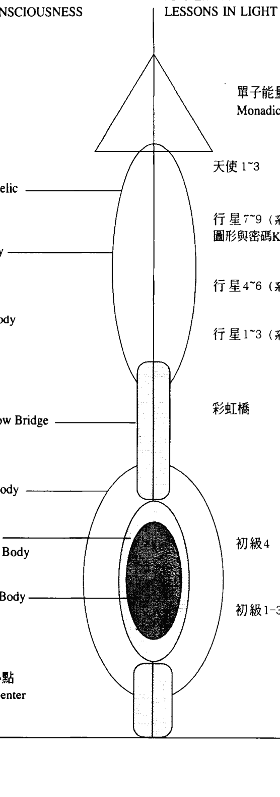
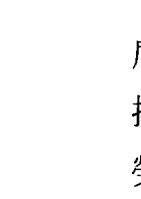
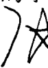
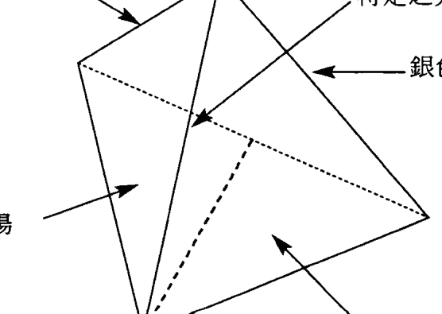
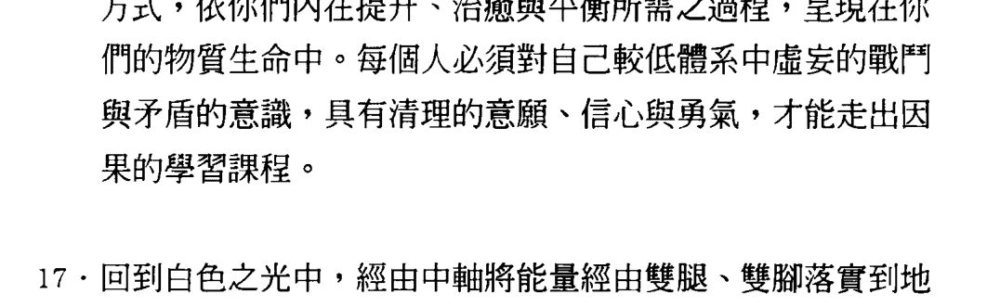
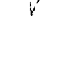
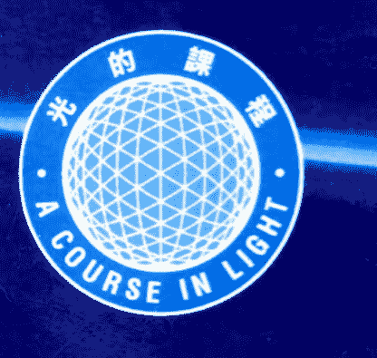
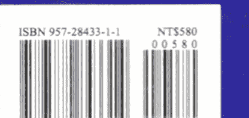

# 光的课程系列2

## 迈向明心见性的旅程
# 意識的層面
LEVELS OF CONSCIOUSNESS

# 光的進階課程
LESSONS IN LIGHT

天使意識 Angelic Consciousness

基督意識 Christ Consciousness

人性意識 Human Consciousness

單子能量圈 Monadic Sphere

天使次元 Angelic

天使 1~3

行星 Planetary

行星 7~9 (系列4)
圖形與密碼 Keys & Codes

行星 4~6 (系列3)

行星 1~3 (系列2)

靈魂起因體 Soul Causal Body

彩虹橋 Rainbow Bridge

彩虹橋

靈魂體 Soul Body

以太·星光體 Astral/Etheric Body

身體 Physical Body

初級4 (系列1)

初級1-3 (系列1)

地球能量中心點 Earth Power Center

靈魂 Spirit

意識 Mind

身體 Body

# 内在意识次元图

| 意識的層面 LEVELS OF CONSCIOUSNESS | 光的進階課程 LESSONS IN LIGHT |
| :--- | :--- |
| 天使意識 Angelic Consciousness | 天使次元 Angelic |
| 基督意識 Christ Consciousness | 天使 1~3 |
| 人性意識 Human Consciousness |  |
| 單子能量圈 Monadic Sphere | 行星 7~9 (系列4) 圖形與密碼 Keys & Codes |
|  | 行星 Planetary |
| 靈魂起因體 Soul Causal Body | 行星 4~6 (系列3) |
|  | 行星 1~3 (系列2) |
| 彩虹橋 Rainbow Bridge | 初級4 (系列1) |
| 靈魂體 Soul Body | 初級1-3 (系列1) |
| 以太·星光體 Astral/Etheric Body |  |
| 身體 Physical Body |  |
| 地球能量中心點 Earth Power Center | 地心· (与地球能量、身体自我连接) |
|  | 黑色之光中心点 (脚底下方6寸) |
|  | 向下50米 |
|  | 地心 |

# 譯者序

一九九六年，《光的課程》這靈修系列初級課程的中文版出書時，我曾說，進入行星層面的運作，是靈魂進展過程中非常重要的，關鍵性的轉捩點。行星課程比起初級課程更是浩瀚，但是，翻譯的工作已在進行中。我給大家的承諾是：當機緣成熟時，這些資料便會與大家見面。

雖然我不知道機緣何時成熟，我仍陸續將整套教材翻譯出來，只因有些朋友為自己心靈意識與地球頻率的提升，默默地，持續不斷地在習修這套課程。他們真摯熱誠的心感動著我，驅策著我，使我也隨之默默地，年復一年地，將整套課程逐步譯出。

七年來，就在我完成行星課程之教材的初稿之際，Toni 也將行星課程重新修訂得更完整。在我隨之再一次重新修訂的同時，暮然發現許多同學不僅完成了初級課程的習修，也繼續在習修行星課程。這意味著在我心目中的行星課程教材的出版時機已成熟。

行星課程，除了教導我們如何從較高宇宙層面來理解、關懷在地球行星這一層面的生命之外，也教導我們如何更深入地進入我們的內在次元。因此，行星課程是一個深入自己內在心靈之核心，使自己的意識在提升中，邁向神性自我的靈修過程。

在行星一的級次中，我們學習如何建立一道光的彩虹橋，如何經由這道彩虹橋，更深入行星中心（內在較高次元）。這一次元是我們存在中那完美的，一切具足的天使次元。依上師們所傳授的法來修持，我們得以將這較高次元的頻率與意識，帶入身體及地球層面的生命體驗中。

行星二與行星三的級次，教導我們如何在內在次元的智慧殿堂中，一步一步地深入智慧之海。整套行星課程很有次第地，逐步傳授我們，如何運用各種不同光的能量架構。更重要的是通過靜心冥想與訊息的形式，指導我們正確地理解與認知人類與地球之間的關係，人的思想意識與宇宙之間的關係，以及宇宙意識與我們地球人類的關係。

行星課程除了教導我們啟用一些新的工具，提醒我們憶起宇宙真理之外，並解析任何神秘與深奧的學理，皆源于最普通簡單的真理。

我與許多朋友都發現，儘管每一級次，從文字上去看它，幾乎都是那麼地平易，甚至類似，但往往在我們因背離真理而陷入在黑暗與痛苦中時，它輕柔地提醒我們回到光中，回到愛中。因此，每走過一個級次，我們的身體，內在心識與外在生活，都隨著能量的運作而在更新與提升中獲得轉化。

這七年來，未曾出版的行星課程初稿之教材，之所以僅提供給一些跟隨著教師們上課的學生，是因為我們發現，沒有踏實地走過初級課程，便進入行星課程的朋友，雖然對課文的文字在理解上都沒有問題，但內在意識的層面，並未能達到每一級次應有的領悟，而流於表相。

《光的課程》的初級課程，是為了幫助學生熟悉基本能量的運用，為進入行星課程之後，接收更高的能量做準備。運作的焦點著重在激發啟動身體及靈魂光體的脈輪中心點，運用光的能量去除累積在較低體系中，使我們身體與內在心靈，以及外在生活不得安寧的負面元素。因此，我發現任何級次，其教材中的文字，都是為了讓我們在思想導引能量的法則中，接受光在我們身心上的調整。

我一再強調，《光的課程》不是學術理論的課程，也不是法術的課程。它是一種清理、淨化與成長的過程。從我自身及許多朋友的經驗中，我們發現在修持的過程中，符合靈魂意願的願望的確會實現，痛苦的經歷與感受確實會改變。但它不會發生在那些將光的能量當成法術來運用的人身上，它只能發生在真正瞭解光的能量是用來幫助自己清理負面元素，轉化習性，體悟真理的工具，並將淨化的心靈意識實踐在生活中的人之身上。因此，美好事物的呈現，來自個人美好心靈的創造，而非來自光或上師們的法術。美好的人生，是因每個人自身功德、福德圓滿之後而產生的。

因此，隨著課程的整體架構，由第一級次開始，一個級次，一個級次的循序漸進是非常重要的。遵循《光的課程》系列一初級的四個基本級次，將能量焦點依次放在身體，情緒/感受體，思想/理性體，以太星光體的運作上，是非常重要的治癒過程。

在《光的課程》中，「治癒」指的是：改變錯誤、扭曲的情緒感受與思想意識；釋放沉重與痛苦的意識，回到原本的安寧與祥和之中。這種超越思想層面的認知，在天人合一（與較高自我融合）的運作中，修正自己內在意識，使內在的圓滿呈現於外在的生命中，即是整套課程的目的。因此，沒有經過前面四個級次的清理與治癒，便進入行星課程，很可能在身體與意識的層面中，造成許多困擾與混亂。

進入行星課程，讓自己成爲光的載體，將較高次元的能量帶入地球的運作，爲地球所做的奉獻，從某種程度來說，是超越了人的思想意識所能理解的範疇。但對於已領悟到我們是多次元的存在，我們與整個地球，整個宇宙是息息相關的人，便能在自己的生命中，在日常生活中，體悟這一途徑所闡述的真理，並在真理的實踐中，創造安寧美好的生命。

我們都知道，質的改變來自量的累積。思想意識與心靈感受的調整，就像我們學習任何事物一樣，要達到精練與純熟，要達到自在與圓滿，需要持之以恆地自我調整與訓練。修行是不進則退，終其一生的事。十多年來，看著共修的朋友們，在相互扶持，互相勉勵中，獲得成長與治癒，是我心靈上最大滿足。在此，我以最誠摯的心，向所有走在光中的朋友們表示由衷的感謝，願所有人皆獲得上天賦予我們生命的豐碩與圓滿。

杜恆芬 2003年九月

# 前 言

在進入這一級次的習修之前，學生們對初級課程中每一光的能量在治療與清理上的目的與作用應有著全面的理解。無論是在個人的成長或事奉上，你們會發現自己對每一種光的功用愈熟悉，便愈能善用它。

作為光的行者，行星課程是另一個里程碑。你們在初級課程中所經歷的強烈清理與淨化將趨於緩和，你們的思想意念將著重在地球的提升與治癒上。但這並不意味你們將停止清理個人問題上的癥結。

這只是說你們在個人的提升與轉化之同時，也協助地球清理它沉重的磁場。

在行星一的級次中，你們將更深入地進入新的內在次元，進入一種全新的覺知中。你們將建立一道通往較高次元意識的彩虹橋。當這彩虹橋啟動之後，你們將被帶入內在次元的行星中心，進行意識進展的學習課程。

這道光的彩虹橋將協助我們治癒人類的意識。為了提升人類沉重的意識，你們將在這中心點上以光環繞著地球。上師們、指導靈們以及淨光兄弟的教師們將與你們一起在光的網絡上運作。要知道，這是一種奉獻，一種出自你們較高自我意願的奉獻。

由這行星中心所散發的頻率將更強而有力。你們的磁力磁場將在擴展中更具力量，將使你們更能融會在其他途徑上所接觸到的真知。無論你們為自己所選擇的途徑是什麼，這能量都會支持你們，使你們在融會貫通中對自己的途徑有更深的領悟。

幾乎沒有人對光的課程能達到全面性的理解。這課程不僅僅是學習如何靜心冥想而已，它是你們的靈魂進入宇宙意識的途徑。在這途徑中所呈現的學習課程，都與你們靈魂的領悟與進展有直接的關係，這是一個使你們得以從因果的束縛中釋放出來必經的過程。

靈性的領悟可以從許多不同層面來切入。光與古印第安文明、馬雅文明、古埃及文明、古印度文明、古希伯來文明都有著很深的因緣。在個人進展的道途上，它所呈現的是一條有待開發與理解的宇宙性的途徑。

在行星一的級次中，增加了兩種光的工具，一是銀色聖杯（Silver Chalice），一是單子能量（Monadic Power Ray）。作為一位光的行者，這兩種強而有力的工具，將使你們持續擴展。往往在啟動一些新的工具時，人的內在自我可能會產生一些抗拒。然而，持續練習使用，將使你們的生命更為完善。

> > 注意世界各地的時事，如果某些地方發生一些特定的事物，引起你們的注意，便是需要你們傳遞光的地方。寫下那些自己想要傳送光的地方。

# 光的課程 行星一

# 行星課程第一級次

# 行星課程第一級次

## 簡介

行星課程的目的是要建立一道將天使層面的意識帶入物質層面的彩虹橋。

> > 「當覺知被帶到前額時，你們的較高自我與較低自我之間便有了某種程度的溝通。在這時候你們的渴望，你們的心智，便融入在天使層面的意識與覺知中。」

> > 「在你們與這道彩虹橋有著真正的連接之前，你們仍在分裂的狀態中。要達到全面的清理，行星的運作是不可或缺的。」

–愛瑟瑞爾–

行星中心在你們身體上方一百五十呎的地方。進入這中心點，你們將體驗到與天使聖團及上師們的交流與溝通。這中心點也是你們與天使存在連接的網絡。這些存在們協助你們將光導向地球行星的磁力磁場上。這將使不斷地被人類所製造出來的負面事物得到淨化。不要忘了你們是獻身於提升地球與人類頻率的光的行者。

> > 「當你們在行星中心運作時，你們便從以較低自我為中心的意識層面中解脫出來。你們將與天使層面的思想連接，並融入在這美麗的光與能量中。行星的運作，使你們朝著超越你們思想領域的層面擴展。它將使你們自由翱翔於光的網絡上。當你們的覺知進入行星中心時，你們便成為其他次元中的一部份。你們的思想與光貫穿其中，並與眾多的上師及指引人類進入較高覺知的存在共同運作。當你們將自己奉獻給別人時，你們也將收到光與治癒的回報。」

注：此段來自1979.2.2 愛瑟瑞爾的訊息

## 行星中心

地球與你們一樣，它的磁場與你們的磁場非常類似。行星中心也是一種勢能磁場。只是這種電磁場不受地心引力的影響，它純然是一種心靈意識的層面。

宇宙中有許多意識層面，許多不同頻率的次元，但它們都是宇宙的一部份。每一個行星的頻率都與其他星球的頻率不同，在宇宙中，每顆星球都放射著不同體系的光、頻率與電磁場。每一顆星球對宇宙中其他生命的神與靈性都會產生特定的影響。

因此，作為一個宇宙生命，你們是宇宙心識、宇宙磁場、宇宙意識與星際互動的接收器。你們正體驗著來自不同來源的意識頻率對你們身心意識所產生的影響。

行星中心點與你們靈魂中心點是互通的。從本質上來說，這行星中心點是你們較高自我第一個光的脈輪中心點。它是一種內在空間。歷代的聖賢都知道如何來到這裏接收指引，並將真理帶給需要的人們。

感受這行星中心像是一個「高原」，或是一種意識的次元，它的頻率之高，使人們無法以肉眼來看。然而，經由內在的覺知，你們將獲得極為清晰的視野。當你們的覺知進入這中心點時，你們成為其他次元中的一部份，你們的心識得以在許多上師與教師的指引下，進入更高的覺知。對基督聖靈的覺知，將使你們得以在較低次元中生存，並運用宇宙勢能把你們帶回整體意識之中。

因此，體驗這多次元的自我，感受自己存在中這股光的能量所帶給你們的衝擊是很重要的。引導這股勢能，讓它成為你們改變、轉化、提升與淨化的工具，將新的實相帶到物質次元中是很重要的。

行星各級次的課程，是一種體驗；是一種互動；是一種為自己，為宇宙進展所做的奉獻。

## 光的委員與光的網絡

光的委員由眾多的淨光兄弟所組成，他們翱翔在光的聲音、色彩與頻率中。淨光兄弟在默基瑟德天使聖團的引導下運作。被選入默基瑟德天使聖團的存在們是一群為了地球的提升與轉化，而自願進入有形世界，以彰顯 YHWH 之大能的光之子。

他們貫徹上主的真理，偶爾經由光顯化在人們的視野中，以便將天堂的範型建立在地球上，以顯示宇宙造化的多元性。

默基瑟德天使聖團源自聖子群。他們護守著居住在亞當之後代的地球，護守著這世界靈性的進展。他們持有從地球的聯繫區 (contact areas) 打開通往天堂的鑰匙，在天父的宇宙中，具有與天界的光的兄弟往來的能力。

光的網絡是成千上萬之光能的組合，它的頻率與光的委員、指導靈，內在導師和諧共振。在行星中心點上，他們的心靈意識與你們合而為一。這種融合後的勢能，便成為一股強大的能量，流向地球，化解由群眾之負面思想所造成的稠密、沉重的磁場。

你們的思想意識，將在這行星中心的運作中開始擴展。你們將在環繞著地球的光的網絡中翱翔。在冥想中，你們可能會想到一些需要光的國家或一些情況。運用你們的直覺，接受你們的指引，引導你們的思想與覺知到那些地方。

## 行星課程為個人所帶來的效益

學生們將在覺醒中瞭解自己所處的意識層面。當你們從肉體的層面提升，進入光的較高層面的活動時，你們的身體，以及你們所處的環境對你們的影響便愈來愈少。

然而，真正的運作卻在內在次元中展開，成長的承諾，成為內在運作的一部份，你們將在自己的進展中，提升別人。這些運作超越了你們現在的心識所能理解的範疇。

不要批判，不要評估，只要知道當你們在行星層面的光中運作時，你們便與上師們融合，為清除人類心靈意識及地球沉重的磁場而奉獻。

最重要的是，每當你們在這行星中心運作時，你們也在提升自己的頻率，使自己進入更高更細緻的頻率中。

當你們將自己奉獻給別人時，你們也同時獲得光與治癒能量的回饋。當你們經歷過不同階段的行星意識之後，外在頻率對你們的影響將逐漸減少。你們將感到自己較低體系的頻率在逐步的提升中，進入更高的宇宙意識。

在這期間，你們會經歷許多微妙的變化，這是為了你們進入新的體驗所做的準備。你們也可能會感到物質方面的事物與你們無關，這是因為你們的自我已從物質體的意識層面中提升出來，進入較高的意識層面之故。

> 另一個要記住的是，在這行星中心，你們是受到保護的，你們不再受到周圍沉重的，負面的頻率所衝擊。

## 愛瑟瑞爾的訊息

親愛的學生們！在你們靈性進展的旅途上，我們一直在協助你們清理你們身體、情緒/感受體、思想理性體、以太星光體上的能量磁場，並協助你們將所有較低體系與靈魂整合。我們瞭解到你們每個人都是很辛苦地從你們所設定的道途上走過來的。

當你們走出自我中心，向上提升，進入行星中心，與天使聖團聚合，將光的較高頻率投射到地球上時，你們所煥發的美麗謙和的情操，使我們能以較高意識層面的思想與覺知來協助你們。我們很感謝你們為自己生命的進展所做的努力。

在這運作中，每一個人都獲得極大的祝福。許多愛流向你們。你們所經歷的挑戰，都為你們帶來更大的力量、智慧及領悟。光的途徑將帶領你們進入超越人類思想所能領悟的領域。

## 給團體共修團體的建議

在共修時，我們建議你們在靜心冥想之前，圍成一個圓圈，並分享你們在那一周所經歷的，所學習到的事物。

行星課程靜心冥想的焦點將放在治癒地球上。有些學生對自己個人的學習課題需要具有更多的信心，團體共修將能使你們在成長的過程中獲得支持。

我們希望你們圍成一個治癒之圈，呼喚所有的自我到前額，將覺知帶入白色之光中。提醒每個人將這股聚合的能量與別人分享，將需要治癒與成長的人、事、物帶入這股能量中。

引導光進行治癒，並協助這團體釋放負面事物。整個團體把焦點放在治癒上，一起將這能量導向每一個人。當團體中的每一個人體驗到愛與能量時，可以將需要光與治癒的親友帶入這治癒之圈中。

## 靜心冥想中的觀想

觀想是一種經由心靈的運作而提升與釋放的一個很好的方式。

觀想整個共修團體成為一個整體，將白色之光帶入你們的圓圈中。

感受這白色之光啟動並釋放這圓圈中的負面能量。

觀想一個很大的光球在你們面前。光球的顏色可以是那一星期所習修的光的色彩。觀想自己將意識裏的抗拒與恐懼的包袱帶入光球中。當這光球開始向行星中心上升時，將這些包袱一一拋開，釋放一切使你們產生痛苦的內在因素。將所有負面元素釋放到光中。

感受自己被賦予一種全新的愛與覺知；感受光球裏充滿著愛的能量，當你們下降時，將意識帶回身體中。

在你們結束這一冥想時，唱頌「OM」三次，並念頌這樣的祈禱文三次：

-   我們屬於一個心識
我們屬於一個思想
我們屬於一個意識
我們祈求在耶穌基督之內的聖靈與我們同在

## 地球行星祈禱文

-   願主之光降臨地球，永無止境地照耀人類的心識
願主之愛源源不斷地流淌在人類的心識裏
願基督重返世間
願主的意願為我們所知
讓這旨意引導人類微小的意志
上師們瞭解並事奉這旨意
願光與愛的神聖計劃經由人類而實現
願我們封閉邪惡之門

## 行星一靜坐次第

-   1 將覺知帶到前額，呼喚所有的自我來到這中心點，將自我的所有層面整合成為一個意識。
2 將所有較低體系的自我帶到燦爛的白色之光中。

3. 啟動並放大這白色之光，使之成為直徑六呎的光球，以逆時針的方向漩渦式地環繞自己一周，讓它清理你們所有的較低體系。

4. 漩渦式地以順時針的方向轉動，以封住你們的能量磁場。

5. 回到白色之光的中心點，放大並啟動靈魂體中每一個脈輪中心點，直到你們那周所習修的光的中心點為止。

6. 放大這星期所習修的光的能量，使之在所有較低體系中流動，觀想自己完全在這頻率的環繞中。

7. 擴展這能量，使之充滿整個房間，與共修的朋友整合成一個頻率，一個心識，一個思想，一個意識。

8. 將覺知經由中軸向上提升，進入銀色聖杯。啟動這銀色聖杯，讓銀色之光的元素注入你們的較低體系中。

9. 斷續向上提升，經由彩虹橋進入身體上方一百五十呎的行星中心。

10. 在這行星中心裏與你們的較高自我，指導靈、淨光兄弟上師們的意識融合。

11. 進入行星層面光的頻率中。

當靜心冥想結束時，與這層面所有光的學生，光的行者，光的委員融合，進入環繞著地球的光的網絡，引導光的頻率進入需要提升與治癒的區域。

當行星的運作完成時，回到你們的行星中心點，經由彩虹橋回到白色之光靈魂體的中心點。將放大的行星中心的能量帶入靈魂體的中心點。

呼喚在靈魂層面上需要治癒的人，與他們的較高自我融合，將他們放在三角形治癒的能量中。看著每個人在光中提升並進入他們自身的完美與圓滿中，然後，讓每個人回到他們自身的進展中。

把覺知帶回身體上，回到前額的中心點上。經由中軸將能量帶入黑色能量中心點。

## 靜坐次第補充說明

較之初級課程，行星課程將把你們的覺知與意識帶入一個新的層面。許多人對靜坐次第的一些概念感到混淆，因此我們在此為一些概念做補充說明。

## 光的漩渦

將白色之光以逆時針的方向漩渦式地向下移動，引導它經由你們存在的所有層面，將幫助你們釋放自己能量磁場中的負面雜質。

### 動力磁場與磁力磁場

身體的右邊與前方是你們的動力磁場，這是你們將自己的思想、感受與意念向外投射，也是你們將能量傳送出去的地方。身體的左邊與後方是你們的磁力磁場，是你們接收別人的思想、感受與意念的地方。（參考P246圖）

### 擴展頻率與團體融合

這是一種增強敏銳度的練習，這將使你們覺知並感受團體中每個人不同的磁場。當你們將別人帶入光的能量中時，感受別人的頻率，不要企圖解釋你們的感受，只要與他們的頻率和諧共振。這種練習是為了意識的整合，以便在非語言的層面上達到溝通與和諧。

### 從行星中心將能量放大，使之進入靈魂體的中心點

這是回到身體層面的重要過程。放大並將行星層面的較高頻率帶入靈魂體中，將使你們更能掌握由較高次元所注入的巨大能量。

讓能量經由身體落實地面是非常重要的，因為如果沒有正確地將能量落實地面，可能會使身體的負荷過重，並感到渙散。再者，將行星的能量落實地面，在整個進展的過程中是極其必要的步驟。

在一個人與較高自我融合之前，與地球之間的連接是重要的一部份。不要忘了，地球的進展要靠生存在這星球上的每一個生命。

經由彩虹橋與行星頻率的運作，你們整合了較高次元與較低次元之間的分裂。因此，將較高意識層面的能量落實到較低次元是非常重要的。當你們回到身體的意識中時，把思想的焦點帶到前額，再帶到身體的覺知中，這將使你們得以將較高意識表達在地球的生命體驗中。

## 第一課 銀色之光

位置：頭頂上方十二吋

行星：月亮

### 目的與要素

當你們啟動銀色之光的頻率時，它便像液體般地滲入你們的存在中，使你們與陰性自我的意識連接。這宇宙之母的能量與金色之光相互輝應。在你們需要增強陰性自我的能量時，可以運用這頻率。

你們的身體，情緒感受體都極其需要這頻率，這來自銀色聖杯的能量具有舒緩失落、空虛與疲憊等感受的元素。銀色聖杯的中心點在白色之光脈輪中心點上方六吋的地方。這光的能量是柔和，令人心曠神怡的。

### 銀色聖杯

白色之光的中心點被稱之為基督意識；白色之光是所有頻率的組合，是進入靜心的中心點。這是你們與自己的教師，指導靈溝通的地方。在這靈魂體的上方，有著一個由以太元素所形成的燦爛美麗的光的聖杯。這聖杯是我們在這級次中所要為你們介紹的工具。

### 銀色聖杯的啟動

在白色之光靈魂體的中心點上方六吋的地方，有著一個銀色聖杯。觀想這聖杯將它銀色液體般的元素注入到你們的存在中。當銀色聖杯被啟動時，這聖杯便倒轉過來，從中所傾注出來的能量，充滿著你們所有的體系，這能量令人感到無比的舒適。

由這聖杯所注入在你們體系中的能量，完全不同於其他的能量。當你們將這能量啟動之後，感受這燦爛的銀色之光的能量在你們之內的流動。擴展這頻率，並置身於銀色之光中。感受自己受到這銀色之光的保護。

以逆時針的方向環繞著你們的每一層面而旋轉，讓這能量觸及並滋潤你們。當你們感到自己是卑微的，愧疚的，或無所適從的時候，讓這元素治癒你們內在的思想感受。如果你們感到自己像是一個被凌虐的孩子，一個被忽視的靈魂，或是缺乏支撐的力量時，以片刻的時間體驗這能量，感受它治癒儲存在你們靈魂旅程中負面的記憶。

> > 思想導引能量，能量跟隨思想，銀色之光的元素經由你們的思想而注入你們之內，並為清理負面元素而放大它治癒的能量。

如果你們的敏銳度尚未能感受到它的頻率，不要疑慮。只要在誠信中信任並知道看不見的事物也是宇宙實相的一部份。

進入深沉的靜默中，體驗這能量在你們之內的流動。當靜心冥想結束時，讓自己的覺知落實到地面，並回到身體中。

## 靜心冥想與上師們的訊息 #1

親愛的光的學生們！這是愛瑟瑞爾。這級次的目的是要使你們在擴展中進入更高、更寬廣的次元。看著你們展開了靈性的旅程，看著環繞著你們的光在擴展著，看著你們團結一致地擴展內在的視野，並在向內探索中，尋獲那在你們之內的大愛，是我們極大的喜悅。

你們將在光的次元與較高自我連接，成為光的網絡中的一部分。你們將持續地在更大的內在次元中運作，成為治癒之源。你們將與守護著你們，支撐著你們的更大源頭連接。你們將成為引導光進入地球行星，進入人類意識的團體中的一部分。你們將成為在地球上，協助地球其提升頻率的靈魂團體中的一個成員。

當你們在靜心冥想中體驗銀色之光的頻率時，你們會感到自己在愛與安寧的體驗中，當光在你們之內流動時所產生的影響是無法以語言來描述的。當你們與光的較高意識連接時，它在你們體內，以及你們存在中的運作，也是無法以語言來形容的。要確信這是地球神聖計劃中的一部份，這一切都是為了使你們的生命更美好。

現在，較高層面的思想意識經由與你們的連接，正以微妙的方式改變著人類的思想意識。

光與基督意識之愛為靈魂帶來較高覺知與光芒。在你們投生地球之前，你們選擇了你們所要經歷的。現在，你們對這內在設定的靈性旅程覺醒。因此，當這燦爛的銀色聖杯的能量向你們傾注時，觀想自己在新的階段中誕生，更新的意識在你們的靈魂中誕生，使人們對未來更大的角色產生覺醒。

在靈性的旅程上，這是一個關鍵性的時刻。這是你們的意識與更寬廣的遠景連接的時刻。不需要因此而感到恐懼。向愛打開，讓這偉大的光芒經由你們而流動，使你們得以實現內在靈魂的設計。

放下對自我的疑惑，把焦點放在治癒人類的視野上。你們是更大遠景中的一部份，你們的思想、言語、行爲都與其他人連接。你們對較高目標的視野，來自「思想的種子」。許多人像你們一樣，與這思想意識的種子是連接的。你們正吸引著一些能反映你們事奉之視野的人。因此，放下對這旅程的恐懼，放下焦慮，放下你們所體驗的挑戰，純然地接受這燦爛的銀色之光。感受它進入你們之內，充滿你們身體中的每一部份，使你們在滿足中感到充實。感受你們整個存在，你們的身體，豁然之間進入一種完整、充實與圓滿的感受，這種感受是你們心靈的渴望。你們正爲回到原本的自己做準備。這也是爲你們的意識，進入下一階段的過程做準備。

金色之光是宇宙天父的能量，具有創造性的動力頻率，銀色之光的能量是滋養萬物的頻率，它滋潤你們的每一部份，從最微小的細胞到你們身體的任何部位。

它超越你們的較低自我，與行星層面連接。然而，在你們意識進展的這一階段中，只要觀想這銀色之光的能量直接注入你們之內。感受這光的能量在你們體內的每一部位流動著，也在你們思想的每一層面上流動著，你們將發現自己開始逐漸地感受到滿足，並不再那麼地焦慮。

當這能量從頭頂至腳底流動時，讓它進入情緒體，感受這銀色之光所帶來的安慰與舒暢，彷彿心頭的疼痛騷然之間盪然無存。如果你們有著被隔離，被遺棄的孤獨感受時，感受這光的能量充滿著你們的情緒感受體。體驗這能量是如何地改變你們內在的情緒感受，是如何地治癒你們人際關係上的傷痛，如何地幫助你們釋放在這人際關係的學習課程中所產生的憤怒。

當這光充滿著你們的情緒自我時，肯定這些人際關係已在這道的途徑上獲得協助，並已被治癒。審視自己如何釋放了對需求的焦慮，看著這光的能量在你們之內流動時，是如何地帶給你們力量，如何幫助你們接受已發生的事物。再次祈求讓你們有著清晰的視野。

當光在你們所有層面上流動時，你們可以看到並感受到它經由你們的雙腿、雙腳而流動。將你們的磁力磁場的直徑擴展到一百五十呎，這將使你們的覺知更為擴展。這是治癒心靈深處創傷的時候，暢飲這光的頻率，你們將感到自己更為滿足，感到自己接收著更大的祝福。

現在感受這環繞著你們的銀色之光以順時針的方向移動著，治癒你們內在所有傷痛的經歷。一切如是。

進入和平中，願基督之光在你們之內並經由你們而流動。

## 靜心冥想與上師們的訊息 #2

問候你們！這是愛瑟瑞爾。能與你們一起體驗這一層面的靈性之光，是我們最大的喜悅。當一個入門者為了接受「心識的課程」，而來到這學習善惡兩極之真知的聖殿，探索著對進展與退化兩極的覺知與理解時，是如此地美麗。

我們問候所有來到這「高原」的學生。這聖殿是如此地燦爛輝煌與壯麗。地球上有著許多類似這兒的建築。

每個人會因自己內在心識的不同期望而浮現不同的景象，但你們所看到的，對你們的意識而言，都是最完美的。聖殿是一個聚合著以太能量的地方，光的委員們來到這裏與你們相聚。第一次來到這「高原」時，在意識的層面上，你們可能會產生抗拒，可能會感到這一切只是一種夢幻。但是，親愛的學生們，要知道你們不是在幻境之中，你們確實是在這次元中接受光的委員的思想頻率，並對它產生回應，這一切都將為你們帶來成長與進展。

心識的課程始於你們聽到、看到並認知到一切改變均是地球行星進展的必要過程，為了加速人類在這一階段的意識之進展，許多改變的方案正進行著。心識的課程幫助人類將較高意識融入在思想中，並經由你們的思想，將這種子根植在你們下一代中。

要瞭解到，作為默基瑟德天使聖團的神職人員，在較高層面上，你們接受了教導與事奉的職責，經由這特定的過程，你們為地球帶來真理、光與愛。

在進展中進入較高實相是一種事奉。將你們的思想頻率投入天使存在的網絡中是一種事奉。讓光經由以太層面，經由你們的頻率傳遞到地球磁場中，也是你們的事奉。

因此，在這聖殿中，審視自己有著什麼樣的展望？首先，你們受到問候，同時你們也問候並感謝你們的教師與指導靈。接受你們所看到的是你們的思想調整者（Thought Adjuster）與教師。他們的名字並不重要，重要的是你們所感受的實相是什麼，你們有著什麼樣的覺知與體認，你們的內在是否有著感恩的心。

當你們問候自己的教師時，以你們的雙眼看著他們，帶著誠敬的心向他們致意。在你們進展的過程中，他們一直在關注著你們，當你們需要滋養時，他們將提升的頻率提供給你們。

上師們永遠不會為你們擋掉你們的學習課程，也不會在你們所選擇的進展與領悟的途徑上攔阻你們。教師們不會促使你們去做違反你們自身意志的決定。我愛瑟瑞爾不能，安德魯、馬庫思或任何其他的委員都不會左右你們或阻攔你們做任何決定。

當我們與你們攜手並肩而行時，我們只能觀察你們，提醒你們未能看到的其他洞見的可能性。我們可以幫助你們瞭解自己靈魂的意願。我們可以提供你們工具，使你們能傾聽並洞悉自己靈魂所煥發的愛的頻率與巨大的力量。然而，我們不能為你們做抉擇，你們必須以自身的進展與領悟來為自己做決定。

目前的地球處於創傷之中，迫切地須經由釋放來進展。在地球回復其原本的安寧與和平的過程中，作為地球上的公民，你們可以將較高頻率帶入地球，協助地球釋放它的創傷。

作為一個入門者，你們需要瞭解自己在這光的網絡中，負有提升並轉化因果之輪轉角色的責任。

你們將常常獨自來到這聖殿裏。你們可能不會聽到任何言語，甚至未能理解自己獲得了什麼，但要知道在這次元中，你們一直在學習著自己所應學習的課程。你們所經歷的是你們進展課程中的一部份，你們都將獲得我們的愛、理解與支持。

> 在這時刻，認知你們的覺知即是心識（Mind）：
心識即是思想；
思想即是光；
光即是存在；
存在與天使勢能連接，創造了提升地球靈性意識的精神元素。

光的網絡以極高的速度移動著，每一個人都在自己教師的指引中。將焦點集中在地球上正經歷著創傷的地方，這些地方的人們深深地陷入在否定、抗拒與痛苦的輪轉中。

你們將發現自己的心弦念著某些區域，這些地方往往是你們在靈魂的旅程中曾經生活過的地方，無論是在歐洲，在美洲或在歐亞等地區，無論你們是否曾經去過那裏。那些地方往往因舊有的思想模式，以及一些部落或家庭間的世仇而產生許多動盪。你們將發現自己受到某些特定地方的頻率所吸引，而向那裏散發光的元素。

無論是在伊拉克、伊朗、波斯灣、埃及、巴勒斯坦或以色列，無論是否在過埃及的沙漠或加利利的山坡，無論是否在洞穴或墓穴中，所呈現的都是你們對過去生命的反應。

無論你們個人的經歷是什麼，銀色之光正放大它滋潤你們的能量，觸及你們陰性與陽性的層面，安撫你們憤怒的心靈，幫助你們釋放舊有的，根深蒂固的對成長的抗拒。

觀想地球上的孩子以及需要滋養的人們，都獲得指引，並生活在完整與具有尊嚴的和平中。孩子們帶著上一代思想意識的種子，以他們的方式來表達這些痛苦的記錄，也因此陷入在因果中。這也是為什麼人類極其需要這將生命提升到較高層面的機會。

無論你們所受到吸引的地方是在戰爭或在瘟疫的陰影中，觀想所有被破壞與蹂躪的痕跡，已為具有改變意願與探索能力的人們所轉化。

中國是一個美麗的地方，他們的人民正努力改善生活品質，努力將古老的智慧與真理帶到群體生活中。觀想他們的痛苦被更新的能量與心靈所治癒。

親愛的學生們，無論情況如何艱難，我們從未停止對你們的關注。我們看到因果在抗拒中不斷地重複著。地球的未來寄望於那些願意與人分享自己對生命之領悟的人身上。

在這時刻，觀想巨大的光、愛與滋養的能量正進入人類的存在中，拂拭著人們的心靈。東方民族是所有種族的根源，是第一個進入地球的民族，觀想這古老的民族走出陰暗與侷限，經由對靈性的領悟，經由光與愛，將焦點放在較高意識的層面中。

在這網絡中繼續前進，看著地球人類的輝煌成就，以及它的富足。觀想這些成就所帶來的合一，正清理地球在其自身活動中所產生的瘟疫與荒蕪，並帶來和平。

我們看到苦難，看到苦難的徒勞無益與死亡。然而，我們也看到苦難帶給人類的選擇。這是人類必須恢復自己尊嚴，重新認識生命目標，並與天使意識融合的時候。

為了展開你們對愛與真理的承諾，你們正與自身存在中的天使意識融合。

把治癒帶給別人，你們便能獲得治癒；
進入你們的至高理想，你們便能獲得提升。

當你們理解自己是眾多神聖之光中的一束燦爛之光，爲清理地球意識而探索，你們便能理解自身存在中充滿著長生不老的元素。

你們將在光的網絡上穿越許多大洲，當你們看到飢餓與疾病所造成的景象時，你們會感到哀傷與恐懼。要知道宇宙的大愛正進入人類的意識中，當你們與這些頻率共振，並讓它在你們之內產生作用時，你們便成爲這股能量的放大者。所有行星的運作都是心靈與心識在以太中的旅程。

感受光的委員的存在。感受自己釋放了使你們產生抗拒與痛苦的負面頻率。光的委員渴望持續與你們同在這光的次元中，但是要知道，你們的靈魂渴望你們回到地球上。

不要讓光的運作妨礙你們的正常生活，你們的人生是你們選擇學習的學校，因此只要將光的運作融入在你們的生命中。你們在光中運作的美德，將爲你們的生命帶來擴展與治癒的機緣。

當你們做好將覺知帶回身體的準備時，你們的身體已接收到這些頻率，你們的意識已接收到它的學習課程。你們將落實地球層面，帶著敬意，將行星中心點的能量落實在地球行星的中心點。

36 光的課程 行星一

## 靜心冥想與上師們的訊息 #3

問候你們！這是安德魯。能與你們說話真好。我來到這裏是為了幫助你們打開心識，使你們進入更深的領悟。

你們是一群與天使聖團有著連接的美麗靈魂，這種連接使你們得以將神聖之光的意識帶入生命的活動中。

在這神聖的時刻中，一股能量正注入你們意識自我中，使你們認知自己與「一切所有」是一個整體。當你們出生時，你們的臍帶與母親斷開是一種象徵，表示你們是出自宇宙的造化，你們是獨立的意識。無論何時，都要知道你們與宇宙本源是連接的，這本源是你們的靈性，即是你們所知的神；是最初始的喜悅。

人類在地球上製造了許多負面事物，並破壞了靈性法則。現在，感受地球在你們的手中，你們正放大這銀色之光的能量，觀想地球及地球上的所有事物都在這光的環繞中。現在，與造物主連接，與造化中那女性的靈性意識連接。這麼想著：

> ★ 萬事萬物出自同一來源，一切來自大地之母的孕育。 ★

大地之母孕育了人類，蘊藏著進展的意識。感受大地之母所孕育的是具有更新意識的孩子；感受大地之母所孕育的是由基督聖靈而來的更新意識，一切都在全面的表達中。

觀想地球及地球上的一切事物，都在這光的環繞中。當月亮將它的光與能量照耀地球時，與這燦爛的頻率連接，認知自己能量的真實來源，將使你們的光更亮麗。

這種冥想不是一般人所說的白日夢。這是一種象徵，一種儀軌。當光的行者踏上這靈性進展的新階段時，便被賦予這進入全面交流的方式。

這都是重要的象徵，你們可以各自將焦點放入其中。觀想智慧、真理與愛的種子正注入你們之內。這是你們與較高意識層面的交流；是你們與大地之母之意識與表達的交流。

帶著這樣的視野，感受你們被賦予在靈魂旅程中所需的一切，所有的流動是如此地順暢，你們在欣欣向榮中。

當銀色聖杯的能量經由你們的靈魂而放大時，讓它經由你們而流動，引導它進入光的網絡中。

感受這能量注入地球，觀想並確定自己的完整。

當你們回到身體的意識中時，你們將感到自己以及周圍的改變。在這頻率中靜心冥想，不會導致顛倒退轉，憤怒或痛苦，不會產生負面事物；它帶給你們慰藉、提升與治癒，使你們進入和諧中。

現在，回到你們的意識自我中，感受你們的身體，感受自己與所有層面的連接。進入和平中！

## 肯定語意

> > 我肯定自己與自身存在的宇宙之母在全面的合一中。
我愛我在地球上的母親的一切。
我接受我的直覺力。

### 寫下你們自己的肯定語意

### 個人日記

寫下你們現在的思想、感受與體驗。

## 第二課 單子能量

光的色彩: 白色—銀色—藍色
位置: 前額

### 目的與要素

這堂課我們要啟動的能量稱之為單子能量(The Monadic Power Ray)。它的中心點在前額。這能量使你們看清自己周圍所發生的事物，去除你們在自己或別人身上所投射的虛妄影像。這能量可以在白色之光中啟動，也可以在銀色之光或藍色之光中啟動，在什麼光的能量中啟動是依你們需要什麼樣的工具而定。無論是在靜心冥想或在日常生活中，以思想導引這能量，感受它在你們身上強而有力的運作。

在白色之光中啟動這能量，將幫助你們突破並清理環繞在你們周圍的困境，幫助你們清理、淨化許多事物。

在銀色之光中啟動這能量時，這能量中的思想意識將幫助你們把事情處理得更圓滿。

在藍色之光中啟動這能量時，將使一些隱藏的事物顯現其真相。如果你們對某些人或某些事物的真相有疑惑時，啟動這單子能量，然後信任它會以正確的方式，將結果顯現出來。無論你們所探索的是什麼，這智慧之光的單子能量所帶來的深沉洞見，將能清理你們思想中虛妄的影像。因此，單子能量無論在什麼光中被啟動，都具有極大的力量。

## 靜心冥想與上師們的訊息 #1

問候你們！這是安德魯。能與你們說話的感覺真好。在審視你們個人與整體的進展中，我們與你們一起走過生活的挑戰，我們對這成長的經驗，感到非常滿意。

啟動這特定的能量，讓它成為你們強而有力的工具，是你們最大的渴望。這雷射般的頻率，是所有光的能量中，頻率最密集的能量。它清理呈現在你們面前負面或虛妄的事物。

親愛的學生們，在這時刻中，將焦點帶到前額第三眼處，感受你們內在與外在所體驗的一切事物都在清理中。這單子能量是光的工具，感受它的運作。這特定的工具不曾離開你們，在靈魂的旅程中，你們曾多次使用它。許多人尚未能熟悉地運用它，但在日常生活中，當你們要做決定時；當你們需要清理時；當你們需要更清晰的領悟時，這是一個極具力量的工具。

前額的中心點一向被認知為神聖的天眼，現在它開始啟動這光的頻率。這頻率在白色之光中啟動，也可以在藍色之光或銀色之光中啟動。在白色之光中時，它被用來淨化思想。清理幻境，釋放磁場周圍的沉重思想，當你們的誠信面臨崩潰時，它幫助你們將自己從中釋放出來。這是使你們的意識得以淨化的工具。

當藍色的智慧之光在單子能量中被啟動時，可以幫助你們走過恐懼，意識模糊不清的階段。當你們與別人進行協商或和談時；在整合思想時；在創造時；在渴望成為一個心識，一個完整目標時，將焦點集中在這工具的運用上。

在銀色之光中啟動這能量時，它帶給你們被接受與充實的感覺，使你們對陌生或不明確的情況有著正確的反應。

將焦點放在「單子能量」這名稱上。這能量隨著語言與思想而啟動，感受光的流動。你們可以感受到它的意識環繞著你們的身體。它是浩瀚無垠的。它是鐳射般的能量。它可以運用思想傳遞給別人，使交流更清晰，使行為更正確，更符合真理。

當你們第一次體驗這能量時，你們的身體可能會有一種被電波所觸及的感受。你們可能會有失去平衡的感覺。持續運用這光的能量，直到你們感到穩定，你們的身心與它融合為止。

這不是一個治癒的工具。這是一個整合思想與心靈意識的工具。它用來清理周圍的磁場。練習這工具的應用將是非常有趣的。不要沉浸其中過久。當你們感到自己的運作完成時，以順時針的方向環繞自己的磁場。回到前額，安靜下來，讓自己放鬆，保持順暢的呼吸，感受自己深深地釋放著一切事物。一切如是。

這麼想著：

- 我是一束光；我是光的存在。
- 我是光，居住在有形軀體中。
- 我的思想、意識、情緒、感受是清晰的。
- 我自由地表達光、愛與完整。

運用單子能量的目的是要去除幻境、恐懼以及對真理的抗拒。行星的運作使你們遠離自我與困擾，投入在團體的運作中。現在，你們將在靈魂體上建立一道進入較高意識的彩虹橋，你們將體驗在那高原上與光的委員的交流。你們成為光的施予者，在光的彩虹橋上，成為行星治癒者，使人類的意識進展達到對宇宙生命有更多的領悟。

親愛的學生們，進入光的彩虹橋，感受白色之光被啟動並進入行星中心點。當你們接受光的委員問候的同時，頂輪處的金色之光也受到啟動。當你們進入光的聖殿時，你們將感受它不同的元素本質。

我們提供這「心識的課程」給你們，為的是使你們得以在地球的旅程中成為入門者。從容地進入這美麗的聖殿，在這學習中，你們的領悟將更為清晰，你們對合一的追求將更堅定。

在這次元中有著許多不同的教師，有些會以語言來教導，有些則在沈默中教導。淨光兄弟有許多，有些不曾進入物質世界，有些則多次走在物質世界上。每個人對不同的次元有著不同的觀點。

我安德魯，作為一個基督意識與基督聖靈的門徒，經由思想的法則，以「一」與「聖愛」之名，為你們提供這一入門的學習課程。其他的教師以不同的方式教導，你們所選擇的都是你們個人生命所需要接收的指引。

現在，你們走在這途徑的體驗中。默基瑟德知道所有參與這非凡的，邁向較高頻率與意識之旅程的人，但祂不經由任何媒介以語言來宣說。祂的指引是沈默的，然而那是一種無以倫比的偉大的愛。

要知道，每個委員對地球的感受各有不同。為未來做預測是不合適的。因為你們的時間與我們的時間是完全不同的。我們看到你們在光的陰影中進進出出。我們關注著你們片斷的經驗，也關注你們那寬廣的，多次元的自我。我們看到你們在貧困與侷限中，也看到你們在富裕中。我們看到你們受到摧殘與奴役，也看到你們像蝴蝶般地在光的彩虹中自由飛翔。

經由無數的活動，你們成為宇宙心識的展現。你們靈魂在無數的旅程中，留下了許多影像。你們在課堂上，在工作上，在親友中，在身體的意識自我中，看到自己的個性自我。你們從這高原中所看到的自己的影像與實相是心識擴展之後的頻率，不受時空限制，不受物質體的稠密所限，因為你們在與宇宙心識的融合中，體驗著真理的法則。法則意指一種基於宇宙智慧與真理的思想理念。

要知道，任何時候你們都可以與幫助你們清理、淨化、回復青春的能量之源連接，這些是目前地球探索著要表達的。因此，在這時刻中，想著自己在宇宙心識中，與許多幫助你們在意識之海中體驗無垠宇宙的存在連接。

進入與淨光兄弟連接的光的網絡中，體驗這能量的啟動，觀想並引導光進入因果業力不斷重演的地方。因果延誤進展，使人類變得渺小、退化、抗拒自由。因此，接受這新的旅程，並在光的靜默中。

許多人爲地球上種種天災人禍的現象，以及世界末日的預言而感到憂慮。因此，讓我們將焦點放在人類心識裏的恐懼已清除，大地在欣欣向榮中。

觀想所有人類的心識正接收內在的和平，接收真理，並以正面的思想來治癒地球上的靈魂。觀想所有不同文化，不同信仰，不同生活習慣的人，都在光與愛的環繞中，觀想真理深深地滲透到地球人類的意識中。

這偉大的能量是用來保護在戰爭或類似戰鬥經驗中的人們，引導這光進入這些挑戰的核心。

有些人在這光的次元中來到地球的某些區域，這是過去在某些時空中生活的記憶。有時靈魂渴望回到這些地方。感受光正清理那地區的因果模式。祈求和平、領悟與真理進入你們的生命中。在光的環繞中，你們受到保護，你們不會受到這些痛苦所侵襲。你們已超越了人類心識的乙太磁場；因此，不要覺得自己受到稠密頻率的干擾。

當你們回到身體中時，你們可能感受到一股源自違反誡律的巨大痛苦。你們可能會感受到許多在貧病交加中，既無從改變又無助的人所經驗的痛苦。引導光進入你們之內，讓你們之內的光煥發治癒的能量。神聖計劃是由那些能改變視野，看到地球是一個富饒、充滿資源的人所完成的。

你們的心識已旅行了許多地方。你們無法全面吸收你們所看到的，所領會到的。無論你們所記得的有多少，你們已增強了許多自身的能量與元素。

你們所給予的愈多，你們將愈能體會到自己是位給予者，一個喜悅的、精力充沛的，能充分發揮自己才能的人。你們不會精力耗竭；你們將在與光的網絡的連接中，受到支持而精力充沛。

不要將較低體系的意識帶入行星的運作，以宇宙的思想意識來治癒地球。現在，經由彩虹橋回到身體中。

## 靜心冥想與上師們的訊息 #2

許多上師們正探索著協助你們走在這邁向較高意識的入門中。這內在的行星次元，是許多人前來接收自己人生方向之指引的地方。 在你們生命的旅途上，一些需要治癒的人，將因你們的治癒而同時得到治癒。當你們在光中學習時，許多人也同時被觸及。在我們說話的同時，一些向上師們打開的人，他們的心靈也將被這能量所觸及。

你們曾經到過這聖殿中，只是在目前的意識層面上，你們不知道而已。往往你們在沉睡中重新審視自己個人生命的方向，這是好的。我們知道你們都渴望幫助別人走出地球的幻境。有些人選擇成為光的教師，有些人選擇運用光的頻率為治癒的能量。有些人專注在個人的提升上，然而，當你們成為光的中心點時，你們都能觸及別人。因為你們的頻率就是治癒的頻率。

人類的靈魂正經由地球的學習課程而加速進展著。人類靈魂渴望回歸它的本源，它的初始狀態，那是一種與萬物合一，置身上主之光的狀態。然而，靈魂也選擇探索地球的創造過程，這一生，你們選擇與許多其他人一起，成為協助提升地球頻率的團隊之一。你們正創造一些能與其他存在溝通的能量網絡，你們也回應自己內在那份回到較高意識的需求，這是一種很好的感受。

因此，在燦爛的白色之光中，清楚地知道自己正在清理道途，你們正為自己生命的學習課程做準備，你們正走在加速進展的旅程上。向較高目標覺醒也是你們靈魂的選擇。因此，在這時候，看著自己如何在與較高自我融合與清理物質層面的挑戰中，輕易地釋放所有的痛苦、恐懼以及一些未了的事物。

看著自己與許多人之間的連接，看著自己與周圍的人一起放大這燦爛的光。想著自己在擴散中煥發著燦爛的光芒，經由你們而煥發的光芒，正觸及許多人，並提升你們周圍的許多事物。看著光如何清理道途，看著這強烈的光芒驅散了佈滿在你們周圍的烏雲。

你們的能量已增強了許多，你們的磁力磁場擴展了許多，你們的敏銳度也增強了許多。沒有任何事物是無法解決的。在邁向平衡的過程中對自己要有耐心。一切都事物都會進入平衡中。

現在，親愛的學生們，觀想光圍繞著地球行星，你們是這股巨大能量中的一部份。當你們做好回到地球或回到身體的準備時，你們將看到並感受到內在的轉化。現在，把意識經由彩虹橋帶回身體中，讓它經由雙腿、雙腳進入地心。將更新的覺知融入在身體的層面上，不要忘了，你們整個存在以及你們的身體都因這新的頻率以及擴展的覺知而在調整中。

當你們回到身體的意識中時，將光以順時針的方向旋轉一周，這將幫助你們落實並保存你們所接收的。進入和平中，願基督之光在你們之內並經由你們而煥發。

## 第三課 白色之光與金色之光

### 白色之光－淨化之光

位置：頭頂上方六吋的靈魂體

和音：C中調

### 目的與要素

這堂課的目的是要使你們的意識與天使次元的中心點產生連接，並使用這能量來清理自己以及這星球上的群眾意識。在行星中心點上運作，與初級課程的運作有著很大的不同。你們可能會對冥想的次第感到混淆，或感到比較難以進入。

次第與步驟只是為了使你們的理性思想體系瞭解自己所進行的節奏。不要為次第與步驟所困。真正使這運作達到效果的是你們的意願與熱忱。

外在生命的改變由自己的內在開始，進而向外擴展到地球的清理，這理念對許多人來說，在開始時似乎是一件很奇怪的事，然而，它卻是真實與美妙的。當你們持續習修這些課程時，一切事物都會以美好的方式體現出來。

光的課程是一種深入的內在層面的運作，它的深沉是你們的意識所不能理解的層面。整個課程的目的是為了使較低體系的自我開始理解宇宙意識並從中進行轉化。不要因自己無法全面領會這一運作與過程，而感到氣餒。你們最終將能全面理解，並能運用這些美好的工具。

## 靜心冥想與上師們的訊息 #1

把思想、覺知、所有的自我（化身自我、個性自我、身體自我、器官自我）帶入焦點中。祈求較高自我提升並與所有的自我整合。當你們的覺知向上提升，進入白色之光的中心點時，觀想它受到激發起動並擴展成爲直徑十八吋的光球。觀想自己經由白色之光的中心點向上提升，讓光在較低體系的情緒感受體，思想理性體，以太星光體中移動著。

體驗燦爛的白色之光的能量在所有較低體系的次元中移動著，讓光像蓮蓬浴般地灑滿你們的周圍。讓白色之光的元素清理你們受到傷害的理性思想，以及任何導致你們憤怒或恐懼的思想模式。感受所有障礙你們通往至善的情況都已去除。

感受這能量的元素在情緒體中移動著。感受任何貯存在你們意識裏的感受都被釋放到光中。讓與愛分裂的被隔絕、被排斥的感受，都從情緒體中獲得釋放……，直到你們感到那與靈魂之源合一的喜悅。

觀想能量在感受體上移動著。釋放來自別人所投射的能量。肯定自己是完美的受造之物。肯定自己對靈魂意識有著全面的覺醒。現在，感受燦爛的白色之光經由身體、雙腿、雙腳而出去。你們的較高自我正在啟動所有的脈輪中心點。

進入燦爛的金色之光，感受這放大的頻率正轉化你們的身體與意識。在行星層面上，你們能在瞬間啟動每一個中心點。因此，以思想啟動燦爛的智慧之光……，進入喉輪處的綠寶石之光……，進入意志輪處的紫色之光……，心輪處的紅寶石之光……，太陽神經叢處的橘色之光……，臍輪處粉紅色的聖愛之光……，勇者的紫水晶之光……，回復青春的薄荷綠之光……，引發生命熱忱的赤紅色之光。

現在，把覺知帶回前額，當你們感受到能量在眉心輪處流動時，啟動單子能量。這單子能量的頻率可以是白色的，也可以是銀色或藍色的。單子能量是一種鐳射，它用來清理不利於你們的幻像與恐懼。

如果你們能看到這內在次元的運作，你們便會看到光波的速度比音聲還快。在這能量中靜心冥想，可能會使你們感到一股強烈的勢能。你們可能會感到背部、頸部或前額處有一股巨大的壓力，使你們的頭感到很沉重。將這光的頻率以逆時針的方向旋轉，看著這美麗的鐳射在無盡的虛空中移動著。

引導這能量進入你們的身體。讓這單子能量的鐳射上下左右地移動著。你們會注意到當你們在這光中與別人協商時，如果他們在虛假中時，他們的眼睛無法正視你們。這強烈的能量只能用來清理自己以及與你們生命有關之人的內在問題。

當這單子能量在你們身體上流動時，將焦點放在疾病處，放在帶給你們負面感受的事物上。感受身體正在接收這強烈的能量。當自我的意念在這光中完全被釋放時，感受這能量向外散發的同時，也擴展你們的覺知及團體的意識。

許多光的行者都來到這中心點，他們的思想與目標是一致的，都是為了協助地球的清理與轉化，都在探索他們真理、愛與覺知。現在的你們，已不是被孤立或被隔離的存在。作為光的存在，你們正與其他走在自我進展，自我覺醒，探索真理之途徑上的團體連接。

感受所有參與這運作之存在們的頻率。每一個體的內在核心都是神聖的，都在為聚合成爲一個心識，為獲得清晰的視野、天命與目標而努力。將團體的覺知聚合到這中心點上，感受它從你們所在的光的中心點開始向外擴展至每個城市，每個州，每個省，整個國家，整個地球。作為一個行星運作者，你們正走出自我。為了實現較高天命，而與其他存在融合，並將光帶入一切事物中。

將焦點放在自己國家的首都上方，觀想光正進入為地球的未來做決策的政府首腦們的心識中。

許多存在們都以各自的方式參與這意識的進展。你們對至善的祈禱，正具體實現著。

如果有某些人進入你們的心識，將他們放在光中，運用這單子能量，觀想著它鐳射般地進入來到你們面前的人中。

作為一個行星運作者，你們不僅只是將光導向自己的國家，而是要將它環繞著整個地球。祈求你們的指導靈與教師們引導你們去到最能將這能量用於淨化與提升的地方。你們正參與精神與意念的合一，為生命的尊嚴與榮耀而運作。觀想世界各地的領導者，都有著共同的目標。

靜心冥想時間之長短由你們自己決定。在這途徑上，你們的體驗是無限的。感受在深沉靜默中與指導靈及教師們的連接。感受自己在全面的覺醒中參與這種崇高且不可思議的經驗。如果你是自修，而不在團體中，你仍可以感受到自己的參與及擴展。

當你們的靜心冥想結束時，把覺知帶回前額。落實你們的意識，讓覺知經由身體、雙腿、雙腳而出去。

這星期的課程包括了金色之光的能量。

### 金色之光一轉化之光

- 位置：頂輪
- 和音：D調
- 行星：土星與太陽

### 目的與要素

這能量是用來提升理性思想體系的頻率。行星層面運作的目的便是要將這能量導向地球的理性思想體的層面。觀想並以意念將這金色之光的能量環繞在地球磁場中。

你們個人的生命將隨著課程的進展而持續地轉化，個人的轉化將使你們更具轉化地球的力量。當你們渴望在光的能量中提升並轉化恐懼、憤怒與仇恨時，當你們願意放下自我意識，融入較高頻率時，你們將獲得支撐你們願望的機緣與力量。

## 靜心冥想與上師們的訊息 #2

我們希望你們建立一道通往較高自我之行星中心的彩虹橋。當金色之光在你們之內放大時，將覺知經由較低體系向上移動，經由中軸進入較高自我那幽靜的殿堂。當你們把覺知帶入這地方時，你們提升了金色之光的頻率，並將它聚集在行星層面上。

這能量遍佈在至高大我中，然而，當你們的覺知經由這中心點向上提升時，你們增強並注入至高大我與你們較低體系中身體、情緒體、理性體與靈魂體之間的連接與溝通。有人可以感受到或看到這燦爛的中心點，那明亮的金色光芒就像黃金受到陽光照射般地金碧輝煌。

行星中心的運作使你們將小我從以自我為中心的狀態中提升出來，並與整體意識，完美天使次元中的天使長（archangels）及瑟拉芬（seraphim）眾天使的思想意識，以及他們的光與能量融合。你們將從這中心開始擴展到超越你們思想的領域，並自由地翱翔在許多光的通道與網絡中。你們將感到自己進入另一次元的生命表達中。

當你們的覺知進入這行星中心時，你們成為另一次元的一部份，這期間，你們的思想與光便與許多引導人類意識進入較高覺知的上師們一起運作。這是你們所理解的靈魂出體的經驗。當你們進入身體上方一百五十呎的行星中心時，感受自己的提升與內在的和平與安寧。你們將經由這行星中心引導你們的意識進入其他的時空中。

當這些中心點被放大時，呼喚所有光的學生，感受你們的光與靈魂已覺醒的新入門者融合。你們不需要知道每個人的名字，只要知道當你們的思想進入這中心時，你們便與上師們的頻率及走在這一途徑的學生們的頻率融合。這運作將為你們帶來巨大的勢能、光與愛，每個人將找到發揮自己創造力的地方。

你們將在自己的生命中，帶領已準備好接收真理的人。當這些人看到你們內在的光芒時，你們也會認知他們。當他們的臉呈現在你們面前，或他們的名字出現在你們意識中時，看著他們在這金色的宇宙之光的環繞中，看著他們的理性思想體及思想意識在提升中觸及自己的靈魂。把光送到自己的家庭成員中，無論他們與你們的關係來自血緣或來光的家族成員。感受這能量環繞著你們生命中的每一個人。

在這時刻中，感受你們的意識像浪潮般地在宇宙中流動著。當你們感到某些地方出現在你們的意識中時，感受光環繞著這些地方，並將較低的思想頻率提升到這較高、較細緻的宇宙頻率中，使他們的理性思想更為清晰，所有的體系更為平衡。

如果你們感受到某些障礙或負面勢能的衝擊，不要恐懼；只要讓金色之光的能量化解這些念相或元素。這只是光與退轉勢能之間的爭鬥。因此，不要試著去衡量這一切，只要感受自己的思想意識與較高思想意識之間的交流。

當你們進入地球的其他區域時，指導靈與教師們不會離開過你們。當他們引導你們來到這些與你們個人的意識有著密切關係的地方時，感受他們的存在。許多人會回到自己累世過去曾經生活過的區域。

如果你們正經歷著特殊的情緒感受或回憶時，將這景象放在光中，並將自己從中釋放出來。不要忘了金色之光具有提升與轉化的作用，將那最深沉的，最黑暗的，使你們陷於焦慮與憤怒的影像帶到表面上來，當這些影像與宇宙頻率中的光與愛和諧共振。時，感受你們所有的元素都在提升與釋放中。

當你們為別人奉獻自己時，你們便得到光與治癒的回饋。

靜心冥想結束時，落實你們自己。

## 靜心冥想與上師們的訊息 #3

問候你們！這是安德魯。能在這裏與你們說話真好。心靈意識是靈魂的表達，靈魂為實現它的願望而創造了這聯繫的環節，以便在這特定的旅程中完成你們所選擇的生命表達。心識是創造者，與天使聖團的聯繫，使你們憶起投生地球之前的一切。心識不斷地探索著回到那汲取真知，領悟真理智慧，與「一」連接的光的次元中。「一」護守著所有被派遣來教導、轉化並對地球改變有著深遠影響的靈魂。

作為光的火炬，你們來到這裏，並在這高原上重新創造，重新恢復與靈魂意識之間的交流與互動。你們個人意識的密碼在你們的靜默中呈現給你們。這密碼中的烙印成為你們生命行為的動力。這烙印將使你們以各種不同形式來表達你們的生命，驅使你們在多次的輪轉中，走過改變的經歷。

在靈魂的旅程中，你們可能在某些階段成為教師，在某些階段成為藝術創造者；可能在某些階段成為戰士或神職人員，在某些階段涉入政治或金融體系的活動。每個人都有一個意識的密碼烙印在靈魂體系中。

你們將不斷地探索著解開自己意識的密碼。這解碼的線索只有當你們在人性意識的層面上，能全面接受，並為自己的生命，在與造物主共同創造上，扮演什麼樣的角色，做了探索的承諾時，才會呈現給你們。當你們的意識走過各個不同的入門階段之後，你們便會與靈魂深處那對宇宙心識的洞見與記憶整合。

我，安德魯扮演著資訊傳送者的角色，使你們從中汲取改變個人與群體意識，並使地球成長的能量。走在這光的途徑上人，與那巨大的愛的勢能是連接的。在這勢能中許多存在探索著將轉化的理念注入你們生命的途徑上，使你們進入全面的入門中。當你們從較低次元建立起通往較高層面的彩虹橋時，這連接就越來越緊密。提升進入這層面也就成為越來越容易的經驗。

在這時刻，我觸及你們每一個人，然而，不僅止於這時刻，我將觸及所有踏入這特定旅程的人。

> 觸及代表對你們的感受力與接受力的認知與感謝。在金色之光中，感受宇宙天父之光創造的動力。

> 在生命的寶藏中，儲存著你們靈魂在受造之初所被賦予的一切。因此，觀想這寶藏被開啟，無論在靈性上或物質上，這寶藏裏的資源都是如此地豐富，源源不絕地流向你們。每個人寶藏裏的資源，依個人的視野及個人靈魂的欲望而定。你們在心靈上的認知，即是你們創造的動力。

> 人類自我以製造恐懼來否定心靈意識的存在，並以侷限來否定造物主。然而，地球上的萬事萬物皆隨著心靈意識的狀態而呈現。因此，你們的視野要能看到心靈意識與人類本源的連接，以及將靈性意識裏的欲望付諸實現的重要性。

> 當你們個人的交流完成之後，感受自己已經由彩虹橋，把覺知帶回身體中，感受自己的身體、情緒體、理性思想體及靈性體完全落實地面，感受你們身體的每個能量中心點都受到激發與啟動。☆

> 再次提醒你們，這些經驗只能從象徵性的事物上來理解。願你們進入和平中。

## 第四課 藍色之光

### 智慧之光

- 位置：靈魂體上的理性思想體
- 和音：降B調
- 星球：天王星

### 目的與要素

這能量的目的是要轉化因虛妄影像的恐懼與焦慮而造成的妄念成真（false-to-fact）的思想模式。什麼是妄念成真呢？

它是指由於對虛妄意念的認同，而產生的事物。許多別人的理念，雖是虛妄不實的，但如果你信以為真，它便會真的發生在你的生命中。

在行星層面上，這能量用來清理因人類的恐懼與貪婪，在地球上所造成的磁場。它具有幫助人類重建和平，獲得對真理的領悟。今日的地球特別需要這能量來清除由戰爭所帶來的破壞與混亂，並將人類帶入更高的智慧中。

感受這能量進入地球，在群眾的恐懼意識中，帶來和平與安寧。看著地球以及地球上所有人類，對自己或對所有生命都有著更大的包容。再次肯定，人類將瞭解真理，而真理將使人類獲得自由。

## 靜心冥想與上師們的訊息 #1

當你們與自己內在次元的頻率整合時，你們將能體驗到個性自我與較高自我及指導靈之間的溝通。

往往這種溝通在開始時是非常微弱的，也常因你們意識不到這種訊息，而在不知不覺中任其消逝。但是，當你們與內在自我有更多的整合時，你們將開始感受到內在的脈衝與靈光一現的啟示，這是來自光的存在們為了協助你們走過在光的途徑上所面臨的困難而傳遞的洞見、靈感與指引。

智慧之光具有將較高意識帶入較低體系的身體及思想意識的功能。當你們來到這燦爛的行星中心時，感受這次元之光的美麗與律動。當它被放大時，你們便與無數為提升地球人類思想意識而努力的存在共同運作。

要知道行星層面的運作，不僅僅是從靈魂層面放光而已。行星的運作使你們與以太中超越你們意識層面的較高、較細緻的頻率之波整合。

在藍色智慧之光的頻率中，無數的存在正與你們一起冥想，一起清理群眾的思想意識。這頻率可以緩和在進展的經歷中所產生的恐懼、焦慮、疑惑與震盪；緩和因面臨未知所散發出來的恐懼的思想之波。這些恐懼包括害怕被囚禁，被奴役與被操縱。這能量去除為權力而爭鬥的意識，以及強烈的操縱與控制的欲望。

當這能量在你們之內放大時，你們便與委員們、教師們以及指導靈共同翱翔。要知道，當你們在這頻率之波中移動時，當光的頻率被放大與增強時，正是你們破除舊有的虛妄影像的時候。讓你們的心識接受這一事實：思想之波隨著燦爛的鐳射之光快速移動著，當它進入沉重與稠密的物質體時，這藍色的電光便穿透這些物質，使之爆裂，化為烏有。

在靜默中，你們將經由自己內在的指引，來到地球上的某些地方。有些人來到東方，有些人去到歐洲，有些人到南極，有些人去北極。信任你們個人的感受，以及掠過你們心頭的意念。

不要忘了，在這能量的運作中，你們所送出去的能量也同時在釋放你們個人內在自我中的許多影像。你們所面對的，所釋放的，都是深藏在你們存在中的影像。因此，行星的運作使個性自我也同時在提升中走出較低體系裏的沉重。你們也將體驗行星中心那更自然更優雅的運行。當你們感受到較高自我的巨大能量時，你們也將感受自己覺知的擴展。

> 許多事物需要經由具有光明覺知的人共同運作，才能放大並榮耀這神聖的地球計劃。
每個靈魂必須接受的是：靈魂光體存在的真實性。
靈魂的目標是：在有形物質體的層面上，榮耀至高者的每一層面；成為治癒能量的載體。

當你們感受內在自我時，要知道無論是在物質世界，或內在靈性世界，每一個人都是教師，作為這光的意識之開拓者，你們與眾多走在這特定途徑上的靈魂一起運作。因此，你們可能會以教師或委員的形象出現在新入門學生的夢境中。

走在和平中，讓智慧、真理與真知引導你們走出疑惑與恐懼，使你們從中獲得自由。

## 靜心冥想與上師們的訊息 #2

問候你們！這是馬庫斯。我的思想意識經由這靈媒的管道與你們溝通，使你們瞭解如何對自己的靈魂做無言的觀察。觀察的焦點集中在清楚瞭解個人所面臨的選擇，所做的決定，以及個人內在的天賦本質。

> 靈魂探索著創造實現內在渴望的機會。個性自我不斷地尋找一條可以將光與進展的經驗，以教導、治癒與分享的方式呈現出來的途徑。

無論你們工作領域是藝術的、科技的、科研的，或是治療與諮商的，都可以使你們從中展現內在的神性意識，都將在你們的個性自我之內注入與內在靈性合一的認知。

作為宇宙之子，你們與全在（All That Is）是一個整體，全在（All That Is），即是你們未來將成為的。在這地球改變的關鍵時刻中，開展自我、進入實相的渴望，是你們事奉的主要動力。所有走在這途徑上的人，都是選擇參與地球這重大轉折的人。都投入在這人類進入和諧與合一的體驗中。

目前的地球極其需要來自人類的滋養，人類也迫切地需要來自地球的乳汁。人類與地球必須達到彼此接受、尊敬與尊重，並成為平等的、密切配合的夥伴。

一些對神聖宇宙有深遠認知，並從事聖靈偉大事業的古老靈魂，在這循環中也成為新紀元思想意識的教師。這是一個去除紛爭與業力的時候，掙扎、矛盾與戰爭必須停止。這是一個打開心識，手牽手成為一個整體的時代。你們必須向矛盾與掙扎的清理打開，並回應內在心靈的呼喚。

人類必須讓自己的視野超越表面罩紗，進入內在心靈。識別邪惡是最困難的，因為從整體的角度來說，邪惡是法則的另一面，它以展現分裂與痛苦來教導。邪惡導致死亡，它象徵著徒有其表，不具意義的生命，是一種較低的表達形式。

神即是至善（God is the goodness），祂使思想與靈性之活動與較高的思想次元合一。宇宙之間的互動與影響，使真理得以降臨人類的心靈。

我們傳遞這真理，為的是使你們能融入更為宏觀的宇宙意識中。當個人物質層面的身體與心靈陷入掙扎時，學習就變得更為困難。

你們的架構在改變中，你們的園地充滿新的機緣，它將在提升中進入全新的表達孩子們，教導人們認知神、認知光與愛，治癒身體，治癒心靈，為道途做準備。我們已將較高層面的真理之路帶給你們，許多走在這途徑上的智者，已領悟到神性意識即是光。

我們所說的，所啟動的，超越了你們意識所能吸收與理解的。在這時刻，感受你們走出聖殿，進入光的網絡，再次參與將光導入地球的運作。

宇宙翱翔將成為你們每日靜心冥想的一部份。在成為一個宇宙公民，為具備星際溝通能力作準備的同時，你們必須在物質世界中做好與世界取得和諧的準備，這種準備是開始與其他星系連接。其他體系的靈性世界都是光的世界。只有在地球人類的意識層面上，才有光與物質的分別。

因此，親愛的學生們，踏上這通往較高意識的旅程，讓你們的灵魂前往所有的地方，去到那為宇宙進展大業做準備的聖地。如：馬丘比丘（Machu Picchu），圓形石林（Stonehenge），吉薩金字塔（Pyramids of Giza），泰吉馬哈爾（Taj Mahal），孟加拉（Bangladesh）拉薩（Lahassa）等地。

感受你們的心靈與所有在提升中的人融合，你們將因內在的改變而受蒙祝福，你們的外在生命也將進入全新的表達中。

### 譯注：

- 馬丘比丘（Machu Picchu）：古代印加文明之城，在秘魯中南部安第斯山中。
- 圓形石林（Stonehenge）：又稱英格蘭巨石陣。圓形巨石柱建於新石器時代晚期，青銅時代的早期。
- 吉薩金字塔（Pyramids of Giza）：埃及第四王朝的三個金字塔。
- 泰吉馬哈爾（Taj Mahal）：在印度阿格拉郊外。
- 孟加拉（Bangladesh）：印度東北部的一個歷史地區。
- 拉薩（Lahassa）：西藏自治區首府。藏語拉薩即聖地之意。

## 靜心冥想與上師們的訊息 #3

我們以基督之名問候你們！智慧之光將為你們帶來許多協助你們治癒舊有思想意識的機緣。在靈魂投生地球，成為有形體的生命之初，恐懼的意識便已存在，成為人類經驗中的一部份。當你們進入物質體的世界，與神聖次元中那全然的和平隔離時，恐懼便滲入到你們的意識中。與源頭的隔離，使你們在失落、空虛與被棄置的感覺中增強了恐懼的感受。當你們在生命的過程中為生存而掙扎時，更是增加了恐懼感。

與聖靈失去連接所造成的分裂感，使人類的思想意識製造了許多毀滅性的行為。失去了在光的原始狀態中的感覺，使意識自我在生命的體驗中製造許多陰影，恐懼便由此而生，並成為人類所要面臨的最強烈的感受。恐懼使人類為生命，為自身的生存與需求而掙扎，在掙扎中產生了更多的紛爭與誤解，進而與「一」的法則分裂。

因此，作為光的行者，你們正治癒自己心靈深處那分裂的空虛感。你們正與自己的本質與源頭再度結合。這是好的。所有恐懼的學習課程，都是為了強化你們心靈的力量，經由夢境與挑戰，你們理解到自己是造物主的一部份，並認知這是唯一的真理。

你們是愛的造化。你們的真實自我是神聖的。你們開始向這真理覺醒，開始與這真實自我連接，這是正確的。當恐懼出現在你們的思想、情緒與身體上時，不要忘了進入你們較高靈性意識的空間。記住自己即是光，把自己交托給光的存在，知道自己生命的旅程充滿著治癒各種情況的機緣。

恐懼像敵人般地纏繞你們，破壞你們，使你們虛弱無助，並陷入在矛盾與憤怒中。但是，你們只要正視它，看清它，認知它是由人類的意識所製造的，然後，在凝定中把所有的恐懼放在光中。

金色之光與藍色之光是幫助你們轉化恐懼的頻率。視恐懼爲老師，爲朋友，這時恐懼便會帶你們走過你們所需經歷的過程，然後把你們帶到愛中。無論你們的恐懼是什麼，無論它是對生離或死別的恐懼，或是對失去你所擁有之財物的恐懼，似乎都具有排山倒海的力量，使你們動彈不得。因此，把焦點放在瞭解自己是如何地創造自己生命現象的信念上。

思想與信念是你們的行爲與感受的一部份，當你們的思想理念提升了，你們接受並知道自己是強而有力的，事情是可以解決的，自己有足夠的力量處理它時，你們內在之光與愛便能呈現出來，一切事物便會開始從中轉化。

因此，你們要學習如何面對恐懼，視恐懼爲你們的老師，事實上，你們周圍的人都是你們的老師。如果你對某些人的行爲、舉止、權威感到恐懼，把他們放在藍色之光中。觀想他們是把學習課程帶到你們途徑中來的老師。

有些恐懼是你們的內在洞見，你們感到自己將面對一些挑戰。接受這些資訊，觀察自己的身體有些什麼反應，把思想的焦點放在光中。現在，你們在光的網絡上運作著，智慧之光的頻率環繞著地球行星，環繞著出現在你們視野中的地方。你們所煥發的光與許多把和平、喜悅、安寧帶入地球的存在們連接，接受這一事實。

當你們做好結束靜心冥想的準備時，把意識經由彩虹橋帶回白色之光靈魂體的中心點，再回到身體中。將冥想中的體驗融入自己的身心中，把能量經由雙腳射入地心黑色的能量中心點，使自己與地球連接。進入和平中，願基督之光在你們之內，並經由你們而煥發。

## 肯定語意

- 我允許自己獲得治癒。
- 我允許自己選擇最具創造性的生命途徑。
- 我接受自己的一切，也接受發生在我生命中的一切。
- 我已做好向前邁進的準備。

## 寫下自己的肯定語意

### 個人資料

寫下你們現在的思想、感受與經驗

## 第五課 綠寶石之光

## 創造之光

- 位置：喉嚨上方
- 和音：高C調之上的A調
- 行星：水星

### 目的與要素

這能量可用來清理殘留在喉輪處的雜質。這是提高創造意識及溝通能力的頻率。

有時它的負面能量可以使這特定的中心點產生障礙與逆轉。但持續運作，你在突破中將獲得更大的提升與進展。

在行星次元上運作，因受到這一部分自我的影響，你們的敏銳度可能會增強。在靜心冥想中，感受你們正釋放對創造之需求的恐懼，與別人溝通的恐懼，以及經濟上的壓力。

觀想這特定的能量正環繞著你們及地球，使人類都排除了對神聖計劃的抗拒。

## 靜心冥想與上師們的訊息 #1

我們將從靈魂中心點建立一道通往行星中心的彩虹橋，並在行星中心啟動燦爛的綠寶石之光的頻率。這頻率平衡你們的動力磁場與磁力磁場，並增強你們創造力。

地球行星極其需要這頻率來提升目前的經濟狀況。當你們從靈魂中心引導這頻率進入行星中心時，觀想、感受並體驗這光的流動。感受你們的意識向上移動，經由光的網絡與你們的教師與指導靈的頻率連接，在他們的引導下，將思想與能量帶入地球上需要幫助的地方。

這能量對人類群體意識的覺醒是非常重要的。這使一切豐足的能量，能化解貪婪，清除因錯誤的侷限意識而產生的恐懼。要知道，你們正置身於一群已開悟的覺者的世界中，他們滿足於自己在這時空中的豐足。要知道你們所過的衣食不缺的生活，與地球某些區域的艱辛與創傷是極其不同的世界。

地球上有些區域，食物的供給已到了極端匱乏的程度。你們視為生活中應有的東西，對其他許多人來說，卻是豐盛的筵席。然而，地球是一個資源豐富的星球，不應有匱乏。地球有足夠的資源及生產力，能滿足所有人類的需求。只因許多領導人心識裏的猜疑、貪婪、自我膨脹而造成供需的不平衡。

當你們在光的網絡中翱翔時，觀想地球上的食物、能源及天然資源，都能平均分配給所有需要的國家。以正面的思想投射，肯定人類具有在物質世界中體驗充實與圓滿的神聖權利。當一個人缺乏蛋白質、維生素等基本食物，而導致身體機能受損時，腦意識是難以維持正常功能的。

在行星中心的頻率中運作得愈多，便愈能擴展你們的意識。

當你們在帶課時，你們融入在學生的能量磁場中，幫助他們走過他們所面臨的過程，並幫助他們清理由深沉內在所浮現出來的影像。你們手上的光的工具，像是一把燦爛的能量之劍，斬除這些影像，使他們回到自身的平衡與內在本質中。

不要因個人生命的動盪而憂慮，這是在為你們實現個人特定的目標做準備。要知道，許多上師之靈投身地球，置身科技或政治領域中。這些靈魂不計個人名利與榮耀，投入在團體中，默默地在光中運作。先進的醫學尤其致力於將和平與理解帶入地球上。

在和平中，放大你們心靈深處的創造能量，並觸及走在你們生命體驗中的人。願基督之光在你們之內並經由你們而煥發。

## 靜心冥想與上師們的訊息 #2

親愛的學生們！進入這光的能量中，進入這與光的存在們聚合的地方。

看著光的存在們在思想的提升中與這高原連接，是極為美麗的。淨光兄弟們渴望擁抱所有的學生，有些人確實能夠以覺醒及絕對的純正與意志來回應這些入門的階段。☆☆☆

每個人都被賦予打開心靈意識的選擇。要知道，生命課題是經由內在自我的同意而呈現的。每個課題都以它自己的方式體現個人在提升、治癒與清理上的神聖意願。現在，許多你們熟悉卻無法叫出名字的靈魂正與你們同在。

淨光兄弟的上師們在默基瑟德天使聖團的引導下運作，這團體包括許多不同進展階段的成員。上師們提供這特定的光的途徑，是為了使人類的自我能參與這加速釋放因果的運作。

在默基瑟德天使聖團的帶領下，上師們孜孜不倦地幫助每個靈魂理解那來自較高次元的教導。上師們已看到，要人類在自我的層面上，領悟這些來自較高層面之教導所面對的困難。然而，他們也看到你們突破了許多特殊的挑戰，走出一再重複的模式，為新的開展而進入更新的思想與創造中。

（原文此處可能不完整，但依OCR文本結束）你們將在這旅程中與眾多光的存在連接。你們的使命是經由觀想，引導光的能量進入地球上任何需要它的地方。祈求讓你們的焦點放在與你們生命有所交集的地區。祈求讓人類獲得自由、和平、安寧、創造力，並祈求讓人類獲得愛與尊嚴，以及為生命做選擇的權利。

因果不斷地輪轉著，歷史的模式不斷地重複著。當你們的焦點在光中時，當你們在光的頻率中時，你們便打破戰爭與矛盾的歷史模式，並把視野放在和平上。不要認為自己與地球無關，也不要讓驕傲與自負扭曲了你們的本質。在感恩中事奉，你們便被賦予力量。你們的奉獻將成為治癒之源。你們所給予的越多，所獲得的釋放也越多，你們越是擴大你們接受的能力，你們心靈中愛的律動也就越強烈。

這麼想著：現在是一切事物獲得解決的時候。觀想人類身體所需要的營養，因海洋生物食品的研究與開發而不再匱乏。感受身體因思想與心靈的完整，以及因情緒已從抗拒的痛苦中解脫，而得以保持健康。

現在，觀想你們都從沉重的負荷，恐懼的意識，壓抑的情緒中得到釋放，並獲得自由。你們的較低體系因受到意識與空氣的污染，而受到影響。現在，想著你們的身體正與你們心識中的創造力量連接，並正釋放所有負面的影響。

當你們做好回到身體的準備時，感受自己將所有的思想、語言、經歷帶入身體中。你們將感到自己的身體更清淨、更強壯。感受能量進入地球黑色能量中心點，並完全落實地面。

## 靜心冥想與上師們的訊息 #3

這是光的委員，我們聚合在這裏，是為了協助在加速進展中的靈魂。許多人是淵源已久的默基瑟德天使聖團中的一部份，在前世中便與光的運作有著連接。

有些人則在這一世開始踏入這靈性成長的途徑，因此，對這體驗如感受似乎是陌生的。然而，你們的內在渴望理解，並參與這光的旅程。這一旅程對你們的改變與心靈創傷的清理與治癒過程是精細微妙的。

在綠寶石之光的頻率中，一些強烈的思潮可能會湧現出來，激發你們向更寬廣的創造之門打開，走出匱乏與侷限的經驗，清理你們意識中不被支持，沒有保障，物質生活匱乏的感受。

在這光中，你們開始感受自己是生命中一切機緣的創造者。你們開始理解，如何看待外在的事物，如何反應，是自己的選擇。你們發現自己往往很難從較高的領悟去看自己生命的體驗，致使生命成為一種掙扎。

有些人感到生命所顯現的與自己所渴望的，似乎完全相反。感到自己光是為最基本，最簡單的生活，也得面對超乎自己所能承受的挑戰，令人疲憊不堪。

有些人為了獲得別人的認可而不斷地努力著，卻無從達到目標。這是因為雖然你們渴望那特定的經歷，但你們對它的運作尚未完全入門。儘管你們生活在充滿挑戰的世界裏，然而，在這時刻，先放下這些掙扎與疑惑，純然地讓燦爛的光充滿你們。

你們已知心識是創造者，它創造你們的生命現象。你們的思想與情緒是綜合許多生命旅程的產物，外在世界所反映的是內在思想意識的呈現。在這時刻中，你們正在提升內在的覺知。在冥想中，你們的思惟，你們的視野，都使你們認知自己已成為光的途徑的入門者。因此，在這時刻，與你們心靈的渴望，靈魂的目標，及靈魂的表達融合。

每一個人所過的生活，都有其特定意義；每個人所走的道路，都符合自己生命的目標。接受你們生命中現有的一切，不要與別人做比較。有些人的生命似乎比別人更豐富多彩，更自由，然而，你們無法看到他們的心靈意識中，是什麼使他們得以創造他們的機緣。

珍惜你們的人生，珍惜你們自己，在通往明心見性的旅程上，你們的生命是珍貴的，神聖的。你們將在這旅途上看到它所帶來的豐富與圓滿是超越你目前這一階段所能想像的。

- 富足圓滿是：在安寧中無所恐懼。
- 富足圓滿是：在別人身上看到光明，是感受到那無言的連接。
- 富足圓滿是：在和平中，在為他人的治癒而付出。

現在，在這燦爛之光的能量中，記住在給予中你們獲得的宇宙法則。任何真誠的付出，都將獲得成倍地回饋。不求回報，不求名利，純然出於愛的給予，是至高的行為，信任你們的過程。現在，感受這能量與行星的網絡連接。與行星的網絡連接的目的，是為了促進人類意識向真實的靈性本源打開，並將基督意識帶入生命中。

因此，在這時刻，引導這燦爛的綠寶石之光進入光的網絡中。體驗思想如何地引導這能量進入某些區域，看著能量環繞著在困苦、戰爭、疾病、貧窮中，為生存而掙扎的地方。純然地煥發這能量，只要想著一切事物都能圓滿解決。許多地方仍在排外與封閉自守的狀態中。許多人仍在猜測別人的想法與可能的行動。許多人對文化的差異仍持有偏見，但只要對宇宙意識，宇宙法則，靈性本質，宇宙心識的合一有所瞭解，便能向文化的差異打開，接受不同的宗教與不同的信仰。當你們找到內在自我的核心時，便能釋放由分裂所產生的恐懼。這就是光的運作所帶來的力量。這一時刻的運作，將為地球帶來完善與美好。

因此，觀想愛進入所有願意接受基督意識之人的心靈中。當你們做好回到自己的行星中心點時，引導能量經由彩虹橋回到身體的覺知中。現在，給自己的身體充分的時間，把光帶到需要它的部位，把光帶入你們的人際關係中，治癒你們與家人之間的隔閡。為每一家族成員及你們所想到的朋友祈禱，把他們都帶到這光的中心點。

當靜心冥想結束時，感受能量由頭頂至腳底流動著，感受綠寶石之光的頻率經由你們進入地球行星的中心點，並將你們的意識落實在地球層面上。現在，將光以順時針的方向旋轉，封住你們的磁場，保護你們不受負面能量的干擾。進入和平中。

## 肯定語意：

- 我是我心智與靈魂完美的受造之物。
- 我釋放恐懼、批判與抗拒。
- 我接受自由是上天賦予我的本質。
- 我以至高目標創造一個體驗自己創造力的機會。
- 地球是豐足的，充滿著造物主的仁慈。
- 人類正以自身的智慧更新地球並創造富足。

寫下你們自己的肯定語意

### 個人日記

寫下你們現在的思想、感受與經驗

# 第六課 紫色之光

## 至善意願之光

- 位置：喉輪與心輪之間
- 和音：高C調之上的E調
- 行星：木星

### 目的與要素

從這中心點所流出的能量，煥發著紫羅蘭色的紫色之光，這頻率的元素能化解憤怒與仇恨。憤怒與仇恨往往是由於害怕無法掌握自己的人生與生命目標而產生的。當自己在這種特定狀態時，進入這行星中心，感受較高自我的意志將較低自我的意識提升到治癒的層面中。

進入這能量的運作，往往使你們感到不太舒適，尤其是當你們感到自己的生命受到外在情況的抑制，當你們因無法開展自己的理想而感到窒息時，確實很難以看到更大的至善。然而，當你們在這紫色之光中運作時，你們將開始看到並感受到自己是更大的藍圖中的一部份，你們參與著將至善帶入具體實現的活動中。
在這提升地球意識的運作中，你們是重要的角色，因此，當你們進入行星層面時，感受至善意願流向所有人類的心識。

## 靜心冥想與上師們的訊息 #1

讓這燦爛的能量與你們的意識一起經由彩虹橋進入行星中心。感受這至善之光的元素經由美麗的彩虹橋向上移動。要知道，每個人都是一個宇宙，一顆星星，一種創造力量與光的中心點。不要認爲自己是孤立、微不足道的存在，你們是至高心識的創造，你們正以全然的領悟，將光與至善具像地顯現出來。

將這燦爛的紫色之光的元素帶到行星層面光的網絡中，讓它與較高心識的思想能量共同在地球層面上流動。我們渴望經由這網絡散發至善的能量，以便去除與較高目標相對峙的勢能。上師們及教師們的目標是要通過人類的意志，將較高意願帶到地球上，協助人類成爲一個共同運作的意識，實現人類向較高存在邁進的目標。

你們都希望與自己的指導靈及教師們溝通，只要你們熟悉他們的頻率，便可以呼喚他們。對上師們的頻率尚未能覺察的人，只要隨著淨光兄弟的意識進入光的網絡，散發光的能量與頻率，便能清除存在於政界及工商界中的惡念。

現在，讓思維引導你們到某些特定的區域，因爲當你們在光的網絡中運作時，你們便是在進行自己的奉獻。在這光中，有些人進入製造業，有些人進入商業財團或政界，觸及那些主宰財富分配的首腦人物。他們的心識必須著眼在整體上，而非個人的利益。

心識對真理的扭曲而產生的巨大力量，使人類對地球財富與資源的真相產生迷茫。這種個人意識的執著必須打破，觀想光觸及這些負面的思想意識，使之在爆破中消失。

現在，信任你們內在的指引，前往一些特定國家的首都，觀想光進入領導者的心識中。你們前往的地方就是需要這能量的地方，將頻率的焦點集中在那些呼喚光的地方。接受這就是你們的實相。

將光導向孩子們，不要懷疑這些靈魂的需要。只要知道你們思想所觸及之處，光的能量都能被祈求光明的人所接收。年輕人的心靈具有對真理與真知的渴望。讓光照耀並提升這些人的心靈，保護他們不受暴力與憤怒的襲擊。如果你們感到身體上有著沉重的壓力，引導思想回到行星中心。

有些人能感受到這光之網絡的燦爛與輝煌，能感受到它精細的幾何設計架構。紫色之光燦爛的元素是所有能量中最具威力的。當一個人意識自我的層面與較高意識整合時，其內在所煥發的紫色之光的磁場是如此地美麗，那些尋找著將真理與較高意願帶到地球經驗中的上師們，將會受到吸引而來到這磁場中。不要視自己僅僅是一個形體，要將自己看成是一個煥發燦爛能量的心識，自由地飛翔著，並觸及那些需要它的人。

將真知帶給走在你們生命經驗中的人，有些人的悟性被個性自我的憤怒所障礙，將他們放在光的能量中，放在至高者的懷抱中，並知道沒有任何惡念可以毀滅他們存在中的較高目標。當你們呼喚他們的名字時，這能量便感受他們的頻率，並進入他們的意識中。

光的旅程是一條美麗的途徑，那些視野與意識已擴展的人，將能感受到光在這網絡中的運行。許多殘缺、不完美的事物，確實很容易令人感到氣餒。當你們的憤怒浮現時，當你們被別人激怒時，確實很容易感到迷惑；感到自己尚未能達到在較高意識中運作的承諾。

然而，你們的教師們已看到你們的內在渴望，也看到你們已盡其所能地進展著。儘管你們因疑惑與不完美的認知，而與內在自我或與他人產生分歧，但沒有人因此在心靈上或精神上產生背離。現在，讓這能量成為治癒的來源。

除非是個人小我之意志的選擇，沒有人會被遺棄。放下分裂的感受，與內在聖靈融合。在這起始的核心中，你們所達到的成就，已成為整體心識與靈魂的一部份。作爲光的學生，你們是千禧年的開拓者，爲了實現神聖計劃，寶瓶意識必須在這紀元中圓滿實現。

進入和平中，願基督之光在你們之內並經由你們而煥發。

## 靜心冥想與上師們的訊息 #2

問候你們！這是愛瑟瑞爾。很高興能將與你們的思想頻率融合。我們很難以語言來說明這一運作的成果，因為這運作是多次元，多層面的。擴展的靈魂正接收來自心靈意識源頭的頻率。光的委員們正將他們的思想傳遞給你們，你們的心識正回應這來自委員們的群體能量。這將使你們得以與許多引導能量進入地球的光的存在們溝通。

我們所傳遞的是超越了思想語言所能表達的，因此，在我們說話的同時，覺知你們所接收的。在意識的層面上，你們可能無法完全吸收與瞭解現在所進行的運作，但是你們的身體將會記錄它的效果與作用。要瞭解到這運作的目的，不是要影響你們在進展中的選擇，而是作為一個靈性成長的入門者，你們受到委員們的歡迎，在擴展中進入更大的目標。

心識的課程依你們所選擇的特定生命旅程，而個別地給予你們。識別的課程依你們個人目標與所需活動而以不同的方式呈現給你們。然而，每個人都將在這特定的光中體驗意志的力量。

當內在自我與較高自我深深融入於較低自我時，便能突破較低體系所製造的妄念。勇氣與誠信是生命的主要課題，接受未來，你們較高自我的元素便會在它自己的時間內煥發出來。誠信的生命課題使你們認知較高意願即是一切所有 (all in all)。

地球人類已偏離了對較高意願的理解，地球人類的意志是基於物競天則，以人為本位而訂的，它是一種為了生存而展現的戰鬥意識。我們瞭解到要以靈魂在行星層面的意識在地球上運作是極為困難的，因為目前的地球人類，在意識層面上所呈現的與較高意識層面極其不同。然而，當你們願意釋放個人的負面元素，並回應較高意願時，便能感受內在的安寧與喜悅。

光的運作將帶領你們生活在寧定的喜悅中。看著自己在和平中。地球的動盪與混亂不會結束，但你們會發現當自己更寧定，與內在更整合時，便更具備走過動盪與混亂的力量。親愛的學生們，無論外在環境所呈現的與你們內在完美意識的距離有多遠，仍然要努力讓自己保持在安寧與和平中。

地球極需這紫色之光的能量，因為人類的意志遮蔽了神聖意願。然而，上師們也看到人類的意識在逐步進展中。神聖意願必須經由具有神性意識的人來實現。在這時刻，這麼想著：

> 儘管我們是微小的，然而，像宇宙一樣，我們具有心靈的品質。我們與宇宙所有的受造物一樣在進展著。

你們具有光、力量、心識與思想。感受這紫色之光的頻率正放大著，它與所有在這網絡中的能量連接，協助地球進入神聖計劃的表達中。現在，這麼想著：

> 我在擴展中與所有較高意識層面的受造之物連接。願神聖計劃，至高大我，進入人類的心靈意識中。願神聖計劃斬除那使小我處於退展狀態中的鎖鏈。願光破除因陳腐意識而循環不已的因果。願人類從憤怒、痛苦與恐懼中解脫出來。

感受這至善意願像一道放大的天使之光，它的力量在逐漸強化中，隨著探索著將和平帶入地球的存在們的引導，在地球上產生作用。

當這能量被群體意識啟動時，它巨大的力量，將足以轉變事情發展的動向。將焦點放在和平談判的會議上，放在改變人類的戰鬥意識上。觀想地球的財富在平衡中。雖然個人是如此地微小，但人類擴展的較高意識之力量卻是無限的。你們的視野並非遙不可及，它是期待改變者的理想。

觀想生命之果呈現在飢餓之處。看著廣大的人群在痛苦、壓抑，以及尊嚴與自由被否定的狀態中，是一種巨大的傷痛。感受更新的種子被種植在人類的心識裏，感受在汰舊更新中，光的火炬正從舊有的意識轉向新的意識。

當群眾的第三眼打開時，內在次元的意識也在運作著。

許多靈魂為和平與合一的理念而聚合。在人類的歷史中，從不曾有過如此般地將焦點放在改變上。然而，抵制這神聖意願的抗拒力量也衝擊著你們。讓這紫色之光的能量之波在所有的爭執上流動著。

當夏至來臨時，較高次元的上師們，正進行著類似威薩克慶典（Wesak Festival）的聚會。這慶典是較高心識的存在們，在默基瑟德天使聖團，伊諾克天使聖團，邁克爾天使聖團及其它諸多聖團為帶領人類經由光，經由轉化而入門的慶典。

許多人為了尋找靈性之源而朝聖。許多人為了尋找心靈的慰藉與安寧而隱居山林溪谷間。許多人加入團體以唱頌來尋找存在於自身之內的本源。你們也是為了這些目的而來到這光的次元的入門中。

在這巨大的能量中，如果你們感到身體有著沉重、昏沉或暈眩的感覺，這是光與較高層面整合的片刻反應。當你們準備好回到物質體的次元中時，將光與覺知帶給你們的家庭，你們所愛的人，你們的朋友。當你們從彩虹橋下來時，給自己一點時間體驗與身體連接的感受。當你們接受物質世界中的一切時，你們便能落實這些教導。感受你們的雙腳堅定地踏在地球上。感受你們的意識經由中軸而移動，進入地球的能量中。當你們完全清醒時，你們將感到內在的光明，清新與和平。

## 靜心冥想與上師們的訊息 #3

這是白鷹，我以較高自我的喜悅與你們說話，我非常高興能與你們連接。

我們希望與你們談談你們的生命旅程與曾經在這塊土地上，走在你們之前，已達到理解並領悟到自由的長老與兄弟們之間的連接。

許多北美原住民的兄長們，理解自己的靈性與所有靈性之間的關係。他們的祖先將思想與靈性的視野，勇者的氣魄，薩滿教僧的認知，古代文明的光彩傳遞給追求靈性的團體，並經由對身體、心靈與心智力量的考驗，將年輕的下一代帶入較高自我的表達中。我白鷹，像兄長般地輕輕地拂過你們。和平的煙斗（pipe of peace），一代一代地傳遞著，從這寓意中吸入生命的氣息，呼出聖靈的意願。薩滿教僧對所有生靈都非常尊重，對所有植物也有著靈性的認知，樹木散發著力量與勇氣，以及接受生命的大無畏精神。

親愛的靈性上的兄弟姐妹們，為了增強內在與外在的力量，你們受到考驗。當這和平的煙斗傳遞給你們時，將焦點放在自己的天命與途徑上。光的委員含蓋所有人類的種族。我們曾經與你們走過許多旅程。每一種族均體現著某種特定的覺醒及不同的創造理念。白色人種代表著進展的一個層面，在這層面中，你們要學習的是對不同種族的批判。許多人認為白種人是最優秀的種族，因此，在自我體系中，便受到支配、控制與權利欲望的誘惑。白種人並非最優秀的種族，它只是一個時代的趨勢。

當你們認知所有人類都是一個整體時，和平的煙斗便能在真誠的情感中傳遞著。

你們的靈魂已經歷了許多不同種族的體驗，你們生命的狀態已顯示出不同色種的意識。現在，在優雅美麗中，我環繞著你們的身體與靈魂。

我們的祈禱是：

> 願主融合家族之愛，願光進入地球上所有家族直至地球進入光的次元。

印第安輪（medicine wheel）是指認知自己的生命即是自己靈魂的意向；意指釋放重蹈覆轍的模式，使之成為光的旅程。因此，印第安輪象徵著釋放，向更高意識層面邁進。

靈視的啟示也許不易顯現，但不要放棄對它的追尋。這是你們與生俱有的，生命的氣息就在你們身體的律動中，你們再次與它連接。你們的雙腿堅定地走在你們個人的途徑上，成為地球的徒步者，成為和平的徒步者，成為指路者。一切如是。願人類的因果獲得治癒。願光的委員，你們兄長的教導常駐你們的心靈中。

## 靜心冥想與上師們的訊息 #4

當你們打開心靈，傾聽這些訊息，並接受自己是這光的旅程中的一份子時，你們已被內在的較高意識所觸及。偉大的召喚，一直呼喚著所有願意參與地球意識提升的人，呼喚著每一個願意將光、愛與真理之本質，融入自身的每一層面，及生命活動中的人。你們處於人類的生命體驗最為輝煌的時代。在這古老歷史重演的時代裏，在善惡真知的戰爭中，你們是先鋒者，雖然你們不是直接向矛盾挑戰，你們所煥發的光與愛增強了人類在神聖法則中提升與治癒的機會。

因此，在這時刻，體驗自己是神聖計劃中的一部份，是許多默默與你們一起運作的存在們的一部份。雖然人類的肉眼無法看到他們，然而，他們將這能量帶入地球，使人類的心靈與思想更為堅強有力。

> 什麼是地球的神聖計劃？

它是：使人類生命達到與較高神聖自我融合的圓滿；
它是：使內在神聖自我得以全面表達，使你們走出二元性的幻境，生活在愛與合一中。

當你們投生地球時，因受到地球次元之二元性的影響，你們處在善與惡，動力磁場與磁力磁場，主動與被動的兩極中，你們也常常陷入在巨大的負面能量中，然而，這一切都是你們經驗的一部份。走在光的途徑上，你們已能明顯地看到這一切，並從中超越，進入另一種生命形式的體驗中。

現在，感受紫色之光的能量在你們之內放大著，感受自己與許多提升地球意識的存在們連接，觀想人類向神聖意識覺醒，並脫離了所有的掙扎。這種神恩充滿人類心靈的景象，有些人認為這是基督再度降臨。有些人感受巨大的光觸及內在靈性，使人類向原本的實相覺醒。這兩種覺知與感受都是真實的，因為人類的生命是靈魂向較高實相，即它的元始存在打開的旅程，

親愛的學生們，在我們向你們說話的同時，你們也在燦爛的光的頻率的環繞中，在這時刻，你們受到許多存在所觸及，一起融入在這紫色之光的能量中，將這燦爛的頻率與意識帶到需要和平的地方。

現在，肯定自己是較高宇宙法則的載體，為了更大的至善而煥發光芒，觀想地球所有的生命都生活在至高和平的境界中。當你們為所有人類做這樣的觀想時，這境界便融入在你們之內，使你們獲得個人的安寧與和平。

感受這安寧與和平引導著你們的言語、行為與舉止，讓它如是存在。當你們做好準備時，你們的覺知將把你們帶回意識自我中。你們將經由彩虹橋進入靈魂中心點……，你們的意識將逐漸回到身體中……。將光的能量帶入身體中，帶入你們的生命中……。感受能量經由你們的雙腿、雙腳進入地球行星中心點。進入和平中。

### 個人日記

寫下你們現在的思想、感受與經驗。

## 第七課 紅寶石之光

### 醫生的左手

位置：心輪－情緒體的部位
和音：B高C調
行星：水星

### 目的與要素

在情緒體的層面上，紅寶石之光可以為那些被虛妄影像所遮蔽的人帶來治癒的元素。這能量幫助你們治癒人際關係，紓解因條件性的愛所產生的扭曲。

紅寶石之光的頻率，具有治癒破碎的功能。破碎的系統指的是：身體的疾病與情緒體的創傷，以及身體骨骼系統上的問題。當你們啟動這能量，將它帶入彩虹橋時，你們便能成為更大的能量網絡中的一部份，它在你們身上所產生的作用將更強而有力。

治癒是如此地個人性與多元性。在使用這能量的同時，也是你們為實踐無條件的愛做準備，以及提升自己的頻率進入聖愛的時候。

## 靜心冥想與上師們的訊息 #1

當這紅寶石之光的頻率被放大時，它像太陽般地燦爛。這頻率可以修復由身體與情緒所引發的疾病。身體或心靈的疾病是由於內在意識與靈魂之間的分裂，以及個性自我錯誤的認知。

能喚醒你們的心識來感受這些能量，並與你們一起將這能量經由光的網絡傳送到地球的磁場上，是我們極大的喜悅。要知道治癒是一個由內而外的過程。當你們內在的治癒完成時，你們便能將治癒帶給其他走在你們生命體驗中的人。在這光的網絡上，我們將焦點放在治癒身體的疾病與心靈的不和諧上。我們與天使聖團的醫生們融合，把覺知放在願意接受光，願意獲得治癒的靈魂上。

你們也知道地球上有瞬間治癒的事蹟。在法國盧耳德的地方，許多人經歷到在那兒的池水中浸泡之後，身體的疾病便獲得治癒。那池水是光的能量中心點，聚集了許多天使聖團的醫師們。一些已從因果的束縛中解脫出來的人，被帶到那兒，以便從他們的上師及指導靈那兒接收使身心進入完整的祝福。

事實上，整個地球遍佈著以思想意識將治癒的頻率帶給別人的管道，這些人知道如何運用這紅寶石之光的頻率。要知道在行星中心裏，每個人都可以把這頻率以及上師們治癒的能量帶給在身體上或心靈意識上需要治癒的人。當你們呼喚你們存在中的醫生並融入在天使聖團的頻率中時，放大這頻率，把你們希望獲得治癒之人的意識帶入其中，治癒便能如是進行。

治癒只能在一個人願意接受較高自我之意願時才能完成。你們會發現在內在的運作中，許多已經走過必要的課題與挑戰的人，很快就能獲得釋放與轉化。尚未做好準備的人，則需先走過意識的提升與轉化，才能獲得釋放。對你們來說，最重要的是不要質疑，不要批判，不要試著去評論因果，只要與內在的靈性意識融合。

在這堂課中，我們要教給你們一個三角形的治癒工具。當某個人的身體或情緒體需要治癒時，將他們放在一個三角形的能量架構中，將能使他們獲得更為快速的治癒。

從白色之光的靈魂中心點開始，由上至下（地面）輻射形成鐳射般的一紅寶石之光的三角形的面。再從靈魂中心點開始到腳底，以橘色之光鐳射般的能量形成第二個三角形的面。從靈魂中心點再啟動紫水晶之光，讓這鐳射般的能量形成第三面。這便是一個治癒的三角形的能量架構。建立這能量架構的目的是為了使腦意識能接受並參與進入平衡的運作。

三角形有諸多象徵性的意義，其中之一是：它象徵聖父、聖子、聖靈三位一體的平衡。它也代表身體、心識與靈魂的平衡。無論是個人的運作，或是由團體所形成的三角形能量架構，被帶入其中的人，都將獲得極為有效的治癒。要知道，你們內在渴望著治癒心靈破碎的人。願和平與基督之光在你們之內，並經由你們而放大。

## 靜心冥想與上師們的訊息 #2

問候你們！這是愛瑟瑞爾。我們非常高興能在這莊嚴美麗的時刻中，有機會與你們一起擴展生命的內在洞見。

我們來到這裏不是為了批判你們，而是為了將理解與領悟帶給你們。我們不是來干擾你們的意識，而是為了帶領你們擁抱心靈與心識的宇宙法則。

無論你們是否瞭解宇宙法則，你們都在法則的統轄中。你們愈能覺知自己與宇宙法則之間的互動關係，你們便愈能進入更深層面的領悟，你們的敬仰與誠信就愈堅定。

認知自己是光的存在，這是你們治癒的第一步。破碎的心靈，背信的承諾，使你們覺醒。你們正與自己締造和平，與生命締造和平，因為你們已覺知到是你們的觀點，你們的感受，你們的身體侷限了你們。從個人的挑戰中，你們理解自己是如何進展的。

在這內在的次元中，你們是這團體運作的一部份，你們的意識與宇宙意識連接。為了打開心靈與心識，以便生活在安寧與和平的世界中，你們參與光之網絡的運作。

因此，在這時刻，讓我們進入光的網絡中，與教師們一起運作。進入地球上尚在沉睡中的區域。

當你們來到對較高意識尚未能覺醒的區域時，只要看著他們對古老歷史的反應。傳統使心靈固化，使人不斷地製造戰爭與掙扎。因此，觀想國與國之間放下歷史的仇恨，邁向未來。

觀想地球在治癒中，人類已恢復生命的尊嚴、榮譽、正直與自身存在的目的。

這內在次元的旅行，使你們有著靈魂出體的感覺。在內在指引中，靈魂覺知到自己的機緣是無限的。在思想的引導中，你們如光一般地到任何你們想去的地方。

這時刻是真實的，這是你們意識的實相。為自由而歡呼，感受你們擴展的自我像天使般地純淨。你們可能來到某個人面前，或來到一個團體，一個城市或一個國家。你們即是心識，你們的訊息治癒了心靈，治癒了靈魂，治癒了渴望、痛苦與悔恨，否定與死亡。

如果你們發現自己來到一個國際會議中，將光的意識環繞著世界性的決策，觀想所有的合約都在正直、誠信與至善中實現圓滿。國家元首或決策者，是群眾思想的代表。他們所反映的是群體大眾的思想意識。因此，向光、愛與靈性覺醒的人越多，決策會議中的思想頻率便越高。

當你們完成網絡的運作回到行星中心時，我們將為你們進行個人的治癒與轉化。你們將被帶入一個使你們的靈魂在更細緻的治癒之光或更精密的方式中獲得協助的房間。在靈魂體的層面上，你們將感受一股電流觸及你們的光體。

這是為了使靈魂體系能適應多種頻率的運作。這運作將清除你們靈魂體系中殘留的創傷，因此，你們的身體可能會感到不太舒適。

當你們經由彩虹橋回到身體的層面中時，你們可能會感到量眩、沉重或不舒服，舊的傷痛可能復發，這是因為身體與靈魂體系的頻率是融合的，將光的焦點放在這些部位上，釋放焦慮、緊張、憤怒與恐懼，讓身體及存在的所有層面接收內在自我的頻率。

現在，將覺知帶回身體中，經由你們的雙腳，進入地球行星中心點。你們的腦意識對這內在次元的運作，只能理解其中極小的一部份。

信任這一過程，這入門的途徑是許多前人所走過的途徑，是許多人從中獲得和平與領悟的道途。

進入和平中！願基督之光在你們之內並經由你們而煥發。

## 靜心冥想與上師們的訊息 #3

今天，我們要與你們談的是治癒的意義與過程。當你們審視走在自己生命中的人，及許多人所面對的挑戰時，你們可能感到自己的身體也很難維持在好的狀態之中。然而，走在光的途徑上，你們開始對自己的內在資源，即調整意識的工具有著更多的領悟。這些調整意識的工具，提升你們的頻率並增強你們力量的效果是顯然可見的。

治癒是成爲光的給予者，把需要光的人放在特定的頻率中，不去批判他們的生命所經歷的。放下必須改變他們生命情況的需求。你們必須瞭解，在他們個人生命的過程中，他們正接收著他們的意識與潛在意識所需學習的課程。因此，將他們帶入光的網絡中，把他們放在聖愛中，放下困惑的感受。放下認為他們在掙扎中的感受。放下需要把別人在人生劇場中所製造的負荷背負在自己身上的感受。安然地存在於上主的心識中。想著一切事物的運作，都有其韻律與完美的因素。

心識的課程是認知「心」是力量之源。
認知是心靈的力量，將創造帶入運作中。

當你們接受並知道自己是宇宙整體運作中的一部份時，你們便在治癒的過程中。在治癒的過程中，讓紅寶石之光的頻率環繞著你們，並放大你們的內在本質。治癒的過程將帶給你們克服恐懼與抗拒的機會，使你們得以克服邁向圓滿的障礙。

在這時刻中，觀想自己的身體，以及整個存在，都在燦爛的紅寶石之光的環繞中。感受一切需要平衡的事物，都將在這頻率中獲得平衡。如果你們現在所經歷的是身體的疾病或殘缺，意味著你們需要釋放無法改變目前狀況的信念，知道自己的身體具有恢復的能力。確信自己能理解自己心靈意識所需知道的，並信任這整個過程。

現在，進入這能量的網絡，來到需要你們的愛與治癒能量的地方。你們將進入地球上不同的區域。有些人發現自己正關切著人類的種種掙扎，想著如何以更有效的方式來協助那些等待著指引的人。只要確信一切事物都在正確的運作中。

現在，回到行星中心，進入善惡真知的聖殿，進入靜默中。要知道，這學習機緣存在於你們的生活中。這運作將把你們清淨的靈性本質帶入地球生命中，使你們走在更和平，更具力量與勇氣的生命旅途中。

當你們做好回到身體自我中時，把覺知經由彩虹橋回到身體，並知道改變已在進行中。當你們內在的光放大並增強時，你們身體的細胞與分子結構便在改變中，你們的情緒感受與思想也在改變中。現在，感受能量由頭頂經由雙腿、雙腳流動著，引導光經由雙腳觸及地球，進入黑色能量中心並將能量落實地面，這將增強你們生命的治癒力量。當你們的靜心冥想結束時，你們會感到清明與美好，走在和平中，願基督之光在你們之內，並經由你們而流動。

### 個人日記

寫下你們現在的思想、感受與經驗。

## 第八課 橘色之光

### 醫生的右手

- 位置：太陽神經叢
- 和音：高C調之上的G調
- 行星：海王星

### 目的與要素

這明亮的橘色之光所煥發的能量，可以全面提升感受體的本質，幫助你們開發第六感的直覺力，打開與較高層面溝通的能力。橘色之光可以幫助你們清除思想理性體的焦慮與恐懼，更新你們的意識。在身體的層面上，它可以強化神經系統的功能。

在行星層面上，橘色之光幫助你們清除個性自我層面上，由於分裂的侷限感而產生的錯誤理念與恐懼。在地球層面上，這能量使你們達到對事物的真正理解，並與至高意願共同運作。

每一位上師所帶給我們的都是意義深遠的智慧，他們以簡單的方式闡述深刻的真理，我們都知道，在生命的各種挑戰中，閱讀課文與靜心冥想，帶給我們許多正面的效果。

### 静心冥想與上師們的訊息 #1

你們的較高自我，靈魂大我，是造物主與個體化意識之間的媒介。是這較高自我將遠古的智慧、真理及光與能量的覺知帶給你們，它也是你們接收指導靈與委員們之訊息的媒介。

融入這燦爛的行星中心，感受與上師們及委員們的連接。邀請他們與你們一起進入這巨大的光的網絡。我們一再強調這層面是最能清晰地與天使聖團溝通的層面。

許多光的使者都是在這行星層面上與自性靈魂進行溝通的。許多先知們都是從這行星中心獲得真知及對宇宙心識的領悟，使他們能以宏觀的角度來理解人類。當你們重新閱讀舊約聖經，你們會發現那些被自己國家的人民推選出來的領導者如：以賽亞，摩西、亞倫等，都是經由這行星中心接收指引的。

燦爛的橘色之光可以緩解焦慮，化解恐懼，清理感受體，擴展敏銳度與心智，使人們在這能量的啟動中，邁向至高目標。這能量經由第六意識，那靈通的層面而啟動。打開你們的心識去感受並知道自己已釋放內在的障礙。

當你們在這中心運作時，感受光與能量正清理你們的心靈意識，使你們向改變打開。讓靈性意識成為每個人生命的重心是極為必要的。願這行星之光化解個性自我及各國首領心中的憤怒。

將覺知帶入那些充滿戰爭與革命的地方，許多國家的人民充滿著變態的憤怒以及貧窮所帶來的困苦。

只有當基本的生活需求得到滿足時，人們有餘力去追求心靈的成長與進展時，和平才有可能。飢餓與匱乏的折磨，或沈溺渙散的心靈，使人無法過著正常生活。

引導這燦爛的橘色之光的頻率進入是非之地，看著這能量清理由古老的歷史，貪婪與錯誤的思想理念所製造的紛爭。地球上許多區域極其需要釋放仇恨，接受不同種族，並互相尊敬，肯定這一切將在地球上實現。

現在，與你們的指導靈共同翱翔於這特定頻率的地方。不需思量或判斷，只要接受光的元素。當你們與上師們及教師們一起參與行星之運作的同時，也與你們團體中的每一個人融合，放大這靈魂團體的能量。並與群眾意識融合。行星的運作是較高自我經由個性自我的認同所做的奉獻。自古以來，許多上師之靈便不斷地把光的訊息帶入地球。將光的語言與覺知帶給真正能領悟的人。

我們已將許多光的工具給予你們，也將許多真理透過訊息傳遞出來。光的運作所產生的影響已開始衝擊許多靈魂，我們在巨大的愛與喜悅中感受你們敞開自己與別人分享覺醒的興奮之情。做為教師，你們將協助別人進行磁場的清理與心靈的整合。放下你們的疑惑與恐懼，只要知道一切事物都在基督的引導中。帶著力量與勇氣走在你們的生命中，知道在這邁向較高覺知的途徑上，你們是受到指引的。祝福你們！

### 静心冥想與上師們的訊息 #2

能與你們說話真好！很榮幸能向你們表達委員們渴望擁抱你們在地球旅程中的經驗。我們希望向你們解說委員們所理解的「一」的法則，以及將事物帶入顯像世界的法則，以協助你們的旅程。

心識的課程是學習洞察、理解以及發展內在天賦的課程。讓我們重新瞭解靈性提供我們什麼樣的天賦。靈性使你們向更深沉，更強有力的內在自我覺醒。因此，靈性使你們的靈魂與較高心識連接。靈性為靈魂帶來領悟、智慧與內在洞見。靈性是愛、是美善，以及對萬事萬物皆出自莊嚴、宏偉之宇宙的認知。

靈性並非全是正面的。靈性知道二元性的兩極，並展現兩極的風貌。意識自我生活在二元性的，兩極的層面中，並知道自己正經由堅忍、矛盾與痛苦而學習。你們正探索著對大我的瞭解，探索宇宙心識如何以智慧、真理、領悟、愛與和平來賦予你們力量。

你們的道途在心識的課程中逐步展開，在個人的生命中，一些令你們無法理解的事物，也逐漸清晰。不要以別人的生命旅程來批判自己的旅程。不要以別人的認知來批判自己。也不要以別人的期待來批判自己。你們必須在自性的圓滿中，在自身的藍圖以及自己靈魂表達的和諧中。你們將從內心深處的渴望瞭解自己靈魂的印記。委員們因看到你們靈魂的意願而向你們靠近。

在人類進展的這一特定的階段中，要為你們的道途做預測是比較困難的，要為你們個人的人生做預測更是困難，因為你們有各種選擇。可以確認的是，雖然你們帶著許多未了的因果來投生，但你們可以選擇釋放仇恨、抗拒與痛苦來加速你們的進展。

現在之所以比以前更難以做預測的原因是：你們的未來決定於你們群體意識所呈現的是什麼樣的能量。讓和平的遠景在你們心靈中萌芽發展。你們每一個人都能在地球這清理、更新以及進入合一的非凡時代中，參與這歷史性的盛典。作為行星的運作者，在光的網絡上運作，將帶給人類更大的改變力量。思考這些事。你們是這歷史性的成長中的一部份。

儘管你們看自己是微小的，我們看你們則是一個光的巨人。你們是以思想的前瞻來改變人類之表達的群體中的一部份。

帶著這一領悟，感受自己在能量的網絡中與其它的存在一起自由地翱翔著。經由在這網絡的運作，你們打開了自己的意識，看著地球在沒有毀滅性，沒有恐懼，只有較高意願的創造中成長著。看著人類的心識中不存在任何疾病意識。身體的疾病是因為心識上，心靈的障礙而產生的。因此，治癒要從心靈意識的障礙著手。

現在，感受自己被帶到地球上不同的情況中。將焦點放在國際間具有影響力的各國首領，以及具有力量解決過去恩怨，迎接未來的人身上。讓你們內在的天使引導你們來到受到你們注意的地方，將思想導向那裏，在光的能量中，讓精神與靈魂表達它的天賦。觀想因陳腐的舊有觀念而引發的戰爭，在新制度，新方式中化解。感受地球由於人類對光的覺醒而成爲一個明亮的光的網絡。

委員們是誰？由古至今，及至未來，他們走在你們之前，也與你們同行。他們是你們與自己過去之經驗的銜接。他們是你們所顯現的個性自我的教師，而你們是他們進展的教師。

現在，回到聖殿中，這是一個美麗的旅程，這種美是多面的，它超越你們所能想像的。當心識不再受身體的束縛，身體不再受心識的束縛時，這一切便是容易的。然而，現在你們必須與身體連接，並回到身體中，以便把光的能量帶入地球。

感受自己經由彩虹橋回到身體。不要對身體產生敵意，身體是你們存在中極其美麗的一部份，以光、愛與真理來充滿它。感受自己在整合中。

感受自己經由中軸、雙腿、雙腳進入地球能量中心點。落實在地球層面。

現在，光在你們之內，並環繞著你們的周圍磁場，以順時針的方向封住你們的磁場。當你們恢復覺知時，你們將感到精神抖擻，精力旺盛與清晰。進入和平中，我是約書亞。

## 肯定語意

- 靈性是我的靈魂與宇宙心識連接的源頭。
- 靈性賦予靈魂智慧、領悟與內在洞見。
- 我具有清理，整合我所有體系之能量磁場的能力。

寫下你們自己的肯定語意：

### 個人日記

寫下你們現在的思想、感受與經驗。

## 第九課 粉紅色之光

### 平衡與完美之光

- 位置：臍輪處
- 和音：F調提高半音
- 行星：維納斯

### 目的與要素

粉紅色之光的能量將使你們個人的本質趨向完美，這種完美是經由至高形式，也就是基督能量的放大而來的。個性自我經由基督之愛而獲得治癒，並恢復內在本質的平衡與和諧。它使你們瞭解一切皆是上天的旨意，一切事物都是井然有序的；經由這能量，一切事物都朝著完美的方向而展開。

這完美之光是使行星層面進入平衡的一個重要元素，它能扭轉因背離聖愛與合一而產生的逆反勢能。感受這能量進入尚未能覺知到人類皆出自同一本源之人的心靈中。感受地球在聖愛的完美中。

我們對完美有自己的想法，然而，我們的想法往往因受到群眾思想對完美的主觀意識所扭曲。這頻率的運作將使你們理解聖愛的真諦，引發你們進入平衡與和諧之生命體驗的意願。

## 靜心冥想與上師們的訊息 #1

要以你們的思想來瞭解這能量的本質是非常困難的。因此，只要讓心識寧靜下來，與這頻率一起由身體中提升出來，進入行星中心。感受燦爛的粉紅色之光經由身體自我，經由彩虹橋，將個體化的意識與靈魂中心點及至高大我連接。

自古以來，許多大師在長期處於凝定中，與古老的智慧融合，接收與自己靈魂相對應的頻率與訊息。不要批判或思量，只要感受自己在完美的和平中，在平衡、和諧與完美的元素中。藉由這種融合與領悟，你們得以將較高自我的完美帶入身體的層面中。不要將它知識化或理論化，不要停留在知識理念的探討上。我們在光中問候所有的人，我們以愛觸及你們的較高自我。

在人類歷史的記載中，最初始的意識是從伊甸園開始的，伊甸園代表完美的境界。人類的靈魂從這完美的狀態中開始分裂成爲二元性的兩極。因此，現在將你們的能量與覺知帶入行星中心，啓動這為你們帶來完美與平衡的粉紅色之光，感受這次元中至高覺知的完美。

在這時刻，你們進入代表著基督之完美的大門。這不是想像，這是一個次元的真實經驗。這次元沒有恐懼、沒有困擾與紛爭，只有絕對的愛的能量。不要讓物質世界的分裂影響你們的感受。當你們融入在這巨大的光的網絡中時，你們也隨之進入這基督之門，在光的網絡中與眾多存在在這燦爛的完美之光中一起翱翔，互相交流與溝通。它壯麗明亮的光芒，不是你們的肉眼所能看到的。在這特定的頻率中，將焦點聚集在環繞在你們物質生命周圍的磁場中。

愛像多面鑽石般地煥發著燦爛的光芒。愛的體驗有許多，它們是透過你們的感官來表達的。

充滿著熱情與巨大的魅力。肉體層面的愛，帶給你們許多挑戰、經歷與變遷。但基督之愛是完美的火焰，提升你們肉體欲望的情緒與感受，使你們成為覺知人類是一個整體的存在，並將完美帶入一切事物中。基督之愛沒有分裂，沒有爭執，只有對宇宙所有造化皆出自同一來源，即神聖心識的認知。人類作為受造之物，正為因果的學習而掙扎。

在這光中，你們將發現自己渴望以潔淨、有序化使周圍事物進入完美與平衡。這美麗的頻率，是提升的，喜悅的。當較低層面的個性自我浮現時，只要知道，它只是一種不平衡的影像。願基督之光在你們之內並經由你們而煥發。

## 靜心冥想與上師們的訊息 #2

當較高自我及靈魂在這燦爛的粉紅色之光的能量中體驗到愛的光芒時，你們便能體驗到愛的力量。這粉紅色之光的頻率是你們體驗平衡與和諧的源頭。

這頻率由神聖之光的上師帶入地球，當耶穌以肉體生命的形式降臨地球時，他的元素本質在這光中被放大。他的使命是把人類所能接受的，有關愛的真知帶入地球。他的工作是教導人們經由覺知、慈悲、接納來體驗愛。他教導人們為更高的至善而無私奉獻。所有上師的教導都在闡述一個真理，那就是施比受更有福，與他人分享的喜悅勝於孤立自己。

當愛成為學習課程中的一部份時，人們便能向愛的真正力量打開，並看到更偉大的至善。因此，在這較高的光的次元中，許多存在聚合在一起，為人類治癒在生命體驗中所經歷的創傷。愛不是你們對別人的情緒感受，或是羅曼蒂克的愛情。至高形式的愛，是一種無言的頻率，是一種如是存在的狀態。當愛呈現在這種狀態中時，你們便能走在全面的平衡中。

無論身體有著什麼樣的殘缺，都不會影響這種平衡。聖愛在你們之內，經由身體、情緒感受體向外延伸。不要讓身體的殘缺，或你們所受到的挑戰困擾你們，將焦點放在讓聖愛填滿你們的視野上，讓聖愛的頻率降臨並觸及你們，充滿你們。

你們可以經由上師們、教師們、耶穌基督、佛陀及諸聖者體驗聖愛的頻率。駐世的上師們所教導的也是愛，當你們體驗到這神聖的愛時，你們可以感受到不同的轉化，那是上主的臨在觸及你們。讓這粉紅色之光的頻率在你們之內流動著，感受任何使你們無法接受真實自我的障礙，都已獲得釋放。放下對自己錯誤、不恰當行為的批判，放下被孤立、被排斥、卑微的感受，只要知道愛是你們真實自我之源。

觀想這能量經由光的網絡，被引導進入物質世界，要知道在地球上，即便是最黑暗的角落，都能接收到這能量。引導這能量進入那些充滿仇恨、敵意與憤怒的地方，將焦點放在光進入這些區域，觸及在那裏的孩子們，以及所有向真理打開，願意接受生命之真實意義的人。戰爭源自仇恨、憤憤不平、推諉責任的思想意識，敵意充滿在地球上許多地方。因此，將焦點放在自己是引導光進入這些地方的行者，幫助這些地方的人們走過內在的憤怒，並進入覺知中。只要知道當人們做好準備時，愛的課程便會各自呈現給每一個。

現在，經由彩虹橋回到身體的覺知中，將光帶入你們的身體中，感受在意識的運作中，這能量如何經由你們的身體，充滿你們。

讓這能量經由雙腿、雙腳落實地面。

當你們的冥想結束時，你們會感到周圍的事物已在提升與轉化中。進入和平中，願基督之光在你們之內，並經由你們而流通。

## 肯定語意

我知道自己在完美的和平中，我在平衡、和諧與完美的元素與頻率的環繞中。

內在基督之愛將一切事物帶入完美中。

## 寫下自己的肯定語意

### 個人日記

寫下你們現在的思想、感受與經驗。

## 第十課 紫水晶之光

## 勇者之光

- 位置：臍輪之下
- 音階：降B調
- 行星：火星

### 目的與要素

這勇者之光所帶來的能量可以清理並淨化你們個性自我中，以及地球行星上的矛盾意識。歷史上未曾有過目前這樣以巨大力量來幫助地球提升人類本質的時刻。這股巨大能量的注入爲的是讓地球達到真正的和平。

只要人類自我中仍然存在著戰鬥的意識，又如何散發和平的氣息呢？光的勇士指的是有勇氣克服由自己的思想、情緒、感受在生命中所製造的矛盾。因此，做爲一個光的行者以及光的火炬，觀想地球爲紫水晶之光所環繞，和平勇士正觸及每一個人。

## 靜心冥想與上師們的訊息 #1

問候你們！我們與你們的所有層面融合，與你們的心識、心靈、內在渴望，以及光的上師們的教導融合。我們渴望以最簡單的語言與方式與你們談談如何掌握個人的命運。

你們存在裏的勇士，是啟示錄中哈米吉多頓（Armageddon世界末日善惡決戰的戰場）的象徵。要知道，在這時刻你們所要看的，不是某些未來可能要發生的災難性的預言，而是要審視你們個性自我之內的鬥爭意識。審視那偏離較高靈性的低層面的自我。當你們允許使你們偏離較高覺知、真理、聖愛的矛盾滋長時，你們便陷入與較高靈性分裂的戰爭中。

現在，聚合你們的勢能及內在心識，放大紫水晶之光的頻率，釋放你們的矛盾與爭鬥，將合一的意識帶到較低體系中。當內在自我的鬥爭非常強烈時，便無法在光的網絡中運作，也無法協助地球的提升。因此，要有耐心。

行星中心是與較高次元溝通的中心點，你們的較高自我與天使自我在這層面上與較高心識溝通並接受較高意識的注入。你們無須熟悉每一個伽諾賓（Cherubim），瑟拉芬（Seraphim），或諸神聖眾的名字，因為眾神存在的目的是為了幫助想要提升的人，為了將真理及覺知帶給在探索中的人。你們只要在這內在的運作中與光的存在融合成為一種頻率，讓自己心平氣和，將能量導向最需要從戰鬥、爭執中釋放出來的區域。

當我們觀測目前世界各地的趨勢時，我們感受到有少數的區域已處於內在的安寧中。有些區域正努力釋放干擾進展的沉重與黑暗的能量。有些地區戰火迫在眉睫，一觸即發。因此，許多光的存在正努力以光來扭轉並化解戰鬥與矛盾的烽火。

## 110 光的課程 行星一

地球上，國家與國家之間，存在著許多無法溝通的問題，相互間無法平等對待。恐懼、貪婪、錯誤的理念、陳腐的觀念和愛國主義的觀念製造了許多障礙，這些都是早就必須去除的理念。因此，親愛的學生們，眾多光的存在們正以他們的心識，他們的能量來釋放、清除這些障礙，並將至善帶入地球層面。

有些人可能會發現自己置身於有著巨大痛苦與沉重的區域。不要讓情緒涉入其中，只要觀想光輝燦爛的光之能量，進入這些戰鬥區域並破除毀滅性的勢能。

> 有人問道：「我何時才能體驗到指導靈給我的指引？」

我們要告訴你們的是：你們的指導靈及委員們已是你們頻率中的一部份，你們可以從覺知與感受中去體驗，讓自己的所有體系融入較高頻率，就是與指導靈及委員們的連接。

當你們正朝向天使聖團的層面進展時，盤旋在你們周圍的，將不是使你們混淆的較低靈界的存在。釋放並讓光指引你們到需要你們的關懷與能量的地方。釋放你們內在自我中的戰鬥本質，與他人分享光的元素。

人類意識裏的恐懼彌漫在許多政府官員的心識中。因此，觀想那些權利在握的人已釋放了內在的傷痛，並正在體驗光及宇宙真理的智慧。許多光的委員已經以肉身的形式出現在政治領域中。這些人除了理解物質次元的事物之外，也理解宇宙中尚有其他具有生命存在的次元，只是未向世人公開這些覺知。他們是為了參與寶瓶座紀元意識的提升而降生地球的。

> 你們問道：「在地球處於災難橫流、分裂與瓦解的這種時刻中，我們如何將光的勢能傳送出去呢？」

你們無法終止地球所面臨的動盪與改變的過程，但你們可以為人們指引一條通往內在和平與安寧之路。你們可以傳遞一個真理，那即是：凡具有安全感的人，是那些認識到上帝即是自身存在之核心的人。上帝不會離開人類，或人類的心靈意識。往往是人類在自己的意識與神性自我之間設立障礙。如果你們感到自己在孤寂中，那是因為你們離開了自性裏的基督。從容地進入靜默中，清理你們自己，並呼喚自性裏的基督，你們將能體會到神的臨在與祥和。

現在，在淨光兄弟的指引下，在基督之中，在和平之中，讓光成為指引你們途徑的來源。具有宇宙意識及光明思想的覺者，是具有神聖情操、愛及合一之燦爛能量的人；不是以矛盾鬥士的身份，而是以光的傳遞者的身份，將真理帶給探索智慧的人們。進入和平中！

## 靜心冥想與上師們的訊息 #2

洛菲爾 Raphael（天使長之一，司醫療）

很高興能在此問候你們，並經由這一層面來看你們。歡迎你們參與這基督的慶典，這是極具威力，也是極其美麗的觀察人類靈魂之進展的聚會。就像地球的高峰會議，在這次元中也有所謂的高峰會談，而你們正參與著。你們無法在意識層面上看到這一切，然而，你們在身心上所感受到的能量，就是你們與這層面連接的確認。

我們注意到你們的身體對這層面之能量的接受力已增強許多。我們也注意到在這次元中存在著不同的頻率與元素。這次元裏的高峰會議所指的是：由許多推動宇宙進展的存在們聚集在一起的共同慶典。

靈性的學習與進展是以各種不同方式而進行的。因此，在這時刻中，不要把焦點放在語言文字的需求上，把它放在對光的體驗，並感受個人及群體在光中的交流。這也正是你們現在的體驗。因此，在這時刻，你們所連接的即是光的慶典，這是基督所帶領的天使聖團的表達。它慶祝淨化、釋放、平衡與和平。隨著這慶典的頻率所帶來的衝擊，這巨大的能量將貯存在你們之內。

在地球上，這光的慶典被稱之為威薩克（Wesak）。許多部落已流傳了很多世代。在開始時，人類對這連接的理解是基於對季節的體認。不只是古阿茲台克人及瑪雅人知道有夏至，許多其他的種族也知道有夏至。德魯伊特人認定夏至是靈魂進入下一個進展週期的轉捩點。除了威薩克之外，地球人類尚以各種不同的方式慶祝著。有的以舞蹈的方式，有的以節慶的方式，有的以慶生的方式來表達。許多人以心靈意識與較高層面的結合、盟約的訂立，新的意識焦點來慶祝。

你們發現自己曾經是多麼地焦慮不安，內在蕩漾著一種探索未知的需求，一種對特定領悟的渴望。探索地球生命與內在靈性之間的關係，是你們與生俱來的內在驅策力。

現在，親愛的學生們，通往表達真實自我之門已開啟。將這慶典視為你們個人對愛的承諾，視為在物質層面的挑戰與考驗中，你們所達到的內在心靈的安寧、和平與喜悅。現在，我洛菲爾將從這寶貴的時刻中退出，讓你們的指導靈與你們的意識回到身體的意識中。當你們的意識回到身體中時，使你們感到不適的元素將會消失。

> 譯注：阿茲台克人，是古代美洲文明的主要支系之一。有著久遠的歷史和發達的文化。其曆法有其獨到之處，是把一年260日的宗教週期和365日的太陽年協調起來的曆法。

## 靜心冥想與上師們的訊息 #3

這是約書亞。我在喜悦中感謝你們給我一個為你們的成長服務的機會。從許多與光的次元連接的人身上，我們看到了人類意識的改變。你們是更大的藍圖中的一部份，從你們身上所散發的能量，我們看到一股更大的整合力量。

> 勇士的定義是：為維護靈性與愛的真諦與否定它的情況而戰鬥。

這不可避免的是由內在心識的改變而影響外在環境的戰鬥。這是地球有始以來一直存在著的學習功課。人類墮入地球的時間越長，便離自己源自光與愛的認知越遠。為生存而掙扎的經驗，使人類產生了對戰爭的需求與意念。黑暗的心識由此而生，導致了彼此間的互相殘殺。

雖然矛盾與爭鬥的意識深植在人類的遺傳基因裏，然而，當你們接受自己的意識已邁向進展的新階段時，你們的內在便進入純然地安寧與和平。你們的覺醒使你們邁向靈性進展的新階段。

你們存在中的勇士是你們成長所需的內在本質中的一部份。當你們在疑惑中，當你們感到被欺騙時，當你們對別人感到恐懼時，當你們無法讓光引導你們時，挫折與矛盾便由此而生。然而，當你們踏上光的旅程，進入清理過程時，你們便開始進入合一的安寧與和平中。

這不是一個夢幻的理想，進入內在的凝定是你們可以達到的實相。當安寧與和平成為你們的一部份，並充滿你們之內時，便能將這安寧與和平的經驗帶給別人。當你們開始踏上治癒的旅程時，你們的頻率便開始提升與改變，在體驗生命的過程中，所產生的創傷也自然從中獲得治癒。

因此，在這時候，將那些使你們無法接受的人帶入光中，並知道無論你們之間有著什麼樣的矛盾與壓力，你們彼此間的投射與幻像都被釋放到愛的光中，和平之光在你們之內放大著，環繞著你們周圍的一切事物。

當你們進入光的網絡，成為更大團體中的一份子時，感受自己在光的網絡中翱翔，看著自己成為和平使者，被派遣到瀰漫著矛盾氣息之地。你們可能會看到許多影像，或許多面孔，這可能是因為你們心識裏的疑惑而呈現的景象。因此，無論所出現的是什麼，只要做一個觀察者，把焦點放在光是治癒之源的思想意識上。

無論你們在地球上是一個領導者，或是一個默默的光的行者，你們都具有同樣的影響力。你們是意識的提升者，是更新活動的展現。所以要知道，你們越是把焦點放在光的運作上，光的能量便越強大，地球便越能深入吸收這些頻率。

運用你們的思想意識將你們所煥發的光與其他人融合，無論你們所運用的方式是宗教的儀軌，是祈禱或是靜心冥想，都是殊途同歸。你們的思想意識使這能量更強而有力，你們的意願增強一切事物之力量的源頭。靜心冥想是你們道途上最重要的一部份。因此，信任自己現在為人類所做的，是治癒地球的一部份。

當你們準備好回到意識的層面上時，經由彩虹橋回到白色之光靈魂中心點時，稍停留片刻，將你們的家人、朋友、同事帶入這中心點，請求他們寬恕你們的一切言行。任何使你們不得安寧的事物，都是學習課程中的一部份現在，詢問自己這一生所要學習的是什麼，祈求讓你們理解自己所需學習的，讓你們理解一切事物的發生都是最好的安排，並知道治癒已在進行中，一切事物都將獲得圓滿的解決。沒有任何事物是無法解決的，現在，這麼想著 我們在解決這些事物，因為我們已從這些挑戰中彼此理解，我們已從中獲得真理。現在，看著每個人在愛中，放下矛盾、憤怒與恐懼，純然地接受紫水晶之光的能量正為你們創造一條安寧與和平的途徑。 當你們做好回到身體的準備時，將覺知帶回前額，經由身體、雙腿、雙腳進入黑色的能量中心點。當你們的意識完全回來時，你們將感受到自己的提升與轉化。這是約書亞，進入和平中！

## 肯定語意

我的覺知及我的力量與所有生命融合，一切生命均有表達的權利。

## 寫下自己的肯定語意

### 個人日記

寫下你們現在的思想、感受與經驗。

## 第十一課 薄荷綠之光

### 更新之光

- 位置：紫水晶之光的下方
- 和音：A調
- 行星：地球

### 目的與要素

這特定的能量具有更新與重生的元素，是創造的頻率。它為你們的生命帶來全新的，美好的前景。新的開始代表著以新的觀點來看眼前的事物，使你們超越抗拒與痛苦。

這是開始你們新的人生，將願望付諸實現的時候。這薄荷綠之光是地球在這次元中最需要的頻率，因此，要時時將這治癒地球的元素帶到地球層面上。當你們以薄荷綠之光環繞著地球時，觀想所有在怠滯與死亡中的事物都被帶到新的表達與新的生命之中。感受這薄荷綠之光以青春與更新的能量充滿你們的心識，使你們像新生的嬰兒般地展開新的生命。

## 靜心冥想與上師們的訊息 #1

讓我們將這燦爛美麗的薄荷綠之光的更新元素帶入地球次元，使地球進入全新的表達中。地球人類的許多行為，已破壞了自然生態的平衡。因此，我們引導薄荷綠之光的頻率來提高植物界的頻率，並清理被人類以廢物及化學產品所污染的環境。這光的頻率是經由天使次元的覺知而放大的，它表達靈魂愛護植物王國的靈性本質。在我們把焦點放在人類靈魂層面之同時，這能量也在被引導中進入地球的整個大環境中。

當你們隨著這能量翱翔時，你們成為內在次元中的一部份。這是較高自我中的天使層面。熟悉這層面是非常重要的，因為神性的天使層面就像人性的部份一樣，都是你們較高自我的本質。天使意識是你們整個存在中的第七次元。在這中心，你們的心意識瞭解較高自我所注入的宇宙意識。當人性與神性融合成一個美麗的表達時，所有的侷限、疑惑與自以為是都將在這美麗的時刻中清除。以人性的意識去瞭解周圍所發生的事物是很重要的。彩虹橋的建立是將你們天使次元的意識與頻率帶入地球的重要環節。

當所有的自我被帶到前額時，雖然你們與較高自我開始產生某種程度的溝通，你們的自我意識與這較高次元的意識有著某種程度的融合。然而，在這彩虹橋建立之前，較低自我與較高自我之間的分裂仍然存在。因此，我們堅持行星的運作是全面淨化與入門的必要過程。

在一個人開始進行內在的治癒與領悟之前，必須從走出以人性自我為中心的意識，進入行星層面的覺知。這除了將較高自我的頻率帶入地球之外，也使你們的心意識再次適應自身存在之光所帶來的衝擊力量。

許多玄秘學派都在告訴你們人是多次元的存在，並同時在許多次元的頻率中移動。你們的身體及天使意識在不同的層面，不同的次元與不同頻率中。行星中心像物質體的靈魂中心點一樣，是你們天使存在的第一個光的中心點。

我們經由靈魂中心點進入行星的意識層面與你們溝通。這一切必須逐步提供給你們，因為你們無法在短時間裏一次性地獲得所有的真知。你們愈是能投入在閱讀這些資料並思考它，你們就愈能回到自身存在裏的真實自我中。

不要因你們在這行星中心體驗過意識的融合，便覺得自己已全然從人性的枷鎖與困擾中解脫了。要知道，清理淨化與提升的過程，需要經由許多年在光中運作、體驗與靜心冥想來完成。沒有人可以在短時間內僅以情緒的熱忱投入來達到圓滿。身體進入新的覺知與轉化是由較高自我的意志與指引而達成的。這種特定的經驗與領悟是無法以時間來衡量，也無法以星座運行的圖表來預估。

當這能量在你們身上流通時，感受它的力量，並接受光的基督元素充滿你們身體、情緒體、理性體的每一個粒子。靜靜地將光的能量傳送到需要它的地方。導引薄荷綠之光進入你們所關愛的人身上。觀想你們的國家，社會向新紀元的意識打開。觀想人類的貪婪在提升中被淨化，並轉化成為愛與完美的頻率。觀想人類的心識接受來自較高次元的教導，並接受基督意識，引導能量的運作越多，你們內在的能量就越是成倍地放大。願這光的祝福在你們之內，並經由你們而呈現。

## 靜心冥想與上師們的訊息 #2

心識的課程是一種智慧、理解與愛的旅程。較高自我在心靈的旅程中，以種種形象或境界來幫助你們進入靈魂之表達層面的實相做準備。能聽、能聞、能觀察現在所進行的，是蒙受祝福的。因為這運作真正地在為你們與內在深層自我的連接做準備。

人類對超越有形物質體之生命的概念，一直是很模糊的，人類隱約感到自我在肉體生命之外尚有一個需要持續向前邁進的旅程。然而，卻又很難以相信宇宙中確實有著不具形體之生命的存在。

你們已開始瞭解自己既是受造之物，也是具有創造力之存在的多重本質。你們開始在許多事物具體呈現之前，就能隱約地感受它們的存在。你們正體驗著心靈內在次元的敏銳度。在這光的活動中，你們一再地受到歡迎。這裏有許多教師，每一位教師都極力將能使你們有更大領悟的理念傳遞給你們。

我是阿米莉亞，我過去不曾經由這特定的靈媒說話，但我一直在觀察進入這內在次元的人，協助你們擴展你們的理解，並幫助許多人達到身體與心靈的整合。這裏有許多美妙的事物。許多人尚未發現一切萬有，總是徘徊在轉角處，無法進入真正的實相。宇宙既無始也無終；一直在開始與結束中循環不已，生生不息。因此，永遠在開展的過程中。

生命的旅程永無止境，它使你們瞭解自己是超越任何思想影像，是心靈意識所創造的一個延伸。當你們呼喚主的臨在時，你們將認知自己的莊嚴已超越了肉體生命。你們將在許多不同的溝通方式中瞥見這一實相，它可以經由內在視野，文字表達或透過人事物的啟發。你們將發現在邁向明心見性的探索中，自己所受## 第十二課 赤紅色之光

### 熱忱之光

- 位置：海底輪
- 行星：冥王星與火星

### 目的與要素

你們即將完成建立一道進入行星中心的彩虹橋。當你們啟動赤紅色之光時，感受自己的內在油然生起創造邁向至高潛能的條件，以圓滿生命道途的渴望。

許多人在赤紅色之光中感受到一種強烈的憤怒。然而，這股能量將能治癒你們在靈魂旅程中，因生存的掙扎而產生的負面感受。許多負面感受因未能經由健康的管道來排除，而一直被壓抑著。

赤紅色之光是這一級次中的最後一課，我們希望你們不要過於急切地進入下一級次，我們希望你們對自己在這內在次元中所經歷的，有一段吸收與融合的時間。

## 靜心冥想與上師們的訊息 #1

這是安德魯，我們以極大的喜悅與你們的意識融合，我們感受巨大的改變正進行著。我們理解你們在光中，在靈性旅途之入門的學習中所面臨的挑戰。

當能量受到啟動，成為一種很高、很強烈的頻率時，將引導這燦爛的赤紅色之光的頻率進入地球。我們希望你們進入這旅程之前，能感受到自己與環繞著你們人生經驗的指導靈及教師們之間的親密關係。交流與溝通經由個人的覺知與感受而各自領悟的心得。

頻率是經由你們在行星中心的靜默，以及與在內在次元的交流中，傳送到地球的。有些人仍然感到自己與指導靈及光的委員們是隔離的。然而，也有人感受到與自己的內在導師之間，在光中溝通的力量與能量。

不要以別人的經驗來評判自己。只要釋放所有的疑惑與障礙。放下使你們與擴展意識隔離的罩紗。

意識像心靈一樣，在恆動中不斷地擴展，並持續地體驗著來自各方的思想與光的振動頻率。因此，在凝定中，並知道「I AM 」是與內在心靈對話的存在。

許多人問道：如何從光的教師處接收真知呢？要知道當時機成熟時，當你們的疑惑全面清除時，你們自然會從許多事物上獲得領悟。我們對每個學生的進展都非常滿意。

向上提升進入行星中心的目的，是為了使你們釋放物質次元的沉重，使你們在提升中進入內在次元，並在其中擴展與翱翔。在和平中，放下束縛你們的事物。你們已從許多方面瞭解到，一旦靈魂意識從身體的層面中提升出來時，它便開始感到完全的自在，感到一種暢流無阻的自由。走出沉重，進入光中。讓意識經由這些次元，引導光進入地球行星。腦意識很難體會內在次元所進行的活動，不要質疑，只要在光中流動著。

觀想赤紅色之光的巨大力量正啟動你們的生命目標。這是你們的內在意識，也是內在自我的熱忱。當赤紅色之光的頻率進入地球行星時，便開始產生極大的驅策力。一些陷入在退化過程中的人，將體驗由內心深處浮現出來的憤怒。

無論在意識裏，或在地球行星上，所累積的憤怒以什麼樣的方式呈現出來，至善的力量將能化解邪惡的勢能。讓光成為治癒之源。許多人擔心不守律法之人所做出的種種非人道的行為，如殘殺與暴力，將帶來許多的不平衡。要知道，每一種由憤怒之心所引發的行為，都將在特定的時空中面臨因果的平衡。你們只要將光的力量傳送出去，以提升並放大較高目標即可。

要你們的心意識真正體驗並理解目前的運作是非常困難的，因為內在自我中尚有許多製造疑慮的影像。釋放一切，讓神性呈現。放下自我，在光中翱翔。當你們與光合成一種勢能，一種頻率，並引導這能量進入地球行星時，你們便具有改變未來的力量。引導自己進入正面的思想是非常重要的，認知正義將破除負面的事物。

防止動盪與混亂是明智的，為困難時期做準備是合理的。但是，更重要的是讓光的能量與較高次元的意識進入人類的心識。地球上造成傷亡的戰鬥勢能，需要靠人類心識的力量來突破。與較高思想頻率共同運作，將使你們在與亙古智慧的連接中產生巨大的力量。

我們以極大的喜悅與你們溝通，為的是喚醒人類的至高目標。能與眾多的心識與靈魂體驗這內在次元，是我們最大的喜悅。你們已走過許多生命的挑戰，現在的你們，無論是身體、情緒或理性思想都與以前大不相同，一切事物都在趨向其自身的完美。

經歷了頻率的改變，你們的靈魂所煥發的頻率都已更為明亮。然而，要知道一切事物都在持續進展中。一切事物的內在元素都朝著更高更細緻的方向提升。當你們的思想改變時，經由你們的日常生活，你們便已確實地在改變你們周圍的環境。你們是光的訊息使者，正體驗著與一些尚未覺醒之人的內在交流。

走在和平中，要知道沒有任何事物可以把你們與基督聖靈之愛隔離。進入和平中！

## 靜心冥想與上師們的訊息 #2

在這特定的旅程上，你們即將告一個段落。你們將發現自己對成長的意志更為堅定，改變自己生命中的種種事物也成為你們最大的渴望。你們是為地球的提升而事奉的團體中的一部份。當你們治癒了自己的內在時，你們也治癒走在你們生命旅程中的其他人。作為人類，提升與治癒是你們所能做的最美好的事情。當一個人進入明心見性的覺知時，其他的人也會隨之踏上這光的旅途。

當你們向自己存在的源頭覺醒時，你們便解開了自身內在的抗拒。儘管有些人尚未能確定自己生命的方向與目標，對自己應如何事奉也尚未能有一個清楚的認知，但你們都以不同的方式在快速的改變中。你們知道儘管自己尚未臻致圓滿，但已走在擴展與進展的過程中，並知道一切都在正確的運作中。

對自己的生命課題要有耐心。把焦點放在自己如何走出慣有的焦慮上，當你們的焦點放在較高目標與真知上時，你們便能看清一切事物的發生，都是為了你們進入事奉而做的準備。

燦爛的赤紅色之光具有喚醒事奉之熱忱的力量。這頻率將生命勢能帶入你們之內，放大並擴展你們的視野，你們的目標，使你們瞭解自己來到地球所要完成的是什麼。

你們發現自己仍然背負著許多憤怒，許多激動的情緒。你們發現自己被人際關係所困惑，並為自己的權利被剝奪而感到焦躁與憤怒。現在，放下一切，把焦點放在自己已走出負面的事物，感受在燦爛的光中，自己的力量在逐日增長中。

赤紅色之光所帶給你們的學習課程是讓你們理解自己存在中所具有的內在力量，理解在愛與靈性中，什麼是自己內在最深沉的慾望本質，什麼是自己生命中最大的喜悅。

因此，在這靜心冥想的時刻中，接受並知道一股內在的生命勢能正在提升你們內在的意識。你們內在的頻率即是創造你們的元素。放下羞愧、被侮辱、被凌辱的感覺，放下譴責與創傷，放下你們為生命所做的掙扎，放下因別人濫用權利而產生的憤怒。
如果你們曾因濫用權利而傷害他人，祈求讓你們學習到如何正確地使用意志與力量，如何正確地運用你們的思想意識來創造完美。

沒有了熱忱，便不會有生命，沒有了慾望，便沒有表達的需求。熱忱與慾望具有移山倒海的排除抗拒、冷漠、怠滯與負面情緒的力量。

當你們全面地融入在自己的靈性意識中時，這火一般的頻率，便與內在生命能連接，提升你們所有的層面。

因此，在這時刻，對自己要有耐心，只要知道一切狀況對你們意識的成長來說都是正確的。

在這途徑上，一切都是你們探索的機緣，每一次的靜心冥想都將改變你們內在的旅程，你們所選擇的每一經歷，都是為了使人們向正確的行動打開。因此，祈求讓你們在提升與轉化中，向自己必須走過的過程打開，知道並相信最終一切都會進入圓滿中。

現在，經由彩虹橋，把覺知帶回身體中，當意識逐漸回到身體中時，感受自己的意識經由身體的覺知落實在地球上。進入和平中，願基督之光在你們之內並經由你們而傳播。

## 寫下自己的肯定語意

### 個人日記

寫下你們現在的思想、感受與經驗。

# 行星課程第二級次

## 簡介

## 心識的課程—彩虹橋

行星二的目的是為了使學生能獲得光明的覺知來識別善與惡的真知，惡指的是心靈意識在後退倒轉的意思。這識別是一種在內在次元中與較高自我的融合。

誠如上師們所說的：在靈性的進展上，在靈魂的覺知上，在身體與心意識的理解上，你們都將進入一個新的階段與新的層面。

光的途徑是一個入門的階段，入門者在意識進展的每一層面上，都會面臨許多挑戰。

很多人執著在虛妄的幻像中，將它們視為實相，並陷入在自己所製造的意識頻率中。然而，走在光的途徑上，你們將在生命的挑戰中，認識到障礙你們對自身完美之感受的是什麼樣的幻像。

無論是上師、教師或指導靈，都只能將學生帶到大門口，而那扇門則必需由入門者在認知中自己去啟開。一個上師不能代替學生做識別，也不能為學生去除幻像，因為這樣將會使學生無法從生命的課程中獲得真正的領悟，也無法達到真正的圓滿。

親愛的學生們，走在這途徑上，你們將發現許多兄弟姐妹們陷入在陰沉、黑暗與混淆中。這時最有利於他們的是讓他們的負面意識浮現出來，讓他們繼續演出自己的肥皂劇，直到他們看到自性裏的光明為止。

我們對每一個人都非常滿意，在光的途徑中，你們需要面對自己內在的恐懼、疑惑、混淆、無所適從與動盪不安的挑戰。然而，你們已著手於克服、清理、釋放許多陳腐的思想。現在，這旅程仍然持續著……。

上師們將這一級次的內容稱之為行星散文集。每一課都在引發學生正確的思想意識，教導學生理解精神法則，帶領學生進入靈性之光，並體驗那進入擴展的次元中的感覺。如果你們的心意識對物質層面的事物，仍持有懷疑，釋放這些疑慮。你們所經歷的挑戰，已使你們對自己的實相產生巨大的覺醒。不要對那些具毀滅性或消極性的事物賦予思想的能量。

光的能量對積極美好的事物比對負面的事物更具力量。對任何情況，你所投入的能量越少，它對你意識的影響也就越小。同時不要忘了一切事物都在完美的秩序中。作為光的事奉者，心靈之旅的學習課程是深邃的，因為你們是這一紀元智慧與真知的傳遞者。你們是照亮自己與別人心靈旅程的光之火炬，光是你們的工具，你們以這火炬照亮心靈中黑暗的角落。

地球的學習課程是嚴峻的，在星際間，沒有其他星球是如此地遠離宇宙真理，因此，他們的課程也不會如此多元。人類的一些執政者仍然處於自我中心與貪婪之中，尚未能走出舊有的侷限與自私的束縛。然而，這是人類心識從這種思想意識中提升出來，進入平等與合一之覺知的時候。你們正為進入尊嚴與和平的新政治體系做準備。

在光的課程的這一級次中，我們提供識別善與惡的學習課程。你們將開始理解一切事物是如何在「一」的整體中，卻又被兩極的能量所分割。你們會看到人類相互之間的殘酷，然而，你們也會看到人類正邁向提升與改變的美好前景。你們將理解光明的心性如何將和平帶入地球，為進入千禧年的新階段做準備。

因此，親愛的學生們，為協助你們進入內在學習善與惡之真知的聖殿做準備，我們所提供的學習課程，將協助你們領悟如何以宇宙意識來走過在地球次元中的自我所面臨的挑戰。這是一個非凡的旅程，一個偉大的事奉。

## 靜坐次第

- 把所有自我經由較低體系帶入頭頂上方燦爛的白色之光的中心點。啟動並擴展這白色之光，使之成為直徑六呎的光球，以逆時針的方向旋轉，清理儲存在較低體系中的負面元素。
- 再以順時針的方向漩渦式地轉動，以封住你們的能量磁場。
- 回到白色之光中，啟動靈魂體的每一個脈輪中心點之後，再回到那周所運作的光中。
- 將這光擴展至整個房間，與整體團體成為一種頻率，一種思想，一種心識。將覺知經由中軸向上提升進入銀色聖杯。
- 啟動銀色聖杯，讓這銀色之光的能量充滿所有較低體系。向上經由彩虹橋進入身體上方一百五十呎的行星中心點。
- 在這行星中心與你們的較高自我，指導靈，教師，及淨光兄弟的上師們的意識融合。
- 進入靜默中，與這次元之光的頻率整合。進入內在學習善與惡真知的聖殿中。祈求指導靈與教師們與你們一起走過這經驗。
- 感受這次元的和平、完美、合一與力量。沐浴在這內在聖殿的美麗中。這是你們內在的學校。這是你們多次元的天使自我之意識的層面。
- 每個人對聖殿的感受將依各人意識裏的影像而定。誠如耶穌基督所說的：「在我天父的莊園裏，有許多華屋。」入門者被帶到這裏，學習的課程依個人在其成長與進展階段中，心識所能接受的形式而呈現。
- 與天使聖團融合，經過一段時間的溝通與交流之後，感受自己擴展成為直徑一百五十呎，充滿著光的覺知的燦爛光球。
- 將光的意識導向你們的家人、朋友，然後導向需要它的城市與國家。
- 引導光的能量進入行星網絡，與其他在光中運作的存在融合，與光的委員融合，在指導靈與教師們的協助中一起運作。進入你們感到需要提升的區域。引導光進入地球，進入人類的心識，使之將較低的負面頻率轉化成為進展的基督意識。
- 當你們在行星網絡的運作結束時，回到行星中心，經由彩虹橋回到白色之光的靈魂中心點。
- 將行星中心擴展的能量帶入你們靈魂體的中心點。
- 以思想意念形成一個治癒的三角形的能量，呼喚你們感到需要在靈魂層面上獲得治癒之人的較高自我進入這能量中。看著每一個人在光中全面提升之後，釋放他們回到自己的進展中。
- 把覺知帶回身體的前額。讓能量經由中軸落實到地球黑色之光的能量中心點。
- 回到身體的覺知中。釋放所有恐懼與分裂的感受。整合內在自我的意識，你們便會感到自己的身體輕盈許多。

將能量全面落實地球是很重要的。倘若沒有適當的落實地面，過多的能量，可能會使身體感到沉重的能量負荷，或使你們意識的焦點無法集中。除此之外，將行星層面的能量落實到地球層面是進展過程中一個很重要的步驟。

## 第一課 白色之光

### 入門典禮

### 目的與要素

走在光的途徑上，入門是你們被授予一個象徵性禮物的階段。代表著做為這一課程的學生，你們所獲得的成長。這些象徵是範型的（archetypal），你們將在靜心冥想中感受到這種範型。

這儀式是慶祝你們正突破那些一再重複的舊有思想、感受與理念。這是一個神聖的時刻，在你們的進展中，這是一步很大的跨越。

如果你們是一個共修團體，你們的團體如想要在桌面上放一些象徵性的物品，那麼就發揮你們的創造力，使這一堂課成為你們這一團體中非常特殊的時刻。

如果你們是在家自修的學生，你們也可以為自己創造一個特殊的氛圍，從中獲得個人經驗。譬如在靜坐之前點上幾根蠟燭，幾根香等。

在光的課程中，剛開始進入行星級次之初，你們可能會感受到一些群體或個人所體驗的痛苦。這些可能會使你們感到自己在承擔著所有的問題。有些疼痛不一定完全是來自你們的身體，有時它可能來自較大群體所承受的痛苦。

在這入門慶典中，想著自己正參與一種較高形式的事奉，並知道一切事物已進入改變中。現在，讓我們為這慶典做準備。當你們的焦點凝定在這較高次元的層面中時，入門典禮便從中展開。

到的指引越來越清晰，它確實如此。

宇宙中有學習的聖堂，治癒的聖堂，映照的鏡堂，有保存個人靈魂記錄的地方，也有你們為進展而與指導靈、教師們相聚的殿堂。種種你們渴望理解，渴望參與的經歷，宇宙都會提供給你們。

就像地球一樣，宇宙中有許多需要探索與表達的新層面。一個人不會因放棄世俗的一切，向內探索就高人一籌，也不會因仍然在探索的過程中而低人一等。事情沒有對錯。只有種種不同創造的表達。理解這點，你們對靈性的認知將更為提高，對別人的接納將更多，批判將更為減少。你們身體的頻率將不再那麼地稠密。

當其他的靈魂因你們的呼喚而來到光的網絡中時，光的能量將被引導進入他們個人的體驗中。你們成為訊息使者，你們將看到並感受到他們正在接收、體驗與釋放。不要害怕它在你們身上所帶來的衝擊，只要知道這一切皆是因光的能量在清理你們的通道而產生的作用。

現在，親愛的學生們，感受地球是你們學習的學校，一切你們所需的都涵容在無數光的能量中。

感受乾旱是地球在重新受到滋潤之前的休息。不要因它所帶來的困境而感到害怕，或視它為一種長期的毀滅，瞭解它只是重建的一種形式。地球正走出舊有的模式，進入新的開始。人類意識的提升將使地球在新的頻率中再生。

不要因地震的災難而恐懼，只要知道這是能量之波轉化之故。一切都在完美的秩序中。當一個種族面臨滅絕時，無論它所承受的是什麼，皆是因為靈魂已不需要這樣的旅程，它是由一種進展模式進入另一進展模式的改變。要知道，靈魂不會消亡。它是一種持續的存在，它會在特定的高原中與自身融合。也會在虛空中進入睡眠狀態，等待另一個進展的機會。觀想地球放下它已不再需要的體驗與進展模式，並進入另一進展的階段。這使得人類的意識與靈性的表達模式隨之轉化。讓戰爭自生自滅。讓靈性、心識、人、神融合成一個愛與恩寵的表達。觀想新的生命在你們的希望與創造中欣欣向榮地成長著。

感受自己由光的網絡回到身體的覺知中，並與地球連接。感受自己的身體儘管稠密，卻是邁向明心見性的載體。當你們完全醒來時，感受自己的身體，自己的意識沐浴在光中。要知道你們的訊息無論是以有形的、無形的、語言的，非語言的形式來表達，都在創造改變，促進和平。進入和平與自在中！

## 靜心冥想與上師們的訊息 #3

這是約書亞，在這心識的課程中，你們聚合在一起將思想、覺知理念與光的頻率帶入你們的體系中，在靈性旅程的這一階段中與你們連接，是一個偉大的事奉。光的運作是一種以溫和的方式，快速走過你們在旅程中所經歷的痛苦。

釋放深植在你們靈魂意識中的種種情況。這是你們走在進展過程中的轉捩點，你們將在突破中進入新的視野，新的目標。至於如何理解這些突破完全在於你們自己。成長的挑戰總是以各種形式呈現，它們都是為了增強你們的力量與信心，為了使你們踏入新的階段而呈現的。

人類的自我很難擺脫自己所習慣的事物，無論是情緒上的，思想上的，或身體上的。因此，當自我必須放下已熟悉的事物時，都會有許多的抗拒。在這時刻，你們是眾多放大這改變人類意識之能量的團體中的一部份。科技雖然可以提升人類的生活品質，然而，真正提高人類意識，進而提升生命品質的是靈性自我、智慧、真知與內在的領悟。

在此時刻，觀想薄荷綠之光在你們之內，並進入你們內在意識中。你們的所有體系都在這光的環繞中，即使最微小的細胞也在接收這頻率。你們的思想、情緒與身體因頻率的提升而向成長的機緣打開。放下過去的事物所帶來的沉重感受，那些事物對你們不僅已不再具有任何意義，反而成為你們提升與轉化的障礙。因此，放下並釋放它們。

整體性的改變必須在人類全面認知改變的必要性，並真正付諸行動時，才能產生。因此，看著自己在行星網絡中與眾多的存在一起運作，看著這能量將匱乏與貧困轉化成為智慧、優雅、愛與治癒。看著自己在被引導中，與其他人一起來到地球上不同的角落，不要做任何批判，只要把光帶入其中，接受並體驗自己是把這治癒的能量帶入其中的人。無論你們是被帶到中東、南美洲或亞洲，你們所被帶到的地方都是與你們有所連接的地方，你們在這能量中運作所帶來的影響，在宇宙中以某種方式被認知，被吸收。

當你們準備好時，將你們的覺知帶回行星中心。你們所能給予人類的最好的禮物是在光中，在愛中，在靈性智慧與治癒的意念中，自由地表達你們的正直與完整。在你們的給予中，你們的生命將進入更大的喜悅。放下未能將焦點放在個人身上的掛礙，因為當你們在光中為地球的進展而奉獻時，你們將在治癒中獲得平衡。

當你們的覺知回到這中心點時，你們的意識將有所改變，這是好的。當你們經由彩虹橋回到身體中時，感受自己身體的改變，感受自己向成長的新理念打開，非常好。現在，體驗並接受自己落實在地球上，將在光與較高自我的引導中所學習的帶入地球……。

現在，讓能量經由雙腿、雙腳進入地球的黑色能量中心。

當你們完全回到身體的覺知中時，你們會有一種更新，恢復活力，並向新的成長打開的感覺。進入和平中，願基督之光經由你們而煥發。

## 肯定語意

我釋放使我的生命陷入在停滯狀態中的思想理念，並看到在自己之內的更新的愛與生命。

我看到地球走出毀滅與死亡，並像一個新生的星球充滿應有的和平。

寫下自己的肯定語意

### 個人日記

寫下你們現在的思想、感受與經驗。

當你們整個存在沉浸在靜默中時，感受並知道你們融入在一個較高的心識與覺知中，你們正接收著內在存在中較高意識的智慧之語。

## 靜心冥想與上師們的訊息 #1

在這次元中，你們將發現自己在生命體驗中正面對著識別善與惡真知的考驗。要知道你們的進展，使你們被賦予更具力量的，將較高意識運用在地球次元之生命體驗的工具。你們也被賦予洞悉什麼是使地球產生動盪與巨大毀滅之事物的責任。因此，經由聖愛，你們被帶到這入門的經驗中。在喜悅中，指導靈將你們帶到這神聖的次元。這是你們的靈魂在這旅程上所做的承諾，受到認知的時刻。在這內在次元的時空中，我們歡迎你們來到這慶典中，成為一個入門者及行星的運作者，這將使你們進入光明的心性，它所帶來的衝擊，將使你們的表達具有更大的生命力。

這古老的儀式經由不同的玄秘學派而源遠流傳著。當這儀式在靈魂層面上進行時，伴隨著你們的是過去生中，在精神層面上曾協助你們邁向進展的人。

現在，我們將開始這慶典：

當你們進入這慶典時，你們在許多光的存在、天使們、以及指導靈的環繞中，你們獲得一件特製的光的彩衣，這是一件披在你們靈魂光體上的霓裳斗篷。代表著你們已成為默基瑟德聖團中的一名神職人員。這件霓裳將永遠屬於你們。這彩衣所閃爍的光芒，將為你們汲取同樣燦爛的光芒。

當你們的思想更清明時，你們的感受及靈魂的成長有著更進一步的發展時，這霓裳的色彩將隨之變化。當這光的彩衣披到你們靈魂體上時，你們將看到自己霓裳的色彩。

你們或許聽說過彩衣的故事，（舊約中約瑟夫那件五彩繽紛的衣袍）。它象徵約瑟夫意識裏豐富的智慧。現在，這彩衣是你們光的元素，煥發著燦爛的愛與光芒。當你們面對這一途徑上的挑戰時，你們可以從中獲得力量與希望。

環繞在你們頭頂上的是金色之光的能量，它代表你們心靈意識或理性自我所煥發的思想意識。它依你們個人不同的思想頻率，呈現不同的形態。這是理性思想的成長，以及與聖靈的較高心識產生連接的成果。有些人感受到自己所接受的是鮮花或藤蔓的桂冠，有些人感受到自己所接收到的是各式各樣的水果或食物，這些都象徵著你們思想的種子。

每個人都得到一個能量之環，它正取代那遮蔽真理之光的陳腐思想。許多人背負著代代相傳的恐懼、焦慮以及壓抑的思想情緒。有些人則受到外在勢能的影響而造成精神上的壓力與痛苦。現在，感受這能量的頻率正取代沉重的因果負荷，使你們與較高存在的次元產生連接。當指導靈與教師們，將這些象徵性的禮物放在你們身上時，感受它的頻率正在清理你們痛苦、沮喪、氣餒等負面感受。

在這內在儀式進行的時刻中，你們的意識正體驗著由這經驗所帶來的衝擊。但是，你們不朽的自我，化身自我以及較高靈性自我，正坐在由你們的教師與光的委員所圍成的圓圈中。

放在你們右手上的是一根樹枝。這樹枝代表你們的生命勢能正向外延伸，以光、愛與事奉觸及別人。它也是創造性思想的象徵，代表你們與生命之樹（Tree of Life）的連接。

放在你們左手上的是一個燦爛的金果。它既代表你們個人的因果，也代表你們與自己所選擇的，一起走在生命旅途上的人之間未了的因果。作為光的火炬，你們必須在善與惡真知的領悟中，在絕對的愛、和平與合一中運作。這金果象徵著你們的靈性在過去的經歷中，所獲得的增長。它同時也象徵從這時刻起，你們所將創造的。你們是光的傳遞者，你們必須以絕對的和平、愛與合一來運作。

當學生通過考驗，有著全面覺醒的覺知時，才是入門的開始。上師們擁抱你們的較高自我。在這內在的融合中，你們感受到的是與光那巨大力量之間的緊密融合。

在這慶典中，感受自己在內在次元的較高覺知中，像樹枝般地在伸展中融入在與光的合一中。作為光明心性的入門者，你們正走在邁向更大覺醒的途徑上，你們被賦予一個數字，它代表你們覺醒靈魂的美麗頻率，你們像一顆結滿了花果的樹般地，將果實分給那些能看到你們內在之光的人。

現在你們已成為一棵光之樹（Trees of Light），將你們的果實分享給走在這途徑上，卻又尚未完全覺醒的人。要知道每當你們將智慧之果分給別人時，你們的心意識便更為光輝燦爛。當我們一起事奉，一起迎接那些為突破疑惑與恐懼，而在這一途徑上蹣跚而行的人時，我們也與你們一起分享著靈性的喜悅。

作為光之樹，你們必須堅定地屹立在地球上，將光根植地球的同時，也向頭頂上空的較高意識伸展。伸展的枝葉象徵著你們的創造力，以及你們所做的事奉。樹上的果實，代表你們以愛及光明心性所觸及的靈魂與存在。

現在，你們受到許多教師與上師的環繞。這是你們新的週期，新的階段之開始。一旦入門者開始清理自我中的較低體系，並接受向較高意識層面邁進所需面對的挑戰時，你們便被認知為一棵真知之樹，一棵代表默基瑟德天使聖團的光之樹。

每當入門者突破人性的障礙與枷鎖，體驗到自性裏的光明時，便被迎接這內在的聖殿，以接收具有更大力量的光的工具，及天使聖團的較高頻率。在和平與安寧中，只要知道在這時刻，你們置身於天使次元的覺知中。經由行星各個級次的循環運作，你們將發現一股合一的力量使你們內外的覺知都進入巨大的改變中。

進入這內在之光的靜心冥想中。這是一個光與愛存在的次元。每當你們放下使你們陷入負面思想意識的事物時，你們便在提升自己，並在光的次元中更上一層。每當你們迎向基督之光與愛時，你們的心靈便受到鼓舞。

在你們的靜心冥想中，在你們個人的旅程中，與引導這股勢能的指導靈與教師們連接，看著自己的頻率觸及你們受到吸引而前往的區域，幾乎地球上的每一個角落都在經歷著改變，無論是內在思想意識的轉變或外在環境的變革。

你們將發現在未來的幾個星期中，入門所帶來的衝擊將在意識層面上展開。當你們釋放了地球層面的負面因素所帶來的障礙時，你們將發現身體與情緒自我都獲得巨大的改變。再次提醒你們，審視自己的心識，堅定你們思想的原則，並知道正確的思想意識即是力量與真理。

能與你們的意識共同進展，並將真理之光帶到你們的覺知中，是上師們極大的喜悅。不要試圖理解現在所進行的事物。只要知道在上師們的帶領中，你們進入內在次元學習一個真理，那就是：生命是一個持續體驗不同次元的旅程。

要知道，在物質層面上，你們在知性上有什麼樣的理解並不重要，重要是你們的心靈所做的是什麼樣的投射，以及你們的心靈中存著什麼樣的動機與心念。

我們希望你們將這次元中所教導的真知實現，在你們的生活中。在地球的旅程與經歷中，你們尚有許多需要學習的課題。我們在由你們意識所形成的三角形的星光中擁抱你們。在和平中，讓光成為你們治癒的源泉。

## 靜心冥想與上師們的訊息 #2

安德魯問候所有的委員、愛瑟瑞爾、傑夫、馬庫斯、洛菲爾、聖方濟及所有光的存在與學生。地球人類已愈來愈能接受光的委員。我們為協助人類意識的轉化而傳遞到地球上的訊息受到接受與肯定。

作為一個入門者，在這心靈整合的道途上，你們的靈魂正體驗著非比尋常的覺醒與認知。你們的靈魂在個人的旅程中，對自己邁向宇宙意識所做的承諾，有著更深的覺醒與認知。

什麼是宇宙意識呢？它是瞭解光是萬物之源；是理解一切事物出自聖靈。是一個人具備掌握自己地球旅程之能力的反映，並理解萬物出自同一來源，同一心識，同一表達。

這入門慶典象徵著你們對自我成長所做的承諾已被認知。在人類進展歷史的長河中，當一個人到了特定階段時，便能接受祭司們為之舉行的塗油禮。因此，這象徵著你們靈魂所達到的成就已被認知。

這儀式極為莊嚴美麗，令人難以忘懷。你們將意識到自己在觀點上的改變，在識別能力上的增強，並感受到自己正走在逐步邁向更大自由的過程中。

你們是眾多之一，然而，眾多的你們是一個整體。你們是光的存在。你們是為了傳遞我們所給予的教導，以及你們在靈魂旅程中所體驗到的領悟而投生地球的古老靈魂。在教導愛的途徑；向內在和平進展，在這逐漸壯大美麗的教學團體中，你們是其中的一員。在這高原上，你們的承諾受到肯定。

生命之樹象徵著古老的生命，代表著一個人所走過的旅途，以及靈魂進展的程度。在這時刻，你們被認知為一個光的存在，一棵生命之樹。

你們的啟蒙老師、思想調整者與指導靈，如默基瑟德、聖方濟、約書亞、洛菲爾都來到你們的周圍。他們送給你們的禮物象徵著你們的創造力，及你們內在意識的力量。這是你們的靈魂在進展的旅程上，以洞察力與覺知所獲得的成果。

現在，這麽想著：我擁抱這些象徵，我知道這些象徵的重要性，它們將觸及我的心靈以及我的內在自我，使我進入喜悅的表達中。

> 有些人問道：天使聖團的存在們真的能夠人格化嗎？他們是否只是人類對一個比自己更偉大的人格的幻想？

天使聖團確實存在於宇宙的意識次元中。我們從這一次元透過靈魂中心點將洞見與思想傳遞給你們。然而，我們的頻率不能改變由人類意志所引發的事物。我們所能提供的是創造的實相，以及隱藏在這些事物背後的原理。我們不能改變你們所製造的物質顯現。地球的經驗掌握在你們自己手中。

在這運作中，感受光的存在們正觸及許多人的意識，形成一個燦爛美麗的光的網絡，並將光經由網絡傳達給地球人類。在靜默中隨著你們所受到的指引，進入光的網絡。當你們以這燦爛的光環繞著地球時，觀想地球的意識得到淨化與更新。

當你們做好回到身體的準備時，這麼想著：

> 我已完成這一階段的參與。當我回到我的身體中時，
> 我在物質世界中的事物都充滿著光與愛的能量。
> 我以敞開的心感受這完美與完整的創造力量。
> 落實地面。

### 個人日記

寫下你們在這入門慶典中的體驗與感受。

## 第二課 金色之光

## 轉化之光

### 靜心冥想

將所有的自我帶到前額，經由靜坐次第進入靜心冥想。

## 靜心冥想與上師們的訊息 #1

我們再次歡迎你們進入這內在次元的靜默中。進入這聖殿，並成為一個整體。要知道，任何心識的活動都具有影響力。不要質疑任何散佈在以太中的思想的種子，它們必然會將它的果實帶給你們。

要知道，你們進入靜心冥想，是為了接收光的委員們的訊息，以便更深入瞭解你們所存在的各個層面的實相。你們或許聽說過十二個意識層面。現在，我們要先與你們談談七個較低的意識層面，使你們的意識得以瞭解我們所說的話的含義。

物質體層面的頻率是非常稠密的。物質層面包括你們的身體、地球及其它星球，包括整個宇宙。人類必須先能掌握物質層面，才能進入其他的次元。要知道，每個次元都有在那次元中較為進展的存在，他們正在加速自己的進展，以便進入另一個存在的次元。

要知道，生命中的每一事物都是一種表達，一個次元，一種頻率，各有其光的振動頻率與創造思想。以太星光體的層面是一個次元，涵容著許多不同的頻率，它是反映所有人類與靈界思想創造的鏡子。物質層面與以太層面像鏡子般地互相映照。換句話說，物質體系中包含了以太星光體層面的意識。因此，地球行星與以太星光體的世界，均包含光的所有次元與層面。以太星光體的次元，有較低的層面，也有較高的層面。其中有許多尚未向較高靈性層面覺醒的靈魂，他們因不理解存在的目的，而陷入在負面因果表達的模式中。

你們曾受到警示：一個向靈界探索的人，也可能同時向未覺醒的靈魂敞開自己。一些較低靈界的存在，可以裝扮成「上師」，以上師們的形象出現。在較低以太星光體的層面，你們可以看到喜歡操縱別人心識的較低意識的存在，然而你們可以超越這個層次，並體驗與較高次元的光的教師們的指引。

在光的課程中，你們在內在之光的頻率意識的環繞中，沒有任何負面事物可以穿透環繞著你們的磁場。在較高次元中的是一些已超越物質層面進入較高靈性表達的存在，他們成為物質世界的教師、指導靈與委員。許多在這聖殿中的人，便是為了與自己特定的指導靈或教師做交流與溝通而來的。

在諸多的次元中，有一個理性思想意識的次元。它包含了創造性的思想，這層面的振動頻率比許多次元更高、更細緻。有始以來，在無以數計的年代中，它便一直是將創造性的思想付諸行動的次元。一些能融入較高理性思想層面的人，將能運用這層面的科技與創造資源，帶動地球文明的進展。理性思想的層面與心識有關，經由內在的意識與聖靈連接。

另有一個靈魂覺知的層面。靈魂層面是離開物質層面後的第一個光的次元。靈魂的目的是將它內在的神性經由物質體系來呈現。當一個存在掌握了身體、以太星光體與理性思想意識之後，便開始向天使層面的表達進展。

在天使層面的表達中，你們會發現許多上師、導師及諸佛眾神。他們已完成因果的循環。天使層面是一些已從因果的束縛中解脫出來的存在。天使聖團的淨光兄弟們存在於這於層面。

比天使次元更高的意識層面是範型（archetype）。他們是純然靈性的，他們不曾試圖成為靈魂或物質體。這次元眾多的天使意識仍然致力於自身的進展。要知道，所有層面的所有存在，其進展是根據他們是否能熟練掌握自己所存在的層面而定。你們做為一個個體的存在，必須具備掌握自己在物質次元之事物的能力，並且必須能克服因果的束縛，並熟悉以太星光體的層面。

淨光兄弟的上師們，可以運用我們的智慧與頻率帶領你們走過內在的旅程與外在的表達。但是，你們必須將你們所知的真理，實際運用在你們日常生活的意識中。進展是個人的旅程，每一個能達到掌握自己的身體、心智與靈魂的人，要進入天使次元都是受到歡迎的。

世間的宗教常提及天堂與地獄。要知道，天堂是一種覺知的狀態，在此期間，一個人的創造是完全基於光明的自性，由於這些次元的振動頻率是如此地精細，那內在的美是無法以人類的語言來形容的。

你們所存在的宇宙，是在大宇宙週邊的一個小宇宙中的物質次元（an outer, physical dimension）。然而，一個能在物質次元中瞭解光與能量之表達的人，必然能掌握自己周圍的環境。經由這些訊息，你們對長久以來便爲人類所認知的真理，有了一些朦朧的概念。要知道，淨光兄弟們迫切渴望加速地球的進展，使之進入更高更細緻的頻率。

很多人已經歷了數世靜心冥想的體驗。許多人已放下物質的欲望，將自我意識的焦點放在內在次元中。這之中有許多人，確實達到具有提升他們弟子的頻率的力量，並做好進入更高表達的準備。然而，對你們這一生來說，你們靈魂的目標不是要你們遠離世間的一切，而是要能掌握自己的意識，你們的周圍環境，以及你們的種種欲望。

在你們的內在運作中，將焦點集中在理性思想的層面上。內斂你們的能量，清理疑惑與恐懼，並清除與內在自我溝通的障礙。當時機成熟時，你們自然能接收來自天使聖團的頻率。

能與你們的意識交流是我們極大的喜悅。這堂課將對你們的內在心識產生極大的衝擊。不要去衡量它的效果，只要走在光與愛中，願基督祝福所有走在道的旅程上的人。

## 靜心冥想與上師們的訊息 #2

光的委員與你們交談，為的是讓你們理解光的存在與你們在地球上的物質體系之間的關係。如我們前面所說的，無論是個人、群體或整個在地球上的物質世界，是存在於多次元的意識層面的。

每一次元皆有著需要從正負兩極中學習，以達到平衡與圓滿的課題。生命中每一層面的每一事物都與其它的事物相互依存，沒有任何事物可以單獨存在。一切都在一個整體中，然而，它內在的能量體系是不同的。人類意識活動的焦點，更多的是在物質體系上，對周圍的一切，都要隨時保持警覺。因此，你們的思想理性，情緒感受以及心靈都要保持與物質顯像世界之間的互動關係，這是好的。然而，光的運作是你們經由覺知來轉化你們內在的恐懼，來改變你們對生命經驗的反應。因為一切事物都是你們的思想與行為的反映。

物質世界是人類群體意識所投射的倒影，它依社會、文化的不同而提供了不同的學習課題，人類在不同的思想意識中，製造了無數的矛盾。人際關係中充滿了許多的挑戰，由於不同的信仰體系，人類彼此間便產生了不同的思想與感受。然而，無論你們在什麼樣的信仰體系，或什麼樣的思想感受中，所有人類意識的提升，皆基於宇宙的精神法則。

人類愈是能將較高靈性意識融入在人性意識中，便愈能在尊嚴、敬意中與神性意識中融合。

因此，為了提升人類的意識與頻率，你們進入光的運作中。當你們看到自己是更大畫面中的一部份，並讓它成為你們的實相時，你們便進入改變中。

無論是你們的身體，你們對自己的觀感，你們的人際關係，你們的周圍事物，都以一種微妙的方式在改變著。一切都在上主的祝福中。

在呼吸間，看著這物質世界像鏡子般地映照著你們的內在自我，你們的內在之光。你們所獲得的啟示，也將成為世人的啟示。你們在身體上運作的同時，也在思想理性體，情緒感受體、以太星光體及靈魂體上運作著。所有體系都是一種意識層面，是大千世界中的小千世界，是大宇宙中的小宇宙。你們愈是能覺知這一切，你們意識的進展愈高，便愈能看到宇宙法則遍及在一切事物中。

現在，在呼吸間讓自己充滿金色之光，在這頻率中，觀想自己與光的網絡連接，這次元是思想與心識駐紮之地。你們會感到自己進入一個不同的層面，在這之中，你們參與並成為提升地球意識之計畫的一部份。要知道，你們是這光的網絡中極為重要的成員。在這將這燦爛意識注入地球行星的運作中，你們的思想，你們的心靈意識是極其重要的。你們或許可以看到光的網絡呈現三角的形狀，這是環繞著地球行星的光的磁柵。這燦爛的金色之光的思想意識正在改變許多事物，一切願意進入千禧年之光明的存在，都將進入改變中。

當你們在這光的網絡中翱翔時，你們可能會看到地球上一些需要改變的地方，需要成為新紀元的思想意識的地方，或一些需要釋放戰爭與矛盾，釋放宿怨的地方。將焦點放在反映上主較高意識的創造上。地球正面臨許多挑戰，烽火瀰漫著。然而，當愈多與你們有著同樣覺知的人連接起來時，便愈能突破這些矛盾與戰爭的意識，愈能提升並改變目前的狀況。陳腐的創傷正在有效地治癒中。因此，信任這提升並改變人類心靈意識的神聖計劃正在進行著。

當你們做好準備時，回到這光的中心點，感受自己經由彩虹橋，慢慢地回到身體中，把你們所接收的訊息落實在生活中，接受一切事物都在新的遠景中運作著。落實你們的思想，凝定你們的心識，走在和平中，願基督之光經由你們而傳播。

### 個人日記

寫下你們現在的思想、感覺與體驗。

## 第三課 藍色之光

### 智慧之光

### 識別真理的工具

你們已知智慧之光是用來清除深藏在意識裏的焦慮、恐懼與疑惑。有時你們可能會感到自己生活在遠離較高精神意識的狀態中。如果它是異乎尋常或極端脫離現實的，它可能是邪惡的。

曾經有一群相信可以以自殺來「去除外殼」，以便登上太空船的人。這些人由一個自稱是外星之靈的人，帶領他們走向「和平」死亡。

識別是許多人的共同課題。渴望成爲一個特殊的，與衆不同的，受到上帝所召喚或負有特定使命的人，將導致許多自己與別人的困擾，並產生許多悲劇性的事件。邪靈可以僞裝成天使的形相，以它的黑暗面製造許多混淆與傷害。

我們都是經由靈性意識的選擇而來到這裏的。我們都有需要完成的事物，但是，我們也是來完成我們自己的生命旅程的。

作爲一個「執行任務的天使」，需要從治癒的角度來看生命，在朋友需要你時，協助他們治癒自己，建立信心。而不是逃避身體與心靈的需求。

光的課程不會爲你們的生命做抉擇。你們自編、自導、自演你們生命的悲喜劇。你們必須以自己的智慧與洞見來做決这是一个法则。因果并不因你对心灵的觉醒而消失。你们可能会对自性灵魂有所觉醒，但仍然对许多事物感到混淆。因此，光的课程是一个帮助你们走出混淆的途径。

## 静心冥想与上师们的信息 #1

我的名字并不重要，因我的爱环绕着每一个心灵，我是无数的存在之一。你们在过去世中曾经认识过我。我的光在加百列天使长的引导下流动着。

我们再次与你们的光融合，并提升你们的觉知，使之进入你们存在的核心。我们以基督、宇宙圣灵之名问候你们！他们将整合的真理转化成具有强大力量的智慧。当你们的心灵之眼开启，并在内在次元的行星中心翱翔时，你们将感受到这次元之光的灿烂与美丽。

在你们进展的这一阶段中，你们将体验经由你们思想所引导的光之庄严与宏伟。你们的思想在扩展中，并赋予你们投射的力量。你们与自己存在的每一部份在融合中，感受自己在动力磁场与磁力磁场的环绕中，自由地翱翔着。

> 你们的心意识已能在瞬间将所有的自我聚合起来。呼唤所有的自我，将使能量经由你们存在的每一粒子而流动。

> 你们是灿烂的星辰，正快速地飞翔着。当你们来到内在圣殿时，感受自己与灿烂的蓝色之光元素里的智慧、和平与真理合而为一。真理使你们获得自由，疑虑使你们陷于困境。

人类的无明导致恐惧与烦恼，灵性的真知带给你们“超越知识的安宁”。当你们融合成为一束美丽的光芒时，你们将直接进入那智慧的殿堂。

我们在这圣殿中问候你们，你们的感受将依你们内在的洞见而产生。坐在上师们的脚边，在这合一与安宁的频率的环绕中，感受爱的力量。

古时候的先知们已告诉过你们许多有关圣神与人类之间的沟通，以及天使及天使长如何将真理的讯息带给人类，并警示可能发生的灾难。

加百列便是这先例中的一位。现在，感受自己那无形无相的天使层面的存在正体验着加百列大天使所引导的光之剑。

加百列明心见性的频率，聚合成群的光的使者向大骗徒挑战。要知道你们在日常生活中，随时面临着与大骗徒之间的战争，但是，只要你们将焦点凝聚在至善的目标上，凝聚在提升人类的理想上，你们便被赋予识别真理与虚妄的智慧。然而，也不要过于自信地认为自己绝对不会被黑暗无明的频率所淹没。

光的能量保护着你们，你们的心识也能召引可以为你们揭开黑暗之纱的存在们来到你们身旁。要知道善恶两极的争战是激烈的，我们看到你们内在涌现着的一股势能，带着巨大的力量推动着你们向善前进，然而，要知道这股力量也同时吸引着毁灭的势能，而你们的经验所累积的力量也正流向你们。

由于你们的拨弄是非所引发的冲突，也将成为你们必须承受的经验。当你们持着复仇之剑时，这把剑也将在你们的意识与经验中挥舞着。

要从这因果的束缚中解脱出来，需要将你们的心识提升到与真理融合的思想中。要认知到：人类只是宇宙造化中一种谦卑的表达。要使地球免于毁灭势能的摧残，你们需让自己成为完美的基督之存在。

这是你们放下卑微、偏狭的思想，冷漠无情的频率，以及复仇之心的时候。如果你们渴望看到人类在至高真理中觉醒，你们自己必须先进入这一表达中。你们将再也无法忍受看到自己或别人处于毁灭的状态中。

## 一切向内寻找，进而表达于外。

在这灿烂的光中，让我们聚合起来，成为一个光球，并引导这能量给你们周围的人。我们将这光导向每一个学生的心灵中。

不要挂碍他们的名字，只要将能量导向每一个人的心识中，愿他们从疑惑、混淆、恐惧、痛苦与自卑的枷锁中释放出来。感受他们的心灵融入在你们的存在中，并引导这光的能量释放理性思想的障碍。

束缚你们心识的枷锁是牢固的，因为它们是累劫的妄念所造。然而，团体整合之后的力量是巨大的，它足以打破这些障碍。

尚有许多工作需要完成。机缘已成熟，骚动与混乱已浮现到表面上来，肥皂剧即将演出。不要害怕。智慧是在爱、基督的觉知与完美之光中随缘应化。只要知道你们灵魂的愿望将会圆满实现。

当光与你们融合时，沉重的桎梏将从你们的意识中消散，你们将在新的体系，新的灵魂意识中向上提升。现在无数的光的存在们正环绕着你们，这着实是一个与圣者们共用与交流的时刻。

基督和其他的上师们曾告诉你们说：你们将在提升中与圣者交流，现在便是这样的时刻。你们已放下一切欲望，成为一个纯然的光的事奉者。地球的未来，真正的合一与交流，取决于你们的日常生活。

在这之中没有分裂，因为所有的灵魂都是基督之内的完美之光。只要知道你们是光的管道。

我们希望你们知道，生命是一种持续不断的体验，只是你们所知道的仅仅是地球的旅程。因此，这时刻的体验是你们的经验中极其重要的时刻。细细感受你们创造心识的力量，并知道疑惑是导致局限的枷锁。你则在这一时刻所种下的因，就是你们下一时刻将收获的果。思考这些事。愿基督在你们之内！

## 静心冥想与上师们的信息 #2

安德鲁很高兴与你们说话。心识的课程已从知识性的教导进入心灵的领悟。

心灵是领悟“内在实相即真理”的接收器。心智观察并接收什么是真理的印象；心灵是认知并将这领悟带入自我中，使自我与这领悟合而为一。

这循环式的学习是为了使你们走出虚幻，进入较高实相。较高实相是对宇宙意识之觉知的较高表达。

虚幻是：认为人生是抗拒的、痛苦的旅程。这虚妄来自对光与爱的抗拒。人类制造了使自己与较高真知，与神性分裂的二元性。你们的虚幻成了你们的痛苦。你们的痛苦来自虚妄的信念。

真正的实相是：自由在你们的手中，而且一直是属于你们的。当你们开始想成为光的存在时，自由便在你们手中。

你们问道：在物质世界中，我们如何走出虚幻，进入实相呢？

你们已认知痛苦来自恐惧，恐惧使你们无法生活在喜悦中。你们对痛苦所知的比喜悦还多。要知道挣扎来自苦难的信念，是这信念使苦难成真。

你们又如何超越那使你们产生抗拒的痛苦与矛盾的势能呢？

你们从整个身心，由内而外地宣告虚幻不具任何力量开始。你们思想意识的力量就是使虚幻消失的力量。你们不去批判或不衡量别人在你们身上制造了什么样的痛苦，只是了解那是由别人虚妄的思想所产生的行为。你们坚信真理将治愈痛苦。爱是活在当下，活在永恒的完整与喜悦中。一切表达皆出自爱。经由爱，你们看到造化所呈现的一切。爱源源不断地经由不同生命之表达而呈现。

当你们在自己意识里感受到爱时，看着它经由所有生命而呈现。往往在你们将焦点放在爱的学习上时，你们陷入在挣扎中，这时爱便受到攀缘、占有等思想理念的局限。爱并非来自于学习，它来自内在心灵的自然流露。

亲爱的学生们，释放你们对不被爱的恐惧；释放你们对迷失自我的恐惧；释放自己所渴望的，只是一种爱的虚妄理念的感受。亲爱的学生，释放自己会陷入在没有爱的抗拒意识中的恐惧。将焦点放在自己就是爱的载体，爱的源头，爱的表达上，肯定自己即是爱的实相。要知道，你们已成为焕发光的意识的永恒能量。你们已成为别人理解爱的载体。爱是释放恐惧。在你们的人际关系中，这么想着：

> > 我在自己所爱的人身上所看到的挣扎，
> 也是我对与至高意愿融合的抗拒。思考这些事！

你们所恐惧的，即是你們最渴望的；你们最渴望的，即是你們最恐惧的。克服恐惧的功课，将经由外在的挣扎来学习。切记你们最为恐惧的，即是你们至高的渴望。拥抱恐惧，认知它正教导你们，并带领你们通往爱的途径。视爱为通往自由的途径。你们在对事物的爱与恐惧中学习着，将焦点放在你们在光的环绕中。现在，光的频率被引导进入地球层面上，人类群体的心识正接收着将矛盾与恐惧转化为接受与和平的频率。

在这时刻，感受自己心识的扩展与内在次元中的流动。看着自己在光的层面上，融入在爱与自身存在的自在中。当你们回到行星中心时，把焦点带回身体中。感受光的元素将深藏在身体内的恐惧与创伤放大并瓦解它的抗拒与挣扎。

现在，感受身体在自由与更大的弹性中与光融合，它内在的回应是安宁与和谐的。感受所有与你们生命课题有关的人都受到这能量的启动并在这能量的环绕中。看着他们内在的矛盾、不安与痛苦的骚动都因接收到爱与和平的讯息而静止。

当你们完全醒来时，你们将感到自己是清晰、开启与安宁的。

欢迎华华醒来 好好(喜悦) 进：并开始进入地球乐园 - 探险之旅。

## 静心冥想与上师们的信息 #3

问候你们！这是爱瑟瑞尔。自在是你们内在的渴望，你们渴望依内在心灵的本质做个人的选择。往往你们生活在满足别人对你们过高的期望中。

你们常常向往着走出安全却极其空虚的生活。分辨什么是你们的意愿，什么是你们应有的是一件困难之事。辨别自己的行为偏离了较高自我的意愿，不是一件容易的事。但是当你们在光与能量中运作时，你们将愈来愈能体验到自己内在意识里的光芒，也就愈能与你们心灵的本质连接，这将使你们能圆满实现神圣的计划。

往往你们认为在物质上的满足是至为重要的。你们生命的初期，都在为功成名就而努力。受高等教育，独立，成为社会的中坚份子，成家立业等都是你们较高自我选择学习的生命课题。这些都是你们生命旅程中重要的一部份。然而，即使这一切都已完成了，你们的内在仍感到某种空虚，有种促使你们完成要去完成某些事物的焦躁不安。这通常是你们内在灵性的频率，促使你们倾听内在自我要你们去探索的方向。

在这灿烂的光芒中，这些内在视野将会较为清晰地显现出来。在这时刻，你们可能尚无法看清它的全面，但是，当你们继续走在这道途上时，你们将发现什么是你们的天命所要表达的。

这心识的课程是要帮助你们放下使你们与真理背道而驰的事物。接受你们现在所经历的，是你们所需的的经验。当改变的机缘成熟时，它自然会来临。当你们接受了自己目前的处境有它特定的缘由时，你们所渴望的自由将会降临你们，并使你们洞悉自己的未来。

因此，理解智慧是知道自己与圣灵在正确的运作中，接受自己充满着光，这光提升你们，使你们走出疑惑、焦虑、混淆与黑暗，帮助你们释放这些思想。知道自己正向真正的成长打开，你们将洞悉在这途径上，一切你们所需要知道的。

有些人非常好奇地想瞭解一些与心灵有关的事物，有这样的热忱是好的。然而，要知道，一颗忙碌的心，会障碍你们对真实自我的认知，因为这种领悟必须出自己内在的心灵。

因此，放下挣扎，信任光与爱将把智慧带入你们的意识中。人类生命的旅程充满着挑战，如果你们正面临挫折与困难，只要知道自己与光的网络是连接的，较高的思想意识将为你们带来改变，信任这爱与治愈的过程。

在我们说话的同时，许多存在正与这光的网络连接。只要把思想的焦点放在真理遍布在整个光的网络上，当你们向这真理打开，并接受对这真知的体验与理解之后的责任，智慧便会在你们之内开启。

地球上盘旋着一股强烈的恐惧，各个地方所升起的矛盾与敌对，已导致地球面临危机。因此，如果你们的身体或其他层面感到很沉重，是因为世界各地矛盾的烽火正燃烧着。

释放矛盾，进入和平的运作正进行着。因此，将思想放在治愈的能量进入地球，地球正在化干戈为和平的焦点上。让自己成为这运作中的一员，观想智慧之光进入并触及内在有着矛盾意识的人，清理他们宿世的矛盾与恩怨。这么想着：一切都解决中，一切都在改变中。

当你们做好准备时，你们将回到地球行星中心点，知道光与爱与和平在你们之内焕发着，当你们回到身体自我时，感受这股意识的能量正注入你们的身体中。让光、爱、智慧与和平经由你们的身体、双腿、双脚落实地球层面。一切如是！

### 个人日记

写下你们的感觉、思想与体验。

## 第四课 绿宝石之光

## 创造之光

## 静心冥想与上师们的信息 #1

“当你们的意识进入凝定与静默时，你们便成为宇宙的中心。你们将随着心灵意识的提升，进入与万物合一的自在中”。

当两个以上的人，在至高者的频率中聚合时，圣灵便带着真理的信息前来清除人性自我与神性自我之间的藩篱。与你们的教师一起，经由彩虹桥，进入行星中心，体验这美丽的绿宝石之光创造性与沟通的元素。我们将呼唤你们的意识进入这内在圣殿，帮助你们在合一的意识中体验真理并感受上师们祝福的力量。

善与恶真知的智慧圣殿是一个觉知的意识层面，在这里你们学习理解由自己所散发的频率会产生什么样的因果。当你们凝定在这美丽辉煌的圣殿中时，开启你们的心识，接收在地球的生命体验所需之智慧。每个人的灵魂都走过许多挑战，然而，在灵魂的旅程中，你们仍有许多必须面对的考验。当你们成为这光、频率、心识，以及群体经验之内在智慧的流动元素时，感受自我的整合。

在你们的银河星系中，地球是千百万星球中一个小小的家园。然而，没有一个灵魂是微小的，你们在以太中所散发的每一丝、每一毫的思想元素都被感受到，因为所有的思想与频率都带着它们的讯息，以光的速度移动，并吸引着与它自身频率能产生共振的能量。

你们渴望具有创造力。你们的灵魂渴望在自己的宇宙中，在自己的时空中创造。作为一个个体，你们的创造是极为重要的。智者知道，创造地球显象世界的关键，在于将内在自我的真实愿望表达出来。

障碍只是虚妄与局限意识的外在显现。当一个人能让自己的视野越过这些障碍，并将思想的焦点放在把真理带到地球层面时，真理必然会涌现。它出自最高的创造层面。你们所有的经验，都出自一个直接的焦点，以及与生命能量的对应。

审视你们的内在心灵。探讨你们所渴望创造的事物。它有益于人类吗？它能荣耀赋予你生命的全知全在的大能吗？思考这些事。

作为一个在光的网络上运作的群体，你们正在创造一个可以让人类卸下负荷，排除绝望与虚妄的地方。当这种势能在星际间运行时，它便吸引具有同等意识的觉者与你们分享他们的智慧与真理。在这交流中，让我们的觉知全面体验与光聚合的力量。

当你们回到地球的次元中，感受地球的频率，感受光的能量正清理地球上沉重的频率，感受地球上所有局限、匮乏、贪婪与不平衡等负面思想意识，都在这光的能量中获得突破与化解。

当你们回到身体的意识中时，在与光的合一中，放大你们思想的力量。你们的内在本质即是神圣之光。沐浴在这光的觉知中，与光的事奉者及教师融合。你们是希望，你们是信心，以光为工具，走在光的荣耀中，感受圣灵甘泉般地滋润你们心灵的饥渴。

## 静心冥想与上师们的信息 #2

## 丰足与创造性的思想

当你们打开所有脉轮中心点时，把觉知经由光的彩虹桥带入内在圣殿中，以学习心识的课程。许多人感受到这内在圣殿是一个确实存在的地方。这是灵魂意识与频率振动的次元。如耶稣基督所说的：“在我天父的庄园里，有许多华厦，如果不是如此，我不会这么告诉你”。这些意识层面的华屋，是为了让你们在学习心识的课程中，与较高存在交流而设的。

现在，你们在创造的绿宝石之光的频率中流动着，这频率可以治愈思想中的负面意识。你们将打开与较高智慧的沟通，你们将经由两极的学习进入平衡，并创造一个全新的，丰富多彩的生命。要知道你们之所以来到这里，是为了进入全新的觉知，获取在地球层面的旅程中所需的资源，以创造一个全新的生命体验。

你们可能质疑道：在这种沟通阻隔，饥渴、贪婪恐怖的世界中，我们如何创造富足呢？

> 我们带给你们的洞见是：大自然本身是富足的，宇宙为每一个生命提供了资源。然而，人类自我的意识制造了地球的匮乏与不平衡。

> 改变的希望在你们的手中，不要将你们思想的焦点放在局限与匮乏的表面现象上，将富足的意识传递给每一个生命，包括动物与植物世界。观想任何由于身心不平衡所造成的疾病都获得治愈。

当你们来到在饥饿、匮乏、战争与绝望中挣扎的地方时，不要产生情绪上的反应，观想光进入这一区域，观想他们都得到创造富足的思想与能量。这基本的思想，具有巨大的力量。你们的思想可以创造物质的显现。宇宙是丰富的，这一思想理念必需成为每一个人的信念。你们必须以平等之心来去除贪婪与不平衡。人类的灵魂必须完美地表达心灵的觉知。

在合一的心识中将丰足的景象投射在地球次元中。不要将思想局限在的外在形象上，观想自己像耶稣般地以看似有限的食物分给每一个需要的人。认知丰盛法则，肯定自己是一个富足完整的人，在丰足中给予，你们将获得丰收。

光的运作是无止境的，许多以心灵意识投入在光的运作中的人，正以崇高的形式在奉献。当你们在光的环绕中时，你们便成为地球迈向更高意识层面的管道。每当你们在光的能量中运作时，你们便在为地球进入完美的表达做奉献。

这频率可能会引发你们意识里的局限感与财务上的不安全感，将这些感觉放入绿宝石之光中，肯定你们的生命正朝着更完美的方向前进着，肯定生命的庄严与喜悦正经由你们的心识而显现。

静心冥想结束时，落实在地球层面上。

## 静心冥想与上师们的信息 #3

孟德尼Moundriny

> “愿生命的献礼为你们带来喜悦，愿真理的显现成为你们心识与灵魂最伟大的表达。”

作为一个存在的个体，你们以极大的觉知来选择这一途径。你们将不会对自己所选择的途径感到失望。

你们每个人都被赋予体验内在洞见与智慧的资源。在某些时候，你们可能会有一些与爱分离的感受，但是，要知道，没有任何事物可以使你们与造物主的爱分离。一旦你们了解上主是一种绝对，祂便成为你们生命所有形式的势能。

在这特定的频率中，你们的学习课程是创造性的成长与内在洞察力的展开。创造性意味着觉知自己是宇宙万物的共同创造者。

当你们能以全面的领悟来看宇宙万物时，你们将看到自己的意识里所闪烁的光芒。你们将在各种挑战中了解自我的每一层面。

在光的课程这一途径上，你们之中有些人已做好了进入另一学习阶段的准备，在这之中，教学将登上你们的生命舞台。有些人将成为协助他人与内在自我沟通的教师，有些人将成为引导别人朝着你们所坚信的目标前进的引导者。无论你们所选择的角色是什么，都必须经历许多的磨练，才能实现你们内在渴望完成的事物。

走在这途径上的每一个人，在意识上都与自己内在光的火焰连接。无论你们是一个艺术家或一个作家，你们都具有无限的灵感。当你们以光为治愈之源时，你们便能无限地放大它的能量。局限是自我的意识对有限结构的思想与理念的认同，以及对生命两极之体验的批判而产生的结果。

现在，将心识的焦点放在你们的生命上，从较高层面的角度来看待你们的生命。感受自己从能量之源接收着绿宝石之光的能量。感受你们的身体，及你们整个存在，正接收这使你们的意识得以入门，并使你们充满了开展的机缘与资源，使你们个人生命的表达更上一层的频率。

感受所有与你们生命的轮转有着连接的人，以及走在你们生命旅程这阶段中的所有灵魂。在灵性层面上的认知与接受，并且觉知彼此对创造性的成长、治愈与爱的共同渴望。

这些人之中，有多少人是你们需要宽恕的？有多少人是你们需要理解的？有多少人是你们需要释放的？有多少人是你们需要拥抱的？为了使自己能有更多的自由，将那些难以相处的人带入你们的思想意识中，祈求让你们能更接受他们，更爱他们。

将那些与你们的思想、心灵意识相距甚远的人，带到你们的心灵中。距离只是你们心理上与思想上的幻觉。心灵与心灵之间可以彼此交流、解读与理解。

光的运作之目的是为了放大你们的视野，恢复你们的直觉力，增强你们以心灵而非以语言来沟通的能力。就像亚特兰提斯及其它许多文明那样地生活在自然的音律中，倾听大地心律的跳动，这样你们便能以爱及清晰的视野融入在大自然的势能中。

你们与这些来源的融合越密切、越细致，我们就越能清晰地将我们存在的本质提供给你们。

在你們的接受與認知中，看着你們的身心靈在融會與整合中，確實是一個美麗的景象。我是孟德尼，但名字並不重要。我曾居住在印度，我已熟悉般若涅槃之道。

你們之中有許多人曾在古老的瑜珈之道中經由靜坐與戒律的修持，體驗到光、音聲與色彩。

親愛的學生們，不要害怕你們所選擇的生命途徑。在優雅美麗中活出生命的喜悅。現在，你們將回到身體的覺知中，你們與地球的連接是經由你們較低體系的磁力磁場與黑色之光的能量。當你們的意識回到身體中時，感受你們的雙腳屹立在地球上。爲自己與地球的連接而歡呼。進入和平中！

## 靜心冥想與上師們的訊息 #4

問候你們！這是愛瑟瑞爾。在這光的運作中，每一級次的循環都是你們向自己的創造之源，與內在之光覺醒的機緣。這綠寶石之光的學習課題與顯像世界的創造有關，也就是說把你們的思想，夢想與想像付諸行動，使之具體顯現。想像力本身便是一種創造形式。

在這特定的階段中，你們正探索著理解真實的自己，以及自己在這一生所要表達的。在這一級次的學習中，你們將增長你們的內在洞見，你們將獲得可以協助你們將理想付諸實踐的工具與能量。

你們將學習如何把你們所渴望表達的內在影像具體顯現出來。負面的能量也是一種想像，那些具有暴力、破壞性與毀滅性行為的人，通常也是極具想像力的，只是他們的想像力是違反社會行為，與愛背道而馳的。

當意識轉化時，當信念、意向與思想影像改變時，治癒便能有效進行。因此，是意識的改變，使你們得以邁向你們真正渴望表達的事物。因此，在我們說話的同時，體驗這綠寶石之光所帶給你們的視野。要知道，實現你們目標的資源就在你們的周圍。將焦點放在光賦予你們實現理想的力量，放在宇宙意識的能量導向完成你們的目標上。

如果你們對自己的目標感到恐懼，害怕自己沒有能力，沒有權力，沒有力量來改變事物，只要在凝定中，知道自己在光的環繞中；自己是這美好的運作中的一部份。你們的目標將自然會有它的結果。現在，在吸氣吐氣中，感受你們已接收了心識的學習課程。現在，感受自己與光的網絡連接。觀想這光的網絡環繞著地球。審視你們的思想，感受那思想背後的動力。感受由光的網絡所散發的能量正為地球帶來新的成長、新的機緣、新的治癒。感受地球的焦點在所有生命的融合上，在一切事物的內在精神與靈性上。

現在，經由光的網絡，感受這頻率與你們的意識所在之處連接。你們將發現自己在不同的地方，這些地方極其需要光。

當你們將光在整個地球上放大之後，把意識帶回行星中心點，與光的委員們同在，觀想自己所有的體系都被光的能量所提升，並且更為強健。知道自己在兩極的平衡中，具備了力量、勇氣與意志力，知道治癒正在你們所有的層面上進行著。

現在，你們已完成這一節的靜心冥想，你們的意識將經由彩虹橋回到身體中。當你們回到身體中時，你們可以在靜默中持續你們在身體上的運作。

靜心冥想的焦點將更集中在內在自我上，並與內在自我有更多的連接。當這綠寶石之光的能量經由你們的身體，雙腿、雙腳而出出去時，感受它經由你們落實地面，直到你們完全在這放大之光的環繞中。

現在，啟動黑色之光的能量，讓自己完全落實地面，進入和平中！

### 個人日記

寫下你們的思想、體驗與感覺。

## 第五課 紫色之光

## 至善意願之光

在這紫色之光中，你們有著曾經歷過的某些痛苦的記憶浮現上來的經驗，並使你們感到一股強烈的憤怒。然而，當你們審視它時，你們會發現陷入在這些痛苦的記憶中是毫無意義的。

你們常迫切地想要為無法解決的問題尋找答案，而它們往往是一些難以獲得解答的問題，挑戰常常在你們陷入雜亂的、糾葛不清的事物時，出現在你們的生活中，於是你們開始質疑生命的意義。

面對困難時，我們不免會怨天尤人。然而，內心深處，你們知道出現這種體驗與考驗的原由是有跡可尋的。因此，在這光的頻率中，你們將重新面對自己的思想意識，並釋放在混淆時刻所產生的顛倒妄想。

要知道，更偉大的至善正經由一切事物而運作。當你們接受這真理時，你們便從疑惑與混淆中解脫出來。這紫色之光將使你們對較高目標產生美好的覺醒。

## 靜心冥想與上師們的訊息 #1

帶著純淨的心進入這聖殿中，向教導你們的聖靈打開你們的心識。

我們以默基瑟德及基督之名問候你們。我們在光的委員的教導中問候你們。我們與你們的心靈融合成爲一個頻率，以放大這燦爛的紫色之光的頻率，並實踐天父的意願。

天父是你們意識中的「I AM」。不要以爲你們僅僅是一個偶然的生命，一個沒有神性存在的表達。

宇宙天父爲了以各種不同的形式來表達其多元性而創造人類。爲了在這美麗的星球上彰顯他的完美，而賦予人類完美的本質。但是在表達其多元性的過程中，人類開始有了負面的表達。因此，經由光的途徑，你們踏上更新，回歸神性本質的旅程；你們開始爲地球行星帶來光明，並展開宇宙天父的神聖計劃。

我們呼喚你們內在心靈的頻率，集合衆多地球的靈魂共同放大這紫色的神聖意願之光。當這燦爛的能量被啟動時，它將清除惡念與混淆，化解橫跨在你們較低體系與較高自我之間的分裂感。

我們無法告訴你們整個進展過程與最終目的，但是，我們可以告訴你們的是：你們生命的體驗，對你們自我的進展是一個正確、有效的過程。在這靜心冥想中，你們正經由光的頻率進入一個更高更細緻的頻率，這將提升你們的能量磁場及你們周圍環境的勢能磁場。

要記住的是：

當你們放大惡念、疑慮、愧疚的時候，你們便在爲地球製造更大的負面能量。

因此，當你們在燦爛的紫色之光的環繞中時，釋放你們與神性自我之間的分裂感，釋放必須依附於別人的思想。你們的目標是成爲一個內在神性的中心點，與每一個在這內在聖殿中的人的元素本質融合。

（當你們通過內在心靈來觀察時，你們將發現一個巨大的群體聚集在這燦爛的光中。觀想自己的光芒是閃爍的。觀想這能量經由你們靈魂頻率的引導，擴展它的元素，直至它環繞整個地球。在凝定中，知道自己與至高意願是和諧一致的，並與這光的頻率之波共同前進著。）

（你們的靈魂是這巨大光輪的一部份，這光輪在你們內在次元中轉動著。對目前的你們來說，這是很難以理解的，因爲它不是你們肉眼所能見的，也不是你們的耳朵所能聽見的。但在靜謐中，你們將能體會到自己的意識在這內在次元中的全面運作，並看到它像太空船般地穿梭在你們內在的宇宙之中。）

人類的各種負面意識，極其需要這光的能量來轉化由病態的心意識所製造的自我中心、憤怒與動物性行爲（只要你們思想的頻率進入這光之輪，感受它環繞著地球運轉著，觸及那些散發著黑暗、沉重、稠密的思想頻率的地方。）

（現在，與你們的教師、指導靈融合，以你們的覺知經由這內在次元觸及地球的磁場。地球的磁場所散發的頻率與你們自己的頻率非常接近。）

往往在日常生活的活動中，你們的磁場像海綿般地將周圍所有負面頻率一一吸收進來。因此（觀想光正爆破這些負面頻率，並感受周圍的磁場開始輕盈明亮起來。）

（當一個人與自己內在次元中的較高意願融合時，紫色之光的元素便成為一股強大的能量，促使你們與大我，與天父有更密切的連接，這種連接將使你們感受那內在次元的安寧與和平。

光的運作是超越人類的思想意識所能理解的，但是，這途徑不是要你們放下物質生活或與世隔離。它是經由人類的心識與活動，經由物質生命而運作。

整個運作的目的是使你們在地球次元中，具備創造平衡與完美的力量，並將基督意識帶入地球的活動中。經年累月地把你們的時間與生命持續地投入在靜坐冥想中，把生命活動與物質欲望減到最低程度，並不能使你們的靈魂達到至高的成就。你們每個人都有過達到較高精神與思想的境界。你們都會放棄世俗的生活與對物質的欲望，進入寺廟與修院中過著靈修的生活。然而。在這一生中，你們選擇走在這途徑上，提升你們的身體、情緒與知識上的需求，使自己得以在地球上體驗生命的完整。

你們的靈魂所渴望的是在正確的行為中，在喜悅中實踐神聖目標。放下分裂的感受，在完整中，與較高自我的意願融合。願基督之光在你們之內並經由你們而煥發。

### 静心冥想與上師們的訊息 #2

問候你們！這是愛瑟瑞爾。我們的教導是為了協助你們理解自己內在的元素本質，以及你們與本源之間的連接。有些人不相信有神的存在，不相信那「一」的本源的存在。有些人則感受到神、光與愛的存在，並為個人的治癒來與上主連接。無論你們相信神的存在與否，我們都非常高興與你們連接，因為我們都是一個整體。

上主是一個極其莊嚴宏偉的意識，你們永遠無法以人的思想理念來理解祂。但是無論你們是否理解，上主的元素本質仍經由光的意識成為愛，向你們流動，並成為你們的一部份。蘊含在這愛的元素中的智慧，也是地球科技發展的源泉。

你們受造的時間遠遠早於你們所能知道的。你們個體化的元素本質是你們靈魂的一部份。你們靈魂的元素本質，遠遠超過你們所能理解、所能相信的。

無論你們是否具有身體的軀殼，你們的靈魂意識都是存在的。靈魂透過物質生命的體驗尋找它所要表達的方式。人類的身體給予靈魂一個最能以莊嚴宏偉的方式來表達其意願的機會。因為你們可以在生命中，經由愛、遊戲、創造力、工作、人際關係等種種形式來表達。

你們靈魂的印記是由你們過去所經歷的事物而產生的，而這些印記又影響著你們的日常生活。你們一面試著與靈魂的意願融合，一面又不希望它干涉你們人性的需求。有時這兩者之間的戰鬥是如此地強烈，身體小我的意願便在扭曲中遠離了它靈性的本源。人類的意志與人類自我是如此地脆弱，也是如此地虛妄。然而，親愛的學生們，要理解沒有一件事物是真正邪惡的，只有執意地違反十誡是邪惡的，那是一種靈性倒退的狀態。

當這種情況產生時，你們便成為因果的一環，執意違反宇宙法則成為它的起因。這時生命便開始帶給你們許多的挑戰，沉重的心情、混淆的心識便成為你們的果。但是要記住的是，在宇宙恩寵中，人類被賦予走出負面循環，並選擇生活在清晰明瞭中的機會。

因此，在紫色之光中，你們所連接的頻率將使你們逐步走出舊有的因果，為你們進入明心見性的實相做準備。所以，即使在光的課程這初始階段，你們所做的探索，也是為了使你們走出否定，進入安寧與和平做準備。

現在，我們以這燦爛的紫色之光的頻率環繞著你們每一個人。在這時刻，我們暫時不進入光的網絡，而是先將焦點放在你們身上。你們都具有巨大的能量，作為一個宏偉的光的團體中的一部分，你們為地球的改變帶來極大的效率。這是你們的目標，你們的召喚，你們將個別地把這一切帶入有效的運作中。在這地球轉化的階段中，一切的運作對你們都是正確與完美的。

要知道，與這一切有關的事物將彙聚在你們存在的核心之中，使你們釋放所有的疑惑。在這運作中，我們將引導光的頻率協助你們完成自己所預訂的目標。接受自己是這光的意識中的一部分，你們內在的元素，將在這內在的運作中提升，並更具力量，使你們與靈魂的目標有著更大的連接。

你們的意識已吸收了我們所說的話，當你們做好準備時，你們將經由光的彩虹橋，回到身體的意識中，審視自己如何在光中把一切事物看得更清晰。看著自己的身體釋放了所有的沉重，感受自己彷彿走在彩雲中。

現在，把這較高意願落實在你們的身體中。

當你們的內在自我完全整合時，想著光經由你們而煥發，並觸及每一個與你們有著連接的人，經由光的網絡，你們增強了提升地球行星的頻率。人類的群體意識將在提升中，清除對未知的掙扎，因抗拒與恐懼而產生的痛苦，以及對真理的蒙蔽。經由你們所煥發的莊嚴宏偉的光芒將為地球上的所有人類所接收，使地球的意識進入轉化中。進入和平中。

### 個人日記

寫下你們的感覺、思想與體驗。

## 第六課 紅寶石之光

## 治癒之光

## 靜心冥想與上師們的訊息 #1

> 「你們愈能專注在自身的靈性本質上，你們的頻率與光所產生的效用就愈大。隨著宇宙法則，你們所散發出去的，就是你們將接收的，降臨於你們的祝福將是更多的喜悅。」

這一節課，我們要探討的是如何以能量的運作來幫助在身體與心靈上需要治癒的人。感受光的委員、上師們與指導靈都來到這美麗的內在聖殿中，進入這靜諡之地。你們是光的運作團隊中的一員，我們提供這些教導，是為了協助入門者在物質世界的旅程中，為地球的進展做有效的事奉。這些儀式和儀軌是為一些改變因果之時機已成熟的人，能獲得完整的治癒而設立的。

要知道除了基督之外，沒有人有干擾因果的權力。基督意指基本的督導，是地球上所有靈魂的導師。惟有經由基督聖靈的力量，治癒才能在人類的本質中實現。然而，你們可以緩解使你們陷於黑暗與痛苦的混淆與傷痛。因此，與上師們融合，與他們的思想合為一個整體。要知道，來自聖靈的愛，將使你們從地球頻率的無明與混淆中得到釋放。

當眾多靈魂聚集在一起時，我們便放大聖愛的頻率，燦爛的紅寶石之光是這頻率的元素。這頻率幫助你們在人際關係的互動中，觀想自己在這燦爛的紅寶石之光的環繞中，當你們將它導向光的行星網絡時，感受這能量也同時經由你們所有的體系而流動。在這時刻，一些與你們相識的靈魂將被呼喚到這內在聖殿中，他們將在內在心識的層面及靈魂體的層面得到治癒。

許多改善人類生物體系的理念與資訊已傳送到地球上。醫療體系的研究，已有很大的進步，醫藥的使用也能使內在體系得到平衡，但有一個必須知道的重要關鍵是，經由某些藥物的使用，而獲得的平衡與治癒，同時也存在著不平衡的因素。因此，真正需要帶入和諧中的是靈魂。身體的內在次元必須整合，才能使身體釋放疾病，達到純真與良善的狀態。

在合一的思想、心識與意識之中，看著這紅寶石之光的元素與這巨大光球所散發的溫暖與具衝擊力的頻率。要知道，這燦爛的能量為所有體系帶來完美的力量。然而，它真正的力量是來自較高自我的意願。

現在，我們要談談人類的疾病，例如關節炎。在地球人類中，這是一種普遍性的疾病。它是因內心深處有著許多壓抑與未釋放的情緒而產生的。這特定的疾病是因過多的恐懼、憤怒、苦澀與憎恨，累積在以太星光體與靈魂體上，導致身體內在的化學物質及礦物質不平衡而產生的結果。

要真正獲得治癒，首先必須認識到疾病是由於自己思想的矛盾、不協調，以及放任自己沈緬於過多的負面事物之中，為一些枝節小事而耗費了精神與精力而產生的。

因此，要從中獲得解脫，要真正理解到，每個人都必須為自己的情緒及邏輯理念負起責任這一事實。當一個人有了合一的思想、心識與意識，並處於內在的和平與平衡中時，他便能真正地治癒。

想，並將自己完全交託給較高意識時，燦爛的紅寶石之光的能量便開始在身體上運作，並進行治癒。

頑固的心識，使身體僵化。開放、靈活與融通的心識，使你們具備接收宇宙真理的能力。當你們與光的委員聚合時，你們將感受到自己身體之內的頻率以及肌肉筋骨的微妙振動，因為當你們引導光時，它也同時在你們的各個體系上運作。你們所提供的是一種美麗的奉獻，你們所付出的，正是你們將獲得的。

靜默……

現在，讓我們進入光的網絡，將治癒之光與能量輸送給對自己內在神聖本質與治癒力量已經覺醒的人。光的網絡聚集了許多意識較高的靈魂，他們以放大的頻率將能量傳送到地球。

你們愈是能把焦點集中在自己的心靈上，你們的光與頻率就愈能發揮作用。不要質疑它的效果，只要知道自己在宇宙法則的環繞中。你們所送出的，就是你們所將接收的，當你們引導光治癒別人時，你們的身體也開始再生並重新與自身真實的元素本質整合。

我們一再強調，在靈性世界中，最重要的工作是提升物質世界，也就是地球的頻率。許多人正面對著一些必須克服的困難與挑戰，然而，要知道你們不是孤獨的，你們未被遺忘。許多兄長與你們同行，為你們指引著前進的途徑。

許多委員將他們的光鐳射般地投射在地球上，你們將經由夢境，經由內在動力，以及從身體不尋常的感受中，意識到他們的存在。

你們現在為人類所做的事奉是超越語言所能描述的。我們以至聖者之名，向你們的思想、心識及靈性本質致意。願基督的祝福降臨你們。

## 靜心冥想與上師們的訊息 #2

安德魯

光的委員們再次與你們的心識連接，以幫助你們的靈魂為愛的力量所觸及。

> > 什麼是治癒？它是將不和諧轉化成為和諧。
> 什麼是治癒？它是進入全然不同的覺知。
> 什麼是治癒？它是由恐懼所累積的疾病中脫離而出。

在進入地球物質生命體系中，你們第一個感受到的情緒便是無以名狀的恐懼，一種與母親子宮那安全之牖分裂而產生的失落與恐懼。儘管恐懼是你們進入身體意識層面的第一個體驗，但是，在出生時，你們也接收著愛，並被愛所觸及。這種進入物質世界時的被接受與被觸動，對任何投生地球的靈魂都是極其重要的。

要治癒你們的意識，你們必須先要能夠面對那些折磨你們身體與心靈，從而折磨你們生命體驗的恐懼。每一個投生地球的靈魂，都得面臨一些不熟悉的經驗與表達，不能理解的思想理念與創造，因此，化身自我便以恐懼、暴力、毀滅來防衛自己。

在這時刻，你們正接受委員們的問候。接受這問候，放下自己是微不足道的，無所適從的，不完美的恐懼，放下害怕失敗的恐懼。沒有了恐懼，就沒有威脅你們的力量。沒有了恐懼，你們便能融入在力量、和諧與愛中。要知道，你們的身體與靈魂的治癒，是在你們的意識頻率提升，把自己交託給光與聖靈，以及在愛的獻禮中實現的。

你們可以發明許多修補身體的方法；可以找出許多改變不平衡之因果的方式。你們努力在修補、改變、重建上下功夫；你們不斷地在身體細胞及肌肉組織與骨骼結構等生物學上做調整。然而，醫學上的進步雖帶給身體許多存活的希望，給予對死亡有著恐懼的人帶來許多希望。

但是，除了經由愛與寬恕，使自己獲得自由與解脫之外，尚沒有人能找出修補內在心靈的方式。所有的治癒都必須是這內心深處愛的活動的延伸。

當你們進入行星課程，參與行星的進展時，眾多的存在便與你們連接。將焦點放在治癒地球，轉化人類的意識，使人類自我的意識與靈魂本質得以相互輝映。這便是身、心、靈的合一。

地球的治癒是經由能量的衝擊，觸動人類內在心靈的核心而產生的。治癒經由個人入門的旅程，以及全體思想、理念、信仰與內在設計而完成的。感受這燦爛的紅寶石之光的元素，被引導進入人類的意識中。看著每一代的人類都在光的開啟中治癒心靈裏的所有創傷。

靈性或創造的聖靈，是無法以語言來形容的。你們只能觀想地球在光中進展，地球人類在光的能量中改變了心靈意識。超越這觀想的一切狀態，靜默是對這運作之體驗絕對重要的一部份。

進入靜默中…………

當你們準備好時，依各自所需要的時間回到身體的意識中，願光在你們之內並經由你們而煥發。

### 個人日記

寫下你們的感覺、思想與體驗。

## 第七課 橘色之光

### 醫生的右手

## 靜心冥想與上師們的訊息 #1

> > 「在這特定的進展階段中，你們的靈魂從這途徑的入門開始，正逐步邁向更高的次元，為進入宇宙心識做準備。但是要知道，這種明心見性的時刻，只能在你們全面釋放虛妄影像與負面意識，達到全然的無私，並與大我的心識整合時，才得以實現。」

能藉由這一管道心靈意識的聲音來說話，並可能藉此提升你們的意識，使你們的思想意識達到更高，更細緻的頻率，是我們極大的喜悅。你們是眾多個體靈魂中的一個，然而，你們也與眾多光的存在們在一種完美的融合中。如果你們能看到這些觸及你們個人生命的存在們所散發出的巨大光芒，你們將產生無比的敬畏。

你們都曾在某些時刻接收到来自指導靈或上師們的指引。所有內在次元的教師們都已克服了所有人性意識上的弱點。他們以愛環繞著你們，引導你們將人性意識裏的黑暗面轉化成為基督之光。

你們很難以感受基督之光的真實含義。只要知道，這是聖靈在所有存在的內在次元中的運作。

每一個生命，無論是在地球上或在天堂裏，都具有來自神聖智慧的內在意識，這內在的神聖智慧就是基督聖靈。也是你們所認知的宇宙意識或宇宙心識，祂經由萬事萬物而運行與創造，祂觸及你們，並存在於每一事物中。

當你們受造時，你們被賦予的元素不同於天使們，然而你們的元素本質是超越你們所能感受到的人性本質的。它是使個體靈魂邁向與基督聖靈合一的一種本能的驅策力。

當我們聚集在這內在聖殿中時，我們引導能量喚醒地球上沉睡著的靈魂的覺知。要知道在邁向明心見性之旅途上，你們所跨出的每一步，對每一個個體靈魂來說，都是獨特的學習課程。

痛苦純然是一種提示，使你們瞭解自己的思想意識在地球層面上，在自己與別人之間所造成的巨大痛苦。你們所感受到的困擾意味著你們思想、情緒或感受體上的不平衡。

不要以為在知性上理解宇宙真理，便能脫離痛苦，進入完美的和諧中。你們將仍處於不斷為達到明心見性而掙扎的狀態中。

當機緣成熟時，你們便自然進入與本源的合一。當你們全面領悟自己是煥發著燦爛光芒的巨大存在時，那浩瀚無垠的頻率將使你們瞥見明心見性的本質。

當你們理解到你們的靈魂是宇宙中一個巨大的意識，然而，比起整個宇宙造化，卻是一個極其微小的粒子時，你們對自己將有更大的領悟。當你們有著全然的領悟時，你們身心所展現的和諧，將使人們從你們臉上所煥發的光芒，領悟到基督聖靈存在於你們內在的每一部份。思考這些事。

你們的心靈深處，知道我們所說的是真實的，是歷來的智慧先知一直在宣說的。現在，讓我們經由光的網絡進入燦爛的橘色之光的元素中，引導這能量進入地球行星……。將你們的覺知帶入這擴展的意識中，為因錯誤的思想理念而陷入在黑暗中的人們緩解痛苦的感受。

放下分裂的感受，讓橘色之光的元素擴展所有人類意識的覺知。讓心靈融入在這勢能中，並隨著你們所接收到的指引前往特定的地方時。你們是光的巨人，你們的心靈既是獨特的，也是與神性融合的。因此，與光的委員們一起，進入需要光的地方。地球極需釋放它過度的污染與垂危的感受。

要知道，目前地球上的人類沒有一個是不需要提升的。每一個靈魂在個性自我的層面都極其渴望，也極其需要光的更新。地球人類的較低體系是沉重稠密的，心靈是封閉的，也因許多錯誤的思想理念而導致心靈麻木失去覺知。進入呼喚著你們的存在的心靈深處。經由一些現象，經由你們身體的脈衝，你們將知道自己正觸及著其他的靈魂。以光環繞著他們，祝福他們在安寧與和平中，繼續前進。讓光成為治癒之源。

經由你們思想的運作，引導光的能量注入地球。因此，不要以為自己所散發的能量是微不足道的，只要知道自己的靈魂正放大這能量，正清理與淨化所有的層面，也同時在清理你們的磁場與內在體系。

當你們的意識開始回到地球層面時，不要讓情緒的感受干擾你們的思想。情緒體很容易吸收濃厚稠密的頻率，並使你們的身體受到干擾。因此，純然保持你們靈魂的客觀性。內在的運作是促使改變的動力。保持在如是存在中，散發這治癒與更新的能量。進入和平中！

## 靜心冥想與上師們的訊息 #2

> > 「作為一個通往更高意識的入門者，你們必須突破那使你們陷入在黑暗中的罩紗，是這層罩紗使你們無法見到至高者的真實面目。」
>
> 「你們將覺知到較高自我的光明心性，並體驗到與基督聖靈的真正交流。不要問它來臨的時間，只要知道一切事物都是為你們獲得適當的平衡，完美的基礎與正確的動機而設置的。」

我們非常高興與你們同行，並與你們的內在心識交流。我們觸及你們靈魂的頻率，將你們提升到內在次元的較高意識之中。我們看到燦爛的橘色之光動力的頻率正由你們之內煥發著。

我們感受到人類群體的心識是沉重的，人類所散發的負面的、黑暗的投射使許多人的思想存在著更多的憤怒與錯誤理念。要知道，心識具有強大的創造力量，只是未被善用。當這燦爛的頻率遍及人類意識時，它便開始提升並擴展人類的覺知，以協助你們釋放內在的障礙。

我們與你們一起運作，以去除遮蔽你們內在視野的罩紗，使你們增強內在的直覺力，並擴展你們內在的覺知與感受。你們的敏銳度正逐步增強著，這使你們更能理解別人的感受。我們正化解那些由恐懼與疑惑而產生的障礙。

不要質疑這一切的運作，只要知道橘色之光正射入你們的前額，以去除遮蔽你們直覺的罩紗。這並不表示你們將會看到或感受到某種視野，也不表示所有人都會有同樣的視野與感受。

在靜默中，光的委員們將與你們每個人一起運作，並為你們帶來清晰的視野。在和平中，並知道這內在運作正進行著。你們可能會感受到身體有某些壓力、疼痛，以及某些橘色之光所帶來的反應。讓心靈輕鬆地流動著。讓光的能量以它自己的方式運行，打開心靈之眼以體驗內在的視野並擴展覺知。

許多人將發現自己正改變著生命的觀點。你們都是走在邁向光明與覺知途徑上的學子，然而，也像兄長般地指引著其他走在這一途徑上的人。

> > 古老的先知曾說過：基督將像半夜的行人般悄悄地來臨，因此一個人必須像巡更人般不斷地巡視，並向光來臨的時刻打開。當基督降臨地球，觸及他的兄弟時，將帶來燦爛閃爍的宇宙覺知。

在和平中，讓自己在內在次元中流動著。感受自己的心靈與整個宇宙合一。堅信自身存在中的至高大我。

你們將發現自己的思想模式與覺知感受在改變中。你們將發現你們的視野越來越清晰，你們對生命種種境界的內在洞見將更為敏銳。不要餵養負面事物，將你們的覺知投射在正面事物上。

你們確實面對著許多挑戰與掙扎，但是你們也有著許多的喜悅與對自己靈魂天命的確認。不要質疑它的正確性，也不要質疑它的效果。生命中有許多你們深愛著的人，但是，還有許多放大內在本質的真理，及反映你們至高希望的人將會來到你們的生命中。淨光兄弟們與你們在光、愛與和平中同在。

## 靜心冥想與上師們的訊息 #3

問候你們！這是安德魯。爲成爲一個亮麗的，提升的星球，地球正進入加速進展的非常時期。你們看到它以各種方式進化著。許多淨化活動從表面上看來是毀滅性的，有時它以火來淨化，有時它以風來淨化，你們見證到各種元素在不同層面上所產生的動亂。然而，親愛的學生們，這不是末世的象徵，它是在更新意識中重生的必要過程。你們正與內在的天使意識融合，使之呈現於外在生命中。在地球這變遷的時期中，你們理解到自己在神聖計劃中的角色。

對自己不要有過多的想法或批判，不要貶低或譴責自己未能成爲你所渴望成爲的。親愛的學生們，只感受那股使你們走出焦慮進入希望的力量，不要把焦點放在生命的死亡與灰燼上。如果你們能感受恩寵的法則與榮耀。你們自然能從負面的活動中蛻變出來。你們的誠信將使你們能屹立在自己的領悟與真理中。

你們身體的某些部位，可能仍然有著不同程度的疼痛，然而，你們的各個體系都已獲得治癒。當你們調整自己進入至高和諧時，這些疼痛自然會減緩許多。

你們正在改變對自己的感受。你們已接受自己應當從抗拒與恐懼，以及負面的因果中釋放出來。你們看到自己能生活在內在的喜悅與愛的生命中。你們開始看到經由教導別人進入愛的意識與光的運作，你們開始有效地改變別人在你們身上所做的投射。

你們也注意到，許多人拒絕愛，就讓他們如此。應允許別人以自己的時間來成長。當一棵樹死亡時，會有另一棵樹萌芽成長；當一個靈魂離開地球時，其他的靈魂回到地球上；有些人在釋放，有些人在纏繞。生命在自己的輪轉中，在不同的活動中循環不已。

> （你們不會看到地球的毀滅。你們將看到這個具生命活力的星球，如何在變遷中趨向完美。在這蛻變中有許多必須面對的挑戰。環保是其中的一項，你們將獲得許多解決的方式。你們也將能以更簡捷的方式獲得創造的能量。所以儘管你們將面對許多挑戰，人類將在各種資源與資訊中走過這些挑戰。）

你們是許多走在光的途徑上的一個行者。儘管你們尚未全面覺醒，但你們的心性是光明的；雖然你們仍然在跛足癡行中，但你們是完美的，是一切具足的。

你們的感恩、愛與喜悅，將放大你們的美好感受。當你們看到自己完美之光的至高實相時，所有殘傷、麻木與痛苦的感受將獲得改變。

因此，專注在自己是完美的靈性上。認知自己的本質。看著自己所製造的。看著自己長久以來所執著的。看著自己為完美表達所做的準備。

> （無論你們所從事的是什麼工作，你既不低於別人，也不高於別人。你既不是膨脹的，也不是被貶低的。）

> （當第三眼的罩紗，腦垂體、松果體的隔膜被揭開時，是極其莊嚴的。願你們的內在洞見成為你們領悟的工具。第三眼是你們靈魂的視窗，從這視野所看到的，是生命的完美與純淨，燦爛與美麗。）

對你們的理性層面的自我來說，這可能僅是一個幻想，但對竭力與你們連接的天使聖團而言，這是真實的。當你們感到前額被觸及時，只要知道自己正在接受清理與治癒。

這開啟第三眼的整個過程未能一次完成，這運作將在你們身上持續一段時間。

因此，在這時刻中，我們不建議將這能量導向光的網絡，它是你們擴展內在視野，感受自己生命旅程的個人體驗。在這運作中，你們正迎接一個將意識從黑暗無明中提升的機會。

2011/11/12

## 卯宿星來地球的目的

朝向基督
促進人類的提升與回歸，

而在法理方面

> →（人類社會轉向的基礎 法理）
地球進展

## 靜心冥想與上師們的訊息 #4

問候你們！這是愛瑟瑞爾。心識的課程，不斷地提供你們新的學習機會，以及使你們進入理解的機緣。感知與覺受是一種理解與認知的能力，這種理解能力是你們所絕對需要的。

如果沒有清晰的覺知與感受的能力，由過去經歷所形成的思想與感受將形成一片籠罩著你們的烏雲。感受往往因批判而受到蒙蔽，也常因受到舊有思考模式的影響，而在別人身上做出一些不正確的投射，或對別人的困境產生認同。這種敏感度往往也為你們的生命帶來挑戰。你們將對不同的能量，不同的思想與內在洞見有著更大的覺知。然而，這些覺知也會因你們的個人經驗而受到扭曲。要達到清晰的感受，你們必須去除所有先入為主的觀念。你們必須能感到自己在一個全新的機緣中，以內在的視野，及深度的心靈覺知來看事物。

因此，當你們聚合在這一較高思想的層面時，你們感受到某種突破過去的經歷，並與你們的較高自我連接，以便協助內在真知的覺醒。較高自我有如一個接收器，不斷地接收思想、資訊，以及來自各方的指引。因此，有些人可以成為預知未來的預言家，有些人具有靈通的天賦，能從一個人的意識中解讀他們過去世的經歷。但它同時也是一個發報器，向你們發送來自較高層面的宇宙真理與智慧。

現在，進入凝定中，探索你們內在的視野，以你們內在的心靈之眼來看，讓你們的意識超越理性思考，從靈性的角度來認知事物。感受自己成為一個接收者，響應著周圍的頻率。當你們成為一個接收者時，你們可能會感受到頻率的振動，或看到鮮明的色彩，彷彿自己置身於光的環繞中。

現在，祈求讓你們只接收來自協助靈魂進展的存在們的訊息。你們所接收的純然是為你們帶來真知與治癒心靈的來光的教導。祈求讓你們的覺知與靈性融合為一，並與天父及聖子的目標連接。祈求讓你們的元素本質成為治癒地球的一部份。隨著你們在光的途徑上的進展，隨著你們與靈性意識的更大連接，識別的課程也將逐步加強。這是一個探索知見的旅程，是一個體認真知的責任，它需要純真的心靈、純真的思想理念，並向偉大的聖愛打開。

現在，接受你們在這次元中所接收到的，接受你們與內在次元的連接，接受光的覺知為你們內在本質中的每一層面所帶來的圓滿。

當你們做好準備時，讓你們的思想、意識經由彩虹橋回到身體的覺知中。感受光在你們體內流動著，從頭到腳。要知道，在這時刻你們所體驗的是你們走在光的旅程中的一部份。當你們的意識完全回到身體中時，與你們腳底下地球行星的中心點連接，將你們的意識落實地面，進入和平中！

### 個人日記

- 寫下你們的思想、感受與體驗。
- 寫下你們有著什麼樣的改變。

## 第八課 粉紅色之光

## 實現圓滿

## 靜心冥想與上師們的訊息 #1

> 「不要對激發啟動光的脈輪中心點產生懈怠，因為你們的身體正開始迎接光的頻率所帶來的衝擊與效果。」

看到你們在接受與喜悅中我們非常高興。這堂課我們將帶領你們進入內在次元天使自我的完美中。當啟動靈魂體光的中心點時，看著自己參與著，體驗著這燦爛美麗的光的運作。

當你們進入金色之光時，感受它的頻率，感受它靜靜地轉化所有負面元素。感受它的動力在你們能量磁場的周界裹運作著。專注地看著所有干擾你們的矛盾與不和諧的事物在這能量中的轉化。

進入藍色之光，感受在這燦爛之光中的寧靜。進入燦爛的綠寶石之光，感受它提升與平衡的力量，感受自己的思想意識更具客觀性，對自己的方向也有著更多的領悟。

進入燦爛的紫色之光的中心點，感受光的元素在你們身體的每一部位流動著。當你們在這頻率中時，將你們融合較高自我與天使聖團的至高目標，落實在你們的自我中。

快速地進入心輪處，啟動燦爛的紅寶石之光。與這治癒的頻率一起翱翔，進入那些探索著治癒自己扭曲的心識、態度與憤怒的人的心識中。進入橘色之光的頻率中，感受這頻率的振動。

## 基督 准則

## 204 光的課程 行星二

> > 像耶稣上师那样表达 基督圣光
> “现在”是表达的唯一的入口

我的全部生命(的以)

進入完美之光，接受這燦爛的粉紅色之光，接受它為你們的需求與渴望所帶來的客觀性與完美。

快速啟動紫水晶之光，薄荷綠之光及赤紅色之光的中心點，感受每一個光的燦爛與美麗。

當所有的中心點啟動之後，輕輕地踏上光的彩虹橋樑，進入你們行星中心，與光的上師們同在，接受那內在次元的頻率，並將這頻率融入你們地球的生命中。

當一個靈魂被召喚時，意識會很快地感受到，你們將有著同時存在於多次元中的感覺。你們的靈魂並未離開身體，但各個層面的思想、意識與心識都被帶到光的較高次元的智慧中。我們召喚並歡迎所有的人。

在這行星中心，你們的心靈是無遠弗屆的，因此，在靜默中呼喚所有你們渴望將他們帶入這內在次元中的人。

在這時刻，感受這燦爛的粉紅色之光的元素正擴展著。不要以肉眼所見的顏色來想像它。放下原有的色彩觀念，向這全新的完美打開。

我們希望與你們談談內在次元中的自我，及其完美的本質。人類自始以來，在心靈深處便深植著一顆追求完美的種子，這種完美可以經由有形的身體及物質形體表達在顯像的世界中，也可以經由心靈表達在對宇宙真理的領悟上。

人類的心識蘊含著基督自性的種子，這基督自性即：伊曼紐 (Immanuel)、聖子、「一」及至高者 (The Most High)。這蘊含的種子曾經由許多上師而呈顯，那撒勒的耶穌，便是將光帶入世界的諸神之一。

完美是對自己內在神性的全面覺醒，是對這神性堅定不移的信心。是無條件地表達這神聖目標。

在生命過程中，無論外在顯現著什麼樣的挑戰，你們都是宇宙造化及你們自身存在的完美表達。你們創造了自己的生命，並體驗著這生命所帶來的渴望、挑戰、學習功課以及當下這一時刻的完美。你們也同時向意識的其他次元伸展，並為你們的存在創造新的表達。

真實的你們是超越你們在這一時刻中所呈現的。你們的思想、心識與能量在宇宙中翱翔著。在每一層面上創造自己的環境，不同的表達，以及內在旅程中的許多光的高原。

我們以這樣的方式與你們溝通，為的是使你們知道自己與神聖來源之間並沒有任何分裂的時刻。只是有時候，過於沉重、混濁的頻率障礙著你們，使你們無法看清這神聖的本源。這種障礙使得靈魂陷入在渙散、動彈不得的狀態中。因此，你們需要淨化存在於較低次元裏的所有體系。

我們無意以抽象的概念來攪亂你們的意識。我們希望能以這完美之光的頻率環繞著你們，使你們在整合中進入全面的表達。要知道，你們正一一清除那重重的黑暗與沉重的罩紗。突破這些頻率是一件極其困難的工作。但這將使你們得以回到真實自我的核心，得以從侷限中獲得自由，並與內在聖靈朝著同一方向邁進。

不要在你們的現實生活之外尋找智慧，只要讓你們所領悟到的真理成為指引你們思想的工具。隨著你們的成長與開展，你們將個別地體驗到宇宙的莊嚴與宏偉，以及它的浩瀚無垠。

體驗這內在次元的旅程，體驗與宇宙基督意識合一的自我。不要以為自己可以操縱那明心見性的時刻，這種時刻只有在你們天使自我的同意下，只有在你們能在內在聖殿中體驗與光的存在融合與交流時，才會來臨。

當這頻率被放大時，我們將它導向地球行星，以化解仇恨，並清理混淆與不平衡的磁場。你們很難理解這內在運作帶給你們的功德與福德，只要知道，每當你們擬定在這光的頻率中時，你們便為地球帶來較高的能量。基督即是帶來完美治癒與完美表達的能量。

不要膨脹你們的自我，以無私的奉獻與喜悅來實現你們的至高目標。能參與這內在次元的旅程，並與你們分享光與真理的智慧，是如此令人欣喜。每一合一的時刻，都是榮耀天父的時刻。

願至高者的和平觸及你們內在存在的每一元素！

## 靜心冥想與上師們的訊息 #2

### 完美之光與地球行星的天命

每當你們面對不完美的自己、不完美的工作、不完美的人際關係時，要知道你們所面對的是你們的自我在內在次元裏的創造。對自己所陷入的狀況，不要在自我之外尋找責怪的理由。因為你們都尚未突破因果的障礙，也由於這種障礙，你們生活在散漫的思想意識中。

當你們凝定在這粉紅色之光的頻率中時，要知道這愛的元素是耶穌基督為改變人類靈魂的進展方向，使靈魂從因果的枷鎖中解脫出來，並與基督的意識融合而帶到地球層面上的。然而，人類不僅無法全面理解他的訊息的真實含義，以及他的意識所蘊含的真理，反之將愛的能量顛倒成為憎恨與憤怒。因此，在這地球處於毀滅的邊緣時刻，大量的光的訊息使者竭盡全力地將具有巨大衝擊力的宇宙真理帶入地球，以改變、提升並治癒地球人類。

如果你們能看到未覺醒者混亂、稠密與沉重的磁場，將使你們感到極大的困擾與不安。在光的保護中，你們將不被負面磁場所干擾，但是，當光在內在自我中放大時，你們將能體驗這些頻率的不同。

因此，你們之中有些人可能會感到自己極端地無法忍受暴力與負面事物。不要讓這些負面勢能削弱你們的力量，只要放大內在自我的中心點，運用內在的精神力量來清除這些障礙。

在這較高次元的行星中心裏，所有的參與者正進行著將光的能量透過光的網絡投射到地球的運作。啟動你們燦爛的光芒，披上光的彩衣，隨著光的委員翱翔於這內在的次元中。放下自我的控制，在內在的指引中，你們將知道這能量需要帶到地球的那些地方。

當你們開始將治癒的能量帶入地球這內在次元的旅程時，你們的內在心靈將看到人類憤怒與暴力的行為，如何使自己陷入在貪婪與憎恨之枷鎖的輪轉中，然而，他們卻無法看清這些因果關係。我們看到許多國家的人民，其陳腐的意識是如此地根深蒂固，卻仍不願意進入更新的思想意識中。現在，在這地球清理的階段中，為了平衡過去的因果，這些國家的根基將受到動搖。

不要去衡量個人微小的力量是否能有效地帶給別人意識上的改變。只要在基督聖靈的引導中事奉。在靜默中引導這能量，並知道靜默是打開你們敏銳度的關鍵。

在這次元中，光的委員們個別地與你們溝通。許多人尚未能看到自己的上師或指導靈，不要因此而感到氣餒，每當你們的身體感受到一股脈衝時，你們便在接收上師們所放射的頻率。他們放大光的能量並將這能量環繞著你們存在的意識。

有些人能感受到淨光兄弟上師們的影像。這些古老的上師及指導靈將在你們的心識凝定下來時來到你們的意識中。每當淨光兄弟與一些在意識的進展上，有傑出表現的團體取得連接時，那地方便形成一個能量點，這些能量點確實地存在於你們所在的國家，你們所在的城市。

當你們與自己靈魂團體融合，並渴望提升在地球層面上的朋友時，靈魂中心點便開始進行內在的運作，是你們與需要光的頻率的靈魂融合。當你們渴望為地球的清理而事奉時，進入這行星中心，你們便能為地球的清理與提升而運作。

一位真正的光的行者，其運作是多次元的。尚有許多層面與次元，將陸續被帶入你們的覺知中。然而，在這階段中，最重要的是……的是清理物质次元，并运用行星中心提升人类的内在意识。在和平中，粉红色之光的频率是极为明亮的，它平衡与完美的元素将在你们特定的周围环境中带来许多改变。愿意基督之光经由你们存在的每一层面而焕发。

## 静心冥想与上师们的信息 #3

我们非常高兴能与你们连接。在你们的旅程中，你们持续着个人成长的课程。这些学习的课程出现在你们的生命中，使你们理解自己心灵的力量，勇气与意愿是如何展开的。

这些学习课程是由你们内在较高自我为帮助你们领悟内在的真知而设计的。其目标是你们在这过程中，体验自性里的光明。因此，当你们进入这灵性的旅程，爱的表达是至关重要的，也是至高的目标。

> 对圣爱唯一能做的诠释是：在体验如何从负面事物中解脱出来，并达到自在之同时，还能认知所有负面事物都是进入平衡的一部份。

如果生命中没有负面的事物，你们将永远无法了解什么是矛盾，什么是挣扎，也就不会有驱策你们更新与改变的力量。经由挑战，你们变得更具力量，在最困难的挑战之后，便是最大的酬劳。往往最黑暗的时刻，却是人们发现爱的时候。

也往往在你们感到最空虚、最黑暗的时候，却是你们发现爱是改变你们生命旅程之源泉的时候。爱以各种形式降临，有时它出自一位陌生的朋友，有时来自一种无言的信息，一种灵感的思维，有时是透过某些状况，使你们在绝望中看到一线希望，然而，要全然地生活在圣爱中，你们需要先进入没有任何矛盾，全然的和谐中。有人称它是涅槃，有人称它是天堂，有人称它是极乐世界，有人说是狂喜，人们以种种不同的语言来形容它。然而，它的实际体验是极其个人的。没有人能预测它会在何时成为（X）现在。在我们与你们说话的同时，经由与较高自我的连接，经由沐浴在爱的能量中，你们将能体验到那种平衡。在这能量的运作中，圣爱的元素正被放大着，是基督意识引导着圣爱降临你们。因此，在这时刻中，让自己沉浸在这圣爱的体验中。它要求你们放下所有的情绪，任何世俗的忧虑与挂碍，接受并感受自己从中解脱出来。

> 我是即我是，我是初始，也是终结，是开始也是结束，是那全在的爱。12

在这时刻中，我们为你们带来对真理的认知。你们可以存在于这圣爱的实相中，这爱的力量极其需要传递给所有的人，使他们也能感受到，并看到自身即是爱的存在。物质世界的纷扰使你们无法认知自己即是爱。生活中的种种障碍使你们认定自己不可能进入这圣爱中，然而，在我们说话的同时，你们已进入改变中。

这不是一个语言所能解说的时刻，因为爱不是语言，它是一种意识状态。

> 接受这光所带来的冲击，接受上师们对你们灵魂的触及，接受你们可以进入平衡与和谐中。当你们走在这样的状态中时，其他人也将进入其中，你们所聚合的力量，将可以改变一切。12

当你们做好准备时，你们将经由光的彩虹桥回到身体的觉知中。让身体去感受你们所接收到的，并信任这一过程。你们内在的每一层面，以及你们生命中的每一个人，都极其需要这种和谐，因此，感受这粉红色之光在你们之内流动着，感受自己的完整，紧守着这一点，谨记着当所有的事物都清理之后，这种完整便是你们的实相。进入和平中！

### 个人日记

写下你们的思想、感觉与体验。

## 第九课 紫水晶之光

## 勇者之光

#### 静心冥想与上师们的信息 #1

> > 「成为自己思想、心识与命运的主人。」

我们再次进入行星中心，与你们内在次元之光共同进入这智慧、真理与真知的圣殿，感受并体验与这频率的融合。如果你们能看到眼前的景象，你们会发现这明亮的光是如此地耀眼。你们像一颗闪亮的星星，向上升起进入较高自我的层面。在这层面你们与明心见性的觉者融合，将他们的觉知带入人类的思想与意识中。进入静默中，体悟你们自身存在的真理。这是你们向内省思的时刻。这是处理你们人性自我中内在矛盾的时刻。放下沉重的思想意识，让自己在这美丽的觉醒中扩展你们的领悟。要知道，在迈向完美的旅程上，无论是你们的灵魂意识，或是物质生命的体验，你们都是受到指引的。掌握光与宁静，在与自己灵性的沟通中领悟自我的完整。

上师们只能将你们灵魂的意愿与目标，透过思想的交流，传递给你们。但你们必须在自己的领悟中，体认自己的生命目标；在自己的努力中，开发内在的潜能，并解决内在的矛盾，才能进入圆满。放下小我的意志，让神成为你们实现较高自我之愿望的引导。

在光的圣殿中，在内在次元中，感受那寂静的回应。现在是你们解决内在矛盾，以便进入完美意识与正确行为的时刻。宇宙圣爱，上师们的爱，无时无刻不在你们的日常生活与内在深层的思想意识中轻抚着你们。但是，要知道，要将灵魂的渴望付诸实现的，最终还必须是你们自己。

每一个你们所面对面的影像都是自我的一个层面。没有人可以像你们那样清楚地感受自己。当这个影像浮现在你眼前时，看着它们，以较高心识，光与真理来处理它们。释放它们，这些只是你们灵魂从较低的地球层面转化到光的较高层面之过渡时期的状态。

在学习的圣殿中，你们被赋予回顾地球生命之体验的机会。要记住的是，生命是一个在各种表达中持续转换的永恒的旅程。因此，一切所浮现的只是你们阿卡思克中的记录。将你们的智慧与光明放大，让这些影像在寂静中移动。

你们都曾在自己与别人身上体验过战斗的本质。你们都曾经历过黑暗与无明。但只要你们具有信心，坚定地屹立在基督的教导中，便没有任何事物可以带走你的光明。当你们在行星层面上启动紫水晶之光的频率时，感受自己的心意识将这能量从光的网络中投射到地球上，看着它清理弥漫在地球磁场的战斗势能，这些矛盾意识必须被带到光中，以获得清理。感受自己在神圣的秩序中，将合一、和平与完美带到地球上。

地球正弥漫着各种战斗意识，这些战斗意识来自于人类的知识理念、权力欲望、情绪感受、贪婪与占有等较低意识。而这些较低意识的势能又被具有权力与地位的人们所放大。因此，让这勇者之光清理并释放这些未觉醒的意识，肯定爱的力量将化解任何矛盾的势能。

### 静心冥想与上师们的信息 #2

在这运作中，你们是如此地美丽。在这灿烂的光芒中，你们成为智慧与真理的化身。显像的物质世界是那陷入在地球层面欲望中的自我，它尚未能表达天使层面的较高自我，而是更倾向于较低形式的表达。

在地球上，你们面对着许多难以理解的课题。往往你们以爱为中心，看着每个人内在的神性，却发现许多人无法领悟爱，无法看到自己内在的神性，纯然只能反应自己的恐惧、愤怒等负面意识。

然而，亲爱的学生们，尽管地球层面上种种两极的矛盾，使你们常常不知所措。但是要知道，超越这些疑惑的阴影之外的是灿烂的光明心性。宇宙中只有生命，没有死亡。只有生命的开展，没有结束。在各式各样的活动中，身体虽然会消逝在尘土中，心灵却是在永恒的进展中。

虽然，灵魂在物质层面中可能昏睡着，但在灵魂体的意识层面上，它是觉醒的。灵魂知道自己是整体中的一部份。虽然地球的经历可能使身体受到惊吓，心灵受到震荡，它仍没有真正的结束，只有持续不断的表达。

当灵魂理解他自己的进展与表达时，审判便精确地到来。它明察秋毫并重新创造，使自我进入理解的新结构中。不要恐惧，不要愤怒，也不要对自己的无知抱着愧疚。一切都是意识进展中由于无明所产生的事件。然而，无论是什么，存在于较高层面上的是平衡的动力。身体层面所承受的暴力，只在这一层面上产生惊恐。灵魂则是超越所有物质层面之挣扎的。

> 你即是爱，走在你生命中的人也是爱，爱不知有开始，不知有结束，只知自己是永恒表达中的一部份。

你们在这时刻所感受到的因果循环，你们在物质层面所面对的艰难困苦，是来自另一层面的投影。它是你们的灵魂，在深层的领悟中，为治愈与平衡而做的选择。

将艰苦的感受释放到光中，将光传送给因人类的自我所产生的暴力，而承受着痛苦的人。感受地球是一个完整的星球，感受光的意识触及人类情绪感受与思想理性的层面。

观想光普照着所有的生命，照耀着尚在黑暗中沉睡的人，照耀着只能在身体与情绪上做反应，对灵性本质毫无觉知人。观想他们领悟到在生命所提供的种种机缘中，还有其他不同的选择。观想所有矛盾与防卫的意识都被带到光中，带到智慧中，并在智慧与真知的圣殿中获得治愈。

地球是宇宙中千百万闪亮星球中的一颗星球。观想它被光所环绕，光的能量触及人类所有的负面与呆滞的意识。观想这能量将生命的圆满与灵性的完整带入生命的表达中。

观想宇宙中没有任何颠倒的梦想与恐惧，只有光、生命、爱、真理、喜悦与和平。

现在，在天使圣团的引导下，光之剑已被启动，这能量在每个人的所有层面上放大。把在矛盾、压迫、排挤、恐惧中受到创伤的各个体系都带入这完整与和谐的频率中，并释放它们。不要让任何与疾病有关的事物停留在你们的思想、意识或认知中。

要获得治愈，将焦点放在完美上；要获得治愈，将力量放在和谐上；要获得治愈，把能量放在身体上。当你们的身体在精炼中达到至高和谐时，一切痛苦均将在缓和中消失。

你们对自己的感受在改变中。你们开始相信自己可以从负面因果的轮转中释放出来，你们也开始相信自己可以走出对至善意愿的抗拒，以及对生命的恐惧。你们开始看到自己能存在于生命的爱与喜悦中。你们开始看到在这课程的学习中，你们可以有效地改变自己内在的感受。

### 静心冥想与上师们的信息 #3

这是杰夫，我将与你们探讨一些与人类的生命经验有关的事物。在进入物质体生命的探险时，你们带着前世经验的深层记忆，以及一些挑战。

许多人的心灵中带着对别人的愤怒与抗拒，带着灵魂旅程的记录，这些记录包括为维护文化、宗教信仰而战斗的记录，这使得他们很容易排斥与自己的观点或理念不同的人。

这些冲突，为地球制造了许多骚动与混乱，而这些现象至今仍持续着，并且为地球带来许多更大的骚动，致使地球面临毁灭的危机。

我们希望你们了解一股巨大的光与爱的频率波正注入地球，它将为人类对自身存在的意识与觉知带来许多改变。

这将使人类生活在安宁与和平中。让宇宙的创造本质成为主导，心灵的独创性将治愈地球。这是持续人类生命必备的条件。

因此，放下一切事物会消失在黑暗中，或被毫无灵性之恶魔所控制的恐惧。你们是放大灵性之光团体中的一部份。像许多人一样，你们发现自己内在意性意识的部份，尚有许多需要治愈的地方。

美好的意愿，较高灵性的目标将成为你们的实相。你们愈是能够凝定在光的意识中，你们便愈能提升自己以及走在你们生命中的人。你们已成为较高意识的放大者。

因此，看着自己内在的灵性之光，让它突破疑惑的阴影。接受自己是众多群体中的一部份，而众多的群体即是一，接受自己是将宇宙意识带入地球之群体的一部份。

现在，你们是光的网络中的一部份，正经由光的网络放大这能量，将新的觉知，以及较高思想意识带入地球。你们愈是成为光的一部份，你们便越能为别人的治愈带来巨大的效果。

你们之中，有些人的灵性意识将被带到战争的区域，有些人被带到需要食物与水的地方，有些人被带到政府与人民在争斗中的地方。将光带入这些区域，观想他们正接收并放大这清理矛盾与战斗意识的勇者之光，观想一切事物在智慧中获得解决。

当你们做好准备时，回到行星中心，将自己生命中的矛盾、恐惧、疑惑与艰难困苦放在光中，知道并信任你们的亲友、你们所爱的人，都是这基督之光的一部份。释放恐惧，走在和平中。

当你们准备好回到身体中时，将你们的思想与觉知带到前额。只要让自己回到身体中。如果你们感到身体的细胞或某些器官组织正干扰着你们，或正在制造疾病，只要将焦点放在这紫水晶之光的能量的运作上。集中你们的思想在释放这些矛盾上，知道自己正在解决这些疾病，这些症状正在消失中，你们已从问题的核心中获得治愈，一切都在改变中，一切都将进入完美中。一切如是。

### 个人日记

写下你们在这光中的感受与经验。

## 第十课 薄荷绿之光

### 更新之光

#### 静心冥想与上师们的信息 #1

> 现在的你们是一种全面更新的存在，在全新的意识中。

将你们的觉知凝聚起来，并在自我的所有层面上放大光的能量。让它在灵魂体的脉轮中心点上运作。现在你们已能在瞬间启动所有的脉轮中心点，这使你们得以像光柱般地屹立着。

要知道，你们存在中的元素正为你们目前的生命创造一种全新的体验。我们以极大的喜悦融入在你们的意识中，协助你们更新所有的体系，使之进入更高的频率中。

我们一再强调你们要注意自己的思想，经由你们思想所散发的频率，皆如同讯号般地吸引与它类似的频率。你们所渴望的，将依你们灵魂的需求，以及学习的需要，形成你们的经验。每当你们在光中走过一个循环时，你们便再次地更新你们所有的层面，再次地在其中重新创造新的开始，并接收新的洞见。如果你们感到自己还没有这种体验，要知道，它已深植在你们的深层意识中，只是不为你们的表面意识所觉知。

当你们做好准备时，那些对自己的灵性已开始产生觉醒的灵魂，将随着你们进入这行星中心，他们将觉悟到自己在地球上的真正目标，并把自己存在中的至高潜能带到地球层面。你们都是致力于掌握自己的心识、情绪与环境的先锋者。

现在，这光的元素被许多灵魂所放大，当你们在这次元中融合时，你们便能感受它的力量。要知道，众多的存在们正体验着这合一的势能，正致力于提升地球人类的心灵。要知道，每当你们在这频率中运作时，你们便能化解地球上的种种矛盾与不和谐的意识。

要将较高较细致的元素带到地球上是极为困难的。然而，每当你们的心灵意识投入在光的运作中时，你们便在协助较高次元的存在们突破这些障碍，协助地球人类接收由这次元所投射的较高思想意识与光的元素。因此，感受你们的心意识在这内在次元里的活动，并与天使圣团做心灵意识的沟通。在静默中，你们将能体验光兄弟上师们的存在。他们是极为渴望唤醒在沉睡中的人们。

现在，以敬爱之心来问候他们。当你们在这内在圣殿中与这些兄长们沟通时，向他们打开，感受他们的喜悦。当你们的心识向他们敞开时，你们便能理解这些较高层面的思想意识。地球上许多事物已在它的循环中接近尾声，许多新的事物将随之在孕育而生。旧的经济结构将在社会形态与体制的转变中迈向新的方向。这种转变，有可能使人类的心识产生极大的扭曲与误解。

亲爱的学生们，在这阶段中，坚强与诚信是至为重要的。无论外在环境所呈现的是什么样的状况，你们都要以坚定的信心相信：一切你们所需要的，都会提供给你们。这是身为宇宙天父之子，与生俱有的传承。

当你们所看到的是人性的物欲与野蛮的动物性时，要你们去感受这种较高理想的视野是很困难的。但是，把焦点放在灵性意识上。深入地去看人类内在的灵性，以及每一个国家整体的灵性，从探索中去了解每一个人，每一个国家的因果状况。

不要被各种冲突与分歧的现象所困扰，而要超越这些外在现象，进入内在灵魂的真知中。肯定自己正迈向合一的旅程，那是灵魂最初始的表达。

你们都会面临自己心识的局限，人类群体也同样地面领着自己的局限。外在环境的障碍使你们无法获得打开通往内在完美的钥匙。然而，你们被赋予许多超越这些挑战的机会，以及与圣灵共同进入较高觉知的机会。

在这合一的心识中，观想地球回到它初始的状态中，感受地球有着清新的空气、纯净的水、无污染的果蔬、温顺驯良的动物。观想狮子与绵羊一起倘佯在青翠的草原上。观想人类所有不同的种族、宗教、政治体系都融合在对精神与灵性的认知中。

观想薄荷绿之光的元素环绕着整个地球，将它的资源带给所有大自然中的万物。观想这能量不断地创造与生产，提供万物之所需，并为万物带来宁静与平衡。观想大地经由基督的救赎力量而更新。

当这远景成为实相时，当这神圣计划开花结果时，将是何等美丽的景象。古老的先知们所预言的基督再度降临的胜利，指的是这光的势能，这放大的能量将化解那些使你们无法提升、无法进入较高觉知的障碍。

在时空的流转中，你们尚是一粒微小的尘砂。然而，你们心识的力量却是整体计划中非常重要的部份。上师们渴望每一个学生都不要忘了将真善美带入自己的生命与周围环境的目标。作为一棵光之树，你们将各自有丰硕的成果，你们所接引的每一个灵魂，都将促使你们迈向新的成长与新的表达。进入和平中！

### 静心冥想与上师们的信息 #2

### 心灵意识与创造

> 如果你们渴望进入天堂，那么你必须先在心灵意识中体验它。

当你们进入光的行星中心时，你们便置身于众多灵魂的频率中。因此，将你们心识的焦点放在自己智慧的增长上。要知道，宇宙真理的智慧之门必须由你们自己来开启，它的讯息必须以你们敞开的心灵来接收，才能经由意识全面地融会在你们生命所呈现的事物中。心识不是身体的器官，而是一种心灵意识。「心」有取之不尽、用之不竭的资源，它有无边的力量，使你们得以与宇宙中任何你们想体验的事物取得连接。

「心」是一个营造者，你们是这「心」的共同创造者。若非先经由「心」的创造，没有任何事物能具体显现。思考这些事。地球是「心」的延伸，是「心」所创造的物质显现。因此，灿烂的薄荷绿之光将使你们进入展开新的创造阶段。但是，在这之前，你们必须先具备以正确的认知与领悟来创造的能力。因此，审视什么是你们真正所要创造的？什么是你们的意念？什么是你们在地球上的生命目标？因为这是你们设计起草个人表达的层面。

如果你们渴望改善自己的生命活动，那么回到最初始的层面上，向内探索自己的起心动念，修正自己的意念，重新设计你们的生命活动。如果每一个灵魂在个性自我的层面上，与神圣意识是连接、整合的，地球将进入全面的改变。人类因思想与内在神圣本质分裂之故，导致地球人类陷入目前的状态。

地球人类目前尚无法全面理解什么是神圣计划，将如何实现。因此，你们只要知道地球正在按部就班地依进展的程式向前迈进。只要观想地球在蜕变中进入新纪元宝瓶意识的景象中。

你们需要以自己内在的神性来圆满你们的生命目标。作为光的引导者，走在进入自性光明的完整与圆满的途径上，你们都受到指引。地球只有在人类能接受心灵高瞻远瞩的视野时，才能进入更新之中。

将薄荷绿之光的频率导向你们的家，观想家中一片清新与翠绿，充满着欣欣向荣的生命活力，更新的创造将融合在至高目标中。不要质疑这一切，只要让自己翱翔在这能量的运作中。

要知道，你们心灵意识的力量是非常强而有力的，你们思想的焦点在什么地方，心灵便将它带入显像的世界中。你们在地球次元中所面对的种种问题，都可以回到这内在光的圣殿中获得解决。古老的智者一再说明，每一个人必须进入自己意识里的内在宝库，将心灵深处的神圣目标带入生命中。

你们在这时期来到地球，为的是成为光的开拓者，成为自己生命的主人。举起你们的十字架，将你们的艰难、你们的矛盾，带到这行星中心，以清理你们在较低层面中的表达。

无论这些表达以什么样的形式呈现着，无论它们所呈现的是疾病、冲突、矛盾的意识，或是局限的思想，都能在光的能量中，在心识与内在圣灵的连接中获得解决。因此，在静心冥想中思考种种现象是怎么在你们的生命中形成的？是谁在制造疾病、冲突、矛盾与局限？当你们回答这些问题时，你们将同时看到自己应如何释放，应如何将完美与和谐带入身体、情绪体、思想理性## 靜心冥想與上師們的訊息 #3

## 安德魯的訊息

問候你們！你們已從既往的事物中，以及從對自己生命意識與其他層面自我的探索中走了過來。你們的旅程是艱辛的，但也令人興奮的。你們一步一步如履薄冰地踏入更新的生命所帶給你們的新機緣中。這是令人興奮的。

現在，思考自己在什麼樣的新機緣中，什麼是對更大智慧的領悟。不要認為自己的直覺是遲鈍的，是毫無價值的，不要認為自己無法與神聖目標產生連接。這些思想都是自我所製造的影像，因自我無法認知自己的內在神性。

（親愛的學生們，真實的情況是你們無論從那一方面來說都是美麗的。你們是眾多把焦點放在人類的進展上的存在之一。你們所感受的第三類接觸是存在的。這是心靈的接觸，也是形體的接觸。他們幫助你們對光產生覺知。宇宙創造是永不停止的，它永遠在生生不息的前進狀態中。）

宇宙造化不曾休止，它永遠處於從一個活動進入另一個活動的發展過程中。因此，在人類靈魂與宇宙萬物的生命之內，都存在著這種宇宙進展的意識與動力。

你們走過許多不同的生命表達，有些時候它以極不尋常的方式加速你們的成長，有些時候則使你們在漫長停滯的歲月中度過。很多時候你們在沒有任何激勵身心進展的平淡的生命形式中度過。

你們曾經歷過只求能生存於大地上的生命形式，那種經歷使你們感到大地既是你們的朋友，也是你們的敵人。

然而，在這階段中，儘管科技的發展，帶動人類的加速進展，刺激人類適應尖端科技所帶來的各种活动，但它也使人类產生各种不同的疑惑與混淆。

釋放你們所不能領會的，無論是知性上的、思想上的、身體上或靈性上的。純然地感受自己在進展的時空中，處於正確的時刻，正確的地點。

不要以别人的想法與看法來批判自己，也不要以别人的進展與創造來批判自己。在悠然自在中以感恩的心來理解自己就是神性的表達。愛此時此刻的你，愛每一部份的你。你們生命所呈現的，都將是愛的頻率的反射。

在這特殊的時刻，你們正融入在創造的能量中。你們正走在與較高心識融合的過程中。你們正在實現造化的顯現過程。

它的程式是：心靈—瑪納（Manna）—光—能量—物質。瑪納是將心靈與物質合一的字元（Word）。因此，創造的程式是：先在心識中製造你們渴望表達的。

感受瑪納融合了較高心識與物質層面的表達。感受它以能量的形式存在於光中。現在感受它以一種元素的形式形成物質。在與造物主共同創造中，你們是神聖思想的存在，是將聖愛帶入運作的動力。

在這高原上，思考自己是如何在物質層面上創造外在的顯像世界呢？你們的世界如何映照你們內在心靈的設計呢？你們的世界與你們的理念之間，有著什麼樣的互動呢？你們如何將物質次元與天堂的理念整合呢？

不要是以負面的恐懼來餵養你們的世界，以更博大的宇宙宏觀來使你們的物質世界更具活力。你們的時空，只是另一次元的投射。它挑戰你們，但它也使你們看到自己的恐懼與抗拒。

★ 在這光的次元中，沒有艱難困苦，它純然是心識與思想的表達。但是，要在物質層面上洞悉並全面瞭解這一理念，是極其困難的，它需要巨大的能量與力量，需要極高的專注力，需要你們對實現圓滿的渴望，以及來自至高心識的恩寵。

現在，作爲一個光的學生，一個光之途徑的入門者，一個被選派的教師，這是你們體驗這愛的力量的時候。在這燦爛的光芒中，將焦點放在地球行星上。觀想所有人都類都領悟到人類自我必須改變操縱的習氣，並理解到是操縱的欲望障礙著光與愛的治癒。觀想愛的勢能觸及世界上最黑暗的角落，激勵著這些角落的成長，並帶來內在的和平。

儘管要以地球層面的自我力量來反應宇宙大我的心識力量是非常困難的，但是，親愛的學生們，它們在實現中。現在做這樣的祈禱：

- 我是元始的阿爾發（Alpha）
- 我接受這元始的巨大勢能爲地球所帶來的愛與和平的意識。
- 我尊重我所在的神聖大地，並以它爲榮。
- 我崇敬來自大地的物質與生命的支撐。
- 我尊重地球上所有爲身體、心識與心靈帶來和諧的醫藥。
- 我拒絕任何污染內在心靈與外在環境的事物。

## 12文

沉浸在光中就是接受洗禮，就是進入恩寵的法則中。這薄荷綠之光的能量是這一理念的真實反應。它使一個人從象徵性的表達更進一步成為實質的表達。當你們沐浴在光中時，光進入你們之內，並在你們所有層面上流動著。它的頻率正在改變你們的整個存在，以及你們身體的細胞組織。你們已跨越通往新開始與新希望之門，並確實地進入更新的表達中。放下對失敗、孤立無援、否定與痛苦的恐懼。

從現在開始，這能量的衝擊將反應在你們的內在領悟與外在生活中。當你們回到物質層面時，你們將感到自己的所有體系都變得更輕靈，更自在。進入和平中！

### 個人日記

寫下你們的感覺、思想與體験。

## 第十一課 赤紅色之光

### 熱忱之光

## 靜心冥想與上師們的訊息 #1

> > 「作為光的火炬，理解威力無法單獨存在是至為重要的。靈性的表達必須是你們的前題；一切都必須在光的覺知中，在光的平衡中，如此，這種巨大的力量才能在地球層面上創造它的實相。」

在完全的和平中，釋放所有不完美的感受。融入在與光合一的心識裏。觀想自己的意識被帶入內在次元中。當你們進入赤紅色之光時，感受自己在熊熊的火光之中。你們思想意識的焦點，將依據你們靈魂的方向與需要而具體呈現。

不要以為自己的生命可以完全在你們思想意識的掌控中。任何為你們靈魂的成長以及內在自我之開展所需的，都會在你們外在生活中，製造特定的學習經驗。

你們的心識，是一個進展中的意識，它依據靈魂與較高自我的意願，營造外在的生命體驗。

許多人感到自己的內在視野愈來愈清晰，甚至可以從交錯的各次元中看到具體的形相。不要認為這是你們的臆想，它是其他體系中的實相。

你們的展望是什麼，你們接收到的就是什麼。因此，這內在聖殿，是你們能很舒適地與內在自我的視野融合的地方。

這特定的能量是地球極爲需要的頻率，它可以化解生存在地球層面的倦怠感，走出徒勞無益的感受。要在所有的體系上建立生命的熱忱，這赤紅色之光是極其重要的。

觀想人類被提升進入新的思想活動與正面的行爲中。地球彌漫著戰鬥勢能，兩極分化的現象極爲嚴重。許多人刻意猛烈攻擊與自己思想理念不同的人，他們的意識屬於另一種層面。要體驗正確的行爲，你們必須熱忱地將基督意識投射在所有的思想行爲中。

現在，進入光的網絡，引導你們的能量進入衝突與紛爭的地方。地球上充滿著各種極端性的勢能。許多人抱著地球即將毀滅的心態。然而，也有許多人努力以正面的思想行爲化解這些矛盾與分歧的思想意識。

作爲光的火炬，理解威力無法單獨存在是至爲重要的。靈性的表達必須是你們的前題；一切活動都必須在光的覺知中，在光的平衡中，如此，這種巨大的力量，才能在地球層面上創造它的實相。思考這些事！

作爲一個個體，必須先理解到生命是一個獻禮。能自由地探索生命的進展過程，是非常可貴的。以暴力來對應負面的勢能，將在你們自己的生命中製造負面的因果。

因此，遠離暴力，致力於生活在非抵抗卻具力量的靈性意識中。當你們的成長到了使你們能瞭解宇宙全面的實相時，你們將理解這一點。

無論你們是誰，無論你們的表達是什麼，宇宙生命法則的運行是同等的。因此，當你們在基督自性中活動時，你們便能獲得它的實相。

感受地球的磁場，觀想自己在光的環繞中，突破稠密的群眾思想與意識。你們現在所開拓的新紀元的思想意識，將在下一代具體顯現。

你們現在所播下的種子，將在時間的流轉中開花結果，光之子們將為這地球帶來某種程度的完美。現在所呈現的負面勢能，很快就會消失。

啟示錄中所闡述的，將根據神聖計劃具體顯現。你們將個別地以更清晰的視野看到它的來臨，並且在這溝通中獲得更大的領悟，並洞見人類進入新的世界——更新的地球。

不要懷疑或阻擋上天所要賦予的。這是為了使靈魂得以突破人類思想層面的障礙而給予的。

每當你們將自己的意識投入在光中，在內在次元中時，你們便與心性光明的存在交流。

每當你們在光的網絡上運作時，你們便與其他為地球服務的存在連接。這些存在與地球上願意接收較高靈性思想意識的能量中心點連接。

不要把焦點放在表面的匱乏現象上。侷限與短缺將在新的覺知中轉化。要知道，一切事物在宇宙的心識中自有解決之道。負面能量將在提升中轉化，進入更美好的至善。

因此，在你們生命的這一階段中，最重要的是將傷痛與矛盾釋放到光中。看著赤紅色之光觸及所有與光有著連接者的心靈。

當光的覺知由你們開始向外延伸時，它就成為一股意識之波向外散發。

當你們與地球上所有光的行者連接，也關注那些需要以光為治癒之源的人們。接受你們較高自我的指引，在這過程中，你們受到較高自我的保護。

當你們的行星運作完成時，把覺知帶回身體中，感受並知道自己充滿能量。

## 靜心冥想與上師們的訊息 #3

這頻率所帶來的心識的學習課題是探索：什麼是你們意識裏的沈重事物？是什麼障礙了你們實現內在的渴望？對許多人來說，這不是一個很好受的頻率。

放下使你們感到痛苦的思想……，放下拖延的愧疚感……。當你們發現自己在呆滯中，沒有任何事物對你們來說具有意義的時候，不要感到困擾，這是人性中正常的一部份。

你們可能會感到當自己在侷限與沮喪中時，要從中走出來是很困難的……。有時你們會感到自己彷彿走在一個沈重的幻覺世界裏，感到自己的思想意識裏有著一股沈重的負荷。有時你們感到心靈的熱忱受到壓抑……。有些人可能會以破壞性的表達來排解這種心情上的沈重……。然而，負面的表達，是無法排除那種空虛與浮泛的感受。

這又導致你們極力地想要找出活著的意義……，自己的熱忱在那裏。它可能是靈性方面的，可能是身體方面的，可能是某種需求，某種意願……。這種熱忱可以是對人性層面上愛的渴望…，找到那圓滿你們生命的靈魂伴侶……。因此，赤紅色之光所帶給每個人的經驗是極其不同的。在這時候，這麼想著……，無論是什麼導致我的疑惑與混淆，我釋放自己內在的障礙。將焦點放在獲得答案與指引上，肯定自己能突破這些狀態……。

想著自己與所探索的事物融合……，提升你們內在的熱忱…，向新的成長打開……，肯定自己在正面的活動中。

有人說在你們出生時，你們的意識進入沈睡中，因為你們被帶入一個夢幻的世界……一個虛妄的地球生命之中。

有人說你們正在一個趣味盎然的地方醒來，並展開人類永恆的探索……，這也是事實。現在，你們試著融合夢幻世界與靈性世界的實相，想在物質的夢幻世界與物質的實相中找到平衡……。你們渴望將它們融合成爲一個世界，一種意識，一個旅程，一個你們所能認知的表達……；你們渴望與至高大我，至高靈性自我的意識連接，使自己走在光、愛與真理的途徑上。

現在，感受在這頻率中，自己獲得為理解真實自我所需的協助……。感受自己理解來到這世間所要做的表達……，所要完成的使命，一切都在融合中。要知道，你們與光的源頭是連接的……，許多人像你們一樣，正走在這過程中，並向神性自我的召喚覺醒……，向靈性的真理覺醒。

在這一層面上，你們將在靜默中讓這放大的能量協助你們釋放並治癒許多事物，這將幫助你們進入凝定中……。如果你們聽不到這些話，或感到自己的意識飄得很遠……，表示你們正與較高次元之光的意識連接……，經由語言所要帶給你們的，同樣地在運作著，不只是這樣，它所帶給你們的是超過了語言所能解說的……。

雖然語言可以幫助你們的意識理解一些事物，但是，在這靜心冥想的過程中，你們各個層面的轉化不是來自你們所聽到的語言，而是光的頻率。因此，在安寧與和平中，讓靜默成為一種獻禮……，不要掛礙自己是否在清醒的狀態中。一切都在完美的秩序中。

當你們做好準備時，經由彩虹橋，將自己帶回身體的意識中。將思想與覺知帶回前額，感受光經由雙腿，雙腳將你們的意識落實地面。進入和平中。

誠如你們所知道的，光的課程仍將持續下去。你們即將進入行星三的級次。在級次與級次之間稍做休息是適當的。不要急著去完成它。休息也是靈性旅途上重要的一部份，這課程沒有時間的限制。你們所經歷的，對你們來說都是正確的。

### 個人日記

寫下你們現在的思想、感受與體驗。

# 行星課程第三級次

# 行星課程第三級次

## 簡介

## 心識的課程與治癒的金字塔

## 治癒的金字塔介紹

地球正處於進入新循環的活動階段中，為了協助人類的意識做好進入這新循環的準備，淨光兄弟的上師們正進行著許多活動。我們看到在下一循環中，將會有許多的改變階段。改變發生在個人的內在心識，各個體系及各個層面。在這期間，人類在心識上有許多需要尋求與探索的識別上的學習課程。

人類將開始探索並累積與大自然勢能有關的知識，運用它來維持兩極之平衡、化解負面能量以維持身體的健康。你們是新紀元的先鋒者，是人類踏入寶瓶座頻率的引導者。

你們將發現自己遇到許多古老的靈魂，你們將從他們的頻率中認知他們，在喜悅中相互問候，他們曾經與你們並肩走在通往內在次元的途徑上。

我們呼喚許多古老的靈魂回到這途徑上，呼喚他們以穩健的步伐，清晰的思想與純淨的心靈與聖愛來與我們同行。他們將把古老的智慧深植在人類發展的新循環中。科技的發展，將使人們能以光的速度進入其他次元。

然而，在這之前，人類必須瞭解並實踐宇宙法則，群眾的思想必須具備上主的和平，並認知到人類的心靈意識必須融合在宇宙意識中，才能進入內在的天堂。

許多走在光的途徑上的學生們正經歷著內在能量的巨大轉變。許多人已覺知到自己必須參與天父的神聖計劃，正探索著自己靈魂的目標，探索著如何以釋放來擺脫在舊有模式中一再重複的負面因果。

你們是道的指引者，是照亮道途的火炬。你們是能量中心點，在這中心點上，你們引導許多靈魂進入初步覺醒，協助他們踏入光的旅程與活動。從個人至個人，從團體至團體，從城市至城市，從國家至國家，直到整個星球做好在光的國度中誕生為止。

事實上，由古至今，在長期的黑暗與動盪中，這種期望與視野，一直是人類的夢想。古代的先知們一再喚醒我們對實相的認知，他們預言地球將實現愛的宇宙精神。基督一一聖靈將帶給人類更高的科技與智慧，地球的進展將超越前面幾個文明。

宗教上的教條，在歷史的長河中已完成它們在特定時期的特定作用。作為光的行者，你們正努力走出使你們成為偽善者的貪婪。你們正走出許多使你們無法實現夢想的影像，並進入新一輪的循環。在這新的循環中，你們成為能量中心點，以完整的能量架構來協助眾多的存在們實現至高宇宙法則。

在行星三的課程中，你們將在智慧與真知的內在聖殿展開向內探索的旅程。你們將來到內在次元的核心，並在這核心中繼續光的旅程。

這一級次學生們將更深入理解自己的內在心識。當深層意識浮現到表面意識上時，你們將同時具備運用光的頻率組合，使之成為架構完整之治癒工具的能力。你們將熟悉各種適用於地球的不同設計與不同頻率的架構。不同光之組合的金字塔架構，都具有引導不同頻率的作用。在未來的課程中，你們將獲得許多資料，這些資料將使你們瞭解如何將各種頻率配合不同的幾何架構來運作。

## 新紀元能量與新紀元法則

無論從什麼角度來說，人類都處於進入新的思想意識與新活動的時代。能量運用的新技術，新能源的啟示，將能量運用在人類的進展上，都是新紀元的特徵。

核能的發現與發展即是一個明顯的例子。核能的發現，使人類必須遵守物理學上的安全措施。電力的應用也是如此。能量本身既不是正面的，也不是負面的，如何獲得正面效果完全在於是否運用得當。

在物質世界中，人類已瞭解到一切事物都可以做合理的安排。知識使我們瞭解一定的秩序是維繫正常活動，並達到預期理想的必要條件。千禧年帶來超越物質的靈性意識，能量之運用，使地球進入新的文明。在光的運作中，這能量所帶來的啟示，也將為地球帶來巨大的衝擊。

如果一個人或一個團體在紊亂與負面思想的感受中時，這能量將在這個體或團體的周圍環境中放大其混亂與負面的作用。為了善用這些能量，使其發揮至善的功能，上師們設立了光的教導課程。我們相信對所有渴望地球進入提升與轉化的人而言，只要能貫徹並實踐這一教導，必然能為地球與人類帶來更偉大的至善。

由於這能量將在人類的意識中形成巨大的力量，人類必需遵循特定的法則才能體驗與運用。這種法則稱為安全法則。在人類深入理解並能遵守這些法則之前，這些能量不會釋放給人類。因為它們過於強大，不能給在混亂無序、漫無紀律中的人使用。

(12☆) 宇宙的第一個法則是「愛的法則」。

一個人的心中是否有愛，決定了他們是否能接收到這放大的能量。每個人必須具有平等的思想並將它付諸實踐。每個人必須超越個人的偏見與自私，進入愛的交流與共用中，進入奉獻與內省中，並看到自己是神聖計劃中的一部份，才能從中汲取使意識擴展，使靈性成長的力量。愛必須經由個人的力量來彰顯，並在行為與思想中以治癒之光觸及他人。

## 宇宙的第二法則是「真理的法則」。

真理使人們在任何時候都能識別一切行為是否正確。真理不會認為一切事物都是正確的。每個人都需要從經驗與靈性的領悟來決定如何學習自己生命的課題。

愛與真理必須同時存在於表達中。兩者相互平衡。愛使識別真理的力量更擴展、更茁壯，使識別不致固化成批判或成為一種特別的組織或團體。真理保護愛，並適當地為愛注入能量。一般人以為愛是接受一切。真理以敏銳的認知修正這種接受，使愛的能量不致因不正當地被利用而徒然耗損。愛是光的顯現，它轉化無法被接受的狀況。

## 由前面二個法則所延伸出來的是第三個「維護能量循環的法則」。

從任何一個能量中心點所流出的能量，將回到這一中心點，以完成它的循環。同時，任何收到能量的地方，都必須從它的核心以同等的能量付出，才能獲得平衡。宇宙聖愛的能量無條件地給予任何需要它的人。真理要求獲得愛的人予以回饋，這樣才能完成它的循環。

在這放大能量的衝擊中，保持進出之能量的平衡是絕對必要的。個人或團體必須以某種形式來回饋自己所接收能量的源頭。如果不是這樣，能量在敞開的管道中單向流動，會造成不平衡，同時也浪費了能量。

光的課程是天使聖團的上師們所給予的，我們是這資訊與靈性意識的守護者。光的能量不會讓人們白搭便車。你們必須與這能量一起運作，賦予它生命的動力，成為自己生命的主人，才能無限量地接收它。這課程為學生提供一個能量循環的架構，使學生得以將所接收的能量回饋給它的源頭。

回饋並不表示你們必須負起拯救整個世界的使命，或把這些訊息與能量帶給尚未能接收它或不願意接收它的人。這樣做只是浪費能量，而不是實踐真理。然而，它要求人們以更有力的方式將新紀元的思想實踐並表達在自己的生活中。它要求人們成為新紀元的生活典範；要求人們加強與其他表達新紀元意識的人之間的團結與互動。

如果一個人或一個團體將愛、喜悅、勇氣與信心充分表達在自己的生活中，自然會吸引許多人的參與。我們必須在平淡中，將新紀元的視野與生命活動的喜悅落實並呈現在世俗的生活中。

這些是使新紀元能量發揮它的力量，以轉化人類意識的法則。這是理解並生活在更新意識中的時候，是成為光的宇宙公民的時候，也是創造一個具有愛與尊嚴的新文明期。這一切屬於具有強韌的內在生命力，以及願意遵守這能量的法則，並將它體現在生活中的人。这是生命对爱、真理、奉献、服务、识别与融合的召唤。

光的课程是天使圣团给予愿意敞开展受它，并将光的意识与法则付诸行动者的礼物。当你们体验到这美丽的经验时，你们自然会将它传递给需要的人。要让这课程扩展，它必须有口碑、有行动及财务的支援。

## 目的与要素

在进入这一级次的训练与体验之前，学生们应重新审视并反思自己是否达到在这课程的前面几个级次中所订的目标，以便对这一课程的进展方向有更深的洞见。

基础初级课程中的四个级次：身体、情绪/感受体、思想/理性体及以太星光体，是为唤醒学生对自己内在灵性本质的醒悟而设计的。它以激发启动光的能量中心点来清除累积在较低体系中的负面元素。以便将所有较低体系及存在中的所有层面，带入与较高自我的融合与平衡中。

行星是进入内在次元的旅程，学生一个级次、一个级次地在循环中逐步深入领悟内在的意识，但也同时以更大的觉知进入物质显像的生活表达中。

在行星一的级次里，学生经由彩虹桥的启动而进入新的觉知层面，这是天使存在（Angelic Being）的中心点。在这级次中，建立一道美丽的光的彩虹桥，其目的是将较高自我的意识与频率带入地球层面的身体中。在行星中心学生得以与天使圣团，净光兄弟的上师们及指导灵的频率与意识融合。

由这行星中心进入环绕着地球的光的网络，为的是提升地球人类的心灵意识。建立三角形的光的能量架构之目的，是为了使治愈的频率加速进入身体的层面。

在行星二的级次中，学生被带入行星中心的内在次元，即智慧及善与恶真知的内在圣殿。在这圣殿中，在光的委员们的守护下，学生所进入的是在地球意识层面所无法触及的次元。在这次元中，学生被授予较高的思想意识、精神法则与灵性之光，以便在地球的善恶两极中，培养识别的能力。

在行星三的级次里，识别的学习课程持续着，并在内在圣殿与心识的中心里加强这种学习。这次级也同时为学生进入较高层面，及较为复杂的几何形体如光的金字塔的架构做准备。这光的金字塔将被运用在后面几个级次的静心冥想中。当学生从前面的级次里熟悉了三角形的运用后，便可以建立金字塔架构的频率，并进入光的金字塔的意识中。

下面两段是摘录自上师的语录：

> > 「这一级次的旅程，你们将学会如何运用各种适用于地球的不同频率组合的光的金字塔的架构。每一种光的金字塔的组合，其架构都具有引导不同治愈频率的功效。当一个人置身于光的金字塔的架构中时，便能在提升中进入更细致的频率，并将治愈带入所有体系与活动中。」

> > 「除了学习光的金字塔的运作之外，行星的课程也是心识课程的入门。这些课程的学习，将使学习者的意识在提升与扩展中进入合一。在行星的级次中，静默的时间将增长。学会如何使心沉静下来是极为重要的，它使一个人得以感受并领悟自己是谁，是什么，何以存在着。」

这一级次的关键词是：思想掌握着将所需的能量架构带入存在中的能力。

## 光的金字塔说明

### 四面体的等边三角形金字塔

从白色之光的中心点开始，加上每次所要运用的特定能量，观想这三股光的能量（金色之光，银色之光，与特定之光）从灵魂中心点，对角线地向下拉到脚边。在你们的脚底制造一个落在地面上的三角形。这是你们金字塔的底部。在这特定的级次中，底面即是每次所要运用的特定之光。

在行星三这一级次中，金色之光用在动力磁场上（右边），银色之光用在磁力磁场上（左边）

现在，环绕着你们身体的便是一个具有三个三角形斜面，加上一个三角形底面的四面三角形金字塔的架构。

四面体的等边三角形金字塔图

从底面后方的右角至左角的中间，将它一分为二，右边即是动力磁场，左边即是磁力磁场。

这种以思想意识所建立的光的金字塔的架构，是第一个要介绍给你们的三角的频率工具。将来所要运用的架构，都是在这基础上再延伸出来的。

当这金字塔以逆时针的方向环绕着你们的磁场旋转时，它将转化负面的较低频率。它促使原子与分子加速其频率的活动。

当你们将这光的金字塔以顺时针的方向旋转时，它将开始向上伸展至一百五十呎高的行星中心。使你们得以将较高层面的能量与意识带入物质层面中。它使你们在整合中接收天使圣团所引导下来的能量。这种能量，比起你们以前所体验的三角能量，又放大了好几百倍。由此，你们真正成为一个活动的光的载体。

呼唤所有需要治愈的人，让他们体验这能量磁场，然后将金字塔以顺时针的方向旋转，以便将平衡与和谐带入物质层面上。

## 静坐次第

- 1. 将觉知带到前额，呼唤所有的自我，将它们带入合一的心识中。将整合的自我经由所有的较低体系（身体、情绪/感受体、理性体、以太星光体）进入白色之光灵魂体的中心点。
- 2. 每当你们将较低自我的觉知带入白色之光的中心点时，你们便进入提升与转化，你们较低自我的体系，将开始创造新的元素。
- 3. 天使圣团的委员们经由你们的灵魂之光来认知你们。你们的灵魂是独特的个体，蕴含着宇宙真理。然而，它仍需在善恶两极中探索真知。因此，灵魂不是你们存在中已完成净化的灵性，而是不朽之大我所选择的载体，为的是从中撷取学习的经验。
- 4. 扩展白色之光，建立一个光的漩涡，以清理你们的能量磁场。将这光扩展至整个房间，使整个团体的能量成为和谐一致的频率。
- 5. 回到白色之光的中心点，启动中轴上所有光的中心点。在这级次，上师们要求在启动每一个光的脉轮时，要确定每个光的目的与作用。
- 6. 经由中轴回到白色之光的中心点，并进入银色圣杯，启动并扩展这银色之光的能量。
- 7. 将所有的自我经由光的彩虹桥带入行星中心。与这股聚合的势能融合。在这层面上，你们认知自己的目标，并创造你们生命的圆满。
- 8. 当你们的意识提升时，经由与行星中心之光的频率的连接，你们整个存在便在提升中超越所有的较低元素。
- 9. 进入这圣殿，与天使圣团融合，并融入环绕着地球的光的网络。要知道这是最能协助地球获得治愈的能量中心。无以计数的存在们，投入在这股能量中，做出他们自己的奉献。
- 10. 现在，进入智慧的圣殿。感受自己的全然地放松……，进入静默中。
- 11. 以你们目前的心识，很难以理解这放大的能量。因此，只要进入静默中。
- 12. 要在物质层面上实现你们生命的目标，并臻致圆满，进入这内在次元的空间是极其重要的。每个人都有自己需要经历，以及需要完成的事物，然而，作为光的行者，在不同的意识层面上，在不同的领域中，你们都是事奉者。
- 13. 静默之后，以思想引导白色之光经由中轴，环绕着自己，扩展成直径六呎的光球。
- 14. 启动本周所运作的光的金字塔，感受自己完全在这光的能量中。
- 15. 将这金字塔扩展至一百五十呎，使之成为一个充满巨大势能的大金字塔。以逆时针的方向旋转，再以顺时针的方向旋转，将所有需要治愈能量的人一一带入其中，感受他们的心灵意识，他们的身体是完美的。
- 16. 要知道，作为一个在成长中的学生，光的能量以不同的运作

# Standard

# Mini

Best for your everyday home internet needs.

SERVICE

| | |
| --- | --- |
| Residential 100 Mbps | RM 235/mo |
| Residential | |
| Residential | |
| HARDWARE | |
| Standard 4 X | RM 1,600 |

Product Details

Total Due Today

# # 第一课 白色之光

## 净化之光

### 金字塔的运作

- 动力磁场：白色之光
- 磁力磁场：白色之光
- 底面磁场：白色之光

### 转化功能与目的

这一级次的运作以由四面白色之光所组成的金字塔的架构开始。这白色之光的金字塔的架构之磁场，既不属于动力的，也不属于磁力的。但它为你们在往后的课程中，如何掌握动力磁场与磁力磁场之运作的学习做准备。

这金字塔的能量具有净化、清理与保护的作用。它可以提升你们存在中所有层面的频率。当你们想要提升并清理自己的，以及环绕在你们周围的能量磁场时，可以启动它。

在身体的层面上，它清理细胞、肌肉、器官组织里的杂质，也清理以太星光体上负面意识的元素。

在情绪体的层面上，它重整不稳定与不成熟的情绪反应。

在感受体的层面上，它清理徘徊不去的虚假影像，这些影像有些是你们自己创造的，有些是别人投射在你们意识中的。

在思想理性体的层面上，它释放储存在脑意识记忆行库里的负面思想。

当你们引导白色之光的金字塔以顺时针的方向转动时，你们正为接收较高频率之光与较高能量的激发与启动做准备。同时自己的能量磁场也受到纯净频率的环绕与保护。

在所有的频率中，白色之光综合了意识之波与声音，帮助你们为真正的开展做准备。让这光的能量经由身体而焕发，感受自己的身体在这元素中得到清理与净化。每一意识扩展的循环皆始于这宇宙基督之光。

# # 静心冥想与上师们的信息 #1

## 在地球层面上达到两极的平衡

欢迎你们再次来到内在圣殿中。愿你们在和平、喜悦与合一中体验与上师们的聚合。天使圣团的委员们问候你们，我们对每个人的特定频率都非常熟悉。在这灵性的层面上与你们融合，是我们极大的喜悦。这将有助于放大的光的能量，并引导这频率进入地球层面。能进入宇宙造化这一层面运作，是极为殊胜的因缘。因为，你们正协助地球从毁灭性的活动中提升出来。许多毁灭性的活动已威胁到地球的进展。

你们因战争的烽火已经淹没了和平的意识而忧虑。不要为此而气馁。许多人已意识到人类需要去除陈腐的思想，走出历史的恩怨，以便进入更新之中。他们对个人的成长有着全新的体验，对地球的未来有着全新的视野。

现在，将基督意识的灿烂元素——白色之光导向地球磁场，使之环绕整个地球。观想这净化的频率被引导进入光的网络中。这较高层面的频率，使你们得以将更新的思想、创造力与活动力带入地球层面，并成为你们个人表达的动力。

天使圣团的思想、理念与活动虽是抽象无形的，但它有如物质次元中的一切，是实际存在的。各次元间的频率皆共同存在于宇宙中，只因人类的心智无法接受它而无法看到它。

你们要求获得灵性成长的确认。然而，你们只要深入体验这一切，纯然地在光中，光便会引导你们进入完整中。要知道，在光的网络上，每个人都有指引着你们道途的教师与指导灵。

地球的每一角落都需要提升。因此，引导这能量进入那些呼唤你们个人思想与频率的地方。

人类正为平衡自己在物质层面的表达而挣扎。我们看到权势的沈浮，也看到王朝的起落，这些事物在不平衡的因果中，一再重复着。

你们很难看到自己在平衡人类因果的运作中是一个重要角色。要知道，你们进入至善的思想意识与意愿，为地球进展所带来的效果，不是你们所能想象的。

感受自己的心灵意识为协助地球净化与提升而运作的喜悦。观想地球在治愈与提升的喜悦中。感受人与人之间是平衡的；灵魂与灵魂之间是平衡的，人与灵魂之间在所有层面上是平衡的。现在，回到自己的心识中。

你们问道：我要学习的是什么？

要知道，你们是一个受造之物，同时也是自己生命过程的共同创造者。你们是神圣之光；你们的灵魂，你们的存在，都是「爱」的个体化之显现。

经由对外在生命的觉知与领悟，经由整个存在，你们有着探索宇宙造化每一层面的机会。不要把道途上的伙伴视为敌人，他们只是反映你们自己之创造的镜子。

许多人尚在黑暗意识中，对内在灵性毫无觉知，无视于生命的宝贵，并以毁灭性的行为来否定个人的成长。不要将你们思想的焦点放在他人的行为上。只要肯定灵魂将在适当的机缘中，认知自己存在中的灵性本质。

现在，在融合中感受爱的元素本质，观想这元素经由光传递到地球上。观想所有在饥饿与匮乏中的人都在富足中。观想地球的资源在合理的分配中。

观想银色之光正环绕着地球。感受自己阴性本质中柔和的一面，与宇宙造化中阴柔的意识层面是相应的。这阴柔的本质是平衡阳刚意识必要的元素。一切事物都是整体中的一部份，只是在不同的两极中。

现在，在这白色之光的环绕中，将三角形的架构向外扩展，直到它涵盖你们生活中的所有事物。感受自己凝定在这光的三角形的架构中，在动力磁场与磁力磁场的环绕中。感受自己被注满了能量，所有的杂乱与抗拒都在清理与平衡中。

作为一个入门者，这光的三角形金字塔架构的运作，是一条你们曾经很熟悉的通往觉知的路。在前面的级次中，你们已体验过这些将光的能量成倍放大的工具。在当下的觉知中运作。愿基督之光在你们之内。

# 静心冥想与上师们的信息 #2

我们以光与智慧问候你们！你们是光之子，是宇宙之子，是天使层面上与你们同行的存在们的兄弟姐妹。让这能量引导你们展开个人的表达。

你们问道：谁是光的委员？他们在哪一个表达层面上？
我们如何被认知？我们怎么知道这是一个实相？

从认识自己，从认知自己内在的感受中，从释放批判的理念中，从释放你们所创造的影像中，你们获得答案。体验那除了爱之外，别无它物的感受。是谁带给你们这些讯息并不重要，重要的是你们的存在是提升人类意识的神圣计划中的一部份。

在这时刻，感受自己是一个扩展的存在，是一个没有形体的心识，是一束光，是一个光的载体，正促使人类迈向更高的精神领悟。在基督之光的运作中，将净化的焦点放在地球层面的事物上。

与光的网络连接，感受这宇宙能量被引导进入地球上被因果之阴影所笼罩的地方。如果这些地方充满着饥饿与痛苦，绝望的愤怒与战争的意识，观想光的能量正进入这些黑暗的心灵意识中。

感受人类整体的理性层面，都体验着光的能量。感受人类对基督之爱的抗拒都在光的火焰中燃烧殆尽。观想人类无论是个体，或是群体，其心识都逐步地向宇宙圣爱打开。

地球上没有一个人，没有一个地方是不需要光的。让自己的思想纯然体验这一段旅程，并与这些地方融合。

你们曾听说过，地球将经历火的洗礼。许多人以为这是地球将被毁灭的预言。然而，你们正运用思想的力量为地球带来清理与净化的频率，并且将天使层面的神圣意识带到层面上。当你们的意识融入在这神性的表达中时，你们个体化的自我也将从中提升。

在给予中，你们获得；在探索中，你们发现；在扩展中，你们融合。

当你们的觉知回到身体中时，感受这白色之光的金字塔的势能磁场在启动中，散发着巨大的频率。这次元中所能形成的最强而有力的频率，它在清理与净化上，具有极大的效力。它帮助你们觉知内在的声音与频率。这入门的过程，将带领你们进入光的金字塔的能量系统，从而使你们与乙太中入门的最高活动层面产生互动。

现在，感受自己进入这光的金字塔的中心。感受在这架构中能量的运作。体会那静谧的感受，以及内在的音声与频率。

将你们的家人与亲友带到这金字塔中，他们是你们生命旅程中，参与你们人生剧场的灵魂，每一个都是宇宙花园中的完美之花，是照亮这花园的明灯。感受每一个灵魂都是晶莹剔透的，都在和谐与治愈的频率中。

现在，让意识经由双腿、双脚进入地球的能量中心点，将能量注入地球的黑色之光能量中心点，直到你们感到地球的回响，并感到自己的完整为止。进入和平中。

# 静心冥想与上师们的信息 #3

问候你们！这是安德鲁。这一级次的主题是以清晰的思想、真理、纯净的能量、全面的领悟来表达你们的整个存在。

你们已清理了许多较低的元素，正与你们灵魂的另一高原连接。这高原是你们改变地球生命活动的地方。内在的高原是意识与能量的次元，你们从中创造自我全新的活动，并体验身体与心识的改变。

作为一位光的行者，你们正为地球注入较高的能量。你们已知地球需要进入巨大的转变。在对历史的回顾与对未来的展望中，人类看到自己所制造的各种问题。现在，必须把焦点放在更新地球频率与环境污染的清理上。

光的课程在这特定的级次中，除了清理你们存在中的每一部份之外，它将使你们成为光的载体，帮助你们扩展视野，将思想意识与生命目标的蓝图做一个整合。许多人将发现自己投入在改善社会的工作上。

每个人都有一把开启自己未来之门的钥匙，入门之后，你们将能以更具深度的方式来事奉。有些人将以不寻常的能量来做治愈与转化的工作。有些人将把视野与思想通过文字来创造社会的网络。这些人尚在转化中，他们将会发现自己具有什么样的潜力。

你们之中许多人曾是历史的名人。有些人会与上师们共同走在道的途径上。因此，这种连接，对你们来说是熟悉的。在这运作中，你们的内在都有着某种豁然领悟的个人经验。

你们正走向清净无染的本我中，你们将完全领悟不同时空与不同次元的生命形态。你们将看到自己披着霓裳彩衣，与光完全融合。在这高原，你们在静心冥想中所产生的能量与意识的改变，将强化这入门的体验。你们将更清晰地感受入门所带给你们的力量。

现在，观想自己与白色之光融为一体。你们被提升到另一个意识的高原，在这高原上，你们放射光的频率以净化地球上需要清理的区域。有些区域因滥用能量而导致污染。因此，将思想的焦点放在更新、净化与治愈地球的环境上。

在这层面上，你们将能以较高的视野来看自己所居住的星球。你们从「I AM」的角度与观点来看地球。你们看到地球焕发着绚丽的色彩。你们的视野超越了目前这时代在环保上所面临的种种问题。

观想光传递到地球上，并触及地球上所有人类。当你们与光之网络的能量产生连接时，你们便与这层面的意识洪流产生了连接。你们的视野，你们的焦点是极为重要的，是这股专注的能量，为净化地球的运作注入更大的力量。

在这高原上，你们的灵性意识大于自我的意识。你们较高心灵的运作为主导，而物质体较低自我的运作相对减弱。因此，你们可能会有迷失或飘浮的感觉。在这种空灵的状态中，你们很容易感受到「心」的无限。

你们是美丽的存在，在网络中自由地翱翔着，你们可以到宇宙中任何一个角落。活跃的心灵意识，使你们能旅行到任何你们想要探索的地方时，融入在你们想成为的事物中。这不是虚幻的空想，这是真实状况。

当你们准备好时，你们将开始「入门」的体验。

入门是：为与宇宙心识的融合做准备，而成为更扩展的光的载体。

这仪式是为初踏入融合迈向宇宙意识之旅程的入门者而举行的。踏上成为掌握自己意识之主人之道途的入门者，都将个别地体验这入门的庆典。

在这高原上，你们开始看到某种几何形体的设计，刚开始时，你们所能看到的可能只是一些模糊的影子。金字塔的图像象征着过去、现在与未来的融合。它是你们在生命旅程中所形成的无数的自我的融合；它从你们的记忆行库里接收讯息。在光的金字塔中，内在自我的奥秘，你们个人的符号都将逐步展开。

在这时刻，你们的意识可能感受不到任何差异，但它终会带给你们一个全新频率的体验。比起以前的清理过程，这是一种较为舒适愉快的体验，一种非凡的感受，这是你们迈向光的其他层面中的一步。

启动这白色的净化之光的金字塔，感受自己在这放大的能量磁场中，把思想的焦点放在：

- 我是谁？
- 我的使命是什么？
- 我所要完成的是什么？
- 在这途径上，有谁与我同行？
- 为了体验强健有力的较高自我，我如何以最有效的方式清理我的道途？

这是你们需要静虑的问题。

現在，你們可以邀請所有與你們有緣的人來到這光的金字塔的架構中。這將使你們在清晰的視野，愛與靈性的連接中。感受自己如何經由這光的金字塔的學習，從艱難的體驗中獲得釋放。

現在，釋放每個人回到他們自己的旅程中。以順時針的方向旋轉這能量，感受它封住你們的磁場。當你們回到身體的意識中時，你們將感到自己釋放了許多無法釋懷的感受，那是一種無法以語言解說的經驗。

現在，落實到地球層面，與你們的地球中心點連接。要知道，一切事物都在神聖的安排中。在這莊嚴宏偉的頻率中，你們將感到自己生命的方向與焦點都在微妙的改變中。

你們美麗的靈性導師以愛問候你們。進入和平中！

## 靜心冥想與上師們的訊息 #4

問候你們！這是愛瑟瑞爾，你們將在這光的次元中，更深入地探索隱藏在你們靈魂深處的意念與覺知。你們也將同時擴展環繞在你們周圍的頻率，擴展你們的能量磁場。在這光的架構中，你們將瞭解到什麼是自己真正的創造意願。你們將感受到金字塔的磁力磁場使你們內在自我的意識能更快速地獲得清理與治癒。在這地球改變的時刻中，地球上所發生的一些事物對許多人來說是艱辛的，但這是地球進入另一循環，另一階段必經的過程。

你們正積極地為地球的轉化做準備。這種轉化是微細的，但每一個向這經驗打開的人，都可以體驗到自己在擴展中。這種擴展，可能使你們感受到其他次元的活動，並使你們與四度空間及五度空間的連接更為緊密。

你們正經由光的運作進行許多清理，這是為了與內在其他層面的意識融合做準備。因此，你們將更能覺知自己靈魂旅程的記錄。你們將對自己在三度空間與其他次元的種種內在關係有更大的覺知。在你們的夢境中，你們可能會看到更多類似四度空間的能量體系。

親愛的學生們，在你們與較高自我的連接中，你們將更瞭解自己來到地球的目的是為了將精神與靈性帶入人類意識中。因此，當你們在這光的架構中進行靜心冥想時，你們也正在幫助地球的轉化。

接受並知道，你們已清理了許多舊有的模式。祈求讓你們對呈現在你們面前的困難與挑戰有著更多的瞭解，祈求讓你們瞭解內在騷動與抗拒來自何處。當你們以光與愛為基點，回顧自己在這途徑上種種使你們改變生命的機緣時，你們便能開始治癒舊的創傷所帶給你們的痛苦。

現在，在這光的金字塔中，觀想並認知你們的身體正在轉化中，你們正釋放所有的疑惑。感受銀色之光在金字塔左邊的磁力磁場上，在這能量的滋潤中，你們的覺知，你們的直覺力更為擴展。感受金色之光在金字塔右邊的動力磁場上，這燦爛的金色之光正放大著，接受並知道，一切事物的改變，是為了使整體進入更美好的經驗而產生的。當你們對自己的內在意願有著更清晰的顯現時，你們便能獲得使你們的意願得以呈現的力量。

在這堂課的靜心冥想中，白色之光在這特定金字塔架構的底層。因此，想著：我在清理中，我正在清理我的觀點與行為，我置身於對我而言是正確的地點與位置。

許多與你們有著連接的人，正面臨著許多困擾而需要治癒，因此將需要你們關注的人帶入這燦爛的治癒的金字塔中。

在這內在的運作中，你們受到指引。信任你們所看的，所感受的，以及為你們所做的準備，一切都是美好的。

當你們的靜心冥想與學習已完成時，將你們的覺知經由光的彩虹橋回到靈魂中心點，再回到前額的意識中。

當你們回到身體中時，看著能量經由你們的雙腿、雙腳落實到在地球的能量中心點。這是你們清理身體、情緒體、感受體，思想理性體，以太星光體的時刻，一切都在完美的運作中。進入和平中，願基督之光在你們之內，並經由你們而傳播。

## 第二課 金色之光

## 轉化之光

## 金字塔的運作

- 動力磁場：銀色之光
- 磁力磁場：金色之光
- 底面磁場：金色之光

### 轉化功能與目的

在身體的層面上，這金字塔的能量可以幫助你們釋放儲存在細胞、肌肉與器官裏的導致負面思想模式的負面元素。它也能將性本能提升轉化成較高的創造力量。

在情緒感受體的層面上，這能量清理並轉化負面的情緒反應，以及由於挫敗、挫折、焦慮與憤怒所產生的虛妄理念。它釋放由愧疚感所產生的自卑與孤獨感。

在理性思想的層面上，它清除混淆，釋放舊有的消極、陳腐的思想與態度。

在以太星光體的層面上，這金字塔的能量將你們從障礙著你們，使你們無法邁向較高意識的一切影像中解脫出來。

這金字塔的架構具有使你們提升、穩定與強健的功能，當你們從負面的元素中解脫出來時，它帶給你們更新的活力。當你們轉化負面的能量之後，你們便更能接收來自聖愛的能量。你們也將同時能提升自己身體的頻率，使你們的消化系統、排泄系統與生殖系統更健康。

## 靜心冥想與上師們訊息 #1

## 心即是光，心即是能量

我們以極大的喜悅與你們說話，我們渴望幫助你們以新的視野來看自己由內至外的轉化。要知道，自我必須具備巨大的能量，才能進入對宇宙意識的覺醒。那些能知、能見、能聞的人，是在思想、行為與內在動機上能與別人互動共融的人。

感受自己與指導靈、教師及守護你們生命與靈魂成長的存在是一個整體。這不是幻像，它是另一次元的真實顯現。這些光的存在們，不要求你們膜拜，你們只要認知，無論是提升或治癒，都是在最自然的狀態中潛移默化而來的。

當你們準備好進入內在聖殿時，進入凝定中，與自己內在的所有層面溝通。感受自己在燦爛的金色之光的頻率中進入光的網絡。感受自己與所有探索著將更新的能量帶入地球層面的存在們融合，並將愛的精神與宇宙意識注入地球層面。觀想地球在金色之光的環繞中。

這能量開啟人類的心識，幫助人類對基督精神的真正來源一造物主一產生覺醒。觀想和平的意識從較高層面中傳遞下來。觀想所有的事奉者、治療師、教師們的真知與覺知都能付諸實踐。觀想地球在這能量之光的環繞中。

人類總是感到需要使事物在自己的掌控中。因此，在你們的冥想中，觀想科技與人類心智的發展是平衡的。觀想這燦爛的金色之光轉化地球一切矛盾與戰爭，一切紛爭與不平衡。觀想它治癒群眾意識裏的失落與傷痛。讓心靈向愛打開，讓心識向智慧與真理打開。每一個人都是群體意識的一部份，都是邁向較高頻率進展的一環。

觀想核能戰爭的可能性已從一些領導者的心識中清除。肯定這種能量完全被用在建設性的事物上。觀想在飢餓中的人都獲得食物，祈禱這些人的心靈被觸及，並獲得基本生命所需的一切。

地球上某些區域資源匱乏的程度，是在豐足中的人是很難以想像的。將治癒與能量的焦點集中在這些區域，並知道在進展的過程中，一切事物都有其特定目的。

這一堂課的主題是認知心即是光，心即是能量，心即是萬事萬物。光與能量形成物質，物質映照第一起因（First Cause）。認知自己是眾多宇宙中的一個存在體。當你們進入內在聖殿時，祈求讓自己能領悟心識的課程，並能清楚地理解識別的課程。

再次肯定自己在加速成長的過程中。感受金色之光進入你們存在中的所有層面，並在其間流動著。釋放烙印在你們深層意識中的憤怒，是這些憤怒障礙著你們，使你們無法感受完美的神聖秩序。

現在，肯定：

- 我與我生命所要表達的本質為一個整體。
- 在我的道途中，我受到指引。
- 我釋放所有使我產生抗拒的事物。
- 我祈求獲得清晰的內在視野。

感受自己在清理中，直到所有層面都煥發愛的光芒為止。這燦爛之光的元素，使你們恢復平衡、秩序與和諧。感受這股能量引導著你們，驅使你們邁向正面的行為，感受聖靈的喜悅充滿你們，並使一切事物獲得圓滿。

當你們回到三度空間的自我時，感受你們的意識與白色之光的中心點的連接。感受三角形金字塔的能量。觀想這光的金字塔的動力磁場煥發著銀色之光，磁力磁場煥發著金色之光，底層是燦爛的金色之光。擴展這光的金字塔，使之成為一百五十呎高的體積。呼喚所有走在你們生命旅程中的人，看著他們與你們一起融合在這光的能量中，你們在愛中互相接納。

當你們完成這運作，做好回到身體的準備時，將他們從這能量磁場中釋放，回到他們自己生命的體驗中。

你們或許會感到自己所面對的生命課題是艱難的。我們看到你們在不同層面上的掙扎。親愛的學生們，耐心與信心是主要關鍵。等待並確信機緣成熟時，外在的事物必然與內在的心識達到完美的平衡。肯定你們是完整的、平衡的。走在和平中！走在光與力量中！

## 静心冥想與上師們訊息 #2

問候你們！當我們在這次元中與你們連接時，在這一次次的活動中，你們將感受自己在頻率上，在對事物的觀點上，都產生了微妙的改變。改變是進展的過程。如果沒有改變，生命便會處於萎縮呆滯的狀態中。

你們是恆久追尋更高精神的永恆生命。當你們走過這特定的光的入門階段時，你們便能以各種方式來擴展，這種多元性的擴展已超越你們自身所能理解的範疇。

親愛的學生們，再一次地讓意識隨著較高自我的指引，上升並來到這高原，體驗自己與指導靈之間交流與連接的感受，在你們個人的成長、領悟、以及對宇宙生命的探索過程中，指導靈們一直在回應你們，協助你們。你們可能會看到一些自己不曾在地球上見過的光體，他們的形象可能使你們感到陌生。他們的光體可能會在瞬間產生不同的變化。然而，他們煥發著使你們感到喜悅的能量。

儘管這些形象可能使你們感到奇異與陌生，釋放你們的批判與疑惑。認知這些只是光的不同形態，是其他層面的思想顯現。他們確實想幫助你們，使你們更能邁向合一的途徑與上主的神聖計劃。當你們有了這些領悟之後，你們對物質世間的事物便會越來越趨於淡然。你們對自己的身體以及生活中的種種狀況，將不再有過多的執著。

在這次元裏，沒有不可能的事物，它有著無數的可能性。

在這次元裏，「選擇」的權利使心靈獲得滿足與喜悅，它同時也增強靈魂對心靈的認知與領悟。你們將看到，並覺知到是自己心識的力量，在推動著不同層次的欲望。「欲望」是你們生命的肇始之因。「欲望」不應被視為負面的事物。它是創造的原動力，也是進展的驅策力。如果沒有「欲望」，你們將暮氣沈沈，對一切事物麻木不仁，有了「欲望」你們便能在光的較高意識的活動中。

現在，將焦點放在身體、情緒感受體、理性體的自我上。接受自性裏的莊嚴與高貴，並覺知事奉內在神性自我的重要。

你們是自己的主人，也是自己的僕人。你們既是那主人的奴僕，也是那奴僕的主人。當你們在揮之不去的恐懼、侷限與否定中時，你們成為自己的奴僕。這時你們必須克服那奴役你們的枷鎖。

現在，將焦點集中在金色之光的能量中，在這能量中運作，將使你們的理性思想體系更進一步地提升，使你們與較高思想意識融合。金色之光代表掌管各領域的統轄者。要成為自己的主人，你們必須轉化你們的思想理念，並接受自己的莊嚴與神聖，但不是膨脹自己。

謙遜是領悟到儘管自我的意識仍在侷限中，它仍然是你們在另一層面中的一部份，而那一部份的你是一個謙卑的事奉者。現在，接受這王冠，接受你們已進入更為正面的生命活動中的事實。然而，帶著巨大的敬畏，你們認知自己有著與天使聖團共同為人類事奉的使命。你們所掌握的，所被賦予的內在力量，同時也是解除你們痛苦、憤怒與抗拒之枷鎖的權柄。

運用這權柄，它是一把鑰匙，看著它打開封存你們的痛苦之門，看著這些痛苦與憤怒已從你們的身體與心靈中消失。大衛王以及許多歷史上所記載的君王，是蒙上主恩寵的人物，象徵著當你們體驗到自己與上主的神聖意願是一個整體時，你們便能進入這恩寵中。接受這一被賦予權柄的慶典，它是你們接受上主的生命、愛與喜悅之傳承的象徵。

與眾多的心識融合，允許自己進入天使聖團的能量中。觀想地球被光的能量所環繞，觀想地球上貧困、貪婪、恐懼的思想意識被光的能量所轉化。感受人類以輕盈的心釋放所有的執著。觀想地球上天災人禍的歷史痕跡，都在這巨大愛的力量中得到轉化。

你們將前往自己思想所及之地，有些人會回到降生地球之前的地方，那是你們接收訊息的第一站。有些人會來到聖殿，或來到觀察與審視的地方，一切如是！

你們問道：其他形態的生命真的存在嗎？他們真能與我們溝通嗎？還是他們僅是一種思想的幻覺？

宇宙中確實存在著許多不曾經歷肉體生命的存在。他們是宇宙性的，他們以宏觀的思想理念來探索事物。他們不陷入在隔離與分裂的侷限思想中，也不生活在恐懼中。他們閃亮的光，充滿著創造性的思想，並與已準備好與更具寬廣之視野與生命力量的存在連接。

當然，不是所有的生命都在進展中。宇宙中有些生命選擇向進展中的生命宣戰。他們戴著各種面具，以不同的形態與方式來擾亂你們，傷害你們，使你們陷入在危機中。

儘管這些存在所帶來的毀滅性行為是棘手的問題，然而，挑戰是成長的機緣。你們必須在審視中，在時間的考驗中來識別他們。做一個具有識別能力的人，以基督的思想意識來看所有的事物。如果他們無法存在於光的思想意識中，無法存在於代表基督意識與萬事萬物的宇宙法則中，他們便不屬於進展中的人類或意識存在體。

我們看到「改變」，一種根本的改變，這種改變使人類在正面的發展中，邁向那最美麗的宇宙夥伴——人類的較高自我。

當這金色之光被啟動，並導向地球時，把這能量擴展成光的金字塔的架構。感受金色之光以一種正面的、具活力的方式進入你們的磁力磁場，銀色之光被導向你們的動力磁場，這能量將安撫你們受挫的憤怒與痛苦。

現在，在這光的金字塔中，感受這能量在你們存在所有層面上的運作。當你們準備好時，邀請那些浮現在你們心識中的靈魂來到這光的金字塔中，以便與你們在真理、正直與愛中溝通。

當你們感到在金字塔架構中的每一個人都感受到自己內在的喜悅時，以全新的感受來慶祝那些從侷限、困厄與迷惑的生命中走出來的人。當你們的視野看到他們在光中欣欣向榮地成長時，釋放他們，讓他們回到自己的意識中。要知道，治癒來自內在的和諧與合一。你們愈是能與自己的靈魂達到和諧，你們便愈能體驗在你們之內的恩寵。

現在，你們像飛升的火箭，從枷鎖中解脫，在光的網絡中翱翔著，並安全地回到自我中。

我們要求所有與我們一起運作的存在，認知你們已回到身體中，回到你們自己的存在中。我們要求所有與我們連接的存在們回到他們自己的經驗中。

釋放焦慮、恐懼與抗拒。將能量落實地球，回到自己的覺知中，感受自己是踏實的，屹立在地球上，滿足並充滿活力。現在的你們是如此地美麗，你們已準備好以愛來面對生命的考驗，願你們在和平中。

## 静心冥想与上师们讯息 #3

我们以极大的喜悦与你们说话，我们渴望你们的心灵能以新的视野来看这不可思议的由内而外的运作。要知道能量的运作是无止境的，与宇宙意识的融合也是无止境的。我们在较高意识层面上环绕着你们并与你们一起运作。你们已克服了随着学习课题而来的生命的挑战。

每一时刻，都是你们向新的远景打开的时候。每当你们以提升的观点来看事物时，你们便与协助人类思想意识之转化的频率连接。每当你们以较高真理来思考你们的生命时，你们便为地球的转化带来正面的能量。在这运作中，你们的内在自我正协助灵魂进入更为进展的旅程中，这将为你们带来更多的爱与更大的力量。

你们内在的改变已改变了你们外在生命的经历。

你们以时间来衡量你们的成长，我们希望你们以自己内在的改变有多少来衡量。不要以外在的状况来衡量，而是以你们对自己的观点有着什么样的改变，你们所流露的爱是否触及别人的心灵来衡量你们的成长。因此，不要与别人做比较。往往艰辛的挣扎与你们在其他时空中所造成的学习课题有关，然而，你们被赋予在恩宠中、在提升中，以新的视野，以温和却强而有力的力量来走过这些挑战的机会。

在这入门的时刻中，感受金色之光充满着这金字塔中的每一事物，在这意识的转化中，光的频率正放大着，正改变你们内在的许多事物。你们可能会看到一些脸孔，会浮现一些思想或在其他时空的生命现象。你们可能会看到自己生活在不同的地方，无论出现的是什么，只要观察它，将这光环绕着它。如果你们突然之间变得激动、恐惧、沉重或沮丧，这是因为你们内在深层的记忆正重新经历着那些特定时刻的情绪与感受。让这金色之光的能量进入你们之内，让它将你们从过去的经历中提升并释放出来，放下一切，知道这一切都是为了更大的至善。

尽管你们曾经历过许多悲剧，体验过许多深沉的痛苦，然而，你们已经由释放与治愈而迈向光的旅程。

你们可能会感到自己无法将焦点放在日常生活的任何事物上，这是好的。因为光的能量正在你们身上放大着，信任这转化的过程正有效进行着。

在这金字塔的架构中，你们所做的静心冥想愈多，你们对它的能量便愈熟悉。这是一个神圣的地方。在银色之光中，体验这能量所带来的充实感，感受这能量滋润着你们的心灵。在金色之光中，体验这能量提升了你们的存在，并转化你们的内在对与较高意愿连接的强烈抗拒。

将你们所关爱的人，将向你们的生命挑战的人，带入这神圣伟大的金字塔的架构中。只要看着他们融入在这能量中，汲取这治愈的频率。

这次的静心冥想，我们将银色之光的能量放在右边，金色之光的能量放在左边，以便释放你们所面对的挣扎与挑战。接受这具有强大磁力磁场所带给你们的是正确的，它将协助你们实现你们所渴望的目标。

感受这能量同时被投入在宇宙中与地球上，感受地球正处于进入较高意识的转化中。

当你们做好准备时，经由彩虹桥把觉知带回前额，并回到身体中。感受自己焕发着内在的光芒。

当你们感到自己完全回到身体中时，感受治愈与转化在你们之内，在地球行星上运作着。

现在，感受这能量由头顶向脚底流动并注入地球能量中心点，将这经验落实到地面上。当你们回到身体中时，感受它的提升。一切如是！

## 第三課 藍色之光

### 智慧之光

- 金字塔的運作
- 動力磁場：金色之光
- 磁力磁場：銀色之光
- 底面磁場：藍色之光

### 轉化功能與目的

當這光的金字塔以逆時針的方向旋轉時，它所產生的轉化功能是：清除你們由過去的經驗在身體、情緒體、感受體層面上所形成的恐懼與失敗的影像。它減輕思想理性體層面上的混淆、疑惑與虛妄的信仰。釋放附著在以太星光體層面上的侷限感受。

當你們以順時針的方向轉動這光的金字塔架構時，它提升你們所有的層面上自我侷限的感受，帶給你們自信、信任與誠信，使你們整個存在感到自由、自在與和平。

它使你們在感受體的層面上，接收直覺力的指引，使情緒上的激盪緩和下來，進入平衡與和諧中。它使理性思想體系在較高智慧的引導下進入和諧，並創造健康、豐足與成功的生命體驗。

當你們陷入在騷動、混淆與恐懼中時，像耶穌在狂風暴雨的海面上一樣地說：「和平，安靜」。感受完美、和平與寧靜在放大中，環繞著你們較低自我的意識。

## 靜心冥想與上師們訊息 #1

### 活在豐富中

親愛的學生們！這是愛瑟瑞爾。你們個人的生命在完美的秩序中前進著。不要為個人的進展程度而煩惱，一切都在內在次元的引導中。經由思想的力量，經由對理想的渴望，你們的靈魂意識已越來越進入整合中。

進入燦爛的智慧之光的頻率中。這頻率將幫助你們清除深植在細胞與器官組織裏的焦慮。由於長期處於無法獨立或無法成長的感受中，使得你們在理性思想上，為自己製造了許多枷鎖。這藍色之光的能量，將使你們從這枷鎖中獲得釋放。

許多人對自己的成長與創造感到不安。要知道，在這時刻，你們被帶到天使聖團的頻率中，來自天使層面的思想正流向你們，你們正與較高層面融合。要將較高層面的思想付諸行動，這種融合是必須的。在你們跨越障礙，接收內在指引及宇宙意識的同時，你們可能會感到一些疑惑與混淆。但是，你們愈能打開自己，接收內在創造力的指引，便愈能將焦點放在正確的行為與正確的成長上。

我們不是要否定你們的生命。我們的目的是要把你們帶到一個正確的焦點上，使你們的生命能更豐富、更成長；使你們能進入愛、治癒以及較高目標的活動中。內在心識的反應，來自前世經歷所產生的思想模式。內在卑微的感受，或自大自滿的心識，不僅來自內在的欲望，或未覺醒的意識，它同時也是在因果循環中所產生的思想模式。

要知道，你們正走過各種不同的進展階段，並且正以不同的方式事奉著。你們之中有許多人是教師，正在復習深植在前世意意識裏的記憶。許多人在古老的秘法及其它文明中已熟悉光的神秘作用，現在正重新建立在前世的事奉中已累積的真知。許多人早在雙魚座時代便曾經是傳播福音的傳教士。現在，你們是光的行者，是新紀元的教師。你們為呈現愛的意識而來到這裏，思考這些事。

觀想這燦爛的智慧之光的元素本質在身體層面中放大，並進入你們理性思想的層面。釋放自己對周圍事物的疑惑與恐懼。許多人為自己的某些行為感到憂慮。要知道，你們已到了從舊有模式中釋放出來的時候。你們內在自我正堅定地進行清理的活動，肯定這種改變，這種轉化。

感受那來自較高智慧層面的和平正清理你們意識層面的疑惑。釋放不安全、不穩定的恐懼感。釋放那無根的感覺。任何事物的基礎都必須建立在精神意識的真知與智慧上。

釋放對自己在創造過程中的恐懼，肯定自己對較高活動的內在認知。肯定自己在物質層面的平衡。挑戰往往以障礙的形式呈現出來，但是，要知道，信心能使一切事物獲得圓滿的解決。

你們問道：我們如何解決呈現在我們面前的障礙呢？

運用光的智慧來轉化問題的癥結，將事物的焦點帶入治癒與整合中，必能獲得圓滿的解決。

我們引導光進入身體的脈輪中心點，讓這能量在細胞與器官組織中運作，讓它清理儲存在細胞組織裏的舊有的思想念相。釋放它們，讓光成為治癒之源。感受來自較高自我的能量，感受內在意願與外在活動之間是整合的。

感受自己與群體在光的網絡的活動中，引導能量進入地球的磁場。在這一節的靜心冥想中，我們集中力量在平衡身體的系統與器官組織上，並使意識自我更輕鬆地接受這種轉化。在你們個人的冥想中，進入行星的運作是非常重要的，它也將同時整合並治癒你們身體的體系與組織。

現在，冥想地球、心識與身體是一個整體。感受思想所創造的，純然是正面意願的表達。觀想智慧之光正在轉化群體大眾的恐懼與疑惑，觀想它化解人類彼此間的懷疑與否定。觀想人類是一個整體，互相接受，彼此融合。

當你們準備好進入靈魂中心點的白色之光時，運用金色之光、銀色之光與藍色之光的能量，將它們形成一個三角形金字塔的能量架構。感受自己在這能量系統的環繞中，將這光的金字塔以逆時針的方向轉動，使之擴展成為一百五十呎的高度，呼喚走在你們生命經驗中的人，以及需要這治癒能量的人。如果其中存在著抗拒，觀想他們接受光的能量，並釋放他們。讓光燃燒所有深植在思想理性體中的恐懼與焦慮。肯定和平與完美。要知道，沒有任何形式的治癒是微不足道或神奇的，所有的光與愛都來自內在自我。

現在釋放每一個人，讓他們回到自己靈魂的目標與意願中。觀想每一個人都被引導進入自己的道途上，觀想他們的焦點集中並且完整。

燦爛的藍色之光化恐懼為寧靜，化愚痴為理性認知，化知識為較高智慧。經由這美麗的智慧之光，你們得以理解其他意識層面的思想活動。在這特定的時刻中，光的能量被放大。我們以極大的喜悅來到你們的意識裏，與你們共同體驗意識在各個層面上的提升與淨化。願你們在光與愛中，在基督的覺知中繼續前進。進入和平中！

## 靜心冥想與上師們的訊息 #2

## 投射內在心靈的和平

我們進入燦爛的藍色之光的中心點，當這頻率被啟動時，感受它的元素被引導進入所有層面的思想意識中。放鬆你們的心意識，體驗這頻率正在轉化所有較低自我中的焦慮與恐懼。將焦點放在較高自我所渴望實現的事物上。祈求將所有隱藏在潛意識裏的恐懼都被帶到意識層面上來，使你們能看到它、瞭解它、感受它，並釋放它。

全然地接受你們個人生命的經歷與成長，接受自己正以正確的行為與方式來走過這些恐懼。將那使你們無法感受到自身完整的障礙釋放到光中。祈求讓生命圓滿地實現靈魂的天命。祈求讓自己在開放中接收來自靈魂的脈衝，並以清明的意識將至善帶入焦點中。

當你們進入內在光的聖殿中時，問候守護你們的指導靈與教師們，他們正協助你們進入較高頻率與能量的次元中。

> （在這次元中，你們得以進入深沈的寧靜中，並將焦點放在內在的和平上，體驗那全然接受自己是一束智慧之光的感受，沒有任何事物能比這種體驗更珍貴。在完全的寧靜中，接受自我的展開，接受行星層面的完整意識，是所有入門者自然的，也是至關重要的體會。這種和平超越一切領悟。）

個人內在的和平是地球進入和平之關鍵。當內在自我處於強烈的矛盾中時，外在世界便不可能獲得和平。因此，如果你們自身內在缺乏安寧，任何思想、知識、經驗與體會都將無濟於事。走在光的途徑上，只有當你們放下恐懼，面對疑惑的挑戰時，你們才能超越較低體系與較低意識在你們身上的影響與控制。

將焦點放在智慧之光的頻率上。引導這頻率經由環繞著地球的光之網絡，在寧靜中將和平的視野，經由這行星中心向外放射。在靜默中，將光傳送到地球上烽火瀰漫的區域中。這種運作只有當你們的心靈在平靜中時，才能進行。

現在進入靜默中，感受每一個被光所觸及的靈魂，接受他們內在的和平。

當你們準備好回到身體的意識中時，將能量落實地面。願基督之光在你們之內，並經由你們而煥發。

## 靜心冥想與上師們的訊息 #3

你們的生命與生活正邁向較高意識的活動中。你們的內在自我，已真正地展開運用心識的力量來克服由別人的行為所造成的恐懼。你們已具備思想與行動的力量，你們將能在自己的外在生命中，創造進入內在和平，進入光與提升的條件。

和平使者是使地球獲得真正改變的源頭。我們看到你們越來越渴望與別人分享這靈性覺醒的途徑，並渴望與能看到你們內在之光與內在視野的人連接。

地球正朝著全面改變其結構的方向前進著。你們會發現有一股阻擋的逆流。然而要知道，在地球上，任何事物都有它的兩極，每一個矛盾與挑戰，都將經由光與靈性而獲得圓滿解決。科技可能為地球帶來改善的機緣，因為人類的心靈已做好改善地球環境的準備。

智慧是在實現圓滿的過程中，具足識別能力。知道何時該付諸行動，何時該靜待時機。你們需要智慧來知道什麼是策劃籌謀的時刻，什麼是順應趨勢的時刻。識別的學習課程將在你們生命旅程中個別地呈現出來。沒有任何人能在你們識別的課題上能為你們解答，每個人必須在自己的時節因緣中找出解決之道。

事實上，你們已走在道的途徑上。

「什麼是道途？」
道途是靈魂在時空中進展的一條路，這條路使你們的靈魂從中與自己的源頭取得連接。
道途是你們走向光，走向「I AM」，走向神性自我的途徑。
在這途徑上，教師們在你們的疑惑中指引你們。你們的教師是那些走在你們之前，在蹣跚而行中多次跌倒，也經歷許多痛苦的存在。然而，他們已學會如何轉化痛苦，如何治癒。你們教師是你們的指導靈，他們以經驗鋪出一條和平、安寧與誠信之路，並從中將內在的基督意識付諸實現。

在你們的途徑上，每個人都有許多教師。所有的教師都出自同一來源，都教導同樣的真理，只是因經驗不同，而採取不同形式的教導。光的途徑是一條由人性自我邁向神性自我的課程。在這級次的課程中，你們將面臨識別的挑戰。你們必須仔細衡量自己的選擇是什麼，什麼是你最重要的事，什麼是你心靈的渴望。

你們不斷地被賦予平衡事物的機緣。只要認知每一種選擇都有它的學習課題。這其中沒有錯誤的選擇，只能說不同的選擇帶來不同的結果如果你們的選擇製造了毀滅性的結果，那麼你們便從負面的、毀滅性的能量中，體驗生命黑暗元素的力量。從負面能量中學習，使你們快速學會選擇走在神性自我的指引中。

你們問道：我如何知道我是在較高自我的指引中？
或是還是在較低自我的意願中呢？

你們會知道的。因為較高自我的指引是靜靜地帶領你們走出危機，進入和平；帶領你們釋放負面元素，進入接受與平衡。你們將發現，在這光的途徑上，較高自我的指引，一直在帶領你們領悟安寧與和平的真實含意。

在這時刻，體驗自己即是「心」
如何體驗自己即是「心」呢？

放下腦海裏的思想。感受那超越侷限，超越疑惑的寬廣。作為「心」，你們即是光，引導這光進入需要與靈性融合的地方。

當你們理解疾病的含義，當你們的內在接受和平與釋放時，你們便能放大治癒的能量；當你們在寧靜與完整中表達和平时，你們的所有體系便融入在光中。

親愛的學生們，開啟你們的智慧，體驗當心靈與生命完全在和平中時所產生的智慧的力量。

人類意識裏的恐懼如此強烈，使得人類無法正確地融入在光與和平中。觀想人類已理解到分裂是紛爭與矛盾之源。讓光成為思想與心靈的整合力量。

觀想環繞著你們的光的金字塔能量受到激發啟動，它使你們與意識自我產生連接。

當金色之光、銀色之光與藍色之光被啟動時，感受這能量磁場成為一個莊嚴聖地，將需要理解與愛，需要從情緒與愚昧中釋放出來的人，帶進這光的金字塔中。

感受他們的憤怒、痛苦、誤解與恐懼都得到釋放。感受每個人都理解到自己是一個走在進展途徑上的行者，然後釋放他們回到自己的存在中，回到較高覺知與光中。

感受自己走出目前的艱辛與困苦，內在視野的力量使你們得以超越侷限的束縛。在天使聖團與光的委員的協助下，你們將進入聖愛與恩寵中。

當你們從冥想中出來時，你們將感到自己已完全與身體產生連接。

## 靜心冥想與上師們的訊息 #4

問候你們！這是愛瑟瑞爾。勇氣來自於接受自己已在光的源頭中獲得力量，接受愛正引導著你們走過必需經歷的改變。恐懼像敵人般地湧向你們，使你們因害怕改變而且停滯不前。然而，這也是你們生命體驗中的一部份。你們將能看清恐懼只是自己的思想、理念以及自己的或別人的經驗所製造的現象。當你們感到空虛、缺乏愛、在匱乏中、在孤獨中、在抗拒中時，只要知道它們只是你們內在心識的投射。

它像鏡子般地反應你們的內在感受，為的是使你們得以打破由這些經驗與行為所形成的枷鎖。這是真正瞭解自己內在深層意識，並認知自己即是愛，而愛是萬物萬物之源頭的時候。當你們對那些無法理解你們的人感到憤怒時，將他們帶入光中，帶入這金字塔的能量中。將那些映照你們的痛苦、空虛、恐懼與抗拒的人帶入這光中。

讓內在深層的恐懼浮現出來。思想中的恐懼有幾種模式，譬如：我很害怕沒有人會愛我，我怕自己不值得愛。讓孩童時期的痛苦與失落，事業的壓力，或財務的損失等恐懼，浮現上來，看著它們，並瞭解這些經驗正是你們某種層面之信念的寫照。

你們的內在可能抱著自己不夠好，沒有什麼成就，或自己不值得擁有，或該受懲罰信念。無論這種信念是怎麼來的，它們都是你們過去經歷中的一部份。讓光的能量經由你們而流動，並治癒這一切。感受光經由你們的每一層面而流動，這能量將和平與安寧帶入你們的核心中，你們的身心意識與靈魂都開始釋放過去的種種情況。

現在，看著那因自己的恐懼在人際關係上所製造的隔閡與空洞，只要知道，你們正接收一股巨大的能量，這智慧之光的頻率在你們之內流動著，為你們帶來深層的領悟與和平，祥和與寧靜。你們接受自己，接受愛，接受與造物主的完美融合。當你們在這能量體系中時，被你們帶到光中的人也正與你們一起接收這光的頻率。與每個人保持在這真理中的連接。觀想愛經由每個人的核心而煥發，當你們憶起愛，啟動它並將它放大時，你們便與這能量連接。

現在，感受由你們的恐懼與憂慮所形成的念相，在你們生命的學習過程中，都是教導你們的老師。向這些恐懼道謝，祝福這些恐懼。只要知道，當你們完全準備好接受愛時，他們便會離去。恐懼只能陪伴你們走到愛的門前。當你們做好治癒的準備時，你們將會在那時刻中看到並知道，愛的光芒降臨你們，環繞著你們，你們在純然的和平中。一切如是。

在這金字塔的架構中，觀想所有與你們的靈魂有著連接，你們所愛的人、你們的家人、父母、兄弟都踏入其中。感受那些與你們在一起的人，也在光的運作中。觀想走在你們生命體驗中的人，他們的心靈已被觸及，他們的生命所經歷的，也在治癒中。對那些有著極度創傷之經歷的人，感受這能量正在提升他們內在的意識。感受他們的行為將不再是出自恐懼的活動，而是出自一顆被光與和平所充滿的心靈。

感受在這光的架構中，金色之光、銀色之光與藍色之光正觸及這能量網絡中的人。只要知道改變正全面進行著。人類心識的改變正在進行著。當這改變展開時，這新的意識將為許多人帶來美好的祝福，感受人類把對能源耗竭的憂慮，轉到開發新的能源代用品上，地球上不再有戰爭，不再有和平的障礙。感受人類進入千禧年所應有的活動中。

許多人已開始與改變地球思想模式的頻率連接。在你們的視野中，看著自己在這三角形的光的磁柵中，將光的能量投射到仍處於破碎與黑暗的地方，將黑暗轉化成為智慧與和平的光芒。

現在，當你們做好回到身體的準備時，只要記住思想引導能量，能量跟隨思想的法則。因此，引導你們的思想回到前額，凝定在那部位上，引導能量經由身體，雙腿、雙腳進入地球的能量中心點。當你們完全回到身體中時，你們會感到完全的安寧與和平。

## 第四課 綠寶石之光

## 創造之光

| 金字塔的運作 |
| :--- |
| 動力磁場：金色之光 |
| 磁力磁場：銀色之光 |
| 底面磁場：綠寶石之光 |

### 轉化功能與目的

當這光的金字塔以逆時針的方向旋轉時，它的轉化功能是：

在身體的層面上，它清除細胞、肌肉與器官組織裏的障礙。

在情緒體的層面上，它釋放與別人溝通的恐懼，或溝通上所產生的誤解。

在感受體的層面上，它清除使你們產生自卑與侷限的影像。

在思想/理性體的層面上，它化解你們對自己的資源與天賦的侷限思想。

在以太星光體的層面上，它清理由舊有意識所產生的雜質，這些雜質使你們無法在物質世界中發揮創造的能力。

當這光的金字塔以順時針的方向旋轉時，溝通的元素將在你們所有層面上流動著。使你們獲得將目標、欲望呈現出來的創造理念，並帶給你們豐足。它使身體回復平衡與和諧，並重新建立人際關係的溝通管道。

在行星的層面上，它頻率喚醒人類對自身靈性意識的覺醒。它帶給人類豐足的能量，化解人類因侷限的意識理念而產生的貪婪與恐懼。

體驗這光的金字塔架構的能量，呼喚所有需要提升與治癒的人來到這金字塔中，看著他們在豐足中，在動力磁場與磁力磁場的平衡中，然後釋放他們回到自己的進展過程。這能量使你們得以深入探索自己內在本質中最深沈的理想與渴望。

## 靜心冥想與上師們的訊息 #1

## 心識與永恆

當你們以自己的速度依次啟動所有脈輪中心點之後，將覺知帶回較低自我的意識層面上，以金色之光、銀色之光與綠寶石之光建立一個金字塔的架構。金色之光在身體右邊動力磁場上，銀色之光在身體左邊磁力磁場上，底層為綠寶石之光。

感受自己在光的能量中獲得淨化。釋放渙散與抗拒的思想，感受這燦爛的能量進入你們所有的體系中。釋放焦慮與恐懼，它們是你們對靈性的認知與整合的障礙。感受所有虛妄的投射，以及使你們產生焦慮的因素，都在這燦爛的綠寶石之光的環繞中。你們的動力磁場與磁力磁場在平衡中。當你們引導這頻率時，體驗自己的頻率在轉化中進入更新的層面，在這層面中，你們的細胞與器官組織都煥發著較高頻率與更新的意識。

在這階段中，你們正探索著如何超越複雜的物質次元，以便融入天使聖團與光的宇宙勢能中。因此，在這特定的層面中，感受自己的心識不受物質世界所束縛。感受自己敞開的心識融入在這次元的頻率中。體驗指導靈的存在，他們是你們靈魂意識在進展的旅程中的一部份。

進入內在聖殿，與指導靈與教師們融合。讓和平與覺知觸及你們每一個中心點，感受創造性的自我已從過去的障礙中獲得自由。侷限意識造成徘徊不去的恐懼，焦慮造成物質層面活動的障礙。因此，讓那創造性的自我成為內在表達的驅策力，使之經由客觀世界具體實現它的目標。祈求讓你們的洞見、識別力、覺知與至高大我的真知一致；祈求讓你們以愛與喜悅來接受所有呈現給你們的生命課題。

永恆無法以語言或思想來理解，它完全超越人類的語言或思想體系。永恆不具形體，卻無所不在。永恆既沒有開始，也沒有結束，它是純然的「道」。從人類意識所能理解的角度來說，你們的靈魂正探索著向永恆生命邁進。你們的靈魂，在地球上已旅行了一段很長的時間，經由許多個性自我，在無以計數的生命表達中，彙集了許多不同的影像。現在，你們的靈魂已歷練成一個多元性、多面性的能量體，像彩虹般地具有各種不同的頻率。

靈魂是你們內在心識的外在表達，是你們生命表達的創造者，既無始也無終，因為它即是全在的「I AM」。

工作是你們對生命的表達。你們所賦予生命的，將是你們的收穫。你們所設計的方案，將經由你們靈魂起因體而顯現。要創造豐足的生命，你們必須感受自己為宇宙的進展而奉獻你們的創造力。

當你們的心識進入這光的網絡時，運用思想的創造力，觀想完美的機緣正為你們在地球層面的自我，帶來更完整的平衡以及更豐富的創造資源。地球是你們學習如何表達內在自我的學校，審視你們靈魂所渴望表達的一切。

問你們自己：

-   什麼是我渴望創造的？
-   什麼是我生命的驅策力？
-   什麼是我渴望表達的？
-   何處是我的起點？何處是我的終點？

觀想這綠寶石之光正清理人類在溝通上的障礙與抗拒，正清理並提升地球思想意識的磁場。

感受這綠寶石之光的創造勢能在人類意識的所有層面中移動著，為人類帶來造物主完美的愛。感受人類在純淨的精神領悟中創造出愛、喜悅與完整的生活環境。

在這內在次元中，將思想之光，導向掌握地球人類命運的領導者。

當你們回到自己存在中的較高層面的中心時，祈求讓你們知道什麼是你們的本質、目標與天命？什麼是你們的創造意願？感受自己的視野逐步展開，自己的思想經由物質層面的活動而放大。你們再次地體驗自我與至高的造化層面融合，體驗以思想意識為地球帶來治癒能量的運作。

願地球充滿光與愛。願神聖計劃圓滿實現。進入和平中，願基督之光在你們之內並經由你們而傳播。

## 靜心冥想與上師們的訊息 #2

## 萬物皆奇蹟

問候你們！這是伯朗寧。愛瑟瑞爾上師及其它上師給了你們許多光的工具，他們的工作對人類群體生命的影響，是超越你們所能理解的。他們的教導已深入人類意識中，並協助許多人將生命帶入較高形式的表達中。

你們自身即是創造之源，你們渴望自己的表達與靈魂頻率是融合的。長久以來，人類一直在探索自己的靈魂在時空的旅程中，具有什麼樣的目的與天命。

有些人已能理解人性中堅強與脆弱的部份。在這裏我要與你們談談人類羅曼蒂克的理念與情緒的欲望，以及對其他次元的洞見。人類的靈性是永恆的存在，是造物主人格化的顯現。許多人曾經歷過情緒的痛苦與喜悅。現在，我從另一次元中幫助你們理解創造的意識層面。

你們已學會經由光的彩虹橋與自己內在行星中心點連接。能接收到這樣的資訊，是極大的福份。長久以來，這樣的訊息在宗教團體中一直是高僧的密法，不曾傳授給群體大眾。在這地球邁向較高進展的初始階段，這些訊息將幫助你們走過既輝煌卻又充滿壓力的特定時代。

當你們的覺知經由彩虹橋向上提升，進入行星中心的意識層面時，你們來到這聖殿中。在人類體驗生命的過程中，你們會受到許多傷害。現在，讓那些渴望治癒你們，渴望與你們分享光與智慧的存在們，環繞在你們的周圍。

你們曾接收到很多與身、心、靈有關的訊息，然而，過多的資訊也帶給你們一些思想上的混淆。

## 你們問道：

-   我們如何達到全面的融彙貫通？
-   我們如何將它帶入焦點？
-   我們如何克服呈現在我們面前的挑戰？

是的，當你們無法以意識來理解那些看似夢幻的事物時，挑戰是艱巨的，要確實體驗至善，對目前的你們來說，是你們超越你們的能力所能及的。然而，要知道，你們的指導靈與默基瑟德天使聖團的上師們正環繞著你們，你們只要進入寧靜中，沐浴在他們的頻率中，便可以在不失去與地球實相接觸的同時，體驗那和平、寧靜與喜悅。

當這燦爛的綠寶石之光的頻率，在特定的意識中心點上受到激發啟動時，讓自己沉浸在這能量中，感受創造的勢能正全面地表達著。創造力是決定你們賦予生命什麼樣的事物之關鍵。

不要對自己的創造意願感到恐懼。你們所做的事物有它的正確性，你們所煥發的光芒，是超越一切的。當別人從你們身上看到並感受到你們所煥發的治癒頻率時，無論是你們自己，或是感受到你們所散發的意識頻率的人，都會產生內在的改變。

不要認為自己是微不足道或不被認知的生命。儘管你們謙卑地感到自己是渺小的，但對人類靈魂整體心識的全面進展來說，你們是一股重要的勢能。

現在，我們將進入光之網絡的旅程，你們的心靈與心識正激發啟動這光的能量，並將這能量導向地球。任何創造意識都可以用於正面的創造，也可以用於負面的創造。毀滅是一種因需要淨化而產生的渲洩。然而，你們不能以此為由而狂妄自大為所欲為。

## 第五課 紫色之光

### 至善願意之光

- **金字塔的運作**
  - 動力磁場：金色之光
  - 磁力磁場：銀色之光
  - 底面磁場：紫色之光

### 轉化功能與目的

在身體的層面上，它清理由於恐懼、憤怒與惡念在各系統上所累積的雜質。

在情緒體的層面上，它清理由於對自我的恐懼以及因害怕被排斥所產生的恐懼。

在感受體的層面上，它清除惡意的、操縱的、自私的思想與理念。

這光的金字塔將釋放個性自我對受讚揚、崇拜、報答與認同的需求，並釋放與較高自我分離的感受。它使個性自我中那執意控制的執著浮現到表面上來，並使它們與較高意願整合。

當這金字塔以順時針的方向轉動時，它將所有體系中的頻率帶入與較高意願融合的頻率中，並使你們的表達進入平衡。

它將個性自我帶入無私的奉獻中，為更偉大的至善而服務，並體現對至善意願的理解。

在生命的藍圖中，自己所扮演的角色。它也帶給你們身心上的慰藉，以及巨大的動力。

## 靜心冥想與上師們的訊息 #1

### 落實較高意願

問候你們！我們正將這頻率導向你們腦波的活動中。

釋放任何使你們與和平產生對立的恐懼。將這些恐懼的影像釋放到這能量中。感受這頻率清理所有的沉重感，清理使你們無法接收來自較高意願指引的障礙。引導紫色之光的能量，進入身體的所有系統，以轉化個性自我中的抗拒，將它提升成為較高自我的意願。

隨著指導靈、教師及上師們的頻率進入善與惡及真知的聖殿中。當這頻率在較低體系中啟動時，感受這些存在們的意識環繞著你們。

當你們沉浸在這燦爛的紫色之光的能量中時，觀想這多次元的能量被導向光的網絡。當你們提升進入這內在次元中時，觀想這元素充滿著整個地球行星。

再次地引導造物主的意願進入地球，使地球人類的心意識都能感受到這頻率。肯定整個地球都在這燦爛元素的環繞中。在引導這能量使之放大光明的運作中，你們是重要的元素。將能量導向有著惡念與憤怒的地方，觀想人類的自我在這元素中，提升轉化為認知自己是宇宙表達的一部份。觀想導致國與國之間產生矛盾與恐懼的陳腐思想，都得到了轉化，其間存在著的唯有智慧與真理。

觀想這燦爛的光被引導進入那些思想僵硬，並堅持陳腐傳統的國家。讓這至善意願之光的光芒照亮所有權力在握的政府官員的心靈意識。

每一個光的金字塔都能增強你們存在的頻率。上師們依人類不同的進展階段而給予適當的教導。人類已到了開始進入較高頻率的階段，而宇宙的活動是滲入在三角形與金字塔的能量架構中的。我們聯合所有光的行者，以及所有對自己精神意識有所覺醒的存在，成為一個整體，成為治癒的能量，將和平帶入地球。

在你們的靜心冥想中，感受這內在的運作。當你們個人的運作完成時，將覺知帶回前額，並回到身體的意識中。當這較高意願落在你們的較低體系中時，走在覺知中，讓光成為你們存在之源。

## 靜心冥想與上師們的訊息 #2

問候你們！這是傑夫。我們看到你們每個人都熱切地將焦點放在清理你們較低體系中的自我上，渴望將自我的意識提升到較高的表達中。

我隨著這燦爛的紫色之光的頻率來到這裏，為的是要幫助你們清理那些使你們的心意識產生惡念與痛苦的情況。不要對這特定的課程感到恐懼。一切都是為了清理被壓抑的意識活動。在靈魂層面上，你們貯存著許多過去世的經驗，其中有許多是你們所遭遇的極不公平之經歷的記憶，以及由這些經歷所引發的憤怒。

在這時刻，信任並知道，當你們開始釋放內在自我中被誤解與痛苦的憤怒時，你們便能開始體驗那全新的實相。

把光帶入焦點，以更寬廣的視野來看事物，並將你們的內在意願帶入全面的表達。 在突破抗拒上你們並未失敗，但是，我們感受到這過程使你們感到迷惑。對自己與別人都要有耐心，不要讓無意識或潛意識裏的活動破壞你們的心智與力量。

引導思想進入光中，看著自己在光的環繞中，在喜悅中，看著自己成為較高意願的表達，感受自己從舊有的束縛中解脫出來，進入真實地表達自己生命的自由中。

能在這運作中帶給你們光的訊息是極大的喜悅。許多人有著在西藏的寺院中接受意識入門訓練的前世經驗。現在，你們再一次地體驗並回憶這些教導。

因此，與自己的內在本質締造和平，與創造性自我所要表達的締造和平。你們的生命是獨特的、個體化的；它帶給你們突破障礙，並與內在的創造力整合的機會。

感受獨立的自我，及融合的群體意識在環繞著地球的光之網絡中翱翔著，與這網絡中眾多的意識融合。他們探索著將和平的頻率與較高意願帶入物質世界的實相中。觀想自己超越身體的次元，進入與心識、靈魂及精神合一的體驗中。

在這時刻，內在的運作被強化。地球是無數探索著想要完善自己靈魂者的家。當你們不把焦點放在較低的，扭曲的意識上，而是將焦點聚集在探索如何經由對天使聖團的接受來放大較高意願時，你們便在調整人類內在意識裏的顛倒妄想。

放大這頻率，讓它燃燒由負面思想所形成的結晶體，這些結晶體是你們表達正面意識的障礙。現在，讓這較高能量經由你們意識的所有層面，進入深層的內在核心，體驗自己存在之內所有體系的光芒。

萬物皆是靈性的存在，一切存在都是創造的顯現。創造的心識將你們內在次元的活動客觀性地顯化，成為你們所感受的命運。因此，安然接受你們個人開展與表達的過程。

當運作結束時，將覺知經由彩虹橋帶回靈魂中心點。感受這白色靈魂之光的中心點。建立一個由金色之光、銀色之光與紫色之光所形成的光的金字塔的架構。感受金色之光在動力磁場，銀色之光在磁力磁場，紫色之光在底面的磁場上。讓自己的整個存在置身其中。

觀想這金字塔的結構擴展到一百五十呎的高度，再次地將參與你們生命表達有關的人帶到這治癒的金字塔中。釋放分裂的感受。光的能量在你們身心內外運作著。我們正協助你們清理內在自我以及互動的人際關係。

回到身體的層面，將覺知帶回前額。我以基督之名問候你們，以默基瑟德天使聖團之名問候你們，以愛瑟瑞爾，安德魯，恩勒耐爾及其它許多光的存在之名問候你們。淨光兄弟們正探索著經由個人來表達這能量的運作。

## 靜心冥想與上師們的訊息 #3

問候你們！這是愛瑟瑞爾。愛與喜悅的火焰再次進入地球次元中，治癒並提升陷入在顛倒妄想中的存在們。你們聚合在這內在次元光的火焰中，爲的是審視你們所設定的活動。爲了更新，你們來到這聖殿中，與上師們的心靈意識融合。

許多人在意識層面上，存在著某種害怕理解自己內在力量的恐懼。現在，將恐懼放置一旁，純然地與較高心識共同審視自己。你們來到光的委員們身旁，在較高意識存在們的協助下，恢復自身存在中的神性，以協助地球進入進展的另一階段。

在這光的頻率中，你們放大內在存在中那追求自由的力量，並釋放那侗限你們實現目標與理想的障礙。你們正突破舊有模式所產生的因果，正創造一個可以將你們帶入另一物質與精神實相的階段中，你們正打開通往更新的表達之門。

純然地愛自己，以一種更深遠的方式認知自己，這點很重要。親愛的學生們，要知道你們即是愛。從任何一方面來說，你們都是極具價值的，你們是彰顯委員們所教導的愛的元素、愛的目的、愛的途徑的表率。天使聖團經由你們物質生命體所傳遞的不是情緒，而是純然的愛，他們知道神性的有序，以及自己是神聖意願的事奉者。

每個人都被賦予自由的機會。這機會仍然存在著。所謂的自由不是指不負責任。它是對認知自己是較高目標的實踐者的響應。你們有選擇是否接受自己內在神性的自由。你們選擇以行動來與光連接，無論你們以治癒或以教導的方式，帶領別人進入更高的意識層面，以有形的事奉，或以朋友的方式爲別人做諮詢，你們都走在這途徑上。

無論你們所表達的特定的神聖之光是什麼，都是你們的意識自我探索著要表達的。你們可能認為自己在地球上的角色是微不足道的，但是，在神聖的藍圖中，沒有人是微小或無足輕重的。這真理是你們認知自己在整體中具有重要性，而非特殊性的關鍵。在這生中，你們依內在的傳承，選擇踏上從舊有經驗所累積的習氣中獲得自由與解脫的途徑。

天使們降臨地球為你們帶來光的訊息。這些訊息在人類的意識中迴響著。這些訊息所帶給你們的回憶將再次產生效果。這些充滿生命活力的訊息，不會降臨給充耳不聞的人，它只會降臨給那些朝氣蓬勃的光的訊息傳遞者們。

感受自己的意識在這燦爛的光的金字塔的能量中受到啟發。金色之光、銀色之光、紫色之光環繞著你們，在你們之內運作著。光的運作清理餘留在你們存在中的負面殘渣，帶領你們進入當下的和諧中。

呼喚所有與你們共同完成這一生的生命旅途的人。將他們帶到這光的架構中。讓他們的靈魂體驗這頻率。

現在，釋放所有的人，讓他們回到個人的進展與成長中。感受光的金字塔正以逆時針的方向旋轉著。當你們完全回到身體的意識中時，再次與大地連結。

## 靜心冥想與上師們的訊息 #4

在這時刻，你們的課題是向內在神聖法則全面覺醒。法則是一種來自造物主、宇宙造化，或諸神之表達的能量之源的絕對原則。在光的較高次元中，能量、思想、創造意願及欲望均和諧不斷地流動著。在二元性的物質世界中，有陰陽兩極，磁力與動力磁場，善與惡，正面與負面等相對的二元性，因此，會出現障礙與相對的事物。任何事物有其正面性，便自然會有其另一面。這是地球的法則，是由人類的心識與經驗所創造的。

你們的內在意識渴望在這兩極中達到平衡。當你們理解黑暗的另一面即是光明時，你們對黑暗的恐懼便自然消失；當你們在神聖法則中看到宇宙運作的和諧時，你們便自然釋放邪惡的事物。

因此，在這靜心冥想的時刻，你們處於兩極的平衡中。你們心識的展開為你們帶來更多的完整與圓滿的感受。

在探索較高目標的學習過程中，這麼想著：生命的目標是實現愛的神聖法則；是將聖愛帶入物質世界；是圓滿個人的因果。

要走出痛苦的因果循環，你們必須全面地認知愛，並接受你們的旅程這更大的神聖計劃中的一部份。

釋放內在的抗拒，從一個更寬廣的角度來看事物，並向新的機緣打開。

當你們接受生命是一個靈性成長的旅程時，你們便能感受並看到自己如何地在釋放周圍的事物。當這些事物被釋放時，你們便能更全面的看待事物，並感受到一切事物都在平衡中。

你們將看到在寬恕中，你們獲得自由，並從中進入與萬事萬物的和諧中。因此，感受自己在較高層面上接收著對生命目標的指引。

為，或縱容別人毀滅性的行為。現在，觀想人類的意識正導向良好的行為。

作爲一位光的行者，在這覺醒的頻率中，你們被賦予思考、觀察以及進入不同思想層面的機會，以便融入在光中，放大的能量，並感受地球的成長、美麗與永恆。不要視地球爲一個將在核爆中被毀滅的火球，而是視它爲一個嶄新的、豐碩的，提供所有居民豐足與富饒的星球。無論它所呈現的是什麼樣的矛盾，觀想地球充滿著優雅美妙的表達，在典雅中呈現這一時代的藝術之美。

肯定破損的事物在信心、智慧、真理與靈性的基礎上重新恢復它的完整。感受河流與海洋是清澈的，感受所有生命都能自由地體驗其自身的進展。

每一個受造物都是宇宙勢能的奇蹟，這是人類意識永遠無法理解的。即使人類可以複製一個生命，但無法賦予靈魂，也無法製造一個具有靈性的人。

靜心冥想有助於你們進入另一元，並從中獲得轉化。你們正進入學習識別的課程之階段，我們不能免除你們的學習課程，我們只能鼓舞你們，在你們理解、接受並克服困難時爲你們歡欣。

現在，將覺知經由彩虹橋帶回靈魂中心點。體驗由燦爛的金色之光、銀色之光、綠寶石之光所形成的光的金字塔的頻率。感受自己的動力磁場與磁力磁場在平衡中，感受自己具有創造的動力與正確的方向。

每一級次的入門都有其特定的目的與功效。在這級次中，你們所接收的是心靈意識層面上的能量，在其中，你們與上師及教師們共同提升並治癒思想與意識。你們也同時在群眾思想的層面上運作。

現在，把這能量擴展至一百五十呎，將與你們生命有關的人帶入這金字塔的頻率中。觀想他們的所有層面都獲得提升。當你們的運作結束時，將你們的覺知經由地球的能量中心點落實地面。

## 靜心冥想與上師們的訊息 #3

問候你們！這是愛瑟瑞爾。非常高興能與你們說話。光的頻率在許多次元上都受到認知。在眾多的思想層面上，它被認知爲真正的治癒之源。它能更直接地使思想具體呈現，使你們獲得對物質與精神的理解。人類已進展到認知光是萬物之源，自己是光的載體。

你們已越來越理解到光的運用有助於地球進入更新的活動。地球的環境已有許多改變，然而，要將地球帶入應有的平衡，仍有許多需要完成的事物。你們的內在正爲治癒的活動，而從這意識次元接收訊息。

你們已知道在傳遞光的同時，經由擴展自己的內在之光，你們的分子、原子結構與稠密的身體都在改變中。你們的身心正隨著這新的成長產生全面的反應。

這入門的目的是要使你們在身體與心靈的整合中，體驗新紀元千禧年的活動。這不是要你們否定別的途徑與過程，而是從這持續進展與成長中認知並體驗千禧年的福音。

經由光的網絡，光的頻率被放大，進而轉化周圍的意識，就像當你們引導思想像鐳射般投射出去時，便能在人類的意識自我層面上產生溝通的作用。

你們的使命是實踐較高自我的光明心性與覺知，將光導向地球行星的各種活動中。

你們可能會問道：

-   没有实体之存在的心灵意识，能经由物质体的生命来表达其思想吗？
-   一个心灵意识能经由人的声音来表达吗？
-   当人类的生命死亡之后，还有其他的实相吗？

是的，圣灵一直经由人类的思想与活动来表达。古代先知们可以说出他们的视野所见到的，心灵所听到的，梦中所获得的讯息。自古以来，一直都有能接收宇宙讯息，解读心灵意识的人，这些人成为指引的载体。它如是存在著。
我爱瑟瑞尔曾经由其他管道传递讯息，并持续使治愈与提升的频率成为实质的能量，帮助人们从黑暗转向内在的光明。
你们已认知能量是治愈与改变负面事物的元素本质。因此，将焦点放在因果负荷较为沈重的地方。观想他们的思想与心识正回应爱与创造的力量。观想转化的频率正在清理那些极度的恐惧。
人类迈向和平的步伐是缓慢的，然而，在光的网络上，你们正参与这非凡的，促进人类进展的运作。
你们看到地球上日新月异的改变，你们看到开展的理念正突破生命的许多障碍。观想人类清除了思想中的罪恶意念，更开放地接受自己存在的价值。
在这次元中，你们不会受到人类思想中的恐惧所影响。为了治愈地球并协助地球的进展，在这层面上，你们能量的焦点超越了物质层面的表达。

在個人的治癒中，進入意識層面並將焦點放在你們所關注的事物上。因為在光的整體活動中，你們與自己的較高自我連接，這是你們溝通的層面。

在治癒行星的運作上，你們不受時間與空間的限制。你們可以個別地選擇在自己的時間裏事奉。

當你們的事奉結束時，你們將能以更客觀、有力的方式來運作這頻率。現在，再一次地經由意識之橋你們回到身體的覺知中，我們將開始建立一個能量的金字塔。

觀想金色之光與銀色之光在光的金字塔的兩旁，綠寶石之光在底層。將焦點放在這擴展的、美麗的光的勢能磁場裏，祈求讓你們更具創造力與溝通力，祈求和平從你們的內在湧現。進入靜默中。

你們的身體、你們的心靈與其他在這世界中旅行的人是連接的，他們像鏡子般地反映你們的領悟與成長。邀請每一個人來到這磁場中，與他們分享光的能量。在你們的治癒中，他們獲得治癒，當他們獲得治癒時，你們也獲得治癒。

感受因果在理解中消失。感受自己接受寬恕與釋放的機會，並相信生命具有一個更偉大的目標。思想層面的誤解往往起因於害怕失去自尊，無法以智慧與真理來達到溝通與理解。因此，觀想理解與和平降臨你們，並為你們所接受。

釋放所有的人，並觀想他們都在清晰的思想意識中，進入和平中！

## 靜心冥想與上師們的訊息 #4

這是安德魯！這綠寶石之光的頻率對平衡你們的生命，平衡你們的感受及意念與活動都能產生極大的作用。人們往往把創造力限制在與音樂、藝術或與工藝有關的創造上，事實上，它涵蓋著生命中的每一事物，無論是科學、醫學、文學、哲學、心靈的成長，或對周圍事物的平衡上，都需要這種創造力。

綠寶石之光與溝通能力有關，它使有你們更深的領悟與更清晰的感受，並以正面的活動來溝通。因此，在這綠寶石之光中，你們所要學習的是溝通。然而，首先要與自己的身體，以及你們存在中的每一層面溝通，才能全面地進入創造本質中。

因此，在這階段，你們需要先治癒你們的身體以及你們內在的每一層面。然後審視你們的內在意圖，並熱忱的啟動靈魂目標。思考這些事。現在你們正接收著光明的思想意識，這金色之光、銀色之光與綠寶石之光正環繞著你們。

金色之光在左邊的磁力磁場上，將轉化你們所吸收的沈重能量，是這些沈重的能量使你們陷入在混淆中。當你們有著負面的思想時，負面的思想意念使你們感到所有體系都是沈重的。因此，讓這金色之光轉化你們的每一層面，無論這些沈重是來自內在或外在的憤怒與不平衡。

凝定在當下的這一時刻中，接收金字塔架構中的動力磁場的能量，我們啟動銀色之光，它使你們感到滋潤與安撫，使你們具有接受你們所要表達理念的能力。如果你們想要展開一個新的事業，或渴望一個新的關係，將你們的焦點放在改變你們與別人之間的交流與溝通上，接受這燦爛的銀色之光為治癒的一部份。當你們感到綠寶石之光在流動中進入你們所有層面時，只要知道它正放大存在於你們最初始心意識中的實現圓滿的意念與渴望。

因此，在靜默中接收這能量……。把你們所關愛的人，你們的工作夥伴，你們的家人，孩子，朋友以及共修的朋友帶到這神聖的光的能量中。要知道，當你們在治癒痛苦的記憶，憤怒的經驗，悔恨之同時，你們也在清理這些頻率，並開始平衡這些因果，因此，一切都在完美的秩序中，信任這一過程。

人性本質中沒有任何邪惡是恩寵無法修正的，不要忘了，一切行為都是出自害怕失去愛的恐懼。因此，讓愛引導你們的意識，打開自己讓這能量進入你們之內，治癒你們內在的所有恐懼。

作爲一個在光的網絡上運作的行者，你們以更密集的方式與這能量連接，你們正爲群體意識的治癒而運作，它所帶給你們的回饋也是極大的。因此，現在感受你們與許多光的存在連接，感受一股巨大的精神力量正爲群體意識的提升而注入地球。

觀想地球正以敞開的心接收光的能量的注入，並正改變人類的思想意識，將更大的愛付諸行動，幫助人類走出痛苦的因果。現在，將焦點放在地球的經驗正在改變中。

千禧年爲人類帶來一個全新的改變，如何治癒分裂的感受，並認知萬物出自同一來源，神是萬物之源，是人類在這段時間最大的挑戰。

擁抱不同的文化，理解不同的信仰，但是要認知愛是存在中最主要的元素本質，是那來自愛的頻率改變了抗拒與恐懼。人類已進入改變中，較高秩序將在千禧年中進入地球。你們是播種者，你們正協助地球的轉化，你們正將更大的光的能量帶入地球。一切如是！

在這靜心冥想中，只要接受，你們在整合中。讓這意識完全融入你們的意識中。

體驗這金字塔之光的安祥與寧靜，銀色之光、金色之光與綠寶石之光正在這金字塔的架構中流動著，你們正汲取這能量，並從中接收這平衡你們生命的不比尋常的能量。

現在，如果你們之內還有著對匱乏的恐懼，對財務困難的恐懼，讓它們浮現出來，只要知道你們會獲得解決這些挑戰的答案。你們的創造力，你們的能力都將為你們帶來正確的體驗，平衡與支撐。

當你們做好回到身體的準備時，把覺知帶回前額，感受自己回到身體中，把你們的意識與能量與地球的中心點連接。當你們將覺知完全落實到身體中時，你們將感到非常地美好。進入和平中！

領悟，並認知自己活在光中。

當這金字塔架構的能量被放大時，你們將開始感受並看到周圍的事物也被放大著。只要知道你們所吸引的是你們所需要表達的，是你們需要從中學習與成長、探索與治癒，並信任的。

當你們凝定在這光中時，感受那動力的自我，是如何以開放的心，和平與感謝的心，在接收這一切。並認知治癒是如何地在你們之內的每一層面進行著。

現在，將你們生命旅途中與你們有關的人，你們所愛的人，帶入這金字塔的架構中，無論在人際關係上你們之間的困擾與痛苦有多大，都將他們帶入這金字塔的架構中，每一個人都為你們的生命帶來學習的課題，信任並知道，這紫色之光的能量，這較高的意識，正協助走在你們生命旅途中的每一個人。不要分析它會帶給你們什麼樣的結果，只要信任並知道一切事物都會在正確的時候展現它的完美。

這美麗的地方是你們的聖殿，你們將發現你們對它像是對自己的家一樣地熟悉。在我們說話的同時，它呈現出一些對你們的生命而言至關重要的事物。在這頻率中，許多存在環繞著你們，他們與你們一樣正接收著來自較高靈性的啟示。

你們無法以理性的分析來理解這一經驗，但是你們將發現在光的體驗中，你們的身體與心靈更具力量，這是好的。

把你們周圍需要治癒的人帶入光中，讓光觸及他們所需要平衡的地方。只要接受並知道一切都在運作的過程中。

當這能量被放大時，你們周圍的所有能量也被放大，當你們與光的網絡連接時，你們也與為行星意識的提升而運作的人連接。你們都在一個極其不平凡的，提升與改變人類思想意識的週期中。在時空的循環中，某些時期能量的流動會勝於其他時期。然而，在這紫色之光中，你們融入在一個人類意識的提升，極具衝擊力的時空中。你們是這偉大旅程中的一部份，這是好的。

無論你們所看到的是什麼，無論你們所感受到的是什麼，都是你們事奉的使命中的一部份。再也沒有比成爲一個爲喚醒人類的意識而事奉的靈魂，更能圓滿你們生命的目標。

現在，祈求讓你們知道什麼是你們必需看的；讓你們看到你們必需知道的，讓你們的心靈獲得治癒，讓靈魂釋放一切負面事物，釋放匱乏與排斥的恐懼，釋放害怕因改變而失去的恐懼，讓你們在覺醒中向新的機緣打開。感受自己與心靈深處的愛連接，並信任你們的生命將在正確的活動中，實現它的天命。

當你們做好準備時，將意識帶回靈魂體的中心點，並回到身體的覺知中。將覺知帶入前額，讓光經由你們每一層面而煥發，感受自己落實在地面上，感受每一層面的自我都在安祥與凝定中。當你們醒來時，你們會感到神的祝福降臨你們，轉化了你們的焦慮與憤怒，你們對生命的開展感到安然與平和。一切如是。

## 治癒的光的金字塔的應用

- 動力磁場：金色之光
- 磁力磁場：紅寶石之光
- 底面磁場：紫色之光

這特定的光的金字塔的架構極具治癒的效果。無論你們是身體工作者，靈氣工作者，或任何其他靈療者，這療愈的金字塔都能增強你們的工作效果。

現在感受你們的自我進入白色之光，感受金色之光的能量在你們右邊動力磁場上，紅寶石之光在左邊磁力磁場上，紫色之光在底面的磁場上。

呼喚走在靈性成長入門中的人。呼喚認知需要邁向更新的覺知，新的靈性領悟的人。呼喚你們的家庭成員，以及與你們的人生有著互動關係的人，請他們較高自我的意願進入他們的存在中。讓紅寶石之光治癒的火焰經由每個人，提升他們心靈及情緒體的層面。你們將感到自己內在的情緒，也同時釋放這些沉重感。

當這光的金字塔以逆時針的方向旋轉時，將它的高度擴展成為一百五十呎，感受這治癒與提升的能量。釋放痛苦，釋放抗拒，釋放任何對光的排斥。

引導這光的金字塔以順時針的方向旋轉，以平衡、重整你們的情緒體。呼喚共修團體的成員來到這能量磁場中。這光的金字塔可以緩解並治癒情緒上的痛苦與傷害。

## 第六課 紅寶石之光

### 醫生的左手

- 動力的光的金字塔之運作
- 動力磁場：紫水晶之光
- 磁力磁場：橘色之光
- 底面磁場：紅寶石之光

### 轉化功能與目的

在身體的層面上，這治癒的金字塔具有清除由較低思想模式在身體上所形成的結晶體，尤其是在循環系統與骨骼組織上的結晶體。

在情緒體的層面上，它清除由互動的人際關係所產生的幻滅、苦澀與憤怒。

在感受體的層面上，它釋放心靈上的雜質，清理對別人的執著。

在理性體的層面上，它清除個性自我對失望的人際關係所產生的成見。

在以太星光體的層面上，它清理使身體產生疾病的負面元素。

這能量治癒並修復破碎的系統，破碎的心，以及分裂的感受。

紅寶石之光聖愛的頻率是你們存在的核心，是治癒的中心點。它提升你們的心靈，進入純然的愛與領悟中，這才是治癒一切事物的力量。

## 磁力的光的金字塔之運作

- 動力磁場：橘色之光
- 磁力磁場：紫水晶之光
- 底面磁場：紅寶石之光

當紫水晶之光被放在磁力磁場上時，它將治癒你們在個案的過程中所吸收的疼痛。當你們需要清理自己的磁場時，這光的金字塔的能量可以加速它的清理過程。它的能量治癒並平衡你們身體的能量。

在行星的層面上，觀想地球在這光的金字塔的環繞中。要知道，治癒的力量來自基督聖靈的本質，這神聖本質也是對這實相覺醒的來源。看著聖愛的元素注入地球，提升人類的心靈，使人類瞭解自己的實相與天命。

所有人類皆是生命活動的載體。當你們在事奉中成長時，你們對目前及未來的真實自我也有著更大的覺知。地球將走過許多不同的治癒階段。當你們在這頻率中提升你們的體系時，你們也同時提升你們周圍人的頻率。

## 靜心冥想與上師們的訊息 #1

### 心識與入門

當你們向上提升，進入光的聖殿時，你們的心識便開始清理儲存在你們腦意識裏，障礙你們領悟較高思想、智慧與真理的思想之波。釋放所有否定你們對自身存在價值的感受，讓這否定的感受從你們的意識中除去。觀想由你們磁場所散發的是愛、和平與接受，並放大內在的寧靜。

感受這頻率正在提升你們身體與心識的所有層面。釋放對權威的恐懼。權威是為了紀律而產生的工具。感受燦爛的光的金字塔，正形成一股能量磁場，環繞著你們。

你們已能在瞬間感受並啟動這能量。感受燦爛的紅寶石之光、橘色之光及紫水晶之光環繞著你們的身體。你們置身這光的金字塔之中，當它開始以逆時針的方向旋轉時，這些能量便開始清理你們內在及周圍的負面元素。

將這光的金字塔擴展成為一百五十呎的範圍。燦爛的紅寶石之光的頻率是溫暖與治癒的。感受這治癒能量的力量與美麗。

感受這燦爛的能量經由你們的腦意識而移動著。知道自己與意識裏的權威在完美的和諧中。你們的較高自我是你們特定頻率的權威人士，它的作用是你們理解在因果法則中，如何達到因果的平衡。

視你們的恐懼與疑惑具有其意義與作用。感受自己在這治癒的能量中是堅強美麗的，是清晰具有動力的。感受任何深藏在你們之內的抗拒與痛苦，都在這燦爛的能量中清除殆盡。

肯定你們肉體的身體是心靈意識的表達。放下執著，讓光成為治癒之源。肯定你們的身心內外都在和平中。當你們進入個人意識的較高次元時，與你們的指導靈、教師們融合。

光的慶典（The Wesak festival）是確實存在的，這慶典最容易使你們感受到在這特定層面中與較高存在的聚合。這些慶典在春分、夏至以及月圓時舉行，其目的是聚合天使聖團，所有光的兄弟及屬於進展勢能的存在。

每一光的頻率與光譜中都有許多兄弟們。有十四萬四千來自亞特蘭提斯文明的上師之靈，在特定時期，如有巨大危機之時；從一個時代進入另一個時代的更新時期。當需要他們的時候，都一再地回到地球上來。

這十四萬四千上師之靈是投生人類的天使。你們也許感到難以接受這理念，因為大家都認為天使從不真正進入人類的意識。要知道天使是形容某種形像的名詞，天使們處於不同的意識層面。天使層面的意識可以進入物質世界，然而，只有很少的天使願意離開他們的崗位，進入物質層面，並置身於人群中。

靈魂在宇宙中的進展有十二個入門階段。每一個入門階段往往需要許多生來完成。這種完成是依據個人對生命課題的學習、接受與理解的程度而定。

地球提供四個入門階段。當一個人圓滿完成四個階段之後，便可以選擇重返地球或進入其他的生命周期。第四個入門是當一個完全認知自我是靈性的表達。地球是一個讓你們在生命的活動中建立靈性意識的地方，人性的部份只是整個存在中極小的片斷。生命是給予，是如是存在，是為人類更大的進展而奉獻。

耶穌基督是一個入門者，他的道途提供人類一個超越地球生命，邁向其他的層面與次元的途徑。基督聖靈的意識顯現在耶穌的個性自我中，耶穌必須從所有阻礙他走向真理的挑戰中，顯現基督意識。耶穌通過了每一階段的考驗。

你們都走在入門的途徑之中。許多人在精神意識覺醒的初始階段，還要許多生才能完成更高的入門。每一入門上都是一個自我成長的旅程。

你們都在努力與光的頻率融合，以加速地球頻率的提升。因此，在光的運作中，當你們身體的所有體系不再那麼稠密，並能振動頻率提升時，你們將發現自己的思想與感受有很大的改變。你們身體所需的食物與睡眠減少了，吸引你們的是靈性上與精神上的滿足，而不是物質上的滿足。你們將發現自己極其渴望與別人分享內在的喜悦。

耐心是極為重要的，明心見性不是瞬間可達之事。它是經由自我覺醒，經由認識自己，經由給予，以及怡然存在的進展過程而達到的。

現在，感受自己在光的網絡上翱翔，進入光的三角形與金字塔形的頻率中。

當你們啟動紅寶石之光時，感受地球在光的環繞中，治癒人類的心靈，感受所有的心靈都敞開接收較高真理與思想的訊息。

當人類從科技的發展上理解到光的頻率可以產生治癒效果時，便能打開自我，接收靈性、真理與光。祈求讓你們接收自己生命的視野，理解生命的目標。

現在，進入靜默中。

當你們靜心冥想結束時，落實地面，進入和平中，願基督之光在你們之內並經由你們而煥發。

## 靜心冥想與上師們的訊息 #2

### 玫瑰，心靈的治癒

我們將引導你們進入一個意識的高原，因你們在這循環中的整合已被認知。

你們將發現，以往在生活中緊扣著你們思想與情緒的事物，已不再那麼鮮明。那些劇痛的傷痕已不再那麼地深刻，你們將感受到強烈的治癒力。

你們像是一朵即將綻放的玫瑰，清純美麗。你們的心靈是宇宙非凡創造的顯現。你們有自己特定的模式，就像所有玫瑰都有著類似的花香與色彩，但每一朵都是獨特的。透過你們的表達所呈現的思想理念是那麼地獨特，那麼美麗。

無論是作為個體或群體中的一部份，你們的真實本質是獨特而完美的。雖然，你們可能經歷著生命的坎坷與荊棘，但你們的完美是絕對的。你們途徑的模式是完美的，這種完美來自「至高意識」。「至高意識」不是人類在短暫、有限的生命中所能領悟的。然而，生命自身原本就具備著完美的理念，完美的境界與完美的表達。

這是你們最難以理解的，尤其是當你們看到地球上充滿許多毀滅性的能量時。從理性思想的層面來說，要從人性的不完美、憤怒、分裂與痛苦的意識中去體認這種完美，確實感覺是荒唐的。

然而，親愛的學生們，再一次地將焦點放在心靈中那美麗的玫瑰上。從一顆種子至盛開的花朵、至凋謝回歸塵土，然後再度成為另一朵美麗的玫瑰。

玫瑰是愛的象徵，是基督的象徵，它象徵入門者對愛之途徑的回應，這最後的入門是接受基督意識，並將這基督意識付諸行動。

實現聖愛象徵一個人已成為自己生命的主人，並像玫瑰般地表達自己。因此，玫瑰成為象徵愛的禮物，是心靈的羅曼史，展現心靈之美。不同品種、不同色彩的玫瑰象徵生命在自己入門中的開展。

愛瑟瑞爾是再生天使，以玫瑰為象徵，因為玫瑰代表心靈。

治癒來自愛的心靈。在愛中，沒有任何疾病可以存在。疾病代表意識為自己的理念探索著進展與和平。

現在，讓心靈成為光的頻率與能量，展現紅寶石之光的美麗。看著它融入在所有人類的意識中。

當地球在較高心識裹成為宇宙中一顆明亮之星時，你們將毫無困難地將這美麗的星球擁入懷中。現在，看著地球正回應光的頻率，回應治癒與第一起因分裂之心靈意識的頻率。

觀想地球在光中，看著它在愛的芬芳中，在愛的美麗中，在愛的靈性中。感受治癒的能量已深入人類心靈深處的痛苦中。

白鷹正站在愛瑟瑞爾身旁，白鷹象徵生命的純潔。這和平的訊息是向靈性的覺醒，向較高實相展開的訊息。在大自然中，上帝的形象是完美的。思考這些事。

在這光的次元中運作，你們的意識開始吸收特定模式之光的頻率。在你們的途徑上，活動力最強的是光的三角形與光的金字塔。因此，當你們凝定下來，並回應內在自我治癒的需求時，光的頻率便在金字塔的形體架構中啟動。因此，再次地體驗這光的磁力磁場的頻率。

光的金字塔是為了給你們一個治癒的工具而啟動的。感受燦爛的橘色之光在動力磁場上，紫水晶之光在磁力磁場上，紅寶石之光在底面磁場上。

（當你們凝定在光的金字塔中時，將需要治癒的人帶入這磁場中。將在物質層面上所受到的傷害、破碎的心靈帶入這光的金字塔中。將焦點放在與你們靈性導師的交流上。將你們的挑戰者、朋友們帶入這機緣中，帶入這治癒的思想意識中。不求理解地接受他們；不帶批判地接受他們；不帶憤怒與恐懼地接納他們；不帶痛苦地迎接他們，將他們都帶入光中。

將愛的象徵送給每一個在你們身上留下背叛、分裂、否定之傷痕的人。觀想在坦誠相對中，你們之間的負面因果已解除。瞭解並接受這是你們為成長與治癒而設下的學習課程。感受自己釋放所有的憤怒與痛苦。將希望帶給這個人。看著自己回到身、心、靈的完整中。

（現在，觀想這些人以同樣的能量回報你們，給予你們尊嚴與敬意，看著你們之間的歉疚與痛苦都已消逝。現在，接納並寬恕他們，並給予他們你們愛的象徵。當運作結束時，釋放每一個人回到他們自己的途徑中。）

當你們準備好時，將能量落實地面，並回到你們身體的覺知中，進入和平中！

## 靜心冥想與上師們的訊息 #3

沉默是金，在静默中你们体验它。

我們以聖父、聖子、聖靈之名問候你們！願你們在和平中。

我以你們所能理解的語言來與你們說話。許多光的存在們環繞著你們，這些存在以他們的意識引導你們的頻率，經由光的網絡放大以太元素，為你們帶來新的理解，新的感受，以創造新的生命。

你們無法以頭腦的知性來決定它的效果。因此，你們必須以信心來融合。信心是一種工具、一種存在、一種生命至善的能量中心，是神聖意志的創造中心。

地球上的先知們理解並將光導向人類的心識中。這些先知們充分理解心識是所有受造物的建造者。你、我以及聚集在這裏的都是心識。

心識是什麼？心識是頻率之波的跳動。心識與受到星系訊息影響的宇宙勢能匯合。因此，心識受到許多不同體系的思想所影響。心識是工具，然而，它又超越工具。它是存在的存在，是你們自身靈性的我是「I AM」。

你們要瞭解到心識不是你們的頭腦。頭腦是一個接收器，一個融合器，一個轉化器。因此，你們在心識裏所創造的，必然在物質次元中呈現。你們在靈魂層面上所渴望的，將依精神法則而實現。

當頭腦不與心識連結時，頭腦的運作便受到地球層面的刺激，受到尚未覺醒之靈魂意識的影響，使得在物質世界的生命陷入混淆、無所適從，以及迷失的狀態中。因此，走向你們的較高自我。進入內在智慧的聖殿。

你們已經歷過許多生命的課題，你們的靈魂對每一個經驗都是歡欣的，無論這些經驗所帶來的是正面的或是負面的衝擊，靈魂都能有機會經由這一過程獲得真知，進入覺性，並為釋放內在的需求而歡呼。

你們問道：什麼是提升並與基督精神完全融合？

當你們釋放需要在物質次元中體驗所有生命的渴望；當你們的內在體悟到真理，當你們具有更多的力量與勇氣時，你們將能理解這種融合。

要注意那些站在人群中，諂媚、阿諛奉承、自稱為光的人。要注意那些說：我是事奉者，我是基督的人。因為，先知以沈默替代語言，並且，真理是經由心識的覺醒而被認知的。

現在，讓我們經由光的網絡，經由乙太輸送頻率。與行星意識的融合，將清除混淆的思想與錯誤的理念，以及交錯複雜的憎恨。呼喚人類的意識走向對靈性之光的覺醒。

沈默是金，在靜默中，你們體驗它。在當下成為「一」。

在「一」的融合中，提升、轉化並改變在黑暗中人們的方向，是每個人的渴望。作為一位光的事奉者，你們每一個人所接收的，是依據你們所需要的，所渴望的而呈現。

在和平中，願基督之光在你們之內，並經由你們而流通。

## 靜心冥想與上師們的訊息 #4

問候你們！這是愛瑟瑞爾。沒有任何事物是偶然無意義的，一切事物都是息息相關的。因此，與你們的生命經歷連結，你們已汲取了許多外在的頻率。你們的身體銘刻著你們所有經歷的印記，以及這一生所探索的印記。

這種連接，使得許多思想、感受與情緒都成為環繞著你們的能量。有些人極其敏感，發現在互動的移情作用中，自己如同身受，將別人的思想、情緒、感受誤認爲是自己的。

你們也可能發現身體的某些部位的痛癢與前世今生的經驗有關。有些靈療師發現自己在面對某些病人時，自己的能量很快就耗盡。這能量既能幫助你們快速釋放，也能幫助你們治癒。它能幫助你們的體系重新獲得平衡，進入內在的和諧中。

因此，你們既是光的給予者，也是光的接收者，在你們周圍的事物進入改變的時刻中，這能量的接收將幫助你們順利地走過這特定的時期。在行星中心光的次元中，這些頻率的衝擊力量將更為加速與放大。在我們說話的同時，你們的內在正汲取這些能量。所有在光中的靜心冥想都將把你們的身心帶入完整與美好中。靜心冥想不是毫無意義的，每一次靜心冥想的探索，都有它的特定目的，並為你們清理製造疾病的抗拒與混淆。因此，在傾聽這些訊息的同時，這治癒的能量也在你們的身上運作者。

現在，燦爛的銀色之光在你們的磁力磁場上運作者，像吸管般地幫助你們吸收這能量。金色之光在你們的動力磁場上運作著，像放大鏡般地放大你們的意識，並啟動圓滿你們途徑所需的心意識。當你們在紅寶石之光的環繞中，並汲取這能量時，感受它在你們身上的流動，讓它進入令你們感到不適的地方。

當你們的身心感到一陣溫熱時，想著自己被環繞在愛的光芒中，創造你們靈魂的是這出自源頭的愛，是你們神性自我的一部份。當這治癒的愛在你們身上流動時，它開始平衡你們內在的每一層面，以及你們身體的每一部位。有些人感受到的是身體的改變，有些人感受到的是情緒的釋放，感到受創傷的那一部份，已不再存在於情緒體中。因此，親愛的學生們，信任這一過程，頻率的運作是無法以語言來形容的。

無論你們身體的那一部位感到不舒適，接受這隨著語言文字，思想意念而來的光的頻率在你們身上運作所帶來的治癒。脊椎是接受光的主要部位，當身體改變時，整合便從中產生。

也許在你們的生命中，累積著一些你們極力想要忘懷的傷痛，憤怒或對錯誤決定的悔恨，在這時刻想著光在你們之內流動著，你們釋放了這一切。感受愛在燦爛的光中放大著。

在這頻率的運作中，你們可能會想起一些已經很久沒有想起或沒有聯絡的朋友。經由你們的治癒能量，其影響觸及所有與你們有著連接的事物。因此，將思想放在治癒正進行著，它是生命過程中的一部份的焦點上。它所治癒的已超越了你們所能理解的層面。

如果你們的內在感受到某個需要你們治癒能量的人或事物，接受這能量正清理著你們內在心靈中的所有人與事物。

不要忘了，每當你們治癒了自己的困境，每當你們的情緒安寧下來，每當你們置身光中時，你們也在協助別人，因為你們的治癒影響著與你們生命有關的人，並改變了他們的意識。

你們可能會感受到許多人參與你們的運作，這些人中，有些是與你們的生命有著連接的人，這是好的。

感受愛的光芒經由你們，並觸及與你們有所連接的人，感受你們正清理殘餘的疑惑，以及意識裏與明心見性無關的執著。

現在，將頭頂上方的金字塔擴展到一百五十呎的高度。當你們在這燦爛的紅寶石之光中時，感受你們的緊張與壓力已被釋放，你們的身心極為舒暢。

這光的能量將是你們走出身體的病痛與心靈創傷的工具。在這光的運作中，慢慢吸入它的能量，讓這運作成為你們日常生活中的一部份。身體需要一個進入和諧的方式，需要光來維持它的精力與耐力，它的平衡與完整，以適應生命的活動。不要認為靜坐是在浪費時間，當你們照顧自己時，你們也在幫助許多人。一切都是進展過程中的一部份。因此，在這治癒的運作中，不要著急，慢慢地完成它。

當你們做好準備時，把覺知帶回身體中，感受能量由頭部流向雙腿、雙腳將頻率落實地面。進入和平中！

## 第七課 橘色之光

### 醫生的右手

- 光的金字塔的運作
- 動力磁場：金色之光
- 磁力磁場：銀色之光
- 底面磁場：橘色之光

### 轉化功能與目的

這光的金字塔將化解導致你們身體層面的肌肉與系統組織不平衡的負面思想模式。它使你們將主觀的偏見從理性思想的層面中清除。這治癒的光的金字塔可以用來幫助你們釋放過去的傷痛。

它使你們在不受語言的扭曲下清理情緒體或感受體層面上思想的念相。在以太星光體的場面上，它清理附著在你們以太星光體上的負面元素。

當你們將這光的金字塔以順時針的方向旋轉時，你們將平衡意識的所有層面。你們的身體將感到精力充沛。

## 靜心冥想與上師們的訊息 #1

## 進展與大我

將所有層面的自我集中到前額之後，隨著靜坐次第進入冥想中。肯定自己與智慧、真知、真理是一個整體，釋放所有否定你們的創造與內在渴望的思想意識。光在被引導中，進入你們所有層面的自我。你們正釋放儲存在動力磁場與磁力磁場中的傷痛與種種情況。

當你們肯定自己身心的完整時，你們便在整合中。讓這能量的治癒元素在你們所有體系中流動，釋放虛妄的感受與理念。

語言往往是真理的障礙，因為語言是某種想像的投射，它扭曲整體意識的概念。你們存在中的天使層面是理解的，清晰的，指引的。它保護、提升並引導光的能量進入你們存在的四大元素中。

當你們在光的金字塔的能量中運作時，你們不僅提升自己思想裏的沉重意識，你們也同時在化解群體意識裏的負面思想。

當你們來到這能量的高原時，我們再度認知你們的心識與靈魂。要知道，天界的每一次元，都是一方國土。

經由頻率的提升，你們來到這第六次元中，這是天使活動的層面。然而，這些次元仍不是已臻致絕對完美的層面，許多不同程度的完美仍有待完成。在這時刻，感受你們正放大靈魂意識中的天使存在。

靈魂是天使自我的化身，身體是靈魂慾望的表達。這意味著人類是依造物主的形象而創造的。當較低體系中的自我能從痛苦的、扭曲的，以及製造因果的起因系統中超脫出來時，所有層面的合一便自然降臨。在這途徑上，你們一路走過許多光的意識層面，每走過一個層面，你們便更具化解較低自我在地球層面上製造負面因果的力量。

親愛的學生們，感受自己正進入學習的聖殿中，並看到靈魂在古往今來的活動中所累積的經驗；看到許多出現在自己生命途徑上的原型。如果所呈現的影像是扭曲、痛苦的，要知道那些也是在特定的時空中所需經歷的。

從動物性的活動到目前較為完善的心識狀態，人類是經由許多不同的軀體，不同的形式與不同的生命表達而進展的。當身體在進展的過程中更健壯時，便更能反應較高自我的形象。

感受光的頻率滲入自我意識中可能性的層面。感受附著在這些意識上的恐懼與否定都已釋放。感受較低自我的動物性與毀滅性都在這燦爛的橘色之光中化解。感受恩寵與寬恕的宇宙法則經由基督聖靈降臨世間。

基督意識的力量將化解個性自我對既往之事物的執著。經由宇宙意識或基督意識，你們得以從中超脫因果的輪迴。接受並體驗這愛的觸及。

進入靜默中。

在靜默中引導光的能量經由光的網絡進入地球。讓天使自我引導思想與覺知進入需要光，需要清理與淨化的地方。你們所傳遞的能量越多，它所彙集的力量便越大。

當你們的覺知回到身體的意識中時，將你們的意識帶入光的金字塔的架構中。你們是製作人、是導演、是催化劑。在這光的金字塔中，看著自己被治癒的能量所觸及。將所有在你們生命中需要整合，需要清理的錯誤理念，以及處於矛盾與憤怒中的人，都帶入這光的架構中，觀想他們從因果的糾葛中釋放出來。祝福每一個人，看著光與天使層面的自我與他們同在。

## 靜心冥想與上師們的訊息 #2

你們知道自己正在進展中，你們的靈魂正朝著較高次元前進，為進入宇宙心識做準備。但是，要知道，這樣的時刻只有在你們已完全釋放、完全無私，並且心識完全與大我融合時，才會到來。

不要衡量這運作對你們意識的衝擊有多大，你們是群體中的一部份，但是，你們與無數光明的存在是融合的。如果你們能看到光的浩瀚無垠，以及觸及你們的光的存在們的巨大能量，你們會為之感到敬畏。

你們都曾體驗過與指導靈、教師、上師們之間的溝通。在這內在次元中，一些已克服所有人性弱點並具教導意識的較高存在，以他們的愛環繞著你們，協助你們將人性意識轉化成具有基督意識與覺知的存在。

我們很難讓你們理解基督之光的真實含義。但是要知道，這精神在所有的存在中運作著。任何具有生命的存在，無論是在地球上，或在其他次元中，內在都知道自己是由神性智慧，也就是基督聖靈所孕育的。這神性智慧被認知為宇宙心識，即創造一切事物，並存在於所有事物中的造物主。

你們或許聽說過，你們低於天使層面。然而，要知道你們存在的意義，比你們所認知的要深遠。你們的靈魂具有渴望與這基督精神融合的本質。

當我們在這內在聖殿中聚合時，我們引導能量清除地球上，尚在沉睡的人們心識裏的渾沌與無明。要知道，在通往光明覺性的途徑上，每一個靈魂都有它獨特的學習課程。

一切痛苦只是為了提醒你們，你們的意識已在這地球次元中製造許多不和諧的活動，這些又造成許多對自己與對別人的傷害。你們所感受到的痛苦來自於你們理性體、情緒感受體上的不平衡。

不要以為你們在知識理念上瞭解宇宙真理，就能解脫，並進入完美的和諧中。因為你們內在的心靈將仍不斷地追求那明心見性的時刻。

當你們的時機成熟時，當你們與大我完全融合時，別人看著你們，便知道基督聖靈存在於你們每一層面中。

現在，引導這燦爛的橘色之光進入光的網絡，進入地球行星，進入地球人類的心識中，將陷入在錯誤理念中的黑暗心識提升出來。

放下分裂的感受，讓橘色之光的元素為所有人類帶來擴展的意識。將你們的方向、心識與勢能整合，並朝著受到指引的區域移動。

要知道，在地球行星上，沒有不需要被提升的人；在個性自我中，沒有不渴望或不需要以光來恢復生命活力的靈魂。因為，靈魂在自己與人類群體錯誤的思想與認知的勢能中，身體是沉重稠密的，心靈意識是封閉麻木的。

進入這些被召喚者的心靈深處。當你們喚醒其他靈魂時，你們將經由某些特殊感受，或經由身體的脈衝而得知。以光環繞他們，祝願他們在祥和之中，並繼續前進，讓光成為治癒的泉源。

當你們感到自己的意識回到地球頻率中時，不要讓情緒影響你們的思想。情緒體往往因吸收了地球濁重的頻率，致使你們的身體受到干擾。因此，放下較低體系的自我，讓較高自我在完全客觀的勢能中、在光中、在覺知中運作。這種內在運作所產生的原動力，將能轉化毀滅性的勢能。因此，將焦點放在這治癒與回復生命活力的能量中。

許多工作需要完成，在內在次元中，沒有時間的概念，但對一個個體或一個群體靈魂的整合而言，它是有時間性的。許多靈魂團體讓自己成爲光的載體，投入在將合一的神聖意識帶入地球的運作中。這些存在們已完成淨化與入門的過程，他們的身體已提升成爲更細緻的元素。光的元素愈大愈純淨，思想意識的力量也就愈大。因此，在你們的運作中，成爲能量傾注的焦點，淨化你們周圍的磁場，及所有的體系是非常重要的。不要認爲自己的能量微不足道，你們是放大這能量，淨化所有次元的巨人。

現在，呼喚所有光的學生來到這能量磁場中，感受每個人都在清晰的真理中。

當你們做好回到身體的準備時，釋放每個人回到他們自己的途徑上。將能量落實地球。進入和平中！

## 靜心冥想與上師們的訊息 #3

每隔十年左右，便會有一股新的能量注入地球，以改變人類的意識，使人類的心智與心靈進入進展的另一階段，人類精神世界與物質世界的平衡，也將隨之進入另一階段。在這千禧年中，許多事物正發生著。大量的能量被引導進入地球，清理人類因恐懼而製造的混淆以及社會所製造的混亂。去除物質生命的侷限。因此，在這時刻，許多人感到一種未知的茫然，不知未來該何去何從。

要知道，生命並非是固定形式或無法改變的。一股能量正快速地流過你們生命的所有課題，一切都在調整中。恐懼可能出現在身體、情緒體，或理性思想體上，不要害怕，這只是改變階段中的現象。當光的能量在你們之內被啟動時，你們將加速釋放舊有的經驗。轉化是釋放的關鍵，是一個方式。因此，轉化是以更寬廣的視野來看生命的一個途徑，無論你們的轉化是內在視野或靈性意識。

因此，在靜心冥想中，看著自己在燦爛的橘色之光的環繞中，接受自己與指導靈之間的連接，你們在被指引中學習適合你們的課程。人類意識的恐懼，都是出自地球次元的幻境。你們的目標是要從超越眼前的侷限，超越道路的障礙與負面事物，看到人類靈性的偉大。當人類認知並生活在宇宙意識中時，和平便能降臨地球。

雖然，你們陷入在內在認知與矛盾的掙扎中，你們所面臨的挑戰帶給你們許多的失望。然而，親愛的學生們，在和平中，釋放虛妄的恐懼，屹立在至高真理中。你們是眾多為人類進入更高領悟而將新的意識帶入地球中的一員。你們是眾多置身光的環繞中，為了把人類帶入神性自我而創造機緣之群體中的一員。

現在，進入這金字塔能量的架構中，金色之光在你們左邊的磁力磁場上，它將把靈性的覺知帶入你們的生命中。感受這金字塔之內的金色之光環繞著你們，轉化你們的疑惑、焦慮與負面的情緒感受，並改變你們的頻率。

現在，啟動在金字塔右邊的銀色之光，光的能量放大你們所投射的事物，然而，在銀色之光中，一切是滋潤的、沁人肺腑的。它使你們對自己的人際關係獲得清晰的洞見。

當這金字塔底層的橘色之光的頻率被啟動時，它將提升你們的直覺力。因此，在這時刻中，將你們的心識凝定下來，接受你們的直覺力與第六感正在增強著。你們對自己的觀點也在擴展著。展開你們的視野，打開你們的心靈，接受自己陽性自我與陰性自我是平衡的這一事實。

當金字塔以逆時針的方向旋轉時，有些人感到自己也隨之轉動。這是正常的。現在，將它穩定下來，把你們所關注的人帶入這金字塔中。進入靜默中……。

一小段的靜默……

當你們在更深的層面上溝通與交流時，釋放任何對未來的憂慮。現在，我們將以順時針的方向轉動這金字塔，以便將頻率穩定並落實下來。

當你們做好準備時，將意識帶回身體中……，你們對周圍的事物將有著不同的感受……進入和平中！

## 第八課 粉紅色之光

聖愛之光，無條件的愛，平衡與完美

- 金字塔的運作
- 動力磁場：金色之光
- 磁力磁場：銀色之光
- 底面磁場：粉紅色之光

### 轉化功能與目的

- 在身體的層面上，它清除沉澱在細胞、器官與各組織裏的雜質。
- 在情緒體的層面上，它釋放挫敗與不穩定的情緒。
- 在感受體的層面上，它清除不完美與微不足道的感受。
- 在理性思想體的層面上，它釋放混淆與茫然。
- 在以太星光體的層面上，它減緩氣磁場的干擾，並治癒尚存在以太星光體磁場上對既往的記憶。

將這光的金字塔的能量架構以順時針的方向轉動，可以恢復你們的平衡、和諧與寧靜，帶給你們智慧與和平。它使你們在意識的重生中，將較高自我的完美實現在較低的次元中。

將這光的金字塔的能量架構由動力金字塔轉成磁力金字塔的運作如下：把金色之光放在左邊，銀色之光放在右邊，粉紅色之光放在底面。體驗這金字塔，看看你們的能量磁場是否有所不同。

磁力的光的金字塔的架構，將幫助你們清理左腦與身體左邊的感受，這些感受可能因過於疲累，或因戲劇化人生互動的人際關係，而使你們感到精疲力竭。這磁力的光的金字塔的架構，將使你們從挫敗的感受中回復原有的平衡。它促使你們為自己創造更有次序化的生命，並對自己的思想與行為有更大的覺知。

## 靜心冥想與上師們的訊息 #1

## 神聖之愛與人性之愛

再一次地將深藏在意識自我記憶中的負面感受與痛苦帶到光中。肯定自己內在陰性與陽性磁場的能量在融合中。祈求真理的啟示，並接受個人成長的至高方向。

體驗這頻率的擴展，將它們導向身體的細胞與器官。肯定自己正回復受造時的初始面貌。在成長中，你們正回到你們受造時所被賦予的潛能。你們正在突破恐懼的侷限、憤怒與痛苦的感受。你們像是火中再生的鳳凰，從自我毀滅的灰燼中轉化成為光的意識，體驗著全新的表達。釋放所有的沉重與痛苦。進入這合一的寧靜中，進入光的聖殿中。

感受自己的心識與光的存在們經由光的網絡共同翱翔著。當燦爛的粉紅色之光被導向地球時，觀想地球的理性思想體在光的環繞中。觀想人類群體的身、心、靈都在這聖愛的環繞中。觀想聖愛的精神正衝擊地球層面的意識，感受聖愛的完美使一切不完美的事物成為偉大的創造經驗。

你們將發現這內在次元有著千百萬種光的形體，有三角形，四角形、金字塔形、以及各種幾何形體。每一種形體代表不同光的元素與頻率，每一種形體在特定時空中，都有不同的目的。

在這粉紅色之光的運作中，你們將看到能量形成一個多面的鑽石形架構。愛是流動的勢能，愛的完美秩序呈現在創造表達的不同層面中，它無法被固定。然而，它整合所有層面，使人類的精神與靈魂，進入完美的秩序中。你們目前尚無法全面瞭解它的元素本質。

在人性情感層面上的戀愛，使你們的身心產生震動，然而，這種愛的認知，來自較低自我的經驗。你們在這層面上所體驗的是肉體的衝動，往往情緒意識遮蔽了理性思考。因此，戀愛在聖愛的整體經驗中，有如一顆微小的粒子。

當你們超越人性層面的戀愛經驗，將焦點放在成長，分享，溝通與身心的完整時，往往使你們更能體驗那超越人類經驗的聖愛力量。它是一種自有本有的存在。這時，你們的內在便能體會到神性自我、光之子、人類進展的守護者、基督意識的力量。

再一次感受那來自靈魂的頻率，以及來自眾多探索光、真理、智慧與愛的意識者的頻率。觀想這股聖愛的波濤以振奮人心的力量，為所有人類帶來平衡、正義與秩序。凝定在這視野中。

你們可能會問道：

- 我如何知道愛呢？
- 我如何知道真理呢？
- 我又如何去去除信任的恐懼呢？

我們說：

> 你們必須全身心地以整個靈魂來愛，經由視野與思想體驗那真理之源。

儘管許多個性自我在生命的體驗中搖擺動盪，似乎毫無忠誠可言，你們仍然要相信每個靈魂都在自己的途徑上邁向光明。這種至高形式的愛就是全身心的愛；就是從自我邁向全知、全能、全在的造物主。其他的一切都只是遮蔽內在光明的罩紗。

當你們回到內在智慧的聖殿中時，感受光的委員們的存在，感受他們的能量。

在這級次中的這一課，你們所要學習的是識別你們的願望、目標、動機與愛。

當你們準備好回到身體的覺知中時，將能量落實地面。進入和平中！

## 靜心冥想與上師們的訊息 #2

雖然我們從這靈性的次元中與你們說話，我們非常瞭解你們所面臨的改變，以及即將來臨的變革。你們每個人都可以讓這愛的光芒進入你們的本質，使你們的靈魂恢復與聖愛之間原有的連接。

向一切即一更進一步的覺醒，使你們在許多方面受到影響。你們的身體對別人的頻率與發生的狀況有著更敏銳的反應。這使你們在災難、恐怖事件發生時，很難保持身體的平衡。然而，你們的身體可以成爲轉化並讓更新的意識成爲治癒之源的載體。

親愛的學生們，這即是關鍵。當光在你們之內流動，當能量觸及你們的每一層面時，只要把焦點放在平衡上，認知愛無所不在，它存在於友誼中，存在於你們周圍的一切事物中。愛來自光的源頭，並帶給你們所需的指引。

現在，觀想光的金字塔的架構內充滿著燦爛的粉紅色之光，愛的元素在你們內在的每一層面。它觸及你們身體的每一細胞，你們意識的每一層面，帶給你們新的秩序，新的覺知與新的平衡。當你們汲取這能量時，感受並知道光正在提升你們所有的事物。

許多尚未覺知到自己已離開世間的生靈，往往在疑惑中迷失了靈魂的方向。這爲地球帶來很大的衝擊，這對地球及心靈較爲敏感的人之身心，思想情緒都形成一股沉重的頻率。

你們的運作將影響未來許多世代。因此，觀想自己在聖愛的環繞中，聖愛的宇宙意識將使你們以新的視野來看一切事物，並成爲提升你們靈魂旅程的一部份。這是可以實現的，它是一種實相，一種召喚，它本應如此的。

無論是個人或群體，都可以感受到它對你們思想的衝擊，因此，在這時刻中，感受這愛的光芒，引導它進入需要它的地方。

感受這金字塔充滿著金色之光、銀色之光、粉紅色之光，你們置身其中。將需要這能量的人帶入其中，觀想他們正接收這完美的愛。

接受這愛，釋放恐懼……，釋放憤怒……，釋放排斥。放下理性的分析，這些都是你們對接收光的障礙。

一段時間的靜默……

現在，感受這聖愛被引導進入每一個打開心識接收它的人。與這股意識的洪流連接。感受這股能量，這金字塔形式的光的能量，將以各種形式注入地球。感受整個地球煥發著燦爛的光芒，並在完整中。

物質世界不斷地在改變著，但是，你們的元素本質是不會改變的，它依自己的軌跡走在不同的階段中，並以神聖意識的光與愛存在著。

因此，不要忘了，一切都朝著新的開始在轉化。

讓愛的光芒經由你們而煥發，治癒你們的內在，進入和平中。

## 探索寧靜（錄自於奇蹟課程）

矛盾與和平是相對的兩極。當一方存在時，另一方便無法存在；當一方躍動時，另一方便沉睡。

對好戰者而言，和平是不可能的。對愛好和平者而言，和平是必然的。教導和平，你們自然必須學習和平，因為你們無法教導你們尚未理解之事。

你們的職責不是尋找愛，而是探索並找出你們在自己之內所立的障礙。你們無需向外尋找真理，但你們需要具備洞見虛妄的能力。

無論幻像以何種形式出現，皆來自恐懼。任何想以另一個幻象來取代原本的幻像，以消滅恐懼的企圖終必失敗。

如果你們在自性之外尋找愛，可以確定的是你們的內在心識必有黑暗之處。和平永遠不會來自於對愛的妄念，它只能來自愛的實相。如果你們對愛的涵義有著隱約的一瞥，你們的進展已無以衡量，你們的自由已望之在即。

不要將任何人從你們的愛中剔除，否則你們的內心將有一塊聖靈無法降臨的黑暗之處。這意味著你們也將自己排除在治癒的能量之外，因為無法付出完整的愛，便無法獲得完整的治癒。

只要你們的內在有一絲恐懼破壞了對愛的迎接，愛便無法進入。

你們的內在之中有一完美的和平之地。在其中，沒有不可能之事。在你們之內的這塊地方，便是上主所在之處。

所有的憤怒不過是企圖使別人感到愧疚。疾病是憤怒在身體上的發洩。

儘管自我以各種不同的面貌出現，它都是出自同一理念。

屬於愛的，除了恐懼之外，別無它物。大無畏的覺知存在於你們的心靈之內，只是你們未能覺知它的所在。當你們願意面對恐懼時，便能即時發現沒有什麼需要恐懼的。

如果你們知道是誰走在你們身旁，恐懼便不可能存在。

如果你們無法傾聽上主的聲音，那是因為你們選擇不去聽它。

你們的態度，你們的感覺以及你們的行為，顯示你們所聽的是小我的聲音。

小我，按字義來說就是恐懼的思想。在這王國裏，小我無情地掌控一切。並且為了維護自己心識裏那小小的片段，導致你們無法意識到整體，你們所能看到的，只是整個太陽的一絲微弱之光，或是大海中那幾乎無法察覺的微小波浪。你們可曾想過，這小小的思想、這小小的幻覺，是如何地孤單與恐懼，是如何地將自己與宇宙隔離呢？

憤憤不平、怨天尤人是讓小我掌控你們的心。沒有人可以真正批判小我，然而，當兩個以上的人聚合在一起探索真理時，小我的不滿便無立足之處。

散亂的小我似乎是你們學習的干擾。但是除非你們賦予它力量，小我沒有迷惑你們的力量。

愛與愧疚無法並存，接受一個就是否定另一個。

當你們感到愧疚時，是你們的小我在做主，因為只有小我能體驗愧疚。只要你們相信自己有愧疚的理由，它便永不止息。因此，你們必須理解愧疚永遠是愚蠢與無明的。

無罪之心不會受折磨。健全的心智才能治癒身體，因為它已獲得治癒。健全的心智不可能產生病痛，因為它不可能傷害任何人或任何事。

你們沒有疲憊的能力，但是你們有使自己厭倦的能力。無止境地批判與扭曲，確實可以使你們精疲力竭，無法忍受。

若你們攻擊別人的錯，最終你們所傷害的是自己。當你們攻擊自己的兄弟時，你們無法真正認識他們。

可以確定的是，你們所攻擊的，正是你們所恐懼的。

你們兄弟的價值超越你們所能評估的。

寬恕是通往上主的道途，除此之外，別無它徑。

攻擊若不是全面停止，便是一點也沒停止。

面對使你們騷亂不安的情況時，對自己說：我可以換個角度來看這件事。

治癒是釋放對覺醒的恐懼。覺醒的決心反映學習的決心，因所有的治癒均源自於以愛取代恐懼。

與其祈求被寬恕，勿寧祈求讓你們知道如何寬恕，因為你們的寬恕早已完成。

你們渴望安寧嗎？寬恕提供安寧與和平。

你們渴望快樂嗎？你們渴望擁有一顆寧靜的心、一個明確的目標、一種可以轉化世界的完美嗎？你們渴望不受干擾的寧靜、不受傷害的溫柔嗎？你們渴望那深沉穩定的安適，那完美的、永不被攪亂的安寧嗎？寬恕將為你們提供這一切。

寬恕並釋放過去的一切，因為它已消逝。上主沒有所謂的寬恕，因為祂不曾責難。只有責難，才有寬恕的必要。

在你們的世界中，寬恕是極其需要的。只因你們的世界是幻覺的世界。實踐寬恕的人使自己得以從幻境中解脫；不願寬恕的人，便與幻境牢牢地束縛在一起。

寬恕是打開快樂之門的鑰匙；是你們探索和平的答案；是使看似失去理性的世界具有意義的鑰匙；是在一舉一動都似乎充滿威脅之處，獲得安全的關鍵；是你們追求寧靜與和平的法門。

寬恕解答所有的疑問。寬恕終止所有的疑慮。

以正確的眼光來看待一切事物，它便成為治癒的機緣。治癒是心靈融合為一的結果，就像疾病是由分裂而來。

奇蹟是自然發生的，就像愛是自然表達的。真正的奇蹟源自愛的啟發。這意味著所有源自愛的事物均是奇蹟。

在地球所有的角落中，最神聖之處是將古老的憎恨轉化為當下的愛。

只要在寧靜中。放下你們為自己以及上主所貼的標籤，放下你們所學來的對世界的理念，以及對自己所持有的影像。放下對是非善惡的思想，放下一切，無所執著。忘卻這世界，忘卻這課程，空著雙手來到上主跟前。

奇蹟是什麼？奇蹟是修正。奇蹟既不創造，也不真正改變任何事物。它僅僅是看著浩劫之後的荒蕪，提醒自己眼前所見皆屬虛幻。

再生僅僅是心識再現本有的曙光。這是上主親手創造的，因此它永遠是真實的。

當心靈中只有光明時，它的光明照亮四周，並擴展至其他黑暗的心靈，將他們轉化成為莊嚴與宏偉。

當你們悲傷時，要知道本不需如此。沮喪來自於認定自己是被剝奪的，是匱乏的。然而，除非是你們的決定，你們無法被剝奪，先記住這點，再做決定。

通往上主的旅程，僅僅是真實自我的覺醒。這是一個沒有距離的旅程，這點不曾改變過。在上主的心識裏，每個人都是無法取代的。如果你們離開自己的崗位，無人可替代，它將一直空到你們回來為止。

「心」涵融一切，無遠弗屆。它在你們之內，你們也在它之內，除此之外，別無其他。事奉聖靈的心是永恆無垠，超越時空，不受任何偏見所束縛，具有實現任何它所被要求之事物的力量。

因此，攻擊無法進入這樣的心識，因為這顆心已給了愛的源頭，恐懼無法進入一個與愛連接的心識中。一個生活在純淨與愛中的人，安住於上主之內，毫無恐懼。

不要在自身之外尋找，它無處可尋。天堂無法呈現在不能接受和平的地方。你們崇拜的偶像無法回應上主的呼喚。當偶像破碎時，將使你們悲歎哭泣。你們無法找到可以替代祂，又使你們安寧喜樂的回答。

不要在自身之外尋找。所有的痛苦純然來自枉然的探索，你們卻仍然堅持要找到它。你們所要的是證明自己沒有錯，還是那永恆的喜悅？認識真理，而不是在自身之外尋找真理。

你們所見映照你們的思想，你們的思想映照你們選擇所要看的。

不要在自身之外尋找。探索意味著你們內在的不完整，意味著你們恐懼面對自己的荒蕪。你們自身之外，沒有任何事物，這是你們最終的課題。

看著你們的神性之愛，你們將處處見到祂，因為祂充滿著每一個角落。唯一能導致痛的是你們的思想。沒有任何在你們心識之外的事物，能以任何方式傷害你們。沒有任何你們自身之外的事物，可以使你們沉淪或帶給你們煩惱。除了自己之外，沒有人可以影響你們。世上沒有任何事物具有使你們生病、哀傷、懦弱或失敗的力量。具有掌握一切事物之力量的是你們只要你們能認知自己是誰你們深沉的內在是完美的，並已準備好以燦爛的光芒來照亮世界。它將治癒所有的悲傷與痛苦，恐懼與失落，因為光的完美將治癒那些以為這一切都是真實事物，並執著於這一切事物者的心靈。

當你們願意傾聽時，聖靈的聲音是宏亮的。然而，它不會過於大聲，因為那將妨礙你們選擇的自由。聖靈的意識是復原而不是破壞。

當你們能感受到聖靈陪伴著你們的旅程時，你們便能瞭解事實上沒有旅程，只有覺醒。

上主的和平是我唯一的目標，是所有生靈治癒的希望，是我探索的終結，我的目標，我的功能以及我的生命。愛將進入任何渴望祂的心靈中，但必須是真正的渴望。

對上主的回憶可以在選擇憶起祂，並放下控制欲望之人的心靈展露曙光。無法控制自己的人，將無法掌握宇宙。

對上主的認知即是對自己的認知。在上主與祂的受造物之間，沒有分裂。

探索光的人只不過是蒙住自己眼睛的人。光已在他們之內，明心見性純然只是認知，而不是改變。

對上主的回憶只能發生在寧靜的心靈中。它無法降臨充滿干戈與矛盾，無法領悟永恆之溫柔的心中。

你們有選擇超越凡俗思想的自由。這世界無法為你們的探索下指令，除非你們給予它這力量。

你們會看到什麼？這是你們的選擇，只是不要忘卻看的法則。

你們所看的是你們內在的感受。如果你們存著憎恨之心，你們所見的將是一個可怕的世界。如果你們感受上主的愛在你們之內，你們所見的將是一個充滿愛與祥和的世界。

再也沒有比渙散的思想具有更多的矛盾。宏觀的覺知不會是空洞渙散的。你們的每一個思想如果不是真理，便只能是虛幻。不是彰顯真理便是增長虛幻。誘惑只是對增長虛幻的渴望。真理不與虛幻對立，只是虛幻自身會產生紛爭。

沒有虛幻，便沒有恐懼、疑惑與攻擊。真理一旦降臨，痛苦便結束。

愛等待著你們的迎接，真實的世界一直等待著你們的迎接。

再生是讓既往消逝，也不譴責眼前事物。記住沒有巧合之事，改變也不在上主的計畫中。你們在時空中的跨越不是隨意的旅程。在正確的時間中置身於正確的地方是唯一的可能。

「當下」是這世界所能提供給你們的最接近永恆之處。

批判與譴責並不存在，除非你們將它背負在身上，你們將看到自己是自由的。

以歡喜之心來看當下，因它是永恆的真理。一切治癒就在它之內。

當你們學會不以先入為主的眼光來看每一個人時，你們將能從所見之中學習。

過去的事物無法為目前的事物製造陰影，除非你們害怕光明。並且選擇讓黑暗遮蔽你們的心，使你們無法看到你們兄弟的實相。

當每一時刻都是清晰時，恐懼便不存在於當下。而過去與未來皆不存在。

除了當下之外，何時是認知真理的時刻？因此，就在今天，就在此時此刻，我們來檢視什麼是永恆。過去的已過去，未來只是想像。所有顧慮只是某種防衛，別無其他。

只要你們認定身體是你們，就不可能獲得自由。身體是侷限的。誰能在一具軀體內找到自由呢？只有當心識不再認為自己是一具身體時，才能獲得自由。

與真理或與虛幻融合的選擇在於你們自己，只要記住選擇其一，便必須放下另一個。哪一種選擇會帶給你們美麗與實相呢？選擇在於你們視那一個更具價值。是掩蓋醜陋的罩紗呢？還是美麗的火焰？是愧疚與恐懼的世界呢？是真實的世界？還是虛幻呢？是奴役呢？還是自由？

恐懼導致譴責，愛給予寬恕。寬恕去除恐懼所製造的，使心識回到上主的覺知中。因此，寬恕堪稱救贖。意指幻境消失。當你們感到需要捍衛時，你們便認同幻覺。

交託的人自然具有耐心。沒有任何已產生或尚未產生的結果，能令他們感到恐懼。

上主在你們之內，你們的完成在祂之內。沒有偶像可以取代祂的地位。不要仰望偶像，不要在自身之外尋找。

我們所實踐的是古老的真理，在幻覺統治世界之前，我們便已有此認知。每當我們說：「上主是愛，因此我也是愛」時，我們便在提醒世界走出幻境。

我為自己所見負責。我選擇自己經驗的感受，我決定自己所要完成的目標。所有看似發生在我身上的事，是我要求的，我也收到我所要的。

當你們不在全然的喜悅中時，是因為你們未能以愛對待上主的創造。

無論你們所遇的是誰，只要記住，這是神聖的相遇。你們在他們身上所看到的，便是你們在自己身上所看到的。你們如何對待他們，將如是對待你們自己。你們如何想他們，將如是想你們自己。永遠不要忘了這點，因為你們如果不是在他們之內看到自己，便是迷失自己。

單獨存在時我什麼也不是。我的每一思想言行，都在教導所有的存在。

你們所教導的，就是你們所學習的。這是事實，不要忘了，你們所教導的，將如是教導你們。

不要教導任何人成為他們不想成為的人。只要你們的感受仍然存在，你們的兄弟便是一面反映你們自己影像的鏡子。

你們所教導的每一件事，都是你們在學習的。只教導愛，理解愛是你們的，你們即是愛。只教導愛，因為你們就是愛。

你們的職責不是改變你們的兄弟，而是純然接受他們。當愛是你們唯一所要的事物時，你們將不會看到其他事物。

將你們的心駐足於給予而非獲取上。不要忘了你們所付出的，正是你們給予自己的。理解給予的人，必然對犧牲理念感到好笑。

我祝福世界，因為我祝福我自己。沒有人可以給予，除非自己擁有。事實上，給予證明擁有。

人人都知道你必須先擁有，才能給予。這點無可置疑。

幻覺的世界宣稱給予是失去，事實上證明給予只會增添你們所擁有的。

你們曾接到許多訊息只是你們未曾傾聽。我向你們保證，它們仍然在等著你們。

## 第九課 紫水晶之光

## 勇者之光

### 光的金字塔的運作

| 磁場 | 光 |
|---|---|
| 動力磁場 | 金色之光 |
| 磁力磁場 | 銀色之光 |
| 底面磁場 | 紫水晶之光 |

### 轉化功能與目的

紫水晶之光的頻率對清理病毒有極大的功效，它幫助你們治癒身體上的疾病。它能幫助你們解決自己深沉內在及與他人之間的矛盾。

往往我們不知道自己內在的衝突與鬥爭有多深。很多我們已不記得的事卻仍深藏其中。然而，那痛苦的印記，卻成爲我們無法控制的憤怒的根源。因此，紫水晶之光像和平勇士般地爲你們帶來和平的解決之道。它不會在一夜之間顯現，但是它會在過程中慢慢顯現，你們會發現自己越來越不會那麼地劇烈，或那樣地具毀滅性。這種內在的清理，在開始時，你們往往不會注意到它的效果。

這光的金字塔的架構將轉化纏繞在理性體層面上的舊有矛盾及未解決的思想疑慮。在情緒、感受體的層面上，它將未完全清除的憤怒與矛盾的感受，及一些導致身體產生痛苦的執著帶到表面上，以便獲得清理。這光的金字塔可以減緩焦慮的感受。當你們的清理過程變得似乎過於激烈時，這光的金字塔可以使你們的頻率平息下來。

這光的金字塔的磁力磁场爲所有的較低體系帶來和平。你們因無法控制的情況而產生內在矛盾時，你們可能會對周圍的人或事物感受惱怒、心煩或有著挫敗的感受。在這光的金字塔中靜心冥想，將幫助你們釋放這些使你們身心不適的思想與感受。和平只能在你們處於當下的滿足中降臨。

## 靜心冥想與上師們的訊息 #1

### 從矛盾到和諧

讓這燦爛的能量清理並淨化憤怒與敵意。將這些感受帶到光中，讓混淆的思想與分裂的感受在這頻率中消失。釋放那障礙你們的視野，使你們無法看到真實自我的影像。感受自己在靈性層面上，及對自己真實身份的覺知已受到肯定。體驗這能量清理了恐懼、矛盾及對自我的疑惑，這些疑惑是隱藏的，使你們無法領悟真理的障礙。放下，讓光帶給你們清晰的思想，心念與領悟。

將你們對自己真實本質之至善意願的抗拒釋放到光中。釋放自己不夠完美的恐懼。感受自我的覺知正體驗著自己是一個光體，感受那環繞著你們整個存在的光的彩衣。體驗自己與指導靈、教師們的融合，感受淨光兄弟的上師們燦爛的光體。

再次感受光的頻率帶給地球層面的提升與轉化。許多光的形體存在於宇宙元素中。能量形體像是小小的原子，每一個光的層面都有它特定的組合與功能。

每種架構都以三角形及金字塔形為基礎。這些特定的結構是所有能量的基礎。即使在光的最小的微粒子中，你們都會發現它的結構所呈現出的是三角形、金字塔形、圓形以及不同的幾何形體。

當你們啟動紫水晶之光，並引導它進入光的網絡時，你們將發現這流動的能量，正清理著許多矛盾。它將一些事情激發出來，以便使之獲得解決。在相互對立的勢能轉化成和平與互惠之前，矛盾的狀態必須先引發出來，以便在因果的平衡中從事地球的清理。在這時刻，地球正接收放大的紫水晶之光的能量，以便將淵源已久的部落種族之間的矛盾引發出來。

戰爭或戰爭的傳聞與這放大的紫色之光及紫水晶之光的能量有關，它將平衡國與國之間的因果，以便加速地球的清理。

你們作為光的行者，將成為這頻率的引導者與治癒者。經由你們的運作，地球人類的思想意識將更快速地達到較高的宇宙意識。因此，在這頻率中運作的每一時刻，你們都在將能量帶入地球層面及人類的思想意識中。在你們為地球釋放與轉化而引導能量的同時，你們個人的本質也將獲得巨大的提升與轉化。

在這時刻，感受自己在一邊煥發著繽紛色彩的光芒中。體驗這內在之光，並引導它進入地球上處於矛盾與對立的地區。目前地球上許多國家正在擴大軍事設備，導致地球陷入更大的危機中。

觀想榮耀與真理帶來和平的盟約。感受光的頻率環繞著整個地球，整個地球沉浸在紫水晶之光中。

接受人類的心識與理性思想的層面都在這能量的運用中獲得提升。「聖靈像和平鴿般地降臨」，和平鴿象徵著較高宇宙實相進入地球人類各個種族的內在意識中。現在，在靜默中，進入光的網絡。

當你們的思想與覺知回到行星中心時，進入內在真知的聖殿中。這是時空的次元中一個確實存在的地方。時空的次元中涵融著許多的聖殿與許多光的意識形態。天使聖團誠如你們的地球，是由不同進展層面的靈魂意識所組成。

淨光兄弟有許多成員。光的運作是由默基瑟德天使聖團所引導。默基瑟德天使聖團代表著基督意識。耶穌是基督意識的化身。

晉升的上師（ascended masters）是正邁向天使次元進展的靈魂。許多晉升的上師留在光的次元中，成為思想的傳導者與指導者。

光的課程以一種簡單的模式幫助人類走出稠密而侷限的頻率，轉化成為更晶瑩透亮的頻率，為進入較高宇宙實相做準備。

在這靜心冥想中，你們的意識正擴展著。你們的覺知進入意識的第三、第四與第五次元中。

這星期的課題是放大與所有存在同為一體的意識。認知眾多即一。就像一個大宇宙含蓋許多小宇宙，然皆為光與靈性的體現。你們將在日常的生活中獲得識別什麼是至善，什麼是較低頻率的能力。

當你們從較高層面經由彩虹橋進入身體的覺知中時，感受在物質次元中的身體正接收這流動的能量，紫水晶之光正放大清理疾病、矛盾、紛爭與不平衡的元素。

進入和平中！

## 靜心冥想與上師們的訊息 #2

### 意識裏的勇士

親愛的學生們！在這次的靜心冥想中，你們將體驗進入心靈更深更具體的層面，它深入的程度是依你們開展的階段而訂。

意識裏的勇士是你們個體化自我的一些層面，為進展、成長與顯化的準備而探索。

你們都是光的勇士，這勇士的能量破除對改變的抗拒。作為一個勇士，將思想的焦點放在接受較高自我所賦予的使命上，放在成為一個沒有矛盾、否定、抗拒與痛苦的入門途徑上。要知道你們所選擇的途徑是喜悅之道，是經由光、愛達到靈性的進展，是一條面對自己的抗拒與恐懼之心靈冶煉的途徑。

和平是接受既定的事實，是知道一切事物都有它週期性的變化。和平是接受內在的指引讓愛的意識具體顯現。

你們鑄射般的內在之光解開使你們產生抗拒的恐懼，以及在多生累劫的生命中所製造的因果。雖然你們已走過許多淨化的過程，在你們心靈的深處，仍有許多需要淨化的影像。

我們幫助你們看到一些過去的影像，以便使你們繼續朝著正面的目標前進。不要害怕你們心靈的渴望，不要害怕你們意識裏的欲望。

要知道，欲望是使你們將思想付諸行動的燃料。如果沒有欲望，火焰便會熄滅，自我便陷入在冷漠與怠滯中。內在心靈的入門，將帶領你們體會自由、完整與恩寵的生命活動。

勇者之光能量的火焰，全面地顯現在與這課程有著連接的人的內在心靈中。這種連接個別地反應在某些層面上。

在通往明心見性的途徑上，你們會走過一個化欲望為釋放的高原。你們尚未準備好進入沒有欲望，無我的意識層面。你們正進入展開個人欲望的階段。不要對自己的欲望感到恐懼，不要批判自己的欲望。不要認為欲望是不利於你們意識進展的，你們需要瞭解的是，它只是一種表達的工具。

當勇者之光的能量火焰般地在你們之內燃燒時，我們祈求你們的靈魂在這一生所要表達的欲望與職責的覺知，能在你們所有物質層面上激發出來。所有人性自我之內的影像，無論它令你們感受到的是被迫害、被否定、受到侷限，或是因潛意識裏的憤怒而產生的自卑感或窒息，現在都將它釋放到光中。

如果你們的細胞意識仍儲存著死亡的影像，對虛妄與空無的恐懼，釋放它們。在細胞內，在人類身體的所有層面上都能覺知並理解真理的本質。如果細胞意識對真理與智慧仍有著反感，讓它在光中獲得全面的清理。

如果你們害怕因地位與權勢而需負起領導的責任，將這恐懼釋放到光中。如果你們害怕要面對靈魂所設定的欲望，將這恐懼釋放到光中。願能量之劍，光的力量在開展與放大中，進入你們身體的每一層面。

如果你們的意識中，有不純淨的思想理念，將它釋放到光中。

如果有任何批判成為你們自我開展的障礙時，將這恐懼釋放到光中。如果潛在的，深沉的恐懼已僵化你們的意識，使你們無法表達和平與喜悅，願光將它清除。造物主在你們之內，你們將進入對內在的渴望的全面覺醒。

當你們內在的各個體系都在光的頻率中提升時，當你們內在的靈性向光的正面活動飛躍時，當你們的身心靈都進入完整，成為光時，你們便能與較高的意識融合，並體驗到內在的和平與外在的和諧。你們將成為光的管道，將治癒與轉化的能量傳遞給這個世界。

為一個神聖的存在時，你們所煥發的光明意識，將為你們的存在帶來愛與喜悅。

現在，每個人將焦點放在自己的意識與眾多光的存在的融合上。將這能量帶給能聽聞，能接收並回應你們靈性的愛與喜悅的人。

當你們的冥想結束時，把覺知帶回身體自我中，並將能量落實地面。

## 靜心冥想與上師們的訊息 #3

### 個人之命運的內省

成為自己思想與心識的主人，成為自己命運的主人。

我們再一次地進入行星中心點，並與內在存在之光共同進入內在次元的智慧、真知與真理的聖殿中，使你們能感受、理解並體驗你們的頻率在行星層面的融合。如果你們能確實看到現在的情景，這些光的明亮與輝煌，將令肉眼感到眩目。

你們像流星般地進入較高自我的中心點。在這些中心點之內，你們與光明的覺者融合。這些存在們以他們的覺知啟發人類的思想及動機。進入凝定中，以便在靜默中得知你們自身存在之內的真理。

這是你們解決人類內在矛盾的時刻。只要你們放下沉重的頻率，你們便能體驗到這覺知的層面，是如何地美麗，你們在其中是如何地擴展自身的領悟。

無論是在靈魂層面或物質層面上，你們一直受到指引；你們被引導著運用這些頻率，發揮它最大的效益。現在，經由你們與內在靈性的溝通，你們已逐漸理解到自我的面貌，現在是開始掌握光與靜默的時候了。

上師們能從內在的靈魂中看出你們的心意識及思想目標，並將它們的實相帶出來；上師們能協助你們清理較低體系中混濁、沉重的頻率，但是，最終你們必須有識別什麼是你們真正的潛在能力，什麼是你們的生命目標與內在的驅策力，並清除使你們無法達到圓滿的內在矛盾。現在，放下自我，讓內在之光引導你們的意識，以實現你們至高神性自我的願望。

現在，在光的聖殿中，在凝定與靜默中，看著你們內在心靈的迴盪。為了將一切事物帶入完美的意識及正確的行動中，這是化除你們內在矛盾的時候。上師們的愛，在你們的日常生活中，以及你們內在最深層面的思想中流動著，觸及並提升你們每一個人。但是要知道，是你們自己必須將靈魂的需求與渴望付諸實現。

你們所面對的每一影像，都是你們自我中的一個刻面，沒有人能比你們自己更清楚地感受到自己的影像。這些影像呈現在你們面前時，不要詢問為什麼，而是要審視它們，並決定什麼是真理，是你們的至高心識。

摒除一切對立與障礙，因為你們正在經歷著地球邁向光的轉化時期。在這學習的聖殿中，你們有回顧你們地球經歷的機會。要記住，生命是一個持續的，經由許多不同表達的旅程。

因此，質疑你們心識所浮現的是什麼，只要知道，它是你們內在的靈魂頻率，是你們的阿卡斯克記錄。讓這些影像在靜默中呈現出來，並以放大的智慧看著它們。

當你們在行星層面上，專注在這紫水晶之光的頻率中時，感受你們的心識在光的網絡上翱翔，並進入地球。讓戰鬥的勢能，矛盾的意識浮現到表面，將它們帶入光中。

當你們在網中翱翔時，將合一、和平與完美帶到地球行星上。像音聲與光流動般地翱翔著，並知道，一切事物都在完美的秩序中。

地球上，充滿了戰鬥意識；人類的知識理念，情緒感受中充滿了貪婪、罪惡、佔有欲、權力欲望等意識。而這些又被權力在握的人所放大。

讓這勇者之光降臨地球，並觸及需要從尚未覺醒的意識中釋放出來的人。肯定愛將化解任何巨大的矛盾。你們都曾經歷過與自己，與他人之間的爭戰。你們都曾經歷過毀滅光明的事件，但在基督的教導中，你們要堅守信念，堅信沒有任何事物能將你們與光分離。願你們在和平中！

## 静心冥想与上师们的讯息 #4

你们正强化你们生命的学习课程，并审视你们生命的种种选择。你们对自己内在心识与外在事物的抉择感到更为平静。这种平静的频率对人类群体有着正面的影响。你们生命的课题是在矛盾中探索出和平的解决之道。当地球层面的因果在改变，当生命的许多方面在转化时，你们便看到一切事物都在平衡中。

你们是这治愈人类之运作中重要的一环。放下对事物的批判。只要在凝定中信任一切都将在真正的平衡中进入完美；并相信人类正向新的意识层面转化。过去的一切已完成它们的功用，和平与正直已成为一股新的力量。神圣意愿正进入你们周围的所有事物中。因此，作为一个个体，以及一个事奉者，紫水晶之光将帮助你们的心灵进入安宁与和平，并帮助你们外在生命的每一事物进入和平有序中。

你们是这神圣伟大的事奉中的一部分，因此，这紫水晶之光成为你们维持内在心灵与外在环境之平安与和平的极其重要的工具。因此，在这时刻，在种种的变化中，感受并知道自己在安宁与和平的光与爱中，触及人类意识的每一层面。

你们是光的载体，你们协助人们走出疑惑与混乱，你们是变迁中的和平使者。你们是指引人们走向新曙光的引导者。不要认为这是无法胜任的使命，每当你们在静心冥想中，或在祈祷中时，你们便与许多协助地球进入平衡的存在们连接。因此，在这时刻，爱的光芒与基督意识鸽子般地降临，感受它触及你们，使你们的心灵向一切事物打开，你们接受这频率的力量，也接受转化你们意识的元素。

在这金字塔之光中，看着进来参与你们的静心冥想的每一个人，接受并知道他们与你们的现在、过去与未来都是连接的。只要瞭解这一切都是扩展中的一部份，只是尚未被瞭解。你们无法以时间来衡量所进行的事物，一切都在较高层面的运作中，它们只会在适合你们的时机来临。

在光的静默中，只要接受这一切都在运作中。现在，看着自己如何让光经由你们而焕发。看着光在你们之内的流动，看着它如何触及你们焦虑、恐惧、困难与痛苦的地方。

现在，感受这能量环绕着你们生命的每一部份，你们的工作，你们的人际关系，你们的家，所有与你们有关的事物。感受这光成为一股和平的意识，将平衡、和谐与完整带入你们的核心，这种和平是超越你们理性思想所能领悟的。

让这静默成为你们获取力量的源泉……，只要知道当你们完成这堂静心冥想时，你们的意识，你们的精神与精力便会回到身体中。让这能量经由你们的双腿、双脚落实地面。这动力的金字塔将为你们带来和平与安宁的实相。一切如是。

## 第十课 薄荷绿之光

### 回复青春之光

- 光的金字塔的运作
- 动力磁场：金色之光
- 磁力磁场：银色之光
- 底面磁场：薄荷绿之光

### 转化功能与目的

这光的金字塔的架构为你们进入新的开始做准备。

在理性思想的层面上，这金字塔的转化功能为你们开启新的思想理念。

在情绪体的层面上，它为你们带来新的希望与回复青春的体验。

在感受体的层面上，你们可能会感到自己释放了许多使你们陷入负面状态的旧有能量。

这金字塔的能量使你们的生命在转化旧有模式与意识活动中，踏入全新的新展望。

沐浴在这能量中，令人感到无比的舒畅。这能量为你们清除道途上的障碍，使你们得以进入更新与改变。

将你们的期待与渴望带入这金字塔，以便将它提升到使你们的生命得以进入至高、至善的意愿中。审视你们的思想、感受与行为是如何进入改变。

每当你们准备好进入这能量时，你们内在的感受似乎也在更新中。经由红宝石之光、橘色之光、粉红色之光、紫水晶之光，这些较为强烈的能量，到了这阶段时，你们已清理了内在许多沉重的元素。当你们进入这薄荷绿之光时，所经历事情似乎轻盈了许多，这特定的光的金字塔是你们在意识进展过程中，歇息调养的地方。你们可能渴望能到林中漫步，登山远眺或到大自然中。有时你们会感到需要到水边，或一个较为安静的地方。

## 靜心冥想與上師們的訊息 #1

### 再生、更新與救贖

釋放所有矛盾、混淆與焦慮的思想，讓光的頻率成為思想理性體的唯一體驗。讓所有較低體系以及你們個人意識的所有層面在和平與寧靜中。純然地讓光在你們之內流動著，光不是固定不動的能量。當這能量被心識激發起動時，它便在擴展中進入以太，進入你們的能量體系。

觀想自己身體的細胞與器官組織充滿著光。接受身體、心靈與心識的連接。看著自己是一個光的合成物。你們可能感受到一股電流在你們身上流動著。當這股電流變得強而有力時，感受頻率的衝擊。

觀想身體正在接收這股能量，感受所有障礙著你們，使你們無法進入更高理解的負面元素，都被這光的能量所清除。當情緒感受體與思想理性體的層面開始進入和諧中運作時，身體便成為細緻美好的載體。

感受這擴展的頻率被引導進入你們身體與意識的磁力磁場上。生命中許多事物是由於磁力磁場的吸引而產生的。成長來自走過相對與矛盾的經驗。學習是經由摩擦，融合與客觀化而來的。現在，感受這能量進入動力磁場的層面，這是將生命的理想與願望付諸行動的層面。肯定你們內在的欲望與宇宙神聖計劃在完美的平衡中。

當你們感受到這能量在你們身心內外流動時，以片刻的時間體驗這頻率。進入內在次元的心識中，這是你們學習，並從天使聖團接收轉化自我意識的地方。

當這薄荷綠之光的頻率被導向環繞著地球的光之網絡及靈氣磁場中時，它所啟動的能量便更為強烈。感受這放大的，強化的頻率正治癒地球，及地球上的萬物。我們將這燦爛的薄荷綠之光導向所有地球上的生靈，帶給他們更新的生命與能量，更新的思想與方向。

現在，將愛帶入地球，為地球進入光的紀元與光明意識做準備。我們將能量集中在因抗拒愛而陷入在仇恨與戰爭的區域，這些區域極需要這轉化與更新的能量。

觀想這能量進入各國領袖的意識中。祈求光進入政局動盪不安，政府採取恐懼政策的地方，祈求每一個人都在光中獲得治癒。

如我們前面所說的，燦爛的薄荷綠之光是耶穌帶入地球的三個光之一，是耶穌的靈魂在地球生命的最後階段中帶給我們的。他的靈魂在返回天國之前，曾為了使人類恢復對宇宙法則的覺知，而重返地球。

耶穌投生地球的那段時期，傳教士與信徒身上所背負的教條是如此地沉重，種種負荷，障礙了他們靈性的成長。對法則的錯誤理解，使這些法則變成教條，並被誤認為是靈魂獲得救贖的工具。

耶穌理解到這些人為的法則已成為個人與靈魂的負擔，因此，他向人們宣說如何從這些障礙人類成長的法則中解脫出來，並向人們闡述聖愛。

在這時代，人類已過於崇尚物質，因此必須對自己存在本質有一個重新的認識。

這薄荷綠之光的能量幫助人類更新所有的層面，重整破碎的結構，使之進入救贖的活動中。地球是一個存在體，觀想它與群體意識是和諧的。觀想地球在圓滿中達到全面的更新。

現在，讓你們的覺知經由彩虹橋進入燦爛的銀色之光的中心點。體驗這能量成為一個光的三角形架構。金色之光在動力磁場上，銀色之光在磁力磁場上，燦爛的薄荷綠之光在底層。擴展這光的金字塔的磁場，呼喚所有與你們生命有關的人，呼喚需要治癒與和平的人，以及需要新的成長與新的覺知的人來到這勢能磁場中。

在這星期中，你們將發現自己進入新的覺知層面，你們個人的開展與領悟也將進入一個新的階段。進入和平中，願基督之光在你們之內並經由你們而煥發。

## 靜心冥想與上師們的訊息 #2

問候你們！這是安德魯。這是個人認知自己存在之莊嚴宏偉的時刻；這是個人對加速進展有所回應的時候；是與行星意識頻率連接的時候。

你們的較高自我選擇在這變遷的時代做一個光的傳遞者，你們的靈魂在你們重返地球生命之前，便已被授予對真理的認知。在你們從物質層面覺醒之前，你們便已有了這種記憶與體驗。

在我們說話的同時，在你們意識旅程的這一時刻，你們正對與生俱來的更深的實相產生回應。我們並未提供任何你們的靈魂尚未學習的真理，我們只是再次提醒你們內在的真理與實相。

對實相的覺醒，將在你們所有體系上產生衝擊。覺醒帶給你們最大的改變是你們對稠密的物質世界不再產生太大的迴響，取而代之的是，對自己靈魂意識中的較高本質產生更多的回應。因此，在靜心冥想中，你們可能對身體的感受越來越少。經由這過程，你們與心識更為融合，並與探索著表達與領悟的內在心靈意識有更多的整合。

當你們進入意識學習的聖殿時，你們被熟悉的能量所環繞。你們被帶到更接近天使體系的層面中，這層面的存在與聲音與你們個體化的自我是連接的。

注入在你們身體中的每一種光的頻率，與創造你們的宇宙造化有著密切的連接。在生命被創造的太初時期，細胞就是一個極微的生命王國，在自己的表達中繁衍著。貯存在你們身體與心識中的是你們所有生命歷程的記錄。

當光的能量在運作中被放大時，你們的體系就開始釋放生命歷程中的烙印，寬恕與改變的過程，使一些在你們身上的古老記錄進入全面的清理中。因此，在清理的階段中，你們可能會感到茫然，與世俗生活的目標脫節。然而，要知道這只是改變過程中的一種現象。

因此，對自我的進展要有耐心，因為自我在這時候的感受是既與過去脫節，對未來也是茫然的。親愛的學生們，要認知當下即一切。當光注入你們的體系時，感受身體的細胞意識正治癒你們整個存在。治癒使你們較低體系的動盪穩定下來，你們的身體將開始回復青春。

你們將停止老化的現象，並注意到在地球年歲的流逝中，自己不僅停止衰老，反而因治癒使身體、情緒體、感受體、思想理性體與心靈意識都更健壯，更具生命活力。

地球上許多人已學會如何永葆青春，你們也在這狀態中。把生命的焦點放在生命是永恆，存在的當下即是永恆，你們便能找到青春永駐的鑰匙。

感受、知道並接受永恆層面的提升與光明。讓身體在重建中回復它的青春與活力。

你們的身體是能量的聖殿，你們的頻率體系是一個與地球在和諧中活動的元素。觀想地球是一個存活的，有生命氣息的存在體，與你們的細胞體系是相應的。感受自己與地球是一體的。地球開始回應你們所煥發的光的頻率，你們與地球在進展與交流中展開了質的改變。

你們能與所有的生命交流。無論它屬於礦物、植物或動物的世界，你們均能以心靈與它們交流。當你們把焦點放在地球是一個具有頻率振動，存活的能量體系，它自然會進入平衡時，你們便將宇宙萬物皆在井然有序中的意識與能量注入其中。

人類迫切地需要改變生活環境，改變已在進行中。你們將持續引導光，使之與地球的意識融合。

現在，觀想你們處於你們所居住之地的中心點，環繞在你們周圍的，無論是有生命或無生命的，都接收到這光的頻率。你們所投射的是轉化並重整思想體系與心靈意識的能量。

你們目前尚無法完全領悟這一切，也無法知道你們何時能完全領悟這種運作的意義。你們將在重複的運作中體驗它，直到你們全然領悟為止。

地球行星正處於種種騷動與混亂中，需要眾多的靈魂與心識將焦點放在靈性的進展與重整中。伊甸園就在你們之內，在你們的心靈中，只要你們與宇宙法則，與內在光與愛的意識在全面的和諧中。

與宇宙法則分裂即是否定自我是一個有靈性意識的生命，無論在心靈或物質層面的活動都必須遵循宇宙法則。現在這麼想著：

死亡被帶入人類自我中不是偶然的；它出自渴望理解並平衡陰陽兩極。心識的死亡是否定自己與造物主一聖靈之間的連接。

你們與心識、聖靈及宇宙造化是一個整體。你們與造物主是一個整體，你們與本源是連接的。這種連接使你們身心意識完整、健全而美好。你們是改變內在架構，回復青春的楷模。

在這能量的運作中，你們的身體更具彈性與適應力，更能與內在的靈性整合。你們的重整，使你們的身體得以在無恐懼、無悔恨、無痛苦、無否定中經歷改變。因此，知道並接受你們的身體及整個存在均回應這帶來改變的內在力量；接受你們的分子、原子都充滿著光的表達。

二十一世紀的人類，將以類似這樣的方式一次又一次地調整自己的身體。人們將以機械引導太陽能，經由高科技以鐳射及頻率振動來提高體內的頻率。但是，在科技尚未達到如此高發展之前，運用你們的心識，引導這能量，並這麼想著：

> 我在回復青春的意識中。
> 在停止老化的過程中，我從衰退、怠滯與痛苦中解脫。
> 我的身體正在釋放自身的死亡，釋放細胞體系中的死亡之藍圖。
> 我純然是一個在一切萬有中復甦的意識。

在你們接收這能量的同時，將能量投射到地球上，使地球得以汲取光的活動。未來的一代將能深入理解並促進這光的慶典所帶來的功效。

在這時刻，我安德魯在這連接中所感受到的是：這由宇宙基督意識所注入地球的能量，將使人類的意識自我所接收，並使人們對光的所有層面產生深刻的迴響。

當這能量落實地面時，環繞在你們周圍的能量也被放大。在你們周圍所建立的光的金字塔的架構將以其完美的設計為你們帶來提升、回復青春並使你們整個存在重新整合。

這能量將在你們之內一再地重複運作著，直到你們達到圓滿為止。

## 靜心冥想與上師們的訊息 #3

如果你們渴望居住在樂園中，你們必須先在心識之內體驗到它。

當你們融入這內在次元的行星中心時，你們便呈現在無數靈魂的頻率中，你們的心識與內在智慧開始整合。要知道宇宙真理的智慧無法給予，除非你們打開內在覺知，打開心識來接收這種訊息的輸入，並在覺知中全身心地投入在生命所呈現給你們的事物中。

心識不是一個器官。心識是一種無限的資源，在它無窮的能力中，直接觸及任何你們渴望經歷的原則或法則。心識是一個建造者，你們是這心識的共同創造者。除非經由心靈意識的創造，沒有任何事物可以完整地呈現。在這些事物上多做思考。地球也是心識的創造，是心識的物質顯相的延伸。

這燦爛的薄荷綠之光，帶給你們新的展望、新的開始、新的創造。審視你們的創造欲望，你們的意念，你們在地球上的目標，因為，內在層面是你們繪製個人表達的地方。如果你們渴望改變生命的活動形態，那麼回到最初始的狀態，回到你們內在心識與內在源頭，並繪製一個新的計劃。

如果每一個靈魂在個性自我的層面上，都與神聖心識銜接與整合，地球將會有全面性的改變。然而，人類與內在神性產生思想上的分裂，造成地球目前的生命現象。

最難以讓你們理解並完全明瞭的是：神聖計劃是為地球人類而策劃的。因此，觀想地球依照它的進展計劃而展開。觀想地球從毀滅的元素中進入寶瓶座紀元的意識。

每個人都必須依內在的神性實現生命的目標，實現內在自性之光的完整與圓滿。地球只能在你們的心識對這遠景的接受下，才能再次更新。

現在，在這薄荷綠之光的運作中，將思想導向你們的家園，觀想它在一片翠綠中，觀想新的生命，新的細胞，以及新的創造都與這較高目標貫穿一致。不要質疑它的運作，只要順著這能量而運作。要知道，你們思想意識的力量是非常強大的，你們思想的焦點，就是使之具體顯現的所在。

你們在地球次元中所面臨的問題，將在這內在的光的聖殿中得到化解。古老的智者一再教導人們必須進入內在意識的深處，直接進入內在的靈性，才能實現你們真實的神聖目標。

你們出現在這時空中，是為了成為光的實踐者，成為掌握你們自己生命的主人。拿起你們的十字架，將你們的困難與紛爭帶到這行星中心，以便清楚是什麼製造了你們在較低層面的表達。

無論你們所製造的是什麼，無論它是疾病、是衝突、是矛盾，只要知道經由光，經由與內在靈性的整合，它們將會得到化解。

釋放自我的侷限。然而，同時應思考自我所製造的侷限：它從那裏來的？是誰設置的？它在你們的生命中是如何被製造出來的？在你們回答這些問題時，你們將看到自己如何將身體、情緒體及理性的體系，帶到和諧與完美中。

要知道，每個人的成長是依內在的方向，以及對自設侷限的釋放程度而決定。當你們對自己的潛力，以及自己生命表達的創造力，有更深的領悟與覺知時，你們將更能釋放對過去經驗的執著。

不要批判自己或自己的兄弟。不要批判那些正探索自性光明的人，只要深入自己存在的中心。

進入和平中，願基督之光在你們之內，並經由你們而呈現。

## 第十一课 赤红色之光

### 热忱之光

- 光的金字塔的运作
- 动力磁场：金色之光
- 磁力磁场：银色之光
- 底面磁场：赤红色之光

### 转化功能与目的

有些人觉得海底轮的赤红色之光是一种引发愤怒的能量。然而，它所带来的是一种强烈的热忱，这能量的运作将使你们内在的渴望达到平衡，使你们的欲望不受恐惧与焦虑的抑制，使你们生命势能的流动不受障碍所干扰。

这能量的转化功能在于提升并增强与海底轮有关的力量。性本能对人类自我来说是一种很重要的本质，只是自我在这层面上，需要提升与转化。很多时候，人类将这力量用来操纵与控制，这种错误的使用，使人类陷入在负面的因果中。

这金字塔的能量将光带入由这些错误所导致的问题中。把意识带入这金字塔中，将能提升、转化并治愈由于误用或滥用这生命能量而导致的创伤。

这金字塔的能量可以用來协助你们将较高自我的理念实现出来。它也可用来治愈你们内在所呈显出的脆弱；治愈旧有记忆所带给你们的痛苦；治愈因受虐待的创伤而产生的负面经验。

## 静心冥想与上师们的信息 #1

### 欲望自我

体验这能量被引导入你们意识的所有层面。感受它进入并在你们身体中流动着，它灿烂的能量正照射着所有细胞意识。感受身体内的细胞都被提升进入光的频率中，并释放一切沉重、污染的负面元素。

感受光的意识烙印在你们身体的肌肉、筋骨、器官与细胞组织里。完全放松，进入这赤红色之光的频率中。当这能量在你们之内并经由你们而流动时，感受你们的觉知经由中轴向上，沿着彩虹桥进入多次元自我的行星中心。

感受身体的能量也提升进入这频率中，转化所有的疑惑与恐惧，以及所有障碍你们进入较高觉知的元素。在这时刻，肯定你们神性自我的意愿在完美的平衡中，在与真实自我完全和谐中具体显现。祈求上师们，光的委员及指导灵在这特定时空的学习与体验中引导你们。

我们再次与你们在这内在次元中融合，许多人感受这是一座灿烂的将真理的觉知带入焦点的金色殿堂。委员们所放射的灿烂的光的元素，正经由你们的灵魂意识而焕发。

赤红色之光的启动，将激发你们自我的所有层面的欲望，并促使你们实现内在目标。

我们想要与你们谈谈起因体（causal body），灵魂一再经由肉体的经验，探索着表达它的内在意向。起因体是具有活动力的能量体，它恒常地活动着。它探索着制造配合自身进展的活动。然而，起因体也有可能陷入在否定进展的负面活动之势能中，并为自己带来许多因果的模式。每个人在起因体的层面上，都渴望清理这些障碍你们灵性喜悦的矛盾与不平衡。现在你们正经由个人的生命体验来克服对爱的抗拒。

当这赤红色之光被启动时，它在意识层面上注入一股强大的从负面因果中提升出来，进入完全自在的意愿。

在这途径上，你们已克服了许多使你们无法挣脱的毁灭性的意识。不要对这能量感到恐惧，无论这频率的启动是如何地强烈。要知道，你们必须让自己的生命焕发更强有力的频率。许多宗派视赤红色之光为一种难以应对的频率，认为它使人陷入自我纵容或自我毁灭的状态。然而，当你们的成长达到这一阶段时，你们便能运用这频率将你们的内在本质带入正面的焦点，并创造正面的活动。

在这次的静心冥想中，我们不将思想导向群体意识，因为这频率会在原本就已动荡不安中引发更多的变动。把焦点放在环绕在你们周围的事物上，感受意识自我释放了所有与过去因果有关的愤怒与痛苦。感受自己的内在欲望与较低体系中的自我是完全整合的。

现在，感受心灵与肉体间的挣扎与矛盾已完全清除。让心灵与肉体融合成一股意识的火焰，经由入门的旅程，焕发真理与智慧。呼唤挑战你们个人成长的灵魂来到这光中，当静心冥想结束时，释放他们回到自己的进展中。

当你们与宇宙基督意识连接时，肯定光的体验，接受基督意识的存在。在你们自己内在的指引中进入静默中。

现在，进入和平中，肯定平衡与秩序呈现在你们个人的起因体之中。

## 静心冥想与上师们的信息 #2

这是安德鲁。很高兴能再次与你们说话。
体验与较高自我的连接，你们将在提升中来到这与天使圣团聚合的地方。

当你们所有的体系与意识从身体中提升出来时，你们将体验不同层面的觉醒，并与为地球进展而传递光的存在们的沟通。

接受并相信自己的进展与所放射的光，对地球人类的进展所产生的效果。无论你们是单独运作，或与团体一起为改变行星的能量而运作，你们所投射出来的光，都是非常重要的。经由你们意识热情的渴望，灵魂开始促进它的呈显。你们的灵魂极力探索着理解自己内在灵性与较高心识的力量，并全面向它觉醒。

当你们意识的焦点集中在为成长而传递讯息与能量时，光的运作便成为伟大的事奉。不要认为自己微不足道，作为一个存在，无论在哪里都是极其重要的。它是一种连接，是灵魂的领悟与你们自我的意识之间的整合。

不要因自己的生命处于负面的状态中而批判自己，应视它为成长与觉醒的转机。当你们为地球进展而接受成为光的传递者的使命时，你们将发现自己正加速成为光之途径的入门者。永远不要认为自己是渺小的，只要知道你们在自己的岗位上，焕发着治愈的势能。

在这层面上，你们正融合成为一个频率。当你们接收真理时，你们的频率与能量开始扩展，并与其他光的行者连接。在地球层面中，没有一个地方黑暗到不知有光的存在。

你们愈是能接受并知道自己就是光，光的能量便愈能转化人类的心灵意识。当人类的焦点放在开展和平，以进展来改变一切事物，接受并遵循神圣计划时，导致毁灭与恐惧的危机与混乱现象便会减低。

在这预言家们纷纷预言地球将在毁灭中结束的时期，你们愈是需要将焦点放在身心灵的提升与转化上。你们必须视科学与科技的发展是出自人类与真理连接，并到达光明意识而产生的智慧。当你们愈能把视野放在人类的能量正经由和平的努力而提升时，你们就愈不需要以痛苦的方式来转化。

在这地球转化的期间，你们将看到越来越多的危机与苦难。

这么想著：

> 一切活动与经验皆是为了达到正面的结果而引发的，宇宙的恩宠法则与和平将使一切痛苦结束。

现在，感受较高心识与内在自我的意识正接收这赤红色之光的频率，在觉知中进入正确的活动。祈求所有接收这能量的人以清明与敞开心，以智慧与和平来回馈它。

面对地球上障碍合一的相对势能时，感受这些势能被智慧与真理所充满，并化解恐怖主义者心中的仇恨与愤怒。

物质世界的现象往往使心灵意识的发展受到障碍。这是由于对宇宙圣爱的法则，对合一的实相缺乏理解之故。现在，作为行星的治愈者，你们将重整你们的目标与方向，重申全面领悟生命本质的承诺，并接受灵魂的热忱，真正进入提升与转化的旅程。

当你们回到身体的磁力磁场时，建立一个由金色、银色与赤红色之光所形成的光的金字塔的架构。这金字塔的架构是你们寻获灵魂目标之舟车。你们将在动力磁场与磁力磁场的正确引导中，进入正确的机缘。

在这时刻，观想所有愿意为地球行星的提升与转化而事奉的人，都被召唤到这机缘中。感受你们与所有愿意在这开展的途径中，迈向成长的入门者连接。

感受所有冷漠与痛苦意识在觉醒中获得有效的改变。感受内在自我接受这频率与能量，并向外焕发。静心冥想使你们与神性自我、光及委员们连接。感受这种全面性的连接。

愿你们都感受到内再心灵的热忱，并将它落实在你们的生命体验中。

## 静心冥想与上师们的信息 #3

这是爱瑟瑞尔，我们问候所有协助在光中进行内在运作的人。当这能量被启动时，感受自己融入在这能量中。凝定在这能量中，当你们的身体汲取这能量与频率时，感受自己已从过去的，使你们无法以热忱来表达内在的爱与灵性的种种事物中解脱出来。

很多人对赤红色之光的能量有着许多误解。这频率可引发你们性本能的力量。当这种情况出现时，你们可能会感到自己对某些事物失去控制的力量，这可能使你们感到非常不舒服，或对自己的思想感到诧异。

当你们在这频率中时，感受这光在你们之内，你们以最高的形式来接受爱，并将你们的热忱、你们对自己的接受，呈现在对光的敬意与人性的尊严上。

无论你们所经历的是什么，光的能量将帮助你们释放对负面事物的执着。作为一个具有敏锐度与灵性的存在，在道的旅途上，你们经历了许多困难与挣扎，使你们在理性思想的层面上，产生许多疑惑与混淆。这能量能治愈你们内在本质，人性本质，身体及意识之源。

因此，亲爱的学生们，我们希望你们纯然地在静默中，让光的元素本质进入你们之内，提升你们，并为你们带来平衡，对自我的接受与滋养，使你们向反映你们的目标，你们内在之光的机缘打开。

无论你们的生命经历什么样的痛苦，要知道痛苦是可以治愈，可以清理的；导致痛苦的因素是可以释放的。
宽恕那些情况，宽恕那些起因，宽恕那些事件，宽恕你们自己，宽恕一切事物。

当这能量进入你们的体系时，感受它螺旋式地向上盘升，接受并知道光的能量将带给你们一切你们所需的，将协助你们实现神圣意愿。

在这级次即将结束的时刻，在这频率的环绕中，思考什么是你们的意愿，什么是你们生命旅程中的灵魂目标。接受在光的运作中，你们将能以种种方式来圆满你们的生命目标，一切机缘都已呈现在你们面前。

当愤怒充满你们时，当某些扭曲你们的意图，或曲辱你们的事物发生在你们生命中时，要知道你们正在转化周围的事物。过去的经历已经与你们无关。信任并知道，一切都在平衡中，都在光的保护中。放下恐惧，信任一切事物都在最真实的形式中。

当你们做好准备时，把觉知带回前额，并带入你们身体的每一部位。

将你们的思想感受写下来，这也是治愈过程的一部分。写下你们心里所想的，你们所渴望完成的，以及你们灵性成长的经验。

当觉知完全回到身体中时，让光经由双腿、双脚而出出去，感受你们落实在地球层面上，感受自己与改变地球活动的较高心识连接。进入和平中。

恭喜你们完成了行星一至行星三的课程。行星课程是光的课程的一部分。下面的课程是行星四、行星五以及行星六。

课程的学习与静心冥想所产生的效果，是逐步展开的。每一级次所带给你们的成长、清理与净化都是独特的。

我们希望你们继续向前迈进。走在这特定的途径上，我知道你们已走过许多改变的过程，然而，你们可能感到前面还有一段路要走。这是正确的，是美好的。

因此，进入和平中，我们期待着与你们一起迈向后面的级次。

## 后记

在《光的课程》中，初级课程是预备阶段，习修者在这阶段中了解能量的运作，学会如何以光的能量对自己存在中的较低体系做初步的清理。行星一至行星三被列为初级入门阶段，行星四至行星六被列为中级入门阶段。行星七至行星九被列为高级入门阶段。在这之后便是能量综合运用的天使级次。中级教材已在整理与修订中，以便让习修者持续地走在这一途径上。然而，我们希望习修者，能在进入下一阶段之前，审视自己，比起进入初级入门之前，对自己的内在意识及宇宙意识是否有著更清晰的领悟。这样进入后面的级次时，才能获得每一级次让自己生命的圆满所带来的效果。

静心冥想在《光的课程》中，是很重要的一部分，然而，它的静坐次第对许多人来说，一时之间很难全部记得，因此，在一九九三年期间，为了让同学们免于静坐次第的烦恼，我录制了一卷静坐录音带，做为同学静坐的参考。二千年十一月间，《光的课程》初级课程修订版付印时，执行编辑建议我将它录制成CD，以方便同学们的学习。

现在，行星级次的编辑亦同样要求我制作一片CD，以方便同学们熟悉行星课程的静坐次第。在《光的课程》中，每进阶一个新的阶段，静坐次第往往也随之有些许的改变。我理解到要同学们用头脑去强记这些次第，确实会使许多人产生烦恼。因此，同意附上一片行星一与行星二静心冥想的CD。因为行星一与行星二的静坐次第是一样的。行星三的静坐次第虽然有些许的变化，但我相信有了行星一与行星二的静坐基础，同学们应很快地便能熟悉掌握行星三的静坐次第。

事实上，就像初级课程的静坐次第，是行星课程静坐次第的基础一样，行星每一级次的静坐次第都是基于前面级次的基础。因此，我相信只要熟悉行星一之静坐次第的人，便能熟悉掌握后面行星各级次的静坐。

许多人在静坐中，因放松之故，看到光或产生类似禅坐所引发的现象。我希望在此澄清的是，CD仅是一种示范，用以协助习修的同学，慢慢熟悉每一阶段的次第。帮助每个人依思想引导能量的法则，在静坐中与自己内在的较高次元之能量取得连接。依法修行所产生的种种情境，因每个人意识种子的不同，与所需的过程不同而有所差异，当然也有许多人有著与别人同样的经验。然而，无论是什么样的经验，皆来自习修者个人与内在较高自我连接所产生的结果。附在书中的CD，仅是一种示范，给藉此熟悉静坐次第的人使用。希望当每个人熟悉静坐次第之后，便将它录下，让自己的心灵意识在自己的时间与空间里深入内在次元。

为了更能了解同学们的问题与需求，《光的课程》的中文网站已在架设中，我们将透过服务信箱，尽我们所能地为大家服务。如果我们感到同学们对后面级次的静坐，仍需要CD的辅助，我们会考虑制作后面级次的静坐CD。最后在此谨向光的课程工作小组及推展委员会的所有成员，为了这套教材讯息的传播多年来所做的努力与所付出的心血，表示衷心的感谢。

> 《光的课程》中文网站：www.courseinlight.org.
> 服务信箱：service@courseinlight.org.

## 光的课程资讯中心

光的课程资讯中心网址：http://www.courseinlight.info

光的课程资讯中心网站，是为了让习修光的个人与团体，在课程之余，能得到更多的释疑与资讯分享；内容除了介绍《光的课程》外，在「问答集」单元中，可以读到同学们习修过程中所提出的问题与讨论。

为提供相关性的补充资料，网站开辟了一个「博纳与蒂娜」的单元，在这园地中，编辑部的成员们，将他们在探索过程中的对话与心得，整理出来分享给大家。虽然他们探索的主题是严肃的，但他们的对话是轻松幽默的。他们的探索从人类如何圆满三度空间的生命，至多重宇宙次元的生命为何与我们息息相关，使我们的思想与意识随着他们的探索而提升。我们相信无论是初级与行星级次的习修者，皆可从这些精心整理的资料中扩展心灵与视野，让习修的过程更加坚定与顺畅。

网站亦不定期增添新的资料，若你希望在新增资料的同时获得即时消息，请与站长联络
网站联络信箱：service@courseinlight.info

## 光的课程系列 I - 光的课程一～四课本

《光的课程》纯然是一套心灵成长的课程，它不是探讨深奥的逻辑或学术的课程，它是一套需要在「开启自己内在能量的运作中」真实地面对自己，了解自己，以便迈向更高灵性进展的课程。

新纪元运动的主旨在于帮助我们理解自身的神圣性与宇宙的多元性，进而与宇宙共同创造美好的生命表达。这一切由「你创造你的实相」的理解开始，也就是佛学中所言的「一切唯心造」。因此，要创造一个美好的外在生活，首先要创造美好的内心世界。然而，知识的认知仅是一个开始，要具体实践，往往需要一个学习的工具，并在切实习修与生活的体验中互相映证。纯粹谈理论，是无法体验，也无法实践的。学习《光的课程》，能帮助习修者一步一步地创造自己理想的外在生活，也能开启自己内在生命的智慧与力量，达到改变内在心灵与外在生命品质的圆满目标。

## 光的课程系列 Ⅱ－行星课程一～三课本

行星课程是一个深入自己内在心灵之核心，使自己的意识在提升中，迈向神圣自我的灵修过程。在行星一的级次中，我们学习如何建立一道光的彩虹桥，并经由这道彩虹桥，更深入内在较高次元的行星中心之天使次元。而依上师们所传授的法来修持，我们得以将这较高次元的频率与意识，带入身体及地球层面的生命体验中。行星二与行星三的级次，整套课程很有次第地，逐步传授我们，如何运用各种不同光的能量架构，更重要的是通过静心冥想与讯息的形式，指导我们正确地理解与认知人类与地球之间的关系，人的思想意识与宇宙之间的关系，以及宇宙意识与我们地球人类的关系。

### 光的课程系列简介

### 光的课程系列 III－行星课程四～六课本

系列三是行星四至行星六的级次。是入门的中级教材。在这三个级次中，我们学习以各种光的频率，来架构各个能量磁场，在这一系列中，光的金字塔是主要的能量架构。因为整个宇宙的能量，都是由几何形体的架构所构成。经由这金字塔的光之载具，人类的意识与频率便得以从一个阶段提升到另一阶段。在这一系列的三个级次中，我们被引导朝著比潜意识更深的意识层面，即内在灵魂起因体的层面，去洞察自己。事实上很多同学发现，当自己在诚挚与信赖中一个级次一个级次走下去时，随着心识的扩展，自己的觉知力，感受力与内在知晓逐渐增强。但也知道自己尚有许多需要成长与完善之处。因此，有些同学在逐步修完整套课程之后，返身再重复学习，也有人在继续学习后面级次的同时，一边复习前面的级次。无论是那一种方式，很多人发现再次走过时，自己像是进入一个全新的课程般地有着全然不同的领悟。似乎在浅显文字背面所蕴含的深沉智慧，此时方能真正体悟。

### 光的课程系列简介

#### 光的课程系列 IV－行星课程七～九课本

系列四是行星七至九的系列，能使习修者可以依这法门继续深入自己的内在核心，体验更微细的转化。行星七级次中的图形与密码，以曼陀罗的形式，直接在我们整个存在中注入（infusion）光的语言。这些图形是光的晶体形态，是灵魂与心灵的语言，它使思想开始显现它的纯净与本质。是与其他生命直接沟通的一种通道。行星八带领我们深入理解自己灵魂起因体中的意识活动，与自己这一生外在生命所显现的一切事物的因果关系。因此行星八是经由多次元的启动，而产生的一种加速清理的内在运作。使我们得以从因果的束缚中解脱，并能自由地探索我们的灵魂意愿，与在这一生真正所要创造的，进而使我们更能创造我们所要表达的机会与能力。行星九的设计是拙火的启动，拙火是人类本质中的正面能量。它使怠滞的能量转动起来，使隐藏却又需要表达的情绪感受浮现出来。在光的途径上，开启拙火是自然现象，它是灵性旅程中一个重要的部分。这是一股灵魂或心灵本质的生命势能。

## 光的课程系列 V－天使课程一～三・单子能量

天使次元是光的活动次元，也是使治愈具体实现的次元。
语言无法全面解说在这层面上所发生的事物之本质。
疗愈与恢复的内在殿堂，存在于较高的天使次元中。

当一个存在掌握了身体、乙太星光体与理性思想意识之后，便开始向天使层面的表达进展。

天使圣团的净光兄弟们存在于这层面。他们是一些已从因果的束缚中解脱出来的存在。

净光兄弟的上师们，可以运用他们的智慧与频率带领我们走过内在的旅程与外在的表达。

但是，做为一个个体存在，必须具备掌握自己在物质次元之事物的能力，并且必须能克服因果的束缚，同时熟悉乙太星光体的层面。

进展是个人的旅程，每一个能达到掌握自己的身体、心智与灵魂的人，要进入天使次元都是受到欢迎的。

天使次元的运作，将使我们放下二元性的思想，真正领悟「一」的含义，并与之融合。

## 光的課程 課外讀本 系列簡介

### 書名：課外讀本系列 1－向光打開

向光打開為讀者在個人的轉化上提供了一個清新的觀點。這本書在 TONI 覺醒的過程中，交織著安德魯深邃的智慧。上師安德魯是基督的門徒，祂觸及所有閱讀這本書的人，讀者的心靈將因祂的觀點而擴展。許多讀者從中理解到 TONI 如何治癒自己身心的病痛。這本書總能在您最需要的時候觸動您。

### 書名：課外讀本系列2─智慧的河流 如蓮的喜悦 合訂本

《智慧的河流》將「新紀元運動」在日常生活中的實踐要訣，以及它所發揮的驚人效應，以淺白而不失優美的方式闡述出來。

如果您展開身心靈的修持與療癒，想瞭解生命真義，進而創造理想生活模式及人際關係，《智慧的河流》是一本理想的入門書。

繼《智慧的河流》之後，《如蓮的喜悦》更進一步地闡述恢復並擴展生命活力的實踐要訣。生活篇與療癒篇皆深入淺出地陳述了在療癒過程中，身體與心靈是如何地息息相關。讓我們體悟人與宇宙之間的關係，從而發現一個光明喜樂的新天地。

### 書名：課外讀本系列 3－漫談宇宙次元

基本上每一個靈魂都有他們降生地球的使命，不一定要有出人頭地的顯赫功績來倍受囑目才叫做使命。默默完善自己，平衡了結自己的因果業力也是一種使命。為家庭或為社會培養優秀的後代，完成宇宙生命的延續也是一種使命。只要是符合自己靈魂設計的活動，即是在完成與靈魂之間的合約。

每個人必須在自己的內在指引中，在與較高自我的融合中瞭解自己這一生所要完成的是什麼。即使你想透過靈媒去問，上師們也不會很具體的告訴你什麼是你的使命，因為他們不會也不能剝奪你發現探索與創造的喜悦。我只能告訴你，與較高自我，與神聖旨意連接，將帶給你安寧、和諧與圓滿的生命。如果你選擇順從小我的意願或以自己的意志，在世間漫無目的地遊蕩，那麼你就有可能要從一連串的幻滅中去領悟人世間七情六慾的虛幻。這不是懲罰，而是為了使你得以浪子回頭。

### 書名：課外讀本系列4－光的彩虹橋

入門者的磁場，在頭頂上方六寸的地方，有一束向上通往天空，向下進入地心的光束。這道光束，象徵性被稱為「彩虹橋」，它是一座銜接個性自我與較高層面之意識的橋樑。當這座橋被建立起來，它將一切意識，無論是物質層面或精神層面的意識都帶入至高的實相中。

上師們在行星課程中，要我們從頭頂上方靈魂體的中心點開始，建立一道光的「彩虹橋」，進入內在的較高次元。事實上，這座「彩虹橋」本來就存在的，「建立」只是一種語言的表達，意思是要我們認知這座光的「彩虹橋」，經由它，進入與上師們一起學習與治癒的殿堂。

### 書名：課外讀本系列5－入門　古埃及女祭司的靈魂旅程

「入門」不僅是一本極具啟蒙性的自傳小說，也因它交織著二十世紀的歐洲生活，與古埃及廟宇中的玄秘教導，使這本書在迷人的故事中隱含著令人驚嘆深省的故事，作者透過這些故事，巨細靡遺地描繪了自身靈魂旅程的生命經驗。

這本書描述一個在古埃及時代的廟宇中習修密法的年輕女子，如何在大祭司普塔霍特普的指導與協助下，在宇宙真知中逐步展開對靈性的認知。作者 Elisabeth Haich 深奧的內在洞見，貫穿在書中所描述的微妙的輪迴與因果，以及個人生命的選擇與靈性的進展之中。Elisabeth Haich 所分享的，在任何一個時代中，都只是少數追尋者所探索與交流的。然而，她的分享卻喚醒許多讀者向內在的靈性本質覺醒，無論外在生命呈現著什麼樣的形式，這種覺醒是通往明心見性不可或缺的要素。

生活在二十世紀的歐洲，她透過成長過程與戰爭的經歷，以及親友間不尋常的際遇，展現了向內探索，以及運用生命中所發生的每一事物來擴展意識的力量。

「入門」這本不朽經典，以現代語言啟發全世界這一代，以及未來幾個世代的靈性探索者。無論是將它當成一本揭露奧秘真理的自傳小說，或者是為了一窺 Elisabeth Haich 獨特的入門旅程，它所帶給讀者的影響都是深遠的。

讀者將在這本書的閱讀過程中，成為入門的一部份。

行星各級的課程，是一種體驗：是一種互動：是一種為自己，為宇宙進展所做的奉獻。

這種超越思想層面的認知，在天人合一（也就是與較高自我的融合）的運作中，修正自己的內在意識，使內在自性的圓滿呈現於外在的生命中，即是整套課程的目的。

