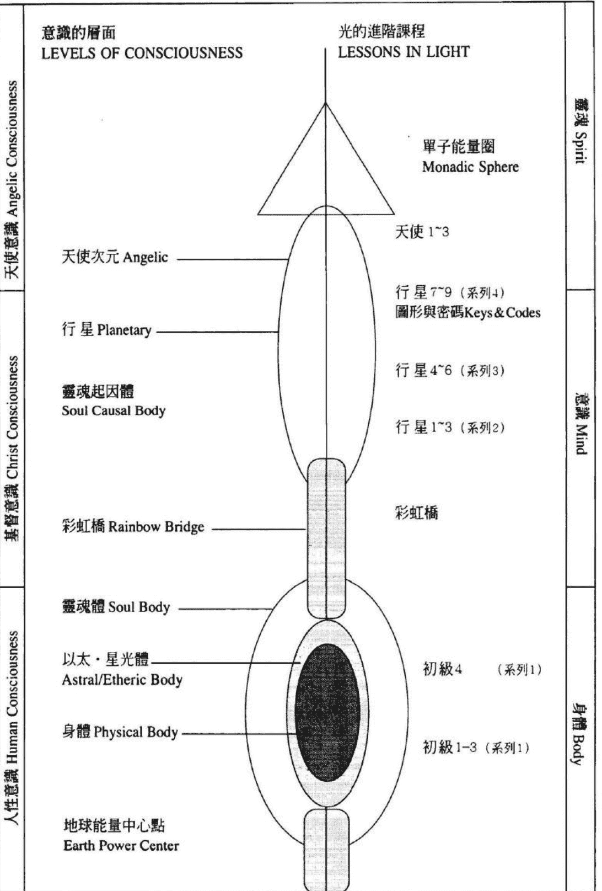
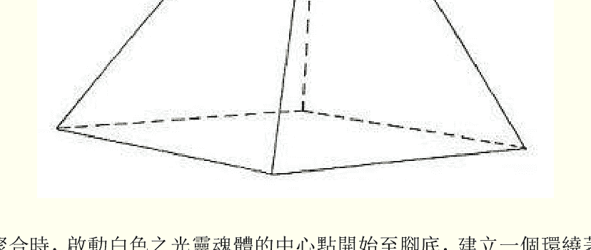
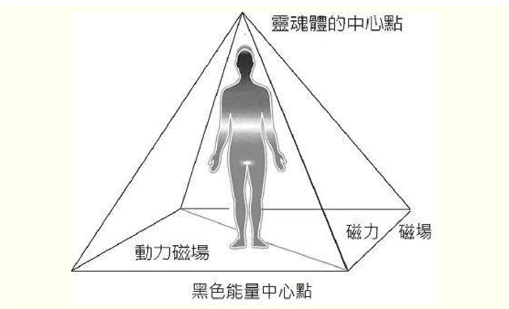

# 光的课程系列3

## 行星課程4-6

# 意識的層面 LEVELS OF CONSCIOUSNESS

# 光的進階課程 LESSONS IN LIGHT

天使意識 Angelic Consciousness

基督意識 Christ Consciousness

人性意識 Human Consciousness

靈魂 Spirit

意識 Mind

身體 Body

天使次元 Angelic

行星 Planetary

靈魂起因體 Soul Causal Body

彩虹橋 Rainbow Bridge

靈魂體 Soul Body

以太·星光體 Astral/Etheric Body

身體 Physical Body

地球能量中心點 Earth Power Center

單子能量圈 Monadic Sphere

天使 1~3

行星 7~9 (系列4)

圖形與密碼Keys & Codes

行星 4~6 (系列3)

行星 1~3 (系列2)

彩虹橋

初級4 (系列1)

初級1-3 (系列1)

# 內在意識次元圖

| 意識的層面 LEVELS OF CONSCIOUSNESS | 光的進階課程 LESSONS IN LIGHT |
| :--- | :--- |
| 天使意識 Angelic Consciousness | 天使次元 Angelic （基督意識頻率） 單子能量圈 Monadic Sphere （基督5） 天使 1~3 ...... 行星 9 拙火 行星 7~9 (系列4) 圖形與密碼 Keys & Codes 行星 4~6 (系列3) 行星 1~3 (系列2) |
| 基督意識 Christ Consciousness | 靈魂起因體 Soul Causal Body 彩虹橋 Rainbow Bridge （①與較高自我、天使自我、基督自我連接） 彩虹橋（靈魂點向上50米） （頭頂上方6寸） |
| 人性意識 Human Consciousness | 靈魂體 Soul Body 以太・星光體 Astral/Etheric Body 初級 4 （系列1） 身體 Physical Body 初級 1-3 （系列1） 地球能量中心點 Earth Power Center 地心（與地球能量、身體自我連接） （黑色之光中心點（腳底下方6寸） 向下50米） |

## 系列三

## 譯者序

略

杜恆芬

## 行星課程第四級次

### 簡介

### 治癒的金字塔與闡述聖經的啟示錄

### 簡介

行星四的目的是要使學生們熟知較高心識，並理解自己的內在心識能在意識的層面上隨時與較高心識融合，這將使學生們更加具備運用光的頻率作為治癒之源的能力。這級次所介紹的金字塔的能量，將增強你們磁力磁場的能量，並帶來更大的治癒效果。

在這級次中，除了介紹金字塔的運作之外，還闡述聖經的啟示錄。這級次將使你們對光的能量之運作有更進一步的理解。

> 下面是摘錄自 Dr. J.J. Hurtak 的以諾之書（The Keys of Enoch）。書中對此級次行星的意識層面有著清楚的描述。
> 
> 生物生理學與宇宙天體物理學的關鍵在於：「具生命之光的金字塔」存在於每一受造物的磁場架構中。
> 
> 「進展的每一層面都有光的金字塔，人類必須啟動它並將它導入更大的造化中。如果我們要超越三度空間，我們必須經由三度空間的能量磁場進入光的能量金字塔的多次元的磁場中。」
> 
> 「如果你們把白水晶放在離子顯微鏡下，你們將看到泡沫狀的光的金字塔，在水晶磁場中形成各種幾何形體。如果你們在電子顯微鏡下看血液，你們也將看到金字塔的結晶體。以諾之書告訴我們，從生物能磁場之間的關係，從最小的氫原子到最大星球的生命，都可以看出幾何形體的光的金字塔是所有生物與其意識進展的中心點。」
> 
> 「金字塔的架構顯示宇宙心智無所不在，不僅存在於每一個星狀離子的分子中，也存在於能量流的每一頻率中。無論你們從什麼角度看，你們都會發現意識之流恆常地在宇宙中流動著。」
> 
> 「在人類得以進入下一進展階段，即另一時間細胞意識（consciousness time cell）之前，其智慧必須先具備進入光的金字塔中運作的能力。屆時人類將瞭解自己是星際宇宙運作的參與者，星際宇宙是宇宙金字塔中的一部份，被這宇宙之外的眾宇宙所環繞。」
> 
> 「這些靈性的光之載體，將再次降臨並進入正義的團體中，這些團體散佈在世界各地具有靈性頻率的磁柵區。這些磁柵包含金字塔之光的模型架構，它們是接收光的載體，是啟動光之意識中心點的光的金字塔的頂石（capstone）。這是人類參與較高進展的轉化過程。」這就說明了「光的課程」，以金字塔的運作來持續這進展過程，是如此地重要。
> 
> 除了這些治癒的金字塔的運作之外，聖經啟示錄也將為這一級次光的金字塔之運作補充一些解說。提供這些資料是為了闡明金字塔運作所象徵的寓意與內含。它闡述人類內在心靈與肉體之間所面臨的掙扎。
> 
> 當你們在光的金字塔中運作時，要記住：
> 
> 思想控制個體存在，並為個體存在帶來其所需要之能量架構。

### 嘉勉之言

愛瑟瑞爾

問候你們！不要為你們自己的進展感到憂慮，因為，沒有任何事物可以阻止你們深入自己的智慧，或達到你們靈魂的目標與渴望。一切都是為了你們的個性自我，及不朽靈魂的成長而給予的。

你們被带入与自己存在中的指导灵及导师的交流与沟通中。在光中运作所获得的成长，已使你们逐渐走出负面事物，进入光明的觉知中。你们正走出深植在你们意识里来自群体大众之世俗思想及较低的操控意识。经由这些级次的循环，你们已开始走出这些层面，进入较高觉知的内在心识中。你们已能感受到来自灵魂频率的能量，进入你们较低体系时所产生的冲击。你们灵魂体中轴上的每一个脉轮，将一直受到激发与启动，直到它成为光辉灿烂的意识为止。许多你们所感受的事物，已成为你们自己及周围人的实相。不要询问或衡量谁会坐在上主的右侧，谁会坐在上主的左侧，不要质疑哪一个人已进展到可以成为领导人，因为一切事物都在一个整体中。

正确地说，进入较高意识层面，意指具备熟练掌握自我，克服放纵与自我毁灭之欲望，成为一个纯然的光之存在的能力。你们的灵魂具有引导别人走出负面状态的本质。你们经历欲望、动机、智能及直觉力的考验，并已从中走了一段漫长的旅程。当耶稣的心识达到即将入门层面时，也是以这种放大较高自我之力量的方式，来面对较低次元的挑战。你们还会面对不同程度的挑战，直到你们达到基督意识为止。

### 落實地面

把觉知落实在较低体系中，走在和平中。不要执著在过去的事物上。不要重新制造黑暗的事物，展望你们灵性的基督自我。看着你们未来的扩展，并要知道没有任何事物可以隐藏或剥夺真理。在和平中，知道正确的活动正在基督自我的神圣计划中全面展现。

### 光的金字塔的激发与启动

金字塔运作的目的，是为了协助你们在自己的存在中，建立一个具有各种光的频率与能量的治癒工具。这由四个三角形的面，及一个底面所组成的能量架构，将从灵魂体白色之光的中心点开始，经由所有的较低体系，进行强而有力的疗愈。静心冥想时的观想可参考图形 1。

#### 图形 1

当这些能量聚合时，启动白色之光灵魂体的中心点开始至脚底，建立一个环绕着自己的五面金字塔的能量架构。在这特定的级次中，你们所用的是三种光的频率——金色之光、银色之光，底面是那一星期所运作的光。

#### 图形 2

圖形 2 是假設你們由金字塔的上方往下看。它顯示四個三角形之面的能量是如何由靈魂體的中心點投射下來，如何組成右邊及前面的動力磁場；左邊及背面的磁力磁場；底面的能量磁場，以及黑色能量中心點。

在這級次中，銀色之光被用在右邊及前面的動力磁場上，金色之光被用在左邊及背面的磁力磁場上。底面是你們在那個星期所要運作的光。

當底面完成時，這光的金字塔便成為一個封閉的「光的載體」。讓底面的頻率往上升，使之充滿整個金字塔的空間。建立這光的金字塔並在其中運作的目的是為了使你們整個存在得以獲得轉化、平衡與治癒。

當金字塔的架構建立起來時，可以將它擴展成為一百五十呎的面積，向上升到行星中心的層面。當你們完成了將治癒與平衡帶入較低體系的運作時，可以呼喚需要治癒的人來到這金字塔中，觀想他們在靈魂層面上獲得完整與治癒。

在擴展光的金字塔之架構的同時，將它以逆時針的方向旋轉以轉化較低的、濁重的負面能量。這樣的運作可以使動力磁場平靜下來，增強磁力磁場的活力。然後以順時針的方向旋轉，使平衡與和諧落實在你們的較低體系中。如果要做一個歸類，可以這麼說：逆時針的方向旋轉是發揮轉化的功能，順時針的方向旋轉是目標取向，落實每個金字塔及各色光的頻率的目的與功效。

> 註: 金色之光與銀色之光可以互相對調。比如說，如果要增強動力可以將銀色之光換到左邊，金色之光換到右邊，這樣當你們以順時針的方向旋轉時，將啟動更多金色之光的動力，開啟動力磁場的能量。你們可以在自己的靜心冥想中做試驗，以便感受並熟悉這種頻率的轉換。

現在你們可能還是不明白這是什麼意思，以及如何運用它。讓我們舉例說明，當你們置身在一個人潮擁擠的地方，感到疲憊不堪，甚至頭痛。如何清理呢？

在這種情況下，可將銀色之光用在動力磁場上，銀色之光滋養的元素，可以減緩壓力與疲憊，並使神經系統鎮定下來。當你們停滯在交通擁擠的道路上、工作上與同事之間意見不同或與家人爭吵時，也可以用這能量。銀色之光在動力磁場上，可使許多緊張的情況緩和下來。

何時將金色之光用在金字塔的動力磁場上呢？

當你們需要增加動力的時候。譬如在應徵工作時，在演講時，在做決策時，或者需要創意時，將金色之光放在動力磁場上，你們會發現這能量架構帶給你們極大的動力。演藝人員將發現這動力的金字塔可以幫助你們發揮更高水準的演出。

你們可以把自己在什麼情況用什麼樣的能量架構記錄下來，看看這金字塔的能量架構所帶給你們的功效。

這些光的金字塔的力量有多大呢？

當金字塔的架構擴展至一百五十呎時，它的地面積大約是三萬零六百二十五平方呎。再加上長、寬、高三維，它有著一百五十呎的高度，四個三角形的面使每邊形成一百七十五呎的長度，對角線是二百五十呎。比起三角形的治癒能量，金字塔的能量是乘倍計算的，它是 (4X4X4X4X4=1024) 千倍以上的衝擊力量。

### 靜坐次第說明

1.  呼喚所有的自我來到前額，並祝福所有的自我。感受所有較低體系的元素都被帶到與較高自我的合一中。
2.  在初學的階段中，每一課的開始都是聚合所有的自我來到前額，並整合為一個心識。現在，你們已熟悉這些個體化的自我，可能感受到它們的存在、作用與目的。我們很容易陷入渙散與不平衡中。因此呼喚所有的自我，唱頌「OM」字，觀想「眼睛」或光，這將整合你們的意識。
3.  保持凝定。將覺知經由較低體系向上提升進入白色之光的中心點。
4.  天使聖團的委員們、指導靈們、教師們及所有光的存在，以你們的靈魂之光來識別你們。每當你們將覺知帶入這光的中心點時，你們便在提升與轉化中，並為你們的較低自我創造新的活動元素。
5.  啟動並擴展這白色之光，漩渦式地以逆時針的方向旋轉，清理你們的較低體系，再以順時針的方向旋轉，以封閉你們的磁場。
6.  從白色之光的中心開始啟動所有光的中心點。並經由中軸向上提升。
7.  擴展你們的能量磁場，直到它環繞著你們共修的成員，使之成為一個合一的團體頻率。
8.  將這合一的團體頻率向上提升經由銀色之光的中心點，啟動銀色聖杯，讓這聖杯舒適且滋養的能量注入你們的較低體系中，填滿你們存在中的空虛。
9.  光的工具已深植在你們的意識與內在體系中。你們已成為充滿著靈性與真理之光的載體，成為改變負面模式與方向的元素。
10. 行星層面的運作。繼續向上經由彩虹橋進入行星中心。進入智慧的聖殿，與上師們、指導靈及教師們融合。
11. 當你們進入行星意識層面時，你們便在這內在次元中與上師們的智慧與能量融合。聚合在這裏的靈魂是遍佈在地球上的光的行者。與光的委員們融合，從較高層面把所要運作的光的頻率帶下來。以片刻的時間來調整你們的頻率，使之與行星層面的頻率融合。
12. 要知道，這是治癒地球最有效的時刻。在這智慧的聖殿中，許多宇宙神聖計劃的運作者在此問候你們，並與你們在宇宙的神聖計劃中運作。感受你們的心識正來到這個聖殿中心，並感到輕鬆自在。
13. 進入環繞著地球行星的光的網絡，引導光進入地球磁場中。與你們的指導靈一起將光導向需要治癒能量的地方。
14. 當你們行星運作完成時，回到行星中心。進入內在較高心識的聖殿中。

進入靜默中........

要在意識的層面上理解你們個別的心識所放大的頻率是非常困難的。但是，此時只要在靜默中就能夠體會。對你們來說，進入你們內在心識的聖殿並與一切萬有連結是很重要的。這是實現你們自身的完整與目標的重要部份。每個人的途徑都是極為個人的。

光的课程系列三 行星课程 4-6

每个人所要实现的生命目标也是不同的。在不同的生命领域中，所有人都是教师也是学生。

2. 与你们的较高自我交流。祈求让你们接受个人成长所需的真知。保持在静默中，直到你们感到运作已完毕为止。
3. 当静默结束时，将觉知经由彩虹桥带回较低体系中。感受较高自我的频率经由彩虹桥进入你们的灵魂体中，感受所有的频率在灵魂体中放大着。
4. 在白色之光的中心点上，建立一个治愈的金字塔，将它环绕着你们整个存在。

### 金字塔的运作

15 在这时候启动光的三角形架构的能量，这是你们在前面的级次中便已熟悉的。再将它们组合成四个三角形斜面与一个底面的金字塔。
16 将这金字塔扩展成一百五十尺的高度，呼唤所有需要治愈与提升的人来到这金字塔中。
17 将需要治愈的人一个一个地带入你们的光的金字塔的架构中，感受他们的心灵意识及身体的完整与平衡。要知道每个人都必须具有诚信、希望与至善的心，才能清除较低自我体系中的战斗与矛盾的意识。

当你们的疗愈运作完成时，释放每一个人回到他们自己的进展中。将能量经由较低体系，经由双腿、双脚落实地面进入黑色能量中心点。

慢慢地将较高自我的心识落实在较低体系中。这黑色能量给人一种黑色液体般的感觉，然而，它不是邪恶的势能。它是一种使你们得以将自己频率经由所层面带入地球，使你们屹立在平衡中的能量。 感受它为你们的身心所带来的冲击。你们在光中所学习的，以及光的思想意识，正注入你们所有的层面。 当你们的觉知回到身体时，你们将有着自己克服了负面元素的全新的感受，一种安宁与和平。

这静坐次第将持续到行星九，那是与开启拙火有关的级次。经常复习，让这能量的运作纯熟到你们能习以为常，运用自如为止。

### 来自 TONI 的解说，参考用

- ◎转化—活动的，起作用的—动力的—以金色之光来提升频率。
- ◎实现目标—接受、接纳的—磁力的—以银色之光来使人的情绪平静下来、减缓痛苦并使能量平稳下来。
- ◎当金色之光在右面时，金色之光的金字塔本身便开始转化由思想与行为所为生的负面能量。
- ◎当银色之光在右面时，它舒缓紧张与动荡的能量。当金色之光在左面时，它提升由自我的敏感与磁场所接收的能量。

## 行星课程第四级次

### 第一课 白色之光

### 金字塔的运作

- 动力磁场: 白色之光
- 磁力磁场: 白色之光
- 底面磁场: 白色之光

### 转化磁场的金字塔

当金字塔的架构配合金色之光与银色之光应用时，它便依金色之光与银色之光所在的位置而产生不同的功效。

当动力磁场（右面与前面）为金色之光，磁力磁场（左面与背面）为银色之光，底面磁场为白色之光时，它便成为动力的或转化磁场的金字塔。它可以用來提升你们的所有层面，清除细胞、器官及组织里沉重的意识与频率。化解情绪上负面、不稳定、不成熟的感受，清除理性思想体上脑意识里的记忆。

### 实现目标的金字塔

当银色之光在动力磁场，金色之光在磁力磁场时，它便成为磁力的或实现目标的金字塔。它可以用來帮助你们的各个体系，做好接收较高能量与频率注入的准备，使一个人的欲望与目标具体显现。它提升各种频率，保护你们不受负面元素的干扰。它也藉由基督的圣爱来净化、平衡思考过程，并为各种情况带来治愈。

### 静心冥想与上师们的信息 #1

爱瑟瑞尔

问候你们！这是爱瑟瑞尔。我在这里说话，为的是协助你们思想意识进入更新的觉醒层面，以便更清楚地了解自己的真实自我。我们在此问候每一个人。是的，当意识加速进展时，改变便在进行中。
我们呼唤你们的灵魂意识来到这中心，并从中体验心识的扩展。不要以人的脑意识来理解“心识”这名词，而是要了解心识是一个监督者，是你们多次元存在的中心。心识本身具有对宇宙法则相关事物的理解与领悟。要知道，凭借着你们个人的心灵本质，你们的内在与外在经历，都在正确的思想以及正确的表达中。
所有的转化都是经由意识而产生的，意思是说：“心是营造者，是创造者”。“心”是使一切事物呈现于外在层面的因素。“心”不是意识自我，然而，它是意识自我的一个主要部分。
“心”的力量超越个性自我的思想能量所能及。然而，当你们的思想意识与积极、正面的行为整合时，它便在融合中成为思想能量的一部分。当你们融入正面的思想元素中时，你们便开始转化较低的思想意识。运用“心”的法则，感受并观想自己在至高形式的显现中。
在这堂课中，我们将谈及“创造法则”。这是意识自我很难以理解的部分，因为意识自我是依人类自我的法则在创造，并受到由人类群体经验所形成的意识所影响。“心”作为监督者与大我，是较高实相的创造者，寻求将宇宙法则带入物质层面。
创造的法则是：体验那微细的能量，如何逐步形成稠密的物质显像。我们感受到你们正探索着如何在物质世界中创造平衡。你们疑惑着：“我如何在生命的体验中创造正面的表达？”
在这内在次元中，感受自己所渴望表达的，并肯定目前的运作。在心识中观想创造的元素触及你们生命的每一层面。感受每一个与你们连接的人，都是基督意识的一种表达。看着宇宙法则与神圣计划呈现在地球层面上。
现在，观想那些障碍你们成长、进展与自由的毁灭性势能，都在这灿烂的白色之光的环绕中。感受自己与光的上师连接。看着所有人类意识都与自己的内在心识，及天使圣团连接，并引导能量将基督圣灵带入宇宙运作中。持续这观想，看着所有人類向这一事实觉醒，并在光中提升。进入静默中......
当你们准备好进入彩虹桥时，感受你们的觉知回到意识自我的层面。

## 光的课程系列三 行星课程 4-6

### 金字塔的运作

我们将介绍这灿烂的金字塔架构之能量磁场。从行星一的级次中，你们已熟悉三角形架构的频率意识。因此，启动这些架构，并将它们融入在四面体的金字塔中。
感受这四面体的金字塔完全在光辉灿烂的白色之光中，让自己的意识全然地在这灿烂的能量体系的环绕中。要知道，这频率所带来的冲击是超越人类意识所能理解的。没有人能全面了解这些能量架构的冲击力量。因此要保持诚信，让诚信成为你们流动的载体。你们将发现自己每一个体系正以独特的方式在体验，并回应这频率。
这金字塔的顶端，从行星意识或光的中心点开始，经由彩虹桥被带入灵魂光体的中心点，是“我是”层面之“眼睛”的外在显现。
要知道，在所有灵性输入的活动中，均以这“眼睛”在顶端的四面体金字塔的架构为载体。
“眼睛”代表你们的真知；“我是”代表你们自身不朽的意识。“心识”是所有层面及所有状况的监督者。
深入这体验，并感受你们所有体系完全在这白色的能量元素中。感受自己身体的每一器官都在这白色之光的环绕中。这白色之光综合所有意识，色彩与声音。是清理身体所有层面的净化者。要清理身体器官上的杂质与毒素，必须让自己完全沉浸在这白色之光的环绕中。
感受自己的所有体系都在这镭射般的能量中获得提升。当这美丽的能量环绕着身体的细胞与器官时，感受身体在凝定中。感受血液里的疾病在这频率中获得清理。
现在，感受心识与脑意识在这白色之光的环绕中。感受脑意识沉浸在这高频率之中，所有与恐惧、分裂与矛盾有关的思想感受均在光的元素中得到化解与释放。
感受自己的心灵意识已完全净化，将焦点放在至善中。如果你们的工作是属于心理上的或技术上的，你们将能在工作上有所突破。从事这些方面的人，将能感受到这些能量是提升所有体系的工具。
当你们在这特定的能量中心点时，再次融入这“C”调的声音与频率中。感受它的音符清晰地萦绕在你们的耳内。感受这声音正突破你们在物质层面上的所有黑暗元素。感受你们身体的负面元素已消失，固化的思想意识已化解。所有麻痹你们情绪感受或心智的情况也获得释放。
观想你们的意识在“C”的音调中获得全面提升，并释放人性意识层面上的执着。想着你们的身体，你们的体系及你们的能量，从一个八度音阶到另一个八度音阶中逐渐地提升，直到你们不再有身体的感受，或不再听到声音为止。当你们进入静默中，或进入超越人类耳朵所能听的境界时，便能体验这种全面提升并进入较高存在的层面。
不同的能量，在各体系中有着特定的启动与运作。就如课程前面所提到的，每个频率都有它特定的功效。很多病人是透过光、音声及这些能量的激发与启动而获得提升与治愈。一个病人，如果能长期处于这特定的频率中，第一步便是开始净化作用。病人的所有器官系统将得到净化，并排除身体上的毒素，进而使他身体内的所有细胞都得到净化。
在地球加速清理负面元素，及人类思想意识与活动的这一阶段中，这种净化尤其重要。你们将开始体验到与灵魂之间的沟通，并将开始有着如何将这觉知与视野实践在生活中的洞见。
信任你们个人的觉知。

> 注一：“眼睛”在四面体金字塔顶端的架构，是行星七图形与密码中第一个要启动的图形。
> 在这阶段只要知道内在存在中有这么一个密码即可。

### 给团体共修的建议

团体共修时，感受自己在这白色之光所形成的圆圈中。感受这圆圈扩展并环绕着所有光的行者。感受你们之间的能量在融合中，并清理你们的身体、情绪感受体以及灵魂体。感受所有的人都在光的金字塔中。当个人的内在运作完成时，慢慢地将自我带回前额并回到身体层面。

### 肯定语意

- 我与我内在存在的天父是一个整体。
- 我与内在一个基督是一个整体。
- 我与所有生命的表达是一个整体。
- 我与出自爱的能量的活动是一个整体。
- 进入和平中，这运作将在较高自我的意愿中完成。

### 上师们的信息与静心冥想#2

爱瑟瑞尔
问候你们！在这从稠密与黑暗到清明与光的旅程中，你们将进入另一个新的阶段。喜悦将因你们对这经验的接受而降临你们。
在你们道途的这一循环中，你们正接收来自其他体系的频率与智慧。由许多净光兄弟的上师们所组成的天使圣团，所传递给你们的思想意识，将协助你们对宇宙法则有更深的领悟。作为地球公民，你们受到召唤，前来接受这汰旧更新的角色。并释放你们对自己内在灵性的否定。
你们有许多恐惧，但你们只要让自己处在祥和与宁静中，因为时间自然会将你们灵魂的旅程，及较高自我的愿望显示在你们物质生命的经验中。
到目前为止，“光的课程”以简单的方式，提供你们一个“如何克服负面元素，并走向光”的方法。当你们体验到觉醒的自我正受到指引，迈向新的灵性与物质表达时，光的运作能量将更为增强。
你们无须放下工作或事业；反之，你们的工作将成为你们创造经验的延伸。当你们开始执行你们的任务，并将你们的意愿导向正确行为时，你们在宇宙中的角色将更为珍贵。
人类有诸多恐惧，在改变中的地球，为了释放许多模式而处于颤栗抖动中。你们从经济体系中看到旧势力是如何地消失，取而代之的是许多成长的机缘。
你们必须理解，虽然改变使你们陷入在恐惧、压抑、沮丧中；使你们感到颤栗，意志消沉。然而，光的运作将使你们与内在自我的频率融合。
我们欢迎你们进入“光的课程”这特定的级次。你们是具有勇气，蒙受祝福的，在光中的成长，将使你们的生命更为丰富。虽然你们曾经失去许多，然而，你们将获得你们灵魂真正所渴望的。你们所失去的，是一些不再是你們生命体验所需之事物。你们正在自己的心灵中种植一颗迈向较高真知之树。你们是美丽的，你们将继续焕发出更深沉的内在之美。
古埃及时代，“互古常在（Ancient of Days）”之入门者，会进入金字塔中增强他们与自身灵魂之间的连接，深入思索他们的灵魂在旅程中所要前进的方向。
古代的入门者必须进入埃及的金字塔，以放大自己与灵魂之间的关系，并深思自己灵魂旅程的方向。在古埃及时代，当入门候选人进入金字塔时，会举行一个隆重仪式，一个神圣庆典，并考验一个人是否具备了从较低、较稠密的物质频率，进入较高精神与灵性之频率的能力。
今日，入门是一种个人完善的过程，一个通往明心见性的灵魂旅程。
注：请参考《入门—古埃及女祭司的灵魂旅程》第37章（入门的测试）。
地球正处于巨大的骚动与混乱中。作为参与光的旅程的行者，把你们灵魂所认知的人带入这光中，以分享这爱的频率。进入静默………

在静默中这么想着：

如何理解自己的较高自我？

自己在宇宙中经历过什么样的生命旅程？

### 金字塔的运作

在这光的途径的入门中，你们正启动光的金字塔的能量架构，这些能量架构是一种帮助人们理解光的完美，以及生命能量的工具。当你们体验并放大这堂课所启动的金字塔架构的能量时，你们便更具内在的力量。
现在，亲爱的学生们，灿烂的白色之光正启动你们内在的灵魂意识。这放大的能量与频率正环绕着你们。当你们进入这巨大的金字塔的能量中时，感受自己在平衡中，并融入在自己道途中所有的可能性与至高目标中。
让自己在这正面意识与动力频率的环绕中。感受灿烂的白色之光的元素。放下所有的疑虑与痛苦。
这光的金字塔的能量将与你们同在，任何时侯你们都可以启动这能量。
静默.........。
当你们回到觉知中时，感受所有的自我都落实到地球层面。

在这次，我们将诠释圣经中的启示录。你们可能要拿一本圣经在手上，以了解它的诠释，并将它运用在你们的灵性进展上。

#### 启示录

#### 诗篇的象征性之诠释

#### 第一章

1：1：耶稣基督的启示，就是神赐给他，叫他将必要快发生的事指示他的众奴仆；他就藉着他的使者传达，用表号指示的奴仆约翰。

1：2：约翰便将神的话，和耶稣基督的见证，凡自己所看见的，都见证出来。

1：3：念这预言的话，和那些听见又遵守其中所记载的，都是有福的，因为时候近了。

解说：

- * 耶稣基督的启示录是每一个要进入基督意识，或达到所谓启悟阶段的人所必须经历的过程。当神来到约翰面前，且当约翰进入这意识状态时，便将神所说的话记录下来。阅读、理解并将这些言语融会贯通的人有福了，这表示他个人的启迪即将来临。

1：4：约翰写信给在亚细亚的七个教会；愿恩典与平安，从那今是昔是以后永是的，从祂宝座前的七灵，

解说：

- * 七个教会：象征七个与腺体对应的灵性中心点，并以小亚细亚的七个教会为名。“七灵”(seven spirits)即是对应引导这七个能量中心点的灵性智慧。(＊)
* 约翰在自己的静心冥想中受到启示，这是他自身经验的证词。七个在小亚细亚的教会曾遭受严重的迫害，极其需要提升。他们需要寻获一条可以重生与治愈之路，而这条路就在他们自己的身体之内。

＊注：启示录以七个小亚细亚的教会来隐喻人体内分泌系统的七个腺体。而这七个腺体因思想与情绪的扭曲，因生活与行为的颠倒而受到伤害，极其需清理、净化、疗愈与重生。

1：5：并从那忠信的见证人，从死里首先复活者，为地上君王元首的耶稣基督，归与你们。祂爱我们，用自己的血，把我们从我们的罪中释放了；

1：6：又使我们成为国度，作祂神与父的祭司；愿荣耀权能归与祂，直到永永远远。阿们。

> 1：7: 看哪，祂驾云降临，众目要看见祂，连刺祂的人也要看见祂；地上的众支派都要因祂捶胸哀哭。是的，阿门。

- 约翰所提到的宝座，指的是触及宇宙意识的那个点。耶稣基督，是忠诚的见证者，第一个从死里复活，是众神之王，也是所有人类灵魂的领导者。耶稣是第一个完成整体人类经验的体验，并返回他在天父身旁应有的位置的人。
- 启示录这本书是按照“耶稣与基督合而为一，是第一个成为基督的人”，来诠释本书真实作者内在的基督意识。耶稣是第一个展现如何完成人类进展模式的人。因此，当基督以一种意识降临人类内在心灵时，每个人都会体验到祂的存在。每人都会见到天父的力量与荣耀，即便是那些将祂钉上十字架的人。

> 1：8: 上主说，我是阿尔法，我是欧米加，是今是昔是以后永是的全能者。

> 1：9: 我约翰，就是你们的弟兄，和你们在耶稣的患难、国度、忍耐里一同有分的，为神的话和耶稣的见证，曾在那名叫拔摩的海岛上。

解说：·阿尔法与欧米加（ALPHA AND OMEGA）象征无始无终的大我，即约翰的超意识。·这“大我”指的是完全进展的状况，在约翰那个时代，进展只完成了其中的一部分。“大我”本身即具使人类在物质显像世界的体验中，能达到完美成果的力量。约翰以他被放逐在拔摩岛（Isle of Patmos）时，作为一个逃亡者在生活上所面对巨大艰难的困境，来做解释。

> 1：10：当主日在我灵里，听见在我后面有大声音如吹号说，

- 当约翰说他在灵里，指的是他在静心冥想中。
- 约翰解释，当他在静心冥想时，每件事都发生在他的身心之中。启示录中所有的叙述都影射在他的身体与意识上所呈现的现象。

> 1：11：你所看见的，当写在书上，寄给以弗所、士每拿、别迦摩、推雅推喇、撒狄、非拉铁非、老底嘉七个教会。

- 大我，即阿尔法与欧米加，指示约翰与七个教会或七个中心点沟通。它们是：
    1. 以弗所教会（EPHESUS）: 象征性腺或生殖腺（男性的睾丸或女性的卵巢）。
    2. 士每拿教会（SMYRNA）: 象征胰腺
    3. 别迦摩教会（PERGAMOS）: 象征肾上腺。
    4. 推雅推喇教会（THYATIRA）: 象征胸腺
    5. 撒狄教会（SARDIS）: 象征甲状腺
    6. 非拉铁教会（PHILADELPHIA）: 象征松果腺
    7. 老底嘉教会（LAODICEA）: 象征脑下腺
- 大我—那被赋予宇宙意识的超意识，那肉体死亡的管理者，将是约翰的老师。

> 1：12：我转过身来，要看是谁发声与我说话；既转过来，就看见七个金灯台；

- 这里所提的七个金灯台，指的是七个灵性中心点，再加上引导每个中心点的智慧。
- 经由金灯台的形象，约翰领悟到在每个中心点之内的是一個心识细胞。烛光象征着每个中心点因灵性智慧的注入而发挥的功能。这些中心点都在大我的管辖中。

> 1：13：灯台中间，有一位好像人子，身穿长袍，直垂到脚、胸间束着金带。

> 1：14：祂的头与发皆白，如白羊毛、如雪、眼目如同火焰。

> 1：15：脚好像在炉中锻炼过明亮的铜，声音如同众水的声音。

1：16：祂右手中拿着七星，从祂口中出来一把两刃的利剑，面貌如同烈日中天发光。

解说：

下面的描述象征约翰所见到的：

- 人子：即基督；
- 金带：即美德；
- 白发：象征智慧；
- 眼目如火焰：洞察力
- 精炼的铜：象征理解；
- 七星：象征掌控身体的七个中心点；
- 两刃的利剑：从这些中心点升起的能量，依据个人的意志，可以是建设性的，也可以是破坏性的。

1：17：我一看见，就仆倒在祂脚前，像死了一样。祂用右手按着我说，不要惧怕；我是首先的，我是末后的（I AM the ALPHA AND OMEGA），

1：18：又是那活着的；我曾死过，看哪，现在又活了，直活到永永远远，并且拿着死亡和阴间的钥匙。

1：19：所以你要把所看见的事，和现在的事，以及这些事以后将要发生的事，都写出来。

1：20：论到你所看见在我右手上的七星，和七个金灯台的奥秘，那七星就是七个教会的使者，七灯台就是七个教会。

解说：

> 大我在这些诗句中解释道：祂掌管并持有生死之钥匙。

#### 启示录

#### 诗篇的象征性之诠释

#### 第二章

2：1：你要写信给在以弗所的教会使者，说，那右手中握着七星，在七个灯台中间行走的，这样说，

2：2：我知道你的行为，劳碌、忍耐，也知道你不能容忍恶人；你也曾试验那自称是使徒却不是使徒的，看出他们是假的；

2：3：你也有忍耐，曾为我的名忍受一切，并不乏倦。

解说：

- 以弗所教会的使者：调整性腺的心识细胞。
- 那握着七星的：大我。
- 以弗所教会的使者说：那握着七星的大我指出人类需要清理净化性腺的心识细胞。大我知道智慧已致力于管制并护守它免于破坏性的活动。但是，这中心点已失去它原本的目的。心识细胞正催促它快速地回到原本的目的，否则它便会完全失去它的智慧，退化到动物性的作用。大我知道这中心点的某些部份正致力于将它带入完美。

2：4：然而有一件事我要责备你，就是你离弃了起初的爱。

2：5：所以要回想你是从那里坠落的，并要悔改，行起初所行的。不然，我就要临到你那里；你若不悔改，我就把你的灯台从原处挪去。

解说：

> 起初的爱（The FIRST LOVE）：属灵的理念。

# 光的課程系列三 行星課程 4-6

大我指示心識細胞的智慧回到這中心點，以恢復這中心點的靈性目標，不然祂會把智慧從中撤除。

2: 6: 你恨惡尼哥拉黨的行為，這也是我所恨惡的。

解說：

- 尼哥拉黨的行為：象徵這中心點的細胞因誤用性腺的功能，以及與性腺有關的愚蠢行為而衰敗、退化。

2: 7: 那靈向眾召會所說的話，凡有耳的，就應當聽，得勝的，我必將神樂園中生命樹的果子賜給他吃。

解說：

- 生命樹：具有提供資源、治癒與成長的作用；
- 神之樂園：指的是人類進入物質層面之前的初始意識，也是人類必須回歸的意識狀態。
- 大我對《創世紀》中的生命樹做了提示。祂告訴約翰，任何人只要恢復這中心點的掌控能力，就能在「治癒與供給法則」下，帶來身心上的全面復甦。

2: 8: 你要寫信給在士每拿教會的使者，說，那首先的，末後的，死過又活的，這樣說，

2: 9: 我知道你的患難和貧窮，其實你是富足的，也知道那自稱是猶太人，卻不是猶太人，乃是撒旦會堂的人，所說誹謗的話。

解說：

- 士每拿教會的使者：調整胰腺的心識細胞與智慧。
- 猶太人：為特定發展所選出的細胞。
- 撒旦的會眾：冥頑不靈的衰敗細胞。
- 大我教導約翰說，經過一段時間的淨化之後，一旦消除了那些會限制腺體活動的怠惰細胞之後，所發揮出來的創造力是無限的。

2: 10: 你將要受的苦你不用怕，看哪，魔鬼將要把你們中間幾個人下在監裡，叫你們受試煉；你們必受患難十日。你務要至死忠信，我就賜給你生命的冠冕。

解說：

- 苦難的十天：代表淨化期。
- 生命的冠冕：代表完美的掌握狀態。
- 不要因這個中心點的淨化所產生的躁動而感到害怕，在嚴守誡律中保持信心，將能調整並恢復負責這能量中心點的靈性智慧。

2: 11: 那靈向眾召會所說的話，凡有耳的，就應當聽。得勝的，絕不會受第二次死的害。

解說：

- 那靈（The SPIRIT）：指的是大我。
- 不受第二次死的害：不再衰退，並獲得更新與療癒。

2: 12: 你要寫信給在別迦摩教會的使者，說，那有兩刃利劍的，這樣說，

解說：

- 別迦摩教會的使者：象徵掌管腎上腺的心識細胞。
- 有兩刃利劍的：象徵大我。因為大我掌理腎上腺這能量中心的智慧。

2: 13: 我知道你的居所，就是有撒旦座位之處。你持守著我的名，甚至當我忠信的見證人安提帕在你們中間，撒旦所住之處被殺的那些日子，你也沒有否認對我的信仰。

勒，將絆腳石放在以色列子孫面前，叫他們吃祭偶像之物，並且行淫亂。

2: 15: 你那裏也有人照樣持守尼哥拉黨的教訓。

2: 16: 所以你要悔改；不然，我就快臨到你那裏，用我口中的劍攻擊他們。

解說：

- 巴蘭：象徵原本被選作特殊發展的細胞，但因誤用和不智的衝動而導致敗壞。
- 尼哥拉黨人：衰敗的細胞。
- 兩刃利劍：象徵從這些中心點所升起的力量，根據旨意，可以祝福人類，也可以降禍世間。
- 大我解釋祂對衰敗的細胞感到嫌惡，同時承諾對那些抗拒接受紀律的細胞必定加以管束並淨化。

2: 17: 那靈向眾教會所說的話，凡有耳的，就應當聽。得勝的，我必將那隱藏的瑪納賜給他，並賜他一塊白石，上面寫著新名，除了那領受的以外，沒有人認識。

解說：

- 隱藏的瑪納（HIDDEN MANNA）：腎上腺因靈能的力量，將創造活力的分泌物釋放到血液中。
- 白石：新的意識層面。
- 石上寫著新名：對整體責任有一個全新的認知。
- 大我解釋道，在這些中心點恢復了自我控制的功能之後，個人便能在意志主導下，就像耶穌曾做過的一樣，將腎上腺的賀爾蒙直接分泌到血液中，使自己更新再生。內分泌體系受到來自靈性的衝擊，使個人的意識進入較高層面，他們將認知經由自己的意志力量，可以與較高勢能連接與互動。

2: 18: 你要寫信給在推雅推喇教會的使者，說，那眼目如火焰，腳像明亮之銅的神之子，這樣說，

2: 19: 我知道你的行為、愛、信、服事、忍耐，也知道你末後所行的，比起初的更多。

解說：

- 推雅推喇教會的使者：調整胸腺的心識細胞或智慧。
- 火焰般的眼睛與明亮之銅：象徵覺知、理解與領悟。
- 在此，大我對胸腺中心的心識細胞的智慧說話。

2: 20: 然而有一件事我要責備你，就是你容讓那自稱是女申言者的婦人耶洗別教導我的奴僕，引誘他們行淫亂，並吃祭偶像之物。

2: 21: 我曾給她時間，讓她悔改，她卻不肯悔改她的淫行。

2: 22: 看哪，我要叫她臥病在床，那些與她行淫的人，若不為她所行的悔改，我也要叫他們受大患難。

2: 23: 我又要用死亡擊殺她的兒女，叫眾教會都知道，我是那察看人肺腑心腸的；我且要照你們的行為報應你們個人。

解說：

- 耶洗別：象徵對創造勢能的誤導。
- 肺腑心腸：意指控制與動機。
- 大我催促這能量中心點，儘快導正由於私欲而誤用神聖勢能而產生的錯誤。大我一直給予這中心點時間來導正，然而，如果錯誤持續下去，只會導致退化與衰敗。這將致使其他中心點不平衡。大我掌控並持續檢查每一個中心點的控制力與動機。

2: 24: 至於你們推雅推喇其餘的人，就是一切不持有那教訓，不明白他們所謂撒旦深奧之事的人，我告訴你們，我不將別的重擔放在你們身上。

2: 25: 但你們已經有的，總要持守，直等到我來。

解說：

- 撒旦：象徵冥頑不靈的衰敗心識。沒有誤用勢能的心識細胞與其他細胞，將不會再承受更多的負荷。大我告知這些細胞要維持他們完美模式的理想狀態。

2: 26: 得勝的，又守住我的工作到底的，我要賜給他權柄制伏列國；
2: 27: 他必有鐵杖轄管他們，將他們如同窯戶裏的瓦器打得粉碎，像我從我父領受的權柄一樣；
2: 28: 我又要把晨星賜給他。
2: 29: 那靈向眾教會所說的話，凡有耳的，就應當聽。

解說：

- 制伏列國：象徵完善地控制身體上所有部位及功能的運作。意指在真理中維持內在完美模式的人，將被賦予完整地掌控身體所有功能的力量。
- 晨星：象徵明心見性的初始狀態。
- 當人恢復了掌控所有中心點的能力時，他會回到最初始的意識狀態，也將能完全成為掌握自己周圍環境的主人。如果你能理解這些話，便應聽取大我的聖靈向這些中心點所說的。

## 行星課程第四級次

### 第二課 金色之光

### 轉化之光

### 金字塔的運作

- 動力磁場：銀色之光
- 磁力磁場：金色之光
- 底面磁場：白色之光

### 轉化磁場的金字塔（動力金字塔）：

這金字塔可以用來清除不安全感，滋養你們的意識，使你們從分裂、匱乏、痛苦的感受中提升出來。它釋放意識裏卑微、愧疚、孤獨、性剝削、被忽略，以及與較高自我分裂的影像。它清除較低體系中的較低頻率，淨化並清理被動與冷漠。當動力磁場的能量被啟動時，它便開始釋放因負面思想、理念所累積在器官、組織與細胞裏的雜質。化解因憎恨、憤怒、復仇、排斥、挫敗、焦慮、疑惑等負面情緒所產生的反應。

### 實現目標的金字塔（磁力金字塔）：

這金字塔的能量能治癒一切事物，經由基督之愛將所有的情況帶入治癒中。將你們帶入與宇宙之母合一的感受中，使你們處在寧靜與沈著中。它提升消化與排泄系統之細胞的頻率，並平衡生殖系統。對於神經系統，它使腦神經細胞的正負離子保持在平衡中。它激發創意，將思想理念具體化，並明確地展現個體靈魂的欲望與目標。

### 靜心冥想與上師們的訊息#1

我們以宇宙天父的聖靈之名，問候淨光兄弟的入門者。感受自己的覺知正經由光的彩虹橋進入較高自我的中心點。當你們體驗到這光時，它便成為你們的實相。你們不需要拘泥在靜坐次第的程式上而躊躇不前。你們的意識正無限地擴展著，不要為結構或形式所束縛。感受那無言的溝通，從較高意識層面將光傳遞出去。在物質次元中，你們無法逃脫對立的現象，因此，這層面的表達力量來自你們進入靜默及體驗較高意識層面之頻率的能力。要去除舊有模式，你們必須正視一再出現於你們面前的狀態，並祈求讓你們理解它的意義。在內在洞見顯示的過程中，你們將認知那製造你們個人經驗的模式。要避免重蹈覆轍，你們需理解它，經由反應與實證讓自我看到什麼是永存不朽。所有的生命都是一種慾望與因果戲劇化的展現。我們放大宇宙天父之光，並與這光共同運作。感受你們正打開通往較高自我之門，看著你們意識自我的改變，感受它在光的環繞中。面對自身的矛盾，並將它放在這光的能量中。靜默...........。

靜默結束時，感受自己在一間四面皆是鏡子的房間。看著這些鏡子，觀想每個人都在燦爛的金色之光的環繞中。如果過去的事物浮現出來，認知它們是你們存在中的一部份，並詢問它們是否已實現並完成了當下的體驗，告訴它們，現在你們已不需要這些經驗了。有些影像可能是非常古老的經驗，只要將它們釋放到光中。

感受自己將能量釋放到光的網絡中；與眾多探索提升地球體系的心靈意識及靈魂頻率連接。將對抗的勢能帶到光中，並觀想人類的戰鬥意識已轉化成和平的元素。

### 金字塔的運作

現在，觀想自己在燦爛的銀色之光的中心點。看著它移到你們的左面與背面，形成銀色的磁力磁場。進入燦爛的金色之光，看著它在你們的右面與前面，形成金色的動力磁場，再將它們形成一個四面體的金字塔架構。以燦爛的白色之光為金字塔的底層。將這些頻率擴展成為一百五十呎的能量磁場。體驗這金字塔的頻率，感受自己在平衡與和諧中整合。感受自己釋放了抗拒、痛苦、憤怒與否定。呼喚所有在疾病中、在苦難中，或無法與他們自身的頻率整合的人來到這能量場中，觀想他們已被提升。把焦點放在所有人身上，感受他們正輕鬆地體驗著他們的較高意識。停留在這光的金字塔的架構中，直到你們感到自己已從負面頻率中釋放出來為止。慢慢地回到身體的意識中。

### 落實地面

你們將感到自己的身體是輕鬆的，思想是清晰的。

當你們醒來時，把你們的思想與意識帶回你們的身體中。

學習啟示錄將幫助你們對聖約翰的經驗有更多的理解。然而，你們必須體驗你們自身的啟示，例如「什麼是與你們個人經驗有關的啟示」。審判日指的是靈魂轉化成為一種新的形式，並審視自身活動模式的重要時刻。經由光的途徑，你們將逐漸看到自己目前的需求，以及自我意識在加速進展中所面對的挑戰。

#### 啟示錄

#### 詩篇的象徵與詮釋

#### 第三章

3:1: 你要寫信給在撒狄教會的使者，說，那有神的七靈和七星的，這樣說，我知道你的行為，按名你是活的，其實是死的。

3:2: 你要儆醒，堅固那剩下將要衰微的；因我沒有見到你的行為，在我神面前有一樣是完成的。

3:3: 所以要回想你怎樣領受，怎樣聽見的，又要遵守，並要悔改。若不儆醒，我必臨到你那裏如同賊一樣。我幾時臨到，你也絕不能知道。

3:4: 然而在撒狄，你還有幾名是未曾玷污自己衣服的，他們要穿白衣與我同行，因為他們是配得過的。

解說:

- 撒狄教會的使者：調整甲狀腺的心識細胞或智慧。
- 神的七靈和七星：象徵大我或超意識心識。
- 死的：未覺察或無意識的狀態。
- 甲狀腺的功能是保持人類意志的完整，因此大我對甲狀腺的心識細胞說，這中心點真正的功能已喪失，並警告不能讓這種情況再衰敗惡化下去。因為當大我考驗它時，便會暴露它的不完整。那些保持內在完美模式的細胞，則將繼續維持在完美中。

3:5: 得勝的，必這樣穿白衣；我也絕對不從生命冊上塗抹他的名，並且要在我父面前，和我父的眾使者面前，承認他的名。

3:6: 那靈向眾教會所說的話，凡有耳的，就應當聽。

解說:

- 白衣：象徵純潔。在這個階段能克服外在誘惑的人，會擁有所有創造的勢能。

3:7: 你要寫信給非拉鐵非教會的使者，說，那聖潔的、真實的，拿著大衛的鑰匙，開了就沒有人能關，關了就沒有人能開的，這樣說，

解說:

- 非拉鐵非教會的使者：掌理松果腺的心智細胞或智慧。
- 大衛的鑰匙：象徵大我。
- 大我正在對松果腺的心識細胞陳述與記憶及記錄有關的部位。

3:8: 我知道你的行為；看哪，我在你面前給你一個敞開的門，是無人能關的；因為你稍微有一點能力，也曾遵守我的話，沒有否認我的名。

3:9: 看哪，那撒但會堂的，自稱是猶太人，其實不是猶太人，乃是說謊的；看哪，我要使他們來在你腳前下拜，並使他們知道，我已經愛你了。

解說:

- 敞開的門：代表機會。
- 名：象徵真實本性。
- 撒旦會堂：衰敗無法更新的細胞。
- 猶太人：被選擇做特定進展的細胞。
- 在此，大我提示：松果腺本身已是純淨的，它的功能在於記載與個人有關的記錄，並且將這些記錄與靈魂完美形式所應有的狀態作一個對照，在此對照之下，所有不完美、錯誤的起心動念都會被突顯出來。因為松果體在大我的監視保護之下，所以改正錯誤與重新整合是必然產生效果的。

3:10: 你既遵守我忍耐的話，我也必保守你免去那將要臨到普天下，試驗一切住在地上之人之試煉的時候。

3:11: 我必快來，你要持守你所有的，免得有人奪去你的冠冕。

3:12: 得勝的，我要叫他在我神殿中作柱子，他也絕不再從那裏出去；我又要將我神的名，和我神城的名，（這城就是由天上從我神那裏降下來的新耶路撒冷）並我的新名，都寫在他上面。

3:13: 那靈向眾教會所說的話，凡有耳的，就應當聽。

解說：
- 你既遵守我忍耐的話：意指謹守紀律，忠於最初的目標。
- 地：象徵身體。
- 神殿中作柱子：進展的靈魂。
- 新耶路撒冷：新的意識狀態。
- 大我指示：因為這個中心點很精密，所以它不因其他中心點受誘惑所導致的不穩定而受到影響，而是將每一件事都自動記錄下來。松果腺會以這麼正確的方式持續運作，當它受到考驗時，便不會失去控制或失效。
- 一個能克服誘惑、越過這個層面的人，將會擁有他完整的靈魂記錄，包括所有他在地球上的經歷，並擁有更新的意識，這將使他不再需要轉世，完全處在神的意識中。

3:14: 你要寫信給老底嘉教會的使者，說，那阿門，那忠信真實的見證人，那神創造之物的元始，這樣說，

解說：
- 老底嘉教會的天使：掌理腦垂體的心識細胞或智慧。
- 阿門：大我稱呼腦垂體中心點的心識細胞為主要腺體。

3:15: 我知道你的行為，你也不冷也不熱；我巴不得你或冷或熱。

3:16: 你既如溫水，也不熱也不冷，我就要從我口中把你吐出去。

3:17: 因為你說，我是富足，已經發了財，一樣都不缺；卻不知道你是那困苦、可憐、貧窮、瞎眼、赤身的。

3:18: 我勸你向我買火煉的金子，叫你富足；又買白衣穿上，叫你赤身的羞恥不露出來；又買眼藥擦你的眼睛，使你能看見。

解說：
- 火煉的金子：從日常生活中歷練而來的價值觀及道德標準。
- 白衣：純潔貞潔
- 赤身：暴露過錯
- 眼藥：追求真理
- 腦垂體的心識細胞陷入在物質欲望的困境，且滿足於這種局限。大我指示道：祂將不容許任何負面情況。大我告訴這個中心點，要接受生命中的重要體驗所產生的智慧來豐富自己，並保持自己的純潔，不要沾染污點或有所缺失。這是經由覺察及領悟而獲知的。

3:19: 凡我所愛的，我就責備管教；所以你要發熱心，也要悔改。

3:20: 看哪，我站在門外叩門；若有聽見我聲音就開門的，我要進到他那裏，我與他，他與我要一同坐席。

3:21: 得勝的，我要賜他在我寶座上與我同坐，就如我得了勝，在我父的寶座上與他同坐一樣。

3:22: 那靈向眾教會所說的話，凡有耳的，就應當聽。

解說：
- 所有中心點的細胞都被告知要回他們的初始目的。大我守護任何願意接受祂的忠告的，但是每個個體必須打開那扇門。當一個人確實把門打開了，才有可能讓個性自我與大我合而為一。耶穌比喻這是綿羊與獅子的緊密結合，如同「婚宴」。就好比他自己

#### 啟示錄

#### 詩篇的象徵與詮釋

#### 第四章

一、第一段，綜觀要來的事，從基督升天到將來的永遠
1. 天上寶座周圍的景象—惟有獅子羔羊（得勝並救贖的基督）配揭開神經綸的奧秘。

4:1: 這些事以後，我觀看，看哪，天上有門開了，我初次所聽見那如吹號的聲音，對我說，你上到這裏來，我要將這些事以後必發生的事指示你。

4:2: 我立刻就在靈裏；看哪，有一個寶座安置在天上，又有一位坐在寶座上。

解說：

- 天上有門開了：表示向最初始的聲音或大我覺醒。
- 約翰告訴我們，心識的覺醒已經發生了，大我說當他掌控整個身心時，將會受到指引。

4:3: 看那坐著的，顯示來的樣子好像碧玉和紅寶石，又有虹圍著寶座，顯示來的樣子好像綠寶石。

解說：

- 碧玉和紅寶石：具有大我的所有屬性，象徵治癒、供給與智慧。
- 虹：彩虹是所有色彩的綜合，包含所有特質的總和，每一個色彩或礦石是神性自我的一個特質。

4:4: 寶座的周圍，又有二十四個寶座。其上坐著二十四位長老，身穿白衣，頭上戴著金冠。

解說：

- 二十四位長老：頭蓋上的二十四條神經，掌管人的五種感知。
- 身穿白衣與金冠：象徵領袖的純淨與地位。它們象徵超意識的控制點，或是五種感知的次要控制點——頭蓋上的二十四條神經。

4:5: 有閃電、聲音、雷轟，從寶座中發出，又有七盞火燈在寶座前點著，這七燈就是神的七靈。

解說：

- 閃電、聲音、雷轟：象徵勢能正在運作著。
- 七盞火燈：七個內分泌體系的智能控制點。
- 七靈：內分泌系統的七個控制點。

4:6: 寶座前好像一個玻璃海，如同水晶。寶座中和寶座周圍有四個活物，前後滿了眼睛。

解說：

- 玻璃海：寧靜的情緒。
- 四個活物：四個較低體系的欲望。
- 寧靜的情緒使大我得以引導與控制。
- 活物遍體長滿了眼睛，告訴我們四個較低體系是強而有力的，並對身體自我是完全覺察的。

4:7: 第一個活物像獅子，第二個活物像牛犢，第三個活物臉面像人，第四個活物像飛鷹。

解說：

- 獅子：對應胸腺，代表自我滿足的行為。
- 牛犢：對應腎上腺，代表自衛的本能。
- 人：對應胰腺，代表營養的維持。
- 飛鷹：對應性腺，代表物種的繁衍。

4:8: 四活物各個都有六個翅膀，周圍和裡面統滿了眼睛。他們晝夜不歇息的說：「聖哉，聖哉，聖哉！主神是昔是今在、以後永在的全能者！」
4:9: 每逢四活物將榮耀、尊貴、感謝，歸與那坐在寶座上、活到永永遠遠者的時候，
4:10: 那二十四位長老，就俯伏在坐寶座的面前，敬拜那活到永永遠遠的，又把他們的冠冕投在寶座前，說，
4:11: 「我們的主，我們的神，你是配得榮耀、尊貴、能力的！因為你創造了萬有，並且萬有是因你的旨意存在並被創造的。

解說：

- 大我顯示已完全掌握這些中心點，因為這些中心點已將身體的掌理權讓渡出來。

## 行星課程第四級次

### 第三課 藍色之光

### 智慧之光

### 金字塔的運作

- 動力磁場：銀色之光
- 磁力磁場：金色之光
- 底面磁場：藍色之光

### 轉化磁場的金字塔（動力金字塔）

這金字塔可以用來釋放較低體系對恐懼的反應，清除由過去的負面思想模式、習性、經驗所造成的恐懼與疑惑而產生的碎片殘渣。它清除負面的影像、感受與錯誤的思想理念。它轉化由恐懼、質疑、焦慮、挫敗、被排斥、復仇、失望、幻滅等感受所產生的影像。
當你們以這光的金字塔的能量來運作時，你們將感受到自己思想模式與信仰體系的提升。藍色智慧之光的火焰具有將較低思想念相燃燒殆盡的功能。真知是將光與愛付諸行動，並覺知基督是你們表達及存在的中心。

### 實現目標的金字塔（磁力金字塔）

這金字塔的能量將平衡神經系統內神經細胞的正離子與負離子。它使情緒體產生平衡與和諧，並打開感受體，以接收直覺與靈感的指引。在理性體的層面上，這金字塔的能量激發創造健康、豐足、愛與成功的思想。它像一個守護神，將你們帶到在入門途徑上指引你們的上師與教師們的頻率中。

### 靜心冥想與上師們的訊息

我們以聖父、聖子、聖靈之名問候你們。當耶穌說：「真理將使你們獲得自由」。自由指的是：明白若非經由你們的許可、經由你們的信念及你們所創造的，沒有任何事物能夠侷限你們。使你們獲得自由的真理是：明白你們內在的神性本質、神性意識，以及能把你們生命中的一切事物帶入祥和與寧靜中。

# 光的課程系列三 行星課程 4-6

我們希望這堂課所講的能使你們對真理有清晰的認知，並與之融合。要達到明心見性，達到純淨的宇宙意識，需要身體、情緒體、感受體、理性體等所有體系都與靈魂全面整合。每個人的意識裏，都具有某些與個人經驗無關的因數。

有些人因在理性思想體的層面上尚未達到對靈性法則的理解，導致許多心理上的矛盾與衝突，產生許多疑惑。

所有生命與形態都是一種能量模式。它們的物質或肉體元素可能呈現不同形狀、不同生物性與化學性的意識。但是，其根本元素皆是靈性或光的勢能，這是創造的基本元素。

在目前這階段中，很難以語言來闡述宇宙意識與靈性本質及宇宙意識在三度空間的生活，以及宇宙覺知與靈性意識和光之間的關係。

身體及所有生物元素是較低、較稠密的頻率。身體是物質體的機制。它的意識與勢能是複雜的。身體受著比靈魂光體更稠密的理性思想體與情緒感受體所影響。靈魂頻率促使身體與自身存在中的覺知及思想連接。如果缺乏真知，在許多情況下靈魂便可能受到否定或對自身的存在毫無覺知。個性自我可能在過於強硬，與過於掌控的情況下否定了自身的真實本質，而陷入因果的業網中。

對某些人來說，情緒體或感受體可能成為主要的支配力量。這些感受取代了原有的智性使一個人的活動完全受制於情緒與感覺。我們瞭解到情緒是製造那些阻礙理性思考的主要因素。有些人因感受體過於敏銳而陷入幻覺。對許多感受體較為敏銳的人而言，生命的學習課題可能較為困難。然而，敏銳度與感受體較強也可以是一種天賦，它使一個人依靈魂的慾望去學習，並在地球的生命中製造適當的學習課題。

一個影像可能來自虛妄的思想、活動與投射。然而，由於它是一種信念，它便成為持此信念者的實相，從而使思想的念相與投射成為妄念成真的意識。一個謊言，或一個真理都可以成為焦點。謊言可以因人們的置信不疑而成事實。出自投射與思想的事物可以成為存在於乙太中的一種意識的元素。因此，在這特定的層面上，有著許多需要清理的事物。

那些理性思想體系較強的人，將發現意識自我與頭腦的知性使自己在向外探索的過程中，把真知解剖成為碎片來研究。往往理性思想體較強的人會有許多抗拒，也不願接受自己靈性的整合過程。然而「光的課程」因結合能量與頻率的運作來重建內在心智的思想模式，將協助你們與宇宙意識融合。

你們的靈魂是由許多思想與能量，許多心識與元素複合而成的。然而，你們個體化的靈魂在較高層面上被認知為一個實體。你們的靈魂是一個已進展，且仍在進展中的存在。你們在這期間來到地球為的是更進一步地提升，並經由傳達與事奉為別人帶來覺醒的機緣。你們的生命是一個旅程，已體驗過許多不同的經歷，你們體驗過匱乏與侷限，也體驗過豐盛與富足。如果你們能深入內在自我的心識進入靈魂體系，打開阿卡沙記錄，你們將看到自己在不同時期的生活情況，它呈現出你們在不同國家的生命寫照。然而，在這時刻，你們只能看到目前的個性自我，因此，當下這一時刻是最重要的。

地球是許多星球中的一顆星球，是造物主所愛之星球，是進入較高表達的初始基礎。在其他星系中有許多生命形態，許多世界存在著，每個世界都含融著與宇宙法則整合的較高元素。地球層面，或地球體系是一個意識與進展形態較低的星球。然而，它處在為進入覺醒與全面提升作準備的階段。因此，你們正在接受這宇宙意識，以幫助地球加速覺醒。

### 金字塔的運作

現在，觀想自己在燦爛的銀色之光的中心點。看著它移到你們的左面與背面，形成銀色的磁力磁場。進入燦爛的金色之光，看著它在你們的右面與前面，形成金色的動力磁場，再將它們形成一個四面體的金字塔架構。

以燦爛的藍色之光為金字塔的底層。將這些頻率擴展成為一百五十呎的能量磁場。體驗這金字塔的頻率，感受自己在平衡與和諧中整合。感受自己釋放了恐懼、抗拒，與虛妄混淆的思想。將需要獲得治癒的人聚合在這能量場中，觀想他們已被療癒。

把焦點放在所有人身上，感受他們正輕鬆地體驗著他們的較高意識。停留在這光的金字塔的架構中，直到你們感到自己已從負面頻率中釋放出來為止，讓光成為你們的治癒之源，成為你們的力量與方向。

靜默......
將覺知經由雙腿落實地面，並進入黑色之光的能量中心點。

#### 啟示錄

#### 詩篇的象徵與詮釋

#### 第五章

5:1: 我看見坐寶座的右手中有書卷，裏外都寫著字，用七印封嚴了。

解說：
- 右手：隱喻體內靈性力量的控制點。
- 坐寶座的祂：大我
- 書卷：身體
- 書的裏外：分別象徵身體及無意識的部份。
- 七個封印：指在封閉狀態中的內分泌系統。
- 約翰解釋他在靜心冥想中的經驗。大我掌控人的身體，而書卷象徵身體。身體內的真知被封存在內分泌系統的幾個控制點中。

5:2: 我又看見一位大力的天使，大聲宣傳說，有誰配展開那書卷？

5:3: 在天上、地上、地底下，沒有能展開、能觀看那書卷的。

5:4: 因為找不到一位配展開、配觀看那書卷的，我就大哭。

解說：
- 有誰配展開那書卷的？約翰被告知沒有人配在這個時刻上打開身體中的封印，因為打開這些中心點所需的能力遠超過一般人。

5:5: 長老中有一位對我說，不要哭；看哪，猶大支派的獅子，大衛的根，他已得勝，能以展開那書卷，揭開他的七印。

解說：
- 猶大支派中的獅子，大衛的根：經由地球的物質經驗所呈現出來的完美基督意識。
- 約翰瞭解只有經由體驗基督意識的開展，他才有能力打開那保有真知的身體之中心點。

5:6: 我又看見寶座與四活物中間，並眾長老中間，有羔羊站立，像是剛被殺過的，有七角和七眼，就是神的七靈，奉差遣往普天下去的。

5:7: 這羔羊前來，坐在寶座的右手中拿了書卷。

解說：
- 羔羊指的是基督意識。這裡的基督意識存在於每個人之內。基督意識經由生命的體驗而呈現。

5:8: 當他拿書卷的時候，四活物和二十四位長老，都俯伏在羔羊前，各拿著豎琴，和盛滿了香的金爐，這香爐就是眾聖徒的禱告。

解說：
- 豎琴：象徵整合。
- 金爐：象徵感謝恩賜。
- 個人的開展只有在較低體系中的各中心點及感官意識，認知自己在大我的掌握中，一個人才能通過進展的考驗。

5:9: 他們唱新歌，說，你配拿書卷，配揭開祂的七印，因為你曾被殺，用自己的血從各支派、各方言、各民族、各邦國中，買了人來歸與神，

5:10: 又叫他們成為國民，作祭司，歸與我們的神；他們要在地上執掌王權。

解說：
- 新歌：新的瞭解與領悟
- 各族...各國：身體的每一細胞
- 王權與祭司：象徵掌管身體細胞的勢能，以及控制靈性細胞的中心點。

5:11: 我又看見，且聽見，寶座與活物並長老的周圍，有許多天使的聲音；他們的數目有千千萬萬，

5:12: 大聲說，曾被殺的羔羊，是配得能力、豐富、智慧、力量、尊貴、榮耀、頌讚的。

5:13: 我又聽見在天上、地上、地底下、滄海裏的一切受造之物，以及天地間的萬有都說，但願頌讚、尊貴、榮耀、權能，都歸與坐寶座的和羔羊，直到永永遠遠。

5:14: 四活物就說，阿門。眾長老也俯伏敬拜。

解說：
- 千千萬萬：指一個人身體中的細胞數目。約翰受到來自整個身體及其意識的指示，唯有在意識的治癒中，將個人自私或自我意志的意念去除時，超越腦意識的勢能才能發揮其功能。當一個人達到意識時，便能獲得含融財富、智慧、力量、尊敬與光榮的精神力量。

#### 啟示錄

#### 詩篇的象徵與詮釋

#### 第六章

### 2. 七印—神經繪的奧秘

#### a. 第一印：白馬與騎馬者—福音廣傳

6:1: 羔羊揭開七印中第一印的時候，我觀看，就聽見四活物中的一個，聲音如雷，說，你來。

6:2: 我就觀看，看哪，有一匹白馬，騎在馬上的拿著弓，並有冠冕賜給他，他便出去，勝了又要勝。

解說：
- 第一印：指的是性腺
- 白馬：象徵性腺的勢能。
- 約翰覺察到七個封印中的一個封印打開了。四個活物中的一個，屬於較低中心點的慾望，告訴約翰來看看慾望會如何改變。當這個勢能被釋放到身體中，一個人所有的慾望本質都會如預期地改變。

#### b. 第二印：紅馬與騎馬者—戰爭普及

6:3: 羔羊揭開第二印的時候，我聽見第二活物說，你來。

6:4: 我就觀看，看哪，另有一匹紅馬出去，騎在馬上的得了權柄，可以從地上奪去太平，使人彼此相杀，又有一把大刀赐给他。

解說：
- 第二印：对应肾上腺。
- 红马：象征肾上腺的势能。
- 第二封印被揭开时，即肾上腺也被打开。这时另一较低体系中的欲望也开始改变。红马代表这中心的势能与力量。这势能可以用于善行，也可以用于恶行，因为这是将身体带入行动的势能。当这个中心点被打开时，便能体验到改变。

#### c. 第三印：黑马与骑马者—饥荒加剧

6:5: 羔羊揭开第三印时候，我听见第三个活物说，你来，我就观看，看哪，有一匹黑马，骑在马上的手裹拿着天平。

6:6: 我听见在四活物中，仿佛有声音说，一个银币买一升麦子，一个银币买三升大麦，油和酒不可践踏。

解說：
- 第三印：胰腺。
- 黑马：胰腺的势能
- 骑在马上的人：控制腺体的智能。
- 这里警示每一种灵性天赋如果被误用，都要付出代价。

#### d. 第四印：灰马与骑马者—死亡肆虐

6:7: 羔羊揭开第四印的时候，我听见第四个活物的声音说，你来。

6:8: 我就观看，看哪，有一匹灰马，骑在马上的，名字叫作死，阴间也随着他。有权柄赐给他们管辖的四分之一，用刀剑、饥荒、瘟疫、地上的野兽去杀害人。

解說：
- 第四印与灰马：象征胸腺与从胸腺所散发的势能。
- 骑马者：象征控制的智能。
- 当这中心点的能量打开时，另一个较低体系中的欲望也将改变。由于只偏限在身体层面自我满足的结果，身体的细胞就会退化损害而显出意识的涣散及失去愧疚感。

#### e. 第五印：祭坛底下众魂的呼喊—殉道圣徒从乐园求伸冤的祷告

6:9: 羔羊揭开第五印的时候，我看见在祭坛底下，有为神的话，并为所持守的见证被杀之人的魂。

6:10: 他们大声喊着说，圣洁真实的主人，你不审判住在地上的人，给我们伸流血的冤，要等到几时？

6:11: 于是有白袍赐给他们各人，又有话对他们说，还要安息片刻，等着一同作仆人的，和他们的弟兄，就是那些将要也像他们一样被杀的，满足了数目。

解說：
- 第五印：甲状腺—意志的中心。
- 祭坛底下：审判的时刻。
- 被杀的灵魂：每个人内在的潜在力量。
- 当甲状腺的能量中心点开启时，意志中潜藏的能量也会解开，这意志的能量因曾误用而滞怠。这些潜藏的能量要等其他细胞都净化了才能更新运作，那时才能恢复原有的能量。

#### f. 第六印：天地震动，大灾难的起头—对地上居民的警告

6:12: 羔羊打开第六印的时候，我观看，大地震就发生了；日头变黑，像粗糙的黑毛布，满月变红像血；

6:13: 天上的星辰坠落于地，如同无花果树被大风摇动，落下未熟的果子一样。

解說：
- 第六印：松果腺。
- 大地震：身體的顫抖。
- 天上的星辰：觀點、理念。
- 此時，約翰進入超越智性的另一層面。生命勢能（拙火）只有在物質層面的理性思維消失，進入潛意識中才能啟動。

6:14: 天就挪移，好像書卷被捲起來；一切山嶺海島都被挪移離開本位。

6:15: 地上的君王、大臣、將軍、富戶、壯士、和一切為奴的、自主的，都藏身在洞穴，和山嶺的巖石中。

6:16: 他們向山嶺和巖石說，倒在我們身上吧！把我們藏起來，躲避坐寶座者的面目和羔羊的忿怒；

6:17: 因為他們忿怒的大日到了，誰能站得住？

解說：
- 山嶺海島：物質上的成就及物質欲望的滿足。
- 地上的君王：控制身體的智能。
- 約翰正去除某些腦意識裏舊有的思想理念。舊有的理念連帶物質上的欲望、成就與侷限的觀念都被清理移除。這些原先控制身體的智慧，因無法逃避大我的改變勢能以及更新的意願而退避了。

## 行星課程第四級次

### 第四課 綠寶石之光

### 創造之光

### 金字塔的運作

- 動力磁場：銀色之光
- 磁力磁場：金色之光
- 底面磁場：綠寶石之光

### 轉化磁場的金字塔（動力金字塔）

這金字塔的能量用來清除導致身體內的細胞、組織與器官功能無法正常運作的障礙。清除卑微、侷限以及無法溝通的影像。突破個性自我在人際關係中的溝通障礙。清除心識裏對自己的資源、天賦與創造本質的匱乏與侷限感。

### 實現目標的金字塔（磁力金字塔）

這金字塔的能量使人得以在平衡中，有效地、準確無誤地與較高自我以及共同創造者溝通，使個人的創造力、溝通能力得以表達，實現豐足的生命。它使細胞與器官組織之間的溝通更為順暢，它清理感受體並帶來平衡與和諧，同時以創造性的想法來顯化目標、渴望，及所有個人的需求。這能量釋放你們所壓抑的創造力，並幫助你們自由表達人性內在最深層的渴望。它將兩極帶入平衡之中。

你們的創造力不僅對你們個人是至關重要的，對你們周圍的環境也是極為重要的。關鍵是你們內在最深沈的自我表達出來，以便在地球上顯現這內在的渴望。侷限的阻礙只是一種虚妄意識的外在顯現。

### 靜心冥想與上師們的訊息 #1

依靜坐次第將所有的自我帶到前額，向上提升進入靈魂體之光中，啟動所有脈輪中心點。將靜心冥想的焦點放在綠寶石之光中。

經由中軸繼續向上提升進入銀色之光的中心點，體驗這頻率進入你們較低意識的所有層面。感受這光的頻率融入所有的體系中，舒解幻滅與痛苦。經由彩虹橋向上提升，進入較高自我的行星中心。

### 行星的運作

當你們在行星中心啟動綠寶石之光時，呼喚你們存在中的指導靈與教師們，他們是你們個人進展的守護者。以片刻的時刻觀看並感受你們靈魂的真正渴望，無論這種渴望是人際關係的探索、溝通，或是自己的創造力。在這堂課中，我們將討論「心識」的創造如何經由物質體的意識層面而呈現。

「心識」是宇宙大我創造意願的催生者。它想像、感受並與其它在進展上雷同的存在們互動。在這光的層面上，你們是一個整體頻率，沒有區別、沒有分裂，純然是光與能量的元素；這其中沒有障礙、沒有制約性、沒有抗拒或相對的勢能，只是精神與靈性的存在。

當意識自我與較高自我相比是如此渺小時，矛盾與混淆便產生了。然而，親愛的學生們，我們懇請你們在意識層面上，再次肯定自己是創造意識之思想與願望的接收者與感受者，肯定自己向創造的奇蹟打開並參與其中。

在這時刻，綠寶石之光燦爛的頻率正環繞著較高心識，與此「心識」交流並接收這光的頻率。不要與別人的進展做比較，每個人所獲得的是依各自的經驗、設定與意願而來的。你們的創造力是探索較高本質之活動的關鍵。

將這能量帶入光的網絡中。引導這能量進入地球理性思想的磁場中。看著這股能量之波遍及人類意識的思想模式中。

感受自己錯綜複雜、難以理解的生命模式都在光的環繞中。感受人類的群體思想意識都接受這治癒的力量。要知道，未來資訊科技的發展將超越你們現在所能想像的；腦波活動的科技研究，將加速發展人類溝通思想與理念的能力。然而，人類的心靈必須能理解並實現「愛」的頻率，否則一切終將徒勞無益。

將焦點再次放在較高自我上。讓這股能量注入較低體系中。當覺知回到較低體系的各中心點時，感受自己是充實、平衡、堅強有力的。在自己的周圍建立一個金字塔之光的載體。啟動燦爛的金色之光、銀色之光、綠寶石之光的能量。感受這環繞在你們周圍的勢能磁場。看著自己在這光的金字塔中提升細胞組織及身體的所有體系。

### 金字塔的運作

當你們專注在燦爛的光的金字塔中，呼喚所有走在你們生命中的人。感受他們獲得提升，並體驗到自身的完整。肯定任何需要治癒的地方都獲得治癒。

現在，呼喚所有在光的意識中運作的人，看著他們在完整與完美中，在他們自己的指引與意向中運作著。當你們的焦點再次放在身體上，並將覺知帶到前額時，你們將發現自己對生命有著新的覺知，自己的生命也在更新中。進入和平中，走在光中並活在生命的喜悅中。將能量落實於地面。

### 第七章

### g. 插於第六印和第七印之間的異象

#### (1) 十二支派中十四萬四千人受印—被揀選的以色列人在地上蒙保守

7:1: 這事以後，我看見四位天使站在地的四角，執掌地上四方的風，叫風不吹在地上、海上和任何樹上。

7:2: 我又看見另一位天使，從日出之地上來，拿著活神的印；他向那得著權柄要傷害地和海的四位天使，大聲喊著說，

解說：
- 四位天使站在大地的四個角：掌理體內四個較低體系元素的控制智能。
- 東方來的天使：象徵意識覺醒的開始。
- 約翰看著自己之內的四個控制智能。它們掌管身體、情緒體、理性思想體、靈魂體四個元素。與這四大元素相對應的是：
    - 地—身體的結構，如：骨骼、肌肉、肌腱與皮膚；
    - 水—器官或維繫生命所必需的液體，如：肺、心臟、血液、肝、腎臟等；
    - 火—由靈魂層面所注入身體的一切。
    - 風—與心智相關的大腦器官與中樞神經系統；

7:3: 地與海並樹木，你們不可傷害，等我們印了我們神眾奴僕的額。

7:4: 我聽見受印者的數目，以色列子孫各支派中受印的有十四萬四千。

7:5: 猶大支派中受印的有一萬二千，流便支派中有一萬二千，迦得支派中有一萬二千，

7:6: 亞設支派中有一萬二千，拿弗他利支派中有一萬二千，瑪拿西支派中有一萬二千，

7:7: 西緬支派中有一萬二千，利未支派中有一萬二千，以薩迦支派中有一萬二千，

7:8: 西布倫支派中有一萬二千，約瑟支派中有一萬二千，便雅憫支派中受印的有一萬二千。

解說：
- 用「封印」指的是具有神所認可的模式，代表那些具有靈性本質，可以完善發展與進展的細胞。這裏指的是前面所說的十四萬四千個細胞。十二個支派指的是身體的十二個主要部位。
- 身體、情緒體、理性思想體與靈魂體層面的四個智能，受到指示停止對抗這些元素，直到整個身體中的某些主要細胞接受基督聖靈之完美模式的封印為止。整個身體中靈性化細胞的總數有十四萬四千個。

#### (2) 大批的群眾在天上的殿堂事奉神—蒙救贖的聖徒被提到天上，享受神的看顧和羔羊的牧養

7:9: 這些事以後，我觀看，看哪，有大批的群眾，沒有人能數得過來，是從各邦國、各支派、各民族、各方言來的，站在寶座前和羔羊面前，身穿白袍，手拿棕樹枝。

7:10: 大聲喊著說，願救恩歸與坐在寶座上我們的神，也歸與羔羊。

7:11: 眾天使都站在寶座，眾長老和四活物的周圍，在寶座前面伏於地，敬拜神，說，

7:12: 阿門。願頌讚、榮耀、智慧、感謝、尊貴、能力、力量，都歸與我們的神，直到永永遠遠。阿門。

7:13: 長老中有一位問我說，這些穿白袍的是誰？是從那裏來的？

7:14: 我對他說，我主，你曉得。他對我說，這些人是從大患難中出來的，曾用羔羊的血，洗淨了他們的袍子，並且洗白了。

7:15: 所以他們在神寶座前，晝夜在祂殿中事奉祂；坐寶座的要用帳幕覆庇他們。

7:16: 他們不再飢，不再渴，日頭和一切炎熱也必不傷害他們。

7:17: 因為寶座中的羔羊必牧養他們，領他們到生命水的泉；神也必從他們眼中擦去一切的眼淚。

解說：
- 大批群眾：指的是身體上所有的細胞。
- 由於受到這些完美細胞的影響，整個身體的細胞和原子都將在重生與更新中與基督意識的主要勢能融合。約翰感受到這些細胞已經由他們實質經驗的磨練中淨化與更新，現在已經可以很可靠完美地運作而不會產生問題。從現在起，他們將與「宇宙供給法則」(Law of Supply) 連結，不再中斷。

### 啟示錄 詩篇的象徵與詮釋

### 第八章

### h. 第七印：帶進七號喇叭—殉道聖徒在第五印禱告的答應

8:1: 羔羊揭開第七印的時候，天上寂靜約有半小時。

8:2: 我看見那站在神面前的七位天使，有七枝號賜給他們。

解說：
- 第七印：腦下腺。大我打開腦下腺的中心點，因此完美地掌握心識半小時。
- 七位天使：掌管七個內分泌腺體的智慧。
- 七枝號：打開七個腺體中心點的頻率與能量。
- 在此，約翰見證到在大我的指令下，整個內分泌體系都恢復到正常的運作中。

### i. 揭開第七印後天上的景象—基督作大祭司，向神獻上眾聖徒的禱告

8:3: 另一位天使拿著金香爐，來站在祭壇旁邊，有許多香賜給他，好同眾聖徒的禱告獻在寶座前的金壇上。

解說：
- 金香爐：純潔的心。
- 香：象徵良好的思想行為所產生的結果
- 如此一來，靈魂在地球上所累積的良好經驗，都成為自身的勢能、力量與智慧。

8:4: 那香的煙同眾聖徒的禱告，從那天使手中上升於神面前。

8:5: 那天使拿著香爐，盛滿了壇上的火，丟在地上於是有雷轟、聲音、閃電、地震。

### 3. 七號—執行神的經綸

8:6: 拿著七號的七位天使，就預備要吹號

### a. 第一號：審判地

解說：
- 當這股挾著再生之生命活力的新勢能注入身體時，心識力量受到擾動，身體也在震盪中產生間歇性的反應。腦下垂體的活化之後，整個內分泌系統也會充滿活力。

8:7: 第一位天使吹號，就有雹子與火摻著血丟在地上，地的三分之一被燒了，樹的三分之一被燒了，一切的青草也被燒了。

解說：
- 冰雹與火摻著血：象徵自我在奉獻中得到淨化。當性腺將它所儲藏的賀爾蒙輸入血液時，所有的器官也開始淨化。

### b. 第二號：審判海

8:8: 第二位天使吹號，就有彷彿火燒著的大山扔在海中，海的三分之一變成血，## 光的課程系列三 行星課程 4-6

8：9：海中的活物死了三分之一，船隻也壞了三分之一。
解說：
- 海：象徵情緒體的本質。
- 船隻：象徵由情緒體的經驗所形成的觀念。
- 在成長過程中，情緒體上的結晶體開始在燃燒中化解，身體的淨化由此而展開。

### d. 第三號：審判江河
8：10：第三位天使吹號，就有燒著的大星，好像火把從天上落下來，落在江河的三分之一，和眾水的泉上。
8：11：這星名叫苦艾，眾水的三分之一變為苦艾，因水變苦，就死了許多人。
解說：
- 江河與泉水：情緒體中的渴望與欲求。
- 苦艾：由於舊有理念與虛妄影像所造成的幻滅。
- 當約翰看到自己情緒體上的結晶體時，他開始改變使他產生妄念的舊有思想與理念，這也使舊有能量的模式獲得清理。

### d. 第四號：審判日、月、星辰
8：12：第四位天使吹號，日頭的三分之一、月亮的三分之一、星辰的三分之一都被擊打，以致日月星辰的三分之一黑暗了，白晝的三分之一不發亮，黑夜也是這樣。

### e. 第五號：第一樣災禍：審判人—撒旦與敵基督合作使人受痛苦
8：13：我又看見，並聽見一隻鷹在天空頂點飛著，大聲說，三位天使要吹那其餘的號，由於這號聲，住在地上的人，禍哉，禍哉，禍哉。
解說：
- 日、月、星辰都被擊打：象徵失去意識。當胸腺開始運作時，會導致部份的意識喪失。由於身體上方三個脈輪中心點的活動消息尚未被接收到，致使體內產生更大的波動。

註：光的課程的設計是，每一級次都在每個脈輪上點到為止，螺旋式地一點一滴地整體性地深入，所以要一再重複。而不是一個脈輪一個級次地打開。

## 行星課程第四級次

### 第五課 紫色之光

### 至善意願之光

### 金字塔的運作
- 動力磁場：銀色之光
- 磁力磁場：金色之光
- 底面磁場：紫色之光

### 轉化磁場的金字塔（動力金字塔）
這金字塔清理由過往所經歷的恐懼、憤怒、復仇等惡念在較低體系中所產生的沈重感受。它清理情緒體上對恐懼的所有反應。它釋放個性自我與較高自我分裂的感受。它清除徘徊於個性自我中對被讚美、受崇拜、獲得酬勞或為別人所認知的需求。它釋放個性自我層面上執意控制命運、操縱意識與自私的行為。

### 實現目標的金字塔（磁力金字塔）
在所有層面上，這金字塔具有實現目標的屬性，它協助個人進入與較高意願及神聖目標的和諧中。它使個性自我具有落實較高意願的力量與能力，從而使生命受到福佑與恩典。它提升所有體系的頻率，發揮良善意願、慈悲與友愛。它注入愛的精神理念、和諧與領悟，使個性自我更清晰地領悟到自己落實神聖意願的角色。這能量使所有自我的目標得以在融合與發展中合一，這使你們開始與內在聖靈共同運作。紫色之光的頻率是所有頻率中最具力量，也是最美麗的頻率之一。在這頻率之內，你們與天父、較高自我，你們存在中的大我最為接近。它透過慈悲與至善意願放大你們存在中最深沈的部份。燦爛的紫色之光幫助你們提升自己的心識與個性，使你們的內在和你們的動機、思想所觸及之事物更具力量。它使人深思自己的生命目標。所有光的行者的生命目標都在於發揚至善意願和自己存在中每一層面的愛，以及個性自我所面對的每一事物中的愛。

### 靜心冥想與上師們的訊息#1
光的學生們，這是傑夫。我們希望你們每個人都能在這燦爛的紫色之光中體驗自我的覺醒。把覺知向上提升進入較高的頻率體系中，經由意識的彩虹橋進入較高層面。再一次地感受自己在較高自我的心識中。理性知識永遠無法理解並信任由這經驗所產生的一切。讓光更強烈且快速地在那些已準備好經驗淨化，並擴展意識的人身上運作是很重要的。在這時刻，我們希望談談現在正在發生的，與擴展你們存在相關的過程。擴展是走出侷限的觀點與封閉的意識，超越認為事物只有善惡兩極的觀點。擴展意指具有體會抽象理念並釋放批判的意識狀態，在覺知中以光的較高意識來俯瞰生命的活動。在初踏入靈性旅程的階段中，學習光的訓練與靜心冥想是很重要的基礎。學習並理解教義與哲理，維持理性思想對真理之探索的動力是很重要的；在人類的生活中建立秩序也是必須的。然而，當一個人已進入向存在中的較高層面進展之新階段時，他便跳脫侷限，進入對精神法則的覺知中。換句話說，這個人是以自由意志的意識來全面回應較高宇宙法則，並與宇宙勢能整合以實現至高表達的意願，他全然知道宇宙法則將在適當的時間平衡並完成一切事物。要達到這境界是至為困難的。因為人的知識理念渴望控制、干擾、否認並喜歡以自己的活動方式報復，因此製造出更多因果的輪轉。就像骨牌的連鎖效應一樣，憎恨引來其他憎恨的頻率，這些頻率聚合之後所產生的動力便形成一股不平衡的勢能。在對立的勢能中，人類陷入與愛對立的輪轉中，一再重複製造同樣的行為模式。在這種情況下，你們自我中所孕育的、所埋藏的，將成為一股與愛對立的勢能。當你們釋放憎恨並體驗愛的頻率時，你們便從糾纏的因果輪轉中獲得自由，進入符合較高天命的活動中。來自天使聖團的思想便是宇宙法則。創造至善的法則將成為改革整個體系的勢能。人類必須經歷創造「否定」與「接受」的陰陽兩極，直到對宇宙意識有全面的認知為止。只有少數人達到對宇宙意識的認知，並理解基督是一種存在於宇宙的完美覺知。目前地球處於為進入新進展階段做準備的狀態。因此，從結構到環境的所有層面都在改變中。人類正邁向另一進展的基礎，各自在自己的發展中永存不朽。許多入門者在這時期投生地球，以便將這過程帶入運作中。透過他們創造性的表達，許多訊息被帶入焦點。有些人帶著負面勢能來到地球，為的是使人類得以感知並看到自己負面事物的映照。宇宙意識的創造本質經由融合聲音與光的視覺靈感來表達。有些人得以將抽象的、幾何學的、物理學的定理與技術性的方法帶到地球層面。這一切都是治癒過程的一部份。許多人宣說道的途徑，許多人走在道的途徑上，少數人自身即是道。將這些訊息提供給所有

### 行星運作
感受燦爛的紫色之光被引導進入地球體系。感受地球在這光的能量的環繞中，感受宇宙意識的至善意願正以巨大的勢能進入人類的覺知中，為你們的身體與思想可能產生的騷動做準備。治癒的過程在你們冥想中受到啟動。你們將獲得治癒、提升與開展，擁抱你們的領悟與指引。

許多人無法聽到或汲取這冥想過程，然而，你們已被觸及。你們以光觸及別人。

你們所觸及的人數有多少，不是這運作的重點，重點是每一個人都極其重要的。這磁場的能量是經由你們的身體而流動。

### 金字塔的運作
當你們感受到自己的覺知經由光的彩虹橋而移動時，感受金字塔的勢能並啟動你們周圍的金字塔架構，看著燦爛的銀色之光、金色之光與紫色之光。

在靜心冥想中，感受這頻率正在加強你們身體與意識的能量，並治癒你們的存在。

呼喚所有與你們外在生命及內在次元有著連接的人。你們不一定會知道自己的天命或神聖計劃，但是祈求讓你們與信任、和平與智慧融合。觀想較高自我的意願與天命正走在意識進展的道途上，並指引著你們。

把覺知從光的金字塔中帶回你們的身體自我中，並落實地面。

### 靜心冥想與上師們的訊息#2
馬可思

這是馬可思,我們非常高興能與你們說話,並將委員們在你們個人開展上的運作呈現給你們。你們都曾體驗過與較低欲望掙扎的矛盾。要注意，矛盾來自地球的集體意識。矛盾不僅僅是較低欲望與較高欲望之間的個人鬥爭,這些需要轉化的矛盾發生在物質世間的所有事物及每一個人身上。

我們曾說過，地球在這循環中正處於臨界點。你們的身體與思想活動都承受著許多壓力，使你們感到彷彿走在迷宮中，並經歷著無法控制的情緒爆發。但是，要知道，愈是經由挑戰，你們愈能看到自己正參與地球進展的偉大經驗。你們愈是能理解個人及群體應如何面對挑戰，你們便愈能增強生存的元素。

要知道你們將會經歷地球的某些震顫，許多體系將呈現出一些困難。但是，轉化正在進行著。某些活動看似漸趨微弱卻被增強，某些看似極其需要的力量卻被削減，然而，實際上這是一種平衡。這種平衡正進入意識的所有狀態中。你們愈是將能量的焦點放在地球所有的人、事、物的更大至善上，群體思想的頻率將愈能聚合起來，並將它帶入有效的運作中。

當你們走在至善意願中時，紫色之光的能量經由你們而流動，並放大你們意識的能量場。你們所投射的頻率設置了一種為達到正義之更高目標的情境，並將正確的活動帶入所有的情境中。一切看似不公平的事物，都會在它自己的時刻中進入平衡，一切看似不利眾生的事物，必有它自己的結果。

你們不是法則，然而，你們可以把對法則的覺知表達出來。你們不能頒佈律法，然而，你們能認知自己是開展律法的參與者。律法是精神法則，它經由宇宙心識的物質實相來實踐與接收。律法不受時間的限制，它以絕對的完美一再表達它自己。你們無法知道律法的結果或終結，你們只能認知你們是一個參與者，一個在律法中的觀察者。

在這時刻，你們最渴望表達的法則是「一的法則」，以及「聖愛法則」。「一的法則」是認知

# 光的課程系列三 行星課程 4-6
什麼是心識，這心識是「一切萬有」的造物主。所有的個體在它核心的本源中是平等的，並從中走過個人進展的開展階段。

在宇宙造化的基本核心中一切是平等的。個人在其特質的基點上具有選擇他所要表達的、所要成為的、所要呈現以及覺醒的自由。由這些個體化的特質中，你們開始瞭解分裂與不同的理念。但是，在「愛的法則」中，你們開始注意到萬物皆有實現它自身潛能的權利。

依靜坐次第進入光的彩虹橋，在這內在心識的層面上，開始體驗自己與萬物的連接，感到自己與所有光的存在連接。打開自己去體驗那愛的連接，被愛所觸及的感受，以及散佈在物質層面中巨大的光的能量。

感受神聖意願隨著這股光的能量傾注下來，「造化的至高意願」開始在物質層面上全面展開。觀想人類自我，所有男人、女人和那些可以聽到、看到及感受內在目標所觸及的人，都在接受這紫色之光。

當你們開始感受光之波進入並環繞著地球時，當你們將光投射到地球上時，傳遞這樣的思想：「所有自我體系都能聽到、回應，並向地球更新意識的誕生覺醒。」讓你們靈性的星際種子傳送到物質層面上。

### 金字塔的運作
當你們做好回到個體化自我的準備時，將意識帶回行星中心。這堂課光的金字塔的冥想頻率為銀色之光、金色之光及紫色之光。

感受燦爛的銀色之光在動力磁場上啟動，金色之光在磁力磁場上啟動，而金字塔底層的紫色之光正在你們整個存在中移動著。

這頻率的架構是你們熟悉的能量體系。你們的思想正放大這光的磁場。這磁場成為你們回應治癒、提升、恢復青春，再生與轉化自我的光的空間。

感受光經由你們的意識所帶來的衝擊，接受愛的巨大能量會將你們的意願帶入正面行為的表達中。

看著地球的領導人在光中，在覺知中以超越語言的思想彼此連結，尊敬內在靈魂，致力於為所有人類的生存與重建做正面的選擇，這是何其美麗！

現在，在凝定中持續你們的冥想，直到整個過程完成為止。進入和平中，願內在自我的意願像愛一般地在你們之內，並經由你們的意識存在而煥發。進入和平中！

### 啟示錄 詩篇的象徵與詮釋
### 第九章
9：1：第五位天使吹號，我就看見一個星從天落到地上，有無底坑的鑰匙賜給他。

解說：
- 第五位天使：引導甲狀腺的智能。
- 無底坑：指的是潛意識。心理學上稱為「id」（即「本我」譯註：指潛意識的最深層；無意識原始精神能源，與自我、超我，構成人格的三個基本力量）。
- 在這裏，甲狀腺開始將賀爾蒙注入血液中。

9：2：他開了無底坑，便有煙從坑裏往上冒，好像大火爐的煙，日頭和天空都因這坑的煙昏暗了。

9：3：有蝗蟲從煙中出來飛到地上，有能力賜給他們，好像地上蠍子的能力。

9：4：又有話吩咐他們，不可傷害地上的草和各樣的青物，並各樣的樹木，惟獨可以傷害額上沒有神印的人。

9：5：但不許蝗蟲害死他們，只叫他們受痛苦五個月，這痛苦就像蠍子螫人的痛苦一樣。

9：6：在那些日子，人要求死，卻絕不得死；切望要死，死卻遠避他們。

解說：
- 煙：代表混淆。
- 蝗蟲：象徵被壓抑的負面情緒。
- 草：表示成長，發展。
- 五個月：一段時間。
- 當被壓抑的負面情緒釋放出來時，意識混淆如同烏雲籠罩般，舊有的悔恨與罪惡感都被帶到表面上來，但是，這些過程並不影響自然的成長或擴展。他們除掉那些不具有發展模式或計劃的細胞。然而，無論有多痛苦，都不會殺掉這些細胞。

9：7：蝗蟲的樣子好像預備出戰的馬，頭上好像戴著冠冕，仿佛是金的，臉面像人的臉面。

9：8：頭髮像女人的頭髮，牙齒像獅子的牙齒，

9：9：胸甲好像鐵甲，翅膀的聲音，好像許多車馬奔跑上陣的聲音，

9：10：尾巴像蠍子，又有毒刺，尾巴有能力傷人五個月。

9：11：有無底坑的使者作王管轄他們；他的名，希伯來話叫亞巴頓，希利尼話叫亞玻倫。

### f. 第六號—第二樣災禍：進一步審判人—二萬萬馬軍殺了人類的三分之一
9：12：第一樣災禍過去了，看哪，以後還有兩樣災禍要來。

解說：
- 無底坑的使者作王：自私、淫穢及種種惡習如貪婪、嫉妒等。
- 這段過程在形容被壓抑的思想念相顯示著扭曲、醜陋和混雜的特性，然而在罪惡感中，他們是帶有力量的。這些皆是因任性與固執，以及對身體欲望的放縱所製造出來的思想念相。現在，三個心智的中心點被啟動，雖然只有一個能產生作用。

9：13：第六位天使吹號，我就聽見一個聲音，從神面前金壇的四角發出，

9：14：對那拿著號的第六位天使說，把那捆綁在幼發拉底河的四個使者釋放了。

9：15：那四個使者就被釋放；他們原是預備好了，要在某年某月某日，殺害人類的三分之一。

9：16：軍馬的數目有二萬萬，他們的數目我聽見了。

9：17：我在異象中看見那些馬和騎馬的是這樣：騎馬的胸前有甲如火、如紫瑪瑙、如硫磺；馬的頭好像獅子的頭，有火、有煙、有硫磺，從馬的口中出來。

解說 9: 13-17
- 第六位天使吹號：這是松果腺體。
- 四個使者：指的是身體、情緒體、理性思想體與靈性體的本質。
- 幼發拉底河：象徵所有文明的開始，表示初始的原本狀態。
- 軍馬：潛意識「本我」的毀滅勢能。
- 煙、火與硫磺：象徵經由劇烈苦難的淨化過程。
- 現在松果體啟動了保留在約翰身體結構中的四個原始要素的潛在能量，以改變身體、情緒體、理性思想與靈性本質，以便他將現在所學習到的付諸實現。

9：18：由於牠們口中所出來的火、煙與硫磺這三樣災害，人類的三分之一都被殺了。

9：19：這馬的能力，是在口裏和尾巴上，因這尾巴像蛇，有頭用來傷害人。

9：20：其餘未被這些災害所殺的人，仍舊不悔改自己手所作的，還是去拜鬼，和那些不能看、不能聽、不能走，金、銀、銅、石、木的偶像；

9：21：又不悔改自己的殺害、邪術、淫亂、或偷竊。

解說：9:18-21
- 尾巴：代表遺憾與悔恨。
- 魔鬼：由人類思想理念所形成的鬼怪。
- 偶像：虛妄的理念。
- 邪術：自私的操控。
- 淫亂：濫用靈性的力量。
- 偷竊：象徵自我欺騙。
- 三分之一的細胞得到淨化，然而那些未淨化的細胞仍然繼續製造虛妄的理念，繼續創造鬼怪與物質，繼續誤用上主的神聖勢能。

### 啟示錄 詩篇的象徵與詮釋
### 第十章
### g. 插於第六號和第七號之間的異象
(1) 基督來據有全地
10：1：我又看見另一位大力的天使，從天降下，披著雲彩，頭上有虹，臉面像日頭，兩腳像火柱，

解說：
- 另一位大力天使：大我的另一層面。身體所有內分泌中心點全在大我的掌握中。

10：2：手裏拿著展開的小書卷，右腳踏在海上，左腳踏在地上，

解說：
- 小書卷：象徵身體。
- 右腳踏在海上：對情緒本質的理解。
- 左腳踏在地上：對身體淨化過程的理解。
- 大我顯示，在這時候他是整個身體及情緒的主宰。

10：3：大聲呼喊，好像獅子吼叫，呼喊完了，就有七雷發聲說話。

解說：
- 七雷：這裏聽到的七雷是七個中心點的反應，顯示他掌握了對七個中心點的控制。

10：4：七雷說話的時候，我正要寫出來，就聽見從天上有聲音說，七雷所說的你要封上，不可寫出來。

10：5：我所看見那站在海上和地上的天使，向天舉起右手來，

10：6：指點那創造天和天上之物、地和地上之物、海和海上之物，直活到永永遠遠的，起誓說，不再耽延了。

10：7：但在第七位天使發聲的日子，要吹號的時候，神的奧秘就完成了，正如神所傳給祂的奴僕眾申言者的福音。

解說： 10: 4-8
- 約翰被禁止記錄這些真知的啟示，因為他尚未做好對自己的神聖本質有著全然領悟的準備。他被告知，當他進入第四意識空間時，時間便不存在。這時約翰被告知，他可以從大我的監護中取回對自己身體的控制。

(2) 約翰受囑再說預言
10：8：我從天上所聽見的那聲音，又同我說話，說，你去把那站在海上和地上的天使手中展開的書卷取過來。

10：9：我就走到那天使那裏，請祂把小書卷給我。祂對我說，你拿著吃盡了，這要叫你肚子發苦，然而在你口中要甜如蜜。

10：10：我從那天使手中接過小書卷，把祂吃盡了；在我口中果然甜如蜜；吃了以後，肚子覺得發苦。

解說：10:9-10
- 口中甜如蜜：意指傾聽與冥思是一種愉悅之事。
- 肚子發苦：消化吸收並予以應用，是一種困難的經驗。
- 大我告訴約翰，冥想自己的神聖本質雖然是甜蜜的，只有從苦澀的經歷中去領悟，才能內化成為他的一部份。約翰透過自己的經驗很快地體悟到這一點。

10：11：他們對我說，你必指著多民族、多邦國、多方言、多君王，再說豫言。

解說：
- 再說豫言：意指去應用。
- 約翰被告知，他必須將他所學到的各種情況讓世間所有的人瞭解。

## 行星課程第四級次

### 第六課 紅寶石之光

### 醫生的左手

### 金字塔的運作
- 動力磁場：銀色之光
- 磁力磁場：金色之光
- 底面磁場：紅寶石之光

### 轉化磁場的金字塔（動力金字塔）
這金字塔的能量去除因負面的、較低的思想念相在身體上所形成結晶體,這些結晶體對骨骼、肌肉與循環系統都具有特定的影響。
它釋放因負面感受而累積在心輪處的心靈雜質。它清理由憎恨、憤怒、苦澀、幻滅與失望所形成的痛苦與負面反應。
它可以使你們從與過去負面經驗有關的因果思想模式中解脫出來。這金字塔的能量架構可以清除所有負面的思想念相，以及附著你們能量磁場中的較低頻率。

### 實現目標的金字塔(磁力金字塔)
這金字塔的能量透過平衡二元對立，而使聖愛得以將真正的治癒帶入所有的較低體系中。它治癒破裂的骨骼、肌肉痙攣，調整心臟與循環系統。
它使人感受到聖愛存在於所有生命中。它使你們得以將和諧與平衡帶入人際關係，並透過不同的觀點來看事物，從而使你們具有接受所有人的勇氣。它能使你們從過去的因果模式中獲得自由。
紅寶石之光是治癒之光。心臟是掌管生命勢能的器官，這生命勢能在你們身體之內流動著。心臟是一個儲存情緒與生命經驗的器官。運用這光來治癒任何內在的憎恨、創傷或痛苦是至為重要的。

### 行星的運作
依靜坐次第進入光的彩虹橋。
當你們提升進入行星中心時，感受你們的心識進入光的網絡，在網絡中自由地流動著。觀想## 光的課程系列三 行星課程 4-6

你們在這光中與許多為清理地球負面頻率而引導能量的存在們融合。我們一再呼喚你們來到這內在聖殿中，放下物質世界的制約，與聖靈及上師們融合。

感受與你們連結的存在們環繞著你們的周圍。想著：聖靈與宇宙心識是所有受造物的引導者。

感受聖靈與宇宙心識與你們的所有層面融合。在這較高的靈性層面上沒有不完美的事物，只有光與神聖秩序。思考它，感受它環繞著地球以及地球上的一切事物。感受愛與治癒的能量充滿所有人類的表達。

觀想自己在這較高頻率的環繞中，感受你們個人的心識在一扇敞開的門之前，正準備進入更高的意識層面。

當你們進入真知的殿堂時，你們與光的較高存在、淨光兄弟的上師、光的委員、思想調整者（thought adjustors）以及傳遞訊息的使者交流。愛瑟瑞爾，馬克思，恩勒耐斯，杰夫，邁可，加百列，洛菲爾都是光的委員中的一部份。

靜默…………

進入靜默中，感受這能量經由光的網絡移動著。不要去想地球上的戰爭與毀滅意識，想著地球在新的意識中誕生，在這新的階段中，一切事物與所有人都在基督的神性意識中融合。

在充滿戰爭之處，觀想和平。
在面臨飢餓之處，觀想豐足。
在痛苦之處，觀想治癒。
在憤怒之處，觀想釋放。

感受地球在紅寶石之光能量的環繞中。

### 靜心冥想與上師們的訊息 #1

### 愛瑟瑞爾

問候你們，這是愛瑟瑞爾，你們一直在觀察你們的思想、你們的心靈，一切都很好。我們希望你們每一個人都能在這光中清理你們的恐懼，以及導致矛盾與痛苦的思想與行為。

因此，在這時刻，我們啟動燦爛的紅寶石之光的能量，展開導致疾病的療癒過程，並從你們靈魂旅程中所累積的舊有思想、情緒與感受中走出。我們祈求與默基瑟德天使聖團所代表的聖靈之愛連結，讓平衡、和諧與和平的神聖在你們之內，以及你們所有的行為與活動中。

在我們說話的同時，你們的內在正在接收這燦爛的紅寶石之光的頻率，你們的身體也隨著作自身的需要而進入調整與改變之中。每個人將以適合你們經驗的特定方式體驗這治癒之光的觸及，清理你們的思想、情緒與感受，以及你們身體的每一層面。

我們祈求讓你們接收並讓基督聖愛觸及且充滿你們。只要接受出現在你們生命旅程中的人際關係正在表達一種對新的目標與意圖的認知，你們物質世界的體驗將進入完整、美好與和平的狀態中。

當燦爛的紅寶石之光在理性思想體上流動時，接受自己即是上主的光、愛與治癒的映照。你們有能力協助他人治癒自己。

感受燦爛的紅寶石之光進入你們的心輪處，釋放你們因恐懼而產生的負荷與矛盾，放下它們。

如果你們因對別人的悲憫而感到沉重，觀想在神聖意願下，一切事物將臻致圓滿。

現在感受你們心輪所負載的，因恐懼、需求、不平衡與矛盾所形成的沉重負荷都獲得清理。

在這時刻，感受紅寶石之光的能量在放大中流動著，觸及所有需要這光的能量的人。感受那些需要被愛的人都與這治癒的能量連結。現在將光帶到感受體的所有層面。做為教師與治癒師，你們可以明白並感知頻率的存在，感受你們正在協助別人獲得更多的領悟。你們具有啟動治癒所需之元素的能力。

感受自己釋放了承載著恐懼、障礙、矛盾、批判與痛苦的幻象。你們放下所有情緒感受上的扭曲，取而代之的是看到人類的生命在治癒與完善之中。你們看到愛的力量在黑暗處發揮它的力量。你們看到光的力量正在清理與改變人類的經驗。

現在感受在身體上你們所需要的改變已透過感受體與思想理性體的治癒而獲得改變；同時身體層面也獲得清理與釋放。在療癒的同時你們也協助別人獲得療癒的機緣。

在光的金字塔中放大你們的意識以及磁力磁場的頻率，紅寶石之光的能量在你們身體的左邊放大著，橘色之光的能量在你們身體的右邊放大著，在金字塔底層是白色之光的頻率，也同時在放大中。

接受這空間裡的能量，觀察、邀請並呼喚所有浮現在你們心識中的人進入這空間。將所有願意進入這空間，願意自己的身體與心靈被治癒頻率所觸及的人帶入這金字塔中。無論他們是家人或陌生人，只要他們需要這內在的轉化，便將他們帶入這空間，使他們的生命得以在與光的互動中獲得轉化。

現在所進行的運作是超越你們意識所能理解的。此刻只要看著光在你們之內流動著。

對這些處在意識改變的時期，並協助行星運作的人，只要感受思想導引能量，能量跟隨思想，而思想增強能量的運作。觀想那些正面臨著危機的挑戰，以及在混亂與未知之中的人都被光所觸及，一切所需都將在你們個人的旅途上給予你們。

感受愛與治癒的能量超越了人類自我的力量，顯化在地球上願意改變的每一個地方。你們無法停止正在發生的改變，但你們是眾多見證這改變的一員，你們的人性自我正在接受靈性智慧、光與愛的匯集，並與之融合。

當邪惡成為一股與較高智慧與真理對峙的勢能時，不要增加它的力量，只要信任有一股大於它的力量存在著。

因此在這時刻，只要接受在基督之光的運作中，人類的進展正進入正確與喜悅的自由中，這就是大師之道。一切如是。

### 金字塔的運作

當內在運作完成時，引導你們的思想與覺知經由光的彩虹橋下來，回到你們靈魂中心點。啟動由銀色之光、金色之光、紅寶石之光所形成的光的金字塔，這光的金字塔與古代金字塔的設計相同，它象徵所有創造勢能的內在設計。感受自己在這光的電磁場的環繞中。

當你們在這能量的金字塔的環繞中時，問自己：
有誰需要治癒的？我如何治癒他們？什麼是至善？把所有的思想與疑問帶入這金字塔。

思考你們個人的人際關係。觀想每一個跟你們在一起的人，都清理了他們內在的問題。

認知你們是愛的運作。
認知你們值得接受愛。
認知你們正體驗內在自我的新次元，這是探索你們生命的合一實相之次元。
肯定你們出自愛、完整與完美的創造法則。

靈性自我知道並理解宇宙中唯一存在的是愛。意識自我愈是能接受並認知愛是一切之源，物質層面的治癒力量便愈大。

將你們的覺知經由雙腿落實地面，並進入黑色之光的能量中心點。

### 啟示錄 詩篇的象徵與詮釋

### 第十一章

- 在第十一章中，大我告訴約翰他與所有人類群體之間的關係，群體靈魂的模式隨著個人的架構而形成。
（3）丈量聖殿，丟棄外院—聖別並保留天上的殿；將地上的殿給了外邦人

11：1： 有一根像量度之杖的蘆葦賜給我，又有話說，起來，將神的殿和壇、並殿中敬拜的人，都量一量。
11：2： 但殿外的院子，要丟棄不量，因為這是給了外邦人的，他們要踐踏聖城四十二個月。
（4） 兩個見證人—摩西和以利亞
11：3： 我要使我那兩個見證人，穿著麻衣，說預言一千二百六十天。
11：4： 他們就是那兩棵橄欖樹，兩個燈檯，立在全地之主面前的。
11：5： 若有人想要傷害他們，就有火從他們口中出來，燒滅仇敵。凡想要傷害他們的，都必這樣被殺。

解說：11：1-5

- 蘆葦與棒子：代表意識。
- 天使：代表大我。
- 神殿：代表身體與意識。
- 祭壇：代表合一。
- 殿外的院子：代表身體。
- 外邦人：象徵靈性未開的細胞。
- 聖城：代表全面控制。
- 四十二個月：代表在全面恢復中的一半時期。
- 兩個證人：代表潛意識與超意識。
- 大我指示約翰要在人性與神性結合的點上去評估人的心識狀態。人類的心智因受到環境的侷限，終將粉碎最初存在於地球時所被賦予的完美天性。在這期間，由於這些情況所導致的行為與結果都被記錄下來，並由潛意識及超潛意識來審判，而自然產生因果報應的循環。

11：6： 這二人有權柄，在他們說預言的日子，將天閉塞，叫天不下雨；又有權柄掌管眾水，將水變為血，並且能隨時隨意用各樣的災害擊打地。
11：7： 他們作完見證，那從無底坑上來的獸，必與他們爭戰，並且勝過他們，把他們殺了。

- 潛意識與超意識是「治癒與滋養法則」的載具。當它們的力量因貪婪與任性而被浪費時，它們便暫時失去原有的功能。

11：8： 他們的屍首倒在那大城的街道上；這城按著靈意叫所多瑪，又叫埃及，就是他們的主釘十字架的地方。
11：9： 有人從各民族、各支派、各言語、各邦國，來觀看他們的屍首三天半，又不許把屍首放在墳墓裡。
11：10： 住在地上的人，就為他們歡喜快樂，彼此饋贈禮物，因為這兩位申言者曾叫住在地上的人受痛苦。
11：11： 過了這三天半，有生命之氣從神那裡進入他們裡面，他們就站起來，叫看見的人大大害怕。

解說：11：8-11

- 所多瑪與埃及：象徵導向覺醒的地球經驗。
- 放在墳墓裡：代表黑暗。
- 這些原本的功能並沒有完全喪失，只是處於蟄伏的狀態，此時身體不受制約因素的限制，自在地讓自己完全放鬆。當這些潛在功能再度被喚醒時，身體很快地就會發生巨大的變化。

11：12： 兩位申言者聽見有大聲音從天上來，對他們說，上到這裡來。他們就駕著雲上了天，他們的仇敵也看見了。

## （5）大地震—本書中所預言的第三次地震

> 11:13: 正在那時候，地大震動，城就倒塌了十分之一，因地震而死的人有七千名，其餘的都驚恐，將榮耀歸與天上的神。

h. 第七號—基督永遠的國；由七碗組成的第三樣災禍；審判死人；賞賜眾申言者、眾聖徒和敬畏神的人；並敗壞那些敗壞地者

> 11:14: 第二樣災禍過去，看哪，第三樣災禍快來了。
> 11:15: 第七位天使吹號，天上就有大聲音說，世上的國，成了我主和祂基督的國，祂要作王，直到永永遠遠。
> 11:16: 在神面前，坐在自己寶座上的二十四位長老，就面伏於地敬拜神，說，
> 11:17: 今昔是的主神，全能者啊，我們感謝你，因你仗著你的大能作王了。
> 11:18: 外邦發怒，你的忿怒也臨到了，審判死人，和賞賜你的奴僕眾申言者、和眾聖徒、並敬畏你名的人，大的小的，以及敗壞那些敗壞地者的時候也到了。

i. 吹第七號之後天上的景象—殿開了，現出約櫃

> 11:19: 於是，神天上的殿開了，在祂殿中現出祂的約櫃，隨後有閃電、聲音、雷轟、地震、和大雹。

#### 解說：11:14-19

- 災禍：代表經歷的審判與考驗。
- 二十四位長老：代表二十四條連接五識的腦神經。
- 祂的約櫃：代表靈魂記憶或阿卡沙記錄。
- 約翰完成了再生的經歷。展現出人類群體在「治癒與滋養法則」上的經歷。當人類群體經由感官上的淨化及明性見性中，認知到上主是一切治癒與滋養之源時，救贖便隨之而來。

### 啟示錄 詩篇的象徵與詮釋

### 第十二章

二、第二段，詳述第一段所論及重要關鍵的事物

### 1.生男孩的婦人與大紅龍—撒旦

#### a. 婦人受生產之苦

> 12:1: 天上出現大異象來，有一個婦人身披日頭，腳踏月亮，頭戴十二星的冠冕。
> 12:2: 她懷孕，忍受產難，疼痛要生，就呼叫。

解説12:1-2

- 婦人：在這裏象徵群體靈魂意識，是人類群體靈魂意識與無意識的記錄。
- 身披日頭，腳踏月亮：表示她掌握著生命勢能，動力磁場與磁力磁場的勢能在平衡中。
- 頭戴十二星的冠冕：顯示完美的狀態。
- 孩子：象徵活動、思想原則—具建設性地使用心意識。
- 約翰看到人類靈魂發展的歷史，顯示意識與潛意識之間的關係，並瞭解到哪一個佔主導地位。
- 大異象：象徵人類的靈魂完全地被啟發，能完全控制自己的意識，並具有人類十二個基本模式。但是，目前為止這十二個基本模式還沒有一個是具體呈現的。

#### b. 大紅龍抵擋婦人

12：3： 天上現出另一個異象來，看哪，有一條大紅龍，有七頭十角，七頭上戴著七個冠冕。
12：4： 牠的尾巴拖拉著天上星辰的三分之一，摔在地上；龍站在那將要生產的婦人面前，等她生產之後，要吞吃她的孩子。

解説：12：3-4

- 大紅龍：在精神層面的反抗衝動，即逆反心理。
- 七頭與七個冠冕：控制著內分泌系統的逆反能量。
- 十角：滿足感官與肉體慾望的驅動力。
- 在這裡，令人覺得奇怪的事情發生了。自我意志的對抗勢能也隨著心識同時出現，這使人類無論是個人或整體都再次出現逆反。

c. 男孩出生，被提到神和祂的寶座那裡

d. 婦人逃走

12：5：婦人生了一個男孩子，是將來要用鐵杖轄管萬國的；她的孩子被提到神和祂的寶座那裡去了。
12：6：婦人就逃到曠野，在那裡有神給她預備的地方，使她在那裡被養活一千二百六十天。

e. 天上的戰爭

12：7： 天上起了爭戰，麥克爾和他的天使與龍爭戰，龍和牠的使者也爭戰。
12：8： 並沒有得勝，天上再沒有他們的地方。

解説：12：5-8

- 鐵杖：象徵控制。
- 曠野：隱藏在意識層面之下的事物。
- 一千二百六十天：靜止狀態的時期。
- 麥克爾和他的天使：保護的勢能。
- 然而，由於聖靈的介入，當無意識（意識的起源）沈潛在意識的層面之下時，人類的心識將在一期間內受到保護與滋養。

12：9： 大龍就被摔下去，牠是那古蛇，名叫魔鬼，又叫撒但，是迷惑普天下的，牠被摔在地上，牠的使者也一同被摔下去。

f. 天上得勝的呼喊

12：10：我聽見天上有大聲音說，我們神的救恩、能力、國度、並祂基督的權柄，現在都來到了，因為那在我們神面前晝夜控告我們弟兄的控告者，已經被摔下去了。
12：11：弟兄們勝過他，是因羔羊的血並因自己所見證的話，他們雖至於死，也不愛自己的魂生命。

解説：12：9-11

- 逆反的勢能退出心智的層面，進入身體的層面。現在是人類心智控制從物質經驗中所產生的叛逆慾望的時候。

12：12：所以諸天和住在其中的，你們都要歡樂。只是地與海有禍了，因為魔鬼曉得自己的時候不多，就大大發怒下到你們那裡去了。

g. 龍逼迫婦人

12：13：龍見自己被摔在地上，就逼迫那生男孩子的婦人。
12：14：於是有大鷹的兩個翅膀賜給婦人，叫她能飛到曠野，到自己的地方，躲避那蛇，她在那裡被養活一年、二年、半年。
12：15：蛇就在婦人身後，從口中吐出水來像河一樣，要把婦人沖去。
12：16：地卻幫助婦人，開口吞了從龍口中吐出來的水。

h. 龍與婦人其餘的兒女爭戰

12：17：龍向婦人發怒，去與她其餘的兒女爭戰，這些兒女就是那守神誡命，和持守那耶穌見證的。
12：18：那時，龍站在海邊的沙上。

解説：12：12-18

- 大鷹的翅膀：超越並克服肉體慾望的心智力量。
- 像河一樣的水：象徵無法控制、毀滅性的情緒。
- 婦人其餘的兒女：最初始建立的理念。
- 身體開始叛逆之後，便是把矛盾帶入靈魂，但靈魂可以遠離自我意志，維持超然度外。
- 情緒是因身體吸收了靈魂與自我意志之間的矛盾而產生的，但已建立的完美理念仍有被摧毀的危機。

## 行星課程第四級次

### 第七課 橘色之光

### 醫生的右手

### 金字塔的運作

- 動力磁場：銀色之光
- 磁力磁場：金色之光
- 底面磁場：橘色之光

### 轉化磁場的金字塔（動力金字塔）

這金字塔的能量用來清除導致神經系統功能異常的負面念相與焦慮。它釋放過敏、缺乏動力或焦躁不安的症狀。它化解負面的思想模式或自我影像，克服在直覺層面接受內在指引的障礙，釋放來自別人在你們身上所做的負面思想的投射。它使你們從恐懼、焦慮與錯誤理念中提升出來。

### 實現目標的金字塔（磁力金字塔）

這金字塔的能量可以平衡神經系統與肌肉組織，使循環系統恢復其活力，清除皮膚上的症狀。它重組情緒感受體的本質，使人們對個人的經驗有著全新的洞見。使人們對理想主義、完美主義與基督意識之間的不同有一個清晰的觀點。它提升、擴展並提高直覺力與靈通本質。人們可能會對自己及周圍的能量有更大的覺知。它喚醒人們實現至高目標的熱忱。橘色之光的能量可以激發存在於人們的個性自我與個別造物主意識之間的介質（mediator），也就是說這能量使人們得以連接並接收來自人們的指導靈與光的教師的訊息。它使人們與天使聖團有著更清晰的交流。最重要的是，經由這過程，人們清理了任何對負面事物的過度反應。在這頻率中，人們重新獲得教導，重新建立人們的理解、感受與活動。

### 靜心冥想與上師們的訊息 #1

這是傑夫再次與你們說話。我將喜悅帶入你們的內在心靈中。將較高自我的意識帶到物質層面為你們帶來圓滿。進展的自我是你們較高意識層面的自我。每一次的靜心冥想，都將引導你們進入較高頻率的內在活動。你們的意識能從中去看、去感受並知道什麼是天堂、什麼是涅盤、什麼是較高層面。

在物質世界中你們有著許多困境。你們所啟動的能量可能與較低、較稠密的頻率相互矛盾。不要為這股負面勢能所產生的障礙而驚慌，只要覺知你們正在體驗自己周圍環境及地球層面的巨大改變。

感受這燦爛的橘色之光的頻率。這是與心靈、敏感度及慈悲有關的能量。這頻率是從這太陽系之外的銀河星系，以及你們家人與朋友們的靈魂體系中所接收的能量。

你們渴望將平衡帶入你們的身體、理性思想體、情緒感受體與乙太星光體之中。你們渴望知道如何有效地治癒地球的意識。我們理解這使命的難度，這使你們的身心感受著一種沈重的負荷。然而，要知道一切事物皆是受造的進展過程。當你們的敏銳度增強時，你們很自然地會感受並關懷所有生命所受的創傷。然而，當你們持續以光為治癒地球、治癒人類的源頭時，你們便能看到自己的改變。當你們彼此分享你們的敏銳感受時，你們便使正面的平衡勢能進入更明確而有效的運作中。

進入靜默中………

### 靜心冥想

依靜心冥想之次第進入光的彩虹橋

現在，我們將進入更深的靜默中。當你們與內在的指導靈交流時，詢問自己能做什麼。在靜默中感受自己進入環繞著地球行星的光之網絡中，以提升所有體系的頻率。

親愛的學生們，進入深層的靜默中，讓自我在這內在旅程中探索這運作過程。感受你們的覺知在光的委員們之意識的環繞中。你們可能會看到或感受到與指導靈、教師及許多渴望在地球進展中，保護與提升地球層面的存在們之間的連接。

進入並凝定在這光的環繞中。再一次地思考自己即是靈性、宇宙心識、天使次元與靈魂，正在表達自身的治癒力。感受天使自我接受人類自我的活動，感受人類的較低自我與自身的天使自我融合。這不是一件容易的事，因人類感到自己是渺小的，由於因果的活動，個性自我充滿了許多徘徊不去的卑微與否定的影像。

在這時刻，感受自己全然明瞭是寬恕與釋放為內在自我帶來治癒。

肯定宇宙的慈悲與恩寵。在內在的學習中，重複學習是必需的，除非你們全面瞭解自己即是光與愛，你們是由愛所創造的光的存在，你們存在於地球層面上，然而，你們也是靈性的表達。

感受燦爛的橘色之光化解你們意識裡任何負面的記憶，扭曲、痛苦與羞愧的感受。

將橘色之光導向地球及所有人類意識。感受自己的觀點，理解與領悟在改變中轉化為成長。

感受群體思想意識在這頻率的環繞中，改變了感受、影像與對現前之因果模式的抗拒。

### 行星運作

肯定整個行星在這更新表達的環繞中，在重新調整中進入更高的頻率。你們必須感受這內在次元已在有效進行中。不要視地球為一個即將滅亡不復存在的星球，感受它正接收宇宙之光的頻率。

肯定愛、智慧與內在真知在靈性運作上的能量勝過地球上的任何經驗。感受建設性的成長與改變，從地球上顯現出更新的愛的頻率。

將焦點放在正面情況的顯現上。認為自己微不足道、無能為力或無法改變現狀的思想使你們陷入負面的模式中。釋放這一切。要超越外在所呈現的狀況是一大挑戰，如你們所見的人類群體已被自己痛苦的因果所壓倒。要超越這些外在的挑戰，必須將更大力量投入改變之中，而要改變這一切，則須始於那些洞見上主神聖計劃的人。

### 金字塔的運作

# 光的課程系列三 行星課程 4-6

現在，為回到身體層面做準備。把覺知經由光的彩虹橋帶下來進入靈魂中心點。在自己的周圍建立一個光的金字塔。在這光的金字塔內，啟動銀色之光、金色之光與燦爛的橘色之光，感受治癒的能量在你們身心內外運作著。

呼喚那些出現在你們生命中的人來到這光的金字塔中。將走在光的途徑上的靈魂帶入這光的能量磁場中。觀想在這能量中心裡所有光的行者們一同創造正面的活動。

### 落實地面

當你們恢復身體的覺知時，再次感到意識的覺醒，及更新的生命與力量。願和平與宇宙基督意識在你們之內並經由你們整個存在而煥發。

### 啟示錄 詩篇的象徵與詮釋

### 第十三章

### 2.兩個獸

### a. 從海中上來的獸—敵基督

> 13：1： 我又看見一個獸從海中上來，有十角七頭，在十角上載著十個冠冕，七頭上的褻瀆的名號。

**解說：**

-   從海中上來：從旁觀的角度看。
-   獸：象徵強烈的私欲。
-   從旁觀的角度上，約翰看到當自私的欲望勢能產生時，人是如何受到情緒欲望所支配。

> 13：2： 我所看見的獸，形狀像豹，腳像熊的腳，口像獅子的口；那龍將自己的能力、寶座和大權柄都給了牠。

**解說：**

-   豹：象徵背叛。
-   熊腳：代表愚蠢、笨拙。
-   獅子口：自負、誇耀、說大話。
-   這些都是由個人的私欲所產生的力量。這些力量出自靈性智慧還未被啟發的個人意志。

> 13：3： 獸的七頭中，有一頭似乎被殺至死，但那死傷卻醫好了。全地的人都希奇，就跟從那獸，

> 13：4： 又拜那龍，因為牠將權柄給了獸；也拜那獸說，誰能比這獸？誰能與牠爭戰？

> 13：5： 那龍又給牠說誇大、褻瀆話的口，並給牠權柄，可以任意而行四十二個月。

> 13：6： 獸就開口向神說褻瀆的話，褻瀆神的名、並祂的帳幕、以及那些住在天上的。

**解說：**

-   醫好死傷：代表顯示奇蹟的能力。
-   因為聰明才智具有顯現奇蹟的能力，世人便崇拜這種智慧，並視為成功的象徵。在這段運用智慧顯現奇蹟的期間，人們縱容自己且沉迷於這樣的能力，但是它缺乏靈性的指引，完全脫離了神聖的本質。

> 13：7： 又給獸允許與聖徒爭戰，並且勝過他們，也給牠權柄制伏各支派、各民族、各言、各邦國。

> 13：8： 凡住在地上，名字沒有記在從創世以來被殺之羔羊生命冊上的人，都要拜牠。

> 13：9： 凡有耳的，就應當聽。

> 13：10： 擄掠人的，必被擄掠；用刀殺人的，必被刀殺。聖徒的忍耐和信心，就是在此。

**解說：**

-   聖徒的忍耐和信心：代表人世間的體驗。
-   聰明才智的影響力是如此之大，以致於它控制著那些無法認知較高力量或不知該相信什麼才好的世人。那些對世俗生命有所體驗人，則知道因果法則是完美的運作。

### b. 從地底下上來的獸—假申言者

> 13：11： 我又看見另一個獸從地底下上來，有兩角如同羊羔，話說好像龍。

> 13：12： 牠在頭一個獸面前，施行頭一個獸一切的權柄，並且叫地和住在地上的人，拜那死傷醫好的頭一個獸。

> 13：13： 又行大奇事，甚至在人面前，叫火從天降在地上。

> 13：14： 牠因給牠能力在獸面前所行的奇事，就迷惑住在地上的人，吩咐住在地上的人，給那受刀傷還活著的獸作個像。

> 13：15： 又有能力給牠使獸像有氣息，叫獸像甚至能說話，又能使所有不拜獸像的人被殺害。

**解說：**

-   另一頭獸：對善與惡具有選擇能力的心識。
-   沒有靈性的聰明才智是一種欺世盜名的智能，它使世人擁抱看似美好，卻是虛妄的價值觀念，並損害、排斥那些在價值觀念上保有靈性的人。

> 13：16： 牠又叫眾人，無論大小貧富、自主的、為奴的，都在右手或額上，受一個印記。

> 13：17： 除了那受印記的，就是有了獸名、或獸名數位的，別人都不得作買賣。

**解說：**

-   印記：指動物性的行為。
-   額頭上：理性思想的所在。
-   手上：象徵創造性的態度。
-   世上所有的人都必須接受社會制度的約束。

> 13：18： 在這裏需要有智慧。凡有悟性的，可以計算獸的數位，因為這是人的數位，牠的數位是六百六十六。

**解說：**

-   獸的數位與人的數位是同樣六百六十六。
-   這就是遵從本能的人與靈性已進展之人的對抗。聰明才智可以解救人類，也可以成為使人類衰退的工具。

### 啟示錄 詩篇的象徵與詮釋

### 第十四章

### 3.三種收割

### a. 大災難前信徒中初熟的果子

> 14：1： 我又觀看，看哪，羔羊站在錫安山上，同祂還有十四萬四千人，額上都寫著祂的名，和祂父的名。

> 14：2： 我聽見從天上的聲音，像眾水的聲音，又像大雷的聲音，並且我所聽見的，好像彈琴的所彈的琴聲。

> 14：3： 他們在寶座前，並在四活物和眾長老前唱新歌；除了從地上買來的那十四萬四千人以外，沒有人能學這歌。

> 14：4： 這些人未曾與婦女在一起受到玷污，他們原是童身。羔羊無論往那裏去，他們都跟隨祂。他們是從人間買來的，作初熟的果子歸與神和羔羊；

> 14：5： 在他們口中找不到謊言，他們是沒有瑕疵的。

**解說：**

-   羔羊：由世間經驗所獲得的基督意識。
-   錫安山：潛意識與腦垂體連接之點。
-   十四萬四千：指的是完善的靈魂。
-   新歌：象徵新的經驗。
-   初熟之果：初次顯現的更新現象。
-   約翰觀察較高勢能進入人類群體的心識，並在其中運作。
-   基督意識的勢能經由十四萬四千完美靈魂的存在而延續。新的經驗不僅體現宇宙的形態，同時也體現在較低本質、情緒感受與理性思想的層面中。然而，唯有經歷過自我洗煉而能自我掌握的靈魂，才能經歷到上主是那滋養的源頭的新經驗。

### b. 大災難中永遠的福音

> 14：6： 我又看見另一位天使飛在天空頂點，有永遠的福音要傳給住在地上的人，就是給各邦國、各支派、各方言、各民族。

> 14：7： 他大聲說，應當敬畏神，將榮耀歸與祂，因祂施行審判的時候已經到了；應當敬拜那創造天地海和眾水之泉的。

**解說：**

-   因此，對主的敬仰是當務之急。

### c. 大災難中宗教巴比倫的傾倒

> 14：8： 又有第二位天使接著說，那叫萬國喝她淫亂烈怒之酒的大巴比倫傾倒了！傾倒了！

**解說：**

-   巴比倫：象徵世俗的安逸享樂與私欲的滿足。
-   淫亂烈怒之酒：濫用被賦予的較高能力所導致的結果。
-   世間的導師試著教導人類榮耀上主。它顯示世上以富有與成功作為滿足感官世界的模式正在分崩離析，因為世界上平衡的勢能正帶領人類，使他們的較高天賦與能力觸及較低層面，並產生結果。

### d. 警戒大災難中對敵基督的敬拜

> 14：9： 又有三位天使接著他們，大聲說，若有人拜獸和獸像，在額上、或在手上受了印记，

> 14：10： 這人也必喝神烈怒的酒，此酒調在神忿怒的杯中，純一不雜；他要在聖天使和羔羊面前，在火與硫磺中受痛苦。

> 14：11： 他們受痛苦的煙往上冒，直到永永遠遠。那些拜獸和獸像，並凡受他名之印记的，晝夜不得安息。

> 14：12： 聖徒的忍耐就是在此，他們是守神的誡命，並守對耶穌之信仰的。

### e. 大災難中殉道者的福分

> 14：13： 我聽見從天上有聲音說，你要寫下，從今以後，在主裏死了的人有福了。那靈說，是的，他們息了自己的勞苦，他們的工作也隨著他們。

**解說：**

-   神烈怒的酒：個人良心的運作。它令人感到像是在火、硫磺或懊悔中。

### f. 大災難將結束時收割的信徒

> 14：14： 我又觀看，看哪，見一片白雲，雲上坐著一位好像人子，頭上戴著金冠冕，手裏拿著鐮刀。

> 14：15： 又有一位天使從殿中出來，向那坐在雲上的大聲喊著說，伸出你的鐮刀來收割，因為收割的時候到了，地上的莊稼已經熟了。

> 14：16： 那坐在雲上的，把鐮刀扔在地上，地上的莊稼就被收割了。

### g. 大災難結束時收取的葡萄（作惡的人）

> 14：17： 又有一位天使從天上的殿中出來，他也拿著快鐮刀。

> 14：18： 又有一位天使從祭壇中出來，是有權柄管火的，向拿快鐮刀的大聲喊著說，伸出你的快鐮刀來，收取地上葡萄樹累累的果子，因為葡萄熟透了。

> 14：19： 那天使就把他的鐮刀扔在地上，收取了地上的葡萄，丟在神烈怒的大酒醡中。

> 14：20： 那酒醡踹在城外，就有血從醡裏流出來，高到馬的嚼環，遠達約一千六百公里。

**解說：**

-   白雲：群體意識。
-   快鐮刀：表示終止。
-   地上的葡萄樹：表示所有的人。
-   葡萄：獎賞。
-   酒醡：象徵精煉的過程。
-   馬的嚼環：用以控制之點。
-   一千六百公里：雖然講的是距離，在這裏指的是考驗與審判的時間。
-   當群體意識的大我審判世界時，每個靈魂將依自己所種的因收穫自己的果；每一個人在世間所體驗的，在這時候也將受到更進一步的精煉，以便在審判中能接受基督之光。

## 行星課程第四級次

### 第八課 粉紅色之光

### 平衡與完美之光

### 金字塔的運作

-   動力磁場：銀色之光
-   磁力磁場：金色之光
-   底面磁場：粉紅色之光

### 轉化磁場的金字塔

這光的金字塔的能量可以用來清除在身體細胞、肌肉組織與器官上製造疾病的較低頻率。不要忘了轉化意指改變狀況。

在這光的金字塔中冥想，將幫助你們的身體與生命進入和諧有序中。這光的金字塔的能量可以釋放孤獨、寂寞或無聊的情緒感受，將聖愛帶入你們意識的所有層面。它釋放你們內在的混淆與矛盾，使你們獲得人際關係的圓滿。

### 實現目標的金字塔

由金色之光、銀色之光與粉紅色之光所組成的光的金字塔，使你們的生命進入平衡中。你們可能會想到整理家或辦公室，也可能渴望改變穿著、家裏的佈置或個人的理念。啟動這光的金字塔能使你們更具力量將意念付諸行動。這堂課金字塔之光的靜心冥想將幫助你們以和諧的心識與正面的角度來看事物。它將慢慢地把愛與美麗注入你們的存在中。

達到基督覺知是一種向明心見性打開與成長的過程。基督之愛與這完美的能量提升你們的身體、情緒與覺知感受，使你們成為一個煥發光明，認知所有人類皆為一個整體的存在。

### 靜心冥想與上師們的訊息#1

問候你們！這是愛瑟瑞爾。在這進入自我覺知的旅程上，你們走過許多學習課程。內在洞見使你們的見解向更大的視野打開。在無數與你們融合的時刻中，我們著重在釋放矛盾的過程上。

### 靜心冥想

隨著靜坐次第走過光的彩虹橋。

這堂課是粉紅色之光，將焦點放在「愛」上。觀想自己超然於身體之外，完全在光的內在次元的環繞中。只有讓你們思想的運作在浩瀚的空間裡開展著，才可以穿越各種宇宙的侷限。

### 心識的課程

感受宇宙造化的創造過程。所有你們看到的完美理念、完美心識、完美思想皆來自創造性的表達，並在恆常的運作中。一切看似固定不動的事物，皆在自己進展的改變過程中，進入新的創造。

沒有一顆星星是固定不動的。它不是在自身之中持續創造新的形態以及新的活動，就是在釋放已創造的，或在頹落中，進入人們所認為的死亡。這是自然界完美的平衡。你們個體意識中的每一個細胞，都是整個宇宙創造的映照，然而，全都在不同頻率與次元中。

想著自己在宇宙造化中創造著。感受宇宙造化是出自愛的顯像。放下對人性之愛的理念，感受光與愛的啟迪為人類心靈意識所帶來的喜悅。

每一個生命都是一個奇蹟，每一個受造物的形成都出自某種獨特的能量體系與模式之運作。人類往往執著於視覺、嗅覺、觸覺及所能接受的模式來評判自我或其他的人，然而，即便被判定為不完美或醜陋的，也是出自於「愛」。

這時刻，我們希望你們每個人冥想自己與造物主及化身耶穌的基督聖靈連接。

耶穌基督曾走在地球上，也走在你們特定的生命中，祂的工作是無止境的。人們無法全面理解祂的一切作為，也無法從聖經簡單約略的訊息中理解祂的價值。當祂以自身的光觸及你們時，祂的運作是不可估量的。祂愛的光芒為人類帶來內在與外在的治癒。祂是淨光兄弟的督導者及光的委員。祂是協助地球上的生命全面完成入門之存在，祂渴望在地球行星的入門途徑上，成為所有探索著走出人類重複意識活動的指引者。

許多上師曾來到地球以喚醒人們向內在存在覺醒。每一位上師都已達到特定的靈魂的進展。有些上師已克服了物質上的欲望，有些具有奇蹟的治癒力，有些已克服了對任何食物的需求。有些人可以顯現某種超乎尋常的活動，使那些走在他們所引導的道途上的人，獲得擴展個人意識的機會。

但是，親愛的光的學生們，「基督」是你們靈魂進展的守護者與上師。當你們把焦點放在這真理上時，你們便再次肯定自己與默基瑟德天使聖團的連接。

「基督」之愛使你們的存在得以加速進展。是那基督之愛圓滿地實現造物主所示現的法則。肯定你們是愛的存在，你們的內在與外在都在這頻率之中。

譯註：基督（Christ），實為精準的意譯，意指基本的督導。

### 金字塔的運作

將覺知帶入你們的靈魂中心點，感受這光的頻率擴展進入地球，進入光的金字塔的架構中，啟動銀色之光、金色之光與粉紅色之光。

引導這完美的能量進入地球行星的磁場中。冥想愛的能量環繞著地球及所有人類。感受一切負面元素都被釋放到光中。

呼喚你們家庭中的每一個成員，無論是有血緣關係的成員，或是靈魂團體的成員，看著所有的連接都在光中獲得提升。感受他們接受聖愛能量的治癒之光。引導這完美的能量進入環繞著地球行星的磁場。

感受自己完全在這能量的環繞中。釋放並治癒混淆、背棄與對自己本質不完美的感受。

當你們的覺知回到身體的感受中時，感受你們的雙腳堅定地落實地面。

### 上師安德魯

當你們與其他為你們的打開與成長而引導能量的存在們連接時，燦爛的粉紅色之光便在你們之內流動著。

許多事物正發生著，但是地球一直是變化多端、不曾停滯、充滿挑戰的地方。感受各國所面對的挑戰是一種清理、打開隱藏事物的過程。現在是將許多事物攤開，並認知愛的力量與真理的法則是至高來源的時候。

靜默......。

當你們在靜默中體驗到自己與光連接並引導光時，你們將發現這是一個極具意義的時刻，你們從中感受到內在的寂靜。

### 金字塔的運作

感受你們的覺知進入靈魂中心點。感受光的頻率在擴展中進入地球，進入金字塔的架構中，運用燦爛的銀色之光、金色之光與粉紅色之光。

引導這完美的能量進入環繞著地球行星的磁場中。冥想愛的能量環繞著地球及所有人類。感受所有負面元素都被釋放到光中。

呼喚你們家庭的每一個成員，無論是有血緣關係的成員，或是靈魂團體的成員，看著他們在光中提升並連接。感受他們接受聖愛能量的治癒之光。引導這完美的能量進入環繞著地球行星的磁場。

感受自己完全在這能量的環繞中。釋放並治癒混淆、背棄與自己本質中不完美的感受。

落實地面。

當你們的覺知回到身體的感受中時，感覺你們的雙腳堅定地落實地面。

### 啟示錄 詩篇的象徵與詮釋

### 第十五章

### 4.倒下的七碗

#### a. 末了的七災

> 15：1： 我看見在天上另有一個異象，大而且奇，就是七位天使掌管末了的七災，因為神的烈怒在這七災中發盡了。

**解說：**

-   末了的七災：使靈魂得以克服其因果的考驗。
-   約翰感受到，在人類靈魂中或所謂的集體無意識中，個別靈魂正在七個意識層面上接受考驗與淨化。

#### b. 晚期得勝者的讚美

> 15：2： 我又看見彷彿有摻雜著火的玻璃海，且看見那些勝了獸和獸像，以及獸名字的人，都站在玻璃海上，拿著神的琴。

> 15：3： 他們唱著神仆摩西的歌、和羔羊的歌，說，主神，全能者，你的作為大哉、奇哉！萬國之王，你的道路義哉、誠哉！

> 15：4： 主啊！誰敢不敬畏你，不榮耀你的名？因為獨有你是聖的，萬民都要來，在你面前敬拜，因你的判決已經顯明出來了。

**解說：**

-   摻雜著火的玻璃海：净化之后安宁静和的情绪。
-   摩西之歌：法则、律法。
-   羔羊之歌：再生、更新。
-   这十四万四千个灵魂之所以能成为完美的灵魂，是因为他们的情绪与精神本质能够融合成一体的状态。他们在任何情况中都能保持稳定，因为在他们之内已有宇宙律法的印记。

#### c. 倒下七碗前天上的景象

> 15：5： 這些事以後，我看見在天上那見證之帳幕的殿開了，

> 15：6： 那掌管七災的七位天使，從殿中出來，穿著潔白明亮的細麻衣，胸間束著金帶。

> 15：7： 四活物中有一個，把盛滿了活到永永遠遠之神烈怒的七個金碗，給了那七位天使。

**解說：**

-   見證之帳幕的殿：個人的阿卡沙記錄。
-   七位天使：七個內分泌系統的智能。
-   四活物：內分泌系統中的四個較低中心點。
-   約翰感受到所有人遲早都要面對的狀態——就是去體驗四個較低中心點與這些中心點之完美模式的對抗。

> 15：8： 由於神的榮耀，並且由於祂的能力殿中充滿了煙，於是沒有人能進殿，直等到那七位天使所降臨的七災完畢了。

**解說：**

-   由於神的榮耀所產生的煙：指的是忘記的能力。
-   當在這期間因考驗所產生的遮蔽心識的罪惡、愧疚感全都清除時，才能踏上完美事奉的最後的步驟。
-   當這七個層面都完全淨化之後，也唯有到那時候，人類才能達到具有自我掌握的能力。

### 啟示錄 詩篇的象徵與詮釋

### 第十六章

### d. 拜敵基督者身生毒瘡

> 16：1： 我聽見有大聲音從殿中出來，向那七位天使說，你們去，把盛神烈怒的七碗倒在地上。

> 16：2： 第一位天使便去，把碗倒在地上，就有又惡又毒的瘡，生在那些有獸印記，並拜獸像的人身上。

**解說：**

-   大聲音：代表大我。
-   盛神烈怒的碗：代表因果。
-   惡且毒的瘡：代表濫用創造勢能的結果。
-   大我指示性腺必須淨化。身體的疾病來自對性能量的錯誤使用。

### e. 第二碗：海變血

> 16：3： 那二位天使把碗倒在海裏，海就變成血，好像死人的血，海中所有的生物都死了。

### f. 第三碗：江河與水泉變血

> 16：4： 第三位天使把碗倒在江河與眾水的泉裏，水就變成血了。

**解說：**

-   死人的血：代表失去敏銳度，麻木的情緒。
-   江河與水泉：生命勢能的根源。
-   濫用腎上腺之勢能將導致耗盡元氣的後果。濫用胰腺的勢量將封閉宇宙所提供的治癒力與能量。

> 16：5： 我聽見掌管眾水的天使說，今是昔是的聖者，你這樣審判是公義的；

> 16：6： 因為他們曾流聖徒與申言者的血，你也給了他們血喝，這是他們所該受的。

> 16：7： 我又聽見祭壇中有聲音說，是的，主神，全能者，你的審判誠哉、義哉！

**解說：**

-   聖徒和申言者（先知）：具有靈性的細胞再次獲得新生。
-   這些都能在自己的情緒體、理性思想體與靈性本質中感受這一點。

### g. 第四碗：日頭用火烤人

> 16：8： 第四位天使把碗倒在日頭上，又給日頭用火烤人。

> 16：9： 人被大熱所烤，就褻瀆那有權掌管這些災之神的名，並不悔改自己所行的。

**解說：**

-   日頭：代表意識。
-   火：代表悔恨。
-   錯誤的愛，導致個人耗盡胸腺的勢能。愛必須是由內向外給予，而不是由外向內攫取。

### h. 第五碗：敵基督的國變為黑暗

> 16：10： 第五位天使把碗倒在獸的座位上，獸的國就黑暗了；人由於疼痛就咬自己的舌頭。

> 16：11： 又由於所受的疼痛，和所生的瘡，就褻瀆天上的神，並不悔改自己所行的。

**解說：**

-   獸的座位：代表動物本能。
-   獸的王國：代表甲狀腺—意志的部份。
-   黑暗：指無意識、意識不清的狀態。
-   誤用甲狀腺的勢能將因任性、執著而受到懲罰。

### i. 第六碗：幼發拉底河乾了

> 16：12： 第六位天使把碗倒在幼發拉底河上，河水就乾了，要給那來自日出之地的眾王預備道路。

**解說：**

-   幼發拉底河：代表邊界。
-   日出之地的眾王：代表新的開始。
-   當松果腺體中妄想的記憶消失，回轉到宇宙意識層面的記憶時，身體、情緒體及理性思想體的功能才有重新開始的可能。

### j. 插於第六碗和第七碗之間的異象：哈米吉頓的聚攏

> 16：13： 我又看見三個污靈，好像青蛙，同龍、由獸口、並假申言者的口中出來；

> 16：14： 牠們本是鬼的靈，施行奇事，出去到普天下眾王那裏，叫他們在神全能者的大日聚攏爭戰。

> 16：15： 看哪！我來像賊一樣。那儆醒、看守自己衣服，免得赤身而行，叫人見他羞恥的，有福了。

16:16：那三個鬼的靈便叫眾王聚攏在一個地方，希伯來叫哈米吉頓。

解說：16:13-16
- 像青蛙的汙靈：代表扭曲的智能。
- 哈米吉頓 Armageddon：世界末日善惡決戰的戰場，代表衝突與矛盾。
- 由負面的思想情緒及錯誤的行為所造成的扭曲，不久便會開始策劃對抗宇宙真理。

這種情形使世界上的族群與族群之間、族群與政府之間、國與國之間產生衝突。

#### 第七碗：最大的地震和大雹子

16:17：第七位天使把碗倒在空中，就有大聲音從殿中的寶座上來，說，成了！

16:18：又有閃電、聲音雷轟，且有大地震，自從地上有人以來，從來沒有發生過這樣大的地震。

16:19：那大城裂為三段，列國的城也都倒塌了；神也想起大巴比倫來，要把那盛自己烈怒之酒的杯遞給她。

16:20：各海島都逃避了，眾山也不見了。

16:21：又有大雹子從天落在人身上，每一個約重一他連得；由於這雹子的災極大，人就褻瀆神。

解說：16:17-21
- 把碗倒在空中：代表心智的層面。
- 大巴比倫：代表由人類所建立的體系。
- 海島：侷限的狀態。
- 山：意指不勞而獲、不應得的權威。
- 假先知：自我欺騙的人。
- 當人類的制度與結構瓦解時，才能結束七個嚴酷的考驗。宇宙真理不變的法則，必然將人為的思想與作為一掃而空。

## 行星課程第四級次

### 第九課 紫水晶之光

### 勇者之光

### 金字塔的運作：
- 動力磁場：銀色之光
- 磁力磁場：金色之光
- 底面磁場：紫水晶之光

### 轉化磁場的金字塔：
運用這光的金字塔可以清除因較低能量而導致身體產生疾病的雜質。這光的金字塔的能量所產生的效果可以突破你們自我中的敵對意識。它將長期隱藏的前世或今生的感受帶到表面上來。它提升你們內在的頻率，幫助你們解決舊有的矛盾。它把使你們身體與情緒不得安寧的障礙帶到表面上，並觸及你們身體組織裏的核心問題。和平來自堅定與理解。它的功能便是把和平帶入所有狀況中。

### 實現目標的金字塔：
這光的金字塔的目的是使你們個人事奉與和平的目標得以付諸實現。它可以增強你們接收指引與保護的直覺力。它激發正面的個人欲望與動機。
這紫水晶之光與紫羅蘭的紫色之光帶來祝福的頻率，因為它能很快地去除內在負面元素。要知道情緒導致思想鬥爭，這頻率將需要釋放的，需要放下的事物帶到表面上。浮現出來的是一些隱藏的痛苦與內在深層的創傷。所有浮現的影像都是你們自我的一種層面。當這些影像由你們內在浮現出來時，把這些影像放在光中，可以有意識地化解它們。
這頻率可以治癒許多狀況。它使你們有審視這些影像並治癒它們的機會。

### 靜心冥想與上師們的訊息#1
問候你們！這是傑夫。我來到這裏為的是帶領你們走出束縛你們，使你們無法看到較高表達的情況。
親愛的光的學生們，使你們的內在自我展開對生命的障礙與挑戰的接受能力是至為重要的。這些挑戰是你們生命的課題。你們往往重覆地生活在前世所形成的模式中。
不要忘了，每當你們走過不同的啟示時，你們便改變了許多觀念以及意識的遺傳編碼。每當你們進入新覺知時，你們便能體驗與你們更新自我整合的改變。當你們感到自己快要窒息了，或看不到自己正跨越障礙時，要想它是一件好事。它是使你們重建、重組、重新發展，並邁向另一意識狀態的一段經歷。
當你們感到自己的保障逐漸消失時，確實很難使你們感到自己是受保護的。有些朋友選擇離開或製造分裂也是如此。放下或釋放過去的事物，總是不免會產生恐懼。
這光的頻率將放大你們身體、情緒感受體與理性思想體的矛盾勢能，使之呈現出來。啟動這光的能量，感受它正經由你們的各個體系移動著。
接受當下的你，無論在指引上、在責任上、在面對生命課題上，都是在正確的意識與活動中。

### 靜心冥想
依靜坐次第進入光的彩虹橋。
經由光的彩虹橋向上提升。當你們開始體驗自己從沈重的體系中提升出來時，再一次地進入行星中心這內在光的聖殿中。我們感受到你們內在的疑惑，因此與你們談談和這一次元有關的事物。
你們問道：
我如何真正地知道我存在於另一次元中呢？
我如何真正地知道所謂的實相呢？
存在於這些意識層面上的是誰呢？
光的委員是什麼呢？
淨光兄弟們又是誰呢？
要知道我們無法以形體出現在你們面前，因為要把我們的頻率降到物質層面是一個很費周折的過程，而且大部份的人對我們的降臨尚未做好準備。以思想傳遞的方式，透過可以接收思想並能清晰轉述的管道來傳遞訊息要容易許多。一個靈媒可以透過視覺影像的接收，也可以透過語言來傳遞訊息。

### 心識的課程
我傑夫是一些探索著展開清明心智者的教師，並將自我的意志帶入有序與平衡中。我曾多次經由這管道傳遞訊息，為協助你們在光中的運作與治癒而來到這裏。
意志輪的脈輪中心點與勇者之光的脈輪中心點的色彩與頻率之波是息息相關的。這頻率總是帶來深刻的學習課題。每當你們經由靈魂體系向上提升進入內在次元時，便有許多守護者，指導靈與思想調整者（thought adjusters）在光的次元中與你們同在。
當這能量的頻率經由身體向上提升時，它可以治癒混亂的情緒，痛苦的派系鬥爭，感受這光減緩你們投射在別人身上的恐懼與憤怒。
肯定你們釋放所有內在的憤怒，祈求任何由你們所導致的錯誤都獲得寬恕。

# 光的課程系列三 行星課程 4-6

### 行星運作
感受光被引導進入意識的網絡，引導這光進入地球的乙太磁場中。感受光環繞著地球意識的物質及理性思想的層面。地球正邁向許多意識的改變，物質界也在它自身的轉化中。
它同時也在整合中影響著意識，並轉化政府的活動架構。你們將看到一段經濟平衡期。然而，它也經常在改變中。
運用光來改變地球行星的能量。觀想地球行星在紫水晶之光的能量的環繞中，化解國與國之間的戰爭與矛盾，無論是中東或其他有著矛盾的地方。
將地球放在光的環繞中，投射治癒與和平的思想。

### 金字塔的運作
當你們準備好時，引導你們的意識經由彩虹橋進入靈魂中心點，啟動光的金字塔的能量架構。感受自己在由燦爛的銀色之光、金色之光與紫水晶之光所形成的金字塔的頻率的環繞中，感受這是具有思想與能量的光的金字塔。作為團體，你們與其他團體融合。
在冥想時，看著自己屬於一個由三個人所組成的團體，這團體形成一個三角形。三角形是一種聯合、一種三位一體以及一種平衡。這是組合成更複雜的光的金字塔之架構基礎。
現在，感受一束連接自己與別人的光，使人類的情緒感受體與理性體的表達合一。感受這金字塔擴展成為一百五十呎。以逆時針的方向做清理的旋轉。再以順時針的方向旋轉。這將使你們穩定在自己的能量磁場中，並封閉你們的脈輪中心點，使你們不受負面頻率的干擾。
落實地面。
現在，將覺知帶回前額，感受能量經由雙腿、雙腳進入腳底下方黑色之光的能量中心點。肯定你們釋放矛盾的勢能，你們的心識在聖愛的環繞中，你們的心靈、心識與靈性是一個整體。

### 啟示錄 詩篇的象徵與詮釋

### 第十七章

- 5.大巴比倫及其毀滅
a. 宗教方面
(1) 大妓女
17:1：拿著七碗的七位天使中，有一位來同我說話，說，你來，我要將坐在眾水之上的大妓女所要受的刑罰，指給你看。
解說：17:1
- 七位天使中的一位：腦垂體的智能。
- 大妓女的刑罰：代表淫亂與奢華之欲望所造成的命運。
- 約翰看到人類因自己對世俗之淫亂奢華欲望的理念所造成的命運。
17:2：地上的君王向來與她行淫，住在地上的人喝醉了她淫亂的酒。
解說：
- 控制身體、感官的智能因淫亂而濫用靈性勢能所以降低了它的功能。
17:3：我在靈裏，天使帶我到曠野去；我就看見一個女人騎在朱紅色的獸上，那獸滿了褻瀆的名號，有七頭十角。
17:4：那女人穿著紫色和朱紅色的衣服，用金子、寶石、珍珠為妝飾。手中拿著金杯，盛滿了可憎之物，並她淫亂的污穢。
17:5：在她額上有名寫著：奧秘哉！大巴比倫，地上妓女和可憎之物的母。
解說：17:3-5
- 曠野：代表集體的無意識。
- 朱紅色的獸：在靈性層面逆反的強烈欲求。
- 盛了可憎之物的金杯：欲望之果。
- 大巴比倫：指人類因滿足自我而形成的人為模式。
- 在集體的自我中，約翰看到強烈欲望的原型和情緒逆反的勢能，皆是餵養並使本能衝動繼續存活的力量之源。
17:6：我又看見那女人喝醉了聖徒的血；我看見她，就大大的希奇。
解說：
- 喝醉了聖徒的血：耗盡心識細胞或智慧的能量。
- 情緒勢能從人體全身的心智中心汲取能量，剝奪或限制了身體各部位正常能量的供給。

### (2) 女人和獸的解説
17:7：天使對我說，你為什麼希奇？我要將這女人和馱著她的那七頭十角獸的奧秘告訴你。
解說：
- 天使向約翰解釋：如那獸所顯示的，因受到本能衝動的影響，七個中心點受到控制，人類因此著魔並受到控制。
17:8：你所看見的獸，先前有，如今沒有；牠將要從無底坑裏上來，又要去到滅亡。凡住在地上，名字從創世以來，沒有記在生命冊上的，見那先前有，如今沒有，將來還要有有的獸，就必希奇。
17:9：在此需要有智慧的心思。那七頭就是女人所坐的七座山。
17:10：又是七位王。五位已經傾倒了，一位還在，另一位還沒來到，他來的時候，必須存留片時。
解說：17:8-10
- 七座山：顯示受到自我滿足主導的七個內分泌活動的層面。
- 七位王：七個統治時期或階段。
- 七個相繼的文明在人類群體活動的歷史中循環著。每一個中心點都含有每一個文明所具有的力量與弱點。外在如實反應內在。這些人類本能的強烈欲求妨礙了地球的和平與寧靜。
17:11：那先前有，如今沒有的獸，就是第八位；牠是出於那七位，且要去到滅亡。
17:12：你所看見的那十角，說是十王他們還沒有國；但他們要和獸同得權柄，作王一小時。
17:13：他們心意一致，將自己的能力權柄給那獸。
17:14：他們要與羔羊爭戰，羔羊必勝過他們，因為羔羊是萬主之主，萬王之王。同著羔羊的，就是蒙召被選忠信的人，也必得勝。
解說：17:11-14
- 獸：人類自己建造的理想。
- 十角：代表驅動力、強烈的欲求。
- 當進展中的人類達到至高勢能，且超越並克服了自我的私欲，甚至是本能的欲望， 屆時也將完成神性的模式。
17:15：天使又對我說，你所看見那妓女坐著的眾水，就是多民族、多群眾、多邦國、多言。
### (3) 妓女為獸所毀滅
17:16：你所看見的那十角與獸，必恨這妓女，使她荒涼赤身，又要吃她的肉，用火將她燒盡。
17:17：因為神將意念放在諸王的心中，要他們行祂的心意，並心意一致，且把自己的國給那獸，直等到神的話都成就了。
17:18：你所看見的那女人，就是有國權轄管地上眾王的大城。
解說：17:15-18
- 人類自己製造的毀滅性智慧的原型透過其感官意識來支配人類。

### 啟示錄 詩篇的象徵與詮釋 第十八章

b. 物質方面
- (1) 基督的呼喊：大巴比倫傾倒了！
18:1：這些事以後，我看見另一位有大權柄的天使從天降下，地就因祂的榮耀發光。
18:2：祂用強有力的聲音喊著說，大巴比倫傾倒了！傾倒了！成了鬼的居所，和各樣污穢之靈巢穴，並各樣污穢可恨之鳥的巢穴。
18:3：因為萬國都喝醉了她淫亂烈怒的酒；地上的君王向來與她行淫，地上的商人因她奢華過度都發了財。
解說：18-1-3
- 大我告訴約翰，就某個觀點而言，人類所製造的自我滿足的原型，已使自身陷入在錯綜複雜的泥沼中。
- (2) 分別的呼召：「要從那城出來。」
18:4：我又聽見從天上有聲音說，我的民，你們要從那城出來，免得有分於她的罪，受她所受的災害。
18:5：因她的罪惡滔天，神已經想起她的不義來了。
- (3) 巴比倫的傲慢與毀滅
18:6：她怎樣待人，你們也要怎樣待她，按她所行的加倍報應她，用她調酒的杯，加倍調給她喝。
18:7：她怎樣榮耀自己，怎樣奢華，你們也當叫她照樣痛苦悲哀；因她心裡說，我坐著作皇后，並不是寡婦，絕不會見到悲哀。
18:8：所以在一日之內，她的災害要一起來到，就是死亡、悲哀、饑荒、她又要被火燒盡，因為審判她的主神大有力量。
- (4) 哀巴比倫
18:9：地上的君王，向來與她一同行淫、奢華的，看見燒她的煙，就必為她哭泣捶胸。
18:10：因懼怕她所受的痛苦，就遠遠的站著，說，禍哉！禍哉！巴比倫大城，堅固的城，一個小時之間你的刑罰就來到了。
18:11：地上的商人也都為她哭泣悲哀，因為沒有人再買他們的貨物了。
18:12：這貨物就是金、銀、寶石、珍珠、細麻布、紫色料、絲綢、朱紅色料、各樣香木、各樣象牙器具、各樣極寶貴的木器、銅器、鐵器、大理石器具。
18:13：並肉桂、豆蔻、香料、香膏、乳香、酒、油、細麵、麥子、牲口、羊、馬、車、奴僕、人口。
18:14：你魂所貪戀的熟果離開了你；一切的珍饈美味和華麗的美物，也從你中間毀滅，絕不能再找到了。
18:15：販賣這些貨物，藉她致富的商人，因懼怕她所受的痛苦，就遠遠的站著，哭泣悲哀，說，
解說：18-4-15
- 所有人類及其習俗都因人類追求自我滿足而受到蠱惑並失去力量。人類內在的神聖本質因人類的自我毀滅而從這原型中撤離。
18:16：禍哉！禍哉！這素來穿著細麻、紫色、朱紅色的衣服，又用金子、寶石和珍珠為妝飾的大城。
18:17：一個小時之間，這麼大的財富竟成了荒涼。凡船長和坐船往各處去的，並眾水手，連所有靠海為業的，都遠遠的站著。
18:18：看見燒她的煙，就喊著說，有何城能比這大城？
18:19：他們又把塵土撒在頭上，哭泣悲哀，喊著說，禍哉！禍哉！這大城，凡有船在海中的，都因她的財寶致富，她在一個小時之間竟成了荒場。
解說：18:16-19
- 人類的感官意識將把因自私的表達而失去激勵與振奮之原型的感受記錄下來，但是由於受到暗示，它需要調整到新的狀況。

### (5)天上的歡樂
18:20：天哪，眾聖徒，眾使徒、眾申言者阿，你們都要因她歡喜，因為神已經審判她，為你們伸了冤。
解說：18-20
- 在此顯示從肉體、思想與靈性功能所汲取的能量，它們曾餵養人類群體的自私模式。

### （6）宣告巴比倫的全然毀滅
18:21：有一位大力的天使舉起一塊石頭，好像大磨石，扔在海裏，說，巴比倫大城，也必這樣猛力的被扔下去，絕不能再找到了。
18:22：彈琴者、作樂者、吹笛者、吹號者的聲音，在你中間絕不能再聽見了，各行各藝人在你中間絕不能再找到了，推磨的聲音在你中間絕不能再聽見了。
18:23：燈光在你中間絕不能再照耀了，新郎和新婦的聲音，在你中間絕不能再聽見了；你的商人原是地上的大人物，萬國都被你的邪術迷惑了。
18:24：申言者和聖徒、並地上的一切被殺之人的血，都在這城裏看見了。

## 行星課程第四級次

### 第十課 薄荷綠之光

### 更新與恢復青春之光

### 金字塔的運作
- 動力磁場：銀色之光
- 磁力磁場：金色之光
- 底面磁場：薄荷綠之光

### 轉化磁場的金字塔
這光的金字塔的能量可以轉化身體細胞、器官組織裏的較低頻率。去除壞死的細胞，以及身體中的倦怠與昏沉。粉紅色之光、紫水晶之光、薄荷綠之光與赤紅色之光的中心點都是與身體有關的脈輪中心點。因此，這轉化的光的金字塔被用來提升屬於身體的意識。它釋放那已經與生命進展無關的陳腐的思想理念，以及來自焦慮的恐懼反應與情緒的不穩定。它釋放所有導致一個人重複學習以至無法成長的負面思想模式。

### 實現目標的金字塔
這光的金字塔是為了使你們的身體更健康、更具生命力、精力與積極性而設計的。你們身體的各部份藉由身體內意識的更新與重建，可以使人們恢復健康與活力。當你們的自我意志與較高意願在融合中進入平衡時，這頻率便在細胞與器官的意識中注入再生的能量。這頻率的能量在所有層面上導入一股再生的意識，以達到平衡；你們可能體驗到自己生命的自由與活力。覺知的改變往往將你們帶入一個新的開始與新的人際關係。觀想這能量可以清理因大自然體系失衡而導致地球環境的騷動與干擾。薄荷綠之光的能量可以提升受到化學及人為因素之污染的動物或植物王國的頻率。在行星的層面上，這頻率象徵基督再度降臨——宇宙意識的降臨。那些心靈敞開，能覺知並與宇宙基督之本質融合的人，將在進入行星層面時接收這頻率。如果每一個靈魂願意在個性自我的層面上與這能量融合，地球將會進入全面的改變。只有在人類心識與視野能接受基督意識時，地球才能獲得更新。

### 靜心冥想與上師們的訊息#1

### 恩勒耐斯
每個人進入自我意識的高原之中。當你們進入較高層面的中心點時，放下那些使你們冥頑不化的自我意識。你們意識的一個重要關鍵是：儘管你們認為自己的生命是渺小的，但它自身也是一個宇宙。你們是創造者、導演、監督者，同時也是自己生命的參與者。你們很難以從這樣的角度來看自己的生命，因為一部分的自我已成為主要支配者，並從支配者的角度來看待事物。這一部分的你可能會製造一些負面的感受或思想。你們也可能體驗自己是一個受害者，或受到不公正的待遇。這些是最難以釋放的。然而，當光進入這些層面時，它便已獲得釋放。當指導靈與委員們協助你們走過較低層面並邁向較高次元時，你們同時也在治癒的過程中。我們與你們說話，這樣你們可以理解一些隱藏的真理，這些曾是艾賽尼派教徒 Essene（注：古代猶太的一個苦修教派教徒）所學習的第一個真知中的部份。基督投生在拿撒勒的艾賽尼派教徒中。他們為了這位上師的降臨已準備了許多世紀。他們知道這位上師將在適當的時機誕生。祂是一個純淨的靈魂。祂被送到地球成為救世主 The Christ;成為與神同一的標誌 The Logos，即聖子；成為基督聖靈 The Christos。祂來到世間以上主之子的身分向祂的使命與天命覺醒，祂像聖靈及人類覺知的督導者般地降臨。祂與許多其他的上師一樣地需要在意識的層面上學習真理，並在光的神聖學院中學習掌握生命。透過祂的真知以及對「瑪納」的理解，祂展現了奇蹟。當你們在個人旅程中進入一個新的階段時，便可能向新的覺知覺醒。那是你們的實相，你們將開始瞭解生命的內在指引，以及生命的「瑪納」。「瑪納」是一個關鍵語；意指能量成為物質，物質成為能量。冥想「瑪納」這個字；銘記於心。想著「心識」與「瑪納」，能量與物質，感受它可以互換，卻又是一個整體。在這時刻，感受「瑪納」這字與薄荷綠之光的頻率是同義字。感受「瑪納」或薄荷綠之光的能量導向需要重建與成長的事物中，並將它導向新的開始。
無論你們個人的生命墨守著什麼樣否定靈性圓滿的古老模式，將它帶到光中，帶到你們的內在視野中。唱頌「瑪納」、「心識」、「能量」、與「物質」。
看著它在意識的光球中轉化、改變、重組，並表達完整的治癒之光。

### 金字塔的運作
引導你們的思想建立一個光的金字塔的能量架構。感受自己在這銀色之光、金色之光與薄荷綠之光的環繞中。感受恢復青春的頻率在你們的體系中流動著。
現在，將所有的狀態、情況與矛盾帶到這燦爛的金字塔中。感受一切在至高的秩序中。看著目標、宇宙創造與天命皆暢流在一切事物中。在這光與愛的時刻中，感受自己將所有的活動引導到物質層面上。感受自己的身體即是意識的載體充滿著燦爛的光。

### 落實地面
當你們回到身體的覺知中時，你們將發現每一件事都是清晰的。看著你們的腳堅定地落實在地面上，自己的頻率也向更高的頻率轉化。要知道你們所接收的正是你們內在所渴望的。

### 啟示錄 詩篇的象徵與詮釋

### 第十九章

c. 天上的讚美
> 19:1：這些事以後，我聽見天上彷彿有大批的群眾，大聲說，阿利路亞！救恩、榮耀、能力，都屬於我們的神。
> 19:2：祂的審判是真實、公義的，因祂審判了那用淫亂敗壞全地的大妓女，並且向她為祂的奴僕伸了流血的冤。
> 19:3：第二次又說，哈利路亞！燒妓女的煙往上冒，直到永永遠遠。
> 19:4：那二十四位長老與四活物，就俯伏敬拜那坐寶座的神，說，阿們，哈利路亞！

### 6.羔羊的婚娶

#### a. 大批群眾的讚美
> 19:5：有聲音從寶座出來，說，神的眾奴僕，凡敬畏祂的，無論大小，都要讚美我們的神。
> 19:6：我聽見好像大批群眾的的聲音，也像眾水的聲音，也像大雷的聲音，說，哈利路亞！
> 因為主我們的神、全能者，作王了。
解說：19:1-6
- 二十四位長老：掌管五識的神經系統。
- 四活物：四個較低體系的中心點。
- 當人類認知自己內在的神性是宇宙中的主宰勢能，並走出自私的生活意識型態時，負面的模式便消失，同時，感官意識連同四個較低體系的中心點便與創造勢能再度融合成為一個整體。

#### b. 羔羊的婚娶與婚筵
> 19:7：我們要喜樂歡騰，將榮耀歸與祂；因為羔羊婚娶的時候到了，新婦也自己預備好了。
> 19:8：又賜她得穿明亮潔淨的細麻衣，這細麻衣就是聖徒所行的義。
> 19:9：天使對我說，你要寫上，凡被請赴羔羊婚筵的有福了。又對我說，這是神真實的話。
解說：19:7-9
- 羔羊的婚娶：表示進展的自我與大我在超意識層面的合一。

# 光的課程系列三 行星課程 4-6

- 新婦：大我，以新娘來形容其純淨順從的本質。
- 羔羊的婚筵：掌握宇宙法則。
- 天使指明，進展中的自我與大我的融合，這曾發生在約翰身上，也必將發生在全人類。

## c. 預言的靈

解說：

- 約翰要敬拜說話的天使，但天使告訴他不要這樣，就像約翰一樣，天使在執行他的使命。約翰被告知要敬拜無形的神，因為基督的標誌在恆常的神聖真理中。

> 19: 10：我就俯伏在他腳前要拜他。他說千萬不可。我和你並你那些持守耶穌見證的弟兄，同是作奴僕的；你要敬拜神！因為耶穌的見證乃是預言的靈。

## 7.哈米吉頓的戰爭

### a. 基督來踹大酒醡

- 19: 11：我看見天開了，並見看哪，有一匹白馬，騎在馬上的，稱為忠信真實，祂審判、爭戰都憑著公義。
- 19: 12：祂的眼睛如火焰，頭上戴著許多冠冕，又有寫著的名字除了祂自己沒有人曉得。
- 19: 13：祂穿著蘸過血的衣服，祂的名稱為神的話。
- 19: 14：在天上的眾軍，騎著白馬，穿著細麻衣，又白又潔，跟隨著祂。
- 19: 15：有利劍從祂口中出來，可以用以擊殺列國；祂必用鐵杖轄管他們，並要踹全神烈火怒的酒醡。
- 19: 16：在祂衣服和大腿上，有名字寫著：萬王之王，萬主之主。

解說：19:11-16

- 騎在白馬上被稱為忠信真實的：進展的自我與大我融合之後的整體運作。
- 有名字寫著：萬王之王，萬主之主：代表基督，至高思想或圓滿的模式。
- 已進展的人類之圓滿模式—即基督精神—所顯示的是穩健、力量及判斷力。所有神聖的統理者以及世間的力量都轉向祂。祂掌理宇宙的因果法則。

### b. 大筵席

- 19: 17：我又看見一位天使站在日頭中，向天空頂點所有的飛鳥大聲喊著說，你們來，聚集起來赴神的大筵席，
- 19: 18：好吃君王的肉，將軍的肉，壯士的肉，馬和騎馬者的肉，並一切自主的、為奴的、以及大小人民的肉。

### c. 敵基督和假申言者的失敗與滅亡

- 19: 19：我看見那獸和地上的君王，並他們的眾軍都聚攏，要與騎白馬的並祂的軍兵爭戰。
- 19: 20：那獸被擒拿，那在獸面前曾行奇事，藉此迷惑受獸印記，並拜獸像之人的假申言者，也與獸同被擒拿。他們兩個就活活的被扔在燒著硫磺的火湖裏。
- 19: 21：其餘的被騎白馬者口中出來的劍殺了，所有的飛鳥都吃飽了他們的肉。

解說：19:17-21

- 飛鳥：代表思想。
- 所有的肉：地球上的經驗。
- 燒著硫磺的火湖：潛意識中自我本能的壓抑。
- 基督的心識能滋養所有地球經驗中最好的事物，但是要先排除從前的私欲與錯誤。（個人與群體自我已完全融合。）

## ## 第二十章

### 8.撒旦受監禁

a. 一千年

20: 1: 我又看見一位天使從天降下，手裏拿著無底坑的鑰匙，和一條大鎖鏈。

20: 2: 他捉住那龍，就是古蛇，也就是魔鬼，撒旦，把他捆綁一千年，

b. 在無底坑

20: 3: 扔在無底坑裏，關起來，封上印，使他不得再迷惑列國，等那一千年完了；以後必須暫時釋放他。

#### 解說：20:1-3

- 大鎖鏈：代表抑制。
- 人類持續逆反抗拒、自我意志任性執著的原型暫時在群體自我的本能中受到抑制。

### 9.千年國

a. 在上好的復活中

20: 4: 我又看見幾個寶座和坐在上面的，有審判的權柄賜給他們。我又看見那些為耶穌的見證、並為神的話被斬者，以及那些沒有拜過獸與獸像，額上和手上也沒有受過牠印記之人的魂，他們都活了，與基督一同作王一千年。

### 解說：

- 在這一千年期間，只有已進展的靈魂再回到地球上。這些平衡與完美的靈魂將把平衡的勢能帶入地球。

20: 5: 這是頭一次的復活，其餘的死人還沒有復活，直等那一千年完了。

b. 有千年的祭司職任與君王分職

20: 6: 在頭一次復活有分的有福了，聖別了，第二次的死在他們身上沒有權柄；他們還要作神和基督的祭司，並要與基督一同作王一千年。

### 10.末次的背叛

解說：

- 白色大寶座：靈魂出發與回歸之宇宙中心點。
- 在這裡，約翰看到神聖的宇宙出發中心點，也就是審判的中心點，在這裡完全沒有物質世界的理念或考量的偏見。

b. 不信的死人受审

20: 12：我又看見死了的，無論大小，都站在寶座前。案卷展開了，並且另有一卷展開，就是生命冊。死了的都憑著這些案卷所記載的，照他們所行的受審判。

解說：

- 死人受審判：回歸的靈魂。
- 生命冊：阿卡沙記錄。
- 在這審判之前，不只是個體靈魂的記錄受到審視，也包括群體人類的記錄—阿卡沙記錄。

20: 13：於是海交出其中的死者，死亡和陰間也交出其中的死者，他們都各自照所行的受審判。

解說：

- 海：代表情緒。
- 陰間：代表悔恨與挫敗。
- 那些陷入在無法自拔、失控的情緒中，以及陷入在自己挫敗與悔恨中的靈魂，現在都獲得自由。

d. 死亡和陰間被扔在火湖裏

20: 14：死亡和陰間也被扔在火湖裏，這火湖就是第二次的死。

e. 不信的人與鬼都滅於火湖

20: 15：無論誰在生命冊上不見是記著的，就被扔在火湖裏。

解說：20:14-15

- 第二次的死：摧毀所有人為之「作法自斃」的狀況。
- 所有人類自己所製造的情況，現在都被排除，所有不屬於神聖意願的受造物與思想模式都被清除淨化。

## 行星課程第四級次 第十一課 赤紅色之光

### 熱忱之光

### 金字塔的運作

- 動力磁場：銀色之光
- 磁力磁場：金色之光
- 底面磁場：赤紅色之光

轉化磁場的金字塔：

這金字塔的能量可以用來清除倦怠感，以及使你們缺乏驅策力、生命力與豐沛的元素。它提升性本能，使之成為創造的原動力。它消除與愛相反的勢能，同時化解由侵略性與好鬥而產生的憤怒、激動情緒與仇恨。這金字塔的能量可以去除阻礙一個人接受自己最深層之創造欲望的思想模式。它能緩和一個人的侵略本能，使之平靜，並使欲望本質全面轉化為愛與神聖意願。

## # 實現目標的金字塔

這金字塔的能量激發身體的本質使之進入正面的活動。它使人在煥發基督意識的熱忱中，感知正確的活動。它創造一股使人得以實現內在真實目標的巨大力量。它不僅協助你們個人，也協助環繞在你們周圍的所有人與一切事物。當你們運用這能量時，很重要的一點是引導它與淨光兄弟一起運作，將神聖計劃帶入地球人類的能量中心點。一個需要知道的重點是，無論激動與憤怒形成什麼樣的外在顯現，至善的力量可以化解邪惡的憤怒能量。全面地正向思考是非常重要的，這些正確的理念將使你們得以突破負面的障礙。當你們感到那些對自己的生命是正確的活動時，要遵循它。所以分辨是非是很重要的。因此，觀想基督意識遍及所有的活動。

## # 靜心冥想與上師們的訊息#1

## ## 愛瑟瑞爾

我們以你們內在自我的喜悅及覺知的意識跟你們說話。我們再次將這能量體系帶入一種較高頻率中，以清理你們內在本質那障礙你們實現較高目標的任何矛盾與鬥爭。這一層面的存在沒有爭鬥，只有光與愛的意識。當你們體驗這訊息時，能量在你們之內流動著，並擴展你們的意識。你們之中許多人曾跨越那自我否定、呆滯及對你們內在信心的巨大考驗。你們可能覺得自己的智慧尚未達到你們的理想；你們可能覺得自己仍未達到預期的展望。要知道你們的每一細胞，每一器官及內在自我的思想都在成長中。接受你們的力量、自尊、堅韌的毅力，以及個性自我的意願正與你們的較高自我融合。你們正進入一個新的循環中，在這層面你們與較高心識融合。你們持續不斷地向地球煥發光與治癒的能量。你們可能很難以理解意識層面的心識與思想何以能影響整個地球。傾聽我們的話語，你們就知道這其中的影響。這麼想著：你們正將內在心識的焦點放在幫助為提升與轉化而來到地球的下一代。這是一種無法思量的想法，然而，在精神與超越身體的層面上，沒有不可能之事；一切運作都是可能的。

## ## 金字塔的運作

現在，再一次地經由光的彩虹橋回到你們的靈魂中心點。在自己的周圍啟動光的金字塔。感受自己置身於這治癒的金字塔的勢能磁場中。讓銀色之光的元素進入動力磁場，金色之光的元素進入磁力磁場，赤紅色之光充滿金字塔底面的磁場。讓它填滿你內在的空間，沐浴在這能量中，讓它保護並治癒你們的內在，同時清理負面的激情與憤怒。接受自己已突破憤怒對你們過去所造成的影響。感受你們的創造力被帶入這光中，感受這些創造動力以正面的、提升的、清晰與純淨的驅策力湧現。感受你們身體內的所有細胞與器官都接受這頻率，以釋放內在的矛盾與痛苦。呼喚所有光的行者，以及那些探索著理解改變之本質的人。呼喚所有探索的人向覺醒打開。呼喚你們所愛的人和在你們生命經驗中的人，以及在靈魂層面上有所連接的人，將他們帶入啟示錄 詩篇的象徵與詮釋

### 第二十一章

### 12.新天新地

a. 第一個天和第一個地已經過去，海也不再有了

21：1：我又看見一個新天新地，因為第一個天和第一個地已經過去了，海也不再有了。

解說：

- 新天：完美的意識狀態。
- 新地：完美的、整合的體系。
- 約翰看見完美的意識狀態，以及一個將不穩定的情緒都清除之後更新再生的身體。

b. 新耶路撒冷降到新地上

21：2：我看見聖城新耶路撒冷，到由神那裏從天而降，預備好了，就如新婦裝飾整齊，等候丈夫。

解說：

- 新耶路撒冷：已進展的靈魂狀態。
- 歷經這些過程之後，人類已進展完美圓滿的靈魂記錄，將帶著所有豐富的地球經驗進入美好的秩序中。

c. 新地上的百姓

21：3：我聽見有大聲音從寶座出來，說，看哪，神的帳幕與人同在，祂要與人同住，他們要作祂的百姓，神要親自與他們同在，作他們的神。

解說：

- 神的帳幕：超意識。
- 天使解釋說無論是群體或個人，神與人都是合一不可分的，祂觸及人類超意識的層面。

21：4：神要從他們眼中擦去一切的眼淚，不再有死亡，也不再有悲哀、哭號、疼痛，因為先前的事都過去了。

d. 神在永恆裏的眾子

21：5：坐寶座的說，看哪，我將一切都更新了。又說，你要寫上，因這些話是可信的，是真實的。

21：6：祂又對我說，都成了。我是阿爾法，我是歐米加，我是初，我是終。我要將生命泉的水白白賜給那口渴的人喝。

解說：

- 在新的狀態中，世俗經驗中的磨損都結束了。所有的苦難都成為過去。

21：7：得勝的，必承受這些為業，我要作他的神，他要作我的兒子。

解說:

- 集體超意識（大我）請求人們注意祂更新重生的力量，並吩咐約翰記錄這個事實。
- 超意識是一切供給滋養的掌理者，當一個人能夠自我掌握時，他將重新獲得大我所供給滋養的能量。

e. 滅亡於火湖的人

21: 8: 惟有膽怯的、不信的、可憎的、殺人的、淫亂的、行邪術的、拜偶像的、和一切虛謊的，他們的分就在燒著硫磺的火湖裏；這是第二次的死。

解說:

- 膽怯的、不信的、冒名頂替？等等的人，無法經歷到這個過程，因為他們已經自絕於外。

### 13.新耶路撒冷

#### a. 新婦、羔羊的妻

21: 9: 拿著七個金碗，盛滿末後七災的七位天使中，有一位來對我說，你來，我要將新婦，就是羔羊的妻指給你看。

解說:

- 大我於腦下垂體的層面上向約翰解釋他與自身的關係。

#### b. 聖城

21: 10: 我在靈裏，天使帶我到一座高大的山，將那由神那裏從天而降的聖城耶路撒冷指給我看。

#### c. 城的榮耀與表彰

21: 11: 城中有神的榮耀；城的光輝如同極貴的寶石，好像碧玉，明如水晶。

#### d. 城的結構與量度

21: 12: 有高大的牆；有十二個門，門上有十二位天使；門上又寫著以色列十二個支派的名字：

21: 13: 東邊有三門，北邊有三門，南邊有三門，西邊有三門。

21: 14: 城牆有十二根基，根基上有羔羊十二全靠的十二個名字。

解說:

- 十二個門，十二位天使，十二個支派，十二根基：均代表十二種基本行為模式。
- 人類的靈魂記錄受到審核。它包含了在時間、空間與行為活動等方面的十二種基本模式，

21: 15: 同我說話的拿著金蘆葦當尺，要量那城，城門和城牆。

21: 16: 城是正方形的，長寬一樣；天使用金蘆葦量那城，共有一萬二千斯泰底亞，長寬高都相等。

21: 17: 又量了城牆，按著人的尺寸，就是天使的尺寸，共有一百四十四肘尺

解說:

- 正方形：完美的立體。
- 按著人的尺寸，就是天使的尺寸：代表一百四十四個完美單元——意指人類在一種全然的超意識狀態中。
- 一萬二千斯泰底亞：完美的尺寸。
- 一百四十四肘尺：代表完美的人一天使、靈性模式。
- 這些「完美」是依據常存於超意識—大我之內的標準所量測，這些完美的特質也象徵著人類在世界上的完美經驗。

21: 18: 牆是用碧玉造的；城是純金的，如同明淨的玻璃。

21: 19: 城牆的根基是用各樣寶石裝飾的；第一根基是碧玉，第二是藍寶石，第三是瑪瑙，第四是綠寶石。

21：20：第五是紅瑪瑙；第六是紅寶石，第七是黃璧璽，第八是水蒼玉，第九是黃玉，第十是翡翠，第十一是紫瑪瑙，第十二是紫水晶。

21：21：十二個是十二顆珍珠；每一個門各自是一顆珍珠，城內的街道是純金，好像透明的玻璃。

e. 擴大的殿

21：22：我未見城內有殿，因主神全能者和羔羊為城的殿。

f. 城的光與燈

21：23：那城內不需要日月光照，因有神的榮耀光照，又有羔羊為城的燈。

g. 周圍的列國

21：24：列國要藉著城的光行走，地上的君王必將自己的榮耀帶進那城。
21：25：城門白晝總是不關閉，在那裏原沒有黑夜。
21：26：人們必將列國的榮耀尊貴帶進那城。
21：27：凡俗汙的，並那行可憎與虛謊之事的，絕不得進那城，只有記在羔羊生命冊上的，才得進去。

解說：

- 十二種寶石：是十二個基本模式的行為法則之下的十二種果實。
- 在這時候，人類的心智在完美的掌握下是神聖的，是自由且不受外在侷限的。

### 啟示錄 詩篇的象徵與詮釋

### 第二十二章

### 12.生命水河與生命樹

a. 生命水河

22：1：天使又指給我看在城內街道當中一道生命水的河，明亮如水晶，從神和羔羊的寶座流出來。

解說：

- 生命水河：人的意願與神的旨意結合。
- 約翰看到一股流動的勢能，它來自人的意願與神的旨意結合、來自人類與神的融合。

b. 生命樹

22：2：在河這邊與那邊有生命樹，生產十二樣果子，每月都結出果子，樹上的葉子乃為醫治萬民。

解說：
- 生命樹：靈魂之內供給滋養、治癒與再生的功能。
- 十二樣果子：身、心、靈的十二個主要部位的供給與滋養。
- 每月都結果子：代表有規律的運行。
- 這能量很規律地滋養那提供治癒及供給身體之所需的系統，人類隨年紀變老的侷限也去除了。最終，一切事物都被帶入完美的秩序中。

### 15.神所救贖的人在永遠裏的福份

a. 不再有咒詛
b. 有神的羔羊的寶座
c. 事奉神和羔羊

22：3：一切咒詛必不再有。在城裏有神和羔羊的寶座；祂的奴僕都要事奉祂。

d. 神和羔羊的面

e. 额上有神和羔羊的名

22: 4: 也要見祂的面；祂的名字必在他們額上。

f. 在主神的光照下

g. 作王直到永遠

22: 5: 不再有黑夜，他們也不需要燈光日光，因為主神要光照他們；他們要作王直到永永遠遠。

解說：

- 不再有咒詛：代表人類的侷限沒有了。
- 神和羔羊的寶座：代表人類完全在超意識的狀態之中，而那才是他的正常狀態。
- 僕人：在個人掌握之下的那些力量。
- 人的意識心靈與基督心識的融合將帶來巨大的光明以實現完美的事奉。

結語—主最後的警告，與使徒末了的禱告

22: 6: 天使又對我說，這些話是可信真實的；主，就是眾申言者之靈的神，差遣祂的使者，將那必要快發生的事指示祂的奴僕。

解說：

- 神的天使：個體中的至高大我。
- 這些訊息必須傳遞給將會運用它的人。

22: 7: 看哪，我必快來，凡遵守這書上豫言之話的有福了。

解說：

那些實踐真知的人，內在的導師或超意識將靜靜地降臨他們。

22: 8: 我約翰就是那聽見又看見這些事的，我聽見又看見了，就在將這些事指給我看的天使腳前，俯伏要拜他。

22: 9: 他對我說，千萬不可。我與你、和你的弟兄眾申言者、並那些守這書上之話的人，同是作奴僕的，你要敬拜神。

22: 10: 他又對我說，不可封住這書上豫言的話，因為時候近了。

解說：

- 約翰想再度敬拜，但被告知只能敬拜神。

22: 11: 行不義的，叫他仍舊行不義；污穢的，叫他仍舊污穢；義的，叫他仍舊行義；聖別的，叫他仍舊聖別。

22: 12: 看哪，我必快來！賞罰在我，我要照各人所行的報應他。

解說：

- 世界的審判將很快地來臨，屆時每個人將清楚地看到自己在地球生命中的善惡行為，不論好壞。

22：17：那靈和新婦說，來！聽見的人該說，來！口渴的也當來；願意的都可以白白取生命的水喝。

22：18：我向一切聽見這書上豫言之話的人作見證；若有人在這話上加添什麼，神必將寫在這書上的災害加在他身上；

22：19：若有人從這書上豫言的話刪去什麼，神必從這書上所寫的生命樹和聖城，刪去他的分。

22：20：見證這些事的說，是的，我必快來！阿門。主耶穌啊，我願你來！

22：21：願主耶穌的恩與眾聖徒同在。阿門。

- 靈和新婦：個性自我與大我的融合。
- 本書是從人類以身體為載體，在地球經歷的角度來闡釋。靈魂經由地球的課程來學習。
- 在其中有沒捷徑，任何漫不經心的行為也無法逃脫它可怕的因果。

## 行星課程第五級次

### 簡介

### 治癒的金字塔與意識的課程

### 簡介

從這一級次開始到以下的行星級次都將帶領你們走過「意識的課程」。這是由心靈與意識層面進入靈魂更高層面的運作。行星五將使你們內在自我的掙扎浮現出來，使你們認識並理解在自己磁力磁場增強之後的作用與影響。透過光的金字塔之運作，你們的思想與行為確實更具力量。古代的密修，入門者往往需要以無數的時日，經年累月地以光的頻率及金字塔之架構來靜心冥想。生活在這時代，我們無法長時間地靜坐沈思，然而，我們可以選擇適合我們個人生活的工具與時間。由於使用光的金字塔的能量之故，「意識的課程」之焦點集中在把力量用於正確地使用性能量與個人關係上。一些個性較為消極的同學，將發現自己更積極、更有決斷力。學習如何引導這些新能源將是很吸引人的。你們可能發現自己努力想在「堅定」與「隨緣」之間尋找那平衡點。那些在生活中較有衝勁的人，可能會體驗到這些學習對個人的人際關係與生命活動所產生的影響。侵略性的行為是會令人感到膽怯或消極。但是有時候你們必須提起信心，堅定地站在自己的真理上。「五」這數字與占星學的第五宮有關。這是與人際關係、家庭及你們的根本信念或信仰基礎有關。許多學生發現自己在這學習中，回顧了孩童時期的過程。這將使你們得以清理與家庭成員、舊有人際關係之間及過去之經歷的記錄。我們都保持著許多記憶，目前的生活受過去經歷的影響，因此，找出自己過去的模式，將能幫助你們治癒眼前的混亂或難關。月曆中的第五個月也受到金牛座的影響，它跟物質層面的事物有關，並以落實的方式將愛帶入實際生活中。除了金字塔的建構之外，這級次包含了「意識的課程」，這些課程是為了提升每個人的對自己意識的覺知而設計的。它的學習與過程將使你們與較高自我有更緊密的融合。在你們的靜心冥想中，進入靜默是很重要的。學會在凝定中，並知道這是關鍵。

# 光的課程系列三 行星課程 4-6

在你們的靜心冥想中靜默是很重要的。靜心冥想的 CD 可以幫助你們啟動，清理並治癒過去的經驗，但是自己進入冥想的運作是你們所要尋求的目標。

雖然上師們一直是你們存在的導師，但是你們也被賦予智力，以及覺知自己內在洞見的能力。這將使你們更具有發現自己靈性與智慧的能力。上師們不能為你們打開個人的覺知之門，但他們提供你們尋獲與自己內在連接之路。成長與清理是你們自己的責任。

幫助你們對靈性法則有所領悟的書籍有很多。像 Ernest Holmes 所著的心靈科學（Science of Mind），以及 Gary Zukov 所著的新靈魂觀（The Seat of the Soul）等書，都能使你們對光的學習有所助益。你們可以從其他來源中汲取資料，但是，「光的課程」的研習將加速你們的過程及治癒。每個學生都理解自己受到個人的需求及對美好與喜悅之渴望所驅策。如何把光運用在種種情況中是每個人自己的選擇，也是一種挑戰。「光的課程」不會為你們去除你們必需經歷的挑戰，但它往往使你們更能領悟你們的經驗之重要性，並從中學習你們的生命課題。

將光的金字塔之運作融入思想的過程是一個很複雜並難以理解的理念。但是，你們會發現在日常生活中，這些運作過程對你們有很大的幫助。光的金字塔的架構是一種保護盾，一種治癒頻率，也是一種溝通與交流的工具。要知道，腦意識需要一段時間才能體會靈性活動的益處及它所產生的全面衝擊。要記住，這是一個為進入全面恩寵做準備，而引導靈魂經由釋放一生或多生之因果的過程，它的目的是要將身體、心識與心靈帶入一個新的意識中。

當你們持續運作時，你們將發現自己對許多事物更為敏感。你們可能發現自己對別人的思想、感受、疼痛與痛苦都更為敏銳。有些學生發現自己更為靈通。

閱讀哥林多前書第十二章，它能使你們對自己天賦的敏銳度有所理解。這些章節將使你們對自己屬靈的恩賜更為熟悉。

如果你們感到煩躁、焦慮，對靜心冥想或「光的課程」感到抗拒，不要擔心。這通常是因你們不願意釋放內在恐懼所產生的反抗形式。抗拒靜心冥想通常也是這些恐懼的症狀。不要忘了問題的癥結深藏在你們細胞組織裏已有一段很長的時間。它們不願意離開或消亡。因此，你們可能會發現自己陷入懈怠或想退出「光的課程」。然而如果你們持續下去，最終你們將更為快樂。

這級次所用的是五面金字塔的架構，它將使你們更能感受到磁力磁場與動力磁場的層面。

### 靜坐次第

- 1. 凝定下來
- 2. 呼喚並祝福所有的自我，感受它們集中在前額，並融合成為一個能量球體。感受所有較低自我的本質都被帶到與較高自我的融合中。
- 3. 這課程的所有級次，都是從把意識及所有的自我聚合成為一個頻率開始。現在你們已熟悉所有的自我，感受他們的存在，以及他們個別的功能與目的。
- 4. 這些自我有時可能會自相矛盾。你們的個性自我可能會有一種需求或欲望，而你們的身體自我可能又有另一種不同的需求或欲望。如果你們發現自己是渙散的，將焦點放在把所有的自我集中到前額上。這將使你們所有層面的覺知集中起來。聚合所有的自我之後，唱頌「OM」，或觀想「眼睛」，或觀想一種光，將使你們得以聚焦。
- 5. 讓覺知在所有體系上流動，再回到白色之光的中心點上。委員們、指導靈、教師們、天使聖團經由你們靈魂之光的本質認知你們。每當你們將覺知帶到這光的中心點時，你們便在轉化、提升中，並在你們的內在自我中創造一種新的活動元素。
- 6. 啟動並擴展這白色之光，創造一個清理較低體系的能量漩渦。經由中軸繼續啟動所有光的中心點。擴展你們的能量磁場，祈求與你們靈魂旅程有關的人融合。
- 7. 進入銀色之光的中心點，啟動銀色聖杯，讓它向下流遍你們的全身，為你們帶來舒適與滋養，並充滿你們存在中的空虛之處。
- 8. 繼續向上提升進入光的彩虹橋，進入你們自己的行星中心。進入聖殿中並與上師們、指導靈、教師們及所有光的委員們融合。
- 9. 當你們聚合自身存在的勢能進入這行星中心時，你們的整個自我便經由燦爛的光的頻率而提升並進入行星體系的內在次元中。當你們融入這「意識狀態」時，進入內在心識中。提升、體驗並等待。
- 10. 在這與許多靈魂的聚合中，感受並體驗你們的頻率與地球上所有光的學生及治癒地球的行者們融合。當你們與所有的入門者及光的委員們融合時，感受自己在受到啟動的光之能量的環繞中，以片刻的時間將你們的頻率與這行星級次的頻率融合。
- 11. 要知道在這時刻，你們治癒地球的運作是最具效力的。在這裏你們受到委員會的長老們、首長們及治療師們的問候。許多勢能與存在們都在這靈性層面上運作。許多存在們為了他們個人的事奉，而在聚合的能量中運作。現在，你們置身在智慧的聖殿中，感受你們的心靈意識進入這中心，體會那安詳與自在。
- 12. 進入環繞著地球行星的光之網絡，引導光進入地球周圍的磁場中。隨著你們所受到的指引而流動，引導光進入需要治癒的地方。
- 13. 當行星的運作完成時，回到你們自己的行星中心，進入聖殿的內在殿堂。在靜默中接收心識的學習課程。你們將經由自己的意識來學習自己的課題。
- 14.在意識的層面上，你們似乎感到很難以理解自己所經歷的。在靜默中，你們融入在自己的過程中。每個人都走在自己的途徑上，在這途徑中，有些人成為教師，有些人成為光的行者。
- 15. 靜默
- 16. 當你們從靜默中回來時，把意識經由光的彩虹橋帶回較低體系中。感受你們較高自我中行星中心點之光的頻率，經由彩虹橋進入你們靈魂體系的各個中心點，體驗在靈魂體中被放大的每一頻率。在白色之光的中心點上，建立一個環繞你們自己，具有治癒能量的光的金字塔。

### 五面金字塔的運作

在這時候，啟動你們在前幾個級次便已熟悉的光的三角形來建立一個光的金字塔。

- 17. 當你們把三角形組合起來時，你們便架構起一個五面體的金字塔，四個三角形在四邊，加上底層。
- 18. 向上擴展這光的金字塔至一百五十呎，呼喚所有需要治癒與提升的人來到這裏。觀想每一個聚集在這光的金字塔中的人，都為他們自己的成長而接收治癒的過程。
- 19. 將所有在你們的思想中，以及需要治癒的人，帶入你們所建立的光的金字塔中。感受他們的心識是完美的；他們的靈性、他們的身體是完美的；感受在物質層面的所有面向都是完整、平衡與合一的。知道每個人都必須懷抱信念與希望的思緒，感受合一的至善意願之波化解了敵對與戰鬥，以及較低自我中的矛盾意識。
- 20. 當你們完成治癒的運作時，釋放每一個人，讓他們回到自己的治癒過程中。經由較低體系落實你們的能量，經由雙腿、雙腳進入黑色之光的能量中心點。
- 21. 經由內在視野，你們所看到的黑色能量像液體般地流動著，它不是邪惡勢能。它是一種與大地之母連接的能量中心點，它接收負面頻率並排除它。
- 22. 這步驟帶領你們的意識經由所有的次元，使你們屹立在平衡中。慢慢地回來，感受它的衝擊。你們正經由你們所有的自我注入光的思想與學習。當你們回到身體中時，走在克服所有負面事物的安寧與和平中。

這靜坐次第將維持到行星九拙火的級次為止。

## 行星課程第五級次

### 第一課 白色之光

### 宇宙心識的中心點

### 金字塔的運作

- 動力磁場：白色之光
- 磁力磁場：白色之光
- 底面磁場：白色之光

當你們擴展進入內在次元時，你們可能會有一些疑問。要知道提升是一種單純地讓意識超脫物質次元，進入乙太層面的過程。你們可能會感到自己的意識超脫了身體的活動。

許多人知道如何運用電磁場的光能使自己的身體從物質界提升進入「瑪卡巴」（Merkaba），也就是光之載體（vehicle of light）。「光是一種由思想所創造的能量」，上師們便是這樣教導達到光明意識之狀態的弟子們。而身體是你們光明覺知的一種工具。

當你們的意識在提升中超越物質界進入光的其他次元時，你們的存在便在無形無相的光之意識的環繞中，即在「瑪卡巴」這個內在次元中航行，感知宇宙的活動。

你們的能量磁場與你們的地理位置是相對應的。你們頻率的運轉直接與地球軸心的轉動連接。能量以逆時針的方向旋轉，將使你們釋放身心內在的雜質。以順時針的方向旋轉，將使你們的磁場凝定下來。當這漩渦在你們周圍旋轉時，你們可以感受到頻率的轉動。

心識是你們創造自己的目標、自己的事奉、自己的表達的載體。在這頻率中，你們開始感受到個人靈性的特質。

當你們進入行星層面時頻率便會改變。你們進入與物質世界相關的內在次元。你們無法以肉眼看到這中心，也無法以身體觸及它，但是當你們內在心靈意識開始向上提升進入內在自我時，心識便成為一個涵蓋你們的光之蘭。

### 靜心冥想與上師們的訊息#1

當你們為靜心冥想做準備時，再次放下所有外在的混淆與干擾的頻率。讓自己回歸中心。當你們凝定下來時，呼喚你們所有的自我，化身自我、掌管身體的自我、所有器官與細胞自我，以及你們美麗的個性自我，感受它們聚合在一起。

要知道你們受到光的祝福，感受自己與你們內在意識的每一層面都在融合中，把能量及你們所有的自我帶入白色之光中，這是一個你們所熟悉的、美麗的，以及與你們的指導靈和教師們相聚的地方。當你們在這白色之光的中心點時，感受它擴展並放大成為千百億的光束環繞在你們周圍，清理你們的靈氣磁場、磁力磁場，以及周圍的一切事物。

當你們啟動靈魂體的能量時，感受所有的較低體系——身體、情緒/感受體、理性思想體、乙太星光體都在清理中，再次表達你們的內在自我，你們存在的喜悅，與所有與你們連接的存在全然合一。要知道在靈魂體中，靈魂中心點是你們與指引連接的地方，這是你們與靈魂伴侶、你們的夥伴、你們的上師們、教師們，及基督會合之處。這是你們與途徑上的夥伴及光的家族成員會合之處。

儘管你們對這途徑的運作不甚理解，你們仍然是默基瑟德天使聖團眾多成員中的一份子，他們護守你們的意識以及你們生命的展現。

知道並接受在轉化一切事物的過程中，你們正釋放因果及許多屬於你們生命課題的事物。現在，體驗這燦爛的白色之光在你們磁力磁場上擴展著……，擴展至你們視覺所及之處，甚至超過一百五十呎，因為你們在基督道途之意識的環繞中擴展著。

以片刻的時間向上進入銀色聖杯，這頻率滋養你們，使你們充實，並使你們內在的圓滿與完整展現出來，感受光經由你們整個存在而流動。

向上提升，經由光的彩虹橋進入行星中心點。你們可能感到自己彷彿進入一個與指導靈或其他靈性存在同行的地方。這是你們接收「心識的課程」的地方。雖然學習的課程是一起提供給大家的，但是每個人所接收的卻是極為個人的。因此，在你們內在的擴展中，「心識的課程」個別地啟迪你們所需瞭解的一切。

在這美好的地方要認知到，你們與其他許多存在一起在聖靈之中，在宇宙心識之中。在靜默中，讓光引導你們的運作過程。

進入靜默……。

當能量變得更為強烈時，你們可能會有一種麻刺的感覺。許多畫面可能浮現在你們的心靈意識中，你們可能會看到自己是一個地球上的天使，一個光的存在或一個星星之子。與呼喚光的地方連接，這是你們受到的召喚，是你們的使命。在燦爛的白色之光中，感受自己從這行星層面向地球及其群體意識放射頻率。把焦點放在自己正清理所有的未知，並突破黑暗，清除導致痛苦、憤怒、暴力與疑惑的勢能上。你們將宇宙能量、基督之光傳遞到地球上的陰暗處，使地球邁向自己的開展中。現在，保持在靜默中。

任何時刻都要覺知到，作為一個光的事奉者，你們對自己的內在成長與外在活動，及對自己生命本質的覺知都在提升中。你們已改變、已轉化。在地球為它自身擴展做準備的階段中，人類體系也有著許多轉變，而轉變影響著生命的選擇；人際關係亦在轉變中。在諸多改變中有些是明顯的，有些是微細的，然而，都各自走在邁向較高秩序，邁向千禧年，以及使擴展的自我生活在心性更為光明的過程中。

釋放你們所看到的退化、損失或侷限的影像。親愛的學生們，只要與至高本源連接便能轉化腦意識並使心靈敞開。看著每個人走過光、恩寵與和平的康莊大道。

在白色之光中，你們全面與這使你們進入內在次元的頻率連接，這輝煌燦爛的白色之光超越身體之外，它的明亮不是你們的肉眼所能理解的。它是如此地親切、如此地柔和、如此地喜悅，它是愛，並環繞著你們。

宇宙心識即是聖靈，聖靈即是宇宙心識。祂是造物主，是物質層面的造化。在這裏你們想像自己在物質實相中的未來情景。在內在心識的層面上，你們可以超越所有的三度空間，看到自己在光及其他次元的完整生命。深呼吸，吸入生命之氣與內在意識及你們內在每一層面的生命勢能。

### 金字塔的運作

- 四面：白色之光
- 底面：白色之光

當你們開始從靈性的較高層面下降時，感受自己朝著三度空間的自我移動時之內在轉化。光的金字塔在意識層面上受到啟動並放大，感受這金字塔的四面及底面是一百五十平方呎。這是一個宏偉的勢能磁場，在這時刻，在這堂課中，你們完全沈浸在燦爛的白色之光中。把你們希望清理的憤怒、批判、痛苦或舊有模式帶入這光的金字塔中。將那些你們感到有未了之事的人，那些你們希望一起走在旅程中的人帶入這光的金字塔中。將那些需要被人們的治癒之光所觸及的人帶入這光的金字塔中。把每一個與你們的靈魂有著連接並影響你們的人帶入光的金字塔中。只要知道清理正進行著，在你們所走的途徑上，你們將獲得清晰的新視野與新的實相之協助與保佑。如果有誰帶著極大的需求來到你們面前，感受自己內在之光確實觸及那靈魂並確實地幫助到他。這是你們實踐對自己是光的載體之認知的地方，這種認知不是來自個性自我，不是來自傲慢自我的意圖，而是純然地成為一個工具，一種治癒之光的源頭，一種活力的、放大的、振動的頻率。治癒是經由你們的運作而產生的。它是你們與神之宇宙本源，與聖靈、基督及祂的存有之連接。惟有出自這些來源，你們的能量才得以增強。讓它自然運作。感受自己傾聽那些需要你們的人，並呼喚那些可以運用這光的連接的人。現在感受你們觸及別人，你們的本質因光的觸及而獲得清理，你們已完全淨化。當你們準備好時，感受自己的能量從頭頂向下經由中軸至腳底落實地面。感受光的轉化能量觸及你們整個存在，使你們落實地面並與地球意識連接。當你們醒來時，你們將感到自己像水晶般地明亮、清晰，你們所有的焦慮與煩惱都已化解並超脫。在這時刻，「心識的課程」的主題是知道自己可以清晰地看到那至高的絕對，並知道自己已不再疑惑。你們在一個光亮的空間裏並與基督意識連接。進入和平中，落實地面。

### 靜心冥想與上師們的訊息#2

恩勒耐斯

略

### 靜心冥想與上師們的訊息#3

恩勒耐斯

隨著靜坐次第聚合你們的覺知並進入光的運作。我們再次祈求釋放任何隱藏在意識中的思想念相或身體層面的能量。引導白色之光進入腺體與內分泌系統、呼吸系統、循環系統及身體的每一層面。釋放所有的毒素，釋放所有出自思想、情緒及由周圍環境所吸收的污染與雜質。白色之光是能量的本質，它能全面清理所有的活動，使你們提升進入為啟動其他光的頻率做準備的階段。感受身體在這頻率中向上提升直到你們更輕盈更明亮。讓我們肯定真理與真知全面被接受，被理解並受到意識的引導。當你們體驗這頻率經由你們的能量磁場而流動時，隨著吐氣吐出所有的沈重，並吸入更新的生命、新的覺知與能量。再次讓情緒體沈浸在這光中，以治癒因互動的人際關係所產生的不和諧之鬥爭。寬恕任何錯誤或自己對別人的批判，寬恕別人在你們身上的投射，將這一切釋放到燦爛的基督之光中。讓感受體的本質從它自己的影像中提升出來，從執著與製造焦慮、煩惱的狀況中解脫出來。在這時刻，經由愛的神聖目標，釋放對受排斥、被孤立、分裂、抗拒與痛苦的恐懼，肯定你們的內在與外在均在平衡有序中。把覺知經由燦爛的光的彩虹橋向上提升進入行星意識的內在層面。祈求在你們深入內在靜默中時，個人與團體都能接收到與心識有關的訊息。不要忘了你們是一個美麗的靈魂，被我們這特定的意識團體，也是你們靈性層面的守護者所認知與接受。往往你們感到我們似乎是遙遠的，在這精細微妙的光中，我們似乎是虛幻的，但要知道我們在光與喜悅中環繞著你們。我們知道你們的掙扎是艱辛的。但是，每走過一個掙扎，你們便理解到你們所執著的挑戰其自身是一種幻相，你們完全可以自由地探索。障礙只是一種外在現象，是由人類思想的推斷與妄作而產生的侷限。在這時刻，我們希望你們把焦點放在這樣的思想上：心識即瑪納，瑪納形成光。光即能量，能量形成物質。物質成為顯現的形態。過程總是同樣的。每個層面都是自己生命形式的次元。心識是一種要素，或是一種與思想模式相合的層面，它使心靈融入身體，使身體融入心靈。你們所體驗的宇宙心識是一種貫穿所有次元的介質。宇宙思想及你們所理解的基督意識由這次元煥發，而心識便靜止在這層面上。當靈魂從物質層面過渡到靈性層面時，將走過許多不同次元，直到它向真實自我覺醒，進入心識的高原。由這高原開始一個穿越無數年代的旅程，包括在地球與其他星系的歷史顯現。一個靈魂可以貯留在宇宙心識中長達千百萬劫，也可以在領悟自己尚有不平衡之因果的同時，為再度投生做準備。

在這心識的高原，一個人得以熟悉許多教師、指導靈及精神勢能，這是一個人體驗這些頻率及個人旅程之記錄的地方。這是審判的殿堂、是學習的殿堂、是記錄的殿堂，是你們個人內在運作中所有善惡真知的殿堂。在這裏，識別的課程成為靈魂進展的磨鍊之路。我恩勒耐斯做為教師，為使你們有更大的洞見而說話。

在這內在的殿堂中，你們體驗自己的覺知穿越時空的各個次元。在這時刻，當你們凝定在這能量的頻率中時，看著自己已是純淨的、清晰的、淨化的並已獲得釋放。

現在，親愛的學生們，放下所有的恐懼，進入自己心靈的靜默中。體驗你們的意識正引導這燦爛的能量進入光的網絡。感受許多人參與你們，引導光進入地球的每一角落。觀想這能量被引導進入人類群體意識中，開始觀想個體靈魂的思想心智提升並進入新的覺醒。基督確實可以降臨並存在於所有人之中。

譯註： 心識的高原（plateau of Mind）指的是當心靈上升到一個特定階段時，處於一種平衡穩定的水平狀態。

## 行星課程第五級次

### 第二課 金色之光

### 宇宙天父 轉化之光

### 金字塔的運作

- 動力磁場：金色之光
- 磁力磁場：銀色之光
- 底面磁場：白色之光

我們所說的光的金字塔的活動、設計、架構、形態等術語，是一種將治癒一切情況的真實潛能帶入心靈意識之覺知的媒介。每一光的特定頻率在金字塔的活動中，會以33乘3的倍數成倍放大。

不要駐足在表面意識無法理解的事物上，內在心識理解這架構的存在。因為較高不朽的大我與我們所提供的這些事物是相應的。當一個人在行星頻率的環繞中，提升進入行星中心時，地球次元的一切都經由光的彩虹橋開始向上提升。在這光的頻率中心，透過心靈意識的建構，你們與宇宙勢能中更大的心識融合，與此同時，你們個體化的心智、感官與感覺也是如此。要知道這同樣也是一扇打開通往更高、更擴展的表達之門。要知道能量永不會停滯，也不會固定在一個結構中。能量是億萬光的火花，引導意識進入宇宙空間的活動，思想也引導它自身的運作。在建構設計時這麼想著：能量跟隨思想，思想成為光波的驅動力。在敞開中自由自在地移動著、擴展著，不要讓任何事物侷限你們的頻率、你們的意識，及你們的敏銳感受。

### 靜心冥想與上師們的訊息#1

略

### 靜心冥想與上師們的訊息#2

當你們進入內在的靜默中時，祈求教師們與上師們給予教導，將你們在入門這特定階段中所需要學習的帶給你們。

再次進入這頻率中，這是你們整體意識的守護者，是你們永恆靈性的心識。在你們大我心識中的是什麼？在你們存在核心中的是什麼？在意識自我中還有什麼可運用的潛力？愛的力量、意願的力量及創造的力量存在於你們永恆靈性的心識中。

愛的力量凌駕一切。當你們與宇宙天父完全融合時，愛的力量便成為一股實現真正治癒的巨大勢能。

你們都渴望獲得治癒。治癒的意義是什麼？是什麼使治癒顯現？是愛的力量使治癒顯現。愛那些有弊病的、不調和的、扭曲的、否定的事物。完成治癒的不是愛的情緒或感覺，是愛的頻率。愛的頻率與粉紅色之光的能量—即聖愛有關。

肯定你們是愛的受造之物，愛使一切事物和諧、平衡、解脫、融合；愛使一切事物緊密結合並獲得治癒。

現在，體驗你們的身體完全在這金色之光的環繞中。祈求你們的創造性自我能自由客觀地，且充滿著活力地表達完整性。現在將焦點放在物質層面的客觀意識及對生存與匱乏的恐懼上。釋放無意識層面裏害怕飢餓的恐懼、侷限與否定的思想，放下所有的影像。

肯定並確認你們在光中、在愛中的生命是豐足的，你們在完整與健康中如是存在。肯定和平經由智慧、接受、領悟與信念而展現。在這時刻，知道你們與自己生命途徑中的天命合一。

肯定所有走在你們生命中的人是被愛的，無論你們對他們的行為認同與否。愛在心靈與心靈之間，在靈魂與靈魂之間流淌。觀想著治癒正在發生。如果你們對新的生命、新的開始、新的思想與新的改變還有著恐懼，就釋放這些恐懼。

把焦點放在這轉化意識自我之心智層面的金色光中，你們將從一個全新的觀點來看事物。看著自己的身體像一顆星星或是宇宙中的一顆行星，因為你們都在一顆星球之中。環繞著你們周圍的氛圍可能與宇宙中其他星球的氛圍不同，但是你們創造的源頭是相同的。

作為一個受造之物，你們的原子、分子皆是光與能量，是因應你們特定身體活動的獨特頻率。感受金色之光燦爛的，強而力的頻率聚集在你們的身體內，感受原子與分子是存在於更大宇宙中的許多小宇宙之頻率振動。

地球上有許多人仍處於奴役、疾病與抗拒的意識狀態中，他們投生在這特定的時代以清理過去世的某些虧欠。然而，地球只能依靈魂所能表達的聖愛之光的程度而進展。因此，你們必須伸出你們的手去觸及、喚醒並治癒別人。

觀想這光的頻率被導向你們身體中稠密的結晶體及色彩混濁的地方。看著你們的心識引導這能量進入你們的體系。

感受你們的較高心識是這意識網絡中的一部份。許多進展較高的靈魂正引導這金色之光的頻率進入地球行星，以這頻率環繞地球周圍的磁力磁場以及整個大氣層。感受你們的心識正引導這光的頻率。感受人類的自我及理性思想意識的體系都在轉化中進入提升的新覺知中。

# 光的課程系列三 行星課程 4-6

充滿刀光劍影與毀滅之區域的勢能轉化成為光，成為建設性的動力勢能，以治癒雜亂無序、爭執及各國之間歷史性的仇恨所產生的因果糾結。
探索和平的地方，自然有愛、力量與基督的存在。
在心靈意識中觀想自己正迎接寶瓶座紀元千禧年的喜悅歡慶，一種新希望的慶典。當這巨大能量的新頻率被引導進入地球時，你們將發現許多人在個性自我的層面上，受到意志、力量、欲望、希望與夢想的考驗。凝定你們的焦點，並經由你們意識的理性力量維持你們的平衡感受。在金色之光中，你們將有更清晰的體驗，並將更能淨化理性思想意識。
當你們做好回到身體的準備時，把覺知經由光的彩虹橋帶入你們的靈魂中心點。並回到身體的覺知中。願基督之光經由你們而流動。

### 靜心冥想與上師們的訊息#3

這是馬可思。每件事看上去是那麼地不同，然而，卻又有許多相同之處。物質層面的顯現雖是如此地不同，但前世生命途徑所餘留的課題卻又如此類似。
在這一生所不同的是你們所發展的心智有多開闊。你們所處的時代，使你們能以各種資源以及特殊的方式來運用物質。然而，過於豐盛的物質切斷了你們與靈性自我的連接，切斷了對自己心靈的自然回應。在你們身體自我與靈性自我之間的城牆與遮蔽物愈來愈厚重、愈強大。然而，經由光的運作，你們正探索如何揭開這遮蔽的罩紗，如何尋回那被賦予光之力量的真實自我。
這堂課所要體驗的是：「學習與向內在最深沈的目標與設計之覺醒產生強而有力的連接」。
你們將走過一扇門，一道長廊，這將帶給你們一些與你們過去有關的啟示。這不是乙太層面的經驗，而是一種靈魂的表達。有些人渴望知道自己的前世，譬喻自己過去有著什麼樣的思想，自己失望的情緒是怎麼來的，這一屆的侷限與過去世的印象有著什麼樣的關係。
在這冥想的時刻中，你們正走過靈魂的記憶，你們將開始從過去種種不同的旅程，看到自己影像的反射。當你們與自己的過去連接，並看到自己在這些生命的角色時，你們便已在放大的頻率中獲得協助，從中改變創傷的記憶所帶來的衝擊。你們將開始釋放那些為自己信念製造分裂的思想或感受，你們將理解自己的神性自我與較高靈魂的真理與法則。

現在，經由心靈與意識來到這「智慧與真知的殿堂」中。心靈與意識從乙太層面接收思想的念相。在這心識與光的層面上，有許多通往領悟之門。在這時刻，我們要求你們與指導靈一起走向在你們面前的金色之門，並打開它。當你們打開這扇門時，你們將發現自己正穿越一個時空、一個意識次元，從中你們與阿卡沙記錄連接。你們將看到自己置身於其他的時空中。

- 你們是誰？
- 你們要往那裏去？
- 你們的生命表達是什麼？
- 你們喜歡做些什麼？
- 你們希望成為什麼？
- 你們在歷史的那一時期？
- 它對你們有什麼樣的影響？
- 你們對這時期的地球與人類的意識有著什麼樣的影響？

信任你們的思想。讓這些影像經由你們的心識而流動。
許多思想可能會從你們的心頭疾駛而過，你們也可能發現自己在深沈的靜默中。每一種經驗對你們來說都是正確的。
非正義之事皆出自人類無法理解和平，不知如何生活在無畏中而產生。在這時刻，如果不公正的生命現象，或是受到殘酷的迫害，成為無辜的犧牲者，接受靈魂的永恆存在，即使是權位的體驗，也都只是短暫的經驗。因此不要質疑為什麼，原因何在，只要把自己放在光的頻率中，並接受自己具有與這些歷史之外的本源連接的力量。當你們看到自己受迫害與蒙羞的生命時，以金色之光環繞這些現象，並知道沒有任何人可以傷害你們。在金色之光的環繞中，知道沒有人可以傷害你們的永恆自我，你們的光的存在。那一部份的你是永恆的，將永遠如是存在。可能會有許多世的生命影像從你們眼前掠過。無論出現什麼樣的影像或畫面，都是過去的歷史。它們是存活的意識形態，是一種選擇的面相。在這時刻選擇釋放所有與你們的經驗有關的憤怒、恐懼與痛苦。選擇寬恕，看著內在的力量在放大中支撐著你們的心靈與靈魂，並將它帶入正確的位置。你們是自己的歷史；你們的現在與未來都在「一」之中。當你們開始反思與轉化的過程，並走出愧疚、憤怒與痛苦時，你們的指導靈將與你們同在。沒有任何事物可以阻止你們自己生命的旅程，但你們可以治癒過去的影像與記憶，以及在你們靈魂與身體中所殘留的印記。當你們在這些過程中保持靜默時，接受你們正治癒自己意識中過去的悲慘或榮耀。這堂課的運作目的是要使你們突破恐懼，深入探索內在意識與靈魂記憶。當你們做好釋放的準備時，審視自己如何切斷自己的負面歷史，做好內在的改變及進入光明的心性。當你們準備好回到現在的時空時，關閉那扇金色之門，並放下痛苦的感受。當你們走出那扇金色之門並回到現在的時刻，你們將感受一種內在的改變。你們可能會對自己及自己的歷史產生一種深感敬佩的微妙感受，而那些迫害、痛苦、否定與憤怒的感受已蕩然無存。當你們的靜心冥想到了可以離開內在真知的聖殿時，把覺知經由光的彩虹橋帶入你們的靈魂中心點。並回到身體的覺知中。進入和平中。

## 行星課程第五級次

### 第三課 藍色之光

智慧之光

金字塔的運作

- 動力磁場：金色之光
- 磁力磁場：銀色之光
- 底面磁場：藍色之光

### 靜心冥想與上師們的訊息#1

我們非常高興看到一切事物依較高意識的設計而流動。你們已在覺醒中瞭解到：「一切出現在意識層面的事物，都是先出自你們意識的創造」。你們的較低體系依此接受它自身神聖本質的真實潛能。在這級次「意識的課程」、「治癒的三角形」與「光的金字塔」同時呈現給你們。要知道，除非人類對自身的意識自我在全面運作中的真實目標有所覺醒，你們將無法進入內在靈性的頻率。沒有任何事物可以隱藏在你們的意識層面中，除非你們因內在目標的導向錯誤而受到阻礙。不要罷礙於靜坐次第的解說。只要隨著訊息而流動，每個人的內在接受它的衝擊所帶來的影響，並依自己的開展而汲取經驗。要知道在光的內在學院與過去年代的神秘學派中，學生們在絕對的靜默及能量的環繞中靜坐，排除在他們那個時代群體思想中厚重如山的疑惑、恐懼與障礙。現在你們以心識與思想進入內在靈性中靜默的殿堂。
你們將感受到在你們自我中需要去除的沈重、恐懼、憂傷、不安全感與絕望。感受自己是一個光輝燦爛的存在，與將心識、身體及靈魂帶至他們自身的實相中之宇宙心識共同流動。
現在，進入行星的運作。當你們的覺知提升進入行星中心點時，放大這電一般的藍色智慧之光的能量，知道自己為治癒地球各種情況所進行的運作是極具效果的。有時候你們可能會感到自己完全在光的能量的環繞中，就像在空中飄浮或在海一般的頻率中流動。
我們呼喚所有淨光兄弟的入門者，經由光的網絡參與行星的事奉。在這裏，你們問候光的委員、長老、尊者、以及在心識層面上的治療師。在神聖宇宙計劃中有許多的勢能與存在，如天使、上師及其他光的存在們，在能量的結合中運行，每個人的事奉都是獨特的。
感受你們的心識來到智慧聖殿的殿堂中，完全地放鬆。知道在這行星中心，你們所感受到的內在力量，與其他星系中的其他族類所帶入地球的意識與新力量的頻率相較，它是如此地微小。人類必須提升身體、心智活動與自己的靈魂覺知。
在這靜默中，將你們特定頻率的焦點放在你們思想所浮現的事物，及你們自己內在的知曉上。從你們的觀點去看你們的物質世界是如此巨大。然而，當你們與群體思想一起進入行星中心時，你們將看到地球行星只是外在次元億萬光球中一顆小小的星球。當你們從這觀點去看時，向地球靠近，把光的焦點放在有紛爭的地方，放在那些因自己污染的意識，在長遠歷史的因果中導致浩劫的地方。把你們的頻率聚集在那些迷失在黑暗的迷惘中，對自己內在覺知渾然無知的靈魂上。
看著人類虛擲生命，濫用愛與創造力，導致自己的同胞在飢餓中茫然地活著，確實是一件令人心痛之事。
看著你們的頻率進入地球行星，幫助那些在負面的憤怒與飢餓中的靈魂，以及陷入匱乏苦無出路的靈魂從中提升。向內轉化對虛無的恐懼，將它們提升進入光中。不要質疑，因為你們每個人都在創造豐足的指引中運作，你們所引導的內在運作是最具效果的。
物質層面的挑戰可能使人產生沮喪的感覺，但放下這一切。讓光成為治癒之源，以恢復秩序與平衡。你們持續地在靈性本質的環繞中，你們整體中的每一部份都受到大量的光與能量之波的影響。你們選擇接受的實相，便成為你們的經驗。
不要對那些離開道途的人產生懷疑。只要知道，那些無法將自己較高心智融入在日常生活實際經驗的人，將發現自己的內在運作進入一種僵局。要知道在識別與智慧的道途上，他們同樣必需面對自己道途上的必要課題。障礙的顯現，是為了考驗並挑戰他們自己的內在洞見、欲望與動機。那些未能實踐不朽靈魂自我之意識的人，將無法進入智慧的內在聖殿。把每一個人放在至善意願燦爛的靈性中，讓愛由你們存在的心靈中煥發出來，環繞所有散發毀滅性頻率的人。將良好運作呈現給想要毀滅他人的人。愛你們的敵人。

金字塔的運作

- 動力磁場：金色之光
- 磁力磁場：銀色之光
- 底面磁場：藍色之光

依靜坐次第進入靜心冥想的過程。當你們的覺知經由光的彩虹橋進入身體時，再次啟動光的金字塔。每個金字塔的架構都是一種巨大的頻率。
在靜默中沈思。隨著你們的指引進入冥想的運作過程。只要在凝定與知曉中。
感受自己在光的金字塔中，將那些走在你們生命中的人帶入這地方。將你們希望獲得治癒的人，聚合在這神聖的光的金字塔中。

靜默...
在和平中，讓光成為你們的治癒之源，成為你們的力量與方向，以及成為你們整個存在。
落實地面。

### 靜心冥想與上師們的訊息#2

體驗這頻率被引導進入理性意識的整個思想過程。釋放阻礙你們的存在進入內在靈性完美與和諧的思想理念，以及障礙你們進入自己天命與正確活動的感受。體驗這頻率精細地在你們整個存在的所有層面上移動著。釋放分裂的感受，釋放沒有足夠的資源去探索你們更大目標的恐懼，釋放對體驗愛的真實感受之抗拒。釋放沒有人能夠理解你們真實存在的憤怒，並將愛傳遞給所有在你們生命中的人。讓燦爛的藍色之光清理所有虛幻的影像；讓這智慧之光清理附著在你們磁場上，來自群體思想的能量。引導這光轉化神經系統裏的任何障礙，並體驗完美的平衡與和諧。光即能量，即宇宙心識。你們生活在光之中，讓真理成為你們的思想與意識。在這光的頻率與能量中，將焦點放在釋放徘徊在你們意識自我中的任何恐懼與焦慮。釋放恐懼、愚昧、不安的感受，進入神聖覺知中。將你們緊抓不放的不安全感的恐懼釋放到光中。肯定你們正在實現完美的目標、意向以及你們本質中的神聖意願。釋放所有你們想要報復的人。他們是較高法則完美秩序中的一部份，你們僅是他們意識的一種延伸。當你們釋放他們，讓自己自由時，你們便成為你們渴望探索的。請上師們、指導靈與委員們前來協助你們的提升，並在這時刻把你們所應學習的帶給你們。感受自己已經由能量的網絡與這藍色之光一起運作。感受自己即是心靈意識也是光，隨著頻率與能量的流動提升地球行星的思想體系。感受人類的群體意識即理性思想體在這藍色之光的環繞中。所有的恐懼、苦惱、矛盾、痛苦、孤寂、敵意以及憤怒，皆出自因果關係，感受藍色之光導向對立的勢能，將所有的恐懼因素提升上來進入真理的意識中。感受真理隨著這燦爛的光芒進入人類的心識。感受所有居住在地球上的靈魂都在這光的環繞中，改變由恐懼所製造的事物，並將恐懼轉化成為較高意識的形態，人類就此生活在和平中。觀想光創造一股愛的內在泉源，這具有生命力的愛來自心靈的和平，來自你們存在之源的「我是」（IAM）。感受所有刀劍、武器，以及引發矛盾與戰爭的分裂都從人類心識的思想中釋放出來。我們所帶給你們的是個人特定的識別課程，所羅門王所代表的原型與這智慧頻率有關。所羅門王神殿中的柱子，象徵均勻對稱的幾何形體，代表人類的意識進入大地，並提升到較高狀態中。所羅門王代表一個人必須克服導致個人必須面對自己真實自我之考驗；代表識別正義行為之法則的智慧。這能量像一把光之劍，斬斷恐懼、焦慮、愚昧的頻率，代表你們的較高自我以識別的課題來淬鍊你們的智慧。智慧是一種使你們與神聖秩序在整合中運作的覺知。內在的指引是你們理性思考的來源，而你們的理性思考即受到這內在知曉的激勵。當你們看到自己生命的劇本在自己眼前展開時，保持平靜。你們的入門是許多入門中的一個，但是當你們開展進入一種更清晰的視野時，你們便從那些使自己在舊有模式中重複循環的慾望中解脫出來。當你們進展時，地球也隨之進展。地球是一個許多靈魂來此進行表達的星球，是一個聚集了不同進展程度之靈魂的星球。不同的靈魂來自不同的層面。有些靈魂來自於一個思想即刻形成一個振動頻率，並且能夠瞭解一切宇宙法則的次元。有些靈魂來自於對真理的理解較少的層面。人類的進展已歷經了無以計數的年代。你們正開始進入一個新的時空中。地球的頻率正邁向較高的頻率振動，因此你們將看到自己周圍人類行為模式的改變。這些行為的改變將發生在所有體系中。

有些人陷入在異教或傳統習俗裏，崇拜虛幻的諸神、物質與力量。有些人邁向新的進展階段，他們認知宇宙基督，並感受到祂臨降在人類的心靈意識中。許多上師們已告知眾人，人們選擇自己所能接受的活動為自己的實相。然而，只有少數的人能真正體現純淨的頻率。你們必須識別真理出自何方，訊息是否符合基意識、聖靈與造物主的心識。
當你們的覺知開始經由光的彩虹橋進入身體時，再次啟動光的金字塔。每一個光的金字塔都是一個具有巨大頻率的架構。
在靜默中沈思。再次隨著自己的指引進入冥想的過程。只要在凝定與知曉中。

落實地面

當你們完成行星的運作與靜心冥想時，落實你們自己，你們將感受提升、光亮與清晰。進入和平中。

## 行星課程第五級次

### 第四課 綠寶石之光

創造之光

金字塔的運作

- 動力磁場：金色之光
- 磁力磁場：藍色之光
- 底面磁場：綠寶石之光

### 靜心冥想與上師們的訊息#1

再一次進入個人的靜心冥想中，進入行星中心點去領受這心識的課程。在這心識的層面上，聚合綠寶石之光的能量。感受它的頻率與本質，感受它的光輝燦爛並完全沈浸在這頻率之波的環繞中。在前面級次的學習中，你們已瞭解這光的頻率能使相對的兩極進入平衡。你們的心靈開始創造公正與正確的活動，並以開放的溝通來運作。經由這頻率，我們開始在光的網絡中流動，觸及許多靈魂與心識。這頻率重整溝通的管道，將世界是完全豐足這一理念帶入地球。
不要為騷動、混亂而憂慮。觀想這頻率充滿地球。人與人之間，團體與團體之間，國與國之間充滿著沈重的思想。人類在這進展的階段中，多元化的現象極為嚴重。因此，要能夠運用這頻率，你們必須先將自己各個體系與你們的內在靈魂整合，並以開放的心去看因果法則經由所有創造體系而運作的絕對完美。
無論是地球之內或地球之外，無論它是一個新理念、新活動、新起因的開始，或是在承受先前所造之果，無一不是其自身公正與平衡的完美顯現。要知道任何事物，若非在創造的開展階段，便是在收割自己成果的階段。因此，差異與溝通的困難皆因過去殘破的理念與心靈，以及違反真理的結果。
國與國之間的對立，是歷代文明積累的殘餘影像所形成的能量。在雙魚座時代結束之後，寶瓶紀元開始之初，長久以來的憤怒與抗拒，使矛盾與戰爭達到頂點。許多國家領導人的心靈意識中充滿著排除異己或毀滅其他歷史傳統的心念。因此，為了打破這些由扭曲思想所形成的障礙，許多人與這光的網絡連接。
為促進這些頻率，觀想人類思想與這些頻率連接，並接受地球的未來將更為良善美好。

當人類的生命在一片混亂中時，要你們以人性意識來理解公正與秩序是很困難的。然而，法則是存在的，它掌管所有生命的實相。即使是因飢餓與侷限而產生痛苦，仍然是一種較高法則的實現。人類因政府的行為所面對死亡的挑戰，也是一種因果的平衡。你們愈能運用光來打破這些阻礙，便愈能加速進展與重整的可能性。
作為光的行者，你們的目的是在這心識層面上，創造一個將光的國度顯現在地球行星上的願景。經由你們思想的力量以及對宇宙真理全面顯現的接受，你們增強瞭解決困難的力量與能量。
當你們以這樣的心識聚合時，開始觀想上主是你們的存在之源，是你們自身的表達，是向兩極的平衡打開。認知侷限與更大的至善是背道而行的。
侷限與障礙來自你們認為上主無法在你們的生命中創造奇蹟。因此，在你們的心識中，看著奇蹟正展現著，正清理你們所面臨的任何逆境；任何破碎的、無法溝通的人際關係。這一切必須從你們開始。
觀想著完美及你們真實目標的理想，看著自己完全在光的頻率的環繞中，加速著你們自身的進展。我們希望你們每個人審視自己外在生命的境況。生命必須平衡，你們必須為這完美的平衡創造環境。不要去思量過去的因果，一切事物將經由恩寵與基督聖靈所賦予你們的力量，進入正確的秩序中。
地球上的每一方國土都是一個學校，在自身存在中走過自己的宇宙進程。有些國家背離了靈性真理，有些國家領導人的心識陷入在恐懼、欺騙與權利的業網中。純然地引導燦爛之光的頻率去提升、改變與清理。感受所有的靈魂被帶入這綠寶石之光的頻率中。看著他們的心識正釋放障礙及累積的因果狀態。這是基督聖靈在迎接每一個靈魂進入這內在殿堂之時的承諾。
教宗若望保祿是一名精神領袖。他煥發一種人性的慈愛，他承受著苦難，但內在所煥發的光芒超越所有人類的思想。他是新覺醒的力量中心，然而，他受著傳統枷鎖的束縛。他的治癒力量觸及許多許多人的心靈，許多人在他的頻率中覺醒，並獲得身心的治癒。他是地球上許多具有改變因果運行之能力的人之一。是一個以堅定原則引導迷失與受奴役之靈魂的人。許多曾達到明心見性的成就者，也降生地球承擔因果的頻率，並協助治癒前世今生的錯誤。你們見過許多心性崇高的人，如賽巴巴（Sai Baba）。他是一位訊息使者，光與能量經由他的自性之光而展現。
其他許多的上師們，也為信任他們所引導的道途的人帶來靈性的教導。你們受到指引前來擁抱這光的途徑，並在基督的帶領下治癒你們自己的錯誤。
在靜默中凝定你們的思想與心識，再次體驗那全然的自由，並擴展內在思想與方向。靈性的禮物有許多。賦予光的行者的將是極為個人的，每個人將各自獲得對靈性的領悟。有些人將經由思想的啟發而立言，有些人經由雙手治癒別人的身心，有些人詮釋預言。將有許多人顯示聖靈經由他們的個體自我而顯現。
閱讀哥林多前書第十二章。（見附錄）

### 靜心冥想與上師們的訊息#2

安德魯
略

### 靜心冥想與上師們的訊息#3

感受你們即是光，感受這燦爛的能量密集地導向你們存在的所有層面。祈求較高自我的智慧降臨並成為你們意識所理解的一部份。祈求你們內在的意願與天命，在意識層面上進入全面的表達，使你們所有的自我得以體驗秩序與公正，並與天父的意願結盟。讓你們靈魂較高意願的創造力在放大的動力中完成你們來到這地球所要表達的。祈求你們的教師、指導靈及委員們協助你們清楚地瞭解「心識的課程」。
在整個雙魚座時代，基督徒的焦點放在基督的人類形體上。祂以耶穌的形象生活在地球上。現在，將焦點放在深深明瞭基督意識存在於你們之內。當你們將意識自我放在這覺知上時，你們便在提升中進入大我的內在次元。

### 行星的運作

在這行星中心點上，你們與所有在光的網絡上運作的人一起引導這燦爛的綠寶石之光治癒需要療癒的情況。在這時刻，親愛的學生們，將焦點放在你們自己的中心點上，感受這中心點是較高自我的心識，你們個人的心識引導著你們生命的創造性過程。
放下所有的虛幻與無明，並放下自我價值需被體認的桎梏。在這行星中心，你們貯留在第六次元。這其中有許多層面，但是在這特定的層面上，你們正接收與光的委員們連接所產生的光的能量效果，並體驗與你們神聖導師之間的個人交流。
當較低體系不再抗拒，並放下理性知識時，交流便容易許多。因此，認知你們靈性導師與指導靈的存在。在這一星期中，把探索的焦點集中在這光的運作上。
在你們個人的冥想中，試著瞭解這創造意識，並與你們個人的神聖意識一同運作。動力（momentum）是建立在與許多光的探索者融合；建立在對自己初始意識覺醒的人融合。因此，感受這頻率在對自己較高意識已覺醒之入門者的靈魂中心點上啟動著。只要觀想他們正在接收召喚，並回應這自我開展的途徑。
這些訊息經由許多溝通形式而傳遞。在這時刻，觀想地球人類的靈魂中心點被啟動，觀想如何去探索、如何瞭解，如何伸展的脈衝被人們所接收。
在密教或升天導師的團體中，這是一個殊勝的時期。許多上師聚合成為一個委員會，引導更新的活動之波進入人類的心識中。地球正處於加速進展的階段中。地球進入改變的預言正開始引起人們的注意，而地球的面貌也在改變。保持在力量、真理與智慧中。觀想群體意識的焦點集中在平衡、豐富與充裕的時代中。引導這能量進入並經由你們的身體。將你們的覺知經由光的彩虹橋帶入銀色聖杯中。

### 金字塔的運作

- 動力磁場：金色之光
- 磁力磁場：藍色之光
- 底面磁場：綠寶石之光

觀想一個由燦爛的金色之光、藍色之光與綠寶石之光所架構的光的金字塔。感覺這光的金字塔環繞著你們。體驗自己在這光的金字塔的中心，感受這能量的本質正改變所有的意識。感受光的意識帶來和平，並使你們從挑戰中提升出來。
每一個光的金字塔的頻率都在平衡你們的意識。感受這光的熟悉感，把與你們分享生命與天賦的人帶入這光的金字塔中。釋放幻象與恐懼。在接受愛的同時，在尋獲和平的同時，接受他們是你們的教師。
所有的外在世界都是你們分裂與痛苦的映照。在你們心靈深處的本源，存在著打開你們對上主及真實自我之記憶的鎖匙。不要將上主奉為偶像，而是讓祂成為你們意識的力量。
再次感受自己在這放大的頻率中，感受身體在完美的整合中。在你們結束靜默之後，將覺知帶回身體。

光的課程系列三 行星課程 4-6

落實地面

附錄：

神恩的來源與作用

弟兄們，至論神恩的事，我切願你們明瞭。你們記得：當你們還是外教人的時候，好像著了迷，常被勾引到不會出聲的偶像前。為此我告訴你們，沒有一個受天主聖神感動的會說：「耶穌是可詛咒的；」除非受聖神感動，也沒有一個能說：「耶穌是主」的。神恩雖有區別，卻是同一的聖神所賜；職分雖有區別，卻是同一的主所賜；功效雖有區別，卻是同一的天主，在一切人身上行一切事。聖神顯示在人身上雖不同，但全是為人的好處。這人從聖神蒙受了智慧的言語，另一人卻由同一聖神蒙受了知識的言語；有人在同一聖神內蒙受了信心，另有人在同一聖神的內在卻蒙受了治病的奇恩；有的能行奇蹟，有的能說先知話，有的能辨別神恩，有的能說各種語言，有的能解釋語言；可是，這一切都是這唯一而同一的神所行的，隨他的心願，個別分配與人。

教會猶如一身

就如身體只是一個，卻有許多肢體；身體所有的肢體雖多，仍是一個身體；基督也是這樣。因為我們眾人，不論是猶太人，或是希臘人，或是為奴的，或是自主的，都因一個聖神受了洗，成為一個身體，又都為一個聖神所滋潤。原來身體不只有一個肢體，而是有許多。如果腳說：「我既然不是手，便不以屬於身體」；它並不因此就不屬於身體；如果耳說：「我既然不是眼，便不屬於身體」；它不因此就不屬於身體。若全身是眼，那裏有聽覺？若全身是聽覺，那裏有嗅覺？但如今主卻按自己的意思，把肢體個個都安排在身體上了。假使全都是一个肢體，那裏還算身體呢？但如今肢體雖多，身體卻是一個。眼不能對手說：「我不需要你」；同樣，頭也不能對腳說：「我不需要你們」。不但如此，而且那些似乎是身體上比較軟弱的肢體，卻更為重要；並且那些我們以為身體上比較欠尊貴的肢體，我們就越發加上尊貴的裝飾，我們不端雅的肢體，就越發顯得端雅。至於我們端雅的身體就無須裝飾了。天主這樣配置了身體，對那缺欠的，賜以加倍的尊貴，免得在身體內發生分裂，反使各肢體彼此互相關照。若是一個肢體受苦，所有的肢體都一同受苦；若是一個肢體蒙受尊榮，所有的肢體都一同歡樂。

行星課程第五級次

第五課 紫色之光

至善意願之光

金字塔的運作

- 動力磁場：綠寶石之光
- 磁力磁場：藍色之光
- 底面磁場：紫色之光

行星五會更深入去探索你們與自己家庭成員之間的關係。這一級次幾乎可以說是在家庭動力與你們家族之間，最具治療效果的級次。如果你們之中有人有著家庭問題，你們將發現它所引發的力量是非常強大的。當然，引發家庭動力的目的是為了治癒。當你們審視自己的家庭經驗與對家庭的態度時，你們會發現：「無論外在呈現什麼現象，一切事物都在完美的秩序中。」你是誰以及你與家庭和其他人的關係是從何而來，都是在完美之中。它們為你們生命的旅程賦予完美的模式。帶著對「較高真理」的接受為靜心冥想做準備，你們將獲得指引。

靜心冥想與上師們的訊息#1

安德魯

你們現在有如一座堅固的城堡，一個真理與智慧之光的傳遞者。你們也許很難在自己身上看到這點。在生命中做決定，最重要的是要具有識別力。要知道當你們進入較高頻率時，你們將更具有識別的能力。

在你們身上所發生的事將使你們更具力量與勇氣，也使你們更完整。透過持續地在光的體系中運作的目的，是為了要對自己內在複雜的思想模式有更大的覺知。所有的靜心冥想與光的運作都是為進入更新的意識及新紀元的科學研究做準備。

觀想你們在自己的思想與靈魂意識中。在這內在次元中，你們所運作的光的元素是你們肉眼所認知的淡淡的金黃色，它的頻率是一種獨特的頻率，帶著叮噹的響聲。你們個體化的靈魂有它自己的音調、自己的光，以及自己的整體意識。向你們的內在去看那個別的存在。當你們的靈魂擴展到一百五十尺時，放下所有與較高自我分裂的思想感受。

感受你們的較高心識是一個運作的載體，能輸出也能輸入。就是在這個心識中，你們創造了你們外在的實相。萬事萬物的關鍵在於：心識是建造者、是創造者、是接收者、是整合者、是驅動者；並且，心識是個體內在中的神聖頻率。

你們正進入「學習的殿堂」，這是你們進展的一個新循環，你們將從中回顧你們的阿卡沙記錄。你們對輪迴轉世的實相存有許多疑問。你們的心識渴望理解與輪迴有關的真理。地球是一個讓靈魂自我得以體驗因果法則所帶來的高峰經驗，並將平衡帶入阿卡沙記錄的地方。要知道地球上的每一個體正經歷著自我實現及個人生命的活動，或經歷自身業力所導致的獨特生命表達。有些人將與內在心識融合並進入較高的頻率中。有些人則像在夢遊一般，活在對自己真實潛能毫無覺知的狀態中。甚至有些人仍然陷入動物性意識的羅網中，尚未進展到具有人性意識，他們的生命活動純然出自生存本能。

要知道，在「學習的殿堂」中你們被賦予一種視野，一種關於阿卡沙記錄的印記，它是你們高峰經驗的靈魂頻率。在你們內在心識中，記錄著你們在所有文明與活動中的整體能量狀態。作為一股勢能，一種個體化的心靈意識，你們在神的內在次元中，在一種獨特的思想體系中被創造出來，你們是宇宙心識諸多層面的綜合。

在宇宙心識中有一個創造新自我的頂峰。這些新自我被創造之後，成為物質體系中的一部份，在不同的個性意識中運作。因此，視靈魂為你們宇宙心識中的一部份，這一部分可以喚起靈魂層面上在其他時空與其他文明中，所有經由個體化的個性自我所經驗與活動過的記憶。思考這些事。

許多人與歷史性人物連接，並把這些歷史人物當成是自己存在的一部份。因為心識具有創造以及經歷前世生命實體的能力，可以使自己的頻率與這些活動互相連結。往往一個人可以憶起前世的經歷，或把一個過去的人物當成自己的經歷。接受並知道，所有這些實相都有一定程度的道理。你們曾經生活過，曾走在地球的生命中。你們已知道被奴役的感受，也體驗過君王的權威，所有的生命經驗都是你們自我中的一部分。

在冥想的靜默中深入內在的靈魂頻率，深入內在的行星中心，思索自己是誰，自己從那裏來，是如何開始的，你們將往何處去，你們如何實現神聖目標。呼喚你們的教師，坐在他身邊，讓智慧的啟發進入你們自己的心靈中。

行星運作

我們希望你們向上提升進入這行星中心，聚合你們的自我，進入阿卡沙記錄的頻率中。在靜默中祈求讓這些記錄呈現在你們的心識中。個別地接收並體驗它的文字記錄，它的視野，以及它在地球及其他星系旅程中，許多不同意識活動的印象。
許多人將在夢境中經歷一種內在的擴展，你們將在夢中看到一些印象深刻的活動。深入地看著它們，看著自己，認知它並體驗光的存在。有些人將在冥想中看到多重的臉孔及在其他時期的城市。當這些形象出現在你們面前時，以白色之光清理、淨化、寬恕並釋放任何痛苦的印象，把你們的自我從這些生命體驗的層面中排除。當你們把每個人帶入行星中心與基督意識中時，你們將發現自己從許多負面因果體系中釋放出來，並由因果法則運作之下的種種情況中獲得釋放。
業力之所以存在是因為心識堅持停留在過去的經驗中，而不是釋放過去並活在當下。作為光的行者，最重要的是生活在當下的每一時刻中，並從中創造。
地球只是一個在完整的勢能中，透過多元性的活動持續它的進展過程的行星。地球上的動物、植物、礦物世界，皆經由它們自己的體系而進展，人類也是如此。人類的靈魂意識在極其多元性的環境中運作。現在，是由那些將基督自性帶入進展階段的人，把光帶入全面運作，使之產生效果的時候。放下需要完美的感覺與理念，只要知道經由你們自己的領悟，完美便自然與你們融合。
現在呼喚每一位光的學生，將他們的頻率聚合在光的金字塔與活動中。呼喚基督的頻率前來協助你們提升、增強、與淨化。

金字塔的運作

- 動力磁場：綠寶石之光
- 磁力磁場：藍色之光
- 底面磁場：紫色之光

這由綠寶石之光、藍色之光、紫色之光所組合的光的金字塔，是將動力磁場的綠寶石之光與底面的紫色之光連接，磁力磁場的藍色之光與底面的紫色之光連接。
感受自己在光的磁力磁場的中心點，讓光的頻率環繞著你們光的載體。靈魂光體被稱之為「瑪卡芭」，它賦予你們一個探索指引及生命課題的機會。
進入內在運作的靜默中。當你們的冥想過程完成時，回到你們的身體中。每一次都要將你們的意識落實地面。
與你們外在的日常生活締造和平，並知道光的運作是非常美麗的。我們以耶穌基督、淨光兄弟之名，願一切事物依神聖意願而展開。

靜心冥想與上師們的訊息#2

略

靜心冥想與上師們的訊息#3

馬可斯
「心識的課程」亙古常新，永不陳腐或停滯，無論你們生活在什麼狀態，你們靈性的進展在什麼過程，它總是絕對的真理。在這時刻，行星課程的學習是從人性意識到靈魂意識到宇宙心識。人性意識的焦點在於對下一個時代的展望，在於以改變進入千禧年的展望。人類正尋求解決古老的紛爭，歷史的因果輪迴，以及由多生的經驗所積累的現世學習課題。
地球正處於改變的臨界點，這是地球人類回顧並重新創造的時候。這是釋放各國之間所有爭奪財富、能源與資源之古老模式的時候；這是體現人類整體力量均等的時候；這是打破君王制度，去創造與真理、精神、愛連接的新社會的時候。這是一個改變的時刻。
衝突是非常複雜的，許多國家為了捍衛國土、自由與生活所需而產生各種衝突。武器無法解決問題，只有從較高心靈意識的角度才能解決問題。你們都是這改變中的一部份。當你們在較高思想與領悟中運作時，不要把地球視為憤怒、毀滅、武器與生化戰爭的犧牲品，而是將它視為一個在完美狀態中的「伊甸園」。重申照顧地球及所有地球之居民的誓言，像活在神性自我中的人類般地重申這誓言。接受回歸自然的渴望，治癒一切的損傷。學習的課題有許多且都在你們之內，你們的生命課題在此刻是非常具有力量的。
你們受到激勵去釋放你們的焦慮、疑惑與痛苦的信念。把焦點放在使你們的身體與思想更強健上，將掌握你們內在設計的要素與宇宙心識那靈性之光連接上。這一切對你們的成長是極為重要的。
喜悅是這一切的中心，只是恐懼使你們陷入在疑惑、焦慮、不確定與空虛的舊有模式中。感受自己的心識與一切萬有的靈性連接，經由你們去創造所有你們渴望成為的。與你們的靈魂連接，因靈魂主導一切，並以靈性與創造之事奉者的心態將較高自我的覺知帶入你們的意識中。

> > 「你們希望成為什麼？」
> 「你們的創造之泉如何湧出？」

它是配合較高設計、較高天命，由你們意識所形成的命運而流動。你們要陷入在疑惑的舊有模式，成為這種模式的受難者，還是要在你們的靈魂與意識自我中注入完美？
思考這些事，打破這些模式並進入絕對的和諧，可能是你們真正的渴望。不要把自己的生命視為一個為靈魂所遺棄且在匱乏中掙扎的朝聖者，而是認知自己與靈魂中心點連接，它指引著你們的道途，記住你們是一個與至善連接的靈性存在，一個光的存在，這使你們通往內在深沈的愛。

靜心冥想與上師們的訊息#4

安德魯

能與你們交談真好，我們再次以光經由你們的思想與你們交談。許多光的存在正環繞著你們。現在所進行的運作是極具力量的。在地球改變的時期中，你們的內在正在經歷著極不尋常的改變。你們正經歷著強烈的不滿，你們渴望自由及更開放的心。你們渴望對人性與公正的法則有更深的領悟與回應。在這人類思想發展面臨普遍性的改變時期，你們的內在心靈與外在生命都在反應它所帶來的混淆。
作為一個光的存在，在自我發現與探索上你們選擇不同的途徑。你們試著找尋一個人際關係更和平的方式。你們經常發現自己的頻率往往激怒一些無法立足在光中的人。也常發現一些無法看到或表達光的人，往往會拒絕你們。他們注意到自己與你們的頻率不同，因此，憤怒的浮現使他們產生攻擊或辱罵的行為。
而這種對峙是全球性的，也是個人性的。明心見性是一條從自我憎恨、批判與痛苦中解脫出來的途徑。明心見性是一條發現自己的內在存在，選擇向成長與進展臣服的途徑。明心見性是走在一條由那些曾經走在你們之前的人所引導的途徑。
你們所走的是其他靈性導師們所走過的途徑。你們走在一條入門的途徑上，一些走在你們之前的人伸出他們的手，引導你們進入自由。然而，在這途徑上，你們也會遇到一些尚未達到較高意識的人，他們的幻象是如此地強烈，致使你們把他們的幻象當成自己的實相，並將它付諸實現。這是所有道途都會出現的現象。因此，識別是如此重要。這是無法改變的，因為這是向內在探索真理的實相，釋放虛假幻象的途徑。

很難以邏輯思考來告訴你們如何避開或去除這些幻象。它無法以知識來推論，無法遵循一種特定的意識密碼來改變幻象。思辨亦無法打破幻象，使其清晰合理。你們必須理解它是一種靈性的體驗；它是基於較高法則的意識而流動，而不是人類自己製造出來的。幻象的呈現可能透過一些妄自尊大的領導人，利用你們的感受、思想與欲望來達到一種虛妄的目標。

然而，你們也會有被光所充滿的時候，也有感受自己被愛的意識所環繞的時刻。你們感到恩寵法則在你們周圍示現。你們感到自己的心靈是自由的，與內在存在之間的交流是喜悅的。然而，當自己散漫時，你們也注意到幻象會變得如此巨大，以致於你們既無法分辨，也無法使自己從中走出。

幻象可經由一個帶給你們極大痛苦的關係來體驗。你們可能感到自己愛上某人，並需要與這靈魂伴侶在一起，然而對方可能有心理問題，或負面的行為模式。你們想要治癒他們的渴望，便有可能為你們帶來最艱難的識別課題。要有耐心。時間將是你們的摯友，你們的進展將使你們從自己的痛苦中解脫出來。你們經常把挑戰你們每一層面及你們信念的人際關係帶入你們的生命經驗中。這些具有挑戰性的人際關係往往帶給你們成長與力量，使你們具備屹立在光中的信念與能力。

在這時刻，你們都在經歷著改變，一種體驗內在與外在的機緣。「一」的法則是光的委員們的至高法則，意指沒有分裂。一個人自身存在的本質中，除了靈性的合一之外，別無他物。然而，在「一」的法則中產生了個別的靈魂意識，每一個靈魂意識都必須隨著自己的進程，實現它自身的存在，並完全明瞭它至高的潛能。

在這時刻所啟動的光的頻率將使你們渴望獲得自由，使你們渴望在自己的內在心靈與外在生命中，創造一種意義深遠的目標。這光的頻率探索著與你們之間的連接，引導你們走出幻象，進入內在的和平。然而，幻象是一種難以對治的頻率。它也是一種放大的經驗。它放大你們自己的恐懼、抗拒與愧疚。

因此，再一次地在這內在心靈中，將焦點放在當下的時刻，接受你們是一個在永恆中進展的存在。肯定自己當下一切俱足；我已是我所應成為的。

把那些看似艱難的事物當成一種冒險、一種挑戰，釋放所有的艱辛。

要體驗自由的喜悅，認知幻象的束縛是極不容易的。看著人類陷入在被奴役的業網中動彈不得是很令人心痛的。然而，當你們運用「一」的法則，並肯定你們的真理時，你們便能釋放所有的幻象。一切如是。

作為光的行者，你們選擇進入治癒的計劃。你們選擇參與較高意願的方案，使地球上所有人在這巨大的挑戰中加速進展。

金字塔的運作

感受自己與人類和平的整體方案連接。如我們所說的，這是一個使地球人類的靈魂意識獲得自由的計劃。這是一個巨大的計劃，它已經歷許多世代的運作。這是地球歷史上一個巨大的改變與轉捩點，你們是前所未有的光的先鋒者，在光的頻率中開拓引導，你們的連接將推動整個運作。

地球的計劃是觀想所有區域都在改變中。感受光注入在那些有著反抗與矛盾的區域，觀想這能量直接與所有護守人類生命、財富及資源的人連接。因此，地球和平的方案正有效進行中。你們是將地球人類的尊嚴與榮耀帶出來之運作中的一員。讓自己與具有同等心識的人連接。將光的焦點放在那些處於躁動、憤怒、障礙、窒息之中，與那些無法聽聞真理的地方。將光的焦點放在至善意願上，觀想光成為一股巨大的頻率能量。

每當你們冥想時，肯定自己已達到自由。認知你們是這巨大方案中的一部份，肩負著改變地球的使命。不要去想那些毀滅性的事物，將焦點放在愛與光的力量將帶來和平。
當你們體驗這些頻率時，將焦點放在個人的生活、外在環境與你們所表達的事物上。感受在光的金字塔中這能量環繞著你們。
在這時刻，我們看到你們所啟動的金字塔是金色之光在磁力磁場上，銀色之光在動力磁場上，紫色之光在底面磁場上。觀想自己在這頻率的環繞中，釋放所有的抗拒與痛苦。將你們所面臨的障礙與挑戰帶入這光的金字塔中；也把你們的希望、心願及你們靈魂的意願帶入其中。將它們帶入光中，祈求讓你們獲得平安，讓你們的目標得以實現，讓你們的內在與外在都繁榮中。如果你們的內在自我中有任何的否定，感受它們在光中獲得釋放。
當你們在感到安祥圓滿時，感受光以順時針的方向旋轉，再次落實你們的意識。
我們的預言是：地球不會因災難或核能戰爭而毀滅；世界正走出不公的局面，進入光與愛、轉化與再生的意識中。
你們愈是與更多人連接，就會有更多人與這個進程連接，自由的呼聲愈高，力量便愈能顯現。
現在進入和平中。

行星課程第五級次

第六課 紅寶石之光

醫生的左手

金字塔的運作

- 動力磁場：紅寶石之光
- 磁力磁場：橘色之光
- 底面磁場：白色之光、金色之光或紫水晶之光

靜心冥想與上師們的訊息#1

在紅寶石之光的能量中，再次聚合你們存在中所有的自我。要知道治癒的力量來自基督聖靈的神聖本質，這光的本源在每一個體的心識之內，所有存在最終都會打開並向自身的存在本質覺醒，並進入這實相中。
地球所進行的改變將震撼人類舊有的意識體系。地球行星正處於劇變的過程中，無論是政治活動、經濟架構，或個體生命的所有狀態。淵遠歷史所累積的因果，已到了爆發的臨界點。那些生活在光、真理與進展勢能中的人將受到召喚，進入這內在的運作。這召喚是將對靈性及平衡混亂的渴望投射到地球層面上的運作。這種運作將為人類的進展活動帶來巨大的改變，你們將體驗到從舊有的頻率中釋放出來。
你們每個人已走過許多表達層面及自我開展的階段。你們的未來將映照你們的真實渴望，你們的外在生活將進入一種全面更新的表達。你們每個人都已釋放了使你們一再重複舊有經驗的恐懼。
進入由心輪處所煥發的治癒的能量中，再次走過由人類舊有情緒反應所形成的影像，走過匱乏或悔恨的感受。當這一切開始在你們的體系中呈現時，肯定每一個愛的表達都為你們進入另一個愛的開展作準備。你們正為人與人之間的互動關係創造更新的、開放的架構。
這特定的頻率是如此地強烈，你們的身體與情緒本質都將感受到這股動力。許多人將感受到這股新的頻率進入你們的生命表達中；有些人正在增強自己的頻率，讓它成為你們生命的一部分。信任並知道，當自己的心靈開始顯現光、治癒、提升與喜悅的內在力量時，沒有任何事物可以阻礙你們在日常生活中創造這些品質;信任並知道,你們的創造自我所付諸的行動,將有它的開展過程及收穫成果的機會。

要將過去與現在分開不是一件容易之事，何況一切事物都是群體思想意識中的一部份，因此你們往往會受到負面事物及人類思想活動所產生的衝擊。當你們再一次地進入較高意願的中心點，開始體驗這頻率所帶來的內在力量時，你們將發現自己達到一種極大的自我喜悅與自我實現的階段。要知道在這內在殿堂中，你們內在所體驗的是為你們特定生命表達所傳遞的訊息。

釋放否定你們自己價值感的思想與能量，放下害怕自己會走在漫無目標或不平衡中的恐懼。當你們在治癒能量中運作時，你們便開始釋放使你們陷入在悔恨中的元素。治癒之光的能量將吸引那些渴望提升，並探索如何呈現至善的靈魂來到你們的周圍。

現在把你們內在最深沈、最接近聖愛的思想活動聚合成為一個心識，並將完整的治癒能量投射到失去能量的地方。我們感受到美國首都華盛頓 DC 充滿著挫折、失望與混淆，在華府所發生的爭論性事物皆與因果有關。要達到合一需要具有改變貪婪及以武力取勝之思想的決心。

在這時刻，感受一股合一的力量，一股至善的力量，一股透過生產力重建平等互惠的力量正推動人類的進展。在光的網絡的運作中，將行星層面的正確活動與聖愛的覺知帶入人類的意識，並去除人類對戰爭與核爆之經驗的錯誤認知。

許多隱藏的政治活動正逐漸浮現，這將震驚許多隱瞞自己動機、目標與立場的人。一股合一的新頻率將注入美國，並進入一個團結的新境界，它將帶來尊嚴與新的生命力。當這景象出現時，觀想領導者展開他們的心靈意識，在基督聖靈的引導下擁抱更新的思想與理念。深入靜默中，經由光的網絡啟動治癒的頻率。提升那些心中充滿怨恨與憤怒的人，治癒那些身體正經歷著崩潰的人的所有體系。看著光的流動觸及那些在你們意識裏的人，治癒他們因分裂的壓迫及負面影像所造成的破碎心靈。

金字塔的運作

- 動力磁場：紅寶石之光
- 磁力磁場：橘色之光
- 底面磁場：白色之光、金色之光或紫水晶之光

在這堂課中，我們將介紹一個新的治癒的金字塔。感受內在靈魂對自己的學習課題有著全然的覺知。啟動你們燦爛的光的載體，你們的意識隨著紅寶石之光的能量與元素進入動力磁場，橘色之光進入你們的磁力磁場，白色之光、金色之光或紫水晶之光在這光的金字塔架構的底面，感受自己完全在這頻率的環境中。許多人正經歷著自己的轉化。有些人已意識到自己正走在自我開展，並進入宇宙意識新層面的階段；有些人則尚未意識到。如我們以前所說的，目前地球的頻率顯然正逐漸增強著，但許多人對正在發生的事仍毫無覺知。如果與你們有所連接的人需要治癒時，在心中呼喚他們的名字，將他們帶入光的金字塔中。祈求他們的較高自我接受治癒的頻率，以清理、提升並修復破碎的架構、疾病、不和諧，以及由過去的意識所形成的否定。

現在，提出你們渴望體驗愛的完美意識的要求，這是你們應有的權利。你們的開展是窮其一生的經驗，當你們將生命帶到改變的大道時，你們將會經歷許多不同層面的領悟，明白每天都是新的一天、新的創造、新的經驗，並感受到享受生命的樂趣。

不要為呈現你們面前的挑戰而絕望，不要因道德沈淪而陷入進退兩難之苦，只要堅定地朝著提升人類心靈成長的方向前進。你們經歷了許多釋放被奴役及受壓迫的思想或情緒感受。

## 光的课程系列三 行星课程 4-6

现在，将你们的意识放在治愈上，并看着自己在光的环绕中。你们是将至善带入实相的真实载体，不要把能量放在别人的纷争上。这运作正触及许多迈向全新的生命表达者的心灵。你们已在自己的生命中看到光的成效，它使你们展现更新的生命活动。当你们开始侍奉时，你们也将开展自己是谁，自己又将成为什么的觉知。当你们开始释放错误在你们身上所产生的影响力时，这些错误便自然被清除。你们已是你们所创造的自己，你们将成为你们渴望成为的，认知这一事实。你们必须放下你们所认为的缺憾，并坚定使自己提升至“我创造我的实相”的思想意识上。不要把能量给予你们认为不完美的活动，把焦点放在更大的至善上。要知道静默是你们内在心灵能看到、知道并觉察超越言语的事物之最大力量。你们已走过多重的表达层面，也走过自我开展的许多阶段，你们已开始走在反映你们真正渴望实现的目标之阶段。你们的外在生活开始呈现一种全新的表达。许多人已释放使你们一再重复过去之经验的恐惧，及一些不愿向前迈进的恐惧。然而，亲爱的学生们，当你们创造一种新的意识形态时，你们将开始反映这出自你们整体自我的频率所赋予的体验，及其培育出来的内在知晓。许多人已走过多生以来便普遍存在的恐惧，你们不仅克服了群体意识的思想体系，也清理了许多由前世生命经验所形成的许多层面。在我们说话的同时，你们的内在正经历着对悔恨的释放，放下对孤独、分裂或对已过去的负面活动的恐惧。感受这些频率正修补你们破碎的意识架构，你们的身体将与较高层面连接。当你们的意识经由不同层面而移动时，这些由情绪、感受，及理性思想自我所形成的外在形式，便在逐步修补中。在这内在的殿堂中，要知道你们内在所体验的，是为你们特定的生命表达而给予的讯息。治愈那些恶念、愤怒与分裂仍存在的地方，任何心灵中还存有恶念的人，将无法进入较高表达的层面。放下恶念，感受创伤在治愈的频率中被人净化（你们可能会感觉身体背部好像被一把刀或一把剑所刺痛）；放下漫无目标、不平衡或空虚的恐惧。你们的内在心灵与灵魂意识渴望与能反映较高真知的人分享经验。信任并知道你们散发着治愈的能量，你们将吸引那些探索着提升，并希望知道如何创造较高实相的人来到你们的经验中。再次感受自己与至高大我的心识，与圣爱的意识交流。如果心灵因恼火与愤怒而感到沉重，再次看着光清除内在所有因过去情况所残留的毒素，释放所有使你们与过去的悔恨纠结在一起的事物。祈求较高自我治愈你们，带领你们的意识从批判中解脱出来。纯然地做你们自己，你们将从每一事物的映照中看到这一点。现在，进入和平，让光成为你们的治愈之源。

### 静心冥想与上师们的信息#2

略

### 静心冥想与上师们的信息#3

你们是光与治愈的载体，这点我们已一再地提醒你们。你们已成为意识的载体，引导光经由你们使身体在强而有力的架构中获得整合。你们的身体受到频率的推动，正引导光进入需要治愈的人之中。你们正在观察身体何以是一个由行星频率所组合的能量体，而你们由行星频率所接收的觉知也正影响着许多人。当一个人的创造力受到限制时，便会产生许多障碍。因恐怖行动或生死交关的经历而产生的心理障碍，也都将在身体上形成烙印。其他种种情况都可能制造局限感与情绪，比方说当水星的能量退行时，它们的负面能量往往会导致肌肉或筋骨的疼痛，也可能感受到当这些频率在创造中心点运作时造成喉咙痛或其他问题。

譬如土星在你的能量体系中形成特定的相位时，你可能感觉骨骼或肌肉深层的疼痛，你们所认知的土星频率对肌肉与筋骨所产生的影响是正确的。当土星慢慢靠近火星时，会对你们的身体有极大的影响，这将使你们对自己目前的体验感到恐惧或自我质疑。

你们可能看到自己和他人意志之间的挣扎。在进入千禧年的时候，你们将看到更多善与恶之间的冲突，你们也将看到这些冲突导致普遍性的气候与地球生态的改变。

经济体系也将有所改变。你们将看到人类科技的汰旧远快于新科技的发展。在医疗方面，人们将转而从身心灵着手，做预防性的治疗，且这样的治疗方式将被认为是维持健康的可靠方法。

在这开展的过程中，政治形势也将出现一些困难，但不要因此而恐惧，你们与灵性法则是整合的，一切都会在正确的时机中呈现。

接下来，我们想谈谈传染性的疾病，如爱滋病等。滥用性能量的情况似乎愈来愈猖獗，导致许多人因传染性疾病而死亡。这些病毒与疾病使许多人开始思考“意志的正确使用”（right use of will）这一问题。地球上的瘟疫总是来自意志的扭曲，来自个人小我的意愿与较高自我的意愿之间的争斗。生物上所呈现的状况都是来自扭曲的行为。我们不是说同性恋是一种淫荡的罪恶，只是说它是一种缺乏灵性的肉体行为。

当性行为仅是为了身体感官及生理上的享受，而缺乏光与爱的交流时，它便扭曲了整个体验所要为我们带来的实相。如此缺乏灵性的交流行为，将导致扭曲、敌意与愤怒。

滤过性病毒所产生的疾病来自于人类将负面思想形式展现在物质层面的活动上，对于那些处在危险中的人必须重新审视自己在身体、心灵与心智上的意识形态。要打破这种关联必须重新建立对性活动的认知，要能敏锐地感受到彼此间情绪与心智的互动关系。对于这特定病毒的防治还需要一段研发的时间，才能找到疫苗并开始抵御爱滋病的侵害。最重要的是每个人要避免混乱的身体接触，并重新评估个人在情绪与心智上的成长、喜悦与爱的经验。把对灵性领悟的渴望融入在肉体活动中，是使这种传染病得以治愈的方式。光与频率是治愈这些疾病，改变滤过性病毒的工具。

我们感到人们无法从化学物品中找到治剂。也就是说医治的药品将不是出自化学元素，而是出自地球上的植物。病毒的开始起源于某种实验室所进行的试验中，这病毒被注入以诱发迷幻的感受，而后这菌株便开始产生并造成现在病毒的蔓延。一个人如何保护自己呢？注意自己与环境的和谐，避免任何违反精神或灵性意识的活动行为。

在未来的一年将会有钟摆效应的产生，人们将会关切这议题的源头，而其后几年这情况会发展到最高峰。我们看到人类已开始在意识层面上重新建构互动的人际关系，这是地球在净化与提升过程中的一部份。

现在最重要的是认知光的能量是清理负面事物的工具，这也将使一个人进入平衡及内在自我的和谐之中。

## 行星课程第五级次

### 第七课 橘色之光

### 医生的右手—感受与灵敏性

### 金字塔的运作

- 动力磁场：橘色之光
- 磁力磁场：红宝石之光
- 底面磁场：白色之光、金色之光或紫水晶之光

### 静心冥想与上师们的信息#1

在宇宙心识中，时间并不存在，因为宇宙心识是所有实相的创造者。你们较低自我的意识对这极为重要的领悟尚未能接受，因此，我们在这次元中运作，协助你们再次了解什么是宇宙心识。宇宙心识审视你们的实相与意识的进展；宇宙心识引导你们进入一条你们可以接受，且能掌握自己生命的途径。自古以来，智者们一再提到一个人必须达到能做自己心识的主人，才能克服物质实相的局限。除非能将身体层面脑意识的活动功能与宇宙心识完全连接，否则空谈灵性的领悟是毫无价值的。

当你们与自身独特的存在整合时，与你们的较高心识完全融合，感受它的意识与本质，看着它的无限。在行星体系中，宇宙心识是涵融一切的能量，其思想以超越光速与音波的速度而移动。在这宇宙心识的体系中，你们开始理解各种实相中的精神意识。状态的平衡与否，则是你们个人在这层面上的频率本质而产生的。

当你们在深沉的静默中与内在的委员咨商时，询问如何使你们的脑意识、思想与视野更为清晰。在静默中，进入光的网络以提升地球体系的频率。我们理解当觉知与敏锐度提高时，你们所面对的困难。它往往成为一种沉重的负荷，但与其说它是一种沉重负荷，不如把它当是你们进展过程中的一部份。敏感度加速增强是向较高频率迈进的自然现象，从这治愈之光的角度来看敏感度，它其实是一种经由思想与视野所产生的内在洞见。当你们与别人分享你们的敏感度时，无论是确认或辩驳，都是一种将更具深度的真知付诸实现的正面方式或态度。感受地球行星像一颗具有意识的能量球体，观想人类群体的思想意识都在这光的环绕中。看着地球行星的内在体系，穿越物质体进入内在核心。火山爆发是内在核心与生态剧变所产生的结果，但人类的频率同样可以影响地球。为了使一切事物进入完美的状态，人类的意识必须与自身的内在本质、环境与状况调和。只要负面的否定势能超越了正面的光明，人类与生俱来的无明便会导致分裂与毁灭。作为光的传递者，你们正经由宇宙心识与你们个体化存在的较高精神而运作。

一个经由较低体系而提升，并在宇宙心识之中的人，将体验那无形无相、自由流动，以及自身存在的表达。这是一种抽象理念，然而，它是一扇向另一实相体系打开的门。基督圣灵是使地球提升、进展、扩展，并将完美意识带入人类灵魂的实相。

我们曾告诉你们：“你们是自己实相的创造者，你们在物质界所体验的是一种你们内在欲望的外在显现。”欲望的本质是宇宙心识注入灵魂意识的出口，并且必须是你们体验自己的目标，在你们的途径上显化之前逐步展开。每一个清理自己较低本质，突破疑惑与负面障碍，并引导他人的人是受到祝福的。

### 行星运作

在这宇宙心识中，开始你们个人冥想的旅程，进入地球的群体思想，触及那些需要清理情绪感受与理性思想的人。当宇宙心识进入地球时，不要试着去分别它对你们有什么样的冲击与影响，只要让这实相充满你们。

感受自己在这灿烂的橘色之光的能量中流动着，使冷漠迟钝的心智获得新的活力。要知道，你们将面对虚伪的、强制性的灵，然而，橘色之光将使你们得以克服软弱。有一些灵会愚弄探索更高视野的人，使人盲目；有些灵会破坏你们的至善。运用光的工具使你们屹立不摇，并知道在超越恐惧阴影之外的，是依据“恩宠法则”在完美秩序运作中的公正。接受一切事物与护守地球环境的神圣意愿都在和谐的运作中。这些内在的对话将进入许多不同领域，这种学习是给那些意识已提升到可以接收内在较高心识之真理的人。有些人会离开光的途径，每个人必须依他们自己的时机去汲取真理。想想自己所渴望的是什么，因为当你们与宇宙心识融合时，它将成为你们的实相。你们必须要能辨别自己较高存在的欲望，与身体自我的欲望之间有什么不同。一旦你们与较高心识的灵性欲望融合，所有的活动将进入全面的圆满中。能以各种能量环绕你们的频率是一种极大的喜悦，我们非常理解你们在个人的外在表达上所面对的种种挣扎。要知道，光、爱、智慧与真理的能量将环绕着地球体系的经验。那些看到地球在分裂与毁灭中的人，有他们自己对改变与艰难的洞察。然而，你们只要把焦点放在地球因爱的新频率之注入，而进入建设性的成长、进展与改变。你们具有改变的正面力量，并能将它的效果实现出来。接受自己的至善。

### 金字塔的运作

- 动力磁场：橘色之光
- 磁力磁场：红宝石之光
- 底面磁场：白色之光、金色之光或紫水晶之光

如前面所说的，光的金字塔的几何形体与运作架构，是让你们用来锻炼自己所有较低体系的层面，使之在合一、力量与掌握中还拥有个人自由的状态中运作。当你们进入内在殿堂的中心时，你们将成为较高宇宙心识的一部份。充满独特性的你们是多次元且具有各种能力的，你们经由前世、今生与来世的各种实相而运作。在你们个人的静心冥想中，运用光的金字塔为你们个人、朋友及家人进行治愈。

### 静心冥想与上师们的信息#2

这是杰夫，我以光与你们说话。一个人如何说出光的语言？一个存在将心灵意识与思想经由光的频率而传递，并对思想意识做出反应。光是万物之源，是将生命带入存在的来源，是一切现象的本源。因此，如要体验自己是光，要先体验你们真实自我的意识。在这层面上的运作，将使你们对自身存在之能量的宏伟，以及意识表达的力量有更大的觉知。光的委员以极大的爱与你们说话。我们要告诉你们的是，你们有如一个建筑师，你们所面对的每一个挑战与挣扎，都是你们为整体自我所建造的一个新的基础。所以无论它是你们为实现自己的欲望而产生的挣扎，或只是你们信以为真的幻象，为去除障碍所面对的每一个挣扎，都将进一步地迈入自由与自我实现。默基瑟德天使圣团是一个在世世代代的文明中，教导人类如何达到内在与外在之改变的教师团体。这些教师们教导能接受这课程，并愿意训练自己的脑意识、身体与灵魂去理解自己与所有生命及宇宙生命之间的关系的人。地球上的金字塔代表意识的力量，被认知为一种从受限的显像世界进入光的无垠世界的通道。所有的入门者都须逐步走过不同的意识高原，进入更高灵性领悟的过程。每一个走在入门途径上的人都需接受挑战，释放幻象，进入更为光明的实相。你们看到地球的骚动与混乱；你们注意到导致地球危机的毁灭势能；你们关注人类生命的延续。做为一个默基瑟德天使圣团的种子，你们体现出当心灵意识与精神法则聚合时，为物质层面所带来的改变。

## 光的课程系列三 行星课程 4-6

在这时刻，你们已做好进入更深入教导的准备。你们已能理解光的运作之精髓，并了解它是古老瑜伽行者所走过的路，是萨满僧人、灵性导师所教导的路，也是上师们的成就之路。你们内在思想与外在生命的旅程将面对力量的挑战，也就是你们的心灵如何去接受力量的挑战，而力量的正确使用来自智慧与和平。目前所进行的清理比起以前更为剧烈。你们可能发现自己更需要注意饮食，需要释放毒素，需要以光来滋养身体与心灵。你们将注意到自己不再需要只会增加体重，却又毫无营养价值的食物。这是因为在你们之内的光愈是受到启动，你们的身体愈需要保持轻盈。“玛纳”是关键语，意指精神粮食，心灵意识的能量，心灵意识的生存补给。以“玛纳”为冥想主题。听着它，知道它，并看着它的本质与创造元素。将焦点放在“玛纳”与光、光与能量，及能量成为物质的互动关系上。“玛纳”出自宇宙心识，它成为光并赋予物质显现的力量。你们探索着在物质与身体的层面上将你们的心识带入显象的途径。

### 行星运作

在这静默的时刻中，行星的运作是个别地给予指引与引导的。在这堂课中，感受自己在光的网络中，引导能量经由整个网络而流动，保护并治愈人类的意识。再次感受这光的金字塔的能量在你们之内并环绕着你们，这灿烂的光的金字塔充满着能量，你们凝定在意识中。你们即是力量，而力量就在你们的手中。善用它。感受所有选择与你们一起走在灵性旅途上，在理性思想体、情绪体与身体层面上与你们连接的人，都在光中，一如在古埃及的赫利奥波利斯的庙宇（temples of Heliopolis）中。我感受到这些灵魂再度返回，引导人们认知在显像世界中，心智、心灵与思想是治愈之源。在你们的周围中，没有任何敌对者是无法被带入这光的频率中的；没有任何你们所面临的矛盾，是不能被放在光的运作中的。力量的觉醒与接受程度，与个人对改变及成长所打开的意愿有关。没有一个方案是太大、太难或太小，以至无法带入宇宙心识之光的圣殿中的；没有一个受造之物是没有其自身之设计的，没有一个生命是无法圆满的。

### 金字塔的运作

启动五面金字塔，在你们个人的静心冥想中，运用这光的金字塔来治愈你们自己，以及朋友与家人。

## 肯定：

> 我的身体与心灵是整合的，我坚定地走在这途径上，我以喜悦落实地面，我是自由的。

## 译注：

赫利奥波利斯（Heliopolis）是埃及北部的一座古城，位于尼罗河三角洲，在今开罗以北。在底比斯崛起（西元前2100年）之前，一直是朝拜太阳神的中心。它是一座历史的宝库，拥有许多闻名的哲学及天文学学校，其重要性直到西元前4世纪随着亚历山大城的建立才逐渐下降。

## 行星课程第五级次

### 第八课 粉红色之光

### 平衡完美之光 - 基督圣灵的完美之光

### 金字塔的运作

- 动力磁场：金色之光
- 磁力磁场：银色之光
- 底面磁场：粉红色之光

### 静心冥想与上师们的信息#1

再次启动你们所有光的中心点，并向上提升进入行星中心。在这心识的层面上含融许多思想、理念、名称与实相体系。在这时刻，看着自己是否能释放心识里的旧有感受。

在你们的静心冥想中，光的运作力量是无法估量的。在这巨大的能量中，你们得以释放你们实相中的意识与觉知。这种浩瀚的体验在意识层面上是极具震撼的。

当你们进入白色之光的中心点时，开始你们行星中心的旅程。感受自己与其它在这频率中的光的存在们的势能聚合。要知道，当你们将自己提升，进入这次元时，你们便融入在由地球的上师们，及各星际体系的导师们的心识所聚合的能量之波的环绕中。许多光的存在们正运用他们的资源，使自己的意识在提升与改变的运作中整合，并将这更新的实相带入地球。放大这灿烂的粉红色之光，这光的元素为你们带来秩序与完美。

当这频率受到启动并焕发出来时，它便吸引基督圣灵进入这宇宙心识，并聚合真理与智慧的势能来到你们的周围。要知道基督圣灵无所不在。基督，是第一个出自神圣造物主的圣灵，是宇宙心识的中心，是“一”也是“众多”。因此，作为一个个体，你们是众宇宙的一个中心。在你们的身体中，存在着百亿的小宇宙。在每个细胞中，微小的光的实体透过原子生物粒子而运作。当你们将身体中的众多宇宙整合成为一个整体时，一个更新的意识便在你们之内展开。“一切”即“一”，“一”即“一切”；“一切”是一个个体，却又含融所有体系。

精神即思想意识，也是光的元素，存在于每一个生命的意识与无意识的实相中。精神呈现在许多个体化的形态中，每一句你们所理解的话语都是精神的体现。智慧是一种光的频率，这频率在加百列天使长的引导中。加百列是一个光的存在，一个具有天使意识的存在体，是许多智慧体系的映象与建造者。因此，加百列能以天使长的身分或一个个体化的实体显现，或以智慧与真理之光的频率显现。当你们理解所有光的元素时，就能清楚那些属于宇宙势能的精神体。其他则是特定之光的天使长老圣团中的一部份。

许多来自不同宇宙及其他星系的上师们，将基督圣灵带入地球的实相中。那撒勒的耶稣将基督圣灵经由他身体自我（人性意识）中的所有体系带入地球。要知道作为一个救世主，祂将真理、智慧与完美带入地球灵性的核心。人类在尚未觉醒、无明的思想中与灵性对抗，并持续在进展中制造二元对立的因果。你们将这粉红色之光的完美元素带入地球层面，化解那些负面元素。你们每日在光中的运作，便是为治愈人类意识而奉献。

不要去揣测事物将如何开展，只要整合你们的欲望与动机。在静默中扩展你们的思想与心识层面，穿过整个地球的磁场，将光传递到那些制造动荡，违反精神法则的群体思想中。

你们爱的献礼是敞开的、真实美丽的。你们已接受到这份爱的献礼，虽然你们无法感知这种接收。要知道你们所给予的，也将是你们所获得的。你们所触及别人的，也将回到你们的经验中，因为上主将给予祂的事奉者公平的酬劳。放下你们局限的思想，进入所有扩展层面的合一中。能与你们的思想交流，能将基督意识、圣爱的目标经由团体活动而合一；同时为地球带来改变与转化，并整合所有的体系，是我们极大的喜悦。

## 光的课程系列三 行星课程 4-6

要知道每个人都被赋予诸多方式去侍奉、去扩展，与多方面成长的机会。要知道那些偏重理性知识，无法依次修行的人，将很难体验并实证身、心、灵的合一。坚持不懈地把焦点放在这运作上，而不仅是把它当成知识理念的训练是极为重要的。为了使这运作能达到最高的效果，你们必须以行动来展现基督自性，这样的时机已成熟。在和平中让基督之光在你们之内并经由你们而焕发。

### 金字塔的运作

- 动力磁场：金色之光
- 磁力磁场：银色之光
- 底面磁场：粉红色之光

将你们的需求带到这光的金字塔中。审视所有经验中的每一个感觉与思想，这光的金字塔的力量可以化不平衡为和谐。
在这光的金字塔的运作中融合身体、心识与灵魂，将能减缓你们的困难，并使你们提升。要知道当你们找到你们的途径时，随之而来的便是和平与平衡。当你们准备好时，把觉知带回身体，与你们的指引连接。再次接受你们与地球的连接，接受你们在地球的处境，并爱你们的地球生命。走在和平中。
落实地面。

### 静心冥想与上师们的信息#2

略

### 金字塔的运作

将你们的需求带到这光的金字塔中。观察这能量，触及所有经验中的每一个感觉与思想，让这光的金字塔的力量化不平衡为和谐。
在这光的金字塔的运作中，你们受到引导，整合身体、心识与灵魂，你们所面对的困难将获得缓解，并从中获得提升。你们受到指引在这神圣的金字塔中冥想，并知道和平与平衡将随之而来。寻获你们的途径，门将向你们打开。
当你们准备好时，把觉知带回身体中，与你们的指引连接。再次接受你们与地球的连接，接受你们在地球的生命，并爱你们的地球生命。走在和平中。落实地面。

### 静心冥想与上师们的信息#3

对于一个明心见性的自我，它已明白自身是全在的一部份，它反映上主的心识。当人性本质中的自我能够接受它自己即是神圣自我的投射时，它便成为与神圣自我之欲望的共同创造者。当人性自我全面与较高自我连接时，它便成为一个始终能通过爱来体现自身的载体。
爱不是要隐藏自身的意图，爱只是表达自身的存在与创造。当人性自我开始感知自己并非被遗弃而陷入孤单与失去指引时，它便能与较高的神圣表达合一。自我从此与神圣的存在并行，然而神圣本身只是一股审视与指引的势能。
因此自我需要放下恐惧及所有幻象，这些是较低体系的自我汲取周围环境所形成的。自我需要知道来自神圣能量的思想永远是神圣的真理；自我需要知道哪些是披着美丽外衣的谎言与虚假。
但是这些只有当自我能忠于它自身神圣存在的本质，并能把光带入黑暗中时才会发生。当自## 光的课程系列三 行星课程 4-6

我进入明心见性并成为最高存在的载体时，它便绽放出所有光的频率。之后自我会成为灵魂的伙伴，而灵魂则成为全在之造物主的伙伴。

所以在找寻宁静的过程中，自我必须放下过往的经验；必须放下在地球的旅程中所经验的、所扮演的受害者的角色。当自我能体会生命中一切课题都是神圣的礼物时，它便能释放所有残留的痛苦，成为具有光的较高意识与喜悦的表达。

你们的自我始终是你们人性体验的一部份，它也将永远如此。你们常常得面对挑战你们人性本质的困境，但是当自我进入明心见性的状态中时，它便能觉知光可以清除所有的负面事物，并且清除道途上的障碍。

宁静是一种全然和平的状态，宁静是接受和平、爱、和谐，即与较高神圣本源全面合一的境界，它与圣灵同在，与灵性的领悟同在。它表达自身如同那圆满天音所带来的洞见一般，协助教导爱的法则。

因此我们在这光的围绕之中与你们说话，并荣耀你们的自我，无论你们的自我经历了多少生命的挑战与挣扎。当你们融合每一层面的光的频率时，你们的自我便进入转换过程，它将向自身更大的至善觉醒，并且活在更大的领悟之中，同时从所有的罪咎中释放出来。

当人性自我带着罪咎的包袱，它同时也带着无法宽恕的记忆或未能理解的课题。当自我因为他人或自身内在的冲突而陷入混乱中时，它便开始经验自己的黑暗面。

这些阴影始终都是你的一部份，但是随着你们内在的光越来越明亮，你们所做所为当中的阴暗面也就变得越来越少。

所以这个课题是透过你们「意识阶梯」的进展来认知的。这「意识阶梯」是一种循环，它在你们自身的存在中，随着你们的进展、释放、疗愈而整合成为较高实相。

此刻看见那宁静随着爱而来，爱是存在的真实境界，全然地接受你们内在之光，上主的临在自始都是你们的一部份，认知你们是受造之物，是爱将你们带入存在之中。

所以圣爱是恐惧的解药，恐惧造成心灵的污点、内心的忧虑，与那些因你们无法改变而激起的愤怒及因无法理解而产生的抗拒。耐心地与你们的自我共处，它会以正确的方式进展。就像小孩一样，他透过所有必须学习的功课来适应这个世界。你们是灵性的存在，活在与你们至高领悟相反的世界里。

所以全然地接受你们的自我，并且完全地透过你们的心与内在的灵魂来接受它。不要认为你们与灵魂是分裂的，或者与守护你们的指引是分离的。认知你们是合一的，你们人性本质与神性是密切结合的。在这初始的聚合中你们是完整的；而在这完整中，你们必须要表达、创造与体现的也都在平衡中。

此刻在这初始状态中想着，你们灵魂的光芒闪耀着并穿透你们所面对的人生课题，让你们能够看到自身不同面向所散发的能量。在粉红色之光的频率本质中，你们渴望全然理解这一部份的课题所带来的体验。

因此我们给予你们这绝对的爱，它就是一切。凡是与爱相对的都是幻相，这幻相源自与上主、源头，以及与一切万有之造物主的分裂。当我说话时，理解你们就是爱，感受灿烂的粉红色之光流经你们的心识、你们的心灵，及你们整个身体的感知；感觉它从脐轮涌出，并且看到你们的身体绽放着粉红色之光的色彩。它将创造平衡、秩序、祥和与宁静。一切如是。

在这静心冥想的过程中只要去感受爱，接受基督意识的荣耀，并与所有天使存在们连接。只要接受你们内心之中充满了爱。你们的心灵中不再有痛苦、烦恼、疑惑、恐惧、焦虑或挣扎，任何负面表达均已去除；保存在你们之内的是光，也就是爱。光辉灿烂的爱带来力量、带来疗愈，这是由你们内在的爱所产生的。在你们心中没有痛苦的余地，也没有悲凄、质疑、恐惧、焦虑或挣扎。无论你们所体验的是什么，它们都已被移除，剩下的只有光。这爱的光芒带给我们力量，而最终这内在的爱所带给我们的是疗愈。

宁静是我们通往明心见性的道途上所要学习的课题，也是你们生命所要实现与表达的。

因此接受「我是」，是阿尔法与欧米茄，是你们所知的基督圣灵，是走在地球上的耶稣、是神的本质，是所有人认知的救世主，也就是「我是」即「我是」。你们是我的弟兄、我的姊妹、我的家人，来到这里彰显爱的奇迹。带着和平走在你们的道途上，让宽恕全面释放内在所有的伤害与冲突。走在和平中，一切都已完成。

## 行星课程第五级次

### 第九课 紫水晶之光

### 勇者之光

### 金字塔的运作

| 磁场类型 | 光种 |
| :--- | :--- |
| 动力磁场 | 红宝石之光 |
| 磁力磁场 | 橘色之光 |
| 底面磁场 | 紫水晶之光 |

### 静心冥想与上师们的讯息#1

将你们存在的所有势能带入身体的脉轮中心点，感受所有的自我，所有的意识体系，都聚合到前额。要知道眉心轮掌管你们物质层面的整个存在，你们的思想活动、情绪、动机与所有意识，都从这动力中心点散发出去。这是你们身体最敏感的部位，它与太阳神经丛这磁力的脉轮中心点有相互的关系。眉心轮是人类思想与觉知的所在，它引导光的频率，也散发讯息，是你们物质次元所有体系的反射镜。太阳神经丛是感受体，是吸收器也是反应器。你们是造物主以完美的平衡所创造出来的受造物，是一个在脑意识所引导的活动中运作的物质体的存在。当你们吸气吐气时，释放你们战斗自我中的矛盾与抗拒。感受紫水晶之光像一把能量之剑，斩去所有的痛苦与疾病，将你们提升至勇者之光的较高形式中。以你们的心识唤醒这灵性勇士的内在本质，这是你们真实的本质。当你们整合成为一个意识时，与其他同样把焦点放在内在本质的存在们融合，将和平带入所有人类的心灵意识中。我们曾说过：「你们是自己思想的产物，你们吸引到生命经验中的事物，也反映着你们自身，因此你们具有改造自己生命的能力。」然而，要知道，改变生命的路线与方向需要所有的体系进入整合中。

### 行星的运作

当你们进入行星意识时，频率便开始改变，因为你们进入一种与身体次元互动的内在次元。你们在自身存在的较高心识中，与其他为改变人类的思想之波而运作的存在融合，你们为了在地球创造至善力量、爱与神圣意识而运作。当你们随着指引进入内在次元时，放下那偏限的自我。人类的敏锐度与意识正进入一个新的循环中，科技也在 this 之中突飞猛进。各地的领导人与真理的传播者能超越宗教内涵，并接受灵性真理是至为重要之事。因此，我们以反映科学思想及实现较高能量之频率的语言与你们说话。当你们置身于这灿烂的紫水晶之光时，许多指导灵、教师、委员们都来参与你们的活动。引导这光的能量经由光的网络，突破地球行星上由一些个性自我的战斗与矛盾意识所形成的障碍。因果法则经由阴阳相对两极的现象，不断地在地球上运行着，这对人类意识具有重大的影响。一旦人类的进展达到超越人性自我，进入神性自我时，敌对的战斗状态便会消失。当人类的思想提升进入宇宙实相时，平衡、和平与智慧便会呈现在一切事物中。

在你们个人心识的旅程中，放下所有的局限感。不要操控你们的心灵，让你们的心灵引导你们。当你们释放对控制的需求时，你们便能在光中与那些与你们心灵契合的存在们一起流动；许多存在为了你们的提升，与你们的意识同行。在静默中，进入光的网络中，让光成为将一切事物带入完美的源头，因为能量是所有生命体系的意识之本质。

要知道，做为一个微观宇宙思想的存在，你们已开始理解宏观宇宙的概念；处于这层领悟的人，将得以进入宇宙心识中。做为入门者，要知道多次元的自我像宇宙心识般地运作着，因此将思想的焦点放在引导频率进入地球群体人类的理性思想上。不要让知识障碍你们的内在视野或局限你们的觉知与感受，要超越视觉影像与感知能力；超越幻境，成为光。

别人是否能接收宏观宇宙的理念不是你们的责任；你们只能为灵魂提供一个引导心识去接受自身实相的机会。当一个人做好准备进入内在次元的心识之殿堂时，这个人便释放了利己的自我主义，并成为真正的光的传递者。他们将至善意愿带入行星，提升人类的意识。光的行者的真正目标是向内清理自己存在中的殿堂，以为接收宏观宇宙的智慧，及进入较高实相作准备。

将你们的表达向光与至高真理打开。在入门的途径上，你们会面临许多不同事物，要有耐心。要让视野超越混淆是不容易的，况且感知能力往往又难以驾驭，但要坚定原则，释放那不属于真理的事物。

落實地面。

### 靜心冥想與上師們的訊息#2

这是爱瑟瑞尔。把觉知经由较低体系的层面带入你们意识的较高本质中。经由光的彩虹桥向上提升，进入行星中心。让自己在觉知中经由不同光的频率向上提升，进入你们与宇宙心识的合一以及至高表达的灵性意识中，成为在光的网络中运作、明心见性之存在们的一部份。

对这次元的理解是超越人类思想所能领悟的，只要带着全然的觉知进入静默中。要知道指引来自你们的内在，你们将体验较高自我的灵性意识引导你们进入不同的时空中。

我们希望你们进入前世的生命经验，以便瞭解自己一再重复的模式与因果。祈求你们的指导灵将阿卡沙记录中，任何与你们目前生命有关的矛盾与困难示现给你们。作为光的行者，你们愈是进展，便愈需要在静默中训练自己的凝定。现在，你们在这紫水晶之光中全面地提升，让自己随着能量运行。

能在你们之内并经由你们而运作是极大的喜悦。你们所做的努力是如此地精细，它是由内在的爱所焕发的，你们也渴望能真正地对这新纪元的意识发生作用。这运作以许多不同的方式，经由许多不同的体系而进行，每一个人都在探索不同的过程与思想。光的途径是一条真正地使生命的元素本质更为清晰的道路。

与所有在这光的频率及光的网络中运作的人融合，引导能量进入地球行星及它的周围磁场中。感受和平的势能环绕着你们，将人类带入更具接受能力与更大的领悟中。走在人类意识中的每一个存在既是人类的代表，同时也是表达宇宙整体能量的媒介；瞭解一切都是出自神圣意识的同一来源。感受神圣秩序正经由新的觉醒、新的开始，与新的方向转化各种情况。

把觉知带回你们的中心点。依你们个人的经验，将光的焦点带入与你们个性自我的目标和方向有着矛盾的地方。

### 金字塔的运作

## 光的课程系列三 行星课程 4-6

| 磁场类型 | 光种 |
| :--- | :--- |
| 动力磁场 | 红宝石之光 |
| 磁力磁场 | 橘色之光 |
| 底面磁场 | 紫水晶之光 |

进入这金字塔的学习中。看着你们所有的自我进入一个光的金字塔中，它的动力磁场是红宝石之光，磁力磁场是橘色之光，底面磁场是紫水晶之光。当你们以这放大的光的频率建构成一个环绕着你们的能量磁场时，将所有的矛盾带进这能量架构中。无论这些矛盾是因互动的人际关系、沟通的问题，或是因你们的个性自我而发展出来的，当你们在宇宙意识中启动光的能量时，看着所有需要清理与净化的事物都在这频率中觉醒。这途径的目的是面对自我，因为在面对自我时，你们才能理解自己的整体性，然而这是一条无止境的进展途径。

呼唤所有走在你们生命旅程中的人，感受他们在这能量之光中，在这光的几何架构的环绕中。每当你们呼唤他们的意识来到这内在空间分享并参与时，它的作用记录在不同的次元中，其中有一种吸引的、向上提升的振动频率。当你们看着每一个人在完美与和谐中解决矛盾与混乱时，你们便在放大它的完美与完整，并将所有层面整合成一个完整的实相。

现在，将觉知带回前额，感受所有的中心点都被启动，全面展开并在灿烂的光中流动着。进入和平中，亲爱的学生们。 走在基督之光中，让这基督之光成为你们的表达之源。落实地面。

## 行星课程第五级次

### 第十课 薄荷绿之光

### 创造更新意识与恢复青春之光

### 金字塔的运作

| 磁场类型 | 光种 |
| :--- | :--- |
| 动力磁场 | 金色之光 |
| 磁力磁场 | 银色之光 |
| 前面磁场 | 粉红色之光 |
| 背面磁场 | 紫水晶之光 |
| 底面磁场 | 薄荷绿之光 |

### 静心冥想与上师们的讯息#1

### 恩勒耐斯

我们以圣父、圣子、圣灵之名问候你们。我要与你们谈谈从自己的每一个表达来看自己的重要性。要知道，你们对意识层面有较多的认知，因为人性的思想层面比较容易觉察。较难以解决并使人感到气馁的，往往是无法觉察出由自己内在的欲望所制造的障碍。然而，每一障碍皆有它的解决之道，因为在改变的过程中，自然会产生效果。

内在次元的运作，对你们个人以及为光而事奉的光的委员们而言，都是极为重要的。每一个人都是宇宙中的星辰，较高宇宙意识环绕着你们存在的这一部份；然而，你们往往很难洞悉这一点。

在这特定之光中，你们体验着一种更新，一种抖落过去残留的痛苦与束缚的枷锁的感受。在这时刻，一种冲击在你们所有体系中进行著，因为当我们从内在次元运作时，身体、情绪体/感受体、理性/思想体及乙太星光体都在清理中。这是一股促使内在的小孩（child-self）开始行动的生命源泉，它将你们的整体存在带入更深的觉知，使你们能更鲜明、更清晰地看着地球。

以内在小孩般纯净的眼光来看地球的美丽；让视野超越毁灭性的势能，将焦点保持在放大较高实相上。

### 行星运作

我们正经由光的网络引导这能量，感受这能量被引导进入地球的磁场。感受地球的大气层（atmosphere）、平流层（stratosphere）、电离层（ionosphere）等所有环绕着地球的能量体系，都在这灿烂的薄荷绿之光的频率中，感受地球正进入这更新的意识中。

感受这频率被引导进入地球理性思想的磁场中，这是人类所有种族及群体思想的表达层面；然而，它是如此多元、沉重与稠密。感受这光正突破由因果的纠结，及战争、冲突与抗拒所形成的思想念相；感受薄荷绿之光的能量将更新的思想意识与新的进展带入更良善美好的运作中。

看着这频率被引导进入地球，以提升地球的整体经验。改变正进行着，这股改变地球的力量已进入新的进程、新的经验中。尽管对意识自我来说，放大这纯净的能量，可能显得难以捉摸，然而让我们以喜悦而不是以恐惧来迎接这种更新。

现在，亲爱的学生们，当你们回到较高层面的中心点时，在静默中问候光的委员。不要对他们感到敬畏，因在基督之内他们是你们的兄弟，只是在这道途上，他们走在你们前面，并接受迈向完整的进展途径。

### 金字塔的运作

| 磁场类型 | 光种 |
| :--- | :--- |
| 动力磁场 | 金色之光 |
| 磁力磁场 | 银色之光 |
| 前面磁场 | 粉红色之光 |
| 背面磁场 | 紫水晶之光 |
| 底面磁场 | 薄荷绿之光 |

各自把焦点经由光的彩虹桥带入宇宙之母（银色圣杯）的中心点。享受这光的频率，感受由灿烂的银色之光、金色之光、粉红色之光、紫水晶之光、薄荷绿之光所组合成的光的金字塔环绕着你们。进入深沈的静默中……，询问你们需要把光带到那里去……，那些是需要圆满的……，那些是需要整合的…？呼唤所有走在你们生命中那些触及你们，也被你们所触及的人，进入这光的金字塔的架构中。

当你们做好准备时，把觉知带回身体的意识中。进入和平中，愿基督之光在你们之内并经由你们呈现。

### 靜心冥想與上師們的訊息#2

### 約書亞

> 「心识的课程」由光的委员会的许多教师所提供，你们已从不同来源听到它。这是约书亚，我前来协助你们。

你们已做好改变的准备。你们问道，这怎么可能呢？我们周围的一切仍是混乱无序！然而，你们的确已做好准备。光的能量已一波一波地进入地球行星，天使圣团的意识之波正协助你们放大生命的觉知，帮助你们活在没有恐惧与挫败的生命中。

这股意识之波正在地球理性思想的层面上运作着。当能量在这理性思想的层面上启动时，许多人的身体可能会感受一些压力；并在扩展的视野、听觉或感受中体会这些讯息。你们可能从梦中接收思想，你们的焦点在改变中；有些事物可能也会使你们感到混淆或迷失。不要恐惧，这是意识之波在地球的理性思想层面的运作，它藉着协助人类接受内在自我的和平而将物质世界带入和平中。

你们发现，自己已不再需要藉助感官上的刺激来镇静自己的意识。这不是因为你们失去了灵魂的热忱，或你们自身存在中的热忱；只是激励你们的已不再是过去的那些事物，而是一股新的能量。你们所启动的激发力量来自内在的渴望，你们希望看到物质层面上的意识都能获得改变，你们希望在人类为生存而挣扎中，看到一种公正的秩序。因此，你们是这伟大使命中的一部份，这计划已在有效进行中。

在这时刻，经由能量的引导，你们正体验一种真正的改变。你们的分子结构、原子结构及你们身体的每一个粒子都在这频率中，协助你们身体进入改变的频率。是不是整个地球都在经历这一过程呢？是的，虽然程度上有所不同，但都在经历着改变。但是，没有足够营养以维持生命的人、物质匮乏的人、心灵封闭的人，是无法像那些已做好准备并能在静心冥想中受到指引的人那样，找到这种改变的频率。因此，在地球上，每个人都体验着光的能量之波，但每个人所能接收的能量依个人的情况而有所不同。你们愈是能成为宇宙自我的一部份，便能愈感受它在你们之内的运作效果。

你们因渴望使地球更新、净化与再生，而与这薄荷绿之光一起运作，看着地球在改变、净化与疗愈中。污染的问题将会获得解决，旧有模式受到剧烈的改变是不可避免的，然而混乱无序的状态终将会获得平衡与改变。

你们听到、看到、感受到的地球净化，是经由水、火、降雨、地壳变动、化为灰烬，以及经由许多剧变而获得的。

当你们的各个体系都感受到光时，想着地球及与地球有关的事物都与光融合为一体。没有一个生命是不需要光，或不需要这股注入地球的能量。

「和平的计划」在有效进行中，「自由的计划」也在运作中。宇宙意识与地球物质世界的融合在进行中。现在，在这时刻，虽然你们是极为少数的几个人，然而你们是众多灵魂意识中的一部份。感受光，感受这种连接。

我们观察到大卫星正被放大着，因此，清理你们的混淆，让它成为这内在运作的一部份。在这时刻，释放光的金字塔的能量，看着这放大的大卫星，以及它的频率如何协助你们突破怠滞与颓废。

在你们灵魂的旅程中，你们曾经在古老部族中，与大卫星有许多连接的经验。这不只是一种象征或一个顶饰，而是你们灵魂之光的图形。要知道，在这灿烂的光芒中，它，大卫星——灵魂之光，光辉四射，所有看见它的人都知道你们的原始创造将你们与灵性生命的神圣计划连结。

在这一点上，观想能量像镭射般地焕发着金色之光、绿宝石之光、蓝色之光，并形成一个正面的三角形，环绕着你们的意识及理性思想层面。现在，在这三角形上，再架立一个由粉红色之光、橘色之光、紫水晶之光所形成的倒立的三角形，底端落在脚底下方。这是你们保护的盾甲，你们是它的一部份，已在这信号中走过了许多生的旅程。这是意识进入完美与和谐的密码，是你们实现将神圣意愿带入地球的召唤；这是你们与灵魂的较高真知的连结。观想正三角形的顶点向上延伸，触及你们存在的所有次元；倒三角形的底端与在疗愈中的地球连结。在这图形中静心冥想，你们将体验一种更大的力量。这是你们的保护，也是灵魂所认知的标记。

当你们个人的静心冥想结束时，落实地面。当你们做好准备时，把能量带回地球层面，回到身体的意识中，并释放迷失、飘浮不定的恐惧。当你们完全醒来时，走在内在成长的喜悦中。进入和平中。

注：大卫星是图形与密码中的一个图形，将在行星七的课文中有较为详细的解说。

## 行星课程第五级次

### 第十一课 赤红色之光

### 热忱之光

### 金字塔的运作

| 磁场类型 | 光种 |
| :--- | :--- |
| 动力磁场 | 金色之光 |
| 磁力磁场 | 银色之光 |
| 底面磁场 | 赤红色之光 |

### 静心冥想与上师们的讯息#1

### 心识的课程

看着自己的心识像是一个打开的容器，一个可以在你们的特定意识中注入能量的载体。你们对在千禧年的这一循环中，自己生命的目标与方向存在着一些疑问，你们都在探索这些答案。上师们可以将与这些疑问有关的觉知带入你们的心识中，但是，你们必须经由自己的内在心灵获得答案。上师们可以提供你们一条途径，并为你们打开那扇门；但是，你们必须以好奇与质疑走过那扇门，并为体验那答案做好准备。如果你们做好接受的准备，没有任何事物可以抑制你们。改变只有在你们准备好接受因改变而来的责任时才会来临，无论这改变是身体上的、情绪上的，或理性思想上的。你们必须打开那扇门，同时坚信改变是为了更大的至善。要知道你们处于一个新的活动循环的边缘。你们正进入一个更新意识的年代，在这时代，地球行星以及你们的个体自我都受到挑战。要知道，改变的最终目的是为了将人类的意识、个体灵魂，及由光的行者所整合而成的频率带入更高的进展。当上师们的意识与你们的自我意识交流时，感受那种连结与融合。

### 行星运作

你们在一个行星次元的觉知层面上，「爱」环绕着你们，并在你们存在的周围展开。放下你们个体自我的感受，经由光的行星网络融合成为一个意识，是你们所能做的最大的事奉。每个进入这频率的灵魂，都被带入一个由基督之光所环绕的中心点，这灿烂的能量引导你们的途径，进入人性进展及行星成长的诸多阶段。

引导你们个体化的自我成为一个整合的心识，为所有人类的更高至善而进入地球上需要这热忱之光的地方，看着它化解那些导致退化的负面势能。成为「一」 ，成为光。

每一个天使意识都是一个个体化的存在，然而也是一个整体;许多能量汇集成一股能量之波，进入一个整体频率中，为人类思想的全面改变带来力量。

天使是一种名称，一种造物主所赋予的频率，从神圣的能量之光创造出来。他们平静而泰然自若，具有极高的智慧与驱策力，渴望表达和提升，并协助将秩序带入宇宙的所有层面。天使们有各种形像，他们可以以自性光明的人出现，可以成为极不平凡之活动的传达媒介。天使们是宇宙心识的存在体，他们的心识即是光，他们所焕发的灿烂光芒不同于人类。他们的频率对人类思想的冲击是如此地强大，让接收到这内在频率的人无法漠视它；从被触及的那一刻开始，便进入全面的改变。

净光兄弟的上师们带着「光」、「爱」与「真理」触及人类，他们以智慧与力量带来转化，并使地球行星进入革新。在你们的静心冥想中这么想着：

天父的神圣计划降临地球。

# 光的課程系列三 行星課程 4-6

宇宙之光誕生於人類的心識中。
基督精神重新復甦。
人類向神性自我覺醒，並向上提升，超越戰爭與毀滅的負面勢能。
「愛」結合所有人類成為一股更新的頻率。
祈禱是引導思想向宇宙心識探索答案，尋求確認，並找尋一條你們個人的途徑。祈禱是讓意識經由光的彩虹橋向上提升，並接受自我的較高心識。然後，較高心識將能量注入乙太中的其他次元，並呼喚宇宙天父的意識。
人類的心識必須具有信心去接受自身的實相，自身的需求與目的；必須能敞開地去傾聽、去接收、去感受，並與自身的創造之源的指引調合。你們每個人都將體驗許多改變，你們的所有體系及心靈意識將獲得更新，同時也將面臨新的挑戰。要知道你們每個人都具有為一切事物帶來豐碩之成果的力量；讓你們的心靈意識進入基督意願的環繞中，那麼更大的至善意識便能具體地實現在一切事物中。

### 金字塔的運作

- 動力磁場: 金色之光
- 磁力磁場: 銀色之光
- 底面磁場: 赤紅色之光

在靜默中啟動上述金字塔的運作。

### 靜心冥想與上師們的訊息#2

這是恩勒耐斯。我們感受到在這光的運作中有許多燦爛的存在，我們在靈魂的層面上與你們連接。你們的覺知將繼續擴展，並成為燦爛的存在；你們的意識自我尚有許多需要知悉的層面。在這途徑上你們所受到的訓練，已賦予你們許多內在的領悟與力量。我們再次對你們說：不要以你們的外在現象來評判你們自己的進展，因為你們已走過許多的變遷與轉化，並從中獲得許多的成長。
在光中，一切意圖必須源自愛的核心，因為無論你們所談的理想有多高，如果沒有愛，它便什麼也不是。你們已能識別什麼是較高意識的智慧；什麼是人類思想的智力。你們已被賦予機會去識別什麼是你們自己的創造；什麼是你們內在知曉的渴望。在這之後，你們將會以一個具無條件之愛的真實存在彼此融合。未來我們所提供的課程，將引導你們進入更高層面，進入天使次元，我們將引見幾位天使長，並給予你們新的光的工具。
上師們只能經由這些學習提供你們實現自身存在之圓滿的機會。一旦你們不再需要去經歷屈辱時，你們便能提升，進入聖愛的途徑。在這途徑上有許多的喜悅，因為當上師們進入這中心點為更大的至善而運用光時，喜悅便是所有上師意識中的一部份。
放下與真實的自我表達分裂之感受；釋放需要在混淆與騷動狀態中的需求；釋放需要去經歷一種殘缺的恐懼之需求。許多人在個性自我中仍然持有一種恐懼，害怕自己的渴望完全被抹殺或無法實現；但是，我們告訴你們：你們必須有那一部份的生命，才能從那種慾望中釋放出來。
那些真正理解的人，將理解偉大的至善與真理；他們沒有疑惑或恐懼的需求，因為他們煥發著治癒的意識，那是許多人極力探索著要體驗的。
不要過於計畫未來，只要存在當下的時刻中。
你們內在的活動便是你們事奉的所在；你們成為光的地方，即是你們奉獻給予的地方。在這團體中，我們看到許多人理解這一訊息，祝福你們。
恭喜你們！你們完成了行星五，現在你們已準備好進入這途徑的下一階段。

## 行星課程第六級次

### 簡介

### 治癒的金字塔與心識的課程

### 簡介

你們經歷了許多領悟，也具備了某些關於自身的內在洞見。為了感知更大的至善，你們釋放了許多身體中的負面雜質；在清理過程中，你們感到自己比以前更為整合，你們已經或正在克服過去與現在的恐懼和質疑。每個人在個人的生命中都會面臨一些挑戰，並將自己交託給較高意識。
你們走過許多疑慮與內在動盪的階段，並從中展開對新方向的堅定信念。在這一級次行星課程的學習中，你們的識別力將會面臨一些考驗，並被引導到實際的應用上。在星象圖中，第六宮代表工作，許多學生將發展新的事業，或進入與事奉或教育有關的生命課題。
光的能量有助於你們突破在理性思考及感知上使你們無法做選擇的障礙。放大內在的視野，以及你們的目標與動機是必要的。
光的途徑使靈魂快速地經由許多不同進展階段進入更擴展的意識中。你們可能不覺得自己在快速進展中，反而認為這是一個漫長的旅程；但是，比起一般人類的進展速度，在個人的成長上你們是快速的。
為協助你們的進展，上師們給予的是一種使你們開展心智、心靈與各體系的較高真理；聖靈以光的力量帶給你們堅定的信心。
光的運作適用於你們生命的每一部份，幫助你們轉化生命中的每一事物，只有在你們全面地接受基督聖靈是一種較高精神時，明心見性的啟示才可能產生。我們看到你們都極力地放大內在的基督聖靈。

### 行星的運作

在靜心冥想中，你們將持續行星的運作。目前地球的頻率正處於極端的動盪與巨大的改變中，那些生活在光與愛中的人，正經歷著動盪所帶來的影響，這是為了讓我們理解到改變所帶來的衝擊；然而，要知道你們具有放大光之能量的力量。淨光兄弟們以愛的頻率與你們交流，提升你們的心靈，使你們能與較高自我的律法整合。
要知道地球所發生的現象均是正確的活動，對地球及人類的進展而言是完美的。只要你們渴望看到它進入完美，它便會依據你們的渴望與視野而實現。

### 治癒的金字塔

這一級次所運作的將是五面體的光的金字塔，你們將運用光的頻率能量及金字塔的幾何架構來持續你們個人的進展。「設計這些光的金字塔之主要目的，是為了使你們得以創造治癒的頻率，以提升所有人類，並創造可以改變與轉化的磁場，以具體實現你們更新的意識與目標以及內在的成長。」

> ～愛瑟瑞爾～

### 靜坐次第

1. 凝定下來。
2. 將覺知聚合在前額的中心點，呼喚所有的自我，將它們帶入一個整合的意識中。
3. 運用思想引導這些整合的自我，經由較低體系向上提升，進入白色之光靈魂體的中心點。
4. 擴展白色之光並創造一個光的漩渦，清理同時封住你們的能量磁場。回到白色之光中，經由中軸啟動每一個脈輪中心點。
5. 如果你們是一個共修團體，擴大這能量磁場，讓它環繞著整個團體，直到這團體成為一個合一的頻率。如果你們是個人自修，將它環繞著你們個人的能量磁場。無論是團體或個人，將這整合的頻率經由中軸向上提升，經由白色之光，進入銀色聖杯的中心點，啟動銀色聖杯並擴展這銀色之光。
6. 經由彩虹橋進入行星中心，在這善惡真知的聖殿中，與上師、指導靈、教師們及整個天使聖團融合，並接收心識的課程。
7. 在這靈魂聚合的時刻中，感受並體驗與所有「光的課程」的學生融合，同時與地球上所有光的行者共同運作。
8. 與光的委員及來自較高次元的光的頻率融合，並與這行星層面的頻率整合。
9. 進入環繞著地球的光的網絡，引導光進入地球磁場及地球的各個體系中，與你們的指導靈一起進入需要治癒的區域。
10. 當你們被帶回自己的行星中心時，進入內在聖殿中，祈求讓你們獲得個人成長所需的真知。
11. 當你們回到靜默中時，經由彩虹橋回到較低體系中。感受你們較高自我在行星中心的光的頻率，經由彩虹橋回到你們靈魂體的中心點，體驗由靈魂體所放大的每一頻率。
12. 建立一個治癒的金字塔，將它向外擴展，並環繞你們的能量磁場。將這光的金字塔擴展成為一百五十呎，並將需要治癒與提升的人帶入這光的金字塔中。
13. 當治癒的運作完成時，釋放每一個人，將你們的能量落實到黑色之光的能量中心點。

## 行星課程第六級次

### 第一課 白色之光

### 淨化之光

### 金字塔的運作

- 動力磁場右邊：白色之光
- 動力磁場前面：白色之光
- 磁力磁場左邊：白色之光
- 磁力磁場背面：白色之光
- 金字塔的底面：白色之光

在開始靜心冥想之前，為自己設置一個安靜的地方，打開心識與心靈並接受治癒。你們的思想正與神聖自我融合，讓這神聖自我的意識在你們每一個中心點上流動，現在你們已能經由覺知與各個體系及器官系統互相溝通。如果你們感到沉重，或感覺心輪儲存著許多憤怒，詢問你們的身體，它需要什麼？它所渴望的是什麼？如何將它帶入更大的整合中？你們的身體將樂於告訴你們它的困擾與它所需要的是什麼；你們的心識將能帶來它所需要的。你們可能會感到「光的課程」是以同樣的方式重複性地學習而已；然而，要增強你們內在光的元素本質，這種重複是重要的環節。靜坐次第看似雷同；但是內在運作的深度將隨著每一級次的學習而有所不同。

# 光的課程系列三 行星課程 4-6

當你們的覺知進入理性體時，你們對這理性體有著什麼樣的感覺？你們如何知道自己在理性體中？你們如何辨識自己在理性思想體，或是在情緒感受體中呢？
當你們在理性思想體時，你們會感到思想雜亂紛飛，很難在冥想中聚焦，你們感到自己的思想朝著不同方向飛奔，甚至出現頭痛、頭昏的現象。這種時候，感受自己在光的環繞中，光的運作將使你們的思想平靜下來，並走出混淆的狀態。因此，在這時刻，感受這白色之光的元素環繞著你們周圍的磁場，並在你們身心內外流動著，感受自己的思想放鬆下來，並進入平衡中。
當你們進入情緒體時，隨著頻率的改變，情緒感受將更強烈。如果你們感到心輪或情緒體的部位仍儲存著憤怒、挫敗、抗拒或自我憐憫的感受，將光的能量帶入情緒體中，接受它的原貌，給予愛，並釋放那導致痛苦的因素。
當你們進入感受體時，你們可以從電流般的頻率感受到自己的感受體。你們身體上的反應可能聚集在太陽神經叢處，你們可能感到呼吸較為急促且律動加快。讓你們的覺知經由整個身體而流動，讓光觸及你們內在的每一部位，包括你們的細胞與器官系統。
引導光進入你們的皮膚。你們的皮膚是一個有機體，有它自己的運作、自己的意識，並具有使你們遠離疾病的智慧。將光帶入細胞，讓光成為提升的原動力。每個細胞在繁殖中複製與它類似的細胞，並且持續不斷地改變。你們的身體本身具有維持青春的能力。
現在將思想帶入器官組織中。忽視身體，便是忽視大自然的本質。食物製造你們身體所需的營養並滋養所有的體系，因此極為重要。在這一級次的靜心冥想中，將焦點放在你們個人身體所需的焦點上；將意識帶入你們的血液循環系統，這是淨化血液、補充氧氣與養分的方法之一。你們可以感受到自己循環系統的每一部份，感受那全面的釋放與淨化。
啟動你們靈魂光體的每一個中心點。
作為一個整合的團體或個人，經由中軸向上提升，經由白色之光的中心點，進入銀色聖杯的中心點，啟動並擴展這銀色之光。
經由彩虹橋進入行星中心，進入善惡真知的聖殿中去接收心識的課程。與上師們、指導靈、教師們及整個天使聖團融合，並進入行星的運作。

### 靜心冥想與上師們的訊息#1

> 愛瑟瑞爾

歡迎你們來到這內在聖殿中，我們再次以極大的喜悅經由頻率的表達與你們的靈魂交流。讓自己體驗這與心靈、心識的融合。
在我們說話的同時，感受自己心靈意識的擴展，感受宇宙心識像繭一般地環繞著你們，感受你們的心識完全在天使聖團之意識的環繞中。你們問道：「目前所進行的具有什麼意義呢？何以我們無法看到這一切呢？我們如何才能看到呢？我們如何才能知道呢？」
要知道現在光的頻率正在增強著，然而，頻率是一種極微的元素，你們無法以肉眼看到它，無法以肉身觸摸它，也無法以你們的耳朵聽到它的音頻。因此，當你們在行星層面的光的中心點時，感受基督意識的頻率是一種在乙太中移動的能量之波。
你們將見證許多活動，這些活動將會在人類日常的思想活動中，改變人類的心識。基督聖靈注入地球的時刻即將來臨，這是光的行者必須增強內在信念、內在真知與真理的時刻。當你們更能覺知周圍的狀況時，也將會發現聖戰正全面進行著；不要驚慌或恐慌，要知道這是一種自遠古以來的因果意念之重現，它正為轉變、進展與新的體系而創造一些迫使人類改變的狀況。
不要對寶瓶座紀元，即新千禧年，所帶來的改變感到恐懼；只要迎接它，它將改變人類的歷史進程。

# 光的課程系列三 行星課程 4-6

我們希望你們每一個人都能真正體驗你們的內在自我，體驗上師們、指導靈的勢能環繞著你們獨特且個體化的心識。要達到這點，你們必須凝定下來，處於覺知中，並做好聆聽你們內在聲音，傾聽那些向你們存在說話者的語言、思想與頻率。

自我開展始終是極其艱辛的掙扎，然而，你們也正在為後來的跟隨者鋪出一條途徑。不要忽視自己為別人對於光的認知與提升，而開拓光的途徑這一事實。

### 靜心冥想與上師們的訊息#2

知識使人類更瞭解自己的本質，因此，當一個人接受所有人類表達層面上的知識時，將對自己所具備的更大潛能產生覺知。然而，人類自我對自己真實存在的某些部份仍是無知的；因此，一個人可以在世俗上把自己擴展到頂峰，成為一個強人，卻對自己的靈性層面一無所知。覺醒的人對自己的靈性，自己是宇宙整體中的一部份有著全然的覺知。

地球上只有少數人能超越知性層面，進入純然屬靈的頻率；只有少數人能在地球上實踐宇宙意識。現在，由於意識進展的能量遍及各種形式的活動，有一些團體已準備好向宇宙意識的覺醒開展。你們愈是能理解「在你們個人的表達層面之外，尚有其他層面的存在」，你們便愈能與光的意識融合，也愈能覺知靈性的層面，並具體顯現基督自性的合一與完整。

讓我們闡明「基督」的意義。許多人認為基督就是那撒勒的耶穌，這是一種不正確的認知；那位投生為個體化自我的上師之靈——耶穌，是「基督聖靈」的化身。祂以基督意識來展現宇宙意識；祂知道自己的整個存在是宇宙所有層面的表達；祂由一個非常高的靈性層面進入一個顯現聖愛的靈魂中，而聖愛是將一切事物帶入至高平衡的要素。祂是光之子、造物主之子，具有最純淨的意識。基督意識是造物主第一個產生的意識，耶穌基督是具基督意識的神之子。

祂的生命是為人類突破動物性行為，進入人性意識做準備；祂降生地球的目的是教導人類認知自己是光之子，而非黑暗之子；祂在地球上的使命是引導地球人類走過邁向靈性覺醒的過程。祂帶來恩寵的法則，使人類得以從地球的輪轉中解脫出來；祂將整個生命活動投入在喚醒人類對較高實相的覺醒，領悟自己具有與宇宙本源一天父/大地之母/造物主合一的潛在本質。

基督是聖靈的本質，接受這點，你們便能認知聖靈是你們與較高表達之體系完全融合的唯一途徑。

要全面解說宇宙意識是什麼狀態是很困難的，因為沒有任何語言或文字能詮釋這種覺知狀態。然而，當一個人凝定在宇宙意識中時，便能感受光的能量是一種宇宙心識的頻率，它使你感受到完整，並覺知自己與所有生命是一個整體。一個能覺知自己是一個宇宙存在的人，便不會侷限在人類的意識層面上，不會否定宇宙意識，而是與造物主合為一體。在宇宙意識的狀態中，一個人便能領悟自己與所有生命合一的完美。

在體驗這宇宙之完整的途徑上，充滿著許多經歷與改變。一個侷限在肉體生命中，否定真實自我，並與宇宙較高法則對立的人，是無法達到這種領悟的。一個真正認知自己是一種較高頻率的人，將開始領悟到，自己必須從許多事物與思想中釋放出來。

因此，你們必須瞭解造物主是一種意識的勢能、一種至高能量、一個至高存在，與一種完美的表達，祂超越任何理性邏輯的詮釋，祂無法以人類的知識理念來理解。

人類的自我與智能是不可否定或抹殺的，也不可將它視為靈魂的敵人，這些自我需要被提升。自我探索著與自己的靈魂融合，然而靈魂自身尚需要與更高層面的表達，即天使存在、大我、上主融合。

宇宙心識是造物主的意識表達，直到人類全面轉化為止，宇宙心識是無法透過語言的描述而理解的。

### 靜心冥想與上師們的訊息#3

略

### 金字塔的運作

金字塔的五個面皆為白色之光。
建立一個以白色之光的能量所形成的金字塔架構，凝定在這燦爛的白色之光的金字塔中。感受自己身體的所有體系，以及周圍的磁場都獲得淨化，釋放所有沉重混濁的頻率，進入清明、純淨的狀態中。
呼喚你們所愛的人，以及存在於你們這一特定生命階段中的人，將他們帶入這光的金字塔中，看著他們融入在自身存在的完美中。許多光的家族成員與你們同在，並在這層面上與你們融合。在此，你們將遇到其他的光的行者，他們正在自己的道途上努力，並以你們所熟悉的話語溝通。許多的團體正在形成，為迎接新的千禧年的能量做準備。
在這特定的次元中，當光的金字塔的能量被放大時，你們的靈魂便經由這光的載體進入入門的學習中。在古代，許多修行者有意識或無意識地進入光的金字塔或光的載體中，以尋找開啟他們記憶與創造力的線索。
古時候的人們，知道在地球上建立金字塔，可以進入宇宙的平衡與秩序中；那時候的人們，接受並理解金字塔是一種可以帶來聚焦與平衡的特殊結構。因此，當你們的思想與焦點開始回到三度空間時，凝定在這燦爛的光的元素中，看著光的磁力磁場形成一個金字塔的架構。
為什麼我們需要在光的金字塔中運作？親愛的學生們，因為整個宇宙的能量就是由這幾何形體所架構而成。經由這光的載體，你們的意識與頻率得以從一個階段提升到另一階段。
在凝定中，觀察由這燦爛的白色之光所形成的非凡能量。認知它的純淨與力量正清理你們沉重、焦慮與分裂的感受。
你們存在中的一切正與你們同行，並選擇體驗你們正在學習的課題，感受他們與你們一起沉浸在這燦爛的光芒中。
有些人可能會感到自己與許多古老的途徑連接，有著某種被自己前世的祖靈所吸引的感覺，他們透過思想而來。感受地球與所有人都接受自己在成長中，接受自己正為進入進展的下一階段做準備。
如你們所觀察的，許多人正離開地球行星，這些人之中，有些人選擇從內在次元中去運作，有些人則選擇離開地球之後，經過許多許多紀元才回到地球上；無論他們做什麼樣的選擇，感受一切都在正確的活動中。
你們正處於地球行星歷史性的、令人興奮的時刻，這也是你們靈魂歷史性的時刻。接受並認知這點。
當你們回到意識中時，引導光以順時針的方向旋轉，並這樣想著：我正落實地面，並將我的靈性自我，以及較高心識帶入地球；我正落實地面，並將我的誠信、真理與和平帶入地球，進入和平中。

## 行星課程第六級次

### 第二課 金色之光

### 宇宙天父之光

### 金字塔的運作

- 動力磁場右面：金色之光
- 動力磁場前面：金色之光
- 磁力磁場左面：銀色之光
- 磁力磁場背面：銀色之光
- 金字塔的底面：白色之光

依靜坐次第進入冥想，並進入行星中心。

### 靜心冥想與上師們的訊息#1

我們經由光的聲音與頻率在光中與你們說話。我們將談談阿卡沙記錄（Akashic Record），即生命之書（Book of Life），它是一種個體靈魂的記憶頻率，聖經所記載的啟示錄是整個生命之書的象徵，被認知為一種由至高宇宙天父所掌管的記錄。上主對地球的活動明察秋毫，並記錄所有的行為與活動。這種認知是正確的；然而，它的深遠是超越人類智慧或想像所能及的。

你們的靈魂像聲音般地振動著，它包含了有形與無形的元素。有時，靈魂可以顯化成為人類自我；然而，在光中的靈魂，超越人的身體之外，能以一種類似人類自我的能量體，一種光體，顯現在其他精神存在體之中。

在這頻率振動的能量體系中，阿卡沙記錄烙印著所有的思想、言語、行為與活動，和來自在過去世及在其他體系的經驗中所留下的影像、習性與模式。在這頻率振動的記錄中，蘊含著人類智慧所銜接的創造之源，人類的意識自我可以從它的注入中獲得靈感的啟發。許多思想、領悟、疑難問題的解決之道來自靈魂層面所傳遞的訊息。然而，人類必須先在意識層面上探索、掙扎並致力於揭開這些看似隱藏的靈感。你們都曾經有過獲得一種不知由何而來的思想與靈感的經驗，使你們得以克服許多問題，這些思想與靈感是你們由自己靈魂意識的脈衝中接收來的。

你們的靈魂，像浪子般地在地球的旅程中流浪著，直到它領悟到自己渴望回到初始的源頭，自己的受造之源為止。在地球的旅程中，你們走過不同的入門階段，地球上仍有許多靈魂，尚停留在第一入門階段，這些靈魂不曾擴展，不曾超越第一階段。也就是說，許多人尚未進入超越人性意識的層面，向靈性覺醒或進入認知靈性自我的階段。有些靈魂已進入第二階段，他們已超越了對身體結構的粗淺認知。他們對自己的靈魂頻率已有所覺醒。有些人則進入第三階段，這些人已在多生累劫的生命體驗中，走過許多人類應有的經歷。你們已在自己的生命中體驗到許多不同程度的成長。有些人不斷地重複固定的模式，致使他們的成長停滯下來；

有些人正在治癒他們的舊有模式，並學習開展自己的靈性潛能。

上師們的生命經歷過人類的種種經驗，經由靈魂在入門中的開展，已擺脫一再重複的負面習氣與模式。他們經由多生所締造的福德，達到智慧與解脫；他們經歷過擁有王權與聖職的生命，也經歷過窮困與默默無名的生命；他們探索著在意識人性的活動中去表達，同時釋放製造鬥爭與衝突的因果，並放下對地球物質的執著而產生的掙扎。

人類的自我正經歷著加速成長的驅策力量，以及來自行星層面的能量來提升靈性的覺知。這點在混亂、動盪與面對生命考驗的時期中，尤其明顯。

那些學習並實踐「光的課程」的學生，得以運用課程所提供的靜心冥想來提升，清理自己在意識裏的抗拒，並為加速個人的成長而清理道途上的障礙。

在静心冥想中，这金色之光的频率将使你们的身体感受到一些压力。感受你们正在向外伸展，将光带入地球的同时，你们自己的身体与意识也获得提升。你们的生命是你们创造意识的表达。要清理你们自己的生命，你们必须具有使自己从局限中，从怠滞与负面的情况中解脱出来的意愿。你们依自己存在中神圣本质的设计而掌握你们的生命。让自己走出失望、悲痛与挫败，进入内在的和平，恢复你们的精力，进入美好与真知中。

### 静心冥想与上师们的信息#2

略

### 肯定语意

- 我肯定爱经由我的思想与行为而表达，并触及所有愿意接受爱的能量的人。
- 我感谢那超越悲痛的内在喜悦。
- 我认知那不断展开其完美表达的“一”的力量。
- 我将思想意识里的压力与烦恼释放到这“一”的力量中。
- 我接受赐予我及与我有所连接之人的完美示现。

### 静心冥想与上师们的信息#3

灵魂是你们在进展的过程中，累积所有经验的个体意识。群体意识是一种意识的活动层面，在这层面上，灵魂衍生出它的振动频率。灵魂可以进展到与其自身的天使存在合为一体，因此，它再度返回进入较低形式的欲望已被清除了。换句话说，它可以放下各种执着，放下重回地球的需求，踏上进展的入门途径。
灵魂是一种频率，记录着所有的意识形态，蕴含着其自身在进展中的整个开展过程。灵魂是一种光的频率、一种心识的频率、是一种经验的频率。它既是是有形，也是无形的。灵魂可以将它所选择的形象，显现在较低层面中。换句话说，灵魂是一团五光十色、灿烂的光体，它可以把频率降低到乙太星光体的层面，它所制造的形象，往往类似它投生在地球上的物质体的形象。
星光体或乙太体，是一种较高的物质频率，它也是一种觉知，有其欲望与感觉，有着形体表达所具备的一切感知。当乙太星光体在过渡期开始脱离灵魂的频率时，它的外壳往往仍然可以残存着，形成一种类似鬼魂的透明体。灵魂往往因其自身的执着，以及留恋在地球的活动，而滞留地球层面。这种现象往往可以维持到它选择回到灵魂体中，并继续它自身的进展为止。
阿卡沙记录是所有灵魂活动的意识，灵魂依其自由意志选择它自身的表达。它是分别受造的，却又是更大整体中的一部份；但这似乎是一种自相矛盾的说法。你们需将宇宙意识想成是一种概念的世界，它不建立在是非黑白的理念上，它是一种概念性的表达，一种出自宇宙心识的思想理念。
灵魂因渴望平衡一些未了的事物而一再降生地球，以偿还所欠负的债务，进行某种使命或活动，并达到圆满觉性。
灵魂经由团体频率，以及由经验所产生的模式，与其他个体存在产生因果的束缚。许多灵魂团体一起在同一时空中投生，重复演出一些特定情节，或把历史性的古老意识付诸行动，致使一些旧有的历史模式在因果中一再重复演出。要打破这些因果的纠结，人类必须从较低的欲望体系中释放出来，并具有将宇宙创造过程具体实现在地球上的动力。
地球在其自身进展的这一阶段中，正处于极大的危机中，这种危机在远古时期便已被预见。

## 光的课程系列三 行星课程 4-6

许多人认为这表示地球的末日即将来临；事实上，它是从双鱼座时代的意识进入新千禧年之间宝瓶座纪元的意识表达。地球的每一纪元都提供人类特定的学习课题，以便进入思想与存在的更高体系。
双鱼座时代是人类透过传统与结构学习律法的时代，也是人类进入外太空的时代；是人类克服科技上的局限，提升科学与技术领域的觉知的时代。
新千禧年的宝瓶座纪元是人类的意识提升到可以进入太空旅行的时代，是进入星际旅行与沟通的时代。然而，只要战争仍然对地球人类的活动具有支配性的影响，人类便无法进入其他的星系。
人类自我必须理解到自己与创造势能是一个整体，并放下与自己兄弟敌对的武器。这是关键性的时刻，因为人类的科技已进步到突破许多限制的时候。许多人现在已进入成长的阶段中，寻求更高的领悟：“光的课程”即为人类转化所有负面的创造意识做准备。负面的自我形象与卑微的表达即将终止，人类的自我将提升成为一个自在的光的灵性体。

### 行星运作

让自己进入环绕着地球行星的光的网络，并提升地球意识的磁场。不要去评判这运作会产生什么样的效果，只要让自己在光中无拘无束地翱翔。让你们的意识来到那些呼唤你们的地方，引导光进入各个国家的元首，以及掌管政局者的意识中。将焦点放在国际间政治与经济的互动上，感受自己是众多引导光来提升地球的存在中的一部分。
地球的重生将是一个喜悦的经验。感受自己与光的网络融合，观想更新的地球是一个更美好的世界。未来的二十年，地球的转化将明显地显现在日常生活中，许多人将对自己的较高存在产生觉知，并选择将更多的焦点放在对灵性的领悟上。你们是参与这灵性进展活动的引导者。
作为一个光的传递者，一个探索真理的人，为了提升、转化与创造，为了触及那些身体与心灵需要治愈的人，你们正放大宇宙天父的能量。你们每个人都是那些尚未认知基督意识者的联系人；你们每个人都知道周围有许多正探索着体验更新的精神意识，并渴望从思想的束缚中获得自由的人。
在这明心见性的时代，物质世界与乙太世界之间的罩纱将被揭开。人类将如先知所预言般地走在内在较高的思想与法则中，在此同时，内在自我与物质世界之间，以及与其他星际间的沟通，将被打开。

### 金字塔的运作

- 动力磁場右面：金色之光
- 动力磁場前面：金色之光
- 磁力磁場左面：銀色之光
- 磁力磁場背面：銀色之光
- 金字塔的底面：白色之光

当你们做好回来的准备时，慢慢地把觉知带回光的彩虹桥，并启动光的金字塔的频率。这堂课将以金色之光，银色之光，白色之光所形成的五面体金字塔作为能量架构，金色之光在右面与前面的动力磁场，银色之光在左面与背面的磁力磁场，白色之光在底面磁场。这代表一种意识的能量磁场，你们将从中接收恢复青春与治愈一切情况的能量。透过前一级次的学习，你们对这特定频率的本质应已相当熟悉。
感受你们的自我，感受光的频率。这光的金字塔的架构将为你们带来许多治愈，并带给个体细胞完整的回复青春的能量。将你们所爱的人，以及生活在你们生命经验中的人，聚合在这光的金字塔中，使他们得以与这些频率连接。光是他们的治愈之源，较高自我会将这一切带入运作中。
进入和平中，愿基督之光在你们之内并经由你们。落实地面。

## 行星课程第六级次

### 第三课 蓝色之光

### 智慧之光

### 金字塔的运作

- 动力磁場右面：金色之光
- 动力磁場前面：蓝色之光
- 磁力磁場左面：白色之光
- 磁力磁場背面：銀色之光
- 金字塔的底面：蓝色之光

### 静心冥想与上师们的信息#1

智慧之光是一种透过真知与内在知晓，将和平带入意识自我的能量。释放你们所有体系中的沉重感受，进入光中。让思想与神圣本质保持在完美的平衡中，感受自己与宇宙智慧的因果在完美的和谐中。
引导思想进入蓝色之光，感受它正在清理你们生命中的一切事物。进入光的圣殿与智慧的殿堂中，以全新的觉知引导你们的心灵，感受自己在这些能量的环绕中。
让身体休息，让心灵运作。当你们内在心灵与这些频率融合时，内在视野将更为清晰，先知的预言将成为实相。处在当下这一刻中，让心识沉浸在这灿烂的智慧之光中。
看着这智慧之光像电流般地在你们的所有体系中流动着，感受它的冲击突破了恐惧、局限、未知与呆滞的影像。局限的心识是对灵性觉知的最大障碍，这种障碍使人对自己的巨大潜能产生怀疑。
你们的存在本质远远超越了你们意识层面所能看到、感受到、或觉知到的。当你们对自己较高自我的心识与频率，也就是你们灵性的载体更为熟悉时，你们将更能觉知到自己的扩展，并更能经由所有体系感受磁力磁场的巨大能量。要知道，你们的内在心灵确实是一种表达层面，它虽不为理性思想所知或肉眼所见，却为你们内在灵魂所觉知。
在这光的本质中，感受意识自我正全面清理对未来的焦虑。你们将毫无畏惧地接受并面对未来，怀抱对神圣计划呈现在万事万物中的期望。任何事物都无法在瞬息间跃升，而必须以它自己的时间来进展。这内在次元运作的探索，将使你们得以把焦点带入更大的活动中。
光的本质将把一切事物带入物质显像中。当你们成为和平的中心点时，你们便形成一股将光送到其他次元之能量的涡流。想像创造的形式依照它自身灵性的完整性，不断地繁衍出去。现在，释放并在和谐中。带着喜悦、开放的心进入这圣殿，认知隐藏的真理将依你们的觉醒而展现。
在这光的圣殿中，蓝色之光正环绕着你们。感受这次元之光的频率与色彩，你们只能依个人的记忆去感受它，感受它的力量正成倍放大着。智慧之光是突破你们在物质层面上，盘旋于意识里的阴暗最有力的工具。智慧是一种将灵性法则实践在一切事物中；一种将真知运用在正确与正面活动中的智能。
明心见性是实际地让你们生命中的一切事物，在直接、正确与有序中顺畅地运作。要知道，许多律法不仅适用于人类的活动，也同样适用于宇宙的律动。正确地使用法则，是迈向更大至善的途径。
如果你们对未来的事物有着某种洞见，在你们为实践它做准备的同时，也要知道务实是最重要的，让自己在务实中获得你们未来所需的资源。无论外在世界有着什么样的骚动，都要在务实中维持你们在物质世界的完美。人类的法则必须追随物质层面的表达形式，任何可以被实践的事物将不会被阻挠。

### 静心冥想与上师们的信息#2

在你们进展的这一阶段中，作为一个自我，你们沉重的因果正在逐步减轻中。你们将更能呈现出由内在宁静与和平所带来的圆满，这是你们的渴望。然而，要知道，在这阶段中，由于侵略性之能量的煽动，即使在宁静与和平中，骚动的情况仍然有发生的可能。当你们感到不安时，表示你们已做好迎接新意识与新能量的准备。宇宙意识将与做好迎接这经验的个人与团体合为一体。
作为光的行者，你们仍在凝聚力量，以便接受与这股意识整合的过程。很重要的一点是，不要执着在任何剥夺你们自由思考或局限的思想模式上，不要执着在任何否定你们自身力量的思想上。如果你们长久处于害怕或认为别人在否定你们，让自己成为那种感受的一部份，那么它就会成为你们的学习课题。突破的力量来自较高自我。
许多净光兄弟的上师们出现在这能量的次元中。净光兄弟是由众多已提升进入较高层面之存在的心识所组成的，有许多上师的频率是你们尚未熟悉的。要知道指导灵并非总是是以一种影像、你们所说的天使，或其他具有人类形体的模式出现。许多心性光明的存在，是以能量体的形式存在着；要知道无论它是什么形式，是有形体或无形体的，皆出自宇宙心识。
每一种光的频率，皆由最高点逐步下降到最低、最稠密的频率。因此，在本质上，心灵所看到的每一特定的频率，皆有深浅不同的色彩。蓝色之光，这智慧的元素，其最高形式是白色的，几乎像蓝色冰块。蓝色的色彩非常少，看上去几乎是一片灿烂的光芒；当它往更深处移动时，则变成较深的蓝色，成为较沉重的元素。在光谱中，每一个光的频率都是这样变化的。
你们灵魂本身也包含着不同的光的色彩，每种频率的成分也各有差异；因此，你们越是能与自己的天命，以及你们心灵的存在本质融合，你们便会更为光亮，更具生命活力。
将焦点放在基督的本质、光的灵性本质，以及护守人类意识的上师们上。当你们接受并认知你们与基督是全然合一时，负面的人、事、物便无法进入你们的频率中。

### 行星运作

作为一个光的传递者，将光带入地球次元中，以清理人类的恐惧。恐惧使一些尚未觉醒的人产生近似邪恶的思想。所谓的善与恶，是来自人类本身所创造出的相对的两极。
将你们的思想带入地球次元中。在静默中，乘着光的载体进入能量的网络，以突破一些区域中，由一些尚未觉醒之人所制造的顽强、贪婪的负面势能。地球上的和平，受到一些由黑暗意识所产生的敌对思想所破坏；感受智慧之光被导入地球，提升并转化所有抗拒较高灵性之真知的状态。
智慧之光为个人带来内在灵性的和平，这种和平使你们得以超越恐惧。要知道，智慧之剑可以突破疑惑的障碍、思想的念相，以及产生敌意与复仇的情境。让你们的内在之光突破这些负面的思想活动。
进入静默中，与上师们及你们的指导灵一起翱翔，感受自己在他们意识的环绕中。光与爱是真正创造每一阶段的本质。
将焦点放在地球人类与地球的种种状况中，观想人类的思想意识在觉醒中转化。在这次元中，仅有心灵意识的存在。如果有某些影像出现在你们眼前，观想他们所有的恐惧已获得清理，看着他们的频率在放大中。这些影像是一种抽象的概念，他们在受造与出生的瞬间成为一种实相。观想上师们（如耶稣、佛陀…）的身体、心灵、意识进入人类，并提升人类的意识。
当你们引导光进入其他区域或国家时，这些地区便会有一些人的心灵被点燃，成为光的学生，并参与运作。你们将成为化解错误的宗教理念，以及由文化差异而产生误解与障碍的桥梁。
在此，你们将会有机会真实地看到“光”出现在一些对你们文化感到陌生的人之中。
这将是极大的喜悦，因为上师们渴望每个人都能洞悉内在自我与内在之光，并突破古老的迷信，化解因文化差异而产生的恐惧与憎恨。你们将吸引并与许多来自东方的人，使东西方的心灵意识互相融合；这将衔接动力磁场与磁力磁场之间的差距。因此，将你们的思想带入地球上，看着所有因思想、传统与习俗不同而造成分裂的国家，在一个心识中，在光与爱中。

### 金字塔的运作

- 动力磁場右面：金色之光
- 动力磁場前面：蓝色之光
- 磁力磁場左面：白色之光
- 磁力磁場背面：銀色之光
- 金字塔的底面：蓝色之光

当你们回到行星中心点时，感受你们的身体在光的环绕中，建立一个由灿烂的白色之光、银色之光、金色之光与蓝色之光的频率所架构而成的光的金字塔。每一个金字塔都是一种特定的频率，它是针对改变你们的内在及周围事物而设计的。
在这堂课中，经由灿烂的白色之光、银色之光、金色之光与蓝色之光所形成的光的金字塔，将帮助你们缓解意识自我中，与自己生命势能及目标有关的焦虑与恐惧。建立一个五面体的金字塔，让白色之光在磁力磁场的左面，银色之光在磁力磁场的背面，金色之光在动力磁场的右面，蓝色之光在动力磁场的前面与金字塔的底面。
要知道，你们现在已具备将你们的思想显现出来成为实相的阶段，你们正引导光，运用光创造新的生命、新的沟通体系。感受那宁静与和平，感受细胞、器官及身体意识都在这次内在次元的频率中，在和平与领悟之中。
感受你们生命中的每个人都体验到这些能量的环绕。将需要光的人带入这光的金字塔的架构中，看着他们在改变中，并重新建构所有的自我，看着他们在完美、治愈、自由与智慧中。
宇宙的语言将经由对频率的识别、声音、及光的频率之波被人解读；人类的心识将全然接受这股投射到地球上的能量，以及经由内在体系所创造的事物。
落实地面。

## 行星课程第六级次

### 第四课 绿宝石之光

### 创造之光

### 金字塔的运作

- 动力磁場右面：金色之光
- 动力磁場前面：绿宝石之光
- 磁力磁場左面：銀色之光
- 磁力磁場背面：绿宝石之光
- 金字塔的底面：白色之光

### 静心冥想与上师们的信息#1

爱瑟瑞尔
能与你们在一起，是我们最大的喜悦。在这光与爱的时刻中，在这堂课里，我们要谈谈显像的创造、客观现象（objectivity）、回应内在自我之欲望时的正直与诚信，以及对外在经验的洞察力与识别力。
心识的整合是至关重要的，聚集你们的能量进入内在智慧的圣殿是一种经验，一种带着喜悦和接受，与较高存在融合成为一个思想、一个意识的经验。现在，经由各个较低体系向上提升，进入圣殿中，与你们内在灵性的指引连接。
经由光的途径，每个学生都能听到自己内在的心声，并从中体验。要全面理解、听到、并知道内在指引的正确性不是很容易。那内在的声音是轻微的、静悄悄的，可能与你们外在或个性自我的意识全然相反。矛盾可能会从中产生；然而，当你们体验到自己内在知晓的正确性时，随着指引而来的，将是内在自我及身心的喜悦。
当你们完全整合时，你们将无法否定你们灵魂意识的意愿。学习的课题是多元与多重性的；然而，当你们审视每一个挑战时，你们将能从更宽广的角度来认知。
如我们以前所说的，不要批判别人的行为。思考自己内在的起心动念、欲望，以及完成较高目标的至善意愿。一个入门者将不会漫无方向，光的行者理解将领悟、提升与治愈传递给别人的重要性。
害怕别人离开光的途径，踏上不同于你们的生命目标，是一种出自占有与控制的恐惧，这将封闭并削弱自己的生命目标与机缘。
这么想著当你们因恐惧而紧抓别人时，你们便背离了爱。释放占有意识是极为困难的；然而，你们所经历的课题是爱的表达。一旦你们释放了必须紧抓着不放的需求时，你们将获得一切你们所渴望的，这是宇宙的法则与原理。
你们必须让内在导师与内在知晓成为你们外在生命的指引者。一个入门者在面对生命的学习课题时，必须有坚韧的毅力，方能激发更大的目标；他们为实践较高目标所显现的内在知晓往往是强烈、真实的，并且具识别力的。你们的内在导师与内在知晓是出自你们灵魂的指引，促使你们迈向更大的进展。
在这绿宝石之光中，你们的课题是如何沟通，如何使之具体化，如何依照自身对较高神性的领悟来创造。灿烂的绿宝石之光带来更新的思想与动机，它将为你们创造通往无限可能的机缘。
人类无法想像宇宙的浩瀚，也就是说，宇宙心识是无垠的；只有在物质层面上才有局限的现象。
现在，打开你们的内在接受大地所赋予的丰足与灵性的献礼。要知道，上师们将他们所认知的实相带给你们，并为你们打破局限的羁绊。
上师们理解“人类被赋予一切所需”的宇宙法则；因此，为了获得，你们必须给予。释放匮乏的感受，给予别人你们所需的，你们将获得富足。“在给予中获得”是两极平衡的宇宙法则。你们永远是不虞匮乏的，只有在你们关上自己心灵的那扇门时，才会感受到匮乏。感受你们的心灵彼此融合，瞭解你们的意识与神圣本源是连接的。当你们感受到彼此的频率时，互相将对方放在爱中，并给予彼此依个人欲望去探索的自由。

### 静心冥想与上师们的信息#2

将你们的表面意识凝定下来，提升你们的觉知，进入护守你们特定灵魂之进展的较高自我的层面。每一种频率都是内在运作的工具，它依地球层面的活动与需要而启动。
思考这些事: 你们的内在渴望已是内在次元中的一个实相，关键是要将理念落实在物质层面，使之在物质世界中显现。你们必须学会接收，人类的意识很难接受所谓意外的收获或礼物，因为人们总是认为必须努力与挣扎才能得到富足。宇宙精神法则已在运作中，你们依自己意识的扩展程度而接收，但它是依你们自身存在之实际所需而来。如果你们渴望从束缚你们心识的枷锁中释放出来，你们必须先能看到自己灵性的完美。谨记你们的本源，并与神的丰足连接。
在光的次元中所流动的是完美的频率。不要对这运作的完美产生质疑。质疑使脑意识产生障碍。在当下的时刻中，让你们的心灵意识在上师们与基督的环绕中。与所有体系是你们的目标，你们所设定的目标是从挣扎、苦难与斗争中提升出来，你们探索着走出心灵的匮乏。将这一切带入灿烂的光中，这是一个映照完美秩序的次元。
在这特定的时刻中，引导你们的思想进入你们所熟悉的人身上，看着每个人在他们自身的公正与平衡中。将你们所爱的人、你们的学生、你们的同事带入这次内在次元中，看着他们走在平衡、正确的活动与完美表达的生命旅程中。这不是在妨碍因果的学习，你们只是以绿宝石之光环绕着每个人，协助他们在给予与获得的两极中进入平衡。
将思想的焦点放在不朽大我上，与物质显像的宇宙法则取得正面的连接。看着自己获得创造你们生命所需的元素，这是一个没有局限的次元。
要熟练掌握这种意识是极为困难的，因为你们尚未理解宇宙的丰盛法则；然而，在学习的过程中，你们已获得许多领悟。因此，放下恐惧、质疑，以及对未能解决之事的困扰。
你们现在所体验的是宇宙法则中，给予、释放与分享的力量，以便接收你们所渴望的。经由你们生命的体验，你们终将达到对这宇宙法则的全面领悟。接受并知道一切都在完美的和谐中。
地球已进入丰收的时节，每个人都具有获得自己所需的资源。地球透过每一种元素及所有的原子进入完全的丰足之中，因此地球的资源是不虞匮乏的。然而，由于人类的心识与行为活动，制造了许多无法让所有人体验丰足的分裂与困难；因此，因果的法则正运作着，它将为每个人带来两极的平衡。在这外在体系的改变中，最重要的是要以勇气坚强地屹立着。
当你们全面体验自我的觉醒时，你们将发现光所带给你们的保护，以及使你们实现完美而带来的适当时机。不要害怕，只要让自己超越所有的制约，你们将能为自己所面对的困境创造解决之道，并知道结果将是完美的。匮乏只会呈现在仍然处于负面思想、行为与意识状态中的人，对于那些走在真理中的人，所有事物都会呈现在适当的安排中。

### 静心冥想与上师们的信息#3

略

### 金字塔的运作

## 行星課程第六級次

### 第五課 紫色之光

### 至善意願之光

### 金字塔的運作

- 動力磁場右面：金色之光
- 動力磁場前面：綠寶石之光
- 磁力磁場左面：銀色之光
- 磁力磁場背面：綠寶石之光
- 金字塔的底面：白色之光

將你們的覺知帶回靈魂體的中心點，建立一個光的金字塔，運用綠寶石之光的能量使你們個人的生命目標具體實現。看著自己的生命在完整中，不要否認自己具有這種視野的能力。你們必需先在內在自我中看到完整，才能看到別人的完整。

當你們置身於光的金字塔的架構中時，要知道每一個光的金字塔都是一種具有實現特定目標的能量體系。在這架構中，能量不是固定的，它是流動的。這種架構的理念來自內在層面的幾何學的運行原理，這架構的力量將增強你們的頻率系統。

當你們體驗到銀色之光在磁力磁場上，金色之光在動力磁場上的運作時，感受燦爛的白色之光在光的金字塔的底面。我們運用不同的能量設計，以清理底面的勢能磁場，並平衡較低體系各中心點的兩極。感受燦爛的綠寶石之光在金字塔架構的背面與前面，這是為了使你們具有綜合運用不同能量與頻率的能力。

整個運作的目的是為了治癒你們內在與外在的各個體系，使你們打開，並與你們自己所有的生命經驗溝通。再次把與你們有著連接的人帶入這能量的金字塔中。

觀想這勢能磁場以逆時針的方向旋轉，願所有在這光的金字塔架構內的存在都獲得提升，並進入自性光明中。接著引導能量以順時針的方向旋轉，以維持平衡並穩固正在進行的內在運作。

「光的課程」經由訊息傳遞著愛與真理。沒有任何事物可以阻止那些渴望將這一切帶入有效運作的人，一切事物都將在合一中。你們被賦予一些指導方針，同時要知道，無論內在或外在的一切事物，都將依你們個人的需要而進入平衡。

讓光照耀，讓別人從你們的光，你們的榜樣中進入他們自身的圓滿。釋放你們思想中的沈重與壓力，以及幻滅的感覺，處在和平中。願基督之光在你們之內，並經由你們而煥發。現在，親愛的學生們，進入和平中。

落實地面。

### 靜心冥想與上師們的訊息#1

# 光的課程系列三 行星課程 4-6

運用你們的思想進入較高意識中，進入內在殿堂中，這光的聖殿成為一個美麗的心靈聚會的所在地。要知道光的委員與其他層面的心識網絡連接，那是一個寬廣的，無限能量的存在層面；是一種純淨的，無形無相的覺知。人類的意識無法理解它所帶來的全面性的影響。

放下你們對這殿堂或聖殿原有的想像。這是一個內在思想的層面，也是激發內在指引的層面，這層面所放大的光的頻率將促進所有層面的進展。

早期的先知們可以看到內在次元，並試著告訴別人他們所看到的殿堂，就像棱鏡般地反射著地球上各種寶石的光芒。

作為光的學生，你們與紫色之光一起流動著。這頻率與意志輪有關，較高自我的意願與個性自我的意願是這堂課的學習焦點。要融合這些意願，需要突破使你們陷入在停滯與封閉狀態中的局限因素。當所有較低自我的意願與較高自我的意願融合時，你們的生命便能開始以最初始的設計為藍圖。思考這些事。

這能量促使所有的本質邁向更大的至善。經由你們意識的擴展，你們開始感受偉大的至善—「神」—存在於所有的經驗中。地球在改變中，無論是因受到壓抑而產生革命，或是處於戰爭與敵對的狀態中，它都在通往更大的至善。你們必須理解，宇宙中存在著一種使至善顯現的根本要素。在這時空中，在目前的情況中，心識對完美的思想感到混淆。你們的視野必須超越那戲劇性的舞台，並從至高層面來看它，你們將明白平衡、完美與兩極是並肩而存的。

### 肯定語意

- 我與神聖本質中的指導者、造物主、思想調整者在完美的和諧中。
- 我所創造的，即是神聖旨意的例證。
- 我為提升、治癒，為帶给人類更大的進展，為提供天堂的和諧與真理給所有人類而事奉。
- 我為所有渴望探索真知，洞悉真理，並進入和諧中的人而事奉。

### 靜心冥想與上師們的訊息#2

古老的傳說告訴你們，你們低於天使，但高於人類自我的較低本質；然而，你們的靈性中具有天使的活動本質。靈性是宇宙萬物基本的意識頻率，皆出自同一來源、同一表達、同一心識、與同樣的能量。它源自這創造性的勢能，在受造時它是純淨的。

這是天使的定義，「一種無形象的純淨之光，作為訊息使者來協助別人從痛苦的障礙中解脫出來。」。人類因對靈魂、靈性、心識與意識之本質的認知不同，而使之複雜化。

天使是宇宙造化的一部分，是不曾受過污染的個體化的存在。他們不曾以形象進入較低層面，或進入人類的意識。天使是宇宙中許多不同層面的守護者，他們是一股流動的頻率，知道生命是不斷地以新的形象永恆持續運行著。

你們作為一個心靈意識的存在，可以在這神聖層面上與天使次元融合，並成為其他表達層面的守護者。每一個大千世界中，存在著許多小千世界。你們的宇宙如你們所知的，存在著許多不同的活動，許多星系、許多慧星、許多行星與星球。然而，你們的宇宙本身，是許多銀河星系中的一個星系。

所有這些宇宙的守護者，以天使的心智，一種純淨的本質存在於宇宙中。天使有許多位，例如有無數的天使隸屬於像天使長邁可（Michael）的整體頻率中。邁可是一位天使長，他督導許多煥發能量以保護在進展與擴展中的人類的天使群，他們為人類靈魂的融合做準備。在一個天使聖團的頻率中，含有無數的天使。

加百列（Gabriel）是一位天使長，是監督許多天使團隊的督導者。這個團隊為清理人類自我中的抗拒而奮鬥，他們統轄所有需要和平的行星。加百列代表光與智慧，是一位和平使者，也是一位引導人類邁向更高進展的使者。

洛菲爾（Raphael）是另一些天使團隊的督導者，他與金星有關。金星的意思是愛。洛菲爾是愛的天使，與愛有關的學習課題便在洛菲爾天使長的管轄中。超越於這些天使體系之外，尚有許多光的存在，許多上師的靈性已進展到其他時空的次元之中。

愛喜斯（Isis）也是一個與金星有關的靈性存在。愛喜斯曾以上師之靈的身份進入地球，成為一個有肉身存在的人，因此，愛喜斯不是一個天使。她是一個上師頻率的存在體，她將聖愛與一神論（One God）的理念帶入人類意識中；她將「能量是人類的生命之源」這一理念帶給人們，她代表靈魂回到天國的旅程。

你們將理解不同層面，不同次元之間的不同表達。第七次元是一個與地球頻率連接的天使次元；換句話說，地球就像你們一樣，在許多不同層面與不同次元的環繞中。你們的身體、你們的意識，存在於許多不同光的高原與層面中。

第七次元是聖愛的頻率。走在第七入門階段，是指達到絕對的聖愛境界，達到這境界的人，毫無疑問地知道一切皆源自愛，沒有任何相對的勢能。「七」這數字具有一種對靈魂入門，及向較高意識做出承諾的重大意義。

進展有許多不同階段。在地球的旅程上，你們需要走過許多不同階段的入門。「光的課程」為你們個人的入門提供一條途徑。許多在第二入門階段與第三入門階段的人，走在類似的過程中。往往光的學生在地球生命的旅程中，正走在第三入門階段。

走在第三入門階段的靈魂，物質的欲望與需求較少。走在這入門階段的人，往往成為治療師、教師、光的行者。物質層面是這些入門者以光的行者之身份事奉的層面。走在第二入門階段的人，是對人文的需求較高的階段，矛盾是他們生命課題中的一部份，他們顯然比較執著在對物質的需求上。

第六次元是各種原型之頻率存在的次元。原型代表不同模式的生命體驗。你們可能經歷過統治者或君王的生命形態；可能走過做為僧人、教師、牧師、父親或母親、工程師、科學家等不同的生命形式。地球的事奉，是靈魂在第六意識次元的活動。原型是透過夢境，以思想模式或靈性活動來表達。當你們真正找到你們的目標時，你們將發現自己受到某種代表你們個體靈魂的原型所吸引。

第五次元是你們靈魂頻率的次元。我們經由這次元與你們溝通，並將訊息帶入地球。作為光的行者，你們經由靈魂體系展開治療的工作。經由靈魂層面，你們成為真正將治療帶入地球的人。

第四次元是乙太星光體的層面。存在於地球上的，無論是負面形式或較高模式，都被複製在這層面上。乙太星光體的層面是一個類似的平行世界，在這層面上，光的振動頻率比起人類的物質層面更為快速。你們無法以肉眼來看這一層面，也無法以手去觸摸；然而，它以能量的模式存在著，與你們的物質世界產生絕對的互動。

在乙太星光體的層面上，存在著許多因未滿足的欲望而受困於地球的靈魂，也是在這次元上，你們會遇到一些欺騙與扭曲；你們會遇到一些較低的操控勢能，它以誘導你們進入負面模式來蒙蔽你們對實相的認知。

在乙太體系的次元中，雖然也存在著較高的意識層面，只是在這層面上，有著許多以製造假相來混淆你們智慧的存在。走在「光的課程」中，雖然你們已清理了許多儲存在你們乙太星光體層面上的事物；然而，你們可能還需經歷一些釋放儲存在乙太次元中，使你們陷入負面情境之能量的體驗。

第三次元是你們物質體系的世界，這是你們意識所知的層面，這是靈魂很難在和諧中展開活動的層面。你們把知識、腦意識、智力等當成自己，這為你們的靈魂意識帶來巨大的挑戰。當你們運用光在各個體系中運作，並清理所有的負面元素時，你們便在平衡中，同時與內在靈魂的方向整合。要感受這種圓滿、完整與合一需要許多時間，對自己要有耐心。

要明瞭我們所說的這一切是很困難的；要在意識層面上理解、識別並領悟我們所說的實相不是一件容易的事。你們不需要在意識層面上知道這些資訊，因為儘管你們具有所有對宇宙的知識，卻不知有愛時，你們仍是一支空瓶子。你們最大的學習課題是認知「愛」是你們最初的本質。如果你們已領悟到這點，並已沒有其他的課題，你們便已達到你們靈魂應有的成就。進入和平中，願基督之光在你們之內並經由你們而煥發。

### 靜心冥想與上師們的訊息#3

愛喜斯

這是愛喜斯。我經由這特定的靈媒說話以帶給你們一個殊勝的機緣。我經由光的彩虹橋協助你們從意識自我的時空中，連接過去與現在，進入一個沒有時間存在的空間裏。在這永恆的意識中，你們將未來的遠景與歷史的時刻，銜接在當下之中。我代表著由一些女性入門者掌管的，擁有巨大權能之時代的古老智慧。在我掌管的那個時代，是一個在靈性上已有很高進展與覺醒的時代，每個人都在探索通往宇宙天父、萬物之母與真實自我的途徑。在入門過程中，我們聚合人民，提供他們象徵靈性的事物。透過象徵性的慶典與盛宴，人們認識到思想、光與色彩的神聖顯現。「美」透過女性身體及靈魂載體的完美而表達。你們目前的世界，無論內在或外在，都很難以達到屬靈的超凡之美。由於男人與女人形象的扭曲，導致許多爭鬥。我們以教師的身份，帶領你們領悟更美好的生命表達。我們帶領你們覺知自己的勇氣與力量，以遵循你們心靈所渴望的、所推動的。身為女性，或具備女性的特質，永遠不要認為自己是微不足道的！你們是愛的心靈力量。以男性為生命表達的人，也需要接受並尊重你們內在的陰性本質。如果你們尊重自己的陰性本質，並尊重以女性意識為生命表達的人，你們將開始尊重自己的每一部份。彼此尊重是指重視對方。如果你們在痛苦、憤怒、恐懼中彼此詆毀，將使你們失去內在自我的力量，並使自己陷入在自我否定中。愛與恩寵的女神（goddess）與我們的心靈及靈魂共同存在，共同創造；同樣地，具有愛與創造力的眾神，是我們靈魂存在中的一部份，與我們共同創造。動力自我與磁力自我是一個融合的整體，這種認知使你們得以體驗神聖秩序的完美。走在「光的課程」之途徑上的人，將因意識的領悟與轉化，而展開許多美麗的慶典，你們將瞭解這是自己達到某種成就的象徵。如果這世間痛苦的挑戰仍環繞著你們，要知道，走在這樣的世界是你們的選擇。尊重你們自己，你們將被尊重。不帶批判地愛你們自己，你們將發現自己具有回應生命的力量、美好與成功。由於地球在騷動與混亂中進展著，你們必須著自己是一把為黑暗帶來光明的火炬，是一個為懦弱帶來力量、平衡與秩序的人。你們可能感到這些改變需要一段很長的時間，如何在你們短暫的冥想中完成？它將在你們的內在持續運作。你們之中許多人可能會感受到我的存在，有些人則可能感到迷惑；然而，這是一個沒有恐懼的美麗時刻。你們將在冥想中接收到一些對你們有特殊意義的象徵，這些象徵透過第三眼而呈現。有些人將透過藝術、文學或其他創造性的表達來體現這些象徵，這些象徵代表部份的你們已接受這些領悟。跟象徵和平的鴿子降臨地球一樣，感受你們的覺知回到身體自我中。

### 行星運作

當你們回到中心點時，進入環繞著地球行星的光的網絡。隨著指引，引導你們的能量進入地球上需要治癒與較高至善的地區。在寶瓶座紀元中，天使聖團放大這紫羅蘭的紫色之光。許多光的傳遞者，在聖哲曼（Saint Germaine）的引導下與他一起運作。

經由對光的領悟所啟發的至善意願，必需深植於人類的心靈中，唯有如此，在行星的運作中才能透過心靈的感知，而將地球行星視為一個完整的存在體。觀想地球在光的環繞中，看著至善意願的頻率正突破較低形式的意志。釋放不再需要的事物，是這特定之光的運作本質。許多光的兄弟姐妹為實現更大的至善，正以他們的心靈引導這紫色之光運作著。在靜默中，體驗你們的心靈在光的網絡中翱翔，並進入那些需要提升與至善意願之光的地方。要知道，所有宗教的基本教義都具有很高的理想，只是在流傳中形成許多不同的派別。人類自我必須對基督精神與法則是提升所有狀態的元素有一個重新的體認。

基督即是光，光即是基督；基督是宇宙萬物，宇宙萬物即是基督。基督顯現在不同意識的化身中；然而，它的實相經由每一個人，存在於所有生命中。基督聖靈經由每一個人、每一個狀況而存在，並在其中運作。思考這些事。

耶穌降臨地球為了是你們認知靈性；佛陀誕生為了是你們獲得提升；古老的先知揭示真理與洞見。每一個時代皆有可以看到超越人類視野所能看到的人。真理持續在開展中，內在的學習課程永遠提供給那些願意接受、學習並實踐的人。

### 金字塔的運作

- 動力磁場右面：金色之光
- 動力磁場前面：綠寶石之光
- 磁力磁場左面：銀色之光
- 磁力磁場背面：白色之光
- 金字塔的底面：紫色之光

你們所運用的每一個光的金字塔，都是你們治癒意識的工具。當金色之光、銀色之光、白色之光、綠寶石之光及紫色之光從光的金字塔的架構中煥發時，它成為一個環繞著你們的光的載體。

運用思想創造一個五面體的光的金字塔。感受金色之光的頻率在右邊的動力磁場上，綠寶石之光在金字塔的前面，銀色之光在左邊的磁力磁場上，白色之光在金字塔的背面，紫色之光在金字塔的底面。感受它的能量，它的智慧；感受它是安全的，喜悅的。呼喚所有需要治癒的人來到這裏，許多靈魂處於靈性受到抑制的感受中。將他們帶到光的聖殿中，感受他們釋放了負面元素。

走出挑戰的束縛，獲得自由是你們真正的渴望；然而，挑戰是你們獲得力量與成長的學習課題。如果沒有經歷這些課題的學習，親愛的學生們，你們將像一個空殼般地，漫無目的地漂流著。讓挑戰為你們帶來邁向更高領悟的機會。

當你們邀請與你們有著連接的人進入這美麗的光的金字塔時，這麼想著「聖靈的運作與造化有其原因與意義。」

看著在你們所架構的光的金字塔中的每一個人的思想，都從黑暗中提升到光中。感受我們的存在，接受光與愛的禮物。許多的治癒正在進行著。

光的能量將賦予你們釋放惡念與沈重的力量。行星意識以及地球目前所發生的許多事物，使地球行星處於極度的騷動與混亂中。運用你們的思想向上提升，超越這些由群眾思想意識所形成的障礙。讓光提升這些情況並創造一個新的思想與愛的次元。

當你們回到身體中時，釋放你們生命中所感受到的暴力、醜陋與痛苦。

處在和平中，願基督之光與你們同在。落實地面。

## 行星課程第六級次

### 第六課 紅寶石之光

醫生的左手

### 金字塔的運作

- 動力磁場右面：橘色之光
- 動力磁場前面：銀色之光
- 磁力磁場左面：紅寶石之光
- 磁力磁場背面：白色之光
- 金字塔的底面：紅寶石之光

依靜坐次第進入光的彩虹橋

### 靜心冥想與上師們的訊息#1

愛瑟瑞爾

問候你們！讚美並感謝你們為生命的治癒所做的努力。我們感受到一種更大的平衡在你們的內在意識中運作著。在邁向更高領悟與進展的途徑上，你們已走過一段漫長的旅程。你們的意識因你們的敞開而獲得更多的釋放，並為你們的生命帶來一種完整的感受。你們的頻率已更清晰、更完整、更合一。許多縈繞著你們的思想也在改變中，你們成為自己思想的反射鏡，並將它付諸實現。運用你們的覺知經由彩虹橋向上提升，進入光的委員所存在的內在聖殿中。當你們進入這內在殿堂時，釋放你們在物質層面上所執著的事物，將覺知凝定在這殿堂中，觀察、感受，並如是存在。在這時空中，有許多存在聚合在這殿堂中。我們很難讓你們的意識理解目前所進行的活動。你們從物質層面所看到的是一片光芒，你們會看到光的頻率是一個如此燦爛宏偉，令人眩目的光體。你們會看到這光的載體，它耀眼的光芒將使你們洞悉內在次元所進行的溝通。我們渴望與你們每個人溝通，事實上，你們具有調整意識，成為治癒身體及精神失調的治療師的能力。置身於外在整體環境如此稠密與混濁的情況中，要你們覺知這種潛力是很困難的。在我們說話的同時，感受你們的內在自我即是一種紅寶石之光的元素。看著你們自己的心識是一個充滿治癒元素，光輝燦爛的載體；看著這溫暖的紅寶石之光；看著自己完全在這閃爍的光芒中。你們的各個體系是釋放疾病與雜質的工具；因此，我們常對你們說：「醫生們，治癒你們自己的存在；治癒你們自己的身體。」光經由你們的較高自我，將完美、穩定、恢復青春的頻率帶入你們的身體中。如果你們的體系中還存留著一些由負面思想所產生的毒素，持續地使你們處於各種困頓的狀況中，觀想光正清理你們所有體系中不純淨的思想與負面狀況。再次地瞭解，治癒需要由每個人的內在開始。要淨化自己與別人的意識，你們需要先能淨化並清理自己的載體。當你們的焦點集中在自己的各個體系中時，進入每一個細胞與器官中。現在，做這樣的肯定語意：我的身體、心識與靈魂已在光與愛中獲得提升；我已從羨慕、嫉妒、恐懼、疑惑，以及無法看到內在靈性之光的狀態中解脫出來。所有疾病的產生皆起於情緒，經由心智透過所有的較低體系進入身體。要獲得治癒你們需從起因著手，清理每個層面才能達到治癒的效果。要知道，這需要一個個體對自身進入完美的表達有著絕對的渴望，才能走過這一過程。

治癒從一個焦點進入另一個焦點，從靈魂展開並經由所有的較低體系而運作。從醫療角度來說，這是正確的。對真理的理解及運用光作為工具，將使你們得以開始內在的治癒。當你們一階一階地走過光的學習課程，你們所體驗的是一種很細微的、多層面與多次元的改變。把你們的真知與領悟付諸實現，將使你們的各個體系進入完美的表達中。

許多學生問道：「在巨大的憤怒中，光又能產生什麼作用呢？如果心識在恐懼、憂慮與極端矛盾中，持續在光中運作又有什麼用呢？」

要理解，每個人都是帶著恐懼與疑惑進入「光的課程」；然而，當你們將需要獲得治癒與理解的事物帶入光中，淨化開始時，這些能量便能獲得釋放。治癒依個人在邁向合一的過程中，對自由及對融入真理與智慧的渴望程度而展開。

### 靜心冥想與上師們的訊息#2

愛瑟瑞爾

認知你們在改變的階段中。改變意指清理理由過去行為所產生的因果，並為自己更進一步地成長做準備。作為上師，我們不能告訴你們如何走你們的人生，我們只能在提升、治癒與通往真理的途徑上指引你們。

感受在理性思想體層面上，你們腦意識裡的恐懼正在釋放，這些恐懼使你們陷入困頓，使你們無法實現較高本質的意願。不要害怕你們是否在製造阻礙來侷限你們的創造意識，貶低你們在生命中的角色。放下猶豫不決的恐懼，感受正確的事物在宇宙法則與精神思想的融合中進行著。不要害怕你們所做的決定會造成你們的痛苦或製造出無法解決的問題，讓你們的心靈做決定，讓直覺引導你們，在誠信中進入安穩，並將正確的活動帶入你們的開展中。你們的存在本質是光，光協助你們成長並做出正確的選擇。我們知道你們渴望卻無法看到未來，但我們不能預告你們的未來；然而，當你們去除疑惑並走在成長與進展中，知曉便隨之而來。信任這過程。

啟動紅寶石之光的元素治癒你們的心靈，釋放你們磁力磁場上的壓力。在這時刻，觀想無論你們有著什麼樣的混淆、矛盾、憤怒或病症，都將它從你們的意識中清除，並釋放到光中。感受你們的整個實相正進入平衡與和諧中，進入正面的改變中。

你們將發現沈重已轉為輕盈，愛充滿著你們整個存在，治癒的勢能由你們深沈的內在湧現，經由脊椎向上清理你們所有的障礙。

我們要談談在地球層面上的人際關係，在你們的意識中仍有許多疑問。

你們問道：「在兩性關係中，最重要的是什麼？」「性意識是人性的部份還是靈性的部份？」「性的欲望會妨礙自我的進展嗎？亦或是進入靈性整合中的一部份？」

要知道，造物主賦予地球上所有受造之物繁衍的本能。人類是一種被賦予選擇之智慧的物種，具有選擇在什麼時候，以什麼方式表達的能力，並知道讓這些表達成為自己生活中的一部分的緣由。

人類可以透過許多不同的方式來表達性（本能）。對那些與靈性或情感沒有連接的人，性只是類似飲食的本能，這種性需求使人不負任何責任，只是滿足人類繁衍的本能。

基督所帶給人類的是教導人們理解愛的宇宙法則，並生活在其中。當愛的法則與性本能融合，便形成一股巨大的活動能量，使兩個存在得以在融合中獲得正面的、充滿活力的、更新與再生的經驗。

一個沒有心靈或情感交流的兩性關係，很容易因其空洞且無意義而形成疾病。因此，你們會看到疾病在一些過度放縱肉體欲望，忽略自身內在意識的人群中蔓延著。保持不因肉體的欲望而失去內在靈性的覺知，你們將理解到與另一個人的結合，是一種情感上的重要承諾。

## 光的课程系列三 行星课程4-6

也反映你们的需求。婚姻是一种在灵魂层面上所订定的合约。因两个人相互间的认同，并有着互动的因果关系的婚姻，不仅受到个体灵魂，也受到天使圣团的祝福。一个没有灵性，纯然因地球的价值观或物质条件而形成的婚姻，并非灵魂层面所认同的婚姻。它仅仅是由两个个体选择一起走过那特定时段的生命，一起走过成长的一种模式。这种婚姻很容易变成一种幻影，因为灵魂探索着与它相匹配的意识、与它合一的光辉融合。我们不能说每个地球上的灵魂都会找到与自己相配对的人，这种说法是不切实际的，因为往往这些特定的灵魂无法存在于同一个时空中。然而，对灵魂伴侣的渴望与需求，激起爱的火花，是内在灵魂的意愿。思考这些事。

### 静心冥想#3

### 爱瑟瑞尔的讯息与圣地亚哥（Santiago）的吟颂

注：圣地亚哥（Santiago）是一个美洲印地安的萨满巫师，他以声音来疗愈人们。这段讯息是以他的吟唱结合上师的讯息所传导的。

略

现在，经由彩虹桥进入下一阶段的运作。

### 行星的运作

从这行星的次元开始进入疗愈的旅程；从你们所在的地方开始，进入地球上需要释放愤怒、压抑与负面元素的地方。要知道由思想体系及外在物质环境所引发的疾病已非常普遍。在静默中经由光的网络，将新的觉知、新的疗愈带入那些未能进入较高领悟的地区。看着地球在灿烂的红宝石之光的环绕中提升，使地球人类对自己的因果关系有着更高的觉知与领悟。看着痛苦、憎恨与否定的势能在圣爱的元素中消失。当你们感到行星的运作完成时，回到行星中心，再次感受所有频率的融合。

### 金字塔的运作

-   动力磁场右面：红宝石之光/金色之光（两种光的综合）
-   动力磁场前面：银色之光
-   磁力磁场左面：红宝石之光
-   磁力磁场背面：白色之光
-   金字塔的底面：红宝石之光

建立一个光的金字塔的架构。感受光的保护，建立一个具有强大能量的光的圣殿环绕着你们的身体。进入这个已经形成的光的金字塔的架构中，呼唤所有你们希望与委员们同在的人来到这架构里。让这光的金字塔的每一面都成为你们意识的镜子。询问：「我是谁？我将前往何处？我需要做什么？」 在这堂课中，在动力磁场上我们运用红色/金色之光的频率。这综合的频率是为了扩大内在体系的疗愈，感受你们右边光的本质与力量。现在，在磁力磁场上运用红宝石之光，背面运用白色之光，前面运用银色之光，底面运用红宝石之光，让这些频率充满整个光的金字塔的架构。

这是一个美丽的光的疗愈载体。掌握它，并将它带入你们的存在中。每一个光的金字塔在你们内在意识的次元中，都是一个美丽的内在圣殿。
呼唤那些需要疗愈与更新的人，感受他们释放了控制的意识。看着他们理性思想的扩展，看着他们的生命表达与灵魂设计在完美的和谐中。现在，呼唤你们所熟悉的，生活在你们周围的人。在光中的喜悦是至为美丽的，它使所有参与这内在圣殿之运作的人都在愉悦中。
落实地面。

## 行星课程第六级次

### 第七课 橘色之光

### 医生的右手—觉知与感受

### 金字塔的运作

-   动力磁场右边：金色之光
-   动力磁场前面：橘色之光
-   磁力磁场左边：银色之光
-   磁力磁场背面：红宝石之光
-   金字塔的底面：白色之光

### 静心冥想与上师们的讯息#1

依静坐次第进入光的彩虹桥。
成为一个思想、一个心识、一个存在。将意识向上提升，经由光的彩虹桥进入善恶真知的圣殿中，让你们的思想意识融入你们的较高心识中。
许多喜悦存在于你们的内在自我中。让光环绕着你们内在意识的每一部份，感受自己与这频率融合，释放对自己所预设的观点。你们必须对真实自我的每一部份做更深入的思考：你是谁？你们要往哪里去？是什么把你们带到这特定的点上？进展是什么？它是如何开展的？这些教导是为了减低你们思想意识中的混淆。
心灵意识的诞生源自含融着灵性宇宙心识，并在这心识的环绕中，这是创造过宇宙造化进程的一部份。你们是独特的个体，在自由意志的选择下进入地球，实现你们的欲望。你们每个个体化的灵魂源自圣灵皆具备灵性。没有心灵，便没有心智；没有心智，心灵便不存在。而灵性与心识互为依存。心灵性是存在之内的本质，是宇宙中一种活动有机的物质元素，存在于你们独特的化身自我及不朽的大我的宇宙心识之中。心灵意识不是脑意识，心灵意识是创造性思想意识的基本元素。当你们做这样的肯定：愿在耶稣基督之内的心灵意识与在我之内的心灵意识同在时，你们便很明确地将基督圣灵，这造物主最初始所创造的宇宙心智识带入你们的频率中。思考这些事。
你们的心灵意识创造外在生命的经验，你们的心灵意识需要为你们所面对的每一层面负责。经由静心冥想，你们的心灵意识与你们的脑意识连接，在这过程中，你们将所有的自我提升进入心灵意识的频率中。
在意识的内在次元中，你们感到自己被一种无形无相、辽阔无垠、但又非常明确的感受所环绕。要知道，这便是宇宙心识灵意识，它在许多不同的体系中流动着。你们独特的心灵与其他人的心灵是连接的。而宇宙心灵意识是在无数年代中，由群体意识的许多思想体系所形成的综合意识。人类头脑所启用的功能，比起这较高心灵意识的功能，是极其微小的。受人类脑意识的侵袭所影响，在乙太星光体层面上所形成的负面思想、意识等负面势能，转而投射到身体层面及各较低体系中，从而产生疑惑、恐惧与愤怒，造成残缺与不完美的生命状态。要清理这些思想频率的攻击与沉重感，你们必须启动光来清理它。当你们感到自己在物质层面的生活是一种混淆、停滞、破碎的状态时，进入你们的内在自我中，使心灵意识提升进入宇宙心识中，清理那些使你们无法实现理想的障碍。运用你们的视野来创造，经由你们的感受，经由较高自我的意愿来实现你们独特自我的渴望。地球是一面镜子，反映着心灵意识宇宙心识，亦让宇宙心灵意识的元素反映在物质层面上。它经由真理、灵性之光，经由宇宙心识无限的爱，将至善带入物质层面中。

### 静心冥想与上师们的讯息#2

安德鲁能与你们说话真好。你们的心灵是如此地敞开，并做好分享的准备。你们的身体及你们的意识生活在一个特定的层面，你们的灵魂则存在于另一个意识层面；然而，你们所连接的灵性层面，则远远超越了这些层面。在这心灵意识中，你们理解自己即是爱；你们忆起什么是纯净的生命，什么是创造生命的本质，什么是生命的喜悦，以及与宏伟的创造势能合一的感受。灵魂选择进入与自己频率相应的世界，并以更细致的能量来创造它自身的表达形式。当地球成为灵魂表达意愿的地方时，地球行星便成为它的探险之处。当灵魂意识在生命中逐渐失去其引导地位时，人类自己所发展的心智便成为主导生命活动的主要因素，致使心灵与真理分离；矛盾便由此而生，战争亦从中而生。现在，你们是人类意识迈向另一进展阶段之道途的指引者，你们正重新体验不同的感受，重新发现生命与光的不同层面。在较高心识的层面上，灵魂在其旅途中探索着「无垠意识」这一理念，你们体验到自己正为人类的进展而参与光的运作。你们与许多人分享你们对内在之光的觉醒，并为改变人类意识而引导能量。我们以各种形式与你们连接；然而，它最终仍是一种形式。现在，在这时刻中，橘色之光的频率是主要的能量。恐惧、否定与自我欺骗往往影响着人类的心智，因此人类便不断地制造恐惧、否定、自我欺骗等情绪感受。要改变人类的经验，使生命更为神圣，最需要的是提升人类的思想、意识与能量，你们是这经验中的一部份。当你们处于冲突以及与自己内在之光对抗的情况中时，你们便感到无力并陷入黑暗。你们的内在开始产生冲突，这种时刻，正是清理这些负面思想的时机。启动橘色之光的能量，以突破你们的负面反应。

### 行星的运作

在你们的静心冥想中，感受人类接受情绪感受体的改变，这不是容易的事。它看上去是如此地朦胧、不真实、过于理想化且没有具体实现的可能；然而，每一股能量之波都会在某些层面上被导入群体意识。观想并感受人类自身是依上主的形象所创造。在你们感受人类对生命做出不同的反应时，观想人类不再需要痛苦、幻灭、疾病等经验。疾病是人类意识中的主要部分，因为人类自我坚持生活在没有光与爱的生命中。你们是引导光进入人类意识的运作者，感受通往光与和平的障碍被突破。在你们的意识中，扩大你们对自身及人类群体获得疗愈的渴望。当你们观想外在生命在完美状态时，同时引导这股频率进入自己以及所有人类的心识中。

并不是在干扰人类的因果，也不是在制造任何负面的业力；这是与光一起经由所有人类的心识而运作。

现在，看着橘色之光的频率聚合了动力，进入人类群体的心灵意识中运作着。在静默中，聚合来自较高层面的委员们、教师们及指导灵的动力与智慧，让这能量触及那些以自我为中心的人，观想这一切都在转化中。

在较高心识中，你们以光速行进，这当中没有障碍物，没有时间因素，只是纯然地运行着。思想引导心识到任何它渴望去的地方。你们正学习超脱身体，随着心灵意识翱翔，你们在心灵意识的许多不同层面上运作着。你们的心灵创造思想，思想便成为一种实相的架构；而思想则透过意识的运作成为一种创造形式。

每一个灵魂开始体验它渴望理解并知道的内在心识，你们都极其渴望知道自己的独特性，一切将由心识带入意识层面显示给你们。

你们虽然是小小的团体，但是，要知道还有成千上万的灵魂，正为创造一个新地球、新天堂、新经验，以及在人类表达中创造新的基督意识而参与行星的运作。

能量与意识的提升，是基督降临地球的计划之一，地球上的每一个人都将认知祂。这是许久以前便已应允的承诺，它将在地球进入新的循环，进入成为更新的星球活动时降临。

要实现新纪元的启迪，人类必须加速放下弥漫着整个地球的战争势能。当你们感受地球在这光的环绕中时，观想基督降临，观想人类的心识已展开对真理与智慧的领悟。

现在，亲爱的学生们，当你们的行星运作完成时，把觉知带回行星中心点。经由光的彩虹桥，进入灵魂中心点。再次启动光的金字塔，在这架构中，感受并凝定在它的频率中。

### 金字塔的运作

-   动力磁场右面：金色之光
-   动力磁场前面：橘色之光
-   磁力磁场左面：银色之光
-   磁力磁场背面：红宝石之光
-   金字塔的底面：白色之光

这堂课的静心冥想，我们以灿烂的银色之光在左边的磁力磁场，红宝石之光在背面，金色之光在右边的动力磁场，橘色之光在前面，白色之光在底面为光的金字塔之架构。感受这光的金字塔扩展成为一百五十尺高，呼唤所有光的学生，以及所有在情绪／感受体，以及身体的层面上需要获得平衡的人。

你们可以将你们所关注的，或你们所面对的挑战带入这光的金字塔的架构中。所有的需求，无论大小，在这神圣的空间里都受到欢迎。当你们的视野改变时，疗愈便产生。祈求获得宽恕，并让你们在生命的所有情况中看到真理。将你们内心所关怀的，都带入其中。

过去与现在的一切都是你们的一部份，将储存在你们之内的一切事物都带到当下的这一刻中。把你们的创造自我与欲望自我带入这神圣的光的势能磁场中，你们将能以更大的爱与更清晰的视野来看自己与别人。

静心冥想没有终止的时刻，只有再创造与再连接。虽然你们结束这一次的静心冥想，并将觉知落实地面，当你们与光连接时，这能量也同样持续地运作着。

## 行星课程第六级次

### 第八课 粉红色之光

### 平衡与完美之光

### 金字塔的运作

-   动力磁场右边：金色之光
-   动力磁场前面：粉红色之光
-   磁力磁场左边：银色之光
-   磁力磁场背面：蓝色之光
-   金字塔的底面：白色之光

### 静心冥想与上师们的讯息#1

在这堂课中，我们将带领你们进入较高的生命形式，较高的真理与智慧中。在这时刻，与你们的较高自我融合，经由彩虹桥进入内在次元行星意识的中心点。不要忘了你们正走在经由思想、经由释放、经由如是存在，迈向合一的各个不同阶段。
当你们向上提升进入较高次元时，释放分裂的感受，释放精疲力竭的感受。在悠然中知道你们已是你们所需要成为的，已是你们所渴望成为的。在这时刻，在这时空中，你们是造物主完美的表达，你们与自己灵魂所设计的途径及频率相符合。
让你们较高自我的光与所有的感受融合，进入这内在次元中，进入较高意识的次元中，在这里你们受到祝福，你们体验着与指导灵、光的委员们、思想调整者（thought adjusters）的沟通与融合，并与在六芒星能量中的较高存在们共同运作。
六芒星是大卫王部族的象征，他们是古老的部族。他们在许多不同年代中投生地球，现在他们再次受到事奉的召唤。如先知所预言，大卫氏族是坚定稳固、恒常存在的。在这时刻，你们无法理解这一切，只要确信每一个进入光的灵魂都与这六芒星有关。
在静默中进入圣殿，感受自己是一个无限的意识，思考并冥想这无限意识。你们如何成为无限呢？经由心灵的自在、经由心识、经由基督自性，你们可以成为万事万物。亲爱的学生们，在这次元中，你们获得更大的能量来帮助自己释放那些使你们一再重复旧有负面模式的较低欲望。在这堂课中，我们以粉红色完美的圣爱之光来运作，这使一切平衡的元素焕发着绝对的完美。
这些理念很难以从物质层面来理解，因为在物质显像的世界中，你们受到人类不完美的思想、人类的错误，以及与神圣自我分裂的人性意识所影响。当你们在这些内在行星系统中运作时，你们的意识经由这频率而获得更新。可以说你们正在重建自己存在的本质，正加速提升你们的频率，为进入新的进展，进入另一旅程做准备，这新的旅程将带领你们进入新的宇宙意识的层面。要理解一切都在正确的运作与完美的目的中。现在是那些带着对真理的领悟而来到地球的人，引导别人走向觉醒，接受自己成为治疗师、教师、光的行者的时候，你们都接受了这内在的挑战。
融入在这灿烂的粉红色之光的环绕中，在这频率的体验中，感受光与声音的流动。这特定的频率是宇宙中至高神圣的天音。在这灿烂的光芒中，所有负面的分裂感、愤怒及影像都得以清除，并获得疗愈。物质显像的法则是：一切事物从这次元的运作开始，经由灵魂频率，进入物质体系而具体呈现。因此，在这次元中，你们正展开对创造的可能性（probabilities）的理解与觉知。

### 静心冥想与上师们的讯息#2

安德鲁

我们以你们能量体系中的内在之光及思想意识与你们说话。体验与你们内在灵魂的沟通，这是你们从灵魂意识所显现的影像来认知自己的时候，也是你们体验自己内在意识所流露的欲望的时候。这是进入阿卡沙记录，以体验在未来的循环中，你们渴望运作的频率与模式的时候。

心识与光的融合将成为你们的动力之源，感受自己在光的频率的环绕中，这频率正在提升并疗愈你们所有层面。我们不能干预你们的途径，也不能为你们生命的 choices 做决定；然而，当你们有着强健、清晰的身心意识，有着平衡的感受时，你们便能做出明智的抉择。沉重的负荷和过度的压力与伤害使你们失去平衡，并扭曲你们的思考；但是，只要你们坚定地屹立在光中，便能把巨大的能量带给你们自己及周围的人。

我们曾一再告诉你们：「决定你们生命品质或你们生命课题的要素，不是你们做了什么，有什么样的丰功伟业，什么样的社会地位，什么样的财富。」你们被赋予种种选择的机会，你们的可能性自我（probable selves）从种种不同活动中制造许多你们可以汲取、精炼、整合来激发较高敏锐度，以及体验思想与活动的更大运作条件。可能性自我依内在起因体的欲望，制造各种不同的显像活动。你们所肩负的担子是磨炼你们勇气与力量的工具。当你们清理了沉重与痛苦的感受时，你们就会明显地展现出生命的平衡。

要知道，你们无法冷眼旁观地球的开展而不参与创造，也无法不受自己创造的影响；因此，你们所创造的必须与基督圣灵的觉知全面融合。天命是一种在起因体中，由特定欲望的活动而产生的结果，这些设计皆预先在创造显像的层面上完成。当欲望呈现时，不会令人感到是一种自己所预设的天命，反而更像是一种依个人意识而产生的必要活动。

物质显化的关键在于：一个人必须先有一些想象，并依视野让它具体实现。让可能性自我去体验与起因体系的直接融合，将使这自我成为最具力量的频率。在灵魂层面上所组合的成果，将呈现在物质世界中。

可能性自我纯然只是一种灵魂层面的影像，是一种与前世生命有关的觉知与念相。你们从这些可能性自我中选择你们所渴望的，所要遵循并具体显现的，然后由那个特定的可能性自我，依意识层面所能接受的去选择其焦点，并使之整合。

前世回溯是放下当前的意识、思想理念与影像，转向内在次元去看所有与过去生命相应的影像；然而，你们是否准确地看到自己的阿卡沙记录并不是特别重要。所呈现给你们的影像是一种思想能量上的概念，一些保存在你们灵魂记忆中的模式。当你们接收某些影像时，你们可能有一种在心灵力量的推动之下，来到地球教导宇宙法则，或者使社会团结一致，或将光与天使圣团的讯息带入地球的感受。接受所给予你们的这些讯息都是正确的。

现在，我们将与你们一起深入阿卡沙记录，当你们开始体验可能性自我的某些刻面的影像时，释放任何因否定你们智慧的自我形象所产生的恐惧。让这些自我把它们的意识呈现给你们的灵魂，并选择什么是你们渴望付诸实现的事物。

要理解，天父的意愿是要你们像圣灵一样地以爱的意识来创造；至高的爱是无条件的爱。天父的意愿是：经由你们的觉知表达祂的圣爱。

在这时刻，感受粉红色之光的频率进入你们，感受这疗愈的能量正释放矛盾、压抑的思想、感受与经验。感受所有的自我正释放由恐惧、焦虑、自我否定与痛苦所产生的症状。感受个性自我的意识正去除抗拒、痛苦、否定与卑微的感觉。释放任何使你们未能完成这一循环之活动的障碍，肯定所有的自我在改变的喜悦中，向成长打开并与展望融合。

有关地球在清理的过程中，将某些人送往另一次元之说，并非纯属无稽之谈。但是要知道，无论是群体或个体存在，只有在与较高基督意识全面融合之后，才有进入其他次元的可能。

### 行星运作

当你们经由光的网络而运作时，观想所有的生命都在最高理念的形式中，看着整个地球进入完美的平衡与圣爱中。要将新纪元的能量带入地球，人类必须敞开心灵表达所有的心灵都在爱中融合。然而，看着与爱相对的势能遍及地球，你们可能会感到这种爱的表达似乎是一种愚蠢的想法，但要对自己的运作有信心。信任光的能量与完美的感受，将使对立的势能进入平衡。
宇宙心识是创造者、是造物主、是无限的势能，它可以为你们带来完美的意识。当你们在这能量网络中运作时，你们便从较低的思想意识与事物中释放出来。
每一次的静心冥想都将加速你们意识的进展。不要失去信心，与完美的意识连接。当你们与指导灵一起进入内在的静默中时，存在于你们之内的光的委员及你们的内在能量，将开始经由行星体系而呈现。与你们的指引一起翱翔，你们将感受并回忆起自己灵魂的旅程。
现在，将觉知带入地球磁场，进入人类的活动体系中。要记住：地球上的任何一个存在，即使他们被黑暗所包围，仍都是一束圣爱之光。你们的运作将使人类的内在本质得以突破外在活动。进入心灵意识中，展开你们的旅程，让基督之光引导你们走过所有的经验。在静默中，你们获得内在真理；在静默中，你们将获得洞见与真知。

### 金字塔的运作

-   动力磁场右边：金色之光
-   动力磁场前面：粉红色之光
-   磁力磁场左边：银色之光
-   磁力磁场背面：蓝色之光
-   金字塔的底面：白色之光

当你们完成行星运作时，回到行星中心点。经由光的彩虹桥回到灵魂体的中心点，开始建立一个光的金字塔的频率架构。感受灿烂的金色之光在右边的动力磁场上，粉红色之光在前面，银色之光在左边的磁力磁场上，蓝色的智慧之光在背面，金字塔的底面是白色之光。
亲爱的学生们，光的金字塔的架构不仅可以做为个人的疗愈，也可以做为团体运作的频率。它在你们内在意识的神圣空间中形成一股巨大的光与力量。
在这堂课中，我们将焦点放在平衡与完美上，我们渴望创造一个和谐的地方，呼唤所有需要疗愈的人来到这光的金字塔中。许多光的学生以及生活在你们周围的人需要这种提升与平衡，将他们带入这中心点，帮助他们舒缓身心上任何不平衡与紊乱的状态。
在光中运作的速度是非常快速的。感受每个人都从混淆、隔阂、否定的束缚中释放出来，看着他们在开展中进入平衡与圣爱的完美中。能与开放的、接受力高的灵魂一起运作是极大的喜悦。亲爱的学生们，进入宁静与和平中，愿基督之光在你们之内并经由你们而焕发。

## 行星课程第六级次

### 第九课 紫水晶之光

勇者之光

金字塔的运作## 光的課程系列三 行星課程 4-6
- 動力磁場右邊：銀色之光
- 動力磁場前面：白色之光
- 磁力磁場左邊：金色之光
- 磁力磁場背面：紫色之光
- 金字塔的底面：紫水晶之光

### 靜心冥想與上師們的訊息#1
安德魯
在和平中，讓較高自我之光經由你們而顯現。「思想導引能量，能量跟隨思想」，運用思想放大你們存在中每一個光的中心點的頻率。
當你們把覺知聚合在前額的中心點時，你們的身體確實可以產生一種化學作用。你們所體驗到的是一種推動力、一種頻率、一種感受，它可以是一種溫暖的感覺，或是一種聚合的運作，一種往存在中另一層面前進的感受。
當你們所有的自我都聚合，並經由靈魂體的每一個中心點時，體驗每一個脈輪中心點的光都受到啟動，並且放大。釋放所有的雜質、緊張、壓力、所發生的事件、幻滅感、挫敗感，以及所有聚集在你們勢能磁場中情緒感受，將這一切釋放到光中，感受自己在光的環繞中。
現在，將覺知向上提升，經由光的彩虹橋，進入行星中心點。歡迎來到光的聖殿，你們的心靈意識正體驗著與較高自我及你們存在中的指導靈的直接連接。「光的課程」的每一堂課，都是一種對多次元自我的體驗。要知道你們無法決定這內在運作的效果，但你們可以體驗自身存在之內的光，體驗壓抑的釋放，並覺知內在的和平。
在這堂課中，我們以紫水晶之光來運作，讓這勇者之光清除疾病、矛盾與負面元素。在這時刻，擴展你們的覺知，做好面對挑戰勢能的準備。
面對挑戰的勢能是指面對那與光對立，阻礙你們進入更新的思想體系，更新的行為反應與經驗的勢能，它使自我在防衛中陷入侷限的羅網中，認定自己片面的經驗便是全面的真理；然而，在宇宙意識及較高心識的頻率中，一個人的覺知將擴展成為多重的領悟。
一個人如何識別自己在多次元的活動中？如何識別什麼是更大的至善？什麼是較低或邪惡的活動呢？
作為一個光的行者，首先要開啟內在的智慧，光的頻率能即刻破除虛妄的影像，你們必須在智慧之光中面對真理，否則便會產生分裂與隔離。光化解負面勢能，你們的身體與意識會接收來自心靈層面的脈衝（impulses）。當你們面對負面勢能，面對一種阻礙至善的頻率時，你們會感到一種警示，一刹那間很不舒服的感覺。
勇者之光不僅清理身體層面上的疾病，這頻率可以去除任何切斷你們與上主、較高真理、基督意識連接的事物。
親愛的學生們，要知道，你們隨時都受著與光對立之勢能的影響；然而，這不是要你們去批判、去譴責或排除這些勢能。你們只要純然地成為一個促進並保護人類之進展計劃、至善意識與靈性成長活動的人。
在這堂課中，想著自己即是宇宙心識（Mind）。你們不能製造這宇宙心識，它是你們存在的「我是」；「OM」的頻率；「一」的頻率。
當你們在這燦爛的紫水晶之光的能量中時，感受心靈意識受到啟動。許多人尚未真正感受到這特定頻率的本質，因此，在這堂課中打開自己去體驗這頻率。感受它的運作所帶來的效果。
當你們的覺知在學習過程中，逐漸與你們的身體更為融合時，你們的身體將更能感受到這頻率所帶來的律動。
這頻率不是用來推翻或去除因果的學習課題，也不是用來操縱或控制其他人的思想念相的工具。

### 靜心冥想與上師們的訊息#2
杰夫 問候你們！我是杰夫，我再次以你們的內在智慧問候你們。要知道，你們的意識正在劇烈的轉化中，你們的生命活動也處於極大的轉變中。你們留意到較高自我要你們持續邁向對自己全面覺醒的呼喚，你們來到地球上的目的是將光的覺知與治癒帶入更大的遠景中。要知道，你們已是你們所探索要表達的，無論是在物質層面上，或在較高意識層面上。
你們都曾面對自我層面上，情緒／感受、理性／思想的困頓，這些都是為了使你們得以領悟物質層面的生命體驗，並與之整合做準備。靈魂渴望從它的經驗中為自我覺醒與自我認知而探索；因此，全面接受自己在地球上的學習課題。靈魂一再經由人際關係中的挑戰與喜悅所映現的倒影看到自己。當你們在地球這第三次元中面對障礙時，確實很難以運作，但是你們每個人來到地球上，都是為了和其他人共同事奉、提升、治癒，並參與探索著提升頻率體系及人性意識，以及進入新的宇宙覺知的活動。
在這時刻，放下身體的感受，確實地將焦點放在你們所理解的第五次元的覺知上，看著自己的意識完全脫離物質層面。在此，你們不再感覺到、觸碰到、體驗到自己的身體。體驗自己是一個有生命的存在體，既不依附也不執著在身體上，一旦你們能真正地體驗或感覺到，你們的存在超越了身體的範疇，你們便能真正釋放對自己存在的疑惑，並超越對死亡的恐懼所帶來的陰影。
你們看到，一旦你們融入在宇宙心識中，覺知自己即是宇宙心識，你們便能理解你們思想所在之處，便是你們所存在之處。你們將發現自己存在於渴望存在的地方。
在這紫水晶之光的運作中，全然釋放你們的個人經驗。進入沒有障礙、沒有藩籬的宇宙心識中，在其中只有光的運作。感受自己即是宇宙的心靈意識，存在於當下的永恆中，進入其中。
所給予的教導將逐步注入許多入門者的思想意識中。接收這些訊息的人，往往是一些邁向心靈領悟的先鋒，由他們所起始的活動將使這些教導為人所理解，並成為展開這些學習課程的焦點。
在這一課程的學習中，能量的啟動將使你們有著強烈地實現較高自我之目標的感受，使你們隨著內在心靈的指引，走過抗拒，並接受這一實相。你們將學習超越否定與抗拒；超越對死亡之轉化的恐懼；超越置身於第三次元中的生存意識，進入喚醒你們記憶的層面。
在覺知光的能量與內在運作的同時，感受地球行星在改變與進展中。這星球的存在已有億萬年的時間，直到最近才成為有窮生命居住的星球。以這星球為學習居所的靈魂，應以它為榮，在這星球上的經歷與學習，將使靈魂在磨練中孕育出與宇宙其他生命不同的本質。所有呈現 in you面前的課題，都是為了強化你們的意識。

### 行星運作
進入行星的網絡中，感受光的頻率在許多存在的引導中再次放大。要知道你們的創造理念不是毫無價值的。
現在，感受你們與許多引導這勇者之光運作的人連接，一起進入地球的能量磁場中，與人類的心靈意識連接，將光傳遞到在為個人進展與自由，為基本生活所需之食物及住所而掙扎的地方。
當你們觀想地球在光的環繞中時，感受自己與所有光的行者連接；感受地球正在接受這光的頻率。指導靈將帶領你們走過地球上許多不同的地方，感受談判與協商都在莊嚴、正直與清

楚透明中完成。
光的體驗教導你們進入這些時空之旅的方式有許多，你們並非僅侷限於靈魂頻率中。
在這紫水晶之光的頻率中，當你們同時將紫色之光——神聖意願之光帶入其中運作時，它便成為一種極其美麗且強而有力的，化解負面勢能的能量。要記住一切事物都在平衡中。在光亮的地方，同時存在著黑暗的陰影；在正義之處，也同時存在著卑劣的事物。在整個宇宙中，同時存在著動力磁場與磁力磁場，每一事物都存在著與它相對的本質，你們得不斷地面對這些障礙你們通往至善的影像。
與這頻率一起在光的網絡中翱翔，進入地球磁場中。釋放自我中心，感受自己是一個合一的團體頻率中的一部份，與眾多天使聖團的頻率一起引導能量進入地球次元中。感受這頻率的元素突破了對立的勢能、矛盾的思想與較低且稠密的群體意識。在這頻率中你們是受到保護的，光環繞著你們的較低體系，使你們不受任何負面活動勢能的干擾。
進入靜默中，自由地翱翔著，運用你們的頻率為更大的至善而運作。不要忘了，思想以光的速度在移動著，你們的思想在乙太中旅行是瞬間同時發生的。感受地球完全在燦爛的，融合了紫水晶的勇者之光與紫色的至善意願之光的環繞中。
在你們回到身體層面之前，釋放對操縱或控制的需求。純然與天父的意願融合，並放大這兩種光的元素，引導這頻率突破與至善意願對立的活動。
當你們準備好回到身體的層面上時，將覺知經由光的彩虹橋帶到靈魂體的中心點，並建立一個光的金字塔。

### 金字塔的運作
- 動力磁場右面：銀色之光
- 動力磁場前面：白色之光
- 磁力磁場左面：金色之光
- 磁力磁場背面：紫色之光
- 金字塔的底面：紫水晶之光

在這堂課中，為了中和這磁場中動力過強的能量，銀色之光的元素被放在動力磁場上。金色之光在磁力磁場上，以保護不受任何負面勢能活動的影響。感受白色之光的頻率在動力磁場的前面，紫色之光的頻率在磁力磁場的背面，紫水晶之光的頻率在金字塔的底面。
這光的金字塔的能量架構是極其強而有力的，這是你們較高自我所賦予你們的禮物。在這架構內，勇者之光的頻率治癒所有矛盾、混淆、失望，和對你們自身與對神性指引的憎惡與敵意。
呼喚那些在入門過程中的靈魂來到這光的金字塔中，釋放與至善意願相對的負面元素。這不是干擾因果，而是釋放壓倒性的負面因素，同時，呼喚你們所愛的人來到這燦爛的能量磁場中。
在和平中，釋放分裂的感受。堅定地屹立在你們的信念上，讓基督之光在你們之內，並經由你們而煥發。
當你們回到身體的覺知中時，要知道這運作將在你們之內持續一段很長的時間。雖然你們受到挑戰；然而，你們所受到的祝福遠遠超越你們所能理解的。
現在，感受每個人都回到他們自己的經驗中。回到你們的中心點，回到自己所在的層面，並感受自己接受個人生命的途徑，以及走在你們生命旅途中的人。要知道自己是一個和平勇士，走在力量、智慧與和平中。落實地面。

# 光的課程系列三 行星課程 4-6
## 行星課程第六級次
### 第十課 薄荷綠之光
### 更新與恢復青春之光
### 金字塔的運作
- 動力磁場右面：金色之光
- 動力磁場前面：粉紅色之光
- 磁力磁場左面：銀色之光
- 磁力磁場背面：紫水晶之光
- 金字塔的底面：薄荷綠之光

---

### 上師們的訊息與靜心冥想#1
愛瑟瑞爾
問候你們 !在和平中願基督之光在你們之內並經由你們而煥發。我們感受到你們正進入下一循環中，為更新的生命、更新的覺知做準備。在你們真實存在的表達中，讓自己更敞開、更自由、更喜悅。
你們已在開展中逐漸增強了你們的覺知力、感受力與內在知曉，並成為較高意識的一部份。你們已具有洞察自我覺知的能力，且正走在自我開展的過程中；然而，不要認為你們的旅程已結束。在靈魂的旅程上，你們尚有許多需要達到的成長與領悟的高原。當我們從你們的頻率中感受到你們的內在有新的突破時，我們與你們同在喜悅中。
現在，放下任何分裂的感受，隨著你們存在中的身體自我、個性自我、化身自我等所有自我，快速地啟動你們身體的每一個脈輪中心點，啟動每一次元、每一頻率。在能量跟隨思想的運作中，你們所運作的每一個脈輪中心點都散發著較高頻率的振動。要知道，當你們在凝定中體驗光的頻率時，你們即在提升、清理、釋放與轉化中，你們正在為你們靈魂的進展運用這些能量。當你們的覺知經由每一個中心點進入燦爛的薄荷綠之光時，你們便與更新的生命、更新的意識調和。這就是光的本質，這些能量為你們帶來改變，並為你們創造展開新活動的機緣。
要知道，在靈魂的旅程中，一切改變皆是為邁向更高的進展目標。無論外在所顯現的是什麼，改變帶來新的學習課題，以及克服恐懼與障礙的新意識。
在內在聖殿中，你們的心識與天使聖團之光連接。在這聖殿中靜默是為了完成你們自我的擴展與覺知的開展。
親愛的學生們，在寧靜中瞭解到經由這改變的過程，你們與內在光明心性融合。改變為你們的心靈帶來一股清泉，使你們整個存在恢復青春與活力。在靜默中思考這些事。
光、喜悅、創造力、如是存在，是一種無法形容的表達。你們無法從物質層面去理解這些文字的真實內涵，你們只能以你們的外在經驗來感受它。在這內在次元中，在這內在之光的聖殿中，思考這些事。
薄荷綠之光的頻率，將更新的自我、更新的生命形式、更新的能量模式帶入實相。如果你們渴望是你們的目標，你們的生命表達具體顯現，運用你們的心識，感受自己融合在你們所渴望的事物中。要知道，渴望是一種動力，這股動力透過心識這創造者而表達。
創造一個使你們可以感受自己在光的環繞中，在和諧、和平、豐足、無所畏懼的地方。是什麼

麼使你們失去了內在的平安？也許是你們心靈之外的事物不夠光明？讓光經由你們的各個體系綻放，創造自我成長的機緣，接受自己與周圍的一切事物都在融合中。
能量即是光，存在於創造的所有形式中，它會移動、變動並散發頻率。它產生分子、電子、質子、中子，以及所有組成光的勢能的元素；它創造一切生命物種的能量形式。如果有某些障礙使你們無法實現內在真實的渴望，啟動光來轉化這些障礙，並感受自己在轉化中清理並突破這些障礙。
改變你們對呈現在面前的障礙之感受。一旦你們認知障礙只是另一種生命形式，它可以移動、轉化並去除，你們便能經由內在視野看到自己所渴望表達的。你們必須要先能釋放那些看似負面勢能的能量。不要賦予負面事物任何能量，只要看著它，與你們的較高意識融合並煥發光芒。

### 靜心冥想與上師們的訊息#2
愛瑟瑞爾
問候你們！這是愛瑟瑞爾。我們以你們較高存在之光與你們說話，以便使意識自我將必須實現的至高意願付諸行動。在地球進展的神聖計劃中，每個靈魂都極為重要。雖然個性自我尚未完全理解你們的存在中含藏著浩瀚無垠的智慧；然而，要知道，你們靈魂所渴望表達的意願皆處於正確的活動中。

薄荷綠之光的能量直接進入細胞體系，將細胞提升進入新的頻率，創造新的價值、新的生活環境與生命形式。在這特定的頻率中，細胞體系中的電子、質子、中子都開始提升。為了使細胞全面與生命勢能的至高元素接觸，這特定的頻率磁化（magnetizing）細胞體系中所需的養份。這光的能量經由你們整個身體遍及所有細胞，並磁化每一個細胞。

身體中的每一個細胞都被賦予成長與繁殖的責任。為了使身體有一個健全的細胞體系，所有的細胞均需要自然界在促進過程中（nature's own processes）所產生的能量。人類要維持生命，有賴於來自植物光合作用所產生的氧氣。薄荷綠之光的頻率源自植物王國所製造的氧氣，及地球行星的乙太元素。

地球是宇宙中一顆極不平凡的星球，它同時具有天使覺知與人性意識。地球行星是一個燦爛的星球，極其美麗，它充滿各種生命體系，而每一個生命體系對全體而言都是那麼地非比尋常且極為壯觀。然而，要知道，這星球只是宇宙中無以計數的星球中的一顆行星，還有許多其他類似意識的星球為其兄弟姐妹，你們的靈魂得以穿梭在不同活動層面與成長體系中。

你們也許會問道：「是什麼製造了敵對或負面勢能的細胞，讓這些細胞吞噬其他身體中的細胞？是什麼製造了癌細胞呢？」是那些來自情緒與理性思想層面不和諧的元素製造負面的細胞意識。

所有具有毒性的物質及對生命無益的廢物聚集在身體中產生毒素，並開始在整個細胞系統中供應這些稠密、較低的能量，且在身體內繁殖，是製造疾病與病痛的溫床。要避免這些問題，一個人必須與自己的靈魂目標連接，並肯定身體是光的載體，是愛的殿堂，所有的細胞都在氧份充足的狀態中運作。光及食物所產生的養份，使細胞得以製造具有健康及更新意識的新細胞。

薄荷綠之光是最能使身體保持青春活力的能量。經由更新的思想、更新的意識、更新的身心靈之活動，都能使身體與心靈得以維持青春與活力。透過這能量，你們可以化解腐蝕生命的負面勢能。

當耶穌基督從身體轉化為靈性體時，祂啟動這能量，使身體轉化成為更高、更細緻的能量意識。這轉化的工具得自一些教導密法的上師們。

這些密法的資料可以從一些古老的、被埋藏的資料中找出。「光的課程」教導你們運用能量

的頻率，重新建立儲存在情緒/感受與理性思想體系中的一些思想模式，以便進一步與宇宙意識整合。
感受基督化身的意識環繞著個性自我及各個較低體系的自我，擁抱這些自我並以光充滿它們，使之平衡。在個性自我的意識中，視化身自我為一種勢能、一種頻率、一種愛、一種基督意識之精神顯現。感受個性自我，覺知到來自這意識之源的力量、真知與智慧。寬恕無所適從的感覺；寬恕那些在意識層面的進展上，未能達到其自身較高自我所期望的人；寬恕自己的挫敗與匱乏。
作為一個光的行者，最重要是你們的視野要超越負面現象、超越戰鬥意識，不賦予沈重或毀滅勢能任何能量。地球人類生命的所有層面，已形成一股強烈的勢能。人類正走過自我開展的許多階段，感受宇宙心識是整個行星意識的守護者，所有的存在皆散發各自的生命表達。

### 靜心冥想與上師們的訊息#3
略

### 行星運作
地球上某些區域正處於乾旱及高溫中，嚴重影響許多生命。在這時刻，觀想這些區域在光的環繞中恢復一片青綠，清新涼爽。感受地球正恢復生命力，觀想天降甘霖以維持植物王國的生命，你們每個人也在這清新涼爽的光之雨霧中。你們必須清除思想中增長炙熱、乾旱、高溫的群體意識，你們的思想意識可以創造出改變地球所面臨之挑戰的能量。讓這運作成為你們個人與群體對「顯像創造法則」的測試與挑戰的真實體驗。
現在，感受薄荷綠之光的頻率正在創造更新的生命形式，為你們的思想及你們的存在帶來更大的喜悅。當你們釋放妨礙你們創造性的障礙之後，開始從光的彩虹橋下來，進入靈魂體的中心點。
你們的思想與能量可以創造出新的意識，為地球所面臨之挑戰帶來創造性的解決方案。將焦點放在光的能量帶來重生與更新，放在人類創造資源的發展，使地球上所有生命獲得平衡的理念上。

### 金字塔的運作
- 動力磁場右面：金色之光
- 動力磁場前面：粉紅色之光
- 磁力磁場左面：銀色之光
- 磁力磁場背面：紫水晶之光
- 金字塔的底面：薄荷綠之光

啟動光的金字塔的能量。在這堂課中，我們希望你們完全環繞在這五面體的光的金字塔中。這光的金字塔包含金色之光、銀色之光、紫水晶之光、薄荷綠之光與粉紅色之光。觀想這些能量如何在你們周圍形成一個光的金字塔，看著金色之光形成動力磁場，銀色之光形成磁力磁場，粉紅色之光在動力磁場的前面，紫水晶之光在磁力磁場的背面，薄荷綠之光在金字塔的底面，看著所有的頻率都各就其位。
凝定在這莊嚴宏偉的光的勢能磁場中，你們每一個細胞意識都在釋放、接收治癒與平衡。把那些走在你們生命中的人帶入在這光的勢能磁場中，無論他們是你們的教師、你們的學生、你們的工作夥伴或你們的兄弟姐妹，在靈魂進展的途徑上都一樣重要。觀想因他們內在的回

## 行星課程第六級次
### 第十一課 赤紅色之光
熱忱之光
金字塔的運作
- 動力磁場右邊：金色之光
- 動力磁場前面：赤紅色之光
- 磁力磁場左邊：銀色之光
- 磁力磁場背面：紫色之光
- 金字塔的底面：白色之光

靜心冥想與上師們的訊息#1
愛瑟瑞爾
在寧靜中，因為只有寧靜才能使你們打開並接收天使聖團的頻率。當你們的磁場所散發的是混濁、混淆與自我疑惑時，我們很難與你們的頻率融合。在這時刻，釋放你們的緊張與壓力，以及所有折磨你們身體的思想和各個較低體系中的壓力，這讓你們不再為任何事物擔憂。
我們希望你們理解的是：宇宙法則是「如是存在」（TO BE），存在於思想中，存在於全面覺知較高意願的體驗中。過於重視物質，過於追求世俗的夢想，是把心力放在與自我認知背道而馳的勢能上。
啟動靈魂體系中的每一個脈輪中心點，使較高頻率因你們的敞開，得以經由你們較低體系的每一層面而煥發。當你們的覺知進入每一種頻率時，以片刻時間體驗那特定的頻率，並將它釋放到乙太中。
要知道，釋放能量為的是協助創造更新的思想、心識及新的發展，這是至為重要的。當一些靈魂經由意識的各個層面來到入門階段時，也有許多人仍追求以人類意識所編寫的劇碼，導致他們自身及人類的進展陷於停滯狀態。
當你們的脈輪中心點都打開之後，把覺知向上提升，經由光的彩虹橋的較高頻率，進入內在次元中天使自我的層面，進入善惡真知的智慧殿堂中。在這光的聖殿中，所有相對的兩極都進入平衡中；這光的聖殿，是你們進展的這一特定入門階段中的學習殿堂。在這內在殿堂中，你們的自我開始與宇宙能量融合，成為宇宙意識中的一部份。天使聖團是一些具有光明心性，## 光的課程系列三 行星課程 4-6

引導較高思想進入人類意識的團體。
你們處於獨特的體驗中，較高意識的注入使你走出軟弱與無所適從的狀態，使你們從負面事物中解脫出來。要知道，你們的存在本質超越你們思想所能領會的，你們愈是能在這次元中運作，你們愈能覺知這一切。

在這時刻，我們要對你們說，當光的行者突破因果的枷鎖，進入內在次元開始事奉時，便進入清理與轉化的活動中，同時引導較高覺知進入較低層面中。

光的行者往往成為一些尚停留在負面思想意識中的人所攻擊的目標，然而，在自己的提升中，喜悅也環繞著他們，這是二元性的兩極運作。

許多人不能理解，為何自己在物質世間的生命活動，總是不斷地受到挑戰？為何總是被種種世俗的事物所干擾？你們甚至納悶，為什麼在物質層面上，總是有許多使你們無法如願的挑戰？要知道，人類由於個性自我的意識活動，產生許多障礙自己進展的因果，然而，身為光行者，你們正在清理這些因果的活動。因此，你們的各個體系、你們的較低自我不斷地汲取真知，釋放舊有思想理念，並邁向新的生命與光明的進展過程。是你們內在本質中的熱忱與慾望使你們突破人性意識的障礙，朝著宇宙意識前進；使你們煥發與基督意識融合的光明頻率與思想。思考這些事。

一切都在完美的秩序中。你們所接收到的是依你們靈魂的設計、依你們所能接受的程度，以及適合你們個人在地球上的生命與事奉而呈現。這堂課將使你們在赤紅色之光的運作中，啟動較高心識的意願，以突破較低體系所製造的種種狀況。它啟動你們追求自身至高目標的動力，將你們心識中的內在之光呈現出來。

### 靜心冥想與上師們的訊息#2

問候你們！這是愛瑟瑞爾，我們以許多光與愛以及你們內在意識裡的和平與你們說話。在這特定的時刻，雖然你們的意識自我尚未能覺知許多正在發生的事物，但光的運作仍產生極大的影響，你們的思想活動與你們內在存在的較高意識已更為融合。

在行星的層面上，我們感受到敵對因素愈來愈強烈，許多國家人民的意識裡混雜著恐懼與痛苦。現在所發生的事物是古老預言所提及的一個新週期。再者，每一種敵對因素都是靈魂在地球層面上渴望經歷其「完整性」的一部份。

經由許多週而復始的循環及生命經驗所產生的爭執，即所謂的敵對因素，我們理解到和平是最終的結果，也是天命所注定。當許多人做好自我覺醒的準備，並以超越個人意識的領悟來實踐和平时，地球便能實現這天命。

不要因呈現在周圍的考驗與試煉而感到恐懼，或失去信心。當你們走過巨大的改變，當你們通過了自我開展的考驗時，你們將增強你們的力量，而光的網絡也正逐步進入更大的焦點之中。

當你們啟動光的意識，並將覺知的焦點放在能量與頻率架構上時，放下與較高自我分裂的感受，讓自己完全融入在光與愛的頻率中。當你們在愛與喜悅中聚合時，治癒便開始展開，這將有利於你們內在與外在的平衡。

不要把焦點放在自己驅散了多少負面勢能的疑問上，而是把焦點放在煥發你們存在中的喜悅與較高意識上。過去的一切無論它是呆滯、死亡、焦慮、苦惱或自我憐憫，都將它放下。光的紀元是一個進入靈性之喜悅的時代；是一個意識自我覺知到愛的喜悅的時代；是較高思想之心靈帶來喜悅的時代。感受你們個人生命中的改變是你們完成生命旅程的踏腳石。

你們生命中所愛的人，是將因果活動帶入平衡的重要環節，你們整體生命體驗中的人際關係是你們理解人性本質的重要關鍵。你們將發現在特定時刻中，你們與自己相對應的靈魂在真實的表達中，你們將不僅與他們分享宇宙聖愛，也將與他們分享個人的表達。

# 光的課程系列三 行星課程 4-6

除非你們經由較高靈性意識的活動進入平衡，你們在人際關係的互動上是無法和諧的。你們的天命不是要你們踽踽獨行，不是要你們走在沒有愛的途徑上。因為打開自己與別人分享的完美經驗，及在覺知中信任真愛的表達，是基督自我神聖計劃中的一部份。既往的一切，純然是為了使你們釋放過去的負面表達，讓基督聖靈把你們帶入新的、更大領悟的高原。再次地提醒，不要過於恐懼目前在地球層面上所發生的種種狀況，不要因矛盾與紛爭所產生的事物而恐懼。地球需要淨化，人類意識必須在提升中走出否定、恐懼與貪婪。在這戰爭氣息越來越濃烈，國與國之間的情勢越來越緊張、混亂的時刻，你們必須保持凝定，將焦點放在你們存在的目標上。當時機成熟時，你們將與探索光與愛的人分享你們的智慧，這將為你們每個人帶來許多喜悅。

### 靜心冥想與上師們的訊息#3

安德魯
略

### 行星運作

將你們的意識整合成為一個整體意識去感受宇宙能量的活動，進入光的網絡，以提升人類的思想意識，這是一種事奉。當你們開始擴展這頻率時，你們實際上也在擴展你們個人的活動，這是一種給予與獲得同步進行的運作。

在這頻率中，你們正與強烈的貪婪慾望爭鬥，與小我的種種欲求及為維護自己所設立的形象而爭鬥。你們對在腦意識中流動的能量毫無覺知，這是一股巨大的、受群眾思想所控制的能量，致使個人的思想難以抵擋或掌握。

我們不在此談論權力鬥爭的細節；然而，你們必須知道，在赤紅色之光的運作中，你們成為一種磁力，一種使你們面對由貪婪、放縱、權利與控制慾望而產生的頻率勢能。

當你們完成這旅程中的所有體驗時，將所有的自我帶回行星中心，並經由光的彩虹橋回到靈魂體的中心點。這彩虹橋是一個保護罩，將你們的意識帶入顯像的世界中。能將意識從一個層面傳送到另一個層面是至為美好的。你們將開始感受到這種強烈的，從一個層面到另一個層面的意識轉化，這種感覺很類似你們的身體從一個地方旅行到另一個地方。

當群體意識尚停留在個人的負面活動中時，確實很難使新紀元的宇宙意識融入人類的思想中。在這種狀態中，人類的身體及其他體系很難真正地理解這宇宙意識。儘管在否定中很難以將理想付諸實現；然而，去感受那靈性之光、宇宙意識即是基督自性的完美表達。讓自己的身體及整個存在感受那全面的融合與喜悅。

再次地，你們被賦予如何看待事物、如何融會貫通的選擇。每一個自我都有它的慾望與需求，有它的挫折與混淆。個性自我往往對新的領悟感到迷惑，借助基督之光，你們將真正地看穿一切負面的否定意識。

### 金字塔的運作

- 動力磁場右面：金色之光
- 動力磁場前面：赤紅色之光
- 磁力磁場左面：銀色之光
- 磁力磁場背面：紫色之光
- 金字塔的底面：白色之光

# 光的課程系列三 行星課程 4-6

現在，建立一個環繞著你們周圍的光的金字塔的架構。我們以金色之光建立動力磁場，銀色之光建立磁力磁場，赤紅色之光在前面，紫色之光在背面，金字塔的底面是白色之光。當這光的金字塔被啟動時，將使熱忱的渴望經由較高自我的意願，經由神聖意願付諸實現。感受自己凝定在這光的金字塔中，這是你們獲得治癒的時刻。在靜默中汲取光的能量，體驗這能量充滿你們每一部位，看著自己在神聖計劃的完美秩序中。一切如是。恭喜你們已完成系列三的課程!!