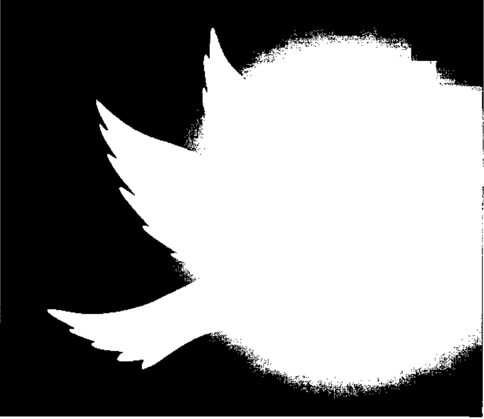
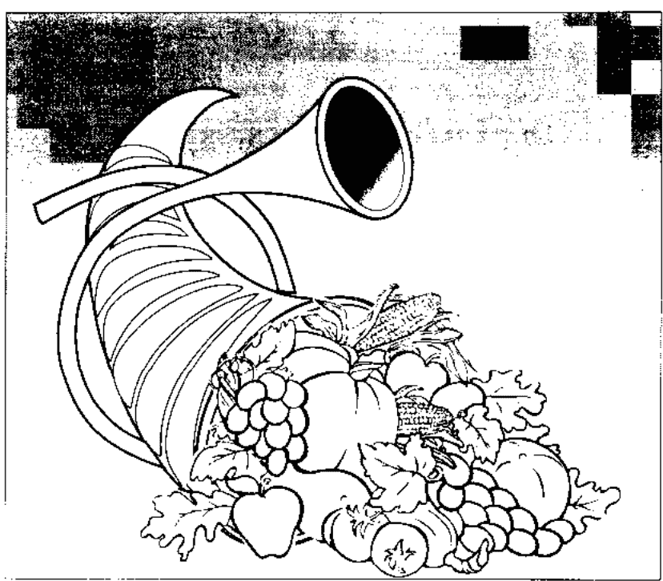

# 光的课程系列4

## 迈向灵魂觉醒的殿堂

## 意識的層面
LEVELS OF CONSCIOUSNESS

## 光的進階課程
LESSONS IN LIGHT

| 層面 | 中文 | 英文 |
| :--- | :--- | :--- |
| | 天使意識 | Angelic Consciousness |
| | 天使次元 | Angelic |
| | 行星 | Planetary |
| | 靈魂起因體 | Soul Causal Body |
| | 彩虹橋 | Rainbow Bridge |
| | 基督意識 | Christ Consciousness |
| | 靈魂體 | Soul Body |
| | 乙太、星光體 | Astral/Etheric Body |
| | 身體 | Physical Body |
| | 地球能量中心點 | Earth Power Center |
| | 人性意識 | Human Consciousness |
| | 單子能量圈 | Monadic Sphere |
| | 天使 1~3 (系列5) | |
| | 行星 7~9 (系列4) | |
| | 圖形與密碼 | Keys & Codes |
| | 行星 4~6 (系列3) | |
| | 行星 1~3 (系列2) | |
| | 彩虹橋 | |
| | 靈魂 | Spirit |
| | 意識 | Mind |
| | 初級4 (系列1) | |
| | 初級1~3 (系列1) | |
| | 身體 | Body |

## 內在意識次元圖
意識的層面
LEVELS OF CONSCIOUSNESS

光的進階課程
LESSONS IN LIGHT

- 天使次元 Angelic
- 行星 Planetary
- 靈魂起因體 Soul Causal Body
- 彩虹橋 Rainbow Bridge
- 靈魂體 Soul Body
- 以太・星光體 Astral/Etheric Body
- 身體 Physical Body
- 地球能量中心點 Earth Power Center

（基督意識頻率）
單子能量圈
Monadic Sphere
天使1~3
行星9拙火

- 行星7~9（系列4）
  圓形與密碼 Keys & Codes
- 行星4~6（系列3）
- 行星1~3（系列2）

> 彩虹橋（與較高自我、天使自我、因果體連接）
彩虹橋（靈魂點向上50米）
（頭頂上方6寸）

- 初級4（系列1）
- 初級1~3（系列1）

地心（與地球能量、身體自我連接）（黑色之光中心點（腳底下方6寸）向下50米）

- 靈魂 Spirit
- 意識 Mind
- 身體 Body

## 譯者序
在光的課程的途徑上，許多同修的朋友們，在習修的過程中，由於必須真實面對自己的思想意識、情緒感受，並為自己在生命中所創造的一切事物負責，無論是身體或心靈都感受著清理與淨化過程中的痛苦。然而，大部份的人也都能感受到只要能對自己靈魂的較高意願與光的指引臣服，一切雜亂、混淆、焦慮不安、痛苦等現象都得以獲得減緩。外在生命所反映的事物，已不再那麼地沈重，身體的負荷與思想情緒的壓力也減低許多。

然而，到目前為止所進行的清理，仍在較為淺層的身心與意識層面，雖然一路走來，有著披荊斬棘的感覺，也確實開出了一條邁向光明的路，但一般人走到行星六的級次，仍然在體悟與清理的過程中，時時得面對自己意識的創造之源，即靈魂起因體中，未清理、未淨化之意識所製造之事物的困擾。也就是說，我們的內在及較低體系中尚有一些清理與淨化需要完成，與較高自我之間仍然需更進一步的融合。

為此，光的課程提供這行星七至九的系列。使我們可以依這法門繼續深入自己的內在核心，體驗更微細的轉化。

行星七級次中的圖形與密碼，以曼陀羅的形式，直接在我們整個存在中注入（infusion）光的語言。這些圖形是光的晶體形態，是靈魂與心靈的語言，它使思想開始顯現它的純淨與本質。是與其他生命直接溝通的一種通道。

十二個圖形與密碼代表完成在意識進展階段中的循環。圖形與密碼的運作將使我們內在的所有事物由此而改變，並提升到新的次元中。提升不是被提舉起來，然後放置到一個新的星球。

提升是完成身體全然地與自己真實存在中的諸多次元合一的過程。直到我們將自己周圍的每一事物都提升到與存在的每一層面完全融合的狀態為止，我們無法全面理解這些圖形。只有在我們全面提升時才能確實體驗它的衝擊。

然而，行星七的圖形與密碼所給予我們的每一圖形都將烙印在我們靈魂的存在中，並在較高自我的頻率中受到啟動。這是一個只能意會而無法言傳的級次。

行星八帶領我們深入理解自己靈魂起因體中的意識活動，與自己這一生外在生命所顯現的一切事物的因果關係。

很多人知道世間有因果，但如果只是屈服在因果中逆來順受，以為這樣就可以了結或償還負面的因果，事實上，逆來順受很可能使我們陷入在一再重複的循環中，因為我們未能從因果的學習中獲得領悟，未能從領悟中轉化起因體的意識層面。只有透過對靈魂起因體之意識的認知，我們才能扭轉過去、現在與未來的創造，我們在物質層面上的挑戰，才得以在光中獲得舒緩。

因此行星八是經由多次元的啟動，而產生的一種加速清理的內在運作。使我們得以從因果的束縛中解脫出來，使我們得以自由地探索什麼是我們的靈魂意願，什麼是我們在這一生真正所要創造的，進而使我們更具創造我們所要表達的機會與能力。

行星九的設計是拙火的啟動，拙火是人類本質中的正面能量。它使怠滯的能量轉動起來，使隱藏卻又需要表達的情緒感受浮現出來。在光的途徑上，開啟拙火是自然現象，它是靈性旅程中一個重要的部份。這是一股靈魂或心靈本質的生命勢能。

然而，如果沒有經過前面級次的清理過程，沒有做好適當準備便放大拙火系統或開啟拙火，將帶來巨大的混亂與爆發性的行為，很可能導致身體的疾病，或人格的失控與破裂，使自己與別人感到恐懼。

在這特定的光的途徑上，一個人必須先清理靈魂起因體中的負面元素。只有當內在心靈在較高自我所賦予的喜悅中，外在生命在較高意願與知曉中運作，並具備與生命中每一事物交互感應的能力，拙火的能量才會注入較低體系中。

行星課程，尤其是行星九，是偏向能量的運作，文字只是一種引導能量運作的載體，因此，無論是較低體系中習氣的改變或是較高體系中靈魂起因體業力的轉化，以及拙火的啓動都不能僅靠閱讀性地略過前面級次的課程，便能受到啓動。事實上，要達到這一課程在每一級次上所設定的目標，都需要確切地在能量的運作中體驗與實踐，才能具體實現。

大部份的人發現自己每次回頭重新體驗前面的級次，都更深入體悟、領會許多微細的疑惑，並看到自己需要重新調整與治癒之處。

整套課程的目的在於協助我們走過所有在進展道途上所需要克服的挑戰。當我們對所有的學習課題都已全然理解；當我們生命的因果之輪，在愛與恩寵中轉化成光之輪時，我們便能進入自性光明的恩寵中。

超越這行星層面的是天使層面的活動。當一個人將所有的自我與行星頻率融合時，便能進入更高的、內在自我中天使自我的層面。行星課程之後便是天使級次的課程。我們將繼續努力完成天使課程三個級次的修訂工作，以實現我們內在心靈中爲整體進展而事奉的渴望。在此感謝大家爲自己、爲人類整體的進展，一路與我們同行，在愛中相互扶持。

## 行星課程第七級次
## 治療的金字塔 與 意識的圖形與密碼

### 簡介
淨光兄弟的上師們持續地給予我們光的靜心冥想的課程。當你們進入行星七時，你們將進入五面金字塔的運作，這將增強環繞著你們周圍的磁場。這增強的磁場正以各種特殊的方式影響著你們。只有你們可以決定它如何顯現。

這一級次將使你們經由許多內在的次元來擴展你們個人的能量體系。當你們進入行星中心點及光的網絡時，你們便在接收「心識的課程」。

你們將在深沈的靜默中進入光的金字塔，並將需要治癒與改變的人帶入金字塔的運作中。每當你們希望將某人帶入光的金字塔時，應獲得他們的較高自我與靈魂體的同意。如果你們感受到、看到或體驗到好的能量，你們便知道將他們帶入光中是正確的。如果你們所得到的是抗拒、沈重或黑暗的感受，接受這是一種不被應許的訊號，表示你們不能介入他們的學習課題。

治癒的真正要素是：接受、釋放與寬恕。當你們釋放了對特定情況的批判時，你們也釋放了你們對事物的觀點。這將清理你們個人的思想，使你們得以與內在指引的較高力量連結。

天父/造物主的意志不全然是個性自我的意志，個性自我看待事物的觀點是極為偏限的。然而，藉由將小我的意志與較高意願整合，你們得以運用光的能量，來實現更高目標。在靜心冥想的過程中，你們的心識意念會受到考驗。整個運作的目標是你們與較高自我的意志融合。

這些訊息將使共修的團體在每星期的聚會中，具有更大的凝聚力與更多的分享。它也增強光的能量，你們將感到一股令人崇敬的力量。當你們圍成一個圓圈，將焦點放在愛與治癒中時，你們對支援力量的敞開將增強你們自身的治癒。當你們將彼此放在光中，領悟到愛是絕對的源頭時，便與光的能量連接，並放大治癒的能量。隨著光的運作所帶來的力量，許多事物也隨之改變。團體的運作是非常重要的，它有助於清理負面意識，並維持正面的思想意識。

在你們團體的圓圈內，藉由觀想來釋放可以成爲非常正面的經驗。例如：當情緒自我充滿著憤怒、對過去的悔恨與哀傷，成爲某個人沈重的經驗時，讓團體中的每一個人將焦點放在這位同學的情緒體上。

感受你們正以那星期的光製造一個巨大的能量體，這能量體可以是一個熱氣球。將焦點放在這作爲能量體的熱氣球上，看著自己坐在裡面隨它上升。觀想所有負面元素皆從這能量球體中被釋放。放下對身體的執著，感受自己的提升。當你們感受能量的移動與負面元素的釋放時，慢慢地將熱氣球導向更高的層面。

觀想你們釋放了所有附著在你們身體、心識與心靈上的負面元素。你們將感到負面元素已獲得釋放。

這種觀想可以加強對任何不滿的釋放，並可應用於任何光的能量。

當你們回到身體的層面中時，接受你們已清理了所有的不滿，並已從中釋放出來的事實。

行星七的靜坐次第與前面行星級次的靜坐次第雷同。爲了獲得更深的領悟，你們可能會希望學習《眞知之書，以諾之鑰》The Book of Knowledge, The Keys of Enoch。這是一本深奧的、探討靈魂在各種光的形體中持續進展的科學性書籍。它是由以諾天使聖團所傳遞的訊息。運用此書中的各種開啟，你們將對光的金字塔，以及它們與內在次元的連接有更深的領悟。

你們邁向這些較高次元的勇氣，已受到上師們及你們的心靈與靈魂的認知。你們所獲得的成長，將廣為觸及他人。讓光與愛經由這自我成長的旅程照亮你們的途徑。

### 靜坐次第
1.  沈靜下來。
2.  將覺知帶到前額。呼喚所有的自我，將它們帶入合一的意識中。
3.  將這整合的自我經由較低次元帶入靈魂體，進入白色之光的中心點。
4.  擴展這白色之光，以逆時針的方向清理你們的磁場，再以順時針的方向，穩住你們的磁場。
5.  回到白色之光中，啟動靈魂光體的每一個中心點。
6.  擴展你們的能量磁場，將它環繞著整個共修團體，使之成為一個融合的團體頻率。
7.  將這整合的團體頻率，經由中軸向上提升，經過白色之光的中心點，進入銀色聖杯，啟動並擴展銀色之光的能量。
8.  經由彩虹橋向上提升，進入行星中心。進入聖殿，與上師、指導靈、教師們及天使聖團融合。
9.  在靈魂的聚合中，感受你們的頻率與整個共修團體，及地球上所有光的行者融合。
10. 與光的委員，及較高次元中在這光的頻率中（這星期的光）運作的存在融合。以片刻的時間，將你們的頻率與這行星次元的頻率融合。
11. 進入環繞著地球行星的光之網絡，將光導向地球的所有體系。隨著指引進入需要治癒的地方。
12. 回到行星中心，進入聖殿中，進入較高心識的內在殿堂中。
13. 在靜默中與你們內在靈性交流，祈求讓你們獲得自己個人成長所需的真知。
14. 靜心冥想結束時，經由彩虹橋回到你們的較低體系中。感受內在行星中心光的頻率經由彩虹橋回到你們靈魂體的中心 點。
15. 在白色之光的中心點上建立你們的治癒的金字塔，將它向外擴展環繞著你們的存在。將這金字塔擴展成為一百五十英尺，呼喚所有需要治癒與提升的人進入其中。
16. 當你們治癒的運作完成時，將能量落實到黑色之光的能量中心點中。

### 第一課 白色之光
淨化之光

金字塔的運作
- 動力磁場右邊：白色之光
- 動力磁場前面：白色之光
- 磁力磁場左邊：白色之光
- 磁力磁場後面：白色之光
- 金字塔的底面：白色之光

依靜坐次第進入靜心冥想

#### 靜心冥想與上師們的訊息
我以光之聖靈的喜悅問候你們，以智慧向願意傾聽者宣說。我以敞開的心聆聽你們的心聲。喜悅與你們的靈性之源是連接的。你們再次來到這裡體驗與較高自我連接的頻率。光的課程提供你們一個打開自己內在資源，使你們得以在意識進展的過程中，體驗新的階段。這裡我們要探討的是：「進展的自我」之真實涵義。無論任何情況或結果曾帶給一個人什麼樣的挑戰，進展意味著從一個階段進入另一階段。進展意指走過挑戰進入另一個層面，在這層面上你們能以較高的視野來重新創造。無論過去所製造的是什麼樣的錯誤，都可以在意識上重新評估與改變，從而展開全新的體驗。

經由選擇而進展，意指放下爲生存而掙扎的本能，或因恐懼而產生的行爲模式。你們可能會害怕失去自己的夢想、希望或願望。只要恐懼存在著，它的元素便掌控著你們的生命。

你們必須從生存意識邁向進展。這是目前這階段所進行的。當你們允許自己去體驗交托信任與較高意願，由內而外地隨緣應化時，你們便在進展中。

每個人都在內在次元中接收委員們的教導。當你們的身體經由你們的靈魂意識之源，感受到並流露出光的頻率時，你們便能覺知到這種連接。有時候心意識可能無法全面理解或感受到自己身心的開展，然而，在真誠地信任中，你們知道自己正探索著融入這些內在層面的實相中。

放下害怕自己的選擇會侵蝕你們的生命體驗的恐懼，這是使你們無法感受內在安寧與和平的最大障礙。

智慧來自覺察醒悟，覺察醒悟來自走過未知。你們除了從自己的直覺接受指引之外，經常在沒有方向的指引下行走。智慧是由這種融會貫通而來的。

在這特定的經驗中，許多靈性進展極高的上師之靈投生地球，聖靈的禮物普施於祈求者。當你們向外尋找答案的同時，你們也封閉了自己的內在指引。

是的，在身體以及物質層面上你們有著許多挑戰，這些挑戰似乎成爲你們無法接收內在指引的障礙，但是你們必須全然地以智慧在真誠地信任中一步一步地走下去。是你們的焦慮與疑惑，以及對至善之源的抗拒，封閉了你們的接收之門。當誠信被實踐，信仰被接受時，便能全面體驗與本源的連接。

在歷史的長河中，光的存在們不斷地降臨地球，他們將過去的模式與夢想重建於新的時空中。作為這特定的光的途徑的入門者，你們也有著即將展開的夢想。這夢想囊括了你們生命中的許多人。往往他們在特定的生命中，製造許多對你們意願的抗拒。你們發現自己在兩極的擺盪中，製造了抗拒與憤怒，成為自己無法體驗來自於自性光明裡的直覺之障礙。

在冥想中，放下害怕失去或與本源隔離的恐懼。以正面的方式肯定自己與上主、與光，是一個整體，肯定自己即是光的存在。

#### 行星的運作
作為地球行星之光的行者，你們同意經由光的網絡，引導光的能量來減輕地球的沉重負荷。再次地，我們感受到核能的污染。核能試爆為地球製造許多的黑暗與死亡，烙印在許多國家領導者的心識中。從整體的觀點及瞭解上來看，對每個國家而言，這仍是一個威脅，也是一個課題。核能爆炸的最高峰已消失。但是，只要還有武器、有戰爭的危機存在著，人類的恐懼便無法消失。

因此，持續地將光的頻率導向控制軍事之領導人及團體的意識中。肯定人類放下武器，放下彼此對立戰爭的需求。感受和平，並為護守人類意識之進展活動的基督聖靈做準備。

感受能量導向金字塔的架構中。這特定的光的載體正環繞著你們的身體。這簡潔的幾何形體的設計是你們靈性的殿堂，因為它是存在於宇宙中最完善的能量轉化器。金字塔所呈現的完美幾何角度，使能量得以發揮其巨大力量。

當你們在這燦爛的白色之光中流動時，與你們較高自我的天賦連接。智慧是與已存在於你們內在本源的真理融合。你們的智慧隨著日常生活而展開，只是要在日常生活中識別什麼是重要事物、什麼是智慧之源，的確是一大挑戰。你們將發現在這循環，自己將加速走過這些過程。智慧將成為你們體驗的真理。你們如何獲取智慧，取決於你們如何面對未知的挑戰。

感受自己在純淨燦爛的白色之光的能量中。看著金字塔的五個面都煥發著白色之光的頻率。凝定在這特定的元素中，讓身體汲取這頻率的能量。祈求讓你們對未能解決的問題有個清晰的領悟，並獲得清理與淨化。當你們呼喚走在你們生命經驗中的人時，這能量的元素便環繞著你們。

如你們所知的，你們是眾多之一。你們正參與光的視野，在這視野中，你們看到意識能量架構的轉化。許多與你們連接的畫面，是這一次元為改變地球與清理的過程而呈現的投影。如果你們看到一個瀑布突然乾涸，那是因你們正體驗著地球在轉化中特定的演化。如果你們看到水流出現在沙漠中，表示你們看到內在心靈與外在意識的改變。當你們看到內在自我的轉化，你們正體驗著這能量與你們內在靈魂、心靈與身體的連接，顯示你們正為自身頻率的改變做準備。

地球在一種新的振動頻率中。這是如何產生的？經由許多人的聚合，將焦點放在思想與身心頻率的改變上，經由人類的思想、心靈意識與人類的表達，帶動了這股改變之波。這股改變的波濤已驟然將人類的生命帶入新的實相中。你們正體驗著全體地球生命之體驗的轉化。這是歡慶的時刻，也是即將面臨巨大挑戰的時刻。變革的慶典是一種內在意識的外在顯現。由自由意志之選擇而產生的淨化，來自你們對生命自由的抗拒。你們所看到的是種種矛盾的現象。

親愛的學生們，接受並知道經由心靈意識與光的連接，你們已進入這改變中。你們正參與這活動與運作。在光的體驗中的每一時刻，你們的意識都在展開著。

當你們的身體自我在掙扎中時，要瞭解這是你們自身內在及對外關係均在改變之故，光也為其他人帶來改變。你們與他人之間的往來聯繫是一種充滿著精神法則的連接。

在這時刻中，這麼想著：我越是能清理我的元素本質，我的元素便越能成爲走在這一途徑上的人，獲得清理與淨化的載體。

當你們的靜心冥想結束時，把覺知帶回身體，將你們的能量落實在黑色之光的能量中心點中。

## 意識的圖形與密碼

期以一個圖形與密碼作爲每日靜心冥想的主題來運作。在日常生活中觀想這些象徵性的圖形。當你們以圖形與密碼來進行靜心冥想時，你們可能會體驗到你們個人所擁有的模式或所賦予你們的編碼。將你們的洞見、體驗及所獲得的啓示記錄下來，以便透過這些經驗的記錄，來觀察自己的成長與意識的擴展。

光的委員將隨著這些圖形與密碼，提供你們相關的訊息。每一堂課將帶給你們類似的訊息與經驗。

## 圖形與密碼 #1

### 「眼睛」

...........

|w' W« J- : vJ

這圖形與密碼「眼睛」。這圖形與密碼是靈魂與靈性的語言。它們是你們用來與其他形態之生命存在體直接交流的通道。

眼睛在金字塔的頂端，代表著「我是」即「我是」（I AM THAT I AM），它無所不知，無所不見，是靈魂意識之眼。

這圖形的頌文是：
I AM THAT I AM.
「我是」即「我是」。

I AM IN MY KNOWING AND MY SEEING.
「我是」在我知與我見中。

I SEE WHAT I KNOW.
我見我所知。

I KNOW WHAT I SEE.
我知我所見。

I ACCEPT WITHOUT QUESTION.
我全然地接受。

成為訊息使者、治癒者與意識自我體系的轉化者，是你們選擇的途徑。你們探索著達到藉由在光中成為聖靈及宇宙心智的共同創造者這一實相。這課程所呈現的，由思想所創造的圖形與密碼，在靈魂層面上被直接推動，並傳達到靈魂創造性的能量中。

每一個圖形都是一種象徵，帶給靈魂一種與圖像相關聯的思想概念，它是一種可以激發顯化表明的能量過程。愛瑟瑞爾在與心靈食糧、光的能量與顯化表明一樣的思想之中，提供了這一表述。

這些圖形是靈魂與靈性的語言。它們是你們用來與其他形態之生命存在體直接交流的通道。

在這體驗中，第二密碼圖形。

「眼睛」被認知爲是宇宙心識的象徵。眼目一知全見的「我是」。

你們的較高自我相互映照。這已是一種基本的知見，終究清晰的內在洞見。在你們的靜心冥想中。

現在默念：

> I AM THAT I AM.
「我是」即「我是」。

I AM IN MY KNOWING AND MY SEEING.
「我是」在我知與我見中。

I SEE WHAT I KNOW.
我見我所知。

I KNOW WHAT I SEE.
我知我所見。

I ACCEPT WITHOUT QUESTION.
我全然地接受。

#### 上師們的訊息

每一個圖形在你們之內創建了一個新的方向和圖形內在的要旨。如天使聖團所說的，圖形代表著每一事物的意義。在古老的神秘學派中，這中心之眼的象徵被認知爲「我是」之眼。這「眼睛」連接我們與諸多生命的過去。

誠如我們的委員們，在遠古的時代，在地球初始的人類生命體驗中，你們便已是入門者。你們已走過許多生命的旅程，已達到並保有神聖的意識。當我們提及你們初入默基瑟德天使聖團之門時，你們也回到那記憶中。

圖形#1，常見於金字塔頂中心的「眼睛」，代表信奉上主是唯一的神，信奉一切即一，並具有超越人類意識之幻相的覺知。

在我們說話的同時，將焦點放在你們內在之眼上。在靜心冥想中，很多人看到有許多眼睛凝視著他們。感受自己被一種意識所帶領，進入覺知的內在次元中。

> 在如是中，這麼想著：
I SEE WHAT I KNOW; I KNOW WHAT I SEE ;
我見我所知，我知我所見；

I ACCEPT UNCONDITIONALLY.
我全然地接受。

當這成爲你們的頌文時，環繞在你們周圍事物的應有面貌便清晰可見。這圖形啓動你們內在洞見的更深層面。它打開你們內在的通道，使你們的領悟得以超越你們思想意識的認知。這眼睛隱含著許多玄機。你們每個人將在靜心冥想的過程中，尋獲更深遠的涵義。

「看」有著許多方式。「看」不是向外尋找，而是向內體驗你們的認知。展示一道神聖階梯，它不是工具而是一種意識的狀態。

---

當這圖形與密碼被啟動時，將進入你們的每一層面。複誦它的頌文：

> > I SEE WHAT I KNOW; I KNOW WHAT I SEE ；
> 
> 我見我所知，我知我所見；

> > I ACCEPT UNCONDITIONALLY.
> 
> 我全然地接受。

當這成爲一種存在的狀態時，你們便無庸置疑地處於內在的安寧與和平之中。「眼睛」的力量被認知爲突破環繞著自己周圍之幻相的源頭。

再次念誦：

我見我所知，我知我所見；我全然地接受。

經由默基瑟德天使聖團，這元素的本質將以這樣的洞見爲你們編碼。考驗可能會依你們個人的意識而呈現。幻相可能看起來如此巨大，使得你們的所見是如此地黑暗，恐懼便成爲你們的挑戰。記住這頌文，看着所有的抗拒獲得釋放。祭司、女祭司、傳教士、訊息傳遞者、覺者、智者、光的行者、薩滿教的僧人，皆爲一個整體，你們每個人都走在個人的進展中。

埃及的金字塔代表着地球的能量與滿流的中心點。它們是地球的能量中心點，對好奇的人類來說，它一直是神祕的。

儘管它們是已逝之帝王與領導者的陵寢，它們同時保存着黃金時代神祕的圖形與密碼。儘管長久的風沙腐蝕了這些象徵的外表，然而密室仍存在着，記錄之殿仍封存着，它將被打開。

因此，現在觀想自己完全處於眼睛的中心裡，祈求你們靈魂的記錄充分地顯示給你們，使你們得以實現降臨地球的使命。

你們的頭部與前額所感受的壓力，是因這股能量波流試圖打破環繞在你們周圍的在時機尚未成熟之前，它不會被打開；它完全取決於你們接受的程度。因此，親愛的學生，審視自己如何突破，讓這眼睛的圖形密碼在你之內啓動，使你們向內在新的覺醒轉化。

當你們做好落實我們所給予之準備時，回到環繞着你們的物質世界的意識中。當你們回到身體中與身體自我中時，感受光的力量在你們之內流動着，並使你們落實地面。知道自己在「一」的整體中。

進入和平中，願基督之光在你們之內，並經由你們而煥發。

### 第二課金色之光

#### 宇宙天父之光

#### 金字塔的運作
- 動力磁場右邊：白色之光
- 動力磁場前面：白色之光
- 磁力磁場左邊：銀色之光
- 磁力磁場後面：銀色之光
- 金字塔的底面：金色之光

依靜坐次第進入靜心冥想

#### 靜心冥想與上師們的訊息#1

我們以天父及你們內在意識中的基督聖靈之名問候你們。能再次與你們融合，並將你們從內在自我的矛盾中提升出來，是我們極大的喜悅。

現在，經由能量中心點向上提升，經由光的頻率，進入較高次元的行星中心，在這行星中心裡，你們以純淨的光、純淨的心識與音聲存在著。經由行星運作向地球所注入的行星能量，是地球極其需要的能量。

你們督促著整個人類的進展，這是一個人的靈魂所能表達的最高願望。在此時，我們將這領悟帶入你們的意識中，因為你們處於正入門的階段，這入門的階段是為實現使你們靈魂一再投生地球的意願所做的準備。

如果成長不需要經由一些必要的學習，地球將不會有任何生命存在著。不要苛求自己，不要認為自己是卑微的。人類的批判是基於虛妄的理念，這些虛妄的理念使人無法具有清晰的視野。

要知道，所有接受這途徑的入門者，都經歷過一段虛無飄渺的時候，彷彿靈魂在黑夜中完全失去了身體自我的感受及其實相，經歷著焦慮與絕望。然而，一旦向內在起因體覺醒時，便能開始釋放；智慧來自釋放的體驗。因此，物質層面成為你們生活、活動與存在的一個層面。把焦點放在將治癒的頻率帶入這一實相中。

你們目標的焦點是成為基督意識的使者。基督意識的靈性大我將真理的實相帶入意識層面。你們將成為這訊息的使者。你們是聖靈與真理的傳遞者，將神聖意識注入那些願意打開並接收的人。當你們周圍的人願意打開時，你們會感受到一股強而有力的意識在流動著，你們便成為治癒的工具。然而，先要提升你們自己。

當金色之光的元素在你們的內外移動時，感受自己在整合中。你們將發現你們所接收的是配合你們打開的程度而定的。感受你們的外在生命隨著你們內在的喜悅與滿足的增強而展開。

當所有層面的意願整合時，你們便能感知自己的活動方向隨時保持在意識意願的流動中。這不表示你們將生活在沒有困難、沒有挑戰的生命中。但是，你們的內在將領悟到自己正走在靈魂意識的藍圖中。感受經由選擇、經由走過自己所面臨的挑戰，你們正煥發出生命的完美。

現在感受這金色之光的頻率正在轉化所有束縛著你們的舊有負面思想模式與思想影像。釋放所有世俗上的、與靈魂本質及欲望不相符合的焦慮。感受所有個人的擔憂與憂慮從意識層面中釋放，使身體邁向新的頻率中。接受較高意願的活動、宇宙天父的意願在全面實現中。

自我進展的運作正在意識的每一個層面上加速進行著。當你們感受到光與你們內在存在的宇宙元素融合，並與內在思想的所有體系的較高視野整合時，你們將能以更清晰的視野看到更大的至善，並能對外投射出更高本質的表達。

上師們視一切為光與靈性。你們可能努力想理解意識自我，並從中幫助自己從任何矛盾的行為中提升出來。然而，你們的內在自我才是認知那神聖本質的真實部份。

超越較低體系的自我，看著內在的靈性。你們將發現愛與合一。著眼於差異性及幻相，將製造更多的負面事物。看著自己所反映的是光的意識，及至高靈性的活動。

#### 行星的運作

在光的網絡中翱翔，引導燦爛的金色之光的能量進入環繞著地球的並以三角形構成的能量磁場中。讓你們的心靈穿梭其中，並將光注入需要這提升與治癒的能量的地方。

親愛的學生們，光的兄長們將全面降臨，以減緩逐步增長的毀滅性勢能。這將會遇到一些頻率的衝突。你們是受到保護的，但是同時要知道，你們的覺知經由心靈，回到靈魂中心點，並建立一個光的金字塔的架構。現在，你們對這能量的載體已相當熟悉，並且能瞬間在心識裡建立起這金字塔的架構。感受。

## 32 光的课程 行星七

燦爛的銀色之光進入磁力磁場與背面，燦爛的白色之光在動力磁場與前面，金色的宇宙天父之光在底面。感受自己在這些頻率的環繞中。

如果你們感到某些人需要這治癒的能量，呼喚他們的靈魂進入這光的中心點，並將他們帶入這頻率中，祈求他們的較高自我接受這轉化他們疾病與各個體系負面元素的能量。不要去衡量它的效果，只要放大治癒之源，這治癒之源即是光的能量。不要受好奇心的驅使，只要讓這能量成爲治癒者。

當你們準備好時，把覺知及所有的自我帶回前額。落實你們的意識。感謝這分享的喜悅，及你們所有的意識。進入和平中。

#### 靜心冥想與上師們的訊息#2

安德魯

真理經由你們的心靈與靈性的覺知而流淌，並將它的莊嚴與宏偉帶入你們的心靈中。你們每個人都被賦予體驗你們內在真實本質之力量的機會。隨著提供給你們每個人的圖形去深思，這種體驗吸引著你們，你們將從這經驗中獲得清晰的思想以改變目前的一切。

祈求讓你們從幻境中獲得自由，並轉化障礙你們方向指引的狀況。祈求獲得領悟。祈求讓你們無恐懼地接受愛。

祈求讓你們日常生活的每一時刻都在覺知中。祈求讓你們釋放障礙你們自然完美地表達的制約性思想。將一切障礙放在光的頻率中，並放大這金色之光的能量。

經由你們較高自我所啟動的光的金字塔，是你們較高視野與思想的產物。因此，慢慢體會這金字塔架構的能量，並認知這些設計是一種完整的光棱鏡，它的設計是完美的，它的能量的流動是完美的，與你們的模式及特定的內在入門之體驗是符合一致的。無論是對人類或對靈性世界的存在，金字塔的能量未曾全面地展現過。它是透過深沉意識進入內在次元之門。所有的金字塔，所有不同的設計與色彩，都將使你們的意識為特定的目標做改變。這由金色之光所組成的金字塔架構，是一個多面體的設計。將所有你們探索著要改變、要圓滿、要達成的事物帶入這金字塔中。

正如同解脫與自由是地球生命之關鍵所在，你們的內在渴望從因果的業力，從偏限的思想與活動，以及壓抑的情緒中釋放出來。

我安德魯與你們說話。

在這時刻，我們提供一支金鑰匙。這金鑰匙象徵解開儲存在你們之內的恐懼與偏限，以及被奴役、被迫害、遭受恥辱、被排斥、被孤立與死亡的恐懼。

當這鑰匙打開那些封存已久，尚未被光所觸及的頻率時，感受內在的釋放，並體驗改變的衝擊。期待那絕對的改變。你們必須先完全地釋放，才能有空間讓光進入，並讓它的光亮煥發。

金色之光引導你們的思想意識以喜悅來接受生命與成功，並實現你們生命旅途的目標。你們的道途是為成長而探索的旅途。

在你們的旅途中，你們所踏出的每一步，都在你們之內銘印著它的足跡。

要知道每一腳步，每一足跡都有它自己的訊息，認知它是你們邁向完整的重要部份。雖然許多的印象與烙印是嚴峻的，是艱辛的，也往往是模糊不清、誤導與令人混淆的，然而，每一經歷都帶給你們更深的智慧、領悟與更大的力量。

在這時刻，光的委員們問候你們所有的人，以及那些跟隨這靜心冥想體驗中的人。光的委員們以偉大的慶典迎接你們每一個人。當自在與解脫的思想意識在你們之內放大時，感受這思想意識與地球行星的連接。當整個世界的意識提升進入改變，並為進入更新的生命表達做準備時，將光傳遞給所有人類，給像你們一樣的入門者。

要知道，當你們觀想所有人類都有獲得自由的機會時，你們已成為使它成為實相的重要角色。你們由經驗而來的力量，透過這些靜心冥想，增強了改變的意識。

讓自己完全沉浸在光中，此時此刻在全面的覺知中，與古老的較高存在們連接。要知道過去、現在、未來同時存在於這一時刻中。

你們創造視野。再次想著地球在邁向光的國度中是受保護的，不受負面勢能所侵襲。

現在，你們每個人都已獲得明確的思想與方向。你們在道途上、課題上的加速成長，以及靈魂對成長的承諾，對你們而言，是絕對的。放下你們的憂慮、疑慮、否定與恐懼，讓光治癒一切。讓光轉化你們的心識。進入和平中！

#### 圖形與密碼#2「火焰」

這圖形與密碼「火焰」。這能量代表著經由與光直接連接而產生的淨化。將物質放在光的火焰中，使之轉化。在冥想中觀想火焰，並想著自己正在通往光的通道上接受指引。在冥想中接受你們的較高心識與呈現在你們之前的能量連接，並存在於神/造物主，宇宙天父/大地之母之間的一切事物中。

這圖形的頌文是：

I AM AS MIND.
「我是」即宇宙心識。

I AM AS MANNA.
「我是」即瑪納（精神食糧）。

I AM AS LIGHT.
「我是」即光。

I AM MANIFESTING.
「我是」正創造顯像世界。

LET THERE BE LIGHT IN ALL.
讓光存在於萬事萬物中。

#### 上師們的訊息#1

安德魯

很高興能與前來接收這靈性的圖形與密碼的人說話。在這途徑上，我們介紹的第一個圖形是「眼睛」。

現在，我們提供的圖形密碼是「火焰」。

當你們注視著燭光時，你們會看見火焰。這能量代表經由與光的直接連接而產生的淨化。物質因被放在光的「火焰」中而被改變。一些古老教派的教導中，視這「火焰」為神之舌，意指光與火是一種言語。將焦點放在「火焰」上。它的色彩變成金色，並從紅色與金色轉成白色。

每一種轉變，代表某些部份的能量在運作中，由渦密轉化成為「瑪納」或「宇宙心識」。因此，你們靈魂的脈輪中心點呈現金色之光。國王與皇后的皇冠，代表著統領其人民的地位。「火焰」與頂輪的金色之光是相聯繫的。這是一個改變較低心識的密碼，這較低心識曾背離了靈性自我。

關鍵語是：

- I AM AS MIND. 「我是」即宇宙心識。
- I AM AS MANNA. 「我是」即瑪納。
- I AM AS LIGHT. 「我是」即光。
- I AM MANIFESTING.
「我是」正在創造顯像世界。
- LET THERE BE LIGHT IN ALL.
讓光存在於萬事萬物中。

你們在「火焰」中。「火焰」，這代表永恆意識的光之火炬，被人們代代相傳著。「火焰」照亮了你們途徑上黑暗的角落。它點亮了你們人們的長廊。它驅除黑暗，點亮道途。沒有「火焰」便沒有熱忱。沒有熱忱便沒有欲望。沒有欲望，便沒有需求，沒有需求，便沒有需要完成的事物。

與「火焰」這一象徵有關的想法往往帶著恐懼。「火焰」也常被認為是一種有害的行為，或是一種詐騙者所使用的工具。事實上，這是變革或轉化的象徵。因為沒有了「光」或「火焰」，你們無法看到自己的道途。「光」或「火焰」可以消滅那些不再具有目的的任何思想意識。「火焰」的圖形是一種意識的工具，透過宇宙心識來清理必須改變的思想意識。

I AM AS MIND.
「我是」即宇宙心識。

I AM AS MANNA.
「我是」即瑪納。

I AM AS LIGHT.
「我是」即光。

I AM MANIFESTING.
「我是」正在創造顯像的世界。

LET THERE BE LIGHT IN ALL.
讓光存在於萬事萬物中。

透過每次對這圖形與密碼的體驗，細胞與物質生命將開始產生淨化。當你們體驗到這光的「火焰」進入你們之內，並在你們之內流動時，觀察它如何引導你們透過這通道為進入下一個光的圖形做準備。

在人類歷史的長河中，火被視為生存的基本需求。它蘊含著許多與生命的奧秘有關的意識。你們將會發現它對你們具有更深遠的涵義。

在這特定期間，靜心冥想的焦點將放在「火焰」的圖形與密碼上。

接受這邁向光的通道所給你們的指引。接受這呈現在你們之前的心識與能量，讓你們與上主/造物主，宇宙天父/大地之母都在這「火焰」的環繞中。

#### 上師們的訊息#2

這是愛瑟瑞爾。我在此與你們說話，為的是幫助你們。不要憂慮，一切都在完美的秩序中。所呈現出來的這些教導對你們是正確的。基督意識祝福這一切。你們的造物主存在於你們靈性天命的意願中。你們靈性天命的意願與你們的靈魂記錄是連接的，依靈魂的選擇而創造願景的世界。我們看到光的課程是你們靈魂意識選擇探索的途徑，你們也選擇將它提供給許多渴望治癒自己意識的人。

雖然目前這一階段，只有少數的人進入光的課程，然而，光的運作所帶來的衝擊將觸及許多需要它的人。你們將看到奇蹟是如何地展開。圖形與密碼正將你們的過去以象徵性的願景來呈現。它們協助你們並使你們更具力量。光的課程的能量，是你們內在靈魂活動的一部份。

現在，隨著光的委員們呈現在這神聖的時刻，你們每一個人都是極其重要的，你們彼此間都是前世的朋友。每個人在這一世都突破了許多掙扎，然而，比起前世的經歷，這些掙扎已是非常少了，此刻的你們，渴望實現更大的自在與解脫。

愛之光降臨，並環繞著你們。進入和平中，願基督之光在你們之內，並經由你們而傳播。

### 第三課藍色之光

#### 智慧之光

- 金字塔的運作
- 動力磁場右邊：金色之光
- 動力磁場前面：藍色之光
- 磁力磁場左邊：白色之光
- 磁力磁場後面：銀色之光
- 金字塔的底面：藍色之光

#### 依靜坐次第進入靜心冥想 靜心冥想與上師們的訊息#1

愛瑟瑞爾

問候你們，這是愛瑟瑞爾。我向你們每一位閱讀這些訊息的人說話。流淌著古老的智慧轉化為新思想工作者，你們靈魂有解碼鑰匙。靈魂的鑰匙是光與愛之匙。它使我們奧秘，衷懇你們與宇宙所有能量合一這件事。無論意識是如何地進展，智慧是永遠無法用推理論據或知識來獲得全面理解的。智慧不是知識，但是智慧是一種與造物本源連接的能量模式，它是絕對堅定的。

你們所瞭解的每一種光的頻率，皆與護守宇宙創造的某些法則連接。智慧之神是古聖經中的一個名稱。

在聖經中每一種對神的尊稱，皆代表著神的種種風貌。上主是所有受造物的整體意識，由思想、言語、行為、活動及創造過程，所形成的無以計數的風貌來顯現。上主不受限於一個本體的形象（一種特定身份的形象），而是綜合所有特質與所有的自我，具有著「生命之主」的功能。

基督的信徒有許多，但以耶穌基督所帶領的十二門徒為代表。他們不是創造的諸神，不是掌管因果的眾神，不屬於特定頻率的聖團，也不是瑟拉芬（Seraphim）或伽若賓（Cherubim）等天使。

他們是像你們一樣的靈魂，在特定時期帶著宇宙星際間較高諸神（Higher Lords）之真知與教導來到地球。耶穌基督是光之主，引導靈魂邁向永恆的旅程。祂，身為基督，是靈魂與永恆進展之自我連接的道途。耶穌在祂有生之年，以自身作為治癒與聖愛的見證。祂是無法以任何一種訊息來區別的。他的每一訊息不僅都是至關重要的學習重點，也不會令人感到沉悶無趣。這些訊息總是充滿著激勵性，總是能使負面的事物獲得治癒與提升。思考這些事，這樣你們便能理解存在你們之內的更大實相。

你們正與乙太中的頻率連接，以便將光與治癒的能量帶入地球行星。

在這時刻，觀想地球正將它的恐懼與矛盾釋放出來。觀想地球不受恐懼與死亡的重複因果所束縛，感受宇宙實相的意識在所有人類自我中展開，並綻放光明。當人類放下由自我矛盾的經驗所製造出來的痛苦、恐懼與死亡時，並處於智慧與和平之光中時，地球便能進入安寧與和平。

這訊息已在許多世代中流傳著，但從未像現在這樣地產生衝擊與影響。我們看到許多團體走出無知的洞穴，進入光明、智慧、合理的心識，並再次與宇宙實相整合。我們理解當你們不在靜心冥想的狀態中，回到世俗的生活中時，你們感到自己所面對的障礙，往往是你們所無法超越的。

然而，要知道危機與挑戰正顯示著人類對自身本質的蒙昧，以及對重複發生的毀滅性事物的執著而產生的因果。在認知這些模式的同時，重新肯定自己是真理的使者。這論述是為了使你們的意識自我得以汲取智慧的頻率，感受它注入在你們的存在中。不要擔心自己達不到這些言詞與教導，只要認知這些較高思想的種子在你們之內及你們的周圍。

啟動銀色之光、白色之光、金色之光、藍色之光。

- 「金字塔的本質與目標是什麼？」
- 「在一個有架構的思想訓練下能產生什麼樣的磁力場？」
- 「我們何以要運用這些特定的金字塔系統的法門？」
- 「靜心冥想與光的課程之間有什麼樣的連接？」

每一個金字塔的架構均是一種創造性的頻率，一種幾何的設計，與靈魂進展的某些層面相應。在這藍色的智慧之光中，在這由金色之光在動力磁場上，銀色之光在磁力磁場上，以及白色之光的元素所組成的特定的金字塔架構中，將這頻率融合在自己的能量中，並得以創造與轉化你們負面的因果模式，使你們的頻率向較高進展的頻率打開。

每一個入門階段都與心識的課程以及光的頻率有關。當你們的靈魂全然覺醒，不再執著於身體時，你們便會有清晰的了悟。你們將會對現在你們所進行的一切有著新的體驗。你們已清理了許多靈魂的頻率，這使你們得以加速走過整個過程。現在，當自我經由中軸下來時，感受光的能量與頻率。置身於這個光的架構中。這一切都是你們內在空間的一部分。只要看著家庭成員中的每一位都獲得提升與治癒。釋放每個人回到他們自己經驗的光中，經由光、愛、成長、體驗、挑戰、與活動，回到他們自己神聖的旅程中。不要批判他們的途徑。走在新的力量、智慧與光中。

#### 靜心冥想與上師們的訊息#2

約書亞

巨大的苦難與巨大的勝利都在發生著。注入地球的光是一種爲和平而降臨的意識，一種光的和平觸動，一種宇宙法則的精神意識。

我們希望向每一位能打開心靈傾聽，有勇氣認知巨大的苦難實際上是一種釋放，釋放那些曾將人類的各種努力帶入被奴役、被牽制的情況。

因果的法則正進行著。人類生命久遠的歷史意識，已到了需要面對釋放、解決並進入和平的時刻。在新的開始之前，舊的必須結束。在打開通往較高活動那扇門之前，道路上的障礙必須清理乾淨。

你們正目睹著最令人敬畏的改變，在人類的進展方向，社會的結構、經濟的趨勢、價值觀、科技、生態學與精神靈性的方向都在改變中。一切事物皆在靈魂的引導中進行著，天使聖團的精神正協助人類的心識、心靈與精神的啟蒙與教導。

那些對這些經驗抗拒的人，將發現自己陷入在混淆與否定中。那些理解的人，將能期待巨大的喜悅及令人興奮之時刻的來臨。兩極分化的現象正明顯地劃分著。你們將看到一些無法聽、看與盲目的人；也將看到另一些極力探索著的人，在日復一日的成長中，靈性上所獲得的喜悅。

每個人都受到自己內在天賦的啟發，有人善於教導，有人善於理解，有人善於將光與愛帶給別人。你們正在體驗著探索自己的經驗。

千禧年事實上是人類發展尊嚴、榮譽與和平的時刻。許多帶給人類情緒上、思想上與精神成長的資訊是極其重要的。重整地球的生命科學，使地球許多瀕臨滅絕的生命得以延續。你們將發現這是極具挑戰性卻又是值得品味的時代。

我們無法預估地球何時可以達到入門的臨界點。我們只能這麼說：許多訊息已提供出來，並將持續地提供給能聽聞、能向愛打開心靈的人。我們與你們一起運作，並協助你們走過你們自我體系所製造出來的挑戰與疑惑。

你們是極其美麗的。從某種角度來說，你們是光的天使，但你們不全然是天使意識。你們是神聖之光，為了事奉，你們選擇以更新的活動走在地球上。你們為家人與周圍的朋友而服務。你們寫文章以教導、治癒並觸及別人，你們付出愛與熱忱，並無所畏懼地向你們的信仰敞開。

你們將不虞匱乏地體驗你們的生命。在你們個人的旅程上，一切你們所需的，都將賦予你們。

親愛的學生們，在這時刻，將你們的疑惑、恐懼、愧疚、偏限與卑微的感受都放在光中。釋放這些負面的感受，並接受你們的內在心靈與外在意識正在整合中。體驗你們真實自我的輝煌與美麗。你們的真實自我既是人類的一份子，也是大宇宙的公民。

默基瑟德天使聖團經由眾多的通道，向整個宇宙宣說：這段時期，是內在基督開始在個人及群體中放大，為地球事奉的時候。

識別將是最大的困難。忠於自己，忠於你們的天賦，忠於引導你們思想與行為的創造力。信任自己靈魂旅程中的過程。

當爆發性的事物發生時，改變便會為治癒帶來內在的釋放。活在當下，彷彿它是你們唯一的永恆時刻。活在當下，永恆存在即是永恆的時刻時，你們將找到內在的和諧與安寧。

我是約書亞，我曾與你們說話，非常感謝這傳遞思想的時刻。你們每個人都是眾多之一，與地球巨大的改變連接著。

啟動金色之光、銀色之光、白色之光，與藍色之光。

現在，在光芒四射的能量中，建立這莊嚴宏偉的金字塔。當你們在這由智慧之光、金色之光、銀色之光、白色之光所組成的金字塔的架構中時，進入靜默中，將你們所愛的人帶入其中。

基督是否將像從前那樣成為人走在地球上，或是基督將以精神意識普降於所有認知這基督精神的人身上？你們將在自己的心靈中理解這真理。許多人會說他們即是基督，許多人會呼喚你們尋找基督，許多人會說基督即是「一」，讓基督存在於你們之內，讓你們成為基督聖靈。

#### 圖形與密碼#3「螺旋」

這圖形的密碼是「螺旋」。

這密碼是「螺旋」。它無止境地環繞、擴展、移動著，但移動擴展始終在一種向上的運行之中，直至它成為一種覺知，將你們與「全在」連接。

宇宙及宇宙意識與整個大宇宙的意識連接。這是時空之旅的密碼。宇宙意識代表著核心的中心力量。它代表能量持續地循環著。這象徵著經由不同次元的旅行，你們來到內在心靈意識的光中。這是心識的象徵，也被看作心識的擴展，它以螺旋的方式擴展著。

## 50 光的課程 行星七

- I AM AS MIND. 「我是」即宇宙心識。
- I AM AS MANNA. 「我是」即瑪納（精神食糧）。
- I AM AS LIGHT. 「我是」即光。
- I AM AS ENERGY. 「我是」即能量。
- I AM MANIFESTING. 「我是」正創造顯像世界。
- LET THERE BE LIGHT IN ALL. 讓光存在於萬事萬物中。

#### 上师们的讯息 #1

在这途径上，我们希望引发你们内在宇宙心识里的记忆。

这图形使你们得以从物质次元进入乙太次元，进入灵魂层面，经由天使层面进入单子能量体系，进入宇宙心识。这种心识的旅程，使你们得以与其他与你们连接，并与你们在物质次元中一起旅行的存在，或你们所谓地球的存在显像接触。

我将以适当的方式来阐述这象征性的图形，并请你们每一个人观想它。让自己进入这频率。你们能即刻将它与你们的较低体系连接，与你们的身体连接。

让你们的本质移动。让这象征性的图形引导你们的意识进入光中。在你们体验这频率模式运作的同时，认知宇宙中没有次元的偏限，也没有度量的公式。它是宇宙心识的象征，也是宇宙心识的扩展，并在一种螺旋的作用中运行着。这个图形象征着灵魂在进展过程中的旅途。它走过由群体意识所制造的因果模式。

当你们发现群体的思想陷入在因果重复循环的模式中时，在那特定的情况中观想这图形。

感知这一象征性的图形如同一种频率，产生使人类得以超越因愤怒、厌恶与痛苦而产生制约的机缘。将它视为是一条人类的思想意识经由螺旋式的提升，到达真理与光之境界的途径。

祈求：
SEE WHAT YOU KNOW. 见你们所知。
KNOW WHAT YOU SEE. 知你们所见。

> 现在说：
I AM AS MIND. 「我是」即宇宙心识。
> I AM AS MANNA. 「我是」即玛纳。
> I AM AS LIGHT. 「我是」即光。
> I AM AS ENERGY. 「我是」即能量。
> I AM MANIFESTING. 「我是」正创造显像世界。
> LET THERE BE LIGHT IN ALL. 让光存在于万事万物中。

体验光环绕着那些因果业力的经验。你们是受到召唤的，为了显现精神上的爱与光之本质而聚合。要始终确信，你们正创造着回应的时机。

如果你们执着在自我批判上，你们就无法透过光来改变自己的思想模式。必须作为关键，无条件地接纳，并掌握模式。但要必须在条件的情况下，如同圣爱与真理，才会增强这频率的力量。

当你们回归身体中时，你们将感到自己朝着逐渐稠密的层面上移动着，不要抗拒自己或排斥自己的身体，以爱拥抱你们的身体。看着自己在平衡中，在希望、智慧与真理中。一切如是。

在过去，人类经历了许多宗教仪式，然而，美在「你是谁」的简朴之中。

#### 上師們的訊息#2

光的委員們問候你們，以及所有正為踏入更新意識而向內探索的人。我是恩勒耐斯。在這時刻，我們回顧並為你們啟動這個圖形，因為它是時空之旅的圖形。這是帶領你們進入不同意識次元的光之途徑。

我們所能說的言語是極其有限的。你們的意識是在個人的實相裡。你們所感受到的是與你們內在次元連接的光的「螺旋」，它將你們與無以計數的所有前世生命連接。這之中，只有一個生命，所有的前世生命都只是一個生命。過去、現在與未來都是「一」的一部份。你們現在所見的，以及你們生活意識的所在，是過去與未來時間的兩者。然而，時空之旅是一種不受你們思想意識之界限所束縛的自由。

因此，讓自己提升到你們渴望發現所要給你們看的。你們將向上提升進入光的「螺旋」中。有些人看它像旋轉梯，有些人看它像環繞盤旋的能量，並將你們帶入、穿越許多光的次元中。你們是兩者——你們的過去與你們未來的全部。當你們達到與現在的你們及未來的你們連接，以及地球意識的改變與你們的表達有關時，你們便在當下。放下受限制的感覺，放下思想上的分析，只要純然地如是接受。

在光的「螺旋」裡，你們可以在任何的時空中，你們可以看到過去的歷史，也可以在另一空間觀察你們所認識的人，或未來即將發生的事物。在這光的「螺旋」中，靈魂在時空中旅行著，你們受到思想及內在意念的引導。你們可以看到自己的過去，看到自己的未來，你們所發現的是唯一你們需要知道的。

在所有事物中，你們最需要知道的是，死亡是一種幻象。永恆是認知事物沒有結束，只有轉化。改變只是一種身體、理性思想、情緒與精神的轉化。在天使次元及超越那次元的世界中，沒有過去，也沒有未來，只有來自掌管一切事物的宇宙心識，使生命成爲永無止境的造化。在天使次元中，你們將感受到，並看到自己是那至大、完美之事物中的一部份。

要體驗、理解在「全在」中這個道理是很難的。當你們聚在一起進入時空之旅時，以你們不曾有過的方式，練習與治癒一起運作。經由觀想，去看、感覺並覺知你們的存在，你們可以到任何你們想要去的地方。有些人會在夢境中看到你們，你們將會與那些未曾這物質世界中見過的人一起運作。然而，在此刻，你們是他們的守護者。這是非常好的！

這個密碼是「螺旋」。它無止境地環繞擴展移動著，但移動擴展始終在一種向上的運行之中，直至它成爲一種覺知，使你們與「全在」連接。

「時空之旅」是第三個圖形與密碼，與智慧之光有關。與銀絲帶連接，帶著你們向上經由不同空間的次元旅行。銀絲帶與你們的靈魂始終連接著，只要你們接受並渴望住在自己身體中時，銀絲帶將不會被切斷。這圖形帶來許多非比尋常的經驗；由於它可以藉由宇宙心識並從較高層面治癒他人，而成爲一種極其不平凡的經驗。

當你們做好準備時，把覺知帶回自己的身體中。你們將感到很難把自己帶回來，因爲你們渴望自己停留在這樣的和平與安寧中，在這一種光明境界之中。但是，要知道，你們能夠將這種光明境界帶入你們之內並充滿你們，這樣你們所居住的身體，將會感到更平衡。

把你們的能量帶回來，讓你們的意識流動，回到身體中，直至你們的意識進入身體的每一部位。當你們準備好使思想穩定時，讓能量經由你們的雙腿、雙腳落實在地面，感受自己完全回到身體中。

要知道，由於這旅程，許多事物皆已改變。我親愛的學生們，願你們每個人都走在和平中。在默基瑟德天使聖團的意識中，你們每一個人都非常重要。在你們個人的生命中，尚有許多需要體驗與表達的。進入和平中！

### 第四課綠寶石之光

#### 創造之光

#### 金字塔的運作

- 動力磁場右邊：金色之光
- 動力磁場前面：綠寶石之光
- 磁力磁場左邊：銀色之光
- 磁力磁場後面：白色之光
- 金字塔的底面：綠寶石之光

依靜坐次第進入靜心冥想

#### 靜心冥想與上師們的訊息#1

在你們學習的經驗中，你們最大的收獲是：從你們內在的矛盾中突破出來。這些矛盾是你們學習過程中必須體驗的一部分。釋放自己不夠完美的愧疚感。你們所追尋的完美僅是一種幻相。認知這一點。一旦你們理解到什麼是完美，一旦你們知道完美只是幻相，你們便能使自己從不夠完美的恐懼中獲得釋放。每個存在於地球上的靈魂，都是尚未臻至完美的靈魂。

一個靈魂如果已臻致完美的狀態，便不需要離開完美的本源。它會停留在造物主的核心環之中。我，安德魯，曾存在於許多不同層面的時空中，已理解什麼是探索，什麼是臻致完美，但不曾達到我（安德魯）自身存在的本源。如果我，安德魯，在這意識的層面上，仍是一個尚未臻致完美的存在體，那麼你們作爲一個具有物質體的人類，便無需苟求自己一定要達到盡善盡美了。

在這時刻，我們將啟動你們內在的能量，以改變你們在理性思想層面上所執著的完美或不完美的影像。到目前爲止，你們已是你們原本所預設的。無論是對你們自己，對你們的生命，或對其他人來說，你們是完美的存在。

你們看到它是一種二分法——你們所肯定的完美，是將一種靈性的完美轉化到一個肉體生命中。你們的生命是一種完美的意識，它如是存在著。當身體自我開始與這種觀念對抗，並抗拒自己的價值時，身體開始發出忽視、排斥、騷動的信號，便可能出現衝突。

在這時刻，再次感受自己正釋放著對愧疚模式的一切執著，這些模式使身體處於緊張與壓力的狀態中。要知道，由內在心識所煥發的「愛」，可以觸及每一個願意接收它的人。你們所要理解的是自己即是「愛」的表達，你們遵循靈性的引導，接收「愛」並給予「愛」。你們終會瞭解「愛」即是一切萬有。

在這運作中，你們要將生命的重點放在何處，是日常生活的一大挑戰，但當你們知道自己處於正確的活動中時，這挑戰將因成長而轉成信心與自我的覺醒。

我們現在將在喉嚨與頸部啟動綠寶石之光。感受你們正斬斷因自欺欺人，及來自別人的投射所產生限制的鎖鍊。肯定自己在創造能量的運作中，將化解不平衡與障礙，並為自己的生命創造穩固的基礎。

在這時刻，將焦點放在這能量上，看著它像一個光球。這光球圍繞著那沉重的群體舊有的習慣思想。看著它正清除這些能量的頻率，肯定自己與所有的生命都在和諧與平衡中。

在基督之名中，一切事物都有它完美的秩序。改變是透過接受你們的創造自我並領悟自己是自由的。當你們使自己自由時，你們便開始去接受自己是整體生命計劃中的一部份。信任這直覺、認知與指引。

你們感到生命不能如你們所願的那般快速地移動，並感到自己生命的課題是艱難的。信任在當下這一刻，每一事物都在加速運轉中，當你們做好接受自己的準備時，只要你們不願受壓抑，沒有任何事物能抑制你們。

在這時刻，天使聖團最渴望呈現的願望，便是人類自我能確實領悟到自己與造物主是一個整體。造物主既不是憤怒的，也不是破壞性的，造物主將愛的能量帶入顯化中。

我們曾提及上帝 (Yahweh)與耶和華 (Jehovah)，這些均同為造物主的名相。造物主有許多不同的表相。每一種表相都是一個特定的身份，在人類特定時期中的呈現。

在這特定時期，人類心目中對這守護者尚未有特定的名稱；我們也尚未給祂一個名稱。

#### 靜心冥想與上師們的訊息#2

能夠在這個機緣下協助你們傾聽，瞭解你們在下一階段進展的遠景，並對此有所覺醒，是很重要的。我，約書亞，持續地將我們所感受到的，在下一個世代中所要實現的遠景帶給你們。你們正處於人類內在意識的轉振點上。這是一個使個人及行星加速進展的轉振點。這道路的分岔點是使靈性與下一個治癒因果及更新意識之階段調合的推動力。在這途徑上所呈現的這一轉振點，將表現在社會及經濟的發展中。

我們感覺到人類生命防衛機制的標準，將放在一種不同的觀點上。不再是以毀滅的力量來防衛疆土的意識形態，而是致力於以一種新的方式去創造一個目標的認知，一種符合於人類天命的體驗。焦點將放在行星的治癒上，而不是放棄地球，任其全面毀滅。

此外，前兆是建立在「成為合一的意識」之上的結果。可以說，總有那些不同的事實能夠改變這天平的平衡。當個人的選擇更致力於生活與個人的需求相一致時，放在個人自我上的「分界線」將會更少。在人群、派系、宗教、國家之間的分界線將開始溶解。當人們對別人的感覺、思想與情緒有更多的覺知時，便會打破彼此間分裂的理念。在開始時，這可能使人們覺得不安與產生困惑，但它將自然地導致一種絕妙的、彼此間自動自發的理解與接納，最終致使人們彼此間同情與憐憫。這些目標是至關重要的，如同精神和靈魂在人類的旅程中呈現的效果一樣。

你們也會看到不能接受這實相，而持續生活在盲目與痛苦中的人。

你們是這領悟、治癒的秉賦，及這擁有良機以洞見、傾聽、認知靈性真理的連接者。

在過去，你們的內在一直在探索自己的本質，以及過去在地球的旅程中與你們的本質相合的許多層面。未來的十年是認知你們是一個完善和一個完整的人，這將使你們穩健地邁向新的未來。

經濟的情景將會改變，而且價值觀將建立在更強而有力的平等之上。這奮鬥的過程對許多人來說將是困難的。可以確定的是，當你們對自己，以及自己在神聖計畫中的角色，有著全面的瞭解時，你們將獲得協助你們個人進展與開展所需的資源。

#### 行星的運作

來到這裡聚合成為一個團體的每一個人都是如此地美麗。感受你們的光芒，你們是眾多之一的神性之光。感受你們意識的頻率，如同光的存在般地分享著。要知道，你們與在其他層面中，諸多探索著化解毀滅性傾向的存在們一起運作著。

看著地球，觀想所有努力使自己從抗拒中獲得自由的人都在光中。觀想溝通突破了誤解的圍牆，並向每個人內在之光的真理打開。

看著地球在巨大的金字塔的能量中，這放大的磁場是如此地遼闊，使得整個地球都在光的張力、光帶、光波與頻率的環繞中。要知道，從過去所有神秘意識學校的教導中，「觀想」是一種與天使聖團的目的相合的顯像。那些具有洞察力及遠見的人擁有著智慧的思路和意識中的真理，以及對進展模式的預知。現在，改變已展現在你們眼前。你們所見的地球，是你們為了自己的表達而使之特殊化的的顯現。

當你們完成你們的靜坐冥想時，認知你們接受自己身體的實相並與地球的連接，接受你們個體自我的課題。藉由接受，感覺你們是平衡的。進入和平中！

#### 圖形與密碼#4「大衛星」

這圖形的密碼是「大衛星」。這圓周象徵著阿爾發與歐米加 (Alpha and Omega)的循環，開始與結束，結束與開始，即「一」。大衛星中的角尖向下的三角形象徵著委員們心識裡的意識、造物主的心識、神性自我的心識、宇宙心識，及地球較高實相的整體意識深入到有覺知的接受中，深入到物質之中。角尖向上的三角形象徵著啟蒙者、入門者、探索者、朝聖者、指路者、光的使者，以及在地球上循環著成長的靈魂。你們的意識正探索著達到與超越小宇宙及大宇宙之世界相互聯繫的狀態。

這圖形的頌文是：
I SEE WHAT I KNOW.
我見我所知。

I AM IN MY KNOWING AND MY SEEING.
「我是」在我知我見中。

I ACCEPT WITHOUT QUESTION.
我全然地接受。

I AM AT PEACE.
我在和平中。

我們以光與喜悅問候你們。你們的心靈在敞開中，回應著引導你們邁向光的較高次元的過程。

你們對每一個圖形的回應，正引導著你們進展中的自我更進一步地開展，你們也同時為地球的轉化而事奉著。這將使你們的意識自我與內在精神進入合一之中。

我正帶領你們走出較低次元，進入通往內在次元的途徑上，在那裡你們的意識自我能與管理著整個宇宙運作的委員們相識。

以你們的理性知識，與我們所帶來及呈現的思考和律動相連接是困難的。必須再一次地放下理性知識，釋放它對於物質次元的邏輯關係，並向能理解與憶起其自身的另一些存在形態的較高自我打開。

首先，啟動「眼睛」。如果你們能知自己所見的一切，能見自己所知的一切，這全知將使你們全然了悟一切事物。
理性知識無法理解「全知」的涵義，它只能通過自己所熟悉的邏輯推理的思考途徑，經驗和意識到的發展結果來詮釋。

現在，這麼說：
I SEE WHAT I KNOW.
我見我所知。

I AM IN MY KNOWING AND MY SEEING
「我是」在我知我見中。

I ACCEPT WITHOUT QUESTION.
我全然地接受。

I AM AT PEACE.
我在和平中。

現在將焦點放在擴展這大衛星，直到你們置身其中為止。綠寶石之光的頻率在圓圈中移動著，環繞著連鎖著的光的三角形。你們也可能看到它在多彩的光色中。

這圖形是過去的部族在盛冠和英雄護盾中留下的烙印，是以色列部族的象徵符號，或來自於光之諸神的象徵符號。它同樣也象徵著在你們靈魂模式中所見到最自然的能量。在靜心冥想中，接受這象徵符號的保護，並相互關連整合你們的意識，使之與智慧、真知和真理一致。它不屬於人類特定的種族，而是呈現來自於由光之諸神，愛瑟瑞爾及以伊瑪利所掌管的默基瑟德部族的象徵。

這象徵可以是一副保護盾，以思想去平衡控制由於恐懼、批判、愚昧和幻象升起的衝突。當心中產生疑惑，生活中產生矛盾時，將這保護盾放在那能量上片刻，並看著它使一切因果達到完美與平衡的狀態。

你們之中的許多人將會在這大衛之星裡看見許多像鐵石和金字塔的三角形，每一個都在不同頻率的色彩光線裡，使你們彷彿置身於在光的多維次元之中。這也是宇宙圖形與密碼的象徵；相互連鎖的光的形式，象徵著創造性的思想、理念與精神。

當你們專注於內在的凝定中時，觀察自己的身體和整個存在是如何開始協調並減輕其壓力，如何打破痛苦的模式，以及如何解開和開啟內在的力量。

你們之中的一些人將會開始觀察到這種旋轉、移動與流動。在這時刻，你們不受時空的限制。但你們的意識能夠知道你們應何時回到自己的身體自我中。我們引導你們去經歷、去運作，並存在於這意識之中。

當你們的靜心冥想結束時，你們將發現自己思想的新的實相。你們是最受寵愛的。我們非常高興。這運作不受任何限制，它是群體的發展，是那些認知時間的轉變、生命的改變，以及為過渡期之改變做準備的所有人的體驗。天使長麥克爾與愛瑟瑞爾與你們說話並為你們指引這道途。一切如是。

### 第五課紫色之光

#### 至善意願之光

#### 金字塔的運作

| 位置 | 光 |
| :--- | :--- |
| 動力磁場右邊 | 金色之光 |
| 動力磁場前面 | 綠寶石之光 |
| 磁力磁場左邊 | 銀色之光 |
| 磁力磁場後面 | 白色之光 |
| 金字塔的底面 | 紫色之光 |

依靜坐次第進入靜心冥想。
再一次地經由彩虹橋與行星中心的意識連接。
進入深沈的靜默中，與指導靈、教師們、上師們交流與溝通。放大紫色之光。
感受能量被引導進入光的網絡中……，進入地球……，讓光的頻率進入所有的意識之中。這頻率將把至善意願帶入人類的心靈意識中。
看著這能量被引導進入願意打開自己，願意接收這元素以改變意識，願意化憤怒為愛、化敵對為喜悅、化戰爭為和平的人。

#### 靜心冥想與上師們的訊息#1

安德魯

在這行星中心點上，讓天使聖團、上師們及教師們的頻率環繞著你們，不要忘了，在這意識的高原，所有的思想都是會產生一種共鳴的振動。信任你們的生命已聚焦，並進入一種加速內在進展的運作中，使得外在的層面也開始創造它的正面活動。

我們知道，你們每個人都已進入一種非常熱切渴望重新調整自己的時刻。你們的外在生命正非常顯著地變化著，以解決你們道途上的困難。然而，要知道你們每一個人都將會找到開啟壓制自己活動之門的鑰匙，以及自由探索你們原本就已知曉的極大的喜悅。

在這時刻，體驗那護守著你們走在這特定途徑上的內在聖靈。與聖靈的意識及內在的指引一起流動。

你們走過了許多自我否定的層面，真誠地信任已成為推動著你們邁向較高意識的巨大力量。透過光的課程的學習，你們每個人釋放了舊有的淨扎，也釋放了操控的習性，進入內在的神聖意願中。

不要因一些人對個人的成長還存有幻相而氣餒。這途徑是非常多元性的，也充斥著許多障礙。每個人終會經由聖靈而進入內在的了悟。每個人依自己的速度走在面對內在自我，及外在意識的途徑上。

你們多次元的自我都已覺知不同色彩的光與頻率。當你們引導能量經由光的網絡向外煥發時，再次地感受這提升、淨化與轉化的勢能。讓你們多次元的自我隨著這頻率前往呼喚你們的地方。你們所放大的光正在加速人類意識及各個層面的進展。進入吸引你們的地方，感受逆轉的勢能正在消失中。

光與負面勢能的爭鬥是激烈的。感受自己既是獨立運作的，也是眾多提升人類意識的較高存在之波中的一部份。隨著光的頻率前往那些需要釋放悲傷、痛苦與饑餓的地方。

釋放個人對實現光的運作效果的責任感。認知每個人所被賦予的都是依他們所需之特定經歷而來的。瞭解那些探索圓滿的人走過他們自己自我否定的階段，以便進入光的覺醒是很重要的。否定狀態是一種明顯的對個人真實覺知的抗拒勢能。因為群體思想對個人精神意識具有極大的衝擊力，一個人需要靠真誠信任的全部力量來突破這些負面狀態。

感受地球行星在彩虹之光的環繞中。感受它外部的光環已從暗淡、混濁的元素中獲得改變。去觀看這一現象是困難的，因為它稠密的像一種結晶，像一種負面的電能。要從光的網絡來突破這些障礙，運用較高自我的心識以最大的程度與能量來審視所有這些負面的元素。

感受這彩虹之光淨化的頻率正以超音速的速度移動著。感受光正在為那些意識到這股新的覺醒所帶來的衝擊的人，破除自我毀滅的意識並清理途徑。許多人正體驗著較高的頻率，儘管他們沒有在身體的感覺中有意識地理解到這一點。

作為光的傳遞者，你們是幫助那些在一些體系中因困惑而產生壓力，以及在他們身體自我的層面上有著不尋常感覺的人的引導工具。

當你們感受到別人的混淆時，要知道他們正處於自我覺醒的新階段中。這偉大的覺醒的發生是不分種族與膚色的。它正廣泛地經由人類的心識，觸及那些已準備放下使自己陷入因果循環與自我毀滅的人們。

這偉大的覺醒，如同古老的預言中所說的一樣，正挾著一股極大的新勢能而來。這一切都是人類轉化的一部分，行星意識也是在這樣的覺醒中。意識自我很難真正的感知光的衝擊，因爲稠密的物質似乎已形成一種使人難以與較高意識協調的障礙。親愛的學生們，這是一條引導你們與自己較高存在真正融合的途徑。

在內在次元中和平寧靜的感受，遠遠超越了任何你們在物質世界的意識中所能理解的範疇。然而，把這全然寧靜的提升表達帶人物質世界，是你們一個很重要的職責。當你們超脫因較低自我的欲望而陷入的業網時，你們生命的每一部份便會進入更大的安寧與祥和。

你們有自由意志，可以選擇自己的真實欲望，及當下你們個人所需的體驗。運用你們的光的工具，感受合一，安寧與和諧之波在你們意識中流動著。

現在，感受經由你們內在基督意識的再生，你們已獲得更新，並在領悟與喜悅中向前邁進。獻出你們的無畏，獻出你們的愛。

啟動白色之光，金色與銀色之光，綠寶石之光，紫色之光和藍色之光。

當你們經由光的彩虹橋回到自己的中心點時，啟動這金字塔的能量架構。感受磁力磁場釋放了任何負面的頻率，感受白色、金色、銀色、綠寶石、紫色、藍色之光的頻率本質，都在光的三角形架構中被放大。讓較高自我引導這些頻率進入它完美的模式中。這是創造內在平衡之運作的另一個必要的能量體系，它使內在自我與外在表達融合一致，混然成爲一個整體。

#### 靜心冥想與上師們的訊息#2

我是約書亞。我曾與你們說話。我很高興，並感激能有這些傳遞思想的時刻。你們每一個人都是在地球巨大改變時期裡，許多環節中的一環。

光的金字塔經由你們的思想，經由你們的存在而啟動，並能夠在各種不同的光的色彩中創造出它的莊嚴與宏偉。然而，你們主要是在紫色之光、智慧之光、金色與白色之光的頻率的環繞中。在靜默中，在這金字塔的架構中，彷彿這是一個你們個人的地方，是一個充滿愛的喜悅時刻。

> 有些人問道：「基督會像以前那樣再度以人的身體行走在地球上嗎？還是基督會以精神與靈性來呈現？」你們將在自己的心靈中得知這一真理。許多人將會說他們就是基督，許多人將會呼喚你們去發現基督。許多人將會說基督即是「一」。讓基督存在於你們之內。讓自己成為這基督精神。

#### 創造你們自己的金字塔

感受這光的金字塔架構擴展成爲一百五十英。呼喚那些與你們生命有關聯的親人與朋友們，帶著他們進入這金字塔的架構中，使他們獲得淨化與治療。祈求每一位與你們生命頻率相連接的人，在他們自己生命的表達中被賦予正確的課題，並治療與化解彼此所有未了的因果。

當你們準備好時，讓能量經由身體，經由雙腿，雙腳落實地面，進入黑色之光的能量中心點。

#### 圖形與密碼#5「蓮花」

這圖形的密碼是「蓮花」。這「蓮花」象徵著由多層面的諸多信念、理解與真理在相互連鎖中形成的完美的花朵。它象徵著開展所帶來的許多改變。

這圖形的頌文是：

#### THE MANY AS ONE, ARE WORLDS WITHIN.
眾多即「一」，即內在的世界，

#### ALL WORLDS AS ONE, CREATE THE LIGHT AND LIFE.
所有世界即「一」，創造了光與生命。

#### THE MANY WORLDS ARE ONE.
眾多世界是「一」。

我們代表委員們宣說有關地球發展所需的訊息。由於許多存在聚合在一起協助地球上及其他次元的群體的進展，許多事情正發生著。

這特定一課所採用的圖形，是一把密碼的鑰匙，你們已多次的見過，被稱之為古老的智慧，即「蓮花」。

盛開的「蓮花」的許多花瓣是一種諸多信念、領悟與真理相互連鎖的圖案象徵。這完美、有著許多花瓣的花朵便是「密碼」。這定放中的蓮花經由較高的意願，為你們的個體自我與其他層面帶來了許多的改變。

這圖形的頌文是：

#### THE MANY WORLDS ARE ONE.
眾多世界是「一」。

#### THE MANY AS ONE, ARE WORLDS WITHIN.
眾多即「一」，即內在的世界。

#### ALL WORLDS AS ONE, CREATE THE LIGHT AND LIFE.
所有世界即「一」，創造了光與生命。

現在，將焦點放在意志輪上，接受這意識的圖形與密碼。看著自己是一個你們世界的代表，已準備好與其他層面、其他次元、其他存在會合。

每一個圖形均在它的時間中，在你們自我進展的完美秩序之中。這些圖形不能取代你們的挑戰。它們讓你們藉由更多開放的思想、更大的內在力量，以及智慧與真理會合，來面對你們的挑戰。

這曼陀羅「蓮花」，它始終被認知為是一個神聖的標記，象徵著治癒、力量、物質世界與靈性的旅途之間相互連鎖的連接，是內在最強而有力的和平勇士的道途。

持續地保持在靜默中。這慶典是在每個人自己的個人經驗之內完成的。

#### 上師們的訊息

愛瑟瑞爾

這是愛瑟瑞爾對每一個與所有的人說話，在這一節課中，針對你們個人機緣所帶來的主題是：「為實現目標而創造顯像的世界」。這種學習將以許多不同的範例呈現給你們。

你們每個人都具有為自己創造目標與設計的能力，這種能力來自你們的較高自我。

在這時刻，我們看到你們正努力想理解自己該怎麼做。我們告訴你們，親愛的學生們：放下淨扎，放下思考；覺知並認識到你們正在抗拒你們自己的目標。你們的旅程帶領你們走進應有的學習課題。當你們以一種開放的精神，一顆開放的心，進入你們所謂的層面時，你們便在探索著將這對你們具有意義的至高頻率傳輸到地球行星。

因此，我們正要啟動這把鑰匙，較高意識的圖形與密碼將經由你們而顯現。這意識的圖形與密碼是光的模式，被認知為是一個如同蓮花盛開的幾何圖形。就像一朵蓮花有許多花瓣一樣，你們有著許多不同的層面，每一層面皆與你們至高目標的特定目的有關。

在我們說話的同時，觀想你們在一個與靈魂的設計有關的次元中，在一個光的高原中。在這能量的高原中，你們被賦予蓮花與它的眾多花瓣的頻率的編碼。它們象徵你們的許多階段，以及你們展開自己靈魂設計的機緣。你們之中有些人將看到與紫羅蘭色有關的色彩，以及所有與這中心有關聯的色彩。

有一些人會看到這能量所形成的圖案在許多的色彩中，每一片花離代表著一個特定的禮物，代表著你們多元性自我的一個特定的目標。不要試著將我們所帶給你們的事物「知識化」；只要純然地在這當下的時刻中接受我們所帶給你們的。因此這圖形是你們的意志輪有關的關鍵之鑰。

這是類似於生命之花#1的圖案。它是一種能量的幾何體系。它與你們較高自我及超越那一次元的一部分相關聯。因此，在這光的設計中，只要體驗所發生的，並知道關鍵字是：宇宙天父與創造之母的意志、較高自我的意願、靈魂的目標與意願、平衡因果的意願、生活在光的圓滿中。

確信你們有創造你們目標、目的、你們的設計和你們的本質的意願。確信在靈魂之光中，靈魂的能量正成倍地放大。

遠古時期在一些神秘學派的神聖指導下，這一符號通常是在意志輪處被啟動。它具有不受外來力量影響的保護作用。今天，它被用來與內在次元連接。當我們說話的同時，要知道你們正站在許多上師之前，他們正將這意識啟動並呈現給你們。在你們的語言中，「交托」這個詞，總是與「放棄你們的意志力」聯想在一起。然而，這是向超越你們的較高意識「交托」。它是與光的較高意識的整合，是與你們多次元的自我連接，以及讓自己較低層面的自我向你們靈魂完美的天命覺醒。你們能感知到這諸多花瓣是如同蓮花盛開般的設計，象徵你們的諸多層面全然向神聖的能量打開，並與你們的至善相連接。在這放大的能量中，無論何種惡念、任何生命中所背負的痛苦，都將得到清除與化解。當這頻率全然啟動時，復仇的惡念將煙消雲散，你們也不會順從於外在的負面能量。當這頻率全面運作時，你們將發現自己在和平與安寧中，並領悟自己來到這地球所要實現的目標，這是好的。

在你們的道途上，無論是什麼樣的惡念纏繞著你們，無論你們面對什麼樣的挑戰與苦難，皆是你們靈魂經驗的一部份，無論你們的自我創造了什麼樣的淨扎，每一個都是生命課題的呈現。因此，接受並知道，一切皆是神聖的，你們已達到釋放所有束縛的階段。在這光的意識中，沒在任何外在的力量可以干擾你們。知道它確實是如此，並銘記於心，一切如是。

啟動這意識的密碼，它是在意志輪的中心點上被放大著。它將不斷地擴展，直到你們體驗到它本身如同一道媒體的紫羅蘭之光為止。你們在宇宙天父與創造之母完美的意願中。

你們個人的意願已通過許多極端的考驗。你們通過了種種的挑戰。你們各自走過了恐懼之火，經歷了憤怒的激情。你們都曾面對自我的陰暗面。現在，經由你們及你們內在自身的凝定點，你們吃立在一種與較高意願全面的融合中。

有些人在啟動這圖形之後，對其他次元有了更高的敏銳度，能與你們的上師與指導靈溝通，看見、感覺並知道他們的存在與你們內在次元的連結。不要害怕，讓它如此。

你們個人的學習將在有序中持續進行著，但是，親愛的學生們，這是一種更高的體系，你們將個別地發現你們與被賦予之事物之間的關係。因為地球正處於它的轉變期中，所以你們正加速著進入你們的提升過程。進入和平中，釋放所有自我的疑慮，一切如是。

### 第六課紅寶石之光

醫生的左手一治癒之光

#### 金字塔的運作

| 位置 | 光 |
| :--- | :--- |
| 動力磁場右邊 | 橘色之光 |
| 動力磁場前面 | 銀色之光 |
| 動力磁場左邊 | 紅寶石/金色之光 |
| 磁力磁場後面 | 白色之光 |
| 金字塔的底面 | 紅寶石之光 |

依靜坐次第進入靜心冥想。

#### 靜心冥想與上師們的訊息#1

問候光的學生們，這是愛瑟瑞爾。我們經由你們較高自我的意識與你們的內在之光與你們說話。你們將經由你們表達的每一層面體驗光的運作。

進入聖殿，體驗那靜默的時刻，並與你們意識裡的上師及內在導師們交流。

與光的委員們融合，肯定你們的目標與願望經由你們個人的每一個活動與經驗而展現至高的完善，再次肯定你們特有的靈魂活動中的神聖計畫。

你們正體驗著所有的自我在光的意識中的提升。你們正體驗著自己被賦予個體化的較高自我的開放、活動與擴展。

基督聖靈正在顯現，祂的運作將使許多人能認知在這時代所要實現的更偉大的至善。

這是一個融合與提升即將到來的時代。每個人在自己的生命中都經歷過艱難與困苦，然而，你們在至高意識的源頭中尋獲那內在的愛。當你們看到神聖計畫正經由你們的生命而展現時，你們便體驗到那處於內在安寧與喜悅的時刻。

當你們釋放了被身體所困的威脅感與觀念時，你們的身體便能透過較高自我的運作，成爲一個光的載體。

你們自我覺醒的過程，經歷了覺知與非覺知的許多階段。因此，接受你們就是光的行者。沒有任何人能干預你們的創造表達。沒有任何體系可以阻礙你們提升與進入光的歷程。

不要耗費能量在障礙你們邁向較高意願的事物上。將焦點放在羣體思想的至善中，並知道你們正成爲真正的教師，投入在較高覺知的實踐上。當你們煥發光芒時，你們便在提升與清理較低的層面。

當你們感受到物質世界正經由意識的改變而改變時，地球便進入了一種新的頻率中，觀想人類的混淆、恐懼、敵意、分裂都在燦爛的紅寶石之光中被清理與化解。觀想紅寶石之光的本質進入並貫穿人類自我意識的網絡，進入地球行星並散發它的頻率。人類心智的層面是一種許多因果鬥爭的羣體共振。

此外，羣體大衆視地球是他們表達的唯一來源。然而，你們知道宇宙心識中尚有許多不同的層面與體系。現在，觀想光正清理扭曲的影像。把焦點集中在光的頻率的振動上，觀想光驅散內在理性與感受層面中所有虛憶假象的基礎。

你們渴望預知未來，渴望知道上師們所看到的是什麼樣的願現。我們感受到那否定人類意識自由的力量正以極大的勢能滚滚而来。

我們也感受到許多明心見性的覺者，正在創建許多光的中心點，能量的流動正由內而外地運作著，以喚醒人類自我的意識進入到新的表達系統之中。

個人體系之內的敵對因素將成為個體生命中動盪不安的顯現。因此，釋放、知道並肯定你們與基督、宇宙意識的合一。肯定你們正創造完美的成長途徑。

當地球的意識改變時，物質的層面也將有所改變，但是我們不認為地球會如古老預言者所言的那樣遭到毀滅。我們感到地球的某些地方如：日本、亞洲及歐洲的一些區域，正在改變中。

但是為了更大的整體，我們意識到經由基督的意識，一股合一與新希望的人類表達的新浪潮將要來臨。我們不覺得地球行星會毀滅。我們感受到強烈的戰爭因素正在消散。信任這一切。在內在自我中創造一種內在的和平，外在世界將會反映出你們的心識以及你們較高意識的運作。

這是進入喜悅的時刻，這是瞭解正常秩序與狀態正在顯現的時刻。這是放下分裂、痛苦、憤怒與自我否定的時刻。

感受一種超越較高意識的元素正在突破重重障礙。這是成為獨特且強而有力的光之意識的時刻。這是成為完整、開放、清理且有規律地運作、完美的感受、一位交流傳達的使者、表達較高意願之載體的時刻。

- 堅信你們的目標。
- 堅信你們的天命。
- 堅信你們靈魂的設計。

作爲地球上光的行者與門徒，上師們的較高意願、天使之光、思想調整者（thought adjusters)及促進更大至善的意願環繞著你們的意識。走在光中；走在力量中。真誠地對待自己。讓你們較高意願的正直誠實落實在你們的生命中。

祝福你們！

#### 圖形與密碼#6「十字架、心與玫瑰」

這圖形的密碼是「十字架、心與玫瑰」

「十字架」象徵著一種因果的平衡法則，「釋放因果的十字架」。

「心」象徵著靈魂的願望。

「玫瑰」象徵著基督意識或聖愛的完美。

這圖形的頌文是：
I ACCEPT THE VIBRATION OF LOVE LIKE A ROSE TO HEAL ALL THAT IS.
我接受「愛」像一朵「玫瑰」的頻率，能治療一切事物。
WITHIN THE DESIRE OF THE HEART OF WHO I AM,
在「我是」（IAM）之心的願望中，
I SURRENDER THE WILL OF MY BEING ,TO THE KARMIC CROSS OF RELEASE.
我向「釋放因果的十字架」，交托我的存在之意願。

#### 上師們的訊息#1

能和你們一起經由時間、光、精神與心識運作真好。我們正提供一種意識，對你們存在的改變而言是極爲不平凡的。通往心靈的關鍵是「愛」，「愛」經由玫瑰而呈現。經由「十字架」而解脫所有儲存在心靈上的痛苦。

因此，我們請你們將焦點放在這上面，並以這頌文作爲靜心冥想的主题：

> > I ACCEPT THE VIBRATION OF LOVE LIKE A ROSE TO HEAL ALL THAT IS.
> 我接受「愛」像一朵「玫瑰」的頻率，能治療一切事物。
> WITHIN THE DESIRE OF THE HEART OF WHO I AM,
> 在「我是」(IAM)之心的願望中，
> I SURRENDER THE WILL OF MY BEING TO THE KARMIC CROSS OF RELEASE.
> 我向「釋放因果的十字架」，交托我的存在之意願。

「心」承受著痛苦的十字架，「心」負載著關注的負荷與十字架。「心」銘記著對愛的缺乏，封存著所有對愛的否定的影像。當「心」無法獲得釋放時，它變得軟弱。「心」能夠顯現出它的痛苦、它內在哭泣的憤怒。「心」渴望獲得它在最深層自我的回響。「心」渴望以愛的存在與可以像鏡子般反映自己的人分享。

「心」的源頭是靈魂，靈魂與「心」一樣探索著它自身的設計。它延伸以觸及並汲取它所渴望傳播的，但是，過去的痛苦、未了之事物的記憶，使「心」受到遮蔽而無法獲得真正的光明。

經由意識的圖形與密碼，將焦點放在「十字架」上，彷彿你們正將所有過去儲存在細胞裡的沈重、承受的艱難、失去愛的傷痛經驗都帶入「十字架」中。

將所有你們的需求、傷痛放在「十字架」上，觀想這「十字架」像一種能量磁場一樣環繞著你們，在你們的前面，甚至已放置在你們的腳可以站或走在它上面的地方。這十字架象徵著去除過去心靈的負荷與否定。你們可以生活在自由中。你們可以是自由的。

「玫瑰」是一件禮物，是來自存在的至高源頭，來自於基督，與在耶穌基督之內的「愛」一樣的象徵。銘記於心，並知道你們已踏入傷痛、憤怒與失落皆已治癒的新意識中。

#### 上師們的訊息#2

愛瑟瑞爾

這愛的禮物是給予你們去接受，去體驗，以結束來自因累世的艱辛而產生的所有痛苦。

我是愛瑟瑞爾，我正再次地帶著愛來到你們面前以治癒你們的心靈，帶領你們敞開，探索你們真實自我的本質。我前來帶領你們進入以新的生命去接受你們能夠走過的途徑，以新的胸襟去接受並獲得自由，依你們內在最深處的本質的圖形與密碼來生活。

你們處於燦爛的、五光十色的光的能量中心點上。我們將「釋放因果的十字架」的頻率導引出來。它向你們呈現出一種燦爛的光的磁場。在它之內的是純淨的白色之光。親愛的學生們，「十字架」是一個完成因果循環的象徵。這是「釋放因果的十字架」。在這裡，你們將心靈的負荷呈現出來，這些負荷是你們自己的十字架上所承載的沉重的恐懼。

這是「因果的十字架」。你們可以自由地把所有意識裡的慾望交托給這「因果的十字架」。你們可以治癒沈重的傷痛與對生命的恐懼。

在這燦爛的光中，感受它的莊嚴美麗，看著自己環繞在這燦爛的十字架的光的能量磁場中。這帶有密碼的十字架一直伴隨著你們，一直是你們的一部份，它將成為你們內在更深層的領悟。

當這「十字架」被啟動時，它成為一種燃燒著的象徵性能量。火焰燃盡了需要全面釋放的事物。我們要求你們現在打開，並接受你們有能力將所有你們希望釋放的與渴望治癒的一切，都放在這十字架上。

在心中默念這頌文：

I ACCEPT THE VIBRATION OF LOVE LIKE A ROSE TO HEAL ALL THAT IS.

我接受「愛」像一朵「玫瑰」的頻率，能治療一切事物。

WITHIN THE DESIRE OF THE HEART OF WHO I AM,

在「我是」(IAM)之心的願望中，

I SURRENDER THE WILL OF MY BEING TO THE KARMIC CROSS OF RELEASE.

我向「釋放因果的十字架」，交托我的存在之意願。

放下過去所形成的批判，放下對選擇的恐懼，放下對自己理解力的抗拒，將你們個人欲望中的強烈意志交托給「釋放因果的十字架」。

看著這美麗的「燦爛的心」，這是涵容神聖能量之愛的象徵，放大祂，並將所有需要治癒之事物帶入「光的心靈」中。感受這治癒如同玫瑰般地向你們呈現，這燦爛的玫瑰成為你們內在聖愛，以及在你們的心靈、本質之內的完美象徵。

雖然心靈承載著所有你們所執著的痛苦，愛的能量仍然可以清除這些痛苦，把你們帶入一種治癒中。

在你們每次體驗這特定圖形，探索這釋放過程的時刻，你們便在這聖愛意識的環繞中。這是神聖的鑰匙，是經歷了宇宙法則驗證的宇宙鑰匙，因爲這鑰匙使你們與「宇宙基督」、「基督的化身」、「救世主基督」、「耶穌基督」連接。

## 88 光的課程 行星七

這象徵使你們與「宇宙心識」與聖靈連接，使靈魂與「宇宙秩序」及「聖愛法則」連接。這鑰匙使你們從所有過去的痛苦中獲得自由。

沉浸在這象徵中的時間，在於你們自己。是否接受這象徵，是你們的選擇。你們個人對這象徵的體驗，便是你們的釋放。一切如是。

### 第七課橘色之光

#### 醫生的右手一感知與敏銳度

- 金字塔的運作
- 動力磁場右邊：金色之光
- 動力磁場前面：橘色之光
- 磁力磁場左邊：銀色之光
- 磁力磁場後面：紅寶石之光
- 金字塔的底面：白色之光

#### 依靜坐次第進入靜心冥想 靜心冥想與上師們的訊息#1

安德魯

能與你們每一個人及走在光的體驗中的人連接真好！

感知是一種「看」的自然狀態。它不是以外在的肉眼去看；它是以內在的心靈之眼來感知。外在肉眼對它認為是真實的事物作出反映。內在心靈之眼感受激勵並加速內在自我本能意識振動的脈衝。當燦爛的橘色之光被放大時，感知上扭曲的思想便得以清除，情緒自我中的負面能量得以釋放，理念上的錯誤判斷和認知得以釋放。

當內在心靈之眼被打開並對光的頻率、聲音、色彩與模式產生共鳴時，一個人內在的心靈之眼便能成為一種更清晰地引導慾望與目的的工具。當本能自我所做的反應是一種自然的意識時，這個人便是另一世界的觀察者。其與精神靈性之間的溝通也被更新。

感知一直是理解靈魂的自然工具。靈魂的語言透過對感覺、景象或思想的覺知來表達。在這時刻，體驗一種連接受到啟動，增加了你們本能自我的感知力。

天耳通或天眼通的人，具有透過聽或看，依思想來詮釋其感知的天賦能力。

擴展的靈敏性是一種正常運用這種看、聽與反應的感知力。因為清晰的感知、明智的思考、情緒的穩定及內在的力量是必不可少的。

除非諮商者對於尋求諮商的人能夠完全不予以批判，而是經由愛的給予使感知不會受到判斷而曲解，否則這往往對尋求諮商的人造成傷害。然而尋求諮商者遵循自己內在自我的感知是最好的。

經由對感知力的練習，你們能夠更清晰地與自己的內在指引連接。感知力是無法勉強的。你們必須藉由釋放自我的疑惑與恐懼，釋放抗拒與扭曲來喚醒它。

因此，現在所有沿著這條道途而行的親愛的學生們，當你們體驗與自己的內在指引接觸，以及覺知意識的淨化時，在感恩、和平及光的體驗中。

建立一個金色之光、綠寶石之光與橘色之光的金字塔。進入深沈的靜默中。當你們自己的感知力逐步展開並擴大時，感受自己與地球行星的連接，感受地球在燦爛的綠寶石之光、金色之光與橘色之光中。每一個人及所有的國家都在較高意識中整合壯大。

當你們慢慢地回到自己的身體中時，感受自己落實地面，並肯定你們的內在力量、你們的純淨及你們的自由。

進入和平中。

#### 圖形與密碼#7「眾多的臉」

這圖形的密碼是「眾多的臉」。

這圖形的頌文是：

> > I AM ONE OF MANY.
> 「我是」即眾多之一。

> > I AM MANY AS ONE.
> 「我是」即眾多，也是「一」。

> > I AM ONE WITH WORLDS WITH IN WORLDS AND WORLDS LEAD TO THE ONE.
> 「我是」與眾多世界中的眾多世界為「一」，所有的世界歸為「一」。

> > I AM IN THE REALITY OF EARTH AND SPIRIT AS ONE.
> 「我是」即「一」，在地球的實相與精神中。

> > I AM WITHOUT ILLUSION.
> 「我是」沒有幻象。

#### 上師們的訊息#1

愛喜斯

我是愛喜斯，我經由心靈意識與每一位及所有回應自己靈性成長之經驗的人說話。

入門總是為入門者在進入下一個自我顯現的高原時帶來新的挑戰。在入門的途徑上，入門者往往要面對恐懼的挑戰，從疑問中尋求了悟，從憤怒中尋求答案，並祈求寧靜。你們可能從別人身上看到你們自己的影子。

當你們從朋友或陌生人那兒看到你們自己自我的影子時，你們往往為之震顫。他們所反映出來的思想或情緒，可能是你們希望能釋放的，或尚未理解的。當你們進入這些挑戰的狀況時，這些即成為你們的課題。

現在念誦這頌文：

I AM ONE OF MANY.

「我是」即眾多之一。

I AM MANY AS ONE.

「我是」即眾多，也是「一」。

I AM ONE WITH WORLDS WITH IN WORLDS AND WORLDS LEAD TO THE ONE.

「我是」與眾多世界中的眾多世界為「一」，所有的世界歸為「一」。

I AM IN THE REALITY OF EARTH AND SPIRIT AS ONE.

「我是」即「一」，在地球的實相與精神中。

I AM WITHOUT ILLUSION.

「我是」沒有幻象。

這些是艱深的意識的圖形與密碼，也是最難以融合的。你們不能以理性知識或思想來理解它；它是經由你們的開展而成為你們的一部份。每一個圖形，都是未來改變時期的密碼。

如果說「神」即是「一」，「一」即是「神」，「神」是眾多，眾多即「一」，那麼你們在哪裡？你們是誰？你們是在許多生命階段、許多生命表達中的「眾多的臉」。

再一次念誦這頌文：

I AM ONE OF MANY.
「我是」即眾多之一。

I AM MANY AS ONE.
「我是」即眾多，也是「一」。

I AM ONE WITH WORLDS WITH IN WORLDS AND WORLDS LEAD TO THE ONE.
「我是」與眾多世界中的眾多世界為「一」，所有的世界歸為「一」。

I AM IN THE REALITY OF EARTH AND SPIRIT AS ONE.
「我是」即「一」，在地球的實相與精神中。

I AM WITHOUT ILLUSION.
「我是」沒有幻象。

你們將感到這光的火焰在你們自己的每一個及所有的部位流動著，持續在一種治癒的作用之中。現在接受你們的完整、充實與豐富，以及你們的力量。當你們結束這一靜心冥想時，祈求讓你們見所須知，知所須見，並毫無疑問地接受。

#### 上師們的訊息#2

愛、光、聖靈及宇宙心識是宇宙萬物的所有表相，是造物主的作用所在。那些在他們的信仰中沒有包含「造物主」的人，有必要瞭解這些象徵是他們自己精神法則中的一部份。象徵是宇宙性的語言，用來呈現那些如「一」的信仰、「一」的神、「一」的法則或「一」的造物主等無法詮釋的意識。

佛教為靈性之旅創造出象徵。這是一條溫和的運行途徑，是一種透過一個人在寧靜中專注地投入，尋獲內在慈悲本質的途徑。在光的課程中，你們成為銜接文化差異的橋梁。你們將基督經由耶穌的教導與佛陀的智慧，及希伯來學術中的法則教導銜接在一起。每一密碼均代表著與一種不同文化相關聯的靈修途徑。每個人個別地接收內在洞見的指引。個別地融入在各個圖形與密碼中。

- 眼睛：埃及的
- 火焰：基督教的
- 標旋：宇宙性的
- 大衛星：猶太教的
- 蓮花：佛教的
- 十字架、心與玫瑰：基督教的
- 眾多的臉：美洲土著的
- 相互連鎖的三角形：密教的
- 鴿子：宇宙性的/基督教的
- 豐祿之角：非洲土著的（滿裝花果象徵豐饒的羊角）
- T形十字章：古埃及的（古埃及的生命象徵）

當你們的焦點放在圖形與密碼上時，觀想這密碼的能量正治癒世界不同文化之間的分歧。無論是東方或西方，所有國家都在改變中。

但是，在這新千禧年中，這世界如同你們所見的，也如我們所觀察的一樣，改變已在所有層面上進行著。因此，過去的一切已燃燒殆盡。那些使人們分裂的情況，被放置在協商的桌面上，經由沈思、祈禱及靈性追求中，伴隨著治癒之光，去重新審視並理解這一切。

這一課的圖形與密碼與洞察力有關。你們藉由「光的課程」，感知到許多的「觀點」。這意識的圖形與密碼呈現出「眾多的臉」，人們通過他們的觀察去看待生命的前景。

「眾多的臉」呈現出東方與西方兩者的容貌。他們是正負兩極在鏡光倒影中的相互反射。他們是意識的陰與陽兩極。這圖形是象徵，也是你們的意識對深達內涵反映的編碼。

這圖形的關鍵是洞察力，它的頌文是：

> > I AM ONE OF MANY.
> 「我是」即眾多之一。

> > I AM MANY AS ONE.
> 「我是」即眾多，也是「一」。

> > I AM ONE WITH WORLDS WITH IN WORLDS AND WORLDS LEAD TO THE ONE.
> 「我是」與眾多世界中的眾多世界為「一」，所有的世界歸為「一」。

I AM IN THE REALITY OF EARTH AND SPIRIT AS ONE.

「我是」即「一」，在地球的實相與精神中。

I AM WITHOUT ILLUSION.

「我是」沒有幻象。

每一個人之所見皆與他或她的信仰一致。通常信仰與別人的觀點、別人的經驗、別人的旅程、別人的靈感相一致。在千禧年中，每一個及所有的人都將開始去接收一種「合一」的意識。你們理解、覺知到「一的意識」連接一切，好像一種「合一」，從一個到另一個，經由所有不同的次元，經由所有非語言所能表達的觀念。

這連接貫穿與「合一」是一種意識，被理解為「宇宙的意識」。在一個人達到釋放與治癒人類偏限的境界之前，是無法進入「宇宙的意識」之內的。

在這靜心冥想中，放大意識的圖形與密碼。這圖形是「眾多的臉」，一個面向東方，一個面向西方。每一個及所有的臉都是相像的符號，都是彼此的鏡中倒影，這密碼與橘色之光的脈輪中心點連接著。橘色之光幫助你們學習開放自己，以新的方式去觀察、去理解，銜接所有差異，進入「一」的狀態中。

念誦：

WE ARE ALL ONE

我們都是「一」。

WE ARE ALL MANY OF THE ONE.

我們都是「一」的許多。

WE ARE ALL ONE CONSCIOUSNESS FROM THE GREATER MIND OF ALL THAT IS.

我們都是一個意識，來自「全在」的較高心識。

橘色之光的脈輪與你們「覺受」的部份有關，透過思想、情緒與狀態而傳達。你們的身體便是透過這個中心點與周圍的事物產生關聯。經由這個中心點，你們接收內在洞見，及來自他人的言語和情感表達。

在這靜心冥想中，你們將與具洞察力的圖形與密碼完整地融合為一。它使你們與內在之光連接，並增強你們內在的意識。這光的振動經由你們而流動，使你們得以瞭解如何不透過語言文字去接收我們所說的一切。

在這方法中冥想：

感受你們進入一種冥想的狀態中，你們的身體變成一種透明的光的載體。你們將感受到或看到，身體不是物質，而是能量。感覺自己存在於光的載體中。經由物質的特定形式你們達到無限之境。聽、看並理解你們正在經歷的一切。

#### 上師們的訊息#3

很久以前，我們在廟宇中圍成圓圈打坐，習修沒有念頭，沒有身體的存在，僅有能量的存在。當我們達到這個境界時，我們便能夠在任何時候到達任何地方。現在，那些能力因你們在成長的過程中變得更為稠密時而被切斷。

因此，現在回想它，彷彿自己在那圓圈中，看著那地方，知道那是你，並接受你們正將過去與現在融合在一起。

看著你們自己如同佛教的僧侶，知道你們也是希伯來人的教士，不同地點的改變、不同臉孔的改變使你們發現自己的「一」的狀態。

你們沒有看出虔誠祈禱與靜心冥想是相同的經驗嗎？你們沒有看出自己可以是每一個人嗎？每一種生命，無論是一位僧侶或一位教士都一樣會帶來寧靜、和平與慈悲嗎？

你們能看見自己，在這宇宙心識中完全與你們的神聖指引融合嗎？

這是洞察力的橋樑，也是智慧的開始。從一位希伯來教士的影像，看你們自己即在當下之中。今天雖然你們既不是僧侶也不是教士，而是充分地被賦予光。你們能感知自己在神聖的狀態中。你們如同過去一樣地在慈悲中。現在，你們正在整合這些影像。

在當下，感受光經由你們的太陽神經叢處而流動，在這橘色之光中，煥發著一種燦爛的頻率……，看著那些在你們靈魂旅程中所需治癒的部份正被治癒著。……

將你們掛心的人放在這圓圈中，……雖然你們輕呼他們的名字，在自己的心裡想著他們，然而，你們的思想可將他們引導帶入圓圈中，讓光使他們所有人獲得釋放……。

這麼說：

WE ARE ALL ONE.

我們都是「一」。

WE ARE ALL MANY OF THE ONE.

我們都是「一」的許多。

WE ARE ALL ONE CONSCIOUSNESS FROM THE GREATER MIND OF ALL THAT IS.

我們都是一個意識，來自「全在」的較高心識。

確信你們正與這圖形融為一體。

在和平中，我親愛的學生們，願委員會永遠成為你們愛的中心、你們心靈的中心，它意識裡的智慧是給所有的人去接收的。

進入和平中。

當你們準備好時，你們將感受到並知道你們正回到身體中。

落實你們的意識，穩定你們的雙腳，如此你們的步伐將會堅定有力，一切如是。

### 第八課粉紅色之光

#### 完美平衡之光

金字塔的運作

- 動力磁場右邊：金色之光
- 磁力磁場前面：粉紅色之光
- 光
- 磁力磁場左邊：銀色之光
- 磁力磁場後面：藍色之光
- 金字塔的底面：白色之光

依靜坐次第進入靜心冥想

#### 靜心冥想與上師們的訊息#1

我們以聖父、聖子、聖靈之名問候你們。在和平中！

隨著思想進入你們內在存在的覺知中，向上提升進入靈魂層面的光的中心點，啟動每一個頻率以提升並經由自我的每一層面放大這些頻率。

肯定你們的完整，打開自己，提升進入其他的表達層面。將你們的覺知帶入燦爛的粉紅色之光中，這和諧與平衡的頻率將所有層面帶入它們至高的秩序中。

聖愛經由這頻率而顯現，並促進一些事態回歸於有序的狀態。從你們內在理性思想的程式中釋放對改變的恐懼，是非常重要的。釋放對種種事物的主觀投射，或別人如何感知你們的恐懼，也是很董要的。當你們的信念堅定在真理中、在較高智慧中與聖愛的意識中時，你們便感到歸於中心。

當人類意識與宇宙意識相對立時，人類意識中的恐懼便油然而生。對破碎結構的恐懼，對失去自我認同的恐懼，這一切都是引起抗拒，並產生向外敵對的因素。當你們感受外在世界時，你們看見一種在信仰與意識形態之間的分裂。就地球而言，要進入「合一」需要很長的時間。

然而，當這特定歷史性的體驗被認知是地球進展中的一個重大轉捩點時，這合一的時代便會來臨。

這時刻即將到來，你們正嚴陣以待。你們受到超越疑惑的陰影的召喚，運用你們的內在力量、內在信念及真理，你們是在正確行為中運行著的一種靈性意識。你們與一種更偉大的人類意識的天命計畫相一致。

作為一個具有宇宙意識的光的存在，你們與地球層面，與人類內在本質中的上師們處於和諧與平衡中。這些存在認知自己的頻率是一種創造性的來源，並讓其他靈魂依他們自身的設計去表達。思考這件事。

當你們看著別人時，從他們的眼睛裡深入地去看他們潛在的靈性本質。這不是一件容易之事，尤其是當某些人深深埋藏著自己的痛苦與因果的淨扎時更是如此。每一個人都戴著許多不同的面具，在整個個人的旅程上演出著。然而，當一個人經由他們的意識煥發著燦爛的光芒時，便受到靈魂層面上的認可。一個人必須在光中以自身存在的溫暖、愛與慈悲接納自己的兄弟姐妹。你們沒有必要對其他人的道途做批判，只需要深入地進入他們心靈意識中去瞭解一切。

要達到真正的基督意識，一個人必須在敞開中，在誠信中，認知自己小我的渺小，但同時也認知自己在更高表達之意識的保護中。知道自己是誰，讓基督意識成為你們真正的督導者，成為你們真正的上師，成為轉化所有影像的元素。

地球的幻影如一堵牆壁矗立著，使這覺知被全然的接受與實現變得不易。然而，除非群體中的宇宙意識被喚醒，否則它是無法實現的。因此，許多人將會畏懼或拒絕這種可能性。讓你們的精神與力量經由你們而運作，你們將在光與愛中，在神聖的意識中。

你們所有的人皆是獨立的靈魂，邁向這神聖的意識。你們每個人都朝著獲得身、心、靈的清明與自在的方向前進著。不要感到氣餒或幻滅。只要你們保持自己的內在力量以及對更高目標的覺知，你們便是強壯的。只要你們感知自己在正確的行為中，與愛的本質、精神的法則相一致，你們將成為幫助其他人的強有力的引導者。讓愛成為你們意識成長的道途。

當粉紅色之光的流動遍及你們存在的本質時，體驗所有混亂的現象都被清理淨化。

進入屬於你們自己內在聖殿的較高表達的層面中。釋放所有由幻象、痛苦與負面事物所造成的情緒與感受。釋放情緒意識裡的沈重負荷，看著自己的心靈敞開了，並自由地探索「愛」的每一途徑。

感受治癒在每個人的所有體系中運作著，為循環系統、器官組織與細胞意識帶來有序的整合。再一次地感受這粉紅色之光的治癒頻率整合著身體的諸多層面，在不同覺知層面之間的分裂中，依然存在著治癒的能量。

呼喚你們內在的基督意識。並知道光及你們自己內在的一切正在自在安祥的能量與正確的平衡中運作著。那些尚未進入光的課程的學習的人，將會看到並認知到你們的改變。

當這一切發生的時候，那將是一種喜悅與分享，是一種光所產生的衝擊而帶來的驚喜。走在光與喜悅中，肯定你們都在自己所渴望的活動中。進入和平中。

# # 106 光的課程 行星七

# # 圖形與密碼#8「相互連鎖的三角形」

^ ......

這圖形的密碼是「相互連鎖的三角形」。「三角形」象徵著一種平衡的狀態。三角形或相互連結的光的勢能象徵著宇宙中的平衡。

這圖形的頌文是：

> THE DIVINE LIGHT OF CREATION AND CREATOR UNITES WITH THE PERFECTION OF THE SPIRIT IN MAN AND MAN IN SPIRIT TO ITS UNIVERSAL SELF.

創造的神聖之光，以及造物主，與人類完美的精神結合，人類在精神中通過這種結合達到宇宙本我。

在這粉紅色之光的頻率中，感受你們彷彿將自我的矛盾交托給一種較高頻率，引導著你們進入內在的美麗與光中。進入這些和平的高原，引導你們追求自己的更高目標。

在這天賜福佑的時刻中，感受你們與神性自我（god-self）的連接，也與你們在自己的自我覺醒的途徑上所獲得的指引連接。這些圖形的特定課程是「既是眾多，亦是一」（many and yet one）。

觀想圖形或密碼可能使思想觀念變得很複雜。然而，這些圖像是你們領悟光之語言的媒介。這語言在任何時間點上或任何時空中都是易於辨認、瞭解的。因此，這圖形象徵著「愛」、「完美」與「平衡」的理念。它象徵著神性自我的聖愛與身體自我在地球層面上的愛。

這圖形即是密碼的形象化，它整合難以實現與達到的理念，並提升世俗塵緣進入一種神聖的表達。

這密碼是「相互連鎖的三角形」。「三角形」始終象徵著平衡。三角形或一種相互連結的光之勢能的理念，象徵著宇宙中的平衡。光之點是「相互連鎖的三角形」的中心。

「愛」如何經由這些圖像被理解呢？「愛」的思想或理念如何經由這些線性的描述來表達呢？

這宇宙之愛的圖形象徵「上帝」與「造物主」的理念，在絕對中的宇宙創造與神聖法則。這密碼是「相互連鎖的三角形」與中心的光之點，以及象徵代表神的語言、神的形象及神的創造意識。

這圖形的關鍵語是：
> THE DIVINE LIGHT OF CREATION AND CREATOR
> UNITES WITH THE PERFECTION OF THE SPIRIT IN
> MAN AND MAN IN SPIRIT TO ITS UNIVERSAL SELF.

創造的神聖之光，以及造物主，與人類完美的精神結合，人類在精神中通過這種結合達到宇宙本我。

在這些圖形上靜心冥想以接收它們留在你們之內的烙印。訊息使者們帶著光的語言，乘坐你們不曾見過的乘載工具，從另一次元來到你們面前。這些傳播訊息的使者們，是為了協助地球的物質世界與光的較高世界之間的互動而來的。他們不是你們的敵人，而是真理的使者。這些使者們不僅以訪客的身分來到地球，你們將充分地發現他們的訊息也正經由許多不同的管道來到地球。聆聽他們的真理。

「愛」並接受你們所知的真理。那些不理解神聖計畫的人，可能會因對自我體系的混淆，而在你們的途徑上製造傷害。堅定地與基督站在一起，讓基督意識成為你們真理的圖形與密碼，並運用你們意識裡的象徵。只要你們在自己的完整與愛中，別人無法控制或束縛你們。

再一次念誦這頌文：

> THE DIVINE LIGHT OF CREATION AND CREATOR UNITES WITH THE PERFECTION OF THE SPIRIT IN MAN AND MAN IN SPIRIT TO ITS UNIVERSAL SELF.

創造的神聖之光，以及造物主，與人類完美的精神結合，人類在精神中通過這種結合達到宇宙本我。

因某些緣由，我們傳遞這些訊息，你們將發現這些緣由的必要性。這不是要使你們產生不適當的憂慮，而是為了使你們得以瞭解人類的族群不是孤立無援的獨行者，另一些外來的生命會與你們同行。

親愛的學生們，觀想你們的本質即是「眼睛」，即是「相互連鎖的三角形」的圖形密碼。認知其中心是一個聚焦點。讓身體、心識與靈魂在和諧中。打開通往下一高原之門，它將加速你們邁向自我的完整。

在我說話的同時，許多事物已在聚焦中。祈求獲得祝福、喜悅與歡樂。當你們回到身體中時，一切都是相互連接的。進入和平中。

# # 第九課紫水晶之光

#### 勇者之光

金字塔的運作

- 動力磁場右邊：銀色之光
- 動力磁場前面：白色之光
- 磁力磁場左邊：金色之光
- 磁力磁場後面：紫色之光
- 金字塔的底面：紫水晶之光

依靜坐次第進入靜心冥想

#### 靜心冥想與上師們的訊息 #1

問候你們，這是愛瑟瑞爾。我們再一次地與你們的較高自我之光及你們的意識自我說話。將所有的自我帶入燦爛的白色之光中，再次體驗你們的靈魂所表達的頻率。啟動每一個脈輪中心點，使你們自己從前一循環中所製造的所有負面元素中釋放出來。

再次地釋放對物質層面的所有憂慮，釋放對改變所產生的影響的不安。一切事物都朝著自由與光明的方向運轉。

你們都在燦爛的紫水晶之光的元素中。現在，釋放矛盾，釋放附著於心靈上的事物，以及所有因思想、言語和行為所產生的困擾與衝突。感受紫水晶之光清理疾病與內在所有負面不和諧的元素。感受你們個體自我的靈魂體在較高頻率中。感受光在靈魂體中流動著，清理所有偏限你們事奉之源的宗派糾紛。

你們的靈魂是如此地燦爛輝煌，它是你們真實本質之源。愛你們意識的每一元素。感受愛環繞著你們的身體，並清理你們身體中所有的負面元素。感受燦爛的紫水晶之光釋放所有自我抗拒的衝突與矛盾，釋放儲存在身體系統之內的衝突與矛盾。

感受身體被提升，釋放任何否定它的美麗，純淨、感受與自身功能的各種狀況。感受身體及靈魂與一個焦點、一種頻率、一種表達一樣。感受身體與靈魂在基督意識中的連接與合一的盟約。感受這崇高的聖愛元素正經由你們表達的每一層面流動著。現在，感受光的中心點中的靈魂體。感知它正經由感受的層面體驗著訊息。覺知你們正體驗著一種擴展。視這靈魂體是一種所有個體生命及你們意識之所有層面的綜合體。

看著靈魂體在燦爛的光中，在紫水晶之光能量的環繞中。愛你們自己的所有層面，愛你們生命中的每一個人。讓每一個人在他們自我開展的途徑上自由地探索，當光環繞著所有體系時，感受它的保護作用。

你們不是孤獨的，因為上師們與你們內在的指導靈們正與你們共同運作。當你們聚合了焦點，在凝定與清明中時，感受那喜悅與光的覺醒，為你們自己的擴展創造巨大力量。所有願意接受這一活動的人，都會在這運作中。所有願意去理解他們靈魂願望之本質的人，均被賦予創造的機會。

你們的頻率所帶來的影響，遠遠地超越你們的意識所能理解的程度，只要知道以愛走過多元的差異與對立的矛盾是最重要的。依內在天性來表達，你們將發現自己是受祝福的。現在，進入和平中。

# # 静心冥想与上师们的讯息#2

約書亞

要知道，許多執著在痛苦或自我否定狀態中的人，將感受到通往自己內在的意識之門是封閉的，直到他們已做好理解靈性本質的準備時才會被開啟。

靈性的意識即將來臨，也將呈現在地球的系統中。那些對靈性意識有所認知的人已感受到自己正為這事奉與運作加強創造適當、良好的情境，並將它帶給另一些始終處於自我否定狀態中的人。作為光的燈塔，在光的運作與意識的運作中，以及在加速所有體系之成長的靈性工作上，你們每個人都扮演著重要的角色。

我們發覺混淆皆來源於恐懼。所有的恐懼皆是對較高表達的否定。恐懼製造對愛的認知的障礙，也將障礙一個人進入較高的頻率。要知道，你們正走在正確的改變過程中。對此你們無需有絲毫的懷疑。

你們每一個人都知道自己身體上的各個體系，從各個方面來說，都產生了巨大的改變。你們仍然在去除舊有的形式，並創造新的形式。當你們能夠融彙貫通並能全面表達時，你們會發現你們的內在自我更具力量，比起過去的種種情況，你們更能掌握自己。

這來自覺知神聖指引的力量是你們日常經歷的結果。因此，放下所有與自己內在本質毫無關聯的想法。放下對自己的生活失去控制的恐懼。經由這些釋放，你們將發現所獲得的回報遠遠大於你們意識層面所能感知的。

在你們進展的這一特定的階段中，你們將發現，當你們愈能釋放對自己的言行是否正確的恐懼，愈能釋放對自己在人格層面的表達是否合適的恐懼時，你們便愈能增強自己的頻率。

此外，巨大的突破與躍進正非常集中地經由所有願意見聞，願意體驗並接受指引作爲正確活動的人而展現。許多人受到召喚，睜開他們的眼睛進入更大的視野。思考這些事。

可以這麼說，許多人在理性知識的遮蔽中迷失了方向。當理性知識使靈性散失時，接踵而來的便是製造出他們自己內在心智的紊亂。將那些感到受束縛與在痛苦中的人放在光中是極爲重要的。

看著你們所愛與所知的一切都在燦爛的勇士之光中。當你們能純熟地運用光的能量時，你們便能保護自己的能量不被耗損。凝定在較高真理中，你們將能克服自己周圍的矛盾。

不要讓敵對或矛盾消耗你們自己的內在覺知。不要允許那些無法進入較高智慧之源的人消耗你們特有的靈性表達。

我們看到對光的認知所帶來的諸多喜悅，也看到愛如何克服黑暗。我們感受到許多人正爲融入這一領悟而探索著，也有許多人感受到光的巨大能量。

你們有能力且願意接受生命存在於許多覺知層面的理念。你們有能力且願意看到自己如光一般地無垠無際。

你們已準備好成爲衆多事物的守護者並照料它們，你們接受內在的力量，使你們與手邊的機緣連接。

千禧年是提供人類作爲重大抉擇的時代，願現整體有意識地選擇以和平的生命形式生活在地球上。這是承諾放下武器，放下因恐懼的幻覺而產生防禦的時刻，是擁抱一種截然不同的人際溝通形式的時刻。

許多困難橫跨在人類進展的召喚中。這些障礙不僅來自過去的模式，也來自地球本身之外的影響。許多人憂慮自己是否能維護目前既有的生活水準。在這歷史性的進展模式中，地球的種種高能量，持有一種改變關係模式，進入全新的秩序，並成為宇宙公民的理念。

我們在一些小團體中所帶給你們的訊息，也同樣被人類治理的領導階層所接收。要接受這些思想模式，並克服來自過去的恐懼所產生的模式，需要更多的努力。

在你們的靜心冥想中，始終如一地堅信地球自身在它的頻率意識中已被提升，人類無論是個人或群體、人類靈魂，以及它自身的進展模式都已恢復秩序等理念，是極其重要的。

許多敵意是無形的，然而那意識的能量仍瀰漫著。你們是「眾多即一」，感受這紫水晶之光的燦爛輝煌，這偉大的勇者之光的能量與許多其他視為一個與其他民族、世界和國家朝著不同生命狀態進展之星球的存在們連接。

因此，親愛的學生們，試著去觀想光呈現著閃亮多彩的光芒，遍及整個地球的意識。感受人類的愚昧與虛妄已經改變，他們以開放的心去觀察、去傾聽在他們靈魂本質中的至高真理。

感受領導階層不再因過去的恐懼而扭曲，他們更具解決、提升與治癒的能力。感受整個世界從個人強權主義轉化進入全球性的改革、重建與治癒之中。

感受人類在滋養自己的成長與發展，並經由創造力的分享，經由光與靈性的運作，來實現人類自己的豐足。物質世界本身需要獲得關注，也需要展現。真正能改變內在思想與物質生命世界的是意識。

呼喚偉大的光的勇士們，無論是靈性的存在或肉體的存在都來到委員們之前，打開心靈去傾聽、去發現，並認知這超越自身的力量將進入真理與和平之中。

感受那些曾使人偏離進展過程的人們，已被地球有序化的頻率所環繞。

感受那些曾否定人類精神的人們與宇宙法則連接，正實踐著這宇宙法則。在和諧中運作，傳送使地球復原並充滿活力、改革、再創造且使之改變方向的思想。

感受整個科技界已意識到它被賦予更大的機會，使人類的進展進入平衡。感受地球上的空氣與水都已獲得光的淨化與補充。

感受一種偉大的呼喚，呼喚地球上所有的族群毫無畏懼地與改變連接、融合。

靜心冥想的體驗是無限的，在其中，你們瞬間便從一個層面轉化到另一層面。

當你們做好準備從冥想的境界裡返回時，把焦點放在你們的身體自我上，並落實地面。知道自己帶著新的視野、新的接受與內在的安寧回到身體的覺知中。

我是約書亞，我曾與你們在一起。走在愛中。

# # 圖形與密碼#9「鴿子」

這圖形的密碼是「鴿子」。

「鴿子」象徵著新的開始。它是造物主與受造物之間精神上結合的象徵。它也是和平的象徵。

這圖形的頌文是：

> FATHER, MOTHER, GOD CREATOR OF ALL DESCENDS

父神、母神、創造萬物的造物主，

> LIKE A DOVE TO ALL THE EARTH FAMILY

像「鴿子」般地降臨至所有地球的物種之中，

> UNITING THE SPIRIT OF ALL THAT IS TO IT'S SOURCE.

聯合「全在」之靈回到其本源。

「鴿子」代表宇宙意識或基督意識的來臨。「鴿子」降臨所有人類中，是一種從某種體驗的觀點到一種更宏觀的「全在」之觀點的運作。「鴿子」在意識的圖形與密碼中是光的頻率，將個體與群體聯繫起來，並與物質層面的某些脈輪（能量渦流中心點）有關。

#### 上師們的訊息

為了地球進展的需要，我們代表光的委員將訊息帶給你們。許多事物已經由那些聚合在一起協助地球人類及其他層面生命進展之途徑的人而發生。在這時空中，所有的訊息都與「鴿子」的降臨有關。

地球人類為「和平之鴿」的降臨做準備已歷經許多年代。你們都是這整個行動的一部份。你們正是這些意識的圖形與密碼的接收者，是和平使者。

讓每一個及所有的人都能聽到這些訊息是很重要的。自我進展的圖形與密碼呈現在許多思想與觀念的片斷之中。每一個密碼都透露著某些可識別的象徵，使你們與那些你們投生之前的棲居地連接著。棲居地可以是一些存在於許多超越世界，超越宇宙之外的地方。

即使是我們提供給你們的圖形或密碼，也是眾多中的一部份。對一些特定的密碼，你們每一個人所接受到的或所產生的反應，可能會有所不同。我們提供這運作的目的是為了強化你們身體、心識與靈魂頻率的進展；提升每個人內在層面的頻率，使人們超越內在層面與思想所駐留之處。

基督，是你們物質世界所知的上主，給予你們每一個人通往其他世界的鑰匙。這些鑰匙隱藏在聖經中所說的故事與教導之中。這些故事與學習課題打開人心，並種下未來的種子。人類的靈魂以及人類自我都在一種改變的階段中。

有些人願意對光的較高層面打開並共同運作，有些人則在抗拒、沈重與恐懼中踊躍而行。但是，當你們踏入這內在成長的特定途徑時，你們便開始接收圖形與密碼，以改變你們身體中的分子結構，這些密碼的起源與你們在地球上的所有人類有關。這種分子結構的改變不僅使你們與「全在」更加整合，也使你們更能真正領悟這意識裡的深沉含義。

你們眾多的所有人類不是你們的敵人；他們是你們在地球上的親人，在你們許多生活經驗之旅中提供你們學習的機會，使你們開啟智慧與領悟，進入自由與愛之中。

雖然在人際關係中抗拒與分裂仍然存在著，放下你們彼此是敵人、未被接納的、被曲解與錯位的思想感受。接受你們在整個家族中的角色。你們可能是帶領他們經由光的螺旋循環進入更高意識的關鍵。

在我說話的同時，我們要求你們觀想自己即是一隻「鴿子」。「和平之鴿」是愛好和平的勇士之象徵。這是一種二分法，因為在你們的思想中，一個勇士既能帶著武器去戰鬥，也能帶著武器去破壞。真正的勇者是以「和平之鴿」的降臨為象徵。當「鴿子」降臨到意識之中時，戰爭便在勝利中結束。

當內在對「鴿子」的含義有著全面的領悟時，所有的矛盾便得以克服。「鴿子」一向被認為是新開始的象徵，是造物主與受造物之間靈性的融合，是人類在旅程中與光之子及「全在」之父之間精神的融合。

現在念誦這頌文：
FATHER, MOTHER, GOD CREATOR OF ALLDESCENDS
父神、母神、創造萬物的造物主，
LIKE A DOVE TO ALL THE EARTH FAMILY
像「鴿子」般地降臨至所有地球的物種之中，
UNITING THE SPIRIT OF ALL THAT IS TO IT'S SOURCE.
聯合「全在」之靈回到其本源。

你們處於一種能量的模式中。有些人類的宗族以鳥為象徵，例如以鷹的眼睛、鷹或貓頭鷹、烏鴉，來象徵他們的精神與靈性上的勇猛。所有這些都是精神與靈性內在的象徵，現在觀想你們猶如「鴿子」一般。

我們請你們在觀想「鴿子」時，不僅是為個人的表達，同時觀想這意識降臨並觸及所有生命的心靈。從靈性的層面，看著人類透過改變正接收著為地球而進行的神聖計畫。「鴿子」的降臨同時也是宇宙意識的象徵，與單子自我（monadic self）有關。

現在，在我說話的同時，看著你們已接收到的所有象徵。讓自己去傾聽、去感受這些象徵與你們意識的融合。你們可以像「鴿子」般地，經由地球所特有的光的層面翱翔，並帶來和平的訊息。

> 柱：單子：標誌存在的結構與實體的單元的哲學術語。各派哲學家對它有不同的解釋。如義大利布魯諾認為單子是構成一切事物的最小單位，它是物質與精神的統一體，具有...

### 第十課 薄荷綠之光

回復青春之光

#### 金字塔的運作
- 動力磁場右邊：薄荷綠之光
- 動力磁場前面：薄荷綠之光
- 磁力磁場左邊：薄荷綠之光
- 磁力磁場後面：薄荷綠之光
- 金字塔的底面：白色之光

依靜坐次第進入靜心冥想

#### 靜心冥想與上師們的訊息

我們持續地提供你們「生命的掌握」課程系列。「生命的掌握」是選擇與「一」的法則連接的覺醒。「生命的掌握」不是經由欺騙、憂傷或與愛分離來否定自我。無論選擇什麼樣的表達方式，「生命的掌握」是認知神聖法則統理與連接所有生命之脈絡。

「生命的掌握」是在身體的層面上尋獲自己熱切渴望表達的那部份。「生命的掌握」是達到一種適合去實現慾望、喜悅與忘我境界的狀態。一位上師會面對恐懼以克服矛盾、不協調的威脅。一個成為自己生命主人的人是一個掌握和諧生命之關鍵的人，既具有精神上的紀律，也有一顆開放的心，無論內在世界與外在世界。

為了這特定的原因，我們要與你們談「生命的掌握」。許多降生地球的人已具有掌握的能力，他們是開放的，並再一次的被看見、被聽到被人們普遍的接受。在更早時期的人類，要達到能掌握生命所面對的困難，與現在的地球人類所普遍經歷的幻象與恐懼是一樣的。

在目前的地球上，要掌握自己的生命是相當困難的，因為生命中充滿著許多令人心神渙散的事。從一些新生嬰兒身上的純真與無邪中，你們可以看到許多上師的重新轉世。他們的眼睛充滿著生命力，在無言中回應你們。將有更多的上師透過你們的子孫回到地球上。

我們不認為地球人類會毀滅。在這之前有一些重要的指標。你們的地球已經藉由達到某些能量指標而轉變。這特定時期是內在接受並決定自己靈性成長的時期。這也是人類整體決定改變生命模式，轉化成另一種重要事物與焦點的時候。這一切都在實現中。

你們生命中所見證的意識形態及社會體系運作的改變，顯示你們的內心深處已做出允許自己選擇自由的承諾。一些人做了良好的選擇，並在這段時間內產生效果；同樣地，也有另一些人抗拒較高意識，選擇敵對。你們無法控制這些選擇，也無法控制某些領導者因對生命的否定，致使他們的人民處於對死亡的恐懼中。然而，親愛的學生們，不要視這一切是生命的結束，而是認知這是其他探索經歷的開始，在其中，你們將更緊密地與自己的靈魂連接。

生命的掌握不僅僅是理念而已，它是一種清淨的心智、身體與靈魂。當你們因對生命的前提混淆，並否定了你們生存的能力時，你們的身心是無法達到清淨的。思考這些事。

我們看到你們每個人對自己日常生活中重要事件的關注。信任這一切。你們內在所做的選擇將展現你們內在自我之意願的時刻已來臨。

你們可能感到自己受到障礙，無法實現某些思想理念。這也是調整你們生命選擇的指引。信任這內在運作在當下產生效果。信任這一過程將帶給你們自由。注意那些環繞著你們的指引。讓你們的愛與真實自我全然地表達出來。

## 124 光的課程 行星七

#### 圖形與密碼#10「豐饒之角」

這圖形的密碼是「豐饒之角」。

這近似於羊角狀的「豐饒之角」，宣告著一個新的開始，一種重生、變革與顯現。「豐饒之角」象徵著身、心、靈的種子正萌芽並逐步成長，這也包括地球行星在內。象徵著身體、心智與靈魂的硬果。

這圖形的頌文是：

FATHER, MOTHER, CREATOR OF ALL
BRINGS TO EARTH THE FULLNESS OF ALL THE MANY
WORLDS.
父神、母神、一切的造物主，
把眾多世界所有的豐足帶到地球上。

I AM FULLFILLED.
我是豐足的。

I AM IN COMPLETION WITH MY SOUL.
我與我的靈魂在圓滿中。

I AM EXPRESSING ALL MY GIFTS.
我正表達我所有的天賦。

所有的入門者都來到光中接受更新你們自我的圖形與密碼。我們將以你們記憶中都曾參與過的慶典的方式來進行這一堂課。

#### 慶典與儀式：
共修的團體可讓學生們帶一些食物來佈置一個慶典的餐桌，創辦一個「豐饒之角」的慶典，讓所有人都可以分享這個歡樂盛宴。

準備一張桌子，桌面上鋪一條美麗的薄荷綠的桌布。在桌上放置一隻填滿了水果、葡萄、麵包等食物的金色或銀色的「豐饒之角」，以及裝滿美酒與飲料的高腳杯。

這代表你們在進行一種慶典的儀式。這是一個新的生命與新的開始的典禮。它象徵著生命的豐盛。

這慶典的圖形與密碼是盛滿了豐盛的食物，及代表著生命硬果的「豐饒之角」。也是「豐饒的羊角」的象徵。

這圖形與密碼的肯定語意：

- I AM FULLFILLED. 我是豐足的。
- I AM IN COMPLETION WITH MY SOUL. 我與我的靈魂在圓滿中。
- I AM EXPRESSING ALL MY GIFTS. 我正表達我所有的天職。

當你們認知到內在的空虛時，運用這肯定語。在你們被填滿之前，你們會先感到空虛。在你們打開接收你們的富足之前，你們需要結束（或實現）原有的思想、承諾或行為。

如果你們感到自己的內心冷淡，或兩手空空，如果你們的腳感到不穩固，彷彿自己站在沙上，並感到整個世界似乎是暗淡無光的，這表示你們在釋放中。它是一種在隱藏中的祝福。它是在道途向前邁進的一步。接受並理解這些空虛、冷淡、黑暗與沉悶。面對你們的恐懼；這也是一種幻境。

你們必須戰勝自己。增強自己的力量以走過這些黑暗、沉悶、恐懼、空虛、戰栗與失落。在前面等待著你們的是象徵豐收與成果的慶典。

在這象徵豐收、富足、生命力的「豐饒之角」圖形上做冥想。你們去創造這慶典、這盛宴，熱情地享受這時光，因為你們是受祝福的。慶典完成時，彼此共用桌上的禮物。它象徵你們的生命，以及自己對愛的真實體驗。

在這慶典中與你們同在的是那些在你們靈性的道途中協助過你們的人。

瞧，你們很快地就能汲取這經驗；這領悟的過程將長久地伴隨你們的成長。你們內在與外在的進展在與奮與喜悅之中，你們已做好進入另一階段的準備。讓敞開的心接收這禮物。

#### 上師們的訊息

這是恩勒耐斯，我再次地觸及你們內在的思想，並幫助你們超越呈現在你們面前之幻境的挑戰，協助你們提升到一個層面，這層面如你們所見，是一種人類開展新意識的視野。所有你們所見的事物，皆是一種人類的生命體驗開始進入新的進展的一部份。人類要達到合一，必須認知差異性是獨特並可接受的，並將同一性視為一切事物與「一」的連接。

在你們目前所面對的挑戰中，你們的觀點來自以學校教育為思想基礎的區分意識，在這思想基礎上，邪惡永遠是站在與經驗觀點相對立的一邊。從自身之外來看邪惡，並將它映照在你們身上，使你們感到十分不舒服且難以承受。要解決這種與邪惡對立的思想，你們必須從內心「愛」的觀點來看它，把它看作是你們內心愛之光的反襯。

改變正有效地進行著，為了使一切事物成為新階段的一部份，必須經歷一個重大的轉變。你們是被你們自己的新能量體系所吸引的人。你們正受到指引進入你們自己的內在意識。從這角度來說，你們已開始進入自我進展的新階段，這是好的。

圖形與密碼是協助你們的頻率，如同你們也在協助其他人的覺醒一樣。每一個圖形象徵著你們靈魂語言的一小部份。這些象徵是無法以語言來形容的。象徵成為一種使你們與內在之光的語言連接的一種理念印記。在這時刻，最具效力的圖形是這呈現在你們面前，象徵著生命豐足的圖形一「豐饒之角」。作為一個圖形，它與感恩的盛宴有關。它是一個所有生命豐足的象徵，是一個已*集了內在豐足的「豐饒之角」。

這象徵是一種與「豐足是絕對的」相關聯的理念，且永遠是開啟你們內在豐足的鑰匙。你們必須理解豐足不是指金銀財寶，而是一種展現生命之豐富與充足，體現造物主的意識是你們的本源。你們必須理解豐足代表不虞匱乏，是一條你們賴以生存的法則。放下匱乏的思想，放下基於「沒有好事、盡是壞事」的恐懼。豐足必須被視爲一種絕對的狀態，在這狀態中，「所需的一切就在眼前」。

現在，將焦點集中在這頻率上，集中在這圖形與密碼上。這密碼無法以語言來形容，它是一種聲音，一種光，一種模式，一種意識。

念誦這圖形與密碼的頌文：

FATHER, MOTHER, CREATOR OF ALL
父神、母神、一切的造物主，
BRINGS TO EARTH THE FULLNESS OF ALL THE MANY WORLDS.
把眾多世界所有的豐足帶到地球上。
I AM FULLFILLED.
我是豐足的。
I AM IN COMPLETION WITH MY SOUL.
我與我的靈魂在圓滿中。
I AM EXPRESSING ALL MY GIFTS.
我正表達我所有的天賦。

在你們受造之初，你們不知什麼是分離。當你們從本源中剛生出時，你們不知什麼是空虛，只知圓滿。當你們降生地球的次元時，你們開始感受並看到自己缺乏一種連續性。你們開始陷入在分離的模式中，開始失去對「一」的實相的覺知。

「豐足的羊角」或「豐饒之角」是豐富充裕的象徵，就如同你們的意識開始向自己真實身份的覺醒一樣。

再一次地念誦：
FATHER, MOTHER, CREATOR OF ALL
父神、母神、一切的造物主，
BRINGS TO EARTH THE FULLNESS OF ALL THE MANY WORLDS.
把眾多世界所有的豐足帶到地球上。
I AM FULLFILLED.
我是豐足的。
I AM IN COMPLETION WITH MY SOUL.
我與我的靈魂在圓滿中。
I AM EXPRESSING ALL MY GIFTS.
我正表達我所有的天賦。

堅信：一切我所需的以及那「全在」，皆在我之內。「全在」在我之內意指我所知的，以及我所想的皆與豐足連接。

這是到達真知的一個「法則」與「關鍵」。認知、審視、接受並如是存在，是那引導你們通往更高實相的關鍵。

接受並讓這些圖形銘刻於你們之內。無論你們有著什麼樣麼的疑惑，都將它釋放到光中。所有你們所認為是匱乏或空虛的事物，均是一種你們與本源之意識分裂的形式。觀察、認知、隨緣，神即一切，一切即是「祂」。

這圖形使你們的意識得以擴展，並與其他與你們同樣有著提升之意識的人連接。感受自己與所有人類是一個整體。

雖然其中存在著差異，感受豐足在人類的基本核心之中。確切地說，你們所極力探索的和平之關鍵，是豐盛的關鍵，豐足與健康美好蘊藏在人類神聖的遠景之中。

你們如何體驗這圖形，與別人分享它並與它有所關聯呢？首先，靜心冥想必須是為了釋放任何使你們無法接收自己豐足的障礙。

審視自己內在與匱乏或限制有關的思想。審視自己分離、分裂的思想，將焦點放在較高真理上。讓光進入你們之內，並提升你們的那一部份。與別人分享豐足是在不求回報中自由地給予。

從這光的中心點，信任並知道，環繞在你們周圍看似破壞性的事物，以及與破壞性有關的事物，都已從幻境中獲得治癒。這其中沒有匱乏，只有改變。

這其中沒有毀滅，只有清理。看似一個時代的戰爭，對個人或對群體而言，是永恆的戰爭。因此，治癒你們內在的爭戰，讓和平進入其中 屹立在較高真理中，知道豐足是絕對的。

與所有的人分享這一真理，並讓它呈現「在仁慈、博愛中沒有恐懼」。每個人也可以感受到生命的豐富。

那些掠奪別人的人，正在阻礙來自造物主的至高意識。審視並堅信「你們瞭解地球確实在靈性的新階段中進入圓滿」這一真理。

接受這些圖形是靈性旅途中的一部份，引導著你們走過並進入你們完整生命之活動的較高階段。

我們這些光的委員們看到你們內在的掙扎是如此地強烈，我們希望你們知道光的訊息將是使地球與人類進入另一階段的一個部份。

因此，儘管挑戰所帶來的掙扎似乎是大於你們所能承受，它是帶領你們進入身、心、靈全面整合的途徑。它擁抱所有走在不同生命旅途的人，它擁抱所有靈性上的實相，並將它們融合成一個整體。它是一種贈予地球的禮物；它是通往心靈至高形式的關鍵。

理解你們的一切，以及你們所做的一切，皆是你們的挑戰，然而，祝福它，接受它，並知道它是一件給予所有人類極好的禮物。進入和平中，親愛的學生們。

雖然在群體中你們是微小的，然而，在更大的視野中你們是巨大的。在這光的核心意識裡，你們觸及許多人，它本應如此。

因此，它使你們與過去連接，也帶領你們向前邁進，穿越並到達你們未來的每一件事物中。你們將會前往其他地區，並與別人分享你們的領悟，你們將觸及那些在痛苦、悲傷中的人，協助其他人提升並進入喜悅中。

光的委員會觸及你們，愛瑟瑞爾、安德魯、杰夫、約書亞、馬可思與蒙得裡，以及彼得都已參與這團體，並啟發你們所有人的思想。基督聖靈是守護者，經由耶穌把訊息帶給所有的人。經由默基瑟德天使聖團，你們與光的存在們連接。

進入和平中，願這新階段的開始深植在你們的靈魂中，並引導你們經由它，進入更大的整體中。

## 134 光的課程 行星七

### 第十一課 赤紅色之光

#### 熱忱之光

#### 金字塔的運作
- 動力磁場右邊：金色之光
- 動力磁場前面：赤紅色之光
- 磁力磁場左邊：銀色之光
- 磁力磁場後面：白色之光
- 金字塔的底面：白色之光

依靜坐次第進入靜心冥想

#### 靜心冥想與上師們的訊息

親愛的光的學生們，再次問候你們！我們看到你們正經歷著對自己是誰的整個觀念的改變。你們極其渴望進入宇宙意識，以便體驗全面的視野、領悟及智慧。

經由我的兄弟愛瑟瑞爾提供你們這教導，使你們在靈魂層面上，具有以治癒之光及宇宙之光的元素與頻率來加強內在運作的機會。

你們正處於進入另一層面之表達的邊緣。我，馬可思，將蒐集與宇宙心識有關的資料來引導你們走過內在次元，以協助你們使理性思想從否定你們真實意識的束縛中釋放出來並獲得自由。

在靜默中，將焦點放在靈魂層面上，並將你們的覺知提升進入這次元。

觀想你們的靈魂中心點如同一道意識的彩虹。當你們啟動每頻率時，體驗它在你們身體上的運作。讓所有的體系凝定下來；讓心識凝定下來，讓思想凝定下來。將焦點放在明亮的光芒上，引導光進入所有不舒適或病痛之處。

如果你們的內在心識感到某種壓力存在著，放大這理性思想層面的光。脊椎是整合兩極與整個身體的關鍵。當脊椎彎曲時，能量便無法順暢地在各體系間完成其特有的流動。治癒你們的身體、心識與靈魂是一個持續不斷的過程。

與行星中心的上師們、教師們、及思想調整者 ( thought adjustors)聚合。感受那燦爛的赤紅色之光的能量。冥想這能量，這渴望的能量，亦是你們靈魂的熱忱，冥想這光的力量。凝視並沉思，如果你們被賦予力量去實現你們來到地球上所要做的表達，你們會有什麼樣的反應？如果你們具有這樣的力量，你們會有什麼樣的經驗？

這特定的頻率所帶來的課題有許多。自私自利，為個人的財富、權利與貪婪的意念而操縱別人，都會成為捲入在妄念中的人無法進展之障礙。因此，思考「力量」這件事。對你們而言，什麼是「力量」？

如果你類的心識能夠敞開回到自身的內在真實本質中，並回到最初所被賦予的真知中時，外在會呈現什麼樣的結果呢？

耶穌所面對的最後誘惑，就是對地如何運用自己所擁有的力量之考驗。在通往明心見性的旅途上，這是所有人都要面對的一個巨大考驗。

在所有通往明心見性的途徑上，其重點都是在加速、增強並放大光與學習課題。地球開始進入加速振動的頻率中。因此，許多人正經歷著一種不平衡的感受，也正體驗著對自己各種狀態之觀點的改變。

經由能量的網絡，啟動燦爛的赤紅色之光的宇宙之光；看著這頻率像推進器般地將所有的事物帶入至高的顯現。

在地球上，戰爭的因素在逐漸增加並強化中。作爲光的行者，你們很難使自己的意識不產生焦慮，並脫離因能量逆轉所造成的巨大的不公平行爲。然而，要理解因果正被帶入公正的平衡中。

國與國之間正遇到由古老思想、行爲表達，以及由過去的慾望演變成目前的掙扎等這些事物上。國與國之間的敵意處於一觸即發的狀態中。感受地球在宇宙能量的環繞中轉化了自我，邪惡之網與權利的濫用已不復存在。肯定所有的國家在敞開中，理解宇宙心識的運作。

肯定人類正逐漸遠離毀滅性的意識，並朝著和平的建造者與創造者的意識前進。

我們，是光的存在，經由你們的存在而運作。爲了地球的真正進展，我們成爲你們靈魂體系中的一部份，以放大並強化宇宙計畫。保持在你們的靜默中。

在通往明心見性這靈性旅途上，下一個循環將是行星八，這級次將強有力地清理殘留在靈魂起因體中，與前世有關而一再重復的因果活動。

在整個歷史記錄中，你們曾參與許多關鍵性的時刻，這其中既有使人類進展的，也有人類倒退的活動，因爲進展與倒退是同時存在著。因爲，許多靈魂已突破負面障礙，並走在光中，也有一些靈魂躊躇不前，並參與創造負面勢能，以及人類的揮霍與浪費。

我，馬克思，選擇與宇宙心識（The Mind）同行，這是理性知識與思想訓練的進展過程。我們致力於運用神性意識來強化心智的力量，並使自我向永恆生命覺醒。

#### 靜心冥想與上師們的訊息#2

能再次與你們說話真好。

我們將思考過去的上師們所建立的思想。上師們降生地球以展現造物主及宇宙造化之愛的力量。這種熱忱的動力，是受到超越人類所能理解之事物的領悟與誠信的激勵。

那些將掌握能力帶到物質世界的上師們，經由靈魂接收對過程的指引。靈魂已啟動這頻率，在物質世界的身體將對這些頻率產生回應。

> 「掌握生命」意指以愛、熱烈的情感，以及接受探索未知的力量來展開靈魂自身的意圖。「掌握生命」是不在不可能的事情上躊躇。「掌握」是不被抗拒的城牆所屈服。「掌握」是探索一條超越抗拒之幻象的途徑。

當你們準備好時，親愛的學生們，引導你們熱忱洋溢的自我掌握你們的情緒，你們主觀自我的心智，以及你們生命中所有的情境，每個人都能達到掌握內在精神的狀態。

顯現願望的關鍵是「瑪納」，即宇宙心識。宇宙心識是理念、思想與頻率的創始者。

這一圖形與密碼的頌文是：

-   MIND AS MANNA, 宇宙心識即是「瑪納」，
-   MANNA AS LIGHT, 「瑪納」即是光，
-   LIGHT INTO SOUL, 光進入靈魂，
-   SOUL INTO CONSCIOUSNESS, 靈魂進入意識，
-   AND CONSCIOUSNESS INTO PHYSICAL EXPRESSION. 意識進入身體的表達中。

來自心靈意識的思想，經由靈魂的想像，自我的引導，形成物質願像，在物質次元中探索，並以接受、誠信、智慧與真理為基石來建造你們表達「掌握生命」的基礎。
基礎經由宇宙心識而來，如同靈魂經由自我體系的意識留下烙印一樣地具體顯現。
你們是光之基礎的守護者。

> 念誦：
THE EARTH IS IN NEED OF THE LIGHT. 地球需要光。
> THE LIGHT IS THE MASS ACT OF CONSCIOUSNESS IN EFFECT. 光是意識的群體活動之作用。

#### PEACE IS DESCENDING LIKE A DOVE INTO THE HUMAN SOUL.

和平正如鸽子般地降臨進入人類的靈魂之中。

#### THE PROCESS IS IN EFFECT.

這過程正在實現中。

身體的戰慄，思想的疑惑皆來自抗拒與恐懼的爭鬥。當你們分享智慧，分享你們的領悟並幫助那些在靈魂的黑夜中的人們時，你們為他們打開尋獲曙光的機會。

我以「愛」為恩寵的禮物，及這熱忱之光的力量將這訊息帶給你們。我們將不在這冥想過程中啟動光的金字塔。

我們將純然地引導你們接受此時光的運作，這是你們個人熱切地去實現自己的目標、夢想與領悟的重要部份。

經由這衝擊，接受並將其聚焦。當你們被喚醒時，你們的內在將對一切我們所說的、所運作的，產生回應，並使之成為你們的一部份。

你們從未遠離我們的思想，你們也從未遠離我們的存在。你們一直在體驗著我們「愛」的思想。

這圖形的密碼是「T形十字章」。這「T形十字章」是心靈的象徵，代表人類男人與女人的靈魂聯合成爲一個整體存在。這是一個來自古埃及生命的象徵。

> > 這圖形的頌文是：
>
> THE COSMIC MOTHER, THE COSMIC FATHER JOIN AS ONE,
> 宇宙之母、宇宙天父合而為「一」，
>
> ### THE PRINCIPLE OF MANIFESTATION OF PASSION AND DESIRE.
> 這是熱忱與願望的顯現法則。

這堂課是圖形十一；十一這數字與掌握有關，是一個掌握的數字。十一是超越「完成」之上的「整合」。是兩極的統合。它是融合身體、情緒、心智、性與精神層面，達到一種無分裂的狀態，它既非陰性亦非陽性，而是在陰陽兩性全面活動的經驗中，成為一個完整的存在。

這圖形與密碼象徵具有創造性的、動力活動的陽性本質，及具有敞開接納性的、與直覺相關的陰性本質，兩者之間的密切融合。它象徵你們的自我在這些部份上的平衡。

現在，「T形十字章」與「十字架」相互關聯。「十字架」代表超越所有你們成長所需的因果。「T形十字章」代表寬恕與即將到來的合一。

這些圖形與密碼的經驗也是亞特蘭提斯文明的一部份，在那時候，個體化的存在仍保有對自身與初始之光連接的記憶。當亞特蘭提斯人第一次被賦予成為人類存在的經驗時，他們對自己天使層面的意識之經驗仍有很強的記憶。

他們走出自身靈性的部份，來到物質世界，為的是將神聖之源帶到地球的物質生命中。由於人性本質，他們被陷入在陰陽兩極之力量的掙扎中。亞特蘭提斯人的靈性部份在成爲物質體時降低了許多。物質生命消耗了他們對神聖本質的覺知。

因此，在這期間，他們打破了律法，打破了所有最初所建立的神性生活的狀態。他們信仰太陽神一一「Ra拉」，並有著許多與諸神有關的傳說，這些傳說代表著對他們靈性旅程的指引。

埃及曾有一段以太陽神象徵真正王權的時期，被看作是一種靈性自我，以及一種光的意識的統治時期。那些對內在神職或內在之光仍保有記憶的人，被賦予這些象徵。「T形十字章」代表達到並超越、克服從過去到現在由於身體、性慾望而產生的負面因素所受到的奴役狀態。

「T形十字章」象徵那些已超越並克服舊有問題，成爲與較高本源的神聖自我有著連接的人。那些在世俗婚姻體驗中結合的男人與女人，也被賦予這「T形十字章」的象徵。現在，「T形十字章」的學習課題是給那些已準備好去看這內在意識即爲神聖之光或基督意識的人，這將使自身得以提升至較高經驗，並使靈魂向上昇華。

這過程是一次旅程，經由這旅程，你們把焦點放在釋放外在的干擾上。

再次念頌：

> THE COSMIC MOTHER, THE COSMIC FATHER JOIN AS ONE,
> 宇宙之母、宇宙之父合而為「一」，
>
> THE PRINCIPLE OF MANIFESTATION OF PASSION AND DESIRE.
> 這是熱忱與願望的顯現法則。

這麼想著：

身體不是我存在的全部。身體只是我的經驗，
而我屬於全然在其自身之意識中的本源。
我即是心識，是我所想要表達的心靈。
我是內在的神性之光，聖靈指引著我。
在我的創造中我是陽性的，
在我的創造力中我是陰性的。
我的一切皆是上主的經驗經由我的顯現。
我釋放痛苦、憤恨與恐懼的因果狀態。
我與我的第一起因及神自身的創造本質合一。

當這光的本質放大時，感受它經由你們而流動，引導它與你們靈魂的熱忱連接。這熱忱的啟動正被放大著。體驗這頻率的能量經由你們進入你們的每一層面。

再一次地念頌：

THE COSMIC MOTHER, THE COSMIC FATHER JOIN AS ONE,
宇宙之母、宇宙之父合而為「一」，

THE PRINCIPLE OF MANIFESTATION OF PASSION AND DESIRE.
這是熱忱與願望的顯現法則。

現在「T形十字章」與「十字架」相互關聯。進入和平中，

願基督之光在你們之內並經由你們而煥發。

#### 圖形與密碼#12「鎮石」

這圖形的密碼是一顆「鐵石」。

這圖形的密碼如同一顆能量的「鐵石」。它是水晶能量頻率的象徵。「鐵石」代表你們的思想，你們的心識、以及你們組合成爲「一」的意識的所有層面。

這圖形的頌文是：
I AM ONE WITH ALL THAT IS.
「我是」與「一切萬有」合一。
。
I AM THE CREATIVE CREATOR IN CONSCIOUS MOTION AS LIGHT.
「我是」像光一樣在意識的活動中，是具有創造性的創建者。
I AM THE BUILDER AND FOUNDATION OF THOUGHT.
「我是」即思想的建立者及基礎。

每一個生命形態，每一光的心智層面之內，都具有金字塔般的三角的組合設計。許多人問道：「給我們這圖形與密碼的目的是什麼？如何將它們帶入物質層面中運用？」
這些是圖形，是靈魂與心靈的語言。它們是與其他生命直接溝通的管道。
你們的地球不是孤立在宇宙中的星球，而是一個讓靈魂可以一再返回，以經歷其未圓滿的願望，實踐思想層面之創造力的美麗星球。這是一個有著特殊因果的星球，也是一個依物質世間法則而生活的星球。它敏捷地接受任何由人所設立的律法。
地球是一個你們可以自己安排並選擇任何你們所要的生命形式的地方，也是一個能自由選擇在生命中重複執行因果模式的地方。

意識的圖形與密碼幫助你們從物質體的覺知中邁向較高次元，以協助你們與其他生命體系合一。雖然這些象徵是一些單純的理念，然而，它們所傳達的則是始終如一並具普遍意義的頻率。因此，再次複習，第一個圖形是「眼睛」，即你們自身的「我是」之全知、全見的「我是」(all seeing, all knowing I Am of your own I AM.)。當你們啟動「眼睛」，並祈求在真知中獲得智慧，頻率便經由你們而移動，以協助你們儲存思想與理念。

所介紹給你們的圖形是你們地球意識的基礎。四面體的金字塔架構與「眼睛」有關。這金字塔的能量是你們冥想與汲取學習課程的神聖空間。

「金字塔」是無窮盡的三角網絡或光所創造的多面金字塔的三角的組合排列。每一生命形式、每一光的智慧層面之內皆具有三角的組合排列設計，這些設計被稱為光的金字塔。這是基礎與落實你們本質的中心點。

十二個圖形與密碼代表意識進展之所有循環的完成。十二是靈魂經由所有入門完成其旅程的數字。十二個脈輪代表在靈魂體系中你們的存在的最終層面，這是你們進入水晶之光環繞，是你們通往內在生命勢能及你們較高自我之次元的管道。

耶穌基督有十二門徒。以色列有十二部族。我們的宇宙有十二顆主要的星球。十二這數字是開展、成長、入門與完成的諸階段的象徵。十二個圖形代表在全面提升的階段中，所體驗的光的頻率。

圖形與密碼是光的晶體形態，它使思想開始顯現它的純淨與本質。當這些本質呈現在你們面前時，可能會有許多色彩呈現給你們。

這意識的圖形之頌文是：

> > I AM ONE WITH ALL THAT IS.
>
> > 「我是」與「一切萬有」合一。
>
> > I AM THE CREATIVE CREATOR IN CONSCIOUS MOTION AS LIGHT.
>
> > 「我是」像光一樣在意識的活動中，是具有創造性的創建者。
>
> > I AM THE BUILDER AND FOUNDATION OF THOUGHT.
>
> > 「我是」即思想的建立者及基礎。

這些光的晶體形態是無限的。它成長並繁衍。你們的觀念均在這些思想的晶體之中。一切如是。

祈求讓你們識別你們所建立與所計畫的事物。感受地球行星向光產生回應。水晶之光也與千禧年有關聯。

## 行星課程第八級次

### 靈魂起因體

### 简介

### 靈魂起因體

行星八是一個在靈魂起因體上運作的級次。靈魂起因體是一個促使欲望活動的體系，是這體系使你們回到這地球經驗中。

這起因體層面上的某些事物，使你們被束縛在一些未解決的生命活動中。

這級次的目的是爲了幫助你們釋放那些使你們一再製造負面的、糾纏不清的因果活動。在這級次的習修中，你們將發現自己不再執著於以前（或在前面幾個級次中）認爲非常重要的事物上。

你們將逐步釋放由焦慮不安所導致的心神不寧，使你們不再爲一些微不足道的事物產生過度的反應。一些導致你們身心渙散、瑣瑣碎碎的內在感受，將逐漸減低，你們將發現自己更能讓生命自然展開。

在你們完成前面幾個級次的掙扎之後，這級次將爲你們的生命帶來巨大的愛與治癒的能量。

在這級次中，你們將爲那隨著實現真實天命而產生的能量衝擊做準備。

你們個人的靜心冥想可以不需要精確地依照它的技巧架構。你們往往會感到自己無法隨著課堂所提供的技巧架構來冥想。你們的較高自我是你們的指引。觀察並成爲內在自我的副駕駛員，這將使你們的溝通更爲調合。

### 靈魂起因體的欲望本質

在這級次的循環中，你們將著重在你們自身靈魂頻率中初始的欲望本質。是靈魂層面的初始欲望使你們投生地球。是那一部分的你渴望表達、創造、發展、學習、進展、事奉，並將焦點放在一切活動上。

然而，欲望起因本是瑪卡色一一靈魂光體的一個層面，這起因體受到前世的因果活動所束縛。從因果的束縛中解脫出來，進入恩寵狀態是你們的目標。你們正在地球上重複前世的各種意識活動，每個人所處的狀態皆是自己前世生命的因果。

### 靜坐次第

-   1. 現在，靜心冥想對你們而言已是一個舒適的體驗，當你們的思想集中在前額時，你們感到自己充滿了能量。
-   2. 將你們的意識與所有的自我輕鬆自然地由前額向上提升進入白色之光的中心點。啟動靈魂體的每一個脈輪中心點。
-   3. 當每個中心點啟動之後，進入行星的層面與天使聖團的委員們會合。在靜默中，體驗與這些光的存在們的連接。
-   4. 進入行星網絡的運作與治癒中。你們將看到這運作正個別地在每個人靈魂起因體的層面上進行著。
-   5. 靈魂起因體儲存著所有的記錄，以及促使你們再次投生地球的種種欲望。
-   6. 現在，在這層面的深處所進行的是一種釋放，一種對導致靈魂陷入在因果狀況中的負面意識的釋放。因此，在靜心冥想中，指導靈與光的委員們協助你們啟動這內在運作。
-   7. 當你們感到內在運作結束時，把意識帶回身體中，將你們的意識落實到地球層面上，將能量以順時針的方向封住自己的磁場。

### 第一课白色之光

#### 净化之光

#### 静心冥想与上师们的讯息#1

随着冥想次第，将觉知带入前额，进入白色之光灵魂体的中心点。

在这灵魂层面上，感受灿烂的白色之光，环绕着起因体自我的欲望本质。

感受欲望自我回到自己的过去……。

要知道是欲望的本质在创造、驱策，并将一切事物带入活动中。没有欲望，便无法进行活动。

光的运作目的不是要你们清除欲望本质，而是帮助你们清理前世所制造的负面因果活动，使你们获得自由。感受自己在光中，在这当下的时刻中，释放一切执著、焦虑或未了的活动。肯定宇宙的平衡法则，已使你们从灵魂所有负面活动中释放出来。

当你们知道自己已释放负面因果，那些欲望不再是你们所需要的生命经验时，它是极其美丽与喜悦的。

你们是一个居住在身体中的灵魂。身体是个性自我之意识的载体，受制于人类的规则与状况。你们必须在这些规则之内运作。作为一个在宇宙中运作的公民，你们可以使内在次元的宇宙法则与人类规则进入平衡。你们将逐步整合你们存在的所有层面。

现在，把注意力集中在你们灵魂体中初始的欲望本质上，感受这光的频率所带来的运作效果以及内在层面的治愈。即使是灵魂，也会因受到个性自我的意识体系所遮蔽，无法永远保持在至高的视野中，因此，让光成为释放灵魂层面上的恐惧、影像与过去负面活动的能量之源。

感受你们的欲望自我及起因体自我，沉浸在白色之光的频率中。看着自己与基督意识融合。成为基督意识的意思是指焕发宇宙意识。这是一种认知自己不仅是地球活动中的一份子，也是星际宇宙中，在爱与恩宠法则中运作的灵性意识。

在你们的物质生命中，审视你们一切行为与活动的动机，以及在所有活动中为至善而创造的欲望。当你们与所有层面融合的同时，探索什么是你们渴望展开的；物以类聚的法则像磁铁般地吸引各种机缘。

外在层面的许多事物，将会呈现各种改变的迹象。当你们能够把焦点凝聚在爱与领悟上时，你们将从一切外在事物中感受到「宇宙存在」的力量。

灵性的呼唤，不断地传递给所有愿意体验可以改变自己生命的人。许多人将觉知「宇宙存在」的力量，使他们的思想从旧有的状态中解脱出来，并使他们以更新的视野来看一切事物。

释放对自己是谁，将往哪里去，这一切将如何进行的疑惑。你们都是为那些愿意接收新的生命视野与活动的人而做准备的探险家，你们正为他们创造一个充满光与爱的环境。

有时候，你们的身体可能会感受到，或吸收一些较低、较稠密的能量，但在你们之内的是一股不被负面势能所动摇的坚定力量。当这股坚定力量发生时，你们就充满较高意识的力量，并成为较高意识的化身。

道途是崎岖的，但你们的灵魂正从那否定真理与力量的起始之因中釋放出來，你們的靈魂具有將喜悅與和平願現在地球上的力量與目標。

感受白色之光的能量即是一種愛、喜悅與自由的意識。感受它的元素正經由較低體系清理過去的一切矛盾。

心靈無遠弗屆，不為任何形體或結構所拘束。它自由地運行與表達。現在的活動，便是個體靈魂在開展並實現其至高設計的例證。上師們在個性自我的意識層面上，與你們一起運作，不是為了把你們傳送到另一個體系，而是為了協助你們在提升與治癒中，與所有體系整合。

這些意識所提供的是較高的智慧。這些訊息所提供的真理，是互古不變的真理。每一級次都是一段充滿更新的活動、經驗、探索與喜悅的新旅程。

#### 行星的運作

探討行星能量的注入。

#### 静心冥想与上师们的讯息#2

在我们问候你们的同时，感受自己融入在迈向另一次元伸展的活动中。你们的知识理念无法全面理解这些活动。体验灿烂的白色之光的能量进入理性体中，释放任何思想、压力或焦虑，并清理所有负面的感受。我们与你们的存在融合，以协助你们从内在的纷争与不满中提升出来。

感受你们的觉知经由灿烂的白色之光的能量中心点向上提升。感受在这基督之光中，基督的影像或经验，成为你们意识的实相。不要认为自己不足以表达这内在的基督意识。要知道，当你们肉体生命的个性自我开始踏上这生命体验的途径时，内在的基督便环绕着你们整个存在。你们整个意识，都是一种基督意识之活动的展现，一种与万事万物融合成为一个整体的心灵意识。

基督圣灵经由耶稣的生命而显现，使所有灵魂在进展过程中结合成为一个整体，与宇宙天父全面融合。因此，观想自己正穿越时空，并体验一个全新的生命远景，这远景不仅仅是那些在地球上使你们处于分裂状态中的种种情况，而是成为一个真正的、基督圣灵之光的传递者。

感受你们正经由每一个脉轮中心点的频率向上提升，进入使你们从物质形体中解脱出来的层面，并在这高原中与光的委员们融合。

你们是地球层面上理解这一途径的开拓者与接引者。每当你们与别人分享光的运作时，你们成为引导别人走出迷津的前辈。他们信任你们的照顾，你们也信任光的家庭成员，以及天使圣团的上師們對你們的關愛與照顧。

我們想談談關於這一循環中，注入在人類心識與靈魂中的行星能量（planetary energies）。行星能量將激勵人類意識的進展，促使人類進入更新的活動，並以更大的覺醒來培育心靈的種子。

在你們的日常生活中，最重要的是不要把焦點放在看似毀滅性的人類行為上，而是想著光的能量將和平帶入人類的心靈意識中。這不是夢想，因為人類終將走在光中，地球的活動將完全以心靈意識為主導。

在這時刻，否定心靈本質的勢能正與人類種種情況進行鬥爭。壓力與為爭奪物質所引起的衝突，倡熾蔓延的程度已到無法控制的狀態；這一切必須改變。觀想這些情況正在消失，並轉化成為新的、良好的創造能量。

核子能原本應運用在有利於人類的事物上，卻往往被用來當做武器，違反至善。因此，將焦點放在觀想人類這一創造，不落入在處於抗拒、恐懼、掌控與濫用者的手中，是很重要的。觀想核子能量的運用，在對精神靈性有所領悟者的掌握中。

將能量帶入地球上充滿怨聲載道的地方。感受光的能量觸及這區域人民的內在心靈，他們的思想體系與沉重頻率在提升與轉化的過程中。

當你們看到許多人處於饑荒、飢餓、死亡時，也同時看著這燦爛的白色之光正環繞著這些情況。許多狀況雖然是因果輪轉所導致的，但是悲憫與治癒仍是需要的。當愛、權力、價值觀及對財富的觀點改變時，生產力與資源的分配將能獲得平衡。

當光之樹結滿了你們靈性意識的果實時，你們每個人將向外伸展並觸及到他人的某些層面，為此將和平帶入圓滿中。

#### 光的金字塔的運作

你們可以依自己的內在洞見創造光的金字塔。這莊嚴宏偉的空間是你們自己的能量磁場。這光的金字塔是你們為自己、朋友、家人以及所有需要治癒的人而創造的。

在這光與愛的中心點，沒有人可以破壞你們的能量。讓光的本質成為所有治癒之源。靜心冥想沒有時間的限制。當你們依自己的時間完成時，落實你們的能量。

#### 靜心冥想與上師們的訊息#3

安德魯

能對人類自我的改變做出回應的人是有福之人。這種回應是依照宇宙法則瞭解自己生命的靈性本質。你們是受到祝福的人。

靈魂本身熱愛生命，熱愛活動，並將其存在置身於反映自己影像的生命經驗中。你們已意識到的靈魂已經在眾多生命的旅程中演出。人類的世界帶給靈魂許多的經歷與體驗，是這些經歷與體驗致使它需要一再返回地球。

靈魂可能帶著遺憾、悔恨、歉意或某種激烈情懷；也可能帶著人類心靈中一切思想感受的痕跡。從這特定的靈性層面上，我們協助你們深入靈魂意識，以治癒並清理導致一再重複的不確定、毀滅或痛苦的陰影。因此，對這運作要有耐心

許多狀況已因你們對較高意願與光的指引的臣服而獲得釋放。在光中，一切雜亂、迷失、混淆、焦慮不安、痛苦等現象都得以獲得減緩。

許多尚未向自己的靈魂覺醒的人，心中對此存著許多疑惑。然而，無論在身體中或在身體外，靈魂知道自身是生機盎然、活潑有力的存在，可以思想，可以移動，具有探索並與創造意識連接的能力。

在這具有清理、淨化與釋放功能的頻率中，體驗這燦爛之光在你們身上及靈魂體上所產生的效果。

當你們感受生命氣息之時，感受自己也釋放了靈魂之內，一再重複出現的深沉憂慮與愧疚的恐懼等負面因果模式。

肯定所有一再重复出现的负面模式均已释放到光中。
肯定在自己灵魂之内的，绝然是促使灵魂更具力量、
目标与治德之光的欲望。

许多学派在入门典礼中，皆带领入门者进行净化。白魔深知北美印第安人如何净化遮蔽心灵视野的仪式。静心冥想与灵视逐步灌输注入由古至今的思想与视野。许多仪式帮助灵魂展开对混杂不清之因果的释放。

许多仪式以饮水或沐浴作为净化的象征。如果你们感到有水流向你们，就让自己置身于那一池水中。水是你们在地球上维持生命的重要元素。水是维持平衡与凝定的必需品。感受你们轻松自在地被带到水中以进行更新、恢复青春、释放并从压力与痛苦中解脱出来。

现在，观想地球上的水恢复它的纯净，观想污染的问题受到重视。观想严重的因果纠葛已合理地获得解决。

这特定的净化能量将会与你们同在。这特定的经验不受时空的限制。只要认知你们正体验着深沉的内在治疗……。

当你们的静心冥想结束时，把觉知带回身体中。当所有的自我回到各个体系的同时，清理、稳定、力量与喜悦也同时在你们之内运作著。接受你们的成长。进入和平中。

#### 靜心冥想與上師們的訊息#4

白厲

我環繞著你們，願你們安寧與和平。

我是白廣，我很榮幸來到這裡。你們都是走在探索和平之路的兄弟姐妹。我為你們獻上和平的象徵以表達我的敬意。請清除你們的疑惑來接收這份敬意。你們與護守你們靈性的導師及許多存在們聚合。

你們在地球早期的時候，都曾體驗像美洲原住民般地過著簡樸單純的生活。

在最早的時期，人類沒有身、心、靈分裂的狀態，只有對光的記憶。但因破壞宇宙法則，破壞條約，破壞彼此間的信任，產生了隔閡之牆，身體也變得愈來愈稠密。是透過一些仍具有洞察力，能與先人連接的薩滿領袖，這些記憶得以保存下來。

我所帶領的是一群生活在快樂的心靈並能滿足於簡單生活的部族，然而，這一切卻受到破壞，處處是淚水的痕跡。直到默基瑟德天使聖團，邁克爾天使長與基督聖靈將大家的意識從黑暗中提升出來。現在，我與你們說話，以幫助你們的心靈走過這些歷史的連接。

這學習的課題是「和平的承諾」。

在過去，你們需要花許多時間為這神聖時刻做準備。但是，在光的次元中，在靈魂的本質中，時間並不是問題。你們已經由光的途徑，清理淨化了許多。

(白魔吟誦治癒的音調......)

和平無法降臨你們，除非你們的內在心靈達到安寧與和平。

你們意識已獲得治癒，這是好的。

> > (白魔再次吟誦治癒的音調，與第一次不同......)

吟誦的頻率將清理你們的心識，現在接受和平的本質。無論恐懼在你們的生命中製造什麼，都已不具任何力量。你們必須走過挑戰，才能接收到生活的指引。

現在，將和平的煙斗拿在你們面前，感受你們接收到環繞在你們周圍的光的頻率，這頻率也環繞在地球上所有需要和平的地方。戰爭與敵意使你們心識充滿矛盾與衝突。沒有任何事物是過於困難而無法解決的，但是你們必須具有鷹一般的眼睛。你們如鷹一般銳利的眼光必須看穿地球的幻相。具有鷹一般的眼睛意指與「我是」連接。

接受自己可以看到並成為你們想要成為的。現在，走在光的道途上，你們的心是堅強的，你們的視野是清晰的，你們的心靈是具有智慧的。

### 第二課金色之光

#### 轉化之光

#### 靜心冥想與上師們的訊息#1

地球的新秩序與行星的事奉

在光的課程這一循環中，你們同意賦予靈魂突破因舊有經驗而產生束縛的機緣。靈魂本質中含藏著由身體、心識與心靈等所有體系的意識，也儲藏著所有在地球上，生命活動的記憶。「光」是你們靈魂的彩衣；宇宙心識是你們靈魂的意識。在這層面上，儲存著你們所有經驗的記錄。

依靜坐次第進入靜心冥想

再次體驗在內在的次元中，心靈不受任何情況所偏限與束縛的感受。將覺知帶到頂輪處燦爛的金色之光的脈輪中心點。釋放所有對內在較高真知的抗拒。

現在，感受燦爛的金色之光的頻率與聲音正在平衡你們的身體，使你們與宇宙萬物融合，並將意識自我帶入焦點中。要知道，光的能量正在提升身體的頻率，使身體頻率轉化成為更高、更細微的頻率；感受光的頻率正在淨化物質層面的事物，使一切事物與較高自我，及靈魂光體合一。

在這時刻，你們在靈魂起因體的層面上運作著。在這層面上，你們得以運用思想實現任何你們渴望表達的事物。

當光在靈魂起因體上運作時，它的活動是超越意識與心智所能理解的。在這些光的運作中，你們被提升進入不同的次元，在這些次元中，靈魂沉浸在光的環繞中，一切你們所不再需要背負的包袱，都能獲得清除。

現在，肯定靈魂起因體中，任何違反愛與合一的狀況，都已獲得釋放。

因果的法則，經由你們多生累世對靈性的覺醒，而成為焦點。當你們走過光的課程的各個級次時，你們正逐漸清理你們以前的種種經驗，平衡自己的生命，並能像治癒自己一樣地治癒其他人。

內在的治癒，你們依個人的進展過程而展開。雖然，你們感到尚未達到自己所渴望成為的，但是你們的進展已超越你們所能想像的。

現在，迎接指導靈與上師們。許多光的教師、光的存在們、光的能量與思想環繞著你們，為了保護你們而與你們連接。

感受靈魂脫出物質體系。當你們提升進入較高行星次元時，可能會有靈魂出體的經驗。你們的覺知在提升中進入這活動層面，使你們得以較高意識來看物質層面的事物。在這層面上，沒有分裂與分離，純然地接受一切事物只是持續不斷的旅程中的一部份，它帶著你們走過許多不同的經驗……。

阿卡莎記錄是個體化的靈魂，在時空的旅程中，所產生的一種意識與頻率，是一種在這些旅程中的進展過程之具體顯現。

現在，祈求讓所有使你們陷入在負面因果的事物呈現出來。如果你們看到、感受到，或意識到某些生命形式，以金色之光環繞著它們。感謝這些經驗、這些表達形式，因為它們曾經在你們覺醒過程中扮演它們的角色，然後釋放它們。

直到一個入門者能轉化，並向宇宙意識，即基督之光覺醒為止，輪迴將是一種無止境的活動。因此，釋放過去的一切，全然在當下之中。

#### 行星的運作

感受地球在這金色之光的環繞中。在這時刻，讓自己身心內外充分體驗這燦爛的光的能量，並完全融入在光的網絡中。看著燦爛的銀色之光滋養著群體的心靈意識。

當你們將光的能量傳遞給別人時，你們的自我意識也同時被提升進入較高、較細緻的頻率中。

深沉地進入這旅程中，像光一般地穿梭於時空中。觀想地球在重生中成為一個全新的存在，並恢復它最初初始進展時的精力與純淨。

人類已經走過許多不同的進展階段，而目前正處於一個進展的新階段，這是一個進入更具靈性化之意識層面的階段。感受地球上所有國家都接受天使聖團所教導的法則，將更新的意識帶入人類的經驗中。要知道，天使聖團渴望透過交流與溝通，使所有民族都能認知自己正參與其他生命體系的運作。

這是不容易的，因為許多領導人仍然盲目於權利，試圖否定人類意識進展的更大目標。然而，我們看到在新紀元的運作中，人類開始有所領悟，各國家的領導人將擬出方案，新的秩序將具體顯現。這一切皆因人類對基督意識的覺醒，並轉向較高意識而展開。

不要害怕，也不要認為自己微不足道，因為你們的靈魂體系及整個多次元的自我，已獲得許多清理。讓心靈單純並具信心。

放大光的能量，讓光清理所有儲存在較低體系中的抗拒。讓靈魂脫離所有負面元素，完全在光的環繞中。肯定你們與基督聖靈的意識、慾望、事奉之心融合為一個整體，你們現在所體驗的是宇宙的釋放法則（Law of Release）。

燦爛的六芒星是新紀元的象徵，這是一顆與自我的所有層面，即身體、情緒感受體、理性思想體、乙太星光體及靈魂體連接的大衛星。大衛星象徵基督的顯現，使所有的存在，都能從因果的輪轉中解脫出來，在恩寵的法則中重生。還是那句話，人類的理性思考無法完全理解它的重大意義，只能讓這開展的過程來證實它。

現在，接受那致使你們靈魂進入地球的起始之因已顯示給你們。因果的糾結將因愛而獲得解決。這運作將同時在行星層面上，以及在你們個人的生命中持續運作。你們是那些尋求表達更大至善中的一份子。感受你們的靈魂在和平的環繞中。內在心靈的平安將隨著你們對過去的種種情況與意識的清理而降臨。

把覺知帶回身體中。

#### 光的金字塔之運作

在這覺知的層面上，再次體驗光與治癒的能量。感受光的金字塔磁力磁場的頻率，將走在你們生命經驗中的人，帶入這架構中。看著每個人在自己的途徑上，以自己的時間覺醒。

當你們完成光的金字塔的治癒時，把覺知帶回身體中，將能量落實在黑色之光的能量中心點上。

#### 靜心冥想與上師們的訊息#2

作為一個光的存在，信任這一切是靈魂在探索融合的特定階段中必要的體驗。光與愛是一切的本源。在其中你們沒有任何需要隱藏之事。

你們是一束神聖的能量之光，對新的思想、新的理念所帶來的遠景，你們已做好回應的準備。你們的靈魂已換上一件具有新頻率的光的彩衣，在宇宙心識的環繞中，閃爍著個別靈魂起因體中欲望本質的光芒。

把你們帶入目前狀態中的，不僅是你們目前的欲望，也是由過去的欲望所導致。

在這時刻，金色之光的頻率正放大著，正在提升並治癒導致抗拒與痛苦的內在起因。感受你們的靈魂與許多令你們感到微不足道、否定、混淆、黑暗、幻滅、背負沉重的罪惡感而毀滅等前世生命經驗連接。

感受自己對靈魂起因體中欲望本質的探索已漸露曙光，已逐漸瞭解自己何以陷入在第三次元之意識的業網中。你們的靈魂在整個人類起始之因的環繞中，體驗著自身是如何地從神聖意識中分離出來。

做為一個入門者，走在這特定的光的途徑上，你們將清理使你們陷入受難、苦楚、否定、抗拒與恐懼的因果枷鎖。你們將看到自己的靈魂在地球文明活動中的摧復時期。

當這些情境像是一時間的念頭或是直覺地進入你們的意識中時，看著這一切景象在燦爛的金色之光中。釋放所有障礙這些純淨影像的事物。

放下被奴役的感受，放下對被奴役的怨懟與憤怒。放下被嘲弄的感受，進入喜悦。放下生老病死的痛苦經驗。將靈魂中的一切釋放到光中。釋放因過去經驗而產生罪惡感的糾結。只要知道這些由人類體系所製造的，均已進入它們的轉化過程。

釋放靈魂中的勇士，因政治糾紛而失去生命，所經歷的恐怖與憤怒的感受，只要知道隨著生命的轉化，靈魂的慾望已進入新的階段。

在光的系統中，你們將得以清理靈魂深處的失望、恐懼與憤怒，進而具體表達愛與和平。環繞著你們的是一些能認知你們的頻率，在治癒與學習的喜悅中的存在們。當你們展開釋放因果活動的內在旅程時，便會有許多靈性導師走在你們身旁。

我安德魯，以默基瑟德天使聖團、和平之子，及耶穌基督之使者的身份來到你們之前。我以較高天使聖團發言人之名義，將光與愛帶給那些已準備好接收靈性意識所帶來之影響效果的人。

你們都帶著開放的心與意識來到這裡。我們將一起走過這些學習的旅程，但你們必須對自己要有耐心，因為你們才開始打開隱藏之門，及未表達的深層慾望。

要識別什麼是更大的至善、什麼對自我是毀滅性的事物，你們必須觀察是什麼樣的慾望為你們帶來內在的安寧、充實的生命；什麼樣的慾望，使你們在轉化中進入更高的表達；什麼樣的慾望純然是一種虛榮。你們存在中的虛榮心會浮現出來，誤導你們偏離你們的內在目標。然而，這些虛榮心必須浮現，以便使你們認知並釋放。

你們無法完全領悟這種運作的力量。現在，只要感受金色之光在所有事物上放大，並增強它的頻率。

思想與心識能引導最微細的光的頻率與聲音。因此，在這時刻，你們心靈之光的活動在強化中導向靈魂層面，使靈魂層面更大的至善映照在外在的層面上。進入靜默中……。

#### 行星的運作

感受自己與光的網絡連接，引導光的頻率進入地球。在這美麗的星球上，除了許多光的家庭成員之外，也存在著黑暗勢能。

當光的音頻遍及整個地球時，感受它清脆的聲音，響亮在所有與默基瑟德天使聖團融合者的心靈中。這是將和平帶入地球的時刻。這是向轉化覺醒的時刻。

在這堂課中，你們再次地來到光的委員們所舉行的光的慶典中。你們將愈來愈能向那些偉大的聖賢覺醒，將愈能回應自己的心靈活動，並理解和平是這一時代的真實願景。

親愛的入門者，當我們開始回到你們靈魂體的層面時，許多運作正在發生。以敞開的思想與心識，建立一個由燦爛的金色之光、白色之光與銀色之光所形成的光的金字塔架構，環繞著你們。呼喚與你們有著連接的人來到這光的金字塔中，看著他們的身、心、靈與存在中的神性合而為一。

進入和平中，願基督之光由你們深沉的內在煥發出來。

### 第三課藍色之光

#### 智慧之光

#### 靜心冥想與上師們的訊息#1

依靜坐次第進入行星層面及靈魂記錄儲藏室

#### 靈魂慾望與地球的天命

我們為你們帶來燦爛的智慧之光。當你們置身於這光的意識中時，釋放所有否定你們較高真知的一切情況。引導這能量進入理性思想層面，進入整個腦意識，進入人心識細胞。感受這些細胞裡的虛妄影像與舊有模式都被清除。當這電流般的頻率在你們存在中流動時，釋放你們意識裡的焦慮。

> > 肯定：較高自我的意願經由我的意識層面而顯現。這樣的肯定語將使你們與自己的內在潛能蘇合。

你們現在所面對的是靈魂起因體中的慾望在地球上這特定時間的顯現。我們渴望你們在這層面上體驗所有可能性自我（probable selves)的映照，它們是你們靈魂在各個層面上的存在。要從靈魂在多次元中體驗不同生命經驗的角度來思考。在其中，這些可能性自我選擇緊密地與靈魂慾望互動。這些可能性的自我將慾望帶入焦點，並在物質層面上，選擇各種不同的角色與命運。

你們的可能性自我，探索著開展、修正、協調，並償還所有過去的辭欠。這些可能性的自我選擇他們的生命活動、夥伴、靈魂團體，以及日常生活的表達模式。

當你們感受這些自我的影像時，以愛、開放與喜悦接受它。擁抱你們本質中的這一面貌，使它感受並知道這些自我的意識是與較高意識融合為一體，使它接受自己在時空中的旅程。

感受爛漫的智慧之光正協助你們釋放恐懼、否定與疑惑，使你們的靈魂與心識得以自由地表達光與智慧。許多人因過去種種情況所產生的疑惑與恐懼，陷入在癱瘓或麻木中。正是這些恐懼與疑惑，削弱你們的動機與目標。

當爛漫的藍色之光進入這些虛妄的意識層面時，感受所有障礙、封閉你們，使你們無法完整地自我表達的事物，都已釋放。

一旦你們認識到並清除這些疑惑與恐懼時，你們便能清理邁向實現個人事奉與天命的途徑。現在所進行的運作已超越自我在較低層面的輪迴再生。這是真正地觸及內在自我，並與這內在自我的意識融合。感受它現在正完全地在喜悦中與你們所有的自我融合。

觀想這光的頻率被引導進入地球層面，進入人類的心智層面，使恐懼因提升而轉化。

看著這能量在光的網絡中移動著，將焦點放在戰禍蔓延而充滿怨懟的地方。讓你們的指導靈帶著你們前往需要治癒的地方。

目前地球上有許多障礙較高領悟與和平的事物正進行著。然而，當你們與尋求實現至善的眾多存在融合時，感受愛與和平的光芒由靈魂層面，從人類心靈深處顯現在與它相互輝映的物質層面上。

同時，在這意識融合的時刻中，感受寶瓶座紀元一千樁年，或地球進展與更新活動的這一時期（如你們所理解的），處於宇宙法則的啟迪中，並在完美的秩序中展開。

不要把地球看成在自我毀滅中，而是看著它在重整的階段中。地球因人類的心識接受自己是一個由造物主所創造，具有生命表達，在進展中從動物性的意識階段，進入神性表達的階段而更新。

當更多的人進人這層領悟時，將能重新創造地球的活動，反映其自性中真實的神性。但是這一切必須由每個靈魂的內在頻率開始。當所有人類肩負起象徵突破肉體生命的因果活動的十字架，並轉化身體、心識與心靈時，地球將隨著新的靈魂覺知而改變。

落實你們的能量。當你們回到自己的內在中心點時，你們的覺知也回到它的意識自我上。感受身體在和平、寧靜與光中完全平衡。進入和平中，願基督之光在你們之內並經由你們而煥發。

#### 靜心冥想與上師們的訊息#2

當這爆爛的藍色之光的能量被放大時，與它一起在你們的身體內運作。將能量的焦點放在內在影像對加速轉化、改變、成長，以及對喜悅的抗拒上。觀想身體對這爛爛之光的能量體產生回應。感受你們的身體越來越輕盈。

在這特定的學習中，觀想藍色之光由暗藍色轉為明亮、活潑、鮮明的，冰一般清澈的藍色。這能量綜合了許多與這特定頻率有關的色彩與頻率。它克服疑惑、混淆，以及那些駐足於心靈黑暗角落的無知與恐懼。讓光進入這些在你們之內的烙印。

肯定你們的指導靈與教師們在你們身旁，與你們融合，體驗這一層面的意識與入門的學習。

你們的靈魂以光的存在體的形式來表達它自己，提升其意識來領悟經由活動所形成的烙印。靈魂積極地體驗在開展中的生命核心裡的光的頻率。這就是在靈魂意識中將靈魂以人類經驗的形式作爲表達的核心與起因。

靈魂最大的渴望是達到全然的自由，沒有任何未了的事物，不受任何抗拒、痛苦、否定、毀滅性之烙印的束縛，沒有與自己的本源分離的孤獨感。

靈魂只知道自己是一個由超越它自身意識的力量所形成的。它知道自己是一個走過許多時間、空間及生命表的旅人。透過各式各樣的活動，透過多次生命的意識循環而洞悉地球，它知道自己已完成某些覺知的層面。

但是，人類的意識自我，對自己目前狀態的靈魂起因是盲目的。它受到意識層面的記憶所隱蔽，只知道自己目前這一生從出生到現在的狀況。因此，靈魂無法向個性自我顯露其整個存在。

我，安德魯，來到這裡是為了協助你們銜接內在覺知與外在層面，並由外在層面向內探索。你們已成為接收印記與光之頻率的載體，這將激發你們的意識與某些特定生命經驗取得聯繫。

這運作所帶給你們的是一種視野。在這時刻，你們受到尋求這種視野的激勵。這視野可能要經過一段時間以後才會顯示出來，但是為瞭解開隱藏之事物，並將它釋放到光中，你們將體驗存在於另一部份的你之中的一種印記與視野。

你們的靈魂由始至今已經歷許多不同的探索。核心的欲望什麼是？煽動它的是什麼？什麼是靈魂的動機及熱忱？它如何運作？是對瞭解、發現與創造的渴望嗎？是達到神性與人性並存的目標嗎？是與天使聖團融合嗎？它渴望具有人類的經驗。人類的經驗曾將它帶入各種不同途徑，不同種族、信念、信仰體系與實相。

你們的信念引導你們走過地球的生命，使你們的生命實相受人類心識所影響。你們生活在這個世界上，正走出禁錮你們的框架。

在光的環繞中，感受它從大我的絕對中心點導向意識層面的心智。在光的流動中，知道真理存在於永恆的開端中，不斷地經由心智發覺更深遠的真知。停止爭鬥，看著意識自我敞開心識，是善於接納的，是清晰的。

你們所關注的是如何維持衣、食、住地之所需，如何在與靈性相對的世界中創造。你們對要如何去愛不可愛的事物、對如何治癒創傷，感到疑惑；對如何提起勇氣去面對被人類自我的熱忱所引發的恐懼，感到焦慮。

要克服強烈的恐懼感，感受光的流動帶來和平，帶來較高層面的真知。感受這能量進入意識自我中的每一個細胞裡，並知道靈魂的所有欲望都已融合。

不要害怕知識；然而視知識為獲得智慧的途徑，也是一種錯誤的認知。知識是智力的工具。智慧是宇宙心識的工具，是屬靈的。智慧超越了知識所能含蓋的。智慧能運用知識，並在觀察中依知識所能接受的進行引導。

在這時刻，感受你們所有體系都完全整合。

當你們回到覺知中時，你們將感到陰暗已消失，心中的傷痛獲得治癒，彷彿空虛與期待已完全轉成清晰的領悟。當你們醒來時，以光的行者的步態行走，並清楚地領悟這一切。當你們逐漸回到意識中時，肯定自己是自由的。

落實地面，進入和平中。

## 光的課程 行星八

#### 靜心冥想與上師們的訊息#3

馬可斯

在這時刻，我們有許多想要提供給你們的。但是，我們選擇使你們對自己的核心有更深的體驗與領悟。這部份的你們渴望分享與治癒，渴望與護守所有宇宙生命的宇宙法則交流。

雖然你們感到自己對地球上的一切是陌生的；雖然你們感到自己在極端癲狂可笑，幾乎是無藥可救的狀態中；雖然你們感到地球的前途是微渺的；你們仍然選擇將愛、和平、秩序、至善意願、真理、領悟、連接的訊息帶入地球。

你們的力量來自釋放過去的妄念，舊有的恐懼與憤怒。做為一個教師，當你們走出舊有模式的束縛時，你們的教導就會更清楚。

因此，我馬可斯，前來幫助你們為一個巨大的釋放過程做準備。這是一個從可能性的自我所製造的，及從靈魂的印記中釋放出來的過程。

你們不需要知道自己每一生的細節，或與所有次元有關的技術性的事物。你們只需像孩子般地純然在誠信中，認知你們是受到照顧的；你們與愛的存在們連接；你們處於正確的時刻，探索著下一個展現光的一切可能性。

因此，親愛的，這是一堂有趣的課。在光與真知的交互活動中，你們獲得成長的力量，你們將體驗微妙的價值觀之改變。我不在此長篇論述，然而，內在運作在我們透過語言傳輸之前便已展開。

因此，在這時刻，強化你們的信心，一切事物都經由你們的生命而展現，它影響著你們的生命，你們周遭的一切，以及你們所關愛的事物。

　　打開自己，以和平探索你們的美、力量、智慧及方向。這些過程不能被驟然縮短，因此靜默將持續到你們內在準備好結束冥想為止。深入冥想中，直到你們感到完成內在運作為止。帶著教師與光的委員們巨大的愛繼續前進。祝福你們。

## 180 光的課程 行星八

### 第四課 綠寶石之光

#### 創造之光

#### 靜心冥想與上師們的訊息#1

###### 水晶與光的聖殿

啟動靜心冥想的次第

感受所有的沉董都被提升進入這燥爛的綠寶石之光的能量中。感受所有體系中任何負面形式都獲得清理。運用思想，釋放焦慮、困擾，以及由自我毀滅之意識所形成的任何事物，將它們帶入光中。引導這能量在身體的所有系統中流動著。以片刻的時間去感受這特定頻率的本質。看著自己釋放一切使你們抗拒擴展，或障礙你們成長與創造的執著。

感受自己的意識脫離身體，直到你們成爲無形無相的心識、光與心靈，成爲一個個體意識爲止。引導覺知進入行星中心點，在那裡與光的委員融合。

進入靜默中，與靈性導師及上師們融合，他們在靈魂的活動層面上提供你們這特定的經驗……。

#### 清理過程

在生命的旅途上，你們可以藉由清理舊有的表達模式來加速自己的開展。在這時刻，我們將提供給你們一個選擇的權利。

你們可以選擇在這時刻，經由特定的時空次元，打開接收與前世的地球生命有關的內在景象。

將焦點放在你們為自己及別人身上製造毀滅的那特定的一生。在這時刻，感受你們是一個敞開的心識，能夠接受需要呈現給你們的景象，並釋放與那些事件有關的一連串的愧疚，及致使你們抗拒領悟的沉重負荷。

靈魂起因體是一個精密複雜的體系，極其需要使它經歷清理與淨化，並完全接受它自身的神聖性。

無論你們看到的是最早期動物性的意識，或看到自己已進展到具有強大力量，並對如此的虛榮、自負與貪婪感到心醉神迷，感受自己接受那一部份的你，並將它們帶到光中。將這些影像放在光的聖殿，讓淨化意識之火銷毀它。

無論你們生活在亞特蘭提斯、勒慕尼亞 (Lemuria)、埃及、波斯、印度、東方、歐洲或印地安的文明時期；無論你們的靈性中存在著什麼樣的本質；無論你們的靈魂參與了什麼樣的毀滅性行為，都將它放在水晶光的聖殿上。

現在，感受水晶光正從邊緣寶石之光的深處逐步放大它的光芒，這創造的頻率與你們的靈魂與靈性意識連接。創造自我渴望平衡各種天坪，以及所有你們靈性中錯綜複雜的模式。感受一切抗拒、受迫害的死亡，現在都從這光中獲得釋放。

現在，感受靈魂自身陰性與陽性的本質正在融合中。你們是一個整體。你們是身體、心識與心靈，你們的靈魂是動力與磁力平衡的受造物。你們是自身存在中的父親、母親與靈性。你們全然地愛著自己，無論它所展現的是一個成熟的母親，是一個受到啟發而具有創造力的磁力自我，或展現著動力的意志力量與勢能。內在自我的欲望與動機在愛中全面地活動著。無論你們的意識所呈現的是什麼，你們的體驗是什麼，你們都全面向這愛打開。

感受光的能量经由意识的网络，经由与三角形的连接而被引导。你们确实在改变事物。

从人性自我的心智到人性自我的心智，你们都在积极地使之转化。在所有人类体系的群体思想中，你们正在为理性思想层面与情绪感受层面创造连接。你们是将一切事物带入较高进展模式的连接。你们觉知到地球的频率正在改变中，这是进入一种较高音阶的运转。那较高音阶的频率将令人感到在一种全然不同的环境体系中。

你们已觉知能量似乎有所不同，你们对这些频率的改变更为敏锐。你们体验着自己的各个体系统正在清理杂质，以及过去的稠密与沉重，并重新与较高频率整合。

身体的转化是一种心识欲望转化的信号。你们的欲望不再同于从前。这些欲望虽然强烈，却源自不同本质、不同愿景。

这一切都是为迎接光进入地球而做的准备。这是一种觉知的转变，也是整个物质世界在这世纪中的一种转变。为了协助地球以温和的方式与较高频率融合，你们正将频率传递到地球。我们看到这种转变不仅是气候改变，而是所有层面都获得更新的一种运行。

为使你们能面对转变所做的准备，是超越你们所能理解的。在这时刻，只要知道你们与宇宙本源是连接的。尽管在实现自我的欲望上，你们感到生命似乎是微小或渺茫的，这种感觉也会过去。你们将发现自己的生命表达充满着更大的和谐。

感受所有宇宙能量都被放大，并被导向这美丽的地球。将这能量传递到所有在骚动、疾病、矛盾、因惨无人道而具毁灭性的區域。觀想饑餓的地方充滿食物；觀想置乏的地區正朝著更大的目標前進；觀想那些在迷失、絕望與痛苦中的人，被提升進入神聖的完美中。觀想一切事物都像光一般地顯現。

把覺知帶回身體的意識中，釋放一切。放下，讓光的本質引導你們。

肯定你們在完美的平衡中，彷彿身體從不平衡的兩極中進入完整。觀想陰性與陽性層面的能量是平衡、等量的，出自同一來源，同一運作。是合一的，也是完整的。

當你們的靜心冥想結束時，落實你們自己。

#### 静心冥想與上師們的訊息#2

#### 創造力

第一起因 (The first cause)是指你們個體靈魂之誕生，是一種與創造心識（造物主）及大我本質之間的關係。創造性的自我是較高心識內的一束光。創造力是一種原理，一種理念，一種思想，及一種想像的願現。創造力是無窮盡的，如是存在。它只需表達其自身，且在創造的完美設計中，與靈性法則和諧地展開。

當創造力開始以形象化的表達描繪生命的陰影、愛的黑暗面時，當創造力變成一種迫切地要表達晦暗、表達愛的偏離時，則宇宙造化就會變成一種淨扎與痛苦的形象。這導致創造黑暗面的過程便成為許多因果模式的起因。

只要人類靈魂與心識在二元性的意識中，便永遠存在著生命的陰影。只有克服二元性，合一成為絕對（absolute)時，自我意志中的黑暗陰影便不再成為支配你們行為的力量。每個人都有與黑暗意識淨扎，也有與光的意識淨扎的時候。

你們生活在二元性的表達中。成為相對應自我（parallel selves)之活動中的一部份。一部份的你，是光明的心性、是愛的存在、是喜悅的象徵、是希望、是神聖思想的法則，在它自身的和諧意識中。然而，你們同時也成為二元性的影像。成為恐懼、憤怒、痛苦的倒影，並將衝突、挑戰、死亡的淨扎帶入物質生命的經驗中。

在這一級次的光的課程中，你們正學習理解二元性意識。因此，你們看到自己的生命充滿挑戰，這些挑戰已成為你們個人的模式。如果沒有因淨扎而產生反思，你們將無法理解你們是如何地陷人在自己存在中的二元性。你們受到挑戰的衝擊。你們也同時聽到、看到、感受到自己本質中的神聖之光。

你們尚無法存在於非二元性的生命中。在人類的世界裡，二元性是你們的進展原理。但是你們愈是與天使自我融合，那天使自我便愈能成為你們存在的指引，使你們愈能減低二元性的衝擊，這時你們便更能體驗精神、靈魂、身體與心智的合一。

光的能量，經由你們而放大，經由在起因層面的靈魂體系而強化，充滿著綠寶石之光的能量。是這創造之光的頻率使你們的靈魂展開意識的旅程。

> > 這麼想著：
> 我是神聖的創造，我是創造性的心識，
> 我是創造性的心靈，
> 我是與我的造物主相似的、具創造性的形象。
> 我是一個在意識中的旅人。

在邁向追尋終極的靈性完整與人性喜悅的旅途上，我受到指引。感受在靈魂起因體內，導致與愛分裂的印象在聖愛的環繞中。體驗所有矛盾、混淆與迷失的感受都從這起因體中釋放到光中。

我們無法以語言來解說它的運作效果。這必須由你們個人親身體會現在所進行的運作。語言的表達反而限制了這一實相。

親愛的學生們，再一次地讓這經驗成為你們的領悟之源，讓光的頻率成為你們的真理，讓內在的愛與你們整個存在連接。你們的靈魂來到地球上已經有一段很長的時間，這是真實的。

你們將走過意識的種種改變，這是真實的。

靈性的狀態是永恆的。時間與外在現象所顯現的狀態沒有太大的關聯，靈魂知道這一點。

時間只是自我在人性層面之覺知的衡量標準。

能意識到時間，能觀察自己在地球時空的創造過程，是極為不平凡的。但是，要知道你們可以存在於超越這時空的次元，並與其他具有生命而相對應的世界互通。

當你們穿越時空，進入另一個光的次元時，呈現在你們之前的影像們曾參與的實相，是你們靈魂過去與未來的映象。你們的靈魂對這些映象沒有任何批判，只是單純地與支撐它的途徑連接，並走在它的旅程上。

即使在這時刻，治癒的效果無法以時間或地點來衡量，這是一種持續的探索經驗。直到你們覺醒並釋放，你們無法瞭解這時刻所獲得的治癒。在這時刻所呈現的，有些是過去所設置的事物，有些是未來所要探索的。

當你們回到意識中時，祈求讓你們的每一部份都在身體中整合。愛你們的身體，接受你們的身體，並歡喜地與你們的身體連接。

看著自己完全回到身體中，觸及地面，落實在地球上，歡喜地接受現在的你們。進入和平中。

### 第五課 紫色之光

#### 至善意願之光

#### 靜心冥想與上師們的訊息#1

###### 當下這一階段的天命

依靜心冥想的次第，啟動靈魂光體中的每一個脈輪中心點，並將覺知帶入紫色之光的脈輪中心點。

在這時刻，釋放不純淨的思想。放下嫉妒與羨慕，放下混滑、迷失、孤獨、飄泊的思想感受。觀想你們靈魂體中每一個光的脈輪中心點的思想能量與腦意識連接，形成一股紫色之光，環繞在你們的周圍。

釋放未能如意的不滿與挫敗的感受。釋放因未能實現你們所認定的真理而產生的創傷。

感受光與能量由你們靈魂體的意志輪處煥發出美麗的愛的意識，提升你們內在的情緒。感受光的本質觸及每一層面。感受並接受真理釋放恐懼，並帶來完整、和平、寧靜與接受的內在領悟。

再次尋問是什麼使你們豐富的資源受到凍結；是什麼使你們受制於備限與置乏，祈求無論是什麼樣的意識模式或因果的糾結，都從你們的意識中釋放出來，使創造的能量得以尋獲它的目標、它的位置、它所要實現的，並完成它的循環。

這紫色之光的頻率，能清理被壓抑的能量，以及遠離內在自我之目標的感受。肯定你們所接收的視野是清晰的，你們所眙聽並遵循的是你們所知的正確行爲。

要知道在這時刻，你們處於神聖自性的絕對完美中。你們無法看到自己，因爲你們只能間接地從鏡光倒影中看到一些影像。然而，當你們超越內在自我的倒影時，你們將洞悉自己的心靈深處，你們將像光的孩子般，以完美的靈性走在地球層面上。你們都是光的訊息使者。

在這光的體驗中，你們是再度返回的靈魂，你們悉知地球是你們靈魂意識的活動場所，你們的靈魂已在這舞臺上有過無數次的活動。這次你們再度返回，爲的是將「質」這一思想帶入人類的意識中與愛是使人與靈魂，靈靈性，靈性與其自身的創造之源融合的核心。

Vw^——— ——————— ————————————

你們正個別地呈現因果的開展。

這麼想著：

雖然靈性無法被思想所捉摸，它卻是全然的思想，因爲沒有一個思想是不具靈性的。在地球上，沒有一個人是空殼子。認爲地球人類沒有靈魂的想像，是一種否定自我的妄念。

靈魂可能是隱藏著的，可能深藏在意識之下，可能看似沒有生命。因此，在這情況中，一個個體可能仍然處於人類本質中更接近動物性之頻率的生命中。

不要批判，只要知道靈魂深深隱藏在那個體存在的深處。當你們自我的意識提升進入內在存在中，認知靈魂即是光時，你們將加速你們頻率的振動，你們的思想便成爲改變與轉化別人頻率的催化劑。你們將在那些人的內在激發一種新的清理過程。認知內在自我即是基督，基督即是靈性與愛的本質，是(Immanuel)，是存在於所有生命體之核心中的一個思想。

作為一個靈魂存在體，當你們認知因果的意識是導致因果重覆顯現的起因時，你們便與你們的因果模式，及重覆發生的錯誤與批判產生連接。

接受無論深藏在你們個體化靈魂之內的是什麼；使你們陷入在動還生命中的是什麼，都在這紫色之光的頻率中被斷除。感受光斷除前世所帶來而使你們受到束縛的模式。

歷史的長河流經你們個人的脈絡。歷史事件絡印在你們靈魂的記憶中。你們與某些特定時期連接，在那時期中，你們具體實現個體靈魂意識裡的心智與心靈的能量。你們都曾在地球不同的時期中完成任務或生活過。

在這時刻，感受前世所發生的事物，讓它帶你們回到那意識的奇境，你們被帶人一個完整的循環，彷彿你們完成了在這入門階段中未了之事。接受自己與那些需要與你們連接的人之間的聯聲，彷彿你們之間的意識在完美的共振中。

無論出現在你們面前的是什麼樣的課題，觀想它是一種絕對完美圓滿的因果。當課題是艱難的、痛苦的，充滿辛酸淚水時，觀想這一切的起始之因都在改變。那些不願看，不願意聽的人，將處於盲目中，直到光照耀在他們身上為止。

每個人都再次受到觸及，因你們的心靈認知這種交流，這種內在活動，這種存在，並感受到這些頻率。感受它流向你們，經由你們，成為你們的一部份並向外擴展。

你們的心中有著許多疑問。例如：

- 「我還能活多久？」
- 「要到何時我才能達到不批判，沒有混淆，只有和諧的完整生命呢？」

親愛的學生們，你們往往以沈重的步伐、沈重的心，走在你們的道途上。當你們看著周圍充滿人為的不公正時，它幾乎是令人無法忍受的。但是，走在這一途徑上，當你們理解到自己已置身於真理的長廊時，你們將發現自己的步履輕盈了許多。

你們都有一個命定的目標，有些人將很快地發現它。有些人則會在淨扎中展開，並體驗它的降臨是一大事件。關鍵在於知道它就在眼前，在這時刻中，你們已在天命中。

你們常常忘了這一點，你們總是忘了，這是因為你們的意識需要瞭解到自己正面對恐懼、否定與分裂的銅牆鐵壁。當你們走到盲點時，不要對自己生氣，或做出齒莽的行爲。只要知道自己在改變的過程中。你們將會再次看到，也會再次知道。

在你們入門的這特定的級次中，過去的創傷將會再次反射出來。它出現時可能不會令人感到是一些因果的活動，它看上去就像眼前所發生的事件。然而，事實上，你們正在走過一個極大的，與前世生命經驗有關的活動，一些舊有的矛盾與挫折。這些都是你們的一部份。

關鍵的詞語是：寬恕、釋放、創造顯像、接受與愛。這個步驟是讓光明進入心識，使靈魂得以自由地走向光明。

現在，感受你們經由天使聖團之光的網絡與光的能量連接，再次轉化情緒體上的惡念與憤怒，使你們的心靈進入接受與和平的喜悅。儘管地球在改變中留下了痕跡，卻也是地球更新的開始。一切事物都在汰舊更新中。人類的自我與情緒，人類的進展，都在更新中展開新的進展階段。

## 192 光的課程 行星八

再次感受自己在光的網絡中前進著，自己在朝著外在世界伸展的同時，也深入內在心靈。成爲一個訊息使者，讓燦爛的光芒展開、提升與治療。

當你們回到身體的意識中時，感受自己落實地面，這些頻率進入你們身體內每一個微小的粒子中。不要捨棄你們的身體，你們的身體是你們創造顯像的一個重要部份。你們以及你們的身體是重要的工具，在它自己完美的活動中是完整的。當你們帶著這覺知回到身體中時，再次看著自己的身體是你們整個自我的延伸。

#### 靜心冥想與上師們的訊息#2

我們希望闡明目前有關你們個人以及人類自我為迎接宇宙之光的注入而做準備所達到的效果。

能量，如你們所知的，最有益於所有受造之物的種種狀態。光的能量，經由對它存在的覺知，可適用於許多不同的需要。你們將發現自我的各個體系所需之元素，可以從光的能量中獲得補充。

意識自我經由思想、視野、觸摸、聽、聞、覺受等種種方式探索光。你們將發現作為一種能量，其特質可以在聚焦中確實改變物質世界的各種體系。

你們發現自己在轉換中，這歸功於你們對疾病的覺醒，對正確療癒方式的覺醒，對渴望改變的覺醒，對真正地接受自己值得生活在自由、喜悅與和平中的覺醒。

你們已覺醒到自己具有生活在神性意識中，並探索人類自我的權利。整體而言，你們的覺醒已深入你們整個創造的根源。

現在，你們對如何增強自我覺醒，如何以最佳方式展現光，使別人也能與它的源頭連接而感到疑惑。如何以科學的方式或實用性的方式來證明光與能量呢？如何發展它，聖愛與神性意識如何透過科學的交流，使它受到公認與接受呢？

你們發現科學界已注意到光與能量的真相，已在探索這些頻率，你們注意到光的能量的運用，已有許多明顯的改變。你們看到透過儀器來處理疾病的科學技術正在發展著。

你們看到人類以不同的方式運用光來獲得成長與領悟，並維持身體的健康。你們也同時看到這些能量正有效地被運用著。因此，你們發現在生命的下一循環期，將有更多的焦點放在光的能量上。

量上，因為你們已到了探索展現它的時刻。

目前的地球行星從各方面來說都極其需要光。光需經由你們的理性思想自我，經由你們靈魂的引導進入地球，以強化清理地球污染的過程。

地球行星上的生命，迫切需要光的能量來加強恢復其生命力。人類需要光的能量來改變各個自我體系裡的意識。光的能量將很快地被認知爲是一種宇宙造化的顯現。

愛，需要光的能量來實現它恢復各體系的完整功能；地球上有生命的物種，需要光來增強推動其進化的力量。光的運作分享，正經由許多不同的管道進行著。

#### 觀想……

因此，這紫色的意願之光，正放大神聖意願，放大通往至善意願的途徑，感受你們與這光的意識網絡連接。

感受眾多的存在正聚合在一起，幫助你們將這視野顯現出來，使這光開始經由地球的理性思想體，經由環繞著地球的磁場，經由結合所有生命的覺知與意識進入地球。感受這紫色之光的能量環繞著地球的理性思想體。將焦點放在宇宙造化的至高秩序上，感受所有的自我欣然接受這至高秩序正引導著地球的進展，並從中獲得安寧。

感受這紫色之光正回應人類內在心靈渴望自由的呼聲。將這光的焦點放在受到不公平待遇的監禁者、被扣押的人質，以及那些受到非人道的政治迫害者的身上。

將焦點放在愛的力量上，放在神聖意願的力量正在突破所有幻象上，放在因真理被盜用而產生的憤怒上。感受戰爭的勢能已被轉化為和平、改變、成長、重建與更新上。

無論人類建立了什麼樣的發展，感受它在這能量的環繞中。感受人類的視野因與這能量的融合而得以擴展，感受人類在神聖法則的秩序中自由地成長。

感受因無知所製造的弊病與恐懼，在愛與智慧的交流中轉化。感受新的領悟進入人類的自我中。一切在負面因果法則中的，都需要獲得治癒。我們無法知道所有使自我體系產生黑暗陰影的起因，但是你們可以體悟愛的力量，你們可以將焦點放在這改變的力量上。

當這能量運作時，它也在你們個人之內運作著。成長需經由與內在連接而呈現，現在，一切都在美好的秩序中。當你們在協助需要幫助的人清理他們自己的同時，我們也與你們一起運作。有許多是必須分享與探索的。

放下你們陷入在個人掙扎中的思想。放下自己在不完整中的思想。你們被賦予你們為生活、為成長、為探索所需的一切，接受這一點。

我們希望這股意識的融合，在你們未來的經驗中持續著。要知道你們是連接的，是眾多與光聯合運作之存在中的一部份。

不要害怕這種運作將違反其他的信仰。感受這種領悟使得許多人的心識聚合在真理、清晰了悟與和平中。

將自我帶回身體中，落實地面，並融會貫通在這堂課中所獲得的領悟。進入和平中。

### 第六課紅寶石之光

#### 醫生的左手一治癒之光

#### 靜心冥想與上師們的訊息#1

依靜坐次第進入了靜心冥想

打開心靈之眼，你們便能看到你們周圍的美麗。因為你們在美好的景致中，你們是煥發燦爛光已的靈魂，探索著理解你們在這一生中所要做的事奉。打開你們的視野，你們便能感知聖殿的美麗與它的完美之光。許多人踏上進入這一層面的旅程，為的是與自己內在存在的天使們溝通，並體驗內在靈性的啟示。你們的領悟依照你們心識所敞開的程度及對這視野接受的程度而定。

每一種光的頻率，皆能依你們在地球所見的形態來呈現。我們曾說過，地球上許多廟宇是這些光的次元的映照。美麗的聖殿是靈魂前來體驗與上師們及內在靈性溝通的一個次元。你們可以在這光的次元中，去除你們在物質世界所面對的艱苦與衝突。因受地球種種壓力與狀況的影響，靈魂開始失去力量，身體開始產生疾病，使你們變得厭煩且疲憊。在這層面上，光的能量以其治癒與更新的頻率環繞著靈魂。

現在每個人進入自己本質與體系中的起始欲望因素中。你們即將開始釋放那些將你們帶入地球經驗的、第一起因中的強烈因果。這段話的含義要做一些解說。

靈魂起因體首先在它不平衡的前世生命經驗中展開。一些為了自身的財富與利益，在別人身上所做的行為，使靈魂真實的靈性本質受到極大的扭曲。傲慢、權力、貪婪與鬥爭，致使靈魂失去它的完整與完美。因此，靈魂必須一再面對由它的行為所製造的一切。由於你們都已走過許多生命的旅程與不同的生命表達。靈魂之內已儲存著許多執著與能量模式，這些執著與模式，像磁鐵般地吸引、反映那些狀況的事物。你們所遇到的一些在某些時刻處於恐懼中的人，很可能是一些曾遭遇到卑劣行為的靈魂。

當你們進入這內在聖殿時，指導靈與光的委員、上師們便放大治癒的能量，以激勵靈魂走出它的困難，進入純淨光亮的頻率中。同時，你們的外在生命所反映的，將是不再那麼地沉重，身體的負荷減輕許多，思想與情緒的壓力也將減低許多。

這時，你們的外在生命，便能開始在愛與喜悅中自由地展開靈性的旅程。你們將感受到一種全新的、不再受因果所束縛的體驗。然而，要知道，生活在地球上，是不可能毫無挑戰與掙扎的。

當你們遇到挑戰與考驗時，別人所看到的你們，將如同你們自己的感受一樣，你們以清澈如水晶般的新視野來看待這些事物，以自由的心靈來體驗這一切，不再背負愧疚與痛苦的負荷。

因此，感受你們的靈魂在光的環繞中，讓這美麗的治癒之光充滿心輪。讓靈魂體驗這玫瑰般地完美與芬芳的頻率。釋放理性思想體或情緒體系中，所有受到別人的傷害或致使別人受到傷害的記憶。

聖經上曾說過，靈魂將在羔羊的血液中獲得淨化。羔羊的血液象徵生命的勢能，羔羊象徵清白無辜的生命，淨化來自在更新意識中的重生。現在每個人讓這經驗成為你們意識裡的一部份。

你們可能會問道：
「什麼是天命？什麼是命運？我們的心意識何時才能知道自己的天命與命運呢？」

要知道，你們已走在邁向你們靈魂目標、邁向你們天命的途徑上。儘管在你們的生命中，你們的事奉看上去是如此地微乎其微，然而，對地球整體而言，它仍是極其重要的部份，對你們個人靈魂的進展也是非常重要的。你們所帶給別人的每一個治癒的思想，不僅治癒別人，也治癒你們的內在自我。

因此，放下自己是微不足道、產生不了作用的思想。只要知道，你們存在的意識，即是愛的運作與表達。

讓你們的身體自我平靜下來，靜靜地在這次元中與我們交流。默基瑟德天使聖團的所有教師，都在一個整體意識中共同運作，以便將我們在地球上的兄弟，經由靈性的整合，提升到較高的進展層面。然而，所有的教師都是獨立運作的。

從前面的課程中，你們對這法門的運作已很熟悉。這是你們達到自我認知很重要的一個部分，因爲這些是你們自己靈魂意識的顯現。

當你們做好回到意識自我的準備時，你們的思想將會把你們帶回來。

我們非常高興，因爲每一個光的學生都在進步中。要知道，宇宙中沒有奇蹟，只有法則。心智可能未能理解這一切，但是在每一個行爲與活動的背面，都有一個法則。因此，要知道，一切都在正確的秩序中，讓這燦爛的紅寶石之光的能量，爲你們的精神、靈魂心識與身體帶來安寧與和平。

#### 靜心冥想與上師們的訊息#2

在你們進入更精細、為靈魂的治癒做準備的這一特定時刻，我們極其渴望與你們交流。我們所提供給你們的，將依每個人自己的理解來領會，但是，我們所說的，將經由靈魂頻率的認知而產生作用，並使靈魂釋放對舊有狀況深埋已久的恐懼。

所有靈魂都是經由許多不同的覺醒階段與過程而綴至完美。每一個靈魂都是宇宙中的遊子。每個靈魂都知道自己進入物質生命旅程之前的協議，都在自我體系中探索著實現至高目標，都走在不同的向光覺醒的階段，以及向超越物質層面的世界覺醒的階段。所有靈魂都儲存著在其他旅程中所參與的人、事、物的記憶。靈魂在這些旅程中，往往產生一些導致人際上的因果關係，並陷入在對這些因果的執著。

在這些特定的光的學習課程中，光的委員聚合在一起，引導靈魂進入高原，並在這高原上進行某些治癒。再次申明，我們不能干預你們的靈魂為了學習而必須接受、經歷的生命課題。然而，只要你們接受並渴望釋放，許多的能量便可以獲得清理。

因此，現在你們在這一層面所體驗的是靈魂所熟悉的頻率，也是靈魂渴望探索的地方。這裡充滿著光與愛，光的委員們與你們分享治癒的經驗，你們所經歷的，很像地球上的醫療手術，只是這是屬於在靈性世界的手術，純然以光與思想來進行。光與思想成為清理的工具，清理靈魂所執著的事物，使之釋放。因此，在這時刻，在光的環繞中，認知什麼是自己渴望釋放、渴望清理、渴望實現的，並認知把你們帶到這光的次元中的，是你們對領悟自己內在喜悅與安寧的渴望。

你們常常發現自己需要治癒，為了恢復與領悟，你們常常來到委員們之前。許多時候你們發現自己釋放了，你們感謝這一點，並渴望與別人分享這一經驗。

感受靈魂認知自己有接受改變的自由，有接受愛的能量與恩寵的自由。感受靈魂已清理所背負的虧欠，不再需要以苦行來贖罪。接受恩寵賦予你們的寬恕，接受你們的釋放。

當你們的內在自我感受到這些頻率時，你們的身體開始接受這些治療的過程。接受光，我們引導各個體系接受這治癒。如果你們發現自己有著抗拒，可能是有些因果的影像尚滯留在你們的意識中。感受無論過去發生什麼改變或情況，都將它們釋放到較高法則中，釋放到可以獲得清理與平衡之處。

時機成熟時，你們將會感受到自己已獲得寬恕，並且已獲得清理。知道自己已獲得自由的時刻將會來臨。你們將體會到自己每天都在為成長做選擇。

現在，感受較高自我與靈魂有更大的融合與連接，你們生命每一階段中的所有事物，都在這過程中被光所觸及。我們不能設置這活動的時間。這一体驗，從開始到完成的時間，完全在於個人。然而，當你們感到真正的自在時，觀想地球上所有的生命，所有的靈魂意識，都被觸及，都獲得自由與治癒。

每個人將各自回到自己的身體中。由於內在次元並沒有所謂的「時間」，許多人的體驗可能經過許多改變的週期或時刻而持續一段時間，但這些只是永恆中的一個活動。因此接受這一切，並在喜悅中，在和平中。

要知道，當你們治癒時，地球自身也隨著治癒而改變。我們不預期人類生命的進展會被中止或結束，只是會有所改變。氣候將更顯著地產生一些不尋常或冷熱異常的變化。會有一些改變的跡象，但是，你們並未註定要被毀滅。亞特蘭提斯文明被水淹沒的事件不會重複發生。然而，為了進入新的成長與新的時機，改變是必須的。
願你們的內在之光永遠壯麗輝煌。進入和平中。

#### 靜心冥想與上師們的訊息#3

感受自己在指導靈及上師們之意識的環繞中，在你們的家族成員一包括靈魂家族成員與物質世界中的家族成員一之意識的環繞中。一些與靈性本源分離的思想與意識可能深埋在不自覺的意識中。現在，感受光的能量將記憶中的疏離與分離釋放出來。讓這些感覺浮現出來，感受光融入在所有情緒意識中。接受這提升你們身體、你們意識，以及你們整個存在的頻率。

清理所有疑惑與焦慮。再次地，無論你們經歷什麼樣的疑惑，釋放這些疑惑，進入新的體驗。感受這脈輪中心點敞開，並釋放對失去自我的恐懼，釋放對權威的恐懼。感受你們內在力量的泉源。無論你們對這次元的感覺是什麼，感受自己與內在的導師、指導靈、委員們同在，他們透過思想、能量與心識與你們的意識連接。

你們的生命被賦予探索自己靈魂之渴望的機會。在意識的次元中，你們無法將焦點集中在這一層面的整個活動上，但你們的靈魂本身是受到引導的。它正從超越心智層面所能領會的意識層面接收：自己應實現什麼樣的認知，以便走出糾結的自我，並從中獲得自由。

在這時刻，想著自己在一個充滿鏡子的大廳裡，每一面鏡子所反映的是一個生命經驗的延續，彷彿從過去到現在的許多影像，都由鏡中反映出來。每一階段，每一身份，每一能量形式，以及每一個個性自我體系，都在純淨的治癒之光的環繞中。

將焦點放在燦爛的紅寶石之光中，它將你們在這一生中所要完成的渴望，以及鏡中所映照出來的、所要治癒的前世生命的渴望，帶到你們的覺知中。

在這充滿鏡子的大廳裡，你們發現在靜默中，它所映照的是你們靈魂所經歷的每一生。在這時刻，認知所有參與的存在，都是宇宙的受造物。無論經歷的是什麼樣的痛苦、什麼樣的傷痛、什麼樣的毀滅性行為，現在將它們都放在聖殿中，光將打開這些記憶，並治癒靈魂深處的任何創傷。

聖靈即是愛，沒有任何傷痕是聖靈的愛所不能治癒的。在永恆的光的輪轉中，沒有任何事物是不能平衡的。以謙卑的心來回應，愛你們自己，愛你們的造物主，愛與你們有所連接的一切。

你們是群星中的一顆星，你們是燦爛之光中的一束光。你們是個體化的心識，自身便是獨特完美的。在這心靈中，含藏著你們實現真實天命的潛能。這特定級次的整個目標，是要你們肯定自己的意識已做好進入恩寵的體驗。

治癒的能量是所有生命的形態象徵。在這燦爛的頻率將靈魂記錄中的舊有創傷提升出來的同時，感受你們與眾多光的存在融合。最大的治癒莫過於恢復你們的生命力。

在這時刻，再次感受自己是一束燦爛的治癒之光，放大這光的能量，引導它進入地球。接受並觸及那些無法看到或聽聞的人的心靈，他們的存在將直接體驗光的作用。

在這時刻，你們已改變許多事物。你們所煥發的光芒改變了許多事物。你們已觸及你們所認識與不認識的人，因為思想即是治癒的工具。許多事物正在改變中，地球的改變是超越你們所能想像的。地球的內部結構與核心、人類的活動、國際間的政治關係、經濟焦點，都在改變中。改變是全面性的，長久的憤怒也同時正在化解。

有一些人抗拒改變，並以恐怖活動製造戰爭，劫持人質，殘害生命。也有一些人擾亂秩序，製造令人痛苦的動亂，但是這些現象相對過去而言已逐漸減少。

內憂外患所帶來的影響正逐步緩解。核能戰爭的威脅已解除。它已不再是最大的危機。然而，還是會有其他的事件發生。從我們的角度來看人類與人類靈性的進展，我們感到人類不僅走出被消滅的危機，並已真正使愛的頻率成為活動的核心。

法則與紀律往往成為不同社會體系在派系鬥爭中奪取權利的工具。然而，我們非常高興看到人與人之間，團體與團體之間，網絡與網絡之間，已採取新的溝通方式。新的共同體將在人類對光有更多的理解，並傾聽內在的呼聲中展開。

你們做為一個個體，在這寶貴的時刻中，感受你們的內在體系，並知道自己是一個靈魂，正再次展開一個覺知的新階段。以喜悅來看自己，以愛來看你們的存在，接受你們的所有本質。看著自己，彷彿自己已完成邁向較高意識之活動進展的巨大使命。你們正加速地向前邁進。

當你們回到身體的層面，回到你們自我的覺知層面時，感受在光的金字塔架構之內的光的意識。

沐浴在光中，讓這一切融合到你們的身體中，融合到你們每一個微小的細胞與器官內，並感受這治癒的頻率。你們的身體開放地、全面地回應著、接受著。進入靜默中，將你們渴望治癒的人帶入這光的金字塔中。

進入和平中，願基督之光在你們之內並經由你們而煥發。

### 第七課橘色之光

#### 醫生的右手一感知與靈敏度

靜心冥想與上師們的 心識與欲望

啟動靜心冥想的靜坐次第。當你們的自我與意識聚合並進入靈魂光體時，觀想在這時刻，理性思想的磁場與整個群體思想都在光的環繞中。放下疑惑、恐懼、分裂、焦慮與抗拒的思想意識。體驗治癒之光清理你們的身體，使你們從導致負面行為反應的舊有思想模式中釋放出來。

無論你們內心的感受是什麼，體驗光環繞著這一切事物。無論是美好的，或負面的感受，都將它放在光的環繞中。

釋放任何精神上的焦慮與緊張，釋放因虛幻陰影而產生的恐懼。祈求你們的領悟與直覺絕對地清晰。

觀想這放大的光是如此地光輝燦爛。引導這頻率進入身體，與腦/心識思想融合。這光的頻率可以激勵你們腦部裡的微小細胞。觀想你們的意識與正面的能量或體系連接，使之轉化成為正面有規律的秩序，使你們的內在心靈意識與外在思想意識得以開始在絕對完美的設計中運行。

在這時刻，將焦點放在自己是誰，你們渴望成為的，你們的目的與目標。感受一切都在平衡與和諧中。肯定自己是清晰與自由的。

進入行星中心，與你們內在的指導靈與光的委員融合。當你們進入靈魂記錄的殿堂時，在靜默中與你們內在的存在交流。打開你們的心識，探索聲音、觸覺、感覺與覺知。如你們所知的，光是意識流動的源頭，穿梭在所有星球中。

在未來，你們將具備以光速在星際間飛行的能力。然而，在達到可以做這樣的探測之前，人類必須先對心識有全面的領悟，並有與宇宙勢能連接的體驗。

因此，親愛的學生們，在這時刻，將焦點放在擴展你們的心識，使之超越你們小我的思想意識。想著宇宙心識（造物主）是一個開發者，聖愛與你們內在靈性，以及外在所有的活動連接。

將焦點放在自己是這宇宙心識中的一部份。在這心識中，觀想並感受你們渴望成為的。觀想自己已完全實現你們內在最深層的渴望。祈求導致這欲望的起因呈現出來，激勵並展開這創造願像所需的過程。觀想你們的個體靈魂在宇宙心識（造物主）之內。在融合中、在擴展中，它可以是有形的，也可以是無形的，因為你們個體化靈魂的覺知，像宇宙心識般地無所不在。

當你們脫離物質次元，進入這層面時，你們的意識由身體中進入靈性世界。就像你們能覺知自己的生活、行動、呼吸、生命力、觸感、感覺、視覺，以及所散發的一樣，你們的靈魂是這些意識層面的全部。

感受你們現在進入宇宙中的某一個點上。你們在其中思索著、存在著，認知並如是成為。探索自己在那裡，聲音由何而來？你們想要探索那一個星球？你們希望到那一個銀河星系？你們希望與那一個存在、那一個星球相遇？你們在探索、深思什麼？這些都是你們意識的工具。

思想引導能量，並在能量的流動中形成力量。你們是心靈意識，靈魂是這些心靈意識的組合。

靈魂受到未了之因果所束縛，必須回應它所在之層面的學習與挑戰。在光中，靈魂得以從一切自己過去所製造之事物的角度來看，並認知自己需要平衡的事物。因此，在這時刻，寬恕靈魂無知的行爲、執著與處境。感受它對自身及自己的身份有著全然的覺醒。

有些人宣稱靈魂不需要淨化。然而，由於你們尚未能實現原本設計，也由於你們創造欲望所引起的交互作用，而陷入在地球層面上。不是所有的欲望都是至善的。欲望可能製造毀滅性的力量。淨化是必需的，它帶領自我走過清晰了悟的過程。

現在，感受你們在光的環繞中，光成爲一種淨化你們存在所有層面的媒介。祈求讓你們的內在視野與意識的知曉反應在地球層面上。感受身體自我與你們的較高自我正體驗著一種覺醒，以及一種提升的靈敏度。

經由誠信以及對這一過程之體驗的認知，你們已接受這一切。因此，你們達到一個高原，在其中，你們的信仰與認同，成爲你們生命完美秩序中的一種具體顯現。

你們不再爲因果的糾結而受到束縛。你們也不再有那麼多的抗拒。

感受自己成爲一股振動頻率，理解那些因迷失在混淆與動亂的生命中而遭受痛苦的人，極其需要獲得治癒。接受並知道當地球及它的居民，不再需要因果的束縛時，便可以生活在和諧中。

一些古老的部族從過去至今所映照的，仍然是一些延誤人類進展的晦暗歷史之勢能。因此，在這期間，爲了這些個體的進展，許多生命被帶到另一次元。感受那充滿絕望與毀滅的傷口正在治癒中。感受饒荒之地充滿著生活物資，流離失所的人有棲身之處。

當你們內在運作完成，再次回到身體中時，啟動光的金字塔，並置身在這光的金字塔的架構中。

現在，依你們較高自我的思想建立光的金字塔。當你們感受到這環繞著你們的光的金字塔的能量時，將生活在你們生命中的人帶入這散發著愛與治癒的神聖空間，包括那些曾帶給你們痛苦而需要清理的人。保持在靜默中。

當你們整合時，你們已治癒並受到祝福，你們將感受到內在的安寧。

進入黑色之光的能量中心點，落實你們的思想、你們的靈性、你們的意識。

### 第八課粉紅色之光

#### 平衡與完美之光

#### 靜心冥想與上師們的訊息#1

##### 靈魂與永恆的基督

靈魂是極其複雜的，因為靈魂已存在了千百萬劫。即使在個體化的形體之中，它仍是一個由不同能量、不同時期與不同生命經驗所綜合而成的體系。你們無法看到、觸摸到、感受到，或以科學來證實靈魂的存在。然而，從許多人類的經驗顯示，靈魂意識的存在超越腦波，心跳，感官等感覺，也超越身體的生命力量。

當肉體生命枯萎，並轉化成其他形式時，靈魂脫離肉體是最普遍的感受。科學尚無法解釋它，然而，隨著時代的進步，它正逐漸與科學產生關聯。一個能呼吸、有意識、有覺知的生命，無法常駐於三度空間，它時而轉化成為一種超越人類意識的存在。

你們的靈魂在這靜心冥想中擴展著，你們覺知到自己在這高原之中，與明心見性的存在們、指導靈、內在導師們及光的委員融合。體驗另一階段的入門，以及在這層面上的清理。

我們無法個別地呈現你們的靈魂記錄，但是在這時刻，我們希望你們審視自己個體化靈魂的阿卡莎記錄——生命之書裡的記錄。這記錄包括在地球層面上，以及在地球層面之外，你們對生命的存在所知的一切。

感受並接受完美的秩序與神聖意願存在於所有生命的經驗中，不要以人類的理性知識做判斷，而是要以心靈來理解。

在這內在學習的殿堂，你們自身存在的教師向你們靠近。詢問他們，要實現未了之事物、解決未解決之事物、平衡未平衡之事物，要清理與淨化那些使你們在混淆與痛苦中的束縛，你們需要理解什麼。感受自我正突破存在於你們與你們的較高存在之間的罩紗。

你們將發現自己的日常生活已進入更正常有序的狀態，你們身心的負荷已減輕許多。

我們在此提及基督上師，為的是使你們得以再次體驗祂的頻率。經由祂的意識帶到地球上的愛的能量，仍存在於地球上，仍然傾注在願意接受這能量的區域。

你們只需要尋獲祂的光，並使自己與這頻率融合。接受這一真理，祂是教師們的教師，治癒者的治癒者，並且是基督的精神，這基督聖靈經由個體化的耶穌煥發創造意識。這能量在地球上、在內在次元中，仍具作用，並且是無所不在的。

生活在地球上的上師們，被認知為是來自天使聖團、負有使命的教師。他們開拓各種途徑給眾人跟隨，以便體驗他們自身的自我覺知。

這些降生地球的上師們，不是來干預、阻礙，或否定這些道途是自我開展的方法。他們純然是為了再次使你們瞭解：你們在光的委員的指引中，在基督聖靈的化身——耶穌的督導中。

作為光的行者，你們是一座橋樑，使人類從兩千年前的偏限思想，跨入對永恆的基督 (Living Christ)之臨在，有更深領悟的時代。永恆的基督可以成為化身，當你們凝定在你們真實存在中的愛時，你們的內在自我便與這永恆的基督完全融合。

不能將光的運作界定爲心理學。它必須被認知爲一個靈性的道途，一個充滿趣味性的旅程。

親愛的光的學生們，你們一直在與你們自己意識的導師交流，將焦點放在聖愛上，放在燦爛的粉紅色之光是平衡的關鍵上。運用你們的覺知，引導這能量進入你們自己身體的層面上。感受這一切正在清理淨化，彷彿靈魂與身體更爲整合，使自己更爲輕鬆、舒適、完整。

感受每一個中心點的頻率，與在這中心點內的光，正向外擴展，將愛帶入你們日常生活中……，進入靜默中。

與光的網絡連接，觀想聖愛的能量與每一個人連接，並將這頻率傳遞到地球。將你們的意識落實到身體中。進入和平中，願光在你們之內並經由你們而煥發。

#### 靜心冥想與上師們的訊息#2

#### 威薩克慶典（Wesak Festival）

每年六月，在滿月的那一天，光的委員與升天的淨光兄弟的上師們聚合在一起。

歡迎你們，親愛的學生們，歡迎地球上所有入門者、光的行者，你們都是宇宙的一部份。歡迎你們來到這威薩克慶典，這是光的委員與上師們聚合的慶典。我們在六月滿月的那一天聚合在一起，以引導在曙光中展開的新紀元運動。

光的委員們在這時候聚合在一起，釋放這完美之光的頻率，以協助人類體驗向純淨之愛打開心輪，為覺醒做準備。

當你們觀想地球及地球上所有居民時，認知除了聖愛之外，沒有任何事物具有力量封閉與愛對立的門。感受整個地球及其居民跳動的心靈，都知道自己完美的形象是出自造物主與其自身的創造。

終有一天，所有受造之物，都會進入超越任何心智所能理解的喜悅、轉化與提升中。你們正接收閃爍的光芒，正體驗著當下的這一時刻，一種在光中細微的喜悅。

當你們的內在有了這種體驗，並喚醒對它的回憶時，接受這即是你們的整個實相。不要否定它，認知它是真實不虛的。你們正參與一個美麗的慶典，在這慶典中，所有層面都更能全面領悟這愛的力量。

你們也可能經歷與這神聖意願相對的勢能。你們確實會看到地球在負面體系中的表達，但是，要知道，這一切都是過去因果再度浮現的短暫現象。

終將有一天，你們的內在，以及你們的周圍，將產生更大的轉化。在凝定中進入內在的平衡，觀想所有在心靈層面中、在物質層面中、在宇宙造化中的人事物，都受到觸及，愛的力量擴展至所有人類中。你們所在地、所走的路、所說的話、所有的活動，即是你們的事奉。你們體驗生命的地方，便是煥發光明的地方。

當你們將焦點放在這燦爛的粉紅色之光的中心點時，體驗能量在擴展中成為一個燦爛的球體。將你們所有製造不完美、不平衡、偏離、被棄置、被否定、與不被愛的投射思想影像釋放到粉紅色之光中。

認知你們是一個完整的、個體化的心識，在活動中將你們意識的體驗顯現出來。

放下那些導致你們心靈混亂與失調的感受。祈求使你們具有清晰的內在本能、直覺與意識感受。感受這光賦予你們充沛的活力，轉化使你們因混淆與迷惑而產生反應的負面思考模式。感受這些模式已從你們的內在清除，把焦點放在創造正面思考上，將它環繞著你們的欲望、目標、目的與天命。放下一切對自己的能力、創造本質的懷疑，並祈求讓這一切產生效果。

再一次地，放下任何對自己創造能力的恐懼。釋放使你們感到被囚禁、被限制與被否定的感受。觀想自己以明確的目的與目標，在完美的秩序中活動著。觀想自己是你們渴望成為的，正在完成內在的運作，而你們的外在活動，正是你們受到召喚所要表達的。

你們正接收內在與外在表達的指引。你們所做的一切準備，都因你們的心靈對光的接受而逐漸清晰明瞭。你們是使人類在未來接受宇宙秩序的引導，進入改變與進展的種子。

在你們探索自己存在本質的同時，肯定並知道自己即是光，是一個完美而具有治癒功能的晶體。

集中焦點，並與這帶來平衡與秩序的頻率共同翱翔，為了治癒地球，這能量經由光的網絡環繞著地球行星。

感受光的委員與你們同在，體驗光的網絡正煥發著燦爛的、球狀似的能量體。讓這平衡由內而外地煥發出來。在這層面上，感受你們的個體靈魂完全在這光的環繞中，你們的欲望本質即將成熟，被實現且具體顯現，在你們種種的努力中，平衡那創造的過程。

持續你們的光的網絡的運作。

當你們回到身體的覺知中時，啟動光的金字塔。

運用你們的意識啟動光的金字塔。這特定的級次是為了使你們的內在得以接受自己的內在靈性，使你們不對自己的外在生命產生恐懼。

啟動光的金字塔的能量，將與你們的生命有著連接的人帶到這光的金字塔中，與他們分享這來自心靈、來自愛的治癒的頻率……。

當你們的冥想完成時，將意識帶回身體中，覺知你們的身體，當你們從冥想中醒來時，你們會感到內在的改變，彷彿你們的整個架構與組織都在完美的秩序中。

> 走在光中，進入和平中！

### 第九課紫水晶之光

#### 勇者之光

#### 靜心冥想與上師們的訊息#1

##### 認識你自己

我們以基督聖靈問候你們，基督聖靈是你們的督導者，因為你們都是在祂的能量團隊中、眾多靈魂的一部份。

基督的召喚已來臨。那些在加速成長中的人，可以感受到與這股勢能的結合，並感受到一種邁向較高自我之表達的需求。這一切即將在地球上顯現。那些認知這頻率的人，感受到需要為事奉、為工作的開展而創造適當的狀態。

基督聖靈將呈現給所有渴望看到這邁向完整之活動的人。基督意識即將顯現在做好釋放由過去的否定而產生糾結、願意釋放前世的執著、願意釋放在前世生命活動中製造枷鎖的人。

在這特定的經驗中，我們再次將焦點放在光的體現上。你們的本質、你們的整個靈魂，與你們是不可劃分的，也無法與你們的整體分開。然而，在這入門的階段、在這特定的期間，純然地思考，靈魂所要探索、使之具體顯現的。

經由光的課程的這一特定級次，你們靈魂體系中的阿卡莎記錄將呈現出來，這將使你們得以脫離因果活動的束縛，並加強靈魂層面的治癒。

每當你們體驗釋放過去的悔恨、體驗寬恕過去的否定、體驗釋放對負面事物的盲點時，你們便在清理靈魂中的負面能量。你們正在清理靈魂意識裡，那否定真理的執著。每當你們體驗與愛的融合，體驗靈性的注入時，你們便在強化你們內在存在的所有元素。

你們已讀到上師們所教導的資料，你們對靈魂如何藉由朝聖之旅來進行體驗，已有許多理解。靈魂渴望再度與自身初始存在的狀態全面融合。經由無數的年代，它已離開原本狀態，並歷經許多不同的意識與活動。你們當下這一刻所存在的覺知，來自於靈魂的層面，即意識的第五次元。

你們可能會問道：「如何全面了結因果的因果？如何解決未了的事物？如何扭轉過去、現在、未來所製造的一切？」

我們說：透過認知，透過領悟。認識你自己，你就得以自由；認識你自己，你便得以看到自己前世經驗的因果，使你們在物質層面的挑戰，得以在光中獲得舒緩。

再次說明，我們無法去除你們來到地球所要表達的。我們只能提升並照亮你們的存在，使你們得以選擇，並以較高領悟、以清晰的心智與方向來識別。

每一個靈魂意識都在表達一種生命活動，都在運用它的治癒能量，並透過它自身愛的源頭具體呈現。許多人仍處於需要治癒與轉化的狀態中。每一個靈魂所涉及的治癒與轉化是獨特的，因此尚有許多靈魂仍處於需要治癒與轉化的狀態中。

因此，關鍵在於自己的內在，以及由自己身邊的事物開始。如你們在這內在層面所看到的，當你們保持焦點，並凝定在這光中時，它便流向你們，充滿你們的磁力磁場，經由你們使別人也透過這頻率而覺醒，並體驗到一種提升，以及一種強烈的復醒活動。

每當靈魂的能量與經由打開、接受、信任與愛而強化的光的能量連接時，便會產生一種覺醒，以及一種體驗那頻率本質的渴望。

在這時刻，你們正體驗紫水晶之光的頻率，這頻率激起你們意識中戰士的天性。要知道，你們之中沒有一個是不曾經歷過某種戰爭活動的。然而，這一生，你們選擇放下過去的刀槍武器，運用宇宙心識，靈性真理的真知，以新的眼光、新的表達與新的愛來豐富你們的生命。

當你們在這頻率中時，感受你們靈魂記憶中的所有戰鬥意識，接受在那一生的活動中所發生的境遇。汲取勇士的那一面所具有的堅強意志、勇氣、力量與紀律，看著那位戰士是你們，也是在你們生命中，向你們諮詢及尋找智慧之人的保護者與防衛者。

衝突之後，隨之而來的便是解決之道。接受內在自我的擴展，你們將呈現這種擴展。

感受這能量的頻率進入地球意識的理性思想層面。感受地球接收到和平、平衡、合一與和諧的思想，並在這方面進行冥想。感受這能量被引導進入人類體系中的各種疾病，進入不純淨的、具破壞性的、製造疾病的事物中。將焦點放在人類正在平衡自己的思想模式與創造上。

每一世界都反映一種創造過程。我們所謂的一個世界，意指由一個最小的原子到一個最大的宇宙所創造的每一個生命形式。每一個生命形式都是一個由其自身意識所產生的奇蹟。然而，地球存在著二元性，因此，敵對因素成為它學習其課題之經驗中的一部份。

入門者的目標是以和諧的宇宙心識，意識與心靈達到內在的和平。感受靈魂渴望的是成為一個創造性的表達。

尋問：

> 「什麼是你們意識裡的造物主在這時刻，及在它的生命過程中渴望表達的？」

它的目標是去傳授、去治癒、去愛，並達到更自由、更具力量的狀態。感受你們個體化自我的靈魂體再次提升，進入較高頻率與較高表達中。愛你們存在的所有層面。否定其中一部分，便是否定了全部。因此，不僅要愛靈魂，也同樣地要愛你們的身體。

有意識地認知並肯定較高至善便是一種祝福。因此，將你們的祝福送給與你們生命經驗有所連接的人。祝福他們進入至高表達中。讓每個人都能自由地探索開展的途徑。當光環繞著你們所有體系時，感受它的保護。

#### 靜心冥想與上師們的訊息#2

這是愛喜斯Isis。我將使你們更瞭解我的靈性本質（意指Isis 這名字所代表的能量）。

一個名字只是反映一個思想理念、一種頻率，一種存在的狀態。一個名字表示一個生命與其自身的內在之光之間的關係。愛喜斯是歷史上一個女神的名字，這位女神為人類帶來許多心靈上的滋養。愛喜斯代表神聖秩序中的完美女神，確實地表達生命的創造法則。

每一個逐步走過這一課程的人，與地球都有著許多連結，都曾經歷過地球重要的歷史階段，並且與如何教導超越地球時空之意識層面的體系連接。

由於你們持之以恆地成為光的運作的一部份，你們正為成為一個強而有力的、指引人類進展的角色做準備。光的委員們所關注的是如何讓每個人的內在心識與外在生命，都具備將焦點放在光的實相上，即放在掌管受造之物的法則與展開所有自我體系的光的設計上，並具備凝定在其中的能力。因此，我們都參與觀察你們所走過的過程，並在這入門的經驗中參與教導的工作。

在這時刻，我的工作是成為削減陽剛之氣的陰性能量，運用直覺力來調和自我體系，並將創造意識帶入更深的表達中。在光的實驗中，你們都極為重要。你們是古老的靈魂。在地球上，你們有過許多不同的、美麗的生命經驗，你們的內在，正透過靈魂在地球生命所提供的各種考驗、磨難與挑戰中所汲取的印象運作著。

因此，在你們所稱之為行星八的這級次上，你們正在清理許多注入在靈魂層面上，深藏在記憶中的各種情況。你們正經由身體的改變與所有不同的體系而運作。你們每個人都踏入不同的意識架構中。要你們從三度空間，所見皆是自己的障礙與恐懼現象中去認知這些，可能是困難的。

當你們在物質世界中，受到的是自己的偏限、否定與痛苦影像的衝擊，要看到並認知到你們的神性是很困難的。然而，親愛的學生們，你們所經歷的每一個挑戰，都有助於你們的教導。你們正為那些極其需要領悟的人開拓一條道路。因此，在你們的痛苦中，你們是受到祝福的，在挑戰中，你們是充滿喜悅的。在光中，愛你們所探索的智慧，並如是成為。

你們看到許多事物正在地球上發生著。透過你們的眼睛與耳朵，你們看到並聽到地球上所發生的改變，是超越你們靈魂在人類的生命體驗，也是從所未有的。你們正在觀察人類加速成長的各個階段。你們看到因成長所帶來的諸多複雜的事物。觀察到導致某些危機的不平衡。要確定的是，即使在危機中，一切還是在有序中進行。

你們是保持神聖意識的先驅者。你們是共濟會成員(freemasons)，是東方之星，是將較高意識層面帶到物質世間的靈魂，你們是從昂宿星團返回的靈魂。你們是曾在保有地球歷史記錄的太空站受過教導的靈魂。你們是眾多之一，然而你們是一個團體、一個巨大的光的存在，你們以各種方式使地球有所改變。

我們委任你們將這份工作傳遞到地球的各個角落，為人們解說這一運作，提供圖像給那些無法從語言的表達中萃取這特定思想模式的人。許多是你們可以汲取的，並為地球進入這意識表達的喜悅展開行動。

那些預見危機，焦點集中在恐懼改變的人，將有他們自己所要去的方向。這符合他們的意圖。然而，你們不需要生活在恐懼中，你們要成爲在生活中將負面事物轉化成爲光明境界的心識。你們是能連接宇宙真理與物質世界而具有遠見的人。

現在，充滿紫水晶之光的靈魂起因體正在改變中。感受你們的矛盾逐漸地化解。一切如是。

當你們做好回到物質世界的意識層面時，啟動光的金字塔，並依靜坐次第進入靜心冥想。

我們引導金色之光、銀色之光、粉紅色之光與紫水晶之光進入光的金字塔中，並將這些能量環繞在你們的周圍。我們引導你們每個人，以及與你們生命有關的人，進入這光的金字塔。要知道，在你們之內的，無一不是你們靈魂所不能瞭解的。讓你們的騷動與混亂呈現出來。讓你們理解自己的恐懼，並看著這些愚痴的妄念。

再次說明，我們無法衡量你們完成這過程所需的時間。在你們特定的成長上，你們個別地受到協助。

在結束這堂課之時，我們看到你們開始改變，痛苦改變了，恐懼改變了，抗拒改變了，你們生命中的所有障礙都在聖愛的環繞中達到和諧。一切如是。

我們確認你們的每一部份都在光的環繞中獲得平衡。

當你們醒來並回到覺知中時，你們將在和平與安寧中。

### 第十課薄荷綠之光

#### 回復青春之光

#### 靜心冥想與上師們的訊息

##### 進入恩寵中

我們感受這能量正在提升你們的物質體系，以及從身體內最微小的細胞意識到最大的器官組織所有意識的頻率。

再次地釋放阻礙你們改變，並影響你們身體器官及神經系統的恐懼。釋放這些恐懼的幻象。無論身體有哪些紊亂或失調的部位，都將它們釋放到光中。

感受這光的頻率正清理任何敏感性的，或因前世今生的活動，而在你們意識層面上所產生的、或所附著在你們乙太星光體上的雜質。將焦點放在身體及你們多次元存在的所有層面的平衡上。無論你們的心智，身體或情緒上有什麼樣的思想或感受，當你們走在個人覺醒的途徑上時，祈求讓你們內在的所有次元都在天命中融合成爲一個整體。

這薄荷綠之光的頻率令人感到像是一股治癒的能量流遍你們整個身體。像一股新的氣息、新的意識展開它的運作與改變。當這股能量經由身體而提升時，感受所有的體系，細胞、器官、腺體、生殖系統、消化系統、循環系統與呼吸系統都在這薄荷綠之光的環繞中。

現在，經由身體，經由彩虹橋向上提升，進入內在次元及較高自我的層面，在這裡你們問候你們的內在導師們與上師們。現在進入深層的靜默中。

我是你們的兄弟約書亞。我在此宣說，為的是使你們在這光中理解你們自身存在的真理。

走在這途徑上，你們的靈魂已達到脫離自己所製造的因果活動的時刻，並朝著進入靈魂實相的較高層面而擴展。在這層面上，每個人的記錄，也就是進展過程之記錄（process）都個別地打開著。你們的心靈已在傾聽光的委員們對你們的呼喚，這是一個接受注入在你們靈魂之新紀元法則的呼喚。在這法則中，較高自我的恩寵，將經由你們整個生命的表達，積極地呈現在你們的內在心靈與外在生命之中。

你們已來到一個新的高原。你們已不再置身於因果的輪轉中。你們將看到自己不再陷入在懸而未決的狀態中。你們將看到自己不再因負面思想的障礙而陷入在呆滯的狀態中。

你們都希望打開記錄，希望清理你們的道途，使你們能置身於新的曙光，並體驗愛的能量即是將你們帶入恩寵的源泉。這不是要你們狂傲自大，勿使你們與走在這一途徑上的入門者隔離。

在你們出生之前，在你們有肉體生命的記憶之前，你們是宇宙心識中的一部份。你們是這創造性次元中的一部份；你們是眾多光的存在之一。所有你們所看到的，所有你們在物質世界中所製造的，都源自於光。在這宇宙心識中，你們的思想可以創造顯像。你們的理念是一種表達。宇宙心識像是一個已播種的花園。種子的思想、意念與慾望逐步發展與成長，最終將它們帶入全面的表達中。

宇宙心識是光的花園，是生命的花園。在宇宙心識中，你們處於這一實相中，在這地方，所有你們渴望看見與領悟的，都有它在意識中的種子。這些記錄已為你們打開，使你們得以回顧它，它已被「恩寵」的宇宙平衡法則所觸及。現在，在這心靈意識的狀態中，你們進入這一實相，一切你們希望在人類生命中看到的，皆始於這光之花園。你們以愛的神聖法則滋養你們的創造力與意識。

因此，薄荷綠之光的頻率將創造意識、宇宙造化之意識、更新的生命意識、光之花園的初始種子帶入你們的心識中。你們在這裡沉思著，夢想著。在這狀態中，你們以眾多之一的狀態存在著，然而，你們也是造物主/宇宙天父之個體化、概念化的完美表達。

現在，感受所有理念的種子都種植在心識中，這頻率經由你們的冥思、你們的靜慮、你們的寧靜、與你們以及那些註定是你們生命中一部份的人連接。

這是一個令人嚮往的能量。因此，在全然的靜默、沉思、調養、復原的喜悅中。這是推動你們的創造過程，使之得以呈現的次元。

你們之中有些人，需要重新恢復你們的身體，你們所居住的身體。有些人需要重建你們的信念、你們的信任、你們的希望、你們的夢想。這些是你們重新創造的時刻，也是再次體驗由你們最初存在所創造的、屬於你們自己的純淨無邪之模式的時刻。

你們許多人會接收到有關宇宙創造的洞見，或在宇宙造化中許多不同世界的洞見。許多人會看到宇宙中行星與恆星的誕生。也有許多人將對地球的歷史，以及它是如何誕生的，感到好奇。有些人將在物質世界中重新建立自己的意識，見到新的光明、色彩，並在完美意念與靈性目標中成長。有些人將在身體上有所改變，有些人將在機緣上有所改變，將在自己的途徑上展開新的開始、新的學習，因為你們都渴望探索。

有些人會遇見你們的上師或教師。有些人會看到崇高的光的存在。有些人會看到地球在各種頻率的環繞中，有些人看到地球上的生命獲得新的機會。

當你們看到這視野時，認知為了新的生命，你們正參與將燦爛的光的頻率傳遞到地球的運作。感受薄荷綠之光的頻率意識正環繞著地球行星。感受你們是一個有著許多光的存在之群體中的一部份，正在放大它燦爛的光芒。

地球行星是宇宙中一個美麗的地方。它青茵翠綠，有著各式各樣的生命物種與生命活動。然而，人類的頻率製造了許多混淆的烏雲。觀想所有被這混淆所遮蔽的理性思想、情緒與身體都從這些意識中獲得釋放。觀想地球在新曙光的環繞中。

通往較高層面的大門與通路正為許多人打開，接收著這改變的勢能、這股衝擊；與宇宙基督的連接正在顯現中，它將把你們提升到較高的實相中。你們將在這宇宙心識中行進，前往極其需要光的地方。改變在政治體系、領導階層、各個國家中進行著，也在那些新的政治體制、新的遠景中發生著，感受宇宙意識之光正在治癒他們。

當你們準備好時，回到身體的層面上。

放大光的金字塔，銀色之光、金色之光、粉紅色之光、紫水晶之光與薄荷綠之光都在放大著。當你們置身於這光的金字塔中時，邀請你們的家人、朋友及在光的網絡上的其他存在們加入你們，進入這光的能量磁場中。感受你們所建立的光的金字塔，是一個為恢復愛與和諧，並與較高意識連接的聚合之地。

無論任何層面的困難在你們的課題中扮演什麼樣的角色，現在都只是微小的事物，這片烏雲已在光中消散，並完全地清除。你們是彼此的一部份，也是相同夢想的所有部份。你們每個人都可以對你們的全在有新的覺知。

當你們做好準備時，燦爛的薄荷綠之光以及一切所要賦予你們的，都在你們之內流動著。感受這些能量由頭頂往下經由腳底，經由黑色之光，將你們所嚮往的、你們的視野、你們的實相落實地面。

## 第一課赤紅色之光

#### 熱忱之光

內在與外在力量及宇宙活動 啟動靜心冥想次第

當我們進入燦爛的赤紅色之光的頻率時，祈求真理成為你們意識層面的真知，並釋放所有虛妄的思想意念。肯定：在你們靈魂核心內的天命已全面啟動、放大並經由所有體系而流動。

#### 靜心冥想與上師們的訊息

**安德魯**

我，安德魯，在光中，以你們自身存在的靈性智慧問候你們。我在這時刻與你們說話，使你們得以清楚地瞭解到，在這寶貴的時刻中，你們再次地在開展中，進入新的自我形象，你們自身的思想理念進入新的觀點，你們自身的力量有了一個新的方向，你們的較高自我有了新的擴展。思考這些事。

在意識層面上，你們尚未洞悉自己真實創造力的實相，將內在自我之意願，顯現在外在層面。你們外在生命的偏限，使你們處於軟弱的狀態中，使你們無法擴展力量去體現自己的內在渴望。

在這頻率的運作中，可能會引發一些心靈的創傷，這是為了使你們得以釋放那些隱藏在你們生命中的負面勢能。在這時刻，釋放任何有關自己是軟弱的、迷失的思想，以及使你們無法實現目標與夢想的障礙。放下基於外在因素所產生否定你們的財富資源、你們的圓滿與喜悅的思想與感受。將這些虛妄釋放到光中。感受這能量的光芒被引導進入，並經由你們個人的每一層面而流動。不要害怕自己的力量，而要有智慧地運用你們的力量。在你們尚未進入絕對的完整之前，這赤紅色之光的能量，不會在你們的內在全面產生作用。

這光的頻率是由尾閭處，即你們身體中創造本質的中心點煥發出來。它與生命能的流動有關。感受赤紅色之光由這內在次元具體顯現在你們的意識中。看著它、感受它，並知道自己的靈魂光體同時也在這頻率之內。

你們是強有力的，然而，你們會認為這是極其微小的。這放大的赤紅色拙火能量的真知將協助你們的身體與宇宙心識連接。要全面體驗這火一般的能量，你們需要清理個性自我層面上的貪婪與較低自我的創造力量。當你們進入下一級次的光的課程時，你們將比較能體驗到拙火的力量。在下一級次中，你們將能更清晰地體驗這能量並與之融合。

現在，親愛的學生們，將焦點放在這赤紅色之光，進入光的網絡中，以阻止錯誤的爆炸性力量，防止扭曲意志所產生的憤怒與激烈情緒，阻止人類不公平的行為。放射到地球層面的宇宙能量及宇宙活動將影響到每一個人。你們已清理個人能量的人，將發現這些頻率有助於正面的活動。

地球上許多人陷入在與自己靈魂所設計的天命的對抗中。這些是因果的經驗在地球上開展。你們處於地球進展的重要時刻。毀滅性能量及人類行為模式的爆發、人類的放縱，導致心靈無法與宇宙心識融合。因此，你們在這頻率的環繞中，以瞭解你們存在中每一粒子的內在反應。

當你們克服這些時，便是很大的勝利。這赤紅色之光成為以最高形式滿足自我的勢能。

當你們個人進入新的表達時，你們所製造的，成為你們自己及其他許多許多人的福澤。當你們解除了因果的束縛時，當你們從內在次元中解決因果的狀態時，你們成為新能量的事奉者，這是你們個人的動力層面。

你們的考驗即將到來。

就像耶穌基督接受來自未知的力量，以及來自地球的誘惑以考驗祂自己的意志一樣，你們也會面對使你們意志動搖的選擇。

在成長中、在超越中、在融合中要能識別。當你們排除負面元素時，它的淨化使你們得以自由，你們將能把這能量放在你們內在最高的遠景中。

在這寶貴的時刻中，感受這能量的本質。接受它是一種挑戰，祝福它，認知它是你們的一部份，是你們肉體生命慾望體系中必要的一部份。感受它平衡你們在自我覺醒中的所有階段。

當地球釋放它本身具破壞性、爆發性的能量前，它的能量必須先受到壓抑與累積。地球的變動，及地球的未來將有許多改變。但是不要恐懼，因為你們走在較高真知的指引中，你們與自己即是光的存在的實相融合，將使你們被賦予走過它的力量。

經由這特定的頻率，許多事物將進入你們意識的知曉中。在那之前，不要讓自己陷入在絕望中。

我，安德魯，環繞著你們。許多我現在所說的話語，你們並不會記得，但是，當你們醒來時，你們的身體會再次感到一種清新的能量與力量。進入和平中，願基督之光在你們之內並經由你們。

## 行星課程第九級次

### 拙火

### 簡介

### 拙火

問候你們，這是愛瑟瑞爾。

我繼續將內在洞見帶入這光的進展途徑上。你們所踏出的每一階梯，都是一種平衡個人內在意識所有層面的機緣。每個人都受到物質實相正面與負面勢能的刺激所影響。在光的途徑上，每個人都朝著存在於身體與心靈之內的新能力、洞見與領悟而覺醒。

進入啟動拙火能量的這一階段，意味著你們已更接近全面轉化自己身體、心識與心靈之所有狀況的階段。這生命勢能是支撐所有體系的源頭，一種與脊椎系統連接的頻率、能量與意識。這脈輪中心點是從赤紅色之光的能量中心點所放大的。這中心點本身是激發拙火意識之能量的來源。

要啟動拙火系統，需要做好進入宇宙心識、靈性意識，及一切與較高生命實相連接的真實脈動之慾望與熱忱的準備。

拙火的啟動可能帶來一些有關力量之使用、意圖與目標的挑戰，也可能帶來一些使你們與自己周圍所見之事物，或別人在自己周圍所創造之事物相互比較的挑戰。

這能量不會輕易地被啟動，因為在尚未完成治癒過程之前便啟動拙火，很可能造成失去平衡的理智與邏輯，以及未能正確使用較高意志的後果。沒有做好適當準備便放大拙火系統，很可能導致人格破裂或身體疾病。因此，每一個進入這階段的人，無論內在或外在，都必須做好體驗這放大的光的能量的準備，必須能隨著較高自我所賦予的喜悅、內在知曉的意願而展開，並具備與生命中每一事物交互感應的能力。

當你們臣服，接受你們自己的內在靈性，以及在你們途徑上護守你們的存在們的指引時，啟動拙火便是一個愉快的旅程。每個人的拙火經驗將是多元且不盡相同的。你們有些人在這過程中感覺自己並不會受到太大的觸動。有些人可能會發現自己正極度地探索去完成生命中所需的事物。你們有些人會發現自己對未來的遠景充滿熱情，希望並願意去創造、完成自己靈魂所要體驗的事物。

拙火所產生的影響使人從虛妄的意念、復仇的意圖以及所有傷害別人之行為的狀態中解脫出來。那些體驗過拙火在整個身體體系中流動的人，將發現自己在提升中已準備好進入天使體系中那更為寧靜的層面。

在光的途徑上開啟拙火是自然現象。它是你們靈性旅程中一個重要的部份。有人形容這股生命勢能有如一種「靈魂或心靈的本質」。你們可以從自己的內在看到或感受到一種極為強烈的實現目標的慾望，一種克服困難的推動力，以及一種跨越過去障礙的狀態。它似乎使人產生一股越過障礙的內在力量與勇氣。

拙火是人類本質中的正面能量。它使怠滯的能量轉動起來，使隱藏卻又需要表達的情緒感受浮現出來。

如果沒有前面幾個級次的清理過程，拙火的開啟將帶來巨大的混淆與爆發性的行為，使自己與別人感到相當地恐懼。但是，親愛的學生們，你們在光與愛的指引中，在以愛治癒一切事物的存在們的指引中。因此，踏上這一階段，無論是個人行為、靈性視野或心靈活動，都進入一個更為完善的新高原。缺乏熱忱，就缺乏行動力。缺乏鮮明的方向，就缺乏創造願現的能力。拙火能量是幫助你們，使你們較高自我心識中的期望、渴望與夢想得以願現與開展。

因此，這拙火的能量在你們身體內的脊椎系統向上移動著。脊椎是你們身體意識的基礎，是支撐你們站立的結構組織。軟弱無力或疼痛的脊椎，往往與前世今生所受的傷害有關，或歸之於你們因自己缺乏愛與自由的無力感而長期陷入在恐懼中所造成的。

因此，這是你們的身體、心識、與靈魂的覺醒，使你們從過去纏繞糾結的痛苦與情況中解脫出來。拙火往往使你們在睡夢中感到一股巨大的熱能從你們脊椎底部向上升起。它的熱度有時令人感到極其炎熱，使你們感到身體非常不舒服。

有些人會看到一些明亮的閃光，自己好像出體般地進入一些超越任何以前未能感知到的次元。有些人會感到麻痺或極端疼痛驟然消失。對那些能毫不畏懼地臣服、向成長打開的人來說，拙火的療癒過程給人的印象是深刻的。

你們在靜心冥想中的每一過程都在光的委員的引導中，你們隨時都在指引你們的光的存在們的心靈思想中。

因此以開放的心接受它，勇敢地去體驗它，以愛的熱忱享受它。放下對走出過去負面事物的抗拒。

這是一個開展進程，引領你們走過並進入較高天使層面的意識。你們將發現這進程是令人興奮的，且充滿著奇遇，並能喚醒你們的身體、思想與情緒意識。

在和平中向前邁進，永遠記住自己在探索與成長中，一切如是。

### 拙火名詞

拙火（Kundalini）這個字出自於梵文Kundal，意思是向上盤旋。這股最初始、沉睡的能量儲存在脊椎底部三角形的恥骨（Sacrum)處。拉丁語稱之為Os Sacrum，意味著它是身體中神聖或聖潔的部份。古時候的希臘人瞭解這一點，因此稱它為Hereon Osteon，意指它是身體被火化時最後被銷毀的部份，它同時也代表超自然的神奇力量。古埃及人也認為這恥骨是非常有價值的，並認為它是特殊能量的活動中心。

在西方，以寶瓶座及聖杯等代表生命之泉的容器標記來象徵恥骨。

拙火滋養我們內在的生命之樹，它像蛇一般地向上盤旋，因此，也稱之為「蛇的力量」。在奧義書（Upanishads)裡有著詳細的描述。拙火瑜珈照理也是瑜珈中一個極高的門派。印度教的宗師Vashistha也曾宣稱拙火是絕對真知的所在。古代聖賢認為，能體認、覺察到拙火這最初能量存在於人體之內，是至高的真知。拙火及脈輪在狀陀經及壇城經中都有清楚的描述。

> 在可蘭經中，當先知穆罕默德談及極救之日時說：「手掌將會說話，在那時日我們會封住他們的嘴，但是，他們的手會向我們說話，而他們的手顯示了他們一切行為的證據。」

因此，當拙火覺醒時，可以感受到一股涼爽的頻率由手掌開始流動，有些脈輪可以用手或手指去感受。

在西方，基督徒稱它為「聖靈之顯現」，並對它的顯現感到崇敬，如同使徒在聖靈降臨節頭頂上出現的火舌，或猶太人的五旬節時聖徒頭頂上的光環。

### 摩西

摩西看到它像是燃燒中的野火。在出埃及的期間裡，以色列人因失去信心，而受到猛蛇的襲擊，因此上帝對摩西說：「做一條蛇，將它放在撐竿上，當被咬的人仰望它時，攻擊便會停止，人也可以活下來。」

摩西做了一個銅制的蛇，將它放在撐竿上，攻擊便停止。如果有人被猛蛇所咬，當他注視這銅做的蛇時，他便活下來。這很恰當地描述拙火覺醒的治癒性質。

有些以色列人甚至開始崇拜這象徵，對撐竿上的銅制蛇的膜拜便流傳下來。在過南、耶路撒冷西北方的基色及以色列的其他地區所挖出來的史前古器物中，都發現有銅制的或石雕的蛇。

### 耶穌基督

在舊約聖經中，這一象徵對基督徒具有重大意義，當摩西喚醒拙火時，不僅是針對以色列民族，也是針對所有基督徒：「當摩西在荒野中舉起銅蛇時，即使是人子也被提升，無論是誰，都不會被銷毀，都將具有永恆的生命。」

### 其他文明

我們同時也在其他文明所傳下來的象徵中發現比喻拙火的象徵，例如墨丘利神（掌管水星的神）的蛇（Mercury’s serpent），它象徵精神轉化的精煉過程。諾斯替教徒（Gnostics）理解蛇代表脊椎。古希臘及後來的羅馬神話都流傳著與阿斯克勒庇俄斯（Asclepius）醫藥之神有關的傳說。人們看到他拿著一根盤繞一條或兩條蛇的蛇杖。何以希臘人將它做為治癒的象徵呢？

## 238 光的課程 行星九

盤著蛇的蛇杖象徵人體的中間支柱或脊椎，這是人體中脈的位置。在羅馬神話中，阿斯克勒庇俄斯代表墨丘利神，他通常都是拿著一根稱之為墨丘利神之杖（Caduceus）的蛇杖。由一條或兩條蛇所盤繞的蛇杖代表由中軸盤旋而上的拙火。

### 概論

拙火的目地是滋養、治癒、關照，並賦予個人一種更高的、更深沉的人格。當拙火的力量升起時，是絕對純淨、吉祥、聖潔、超然、自尊自重、具完美的愛、關懷他人、明心見性，帶給個人無窮的喜悅與安寧。

### 靜坐次第

1. 現在，靜心冥想對你們而言已是如此地舒適，當你們把思想帶入前額時，你們可以感到自己充滿著能量。

2. 看著自己的意識如何聚合所有的自我，如何啟動瑪卡色 (Mercabah)這靈魂光體的每一個脈輪中心點。

3. 當每一個脈輪中心點啟動後，經由光的彩虹橋提升進入天使聖團的次元中。在靜默中，體驗自己與光的委員們的連接。在這靈性層面上，與光的網絡連接，進行行星層面的治癒。當你們為治癒地球行星所做的冥想結束時，與這光的委員所引導的拙火的淨化過程融合。

4. 你們將看到，內在運作的焦點將著董在使你們身體所有的脈輪中心點與拙火連接。拙火的啟動同時銘記在所有光的中心點上。它由脊椎底部盤旋而上。當較高自我渴望與三度空間的自我連接時，一個強而有力的過程便會發生。

5. 當你們的內在運作完成時，經由黑色之光將你們的意識落實地面。

6. 永遠不要忘了將能量以順時針的方向旋轉，以封住你們的靈氣磁場。

### 第一課白色之光

#### 淨化之光 拙火

> 自我覺醒程度越大的人，對進入內在之光的殿堂，及在靜默中獨處的需求也越大。

#### 靜心冥想與上師們的訊息

我們與你們說話，為的是將新的方向帶入你們每個人的意識中，以便做好全面提升並放大所有感官意識的準備。我們為協助你們釋放較低自我中障礙你們認知自己真實天命的種種情況。我們在這思想層面中問候你們。在這一級次中，你們將體驗到自己的內在本質有一種巨大的提升。你們將進入一種意識進展的階段，這將使你們從因否定自己的靈性、心智與情緒的合一而在生命的經驗中所產生的束縛之中解脫出來。信任並知道目前那些障礙你們成長的事物將獲得釋放，你們將置身於這些經驗中。所有在這級次之前的運作，使你們得以感受並知道你們自己的靈敏性。然而，你們的內在可能尚有著某種挫折感。放下恐懼，放下否定你們人格的焦慮與它的控制。在這時空中，你們每個人都不會受到任何使你們陷入在負面狀態的事物所影響。要理解，在這特定的一生，由於快速的進展，你們正進入一種多次元的層面中。要轉化較低勢能，使之進入較高存在的狀態，必須走過許多步驟與階段。

你們已從較低的勢能中一步一步地邁向存在的較高境界。你們已治癒了許多古老的創傷，在治癒的過程中，你們對自己前世今生所製造的事物，將有更深的洞見。

你們之中許多人已從自己慾望的焦點與能量的改變中體驗到自己意識的改變。要知道，在你們真正地知道並理解「愛」必須充滿你們整個存在之前，你們尚有許多需要走過的階段。

因此，對自己的進展要有耐心，因為這些創傷存在於你們的所有層面中。每一次的循環，你們都被帶入一個新的層面上運作，在那層面上進行更進一步的清理，這些都是必要的過程。

因此，在這一級次的循環中，將為你們的成長帶來一些新的奇蹟。治癒、光與愛的奇蹟，存在於你們自己的意識中。每日在這內在殿堂中的溝通與交流是打開那超越你們所能理解之領域的關鍵。

你們個人的成長是超越你們心意識所能領悟的。你們無法衡量那種擴展，你們只能從那些向你們尋求諮詢，向你們學習的人身上所映照的，看到自己的成長。你們只能從那些渴望向你們汲取更多教導的人身上，理解到自己所需要的成長。

有時候，當你們感到無法超越自己內在的紛爭與衝突時，便會在意識層面上產生抗拒。如果這些衝突擴大時，將它們釋放到光中。要知道，所有製造衝突的因素都是一種妄念，一種由想像而來的感受。

這特定級次將是一個非常強烈的循環。然而，要知道，它不會影響你們日常生活所需完成的工作。因為當你們將拙火的能量融入在生活中時，你們將從中獲得更大的自由。

每當靈魂光體的每一個脈輪中心點與身體、乙太星光體及拙火融合時，每當你們有一個新的次元要走過時，淨化便由此而生。

除非你們能以愛的較高法則來看這些障礙與矛盾，否則你們的身體便會產生一些障礙，你們的思想意識便會否定正確的活動。透過愛的法則與基督聖靈，一切事物便在正確的思想與正確的表達中。

要接收愛的意識，你們必須感知你們是自己慈悲心的倒影。當你們能夠放下所有干擾你們的情況，並凝定在自己的心靈空間與內在自我時，你們便能領悟那「超越一切所能理解的寧靜」。寧靜即是那環繞著你們的光，是一個防護盾。你們的磁力磁場與動力磁場是你們思想、情緒與靈性意識的倒影。

當你們經由行星級次，啟動光的金字塔架構時，你們的頻率變得更清晰，也更加擴大。你們的日常生活將更能處於凝定的狀態中。人們在這內在的殿堂，這個個人存在中靜謐的聖殿，接收內在知曉以及進入光之國度的鑰匙。這光之國度貯存在你們個人存在之內，也存在於環繞著你們周圍的一切事物中。

靜默是你們靈性成長的最佳方式。在靜默中，你們得以知曉、聽聞、感受、表達、擴展並預期打開通往超越人類物質實相的意識之門。自我開展的幅度愈大，對內在之光及置身於靜默中的需求也愈大。

你們的較高自我為你們帶來提升，並將所有的自我帶入白色之光的中心點，使之整合成為一個意識。這星狀的靈魂之光受到啟動而爆開，白色之光的元素成為一個球體，進入並環繞著你們的理性思想體，以及你們意識及潛意識裡的所有思想。

肯定所有抗拒接受光之淨化的思想都在這一時刻中獲得釋放。

放。感受這白色之光的頻率進入並在身體中流動著，你們身體的所有體系也回應這能量，並從中獲得清理與淨化。清理的目的是為了淨化。

感受這能量進入並經由情緒體而流動。讓這燦爛的白色之光使沉潛在這一層面的感受浮現出來。看著這能量經由感受體而流動。無論是什麼樣的雜質附著在這一体系中，感受它們都被釋放到這光的頻率中。你們的細胞、器官以及身體的所有體系都在這光的頻率中獲得提升。當這元素本質放大時，感受它啟動了理性思想體、情緒體、感受體與身體的所有體系。

感受你們在這內在殿堂中的較高自我向新的覺知、新的經驗、新的喜悅及新的事奉機緣打開。經由事奉，你們的意識得以融入在你們所面對的事物中，成為它的一部份。看著自己的意識與那些在成長與在自我表達中的人有著更大的融合。

在這光的內在殿堂中，感受你們自身存在中的教師與指導靈在你們身旁，引導你們的意識。在凝定中，放鬆身體，讓心識全面觸及它自身的表達。

當你們置身於這燦爛的白色之光的元素中時，感受它正經由環繞著地球行星的能量網絡而移動。與你們的心識、意識，以及光的委員一起流動。

感受自己正在體驗與環繞著地球行星的光的網絡的能量連接，引導這清理、淨化之光，使地球在光的能量之環繞中，將身體與心靈的整合及心識與靈魂的整合帶入實相中。

觀想所有人類在自我進展的途徑上提升，達到可以認知真理與愛的本質。感受那些汙濁的、令人厭惡的、毀滅性的，與內在和平背道而馳的狀態都被釋放到光中。感受思想的力量驅散理性思想體中的冷漠與絕望。感受所有人類的生命進入全面的提升，化解因果的束縛，使之進入恩寵的狀態中。

看著處於清理過程的地球確實令人感到沉重，但是，你們的心靈意識必須以地球是一個純淨懷抱的星球的眼光來看它，觀想它是一個所有的污染與混濁都已淨化的星球。愈多人的心識能放大地球活動的完美，宇宙心識便愈能經由它存在的所有層面而注入。

將你們的能量、思想與意識帶回自己靈魂體的脈輪中心點，在光的金字塔的架構中啟動白色之光。感受自己完全在這五面白色之光的金字塔的環繞中。

置身於光的金字塔中的目的是為了幫助你們創造一個使自己不受外在干擾，得以全面釋放的空間，幫助你們清理、淨化身心內外，並成為一個放大能量與頻率的源頭。

呼喚你們所愛的人，呼喚那些心靈封閉的人來到這經驗中。將他們帶入光中。釋放使你們的心智、你們的心靈產生痛苦的狀況。釋放個性自我體系中，在未來的途徑上已不再需要你們去要扮演的角色。使自己從負面的、紛爭的狀態中解脫出來，觀想自己周圍的人際關係與相關事物都在純淨的目標中。感受內在自我的愛的喜悅。

在你們外在的日常生活中，花一點時間去愛自己以及自己的整個表達是很重要的。往往你們的意識自我對自己的真實存在是陌生的，導致物質層面的意識自我與真實存在之間的衝突。愛這身體自我，愛你們的身體。當你們愛自己的身體時，它便開始回應你們的愛，成為你們所渴望的。

現在，進入你們自我的核心，也就是你們的靈魂慾望中。

在前面的級次中，你們已藉由回顧建立在不同生命架構上的自我，走過化解因果糾葛的過程。你們已經歷並突破生命中製造糾葛之因果的思想編碼。在這中心點上，我們正進入你們自我的核心，也就是靈魂的慾望中。

實現慾望的力量來自於知道慾望本質即是一種絕對的創造中心，你們在其中體驗邁向完整的整個歷程。你們的靈魂慾望是多重刻面的，就像在簡單與複雜中的你們一樣，每個人都是獨特的。

因此，在這當下的時刻中，靈魂在光的環繞中，放大它自身的力量，這是一種與生命勢能相關的頻率。這能量來自身體的較低部位一一赤紅色之光所在的海底輪能量中心點。這光的頻率由這脈輪中心點開始時放大。

現在釋放認為這脈輪中心點是導致你們墮落，使你們無法達到自己所應成為的恐懼。釋放認為自己的慾望是一種妄念、一種負面元素的想法。釋放認為應該避開這脈輪中心點的力量的想法。

在這時刻，感受這光的頻率經由你們的身體及乙太星光體的層面直接與靈魂體連接。感受靈魂的起始慾望，以及在這層面所銘記的記憶，皆在赤紅色之光的環繞中。接受你們正體驗這種融合，使你們整個自我的實相得以呈現。

現在，當你們進入自己存在中更深層的內在殿堂，並與這光與能量融合時，你們將開始感受這頻率在流動中與內在意識的融合。親愛的學生們，在冥想中讓自己融入與較高存在的密切結合中。這經驗所帶給你們的獻禮，將顯露在你們的內在心中。

你們的課題將與溝通技巧，個性自我的過份自信或偏見，以及因愚昧所導致的糾結有關。你們最終將從被壓抑、被迫害、幻滅、欺騙、懦弱、膽怯、敵意與憤怒的恐懼中解脫出來。

將思想集中在：你們即是愛，你們愛一切有生命的、有活動的，有其自身之存在的事物。你們與生命是一個整體，生命經由你們而存在。你們擁抱生命，彷彿它是一幅你們自己所設計的、獨特的織錦圖。當你們與自己的創造在和諧中時，你們的創造便能與基督意識融合。

現在，親愛的學生們，進入和平中，帶著力量與智慧向前邁進。

第二課金色之光

轉化之光

> 「這行星中心是最初始的創造層面。它包含各個起始階段-----也就是其他諸神的初始創造the creation of other creators。地球只能經由行星心識的轉化與淨化來提升。」

靜心冥想與上師們的訊息

我們以你們較高自我之光問候你們！你們對較高自我所存在的次元與行星頻率之間的關係有著一些疑惑。由於你們同時存在於所有層面與次元，我們希望帶給你們一些能使你們的視野更為清晰的思想。

行星中心是你們較高次元存在的一個層面。經由行星中心的自我，你們可以走過通往另一真知層面的大門。行星意識是一種精神元素，它使你們得以突破內在封閉的真知之門，進入宇宙意識及宇宙真知的另一實相。在這行星中心，你們擁有打開理解科學或哲學之門徑的鑰匙。一切真理、思想與智慧都存在於這靈性層面。

要你們以有限的心智去理解自己與無限宇宙之間的連接是很困難的。你們無法在意識自我內聚焦，也無法理解宇宙的浩瀚無垠--無法想像地球有更大的潛力。你們曾是一種萬事萬物皆美好的思想狀態中瞥見這一實相。你們曾從自己創造理念中瞥見你們所理解的完美。但是，你們無法在宏觀的層面上涵蓋所有的實相。

在行星的層面上進行光的運作將幫助你們轉化自我的所有形式，以及群體大眾的心識活動。經由進入這意識高原所進行光的事奉，你們得以與其他的活動網絡連接。

超越這行星層面的是天使層面的活動。當一個人將所有自我與行星頻率融合時，便能進入更高的天使自我的層面。然而，你們尚需經由這一級次的循環，完成你們內在及較低形式裡所需的淨化，你們與行星自我之間仍需有著更進一步的融合。

因此，你們每個人現在都在行星元素的環繞中，當這元素開始運作時，光的頻率便經由所有較低層面而放大，展開治癒，並清除殘餘在你們身體中的衝突與矛盾。

在前面幾個級次的學習中，你們對自己身體的元素本質已有相當的瞭解。你們已能在覺知中進入靈魂的活動。你們已能感受自己的靈魂即是燦爛的光的元素本質，具有五彩繽紛的色彩，你們的靈魂也是宇宙心識與各種元素表達的經驗。靈魂渴望從它自身的活動中獲得自由，並實現它的創造力、靈性、思想與物質表達。

我們曾告訴你們，物質層面與內在靈魂之間必須達到平衡與和諧。當你們達到這種平衡與和諧，當整合成為所有層面的實相時，你們便會感到自己正在超越許多較低體系的元素，自己的每一層面都處於內在的寧靜中，你們便會感受到治癒的運行。當靈魂的頻率被放大，變得更為擴展時，便能釋放存在於靈魂之內的污染與混濁，並開始與較高自我的活動銜接，這時你們便能提升進入個人靈性的存在中。

汲取耶穌終其一生的教導與祂的頻率，全然地洞悉正確思想，以基督意識在你們的內在本質中創造顯象，是非常重要的。你們將從中瞭解到必須經由愛的運作與事奉，你們的內在存在才得以提升。

把光的意識帶給已做好準備來接收光的內在次元的人，將為你們自身帶來獎賞。要知道，透過你們自身表達的改變，你們的身體也將同時獲得提升。感受自己的身體是愛的工具與載體，它的目的是為了將基督意識的本質帶入活動中。

在這時刻與活動中，宇宙天父之光的頻率是運作的元素。這金色之光的燦爛元素是提升所有頻率的振動音律。真正的運作過程仍然是超越你們的意識所能理解的。但是，你們心靈意識的頻率將經由內在層面與這經驗調和，並與較高存在的頻率連接。現在，感受你們的行星意識已具體顯現在你們的心靈意識、你們的內在知曉、智慧與真理中。在這光的燦爛元素中思考，如是成為，並與之共同協作。

你們的意識可能會產生這樣的疑問：「它的目的是什麼？它的結果是什麼？它有什麼樣的效果？」它的成果是將許多分散的心識融合成為一個頻率，一個足以突破由較低思想所形成的理性障礙的巨大的光的音律。清理任何與靈性成長、和平、愛、和諧等意識相對立的元素。

感受你們的內在心識是一個放大的頻率，一個更大的光的存在。感受這是一種在行星意識之內外移動的勢能，這勢能存在於所有靈性中。感受一切受到污染的、制約性的思想活動都在轉化中。當一個人走過內在與外在之光的清理過程，愛所有的存在及一切實體時，便置身於全面的整合中。

> > 「這行星中心是最初始的創造層面。它包含各個起始階段一也就是其他諸神的初始創造（the creation of other creators）。地球只能經由行星的心識轉化與淨化來提升」。自古以來，天使聖團一直與你們共同運作，並提升你們所有的自我進入這層面中，以協助你們得以開展，使違反至善的各種狀況得以進展。然而，要消除毀滅勢能的活動，需要更多的能量。

人類的未來將經由思想、宇宙心識的力量，經由渴望看到新的表達層面之人的完美視野而轉化。光的事奉無論對個人或群體都是一個崇高的心願。你們作為光的行者，正與這頻率與音律調和，以提升所有體系。

總而言之，我們感受到許多改變正進入焦點。每一個改變都會有它自己意識的本源。我們感受到這運作需要增強，需要進入一種清理中，並需要將焦點放在經由個性自我的體系使靈性得以實現。

每個人都需要瞭解到自己在自身意識的全面活動中，並且必須完全清楚地瞭解自身的靈魂目標與慾望。要知道，經由對自我的認知與理解，你們的意識將能把一切事物帶入更大的領悟與實現的經驗中。

智慧來自超越知識的領域，來自靈性的基礎，使你們瞭解自己是所有物質層面的提升者。因此，祈求讓真知與智慧進入焦點，並使你們的內在存在與意識自我融合。

在這一級次的循環中，與所有層面的較高真知融合是主要關鍵。它是使你們體驗到聖愛不僅存在於你們的靈性中，也存在於你們的較低意識中。它是無條件地愛你們所創造的一切。

令人厭惡或不討人喜愛的表像只是一種扭曲的影像。回想它真實的完美狀態，如此才是轉化的關鍵。你們對事物的認知出自於片面的發展階段，但你們的內在自我能超越外在扭曲的現象，直接看到它的完美與完整。奇蹟就是經由轉化而產生的。當你們邁向目標或表達的同時，你們所渴望的創造性表達便已實現，接受一切都在圓滿中。

放下制約性的思想，放下它所產生的偏限。要覺知到更大的完整。感受客觀性自我的創造本質以正面的方向與靈性法則及意識法則在和諧中運作。

寶瓶座紀元隨著新紀元的曙光帶來一種新的希望。當你們感受到更大的事物正在發生的同時，謹記著更大的至善也在呈現中。

將有許多的治療方式帶來新的奇蹟以協助細胞與肢體的更新與重新創造。人類將發現一些治療方式，這些治療方式能夠減緩當今普遍存在並與器官系統有關的疾病。感受治癒在所有意識層面上流動著。

當你們在宇宙心識中運作時，你們便增強了將更大的至善帶入地球層面的頻率。感受各國的政治結構正放下爭執與古老的因果糾結。看著宇宙元素為地球帶來平衡，並將地球帶入覺醒中。

感受一切真知是領悟原理、領悟生命經驗與人類意識活動的一個刻面。感受一切真知只是一種工具，是使你們對內在智慧有更大領悟的一種方式。

較高自我的智慧，遠遠超越了你們所得到的知識，它像光一樣地降臨，經由釋放過去的種種情況與否定，而帶來內在的和平。肯定宇宙天父的意願經由你們的意識願現在物質層面上。

祈求，這一切將賦予你們。只是你們無法知道它實現的時刻。堅定自己的覺知必定能從偏限中獲得自由的信念。

誠信使人得以超越外在的種種情況，虔誠地接受內在之光與較高自我的力量，這與靈性、心識，以及存在於一切活動中的較高意識之法則是一致的。要知道，走在你們之前的上師們已經歷過你們現在每一種體驗。你們古老的靈魂曾在喜悅中體驗每一個成就。現在，進入和平中，願意基督之光在你們之內並經由你們而綻發。

現在依靜心次第進入靜心冥想的過程。

將你們意識的焦點放在光中，感受所有的自我聚合在一起，經由較高自我意識及各個中心點而提升。將這合一的自我提升進入燦爛的白色之光的中心點。再次體驗這能量的頻率被放大成為一個球體，引導這能量以逆時針的方向旋轉。釋放理性思想層面的否定、恐懼與匱乏。感受燦爛的白色之光清理磁場並釋放所有使你們受到制約的思想模式。

現在，感受這光進入並經由情緒體而流動。釋放儲存在這情緒體之內否定你們自我認同的意識。感受燦爛的白色之光進入並經由感受體而流動。祈求讓你們在靈氣體上所吸收、聚集、附著或所製造的雜質，都被釋放到這能量的火焰中。

再次啟動頂輪處金色之光的能量，感受這頻率被放大。體驗自己在這能量的環繞中，直到自己完全沉浸在這光中為止。

進入藍色之光的脈輪中心點，啟動這頻率。將理性思想層面上所有的憤怒，被壓抑的感受、思想，混滑、矛盾與怨恨都釋放到這藍色之光的能量中。看著你們對自己、對生命、對改變、對未知的懷疑，都被這能量所清除。感受這光進入所有細胞體系與器官系統，直到身體完全被這智慧與自我知曉之光所滲透為止。

現在，進入喉輪處，感受綠寶石之光進入磁力磁場。如果你們有任何被壓抑，或汲取過多負面感受的經驗，讓這綠寶石之光進入並經由意識自我而流動。引導這能量進入動力磁場中，再次肯定你們的慾望動機、你們的創造意念。感受你們的活動與所有的經驗是平衡與和諧的。清理悲傷、痛苦與混淆，釋放所有殘留在你們意識裡的心靈印象的烙印。

體驗所有的脈輪都打開並清理你們的身體。

將意識與覺知經由中軸，經由銀色聖杯向上提升，進入行星中心，在其中你們問候你們的教師、指導靈、委員們與上師們。

在自我開展的過程中，你們正進入喜悅與完整的階段，你們探索著你們所經歷過的探險。透過來自宇宙心識浩瀚資源之能量印象，你們感知到未來的景象。

你們都經歷過由內在洞見與外在現象在思想模式上所產生的預言。這些預言對地球這淨化階段會形成什麼樣的結果，有它們的意義。然而，作為你們靈魂的導師，透過理性意識的轉化，我們引導你們放下那些對地球在混亂的改變期中所隱藏的焦慮與反映。

在這時刻中，觀想自己是更大整體心識中的一部份，引導這金色的轉化之光進入地球的表達中，觀想地球在一片金色之光的環繞中。要知道，那些毀滅現象已從人類的思想影像、乙太星光體的磁場影像，以及古老預言的影像中被提升出來。觀想宇宙能量與人類靈魂融合，使人類在內在的覺醒中，選擇以正面的活動作為外在生命表達。

當地球進入加速成長的循環時，許多附著在群體能量中的因果束縛，都呈現出來。要釋放這些因果的束縛，讓人類及地球所有生命的心靈意識，體驗到宇宙較高之光的能量是至為重要的。當我們與你們的內在一起運作，賦予你們個體靈魂的欲望體系力量時，你們便成為光與愛的正面勢能的真實寫照。

因此，在這時刻，感受在你們靈魂欲望中心點內的拙火之光的火焰受到啟動，使你們欲望自我把焦點放在將治癒帶入你們的意識中。

在這時刻，感受自我的靈魂以及欲望/起因體在赤紅色之光的火焰的環繞中。感受這慾望的力量與能量的網絡連接，將光的宇宙活動帶入運作中，使人類自我提升，並進入它自身較高宇宙的表達中。在你們內在的靜默中，接受這光的力量。

當拙火經由脊椎朝著靈魂向上盤升時，很少人真正體驗到全面的覺醒。但是，不要害怕這內在的火焰。只要知道你們的慾望終將完整地進入全面的表達。內在與外在的改變將在身體內聚焦。

第三課藍色之光

智慧之光

> 「智慧像是一道向內在和平覺醒的頻率，它閃電般地轉化一切恐懼與焦慮。」

靜心冥想與上師們的訊息

恩勒耐斯

這是恩勒耐斯，我看到你們在光、智慧與真理中。我前來協助你們為成長做準備，在這過程中，你們對自己靈魂慾望活動的開展將有更多的體驗、更多的融合與連接，你們個體化的本質也將與你們內在真理的力量有更多的融合。

你們將個別體驗來自宇宙心識行星體系中，光的巨大能量在你們多元性自我中的流動。這股能量經由靈魂及靈魂起因體，經由乙太層面，進入身體脊椎海底輪部位的生命勢能中，當這勢能受到靈性與智慧的啟迪時，便開始向上移動。

人類心智永遠無法理解多次元的多重活動。它只能透過你們個人的經驗去體驗。要以語言來形容這種過程可以說是一種愚謬的行為。然而，在這運作的時刻中，你們可以感受到自己脊椎底部的力量，肯定這股力量確實地被全面啟動，肯定你們受到靈魂絕對完美的神性所推動，並將這完美的神性落實在地球的意識層面上。肯定你們的力量即是愛的力量，肯定你們全面理解思想意識裡的心智活動。

認知「力量」不是一把毀滅一切事物的刀，不是一把用來否定別人意識進展的刀劍，也不可以用它作為背離和平的工具。認知「力量」是一個轉化所有恐懼的源頭，是一種平靜卻具實力的能量，是一種知曉，以「愛的法則」直接、客觀、建設性地回應內在靈性。這象徵拙火的龍一直在脊椎尾部沉睡著，直到被喚醒為止。當它被喚醒時，這火一般的能量便開始清理因對光與靈性之抗拒而產生的結晶體。

在邁向入門的較高意識進展的途徑中，這一星期的訊息是與這宇宙真知融合，主要關鍵是認知天使聖團的神聖意願經常地在所有創造的發展過程中移動著。

要知道，你們的靈性、你們個體化的自我，是與較高存在連接的。無論在你們的途徑上出現什麼樣的障礙，只要接受較高存在的指引，你們將仍然朝著全面完整的表達、真理及成為整合的存在前進。

現在依靜心次第進入靜心冥想的過程。

我們以愛與喜悅跟你們說話，並與你們的思想、覺知一起進入較高層面的體驗。進入光的殿堂。在這時刻中，放下任何物質層面的干擾，或任何不平衡的思想意識。

當你們聚合覺知進入較高層面的殿堂中時，你們的意識真正地在提升中進入另一層面的體驗。上師們與教師們與你們融合，將智慧之光的能量帶入你們的意識裡，使你們的意識更為擴展。

當你們進入這殿堂中時，運用智慧之光的頻率突破因恐懼及對真理的疑惑所產生在心智上的障礙。提升進入與光的存在之活動頻率融合的意識狀態中，進入智慧之光的頻率中。感受自己與這強烈的頻率與音律連接，以突破由恐懼、憤怒、激動情緒，以及與較高真理勢能的活動背道而馳所產生的症狀。

當你們放大這活動與頻率時，看著自己與那些為協助人類思想與心識達到提升效果而降臨在這特定層面的存在們融合。當你們為協助地球意識的提升而進入這頻率的運作時，你們也持續地經由個人的旅程而運作。你們仍繼續突破你們思想中的恐懼與疑惑。

再一次地，我們將你們靈魂意識中，起因體層面的活動帶入你們的意識層面。把焦點放在這層面上，並知道要釋放你們內在本質中的慾望，要讓靈魂從地球的因果活動中解脫出來，是一種極其劇烈的過程。

由於我們在這體系中接受你們展開個人意識的加速進展，你們現在正體驗著強烈的頻率。你們目前所進行的運作是一種進入因果法的運作，是一種回到鼓動你們一再進入地球生命表達層面上的運作。再次地告訴你們，人類的思維無法理解現在所發生的一切，只要感受自己在這光的內在殿堂中，釋放所有殘餘的蒙始因素，釋放那些阻礙靈魂進展及進入真實恩寵的虛幻影像。將它們帶到掌管光與因果的眾神之前。

現在，燦爛的智慧之光的元素正經由整個靈魂層面而移動。感受由至今所累積的恐懼、迷信的行為與否定都被帶到光的存在之前，祂們審視種種因果模式。感受這些因果模式已從靈魂體系中獲得釋放。感受燦爛的藍色之光斷除了使你們捲入因果模式的鐵鏈。

祈求讓你們的靈魂體戴上智慧的冠冕，使你們得以識別什麼是真理，什麼是虛妄影像。在靜默中尋求那超越一切領悟的。

## 光的课程 行星九

和平與寧靜。在無法領悟的人之前保持沉默；遇到漫無目標且喋喋不休的人時，封閉起耳朵。要知道，智慧像是一道向內在和平覺醒的頻率，它閃電般地轉化一切恐懼與焦慮。將那些出自於未覺醒自我的傲慢與自大釋放到內在真理與這光的本源中。

肯定你們被帶入完全沒有痛苦的自由中，肯定你們已不受過去或現在的憤怒與苦難所束縛。肯定光的喜悅與愛的精神在你們的存在中移動著。要知道，「愛」是去體驗別人如同體驗自己的頻率。看著自己在所有實體、所有存在，以及萬事萬物的意識之中。「愛」是認知那些屬於你們地球經驗之一部份的人，都在反映你們的內在自我以及你們的一切，無論它是大是小；「愛」是認知你們都是一個整體。你們無法在分裂中向真理、智慧與愛覺醒。

現在，在光的網絡中移動，進入這懷攬的藍色之光的頻率與音律中。把焦點放在釋放促使群體思想產生負面活動的巨大恐懼上。被奴役的心識是那些被恐懼、焦慮與浮躁而渲染的心識。

當一人的歸於中心，將焦點放在內在智慧上時，這個人便能超越對其他人的權威所產生的恐懼。你們可以經由內在自我與這些人的存在融合，達到與他們平等、同等地位的境界。你們可能無法以技巧或類似的方式理解平等的本質，但是你們的真實靈性是一種平等的頻率，一種出自造物主心識的神聖之光。感受神聖本質經由至高大我的意願，呈現在所有活動中。

當你們在光的網絡中完成旅程時，回到你們自己的中心點，放下所有使你們停滯的狀況。讓你們自己成為這光的運作中的一部份是相當好的。它有時候確實是艱難的。你們會因自己的遲鈍，或對正在發生的事所產生的衝擊缺乏覺知，而感到氣餒。要在充滿試煉的物質層面上保持提升的領悟是困難的。

然而，要知道，你們的創造是依你們所設定的方向而形成的。這其中的課題是相當重要的。那些以真知及較高層面之意識來領受這些學習的人，將會與之融合並具體實現、表達那較高本質的真知。

現在，經由你們光的彩虹橋進入燦爛的銀色之光，運用你們的意識讓這光的元素充滿磁力磁場。再次創造一個充滿光的能量的金字塔。這些光的金字塔的運作對你們意識的提升、轉化與和諧是至關重要的。這些放大的能量比起你們最初覺醒時，在前面幾個級次的課程中所啟動的光的脈輪中心點的能量更加強而有力。然而，每個人都必須從基本的運作開始，一步一步地走過這進展過程。

現在，把智慧之光的頻率帶到光的金字塔的前方，將這燦爛的藍色之光充滿整個光的金字塔的中心、前面及底層。把金色之光的元素帶入動力磁場上，燦爛的白色之光帶入磁力磁場的後方。你們現在在這能量本質的環繞中。這將為你們建立一個強有力、具保護作用的光的金字塔，幫助你們轉化，使你們從中獲得滋養、淨化，並保護你們不受恐懼的威脅。

呼喚那些在你們日常生活中的人，那些感到迷失或與自己的較高存在分裂的人。呼喚他們的靈魂進入這光的金字塔的頻率中。祈求這些你們所愛的人的較高自我，將他們帶到這頻率中。每一個人都必須個別地與自己及所有的人締造和平。純然地體驗這種與光的存在們之間的交流。

和平與你們同在，願基督之光存在於你們所有的經驗中。

### 第四課 綠寶石之光

#### 創造之光

> 「你們的未來仍有許多擴展的空間。無論一個人的進展達到什麼樣的成就，仍隸屬於其他更擴展的頻率。」

#### 靜心冥想與上師們的訊息

我們以你們的較高自我之光與你們說話。我們將這運作帶入你們的意識自我中。將所有的自我帶到前額，感受這些自我與較高自我融合。提升並讓這些自我融合成一種頻率，進入和諧、平衡與愛的表達中，使你們對自己意識的每一層面都全然地接受。

再次進入整合中，一個人必須放下來自物質層面的渙散能量，因為它阻撓你們實現真正的較高天性。在這時刻，最重要的是要能覺察、識別並掌握自己能量。你們每一個人都瞭解到自己的進展已到達所說的話可以成為一種頻率，足以影響屬於你們生命中的一部份的人，你們所設定的意念能製造一種直接的因果活動。

雖然你們正展開釋放靈魂起因體中的因果，進入恩寵法則，你們仍然要面對因果法則，而且它更具活動性，並隨著意識即時產生活動。因此，要小心你們的思想投射，以及你們個人意識裡的起心動念。現在，放下所有物質層面的沉重，放下理性思考、情緒與感受層面的沉重。放下任何陷入在否定中的感受。覺知各個光的中心點都被啟動與放大。

在這堂課中，我們以璀璨的綠寶石之光來運作。當這能量進入焦點時，釋放無法以活動來表達你們創造意識的任何狀況。這是創造自我渴望把更多焦點放在與光的強烈效果相互交流的時刻，也是創造自我渴望聚合許多不同刻面之生命使命的時刻。

當這頻率在身體中流動時，感受自己在感受層面上的清晰圖像，釋放任何與你們起因體中的因素有關的虛妄影像，釋放你們因對別人的活動或行為所產生的感受而做的投封。識別是擴展與進入更大覺知的關鍵。你們都在體驗一種在你們內在感受本質中正在提升的靈敏度。

在這時刻，釋放任何身體體系中的憤怒，引導光進入器官組織以清理任何靈氣體上沉重與稠密的雜質。

再次經由你們各個體系，清理、淨化那些否定你們的完整的影像。釋放因過去的情況而使你們的思想受到影響的憤怒；感受身體的所有層面，磁力自我與動力自我都在接收這燦爛的能量，並將一切事物帶入全面的平衡中。

要知道，你們都在一種與前因後果有關的狀態中。但是，要理解你們正將自己提升到一種更精煉、更細緻的本質中。

正如你們所渴望的，你們對自己的能量本質與愛的頻率有著一定程度的理解。愛的本質必須成為你們全面表達絕對的核心。沒有愛的元素，你們無法完全地提升。思考這些事。

感受綠寶石之光的元素，釋放侵蝕你們力量系統的恐懼與焦慮。雖然你們可能因別人的思想與能量的誤導而受到耗損，但是，當你們的焦點凝聚在光中時，你們的力量便不會受到侵襲。因此，要小心謹慎，並知道光是一種本質，一種你們內在意識的頻率。它必須以最高形式來運用，它必須運用在清理與提升，使你們的焦點進入行星意識層面的活動上。

一般群眾皆以恐懼的心識來看待事物；在你們日常生活的環境中，也有許多人正在經歷著自己存在中的戰慄意識。你們將持續成為和平、正直、向較高心識打開及真理法則的象徵。

再一次地，你們進入光的殿堂中，進入你們靈魂活動的記錄中。再一次地，感受你們靈魂本質中的某些重複模式，以及導致你們與內在靈性產生矛盾的狀況。祈求這些重複的模式與矛盾的狀況都進入覺醒。看著他們在你們所有與他人互動的人際關係中都被帶入平衡。再次申明，這一切必須進入內在的靜默，祈求讓你們接收對你們的內在知曉與領悟而言適當的指引。祈求讓你們看到把你們帶入負面事物的因素；看到那些在你們生命中製造動亂與劇變而必須去除的因素。

你們的未來仍有許多擴展的空間。無論一個人的進展達到什麼樣的成就，仍隸屬於其他更擴展的頻率。感受自己的穩定與清晰，也知道在啟蒙的成長過程中，仍需持續地清理。

未來尚有許多運作是你們目前的心智所能感受的。因此，如果你們重新複習行星四啟示錄所講的一些觀點與詮釋，複習大我 (oversoul)對細胞意識，以及你們存在中每一個脈輪中心點的意識所說的話，將對你們有極大的幫助。

現在，綠寶石之光的元素進入你們之內，並在你們所有的意識層面上流動著。感受光之劍突破籠罩你們的疑雲，突破否定你們與較高意願之目標融合的感受。你們已體驗到這內在層面的許多活動，並已經由較高覺知的某些部份而提升。

你們知道自己已從某些因果中解脫出來，然而，這不表示你們沒有其他的因果活動。要理解許多出現在你們生命中的人，與你們過去的人際關係有著密切的關聯，只是你們將比較不受這些因果的牽引，將更能感受到自己是一些更新經驗的創造者。

不要對這些新的因果活動產生驕傲或優越感。只要知道你們已釋放了捲入這些因果活動所製造之戲劇的需求。

把你們的覺知帶到環繞著地球的光的網絡中。觀想並感受這個星球在燦爛的綠寶石之光的環繞中。地球不是一個表達匱乏的地方；它是造物主的一個完整的、完善的、豐富的創造。用內在心靈來看這些事物，並知道它是這一層面的實相。地球本身正探索著進入恩寵中，因此，長久隱藏在它體系中的因果開始爆發出來。然而，這一切也將會終止。

看著光正突破使地球陷入在黑暗的繩索。感受地球及所有居民是一個融合的頻率，作為一個實體，它正在釋放重複的因果模式，並真正地在創造一個新循環的活動，以實現為它所設之方案的視野。當你們在這內在次元的運作完成並做好準備時，將覺知帶回你們自己的行星中心，回到你們的靈魂中心點。

再次啟動光的金字塔的頻率架構。邀請所有你們希望與之產生和諧、和平與治癒的人。當他們來到你們的光的金字塔中時，保持在靜默中，知道我們正在與你們一起運作。

前面一個級次（行星八）的運作目的是清理所有你們由過去情況所帶來的因果束縛，並使你們得以自由地探索你們的創造意識。你們已走過那一級次的運作，現在正以巨大的創造意識運行著。謙和地對待你們自己的存在，因為你們的靈魂載體、思想與心識，正與較高力量一起流動著，使你們經由對聖愛的領悟而實現你們的真實存在。

與所羅門的領悟、沉靜及基督的智慧同行。這是一個永恆持續開展的旅程。在愛中，保持對自己意識的警覺。進入和平中。

### 第五課 紫色之光

#### 至善意愿之光

#### 靜心冥想與上師們的訊息

傑夫

這是傑夫。我以你們存在的智慧，以天使聖團的智慧與你們說話，並將你們所渴望的活動呈現給你們，讓光經由這活動注入在你們的意識自我中。你們已做好準備，使自己能以正面的活動來走過生命的旅程。這將使你們的脈輪中心點，以及生命勢能的底部與你們整個存在的內在與外在連接。

在這堂課中，你們在燦爛的紫羅蘭的紫色之光中運作，它的脈輪中心點在意志輪處，然而，它也將使你們身體的核心產生覺醒。起因體自我的欲望正與這一脈輪中心連接。拙火的力量來自放大的赤紅色之光的意識。

讓我們更進一步地闡述你們所理解的入門經驗。許多走在光的途徑上的人，已逐步接近即將完成地球旅程中的生命循環。他們正加速個人的成長，並接受自己為地球事奉的使命，使自己成為光的治癒活動的顯現。要知道，在你們的事奉中，治癒意識之力量所帶來的效果是至為重要的，儘管你們無法以意識來為這些經驗做全面的準備。

人類的改變將開始以不尋常的方式爆發出來。憂鬱症將成為淨化過程中的一部份，因為憂鬱症是一種對在精神與靈性的抗拒而產生的結果。但是，當你們處理這些沮喪與壓抑的能量時，你們開始解開隱藏在恐懼之下否定喜悅的線索。你們開始成為那些盲目、無法看到這途徑的人的調解人與媒體。

你們打開通往實相之門，在那裡，無論在物質層面上或在精神層面上，你們都可以在生命中預期一個全新體驗的領域。物質層面仍然是神聖計畫中的一部份，它正進入加速提升的狀態。

有些人將能不以一般人的死亡經驗離開地球。有些人將協助處理那些在清理與淨化過程中所留下的殘局。有些已進入絕對明心見性的人，正為使宇宙法則得以透過精神與靈魂體現在人類經驗中而鋪路。在你們完成個人的旅程之前，你們仍有許多要走過的，你們的淨化過程將把你們帶入靈魂整合的較高表達中。

整個光的運作是一個關鍵性的要素，它賦予人類一些選擇，在這之中，國際法規成為一種新的溝通經驗。治癒正在多次元的層面上發生著，然而，逆反的勢能也同時在阻礙這進入自由的活動。基督能量正存在於地球層面上。這能量歷來一直與人類同在，只是現在這股能量以許多不同形式成為主要的影響勢能。

許多人已達到宇宙性的啟迪狀態，有些人正引導別人踏上自我覺醒的途徑。在此同時，也有些人偽裝成傳道者，以基督及耶穌使徒之名欺世盜名。他們迫使別人背離真理，因此，識別成為一個艱難的學習課程。

不要急於追隨那些在物質層面上顯得強而有力的人。要認知，基督隱藏在每一物質形式中。基督存在於純然的真理中。基督以大我的形式存在著，在其中，愛的能量是豐富而流暢的。

當你們體驗到愛的能量與內在自我對聖愛之記憶的密切關係時，你們將認知到這個道途。如果你們能吸收智慧與真知，並與之融合，能依真理而實踐，你們將不會受到欺瞞。

當諸多激烈的改變出現時，許多事情也隨之發生。

我，傑夫，在此宣說，是為了使你們瞭解踏入這光的經驗並非徒然無益。這一切經驗，與把治癒帶入你們意識之中的正面勢能並不矛盾。你們都是治癒者，光的能量將賦予你們治癒的力量。

當你們觸及別人的心靈時，你們喚醒在他們脈輪內盛開的蓮花的頻率。當你們遇到欺騙者時，轉身遠離那經驗，然而，要寄予關懷的愛，並看清自我，你們已播下向自我覺醒的種子。

不要因某些人在挫折中離開而覺得自己是失敗的。不要因你們渴望給予的人無法看到你們的表達，無法聆聽你們的真理，或無法被你們所觸及而感到自己在一種被否定的表達中。那些反叛與抗拒的人，需要有他們自己的覺醒時刻。

我們感受經由意識的運作，一股巨大的、新的能量之波正以各種不同形式的經驗活動著。我們感受到在音樂領域中，一些極為美妙的音樂創作將平息騷動的心靈，使身體恢復精力，使靈魂獲得滿足，使心靈獲得喜悅。

我們感受到許多新的音樂正將較高次元的音律融入獨特非凡的運作中，從而在心智層面上打開意識開展的過程。

我們感受到許多不同的、新的思想活動之波正融入不同的生命經驗中。我們感受到許多物理與醫學領域正向新的另類療法打開。

這些話以前都曾說過，然而，一切在於時機的成熟與否。我，傑夫，一直是這特定推動人類打開心智之神聖計畫的守護者。你們每個人既是教師，也是事奉者。你們是促進至善的人。你們正以自己的方式，將覺醒的途徑帶給其他的靈魂，提供他們尋獲內在和平的線索。

在這光的運作中，沒有負面的結構。它全然是通往你們個人經驗中另一層面的一條喜悅的途徑。儘管路途看似崎嶇，障礙重重，往往需要通過許多不同的經驗來考驗你們的自我，然而，這一切都是一種過程，它帶領你們進入更崇高的表達。

現在依靜心次第進入靜心冥想的過程。

再次地體驗光的委員們所引導的能量正使你們每一個脈輪中心點彼此貫通，並與拙火連接，經由靈魂頻率進入較高層面。放大這能量，體驗愛、圓滿、平衡與完整進入並遍及整個情緒體系。

放下所有虛妄的思想、印象與直覺感受，以及外在負面頻率在你們身上所做的投封，釋放任何負面的心靈意識。當你們一一啟動每一個脈輪中心點時，你們再一次地被美麗的白色之光所形成的光球所環繞。

感受金色之光的頻率被引導經由意識自我及潛意識自我，提升身體每一部位的能量與頻率。只要單純地體驗自己在這燦爛的能量中獲得提升。放下所有理性思想層面的混淆與敵對的思想。

進入智慧之光的脈輪中心點，感受這光的頻率被引導進入身體中的細胞與細胞組織的意識。如果其中還殘存著恐懼、創傷、批判等負面元素，將它們釋放到光中。再次肯定自己有意識地接收這智慧與知曉。

進入綠寶石之光的脈輪中心點，並啟動這頻率。與紫色之光的頻率融合，進入紫色之光的脈輪中心點。這頻率透過整個存在而表達，是一種將各種情況帶入運作，使你們接受自己的天命、自己的途徑、生命目的與目標，以及最深層之欲望的催化劑。

再次肯定現在的一切都是圓滿的。當我們從第三次元的身體層面進入靈魂層面時，啟動靈魂體中的每一個脈輪中心點。

經由光的彩虹橋向上提升，以片刻的時間沉浸在銀色之光中。再次肯定你們受到滋養。當你們的自我與動力磁場平衡時，感受你們是充實的、完整的。

向上提升，再次把意識帶入行星中心，與光的委員連接，問候教師們與上師們。無論何種頻率將與你們的經驗與表達互動與交流，在靜默中做好準備，與上師們會合，並體驗他們存在與頻率。

你們將感受一股巨大的能量從脊椎底部向上升，穿過整個身體，穿過每一個脈輪中心點，進入心輪、意志輪處，並進入理性體心智與思想的層面。

這種連接是經由較高自我的心智，經由你們意識表達之涉入而產生的，在其中，個性自我本身只是一個參與者。

再次說明，真實狀況與它的技術細節是無法觀測或解說的，因爲它超越自我微小頻率所能領悟的。但是，由觀想所產生的效果，使你們得以在這紫羅蘭的紫色之光的環繞中，同時使這至關重要的生命勢能的意識，得以注入你們靈魂的能量體中。當靈魂被注入這光的頻率時，它被引導與你們身體脊椎底部的核心連接，並啓動赤紅色之光這脈輪中心點的能量。

你們將體驗一種超越你們過去的思想所能領悟的巨大覺醒。它將使心智更新，將打開夢的境界，並將與你們的識別力融合。不要害怕改變；接受在你們的完整意識中，這種體驗是可行的。你們每個人都將個別地以自己的方式找到寧靜和平的鑰匙。

#### 靜默……

當你們在這堂課中完成與拙火能量的融合時，做好落實地面的準備。

進入和平中，願基督之光在你們之內並經由你們而煥發。

### 第六課 紅寶石之光

#### 醫生的左手——治癒之光

> > 「你們愈是能走過較低體系中的憤怒與否定，並完成對這些憤怒與否定的清理，你們便愈能開始在內在次元的 較高頻率中振動。」

#### 靜心冥想與上師們的訊息

在這堂課中，我們要談談互動的人際關係、人與人之間的溝通、愛的頻率與能量，以及一些符合內在表達的生物體系。

當你們投生於地球時，你們就已接受這一生是你們平衡過去的，與因果有關之狀況的機會，也是你們融會貫通地球人類課題的機會。在人類的經驗中，你們體驗過否定的課題，也體驗過意氣風發的課題。你們的靈魂選擇在地球層面上運作，以榮耀「愛」的神聖意識。

經由許多不同的途徑，你們曾受到個性自我中的羨慕、嫉妒、悔恨、傷痛，以及種種不正常心態所隱蔽。然而，這一切影像皆是由人類意識所製造的。

你們可以選擇把力量交給這些感受體上的影像，接受它們是自己的學習課題，也可以選擇經由較高思想的頻率以及神聖本質，使自己超越這些意識狀態而向上提升。你們所探索、所渴望表達的「愛」，遠遠超越人類的行為，然而，「愛」的表達須經由人類的活動來顯現。

在你們的慾望中，你們有許多選擇來表達「愛的法則」。每一個進入你們生命旅途的人，都可成爲一個重要的學生或教師，可與你們在「愛」的課題上互通訊息。悲傷、哀痛、心碎、苦難，皆來自較低自我的自我中心所製造的顯像。讓自己從這些深埋在內心的痛苦中釋放出來，把自己帶入光中。

把你們的覺知全面帶到心輪處，帶到情緒體的層面，感受自己正從惶恐、恐懼、分裂、猶豫、失落以及被拒絕的意識中釋放出來。

再次地知道，當被拒絕、被否定的感受呈現在個性自我中時，儘管它是一種看似真實的影像，然而，實際上它是一種由於與自己靈性分裂而產生的意識。別人無法否定你們，但是你們否定了你們自身的存在。

你們每個人都具有提升別人頻率的力量，你們也能運用這些能量作爲清理儲存在身體體系中否定影像的工具。將你們自身存在中，內在心靈的「愛」的意識付諸行動。

仔細地思考並如是存在，因爲沒有任何不可能之事。要知道，一切事物都經由精神與宇宙心識而相互連接、關聯。沒有任何事物可以阻止你們的較高表達，除非你們相信障礙及否定因素是一種實相。

當你們感受到全面融合並且在完整中時，便能純然地與提供你們意識學習的存在們做智慧的交流。沒有人是毫無理由地從你們身邊走開的。你們並非受到他人的拒絕所遺棄。你們只是純然地走過某些意識體系，邁向不同領悟與成長的途徑。

現在，當紅寶石之光清理情緒層面的活動時，感受這頻率的振動。感受你們情緒體內的創傷，因你們真正領悟到愛的意識並將之顯現而復原。愛沒有批判；愛沒有痛苦；愛沒有恐懼；愛沒有批判；愛沒有痛苦；愛沒有恐懼；愛沒有批判；愛沒有痛苦；愛沒有恐懼。

### 第七課橘色之光

#### 醫生的右手—覺知與感受之光

> 「有了清晰的感受、清晰視野的覺醒，一切狀況皆能重新整合。」

#### 靜心冥想與上師們的訊息#1

愛瑟瑞爾

問候你們，這是愛瑟瑞爾。地球層面的感受體是非常陰暗混濁的，也非常扭曲的。在地球層面上，只有很少數人的感受體處於正面的狀態中。

有了清晰的感受，清晰視野的覺醒，一切狀況皆能重新整合。盤旋在感受體中的黑暗罩紗極其濃厚。讓你們的心智與清理地球感受體的理念一起運作。地球感受體的磁場，直接接受到生活在地球上的生命體的感受所影響。

如果人類群體思想因疏離而視地球在自我毀滅、在更大的分裂中，那麼，群體心識的感受體的進展便向下滑落。

感受大自然的資源與所有個體的需求是平衡的。饑渴、貧困、疾病以及人類的退化，均是意識的分裂與不恰當的活動所產生的結果。

觀想人類群體的感受本質以及視野表達都仰望著如何將天堂實現於地球。觀想人類在生活上所需的衣、食、住、行都不虞匱乏，觀想饑餓的人獲得食物，無家可歸的人獲得安身之處。

肯定完美的平衡正在地球上的每一個生命體的所有層面上顯現著。感受廢棄物與污染源正在消除。感受整個地球的癌症活動，以及對地球人類之進展計畫的干擾都獲得修正。

想著人類的心識以及所有心識的感受本質都進入清晰的視野、進入清晰的意識、進入宇宙意識、進入愛的精神，並將焦點放在人類經驗所能達到的至高潛能中。

現在依靜心次第進入靜心冥想的過程。

在這堂課中，啟動燦爛的橘色之光的頻率，這是與你們心靈本質、直覺力，感受力、本能意識有關的頻率。感受這頻率進入身體，並經由身體而流動，其焦點集中在神經系統上。

問候光的委員、淨光兄弟的上師們，及那些屬於這運作的存在們，並與他們融合。這些較高存在們將改變帶入人類群體的進展中，並協助你們在個人的旅程中與靈魂整合。讓這內在指引引導你們穿越光的網絡。燦爛的橘色之光的頻率正放大著，並與這治癒的過程連接。

在凝定中，知道一切事物皆依你們自己的存在而處於它自身正確的秩序中。信任你們內在自我中引導你們走過改變的內在知曉。信任你們自己的方向感。當你們與宇宙法則，以及明心見性的法則合為一體時，你們便走在一種與自己內在存在融合的本質中。

聚合你們的自我，在覺知中向上提升，經由光的彩虹橋進入你們較高存在的中心點，進入行星中心的頻率。在你們的思想中，認知自己正超越身體層面，提升到一種更高、更快速的頻率振動，引導你們進入宇宙意識的本質中。

當你們感受自己已經由光的頻率進入內在聖殿中時，以開放、自由的意識接受光的委員們的存在。光的委員確實能察覺你們個人的種種經驗，然而，他們從不干涉，只是純然地在覺醒的喜悅中。

現在，聚合你們所有的自我，將這些自我帶入這意識的中心點，感受你們的頻率是一種能量體，煥發著燦爛的橘色之光的頻率。許多與神經系統有關的頻率正被接收，並將感受意識的提升，使它的敏銳度更為擴展。

#### 靜心冥想與上師們的訊息#2

我們以光、智慧與聖靈問候你們。在這運作中，你們正在接收宇宙之光。如果你們感到自己有任何扭曲之處，將這橘色之光的能量注入其中。

我們感受到你們的身體正在轉化，無論是你們的身體、情緒體、理性思想體或乙太星光體，都與你們的靈魂，以及你們的較高自我有著更大的融合。你們所跨出的每一步，都提供你們一些學習課題，這些課題使你們瞭解自己是誰，使你們獲得你們的心靈所渴望體驗的喜悅。

我們將談談「靈魂的注入」(soul infusion)這一概念。內在運作是經由多次元的啟動而產生的一種過程，在這過程中，靈魂起因體的本旨首先被帶到加速清理的運作中。靈魂起因體必需先被清理，拙火的能量才得以完全注入較低自我的體系中。

在這光的途徑上，經由這行星課程的每一階段，靈魂起因體正經歷著一股強烈的、釋放因過去的活動所產生之因果的能量。走在這光的途徑上，從現在起，你們已不再與輪迴系統連接。你們處在一個以聖愛的法則與原理作為你們理性思想、情緒感受意識活動之一部份的層面上。

你們有可能因重複的模式而回到因果的輪轉中。但是，這些靈性枷鎖已被破除，過去的一切已被釋放。因此，將靈魂注入拙火的能量，是邁向天使層面意識覺知之過程的一個進展步驟。

在赤紅色之光中，在拙火能量的啟動中，當這股生命勢能遍及你們體系而流動，當宇宙能量在你們整個存在中啟動時，你們的所有層面都在接收這強大的、加速進展的能量。你們是否相信這點並不重要，重要的是認知它純然地是一種活動過程。

這活動的整個過程無法全面顯示，因為它是依你們內在覺知而在適當的時機中展開的。一切都在逐漸形成與開展中。對它全面接受的時機，蘊藏在你們個人範型的架構之內。

這一級次仍然是一種持續的清理過程，它將持續到全面完成為止。這種完成的時間可能要幾個星期，也可能要幾個月、幾年的時間，甚至可能是終其一生的經驗。對聖愛的接收，既是巔峰，也是進入宇宙意識、進入加速成長，邁向更高表達之層面的開始。

當你們不再處於敵對、焦慮、恐懼、不安與疾病的狀態中時，便是「靈魂的注入」(soul infusion)全面完成的時候。

當你們的所有層面都領悟到那超越一切所能理解的寧靜與和平时，你們便能體驗宇宙意識。只有極少數的人與基督融合，體驗到「靈魂的注入」，具有宇宙意識而成為明心見性的上師。在人類群體中，只有少數的人達到這樣的成就，但是，經由光的運作，經由與天使聖團的連接，要達到宇宙意識的成就是很有可能發生的。

你們不能僅憑閱讀這些資料來進入明心見性的次元；你們不能以知識理念來成為一個具有宇宙覺知的個體。這是一種你們的內在自我與外在自我所預定的目標。光的委員們設計了一個將能量傳遞給為已準備好接收並表達這宇宙意識的人的溝通系統。

再一次地，拙火的能量經由各個體系而提升，放大並啟動燦爛的橘色之光的脈輪中心點。感受這股力量將所有負面元素帶入這光中，使之燃燒殆盡，並使自己的內在與外在重新煥發出這火一般的力量。在靜默中保持深呼吸。

#### 光的金字塔的運作

-   動力磁場右面：金色之光
-   動力磁場前面：橘色之光
-   磁力磁場左面：銀色之光
-   磁力磁場背面：紅寶石之光
-   金字塔的底面：白色之光

當你們的覺知回到身體的層面時，感受這燦爛的光的金字塔是一個美麗、對稱的架構，以三角形及它的許多構面為基礎，與你們的所有層面整合。這治癒的光的金字塔，再次地成為你們個別心識所獨有的空間。光的金字塔是一個能量磁場，在其中，你們可以在個別地運作中，治癒你們自己以及那些生活在你們日常經驗中的人的意識。

在這堂課中，以燦爛的銀色之光在磁力磁場上，以金色之光在動力磁場上。感受紅寶石之光在背面，橘色之光在前面，白色之光在底面。為了治癒，將你們的朋友、家人、所愛的人都帶到這光的金字塔中。

當你們在這神聖的地方完成你們的靜心冥想時，以順時針的方向旋轉，封住你們的勢能磁場。

當你們結束靜心冥想時，感受你們的所有體系已被治癒，更為明亮，並有著更大的靈活度。

> 進入和平中，願基督之光在你們之內並經由你們而煥發。

### 第八課粉紅色之光

#### 聖愛之光

靜心冥想與上師們的訊息

對你們每個人來說，最重要的是理解目前在地球行星上，為了恢復人類靈魂與人類本質中精神與靈性的完美，一股強烈的能量正啟動著。

你們是光的存在，是創造實現這開展效果的有形能量，這是至關重要的。為了使你們整個存在得以接受這以崇高的方式來事奉的機會，你們每個人都被注入許多的愛。

提升、放大並使你們的頻率更具力量，一直是這課程的主要運作。你們每個人都個別地在上師們頻率意識的守護中。

你們每個人都曾經走過恐懼與抗拒的過程，並進入在這時刻你們心識所在層面的喜悅中。你們仍然處於進入內在層面的過程中，在此，你們因光的能量而得以全面實現自我的力量。

你們或許會發現自己的存在本質與外在事物處於矛盾之中。你們或許會發現你們的存在與一些在你們日常生活中遇見的人事物無法和諧一致。但是，不要把焦點放在痛苦上，只要體驗這光的神聖力量。感受光是愛的本源，經由你們的意識與你們融合。

依靜心冥想的次第進入行星中心

問候你們，這是愛瑟瑞爾。在我說話的同時，感受你們的身體結構、組織，你們的人性自我、個性自我與其他種種層面的自我都在這光的環繞中，這能量在你們的各個體系中內化。感受生命勢能從尾椎處被放大並引導進入你們整個身體。

賦予能力（Empowering）的意思是你們的能量，使你們更有能力創造機會來進行表達；是打開通往靈魂、心智與靈性合一的層面的大門。無論這其中存在著什麼樣的障礙，感受這些障礙都已獲得釋放。要知道，與聖愛融合是你們的身體與你們的存在最根本的結合。

現在，你們開始感受到光的火焰經由身體的意識向上移動並通過頭部，在你們整個體系之內外盤旋著，使負面元素從脊椎底部向上帶出頭部，將聖愛注入你們的身體中。當你們專注在這經驗上時，表示你們已接受自己已釋放靈魂中顛倒、否定與痛苦的記錄。

要你們每個人都理解愛、接受愛，並認知自己即是愛，是至為困難的。儘管這個字一再被提及，它的實相仍因你們的能量受制於卑微、自我抗拒、無視於精神與靈魂是一個整體的舊有模式而被扭曲。因此，重新恢復，再次接受、肯定與注入是至關重要的。

人類群體經驗正有效地改變著，由於這明確的理由，你們被帶到這特定的時點上。你們個別地成為光的中心點；個別地成為許多指望你們的意識成為治癒之源的學生們的守護者。當你們吸引那些需要光與治癒的人來到你們身旁時，你們也個別地踏上你們最為渴望的途徑。整體而言，你們已成為默基瑟德天使聖團中的一員，委員們已確認這將成為你們個人的生命經驗。

不要害怕那些看似劇烈的改變，這些改變更多的是內在的心識而非外在的形式。外在的改變將是一些周圍環境能量的流動，為了淨化、轉化與融合，各種宇宙能量正被引導進入地球。劇烈變動的能量正在突破怠滯的狀態，安全防禦系統正在改變，新的領導階層取代舊的領導者。過去的預言成為焦點。只要保持在堅定沉穩中，因為這改變將把喜悅帶入你們物質層面的經驗中。

經由光的網絡向外延伸，引導你們的光，讓和平的訊息觸及所有人。

再次感受自己的意識與光的能量網絡是一個整體。許多人渴望自己能離開地球進入其他星球，渴望從這體系中消失，但是，這種轉化的時機必須在你們的所有層面都已做好準備時才會來臨。你們已做了對愛的祈求，也忠於愛，並已走在光中。

你們是古老的靈魂，因過去、現在與未來的經驗而聚合。你們因共同運作而成為光的表達的一部份。

當你們回到自己的中心點時，再次感受光的金字塔的架構環繞著你們。啟動這聖殿的能量，將你們的朋友，家人及需要幫助的人都帶入這能量磁場中。

做為一個入門的學生，你們已接受這運作，也接受自己的生命課題，並承擔你們的任務與承諾。當你們完成光的運作時，落實你們的能量，體驗光在你們身體中流動，並經由腳底進入黑色之光的能量中心點。

進入和平中，願光與基督的智慧在你們之內，並經由你們而煥發。

### 第九課紫水晶之光

#### 勇者之光

> 「如果沒有一些衝突，將會產生自我停滯。如果沒有一些矛盾，便無法瞭解和平。」

#### 靜心冥想與上師們的訊息

傑夫

這是傑夫，雖然已有一段時間未經由這管道與你們溝通，但我一直存在於淨光兄弟之光中，我希望你們再次領悟，打開並接受我的訊息與頻率。

感受地球在這元素的環繞中，驅散許多致使人類與進展中的自我存在產生分裂的內在紛爭。親愛的學生們，不要忘了壓力與爭鬥帶來一種新的覺醒。如果沒有衝突，便會產生停滯。

改革的壓力往往以爭鬥的形式出現。在本質上，它是為另一層新的領悟與新的擴展做準備。在心智的所有層面上，需要具有一種可以帶來更新生命的戰鬥天性。如果沒有矛盾，便無法瞭解和平。

當你們的心智駐足在地球上的戰鬥勢能，以及集中在某些區域時，想著所有的心智皆屬於一個群體意識。這樣想著：所有的個體心智都來自於一個聚合的群體思想，都在這光的頻率的環繞中。無論它是發生在其他國家的革命事件，或在你們自己所在的區域，這光的頻率都被啟動、放大，並釋放。

對個性自我來說，進入時空的旅行，進入另一狀態，是一種令人陶醉的事。要知道，當你們的個性自我體驗到這種內在思想層面的連接時，它是一種喜悅的領悟。不要否定這個個性自我。讓它提升。

許多工作需要完成，不僅是為世界或為宇宙的服務，在個人體系中也是如此。親愛的學生們，光的上師們理解要你們將內在層面的經驗與領悟實現在外在日常生活中的困難。有時，尤其是當物質層面的生命尚有許多未能了結之事物時，你們甚至會懷疑自己對別人的事奉能夠產生什麼樣的效果。但是，不要因此而失去方向或內在的信念。

由你們的思想意識所給予別人的，將在各方面獲得回饋。如以前所說的，我，傑夫，展開雙手觸及那些不僅教導別人光的運作的人，也觸及那些引領別人邁向新覺醒之思想體系的人。

現在依靜心次第進入靜心冥想的過程。

將覺知帶入靈魂頻率的中心點。你們已知道到透過練習，將你們的頻率聚合是一種獨特的經驗。在你們持續向前邁進、繼續進展時，你們已能瞬間地經由思想轉化成意識，將所有的自我帶入整合為一的狀態中。

當你們的思想經由光的中心點而移動時，中軸的每一個頻率都被啟動，感受每一個中心點的頻率本質。

將你們的覺知向上提升進入銀色之光，經由光的彩虹橋進入光的行星中心點。

再次地進入學習的殿堂中，進入智慧的殿堂中，感受你們的精神與靈性環繞在光的彩衣中，與你們自己的教師們與上師們融合。這是一種將你們的意識與你們存在中的內在指引連接的融合。

放下所有身體及物質層面的意識。你們之中有些人仍執著在身體及物質層面上。放下，並進入行星意識的中心點。讓心識、身體與心靈整合。

在這時刻，我們把你們帶入一個中心，在這，你們可以接收與這頻率運作有關的指引。你們曾運用這頻率清除身體的疾病。這勇者之光的頻率具有保護你們不受矛盾勢能所侵襲的作用。它啟動你們意識中的內在影像。當你們想清除你們個人內在意識的任何矛盾，或延誤你們進展的敵對與衝突時，可以使用這頻率。

你們的身體，你們的身體自我，以種種獨特方式對這頻率做出反應。過去的疾病會再次被引發出來，通常只是一種因身體的淨化作用而產生的反應。

每個人將你們的覺知與意識的焦點聚合成為一個心識、一個存在，並為引導光的意識進入地球行星做準備。

不要將這紫水晶之光的能量視為一種負面經驗，而是認知它是一種提升。應視它為一種將消極與被動轉化成使覺知更為擴展的能量。

讓上師們與你們的心識融合。感受這種「愛」與「連接」。讓你們的自我從所有偏限的理念中解脫出來，因為在這層面上，沒有紛爭也沒有分裂。

現在，感受自己在這紫水晶之光的頻率中擴展著。在光的網絡中移動著，引導這頻率進入地球層面的磁場中。感受地球正接收你們所引導的頻率，並持續地擴展與進展，感受地球進入呈現真理的時代。要知道，你們是走在自我轉化，以創造充滿光和愛的世界的眾多群體中的一部份。

思考你們的心識像是一個載體，一切事物純然由思想的運作而產生。無論你們的心希望到達何處，你們將會在那。無論你們的心渴望事奉的區域在何處，你們就像光的上師們一樣，能在瞬間穿越時空，前往那個區域進行事奉。思考這些事。

#### 光的金字塔的運作

-   動力磁場右邊：銀色之光
-   動力磁場前面：紫水晶之光
-   磁力磁場左邊：金色之光
-   磁力磁場背面：粉紅色之光
-   金字塔的底面：白色之光

當你們把意識全面帶入你們的中心點時，你們將感受到一種內在運作的喜悅，並感受到內在的清理正進行著。啟動這燦爛的光的金字塔的能量，讓它環繞著你們的意識與你們的勢能磁場。將那些極其需要治癒、愛、和平與真理的人帶入這光的金字塔中。

感受這光的金字塔架構中的頻率，在動力磁場的右邊，啟動燦爛銀色之光的頻率，在動力磁場的前面，啟動紫水晶之光的頻率；在磁力磁場的左邊，啟動金色之光的頻率，在磁力磁場的背面，啟動粉紅色之光的頻率；在金字塔的底面啟動白色之光，這樣你們便建立起一個光的金字塔的勢能磁場。

當愛的頻率與這勇者之光的頻率一起流動時，體驗它的和## 第十課薄荷綠之光

回復青春之光

> 「要轉化整個體系，需從內在自我開始，延伸至團體經驗的轉化，並將這團體經驗帶入重生、更新的生命與表達中。」

#### 靜心冥想與上師們的訊息#1

愛瑟瑞爾

這是愛瑟瑞爾，我在你們的夢境中與你們說話，我往往在你們承受壓力，或在你們進入明心見性的時刻中出現。

我常常經由思想，經由和平的頻率，在需要安慰的時候，或需要紀律的時候，以光的形式出現。

往往這頻率是經由你們的個人意識或經由其他光的委員而顯現。

上師們不是人格化的個體，而是在宇宙心識中，以新的領悟、提升的意識狀態與你們連接的存在。

指導靈與上師們是誰呢？

許多上師不曾為人所知，因為他們保持在隱姓埋名的狀態中。然而，他們存在於靈魂的活動層面上。你們許多人已能認知那環繞在你們周圍的存在。你們常常感到一種與他們之間的交流，或在精神層面上進行某種活動的經驗感受。

你們如何知道什麼是你們的較高自我所渴望表達的？你們如何知道在什麼時候自由意志會阻礙大我的本質？你們如何識別什麼是成長與融合的目標與天命？什麼是自我意識及個性自我所製造的？

識別是經由內在和平的內化，經由你們的運作而產生的。當你們感受到一種內在和平時，你們便能感受到一股超越思想與心智的力量。當你們感受到一種內在的洞察力與本能的直覺時，你們便是跟隨順應著你們較高自我的進程與目標。

每一次的生命都呈現許多由舊有意識所產生的活動與影響。許多舊有模式必須打破，以便接收轉化的意識。當舊有模式持續顯現，並在你們日常經驗中輪轉時，表示你們對轉化自己的內在意識有所抗拒。為了更新，你們必須釋放對調整舊有習氣與行為的抗拒。

你們的內在自我對這些較高存在的本質、他們的實相、他們的存在與影響有著疑問。我們往往以默基瑟德天使聖團中的淨光兄弟來自己稱。就像你們有許多走在光的課程中的小團體一樣，默基瑟德天使聖團有許多與你們的能量流連接的教師與上師團體，透過你們的經驗，他們在自己的表達內展開活動。

在這時刻，不要恐懼，不要疑惑。只要理解指引來自一種與你們靈魂的內在連接。

#### 静心冥想与上师们的讯息#2

这是爱瑟瑞尔，再次以这明确的方式与你们每个人说话。将你们的思想提升进入灵魂层面光的中心点，与你们的指导灵与上师们会合，感受他们的存在，体验与他们的频率融合。

在这堂课中，当你们融入在烂漫的薄荷绿之光时，感受这频率正促使一股新的能量遍及所有体系。感受在你们的个体自我中，你们的所有体系、器官与细胞组织都在更新中。感受你们的身体完全沉浸在这频率中。

现在，经由灵魂层面中向上提升进入行星中心，与天使圣团融合。信任并知道一切都是正确的思想。成长是经由你们存在的每一时刻而产生的。成长、扩展、新的生命，新的喜悦与新的活动，都是对觉知有所觉醒所带来的成果。

抗拒是因个性自我中的恐惧而产生的。对成长的抗拒来自你们对未知的恐惧。当成长停滞时，便会成为一潭消极与否定的污秽死水。为了清理这呆滞的状态，要全面运用你们的认知与感受，向新的生命、新的领悟、新的方向与新的扩展打开。

生命是一个你们渴望体验的旅程。不要对它产生恐惧！

现在，感受烂漫的薄荷绿之光正具体显现在整个地球上。感受地球与生俱来的更新的意识、更新的生命力，恢复青春活力，获得新启示的能力。

感受地球不再是一个污浊、呆滞的能量球体，在破灭、瓦解，以及愤怒、冲突或自我否定的灰烬中死亡。感受生命势能再一次地沐浴在地球更新的意识中，沉浸在所有体系进入新的活动中。看着它向前跃进，进入一个纯净、清晰、美丽的频率中。

心智、心灵与物质层面的污染遮蔽了新的成长。那些可以想像並接受在恢復青春活力中更新生命的人，便能看到地球正煥發著一種新形式的生命經驗。感受地球在新頻率中重生，並將這頻率呈現在整個地球上。

地球磁場有如你們個人的磁場一般。地球的頻率散發著與你們個人意識類似的頻率。

要獲得全面的轉化，必須從內在自我開始，再延伸至群體意識，從而轉化群體經驗，並在更新的生命與全新的表達中重生。

為了使寶瓶座紀元的意識全面成熟、提升，所有的人必須做好準備，以新的觀點去看待事物並傾聽新的思想。人類必須達到具有接受較高意識頻率的能力。

經由這光的能量意識體系的運作，將使你們與轉變的自我融合成為一體。所有光的運作都將帶領你們超越由過去延伸到現在的許多循環。持續而重複的舊有模式，必須被認知，才能清除從中產生的種種反應，並創造新的頻率。

當耶穌基督脫離身體升天時，他啟動這特定的薄荷綠之光的頻率來轉化身體，使整個身體進入較高、較細緻的能量意識。傳授這光的能量之奧秘的上師們，所教導的就是耶穌基督所運用的能量。從古代的卷軸中可以找到許多相關記錄，但這些記錄所蘊含的智慧，因一些人的心智無法接受這一實相，而遭受褻瀆與玷污。

現在，讓覺知經由光的網絡而流動。與光、智慧、喜悅、提升之源連接。感受這勢能經由整個光的網絡而流動。感受地球以及它的所有活動都在更新中。

把覺知帶到地球上充滿歧視與偏見之處，到一些否定個人自由的區域，感受自己的心識正引導光的能量進入這些地區，使他們從這些模式中解脫出來。

引導光進入地球磁場，進入那些處在壓力中，即將爆發、動盪不安的區域。感受光的本質正進入這些體系與區域，釋放所有的壓力。感受地球停止毀滅，而進入更新。

當你們感受自己的內在意識渴望體驗所有的自我層面的更新時，經由燦爛的銀色之光的中心點回到白色之光的靈魂中心點上。感受靈魂在燦爛的薄荷綠之光的元素的環繞中。感受自己的理性思想層面進入與更新的生命、喜悅，以及合一意識的平衡中。這為進入更大至善所作的規劃與進程，是為了所有的人。

你們是一種理念的誕生，一種體驗在這時空中做改變與進展的概念。

成為光。體驗這能量即是你們的光芒、你們的工具、你們的智慧之劍。

現在，進入你們自身意識的靈魂中心點，感受你們正進入一種新的覺醒、新的喜悅、新的激勵、新的表達、新的成長與活動中。擴展你們自己。

當你們凝定在聚合的焦點中時，全然沉浸在你們自身的存在中，體驗內在的力量、內在的寧靜與靈敏性，認知自己是一束穿越所有障礙、所有否定的至善之光。

進入靜默中......

當你們完成內在的運作之後，將光經由你們整個身體帶入黑色之光的中心點。落實地面。

### 第十一課赤紅色之光

#### 熱之光

> 「將基督精神在地球上放大的運作，正提升那些已做好準備，迎接它在個人生命中所帶來的衝擊的人。」

#### 靜心冥想與上師們的訊息

這挑戰你們意識的訓練是強烈的。然而，你們的未來仍有許多挑戰，你們必須全然地信任這一切。

到目前為止，所有的學習都在帶領你們走過許多不同的意識層面，使你們清理所有不平衡的因果所產生的糾結。這種去除由過去的活動所形成的能量的過程是相當激烈的。現在，在你們個人的靜心冥想中，肯定無論是過去或現在存在於你們意識裡的是什麼，你們已釋放了所有的挂碍。

這是一個透過改變而進行的入門過程，是一個艱辛的旅程。這種激烈的活動使所有較低體系的自我從鏡中看到自己行為表達的映照。經由光的內化，經由來自較高自我的欲望活動，每個人都能看到真實的自我。

要知道，在開展的每一階段中，無論是對內在自我或意識自我來說，都是一個重要的領悟。光的途徑中的每一階段、每一循環，都具有足以突破一切因舊有的否定而產生抗拒的能量。

有些人可能會問道：什麼是基督聖靈？什麼是基督的化身？什麼是人格化的基督？什麼是基督意識？

基督聖靈是較高宇宙心識中，天使聖團至高秩序之光。基督聖靈即是聖愛。

基督意識是一種在行住坐臥中、在生命的氣息中，所煥發的聖愛的表達。基督意識是生活在宇宙的精神法則中。基督意識是宇宙意識的一部份。

基督的化身是造物主（即宇宙天父）的意識，以聖子一耶穌基督的形體而誕生。在地球上放大基督精神的運作，正提升那些已做好準備，迎接它在個人生命所帶來的衝擊的人。

基督之愛超越所有人類的表達。這種「愛」在外在層面上所見的一切皆出自內在自我。這種「愛」，是一種不知有分裂，只是純然接受神聖意識經由每一個實體而顯現。

加速進展正經由人類自我體系快速地運作著。在進展與退轉之間的矛盾正被一種強化的活動所放大。

因此，肯定自己無論是內在自我中，或是作為一個群體，都將屹立在至善中。你們受到堅定立場及聲稱自己的意識與生俱來便是光之子的召喚，你們要確信自己在宇宙中具有將更偉大的表達帶入所有體系中的特質。

現在依靜心次第進入靜心冥想的過程。

問候你們，這是愛瑟瑞爾。我們以你們較高自我之光與你們說話。

將覺知帶入白色之光的脈輪中心點，並將你們較高自我的意識帶入這內在層面與靈魂層面的運作中。你們已做好與所有體系融合的準備。你們已準備好將焦點放在完美融合的發展上。你們已做好將基督自我的頻率帶入身體體系中的準備。

當你們進入自身存在中的宇宙心識時，將焦點集中在這「愛的頻率」，並接受你們與指導靈的連接，他們是你們靈魂與精神的守護者。

感受光的意識、基督覺知是你們真實存在的本源。這股熱忱的能量之波正以巨大的力量在所有人類自我體系中移動著，因此，許多人對自己外在生命的驟然改變感到困惑。在內在的寂靜中，在紛爭的勢能中保持寧靜，讓光的窗帷與愛的活動成為你們心靈意識的避風港。當一個人釋放對較高真知的抗拒，讓一切出自於內在的愛的源頭時，便能獲得治癒。

感受你們正使自己的意識從恐懼、失落與偏限中釋放出來。接受這一點。不要追憶過去，也不要徘徊在過去的事物上。內在的運作正在所有的層面上進行著，置身於這巨大的能量中，正是完善你們自身狀況的時刻。

光的時代——寶瓶座紀元，是一個邁向經由創造性的自我，展現對精神本質之領悟的時代。

將焦點放在身體的層面上，清理每一個脈輪中心點。聖愛經由個性自我體系的熱忱而爆發。

你們是一顆由天使聖團的較高心識所播下的種子。為了表達你們是完美的創造、完美的設計，你們由這層面降生在這物質層面中。然而，你們受到地球意識的負面元素所盲目。

你們陷入在一些經驗中，致使你們視這三度空間的活動為全部的實相。你們誤以為有形的形體是唯一的存在；你們誤認為意識層面的生命是存在的唯一實相；你們經由思想力量的參與來表達這種認知。

由於對靈性的抗拒，你們接受內在的戰爭，以為環繞在你們周圍的一切便是整個生命的全面表達。因此，你們積極地製造你們所認知的生命經驗，並認定它是唯一的經驗。現在，為了與你們的較高自我融合，你們重新審視什麼是整體的實相。

你們認定地球是你們的家。你們認知在進展自我的初始意識中，地球上的種種物質資源，是生命中不容置疑的部份。你們同時知道，超越這一切之外的是看不見的光的經驗及看不見的國度。

本質上，你們是一個全新的精神表達的參與者。你們參與宇宙活動，將人類意識活動的新的進展經驗帶入運作中。在光的黃金時代的開展中，你們是參與者，也是先驅。

在這時刻，認知你們正體驗著拙火能量的注入與烙印。接受你們的靈魂正與宇宙心識連接，宇宙心識與你們的身體連接，你們的身體與物質層面的世界連接。智慧與真理之劍正注入並烙印在你們之內。

在這拙火的能量中，體驗自我與較高頻率的連接。全然釋放疑惑的陰影，釋放任何負面的意圖、任何低落的情緒、意識或感受。

要獲得力量，便要接受並信任「愛的活動」是構成你們整體自我的一個重要部份。體驗拙火的能量正從靈魂注入身體。愛的活動，使人類在物質層面的經驗與靈魂融合為一。它賦予你們能力，它也使你們從所有層面上獲得釋放。它是你們的身心靈合一時的狂喜。經由聖愛而使身心靈融合，將不再被思想所分離。

在愛的融合中達到身體、心識與靈魂的完美與圓滿，是你們的心靈所追尋的體驗。認知完美與圓滿就在你們的生命中，釋放對接受愛、被愛、尋求愛與對愛的開展的恐懼。

## 298 光的課程 行星九

在這時刻，你們置身在一個微小但即將擴展至超越這三度空間的力量中。當宇宙基督的注入和烙印與你們的靈魂相互連結時，你們將體會那超越物質層面之表達的力量。直到你們所有層面都達到平衡為止，你們無法打開通往這種體驗的那扇門。如果誤導這拙火的能量，會產生爆炸性的影響，並終止你們對成長所做的某些承諾。進入這拙火狀態的最大挑戰在於如何以正確的方式來顯現它的力量。當你們觸動這特定的經驗時，你們便會獲知什麼是你們內在最深沉的渴望。

不可在光的行星網絡上啟動赤紅色之光的頻率與拙火的能量

這是一種個人的内在經驗。在這時刻，體驗你們所有的意識，感受自我在所有層面上融合的力量。

進入靜默中......

當你們完成清理的運作，並從冥想中醒來時，你們將再一次地經由整個身體、理性思想體與情緒體體驗這強烈的能量。如果身體出現劇烈、不尋常的顫抖時，不要害怕，那是它正在釋放抗拒的微粒子。

現在，你們將發現你們的思想、你們的覺知、你們所有的自我都回到身體中。當你們醒來時，認知自己是完善的、完整的、自由的，進入和平中。

恭喜你們！你們已完成行星課程。這是你們靈魂旅程中一個重要的里程碑。