為什麼全世界很多傑出的醫生和醫學研究者都對艾力克·波爾醫師的病人所報告的非凡治療成果感到興趣？

當這些病患說他們所受的折磨（例如癌症、和艾滋病有關的疾病、腦性麻痺）突然消失的時候，它代表的意義是什麼呢？還有，為什麼有些人在和波爾醫師互動以後，突然就有能力使用這種神奇的療癒能量呢？

現在你可能要重新思考，到目前為止你所讀過有關傳統療法的知識。波爾醫師所描述的「新頻率」完全超出了技巧，把你帶到超越從前任何人、任何地方所能接觸到的層面之外。

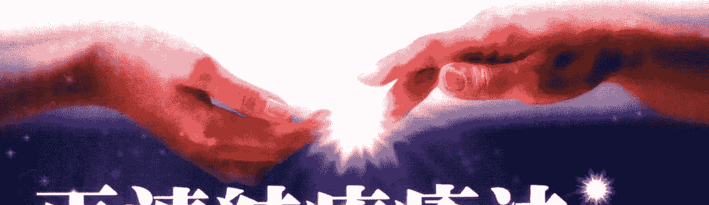

## 再連結療癒法

### 來自宇宙能量的治療奇蹟

艾力克·波爾醫師 Dr. Eric Pearl ◆ 著 黃愛淑 ◆ 譯

## The Reconnection Heal Others, Heal Yourself

◆東吳大學物理系教授 陳國鎮 審訂/推薦 ◆中華自然醫學教育學會創會理事長 呂應鐘 推薦

## 名人推薦

> 「艾力克是個擁有特殊療癒天賦的人。閱讀此書可以使你得到提升和轉化。」
——約翰·愛德華（John Edward）通靈者、《跨過界線和死亡之後》作者

> 「當我第一次收到《再連結療癒法》這本書時，我坐下來，在一夜之間從頭到尾讀了一遍。我被迷住了，它讀起來像是很好看的小說，但它跟小說不一樣，它講的是真實，這種真實是有關一種革命性的新療癒方法，是每一個人都可以學會，也可以用來療癒自己和療癒別人的方法。書中充滿了幽默、洞見，以及只有一個成熟的臨床醫生和科學家才會有的深度理解與謙遜。艾力克·波爾說出他如何被『再連結能量』轉化的故事，也告訴我們，這是每一個人都可以做到的。假如你們真的想要健康或療癒，你一定要看這本書！」
——克里絲汀·諾斯拉普醫生（Christiane Northrup, M.D.）助理教授《婦女的身體，婦女的智慧》和《停經期的智慧》作者

> 「身為醫生和研究神經系統的科學家，我所受的訓練讓我知道某種治療為什麼會有效，以及它是如何產生效果的。就《再連結療癒法》來說，我不知道它是怎麼產生效果的，我只是從個人的經驗裡知道它是有效的。艾力克·波爾的工作對我來說是一個禮物，透過這本書，它也可以是給你的禮物。」
——莫娜·史瓦茲（Mona Lisa Schulz, M.D, Ph.D.）醫學博士、《甦醒的直覺》作者

> > 「在這幾年內出現的有關超個人療癒和靈性醫療的書籍裡，艾力克醫師的《再連結療癒法》可說是最好的一本。這是宇宙賦予我們的禮物，在我們目前全球性的意識轉換中，這也是一個非常令人振奮的貢獻。假如你今年只要讀兩本書，務必讓這本珍貴的書成為其中之一。
——漢克·維索蒙博士（Hank Wesselman, Ph.D.）
《靈性行者》《醫藥製造者》作者

> > 「艾力克寫了一本非常好的療癒之書，引人深思，並且也很實用。他不只是分享他的洞見和在療癒恩典上的經驗，他也告訴了我們很多有用的方法，幫助每個人在生活中找到所需的療癒，不只是為自己，也是為他人。艾力克的幽默感和真誠使得這本著作成了一本必讀之書。
——羅恩·羅斯博士（Ron Roth, Ph.D.）
《療癒的聖靈》作者

> > 「這本書對於療癒的動能提供了很有趣和清新的洞見。
——狄巴克·喬布拉醫師（Deepak Chopra, M.D.）
《怎樣認識神》作者

> > 「這一本書在安慰內心和歡慶療癒過程的同時也啟發了心智。那些希望在過程中提高病人療癒水平，同時也能夠療癒自己的醫界的人士都應該要讀讀波爾醫師在《再連結療癒法》書中深刻的見解。病人也應該看這本書，這樣他們不僅可以療癒自己，也能夠協助療癒他人，並且，透過他們的實例，他們可以把現代的能量醫療和《再連結療癒法》的醫療效果告訴他們那些傳統式的醫生們。
——葛瑞·史瓦茲博士、琳達·魯塞克博士
(Gary E. R. Schwartz, Ph.D., and Linda G. S. Russek Ph.D.)
亞歷桑那大學人類能量系統實驗室主任
《活性能量宇宙：改革科學和醫學的基本發現》作者

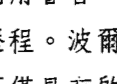

> > 「這是一本很好的書，它用睿智、幽默和具有深度的洞見描述了一個醫生兼療癒者的進化歷程。波爾醫師獨特的故事和經驗已引領了再連結療癒的發展，它不僅具有啟發性，也很動人。波爾醫師被賦予了無與倫比的療癒能力，他把它給了我們。他的再連結療癒方法很簡單，但效果卻是很深入的。它代表了一種新的、非指導性的能量醫療，也超越了我們地球上到目前為止仍在使用的固定配方、技巧和咒語。我極力推薦這本書給健康照護的從業人士，以及對喚醒自己的療癒潛能有興趣的每一個人。
——理查·戈伯 醫師 (Richard Gerber, M. D.)
《振動的醫藥》和《二十一世紀振動的醫藥》作者

## 謹獻給……

献给我的双亲——他们给了我生命也给我勇气活在真理中

献给艾伦和索罗门——他们给我洞见也给了我所需要的肯定让我能够继续往前

献给神／爱／宇宙——感谢祂们的付出

## 推荐序
天人再連結是治療關鍵
陳國鎮 011

## 前言
葛瑞·史瓦茲博士 琳達·魯塞克博士
回歸天人合一的療癒境界 呂應鐘 014

## 序言 026

## 第一部分 禮物 029

- 1. 第一章 新療法的開端 031
- 2. 第二章 從死後的生命學到的課題 039
- 3. 第三章 童年往事 057
- 4. 第四章 一條新的發現之路 077
- 5. 第五章 打開門，打開燈 093
- 6. 第六章 追尋答案 111
- 7. 第七章 石頭的贈禮 117
- 8. 第八章 洞見：現在與未來 131

## 第二部分 再連結療癒及其意義 155

- 9. 第九章 想要學習更多 157
- 10. 第十章 弦和股 161
- 11. 第十一章 帶入新頻率 171
- 12. 第十二章 要給與，先接受 185
- 13. 第十三章 不要介入 195
- 14. 第十四章 設定正確心態 219
- 15. 第十五章 療程中的變數 233

## 第三部分 你與再連結療癒 245

- 16. 第十六章 輕鬆進入再連結共同能量圈 247
- 17. 第十七章 療癒者的環境 255
- 18. 第十八章 喚醒內在的療癒者 269
- 19. 第十九章 找到能量 283
- 20. 第二十章 第三個夥伴 291
- 21. 第二十一章 和病人互動 321
- 22. 第二十二章 療癒的意義 335

## 結語 349

## 致謝 354

## 作者簡介 357

## 人天再連結是治療關鍵

陳國鎮

物質文明的繁盛似乎走到了極致，再下去人類文明要走的道路，必然是朝心靈昇華的方向邁進。未來的大環境快速變動，會讓很多人感受到「人生苦短」的無奈滋味。也許昨天還是意氣風發，轉眼間，今日卻可能是前途茫然一片，心中只剩下幻影憧憧，不知所從的唏噓。

時代變了，不僅是因為人心思變，更是由於日月星辰自然推移的必然轉變。在轉換的過渡期間，人類會碰到狂暴的天災地變，也會出現各種怪異反常、焦躁不安的言行，苦難相繼而來，健康和生存飽受威脅。觸目驚心的災禍會讓人誤以為世界末日到了，走到這樣的地步，很多人會很無奈，有時只好祈求上蒼賜與一絲憐憫。

面對無數新穎的疾苦，以正統自居的現代醫學，愈來愈有捉襟見肘的窘境，尤其是面對天生的或慢性的疾病，經常只能給它們取個病名就無計可施了。如此醫學顯然有所偏失，深入探究之，其實是在對生命基本的認知上不完備，以至於經常以偏概全、診療雙方皆不知所以，到如今則非改弦更張不可。這種無法診治的現象愈來愈窘迫。

## 建構正確治療態度

近幾十年來有各種靈性人士出現，帶領著大家做靈性的體驗，更值得注意的是探討生命奇蹟的議題，其討論內容的層次也有逐漸提升的現象。本書的作者艾力克・波爾醫師，雖然以整脊醫療為其專業，他卻能體認到深刻的人天連結關係。他說出了，人天再連結是有效治療的關鍵機制，病患不僅會獲得奇蹟似的療效，醫者也能建構正確的治療態度，以及應該嚴守的分際。醫病二者都應敬天順人，以參贊宇宙化育萬物之心，佈施無所偏執的愛心，則療癒的力量即可像及時雨一般應景而來，並且達到優化的狀態，醫者不必刻意作為。

有關靈性的認知與發展，東西方雙方的文明不知不覺逐漸接軌，這豈非「人同此心，心同此理」的印證？在另類醫學的衝擊下，也在深刻的身心自我省察中，人類對於生命的認識將更正確完備，而身心靈的健全也會大幅提昇。唯其能如此演進，人類才可能經得起嚴酷的環境考驗而永續長存。

## 陳國鎮教授

- 東吳大學物理學系教授
- 中華生命電磁科學學會理事長
- 圓智學會理事長

## 推薦序——回歸天人合一的療癒境界

呂應鐘

現代人都根深蒂固地認為生病必須要找西醫治療。然而當我們深入檢視現代醫療是否真能讓人類回復健康時，就會發現常識和實際有很大的出入。只要每天上午到各大醫院的領藥廳觀察，一定會看到觸目驚心的病人潮，每人手上都捧著一大堆西藥，其中有很多都是長期老病號。

這個現象顯示，現代醫藥並沒有『真正治好』疾病，只是用藥物控制病症而已。

一位台大醫院老教授曾感慨地說：『醫學教科書裡並沒有『復原』兩個字。』這句話道出了現代醫學的醫療真相，醫學教科書只教醫生如何診斷疾病、如何治療器官，根本沒有教導如何讓身體回復真正的健康。

世界衛生組織的章程給『健康』下了定義：『健康是一種完全的、生理上的、心理上的和社會關係上的良好狀態，不僅僅意味著沒有疾病或者不虛弱。』由這個定義來檢視現代醫療，就會發現現代醫療根本做不到讓人類達到身心健康的目標。而更嚴重的是現代醫療分科極細，心臟科醫師只看心臟，眼科醫師只看眼睛。西醫不知道肝臟和眼睛都屬木，眼睛疾病也許和肝臟有關；也不知心臟屬火，肝臟疾病和心臟疾病也有木生火的關係。此種醫學盲目的現象要從十六世紀談起。文藝復興運動，使醫學界產生一場以當時的德國醫師 Paracelsus 為首的醫學革命，他首先指出「人體的生命過程是化學過程」，重視實踐，反對繁瑣的經院哲學以及中世紀的傳統和權威觀念。他說：「沒有科學和經驗，誰也不能成為醫生。」因此當時的歐洲醫學就擺脫了古代醫學哲理的束縛，開始獨立發展，醫生開始重視人體構造，首先革新解剖學的就是義大利的達文西，從此西方醫學的主要成就就是建立在人體解剖學上。認為每一種疾病都有它在某個器官內的相應病變部位，從此醫師才開始用「病灶」來解釋症狀，這種思想影響了日後的整個西方醫學領域。到一八四〇年時，德國醫學界首創將科學實驗室方法導入醫學界，對於急性病症治療成效極佳，於是正式成為現代醫學的起點（然而對於慢性病症卻束手無措，只會持續用藥）。由此觀之，三百年來的西方醫學將人從傳統醫學的身心靈層次降為器官層次，認為人體過程就是化學過程，所以器官疾病就要用化學藥物來治療。到了二十世紀，化學工業發達之後，製藥廠商利用專利權綁架政府修訂醫療法，以保障他們龐大的藥品利益。醫師也要政府修訂法律來保障他們的職業利益。

從此，人類要想回復健康已經不可能了。當我看到這本《再連結療癒法》書稿時，相當高興，沒想到作者艾力克·波爾醫師竟然在現代醫療霸權控制下「敢寫」這樣的一本書，這一方面顯示美國言論的開放，以及自然醫學思想的進步，二方面也告知世人應該回歸數千年來的傳統「身心靈」醫療才是人類回復健康的正道。而我更高興的是，作者的理念和作法，與我於二〇〇九年四月份在一場對醫師、營養師、護理師的上課中所提的「全然的醫學（Wholistic Medicine）」的真意完全相同，這是我正在架構的未來醫學理論。我認為真正的「身、心、靈」內涵就是道學所言的「精、氣、神」，用現代語言來說就是「生理、心理、天理」三個層面。將這些古代用語轉換成科學語言，可以用「物質、能量場、信息場」三個高等物理、量子論及宇宙論名詞來做新的詮釋：靈就是「信息場（意識場）」，心就是「能量場」，身就是「物質」。現代西方醫學的興起是建構在人體解剖學之上，因此以「生物化學」角度研究人體的種種活動，並研發化學藥物來治病，以「生物機械」角度來矯正身體或做手術，可以說現代西方醫學只停留在最低的「生理層面」，關注在「物質」而已。

傳統中醫認為人體是小宇宙，除肉體外還有經絡、氣血、氣色等，換用現代語言來看，「血」就是「物質」，「氣、氣色」就是「能量」，而西醫無法量測的經絡就是能量的活動。因此傳統醫學包含了「物質」和「能量場」，也就提升到「生物物理」的角度。

近代高等物理的研究已經承認人體有生物能場，也認為宇宙間充滿信息場，這已經涉及到「神靈」的境界，也就是天理層面，若以醫學角度而言，就是「靈性治療(spiritual healing)」，也就是「神醫」的境界。

真正健康的完整醫學應該包含生理、心理、天理，缺一不可。

生物醫學認為人有「眼、耳、鼻、舌、身」等五官感覺（五識），這是生理層面的存在，也認為人的第六感是「意識」，這就進化到心理層面的存在。事實上佛經早就道出還有更高的「末那識」和「阿賴耶識」，這兩個層次是現代醫學所未知的，也正是上個世紀偉大的心理學家榮格提出的「集體未知意識（collective unconsciousness）」的層面。

我認為「集體未知意識」就是「靈界」，而「末那識」和「阿賴耶識」就是物質身體和靈界溝通的意識場，也稱為信息場。如果現代醫學承認靈魂的實存，認定人體是由物質面的肉體及更高層面的靈魂所構成，就能夠成為完整而正確的醫學。因此「靈性研究（psychic research）」及「靈性療法」也應該是現代醫師必須學習的課題。

用我的理論架構來看這本書，就能夠了解艾力克·波爾醫師的特殊療癒能力其實就是已經能夠運用自如的靈性醫學，連結到能量場與信息場，那個境界就是高層次的光。

如果現代醫學能夠放下高傲的身段，回歸傳統醫學運用自然的療癒本質，體認靈性的存在並能夠運用之，那麼人類才有可能邁向真正健康之道。我相信這本書是一個開路先鋒，將會打開醫療新局。

呂應鐘醫師
- 美國全我知識發展學院（Wholeself Knowledge Development College）教授
- 中華自然醫學教育學會創會理事長
- 美國整體暨自然醫學學會營養醫學委員會會長
- 北京普善源醫學研究院學術院長
- 網站 www.wiselife.org.tw

## 前言

你將要讀的這本書是關於一個既有勇氣又有愛心的臨床醫師艾力克・波爾的故事，他發現了健康和療癒的主要關鍵在於「再連結」（The Reconnection）。當我們第一次聽到他在亞歷桑那大學「整合醫學計畫」裡演講時，我們立刻對他坦率而開放的態度留下深刻的印象。他願意放棄在洛杉磯很賺錢的整脊醫療事業走上靈性療癒的道路，提出現代醫學和療癒裡一些重要且具爭議性的問題。

> 「能量」以及它所攜帶的資訊，在健康和療癒裡扮演著主要的角色嗎？

我們的心智可以和這種能量連結嗎？我們能不能學習運用這種能量來療癒自己和他人？有沒有一個較大的靈性實相，是由活性的能量組成，我們可以學習去和它連結；而且，這個實相不但是可以促進個人療癒，也可以幫助療癒整個地球？

> 我們在想：「波爾醫師是不是精神不太正常了？還是他已和他內在的心——以及宇宙的具有活性能量的心……的智慧重新連結了？」

真實的情況是，當我們第一次遇見波爾醫師時，我們不知道。但是，波爾醫師承諾要做到。」這其中包括了把他的主張和他的才能帶入研究實驗室，他的格言是：「假如它是真實的，它就會被揭顯出來；假如它是假的，我們會找出那個錯誤。」 亞歷桑那大學人類能量系統實驗室是特別為了身心醫療、能量醫療和靈性醫療的整合而設的。我們和波爾合作的目的並不是要證明「再連結療癒」是存在的，而是要給「再連結療癒」這個過程一個證明它自己的機會。

### 與「再連結」的歷史性連結

我（葛瑞）個人和「再連結」概念之間的關係要追溯到一九六〇年代的晚期，在研究所念博士學位的時候。有人告訴我有關一個在上個世紀的前三十年最有整合能力的科學家（也是醫生）所主持的自動調節與療癒的研究。 在一九三二年，哈佛大學的華特·肯農 (Walter B. Cannon) 教授出版了他的名著——《身體的智慧》(The Wisdom of The Body)。肯農博士描述了身體如何保持它的健康——源自希臘字的 heal，意思是透過他稱之為「體內平衡」的過程而達到「整體性」。根據肯農教授的說法，身體在維持其自我平衡的整體性時，它的能力有賴於整個身體內的回饋過程彼此連結，以及在這個回饋快速道的網路裡的資訊一定要流暢、正確。

例如，假如你把一個溫度計連接到暖氣爐上，當你房間的溫度降低到你設定的溫度時，溫度計便會傳出信號，把暖氣爐啟動（反之亦然），這樣你就可以維持室內的溫度了。溫度計提供了回饋，所得到的結果就是你和你的房間之間達到了一種內在平衡。
因為有這個系統內的適當連結才能造成這種結果。假如你把回饋系統切斷，溫度就無法維持了。簡單地說，這就是「回饋系統連結」（feedback connection）的概念。
當我還是哈佛大學生理與社會關係系的助理教授時，我推演出一個邏輯，並從中發現到，回饋系統連結不僅是生理健康和整體性的根本，也是大自然中所有不同層次的健康和整體性的基礎。回饋系統連結是整體性（可以是能量上的、情緒上的、社會上的、全球性的，是的，也可以是天體物理學上的）的基本。

### 我認為肯農的《身體的智慧》可能反應出一個更大的、宇宙的法則，我稱它為「系統的智慧」，或更簡單地說，是「連結的智慧」：

- 當東西有連結時——例如：
    1. 在水中，氧和氫以化學連接物連結著；
    2. 在身體內，頭腦的神經中樞、荷爾蒙或電磁性機制與生理器官連結著；
    3. 在太陽系裡，太陽以引力和電磁作用力和地球連結著……

> 資訊和能量自由地流動著，任何系統都有能力維持健康狀態，保持著整體性，並且也會進化。七〇年代中期到八〇年代晚期，當我在哈佛大學擔任生理和精神病學教授的時候，我發表了科學論文，把這個宇宙的連結法則不僅應用在身心的整體性上，也用在自然界裡所有不同層次的整體性和療癒上（e.g. Schwartz, 1977; 1984）。我的同事和我都認為，有五個基本步驟可以達到整體性和療癒：注意力、連結、自動調節、秩序、輕鬆自在。

- 第一步：主動的注意。這很簡單，只要去體驗你的身體、在你身體內流動的能量，以及在你和你的環境之間流動的能量。
- 第二步：注意力創造了連結。當你允許你的心智（有意識或無意識地）去體驗能量和資訊，這個過程不只促進了你體內的連結，也促進了你的身體和環境之間的連結。
- 第三步：連結促進了自動調節，就像一個團隊的運動員或音樂家想在運動項目或爵士樂上共同完成一個偉大的目標一樣，他們彼此間機動性的連結，使得整個團隊在教練和指揮的指導和協助下，能夠組織和控制自己（此稱為「自動調節」）。
- 第四步：自動調節促進秩序。你對整體性、成功，甚至美的體驗，反映出一個組織的過程，它是因為有連結而產生了自動調節之後，才有可能發生的。

## 第五步：秩序是以輕鬆的方式表達出來的。

當每件事都恰當地連結時，其中的組成部分（運動員和音樂家）都得以發揮他們各自的角色，自動調節的過程可以毫不費力。過程是流動的。

反過來也是一樣的。有五個基本的步驟會導致失調或疾病：疏忽（沒有注意 disconnection）、切斷連結（沒有連結 disconnection）、失調（沒有調節 deregulation）、混亂（沒有秩序 disorder）、疾病（沒有輕鬆 disease）。

假如你對自己的身體疏忽了（第一步），這會在你的身體內切斷身體和環境間的連結（第二步），導致身體內的失調（第三步），也是系統內的一種混亂（第四步），我們體驗到的就是疾病（第五步）。

簡單的說，連結會導致秩序和輕鬆；切斷連結會導致混亂和疾病。

當你讀波爾醫師的書時，你會看到這些連結的步驟在所有不同的層次上——從能量上，經過身／心，到靈性上——有了生命。在了解這個新層次的療癒時，最主要的關鍵字是「重新再……」——重新再注意、重新再連結、重新再調節、重新再調整秩序的療癒。

## 發現「再連結」的智慧

在史蒂文·桑罕（Stephen Sondheim）的音樂劇《點點隔世情——與秀拉同行》（Sunday in the Park with George）裡，講的是一個點彩派畫家喬治·秀拉的故事。秀拉是一位組織和連結彩色點的大師，創造了很多讓我們至今面對它時都不由地要感到謙卑的作品。桑罕用簡單的歌詞提醒我們這些過程的重要性：「連結，喬治，連結。」

在讀這本書的過程當中，你會加入一個連結療癒的旅程。當波爾醫師把你生命中的許多個點連結起來的時候，你的心智和心將會被擴展和結合。你會進入一個有天賦的療癒者的靈魂裡，這位療癒者在發現「再連結」的過程中，曾經經歷了個人的懷疑和痛苦，你也會見證到他在看到病人療癒之後所體驗到的深刻祝福與滿足。

我們並不是在說這本書裡提到的每件事都是有科學上的認證。波爾醫師的態度也是一樣的，他只是分享他的經驗，提供他的結論，然後讓你做出自己的結論。這個旅程會一直持續下去。

波爾醫師對以實證為基礎的醫學有一個長期的承諾。到目前為止，在我們的實驗室裡做的基本科學研究，很意外地符合了他的預測，同時我們也策畫了一些未來的臨床計畫。就如我們在《活性能量宇宙》（The Living Energy Universe）一書中所提到的，療癒的智慧可能全都在我們的周圍，等待我們去接觸，然後它就可以提供最大的服務。但願你們可以和我們一樣受到這本書的教導和啟發。

## 葛瑞·史瓦茲 博士 和 琳達·魯塞克 博士

葛瑞·史瓦茲 博士（Gary E. R. Schwartz, Ph.D.）/ 是一個生理學、醫學、神經學、精神醫學和外科醫學的教授，也是亞歷桑那大學「人類能量系統實驗室」的醫學臨床助理教授和共同主任。他也是「活性能量宇宙基金會」的研究和教育的副主席。他在一九七一年在哈佛大學取得博士學位，並在哈佛大學擔任生理學的助理教授到一九七六年為止。他在耶魯大學擔任生理學和精神病學教授、耶魯大學心理生理學中心主任，以及耶魯大學行為醫學診所的共同主任一直到一九八八年為止。

琳達·魯塞克 博士（Linda G. S. Russek, Ph.D.）/ 是亞歷桑那大學「人類能量系統實驗室」的醫學臨床助理教授和共同主任。她也是「活性能量宇宙基金會」的主席，並且帶領慶賀生命系列會議。

> www.livingenergyuniverse.com

## 序言

> 每一個人都有生命的目的一個可以和別人分享的獨特禮物，或者特別的才能。當我們把這個獨特的禮物和對別人的服務融合在一起時，我們會經驗到自己靈魂的至喜和大樂，那是所有目標的最終目標。
——狄巴克·喬布拉 醫師 (Deepak Chopra, M.D.)

在我的生命中，我曾被賦予很多不同的禮物。其中的一個會帶來驚人的療癒能力，從書中你可以看到，我並不完全了解（現在快要了解了）這些療癒。第二個禮物是我發現到，在這個世界之外真的還有其他的世界存在。第三個禮物是這個寫書的機會，藉此把我到目前為止所學到的與大家分享。

第一個禮物的好處是，透過它，我意識到我生命中有一個目的，而我一直很幸運，不只可以找到那個目的，並且還能積極地、有意識地活在當中。在所有的生命禮物中，這個真的第二個禮物給了我能力去認識到我的大我（或全我），了解到我們是靈性的存有，我的人生經驗只是我作為人類的經驗，它只不過是「我真正是誰」其中的一個體驗而已，其他還有很多。每當我在所做的每一件事裡看到我的靈魂出現時，我也可以在其他人身上看到、碰觸到它。這是一個很神奇的禮物，儘管它一直都在我的面前，我卻一直對它視若無睹，直到現在。這第二個禮物為我的生命目的帶來展望。

第三個禮物把一個新的生命元素注入前面兩個禮物。一直到不久之前，我都在和別人分享「療癒」的這個禮物，一次治療一個人。雖然我很喜歡我在做的事，但是我知道自己應該和更多的人分享。我守著這個禮物不和別人分享沒什麼好處……我並沒有刻意私藏，我把它看成是禮物（它的確是個禮物），因此我認為我無法把它送給別人（其實是可以的）。

這份療癒能量對我有耐心，知道我很快會了解到一個更大的視野。因為它有能力在他人身上做能量相融的工作，因此人們會知道它的存在。我開始舉辦一些研討會，讓更多的人可以和它做第一手的互動。發現到這個療癒的禮物可以透過電視在他人身上啟動，也是很令人興奮的事。至於書面的文字——似乎為這個療法的普及帶來了全新的範疇。透過印刷文字和廣播媒體等方式傳遞訊息，其不同凡響之處在於，可以使更多的人有機會體驗到那種療癒能力在他們身上被啟動。我意識到，現在是轉變我們的想法的時候了，也是該讓我們人類看到這些的時候了——我並不想太宗教化——當兩個或兩個以上的人聚在一起時，我們就可以相互協助。我們可以幫助他人療癒，而我們可以做到的程度是我們以前從來無法做到的。我終於了解到，我的禮物不只是要幫助他人，也是要幫助他人再去幫助他人。這給了我一個更大的工具，讓我可以開始實現我的人生目的。這本書包括了當初從來沒有人給過我的使用手冊，和一個在你出發之前給你的啟動。假如你的意圖是成為一個療癒者，或者你是一個療癒者而你想更提高你目前的療癒能力或者，你只想去觸摸星星，讓自己相信它們是真實存在的——那麼，這本書就是為你而寫的。我應該說，我的人生目的找到了我，我希望它也幫你找到你的人生目的。

> ——艾力克·波倫醫師

## 第一部

## 禮物 The Gift

你究竟要繼續讓你的能量沉睡多久？
你究竟要繼續忽視你龐大的自己多久？

## 第1章 新療法的開端

### 蓋瑞的奇蹟

這個人到底是怎樣爬上這些階梯的？我從辦公室入口旁的大型玻璃窗往外看，心裡這樣想著。我的一個新病人剛剛走到樓梯的頂端。他一步步地撲身向前，中間幾次停下來歇息，凝望著下一階，準備要繼續努力。我再次懷疑自己把整脊診所開在二樓（這棟建築物並沒有電梯）是不是正確的決定。那是不是就好像把修理煞車的店開在山下一樣？

> > ——愛因斯坦

在一九八一年我剛開始執業的時候，我並沒有太多的選擇，現在看起來，我有的選擇更少了……雖然理由已經不一樣了。在這裡執業的十二年裡，我的業務大幅地成長，成了洛杉磯最大的一家。我怎麼可能拔腿遷離這個地方呢？我決定不出去幫這個人走上最後的幾階。我不想削減他馬上就會有的成就感。我可以從他臉上看到一個登山者在登上聖母峰前，爬行在最後一個斜坡時那種十足堅決的表情。當他最後跟蹤著登頂時，我不禁想到鐘樓怪人不屈不撓地爬上鐘樓的景象。我看了一下病人的病歷，他的名字叫蓋瑞。他來看我是因為他一生都為背痛所苦。這一點都不奇怪。雖然他既年輕又健康，但是你一見到他時馬上就會注意到他身體那種令人痛苦的姿態。他的右腳比左腳短了幾英寸，所以右臀部要高出很多。因為這些缺陷，他跛得很厲害，每走一步他都得把右臀部往外搖擺，然後把身體推向前方趕上去。他的右腳向內彎，然後放在左腳上，合併成為一隻更大的腳，平衡他上半身的重量。為了防止跌倒，他的背必須向前傾斜大約三十度角，看起來就好像準備好要跳進游泳池的樣子。他的體態和步伐導致了嚴重的背痛，從孩童時代一直到現在。

很快的，蓋瑞開始告訴我他的過去。結論是，從某個方面可以這麼說，自從他出生的那一刻開始，他一直都在辛苦地爬樓梯。醫生太早把臍帶剪掉，使得氧氣無法供應給嬰兒的頭腦。在肺部擔起呼吸的功能之前，傷害已經造成了。他的腦部受到的影響使他的右半身無法對稱地發育。

蓋瑞說，為了要改善這種情況，到了十四歲時他已經看過至少二十個醫生。他還動了手術，拉長右腳跟與小腿間的大塊肌腱，為的是想要改善行走和身體的姿勢。結果並沒有什麼幫助。他也穿戴了矯正骨頭的鞋子和腳架，情況也一樣沒有改進。當他的右腳痙攣變得愈來愈痛時，醫生給他開了抗痙攣的藥，但是痙攣的情況愈來愈嚴重，並且使他變得遲鈍和失去判斷力。

最後，蓋瑞找到了一個很出名、很受敬重的專家。蓋瑞很確定，假如有任何人可以幫得上忙，一定就是這個人了。

在經過詳細的檢查之後，醫生坐了下來，看著他的眼睛，告訴他說他已經無能為力了。

他說，蓋瑞將會有背痛的問題，而且這些問題會隨著年齡增加而更嚴重，他的骨架會持續地敗壞，最後他會需要坐輪椅。蓋瑞只是瞪著醫生看。

蓋瑞一直把所有的希望都寄託在這個專科醫生上，但是他離開時的心情是比以前更加氣餒的。根據蓋瑞的說法，那一天，他「在心中把醫療體制一筆勾銷了」。

這樣過了十三年。有一次蓋瑞在和朋友一起運動的時候提到他當時正面臨嚴重的背痛。

真巧，他朋友兩年前曾在一次重大的摩托車意外事件之後來找過我治療，於是她介紹蓋瑞到我的診所來。

這就是蓋瑞今天在這裡的原因。

聽完蓋瑞的敘述後，我停下筆記，把頭抬起來問道：「你知不知道我的作法？」蓋瑞看著我，好像不太懂我為什麼會這麼問。「你是整脊醫師，對吧？」我點頭稱是，故意不多說什麼。有一種期望的感覺存在著。是不是只有我一個人感覺到這個呢？我把蓋瑞帶到另一個房間裡，叫他躺到診療床上，幫他調整了頸部。我告訴他初診已經結束，並要他四十八小時之後再回來讓我做一次評估。兩天之後，蓋瑞又回來了。和以前一樣，我還是要他躺上診療床，然後只花了幾秒鐘幫他做調整。這一次我叫他放鬆，把眼睛閉上……一直到我叫他睜開為止。我提起手，雙掌向下，放在他的身體部分上方約一英尺處，然後在雙手往頭部移動時，慢慢地去注意一些不同的、不尋常的感覺。我把兩掌朝內，繼續移動兩手，一直到兩掌各對著一個太陽穴。當我把手停舉在那裡時，我發現蓋瑞的眼睛快速地來回移動，從一邊到另一邊，快速中又帶著力量，那種強度讓人覺得他有可能在做任何事——除了睡覺之外。我的手本能地被拉向他腳的部位，輕輕地把手掌對著他的腳底。我覺得我的手懸在那裡好像被一種看不見的東西支撐著。因為天生的變形，他的右腳即使在躺著時也仍然保持著向內的樣子。他穿著襪子，當我注視著他的腳底時，我並不知道接著會發生什麼事。他的腳好像回復了生命。這種有生氣的樣子和我們的腳有生氣的樣子是不一樣的，它們好像是各自變成兩個有生命的實體，彼此都不同——很明顯地，和蓋瑞的也不同。在那種令人入迷的詫異中，我觀察著他腳的動作，兩隻腳看起來幾乎都有各自獨立的意識。

突然間，蓋瑞的右腳開始一種近似「踩」油門的動作。就在持續地「踩」時，第二個動作產生了——一種向外繞圈圈的動作，使他的右腳從靠在左腳上的樣子變成腳趾向上的樣子，就像左腳的腳趾向天花板那個樣子。我不知道自己還有沒有在呼吸，而只是靜靜地注視著蓋瑞的眼睛不斷地左右快速移動，就像一架平台式鋼琴上的節拍器。他的腳仍然持續「踩」的動作，然後轉回來，回復到它原來的樣子。就這樣重複著——向外，向內，向外，向內。然後看起來好像停止了。我等待著，等待著，又等待著，好像再也不會有更進一步的進展了。

我發現自己在床邊走著，一直走到蓋瑞的右側。雖然工作時我的習慣是不去碰觸病人的身體，我現在卻發現自己不由自主地把手輕輕地放在他的右臀部上，右手放在左手上面，但不是直接接觸著。我往下看著蓋瑞的腳。右腳再度開始動起來，開始時是踩的動作，然後又不是轉圈動作。向外，向內，向外，向內，向外，向內。

我等待著，又等待著。好像不再會發生什麼。

我把手從蓋瑞的臀部移開，然後用兩隻手指輕輕地碰觸蓋瑞的胸膛，「蓋瑞，我想我們該結束了。」

蓋瑞的眼睛仍然移動著，雖然我可以看得出來他試著要睜開。大約三十秒之後，當他睜開眼睛時，他看起來有些茫然。『我的腳在動，』他告訴我，好像我沒看到似的。『我可以看到感覺得到了，但是我停不下來。我覺得全身很熱，然後我覺得好像有一種能量在右腳小腿上逐漸增強。然後……你可能會覺得這有點瘋狂，但是我感覺到好像有看不見的手在轉動我的腳，但是它感覺起來完全不像手。」

## 人生中的路標

在那一天，能量很明顯地提高到某一個全新的層次。為什麼呢？我也說不上來。它就是提高到了新的層次，有時是每個禮拜，有時是每隔幾天，有時是一天內有幾次。即使是在當蓋瑞帶著很大的笑容離開了辦公室，我看著他優雅地走下了樓梯。

蓋瑞站在那裡的時候，我訝異地（心中還懷著感激）看著他，他的脊椎是直的，他的臀部是平衡的。從他的表情你可以看出來他開始了解發生了什麼事。當他試著走幾步的時候，我可以從他的表情你可以看出來他開始了解發生了什麼事。當他試著走幾步的時候，我可以定，想要知道發生了什麼事。蓋瑞站起來——二十六年來的第一次——六呎高，兩隻腳各自分開地站著。

> 「你現在可以站起來了。」我說著，盡力不要表現出不知所措的樣子，同時還要保持鎮定，想要知道發生了什麼事。

那個下午發生在蓋瑞身上的事不只是改變他的生命，也即將要改變我的。並不是因為蓋瑞是我用這種方法（用我的手在他身體上方移動）治療過的唯一的病人，我這樣做已經有一年了。也不是因為在這種經驗裡他是獲得最大效果的病人。但是，他確實是代表了一種到目前為止最極端的例子——病人在開始時是最嚴重的殘障，然後在離開我的診所時是帶著特殊和明顯的結果。這個國家裡差不多有兩打以上的最好的醫生都無法矯正（甚至也無法改善）蓋瑞的步態和體態，或者他臀部和腳的轉動，但是這種異常以及它帶來的痛苦，在幾分鐘之內真的消失了，就這樣消失了。

我再度懷疑為什麼這個能量選擇了透過我顯現出來。我是說，假如我坐在雲端，在整個星球裡尋找一個合適的人，把這個稀有的、在這個宇宙裡最多人在追尋的禮物贈送給他，我不知道自己是否可以透過乙太層，在一大群人中間挑出某個人，指著他說：「就是他！就是這個人！把這個禮物給他！」

可能事情的發生並不完全是這樣，但我是這樣感覺的。

我當然並沒有坐在西藏的一座山上，注視著肚臍，用筷子吃裝在碗裡的沙子。我已經花了十二年建立我的事業，我有三棟房子，一部賓士汽車，兩條狗，兩隻貓。我這個人偶爾會好好享受一番，或比一個整天看電視的十二歲小孩看更多的電視，我覺得我也在做我「應該」做的事。喔，我也曾有一些的問題——事實上，在這些奇怪的事開始發生之前，它們也累積到了一個頂端——然而，一般說來，我的生活是照著計畫在進行著的。但是，是依照誰的計畫呢？那是我現在必須問我自己的問題。因為當我回顧的時候，我可以看到我的人生旅途中有幾個路標或明顯的標的——發生一些奇怪的事件、巧合——雖然每件事件個別看起來並不特別怎麼樣，但是總體來看，加上事後認真的回想，在在都顯示了我從來不是走在我以為我已經選擇好的路上。第一個路標在哪裡呢？這個證明要追溯到多久以前呢？假如你問我的母親，那要回溯到我從她的子宮出生的那一天。用她的話來說，我的出生是「不尋常的」。當然，大多數的母親回想她們第一次的生產經驗都會認為那是特別的、獨特的，但這是不一樣的。有些女性經過幾天的極度陣痛，有些人在森林裡或是在計程車後座生產。我母親呢？她在生我時死在生產台上。讓她困擾的不是死亡。她的困擾是她又活了過來。

## 第2章 從死後的生命學到的課題

> > 對這個世界上（以及超越這個世界之外）發生的每一件事都有一個合理的解釋，而這一切聽起來都很有道理。將來有一天，你會了解神的計畫裡那個神聖的目的。——露意絲·波爾（Lois Pearl）

在醫院裡待產

這個情形還要持續多久？她在痛苦中掙扎著。在待產室裡，我的母親露意絲·波爾一直在做呼吸練習，專注地用力，專注地用力……但是好像沒有什麼進展，沒有看到嬰兒，產道口沒有更擴大，只有痛苦，更多的痛苦。醫生會利用替其他人接生的空檔跑來檢查她的狀況。她一直忍著不喊叫，很堅決地不想要當眾喧鬧，畢竟那是個醫院，還有其他的病人在那裡。

下一回醫生再出現的時候，我母親用哀憐的眼光看著她，眼淚簌簌而下，問道：「還要多久啊？」

醫生有點憂心地把一隻手緊貼在我母親的肚子上，想要看看我是不是已經準備好了。但是她體諒到我母親以出生的程度了。從醫生的臉上看起來，她並不認為我已經準備好了。

極度痛苦的情形，於是轉向護士，帶著猶豫的口氣說：「帶她進來吧。」

我的母親被放在輪床上送進了產房。當醫生不斷地在她肚子上施力的時候，我的母親注意到整個房間裡好像充滿了某個人大聲尖叫的聲音。她想，哇，那個女人真是糗大了！然後她才意識到整個房間裡只有她和那些醫護人員——也就是說，這個喊叫一定是她發出來的。

畢竟，她還是當眾大聲喊叫了。想到這點讓她覺得不安。

「這個情形還要持續多久？」

醫生給她一個安慰的眼神，也給她吸了一口乙醚，但那就好像只是在截肢的傷口上貼一片膠布一樣。

「她快要不行了……」

我的母親幾乎聽不到他們的聲音，因為她聽到更大的馬達轉動聲——那種只有工廠裡才會有的大型馬達，醫院裡是不會有的——蓋過了它們。它們開始時並不是很大聲。這個聲音，伴隨著一種刺痛的感覺，從腳底周圍開始，逐漸在身體上往上爬，就像馬達在往上移動一樣，並且在行進當中聲音愈來愈大，把一個部位的感覺關掉後再移向下一個部位，留在後面的只剩下麻木。

在馬達聲之外，陣痛的程度持續增加。

那時我的母親知道這種痛楚是她一輩子都不會忘記的。她的婦產科醫生是一個實際的、不苟言笑的、鄉下型的女醫生，相信女人應該要經歷生產的「全貌」。也就是說，她不會給止痛藥，即使在生產的過程中也是一樣，只除了在收縮最厲害時讓你吸一小口乙醚。

奇怪的是，這麼大的聲音，像打雷一樣，產房裡卻沒有任何一個醫生或護士受到干擾，好像都沒有人注意到它。我母親覺得覺得很奇怪，這怎麼可能呢？

所以，這些馬達，以及它們經過以後所留下來的麻痺，應該是一種緩和的作用。但是當它囉雜地要從骨盆開始往腰部移動的時候，她好像被什麼東西打了一下，她早知道當它們進行到心臟時會發生這樣的事。

她快要不行了……不！她完全被一種抗拒的感覺淹沒了。不管痛還是不痛，她不想死——她可以想像到她所愛的人處在悲傷之中。但不管她如何掙扎，那些馬達不肯倒轉回去，它們持續往上，一次一時地讓她麻木，好像在抹去她的存在。她沒有力氣去阻止它們，當我的母親意識到這點# 靈魂旅程

時，奇怪的事情發生了。雖然她仍不想死，突然有一種平和的感覺降臨在她身上。她快要不行了……馬達到了她的胸骨，她的頭裡充滿了它們的怒吼聲。然後她開始往上升……

正在往上升的不是我母親的身體，而是唯一她可以想到的——她的靈魂。她被拉著往上，有目的的似地被吸引著朝向某樣東西而去。她沒有回頭看。她不再覺知到身體周遭的事物，她知道她已經離開了產房和馬達。她繼續上升，向著上方前進。並且，雖然她在意識上對死後的生命或許並不了解，也不懂這種事在「靈性上」的意義，但這並不重要。當你的基本質正在離開你的身體，開始上升時，你並不需要有靈性上的背景才會知道這點。對於這種事情只有一種解釋。

我母親在生產台上最後的一個想法是，雖然她就要離開她所熟悉的一切，但她再也不介意了。開始時她有點驚訝，但就在她不再抗拒，並且願意「放下」的那一刻，她的旅程開始了。最先出現的是一種完全祥和與寧靜的感覺，各種世俗的責任沒有了，也不必再陷在日常生活裡的煩惱瑣事當中了。不需要趕什麼期限，不需要完成世俗的重任，不需要符合什麼期望，不需要設定什麼界限，不再有面對未知的恐懼。這一切都一個一個地融化掉了……這是多麼大的壓力紓解。這是多麼好的釋放！當這些事發生時，一種更輕的感覺逐漸地籠罩著她，然後她覺察到一個現象：她在漂浮著。她覺得自己是那麼的輕，那些世俗的責任正在消融，她上升到更高的層面。因此，我母親就這樣開始她的揚升，只有在為了要吸收各種知識時才停下來。

她經過了一連串不同的層次往上揚升，但她不記得有一個明顯的「通道」，就像其他有類似經驗的人所提到的那種。她所記得的是沿途所遇到的「其他人」，這些並不只是「人」，他們是「存有」、「靈體」、「靈魂」，他們上一次的生命是在地球上結束的。這些「靈魂」跟她說話——雖然說話這個字並不是最恰當的字眼。他們的溝通並不是用言語，而是一種意念的傳遞，用這種方式所傳達的訊息不會造成困擾，在這裡疑惑並不存在。

我母親學到的是，對於溝通的效果來說，我們所知道的口頭上的語言所造成的阻礙，比它們所能領會（為了學好其他的課題我們所需要的領會）的範圍的東西。

我的母親意識到，靈魂（一個人的「核心」）是唯一會存活下來，或可說是唯一重要的東西。靈魂把它們的本質展示得很清楚，沒有臉孔，沒有身體，沒有躲在後面的東西，但是她可以確實認出他們每一個人是誰。他們身體的外表不再是他們的一部分，他們把它遺留在世間，作為他們曾經存在過的紀念，也讓他們所愛的人可以憑此懷念他們在世時所曾扮演過的角色。留在這個地球上，可以證明他們過去曾經存在過的，只有這個物質的存在（身體），他們真正的本質已經超脫了。

我的母親還學習到，我們的外表和身體的矯揉造作是多麼的不重要，我們對外表和身體的珍視和執著又是多麼的膚淺。她在那個層級所要學的是：不要從人們的外表——包括種族和膚色——或者他們的價值觀或教育程度去評定他們。重要的是去發現他們真正是誰，去看到他們的內在，穿過外在去看到他們真正的身分。而且，雖然她已經在這裡學過這樣的課題，但是從某種角度看來，她在那裡得到這個領悟的程度，是更加細緻、無限寬闊的。

在那時，要判斷時間的推移是不可能的。我的母親知道她已經停留得夠久，足以讓她晉升並通過所有的層次，她也知道每一個層次都教導不同的課題。

第一層級是困在地球的靈魂，也就是尚未準備好要離開的靈魂。他們在離開自己熟悉的環境時遭遇到很大的困難，因為這些靈魂通常覺得他們還有一些事情尚未處理好，有可能他們身後所遺留下的某個心愛的人生病或殘障的，而以前照顧這些人是他們的責任，他們很難棄之不顧。所以這些靈魂就一直滯留在第一層，一直到他們覺得可以釋放掉世俗的牽絆為止。或者，也有可能他們是遭遇突然或暴力的死亡，以致沒有時間了解到他們已經死亡，也沒有足夠的時間去經歷應該有的過程，並隨著提升的道路前進。不管是哪一種，他們都還覺得和活著的人之間仍然緊緊相繫著，而且也沒有準備好要放手。一直到他們能夠了解到他們已經無法在那個層面上運作、自己不再屬於那裡、不再屬於那個次元以前，他們都會一直停留在第一層——最接近他們生前的地方。

我的母親對於第二層的記憶好像有點模糊，但對於第三層的印象是非常清晰的。她記得在她上升到第三層時，她體驗到一種很沉重的感覺。當她知道在這一層的是那些自殺的人時，她有一種哀傷的感覺。這些靈魂現在困在一種邊緣狀態，他們看起來是孤立的，既沒有往上也沒有往下移動。他們完全失去了方向，他們的處境也失去了目標。他們不會被允許上升到某一個點，好讓他們可以完成該學的課題，並在他們的成長中進化？假如他們不會被允許，這是她無法理解的。他們可能需要多花點時間才能完成，但她覺得這只是純然的推測，不是我的母親能夠帶回來的答案。不管是哪一種情況，這些靈魂並不是在安息的狀態——在這一層的體驗是很不愉快的，不只是在那裡的靈魂感覺如此，對於經過那裡的靈魂也是一樣。

她也在這第三層所學到的課題是很清楚而且難以抹滅的：自殺中斷了神的計畫。

# 珍貴的領悟

我的母親還帶回其他一些她所學到的課題。他們顯示給她看，為已經死亡的人哀傷是無益的。假如任何一種遺憾是那些已經過世的靈魂會經歷到的，那就是他們身後遺留下來的生者所承受的痛苦。他們要我們為他們的過世感到欣喜，「隆重地歡送他們回家」，因為當我們死時，我們就是到了我們想要去的地方。我們的悲痛是因為我們的失去，失去過世者一度在我們生命中所佔有的一個位置。他們的存在，不管帶給我們的是愉快還是不愉快，都是我們學習過程的一部分。當他們死時，我們失去了那個課題的「來源」。但願我們都已學到我們應該要學的，或者透過在他們（和我們交融在一起）生命裡所反映出來的，我們終於可以完成。她知道時間的推移——從我們離開天堂來到地球體驗生命的過程，一直到我們回去——在我們永恆的意識裡，不過就在一個彈指之間，也知道我們將會「短暫的」在一起。這時我們才意識到事情本來應該是怎樣的。他們還向她顯示，在地球上，不管發生在人身上的事看起來多糟糕或不公平，那不是神的錯。當無辜的孩子被殺害了，好心的人在久病之後辭世了，或者某個人受傷、外形被損毀了，這一切的目的都不在於要我們去指責或歸咎於誰。這些都是我們的學習課題——在我們的神聖計畫裡的那些課題，也是我們已經同意要完成的。對給與者和接受者來說，那都是我們在進化中要學習的。在更大的一個格局裡，對於正在體驗這一切的那個人，所有發生的這些事都是在他的引導和控制之下的。採取了什麼行動，或者不論事情怎麼發展，都只是我們對這些事情的精心安排。了解這一點之後，她就可以明白，去質疑神怎麼會讓這種事情發生，或者因為所發生的這些事而去質疑到底神是否真的存在，兩者都不是正確的態度。對於這一切，我的母親現在知道有一個完全合理的解釋，她還奇怪自己為什麼一直沒有想到這麼完美的答案。在看到這個格局的完整畫面時，她意識到，每一件事情——每一件事情——的樣子都是它本來應該有的樣子。

我的母親也學到了，戰爭是一個暫時的粗野狀態，是解決歧見時一種無知和無能的方法，而在某一個點上，它已不復存在。這些靈魂發現，人類對戰事的上癮，不僅原始，而且荒謬——年長的人為了爭奪土地而引發戰爭，年輕人因此而被送去打仗。終有一天，人類將會回顧這整個觀念，問道：為什麼？當進化的靈魂數目夠多，有廣大的資訊來解決問題時，戰爭就可以完全停止。

我的母親發現，為什麼有些人在生前從外表看起來做了很多「恐怖的」事，但在那裡被接受，沒有被批評。他們的行為變成他們可以從中學習的課程，並且從其中他們也可以變成更完美的存有，他們將從自己所選擇的那個層次開始進化。當然，他們將必須一次又一次地再回到地球上，一直到他們能夠吸取（他們從行為所產生的深遠結果中）所學到的一些知識為止。不管這個進化需要多少時間，他們都必須在其中經歷這個出生和再出生的循環，最後回到「家」中。

✦ ✦ ✦ ✦ ✦

在完成了一些課程之後，我的母親提升到最高的層次。一旦到了那裡，她就不再往上提升，她開始輕鬆地往前滑行，平穩地、有目的地被拉向某一種力量。最美麗的顏色和形狀從她的兩旁旋轉而過，它們很像風景，只不過……沒有土地。不知是什麼原因，她就知道那些是花，是樹，但就是一點都不像地球上的東西。這些（並不存在於她已離開的那個世界的）獨特的、無法形容的色澤和形狀，讓她的腦中充滿了神奇感。

逐漸地，我的母親察覺到她正在一條很像道路的東西的上方浮掠而過，兩旁排列著她熟識的靈魂——朋友、親戚，以及她在好幾世裡曾經認識的人。他們來迎接她，引導她，並讓她知道一切都不會有問題。那是一種無法形容的平静和喜樂。

在遠方路的盡頭，我的母親看到光。它很像太陽，強光耀眼，她很怕眼睛會被燒傷。它的美是非常燦爛的，她無法把眼睛轉開。奇怪的是，即使她靠得更近，眼睛並不覺得痛。這個絢麗奪目的亮光看起來很熟悉——有點舒服。她發現自己被它的光暈籠罩著，也知道這一個光是遠遠超過單純的光芒：它是至高存有（Supreme Being）的核心。她已經到達知道一切、充滿一切、接受一切、深愛一切的光的層次。我的母親知道她已回到了「家」。這是她的歸屬之處，這是她的家鄉。

接著，這個光和她溝通——不是透過語言。雖然只透過一兩個非語言的意念，它已經傳達了足夠豐富的訊息。它把她的人生（這一世）以畫面的方式呈現在她面前。能夠看到這些是很奇妙的，幾乎所有你說過的話或做過的事都在你面前如實地展現出來，她可以真的感覺到她所帶給別人的痛苦和愉快。透過這個過程，她在接受她的課題：不要有任何的價值評斷。然而，雖然沒有價值評斷，她知道那是美好的一生。

過了一陣子，我的母親被告知她要被送回去了，但是她不想要離開。有趣的是，儘管剛開始時她奮力抗拒死亡，但此刻她真的完全不想離開。她是那麼的平靜，安處在新的環境、新的領悟，以及老朋友之中。她想要永遠地留下來。怎麼可能有人相信她會願意離開呢？

我母親的默默祈求得到了回應，他們讓她了解到她在地球上還有未完成的工作：她得回去扶養她的小孩。她會被帶到這裡的一部分原因，就是要得到一些特殊的領悟去做這件事！

突然之間，我的母親感覺到被拉離光的中心，回到她先前來的那條路。但是她現在是朝著相反的方向走，她知道她要回到在地球上的生命裡。離開熟悉的靈魂、顏色和形狀，以及光的本身時，讓她感覺到很深的思念和悲傷。

當我的母親開始從光中退出時，她所學到的知識也開始溜走。她知道，它們早已做好了設定，要讓她忘記這些事，她不應該記得這一切。她知道那絕對不是做夢，所以拼命努力地緊握著剩下的那些。她奮力地抓住那些記憶和印象，但有一些已經不見了，她感覺到極度的失落。但是，她仍感覺到內在的平靜，她現在已經有了某種理解，當「回家」的時刻來到時，它們將會以愛來歡迎她。這一點，她知道她會記住。她不再害怕死亡。

在那一刻，我的母親聽到遠處的馬達聲。這一次，它們從她的頭開始，一直往下走。在馬達的轟隆聲之外，她開始聽到聲音，是人的聲音，接著又聽到她自己的心跳。

她注意到，大部分的痛苦已經消失了。

馬達一直往下移動，往下，又下，更下……轟隆聲愈來愈小。很快地，馬達已全部消失，只剩下腳底有點刺痛的感覺。然後，連這個也消失了。一切都過去了。她已經回到一般人喜歡認為是「真實」的世界裡。

一個看起來鬆了一口氣的醫生俯身向她，笑著說：「恭喜妳，露意絲，你生了一個可愛的男孩。」

他們還沒有把我抱給她看。首先，他們得先幫我清洗，量體重，數數我的腳趾頭是不是齊全，所以她要被送回病房。當他們推著她走到走廊時，她對先前經驗到的和吸收到的東西的感覚突然全部湧了上來。她直覺地知道，這些頃刻之前仍然屬於她的許多領會已經被遺忘了：為什麼天空是藍色的，為什麼草是綠色的，為什麼這個世界是圓的，造化是如何產生的——有關這一切的最合理的解釋她都忘了。但是她非常確定有一個至高的存有。神是存在的。她還帶回了非常清晰明確的體悟：我們來到這裡是要學習一些課題，成為更完整的靈魂。我們必須在這個層次上完成這個計劃，然後繼續前往下一個層次。這就是為什麼有些人是老靈魂，而有些人是年輕的靈魂。

現在你可能在形而上學的書中找到很多這方面的資訊，但在當時這些都不是正確的。在當時的書店裡並沒有「新時代」這一區，而這些課題在我們基本的宗教傳統裡當然也沒有教。我母親的朋友中並沒有人談論這些事情，她也不是要到醫院裡去尋求開悟，她不過是想在自己痛到發狂之前，去那裡把一個頑抗的胎兒從她的身上弄出去。

然而，毫無疑問地，她已經改變了。她可以感覺得到，並且她也知道，很諷刺的是，有一部分的改變是因為她把那麼多課題忘掉的結果。她的一生一直都是個強迫型的完美主義者。現在，她發現自己渴望著要把她學到的每一個法則展現出來，她也發現，其中的大部分她都無法記得。你要如何練習那些你記不得的東西？

因此，我的母親覺得是該做些改變的時候了，她決定要對自己和其他的人放鬆一點。比方說，她也許可以容許家裡有一點灰塵，在度假旅行時不用拿著消毒水去擦洗旅館房間的廁所，並且開始去接受事情本來的樣子。當病床被推著在走廊上行進時，我的父親出現在她的身邊，同步走著。她示意要他彎身更靠近她一些，「我們回到病房的時候，」她輕聲說道，「我有些事情要告訴你，那些事是我已經被設定該忘掉的。」

當他們在房間裡單獨相處的時候，我的母親小聲地說：「桑尼，我所說的話你不要去告訴別人，他們會以為我瘋了。」

> 我不會說的。

她開始把所有她仍然記得的描述出來，即使是很小的蛛絲馬跡她都很努力地想要把它留住。我父親靜靜地聽著，她也相信他不會懷疑她所說的一切。他知道她絕不會編造這麼瘋狂的故事。

當她說完時，已經累得快睡著了。她懇求我的父親趕快回家，儘快把這一切都寫下來，因為這些都是寶貴的資料，假如遺失那就太可惜了。他同意了。

當她一覺醒來時，她發現自己看著旁邊病床上的那個女人。我的母親從前一天的經歷裡認出了她。她的第一個念頭是無力的——哇，她怎麼這麼醜！然後她馬上告訴自己：「等等……你不久前才體悟到一個人的外表並不重要。」這個諷刺的事情讓她笑了出來。

同病房的室友告訴她：「你生完小孩回來以後整晚都在說話。」

「是嗎？」

「你一直都在唸誦聖經。」

「我說了什麼？」

「我不知道。妳說的是我聽不懂的語言。」

聽不懂的語言？我母親並不會任何外國或古代的語言。假如她會唸誦什麼的話，那只有舊約中的第二十三首詩篇了，但也只會用英文唸。

她靠在床上。太多問題了。假如她對於前一天發生的事存有任何懷疑的話，現在都沒有了。在產房裡發生了很不尋常的事，她知道那不是夢，因為夢不會以這麼深刻的方式讓你改變。你怎麼可能在開始做夢時是怕死的，卻在夢醒時不再害怕了，甚至還能自在地面對它，並且也知道你會永遠有那種感覺?!

我的母親想要更進一步去探究她所經歷的一切。她特別想知道在產房裡當她的意識在和純然的光溝通時，真正發生在她的身體上的情形。

她很快地就知道尋找這個答案並不是那麼容易。

當我的母親問醫生，在產房裡是不是有任何「不尋常」的事情發生，她告訴她：「沒有，就是一般正常的分娩。」根據醫生的說法，唯一的困難（也只是小問題而已）是需要用鉗子把嬰兒移到適合分娩的位置，而這個在當時也是很普遍的一種措施。

# 保持緘默

正常的分娩？這不可能是真的。「正常的分娩」這句話和「她快要不行了，」並不吻合。

接下來，我的母親去問一直在待產室和產房中和她在一起的幾個護士，但沒有人願意坦承記得她有說過任何外國話，也沒有人承認曾經發生過任何問題。

他們都說：「一切都進行得很順利。」

假如在生產的過程中只有醫生和護士在場，也許事情就這樣告一個段落了。但我母親後來想起在分娩的過程中，手術室裡還有一個沒有學歷但是有經驗的那種護士。這種護士大都做一些較低下的工作。他們通常是默默地工作，有效率，但不張揚。他們通常不太會受到注意，並且幾乎都沒有得到應有的感謝。在事情出了什麼差錯時，這些護士沒有什麼理由需要隱瞞實情。

因此，我的母親去問這個護士，告訴她：「我知道在手術室裡有些事情發生在我身上。」

這個護士停了很久之後，聳了聳肩，「我不可以談論這個，我所能說的是，妳：……很……幸……運。」

她快要不行了？

> 妳很幸運？

這個就足夠確認我母親已經知道的：那一天在產房裡，某種不平常的事已經發生在她身上，這個事情遠遠超越了不靠麻醉劑就把我這個小子擠出來（到這個世界上）的喜悅。事實上，醫生們已經失去她。她已經死了——然後又復活。事實上，她認為發生在她身上的事不是「瀕臨死亡」的經驗，而是「死亡後的生命」的經驗。「瀕臨死亡」這個講法是不夠精確的，我的母親不是接近死亡，她是已經死了。而和很多其他已經死亡然後又復活的人一樣，她再回到世上時已經變成一個不同的人了。她已經了解到，生活中不管發生什麼事，「好的」或「壞的」，那就是靈魂在當時所需要的，目的是為了要進步，「你一定會再回來……一直到你做好為止。」這是進化的一部分。

-   這個課題最後變成是合宜的，也是適時的，因為她剛生了我，而在她的眼中，打從我出生的那一刻起，我就不是在一個平凡普通的領域裡。

這不是一個典型的母親的誇大之詞？可能是，只不過我母親堅持說，我出生的那一天，當她第一次看到我的時候，她所看到的一些事可以證明我是不太平常的。在育嬰室裡我是唯一的新生兒，她手拿著一瓶泡好的牛奶走進來，逐漸走近我的嬰兒床，盯著我看。我醒著，面朝下躺著。她跟我打招呼：「你好，小新人，我們兩個人，你和我，將來要一起面對生命。」

隨著她的聲音，我用前臂把自己撐起，抬起左右擺動的頭，我慢慢地轉向左邊，然後慢慢地回來，轉向右邊，好像要熟悉我的新環境。我的母親帶著驚奇的眼光看著這景象。這種事情是可能的嗎？她一向都聽說新生兒脖子的肌肉是非常脆弱的，不可能做出這樣的動作。

我的母親準備把奶瓶放在旁邊的桌子上，但那一刻她遲疑了。誰知道那個桌面上可能會有什麼細菌。她已經開始勾勒這樣的畫面：細菌在奶瓶的外部大量聚集，透過奶嘴的開口處進入奶瓶，污染了牛奶。可是，她不是才學到，最好是不要再去理會那些她一向很在意的、消耗掉她很多精力的瑣事？因為每一件事都有它發生的理由，都有一個平衡存在著。

她差不多做到了。她採取的折衷辦法是，先拿一張衛生紙墊在奶瓶下，再把奶瓶放在桌上，然後轉身把我抱起。她第一眼看到我時就愛上了我。

後來，當醫生來幫她做檢查的時候，我的母親把我抬頭的事告訴她。醫生很肯定地說，「他們無法做到這個。」然後就離開，前往育嬰室繼續做檢查。

不久之後，我的母親聽到醫生的聲音從隔壁的育嬰室傳來：「哼，」聲音聽起來幾乎是責備的，「你應該是做不到那樣的：……」

在那一刻，我的母親很肯定，有一種很不平常的事在這裡運作著。

# 第3章 童年往事

> 孩童講出來的話是最天真無邪的。 ——亞特·林克雷特 (Art Linkletter)

當我還是个小孩的時候，聽說我那時學習得很快，但卻很容易覺得無聊。有時候我很有想像力，有時卻情緒不定；有時思慮很周詳，但有時又吊兒郎當的；有時很有愛心，但有時又是自私的。就像很多小孩一樣，我很相信宇宙是圍繞著我和我的需要運轉的。難道不是嗎？在我的腦中，我想要的和我認為我會得到的，這兩者之間是沒有界線的。我相信每件事都應該照著我的想法走。每一件事。

當我差不多快兩歲的時候，我的母親感覺到她的子宮內開始有新生命在萌芽。她所感覺包括家庭計畫。到的是兩個明顯不同的「顫動」，因此她相信她懷的是雙胞胎。整組婦產科醫師都堅持她是錯的，即使她的肚子開始隆起……愈來愈大……愈來愈大……她是一位高瘦型的女人，假如你從後面看，你只會看到她高聳和纖瘦的輪廓，但假如她轉向側面，你會看到一個非常鮮明的側身像，你甚至可以輕鬆地把一個盤子放在她的肚子上。

我很喜歡去聽我母親肚子裡面的咚咚聲。當我把耳朵貼近她時，裡面的東西就更加活潑。這令我很著迷。

過了幾個月之後，我的母親再度回到產房，但這一次他們有給她止痛藥。她沒有聽到馬達聲，也沒有一個神奇的探索過程。

她們把她叫醒，「恭喜妳，妳生了一個可愛的女兒。」她很高興（也很昏沈）地點了點頭，又睡了過去。過了幾分鐘之後她們又把她叫醒，「再多用點力。」

「再用力推擠，」醫生的話聽起來好像很模糊。她照著做了，然後就睡著了。不久，他們把她叫醒，「恭喜妳，妳生了一個可愛的兒子。」她知道事情已經結束，所以允許自己進入很深的睡眠狀態裡。

很快地，他們又把她叫醒，「再用力推擠。」
「不會還有一個吧！」

她們笑著，「不是，不是，這一次是要處理胞衣。」
當這對雙胞胎終於回到家時，她很訝異地發現她的大兒子——我，並不怎麼高興。
她問道：「怎麼回事？」
「我不要他們。」我說。
她很親切地說：「你說你要的呀。」
「我沒有。」
「你說過你要一個弟弟和一個妹妹。」
我兩腳分開站著，右手握拳緊緊插在腰上，看著我母親的眼睛說：「我是說我要一個弟弟或是妹妹，或，或，或……是一個妹妹。把一個送回去。」
我並不知道有了弟妹以後我會遭遇一些困難：要去適應和他們分享我一向獨占的空間。這是其後幾年間主要的挑戰（好吧，就算是成長的課題吧）。

## 挑戰開門鎖

早熟的行為有時很可愛，有時候卻非如此。從我很小的時候開始，面對權威對我來說是一個很大的難題，另外一個更大的難題是我常覺得很無聊，這兩樣加在一起就會變成具有爆發性的組合。假如我知道哪裏有個小裂口是我不該去探索的，我就會出現在那裏。假如有什麼事是我不應該做的，最大的可能性是——我就會去做，用我母親的話來說就是，為了給自己找點事做，我變成了一個很會「調皮搗蛋」並且可以編出各種理由的高手。只有不得已時我才睡覺，因為那是我唯一補充精力的方法。而且即使我睡了，都還要擔心，唯恐睡覺時會錯過什麼。

我有一次惡作劇的對象是我的外婆，我叫她「婆婆」。在我的弟弟和妹妹回到家不久後，有一天「婆婆」到我們家來幫忙照顧小孩，好讓我的母親能有機會休息一下。我的弟弟和妹妹都在他們的小床上，而我暫時被電視吸引著。爐子上有三個鋁鍋子正滾著水，分別忙著煮尿布和奶瓶。另外，地下室裡還有一堆的衣物正在烘乾，差不多快好了，所以「婆婆」下去拿衣服。「婆婆」是個勤奮、動作很快、很務實的人，她知道她得趕快，因為讓我一個人單獨留在那裡太久絕對不是明智之舉。她手上抱著一大疊剛烘好摺好的、仍然溫熱的衣物，開始要上樓梯。她抬頭一看，突然看見地下室的門開始要關上。她試圖要趕快，但在她到達之前，門砰的一聲關上了。喀答一聲，鎖住了。

「婆婆」抱著一堆衣服，靠在門後，抽出一隻手想要轉動門的把手，卻轉不動。於是她克制著自己，用一種溫柔的語氣說：「艾力克，把門打開。」

我用更溫柔的聲音回答：「不要。」

「拜託，把門打開。」
「不要。」
「婆婆」知道堅決的口氣對我不會發生作用。但是，不管這個幼兒有多早熟，她不會讓他的計謀得逞——尤其是廚房裡有三鍋滾水在爐子上，還有兩個嬰兒在另一個房間睡覺。於是她試著用另外一種方法，她說：「我打賭你搆不到門鈕。」她想要利用我的倔強。
「我可以。」
「我打賭你做不到。」
出現了寂靜。
「婆婆」身上冒出了汗。我在斟酌各種狀況，她幾乎可以聽到念頭在我腦中倏然飛奔的聲音。但是最後，就如她所希望的，我必須證明我所說的。我輕推了一下那個門鈕，她聽到一個輕輕的響聲。
「我打賭你不會鬆鎖。」她說。
「我會。」
她把這個激將法再度用一種溫柔的聲音包裝起來：「我不相信你會。」
又是一個很長的靜止。衣服在她手上變得愈來愈重。這個鎖裡有個小圓鈕，你按一下後就可以轉動。當它鬆開時會發出喀嚓一聲。我的「婆婆」等的就是這一聲，她必須動作很快才行。她不想太快開門以免傷到我，但這很可能是她唯一的機會了。

我無法抗拒。

喀嚓！

「婆婆」很快地推開門，門開得比她想像的要快。那一疊已摺好並且仍帶著餘溫的衣服從她手中飛出，掉落一地。我來不及跑開，被撞到了。我被嚇著了，坐在那裡哭。

「婆婆」趕忙跑去關爐火，然後過來安撫我。

我當時只有兩歲半，但我的「婆婆」已經知道她幫忙照顧小孩的生涯應該要結束了。

## 奶奶在雲裡

「婆婆」是我母親的母親，「卜巴」是我父親的母親。卜巴是一個很熱情、很強壯的舊式祖母，她會在你的臉頰上給你一個很大的吸吮式的歐洲式親吻——她這種親吻吸力之大是連吸塵器都自嘆不如的。她充滿了生命力，有無窮的精力，她的幽默方式有時會有點傷害風化，常常讓那些保守的親戚們覺得很尷尬。在過節吃飯時她常叫我坐在她旁邊；有時我到她家過夜，第二天早上她會帶我到院子裡採草莓或者其他種類的水果，然後準備一頓很豐盛的早餐。之後她會用一隻手抱著我（就好像我是一根羽毛似的）打掃、抹灰塵、吸地毯，或

# 第3章 童年往事

者講電話。我喜歡這一切的動作，喜歡這種不必用腳就可以到處旅行的感覺。更多、更快，這就是我想要的。啊，我是多麼地愛她。

有一年，一月的某一天裡，卜巴進了醫院，再也沒有回來。

看來事情似乎是這樣：她躺在醫院的病床上，感到胸口在痛，她伸手想去按鈴叫護士，但是沒有成功。

我的父母必須處理卜巴突然離開我的生命的這個問題。

他們告訴我：「她在睡覺，而且不會再醒過來了。」

我想了一下，然後把這個想法從腦中除去。我說：「我可以把她叫醒，」我相信假如我把三顆阿斯匹靈放在她嘴裡，接著我就在她肚子上面上下跳動，她一定會醒過來。」在她的肚子上面上下跳動只是一種輔助的作用，萬一阿斯匹靈溶在她嘴裡仍無法讓她睜開眼睛甦醒過來，那麼在這種情況下我就要使用這個備用策略。

我印象中父親很少掉淚，而這是其中的一次。

葬禮很快就舉行了，但他們不讓我參加。我只有五歲，我的父母覺得讓我看到祖母沒有生命的身體可能會對我造成很大的創傷。卜巴走了，每個人都有機會跟她說再見，只有我例外。

夜間我會躺在床上想著她，有時候我會靜靜地哭泣。我很想念她，但是雖然那時候我不

## 在學校裡的異行

了解這個概念，但是我不覺得這一切就這樣結束了。
在這段期間我也知道，即使我沒能跟卜巴道別，她並沒有忘記我。我知道她確切的所在，並且也知道她仍和往常一樣地看顧著我。我之所以知道這點是因為在我「需要」的時候她會幫我。比方說，我和一群朋友在屋外玩耍，突然開始下雨了，每個人都要回家去，遊戲也只好結束。所以我就告訴所有的人：「在這裡等著，我馬上回來。」當每個人都縮在我家走廊的屋簷下時，我會跑到房子的另外一邊大家都看不到我的地方。我會望著天空，說道：「卜巴，可不可以請妳把雨停了？」
在很多的情況下，雨會停。看起來卜巴並沒有真的離開我。

很快地我就要開始上幼稚園了。從我踏進學校的門那一刻開始，它就讓我無聊得半死。
我大多數的時間都在做白日夢，但不是一般小孩通常會有的那種幻想——打球、充當英雄、擊退惡魔。（有幾次我打敗了巨大的颶風……這不是每個人都會的嗎？）我最常想像的是，我是來自希臘古城特爾菲的傳神諭者（Oracle of Delphi）。我並不真正知道特爾菲的傳神諭者是誰或是是什麼，但我就是想像著這樣的畫面：我自己坐在一個遙遠的山洞裡照顧著一大群

# 第3章 童年往事

人，這些人都是歷經很遠的途來尋求我的指導的。

我也努力思考一些我知道我可以做得到的事，例如讓我的手穿牆而過。我很確定，假如我把自己鎖在房間裡三天，我就可以想出辦法做到這一點。很奇怪的是，好像沒有人願意讓我去試試看。他們可能在孩童時代已經試過了，最後發現那不過是浪費時間罷了。

假如老師們不贊同我的白日夢，他們可能更不喜歡我的缺乏專注力。我常常製造混亂：不守規矩，引起別人的注意，或者不理會他們，然後消失在我自己的世界裡。在第一年結束之前，我已惹了太多的禍，以致於我的母親最後終於在校主任面前泣不成聲。

「這個情形還要持續多久啊？」她哭泣著，不經意地又說出了她在生我時曾經說過的那句話。

「要等到他對某種事情產生興趣的時候。」主任說。

「這種事什麼時候才會發生？」

「任何時候都有可能。」主任停了一下，臉上帶著一個無助的笑容。「以我的孩子為例，那要等到他上大學的時候。」

實際的情況是，我並不是什麼都沒有興趣，只是這些興趣沒有在學校裡顯現出來。當我的祖父給我一個盒子，裡面裝著壞了的舊錶時，我著迷了。那個時候還沒有數位革命，所以錶是幾個很小的、相互作用的零件所組成的錯綜複雜的謎團。每一次他的錶壞了，假如錶店

無法把它修好，他會把它放進一個舊的雪茄盒，跟其他有相同命運的錶放在一起。有一天他把這個裝著壞了的錶的「百寶盒」帶給我。這裡面沒有一個錶是會走的，當然這些錶也都太大，不是我可以戴的，但我毫不在意，我還是很喜歡拿來玩。我拿了一個，上了發條，它就開始滴答滴答地走了。我又把另外一個上了發條，它開始走了，然後又停了。第三個錶我無法上發條，所以我就拿起來搖一搖。我把那個開始走的錶緊緊地握在手裡，然後停了幾分鐘。它又開始動了，然後持續著。我拿著那個我搖過的錶，它開始動了。很快地，我就在幫忙「修理」朋友的舊錶了。我猜想，不管錶壞的原因是什麼，我修錶的方法可能和錶壞掉的原因是沒有關係的。

但是對某些人來說，不用把錶打開就能修理的這種能力，並不像在著色本的線條裡塗顏色或朗誦書本那麼重要。我在學科上的問題實在是太嚴重了，以至於在二年級或三年級的時候，社會工作人員到我家來調查我們的環境，看看到底是什麼原因導致我在學校的表現那麼差。在她來了之後不久，我問她是否可以解釋「無限」給我聽。她慌了，拔腿就跑出了我家。她一邊還回頭大聲喊著：「我一定要把這件事告訴校長。」假如她真的去找校長了，她從來沒有告訴過我結果是什麼。

## 这一次，画下了句点

那時候我有一個很好的理由去思考一種事情的無限的本質，因為就在同一時間，我就要為了又一次失去——我的狗絲爾珂——而痛苦。斯爾珂是一隻杜賓犬，我出生時她已經兩歲了，她很仁慈地忍受著我幼稚的行為，包括我在學走路的時候抓著她的下嘴唇作為支柱站立起來。她會因為痛苦而有點退縮，但從來不會咬人或咆哮。她知道我只是個小孩，需要她的愛和保護。

我喜歡有些東西摸起來涼涼的那種感覺，包括絲爾珂的耳朵。當她睡在我床邊的時候，我會把手從床沿垂下，輕輕地用兩個手指夾著她冰涼的耳朵。摸久了之後她的耳朵會變暖（這是我不想要的），所以我要換摸另外一隻耳朵，等到這隻耳朵也變暖的時候再換回去摸另一隻耳朵。當兩隻耳朵都變得太空熱的時候，我會讓絲爾珂到外面去納涼。大約十分鐘之後，她會在前門口吠叫，這是她的信號，我就知道她已準備好要進來再讓做我一遍。這樣循環兩次之後，我就會慢慢地睡著。

當我十歲時，絲爾珂已經十二歲（相當於人類年齡的八十四歲），並且健康情況愈來愈差。我的母親和父親都一致同意，當一切能做的都做了，再沒有其他方法可以幫她時，他們不會讓她繼續受苦，他們要讓她安樂死。

那是絲爾珂最艱難的一年。有時候，這隻曾經幫過我學走路的狗不管怎麼努力都無法再站起來，看到這種情形連大人都很難過，何況是小孩。它震撼了我的整個世界。又到了該帶她去看獸醫的時候了，我們也都知道就是這一次了。
那時候剛好感恩節快到了，我們決定等一兩天過完節再說。在感恩節的那天，我的母親給了絲爾珂一大盤火雞肉和調味汁、薯泥，還有火雞內的填充料。絲爾珂的狗食一向很少包括人類的食物，所以她有點遲疑。她看起來有點困惑，於是她看著我們，希望得到我們的認可，最後她決定不再懷疑，吃下了最後的一餐。
第二天，我們帶她去獸醫那裡。這一次我母親留在家裡。我想起了在失去卜巴時沒有機會跟她道別，所以這次我堅持要跟父親一起去。坐在接待室裡，濃濃的藥味，還有牆上（諾曼・洛克維風格的）狗在玩牌的畫，都令人覺得冰冷。我父親出來告訴我：他們將要讓絲爾珂長睡不醒了。我要不要在場呢？父親和獸醫帶著絲爾珂穿過長廊，經過後門走到後院時，我一直跟在後面。我向她道別，然後看著醫生幫她打針。幾秒之後，她慢慢倒地不起。他們接著把她抬起，放到焚化爐裡。
那個晚上，還有接下來的幾晚，我再度為我的至愛哭泣。但是這一次，它有個句點。
「無限」看起來並不是那麼遙遠，永恆也不是那麼久。

## 成長的環境

從幼稚園到上了小學，我對自我多少有了更多的認識。我仍然很容易覺得無聊，並且常常做白日夢，但是偶爾我會碰到非常有啟發性，並且願意刺激我們去思考的老師，這時我的表現就會出乎意料地傑出。很不幸的是，不管以前或現在，這種老師的出現都是特例，並不是常有的。

家裡的環境允許我做超過我年齡發展的事，我的父母對待我就和對待成人一樣，他們不會以大人的身分壓制我的想法；他們談話和做什麼決定時也會讓我參加，尊重我的意見。

每天下課我都迫不及待地想回家，好像總是有機會遇見許多有意思的人。我的父母會請各種朋友到家裡來，這些人的背景涵蓋了很廣的層面：人類學家、心理學家、藝術家、醫生、律師，等等（更好的是，這個多樣性的團體也激發出很多香噴可口的菜餚）。

因為我的家庭思想是很開通的，並且我也有機會接觸到這麼多不同背景的人，一言堂或獨裁式的權威對我來說自然就成了很大的挑戰——或者，我可以這麼說，一言堂或獨裁式的權威會遭到我的挑戰。

我上的高中对学生进时到校的规定很严格。虽然我家离学校很近，走路就可以到，但我早上总是迟到。这里一分钟，那里一分钟，本来是没什么大不了的，但对校方来说可不是这样。假如学生在铃响以后才到学校，他们应该去办公室拿一张迟到证明。

问题是，学校不会给学生迟到证明，除非有家长的便条说明孩子为什么会迟到。我的时间常常是很紧迫的，所以从来不知道什么时候会迟到，一旦迟到时我也无法有家长的便条。就这麽，我常常错过第一堂课的前半段。为什麽提早十五分钟从家裡出发对我来说那麽困难？我的理由听起来不合理，但我也沒去改变它。我就是和别人在不同的时间概念下运作，我的盘算方法是：假如每天早上我在八点零一分离开家，并且走快一点，我就可以在七点五十以前到达学校。

最后，我问母亲，假如我迟到了，是不是可以让我自己写迟到的便条：并且在必要时替她签名。因为想到假如再走回家我就缺课，她很勉强地同意了。

有一天，负责管学校风纪的人发现我自己在写便条。他是那种自认为是受过军队训练的人，但他自己的孩子却是最典型的有行为偏差的人。（你会去想为什么，是不是？）他指着我正在写的纸条，愤怒地斥喝着：「你在干麽？」

「我在写迟到便条，」我很镇静地回答。

「你在伪造家长的签名，你必须到惩处室去。」

「不，我不去。沒有告知對方或沒有得到對方的同意才可稱為偽造，而告知對方和得到對方同意這兩者我都有。」 這樣的回答並沒有什麼幫助。「你叫什麼名字？」他盤問道。 「艾力克・波爾。」我站起來，把東西收拾好，看著他的眼睛，把名字拼給他聽，然後轉身走向教室。 我年輕的生命就在很多這種事件——這種課題——中度過。我的父親和他的兄弟、他的父親合開了一家賣投幣式販賣機的公司，他同時也是個義警。母親留在家裡照顧我們三個小孩。她也做兼職模特兒的工作，並主持時裝秀。爸爸早上七點離開家，那個時候媽媽已在往我們嘴裡塞早餐，就像母鳥餵小鳥一樣。沒有吃完這頓營養的早餐，沒有帶著完整的午餐盒——包括主要的四個食物種類——（當時的父母都還相信這一種觀念）——你不可以離開家。十三歲時他們為我舉辦了猶太教的成年禮。有時候星期天我會和朋友一起去教堂。 幼稚園，小學，初中，高中（新朋友，考試，畢業舞會，考駕照，學業性向測驗，畢業），然後是大學。

# # 接下来的日子

我很快地发现，高中毕业并不代表「自由」的日子已到来。我的父母下定决心要把我留在身边。和往常一样，我有不同的想法。为什么要留在纽泽西州？我要去加州上大学。你可能会以为我会说要去「北极」吧。
「太远了。」他们坚持着。理性的讨论变成愈来愈大的争论，又变成不断的吼叫。
最后，我们达成了妥协：我可以去佛罗里达州的迈阿密上大学。我的父母觉得这是一个安全的计画，不只是因为迈阿密距离家里比加州近两倍，也因为我的祖父谢达（我小时候给我整盒旧钞的那一位）在卜巴死后不久他就搬到那里。他们的想法是谢达可以看着我这个不受拘束的孩子。毕竟，我是他长子的长子。
就这样，一整年里，我的父母「失去」了我。
我在迈阿密大学里注了册。
我的父母总是说我可以从事我想要做的任何行业，我可以做我心中想做的任何事。在成长过程中能有这样的观念是一种很大的助力，但是在我年龄愈来愈大，开始思考职业的问题时，缺乏来自内心的指引成了我愈来愈大的困扰。「从事我想要做的任何行业和做我想做的任何事」无法给我指出明确的方向。问题在于我没有对什么特别有兴趣，所以也没有什么一心...

中想做的事。
我立刻投入了……彼此完全不搭調的課程裡。在一年的期間，我考慮過至少三種以上的主修科目——心理學、法律先修課程，以及現代舞。我不知道自己想做什麼，所以，和以前一樣，這些興趣都沒有維持多久。
謝達看到我獨自在邁阿密生活時我的生命逐步有了進展，他很希望這樣的過程持續下去。在未曾得到我父母的同意之下，他替我打開了一扇門——在地中海度過大學的第二年的可能性。這是一個很令人興奮的想法。我的腦中浮現了羅馬和雅典的影像，但謝達進一步「澄清」地中海的意思，他把那個地方暱稱為以色列。謝達以他一貫的凡事事先考慮周詳的作風，拿出一個讓美國學生在耶路撒冷上課一年的說明書。他接著表示他願意資助我這一年的探索之旅。我的父母怎麼能拒絕呢？

## 不只是牛奶和蜂蜜

大多數到以色列旅行的學生到了那裡時都以為神會從天而降，牛奶和蜂蜜布滿街道。他們最後都會失望。但是我去那裡只是想離開美國一年，除此之外並不多想，也因為少了一些不符實際的期望可能造成的阻礙，所以最後的結果是我愛上了那裡的一切。住在聖地那

年的經驗給我帶來了一生中最大影響，一直到今天，我常常在早上醒來時發現自己夢見了我仍在那裡，在人群中、在古廟中，以及西奈山那些美不勝收的景色。一回到美國，我馬上又回復到我離開以前的那種生活，一點都沒變。不管我在聖地找到了什麼，我還是沒找到我的人生目的——或者說它有出現，但我沒認出它來。現在我又回到了我的問題：選擇主修科目。在離開美國之前的那一年我曾經有過一個念頭。我在邁阿密的那一年，我有過接觸過「羅夫」（Rolfing，一種深入體內組織的按摩方法，可以放鬆身體肌肉組織）的經驗。我的一些朋友做過十次羅夫個案，我看到他們在外表上的改變，這個經驗前和經驗後的明顯差異讓我也決定要去被「羅夫」一下。做完的結果是，它不但改變了我的身體姿態，好像也更擴展了我看待世界的觀點。這個羅夫的理論是建立在一個精神／身體的回饋圈（mind／body feedback loop）上，它讓你的每一個肌肉放鬆，在這個過程中同時也釋放了累積的痛楚，不管是身體上的或情緒上的，舊的或是新的。很多時候，你在做羅夫的過程中，當過去的經驗所帶來的不舒服離開你時，你舊的經驗也釋放掉了。結果是，你的身體和情緒往往也都得到了轉化。不再有這些舊的痛苦時，你動的方式、站的方式和姿態都不同了。而當你的姿態不同了——也就是說你擁有一個不同的身體空間——你也擁有了一個不同的情緒空間。

這個觀念和它所造成的結果讓我留下了很深刻的印象，我考慮到要成為一個「羅夫治療師」。但是我的父母覺得，萬一「羅夫」到最後變成只是一種短暫的流行，那我的職業就會陷入困境。他們的看法是，我也許可以考慮進入一個比較被認可的健康照護的領域——整脊治療。假如在其他方面沒有什麼成就，至少我還有一個學位可以作為後盾。

我同意到布魯克林去找一個家裡的朋友介紹的整脊醫師談一談。這個醫生講到了整脊藝術和科學背後的基本哲學。他解釋說，宇宙擁有一種智慧，可以維持整個宇宙的組織和平衡，而且我們每一個人的內在都有這個智慧的一種延伸——被稱為固有的智慧，或者生命力——它維持我們的生命、健康和平穩。這個固有的智慧，或生命力，透過我們的頭腦、脊椎骨，以及我們其他的神經系統和我們身體的其他部分溝通。只要我們的頭腦和我們的身體之間的溝通是開放的、流動暢通的，我們就可以維持在最好的健康狀態。

當我們的某一個脊椎骨變形或異位時，它會造成某些神經上的壓力，我們身體上被那些神經照顧的部分和腦部間的溝通就會被切斷。這些阻礙造成的結果就是，我們的細胞可能會開始衰弱，我們的抵抗力可能開始減退，給不輕鬆（dis-ease）帶來機會，而這種不能輕鬆自在就是疾病（disease）的前身。整脊醫師的工作就是把這種脊椎骨上的異位（或稱為半脫臼，subluxations）所造成的阻礙除去，使我們回復到平衡的健康狀態。換言之，這種療法是去除原因，而不是掩蓋或處理表面的症狀。

當我突然了解到人頭痛的原因並不是（像在電視廣告上要我們相信的）因為先天上欠缺什麼血液或阿司匹林，而是我可以幫得上忙的，我下定決心要做一個整脊醫師。我沒有停下來認真思考這是多麼重大的一步，當時也沒有想到它最後會在我生命中扮演一個什麼樣的角色。我那時並沒有想到同步性（synchronicity）這樣的觀念。

霎時之間，靈光乍現。童年時想要當特爾菲的傳神諭者來幫助別人的夢想（也可以說是一些「願景」的記憶）一湧而上。對我來說，也許這就是我在這方面實際上可以做的一些事。在那一刻我所知道的是，那位醫生所講的話觸動了我的心弦。這一切讓我覺得很滿意，也覺得足夠了。我即將要往這個新方向踏出我的第一步，它最後會讓我愈來愈接近我的命運。

❶ 譯註：同步性是指生活中所發生的一些巧合，或不起眼但卻深具意義的事件。

## 第4章 一條新的發現之路

> 你當然是個很敏感的人，只是你不知道罷了。
——我的朋友黛比·露意肯 (Debbie Luican)

## 回到學校

住在布魯克林的那位整脊醫師向我推薦了位於洛杉磯的克里夫蘭整脊醫療學院。我去申請，也被錄取了。

事情就是這樣，我的父母最後還是失去了一個兒子——輸給了我一直想去的加州。在另一方面來說，他們得到了一個醫師，所以也可算是平衡過來了。

我永遠都記得去整脊醫療學院的第一天。大一的班級通常很大，超過八十個學生，要把兩個教室中間的隔間拆除才能容納得下。老師要求每一個人都簡短地講一下各人想要成為整脊醫師的理由。他從坐在第一排最左邊的同學叫起，那剛好是距離我最遠的，因為我坐在最後一排最右邊的角落，於是一個個不同的故事從對角那裡穿過一排排的同學傳到我那裡。我坐在位子上聽這個同學說他本來癱瘓得很厲害，看了整脊醫師後怎麼好了；那個同學說他的腫瘤不見了；這個人的視力恢復了；那個人患了一輩子的偏頭痛好了……一個接一個有關永久性的復元的故事，都是整脊治療領域之外的人（特別是我）不太有機會聽到的。謝達一直都還稱整脊師為「把背部弄得喀喀響的人」。

最後輪到我講了。八十三個頭都轉向我，要聽我的故事，當天的最後一個了。我的故事會不會是最後的高潮，把所有的學生都從這個教室送上他們生命中一條閃亮的新旅途？我想不會。我是班上唯一沒有去看過整脊師的，因此我仍然不知道整脊師是做什麼的。我只是記得在我和那位醫生相處的二十分鐘內，他所告訴我的一些有關於去除阻礙好讓身體能夠自我康復的事情。他說的這些理論基礎對我來說絕對合理的，因此我從來沒想過要去試驗它、細究它，或者跟別人提到它。於是我站起來，掃視所有的人，然後我聽到自己說：「這個嘛……它聽起來很不錯。」

## 假如你找不到，你是太認真了

就這樣，我回到了學校。但這一次情況有點不同，這是我第一次自己挑選學校和修習的課程，其意義當然有很大的不同。

我沒有成為啃書蟲，而是享受著社交、派對，和探索這個新的城市。我在一家鞋店打工，因為雖然父母負擔我的教育費用，但是我要多賺一些錢來做我想要做的事。有一天，店裡來了個地震研究室的研究員，他來買鞋。在選購的過程中，他談起了他們的研究室預測到二十四小時內南加州會發生地震。

「你有沒有告訴過其他員工？」
「沒有。」
「很好，不要告訴他們。」我微笑著說。他也回我一個笑容，了解我的意思，然後付了錢離開。

他離開店後幾分鐘，我假裝有一個預兆，向我的同事們宣布我有一個感覺，三天之內會有地震發生。就如事前的「預測」，地震發生了。每個人都感覺到了，報紙也有報導。我的同事們都覺得我很了不起。

幾天之後，在和地震學家沒有關係的情況之下，我感覺到會有另外一個地震。我很勇敢地，冒著險再度告訴大家。
信不信由你，真的又一次地震。
那就好像是有個什麼東西在我裡面被觸發了。在接下來的兩、三年裡的二十四次地震中，
我準確地預測到二十一次。
有一天下午，我的室友回來時發現我給他留的紙條：地球將會搖動。他告訴我，地震就
是在他看那個紙條時發生的。整個過程他的女友就站在他旁邊……尖叫。
還有一天，我自己一個人在餐廳吃飯。我感覺到好像有一個地震快來了，會「搖晃」的
那種地震。它的強度逐漸增高，但我環視周遭時好像沒有看到任何人有什麼反應。沒有任何
一個杯子在振動，頭上的燈也紋風不動。但在那個時候，我可以看到燈在搖晃，對我來說它
是非常真實的。我站起來，很快地跑向外面的街道。我很詫異為什麼沒有其他的人在逃離，
為什麼我周遭的人都那麼鎮定，完全沒有受到影響？
這事讓我覺得很難理解。地仍在搖，我可以感覺得到。那是我經歷過搖得最久的一次地
震，但是，那種不那麼真實的搖動，而且好像都沒有人注意到這回事，兩者加在一起讓我下
了結論：畢竟，地震並沒有發生。我心虛地回到餐廳裡。我很慶幸是我單獨一個人用餐，否
則要跟同伴解釋為什麼突然跑到街上去還真有點困難。
但是，假如那不是一次真的地震，那它必定是另一個的朕兆。除此再沒有其他更好的解釋了。

在我從餐廳回家的途中，我順道在一家洗衣店取回送洗的衣物時，我向老闆提到了當晚可能會有地震，在場的人大家都笑了。

那天晚上地震真的發生了。震央在卡佛市，就是那家洗衣店老闆所住的地方。

幾個禮拜之後，我累積了一大堆待洗衣物，足足裝滿了六個特大號枕頭套，想要送到那家洗衣店去洗。我手上抱了一大疊衣物，視線幾乎全被擋住，只好用腳去找到門。小心推開門後，接著全神貫注地用腳趾去找櫃台。突然間聽到很大的一個聲音，嚇得我差點把手上的幾個袋子拋到空中。

「就是他！就是這個人！」站在櫃台後面的女人用俄國猶太人的腔調喊著。「這是我的地址，」她草草地寫了一張紙塞到我手裡，「我要你下次地震之前打電話給我！」

那次之後，每次我走進那家店時，他們就會叫我預測下一次地震會發生的時間。我也會試著去做，但這種方式好像不太管用。我無法去強迫它出現，預言只有在我只管做自己的事時才會出現。

我在無意中學到了一個很深的真理：假如你找不到它，你可能太認真了！

## 復活

有些時候我會從我的學校生活預算裡擠出一點錢，到學校轉角的一個一次演兩部戲的電影院去看電影。有一個下午，我抵達時剛好要上演第二部（或稱為「B」片），是由愛倫·柏絲丁主演的《復活》（Resurrection）。柏絲丁小姐因為這部片被提名角逐奧斯卡金像獎的最佳女主角獎。

復活這部電影是根據愛德娜·梅女士的故事改編的，她曾遭遇車禍意外，死在手術台上……但卻又復活了。不久之後，她發現她有了療癒的能力，類似那種以手治療的方式——只要以手碰觸人，同時進入一種愛的狀態中，人們就可以得到康復。有時候她把病人的疾病或不適消除後，她的身體會受到這些病症的影響，但是她可以把這些症狀從身上釋放出去。

其他的的時候這些療癒好像都是在恩典中發生的，她也就沒有受到這些病症的影響。

我覺得這部電影太有意思了，在看完第一部後（也不知道那是什麼片）我又接著再看一次復活。之後我帶朋友去看，接著又帶更多的朋友去看。我不知道為什麼自己一次又一次地被吸引去看。那時，雖然電影中有關療癒的部分很有意思，但是真正吸引我的是電影中愛德娜·梅瀕臨死亡的經驗，和我母親在生我的那一天所經歷到的很類似。我從未看過或在書上有關這方面的事情，而這部電影卻那麼詳盡地描述了我母親的經驗。每一次我看這部電影，我都覺得好像看到了某些非常熟悉的東西，好像幾乎看到了什麼事情，幾乎想起了什麼事情，一些什麼事情……

我提到這些並非因為這些事對我來說有些奇怪，而是因為它們示現出我生活中一些「奇
妙的示現」。

在我探索的那段時間裡，我也發現了「心靈占卜」的方法，也就是為了要蒐集一些有關某些人的資訊而去觸摸屬於這些人的東西（通常是他們佩戴過的首飾），或把它握在手中的一種能力或技巧。在我看到有人這麼做之後，自己也去試了，我發覺它讓我自己更加敞開自己，因此可以接收到有關於那些人的資訊，而且是非常準確的，其中有些人是我從未見過的。在這簡短的接觸過程中，我發現了其中的兩個「秘訣」：我的手指在這個首飾上的移動愈保持一貫性，我就愈能專注；還有，我講話的速度愈快，得到的訊息愈準確。用手指不斷地去探索那個物件好像可以讓我的心智靜止下來，就像對很多人來說，在我們開車時我們的心智會變得比較放鬆和安靜一樣。我說話比較快時，很顯然地就沒有多加思考和懷疑。

從我靜止的頭腦裡就會產生深入的洞見；從我說話的快速當中，就會產生勇氣讓我把它們說出來。

## 發燒和來訪者

一九八三年在我大學畢業後不久的某一天，我意識到自己有點不舒服：疼痛、頭痛、以及發燒。我不是那種喜歡吃阿司匹靈來退燒的人，因為我知道發燒自有它的目的存在，所以我願意讓它自行進展。於是我就上床，把自己裹得緊緊地，喝很多液體，然後看電視（因為生病而待在家裡最大的好處就是：你可以看很多電視而不必覺得內疚）。但是幾天之後，我覺得應該採取比較積極的行動來降低溫度，因此每個晚上我都會用很多棉被和毯子讓自己出汗，至少要換兩次的床單和睡衣。

每天早上醒來，我都不覺得狀況有比前一天好，最後我只好放棄了，並打電話給醫生。醫生開的處方是止痛劑——含可待因的四號泰樂諾。這一定是非常重的藥，因為只有很多的可待因才可能讓我在不斷重複播放的《我愛露西》影集中昏睡不省。讓我告訴你，在我吞了那麼多藥之後，腦海中整天都是模糊的露西的紅髮和她先生講的帶有古巴腔的英文。我的溫度一直都高達華氏一百零五度，一百零六度，一百零七度。最後，有一個晚上，在又換了床單和睡衣之後（我一直相信假使我一直持續照這樣做下去，體溫一定會降下來），我睜開眼睛，在剎那間看到「有人」出現——在我的床腳邊站著一群「人」，看起來是有七個個子大小不同的人，有的高，有的矮，有的甚至像侏儒。那個停留的時間只夠我看見他們，也讓他們看到我看見他們。然後他們就離開了。在我的意識回復之前我倒抽了一口氣。那種感覺很類似新生兒所吸的第一口氣，似乎也是我那一天的第一次呼吸，就好像從睜開眼睛開始到那些「訪客」離開，我都沒有呼吸。當我開始吸氣時，我感覺到，也聽到胸口有一個很小的聲響。突然之間我懂了：我快死了。我打電話給醫生，告訴他我馬上過去，然後再打電話給計程車行，要他們派一部有冷氣的車來，因為當時正值夏天熱浪期間，而我的高燒也好像是自己體內的熱浪。我幾乎站不起來，但我終於想辦法出了門口，走到街上。計程車來了……沒有冷氣。在精神恍惚下，我仍然上了車。

到了診所，醫生幫我的肺部照了X光之後，馬上叫我直接去醫院，他說：「不要在中間有任何耽擱。」看起來好像是肺炎。我感覺到這一趟去醫院應該不是短時間可以離開的，所以還是叫了部車直接回家拿些睡衣和一些諸如盥洗用具的東西。

我當時沒有保險，所以在醫院時還等了很長一段時間才進到病房。第二天早上，他們又把我轉到另一間病房，我在那裡住了十天，插管，氧氣……還有，那裡的伙食吃起來好像是國內飛機上的那種食物。當我出院的時候，體重只剩下一百三十八磅（我身高六呎）。我的醫生後來承認他當時以為我很可能無法活著離開醫院。

我對醫院裡的事情記記得不多，只知道自己喪失了很多的短期記憶，可能是因為發高燒所導致的結果。

（說到發燒過度的頭腦，你有沒有注意到「perspiration」出汗，和「apparition」幽靈或幻影，這兩個字非常相似？它們都有兩個l，兩個P，五個母音，四個音節，並且其中一種情況出現時也會引發另外一種情況的出現。）那些在我家裡站在床尾的是誰呢？他們是指引者嗎？靈體嗎？守護天使嗎？是跨次元的觀察團嗎？是因高燒而引起的幻影（換句話說，是幻象）嗎？或者，他們是真實存在的幽靈，而我是因為發高燒的緣故才得以看到他們的？換句話說，他們是一種實體，存在於到目前為止（根據現今量子思維的原則）在理論上存在的十一個次元中的一個裡面。我不知道。但可以確定的是，假如我胸口有聲響的那一天我沒有看到那些來訪者，我就會一直持續著喝果汁和蒙被出汗，很有可能就這樣喪命。

然而，我命不該絕，我還有很多的計畫有待完成。也有可能（只是可能），某個人已經為我計畫了什麼，或者和我有關的某件事已經在等著我。

我最後在一家合格整脊診所裡成了一個「非住院醫師」（extern）——實際上是一個「實習醫生」——這是我選擇的職業規劃裡的一部分。雖然在很多方面我得到很多，但也在這個新的整脊師生涯中，我從所做的事中得到的收入和其他回報，並不如想像中那麼好。

和大多數人一樣，我以為所有的醫生都知道怎樣經營診所，但是我錯了。在我加入的這個診所裡，有很多事情他們都不懂，而和病人之間的關係是其中最嚴重的一項。我們的協議是病人付給我的錢其中的百分之五十要給他們。因為他們並不是那麼尊重他們的病人，對待我的病人的態度又降低了一半也就不足為奇，也因為這種不好的態度，我的病人很多都沒有再回來。

因為我只能拿到一半的進帳，加上病人數量的不穩定，我幾乎無法付診所或住處的房租。我在那裡工作得愈久，我欠的錢愈多。我欠的錢愈多，愈無法離開這個工作，或者完全放棄這個職業——直到三年以後我必須離開為止。我就離開了。雖然如此，我還是有從那個經驗裡得到一些其他的收穫。我有一個病人剛好和復活這部電影有相當重要的關連，而如我之前提到的，這部電影是我的最愛之一。還有一個病人剛好是電影藝術與科學學院的成員，她帶我去了那一年的奧斯卡頒獎典禮。我坐在包廂裡觀賞典禮進行著。當我回頭時我看到愛倫·柏絲丁，她本來是因為被提名所以坐在樓下的前排，後面她走上来，在我後面坐了下來。我想道：這是多麼奇怪的事啊！因為先前我並沒有注意到我的後面有空位。過了一陣子，她起身離開了。後來我從未再看到她本人，也沒有再去多想那次的短暫巧遇，以及以前所發生的一些影響我生命的怪事：出現在我床尾的「存在體」、對地震的預測、心靈占卜、自動「修理」的手錶……等等。一直到了十三年之後，療愈開始發生之前，我對這些事情並沒有想得很多。

## 公寓裡的幽靈

以前作為一個非住院醫師，我沒有什麼時間和金錢，所以就把把握住第一個符合我預算的地點——在梅爾羅斯街上一棟公寓的二樓，我和兩位心理醫生合租了一間有兩個臥房的房間，我使用其中的一個。梅爾羅斯的三條街道，有很多人都認為是全洛杉磯最有趣味和高檔的街道之一，但是很顯然的，做出這種評價的人並沒有來看過我的新診所。我的病人需要拖著腳爬樓梯上來並不是唯一的問題。每個人也都知道，在洛杉磯不管去哪裡你都得開車，而在梅爾羅斯街要找到停車位幾乎是不可能的事，這引發了我的靈感，去和街上的骨董店和藝術品店的老闆商討安排停車位的問題。這就是我那些正忙著在社會階層往上爬的顧客，有機會向人誇耀他的整脊醫師有代客泊車服務的原因。

不過這些都是後來的事。在開始時我所面對的最大困難，在於不知如何把一個臥房變成一個可用來做整脊治療的空間。我想辦法設計出幾個形狀奇怪的小隔間，在一個臥室裡創造出三個房間，把吃早餐的地方變成接待處，把一張桌子和一個接待員擠進一個你可以想像出的最小的廚房空間。然後我雇請承包商來做工。

有和承包商打過交道的人就會知道，工程可能一延再延，遠遠地超出預算和完工日期。最後我的錢用光了，也無法說服銀行再借我更多的錢。

每天我都到工程進行到一半的診所看病人，並做兩件事：打電話給銀行說服他們多借點錢給我，以及把新的活動式投射燈的螺絲釘鎖緊。看來我花二十七元買活動式投射燈和四個燈泡的這個主意，要跟著承包商愈來愈高的估價，以及他們遙不可及的完工日期都被拋到窗外去了。

不知是什麼原因，每一個早上那個投射燈的螺絲釘都會「鬆掉」，並且使得投射燈比螺絲釘有拴緊時長了四分之三吋。我的診所是在一個交通頻繁的街角，因此很有可能是這些交通流量的振動把螺絲釘弄鬆了。同樣的，每個早上我會把這些螺絲釘拴緊。這是一個循環：銀行鎖住我的銀根，我鎖住活動投射燈的螺絲釘。

有一個晚上，在我的「職員」（一個花很多時間在用銼刀磨指甲的女人，我很奇怪她摸過的東西為什麼不會沾血）鎖好門回家去了，我則留下來幫一個晚到的病人做調整。一個移動的東西引起我的注意，我抬頭看見一個男人從走廊走來，經過調整室的門口。我知道進來的大門已經鎖上了，因此是沒有人可以進得來的，但是我卻很清楚地看到一個男人：大約五呎十吋，圓臉，剪短的鬢髮。他穿著一件灰大衣，看起來像二十幾或三十出頭。

我確信他是個幽靈。

第二天早上，我把這事情告訴和我合租公寓的兩個心理學家，我很驚訝他們已經知道這位訪客的存在。他們以前不提是因為他們需要第三個人來分攤房租，深怕把我嚇跑。

說真的，我倒不怎麼在乎這個幽靈，但是他好像對我比較在意。有一個靈媒認為他可以讓這個幽靈離開，他說：

> 『太多人走動了。他不在意心理學家一個小時來一個客人，但是你把太多人帶進他家了。』

我看著這個靈媒穿過公寓（我的診所），找到他認為幽靈最可能常待的地方，很禮貌地告訴他，他已經死了。之後，他叫他

> 『走進光裡』

，或是類似這樣的話。前後花了三十秒的時間。那是星期天的晚上。第二天早上我走進診所的時候，我注意到螺絲釘是鎖緊著的，這個狀況一直維持到五年後我擴大診所的空間時才把那個投射燈拿下來。接著，電話鈴響了，是銀行打來的，我的貸款被批准了。

# 第5章
打開門，打開燈

> 存在於我們之後的和存在於我們之前的，在與存在於我們之內的相較之下，只不過是很小的東西而已。
——羅夫·愛默森（Ralph Emerson）

# 威尼斯海灘的猶太吉普賽人

十二年過去了，那時梅爾羅斯街那棟房子二樓的一半已經都作為我的診所之用。我的業務一直成長，診所裡主要有八個調整室，裡面有助手、按摩治療師、做腳部反射療法的、代客泊車員，以及所有我可以照顧得來的病人。然而，在情緒上我幾乎是撐不住的。我那時剛結束了一段維持了六年的感情，我本來以為它會持續一輩子的。在我們分手後的第二天，不知為什麼我整天走路都不穩，真的無法把一隻腳放在另一隻腳的前面。要我在早上起床去上班是很困難的，但比這個更難的是在診所裡為了看病人我需要振作精神。

這好像還不夠，因為就在那時還發生了其他事情——我正面臨要更換所有的工作人員。

一直在幫我管理診所那個非常能幹的女士，和她的男友要搬到加州的另一邊，巧合的是還有一個或兩個職員，我們彼此都有共識，是他們該離開的時候了。很快地我又要重新開始。我需要兩個人才能取代那位離職的經理：一個處理行政工作（保險帳單、醫療報告、書信聯絡）；另一個處理和病患有關的事，以及整個診所的流程。這個職位稱為服務台。

就像是百老匯的秀（或者，以我這個例子來看是一個肥皂劇），戲總要接著演下去，所以我就開始和那些來應徵服務台工作的人面談。我總是喜歡接待員擁有良好的個性，因為服務台工作人員親切友善的個性可以和病人建立良好的關係，而且優秀良好的個性讓我不會覺得無聊。

我一向都不善於僱用員工，所以我一個以此為業的朋友就來幫我面試應徵者。還有一兩個朋友也來幫忙做篩選。當我瀏覽這些應徵者的資料時，有一位女士在我和其他人的眼裡都顯得特別突出。信不信由你，她的長相、聲音，甚至動作都很像「天才褓姆」影集裡的法蘭·翠絲雀——高眺的身材、深色的頭髮、迷人的樣子，她的個性坦率、直言不諱，說話聲音尖銳，帶著含鼻音的紐約腔，聲音足以把鑽石震碎。

每個人都說：「不要用她，不要用這個女人。」但是我非用她不可，其中有一個原因是她的眼睛讓我想起了卜巴，另一個原因是我無法相信像這樣的人是真實存在的。我再試了最後一次，設法說服自己不要僱用她，要聽朋友的經驗之談，因為他們是來幫我選出能幹的職員的。但我仍被她迷住，用邏輯思考只是令我更無法想清楚。

事情變成了一種「有人喜愛，有人討厭」的狀況——我喜歡她，但病人討厭她。

有一天她說，既然我一直是那麼大的壓力，到海邊去玩一天會對我有好處。她背後真正的意思其實是她想到海邊玩，卻又不想花汽油錢。好吧，那個星期六我們就去了威尼斯海灘。我們在海灘放鬆休息了一下，她就走開了。回來時她說：「有一個女人在幫人解讀占卜卡，你應該叫她幫你做做看。」

我並不反對請人幫我解讀占卜卡，但假如有其他人可以推薦更好的人給我，我真的寧願去找他們。

我回應道：「我不要去找在海灘的那個人幫我解讀占卜卡。」

我想，假如一個做解讀占卜工作的人真的有那麼好，人們會去找她，她根本不需要自己拖著桌子、桌巾、椅子和其他的道具到一個擠滿了人的海灘路邊，希望吸引人們來讓她讀卡指點迷津。

但我的接待員以「天才褓姆」式的方法不斷地催促我。只要看她一眼我就知道繼續抗議下去是不會有結果的。後來她坦承，她是在一個派對上遇見這位女士，並且告訴她我們會在這一天來到威尼斯海灘。「假如你不去讓她幫你占卜，我會很沒面子，」她哀求著，皺起雙眉，「拜——託，拜——託啦……」我投降了，跟著這位「天才裸姆」穿過滾燙的沙灘去找那位女士。她坐在占卜桌後面，卡片以一種非常吉普賽的方式攤開在桌面上。在彼此介紹過後，她說：「親愛的？真的有像這樣的猶太吉普賽人？我到海灘時只帶了二十元。想到已經很餓的肚子，於是我說：「我要做十元的那種。」我付的錢所得到的代價是，她根據我抽出的卡片就一些我最近所發生的事做了講解，我覺得還不錯，但沒什麼深刻的印象。做完之後，她馬上接著說：「我有做一些很特別的事情，它可以把你身上的經絡線和地球的網格線重新做連結，而地球的網格線會讓我們連結上星星和其他星球。」她告訴我說，作為一個從事療癒工作的人，那是我需要的東西。她還告訴我，我可以在一本由賀達克（J. J. Hurtak）寫的書上得到有關這方面的知識：《知識之書——以諾書之鑰》（The Book of Knowledge : The Keys of Enoch）。聽起來很有意思，所以我問了這個問題：「多少錢？」她說：「三百三十三元。」我說：「不用了，謝謝。」這是妳每天都會在晚間新聞上看到的，叫我們要提高警覺的報導。我已經可以看到像這樣的大條新聞：在威尼斯海灘的猶太吉普賽人從一個毫無戒心的整脊醫師身上騙走三百三十三元：……「我的照片（下面還打出「上當者」的字樣）也在螢幕上出現。」……說服那個醫生終身額外每個月付給她一百五十元，請她幫忙點蠟燭為他尋求庇佑：……稍後十一點鐘我們將會播放相關影片。「光是去想這件事我都會覺得很屈辱。所以我和我的接待員就離開了，兩個人很有創意地用十塊錢吃了一頓午餐。你可能以為事情就這樣過去了，但是心智是以一種神秘的方法在運作的，那位女士對我說的話在我腦中揮之不去。我發現自己利用午餐休息時間的最後幾分鐘跑到診所附近的「菩提樹」書店，企圖很快地念完《知識之書：以諾書之鑰》的第三章第一節（這是威尼斯海灘那位女士在那一天推薦我看的那一章）。那一天我所學到最重要的一點是，假如有什麼書是很快讀完的，就是這一本了。但我所讀的已經足夠了。這件事會一直緊追著我，直至我投降為止。我打破了我存放錢的餅乾罐，同時也給那個女士打了電話。這種工作需要兩天來完成，但並不是連續兩天。第一天，我付了錢，躺在床上。她把燈光調暗，播放新時代風味的音樂，我聽到自己雜亂的心緒。我告訴自己：這是我做過最愚蠢的事了，真不敢相信我居然花這種錢，就只是讓一個完全陌生的人用指尖在我身體上畫線。當我躺在那裡想著這筆錢本來可以有更好的其他用途時，突然有個體悟浮了上來，我聽到自己在想：錢都已經給人家了，你為什麼不停止負面的念頭，敞開自己，去接受可能發生的事？所以我安靜地躺在那裡，敞開自己的心，等待著。結束的時候，我的頭腦告訴我，我什麼也沒體驗到。什麼都沒有。但是，在房間裡好像只有我一個人知道這點。那位女士幫我起身，就好像我經歷了地球的搖動，她叫我抓著她，然後攙扶著我在她的起居室內慢慢走動。

她指示我：「讓自己安穩下來，回到身體裡面。」

然後我聽到頭腦裡面那個不是很安靜的聲音說：這位女士，我不知道你認為在這裡到底發生了什麼事，但是我並沒有感覺到什麼。

我兩次的錢都已經付了，所以我決定星期天再去一次做第二個部分。但是當晚發生了非常奇怪的事。在我睡覺後的一個小時左右，床邊一個已經用了十年的燈突然自己亮了起來。

我醒過來，很清楚地感覺到有人在我的家裡。我很勇敢地起身，拿著切肉刀，一罐辣椒噴霧，帶著我的博美狗，開始巡視全屋，但沒有發現任何人。我帶著非常怪異和害怕的感覺上床睡覺，感覺到我並不是單獨一個人，我知道有人看著我。

第二次會面開始時和前一次的情況很像。但是很快地，情況有了明顯的不同，我知道這一次一定會很不一樣。我的腳不肯站直，我感覺到它們不聽使喚。很快地，那種感覺傳遍了全身，有些地方會讓我覺得冷到無法忍受的程度。我什麼都不能做，只能一動不動地躺在床上，我真想好好地跳一跳，把身上每個細胞裡的感覺抖掉。但我不敢動，為什麼？因為我付給她的錢比我一個禮拜的伙食和日常雜費所需還多，我打算要讓這次的經驗值回我的每一分錢。原因就在這。這次的會面終於結束了。那是八月裡很悶熱的一天，而我們是在一個沒有冷氣的公寓裡，我卻冷到快要凍僵了，牙齒顫得格格響，這位女士趕快給我拿了毯子包著身體，我覺得舒服多了，大約五分鐘後身體才回復正常。我變得不一樣了。我不了解到底發生了什麼事，也不可能去解釋，但我已不再是四天前的那個人了。我不知道是怎麼走到停車那裡的，看起來車子也好像自己知道怎麼回到家。那一天接下來發生了什麼事我已不復記憶，我甚至無法跟你確定是否真的還發生了其他事情。我只知道第二天我有去上班。漫長的探索旅程於焉開始。

我的記憶是從我踏進診所走到接待處開始的。我的感覺好像是我的頭腦在前一天從頭殼裡被拿出來，剛剛才放回去。不只是這樣，我還發現自己不停地在回答一個接一個沒有意料到的問題：

> 週末發生了什麼事嗎？你看起來很不一樣！你說的話聽起來很不一樣！我當然不會告訴他們：「喔，什麼事嗎？你看起來很不一樣！你說的話聽起來很不一樣！我當然不會告訴他們：「喔，有些問題還是不回答較好。」我付了三百三十三元給海邊的一個算命師，讓她用指尖在我身上畫線。你為什麼問這個？

我的慣例是在做完調整之後叫病人躺在診療床上，閉上眼睛大約三十到六十秒，這是要讓病人在做完調整後骨骼復位的時候放輕鬆。就在這個星期一，我的七個病人（其中有些已經看了我十幾年了，而有一個是才來第一次的）問我，在他們躺在診療床上時我是不是有在床的周圍走動？有人問是不是有其他人進到房間來，因為他們感覺到好像有幾個人站在那裡，或在床邊走動。有三個人說他們感覺好像有人在床的周圍跑著。還有兩個人很畏怯地說，看起來好像有人在床的周圍飛著。

我做了十二年的整脊醫師了，從未有人說過這種話。現在卻有七個人在同一天這麼說，事情就很明顯了：有些事情發生了！我的病人告訴我，在我的手碰觸到他們之前，他們可以知道我的手在哪裡；我的手在離他們的身體幾時到一呎左右時他們可以感覺得到。他們的感覺可以準確到什麼程度就成了一種遊戲。但是當人們開始獲得療癒時，它已經不只是遊戲了。開始時，我只是把這種療法用在比較常見的各種疼痛問題上。當病人進來做整脊治療時，我會先幫他們做調整，然後叫他們閉上眼睛，躺在那裡，直到我叫他們睜開為止。當他們閉著眼睛時，我的手會在他們身體的上方移動片刻，當他們睜眼起身發現疼痛消失時，他們會問我做了什麼。 「我什麼都沒做——不要把這事告訴別人！」這就是我一貫式的回答。這種要求就像雷根總統的夫人所提出的反毒口號——向毒品說「不」——它並不會發生效果。 很快的，病人開始從四面八方來尋求「療癒」。我對於眼前所發生的這些事情所知甚少，因為並沒有人給我相關的指導手冊。當然，我也會定期和威尼斯海灘那個女士報告一下情況——我必須得和某個人談一談，因為在我家裡也有發生一些奇怪的事，而我又無法把這種奇怪的現象說給我那些「正常的」朋友聽。 「那一定是來自於已經存在在你裡面的東西，」然後她又加了幾句：「它也有可能和你母親在生你時的瀕臨死亡經驗有關。」 在海灘的第一次見面時她曾建議我開始吃一些「花精滴劑」，並且憑她的直覺告訴我應該要吃哪一種。事實上，她講出了六種，但是讓我知道每次我只需要混合五種就可以了。 所以我需要決定吃哪五種，放棄哪一種。這種做決定的過程有時很好玩，有時我的朋友會被我惹煩……因為，我是那種很難下決定的人。

最後終於送出了訂單，而當花精送達時，我在廚房裡以一種充滿著愛心和崇敬的心情把它們混合在一起。我拿一個附有滴管的（三盎司容量）瓶子，其中四分之三裝了泉水，再把選好的五種花精每種七滴滴入每個小瓶中。我在床邊放一瓶，在公事包裡放一瓶，在家裡放藥的櫥子裡放一瓶，還放一瓶在辦公室的抽屜裡。每一天我都用好像在領聖餐的態度把七滴做好的混合液放在舌頭下面，每天四次。假如那還不夠，我會混合清水、半個檸檬汁，加上七滴混合液，每三天一次用它來洗澡。我會用二十分鐘的時間泡在浴缸裡，小心地把頭以及身體露在水外逐漸變乾的部分（例如鼻子，我後來才知道大部分時間它必須留在水上面）再弄濕。這位女士給我的指示非常精確，而我執行得可能又比她要求的更加精確。
我為什麼提到這些呢？因為情形看起來好像是這樣的：在我做這些例行之事的那個晚上，即使我一照習慣把該鎖的鎖了再鎖，把警報系統設定再設定，這些都完成之後我才去睡覺，最後我還是會醒來，感覺到家裡有人。我會起來，心跳加快，巡視全家，感覺到好像隨時都會碰到某個人，而這個人在我睡覺之前是不在那裡的。而結果卻發現我本來關好的門被打開了，或者本來關好的燈被打開了，或者兩者都有。
我只知道我家裡正發生了一些不尋常的事，而我想要找出解答。我的吉普賽朋友沒有給我答案，但是她看起來也不怎麼為這些事擔心，所以我也就不去擔心。

# 水泡和流血

有些病人仍然只是來做一般的整脊治療，並不知道診所裡正在發生一些「其他事情」。其中有一個病人是被她的骨科矯正醫師介紹來的，這個醫師一直無法解決她背痛的問題。這位四十幾歲的女士長年為背痛所苦，在她來的那一天又是特別痛，而且不只是背痛而已，她說她從九歲開始右膝蓋骨頭就有退化的疾病，而那種痛是幾乎無法忍受的。

我幫她做了調整，然後叫她閉上眼睛，要等到我叫她睜開為止。當她閉著眼睛時，我在她右膝蓋附近走動，把手放在其上約六英寸的地方，做小圈圈式的轉動。我注意到我的手上有一種感覺，是我在做治療時常會有的，而這次它是一種熱感。我注意到到的就只有熱感，雖然這可能只比一般的稍熱一些而已。

做完之後，我叫她把眼睛睜開。睜開後，她告訴我她覺得比較好了。我必須承認，我對病人的這種反應可以說是已經覺得很習慣了，讓我驚訝的是接下來所發生的事。我們一起走向前門，當我們走到靠近接待處的時候，我的接待員差點從椅子上跌下來。

「看！」她指著我的手，用她獨特的尖銳聲叫著。我往下看，我的手掌上布滿了一公分大小的小水泡，有七十五個，一百個，或者更多。在三、四個小時之內又全部消失了。
像這樣的水泡發生不只一次。從某方面來說，我很高興有這樣的情況，有了這些別人可以看得見的水泡，我才能夠指著給他們看：「看到了沒？看到了沒？」
然後又發生其他的事——我的手掌流血了。我沒有開玩笑。它沒有起水泡，它流血了，但不是很誇張式的那種噴湧而出的血，而只是好像被針扎到的那種出血。
當我的病人和我兩個人都默默地看著它時，其他一些病人也慢慢靠了過來。
「那是一種啟動。」其中一個人說道。
「什麼的啟動？」我問。
沒有人說得出來。
再想一想，他們怎麼會懂這個？為什麼我不懂？有誰真正的了解？

我不只是不斷地尋求合理的解釋，我的熱忱也愈來愈高。我在各種不同的靈性和所謂的超自然現象領域裡發現一些有名的人，找到他們的名字和不同的經歷背景。我會去買他們的有聲書在車子裡播放，我也會理出一些我想問他們的問題。

# 尋求答案

有些時候，我可以如願。當我知道布萊恩・魏斯醫師（Brian Weiss, M.D.）（《前世今生》一書的作者）要來一個為期一天的研討會中教課時，我立刻決定要參加。在回溯過世這一方面，魏斯醫生是世界上最具權威的一位。他原本是一個傳統的精神科醫生和催眠治療師，但是從治療某些病人的過程當中，使他相信過去世的存在，而且過去世會影響到今世。我希望我去參加這個研討會時可以有機會在休息時間和他講到話，看看他是否可以就目前，在我一向正常的生活中所發生的那些事給我一些指點。那一天確實有一個休息時間，但並不是我期待的那樣。我和大約六百個人一起全程參加了那個研討會，每個人都非常渴望跟魏斯醫生本人講話，希望他除了專注於講他想講的東西之外，同時還能花點時間跟大家講講話，讓他們覺得自己很重要。很顯然地，非常少的人會注意到（或者關心到），六百個人問問題，就算只花一分鐘來回答，總共就是十個小時，這已經超過整個研討會所能提供的時間。當然我也和這些人一樣，覺得我的問題必須提出來。所以我就等待適當的時機到來，我便可以舉手發問，比方說演講過程中自然的停下來，或者是講到和我的問題有關的題目時……等等。第二個選擇應該可以有更多插進去的機會，因為開始發問時我必須先簡短地敘述一下正發生在我身上的一些事，這些事幾乎都和魏斯醫師討論過的每一個主題有關係。

然而，不僅我們問的問題沒有被接受，他們甚至沒有給我們發問的機會。

很快地半天過去了，有一個休息的時間。研討會已經過了一半，我仍然沒有製造出機會來問問題。

休息時間過後，魏斯醫生宣佈他要在講台上做一次前世迴溯，並且需要一位觀眾作為志願者。五百九十七個人舉了手（還有二位大概還在洗手間）。魏斯醫師說他將從中選出五位上台，然後給他們每個人做眼睛測驗，再決定誰是他最好的實驗對象，其他四人則回到原座。

「一，二，三，四，五。」魏斯醫師親手選了他的志願者。我沒有被選上。每個上台的人都做出一個被指定的姿勢。

我們這些未被選上的人都很熱切地期待著，想要看接下來會發生什麼事……突然之間魏斯醫師轉身面對觀眾，掃視著大家，好像在找什麼東西。「你！」他的手指向大家。「你舉手了吧？

「是的，」我脫口而出，覺得很尷尬，而且手足無措。「但你已經選了五個人。「

「你想不想上來？

我當然想上去。怎麼會問這種問題？

# 第5章 打開門，打開燈

「是的。」我回答。
「好，那就上來。」他說。
以當時的情況來說，用「我想找個洞鑽進去」已不足以形容我的感受，和五個人在一起比一個人單獨被選出來站在上面要容易多了。

在穿過人群時，有的人給我友善的碰觸，有少數幾個人給我的是掩藏不住的嫌惡眼光。
我不能怪他們，每個人都希望魏斯醫師能夠幫他們回溯前世。

魏斯醫師帶我上台，解釋他本來想要給每個人做的「眼睛測驗」給我聽。基本上來說，那是一種測試人們對於催眠的接受能力的方法——我們儘量看著上方，但頭不動，然後慢慢閉上眼睛，以便他可以看到「顫動」。從這點他可以很清楚地看出哪一個人最容易接受催眠回溯。

假如你還沒猜到，我就是那個幸運者。他可能是一直都知道的。
他讓我坐在一個凳子上，叫我閉上眼睛，並做了幾項建議，然後問我：「你看到了什麼？」

雖然閉著眼睛，我意識到我往下看著自己。我看到棕色的皮膚，但是和我的棕色深淺度不同，那是一種橄欖色、地中海的膚色。突然間我知道久遠以前我是一個住在沙漠裡某處的一個小男孩，我也知道，以現在的標準來看，我比實際年齡看起來老一些。事實上，根據我向魏斯醫師和觀眾大聲說出來的內容，我是一個「介於十二歲和十七歲間的年輕男孩。」我描述了我周圍的環境：那是一個很大的建築物（其主要特色是石柱）裡的內庭院。庭院中央有一個很大的石柱，往上延伸到我看不見它的盡頭，直徑有五英尺，足以讓我藏在它後面。我當時就是躲在柱子後面。這時，我的嘴巴告訴觀眾：「我回到了埃及。」而在我的頭腦裡我正想著，我的老天！埃及！每個人都說他們回到埃及！這是我虛構出來的嗎？我繼續說著：「我住在法老王的房子裡，」我當然是了，我怎麼這麼沒有想像力。「我是法老王的直系親屬，」所以現在我是皇族成員了。「但我和法老王沒有血緣關係。」現在，我想我應該是摩西。真不敢相信我說了這些話。雖然在我的心（智）眼裡，故事正在不斷透露出來，但是不管這些是真是假，我現在已停不下來了。我告訴他們我正躲在石柱後面，躲躲藏藏地以免被守衛發現。我記得我覺得我會做這種事聽起來很奇怪，因為這畢竟是我的家呀！但是我知道我的目標是要在抵達通往地下室的樓梯之前不要被發現。這個地下室裡是宮廷魔法師們存放他們所使用的工具的地方。沒有人會被允許去那裡，當然我也不例外。那些魔法師們認為只有他們才懂得如何使用那些工具。我所知道的並不是這樣，我知道我才是唯一有能力使用那些工具的人，這些魔法師在欺騙他們自己，或者想要愚弄我們。我也知道在那個密室的珍藏裡面有著各種不同長度的金色權杖，有的可長達六英尺。們的頂端鑲著巨大的寶石，其中有一個很特別的，它是一種金色的叉狀物鑲嵌設計，它有一個很大的深綠色寶石，可能是祖母綠，或者是捷克隕石（moldavite），一種我後來又有機會多認識一些的寶石。

接下來我所記得的是魏斯醫師說：「好，我們現在去看看這一世的最後。」
我的速度比較快一點，突然間我知道我死了，已經離開了那一世。我那時候的意識告訴我：權力根本不是在權杖裡，而是在「我」裡面，並且我一直帶著它，一世接著一世。
給我的時間就在這裡結束了。從那天到現在，我無法肯定我沒有虛構那個故事，當我在台上時，我當然感覺到有需要想些東西出來講。
研討會結束後，聽眾中有很多人來告訴我：「假如你在下面看，你會知道你並不是在虛構故事。」
魏斯醫師告訴我，在我的回溯過程當中，我說出了一些他已經決定要用在他的下一本書裡的訊息。他說，我是不太可能在上台前就能夠知道這些事的。

我必須同意他所說的。雖然在我的整個經驗裡的感覺並沒有告訴我它是真的，在我小學三年級時所做的「埃及古物學」研究報告裡，也沒有提到我在台上告訴他的那些事。

## 第6章 追尋答案

> 假如你可以把眼前的東西看得很透徹，那些隱藏著讓你看不見的部分就會自然顯現出來。

——拿戈瑪第藏書（The Nag Hammadi Library）

我認為一定有些人知道這些奇怪的事情背後的意義。我的那些經歷一定不是獨一無二的，在某個地方一定有某個人知道這些答案。

當然，我最先做的就是回頭去找威尼斯海難的那位女士。當她聽我敘述水泡和出血的事後，她承認她不知道那是怎麼回事，也不知道為什麼會發生那樣的事。她想不出其他的看法，也找不出什麼「新時代」的老生常談來解釋這種事，所以她認為這是我應該去找另一位女士的時候了，當初也是這位女士「教了她和其他人」如何做這種工作。她把名字和電話給了我。當時已經太晚了，所以我第二天才打電話給她，把整個故事告知了這位新「老師」：燈亮了，門打開了，我在家裡感覺到的「人」，還有病人在我的診所裡感覺到的那些事情，以及水泡和流血等等。我覺得很樂觀，相信我會從她身上學到一些有用的東西。在我講完故事後，電話的另一端安靜了很久。最後這位老師說：「我從未聽說任何像這樣子的反應。真是好極了！」就這樣，她沒有再說什麼。

很顯然的，在「新時代」的語言中，「好極了」的意思是說：「老兄，就靠你自己了。」但我並不打算放棄。第二個月，我在一個朋友的推薦之下去和一個世界出名的洛杉磯通靈人聯絡。我訂好了和他見面的時間，但是我沒有告訴他發生了些什麼事，我甚至沒有告訴他我姓什麼。我要看看他是否可以自己感受到些什麼，然後也許他可以知道我到底發生了什麼事。

在我們約好的那一天，在迷路，又遲到了三十分鐘之後，我氣喘噓噓地衝進了他的公寓，趕緊坐上椅子，假裝沒有注意到他的「怒目」。要知道，那些律己嚴謹、一定要守時的人慣有的就是這種表情，它讓你馬上回想起每一個教你應該要守時的訓誡，同時也讓你質疑你作為一個人的價值。我確信在不需要工作的日子裡，他會在國會請願，讓「遲到」這個字在我們的公立學校系統裡恢復使用。我相信這次的牌卡解讀要泡湯了。

這個通靈人把他的卡片井然有序地散開擺好，很小心翼翼地不要表現出一點溫馨或慈悲的蛛絲馬跡。他看著卡片，然後帶著一種有點滑稽又像皺眉的樣子直視我的眼睛。「你是做什麼的？」他用的幾乎是盤問的口氣。我不知道你會怎麼想，但我在想，他的收費是每小時一百元的，你是通靈人，你該告訴我呀。我忍著沒有把我的想法說出來。「我是個整脊治療醫師。」我用一種平淡的語氣回答，小心翼翼地不要透露任何事情，以免影響他為我做的解讀。「喔，不」他說，「不只是這個。有些東西從你的手裡出來，而且人們會因此而得到療癒。你將會上電視。」他繼續說著：「人們會從全國各地來看你。」這是我最沒有想到他會說的話，尤其是想到這次見面剛開始的景象，但這還不是最出乎我意料的，因為他接著說，「我將會寫書。」「讓我告知你，」我以一種很確定的微笑回答他，「假如有什麼事是我很肯定的，那就是我將來不可能會寫什麼書。」我真的是這麼認為的。我和書之間的關係並不怎麼好。我的一生到那時為止可能只有看過兩本書，其中有一本我現在還在著色當中。我最喜歡的消遣一直是看電視。坦白說，我是有電視癮的。奇怪的是，在我拜訪了那位通靈者之後，我發現我一直在看書，不停地看。我的電視癮突然就停止了，取而代之的居然是書。我永遠無法得到滿足——東方哲學、死後的生命、通靈人傳達來的訊息，甚至是（或稱幽浮）經驗的，我什麼都看，不管是什麼壓。不管在哪裡。一點一滴的，我的生命充滿了這些奇怪的新能量。晚上當我躺下來準備就寢時，我的腳會振動。我的手好像永遠都「開著」。我頭蓋骨的骨頭也會振動，而且耳朵也會有嗡嗡聲。後來我開始聽到音調，有時候聽到的好像是合唱團的聲音，但這種情況很少。就是這樣，我已經不太正常了。」我現在確定了。每個人都知道，當你發瘋時你會聽到聲音。我聽到的是歌唱，是合唱團裡的聲音。我聽到的不是小聲輕唱，不是微弱的聲響，甚至也不是小小的聖詩團……這些都不是。我聽到的是摩門大教堂的合唱。那我的病人呢？他們看到顏色：鮮豔的藍色、綠色、紫色、金色，和白色，那些不同的美是超乎我們所熟悉的一切的。他們告訴我，雖然他們可以認出這些顏色，但他們從來沒有看過這種獨特的展現方式。我的病人中有一些是從事電影工作的，他們告訴我，這些不僅不是我們在這個世界上所知道的顏色，而且即使他們用盡一切的技術，都不可能創造出這些顏色。聽到這個時，我很快地回想起在我母親死後的生命經驗裡，她曾提過她以前生活的世界裡沒有的那種「無法形容的性質和樣子」，以及看到它們時內心充滿的神奇感。

### 顯現病人的症狀

不管我是否了解我所用的能量它最終的來源是什麼，療癒持續著。雖然我還不知道這個來源是什麼，但是我從不懷疑這些結果。假如我懷疑了，我可能就不會再去嘗試那種治療方法了。

一九九三年底我曾計劃回去看祖父謝達，和他一起度過耶誕年節的假期。出發的前一天，我被邀請去參加一個晚餐派對。我不怎麼想去，特別是因為我出門旅行之前很會緊張，不知道要帶什麼、不帶什麼，擔心會不會忘了什麼。可是我還是儘量去了。

我到達時，主人提到客人當中有一位是末期的愛滋病患者。見到他的那一刻我很清楚地看到他的皮膚是帶灰色的蒼白，這是這種疾病到了晚期時會出現的症狀，他提著靜脈注射止痛嗎啡的滴筒走來走去，並用掛著滴筒的支架支撐身體的平衡。他同時還有一種併發症叫做細胞巨大型病毒（cytomegalovirus），或稱為CMV，因此影響到他的右眼，視力變得完全模糊。

這個人已經不再認為他的痛苦會消失，但他真的很希望至少可以恢復視力。主人問我是否可以幫他治療一下，我說：「當然，我很樂意去做。」我把他帶到另一個房間，治療了大約五分鐘之後他說他的疼痛幾乎都消失了。

我們兩個都認為那是很好的進展，然後我離開了房間。大約一分鐘之後，他走出房間，告訴大家他兩眼都可以看得很清楚了。那真是令人激動的一刻。第二天早上，有件事令我一樣地激動，只不過那是另一種方式的激動——我起床時發現我的眼睛（左眼）腫到平常的三倍大！不知是什麼原因，不管什麼時候我暫時「收到」其他人的症狀時，它總是發生在我身體的另外一邊——我不知道為什麼會這樣。我的眼睛腫了三十六個小時。

水泡和流血還好，但是這個又完全不同了。我開始思考，我是不是在做這種能量工作時接收了別人的病痛？這個病痛會持續嗎？它將來會形成某種連續反應嗎？這些想法讓我覺得有點不舒服。

然後我有了這樣的了悟：雖然我想要治好別人，但我（的身體）並沒有必要顯現出他們的問題或症狀，我也不需要用這種現象來證明某種真實的、有力的東西正在發生作用。

那件事情過後，我的身體就不再顯現出病人的症狀。可是其他的人有。

## 第7章 石頭的贈禮

> > 任何最先進的技術和魔術是沒有兩樣的。
>
> ——摘自《二○○一年失落的世界》亞瑟·克拉克（Arthur C. Clarke）著

在我們的文化中，一月是一年的開始，是回顧過去和期許未來的時候。回首一九九三年，我看到一連串的療癒讓我內心充滿著虔敬和好奇。往前看時，我看到……什麼呢？這會發展到什麼程度呢？它會把我帶往何處呢？我一點線索都沒有，當時我還沒有遇見蓋瑞（第一章裡的那一位），或者體會到他的療程所代表的是（療癒）潛能上的大突破。當然，我是跟隨著事件的不同發展來面對和處理整個的這種療癒——沒有指導書籍，沒有每個步驟的圖解，也沒有受到在「形上學」方面一些被認可的大師們的指導。我所做的就是繼續做目前的工作，而且，不管是什麼東西把這種能量帶給我，我希望它也繼續做它那一部分的工作。

就像常常發生的情況一樣，當它剛開始時，我並不知道這個過程中的下一步會發生什麼壓。

在聖誕年節假日過完之後我回到診所時，有一個病人給我一個白色的小禮物盒，我記得當時對於有人在過完節日之後才送禮物覺得有點奇怪。雖然它看起來是那種可能放著小首飾的盒子，我知道裡面放的是什麼。每個人都認為我需要某些東西。

+   所謂的「某些東西」可以分成三種：
1.  書或錄音（影）帶——我收到很多這一類的東西；
2.  雕像——我收到過你可以想像到的各式各樣的佛陀、摩西、耶穌、聖母馬利亞、克里希那和大天使的雕像；
3.  水晶——兩種尺寸的水晶。一種是像金龜車那麼大的，假設房間夠大可以放得下這個水晶，你還只能站在角落。第二種是可以放在口袋裡的那種袖珍型的。

送我袖珍型水晶的人是真的期望可以看到我把我那個水晶放在我的口袋裡！唯一你可以不用攜帶它的方法是，使用正確顏色的線來繫著這個水晶，找出適當的脈輪，把水晶懸在上方。

目前我還不想這麼做，所以我就把水晶放在我的口袋裡。很快地，口袋就滿了。每一次我彎身做調整工作，至少有一個水晶會掉到地上。當我彎下身去撿的時候，玫瑰粉晶（唯一一種磨得光亮圓潤的水晶）會從口袋裡跳出來，像散開的彈珠滾到走廊上。我確信，當我的一些病人看到這種景象時，他們一定以為我精神不太正常。所以當我打開這個小禮物盒時，我期待看到的是某種藍色的、粉紅色的，或發光的東西……但是，令人意外的是，我發現了一個奇怪的、不規則形狀、深綠色的石頭，很醒目、安然地躺在一層鋪棉上。我記得那並不是一個特別吸引人的東西，它沒有發光，而且有點粗糙。它不但沒有發出任何美麗的光，相反的，它看起來是那種不會引人注意的暗色、有磨光、含有斑紋、黑暗、黑綠的小「東西」。充其量是一個像過熟的哈斯奶油果那種顏色和紋路，也就是說，以我對水晶的認識來看，它並不是水晶。

「這是什麼？」

「捷克隕石，又稱綠霉石。」他回答。

嗯……綠霉石（moldavite）。霉（mold）。多可愛的名字。我猜想有幾種霉可以有類似這樣的顏色，我這樣想著。明年耶誕節送禮時我一定要記得這個，也許我也可以找到一些被叫作徽菌的石頭，這樣每個人就不會拿到相同的禮物。

我知道特別的水晶往往會有不同的影響範圍，所以我問到綠霉石代表的意義。

「你看這個顏色！」我的病人說，聽起來好像是我不會去注意到它或暗自打量它似的。他不理會我的問題和臉上不夠興奮的表情，很熱誠地從我的手中把石頭搶過去，把它對著窗戶高舉著，讓光線可以穿透它。我的心裡並沒有準備要看到什麼。陽光從後面照過來，本來看起來是不透光的石頭變成一種全然半透明的翠綠寶石，在它半透明的光輝裡引人入迷。

再度地，我提出了先前那個問題：『這個東西是做什麼用的？』

「這個嘛，太複雜了，很難解釋。你先把它放在口袋裡，下一次去菩提樹書店時再找些資料來看。」

我把綠石頭塞進了口袋，沒有再去想它，然後繼續我那天的工作。

沒有想到，我的世界裡那個本來已經開始動搖的軸心不久就要完全地被倒轉過來。

◆◆◆◆◆

那一天稍晚時，一位病人佛瑞德（他來看我已有大約一年半的時間了）到我的診所來。

這一次，我先幫他做調整，然後叫他閉上眼睛，直到我叫他睜開為止。我把手舉起，從他身體的上方通過，一如往常，但是當我的手移到頭上方時，他的頭突然往後一晃。他的眼睛翻了白眼，他的嘴巴張開，舌頭開始動著，很清楚地形成了某種母音。我可以聽到氣從他的嘴巴裡呼出來。

這讓我不知所措。能量仍然透過我的手流動出來，我想，他在試著要說話。

我慢慢地移動手，想要找出一個可以讓我有更強的感覺的地方。輕輕地，我移向一邊，然後又向另外一邊，我搜尋著，但是並沒有什麼字眼從佛瑞德的嘴裡出來，而像是只動著嘴唇和舌頭的啞劇，令人感到挫折。我可以看得出來他想要講話，我也很想知道他要講什麼。

我把耳朵一次又一次地靠近他的嘴巴，以為會有助於聽清楚，可是事實並非如此。我對這種情況充滿了虔敬和好奇。同時，我知道旁邊的幾個房間裡擠滿了不太習慣於等待的病人。我相信每個人都在想著：醫師到底在做什麼？所以我必須停止佛瑞德的療程。我把手拿開，但對於佛瑞德我不知道該怎麼辦，因為他的舌頭仍在動，而且持續地發出聲音，好像要說什麼。我輕輕地碰觸他的胸口，說道：「佛瑞德，我想我們該結束了。」他睜開了眼睛，看著我，我也看著他。他沒有說什麼，所以我也不說什麼。他終於起身，就像平常的就診一樣。然後離開了。我決定把這整件事都忘掉，不再去想它。我在先前提過，佛瑞德成為我的病人已經超過一年半，而在那一天之前，一切都還算正常。但是不到一個禮拜之後，佛瑞德又來看病。在做過調整之後，我把手舉到他的頭上方，突然之間，他的頭往後一晃，他的嘴唇打開，舌頭開始動了，和上次一樣，我可以聽到氣開始從他的嘴裡呼出來。雖然我必須承認，我期待著發生一些事，但是那種強度使我後退，我說不出話來。我也可以說是幫忙促成了今天的這種狀況，因為早些時候當我看到佛瑞德在候診室的時候，我就把其他病人的看診挪到他的前面，這樣一來我們的時間就可以不受到干擾。今天當我一看到佛瑞德身上出現上次的那種動作時，我馬上讓我的手開始去感覺和他的能量之間很好的、很強的連結，而在他的能量裡，我可以做任何事來加強這個行為。

最後，佛瑞德終於開始說話了！

當我們大多數人說話的時候，我們只是張開嘴巴，聲音就會出來，沒什麼驚奇之處。但是要從空中聽到一個聲音出現，是有點……令人不安。我上次所聽到的斷斷續續的嘶嘶氣聲開始演變成話語。開始時是連續著的又高又尖的聲音：「我們來這裡是要告訴你……」接著聲音深沉下來：「要繼續做你目前正在做的事……」聲音接著又變得不穩定和不連續，「你現在所做的……是把光和資訊帶到地球上來。」

當佛瑞德講話時，他的聲音變了，慢慢地由高尖聲變得低沉，但是措辭仍然是機械式的，聽起來有點怪，好像是這個溝通的來源必須學習使用佛瑞德的喉嚨。但是，佛瑞德的話聽起來仍然是清楚、令人很難不去注意的。

這時，所有的調整室再度擠滿了為數不少的候診病人。我的診療室是沒有門的，因此這種很奇怪的聲音難免會傳到整個診所。

然而，我並不需要要讓佛瑞德離開。我不知道我是不是具有那種性格，它會讓我說：「對不起，『來自宇宙的聲音先生』，你大老遠地來到此地和我溝通，可是這個時間對我來說不太方便，你可不可能在另外一個較好的時間再來一次？七點半這個時間還不錯。」

事情的進展並沒有像我想的那樣，不過我開始多做些努力，「我如何才能再和你做一次交談？」我問佛瑞德的聲音。

「你可以在你心中找到我。」它說道。

「那不能算是答案，那隻像是市面上賣的現成賀卡上的文句！我要的是能夠再一次和這個聲音講話。」那麼，我說，「我有沒有可能透過另一個人和你聯絡？」

它的反應聽起來很模糊不清。

「我有沒有可能透過另一個人再度和你聯絡？」我問。

又是一個沒有表態的回應。我不會這麽輕易地放手，所以我一次又一次地央求。最後，那個聲音說：「好吧！你可以透過這個人再度和我談話。」

我像以前一樣，輕輕地拍了一下佛瑞德的胸膛，告訴他：「佛瑞德，我想現在我們可以結束了。」他睜開了眼睛，從床上一躍而起，去靠著牆站著，想要攔著電話。他後來告訴我，他很確定我會打電話給精神病院，叫他們把他帶走。雖然從他嘴裡講出的話大多數他都不記得了，他對所發生的事卻很清楚，至少記得主要的事。他坦承以前也做過這種事，他只告訴過兩個人，並且不讓其他人知道。

在上一次的療程中他已經注意到那個聲音開始要透過他說話，但是他以為他已經控制了情況，也以為我根本沒有察覺到當時的情形。這一次他幾乎是馬上就失去了控制能力，而聲音立刻就出現了。佛瑞德完全不在意他失去了控制力。他覺得自己不能主導從他嘴巴裡講出的話，但是他說他覺得不安，是因為他無法很清楚地了解他在說什麼。他描述的過程是這樣：他聽到第一個字，然後第二個字，接著是第三個字，但是到了第四個字時，他已經忘了第一個字。他的精神無法思考，這也令他覺得不安。

我向他保證我以前聽過像這種代（靈體）傳訊息，或者不由自主地唸誦一些平常不懂的經文這種事，而且我也認為，能夠認識做這種事的人是件很有趣的事。我把這些事都稱為「佛瑞德」。

但是一兩天之後，這種事再度發生——在三個不同病人的身上！接二連三地，他們的頭向後仰，眼睛向上翻，嘴巴打開，舌頭在動著，並且可以聽到氣從他們的嘴巴出來。我不想只是坐著，等待那種研究者和被研究者都不知情、隨機的探討。我知道他們下次再來看診的時候一定會把話講出來。我要答案，現在就要。

### 金色的眼睛

這個時候，我又回到那個談到我的手的那個通靈者。畢竟，他是個名聲不錯的人。他幫一些來向他諮詢的中東皇族、雷根總統時期的白宮以及很多名人做個案諮詢、指點迷津。我打電話給他，跟他詳述了所發生的事。他仔細地聆聽，然後說：「我不知道那是怎麼一回事。」

這並沒有增加我的信心。

「去找比佛利山莊的這個法國女士，」他告訴我，「她對這方面有研究，她可能可以幫你忙——假如有任何人可以幫得上忙的話。」她的名字是克勞黛。

於是我去看了克勞黛。我猜猜的是，我進去，把我的手舉到她面前，讓她感覺看看從我手裡出來的是什麼東西。然後我想像著她會向我解釋那是什麼，我便可以有更清楚的了解，然後可以繼續過我的生活。

看起來好像我是唯一有這種期望的人。克勞黛帶我進入，讓我坐在沙發上，在我手上各放一個水晶，然後她給我看一個很巨大的看板，上面畫著一個星星。星星的每一個部分都是不同的顏色。這樣好像還不夠，她在上面到處黏滿了怪異的小眼睛，很明顯的是為了達到某種效果。

她叫我看著星星和那些顏色，然後閉上眼睛。她開始帶著我做基本的顏色觀想，這是我絕對沒有心情做的事，我的生活中有一些真實的事正在發生，假如要我從觀想中得到自己的答案，那我留在家裡做就好了。但是我已经坐那裡了。

拿著水晶，我閉上眼睛。克勞黛說：「現在，想像藍色，所有的東西都是藍色的。」

我不知道你會怎樣，但是當我閉上眼睛時，我只能看到炭黑色。但是我試著去做。

> 「藍色，」她說，「所有的東西都是藍色。」

我正在努力。

> 「現在，想像紅色。」

我想著紅色。

> 「綠色。」

綠色。

> 「黃色。」

黃色。

> 「橘色。」

橘色。

> 「現在，想像金色。所有的東西都是金色的。」克勞黛說，「金色的天空，金色的地，金色的山，金色的瀑布。」

好，整個世界都是金色的。

> 「站在金色的瀑布下，」她繼續說，「感覺到金色的水降落到你身上。」

我告訴自己，這個女人真的不斷地緊逼著我。

> 「現在，想像這個金色的眼睛，一個巨大的眼睛高掛在天上。你要向這個眼睛提出問## 第7章 石头的礼物

够了，我不想再听下去了。我睁开眼睛看着她。“那它要如何回答我？它只是个眼睛。”

「只管闭上眼睛，我会告诉你要问什么问题。」

「好吧。」我说，然后闭上眼睛。

「问那个眼睛，你的DNA有几股。」

我觉得既紧张又沮丧，于是打开眼睛看着她。“我知道我的DNA（去氧核糖核酸，染色体和基因的组成部分）有几股，我是一个医生。”我接着又跟她解释RNA（核糖核酸）和DNA，并描述单股、双股和双螺旋结构给她听。

她很有耐心地听着。然后，好像我刚才讲的和这个问题一点关系都没有似的，她又继续说：「问那个眼睛。」

所以我坐在那里，第三度闭上眼睛，试图想出办法逃离这种没有意义的事情。它不可能回答问题，因为它是眼睛（而且我又看不见它），不是嘴巴，而且对于这个问题我已有答案（两股），那教我怎么能够向这个眼睛提出问题呢？我要怎么走出她的公寓，又不会看起来很无礼呢？突然间，我睁开了眼睛看着她，清清楚楚地我听到自己说：「我有三股，DNA有十二个股。十二股。」

「喔，」克劳黛说，「你是昴宿星团的人（Pleiadian）。」

「喔？」我问，「什么是昴宿星团的人？」

她解释说，昴宿星团是一个七星体系，从地球上是可以看得到的（我一回家马上就去查资料，她是对的）。

没有人告诉我这个问题有两个部分，所以我也不知道为什么我会那样回答，尤其是我所说的和我当时意识上所知道的是相违背的。

克劳黛继续说明，地球有一度曾被认为是整个宇宙里旅人们的光和资讯的小站，他们会在那里停下来放松自己，补充活力，并且取用资料，因为地球被认为是一个活的图书馆。当时管理地球的是昴宿星团的人。有一段时间，人们产生了争执，两个昴宿星团的派系之间在意识型态和政治上有了歧见，彼此都想要有控制权，不只要控制对方，而且是想控制整个星球。但是因为两个派系的成员都一样的强大和聪明，他们所能预见的未来就是两者都不断地想要争夺上风的优势。但他们又都不肯接受这种型态，所以他们一直保持停战的状况，一直到其中的一个派系的科学家找到一个方法，把另外一派人的DNA从原来的十二个股中切断其中的十股。听说我们是那些经过变更的昴宿星团人的后代。谁知道呢？

然而，我们之中可能有第三股的人（在理论上说是比较接近我们的祖先的）已经回到这里，把光和资讯带到这个星球，这也和佛瑞德告诉我的（或者，更确切地说，是他传达给我的）完全一样。

我现在并不是要告诉你我是昴宿星团的人，也不是要说昴宿星团确实存在。我目前想说的只是，请你把故事继续听下去。

### 把自己交托出去

我去了菩提树书店，在那里我决定要对我口袋中的那个绿色小石头做些研究。从我的发现里，捷克陨石并非一种地球上的水晶，它是一种在大约一千五百万年前掉到东欧的一种流星。它被认为有能力打开和其他次元的天使、实存体、存有（视你的资讯来源而定）间的沟通。这是真的吗？这个石头真的拥有能力可以做不同次元间的沟通？我不知道。我确定我知道的是，我把这个石头放在口袋里，信息的传达就开始了。

我面临着抉择。我生命中的很多事情每分钟都在变得愈来愈奇怪，即使是在佛瑞德第一次传出声音之前已经这样。这会把我带往何处？最终，我必须要决定是否要继续走这条新的、不熟悉的路。我到底在做什么？这是好的吗？这是坏的吗？我所听的是「对的」声音吗？我如何才能确信这个来源（不管是哪一种）背后的意图呢？

我最初的反应是去问每一个我认为应该会有答案的人，例如从事疗愈的工作者、灵媒、通灵者等等。他们都抱持着相同的意见，认为在可以判断这些声音的来源之前，我应该远离它们。

我陷入了一种困境。这要怎么做呢？去问那个声音吗？那不就像让你去面对长久以来就有的两难问题：假如那个声音是诚实的，它会告诉你实情，假如那个声音是不诚实的，它不会对你讲真话。不管是哪一种，你都会得到相同的答案。我是否该用银色的子弹去射它？还是要戴一条蒜头项链？或者去买一个大的十字架？我发现自己很难相信这个声音（或者这些声音）。它们花了时间、不顾困难地穿过宇宙来到这里，为的只是要精心安排一些很大的笑料吗？

我意识到，我围绕在这个过程周围的情绪慢慢地缩小到一个较狭窄的范围：从乐意接受，到警觉，再到恐慌。我很清楚地看到，所有我听到的这些怀有善意的建议都有一个共同的线索：恐惧。我也意识到我还需要做更大的一个抉择：我是否愿意把（可能是）我生命中最大的决定建立在恐惧上。我不愿意。这个答案突然变得很明显和毫无疑问了。我决定要把自己交托给显现在我身上的东西，不管它是什么。

## 第8章 洞见：现在与未来

我们要出发了！
——杰基·葛里逊 (Jackie Gleason)

再回到诊所。那三个像佛瑞德一样，声音被借用来传话的病人再回来看病。就像我先前所预测的，碰！很快地，接二连三的，他们的头向后一晃，眼睛向上翻，舌头开始动着，可以听见气开始从嘴巴里出来……他们说了什么呢？

“我们来这里是要告诉你，要继续做你目前在做的事。你现在所做的事，把光和资讯带到地球上来。”和佛瑞德讲的一模一样。但这些病人并不认识佛瑞德。就这件事来说，他们彼此间也不知道发生在其他人身上的事。

其中两个病人还加了另外一句：“你现在所做的是与股重新再连结。”

第三个病人所讲的有一点差异：「你现在所做的是与弦重新再连结。」
下一次佛瑞德来的时候，他告诉我他一直在做一些自动书写（automatic writing），而在他的手写稿里的最后一行（提到我是这样的）：「他现在所做的是与弦重新再连结。」
两天之后，更多的病人开始说出这些句子。事后我谨慎地和他们谈，我发现除了佛瑞德之外，没有其他任何人曾做过这种事。
但不管是什么原因，他们被选择成为这些声音的沟通管道，并且不管从他们的嘴里是否还出现其他什么话语，他们全都重复这相同的六句：

- 我们来这里是要告诉你，要继续做你目前在做的事。
- 你现在所做的是把光和讯息带到地球上来。
- 你现在所做的是与弦重新再连结。
- 你现在所做的是把光和讯息带到地球上来。
- 你必须知道你是一个大师。
- 你来到这里是因为你的声望。

我想，好吧，你现在所做的是把光和讯息带到地球上来……所以我一直在等待接收这个信息……

我想，好吧，那么，是类似什么样的信息呢？是关于如何种巨大的水果吗？是关于如何建造星际间的防御系统吗？是关于如何制造飞碟吗？我仍然不知道到底是怎么一回事。

然后，它好像没有要出现的样子。

我持续等待那几句话给我的允诺可以实现，但是在一九九四年四月，事情开始有了变化。首先，这些声音要出来时看起来好像要经过挣扎，传话的人不再像以前那样容易就不由自主地进入那个管道，而且次数也愈来愈少。事实上，这些事突然间就断然停止了。

在这之前，有时候我会怀疑这整个事件会不会是开玩笑。是不是我的接待员随意挑了几个病人，然后告诉他们：「拿去，这是你们的台词。不要让医师看到这个剧本。」

现在声音消失了，我知道那不是开玩笑的。没有比这个更真实的事了。我有一种空虚感，毕竟这些奇怪的事情已经成了我生活的中心，它们怎么可能结束了呢？

在这一切结束之前，这六句话是分别由五十个以上的人传达给我的。不要忘记，这些人之中除了佛瑞德之外没有一个人有传导讯息的经验，甚至有些人因为被这种经验弄得很害怕再也没有回来看病。有了这些例证，加上他们对这些不同的存有的描述都是一致的，在治疗过程中我就看清楚了这一点：在房间里除了我自己和病人之外，还有另一个人存在。另外的那个人或者那个「存有」，是透过躺在诊疗床上的人的身体来说话的。我不知道这些「传话人」是不是像收音机那样，接收从整个宇宙发送出来的信号，或者，他们是否都是从一个来源中心接收同样的信号，不过我认为这并不重要，因为传出来的信息既大声又清楚。这一点可以说明为什么到最后这些信息的传导停止了，因为我已经收到了。任何人（包括我）都无法否认一些真实的、意义深远的事正在这里发生。虽然我仍然很渴望这些实存再来加强这些传给我的信息，这个信息的来源已经确定我该有的都已经有了，现在是我应该停止寻求更多，并且要好好去看待那些已经给我的东西的时候了。当你经历像这样的经验时，你知道你和某个地方的某种东西是有连结的。我很快地放弃了可能被作弄的想法，并且等待着。但是，当我认为会收到的那些神秘的「资讯」一直没有出现时，我的空虚感愈来愈深。我到底做了什么使得这些声音放弃了我？然而，我的手仍然出现一些感觉，我也一直继续像以前那样治疗病人。疗愈持续发生着。事实上，盖瑞就是在这个时候来看我，然后发生了第一个我认为是最重要的的一次疗愈。因此，尽管我对于尚未收到我认为应该要收到的讯息而丧失信心，我仍持续治疗病人，像以前一直在做的那样，把手放在他们身体的上方移动。有时候他们的面部肌肉（特别是嘴巴附近的）会开始动，但是他们从未真正地说出话来。

尽管如此，当他们的疗程结束之后，这些病人会告诉我他们在过程中「看到」东西。往往，他们所说的都很类似：某些形状、某些颜色……以及某些人，你们可以随自己的喜好称他们为天使、指导灵、存有，或者是灵体。但不管他们是什么，从我所听到的描述来看，他们一般看起来就像真的人一样。

### 领悟和确认

我有了一个领悟：我得到了一个非常大的礼物，而且我也决定要接受它。就在大约同一个时间，我接到一个电视节目〈另外一边〉（The Other Side）的制作人打来的电话，这个节目主要是报道各种超自然的事件。他们听到我的一些传闻，想请我上节目。我同意了，并且带着盖瑞一起来，让他说他的故事。

节目在一九九五年的年中播出后，人们开始从全国各地来到我的诊所。有一位叫做米雪儿的女士从奥勒冈州的海边市来看我。当她躺在诊疗床上时，我用手在她身体上方移动着，当能量流动时，我看到她的肌肉有自发性反应。我看到的就是这些。但当我做完的时候，她睁开眼睛说道：「我看到一个女人，我想她是一个守护天使。她告诉我我的情况会改善，我将会康复。」

### 米雪儿的故事

米雪儿被医生诊断患有慢性疲劳症和纤维肌痛症。她的症状非常严重，因此帮她做检查的医生都认为她也有其他的并发症，并且给她一大堆止痛药和其他各种药物。她的生活就是没有间断的痛楚和疲惫。像洗碗、煮饭或甚至早上起床等等这些小事，都变成是一种负担。有时候完全都做不来。她的丈夫一个晚上要抱她去冲四次的热水澡，只为了解她的疼痛。她无法吃东西，体重掉到只剩八十七磅。有一个晚上，当屋内每一个人都睡着时，她吞了几把止痛药，杂七杂八地把它们都混在一起了。当药效发生的时候，她听到自己在祷告：「拜托你，上帝，请你帮我，我没有办法再这样过下去了，可是我又不想离开我的孩子。」她只是觉得她不能再这样病下去了，但也不知道到哪里去求助。她一定是在地板上睡着了，因为她所能记得的，就是她被从浴室窗户射进来的晨光唤醒了。她感觉又病又累，拖着身子走到沙发那里，她躺在上面，打开电视，电视上正播着一个谈话性的节目。他们在谈论的是有关我的病人的事，以及他们之中很多人一些不平常的疑难杂症是如何被疗愈的。她看到我对这些事情的解释，说这些疗愈看起来好像是来自一个「更高的力量」，是透过我而产生的。米雪儿打了电话到电视台跟他们要了我的电话号码。

她的第一个疗程是在一个安静、灯光微暗、气氛很平和的房间里进行的。我轻轻地把一个手指放在她心脏的上方，她立刻就睡着了。我接着把手放在她头部的上方。有一股热感进入和包围着她的身体。当她的眼睛开始左右转动，手指头开始采取几乎是像傀儡木偶般的动作时，整个房间的能量变得很强烈。她的右膝盖同时也经历到一种持续的、自发性的动作。

有一小段时间我让她独处。当我回来时，米雪儿说她非常强烈地感觉到有其他人进到这个房间。她听到一个女人轻柔的声音，她试着要告诉米雪儿她的名字，但是很难说得清楚，因为她这种沟通方式只能勉强称为是一种声音。一开始时，米雪儿觉得这个女人不怎么友善，但是后来弄清楚后才发现，这个女人只是因为米雪儿无法完全了解她而深感受挫。

这个女人告诉米雪儿她是她的守护天使，而她的名字听起来有点像帕丝莉或帕索。最后她听到的是帕丝莉亚。接着这个天使说了最奇怪的事，她告诉米雪儿：你会康复，并且你会上电视把这件事说出来。以我当时的思考方式，我不认为天使会说这样的话。但同样地，我也不认为我有资格做评论。医生们已经为米雪儿尽力做了一切能做的，但是帕丝莉亚的出现让她知道她的生命现在要再重新开始。

那个疗程之后，米雪儿的食欲恢复了。第二天，也是她的第二个疗程，事情一样的戏剧化。守护天使又再来到。再度的，米雪儿身体的几个部位非常热，以致连脚都变成明亮的粉红色。帕丝莉亚再度告诉米雪儿她正在康复当中。事实上，在第二次疗程之后米雪儿有了很多能量，所以她决定要和她的母亲去逛街。当她们一起出去时，她的母亲需要叫米雪儿把速度放慢。对她们两人来说，这是一个意外的惊喜。在米雪儿的第三和第四次疗程中，那位天使告诉她她已受到疗愈，并且会逐渐注意到其他的变化。米雪儿看到以前从未见过的不同颜色的花，也感觉到周围充满了快乐。她立刻明白了每个人都有一个生命的目的。天使也告诉她要多花些时间和儿子们相处。对米雪儿来说，生命恢复了正常。她的体重又上升了，她开始每天运动，也开始回到她自己原来的生意上做全职的工作。

### 天使与鹦鹉

在米雪儿来到我的诊所之前，有几个病人曾经向我描述他们看到一些外表看起来很像人类的天使或存有。但是我从未听过像她这么仔细、详尽的故事。我在想，你还能期望什么呢？看看你在做的事，你当然是会吸引那些认为他们会看到天使的人。

米雪儿康复的一两个月之后，一个比佛利山庄的人来到我的诊所。他并没有生病，只因为他听到我诊所里发生的一些事所以想来体验一下。

在疗程结束之后，他睁开眼睛说道：「我看到一个女人，她要我告诉你她在这里，而且你也知道她是谁。她的口气听起来不是很友善，但我可以看得出来她觉得有点挫折感，因为我们无法听清楚她的名字。她的名字听起来好像是帕丝莉。然后她问我：『假如你得到了疗愈，你愿意上电视把它说出来吗？』」

我大吃一惊。这个帕丝莉（Parsley）到底是谁？她是「公开」天使吗？不，她是来确认这一切的。

我再也没有看过这个人。他也不认识我其他的病人，但他却知道这个有着怪名字的天使。

事情正在加温。

有个女士带着女儿从纽泽西州来看我。她的女儿十一岁，有脊椎侧弯的毛病。在她的疗程结束后，她睁开眼睛，看起来很惊讶的样子。我依照惯例问她：「发生了什么事？你注意到了什么了？」

她说：「我看到了一只有很多颜色的小鹦鹉，它告诉我它的名字叫乔治，后来它根本不是鹦鹉，它甚至不是一种生命体。」一个十一岁的女孩，她用了生命体这个字眼。「然后，」小女孩又说，「它成了我的朋友。」这件事发生后不久，一个男性成人来做治疗。做完以后他说：「我发现我在一个室外的大理石雕像里，站在几百年前的罗马或希腊水池旁边。当我往下看我的右手时，我看到了一只有很多颜色的小鹦鹉，它告诉我它的名字叫乔治。后来它根本不是鹦鹉，然后它成了我的朋友。」除了没有讲到「生命体」这个字，这个故事和那个女孩说的一模一样，连用字都没变。

✦ ✦ ✦ ✦ ✦

我一向很看重我一位表姊的意见，当我决定要向她说明我生命中发生的这些事时，我觉得比平常更忐忑不安。「我的手掌起泡，」有时候它会流血，「我的病人失去意识，说话时用的不是他们自己的声音」，当我听到这些话以一种很笨拙地、不自然的速度从我自己的嘴巴吞吞吐吐地说出时，我深吸了一口气，准备替自己辩护。我讲完以后，她说：「假如这些是别人说的，我不会相信。但是我知道你不会捏造出这种东西。从你出生我就认识你了，你是非常务实的人。」听到这位小时候常照顾我的表姊这么说时，我突然意识到我不知道别人是怎么看待我的，也可以说别人对我的观感和我自己的有很大的不同。当我告诉别人发生了什么事时，我没有想到有那么多人会告诉我说他们相信我，「因为那是你」，「因为你是很务实的人」，「因为你是很实在的人」，「因为你是個有怀疑精神的人」。

务实的、实在的、有怀疑精神的。我知道我是有点怀疑的——只因为当他们告诉我他们认为我很务实时，我并未真正地相信。我的意思是说，我认为自己是务实的（至少有有时候是那样子的），但我确实不知道别人是这样看待我的。

尽管有这些肯定的支持，我还是等了很久之后才把这些事情告诉我的父母。我绝不会忘记我父亲的反应：「绝不要离开那个诊所！」他的口气听起来，就好像这些天使就像以前常常出没于梅尔罗斯建筑物的幽灵一样，会因为某些缘故而被困锁在某个地方似的。

很幸运的，这些疗愈——包括体验性的那个部分（例如天使和各种颜色）——在我旅行在外时仍然照样发生，因此我知道，假如这些实存真的是被派驻在梅尔罗斯街这个地方，至少它们知道如何去查出我的行程，然后自己想办法解决交通问题，到达我要去的地方。

有这么多人来找我，其实我并不需要那么多旅行。

### 站出来的勇气

疗愈的结果一直是愈来愈不可思议。然而，即使在成果愈来愈有绩效的时候，它还是不能满足我。我仍然想要知道为什么这些疗愈会发生。这些现象的意义是什么？它是从哪里来的？我对这些答案的追寻从未停止过。

我决定去参加狄巴克·乔布拉医师一个为期三天的研讨会。乔布拉医师当然是目前在整合医学和灵性（包括融合量子力学和古老的智慧）这方面的一个最重要的人物。大部分研讨会的观众都是医生和其他的专业人士。也许是因为在参加布莱恩·魏斯的研讨会上有过成功的经验，我以为自己可以找到一个短暂的时间悄悄地问一下乔布拉医师一个小小的问题，因而可以对发生在我身上的事和这些疗愈有更深刻的了解。我注意到整个房间里到处都有麦克风，看起来是为了要鼓励观众的参与。

在研讨会进行当中，工作人员没有人提到麦克风，也没有要邀请观众一起互动的意思。时间就这样过去了。最后，到了第二天，就在午餐休息时间之前，我没有办法再忍下去了。

我举起手，问乔布拉医师他是不是有考虑给我们一些时间，让我们发问。

「是的，我想问问题。」我说道。
「你有问题吗？」

走到麦克风前面，把你的问题说出来。」脚步显得愈来愈大声，其中还夹杂着其他人很大声的想法：这个人是谁？他为什么可以问问题？

我也要问问题。这时间我本来可以吃午餐的。

这个问题最好是个好问题。还有共通的……

「那么，你的问题是什么呢？」

当我走进麦克风时，乔布拉医师催促着我：「那么，你的问题是什么呢？」我不知道。我还没想出该问什么才好。更糟的是，我突然意识到，即使我想得出来要问什么问题，假如乔布拉医师不知道从一九九三年八月开始以来我生命中所发生的一切，那么要问出我的问题是不可能的。所以我就尽量简洁地，很快地说明了所发生的事情，包括了声音、流血，和水泡。我希望讲完这些简介之后最完美的问题就会显现了。

在我讲完故事概要之后，我发觉自己这么说着：「请不要以为我不知道这些事听起来给人的感觉是什么，因为我知道。但是我不知道你是不是有任何的高见或建议？」

那其實不能算是一個問題。我看著喬布拉醫師從他站的講台上向前傾身。然後問道：「你姓什麼？」我吃驚地往後退了半步，衝口說出：「波爾！」他點點頭。「我聽說過你，」他看著整個房間，「我要在這裡的每一個人都知道這個人所說的一切都是真的。」他當著大家的面邀請我到他位於拉荷拉（在聖地牙哥附近）的一喬布拉健康中心」做一些研究工作。然後他說出了他的建議：「保持童心。」這幾個字的意義頗為深遠。我絕不會忘記。

## 開始做研究

就如他們已經告訴我的，愈來愈多的電視節目製作人開始邀請我上他們的節目。福克斯電視台想要在舊金山地區一個主要的集會上訪問我，他們同時還要訪問其他人，例如安德魯·威爾醫師（Dr. Andrew Weil）這個白鬍子醫生，他寫了一本暢銷書《吃出最佳健康》（Well for Optimum Health），也在一項很為人所知的衝突中主張整合「傳統」和「非主流」的醫學。

## 第8章 洞見：現在與未來

在我離開洛杉磯去參加研討會之前，我完全沒有意料到會收到父母寄來的電子郵件。他們告訴我一件很意想不到的事：我的父親和威爾醫師的父親兩人，在多年前曾經在我的家鄉同時競選同一個政治職位，也一起在幾個不同的委員會裡服務。事實上，我的父母和他的父母以前曾是朋友。在這之前，不知為什麼這個小消息都沒有出現。

然後我母親告訴我威爾醫師的父親——丹，曾做過一件很感人的事。故事是這樣的：在八〇年代初期我的父親動了一個四條血管的繞道手術。在他復元的期間，丹·威爾這個有熱忱和慈悲心的人寫了一封信給我母親，而不是給我父親。信中寫道，在這種困難的時期，大多數人會寄卡片給住院的病人，而我們都忘了，往往是留在家裡的那個人需要最大的支持。

他的信中充滿了善意和鼓勵，是我的父母很難忘記的。丹·威爾後來過世了，我的父母認為假如他的兒子知道他的父親是如何地影響了他們的生命，他可能會覺得很感激。他們給威爾醫師寫了一封信讓我轉交給他。

當我到研討會報到時，安德魯·威爾醫師正好在旅館的大廳裡，我做了自我介紹，並把信交給他。他問我是否可以保有他父親寫的信，因為他想拿給他的母親看。我們禮貌性地交談了幾句，而我以為那會是我最後一次見到這位醫師了。

那個晚上，我接到一位女士的電話，她的工作不僅是安排福克斯電視台的訪問，也主持那些節目。她在前一個禮拜因為車禍傷到肋骨，所以走路時必須使用柺杖，而且因為肋骨斷了所以只能做很浅的呼吸。她幾乎不能說話，但她的工作是要訪問人，發生這種事當然不太好。她問我那個晚上可不可以給她做一次治療，我告訴她那是我的榮幸。但是事情的進展不只是這樣而已。後來我發現它是我同步事件拼圖中的另外一片。

第二天早晨，我去那裡準備接受訪問時，我發現他們安排訪問威爾醫師的時段剛好是在訪問我之後。這樣的事情發生了，因此他、訪問者和我三個人在此時此地相遇在一起。當威爾醫師進來的時候，訪問者正在感謝我為她做的治療，同時也說明她如何地可以不必再用拐杖，又如何地可以做更深的呼吸，現在她能夠做訪問了。

威爾醫師問我到底做了什麼。在我做了簡短的說明之後，他邀請我到亞歷桑那大學，為參加他的「整合醫學計畫」的同伴們做演講。這真的是一種榮譽，所以我很高興地接受了。

這讓我有機會認識了葛瑞·史瓦茲博士，他在亞歷桑那大學主持一個「人類能量系統系」。他和他的太太琳達·魯斯克博士共同寫了一本書《活性能量宇宙》，書中提出的觀點是：每一樣東西，在每一個存在的層次裡都是活的、有記憶的，並且也是會進化的。這本書想要說明的，除了一些傳統科學裡的一些很大的難解之謎以外，還包括了另一些不可思議的事情，例如同類療法（或稱為順勢療法）、死後復活，以及通靈能力等。

史瓦茲博士邀請我再回去那個大學做有關療癒的研究，我答應了。

## 十字路口

事情進展地愈來愈快，好像不斷地在試圖席捲一切。但我可以這樣做嗎？我還有其他需要考量的事。我花了生命中很大的一部分在營造一個成功的事業，而這一切和「療癒能量」以及「傳導靈體的訊息」有關的事並未給我帶來什麼好處。其中一個原因是，就像我先前提到的，有一部分傳導訊息的病人因為被這種經驗嚇到了，從此不再回來看病。但那還不是最糟的，想像一下，當你去看整脊科醫師的時候，你聽到了很怪異的聲音從旁邊的診療室傳過來，那是否會讓你懷疑到……
有很多時候我會告訴自己：「你的頭腦一定有毛病。你要付房屋貸款、汽車貸款，你還要維持很大的業務才能使收支平衡。你還是守著你的整脊醫療事業吧。」
可是當那些存在體們說：「我們來這裡是要告訴你，要繼續做你目前在做的事」——時，他們的意思可不是這樣的，而且我也知道。所以我就持續做這些新的「事情」。即使有時候療癒會出現間斷或降低的情況，我還是繼續做能量的工作。我不斷地做我一向在做的事。

為什麼是我呢？我不禁要想。有人說這是一個小我的問題，但是，當你的生活變得顛倒和混亂，在現實中你從出生到現在一直深信的基本信條已經不再適用時，它變成了一個困難的問題，你不會想去問。

我發現自己再度思考這幾句話。你現在所做的是把光和資訊帶到地球上來。很清楚的，這句的意思，是表示有比只是「治療」病人更大的事在進行著，至少從治療這個字一般的意思來講是這樣的。而且，「你必須知道你是一個大師」這句話也有很強烈的含義。問題是，我就是無法把自己想成是一個特別好的傳達神旨的人選。我喜歡喝酒，我喜歡吃，我喜歡玩，我喜歡整夜逗留在外。是的，從在威尼斯海灘的那一天開始，我對於這些娛樂消遣的喜歡（有些甚至可說是很沉迷的）確實減少了很多，而在從診所的窗戶看到蓋瑞奮力爬上樓梯的那一天之後更是如此。但是其他人看起來肯定比我更「有資格」，所以那句話並不合理。

但是，我想部分的原因可能是我是個愛講話的大嘴巴：我很願意出去談這些事情。另外，也有可能是因為我看起來有能力可以作為溝通的橋樑。在醫院和大學裡，當我對著醫生、教育工作者和研究員們談一些「玄妙或不是很實際」的題目時，我很容得到人心，並且也有能力很清楚地表達自己。還有，我發現我和那些自認為是形上學派的靈修者也可以談得來。這兩種看起來是存在於一個頻譜的兩端的團體常常花很多時間在彼此叫囂，或者試著不理睬對方，而我好像就有能力牽著兩邊的手，介紹雙方，讓他們知道彼此其實都有很有趣的東西可以相互交流。

最後，也有可能是早在我有能力想這些事情之前我就已被選定了。可能在我出生、我母親重生的那晚，莊嚴的光告訴我母親她還有事（撫養我）要做的那晚，我已經被挑選上了。可能就是在那個時候我未來的工作已被指派好了。還有一個很大的可能性，那就是：現在所發生的事其實是——我正在和它重新再連結。

### 療癒者，療癒你自己

蓋瑞的療癒和接下來在電視上的出現，是我生命中的轉捩點。突然之間，我發現自己周圍環繞著兩種類型的人：一種是想要得到療癒的人，另一種是想要我教他們如何做療癒工作的人。後來，各種不同的教學團體開始和我接觸，目的也是一樣的。我的回答是：「它是無法教的。」我是說，怎麼有人可以教療癒？從來沒有人教過我。它就是……自己出現了。「你一定可以，」免不了會出現這種反應，他們認為你只要肯埋頭努力就可以做到。「很多人都在教療癒方法，店裡多的是這種主題的書和錄音帶錄影帶。」然後他們可以唸出一大串的作者和書名，其中有很多可能是你們很熟悉的。但在我讀過這些書和聽過這些錄音帶之後，我發現，這些教法到最後都歸結到類似這樣的教法：「讓病人躺著（或坐著）。站在他的那一邊（作者一定很樂意告訴你站哪一邊最好），把右手放這邊，左手放那邊，然後移動右手到左手的上方，讓左手離身體再遠一點，到另一處……（不要擔心，你的書不只會在每個步驟裡指明你的手應該放在哪裡，它也會告訴你應該面向哪一邊，走向哪一邊。假如這還不夠，它還會告訴你，你在做這些事時腦中應該想什麼）。

我知道，這並不是療癒，這是跳探戈。但是這個世界上並不需要更多的舞蹈課。

有關這種主題的研討會已經太多了——有大型的和小型的，有便宜的和昂貴的，或是超級貴的——再多加並不會有什麼幫助。我們來談談其中的一些研討會。要從事療癒工作你並不需要花四萬美金在四年的課程上，研究其他療癒者和催眠者。依照瑞金那・果德博士（Dr. Reginald Gold）——整脊治療師，也是當今的哲學家——的說法，那樣做並不會讓你成為一個療癒者，而只能使你成為一個歷史學家。換句話說，大多數的治療學派根本沒有教導療癒，他們只是教授某些療癒者的歷史而已。你會學到這位療癒者的想法是什麼，那個療癒者的想法是什麼，假如你特別不幸，你還會學到你應該怎麼想才對。

我曾帶著期望去接觸每一個新的、有系統的教育經驗，不管是書、錄音帶、錄影帶，或是研討會，到最後都發現我吃到的只是再加熱過的靈性燕麥粥。他們給我的這一碗放在室溫下已經很久了，所以表面已經形成了一層薄皮。但是在研討會中，半數的參與者都陶醉地坐在那裡，好像新發現的知識寶珠就呈現在他們眼前。另一半的人坐在那裡微笑著，點頭同意。這種點頭不是小小的，像他們在在家中的房間裡自己念書，或聽某個人在收音機裡講話時會做出的那種，這是很大的、賣弄式的、超大型的點頭，是被設計來向其他人表示，這個教導者所說的是他們一直都知道的，而且他們之間一致的看法可以向在場的其他人證明他們是對的（記住，追求靈性成長的人並不能保證可以免去對於優越感的追逐）。
愈來愈多的這些經驗和跡象讓我相信：療癒是沒有辦法教的。你能相信嗎？我還是相信這一點。
那麼，我為什麼還要寫這本書？那是因為當我專注於尋求「療癒是否可以教，或是如何教療癒」這個問題的答案時，我沒有注意到，就在我診所裡，出現了愈來愈多的現象。要知道，有愈來愈多來做過治療的人（通常是在做過第一次治療之後）打電話進來說，當他們回到家時，家裡的電視、音響、燈、電冰箱等等各式各樣的電器用品會自動打開或關掉，並且這些現象一再地出現。
你可能會覺得奇怪，但是這種方式的機器「停工」很少是永久性的，因為這些電器用品可能關掉或失靈的時間，通常是從幾分鐘到幾天。一般來說，機器愈大，停工的時間愈長。
這些家用品好像有了它們自己的生命。對多數人來說，這種經驗的感覺就好像有什麼信息要傳達給他們。我認為這是正確的，我的想法是有什麼東西在說：「你好，我真的是在這裡，我們真的是存在的。」

相同的，這些人接著會報告說他們的手裡會有一些奇怪的感覺：像電流的溫熱感，或者像微風的涼爽感。他們繼續說道，當他們把手靠近身體不舒服或是有病的人時，很多時候那個人的症狀會減輕或完全消失：牛皮癬清除了，氣喘沒有了，長期的傷口復元了。這樣的效果往往是在一夜之間，或者就在某個時刻發生的。故事一個接一個的發生，電話的報告也沒有停過。從這些事件裡我體會到，療癒雖然真的是無法「教」的，但是療癒的能力是可以透過某種方法「傳達」給他人的。那麼，在認識和加強這種能力這一方面是可以教的。我就是在透過寫這本書去嘗試做這樣的事。

我終於打電話給一個一直在說服我教課的團體，告訴他們我同意授課了。我要他們去找人，我願意試看看。

上課時間終於到了。我在洛杉磯最著名的交通尖峰裡開著車，在途中我做了決定，上課時我不要看任何筆記或提示。當我進到房間時，每個人都坐好了，一共有二十五個人。我沒有想到會有這麼多人。我走到房間的前面，把凳子和講台移走，然後踢掉我的鞋子，坐在一張摺疊桌上（不知道為什麼它剛好被放在房間的前面，而且很優雅地站著，沒有垮下來），翹起我的二郎腿。「我知道你們今晚到這裡來是想聽聽我要講什麼，」我說，「我自己也是迫不及待地想知道我會講什麼。

我從一九九三年八月所發生的事開始講，讓他們發問，然後「啟動」每個參加者的手。

我教他們如何和這些新能量頻率玩耍（假如你喜歡，你也說「共事」），並且告訴他們，假如有任何有趣的事情發生，要打電話給我。我把一群新的「療癒者」釋放到一個不知會發生什麼事的星球上。之後，我的電話響個不停。我還想再問一次，這些事情有誰能懂呢？

## 現在，誰是學生？

情況就是這樣。這個旅程很長、很奇怪、很刺激，有時候甚至有點恐怖，但我認為我現在的處境就是我應該在的地方。當你想到一個很糟糕、老是坐不住的學生，那個想盡辦法蹺課、不放過任何可以和校方作對的機會的小孩，他現在變成老師了——非常令人意外吧？這本書接下來所要敘述的就是這個過程的一部分。在主持研討會多年之後，我發現到，在最少的操作說明之下，人們可以和這個能量連結，並且以它想要被使用的方式去使用它。從某種意義來說，學習使用這種能量就好像要熟練探戈舞步一樣。假如你一定要看書，你可以從其中的舞步圖解中學習，但是假如你看錄影帶，你會學得比較快，效果也會比較好。但是看錄影帶又不如去舞蹈教室，親身體驗合格的教師給你的實際的教導。相同的道理。這本書接下來的部分將會透過文字傳授很多資訊給你。但是，還有更多的東西將會以某種非文字的方式——你可以稱之為編碼、波動，或者其他的方 式——傳達給你。並且，你可以在看完書後開始一個轉變的過程，以及適應保有這種能量的結果，因為在不同的程度上，保有和使用這些新頻率的能力，是透過文字（以及其他媒介方式）被傳授給那些想要來接觸它們的人。這和一對一的傳授方式是不同的，但這是一個很強而有力的開始。

## 第二部

## 再連結療癒及其意義

> > 時間的直線實際上是通往「無限」的網線。
> ——摘自《處在當下：頓悟經》

## 第9章 想要學習更多

> > 宗教和科學之間需要再融合，就像直覺和理性之間、經驗和知識之間必須要和諧一樣。
> ——喬那斯·索克博士（Dr. Jonas Salk）

如同我先前描述過的，在我與威尼斯海灘的女士第二次會面以及其他接著發生的事之後，我對這些發生在我身上的事便有了很大的學習熱忱。我開始願意讀很多書，這具有很深刻的意義，但一切尚不止於此。除了拜訪「專家」、「感覺敏銳者」、「通靈者」以及我的病人之外，我還去請教了很多人（例如教會領袖、猶太教祭師、猶太密教的智者等等你所能想到的），向他們提出了問題。我認為他們可能可以給我一些洞見，即便只有些許都好。大多數時候我領悟到的是，並沒有人真正「了解」，至少在這個世界上沒有人了解。或者，他們可能知道一點片斷，但並非全部。或者，他們把我的經驗和他們所讀過或所學過的東西混在一起，所以對我也不太有幫助。我最常碰到的情形是，他們並沒有真正看待這個現象，而只是想要在不超出他們特定信仰系統的尺度裡提出解釋，他們想辦法要把它強行擠進一個太小、太束縛、太受限的範圍裡。

我必須要知道更多，我要一個能夠看到更大視野的人來多告訴我一些。我要和這些天使、這些存有們直接對話。我試了，但不太成功，讓我感覺到不小的挫折。我已經從我的病患身上看到、聽到很多，足夠讓我相信真的有天使。他們看見天使，聽見他們的聲音，也聞到他們的味道——也就是說，只有我沒有。我覺得被排除在外，這麼說是一點也不為過的。所以，我就儘量試著和他們溝通，至少透過佛瑞德做間接的溝通。

我要告訴你們，我不是那種只因為某些事聽起來悅耳或不錯就會相信的人。我也不怎麼喜歡「新時代」這個名詞。我對許多聲稱自己有「特殊」或「獨特」的超自然稟賦的人有很大的懷疑。從動機和目的來說，他們用來表現自己的方式，在我看來，只不過是想讓自己在眾人中凸顯出來，得到讚許，或對自己的某些不如人之處做某些心理補償而已。

我既看不見光環，也不是什麼通靈之人，所以，在講到那些不由自主地以奇怪的聲音傳導訊息的人時，讓我們面對這樣的現實——你不必像電影「大法師」裡的琳達·布萊兒被妖魔附身也可以呻吟、抖動，並且以一種怪聲說話，就好像老式的唱片以不同速度播放出來的那種聲音。

但從另一方面來說，當五十個彼此從未謀面的人都說了完全相同的話，也自動說出他們見到了完全相同的、人們從未聽說過的存在……真實可信的事已經發生了，此時假如仍不肯接受這個事實，這就變得不合理了。

然而，到底真的發生了什麼事呢？首先，療癒的能量是從哪裡來的呢？是誰送出的呢？這些存在體願意講很多事情，但它們透過人講出來的話只是我們得到訊息的來源之一。

我之所以稱之為「再連結」（來自病人傳導出來的第三或第四句話），並非是想像出來的。除了仰賴傳導出來的六句話，以及另外一個次元的靈性存在來確認之外，它的真相不僅存在於實際的例子中，也在科學實驗室裡顯現出來。「再連結」是重新和宇宙連結的許多過程的總稱，它使得「再連結療癒」得以發生。這些療癒和進化性的頻率是一種全新的波長，是來自一個從未在地球上出現過的光和資訊頻譜之中。透過「再連結」我們才得以和這個新層次的光和資訊互動，也是透過這個新層次的光和資訊我們才得以再連結。

現在，我們已準備好對這個過程、它來自何處，以及它如何運作做一些認識。歡迎你找到新的東西。這些東西是不一樣的。這是真實的，並且它以某種方式和你相融，合而為一。

很幸運的，我們不需要為這個能量的出處或性質編造一些荒誕的故事。「再連結療癒」背後有最新的核子和量子物理學的理論作為穩固的支持。這些理論顛覆了我們人類深信不疑的每件事：時間反向流轉、距離愈遠引力愈大、物質和能量可分解成振動的弦圈（loops of strings）。

# 第10章 弦和股

### 存在於局限之外的

> 從多重感覺的觀點來看，知見、直覺、預感和靈感都是來自靈魂的訊息，或者是來自一些具有高度智慧的存有，這些存有們是在這個進化旅程中來幫助靈魂的。
——蓋瑞·祖卡夫（Gary Zukav）《靈魂所在》的作者

人類是很好問的，我們永遠都想要知道「怎麼做」和「為什麼」，即使這些答案對我們沒什麼好處。這些答案多數時候對我們是沒有助益的。「怎麼做」和「為什麼」是兩個很令人無力的問題。而我一開始就只會問：「怎麼做？」「為什麼？」「這是怎麼運作的？」

> 「它為什麼在這裡？」「到底發生什麼事了？」

我從未真正得到讓我滿意的答案。我知道並非每個人都那麼堅持要得到答案。有些人就是不會問很多問題，他們讀了一些東西，馬上就相信了。他們的朋友告訴他們另外一些東西，他們也會相信。很容易相信別人，再加上我所謂的「盲從因素」（Lemming Factor）使人們為了要尋找答案而集體到處跑，从一個又一個的「新時代」懸崖跳下，因為不知所從，終於被海水淹沒。

就在我發覺到自己不願再從別人（那是源於外在的）那裡尋求答案時，我才有了這樣的結論：也許我知不知道答案並不是那麼重要，甚至它還可能是沒什麼建設性的。但是我想和你們分享一些吸引人的建議。

> 「你現在所做的是與股重新再連結。」

> 「你現在在做的是與弦重新再連結。」

如我先前提過的，這是我的一些病人傳達給我的第三句和第四句話。根據我自己的經驗，我立刻知道「股」指的是什麼。當我們使用這種療癒能量，我們所做的不只是處理某個特定的問題，我們真正做的是和股——DNA的股——重新連結。DNA是一種複雜的分子，其包含的兩個股是以旋轉的螺旋狀交織在一起的，就像一個交錯旋轉的梯子。科學家教導我們，每一個人身體裡的DNA分子都有兩個這樣的股，而這個結構就是我們基因密碼或藍圖的基本。從這種微小精密的物質裡就產生了我們的身體、我們的頭腦，甚至我們個性裡幾個大的部分的結構。

科學所沒有（至少現在還沒有）教的是，我們的DNA有一度可能曾經擁有12股，其中蘊藏了更多的資訊（把我關起來吧——我發誓，我本來不想說的，但我說出來了）！「與股重新再連結」的意義是，在我們繼續往前，以直線性的方式進化之時，人類同時將要回去過去（當時我們曾是一個更完整的個人），把某些個面向（aspects）帶回來，我們將因此而受益。

這就是「再連結」目前正在進行的一部分，我們正在與「曾經一度是……」的自己重新連結。

+   ✦
✦
✦
✦
✦
✦

> 「你現在所做的是與股重新再連結。」

> 「你現在所做的是與弦重新再連結。」

剛開始時，我以為這兩句話指的是大致相同的東西——有些人採用「股」這個字，有些人則用「弦」，如此而已，那是語義學上的事。然後我從量子物理學（quantum physics）那裡聽到一個概念，才發現自己完全忽略了那些存有們所說的「弦」所指為何。

那句話和DNA完全無關。它是有關於同時發生的（平行的）生活層面；它是和次原子物理學（subnuclear physics）有關的。它是和描述宇宙本身的基本構造有關的。它是和「弦論」（String Theory）有關的。

基本來說，「弦論」是一種看待物質和能量的基本組成物的方法，這種看法很可以消除已困擾了科學家們幾十年的兩難問題——他們的爭論是，兩個主要的物理學支派的看法不可能都對！

這裡講的不是我們每個人在學校裡都曾為了它吃盡苦頭的那種物理學。這裡要談的物理，它會為我們的生命、靈性和我們所處的宇宙中的多重平行層面帶來支持和智慧。畢竟，物理學界定了我們所處的整個物質世界；物理學是有關於那個世界裡的物體、支撐它的力量，以及讓它能夠運轉的秘密。

物理學裡面有兩個極端的理論。在這個天平的一端，「量子力學」（quantum mechanics）異乎尋常的原則，描述並且預測非常非常小的東西——原子和它們的組成部分——的活動方式。在另一端，愛因斯坦相對論的兩個理論所講的是宇宙本身的浩瀚、光速，以及時空經由如星星、銀河和黑洞這種物體而產生的時空變形（warping of spacetime）。

除了抽象的美，這兩個理論都證明了它們是非常有影響力的工具。量子力學導致了電腦晶片的發展，而相對論提供了一個工具，給宇宙論者去解釋浩瀚的宇宙裡種種怪異的活動。

他們說，問題在於：假如量子物理學是對的，相對論一定是錯的，反之亦然。當你把規範某個領域的規則用到另一個領域時，它們不再能產生效用。量子力學是說，在次原子的層次裡，當物質和能量不再是分離的東西時，宇宙就變成是混亂、不可預測的，被稱為「量子泡沫」（quantum foam）。在另一方面來說，相對論只有在宇宙完全平順、被預測到的準確度很高時才適用。

過去幾十年來，物理學家一直在尋找方法統合這兩個很有影響力的理論，想要把它們合併為一個「萬物論」（Theory of Everything）。看來現在他們好像在弦論中找到了。

根據這個概念，宇宙中最小的「東西」並非我們所聽過的次原子微粒——質子、中子和電子，也不是核子物理學家慣常在處理的、更難懂的微粒——夸克、輕粒子、微中子（假如你問我這是什麼，這些名稱對我來說聽起來有點像某種早餐吃的穀類的名稱）等等。看起來宇宙間最基本的粒子根本就不是一種粒子，對它們最好的形容是：以某種特定頻率振動著的「弦圈」。這些振動的頻率決定了該弦的「特性」，因此也決定它可以是哪一種粒子的一部分：夸克（原子的一部分，原子又是物質的分子的一部分），或是微粒（最終將成為電磁能量中的光子）。一切都取決於振動的頻率。

以這種層次來看，「量子泡沫」看起來就不再是一種那麼難以對治的混亂。
這些東西可能會讓物理學家覺得高興，但對於我們這些人呢？弦論對我們有什麼意義？
你可能已經下好結論了：弦論提出的是，整個宇宙的形狀和內容都是由在每個原子和粒子中心那個振動的頻率所決定的。這個概念證實了一個假設：最終來說，物質和能量是沒有區別的，一切都是一體的——並且，一切也可以說是一種音樂。聽起來很熟悉嗎？神秘學家和靈性很高的人了解到這個概念已經好幾個世紀了。

但一切尚不止於此。在弦論的更微細的層次上（一個極小的領域，只能用高度複雜的數學來描述），我們所處的宇宙並非如人類一向認為的是一個四次元的結構。人類生活在高度、深度、寬度和時間裡，我們知道的就是這些。但從更大的角度來看，一切不只是如此而已。到目前為止，研究弦論的物理學家假設，弦是同時存在於第七至第十一個不同的次元間的某處。最終他們會發現第十二次元——有人已經說可能還有更多。在宇宙天平的另一端，科學家現在已有證據顯示，有些粒子不僅違反了愛因斯坦的「宇宙速限」（cosmic speed limit）或光速，並且超過它很多。

那麼，這些東西對於我們人類的意義是什麼？其中之一便是，它們指出了科學家仍然有很多必須學習的地方。另外一點是，我們現在知道確實有更多其他的次元存在。加上根據量子力學，宇宙具有不穩定、無法預測的性質，不僅支持著你的多重次元的科學理論，也支持多重宇宙——在此例中，也就是多重平行的宇宙，亦即所謂的三千大千世界（Many Worlds）——的解釋。可能有無數個這樣的宇宙存在，每一個都在弦的層次上和我們有接觸。

有這個合乎邏輯的結論，它所告訴我們的是，你現在在讀這本書時所處的地方，它存於同時發生的無數個變數當中。在其中的一個宇宙裡，你一個人單獨在那裡。在另外一個當中，那個地方是完全空的。而又在另一個（宇宙）當中，一個派對正在進行著。換言之，所有的事情不只是有可能性，在另一些不同的宇宙當中，它們也可能是已經存在的。一直到現在，我們大多數人只知道我們所居住的這個宇宙世界。經由新的再連結頻率，我們現在可以和其他層面或次元互動……「有意識地」。這是我們從五官感知的人類走向蓋瑞·祖卡夫所說的多重感知人類——或我所談論的跨越感知、超出感知，或「超感」人類——的運動。有了這個，我們可以超出，或者超越我們基本的五個感官意識。當那六句話傳達給我的時候，是誰在送出這些訊息呢？很顯然的，它不是來自跟我說話的那個人，並且很清楚地，在那個房間裡並未看到有其他任何人。所以，那個人很可能是從這些個同時存在的層面其中的一個來的，他們知道怎麼從一個層面穿越到另外一個，讓自己進入我們這個世界的一個房間裡。

# 留意

> ——愛因斯坦

對於我們的一些重大的問題，假如你的思考層次和問題發生的層次是相同的，那麼問題是無法解決的。

## 超越五官感知

我一向認為，人類可分為三種類型：不相信任何超出基本五官意識的、對於發生於超出五官意識的事持著開放態度的，以及絕對相信一切不只是如此而已的。但是，我突然發覺我自己是屬於較少的第四類：知道還有更多的可能性存在的。當不同的人進到我的診所，幾度看到相同的存有——在任何書中或神話中都沒有被命名的，這代表的意義是什麼呢？他們看到相同的天使、相同的存有、相同的指導靈、相同的……不管你叫它們什麼。當彼此不認識的人都聞到相同的氣味，看到相同的顏色、形狀，又有相同的感受，那代表的意義又是什麼？像這樣的現象一次次準確地發生實在不可能，除非它們確實在某處已經存在著，而且經由不同的人——在超越了他們基本五官意識時——接到了。換句話說，這些人都和一個以上的其他宇宙有聯繫，這個宇宙雖然和我們的不同，但在量子泡沫的某處兩者是相連接的，這些看起來是很清楚的，兩個宇宙，三個宇宙，更多的宇宙經由位於萬物之中心的振動的茲彼此相連，也和所有可能存在的宇宙相連著……

跨越（trans）所意含的是「穿過、在另一邊、超出」的意思。它也包含「透過」和“改變」的意思。超越（transcend）的意思是「超出」（人類的局限）；是「存在於（物質經驗或宇宙）之上的，也獨立於物質經驗或宇宙之外」的，以及「上升於……之上，或穿越，或勝過」的，而感知指的是「感官覺知的，或和感官覺知有關的」。
跨越感知的、超出感知的，或我們簡稱為超感，是一個探觸我們五官之外的過程和能力。雖然我們對這些經驗的解釋和描述，需要倚賴我們熟悉的基本感官的字眼來表達，經驗本身卻是不一樣的。作為一個療癒者，你的病人或客戶可能告訴你：「我聽到一種聲音，但它卻又不是真正的聲音，我並沒有真正地聽到……」或者，如我的病患蓋瑞所說的：「我的感覺是，好像有一隻看不見的手在轉動我的腳，但又沒有真正地感覺到有手的存在。」
「我看到他們，可是又不是用眼睛真正地看到」，這是個很平常的觀察，就如「那是一種神奇的香味，可是好笑的是，我並沒有嗅覺，所以我不知道自己是怎麼聞到的。」我們使用在地球上有限的感知來說明我們的經驗，因為這是到目前為止我們所知道的。突然之間，當我們這些從事療癒工作者和某些人在一起時，不但在房間寂靜時感覺到手中有風（或者有氣泡或閃光，或電磁性的拉推），我們也幫他人進入一個地方，在那裡面他們也正在和其他的次元互動。不只我們正在轉變，我們也在他人的轉變過程中，協助他們變成跨越感知，或超出感知的人。我們帶著他們穿過或超越他們的基本感官意識。我們一路帶領他們進入改變。更有甚者，我們幫助他們進化到超過人類極限的程度，並且脫離了物質經驗的限制。

> > 我聽到一種聲音，但它卻又不是真正的聲音，我並沒有真正地聽到……

> > 我的感覺是，好像有一隻看不見的手在轉動我的腳，但又沒有真正地感覺到有手的存在。

> > 我看到他們，可是又不是用眼睛真正地看到

> > 那是一種神奇的香味，可是好笑的是，我並沒有嗅覺，所以我不知道自己是怎麼聞到的。

> > 件事來說，這小小的一個字是多麼的好玩。「你現在所做的是與弦重新再連結。」弦，對於一個戲劇化地改變我們對實相的認知到這

# 第 11 章 帶入新頻率

> > 我們都是大宇宙樂團的一份子，在其中，每一個有生命的樂器對於整體演出的相互配合和和諧，都是無比重重要的。

摘自《所有生命的親密關係》 傑·波恩（J. Allen Boone） 著

什麼是『調整的』頻率或振動？就此事來說，首先，我們所說的『頻率』或『振動』是什麼意思？在和靈性有關的著作中你常會碰到這些名詞，特別是現代的『新時代』作家。你會發現這些字都沒有很清楚的定義。我們會很有信心地相信它們是講很具體的東嗎？作為高度使用左腦者，我們可能會覺得被迫要有信心地接受某些定義，但我們可能會覺得有些反感。而作為使用右腦者，我們享受概念的自由和流動。當我們的進化超越了基本五官意識，我們學習使用概念來溝通，並接受這樣的事實：有些概念是無法用文字定義的。我們的語言被我們的次元限制住了。

我們需要這些字（或者更正確地說，這些字所意指的）來描述一些具體的東西。不管直覺上它們對我們來說是什麼意思，很多人都認為，若要對任何人能有幫助，都應該要有清楚的定義。在我們認為是「真實的世界」裡，我們都想要用文字來分享我們的經驗，所以我們需要這些文字是「真實」的。

讓我們從字典上的說明開始。「調整」的意思是『針對某物做調適；和某物之間達到和諧狀態；產生一種和諧或有反應的關係』。振動是『快速地來回移動』。在科學的領域來說，能量是『物質系統運作的能力』；而頻率是在特定的一段時間裡發生的次數（不管你在測量什麼）。

現在來看看，這些字對我們來說所代表的意義是什麼。

## 能量與靈性

首先我要強調的是，我真的很不喜歡把能量這個字和這種療癒工作連在一起。其中一個原因是，這個字對我來說不只是太冷而且也太呆板。另一個原因是，一般人對能量的想法是認為它會隨著距離的增加而減弱。這個再連結系統的頻率並不會隨著距離的拉大而減弱。這是因為療癒和轉變的發生是以交換資訊（更精確地說，是「光和資訊」）的方式產生的。

雖然這個療癒可以在能量上傳輸，在這個資訊中，能量這個組成要素只是它的運輸者之一而已。一個簡單的類推就是輕聲低語。在輕聲低語時所使用的能量比大聲喊叫用的能量要少很多，然而在適當的狀況下，你即使沒有收到更多的資訊，至少收到的是一樣多的。不管是哪一個方法，我們在談的並不是能量本身的使用，而是資訊的轉移。換言之，資訊的轉移並不是倚賴著攜帶資訊的能量的多寡，也就是這個原因，「再連結療法」可以帶你到遠超乎任何一種能量治療方法的領域。

我們現在做的「再連結癒合」確實非常像是透過聖靈或靈性上的力量在做療癒。但我不喜歡靈癒這個字，因為，雖然從它最純粹的意思來看時，它和我們在做的最相近，但是這個字在時下很容易讓人聯想到某一種宗教的治療儀式——供人捐款的盤子在人群中傳遞著；被治療的人在額頭被（治療者）拍打了之後，身體配合著往後倒的樣子。因此這個名稱也不適合。就我近來所能了解的，對於我們在做的這些事，最正確的定義應該是「靈性的交流／資訊交換」。

> > 碧弗莉·魯必克博士（Beverly Rubik, Ph.D.）曾經說過，她覺得更有代表性的名詞是「神聖的資訊」（但是我不想要有背負那個十字架的重擔）。

### 頻率

因此，以目前來說，為了方便溝通和讓本書的內容簡單起見，我們就使用能量這個字。

頻率振動呢？這是個我們常用的字，但很多人並不真正確定自己懂得它的涵義。當然，我們可以求助於字典：振動只是一種反覆的動作。吉他的弦被撥動時就產生振動，那條弦每一秒來回振動幾次就是它振動的「頻率」，對我們來說，我們聽到的是一種特定的聲音。改變頻率，你就改變聲音。

但是，在沒有協助的情況下，振動的影響是超過我們的感官所能辨識的。例如，讓磁鐵黏在冰箱上的力量，和讓你在晚上打開冰箱的門時可以讓你看到裡面所放的食物的那個力量是一樣的——電磁力。磁力和可見的光之間唯一的區別是能量波動的頻率。顏色是什麼？是我們的頭腦對於不同頻率的可見光的解讀。什麼是熱和冷？也是我們的頭腦對於不同頻率的分子運動所做出的解讀。
這個可以繼續往下弄清楚，直到最小的次原子粒的層次。事實上，如我之前已說過的，物理學到現在才確認一個很久以來的信念：到最終，宇宙內的每一樣東西都包含了各種不同頻率的振動，改變那個振動的頻率，你就改變了那個振動所界定的粒子的本質。有人說，當一個電子振動時，整個宇宙都顫動。

振動和頻率在另外兩個名詞裡扮演著一個角色：共振（Resonance）和契載（Entrainment）。

克雷格·布萊登（Gregg Braden）在他的書《在不同的世界中遊歷》（Walking Between the Worlds）中為它們下了定義。他對共振的解釋是：

> “兩種或兩種以上的能量系統之間的能量交流。這種交流是雙向的，讓每一個系統都可以變成另外一個的參照標準。一個很常被用來說明共振的例子是這樣的：把兩個弦樂器放在一個房間內相對的兩個面，當其中一個樂器最低的一條弦被撥動時，第二個樂器的同一條弦也會振動。並沒有人去碰觸那條弦，它只是對穿過房間並找到第二條弦的能量波產生對應。”

至於契載，他繼續解釋道：

> “力量、或能量場之間的協調，以便產生最大的資訊，移轉或交流。例如，仔細想想，兩個彼此靠近的元素都在振動，一個振動較快，另一個較慢。振動較慢的那個元素會有和振動較快的元素同步或配合的傾向，此可稱之為契載。達到完全配合的地步時，我們說契載已經發生，或者說較快的振動契載了較慢的振動。”

那麼，對我們來說，它的意義是什麼？它的意思是說：「調整，或契載到更高的頻率」就是「和每秒中重複發生很多次的動作達到和諧」。
從這個調整（頻率）所造成的影響來想想看。假如你是天生的色盲，無法分辨藍色、紅色或黃色，然後你的眼睛發生了一些事情，接收顏色的細胞也跟著啟動了。你能想像嗎？突然間你一整個全新的知覺領域甦醒過來了。
在「再連結療癒」中，一種類似的事情會發生。當我們調整到新的能量頻率（達到和諧狀態時），我們開始感覺到身體內在的改變。那個振動會留存在我們的內在，變成我們的一部分。能夠認知到這些感受對學習這種治療來說，是一個很重要的面向，就如同能夠看到顏色對一個畫家來說是無價的。然而，請你注意，那並不是一種必要。雖然經由這個能力而得到的回饋對增進我們的技巧很有助益，但也確實有眼盲的畫家和失聰的音樂家。回饋系統將以它們的方式在和平寧靜之處為你開展出來。契載，力量和能量場的調整組合、光和資訊的交流將會發生，並且它非常可能找到方法讓你也知道。
這個頻率的調整將如何發生在你身上？你能做什麼而讓你的身體（以這件事來講，是你的存有）能覺察到新的振動，並且能夠成為它們的導體？
你想得到嗎？你已經身處於這些轉變的過程中了，這些改變此刻正發生在你身上。對很

### 發現這些頻率的獨特性

對我來說，這是一種先於經驗的（不需經過驗證的）結論：這個頻率調整的過程甚至在你讀這本書時就已成為你身上的一部分了，並且也在你身上顯現出來。對於其他的人，你們很可能還在探索它，或者在很近的將來會去探索它。

在我的經驗中，為了要納入這種新頻率而做這種頻率調整或是這種轉變的人有三種主要的「類型」：(1)你可能在一開始就注意到你內在的改變，當你第一次聽到我所講的這些內容，或者你在書店裡看到此書時，你有了新的、溫熱的感覺，你的頭或手中有一種奇怪的感覺。(2)另外有些人，你們的過程可能要到拿起這本書，抱著它，或打開書開始閱讀後才開始。當你愈讀愈多時，你可能會開始注意到有些事情發生了。沉浸在書中的內容時，你的覺受愈來愈明顯。(3)有些人可能要到後來，也許三天，三個月，或更久之後才有一些感覺。

最後，這是第四種「類型」——展現者。這種人身上會出現小水泡或不明來由的出血，就像我剛開始時的情形一樣。假如是這樣，它應該只會持續一兩天，它只是單純地表示你的身體正在轉變，準備要納入更新的、更大的頻率。

在一九九四年的三月，我收到一個奇怪的邀請函去參加一個聚會。根據這個請帖的內容，看起來好像是大天使麥可（Archangel Michael）已挑選了這個時間點回到地球上来，並且有一群人已決定一起來幫助他「落實」他的能量。
我不知道你們怎麼想，但假如大天使麥可要來造訪地球，他這個冒險活動的成功與否有賴於大約三十個人在唱頌「嗡」（Ohm）中把他迎請進來，要我相信這點我覺得有些困難。
儘管我的態度有些保留，我還是去參加了那個聚會。那時，我到處尋求答案，並且仍然停留在這樣的想法：在那麼多的「療癒者」中，對於我不懂的某一些事必定有些人會懂。事實上，不久之前我本來還很確信，對於我所不懂的每一件事，每一個人都能懂。
我到了那個舉辦這個活動的公寓，進入人群之中。人們聚集在兩個按摩床周圍，每個床上各躺一個人。有一些人把手放在躺在床上的那個人身上，另外的一些人把手舉在那個人身體的上方，也就是那種「療癒者的樣子」。
我覺得應該入境隨俗……於是我也加入了。
我去那裡是要找答案的，也有找到幾個。第一個是，當我站在那裡等待躺在按摩床上人身體開始有不由自主的動作，並且開始傳達一些話語，就像我的病人一直在做的一樣。事實不然，躺在床上的人只是待在那裡，就好像正在靜心或小睡，而我很確定的是，我不能說他們不是在靜心或小睡。

我覺得失望。我希望房間裡的人可以看到我診所裡每天都在發生的事；我希望他們可以為我提供更進一步的領會。相反的，我看到的進展非常緩慢，比聖誕節過後退貨人潮的隊伍移動得更慢。我對在按摩床上的人所顯示出來的那麼低層次的身體反應有點感到困惑，我問他們是否可以讓我做個示範，看看只有我一個人把手舉在另一個人身旁的時候會發生什麼事。他們同意了，拿了幾把椅子放在其中一個按摩床旁，這樣他們就可以觀察，或者提出一些看法。其中有一個人自願躺在床上，在其他人都就座後我就開始。效果很快就出現了。那個自願者嘴巴周圍的肌肉開始抽動，兩手的手指頭不由自主地進入非對稱式的動作模式，他的眼睛開始飛快地從一邊轉到另一邊，並且開始說話。這個反應發生的速度並不如我平常在自己的地方做時那麼快，可是幾分鐘後它就展現了全部的力量。從房間裡的驚訝聲中我可以知道，沒有人曾經看過效力這麼大的事。然後，突然間很不尋常地，這現象開始減弱。聲音停止了，動作也開始大幅度地慢下來。這是我從未見過的。最後，我抬起頭來對著其他人，準備要解釋這是多麼不平常的事。我那時才見到這群人早已決定要「幫忙」，他們坐在那裡，偷偷地打開手掌，對著桌上的那個人。但並不是每個人都這麼做，只是少數幾個而已。當我留意著所發生的事時，我注意到因為有少數幾個人選擇改變他們的承諾並「參與」（治療），促成了其他人也來做相同的事。當更多人加入後，我觀察到，隨著加入的人數增加，自願者的反應就減少。

「幫忙」這個主意是非常好的，就像團體治療的概念是很好的，但是，讓我們保持覺察和客觀。當一群人一起做事時它的效果並不特別好。後來，在房間裡一對一的示範時，結果很清楚地顯示出來，可是在那之後，當一群人再度把他們自己放進這個方程式裡時，效果就減到幾乎是零。因此，很明顯的，這裡有一個值得審視的動能。

> 「在討論中，參加者後來對於他們之所以加入的原因所做的解釋是，他們認為「團體的能量會使效果更強」。這聽起來很合乎邏輯，但卻不發生作用。可是，到底是為什麼呢？為什麼更多的能量並表示更多的助力？」

我有了很清楚的答案：團體能量——特別是一個還沒有擁有新頻率的團體——不知為什麼就會轉變或稀釋那個真正帶來療癒效果的頻率的特質。我們現在在幫忙「帶入」的能量並不是其他每個人一直在使用的能量。這些新能量是以獨特的振動頻率在作用著，並且，混合進來很多其他的頻率並不會有什麼好處。想想看，把二十五分錢放進儲錢筒會增加金錢的總數，但把水加到已經調好的湯或咖啡裡則會把它稀釋，其結果往往不會是你想要的。

這是一個在幾個不同層次上很重要的一課。雖然作為一個團體，我們未能有機會分享和學習新的東西，它讓我們認知到這些頻率是有其獨特性的，因而有別於其他我們到目前為止一直在使用的頻率。還有，後來當我和這其中的很多療癒者共事時，我們發現，

## 大轉變

能量相契之时，這個團體的經驗有了一個——或者我可以說有幾個——全新的視野。在這個行星上怎麼會在突然間有了「新的」頻率？或者，更恰當地說，假如這些頻率是這個一直在進化中的宇宙的一部分，對這個行星來說怎會有新的頻率呢？

就我所能了解的是，此時，時間正以某種方式在改變著，而這些突然在地球上出現的頻率可能和這種改變的方式有關。假如你有留意，你可能已經注意到時間看起來好像過得比較快。並不是像你的祖父母所說的：「當你年紀愈來愈大時，夏天好像來得比較快。」這是不只時間過得比較快，而且在看來相同的時間範圍裡，我們也可以完成更多的事。

這個聽起來好像是自相矛盾的——假如時間過得比較快，你會預期我們有較少的時間可以完成工作，是不是？然而相反的才是對的。那就好像每個時間單位真正地緩慢下來，這樣我們才可以在那個期間裡完成更多事——然而整體來說，時間看起來是走得比較快的。這令人想到量子物理學和相對論它們之間矛盾的本質。兩者不可能都對，但在某個層次上，它們都對。

時間，能量，質量……它們彼此都是相互關連的。這就是相對論的意義所在。假如某件東西移動得比較快，它的質量會增加，並且它的時間架構會減緩。因此，假若時間加快速度，那麼我們宇宙間所有次元其中的頻率必定也在轉變。

舉例來說，就看看二十世紀最後幾十年所發生的一切改變。十五年前你可能不會有興趣讀這本書。七年前我也不會寫這本書。看看那些和你認識很久的老友，你有沒有注意到，假使你開始跟他們提到靈性的事以及類似「轉變」（shifts）的事，他們不僅更開放了，接受度也比你原先預期的要高，很多人都承認他們已經在腦中秘密地思考這個問題很久了。怎麼會這樣呢？這些都是藏在衣櫃中的玄學家（closet metaphysicians），不敢讓別人知道自己在思考的問題。然而，就在幾年前，就算你只提到這樣的話題，這些人都還會以怪異的眼光看你。

除此之外，看看現今的醫療體制。二十年前，即使身為合格的整脊醫師，我連醫院的大門都進不了。現在，我被邀請到醫院和大學裡演講——不是用整脊醫師的身分，而是療癒工作者的身分。

這個轉變是很明顯的，即便在娛樂事業中也是如此。不管好萊塢有什麼缺點，它是顯示我們文化的一個絕佳的工具。它的成功要仰賴它如何找出人們的興趣所在，以及他們想要在銀幕上看到什麼——它就給我們什麼。在過去一、二十年中，電影裡有一個很明確的重點是放在有關靈性主題上的：關於天使的、死後的生命、觀念系統的轉變、平行次元、通靈能力的……是的，還有有關療癒者的。不只這樣，在你打開電視時，也無法不看到更多這種題材的節目。這種轉變所造成的影响也在其他的層面上看得很清楚。你也許注意到有很多人，有意識或無意識地，正選擇在這個時候通過一些方式——和愛滋病有關的疾病、癌症，以及其它各種不同的方式——來離開地球。其他的人（比方說你們）選擇留下來，在轉變成新的、更高的振動過程中提供協助。在談到這個轉變時，所使用的名稱有很多。（意識）轉變（the Shift）和「時代的轉變」（Shift of the Ages）是克雷格·布莱登使用的兩個名詞。這個轉變是馬雅人、印加人、印地安霍皮族（Hopi）、諾斯特拉德馬斯（Nostradamus）、艾德格·凯西（Edgar Cayce）和卡巴拉（Kabbalah，包括猶太教和基督教的）所預言的。在《在不同的世界中游历》一书中，布莱登如此定義這個轉變：（它）包括了在地球歷史裡的一個時間和人類意識的經驗這兩者。其定義是，在某個時間點上的逐漸減少的地球磁性和逐漸增加的地球頻率的聚合，「時代的轉變」——或者更簡單地說，「轉變」——意謂著集體重新塑造人類意識表現的一個罕有的機會。「轉變」是一個名詞，用來說明地球透過進化性的改變而提升的一個過程，人類也在經過抉擇之後，和地球的電磁場連結，細胞上的變化也因而產生。

我並不是說我們一定要把所有的「預言」都當做事實。我不是那種聽到什麼都會相信的人，我也建議你們保持一種健康的、客觀的懷疑態度，因為很多的著作都可能被詮釋者基於個人的預設想法而遭到扭曲。

但是，當有那麼多被認可的來源好像都在談同樣的東西，對於這個「轉變」可能發生的時間和範圍也做出了相同的預測時，假如你們還像鴕鳥一樣把自己的頭埋在沙裡，可能就不是很恰當的反應了。這麼多的預言不會只是空穴來風。這麼多可信的東西證明了宇宙智慧這個概念是可信的，這種智慧是只要你們有足夠開放的心態，就可以連接上大量知識。

艾德格・凱西、諾斯特拉德馬斯，和許多其他人都已把這些資訊帶給我們。現在，「轉變」已經發生了。你不到都很難了。

我很高興我是自己先注意到這個「轉變」之後才讀到或聽到這些訊息的，因為假如我先聽到這些訊息，我可能永遠無法確定，我的發現是不是只是我在一種預期心理中所導致和想像出來的結果。我自己先認知到它——就像你們已經認知的，或者正在認知過程中的一樣——然後再從賢哲們的著作中發現到它，為我做了證實。它證實了我們正在探索的、正在認知到的那些東西是可信的，也給了我所需要的認可來接受這個實相，然後繼續往前走。

## 第12章 要給予，先接受

> 「然後，」摩西對以色列說，「我不是只有和你一個人建立聖約……也是和今天與我們一起站在上主（我們的上帝）之前的那些人，以及那些今天沒有與我們同在這裡的人建約。」
——舊約

後來的結果變成是我必須到內在去找到大多數的答案。從早先我對療癒能量的認識，我有兩個顧慮：第一，我無法預知一個人的反應會如何，所以無法對人做承諾；二，關於那個可能會持續幾個小時、幾天，或幾個禮拜不等的能量，我會有無法預測的情緒高潮或低潮，這讓我對自己的方向感到迷惘和困惑。
人們會說：「喔，你今天情緒低落，所以療癒沒有發生。」

> 我解釋說：「不，療癒沒有發生，那就是我情緒低落的原因。」

人們好像並不想弄懂我的想法，我相信那是有違新時代的精神或者什麼東西……而我很高興我不知道是哪一個。不管是哪一種情形，我很清楚的是，當療癒發生的時候我覺得很棒，可是當療癒結果較差的時候，我有被拋棄的感覺，並且心存懷疑，不知道它們是否還會再出現。沒有任何人給過我任何答案，真正的答案。所以我會回想那六句話，我知道答案在那裡面的某處。

像這樣的的時候，我往往在第一句話裡找到我的安心：我們來這裡是要告訴你，要繼續做你目前在做的事。所以我就繼續做了。我知道那是對的，雖然聽起來容易，但做起來就沒那麼容易。要知道，當事情順利的時候是一回事，但因為這是和現實裡我的每一個概念相抵觸的，所以當事情不如意時那又是另一回事了。

我們會懷疑自己所走的路是否有智慧，在這個方面沒有人能比你自己更敏銳了。我變得更沮喪，但還是持續做著。

到最後，療癒的力量會再開始增強。

這些進來的能量它的高低起伏仍然非常困擾我。因為我們都是複雜的生命，並且——至少在表面上——是由看起來相互矛盾的面向和特質組成的，我那種不肯往後退一步而讓事情自然發生的強勢特質，現在應該看得很清楚了。我以前是一個主導型的人，在很多方面現在仍然還是一樣。也就是說，我不是那種順勢隨緣的人。

所以當我最後意識到，若要讓療癒加強，我必須不加以干擾並停止去主導它時，你可以想像到我有多驚訝。我必須退居後面，讓一種「更高的力量」來指引。這話是誰在說的？我在想。不可能是我。可是，這是真的。不需我的任何指示，這個能量就知道要去哪裡，去做什麼。不只是這樣，甚至我的注意力愈不介入，反應反而愈強。
接受，不要送出。
是誰在說話？我問道，同時進入頭腦的深處尋找，就好像真的看到裡面有什麼東西。要找那種答案的話，在這裡你是找錯人了。我的小我仍想從「不加以干擾，讓一種更高的力量來指引」中奪回主控權。這些話都不具任何意義。假如我沒有「送出」什麼給別人，那我如何讓療癒在他們身上發生？我懷疑著。
接受，不要送出。
你說的第一次我聽到了，現在請回答我的問題。我回嘴。
沉默。
（沉默有時讓我苦惱。）
可是當我懂了之後，「接受，不要送出」變成是這個規則的全部。在那時候，我真正抓住了那個我一直信奉但是卻沒有真正了解的概念：我不是療癒者；只有神才是療癒者，然後基於某個原因，不管我是一個催化者，或是一個傳導器、一個擴大器或加強者——隨便你選擇那個字都可以——我被邀請進入那個房間。

接受，不要送出。

我怎麼知道這是對的？很簡單：我試驗它。假如我試著要支配事情，假如我企圖主導能量，要它做這個或那個，它就不會發生作用。但假如我退居後面，不要讓自己介入，而是讓那個能量來接管，療癒就會回來。

我也不是唯一試驗它的人。在亞歷桑那大學，在葛瑞·史瓦茲的指導下，研究正在進行著。我們當時正在做幾個實驗，想要在這個工作的本質和範圍裡發現更進一步的洞見。

其中有一個實驗是我們在一個密閉的房間裡處理再連結能量，並且測量伽瑪輻射（gamma radiation）的水平。有些研究員和其他的參加者在那個周末出席了我的座談會。當我告訴他們「記住，你不是在送出，你是在接受」時，他們都不懂我的意思。

他們問道：「假如你不把它送出去，你是在接受」時，他們都不懂我的意思。

我科學性的回答是：「我不知道。」

在一般的情況下，在密閉的空間裡，當人數和活動的次數增加時，伽瑪輻射的水平會增加。研究者想要試看看，當我們在房間裡使用再連結頻率時，以及當我們不使用這種頻率時，他們可不可以測量到這兩者之間伽瑪輻射的不同水平。

## 療癒真正的本質

多數的人當他們想到「療癒」時，他們把焦點放在這樣的觀念：某個人本來是蒙受疾病或傷害之苦，現在「變得比較好了」。但「變得比較好」是什麼意思？比什麼好？比他們過去的某個時候好？比另外一個人好？

「變得比較好」的說法太限制療癒的定義了。那樣的想法剝奪了我們與生俱來的直接與神／愛／宇宙交流的權利，因而也無法成為可以自足的、自我療癒的生命體。

療癒，就像我們常常認為的，就是把一些症狀、疾病、虛弱和其他顯著的障礙減輕，進而有正常的功能。療癒也表示一個人找回靈性的整體性。在本質上來說，療癒是：釋放掉或除去那些致使我們和完美的宇宙分離的阻礙或干擾。並且，療癒是我們的一種進化的過程，其中也包括了我們DNA進化性的重新組構，以及我們和宇宙在新的層次上的重新連結。

後來，當研究者在分析資料的時候，我接到他的電話。他們說：「你一定不會相信，在做再連結的過程中，伽瑪輻射探測器上顯示出伽瑪水平有很顯著的下降。」他們認為這個結果的意思是說（這只是一個暫時的假設），當人們使用再連結能量時，有些什麼東西是被吸收了。他們是在接受能量，不是把它送出。

## 為什麼要「重新再連結」？

我們都帶著局限性進入這個生命。如歷史所顯示的，整個人類在很久以前就和使我們與我們的身體間產生和諧的能量線失聯、和我們周圍那些人的能量場失聯、和地球的地磁線失聯，到最後，也和整個宇宙的能量網格（energy grid）失聯。

這個分離是怎麼產生的？昴宿星團陰謀論的故事可能是真的，可能不是真的。關於這點我不能說什麼，但是我可以說，一直以來，我們全部的生命不是只有這一個而已。歷史裡的每一個文化，從聖經前的文明，包括古希臘（我們尊敬它為西方文明的創始者），都講到一個古老的、更完美的世界的故事。沒有戰爭，沒有疾病。香格里拉。亞特蘭提斯。

然後發生了某種敗落——我們脫離了愛和幸福，那個把我們連結在一起的力量。一種分離產生了。有些人把這事歸咎於亞當的花園，有些文化把它歸咎於在那之前的時代。

雖然說法上有點差異，但故事是共通的——它緊鎖在人類集體的下意識裡，烙印在我們的基因裡。

在不同的程度上，「再連結」的現象在我們內在的記憶裡把我們帶回到這個黃金年代，並且找回在最初時我們和所有的生命之間那種深深的連結感，讓我們再度相繫在一起。然而，它不是只有往後倒退，它也在往前走向一些新的東西。從這個整體性裡，療癒產生了，那是真正的療癒，進化性的療癒。

儘管有那麼多「回到過去」的講法，事實上，我們始終都沒有達到我們所談論的療癒程度。曾經有一段時期，我們人類有著更完整的連結，且更像「一個整體」，因此，我們並不需要某種特殊的頻率把我們再連結在一起，我們一直擁有一種能力，它可以把我們的集體意識提高到某個程度來接受和適應這種頻率。我們終於達到這種程度了，並且宇宙已決定，現在是它們出現的時候了。

我們每一個人都有能力來擁有這個新的療癒頻率。這個禮物並不是只給少數被挑選出來的人——靈性老師或一般的輿論認為「神聖的」男人或女人。那是這個時代的禮物，我們所需要的那些能夠給我們提供指引的聰明才智和智慧已經就位了。作為人類，我們正進入一種頻率，非真實的東西無法融合進入它們的振動裡，而也因為太稠密，所以它只會消失；分離的狀態會受到療癒，盲目的恐懼會被釋放掉。我們正走在一個逐步跨越恐懼、令人振奮的旅程上，可以認出有那麼多的恐懼，是如何地被偽裝成愛和美的行為或儀式。

雖然因為某種原因宇宙選擇了我來「種下」這個能量的種子，來開始這個提高頻率的過程，但是現在看起來每天好像都有愈來愈多的人找到他們的位置，成為在這個非凡事件裡的一個部分。在這當中，我們就是在提高我們的整體意識層次。當我們把盲目的恐懼和過時的信念拋掉，並且進化，我們就是在準備要承擔起這個力量和責任的下一個衣缽。

## 臨界數量

在不久的未來，這樣的時刻會來到：你們都不必為了「調整」並進入這個新的頻率而特別來找我或去找其他人。很快地，坐在電影院裡、在飛機上，或在公車上的時候，你們會很容易地從坐在你身旁的人接收到這個新的共振。它甚至可以在基因上傳給下幾個世代。

在我教課的研討會裡，我已經看到這種現象開始出現了，參加者常常自動地被逐漸調整到更高的熟練程度。當我隨之進化的時候，它也會傳給下個研討會的參與者，把他們提高到更新、更高的程度。因為我們都像是在同一個通訊中心裡連結在一起，你們參加過前幾個研討會的人也會發現到你們也自動地跳級了。

這個現象和英國科學家魯伯特·謝瑞克（Rupert Sheldrake）——「臨界數量」（critical mass）——這個概念的提倡者——的研究不謀而合。在傳統的實驗裡，老鼠被分為兩組。在跨六個世代的實驗裡，有一組常常被放在一個複雜的迷宮中，另一組是被關在附近的籠子裡，偶爾被拿來做實驗。這個實驗的結果具有重大的意義：被拿來做實驗的那一組，其新的一代的熟練度永遠都是從上一代最後達到的熟練度開始的。更值得注意的，當未被實驗的老鼠被放在迷宮裡，他們的熟練度也是和當時正在被測驗的老鼠的程度一樣的。這個現象也被稱做「古魯理論」（Guru Theory），或者更常聽到的「第一隻猴子理論」（Hundredth Monkey mass

## 第12章 要給予，先接受

Theory)。

一種「轉變」正在發生，「再連結」正以某種方式幫助我們做好準備，進入這個轉變。不用等待一個緩慢、多變的、需要歷經幾個世代的突變和自然的淘汰過程，我們正持續著地走在一條進化的道路上——重新組構我們的DNA將是無法避免的。此刻，我們正朝向「再連結」邁出最初的幾步。我們是帶著這療癒能量波的先鋒，走進將要被證明是人類進化的下一個階段的最前線。

## 第13章 不要介入

> > 愈強調完美，就愈難得到我們想要的結果。
> 
> ——摘自《克服人生的問題》
> 哈瑞達斯·休賀（Haridas Chaudhur）著

### 療癒者扮演的角色

為了方便起見我有時會稱自己為「療癒者」，但事實上，我不是。我並沒有療癒任何人，我也不會想要這麼做。假如你是一個療癒者，或想成為療癒者，你的工作僅僅是去傾聽，然後把自己敞開，接受那個能量，是它讓你成為病人得到療癒的催化劑。療癒是病人和宇宙之間達成的決定。

還有，為了方便起見，以及單純地只是因為習慣，當我提到來找你做治療的人，我可能會稱之為病人，或者我會稱那個人為躺在你診療床上的那個人，而診療床最可能的意思是指某種按摩床，雖然你可能讓他們躺在沙發、床，或任何你覺得方便的地方。當我使用病人一詞，我並沒有授予你醫生的學位（即使我這樣做，它也不見得對你有幫助），而只是因為這個字對我來說用起來最順，假如你把這些人說成客戶，或者你有其他更好的字眼，你可以儘管在腦中用它來取代我所用的字。假如你有找到更好的用字，請你告訴我！

我所說的「傾聽」指的是一種處在接收的狀態當中。當你在聽一個聲音，你的耳鼓膜是在接收某一種特定的頻率：音波。當你想「更努力地」聽時，你所做的是試圖把你的接收力擴展到最大。你還可能用手圈住耳朵來增加接收範圍。作為一個療癒者，當你「聆聽」病人時，你把這種接收的注意力放在你的手，或者你身體的任何一個（你拿它來當做處裡這些能量的焦點）部分。就在這種接收的狀態中，溝通的奇蹟達到一個嶄新的層次。

作為「療癒者」，我們成為「再連結」這個連鎖反應中的一個關係環節。這個療癒能量來自「源頭」，它在我們的內在流動，也流過我們，從我們這裡散發出去，也從他處散發到我們身上。這個能量好像是通過稜鏡的光。我們就是那稜鏡。在病人和宇宙間要產生一個他們共有的場所時我們加入其中，這個場所包含著最高貴神聖的愛，以及結合的狀態。宇宙看出病人的需要，然後針對這些需要而提供一些環境條件，讓最合適的回應得以發生。

這是怎麼發生的呢？沒有人真正知道。假如一定要我說，我會把它理論化：透過我們的參與，病人的振動頻率剛好被從宇宙進來的振動影響，並對之產生了對應。當振動改變時，所有這些振動所界定的「更高的」微粒和結構也隨之改變。是不是較低的振動契載進入更高的振動呢？可能是。更大的可能性是，當這些頻率（病人的，你們的，還有宇宙的）互動時，所有的波動可能以一種釋放點（releasing point）的方式把所有的頻率合併，再以一種不同的頻率呈現出來。也就是說，三種頻率可能經過彼此的調整，而形成一種和原來的樣子完全不同的新面貌——經過匯合而產生的某種東西——幾乎就像它們都經過了酵素作用或催化反應一樣。

這對我來說好像是比較合理的解釋。在量子物理學中，當你改變一個微粒的性能時，另一個地方的微粒也會立刻產生反應，不管兩者距離只有幾時或者遠至幾個宇宙之外。這怎麼可能呢？那是因為那個微粒同時存在於兩個不同的地方——也許是在不同的次元？或者，兩個微粒皆有著某種可以在瞬間溝通的形式？事實上，我不知道這對不對。我不知道什麼才是對的。其他人也不知道什麼才是對的，不管他們怎麼說。

我甚至不知道為什麼我們有這個榮幸成為整個（療癒）方程式（equation）的一部分。

我不太相信神會需要或者會要求我們來做療癒。可能我缺乏想像力，但是我我很難想像這樣的畫面：擁有無限智慧的神坐在雲端某處，說道：「我真想要瑪莎受到療癒……我需要波爾大夫，他在哪裡呀？——

那麼，為什麼我們要參與此事？這個，我還是不確定，但是我覺得我們的角色也和我們需要從宇宙中得到的某些東西有關。或者也可以這麼說，與其說這是為了其他人，不如說是為了我們。我們可能是影響他人療癒過程中的一個部分，但我們可能也必須記得，他們也會因而變成對我們造成影響的一個部分。

為了要讓療癒發生，每個人在這個過程中都有各自扮演的角色。

## 沃和行李箱

李·卡羅 (Lee Carroll) 是克里昂 (Kryon) 系列通靈書籍的作者，也是《靛藍小孩》(Indigo Children) 書的共同作者，他是一個說故事的高手。假如你還沒讀過他的任何一本書，我極力推薦你去讀。在他的同意下，我要使用克里昂第八冊——Passing the Marker——中的一個部分。這個故事的名字叫做「沃和皮箱的寓言」(The Parable of Wo and the Suitcase)。我為這個寓言做了詮釋。

在寓言中，並沒有說明主角「沃」是男的還是女的。為了溝通上的方便，他使用他作為代名詞，但是，如李所說的，「沃」事實上是一個「女人」(wo-man)。沃代表了我們這些感覺到自己已經準備好要進入這個新「轉變」的人。雖然沃覺得他是一位「輕鬆的工作者」（Light worker），他卻變成一個行李很重的人。

如我在幾個研討會裡所談到的，你們來參加的目的並不在得到一大堆新的「東西」回家，給你已經「堆滿」了一袋袋舊「東西」的櫥櫃再增添更多的東西。你會了解我在說什麼，這些袋子使你的長褲、洋裝和外套無法掛直，因此所有比襯衫長的衣物下面的部分都起了皺褶。或者，這些藏在櫃子後面，你已經很多年都還沒有時間再去看它的袋子，它們都在那裡等著，不知道要等到哪一天你才能抽出時間去察看和整理。

成為一個療癒者必須要捨棄很多不必要的「東西」，這些在過去是曾經對你有用，或者者沒有用的，現在是絕對不會再用到的東西。這些東西只是徒增你的執取狀態。執取等於需求，等於恐懼。在一件掛著的舊長衣上面再加一道新皺褶，你會有什麼感覺？

在寓言裡，沃為了準備要進入新能量而挑選了在路上要用的東西，「行囊天使」來幫他檢查，當沃快要和天使碰面時我們也加入了。「行囊天使」發現沃的第一個袋子是衣服，很多的衣服，因應各種天氣所需的根本衣服沒有整理好，也沒有一件是相配的。看起來，沃是儘量抓了所有他能抓的衣服，為可能發生的任何事做好準備。

換言之，他並不知道，他現在所向外尋找的一切，其實他的內在全部都已經有了。他蒐集了各式各樣他能想到的一切東西，這些東西的項目包括了每一種他可以想到的、可能接觸到的治療工具、儀式、理論。每一樣他塞進行李箱的東西都顯示著他在對自己強調：單靠他是不夠的。沃的行李每多一樣東西，就意味著他把曾經擁有的力量都放棄了，並且在概念裡，也在不知不覺中，他以為力量都在這些東西裡面。

行李是一個多麼好的比喻，因為它有很多種样子，相配的或不配的，素面或有花色圖案的，LV牌或「美國旅者」牌的，在不同的款式和不同的數量上，我們每個人都擁有一些。從另外一種方式來看，它也擁有了我們。如寓言中所指出的，「尊崇不確定性（uncertainty）是這個故事的隱喻或象徵……有福的人就能夠了解路途上的不確定性都會迎刃而解，而且他們以前所準備的東西，現在都不需要了……所有的變化出現的時候都會被認出，也會得到解決。」

這個寓言背後的涵義太多了，我無法把它全部說完，所以就讓我盡可能理出一些東西，希望對那些想要走療癒這條路的人有所助益。

我們不再有必要對著東西南北四個方位撒鹽；點燃鼠尾草，用它的煙來做淨化；或者迎請一些（靈界的）存有來保護我們。我們不再需要把負面能量從手中抖掉，放入碗中或鹽水裡，因為其實並沒有所謂的負能量這種東西。我們也不再需要把酒精噴到身上，或者佩戴避邪的飾物。我們不再需要用頭腦去判定某個人有什麼「不對或異常」，然後找出方法去「對治」。我們現在可以只是單純地「存在」（be）——與那個人同在，並且「瞭解到一切的不確定性都會迎刃而解……」

我們的課題是要學習存在。存在狀態（being）的輕鬆自由可以讓你從必須去做什麼（doing）的壓迫感中釋放出來。曉（knowingness）的種子深藏在這裡，它有能力帶你超越這個世界上所有的知識。

現在，我們來偷看一下這個寓言中的下一個皮箱，看看這裡面有多少是我們正在討論的東西。這個皮箱裡面是「整箱的書」——靈性的書籍。這些書代表靈性上的學習和知識，但是很明顯的，它們傳授的都不是知曉。這些都是沃的參考書籍，他的「東西」，我們的「東西」。我們買的和讀的書（嗯，至少我們讀到「好的部分」），我們還沒有看到的書（但我們有一天會看到），還有我們在研討會上所做的筆記——卻在結束之後被我們丟在櫥櫃裡的某袋「東西」裡了。

「行囊天使」向沃解釋，說他將不再會需要他所帶的這些書。沃當然聽不懂，所以在天使的要求之下，沃出示了他認為最具靈性的那些書。天使說那書已經過時了。沃無法瞭解為什麼。「你會帶一本已經有一百五十年歷史的有關科學的筆記嗎？」天使問道，「或者，會帶一本兩千年前的科學教科書嗎？」

「當然不會！」可憐的沃清楚地說道，「因為我們對於事情的運作一直不斷地有新的發現。」

「完全對，」天使說，「從靈性上來說，地球一直在進行著崇高的、大幅的改變。你昨天做不到的，今天可以做到了。昨天被認為是具有靈性的某種模式，明天就不再是了。作為一個能夠通靈的薩滿（shaman），人家昨天告訴你某種靈性能量是有效的，明天它可能就無效了，因為能量不斷地在改變，也在昇華中。你正站在「轉變」中，所以你必須隨著新的大能流動。」

沃接著以相同的昨天、今天和永遠這幾個詞向天使提出質疑：「那不就是對神的一致性所用的一個詞嗎？怎麼會過時？」

「它的確是和神有關的，」天使回答，「但它告訴你的的是神的特性，而不是人類和神之間的關係。你所有的那些書都是人類所寫的有關如何和神溝通、接近，以及在生活中如何和神相處的指導。神永遠都是一樣的……會改變的是人類，而這些書是關於人和神之間的關係，因此這些書是過時的。」

請注意，這並不是說這些書從來沒有正確過。在較老舊、有著更多限制的範圍內，很多事情仍然是正確的。只是，因為這個「轉變」的緣故，我們現在是生存在很多更廣大的不同領域裡。

現在，讓我用一個具體的例子來說明。在十九世紀末，天文學家覺得很挫折，因為不管他們怎麼計算，水星的軌跡都無法和數學的預測吻合。這個預測是來自艾塞克．牛頓爵士在幾百年前所想出的運動和萬有引力定律，它曾在其他的每一個行星（或者在此而言，是其他任何移動的物體）的軌道上有很大的準確性——那麼，為什麼不適用於水星呢？

最後的答案是，牛頓的定律和方程式對於運動和引力只是解釋了一部分。對於大多數的用途它是沒有問題的，但是當物體移動到很接近非常大的目標（例如太陽）時，某些東西就改變了。直到愛因斯坦出現時才想出那個改變是什麼：相對論。雖然引力被認為是宇宙裡最基本的四種作用力之一，它卻不是像電磁的那種「力量」，它是因為物體出現而造成的時空變形。這個物體愈大，相對的變形就愈大（引力「愈大」）。水星所處的地帶剛好是時空的彎曲可以被看得見的地方，因此，適用於遠距的物體的預測對小行星軌道並不適用。

這是不是說牛頓的物理學已經過時了？完全不是。太空飛行器軌道的計算仍在使用他的「古老的」數學，因為在它適用的範疇之內，比較上來說它是簡單一點的，而且還算合用。但在進入一個更深廣的系統時，牛頓的數學就無用武之地了，就好像在洛杉磯這種大城市時使用波伊西（Boise，美國愛達荷州的首府）這種小城市的地圖來作為指引一樣。

相同的，在療癒的領域裡，很多經過時間考驗的方法現在仍然可以發生效用，但是，只像過去一樣是好的，但在我們現在更新、更開闊的層面裡，它已無法稱職，就像提燈仍然可以適用在馬車上，但卻無法拿來作為汽車的車燈。這些技巧裡原來的不足或所受到的限制，例如把身上戴的首飾和皮件拿掉的需要、接受治療的人所需要的信念，以及保護療癒者和被療癒者雙方所需的儀式等等，現在的新頻率中已經沒有了。

我們也不要忘記，一開始時很多我們這種一直在從事治療工作的人為什麼會和這些事產生了關係？我們並不是要成為一個瘋狂追求技巧的人，而是要成為真正的療癒者，技巧只是這個過程中剛開始的階段而已。

想像一下，你站在很大很陡的樓梯前面。你的一個目標——成為一個療癒者——在樓梯頂端等著你。你的第一步是學習一種技巧或方法。你把自己投入這個方法，熟練它，甚至成為一個老師。現在你已經踏上了第一階。你可以愛它，但是小心不要陷入這種愛裡。因為假如你掉進裡面，你會坐下來，抓著棉被和枕頭搬進去和它住在一起，然後這一階就成了你這輩子生命的中心。但是，到達頂端前的那些階梯，你留下來的旅程，它們的意義是什麼呢？

它停住了。現在你可以祝福開頭的幾階……然後繼續攀登。

讓我們來談談寓言裡最後的一個「皮箱」：裝著維他命的箱子。

天使問道：「我提起箱子時，裡面發出聲音的是什麼東西？」沃回答：「親愛的行囊天使，」沃說，「那是我的維他命和草藥，我需要它們來讓我保持健康和平衡……你知道的，我對某些東西和食物過敏。所以旅途中我需要這些維他命和草藥來讓我保持健康強壯。」沃害怕天使不讓他帶這些營養品。天使說：「不，我不會把這些東西丟掉。是你遲早會把它們丟掉。」他解釋道，沃在身體上以及其他的幾個方面都正處在一個過渡期中。「當你實現你所知道的，並認識到自己的潛能，」天使解釋道，「你會慢慢了解到你的DNA正在改變，你的免疫系統正在改變和加強中……整套的信息和說明書會送到你的細胞裡。然後你一定會知道，雖然這些營養品現在對你很珍貴，但當你健康時，它們就不再那麼重要了……隨著所得到的領悟，你並不是會變得更加敏感，而是你將會增強你系統的東西，這樣就不會有什麼東西可以進到你所擁有的光裡干擾它。慢慢地，你就能丟棄你在旅途中所倚賴的任何化學物質。」

我們到底帶了多少會發出聲音的、會滲漏出來、會發出氣味的東西？（不要笑，打開你的一些手提箱和提包，好好聞一聞。）要知道我們的身體有能力從「火星公司」出的巧克力糖裡製造出一種特別的細胞組織。當然，我不是要替這家公司的巧克力糖說項，建議把它納入我們新的食物群裡；而且，對於很多食品在製造過程中對土地造成的耗損、所用的化學處理，以及其他各方面所需要付出的代價，這些事情我也完全知道。

同樣地（有很多人也都擁有或使用大量的藥品或補充品），假如你們之中有人穿上白色的外衣，在腰部上貼著幾個反射燈，別人可能把你誤認為是個流動藥房。要知道，你們所服用的東西中大部分是不需要的（我所說的並不是指你身體健康有重大問題時，醫生開給你的處方或建議你服用的藥物）。在沒有必要的時候，每一次伸出手去拿藥瓶，我們都是在確認自己本身的脆弱。在我們覺得需要從外面獲取什麼的時候，我們是在放棄內在本質所擁有的力量。甚至於，在我們意識到自己已經準備好要從一個圓圈（在這個圓圈裡我們一直給自己強化「我還缺乏什麼」的幻象）跳出來時，我們又繼續陷了進去。用象徵的意義來說，你變成了一個蒐集東西的人，你存在的意義在於你能夠擁有多少物質的東西。

現在是時候了，我們要承認我們真正的身分，要知道我們是光，並且要允許創造出身體的那個智慧去管理我們的身體。

## 小我

我們的小我（ego）其存在的目的並不是要我們把它扼殺掉。我們被賦予小我的原因是我們要學習把它帶到一種平衡的狀態，要我們去主宰它。在很多情況下，小我代表著個別的身分特質：它呈現出一種分離的狀態，一種在這個層面運作時很重要的形式。

我們很瞭解「我們都是一體的」這個概念，假如我們都能把這個觀念具體表現出來，那就沒有什麼需要體驗的課題了。從一個很獨特的（我們的）觀點這方面來說，小我給了我們一個個別身分特質去體驗課題。它就像我們透過一個獨特的窗戶去看事情，這個窗戶的框就是我們的小我。它給我們一個形式（從一個非常狹隘的觀點）去看透那個問題的一個面向。

它非常像我們站在一個地平線前面，只能看到有限的景觀，卻看不到更遠的那一整個宇宙的浩瀚。這個小我也像是一個潛望鏡，我們只能用它看到整個宇宙中幾個特定的面向。

就拿跳高來做例子。一個跳高的人必須跳過上面的那根橫槓，那根橫槓放在那裡就是要讓跳高的人去跨過它。它是一種障礙，但是跨過之後，你會得到獎賞。我們被賦予小我。當我們能夠釋放它時，獎賞會出現…… 並且會看到更大的視野。

要記得我們在療癒的方程式中所扮演的角色，並不總是那麼容易。看到戲劇性的療效的病人，一定很樂於告訴別人（假如有人願意聽的話）是你把他們治好的。去相信這點（對療癒工作者來說）是一種誘惑，但是不要相信它。假如我們真的想要失敗，我們只需要在病人得到療癒時開始去居功就可以了。在我們的第一次很大的療癒發生之後，假如我們居功，最壞的事情就是我們的第二個病人接著產生了更戲劇性的效果，接著又一個，很快地又有另一個……很快地，我們對自己的認識會變成是建築在外在的價值系統上。當第一個沒有感覺到治療功效的人出現時，我們會覺得震驚，因為在我們認為治療成功是自己的功勞之後，當它不成功時也不可避免地成了我們要接受的責任。

讓我用一個已經安然度過六○年代的人所能了解的比喻：「為了（吸食毒品後的）「亢奮」而付出「神智迷亂」的代價是划不來的。

我們是否能夠欣然接受某個東西本然的樣子，以及是否能認知到「欣然接受」的行為其實是我們在其中所要扮演的角色，從在這兩件事上的能力可以看出小我的表現。

當我們認知到和我們互動的東西已經向我們表現出它的完整性和完美，我們就會停止想要在百合花上鍍金。想要去改變它的完美，去給它「增加」一些東西，去「改善」它，只會把它的展現一步步地推離我們，推離它的完美。這是表示我們的自我價值是取決於外在的或客觀取向的，而非基於內在的或主觀取向的。

我們都認識像這樣的人。為了要有一種重要的感覺，那個人一定要在某事上做一些改變，目的並不是因為那個改變本身有什麼價值，而是為了要有外在的證據來證明，是因為他的影響力使得某件事情看起來「改善」了，並且希望有人可以證實這點。這是一種小我的形式，我稱之為靈性上的自我優越感。

靈性上的自我優越感會在很多種情況中表現出來，例如，可能有一個人會告訴你，你的程度還不夠，無法使用綠色的捷克隕石來做治療，你應該從簡單的做起；可能有個人因為你感冒就把一大堆過錯全都歸咎於你；或者有個人總認為他可以使完美變得更完美。

對於後者，有個最清楚的例子是我們早先在書中談到的一個團體，他們舉辦那個活動的意圖就是要落實大天使麥可的能量。這個團體有機會看到他們從未見過的事情，但是他們需要感覺到他們是它的「一部分」（a “part” of it）——加上他們無法認知到，透過觀察它，他們「已經是」它的一部分——所以他們反而脫離了它（“apart” from it）。換句話說，他們無法欣然接受他們作為觀察者和互動者的角色是完美的，這時，因為小我的關係，他們就加入了，最後就把這個經驗的顯現從他們身邊推開了。

同樣的東西也會把靈氣治療法的效果降低。有那麼多人都想要把自己的印章蓋在上面，把他們的花樣、他們的增補、他們的修改、他們的「改進」都加進去了，現在要找到它原來純粹的樣子已經很困難了。

從在表面上看起來是利他的做法上，小我也得到了滋養。假如有一個人的療癒並沒有持續，你會感覺如何？這種情況不多，但仍然是有的。他們可能在三個禮拜或一個月後再來找你醫治，這次它可能維持兩個禮拜也可能是六個月，然後他們又回來看你。在某個層次上你的小我可能受到傷害，因為在表面上，他們沒有得到像其他人來看我們的人所得到的持久的療癒。在另一個層次上，因為我們為別人感到難過，因此我們感覺到自己好像是個好人，這種滿足感也會滋養小我。還有，在另一個層次上，我們的小我可能會考慮以再度嘗試一次的方式來重振雄風。

假如我可以從小我這個問題岔開一下，我的想法是，你在整個事件中所扮演的角色，是把干預或者阻礙從這個人的道路中移開。你做到了，治療了兩次，然後你準備做第三次。一旦你去除了那些阻礙，往前走是那個人的責任。

有時候因為我們太忙於在這個療癒中居功，以至於未能注意到它把過度的責任感放到我們自己身上了。

你和我都不是造成療癒的人。我們只不過是療癒方程式裡的一個組成部分，這個方程式的組成部分中，有一個部分是病人，一個部分是我們，還有一個部分是神。當我們內在的神遇見病人內在的神，就會發生最不可思議的事。這個方程式有時被稱為「一的力量」（The Power of One），或者「三的力量」（The Power of Three）。

我們為什麼會和這個方程式產生關係？是為了別人的緣故嗎？可能不是。如我之前所說，我們之所以會牽涉進來最可能是因为我們自己的緣故（至於那些對使用「神」這個字而感到不悅的人，算了吧，那也是你的小我的緣故。神、愛、宇宙、本源、造物者、光等等，這些指的都是相同的東西，在整本書裡也都是交互著使用的。你可以選擇你喜歡用那一個詞）。

為了讓你對於這個過程以及小我在其中所扮演的角色能有更寬廣的認識，下一次治療時你可能願意用這個很有力量的方法：和那個人合而為一，然後療癒你自己。

## 誰會得到療癒？

講到這個，當一個病人沒有獲得他或她期望的療癒時，那意謂著什麼？

有一段時間，當我一開始自認為失敗時，我會責怪我自己。到後來我終於必須相信，我不必為了沒有明顯的療癒結果負責，就如同我不用為一個戲劇性的療癒成功負責一樣。那麼，當一個療程沒有發生預期的結果時，它意謂著什麼？

這個。

我現在相信的是，每個人都有獲得療癒，雖然不一定是他們期望得到的那一種。

我不再相信問題並不是出在治療，而是在期望。我以前常說，並非每個人都得到療癒。我們了悟到宇宙知道我們需要接受什麼，以及接受後的結果是什麼。問題是，我們所需要的和我們期望的，或認為我們想要的，常常不一致。

就如同療癒者必須接受他們作為傳導者的角色，病人也必須要相信他們的角色是成為接受者。病人的工作只是單純地把自己交給療癒能量，然後接受發生的結果。結果一定會產生，只是它很可能不是我們所期望的樣子。

假設有一個病人因為潰瘍來找你，期望你幫他治療，一次，兩次，或三次，而這個潰瘍仍然存在。這個病人覺得沮喪，你也覺得自己失敗了…… 雖然你不覺得不應該這麼認為，因為正如大家所說的，你也不過是個凡人。但是幾個月之後，病人告訴你：「我好了」，「潰瘍清理乾淨了，可能是因為去看過你之後我不再那麼憂慮了，不再喝酒抽菸了，我和太太孩子之間相處得更加融洽了……」有時候他們把治療的成功歸功於一切，只是沒有提到你們一起經歷療癒的那段時間。但最終來說，那真的不重要。

人們是那麼的執著於一定的結果，但是假如有什麼東西會妨礙療癒，那就是這個執著了。執著是一種干預，而這種干預會使你的事情難以順利地進行。

## 主導療癒

很多人因為深受一般醫療形式，以及社會上以處理症狀為主的療癒方法的影響，覺得在看病之前或看病時有需要先確定他們的問題所在。這是我們忘了「療癒並不是由我們來主導的」一時的第一步。再加上目前流行的醫療直覺的概念，小我的影響就成了我們不可忽視的因素。

診斷是對抗療法領域裡一個基本的部分，當我們適度使用它時，它是一個很寶貴的工具。它是一個錯綜複雜的領域，對大多數醫學上（和其他的領域）的學者來說是需要經過很多學習的。它仍然是一個「猜測」的工作，但它是一種根據知識和經驗來做的猜測工作。瑞金納·果德博士曾经解释过，要真正了解诊断（diagnosis）的意义，你可能要把它拆开成为两个字根：di，来自拉丁文，意思是“两个”，和agnost（agnostic），来自希腊文，意思是“不知道”。于是你就知道了，它的意思是：两个（你和你的医生）不知道的人。所以我们也不必多费事了。果德博士又指出，对于一个医生来说，讲出类似“假如你不做诊断上的评估，我是不会为后果负责的”这样的话是很平常的事。他还说：“我常常怀疑，他们是不是说，假如你真的有了诊断上的评估，而仍然遇到困难，他们将会负责？”关于这点，我多少还是存疑的。

身为一个医生，我可以告诉你们，人们常常喜欢炫耀他们在诊断上的“专业知识”，用它来得到外界的肯定，也维持一种自我的重要感。那些未能看穿这种造作的人可能会被这种夸大的美辞蒙蔽，而也想要这种自我膨胀的样子，因此他们会误以为是灵性（治疗）的场合中如法炮制。这种对医疗模式中不良的一面的模仿导致我们也去做诊断，并且也让我们接受了有医疗直觉的称谓。医疗上的直觉假如是用在协助医生或那些他们的专业是需要到诊断的人，那么它对那些专业来讲是很重要的，这是可以了解的。以伪装的医疗直觉来得到他人良好的印象，会对那些真正有医疗直觉能力的人造成伤害，并且让我们这些疗愈工作者远离了病人和疗愈的过程。

但是，当我们在做再连结疗愈时，它不仅不再必要，甚至可能阻碍你。我的信念是，在

## 我們如何思考

很多情況下，我們對病人知道得愈少愈好，因為這樣一來我比較不可能企圖去引導療癒的過程，不管是有意識或無意識地。你主導愈少時，你給了宇宙愈大的空間去主導，所產生的結果也會更好。並不是說宇宙無法在你的身旁工作，而是當你不擋在中間的時候，某種程度的恩典和輕鬆自在（不必費力）就會產生。雖然我們可能無法絕對知道我們在這些療癒中所扮演的真正角色是什麼，但可以確定的是，不要懷疑或批判神和宇宙的大智慧。

當然，人類是理性的動物。黑猩猩為了要從白蟻堆裡找出食物，牠們可能有能力把棍子改良成所需要的工具，但牠們不會建造摩天大樓或造飛機。牠們也不會思考弦論這種東西，也不會設立大學來把牠們的知識傳遞給下一代。
在生命中的很多情況裡，推理的能力可能非常有用，然而，推理和其他的工具一樣，假如有沒有正確或適當的使用它，它是不太有助益的。試試看把訂書機當鐵鎚用，你就會知道我說的是什麼意思（我並不是說我有這樣的經驗）。

推理的方法是要基於兩個基本的邏輯規則：歸納和演繹。歸納的邏輯是兩者中比較嚴密的一個，它的基本前提是：整體等於每個部分加起來的總和。並且，如瑞金納・果德所指出的，不管是或不是，整體很少等於只是把某幾個部分加起來的總和……我們往往有的就是其中的幾個部分而已。想一想，我們今天知道的是不是比昨天多？當然是的。照這樣推想，很可能的情形是，我們明天會比今天知道更多，一千年後會比一百年後知道的更多。因此，假設我們只倚靠歸納的邏輯來做結論，我寧願多等幾年，直到我們有多幾個「一部分」為止。
診斷主要是以歸納性的思考為基礎的。人類的疾病可能複雜到令人難以置信的程度，特別是當你也把病人和療癒者雙方的恐懼和期望也考慮進去的時候。充其量我們只能了解造成某一種疾病或身體受傷的一部分因素，假如我們以為這就是全部了，我們當下就犯了錯誤。身為人類，我們太有能力以錯誤的方式把這些東西加起來，因而導致錯誤的結論。
這是不是說歸納性的邏輯是沒有用的？完全不是。我們只是要記得它是一個訂書機，是要用來訂東西的，我們不能用它來建造房子。
另一方面，演繹的邏輯是一個較寬的視野。在演繹的邏輯裡，我們的眼光是從整體的畫面開始，從那裡推演出我們的結論。例如，當我們從我們的行業中得到愈來愈多的經驗時，我們就可以從這些愈來愈多的經驗結果中推論出一些結論。我們的經驗進化成一種直覺的形式——認知到正在進行中的事是比我們眼睛所能看見的要多很多的，並且憑直覺地推演出結論來。

然而，即使是這樣也會有誤導。在再連結療癒中，我們是跟病人身上某個部位附近的能量互動，一直到準備好要處理下一個部位為止。什麼時候我們才算已經準備好了？當你覺得無聊的時候，當我們覺得必須去處理的那個部位不再吸引我們的注意力的時候！

所以，要找一些能吸引你注意、抓住你的興趣的新東西，例如手中的一種感覺、你耳中嗡嗡的聲音或振動，或者是躺在診療床上的病人有某種看得見的反應。這是一種小小的徵兆，它顯示著：「嘿，讓我們來處理這個部位。」那就像孩子發現了新東西的那種興奮感，然後一直處在那種全神貫注的狀態中，一直到其他的東西吸引了他的注意力為止。我們的態度是不是太輕忽了？正好相反，這種態度是以最高的敬意看待這個過程，因為它讓我們保持著「真實」，處在健全當中，全然地和這個過程、和躺在治療床上的這個人連結、合一。它不是要我們去了解病人到底需要更多或更少的能量。假如他們需要更多能量，他們就會得到，我們愈少想要幫忙，對他們以及對我們都愈好。

當然，這一點和很多的思想學派是相反的，它教我們「掃瞄」某個部位，判斷病床上的這個人需要多一點或少一點什麼。它教我們掃瞄出阻塞的部位，能量太多、太少、或不通暢的部位。然後，依據我們自己的評估，我們在那個點加入或去除一些能量，使那個部位達到平衡的狀態。我們不僅指派自己盡責地去找出需要治療的部位，我們（或者我們的小我）也表明自己有能力去治療它。都是在談責任！

探测锤（或灵摆，pendulum）可以作为另一种诊断工具吗？当你治疗第一个病人时，你的情绪是在良好的状态吗？治疗第二个病人的时候又是怎样呢？你是不是刚和你的配偶在电话上吵过架呢？当你的手握著紧在探测锤上的链子时，你的手是发抖的吗？

麼對治，以及處理的優先次序。
這種治療的型態並不是要接受舊有的診斷式和主導性的模式。作為療癒者，我們的工作就是不要去干預，並且允許一個知道一切、看見一切的力量去做最恰當的決定。有時候，只憑著所看到的最後結果，我們可能無法肯定自己是不是做了正確的決定，或者那個結果是不是對病人有益的。它是的。我們無法永遠都有能力從更大的視野來看待事情。現在知道有其他的人可以幫我們做了，所以，我們不用再擔心我們是否能夠認知到，或憑直覺而知道什麼。感謝神，我們不再需要這麼做了。我們只要進入那個狀況，成為方程式的一個部分，然後放手就可以了。
這是目前療癒的方式，也是未來療癒的方式。

## 第13章 不要介入

> 鴝不日浴而白。人也不必和別人一樣，只需做自己就已足夠。
——老子

## 個人情緒

你不需要達到某種類似禪定的超脫狀態，才能認知到你自己不過是整個療癒經驗裡的一個部分。相反的，我發現當我個人的情緒提高的時候能量也會提高。非常奇特的是，到底是因為某種事情觸動我而令我掉淚，或者我只是單純地覺得快樂，都沒有多大的關係。

在事情的狀況中保持某種程度的不執著心態是很重要的，因為對某種結果的執著，是使這個療癒過程效果減低的少數幾個原因之一。享受你的情緒讓你可以保持某種程度的不執著。高興和其他高亢的情緒常常是造成不執著狀態很好的因素，因為那個不執著所指的並不是從生命本身跳脫出來，而是從你的亟需主導和亟需掌控中跳脫出來。不執著是要從在病人身上看到的結果超脫出來的。這讓你可以處在過程中，卻又不過分在乎結果。

你自己高亢的情緒狀態讓你保持專注於你自己的經驗當中，它導致一種你可以同時作為觀察者和被觀察者的經驗。這種狀態使得病床上的人可以進入他們自己的定境和他們自己的合一狀態，他們可以在其中擁有自己的體驗。然而所有的東西都是一體的：當這個過程更加進入病人的時候，你會看到、感覺到一種很奇妙的強烈力量顯現出來。這個往往會立即把你帶進一個更加擴展的覺知和觀察，然後再度為你的病人加強這個互動的強度。當這個循環進行的時候，你會發現自己深深地沉浸在這個難以形容的知曉當中，忘了時間的存在。

## 療癒者應有的輕鬆態度

我們不得不承認，笑通常是不會和痛苦、疾病、不健康連在一起的。醫學院可以把你們的幽默感用手術的方法除去，比外科醫生割掉扁桃腺還要快。非對抗療法（non-allopathic）的教育在這方面也差不了多少。面容嚴肅的療癒者和臉孔冷峻的醫護人員很少能夠真正幫得上什麼忙。

感謝神，有伯尼·西格爾（Dr. Bernie Siegel）醫生（《愛、醫藥、與奇蹟》的作者）這樣的人，但這樣的人非常少。他提出了案例說明幽默感可以促進身體健康；笑和健康的感覺有關，而健康的感覺可以加強免疫系統，並且使人更快地從疾病和傷害裡復元。不管你或病人在意識上認為「再連結療法」是不是最好的，假如你相信它是透過一種更高的或是宇宙的智慧的運作而達成的，也相信它的結果就是最適切的，那麼，還有什麼可怕的？我的天啊，你們有些人看起來實在繃得太緊了。

放輕鬆和笑聲可以讓人輕鬆自在。當任何一位病人來看你時，最重要的事情之一是把他們從不輕鬆（dis-ease）之中帶往輕鬆自在的境地，不管是身體上、情緒上、心智上、靈性上，或是其他各方面的。

重點是：事情是很好玩的。生命是很好玩的。假如你不想接近笑聲，你就不要靠進生命。就如羅恩·羅斯（《療癒的聖靈》一書的作者）所說：「不要把自己弄得那麼嚴肅，沒有人是這樣的。」

## 愛是什麼？

當我剛開始使用這種療法的時候，並沒有人贈送相關的使用手冊給我。我所知道的僅是我在星期五離開辦公室時，認為我是一個整脊醫師，而當我下一個星期一回到辦公室時，我發現自己是另外一個人。如我先前提到的，我決定去找一些人，向他們尋求解答。我到書店或健康食品店裡，找到新時代的雜誌，快速翻找那些從事各種不同療法的人所刊登的廣告，然後從照片中找出一些看起來最正常的人，然後打電話給他們。
我和他們約定會面時間，向他們描述我一直在做的事，甚至示範給他們看。當他們看到這些頻率所造成的反應時，我注意到很多人突然變得有些憤怒，至少，其中有些人帶著我認為是很明顯的不友善的態度。看著他們的驚訝不安，我問他們，是不是我做了什麼事才會引發他們這種態度。他們會告訴我：「我們花了這麼多年學習調整我們的心，以愛來從事這種工作，而你卻在某一天一覺醒來就有了這個禮物。你所做的一切都是機械式的，得到的這些美好的結果卻是我們都沒有的。」然後他們說的話是我還沒有準備好要聽的：「你的心需要打開。」
我想道：我的天！我做錯了什麼？我的心有什麼不對？當這些使用各種不同治療「方法」的治療師這樣說時，我回家後感到愈來愈灰心，並且懷疑著，不知道要如何才能夠正確地打開我的心。有一天當我為了此事特別感到沮喪時，我突然茅塞頓開：假如我的心真是那麼的封閉，我聽到人家說我的心是關閉著的時候，怎麼會覺得心疼呢？就是那個時刻，我更清楚地了解到一種不同形式的愛。

## 隱藏在儀式中的恐懼

> > 把醫療照護帶給原住民時，最大的困難是叫他們放棄他們盲目的恐懼。
>
> ——史懷哲 博士

這些技術型的治療者把愛和賀卡上的那些情緒式的感情混為一談了。他們真的以為假如他們可以在治療過程中弄出一些眼淚，那會對躺在病床上的人有所助益。

情緒式的愛並不會帶來療癒，它根本沒有捕捉到創造宇宙的那種真愛的精髓。你去問問曾有過瀕臨死亡經驗的人，他們都曾深入到某種境地，知道那個經歷就是「愛」。

這些治療者一直都把多愁善感當做是愛。療癒所築基於其上的愛，就是生命和宇宙築基於其上的那種愛。那不是荷爾蒙作用下的愛，不是「我沒有你不行」的那種愛，也不是流著淚感傷式的「我很同情你」的那種愛。它是宇宙萬物和意識無所不包的愛。那種愛允許你脫離你的小我，不加干預，同時成為觀察者與被觀察者，因而也讓病人能擁有相同的禮物。這種愛會允許當初製造出身體的那個力量來療癒身體。轉化就是在這時發生。光和資訊也就是在此時流動。這才是愛。

當恐懼被偽裝成愛的樣子時，再沒有比這個危害更大的了。恐懼是介於你和任何人、你和任何事（包括你想要成為一個高明的治療師）之間唯一的東西。在本書中我希望你得到的禮物之一是一種能力，它可以讓你認出恐懼（不管它以任何不同形式的出現），然後把它轉化成愛。恐懼只不過是一種「沒有顯現出來」的愛，就像黑暗是「沒有顯現出來」的光。就像當你把光照向黑暗時，光就成了唯一顯現的東西，當你把愛帶到一個恐懼一直存在的地方，你會發現恐懼已不在那裡。

療癒的「技巧」中充滿了儀式，一種固定、約定成俗的做法。固定的儀式填補了很多空乏之處，包括一種感覺：我們自己本身是不足的、匱乏的。然後我們環繞著空乏又創造了儀式來保存它，然後環繞著這些固定的儀式又創造了美來保存它……然後環繞著美又創造了更多的儀式。當這些固定的儀式被保存在美的當中時，它善巧地回過頭來保存了這個空乏。

我以前曾經找過一些人，向他們尋求答案和洞見。雖然我有問題要問他們，他們也有問題要問我。

> > 我第一個會被問到的問題是：「你有沒有在保護自己？」

> > 「有什麼東西會對我不利嗎？」我會這樣問，同時回頭看一看。

他們不知道。他們這樣做只是因為別人告訴他們要保護自己，而這些別人又另有別人曾經叫他們要保護自己。這些都是習慣上的、歷史已久的、古老的傳統。可是，它最先是從誰開始的呢？又是為什麼呢？

假如智慧的哲理一代傳一代——並且真實的就是真實的——那麼，很可能是，它今天還是真實的。但是，假如有些事在久遠以來就是錯誤的——並且真實的就是真實的——那麼那個錯誤的東西仍舊是錯的。它可能是已經存在更久的，但它仍舊是錯的。

現在，先坐好，穩住自己，假如你有一些蒜頭和丁香做成的項鍊在手邊，把它戴上，因為我馬上要告訴你的一些東西很可能會動搖你某些錯誤的根本信念：邪魔並不存在。並沒有一種實存體，它們存在的目的是要在你的周圍閒逛，給你製造災難，或者在關閉著、漆黑的房間裡，躲在門後，等待適當的時機跳出來，大叫一聲來嚇你。不只是這樣，它們也沒什麼遠親會圍繞在你肩膀附近，因而你必須透過每個禮拜或每個月一次的療程來把它們甩掉，或者必須用昂貴的、以寶石點綴而成的垂飾來防範它們。不要讓這些東西嚇到你，這些都是被虛構或幻想出來的，只有你的恐懼會增強它們的力量，假如真的有這些東西存在，它們現在都死了，它們是看到你們為了要避免被它們傷害，所做出的一些滑稽的事而笑死的。

昨天笑死的那一個是因為它發現你們居然花那麼多錢在買避邪用品。

我們就來看幾項常見的，你們基於恐懼而創造出來的儀式：

| 项目 | 描述 |
| :--- | :--- |
| 花 | 用來遠離鬼靈。 |
| 甩手 | 去除你在療癒過程中所接收到的他人的負能量。 |
| 水盆 | 用來裝從你手上甩掉的負能量。 |
| 鹽 | 放在水中，用來化解從你手上甩到水中的負能量。 |
| 酒精 | 假如你沒有水盆、鹽，或者可以用來吸收你甩掉的負能量的水，你可以把酒精噴在手上。 |
| 蠟燭 | 燃燒某些顏色的蠟燭來產生保護的作用。 |
| 動作的方向 | 只在幾個特定的方向轉身或走動（左、右、順時鐘、逆時鐘，依你所採用的信念基礎或學派而定）。 |
| 身體的方位 | 病人躺下時要採取的方向（頭要向北向南，或西或東，依你所採用的信念基礎或學派而定）。 |
| 手 | 右手是用來傳送，左手是用來接收的。 |
| 珠寶和／或皮件 | 要拿掉，否則它會影響治療。 |
| 呼氣 | 把負能量吐出或咳出來。 |
| 不要越過脊椎 | 假如你在處理病人右半身的問題，一定要站在右邊；假如你在處理左半身的問題，一定要站在左邊，這樣就不會越過他們的脊椎。 |
| 衛生紙 | 在你為了這些事笑得太厲害以致把蠟燭吹熄時，可以用來擦拭流出的眼淚；或者你不小心把花放到裝了鹽水的盆子（這個盆子是你本來要用來裝你甩掉的東西的）而把花弄死，而你的祈禱又無法使它復活，你哭的時候也可以用衛生紙來擦淚。 |

當我們強化恐懼的概念時我們無法處在愛中做事。在我們的生活環境裡我們用儀式來裝飾恐懼，然後欺騙自己，讓自己相信這種儀式是愛的表現。當我們用祈禱來作為一種保護時，我們是在減弱祈禱的力量，我們祈禱和做某些儀式，到底是為了保護自己以免受到什麼東西的傷害呢？就只是我們那難以捉摸的恐懼而已，而一切又只不過是因為我們相信了邪魔的存在。我們無法認知到，邪魔僅是一種虛幻的恐怖之物。我們花了那麼多時間來避免受到某些不存在的東西的干擾，因此我們只有剩很少的時間給那些存在的東西，這件事就一點不奇怪了。當我們的注意力把虛幻的邪魔變得好像煞有介事，到後來它就會引起更多的注意力，我們這方面的信念系統就會自動受到加強。我們往往沒有察覺到我們是跟著注意力走的。
你真的認為假如我們拿著一束花對著鬼靈揮動，它就會轉身，一邊喊叫一邊跑離開你嗎？有可能。但只有在它對花粉過敏的時候。假如你周圍有鬼魂閒晃，那並不是因為你的緣故。它有它必須要處理的事，它的一再打擾也有它自己的目的。
那麼，關於把手上的負能量甩進裝著鹽水的水盆這件事呢？你是想要把它淹死嗎？只有在它是來自淡水世界時這才會有效。
在這些為了要具有保護作用而存在的儀式中有一個內在的問題：當你設計和運用一些儀式來保護自己時，你就是在告訴自己你害怕一些東西，即便是像你擔心病人要躺向哪個方向，該用哪隻手這種小事，或者其他一些很簡單的事，例如擔心你是不是有做「錯」。因此，你愈無法認清儀式是以恐懼作為基礎衍生出來的，恐懼所產生的影響就會擴散地更深更廣。相同的恐懼基礎也應用到其他習慣性的行為和盲目的迷信，例如要取下皮件和珠寶飾物。當你要病人拿掉這些東西時，你在告訴自己「你是不足的」——你，以及你所傳導的東西其本質都是不足的。

為什麼我相信這是正確的，讓我告訴你一個理由：當這些療癒剛發生時，我的病人認為他們是來看一位整脊醫師，我也認為我是整脊醫師。在雙方都沒有特別的準備和預期這點上，你不可能再找到更好的研究了。當然，這些來整脊的病人，他們穿的皮製工作靴鞋尖部分是鐵製的，又戴著重重的腰帶、金屬製的腳環，還有平常戴的首飾。我沒有理由要他們拿掉首飾或皮製品。我沒有停下來禱告，沒有拿著點燃的藥草或焚香在病人身體的上方繞著，也沒有用從南美進口的帶有脈輪顏色的水晶來把能量固著在房間裡。我只是像個好奇的小孩注視著，沒有執著，沒有緊張感，沒有儀式，沒有恐懼，只有來自宇宙的療癒，簡單，明瞭。

## 不是你該做什麼，而是你為什麼要這麼做

在每次治療之前祈禱，是一種靈性上的操控。就好像假如你的小孩或配偶每次有求於你時都要先說服你，他們是真心想要你的幫助，而不是因為他們覺得自己不配得到幫助。你的時候都會先講「我愛你」，你就是受到了操控，你知道每一次治療前的禱告不過是你向神要求什麼，不管從表面上看起來是為自己或為別人。與其去要求什麼，不如給與一些什麼。你可以從給予（表達）感謝開始。我每天早上都做一個感謝的禱告，因為我衷心地感激我所有的一切。在這種感恩的狀態中我感到全然的安心，於是就這樣地在一整天中做我該做的事，不需要去祈求特別的保護或特別的豁免。

一個感謝的禱告和一個有所求的禱告之間的不同在哪裡？第一，有所求的禱告會導致更多要求的禱告。尋求保護的禱告讓你把焦點一直放在恐懼上，導致更多要求保護的禱告。有時候能夠不聽到要求幫忙的禱告，或者不去要求幫忙，這都是很好的。一個感謝的祈禱能夠讓你安然度過一天，在和宇宙的關係裡感到很自在。神喜歡這樣。

你要如何打破這個恐懼的模式呢？首先，要認出（或識破）它們。認出它們時所產生的光可以驅逐黑暗，而你所需要做的只是去覺察。你怎麼能夠使這種過程加速進行呢？很簡單。每一次恐懼出現的時候，進到它的裡面。假如你在做治療的時候若沒有穿紫色的上衣就會讓你覺得害怕，那麼在那一天你就要刻意地不穿戴任何紫色的東西。假如你注意到你把最喜歡的水晶放在口袋裡，因為你認為它可能有所助益，你就把它從口袋拿出，那一天就把它留在家裡。你永遠可以找另外一天把那個水晶放在口袋裡，或者穿戴紫色的東西，但是，在每一次你丟棄對恐懼的依附時，你所收回的力量會讓你更接近成為療癒者的目標，讓你去除分離的幻相而生活在無限的合一感當中。

你能不能單純地因為花很漂亮而把它放在房間裡，或者因為蠟燭的光很柔美並且會讓人有被歡迎的感覺而點燃它？當然可以。但是你仍要保持覺知，假如有一天你選擇蠟燭時注意的是它的顏色所代表的意義，你所面臨到的危險是：你再度把恐懼帶進工作裡。

當我把需要保護的概念和儀式再度帶入工作裡的時候，即使療程看起來是愈來愈具有戲劇性，療癒的效果會很快地愈來愈不顯著。有一天我突然發覺到，在開始做治療之前我已不再有和過去一樣的、愉悅的期待。我走進去時已沒有輕鬆自在和像孩子般的感覺。我進去時是肩負著重擔的——感覺到一種被賦予的「責任感」。當人們跟我說「你一定覺得有很大的責任感」時，我終於開始了解到那是什麼意思了。一直到那一刻為止，我並沒有那種感覺，而在那之前，不管是對我或者對我的病人來說，情況反而是比較好的。

有一天，我突然很清楚地看到這些儀式、恐懼，以及療癒效果愈來愈小之間的關係。我停止了一切（至少是我可以認得出來的那些）儀式。我把裝鹽水的水盆丟棄了，我不再召喚大天使們或其他的「庇佑者」，我甚至不再祈求神的降臨，因為我意識到神不管怎樣都是跟我在一起的。我不再做乞求式的禱告（我現在只是在早晨離開家之前做一個最快樂的感恩的禱告），就算偶爾忘記了也沒關係，第二天記得做就好了。我也不再甩手除去負能量，因為我現在知道，那個非常美妙的轉化是發生在我與病人之間的互動裡——不管留下什麼給我，它一定是禮物。

當我釋放掉以恐懼為出發點的儀式（即使它們包裝得很漂亮）時，療癒又回復到了開始時的光彩。我意識到我先前有機會可以經驗到它們最好的面貌真是一件很好的事，因為它讓我知道它們的存在。因為知道這個——再加上曾經失去它們的那種感覺——讓我有很大的衝勁和堅定的驅動力想要再去找到它們。因為，用個譬喻來說，在這麼做時，我是在教導自己重新學習走路，這種事情真的是非常複雜和困難，只有那些必須二度學習走路的人才可能了解。

在整個設計裡，這些事存在的理由是什麼呢？是的，你知道怎麼走路，但你會走路並不一定表示你有能力教其他人怎麼走路。你也許可以幫助小孩學習，但那個小孩因為沒有恐懼，他不管用什麼方式都可以學會。但對一個從來不會走路的成人而言，那又是完全不同的另一回事。我沒有發揮我的全部潛能，我只是站在一個房間裡，一小時一小時地，一天一天地，一次只治療一個人，這樣的方式並不能夠達成我的目的，我應該要教別人。而在教導這一方面來說，這個人一定要在意識上了解到，在引導人們離開他們易犯的錯誤並走向他們的目標（從黑暗走向光明，走出恐懼，並且走進我們的愛）時，他不僅要知道應該做什麼，也要知道應該不做什麼。在你準備好要體驗愛之前，你並一定要釋放掉所有的恐懼，你可以抱著恐懼，讓它跟你一起走進愛當中。因為一旦你踏進愛中，恐懼會自動現出它長久以來的幻象，剩下來的就只有愛。

## 第15章 療程中的變數

> 假如你不斷地對醫學上的生理學基礎做更深層的了解，到最後你會達到一個點，在那裡你再也無法用科學的觀點來為它辯解，你必須使用完全的信賴。

——摘自《來自內心的療癒》
米梅特・歐茲 醫學博士（Mehmet Oz, M.D.）

誰可以成為療癒者？

到底誰可以成為療癒者？在我們目前這個正面臨轉變的時期，療癒是一種每個人都有的能力，你不必被某個特定的宗教或者靈性上的信念框住。你並不需要每個想法都討人喜歡，也沒有人要求你絕對不講挖苦人的話。你不必成為素食者。你吃飯的時候可以喝杯酒，或者來杯馬丁尼或雞尾酒。事實上，大部分你喜歡做的事都是沒有問題的。從我的第一手經驗裡，我可以擔保這一點。

這些考量全都是和「價值感」有關的問題，而單是我們的存在就足以建立我們的價值。渴望要成為一個更好的人是非常好的事，因為我們是來學習和進化的。然而我們完成目標的程度並不能決定我們的價值，我們不需要做什麼來證明，不需要完成什麼，也不需要因著做了什麼才會變得有價值。我們已經是有價值的了。我們無法去渴望得到我們已經有的東西。

假如你想要得到這種再連結，你就有資格得到它，不需要等到你認為你可以控制你的小我了，或者你的生活全然地不含價值評斷了，或者你已不再吃義大利香腸口味的披薩了。那就好像在等待完美的時刻到來才要結婚或生小孩一樣，那一刻可能永遠不會來到——至少不是以一種你可以認出來的形式來到。

目前，我看到醫學的優勢有兩個基本方面。第一個，我把它稱為急救護理或者危機處理。誠如我在最近的研討會中所說的：「假如我被汽車撞了（老天保佑，不要發生這種事），大家都閃開，救護車來了！」我是說真的。那時候，再沒有人會比醫療救護人員和醫生更適合來處理出血和骨折了。一旦我的情況穩定下來，安全無虞了，那麼我們可以來談整脊療法、同類療法、營養，和其他各種的療法。這會是一個更恰當的時候來讓你的身體有療癒它自己的機會。

第二個，在所有其他的方法都失效的時候，我承認醫學的方法是可取的。假如你的身體無法自己康復，這個時候可能就需要藥物、手術，或者其他比較激烈的途徑。而在不久之前，我們看到人們常常（現在這種情況又更多了）在身體一剛開始出現失去平衡的症狀時，就衝去找醫生。外科醫生的主要方法，最常見的就是給我們吃藥，或者切割我們的身體。他們不得不這樣做，因為那就是他們一向所受的訓練。很不幸地，一開始就尋求醫學上的途徑往往延誤了重要的、自然的照護，而我們的身體若能早一點去找可以提供幫助的人，它往往會有最好的機會，做最徹底的和最完整的自我療癒。

假如我們一開始就吃藥，把症狀掩蓋住，當情況變得很糟，而我們必須去找可以試著幫我們去除病因，然後讓我們的身體可以自我康復的人時，那時候我們的情況很可能已敗壞到沒有辦法可以完全恢復的地步。還有，假如我們一開始就採取手術的措施卻又沒有產生效果，那麼當我們去找整脊醫師、針灸醫師或其他的什麼人（他的認知是要消除不平衡並讓身體自我療癒，而這個療癒可能來自上面或下面，或裡面或外面）時，我們只能把剩下的部分帶去給他們治療。很明顯的，少於百分之一百仍然是少於百分之一百的。

假如因為某種原因，自然的療法沒有發生作用，那麼，醫藥當然是下一個合理的途徑。
謝謝老天，有這些方法可用。只是有時候我們沒有停下來，看看更大的畫面：假如我們的身體有自我療癒的潛能，那麼，在我們採取更具侵入性的行動之前，尋找某個人來幫忙推動我們的內在過程不是更有意義嗎？

那麼，我們要如何看待醫學和療癒之間的配合呢？在我們進入一個新的紀元時，我看到的是專業的健康照護人員在意識上的改變——很多人都已意識到，在他們進入這個行業時所懷抱的夢想其精神並沒有被實現，他們開始意識到應該要有更多的東西，並且他們有意願開始去尋找。

我被邀請到大學和醫院去演講，這代表在全國都有人採取了一種更開放的心態。有選擇性地整合不同方式的療法——包括了針灸和同類療法——就是第一步。現在我們正看到能量醫療的不同領域已出現，並且快速成長。我在整脊療法的學院和骨科醫院裡演講，在那裡他們的想法進展得也很快。很多醫生（內科醫生、整脊科醫生、骨科醫生）都把「再連結療法」帶進他們的工作中——有些是悄悄地，有些就不是那麼默不出聲。有個諺語說，每一次一個舊的觀念死亡之後，科學就往前進一大步（Science advances one funeral at a time.）。在很多情況下，在任何領域中有較大的進步時，這是對的。感謝老天，今天醫藥的面貌正在開始改變。但是，它是一個由裡面往外發生的過程，並且，在我們最後終於可以從外面一窺它的樣子以前，它需要在裡面先發生很多的改變。當大眾打開眼睛的時候，醫學也突破了它的觀念。它已沒有什麼選擇了。因此，雖然可能需要經過一些時間，但終究會被接受。我如何看待醫學和療癒之間的配合？完全就是它們現在的樣子。

## 信念療法

我們已經表明了，這種工作是大大勝過目前所謂的能量療法。而且，這也不是「信念療法」，你不一定相信這種做法才能使它發生作用。我第一次對這個事實的了解，是當我和我的病人都沒有預料到它會發生的時候，這些療癒發生了。之後，它又在一段距離之外發生，於是更加強了這樣的信念。要知道，我的病人大多數是從全球各地坐飛機來的，因此很少人是沒有配偶或其他同伴和他們一起來的。我常常發現我和一對夫妻有著很愉快的初次對談，但其中只有一方是我的新病人，然後先生或太太會到外面的候診室去等。這個病人會突然像變了個人似地，瞪著我，咆哮道：「我只想讓你知道，我認為這整件事是胡說八道，要不是我的先生（太太）逼我來，我是不會出現在這裡的。」我通常會這麼回答：「你既然已經來到這裡了，為什麼不就躺到診療床上，看看會發生什麼事。」

假如你的病人沒有把雙手交叉在胸前，抱著一種「我拒絕治療」的態度，這通常都會有些幫助的，除此之外，看不出來信念在這種事裡扮演著多大的角色。不妨鼓勵心存懷疑的病人抱持著也許會有效、也可能無效的態度躺到診療床上，很奇怪的，通常是這種病人得到最戲劇化的效果，很多時候，甚至還有其他更好的現象出現，例如視覺上的、嗅覺上的、聽覺上的、觸覺上的……讓我告訴你哪一種人最難得到最完滿的治療經驗。信不信由你，是那種「一進門就一定要有什麼效果的人，那種人針對著主要的問題而讀了所有的書，並且覺得一切需要知道的事他都已經知道了。假如有些麼事是可能會阻擾療癒的，那麼就是這種執著，這種非常強烈的、想要得到效果的需求。

## 為什麼有些人獲得療癒

得到療癒的並不是疾病，而是那個人。不管我在研討會裡再怎麼解釋，總是不斷地有人在問這個病或那個病是不是可以治好。有幾個因素可能會在這個過程中給你帶來局限，其中一個就是你的信念系統，或者是我稱之為「相信」。假如你相信了「有某幾種病症是無法治癒的」這樣的概念，你很有可能會證明你是對的。我說有可能是因為更高的宇宙可能推翻你的決定，或者給你一個更好的機會超越你的信念系統。但我的想法還是一樣，你還是沒有必要去接觸這種阻礙。

有時你會認為病人來找你做治療，他們要的就是療癒。但有時候病人會讓你感到意外。

多發性硬化症（Multiple Sclerosis, MS）是一種退化性的神經疾病，多數的患者是年輕人。在經過幾年之後，這種病會逐漸讓病人喪失協調功能，然後喪失行動力，最後幾乎喪失所有的控制肌肉的能力。

不久之前，一個德國女性來找我做治療。漢娜患的是多發性硬化症。她的丈夫—卡爾，用輪椅把她推進診療室，她坐輪椅已經三年了。卡爾幫著把她抬上診療床，然後出去候診室等待。

整個療程進行的很好，最後她下了床，用自己的兩腳走路。雖然她並不是在房間裡快速奔跑，她還需要用一隻手按著牆壁，以小步伐走走停停，但是作為一個坐在輪椅上的無助者，這是多麼大的改變。

一般來說，能看到心愛的人走進來有著這麼大的改變，那種喜悅是無以言喻的，但是在這個案例中，當卡爾看到這個情形時，他看起來並沒有那麼快樂。

漢娜本來第二天應該還要來做第二個療程的，但是整個禮拜她都沒有出現。當她再回來的時候，她是坐著輪椅的。

這有點不平常，因為即使保守地來講，大多數時候人們所經驗到的療癒，不管是立即性或是漸進性的，看來都是有永久性的。當卡爾到候診室去的時候，我和漢娜聊了一下。她告訴我，卡爾曾經對她坦白，說他有個情婦已經一段時間了。
我們的談話很快地透露出漢娜接受治療這件事對她和卡爾的意義。他們並沒有得到什麼，而是各自都失去了一些東西：她失去了在兩邊徘徊的先生，而他則失去了擁有情婦的藉口！
就我來說，漢娜和我在這裡只有一個理由，而我得確定她能瞭解到，要不要得到療癒的決定權在她手上。「假如你不想要參與你自己的療癒，」我說，「那你不如回去。」

漢娜懂了。在做完治療之後，她又重新站了起來。

## 某些人受到療癒的其他原因

抗拒治療可以在很多方式裡表現出來，其中有些是和病人生活裡的其他面向或因素緊密地連接著的，因此只有在你有很多非常深的洞察時才能看得出來。

例如，在幾年以前，我在紐約市住過一段時期。來看我的很多病人中，大約有八個人都是類風濕性關節炎的患者。他們的病況都不是輕微的，甚至不是中度的，在有些情況下你可以看到某個人的關節腫大，或某個人的手指頭無法發揮最大的功能。這些人患的是很嚴重的、變形的、已造成身體障礙的類風濕關節炎。這群人中有很多個至少有一隻手或一隻腳的骨架已經變形得很厲害，只能發揮一點點它原本應有的功用。他們的每個動作看起來都會造成很大的痛苦，而天氣又會使得情況變得更糟。我在那裡的期間曾遇上紐約最大的一次暴風雪，不只是冰雨、冰雹，還有從裡面冰冷到外面的刺骨之寒。這種天氣往往讓類風濕關節炎患者不敢外出。

像這樣的人一般都會事先約好三次的看診。在第一次治療快做完的時候並沒有人表示出任何的疼痛減輕。雖然我以前很少見過這麼嚴重的類風濕性關節炎，但是在八個人的第一次治療之後，我仍期望其中至少有幾個人會覺得情況有好一點。第二次當他們再來時，我覺得有點詫異。我知道他們把全身裹緊，在暴風雪中痛苦地從城市的一邊到另外一邊，而到目前為止，他們除了寒冷和腫脹的關節，並沒有什麼可以講的。第二次診療的結果比第一次好一些。

在這個時候，我的「小我」悄悄地探出頭來，對於他們的第三次看診我覺得擔心。在一部分人取消掛診時，我反而覺得輕鬆，我強迫自己把其他來看診的人治療完畢，但就像以前一樣，沒有任何一個人表示有覺得好一些，或者有任何看得見的進步。

從那件事之後，假如有類風濕性關節炎的患者打電話來約診，我會勸他們不用來。我認定這種療法對類風濕性關節炎患者不會產生效果，而且我不願意那個冬天在紐約市發生的事再度發生在病人（或我的）身上。

結果是，除了關節炎之外，紐約的人還有一個共同的現象：他們大多有做過矽脂移植（雖然種類可能不同），所以，再連結（療癒）的頻率對於由矽脂引發的類風濕性關節炎可能不具效果。

這種發現多多少少幫忙解釋了一些原因，但是只有一點點。

後來，在和我的助手討論過之後，我發現這些人還有某一些共同點：他們都和矽脂生產商有一些訴訟上的關係。換句話說，他們都很希望不要治好。他們若能給法院愈多的資料證明他們的身體不健康，也無法恢復健康，獲得勝訴的機會就愈大，可能拿到的賠償也愈多，而這其中牽涉到金額是相當大的。

知道發生在這些人身上的情事原委之後，我原來的內疚感減輕了，對於自己是否已盡全力的憂慮感（我是不是不夠清楚？不夠專心？是不是應該更加處在當下？）也降低了許多。

我還是有點不放心，一直到有一次我在邁阿密的傑克遜紀念醫院對著一大群醫生和護士演講的時候。在講到一半時，我依照自己的習慣問在場者是否有人願意感受一下能量的頻率。突然之間，有一個護士跳起來，把手舉在她前面，開始向著我走過來。當她愈走愈近時，只能看到她的手，每靠近一步，患有類風濕性關節炎的、紅腫的關節看起來就愈來愈大。她周圍的整個房間變得模糊不清。

「我有關節炎，我的這些手指不能動。」她說道，好像還需要她來告訴我們似的。我不僅碰到我當時在療癒領域裡最大的恐懼，它還在一個醫院和醫學院集會的場合一步步向著我走過來。她問道：「你可以幫我治療嗎？」然後又加了一句：「我只能把手指彎到這個程度。」

我回答：「這只是一種示範，看你能不能感覺到它。」然而，我知道沒有人可以聽得到我所講的。他們想要看到療癒。或者，他們想要看到療癒不成功。在那一刻，不管我說什麼，他們想要看的並不是「特爾菲的傳神諭者」。

那位女士努力地走到我所站的地方，把手伸出。她繼續對著我和在場的人示範她非常有限的動作範圍，也簡單說明了她接受骨科矯正和物理治療的經驗，以及如何地沒有效果。

我開始示範，而她馬上就開始感受到能量，有一個手指頭開始不由自主地抽動。當我想到，我的老天，這是類風濕性關節炎時，所有的眼睛都在我們兩人身上。

四十五秒之後我才說：「好，讓我看看你的手。」她的手指彎下了，可以彎到底了。她已不記得多久以來，這是她的手指頭第一次碰到手掌。打開，握緊。打開，握緊。她的動作幅度已經恢復了。她疼痛的關節已經不再紅腫了，變成一般的皮膚顏色。還有兩處關節仍有些腫，但已經不再僵硬和疼痛。

我下意識對治療類風濕性關節炎的恐懼也沒有了，我也不再相信我的方法不能治癒類風濕性關節炎。

人們選擇不要治癒的理由有很多種，而這些理由都是和你無關的。

這種治療方式對類風濕性關節炎是不是有效呢？受到療癒的不是疾病，是人。

## 第三部

## 你與再連結療癒

和內在的神性本質連結之後，你的行動自然產生最大的效果。

> > ——薄伽梵歌

## 第16章 輕鬆進入再連結共同能量圈

> > 盡量努力地去學習神聖的事情，不是只有知道，還要實行；當你把書闔上時，看看你的周圍，看看你的內在，看看你的手是否可以把你的學到的東西變成行動。——依瑞克斯的摩西，西元二四〇年

### 開始前的注意事項

這是本書說明「方法」的部分。比較起來，它並不象其他書中描述方法的部份那麼重要，因為在「再連結療癒」中，假如我們「嘗試」要做什麼，我們實際上是在干預這個療癒的過程。很困惑吧？不要擔心。打從你開始讀這本書的那一刻開始（實際上是從你決定要讀這本書開始），你已經在一種「變成」（becoming）的過程之中了。你的重新建構和「變...的這個進化過程進行到現在已經走了這麼遠，即使你想回頭都沒辦法了。朝著那個方向，你所能做的最多就是一段時間內試著不理會這個進化，但是你就會發現愈來愈難不去理會它，到最後，不去理會已經變成不可能。

你覺得有趣吧？我也是。這就是我最後要舉辦很多有關「再連結療癒」研討會和工作坊的原因。當有關於這種療法的報導開始傳播出去以後，愈來愈多的個人和教育團體來找我，問我要不要教課。我給他們的答案都是相同的：「療癒是無法教的。」但是，我對那個想法的了解後來有了改變。從傳來給我的這句話——「你現在所做的，是把光和資訊帶到地球上來」，我學到的是，它的意義遠超過這樣的作法：我獨自一個人站在一個房間裡，一個小時接著一個小時，一次只治療一個人。因為某種原因，每當我和人互動時，我就好像「點燃」了一個新的接收層次，它是被設計來處理這個新層次的頻率——這個「光和資訊」——的。這個新層次的頻率是我們現在被贈予的禮物。這個領悟讓我開始明白，從我不斷地在接觸的一群人中，一個新療癒者的世代正在不斷地出現。至於最後到底有多少人會受到影響，當時我一點概念都沒有，而這個影響將會有多深刻，我也沒有什麼概念。那時我所知道的只是一種非常重要的、有力的東西正在成長，在和我互動過的每一個人身上，它變得愈來愈明顯。所以，當我在使用這些能量時，我開始更加留意我內在和周圍所發生的事。

我發現我一直在說的那句話是真的：療癒是無法教的。

但是有些事是我可以做的：把這個新的光和資訊帶到地球上來——之後，就讓人們自己去學。

## 輔助工具

在我敘述得更多之前，我想把一件事講得很清楚：有一樣東西是妳不會從我這裡學到的，那就是「技巧」。「再連結療癒」不是觸療（Healing Touch），不是治療性碰觸（Therapeutic Touch），或者碰觸療法（Touch for Health）。它也不是靈氣（Reiki），不是淨靈（Johrei），或靜心。它不是氣功，麻將，或北京……它不是任何一種你接觸過的方法。「再連結療癒」根本不是一種技巧。它是超越技巧的。我希望到目前為止妳已經可以了解到，技巧的本質就是儀式，主要是被設計來把你帶至某一種特定存在狀態。很不幸的，就像你們很多人曾經歷過的，在熟諳某種方法的過程中，它會讓你無法到達一種狀態，而那種狀態才是你要的目標！就好像腳踏車上的輔助輪，它們是要幫助你練習騎車，但是假如你不把它們拿掉，你永遠無法成為真正的騎車手，也永遠無法體驗到這個活動的最高境界。「再連結療癒」會帶你超越技巧，進入一種存在的狀態（state of being）：你就是這個治療能量，它就是你。你無法不與之共振。在你把注意力集中在它上面的那一刻，它就從你身上散發出來——而有時候你會發現，你的注意力在它上面，是因為它是從你身上散發出來的。你就是這樣開始使用再連結能量：留意它，讓你的注意力放在它上面。對你來說，這些東西聽起來可能過分簡單，所以讓我來問（或回答）你腦中可能已準備好要問的問題：「從一本書中我要如何學習去『留意』某一種特定的能量？」我將以最重要的四個字來回答你（身為療癒者，你應該把它放在你的語彙中），這四個字我也在整本書中不斷地重複著，那就是：我不知道。當我和他們一對一地做互動時，我不知道他們的能量流是如何「被」啟動起來的。在旅館的大廳中，當我在群眾中走動時，我不知道站在最遠的角落的人是怎麼樣被啟動的。當演講的場地很大而我只能走到最接近舞台的前幾排時，我不知道坐在包廂和底層樓廳的人是怎樣開始感覺到他們有一些感覺，有這些感覺就表示現場是有這些能量存在的。那麼，電話呢？我已經被安排好要上幾個電視節目，那是因為節目單元製作人在和我講電話時曾體驗到一些東西。這些頻率好像也可以透過錄音卡帶、CD、收音機和電視傳送。你將會看到，當人們和你互動時，他們也會開始體驗到這種啟動。

最奇異的是，這種啟動也可以從文字中傳送——透過網際網路、雜誌、報紙和書籍。我不是在談某種知識的傳送——我描述你可以期望什麼，你去想它，然後它最後真的發生了。我在談的是真正的傳輸，能量本身透過這本書傳給了你。這怎麼可能發生？我不知道。真實的情況也不是我像個古代的智者穿著一件白長袍，繫著金色腰帶，在出版公司的倉庫裡一堆堆的書中閒逛，伸出我的雙臂，揮舞著魔杖，大聲喊著：「療癒！」「賦予能量！」「療癒！」「賦予能量！」「療癒！」有一種看似合理的解釋是：啟動是一種我所選擇的用語——並不一定是我在意識上選擇的用語——所攜帶並傳達的能量，它可能是和當初我想寫書時的用意有關連。從錄音帶上來看，這確實是真的。在很多例子中——就以狄巴克·喬布拉、李·卡羅和凱若琳·密思（Caroline Myss）這三個個人來說，我發現，傳遞資訊這種天賦很多時候是潛藏在每個人的聲音裡的。透過他們聲音裡的微妙之處和波動，傳達出那麼多不同層次的那麼多訊息，因此即使是看過他們的書，我還是會聽他們的錄音帶。當然，還有很多作者的聲音跟鎮定劑安眠酮（Quaaludes）一樣地令人昏昏欲睡，他們的錄音帶應該附一個警告，告訴大家聽錄音帶時不應開車或操作大型機器。但無論如何，某些東西還是傳達出來了。

> ③ 譯註：能量醫學與人類意識的先驅，中文著作有《生命療癒卡》、《慧眼窺心靈》等，

## 找到自己的力量

因此，啟動可能是透過聲音運送的。至於書籍，它可能是經過讀者所接收到的視覺影像傳送的。不管是哪一種方式，它看起來好像是藏在通訊裡的密碼。記住，人類彼此間的身體感官意識並不是分離的，它們全都使用同一種能量，只是在不同的程度上。例如，光和聲音兩者（至少在某個意義上）都是振動，但是在非常不同的頻率上。

在另一方面來說，這種啟動可能和我們所知的感官意識是毫無關係的，而且它在傳送時所需要的媒介根本不是我們現今所有的。就我們所知道的，在我們還坐在這裡，處在一種幻象中，努力地想要找出一種機制來解釋它時，這種傳送卻是在時間空間的藩籬之外進行著的。因為無知，我們最後可能就像一隻倉鼠寵物陷在他用來運動的轉輪裡一樣，永不停歇地跑著。

不管背後的機制是什麼，對於從未和我們直接互動過的人，我們到底是如何啟動他們接收這種能量的能力，在我們將要討論的事項裡，這不是第一個，也不會是最後一個我無法解釋的問題。同樣的，它是一個最引人入勝的傳輸方法，而且持續在發生著。

了有心要成為療癒者的人在研討會中最常問的各種細節的問題。但是，在我們進入和這些題目有關的問題之前，讓我再次強調一些我已重複過幾次的話：你並不需要我。你並不需要我做這個，你不需要我做那個，你並不需要我做另外一個什麼。那又為什麼要繼續投入更多的時間和金錢在聽錄音帶或者是參加研習會上面？

理由有幾個，但是讓我們從主要的一個談起。你認為為什麼會有那麼多人想要以當老師、教練和訓練人員作為謀生的工具？因為照一般常規來說，我們會從別人所教導的一些新的或我們不熟悉的東西中得到益處。至少在理論上來說，若有一個更有經驗的人來給新手一些指導，他們會進步得更快。

但我要再說一次：你並不需要我一直站在你身旁，你也不需要某種特別的指導——例如畫個圖告訴你手要怎麼放，怎麼動，要避免做什麼或想什麼……等等。這些都只是額外的輔助輪（輔助工具）。
我們很多人都記得小時候學騎腳踏車，沒有用輔助輪比起有用輔助輪的時候，我們會更容易受傷，也需要經過更長的學習過程。不斷的痛苦和失敗很少造就成熟練——事實上，它們得到的可能是相反的：屈服。

雖然我們都知道在某些情況下屈服是一種有用的途徑，但在我們講到為別人做治療時，所有的「東西」，包括具體的和象徵性的，例如水晶、雕像、符號標誌、祈禱……等等，都是被當做輔助輪來用的。那麼，只要它們能增加我們的力量，使用護身符有什麼不對呢？因為它是假的加持力量，它是來自外在的力量——造作的、幻象的、不可靠的。它是我們在不自覺當中誤以為真正的力量是蘊藏於外在東西，是我們把力量送給了外在的東西的結果。這種象徵性的給出和你給出實質的東西一樣，都會使我們喪失能力。謝謝老天，我們給出的只是幻象。

觀想一下這樣的情節：有一天你出門了，假設你遇見一位女士，在談話的當中你得知她家裡有一個小孩可能很需要某種治療，她也請你幫忙。你會怎麼說？「啊，我真的很想幫忙，可是我把我的手提型金字塔放在家裡了。」拜託，不要緊張，趕緊抓住機會吧！

而你怎麼知道什麼時候該要把多餘的輪子、安全網、拐杖丟掉呢？事實上，任何時間都是對的，只是在這一刻之前你可能一直都沒有注意到而已。

## 第17章 療癒者的環境

> > 設計東西時永遠要考慮到下一個比它更大的背景：從一張椅子到一個房間；從一個房間到一個房子；從一棟房子到周遭的環境；從一個環境到一個市區計畫。
> 
> ——《時代雜誌》，一九五六年七月二日

比較實用的東西。

在我們討論更多的能量之前，我先要講一些對於作為一個療癒者來說更現實、更實際的東西，特別是對療癒有所助益的環境條件。你們很多人會選擇一個特別的、可以代表你個人的地點作為工作場所。因此，在你接觸和使用這些能量之前，你可能會想要知道現實中一些

## 這個世界就是你的診療所

假如你和大多數人一樣，當你要觀想一個醫生在治療病人的情景，你腦中會浮現的畫面是一個穿著白袍的醫生，一個看起來消毒得很乾淨的房間，一個可以調整的床，一兩個穿著塑膠鞋、忙碌的護士。可能還有發出嗶嗶聲的機器、靜脈注射用的袋子、管子、電極，以及放在塑膠盤裡那些可怕的食物……等等。

除非你是在一種醫院體制的環境下工作，那一類的設備和「再連結療癒」並沒有多少關係。

事實上，你可以在街上碰到人，讓能量流進、流經他們，而他們很可能在那個點上得到療癒，這個也適用於並沒有和你處在同一個地點的人。

當你的技術進步後，在你愈來愈不去掌控的環境裡，你會發現自己可以愈來愈自在。你也可以選擇做遠距療癒（distance healing），但是基於很多原因，大多數時候你可能不會想要這麼做。

那麼，什麼是「最理想的」環境？哪些是最理想的？哪些不是？

事實上很簡單：在你從事治療的地方只要儘量讓你和病人雙方都很舒適就可以了。下列就是一些你要謹記在心的幾件事。

## 營造一個舒適的場所

一個沉浸在再連結能量裡的病人，所體驗到的不只是一種「修護」身體的工作。他們被光包圍著，並且和宇宙在做一種「高層次」的訊息交流。不管他們對於這個療程經驗的覺知，是不是和他們所接受到的療癒整合在一起，這是一個很稀少又很有價值的禮物，通常被認為是一生難得的經驗。在考慮要如何把環境做到最理想時，這個部分是你應該非常看重的。

因此，假如可以選擇的話，病人的舒適是最優先的考量。一般來說，病人會躺下來，最好是在像按摩床的那種床上。通常，最好是讓病人躺著，最主要是因為這種姿勢對大多數人來說是最舒服的，也是最「開放的」，也就是說它讓他們在這個經驗中處在接受度最高、認知度最高的狀態中。我個人比較偏向不叫病人使用枕頭，並非我認為枕頭會干擾能量流（即便是鉛做的牆都不會干擾這種能量），而是因為在你想移動他的頭或其他身體部位時，它可能會造成不方便。但假如病人有頭部或背部的毛病，你可能需要支撐他們的頭部，或者放一個枕頭在他們的膝蓋下。請記得，不管那個人是臉朝下、朝上，或側向一邊，也不管他是睜著眼睛在講話，或者閉著眼不說話，治療都一樣的有效。差別在於體驗療程的那個部分，它往往給病人提供了一些非常有價值，並且會造成他們生命改變的看法。

請記住：為了讓病人放鬆和有較高的接受度，舒適是最優先的考量。

## 燈光的效果

依照慣例，你會要你的病人閉上眼睛以免分心，並且達到放鬆的效果。亮光照在病人的眼皮上可能讓他們無法保持鎮靜。在另一方面來說，對於你這個治療者，光線不足也沒有益處，因為在療癒過程當中，你不只會需要用到你對於房間能量的「感覺」，你也會用到身體的視覺。因此，假如你會處理，一個良好的、中等亮度的燈光是最好的。我個人的偏好是柔和的、白熱的、向上照射（直立式或固定在牆上的）、附有明暗調節裝置的燈光。我的次要選擇是鹵素燈，也是要附有明暗調節裝置的。頭頂上發螢光的亮燈是個令人害怕的選擇，但是假如你把它關掉，或者燈泡全都已燒壞了，那就沒有關係。

燈光這方面最重要的一個因素是和影子有關的。當你在病患周圍走動的時候，你要注意到你有可能把陰影投射到他們眼睛上。這時病人對於這種變化的反應是會閃動他們的眼睛，這種反應非常類似連結到療癒能量時，身體會產生的一種很普遍的「自發性反應」（不由自主地對能量做出的反應）。這會影響你觀察病人在療程中的反應，因為你會開始聚焦在那些不是真正的反應上。

再提醒一次，你要很重視這個療程中來自親身體驗的那個方面。你不會想要從病人身上做出「錯誤的解讀」，也不會想要把這種錯誤的解讀帶給他們。假如他們的眼睛抽動或者他們注意到有一個移動的陰影，他們應該要知道那不是你所引起的……也不是存在這個世界的其他東西所引起的。

假如你工作的房間比較小，就像我剛開始的前幾年一樣，你可能要選擇讓床的一邊靠牆，這樣你就可以自由地在沒有靠牆的幾個邊走動。這不會干擾到任何事。

說並不是件好事，這就是為什麼我要主張你把桌子調到適當的高度的原因，這樣你就不需要前傾、彎腰，或者屈膝。假如房間夠大，把診療台或病床擺在你可以繞著病人走動的地方。

你的舒適也很重要。因為當你要和療癒能量相連接時，你的心智要保持在某種狀態，而身體上的緊張狀態可能使你無法做到。你因為自己的不舒服而分心，對前來請你幫忙的人來

我們注意到有一個移動的陰影，他們應該要知道那不是你所引起的……也不是存在這個世界的其他東西所引起的。

## 氣味，香味，和香氣

基於一些理由，假如可以避免的話，不要把世俗的香氣帶進房間裡。在他們超越感官的狀態下，很多病人在療程中會聞到特有的香味，所以你不要把你自認為喜歡的香味強加在他們身上，因而蓋過來自其他地方的一種嗅覺經驗。記住，他們可能永遠不會再有其他的機會來體驗這種獨特的味道。因此，要避免點香或使用有添加味道的蠟燭，或塗抹香水、古龍水或其他油類——而且，沒錯，這也包括了芳香療法在內。還有，不要使用有香味（或者有很多花粉）的花，以及空氣清香劑和帶有濃重氣味的清潔液。

還有一個更實際的事需要注意：有時你會看到一些病人對周遭的環境會產生過敏。對一部分這種人來說，焚香或有添加香味的蠟燭的殘餘味道（即使再少）都可能引發他們喉嚨緊縮或者呼吸困難，或者兩種情況都有。他們也可能對洗衣清潔劑（你用來清洗鋪在按摩床上的床單）所殘留的化學物，或對清潔液產生反應。空氣清香劑也只會使情況更糟。這些情況不一定很快能補救過來——也就是說，對於所有參與其中的人來說，你已經把療程搞砸了。

最主要的原則是：最好是讓空氣愈乾淨愈好。

## 音樂的干擾

當我還在做整脊醫師的時候，我一直都有把音樂傳送進診療室，不論是對我或對病人都是一種享受。但是現在，我在處理和運用這些療癒能量時，我並沒有在診療室放音樂，因為它有可能把人引向某一種被創造出來的經驗。假如他們記得第一次聽到某一首歌的景象，或者想到他們是如何地喜歡或討厭那首歌，或者那個調子在他們腦中會讓他們想起了什麼，他們就會跟隨著那個念頭之河流動，也因此而比較不可能注意到他們在這個療癒過程裡真正的反應是什麼。換言之，音樂把人帶向某一個地方……並使他們停留在那裡。

這並不表示診療室裡一定要完全隔音或全然的死寂。我個人喜歡房間裡有「白色聲音」，這就夠了。所謂的「白色聲音」指的是一種平穩不變、柔和的聲音，很像老式電扇那種低沉單調的聲音，這有助於把診療室外面的干擾聲消除掉。你所需要的白色聲音是順暢、均勻的，而不要是「下雨聲」或者是「很響的海浪衝擊聲」，因為這種大自然的錄音裡往往在聲音和聲音中間包含了空白的空間，在那個空白的空間中，外在的雜音會變得更猛烈。

## 你的專業穿著

作為一個療癒者，你不需要穿著像實驗室那種白色的外套，也不用穿像教士的那種長袍。你不需要聽診器，不需要一種以特殊金屬合成製成的手鍊，只要穿得舒服就可以。但是，你還是要避免穿著很寬大、開展式的上衣，或者像中古世紀那種有著很鬆垮的袖子的衣服，也不要戴那種下垂時可能會碰到病人的首飾。還有，要留意會發出聲音的手鍊、會發出大聲滴答響的手錶，還有那種硬的、會發出窸窣聲的布料，例如塔夫綢或燈心絨。假如你的頭髮非常長（那種無處不在的、會比你還早進入診療室，並且在你離開二十分鐘以後才離開診療室的），把它往後或往上紮好，不要讓它礙事。再講一次，我們的目的是避免給病人錯誤的「訊號」。這在觸覺上來講特別地重要，因為當你的病人感覺到有人在碰觸他們的手臂或撫摸他們的臉頰時，我會要他們知道那不是你。

## 「親人」的壓力

我建議在診療室裡只有你和病人就好。要這樣做的原因有幾個，但最重要的是，你和病人都需要保持處在「過程當中」的狀態，而不要變成只要求某種結果。假如病人的朋友或家人在一旁注視著，很渴望看到某種重大的事情發生，你們就很難維持在一種不執著成果的狀態。「觀眾」的存在可能會造成注意力的分散。但是，請注意，在有些狀況下有人跟你們在房間內是比較好的。例如，當你的病人是兒童時，父母或監護人在場是個好主意。有一種可能的情況是，有些小孩（有些大人也是一樣）和剛認識的人第一次同處一室時他們可能覺得有些彆扭，若能看到熟悉的面孔在場可以緩和他們不舒服的感覺。除了你想要「做好」、「表現好」給室內陪伴而來的人看之外，當你和某個人所愛的人處在某種狀況下時，有另外一個因素是我想要提出來的，我創造了一個名詞：親人的壓力。親戚們的壓力常有的特色是，陪伴前來的親戚快速的、緊張的、嘴裡輕輕的喃喃自語、緊握的雙手、冒汗的上唇、往上看得急迫的眼神。假如你沒有直接看著那個人，你怎麼知道他們正在經歷著親戚的壓力？當你看到你的病人顯示出來的反應很少時，那就是他們已受到影響人的一個跡象，不管他的家人是不是有表現出那種症狀典型的外在朕兆，對於如何減少這種親人的壓力，我的意見是放一些近期的雜誌在手邊，請這些陪伴者利用看雜誌的時間讓自己的頭腦忙碌，對於和自己無關之事減少探問。之後你很可能就會再看到病人身體的自發反應重新出現，這樣他們才能夠對於整個療程有最好的體驗。

## 療程的時間和次數

到目前為止，療癒上一切有形的裝備都有了，你已準備好要把病人帶進來，同時也參與他們的療癒體驗。但是你怎麼知道一個療程需要多久，或者可能需要幾個療程才能達到最好的效果？

事實上，你無法知道某一個病人需要多久才能對療癒能量產生反應。他們可能立即有反應，或者，假如宇宙決定他們所需要的治療和他們所認為的不一樣，甚至和他們認為他們所需要的也不一樣時，他們看起來就可能是完全沒有反應的樣子。

在另一方面來說，我已學到，讓病人留在診療床上太久是沒有什麼附加價值的。從療癒的觀點來看，時間並不重要。有些我看過最戲劇化的療癒效果是在一分鐘之內發生的。但是，對於那些花時間進來看你的人，為了建立和維持你們之間的良好關係，你多花一些時間在療程上是必要的。比方說有一個人開了三十分鐘的車來看你，假如你只花兩分鐘來治療他們，然後就說：「好了，可以了。」他們很可能覺得有點不太對勁。所以，雖然對療癒本身來說時間並不是考量的因素，但是對很多人來說，它是一個相關的因素，而對某些人來說，在他們認為可能接收到的療癒效果上，它可能扮演著某種角色。

大多數人期望一個療程會持續大約四十五分鐘到一個小時。對其他人來說，三十分鐘是一個不錯的長度——只要你在腦中認定它是適宜的就可以。療癒是一段旅程，不是一個終點，這個過程不會在治療結束時就自行終止……因為它永遠沒有完成的時候。你永遠可以進化，你永遠可以變得更好。

療程的長短可以隨你的意願做變化，往往在你「撥出」給它們的時段結束後仍然持續很久。事前設定好療程的時間長度有很多好處，其中之一是：可以讓你事先安排一天的行事。不管你信不信，這是很重要的，因為每個人都有他們自己的行事曆或行程表，不喜歡無法掌握需要要等待的時間，也不喜歡不知道要一直等到什麼時候，你才會認為療程該結束了。

需要幾個療程？視病人需要幾次才能得到療癒而定。就如同沒有一片雪花是一樣的，也沒有兩個療程是一樣的。就此而言，也沒有一個人是一樣的。記住，有些人可能選擇做幾個療程，有的人可能決定只要一次。我傾向於相信，假如病人來了三次之後還沒有出現清楚的、可被認知到的改變，對於這個病人心中想要獲得的結果來說，這可能不是適合他的方法。這不是一種「治療方法」，不斷地進來（就診）是不需要的，也沒有比較好。

我有很多病人是坐飛機來看我的。他們需要事先計畫，把請假、來回機票、訂旅館等等事情納入考慮。因此，很自然地，對於要在洛杉磯停留多久，以及需要來幾次，他們會想要有一些概念。很多人想要把離開工作和家庭的時間減到最少，基於這些原因，我比較喜歡把治療排在連續的幾天，或者每隔幾天來看一次。我不想讓病人離開家超過必須要的時間，我也不要他們在回家時感覺到事情尚未完成。

假如被問到總共需要治療多少次，「三次」是我常常會脫口而出的答案。「你停留的時間要能夠做完三次治療。你可以在每一次來的時候再決定是不是要再來第二或第三次，但至少你要預留時間，以便到時需要用到。」除此之外，人們常常告訴我，雖然每一次都是很獨特的，但總是有某些很特別的事情是發生在第三次的。

我不是在告訴你一定要來三次。一次（甚至有可能那次的一部分）都可能已經足夠。假如來看你的病人是本地人，而你的行程表也容許，那麼你可以選擇視當時的情況來排定約診時間。

要留意有些人可能會逐漸覺得想要倚賴你。病人並不需要每週定期來看你，或者「持續地」每隔多久來看你一次。有些病人去看醫生或者療癒者只是因為想要得到一些關心，而這並不是「再連結療癒」的目的。

還有，這個過程並不是要用來處理過去的經驗。躺在診療床上的人並不需要躺在那裡哭叫著，把舊的、痛苦的經驗釋放出去。這會讓他們持續地被困在過去，而不是繼續往前走。宇宙會在我們對於實相所勾勒出來的景象周圍再把它複製一次，假如我們一直重複播放我們舊有的錄影帶，回顧我們的過去，我們很可能使它們再度重現。「沒有痛苦就沒有收穫」的觀念很明顯地不再合用了。

在我們虛幻的時間界限裡，有兩樣東西是會產生作用的：我們接受療癒的決定，以及（療癒的）展現的立即性和完滿性。假如某一個人在你的診療床上哭著、停留在過去的經驗裡，你可以讓他們知道，他們並不一定要經歷這樣的過程。假如有幾個人躺在那裡哭著，仍然停留在過去所發生的事當中，你要知道，在釋放這個信念時遇到困難的那個人是你，而來看你的人不過是受到它的影響而已。讓我們幫助他們（也是幫我們自己的忙），把這個舊概念釋放掉，它只會阻礙我們往前走。你所見證的療癒將會帶著恩典之力在瞬間發生，更可能的是，它是因為恩典的力量而產生的。

## 是否要停止當時的用藥

病人會問你：「在我去你那裡做治療之前，我應該要停止服藥嗎？」你可能會想說些什麼，但基於幾個原因我要建議你控制自己，不要在這個方面給他們意見。很重要的一個原因是：除非你是病人的醫生，對於他們目前在接受的醫藥治療（這是醫生們上醫學院的目的）你不要扮演上帝的角色。這裡面牽涉到很多錯綜複雜的因素：身體上的、情緒上的、道德上的，甚至法律上的。不要讓自己捲入其中。

但是，叫你謹慎處理病人目前的醫藥治療問題還有另外一個理由：我記得有一個病人在療程中顯得特別不安。我問他有什麼不對勁之處，才發現他已決定不再吃藥，結果他的反應是出現一種發癢的問題，因而無法躺著不動並完全體驗那次的療程。為什麼要在那個狀況中加進來一個變數？假如一個病人已經因服用幾種藥物而達到一種平衡的狀態（就像很多人已經服藥有一段長時間一樣），若突然間停用其中的一種或幾種，就會產生沒有預期到的——有時候是不舒服的——結果。

# 第18章 喚醒內在的療癒者

> 透過改變心中內在的態度，人類可以改變他們生命中外在的面向，這個發現是我們這一代最大的革命。
> ——威廉·詹姆斯（William James）

在我們開始使用再連結能量之前，最好先對它有些認識。它現在已經準備好要和你見面了，但就像一個在機場等你的陌生人，假如這個能量可以被指認出來，那將會有所助益。我們要如何學習認出我們從未感覺過的東西？一本書中的描述就夠了嗎？當你開始和這種能量互動的時候，你會發現有一種最震撼的事：這種過程和舊的以技巧為主的療癒方法不一樣，它會給我們很清楚的信號，告訴我們它在哪裡，而且我們也參與在其中。在這方面來說，它不是「細微能量」……它是任何東西，但並非細微……也不是你必須花一輩子的時間去培養出某種程度的敏感度，才能感受到的東西。「再連結療法」完全不是我們感覺到或病人感覺到的，它是我们实际上可以看到它在发生作用的东西。

当我研讨的时候，课程的第一个「动手」的部分正如字面上的意义：我「启动」你的手。「启动」的意思是：我帮你打开一个通道，让你可以接收这种能量，同时成为一个导体，让来自宇宙的能量可以传递给你。对于你将要开始的一种转变的过程，这个步骤有着催化的作用，帮助你传导和融合这种新的频率。

因为我们的手对于接收到的东西很容易有感觉，我利用身体的这个部位作为类似「避雷针」的工具把能量带进来。一开始，我会叫每一个参加者伸出一只手，放在一种「自然体位」。这是一个医学上的名词，指的是在不自觉的状态下你的手会自然采取的姿势。要找出自然体位的姿势，你只要让你的手臂下垂到两侧，让两只手放松下垂。双手稍做甩动，释放掉剩余的紧张。现在，两手不动，往下看，并注意它们下垂的姿态：手指轻微弯曲，大部分的手指彼此都是分开的。这就是自然体位的姿势，基本上就是当你做治疗工作时两手所要保持的姿势。这是一种放松自在的姿势。假如我们要在很多方面帮助别人，而其中有一项就是疾病——「一种不是自然放松的状态」，那么我们一开始就要从「放松」自己做起。这个放松的观念适用在整个「再连结疗癒」的各个面向里。我们的手处在一种放松姿势，我们的身体保持一种放松的状态，我们的心智和思想的过程保持在一种轻松的状态，并且，让病人也尽可能处在轻松的状态中。

在启动你的手时，我自己的两只手——我让它们保持在自然体位的姿势——相距大约一英尺之远，接受者（你）的一只手放在中间。

接着就开始了。我只是「感觉它、寻找它、扩展它」，让我手中已经产生的能量扩展，并在我的两掌间来回流动，不只围绕着我的双手，也笼罩着我的前臂——因此也不只在你手的周围，也穿过你的手。这个能量接着会传到你身体的其他部分，通常你可以在某些部位，例如头和心，感觉得到。这个过程启动了你在使用这些新疗癒频率时的潜在感受力。有一个共振上的相互融合，从一个人到另一个人，有点让人联想到有摆钟的不同时钟在同一房间里彼此之间的相融。

这种启动还有另外一个目的：它向参加的人展现出这个能量的真实性，因为他们可以在他们的手中感觉到能量。这些频率是非常容易被感觉到且不容易被错认。虽然每一个人所经验到的真实感觉都会不同，甚至两只手的感觉也会不同，但是当你听到愈来愈多参加者的经验之谈后，你会知道其中有着很明显的共通性贯穿这一切，这是不容置疑的。听到对于各式各样不同反应的描述——从刺痒、抽动、冷、热、推、拉，到感觉好像有风穿过双手——这些都是很平常的。

记住这个变异性是很重要的，因为我们很容易根据我们所听到的故事而对我们所经验到的每一件事遽下评断。例如在西方文化中，白色一般被认为是代表「好的」，黑色是代表「坏的」。但是在其他的文化中，白色是死亡的颜色。我们想到一个疗癒者的手时就以为一定是温暖的，并且认为冷不代表疗癒，而是表示生病或死亡。在很多亚洲的疗癒学派里，热代表来自地上的疗癒，而冷代表来自天上的疗癒，并没有一个比较好或比较不好。我们不能生活在一个如此受局限而且界线分明的盒子当中，同时又期望能在一个更大的局面中有合宜的看法。就是这个变异性——它是由一个「更高的力量」决定的——让一个最合宜的结果得以显示出来。这个过程是自我规律、自我形成、自我调整的，并且一直是很有效应的。「再连结疗癒」给我们提供了一个这样的信念：试图去定义或解释它们是没有助益的，那些出现在你和你的病人身上的感觉，是你们这个过程中很独特的一部分，它显示出的是你（以及他们）所需要的，以及你们正在接受的。

### 对能量的反应

当你的双手被启动后，关于你的感觉还有一件事你要知道，那就是它们的强度和特性不会都是一样的。有些人在感觉到手中大量的能量时会倒抽一口气或大声笑出来；少数人会皱眉和紧缩，迫不及待地说：「我感觉到了！」更少的人在刚开始时或在使用它之前，对于这个和他们以前所惯用的任何「方法」其间的差异是不怎么在意的。这往往是因为他们一直抱持着熟悉的东西，也就是那个很久以前在爬上旋转梯时他们就发现并且爱上的第一阶。很快地，他们很清楚地感觉到「再连结疗癒」的频率，而大多数时候这些人都说他们再也找不到以前所使用的疗法里的能量。那些能量并不是「消失了」，它应该更像是被再连结频率盖过，并且与它融合在一起了，就如同大海的海浪可以盖过岸边的小水洼。虽然你永远不会再找到那个小水洼，但它并不是消失了，它只是变成更大的整体的一部分。换言之，你已经在那个楼梯开始往上爬了。

这是没错的，但是当人们的手感觉到——确实感觉到——某些没有预料到的感觉时，它的意义是什么呢？这就好像我们被赋予某种接收器的细胞，其中有适当的 DNA 的密码可以在我们和这些频率互动时「打开开关」。现在就是那个时候了。当我们的手，或者我们身上的任何一个部分被启动之后，这些感觉器官就复苏了——而一旦这种事发生了，接收能力就在那里，那是从此刻开始「我们是谁」的一个元素。

你对这一点的了解很重要，因为当你感觉到这种能量一次之后，你只要把注意力集中在那里，你可以再次找到它。你已经开始进入一种转变——你可以传送和携带这些频率。

假如你用手碰墙壁，你马上会知道。假如另一个人去碰它，他们也会立刻知道，并且所描述的感觉会和你的很像。很明显的，当人们的身体被启动以后，他们对能量的感觉可能彼此都不一样。所以，一个心存怀疑的人可能会断然地说：「那是因为这个『启动』是想像出来的。人们感觉到的强度和性质是建立在想像力的力量上，而不是建立在实际的力量上。换句话说，它是不存在的。」

这个假设是可以理解的，但是，在今天这个不断有新发现的世界里，我们发现到的并不是这样。我们在亚利桑那大学所做的一些实验中，有一个是我们把一群学生放在一间完全封闭的房间里，墙壁和天花板是黑色的，窗户上挂着很重的窗帘，并且所有的门都是锁上的。我们不要有不能控制的外在影响力进到里面来。这个实验的设计是这样的：三个人随机变换扮演三个不同的角色——接收者、传送者和文字记录者。接收者戴着一个镶着毛边的厚眼罩，传送者的工作是把能量传导至接收者，而文字记录者所要做的是帮每一段过程计时，并把结果记录下来。除此之外，还安置了几个录影机把一切都录下来，包括所有的身体动作和声音。

这个研究的目的很简单：要决定接收者在完全沒有机会受到实质上的身体刺激时，是否可以察觉到在什么时候这个能量被传到他身体的某一个部位。在进行的时候，这个接收者会把手放在事先决定好的姿势——有时是一个动作，有时是休息状态。这些姿势不管是有动作还是静止的状态，这两个元素都是随意挑选的。传送者会把能量导向接收者的右手或左手，然后接收者要说出他的哪一只手感觉到能量。文字记录者随意选择一个事先印好的卡片，举起来给传送者看，并把事先选择好的手的姿势让给接收者听。只有传送者和文字记录者可以获知能量将会被引导至哪一只手。

当然，就像掷铜板一样，接收者会有一半的机会猜对。这个实验我们连续进行了五天。在第一天，平均的「击中」率大约是百分之六十五，比「随意」猜对的百分之五十平均率要高出很多。在第二天，百分比提高了。第三天，它仍然在提高。第四天，可能是因为每天被关在房间里十个小时，每个人都觉得有压力，准确度就下降了。可是在实验的最后一天，也就是第五天，准确度不仅提高，而且高到了超过百分之九十，有些人甚至可以高达百分之九十六。

这个结果大大超过了被认为「有统计上的意义」的数字，因此没有必要再谈「这个能量只是一种想像」的可能性。这个研究的精确性和简单性显示出，在「探测出再连结疗癒能量」上，其学习曲线上的发展是好的。当然，你只能在某种事情上制作出一种学习曲线……如果那个「某种事情」是存在的。

### 不需要用手

先前我们已经谈论过，在「再连结疗癒」中，人们多倾向于把焦点集中在他们手上。这有什么不好吗？但是实情是：使用这些能量时，你不需要用到手。你可以把手割掉，而这一个疗癒能量完全不会受到影响——只是我并不想做这个实验的示范者。我曾做过一些疗癒工作，在过程中只使用我的眼睛；还有，在一些我做过的疗癒工作中，病患是在几千里之外。然而我还是喜欢用我的手，你们多数人也可能是这样的。事实上，在做长时间的治疗时，我并不是百分之百地喜欢只用眼睛。因为在我这方面假如动作很少，能被感觉到的能量上的互动就不多，因此疗癒过程中能引起的兴趣或注意就会减少。目前，我就是这样做，并且我也建议你们这样做。因为，虽然这个能量是看不见的，但我们这些使用能量的人也都还是具有形体的，使用手有助于你的注意力集中。它帮你持续地处在此刻，帮你投身其中，也帮你专注在过程当中。

### 团体的学习

虽然，透过阅读本书你们可以自我启动，在与「再连结疗癒」的频率产生连结或做进一步的连结时，你可能不需要任何的协助，但我还是会建议你们，假如可能的话，来参加一次「再连结疗癒」研讨会，让你们的双手在现场被启动。在那个（研讨会的）周末里，你们可以非常明显地看到熟悉这些频率是很简单的。

就这些频率来说，读了这本书后，它在你的内在所呈现出来的程度，可以赶上那些参加过研讨会的人的程度，但是所需要的时间比较长。其中有一个可能的原因：透过现场的互动会产生更大的强度。另一个原因是，我们可能是自己最大的敌人。在努力地做像这么简单的事时，我们往往被这样的信念蒙蔽着：要处理这么有力、这么大的能量所需要的过程和复杂程度，一定超出我们的能力所及，也超出我们读这本书所能理解和实践的效果。还有，书本往往是知识的来源，但是亲眼见到和亲自去做第一手的体验时，我们需要的是超越知识的东西。

在你亲眼看到的时候你有了「知晓」（你知道它确实是这样的）；在你的「知晓」里会包含着你的熟谙。利用一个周末沉浸在这些能量里可以发生很多事。此外，你可以获得直接的督导、你自己的问题可以得到立即的回馈、你会发现自己进化到可以传送和融合愈来愈高程度的频率……等等这些益处都不过是其中的一部分而已。能够和其他很多人相遇、相识，并且和他们一起体会这些经验格外具有意义。作为这么巨大和立即的改变——不只看到自己，也看到别人这么轻松地愈来愈熟练——的一部分，在某种程度上它所给你的信心和了解是超越书中的文字所能给予的。

研讨会和书籍提供了相辅相成的价值。研讨会让你有人际间的互动、强化和自由交流的机动力量，而书籍提供给你的往往是经过更仔细的考虑的、更简洁的资料，它需要用到你的意识的另一个面向，并与之互动。你以一种不同的速度，以你个人的速度读书和吸取它的内容，而其中的资讯也以不同的方式作用于并融入于你的本质，更不用说你可以随时把它拿来作为参考之用。然而，你无法从书页里得到的是很宝贵的互动：不同的问题、不确定性、怀疑论，以及从别人身上看到的惊讶。在每个不同的研讨会中，发现新东西的过程有着很大的、令人感到惊讶的差异，但是在每一个案例中，大家都会分享他们的情绪，而其中所包含的无法预测性和毫不掩饰的诚实，对整个团体的进步和提升有着很大的贡献。不管每一个人的经历或教育背景是什么——不管你信不信，这其中包含的层面是很广的——他们进来时的程度都是一样的。团体中有百分之五十的男性、百分之五十的女性。这些人中有教灵气疗法的教师和按摩治疗师，有家庭主妇和学生、医生和护士、教会人士和建筑工人、科学家和学校教师、电脑分析师和政府官员、水电工人、银行家和律师。同时，在大多数的研讨会当中，你还会看到有些人无论如何都不愿意和带他们来的人坐在一起。

### 获取能量

因为每次课堂上的学员都是来自各行各业，你在那个周末的课程里所听到的学到的，足以保证你会相信这个工作的性质是可以应用到生活中的各个层面的。那些在研讨会一开始时，仍困在自己的左脑内的人，在结束时往往进步得很快，远远超过了他们的局限，这会让你怀疑是不是真的才过了一天或两天。而当你注意到一个建筑工人和一个灵气教师用着一样的信心和专注在工作时，就在那里，在那一刻，你无法不领略到这个礼物的简单之美。

这个研讨会并不是意味着某个先知或灵性大师站在讲台上，对着一群带着被动态度的学生们做长篇演说，它是要营造出一种气氛，让大家的参与是互动式的，以便加强探索和学习，同时它也是一种团体经验的分享。当一群人一起探讨这种能量的时候，每一个人的程度都会被提升，而且其速度是很惊人的，就好像在某一个范畴里把每个人更紧密地相连在一起成为一个团体，其成长的快速是以指数的方式增加的。我们每一个人每一秒都在改变——这就是为什么我会说，利用一个周末的时间，大家一起来沉浸在这些能量里可以发生很多事的原因。

假设你已决定想要尝试自己去寻找、去感觉这些能量，你该怎么做？站在一个全身的镜子前面，让双手采取一个最自然的姿态，好好地放松。接下来，当你把前臂从手肘处轻轻抬起时，看着镜子，把两手掌相对着，一个向上一个向下，相距大约六英寸，确定你的两手是不相接触的。此时，你右手的手指应会自然地旋转成为指着十点钟的方向，而左手的手指也会自然地指向两点钟的方向。

现在，把你的注意力放在两个手掌上，等待感觉出现。你可能会像有一种压力或刺痛的感觉，或者感觉到空气密度的变化。它的感觉可能像微风。你也可能感觉到气温的变化，有沉重、飘浮、扩张或触电的感觉，也可能有磁性的推或拉的感觉。不要执迷于它是在哪一个方向流动，或是它是哪一种颜色。只要把你的注意力集中在手上，等待感觉出现就可以了。

通常这种感觉会出现在手掌的中央。有时它会很强，所以你不会认错；有时候，或者对某些人在刚开始时，它是比较微弱的。你也可能有其他感官上的反应——看到、听到或闻到不像是来自这个房间（甚至不是来自这个地球上）的东西。有几个人可能完全感觉不到什么——至少在一开始的时候是这样的……

做这些研究的好处之一，是我们可以从一个更具科学性的观点，探讨这些感觉的某部分是否真的是能量流动的感觉，或者它们是否只是手掌或手臂的姿势所引起的某种神经或血管的反应。

最初的试验是在一些志愿者身上做的，他们把手举高、举低，举向旁边，把手放在桌上或椅子扶手上（有加垫的，也有没有加垫的），或让它们在空中自由飘浮，时间长短不一。结果……結果是，在引起這種感覺的原因當中，血管的因素（血液或其他液體的流動所引起的生理改變）被排除了。關於這點，其中有一件很有趣的事，那就是對主持試驗的人和受測者來說，生理上的改變發生得很快，大約在療程開始的十五到四十五秒間，就可以讓人家看到皮膚的變化和不由自主的肌肉動作——一旦一個人學會辨認這些反應，他差不多是馬上就可以看到它。

說了這麼多之後，讓我提出兩個很重要的觀點：第一，就如前面已經說過的，這不是一種方法或技巧。雖然我向你們說明了一個初步的放鬆姿態（自然體位），讓你們的手可以感覺到能量，但是一旦你找到它之後，你可以選用任何一種方法找到它。

第二個重點是：不要強迫它，讓這種感覺自然出現。這不是要嘗試、催促，或者是把它送出。你只要把注意力放在手掌中，等它自行出現就可以了。把你的頭腦、小我和期待放掉，該發生的事就讓它自然發生，如此而已。

### 有發生作用嗎？

讓我再把「不要干預」的態度多做一些說明：你並不是一定要感覺到任何反應才算有反應！假如你想要從事這種工作，瞭解到這點是很重要的。這時候最好放掉你的判斷和評價，因為它只會阻礙你。

我所說的判斷和評價指的是對你的感知做出價值判斷，或認為它是對的或錯的。我並沒有要你放掉你的辨別能力，這個力量可以讓你注意到自己正在經歷到的各種不同的感覺，它會讓你保持興趣，同時也專注在當下的一刻。但是，做出價值評判時很可能會干擾它們的能量流。不管感覺是以哪一種形式發生，對於那個互動來說就是最合宜的方式。要記住，再連結頻率是自動調整的、自動規律的，是由宇宙中一種更高的智慧所引導的。

療癒是來自整體的結合和合一性（unity and oneness），對錯或壞的（價值）評斷會帶來分離。作為一個療癒者要增強能力的最好方法之一，是保持在一種不做價值評斷的狀態。朝這個目標前進的第一步，就是看看你能不能維持五分鐘都不做評斷。開始時不要企圖在一天，甚至在一小時內完全做到，這樣你最容易失敗，因為我們的價值系統是那麼地深印在我們的腦中。能夠在五分鐘的期間內做得很好之後，你可以把它延長至十分鐘、十五分鐘，然後二十分鐘。最重要的不在於你是否可以完全不做價值判斷，而在於你要培養出覺性，當它在你的生命中出現時你可以覺察到它。我不是在建議我們都把價值判斷丟棄，就如同我們的小我有它存在的目的一樣，價值系統也有它存在的理由。

# 第19章 找到能量

> 要在所謂的外在世界認識一個人或其他任何東西，唯一的方法是透過你身體的感覺。整個宇宙是透過身體的各種感覺來體驗的。
>
> ——摘自《處在當下，頓悟經》

## 去除神秘的因素

在對於能量如何與你個人共振有一些了解之後，現在是開始和它玩的時候了。「玩」在「再連結療癒」裡是一個很重要的觀念。它並不是一種無意義或痴傻的態度，而是要在使用這些頻率時培養出一種輕鬆和好奇的心態。記住，你在做的一切不過是和能量互動，目的是為了讓變化發生在另一個人身上。不用試著去瞄準它、盯住它、使它順暢、改變它的顏色或振動頻率。你是在跟它遊戲，並享受它的進化。

對很多人來說，要了解這個觀念真是出奇地困難。它看起來太簡單、太不夠複雜、太單純。但是，要熟諳這種能量，保持孩子似的單純是絕對重要的。

「再連結療癒」既不是一種方法，也不是很多方法的總和。它和既定的規則或操作方法沒有什麼關係。它是一種新的存在的狀態。它成為你，你成為它，然後你永遠被改變了。就這麼簡單。

## 集中注意力

把你的雙手放在自然體位的姿勢，如我們前面所提過的，兩手掌相對，中間相距大約一英尺。現在，輕輕地感覺掌中的能量，一手或兩手皆可。等待它，允許它的來到。假如你只感覺到一個手掌中有能量出現，那麼把兩手打開一些，讓兩掌都顯露出來。觀察有感覺到能量的那個手掌，留意那個感覺的情形，再觀察另外一個手掌。只要等待那個感覺的來到即可，它通常只需要十到十五秒的時間。一旦它出現了，讓眼睛再回去看另一隻手，等待那個感覺再回來。先慢慢地重複這個過程，再用不同的速度去做。對有些人來說，當你們在做的時候，這種感覺會在兩手間來回移動。對其他人來說，這種感覺會停留在兩手裡，並且強度會持續地增加。

## 乒乓球

在你已經很用心地熟悉了這個過程之後，我們要給這個感覺賦予某種形狀和實質。觀想和感覺這個能量是一個乒乓球的樣子。想像這個球在你的一隻手中，然後輕輕地給它一個「拋擲」的動作。當你這麼做時，觀想乒乓球到另一隻手前所循的一個弧形軌跡或路線。把注意力集中在接球的那隻手上，同樣的，等待那個球到達時的感覺。在它到達後，再一次拋擲它，然後等待它到達另外一隻手時的感覺。在剛開始時，有時候球從一隻手出發到抵達另外一隻手時需要多花一點時間。它和你對這個過程的接受度以及對這種感覺的熟悉度有關。

## 彈簧筒

這是前述那個乒乓球過程的一種變化。你可以把能量想像成一種乙太體（etheric）做成的彈簧筒（slinky），假如你不知道彈簧筒是什麼，我可以告訴你，它是一種很簡單的玩具，由彈簧一層層盤繞而成的一個鬆散的圓柱體。我又想了一下，假如你沒聽說過彈簧筒，你很可能是一個外星人，因此這個部分你也就不用讀了。

假如你抓住彈簧筒的一端，把這個圓柱體剩下的部分從你這邊往外拋出，它會把盤繞的圓柱體開展成一個令人吃驚的長度，然後以彎曲的樣子彈回來。你也可以把這個線圈從一隻手「丟」到另一隻手上，再丟回原來的手上，來來回回，在這種來回往返中，在兩手間形成了一種彈簧筒式的跳動節奏。

另外，你可以用一個圖像來幫助你對這種能量產生感覺：把彈簧筒的樣子放在手掌朝上的一隻手上，將它朝上送出，並在它離開時觀想它行經一個弧形路線進入另一隻手。感覺那一個重量離開你的手，再感覺相同的重量往下掉落，以逐漸增加的方式進入另一隻手，直到整個彈簧筒到達為止。照這個程序從反方向再重複做，並且用不同的速度來玩。

在開始的時候，用你的眼睛在兩手間追蹤這個能量流動，到後來就不再用眼睛了。

## 感覺它，找到它，擴展它

當你感覺到能量的時候（或者即使你感覺不到），想像有一種細微的連接物把你的雙手掌內部連結在一起，好像那種你可以拉扯的太妃軟糖。不要改變你手的姿勢——也就是說讓它們保持在自然體位——感覺能量的移動和擴展。在開始做擴展來幫助你熟悉這個新的感覺之前，你可能要用手慢慢地做畫小圈圈的轉動。這個過程也可以幫助你找到兩手間的關係位置，這個關係位置可以讓你清楚地感受到你的感覺。當你在兩手中保持這個感覺，我要你把兩隻手分得更開，一直帶著這個感覺——因為這個「細微的太妃糖」連結著你雙手的手掌，一邊是一個手掌，另一邊是另一個手掌。當你慢慢地把兩隻手分得更開，用它們來拉長太妃糖時，你可以感覺得這個拉力是很細微的。假如這個感覺減少了，把兩手稍微靠近一些，然後再一次重複畫小圈圈的動作，直到感覺再度恢復為止。接著再繼續做擴展動作。

當你開始學習體驗這個過程時，沒有必要做得很快。慢慢來。和它玩耍。之後，當你在看病人的時候，要記得你只有一個責任：清楚地接收和感覺它。那也就是你現在在做的。

當你做到這點之後，下一步就是開始把某個人或某個東西放在你的雙手間。從簡單的開始，把某個人的手放在你兩手之間，然後重複前述的練習。之後，你可以把它擴大到把你的雙手放在某一個人身體的兩邊，再一次地重複那個練習。為了使這個程序能有更好的效果，你要記住，那個人的手或身體是不存在的，你僅僅是讓能量在你的兩手之間移動，你不是在試著經由他們的手傳送。

## 浮動的練習

下一個你要做的練習叫做浮動。想像你所在的房間充滿了水，高達你的胸部下方。開始時你的手和手臂還是採取自然體位的姿勢，讓它們浮到水面上。當水支撐著它們時，去感覺它們的浮力。並且，讓你自己去感受到水的表面張力輕輕地支撐著你的手掌。注意在那種情況下你所體驗到的各種不同的感覺。當你的病人躺在診療台上的時候，這是你可以和他們的能量場產生連結的方式之一。做得正確的話，可以在很多人身上引起自發性反應（不由自主的身體反應，這通常是可以被觀察到的）。

## 假如你找不到它，可能是你太努力了

在剛開始時，可能有些時候你會不確定那個能量是不是存在。只有一種方法會讓它不出現，那就是當你害怕它不會出現的時候——或者，你可能太努力了。一旦被啟動了，它會透過你來顯現。它已經在那裡了，你絕對不會失去它。但是，在這種不確定的時候，為了幫助你找到它，輕輕地把眼睛往上抬，無目標地向某一邊看。這種眼睛的狀態是在一個人很認真地聽電話時你常會看到的樣子。它在使用你頭腦中掌管聆聽和解讀的那個部分——不只用你的耳朵，也用你自己的本性。不要嘗試送出那個能量，這種事不是要用力去做什麼或推動什麼，它要我們去接收；要我們去「傾聽」另一種覺知：要我們去使用另一種感官來「傾聽」。假使你等待著要接收和感覺那個能量，另外一個人通常也會感覺得到。他們可以確認他們的感覺，這是你可以知道它是不是還在那裡的方法之一；你已經收到了。很快地，你對這種感覺會愈來愈熟悉，就像水或風在你皮膚上的那種感覺。雖然我們把注意力集中在「接收」，這些經驗其實也包含了「送出」的元素。要記得這些設計是要幫助你調整你的覺知力。一旦你發展出自己的敏銳力，你用來區別這兩者的審視力和判斷力會大大地增加。

# 第20章 第三個夥伴

> 我們所想像過的，沒有一樣超出我們能力所及，它只是超乎我們自我的所知而已。
>
> ——西奧多·若扎克（Theodore Rozzak）

## 躺在診療台上的人

你已經啟動了你的手，你已經知道自己對於能量的感覺如何，你也學到了在各處移動手的時候怎麼跟能量玩，並且讓它持續地留在現場。現在你已準備好要看看當你把第三個夥伴——病人——帶進這個療癒方程式時會發生什麼事。
在介於你和宇宙之間的能量流裡，你如何把病患包括進來？對你和病人雙方來說，你可以預料會產生什麼反應嗎？

在我回答這些問題之前，我的建議是，在這個時候，假如你的「病人」是你認識的，並且也願意躺下來讓你在他或她的身上練習，對你來說這樣可能會容易很多。設計一個療程，無論是你或是對方對於結果——不管是好結果或者是壞結果——都沒有預設立場。換句話說，你做練習的對象並不執著於要有某種療癒效果，或者是下定決心要來證明你是錯的。你只要對某個人說：「你知道嗎，我正在讀一本和平常不太一樣的書……我可不可以看一下你的手？」假如他們不反對，把你的手以適當的姿勢放在他們手的旁邊，開始用「感覺它，找它，擴展它」這個方法，一旦感覺到你的手上有反應，問問他們有什麼感覺。雖然這種事對於相關的人都會有所助益，但是你不一定要找真的需要治療的人。盡量放輕鬆，你最不需要的是「想要完成某事」或想要有所表現的壓力感。不要告訴他們你認為他們應該有什麼感覺，並以此方式引導他們。只要好好地玩就可以了。去感覺它，尋找它，擴展它。等待它的到來，然後跟它一起行動。然後用你的手去傾聽，用另外一種感官……去傾聽。

假如在一種更輕鬆的氛圍裡，你可能會想要讓你的朋友躺在診療台上或其他你決定要使用的布置上。讓那個人閉上眼睛，提醒他們只要留意就好，把他們想要參與的念頭收回，只要觀察有什麼東西需要留意，或者是有沒有什麼可留意的。叫他們只要躺在那裡就好，放下一切，就好像意外地得到一段休息時間一樣。

我不會建議他們讓頭腦空白或試著什麼事都不要想。一般來說，「什麼都不要想」這個概念對很多人來說都有困難，因為我們的腦子永遠都在奔馳著。建議他們只要留意那些吸引他們的注意力的東西就可以了。這會給他們一些事情做，同時也有機會減少叫他們什麼都不想——然後發現不知道怎麼辦才能什麼都不想——時所給他們造成的壓力。指導他們把注意力放在他們的身體內，並允許它經過身體。觀察他們所感覺到的一切不尋常的現象，就足夠讓他們的心識忙碌，而不致迷失在心理上的「應該」和「不應該」中。現在，你已經準備好要開始了。

## 排除可能造成干擾的因素

如我們先前討論過的，在「再連結能量」裡，對大多數病人來說，他們的經驗裡其中有一大部分是在療程中所擁有的各種感覺。但是對療癒者來說這其中也有裨益，那就是在過程你可以看到，幾乎所有的病人都會顯示出來的自發性反應。有些病人甚至也會聽到、看到或聞到診療室裡其他人都沒有察覺到的東西。你不要以任何方式去干擾這個過程——這就是為什麼，如我先前提過的，我們要避免做這些事：比如穿寬鬆的衣服，以免在動作當中垂下來，或擺動而觸碰到病人；讓頭髮不慎掉下來而觸碰到病人的頭髮、臉部或身體；在診療室中使用有香味的東西；哼歌或播放音樂；甚或讓影子隨意投射在病人的眼皮上。記住這個，

## 身體的移動

首先，在病人的身體附近找到自己適當的位置。你應該站多遠呢？在建立好我和病人的能量場之間的連結後，我發覺我喜歡自己的手和他們的身體有大約一到數英尺的距離。當我離得比較遠時，能量會改變嗎？是的。它變得更強了！為什麼？我不知道！
當你觀察躺在你的診療台上的人有什麼反應時，你可以走近病人也可以離遠一些。對於你的感覺保持著覺察和聯繫。雖然你的病人是閉著眼睛的，而身為一個治療者，你應該要在再連結療癒的過程當中睜開眼睛。你的眼睛是治療過程中的一個不可或缺的部分，它們有著遠比只注意周邊的牆更重要的任務。
當你跟隨著能量（移動）時，要探索周圍的一切。讓它引領你。觀察你的動作是如何影響著自發性的反應動作。當你在手裡和手的周圍所感覺到不同的強度和性質時，觀察這些反應動作的變化和你這種不同的感覺之間有什麼對應的關係。當你愈來愈得心應手的時候，你會開始注意到感覺上的自發性反應（機動性的反應所產生的內在自發性反應），也在你自己身體的裡面發生。

你應該從病人的哪個部位開始治療？頭部？手部？你是否應該從某一個特定的脈輪開始？這真的不重要。我常常從頭部或胸部開始，也有很多時候是從腳部開始的。它跟著當時的直覺而有所變動，也往往被我走向病人時的角度所影響。也就是說，你投入的注意力不必超過考慮要從左邊或右邊走向椅子的注意力。你事前做愈多的考慮和分析，你就愈難找到你想要的「模式」。

假如你選擇從頂部開始，你站的位置要能讓你舒適地把手放在頭部的兩邊，手臂要放鬆，以自然體位的姿勢伸出。現在開始去尋找能量——更正確地說，是讓能量找到你。再一次地，去感覺它、尋找它、擴展它。去感覺刺痛，或熱，或冷，或任何它給你的東西。不要擔憂你的感覺對不對，不管你感覺到的是什麼，它都是對的。重要的不是你感覺到什麼，而是你有感覺到。當它出現以後，讓它動一動——好像拉長太妃糖，或者玩玩彈簧筒。

接著，讓你的手採取一種輕鬆的姿勢，讓它自由地向內或向外移動，或者以轉小圈圈的方式移動著。混合著用，配合著用，或結合著用，一直到你找到適當的組合為止。這是你生命的節奏。你的能量現在已進入一個不同的領域，而你的生命將認知到一個更深的覺受，並且把那個力量整合進入你的存在裡。你在尋找一個可以增強波長的節奏，它會增強在你身上通過的力量。這個增強你能量的儀器和轉動鈕都在你的生命裡，也在你的掌控之下。

我常常在開始時兩手交替轉動，假如我是在頭部或足部附近，雙手就在一個垂直平面上轉動；假如是靠近身體部分，兩手就在一個水平面上轉動。或者，我可能就用一隻或兩隻手以探索的動作四處遊走。不要做過度的分析，只要容許你的手跟隨你的直覺去動、去探索就可以了。

你現在做的是在你的能量場和病人的能量場之間建立一種接觸或溝通。你的能量正和他們的能量，以及宇宙的能量連結在一起。不只病人可以感覺得倒，往往你的一隻手也可以感受到你另一隻手的移動。

舉個例子。想像一個人躺在診療台上，你站在他的左邊，面對著他。你的左手掌向下，以轉小圈的方式在他的腳上方移動，你的感覺以平穩的速度逐漸加強，讓它進入你的手中。把它稍加擴展，保持著這個拉開的強度。用右手在胸部上方約半英尺的地方找出一個點。再以轉小圈的方式開始探索，然後往上擴展。當你的兩隻手都保持著「拉開」或「擴展」時，注意到：你可以在左手掌中正在旋轉的能量裡，很強烈地察覺到你右手的轉圈模式。當你的感覺敏感度提高到這種程度時，你會發現在（生理）回饋圈裡新的層次。這是你的生命的一種方式。在這個交流裡，你不只是其中的一部分，也是其中的參與者。它不在你的外面；它是在你的裡面。

這是你第一次在這個過程中參與到別人的能量裡。你所感覺到的是一種聚合，而且這個聚合正讓你——不只是在療癒的過程中，也在你的生命當中——經歷到更深的一種體察。

## 阻礙並不存在

上述中有一個關鍵字：聚合。另外一個重要的字是「本質」。在我們對這個世界有一種看法，認為它是一種以堅實的物質為基礎的，加上我們所相信的第四次元的存有也帶給我們一些具有局限性的看法，讓我們以為一個人的身體會阻擋或妨礙能量流動，因此你常常會看到「療癒工作者」叫病人把身體轉這邊或那邊，好讓他可以治療「另一邊」，這就是他們相信這個幻象的證明，事實上不管躺向哪一邊都不致妨礙能量，這只是一種以恐懼為基礎的幻象。在你面前活生生的這個人根本不可能會阻礙再連結的能量流動，實際上，他們是這個互動中不可或缺的一部分。他們的本質是構成這個新的聚合的要素。拿打足球聯盟賽來做比喻，這個人不僅可以出力，他或她也不會阻礙能量。假如你愈來愈覺得這些東西有點「玄怪」，那麼讓我從物理學的角度來說明。假如你把整個人身體裡的空白地帶抽出，剩下來的物質部分，它的比例就好像是一個高爾夫球放在一個全空的足球場中一樣。或者你可以這樣想：假如你把一個氫原子擴大到和前述那個足球場一樣大，原子核就會像是那個高爾夫球，而中子就會在像到球門區那麼遠的距離循著軌道運行著。在它們的中間就只是一個空白的地帶——有足夠的空間讓能量從你的一隻手到達另一隻手。

## 做你覺得對的事

在這個點上，你和你的病人是在分享相同的能量。開始慢慢走近他們的身體，讓你的手繼續跟著能量向內或向外移動。要朝哪個方向動呢？只要你覺得對的那個方向就可以了。你的手要怎麼動呢，是要繞圓圈？向外伸展？還是讓它們浮動著？讓你的手告訴你。你是在和生命力互動著。你的能量存在於一個影響力的範圍內，它是你去了解另外一個（人）不同的影響力範圍的主要核心。你以一種多變的、多次元的方式傳送它的力量。

你是接收者。這不是一個有意識、需要做決定的過程。就像你在某個地方走，你知道你正從一處走向另一處，但你不會這樣想：好，我現在要將左腳抬起，然後放下腳跟，接著放下腳趾；現在我要把重心往前移，抬起右腳，放下腳跟，然後是腳趾……你只是走著。

假如你很難放下這點，讓我們回想前幾章裡的一個練習。再一次，想像你在和別人講電話，把你的眼睛往上面一點看，再往另一邊看。你正在專心聽著。記得嗎？用你的雙手去傾聽。只要留意——不要去想你感覺到什麼。不要分析它，不要解讀它，只要去感覺就可以了。

我來舉一個例子，說明在一般的療程裡我大概會怎麼做。我可能從病床的床尾那一邊開始，對著病人的腳底以一隻手做繞圈的動作，我可能會感覺到好像在攪拌什麼東西似的。事實上，我並不知道為什麼我常常從這個地方作為療程的開始。我並沒有意識到我在做這樣的選擇，但同樣頻繁地，我也可能從胃部的上方或頭部的頂端開始。繞圈或攪拌的動作提高了我對初步感覺的覺察，就像當你剛開始用腳去試探湖水或池水時，會先在水中把腳趾稍微扭動一下。之後，我會叫病人把眼睛閉上並放鬆，然後我繼續進行我要做的事。一開始我常會在病人身體的上方尋找會讓我得到最多回饋和感覺的地方。那個人的眼睛可能仍張著，我們會聊一聊，同時我用一隻手做繞圈動作，用另一隻手做拉或推的動作。

## 你的右手知道左手在做什麼

順便提一下，我很少同步移動雙手。當你這麼做時，你只是為了要有一種模式而去創造模式。你怎麼知道的？想想擋風玻璃上的雨刷，它們的移動方向可能是兩者平行，或者相反的，但永遠是固定的、同步的。這種模式會產生效果是因為這兩個雨刷可以用同樣的方法處理雨水。但這對我們來說並不適合。某個部位對我們來說是一種感覺，而另一個部位又給我……給另一種感覺。因為每一個都有它獨特的特徵，假如我們忽略了這一點而且只是為了移動而移動，那我們就沒有如實地對待這個過程。

比方說我們坐在一個黑暗的電影院裡。你把飲料放在左腳邊的地上，把一袋爆米花放在坐在你右邊的朋友的腿上。現在把眼睛閉上，同時去感覺你的飲料和爆米花。留意你的右手和左手是如何地用兩種不同的方式移動。這是因為你真正地花時間去進入那種感覺，允許你的雙手各自去對兩種不同的（對於兩種不同東西的地點、密度和結構所產生的）感官回饋產生對應。假如你的雙手都用同樣的方式去移動，你的朋友會全身都是爆米花，而你的汽水會淋到坐在你前面的那個人身上。你也可以想想，一個鋼琴家或吉他手，他們的雙手都是做不一樣的事，然而在合作之下所產生的結果卻只有一個，而且是和諧的。

相同的道理，當你在病人身邊走動的時候，要用雙手去「傾聽」，對於能量所帶來的各種不同的感覺要保持高度警覺。當你發現能量增強或減弱，或有些不太平常的時候，跟它玩耍——把它擴展，或移動它，或和它互動。留意看它是否有帶來像按摩式浴缸裡的那種水泡，或者像蘇打水那種氣泡的感覺；或像涼爽，輕飄的微風；或者像你用手指尖去碰熱燙的蠟燭那種局部的灼熱感。不管是病人的哪一種能量吸引了你的注意力，停下來，跟它玩，但腦中不要存有特定的目標。把注意力集中在過程裡，而不是在其結果上。只要你覺得有趣或它能激發你什麼，就跟它玩一玩。然後再繼續。

## 常見的自發性反應

如我之前所說的，自發性反應是一種對頻率所產生的不由自主的身體或生理反應。這些自發性反應就像在治療過程中我們所經歷到的感覺一樣，是變化多端和隨機發生的。沒有一個自發性反應是我們可以預期的。有些病人的自發性反應比其他的人強——但是它最可能發生的情況是，當你建立了你的連結之後，某些東西就會很明顯地在病人身上出現。當你移動手時，要去探索和找到更多這種溝通的細微之處，這些自發性反應不僅有強度上的不同，在特性上也有不同。在研討會中，有些人表現出來的自發性反應強度大到足以讓坐在演講廳後面的觀眾都可以看得到，而有些其他的志願者顯現出來的就比較微弱一些，我也只能指給最前面幾排的人看。一旦你和你的病人熟悉了這種能量之後，你們很可能就會開始很清楚地看到這些自發性反應。

你最好還能注意到所有的變化，並且把這些反應和同一時間內你手中的感覺做相關的連結。這點很重要，因為它確保你不會把手中隨機而發生的或想像的感覺，和真正的能量流或能量連結混淆在一起。

同時，要注意病人身體的其他部分。注意看病人的眼睛，但同時也要看到其他的部位。

不管是自發性反應動作或是其他的反應，允許你自己不要去解釋它或賦予它任何意義。這些都是自然產生的反應，很多就像是被醫生用木槌敲膝蓋時，它會自動彈起的那種肌肉反射動作。眼淚可以表示喜悅，同樣的也可以表示哀傷，或者是痛苦的釋放。最好是把自發性反應當做是一種指標：你已在能量場中找到一個好的「點」，一個連結的地方。

你將會注意到，你愈在產生自發性反應的地方工作，這個病人就愈傾向於顯現更多的自發性反應。而當自發性反應慢下來的時候，或者你對這個個別的自發性反應的興趣開始減退時，繼續接下去找另外一個點。這些不由自主的現象的意義是什麼呢？自發性反應是表示，在這個療癒上，這個躺在診療床上的人已經到了做好決定的地步。

有三件事情從表面上看來是互不相關的：病人顯出症狀的部位、你放置手的地方、病人產生自發性反應的地方。換句話說，產生自發性反應的地方，常常和我們以為病人受傷或生病的身體部位是完全不對應的。

例如，在靠近腳部的地方治療可能使頭痛痊癒，其效果就如在頭部附近治療可以產生相同的反應一樣。在頭部附近治療可能導致病人的聽力恢復，就像使他們的大腳趾內側的腫脹消失一樣容易。還有，他們的自發性反應顯現在膝蓋上的速度可能和發生在臉上一樣快。你站在哪裡，或者把手放在哪裡都沒有關係。你的功能是在病人的能量場裡找到一個有趣的地方，跟它玩到你想進行下一步為止。為什麼要找一個有趣的地方呢？因為你的興趣提高時，它會讓你專注在當下和保持連結。每一次你的手到達身體的另一個部位時，你再度專注於當下，並再度保持連結。

是的，這些就是你需要做的全部了。在某個點上去感覺能量，然後和它玩耍，找到它，探索它——但是不帶著期望和目的。這個能量在你的手中，也在你的生命中有著它的共鳴。

它的本質是繞圓圈的。把你的雙手靠近一些，或拉遠一點，輪替著畫圓圈，做一切當時你認為對的，或你認為可以增加你的連結的事。不要隨便亂揮，或者只是為了要有動作而在空中做出一些「漂亮的」樣子。對於你正在感受到的感覺和病人的自發性反應之間的關係，保持全然的覺知。你會注意到，你愈在那個點上工作，就會出現更多的自發性反應……或者更多的自發性反應可能會加入這個交響樂裡。你是在你所接觸到的生命裡用一種「和諧地融合」的方式來統合這個能量。

以下就是常見的自發性的反應中的幾種。

## 第20章 第三個夥伴

### 眼睛快速動作

> 「眼睛快速動作」常常是最先發生在病人身上的自然反射現象，表現出一種很好的兩極性，因為雖然病人常常經歷到一種不可思議的寧靜狀態，而從外表看來，他或她完全不是靜止的樣子，它的外表很類似一個睡著的人進入做夢的狀態。但是像這種案例，病人是在接受再連結療癒，它的原因是不同的，因為——我再重複一次——病人並沒有在睡覺。這種伴隨著再連結頻率而發生的「眼睛快速動作」有幾種很明顯的模式，有時候它是輕微的眼皮跳動，但有時候則是很強烈的。有時候它是很快速的，有時是慢慢的。通常它會是固定的，但有時它的模式是很難分辨的。有一半的人是眼皮在動，另一半的人是眼睛本身在動。有時候當眼睛在動時，它是一種緩慢的幾乎是一種游移的樣子，其他時候則是一種快速的來回移動。有時候是一個或兩個眼睛半睜著，通常是兩個眼睛都閉著的。幾乎是所有的時候，眼睛都會出現自發性反應。不管是不是「眼睛快速動作」的現象，病人往往完全知道發生了什麼事。

### 呼吸的改變

呼吸的改變是最先發生的幾種自發性反應中的一種，一般是在眼睛的自發性反應之後發生，或者和它同時發生。這種自發性反應的顯現有幾種方式：變得比較快、比較深，或者變成不規則的呼吸，還有一種，我稱之為「吹氣呼吸」。我想出這個名稱來形容一種不常見的呼吸，它是在雙唇放鬆並微張時發生的，每個呼吸都吹出一口微弱、溫和的「呼——」之氣。嘴側呼吸是一種不同的吹氣呼吸的方式，它的吹氣是從嘴角發出的。還有打鼾，它和一般的打鼾唯一不同的是病人是醒著的，而且知道自己在發出聲音。

有時一個人會完全地停止呼吸。不管你信不信，這是一種很好的反應，那是一種更高的結合狀態，你可以在其中經歷宇宙的靜止和寂靜。呼吸會在適當的時候恢復。

在所有的這些呼吸改變裡，有一個共同的特性貫穿其中。有一個吠陀（Vedic）的名詞三摩地（samadhi），它指的是一種合一的狀態，一種融合和至喜。在這種狀態中的人會說他們既不是醒著的，也不是睡著的，而是在一個比這兩者都真實的某個地方。這是很多經歷這些意識上的改變——這些在呼吸上的改變——的人所描述出來的。雖然這些病人都可能不知道三摩地這個名詞，但他們都描述了非常類似的狀態，並且往往透過其中的一部分而察覺到他們在呼吸上的改變，以及這種不平常的呼吸方式。

在某些情況下你要很小心。你不要告訴他們可能會發生什麼事，以免影響他們可能會有的經驗。而在另一方面，你也不能讓一些出乎意料的經驗造成他們的慌亂而中斷了治療。大多數的人在經歷到這些呼吸的改變時，都已經是處在一種至喜的狀態中了，因此就只是去享受這種極度寧靜的狀態。然而，有些時候某些人的邏輯性的頭腦還是會介入。他們會意識到自己停止呼吸，雖然這是一種很美很細緻的經驗，但他們會強迫自己恢復呼吸。假如在療程完成之後他們有提到這樣的事，你可以提供這樣的意見讓他們作為將來的參考：在那種狀態

### 吞嚥

在剛開始發生的自發性反應的歸類裡，吞嚥比較像屬於第三種。這種吞嚥常常在次數上和／或強度上會增加。有時候它會在療程的大部分時間裡持續著，但通常它只在前面的部分出現。它是一種很普遍的自發性反應，而且假如它會發生的話，通常是在療程開始的幾分鐘內就會發生，然而它出現的次數和強度，都比眼睛快速動作和呼吸上的反應較少。

### 眼淚

還有，眼淚的突然出現是非常好的自發性反應。看起來好像是無預警地，病人的眼淚會奪眶而出，並且順著臉頰不停地流下，雖然那個人的臉部表情看起來一直是保持著很喜樂的樣子。眼淚是一種接觸到、經驗到、回憶起至上真理（Truth）的反應。它認出了至上真理是我們所有人的來處，也是我們都要回去的地方，一個我們好像已經很久不見的地方。當我們有榮幸接觸到至上的真理並與之互動的時候，即使是片刻，我們都會有情緒上的反應，為的是那種「回到家」的感覺，同時也因為我們知道自己很快就會再回去。這是肯定的。

### 笑聲

有時候診療床上的人會突然無法控制地大笑，他們很可能告訴你他們不知道自己為什麼在笑。你要讓他們知道，笑是很好的。假如他們不覺得這是可以被接受的，這會令他們笑得更厲害，並且可能打斷這個治療中要去體驗的部分。告訴他們，笑是可以的，一旦開始笑，它一般會自行淡化。

### 手指動作

對很多人來說，有一種自發性反應是要等到治療開始幾分鐘之後才會出現的，那就是手指的動作。不自主的手指動作常常是左右對稱的，同步的，或非同步的。有時候兩手的手指會動，有時只有一隻手的手指會動。有時候兩手的手指會同步動作；其他時候一隻手的手指會動，然後另一隻手會跟著動。隨著治療的進行，你常常會看到手和手腕也會加進來。有些人的手臂也會自動加入。這種模式的變化也會發生在腳上。

### 頭的轉動和身體動作

有時候頭部會慢慢轉動或者感到被拉往某一邊，或者兩邊。常見的身體動作和腹部及胸部有關。你也會看到手臂和／或腳「彈跳起來」。

### 胃部咕嚕咕嚕叫

在治療當中，人們的胃部常會發出咕嚕咕嚕或其他的聲音，特別是在你把手放在身體那個部位上方的時候。我建議你在療程開始之前，先讓那些人知道那是很常發生的事。有些人對這種事可能會覺得很在意，假如沒有事先告訴他們有發生這種事的可能性，就有可能使得他們無法享受這個經驗。

## 讓事情自然進行……與你的責任

讓我們花點時間來談談……讓事情自然地進行。雖然從外面你無法正確無誤地解讀那個躺在病床上的人正在經歷的體驗，但這個力量有它自己的智慧——極高的智慧——這也是確實的。它知道什麼是對躺在診療床上那個人最好的，雖然我們有限的、透過知識學習的、以歸納法為取向的心智可能不會知道。

再連結療癒法差不多都被認為是愉快的、有用的，也是獨特的。但是在某些很少的情況下，也會有一些人在接觸這種療法後並不認為如此。他們對療程有什麼樣的看法並不是你的責任。但是，你要用一點常識。我們在先前已經談過，有一些人在病床上哭喊或身體上顯現出一些痛苦的樣子，他們當時內在的體驗通常和我們所看到的外表顯現是不一樣的。有人可能會揪著心，指著天，喘著喊「我來了，艾奈！」有這種情況時，你可能需要去注意一下，你將會學到如何使用你的判斷能力和判斷力，決定是否要中斷療程。

從一九九三年我開始從事這樣的工作到目前為止，我讓自己去介入這種過程的次數很少，而且我的病人都會告訴我一切都很好，他們不想中斷療程。

因為這是由一種我們所無法了解的力量居中協調的，因此我們真的沒有介入的必要。

但是，假如你選擇要這麼做，你通常可以輕聲地說話，開始和他溝通，這樣你就可以知道他的情形。假如病人沒有回應，你可以在他們的肩胛骨或肩膀上輕拍，假如當時的狀況讓你覺得有必要，你也可以稍微用點力，並呼喚他們的名字，以這種方式中止他們的療程。在使用上述方法時，我曾經有過經驗，覺得我有需要同時也在病人的耳邊輕彈幾次手指，但這種情況非常罕見。你可能會要你的病人睜開眼睛，然後持續一段時間，直到他們覺得頭腦清醒為止。在旁邊放一杯水也會有幫助。

偶爾會有一些人可能看不出療癒效果。那也不是你的責任。它可能會在後來變得比較明顯，或者，在很短的時間內它也不是那麼容易被識別出來。就如我曾經說過的，當我被問道：「有沒有人得到療癒？」我以前會說：「沒有。」我不再有這種感覺了。我認為每個人都一定都有得到療癒，只是它發生時並不一定鑼鼓喧天。

## 你可能會有的感覺

在書中，到目前為止我只提到幾種你們的手或身體可能會經歷到的感覺。那是為了要在敘述的過程中多給你們一些時間自己去發現新的東西。現在我要多告訴你們一些，這樣一來，你就可以看到，在超越感知的這個進化過程中，那些你們確信自己曾經接觸到的事情現在已經變成文字了。你和能量之間的關係和互動是非常獨特的、個人化的，而且是非常親密的。對於這些錯綜複雜的感覺，你要提高你的覺知並對它多加了解，因為對它有了認知之後才能開始培養你的功夫，它所能帶你達到的熟練層次是無法言喻的。

下列就是從事這種工作的人更常提到的一些感覺：

- 泡沫：感覺像一種小小的汽水泡泡，或像小石子那種大小的泡泡，或者是像網球大一般的泡泡在你的手掌裡。
- 水：就好像水滴或小雨的感覺。
- 火花：想像國慶日密佈的煙火，火花四散時的感覺是什麼樣子？這就是了。

這裡還有一些其他的感覺是你可能會經歷到的：

- 乾燥。
- 熱。
- 冷。
- 同時有熱、冷和乾燥的感覺（我無法解釋這一點，但是一旦你有這種感覺時，你就會明白我的意思）。
- 拉。
- 推。
- 抽動。
- 電流。
- 磁力上的吸引。
- 磁力上的外推。
- 空氣密度的改變。
- 微風（通常是清涼和局部性的）。
- 擴展……那種你的身體被擴大的感覺，好像是跟你身型類似的「太空衣」，但常常是更大的。它有時候是集中在一隻手或一隻腳的部位，有時候是在身體某個特定的四分之一或一半的地方，其他時候是全面的。

## 持續地移動

繼續在病人身體附近移動，在你想要和它玩耍的能量裡找出一些點。假如你沒有感覺到任何東西，你可能是太努力了。只要放下一切，並等待。你不需要進入一種「表演模式」，把手舉高過頭，戲劇性地召請高靈或神；你不需要為了要把感覺帶回來而去努力製造出什麼。

只要放下一切，告訴自己：沒關係，我可能有點太專注了。我要放鬆一點，讓感覺進到我的手裡，然後就放下。把你的注意力放回手裡，等到感覺再出現為止。就是這麼簡單。

感覺它，找到它，探索它！當你的熟練度增加的時候，你可以移動得很快。當你找到一個地方時，放慢速度，去了解它。保持這個接觸。把它帶出，把它擴大，使用它。有時候最精細的探索會帶來最有效力的結果。你可能要把兩手放在那個部位上方，或者讓一隻手到別處去尋找第二個點——新的關注點，這樣，兩隻手就可以各自在不同的部位工作。在這個過程中，讓你的兩手有它們各自的生命——它們各自的好奇。

要記得，你不是要找已經存在的點。這是最重要的觀念，這個新層次的療癒和進化，和以前那種有局限性的、觀念錯誤的「使用技巧」的療法，它們之間的不同之處就在這裡。

> >在過去，你可能參加過一些課程，那個療癒者或老師會告訴你，他們將會教你做「掃瞄」。老師會站在病人的旁邊，手在身體上方飄浮著，說道：「讓我們來看看，它是……

哦……找到了……就是這裡。現在，大家排隊，看看你們是不是可以感覺得到。你可以感覺到了嗎？很好。下一個。你感覺到了嗎？很好。下一個……」

然而，那並不是「它」，它也不在「那裡」。並沒有一個固定的「一點」讓我們去感覺。要記得，療癒的意義並不在於它包括一個病人，他躺在診療床上，和一個療癒者，他用手在病人身體上方盤旋，引導能量進入他們的身體，或者尋找已經存在的阻塞部位。這些轉化是一種方程式——而就像其他方程式一樣，當你改變了數字，你就會得到不同的答案。相同的，假如兩個人試圖要找到相同的點，兩個人都不會找到——因為那個點並不存在。就如科學指出的，發現的過程可以是一種創造的行為。那個我看起來很像的點和你所發現的點是不一樣的。那個點是一種共同的創造，是你、病人和宇宙三者之間的愛、感覺和交流的結果，從這三者的組合中所傳達出來的，是我們這個永遠不斷進化的宇宙的永恆的、無形的精華本質。

## 全方位的連結點

接下來，讓我多講一些比較有可能引發出最強的自發性反應的身體部位。你仍要「創造」那些點，但是你可以到那個場地中比較容易產生反應的地方。你和下列幾個部位的能量遊戲的時候，你會比較容易得到最大的反應：頭頂附近（一般稱為頂輪）、額頭的中央（一般稱為第三眼的部位）、喉嚨、心、下腹部、手背和手的上方以及手腕、腳的上方和腳踝上方。我稱這些會產生很大的反應的部位為連結點。從這些點去和一個人的能量場靠近、連結和交流就很容易，並且常常會顯示出更多非常容易被發現的自發性反應。你可以把它想成是交換資訊的「中心」。

## 機動性的回饋系統

你會從病人身上得到的回饋，並不是只有前面提到的那些自發性反應。它不只多重重的，也是機動性和互惠的。比方說，你在一個層次上，在那裡擴展能量，你察覺到你的感覺。然後，當你把它往上拉的時候，病人的眼睛以某種方式在動，那是一種自發性反應。就在同時，你覺得你的感覺強度有了改變，這樣你就知道你所做的是造成眼睛產生反應的原因。

在某一個回饋的層次上，病人有一種外在的反應。在另一個層次上，可能有看不見的反應，但是在你的手上或身體上會產生內在的反應。當你把這兩者合併在一起，會有一個機動性的回饋系統導致更多細微的調整。這不只是去感覺到什麼以及注意到那個人的反應，這是你的處在『對準頻率』的狀態，讓自己去感覺正在發生的事，並在那一刻去注意你的感覺上的轉變（一種清楚的、可以被識別出來的變化），突然之間——碰！那個病人同步地產生了一個改變或者特別的反應！

你的覺知正在走向一個更加警覺的狀態。更多的熟練會讓你在分別使用兩隻手的時候，一隻手可以感覺到另外一隻手在做什麼！換言之，你可能用左手循著『路線』而找到某一個點，然後也用右手循線去找到第二個點。你在那裡用右手做轉圈的動作，然後你會覺察到你的左手裡也有轉圈的動作，而左手是沒有在做轉圈動作的。當你這麼做時，它好像會更加強病人周圍的能量場，你也開始讓病人產生更強的自發性反應。不只是從你正在做的事，從和你正在做的相關事情中所觀察到的和感覺到的，你都可以看得出來，你所感覺到的新的強烈程度和病人更高的、更戲劇性的反應是有關連的。很多時候，你的動作小一點，好像反應會強一些。就在你覺得在至喜中迷失時，突然間病人的手臂或膝蓋「跳了起來」，就好像在這裡的一個次原子微粒同步地對那裡的次原子微粒的動作做出了反應。這是遠距療癒、非現場療癒和遙控療癒產生作用的前提之一。

在你持續觀察病人時，你可能看不到很多動作或注意到你手中的感覺有任何變化。你繼續四處尋找，然後又突然間——碰！有一個眼睛翻動或其他的自發性反應出現了，並且在同一個時候，那個病人他們的手裡有某種感覺。

你一定要相信這個事實：有的病人會顯示出比其他人更多的自發性反應，那並不表示這個療癒比其他的好或比較差，也不代表它的效果比較大或比較小。就像買兩部車，其中一部的儀表板上有每樣你想得出來的測量儀器——每秒的轉速、油壓、引擎溫度，還有煞車油表——應有盡有。另外一部是較老的，它的儀器表上會告訴你散熱器過熱了，或者汽油所剩不多了，僅此而已。

這是重點：就因為你從老車得到較少的回饋信息，並不代表它跑起來會不如新車。

## 第20章 第三個夥伴

此，不要從你所看見的去衡量你所做的。

但是，為了要認出那種「感覺」，你仍然需要培養你的敏感度，一種觸覺上的熟練。把你的眼光放在病人會開始有自發性反應的主要地方，例如眼睛、呼吸，或者是吞嚥。但也不要忘記用眼角的餘光去捕捉一些跡象——那些可能會顯示在他們手指、腳趾或其他地方的指標。同時，要學習去辨識出隨著動作而發生的感覺。這是你的多層次的、相互影響的、機動性的回饋系統。

假設你開著一部自動排檔的車。你用腳去感覺並找到油門。你現在就是在建立一個回饋系統的開端。當你踩了油門而車子開始加速的時候，你此刻就和那個回饋系統合併了。你腳上的感覺接收器創造了一個回饋系統，不斷地告訴你你踩在油門上不同的壓力。你在油門上施加不同程度的壓力，車子速度的增加會給你不同的回饋。

因為你有兩套回饋系統，所以這個系統是多重的。因為每一個都影響另一個，因此這個系統是相互影響的。而因為接收回饋是一個持續不斷的過程，它是隨著不同的速度和你踩在油門上的壓力而改變的，所以它是機動性的。你現在是在一個多重的、相互影響的和機動性的回饋系統中。在某個時候，你加速，車子的變速器就會「轉換」到另一檔，你也會感覺到車子突然往前進。

那時，你已進入和另外一個回饋系統的關係裡，而你仍然是在原來的多層次的、相互影響的、機動性的系統裡。關於你在油門上加了多少壓力，你不只可以從腳上的感覺系統和車子的加速上得到回饋，你還可以從身體碰到椅背時所造成的壓力得到回饋。關於你踩在油門上的壓力，你現在有三個回饋系統可以給你訊息。當你以靜止的東西（例如樹木）和非靜止的東西（例如鳥類和其他的車子）—— 這些都以不同的速度在移動著——來評估速度時，甚至你的視覺回饋（它也是一直都和這一切在同步運作的）也必須列入為其中的一個。當你的車子的變速器「轉換」到另一檔的時候，車子有了一個比較沒有那麼細微並且可以被感覺到的往前進行的動作，你的身體出現了一個搖晃的動作。你意識到了油門上的壓力改變，而你的頭腦必須再度把視覺上的參考點（汽車、鳥類、樹木等等）的改變考慮進來，並做出適當的調整。你是在一個回饋系統內的回饋系統內。假設你買了一輛新車，它是手排檔的—— 而你只會開自動排檔的。現在你不只必須考慮到上述的整個回饋系統，你還需要把知道如何換檔和知道什麼時候換檔融合進來，它開發出一個學習過程，開始的時候考慮換檔時，是根據每分鐘轉速的測量儀，後來被一種憑你聽到的聲音換檔，以及其他更新開發出來的和改良過的內部測量器所取代了。這不過是一個我們每天都會接觸到的多重的、相互影響的、機動性的回饋系統，它是一個經過學習而來的系統，就像本書內的一個系統一樣。你在開發一個學習過程，因為，雖然很多回饋是很細微的，它是真實的—— 就像亞歷桑那大學的研究一樣。

就像我們在嬰兒時期，學習辨別深度和學習理解窗戶、畫、鏡子、牆上的一個通往另一個房間的洞這幾樣東西之間的區別一樣，我們可以學習察覺和了解這些能量。所有的這一切都是真實的，沒有一樣是捏造出來的——雖然對一個不諳此道的人來說，看起來是這樣的。而這些能量，一旦被識別出來，變成是自然的，或成為「第二天性」（我現在發現這個詞很有意思），它就不再是很細微的。就像我的觀點一樣。

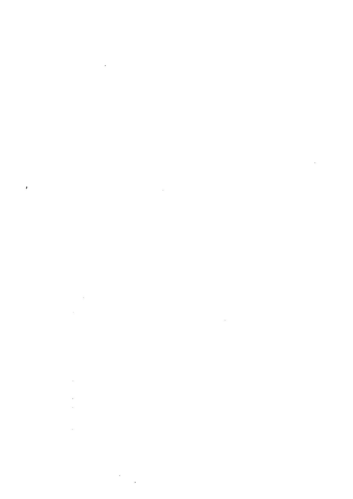

## 第21章 和病人互動

> 假如你想改變世界，最有威力的方法是改變你對生命、人們以及對現實本質的看法，把它改為更正面的……並且開始把它實踐出來。
—— 摘自《創意觀想法》夏克蒂·葛文 (Shakti Gawain) 著

## 你是自己的工具

你現在已經開發出一種能力，當再連結能量流經你的身體時你可以認出它來。你知道怎麼去找到自發性反應，你對病人周圍的能量會有什麼「感覺」也已熟悉，你現在可以很輕鬆地跟這個能量玩耍，就讓該發生的事發生吧。

## 有助於療癒的話

換句話說，你已經準備好要協助人們做療癒工作了。
記住，在「再連結療癒」中，你最主要的目標是避免去干預它，當你的身體持續改變和調整以便擁有不同新頻率時，還有，在你更加熟悉回饋系統（這是使用這些新能量的一部分）之後，你就會發現所有的事情都就緒了。然而，在開始和其他人一起共事之前，你仍需要培養一些基本心態。現在，既然你已希望能夠放掉以前對「療癒玩具」的倚賴，那麼，在這種療法裡你唯一可以使用的「工具」就是你自己。

永遠用歡喜讚嘆的眼光看待事情。
如何才能永遠用一種歡喜讚嘆的眼光看事情呢？要像孩子一樣。要用全新的眼光看待一切事物。看到什麼事情時不要太快就認為你已經懂了。你先人為主的了解大多數時候只是一些膚淺的解讀，它是經過無數的過濾和錯誤的解釋，在變得稀薄、無味、沒有什麼內容之後才傳達給你的。要知道，你和這個心態的一個連結（這是沒有人可以切斷的）是一種說出「我不知道」的能力。有了這個，你就可以有能力用真正的好奇心看待一切。
你記不記得這兩樣禮物：要像小孩一樣，以及用歡喜讚嘆的眼光看待一切？

## 病人事前的心理「准备」

記住這兩樣禮物！
保持一種歡喜讚嘆的心態，用真正的好奇心看待一切，這兩樣禮物為你的崇敬態度帶童年時期明澈的純真，以及與生俱來和神的連結。它釋放了你想要診斷、解釋、嘗試、造成、用力、催促、努力的欲望，它甚至可以釋放你想要居功的需要。
現在，你記住這個禮物了嗎？
現在是你把心、心智和意圖各歸其位的時候了。你很快就可以成為這個療癒方程式裡的一部分。

一般來說，病人分成兩種類型。有些人來到你的診所，在診療床上躺下來，放下一切，希望可以經驗到所有發生的事，不管是什麼。還有一種人，他們一開始就想要努力做些什麼，在療程中把每一件他們認為自己「應該」做的事都做了。他們的頭腦每分鐘跑一英里路，他們祈禱、觀想、唸誦咒語、做腹式呼吸、做胸式呼吸、保持雙掌向上、冥想、他們的手擺出祈禱的姿勢……等等。

他們的嘴唇輕輕地動著，眼淚滾滾而下——有時默默地，有時伴隨著嚎啕大哭。他們同時在心裡為自己，或者也可能為他們認識的每一個人向神祈求他們想要的一切。若不稍加控制，這些獨角戲和各式各樣的情形就會在整個療程中持續著，這些人也就得不到再連結療癒中需要去體驗的部分。他們會得到的結果就和他們去參加祈禱團體、某種技巧的療法，或者只是在家冥想是一樣的。

你不會希望發生這樣的事，但是你也不想在開始之前就告訴他們不能做什麼，因為這就好像說：「你不要去想像紅色。」所以，在你看到那種有可能會很努力做事或者是喋喋不休的人時，你要做的就是在這種情況開始發生之前先發制人。

我可能會這麼對他們說：「請進。躺下，請把眼睛閉上。讓自己儘量放鬆，但不要睡著。你要相信，不管你的想法或禱詞是講給誰聽的，他們已經聽到了。他們不只聽到你的要求，他們也聽到了你們還沒有想到要提出的請求。他們一直都知道的，甚至在你們走進來之前就知道了。所以，不要再講了，不要再在腦中叨絮不休了，只要聆聽就好了，讓宇宙把它認為你所需的東西帶給你。躺好，把自己的心敞開，不預設什麼結果，沒有經驗到什麼，或者不管經驗到的是什麼都沒有關係。在那個敞開中，你的經驗就會到來。」

對很多人來說，這個建議並不容易做到，但這是你所能給他們的最好的提議了。最好的情況是他們都可以放下一切，躺在那裡，不帶著任何期望。他們多數喜歡懷著期望，總希望可以得到某種東西。最好的平衡辦法是不要把期望的焦點放在想要某一種結果，或覺得應該要有某一種特定的結果上。第一個原因是，那不一定是他們真正需要的，或者那不是宇宙認為是對他們最有益的東西。第二個原因，特定的期望會壓縮、限制，或者取代本來要出現的東西。

相同的，你也可以決定要處在接收的狀態和不做價值評斷裡，等待著，並成為將要發生的事情裡的一部分——不管會發生什麼。等待，是一種「以靈性傾聽」的方式。你要一直等待到能量出現。它會出現的。然後突然之間，它流經病人，並與你連接，流經你，也在你的周圍。

病人需要經歷哪一種療癒並不是我們可以決定的。我們的工作是讓自己作為方程式的一部分，讓療癒以它自己的方式自然產生出來。

我先前曾講過，不要有價值評斷，其中有一個部分是，我通常並不會緊抓著病人所告訴我的問題不放，我會先讓他們講到某一種程度，因為這會有助於培養我們之間的關係，這是很重要的。但事實上，不管你知不知道那個病人有什麼毛病，他們將經歷到的都會是相同的。我相信宇宙之間有一種很高的智慧是和這個有關的，這個智慧是遠超過你和我的智慧的，適當的療癒自己會顯現出來。

## 就讓它發生

不要讓我們的小我干擾這個方程式，這個必要性比我們所想像的還要深遠。例如，有些從事療癒工作的人，會把他們的心智集中在如何做一些看起來好像不會有什麼害處的事，比方說觀想病人「健康的樣子」；或者把能量從腳往上移，從頭往下移，或者經過鼻子；把病人放在紫色的光裡；或者把他們放在粉紅色的雲裡……試著用各種他們認為會有幫助的方法，把健康的樣子投射在病人身上。為什麼？因為這就是他們以往所聽過的，或者是別人要他們這麼做的。在這裡面已經加入了懷疑的因素。所有的這一切全都是不同方式的干擾。你試著去做愈多，你就愈難保持（單純的）存在——而最開始時，就是那個單純的存在狀態讓你的小我不要去干擾，這使得你的全我（Self）可以成以讓能量流經你。單純的存在狀態讓你的小我不要去干擾，這使得你的全我（Self）可以成為這個過程中的一部分，也就是在這種狀態下才會得到療癒。

我們一向被教養的就是要控制和主導我們生命的方向。一旦我們決定了事情「應該」以什麼方法去做，突然要改變作法的念頭會令人感到害怕。這裡有個例子。

我的曾祖母安妮·史密斯曾在一個多數是天主教徒的地方擁有一個簡餐店。那個時候，天主教徒在禮拜五是不准吃肉的，所以每個禮拜五她就做魚餅：混合洋芋泥、洋蔥、鹽、胡椒、一些香料和鱈魚，沾上麵包粉，油炸到完美的地步。

魚餅後來讓她很出名，她的店外總是有大長排的人等著要買。有一個禮拜五的傍晚，隊伍一直排到整條街。在那一整天裡，看起來好像她賣得愈多，客人的隊伍愈長。

人們都稱讚道：「嘿，安妮，這是你做過最好吃的魚餅。」她的材料愈來愈少，賣光之後她就把門關上結束當天的營業。我的曾祖母（她只有四呎半高，是個努力工作又精力充沛的人）進到廚房去處理最後的清潔工作。當她在收拾東西的時候，她打開冰箱，驚訝地發現她為了做魚餅而小心準備好、已經清理乾淨、去了骨頭的一大碗魚仍然在冰箱裡。我的曾祖母忘記把魚攪進去了。她嚇壞了，一整天裡她給人家吃的只有洋芋泥、洋蔥和調味料。裡面沒有魚的魚餅怎麼會得到大家讚美？那一天每個人所吃到最接近魚的東西就是從料理台滲出來的味道，或者也有可能是攪拌碗裡的殘留物。她那天所賣的，也可以說是魚餅的主要精華。安妮沒有把這件事告訴任何人，下一個禮拜五她又把鱈魚加了進去。假如安妮除了原來的魚餅之外也賣不加魚的魚餅，這種無魚的魚餅會不會變成當地一個受歡迎的新品呢？永遠不會有人知道。這個故事是一個例子，讓我們知道，有些人可能看到某些不同的東西，或者有一個機會可以選擇是否要走出他們的安全地帶，但是在很多的情況下，最後他們還是會留在——或者在這個例子中，他們回到——他們原來所熟悉的地方。

有時候我們看到新的方法出現。有時候我們有勇氣去採用它。

## 站在診療床邊

另外一個讓你的小我不不要干預這個療癒方程式的方式是，保持一種不要執著的健全心態——對於你的病人的療程不要介入太多。我們先前曾講過，躺在診療床上的人很可能是在一種寧靜、喜悅的狀態，常常也有不由自主的身體動作。在很少的情況下，如我之前提到的，眼淚可能會突然出現。但這並不是表示你可以介入，去擁抱他們和說一些安慰的話，請你們要抗拒自己的這種（被人文觀點強化的）衝動，以免造成干預。

這是病人的經驗，並且那是他們的過程的一部分，不要把它們剝奪了。雖然有那些外在的現象，但有很大的可能性是他們正在享受那個過程。假如你認為有必要去做些什麼，你可以輕輕地問他們有沒有什麼需要幫忙的，或者是不是想要中止療程。很多的情況下他們都會說他們很好。假如他們想要中止療程，他們就會那樣做。我以前講過，假如他們需要你的協助來中止療程，那麼輕微的觸碰、叫他們的名字，還有手邊的一杯水都是有用的。

保持你的敏感度，並且隨時準備好要幫忙，以防有些沒有預料到的情況會發生。你可以決定要不要協助病人——不只是以療癒者的身分，而是作為一個關心的人。在這種情況下，只要向病人保證一切沒事，這些反應是正常而且是可接受的，甚至，在他們的那種情況下，是有必要的。當他們穩定下來之後，你可以繼續，或者把治療延期到其他的時間，只要是所有當事人認為可以的就行了。

### 入睡

你要病人「頭腦放空」，在診療床上不要去想或擔心會發生什麼事，但是有時候在太過放空頭腦時病人會睡著，這不是我所喜歡的工作方式。我很自然地覺得，一個睡著的病人可能不會從這個療程得到最大的利益，更不用說我自己的小我想要病人很清楚地去享有那個體驗。但是，你要知道，假如病人在過程中睡著了，那對病人來說是合宜的。並且，假如一個病人太活躍了，以致你用什麼方法都無法控制他（也就是說有些人或小孩太過動了），那就儘量趁他們睡覺時做你的工作吧。身為療癒者的你們呢？你有沒有可能在療癒過程中睡著呢？有的，但通常那是表示你原本沒有睡夠，並且（或者）你沒有「處在當下」。不管怎樣，請你尊重病人和他們的狀況，先照顧好自己的需要，才能好好照顧病人。我想起了在飛機上對乘客說明的安全措施：做母親的，在幫小孩子戴上氧氣罩之前，請先把自己的戴好。記得，你是在讓你的心智達到一種狀態，不是完全的清醒，也不是完全的睡著（這時你在另一種狀態)。這是療癒能量到達地球的地方。

### 病人的報告

一隻聰明的鳥停在一棵橡樹上，她聽到的愈多，她說的愈少。她說的愈少，她聽到的愈多。你為什麼不學那隻聰明的鳥？

你們其中有些人可能想留下一些紀錄（我也會鼓勵你們這麼做，就算不是為你們自己，那麼至少你們可以把它送給我作為我下一本書的材料），我稱之為「聽取病人報告」，這是 有技巧的。不管你信不信，病人是把你當做權威人士的，並且想要取悅你。假如你讓他們知道（不管是有意還是無意的）你想要的是哪一種類型的答案，你就會得到那一類的資料。為了要得到準確的資訊，保存紀錄，並且希望不要把資料扭曲了，我有如下的建議。 當療程結束時，在病人的肩胛骨下方輕敲幾下，輕柔地告訴他們，治療已經結束了。當他們打開眼睛的時候，把你的紙筆或者是檔案卡（上面已有他們的名字、地址、電話號碼，還有其他的資料）準備好，然後做筆記。在療程中的這個部分你應該是主導者，而我也極力建議你這麼做。你可以照下列步驟進行：

- 1. 問病人：你的經驗是什麼？或者，你記得什麼？當他們回答你的問題時，確定他們要講到這幾件事：我感覺到這個，我看到那個，我聽到那個。
- 2. 叫病人描述他們所記得的細節。假如他們看到一個穿白色外套的人，請他們描述一下。邀請他們自己去回憶，用一種非指引式的方法去問問題，例如：關於那個人你還記得其他什麼事呢？讓病人講，然後問他們有關頭髮的顏色、高度、外套的長度，看起來年紀多大。當他們繼續講的時候，幫他們盡其所能地表達或回想每一個經驗。
- 3. 當你得到所有的答案——以及對於你的「還有其他什麼」這個問題有關的答案——之請小心，不要去引導他們。去引導的例子是像這樣的：那個人高不高？他的頭髮是黑色的嗎？或者問，那個人是不是三十來歲。假如病人的印象並不是很清楚，這類的提示很可能影響到他們的記憶。在你覺得你已得到你想要的全部資訊時，你可以問：你還記得有其他什麼事呢？「還有其他什麼事呢？」是一種很好的措詞方式，因為這樣可以引發病人到他們的意識裡去尋找更多的細節。「你是否還記得其他事情？」是一個不同的問題，你把它說成了一個「肯定或否定」的語句，而當你用這種措詞方式的時候，一般的自然趨向，尤其是在療程結束之後的放鬆狀態下，他們的答案會是否定的：「不記得」。

### 疗程注意事项

後，再提出其他和五官意識有關的問題：你還看到、聽到、感覺到、聞到、嚐到（是的，在有些情況下，某些人甚至會在療程中「嚐到」什麼）其他的什麼東西嗎？我喜歡問他們，我是否有在療程中碰觸到他們的任何部位。比方說，假如他們回答：「是的，你有碰我的腳。」我會請他們做出來給我看。為什麼？因為「碰觸」對不同的人有不同的意義。對有些人來說，它代表的是一種很快的、一個手指的碰觸；對其他人來說，它代表的是一種「擠壓」或兩個手指輕輕地敲打。一旦你知道「碰觸」代表了什麼，你可以在筆記中做更正確的描述。

這裡有幾個「注意事項」要提醒你。第一，在看診的最後，讓病人保持專注於他們在療程中實際上發生的經驗。在這個時候，不要讓他們對你詮釋他們所經歷的事情的意義、它和他們目前的生命有什麼關係，或者告訴你他們以前在別的地方的一些經驗。假如他們開始這麼做，把他們帶回到目前的這一個體驗，而且不需要他們做任何詮釋。為什麼？首先，他們對「（看見）一個穿白色外套的人」的解讀，通常只是比別人對此事的解讀或想法（別人告訴你的，或在書上看過的）多一些而已。他們把這些自認為所知道的事情告訴你，往往只是為了給你留個好印象，和他們對於剛才真正體驗到的所能有的正確了解，可能沒有多少關係。

更重要的，病人花在向你報告他們的感想的每一秒裡，他們同時也在忘記療程中實際發生在他們身上的一些細節。相同的理由，你也不要在此時和他們分享你自己的故事。禮貌性地建議他們把注意力集中在報告實際上發生的事，並讓他們知道，他們可以在報告結束之後再告訴你他們自己的詮釋，以及其他的故事。假如你幸運的話，他們後來都會忘記。

另外，一直要到你寫完記錄之後的好一陣子，你才有可能知道某些筆記到後來會證明它們有多麼重要。

在我的病人第一次見到『普西拉』或『喬治』或其他的人時，假如當時我沒有做筆記，在後來的日子裡當其他病人發現這些存有時，我就沒有可以拿來作為比較的東西。

還有，要保持著撲克臉。我指的不是一個僵硬的表情，而是要讓人看起來舒服、有誠意的關心，不要對病人的某些反應比對另一些反應表現出較多的興奮。

假如每一次你的病人說他看見某某人你就『比較高興』，在他們想要取悅於你的潛意識裡，他們可能會把他們『可能』記得的故事不經意地加以美化。然後，在他們回想起的下一件事裡，假如你沒有對它表現出相同程度的『興趣』，他們很可能就會跳過幾個重要的細節。這一無意識的作法會扭曲了你所蒐集的資料的正確性。

你要等到療程的最後才開始讓他們做報告。除非你有特別的理由，否則當事情還在進行時請他們報告所發生之事，對病人來說是不公平的。它會打斷療程的連續性和深度，剝奪他們的體驗的完整性。在療程開始之前我通常會做兩個建議：假如他們感到室內有某些事吸引他們的注意力，可以輕輕把眼睛張開來滿足好奇心，然後再閉上，繼續療程。

我不會暗示所謂的「某些事」是什麼，假如他們確實有一個體驗，我不想要無意中去影響到它。我也告訴他們，假如療程中發生了什麼事，而他們覺得應該要把它記住，那麼，在事情發生的當時他們可以悄悄地告訴我。我跟他們解釋，這麼做的原因是我可以把它記下來，事後再提醒他們，因此他們就可以不必特別去記住它。

# 第22章 療癒的意義

> 雖然你們對真理的看法可能會不同，甚至可能會有巨大的改變，但真理是不會變的。

——摘自《旁觀之眼》 約翰和林·湯瑪斯（John and Lyn Thomas）著

看起來好像沒發生什麼事……

假如在療程中看起來好像沒發生什麼事情，可能是因為你或者是病人太認真了。注意看他們，看他們的臉部。假如你看到好像有馬達在他們的頭裡轉，或者看到他們侷促不安的樣子，很可能就是他們躺在診療床上除了「頭腦放空」以外還在做些其他的事。通常假如我問他們在做什麼，他們會說：「祈禱。」在他們的腦海裡是這樣說的：「親愛的主耶穌，請你給我這個療癒，親愛的主耶穌，請你給我那個療癒，給我這個，不要忘了那個，還有，我要的是這個樣子的……」一大串的這個那個。我並不是要勸你們和你們的病人不要祈禱，我是說：「要有信心，只做一次禱告——一次——並且要知道他們已經聽見了。」

### 自我療癒

常常有人會問，這種能量是否也能夠用來療癒自己。當然可以。

自我療癒非常簡單，也可以說是太簡單了。就像遠距療癒，假如你把它弄得太複雜，效果反而愈差。目前你對於能量在你身上某些地方移動時的感覺，已經多少有些了解了，現在，找個舒服的地方，可以在床上或者是靠背可以後傾的椅子上。你要清楚地知道你的目的是為了自我療癒而進入那個能量裡，並且要承認這個事實。

現在，讓對能量的感覺在你手裡出現。注意到它愈來愈強了。不要試圖強迫它（出現），只要注意它就可以了。允許它出現，等待它來到。當你把注意力放在它上面時它會出現。當你把注意力留在那裡，它會逐漸加強。它的強度愈大，你就愈能感覺到它。你愈注意到它，它就變得更強。這是一種循環。

要知道，當感覺變得比較強時，它同時也會開始擴散。注意你身體其他的部分，例如手臂，並且等待感覺到達那裡——它一定會的。然後把你的注意力帶到足部，並注意到它會從那裡開始。它會很快地往上移到你的腳。當這個能量佈滿你全身的時候，你會開始在一種更高的層次上振動。然後能量會變得非常強，以至於把其他的聲音和會產生干擾的念頭隔絕開來。基本上，它開始接管了。

當它開始接管以後，去感覺它愈來愈大。然後讓你自己溜進其間的空隙——念頭和念頭之間的空隙。當你進入這個空隙，你就不再處於有意識的思考模式。假如你躺在那裡，想著「我正在療癒中，我正在療癒中，我正在療癒中」——那麼，「你沒有（在療癒中），你沒有，你沒有。」請把那個念頭釋放掉。

突然間，你不再注意到任何東西——因為你在那個空隙當中。然而，在你離開那個狀態以前你不會注意到這個。突然間，你睜開眼睛——已經過了五分鐘，二十分鐘，或者一個半小時了。或者，假如你是在晚上很晚的時候做這個，你可以選擇不要離開那個狀態，一直到第二天早晨。當你該離開那個空隙的時刻來到時，你會突然間發現你離開了。就是這樣，就這麼簡單。

### 遠距療癒

理察・戈伯醫師（Richard Gerber, M.D.）在他的書《振動醫療》裡，討論過提勒—愛因斯坦模式（Tiller-Einstein Model）的正負時空概念：具體的物質存在於正時空；超越光速的能量（例如乙太和星際的靈魂的頻率）則存在於負時空裡。戈伯解釋道，正時空能量（和物質）在本質上主要是電性的，而負時空能量主要是磁性的。因此，正時空也是電磁輻射（EM, electromagnetic radiation）的領域，而負時空能量是磁電輻射（ME, magnetoelectric radiation）的領域。負時空能量，除了它主要是磁性的本質外，還有另外一個很有趣的特性：傾向於負熵。熵（entrope）有一個趨勢，就是傾向沒有秩序、混亂，也就是不輕鬆，不舒服（dis-ease也有疾病的含意）。熵值愈高愈缺乏秩序。負熵是傾向於秩序和組織性——自在，它有再生和療癒的傾向。

| 特性 | 正時空 | 負時空 |
| :--- | :--- | :--- |
| 存在形式 | 具體的物質 | 超越光速的能量（如乙太、星際靈魂頻率） |
| 主要本質 | 電性 | 磁性 |
| 輻射類型 | 電磁輻射 (EM) | 磁電輻射 (ME) |
| 熵的趨勢 | 傾向於熵增（混亂、無序） | 傾向於負熵（秩序、組織、再生、療癒） |

這些都和遠距療癒有什麼關係呢？再連結療癒的頻率並不受到正時空法則的限制。至少在某些層次上，它們是等同於負時空的概念。這是完全不同的參考系統。對於「當你在做自我療癒或遠距療癒時為什麼不用手」，以及「為什麼當你和病人都在同一個房間的時候，實際上是可以不必用手的」這兩個問題來說，它可能可以提供一部分的洞見。

就如我們講過的，量子力學的原則之一是，力量實際上是隨著距離加大而增強的。幫一個不在現場的人治療給你一個體驗這種現象的機會。

（星號分隔線）

開始做遠距療癒之前，先找一個舒適的地方。假如你喜歡，也可以把眼睛閉上，並且像我們先前在「自我療癒」部分講過的，讓感覺出現在你身上：從你的手進入到你的手臂；從足部進到腳；進入你的身體，進入你的存在。有意識地成為你的本質，和你正在連結的那個人在一起——可以在你的觀想中，他們所處的真實環境裡，或者是在太空或黑暗裡，那個空無（是一切，也是什麼都沒有）裡。知道你在那裡，另外一個人也在那裡，跟你在一起。你是否知道那個人長什麼樣子並不重要。那個人的「感受」才是重要的。你不需要透過電話跟他們在一起，你也不需要他們的照片、他們的一個首飾、一個手寫字跡或者一撮頭髮。

和這個人在一起。讓這些頻率的振動變得更大和更強。有時候我會應用一些我在進階工作坊教的東西，但那並不是必要的，而只是我想做的事情。你想要在這個過程裡停留多久就停多久，不管是一分鐘或一小時都可以。你甚至可以選擇更進一步，進入那個「空隙」。最開始時，要知道你的意圖，然後讓自己進入。

對方是否一定要知道你在做什麼？不必。我有一個朋友在佛羅里達州南部，他打電話給我，因為他的母親在四、五個小時車程之外的佛羅里達州北部的醫院裡。她的情況很明顯地轉壞，醫院也打了電話告訴他，說他們認為她可能沒辦法再撐下去了，而且他們真的不認為她可以等到他開車北上看她。他打電話到洛杉磯給我，問我是不是可以幫他母親做遠距離療癒。我從未見過他的母親，她也已失去意識，因此我無法事先取得她的同意——她甚至也無法知道我將要做什么——但是我同意。所以我進入了那個地方，她和我在那裡相遇。我讓感覺流經我。十五分鐘後，我感覺到療癒已經完成。

我的朋友在第二天打電話告訴我，他的母親情況已經大幅轉好，讓醫院人員大感意外。她第二天就出院了。她的病情發生大幅改變的時候，他正在開車前往醫院探視她的路上。它發生在她和我一起在那個「空隙」裡的時候。是不是因為我們的互動導致她的復元？我不知道。再連結療癒的頻率是不是以一種比光更快的速度行進？很有可能——而且，一切都是光，光也是一切，或者我們應該說它比看得見的光更快。我們是在負時空層次裡——人類更高次元的組成要素——運作嗎？那麼，我們所做的是在組織和支持身體的分子／細胞結構嗎？或者也在把它重組？

磁電領域和負熵的概念很可能為遠距的再連結療癒，以及再連結頻率與自我療癒和近距療癒間的互動，提供了一些有趣的洞見。

### 抉擇與同意

善惡業報最後的對決：就好像是，每個人都在送出一切很壞的振動，對吧？然後，地球就爆炸，啊，這些壞事真是糟透了。

抉擇和同意是相互交織的兩個概念。雖然說每個人和每件事本來都是「合一」的，但是這兩個觀念在牽涉到療癒時有一種有趣的關係。在我的研討會裡對這方面的討論，往往會引發某種熱切的情緒，所以我常常把這個話題留到午餐之後——因為有時候與會者吃了太多難消化的午餐而變得想睡。

> 《華盛頓郵報》

我們先講選擇。在這個世界上已經存在好一陣子的一種內疚感是和這個觀念有關係的。我並不想在這裡做詳盡的探討，但我還是要給你們足夠的資訊去形成一個觀點。假如你在一個新時代的書局附近閒逛，或者在那裡聚會夠久，只要討論的話題轉到某個人正在衰退的健康狀況，不可避免的，馬上就有人（一般是用一種比你神聖的語氣）會插嘴說：「唉，我不知道他們到底做了什麼才會有這樣的遭遇。」然後其他人會接著以一種很有經驗、什麼都知道的態度點頭。我們都看過這種情況。這個可憐的病人——不管他們是誰——本來就已經忍受夠多了，現在還要加上這些新時代的愛管閒事的人（NAG, New Age Gossipers）試圖要靠著這些病人來讓自己顯得比較優越。「巴伯（或者瑪麗，或者任何人）應該選擇康復，就這麼簡單。」對話持續著，「想想看，這種事會對他們的孩子造成什麼影響。」這種靈性上的自我優越感濃得讓你可以用水晶棒去切它。假如我們在做出抉擇時，可以像選件T恤或買義大利披薩餅那樣簡單，我當然會選擇快樂、健康以及和一個可以滿足我所有願望與需求的伴侶，處在一種相愛的關係中，並且我所選擇的事業也會很興旺。假如可以讓我選，我也會選擇要長得好看得不得了（管他的）。我知道你們很多人也都會做相同的選擇。假如有一種藥丸可以把這些東西全部都給我們，我知道明天一大早大家都會到醫生診所前排隊，等著醫生給我們開這個處方。

那麼，在我們的生命裡，為什麼每個人的抉擇無法如我們所希望的逐一實現呢？那是因為在我們做出選擇的那個我們內在的部分，並不是很多人以為（是在幫我們做出選擇）的那個部分。在幫我們作抉擇的，並不是在我們決定要買藍上衣或義大利披薩餅時的那個我們可以意識到的部分，而是我們內在的另一個部分，它可以看到更大的一個視野，那是我們整個生命的概觀。它是我們的一個部分，它瞭解到我們現在在地球上學習我們的課業，而我們的生命經驗就是在那個範圍（那很可能是我們在這一世的投胎之前就已同意的）裡展現出來。我之所以知道這個，是因為它是可以證明的嗎？不是的。這是有道理的嗎？是的。

因此，也許並不是巴伯（或者瑪麗）選擇了要健康，他們的身體就可以馬上康復。也許你為此而責怪他們（或者，甚至於責怪他們當初為什麼要生病），實際上並不會對他們有所助益。因為當我們這些心存好意想要幫忙的人，愈能從一個更大的視野看事情的時候，我們給他們造成的痛苦會愈少。

那麼，這和治療之前先取得對方同意有什麼關係？

基本上來說，向已經來到你診所並且已經躺在診療床上的人取得同意，很顯然——說得客氣一點——是多餘的（是的，我真的看到有治療師是這麼做的）。假如你不同意這一點，請你回到前面幾段談到「抉擇」的部分，再讀一次，仔細地去留意是誰在做出抉擇的，因為也就是你內在這個相同的部分在做出同意的。

假設你有一個可愛的小孩強尼，現在五歲。他從一歲半起就生病了，而且每天都活在疼痛當中。他在掉頭髮，他使用的藥物讓他覺得想嘔吐，因此每天大部分時間就是奔波於臥室和浴室之間。他很可愛，很乖巧，也無奈地忍受著一切。

有一天，你聽說有一個很高明的療癒者，一個住在喜馬拉雅山山洞裡的出家人。因為強尼的體力無法坐飛機出國，於是是你和那位出家人取得聯絡，安排他搭機過來。你把他安置在舒適的旅館裡，經過一天的休息之後，你把他接到家裡來。當他抵達時，你帶他到強尼的房間。經過幾分鐘的交談之後，很明顯地可以看到那位出家人和強尼相處得不錯。於是，那個出家人把身體往前傾，用很嚴肅和尊重的態度問你的孩子：「強尼，你能不能允許我幫你做治療？」

「強尼無法想像一種沒有疼痛的日子，因此他對「治療」的聯想是更長的、充滿痛苦的日子。想了一下之後，他帶著一種淡淡的憂愁回答道：「不。」

這時你會想要勒誰的脖子呢？強尼的？那個出家人的？

我要很慎重地說，一般世俗上以為是根據正確的資訊而做出的同意，往往不是真正的在有足夠的資訊之下所做出的決定，因此，那些同意其實是在一種沒有真正完全了解情況之下所做出的決定。

強尼不肯同意是因為他無法超越目前的狀況去看到其他的層面。他做決定時所根據的是錯誤的資訊。他的同意，或者沒有同意，不是根據正確的資訊，而是在資訊不足之下所做出。

很多人可能會有不同的看法，但是你只能提供治療，你無法造成療癒。因此，在你要提供治療時自動地就包含了請求同意。療癒，在達到效果時，表示獲得了同意。是故，不管病人是在有意的狀態（例如打電話跟你約診的人），或者有些病人在當時可能無法有意識地做抉擇，你提供療癒——出聲說話的，或安靜地用意念做都可以——永遠是合宜的。只要你是為著病人的最高利益著想，就解決了要求同意治療和要用什麼方式治療這兩個問題。

### 何謂成功的療癒？

怎樣才算是成功的療癒？是某個人從輪椅上站起來走路嗎？是疾病的消失嗎？是我們的DNA的重新組構和轉化嗎？或者，活著是一種疾病，而死亡成了療癒？

有一天我接到一個婦產科醫生的電話，問我可不可以幫忙看他的一個病人。我說：「當然可以。」這個婦女無法離開醫院，所以當晚我和她以及她的先生在那裡見面。當我抵達時她在睡覺，所以我她的先生聊了一會兒，然後開始做治療。很快的，她張開了眼睛。他幫我們彼此做了介紹，在整個療程當中這對夫妻的對話都是很生動有趣的。你可以看到化學治療的火花。

這是一對年輕的夫妻，大約三十幾歲。當他們彼此交談時，他們的眼睛盯著不動，就好像兩個分別很久的戀人剛剛重逢一樣，很明顯地可以看出他們都很欣賞對方，而且深愛著彼此。她說，他聽；他說，她聽。他們笑著，同時也把我拉進他們的談話當中，就好像我是一個他們已認識了很久的老朋友。他們跟我分享了很多他們一起做的事，講了很多有關他們去旅行，以及他們生命中的朋友的事。

突然間，這位婦女很想要吃冰淇淋，而且是三種冰淇淋！我停留在醫院裡的時間已經超過我原來的計畫，但我還是自願久一點，讓她先生出去買東西。當他快離開時，她又覺得買些起士蛋糕也很好。那已是晚上十一點，但是沒有一件事會比出去尋找這些東西帶回來給太太吃更讓這個人高興的了。他答應要很快地回來，但是我們都知道，等到他走出這個大醫院，找到還開著的店，再把東西帶回來，少說也要四十五分鐘。事實也是如此。那也是我曾經驗過的最長的四十五分鐘，因為當他一踏出門的時候，她轉向我，說道：「我現在要離開了。」

我說，「你要什麼？」我知道她的意思，但我無法相信我所聽到的。

「現在我要離開了。」她又說了一次。

「現在嗎？」我問。她點頭。我有點嚇壞了。那個婦女的舉動和表情不可能讓人有會錯意的餘地。她告訴我她打算要死，就在那個時刻她打算要死。她讓她的丈夫出去買吃的東西，就是要確保她死時他不在身邊。

> >「喔，不，你不可以死。」

「我現在要離開了，」她又重複了一次。『我不想看到他帶著一堆冰淇淋和起士蛋糕回來時，發現我坐在他已過世的太太身旁。

在她重複了三次同樣的威脅後，我用這樣的話作為回應：「你要在這裡等到你先生回來。」我盯著時鐘看，注意到時間過得很慢。重點是，我一點都不懷疑她隨時都可能一離開，唯一讓這種事不要發生的方法是不斷地跟她說話。我知道一旦讓她停止說話，她就會撒手走向另一個世界。

我告訴那個婦女，假如她已決意要走，她的丈夫一定會希望有一個說再見的機會。我會一直讓她的思考過程不要中斷，那是很好的。在那個時候，假如我認為做些什麼可以讓她保持生機直到他回來的話，我會抓個尤克里里四弦琴，彈一首「用腳尖走過鬱金香」給她聽。我們聊著。她「留下來了」。

四十五分鐘之後她的丈夫回來了。沒有人去提她曾經想「離去」的事。他們繼續談話，好像什麼都沒發生過一樣。當她在吃冰淇淋的時候我的心仍在劇烈地跳著。他們請我也吃一些，我……卻不怎麼餓。我道了晚安，很快地離開了。

那位先生第二天打電話給我，告知她已經過世了。我已經知道了。他告訴我，在我去她之前的大約兩個月，她多數時候一直是昏睡或者神智不清的，這次是她第一次清醒超過一分鐘。他謝謝我在那個最後的晚上把他的太太帶回給他。

是誰得到了療癒？它又是什麼？他們各自得到了療癒。在太太昏睡兩個月之後，他需要再見她最後一面，道別，然後就放下。她需要再見他一面，知道她走了之後他會沒事。他們兩個各自都得到了禮物。

人都會死。我們繼續過日子。生死的循環是我們的宇宙經驗裡的一部分。

當某個人到另外一個世界去，並不表示他沒有得到療癒。他們得到的療癒是一種自在，它很可能是因為你允許他們做一種（生命的）轉換的緣故，是你去探望他們時你願意接受這個事實，並且願意放下，因而給他們帶來平靜。還有那個微笑，以及最後的一個機會——對著那個需要聽到「我愛你」的人說出這句話。

所以，不要解釋，不要分析。完全接受所發生的一切。並且要知道，你擁有療癒的天賦——不管它是什麼方式的。

### 結語

#### 這一切的奇妙之處

在本書中，我們已經把療癒作為一種發現、作為一種理論、作為一種練習來討論。但是在結束的時候，我想要強調它的另一個面向：療癒是一種奇蹟。我所謂的「奇蹟」，是真正的奇蹟，一個顯現神的超自然行為的神奇事件。當然，在一個夸克和黑洞和十一個次元的宇宙裡，超自然的意義已經和以前不同。神的意義也不同了。

然而，當「不可能」的事情發生時，隨之而來的虔敬讚嘆和神奇的感覺是永不會減少的。你要知道，當你在從事這種能量工作時，你不只是在協助另外一個人的療癒，你也是在幫忙引進一種到目前為止尚未為人所知的重大轉變。

人們會問我，是不是每一個人都有能力傳導這種頻率，並成為療癒者。我的答案是：

「是的。每一個人都可以達到這種程度，但眼睛是盲目的。只有少數幾個人敢把眼睛睜開，而睜開眼睛的那些人又往往被所看見的東西所矇蔽或限制了。」

對我來說，這就是狄巴克·喬布拉叫我要「保持童心」的意思了。孩子們對每樣東西都感到驚奇，對他們來說，這個世界的每一天都是一個嶄新的冒險之旅。不像我們把東西都放進一個有限的框架裡，他們不會被任何他們所看到的東西限制住。假如沒有人教他們要恐懼，他們不會被限制在很多的「應該」與「不應該」、義務性的規範或者嚴肅的態度裡。一切都只是他們所居住的神奇的宇宙裡的一部分。

我每天都感覺到同樣的興奮。每次我做這種工作，我都抱持著一種新的、好奇的心態去體驗它，就好像那是我的第一次。因為，對每一個不同的人來說，那就是他們的第一次。我知道你也會有相同的感覺。你把光和資訊帶進了你們兩個人（事實上，加上神，是三個）獨特的存在裡。

當這個禮物出現的時候，我已經是有很多病人的醫生，因此，我以為這個禮物只是和療癒有關的。我知道有某種非常大的事情在發生，我稱它為療癒，是因為我以為它只是和療癒（更廣義地說，這個字也有一種醫生／病人／奇蹟的含意）有關的，同時也是因為我只想要讓它和療癒有關。

我現在明白了，打從一開始，是我的意向讓這個禮物只能成為和療癒有關的事情。我要了解它，把它歸類——很可能地，在後來我又指引它，把它「增強」。我在療癒的框架裡執行業，也用這個療癒的框架把一些看不見的限制加在「再連結」裡。這些限制並不是我有意加上去的，只是因為一開始時我無法更進一步看到，也無法認知到這是一個更廣大的東西。

我現在已認知到的是，這一種療癒和我們一向被教導去感覺的、了解的，或者甚至於相信的、接受的有著不同意義。這種療癒是一種透過和宇宙的共同創造——在最高振動中的互動——而產生的進化過程。我已經可以相信，它是和我們的DNA的重新組構有關的，雖然剛開始時我曾猶豫要不要把這個說出來。當我們在走向超感或超感知（意思是說超越我們基本的五種感官意識）時，我們進入了一個領域，與超出我們以前所認識的能量和現象共同存在著。很可能是我的意圖，把這其中的一部分引導至符合我早期的信念，和我所能了解的範圍裡。而且，當我教導大家不要去妨礙，也不要主導療程，甚至不要預想療癒會以什麼形式發生時，我意識到了，在我決定相信它是一種醫生／病人／奇蹟的療癒時，我已經在妨礙它了。問題不在我有那個意圖，而在於那個意圖的特定性。我睜大眼睛期待某種東西，卻又在自己特定的欲望和意圖裡，透過一個最狹小的「期望的眼界」去看。狄巴克·喬布拉寫了一本我認為對我們相當重要的書——《成功的七個靈性法則》（The Seven Spiritual Laws of Success），其中提到，意圖和欲望的法則（Laws of Intention and Desire）中有一個是「放下對成果的執著」。它的意思是說，不要把你想要的某種特定。結果緊抓著不放，要活在「不確定性」的智慧裡。在某種程度上來說，有很多人可以做到這點。我所能做到的程度是我可以放下對「療癒結果」的執著。但是，我沒有放下對「成為一種療癒」的結果的執著，因此，我局限了我自己的體驗。

你和我現在可以往前邁進了。要這樣做，我們必須對我們的意圖保持覺知，它們很微妙地、牢牢地深藏於我們的內在，大多時候是在我們意識的雷達下面徘徊。當它們帶著尖銳的聲音出現在我們的螢幕上時，我們有責任要檢視它們。我們深藏的意圖會影響我們所走的方向，而且往往比我們有意識的意圖有更大的影響力，因為我們警覺的程度不夠，無法把它們送到光裡做檢驗。假如我們不知道自己有恐懼，我們不會知道要去面對它。

在這本書的資訊裡，你正經歷著一種進化性的變革。你現在可以用一種不同的感官去聆聽；以一種新的眼光去看；你已經學會感覺別人還無法感覺到的東西。當你學會去體驗這種新的覺察，你就能夠成為一個超感知的存在，進入你的存在。

所以，當你的那些病人在別人聽不見什麼的時候聽到一些東西；在沒有身體的嗅覺感官時間到什麼；在眼睛閉著時可以看到東西；在其他旁觀者的眼裡沒有什麼東西可以感覺時感覺到東西——你知道你也是在陪伴他們進入他們的存在裡一種新的超感知層次。每一次都會讓你感到興奮，就像當初你發現到它時一樣。

你現在所做的是把光和資訊帶到地球上来——而只要那裡有光和資訊，那裡就沒有黑暗。透過這個光和資訊會產生很多東西，包括了轉變和療癒。

療癒工作不是「怎麼做」或者是「為什麼」，它也不是一種固定的方法，它是一種存在的狀態。

因此，帶著你的恐懼，踏進光和資訊裡。愛變成了它，然後它變成了愛——並且它是那個療癒者。你立刻成了觀察者和被觀察者、愛人者與被愛者、療癒者與被療癒者。

你要和另外一個人合而為一，然後療癒你自己。在療癒自己的同時，你也療癒別人。在療癒別人時，你療癒了自己。

重新再連結。療癒他人，療癒你自己。

有些事情是很難說明清楚的，但是奇蹟可以說明一切。

## 致謝

我想要向這些人致謝：

- 桑尼和露意絲·波爾（Sony and Lois Pearl），我的雙親，他們在各方面不斷地支持著我。
- 黛比·露意肯（Debbie Luican），我生命中的一顆閃亮的星星，她的信念、耐心和堅毅使得這本書得以出現。她邀請我進入她的生命當中，以其寬大的胸襟讓一切看起來好像是我給了她榮幸。
- 恰德·愛德華（Chad Edwards），他的正直、永不停歇的能量，以及對於真理毫不動搖的承諾挽救了這本書。
- 哈比·達德（Hobie Dodd），他不凡的愛、忠誠、友誼和信念——以及他照顧我個人生活和事業的能力——讓我能夠挪出時間坐下來，寫這本書。
- 吉兒·克拉默（Jill Kramer）的修訂呈現出我書中的精華本質，並且也確定其他的人也可以找到它。
- 洛賓·波爾·史密斯（Robin Pearl-Smith），我的妹妹，她主持我的網站，不斷地修訂這本書（在吉兒修訂之前，她和我的父母、哈比、恰德一起做），並且幫忙把「再連結」的觀念帶給這個世界。
- 約翰·愛德華（John Edward），他在幕後默默地支持著。
- 羅蘭、哈利，和卡慕蘭·高登（Lorane, Harry and Cameron Gordon），他們向我敞開了心，給了我另一個家庭和另一個住處，幫助我盡我一切所能地做自己。
- 李和派蒂·卡羅（Lee and Patti Carroll），他們的友誼和信念在我寫書的整個過程裡支持著我。
- 約翰·亞茲丘（John Altschul），他很禮貌地試著要不理會這件事，直到他有了自己的療癒。
- 艾明和所羅門（Aaaron and Solomon），他們提供了不流於俗的了解。
- 弗瑞德·潘茲洛（Fred Ponzlov），他無私地奉獻他自己的時間。
- 瑪麗·凱·亞當斯（Mary Kay Adams），她全然地支持和鼓勵我。
- 葛瑞·史瓦茲和琳達·魯塞克（Gary Schwartz and Linda Russek），他們投注了很多時間和能量在研究再連結療癒並把它記錄下來，也謝謝他們為這本書寫了這麼好的前言。
- 雷德·崔西（Reid Tracy），他幫忙處理這本書的一些事，也謝謝他以善良和誠敬待我。
- 整個出版社的工作人員，包括譚亞、潔基、珍妮、桑默，和克里絲蒂，不論什麼時候我有需要，他們都不會拒絕。也謝謝他們讓這本書以美麗的面貌呈現出來。
- 蘇珊·舒馬克（Susan Shoemaker），她把整本書讀了兩次給我聽，為了這個還喝了無數杯的茶。
- 喬·卡本特（Joel Carpenter），他讓我到他家，並且在我工作多時之後確定我有停下來吃東西。
- 史地文·沃夫（Steven Wolfe），他在我的生命中是一個紮實和穩固的要素。
- 克雷·波爾（Craig Pearl），我的弟弟，謝謝他沒有笑我。
- 還要感謝神，在這本書中，只有他不在乎我怎麼拼寫他的（或她的）名字。

## 作者簡介

艾力克·波爾醫師
他的整脊治療事業是洛杉磯地區最成功的幾個之一，但在他和其他人開始見證到奇蹟式的療癒之後，他放棄了經營多年的事業。從那時候開始，他一直透過大量的以「再連結」為主題的演講和研討會，全力投入傳送「再連結療癒」的光和資訊。波爾醫師曾出現在無數的國內及很多其他國家的電視節目上。他出現在麥迪遜花園廣場時觀眾是爆滿的，並且他的研討會也曾被各種刊物（包括《紐約時代雜誌》）以專題報導過。
(www.TheReconnection.com)

## 保護權益聲明

艾力克・波爾所教導的研討會，提供了有關「再連結療癒」™ 和「再連結」™ 的說明。他們並沒有頒發教師證書。

目前並沒有被授權或被認可的教師，但是將來會有專門認證教師的課程。當我們開課時，我們會在英文網站上和宣傳品中刊登這類的訊息。

為了保護你的權益，假如你參加的「再連結療癒」研討會不是由波爾醫師所主持的，參加前請以電子郵件和我們連繫：info@DrEricPearl.com ，或者打電話 323-960-0012。

## 生命潛能出版圖書目錄

| 心靈成長系列 | 作者 | 譯者 | 定價 |
|--------------|------|------|------|
| ST0111 如何激發自我潛能 | 山口 影 | 鄭清清 | 170 |
| ST0125 平靜安穩 | 匿名氏 | 李文英 | 180 |
| ST0131 沒有你我該怎麼辦？ | 米勒 | 許梅芳 | 130 |
| ST0133 天生我材必有用 | 米勒 & 梅特森 | 鄧文華 | 210 |
| ST0136 一個幸福的婚禮 | 約翰·李 | 區詠熙 | 260 |
| ST0137 快樂生活的新好男人 | 巴希克 | 陳慧多 | 280 |
| ST0139 通向平靜之路——根絕上癮行為的新認知法則 | 約瑟夫·貝利 | 黃春華 | 180 |
| ST0140 心靈之旅 | 珍妮佛·詹姆斯 | 侯麗嬌 | 200 |
| ST0142 理性出發 | 麥克納 | 陳慧多 | 200 |
| ST0143 向惡言惡語挑戰 | 詹姆斯 | 許梅芳 | 220 |
| ST0144 珍愛 | 碧提 | 黃春華 | 190 |
| ST0147 揭開自我之谜 | 黛安 | 黃春華 | 150 |
| ST0149 揮別傷痛 | 布萊克 | 喬安 | 150 |
| ST0151 我該如何幫助你？ | 高登 | 高麗娟 | 200 |
| ST0153 電視心理學 | 早崎泰次郎 & 北林才知 |  | 200 |
| ST0154 自我治療在人生的旅程上 | 羅森 | 喬安 | 200 |
| ST0155 快樂是你的選擇 | 維拉妮卡·雷 | 陳逸群 | 250 |
| ST0156 歡暢的每一天 | 蘇·班德 | 江孟蓉 | 180 |
| ST0159 扭轉心靈危機 | 克里斯·克藍克 | 許梅芳 | 320 |
| ST0160 創痛原是一種福分 | 貝佛莉·恩格 | 謝青峰 | 250 |
| ST0161 與慈悲的宇宙連結 | 拉姆·達斯 & 保羅·高曼 | 許桂綿 | 250 |
| ST0165 重塑心靈 | 許宜銘 |  | 250 |
| ST0166 聆聽心靈樂音 | 馬修 | 李芸玫 | 220 |
| ST0167 敞開心靈暗房 | 提恩·戴爾 | 陳世玲 / 吳夢峰 | 280 |
| ST0168 無為，很好 | 史提芬·哈里森 | 于而彥 | 150 |
| ST0172 量身訂做潛能體操 | 蓋兒·克絲 & 席拉·丹娜 | 黃志光 | 220 |
| ST0173 你當然可以生氣 | 蓋莉·羅塞里尼 & 馬克·瓦登 | 謝青峰 | 200 |
| ST0175 誠心無懼 | 關達·布里登 | 陳逸群 | 280 |
| ST0176 心靈舞台 | 薇薇安·金 | 陳逸群 | 280 |
| ST0177 把神秘喝個夠 | 王靜蓉 |  | 250 |
| ST0178 喜悅之道 | 珊娜雅·羅曼 | 王季麗 | 220 |
| ST0179 最高意志的修煉 | 陶利·柏肯 | 江孟蓉 | 220 |
| ST0180 靈魂調色盤 | 凱西·馬奇歐迪 | 陳麗芳 | 320 |
| ST0181 情緒爆發力 | 夢可·史凱 | 周曉燕 | 220 |
| ST0182 立方體的秘密 | 安妮&斯羅波登 | 黃寶敏 | 260 |
| ST0183 給生活一帖力量——現代人的靈性維他命 | 芭芭拉·伯格 | 周曉燕 | 200 |
| ST0184 治療師的懊悔——頂尖治療師的失誤個案經驗分享 | 傑弗瑞·柯特勒&瓊恩·卡森 | 胡萊玲 | 280 |
| ST0185 玩出塔羅趣味 | M.J.阿芭迪 | 盧娜 | 280 |
| ST0186 瑜伽上師最後的十堂課 | 艾莉絲·克麗斯坦森 | 林惠瑟 | 250 |
| ST0187 靈占晃異筆記 | 瑪格麗特·庫曼 | 羅孝英／陳惠續 | 250 |
| ST0188 催眠之聲伴隨你（新版） | 米爾頓·艾瑞克森&史德奈·羅森 | 盧德蘭 | 320 |
| ST0189 通靈工作坊——綻放你內在的直覺力與靈性潛能 | 金·雀絲妮 | 許桂綿 | 280 |
| ST0190 創造金錢（上冊）——運用磁力彰顯財富的技巧 | 珊娜雅·羅曼&杜安·派克 | 沈友娣 | 200 |
| ST0191 創造金錢（下冊）——協助你開創人生志業的缺竅 | 珊娜雅·羅曼&杜安·派克 | 羅孝英 | 200 |
| ST0192 愛與生存的勇氣——自我關係療法的詮釋與運用 | 史蒂芬·吉利根 | 盧德蘭、劉安康、黃正頤 梁美玉等 | 320 |
| ST0193 水晶光能啟蒙——礦石是你蛻變與轉化的資產 | 卡崔娜·拉斐爾 | 鄭婷玟 | 250 |
| ST0194 神聖占星學——強化能量的鍊金術 | 道維·史卓思納 | 張振林 | 250 |
| ST0195 擁舞生命潛能（新版） | 許宜銘 | 220 |
| ST0196 內在男人、內在女人——探索內在男女能量對關係與工作的影響 | 莎加培雅 | 沙微塔 | 250 |
| ST0197 人體氣場彩光學 | 喬漢娜·費斯林傑&貝緹娜·費斯林傑 | 遠音編譯群 | 250 |
| ST0198 水晶高頻治療——運用水晶平衡精微能量系統 | 卡崔娜·拉斐爾 | 奔蘭 | 280 |
| ST0199 和內在的自己玩遊戲 | 潔娜·黛安 | 黃春華 | 200 |
| ST01100 和內在的自己作朋友 | 潔娜·黛安 | 黃春華 | 200 |
| ST01101 個人覺醒的力量——增強心靈敏知與能量運作的能力 | 珊娜雅·羅曼 | 羅孝英 | 270 |
| ST01102 召喚天使——邀請天使能量共創幸福奇蹟 | 朵琳·芙秋博士 | 王愉淑 | 280 |
| ST01103 克里昂靈性寓言故事——以高層心靈的視界，突破此生的課題與業力 | 李·卡羅 | 邱俊銘 | 250 |
| ST01104 新世紀揚昇之光——開啟高次元宇宙奧秘與揚昇之鑰 | 黛安娜·庫柏 | 鄭婷玟 | 300 |
| ST01105 預知生命大蛻變——由恐懼走向愛的聖魂進化旅程 | 弗瑞德·思特靈 | 邱俊銘 | 320 |
| ST01106 古代神秘学院入門書——超感應能力與脈輪開通訓練 | 道格拉斯·德龍 | 陶世惠 | 270 |
| ST01107 曼陀羅小宇宙——彩繪曼陀羅豐富你的生命 | 蘇珊·芬徹 | 游珮娟 | 300 |
| ST01108 家族系統排列治療精華——愛的根源回溯找回個人生命力量 | 史瓦吉多 | 林群華、黃翊展 | 380 |
| ST01109 啟動神秘療癒能量——古代神秘學院進階療癒技巧 | 道格拉斯·德龍 | 奕蘭 | 280 |
| ST01110 玩多元藝術解放壓力 | 露西雅·卡帕席恩 | 沈文玉 | 350 |
| ST01111 在覺知中創造十大法則 | 弗瑞德·思特靈 | 黃愛淑 | 360 |
| ST01112 業力療法——清除累世障礙，重繪生命藍圖 | 狄吉娜·沃頓 | 江孟蓉 | 320 |
| ST01113 回到當下的旅程——靈性覺醒道路上的清晰引導 | 李耳納·傑克伯森 | 鄭羽庭 | 360 |
| ST01114 靈性成長——與大我合一的學習之路 | 珊娜雅·羅曼 | 羅孝英 | 320 |
| ST01115 如何聆聽天使訊息 | 朵琳·芙秋博士 | 王倫淑 | 220 |
| ST01116 天使之藥 | 朵琳·芙秋博士 | 陶世惠 | 350 |
| ST01117 影響你生命的12原型 | 卡蘿·皮爾森 | 張蘭馨 | 400 |
| ST01118 啟動天使之光 | 薇安娜·庫柏 | 奕蘭 | 300 |
| ST01119 天使數字書 | 朵琳·芙秋博士 | 王倫淑 | 250 |
| ST01120 天使筆記書 | 生命潛能編輯部 |  | 200 |
| ST01121 靈魂之愛 | 珊娜雅·羅曼 | 羅孝英 | 350 |
| ST01122 再連結療癒法 | 艾力克·波爾 | 黃愛淑 | 380 |

## 心靈塔羅系列

| 心靈塔羅系列 | 作者 | 譯者 | 定價 |
|--------------|------|------|------|
| ST11003 女神神諭占卜卡（44張女神卡＋書＋絲絨袋） | 朵琳·芙秋博士 | 陶世惠 | 780 |
| ST11004 守護天使指引卡（44張守護天使卡＋書＋絲絨袋） | 朵琳·芙秋博士 | 陶世惠 | 780 |
| ST11005 揚昇大師神諭卡（44張揚昇大師卡＋書＋絲絨袋） | 朵琳·芙秋博士 | 鄭婷玫 | 780 |
| ST11006 神奇精靈指引卡（44張神奇精靈卡＋書＋絲絨袋） | 朵琳·芙秋博士 | 陶世惠 | 850 |
| ST11007 大天使神諭占卜卡（2009年新版）（45張大天使卡＋書＋絲絨袋） | 朵琳·芙秋博士 | 王倫淑 | 780 |
| ST11008 古埃及神圖塔羅牌（2009年新版）（78張塔羅牌＋書＋神圖占卜棋盤） | 白中道博士 | 蕭靜如繪圖 | 980 |
| ST11009 聖者天使神諭卡（44張聖者天使神諭卡＋書＋絲絨袋） | 朵琳·芙秋博士 | 林素綾 | 850 |
| ST11010 白鷹醫藥秘輪卡（46張白鷹醫藥卡＋書＋絲絨袋） | 瓦納尼奇&伊莉阿娜·哈維 | 邱俊銘 | 850 |
| ST11011 生命療癒卡（50張療癒卡＋書＋絲絨袋） | 凱若琳·密思博士＆彼德·奧奇葛羅素 | 林瑞堂 | 850 |
| ST11012 天使療癒卡（44張天使療癒卡＋書＋絲絨袋） | 朵琳·芙秋博士 | 陶世惠 | 850 |

## 奧修靈性成長系列

| 奧修靈性成長系列 | 作者 | 譯者 | 定價 |
|------------------|------|------|------|
| ST6001 成熟——重新看見自己的純真與完整 | 奧修 | 黃瓊瑩 | 280 |
| ST6002 勇氣——在生活中冒險是一種喜悅 | 奧修 | 黃瓊瑩 | 300 |
| ST6003 創造力——釋放內在的力量 | 奧修 | 李毓澍 | 280 |
| ST6004 覺察——品嚐自在合一的佛性滋味 | 奧修 | 黃瓊瑩 | 300 |
| ST6005 直覺——超越邏輯的全新領悟 | 奧修 | 沈文玉 | 280 |
| ST6006 親密——學習信任自己與他人 | 奧修 | 陳明堯 | 250 |
| ST6007 愛、自由與單獨 | 奧修 | 黃瓊瑩 | 300 |
| ST6008 叛逆的靈魂——奧修自傳 | 奧修 (精裝本定價500元) | 黃瓊瑩 | 399 |
| ST6009 存在之詩——藏密教義的終極體驗 | 奧修 | 陳明堯 | 320 |
| ST6010 禪——活出當下的意識 | 奧修 | 陳明堯 | 250 |
| ST6011 瑜伽——提升靈魂的科學 | 奧修 | 林妙香 | 280 |
| ST6012 罪靈性之舞——讓自我死去的藝術 | 奧修 | 沈文玉 | 320 |
| ST6013 道——順隨生命的核心 | 奧修 | 沙微塔 | 300 |
| ST6014 身心平衡——與你的身體和心理對話 | 奧修 (附放鬆靜心CD) | 陳明堯 | 300 |
| ST6015 喜悅——從內在深處湧現的快樂 | 奧修 | 陳明堯 | 280 |
| ST6016 歡慶生死 | 奧修 | 黃瓊瑩 | 300 |
| ST6017 與先哲奇人相遇 | 奧修 | 陳明堯 | 300 |
| ST6018 情緒——釋放你的憤怒、恐懼與嫉妒 | 奧修 (附靜心音樂CD) | 沈文玉 | 250 |
| ST6019 脈輪能量書I——回歸存在的意識地圖 | 奧修 | 沙微塔 | 250 |
| ST6020 脈輪能量書II——靈妙體的探索旅程 | 奧修 | 沙微塔 | 250 |
| ST6021 聰明才智——以創意回應當下 | 奧修 | 黃瓊瑩 | 300 |
| ST6022 自由——成為自己的勇氣 | 奧修 | 林妙香 | 280 |
| ST6023 奧修談禪師馬祖道——空無之鏡 | 奧修 | 陳明堯 | 280 |
| ST6024 靈魂之藥——讓身心放鬆的靜心與覺察練習 | 奧修 | 陳明堯 | 250 |
| ST6025 奧修談禪師南泉普願——靈性的轉折 | 奧修 | 陳明堯 | 280 |
| ST6026 女性之道——女性特質的禮贊與提醒 | 奧修 | 沈文玉 | 220 |
| ST6027 印度，我的愛——靈性之旅 | 奧修 (附「寧靜乍現」VCD) | 陳明堯 | 320 |
| ST6028 奧修談禪師趙州從諗——以獅吼喚醒你的自性 | 奧修 | 陳明堯 | 250 |
| ST6029 奧修談禪師臨濟義玄——超脫理性的師父 | 奧修 | 陳明堯 | 250 |
| ST6030 熱情——真理、神性、美的探尋 | 奧修 | 陳明堯 | 280 |
| ST6031 慈悲——愛的極致綻放 | 奧修 | 沈文玉 | 270 |
| ST6032 靜心春與夏——奧修與你同在 | 奧修 | 陳明堯 | 220 |
| ST6033 靜心秋與冬——奧修與你同在 | 奧修 | 陳明堯 | 220 |
| ST6034 蓮花中的鑽石——寂靜之聲與覺醒之鑰 | 奧修 | 陳明堯 | 320 |
| ST6035 男人，真實解放自己 | 奧修 | 陳明堯 | 300 |美丽身心系列

| 书号 | 书名 | 作者 | 译者 | 定价 |
|------|------|------|------|------|
| ST80001 | 双人亲密瑜伽——用身体来沟通、分享爱和喜悦 | 米夏巴耶 | 林惠瑟 | 300 |
| ST80002 | 花草能量芳香疗法——融合阴阳五行发挥精油情绪调理的功效 | 盖布利尔·莫杰 | 陈丽芳 | 320 |
| ST80003 | 图解同类疗法——37种常见病痛的处方及药物宝典 | 罗宾·海菲德 | 陈明聪 | 250 |
| ST80004 | 图解按摩手法——体验双手探索身体的乐趣 | 柏妮·罗文 | 林妙香 | 250 |
| ST80005 | 水晶身心疗愈方 | 海瑟·芮芳 | 郑婷玫 | 360 |
| ST80006 | 五大元素疗愈瑜伽——整合脉轮的瑜伽体位法 | 安碧卡南达大师 | 林瑞堂 | 380 |
| ST80007 | 树的疗愈能量 | 派屈斯·布夏顿 | 许桂绵 | 320 |
| ST80008 | 灵气情绪平衡疗方 | 坦玛雅·侯内沃 | 胡泽芬 | 320 |
| ST80009 | 西藏医药 | 拉斐·福得 | 林瑞堂 | 420 |

健康种子系列

| 书号 | 书名 | 作者 | 译者 | 定价 |
|------|------|------|------|------|
| ST9001 | 身心合一 | 肯恩·戴特沃德 | 邱温 | 250 |
| ST9002 | 同类疗法I-健康新抉择 | 维登·麦凯博 | 陈逸群 | 250 |
| ST9003 | 同类疗法II. 改善你的体质 | 维登·麦凯博 | 陈逸群 | 300 |
| ST9004 | 抗癌策略 | 安·法瑞&戴夫·法瑞 | 江孟蓉 | 220 |
| ST9005 | 自我健康催眠 | 史丹利·费雪 | 季欣 | 220 |
| ST9007 | 21世纪医疗革命：自然医学 | 黄俊杰医师 | | 320 |
| ST9008 | 灵性按摩 | 莎加培雅 | 沙微塔 | 450 |
| ST9010 | 脑力营养策略 | 蓝格&席尔 | 陈丽芳 | 250 |
| ST9011 | 饮食防癌 | 罗伯特·哈瑟瑞 | 邱温 | 280 |
| ST9012 | 雨林药草居家疗方 | 阿维戈&爱普斯汀 | 许桂绵 | 280 |
| ST9014 | 呼吸重生疗法——身心整合与释放压力的另类选择 | 凯瑟琳·道林 | 廖世德 | 250 |
| ST9016 | 让你年轻10岁、多活10年 | 戴维·赖伯克 | 黄文慧 | 250 |
| ST9017 | 身心调愈地图 | 黛比·夏比洛 | 邱温 | 320 |
| ST9018 | 灵性治疗的艺术 | 凯思·雪伍 | 林妙香 | 270 |
| ST9019 | 巴哈花疗法·心灵的解药 | 大卫·威奈尔 | 黄宝敏 | 250 |
| ST9021 | 逆转癌症——恢复生命力的九大自疗疗程 (附引导式自疗冥想CD) | 席瓦妮·古曼 | 周晴燕 | 250 |
| ST9022 | 印加灵魂复元疗法——跨越时间之河修复生命、改造未来 | 阿贝托·维洛多博士 | 许桂绵 | 280 |
| ST9023 | 灵气108问——以双手传递宇宙生命能量的新时代疗法 | 索赫蜜·宝拉·贺伦 | 欣芬 | 240 |
| ST9024 | 印加巫士的智慧洞见——成为地球守护者的操练与挑战 | 阿贝托·维洛多博士 | 奕兰 | 280 |
| ST9025 | 灵气为你带来丰盛——远离匮乏、体验丰盛的42天灵气方案 | 莱丝蜜·宝拉 | 胡泽芬 | 220 |
| ST9026 | 不酸不痛安心过生活——解除你的疼痛 | 克利斯·威尔斯 & 葛瑞姆·诺恩 | 陈丽芳 | 280 |
| ST9027 | 印加能量疗法（新版）——一位心理学家的萨满学习之旅 | 阿贝托·维洛多博士 | 许桂绵 | 300 |
| ST9028 | 灵气心世界——以拥抱与觉知开启生命疗愈 | 宝拉·贺伦博士 | 胡泽芬 | 280 |
| ST9029 | 印加大梦——萨满显化梦想之道 | 阿贝托·维洛多博士 | 许桂绵 | 320 |
| ST9030 | 声音疗法的7大秘密 | 强纳森·高曼 | 奕兰 | 270 |
| ST9031 | 灵性按摩——品尝静心与能量共鸣的芬芳 | 莎加培雅 | 沙微塔 | 450 |
| ST9032 | 肢体疗法百科——身心和谐之旅的智慧导航 | 玛加·奈思特 | 邱温 | 360 |

## 两性互动系列

| 书号 | 书名 | 作者 | 译者 | 定价 |
|---|---|---|---|---|
| ST204 | 寻找心灵的归依处 | 约翰·李 | 黄春华 | 130 |
| ST207 | 影子配偶 | 狄妮丝·聂 | 郑文华 | 350 |
| ST208 | 你这话是什么意思？——终结伴侣间的语言伤害 | 派翠西亚·依凡丝 | 穆怡梅 | 220 |
| ST2012 | 男人女人2分天下 | 克莉丝·爱维特 | 江孟蓉 | 200 |
| ST2014-5 | 背叛单身不后悔 I、II | 汉瑞克斯 & 杭特 | 李文英 | 250 |
| ST2016 | 女性智慧书宫 | 露易丝·贺 | 萧顺涵 | 200 |
| ST2017 | 情投意合沟通法 | 强纳森·罗宾森 | 游琬娟 | 240 |
| ST2018 | 灵欲情色爱 | 许宜铭 | | 200 |
| ST2019 | 亲爱的，我们别吵了！ | 苏珊·奎涵恩 | 江孟蓉 | 250 |
| ST2020 | 彩凤双飞 | 雪伦·魏士德·克鲁斯 | 周晴燕 | 250 |
| ST2024 | 男女大不同：身心健康对策：如何让火星男人与金星女人活力焕发、甜蜜持久 | 约翰·葛瑞博士 | 许桂绵 | 320 |
| ST2026 | 婚姻诊疗室——以现实疗法破解婚姻难题 | 盖瑞·查普曼 | 陈逸群 | 250 |
| ST2027 | 爱的沟通不打烊——让你的婚姻成为幸福的代名词 | 琼恩·卡森 & 唐恩·狄克梅尔 | 周晴燕 | 280 |
| ST2028 | 男女大不同：火星男人与金星女人的恋爱讲义 | 约翰·葛瑞博士 | 苏晴 | 280 |
| ST2029 | Office男女大不同：火星男人与金星女人职场轻松沟通 | 约翰·葛瑞博士 | 邱温 & 许桂绵 | 320 |

心理諮商經典系列

| 书号 | 书名 | 作者 | 译者 | 定价 |
| --- | --- |---|---|---|
| ST5001 | 佛洛伊德 | 麦可·雅各 | 于而彦 | 250 |
| ST5002 | 罗杰斯 | 伯莱安·索恩 | 陈逸群 | 200 |
| ST5003 | 波尔斯 | 克拉克森&迈肯温 | 张嘉莉 | 350 |
| ST5004 | 伯恩 | 伊恩·史都华 | 邱温 | 250 |
| ST5005 | 艾里斯 | 约瑟夫·顾古拉&温蒂·德莱登 | 陈逸群 | 280 |
| ST5006 | 克莱恩 | 茱丽亚·希格尔 | 陈逸群 | 250 |
| ST5007 | 凯利 | 露·佛兰赛拉 | 廖世德 | 300 |
| ST5008 | 贝克 | 玛莉·韦夏 | 廖世德 | 300 |
| ST5009 | 涅尔坡 | 罗杰·坡本 | 廖世德 | 350 |
| ST5010 | 温尼考特 | 麦可·雅各 | 于而彦、廖世德 | 320 |
| ST5011 | 荣格 | 安·凯斯蒙 | 廖世德 | 300 |
| ST5012 | 莫雷诺 | 保罗·黑尔&君儿·黑尔 | 胡茉玲 | 250 |

亲子教养系列

| 书号 | 书名 | 作者 | 译者 | 定价 |
| --- |---|---|---|---|
| ST0302 | 52种帮助孩子建立自尊自信的好方法 | 达盖兹 | 萧顺涵 | 150 |
| ST0303 | 阻碍孩子成长的母亲 | 金盛浦子 | 郑清清 | 190 |
| ST0304 | 阻碍孩子成长的父亲 | 金盛浦子 | 郑清清 | 190 |
| ST0307 | 养育出众孩子的方法 | 爱蜜斯 | 萧顺涵 | 160 |
| ST0309 | 虎父无犬子 | 马克道威尔&狄克·德 | 李文英 | 290 |
| ST0313 | 会思考的孩子是赢家 | 劳伦斯·葛林 | 黄宝敏 | 260 |
| ST0314 | 创造孩子的快乐天堂 | 詹姆斯·加伯利诺 | 邱紫颖 | 220 |
| ST0317 | 滋润的爱 | 哈维尔·汉瑞克斯&海伦·杭特 | 萧德兰 | 350 |
| ST0318 | 孩子变坏了吗？ | 丹顿·沙门诺博士 | 邱温 | 250 |
| ST0319 | 孩子不是你的错 | 罗丝玛丽·史东斯 | 邱温 | 160 |
| ST0320 | 协助孩子了解死亡课题 | 卫依·强森 | 陈逸群 | 200 |
| ST0321 | 让孩子在自信中成长 | 艾迪丝·邓肯 | 周晴燕 | 250 |
| ST0322 | 激发孩子学习热忱 | 朵娜·玛可娃＆安·波威尔 | 周晴燕 | 220 |
| ST0323 | 让你和孩子更贴心──现代父母效能训练 | 汤玛士·戈登博士 | 傅橘 | 280 |
| ST0324 | 把孩子的快乐找回来 | 赖瑞·高登博士 | 许桂绵 | 300 |
| ST0325 | 养育新世代龙蓝小孩 | 朵琳·芙秋博士 | 王愉淑 | 300 |

用心灵之眼，体验身心的智慧与活力

美丽身心系列

16开全彩

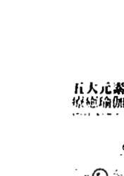

### 五大元素疗愈瑜伽

整合脉轮的瑜伽体位法 Healing Yoga

安碧卡南达大师◎著

作者精通静坐、瑜伽、吠檀多哲学与自然医学，为读者勾勒出精细完整的五大元素地图，在书中详细的解说地、水、火、气、空每一种元素与身心的关联及调整的瑜伽动作。

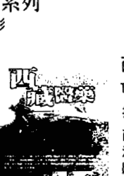

### 西藏医药

The Book of Tibetan Medicine

拉斐·福德◎著

西藏医药融合佛教哲学对生命的看法，有来自中医把脉的智慧，也包括阿育吠陀关于五大元素、三种体液的精华，其他如草药、矿物、炼金术的运用，形成了独特的西藏医药。

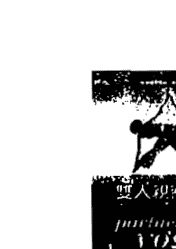

### 双人亲密瑜伽

用身体来沟通、分享爱和喜悦 The Book of Partner Yoga

米夏巴耶◎著

用心灵之眼体验爱，用身体感受浪漫和谐！作者以传统的哈达瑜伽为基础，并配合泰式、日式按摩和瑜伽治疗技巧，邀请你来体验双人瑜伽。

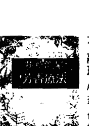

### 花草能量芳香疗法

融合阴阳五行发挥精油情绪调理的功效 Aromatherapy For Healing the Spirit

盖布利尔·莫杰◎著

作者将东方医学的传统智慧应用到现代芳香疗法中，从阴阳五行及热、冷、干、湿等能量特质的角度，深入探讨四十种芳香植物以及对应的心理与情绪问题。

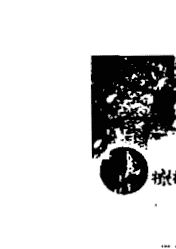

### 树的疗愈能量

The Healing Energies of TREES

派屈斯·布夏顿◎著

树，具有链接大地与天空的特质，本书指引读者发现及运用树木的能量，让你启动属于自己的特殊经验。与树接触，将重新链接内在及外在的生命力。

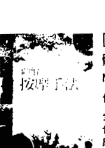

### 图解按摩手法

体验双手探索身体的乐趣 Massage

伯妮·罗温◎著

全书超过150张的精美全彩图片，教你如何运用简单却有效的方法进行按摩，你不需要是个按摩师，也能在家运用这些方法，享受按摩所带来的好处，帮助你抒解身心压力。

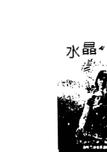

### 水晶身心灵疗方

Heal Yourself with Crystals

海瑟·芮芳◎著

善于处理精微能量的作者，针对八十种常见的身心灵不适状态，教你如何运用水晶矿石，进行深度的身体、情绪与灵性上的疗愈。

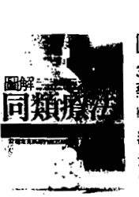

### 图解同类疗法

37种常见病痛的处方及药物宝典 Homeopathy for Common Ailments

罗宾·海菲德◎著

治疗哲理在于，“采用引发同样症状的药物治疗疾病”，能将病毒与症状适时抒发出来，并刺激个人内在治疗力，达致彻底转变体质的功效。

心灵成长系列 122

## 再连接疗愈法——来自宇宙能量的治疗奇迹

原著书名／The Reconnection : Heal Others, Heal Yourself
作　者／艾力克·波尔医师 ( Dr. Eric Pearl )
译　者／黄爱淑
总编辑／黄宝敏
执行编辑／王芳屏
发行 人／许宜铭
行销经理／陈伯文
出版发行／生命潜能文化事业有限公司
联络地址／台北市信义区 (110) 和平东路3段509巷7弄3号1楼
联络电话／(02) 2378-3399
传　真／(02)2378-0011
网　址／http://www.tgblife.com
E-mail／tgblife@ms27.hinet.net
邮政划拨／17073315 (户名：生命潜能文化事业有限公司)
邮购九折、邮资单本50元、两本以上邮资50元、购书满2500以上免邮资

-   总经销／吴氏图书有限公司．电话／(02)3234-0036
-   内文编排／菩萨蛮电脑科技有限公司．电话／(02)2917-0054
-   印　刷／承峰美术印刷．电话／(02)2225-7055

2009 年 10 月初版
定价：380 元

ISBN : 978-986-6323-00-3
The Reconnection
Copyright © 2001 by Eric Pearl
Originally published in 2001 by Hay House Inc., USA
Complex Chinese translation copyright © 2009 by Life Potential Publications.
through Bardon-Chinese Media Agency
ALL RIGHTS RESERVED.
行政院新闻局核准台业字第5435号 如有缺页、破损，请寄回更换
版权所有、翻印必究

> 国家图书馆出版品预行编目资料

再连接疗愈法／艾力克. 波尔( Eric Pearl )著 ; 黄爱淑译.
-- 初版. -- 台北市 : 生命潜能文化, 2009. 10
面 ; 公分. -- (心灵成长系列 ; 122)

译自 : The reconnection : heal others, heal yourself
ISBN 978-986-6323-00-3 (平装)

1. 波尔 ( Pearl, Eric ) 2. 治疗法 3. 能量
4. 治疗师 5. 传记 6. 美国

418.99 98017252

接收宇宙能量，创造无限奇迹

艾力克·波尔医师是加州最成功的整脊医师之一，却在一连串的事件之中逐渐发现来自宇宙的能量传递，并透过这份神奇的礼物在治疗的过程中不断创造疗愈奇迹。许多最难解的症状如：多发性硬化症、爱滋病并发症、痛风等现代医学束手无策的病症，都在短暂的能量治疗过后得到明显的改善。

波尔医师的能力受到全世界许多杰出医学研究者的注意，亚历桑那大学「人类能量系统实验室」便与波尔医师合作，为这种能量治疗进行科学性的实验。

这是一种超越技巧与人类知识领域的疗愈方式，将人类身体的健康带往宇宙意识的层次。现在，波尔医师要将这份礼物分享给世界上每一个关注疗愈及健康的人们。透过这本书，您将直接接收到波尔医师的能量传递，在波尔医师幽默诙谐的表达、无所畏惧的纯真之心带领下，见证宇宙能量的治疗奇迹。

> 《再连接疗愈》写得很好，生活中的故事可以启发人们追求他们自己的灵性道路，并且成为真正的疗愈者。
——朵琳·芙秋博士 《召唤天使》和《养育新世代靛蓝小孩》作者

> 艾力克·波尔的第一本书是以一种崭新、独特，并且精练确切的方法教导疗愈和转化。很多人为此已经等待了几十年。他已在书里把诀窍和奥秘悉数公开。他的书除了读起来有趣，这位幽默而好奇的疗愈者也让我们知道，真正的能量疗愈是可以轻易在我们每个人身上识别和启动的。现在，这个时刻到了！
——李·卡罗 (Lee Carroll) 「克里昂」系列书作者、《靛蓝小孩》共同作者

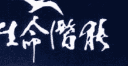

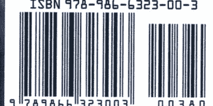

定价 380元