一位精神科医师 两名患者 则改变世界的讯息！

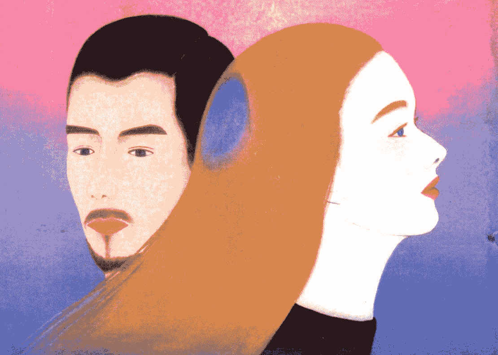

Only Love Is Real

# 前世今生爱未央

魏斯博士回溯治疗，意外牵起灵魂伴侣的今世情缘

布莱恩・魏斯 著
张琇云 译

《前世今生》作者魏斯博士执业生涯经典案例，出版...十年长销不辍！掀开分隔两个世界的面纱，一本探索爱与生命的奥秘、智慧和奇蹟的书！

福斯影业签下电影改编版权
哈克、许瑞云、韦周靖华、李欣频 感动推荐


# St. Royal College
天使神秘学院

-   ※ 专业占卜预测机构
※ 神秘学培训机构
※ 水晶能量研究中心
※ 神秘学资料库
※ 微信公众平台：strc2011
※ 微信官方账号：strcdts
※ 读书交流QQ群：占星塔罗占卜师交流群：814594478（加入密码：PDF）神秘学其他综合群：659338717（加入密码：PDF）


微信号：strcdts
天使神秘学院

天使神秘学院 院长QQ：715104687


微信公众平台：strc2011

## 制作说明：

本书由《天使神秘学院》出重金从台湾购入的原版书籍扫描制作为达到最好阅读效果，特地把原版书全部切开后，再经由专业扫描设备高精度扫描完成，并经过一张张的PS后期处理最终成书，其间花费大量的人力、物力以及时间，只为能给大家提供经济并优质的神秘学学习资料而努力。

本学院强力谴责某些机构和个人，把本学院花心血制作完成的电子书籍，包装后直接放在自家淘宝网上低价倾销的行为，以谋取不劳而获的经济利益。如果长此以往最终将无人愿意再为大家花心思制作电子书，那以后可能大家再无新书可读。

为让大家以后能够读到更多的好书，也为了本学院的良性发展。本学院恳请大家尽量做到如下几点：

-   1. 尽量在本学院的网站购买电子书籍。
    2. 请勿用技术手段把电子书内的水印及加密去掉。
    3. 在收到电子书后小范围传阅即可，千万不要公开传播，更别挂到淘宝网上低价销售。

同时为答谢广大支持者，学院电子书将做如下调整：

-   1. 学院会把一些早已收回制作成本的电子书折价销售。
    2. 最新制作的电子书籍会开放打印功能，大家购买后有条件的可自行打印成书。

天使神秘学院
2019年1月

# CONTENTS

## 《推荐序》穿越时空，寻找再一次美丽的时光 哈克
011

## 《推荐序》唯有爱能疗愈一切 辜周靖华
013

## 《推荐序》见证一趟奇妙的因缘之旅 许瑞云
015

## 《前言》一个关于灵魂伴侶的动人故事
019

# 1 认出你穿越数世纪的灵魂伴侶
或许只要一个眼神、一场梦、一段记忆、一种感觉，便能意识到灵魂伴侶的存在。也可能唤醒你的，是他的双手轻抚，或是她的朱唇轻吻，倏地你的灵魂便活了过来。
025

# 2 伊丽莎白的今生故事
母亲过世前，伊丽莎白的焦虑主要来自工作压力，偶尔也会操心感情问题。母亲过世后，她的焦虑程度急速恶化，觉得自己漂泊无依，不知何去何从。
028

# 3 前世回溯给我的震撼
凯瑟琳回想起更多段前世。她的症状消失了，且是不药而愈。但我仍有疑虑，加上受过严谨的科学训练，因此很难接受前世的观念。最后是两件事消除我的疑虑。
038

## 4 伊丽莎白的第一次回溯——船难溺死的少年
绝大多数的恐惧源自过去，而非未来。最让我们害怕的事，通常早在童年或前世就发生过了，却因为我们忘了或印象模糊，才会担心那个创伤事件有朝一日可能成真。

## 5 贝德罗的今生故事
贝德罗是个褐发蓝眼的墨西哥男子，帅得出乎我意料。而在他的魅力、风趣背后，隐藏着失去手足的伤痛。

## 6 贝德罗的第一次回溯——因敌人入侵而失去爱妻与家人的蒙古牧民
我从多年经验得知，第一次回溯的人往往会想起那一世最惨痛的事件，因为那次创伤引发的情绪在他们的心灵烙下深深的印记，也随着灵魂投胎转世。

## 7 伊丽莎白的第二次回溯——生活平静的美国原住民／穷苦的印度少女
在潜意识层次，她的悲伤或许已经减轻了，因为她知道自己曾经活在过去，之后也将再次活着。她知道死亡并不是结束。

## 8 贝德罗的第二次回溯——被刺杀的英国士兵／一战后的德国红牌妓女
贝德罗颈部和左肩的慢性疼痛逐渐消失。医生从未找出他疼痛的原因，自然也料想不到数世纪前那致命的一剑，可能就是这疼痛的由来。084

## 9 伊丽莎白的第三次回溯——父亲被罗马士兵拖行而死的少女
我把伊丽莎白今生的悲伤，和来自两千年前巴勒斯坦的哀痛连结起来。前世的哀痛会加重今生的悲伤，这是另一个例子吗？知道死后还有来生，是否就能平息这股悲伤？093

## 10 贝德罗的第三次回溯——抗拒当修士的少年／死在女儿怀里的人父
贝德罗学到宽恕极为重要。我们因别人做的事而谴责对方，但那些事我们自己也做过。如果想要别人原谅自己，就必须先原谅别人。108

## 11 伊丽莎白的第四次回溯——脱离家暴夫后遇到真爱的爱尔兰妇女
如果没有找出虐待等行为模式并加以破除，同样的模式就可能会在许多世反覆出现。

一旦查出前世的根源，破坏性模式就不再那么难破除了。
117

## 12 贝德罗的第四次回溯——到新世界寻找黄金的西班牙船员
我仔细思索贝德罗这几世生离死别的模式——屡次与心爱的人分离，经历过那么多悲伤。当他穿越朦胧且不确定的时间薄雾，能否再找到他们？
129

## 13 伊丽莎白在观想中与逝去的母亲相聚
尽管顺利忆起了几段前世，伊丽莎白依然深陷悲伤痛苦的情绪中。理智上，她已开始接受日后转世时灵魂将重生的观念，但回忆无法带回她母亲，她没办法躺在母亲怀里跟她说话。她好想妈妈。
137

## 14 贝德罗的第五次回溯——观测天象的古代祭司
144

我们将自身特质给了这些所谓的神。恐惧、愤怒、嫉妒、仇恨，这些是人类的特质，而我们将之投射到神的身上。

## 15 伊丽莎白经历的奇异梦境
伊丽莎白在梦中感受到最不可思议的爱，知道一切都会很好。她经历的种种只是某项计画的一部分，而且是一项完美无缺的计画。
152

## 16 贝德罗在疗程中回到童年
夜空存在的时间远比人类长久，某种程度上，所有人都听过这首古老的交响曲？我们的命运是否也同样被引领着？然后，我又冒出一个念头，每个字都很清楚，意思却很模糊；我也必须有耐心，别妨碍贝德罗命运的安排。
160

## 17 伊丽莎白的第五次回溯——受训成为治疗者与祭司助手的古埃及少女
这段记忆能帮助她抚平悲伤。她再次发现自己已经历了肉体死亡，许多世纪后再度出现，这次的身分是伊丽莎白。倘若经过如此漫长的岁月她都还活着，那么她母亲也可以，我们所有人都可以。
166

## 18 贝德罗的第六次回溯——十九世纪的忧郁中年医生
我学到重要的课题：要心怀爱与慈悲帮助他人，别太担心结果；别用生理方面的成效衡量治疗结果，疗癒发生在许多层次，生理上的只是其一，真正的疗癒必须发生在心灵层次。而最重要的课题是：要彼此相爱。

## 19 伊丽莎白的第六次回溯——被敌人掳走、与丈夫生离的女牧民
爱像流水，填补裂缝。是我们人类筑起了错误的屏障，阻断了水流。当爱无法填满我们的心和脑，当我们由爱组成的灵魂断了连繫，那时，所有人都会发疯。

## 20 突然发现伊丽莎白与贝德罗的连结
他们曾是父女，曾是青梅竹马，也曾是夫妻。在历史的洪流中，他们还曾共同度过几段前世，又相爱过几回？

## 21 巧妙安排两人擦身而过
我送伊丽莎白到候诊室，他俩注视对方，目光停留了好一会儿。我可以感觉到他们很好奇对方是谁，寻常的表面下暗藏无限的可能性。或者，这只是我一厢情愿的想法？

## 22 命运之轮转动，两人注定重逢
比我更有创意的高手正在高处运筹帷幄，安排贝德罗和伊丽莎白见面。两人的重逢是命中注定的事，至于之后如何发展，就看他们自己了。
217

## 23 回溯疗法带来的奇蹟
我一直告诉大家，回溯疗法的效果可能要好几週或好几个月之后才会产生，千万别因为疗效太慢出现就打退堂鼓。这位女士提醒了我：治疗效果也可能快得令人难以置信。
223

## 24 患者给我的灵性讯息
我们走的是一条朝向内在的道路。这是一条比较难走的路，一趟比较艰辛的旅程。我们对自己的学习负有责任，不能把这份责任往外推，推给某位大师。神的国度就在你之内。
229

## 《后记》爱能克服一切障碍
235

## 穿越时空，寻找再一次美丽的时光
热爱吉他的作家，《你的梦，你的力量》作者 哈克

这是一本，让我读到触电、鸡皮疙瘩此起彼落的书。

不同的治疗学派，有点类似不同菜系之间的差别，像是粤菜和湘菜的不同，或者像是法式料理与日本料理的不同风格。因为纬度差异，因为海拔不一样高，这个地区有了这里的当地食材，于是，厨师下手的刀工与火候，有了独特的菜系流派。

那么，一样米养百样人，会不会质地不一样的人，需要很不一样的治疗做法来帮忙？

在心理治疗学派百家争鸣的这个世代里，有些学派逐鹿中原，有些学派照亮五狱。催眠治疗，相对于其他被比较多人接受的学派来说，像是地处北极。而催眠治疗里头的前世回溯治疗，更是北的极北。为何要跋涉至此，地处荒凉，很有可能是因为，那极美而震撼人心的极光，只发生在这里吧！

书里，男主角在某一次前世的回溯里听见了一句话：“重要的是以爱助人，结果如何并不重要。以爱助人，你只须这么做。”就在这一段，魏斯博士在书里说：“我也听见了同样的话，确定这些话也是对我说的。”而时空移转，此刻正读着这本书的我，在那一页的那一行字旁边，写下了：“是的，我也听见了。”读着这本书，我一直有一种喜悦的感觉，觉得这个世界上，有魏斯博士这样的人，做着这么美丽的陪伴，真是珍贵极了！我用了一个月的时间，慢慢读着魏斯博士的这本书，今天清晨读完最后一个章节，我深呼吸的放下书稿，心里浮起一个画面：...荒山日暮，天苍苍野茫茫只有鹰飞扬的大江渡口，摆渡人撑起了桨掌着舵，数十年的摆渡岁月，让识水性观星象已成了风里的呼吸和摇摆时的血液，于是，渡江，有了穿越时空，寻找再一次美丽的时光的可能。催眠治疗师，像是心灵陪伴的引水人，书里头的催眠做法，经典又带着纯粹的爱，似乎在摆渡的歌声里，呢喃着：来到这里相遇的我们，如果可以相亲相爱，那就互相取暖吧。

## 《推荐序》 唯有爱能疗愈一切
中租青年展望基金会董事长 辜周靖华

本书作者布莱恩・魏斯博士多年的回溯治疗经验，使得原本相信科学的他，不得不臣服于比科学更为缜密的形上学。书中的男女主角伊丽莎白及贝德罗在累世的轮回中错过了彼此，或是没有好的结局，却到了这一世谱出美丽的恋曲。由于在累世的轮回中充满担忧、恐惧，甚至仇恨，就无法顺着自己的命，错过了很多机缘。两位主角在累世的学习之中体验恐惧，进而学会放下恐惧，最终得到了疗愈，然后在这一世相遇，成为彼此的灵魂伴侶。

《前世今生爱未央》这本书值得推荐。在魏斯博士的回溯催眠治疗中，伊丽莎白及贝德罗不仅阐述了感人的前世故事，也提供了许多重要的人生哲理，以及高灵智慧展现的讯息，甚至出现了灵性政治学，也探究了轮回的机制及原由。

灵魂是不灭的，我们藉由不同的身体在累世中学习扮演不同的角色，每一世学到的知识及经验累积无非在教导我们某些课题，例如爱、宽恕、同理心、耐心、智慧等，并摒弃一些阻碍灵魂成长的特质，例如恐惧、贪婪、仇恨、自大。最重要的是能够认识爱，体验爱，帮助更多人，因为唯有爱才会疗愈一切。

这本书再次提醒我们：人要用更开放的心去感受生活的种种，不论是快乐或痛苦；要放下无谓的恐惧，用心感受，让生命之流顺畅，好好体验并感谢一切的发生，因为这都是为了往更好的方向进行。

## 《推荐序》见证一趟奇妙的因缘之旅
许瑞云

我曾在生命中遇到两位非常重要的老师，他们教导我如何穿越时空去做身心灵的疗愈，也因此知道我们可以随时回到过去或是未来的时空。穿越时空的过程，并不像电影情节描述的一样，需要坐着时光机才能回到过去或去到未来；事实上，无论是过去还是未来的时空，都和当下的时空同时存在，一切都是我们内心的全像显现，不同的时空只不过是频率的转换罢了。

所有前世未了的功课，几乎都会在这世捲土重来，也因此大多数的疾病都可以从这世所遭遇的问题中找到根源和解答，进而得到疗愈。由于门诊时间有限，但要了解一个人前世未了的功课，需要花费相当的时间，因此我在门诊时无法帮病人进行这方面的治疗。在学习穿越时空疗愈的过程中，我会有过不少奇妙的体验，而这些体验跟魏斯博士前世今生的回溯经验有不少不谋而合之处。

我很认同书里写的：“几世轮回，我们变换宗教、种族、国籍，体验大富大贵、身强体健的日子，也尝到穷困潦倒、染病抱恙的滋味。我们必须学习不心存偏见，也不心怀仇恨。如果不这么做，来生只会身分对调，转世成为敌对那方的人。”这个概念与佛教的业力法则十分相似，都是希望我们能了解业力之所以发生，并不是为了惩罚谁，只是让人得以更深刻的学习的机缘。

“凡我投向宇宙的一切，都会回到我的身上。”发生在生命中的所有事情，一定有它的因缘，有我们需要学习的功课，否则不会出现。透过业力法则，如果我们曾经伤害过别人，有一天我们必然会成为被伤害者，好让我们有机会亲身体验被伤害的感觉。如果能明白现下我们所受的苦，正是自己曾经造下的果，就能自然生起忏悔心，开启对他人受苦的同理心及慈悲心，如此才会有足够的动力去改进自己”。

在《前世今生爱未央》书中，魏斯博士分享了亲身经历的真实个案故事：宿世有缘的两个人，这一世中彼此不相识又距离遥远，虽然渴望找到灵魂伴侶，却一次又一次失望。他们如何能在这一世找到彼此，继续未竟的缘分呢？让我们一起跟着魏斯博士，见证这趟奇妙的因缘之旅。

## 致读者

精神科医师对患者资料负有保密义务，这项精神医疗伦理原则由来已久，不得违反。本书提及的患者均已授权作者写出他们的真实故事，唯更动了姓名和其他可供身分辨识的细节，以保护患者隐私。本书故事句句属实，绝无加油添醋。

## 《前言》
## 一个关于灵魂伴侶的动人故事

> 人类灵魂似水，从天而降，蒸而升天，凝而坠地，轮回永生。

—— 歌德

就在我的第一本著作《前世今生》即将出版之前，我去拜访本地一间书店的老板，想看看他是否订购了这本书。我们一起查看他的电脑。

“订了四本，”他告诉我，“你要预购一本吗？”

虽然这本书的印量不算太多，但究竟卖不卖得完，我也没有十足的把握，毕竟这是一本非常诡异的书；更奇怪的是，作者还是个受人敬重的精神科医师。这本书描述我一名年轻患者的真实故事，她接受的是前世疗法，而这疗法戏剧性地改变了我们两往后的人生。不过，我知道就算这本书在国内其他书店一本也没卖出去，我的亲朋好友一定会捧场，加上左邻右舍，少说卖四本。

“拜託你了，”我对他说，“我的朋友、患者，还有其他认识的人都会来你这里找这本书，能不能多订几本？”

我得亲口保证卖个一百本绝对没问题，他才勉为其难地订下。

世事难料，没想到这本书居然成为全球畅销书，发行了两百多万册，还被译为二十几种语言。我的人生又出现了一次非比寻常的转折。

我以优异成绩毕业于哥伦比亚大学。在耶鲁大学完成医学训练后，就到纽约大学附属医院实习。完成实习后，又回到耶鲁大学担任精神科住院医师，接着先后在匹兹堡和迈阿密大学担任医学院教授。

尔后十一年，我在迈阿密的西奈山医学中心担任精神科主任，也在这段期间写了不少科学论文和书籍章节，学术生涯可谓如日中天。

就在那段期间，凯瑟琳，我在第一本著作中提到的那名年轻患者，走进了我位于西奈山的诊疗室。她钜细靡遗地回想起几段前世记忆，但一开始我并不相信。此外，她在催眠状态中也有能力传达超自然讯息。她的出现彻底搅乱我的生活，我再也无法用原先的观点看待这个世界。

继凯瑟琳之后，还有许多患者来找我进行前世回溯治疗。传统医疗和心理治疗束手无策的病症，经过前世回溯治疗后全都不药而愈。

我的第二本书《生命轮回》谈的是我所学到与前世回溯疗法的疗愈潜力有关的事，书里穿插了许多患者的真实案例。

其中最耐人寻味的故事，就收录在我的第三本书《前世今生爱未央》里。这是一本关于灵魂伴侶的书，他们因为爱而永远牵掛对方，一世又一世、一次又一次再续前缘。如何找到并认出自己的灵魂伴侶，以及届时又得做出哪些扭转让人生的决定，交织成生命中最感人、也最重要的时刻。

命运主宰着灵魂伴侶的重逢。我们一定会遇见自己的灵魂伴侶，但见面之后决定怎么做，端视自己如何选择，也完全取决于自由意志。一个错误的抉择，一次错过的机会，可能演变难以想像的寂寞与折磨；一个正确的选择，一次好好把握的机会，就可能让人感受到深刻的幸福与快乐。

伊丽莎白年轻貌美，来自美国中西部。母亲过世后，她陷入悲伤忧虑的情绪中，无法自拔，于是求诊于我。此外，她的感情路也走得坎坷，看上的全是些不成材、会施暴或不利于她的对象，也从未在任何一段恋情中觉得真爱。

我们展开了回溯到久远年代的旅程，结果却出人意料。

在我以前世疗法治疗伊丽莎白期间，贝德罗也找我看诊。他来自墨西哥，是个魅力十足的男子，也正因痛失亲人而悲伤不已。前阵子他哥哥不幸意外身亡，而他和母亲相处上的困难，以及年少时的难言之隐，也似乎都在与他作对。

贝德罗绝望困惑，心情沉重，愁肠万缕却无人倾诉。

为了疗愈自己，他也开始返回古代寻求解决方法。

虽然伊丽莎白和贝德罗在同一段期间找我治疗，两人却不曾谋面，因为他们每周约诊的日期都错开了。

过去十五年，我在看诊时经常遇到夫妻或家人在回溯前世时，找到这一世的配偶或亲人。有些夫妻会在回溯时，同时、也是初次发现彼此曾在同一段前世里互动。发现这件事，往往令他们震撼不已，因为这是他们前所未有的经验。当一幕幕景象在我的诊疗室呈现时，室内一片静寂；之后，等他们从催眠的放松状态中清醒，才恍然大悟两人看到的是同样的场景，感受到的是相同的情绪，我也在这时候才知道他们在前世的关系。

不过，在伊丽莎白和贝德罗的情况中，前后顺序是颠倒过来的。他们的生活和前世分别在我的诊疗室里展开，并无关联。他们互不相识，没见过面，来自不同国家，文化背景也相异。我在不同的时间分别见到他们，当然不会认为两人之间有任何关联，也未多做联想。然而，他们描述的似乎是同一段前世，无论细节或情绪都相似得惊人。有没有可能他们曾在好几段前世里相爱过，却又失去对方？起初我们三人谁也不知道，在我的诊疗室里那毫不令人起疑的宁静气氛中，一场扣人心弦的戏剧正在展开。上演。我是第一個發現他們淵源匪淺的人。接下來要怎麼做？該不該告訴他們？要是我弄錯了呢？醫病保密義務怎麼辦？他們兩人目前各自的感情呢？可以插手命運嗎？如果這一世的重逢並不在他們的計畫中，甚至對雙方都沒好處，又該如何是好？若感情再次觸礁，是否會導致目前的療效功虧一簣，連帶毀了他們對我的信任？在醫學院就讀那幾年，以及後來在耶魯大學醫學院擔任精神科住院醫師那段期間，我學到了「以患者安全為優先」的觀念，也謹記在心。心有疑慮時，要優先考量患者的安全。伊麗莎白和貝德羅兩人的病情已漸有起色，我是否該當作沒這回事？貝德羅的療程即將結束，不久就會離開美國。時間緊迫，我得趕快做決定。這本書並未一五一十描述他們每次來接受診療的情形，尤其是伊麗莎白的，因為有些診療內容與兩人的故事無關，我有時全程運用傳統心理治療法，並未用上催眠或前世回溯療法。接下來的內容是根據醫療紀錄、錄音逐字稿與個人記憶寫成，只稍微變更了姓名和細節，以保護患者隱私。這是一則關於命運和希望的故事，也是一則每天都在默默發生的故事。而今天，有人在聽。

## 1 認出你穿越數世紀的靈魂伴侶

> 因此要知道，我將從幽深的寂靜中歸來……切莫忘記，我將返回你身邊……不多久，於風中稍歇片刻後，我將自另一女子腹中誕生。
——哈利勒・紀伯倫

每個人都有一個特別的人，通常是兩、三個，甚至四個。他們來自不同的時代，遠渡時間重洋，跨越層層天界，只為了再次與你相聚。他們來自另一個世界，來自天堂，容貌雖改變了，但你的心認識他們。你的心曾在灑滿月光的埃及沙漠、在古老的蒙古曠野，將他們擁在懷中，彷彿是你親自攬著他們。你們曾一起策馬奔馳在被世人遺忘的武將軍隊裡，亦曾共同生活在被砂石掩埋的古代洞穴中。在永恆的時光裡，你們心繫彼此，你永遠不會孤單。
你的理智可能會橫加阻撓：「我不認識你。」但你的心認識。他第一次牽起你的手，被他碰觸的記憶便穿越時空，讓你周身上下的每顆原子為之震顫。她凝視你雙眼，你便看見了一名穿越數世紀的靈魂伴侶。你的胃為之翻攪，雙臂起雞皮疙瘩，外在的一切此時已微不足道。

縱然終於再次相遇，即使你認識他，他卻可能不認得你。你感覺得到兩人之間的連結，也看得見其中的可能性和未來，但他沒辦法。他的恐懼、理智和疑慮猶如一層紗遮蔽了他的心眼，然而，他卻不讓你幫他拿掉那層紗。你心痛，你難過，他卻揚長而去。命運就是如此捉弄人。

待兩人認出對方，那熾熱的情感可強過火山爆發，釋放的能量可撼動天地。

靈魂相認可能在轉瞬間。一種突如其來的熟悉感，知道在遠超越意識所知的深處，你認識這名陌生人，而那深處，通常只保留給最親近的家人——甚至在比那更隱密的深處。你出於本能知道該說什麼，也知道對方會有什麼反應。這種安全感和信任，絕非短短一天、一週或一個月即可建立。

靈魂相認也可能十分緩慢而隱微。一旦那層紗被輕輕掀起，便會逐漸覺知。並不是每個人都準備好可以立刻看見，這件事強求不來，先看清楚的一方必須耐心等待。

或許只要一個眼神、一場夢、一段記憶、一種感覺，便能意識到靈魂伴侶的存在。

也可能喚醒你的，是他的雙手輕撫，或是她的朱唇輕吻，倏地你的靈魂便活了過來。

每個人都是如此的不同，也因如此，你與靈魂伴侶之間的第一次相遇，才會如此震撼與不可思議。

或許，你們相遇的第一眼，靈魂深處便認出了彼此，那份熟悉感超越時空的界限，彷彿在另一個生命裡，你們早已相識。喚醒你的那溫柔輕觸，可能來自子女、父母、手足，或一位真心的朋友；也可能是你的摯愛，跨越了幾世紀，只為了再次親吻你，提醒你：你們永遠在一起，永生不分離。

## 2 伊麗莎白的今生故事

> 我這一輩子，就像一篇無始無終的故事。我感覺自己是歷史的某個片段，是一則前後文都遺失的摘錄文字。我可以想像自己或許曾經生活在數世紀前，並在那時遭遇到自己無法解答的問題，於是再次轉世為人，因為我必須完成交付給我的任務。
—— 卡爾·榮格

伊麗莎白高挑纖瘦，嫵媚動人，留著一頭金色長髮，有著一雙悲傷的藍眼睛，其間點綴著些許淡褐色。她忐忑不安地坐在我診療室那張白色的真皮大躺椅上，憂鬱的雙眼比身上穿的那件寬鬆的海軍藍套裝更引人注意。
伊麗莎白讀過《前世今生》，對書中主角凱瑟琳的諸多遭遇感同身受，覺得非來找我看診不可，因為她想重燃對人生的希望。
「可以告訴我，你為什麼想來看診嗎？」我開口問道，藉此打破初診時常見的僵局。我之前已大致瀏覽過她的病歷，每位初診患者都要填寫這張個人病歷表，包括姓名、年齡、轉介單位、主訴病情與症狀。伊麗莎白列舉的主要病情是哀傷、焦慮、睡眠障礙，而她一開口說話，我就在心裡為她加上「男女感情」這一項。

『我的日子過得一團糟。』她娓娓道出辛酸往事，彷彿終於可以放心地聊一聊，明顯感覺她正在釋放久以來鬱積的壓力。

伊麗莎白的人生故事高潮迭起，徐徐道來的外表下暗藏波濤洶湧的情緒。儘管如此，她卻很快就貶低自身故事的重要性。

「我的故事遠不及凱瑟琳的精采，」她說，「不是會有人想出書的那種。」

精采也好，乏味也罷，她繼續說著自己的故事。

### 母親的愛彌補了父親的疏離

伊麗莎白在邁阿密開了一間會計公司，是個成功的女企業家。三十二歲的她在明尼蘇達州鄉下出生、成長，父母經營一座大農場，裡頭養了不少動物，她和哥哥就是在那裡長大的。父親做事勤奮、刻苦耐勞，卻不知如何表達自己的喜怒哀樂，就算表露情緒，通常不是怒火中燒，就是大發雷霆。他發起怒來，會一時衝動對家人破口大罵，有時甚至會動手打兒子。父親雖然只會口頭責罵伊麗莎白，依舊深深傷害了她。內心深處，伊麗莎白仍帶著兒時的傷口。父親對她的責罵與批評傷害了她的自我形象，也造成她刻骨銘心的痛苦。她覺得自己是破損的、不完美的，擔心別人——尤其是異性——也會察覺她的缺陷。所幸父親不常發怒，事過境遷後，也會很快恢復成原本那位嚴肅、冷淡、疏離的人。 這是他性格及行為的特質。伊麗莎白的母親則是位開明獨立的女性。她培養伊麗莎白獨立自主的性格，同時散發溫暖，在情緒上滋養女兒。考慮到那個年代的狀況，也為了兩名子女，她選擇留在農場，無奈地忍受丈夫的嚴苛與冷漠。「我媽就像天使，」伊麗莎白繼續說道，「永遠都在那裡，時時關懷呵護，總是最甜蜜的就是膩在母親身邊的時光，以及牽繫著彼此那份特殊的愛，那份愛無論何時都在。為子女犧牲奉獻。」伊麗莎白是母親最疼愛的心肝寶貝，擁有許多美好的童年回憶，其中最甜蜜的就是膩在母親身邊的時光，以及牽繫著彼此那份特殊的愛，那份愛無論何時都在。伊麗莎白高中畢業就離家到邁阿密讀大學，那所大學提供她極為優渥的獎學金。到邁阿密對她來說就像出國探險，誘惑著她遠離寒冷的美國中西部。母親很開心伊麗莎白能有機會到外地求學，她們是最好的朋友，雖然多半只能靠打電話或寫信聯絡，但母女情深不變。節日和寒暑假是兩人最快樂的時候，因為伊麗莎白幾乎一放假就會回家。有幾趟回家時，母親提及想搬到南佛羅里達養老，住得離伊麗莎白近一點。他們家的農場很大，經營起來日益困難，不過因為父親克勤克儉，家裡存款倒是不少。伊麗莎白滿心期待母親來住在她附近，這樣就能天天見面，而不再只能互通電話。於是伊麗莎白大學畢業後，繼續待在邁阿密。她開了一間會計公司，規模日漸擴大。會計這行競爭激烈，工作佔據了她大半時間，男女感情更是加重了她的壓力。然後，不幸的事件襲來。大概在她第一次來找我看診的八個月前，伊麗莎白的母親死於胰臟癌，這讓她痛不欲生。摯愛的母親過世，她彷彿整顆心都被扯了下來，撕成碎片。她不知如何撫平這喪母之痛，無法接受、也不明白為什麼會發生這種事。伊麗莎白痛苦地告訴我，儘管惡性腫瘤摧殘著母親的身體，她仍勇敢抗癌，但性情未改，也愛子女如昔。母女倆感受到深切的悲傷。死別已在所難免，且一直悄悄逼近。伊麗莎白的父親知道妻子死劫難逃，因悲傷而變得更加冷漠、疏離，用孤獨把自己包裹起來。她哥哥遠在加州，子女年幼，事業剛起步，雖有心也愛莫能助。於是，伊麗莎白盡量一有空就回明尼蘇達。沒有人能分擔她的恐懼和痛苦。母親已命在旦夕，除非必要，她不想再增加她的負擔。因此，伊麗莎白把絕望埋藏在心底，心情日益沉重。

> > 「我會很想念、很想念你……我愛你。」母親告訴她，「我捨不得放你一個人。」
> 「我不怕死，不怕死後會怎樣，但我還不想離開你。」

### 因母逝而憂鬱，期待療癒心痛

伊麗莎白母親的身體一天比一天孱弱，想多活一些時日的意志也開始動搖。死亡反倒成了令人愉快的解脫，可讓母親不再承受衰弱和病痛之苦。她辭世的時辰到了。

伊麗莎白的母親躺在醫院病床上，小小的病房裡擠滿親戚朋友。她的呼吸變得紊亂，尿管裡一滴尿也沒有，表示腎臟已喪失功能。她時而昏迷，時而清醒，然後在某一刻，伊麗莎白發現病房裡只剩下她和母親。就在這時，母親睜大眼睛，神智恢復清醒。

> > 「我不會離開你，」母親突然用堅定的口氣說道，「我會永遠愛你！」

這是伊麗莎白聽到母親說的最後幾句話。語畢，母親又陷入昏迷，呼吸變得更不穩定，會久久都沒呼吸，接著忽然大吸一口氣，又開始呼吸。沒多久，母親便撒手人寰。伊麗莎白覺得自己的心裡和生活中多了一道又深又大的缺口，而且真的感覺胸口隱隱作痛。她覺得自己不再是完整的了，終日以淚洗面，時間長達數月。

伊麗莎白想念與母親頻繁的通話。她試著更常打電話給父親，但他依舊態度冷淡，不知該跟她聊些什麼，講個一、兩分鐘就掛上電話。他安慰不了她，也無法給她溫暖。他自己也在哀悼，而悲傷讓他變得更加疏離。她哥哥則與妻子和兩名年幼的孩子住在加州，雖然母親過世他也甚感悲痛，但家庭與事業讓他忙得無暇他顧。

她的悲傷開始演變成憂鬱，伴隨著越來越明顯的症狀：夜裡輾轉難眠，好不容易睡著了，卻一大清早就醒過來，之後再也無法入睡；食慾不振，體重開始減輕，明顯無精打采，無心經營人際關係，也越來越難集中精神。

母親過世前，伊麗莎白的焦慮主要來自工作壓力，例如煩惱截止日或難以下決策。偶爾也會操心感情問題，不知如何是好，猜不到對方會如何回應。

母親過世後，伊麗莎白的焦慮程度急速惡化。她失去了每天陪她談心、給她忠告的知己，也失去了最主要的諮詢和支持來源。她覺得自己漂泊無依，不知何去何從。

於是，她打電話來預約就診。伊麗莎白走進我的診療室時，心裡抱著能發現自己曾和母親共同出現在某段前世，或是能透過某種神秘經驗與母親取得連繫的希望。我在書裡和演講中都提到有些人在靜心狀態時，曾有過與摯愛重逢的神秘經驗。伊麗莎白讀過我的第一本書，似乎知道自己有可能體驗到這種狀況。一旦接受肉身死後還有來生，接受意識在離開身體後繼續存在的可能性（甚至這可能性還很大），就會開始在夢裡或其他變異意識狀態中更常體驗到這種神秘經驗。這種重逢的真偽難以證明，影像卻鮮明逼真，且真情流露；有時候，有這種經驗的人甚至可以知道唯有亡者才知曉的特定資訊、事實或細節。這些造訪靈界獲得的啟示，很難全然歸因於想像力。我現在相信，人們之所以取得這樣的新知識或得以造訪靈界，不是因為他們希望發生這種事、有這份需求，而是因為這就是與亡者取得連繫的方式。

> 我很平安；我很好；照顧好自己；我愛你。

這些訊息往往大同小異，尤其是在夢裡： 伊麗莎白期待與母親重逢或取得連繫，形式不拘。她的心需要某種慰藉物，來舒緩那源源不絕的疼痛。

### 一再失敗的感情際遇

第一次就診，伊麗莎白便和盤托出不少往事。

她曾和一名承包商有過一段短暫的婚姻，對方結過婚，育有兩名子女。雖然她並未和那男人陷入熱戀，但他人品還不錯。她以為這段婚姻能讓她的生活更穩定，但男女之間來不來電是她強不來的，尊敬、同情有可能，不過化學作用一開始就要有。伊麗莎白發現丈夫外遇，對方是個能帶給他更大的刺激與熱情的人，於是她只好退出這段關係。她雖難過自己的婚姻以離婚收場，無法再照顧兩個孩子，卻不因為離婚而傷心。母親過世比這嚴重多了。

由於外貌姣好，離婚後伊麗莎白發現自己很容易結識異性，想跟她約會的人也不少，但每一段感情都缺少熱情。伊麗莎白開始懷疑自己，也試著找出自己哪裡有問題，才會無法好好經營一段感情。「我有什麼毛病？」她會如此自問，自我價值感益發低落。

兒時父親尖酸刻薄、令人難堪的批評在她的心劃下一道道傷口；一次又一次失敗的感情，更無疑是在這些傷口上抹鹽。

她開始和任教於附近一所大學的教授交往，對方卻因為自己心有恐懼而無法對她許下承諾。即使兩人相知相惜，溝通也十分順暢，他卻仍舊無法與她互許終生，無法信任自己的感覺。這便注定了兩人將漸行漸遠，最後這段感情無疾而終。幾個月後，伊麗莎白認識了一名成功的銀行家，開始跟他約會。雖然這段感情還是缺少愛情的火花，卻讓她感到安心、受寵。對方深深迷戀伊麗莎白，也希望她回以他期待的那種活力與熱情；一旦他發現自己期望落空，原本的愛意便轉為憤怒、嫉妒，酒越喝越多，甚至開始動手打人，伊麗莎白只好結束這段感情。雖然嘴裡不說，她心裡卻早已不抱希望，認定自己永遠遇不到能跟她建立良好親密關係的對象。她轉而埋首工作，極力擴展公司業務，躲在數字、計算和文書工作後面，幾乎只跟有生意往來的人打交道。即使偶有異性邀約，也會設法讓對方在投入感情前便知難而退。伊麗莎白知道歲月不饒人，自己的生理時鐘正滴答走著。縱使心裡仍盼望有朝一日能遇到真命天子，卻早已不敢奢望。

信任的種子。初診的主要目的是採集病史、進行診斷、規劃治療方式，以及在醫病關係中播下初診的僵局已經打破，我決定這次先不開百憂解或其他抗憂鬱藥物。療的目標是完全根治，而不是把症狀壓下去就算了事。 下次看診安排在一週後，屆時我們就要穿越時空，展開回到過去的艱辛旅程。

## 3 前世回溯給我的震撼

> > 已經是好久以前的事了！但我還是同一個瑪格麗特，衰老的不過是我們的生命。我們所在之處，幾世紀只算作幾秒；等活過一千次之後，我們才會開始睜開眼睛。——尤金·歐尼爾

治療凱瑟琳之前，我從未聽聞「前世回溯」這種療法，在耶魯大學醫學院時沒人教，其他地方也學不到。
第一次回溯的情形仍歷歷在目。我指示凱瑟琳回到過去，希望發現她受壓抑或被遺忘的童年創傷，我認為那就是引發她焦慮和憂鬱症狀的原因。
我柔聲說話助她放鬆，誘導她進入深度催眠狀態。她專注聆聽我的指令。
前一周診療時，我們第一次使用催眠法。凱瑟琳憶起了幾則童年創傷事件，內容詳盡，情緒也變得很激動。在治療過程中，當患者想起被遺忘的創傷，同時伴隨情緒出現時（這個過程叫「宣洩」），病況通常會開始好轉。然而，凱瑟琳的症狀依然十分嚴重，因此我認為必須找到更多受壓抑的童年記憶，之後她的病情應該就會有所改善。

我小心翼翼帶著凱瑟琳回到她兩歲時，可是她並未想起任何重大事件。我下指令，聲音清楚而堅定：「回到你症狀出現那段時間。」結果她的反應嚇得我不知所措。

> 「我看見通往一幢房子的白色階梯，那是一幢有柱子的大房子，前面是開放空間，沒有進出口。我穿著一件長洋裝......款式寬鬆，質地粗糙，金色長髮則編成辮子。」

她叫愛朗達，是一名活在將近四千年前的年輕女子，一場突如其來的洪水或海嘯讓她死於非命，也毀了她所在的那個村落。

> 「一陣陣大浪襲來，樹被沖倒了，無處可逃。很冷，水很冰。我得救我的孩子，可是沒辦法......只能緊緊抱住她。我溺水了，被水嗆到，沒辦法呼吸，不能吞嚥......水很鹹。大水把我的孩子從我懷裡捲走了。」

憶起這件慘事時，凱瑟琳一直在大口喘氣，難以呼吸。突然間，她全身都放鬆了，呼吸也變得深沉平穩。

「我看見雲……孩子和我在一起，還有其他村民。我看見我哥。」
她在休息，那一世結束了。我跟她都不相信有前世，沒想到卻以如此戲劇化的方式經歷了一段古代生活。

不可思議的是，經過這次診療，她長久以來對窒息和嗆到的恐懼居然幾乎消失殆盡。我知道想像或幻想無法治癒如此深烙在心裡的痼疾症狀，但宣洩記憶可以。

日子一週週過去，凱瑟琳回想起更多段前世。她的症狀消失了，且是不藥而癒。我們一起發現了回溯療法的療癒力。

但我心中仍有疑慮，加上我受過嚴謹的科學訓練，因此很難接受前世的觀念。最後是兩件事消除了我的疑慮——一件快速且感人熱淚，另一件則緩慢且於理有據。

在一次診療中，凱瑟琳剛回想起一段身處古代的前世，那一世她死於某種傳染病，且全村無人倖存。她在深度催眠恍惚狀態中，察覺自己飄浮到身體上方，被一道美麗的光吸引過去。她開口說：

「他們告訴我有許多神，因為神就在每個人心中。」 然後，她開始告訴我一些非常隱私的細節，內容是關於我父親和我那出生沒多久即天折的兒子，也提到他們的生命和死亡。他們祖孫倆幾年前在距離邁阿密很遠的地方過世了，而凱瑟琳當時是西奈山醫學中心的實驗室技術員，對他們倆一無所知，也不可能有人告訴她這些細節。這些資料無處可查，但她每件事都說得分毫不差。她提到的是一些不為人知的秘密，卻句句屬實，我震驚不已，也不寒而慄。

「誰……」我問她，「誰在那裡？這些事是誰告訴你的？」 「幾位大師，」她輕聲道，「是大師告訴我的。他們說，我已經以人的樣子活過八十六次了。」 之後凱瑟琳描述那些大師是無形無相的高度進化靈魂，能透過她跟我交談。我從那些大師身上接收到珍貴深奧的資訊與洞見。

凱瑟琳沒有物理學或玄學方面的背景，幾位大師傳遞的知識也絕非她能理解。她對多次元界、振動頻率等概念一竅不通，然而一旦處於深度恍惚狀態，她卻能講述這些複雜的現象，用字遣詞之美、思想之深、話中哲理之妙，皆遠超過她清醒時的能力，而且她以前說話也從未如此言簡意駭、字字珠璣。

我聽著她轉述大師的觀念，感覺到有另一股更高深的力量在對抗她的心智，試圖將那些想法透過她的聲帶，轉化成方便我理解的字句。

在後續的療程中，凱瑟琳又傳達了更多來自大師的美妙訊息——關於生死、關於靈魂界、關於人生在世的使命等。我開始覺醒，疑慮漸釋。

記得我當時的那一刻心想：「既然我父親和兒子的事她都說對了，那麼關於前世、輪迴、靈魂永生等事，她也可能是對的嗎？」

我相信她是。

大師也提到前世：

「我們選擇何時轉世為人、何時離開人間。我們知道自己何時完成被派遣到人間必須完成的任務。時辰若已到，我們會知道，也坦然接受死亡，因為你明白這一世已無法再學到什麼。等你有空休息並為自己的靈魂補充能量後，即可選擇再次轉世為人。拿不定主意，不知該不該重返人間的，就可能錯過這個被賦予的機會，去實現自己在世為人時必須完成的事。」

### 回溯療法的療癒力

治癒凱瑟琳後，我又陸續幫一千多名患者進行了回溯，重返前世，其中只有少數能抵達大師的層次，不過我倒是看見多數人的病情都大有起色。我見過患者在憶起近代某段前世時想起某個姓名，之後找到舊文獻，證實那個出現在前世的人確實存在，也確認了那段記憶的細節。有些患者甚至找到他們自己前世的肉身埋葬的地方。
我觀察到幾名患者在回溯時能講出幾句這輩子從未學過、連聽都沒聽過的語言，也研究過幾名自然而然展現出這種能力的兒童（這叫作「語言不學自會的特異能力」）。
我還讀過其他科學家的調查報告，他們各自進行前世回溯治療，之後發表的結果幾乎跟我不謀而合。
我曾在《生命輪迴》一書中詳盡說明前世回溯療法對許多類型的病人都有益處，尤其是情緒障礙和心身症患者。
回溯療法也能有效辨識並終止反覆出現的破壞性模式，諸如藥物或酒精濫用、人際關係問題等。
我有許多患者回想起有些習慣、創傷及虐待關係不僅出現在前世，也在今生重現。例如，有一名患者記起她前世的丈夫會對自己拳打腳踢，而他也輪迴轉生到了這一世，成為她粗暴的父親；有一對爭吵不休的夫妻則發現他們在四段前世裡互相殘殺。諸如此類的故事和模式一再出現。

只要找出反覆出現的模式，並了解原因何在，就有可能打破這些模式。延續這種痛苦是沒有意義的。

就算治療師和患者都不相信前世，回溯療法一樣有效。不過，只要願意嘗試這種療法，病情通常都會有所改善。而靈性也幾乎一定會隨之成長。

我曾為一名來自南美洲的男性進行回溯，他憶起一段令他自責不已的前世，那一世的他是某個研發小組的成員。美軍在廣島投下原子彈，終結了第二次世界大戰，而那顆原子彈就是他們那個小組協助研發的。如今他是一間大醫院的放射科醫師，放射線和現代科技變成他用來拯救生命，而不是取人性命的工具。這一世的他性情溫和、一表人才、關懷他人。

這個例子說明了即使經歷過最不光彩的前世，靈魂仍然可以進化、蛻變。重要的是學習，而不是批評、論斷。他在二次大戰那一世學會一些事，也在這一世運用學到的技巧和知識幫助其他靈魂。前世的罪孽並不重要，重要的是從過去的經驗中學習、成長。切莫對過去耿耿於懷，也不必滿懷愧疚。

## 伊麗莎白的第一次回溯——船難溺死的少年

> 輪迴觀對現實的解釋最能撫慰人心，因此，印度思想克服了歐洲思想家百思不得其解的難題。——史懷哲

接下來那一週，伊麗莎白第一次體驗了前世回溯。意識在清醒時通常會築起障礙和藩籬，於是我使用一種快速誘導法避開那些阻礙，很快就將她導入深度催眠狀態。

我站在伊麗莎白面前，要她在椅子上往前坐，凝視我的眼睛，然後右手跟我掌心對掌心，並施力往下壓。當她朝我的掌心施壓，同時身體在椅子上微微往前傾時，我會跟她說話。這段期間，她一直注視著我的眼睛。

無預警地，我冷不防抽回在她掌心下的手。頓時，她的身體失去支撐往前傾，我就在這一瞬間大喊：「睡著！」

伊麗莎白隨即癱軟在椅子上，進入深度催眠恍惚狀態。在她的意識只注意到突然失去平衡這件事時，我要她睡著的指令立刻長驅直入她的潛意識。於是，她直接進入一種有知覺的「睡眠」狀態，等同催眠。

「你能回想起每件事，以及曾經有過的每次經驗。」我告訴她。現在可以展開這趟回溯之旅了。

### 回到童年、回到胎兒期，感受母親的愛

我想了解她在回憶時以哪種感官為主，便請她回到最近一次愉快的用餐時間，指示她在回憶那一餐時每種感官都要用上。她記得最近那次晚餐的氣味、味道、情景和感覺，由此可知她有清楚回憶的能力，而視覺似乎是她最主要的感官。

接著，我帶她回到童年，想知道她能否在明尼蘇達州的兒時寧靜歲月中，找回某段記憶。只見她流露出小女孩的滿足笑容。

「我和媽媽在廚房裡，她看起來好年輕，我也很年輕，個子小小的，大概五歲吧。我們在煮東西，在做派……還有餅乾。好好玩啊，媽媽好開心。我什麼都看得到，我看到圍裙，看到她盤起的頭髮，也聞得到味道，好香喔。」

「現在走進另一個房間，告訴我你看到什麼。」我指示她。

她走進客廳，描述裡頭擺放著大型的深色原木地板，地板十分老舊，還看到母親的半身照，照片擺在一張深色木桌上，旁邊有一張舒適的大椅子。

「我看見照片裡的媽媽，」伊麗莎白說，「媽媽很漂亮……很年輕。我看見她脖子上掛著珍珠。她很喜歡那串珍珠，只有特殊場合才戴。她穿的白色洋裝很好看……頭髮烏溜溜的……媽媽的眼睛很亮、很健康。」

「很好，」我說，「很高興你記得她，又能看得這麼清楚。」

能逼真地回想起最近一次用餐的情形或一段童年情景，可以增強患者對自身回憶能力的信心。這些記憶能讓患者知道催眠是有用的，而且並不恐怖，過程甚至可能十分愉快。患者也會發現，催眠時想起的記憶往往比意識清醒時的記憶更清晰、更詳盡。

脫離恍惚狀態的患者幾乎都能清楚記得催眠期間想起的事，只有極少數人會因為催眠程度太深而遺忘了自己經歷的事。雖然我常把回溯治療時的情形錄音下來，以確保正確性，必要時也可拿來參考，但其實我比患者更需要這些錄音帶，因為他們什麼都記得一清二楚。

現在我們要往前回溯了。別擔心哪些是想像，哪些是幻想，哪些是比喻或象徵、是真實的記憶或以上各項的綜合，」我告訴她，「只要讓自己去體驗就好。試著別讓心智評判或批評，更不要評論你正在經歷的事。好好體驗，回溯的目的就是要體驗。批評或分析以後再說，現在只要讓自己好好體驗。」

「接下來，我們要回到子宮裡，回到你即將出生前的胎兒期。別管腦海中會浮現哪些景象，只要讓自己去體驗就好。」

說完之後，我從五倒數到一，加深她的催眠狀態。

伊麗莎白感覺自己進入母親的子宮，那裡很溫暖、很安全，感受得到母親的愛。她閉著眼睛，淚水從眼角滑落。伊麗莎白已經能感受到歡迎她出生的愛，覺得自己很幸福。

我們無法證明她在子宮內的體驗是一段正確無誤或完整無缺的記憶，但那些感覺和情緒是如此強烈、澎湃，對伊麗莎白來說，這就是一段千真萬確的記憶，也讓她心情好多了。

我有個患者在催眠狀態中想起自己出生時是雙胞胎，另一個胎兒不幸死產，但這名患者從不知道自己有個雙胞胎姊姊，因為父母從未告訴她這件事。她把催眠時的經歷告訴父母，他們也證實了她的記憶完全正確，她的確是雙胞胎。不過，子宮期記憶的真假通常難以證實。

### 在某一前世發現自己是個死於船難的少年

「你準備好了嗎？可以再往前回溯了嗎？」我問伊麗莎白，希望她沒被自己激動的情緒嚇著了。

「可以，」她冷靜答道，「我準備好了。」

「很好，」我說，「現在我們要往前看看你能否想起出生前的任何事，無論是在神秘或超自然狀態，或是在另一個時空，甚至可能是在某段前世。無論腦海中浮現什麼都可以，別評判、別擔心，只要去感受，讓自己去體驗。」

我請她想像自己走進一部電梯，並且在我從五慢慢往一倒數時，按下按鍵。這部電梯穿越時空，回到過去，而等我數到「一」時，電梯門就會開啟。我指示她走出電梯，加入電梯門另一邊的人物、場景、體驗中。沒想到，接下來的情況完全在我意料之外。

「這裡好暗，」她的聲音流露出恐懼，「我……我掉到船外了，好冷，好可怕……」

要是覺得不舒服，」我連忙打斷，「就飄到場景上方觀看，就像看電影那樣。不過，如果沒有任何不適，就待在那裡，看看發生了什麼事，也看看自己正在體驗什麼。」

這經驗對她來說實在太嚇人，於是她飄到上方，看見自己是個十來歲的少年。在狂風暴雨的夜裡，他從船上墜海，溺死在漆黑的海水裡。忽然，她的呼吸明顯變慢，人也似乎變得更平靜。她離開那個少年的身體了。

「我離開那個身體了。」伊麗莎白不帶感情地說。

一切發生得太快，在我有時間探索那一世之前，她就已經離開那個身體了。

我要她回顧剛才發生的事，告訴我她看到什麼、理解了什麼。

「你在那艘船上做什麼？」雖然她已經離開那副身體，我還是想趕緊問出個究竟。

「我和爸爸一起旅行，」她說，「天空忽然颳起狂風、下起暴雨，船上開始積水，變得很不穩，搖晃得很厲害。浪很大，我被沖到船外。」

「其他人呢？」我問她。

「我不清楚，」她說，「我被沖到船外，不知道他們是生是死。」

「這件事發生時你大概幾歲？」

「我不知道，」她回答，「大概十一、三歲吧，還是個青少年。」

伊麗莎白似乎不太願意主動提供更多細節。無論是在那一世，或是在我的診療室裡回憶當時的情景，她都很早就離開那段人生。我們無法取得更多資訊，於是我喚醒她。

接下來那一週，伊麗莎白似乎沒那麼消沉了，雖然我沒開給她治療悲傷和憂鬱症狀的抗憂鬱藥物。「我覺得比較輕鬆，」她說，「也比較自由，而且我發現身處黑暗中也沒那麼難受了。」

一直以來，伊麗莎白在黑暗中都會稍感不安，於是她避免在夜間外出，在家時通常會點亮每盞燈，但上週她注意到這個症狀已有所改善。我原本不知道游泳也會讓她焦慮不安，上週她卻可以泡在大樓的游泳池和按摩浴缸裡消磨時光。這兩件事雖然不是她最擔心的，不過她很高興這些症狀能有改善。

我們絕大多數的恐懼源自過去，而非未來。最讓我們害怕的事，通常早在童年或前世就發生過了，卻因為我們忘了或印象模糊，才會擔心那個創傷事件有朝一日可能成真。儘管如此，伊麗莎白還是很難過。我們只在一段童年記憶裡找到她母親，這項搜尋任務還得持續下去。

### 一個母女情的療癒個案

伊麗莎白的故事引人入勝，貝德羅的也不相上下，但他們的故事並非絕無僅有。我治療的許多患者都飽受深切的悲傷、懼怕、恐懼症，以及挫敗的人際關係之苦。許多患者在其他時間和地點找到自己過世的親人，還有許多病人只要憶起前世、抵達超自然狀態，便足以療癒自身傷痛。

找我進行回溯的人當中，有些是赫赫有名的大人物，有些人則看來平凡，卻有著精采絕倫的故事。他們的經歷反映出一些普世主題，而當伊麗莎白和貝德羅展開旅程、接近命運的交叉點時，這些主題逐漸體現。

我們每個人都走在同一條路上。

一九九二年十一月，我前往紐約為名嘴瓊·瑞佛斯進行回溯，這次回溯會錄成影片，成為她電視脫口秀的其中一段節目。我們在節目直播前幾天先於一間飯店的私人套房錄製這段回溯影片，瓊那天遲到了，略顯緊繃，臉上還塗著電視妝，身上穿了一件非常好看的紅色毛衣，全身珠光寶氣。進行回溯前，我們先閒話家常，言談中得知她還在哀悼母親和丈夫的死亡。雖然母親已過世多年，但她們母女情深，瓊無法停止對母親的思念。她丈夫則是最近才過世。

瓊僵直地坐在那張淺褐色花紋的絨布椅上，攝影機開始錄下令人意想不到的場景。她很快便癱坐在椅子上，下巴顫顫巍巍地撐在掌緣，呼吸變慢，進入深度催眠狀態。「我進入深度催眠狀態，超深的。」事後她說。

我們開始進行回溯，穿越時空回到過去。第一站是她四歲時。她記得祖母來訪，家裡人人如坐針氈，瓊可以清楚看見自己。「我穿著一件格紋連身裙，搭配白襪和瑪麗珍鞋。」接下來，我們前往更早以前。當時是一八三五年，她在英格蘭，是一名上流社會女子。我有著一頭黑髮，身材高眺苗條。」這是她對自己的觀察。她育有三名子女。

「那個孩子絕對是我母親。」瓊補充說道。她認出那一世三名子女的其中一個（當時六歲的女兒）轉世成了她今生的母親。

「你怎麼知道那是她？」我問道。

「我就是知道。」她斬釘截鐵地回答。靈魂相認通常難以用言語形容，憑直覺就心知肚明。瓊·瑞佛斯知道那個小女孩的靈魂，就是她母親的靈魂。

這名英國婦女的丈夫身材也很高瘦，但她在今生並不認識他。「他戴著河狸皮高頂帽。」她詳細描述他的正式穿著。「我們正在一處有好幾個花園的大公園裡散步。」她注意到。

突然，瓊哭了起來，想離開那一世。她有個孩子性命垂危。

「是她！」她嗚咽著說道，口中的她指的是轉世成為她今生母親的那個女兒。

「好傷心……我好難過！」

小女孩過世了，我們也離開那個時間和地點，前往更早以前的十八世紀。

「現在是一七零幾年吧……我是個農夫，男的。」她似乎沒料到自己會是個男人，不過這是比較開心的一世。「我是個很棒的農夫，因為我超愛這塊土地。」她觀察道。瓊在今生很喜歡整理花圃，只要在花園裡，她就能靜下心來，暫時脫離忙亂的演藝生活。

我輕輕喚醒她。她的悲傷已經開始療癒了。她了解自己深愛的母親就是她隔世的女兒，而她橫跨數世紀的靈魂伴侶，就是她前世的小女兒。儘管如今再次分隔兩地，瓊知道兩人將在另一個時間和地點重逢、相聚。

## 貝德羅的今生故事

不知道瓊有過這段經歷的伊麗莎白來找我治療類似的問題，她是否也能找到親愛的母親？

與此同時，在同一間診療室、同一張椅子上，和伊麗莎白來就診相隔不過幾天，另一場戲劇正在上演。

貝德羅痛苦不堪。他這一生嘗盡悲傷滋味，背負著難以啟齒的秘密，隱藏著內心深處的思念。而他人生中最重要的會面，正悄悄地快速到來。

她的悲傷仍未止歇，可至少她又生了個孩子，而孩子的爹眉開眼笑，叫嚷著：「是帶把兒的呢！」那天，如此心花怒放的，唯獨他一人。孩子的娘躺在那兒，形容枯槁，失魂落魄…… 忽然，她撕心裂肺地嚎啕大哭，心裡念著的不是這新生的胎兒，而是那不在身邊的骨肉……

「我的心肝寶貝在墳墓裡，我卻未伴其左右！」 她再次聽見那熟悉疼愛的嗓音，藉著她擁在懷裡的胎兒輕訴：「是我……別說出去！」並於她容顏凝眸。

> ——維克多·雨果

貝德羅是個褐髮藍眼的墨西哥男子，貌勝潘安，帥得出乎我意料。他那雙迷人的藍色眼睛，有時看起來很像綠色。而在他的魅力、風趣背後，隱藏著失去手足的傷痛——十個月前，他哥哥在墨西哥市出了一場嚴重車禍，不治身亡。

許多飽受強烈悲傷反應之苦的人來找我看診，希望更了解死亡，甚至希望再見過世的親人一面。這種重逢可能發生在前世，可能發生在兩世之間的靈魂狀態，也可能發生在超越肉體和有形場域限制的神秘境界。

無論靈性層次的會面具有其事或純屬想像，都有著一股能讓患者真切感受到的力量，他們的生命也會因此改變。

這些微妙且往往鉅細靡遺的前世記憶不是願望的實現。記憶裡的影像之所以出現在腦海，不只是因為患者有這份需求，或是有可能讓病人心情好轉；回想起來的事，就是實際發生過的事。記憶中的細節具體精準，流露出的情緒深刻真切，臨床症狀迎刃而解，加上扭轉人生的力量，在在指出記憶中的事確實發生過。

貝德羅的情況怪就怪在，他哥哥都往生十個月了，通常經過這麼長的時間，悲傷應該早已淡化，貝德羅卻傷心難過了這麼久，表示他心裡埋藏著更深刻的絕望。其實他的悲傷情緒早在哥哥過世之前便已存在。後續的診療中，我們得知他曾有許多段前世與心愛的人生離死別，因此對「失去」這件事極為敏感。在無意識心智的最深處，兄長驟逝讓她想起自己幾千年來經歷過的那些更傷痛、更悲慘的「失去」。

就精神醫學理論而言，每遭逢一次失去，就會喚醒跟之前的失去經驗有關、原本被壓抑或遺忘的感覺和記憶，而之前的失去累積的悲傷，也會加劇這次的傷痛。

進行前世研究時，我發現必須擴大搜尋這些失去事件發生的時空，不能只是返回童年，更早以前發生在前世的失去事件也要包含進來。有些最淒慘的訣別和最深沉的悲痛，發生在出生前。

目前最要緊的，是我必須對貝德羅的人生多些了解。我需要可供參考的指標，才能決定日後該採用哪種治療方式。

「聊聊你自己吧，」我對他說，「你的童年、家人或任何你覺得重要的事。你想讓我知道哪些，統統告訴我。」

貝德羅往後靠坐在那張柔軟的大椅子上，深深嘆了一口氣。他鬆了鬆領帶，解開襯衫最頂端那顆鈕釦。這些肢體語言告訴我，聊自己對他來說有些難以啟齒。

### 顯赫的家世，濃厚的手足情感

貝德羅來自政經背景十分顯赫的家庭，父親經營規模龐大的企業，還擁有幾間工廠。一家人住在市郊山上一處安全、有門禁管制的社區，住宅雄偉氣派。

贝德罗就读市区首屈一指的私立学校，低年级起就开始学英文。在迈阿密住了几年后，现在他的英文说得很流利。家里有三个孩子，他年纪最小，姊姊排行老大，虽然年长他四岁，但贝德罗对她的保护欲很强。哥哥大他两岁，兄弟俩感情非常好。贝德罗的父亲是个工作狂，经常忙到三更半夜才回家，照顾孩子等家务则由母亲和保姆、女佣及其他员工一起打理。

贝德罗大学念的是商科，交往过几任女友，却从未论及婚嫁。

「不知道为什么，我交往过的女生我妈都不喜欢。」贝德罗说道，「她总能在鸡蛋里挑骨头，还一天到晚在我耳边数落她们的不是。」

说到这，贝德罗突然不安地四下张望。

「怎么了？」我问道。

他没有立刻回答，而是先舔了舔口水，才继续说下去。

「大四时，我跟一个年纪比我大的女生交往。」他缓缓告诉我，「她比我大几岁……而且已经结婚了。」贝德罗在此打住。

「好吧。」等了一会儿，我先开口说话，主要是为了打破沉默。我感受得到他很不自在。尽管已行医多年，我还是很不喜欢这种感觉。「她丈夫发现了吗？」

「没有，」他回答，「他没发现。」

「幸好事情没演变到无法收拾的局面。」我指出这明摆着的事实，想安慰他。

「还有后续。」他仿佛要宣布噩耗似地说道。

我点点头，静候贝德罗告诉我来龙去脉。

「她怀孕了……最后把孩子拿掉了。这件事我不敢让爸妈知道。」他目光低垂。

虽然婚外情和堕胎已经是多年前的事，他仍然感到羞愧、自责。

「我了解了。」我开口说道，「你想不想听听我对堕胎有何看法？」

他知道我在催眠和前世这方面略有研究，于是点头表示同意。

「堕胎或流产，通常牵涉到母亲和准备投胎的灵魂之间的协议。也许是胎儿身体不够健康，无法承担原本计划出生后要执行的任务，」我说道，「或者时机不对，无法达成它投胎的目的。也可能是外在情况有所变化，例如胎儿或母亲的计划需要有父亲这个角色，父亲却遗弃了他们。这样说你懂吗？」

「懂。」他点点头，看起来却半信半疑。我知道他是虔诚的天主教徒，因此更难消除自己这种羞愧内疚的感觉。有时候，僵化的旧信念会妨碍我们学习新知。

我又回头谈基本概念。「等一下我要跟你说的，只会是我个人的研究，」我解释道，「而不是我从哪本书读到或从别人那里听来的内容。这些资讯是患者告诉我的，通常是在他们处于深度催眠状态时。那些话有时是他们自己说的，有时似乎来自另一处更高的源头。」

贝德罗再度点头，却没说什么。

「我的患者告诉我，灵魂不会立刻进入身体里。大约在受孕时，灵魂就先预约好了，其他灵魂都不能占用这个身体。在这之后，预约了胎儿身体的灵魂就能随意进出这个身体，不受约束。陷入昏迷的人也会有类似的情形。」我补充说明。

贝德罗点头表示了解。虽仍旧不发一语，却听得聚精会神。

「怀孕期间，灵魂会慢慢附着在胎儿身上，」我继续说道，「不过要等到出生前后才会完全附身，可能是在快出生前，或是在出生时，也可能是在出生后。」

为了强调这个概念，我把手掌跟部贴在一起，比出一个九十度角，再慢慢把手阖上，让两只手的掌心和手指贴齐（就像全球通用的祷告手势），借此象征灵魂慢慢附身的过程。

「你绝对伤不了、也杀不死灵魂，」我补充道，「灵魂永生不灭，无法摧毁。只要灵魂有意重返人间，就一定能找到方法回来。」

「我不大懂这句话是什么意思。」贝德罗问道。

「我有些个案的情况是，同一个灵魂在流产或堕胎后，又投胎成为同一对夫妻的孩子。」

「怎么可能！」贝德罗反应道。现在他的脸色看起来变亮了，不再感到愧疚或难堪。

「天下之大，无奇不有。」我告诉他。

### 跌跌撞撞的感情生活

贝德罗沉思片刻，然后又叹了口气，抬起一只脚翘到另一只脚上，顺便整一整裤子。我们又切换回病史采集模式。

「那之后发生了什么事？」我问他。

「大学毕业后我就回家了。一开始是在爸爸的工厂上班，学些经商之道，之后来迈阿密管理和海外的事业，就一直待到现在了。」他解释道。

「生意做得还好吗？」

「很好，只是占据我太多时间了。」

「那很困扰你吗？」

「会影响到爱情生活啊。」贝德罗咧嘴笑道，玩笑中又带点真话。现年二十九岁的他觉得自己已经快速冲过找到真爱、结婚生子的时间。虽然冲得快，却是一场空。

「你现在有交往对象吗？」

「有，」他回答，「可是那些感情关系都乏善可陈。我从没付出过真爱……真希望我可以。」他声音中带着些许担忧。

「不久我就得搬回墨西哥定居，」贝德罗若有所思地说，「接手哥哥的职务。也许可以在那里认识谁吧。」他没什么把握。

我猜想会不会是贝德罗的母亲对他几位女友的批评，加上婚外情和堕胎等往事，导致他有了心理障碍，无法经营一段亲密且两情相悦的感情。这些问题留待日后再探讨吧，我心想。

「你在墨西哥的家人近况如何？」我换个轻松一点的话题缓和气氛，同时继续搜集资料。

「他们很好。父亲今年七十好几了，所以我和我哥……」贝德罗猛然住口，吞了口水，深吸一口气之后才接着说：「所以我在家族企业里要扛的责任更多了。」他低声作此结论。

「母亲身体也还算硬朗，」他顿了顿，思考如何措辞比较恰当，「只是两位老人还是无法接受哥哥过世，这件事让他们伤透了心，外表苍老许多。」

「你姊姊呢？」

「她也很难过，不过她还有丈夫、孩子。」贝德罗解释道。

越南佛教高僧一行禪師寫過品一杯好茶的要領。首先必須完全專注於當下，才能享受這杯茶。唯有處於當下的覺知中，你的手才能感覺到茶杯那宜人的溫度；唯有在當下，你才能品味那香氣，品嚐那甜味，欣賞那滋味。如果正在緬懷過去或擔憂未來，就會完全錯失享受一杯好茶的體驗。等回過神來，低頭看茶杯，才發現杯子早已見底。

### 別錯過生命的美麗

人生亦如斯。倘若心不在焉，無法完全處於當下，縱使環顧四下，也視若無睹。你會錯過人生的感受、香氣、況味與美麗，一切似乎都從你身邊匆匆掠過。往事已矣，要從中學習，然後放手。未來尚在未定之天，你可以規畫未來，但別浪費時間煩惱未來。憂思無益，請停止反芻已經發生的一切，也別再擔憂可能永遠不會發生的事，才能活在此時此刻，也才能開始體驗人生之樂。

★★★

一定是貝德羅高潮迭起的故事讓我聽得太入迷了。我默默地合理化這件事，渾然不知更精采的劇情正要上演。

「我學會與它和平共處。」貝德羅告訴我。我注意到時間，於是看了看錶，發現已經超過看診時間二十分鐘。我的內在鬧鐘通常不會這麼不管用。

我點頭表示理解。她有更多能讓自己分心的事，有助於處理悲傷情緒。貝德羅身強體健，唯一的毛病是頸部和左肩會出現間歇性疼痛。這已經是多年痼疾了，醫生卻檢查不出任何異狀。

# 6 貝德羅的第一次回溯——因敵人入侵而失去愛妻與家人的蒙古牧民

> 我認為當人死去，靈魂將重返人間，投入另一副身軀，自另一母體誕生。四肢更強健，頭腦更聰穎，老靈魂再次啓程。
——約翰·梅斯菲爾德

一週後，貝德羅回到診療室，接受第二次的治療。悲傷仍折磨著他，使他感受不到生活中簡單的喜悅，也妨礙他的睡眠。他一開口就告訴我，上週他做了某個怪夢兩次。

「我本來是夢見別的事物，卻突然出現一名老婦人。」貝德羅解釋道。

「是你認識的人嗎？」我提問。

「不是，」他立刻回答，「她大概六、七十歲上下，穿著一件好看的白色洋裝，卻神色慌張，表情看起來也很痛苦。她主動接近我，還反覆說著同樣的話。」

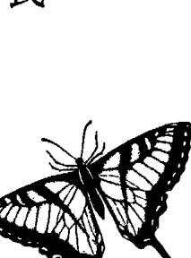

### 貝德羅的第一次回溯

> > 「她說了什麼？」
> 「「牽她的手……握住她的手。時候到了你就會知道。主動接近她，握住她的手。」
> 「握誰的手？」
> 「我也知道，她只有說：「握住她的手。」」
> 「你還夢到什麼？」
> 「好像沒有，不過我注意到她手裡拿著一根白羽毛。」
> 「那是什麼意思？」 我問道。
> 「你才是醫生耶。」 貝德羅提醒我。
> 對喔，我才是醫生。我知道象徵符號的意義包羅萬象，取決於做夢者的獨特經驗，以及榮格描述的「普世原型」或佛洛伊德的「普遍象徵」。
> 但不知道為什麼，這個夢感覺不像佛洛伊德那種。
> 我回應「你才是醫生」那句話，再怎麼樣也得回話才行。
> 「我不確定。」 我老實說。「可能有許多意思。白色羽毛也許象徵和平，或象徵某種靈性狀態，也可能象徵許多其他事物。我們之後再來好好探討這個夢。」 我補充說明，將解夢一事留待日後再說。

### 誘導貝德羅放鬆，回到愉快的童年

「昨天晚上我又做了這個夢。」貝德羅說。

「又夢到同一個老婦人嗎？」

「同一名老婦人，同樣的話，同一根羽毛。」貝德羅解釋，「「牽她的手……握住她的手。主動接近她，握住她的手。」」

「也許答案會在回溯時出現，」我提議道，「你準備好了嗎？」

他點點頭，我們便開始了。

我知道貝德羅能進入深度催眠狀態，因為我檢查過他的眼睛：眼睛盡量往上翻，試著看向頭頂，然後慢慢闔上眼皮，同時眼睛持續往上看——能否進入深度催眠狀態，與這個能力息息相關。

我測量眼睛盡量往上翻時鞏膜（眼白）會露出多少，也觀察眼皮慢慢闔上時又會露出多少眼白。露出的眼白越多，越容易被深度催眠。

我測試貝德羅時，他的眼睛幾乎整個沒入頭部，只露出少許虹膜下緣。而他的眼皮顫著闔上時，虹膜一點也沒跟著往下移。他有能力進入深度催眠狀態。

因此，當貝德羅感覺自己很難放鬆時，我頗為詫異。既然眼球轉動測試評估的是身體完全放鬆及進入深度催眠狀態的能力，我知道是他的心智在從中阻撓。有時候，習慣掌控一切的患者一開始會不肯輕易放手。

『放輕鬆，』我建議他，『別擔心腦海裡會浮現什麼。今天你能否體驗到什麼並不重要，這只是個練習。』我知道他急於找到哥哥，所以試圖化解他感受到的任何壓力。

在我說話的同時，貝德羅越來越放鬆，開始進入更深層的催眠狀態。他的呼吸變慢，肌肉也變軟，身體似乎更深陷在躺椅裡。他開始觀想影像，眼球也在圍著的眼皮下緩緩轉動。

我慢慢帶他回到過去。

『一開始，只要去回想最近一次吃得很愉快那一餐。運用所有感官，一五一十地記起，看有誰跟你在一起，回想當時的感覺。』我下指令。

他照做，卻不只想到一餐，而是好幾餐。他仍然在設法掌握控制權。

『更放鬆一點，』我敦促他，『催眠只是一種注意力高度集中的狀態。你從未放棄控制，掌控權一直在你手裡。所有催眠都是一種自我催眠。』

他的呼吸變得更深沉了。

> > 「你一直都有控制权，」我告诉他，「如果你在回相或经历某件事时感到焦虑不安，大可飘浮到场景上方，隔著一段距离观看，就像看电影那样。或者，你也可以彻底离开那个场景，到任何你想去的地方，观想沙滩、你家，或是其他让你安心的地方。若你真的觉得很不舒服，甚至可以睜開眼睛，清醒、警覺地回到這裡，一切操之在你。」

> > 我又補充說道：「這不是《星際爭霸戰》，你不會被傳送到任何地方。這些只是回憶，跟其他記憶並無二致，就像你回想起那幾次愉快的用餐時光一樣。情況隨時在你掌握中。」

他現在完全放鬆了。我帶他回到童年，他笑得好開心。

「我可以看見農場上有狗和馬。」他告訴我。他家在離市區幾小時路程的地方有一座農場，他在那裡度過許多愉快的週末和假期。

全家人都在一起，哥哥還活著，精力旺盛，開懷大笑。有幾分鐘時間，我不發一語，好讓貝德羅更享受這段童年記憶。

> 「你準備好要往前回溯了嗎？」我問他。

> 「準備好了。」

> 「好，我們來看看你能不能回想起某個前世的任何一件事。」我從五倒數到一，此時貝德羅觀想自己走過一扇宏偉的大門，進入另一段時空，來到前世。

### 在古老的前世，敵人的屠殺讓他失去摯愛

我剛數到一，就看見他猛眨眼。他頓時感到恐慌，哭哭啼啼起來。「好可怕……太恐怖了！」他倒抽一口氣，「他們都被殺死了……一個活口也沒有。」殘肢斷臂散落各處，大火燒得村子面目全非。奇特的圓頂帳篷如今只剩下一頂完好如初，突兀地屹立在這場滅村大屠殺的外圍，彩色旗幟和白色大羽毛在淒冷的陽光下狂亂飄動著。馬匹、牛群全都不見蹤影，放眼望去沒人逃過這場大屠殺。是東邊來的「懦夫」幹的。「我絕對要殺他個片甲不留，任何城牆、將領都擋不了我。」貝德羅立誓。來日方長，此仇必報。他感到麻木、絕望、震驚。我從多年經驗得知，第一次回溯的人往往會想起那一世最慘痛的事件，因為那次創傷引發的情緒在他們的心靈烙下深深的印記，也隨著靈魂投胎轉世。我還想了解更多。這件駭人聽聞的事發生之前，那種的情況如何？那之後又發生了什麼事？

「回到那一世更早的時間，」我催促他，「回到比較愉快的時光。你想起哪些事？」

快樂。」貝德羅描述的是一支靠狩獵和畜牧維生的游牧民族，他父母是族長，他則是個身強體壯、技藝高超的騎士和獵人。

「我們的馬健步如飛，體型小，尾巴大。」他說。

她。原本他可以娶鄰族頭目的女兒，兩人是青梅竹馬，自有記憶以來，他一直愛著「這塊土地叫什麼名字？」我問道。

他略顯猶豫。「你們應該是稱這裡為蒙古吧。」

我知道蒙古在貝德羅那一世的名稱可能跟現在不一樣，語言也截然不同。那麼，說話的當下人在那一世的貝德羅，怎麼會知道「蒙古」這個地名？那是因為他正在回憶，而他現在的心智正在篩檢他的記憶。

這個過程跟著看電影類似。現在的心智正在觀看、評論，注意著這一切，將電影裡的角色和主題與目前這一世比較。患者同時是這部電影的觀眾、影評人和主演明星，能運用現在的歷史和地理知識，協助確定事發當時的時間、地點，而且在看電影期間也能始終維持深度催眠狀態。

貝德羅可以清楚想起好幾世紀前的蒙古，但在回憶的當下，也能用英語回答我的問題。

「你知道自己叫什麼名字嗎？」

他再度遲疑。「不知道，我想不起來。」

其他的事他就記不多了，只記得自己有個孩子，這孩子的出生不但是貝德羅夫妻的一大喜事，也讓他的父母和族人喜上眉梢。他的岳父母幾年前過世了，未能見到女兒出嫁，因此她不僅是貝德羅的妻子，也是公婆的女兒。

貝德羅累了。他不想回到那滿目瘡痍的村子，不想再次面對那支離破碎的餘生，於是我喚醒他。

如果在一段前世記憶裡出現創傷嚴重、情緒澎湃的事件，那麼再回溯那件事第二次，甚至第三次，可能會有很大的幫助。每回溯一次，負面情緒就會減輕，患者回想起更多事，也學到更多，因為情緒上的阻礙和干擾減少了。我知道貝德羅還有更多要從這個古老的前世學習的事。

貝德羅再給自己兩、三個月的時間，處理在邁阿密的公務和私事。時間還很充裕，可以更詳盡地探究在蒙古的那段前世，也還有時間探索其他前世。我們尚未找到他哥哥，卻找到一連串令他痛徹心扉的「失去」：愛妻、子女、雙親、族人。

我是在幫他，還是在加重他的負擔？這只能留待時間證明了。

某次工作坊結束後，有個學員告訴我一則精彩的故事。

從小，只要她把手垂放在床邊，就會被另一隻手慈祥地握住，無論當時她多麼焦慮不安，都會立時定下心來。不過，如果她的手是不經意地垂到床外，被那隻手握住反而經常會嚇到她，導致她反射性地縮手，而這麼做每次都會中斷兩手交握的動作。

她一直知道該在什麼時候把手伸出去尋求慰藉。當然，她床底下什麼人也沒有。

長大以後，那隻手還在。婚後她從未告訴過丈夫這件事，因為聽起來太幼稚了。

+   ★
★
★

### 貝德羅的第一次回溯

懷第一胎時，那隻手卻消失了。她想念那慈愛、熟悉的陪伴，再也沒有人的手能以同樣充滿愛的方式握住她的手。寶寶出生了，是個可愛的小女娃。產後沒多久，她和寶寶一起躺在床上時，小嬰兒卻突然握住媽媽的手。霎時，她的心和身體都強烈感受到、也認出昔日那熟悉的感覺。她的守護者回來了。她喜極而泣，感受到一股強烈的愛意和彼此之間的連結，而她知道這連結的存在，遠超過這個物質世界。了。

# 7 伊麗莎白的第二次回溯——生活平靜的美國原住民／窮苦的印度少女

> 汝是那公正的少女，昔日曾經遺棄這可憎的俗世？喔，請坦言，汝是否又前來探視我等？或許汝是那笑容和煦的少年？抑或是天神的後裔，頭戴雲冠，翩然下凡，造福凡間？
又或汝背著那金色羽翼，覆著人類褸褸衣衫，離開仙座，駐足人間，稍事居留，又迅即飛返，彷彿要展現上天孕育了何等兒郎，藉此將人心點燃，不再眷戀濁世，重登天堂？
——約翰·米爾頓

第三次就診時，伊麗莎白走進我的診療室，看起來較不那麼憂鬱，眼睛也更明亮了。

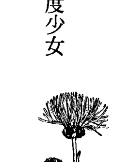

「我覺得比較輕鬆，」她告訴我，「也比較自由……」她曾短暫記起自己是一名從船上落海的少年，這段回憶已經開始消除她的一些恐懼。她非但不再害怕水和黑暗，連那些更深層、更基本的恐懼，亦即對死亡和消失的恐懼，也一掃而空。
那一世是個男孩的她死了，但如今她又以伊麗莎白的身分出現於此。在潛意識層次，她的悲傷或許已經減輕了，因為她知道自己曾經活在過去，之後也將再次活著。

### 靈魂永生，所以生不足慶，死無須悲

更何況，如果她能再次轉世為人，重獲新生，那麼她愛的人也可以，所有人都能重生，再次品味人世間的喜悅與艱辛、滿足與悲苦。
伊麗莎白很快就進入深度催眠的恍惚狀態。幾分鐘後，她在掃視古代景物時，眼睛也在閉著的眼皮下迅速左右擺動。
「好漂亮的沙灘。」她開口說道，回想起自己身為美國南方原住民的某段前世，也許是在佛羅里達西岸。「雪白的細沙……有時幾乎是粉紅色……沙質很細，像糖一樣。」她頓了頓，「太陽沉入海裡。東邊有大沼澤，棲息著許多鳥類和動物。沼澤和海洋之间有许多小岛，海里满是鱼群，我们在河里和小岛之间的海域捕鱼。」她又停下来，然后才继续说下去。

『日子过得很平和、很快乐。我们是个大家族，好像跟村裡不少人都有亲戚关系。我对树根、植物、药草懂得不少……会用植物制药……知道怎么治病。』

在美国原住民文化中，使用治疗药水或施行其他整体疗法不会因而受罚。治疗者不但备受尊敬，地位往往也很崇高，不会被称为巫医，也不会被人淹死或绑在火刑柱上烧死。

我带她前往那一世更早的时间，没找到创伤事件。她过得很平静、满足，也很长寿，临终前整个村子的人都陪在她身边。

『我死的时候大家并没有很难过，』她飘浮在自己衰老的身体上方，察看底下的情景，注意到：『虽然好像全村的人都在。』

没有人对她的死感到悲伤，她却一点也不难过。村人非常尊敬她、关心她，也这样对待她的身体和灵魂，只是少了悲伤的气氛。

『我们不哀悼死亡，因为我们知道灵魂永生，只要任务未了，就会再次转世为人。』她解释道，『有时只要仔细检查新的身体，就可以知道前世的身分。』她花几分钟思索这句话。『我们会寻找胎记或其他记号，胎记就是前世的伤痕。』她加以说明。

> > 同樣地，就算我們很高興能再見到那個靈魂，也不會大肆慶祝「出生」這件事。

她頓了頓，也許是在思考該怎麼說，才能清楚闡述這個觀念。

> > 地球雖然很美麗，也不斷展現萬事萬物和諧共存且息息相關的景象......這是很棒的一課......不過，在地球上生活辛苦多了。較高等的靈魂不會生病，沒有痛苦，不會分離......沒有野心，沒有競爭，沒有仇恨，沒有恐懼，也沒有敵人......只有平靜與和諧。因此，較低等的靈魂不可能因為自己要離開那樣一個地方、重返人間而開心。靈魂在難過時，我們還去慶祝，怎麼說得過去？這麼做未免太自私，也太不近人情了。

她總結道。

> > 這不表示我們不歡迎轉世的靈魂。

她緊接著說，

> > 在這個靈魂還很脆弱的時刻，展現我們的愛與關懷顯得格外重要。

解釋了「生不足慶，死無須悲」這個頗耐人尋味的觀念後，她就不再說話，停下來休息。

我再次聽到輪迴轉世的觀念，以及前世的家人、朋友、情人轉世為人再次相聚的事。古往今來，這觀念似乎不約而同出現在各個不同的時代和文化。

對古老那一世的模糊記憶，或許冥冥之中牽引著她回到佛羅里達，在最深的層次想起那古老的家。也許對沙灘、海洋、棕櫚樹和紅樹林沼澤的感覺，喚醒了她靈魂的記憶，在潛意識引誘她回來，因為她在那一世過得心滿意足，而這正是她目前這一世欠缺的。

這些古老的插曲可能就是她當初會申請邁阿密大學，也領到獎學金，搬到邁阿密的原因。這並非偶然，而是命運使然。

> > 「你累了嗎？」 我問道，注意力又轉回伊麗莎白身上。她仍平靜地坐在躺椅上休息。

> > 「不累。」 她輕聲回答。

> > 「還想探索另一段前世嗎？」 「好啊。」 這次的聲音更微弱。

我們再度穿越時空，這次她還是出現在古代。

> > 這塊土地一片荒蕪，」 伊麗莎白看了看眼前的景象，「四周是崇山峻嶺……泥土路上飛沙漫天……商旅在路上來來去去……這是商人往返東西的一條通道……」

「你知道那個國家的名字嗎？」我想了解更多細節。我不喜歡提太多會用到左腦或邏輯思考的問題來干擾回溯，這些問題可能會打斷體驗過程，而體驗比較偏向右腦或直覺的功能。不過，伊麗莎白正處於深度催眠狀態，因此她非但可以回答問題，也能持續鮮活地體驗這場景。細節也是很重要的。「應該是……印度吧，」她沒把握地回答，「也可能是印度西邊再過去一點的地方……我覺得邊界不是劃分得很清楚。我們住在山區，那裡有幾條商旅必經之路。」她回到場景中補充道。「你看得到自己嗎？」我問道。「看得到……我是女生……十五歲左右，黑髮，膚色偏黑。身上的衣服很髒，我在馬廄工作，照料馬匹和騾子……我們很窮。天氣好冷，在這裡工作讓我的手都凍僵了。」伊麗莎白雙手握拳，五官揪成一團。這名少女資質敏慧，卻無法受教育，一生際遇坎坷。商人經常欺侮她，偶爾賞她幾文錢。家人無力保護她，飢寒交迫，苦不堪言。這名少女的生活中，僅存一線曙光。「有個年輕商人經常跟著他父親和其他人路過鎮上，我們情投意合，彼此相愛。他很風趣，又彬彬有禮，我們在一起笑聲不斷。我希望他留下來，這樣我倆就能長相廝守。」

### 只有愛是真的

我有個患者是信奉天主教的律師，剛做完回溯，想起中古世紀末在歐洲的一段前世，以及自己在那一世死亡的情景。那是暴力橫行、人心貪婪、爾虞我詐的一世，而他注意到其中幾項特質也延續到了今生。

他斜倚在診療室的軟皮椅上，察覺到自己正飄出中古世紀那一世的身體。突然，他發現自己站在宛如地獄的環境裡，四周燃燒著熊熊烈火，處處可見魔鬼。我大吃一驚。雖然我在患者身上見過成千上萬次前世死亡事件，卻未曾有人置身地獄。他們幾乎都是發現自己被一道美麗無比的亮光吸引，一道能讓靈魂重獲新生、重拾活力的光。現在怎麼會出現地獄？

我等著看會發生什麼事，但他說沒有人理他，他也在等。又過了幾分鐘，終於有一位神聖人物出現，朝他走來。他認出那是耶穌，也是第一個注意到他的人。

> 「你還不明白這一切都是幻相嗎？」耶穌對他說，「只有愛是真的！」

語畢，四周的火焰和魔鬼頓時消失，露出一道始終在那裡、隱藏於幻相背後、無法被人看見的美麗光芒。有時候，你會得到自己期待的結果，但那可能不是真的。

> 「愛是世上最強大的力量，」她柔聲說，「縱使土壤冰封、條件惡劣，愛依舊能成長、綻放。愛無所不在，無時不在。愛是四季盛開的花朵。」

無奈造化弄人，她十六歲就香消玉殞。她那飽受生活摧殘，歷經艱辛，早已疲憊不堪的身子染上肺炎，不久便與世長辭，死時家人陪在身邊。回顧她那短暫的一生時，伊麗莎白並不難過。她已經學到重要的一課。

一抹美麗的笑容在她臉上綻放。

厥守了。

# 8 貝德羅的第二次回溯——被刺殺的英國士兵／一戰後的德國紅牌妓女

> 這世界有個秘密，就是萬物恆存，永不凋零，只是暫時隱退至肉眼不能見之處，隨後再度重現。沒有什麼會死；人類佯裝死亡，忍受虛假的喪禮和哀傷的訃聞，而他們就站在那裡，看著窗外，偽裝成陌生的新模樣，平安無恙。
——拉爾夫·沃爾多·愛默生

我和貝德羅都必須更深入了解他潛在的絕望源於何處——那份絕望因他兄長慘死而加劇。此外，也必須找出他無法在感情中付出真心的原因。是因為母親不斷批評他的歷任女友，還是對女友墮胎深感自責？或者，是他還沒遇到真命天女？
回溯過程有如鑽探石油，永遠無法一開始就確定石油在哪裡，但鑽得越深，越有機會挖到石油。

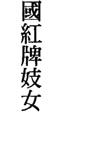

### 人類因貪婪而互相殘殺

今天我們要進行得更深入。

貝德羅最近才開始記起自己的前世。通常是最早憶起的，是前世受創最深那件事，這次也一樣。

「我是士兵……應該是英國人吧。」貝德羅觀察道，「我們這群士兵很多都搭船前往敵軍陣營，準備攻占敵人要塞。敵軍的堡壘很大，城牆又高又厚。他們用大石頭填港，我們得想辦法繞路攻堅。」進攻因故延宕，他沉默下來。

「往後回溯，」我建議他，「看看接下來發生什麼事。」我在他額頭輕敲三下，幫助他集中注意力，並跨越時間的縫隙。

「我們克服了大石頭的問題，也攻下堡壘。」他答道，卻開始發出咕噥聲，並開始冒汗。

「我們正在那些地道裡往前跑，卻不知自己在往哪兒跑……地道又矮又窄，我們得彎下腰，排成一路縱隊跑步前進。」

「我看見前方有個小洞口，我們正穿越那個出口……啊！」他突然皺眉，「西斑牙人就埋伏在洞外，我们一钻出洞口就一个个被杀了……他们拿剑刺我！”他倒抽一口气，伸手护住自己的颈部，呼吸变得更急促，因为缺氧而大口喘气，脸上直冒汗，整件衬衫都湿透了。

忽然，他不再动弹，呼吸恢复正常，人也冷静下来。我用卫生纸拭去他额头和脸上的汗水，这时他的汗量开始减少。

“我飘浮在自己的身体上方，”贝德罗宣布，“我离开那个生命了……下面有好多尸体……满地都是血……不过，我此刻是在高处俯瞰这景象。”他静静飘浮了几分钟。

“回顾那一世，”我下指令，“你学到了什么？那一世的课题是什么？”

“我学到暴力是极为无知的行为。我远离家园和亲人，却死得不明不白。我是因为别人的贪婪才死的。英国人和西班牙人都很愚蠢，不远千里为了黄金互相残杀。从别人手里盗取黄金，也害死自己。贪婪、暴力害死了那些人……他们全忘了‘爱’这回事。”

贝德罗再度沉默不语。我决定让他休息，慢慢体会这些难能可贵的教训，自己也开始深思他学到的东西。

## 愛是安全感與力量的真正源頭

幾世紀以來，黃金化身為美元、英鎊、日幣、披索，但世人還是為了它在互相殺戮。這種情況從古到今未曾改變，這幾百年來，我們什麼也沒學到。我們還得承受多少苦難，才能再次記起人間有愛？

貝德羅坐在椅子上，頭開始左右搖擺，臉上帶著愉悅的笑容。他不知不覺進入了另一段比較近代的前世。貝德羅一旦開始記起前世，視覺體驗（看到的影像）就會格外鮮明。

“你現在體驗到什麼？”

“我是女的，”他觀察道，“長得很漂亮，留著一頭金色長髮……膚色很蒼白。”

貝德羅是第一次世界大戰後在德國紅極一時的妓女，有著一雙藍色的大眼睛，穿著高雅、講究。雖然德國當時正疲於處理通貨膨脹失控的問題，但有錢、買得起她服務的還是大有人在。

貝德羅怎麼也想不起這名舉止優雅的女性叫什麼名字。“我覺得應該是梅格達。”他說。他正在評估自己看到的影像，我不希望他分散注意力。
“我在這行做得有聲有色，”梅格達得意地說，“我是政壇顯要、高階將領和商界大佬的紅粉知己。”她想起更多事，難掩得意之情。
“我有美貌、有手腕，把他們迷得神魂顛倒，”她接著說，“我的分寸一向拿捏得很好。”梅格達歌聲美妙，常在高級社交場合表演。她學會將男人玩弄於股掌間。
或許因為她前幾世是男人吧，我心想，卻沒說出口。
接著，貝德羅壓低音量，小聲地說：“我左右那些人……可以讓他們改變決策，而且是特地為我這麼做。”她佩服自己已有地位、有能力支配那些有權有勢的人。
“我懂得一向比他們多，”她繼續說下去，聲音透露出些許懊悔，“政治權術還是我教他們的呢！”梅格達很享受權力，也喜歡玩弄權謀，卻無法直接左右政局，必須透過男性才能施展影響力，這讓她很洩氣。將來有一世，貝德羅不會再需要中間人。
眾多男性中，有個年輕人格外醒目。
“他比其他人更聰明、更認真。”梅格達觀察道，“他的頭髮是褐色的，眼睛湛藍似水……做什麼都充滿熱情！我們總有聊不完的天，我相信我跟他兩情相悅。”她在今生並不認識這個人。

貝德羅看起來很傷心，左邊眼角滲出一滴淚。

> “我離開他，跟了別人……一個更老、更有權勢、更有錢、要我死心塌地跟著他的男人……我沒有順從自己的心意，因而鑄下大錯。我的所作所為傷透了他的心，他不肯原諒我……他無法理解。”

梅格達渴望的是安全感與外在權力，重視這些特質更甚愛情。殊不知，愛才是安全感與力量的真正源頭。

這項決定顯然是她那一世的轉捩點，是個交叉路口，一旦做了選擇，再也無法回頭。

德國政局動盪不安，最後政權落入激進的新政黨手裡。她那年邁的情人失勢了，自身難保，於是棄她不顧。梅格達和那名熱情洋溢的年輕情人早已失去聯繫，最後因長久以來的性病，可能是梅毒，健康狀況日益惡化。她萬念俱灰，毫無與病魔搏鬥的意志力。

> “前往那一世的終點，”我催促她，“看看你發生了什麼事，身邊有哪些人。”

> “我躺在一張廉價的床上……在醫院裡，是一間窮人醫院。那裡有不少人，都生病了在呻吟著……都是窮得不能再窮的人。這一定是地獄的景象！”

> “你看見自己嗎？”

> “我的樣子好難看。”梅格達回答。

## 開車的人，可以決定自己要往哪兒去

多數人的短視不時令我瞠目結舌。我認識的許多人每天都為孩子的教育傷透腦筋：哪間托兒所最好，要念私立學校或公立學校，哪所大學先修班的效果最好，如何加強課業成績和課外活動表現，讓孩子多點機會進入那所大學、那間研究所……沒完沒了。然後同樣的循環又在孫子身上重演。

這些人以為這個世界的時間是靜止不動的，以為未來會是現在的翻版。

如果我們持續砍伐森林，破壞氧氣供應來源，二一、三十年後，這些孩子呼吸到的會是什麼？倘若我們毒害水系和食物鏈，這些孩子將來要吃什麼？我們繼續盲目地製造過量的碳氫化合物及其他有機廢料，導致臭氧層破洞，將來孩子還能在戶外生活嗎？要是溫室效應導致地球過熱，海平面上升，淹沒海岸，造成斷層線壓力過大，孩子未來要住在什麼地方？中國、非洲、澳洲，以及世界各地的子子孫孫同樣不堪一擊，因為他們都是這個星球的居民，這是個不爭的事實。試想，來日當你輪迴轉世，你也會是這些孩子當中的一員。

既然孩子將來可能連住的地方都沒了，又何必這麼擔心孩子的大學入學考試成績，何必煩惱他們要讀哪所大學？

為什麼大家滿腦子想的都是要活久一點？為什麼硬要在行將就木的晚年，鬱鬱寡歡地多活幾年？何必如此執著於膽固醇濃度、無麥麩飲食、油脂計算、有氧運動之類的？

現在就活得開開心心，每天都過得很充實，付出愛，也被人愛，這樣不是更有意義嗎？不要整天擔憂自己日後的健康狀況，因為未來如何根本沒有人知道。而且，萬一沒有未來呢？假使死亡根本就是離苦得樂呢？我並不是說要無視自己的身體狀況，也不是說可以縱容自己抽菸、酗酒、濫用藥物或過度肥胖，這些行為將導致身體疼痛、難過、行動不便。我只是要你別太杞人憂天，今天就要過得幸福快樂。諷刺的是，帶著這樣的態度、快樂地活在當下，反而可能活得更久。人的身體和靈魂就像汽車和駕駛。要時時記住你是開車的人，不是那輛車，別把自己當成交通工具。近來人人強調延年益壽，想要長命百歲，真是荒謬。這就好比那輛福特老爺車你都開了一、三十萬英里，車體到處生鏽，變速器也修了五次，引擎零件都七零八落了，你還不肯報廢。與此同時，路口轉角處就有一輛全新的雪佛蘭跑車在等著你。你要做的，只是慢慢走出那輛老福特，悄悄溜進這輛美麗的跑車裡。駕駛，靈魂，從未改變，更換的只是汽車。對了，也許在路邊等著你的，還是一輛法拉利呢。

# 9 伊麗莎白的第三次回溯——父親被羅馬士兵拖行而死的少女

記憶所及，我曾無意間提到之前處於某種生存狀態的經驗……我曾活在一千八百年前的猶太王國，卻從不知同時代有個叫耶穌的人。我在亞述國牧羊時，星星俯視著我，而如今他們看到的，是身為新英格蘭人的我。

> > ——亨利·大衛·梭羅

伊麗莎白這兩次來看診相隔兩週，因為她又得到外地出差，這對她來說是很稀鬆平常的事。上次診療結束時，她笑咪咪地離開，但這次來，那美麗的笑容已不復見。

不過，她倒是急著繼續穿越時光，進行回溯之旅。她已經開始憶起前幾世的重要事件和課題，也體驗到一絲快樂與希望，於是想得到更多。

她迅速進入深度恍惚狀態。

### 前世失親的哀痛是否加重了今生的悲傷？

伊麗莎白想起耶路撒冷的石頭，那些石頭有著特殊色澤，會隨日夜光線不同而變化，有時呈現金黃色，有時轉為淡粉色或米黃色，但最後一定會變回金黃色。她回憶起自己住在耶路撒冷附近的一個城鎮，鎮上的泥土小路摻著碎石子。她看見鎮上的房舍、居民和他們的穿著，也想起當地的民情風俗。那裡還有幾座葡萄園、幾棵無花果樹、幾畝亞麻田和小麥田。路的那頭有口水井，居民都到那裡汲水，井邊長著幾棵老橡樹和石榴樹。當時巴勒斯坦的宗教狂熱和靈性活動似乎總是很活躍，時時都有新的變化，人民總是懷抱希望，卻也苦於生活的沉重與艱辛，勉強維持生計，忍受來自羅馬的侵略者的壓迫。

她想起父親。父親名叫埃里，在家裡從事燒陶的工作。他汲取井裡的水，和在泥土裡捏塑成形，再燒成碗、罐和其他許多器皿，供家人和鎮民使用，有些甚至拿到耶路撒冷叫賣。商人或旅客經過鎮上時，偶爾會跟他買些瓶瓶罐罐或鍋碗瓢盆。伊麗莎白又詳細描述了父親製陶轉盤的模樣，以及他腳踩轉盤的節奏和鎮上的生活點滴。

是個小女孩，名叫蜜莉恩，雖然生活在動盪不安的時代，日子倒也過得快樂幸福。但不久，這股動盪將蔓延到她居住的鎮上，也將永遠改變她的生活。

我們前進到那一世的下一個重大事件：她父親正值壯年，卻慘死在羅馬士兵手裡。當時的羅馬士兵經常欺壓住在巴勒斯坦的早期基督徒，想出殘酷的把戲，只為了給自己找樂子，其中一種把戲意外害死了蜜莉恩摯愛的父親。

一開始，幾名士兵先用繩子綁住埃里的腳踝，再把他交給另一名士兵騎馬拖行。過了漫長的一分鐘，那匹馬終於停下腳步。埃里雖然遍體鱗傷，卻捱過這場劫難，保住性命。他女兒嚇得不知所措，猶能聽見士兵哄堂大笑的聲音。他們折磨埃里折磨得還不過癮。

兩名羅馬士兵將繩子另一端綁在自己胸膛，開始像匹馬似地又蹦又跳到處走。蜜莉恩的父親被摔來摔去，頭部硬生生撞在一顆大石頭上。這是致命的一擊。

那些士兵就這樣把他扔在塵土飛揚的路上。

父親平白無故遭此劫難，已教蜜莉恩心如刀割；眼見父親慘死羅馬士兵手下，更教她憤恨難平，萬念俱灰。對那群士兵來說，這只是消遣作樂。他們連她父親姓啥名誰都不知道，不曾感受過兒時父親護理她被割到的小傷口或瘀傷時，那溫柔的碰觸；不曾聽過他在轉盤上製陶時，那妙趣橫生的話語；不曾聞過他沐浴後的髮香，不曾嚐過他的吻或感受過他的擁抱，也未曾和這名溫柔體貼的男性日夜生活在一起。可是，他們卻在那驚心動魄的短短幾分鐘內奪走一條美好的生命。父親的死在蜜莉恩心裡劃下一道永難癒合的傷口，留下一個無法填補的空洞，令她失去一位永遠無法被取代的人，也讓她餘生都在悲傷中度過。就只為了好玩。這整件事的荒謬令她感到憤慨，恨與痛交織在淚水裡。

她在滿佈塵土、被鮮血染紅的地上前後搖晃自己的身體，父親碩大的頭顱就枕在她腿上。她無語問蒼天，嘴角滲出血來。她可以聽見父親每次使勁呼吸時，胸部都會汩汩作響。父親離死不遠了。他眼中的光有如黃昏暮色，生命已走到盡頭。

“爸爸，我愛你，”她難過地望著父親逐漸黯淡的雙眼，輕聲細語對他說，“永遠愛你。”父親用慢慢黯淡下來的雙眼回望她，眨眨眼表示了解。那是他最後一次睜開眼睛。她持續悲痛地前俯後仰，無視夕陽西沉、長日已盡。家人和幾個鎮民輕輕挪開她父親的屍首，好替他準備後事。她心裡仍看得見父親的眼睛，確定父親明白她的心意。

我安靜地坐著，被伊麗莎白深刻的絕望震驚到動彈不得。然後，我注意到錄音機静止不動了，於是換上一卷新帶子，之後紅色錄音燈才又一閃一閃地開始錄音。我在腦海裡把伊麗莎白今生的悲傷，和來自兩千年前巴勒斯坦的哀痛連結起來。前世的哀痛會加重今生的悲傷，這是另一個例子嗎？體驗過輪迴轉世，知道死後還有來生，是否就能平息這股哀傷？

### 伊麗莎白也能傳遞大師訊息

我的注意力又回到伊麗莎白身上。前進到之後的時間，到那一世的下一個重大事件。“我下指令。
“沒有了。”她答道。
“什麼意思？”
“沒別的大事了，我看到之後的情形，但什麼事也沒發生。”
“一件也沒有？”
“沒有，什麼都沒有。”她又說了一遍，絲毫不顯不耐。
“你有結婚嗎？”
“沒有，我並未活很久。我不在乎自己的死活，沒有好好照顧自己。”

父親的死顯然重創了她，讓她陷入重度憂鬱，年紀輕輕就死了。

> “我離開她的身體了。”伊麗莎白宣布。

> “你現在體驗到什麼？”

> “我飄起來了……我在飄浮……”她的聲音越來越小。

沒多久，她又開始說話，說話的人卻不是她。她的聲音變得低沉、渾厚。我有極少數患者跟凱瑟琳一樣可以傳遞大師的訊息，大師是無形無相的高等存有，我的第一本著作中俯拾皆是他們的智慧箴言。現在，伊麗莎白也能傳遞訊息了。

我自己在靜心時，也能感知類似訊息，不過這些話如果是出自患者之口，總顯得更加意義深遠。我知道我必須增強自己的信心，相信自己有能力聽到、接收和感知來自同一些源頭的相同概念。

> “記住，”這聲音說，“要記住永遠有人愛著你，永遠有人在保護你，你從不孤單……你也是光、智慧與愛的存有，絕對不會被遺忘，也絕不會被忽視或忽略。你不是你的身體，不是你的頭腦，甚至不是你的心智。你是靈魂，而你要做的，只是重新喚起自己的記憶，去回憶。靈魂沒有限制，不受限於身體，也不局限於心智或智能的範疇。

> “靈魂之所以降低振動能量，是為了體驗密度較大的環境，例如你們的三次元空間。這麼做能讓靈魂從無形化為有形，轉變成密度越來越大的物體，其中密度最大的就是肉體，其振動頻率最慢。處於這種狀態中，時間似乎過得比較快，因為時間與振動頻率呈負相關：振動頻率越快，時間就越慢。這就是為什麼選擇適當的肉體，以在對的時間重新進入有形狀態，可能行之不易。因為有這種時間上的差異，所以很可能錯失良機……意識有許多層次，振動狀態也有很多種，這些層次你不必每個都了解。

> > “七層次中的第一層對你最重要，因此要在第一層好好體驗，而不是去抽象思考更高的層次。最終，你還是得體驗每一個層次……你的任務是傳承經驗，先接受信仰、信念，再轉化為經驗，這樣的學習才完整，因為經驗凌駕信念。要教人們去體驗，消除他們的恐懼，教他們去愛、去互相幫助……這涉及他人的自由意志，不過，要用愛與慈悲心待人助人，這是你在你的層次非做不可的事。”

> > “人類總以為自己是唯一的存有，事實並非如此。宇宙之間有許多世界和許多層次……靈魂的數量遠多於乘載靈魂的肉體。此外，如果靈魂想在同一時間體驗一種以上的經歷，或許會分裂。這是有可能的，不過得先進化到某個層次，而多數人尚未抵達那個層次。最後人們會明白，靈魂只有一個，就像金字塔一樣，而所有的經驗是同時被共享。不過，目前談這個言之過早。”

> > “當你凝望別人的眼睛，任何人的都行，看見自己的靈魂正在回望你，那時你就知道你已抵達另一個意識層次。從這個角度來看，輪迴轉世並不存在，因為所有的生命、所有的經驗，都在同一時間發生。不過，在三次元的世界裡，輪迴和時間、高山、大海一樣真實。輪迴是一種能量，和其他能量一樣，其真實性取決於感知者的能量。只要感知者感受到有形的肉體和實心的物體，輪迴轉世對他來說就是千真萬確的。這個能量由光、愛與知識組成，以充滿愛的方式運用這份知識，就成了智慧……”

伊麗莎白在此打住。她和凱瑟琳一樣，對自己身為人的前世細節記得一清二楚，對自己身處兩世之間的狀態時傳達了哪些訊息，卻一無所知。兩人在傳遞這些訊息時，都處於高深許多的層次。能進入這麼深層次的患者寥寥無幾，而且他們還會完全不記得這件事。跟凱瑟琳一樣，伊麗莎白傳遞的訊息有助於修正我們這個世界「缺乏智慧」的情況。

在伊麗莎白結束治療前，我們還會學到更多知識。

## 只要心中有愛，你就接觸了內在的神

在凱瑟琳痊癒、結束治療之後，我便少有機會接觸大師的智慧。不過，偶爾在逼真至極且近乎神志清明的夢裡，我會接收到更多資訊；有時，訊息則在我處於深度靜心、夢一般的狀態時出現。

這些訊息和影像快速湧進我腦海，一閃而逝，卻明亮清晰，只可惜我無法為自己的心智（訊息接收站）錄音或錄影，因此這些思想如同珍貴的寶石，而寶石的鑲台（也就是我試圖用來解釋和定義這些飛馳而過的想法的話語）卻有如破銅爛鐵。

一開始出現的，就是一則清楚的訊息。

> “一切都是愛……一切都是愛。有愛才能理解，能理解才會有耐心，然後時間就停止了，一切都發生在此刻。”

我隨即領悟這些思想的真諦。唯有此刻才是真真切切的存在；沉溺於過去或未來會導致痛苦與疾病；耐心可以停止時間；神的愛就是一切。

> “愛是最終的答案。愛並非一種抽象概念，而是一種真實的能量或能量光譜。你可以在自己的生命中「創造」並維持這種能量。只要心中有愛，你就開始接觸了自己內在的神。去感受愛，也表達這份愛。

> “愛可以消除恐懼。感受到愛時，你不可能會害怕。既然萬事萬物都是能量，愛又涵蓋了所有能量，那麼一切都是愛。這是一條確定神的本質的有力線索。”

> “心中有愛、無所畏懼，就能寬恕——可以原諒別人，也可以原諒自己。你會開始用適當的觀點看事情。愧疚與憤怒是同一種恐懼反映出來的。愧疚是一種被導向內在的隱微憤怒，而寬恕能消除愧疚與憤怒，兩種都是不必要的破壞性情緒。寬恕吧，這是一種愛的表現。”

> “驕傲可能會妨礙寬恕。驕傲是小我的一種顯化形式，而小我則是暫時的假我。你不是你的身體，不是你的頭腦，也不是你的小我，你遠大於這一切。你需要小我才能存活在這個三次元世界，但你只需要用來處理資訊的那部分小我，其餘的，包括驕傲、自大、防衛心、恐懼，則有害無益，會讓你與智慧、喜悅和神分離。你必須超越小我，找到真我。真我是你最深層且永遠不變的部分，那部分的你有智慧、有愛心、安全且喜悅滿盈。”

> “在這個三次元的世界，思維能力固然重要，但直覺更重要。”

> “你錯把幻相當實相。實相是你對自己的神性、不朽性及永久性的認知，幻相則是你暫時棲身的這個三次元世界。這種真實與虛幻倒置的狀況正在傷害你。你渴求的是安全感的幻相，而不是愛與智慧帶來的安全感；你渴望被人接納，但事實上，你永遠不會遭到拒絕。小我創造幻相，隱瞞了真相，必須消滅小我，才能看見真相。
“有了愛與理解，蘊含無限耐心的觀點便油然而生。你在急什麼？反正時間又不存在，你只是以為時間存在罷了。不好好體驗當下，一味緬懷過去或擔憂未來，只會讓自己頭痛、更傷心。時間也是一種幻相，甚至在這個三次元的世界裡，未來只是一個概率系統，你又何必煩惱成這樣？
“自我是可以治療的，療法就是理解，而愛是最終的療法。治療師、老師、靈性導師都可以從旁協助，但能幫上忙的時間有限。要往內在去治療，而這條內在道路遲早都得一人獨行，雖然你其實從來都不孤單。
“如果非得測量時間，就以自己學到的課題為單位，而不要以分鐘、小時或年。假如理解正確，你可能五分鐘內就治療自己，或者五十年後。都是同一回事。
“回憶過去，之後就忘了吧。過去就讓它過去，童年創傷、前世創傷都這樣處理，同樣的做法也適用於態度、錯誤觀念、被灌輸給你的信念系統，適用於所有的舊想法——更確切地說，是所有想法。滿腦子都是那些想法，又怎能以新的觀點看清楚？萬一你得從一個新的角度學習一樣新事物呢？

> “思想創造出分離與差別的幻相，小我則讓此幻相不滅，因而引發恐懼、焦慮與巨大的悲傷，然後這些情緒又創造了憤怒與暴力。當世界充斥著這些混亂的情緒，平靜豈有容身之地？現在要做的就是抽絲剝繭，回到問題根源。你看你又開始思考、陷入舊想法裡了。別再思考了，你要做的，反而是運用直覺智慧，再度去體驗愛。靜心冥想，看見萬事萬物彼此連結、相互依存；看見一致，而非差異；看見你的真我；看見神。”

> “靜心和觀想都能幫助你停止過度思考，也能幫助你踏上歸途。療癒一定會發生，你會開始使用自己從未用過的那部分心智；你會看見，會理解，會變得更有智慧，然後，你就平靜了。”

> “你跟自己、跟他人都有關係；你曾活在許多副身體裡，輪迴過許多世。所以，問問現在的自己：這件事怎麼會如此可怕？為什麼不敢承擔合理的風險？你是怕名聲受損，擔心別人怎麼想嗎？這些恐懼，是在童年或更早以前受到制約而形成的。”

> “問你自己以下問題：會有什麼損失？可能發生的最糟狀況為何？我甘願這樣嗎？……”# 樣過一輩子嗎？與死相比，這件事的風險真有這麼大？

> 「在成長過程中，別怕激怒他人。憤怒只是他們的不安的顯化，但是，怕別人生氣卻可能阻礙你進步。憤怒如果不是引發了如此多悲傷，就只是一種愚蠢行為。要用愛和寬恕消除你自己的憤怒。」

> 「別讓憂鬱或焦慮阻礙你成長。憂鬱是失去洞察力，是忘記，是視一切為理所當然。調整你的焦距，重設價值觀，記住哪些事不該視為理所當然；改變觀點，記住哪些事才重要，哪些沒那麼重要；跳脫舊框架，而且記得要懷抱希望。」

> 「焦慮則是迷失在小我中，是失去個人界線。你依稀記得失去過愛、自尊心受過傷、喪失過耐心與平靜。記住，你從不孤單。」

> 「千萬別失去冒險的勇氣。你是永生不死的，永遠不會受到傷害。」

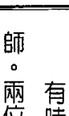

# 如何提升靈性，加速生命回歸？

有時訊息不會這麼偏心靈層面，而且似乎來自一位較年長、較愛說教的大師。兩位大師風格迥異，這次我幾乎就像邊聽邊抄筆記。

> 「『業』有許多種。所謂的「業」，也就是等待抵銷的債。個人的業是個人專屬責任，與他人無關，但還有一種「共業」，意指個人所屬群體的共同債務，而所謂群體，又可分為宗教、種族、國家等許多種。擴大範圍來看，還有一種行星業力，久而久之將影響整個星球的運勢與結局。個人的業不僅會累積在共業中一併處理，最後的結果也會加在群體、國家或星球之上。這種共業的作用決定了群體或國家的未來，也會反應在輪迴轉世的個人身上，包括在該群體或國家之內的人，或是雖然不在該群體或國家之內，卻同時存在、互有往來的人，或是在更晚的時間點才出現的人。

> 「所作所為皆循正法而行，走在通往神的正道上，才能成為『正行』。其他旁門左道，走到底都是死胡同或幻相，而循邪道而行的作為則無法成為正行。由此可知，正行能提升個人靈性，加速生命回歸。心懷正義、慈悲、愛、智慧，以及人稱「虔誠」或「靈性」的特質而做的行為，必然是正行。正行的果報才是人心所求的目標，不循正道的作為只會得來虛妄不實、稍縱即逝的結果——這些結果引誘人、哄騙人，卻非人們真正渴求的，正行的果報則涵蓋世人所需或所求的一切目標與願望。

> 「名聲即為一例。追求名聲，並視其為最終目標的人，短時間內或許能求名得名，但這名聲並不長久，也無法使其滿足；反之，循著通往神的正道而行，行止坐臥皆符合正行，雖不求名卻得名，這樣的名譽方能長久，也才是正名。不過，行正道之人心中視聲名於無物，這就是為滿足私慾、圖利個人而求來的名，與不忮不求、行正道而附帶得來的名，兩者之間的差異。前者短暫而虛幻，後者真實而永恆，與靈魂合一是：前者會累積「業」，必須清償，後者則否。」

有時候，訊息簡單明瞭，一閃而過。

> >「目標不是贏，而是敞開心胸。」

之後彷彿又輪到另一位大師說話，因為訊息又開始偏心靈，且滔滔不絕。

> >「神寬恕世人，但你也必須得到他人寬恕……且你必須寬恕他人。寬恕也是你的責任，你必須原諒他人，並得到他人的原諒。心理分析無法修補傷害。你不能僅止於理解，還得力行改變，改善這個世界，修復人際關係，寬恕他人，也接受他人寬恕。最重要的，是要主動行善積德。光說不練是不夠的，坐而言不如起而行。有愛就要表達，如此方足矣。」

# 10 貝德羅的第三次回溯——抗拒當修士的少年／死在女兒懷裡的人父

> 昔日我曾置身此地，然如何來、何時來，我已不復記憶。
我熟悉門外那片青草地，那芬芳濃郁氣息、聲聲嘆息，以及湖畔光跡。
昔日你曾屬於我，何年何月我已無從算計，
然而當那燕兒振翅飛起，你驀然回首，面紗飄落，前塵往事歷歷湧上心頭。
——但丁·加百利·羅塞蒂

貝德羅進入一段艱苦前世的中期。有時難熬的前世可以提供最多的學習機會，讓人在路途中進步得更快；有時相對輕鬆的前世提供的進步機會比較少，好讓人休養生息。

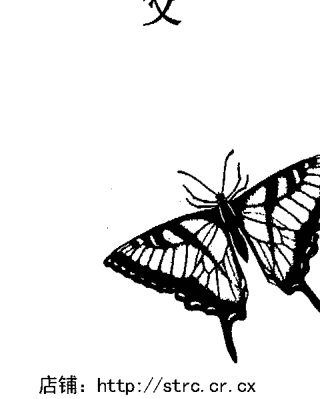

# 從前世經歷學會寬恕

貝德羅這次回想的前絕不輕鬆，他忽然咬牙切齒，心頭火起。「他們硬要我去，我不想去……我不想過那種日子！」
「他們要你去哪裡？」我希望他說得清楚一些。
「他們要我擔任神職，去當修士……我不要！」貝德羅語氣堅決地說道。他安靜片刻，怒氣未消，之後才又開口說話。
「我是最小的兒子，照規矩應該這麼做，但我不想跟她分開……我們深愛對方，
要是走了，她就得琵琶別抱，與我再無瓜葛……我無法忍受這種事，還不如死了算了！」
但他並沒有死，反而日漸屈服於必然的命運。必須與心上人分開讓他心如刀絞，
但他還是活了下去。
時光荏苒，不覺已數年。
……
「現在沒那麼糟了，這種日子很平靜，我很敬佩修道院院長，所以選擇長伴左右」
沉默一會兒之後，他認出來了。
「他是我哥……是我哥，我知道是他沒錯，我們感情很好，我看得見他的眼睛！

貝德羅終於找到過世的兄長，我知道現在他可以開始撫平自己的憂傷了。兩兄弟確實會出現在同一段前世，那麼，既然從前做得到，日後也有可能再相聚。

> >「他很快就要離開我了，」貝德羅預測，「但我們會在天堂重逢……我們為這件事禱告過。」

轉眼又多年，此時院長年事已高。

> >「他禱告、靜心，而他自己的大限之日亦不遠矣。他染上肺結核，咳個不停，呼吸困難，修道院弟兄站在他床邊。

不久，院長便與世長辭，貝德羅悲痛不已。

> >「我讓他快速經歷死亡，同樣的痛苦沒必要再承受一次。

> >「我學到憤怒是愚蠢的行為，會啃噬靈魂。我父母做了他們認為對我、對他們都最好的安排。他們不了解我的愛有多熾烈，也不明白我才有權決定自己的人生方向，他們沒有。他們出於一片好意，但他們不懂。他們很無知……可是我也一樣無知。我強佔了別人的生活，自己也做了同樣的事，又有何資格評判他們或生他們的氣？」

他再度陷入沉默，回神後接著說道：「這就是寬恕極為重要的原因。我們因為別人做的事而譴責對方，但那些事我們自己也做過。如果想要別人原諒自己，就必須先原諒別人。神寬恕我們，我們也應該寬恕。」他仍在回顧那一世的課題。

「當初要是我执意不當修士，就不會遇到院長了。」他總結道，「只要用心體會，就能發現得失勢必相隨，福禍必然相倚，善惡形影不離。如果我一直憤憤不平，憎恨自己的人生，就無緣體會在修道院感受到的那份愛與善。」

此外還有其他較次要的課題。

「我學到禱告和靜心的力量。」他補充道，然後又陷入沉默，琢磨這些課題及修道生活的影響。

「或許犧牲愛情，」他揣測，「換來神與修士弟兄更宏大的愛，是比較好的做法。」

# 因緣的線索初現

憶起身為修士的那一世之後，貝德羅立刻進展到這趟回溯之旅的下一個階段：找我不確定，他也不肯定。在數百年後的德國，貝德羅的靈魂投胎成為梅格達，而且選擇了一條相去甚遠的路。

到靈性愛與浪漫愛的交會點。

> 「我被牽引到另一世，」他冷不防宣告，「非去不可！」

> 「去吧，」我鼓勵他，「發生了什麼事？」

他好一會兒不出聲。

> 「我躺在地上，身受重傷……附近有士兵。他們將我放在地上到處拖，那些石頭……

> ……我快死了！」他大口喘氣。

> 「我的頭和身體側邊好痛，」他呢喃低語，氣若游絲，「他們玩我玩膩了。」

接下來，這可憐人的故事慢慢展開。

士兵見他一動也不動，掉頭就走。他躺在地上，可以看見高高在上的他們穿著短袖皮制服和皮靴，一臉掃興的模樣。他們是在找樂子，無意置他於死地，但也不難過，反正這些人命如草芥。總之，他們想捉弄人，卻玩得不盡興。

女兒哭著來到他身邊，將他的頭輕輕枕在她腿上，身體規律地搖晃。他可以感覺到自己的生命正一點一滴從他殘破的身體流逝，他的肋骨肯定斷了，因為每次呼吸都劇痛難當。他嘗到嘴裡有血的味道。

他渾身乏力，想跟女兒說話，卻一個音也發不出來。體內深處不知哪個遙遠的地方正汨汨作響。

個女兒呀，他對她的思念，將超越人類能容忍的極限。他閉上眼睛後，再也沒睜開，身體也不再感到劇痛。不知為何，他還是看得見，感覺自己輕飄飄的，自由自在。他發現他正俯瞰著自己那副頭部和肩膀無力垂在女兒腿上的癱軟身體，女兒正在啜泣，渾然不知他現在很平靜，痛苦已遠去。她動作緩慢地前後搖晃，只注意到他的身體，一具沒有靈魂的軀殼。也會離開自己的身體。如果他想要，現在就可以離開家人。他們會沒事的，只須記得大限來臨時，他們也會離開自己的身體。他注意到一道璀璨的光，比一千顆太陽更奪目美麗，他卻能直視那道光。那道光附近或裡頭，有人正在向他招手。是奶奶！她看起來好年輕，容光煥發，身子硬朗。他想到奶奶身邊，結果念頭一起，他立刻出現在那道光附近，來到奶奶身邊。裡。「乖孫啊，能再見到你，奶奶好開心。」她這樣想，而這想法隨即傳到他的意識裡。「好久沒看到你了。」她伸出靈魂的雙臂摟著他，兩人一同走進那道光裡。貝德羅的故事縈繞我整個心頭。他拋下女兒時的不捨心情令我動容，我感覺得興。他的道別話語裡有著深沉的哀戚。不過，他與祖母的重逢倒是令人振奮，我也替他高興。如果我不是深陷在那一刻的情緒中，或是沒回想起我兒子過世時的傷心回憶，也許當時就能聯想到貝德羅與伊麗莎白之間的淵源。我聽過這個女兒說的話。伊麗莎白在那一世是蜜莉恩，她曾摀著奄奄一息的父親，在被血染紅的地上來回搖晃自己的身體，喃喃說著同樣的哀悼之詞。兩則故事相似得詭異。不僅我的思緒在那一刻被情緒蒙蔽，在伊麗莎白敘述那段經歷之後的接下來幾週，我又診療了數十位患者，更是忙到疏忽了他們之間的因緣。又拖延了一段時日，我才發現兩人糾葛的命運。

# 時間能沖淡一切，但心裡的空洞很難消失不見

★★★

我回想起長子亞當短暫的一生。那時我曾在腦海中想像貝德羅的女兒在久遠前那一世悲傷難過的畫面，我認為這就是我突然想起那段記憶的原因。

那天清晨，我接到一通電話，是醫院的醫生打來的。之後我和卡洛便摟著對方，輕輕搖晃身體。亞當在人世間才活了短短二十三天，即使動了心臟大手術，也挽不回他的性命。我們邊哭邊搖晃，這一刻除了這件事，我們什麼都做不了。

我和卡洛傷心欲絕，早已超過身心能承受的範圍，連呼吸都變得困難。深呼吸會痛，很難吸到空氣，彷彿上半身穿著束胸，一件用悲傷製成的束胸，卻沒辦法解開。

我們的悲傷隨著時間慢慢淡去，不再痛徹心扉，但心裡的空洞仍在。之後喬登出生，接著是愛咪，兩兄妹都是獨一無二、與眾不同的孩子，卻取代不了亞當。

時間確實能沖淡一切。就像把一顆大石頭丟進池塘裡會破壞原本平靜的水面，興起陣陣漣漪，悲傷的水波也會慢慢往外擴散；就像前幾圈水波會緊緊環繞那顆大石頭，我們生活中的一切都與亞當密切相關。

時光荏苒，我們生活中出現了新的朋友、新的經驗，這些人事物跟亞當及我們的痛苦沒有直接的關連。漣漪向外擴散得更遠，更多新的人事物。呼吸的空間出來了，我們又能深呼吸了。舊時傷痛永難忘記，但隨著時間流逝，已經可以帶著那份傷痛過日子了。十年後，我們在邁阿密又見到亞當。他透過凱瑟琳（《前世今生》書裡提到的患者）對我們說話，改變了我們往後的人生。經歷了痛苦的十年歲月，我們才開始了解靈魂永生不滅的道理。

# 11 伊麗莎白的第四次回溯 —— 脫離家暴夫後遇到真愛的愛爾蘭婦女

人生生死死許多回，穿梭於兩種永恆之間，種族永恆與靈魂永生，而這一切，古愛爾蘭了然於胸。無論是在床榻壽終正寢，或是被來福槍一彈斃命，暫時與親人相隔兩地才是世人最感畏懼之事。雖然掘墓者耗力耗時，鐵鍬鋒利，肌肉結實，卻只是將入土亡者再次刻入世人心裡。

> ——威廉·巴特勒·葉慈

伊麗莎白坐在那張熟悉的躺椅上，低聲啜泣，睫毛膏順著臉頰往下流，流成一道黑色睫毛膏線條。我遞給她一張衛生紙，她順手接過去，心不在焉地按了按眼睛，阻止道彎曲的線條。她剛講述完自己是個愛爾蘭婦人的前世，那一世平安無事地結束，過得十分幸福美滿。然而，今生她卻遭逢喪母之痛，心灰意冷，這強烈的對比讓她心如刀割。因此，儘管那一世的結局是快樂的，她卻哭了起來。這眼淚是因為悲傷，而非喜悅。

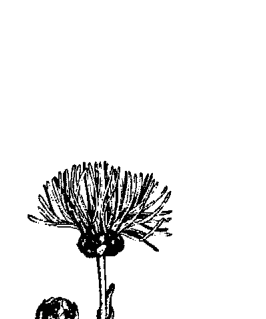

# 在前世找到破壞性相處模式的根源

那天的診療一開始相當平淡無奇。伊麗莎白最近剛恢復活力與自信，開始談戀愛了，這次的對象較年長，戀情很短暫。起初，伊麗莎白是看他有錢有勢，但兩人並不來電，至少她沒有。她的理智極力要求她安定下來，他是個令人放心的對象，似乎也相當鍾情於她，就接受吧，反正她也沒別的對象了，不是吧？

可是，伊麗莎白的心拒絕了：「不要安定下來，你又不愛他。這段感情若沒有愛，還剩下什麼？」

最後是她的心贏得這場爭辯。對方向她施壓，要她更投入這段感情，要有親密行為，要許下承諾，於是伊麗莎白決定結束兩人的關係。她鬆了一口氣，雖然難過自己又變得形單影隻，卻不覺得沮喪。整體來說，她結束這段感情的方式可圈可點，沒想到，現在她卻在這裡哭得眼紅鼻塞，睫毛膏流得滿臉都是。

回溯一開始，伊麗莎白便逐漸陷入深度恍惚狀態。我再次帶著她重返前世，這次她出現在幾世紀前的愛爾蘭。

> 「我長得很美，」一找到自己，她立刻這樣描述，「髮色很深，眼睛是淺藍色……我穿得很樸素，未施脂粉，也沒戴珠寶……好像在躲誰。我的膚色白皙，有如凝脂。」

> 「躲誰？」我順著她的話問。

> 她沉默了一會兒，在搜索答案。「躲我丈夫……對，是在躲他。喔，他是個大老粗！整天都在喝酒，一喝酒就打人……他很自私……我詛咒這段婚姻！」

> 「那你當初為什麼選他？」我這麼問並無冒犯之意。

> 「他不是我選的……我再怎麼樣也不會看上他。他是我父母相中的女婿，現在我們過世了……他們死了，我卻還得跟他生活在同一個屋簷下。現在我是他唯一的親人了。」

說這些話時，她流露出脆弱的悲傷與憤怒。

> 「你有孩子嗎？有其他人跟你們同住嗎？」我問道。

> 「沒有，」她的怒氣緩和了，悲傷卻益發明顯，「我生不出孩子，我……流產過，大量失血……還發生感染。他們說我無法再生兒育女了……他因為這件事也很氣我……他責怪我……怪我無法為他生兒子。他以為我想要這樣嗎！？」

她又惱火起來。

> 「他打我，」她突然壓低聲音說道，「打我像打狗似地。我恨他這樣對我。」

伊麗莎白就此打住，眼角噙著淚。

「他打你？」我複述。

「沒錯。」她簡單答道。

我等著她繼續說下去，她卻不肯多說了。「他打你哪裡？」我追問。

「背部、手臂、臉，全身都打。」

「你擋得了他嗎？」

有時可以。我以前會還手，但接著他下手會更重。他酒喝太多了。我最好乖乖讓他打，他打累了就會住手……至少可以撐到下次動手的時候。

「仔細看著他，」我催促道，「凝視他的眼睛，看他是不是你今生認識的人。」

伊麗莎白瞇起眼睛、皺起眉頭，彷彿正在端詳，雖然她的眼睛還閉著。

「他真的是我認識的人！是喬治……他是喬治！」

很好，你再回到那一世，他不會再打你了。

她認出他是喬治，也就是她一年半前交往過的那個銀行家。喬治開始對她拳打腳踢時，那段戀情就結束了。

現。伊麗莎白和喬治在意識層次都記得對方，兩人重逢後，他試圖延續之前的虐待模式並加以破除，同樣的模式可能會在許多世反覆出現行為。然而經過了幾世紀，伊麗莎白已經學到很重要的一課，這次她有能力、也有自尊心在虐待行為出現後，毅然決然結束兩人的關係。一旦查出前世的根源，破壞性模式就不再那麼難破除了。

# 你有可能遇到轉世的愛人

我看著伊麗莎白。她很安靜，模樣十分悲傷無助。丈夫會對她施暴，這件事我已經了解夠多了，於是決定帶她到之後的時間點。

> 「接下來，我會從三倒數到一，然後輕敲你的額頭。」我告訴她，「在我這麼做時，你就前進到那一世的下一個重要事件。聽我倒數，把注意力集中在那件事情上，看看你遇到了什麼。」

等我數到一，她就流露出幸福的笑容。我很高興，那淒苦的一世終於出現一道曙光。

> 「他死了。感謝老天爺，我好開心。」她直言不諱，「我現在和我愛的人在一起，他人很好，很溫柔，從不打我。我們情投意合，他是個大好人，我們在一起很快樂。」

說這些話時，伊麗莎白臉上始終洋溢著幸福的笑容。

「你丈夫是怎麼死的？」我問道。
「在一間小酒館跟人鬥毆被打死的。」她臉上的笑容逐漸消失，「他們告訴我，有人拿一柄長刀刺進他的胸膛，一定是刺穿心臟了。他們說血濺得到處都是。
「他死了我並不難過，否則我就遇不到約翰了。約翰是個很棒的男人。」燦爛的笑容又回到她臉上。
我再次催促她前進。「前進到之後的時間，」我下指令，「看看你和約翰發生了什麼事。前進到你們人生中的下一個重要事件。」
她靜靜地審視那些年。
「我非常虛弱，心臟有一搭沒一搭地跳著。」她喘氣道，「我喘不過氣了！」她前進到自己過世那天。
「約翰在你身邊嗎？」我問道。
「喔，在，他坐在床上，握著我的手。他很擔心，對我照顧得無微不至。他知道我快死了。我們很難過，但也很高興兩人共度了這麼多年的美好時光。」她在此打住，回憶約翰在她床邊的情景。她和約翰相依為命，彼此都付出了驚人的愛，也感受到不可思議的喜悅。這種程度的情感，只有她和最愛的母親之間的親情方可比擬。
「仔細看著約翰，凝視他的臉和眼睛，看他是不是你今生認識的人。」患者只要望著對方的眼睛，通常立刻就能認出來，而且十分篤定。眼睛也許真是靈魂之窗。
「不，」她簡單地說，「我不認識他。」
她又停了下來，等她再度開口，聲音流露出驚恐不安。
「我的心臟快停了。」她宣稱，「現在我心跳很不穩定，我此時就想離開這個身體。」
「好，想離開就離開。告訴我你發生了什麼事。」
幾分鐘後，她開始描述自己死後的情形，神情看來十分安詳，呼吸也變緩了。
「我在上方盤旋，然後飄到我的身體旁邊，靠近天花板角落。我可以看見約翰就在我身旁，一動也不動地坐在那裡。現在我們變得孤苦伶仃了，本來是我們兩人相依為命的。」
「這麼說，你從來沒生過小孩？」我想釐清此事。
「沒有，我生不出來，但那不重要。我和約翰擁有彼此，對我們來說這樣就夠了。」
她再度陷入沉默，神情依然十分平靜，還露出一抹淺笑。
「這裡好漂亮喔，我察覺有一道美麗的光包圍著我，把我往那邊拉。我想跟著那道光走，那是一道燦爛的光，能讓人恢復元氣！」
「跟著它走吧。」我同意道。

> 「我們經過一座美麗的山谷，繁花遍地，草木扶疏……我開始知道許多事物、許多資訊、許多知識，但我不想忘記約翰。我一定要記得約翰，如果把這些東西統統學起來，也許我就會忘了他。我不可以忘記約翰！」

「你也會記得約翰的。」我告訴她，卻又不是真的肯定。她正在學什麼知識？我問她。

> 「跟生命、能量有關的知識，關於我們如何利用前世、今生、來世，使能量更臻完美，以前進到更高層次的世界。他們正在告訴我與愛和能量有關的事，也解釋為何愛和能量是同一種東西……只要我們明白何謂真正的愛。可是我不想忘了約翰！」

> 「我會提醒你跟約翰有關的一切。」

> 「好。」

> 「還有別的事要說嗎？」

「沒有了，目前只有這樣……」接著她又補充道：「我們可以藉由聽從直覺，學習更多與愛有關的事。」

最後這句話也許蘊含更多層次的意義，尤其對我來說。多年前，藉由凱瑟琳之口說話的幾位大師曾在她的療程及他們精采的開示接近尾聲時告訴我：「我們對你說的話只針對目前的狀況，接下來，你必須仰賴自己的直覺學習。」他們不會再透過處於催眠狀態的凱瑟琳揭示任何道理。
伊麗莎白休息了，今天也不會再有更深入的啟示，於是我喚醒她。心智一回到現在，她就開始低聲啜泣。
「你在哭什麼呢？」我溫柔地問她。
「我很愛他，覺得自己再也不會如此愛一個人，再也遇不到可以讓我愛得這麼深、也同樣這麼愛我的人了。少了這份愛，我的生命怎麼可能完整？我又如何能發自內心地快樂？」
「人算不如天算哪，」我不同意，卻又不是那麼篤定，「你還是有可能遇到某個人，再次愛得癡狂，甚至可能再遇到轉世成另一個人的約翰。」
「可不是嗎？」她略帶嘲諷地說，眼淚開始撲簌簌地落下，「你只是在安慰我罷了，跟再找到他比起來，中樂透的機率還比較高哩。」
中樂透的機率，我記得是一千四百萬分之一。

# 千年的等待終能重逢

在《生命輪迴》一書中，我提到愛麗兒和安東尼重逢的故事：

被迫與靈魂伴侶久別之後的重逢，可能是值得等待的經驗——即使這一等就好幾世紀。

我之前治療過一個叫愛麗兒的患者，她是個生物學家，有次在美國西南部度假時，遇見一個叫安東尼的澳洲人。兩個人都結過婚，感情觀也很成熟，於是很快墜入愛河，也訂了婚。回邁阿密之後，愛麗兒建議安東尼找我進行一次前世回溯，純粹想看看他能否重返前世，並且「看見發生了什麼」。兩個人都很好奇，想知道愛麗兒會不會以任何方式出現在安東尼的回溯裡。

沒想到，安東尼非常適合回溯。他幾乎立刻就回到在北非的那一世，時間大約是兩千多年前漢尼拔（注：西元前二四七～一八三年，北非古國迦太基名將）的年代，看到的影像也十分生動、逼真。那一世，安東尼所在的文明非常先進。

他那一族的人皮膚白皙，人人都會煉金術，能煉製出燃燒液，當成武器噴灑在河面上。安東尼很年輕，約二十五歲上下，正和鄰近膚色較深的種族征戰，那一族的人數遠勝過他們。這場戰役一打就是四十天。其實，安東尼的族人之前曾傳授過敵方幾名成員兵法，那場戰役領軍作戰的，正是其中一名學生。敵方有十萬大軍，手持長劍和利斧，運用繩索渡河，安東尼和他的族人則在河面噴灑燃燒液，希望能在敵軍抵達河岸前阻擋對方的攻勢。
為了保護婦孺，安東尼的族人將大多數的婦女和兒童送到幾艘停泊在大湖中央的船上。安東尼心愛的小未婚妻也在那些婦孺當中，芳齡也許才十七、八。孰料，燃燒液的火勢突然失控，延燒到那幾艘船。族裡的婦孺幾乎全數喪命在這起悲慘的意外中，包括安東尼摯愛的未婚妻。
這場悲劇擊垮了族裡戰士的士氣，沒多久就敗下陣來。安東尼是少數逃過那場血腥肉搏大屠殺的人。最後，他逃往一處秘密通道，那條密道通往大神殿底下錯綜複雜的密室，密室裡存放著族人的金銀財寶。
安東尼在那兒發現族裡還有人活著，原來是國王。國王下令安東尼取他性命。安東尼是一名忠心耿耿的士兵，君命不敢不從。國王死後，漆黑的神殿裡只剩安東尼孤伶伶一人。他在那裡利用時間在金箔上寫下族人的歷史，再將金箔彌封在大甕或大缸裡。這裡是他的葬身之地，他死於飢餓，也死於失去未婚妻和族人的悲傷情緒。

故事還沒結束——他在那一世的未婚妻轉世成了這一世的愛麗兒。兩千年後，兩人重逢成為情侶，終於要舉行這場延宕許久的婚禮。

安東尼走出我的診療室時，和愛麗兒才小別一小時，但兩人重逢的力量之大，彷彿已有兩千年不曾相見。

愛麗兒和安東尼最近結婚了。兩人突如其來、情感濃烈、看似巧合的相遇，對他們來說有了一層新的意義，原本就炙熱的感情現在增添了持續冒險的意味。

他們計畫到北非旅行，想尋找兩人那段前世共同生活過的地方，看看能否發現其他細節。他們知道無論找到什麼，都只會更豐富兩人彼此身上發現的奇妙遭遇。

# 12
貝德羅的第四次回溯——
到新世界尋找黃金的西班牙船員

> 即使來生我可能不是君王，這樣更好，我反而將活得更淋漓盡致，也不必招來他人忘恩負義。
——腓特烈大帝

他現在狂冒汗，這已經是第二次了，即使診療室的空調又強又冷。滿頭滿臉的汗沿著他頸部往下流，濕透了襯衫，而前一刻他還冷得直打哆嗦。不過，染上瘧疾就是這樣，時而冷到骨子裡，時而熱得像火燒。法蘭西斯科染上這令人喪膽的惡疾，命在旦夕。他隻身一人，和心愛的人相隔千萬里。這種死法很恐怖、很痛苦。


# 再度在前世找到已逝的兄長

這次診療才開始沒多久，貝德羅便逐漸陷入深度放鬆的催眠狀態，很快就穿越時空，進入某段前世，而且立刻流起汗來。我試著用衛生紙擦乾他臉上的汗水，卻有如試圖以手擋洪水。他的汗流個不停，我希望他這樣大量流汗不會造成任何生理上的不適，免得影響他恍惚狀態的深度與強度。

> > 「我是男的……頭髮烏黑，皮膚也曬得很黑。」他邊流汗邊喘氣地說，「我在一艘大木船上卸貨……貨很重……這裡熱斃了……我看見附近有棕櫚樹和簡陋的木造建築……我是船員……我們在新世界！」

「你知道名字嗎？」我問道。

> > 「法蘭西斯科……我的名字是法蘭西斯科，是個船員。」

我原本想問的是地名，不過他知道自己在那一世的名字。

「你知道那地方的名字嗎？」我再次提問。

他停頓片刻，身體仍頻頻出汗。「我看不到，」他回答，「是其中一個該死的港口……這裡有黃金，在叢林裡……在深山的某處。我們會找到黃金的……找到之後我可以留一些給自己……這個該死的地方！」

「你是從哪裡來的？」我想得到更詳細的資料，「你知道你家在哪裡嗎？」
「在海的另一邊，」他不厭其煩地回答，「在西班牙……我們都是從那裡來的。」他口中的我們指的是同行的船員，他們在炎炎烈日下卸貨。
「你有家人在西班牙嗎？」我問道。
「我妻子和兒子都在那裡……我很想念他們，但他們過得很好……尤其如果我能寄黃金回家的話。我媽媽和姊姊也在那裡，日子難過呀……我好想他們。」
我想多知道一些他家人的事。
「我要帶你回到更早以前，」我告訴他，「回到你在西班牙的家人身邊，回到你動身前往新世界之前、和家人最後一次相聚的時間。我會輕敲你的額頭，從三倒數到一；等我數到一，你就會回到西班牙，和家人在一起。每件事你都記得。
「三……二……一。到了！」
貝德羅的眼睛在閉著的眼皮下轉動，掃視整個場景。
我看見妻子和年幼的兒子，我們坐在一起吃飯……我看見木桌和椅子……我媽媽也在那裡。」他觀察道。
「看著他們的臉，凝視他們的眼睛，」我下指令，「看看他們當中有沒有你今生認識的人。」
我有點擔心在兩世之間轉換，可能會讓貝德羅無所適從，導致他完全跳脫法蘭西斯科所在的時代，還好他銜接得很順暢。
「我認出我兒子。他是我哥……喔，沒錯，他是胡安……他好帥呀！」
貝德羅之前在身為修士那一世，曾經找到當時擔任修道院院長的兄長。雖然我們從未發現他倆以情侶之姿出現，但胡安是貝德羅永恆的靈魂伴侶，兩人的靈魂緊緊相繫。
接著，他略過母親，全心全意看著年輕的妻子。
「我們深愛對方，」他評論道，「但她不是我今生認識的人。我們的愛很堅定。」
他沉默了半晌，細細品味對年輕妻子的回憶，以及四、五百年前，兩人在與今日截然不同的西班牙共同享有的那份深情。
貝德羅能否再次體驗到這種愛？法蘭西斯科妻子的靈魂是否也跨越了數世紀，又出現在這裡？倘若如此，他們是否有緣相見？

# 在轉世中學會不心存偏見與仇恨

接著，我帶法蘭西斯科回到在新世界尋找金礦那段時期。
「回港口，」我下指令，「那個你一直在卸貨的港口。現在前進到之後的時間，到那名船員生命中的下一個重大事件。等我從三倒數到一、輕敲你的額頭，你就要讓一切變清晰，清楚看見下一個重大事件。
「三……二……一。到了。」
法蘭西斯科開始發抖。
「我好冷，」他抱怨道，「可是我知道等一下我又會覺得全身發熱！」
正如他所料，幾分鐘後他又開始狂冒汗。
「該死！」他罵髒話，「這病會害死我……其他人扔下我不管……他們知道我跟不上……他們知道我死定了……我註定要死在這個被神遺棄的鬼地方。他們發誓這裡有金礦，但我們連黃金的影子都沒看到。」
「這場病你熬過來了嗎？」我溫柔地問。
他安靜下來，我等著他說話。
「我病死了，沒活著走出叢林……熱病害死了我，我無緣再見到家人，他們會悲痛萬分……我兒子還那麼小。」
貝德羅臉上的汗珠現在混著淚滴。他正在感嘆自己年紀輕輕就生了一場沒有任何船員抵抗得了的怪病，孤單一人葬身異鄉。
我讓他脫離法蘭西斯科的身體。他飄浮在祥和寧靜的狀態中，不再發燒疼痛，也不再悲傷受苦。他的臉色平靜放鬆許多，我讓他休息。
我仔細思索貝德羅這幾世生離死別的模式——屢次與心愛的人分離，經歷過那麼多悲傷。當他穿越朦朧且不確定的時間薄霧，能否再找到他們？每一位都找得到嗎？

貝德羅的前世除了生離死別、除了失去之外，還出現許多其他模式。這次回溯他憶起自己是西班牙人，但他也曾經是英國士兵，在部隊企圖攻占西班牙堡壘時，成為敵人劍下亡魂；他記起自己曾是男兒身，也曾為女兒家；他前世曾為戰士，也曾任神職人員；他曾失去親友，也曾找到他們。

在擔任修士那一世，靈魂家人在貝德羅臨終時陪伴在他身邊。之後，他回顧他那一世的課題。

> > 「寬恕很重要，」他告訴我，「我們因別人做的事而譴責對方，但那些事我們自己也做過……我們一定要寬恕他人。」

他的幾段前世就是這則訊息的實例。他必須從各方面學習，才能真正理解。所有人都一樣。幾世輪迴，我們變換宗教、種族、國籍，體驗大富大貴、身強體健的日子，也嘗到窮困潦倒、染病抱恙的滋味。

我們必須學習不心存偏見，也不心懷仇恨。如果不這麼做，來生只會身分對調，轉世成為敵對那方的人。

+   * ★
* ★
* ★

# 靈魂相認的篤定

艾瑞克·克萊普頓的兒子小小年紀就意外慘死，於是他他在《淚灑天堂》一曲中猜想：如果他和兒子在天堂相遇，兒子是否還記得父親的名字？
這是個從古到今世人百問不厭的問題。我們如何認出自己心愛的人？無論在天堂，或是在轉世為人再次相逢時，我們會認出他們，他們也會記得我們嗎？
我的許多患者似乎知道答案。當他們經歷前世，凝視某個靈魂伴侶的眼睛時，他們就知道了。無論是在天堂或人間，他們會察覺到跟自己心愛之人相同的振動或能量，窺見更深層的個性，於是有了一種「內在的知曉」，一切了然於心，今昔之間的關係就銜接上了。
因為最早看見的往往是心眼，只用文字無法盡訴靈魂相認時的那種篤定——毫不猶豫，也絕無困惑。即使從前的樣貌與今生判若兩人，卻是同一個靈魂。靈魂被認出來了，而且是完完全全、毫無懷疑地認出來。
有時候，靈魂相認則可能是經過思考的結果，發生的時間甚至可能比心眼看見更早。這種狀況最常發生在嬰幼兒身上——他們表現出某種習慣動作或特有的行為、說出一個字或一個詞，然後立刻被認出那是親愛的父母或祖父母；或者，他們也許和你心愛的人有著相同的傷疤或胎記，或者只是用同樣特別的方式握你的手或看著你。你就是知道。

在天堂，沒有胎記。克萊普頓那首歌問道：到了天堂，兒子會協助他嗎？兒子會握住他的手嗎？會幫助他站穩嗎？

在天堂，身體是不必要的，因此靈魂相認可能是藉由一種內在的知曉，感應到所愛之人特殊的光、能量或振動。你在心裡感覺到他們；你心裡有一種深刻的直覺智慧，只要看一眼，就能徹底認出他們。他們甚至可能呈現上次跟你一起轉世時一樣的身體，方便你認出來。你看到的他們，就是你在人間見到的模樣，只是往往更年輕、更健康。

克萊普頓的結論是，穿過天堂之門，他就能找到平靜。

無論是穿過通往天堂的那扇門、穿過記起前世曾在一起的那扇門，或是穿過通往與所愛之人共度來生的那扇門，你永遠不孤單。他們會知道你的名字，會握著你的手，將平靜、療癒帶入你心中。

我的患者在深度催眠時，一遍又一遍地告訴我：死亡不是一場意外。嬰兒和孩童過世，為的是給我們機會學習重要的課題。他們是老師，教導我們價值觀、優先事項，以及最重要的，愛。

最重要的課題，往往出現在最艱困的時期。

# 13 伊麗莎白在觀想中與逝去的母親相聚

> > 人生在世，不過是一場沉睡和遺忘。與我們一同甦醒的靈魂，是我們的生命之星，原在他處沉落，而且來自遠方，並非毫無記憶，亦非赤身裸體。我們拖曳著七彩雲朵，來自神之處，我們的故鄉。兒時處處是天堂！
——威廉·華茲華斯

儘管順利憶起了幾段前世，伊麗莎白依然深陷悲傷痛苦的情緒中。理智上，她已經開始接受日後轉世時靈魂將重生、意識將重現的觀念。這趟旅程中，她曾與靈魂伴侶重逢，然而，回憶無法帶回她母親，至少無法讓她死而復生。她沒辦法膩在母親懷裡，跟她說說話。她好想媽媽。
當伊麗莎白走進診療室準備接受今天的療程時，我決定換個方法試試。我在其他患者身上用過這個方法，效果因人而異。我先幫助她達到深度放鬆狀態，這一點跟平常一樣，但之後我引導她觀想一處美麗的花園，請她走進花園裡休息。在她休息時，我暗示她有一名訪客會到花園裡找她，她可以藉由思想、聲音、影像、感覺或其他各種方式與這名訪客交流。在這之後，伊麗莎白經歷的一切皆來自她自己的心智，與我的暗示無關。

# 一定要相信自己

她整個人陷入那張熟悉的真皮躺椅裡，快速進入穩定的催眠狀態。我從十倒數到一，加深她的催眠程度。她想像自己正沿著一座螺旋狀樓梯往下走，走到底時，她觀想花園就在眼前，然後走進花園，發現一處可以休息的地方。我跟她說會有訪客，之後我們就一起等。

沒多久，她察覺有一道美麗的光正在靠近她。安靜的診療室裡，伊麗莎白開始輕聲哭泣。

「你為什麼哭呢？」我不解。
「是我媽……我看見她在那道光裡，看起來好漂亮、好年輕。」然後，她立刻直接對她母親說：「看到你我好高興喔。」伊麗莎白又哭又笑。

「你可以跟她說話，也可以跟她溝通。」我提醒伊麗莎白。此刻我就不多費唇舌了，因為我不想干擾她們相聚。伊麗莎白不是回憶起一段往事，也不是體驗到一件發生過的事。這個經歷此時此刻正在發生。

與母親相見的畫面，出現在伊麗莎白的心智裡，影像逼真，勾起她激動的情緒。她心智中的相聚畫面栩栩如生，更是提高了這次經驗的真實性。可能有助於她療癒悲傷的事此刻出現了。

有幾分鐘時間，我們靜靜地坐著，偶爾有幾聲輕嘆打斷這無聲的狀態。有時，我看見淚水滑落伊麗莎白的臉頰。她不時展露笑顏，最後終於開口說話。

「她現在走了。」伊麗莎白平靜地說，「她非走不可，但會再回來。」

我們繼續往下聊，伊麗莎白仍處於深度放鬆狀態，眼睛也還閉著。

「母親有跟你說什麼嗎？」我問她。

「有，她跟我說了很多，要我相信自己。她說：『你要相信自己。你需要知道的一切，我都已經教你了！』

「你覺得這是什麼意思？」

「這表示我必須相信自己的感覺，不要總是受他人影響……尤其是男人。」說到這兒，她還特地強調「男人」這兩個字。

「她說男人之所以占我便宜，是因為我不夠相信自己，是我給他們機會這麼做的。
我給他們太大的權力，同時卻失去了自我。我不能繼續這樣下去。

「『我們都是一樣的，』她告訴我，『靈魂沒有性別。你和宇宙中所有的靈魂一樣美麗、一樣有力量。別忘了這一點，別受外在形體所惑。』這就是她跟我說的話。

「『她有說別的嗎？』

「『有，還有別的。』她答道，卻無意說下去。

「『內容是？』我追問。

「『她說她很愛我，』伊麗莎白斟酌著說道，『說她很好，正在另一個世界幫助許多靈魂……她永遠支持我……然後還有一件事。』

「『什麼事？』

「『她叫我要有耐心。不久後會發生一件事，一件很重要的事，我一定要相信自己。』

「『我也不知道。』她輕聲回答，『不過等那件事情發生時，我一定會相信自己。』

「她說這句話時的堅定神情，我之前從沒見過。

# ★★★
死亡不過是走過一道門

我坐在《唐納修秀》的攝影棚裡，目睹了超現實的一幕。在場的有珍妮·卡克爾（一名來自英國的四十一歲女性）、她七十五歲的兒子桑尼，以及當時六十九歲的女兒菲莉絲。他們的故事，遠比布萊蒂·墨菲的更精采，也更有說服力——墨菲的故事可是輪迴轉世的著名案例，具有里程碑意義。

珍妮從小就知道她在最近的一段前世驟逝。她一死，八名子女頓時成了無父無母的孤兒。她清楚記得自己和子女在二十世紀初的愛爾蘭鄉下發生的大小事，她在那一世名叫瑪麗。

珍妮的家人雖然願意相信她，卻湊不出錢、也無意查證她異想天開的故事，說什麼數十年前在愛爾蘭過著一貧如洗的悲慘生活。成長過程中，珍妮無法得知自己鮮明的記憶究竟是真是假。
後來，珍妮終於取得資源，可以著手調查這件事。她找到了瑪麗·薩騰的資料。

道門，進入另一個房間。我們不斷回來，為的是學習某些課題或特質，例如愛、寬恕、理解、耐心、覺知、非暴力，然後必須摒棄其他特質，例如恐懼、憤怒、貪婪、仇恨、驕傲、自大，這些都源自舊時的制約。之後我們就能畢業，離開學校。我們有的是時間學習，並且摒棄舊習。我們永生不死，我們無窮無盡，我們具備神的特質。看著珍妮和她上了年紀的孩子，我腦中又浮現更多想法。“種什麼因，得什麼果。”世界各大宗教幾乎都是逐字解說「業」的觀念。這是一份古老的智慧，告訴我們要對自己、對他人、對群體、對這個星球負責。珍妮想要照顧、保護子女的需求將她再次拉回他們身邊。我們從未失去心愛的人；我們不斷回來，一次又一次相聚。愛是多麼強大的重逢能量啊！

# 14 貝德羅的第五次回溯——觀測天象的古代祭司

> 我的信條是：要活得讓自己想再活一次。這是你的責任，因為你無論如何都將再度轉世為人！——尼采

有許多橋樑或技巧能幫助患者透過催眠記起前世，「門」就是其中一種橋樑。我通常會先讓患者處於深度催眠的恍惚狀態，再請他們走過自己選擇的那扇門，一扇通往前世的大門。
「想像你正站在一道美麗的走廊或長廊上，兩側和兩端有著宏偉的大門，這些門通往你的過去，甚至通往你的前世，也可能將你導向靈性體驗。等我從五倒數到一，其中一扇門就會開啟，一扇通往你過去的門。那扇門會吸引你、會把你拉過去。走向那扇門。
「五，門正在開啟。它會幫助你理解有哪些阻礙或障礙讓你今生快樂不起來，感


「四，你到門口了。你看見門的另一邊有一道美麗的光，穿過那扇門，走進那道光裡。

「三，穿過那道光。你現在是在另一個時空。

「別擔心哪些是想像、幻想，哪些是真正的記憶，哪些是象徵或隱喻，或以上各項的綜合。重要的是這次的經歷。只要讓自己去體驗浮現在心智裡的任何事，試著別去思考、評斷或批判，只要讓自己去體驗。無論有哪些畫面進入意識都無所謂，你可之後再去分析。

「二，快到了，就快穿越那道光了。當我數到「一」時，你就要到那裡，加入那道光另一邊的人物或場景中。等我數到「一」，你就要讓一切變清晰。

「一，你到那裡了。看著你自己的腳，看看腳上穿著哪種鞋子。看看你的衣服、皮膚和手，它們跟現在一樣或不一樣？要注意細節。」

門只是通往過去的許多橋樑之一，而所有橋樑都殊途同歸，目的地都是對當事人目前的生活處境影響深遠的某段前世或某次靈性體驗。搭著電梯穿越時間；沿著道路、小徑，甚至一座真正的橋樑走，穿越時間的迷霧；涉過一條溪流或河川抵達另一邊，進入另一段前世；乘坐一部由患者自己操控的時光機——通往前世的途徑或橋梁。

## 人往往將自身特質投射到神身上

不計其數，以上只是其中幾個例子。我用鬥當作貝德羅的橋樑。穿過那道光之後，貝德羅試著看清楚自己的腳，看見的卻是一個由大石頭雕成的神明面具。

「他的鼻子很大，牙齒又大又暴。嘴型……嘴唇……很怪，又大又寬。眼睛很圓，往下凹陷，眼距很寬，表情猙獰……這幾尊可能是邪神。」

> 「你怎麼知道這是神？」

> 「他很有威嚴。」

> 「有很多神嗎？或者他是唯一的神？」

> 「有很多神，不過他是權力很大的一位……是能呼風喚雨的雨神。沒下雨，就種不出食物。」貝德羅簡單解釋了一下。

> 「你在現場嗎？找得到你自己嗎？」我追問道。

> 「我在場。我是祭司之類的人物，能觀天象，知日月星辰，協助制定曆法。」

> 「你工作的地點在哪裡？」

> 「在一幢石造建築裡，四周有階梯環繞，還有幾扇小窗戶，我們可以透過窗口觀測。天象不易觀測，不過我是這方面的高手。他們靠我取得觀測結果：……我知道日蝕、月蝕何時發生。」

「聽起來那是個科學非常進步的文明。」我作此評論。

> 「只有某些部分如此。天文學、建築學是很進步沒錯，但其餘的都很落後、迷信。」他澄清道，「其他祭司和他們的擁護者只在乎權力，利用迷信和恐懼欺騙人民，鞏固權勢。貴族也支持他們，從旁協助，幫助他們掌握兵權，共同組成只有少數人握有大權的聯盟。」

貝德羅記憶中的年代和文化，可能是在古代，但控制人民的手段，以及為了取得並鞏固權力而組成的政治聯盟，古今皆然。人類的野心似乎從未改變。

> 「他們如何利用迷信欺騙人民？」

> 「發生天災時，他們會先責怪神降下災厄，接著就怪罪人民讓神發怒或不悅……於是這些天然災變就成了人民的錯，例如洪水、旱災、地震或火山爆發。如果完全無法怪在人民頭上，也沒法找神來頂罪，那麼這些只是自然現象，而非神發怒時的作為……可是人民並未參透這一點，自始至終都是如此無知、恐懼，以為這些災難是自己造成的，而惶惑不安。」貝德羅停頓片刻，才繼續說下去：

「把自己遭遇的問題和災禍歸咎給神是不對的，這會讓祭司和貴族掌握太大的權力……我們比人民了解自然界的變化，往往知道這些變化何時開始、何時結束，我們了解自然界的循環。日蝕和月蝕是自然現象，是可以計算、預測的，而非神憤怒或懲罰的舉動……不過，他們卻這樣告訴人民。」貝德羅現在說話的速度很快，不必我追問，就滔滔不絕地說下去，急著陳述觀念。

「那些祭司以神的溝通者自居，告訴民眾他們是唯一的媒介，能解讀神的旨意。我知道實情並非如此……我自己也是祭司。」他沈思了一會兒。

「繼續往下說吧。」我建議他。

「那些祭司想出一種殘忍、複雜的獻祭制度，來平息神的怒火，」他說話的聲音越來越低，得豎起耳朵才聽得清楚，「甚至拿人當祭品。」

「人當祭品？」我重複道。

「沒錯，」他低聲說，「這種事不必太常做，因為這樣人民會惶惶不可終日。有溺斃和殺人的祭典……好像神需要人類的血似的！」貝德羅越講越氣，音量逐漸提高，「他們用恐怖的祭典操縱人民，甚至決定誰當祭品，這給了他們跟自已信奉的神一樣大的權力，要誰生就生，要誰死，誰就活不了。」

「你也得參加這些祭典嗎？」我小心翼翼地問他。

「不用，」他答道，「我不信他們那一套。他們知道，所以只要我好好觀測天象。」

「你不信？」

接著，貝德羅以天機不可洩漏的語氣低聲說道：「我甚至不相信有這些神存在。」

「不信。神怎麼可能跟人一樣小心眼又愚昧？我在觀測天象時，看到日月星辰和諧共存的美麗景象，如此大智大慧的天神，怎麼可能同時小心眼又愚蠢？這沒道理。我們將自身特質給了這些所謂的神。恐懼、憤怒、嫉妒、仇恨，這些是人類的特質，而我們將之投射到神的身上。我相信真正的神遠遠超越人類的七情六欲，也不需要人類的祭典和獻祭。」

身在古代的貝德羅智慧過人。他很健談，甚至不避諱聊禁忌話題，似乎也不覺得疲累，於是我決定前進到之後的時間。

「你後來有沒有變成更有影響力的祭司？」我問他，「你在那一世有掌握更大的權力嗎？」

「沒有，從來沒有。」他答道，「就算我有權力，也不會採用那種統治方式。我會停止獻祭，會教化人民，讓他們為自己學習。」

「不過這樣其他祭司和貴族就會失去權力了。」我提出反面看法，「再說，要是人民不肯聽呢？」

> 「他們不會不聽的。」他說，「真正的權力來自知識，真正的智慧則是運用這份知識來關懷他人，慈悲待人。人民很無知沒錯，但這是可以改變的。他們又不笨。」

這位祭司正在教導我靈性政治學，我可以感覺到他句句真理。

「繼續說下去吧。」在他又沉默了一會兒之後，我提出請求。

> 「沒什麼好說的了，」貝德羅回答，「我離開那個身體了，正在休息。」

這倒是出乎我意料。我沒叫他離開，我們還沒經歷死亡場景，過程中也沒發生任何何可能導致他不由自主離開身體的衝突或創傷事件。我記得他進入這段前世的方式很不尋常，眼前出現的是雨神石像的臉。

或許更深入探討那一世也不會有任何收穫，而貝德羅的「高我」明白這一點，所以他才會離開。

他原本可能成為一位很棒的統治者。

★★★

## 敞開心胸接近神

一九九二年十一月，教廷宣佈伽利略無罪——當初他主張地球不是宇宙中心，而是繞著太陽運行，這樣的「異端邪說」讓他獲罪。洗刷伽利略冤屈的調查始於一九八○年，持續時間長達十二年半。一六三三年那場認定伽利略為異端的判決，終於在三百五十九年後廢除。遺憾的是，要改變封閉思想往往得花上更長的時間。

所有機構或組織的思想似乎都是封閉的，而從未質疑自身預設立場和信念系統的人，心智也一樣狹隘。當思想被信念和未經驗證的舊觀念蒙蔽，又怎能觀察到新事物和吸收新知識？

多年前，凱瑟琳在深度恍惚狀態中告訴我：

> 我們的任務是學習，透過累積知識提高自己的神性。我們知道得太少……有了知識，就能接近神，然後就可以休息。之後，我們會再回來教導、幫助其他人。

敞開心胸，知識才流得進去。

# 15 伊麗莎白經歷的奇異夢境

> > 我知道我不會死。無庸置疑，我之前已死過一萬次。我嘲笑你所謂的生命消逝，因為我知道時間浩瀚無垠。
>
> ——華特·惠特曼

夢有許多功能，可以協助處理、整合白天的事件，也可以提供線索（通常是象徵和隱喻的方式呈現），協助解決人際關係、恐懼、工作、情緒、疾病等諸多日常生活問題。夢能幫助我們達成目標、實現願望，即使不是實質上，至少也是以願望成真的方式。夢有助於回顧往事，提醒我們現在發生了哪些類似事件。夢也能掩飾焦慮情緒這類刺激物，藉此維護睡眠品質，否則睡夢中的人可能會驚醒。此外，夢還有更深層的功能：它可能是一個途徑，能讓人想起被壓抑或遺忘的記憶，無論是童年、嬰兒期或胚胎期的經驗，甚至是前世記憶。前世記憶的片段經常出現在夢境裡，尤其是出現在做夢的人看見自己出生多年前或幾世紀前的景象裡。

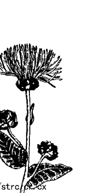

另外還有所謂的通靈夢或預知夢。這種夢往往能預測未來，但準確度有高有低，因為未來似乎是一種概率與必然性的系統，也因為每個人準確解析夢境的能力有強有弱。各個文化、各個背景都有不少人做過這種通靈夢或預知夢，然而，一旦夢境真的實現，許多人反而會不知所措。

另一種通靈夢則讓人體驗到自己在與遠方的人溝通。對方可能還活在世上但相隔遙遠，也可能是和靈魂或亡者（例如某位親朋好友）的意識溝通。此外，溝通的對象也可能是天使靈、教師或指導者。這些夢境裡的訊息往往極為重要，也能真正感動人心。

另外還有『旅行』夢。做這種夢的人通常會造訪在現實生活中從未涉足的地方，而他們在夢中看到的細節之後也能被證實。當做夢的人真正到了那個地方（即使是做了那場夢的好幾個月或好幾年後），可能會有一種似曾相識或熟悉的感覺。

有時，在睡夢中旅行的人造訪的地方似乎不存在這個星球上。這種夢境也許遠遠不只是夜裡想像出來的景象，而是一種神秘經驗或靈性體驗。之所以做這種夢，是因為平常由小我和認知造成的阻礙，在睡覺和做夢時放鬆下來。而在這種旅行夢中得到的知識和智慧，能徹底改變生命。

這一天，在長夜將盡、晨光初現之際，伊麗莎白就做了其中一種夢。

### 玫瑰會以自己身上的刺為恥嗎？

伊麗莎白提早赴診，因為她急著告訴我昨晚做的夢。她看起來已經不像前陣子那麼焦慮，整個人也不再那麼緊繃。她告訴我，公司同事開始說她氣色變好，變得更親切、更有耐心，甚至比母親過世前的她還要好。

> > 「這次的夢跟我平常做的不一樣，」她強調，「夢境更生動、更真實，每個細節我都還記得一清二楚。大部分的夢我通常很快就忘記了，這你是知道的。」

我一直鼓勵伊麗莎白每次醒來就把自己的夢記錄下來。在床邊擺一本夢的日記，一起床就趕緊寫下自己記得的夢境，這麼做對記憶大有助益，否則夢的內容很快就會變得模糊不清。伊麗莎白一直提不起勁把夢境記錄下來，通常在依約赴診之前，她不是已經忘記大半細節，就是全忘光了。

可是這場夢不同，夢中的景象太過逼真，因此細節還一五一十記在她腦子裡。

> > 「一開始，我走進一個大房間，裡頭沒窗戶、沒檯燈，也沒掛天花板燈，但不知道為什麼，牆壁居然會發光，而且發出的光還足以照亮整個房間。」

> > 「牆壁會熱嗎？」

> > 「應該不會，牆壁散發出來的是光，不是熱，但我也沒摸牆壁就是了。」

「你還注意到房間裡有哪些東西？」

「我知道這是圖書館之類的地方，可是我一個書櫃、一本書也沒看到。房間角落有一座人面獅身像，雕像兩側各擺了兩張老舊的椅子，歷史悠久，現在已經找不到這種椅子了，外觀很像用石頭或大理石雕出的王座。」她在回憶那幾張舊椅子時，眼睛往左上方移動。

「你覺得在那裡擺一座人面獅身像的用意何在？」我詢問。

「我不知道，也許因為這是一間幫助人了解奧秘的圖書館吧。我還記得人面獅身怪出的謎題：什麼東西早上用四隻腳走路，白天用兩隻腳，晚上用三隻腳？答案是人類——嬰兒時期爬行，長大成人後直立行走，年老後就必須拄著拐杖。也許是跟這個謎題有關，也可能跟所有謎題都有關係。」

「也許是吧。」我附和道，思緒飄回《伊底帕斯》，以及我第一次聽到這謎題的情形。

「不過可能還有其他含意也說不定。」我補充道，「比方說，有沒有可能這個人面獅身像正在提供線索，讓你知道這是哪一種圖書館，甚至讓你知道圖書館的構造或地點？」夢中的思緒可能複雜萬分。

「我在那裡待得不夠久，沒辦法知道這些問題的答案。」她回答。

「你有沒有注意到室內還有哪些東西？」

「有，」她立刻接話，「附近有人，是個男的，穿著白色長袍。我猜他是圖書館員，決定誰可以進這房間、誰不可以。不知道為什麼，他准我進來。」

此刻我再也按捺不住自己實事求是的想法。

「哪種圖書館會沒有書呢？」我脫口而出。

「怪就怪在這裡。」她開始解釋，「我只要把兩手伸直，掌心朝上，無論需要哪本書，都會開始在我手上成形，而且瞬間就完成了！書好像直接從牆壁冒出來，之後在我手上定型。」

「你拿到的是什麼書？」

「我不大記得了。是跟我自己和我的前世有關的書，我不敢翻開。」

「為什麼不敢？」

「我也不知道。我擔心書裡會寫不好的事，會有讓我覺得慚愧的事。」

「圖書館員有幫你嗎？」

「不算有。他只是開始放聲大笑，然後說：『玫瑰會以自己身上的刺為恥嗎？』」

說完又笑了起來。

「接著發生什麼事？」

「他帶我出去。不過我感覺自己總有一天會明白他話中的含意，而且我會再回來，不怕讀我自己那本書。」說完她便沉默不語，陷入沉思。

「這個夢就到此結束了嗎？」我追問道。

「後面還有。離開圖書館後，我就到一間教室上課，教室裡還有另外十五或二十名學生。有個年輕人似乎很面熟，很像是我哥……但他不是我哥查爾斯。」她說的是今生在加州的哥哥。

「你上的是哪種課？」

「我不知道。」

「還有別的嗎？」我問道。

她欲言又止，最後回答：「有。」

我不明白她都已經說了一些稀奇古怪的夢境，怎麼會在這節骨眼吞吞吐吐起來。

「有個老師出現了。」她繼續說下去，音量接近耳語，「他的眼睛是深棕色的，近乎黑色，還會轉成漂亮的紫色，然後又變回棕色。他個子很高，只穿一件白色長袍，打著赤腳……他朝我走來，深深地凝視我的眼睛。」

「然後呢？」

「我感受到最不可思議的愛，知道一切都會很好。我經歷的種種只是某項計畫的一部分，而且是一項完美無缺的計畫。

> 「這些是他告訴你的嗎？」

> 「不是，他不必告訴我。其實他什麼也不用說，我感應得到這些話，但不知道為什麼，這些話似乎是從他那裡傳過來的。我什麼都感應得到，什麼都知道。我明白沒什麼好怕的，從來都不用怕……然後他就走開了。」

> 「還有呢？」

> 「我感覺自己輕飄飄的。我記得的最後一件事，就是我飄在雲裡，覺得很安全，有人很愛我……然後我就醒了。」

> 「你現在感覺如何？」

> 「還不錯，但這感覺又快沒了。那場夢我記得一清二楚，美好的感覺卻越來越微弱，開車到這裡的路況更讓這種感覺加速消失。」

★★★

日常生活再次干擾了形而上的經驗。

## 天使入夢

有位女士來函感謝我寫第一本書，因為書裡的資訊幫助她了解並接受自己做過的兩場相隔二十多年的夢。從小她就知道自己會有個特別的孩子，名叫大衛。長大之後，她結了婚，生了兩個女兒，就是沒兒子。眼看著自己就快三十五歲了，她越來越擔心。在一場逼真的夢境裡，有個天使走到她面前說：「你可以有兒子了，但他只能陪你十九年半。這樣你可以接受嗎？」她同意了。幾個月後她懷孕了，不久大衛便出生。他的確是個與眾不同的孩子，個性善良、敏感、體貼。她總是說：「他有個老靈魂。」她從未跟大衛提起那場夢，以及她與天使的協議。結果，大衛在十九歲半時死於罕見腦癌。她感到內疚、痛苦、悲傷、絕望。當初她為什麼要接受天使的提議？大衛的死是不是她造成的？大衛過世一個月後，那個天使又出現在一場逼真的夢境裡，不過這次身邊多了大衛。大衛開口對她說：「別這麼傷心，我愛你。是我選擇你，不是你選擇了我。」於是，她理解了。

# 16 貝德羅在療程中回到童年

這是另一個可靠確鑿的證據，證明人在出生前便已知曉太多世事。年幼的孩子對無數事實的領悟速度之快，顯示他們當時並非頭一回學到這些事，而是回憶、想起來。

> ——西賽羅

我一時摸不著頭緒。貝德羅在腦海中穿過一扇門，進入另一個時空。從他眼球的動作可看出他正在觀察某樣事物。「你可以說話了，」我告訴他，「不過你同時也能維持深度恍惚狀態，繼續觀察、體驗。你看到了什麼？」

「我看見我自己。」貝德羅回答，「夜裡，我躺在草原上，空氣清爽……我看見滿天星斗。」

「你一個人嗎？」

「沒錯，附近沒有別人。」

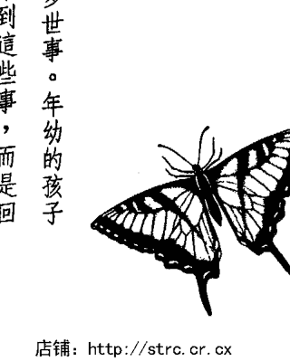

「你長什麼樣子？」我想取得更多細節，以便推斷他出現在哪個時間、地點。

「我是我自己……十二歲左右……短頭髮。」

「你是你自己？」我不解地問，還沒領悟到貝德羅只是回到了童年，並未重返前世。

「沒錯，」他簡單地答道，「我回到墨西哥，是個小男孩。」

這下我明白了，於是詢問的方向轉而以感覺為主，想查明為什麼在成千上萬可供存取的記憶中，他的心智獨獨選了這段。

「你感覺如何？」

「很開心。夜空散發著寧靜的氣息。一直以來我都覺得星星很熟悉、很親切……」

「你在學校學過觀星嗎？」

「不算有，只學過一點點，可是我會自己找相關書籍來讀。我只是喜歡看星星。」

「家裡還有誰喜歡觀星嗎？」

「沒有，」他回答，「只有我。」

我現在巧妙地切換，希望喚起他的高我或更高智慧，喚起他「擴展的視野」，以便知道為什麼這段記憶如此重要。接下來跟我說話的人，已不再是十二歲的貝德羅。

> 「夜空這段記憶有何重要性？」我問道，「你的心智為什麼特地選這一段？」

他沉默片刻，表情在午後微光中顯得更柔和了。

> 「星星是我的禮物，」他口氣輕柔地說道，「能安撫我的心情，是我從前聽過的交響樂，可以讓我的靈魂甦醒，讓我想起那些已經被遺忘的事。

> 「不只這樣，」他略帶神秘地說下去，「星星還是引領我走向自身命運的道路……緩慢卻篤定……我一定要有耐心，別從中阻撓。行程已經排定了。」語畢又陷入沉默。

我讓他休息，同時，有個念頭悄悄浮現在我腦海。夜空存在的時間遠比人類長久，某種程度上，所有人不都聽過這首古老的交響曲？我們的命運是否也同樣被引領著？然後，我又冒出一個念頭，每個字都很清楚，意思卻很模糊：我也必須有耐心，別妨礙貝德羅命運的安排。

這念頭出現在我腦海，彷彿一道命令，沒想到卻是在預言未來。

## 在諮詢專業中檢視自身

伊麗莎白和貝德羅這樣的患者考驗著我對生死、甚至對心理治療的許多舊信念，於是我也開始每日靜心，或至少會沉思。在深度放鬆的狀態下，我的意識往往會突然閃過一些念頭、影像和構想。

某天，有個念頭突然冒出來，想傳遞一則緊急訊息：我必須仔細診治那些長期接受我治療的患者。不知為什麼，我現在看著他們可以看得更清楚，而這種洞察力也能讓我更了解自己。

那些現在來找我接受回溯治療、靈性諮商，或學習觀想技巧的患者，都恢復得相當好，不過另外這群長期患者呢？其中許多人在我的書出版之前就已經在接受我的治療，為什麼我現在能更清楚看見他們的問題？我要學習什麼跟自己有關的事嗎？

結果，我要學的還多著呢。我早已不是許多長期病患的良師，反而成為他們的習慣與拐杖。許多患者變得很依賴我，可是我也沒要求他們獨立，反而欣然接受這個既定的角色。

我也變得很依賴他們。他們付診療費，阿諛奉承我，讓我感覺他們不可或缺，強化了社會上對醫生半人半神的刻板印象。我必須面對自我。

於是，我正視自己的種種恐懼，首先是安全感。金錢不好也不壞，有時雖然很重要，卻無法帶給人真正的安全感。我需要更多信心。若想承擔風險、想專心致力於正行，我必須知道自己會安然無恙。我檢視自己的價值觀，看看在我生命中哪些事物重要、哪些不重要。就在我回想、重整信心和價值觀時，我對金錢和安全感的擔憂消失了，就像被陽光蒸散的薄霧。我感覺自己安全無虞。

我檢視自身心態：我希望被人重視，希望別人認為我不可或缺。這是小我的另一個幻相。我記起所有人都是靈性存有，在這身外表下，每個人都是平等的、都很重要。

我要與眾不同、要為人所愛的這份需求唯有在靈性層次，發自內心深處、發自內在神性，才能真正得到滿足。家人幫得上忙，卻只能幫到某個程度為止。患者當然沒辦法幫忙。我能教他們，他們也可以教我，我們能互相幫忙一陣子，卻絕對無法滿足彼此最深層的需求。那是一種靈性層次的追求。

醫生是受過完整訓練的教育者和治療者，卻稱不上半人半神。我們只是受過訓練的專業人士，和社會上其他助人者一樣，都是同一個輪子的輪幅。其中多數身份在二、三十歲之前根本還沒出現。我們必須牢記自己在被賦予這些頭銜之前是怎樣的人。

每個人都有能力成為充滿愛與靈性、寬容、仁慈、平靜、安詳、喜悅的人。

我們原本就是這樣的人，只不過忘了，而小我似乎在阻止我們想起這件事。

我們的視野被遮住了，我們的價值觀本末倒置。

許多精神科醫師告訴我，他們覺得自己被病人困住，助人的喜悅蕩然無存。

我提醒他們，醫生也是靈性存有，他們是被自己的不安和小我困住了。他們也需要勇氣冒險，盡情享受健康和喜悅。

# 17 伊麗莎白的第五次回溯——受訓成為治療者與祭司助手的古埃及少女

因為我們以不同方式來到此地，我不覺得我們之前見過面，也沒有似曾相識的感覺。我認為，西元一二○六年，當我策馬經過海邊時，那個身穿紫衣的人並不是你；在邊境征戰時伴我左右的，不是你；一百年前在某座山城，陪我躺在銀青色草地上的，也不是你。從你穿著精緻衣物時那怡然自得的神態，以及在高級餐廳與服務生交談時那輕啟朱唇的模樣，我看得出你經歷過貴族城堡和主教座堂，見識過富麗堂皇和帝王權勢。

> —— 羅伯特 · 詹姆斯 · 華勒

我從十開始倒數，還沒數到一，伊麗莎白就已經進入深度催眠的恍惚狀態，眼睛在眼皮底下顫動，身體癱軟，呼吸節奏非常緩慢、放鬆。現在她的心智已做好準備，

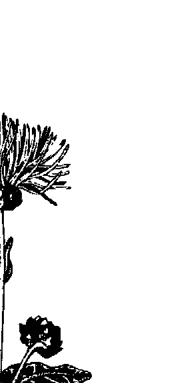

要進行時空之旅了。

## 只有法老的親戚和貴族才有資格接受訓練

我這次利用山上一條寧靜的小河作為通往古代的途徑，慢慢帶她回到過去。她涉過這條小河，進入一道美麗的光裡；穿過那道光之後，就會出現在另一個時間、地點，一段在古代的前世。

我吩咐她看看自己的腳。「我穿著薄底草鞋，」她觀察道，「鞋帶在腳踝正上方打結。我穿著一件長短層次不一的白色連身裙，上頭套著薄紗罩衫，一路蓋到腳踝；袖口很寬，長度到手肘。我在兩隻手臂的三個地方各套了金色手鐲。

「我的頭髮是深棕色的，長度過肩……眼睛也是棕色的……皮膚則是古銅色。」

「你是女的吧。」我猜想。
「沒錯。」她耐心回答。
「大概幾歲？」
「十四歲左右吧。」
「做什麼工作？住在哪裡？」她還來不及回答，我就一連問了兩個問題。

> 「我在神殿的庭院裡，」她答道，「正在受訓，準備成為治療者和祭司助手。」

> 「你知道這個國家的名字嗎？」

> 「埃及……很久以前。」

> 「你知道是哪一年嗎？」

> 「不知道，」她回答，「看不出是哪一年，不過是很久以前……年代久遠。」

我回到她對那個古老年代的記憶和經歷。

> 「怎麼會剛好選上你來接受成為治療者和祭司助手的訓練？」

> 「我是祭司選出來的，其他人也是。我們憑藉天賦和能力獲選……祭司在我們很小的時候就知道了。」

我想多了解一些跟這個挑選過程有關的事。

> 「祭司怎麼知道你有那些天賦？他們是在學校，或是和你父母一起觀察你？」

> 「喔，都不是，」她糾正我，「他們是憑直覺知道的。祭司很聰明，知道誰的數字能力很強，應該當工程師、計算者或司庫；誰會寫字、刻字；誰有軍事資質，應該接受統領軍隊的訓練；哪些人會成為最優秀的官員；哪些人有療癒和直覺能力，可以接受訓練成為治療者和幕僚，甚至當祭司。」

> 「所以，誰要接受哪種職業訓練，是由祭司決定的。」

我總結道。

「沒錯。孩子年幼時，祭司會預言他有哪些天賦、潛力，訓練就這樣排定了……」

「每個人都能接受訓練嗎？」

「喔，不是，」她反駁道，「只有貴族和法老的親戚才可以。」

「那你一定是法老的親戚嘍？」

「沒錯，不過法老的家族很龐大，連遠房表親也算在內。」

「那些不是法老的親戚卻天資聰穎的人呢？」我滿懷好奇，所以話題老是繞著這個家族選才制度打轉。

「他們也可以接受某些訓練，」她再次不厭其煩地解釋，「但只能到某個程度為止……最高當到指揮官副手，而指揮官是王室親戚。」

「你是法老的親戚嗎？」

「是表兄妹……不算很親。」

「夠親了。」我說道。

「也是。」她回答。

雖然我知道原本排在伊麗莎白下一號的患者取消了當天的約診，所以時間不像平常那麼急迫，我還是決定繼續往前。

> > 「有家人跟你在一起嗎？」

> > 「有，我哥哥。我們感情很好，他大我兩歲，也入選接受成為治療者和祭司的訓練，我們一起在這裡。我父母住得有點遠，有哥哥在身邊真好……我現在可以看到他了。」

我再次冒著分散伊麗莎白注意力的風險，尋找可以了解她人際脈絡的線索。「仔細看他的臉，凝視他的眼睛，看看他是不是你今生認識的人。」她似乎正在端詳他的臉。「不是，」她難過地說，「我不認識他。」我有點希望她認出那是她親愛的母親，或是她哥哥或父親，但事與願違。

## 在古埃及學習神奇的療癒與再生技術

> > 「現在前往那個埃及少女人生中下一個重要事件。你什麼都記得起起來。」

> > 「我十八歲了。我現在進步很多，哥哥也是。他穿著一件金色和白色相間、長度及膝的短裙……很帥。」伊麗莎白說道。

> > 「怎麼說你們進步了？」我讓她再次聚焦在訓練上。

> > 「我們學了很多本領，正在操作一種特殊的治療棒；一旦精通，就能大幅加速身體組織和四肢再生。」她停頓幾分鐘研究那些棒子。

「治療棒裡有一種流動的能量，能穿透那些棒子……這種能量會集中在需要再生的點上……可以用治療棒促進四肢生長、治療身體組織，就算是即將壞死或已經壞死的組織也可以。」

我很詫異，因為就連現代醫學也沒有如此先進的技術，不過自然界裡倒是有，例如蠑螈和蜥蜴就能讓斷肢或斷尾再生。在外傷性脊髓損傷方面最新的研究，現在也才剛開始進行受控制的神經再生，而伊麗莎白操作能促進四肢和身體組織再生的治療棒的時間，距今大約四、五千年。

她只知道治療棒的能量有療癒效果，其他就一無所知了。伊麗莎白沒學過相關詞彙或概念，無法理解，也無從解釋起。

她再度開口說話，而她不懂的原因也真相大白了。

「至少他們是這麼告訴我的。我太年輕，又是女的，雖然拿過治療棒，卻從沒見過它們發揮療效，沒看過再生……我哥哥看過。他獲准觀看，等他再大個幾歲，就能學習再生的知識。我的訓練在那之前就結束了，無法升到那個等級，因為我是女的。」她如此解釋。

「他可以學習再生知識，而你不能？」我質疑道。

「沒錯，」她說，「他們准他知道更高的機密，但我不行。」
她頓了頓，然後補充說道：「我不嫉妒他，是社會風氣使然……愚蠢的風氣，因為我的治療能力強過許多男生。」
她壓低聲音說話。

「反正他會把機密告訴我，也會教我治療棒是怎麼發揮作用的……他答應過我。」

他已經跟我說明過不少事……他告訴我，他們正在嘗試讓剛過世的人復活！

「過世的人？」我重複道。

「沒錯，不過做這件事的動作要很快才行。」她補充說。

「他們是怎麼做的？」

「我不知道……他們會操作幾根治療棒，還會念誦特殊的經文，而且一定要把身體擺成固定姿勢。還有別的，但我不知道……等我哥學到了，就會告訴我。」她的解釋到此為止。

我邏輯腦的假設是：那些號稱死而復活的人其實沒有死，可能只是奄奄一息而已，就像那些瀕臨死亡又康復的病人。畢竟，當時並沒有監測腦波的設備，無法精確判定是否腦死，而腦死是現代對死亡的定義。

我的直覺則告訴我不要貿然否定，其他解釋或許也說得通，那些我目前還無法理解的解釋。 伊麗莎白依然沉默不語，於是我繼續提問。

「你們還有其他治療方式嗎？」

「多著呢。」她答道，「有一種是手療法，也就是接觸需要治療的身體部位，然後直接把能量傳送過去……透過雙手。有些甚至不需要觸碰身體。我們在患者身體上方感受發熱區，再清洩裡熱，調理能量。一定要在身體上方不同高度的幾個地方清熱，不能只是在最靠近身體的位置。」她解釋道。現在她的語速變得很快，描述著古代的各種療癒技巧。

「有些人能治療心理問題。他們看得見對方心理的問題區，以腦波把能量傳送那些區域。這我還做不到，」她補充說，「不過我總有一天會學到的。

「有些人則把食指和中指併攏置於對方的脈搏上，再直接把能量傳送到流動的血液裡，這樣能量就能抵達內臟，並且可以看見淨化的能量經由腳趾向外流出。」伊麗莎白繼續快速且越來越專業地解釋。

「我現在做的是讓人進入深度恍惚狀態，讓他們也能看見療癒的過程，因而在心理層面完成療癒、轉化。我們會提供藥水幫助他們進入這種狀態。」她停頓片刻。

除了藥水的部分，最後這項技巧非常類似二十世紀末我和其他人用來刺激療癒過程的催眠觀想法。

「還有其他療法嗎？」我探問。

「可以召喚神的方法專屬於祭司，」她回答，「他們不准我學。」

「不准？」

「沒錯，因為女生不能當祭司，只能當治療者。我們輔佐祭司，卻不能執行他們的任務……喔，有些女生自稱女祭司，在慶典上彈奏樂器，卻無實權。」她語帶些許嘲諷之意，「她們是樂師，就像我是治療師。她們稱不上祭司，連哈索爾都在嘲笑她們。」

哈索爾是掌管愛、歡樂與喜悅的埃及女神，也是慶典與舞蹈之神。伊麗莎白也許想起了哈索爾另一個只有內行人才知道的角色——女性的捍衛者與保護者。哈索爾對那些女祭司的嘲笑，凸顯了這個頭銜的空洞與華而不實。

在伊麗莎白再度陷入沉默之際，我想到目前這一世與當時類似的情況。古往今來，似乎總有一道無形的屏障阻礙著女性在職場上的發展。

在古埃及這段時期，晉升之路似乎僅限於少數人。法老的親戚能升遷（而法老本人當時被視為半神），但女性親戚沒多久就會遭遇性別阻礙。法老的男性親戚才是享有特權的少數人。

## 兄妹之間的愛在肉體死亡後依然存在

伊麗莎白仍沉默不語，於是我催促她前進。「前往那一世的下一個重要事件。你看見什麼？」

「我和哥哥現在擔任幕僚，」她此刻是在幾年之後，「我們站在這一區的總督身後，提供建言。他是個很棒的行政長官，也是優秀的軍事將領，但行事衝動，需要我們的直覺與內在指引……我們協助他取得平衡。」

「你喜歡擔任幕僚嗎？」

「喜歡，可以跟哥哥在一起真好……而且總督平時為人和善，通常都會聽取我們的建議……我們也從事治療工作。」她即使並未因此欣喜若狂，似乎也已覺得心滿意足。她未婚，因此哥哥就是她的家人。我讓她前進到之後的時間。

她現在顯然正為某件事煩惱，哭了一會兒，然後就不哭了。「這件事我知道得太多了，我要勇敢。我不怕被流放或處死，一點也不，可是要離開哥哥……我怎麼捨得！」說著又落下一個淚珠。

「發生了什麼事？」我問她，怎麼也料想不到她的命運會突然急轉直下。

「總督的兒子突發重病，還來不及救就死了。總督知道我們有研究再生技術，也知道我們試過讓剛死的人復生，於是要要求我讓他兒子復活。如果我做不到，就會被送到永久流放地。那地方我知道，沒有人活著回來過。」

「所以你救活他兒子了嗎？」我欲言又止地問道。

「他不能復活，這是不允許的，所以我必須受罰。」她又難過起來，眼眶再度含著淚。

「這太沒道理了，」她緩緩地說，「我從來都不准學治療棒的事，也不准學再生和復活之術。我哥教過我一些，但還不夠……他們不知道哥哥跟我說過哪些事。」

「你哥呢？」

「他不在，因此總督沒處罰他。所有祭司都出城去了，只有我在……他趕回來剛好看到我被流放。我不怕流放，也不怕死，只怕離開他身邊……卻無可奈何。」

「你被流放了多久？」我問道。

「沒有很久。」她回答，「我知道怎麼靈魂出竅，有一天出竅之後沒再回體內，就這樣死了。因為沒有靈魂，身體也活不了。」她跳到那一世死亡的時間點，現在是從一個更高的觀點說話。

「就這麼簡單？」

「選擇這種死法不會有痛苦，意識也不會中斷，這就是為什麼我不怕死。我知道自己再也見不到哥哥了。我在那片荒蕪的土地上無法有所作為，沒有必要再以人的形態活下去。神也能理解。」

她安靜下來休息。我知道她對哥哥的愛在肉體死亡後依然存在，哥哥對她的愛亦然。愛永恆存在。從那之後到現在的許多世紀裡，他們是否會再次相遇？未來是否能再次相逢？

此外，我也明白這段記憶能幫助她撫平悲傷。她再次發現自己身在遙遠的過去，她的意識、她的靈魂，經歷了肉體死亡，許多世紀後再度出現，這次的身份是伊麗莎白。倘若經過如此漫長的歲月她都還活著，那麼她母親也可以，我們所有人都可以。她沒在古埃及找到母親，卻找到了親愛的兄長，一個她今生不認識，或者還不認識的靈魂伴侶。

## 靈魂之間的緣深緣淺

★★★

我喜歡把靈魂之間的關係想成一棵有一千片葉子的大樹。

長在你那根細枝上的葉子和你最親近，甚至可以分享彼此的經驗與靈魂經歷。你那根細枝上可能長了三、四片，或五片葉子。你和鄰近那根樹枝上的葉子關係也很密切。那些葉子和你長在同一根樹枝上，跟你很親近，卻比不上和你長在同一根細枝上的葉子。同樣地，沿著這棵樹向外延伸，你和其他樹葉或靈魂還是有關係，但親近程度比不上鄰近那幾片葉子。你們是同一棵樹、同一根樹幹的一部分，享有共同的經驗，彼此認識，但跟你最親近的，是和你長在同一根細枝上的葉子。

而在這座美麗的森林裡，還有許多其他樹木，每棵樹都藉由地上的根系彼此連結。因此，即使遠處某棵樹上有一片葉子似乎與你差異甚大，距離也很遙遠，你跟那片葉子還是有關係，你和每一片葉子都有連結。

不過，你跟自己那棵樹上的葉子關係最密切，而跟你關係更加親密的，則是和你長在同一根樹枝上的那幾片葉子；至於和你長在同一根細枝上的葉子，你跟你們幾乎是一體的。

前世你也許曾和同一棵樹上、相距較遠的其他靈魂相遇。他們也許曾在許多不同的情境中與你相遇，互動可能極為短暫。常見的情況是，即使只是半小時的相遇，也可以幫助你學到某個課題，或是有助於他們，或者讓雙方都受益。其中一個靈魂可能曾在路旁行乞，而你發自內心幫助了他，讓你有機會對人發揮慈悲心，也讓對方學習到何謂接受愛與幫助。你和那個乞丐在那一世可能再也不曾碰面，因緣卻已結下。相遇的時間有長有短，可能是五分鐘，一小時，一天，一個月，十年，或者更久。這就是靈魂結緣的方式。緣分深淺不是用時間來計算，而是以學到的課題來衡量。

# 18 貝德羅的第六次回溯——十九世紀的憂鬱中年醫生

如果寫一篇故事，描述一個在前世自盡的男子轉生到這一世的經歷，以及他現在如何再度身陷與前世相同的困境中，直到他領悟自己必須克服那些困境為止，會多麼有趣呀……前世的行為標示了今生的方向。

> ——托爾斯泰

他感覺那則訊息烙印在他的靈魂裡，那些鮮活的字句永遠銘刻在他的生命中。他離開了自己那血肉模糊的身體，正在休息。此時，我們兩人都在思索那些看似簡單的字句蘊含著哪些不同層次的意義。

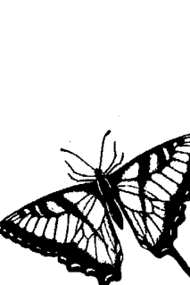

## 因救不了病人而充滿無力感

這次的診療一開始與平常無異。我使用快速誘導法讓貝德羅回到過去，他很快就進入深度平靜狀態，呼吸變得深沉、規律，肌肉完全放鬆。他的心智因催眠而專注，穿透時空一貫的限制，憶起了遠在他出生成為貝德羅之前發生的事。

「我穿著褐色鞋子，」他看見前世的自己出現時觀察道，「鞋子破舊不堪……我是男的，年紀約四十歲上下。」

不必我追問，他就接著說下去：「我頭頂微禿，剩餘的頭髮也開始轉為灰白，鬢角和絡腮鬍已經完全變白了。我留著短絡腮鬍，鬍子一路刮到臉頰下緣。」

他相當注意小細節。我欣賞他敘事的精確度，卻也知道時間正悄悄流逝。

「往前走，」我建議他，「看看你那一世在做什麼。前往下一個重要事件。」

「我的眼鏡很小，是金屬細框眼鏡。」他仍執著於外在特徵，「我的鼻子很大，膚色很蒼白。」

被催眠者不聽從我的建議，也不是什麼稀奇的事。我已經學會不能總是指導患者，有時要讓患者帶領你。

「你那一世從事哪一行？」我問他。

「我是醫生，」他答得很快，「在鄉下行醫，工作很認真。村裡多半是窮人，不過我的生活還過得去。村民大致上都是好人。」

「你知道自己住的地方叫什麼名字嗎？」

「我確定是在美國，在俄亥俄州……」

「知道是哪一年嗎？」

「一八〇〇年代晚期吧，我想。」

「你叫什麼名字？」我不著痕跡地問道。

「湯瑪士……我的名字是湯瑪士。」

「你知道自己姓什麼嗎？」

「『狄』開頭的字……狄克森或狄金斯之類的……我覺得不舒服。」他說道。

「怎麼了？」

「我覺得很難過……難過得要命。我不想活了！」他快速前進到危機出現的時間點。

「你為何會這麼難過？」我問道。

「我之前一直很沮喪，時好時壞，不過這次的狀況最糟，以前從沒這麼嚴重過。 這兩件事實在令人心灰意冷……我沒辦法這樣繼續下去了。」

> > 「哪『兩件事』？」我重複道。

> > 「我的病人死了，因為高燒。他們相信我救得了他，他們信任我，我卻無能為力。我讓他們失望了……現在他們沒了丈夫、沒了父親，以後必須辛苦地活下去……我救不了他！」

> > 「有時就算我們竭盡全力，病人終究難逃一死，尤其是在一八○○年代。」我試圖減輕他對發生在一世紀之前那件事的內疚與絕望，理由卻很牽強。我改變不了那件事，只能改變他對那件事的態度。我知道湯瑪士感受到了那種情緒，也已經根據自己的感覺行事。逝者已矣，但我還是幫得了貝德羅。我可以幫助他理解，從更高、更超然的觀點看事情。

## 睿智訪客帶來『以愛助人』的訊息

> > 「還有另一件讓你難過的事是什麼？」

> > 「妻子棄我而去。」他答道。我鬆了口氣，慶幸還是湯瑪士在跟我說話。

他陷入沉默。我剛才的治療是為了提升湯瑪士的理解層次，但願這麼做並未妨礙他在醫生那一世的體驗。我連讓他心情低落的另一件事都還沒找到。

『她棄你而去？』我重複他的話，鼓勵他多說一些。

「沒錯。」他難過地回答，「日子過得太苦了，連孩子都養不起。她回波士頓的娘家了……我覺得很丟臉……我幫不了她，沒辦法讓她開心。」

這次我甚至沒試著對他的高我進行治療，反而請湯瑪士前往那一世的下一個重要事件。治療可以稍後再進行——在他仍在催眠狀態中回顧那一世時，或者等他從催眠狀態甦醒後再說。

『我有槍，』他解釋道，「我打算舉槍自盡，了卻殘生！』

我忍住衝動，不問他為何選擇用槍。當時的醫生可輕易取得許多藥品和藥水，他為什麼不選擇服藥自盡？他做這個決定的時間至少是一個世紀以前了，我也許可以藉由這個問題推理他絕望的心情，而且是絕望到想自盡的那種心情。

『接下來發生什麼事？』我反而這樣問道。

『我動手了。』他淡淡地說，「我飲彈自盡，現在我看得到自己的身體……好多血——我流了好多血！」他已經離開自己的身體，正隔著一段距離觀看。

「你現在感覺如何？」我問道。

「困惑……我還是很難過……也好累。」他回答，「可是我不能休息，還不能……有人在這裡等我。」

「誰在那裡？」

「我不知道，一個很重要的人，他有話要跟我說。」

「他跟你說什麼？」

「他說我把那輩子過得很好，只是結局不好。我不該結束自己的性命，但他好像早就知道我會這麼做。」

「他還說了什麼？」我忽略他話中的矛盾之處，繼續往下問。接下來說話的，變成一個更有威嚴的聲音，而且是直接回答我的問題。說話的是湯瑪士、貝德羅，或者另有其人？有那麼一會兒，我想到藉由凱瑟琳之口對我說話的那幾位大師，不過那已經是多年前的事了，而且凱瑟琳此刻也不在這裡。

「重要的是以愛助人，結果如何並不重要。以愛助人，你只須這麼做。要彼此相愛。以愛助人的結果並不是你希望得到的成果——在肉體上展現的效果。你要療癒的是人心。」

那個聲音是在說給我和湯瑪士兩個醫生聽。在傳遞訊息的過程中，我們兩人都聚精會神地聆聽。那個聲音比貝德羅的更有魄力、更篤定，也更善於諄諄教誨。

「我會教你們如何療癒人心，你們會理解的。要彼此相愛！」

這些話一字一句刻畫在我們的生命裡，我們兩人都可以感覺到那股力道。

| 項目 | 描述 | 頁碼 |
| :--- | :--- | :--- |
| ## 內容標題 | 這是對應頁面內容的主要標題。 | 179 |
| ### 子標題 | 這是次要或解釋性的標題。 | 180 |
| - 列表項目 | 這表示一個項目符號列表的條目。 | 181 |
| 正文文本 | 這是段落或敘述性文字。 | 182 |

句具有生命力，教人畢生難忘。之後，貝德羅說他一清二楚地看到、也聽到那名睿智訪客傳達的一切，每字每句都閃耀著光輝，躍然舞動著。我也聽見了同樣的話，確定這些話也是對我說的。我頓時學到了重要的課題：要心懷愛與慈悲去幫助他人，別太擔心結果；別試圖在大限來臨前結束自己的生命；事情的結果有更高的智慧在處理，它知道萬事萬物皆有時；自由意志和命運同時存在；別用生理方面的成效衡量治療結果，療癒發生在許多層次，生理上的只是其一，真正的療癒必須發生在心靈層次；我會以某種方式學到療癒人心的事。而最重要的課題是：要彼此相愛。這是千古不變的智慧，容易理解，卻只有少數人身體力行。我的思緒又飄回貝德羅身上。「分離」與「失去」的課題折磨了他好幾世，這次還導致他自盡。已經有人提醒他不要提早結束性命，卻再次發生死亡事件，悲傷再度湧現。他會記得他人的提醒，還是會再次被無助絕望的感覺擊倒？

## 救治失敗衝擊了治療者的靈魂

對治療者來說，無法治癒患者這件事十分具有毀滅性。看看伊麗莎白在古埃及的「失敗」、貝德羅身為俄亥俄州鄉下醫生湯瑪士時的絕望，以及我自己當醫生的痛苦經驗。

二十多年前，我還是耶魯大學醫學院三年級學生，因為阻擋不了一場疾病的猛烈攻勢，而以治療者的身分初次嚐到挫敗的滋味。那是我臨床實習的第一年。我從小兒科開始實習起，指派給我的病人是七歲小男孩丹尼，他罹患了威爾姆氏腫瘤，而且相當大顆。這種惡性腎臟腫瘤好發於兒童，年紀越小預後越好，而七歲對這癌症來說已經不算小了。

丹尼是我行醫生涯第一個真正的病人。在他之前，我只能在課堂上、演講廳、圖書館，或是自己埋首苦讀教科書累積經驗。三年級開始臨床實習後，我們才被分配到真正有患者的病房。事實和理論學得夠多了，實際應用的時間到了。我得幫丹尼抽血，送到實驗室檢驗，也要負責所有次要的醫療程序。資深醫師稱這些為「打雜的差事」，可是對醫學院三年級的學生來說，意義卻很重大。丹尼是個很棒的孩子。因為他是我第一個病人，我們之間的情誼也更強烈、更特別。

丹尼勇敢抗癌，接受的是效果好但毒性強的化療，掉髮情況很嚴重，腹部也整個脹大，但病情逐漸好轉。我和他父母都抱持希望，因為當時罹患這種惡性腫瘤的孩子康復的比例滿高的。

我是治療團隊裡最年輕的成員。醫學院學生對臨床醫療的了解，通常比不上實習醫生、住院醫生或主治醫生，但這些醫生都忙得不可開交，反而是醫學院學生比較有時間陪伴病人和家屬，且往往更願意了解他們，因此常被派去通知家屬或傳話給病人。

丹尼是我最主要的病人，我很喜歡他，常花時間坐在他床邊，陪他玩遊戲、唸故事，或純粹閒聊。我欣賞他抗癌的勇氣。此外，我也會花時間陪他父母，地點通常是在丹尼那間昏暗、單調的病房，甚至會一起到醫院的自助餐廳用餐。他們很擔心，卻也在他病況好轉時振奮不已。

孰料，丹尼的病情急轉直下。一次危急的呼吸道感染，擊垮了他原本就脆弱的免疫系統。他呼吸困難，平日炯炯有神的眼睛變得呆滯漠然。醫療團隊的資深成員把我推到一旁。他們先投以抗生素，再停藥、換藥，卻不見效果。丹尼的病情持續惡化，我陪在他父母身邊，覺得無助、恐懼。最後疾病獲勝，丹尼往生了。

我太難過了，只能安慰他父母幾句話、抱抱他們，之後就沒辦法陪在他們身邊。他們的痛苦我感同身受。三年後，我自己的兒子在醫院過世，我更是有切身之痛。不過，當時我隱約覺得丹尼的死我難辭其咎，彷彿我該做點什麼來阻止這件事，什麼都行。無法治癒病人的「失敗」會衝擊每一位治療者的靈魂。我理解湯瑪士的絕望。雖然死於精神疾病的患者人數相對少很多，但如果幫不了精神嚴重異常的病人，也會引發同樣的挫敗感與無力感。我在西奈山醫學中心擔任精神科主任時，治療過一名三十多歲的女患者。她美麗又有才華，是個事業有成的職業婦女，新婚沒多久，日子過得幸福美滿。然而，她卻越來越疑神疑鬼，儘管藥也服了、治療也做了、什麼療法都嘗試過，病情仍持續惡化。我邀請幾位醫生會診，沒有一位能斷定她的病因，因為她的病程、症狀和檢測結果，都不符合典型的精神分裂症，也不是躁症或其他常見的精神疾病。某次到中東旅行之後沒多久，她的情況開始惡化，一項檢測顯示她體內對某種寄生蟲出現極高的抗體。任何醫學或精神科方面的治療都束手無策，她的病情日益惡化。我再次嘗到治療者那種無法治癒病人的無力感和挫敗帶來的痛苦。

以愛助人，竭盡所能，別擔心結果或後果，這就是答案。我覺得這個簡單的概念很有道理，是治療者需要的理解之樂。從某方面來說，我已經用愛幫助了丹尼，而他也幫助了我。

# 19 伊麗莎白的第六次回溯——被敵人虜走、與丈夫生離的女牧民

> 曾經俠情歲月逝，隨舊世界化塵土，我貴為巴比倫王，你卻卑為基督奴。
> 我見我奪我殺你，彎折損毀你傲骨……無數日頭起又落，從此映照你墳前。
> 巴比倫王親下令，只為曾為他奴人。毀人尊嚴現傷我，因傷人者終遭懲。
> 舊恨如死無絕期，因你愛我卻強忍。你猜疑傷透我心，我心再痛又奈何。
> ——威廉·厄內斯特·亨利

伊麗莎白沮喪、消沉。她的新戀情只維持了兩次約會，鮑伯在躲她。她在職場上偶然認識他，至今已一年多。他事業有成，一表人才，與她興趣相投。他說自己和一名已婚婦女談婚外情多年，不久前才分手。他還交往過幾位女性，但時間都不長，因為那些女性似乎總是少了什麼。鮑伯的說法是，她們後來都變得膚淺又愚蠢，或是價值觀跟他不同，於是他便結束那幾段感情。他那已婚的情人永遠願意跟他復合。她丈夫很有錢，夫妻間卻無半點情愛，而她不會離開丈夫和富裕的生活。

> 「你和其他人不同，」鮑伯向伊麗莎白發誓，「我們有太多共同點。」

他說伊麗莎白在他交往過的女性當中最聰明、最美麗，他知道這段感情能持續下去。

伊麗莎白說服自己，鮑伯說得沒錯。

> 「他一直在那裡，只是我從沒認真注意過。」

她心想，

> 「有時答案就在眼前，你卻從來沒看到。」

她忘了，雖然鮑伯一頭金髮，長得又帥，她卻沒有真正注意過他，是因為自己從未對他動心。她很孤單，渴望男人的臂彎，於是她聽從自己的理智，無視內心的警告。

兩人的第一次約會似乎預示著美好的未來。他們出門吃了一頓簡單的晚餐，看了一場好電影，之後在沙灘上、在接近滿月的柔和月光下，觀賞隨風起落的一波波海浪，聊些體己話。

> 「我可能會愛上你。」

鮑伯用一個永遠無法實現的諾言尋她開心。

她的理智一字一句仔細聽著，無視自己內心毫無悸動的反應。

第二次約會似乎也還不錯。她很開心，感覺他也非常愉快。他看起來一片真心，也暗示有朝一日會發生性關係，之後卻音訊全無。

最後是她先打電話給鮑伯。他說自己還想見她，但太忙了，很難挑個確切時間。

### 别让愤怒阻断爱的流动

他保证自己绝对没变心，他真的想见她，只是没办法告诉她什么时候。
“我为什么老是选到窝囊废？”她问我，“我是哪里有问题？”
“你没选到窝囊废，”我告诉她，“这次的对象是个事业有成的帅哥，而且是他跟你说他有意，可以和他联络。别把问题怪在自己头上。”
我嘴上没说，心里却知道她说得没错。她挑的全是窝囊废，这次是情绪上的失败者。原来，他放不下已婚情人给他的安全感，于是选择向依赖和“安全”靠拢。他自己心怀恐惧、缺乏勇气，受害的却是伊丽莎白。现在发现总比以后知道好，我心想。
伊丽莎白很坚强，会挺过来的。

伊丽莎白询问还有没有时间进行前世回溯，她感觉即将发生一件重要的事，急着知道那是什么，于是疗程继续。
等她出现在古代的某一世前，我却开始怀疑这决定是对是错。

她看见一片高低起伏的辽阔原野和平缓的丘陵，放眼望去有像牦牛的动物和敏捷的小马，还有圆顶大帐篷和游牧民族。那是一块热情洋溢、却也暴力横行的土地。

她丈夫和多數男性都外出狩獵或突襲去了。敵人趁虛而入，攻其不備，策馬疾馳，如潮浪般湧來，長驅直入。她的公婆首當其衝，被鋒利的寬刀砍死；她年幼的孩童也難逃毒手，死在長矛下。她的寒顫打到骨子裡。她也想死，卻求死不得。她外貌姣好，被年輕的戰士俘虜，成了入侵者當中最驍勇善戰那名男子的財產。另外還有幾個年輕女性也保住性命。

「讓我死！」她哀求俘虜她的人，但他不肯。

「你現在是我的人了。」他簡單地說，「你要住在我的帳篷裡，當我的妻子。」

她愛的人全死了，除了她丈夫，但兩人此生再也無緣相見。她別無選擇，幾次試著逃跑，卻不久就被逮回來。她也試過自盡，同樣未能如願。

於是，她硬起心腸，憂鬱情緒轉為持續悶燒的憤怒，吞噬她付出愛的能力。她的心靈枯萎，宛如行屍走肉，一顆麻木的心被困在活著的身體裡，沒有比這更殘酷、更桎梏人的監牢了。

「我們回到更早以前吧，」我提議，「回到你們的村子遇襲之前。」

我從三倒數到一，然後問道：「你看見什麼？」

她的面容安詳、平靜。她回想起童年與成長過程，以及和後來成為她丈夫的人歡笑、嬉鬧的情景。她深愛這個青梅竹馬，而他也回報她的愛。她非常平靜。

> 「你認得出娶你的人是誰嗎？凝視他的眼睛。」
「認不出來。」她答道。
「看看村裡其他人，認得出任何一個嗎？」
她仔細打量那一世的親戚朋友。
感情很好。我自己的媽媽過世之後，她視我如己出。我認得她！」「有……有，我媽在那裡！」伊麗莎白開心得倒抽一口氣，「她是我婆婆，我們
「還認得出其他人嗎？」我問道。
「她住在最大的那頂帳篷，帳篷上掛著旗子和白色羽毛。」她無視我的問題，自顧自地回答。
忽然，她臉色一沉。
「她也被他們殺了！」她又跳回大屠殺的情景，難過地說。
「殺她的人是誰？從哪裡來的？」
「從東方來的，在城牆的另一邊……那就是他們帶我去的地方。」
「你知道那個地方的名字嗎？」
她思考這個問題。「不知道，好像是在亞洲某處，靠近北邊的地方，也許是中國西部……我們有東方人的五官。」

「沒關係，」我回應道，「現在前進到那一世後來的時間。你發生了什麼事？」她無動於衷地回答，接著又說：“我想他們厭倦我了。”
“當我年華老去、魅力不再時，他們總算准許我自殺。”
她離開自己的身體，此刻飄浮在空中。
伊麗莎白沉默了幾分鐘，之後回答：“我學到許多事。我學到何謂憤怒，也學到緊抓憤怒不放是多麼愚蠢的事。我原本可以在敵人的城鎮為孩童、老人、病人做點事，原本可以教導他們、可以愛他們……我卻從來不讓自己付出愛，從不允許憤怒平息，從不準自己再次敞開心房。起碼那些孩子是無辜的，他們是來到人世間的靈魂，那次突襲不關他們的事，我的親人也不是他們殺死的，我卻連帶怪罪他們，甚至讓憤怒波及下一代，真蠢。這可能會傷害他們，但受害最深的人是我自己……我從不允許自己再次去愛，”她頓了頓，“但是我有好多愛可以付出呀。”
她又停頓了一下，再次開口時，聲音似乎來自一個更高的源頭。
“愛像流水，”她開口說道，“填補裂縫，也主動填滿空隙。是我們人類築起了錯誤的屏障，阻斷了水流。當愛無法填滿我們的心和腦，當我們與由愛組成的靈魂斷了聯繫，那時，所有人都會發瘋。”

我思考她的話。我知道愛很重要，甚至可能是世上最重要的事物，但我想愛也許會讓人發瘋。

我想起心理學家哈利·哈洛博士著名的恆河猴實驗。實驗中，沒有被母親觸摸、餵養，被剝奪了母愛的幼猴變得個性孤僻，容易生病，甚至死亡。少了愛，幼猴無法身心健全地活下去。付出愛不是選項，而是必要。

我的思緒又回到伊麗莎白身上。

> 「往未來的時間看。你當時學到的事對現在的你有何影響？這次學習、這次回想，如何才能幫助你在這一世感覺更快樂、更平靜、更能愛人？」

> 「我必須學會釋放憤怒，別壓抑怒火，要承認它存在，認出源頭，然後放下。我必須無拘無束地去愛，毫無保留，但我還在尋找。我還沒找到能讓我愛得全心全意、無條件付出的對象，似乎總會有哪裡出差錯。」

她沉默片刻，再開口說話時，聲音突然變得比平常低沉、緩慢，診療室感覺起來冷颼颼的。

> 「神就是合一，」她開始說話，遣詞用句上煞費苦心，「一切都是一種振動，一種能量，唯一的差別在於振動的頻率，因此神、人類、石頭之間的關係，與蒸氣、水、冰並無不同。萬事萬物，世上的一切，都由那種能量組成。愛打破藩籬，創造合一，而樹立障礙，製造分離與差異的，是無知。你得教他們這些觀念。」訊息到此結束，伊麗莎白正在休息。

我想起凱瑟琳的訊息，跟伊麗莎白傳遞的幾乎如出一轍，甚至當初凱瑟琳在傳達訊息時，診療室也變得很冷，跟伊麗莎白傳訊時的狀況一樣。我思量她的話：療癒是整合及移除障礙的行為，分離則造成傷害。為什麼世人就是無法理解？

## 歷歷在目的古巴勒斯坦前世

雖然我進行過上千次前世回溯（包含為患者進行的個人回溯和團體回溯），我自己卻只有六次前世回溯的經驗。我的妻子卡洛為了加強自己身為社工師的技能，曾修過催眠治療課程。課程結束時，她把我當成患者，進行過幾次前世回溯。我希望幫我回溯的，是一位我信任、也接受過完整訓練的人。

多年來，我一直在修習靜心，所以很快就進入深度催眠狀態。當記憶開始湧現時，我回憶起在耶路撒冷的一世，我是個製造火藥的工人。當時是西元一世紀，羅馬人統治巴勒斯坦。我和一名名叫約翰的人一起工作，他是施洗者約翰的信徒，他則在此時傳授我知識。

幾週後，我們分道揚鑣。我到古夫金字塔附近的一間小猶太教堂修習，他則往西行。

我有許多患者，包括伊麗莎白和貝德羅，都曾憶起在古巴勒斯坦地區的前世，還有許多人想起埃及。

對我、對他們來說，這些畫面都歷歷在目，也相當逼真寫實。

# 20 突然發現伊麗莎白與貝德羅的連結

> 喔，以為眾神疏忽了你的小夥子或少年郎，要知道如果你變壞，就會進入更壞的靈魂；反之，只要你變好，就會進入更好的靈魂。爾後每次輪迴轉世，你的所作所為都會得到對等的善惡果報。這就是天堂的正義。——柏拉圖

有時，人生最重大的事件會在不知不覺中發生在你身上，宛如一隻叢林貓寂靜無聲地靠近。這麼重要的一件事，你怎麼會沒注意到？這是心理層面的偽裝。

否認 —— 因為真的不想看見而看不見眼前事物的行為 —— 是最好的偽裝，加上疲累、分心、合理化、心理上的逃避，以及其他林林總總造成妨礙的心理作用。幸好命運夠堅持，能穿透這些偽裝，找出你必須看見的事物，這件事才慢慢由背景中浮現，就像看出立體畫的圖案。

## 遺失的拼圖片突然出現

多年來，我在看診時經常遇到夫妻或家人在回溯前世時，找到這一世的配偶或親人。有些夫妻會在回溯時，同時、也是初次發現彼此曾在同一段前世裡互動。發現這件事，往往令他們震撼不已，因為這是他們前所未有的經驗。當一幕幕景象在我的診療室呈現時，室內一片靜寂；之後，等他們從催眠的放鬆狀態中清醒，才恍然大悟兩人看到的是同樣的場景，感受到的是相同的情緒，我也在這時候才知道他們在前世的關係。不過，伊麗莎白和貝德羅的情況是顛倒過來的。他們的生活和前世分別在我的診療室裡展開，彼此並無關連。他們互不相識，沒見過面，來自不同國家，文化背景相異，就診的日子也不一樣。我在不同的時間分別見到他們，壓根兒沒想過兩人會有任何牽扯，因此從未把他們的關係連結起來。他們曾在好幾段前世裡相愛過，又失去對方。我之前怎麼沒看出這件事？難不成是天意？我該幫兩人牽紅線嗎？我是分心了、太累了，還是在否認？我正在找理由說服自己一切純屬「巧合」嗎？或者，這一切都是冥冥之中的安排，我就是應該在這節骨眼冒出這個念頭？

某天晚上，我突然想到：「埃里？」幾週前，我在診療室聽過伊麗莎白提起這個名字。 當天稍早，貝德羅想不起自己叫什麼名字。在催眠的恍惚狀態中，他出現在一段古代的前世，一段他之前曾在診療室憶起的前世。在那一世，身穿皮衣的士兵騎馬將他拖行至死。他的頭枕在心愛的女兒腿上，生命一點一滴流逝。女兒規律地搖晃他自己的身體，心若死灰。 或許那一世還有更多要學習的。他再次憶起在女兒的臂彎噓下最後一口氣的情景。我請他仔細端詳女兒，凝視她的眼睛，看看她是不是他今生認識的人。 「不是，」他難過地答道，「我不認識她。」 「你知道自己叫什麼名字嗎？」我要他再次把注意力完全集中在古巴勒斯坦的那段前世。 他思索這個問題，最後回答：「不知道。」 「從三倒數到一時，我會輕敲你的額頭，然後你要讓自己的名字出現在腦海，進入意識中。想到什麼名字都可以。」 結果，他什麼名字也想不起來。 「我不知道自己叫什麼，我什麼也想不起來！」

我倒是突然想起一件事，仿佛脑子裡有東西無聲無息地爆炸，頓時一切變得清晰、鮮明。
「埃里，」我大叫，「你叫埃里嗎？」
「你怎麼知道？」他從古老的深處回應，「那就是我的名字，有人叫我埃里忽，有人叫我埃里……你是怎麼知道的？你也在那裡嗎？」
「我不知道，」我老實回答，「就突然想到。」
整個狀況完全出乎我意料。我是怎麼知道的？我以前偶爾會有心電感應或強烈直覺，但不常發生，這次感覺像是我想起某件事，而非接收到超自然訊息。我想起的是什麼時候的事？我想不起來了。我努力回憶，腦子還是一片空白。
根據經驗，我知道自己應該別再絞盡腦汁回想，就隨緣吧，繼續過日子，說不定一陣子之後答案就會自然出現了。
有一組古怪的拼圖遺失了很重要的一片，我可以感覺到某個拼圖不見了，這表示有個關鍵連結尚待發現。不過是連結到哪裡？我試著專心做其他事，卻老是想起這件事情。
當天稍晚，那個拼圖片突然出現了，而且是靜悄悄地出現在我腦海。剎那間，我明白了。

是伊麗莎白說的。大約兩個月前，她陳述了一段悲慘卻感人的前世，當時她是古巴勒斯坦一名陶匠的女兒。羅馬士兵騎馬四處拖行她父親，「意外」導致他身亡。那些士兵其實不關心他的死活。他全身傷痕累累，頭上血流如注。女兒攬著父親，眼睜睜看著他死在黃沙飛揚的大街上。她記得那一世父親的名字：埃里。

### 我該違反醫病保密義務，幫助兩人重逢嗎？

現在，我的思緒正快速轉動。這兩名巴勒斯坦人的前世細節不謀而合，貝德羅和伊麗莎白對那一世的記憶完全吻合，對外在情境的描述、事件、姓名也如出一轍。是父親和女兒。我治療過許多發現彼此前世曾經在一起的人，通常是夫妻。許多人認出了自己的靈魂伴侶，兩人一起穿越時空，來到今生再續前緣。在這之前，我從沒見過今生尚未相遇的靈魂伴侶。這次的情況是，靈魂伴侶穿越了將近兩千年，只為了再次相聚。兩人遠道而來，如今近在咫尺，前後相隔幾分鐘，卻仍無緣相見。

2025年度总结暨2026年度计划报告

公司2025年度总结与2026年度计划如下：

2025年，公司全体员工团结奋斗，在各个领域取得了一定成绩。

2026年，我们将继续努力，制定详细计划，实现更大目标。

- 1. 2025年工作成绩总结：
   1. 完成全年销售额2025年计划；
   2. 成功推出5个新功能；
   3. 优化内部流程，提高工作效率。

- 2. 2026年工作计划：
   1. 加强团队建设；
   2. 拓展市场；
   3. 提升产品质量。

| 项目 | 2025年目标 | 2025年实际完成 | 2026年目标 | 状态 |
| --- | --- | --- | --- | --- |
| 销售目标 | 1000万 | 1050万 | 1200万 | 完成 |
| 新功能数量 | 5个 | 6个 | 7个 | 完成 |
| 客户满意度 | 90% | 92% | 95% | 进行中 |

> 保持奋斗，才能不断进步。——公司创始人

```python
def calculate_growth_rate(previous_year, current_year):
    return (current_year - previous_year) / previous_year

growth_rate = calculate_growth_rate(1000, 1050)
print(f"2025年销售增长率：{growth_rate:.2%}")
```

因為他們的病歷都歸檔在診療室，我只好在家裡試著回想他們是否還共同出現在其他前世。沒有，當修士那一世沒有。就一則故事相同，沒別的了，至少目前還沒有。印度通商路線那一世沒有，佛羅里達州紅樹林沼澤那一世沒有，美洲的西班牙殖民地流行瘧疾那一世沒有，在愛爾蘭的那一世也沒有。我只想得到這幾世。

我又有了另一個想法。他們也許曾在其中幾世或所有前世一起出現過，只是彼此都沒認出對方，因為他們今生互不相識。目前這一世沒有臉孔、姓名、地標，也沒有人物能讓他們連結到前世那些人。

然後，我想起伊麗莎白在中國西部那一世。在那片古老的遼闊草原上，她的族人慘遭殺戮，她和其他幾名婦女則被俘虜。而同樣在那片貝德羅認出是蒙古的草原上，他外出返家，卻發現家人、親人、族人無一倖存。

貝德羅描述記憶中的混亂場景和滅族慘況，以及自己絕望的心情，我和他都以為他年輕的妻子已遇害身亡，但她沒有，而是被敵人擄走，在異鄉度過餘生，再也不會被蒙古夫君強壯的臂膀擁在懷中。

現在，這雙臂膀穿越危險的時間迷霧回來了，只為了再次摟著她，將她溫柔地擁在懷中。但她們並不知情，我是唯一知道的。他們曾是父女，曾是青梅竹馬，也曾是夫妻。在歷史的洪流中，他們還會共同度過幾段前世，又相愛過幾回？

他們不知道自己已經和對方重逢。兩人都很寂寞，各有各的傷痛；兩人都飢腸轆轆，但美食佳餚已擺在面前，他們卻還聞不到、嘗不著。

就算我不擔心冥冥中的因果報應，還是受到精神科「律法」的嚴格規範，其中最嚴厲的一條，就是隱私權和保密義務。若將精神科比喻為宗教，那麼違反醫病保密義務就是最不可饒恕的罪。我不能告訴貝德羅有伊麗莎白這個人，也不能讓伊麗莎白知道貝德羅是誰。無論干預他人自由意志會有哪些因果報應或靈魂果報，違反精神科重大律法的下場可是無庸置疑的。

靈魂果報無法令我卻步，我可以介紹兩人認識，之後就交由命運安排，但違反精神科律法的後果讓我裹足不前。

萬一我弄錯了呢？要是他們認識之後，關係轉壞，最後不歡而散呢？搞不好還會演變成充滿憤怒或惡言相向的局面。我原本是他們信任的治療師，這樣的發展會不會影響他們對我的觀感？已有起色的病情會再度惡化嗎？之前的治療效果會不會前功盡棄？風險肯定存在。

我也必須檢視自己的潛意識動機。我想看到病人變得更快樂、更健康，在生活中找到愛與平靜，這份需求現在是否影響了我的判斷？我自己的需求是不是在鼓勵我跨面對舊時創傷往往才能療癒

這些影像之所以類似，是因為它們來自真正的記憶。前哥倫比亞小姐卡羅伊麗莎白、貝德羅和我的許多患者都回想起某些特定的歷史年代，場景和細節也相去不遠。這些影像未必和我們在主日學校、歷史課本或電視上學到的一樣。

萊娜·戈梅茲在某次前世回溯時，憶起自己是個赤身裸體的男性，被羅馬人騎馬拖行至死，死法類似貝德羅的某段記憶。另外還有幾名患者也想起自己曾被綁在馬匹後面拖死。遺憾的是，這種狀況不僅出現在羅馬時期，也發生在許多其他文化。

我有個患者來自科羅拉多州，她憶起自己在美國原住民部落時被人偷抱走，此後再也沒見過家人。後來她成功脫逃，最後卻死在美國舊西部一個相當於精神病院的地方。這跟伊麗莎白在亞洲的經歷何其相似。

「分離」與「失去」是前世回溯時常見的主題。我們都在設法療癒心靈傷口，而這份對療癒的需求著重的，不是回想起寧靜祥和、未留下任何傷痕的時期，而是要憶起舊時創傷，因為這才是造成痛苦、引發症狀的原因。

我偶爾會同時治療兩、三名患者，在回溯時，我不會請任何一位開口說話，因為可能會互相干擾。最近我在診療室同時為一對夫妻進行回溯，那次的回溯療程中，兩人始終不發一語，也沒時間回顧他們的經歷。

夫妻倆離開診療室後，開始比對彼此注意到的事物。難以置信的是，兩人經歷的居然是同一段前世。丈夫在那一世是派駐在北美東岸殖民地的英國軍官，她則是住在當地的一名女子。兩人相識，陷入熱戀。後來他被調回英國，離開之後再也無法回來探視愛人。失去情人讓她痛不欲生，兩人對這件事卻無可奈何，因為殖民地社會和英國軍方都得遵守嚴格的規定和慣例。

夫妻兩人都看見那名殖民地女子身上穿著古代衣物，而且是一樣的，也都描述了載他離開殖民地、返回英國的那艘船，以及事發當時涕淚縱橫、傷心別離的場面。兩人記憶中的所有細節一一吻合。

這些記憶也說明了兩人在這一世為什麼會出現相處上的問題。其中一大問題是，她害怕和丈夫分開，幾乎到了偏執的地步，而他需要不時保證絕對不會離開她。她的恐懼和他的需要，在目前這一世的現實生活中找不到根據，這個相處模式源自殖民時期。

其他進行前世回溯的治療師也發現同樣的結果。創傷比平靜的記憶更常出現，而死亡場景很重要，因為死亡通常是創傷事件。前世生活似曾相識，重要情景似乎雷同，因為同樣的主題、同樣的人類故事，已經出現在所有時代和所有文化中。

> 「已有的事後必再有，已行的事後必再行。日光之下並無新事。」（《聖經·傳道書》第一章第九節）。

# 21 巧妙安排兩人擦身而過

我正在和時間拔河，時間卻壓得我透不過氣來。貝德羅即將結束治療，搬回墨西哥定居，如果他和伊麗莎白在短時間內無法碰面，就會分散在兩個不同的國家，兩人在今生相遇的可能性就微乎其微了。他們的悲傷反應都在逐漸消失，睡眠品質、活力、食慾等生理症狀也已有所改善。

兩人都覺得孤單寂寞，急著找到一段彼此相愛、相處融洽的感情，卻毫無進展。

我預估貝德羅療程結束的時間，降低他的就診頻率，改成兩週一次。我的時間所剩無多。

> 我相信輪迴轉世，因此懷抱著希望生活，希望即使不是在這一世，也能在另一世張開友善的臂膀擁抱全人類。——甘地

我安排兩人一前一後接受治療。那天，伊麗莎白結束一小時的療程後，下一號的病人就是貝德羅，而進出我的診間，一定會經過候診室。為伊麗莎白治療時，我一直擔心貝德羅可能臨時有事無法依約赴診，例如因為車子拋錨、突發急事、人不舒服而更改就診時間。所幸他出現了。我送伊麗莎白到候診室，他倆注視對方，目光停留了好一會兒。我可以感覺到他們很好奇對方是誰，尋常的表面下暗藏無限的可能性。或者，這只是我一廂情願的想法？伊麗莎白很快回過神來，恢復平日的幹練模樣，提醒自己該離開了，也告誡自己行為要檢點。於是，她轉向出口，離開診療區。我朝貝德羅點點頭，一起走進診療室。「那女的很有魅力呢。」他邊說邊坐進大皮椅裡。「是啊，」我急切地答道，「她人也挺有意思的。」「真不錯。」他惆悵地說，注意力卻已轉到結束療程，以及繼續前往他人生的下一階段這兩件事情上，把他和伊麗莎白的短暫邂逅拋在腦後。在候診室不期而遇後，貝德羅和伊麗莎白都未採取任何後續行動，也沒打聽對方的相關資訊。我介紹兩人認識的手法太含蓄，時間也太匆促。

我決定兩週後再試一次，安排兩人先後接受治療。這是我最後的機會了，除非我決定違反保密義務，不再拐彎抹角，直接告知其中一人，或對兩人都講清楚。這是貝德羅回國前最後一次就診。

我陪伊麗莎白走到候診室，兩人再次凝視對方，這次是四目交接，而且目光停留的時間更久了。貝德羅笑了笑，點點頭，伊麗莎白也報以微笑。她躊躇了片刻，然後轉向門口離開。

相信你自己的感覺啊！我在心裡吶喊，想用心電感應提醒伊麗莎白這個重要的課題，卻得不到她的回應。

這次貝德羅仍然沒有採取任何後續行動。他沒問我伊麗莎白的事，思緒全放在搬回墨西哥要處理的大小事情。那一天，他的治療也結束了。

也許兩人註定無緣吧，我心想。雖然他們都還是鬱鬱寡歡，但情況已有改善。也許這樣就夠了。

## 遇見靈魂伴侶，你能否以愛來行事？

你的結婚對象未必是跟你連結最深的靈魂伴侶，而且你的靈魂伴侶也可能不只一人，因為靈魂家人會一起穿越時空。你也許會選擇跟連結較淺的靈魂伴侶結婚，因為對方可以教你某件事，或是能跟你學到東西。可能到了中、晚年，雙方各自成家後，你才認出某個靈魂伴侶。也可能與你連結最深的靈魂伴侶並未轉生到你這一世，而是在另一個世界，如同守護天使般照看著你。

有時，你的靈魂伴侶有意願，而且單身。他或她可能認出你們之間的激情與化學作用，那親密而微妙的連結，暗示著兩人已情牽多世。然而，他或她可能會對你造成傷害，這是靈魂成長的問題。

如果一個靈魂的進化程度低於另一個靈魂，也比較無知，那麼兩人的關係中便可能出現暴力、貪婪、嫉妒、仇恨、恐懼等特徵。這種情況不利於進化程度較高的那個靈魂，即使對方是你的靈魂伴侶。拯救的幻想通常伴隨著「我能改變他」、「我能幫助她成長」等念頭出現。如果他不讓你插手幫忙，如果她根據自己的自由意志，選擇不學習、不成長，那麼這段關係注定失敗。也許到了另一世會有另一次機會，但前提是他在這一世晚期覺醒了。確實有人很晚才覺醒。有時，靈魂伴侶會決定轉世時不嫁不娶。他們安排彼此相遇，互相作伴，直到兩人約定好的任務完成，之後便繼續前進。兩人的意圖或對這輩子的課程規劃並不相同，因此不想或不必一輩子守著對方。這不是悲劇，只是學習的問題。你們有永恆的生命可以在一起，但有時可能必須分開上課。單身卻未覺醒的靈魂伴侶是個悲劇人物，可能帶給你極大的痛苦。未覺醒表示他看不清生命，不知道「存在」有許多層次，也表示他不懂靈魂。而讓人遲遲無法覺醒的，往往是日常的思緒。我們心裡總是在找藉口：「我太年輕了。」「我經驗不足。」「我還沒準備要安定下來。」「你我宗教（或種族、所屬地區、社會地位、學識程度、文化背景等）不同。」這些全是藉口，因為靈魂不具備以上任何一項屬性。對方可能會認出兩人之間的化學作用，知道彼此確實有好感，卻不明白這化學作用來自何處。如果以為這種激情，這種靈魂的相認和吸引力，還能在別人身上輕易找到，就是一種痴心妄想。你不會天天都碰到這麼一個靈魂伴侶，一輩子恐怕只能再遇到一、兩個。一顆美好的心、一個有愛的靈魂會獲得神的恩典作為回報。

永遠不必擔心能否遇見靈魂伴侶，這種相遇交由命運安排。一定會發生的，而見了面之後，就改由雙方的自由意志作主。做或不做哪些決定，完全取決於個人的自由意志或選擇。覺醒程度較低的那方做決定時，依據的是心智，以及心智的所有恐懼與偏見。遺憾的是，這麽做換來的常是心碎。一對伴侶的覺醒程度越高，就越有可能根據愛來做決定；待雙方都覺醒之後，時時刻刻都能體會到極樂的滋味。

# 22 命運之輪轉動，兩人注定重逢

> 喔，讀者啊，要是你能從我身上得到喜悅，就盡量讀吧，因為我會很少回到這個世界。
——李奧納多·達文西

所幸，比我更有創意的高手正在高處運籌帷幄，安排貝德羅和伊麗莎白見面。兩人的重逢是命中注定的事，至於之後如何發展，就看他們自己了。

貝德羅要去紐約出差，計畫在那裡停留幾天，之後就轉往倫敦處理公事兼度假兩週，再飛回墨西哥。伊麗莎白則要到波士頓開會，結束後去找大學室友敘舊。她和貝德羅搭乘的是同一家航空公司的飛機，但班次不同。

伊麗莎白抵達機場大廳，發現她那班飛往波士頓的班機因為機械故障被取消了。

命運之輪正在轉動。

她的心情跌落谷底，這下子得打電話給朋友更改行程了。她可以轉搭飛往紐華克的班機，隔天再起個大早趕搭前往波士頓的接駁機。那天早上有一場很重要的會議，絕對不能缺席。她並不知道這樣重新規畫行程之後，會和貝德羅搭上同一班飛機。當她抵達登機門時，他早已在那裡等候登機。他的眼角餘光瞥見她，之後當她在櫃台報到，再到候機室找位子坐下時，他都目不轉睛地看著她，注意力全放在她身上。他認出她就是在我的候診室與他擦身而過的那名女子。他覺得很好奇，這種感覺非常強烈。他看著她翻開一本書，注意力完全集中在她身上。他看著她的頭髮、她的雙手、她的坐姿、她的一舉一動，一切都似乎是那麼熟悉。他僅僅在候診室與她有過一面之緣，但為何感覺如此熟悉？在候診室相遇之前，他們一定見過面。他絞盡腦汁，努力回想自己究竟在哪裡見過她。她感覺有人在注視她，不過這種情況她早已司空見慣。她試著把心思放在書本上，但倉促變更行程後，實在很難集中精神。這種時候，靜心訓練倒是派上了用場。有人在盯著她看，這感覺揮之不去。她一抬頭，就看見他正凝視著她。她皺了皺眉，接著便莞爾一笑，因為她認得他，他們曾在候診室錯身而過。她直覺地知道不必防備這個人，不過她是怎么知道的？

她又看了他一眼，之後視線就回到書本上，但她現在已經完全讀不進任何內容。

她心跳加速，呼吸也變急促。她毫無疑問地知道他正朝她走過來，沒多久就會走到她身旁。

她可以感覺到他越來越近。他先自我介紹一番，之後兩人就聊了起來。雙方互有好感，而且是天雷勾動地火那種，一發不可收拾。聊了幾分鐘後，他建議去更改座位，讓兩人可以坐在一起。

飛機起飛前，兩人便有如多年舊識了。貝德羅給她一種一見如故的感覺，她對他的一言一行瞭若指掌。伊麗莎白小時候有過很強的心電感應能力，但她生長在價值觀和想法都很保守的美國中西部，於是只好隱藏自己的直覺天賦。但現在，她的每根天線都豎了起來，接收能力也調到最強。

貝德羅無法將視線從她臉上移開，他從未對哪個人的眼睛如此著迷過。她的眼睛澄澈深邃，天藍色的眼珠外圍環繞著一圈深藍色，在那片藍海中，漂浮著幾座淺褐色的小島，迷得他神魂顛倒。

他又在心裡聽見那個穿著白色洋裝、表情痛苦的老婦人說的話，那反復出現在他夢裡的婦人。

## 面對父親的恐懼投射

做重大決定時，要傾聽自己的心，順從自己的直覺智慧，尤其是在決定靈魂伴侶這種命運的禮物時。命運之神會直接把禮物擺在你腳邊，卻完全不干涉你接下來決定怎麼處置。如果你完全聽從別人的建議，可能會鑄下大錯。你的心知道

「握住她的手……主動接近她。」
他拿不定主意。他想握她的手。稍安勿躁，他想，我才認識她沒多久。
飛機飛到奧蘭多附近時，雷雨劃破夜空，震得機身左搖右晃。這突如其來的亂流嚇得她花容失色，臉上閃過焦慮的神情。
貝德羅立刻注意到她神色大變，於是握住她的手安撫她。他知道這樣會有用。
剎那間，他的心觸電了。
伊麗莎白可以感覺到這股電流喚醒了那幾段前世。
兩人已經連結起來了。

你需要的是什麼，其他人都是別有目的。

在我提出想娶卡洛為妻時，父親曾堅決反對。他是為我著想，卻也因為被自己的恐懼蒙蔽而無法理智判斷。回首來時路，卡洛可說是命運送給我最珍貴的禮物，是陪伴了我好幾世紀的靈魂伴侶。她再次出現時，就像一朵嬌豔的玫瑰，在盛開的季節綻放。

問題出在當時我們太年輕。和她相遇時，我才十八歲，剛修完哥倫比亞大學大一的課程；卡洛則是十七歲，即將成為大學生。交往了幾個月後，我和她都知道我們想廝守一生。我無意再與別的對象交往，儘管家人警告說我們還年輕，我的閱歷尚淺，不足以做出如此重大的人生決定。他們不明白我的心早已歷經過千百年的歲月，我的心意已決，而且是超越任何理性思考可以理解的堅決。如果我們不在一起，那才是不可思議呢。

我後來明白父親在顧慮什麼。如果我和卡洛結婚、生子，可能就得休學，屆時我的醫生夢將化為泡影。老實說，這就是父親自己的遭遇。第二次世界大戰期間，他原本是布魯克林學院的醫預科學生，但我的出生迫使他退伍後得外出工作，此後再也無緣重回醫學院，醫生夢因而從未實現。這個夢想始終是一個沒有實現的苦澀可能，日夜啃蝕著他，縈繞在他心頭，之後又慢慢纏上他兒子。

愛能消弭恐懼。我和卡洛的愛逐漸化解了父親的恐懼，以及他投射在我們身上的恐懼。在我讀完醫學院一年級的課程、卡洛大學畢業那年，我們終於完成終身大事。父親後來把卡洛當成女兒般疼愛，也祝福我們的婚姻幸福美滿。

如果你的直覺、你發自肺腑的感覺、你的靈心都深信不疑，就別受他人基於恐懼的議論左右。有時他們是出於好意，有時則未必如此，但都有可能讓你迷途，與你的喜悅漸行漸遠。

# 23 回溯療法帶來的奇蹟

> 人能活兩次，不會比人只能活一次更教人意外；宇宙萬物本質上都能復活重生。 ——伏爾泰

伊麗莎白從波士頓打電話給我，說她把假期延長了。貝德羅一談成生意，隨即離開倫敦、飛回美國，現在人還在波士頓陪伴伊麗莎白。兩人已墜入情網。

他們開始比對彼此的前世經歷，往事歷歷在目。兩人再次找到彼此。

「他真的很特別。」她誇獎他。
「你也是啊。」我提醒她。

## 足以扭轉人生的神祕體驗

經歷了伊麗莎白和貝德羅的事件後，我的行醫生涯突然轉進一個不可思議的神祕領域。這是個妙不可言的轉變。在我舉辦的大型工作坊中，每位學員都有機會體驗深度放鬆的催眠狀態，因而大幅提高神奇事件發生的頻率。

學員們的體驗遠超過前世與輪迴的範疇。美妙的靈性與神祕事件層出不窮，伴隨著扭轉人生的力量。我何其有幸，能成為這些事件的推手。下面是在為期兩週的時間內發生的事。

有位波士頓報社的記者參加了幾場在當地舉辦的週末研討會和工作坊，之後寫了以下報導：

參加魏斯博士前世回溯工作坊的人，有許多都會提到情緒與靈性上的深刻體驗，其中一項練習格外激動人心。

魏斯博士先把燈光調暗，請房間裡的所有人兩兩分組，再用自己的聲音引導靜心，並指示學員凝視夥伴的臉幾分鐘。

練習結束後，兩名素不相識的女學員都說她們看見自己是對方的姊姊。

有位女學員說她一直在夥伴臉上看到一位修女。她把這件事告訴夥伴，對方說她前一天才在參加工作坊時想起自己有一段前世是修女。最令人驚奇的是一位住在本地的女學員，她在夥伴臉上看到十九歲半時死於二戰的兄長。她的夥伴是來自威斯康辛州的年輕女性，她說前一天她也想起了一段前世記憶，記憶中她是個十九歲半的男生，穿著軍靴和軍裝，戰死沙場，那場戰役應該是發生在越戰之前。在場的每個人都能明顯感覺到這名本地女學員被療癒了。

> 「愛能化解憤怒，」魏斯博士說，「這是靈性層面的問題。鎮定劑做不到，百憂解也不行。」

愛也能撫平傷痛。

隔週末，我在波多黎各首都聖胡安舉辦一場為期兩天的研討會，有將近五百人參加，會中魔法再現。許多人回想起童年、胎兒期和前世的記憶，其中一名參加者來自波多黎各，是一位受人尊敬的司法精神醫學專家，他經歷的事更是不可思議。

那場研討會的第二天，在引導靜心期間，他的內在之眼看見一名年輕女性的模糊身影朝他走來。

> 「跟他們說我很好，」她命令他，「告訴他們娜塔莎過得很好。」

這名精神醫學專家在對全體參加者講述這件事時，心裡覺得「荒謬極了」，畢竟他認識的人沒有一個叫娜塔莎，這名字在波多黎各也不常見。這鬼魅般的女孩傳遞的訊息，跟那場研討會或他個人生活中發生的事都扯不上邊。

「在場有沒有人覺得這則訊息是有意義的？」他問道。
忽然，演講廳後方傳來一位女性大喊的聲音。「我女兒，是我女兒！」
那位女士的女兒半年前突然身亡，才二十多歲，名叫安娜·娜塔莉，母親叫她娜塔莎，而且也只有母親會這麼叫她。

這名精神醫學專家從沒見過、也沒聽過娜塔莎或她母親，他和娜塔莎的母親都因這件令人匪夷所思的事而不知所措。等兩人恢復鎮定後，娜塔莎的母親讓他看一張女兒的照片。他一看照片，臉色再次發白——照片裡的人，就是走到他身邊、告訴他驚人訊息的那個身影模糊的年輕女子。

接下來那個週末，我在墨西哥市主持一場會議。同樣地，神奇的魔法又在我四周展現，在場人士不時感覺手臂起雞皮疙瘩，而且次數頻繁得嚇人。
一場靜心結束後，聽眾席中有位女士開始喜極而泣。她剛記起一段前世，在那段記憶裡，她兒子是她今生的丈夫。當時是中古世紀，她是一個拋家棄子的男人；到了現在這一世，她丈夫老是擔心她會離開他。這份恐懼在這一世根本沒有真憑實據，她甚至從未威脅過要棄他而去，也再三向他保證自己絕無二心，他仍惴惴不安。這份難以抑制的不安非但破壞了他的生活，也讓夫妻關係岌岌可危。

現在她明白丈夫這份恐懼真正的源頭。她急忙跑去打電話，告訴他這個答案，也向他保證她絕對不會再次拋棄他。

有時候，人際關係修復的速度快得讓人不敢相信。

第二天，那場研討會接近尾聲時，我正在簽書，有位女士穿過隊伍而來，邊走邊嗚嗚啜泣。

「真是太謝謝你了！」她握住我的手，壓低音量說，「你不知道你幫了我多大的忙！我的上背部已經痛了十年，痛起來真要人命。我在這裡看過醫生，也曾遠赴休士頓和洛杉磯求醫，每位醫生都束手無策，真教我痛不欲生。昨天在進行前世回溯時，我看見自己是一名士兵，背後被人捅了一刀，就在脖子正下方，也就是我背痛的部位。突然間，疼痛消失了，這是十年來頭一遭，而且到現在還是不痛！」她太開心了，又哭又笑，停不下來。

最近我一直告訴大家，回溯療法的效果可能要好幾週或好幾個月之後才會產生，千萬別因為療效太慢就打退堂鼓。這位女士提醒了我：治療效果也可能快得令人難以置信。她離開時，我不禁納悶日後還會發生哪些奇蹟。我越常看見患者和工作坊學員回想起前世記憶，越常目睹他們神奇且神秘的經驗，就越覺得輪迴觀念只是一座橋梁。走過這座橋梁的治療效果無庸置疑。就算不相信前世，病情也會好轉。治療師信不信前世也無所謂。記憶被喚醒，症狀就消除了。然而，有太多人死守著這座橋梁，卻不去看看橋的另一邊有些什麼。這些人執著於細枝末節的小事、姓名，以及歷史的準確性，只在乎能否盡量找到更多段前世和更多細節。他們為了幾棵樹而錯過整座森林。輪迴是一座橋梁，通往更高深的知識、智慧與理解，讓我們想起自己來到人世時帶著什麼、沒帶什麼，以及我們為什麼會來人間走一回，必須完成哪些任務才能繼續前進。輪迴讓我們記起自己這一路得到哪些不可思議的引導和協助，也想起跟我們一起回到人間、與我們同舟共濟、替我們分憂解勞的至親至愛。

# 24 患者給我的靈性訊息

> ——班傑明・富蘭克林

這些年來，許多患者已經成為我的師長，不時把自己的故事、經驗、知識和靈性層次的理解，當成禮物送給我。有些患者甚至成為我的知交好友，與我分享他們的人生和禮物。

我發現自己生存在這個世界上，也相信自己將以某種形態永遠存在。而且，既然人類生活難免遭遇種種不便，我並不排斥有個新版本的我，不過我希望前一個版本的「錯誤」能被更正。

多年前，有位患者帶來兩則訊息。當時《前世今生》還沒出版，不過凱瑟琳已經是我的病人，之後我也為數十人進行過前世回溯。這位患者在夢裡接收到訊息，一醒來立刻拿筆寫下來。那兩則訊息來自費羅，我也在夢裡見過他，後來在第一本書裡確實認了他的身分。這位患者不知道我夢到過什麼，這同名的「巧合」著實耐人尋味。

> 那兩則訊息來自她的潛意識？來自某個外在源頭，例如費羅？或者來自一段被遺忘的記憶，記憶中是她以前在生活中讀過或聽過的事？也許這些都無關緊要。套句我女兒愛咪的話：「只要存在，就是真的，而這則訊息存在她心智裡。」費羅傳遞給我的訊息，也是在探討心智。

> 致布萊恩・魏斯：我們每個人的心智什麼都懂，唯獨不懂它自己。不然讓它說說看自己是什麼、從何而來，無論它是靈魂、血液、火焰、其他某種物質，或者只是這樣而已，無論它是有形或無形。

> 沒有人知道靈魂何時進入身體。你引導大家認出那個時刻，這一點你做得很不錯，是個好的開始。

一週後又傳來另一則訊息，探討的是神的本質。

> 致布萊恩・魏斯：我們也要記住，超然的存有是唯一起源，是宇宙之父與造物之

你的朋友費羅

## 走一條朝向內在的路

我可以了解這些話中的偉大真理，無論它們出自何處。

> 主。祂盈注於萬物，不是用祂的意念，而是用祂的本質。祂的本質在宇宙中取之不盡、用之不竭；祂存在宇宙之上，也在九天之外。我們可以這麼說：在天地間出現的只是祂的化身。不過，雖然祂居他們之上，卻也將他們包羅在內。宇宙諸相都是祂的顯化與實現。如今，我們可見祂的化身在人世間活動。透過他們的一舉一動，我們多少對神的本質有些了解。

安朵·費羅

我見過有名的通靈者、靈媒、僧侶、教士、大師，也從他們身上學到不少。有些人天賦異稟，有些則是資質平庸。後來我才知道，通靈能力和靈性進化層次之間並無直接關係。記得和家喻户曉的太空人、也是超自然現象的研究者艾德格·米契爾聊過，他在實驗室研究過一位聲名遠播的通靈者，這名通靈者能夠影響能量，因此可以改變磁場，變更羅盤的指向，甚至可以用「念力」移動物體。儘管這名通靈者具有上述明顯高階的通靈能力，艾德格卻注意到他的品行和個性完全不符合高層次的靈性意識。他是第一個對我指出通靈能力和靈性進化未必相關的人。

我相信有些人的通靈能力會隨著自己在靈性上進化、隨著自己越來越有覺知而增強。通靈能力並非刻意培養，而是意外收穫。不能只因為通靈能力提升，小我就膨脹了。真正的目標是要學習愛與慈悲、學習善良與寬容，而不是成為名聲響亮的通靈者。

治療師在診治病人時，甚至也可以變得極度「通靈」，只要他們容許這件事發生。我偶爾可以接收到心靈影像、可以憑直覺知道某些事，甚至感應到坐在我對面那張舒適椅子上的患者有哪些生理特徵。

幾年前，我治療過一名猶太女病人，她年紀輕輕，卻意志消沉，自覺與家人格格不入，莫名感覺自己投錯胎。跟她談話時，我兩手掌心開始出現劇痛，原因不明。我檢查自己這張皮椅的扶手，皮革沒裂開，也沒有銳利的尖角，沒道理痛成這樣。然而，我的掌心卻越來越痛，開始轉變成灼熱的刺痛。我看著自己這雙手，沒看到疤痕或壓痕，也沒割傷，沒理由會這麼痛啊。

忽然，我腦海裡冒出一個念頭：這就像被釘在十字架上的感覺。我決定問她這意味著什麼。「被釘在十字架上對你有何意義？你和耶穌有什麼關係嗎？」她只是看著我，臉色發白。自八歲起，她就背著家人偷偷上教堂，從未告訴父母她覺得自己應該是天主教徒。

我手上的刺痛感，加上我們找出的關聯，能幫助我的病人打破人生困境，讓她知道自己沒發瘋，不是怪胎，而且她的感覺有事實根據。她終於開始理解、開始療癒。

最後我們發現，她有過一段神通廣大的前世，在兩千年後的巴勒斯坦。

我們都是通靈者，都是大師，只是我們忘了。

有病人問我知不知道印度聖者賽巴巴。他是天神下凡、神明轉世，或是神的後代投胎到人間？

「我不知道，」我回答，「不過就某方面來說，我們不都是如此嗎？」

我們都是神，神就在我們之內。我們不該為通靈能力所惑，因為通靈能力只是沿途的路標。我們必須行善助人，藉此展現自己的愛與神性。

就算被視為大師，時間也不該超過一、兩個月。不必一有空就前往印度朝聖，因為真正的朝聖之旅就在我們之內。擁有屬於自己的形而上經驗當然獲益良多，這可以讓你開始敞開心胸領悟神性，明白生命遠超過肉眼所見。人往往只相信自己親眼看到的事物。我們走的是一條朝向內在的道路。這是一條比較難走的路，一趟比較艱辛的旅程。我們對自己的學習負有責任，不能把這份責任往外推，推給某位大師。神的國度就在你之內。

## 《後記》
愛能克服一切障礙

> 我確定我以前來過這裡一千次，就像我此時在這裡一樣，而我希望還能再回來一千次。
—— 歌德

我偶爾會收到伊麗莎白和貝德羅捎來的訊息。他們已經結婚了，住在墨西哥，過著幸福美滿的生活。貝德羅在當地跨足政商兩界，伊麗莎白則負責照顧兩人的漂亮小女兒——她有著棕色長髮，喜歡在自家庭園摘花，追逐在身邊飛舞的蝴蝶。

「謝謝你做的一切，」伊麗莎白在最近一次的信中寫道，「我們很快樂，這都是你的功勞，我們欠你太多了。」

我不覺得他們欠我什麼。我不相信巧合，於是幫他們安排碰面機會，不過就算沒有我，他們終究會相見。這是命運的安排。

只要讓愛自由流動，愛就能克服一切障礙。

國家圖書館出版品預行編目資料

前世今生愛未央：魏斯博士回溯治療，意外牽起靈魂伴侶的今世情緣／布萊恩·魏斯（Brian L. Weiss）著；張琇雲 譯.-- 初版-- 臺北市：方智，2016.04
240面；14.8×20.8公分 -- (方智好讀：84)
譯自：Only Love Is Real: A Story of Soulmates Reunited
ISBN 978-986-175-423-9 (平裝)

1.輪迴  2.心理治療

2169 105002282

Eurasian Publishing Group
圓神出版事業機構
方智出版社
Fine Press
http://www.booklife.com.tw
reader@mail.eurasian.com.tw

## 方智好讀 084

前世今生愛未央：
魏斯博士回溯治療，意外牽起靈魂伴侶的今世情緣

- 作 者／布萊恩·魏斯 (Brian L. Weiss)
- 譯 者／張琇雲
- 發 行 人／簡志忠
- 出 版 者／方智出版社股份有限公司
- 地 址／台北市南京東路四段50號6樓之1
- 電 話／（02）2579-6600・2579-8800・2570-3939
- 傳 真／（02）2579-0338・2577-3220・2570-3636
- 總 編 輯／陳秋月
- 資深主編／賴良珠
- 責任編輯／黃淑雲
- 校 對／黃淑雲・賴良珠
- 美術編輯／金益健
- 行銷企劃／吳幸芳・詹怡慧
- 印務統籌／劉鳳剛・高榮祥
- 監 印／高榮祥
- 排 版／杜易蓉
- 總 經 銷／叩應股份有限公司
- 郵撥帳號／18707239
- 法律顧問／圓神出版事業機構法律顧問 蕭雄淋律師
- 印 刷／祥豐印刷廠
- 2016年4月 初版
- 2016年11月 3刷

Only Love Is Real: A Story of Soulmates Reunited
Copyright © 1996 by Brian L. Weiss, M.D.
This edition published by arrangement with William Morris Endeavor Entertainment, LLC., through Andrew Nurnberg Associates International Limited.
Traditional Chinese edition copyright © 2016 by Fine Press, an imprint of Eurasian Publishing Group.
All rights reserved.


## 一對幾世因緣的靈魂伴侶，終於在今生重聚的真實故事！

伊麗莎白是美麗聰慧的會計師，母親過世後，陷入悲傷憂慮情緒中，無法自拔。她的感情路也走得坎坷，看上的全是些不成材、會施暴或不利於她的對象，也從未在任何一段戀情中尋得真愛。

貝德羅來自墨西哥望族，是個魅力十足的男子。哥哥不幸意外身亡後，他絕望困惑，心情沉重，愁腸萬縷卻無人傾訴。

兩人不曾謀面，卻都找了全球知名的精神科醫師魏斯博士做心理治療和前世回溯。在過程中，魏斯博士發現互不相識的兩人，在回溯時描述的前世場景與情緒，有幾世是重疊的。

魏斯博士心生動搖，他該秉持一貫的信念，不介入個案的命運，還是該在男方離開美國前，讓這對靈魂伴侶相聚？

## 在時間的洪流裡，你是否曾愛過又失去？你能否再次尋得自己的靈魂伴侶？

這是一個關於靈魂伴侶的動人故事，他們因為愛而永遠牽掛對方，一世又一世、一次又一次再續前緣。

這更是一本說明「只要讓愛自由流動，愛就能克服一切障礙」的書，書中除了兩位主角的前世今生，還有他們透過回溯前世學到的種種課題，例如愛、寬恕、生死等。

我們一定會遇見自己的靈魂伴侶，但見面之後該怎麼做呢？是要被恐懼、理智、疑慮阻擋，或是聽從發自肺腑的直覺，完全取決於你的選擇、你的自由意志。