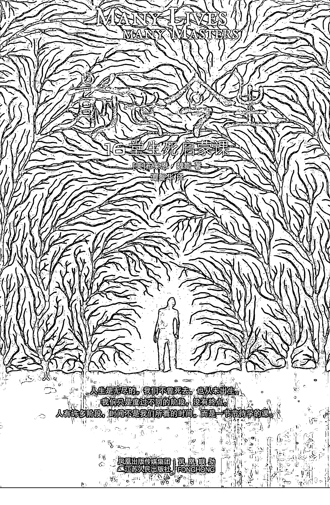
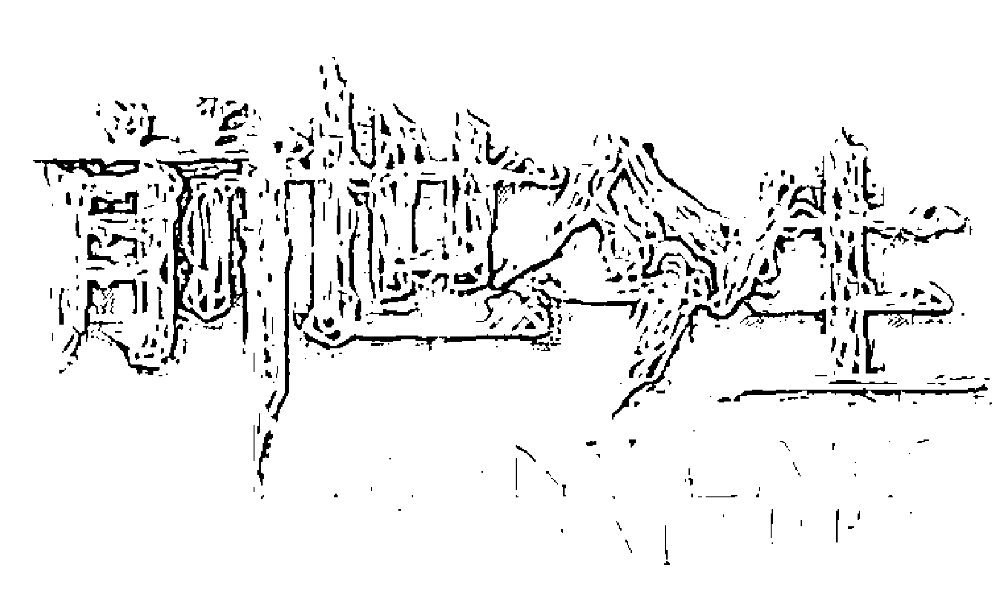
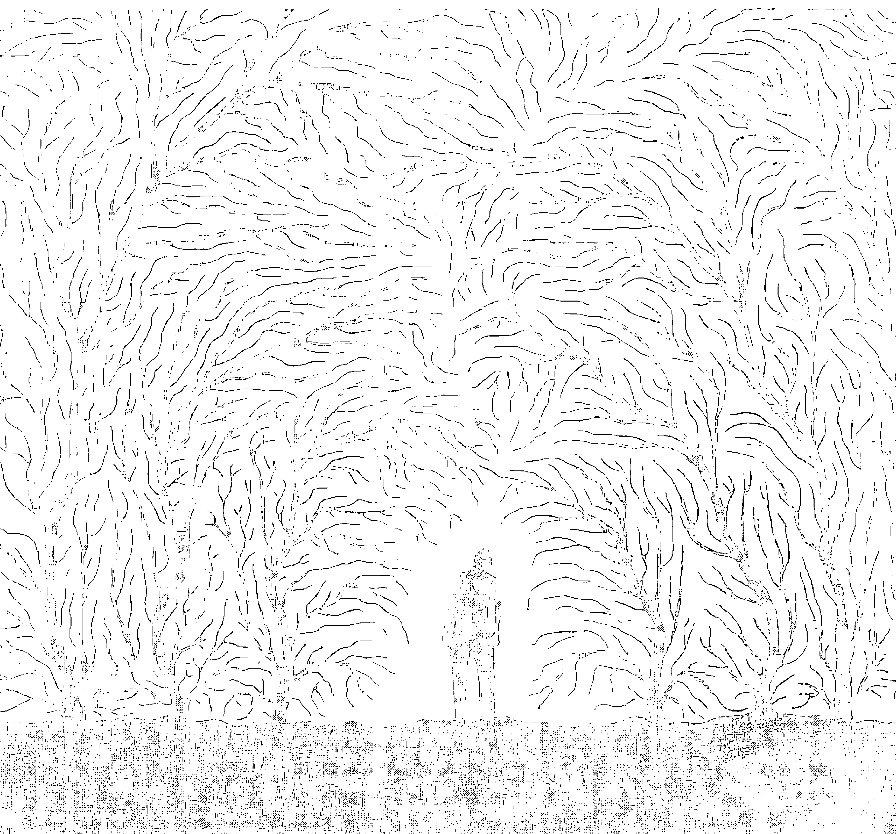
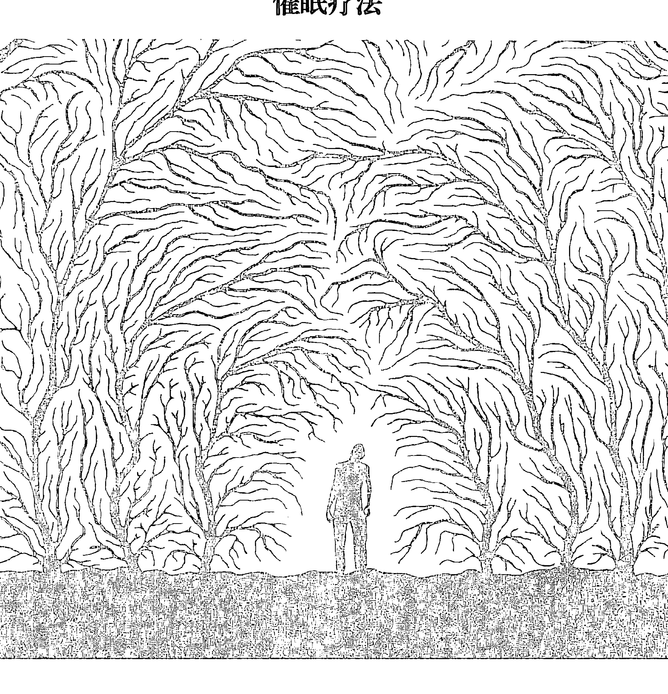
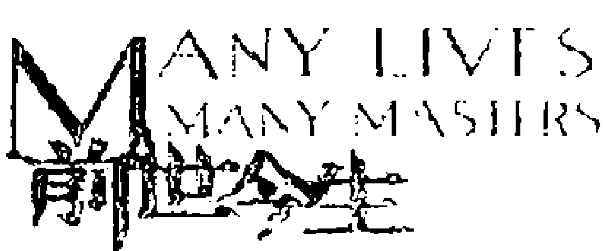
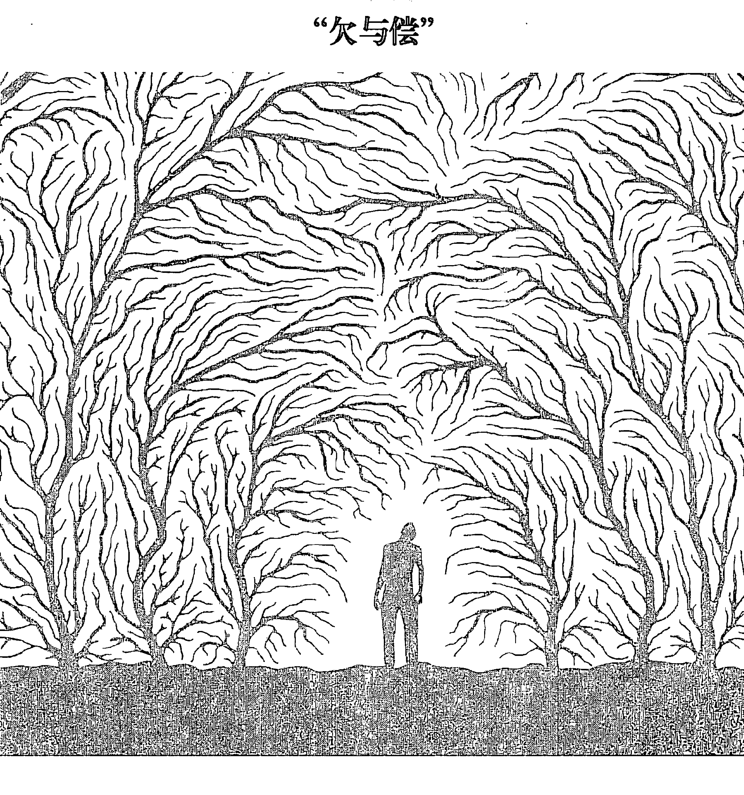
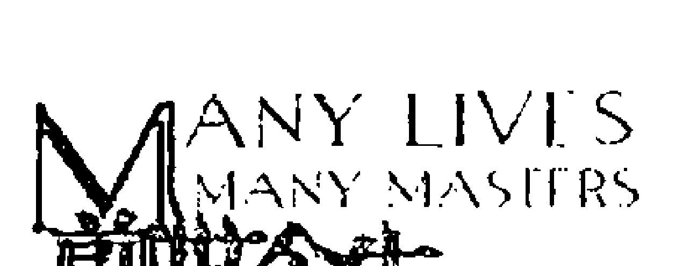
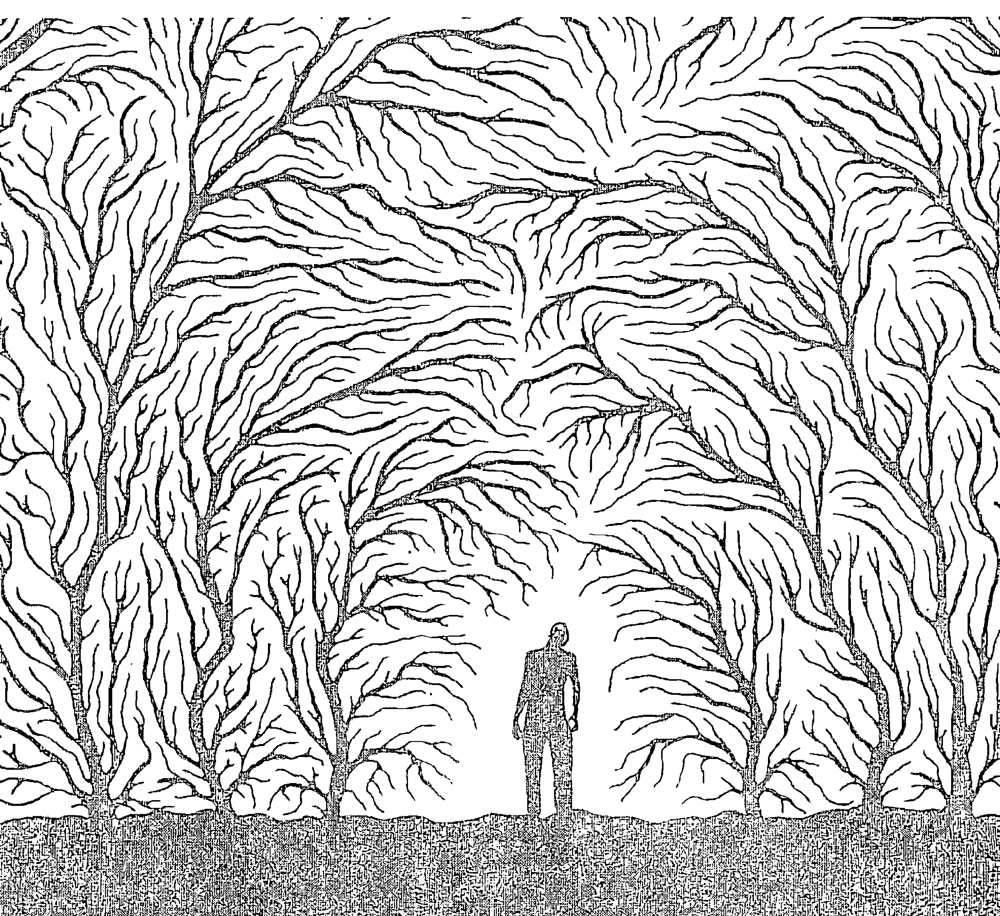
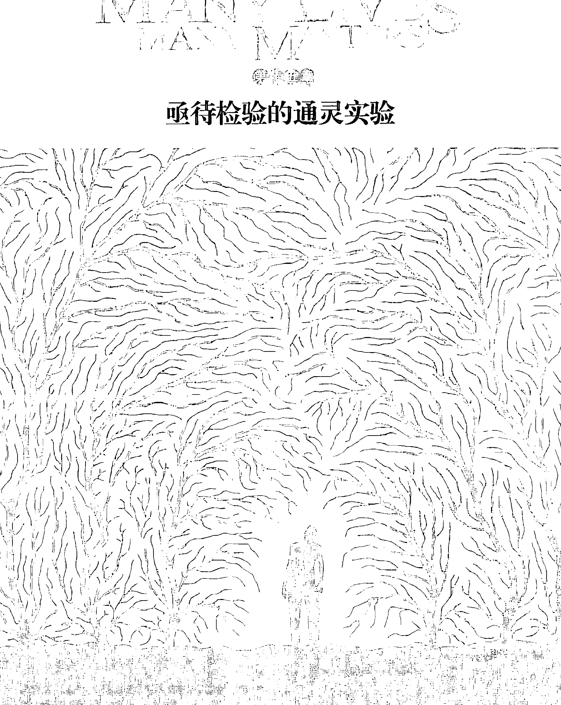

# MANY LIVES MANY MASTERS
# 前世今生
## 16堂生死启蒙课
[美]布莱恩·魏斯 著
谭智华 译

> 人生是无尽的，我们不曾死去，也从未出生。
> 我们只是度过不同的阶段，没有终点。
> 人有许多阶段，时间不是我们所看的时间，而是一节节待学的课。

凤凰出版传媒集团 凤凰联动
江苏人民出版社 FENGHONG

# 前世今生
## 16堂生死启蒙课
[美]布莱恩·魏斯 著
谭智华 译

凤凰联动
FENGHONG

# 图书在版编目(CIP)数据
前世今生：16堂生死启蒙课：修订本/（美）魏斯著；谭智华译.－南京：江苏人民出版社，2010.7
ISBN 978-7-214-05643-6
Ⅰ．①前… Ⅱ．①魏… ②谭… Ⅲ．①轮回－通俗读物 Ⅳ．①B94－49
中国版本图书馆CIP数据核字（2010）第146273号
江苏省版权局著作权合同登记：图字10-2008-315

> Many Lives, Many Masters: The True Story of a Prominent Psychiatrist, His Young Patient and the Past-life Therapy That Changed Both Their Lives
> Chinese translation copyright © 2008 by Jiangsu People's Publishing House
> Original English language edition Copyright by Brian L Weiss
> Simplified Chinese characters edition arranged with William Morris Agency, LLC., through Andrew Nurnberg Associates International Limited.
> ALL RIGHTS RESERVED

| 项目 | 内容 |
|------|------|
| 书名 | 前世今生——16堂生死启蒙课 |
| 著者 | [美]布莱恩·魏斯 |
| 译者 | 谭智华 |
| 责任编辑 | 丁 刘 |
| 特约编辑 | 欧阳勇富 |
| 出版发行 | 江苏人民出版社（南京中央路165号 邮编：210009） |
| 网址 | http://www.book-wind.com |
| 集团地址 | 凤凰出版传媒集团（南京中央路165号 邮编：210009） |
| 集团网址 | 凤凰出版传媒网http://www.ppm.cn |
| 经销 | 江苏省新华发行集团有限公司 |
| 印刷 | 三河市南阳印刷有限公司印刷 |
| 开本 | 880毫米×1230毫米 1/32 |
| 印张 | 7.5 |
| 字数 | 132千字 |
| 版次 | 2010年8月第2版 2010年8月第1次印刷 |
| 标准书号 | ISBN 978-7-214-05643-6 |
| 定价 | 25.00 元 |
(江苏人民出版社图书凡印装错误可向本社调换)

## 编者的话（新版）
人类对于未知的事物，总是心存恐惧的。进入二十世纪以来，伴随着全球气候变暖、环境恶化、火山爆发、地震和海啸频发，“末日情结”在空气里逐渐荡漾开来，“死亡”因此成为高频率使用的词汇。
人终有一死。但是在肉体消殒之后，是否有灵魂存在，人是否有来世，生命可否轮回？
布莱恩·魏斯的小说《前世今生》为我们做出了回答。1980年，美国著名科学家、心理学医生布莱恩·魏斯接待了女病人凯瑟琳，在催眠治疗中发现了生死轮回的秘密，学到了绝无仅有的生死课程，生活从此改观。于是，他顶着社会舆论的压力，冒着声名狼藉的风险，将其治疗过程写成此书。
该书甫一面世，就连续96周雄踞美国佛罗里达州畅销书排行榜，迅速引爆欧美文化圈，旋即译成数十种文字，风靡全球，仅台湾版销量就达到500,000册！在这本书里，魏斯客观地记录下他的治疗全过程，希冀借此来让大家了解他所知道的不朽和生命的意义。
海德格尔在《存在与时间》里提到了人的两种存在状态：“没有死亡意识”的世界和有“灵犀意识”的世界。前者指的是，人在迷恋世俗生活中的名利时，人为地屏蔽掉“死亡”或者将“死亡”看成“一了百了”的解脱，活在“没有死亡意识”世界里的人，往往活得不太真诚。后者则指的是，人认识到肉体的脆弱之后更加了解活着的责任，因而积极真诚地生活，人因此而变得有灵性。本书正是以催眠之后的凯瑟琳为通道，试图让人们看到这样两个存在着的世界，表达出这样的生命意识：
> “我们是如此忧惧于自己的死亡，有时甚至忘了活着的真正目的。”
> “我们都有必须偿还的债。要是没有还完，就得带着这些债到下一世去……在每一世，自己过的生活都是自己选的，要为自己负责。”
> “耐心和适当时机……每件事在该来的时候就会来。人生是急不得的，不能像许多人希望的时间表一样。人生是无尽的，我们不曾真的死去，也从未真的出生，我们只是度过不同的阶段，没有终点。人有许多阶段，时间不是我们所看的时间，而是一节节待学的课。”
这些话语并非传统的宗教价值观，而是对于生命的体认：每个人的道路基本上都是相同的，因此，我们要学会去除心中的恐惧，正视日积月累的负面力量；我们接近和我们磁场相似的人，也要去帮助其他人；我们要学会有信心，也要去相信别人；我们通过不断地学习，接近完满。正如台湾诚品网络书库所说，这是一场意外的精神苏醒的深刻诠释。

## 前言
凡事皆有其理由，也许事情发生的时候，我们既无先见之明，也不了解其中的原因，但假以时日和耐心，一切都会真相大白。
这就是凯瑟琳案例的情形。我初见她时是1980年，她27岁。她因焦虑、恐惧和痛苦的侵扰，踏进了我办公室寻求帮助。虽然这些症状自幼时起就如影随形地跟着她，但近来却逐渐恶化。她每一天都觉得情绪麻木，无法正常作息，处在一种低潮、沮丧的状况中。
与她那时的混乱生活相反，我的生活则一帆风顺，有美好而稳定的婚姻、两个小孩以及蒸蒸日上的事业。
从一开始，我的生活好像就在直线上前进。我在一个呵护备至的家庭中长大，学业的成就不太费力就能得来，在大二那年我即立志要成为一个心理医生。
我在1966年毕业于纽约哥伦比亚大学，然后进入耶鲁大学医学院，1970年拿到医学博士学位。先在纽约大学贝列弗医学中心实习，后转到耶鲁完成精神治疗的住院实习。结束后，我受聘到匹兹堡大学教书。两年后，我转到迈阿密大学领导精神药物部门。在那段时间，我在生物心理治疗领域得到了相当的认可。在大学教了4年书后，我升为心理治疗系的副教授，并被派为迈阿密一家教学医院的心理治疗科主任。当时，我已发表了37篇有关心理、精神领域的学术文章。多年有纪律的研究已把我的心智训练成科学家和医生的思考方式，把我往专业的保守主义窄路上推，我不相信任何不能以传统科学方法证明的事物。我知道美国各主要大学都在进行灵学研究，但我没有在意——那些对我都太遥不可及了。
然后我遇到了凯瑟琳。花了18个月的时间做传统心理治疗，想减轻她的症状。当一无所获时，我尝试用催眠疗法。在一连串的催眠治疗状态下，凯瑟琳记得了引发她症状的“前世”回忆。她同时也能做“管道”，传达一些高度进化的“灵魂实体”的讯息，通过她，我知道了许多生与死的秘密。在短短几个月内，她的症状消失了，过得比以前更快乐、更平静。
凭我的知识背景，我对这种情况简直一无所知。当讯息一点点地揭示出来，我感到全然讶异。
我对于眼前发生的事并没有一个科学的解释，它不是人类心智可以了解的，而且远远超过我们想象的范围。也许，在催眠下凯瑟琳可以集中注意力于潜意识储存的前世回忆；也许，她能捕捉到精神分析大师荣格（Carl Jung）所谓的“集体无意识”，它是我们周围的能量来源，包含了人类全体的记忆。
科学家开始找寻这些答案。我们作为社会的一分子，在这些研究中都可大大受益，它将解开我们的心智、灵魂、死后延续的生命等种种谜团，以及前世经验对我们今生行为的影响。显然地，歧见很多，尤其是在神学、哲学、心理治疗和医药领域。
无论如何，这方面的科学研究才刚萌芽，步调很慢，又不断遭遇科学界及外界的阻力。
从历史看来，人类总是不情愿接受新观念。伽利略发现木星的卫星时，同时代的天文学家完全不接受，甚至连看都不愿看一眼，因为这抵触了他们原先的信念。现在的心理医生和治疗师也是同样情形，对前世回忆和肉体死亡后的生存，即便已累积了相当多的证据，也不愿检视评估。他们的眼睛仍紧紧地闭上。
这本书是我对进行中的灵学研究的小小贡献，尤其是探讨死后经验的支派。你所读到的每一个字都是真的，我什么也没有添加，除了不断重复的地方外，也什么都没删节，只稍微更改了凯瑟琳的身份，以保隐私。
我花了 4 年来写这本书，花了 4 年才鼓足勇气，甘冒专业的风险透露这些不正统的讯息。
某晚我在洗澡时，突然觉得非把它写下来不可。我有种强烈的感觉，时候到了，我不该再隐藏这些东西。我所得到的讯息本意就是要与人分享，而不是据为己有。从凯瑟琳而来的知识现在该借由我传出去，最好的结果就是：让大家都了解我所知道的不朽和生命的真义。
我从浴室冲出来，到书桌前坐定，望着那一叠凯瑟琳催眠时录的带子。在清晨的曙光中，我想起在我少年时去世的匈牙利祖父，每当我告诉他不敢冒险时，他总会慈爱地重复那句他最喜欢的英文口头禅：“管他的！”是的，管他的。

# 目录
### 编者的话（新版）/001
### 前言/003
### 第一章 我的生命被颠覆了/001
第一次见到凯瑟琳时，我完全不知道桌子对面这个饱受惊吓而困惑的病人，会把我的生活搅得天翻地覆，并且让我整个人也从此改观。
### 第二章 催眠疗法/007
我目瞪口呆，胃里隐隐作痛。临床经验告诉我，她并不是在幻想、在杜撰故事，她的思想、表情、对细枝末节的注意，和她清醒时的人完全不同。我觉得仿佛闯入了一个所知甚少的领域——前世轮回。
### 第三章 一两个钟头走完一生/017
我很快了解到，每日累积下来的负面力量应该受到同样的关注，譬如一个病人的严苛自我批评，可能造成比一件重大事故更严重的心理创伤。这些伤害的影响，因为混入了我们日常生活的背景中，更难被忆起或驱逐。一个持续自责的小孩，可能和记得某天被严重羞辱的孩子一样失去同样的自信。
### 第四章 已逝的父亲和儿子对我说话/031
死亡的恐惧力量惊人，处处可见人类对这种恐惧的逃避。我们是如此忧惧于自己的死亡，有时甚至忘了活着的真正目的。
### 第五章 “超意识界”的讯息/041
“我应该更有宽恕心，但我没有。我并未原谅别人对我不起我的地方，但我该原谅他们的。我并未宽恕。我把怨恨和怒气吞下，藏了好多年……我看到眼睛……眼睛。”
### 第六章 未知死，焉知生/057
我会看看我的孩子和太太，揣想前世是否我们也在一起。我们选择要共商此生的喜怒哀乐吗？我们是没有年岁的吗？我对他们感到无比的温柔和爱。了解他们的缺点和过错并不重要，爱才重要。
### 第七章 3500年前，你是我舅舅/067
我看到建筑物，有圆柱的建筑物，这里有好多建筑物。我们在室外，周围有树，是橄榄树，很美。我们在看什么东西……人们戴着奇形怪状的面具，遮住他们的脸。
### 第八章 遇见永生的自己/079
“耐心和适当时机……每件事在该来的时候就会来。人生是急不得的，不能像许多人希望的时间表那样。我们必须接受凡事来临的时间，不要强求。但人生是无尽的，我们不曾真的死去；也从未真的出生。我们只是度过不同的阶段，没有终点。时间不是我们所看的时间，而是一节节待学的课。”
### 第九章 死亡笔记/091
某女心理学博士从没有告诉过任何人，第一次去罗马时穿梭在大街小巷里，仿佛记忆中有张地图，她准确无误地知道，下一个转角会是什么。虽然她以前没去过意大利，也不会意大利语，却不断有意大利人对她讲意大利语，误认为她是当地人。
### 第十章 爸爸，我爱你爱了四万年/109
想到未来的讯息，我不禁心中一颤。她对于过去说得如此正确，通过前辈大师，她知道那些特别私密的事件。那么，他们也知道未来吗？果其如此，我们能分享这未来的知识吗？我心中涌起上千个问题。
### 第十一章 末日大预言/129
凯瑟琳拥有的是何等的天赋——能够看穿生命、看穿死亡，和“神祇们”说话，分享他们的智慧。我们在吃知识树的苹果，只是它不太多了，我怀疑还剩下多少只苹果。
### 第十二章 “欠与偿”/145
“你看起来好美，我只是想告诉你这个。”他们会这么说。凯瑟琳像个渔夫，用一条看不见的钓线把大家拉过来。而她以前在同一个餐厅吃了几年，却没有人注意到。
### 第十三章 他们说我活过86次/161
“是的，某种白衬衫、棕色短裤和有大扣带的鞋子……我将来会成为一个水手，但现在还不是。”她能看得到未来，但此举也使她一下跳到未来。
### 第十四章 课业完成/173
冬去春来，凯瑟琳又到我这里挂了号。她一直重复做一个梦，梦见某个宗教把蛇放在瓮里作为祭品，她和其他人被丢进瓮里。她试图用手攀住粗糙的壁面爬出来，蛇就在她下方，到了此刻她就惊醒了，胸口狂跳。
### 第十五章 亟待检验的通灵实验/177
我对艾瑞丝描述的前世细节，惊讶得说不出话来。它和凯瑟琳回忆的相关性，十分惊人——克利斯群在海战中手的受伤及衣服、鞋子的描述；露伊莎做西班牙妓女的一生；阿郎达和埃及的葬礼；约罕做强盗时被史都华的化身刺了喉咙；艾瑞克，那个倒霉的德国飞行员及其他。
### 第十六章 我能治疗痛苦的众生，但是我好累/183
“我该怎么做？”我在一个梦中问过，“我知道我能治疗痛苦中的人，他们的人数多到我处理不了，我好累。可是当他们这么需要我，我能说不吗？说‘不行，已经够多了’这样对吗？”
### 结语/191
### 附录/193
- 一、浏览千年万年的我
- 二、我看“前世今生”
- 三、前世与今生的交会——《前世今生》座谈会

## MY LIFE, MY TRIALS
### 我的生命被颠覆了

## MANY LIVES, MANY MASTERS
# 前世今生
第一次见到凯瑟琳时，她穿着一件很好看的深红色时装，在候诊室里紧张地翻着杂志。在此之前的 20 分钟，她在精神科外面的走廊来回踱步，说服自己依约赴诊而不逃走。
我到候诊室招呼她，和她握手。她的手又湿又冷，证明了方才的焦虑。事实上，虽然有两个她信任的医生大力推荐，但她还是花了两个月时间才鼓足勇气来看我。
凯瑟琳是个外表十分有吸引力的女子，中等长度的金发，淡褐色的眼睛。那时，她在我任精神科主任的同一家医院的实验室里做化验员，并兼做泳装模特儿赚外快。
我领她进诊疗室，穿过躺椅来到一张靠背皮椅前。我们隔着一张半圆办公桌对坐。凯瑟琳向后靠在椅背上，沉默着，不知该从何说起。我等着，希望由她来选择话题。但几分钟后，我开始询问她的过去。第一次会面，我即试图理清她是谁、为什么来看我这些问题的头绪。
在回答中，凯瑟琳逐渐向我透露了她的生平。她生长在麻省小镇一个保守的天主教家庭中，排行老二。哥哥比她大 3 岁，擅长运动，在家中享有她所没有的自由。妹妹则是父母最钟爱的孩子。
当我们谈到她的症状时，凯瑟琳明显变得焦虑而紧张。她说话很快，身子前倾，把手肘靠在桌上。她一直都为恐惧所扰。她怕水、怕卡到喉咙，怕到连药丸都不敢吞的地步；怕坐飞机、怕黑，更怕死这个念头。近来，她的恐惧有愈演愈烈的趋势。为了得到安全感，她常睡在大得够一人躺下的衣橱里，每晚要经过两三个小时的辗转反侧才能入睡。虽是睡了，但睡不熟，总是断断续续，很容易被惊醒。小时候常犯的梦游和做噩梦的症状也复发了，当这些恐惧和症状愈来愈困扰她时，她的情绪也就愈加沮丧。
凯瑟琳陈述这些经过时，我看得出她受的折磨有多深。多年来，我帮助过不少像她这样的病人克服恐惧的威胁，也很有信心能帮凯瑟琳渡过难关。因此，我打算让她从童年谈起，找出问题的根源。通常，这种洞察可以使人减轻焦虑。如果有必要，她的吞咽不那么困难的话，我会给她服一些抗焦虑的药，使她舒服一点。这是教科书上对凯瑟琳此类症状的标准处置。曾经我也从不迟疑地就给病人开安眠药，甚或抗忧郁剂，但现在我尽量少用了，要开也只开短期的。因为没有什么药能对这些症状的病根有所帮助，凯瑟琳和其他类似的病人证明了这一点。现在我知道必定有根治的方法，而不只是把症状压下去。
第一次会面中，我尽量不着痕迹地把话题往她的童年推。由于凯瑟琳对童年的事记得的出奇得少，我考虑用催眠来追踪。她记不得童年有任何大的心灵创伤，足以造成今日的恐惧。

## Many Lives Many Masters 前世今生
当她竭力去回想时，才能忆起一些零碎的片断。5岁时，有人把她从跳板推到游泳池里，使她吓得魂飞魄散。不过她说，即使在那个事件之前，她在水里也从来没有舒服过。11岁时，她母亲突然变得很沮丧，无法过正常的家庭生活。去看心理医生的结果，是接受了电击治疗，这些治疗使她母亲几乎丧失记忆。这个经验吓坏了凯瑟琳，不过，随着母亲病情的好转，逐渐恢复自我，她的恐惧也消散了。她父亲有长期酗酒的恶习，有时凯瑟琳的哥哥得去酒吧寻回烂醉如泥的父亲。酗酒也使他常对妻子动粗，于是她母亲变得更加阴郁退缩。但是，凯瑟琳只把这些事当做无可奈何的家庭纷争。
外面的世界情况好些。她在高中开始约会，她很容易和朋友打成一片，其中大多数是认识多年的伙伴。不过，她发现自己很难相信别人，尤其是自己小圈子以外的人。
她的宗教观念单纯而没有疑义。从小就被灌输传统天主教义理和习俗，她从来没有真正质疑过它的可信度和有效性。她相信一个恪守教义和礼俗的好天主教徒，死后将得到上天堂的赏赐；否则，将会遭受地狱之苦，掌握权柄的上帝和他的独子会做最后的审判。我后来知道凯瑟琳并不相信轮回——事实上，她很少接触印度教的东西，根本不清楚这个观念。轮回是和她从小被灌输的观念完全相反的东西。她也从来没读过有关超自然或玄秘世界的小说，因为没兴趣。她安全地活在信仰中。
高中毕业之后，凯瑟琳修完了一个二年制的专业课程，成为实验室化验员。由于有了专长，又受到哥哥搬到佛罗里达州坦帕地(Tampa)的鼓励，于是她在迈阿密大学医学院的附属教学医院找了一份工作，在1974年春天，21岁时搬到迈阿密。
和大城市比较起来，以往的小镇生活虽容易、单纯些，但凯瑟琳庆幸自己逃离了家庭问题。
她在迈阿密的第一年，便认识了史都华——已婚，是个犹太人，并有两个小孩，但和她以前交往过的任何男孩子都不同。他是个成功的医生，魁梧而带侵略性。他们之间产生了不可抗拒的“化学作用”，但这段婚外情走得坎坷而崎岖。他的某些特质深深吸引着她，使她无法自拔。凯瑟琳开始做治疗时，她和史都华的关系已到第六年，虽然时有争吵，但感情仍是鲜活的。凯瑟琳对他的谎言和操纵怒不可遏，但仍然离不开他。
来看我前几个月，凯瑟琳动手术切除了声带上的一个良性瘤。手术前她就忧心忡忡，动完手术在病房醒过来时，她更吓坏了。医护人员花了几小时才使她平静下来。出院后，她去找爱德华·普尔大夫，他是一个和蔼可亲的小儿科医生，凯瑟琳工作时认识的。他们一见如故，很快就建立起友谊。凯瑟琳可以对他畅所欲言，包括# MANY LIVES MANY MASTERS
前世今生

她的恐惧、和史都华的关系，以及愈来愈失控的焦虑等。他坚持要她来看我，而且不是别的心理医生——就只是我。爱德华打电话告诉我这回事时还强调，虽然别的心理医生也训练有素，但他认为只有我能充分了解凯瑟琳。不过，凯瑟琳并没有打电话来。

8个星期过去了，繁忙的精神科主任职务，使我很快忘了爱德华那个电话。凯瑟琳的症状却愈来愈严重。外科主任法兰克·艾可医生几年前就认识凯瑟琳，偶尔在实验室碰面时他们还会开开玩笑，他注意到了她近来的不快乐和紧张，有几次想跟她谈谈，但都半途打住了。一天下午，法兰克开车到一家小医院去演讲，在路上，他巧遇正开车回家的凯瑟琳。把她招到路边后，法兰克从车窗里大叫：“我要你马上去看魏斯医生，别再拖了！”

凯瑟琳的焦虑和痛苦愈来愈频繁，而且每次发作持续的时间越来越长。她开始做两个重复的噩梦。其一，她开车经过一座正崩塌的桥，车子掉进水里，她出不来，快要淹死了。第二个梦是她在伸手不见五指的房间里，不断被绊倒，可是找不到出路。最后，她终于来看我了。

第一次见到凯瑟琳时，我完全不知道桌子对面这个饱受惊吓而困惑的病人，会把我的生活搅得天翻地覆，并且让我整个人也从此改观。

## 第一篇

## 催眠疗法

18个月的密集心理治疗过去了，这期间凯瑟琳每周来看我一两次。她是个合作的病人，坦率、有主见，而且渴望痊愈。

那段期间，我们深入探讨了她的感情、思想和梦境。她固定的一些行为模式使她领悟和了解了许多事情。她记起了过去更多重要的细节，例如她跑船的父亲常不在家，酒后会对母亲拳打脚踢等。她更清楚自己和史都华的狂乱关系，也更能恰当表达她的愤怒。我感觉她现在应该好多了。通常病人如果能记起过去的不愉快，并能从更高、更远的视角来洞悉这些事，总会进步许多，但凯瑟琳并没有。

她仍然深受焦虑和痛苦的折磨。栩栩如生的噩梦一再重复，她仍然怕黑、怕水、怕被锁起来。睡眠也依旧断断续续，得不到休息。她开始有心悸，仍然不肯吃药，怕喉咙被卡住。我觉得我遇到了一堵墙，不管怎么做，它仍然高得让我无法爬过去。不过，随着挫折感的来临，我更有一股不甘罢休的决心。不论怎样，我得帮助凯瑟琳。

接着一件怪事发生了。虽然她很怕搭飞机，每次都要喝好几杯酒强使自己镇定，但是仍在1982年春天和史都华一起飞到芝加哥参加一个医学会议。到了那里，她硬要他陪着去参观博物馆的古埃及文明展。

凯瑟琳一直对古埃及文物和古迹复制品有兴趣。她绝不是个学者，她没研究过那段时期的历史，可是这些东西却使她有种熟悉感。

当导游开始解说展出的文物时，她发现自己竟然可以纠正他——而且她是正确的！导游很惊诧，凯瑟琳则目瞪口呆。她是怎么知道这些事的？她为什么如此强烈地感觉自己是对的，而在大庭广众之下纠正解说员？也许这些是她忘记的童年回忆？

那次回来后，她告诉我发生的事。几个月前，我就向凯瑟琳建议过催眠治疗，但她害怕，一直不愿意。现在由于古埃及展的经验，她勉强同意了。

## 第二章 催眠疗法
Chapter Two

催眠疗法是帮助病人想起早已遗忘的事件的绝佳办法。它本身没什么神秘的，只是一种集中注意力的状态。在受过训练的治疗师引导下，病人慢慢放松身体，使记忆集中。我催眠过上百个病人，发现它对减轻焦虑、恐惧，改掉坏习惯很有效，还能帮助病人想起被压抑的事件。有时，我能成功地让病人追溯到两三岁，回想起早已遗忘，但却对现在生活投下阴影的经验。我相信催眠疗法能帮助凯瑟琳。

我让她躺在长沙发上，眼睛半闭，头枕在小枕头上，把注意力集中在呼吸上：每一次吐气，释放出一些长期积压的焦虑；每一吸气，又放松了一点。做了几分钟后，我要她想象自己的肌肉正慢慢放松，从脸部肌肉到下巴，然后是脖子、肩膀、手臂，再后来是背部肌肉、胃肌，一直到她的腿，她感觉到全身逐渐地沉到沙发里。

然后我要她想象体内有一道白光，起初是在头顶。慢慢地，白光逐渐扩散到全身，使每根肌肉、每条神经、每个器官都放松下来，沉浸在松弛、安详的状态中。她感到愈来愈困，愈来愈安静。最后，在我的引导下，白光充满了她全身。

我慢慢由十倒数到一，每念一个数字，她的松弛程度就加深一层，更接近睡眠状态。她可以专注于我的声音，而排除其他背景杂音。数到一时，她已沉入适当的催眠状态。整个过程大约花了20分钟。

一会儿后，我要她回溯从前，记起童年的事。她可以听见我的话并回答问题，而同时保持在催眠状态下。她记起6岁时在牙医那儿的可怕经历，也能生动地描绘5岁时被人推下游泳池的情景，她当时呛了水，一直咳嗽，说这件事时也在我办公室里咳起来。我告诉她这件事已经结束了，她已不在水里。咳嗽停了，她恢复正常的呼吸，同时仍在深深的催眠状态中。

3岁时，发生了一件最糟糕的事。她记起一天晚上，父亲闯进她漆黑的房间。他当时浑身酒味，她现在还闻得到。他抚摸她，甚至触及下体。她吓坏了，想哭，他用粗大的手掌盖住她的嘴，令她难以呼吸。24年后的今天，在我诊疗室的躺椅上，凯瑟琳开始抽泣。我感到我们找对了门，就可以长驱直入了。我确信她的症状从此会迅速地复原。我轻轻告诉她那个经历已结束了，她现在并不在那个房间里，而在安静地休息。抽泣停了。我把时间向前推，到她现在的年纪。在指引她苏醒后，我要凯瑟琳尽力回想她在催眠中告诉我的事。那次会诊剩下的时间，我们讨论了她对于父亲的回忆，我试着帮助她接受这个“新”事件。她现在比较明白自己和父亲的关系了，明白他的一些反应和疏远，及自己对他的恐惧。凯瑟琳离开诊疗室时还在发抖，不过我知道她新获得的认知值得让她忍受这短暂的不舒服。

在揭开她痛苦、压抑回忆的戏剧化过程里，我完全把古埃及文物和她童年可能的相关信息忽略过去了。但是，记起一些可怕的事件至少可以使她更了解自己的过去。我相信她的症状会因此大有进步。

但是，一星期后她告诉我，什么也没有改进！我很惊讶，不了解是什么地方出了错。难道是3岁以前的事？我们已找出她怕水、怕黑、怕呛到的充足理由，为什么这些症状及无法控制的焦虑还时时困扰她？她的噩梦和从前一样扰人。我决定让她进一步回忆。

在催眠中，她用缓慢而优雅的细语讲话。也因为如此，我才有办法即刻逐字记下来。（省略号是她讲话时的停顿，并非我的删除或改编。不过，重复的地方不包括在内。）

慢慢地，我把凯瑟琳带到两岁的时候，但那时没有什么重大的事情发生。我清楚而坚定地指示她：“回到你症状开始的那个时间。”但我对接下来的事完全没有心理准备。

> “我看到白色阶梯通往一个建筑，一栋有柱子的高大的白色建筑，没有门廊。我穿着一件长袍……一种质地粗糙的宽大袍子。我的头发结成辫子，是长长的金发。”

我迷糊了，不能确定发生了什么事。我问她当时是几岁，她叫什么名字。

> “我叫阿朗达……18岁。我看到建筑物前有一个市场。许多篮子……每个人都把篮子架在肩膀上走。我们住在山谷里……没有水。时间是公元前1863年。这附近土地贫瘠多沙，很热。有一口井，但没有河，水是从山上来的。”

她说了更多地形等相关的细节后，我要她再往前几年，长大一些，然后把看到的告诉我。

> “一条石子路旁有许多树。我看到煮东西的火。我的头发是金色的，穿一件长而粗大的棕色袍子，凉鞋。我25岁，有一个女儿叫克莉斯塔……她是瑞秋（瑞秋是凯瑟琳的侄女，她们一向过往甚密）。天气好热。”

我目瞪口呆，胃里隐隐作痛。房间里冷了起来。她在催眠中所叙述的一切都很确定，并不迟疑。名字、日期、衣服、树——都如此生动！到底是怎么回事？她那时的女儿怎么又是现在的侄女？我更糊涂了。我看过上千个病人，也做过许多次催眠治疗，却从没遇到过这样的幻想——即使在梦中也没有。我指导她回溯到死亡的时候。我并不清楚要怎么引导一个在如此幻想（或记忆）中的人，只是尽力朝造成恐惧的原因着手。接近死亡时候的一些事件，可能是特别怕人的。在她接下来的叙述中，显然有场洪水袭击了她们的村子。

“大浪卷倒了树，没有地方跑。好冷，水里好冷。我必须救救我的孩子，可是办不到……必须紧紧抱住她。我淹没在水里，呛到了。我不能呼吸，不能吞咽……咸咸的水，把孩子从我的手臂中卷走了。”凯瑟琳喘着气，呼吸有点困难。突然间她全身都放松了，呼吸变得沉缓平静。

“我看到云……孩子在我身边，还有其他村里的人……我看到我哥哥。”

她暂停一段时间，这一世结束了。她仍在催眠状态下。我目瞪口呆！前世？轮回？我的临床经验告诉我，她并不是在幻想、在杜撰故事，她的思想、表情、对细枝末节的注意，和她清醒时的人完全不同。所有有关心理治疗诊断的理论在我脑海里闪过，但都不能合理解释她的心理状态和性格结构。精神分裂症？不，她从来没有错乱的迹象，也从来没有任何幻听或幻觉等症状。她并非那种沉浸在幻想世界、和现实搭不上边的人；她并没有多重或分裂人格。只有一个凯瑟琳，她也完全清楚这一点。她并没有厌世或反社会倾向，她不是演员，她没有服用药物或吃迷幻药，喝的酒也很少。她并没有心理或精神上的疾病可以解释刚才催眠时那段生动的经验。

这一段记忆，是从哪儿来的？我觉得仿佛闯入了一个所知甚少的领域——轮回和前世回忆的领域。我告诉自己，这不可能：我受科学训练的理智抗拒这种想法。但它确实存在，就在我眼前发生。我无法解释它，但也不能否认它的真实性。

> > “继续，”我说，有点胆寒但又无限好奇，“你还记得什么？”

她还记得其他两辈子的一些片断。

> > “我穿一件有黑色蕾丝的裙子，黑灰色的头发上也绑着蕾丝带。时间是公元 1756 年。我是个西班牙人，56 岁，名叫露伊莎。我正在跳舞，其他人也在跳舞。（停了很久）我病了，发烧，冒冷汗……很多人都病了，快死了……医生并不知道病源是从水里来的。”

她再向前推，“我康复了，可是头还在痛；眼睛也还没完全从发烧中恢复过来……很多人死了。”

后来她告诉我，这一世她是个妓女，因为感到很羞愧所以迟迟没有说出来。显然地，在催眠中凯瑟琳也能评判一些她透露给我的讯息。

在回忆另一世时，由于凯瑟琳曾经在前世中认出了她的侄女，所以我不禁问她，我是否也出现在其中？如果有的话，我很好奇当时我扮演了什么角色。和刚才缓慢的回忆相反，她一下就回答出来了。

> “你是我老师，坐在窗台上。你教我们书上的知识。你很老，生出灰发了，穿一件有金边的白袍……你的名字叫狄奥格尼斯。你教我们符号、三角。你很有智慧，可是我不懂。时间是公元前1568年。”（这大约比著名的希腊犬儒学派哲学家狄奥格尼斯早了1200年，不过狄奥格尼斯在当时是个常用的名字。）

第一回合结束，后面还有更多惊人的回忆。

凯瑟琳离去后的几天里，我都在思考她催眠中讲的话。我习于沉思，“正常”会诊中浮现的细节都很难逃过我的分析，更何况她的特异例子。此外，我对死后的生活、轮回、躯体外的经验及相关现象，都持怀疑的看法。我心中逻辑的部分告诉我：这有可能是她的幻想，因为我并不能真正证明她的观点或看见的东西。

不过我也隐约意识到一个想法，就是要持开放态度，真正的科学乃是从观察开始。她的“回忆”有可能不是幻想或想象，我们眼睛或其他感官感觉不到的事物也有可能存在，持开放态度可以收集到更多的资料。

我有一个杞人忧天的想法，凯瑟琳会不会拒绝再接受催眠？我决定暂时不打电话给她，让她也好好消化这个经验。一切等到下星期再说吧！

## 一两个钟头走完一生

一个礼拜后，凯瑟琳步伐轻快地踏进我的办公室。该先说明，她看起来比过去更靓丽，更有光彩了。她很高兴地告诉我，长久以来害怕溺水的恐惧没有了，怕吞咽的情形也减少了许多，睡眠不再被坍桥的噩梦打断。虽然她记得前世的一些细节，但还无法把它们拼凑成一个整体。

前世和轮回的观念与她的宇宙观并不相容，但她的记忆是那么鲜明，那些景象、声音、气味那么清楚，这经验太强而有力了，以至她感到自己必定曾去过那里。但她也不禁忖度，这个新发现要怎么和她的教育与信仰合在一起。

那个礼拜中，我把在哥伦比亚大学念“比较宗教”的教科书拿出来看，结果发现，《旧约》和《新约》都曾提到过轮回的观念。公元325年，罗马君士坦丁大帝和他母亲海伦娜下令删掉了《新约》中提及轮回的部分。而公元553年君士坦丁堡的第二次会议证实了确实有此行动，并把轮回观念作为异端邪说。显然地，他们认为“人不只有一辈子可以寻求救赎”的说法会削弱教会的力量。但是，原始的资料提到早期的神父确实接受轮回观念。公元2世纪兴盛的早期基督教的一支诺斯底教(Gnostic)教徒——亚力山大的克莱蒙、奥瑞根、圣杰若米，和其他许多人都相信他们曾有前生，并会有来世。

但是，我从不相信轮回这件事。事实上，我没有花过多少时间思考这个观念，虽然早年的宗教训练中隐约提及死后“灵魂”的存在，但我没有真的深信过。

我是家里四个孩子中的老大，每个孩子间隔 3 岁，我常是和事老和仲裁者。我们家在新泽西州沿海一个小镇，属于一个保守的犹太教区，父亲比其他家庭成员更潜心于宗教，他把宗教看得很严肃，就像他看待任何世事一样。孩子的学业成绩是他最大的喜悦。他很容易被家中琐事或冲突惹恼，然后就会撒手不管，由我来调停。虽然这对心理治疗的生涯是极佳的职前训练，但是回忆起来，我宁可童年时不负担那么多。我因此变成一个严肃的年轻人，一个习惯担负过多责任的人。

我母亲总是能适时表达爱意，不像父亲那么严肃沉重，他常用一些罪恶、殉道的观念来吓唬我们。她很少忧郁，我们总是可以从她那儿得到爱和支持。

我父亲是个商业摄影师，算是不错的工作，虽然吃穿不缺却没有多余的钱。我最小的弟弟彼得出世后，一家六口要挤在一所只有两个小小房间的公寓里。

小公寓里的生活是忙碌与嘈杂的，我总是逃进书本里。要是没去打棒球或篮球，我就不停地读书。这个小镇虽然有安逸的环境，但我知道教育是唯一的出路，我的成绩也总维持在班上前两名。

接到哥伦比亚大学的全额奖学金时，我已是个严肃而勤勉的年轻人，学业上的成就始终十分顺利。我主修化学，毕业时是荣誉学生。我决定做一个心理医生，因为这领域结合了我对科学及研究人类心智的浓厚兴趣。此外，在医学界的工作可以让我表达对其他人的关心与同情。同时，一次暑假在喀斯提尔山旅馆打工时，我认识了卡洛，她既聪明又美丽。我们立刻被对方吸引，而且觉得很熟悉。我们继续联络、约会、恋爱，并在我大四那年订了婚，一切事似乎都很上轨道。很少年轻人会关心到生、死，或死后生命的事，尤其当一切都很顺利时，我也不例外。我所接受的是科学家的训练，善用逻辑、理性、实事求是的方法思考。

耶鲁大学医学院的课程和实习，更锻炼了我的科学方法。我的研究论文是关于大脑化学作用和神经传导元的角色。

我加入了生物心理治疗的新领域，它组合了传统心理治疗理论技巧和新的大脑化学科学。我写了很多篇科技论文，在地方和国家的会议上演讲，渐渐成为这领域中极具影响力的人物。我有点偏执、紧张、缺乏弹性，不过这些对于医生来说是有用的特点。我觉得对任何一个走进我办公室寻求治疗的人，都已做好了充分准备。

然后凯瑟琳成了阿朗达，一个曾经在公元前 1863 年生活过的女孩。现在她又出现了，比以前显得更快活。

我再度担心凯瑟琳也许不愿继续。但是，她却渴望再接受催眠，而且很快进入状况。

“我把花圈投在水上，这是一个仪式。我头发是金色的，梳成辫子。我穿一件棕色织金的袍子和凉鞋。有人死了，某个皇室人员……的母亲。我是皇家的仆人，负责准备食物。我们把尸体浸在盐水里30天，等干了，再把内脏取出来。我闻到了，闻到尸体的味道。”

她自动回到阿朗达的那一世，但去到不同部分，这次是清理死后的尸体。

“在栋分开的建筑物里，”凯瑟琳继续道，“我可以看到那些尸体。我们在包裹它们。灵魂从上面通过，每个人拿走属于自己的物品，准备去投胎。”她说的话像埃及人对死亡和再生的观念，和我们的信仰一点儿也不相同。在那种宗教里，你可以带走属于自己的东西。

她离开了那世，休息着。过了几分钟，又进入另一个显然是古代的轮回。

“我看到冰柱，垂在一个洞穴里……岩石……”她模糊地描述一个黑暗、凄惨的地方，现在她看来不太舒服。稍后她形容自己的样子，“我很丑，又脏，全身臭味。”然后，她又前往另一生。

“我看到一些房子及石头轮子的推车。我的头发是棕色的，用布包着。推车上有稻草，我很快乐。我父亲也在这儿……他抱着我……是……是爱德华（那个坚持让她来找我的小儿科医生）。我们住在一个有树木的山谷里，院子里有橄榄树和无花果树。人们在纸上写字，我看到许多有趣的符号，像字母。人们整天都在写，要弄一个图书馆。时间是公元前1536年。土地一片荒瘠。我父亲的名字叫帕休斯。”

年份不完全吻合，不过我不确定她是否又在回溯上周的那一世。我让她继续留在那世，但往前推。

我父亲认识你（指我）。你和他谈着收成、法律和政府。他说你非常聪明，我应该听你的话。”我让她再前进一点，“他（父亲）躺在一个漆黑的房间里，又老又病。周围很冷……我觉得好空虚。”她前进到她死亡的时刻，“现在我又老又虚弱。我女儿在身边，就在床旁。我丈夫已过世了。女儿的丈夫也在，还有他们的孩子。周围有好些人。”

这次她的死亡是安详的。她浮起来。浮起来？这令我想到雷蒙·慕迪博士（Dr.Raymond Moody）对濒死经验的研究。他的病人也记得浮起来，然后又被拉回自己的身体。我几年前读过这本书，现在打算重新看一遍。不知道凯瑟琳在死后还能记得多少事，但现在她只能说“我浮起来”。我把她叫醒，结束了这一节。

一时间，我对于任何已出版的有关轮回的科技论文，胃口变得奇大无比，几乎搜遍整个医学图书馆。我研读艾恩·史蒂芬生 (Ian Stevenson) 博士写的东西，他是弗吉尼亚大学精神治疗系的教授，在心理治疗方面出版了大量著作。他收集了两千名以上有轮回记忆和经验的儿童的案例，其中许多有外语能力，但他们根本没学过也没去过那些地方。他的案例报告都十分仔细完整，经过了谨慎的研究。

我读了艾德加·米歇尔 (Edgar Mitchell) 的一篇精彩论文，并以极大的兴趣检视公爵大学的 ESP (extrasensory perception，即超感官知觉、灵感) 资料，及布朗大学杜卡斯 (G・J・Dudasse) 教授的著作，并分析艾本 (Martin Ebon)、万巴赫 (Helen Wambach)、施迈德勒 (Getrude Schmeidler)、兰兹 (Frederick Lenz)、费尔 (Edith Fiore) 等博士的研究成果。我读得愈多，就愈想再读。我开始了解到，虽然我认为自己在人类心智各方面都有涉猎，其实懂得的还相当有限。许多图书馆里都有这类的研究成果和文字，却很少人知道。它们大半是由著名的医生和科学家处理、验证过的资料，证据似乎非常充足。但是，我仍旧抱着怀疑的态度，发现自己很难相信它们。

凯瑟琳和我，在各自的轨道上，都深深受到此经验的影响。她在情绪上获得改善，我则是扩展了心智的视野。凯瑟琳被她的恐惧折磨了好多年，现在终于感到些许轻松。不论那是真正的回忆还是……## 第三章 一两个钟头走完一生
前世今生

生动的幻想，我找到一个方法来帮助凯瑟琳了，而且不会就此停下来。

在下一次催眠进行前，她跟我讲到一个梦：在旧石阶上下棋，棋盘上有一个个洞。她觉得这个梦特别鲜明。现在我叫她往回走，超越时空的限制，回去看这个梦是否在她前世生活中有其根源。

“我看到通往一个塔楼的石阶……塔上可以俯瞰山峦，也可以俯瞰海洋。我是个小男孩……头发是金色的……奇怪的头发。我的衣服是短的、棕色白色相间、动物皮做的。塔上有几个男人……在守卫。他们很脏。他们在玩一种游戏，像下棋，但又好像不是，因为棋盘是圆形的，不是方形的。他们拿着尖尖的、像匕首样的棋子，插进盘上的洞。棋子上有动物头。这里是克各斯顿（音译）区，属于尼德兰（荷兰前名），约1473年。”

我问她住处的地名，以及是否看到或听到年份，“我现在住在一个港口，陆地延伸至海里。有一个碉堡……我看到一间小屋，我妈妈用泥瓦罐煮东西。我的名字叫约翰。”

她前进到死亡的时刻。在这节催眠中，我仍然在找有什么大的创痛能解释她今生的症状。即使这些异常清楚的景象是幻想（我不能确定此点），她所相信或认为的事物仍可能潜伏在意识中，导致她今天的症状。毕竟，我见过有人深深为梦所扰。有人记不清，究竟童年时真的发生过，还是做梦梦见的，但扰人的记忆一样萦绕着他们的成年生活。

我很快了解到，每日累积下来的负面力量应该受到同样的关注，譬如一个病人的严苛自我批评，可能造成比一件重大事故更严重的心理创伤。这些伤害的影响，因为混入了我们日常生活的背景中，更难被忆起或驱逐。一个持续自责的小孩，可能和记得某天被严重羞辱的孩子一样失去同样多的自信。一个平常家里会有一顿没一顿的小孩，跟经历过一段饥荒时期的孩子对食物有同样的危机意识。

凯瑟琳开始说话：“我看到船，像独木舟，漆成很鲜艳的图案。我们有武器，投石器、弓和箭，而且很大。船上有大而奇怪的桨，每个人都得划。我们可能迷路了，天色很黑，没有亮光。我很怕。我们旁边有其他的船（显然是一队袭击的人马）。我怕野兽。我们睡在又脏又臭的动物皮上。我们目前在侦察。我的鞋子很有趣，像布袋……动物皮做的……在脚踝处绑住。（停了很久）我的脸被火光照热了。我们的人在杀对方的人，但我没有。我不想杀人，把刀握在手上。”

突然间她喉咙咯咯作响，并急着吸气。她说一个敌方战士从后面扼住她的脖子，用刀划过她的喉咙。她在死前看到那个人的脸，是史都华。他那时长相不一样，但她知道是他。约翰死于21岁。

接着她发现自己浮在身体之上，并能看到底下的场面。她漂浮到云端，觉得困惑不解。接着她很快觉得自己被拉到一个“狭窄、温暖”的空间。她很快要出生了。

“有人抱着我，”她如梦呓般低语，“那个帮忙接生的人。她穿着绿袍，有白围裙，还戴白帽，在后面折起来。这房间有奇怪的窗子，好多边。房子是石头造的。我妈妈有长而黑的头发。她想要抱我。她穿着一件……粗粗的睡衣，摸上去会痛痛的。再度在太阳下晒得暖暖的，感觉真好……她……跟我现在的妈妈是同一个人！”

上次催眠中，我要她仔细观察前世中有没有今生里重要的人。许多研究宣称，一群灵魂会一次又一次地降生在一起，以许多世的时间清偿彼此的相欠。

在我安静、微明的办公室里，我尝试要了解这不为世人所知、我自己也十分陌生的领域，我很想证明它的可信度。我觉得需要应用科学方法来求证，那是过去15年来我在研究中严格要求的，现在该拿来评鉴凯瑟琳口中说出的这些不寻常的材料了。

在这段时间，凯瑟琳觉得自己通灵的能力更强了。她对事件和人的直觉后来都证实是对的。在催眠中，我的问题还没出口，她就知道是什么了。她做的很多梦都有预示性。

一次她父母来看她时，凯瑟琳的父亲对这些事表现出十分的怀疑。为了向他证明所言不虚，凯瑟琳带他到赛马场。在那里，就在他眼前，她挑出每次会赢的马，他目瞪口呆了。结果获得证实，她把所赢来的钱送给在街上遇到的第一个穷人。她直觉地认为，不该用这新得来的通灵能力获取报酬。对她而言，这能力有更深的意义。她告诉我，这经验有点吓人，可是她对眼前的进步太高兴了，很渴望继续下去。我对她的通灵能力又惊异又着迷，尤其是赛马场那一节，可说是唾手可得的证明。她等于握有每次比赛的胜券，这并不是巧合，过去数周来发生了极不寻常的事，而我得尽力维持我的客观。我不否认她的通灵能力。这些能力是真的，也能证明得出来，可是有关前世的事件是否也是如此？

现在，她回到刚刚出生的这一世。这次轮回似乎离现在很近，不过她无法辨认年份。她的名字叫伊丽莎白。

> “我现在大多了，有一个兄弟，二个妹妹。我看到晚餐桌……我父亲在那儿……他是爱德华（那小儿科医生，再度成为她父亲），我父母又在吵架了。晚饭是马铃薯和青豆。因为饭菜凉了，他很生气。他们常常吵架。我父亲总是喝酒……他会打我妈妈（凯瑟琳的声音听起来很害怕，身子也不由自主地颤抖）。他会推我们。他不像以前那样，简直不是同一个人。我不喜欢他，希望他走开。”她像个小孩那样讲话。

在这种催眠中，我的问话自然大不同于传统心理治疗中的问话。我扮演的角色更像是导游，要她在一两个钟头内走完一生，找寻可能对现世有影响的重大事件。传统的心理治疗比这详细、悠闲得多。病人说的每一个字都会被仔细分析，看有什么隐藏的意义。每个脸部表情、肢体动作、音调的变化，都得加以考虑评估。但是对凯瑟琳，数年的时间可能在几分钟里就过完了。她的状况像开着跑车以最高速度通过……并得在人群中找出认识的脸。

我把注意力拉回来，要她再把时间往前推。

“我现在结婚了。我们的家有一个大房间。我丈夫是金发，我不认识他（也就是说，他并未出现在凯瑟琳今生中）。我们还没有小孩……他对我很好。我们彼此相爱，过得很快乐。”显然她已逃出在父母家所受的压抑。我问她是否认得出所住的地区。

“布列尼顿。”凯瑟琳迟疑地低语道，“我看到有奇怪的老旧封面的书。大的那本用皮带绑起来，是圣经。上面印着大大的字……是盖尔语（爱尔兰语之一支）。”

她又说了些我无法听明白的话，不能确定是否就是盖尔语。

“我们住在内陆，离海很远，是……布列尼顿郡。我看到养猪和羊的农场，是我们的农场。”她确实是往前了，“我们有两个男孩……大的要结婚了。我看到教堂尖塔……是一栋很古老的石造建筑。”突然间她头痛起来，呻吟着按住太阳穴。她说她在石阶上跌倒了，不过后来痊愈了。她安享天年，死时家人都围绕在身旁。

死后她又浮出了身体，但这次并不觉得困惑、迷乱。

> > “我感到一道明亮的光，感觉很好，我可以从光里获得能量。”

她休息着，停留在一生与一生的“中间状态”。这样无声地过了几分钟。突然她开口说话了，但不是先前惯用的缓慢低语。她的声音现在沙哑而响亮，而且毫不迟疑。

> > “我们的目标就是学习，通过知识成为像神一样的存在。我们知道的事这么少，你在此是我的老师。我们借由知识接近神，然后可以休息。接着我们回来，帮助其他人。”

我惊讶极了。她在死后可以传达出教训，可以从“中间状态”传递讯息。但这讯息是从哪儿来的？听起来一点儿都不像凯瑟琳的话，她从未这么说话、用这种词汇，而且她的音调也截然不同。

我无法了解为什么凯瑟琳说出这些话，这不是她自己的思想，而只是转述别人对她说的话。后来她指出，高度进化、不具形体的灵魂，才是这些讯息的来源，他们通过她来对我说话。凯瑟琳不仅能回溯到前世，现在更能作为某种知识的“管道”。我竭力维持自己的客观性。

她向我引介了一个新的方向。凯瑟琳从未读过库博勒－罗斯 (Dr. Elizabeth Kubler-Ross) 或雷蒙·慕迪博士的著作，他们都写过关于死后经验的书。她也从没听过西藏的转世观念，但是她叙述的却是类似的经验，这也算是种证明。要是我能掌握更多细节、更多能证实的事实就好了。我曾经怀疑她在什么杂志上读过这样的文章，或在电视上看过类似的访问，虽然她极力否认，但也许多潜意识中还记着。不过，现在她更超越这些已有的记述，而从“中间状态”传达讯息回来。

醒来后，凯瑟琳一如既往，记得她前世的种种细节。但是，她却不记得伊丽莎白死后还有什么事情发生，也不记得任何“中间状态”说的话，只记得前世的生活。

> > “我们借由知识接近神”，现在，我们往这条路上走了。

## 第四章 已逝的父亲和儿子对我说话

> “我看到一幢正方形的白色房子，门前有一条铺着沙石的小路。骑马的人们来来往往，有许多树……一片农地。一幢大房子旁有好几间小的，像奴隶住的小屋。天气很热。这里是南方……弗吉尼亚州。”

凯瑟琳以她惯常的朦胧低语说着，她说年份是1873年。那时她是个小孩。

> “有很多马和农作物……玉米、烟草。”

她和其他仆人在大房子的厨房里做事。她是个黑人，名字叫艾比。她突然有个预感，肌肉僵硬起来。大房子着火了，她看着它在大火中倒塌。我要她继续讲述。

> “我穿着一件旧衣服，在二楼一个房间里擦镜子，这是一栋砖造的房子，有窗……窗子一格一格的。镜子凹凸不平，边上还有一个握柄。房子的主人叫詹姆斯·曼森。他穿着一件看上去很有趣的外套，中间三颗扣子，还有黑色的大领子。他留了胡子……我不认识他（指未曾出现在此世）。他待我不错。我住在他的领地上，平日负责打扫房间。领地上有一间学校，但我并未获准去念书。我还做奶油！”

凯瑟琳轻声地慢慢讲，很注重细节。下面的15分钟里，我学会了怎么做奶油。艾比搅拌奶油的知识对凯瑟琳而言也是新鲜的。我要她再往前。

> “我和一个男人在一起，但我们好像没结婚。我们同床共寝……但并不是一直住在一起。我觉得他还好，但没有很特别的感觉。没看到小孩，有很多苹果树和鸭子。其他人都很远。我在采摘苹果，有东西弄得我眼睛好痒，”凯瑟琳脸上肌肉扭曲了一阵子，“是烟。风往这边吹来……把烧木柴的烟也带来了。他们在烧木桶，”她现在咳嗽了，“这种事常有。他们把桶里的东西烧黑……沥青……铺在屋顶上防水。”

由于上周的精彩内容，我迫不及待地要她再进到“中间状态”。我们已经在她做仆人那一世花了90分钟了。听了很多铺床单、做奶油、烧木桶的事，我渴望获得一些精神方面的讯息。于是我没了耐心，要她回溯死亡的情景。

“好难呼吸。我胸口很痛，”凯瑟琳喘着气，显然相当痛苦，“心也痛，跳得好快。但我很冷……身体在发抖，”凯瑟琳开始打颤，“房间里有很多人，他们给我一种泡叶子的水（茶）喝，闻起来很奇怪。他们在我胸口擦一种药膏。我发着烧……但觉得很冷。”她静静地死去了，漂浮到房间天花板上，可以看见自己在床上的躯体，一个60岁老太婆的小而蜷缩的身体。她就这样浮着，等人过来帮她。接着，她感觉到一道光，并且被吸了过去。光愈来愈亮，我们静静等着，时间慢慢过去。突然间她到了另一世，是艾比之前的几千年。凯瑟琳轻轻地低语：“我看到好多大蒜吊在一间通风的房子里，味道很强，大家相信大蒜可以杀死体内的鬼怪，但必须每天吃。户外也有很多大蒜，晒在院子里。还有一些其他的药品……无花果、枣、槟榔干等等，这些药品能治病。我妈妈买了大蒜和其他药品，因为家中有人生病了。这些是奇怪的草根，可以含在口中，也可以塞入耳朵里，或其他有开口的器官里。

“我看到一个留胡子的老人。他是村里能治病的人之一。他会告诉你怎么做……这里有场……瘟疫……死了好多人。大家不敢为尸体熏香，因为怕传染。死人就这么埋掉，但村里人心里并不愉快，他们认为如此一来，灵魂就不能升天了（和凯瑟琳死后的说法相反）。但人们继续死去，也死了好多牛。水……洪水……人们因为洪水过后才得病的（她显然刚刚才了解了这是流行病）。我也因为水而得病。这种病使你的胃抽搐，它是肠胃方面的病，身体会丧失很多水分。我在河旁边，要提水回去，但就是这种水害死大家。我把水带回去，看到我母亲和我兄弟们。我父亲已死了，弟弟病得很厉害。”

我并没有再让她往前，而是停下来，想着她在这一世与另一世间大异其趣的死后观念。但她每次死亡的经验却很类似、一致。在过世的那一刻会有一个有意识的部分离开身体，漂浮起来，然后被吸向一道美好、能灌输能量的亮光。接着便等人来帮她，灵魂自动地升天。而熏香、葬礼或其他死后的程序和这都无关。它是自动的，无须任何准备，就像穿过一道刚开的门。

“土地很干，很贫瘠……附近看不到山，只有平地，很广阔干涸。我一个弟弟死掉了，我渐渐复原，但还是觉得痛，”她的话并不长，“我躺在一张小床上，盖了一些被单。”她病得很重，大蒜或其他药草也挽回不了性命。很快地，她就浮出躯壳之外，被吸往那道熟悉的光，她耐心地等候别人来帮她。

她的头开始摆向一边，又转到另一边，好像在看一幅宽广的风景。声音又再次变得沙哑而响亮。

“他们告诉我有很多神，因为上帝就在我们每个人心中。”

我从嗓音和坚定的语气知道她在“中间状态”。接下来她所说的，让我惊得大气都不敢出。

“你爸爸在这里，还有你儿子也在。你爸爸说你会认识他的，因为他名字是艾弗隆，而你女儿取的名字也和他一样。还有，他的死因是心脏病变。你儿子的心脏也不好，是反过来长的，像鸡心。他因非常爱你而为你做出重大牺牲。他的灵魂是很进化的……他的死偿了父母的债。同时他想让你知道，医药只能做到这个地步，它的范围是很有限的。”

凯瑟琳不再讲话，而我全身不能动弹，只想努力理清混乱的思绪。房间里冷得让人发麻。

凯瑟琳对我的个人生活几乎没有什么了解。我只在办公桌上放了一张女儿小时的照片，笑开的嘴里露出两颗乳齿。旁边是一张儿子的。除此以外，凯瑟琳不知道我家里或我过去的事。我受过良好的传统心理治疗教育，心理医生该维持一种空白的状态，让病人能自在地倾吐他的情绪、想法和态度，然后再仔细分析其中的曲折。我一向和凯瑟琳保持距离，她真的只知道我做医生的一面，而对我的私人生活无从了解。我甚至连执业证书都没有挂出来。

我这一生最大的遗憾是第一个儿子亚当只活了23天就夭折了，完全没预料到。当时是1971年初，他出生10天后我和妻子卡洛从医院回到家，他开始有呼吸的毛病，并不断呕吐，非常难诊断。“肺静脉循环不良，及动脉膈膜受损，”医生这么告诉我们，“发生的机率是大概每一千万名婴儿才有一例。”肺静脉原该带着饱含氧气的血液到心脏去，但接驳位置错误变成从相反的方向进入心脏。这就好比心脏是倒置的，真是非常、非常罕有的病例。

即便动了重大的心脏手术也挽回不了亚当，他几天后死了。我们难过消沉了好几个月，希望和梦想全黯淡下去。一年以后另一个儿子约旦出世，算是对我们的伤痛起了些安慰作用。

在亚当出生的那段期间，我正对是否选择精神医疗而举棋不定。我在内科实习期做得十分愉快，又有一个住院医生的空缺等着我。亚当的意外使我坚定选择心理治疗做终身职业。因为现代医学以其先进的技术和设备，竟不能挽回一个小婴儿的生命，令我愤慨。

我父亲的身体一向硬朗，直到1979年初第一次心脏病发作才亮起红灯，那时他61岁。虽逃过第一次发病，但他的心肌已严重受损，三天后终于不治死亡。时间大约是凯瑟琳第一次来看我前的9个月。

我父亲是一个信仰很虔诚的人，不过恪守仪式的成分大过精神超脱的层面。他的犹太名字艾弗隆比英文更适合他。他去世4个月后，我女儿出生，于是我给她取相同的名字以纪念故人。

现在，1982年，在我安静、微暗的诊疗室里，却有如振聋发聩的奥秘向我揭示开来，使得我双耳欲聋。我在精神的大海里泅泳，不过我爱这水。我手臂上起了鸡皮疙瘩。凯瑟琳不可能知道这些事，甚至也没地方可以查到：我父亲的希伯来文名字；我曾有个儿子，死于千万分之一几率的先天性心脏缺陷；我对医学界的看法；我父亲的死和我女儿的命名——太细微、太充分了，不可能是假的。如果她能说出这些事，是不是还能说出更多？我需要多知道一点。

> > “谁在那儿？”我问，“谁告诉你这些事？”

> > “大师们，”她轻声说，“前辈大师告诉我的。他们说我活过86次。”

凯瑟琳的呼吸平缓下来，头也不往两旁摆动了，她在休息。我原想要继续，但刚才她透露的讯息使我一时脑中千头万绪。她真的有过86次前世吗？还有“大师”？真的有这回事？我们的生命真的为一些不具有形体，但智慧超卓的大师主导？真的有一步步向上帝接近的道路吗？从她刚才揭示的情形来看，似乎很难怀疑这些观点，但是，要我相信却也很难。我必须扭转过去所积累的观念。不过，从理智到直觉，我都知道她是对的，她透露的是真理。

那么关于我父亲和儿子呢？在某种意义上来说，他们还活着，他们从未真正死去。葬礼过后那么多年，他们在向我说话，而且说出许多非外人所知的讯息要我相信，真的是他们。如果这些都是真的，那么我儿子，诚如凯瑟琳所言，是进化得很高的灵魂？他真的愿意为我们所生，为“偿债”仅仅活了23天，并且，为让我明白医药的限制，把我拉回心理治疗界？我深为这些念头震惊。但在我的胆寒之外，有一种巨大的爱萌出芽来，让我强烈地感觉与天地是一体的。我很想念我父亲和我儿子，能再听到他们的消息真好。

我的生命再也不会和从前一样了。一只手伸下来，扭转了我的轨道，再也回不去了。那些我读过的论文、研究，一一印证了它们的真实性。凯瑟琳的回忆和讯息是真的。我认为她正确的直觉也是对的。我找到了实据，得到了证明。

但是，即使有这刹那的欢愉和了解，即使曾有这神秘经验的片刻，旧日习惯的逻辑思考和怀疑仍然从中作梗。我会告诉自己，也许她只是特例，或凭借某种通灵的能力。虽然这能力本身已很可观，但并不足以证明轮回或灵魂存在。可是，我读过的上千个案例，几乎都呼应凯瑟琳的说法，比如能说外国语的小孩、前世致命的伤口成为今生的胎记、知道千里以外宝藏埋藏的地点、多年前某个特殊的事件。我了解凯瑟琳的个性和心性，知道她会做什么、不会做什么。不，这次我的心智不能再愚弄我。这些证明太强大有力了，它们是真的，凯瑟琳还可以在日后的诊疗中证明更多。

接下来的几周，有时我会忘记这次的力量与启示，有时我会陷进日常生活的轨道，担心平时会记挂的事。怀疑仍会浮上心头。似乎当心智不专注时，我仍倾向于过去的模式、思考和怀疑主义。但那时我会提醒自己——它真的发生过！我了解没有亲身经验要相信这些观念有多么困难。对于理性了解之外的情绪接受，经验是必要条件，但是经验的冲击总是随时日而消退。

起先，我不明白自己怎么变了那么多。我知道自己变得较有耐性而平和，别人告诉我，我看起来非常安详、快乐、镇定。我觉得生命中有更多希望、喜悦，更多目标和更多的满足。我明白自己不再有死亡的恐惧，不怕自己的去世或不存在，也比较不怕失去他人，虽然我会很想念过世的亲人。死亡的恐惧力量惊人，处处可见人类对这种恐惧的逃避：中年危机、与年轻人发生婚外情、整容、勤于运动健身……## MANY LIVES MANY MASTERS 前世今生

运动、累积财富、生小孩以延续自己的基因、费尽心机想变得年轻等等。我们是如此忧惧于自己的死亡，有时甚至忘了活着的真正目的。

我也变得不那么严肃执著，我并不需要时刻绷得紧紧的，不过虽然我不想那么严肃，这个改变还是有点困难，我要学的还很多。

现在我的理智确实开放了，愿接受“凯瑟琳所说是真的”的可能性。有关我父亲和我儿子的细节，是无法从旁的途径获得的。

她的知识和能力显然可以证明一种超凡的心灵能力。相信她是有道理的，不过我对一些通俗文学中的论调仍持怀疑看法。这些说得 出许多心灵现象、死后生命的人是谁？他们受过科学的观察和求证吗？虽然有此次经验，依着怀疑的个性，我仍会对日后每个新事实、 新资料做审慎评估。我会检查它们是否合于已建立的架构，会从每个角度去测试。但我也不能否认，架构已经在那里了。

## 第五章
### “超意识界”的讯息

我们仍在催眠状态中。凯瑟琳结束了前一世的休息，开始讲一个庙前的绿色雕像。我也从神游中回来，继续细听。她现在在远古时代，亚洲某个地方，但我的思绪还留在大师那里。真不可思议，我想。她在讲前世、轮回，可是比起大师透露的讯息，这些都变得无足轻重了。不过，我现在已了解，她得过完一世，才能行进到“中间状态”——“中间状态”是无法直接到达的。而只有在那儿，才见得到大师。

“绿色雕像在一间大庙前，”她轻声地说，“是一间有尖塔和雕饰的庙。前面是17级石阶。爬完石阶后进到一间小房间里。香在烧。没有人穿鞋。头发都剃成光头。他们脸圆圆的，眼珠是黑色，皮肤也很黑。我在那儿，因为脚受伤了来求助。我的脚肿起来，不能站立。脚里刺进了东西。他们放了一些草叶在我脚上……奇怪的叶子……丹宁斯？（她指的可能是单宁酸，某些树根、树皮或果实中的天然成分，因它的止血特性常在古代作药用）他们首先把我的脚洗干净，这是在众神像前完成的仪式。我的脚里有某种毒，因为踩到了什么不洁之物。膝盖肿起来，我的腿因受伤而非常沉重。他们在我脚上开了一个口，塞了一些热热的东西进来。”

凯瑟琳现在痛苦地蜷曲身体，同时似乎因喝了某种很苦的药而咳着。药是一种黄色的叶子泡的。她这次痊愈了，但腿和脚的骨骼再也 不能如从前活动自如。我要她再往前。她只见到大家过着一贫如洗的生活。她和家人住在只有一个房间的小屋里，连张桌子也没有。他们吃稀饭，从来没有吃饱过。她快速地老去，终其一生都没有脱离贫穷饥饿，然后死去。我等着，不过可以看出凯瑟琳已十分疲倦。但在我叫醒她之前，她竟说“罗勃·贾拉需要我帮助”，我不知道罗勃·贾拉是谁，也不知要如何帮助他。之后，她没有再说什么。

醒来后，凯瑟琳依然记得许多她前世生活的细节。但她对“中间状态”的事、大师所透露的讯息，则完全记不起来。我问了她一个问题。

“凯瑟琳，‘大师’这个词在你是什么意思？”她以为是高尔夫球赛用语！她现在进步多了，但对于整合新观念和原来的宗教上仍有困难。所以，我决定暂且不告诉她有关大师的事。此外，我不确定若告诉一个人他是“灵魂前辈”传达智慧的“管道”，那人会做何反应。

凯瑟琳同意下次催眠时我太太也在场。卡洛是一个受过良好训练、颇有技巧的心理治疗师，我希望听听她对这件事的看法。而且，自从我把我父亲和儿子亚当的事告诉她后，她也很想帮忙。凯瑟琳在叙说某一世的经验时，我逐字记下都没问题，但大师说话的部分则快得多，因此我决定用录音机录下实况。

## MANY LIVES MANY MASTERS 前世今生

一周后凯瑟琳来了，她继续有起色，恐惧和焦虑症状都减轻许多。她的进步是肯定的，但我不明白为什么好转这么多。她记得阿朗达时代的溺水、做约罕时候咙被刺、做路伊莎时死于水传染的流行病及其他大小骇人事件。她一次又一次经历贫穷、仆役的生活和来自家庭的虐待。在家中日日累积的一些小伤害也足以对心理造成重大影响。对前世及此生童年的正视，或许有助于她的释怀，但另外还有一种可能，会不会是这些经验本身给她的帮助——就是死亡并非我们所想象的那样，而使恐惧感减低？会不会是整个过程，不仅仅是回忆，提供给她疗方？

凯瑟琳的通灵能力日渐加强，并且更有敏锐的直觉。她和史都华之间仍有问题，不过现在比较能处理了。她的眼睛发亮，皮肤有光泽。她说，这星期做了一个奇怪的梦，但只能记得片断。她梦到一条鱼的红鳍烙在她的手掌心上。

接着我们进行催眠，她在几分钟内就进入情况，又快又轻松。

> “我看到一种像峭壁的地形。我站在峭壁上，往下看。我在那里看有没有船来——那是我的职务……我穿着蓝色的裤子……蓝短裤，奇怪的鞋……黑色的，有鞋扣，好奇怪的鞋子……海平面上没有船只。”

凯瑟琳轻柔地细语，我要她前进到下一个重大事件。

> “我们在喝麦酒，又浓又黑。杯子很厚、很旧了，有金属焊接的把。这个地方很臭，但聚了一大堆人。四周很吵，每个人都在高谈阔论，闹哄哄的。”

我问她是否听到别人叫她的名字。

“克利斯群……我叫克利斯群。”她此生又是个男的，“我们在吃某种肉，并喝麦酒。酒很黑，很难喝。他们在里面放了盐。”

她没看到年份，“他们在谈论某个战争，谈船把港口堵起来，但我听不出来是哪里。要是他们安静点，我就听得到，但每个人都在讲话，很吵。”

我问她现在在哪里，“哈姆斯德……哈姆斯德（音译）。这里是港口，威尔士的一个港口。他们说的是英国腔英文，”她往前到克利斯群在船上的时间，“我闻到一种味道，什么东西烧起来了，很难闻。是燃烧的木头，还有别的。这味道很刺鼻……远处有东西着火了，是一艘船。我们在装货！里面可能是军火。”凯瑟琳变得激动起来。

“是一种火药，很黑，会沾在手上。你得动作快。船上有一面绿旗……绿黄相间，还有三个尖的王冠在上面。”

突然间凯瑟琳因痛苦而扭曲了脸。她相当难受，“啊，”她呻吟道，“手上好痛，手上好痛！有种金属，滚烫的金属在我手上，烙在我手上！哦！”

我想起她那个梦的片断，现在了解那片手上的红色鱼鳍是什么了。

我止住那痛，但她仍在呻吟。

> “有金属碎片……我们的船毁了……港口区。他们控制了大局势。很多人被杀了……很多人。我活下来了……只有手受了伤，但它随着时间而痊愈了。”

我要她往下一个重要事件前进。

> “我看到类似印刷厂的地方，用油墨和版来印书，并把书装订起来……这些书都有皮革的封面，是用绳子装订起来的，皮革绳。我看到一本红色的书……有关历史的。但看不到书名，他们还没印完。这些书好棒。那些皮革封面好平滑，是些很棒的书，可以教你好多东西。”

显然克利斯群沉醉在看这些书并触摸它们上，也模糊地了解了学习的潜在价值。不过，他似乎并未受过什么教育。我引导克利斯群到他死亡的那一天。

> “我看到河上有座桥。我是个老人了……很老。桥很难走，但我要越过桥……到另一边去……我觉得胸口很痛……压得我喘不过气来……胸口好痛！噢！”

她喉咙发出咯咯声，显然是回忆到过桥时心脏病发作的情景。她的呼吸又急又浅，脸上和脖子上全是汗，并开始咳嗽，喘着要多吸点空气。我忽然想到，再经历一次前世的心脏病发感觉，是否危险？这是一个全新的领域，没有人知道答案。最后，克利斯群死了。现在凯瑟琳平静地躺在长沙发上，深而匀地呼吸。我大大松了口气。

> “我觉得自由……自由，”凯瑟琳轻轻地低语，“我在黑暗中浮起来……周围有光……还有灵魂，其他人。”

我问她对刚了结的一生有什么想法。

> “我应该更有宽恕心，但我没有。我并未原谅别人对不起我的地方，但我该原谅他们的。我并未宽恕。我把怨恨和怒气吞下，藏了好多年……我看到眼睛……眼睛。”

> “眼睛？”我重复道，感觉快遇到大师了，“什么样的眼睛？”

> “前辈大师的眼睛，”凯瑟琳小声说，“但我得等。我还有事情要想。”在紧绷的沉默中过了几分钟。

> “你怎么知道他们何时准备好？”我打破静默，期待地问。

> “他们会叫我。”她回答。又过了几分钟，然后，突然间，她的头开始左右摇摆，而声音也变成沙哑、坚定的嗓音。

> “在这里……在这度空间里有好多灵魂，我不是唯一的一个。我们得有耐心。那也是我还没学会的……有好多度空间……”

我问她以前是否曾来过这里。

> “我在不同时候去过不同的空间。每一层都是更高的意识，会去哪一度空间视我们进化的程度而定……”她又沉默了。

我问她进化需要具备什么条件，她很快地回答：“必须和别人分享我们所知的。我们都拥有远超过我们平常运用的能力。有些人比别人早发现这一点。你来到这里之前，需先去除自己的恶习。若是没有，你将带着它一起到下辈子去。只有我们自己能除掉在尘世具有形体时所累积的恶习，大师无法帮我们去除。如果你抵抗而顽固地不改，就会带着它到另一生去。若我们能掌握一切外在的问题，下一生就不会有这些问题。
“我们还要学会去接近那些磁场 (vibration) 和我们不相同的人。具有相同磁场的人互相吸引是很自然的，但是，这样还不够，你必须走向那些磁场和你不同的人。帮助这些人……是很重要的。
“我们都具备直觉能力，该顺应着它，不要抵抗。抵抗的人可能有危险。我们从每个空间来并不具备相等的能力。有些人比较强些，因为他从其他空间累积了能力。人并不是生来平等的，但最后都会达到一点，在那一点上大家是平等的。”
凯瑟琳停下来。我知道这些思想并不是她的。她对物理或形而上学所知甚少，不会知道空间、多次元、磁场等东西。此外，这些思想话语的美和哲学涵义，也超出凯瑟琳的能力。她也从未以这样一种简洁、诗化的语气说话。我可以感到有另一个更高的力量，尝试通过她的声带传达这些讯息，以使我明白。
不，这不是凯瑟琳。她的声音像做梦一般朦胧。

> 我们还要学会去接近那些磁场 (vibration) 和我们不相同的人。具有相同磁场的人互相吸引是很自然的，但是，这样还不够，你必须走向那些磁场和你不同的人。帮助这些人……是很重要的。

> 我们都具备直觉能力，该顺应着它，不要抵抗。抵抗的人可能有危险。我们从每个空间来并不具备相等的能力。有些人比较强些，因为他从其他空间累积了能力。人并不是生来平等的，但最后都会达到一点，在那一点上大家是平等的。

## 第五章 “超意识界” 的讯息

> “在光束中的人……暂时不会有进展。除非他们决定要到下一度空间去……否则无法越过限制。只有他们自己能决定。如果他们觉得……具有形体时不再能学什么……那么就能过来。但如果还有必须学的地方，即使不想回去也得回去。在此地是一段休息时间，他们的精神力量可以得到休息。”

所以在一世过后的光束中，人们可以决定要不要再转世，这取决于他们有没有未完成的德行。如果觉得没有什么可学的，便可以直接进入灵魂状态。这个讯息和我阅读资料里的死后经验非常吻合，也解释了为什么有些人选择回来，有些人则必须回来，因为还有的学。当然，所有讲述死后经验的人最后都回到了他们的身体里。他们的故事也都有类似的地方：离开了身体，往下看别人忙着急救的情景；最后却会看到明亮的光，或是远方发着光的“灵魂”人物，有时是在隧道的尽头；感觉不到痛；当他们知道肉身的任务并未完成、必须回去时，马上就进到自己身体里，重新有了痛觉和其他的感觉。

我曾有过几个濒死经验的病人。其中最有趣的是南美的一个成功商人，他是在凯瑟琳治疗结束后两年来看我的。他叫雅各布，曾于1975年在荷兰被一辆摩托车撞得不省人事。他记得自己从身体里浮出来，往下看出事的现场，有救护车，医生在检视他的伤口，以及愈聚愈多的围观群众。他看到远处一道金光，走近时，有个穿黄褐色袍子的僧侣。僧侣告诉雅各布，现在不是他过来的时候，他得回到他的身体里去，雅各布感受到僧侣的智慧和力量。僧侣同时说了一些雅各布这一生未来会发生的事件，后来都应验了。雅各布又回到他身体里，躺在医院病床上，恢复了意识，并且感到伤口痛彻心扉。

1980年，原为犹太裔的雅各布到以色列旅游，参观位于海本(Hebron)的族长之穴(The Cave of the Partiarchs)，这地方犹太教和伊斯兰教都尊为圣地。自他在荷兰的经历后，雅各布变得比较虔诚，也经常祷告。他走进附近一个伊斯兰教寺院，和伊斯兰教徒一起坐下来祷告。过了一会儿，他站起来要离去时，一位老教徒走过来对他说：“你和别人不同，他们很少会坐下来和我们一起祷告。”老人停了一会儿，仔细地看着雅各布，才说：“你见过僧侣了。别忘记他对你说的话。”5年后，又在千里之外，一个老人也知道雅各布见过僧侣——而且还是他昏迷不省人事时发生的事。

在办公室里，我想着凯瑟琳最新透露的讯息，人生来并不平等——我们的造物主是怎么看待这件事呢？一个人出生时就带着前辈人遗传的天分和能力，“但最终我们会到达一个大家都平等的点，”我猜到达这个点还要好久好久以后吧！

我想到莫扎特和他不可思议的神童天分。这也是前世带来的吗？显然不仅才能可能传递，“亏欠”与“偿债”也都会传到下一世。

我想人类总倾向于同类相聚，避免或甚至排挤外来者。这是偏见和种族仇恨的根源，“我们必须学习，不仅去接近和我们的磁场相似的人，还必须帮助其他人，” 我可以感受到这些话里的洞察力。

“我必须回去了，”凯瑟琳继续道，“我必须回去。”

但我想多知道一些。我问她谁是罗勃·贾拉。她上次催眠中提及这个人，说他需要我的帮助。

“我不知道……也许他在别的空间，而不是这里，”显然她找不到他，“只有他决定来找我时，我有可能带口信给你。他需要你帮忙。”

我仍然不明白我能如何帮他。

“我不晓得，”凯瑟琳说，“但你才是他们要教的人，而不是我。”

这有意思。这消息是给我的，还是教我以帮助罗勃·贾拉？我从未接到过他的讯息。

“我必须回去了，”她重复道，“我必须先到亮光那里。”突然她警觉起来，“哦，我耽搁太久了……我耽搁太久了所以得重新等。”

她等待时，我问她看到什么、感觉到什么。“就是其他灵魂、精灵，他们也在等。”

我问她等待时有没有可以教我们的事，“有什么我们必须知道的吗？

“他们并不在此，”她的回答很有趣。如果大师没有说些什么，凯瑟琳就无法独立地提供讯息。

“我在这里很不安。我想走……时间一到，我就走。”又过了沉默的几分钟。最后时间到了，她进入另一生。

“我看到苹果树……和一栋房子，一栋白房子。我住在里面。苹果烂了……有虫，不能吃。树上吊了一个秋千，”我要她看看自己。

“我有一头浅色的头发，金色的。我5岁，名字叫凯瑟琳。”我吃了一惊。她回到今生，记起5岁时的情景，但一定有某个原因。

“发生什么事了吗，凯瑟琳？”

“我父亲很生气……因为我们不应该在外面。他……用一根棍子打我。棍子很重，打起来好痛……我害怕，”她呜咽地说，像个孩子，“他不打到我们受伤不会住手。他为什么要这样做？他为什么这么坏？”我要她用较高的观点来看她的童年，并试着回答自己提的问题。我最近读到有人能这么做。有人称这个观点为“较高自我”或“成长自我”。我很好奇凯瑟琳是否也能到达这一状态。如果能，这将是一个很有力的心理治疗技巧，一个到达了解与洞察力的捷径。

“他从来不曾真正想要我们，”她轻轻地说，“他觉得孩子侵人了他原先的生活……他不想要我们。”

“也包括你哥哥？”

“是的，他更是。我哥哥完全是计划外的小孩。怀他时……他们并没有结婚。”这对凯瑟琳是个惊人的消息，她以前并不知道父母是奉儿女之命结婚的。后来她母亲证实了这一点。

现在往回看时，凯瑟琳多了一份智慧和一种角度，这原先只在“中间状态”才出现的。似乎，她有一部分“较高”的心智，一种超意识（superconscious）。也许这就是其他人描述过的“较高自我”。虽然没有和大师接触，但是，她在“超意识状态”下的确拥有较深入的见解，而在清醒的意识状态下，却比较焦虑、受限。相比之下，清醒时的凯瑟琳是个比较浅薄简单的人，但她无法随意进入“超意识状态”。我在想，那些所谓已“成道”的东西方圣哲，是不是能利用“超意识状态”得到他们的智慧和洞察力？如果答案是肯定的话，那么我们都有能力这么做，因为每个人都拥有超意识。荣格知道人类意识的不同层次，他提出“集体无意识”的说法，有点接近凯瑟琳的“超意识状态”。

但是我却为她的意识和超意识间差距太大而受挫。当凯瑟琳被催眠时，我惊异于她的超意识所做的哲学性对话。但是，醒来时，凯瑟琳对哲学或相关的题目却丝毫不感兴趣。她活在日常琐事构筑的世界里，对自己脑袋里的天分视若无睹。

再回到催眠中。她父亲折磨她，理由愈益明显，“他还有很多得学？”我问。

“是的……没错。”

我问她是否知道他该学什么。“他们并未向我透露，”她的语调是旁观的，有距离的，“我该知道的是对我重要、关系到我的事。每个人该关心……怎样使自己……变得完全。我们都有功课要学……我们每一个人。一次学一样，按顺序来。只有学完一样时，才知道下一样是什么。”她用一种低低的耳语说，但充满关爱。

当凯瑟琳再开口时，童稚的语音又恢复了，“他真让我恶心！他要我吃我讨厌的东西……是生菜、洋葱，我最讨厌的。但他硬要我吃，他知道我会反胃。他才不在乎！”凯瑟琳开始干咳。我再度建议她从一个较高的角度来看，为什么她父亲如此做。

“这样可以填补他的一些空虚，弥补他对我的一些作为，所以他恨我，也恨他自己，”我几乎忘了她3岁时那件性骚扰的事，“所以他要惩罚我……我一定做了什么事使他记恨在心。”她才3岁，而他喝醉了酒，但这件事却在她心里烙下深深的印记。我向她解释这个显然的反应。

“你只是个小孩。你现在得把自己从罪恶感里释放出来，你什么也没有做。一个 3 岁小孩能做什么? 不是你的错，是你父亲的。

“他那时候一定也恨我,” 她轻声地说, “我以前就认识他, 但现在记不清楚了。我得再回到那个时候,” 虽然已经花了几小时, 但我希望她能回到从前的关系中。我给她详细的指示。

“你现在处于催眠中。等一下我会倒数回去, 从三到一。你在催眠中, 非常安全。我要你回到童年时你和他之间最重要的那件事上。我数到‘一’时, 你就会回去, 记起这件事。这对你的治疗很重要, 你办得到的。三……二……一。”

停了很久，凯瑟琳才又开始说话。

“我没有看到他……但我看到有人被杀!” 她的声音变得低沉而沙哑, “在别人偿完他的业障前, 我们没有权利突然中断他们的生命, 而我们却做了。我们没这个权利。当他们死掉而到其他空间时, 就在那里受苦, 他们会不得安宁的。而再投胎时, 他们的命会很苦。而杀人的人会得到报应, 因为他们没权利这么做。只有上帝才能惩罚人, 不是我们。他们会受到惩罚。”

一分钟的沉默过去了, “他们走了,” 凯瑟琳耳语道。今天前辈大师又给了我们一个明白有力的讯息: 我们不能杀人, 不管是什么情况, 只有上帝才能惩罚人。

凯瑟琳精疲力竭了。我决定暂缓她和她父亲前世的恩怨, 让她## MANY LIVES MANY MASTERS
前世今生

醒过来。她只记得克里斯群那辈子和小凯瑟琳的情形，其他一概不记得。她很累，不过很平静、放松，仿佛卸下了一个重担。我的眼光和卡洛相逢，我们都累坏了，既发抖又流汗，仔细聆听每一句话，一同分享了这个难以置信的经验。

## 未知死，焉知生

我现在把凯瑟琳每周的会诊排在一天的最后，因为每次都长达几小时。过了一周她再来时，脸上仍有那种平静的表情。她和她父亲通了电话，没有特别说什么，但是，她以她的方式原谅了他。我从未看过她这么平静，惊异于她进步的神速。很少有长期受恐惧、焦虑症折磨的病人好得这么快。当然，凯瑟琳并不是一般的病人，她的治疗方式更是史无前例的。

“我看到炉台上有个瓷娃娃，”她很快进入深沉的催眠状态中，“壁炉两旁是书架。这是一幢房子里的某个房间。娃娃旁有烛台，和一幅……人像画，是个男人……”我问她还看到了什么。

“地板上铺了东西，毛绒绒的……是一种动物皮。右边有两扇玻璃门……可以通到外面的平台。房子前有圆柱，四级台阶通到下面。有条小径，四周有高大的树……还有马。它们被拴在……前面的树上。”

“你知道这是哪儿吗？”我问，凯瑟琳深吸了一口气。

“我没看到地名，”她说，“不过一定有年份，可以找到年份。是18世纪，可是我不知道确定的年份……这里有树和大朵的黄花。好漂亮的黄花，”她被那些花分了心，“它们很好闻，甜甜的黄花……很大很奇怪的花……中间有黑圈的黄花。”她停下来，专心看花。我想到法国南部的向日葵花田，便问她天气如何。

“天气很温和，没有风，既不冷也不热。”我们仍然认不出地方是哪里。我要她回到屋里，离开那些惹人分心的花，并问她壁炉上的画像是谁。

“认不出来……一直听到有人在叫阿朗……他的名字是阿朗，”我问她阿朗是否是房子的主人，“不，他的儿子才是。我在此工作，”她再度以仆役的身份出现。像埃及艳后克莉奥帕特拉或拿破仑那样的丰功伟绩，她连边都没有沾上。怀疑轮回的人，包括两个月前的我自己，常把箭头指向为什么有些功业彪炳或有特异才能的人不再转世。现在却发现，就在精神科，我的办公室内，轮回得到了科学的证明，而且透露了比轮回更多的事。

“我的腿……”凯瑟琳继续道，“很重，受伤了，好像不是连在身体上似的……我的腿受伤了，是马踢的。”我要她看看自己。

“我有黄褐色的头发，卷发。我戴了一顶帽子，白色的……穿一条蓝裙子，上面有件围裙……我很年轻，不过不是孩子了。腿好痛，刚刚被踢到了，”她很明显地处在痛苦之中，“马蹄……它是一匹脾气很坏的马，”她的痛终于慢慢消退下去，“我闻到干草的味道。马厩里还有其他人在工作。”我问她的工作是什么。

“我负责大房子里的事，有时也挤牛奶。”我想多知道些主人的事。

“他太太很胖，很邋遢。他们有两个女儿……但我不认识。”

她加上这句，已料到我会问是否在今生出现过。我问她自己的家人。

“我不知道，没看到他们。我没有和什么人在一起。”我问她是否住在此地，“没错，但不是住大房子。我住在……很小的，仆人的小屋里。旁边还养鸡。我们捡鸡蛋，蛋是黄褐色的。我的房子很小……只是一个房间。我看到一个男人，他和我一起住。他有一头卷发和一双蓝眼珠。”我问他们是否结婚了。

“没有，不是他们观念中的结婚。”她出生在那儿吗？“不，我小时候被带来的。我家很穷。”她的伴侣并不是此生的熟人。我指导她前进到下一个重要事件。

“我看到一个白的……一定是顶帽子。一顶女人的宽边帽，上面有羽毛和白色蝴蝶结。”

“谁戴着这个帽子？是——”

她打断我的话。“当然是女主人呀！”

我觉得自己有点笨。

“他们的一个女儿要结婚了，整幢宅院都在庆典的气氛中。”我问报纸上是否有登结婚的消息。如果有，就可以找出日期了。

“不，这里没有报纸，”这一世很难找到一些客观的佐证，“你看到自己在婚礼中吗？”我问，她很快地回答，情绪有点低落。

“我们不能参加，只能看着客人进进出出。仆人是不准许参加的。”

“你的感觉是什么？”

“恨。”

“为什么？他们待你不好吗？”

“因为我们很穷很可怜，”她轻轻地说，“而且无法改变，和他们比起来，我们拥有的东西是那么少。”

“你是否离开过这个庄园？还是老死在这里？”

她带点忧思地回答：“我在这里过完了余年。”我可以感觉到她的悲哀。这一生既艰难又无望。我要她前进到过世的那一天。

“我看到一个房子，我躺在床上。他们给我一种东西喝，热的东西，里面有薄荷味。我的胸口好重，几乎不能呼吸……我的胸口和背部都很痛……非常痛……开口讲话很困难。”她呼吸得很快很浅，处于巨大痛苦中。几分钟煎熬后，她的脸平静了，身体也放松下来，呼吸恢复了正常。

“我离开身体了，”她的声音又变得低沉而沙哑，“我看到一道好美的光……有人朝我这里走来了。他们是来帮我的，都是很好的人。他们一点也不害怕……我觉得好轻……”接着停了许久。

“你对刚过完的一生有什么感想？”

“那个等会儿再说。现在，我只觉得平静。这是一段给人慰藉的时间，大家都获得了安慰。灵魂……在此找到了平静，把所有肉体的痛苦抛诸脑后。灵魂在这里非常宁静安详，这是一种美好的感觉……美好，就像阳光一直照在你身上。这道光是如此高妙！所有东西都是从光而来的！从光里获得能量。灵魂直接到达它那里，就像被一道磁力吸引。它很棒，就像……”

“光有颜色吗？”

“五彩缤纷。”她停住，在光里休息。

“你现在正经历什么？”我问。

“没什么……就是平静。我在朋友之中。他们都在那儿。我看到好多人。有的很熟，有些则不熟悉，但我们都在那儿等待。”时间一分分过去，她继续等着。我决定加快速度。

“我有一个问题。”

“问谁？”

“问你或问大师，”我说，“我想若了解这点会对我们有帮助。这个问题是这样的：我们能选择生和死的时间和方式吗？我们能选择自己的处境吗？还有，能否选择再转世的时间？我想了解了这些，会大大减少一个人的恐惧。这儿有人能回答这些问题吗？”房间里顿时凉了起来。当凯瑟琳再开口时，音色较深，仿佛有共鸣。我以前从未听过这声音，它来自一个诗人。

“是的，我们可以选择何时来到肉体的状态，以及何时离开。我们知道何时目的算是完成了。我们知道什么时候是终点，接下来便是死亡。因为你知道这一生不能再多得到些什么了。当你来此休息使灵魂重获能量时，便得以选择再回到肉身的时间、形式。那些迟疑而不回来的人，可能会失去使他们完满的机会。”

我立刻知道这番话不是凯瑟琳说的，“谁在跟我说话？哪一位？”

凯瑟琳以她自己的声音答道：“我不知道……它来自一个管事的人，但我不认识他是谁。我只能听到他的声音，并加以转述给你。”

她也知道这些知识并非从她而来，既不是潜意识，也不是超意识的她。她只是转述一个很特别的、“管事”的人说的话。因此，另一个大师出现了，不同于上次那个。他的声音和风格都不一样，诗意而安详。这个大师说到死亡时毫不迟疑，声音和想法都流露出深深的慈爱。这种慈爱感觉起来温暖而真实，但又跳脱在某个距离外，适用于每个人。令人觉得幸福，但又不是情绪化或盲目的。

凯瑟琳的低语声渐渐大起来：“我对这些人没有信心。”

“对哪些人没有信心？” 我问。

“对大师们。”

“没信心？”

“是的，我缺乏信心，所以我那一生才过得那么艰难。我那一生里没有信心。”她平静地评估18世纪的那一生，我问她从中学到了什么。“我学到了愤怒与憎恨，也学到了记恨别人的滋味。我还必须明白，我对自己的生活缺乏控制。我想要掌握，却做不到。我应该对大师有信心。他们会引导我度过，但我没有信心。我觉得自己从一开始就是受诅咒的。我从来不曾欢喜地看待事情。我们必须有信心……我们必须相信，但我怀疑。我选择怀疑而不是相信。”她停下来。

“那么应该怎么做，我们才会好过些？我们的路一样吗？”我问。

上次说到直觉能力的那位大师开了口。“每个人的道路基本上都是相同的。我们在有形体的状态下都有东西要学。有的人学得比别人快些。施与、希望、信心、爱……我们必须都了解这些，而且要了解得透彻。并不是只有一种希望、一种爱——很多事情中间都包括了它们，有许多方式可以呈现它们。但我们只触到皮毛而已……

“有宗教信仰的人离这个境界比我们近，因为他们立过服从与纯洁的誓言。他们付出许多却不求回报。其余的人则计算得失，并为自己的行为找出合理的借口。回报就在于去做，不计得失成果去做……无私地做。”

“我却没有学会。”凯瑟琳以她的低语加上一句。

“……但是不要陷溺。”她继续说道，“不要过度……适中即可……你会了解的。你本来就了解。”她又停下来。

“我正试着做。”我说，想把焦点多放些在凯瑟琳身上，也许大师还没离开。“我要怎么做，才能帮助凯瑟琳克服她的恐惧和焦虑？怎么学这些功课？这样做就好，还是得换个法子？深入追踪某个特定领域？怎么做对她最好？”

答案是诗人大师低沉悠远的声音说出的。我从椅子里倾身向前。“你做得很正确。不过这整件事是为你，而不是为她。”

“为我？”

“是的。我们所说的这番话是为你。”他不仅提到凯瑟琳时用第三人称，并以“我们”来自称。那么，真的有好几个大师在了。

“我能知道你的名字吗？”话一出口，我才猛然后悔，这根本就是俗世的习惯。“我需要引导，我有好多想知道的事。”

回答是一首充满爱的诗篇，有关我的生与死的诗。他的声音柔和安详，我感觉到一个宇宙灵魂的遥远的爱。我敬畏地听着。

“你会及时得到引导……及时。当你完成这趟需要学的东西，生命就会终止，但在那之前不会。你眼前还有许多时间……够你用的。”

听到这话，我既焦虑又放心。我很高兴他并没有说得更详细。凯瑟琳显得有些不安，她小声地开了口。

“我在往下掉、往下掉……要找到我的新生……往下掉。”她叹了一口气，我也是。大师们离开了。我反复推敲这些讯息。它的涵义如此惊人：死后的光和死后的生命，我们对何时生、何时死的选择；大师令人不容置疑的引导；要学习及完成的项目，以一生一生来计算，而不是一年一年；施与、希望、信心和爱；不求回报地去做……而这些讯息都是给我的。但是目的为何呢？我又要完成什么呢？

这些在办公室里收到的讯息，对我个人和家庭都起了极大作用，并逐渐渗进我的意识层面。例如有一次，我开车和儿子去看一场棒球赛，途中遇到大塞车。以前我总被塞车惹恼，这次我们也许会错过一两局比赛，但我却可以不动声色，也没有怪罪那个不上道的司机。我脖子和肩膀的肌肉是放松的，坐在车里，父子俩聊天打发时间。我开始了解，出来的目的只是要和约旦共度一个快乐的下午，看一场我们都喜欢的比赛。只是想共处。如果我变得暴躁、生气，就毁了我们的初衷。

我会看着我的孩子和太太，揣想前世是否我们也在一起。我们选择要共度此生的喜怒哀乐吗？我们是没有年岁的吗？我对他们感到无比的温柔和爱。了解他们的缺点和过错并不重要，爱才重要。

我发现基于同样的原因，我也可以不在意自己的某些缺点。我不再事事苛求完美，随时随地都会自制，真的没有必要强迫任何人。

我很高兴能和卡洛分享这些经验。我们常在晚饭后聊天，整理我对凯瑟琳催眠内容的感想。卡洛很有分析的头脑，她知道我一直以谨慎、科学的态度来处理这些经验，但太投入了，于是便会提出一些相左的意见使我保持客观。而当证据显示凯瑟琳说的是真话时，卡洛也分享了我的敬畏和喜悦。

## 3500年前，你是我舅舅

凯瑟琳一周后再来时，我打算放上周录下的带子给她听。毕竟，这个前世生活之外的诗般讯息是由她口中传出的。我告诉她，她传递了一些在“中间状态”或“精神状态”的讯息，只是她自己记不得了。她不是很想听。她目前比以前健康快乐许多，并不需要听这个。此外，它仍然有点诡异。我苦口婆心地劝她听，说这些话很美，很有启发性，而且，是由她而来的，我希望与她分享。她听了带子上的呢喃低语几分钟后，便要我关掉。她说感觉太怪了，令她觉得不舒服。在静默中，我想起那句“这是为你，而不是为她”。

我不知道这个治疗要持续到何时，因为她每周都有些进步。只有一些小地方进展不大，她仍然害怕封闭的空间，还有，她和史都华的关系仍然若即若离。除此之外，她的进步是很可观的。

我们几个月来都没有采用传统的心理治疗方式。见面之后，我们会聊几分钟上周的内容，接着很快就进行催眠回溯。不论是由于记起了重大的创伤，或卸下压抑的过程，凯瑟琳真的有了疗效，她的恐惧和阵痛的侵袭都消失了。她现在不怕死亡的念头，也不再怕失去控制。像凯瑟琳这样的病人，一般心理医生会用高剂量的安眠药和抗忧郁剂治疗。除了药物以外，这种病人还会密集地接受心理治疗，参加小组讨论。许多心理医生相信，像凯瑟琳这样的症状有生物学上的根据，是因为缺少一种到数种的大脑化学物质。

当我让她进入深沉的催眠状态时，不禁想到：数周来没有使用药物、传统治疗或小组治疗，她却快好了，多么令人高兴。她并不是压抑那些症状，而是没有症状了。现在她远比我预期的快乐、安详。

她的低语声又开始了。“我在一栋建筑物里，有圆顶的天花板，装饰了蓝色和金色的图案。我旁边还有其他人。他们穿着……旧的……袍子，又旧又脏。我不知道大家是怎么来的。房间里有很多雕像，有的立在石座上。在房间一端还有个大型的金身立像……有翅膀，看起来很邪恶。房里好热……好热……因为这个房间没有通风口。我们必须和村子隔离开来。这里的人做错了什么事。”

“你生病了吗？”

“是的，我们都病了。我不知道我们得的是什么病，但我们脱皮脱得很厉害。天暗下来了。我觉得很冷。空气很干、很炙热。我们不能回村里去。我们得留下来。有些人的脸变形了。”

这种病听起来很可怕，像麻风病。如果她曾有一世遇到这个不幸，那说明我们还没跨过这个障碍。“你得在那里待多久？”

“永远。”她黯然回答。“直到我们死。这种病是不会好的。”

“你知道这种病叫什么？”

“不知道。皮肤变得很干，然后剥落。我来这里几年了。还有些刚到的人。想回去是不可能的，我们被放逐了……只能等死。”

她这一生很惨，活在洞穴里。

“我们必须自己猎取食物。我看到一些我们打来的野生动物……有角，黄褐色的皮毛。”

“有人来看你们吗？”

“没有，他们不能走近，否则也会得病。我们是被诅咒的一群人……因为自己做的一些错事。这就是我们的惩罚。” 她在不同的时空下有着不同的神学观念，只有死后的精神状态显现出相当的一致性。

“你知道现在的年份吗？”

“我们已经失去时间的轨道了，只有等死而已。”

“难道没有希望了吗？” 我问，也感受到那股会传染的沮丧。

“没希望了。我们都会死。我的手很痛，全身都相当虚弱。我老了，很难移动半寸。”

“要是完全不能动了怎么办？”

“会被抬到另一个洞穴，丢在那里等死。”

“他们怎么处理死者呢？”

“把洞口封起来。”

“他们会在人死前就把洞封住吗？”我在找寻她害怕封闭空间的线索。

“我不知道，没去过那里。我在有人的这个房间，好热。我挨在墙边，就躺在那儿。”

“这房间是做什么用的？”

“用来祷告……有很多神像。热死了。”

我让她前进些时间。“我看到一些白色的东西……白色盖顶。他们在搬运某个人。”

“是你吗？”

“我不知道。我很欢迎死神的降临。身上实在太痛了。”凯瑟琳脸部扭曲，并流着汗。我带她到她死去的那一天。她仍在喘气。

“很难呼吸吗？”我问。

“是的，这里好热……好热，又黑。我什么也看不到……也动不了。”她在那个又黑又热的洞里，独自一人，动弹不得，只能等死。洞口已经封死了。她又害怕又悲惨，呼吸变得快而不规律。她终于死了，结束了这痛苦的一生。

“我觉得很轻……好像整个人浮起来了。这里很亮，感觉很好！”

“你还痛吗？”

“不！”她停下来，我等着大师的出现。但相反地，她没有停留多久。“我很快地降下来，又要到某个身体里去了！”她似乎和我一样的惊讶。

“我看到建筑物，有圆柱的建筑物，这里有好多建筑物。我们在室外，周围有树，是橄榄树，很美。我们在看什么东西……人们戴着奇形怪状的面具，遮住他们的脸。这是一个节日，他们穿长袍、戴面具，假装成各式怪兽或神话人物，在台上表演……在我们坐的地方上面。”

“你在看戏吗？”

“是的。”

“你是什么样子的？看一下你自己。”

“我的头发是黄褐色的，编成辫子。”她停住。关于她自己的描述和橄榄树令我想到凯瑟琳希腊时代的那一生，那时我是她的老师，叫狄奥格尼斯。

“你知道日期吗？”

“不知道。”

“旁边有什么你认识的人吗？”

“我丈夫坐在我旁边，不过我不认识他（指今生不认识）。”

“你有小孩吗？”

“我现在正怀孕呢。”她的用字遣词很特别，是古代的用法，不像凯瑟琳意识清醒时。

“你父亲在那儿吗？”

“我没看到他。你在……但不在我身旁。”那么我猜对了。我们回到约公元前1568年的时候。

“我在那儿做什么……”

“你教书……我们都跟着你学习……正方形、圆圈，那些好玩的东西。狄奥格尼斯，你在那儿。”

“你还知道我什么？”

“你很老了。我们有些亲戚关系……你是我舅舅。”

“你认识我其他的家人吗？”

“我认识你太太……和你小孩。你有好几个儿子，其中两个比我大。我妈妈已经过世了。她死时还很年轻。”

“你父亲一直照顾你长大？”

“是的，不过我现在结婚了。”

“你快要生小孩了？”

“是的，我很害怕。我不希望在分娩时死掉。”

“你妈妈就是这样去世的？”

“是的。”

“你害怕自己也发生同样的情形？”

“这种事常常发生。”

“这是你第一个孩子？”

“是的，我很怕，希望快点生。我肚子好大，行动非常不方便……有点冷。”她又前进了一些时间。孩子快出生了。凯瑟琳没生过小孩，而我自医学院的产科实习后就没再接生过。

“你在哪里？”我问。

“我躺在石床上，冰冷冰冷的。我好痛……拜托谁来帮帮我，帮帮我。”我叫她深呼吸。她一面喘气一面呻吟。接下来的几分钟她痛得更厉害。孩子终于生出来了，是个女儿。

“你现在觉得好点了吗？”

“很虚弱……流了好多血。”

“你要给她取什么名字？”

“不知道，我太累了……我要我的孩子。”

“你孩子在这儿。”我随口附和道，“一个小女孩。”

“嗯，我丈夫很高兴。”她累坏了。我引她小睡片刻。一两分钟后，我再把她叫醒。

“你现在觉得好些了吗？”

“是的……我看到了很多人。他们背上扛着篮子，篮子里有好多东西……食物……一些红色的水果……”## 第七章 3500年前，你是我舅舅

“这里土地肥沃吗？”

“是的，生产好多食物。”

“你知道这里的地名吗？要是有陌生人问到村名，你怎么回答？”

“喀西尼亚……喀西尼亚。”

“听起来像个希腊小城。”我说。

“我不知道。你知道吗？你曾经离开这里去周游世界，我没有。”

这是个误解。凯瑟琳以那一世的眼光来看我，身为她的舅舅，较年长而有智慧，她认为我会知道答案。

“你这一生都在村子里度过吗？”我问。

“是的。”她小声说。“但你却出门远游，带回来许多我们不知道的事物。你边旅行边学习，研究地理……不同的贸易路线，你可以把它们画成地图……现在你忘了。有很多年轻人登门求教，因为你懂图。你很聪明。”

“你指的是什么图？星象图吗？”

“你了解各种记号、象征。你可以帮他们……帮他们制成地图。”

“你认得村里其他人吗？”

“我不认得他们……不过我认识你。”

“我们相处得好吗？”

## Many Lives Many Masters 前世今生

“很好。你对人很和善。即便只是坐在你身边，我也觉得很欢喜，带给人安慰……你帮助过我们。你帮过我姐姐们。”

“不过，总归有个时候我会离开你们，因为我老了。”

“不！” 她对我的死并未做好心理准备。“我看到一些面包，很扁很薄的面包。”

“大家吃这种面包？”

“是的。我父亲、我丈夫和我都吃，村里人也吃。”

“现在是在过节吗？”

“是……一个节日。”

“你父亲在那儿吗？”

“是的。”

“你孩子也在吗？”

“是的。但她不在我身边，在我姐姐那儿。”

“仔细看你姐姐。” 我建议她，看是否也是个今生认识的人。

“她不是我认识的人。”

“认得出你父亲吗？”

“是的……是的……是爱德华。有很多无花果和橄榄……还有红色的果子和扁面包。他们杀了几只羊，在烤羊。”接着停了很久。“有个白色的……方盒子，人们死后就躺进那里。”

“那么，有人死了吗？”

“是的……我父亲。我不想看到他。我不想看他现在的样子。”

“但你不得不看，是吗？”

“是的。他们要把他抬去埋葬了，我觉得很悲伤。”

“是的，我了解。你现在有几个孩子？”我要转移她悲伤的情绪。

“三个，两男一女。”她尽了回答的义务后，又继续沉浸在低落的情绪里。“他们把他的尸体覆盖在白布下。”她显得很难过。

“我在那个时候也死了吗？”

“还没，我们喝着杯里的葡萄酒。”

“我看起来是什么样子的？”

“非常、非常老了。”

“你好过一点了吗？”

“不！当你走后我就只有一个人了。”

“你还有你的孩子呀！他们会照顾你的。”

“可是你知道这么多事情。”她的口气像个小女孩。

“你会安然度过的。你也知道很多呀，不会有事的。”我向她保证，她看来正安详地休息。

“你现在平静了吗？你在什么地方？”

“我不知道。”显然她已过渡到“中间状态”，虽然刚才那一生没有经历死亡。这一个礼拜我们详尽地回溯了两辈子。我等着大师开口，但凯瑟琳继续休息。又等了几分钟后，我问凯瑟琳是否能和大师交谈。

“我没有到达那度空间。”她解释道。“要到了那里才有可能。”

她一直没到达。等了许久后，我把她从催眠状态中唤醒。

## MANY LIVES

### 遇见永生的自己

我们隔了三星期才进行下一次诊疗。在假期里，我躺在热带海滩上，才有了时间和距离思考发生在凯瑟琳身上的事：在催眠下回溯到前生，并能详细描述、解释她在清醒状态下不知道的经验、知识；通过回忆而大为改善症状——这是最初18个月传统心理治疗无法达到的；能准确地透露她不知情的死后状态，人不具肉身的状态；死后的多重空间及每一重的功课——由灵魂前辈说出的话，其风格和智慧都不是凯瑟琳所能达到的。的确，有许多地方值得细细思量。

多年来我治疗过上百、甚至上千的病人，他们的情况几乎涵盖了所有精神病人可能出现的现象。我曾在四家大型医学院教过书，也在诊所、精神科急诊室待过，见过无数各类的精神异常状况。我知道所有的视听幻觉，也知道精神分裂的妄想，看过歇斯底里、多重及分裂人格的病人。我曾做过防治药物滥用协会（NIDA）的咨询人员，很熟悉迷幻药导致的症状。

凯瑟琳一点儿也没有这些征候或症状。她身上发生的并不是另一种精神疾病。她既未失却现实感，也没有幻听或幻视（看到或听到并不存在的东西），或是妄想。她不吃迷幻药，也没有厌世倾向，没有歇斯底里性人格，也不自闭。也就是说，她知道自己所做所想的事。在催眠中透露的的讯息，和她清醒时说话的风格和内容皆不同。尤其是通灵，比如有关我过去的特定事件（有关我父亲和儿子的信息），以及她自己的。她具有这辈子所无法达到的知识。这些知识以及整个经验，是她的文化、教养中从未出现过的东西，甚至和她的信仰观念相违背。

## 第八章 遇见永生的自己

凯瑟琳是个相当单纯、诚实的人。她不是个学者，她没法凭空捏造那些从她口里说出的事件、细节、历史和诗。身为一个心理医生、一个科学家，我确定那些讯息不是来自她意识的部分。它是真的，毋庸置疑。即使凯瑟琳是个演技纯熟的女演员，也无法做到这些情况。这些知识太正确、太特别了，不在她的能力范围内。

我思考着凯瑟琳透露前世经验后的疗效。我们踏入这个新领域后，她的进步非常迅速，而且用不着任何药物。这里面有种神奇的治疗力量，显然比传统心理治疗或现代药物有效得多。这力量包括的不只是忆起，缓解重大创伤，还有我们的身体、心理和自我所受的日常伤害。在一世又一世的巡礼中，我试图用问题去探测这些伤害的模式，包括长期的情绪或身体虐待、穷困及饥饿、疾病及残障、持续的迫害及偏见、不断的失败等等。我同时特别注意那些惨痛的悲剧，例如一次痛苦的死亡经验、强暴、大灾难，或其他可能留下永久印记的恐怖事件。这种技巧和传统治疗中回顾童年的方式是类似的，只是它的时间范围扩大到几千年，而非10年、15年。因此，我问的问题也比传统心理治疗中的更直接、更富引导性。但我们这种非正统的探索无疑是成功了，她迅速地获得痊愈。

但凯瑟琳的前世回忆有没有别的解释呢？会不会是她的遗传因子当中带着这些记忆？这种可能性从科学上来讲相当低。遗传性记忆需要一代一代不间断的遗传物质。凯瑟琳一世一世活在不同地方，遗传不时被打断。她曾和子女一起在洪水中丧生，或不曾生育，年轻时就死了。她那一世的遗传终止，并未留下来。而且她的死后重生及“中间状态”又怎么解释呢？那时她没有躯体，自然也没有遗传物质，但她的记忆却持续着。看来，遗传的解释不足为信。

那么荣格的“集体无意识”观念呢？它是一个似乎可以借用的人类记忆与经验之储水库。不同的文化常包含类似的象征，甚至是梦里出现的。据荣格的说法，“集体无意识”不是直接得到的，而是由大脑结构“继承”而来的。包括每个文化中的动机和意象，不必靠历史或传播来灌输。我认为凯瑟琳的记忆过于明确，不适于用荣格的观念解释。她提到特定人物和地方的详细情形使荣格的观念显得太模糊，而且还有“中间状态”需加以考虑。总而言之，轮回是最有道理的解释。

凯瑟琳的知识不仅详细明确，而且超出她意识清醒时的能力。她所知道的事不是能从书中瞄到、又暂时忘记的那种。她的知识也不可能是童年时得到而一直在意识中被压抑的。而且那些大师和他们的讯息怎么解释呢？它是从凯瑟琳而来的，却不是为了凯瑟琳。他们的智慧也切中凯瑟琳每一生的回忆。我知道这些讯息是真的。我知道它是真的，不仅因为多年来对人类心智、大脑、个性的研究，也是直觉的感应，甚至在我父亲和儿子透露讯息之前。我多年科学训练的大脑知道，我骨子里也知道。

### Chapter Eight

“我看到许多装油的瓦罐。”凯瑟琳说道。虽经过三个礼拜间隔，她还是很快进入状况。她目前在另一个时空，另一具身体里。“不同的罐有不同的油。这里好像是仓库或什么储藏室。瓦罐是红色的……用两种红土烧出来的，罐上有蓝带系在罐口。我看到一些男人……洞里有一些男人。他们把瓶瓶罐罐搬来，堆在某处。他们的头是剃光的……上面没有头发。皮肤是棕色的……棕色皮肤。”

“你在那儿吗？”

“是的……我在封罐口……用一种蜡……我用蜡来封罐口。”

“你知道这些油是做什么用的吗？”

“我不知道。”

“你看得到自己吗？看看自己。告诉我你是什么样子的。”她观察自己时停了一下。

“我梳了一条辫子，我的头发梳成一条辫子。我穿了一种长长的袍子，袖口、领口有金边。”

“你是替这些修士——洞口中的男人工作吗？”

“我的工作就是用蜡来封罐口。这是我的工作。”

“但你不知道这些罐子用来做什么？”

“它们好像是在某种宗教仪式上用的。但我不确定……究竟是什么，好像是一种涂油……涂在手上和头上。我看到我脖子上挂了一只鸟，一只金鸟。它有个扁平的尾巴，很扁，头垂下来指着……指着我的脚。”

“你的脚？”

“对，正确的挂法就是这样。有一种又黑……又黏的东西。我不知道是什么。”

“在哪里？”

“在一个大理石容器里。仪式里也用得到，但我不知它是做什么用的。”

“洞里有什么可以显示你待的是什么地方，还有年代？”

“墙上什么也没有，空荡荡的。我不知道地名。”我要她往前推。

“有一个白色罐子，某种白色瓦罐。顶上的把手是金的，他们镀金在上面。”

“罐里有什么？”

“某种油膏，跟进入另一个世界有关。”

“是你要进入另一个世界吗？”

“不！我不认识他。”

“这也是你的工作？为别人预备丧事？”

“不，是教士要做，不是我。我们只是提供油膏、香料……”

“你现在约几岁？”

“16岁。”

“你和父母一起住吗？”

“是的，我们住在一栋石屋里。房子不大，里面又干又热。气候非常炎热。”

“到你的家去。”

“我在里面。”

“你看到家里有其他人吗？”

“我看到一个兄弟，我妈妈也在，还有个婴儿，某人的婴儿。”

“是你的小孩吗？”

“不是。”

“现在有什么重要的事情？去找出能解释你此生症状的事情，我们得了解它。经历它是安全的，进到事件中吧！”

她用很轻柔的耳语说：“……我看到人们逐渐死去。”

“逐渐死去？”

## MANY LIVES MANY MASTERS 前世今生

“是的……他们不知道原因。”

“一种病吗？”突然间我明白她又回到那个年代很早的一世，以前也曾回溯过的。在那世中，一种从水而生的瘟疫夺走了她父亲和一个哥哥的性命。凯瑟琳也为病折磨，但没有因而丧命。人们试着用大蒜和其他草药来治病。凯瑟琳曾因人们未按习俗为死者熏香而愤怒。

但现在我们从另一个角度切入此世。“这种病和水有关吗？”我问。

“他们相信是这样。很多人面临死亡。”我已经知道了结局。

“但你没有因这场病而死？”

“对，我没死。”

“但你病了。”

“对，我很冷……很冷。我要喝水……水。他们认为病是从水里来的……水里的什么脏东西……有人死了。”

“谁？”

“我父亲，还有一个哥哥。我妈妈没事，她康复了，但她很虚弱。他们应该好好埋葬死者，不这么做真是违反宗教习俗。我很生气！”

“他们怎么做？”我惊异于她的一贯性，完全和数日前回忆到此世的情形一致。这种不合常态的葬法再次激怒了她。

## 第八章 遇见永生的自己

“他们把尸体放在洞穴里。可是尸体需要经过修士的种种手续，它们该被好好包裹起来并熏香，但现在却这样放在洞穴里。水淹到陆地上来了……他们说都是水惹的祸，不能喝水。”

“有方法可以治疗吗？什么才有效？”

“有几种草药，不同的草药。香气……草药的香气。我可以闻得到它！”

“你认得出是哪种气味？”

“一种白色的草药，他们把它挂在天花板上。”

“像大蒜吗？”

“到处都挂着……性质很像，对……你会把它放进嘴里、耳朵里、鼻子里，到处都放，味道很强，大家相信这样可以挡住恶灵进入身体的路。有种紫色的……水果，紫色的表皮。”

“你认得出这里属于什么文化吗？熟悉吗？”

“我不知道。”

“紫色的果子也是药吗？”

“‘丹宁斯’。”

“它对你有帮助吗？可以治病？”

“当时人是这么认为的。”

“‘丹宁斯’，”我重复道，想证实它是否就是我们所讲的单宁酸。

## MANY LIVES MANY MASTERS 前世今生

“它们是这么叫的吗？‘丹宁斯’？”

“我只是……一直听到有人讲‘丹宁斯’。”

“这一世在你今生里到底埋下什么？你为什么一直回溯到这里？究竟是什么地方使你不舒服？”

“宗教。”凯瑟琳很快地低语道。” 那时候的宗教。那是一种令人恐惧的宗教……恐惧。有好多东西是我怕的……有好多神。”

“你记得任何一个神的名字吗？”

“我看到眼睛。我看到一个黑色的……有点像……像胡狼，是个雕像。它算是某种守卫神……还有一个女神，头上戴了头盔。”

“你知道她的名字吗？”

“欧塞里斯(Osiris, 古代埃及主神之一)……西雷斯(Sirus)……或近似的音。我看到一只眼睛……就一只眼，在链子上，是金子做的。”

“一只眼睛？”

“是的……谁是海瑟(Hathor)？”

“什么？”

“海瑟！她是？”

我从没听过海瑟，不过倒是知道欧塞里斯，要是发音正确的话，他是埃及女神爱色斯(司丰饶的女神)的丈夫。我后来才知道，海瑟是埃及的爱及欢笑女神。“她是诸神之一吗？”我问。

### chapter eight

“海瑟！海瑟！”中间停了一长段时间。“鸟……它是扁平的……一只扁平的凤凰……”她再次静了下来。

“往前到你此世最后一天去。到最后一天，但尚未死的时候。告诉我你看到什么了。”

她以非常轻柔的低语回答：“我看到人和建筑。我看到凉鞋，还有粗布衣服。”

“然后呢？到你快死的时候。你发生了什么事？你能看到的。”

“我看不到……我看不到自己。”

“你在哪里？看到了什么？”

“什么也没有……一片黑暗……我见到一道光，一道温暖的光。”

她已经死了，已经过渡到精神状态。显然她不需要再体验一次死亡。

“你能进到光里去吗？”我问。

“我正要去。”她平静地休息，等待中。

“你现在能回头看刚才那一生吗？你现在能否明白？”

“不能。”她小声说，继续等着。突然间她显得警醒，虽然眼睛还是闭着的，一如她在催眠状态下总是闭着的。她的头左右摆动。

“你现在看到什么了？发生什么事了？”

她声音变大了。“我觉得……有人在跟我讲话！”

“他们说什么？”

“有关耐心。一个人得有耐心……”

“很好，继续。”

回答出自诗人大师之口。“耐心和适当时机……每件事在该来的时候就会来。人生是急不得的，不能像许多人希望的时间表那样。我们必须接受凡事来临的时间，不要强求。但人生是无尽的，我们不曾真的死去，也从未真的出生。我们只是度过不同的阶段，没有终点。人有许多阶段，时间不是我们所看的时间，而是一节节待学的课。”停了许久之后，诗人大师继续道：“凡事会在该清楚的时候清楚，但你得有机会消化我们给你的讯息。”

凯瑟琳停住了。

“我还有更多要学的吗？”我问。

“他们走了。”她轻轻地说，“我什么也听不到了。”

# MANY LIVES MANY MASTERS

## 死亡笔记

每过一周，凯瑟琳神经质的恐惧和焦虑就减去一层；每过一周，她就显得多了一分宁静、一分柔美和耐心。她变得更有信心，而周围的人也自然被她吸引。凯瑟琳付出更多关爱，其他人也更关怀她。她真实个性中的那颗钻石现在愈发明亮，使大家都看得到了。

凯瑟琳的回溯，前后历经千年。每次她进入催眠状态，我都不知道这次她的前世会在哪里。从史前洞穴到古代埃及，再到现代她都待过。而她所有的轮回，都有前辈大师慈爱地监督。在今天这节催眠里，她出现在20世纪——但不是以凯瑟琳的身份说话。

“我看到一架机身和一个跑道，某种飞机跑道。”她轻声说。

“你知道在哪里吗？”

“我看不到……好像是阿尔萨提安（音译）。”然后，她更肯定地说了一次，“阿尔萨提安。”

“在法国？”

“我不知道，反正就是阿尔萨提安……我看到一个叫冯·马克的名字，冯·马克。一种棕色的头盔或帽子……有护目镜的帽子。部队已被歼灭了。这里似乎是荒郊野地。我想附近不会有城镇。”

“你看到了什么？”

“我看到了被毁的建筑，地面被炸得满目疮痍。有一个很隐蔽的地方。”

## 第九章 死亡笔记

“你在做什么？”

“我在帮忙抬伤员。他们要把伤员移到别处。”

“看看你自己，形容给我听。”

“我穿了一件夹克，头发是金色的，蓝眼珠。我的夹克很脏。好多人受伤了。”

“你受过救伤员的训练？”

“没有。”

“你住在这儿，还是被带来的？你住在哪里？”

“我不知道。”

“你大概几岁？”

“35岁。”

凯瑟琳本人 29 岁，棕褐色眼珠，而非蓝色。我继续发问。

“你有名字吗？夹克上是否有名字？”

“这是特殊的夹克。我是个飞行员……”

“你驾驶飞机？”

“是的，我必须飞。”

“谁让你飞的？”

“我服的是飞行役。这是我的工作。”

“你也投炸弹吗？”

“我们机上有个炮手，还有领航员。”

“某种直升机，有四个螺旋桨，固定机翼。”

我感到有趣，因为凯瑟琳对飞机一无所知，我怀疑她清醒时可能不知道“固定机翼”的意思。不过，就像做奶油或为死者熏香一样，在催眠中她知识渊博。但是，这些知识中只有一小部分在日常清醒时被记起。

我继续问。“你有家人吗？”

“他们没和我在一起。”

“他们安全吗？”

“我不知道。我怕……怕他们会回来。我朋友快断气了！”

“你怕谁会回来？”

“敌军。”

“他们是哪国人？”

“英军……美国武装部队……”

“你记得你的家人吗？”

“记得？我快搞混了。”

我们往回走一点，还是同一世。回到快乐的时光，战前和家人在一起的时候。你可以看到的。我知道那很难，不过我要你放松，试着想起来。

凯瑟琳停住，然后小声说，“我听到‘艾力克’这个名字……艾力克。我看到一个金发小孩，一个女孩。”

“是你的女儿吗？”

“是的，一定是……玛格。”

“她在你附近吗？”

“她和我在一起，我们去野餐。天气真好。”

“除了玛格还有谁跟你在一起？”

“我看到一个棕发女人坐在草地上。”

“她是你太太吗？”

“是的……我不认识她。”她加了这一句，指她此世中不认得。

“你认识玛格吗？仔细看看她，是否认得？”

“是的，但我不知道……怎么认识的，大概在哪里见过。”

“你会想起来的，看她的眼睛。”

“是茱迪。”她回答。茱迪是凯瑟琳现在最要好的朋友。她们初见时就有种熟悉感，很快就变成真心的朋友，彼此信任，不必说出口就知道对方的想法和需要。

“茱迪？”我重复道。

“是茱迪。她看起来像茱迪……笑起来也像茱迪。”

“那很好。你在家快乐吗？或是有什么问题？”

“没有问题。”停了很久，“对，现在是不安的时代。德国政府内部有很大的问题，有关政治结构的问题。大家都有不同的意见，这样会把我们的力量分散的……但我必须为我的国家而战。”

“你对国家有强烈的向心力吗？”

“我不喜欢战争。我觉得杀人是不对的，但我必须尽我的职责。”

“现在再回到刚才的地方，回到地上的飞机、轰炸和战争中去。时间是战事开始后。英军和美军在你附近投炸弹。回去。你又看到飞机了吗？”

“是的。”

“你对职责和杀敌是否仍是一样的感觉？”

“是的，我们会死得毫无价值。”

“什么？”

“我们会死得毫无价值。”她大声地重复。

“没价值？为什么？不是很光荣吗？你在保卫你的祖国和爱人。”

“我们只是为保卫少数人的想法而死。”

“即使他们是国家的领导者？”

她很快打断了我的问题。“他们不是领导者。假如他们是，政府内……就不会有那么多争斗。”

“有些人说他们疯了。你认为有道理吗？疯狂追求权力的人？”

“我们一定全都疯了，才会让他们牵着鼻子走，让我们叫我们……去杀人，以及残害自己……”

“你的朋友不是全殉职了吧？”

“不是，还有些人活着。”

“有你特别接近的吗？你飞行队的同伴呢？那个炮手和领航员还活着吗？”

“我没看到他们！不过我们的飞机没被击落。”

“你还要再开那架飞机？”

“是的，我们得赶快把留在机场的飞机……在敌军回来前开走。”

“到你的飞机里去。”

“我不去。”仿佛她可以跟我讨价还价似的。

“但你得把它开离地面呀。”

“好没意义……”

“你在战前做的是什么职业，记得吗？艾力克做的是什么？”

“我是一架小飞机……的副驾驶，专门运货的飞机。”

“所以你那时也是飞行员？”

“是的。”

“会让你常常不在家？”

她非常轻柔地回答。“是的。”

# MANY LIVES MANY MASTERS
前世今生

“往前去。”我引导她，“到下一次飞行去，你办得到吗？”

“没有下一次的飞行。”

“你发生了什么事吗？”

“是的。”她的呼吸开始加速，也显得激动起来。她已经到了死亡那一天。

“发生什么事了？”

“我从火灾现场逃开。我和同伴被这场大火拆散了。”

“你活下来了吗？”

“没有人活下来……没有人躲得过战争。我要死了！”她的呼吸很重。“血！到处都是血！我的胸口好痛。我胸口……和腿……脖子都受了伤。痛得受不了……”她的表情显示她正处在剧痛中，但很快地呼吸慢下来，变得较为规律了；脸上肌肉也放松了，有宁静的表情，我认得这是过渡状态的平静。

“你看来舒服些了，结束了吗？”

她停了一下，然后很轻柔地回答：“我浮起来了……离开我的身体了。我现在没有身体，又是灵魂了。”

“很好。休息吧，你过了艰难的一生，经过一次艰难的死亡。你需要休息，好好补充能量吧。从这一生你学到了什么？”

“我学到恨……无意义的杀戮……误导的恨……许多人并不明白他们为什么要恨。我们在肉身状态时，被邪恶所驱使……”

“有没有比国家的职责更重要的价值观，使你不去杀人？譬如个人的价值观？”

“有的……”但她没有详加说明。

“你现在在等什么吗？”

“是的，我在等着进入更新的状态。我必须等。他们会来找我……他们会来的……”

“好，他们来时我想和他们谈谈。”我们又等了几分钟。接着她的声音突然变大而沙哑，我听出是第一位灵魂前辈，而非诗人前辈在说话。

“对于在肉身状态的人，你这种作法是对的。你必须去除他们心中的恐惧。恐惧会浪费精力，使他们到这儿来却不能得到该有的补充。从你的周围注意暗示。他们首先进入一种深沉的……状态，不感觉自己的肉体存在，然后你才能接近他们。困扰……只存在于表面，在他们灵魂深处，能产生想法的地方，那才是你应当接近的地方。

“能量……任何事物都是能量，好多都被浪费掉了。高山峻岭……深处是安静的，中心是平静的，但外界则是产生麻烦的地方。一般人只看到外在，但你能更深入。你必须看到火山，要做到这点，就得深入内部。

“在肉体状态是不正常的，灵魂状态才是我们的根本。从肉体状态推向无知的开端，要花较长时间才学得会一件事。到了灵魂世界，

# MANY LIVES MANY MASTERS
前世今生

“你只需要等就能更新。有一个更新的层次，你几乎到达了……”

这令我惊讶，我怎可能接近了更新的状态？“我几乎到达了？”我难以置信地问。

“是的。你比别人知道得多得多。但对他们耐心点，他们并没有你获得的讯息。有些灵魂会去帮你，不过你目前做对了……继续下去。能量不应被浪费，你必须祛除恐惧。那将是你最大的武器……”

灵魂大师静了下来，我思索着这些讯息的意义。我知道我成功地消除了凯瑟琳的恐惧，不过这讯息有更广泛的意义。它不仅证明了催眠作为治疗工具的效果，也不仅仅是回溯前世的结果。我相信它与对死亡的恐惧有关，也就是火山内部的不安。对死亡的恐惧，这隐藏却持续的恐惧不是任何金钱或势力能消除的——这就是核心。但如果人类知道“生命是无尽的，所以我们不会死，我们也从未真正地出生”，那这恐惧就可以消除。如果他们知道以前曾活过无数次，将来也会再活无数次，不知会觉得多有保障。要是他们知道灵魂会在身边给予帮助，而他们死后也会加入这些灵魂，包括他们所爱的故人，不知会觉得多安慰。要是他们知道“守护天使”真的存在，不知会感到多安全。要是他们知道对人的暴力和不公都得偿还，可以少掉多少愤怒和报复的欲望。如果真的“我们借由知识接近上帝”，那么财富、权力又有什么用？它们本身即是目的，而不是接近上帝的方法。如此一来，贪婪与嗜好权力变得全无价值了。

但是怎么向人们说明这些讯息呢？大多数人都在他们的教堂、聚会场所或寺庙里诵读着经文，那些经文也记载着灵魂的不朽。但是仪式一结束，他们又回到互相竞争的轨道里，依旧贪婪、喜好操纵、以自我为中心，这些特性都会阻碍灵魂的进步。所以，如果信仰还不够的话，也许科学可以帮上点忙。也许凯瑟琳和我的经验需要自然、科学和行为学专家用科学、客观的态度加以研究、分析。但是，在此时，写篇科学论文或一本书是我心里最不想做的事。我想着那些会来帮我的灵魂，他们能帮我做什么呢？

凯瑟琳动了，开始低语：“有个叫基甸的……有个叫基甸的……基甸。他想跟我说话。”

“他说了什么？”

“他就在附近，不停下来。他是某种守护者……但他现在只是跟我玩。”

“他是你的守护者之一？”

“是，但他在玩……到处跳来跳去。我想他是要我知道，他……随时都会在我身边。”

“基甸？”我重复道。

“他就在那儿。”

“这让你感到更安全吗？”

“是的。我需要他时他会回来。”

“很好。有没有灵魂在我们附近？”

她从超意识的角度回答。“哦，有的……许多灵魂，但他们只在想来时才来。我们都是灵魂。但其他的……有的在肉身状态，有的正在更新阶段。其余的就是守护者。我们也都做过守护者。”

“我们为什么要回到尘世里学？作为灵魂不能学吗？”

“那是不同层次的学习，有些是必须在血肉之躯里学的，必须让我们感受到痛。成为灵魂时是没有痛的，那是一个更新的时刻，你的灵魂会恢复元气。当你在血肉之躯里，会觉得痛、会受伤，在灵魂形式里则没有感官，只有快乐、幸福，但它对我们只是……一段恢复的时期。人在灵魂形式时，彼此的互动是不一样的。在肉体状态时……你可以体验人际关系。”

“我了解。”

她又沉默了。几分钟过去了。

“我看到一辆推车。”她开口说道，“一辆蓝色的推车。”

“婴儿车？”

“不，是人操作的……蓝色的！顶上有蓝色流苏，外面也是蓝的……”

“是马拉的吗？”

“它有很大的轮子。我没看到人在里面，只有两匹马系在前面……一匹灰色的一匹棕色的。那匹灰马的名字叫爱波 (Apple)，因为它喜欢吃苹果。另一匹的名字叫公爵。它们都是好马，不会咬人，腿很长……”

“是不是也有一匹脾气很坏的马？一匹不同的马？”

“没有。它们都很乖。”

“你在那儿？”

“是的。我可以看到它的鼻子，比我的大好多。”

“你会驾车子吗？”从她的回答，我可以看出她是个孩子。

“好多马。还有一个小男孩。”

“你几岁？”

“很小。我不知道，我不会数数。”

“你认识那男孩？是你朋友，还是兄弟？”

“他是个邻居，来这里……玩。有个……婚礼什么的。”

“你知道谁要结婚吗？”

“不知道。大人叫我们不准弄脏衣服。我有一头棕色的头发……鞋子两边的扣子一直扣上来。”

“这是你的宴会服？”

“是一件白色的……时装，周围蓬蓬的，还在背后系了一个蝴蝶结。”

“你家就在附近？”

“是一栋大房子。”她回答。

“你就住那里？”

“是的。”

“好。现在你可以看看房子里的情形，没关系的。这是重要的一天，其他人也会穿得很整齐，穿着特别的衣服。”

“他们在做菜，好多吃的。”

“你闻得到？”

“是的。他们在做一种面包。面包……和肉……大人叫我们再出去玩。”我不禁会心一笑。我告诉她进去没关系的，现在她又被叫出来了。

“他们怎么叫你们的？”

“……曼蒂……曼蒂和爱德华。”

“他就是那男孩子？”

“是的。”

“大人不让你们待在房子里？”

“对，他们太忙了。”

“你对这个有什么感觉？”

“我们并不在乎。可是要不弄脏很难，什么都不能玩了。”

“后来你们去参加婚礼了吗？”

“是的……我看到好多人，屋里很挤。天气很热。有一个牧师在那里……他戴一顶很好笑的帽子，一顶大黑帽……把他的脸遮掉了一大半。”

“这是你家的快乐时光？”

“是的。”

“是谁要结婚？”

“我姐姐。”

“她比你大很多？”

“是的。”

“现在看得到她吗？她是不是穿着结婚礼服？”

“是的。”

“她漂亮吗？”

“漂亮。她头发周围有好多花。”

“靠近一点看，有没有在其他地方见过？她的眼睛、嘴巴……”

“有。我想她是贝琪……不过小得多。”贝琪是凯瑟琳的朋友兼同事。她们关系很近，不过凯瑟琳讨厌贝琪评判人的态度，还有对自己生活的干涉。毕竟，她只是个朋友，不是家人。不过也许那个感觉现在不那么明显了。“她……喜欢我……我可以站到前面去，因为她在。”

“好。看看你周围。你父母也在吗？”

“是的。”

“他们也一样喜欢你？”

“是的。”

“很好。仔细看看他们，先看看你妈妈。记得她吗？看她的脸。”

凯瑟琳深吸了几口气。“我不认得她。”

“看看你父亲，仔细看。看他的表情、他的眼睛……还有他的嘴。认识他吗？”

“他是史都华。”她很快地回答。这里，史都华又出现了，值得再追究下去。

“你和他的关系如何？”

“我很爱他……他对我很好。但他觉得我是个小讨厌。他觉得小孩都很麻烦。”

“他很严肃吗？”

“不，他喜欢跟我们玩。但我们问太多问题了，要不是我们问太多问题，他会对我们很好的。”

“那令他很烦？”

“是的，我们该向老师学，而不是他，所以我们才要到学校去。”

“这听起来像他讲的话。他对你说过这些？”

“是的。他有更重要的事情做，他得管整个农场。”

“是个大农场吗？”

“是的。”

“你知道地点是哪里吗？”

“不知道。”

“大人有没有提过城市或国家的名字？小镇的名字呢？”

她停下来，仔细地听。“我没听到。”她又静下来。

“好，你想对这一生多知道点吗？往前推，或者……”

她打断我：“这样够了。”

治疗凯瑟琳的整个过程，我都不太愿意和别的医生讨论这一案例。事实上，除了卡洛和其他一些“安全”的对象，我根本没提过这些惊人的消息。我知道这些讯息是真的，而且非常重要，但担心同事的反应使我保持缄默。我仍然在乎我的名声、事业，以及别人怎么看我。

但是，我的怀疑却一周一周地被凯瑟琳口中吐出的话所消融。我常重放那些带子，再度经历催眠时的情景，觉得非常生动、直接。但其他人只能听我口述，虽然有力，但绝非他们自己的经历，我觉得必须多得到一点资料。

当我逐渐接受并相信这些讯息，我的生活也变得更单纯、更容易满足。不需要玩什么把戏，也不需要假装、扮演其他角色，或做我不想做的事。人际关系变得更诚实、直接。

家庭生活中更没有了困扰，更能放松心情。对凯瑟琳的故事，不愿公开的态度消除了。令我惊讶的是，大多数人都很感兴趣，而且想知道更多。许多人告诉我他们个人的超自然经验，不论是前世梦境、脱离身体的经验,或其他。有些人甚至对他们的配偶也未提过。几乎一致地，大家怕说出来后，即使家人或心理医生也会觉得他们奇怪、胡言乱语。但这些灵异的经验却相当普遍，比我们想象的更常发生。只是因为人们不愿透露，它们才显得稀少。而愈是受过高等教育的人愈是不愿提起。

服务于我所在医院某个部门的主任，是享有国际声誉的专家。他曾和过世的父亲说过话，父亲还曾数度使他免遭危险。另一个教授，在梦中知道了他一个复杂研究实验所缺的步骤，结果验证了梦的正确。另一个著名的医生，常在接电话前就知道是谁打来的。西部某大学有位女心理学博士，她作研究一向谨慎而细密。但她从没有告诉过任何人，第一次去罗马时穿梭在大街小巷里，仿佛记忆中有张地图，她准确无误地知道，下一个转角会是什么。虽然她以前没去过意大利,也不会意大利语,却不断有意大利人对她说意大利语,误认为她是当地人。

我了解为何这些专家不敢开口，我就是其中之一。我们不能否认自己的经验和感觉，但所受的训练在很多方面却和这些讯息、经验相反，所以我们开不了口。

# MANY LIVES MANY MASTERS

## 爸爸，我爱你爱了四万年

一周很快过去了。期间，我一次又一次反复地听上回所录的带子。我要怎么接近“更新”的状态？我并不觉得特别受启发。而前辈们执意要帮我，但我该怎么做呢？什么时候才会发现？我会受到试探吗？我知道我必须耐心等待，我记得诗人前辈的话：

“耐心与适当时机……凡事该来的到时候就会来……在该清楚的时候你就会了解，但你得有机会消化我们给你的东西。”所以我要等。

这次开始前，凯瑟琳说了一个前几晚做的梦的片断。在梦里她住在父母家中，半夜里起火了。她很冷静地帮着清出房内的东西，但她父亲却踱着步，好像对眼前的紧急状态视若无睹。她把他推向屋外。突然，他想起一件忘在屋里的东西，便差遣凯瑟琳再回到熊熊大火中去拿。她记不起那件东西是什么。我打算先不解这个梦，看看她在催眠中是否有别的机会。

她很快进入深沉的催眠状态。“我看到一个戴头巾的女人，但头巾没有遮住她的脸，只是包着头发。”然后她静下来。“你现在看得到那头巾吗？”“看不到了……是黑色的织锦，上面绣了金色图案……我看到一栋建筑……白色的。”“你认得这座房子？”

## 第十章 爸爸，我爱你爱了四万年

“不。”

“是栋大房子吗？”

“不大。房子背后有峰顶积雪的山为背景。不过山谷里的草是青的……我们在那儿。”

“你能进那栋房子吗？”

“是的。它是用一种大理石建的……摸上去很冷。”

“它是座庙或宗教性的建筑吗？”

“我不知道。我想它可能是座监狱。”

“监狱？”我重复道。“里面有人吗？或是附近？”

“是的，有些士兵。他们穿黑色的制服，肩上有金色流苏垂下来。戴黑色头盔，顶上有尖尖的饰物……还有红色的腰带。”

“你身边有士兵吗？”

“大约两三个。”

“你在监狱里吗？”

“我在别处，不在里面，但很近。”

“看看周围。附近有山、草地，还有那栋白建筑物。除此之外，有其他房子吗？”

“要是有，也不在附近。我看到一栋……单独的房子，盖在墙后面。”

“你认为它是个碉堡或监狱，或者类似的建筑？”

“可能是，不过……它非常孤立。”

“这对你为什么重要？”停了许久，“你知道这里是什么地方、什么国家？士兵们在哪里？”

“我一直看到‘乌克兰’几个字。”

“乌克兰？”我重复道，惊异于她每一世的变化。“你看得到年份吗？或是时代？”

“1717年。”她迟疑地回答，接着又纠正道，“1758年……对，1758年。有好多兵。我不知道他们做什么的，都佩了长弯刀。”

“你还看到、听到什么？”我问。

“我看到一处泉水，他们用来喂马喝。”

“那些兵骑马？”

“是的。”

“那些士兵有没有其他的称呼？他们怎么叫自己的？”

她听着。“我没听到。”

“你在他们之中吗？”

“不。”她的回答又再次像个小孩，常是单音节的。我必须变得非常主动。

“但你看到他们就在附近？”

“是的。”

“你住在城里？”

“是的。”

“好。看看是否能到你住的地方。”

“我看到一些破衣服。看到一个小孩，小男孩。他的衣服很破，全身发抖……”

“他在城里有家吗？”

接着停了一段时间。

“我没听到。”她继续说。她对这一生衔接得似乎有点困难，所以回答有些模糊、不肯定。

“好。你知道男孩的名字吗？”

“不知道。”

“他发生了什么事？和他一起去，看发生了什么。”

“他认识的一个人是囚犯。”

“是朋友还是亲戚？”

“我相信是他父亲。”她的回答很短。

“你就是那男孩？”

“我不能肯定。”

“你知道他对父亲在牢里有什么感觉？”

“知道……他很害怕，怕他们会杀他。”

“他父亲做了什么？”

“好像他从军队里偷了些东西，一些文件什么的。”

“那男孩并不完全了解？”

“是的。他可能再也看不到他父亲了。”

“他能去看他父亲吗？”

“不能。”

“他知道他父亲要被关多久吗？或知道他能不能活？”

“不知道！”她的声音发抖，显得非常沮丧、哀伤。她并没有提供多少细节，但显然被目睹、经历的事困扰。

“你能感觉那个男孩的感觉。”我继续说道，“感到恐惧和焦虑，是不是？”

“是的。”她再次沉默下来。

“发生了什么事？往前去。我知道这很困难。但往前去，一定有事情发生了。”

“他父亲被处决了。”

“他现在有什么感觉？”

“他父亲因莫须有的罪名被处死，但他们处决人根本不需要什么理由。”

“那男孩一定很难过。”

“我不相信他完全了解……发生的这些事。”

“他有别人可以投靠吗？”

“是的，但他的日子会很难。”

“后来那男孩怎么了？”

“我不知道。他也许会死……”她的声音很悲伤。她又停了下来，好像在左顾右盼。

“你在看什么？”

“我看到一只手……一只手在白色的什么东西旁边。我不知道它是什么……”她又沉默下来，过了几分钟。

“你还看到什么？”我问。

“什么也没有……黑暗。”她若不是死了，就是和那乌克兰男孩失去了联系。

“你离开了那男孩？”

“是的。”她轻声说。她在休息。

“你从刚才那一生学到了什么？它为什么重要？”

“不能草率地审判一个人，得公平对待他，很多人因为我们草率的判断而毁了。”

“男孩的生命因为他父亲的判决而变得又短又难。”

“是的。”她又沉默了。

“你现在能看到别人吗？或听到什么？”

“没有。”再度是简短的回答，然后沉默。为了某种原因，这个短暂的一生特别地耗费力气。我指引她休息。

“休息，感觉安宁。你的身体会恢复的，你的灵魂在休息……现在觉得好些了吗？得到休息了？那小男孩的确过了艰难的一生。不过你现在休息了，你的心会带你到其他时空……其他记忆中去。你在休息吗？”

“是的。”

我决定进一步追索她家失火、父亲要她到火场里拿一件东西的梦。

“我现在有个关于……你父亲在梦里的问题。你可以回想它，那是安全的。你在催眠中，记得吗？”

“记得。”

“你到屋子里去拿样东西，记得吗？”

“是的……一个金属盒子。”

“那里面有什么重要东西使他叫你回火场里去？”

“他收集的邮票和硬币……”她回答。

她在催眠中居然对梦的细节可以记得这么清楚，和清醒时大相径庭。催眠真是个有力的工具，不仅可以使人走向最遥远、隐蔽的心智，也提供了更详尽的记忆。

“他的邮票、硬币对他而言很重要吗？”

“是的。”

“但让你冒了生命危险，只为抢救邮票和硬币——”

她打断我：“他不认为是在冒险。”

“他认为这样安全？”

“是的。”

“那么，他为什么不自己去？”

“因为他认为我的动作比较快。”

“我懂了。那么，对你来说是个冒险，是吗？”

“是的，但他不了解这点。”

“这个梦对你还有什么其他的意义？有关你和你父亲的关系？”

“我不知道。”

“他似乎不着急逃出着火的房子。”

“没错。”

“他为什么如此悠闲？”

“因为他想逃避事情。”

我抓住此刻来解析她的梦：“是的，这是他的老模式，他要你帮他做事，譬如拿那个盒子。我希望他能向你学习。我有个感觉，那火代表时间快没了，你了解这点，他却不了解。因此他慢慢踱步，又遣你回去拿东西。你知道得更多……可以教他更多，但他却并不想学。”

“是的。”她同意道，“他不想学。”

“这是我对这个梦的看法，但你也没办法强迫他，他只能靠自己去了解。”

“是的。”她再度同意道，而且声音变得低沉而沙哑。

“火若是烧掉了我们并不需要的肉体，是没什么关系的……”

——一个灵魂前辈透露了这个梦完全不同的角度，我惊讶于他的突然插入。

“我们不需要肉体？”

“是的。我们在肉身状态时会经过许多不同的阶段：从婴儿变成儿童，再由儿童变为成人，由成人迈向老年，为什么我们不再跨过一步，摆脱成人的身躯进到精神层面？这是我们该做的。我们不会停止成长。进入精神层次，我们仍继续在那儿成长，要经历不同的阶段。当我们在灵魂状态时，肉体已遭焚毁。我们必须经过一个更新阶段、一个学习阶段，还有决定的阶段。我们决定何时回去、回到哪里去，以及为了什么原因。有些灵魂选择不再回去，而继续另一个发展阶段，于是他们就保持灵魂的形式……比那些回去的人稍久些。这些全是成长和学习……持续地成长。肉身只是在尘世上的工具，能永久长存的是我们的灵魂和精神。

我并不认得他的声音和风格——一个新的“前辈”在说话，吐露重要的讯息。我希望多了解一些精神领域的奥秘。

“在肉体状态下学得较快吗？有什么原因让某些人保持精神状态、某些人又回到肉身？”

“在精神状态下学习快得多，但我们得选择好什么是需要学的。如果我们需要回去经历一场关系，就回去；如果结束了，就继续。在灵魂的形式下，你一样可以和那些肉体状态的人接触，只是看有无必要……是不是有什么重要的事情他们非知道不可。”

“怎么接触？这些讯息如何传递？”

令我讶异的是，凯瑟琳的低语变得更快、更肯定。“有时你可以出现在那人面前……就以你从前的模样出现。有些时候可以仅做心灵感应。有时讯息会含蓄难辨，但多半那个人知道所指为何。他们会了解，因为那是心灵对心灵的接触。”

我对凯瑟琳说：“你现在所知的讯息、智慧是很重要的……为什么在清醒的时候却不能传递给你？”

“我想我不会懂的，没有能力去了解。”

“那，也许我可以教你了解，好让你不再害怕。”

“是的。”

“你听到的那些前辈，他们说的话和你的很类似。你一定知道很多知识。”

每当她在这种状态，就拥有令我惊讶的智慧。

“是的。”她简单地答道。

“这是你自己心里本来就有的？”

“是他们放进来的。”她仍归功于那些前辈们。

“是的。”我说。“那么我该怎么传输给你，好让你不再恐惧？”

“你已经做到了。”她轻轻回答。

她是对的，她的恐惧已消除了。

催眠记忆一开始，她的进步就非常迅速。

“现在你要学的是什么？这一生对你来说最重要的、能让你持续进步的收获是什么？”

“信任。”她很快地回答。她已经知道主要的目的。

“信任？”我重复道，惊讶于她的快速反应。

“是的，我必须学着有信心，也要信任别人。但我没有，我认为每个人都想害我，这使我对许多不该回避的人和状况都刻意疏远，反而和不该在一起的人共处。”

她在“超意识状态”的见解是惊人的，她知道自己的弱点和长处，知道哪些方面需要注意和下工夫，也知道怎么求进步。

唯一的问题是，这些见解需要传达到她的意识中、应用在生活里。超意识的洞察力是不凡的，但它本身还不足以改变她的生活。

“那些该断绝的人是谁？”我问。

她停了一下。“我怕伤害会从贝琪……或史都华那里来……”

“你能避开吗？”

“不完全能，但可以避掉他们的一些意见。史都华总想把我套牢，而且他一步步成功了。他知道我怕，怕离开他，他就利用这点让我待在他身边。”

“贝琪呢？”

“她总是破坏我对他人的信心。我看到善良时，她就看到邪恶，而且她想把这些种子散布在我心里。我在学习信任……我该相信他人，但她让我满腹疑虑，这是她的缺点。我不能让自己照她那种方式想。”

在凯瑟琳的“超意识状态”下，她可以看出史都华和贝琪两人的性格弱点。催眠中的凯瑟琳可以做个绝佳的心理医生，富有同情心，又有正确的直觉。清醒的凯瑟琳并不具备这些特质，至于搭起两者的桥梁就是我了。她的进步意味着两者间有了互通，我试着更进一步做搭桥的工作。

“你信任谁？”我问，“想想看。谁是你可信任和学习、并接近的对象？”

“我信任你。”她低语道。这个我知道，但她必须多信任一些日常周遭的人。

“是，你可以信任我。但你也应该接近其他日常生活中的人，他们跟你共处的时间更多。”我要她成为完整而独立的人，而非依赖我。

“我可以信任我姐姐，不知道还有什么其他人。我可以信任史都华……但只到某种程度。他真的在乎我，但他有迷惑的地方。他的迷惑会不自觉地伤害到我。”

“是的，这是真的。还有其他你信任的人吗？”

“我可以信任罗勃。”她回答。他是医院的另一名医生，两人是好朋友。

“是的，也许将来有更多你可以信任的人。”

“是的。”她同意道。

想到未来的讯息，我不禁心中一颤。她对于过去说得如此正确，通过前辈大师，她知道那些特别私密的事件。那么，他们也知道未来吗？如果如此，我们能分享这未来的知识吗？我心中涌起上千个问题。

“当你像现在这样和超意识接触，能否发展直觉领域的能力？你有可能看到未来吗？”

“是有可能。”她同意道，“但我现在看不到。”

“有可能？”

“我相信是的。”

“你做这事不怕吧？你能前进到未来，得到一些不会令你害怕的中立资讯吗？你看不看得到未来了？”

她的回答很简短：“我看不到。他们不允许的。”我知道她指的是前辈大师们。

“他们在你附近吗？”

“是的。”

“在和你说话吗？”

“没有。他们监督一切。”所以，在监督下，她无法偷窥未来的事。也许这样瞥一眼并不会得到有关个人的讯息，也许这个探险会让凯瑟琳过于焦虑，也许是我们尚未准备好怎么应付这种讯息，总之，我不想勉强她。

“那个以前在你身边的灵魂，基甸……”

“你想问什么？”

“他需要什么？为什么在你身边？你认得他吗？”

“不，不认识。”

“但他保护你免受伤害？”

“是的。”

“前辈们……”

“我没看到他们。”

“有时候他们会给我一些讯息，既能帮你又能帮我的讯息，即便他们没对你讲话。这些讯息也能给你吗？他们能在你心里放上思想吗？”

“是的。”

“他们也监督你的回忆？”

“是的。”

“所以这些轮回的解释是有目的的……”

“没错。”

“……是为你也是为我……为了教导我们，远离恐惧。”

“沟通的方式有许许多种。他们选择许多人……表示他们的存在。”

不论是凯瑟琳听见的声音、经历的通灵现象，或是她心里的想法和智慧，目的都是一样的——为了显示前辈大师的存在，甚至超过这个，为了帮助我们通过智慧变得如神一般。

“你知道他们为什么选上你……来做‘管道’？”

“不知道……”

这是个有意思的问题，因为清醒时的凯瑟琳连录音带都不愿听。“不知道。”她轻声说。

“这令你害怕吗？”

“有时候。”

“有些时候则不？”

“对。”

“它可以是一种保证。”我说，“我们现在知道我们是永恒的，就不会害怕死亡了。”

“是的。”她说。过了一会儿，“我必须学习信任。”她回到此生主要的课题上来，“当值得信任的人告诉我什么，我该学着相信。”

“当然也有些人信不得。”我加上一句。

“是的，但我搞不清。当我遇上可以信任的人，就得跟自己不肯信任的习惯作战。”我再次钦佩她的见解时，她沉默了。

“上次我们谈到你小时候，在院子里和马在一起，还记得吗？你姐姐的婚礼？”

“一点点。”

“那次是否还有更多的讯息？你知道吗？”

“是的。”

“值得现在回去探寻一下吗？”

“现在不能回去。一生里就有好多事情……每一生都有许多可知道的。是的，我们得去探寻，但不是现在。”

于是我转向她和她父亲的恼人关系。“你和你父亲的关系是另一个领域，一个在此世深深影响你的因素。”

“是的。”她简短地回答。

“经过另一个尚待探索的领域，在这段关系里你有许多可学的。和那个很小即丧父的乌克兰男孩比较，你并没有这种不幸，而且，有了父亲，许多困难都减轻了……”

“但也更是个负担。”她做结论道，“思想……思想……”

“什么思想？”我注意到她到了一个新领域。

“关于麻醉。当你被麻醉时，还可以听得见吗？竟然能听得见！”

她自己回答了自己的问题。她现在低语得很快，变得很激动。

“你心里很清楚是怎么回事。他们在谈论我的窒息，谈论动喉咙手术时我窒息的可能性。”

我想起凯瑟琳的声带手术，那是她第一次来见我前几个月的事。她手术前就很焦虑，在病房里更是吓坏了，护士花了几小时才把她安抚下来。显然，医生在手术时讲的话，对她有如晴天霹雳。我回想起在医学院时的手术实习。我想起当时的闲聊、玩笑、争论，和外科医生的勃然大怒。那些病人在潜意识层面会听到什么？他们醒来后，思想和情绪会受到多大影响？病人在最重要的恢复初期，那些评语会给他们正面还是负面的动力？有人因为手术时听到的负面评价而死吗？他们会因为觉得无望而干脆放弃吗？

“你记得他们说些什么吗？”我问。

“他们说必须放一根管子下来。等他们把管子抽出后，我的喉咙可能会肿起来。他们以为我听不到。”

“但你却听到了。”

“是的，所以我才会有这些问题。”经过今天这次催眠后，凯瑟琳对吞咽或窒息不再害怕了。“那些焦虑……”她继续道，“以为我会窒息的焦虑……”

“你现在觉得没事了吗？”

“是的。我可以抚平不安情绪。”

“你能吗？”

“是的，我能……他们该小心自己说出口的话。我现在想起来了。他们在我喉咙里放了一根管子。后来我没法跟他们讲我的反应。”

“现在你自由了……你听到了他们的话。”

“是的，我听到了……”她安静了一两分钟，然后头开始左右晃动，似乎在聆听什么。

“你似乎在接受讯息，知道它们是从哪儿来的吗？”我希望前辈们出现。

“有人告诉我……”她含混不清地说。

“有人在对你说话？”

“但他们走了。”

我试着叫他们回来。“能不能请他们回来……帮我们？”

“他们只在想来时才来，不是我能选择的。”她肯定地回答。

“你控制不了？”

“是的。”

“好吧。”我继续，“但有关麻醉的讯息对你很重要，那就是你害怕窒息的来源。”

“是对你重要，而不是我。”凯瑟琳反驳道，她的回答在我脑中反复回响。她对窒息的恐惧会痊愈，但这个揭示却对我更为重要。治疗人的是我，她的简单回答包括了多重意思。我感到如果能了解这些层面，会使人类之间的关系跃进一大步，也许这个帮助比痊愈更重要。

“为了让我帮你？”我问。

“是的。你能削弱他们的憾事。你已经在做了……”她在休息中，我们两人都学到了重要的一课。

我的女儿艾美，在过完她三岁生日后不久，跑过来抱住我的大腿。她抬起头来说：“爸爸，我爱你爱了四万年。”我朝下看着她的小脸，觉得非常、非常快乐。

## 第十章 爸爸，我爱你爱了四万年

几天后，我从一个深沉的梦里惊醒，突然觉得凯瑟琳的脸在我眼前一闪，比真人大上几倍。她看来很难过，似乎需要我的帮忙。看看钟，才凌晨03:36。没有外界的噪声把我吵醒，卡洛在我旁边睡得正熟，我挥去这个念头又倒下继续睡。

同一天凌晨约3点半，凯瑟琳从噩梦中惊醒，她流着冷汗、心跳加速。她决定以静坐来镇定情绪，并想象在我会诊室里被催眠的情形。她想象我的脸，假装听到我的声音，然后渐渐睡去。

凯瑟琳变得愈来愈通灵，显然我也是。我回想起心理学教授讲的在治疗关系中“移情”(transference)与“反移情”(counter-transference)的互动。“移情”是病人对治疗者所代表的过去某个人投射的感情、思想、愿望。“反移情”则恰好相反，是治疗者无意识间对病人的情绪互动。但这个凌晨的巧合却不属于两者，它算是一种精神感应吧。不知怎的，催眠打开了这个“管道”，或者是，前辈大师和守护者及其他人造成了这次感应。总之，我并不惊讶。

这次会诊中，凯瑟琳很快进入了催眠状况。她迅速紧张起来，

“我看到一大片云……很吓人。”

她的呼吸很急促。

“还在那儿吗？”

“我不知道。它来得快也去得快……就在山顶上。”

她仍然很紧张，呼吸沉重。我怕她是见到了核爆炸。她会看到未来吗？

“你看得到那座山吗？像不像爆炸后的样子？”

“我不知道。”

“为什么会令你害怕？”

“太突然了，就在那里。有好多烟，很呛人。又很大，在一段距离外……”

“你是安全的。能更接近一点吗？”

“我不想再靠近了！”她断然回答。她如此坚决倒是不常见的。

“你为什么这么怕？”我再问。

“我想那是一种化学物质或什么的，在它周围很难呼吸。”她困难地吸着气。

“像一种气体吗？是从山里冒出来的……像火山吗？”

“我想是的，它像一朵大香菇。对，就是这样的，但是是白色的。”

“不是爆炸、核爆炸之类的？”

她停下来一会儿，才继续道：“是……火山爆发一类的。很吓人、很难呼吸，空气里都是灰尘。我不想待在这儿。”她的呼吸渐渐恢复到平常的和缓速度，想来她离开了那个骇人的现场。

“现在比较容易呼吸了吧？”

“是的。”

“好。现在你看到什么了？”

“什么……我看到一条项链，在某人脖子上的一条项链。蓝色的……是银链，挂有一颗蓝色宝石，周围还有更小的宝石。”

“蓝宝石上有什么吗？”

“不，它是透明的，我可以看穿它。那名女士有黑发，戴了一顶蓝帽……帽上有很长的羽毛，衣服是天鹅绒做的。”

“你认得这女士吗？”

“不。”

“你在哪儿，或者你就是那女士？”

“我不知道。”

“不过你看到她？”

“是的。我不是那女士。”

“她多大年纪？”

“四十几岁，不过看起来比实际年龄老。”

“她手上在做什么事？”

“没什么，只是站在桌子旁边。桌上有一个香水瓶，是白底绿花的图案。另外还有一把刷子、一把银把手的梳子。”我对她描述的细节感到惊讶。

“这是她的房间，还是一间商店？”

“是她的房间。有一张四个床柱的床，是棕色的。桌上还有个水罐。”

“水罐？”

“是的。房间里没有挂画，但有好看的窗帘。”

“还有别人在附近吗？”

“没有。”

“这名女士和你的关系是什么？”

“我服侍她。”她再度以仆人身份出现。

“你在她手下很久了吗？”

“不……只有几个月。”

“你喜欢那条项链吗？”

“是的。她戴起来很高雅。”

“你有没有戴过那条项链？”

“没有。”她的回答很简短，所以我需要主动提问来获得基本信息。她令我想起自己尚未成年的儿子。

“你现在多大？”

“大概十三四岁……”果然同样年纪。

“你为什么离开了家人？”我问。

“我没有离开家人。”她纠正我的话，“我只是在这里工作。”

“我懂了。工作完了你就回去？”

“是的。”她的答案只留下极少的探索空间。

“你们住在附近吗？”

“很近……我们很穷，所以必须工作……当佣人。”

“你知道那女士的名字吗？”

“贝玲达。”

“她待你好吗？”

“好。”

“你工作很累吗？”

“并不累。”与青少年对话向来不是简单的事，即使在前世中一样，幸好我受过训练。

“好。你现在还能看到她吗？”

“没有。”

“你现在在哪里？”

“另一个房间。有张铺了黑布的桌子……流苏一直垂到桌脚处。我闻到好多草药……还有很重的香水味。”

“是你女主人的吗？她是不是用很多香水？”

“不，这是另一个房间。我在另一个房间里。”

“这是谁的房间？”

“一个黑黑的女士。”

“黑黑的？你看得到她吗？”

“她头上缠了一圈又一圈的布。”凯瑟琳小声说。“而且又老又丑。”

“你跟她的关系是什么？”

“我刚刚来这里拜访她。”

“为什么？”

“看她玩牌。”我直觉地知道她要来这个房间算命。这真是个有趣的对照：凯瑟琳和我在这里进行心灵上的探险，在她的前世间来来回回探寻，但是，也许两百年前，她去找过算命师预卜她的未来。我知道现世中的凯瑟琳并没有找人算过命，对四色牌也不清楚，这些事令她害怕。

“你可以看出你的命运吗？”我问。

“她看得见许多事。”

“要问她问题吗？你想知道什么？”

“想知道……我结婚的对象。”

“她拿牌算了以后，对你说什么？”

“我的牌里有几张是……有树干的。树干和花……但还有箭和某种线条。另外一张牌有圣杯……我看到一张男人拿盾的牌。她说我会结婚，但不是和这个人……其他我就看不到了。”

“你看得到这位女士吗？”

“我看到一些硬币。”

## 第十一章 末日大预言

“你看到什么？”

“我看到一大片云……很吓人。”

她的呼吸很急促。

“还在那儿吗？”

“我不知道。它来得快也去得快……就在山顶上。”

她仍然很紧张，呼吸沉重。我怕她是见到了核爆炸。她会看到未来吗？

“你看得到那座山吗？像不像爆炸后的样子？”

“我不知道。”

“为什么会令你害怕？”

“太突然了，就在那里。有好多烟，很呛人。又很大，在一段距离外……”

“你是安全的。能更接近一点吗？”

“我不想再靠近了！”她断然回答。她如此坚决倒是不常见的。

“你为什么这么怕？”我再问。

“我想那是一种化学物质或什么的，在它周围很难呼吸。”她困难地吸着气。

“像一种气体吗？是从山里冒出来的……像火山吗？”

“我想是的，它像一朵大香菇。对，就是这样的，但是是白色的。”

“不是爆炸、核爆炸之类的？”

她停下来一会儿，才继续道：“是……火山爆发一类的。很吓人、很难呼吸，空气里都是灰尘。我不想待在这儿。”她的呼吸渐渐恢复到平常的和缓速度，想来她离开了那个骇人的现场。

“现在比较容易呼吸了吧？”

“是的。”

“好。现在你看到什么了？”

“什么……我看到一条项链，在某人脖子上的一条项链。蓝色的……是银链，挂有一颗蓝色宝石，周围还有更小的宝石。”

“蓝宝石上有什么吗？”

“不，它是透明的，我可以看穿它。那名女士有黑发，戴了一顶蓝帽……帽上有很长的羽毛，衣服是天鹅绒做的。”

“你认得这女士吗？”

“不。”

“你在哪儿，或者你就是那女士？”

“我不知道。”

“不过你看到她？”

“是的。我不是那女士。”

“她多大年纪？”

“四十几岁，不过看起来比实际年龄老。”

“她手上在做什么事？”

“没什么，只是站在桌子旁边。桌上有一个香水瓶，是白底绿花的图案。另外还有一把刷子、一把银把手的梳子。”我对她描述的细节感到惊讶。

“这是她的房间，还是一间商店？”

“是她的房间。有一张四个床柱的床，是棕色的。桌上还有个水罐。”

“水罐？”

“是的。房间里没有挂画，但有好看的窗帘。”

“还有别人在附近吗？”

“没有。”

“这名女士和你的关系是什么？”

“我服侍她。”她再度以仆人身份出现。

“你在她手下很久了吗？”

“不……只有几个月。”

“你喜欢那条项链吗？”

“是的。她戴起来很高雅。”

“你有没有戴过那条项链？”

“没有。”她的回答很简短，所以我需要主动提问来获得基本信息。她令我想起自己尚未成年的儿子。

“你现在多大？”

“大概十三四岁……”果然同样年纪。

“你为什么离开了家人？”我问。

“我没有离开家人。”她纠正我的话，“我只是在这里工作。”

“我懂了。工作完了你就回去？”

“是的。”她的答案只留下极少的探索空间。

“你们住在附近吗？”

“很近……我们很穷，所以必须工作……当佣人。”

“你知道那女士的名字吗？”

“贝玲达。”

“她待你好吗？”

“好。”

“你工作很累吗？”

“并不累。”与青少年对话向来不是简单的事，即使在前世中一样，幸好我受过训练。

“好。你现在还能看到她吗？”

“没有。”

“你现在在哪里？”

“另一个房间。有张铺了黑布的桌子……流苏一直垂到桌脚处。我闻到好多草药……还有很重的香水味。”

“是你女主人的吗？她是不是用很多香水？”

“不，这是另一个房间。我在另一个房间里。”

“这是谁的房间？”

“一个黑黑的女士。”

“黑黑的？你看得到她吗？”

“她头上缠了一圈又一圈的布。”凯瑟琳小声说。“而且又老又丑。”

“你跟她的关系是什么？”

“我刚刚来这里拜访她。”

“为什么？”

“看她玩牌。”我直觉地知道她要来这个房间算命。这真是个有趣的对照：凯瑟琳和我在这里进行心灵上的探险，在她的前世间来来回回探寻，但是，也许两百年前，她去找过算命师预卜她的未来。我知道现世中的凯瑟琳并没有找人算过命，对四色牌也不清楚，这些事令她害怕。

“你可以看出你的命运吗？”我问。

“她看得见许多事。”

“要问她问题吗？你想知道什么？”

“想知道……我结婚的对象。”

“她拿牌算了以后，对你说什么？”

“我的牌里有几张是……有树干的。树干和花……但还有箭和某种线条。另外一张牌有圣杯……我看到一张男人拿盾的牌。她说我会结婚，但不是和这个人……其他我就看不到了。”

“你看得到这位女士吗？”

“我看到一些硬币。”

# MANY LIVES MANY MASTERS
前生今世

“你仍和她在一起，或到了别的地方？”
“和她在一起。”
“那些硬币看起来是什么样子的？”
“它们是金的，边缘不太平滑，是方形的。有一面是个皇冠。”
“看看硬币上有没有年份。”
“一些外国字。”她回答，“由 X 和 I 凑成的。”
“你知道是哪一年吗？”
“17……什么的。我不知道。”她沉默下来。
“这个算命师为什么对你重要？”
“我不知道……”
“她算的后来实现了吗？”
“……但她走了。”凯瑟琳低语道，“走了。我不知道。”
“你现在看到什么？”
“什么也没有。”
“没有？”我很惊讶，她会在哪里？“你知道自己的名字吗？”我问，想把她的各个线索拼凑起来。
“我已经离开那里了。”她已经离开那世，在休息了。现在她已能靠自己做到，不需要再经历一次死亡。我们等了几分钟。这一生并没有很重大的事，她只记得一些特殊的细节，及去找算命师的经过。
“你现在能看到任何东西吗？”我再问。
“不能。”她轻声说。
“你在休息吗？”
“是的……不同颜色的珠宝……”
“珠宝？”
“是的。它们事实上是光线，但看起来像珠宝……”
“还有什么？”我问。
“我只是……”她停下来，然后声音变得大而肯定，“周围有许多话语和思想飞来飞去……是关于共存与和谐……事物的平衡。”我知道前辈就在附近。
“是的。”我鼓励她继续，“我想要知道这些事情。你能告诉我吗？”
“目前它们只是一些句子。”她回答。
我提醒她。当她回答时，是诗人前辈的声音，再听到他开口令我一惊。
“是的。”他回答道，“任何事都必须有所平衡。大自然是平衡的，飞禽走兽和谐地活着。人类却还没有学会这一点，他们不断在摧毁自己。他们做的事缺乏和谐，也没有计划。自然就不一样了，自然是平衡的。自然是活力和生命……及休养生息。人类只知道破坏。他们破坏自然，也摧毁其他人，最后他们会毁掉自己。”
“这是个可怕的预测。世界持续混乱与动荡，但我希望这天不会太早到来。”“这什么时候会发生？”我问。
“会比人们想的还快发生。自然会存活下来，植物会存活下来，但我们不会。”
“我们能做什么来防止这种毁灭吗？”
“不能。凡事都必须平衡……”
“这个毁灭会在我们有生之年发生吗？我们能改变它吗？”
“不会在我们有生之年。它来时我们已在另一个空间、另一个层次了，但我们会看到。”
“难道没有办法可以教导人类吗？”我继续寻找出路，求取万分之一的可能性。
“要在另一个层次才能做到，我们会从中得到教训。”
我往光明面看：“那么，我们的灵魂会在不同的地方获得进步。”
“是的。我们不会再到……这里。将来就知道了。”
“是的。”我赞同道，“我需要告诉这些人，但不知怎样他们才听得进去。是真的有方法，还是他们必须自己学？”
“你不可能让每一个人知道。要阻止毁灭，就得每个人身体力行，但你不可能做到这一点。毁灭是阻止不了的，他们会学到的。当他们进步到某一个阶段，就会学到这件事。会有和平的，但不是在此，不是在这度空间。”
“最后会有和平？”
“是的，在另一个层次。”
“但是，似乎还很远。”我抱怨道，“现在人们似乎还很鄙陋……贪婪、渴望权力、野心勃勃。他们忘了爱和了解，以及知识，还有很多事有待学习。”
“是的。”
“我能写下什么来帮助这些人吗？有没有什么办法？”
“你知道方法的，用不着我们告诉你。但它没有效果，因为最后我们都会到达同一层次，那时他们就知道了。大家都是一样的，我们并不比其他人伟大，所有这些不过是课业……还有惩罚。”
“是的。”我同意。这一堂课可真深奥，我需要时间慢慢消化。
凯瑟琳沉默了。我们等着，她休息，我咀嚼着刚才一个钟头里的听闻。
最后，她打破沉默。
“那些五光十色离开了。”她轻声说。
“那些声音、句子也是？”
“是的，我现在什么也没看到。”她停下时，头开始左右摇摆。“有个灵魂……在看。”
“在看你？”
“是的。”
“你认得他吗？”
“我不能确定……我想可能是爱德华。”爱德华在去年过世了。他似乎真的无所不在，总环绕在她身边。
“那个灵魂看来是什么样子？”
“就是一道……白色的……像光一样。他没有脸，不像我们认识的样子，但我知道是他。”
“他和你有什么沟通吗？”
“不，他只是看。”
“他在听我说话吗？”
“是的。”她小声说。“但他现在走了。他只是来看看我是否安然无恙。”我想起守护天使这个普遍的观念。看来，爱德华相当接近这个角色，而凯瑟琳也提过守护的精灵，我怀疑我们小时候的“神话”多多少少根植于模糊的过去记忆。
我也揣测着灵魂间的层级，谁做守护者，谁成为前辈大师，或是两者都不是，只是学习。应该有基于智慧和知识的评分，看离最终成为类似神的目标还差多远。这是好几世纪以来，神学家倾心追求的目标，他们对此神圣的结合瞥见过一眼。我并没有这种亲身经验，但通过凯瑟琳的“管道”，却似乎有了最佳的观点。
爱德华走了，凯瑟琳也安静不语。她的脸上现出安详宁静的表情。她拥有的是何等的天赋——能够看穿生命、看穿死亡，和“神祇们”说话，分享他们的智慧。我们在吃知识树的苹果，只是它不太多了，我怀疑还剩下多少只苹果。
卡洛的母亲米奈，癌细胞由乳房扩散到骨头和肝，已到生命的最后阶段。这个过程已拖了4年，现在用化学治疗也缓不下来了。她是个勇敢的女人，坚忍地承受着这种磨人的痛苦。但我知道病情正加速恶化，她的终点不远了。
而凯瑟琳的会诊同时进行着，我把这份经验和启示与米奈分享。我有点惊讶，她这样一个实际的生意人，却颇能接受，并想知道更多。我给她一些书读，她消化得非常快。她为我和卡洛安排了一次犹太教神秘哲学的课。在犹太神秘文学里，轮回和“中间状态”是基本的要旨，不过现代犹太人多不了解这一点。米奈的躯体虽衰弱了，精神却坚强了。她对死亡的恐惧减轻了许多，开始期待和所爱的丈夫重新结合。她相信灵魂的不朽，这使她能忍受这些痛苦。她挣扎着活下来，等着看另一个外孙的出生——她女儿唐娜的第一个孩子。她来医院做治疗时和凯瑟琳见过一面，聊得很投机，凯瑟琳的诚恳和诚实使米奈确信来生真的存在。
死前一周，米奈决定住进医院，由护士照顾她。唐娜、她丈夫和6周大的女儿也来医院和她道别。我们也几乎不间断地待在她身边。米奈过世的前一天晚上6点，我和卡洛才刚从医院到家，却都有种强烈的冲动想回去。接下来的六七个钟头，充满了安宁和一种超越的精神力量。米奈虽然呼吸很费力，但不再痛苦。我们谈到她大约过渡到“中间状态”，看到亮光。她回顾自己的一生，大多数时候默不做声，并尽力接受负面的部分。她似乎知道这个过程不完，她是没法走的。她在等待一个特定的时间才谢世，那时是清晨，她有点等不及希望时候早点到来。米奈是第一个我用这种态度导引临终阶段的人，她的信心增强，我们的哀伤也因这整个经验而获得缓解。
我发现自己治疗的能力大为加强，不仅在恐惧或焦虑方面，关于生死、哀愁方面的咨询尤其有进步。我会直觉地知道哪里出了问题、治疗该从哪里着手；我能够传达平安、宁静、希望等种种感情。米奈死后，许多其他走向人生终点或遭受丧亲之痛的人，都跑来找我求助。有些人对凯瑟琳或一些死后生命的事没有心理准备，但即使不说出这些事，我发现，我同样可以传达类似讯息：一种声调、一个眼神、对他们心情的了解或是一句话，都可以传导一种希望，被遗忘的精神和共享的人性，甚至更多。对于那些愿意接受更多的人，我会建议他们读一些书或分享凯瑟琳的经验，这些对他们都有如打开一扇窗子，获得新生的力量。
我非常相信心理治疗必须有开放的心灵。以凯瑟琳的例子而言，一些科学性的记录工作势在必行，而实验性的工作更该展开。心理治疗师该考虑死后生命的可能性，并融入他们的咨询中。他们不一定要用催眠回忆法，但应该保持心灵的开放，和病人分享他们的知识，并且不要不相信病人的经验。
人类现在正被死亡威胁着。艾滋病、核战争、恐怖主义和许多其他的灾难日夜威胁着我们。许多青少年甚至都认为他们活不过20岁，这真令人难以置信，但也反映了我们整个社会的巨大压力。
以个人的层面而言，米奈对凯瑟琳讯息的反应是令人振奋的。她的精神变强了，而且在巨大的肉体痛苦中仍感到希望。但这讯息是给我们大家的，不只是濒死的人，我们也有希望。我们需要更多的临床医生和科学家重视其他类似凯瑟琳的案例，以肯定并扩散这些讯息。答案就在那里——我们是不朽的，我们会永远在一起。

## 第十章

### “欠与偿”

自第一次催眠以来，已过了3个半月。凯瑟琳的症状不仅真的消失了，还得到比痊愈更多的进步。她散发出光芒，周围有一种平和的能量。人们自然地被她吸引。她在医院餐厅吃早餐时，不论男女同事都想过去跟她同一桌。“你看起来好美，我只是想告诉你这个。”他们会这么说。她像个渔夫，用一条看不见的钓线把大家拉过来。而她以前在同一个餐厅吃了几年，却没有人注意到。
如同往常，她在我光线柔和的诊疗室里很快进入催眠状态，一头金发散在枕头上。
“我看到一栋建筑……石头砌起来的。顶上还有尖的装饰。这里是山区。很湿……外面很湿。我看到一辆马车。一辆马车从前面过去。车上有干草、稻草一类的，给畜牲吃的食料。还有一些男人，他们拿着一种布条，绑在杆子上随风飞的布条，颜色很鲜艳。我听到他们谈摩尔人……摩尔人。还有一个战争。他们头上有种……金属做的头盔。年代是1483年，有什么关于丹麦人的。我们是跟丹麦人打吗？有一场战争在进行。”
“你在那儿吗？”我问。
“我没看到那些场面，”她轻轻地回答，“我只看到马车，双轮的，后面可载货。马车是没有顶的，边上用板条钉起来。我看到……他们戴一种金属项链……很重的样子，做成十字架形。是什么圣者的节庆……我看到剑。他们有种刀或剑……很重、很钝，在为战斗准备着。”
“看能否找到你自己。”我引导着她，“看看周围。也许你是个士兵，从某地看着他们。”
“我不是士兵。”她对这点很肯定。
“看看四周。”
“我带来一些补给品。这里是个村子。”她静下来。
“你现在看到什么？”
“我看到一个布条，某种布条，是红白色的……白底上有个红色十字。”
“这是你们的旗子吗？”我问。
“是国王军队的旗帜。”她回答。
“是你这边的国王？”
“是的。”
“你知道国王的名字？”
“我没听人提起过。他不在这里。”
“能不能看到你穿的衣服？往下看，说说你穿得什么样子。”
“某种皮的上衣……里面是一件很粗的衬衫。皮上衣……是短的。某种动物皮的鞋子……不是鞋子，更像靴子。没有人和我讲话。”
“我知道。你头发是什么颜色的？”
“淡金色，但我老了，所以还有些灰发。”
“你对这场战争有什么感觉？”
“它已成了我的生活方式。我在上次的小冲突里失去了一个孩子。”
“一个儿子？”
“是的。”她很悲伤。
“家中还剩下谁？还有什么人？”
“我太太……和我女儿。”
“你儿子叫什么名字？”
“我不知道他的名字，但我记得他。我看到了我的妻子。”凯瑟琳做过男人，也做过女人。此生虽然没有孩子，但前世却养育过不少儿女。
“你妻子看起来是什么样子的？”
“她很疲倦，很疲倦。她老了。我们有些山羊。”
“你女儿还和你们住在一起吗？”
“不，她结婚后就搬走了。”
“那么，就你和太太两个人？”
“是了。”
“你妻子还好吧？”
“我们很疲倦，又很穷。日子一点儿也不容易。”
“是的。你们失去了儿子。你想念他吗？”
“是的。”她仅如此回答，但哀伤之情显露无遗。
“你是个农夫吗？”我改变话题。
“是的。我种小麦……像小麦的东西。”
“你一生中，国家都遭遇战争，发生了许多悲剧吗？”
“是的。”
“但你活到这么大年纪。”
“他们是在村外打，没有打到村里来。”她解释道，“他们必须……翻山越岭去打仗。”
“你知道这里的地名？”
“我没有看到，不过它一定有名字的，只是我没看到。”
“现在是什么宗教的日子吗？你看到士兵们都佩戴着十字架？”
“对他们而言是，对我则不是。”
“你除了妻子和女儿，还有别的家人吗？”
“没有。”
“你的父母已过世了？”
“是的。”
“兄弟、姊妹呢？”
“我有一个姐姐还活着，但我不认识她。”她指的是在现世中不认识。
“好。看看你是否能在村里或家里认出其他人。”如果人们真会结群地转世，她很可能会认出别的在此世中重要的人。
“我看到一张石桌……我看到碗。”
“是在你家吗？”
“是的。我看到一种用玉米做的……黄色的东西。我们正在吃……”
“好的。”我试着加快速度，“这对你来说是很辛苦的一生，很艰难的日子。你现在在想什么？”
“马匹。”她小声地说。
“你有养马？还是别人的？”
“不，是士兵们的……他们中一些人骑马，但大部分人走路。那些也不是马，是驴或什么体型比马小的牲口，它们大都很野。”
“现在把时间往前推。”我指引道。“你很老了。试试看你一生中的最后一天。”
“但我并没有很老。”她反驳道。她在前世中不太能接受暗示，发生了什么就是什么。我不能挥去她真实的记忆，也不能让她改变发生过的细节。
“这生里还有什么大事吗？”我问，改变了策略，“有什么要让我们知道的重要的事情吗？”
“没有。”她不带感情地回答。
“那么，往前去，让我们了解你需要学的是什么。你知道吗？”
“不知道。我还在这儿。”
“是的，我知道。你看见什么了吗？”
过了一两分钟她才轻声回答：“我浮起来了。”
“你已经离开老人的躯体？”
“是的，我浮起来了。”她又进入不具肉身的状态。
“现在你知道要学的是什么了吗？你又过完了辛苦的一生。”
“我不知道。我只是浮起来了。”
“好的。休息吧……”又过了沉默的一阵子。然后她似乎在听什么。突然她开口了，声音大而深沉。这不是凯瑟琳。
“总共有7个平面，每一面由许多层次组成，其中一个平面是记忆。在那个平面里你可以收集思想、想法，得以观看刚才过去的一生。那些在较高层次的人可以看到历史，他们可以回过头来教我们，但我们较低层次的人只能看到自己刚过完的一生。
“我们都有必须偿还的债。要是没有还完，就得带着这些债到下一世去……好让它们还掉，你在还债中能得到进步。有些灵魂进步得比其他的快些。当你在肉体状态还清了债务，就结束了一生……要是有什么事打断了你还债，你就必须回到记忆的平面，等待你所欠的那个灵魂来见你。当你们两人能同时回到肉体状态时，才能再转世。但是由你决定何时回去，以及回去后该如何做。你不会记得其他的前世……只会记得刚过完的这一生。只有高层次的灵魂——那些‘圣者’——才能记起历史和过去的事件，来帮助我们，教我们该怎么做。”
“在我们回到肉身前需要经过 7 个平面。其中之一是过渡的平面。我们在其间等待。这个平面决定你会带着什么到下一世。我们都会有一个……主要的特性。可能是贪婪可能是色欲，不过一旦决定，你就需要对那些人‘偿债’，而且要在那世中克服这个特性。如果没有做到，将来还要带着这个特性，外加另一个，到下一世中，负担就更重了。你过完的每一生若没有偿清这些债，下一生就变得更难；要是完成了，就会有容易的来世。所以等于是你自己选择会过什么样的人生。在每一个阶段，自己过的生活都是自己选的，要为自己负责。”
凯瑟琳接着沉默下来。
这些话显然不是出自一个前辈大师。他们自称为“我们较低层次的”，有别于那些在较高层次的灵魂——“圣者”。但是他们传达的讯息很清楚，也很实际。我猜想着其他5个平面和它们的特色，不知“更新”的阶段是否为其中之一？而学习阶段与决定阶段呢？所有从灵魂状态不同层次来的讯息都具有一致性，只是传达的风格殊异，用词、语法不同，但是内容一致。我渐渐得到一套有系统的灵魂学，这个学说讲的是爱与希望、信心与善意。它检视了德行与罪愆，对别人与自己的债务。它包括了前世和一生与一生间的灵魂层面，说的是灵魂通过和谐与平衡得到的进化，进化至与神相连的狂喜境界。
此外也有许多实用的建议：耐心与等待的价值；自然界的平衡所蕴含的智慧；消除恐惧，尤其是对于死亡的恐惧；需要学习信任与宽恕；不要去评判别人，或终止他人的生命；直觉能力的积累和应用；以及，也许是最重要的，“我们是永生的”这不可动摇的概念。我们超越生和死，超越时间和空间；我们就是神，他们就是我们。
“我在漂浮。”凯瑟琳低语。
“你现在是在哪一个状态？”我问。

“没有……只是浮着……爱德华欠我一些……他欠我一些……”
“你知道他欠你什么？”
“不知道……他欠我……一些讯息。他有些事要告诉我，也许是我妹妹的小孩。”
“你妹妹的孩子？”
“是的……一个女孩，名字叫史黛法妮。”
“史黛法妮？你需要知道她什么？”
“我要知道怎么跟她联系。”她回答。以前凯瑟琳从未对我提过这个外甥女。
“她和你很亲近吗？”我问。
“不，但她想找到他们。”
“找到谁？”我问。我被搞迷糊了。
“我妹妹和她丈夫。而她唯一的途径就是通过我，我是‘管道’，爱德华有消息。她父亲是个医生，在费尔蒙南部开业。消息会在需要时到我这里。”我后来知道凯瑟琳的妹妹和她未婚夫决定领养一个女婴，他们当时还不满20岁，也没有结婚，领养是通过教会办的。那次之后并没有什么相关的消息。
“是的，”我同意道。“当时机来临。”
“对，那时他就会告诉我。”
“他还必须告诉你其他什么消息？”
“我不知道，不过他有事情要告诉我。而且他欠我什么东西……是什么我不知道。反正他欠我。”她静下来。
“你累了吗？”我问。
“我看到一个马鞍。”她轻声回答，“靠在墙上。一个马鞍……我看到小房子外面的一块毯子。”
“是个马厩吗？”
“他们在那里养马，有好多马。”
“你还看到了什么？”
“我看到很多树上面有黄花。我爸爸在那儿，他在照顾马。”我了解到她在跟一个小孩说话。
“他长得什么样子？”
“他很高大，有灰色的头发。”
“看得到你自己吗？”
“我是个小孩……小女孩。”
“这些马是你爸爸的，还是他只是照管它们？”
“他只是照管它们。我们住在附近。”
“你喜欢吗？”

“是的。”

“有一匹最喜欢的吗？”

“有。就是我的马，它叫爱波。” 我想起她叫曼蒂的那世，也有一匹叫爱波的马。她又回到那一世了吗？也许是从另一个角度。

“爱波……好的。你爸爸让你骑爱波吗？”

“不，但我可以喂它吃东西。它用来拉主人、四轮马的货车和外出的车。它很大，腿很长。要是你不小心，会被它踢到。”

“还有谁和你在一起？”

“我妈妈在这里。还有一个姐姐……没有看到其他人了。”

“现在看到什么了？”

“我只看到马。”

“这是一段快乐时光吧？”

“是的。我喜欢马厩的味道。” 她特别指出马厩。

“你闻到马的味道？”

“是的。”

“还有干草？”

“是的……它们的脸好软。这里也有狗……黑狗，还有猫……好多动物，狗是打猎时用的。他们要是去猎鸟，就会把狗带去。”

“没有。”

我的问题太模糊了。

“你在农场上长大的？”

“是的。那个照顾马的人，”她顿了一下，“他并非我真正的父亲。”

“他不是你真正的父亲？”

“他……不是我的生身父亲，但是他对待我如同父亲。他是我继父，对我很好，有双绿色的眼珠。”

“看看他的眼睛，那双绿眼珠的眼睛——看你是否认得他。他对你很好，他爱你。”

“他是我祖父……我祖父，他非常爱我们。我祖父非常爱我们。他以前总是带我们出去玩。我们到他喝酒的地方去，我们可以喝汽水。他喜欢我们。”

我的问题使她跳出那世，而进到观察、超意识的状态，她在看凯瑟琳现在的这一生，以及和祖父的关系。

“你仍然想念他？”我问。

“是的。”她轻轻回答。

“不过，你看到了以前他也和你在一起过。”我解释着，想减轻她的伤痛。

# ## MANY LIVES MANY MASTERS
# 前世今生

“他对我们很好。他爱我们，从来不对我们大吼小叫。他会给我们零用钱，到哪里都带着我们。他喜欢这样，但他死了。”
“是的，但是你会和他重逢。你知道的。”
“是的。我以前也和他一起过。他不像我父亲那样，他非常不同。”
“为什么一个如此爱你、善待你，另一个却不一样？”
“因为他学到了，他已偿还所欠的。而我父亲却没有，他不了解……他得再来一次。”
“是的，”我同意道，“他必须学会爱、养育。”
“对。”她回答。
“要是他们不了解这点，”我加上了一句，“就会把小孩当做财产，而不是该爱的人。”
“是的。”她同意道。
“你父亲仍然得学这点。”
“没错。”
“你祖父已经了解了……”
“我知道，”她打断说，“我们在肉体状态时有好多阶段要度过……就像进化的阶段。从婴儿到幼儿……再到儿童……在到达目标前有这么远的路要走。肉体形式的阶段是辛苦的。到了灵魂状态就轻松了，只需要等待、休息。现在是辛苦的阶段。”

# ## 第十二章 “欠与偿”
*chapter twelve*

“在灵魂状态有多少阶段？”

“7个。”她回答。

“是些什么？”我问，想再肯定一下不久前提到的那两个阶段。

“我只知道两个。”她解释道，“过渡阶段和回忆阶段。”

“那也是我听过的两个阶段。”

“我们以后会知道其他的。”

“你和我同时学了这个。”我说，“今天学到的‘欠与偿’是非常重要的。”

“我会记得该记得的。”她加上谜样的一句。

“你会记得这些阶段吗？”我问。

“不，它们对我并不重要，而是对你重要。”

我以前也听过这句话。说这些似乎不只是为了我，或是为了可以帮助她。但是，我不太能明白更大的目的是什么。

“你似乎好多了，”我继续说，“你学了这么多。”

“是的。”她同意。

“为什么现在人家这么受你吸引，向你靠近？”

“因为我已从许多恐惧里解放出来，而且能帮助他们。大概他们也感受到这个。”

“你能处理得来吗？”

“可以。”其实是没问题的。“我不害怕。”她又加上一句。

“很好，我会帮你的。”

“我知道。”她回答道，“你是我的老师。”

# ## MANY LIVES MANY MASTERS
# 前世今生

李恩潘

# # 他们说我活过86次

凯瑟琳不再沮丧，甚至比一般人更健康。她的前世回忆现在开始重复，我知道我们已趋向一个终点，只是这个秋日她再度进入催眠状态时，我还不知道5个月后的下一次会是最后一次。

“我看到一些雕像。”她开始了，“其中一些是金子做的。我看到泥巴。人们在做罐子。是红色的……他们用了一些红色的材料。我看到一栋棕色的建筑，就是我们所在的地方。”

“你在建筑里面或是它附近？”

“在里面。我们在做不同的东西。”

“你工作时看得到自己吗？”我问，“描述一下，你穿的什么衣服？看起来什么样子？”

“我穿了一件……长长的、红色的袍子。我穿的鞋子很奇怪，像凉鞋。我是棕色的头发。我正在做某种雕像。是……一个男人的雕像。他手上拿了根细棍子……教鞭。其他人在做……金属的东西。”

“这里是一家工厂吗？”

“这只是一栋房子，用石头盖的房子。”

“你正做的雕像，手上拿了棍子的男人雕像，你知道他是谁吗？”

“不知道，就是个男人。他照顾牛群……母牛。这里有很多雕像。我们只知道它们的样子。材料很有趣，但很难做，不断有碎屑掉下来。”

“你知道这种材料叫什么？”

“不知道。它是红的，红土一类的。”

“这些雕像做好之后呢？”

“有些拿去市场上卖，有些送给不同的贵族。只有做工最细的那些会送给贵族人家，剩下的就拿去卖掉。”

“你和这些贵族打过交道吗？”

“没有。”

“这是你的工作？”

“是的。”

“喜欢吗？”

“喜欢。”

“你做了很久吗？”

“没有。”

“很会做吗？”

“不太会。”

“需要更多经验吗？”

“是的，我正在学。”

“我了解了。你和家人一起住？”

“我不知道，不过我看到棕色的盒子。”

“棕色的盒子？”我重复道。

“它们只有小小的开口，我们把雕像放在里面。盒子是木头做的。”

“雕像有什么作用？”

“与宗教有关系。”她回答。

“有什么相关？”

“这些雕像是许多神像、护法之类的。人们很怕他们。这里还做很多其他的东西。譬如棋盘，上面插动物头形状的棋子。”

“你还看到什么？”

“这里很热，又湿，灰尘又多……很多沙。”

“附近有水吗？”

“有，是从山上来的。”这一生听起来似乎也很熟悉。

“这里的人害怕吗？”我探询道，“他们迷不迷信？”

“害怕的。”她回答，“每个人都怕，我也怕。我们必须保护自己，否则会生病。”

“什么样的病？”

“会让人死掉的病。好多人都奄奄一息。”

“从水里来的病？”我询问道。

“是的，天气很干……很热，因为神很生气，在惩罚我们。”她回到用单宁酸的那一世。我想起了让人恐惧的宗教，欧塞里斯和海瑟的宗教。

“为什么神会生气？”我问，虽然已经知道了答案。

# ## 第十三章 他们说我活过86次
*chapter thirteen*

“因为我们不遵守律法，他们很生气。”

“你们违背了什么律法？”

“贵族所制定的律法。”

“要怎样才能取悦神？”

“必须佩戴一些东西。有些人挂在脖子上，那样可以驱邪。”

“有一个人们特别怕的神吗？”

“所有的神我们都怕。”

“你知道任何一个神的名字吗？”

“我不知道名字，只看到他们，有一个是人身动物头，另一个看起来像太阳。还有一个像鸟，是黑色的，它们的脖子上都有一圈绳子。”

“你逃过了这场灾难？”

“是的，我没死。”

“但是你的家人死了。”我记得这段。

“是的……我父亲。我母亲还好。”

“你兄弟呢？”

“我哥哥……他死了。”她记起来了。

“你为什么能活下来？你有什么特别的措施吗？”

“没有。”她回答，然后改变了焦点，“我看到了装油的容器。”

“那是什么？”

一个白色的东西，几乎像大理石。那是……雪花石膏……做成盘子……他们把油放在里面，是用来做涂油仪式的……

“由教士来做？” 我问。

“是的。”

“你的职责是什么？你也帮忙涂油？”

“不。我负责做雕像。”

“这里还是那栋棕色建筑？”

“不……是庙里。” 她不知为了什么原因显得很难过。

“你出了什么问题吗？”

“有人在庙里做了触怒神的事情。我不知道是谁。”

“是你吗？”

“不是……我刚看到教士。他们在准备某种祭品，某种动物……是一只羔羊。教士都是光头。上面一点儿毛发也没有，也没有胡子……” 她沉默下来，过了几分钟。突然间她变得很警觉，像在听什么。当她开口，声音是低沉的，是个前辈大师。

“在这个层次，有些灵魂可以向仍在肉体状态的人显现。只有当灵魂有什么未了的约定时……才可以回到肉身去。在这个层次，灵魂与肉体是可以互通的，但其他层次不行……在这里你可以运用通灵能力和肉体状态的人沟通。有很多方法可以做到这一点。有些能让人们看到灵魂显现，有些则可以用感应力移动物体。只有那些有需要的灵魂才来这个层次，像是有什么未履的约定，就可以来做某种程度的沟通。或是生命突然中断，也是来这个层次的理由。很多人来这里的原因，只是因为能看到尘世的人，并和他们很接近。但不是每个人都选择要有所沟通。对某些人而言，这可能太吓人了。

凯瑟琳静下来，似乎在休息。

她开口轻声地说话：“我看到亮光。”

“亮光会给你能量吗？”我问。

“就像重新开始一样……它是重生的力量。”

“在肉体状态的人如何感受这种能量？怎样使他们也充充电？”

“用他们的心。”她轻轻地回答。

“但要怎么达到这种状态？”

“必须在一个非常放松的状态，通过光就能达到……恢复。如果你很放松，就不会再消耗能量，而是能恢复，在睡眠时人就得到恢复。”

她目前在“超意识状态”，我决定进一步询问。

“你重生过几次？”我问，“都是在这个环境吗？我指，都在地球上吗？或是还有别处？”

“还有别处。”

“你还去了其他什么层次、什么地方？”

“我还没有结束必须在此完成的课业。在没经历完所有生命以前，不能再朝前走，而我还没经历完。还有好多世……好多约定和债务未偿完。”

“但你一直在进步呀！”我观察如此。

“我们一直在进步。”

“你在地球上经过几世了？”

“86世。”

“86世？”

“是的。”

“你全记得吗？”

“当它对我重要时，会全部记起来。”我们经历了10～11世的片段或重点，近来不断重复。显然，她不需要记起其他75次左右的前世。她的确有了显著的进步，至少在我看来。她在这里得到的进步，也许不是靠着回忆前世。将来的进步，甚至也不是靠我的帮助。

她又开始轻声低语了：“有些人用迷幻药接近这个不具肉身的状态，但他们并不了解自己所经历的是什么。”我并没有问到迷幻药的事。凯瑟琳在分享她所知道的事，不论我有没有问起。

“你不能用你的通灵能力让自己更进步吗？”我问，“你似乎愈来愈行了。”

# ## 第十三章 他们说我活过86次
*Chapter thirteen*

“是的。”她同意道，“它很重要，但在这里则不像其他层次那么重要。那是演化和成长的一部分。”
“对你和对我都重要？”
“对每个人都重要。”她回答。
“我们要怎么发展这种才能？”
“从关系中发展，有些更有能力的会带着更多讯息回来。他们会找那些需要发展的人，帮助他们。”她进入一长段休息中。
离开“超意识状态”后，她进入另一生。
“我看到海洋。我看到一栋在海边的房子，是白色的。船在港口来来去去。我可以闻到海水的味道。”
“你在那儿？”
“是的。”
“那房子像什么？”
“它很小。上面有尖塔……还有个小窗可以看到海，里面有个像望远镜的东西。”
“你用这个望远镜吗？”
“是的，用来看船。”
“你是做什么的？”
“有商船进港时我们就报告。”我记得她在另一个前世里也做过这个，那时她叫克利斯群，是个在海军战役中受伤的水手。
“你是个水手吗？”我问，想寻求肯定。
“我不知道……也许。”
“看得到你穿的什么吗？”
“是的，某种白衬衫、棕色短裤和有大扣带的鞋子……我将来会成为一个水手，但现在还不是。”她能看得到未来，但此举也使她一下跳到未来。
“我受伤了。”她哀号着，因痛苦而蜷曲。“我的手受伤了。”她真的是克利斯群，并且又经历了海战。
“是不是发生爆炸了？”
“对……我闻到火药味！”
“你会没事的。”我心里知道结果，安慰着她。
“很多人生垂危。”她仍然相当激动，“帆都碎了……港口的一部分被炸得面目全非。”她在观察船的受损情况，“我们必须修理船帆。”
“你康复了吗？”
“是的。帆上的纤维很难缝。”
“你能用手做事了？”
“不，但我在看其他的……帆。它们是某种帆布做的，很难缝……很多人死了，很痛苦地死去了。”她悲泣着。

# ## 第十三章 他们说我活过86次
*Chapter thirteen*

“怎么了？”

“我的手……痛。”

“你的手会好起来的。再往前一点。你后来又上船了？”

“是的。”她停下来，“我们在南威尔斯。我们得防卫海岸线。”

“谁攻击你们？”

“我相信是西班牙人……他们有一支大舰队。”

“接下来发生了什么？”

“我只看到船，看到港口，还有商店。有的店里在做蜡烛。还有卖书的店。”

“是的。你去过书店吗？”

“去过，我非常喜欢去。书是很美好的……我看到很多书。那本红色的是历史书。这些写的是城镇……和土地，还有地图。我喜欢这本书……还有一间店在卖帽子。”

“有你喝酒的地方吗？”我记得克利斯群对麦酒的描述。

“是的，有很多。”她回答，“他们有麦酒……很黑的麦酒……还有一种肉……羊肉。还有面包……很大块的面包。麦酒很烈，我尝得出来。他们也有葡萄酒和长长的木桌……”

我决定叫她的名字，看看反应。“克利斯群！”

“在！你有什么事？”

“你家人在哪儿，克利斯群？”

“在一个邻近的镇上。我们从这个港口出海。”

“你家里有谁？”

“我有一个姐姐……一个姐姐，玛莉。”

“你女朋友在哪里？”

“没有女朋友，我只认识镇上一些女人。”

“没有特别要好的？”

“没有……我得回到船上。我打过很多次仗，但没丧生。”

“你活到老……”

“是的。”

“结婚了吗？”

“应该是。我看到一个戒指。”

“有孩子吗？”

“是的。我儿子也航海……我看到一只手抓着什么东西。”凯瑟琳开始作呕。

“怎么了？”

“船上的人生病了……是从食物里来的。我们吃了坏东西，是猪排。”她继续干呕。我要她再往前，呕声才停下来。我决定不再往前推到克利斯群的心脏病。她已经很累了，于是我将她带离催眠。

# ## MANY LIVES MANY MASTERS

# ## 第十四章
### 课业完成

# ## MANY LIVES MANY MASTERS 前世今生

我们隔了三星期才再会面。我的小病和她的假期耽误了诊期。凯瑟琳在这段期间仍旧容光焕发，可是碰面后她却有点焦虑。她说已进步了这么多，感觉也很好，催眠似乎不能再给她什么帮助了。当然，她说的没错。在普通状态下，我们在数周前就开始对治疗做个结尾。我们所以继续，一方面是我对前辈大师的讯息感到兴趣，另一方面是凯瑟琳仍有的一些小毛病。她几乎痊愈了，而回溯的前世也一直重复。但万一大师有更多的话要告诉我呢？没有凯瑟琳，我们该如何沟通？我知道要是我坚持，她会继续来的，但我觉得这样做不对。于是，我有些难过地同意了她的看法。我们谈了过去三星期发生的事，但我的心不在那上面。

5个月过去了，凯瑟琳仍有进步，她的恐惧和焦虑减轻许多，生活品质和人际关系也大有进展。她现在和另一个男子约会，虽然和史都华的关系也没断。从懂事起，这是她第一次真正感觉到生命里有喜悦和快乐。偶尔，我们会在走廊和餐厅里碰到，但没有正式的医生、病人式的接触。

冬去春来，凯瑟琳又到我这里挂了号。她一直重复做一个梦，梦见某个宗教把蛇放在瓮里作为祭品，她和其他人被丢进瓮里。她试图用手攀住粗糙的壁面爬出来，蛇就在她下方，到了此刻她就惊醒了，胸口狂跳。

虽然中间隔了这么久，她还是很快进入催眠状态。一点儿也不令人惊讶地，她很快回到一个古代的前世。

“我在的地方很热。”她开始说。“我看到两个黑人站在一堵又冷又湿的石墙前。他们右足踝上绑了绳子，绳子上还穿了珠子及流苏。他们在用石头和泥巴造一间仓库，存放麦子和其他打过的谷类。粮食由铁轮小推车运来，上面盖了席子。我看到水，很蓝。负责的人在对其他人发命令。下了三步台阶就是谷场。外面有一个神的塑像，它有鸟的头、人的身，是季节之神。墙的缝隙用沥青封起来，防止潮湿空气，好让谷子保持新鲜。我的脸上痒痒的……我看到我头发里有蓝色的珠子。附近有蚊虫，让我的手和脸很痒。我在脸上擦了刺激性东西好赶跑它们……好难闻，是一种树的汁液。”

“我的头发编成辫子，又用金线编上珠子，头发是深黑色的。我是皇室的成员。会到这里是因为某个节庆，来看教士的涂油……为即将来临的收割季节庆祝。只有动物祭品，没有活人祭。被宰的动物血滴下来，滴进一个盆子……流到蛇的嘴里。男人戴着金色小帽子，每个人皮肤的颜色都很深。我们有从别地来的奴隶，经过海运过来的……”

她静下来，我们一同等待着，仿佛这几个月不存在似的。接着她像听到了什么。

“他们告诉我的这些……都太快、太复杂了……有关改变、成

# ## MANY LIVES MANY MASTERS
# 前世今生

长及不同的层次，一个‘了解’的层次、一个‘过渡’的层次。我们一世结束，如果课业完成了，会移往另一度空间，另一个生命。我们必须完全了解。如果没做到，就不能晋级……因为没学会，所以得重复。我们必须各方面都经历到。我们知道索取，也要知道给予……有好多好多要知道的，也有好多灵魂牵涉其中。所以我们在这里、在这个层次，大师们……都合而为一了。”

凯瑟琳停了一下，然后以诗人大师的声音说话：“我们告诉你的到此为止。以后你就要靠自己的直觉去学了。”

几分钟后，凯瑟琳用她的低语说：“有一道黑色的围篱……里面是许多墓碑。你的也在其中。”

“我的？”我有点惊讶。
“是的。”
“你能看到上面的字吗？”
“名字是‘诺贝’，1668～1724年。墓前有一朵花……这里是法国或俄国。你穿一件红色的制服……从马上摔下来……还有一个金色狮头勋章。”

没有其他的了。我把诗人大师的话解释为：今后不会有其他讯息借凯瑟琳的催眠透露给我了。我们没有必要再继续诊疗，她已痊愈，我也学到能学的。其他的，我只有将来靠自己的直觉去感应了。

# ## MANY LIVES
### 亟待检验的通灵实验

两个月后，凯瑟琳打电话来预约，说要告诉我件有意思的事。

当她走进我办公室，一个快乐、微笑的凯瑟琳出现在眼前，内在的平静使她整个人都很有光彩。我微微一惊，不禁想起以前的凯瑟琳以及短期内她巨大的改变。

凯瑟琳去看了艾瑞丝·萨丝曼，一个有名的通灵星相家，尤善于看前世。我有点惊讶，不过也可以理解她的好奇。我很高兴她有信心这么做。

凯瑟琳是从朋友处听说了艾瑞丝，她打电话约了时间，并没有透露任何在我诊疗室里的事。

艾瑞丝只问了她出生的时间和地点。从这些资料，她就推算出凯瑟琳的命盘，说她是个可以知道自己前世细节的人。

这是凯瑟琳第一次遇上算命师，她真的不知道对方会说出什么。令她惊讶的是，艾瑞丝竟证实了大半凯瑟琳催眠后说出的话。

艾瑞丝借着说话及草草画起的星相图，转到另一种状态。几分钟后，她说凯瑟琳脖子曾被勒过，并在前世中被割过喉咙。割喉咙是在一次战争中，凯瑟琳死时是个年轻男子。

当接下来形容凯瑟琳是个年轻男性，穿着海军制服、黑短裤及有奇怪鞋扣的鞋子时，艾瑞丝眼睛亮了起来。突然间艾瑞丝抓住凯瑟琳的左手，凯瑟琳立刻感到一阵剧痛。艾瑞丝说曾有尖东西刺进手里弄伤了凯瑟琳，而且留下了永久的伤疤。那时发生了大规模海战，地点不在英国海岸。艾瑞丝继续描述凯瑟琳的航海生活。

艾瑞丝说了更多个前世的片段。在巴黎有过一次短暂人生，凯瑟琳是个小男孩，年纪很小即死于贫困。另一生是个住在佛罗里达西南岸的美国印第安女人。在这生中她是个医生，赤脚行过百里。皮肤很黑，有双奇怪的眼睛。她会给伤处涂油、敷上草药，而且非常通灵。她喜欢戴蓝宝石饰品，中间还穿插一颗红宝石。

另一生中凯瑟琳是个西班牙人，职业是妓女。她的名字是以字母L开头的，和一个年长男人同居。另一世，她是个有钱人的私生女。艾瑞丝看到一栋大房子里的家族徽记。她说凯瑟琳很美，还有修长轻盈的十指，会弹竖琴。她的婚姻已约定。凯瑟琳爱动物，尤其是马，她待动物好过身边的人。

另一个短暂的生命，是做个摩洛哥小男孩，因病而死。她也曾在海地待过，会说当地话及变魔术。

还有一次，她是个埃及人，负责准备葬礼事宜。那时她是个扎辫子的女孩。

她在法国和意大利也有过几世。其中之一，她住在佛罗伦萨，信仰很虔诚。后来她搬到瑞士，住进修道院。她是两个儿子的母亲，喜欢金子和金雕像，并佩戴一个金十字架。在法国，她被关在一个又黑又冷的监牢里。

在另一世，艾瑞丝看到凯瑟琳是个穿红色制服的男性，周围有很多马和士兵。制服颜色红色、金色混杂，可能是俄军的。还有一世，她是古埃及的努比亚奴隶。在某一刻她被抓起来，关进牢里。另一世，她是个日本男人，与书本和教学为伍，相当有学问。在不同学校执教，活到很老。

最后，在一次较近代的轮回里，她是个德国士兵，死于战役。

我对艾瑞丝描述的前世细节，惊讶得说不出话来。它和凯瑟琳回忆的相关性，十分惊人——克利斯群在海战中手的受伤及衣服、鞋子的描述；露伊莎做西班牙妓女的一生；阿朗达和埃及的葬礼；约翰做强盗时被史都华的化身刺了喉咙；艾瑞克，那个倒霉的德国飞行员及其他。

此外，与凯瑟琳的现世也有关联。例如，凯瑟琳喜欢蓝宝石，尤其是青金石。不过，她去见艾瑞丝时什么也没戴。她总是非常喜爱动物，尤其是马和猫，觉得跟它们在一起比跟人相处要安全。此外，若要她在全世界挑一个地方去旅行，她会选佛罗伦萨。

但是说什么我也不能称这经验为一个有效的科学实验，因为根本无法控制变项，但它就是发生了，我也觉得该在这里记下一笔。

我不太确定那天是什么情形。也许艾瑞丝无意识地用超感应去“读”凯瑟琳的心，因为那些前世已在她潜意识中。或者，艾瑞丝真能用她的通灵能力辨识前生的种种讯息。无论如何，凯瑟琳去算了命，她们两人用不同的方法得到了一样的结果，凯瑟琳在催眠中由回溯获得，艾瑞丝则借通灵“管道”获得。

很少人能做到艾瑞丝这点，很多号称通灵的人只是利用人们的恐惧和好奇来敛财。今天，通灵的骗子似乎是从发达的出版物而来的，像美国著名演员莎莉·麦克琳的畅销书《面临困境》（*Out On A Limb*），又为此道造成一股新的潮流。许多人大作广告，广为招徕，在“入定”的状态下告诉满怀戒惧的观众这种陈词滥调：“要是你不与自然和谐，自然也不会与你和谐。”这些话通常是用一种和“媒介者”本身不同的音调说出的，还时常混入一些外国发音之类的，讯息含糊但适用很广。通常涉及超自然的层次，很难评断真假，而区分真伪却是很重要的，否则整个领域都将蒙上不白之冤。我们需要认真的科学家来研究这项重要的工作。心理医生有必要做诊断过滤，筛掉精神异常、伪装或厌世倾向的病人。统计学家、心理学家及医生都对这些评鉴及未来测试极为重要。

在这个领域中踏出的重要步伐该用科学的方法来做。在科学上，催眠原是用来解释现象的，以此为出发点，假设必须在控制的情况下来检验，这些检验的结果必须经过证明与反复验证，才能形成一个理论。一旦科学家有了自觉成熟的理论，都必须由别的研究者一再地测试，并得到相同结果才行。

杜克大学的莱恩(Joseph B.Rhine)博士、弗吉尼亚大学心理治疗系的史蒂芬生(Lan Stevensan)博士、纽约市立大学的史迈德勒(Gertrude Schmeidler)博士详细而可靠的研究，及许多其他严肃的研究者，都证明这是可以做到的。

自从凯瑟琳和我分享这难以置信的经验以来，4年过去了，它对我们仍然有着深远的影响。偶尔，凯瑟琳路经我办公室时，会进来打声招呼，或和我讨论一下她目前的问题。她从不觉得需要再做催眠，无论是处理什么症状或找出一个新人在前世和她的相关。我们的工作已经完成了。凯瑟琳现在已能完全地享受生命，不再受阻于什么。她现在拥有的快乐和满足感，是以前认为不可能有的。她不再害怕疾病或死亡，生命对她是有意义和目的的，现在她身心平衡，与自身关系调适良好。她有一种内在平静所散发的光芒，许多人希望拥有但很少人能真正得到，她觉得更有精神了。对凯瑟琳而言，一切发生过的都非常真实，她一点也不怀疑其中的真实性，并且视为不可分割的一部分。她并没有兴趣继续加强她的通灵能力，纵使这是别人在书本或任何演讲里也学不来的。濒死的人或家中有快死的人，常来找她开解，他们似乎自动投向她，和她谈过后，就觉得好受些。

我的生命几乎也有了和凯瑟琳一样大的变化。我的直觉变得很敏锐，更能察觉病人、同事、朋友一些隐秘的部分。即使他们未对我开口，我似乎就知道了好多事。我的价值观和人生目标转移到较为人性关怀，而非功利的方向。灵媒、术士、巫医这类人愈来愈经常出现在我的生活里，我开始有系统地评估他们的能力。卡洛也和我一同发展，她对死亡与濒死的咨询格外熟练，现在并组织起末期艾滋病患者小组。

我开始练习静坐，不久以前，我还认为只有印度教徒或嬉皮士才流行这个。凯瑟琳传递的讯息已变成我日常生活意识的一部分。脑中记着生命的深层意识，及死亡是生命中的一部分，我变得更有耐心，更富同情心，更能爱人。我也觉得更能为自己的行为负责。不论是正面的或负面的，我知道到头来皆会付出代价，一报还一报。

我仍然撰写科技论文，在专业会议上演讲，并主持精神医疗部门。但现在我跨在两个世界里，五种感官的现象世界，由我们的身体与生理需要代表，及非肉体层次的另一个世界，以我们的灵魂和精神为代表。我知道两个世界是相连的，全都靠能量。但它们常显得如此分开。我的工作就是衔接两者，并谨慎而科学地记录它们的关联。

我的家庭也蒙受其惠。卡洛和艾美具有超过一般人的通灵能力，我们也玩笑地鼓励他们发展这种技巧。儿子约旦成为一个偶像型少年，很自然地居于领导地位。我终于变得不那么严肃，而有时也会做一些不寻常的梦。

凯瑟琳最后一次会诊之后的几个月，我睡觉时会有种奇怪的倾向。有时梦境很鲜明，我在梦中听课，或对演讲者发问，梦中老师的名字叫非罗(Phio，爱好、偏好之意)。醒来后，有时还记得梦中讨论的东西，我就会随手记下。在此略举一些例子，第一个是场演讲课，我看出前辈大师的影响。

“……智慧是很慢才能得到的。这是因为容易吸收的知识，必须转化为情绪的，或潜意识的知识。一旦转化好了，这种印象就是永久的。这种反应的必要催化剂就是行动。没有行动，观念就会萎缩、褪色，理论知识没有实际应用是不够的。”

“平衡与和谐如今都被忽略了，但是，它们却是智慧的根本。现在的人们凡事都做得太过：喝太多酒，抽太多烟，开太多宴会，说太多没有内容的话，担心太多，有太多是或非的想法，不是全部就是没有。这不是自然的法则。”

“自然界是平衡的。野兽只会破坏一小点儿地方。生态系统不会一团糟，植物被吃掉，又长出来；食物来源被消耗，又获得补充。有花可供欣赏，有水果可以吃，但根还留在土里。”

“人类还没有学会平衡，却先被贪婪和野心所驱，为恐惧所役使。照这种方式下去终有一天会毁了自己。但自然界会生存下来，至少植物会。”

“快乐根植于单纯。思想和行为的过度倾向只会减损快乐。过度会掩蔽基本的价值。宗教人士告诉我们快乐来自心中有爱、信仰和希望、行善和散布友爱。他们的确是对的，若有这些态度，平衡与和谐也就不远了。它们应是基本的生存状态，现在，却成了很稀罕的东西。仿佛人类在地球上并非以自然状况存在，得经过改变，才能让爱、善心和单纯驻扎心中，才能感觉纯洁，去除长期累积下来的恐惧。”

“一个人要怎样才能有这种改变，这种不同流俗的价值观？一旦达到了，又怎么维持它？答案似乎很简单，它是所有宗教的共同点，人类是不朽的，我们现在所做的就是修道、学习。我们都在学习，要是你相信不朽，一切就简单了。”

“若人的某部分是永恒的，并有足够的证据和历史支持这一点，为什么我们还做这些坏事呢？为什么还要践踏别人以谋私利，实际上是毁掉了我们的修业？最终我们都要到同样的地方去，只是速度不同。没有什么人比其他人伟大。”

“想想这些教训。理智上，答案都已经在那里，不过它们需要身体力行来完成，变为潜意识中永久的印象，才是关键所在。光在主日学校背诵它是不够的，只有空谈没有行动并无价值。读到或谈到爱、慈善、信心是容易的，但是去做、去感觉它，都几乎需要意识的改变。不是酒精、药物或一时情绪的短暂改变，恒久的改变是靠知识和了解、行动和实践来维持的，必须把它转化成日常生活中的习惯。”

“要了解一个人并不比别人更伟大，去感觉这点，练习去帮助别人。我们都在同一条船上，要是我们不互相提携，这个星球真的会很寂寞。”

另一个梦里，我问了一个问题：“为什么你说我们是平等的，实际上却不如此？我们的美德、脾气、财产、权利、能力、天赋、智慧等等，没有一样是相等的？”

答案是个暗喻：“这好比每个人心里都拥有一颗大钻石。想象一颗一尺见方的钻石。它有一千个面，但这些面上都蒙上了尘土。灵魂的工作就是去清洁这些面，使它恢复光彩，能反射彩虹的多种颜色。”

“现在，有些人已清洁了很多面，使钻石发出动人的光芒。另一些人只清理了几面，所以还不能发光。但是，在灰尘底下，每个人心里都有一颗千面钻石。它是完美无瑕的，差别只在于经过清洁的面数不同。但每一颗钻石都是一样的，都是完美的。”

“当所有面都已清洁，能反映完整的光谱时，钻石就恢复到它原来的纯粹能量状态了。光仍留下来，就好像制造钻石的步骤反过来，所有压力都消除了。纯粹能量保存在光的彩虹里，而光里面有意识和知识。”

“所有的钻石都是完美的。”

有时候问题很复杂，答案却简单。

“我该怎么做？”我在一个梦中问过，“我知道我能治疗痛苦中的人，但他们的人数多到我处理不了，我好累。可是他们这么需要我，我能说不吗？说‘不行，已经够多了’，这样对吗？”

“你的角色不是救生员。”这是梦中的答案。

最后一个例子是我为其他心理医生记下的。某日清晨6点醒来时，犹记得我在梦中对一群心理医生的演讲。

“在心理治疗急速医药化的今天，我们不该忘记一些传统的方法。我们是少数仍有耐心和同情心与病人谈话的医生。我们仍然花时间在晤谈上。我们增进了病人对疾病的了解，让他们因这层发现而好起来，不只是用镭射光来治疗，我们仍然用希望来治疗。”

“今天，其他医学分支都认为传统方式治得太慢，太花时间。他们宁愿用科技，也不愿用心力建立病人与医生间一种相互满足的关系。理想化、合乎伦理、能使个人满足的方法逐渐失陷，变成经济、效率、隔绝治疗法的天下。结果，我们的同事愈来愈感到孤立与沮丧；病人觉得匆忙、空洞，没有受到关怀。”

“我们不该被高科技诱惑，反该成为其他人的榜样，让大家看到，耐心、了解和同情能帮助病人，同时也能帮助医生。多花一点时间去和病人说话，唤起他们的希望和对痊愈的期待——这些多被遗忘的医生特质，我们一直应该以自身作为范例。”

“高科技在研究和增进对疾病的了解上很管用。它可以是一项无可限量的临床工具，但永远不能取代医生的个人特质和方法。心理治疗可以是医学专业中最有尊严的一科。我们是老师，不该放弃这个角色，尤其不能在目前放弃。”

我现在仍会做这种梦，不过只是偶尔。通常，静坐或在高速公路上开车，甚至做白日梦时，话语和想法都会在脑中一闪。它们通常和我的意识、平日的想法、观念有所不同。常常来的正是时候，解决了我正苦思的问题。我把它们用在治疗和日常生活中。我把这种现象视为我直觉能力的扩展，并因此得到激励。对我而言，它们是我走对方向的标志，即使我还有很长的路要走。

我听从我的梦境和直觉。当我这么做时，事情似乎颇为顺利。反之，就有些不对劲。

我仍然觉得前辈大师就在我身边。我不太确定我的梦和直觉是否受到他们的影响，但我想是的。

## 结语

这本书现在完成了，不过故事仍继续下去，凯瑟琳仍好好的，没有复发什么症状。我对引导其他病人的回忆一直很小心，要看他们的症状有什么特性、是否对其他疗法抗拒、是否容易被催眠、对这种方法是否持开放态度，以及我的直觉是否认为可行等。从凯瑟琳以后，我大约对十多个病人做过详细的前世回溯。这些病人没有一个是精神异常、妄想倾向或多重人格的，并且都有大幅度的进步。

这十多个病人的背景与个性皆有很大差异。一个迈阿密海滩来的犹太家庭主妇，记得她的数个前世：耶稣死后不久，她在巴勒斯坦被一群罗马士兵强暴；中世纪时住在一个法国修道院里；曾在日本度过惨淡的一生；19世纪时她在新奥尔良经营一家妓院。她是除凯瑟琳外唯一能从“中间状态”传回讯息的病人。她的讯息也是完全通灵的，并能知道我过去的事，甚至具有准确预测未来的能力。她的讯息来自一个特定的灵魂，我目前正分类整理她说的话。我仍然是个科学家，她所有的材料都需要经过评估和验证。

其他人除记得死后离开身体、浮进光里之外，不再记得什么，并且无法传回任何思想或讯息，但是每个人都有生动的前世记忆。一个精明的证券经纪人在维多利亚时代的英国，度过了愉快而平淡的一生；一个艺术家在西班牙宗教审判中受过刑罚；一个餐馆老板不敢开车过桥或经过隧道，记得在古代近东地区被活埋过；一个年轻医生记得他是个维京人，在海上遇难；一个电视制作人600年前在佛罗伦萨受过折磨。病人记录还在增加。

这些人也记得不同的世代生活。但某一世揭示以后，症状也就好转。现在他们每个人都坚信自己以前活过，将来也会再转世，他们对死亡的恐惧降低了。

并不是每个人都需要做回溯治疗或去找通灵人，甚至静坐，那些有困扰的人才需要。对于其他人，保持一颗开放心灵才是最重要的。要了解生命不只有眼前所见的，生命在我们的五种感官之外还能延续。对新知识及新经验要持接受的态度。

“我们的目标就是去学习，经由知识成为像神一般的存在。”

我不再介意这本书可能对我事业的影响，我所分享的讯息更为重要，而且，如果传播恰当的话，对全世界都会有益处。

我希望大家能由书中内容得到帮助，减轻对死亡的恐惧，借这些讯息所揭示的生命真义，把自己的生活发挥到极致，寻求和谐与内在平静，并对人类同胞伸出爱的援手。

## 附录

# 附录一

## 浏览千年万年的我

台湾东华大学教授　余德慧

## 望穿生命的秋水

有一天午睡做梦，梦见一个萧瑟的秋日，我在一块美式的坟场，看到自己的墓碑。满园的落叶，西方人的墓碑是嵌在地面上，唯独自己的墓碑直立着。我睁大眼睛看着墓碑上的字，有点变幻莫定，一下子是“显考某公之墓”的古文，一下子是连名带姓，外加“生于某年，卒于某年”的现代文。墓碑后的埋棺处，一块隆起的草皮有些干枯，落叶夹杂。想象里头的尸体，有抚今忆昔之感慨。

倒不是这个梦使我惊奇，反而是它提示了我人生的空间。从现在到埋骨之际，我到底有多少更丰富的日子？可是，这样想，又觉不妥，因为日子匆匆忽忽的，许多做的事、讲的话，都会变得模模糊糊，回忆也只是片断，难道丰富的日子就是这些残留的记忆吗？

记得有一回，我从学校回来，一边洗澡，一边哼歌，忽然觉得人生惬意，此时此刻的感觉，正是我梦想的……可是，过了几秒钟，心头却一阵悲哀，因为我挽不住这样的感觉。我一向身体不好，头痛、虚耗的时候多，健健康康的时候少，此时正是我最健康的时候；平时做学问，紧张、苦思的时候多，此时正是我想到一些道理的时候；平时一个人独来独往，可是偶尔有个人帮你，有着被照顾的感觉，心里一阵高兴。悲哀的心情却是，这么多好的时刻是“恰好碰上”的，就好像坐在山崖上看下面的海浪，两股浪相撞之后，总有那很短的时间，两股力量互相抵消，水面变得平静平滑，无花无浪。这个时刻很快地过去，又是波浪四起，水花乱溅。

## 寻觅恒久意义

有人常说，要珍惜美好时刻。然而，美好时刻的回想，总有一份深藏的悲哀。在一个不好的时刻，去回想美好的时刻，并不是一件高兴的事，惋惜伤情倒是真的，买个好东西，可以赏玩半天，说珍惜还有话说，但也是过了就过了。

为了解决这种生命经验匆匆忽忽的流动，人们会去寻觅流动生命里一些较恒久的意义。史坦福大学心理学教授 Irwin Yalom 是个喜爱沉思的人，他说，我的作法是把重点放在生命中一些不变的事上——就是“既定存在的事实”，包括了“死亡”——生也有涯；“孤独”——在人来人往之中，我们依旧是“生而孤独”，没有人会代替我们死；“自由”——我们既然活在这世界上，就得为自己做决定打。算，“无意义”——外在的世界并没有内在的意义，是我们把意义灌注在生命里头，意义是自己设计的。

Yalom 的话比较坦诚，他指出了人活在世界上的本来面目。在中国的俗谚里，也有类似的话语，“夫妻本是同林鸟，大限来时各自飞”，“生不带来，死不带去”。但是这些话往往被人视为“人生狠话”，认为这种观点不是太露骨残酷，就是消极。

因此，Yalom 的话若是说给一般人听，即使不像老太太那样“呸、呸”几声，也会不以为然，以为“哪有这种神经病，一天到晚把死、自由、孤独挂在嘴上”，简直太不吉利了。

Yalom 医生对心灵的奥秘采取比较坦诚的态度。他最喜欢的生命箴言是：

> “当你参加别人的丧礼时，弄清楚，那也是你的丧礼。”

他引用玄学诗人 John Donne 的话说 “当丧礼的钟声响起，那是为所有的人敲的”。这是很不吉利的说法，但是却千真万确。

## 如临生命深渊

他曾经有个病人，就在得知他的太太罹患末期癌症之后，做了一个噩梦，梦见老家残破，自己被怪物追逐。Yalom 突然领悟到，那破败的家是病人的身体，太太将亡，病人恐怕也难逃一死。

这就是“生命的深渊”。我们的潜意识里永远潜存着对死亡的畏惧，只要我们活着，潜意识就存在着死亡的意象。在这生死相对的人生里，是不是有更高的智慧来教导我们？

魏斯在治疗女病人凯瑟琳之前，自认为是保守的科学主义者。他从来不相信超心理学的鬼话，只相信科学能验证的事物。他用科学的方法治疗凯瑟琳，历经18个月毫无效果。凯瑟琳是个典型的恐惧症患者，她害怕水，甚至连吞药丸都怕被水呛到；她怕坐飞机、怕暗，也害怕死亡。她的病情一再恶化，夜里经常一合眼就做噩梦。魏斯对这种病症并不陌生，他驾轻就熟地让她回忆童年往事，开些抗焦虑剂让她容易入睡些。

开始治疗的时候，魏斯隐约觉得凯瑟琳的童年一定发生了什么事，几经挖掘，凯瑟琳只记得一些零零碎碎的事情。在凯瑟琳5岁时，她依稀记得自己曾经被人推到游泳池里，再被救了出来。可是，在这件意外事件发生之前，她早就对水怀有很深的恐怖。11岁时候，凯瑟琳的母亲因为严重的忧郁症入院。她的父亲是个酒鬼，哥哥常常在夜里到酒馆，把烂醉如泥的父亲拖回家。酒醉的父亲常打母亲，弄得全家鸡犬不宁。

## 我的生命被颠覆了！

像这样的家庭，魏斯相信童年的凯瑟琳一定受到了一些深刻的心理创伤。就诊之前，凯瑟琳的状态很糟糕，连续两个晚上都噩梦连连：开车过桥，桥居然垮了，她连车带人摔到河里，逐渐没顶；另一个梦，在一间黑漆漆的房间里，她想逃出，却在黑暗里被东西绊得东倒西歪，逃不出来。

魏斯在他的日记上写道：“第一次治疗凯瑟琳时，我从来不知道我的生命将由此被颠覆了——这个担惊受怕的女子坐在我的前面，居然是个催化剂，把我的生命完全改观了。”

魏斯医生到底改变了什么？为什么这么一个科学家居然开始相信前世轮回？为什么这位科学家愿意冒着风险及嘲笑，把他的真实故事昭示天下？

原来，他从凯瑟琳的治疗里，突然摆脱了科学的约束，陷入人类巨大的奥秘里。

魏斯曾几次劝凯瑟琳做催眠治疗，可是凯瑟琳硬是不肯，她害怕那种似梦幻般的黑暗。有一次，凯瑟琳随她男友到芝加哥，进入当地的古博物馆参观正展出的古埃及文明展，忽然有着似曾相识的感觉。当导游解说的时候，她会不由自主地纠正他。凯瑟琳自己也觉得莫名其妙。回到迈阿密之后，魏斯再度说服她接受催眠，她终于心不甘情不愿地答应了。

于是，魏斯要她回忆早期的事，在催眠中说话。照魏斯的临床经验，凯瑟琳的症状应该会好转。但不幸的是，凯瑟琳的病情毫无转机，于是魏斯再度催眠治疗，把她引到两岁，但无事发生，魏斯又引她往一岁走。突然，魏斯听到凯瑟琳说出一些他从未想过的事：“我看到通往一个建筑物的台阶，那是一个好大好白的建筑物，白色的拱门，没有门廊……我穿着一件长袍，很粗的料子，我的头发系起来，长长的金发……”

## 前世今生历历在目

魏斯不禁惊呆了，他催眠过上百的病人，却从未碰到过这种事。他的脑中猛然闪过一个念头：“莫非是轮回？莫非她在说自己的前世？”他又细细地问了一些生活细节，显然凯瑟琳并不是在瞎扯，一切清晰无疑。魏斯寻思道，凯瑟琳患精神分裂吗？这些话是来自她的幻觉吗？是分裂性格还是病态性格？魏斯又从她的临床资料里，一一否定了这些症状。

魏斯的心情恍若隔世。他觉得自己好像碰到了一些心灵之秘。前世记忆？这个陌生的知识对他这个科学家简直是不可能的事，可是却又在眼前活生生地发生，搞得他又不能否认。

魏斯又问凯瑟琳记得什么，凯瑟琳又说了她的两个“前世”，一次是在公元1756年，她是个西班牙人，名叫露伊莎，56岁。当时由于瘟疫，许多人都生病了，露伊莎也正病着；另一次，她是个妓女。经过这次催眠后，凯瑟琳的病情才开始好转，年轻的活力及妩媚又回到她的脸上。虽然，她不相信轮回之说，可是她确实感受到“前世”鲜活的记忆，以及强有力的冲击。魏斯医生却没有这么好过，他翻查有关前世的书籍，却又对轮回疑惑重重。他是典型的犹裔美国人，在学术上力争上游，在大学念化学，在医学院搞生理精神医学，全然不信转世之说。

可是凯瑟琳每次的催眠治疗都会说一些与她前世不同的经验，也描述自己如何死亡。根据研究濒死经验的雷蒙·慕迪博士的说法，人们死亡之前会“飘浮”着离开肉体，而凯瑟琳也是这么说的。

## 浏览千年万年的我

魏斯翻阅布朗大学杜卡斯教授的文章，也读遍了其他研究第六感学者的书，愈来愈觉得自己在变化。他开始怀疑科学给他的限制，问题不在于科学的对错，而是他发现人对自己生命的态度并不是科学关心的主题，但人是通过经验关注生命的。

美国“神经与精神医学之父”梅尔（Dr. Adolph Meyer）教导他的学生时，总喜欢说一句话：“不要在不痒的地方搔。”意思是“不要去碰没有发作的部分”。Yalom说，“死亡”的阴影在人生各处莫不痒，而魏斯正搔到了痒处。

这个痒处并不是凯瑟琳口中说出的“前世”，而是“前世”的概念。它突然把“死亡”的意义做了一个很大的转换：我们并不只是活在肉身的数十个寒暑，而是活在一个千万年的时间视框里；“看遍一生”并不只是回顾眼前这个肉身的一生，而是把千年万年的一生一世翻转着看，像浏览着千年的日记。

所谓的“我”，突然化身为千千万万个人，时而为高官，时而为奴仆，时而得意一生，接着可能穷困一辈子。在一个“一生”里，我们只看到一个“我”；在缺乏“前世观”的视框下，我们总是固执地把这个“我”紧紧地怀抱着，过度认真地对待它。可是，一旦把这个“我”放在千古里看，它只是我们亘古生命脉中的一个人相。于是，把自己放在“不止一生”的观照里，“我”突然被提升到一个较高智慧的位置来观想——那是一种超越生死的解放感。

马丁·海德格尔教授（Martin Heidegger）是20世纪最伟大的哲学家之一。早在1929年，他就探讨了这个问题。他深深了解，人的肉身会死亡，但是人真正体会到“自己会死”的念头后，却可以使生命充满生机。在某些宗教里（例如禅宗），修道士总是把“生死大关”当做参悟的目标，参破生死并不是准备去死，相反的，那是为自己寻找活路。死亡是事实，但死亡不是生命最后的时刻，如果把肉身的死亡当做最后的终结，那么我们从出生的一刻就注定了死亡。这是相当缺乏意义的简单思维。

## 意识死亡灵犀浮现

于是，海德格尔在巨著《存在与时间》里提到，人有两种基本的存在状态。

一是“没有死亡意识”的世界，人们以世俗价值的“物”作为存在的目标。当我们迷恋功名成就时，功名成就的价值便不容许我们去思考死亡。因此，在这样的世界里，死亡要被排斥在意识之外，我们要假装它不存在，或者独断地主张“一死百了”的便宜话头。生活在这般世界的人，往往必须以竞争的心虚张声势，活在不能太真诚的生活中。

另一个世界叫做“灵犀意识”，在这个意识世界里，人们知道肉身的脆弱，但是在精神上，你必须用心去承担活着的责任。人会变得有灵性，乃至理解“死亡”的意义，使自己真诚地度过自己的生活。

俄国小说家陀思妥耶夫斯基因受刑前几分钟被释放，头脑从世俗的思维转入“灵犀意识”。托尔斯泰也曾在《战争与和平》中描写主人翁安德烈也经历过这种转化。安德烈前半生过着官僚式的空洞生活，而当他被拿破仑的军队逮捕，同样在最后时刻被释放后，他的生命变得神采飞扬，因为他开始懂得为自己承担责任。可以说，“死亡”让人们对自己产生了一种承担的勇气。

在世俗的思维里，我们只有逃跑。有个寓言说明了这种逃跑的困境。有一天，有个人看到“死亡天使”站在市场上跟人聊天。天使说，今天我在这里有几个人要召回……话都没说完，这个人就吓倒了，深怕自己就是那些该死的人之一，于是他跃上快马，一溜烟离开了本镇，到了远方一个叫“沙马坎”的小村。天使继续他的聊天：“某某在哪里？”那个“某某”刚好就是那个飞奔到“沙马坎”的人。有人告诉天使，某某应该在本镇。天使说：“怪了，他应该是 4 个礼拜之后在沙马坎见到我的。”

“把头埋在沙子里”的鸵鸟永远逃不掉死亡。从精神分析看，那是因为潜意识里，死亡代表了巨大的虚无，我们害怕掉到那“心灵的深渊”里。

## 翻开人生新页

魏斯医生的经验还不算戏剧化。有一个酒鬼用另一种方式点醒自己。

由于酒瘾太严重，他被家人逼迫去参加戒酒团体。可是这位酒鬼依然故我，常常醉醺醺地参加戒酒的讨论会。有一次，他实在是醉得太厉害了，在讨论会中昏迷过去。大家把他抬到长沙发上，围在他的身边讨论该怎么办，最后决定送医院。这个过程都被摄影机全程拍下来了，有人就把这盘录影带送给这酒鬼。酒鬼一个人看着录影带，想起当年他的酒鬼哥哥死的时候，一伙人围在他哥哥的尸体旁讨论丧事的情景。现在，他发现自己仿佛就是一个死去的人，亲人在他尸身边边讨论他死后的事。他一边看，一边发毛，仿佛就这样死了一次，现在又活过来了。这使他恍然大悟，开始思索自己的一生该怎么过。

有一个肾脏病病人，每天为洗肾痛苦万分。后来有个机缘，她得到换肾的机会。移植手术非常成功，她仿若重生。她自己感叹道，这个手术使我体会到两种生命。

第一个“我”已经死在洗肾的时候，那个“我”不敢面对死亡，是个世俗的“我”。第二个“我”是个重生的人，从死里生出来……

第一个“我”是个对人世轻忽的小孩，它只是“被日子过”，一味地抱怨人生不公平、食物难吃、衣服难看、上课打盹、别人太啰嗦；他的人生目的只是在找哪个地方有好玩的，哪个地方能买到好吃的，哪个地方可以消磨时光……日子就这么漫无目的地过下去了。这个“我”被一切肤浅事物羁绊着。第二个“我”就是现在的“我”，被生命的奇妙陶醉着，看那蔚蓝的天空、美丽的花朵，才知道有价值的生活是什么样的……因为面对死亡，才懂得了真正的生活。

## 真诚拥抱世界

美国参议员纽伯格获知自己的癌症已到末期时，才翻然领悟生命的真谛是什么意思。在死之前，他提到自己的变化：

> “在我得知自己的癌症恶化时，我不再想到我参议员的高位、我在银行的存款或者对这世界的野心。自从生病之后，我与妻子从来没有吵过架。但过去，我总骂她老是不从牙膏的底部挤牙膏刷牙，煮的饭菜难吃之极，不会招待我的朋友，花太多钱买衣服。可我现在顾不上这些琐事了……
>
> “反之，我开始把以前理所当然的事视为恩赐——能够与朋友共餐的快乐；搔搔狗儿的耳朵，听它打嗝；能有老伴相伴；在床上守着床灯，静静地读书，看杂志……即使是喝杯果汁，我也觉得是生命的恩赐。这是我第一次领略到生命的救赎，我知道我的肉体将毁，才使我捕捉到了人生的真义。想想过去的荒唐，最健康的时候，我被那种虚假的骄傲、错综复杂的价值，以及五光十色的琐事搅和着。”

## 不再渴求全然满足

纽伯格的第二个世界就是读者熟悉的阿保美代文学——在阿保美代（日本漫画家，用漫画写散文的作家）的世界里，自己与这个世界是如此真诚地拥抱，一个小小的散步，踩着落叶细细地品味，领略自然的美；与人说话，不再害怕，不再虚饰，因为曾经面对过死亡，已经没有什么好怕的了，真诚成为生活的核心。

宗教的真谛往往强调的是“不再渴求”。放在现实里，只有曾经接近死亡的人才能领略，与弗洛伊德齐名的荣格在经历“生死一线”的心脏病发作时，就体验到这种“不再渴求”的意义。

当荣格心脏病发作而濒临死亡之际，他感到自己好像浮在地球的表面上，逐渐要离开这个星球，他知道这生就要过去了。虽然那时的感觉很痛苦，可是却赋予他一种全然的满足。荣格说，那时他觉得“不再有任何渴求”，有一种很自由平和的心情，一种深刻的解脱。后来，发现自己又被拉回到人世时，他感受到一种难忍的压抑感，好像又要回到“小盒子”里。他才理解到在人世间，生活原来就是一间囚牢，被人世的诸种力量紧紧地攫住。

荣格停留在这种濒死状态好几个礼拜。他说，这是他一生最美好的经验，“整个身子悬浮在空中，自己像是在宇宙的子宫里被呵护着，虽有无尽的空旷虚无，但深度的快乐使我不会害怕，那时我心里想着：这真是无可伦比的福祉，其美妙处难以言喻。”“唯有舍弃，才能再生。”

## 望尽千帆身心安顿

魏斯也发生了类似的改变，他说：“日复一日地听着凯瑟琳的录音带，我的疑虑渐渐消融，我的生活变得很单纯，更容易满足。我不再与人玩人情的把戏，不再以自己的身份做虚骄的身段，变得更坦诚、更直接。”

魏斯觉得，如果世俗的繁华不能帮我们找到安心立命的智慧，那么我们必须用另一种意识来保持仁爱与简朴。在那种意识里，我们有着对人类望尽千帆的终极关怀。

一旦我们跳过那道阈限，眼前顿然开朗，一切身心终将安顿。

# 附录二

## 我看“前世今生”

前世轮回的观念对佛教的善男信女来说，是毋庸置疑的。但是对20世纪受过西方科学洗礼的人而言，却是无稽之谈。《前世今生》一书出版后，挑起了许多读者对生命、死亡、轮回、前世、来世的好奇与迷惑。我们特别邀请了台湾著名作家、翻译家胡因梦女士，前台湾超心理学学会理事长、学者黄大受教授针对“前世今生”这个主题，进一步探讨人类心灵的奥秘。

## 从追逐前世到老实修行

胡因梦

前世追溯 (Past-Life Regression) 的实验我自己做过。我是看了莎莉·麦克琳的《面临困境》后，才知道美国新墨西哥州有个神奇的女巫师。这位女巫师从小就有与大自然合一的经验，常常觉得自己是树或石头。后来开始有灵疗的能力，并且学会了中国的针灸。她把针插在人的7个轮脉上，那个人的意识里就会出现前世的画面。我有一次去美国，就特别从纽约飞到新墨西哥州这个“光疗中心”（Light Institute）。这个地方很偏僻，但是很多人不远万里从世界各地飞来，想借着前世追溯来认识自己的潜意识里到底有些什么东西。

这位女巫师本人已经不做治疗了，而是训练一批助手来做。先是一位犹太籍的女助手来帮我做，我对她感觉不好，于是换了一位印度籍的。“光疗中心”的宣传上说是用针扎轮脉，结果她并没有用针扎，而是用指压加上一些心理暗示，想要引导我慢慢进入深层意识状态。我这个人通常都保持很清醒的状态，不容易接受暗示，眼见这个印度女人费了好大的力气，花了好多时间，我却什么反应都没有，心里觉得有些不忍，就编了两个故事来满足她。于是她就用我编的故事一条条地分析我的个性。我从纽约赶过来，花800美元来做前世回溯，她们却没有按照宣传上说的来做，我就发了一顿火，结果那位印度女人引咎辞职，犹太女人也被解雇了。

这个经验使我了解到前世追溯并不是那么容易做的，不是每个人都能进入那种状态，这次实验可以说是完全失败的，毫无收获。

但是，曾经有位密宗的喇嘛用“神通”来看我的前世。但我觉得我知道前世以后，对我并没有太大的帮助。因为我知道以后，它就变成一种概念，一个心理暗示，这个概念与心理暗示会多方限制我。譬如说，我的前世做过法师，也有很多世是贵族，法师和贵族这个概念一旦进入我的意识，我可能会自我膨胀，意识扩张，也许生出权威感，也许有了先入为主的结论。这些都会阻碍我用开放的态度，即所谓的“空性”来面对自己或他人。因此追溯前世对我来说并没有帮助，反而生出障碍。

我以前对前世很有兴趣，在美国找过很多的心理医生，想要通过他们来了解我的前世。但是经历了种种意识扩张的体验后，我还是回到了佛家正统的修练道路。

佛家不强调前世或后世的最主要原因是：以佛家的角度来看，我们无意识里的全部记录，无论是过去、现在或未来，全都存在我们每一刻当下的意念里面。也就是说，我每一刻的起心动念已经包括了过去、现在和未来的记录——现在的一切是未来事情的原因，而过去种下的所有因现在都在结果。所以佛家不强调轮回，甚至不强调过去心、未来心，而是训练一个人永远维持一种清醒的状态。这种清醒状态就是在每一个当下、现在，都能够察觉到的意识活动。譬如说，我现在的想法是什么，我的感受、内在情绪、情感状态是什么，这些我全部都要觉察到。这个察觉（awareness）就是佛家强调的佛性。在纯粹的觉察里是没有意志力的，不是刻意在做这件事情，而是在放松的状态，维持头脑的清醒与机警。通过这种察觉，我们才能深刻而完整地了解自己的意识活动。一个人如果能随时随地维持这样的察觉，就不需要借助催眠，或进入前世、后世来了解自己了。

我们维持头脑清醒，通过不断的察觉，达到一个成熟的阶段后，就有能力一目了然自己在搞什么把戏。到那个时候，我们的心就可以安住在每一个状态里面了，不抵抗，不逃避，久而久之，就会收获“开悟”的经验——“悟”就是这样产生的。

基本上，我不排斥也不否定意识扩张的经验。我认为研究前世今生有治疗的功效。我们每一个人几乎都有病，很严重的心病。多元化的现代社会，人际关系愈来愈复杂，知识的障碍愈来愈多，所有这些东西都会纠结成我们内心的烦恼与幻想。我们研究前世今生，主要是站在治疗的角度，而不是追逐外在的现象。凡是能达到治疗效果的东西，我想都有它的价值。

人会对前世有兴趣，基本上都是因为对自己有兴趣。人在这个世上，研究命相也好，灵魂也好，修行也好，对真理的兴趣也好，都是因为对自己感兴趣。我一开始是对哲学有兴趣，接着对超心理学有兴趣，后来才进入正统的佛家修炼之路，在生活中老实修行。

## 以前世戒今生，用今生修来生

黄大受

> 根据我 50 年来研究历史学、超心理学的经验，以及多年耳闻目睹许多轮回转世的故事，我相信前世轮回，也相信鬼神等灵异现象。

超心理学会成立以来，不断从各方收集到关于前世轮回、灵异现象的资料，也常有人打电话来谈这方面的事情。我个人长年往返于世界各地，也见闻了不少奇人异事，相关的事例非常多。我国历史上就有这样的记载：明朝王阳明先生一日出巡时路过一座寺庙，举目一看，似曾相识之感油然而生。走到后院一个封闭的房间，更加熟悉，他向住持询问，得知此屋是50年前前住持过世后才封闭的。王阳明非常好奇，坚持要开门一看，进屋后发现了前住持留下的一首诗，诗的大意是说50年后，开门入内者就是他投胎转世之人。王阳明这才发现，自己的前世原来是一位出家和尚。

在台湾有一对夫妻，先生很年轻就去世了，太太在先生每年生日时都煮面祭他。多年以后，一位年轻军官每年生日都梦到有人煮面给他吃，一天路过此地，仿如梦中吃面的地方，进屋拜访之后，赫然发现自己与墙上年轻先生的照片长得一模一样，年老的太太也认识他，说：“你终于回来了。”他才知道眼前的老太太原来是自己前世的妻子，不禁恍然大悟。

我认为我们应该以一种客观的态度来看待前世轮回。目前社会上有两种迷信现象，一种是宗教迷信，一种是科学迷信。前者是因为对某种宗教的狂热信仰而产生的盲目信从；后者则指过度信奉科学实证，认为无法用科学实验证明的事都是无稽之谈，都是不存在的。

我认为前世轮回不是宗教迷信的产物，它确实存在，虽然目前还不能以科学的方法来开发、研究它。

更重要的是，我们之所以会对前世轮回有兴趣，是因为每个人都想知道未来会怎么样，即有前世轮回则人必有来生。所以我们若想从前世轮回上获得一些益处，就应该把精力集中在今生后世上；要想有一个更好的后世，今生就应该多发善心、许善愿、做善事、结善缘、收善果，使得今生祥和圆满，后世当然就会更美满了。

# 附录三
## 前世与今生的交会
——《前世今生》座谈会

黄荣村（主持人，以下简称黄）：《前世今生》这本书在台湾的畅销，让许多作者又羡又妒。我们希望能听听著名医生王溢嘉、学者高天恩对前世今生及这本书的看法。

王溢嘉（以下简称王）：从学生时代起，我就对各种怪力乱神及神秘现象极感兴趣。但我读遍各种文献，却发觉我不相信。老实说，我其实是随时准备相信这些神秘现象的，但到目前为止，我尚未发现任何研究的报告或事迹足以说服我相信它。

高天恩（以下简称高）：我个人专业研究的方向是英美文学，但20年来，对于欧美文学中的神秘主义，或宗教与科学间的关系，我也有较高的兴趣。我本身是佛教徒，在密宗的修持上已摸索了十几年。对《前世今生》这本书，我并不特别赞成或反对，对作者整本书的成就，我的立场是 Yes, but 此书中描述的经验，其实可以以佛家的人生观、宇宙观来解释。作者的写作态度颇为诚恳，但我认为某些部分他囿于知识的局限，处理得不尽理想。本书原名是 "Many Lives, Many Masters"，直译为“许多的转世，许多的导师”，而“Masters”一字，即文中所谓的“大师”。作者限于学识、经验，似乎未将其特质及层次加以界定或归类，这其实也是可以用佛家宇宙观加以理清的。此外，我也希望能够就西方科学家对科学的反省，谈谈科学知识的局限性——有些事情科学是既不能做假设，也很难求证的。

黄：我们先请王医生告诉我们本书作者的话可信不可信？如果可信，书中的个案凯瑟琳可信不可信？

王：站在科学及精神医学的立场来看这本书，我们会发现，其实，类似的书国内外都有。比较特别的是，本书标榜作者是受过严格科学训练的著名心理医生。在这点上，我对于魏斯医生的开放心灵与职业勇气感到敬佩，但如果我们从严谨的科学及精神医学观点来看，却又不得不失望了。本书提到的一些事例，从科学的角度而言是值得怀疑的。凯瑟琳在催眠中自称回溯到公元前1863年的前世，据她所言是埃及时代，但是她为什么会知道当时是“公元前1863年”？书中所述的每段回忆大都同一模式。魏斯医生应该锲而不舍地要求她以当时当地的语言说话、沟通。至少，也应该质疑为什么一个公元前的女性竟然会使用现代美语。可惜的是，自称具有怀疑精神的魏斯，却对这一疑点视若无睹，他所做的努力只是把凯瑟琳的话原封不动地抄录下来，却又大言不惭地宣称轮回转世在他的办公室里得到了科学的证明。另外，从精神医学的角度来检视，魏斯医生未指出一个极为重要的统计数字：通过催眠所唤起的回忆只有 50% 的可信度——被催眠者所忆起的往事，可能有一半来自于幻想、催眠师的诱导或暗示，甚至是为了讨好催眠师而编造的故事。这里，我觉得他疏忽了，甚至无视一个心理医生应承担的责任。

本书标榜耶鲁医学博士所著，但该院 1950 年曾发生过一件轰动医学界的大丑闻。一位名叫柯迪亚的人类学家，为探讨心理医生与病人间的互动关系，征得院长同意，假扮成一个精神异常的患者，到该院就诊。心理医生按照传统疗法，要求其住院医疗，柯迪亚佯装精神状态不佳，在该院诊治了几个月，后来医生觉得他的病情已有好转，准予出院。事后院长才告诉医生，这位病人是伪装的，医生感到很愤怒而且觉得被羞辱了。此事在学界堪称大事件，也使得整个学界痛下决心反省到底何处出错？后来，整个心理学界便放弃了精神分析的倾向，回归生物医学为主流的模式。说及此事并不是要说明凯瑟琳所言是个骗局，而是要强调一个心理医生不能只根据病人所叙的内容即著作成书。虽然此书标榜科学，但我总觉它这方面的色彩稍淡，反而像一本报道式的小说。

黄：凯瑟琳是魏斯所在医院实验室的化验员。根据他的观察，凯瑟琳不该有次元、空间、能量等较高深的知识，所以魏斯医生觉得可信度很高，基于此点请您解释一下，好吗？

王：书中并不能看出次元等有何特别的地方，也没有一般读书人所不能懂的较高深的学问啊。

黄：现在有请高教授——“一个修练过的人”——谈谈自己的看法。

高：我同意这本书绝不是最好的谈论轮回转世的书。这本书夹议夹叙的写法确有可议之处，书中的故事确实是有闻必录，但我也相信该书所描写的案例绝不是一场骗局。

从佛教的观点来看，人通过修行以明心见性，经禅定，甚至服食迷幻药，都可能接触到多重宇宙，达到各种不同的意识境界。佛经上也指出，释迦牟尼成佛后，对于宇宙间一切往生往世，以及无尽的来世，刹那间便能了若指掌。我们一般人虽无法达到那么高的境界，但人与人之间还是有不同层次的差别的。不得不说的是，凯瑟琳回忆的86世，其中有许多疑点。例如，她每次的轮回全是转世为人而未曾进入畜牧道，以佛家的观点而言，医生在这方面不曾质疑，可能是因为知识不够深。但我必须强调的是，佛教虽然有轮回的观点，但并不寄望于自己会有一个更佳的来世。因为，佛教轮回的最终目的便是要超脱轮回，达到涅槃的境界。

西方现代的科学发展至今也不过300年的历史，它有自己的假设、程序，以某些工具求证，求得某种客观结果，但也因此有其局限性。

我想举一个真实的例子说明这一点。1877年，美国堪萨斯州的凯西（Edgar Cayce）因喉咙剧痛前去就医，结果在深度催眠之下，他竟然能为自己及别人开药方治病。而且，渐渐的，他指出病因不只是肉体的因素，还包括前世等等。因此，他除了开出药方之外，也会要求病人做一些善事、多修行等等。虽然清醒后凯西完全不懂这些专业医学知识，甚至因轮回的观念与他信仰的天主教相抵触而极为不安，但在20世纪20至40年代，共有2000多人接受过他的治疗并得悉他们的前世姻缘，也借此了解到他们今生的性取向。值得注意的是，即使有些人间隔十余年后再度求诊，凯西所讲的前世因果还是一样的，所以可信度相当高。凯西则自述自己某一世是埃及的祭司，具有超能力，但因纵欲过度，德行不彰，所以此世努力修行补过。凯西的这段事迹至今还有录音记录，这些也会令我们思考，是否在催眠状态下获得的知识与讯息，都只能被贬为“催眠师的诱导或深度暗示”的结果，而且也似乎可以当《前世今生》一书的佐证。

黄：这一事例未必就能充分表达前世今生中的轮回观点。可以请高教授谈谈您在夏威夷皈依西藏高僧，以及这位老师圆寂及转世的情形吗？

高：当初，我在夏威夷皈依这位西藏高僧，追随他学佛法，与我阅读轮回转世的书有关。佛家的许多经典，都曾述及生死轮回，仅以《高僧传》安世高为例。汉朝时，安息国（今之伊朗）的王子安世高在汉桓帝时来到中国会稽还债，在暴乱中身亡。而前世杀他的人当场目睹后，有感于他“三世因果，丝毫不爽”便开始修佛。而梁武帝爱妻死后变蟒蛇，唐朝悟达国师“人面疮”等故事也都耳熟能详。

黄：当年子贡曾问孔子关于人死后有没有灵魂，孔子出于教化的目的，回答说：“未知生，焉知死？”墨子则认为人死后有灵魂。

王：我必须先陈述一个事实，即有关于凯西的资料都是由他家人成立的一个基金会所提供的，而且他的事迹主要是在电视、收音机上流传，学术界对他的研究极少。这可能是学术界的疏忽，甚至连美国灵学研究会（ASPR）都没有调查过他的资料。凯西喉咙剧痛，可能由于神经及心理因素，也许不吃药也能痊愈。另外，凯西开的药方大部分以草药、饮食建议及按摩疗法为主，这也是一种信心疗法。至于有关凯西的种种超能力，我们也许应该持一个开放的心灵，“宁可信其有，不可信其无”。我想指出的是，我们如果把许多神秘现象视为一种思辨的哲学是极有趣的一件事，但如果当真，可能就会造成很大的麻烦。至于轮回转世之说则比较复杂，在科学上尚有争论。另外它也是宗教信仰的一部分，我们应该予以尊重。

黄：能否请您再谈谈书中关于前世、轮回及宗教信仰的内容？

王：我对佛教经典不太了解，但读过一些笔记小说及人类学的调查资料。而笔记小说其实是古代的“报告文学”。在中国，人畜轮回是很普遍的，但西方则很少见。值得注意的是，笔记小说中的转世故事特别指出了轮回对人伦的破坏。清朝李庆辰的《醉茶志怪》记载了一则故事：说一个秀才死后，灵魂走到女儿家里，而他的女儿正临盆待产，结果秀才一个闪失，投胎成为女儿的儿子。秀才因痛苦这一结果，变成哑巴。一家人得知此结局，不但没有因转世轮回而喜悦，反而因遭此人伦大变而抱头痛哭。

我举此例是想说明，儒家的伦理观是建立在唯一可见的现世观点上的。如果凡事要考虑无数的前世业障，对于儒家的人伦观将造成极大的破坏，所以儒家是绝对排斥转世观念的。笔记小说代表了人们的想法，可满足一般老百姓对灵魂不朽的渴望，也提醒大家这份渴望可能会对现实带来困扰。它所代表的是儒家和佛家两种思想在中国人内心的纠葛。

高：佛教有很多层次，并非单纯的吃斋、念佛、修桥、铺路，它更是一种修持。不入虎穴，焉得虎子，如果王先生真有科学实证的精神，不妨试试修禅。谈及笔记小说对人伦规范的破坏，我认为王先生似乎放弃了科学的求证立场。另一方面，关于人伦立场，佛家常言：“众生如母”，相信在无限的时空之中，众生会经历无限的轮回，因此六道众生皆可能是我累生累世之父母，如今沦为畜生，我何忍食其肉？因此，素食主义对佛家而言，是一种大孝，一种悲悯情怀，是人伦关系的极致。

我还想再举个例子。赫胥黎从早年的虚无主义到不可知论者，再成为一个神秘组织的信仰者，可以说极富戏剧性。1955年赫胥黎在第一任妻子患癌症临终前，遵循《西藏度亡经》的作法，在妻子耳边不断地呢喃叮咛，要她放下一切人世间的牵挂，纵身迎向前面的清静法界。赫胥黎临终前，也请第二任妻子照此方法将他度亡。他虽然相信轮回，但最终的希望仍是永远超脱轮回，这正是一个虔诚佛教徒的作法。

最近三四百年西方的科学发展，把基督教的神学基础、宗教信仰几乎连根拔起。尤其近100年来，有许多敏感的诗人、哲学家、艺术家非常渴求宗教经验，但却没有安心立命的寄托，也没有修持的法门。英国心理学家莱恩 (R.D.Laing) 就曾在一本书中提到尼采、赫德琳、克莱尔等人抑郁发疯而终，原因之一就在于得不到精神寄托。其实西方宗教史上从奥古斯丁开始，许多人一心一意地修行，希望能与上帝沟通，然而17世纪宗教革命后，“与上帝沟通”的神秘主义者却被教会视为天才或怪物，更多时候是怪物。教会认为人若能与上帝直接沟通，教会则毫无存在的价值。教会始终压抑神秘主义的修持，科学也压抑宗教，结果，19世纪维多利亚时代，英国人史无前例地纷纷丧失信仰。历史学家如卡来尔，科学家如达尔文，小说家如哈代，纷纷放弃神职，脱离教会。这并不是偶然现象，这种历史背景也说明了赫胥黎这一类的西方知识分子为何在20世纪乞灵于东方神秘主义。

黄：这里，先问高教授两个问题，一是一个人若娶了前世的母亲为妻，那该如何？二是若一个人杀了前世杀他的人，一报还一报，那么法律上该如何审判？

高：这很难回答，但一个虔诚的佛教徒会觉得这并不重要。佛教重一体两面，一是最高的智慧，一是最大的慈悲，两者并存。佛言：“三千大千世界，每一寸土地都是我曾为救众生肝脑涂地的地方。”这说明了佛的慈悲，至于佛的智慧，因为我还只是个凡夫，所以无法充分揣测。凡夫与佛的差异，就像“蝌蚪”与“母蛙”的关系。一群小蝌蚪在河里幻想着岸上种种美景，“宗教之美，百官之福”，但岸上回来的母青蛙却说：“事情并非如你们的想象，等你们蜕变成青蛙之后就知道了。”我自己当然是一只“小蝌蚪”，但我深知由“小蝌蚪”变成“母青蛙”，却必须时时勤修，如果只读笔记小说而不勤修，只怕很难一窥究竟。

黄：前世经验与精神医学有很密切的关联，可否请王医生谈谈有关催眠的一些相关案例。

王：如前所说，催眠疗法的可信度只有50%。基本上，心理医生对于是否有前世并不是很感兴趣也很难去求证。但有趣的是，前世的回忆通常与今生的困境有关，例如一个恐水症患者，他的前世原来是被水淹死的。尽管真假难辨，但医生却发现患者在回溯前世时非常痛苦，好像正在体验该事，但醒来后原来的症状都会显著改善。因此有些心理医生会采用前世疗法，但它并非正统疗法。

我相信前世回忆与催眠师的诱导及暗示有关，美国肯塔基大学曾作过一个著名的实验。他们随机找来了三组学生，第一组告诉他们轮回转世确有其事，结果催眠之下，有 85% 的人宣称回溯起前世，第二组以中性的指导语，客观地描述前世经验的未知性，则只有 60% 的人忆起前世；最后一组则以充满批判的话语谈论前世，能回忆前世的人降为 10%。这个实验相当强烈地指出催眠的暗示作用。

另一例则是非常著名的福克斯三姐妹，她们自称鬼魂附身能通灵，遂造成 1848 年起全美国多了 3 万灵媒，她们甚至到白宫及英国维多利亚女王面前表演，极具盛名。但 1888 年，三姐妹之一却做了一番告白，表明通灵之说全是骗局。

黄：王医生总是提一些不相信的例子，高教授怎么看呢？

高：我始终不愿谈论个人经验，我希望尽可能客观解释。举一个例子，有关宋朝黄庭坚的故事。黄庭坚 26 岁中进士，官拜黄州知州，一天在衙门午睡，梦见吃了一碗芹菜面，醒来尚有余香，第二天仍做相同的梦。梦醒后，他便出门往前寻去，看见一位老太太，发觉老妇人正以芹菜面追怀死去26年的女儿忌辰。一谈之下，前尘往事又回到脑中，而老妇的女儿生前的诗文竟与黄庭坚今生诗文雷同。他认出了前世的母亲，跪拜在地，并奉养终生，这是江西省修水县志上的一段记载。相似的事件，出现在柏杨的前世今生爱情小说《龙眼粥》中。我问柏杨先生是否受黄庭坚的影响，但他不承认，也表示不信轮回，写此故事只为表现爱情的伟大。

9年前，我曾与柏杨先生、他的夫人张香华及一位昆虫学博士姚安莉小姐，受一个道士之邀，到道坛上亲历“落阴观”（台湾民间道教的一项法术，据说当事人会在法师引导下灵魂出窍，周游地府）的实际过程。当时，姚安莉在道士的作法下，真的神游地府一番，她在阴间见到了过去深深爱慕她，却因病辞世的一位美国友人，并在我们眼前一人分饰两角，像演双簧般同时用英文说出双方的对话内容。这件事，我觉得就像莎士比亚在《哈姆雷特》中所说的：“天上地下之间，有太多奇奇怪怪的事情是远非你那小小的哲学体系所能解释的。”

黄：最后，我想请两位就轮回转世、修行、法律、伦理，甚至科学的观点作一个结论，谈谈其社会功能的问题。

王：我觉得对灵魂转世这个问题，一般人渴望得到的是心灵的真实，而非客观的真实。

我说一个民间广泛流传的方孝孺的故事。方孝孺因得罪明成祖而被灭门十族，民间传说他是由父亲早年所残杀的一窝蛇投胎转世来报仇的。我觉得如果以因果报应来解释方孝孺这件事，那么他所表现出来的读书人的高风亮节及信仰，以及明成祖的凶残本性，都在前世因果及轮回的论点下化为一缕青烟，这不但将稀释一些可贵的情操，也严重地扭曲了真正的历史。

> “菩提达摩东来，只为了寻一个不受人惑的人。”

我想用这句话作为我的结语。

高：我想，王医生主要从科学角度来批判，而我则从阅读的资料来谈，所引用的也多是当代物理、心理学家、医生本身对科学极限的反思。科学虽然力求客观，但却很难永远客观，这是由人的局限所造成的。

> “我的网网不住的东西，不能称之为鱼。”

若网洞太大，很多鱼网不住，就称之全不是鱼，未免太过偏颇了。

> “如果我手中的工具只是一把榔头，我就把一切的东西都当成钉子。”

从中可以看出科学的捉襟见肘与自以为是的一面。

1964 年诺贝尔奖得主查尔斯·唐斯曾在他所著《论科学与宗教汇流》一文中谈到，科学与宗教的交融是不可避免的，两者有相通之处，疆界也并非完全泾渭分明，两方面都是要寻求终极的真理。

我想科学与神秘主义间各有自己的傲慢与偏见，我们应尽可能地循中道而行。当代物理学家卡普拉曾写过一本书《物理之道》。书中他分别从目前最尖端的量子物理学及印度教、佛教等东方宗教谈起，并试着把当代物理学家和东方神秘主义宇宙观的相似处指出来，显然是企图将传统格物致知的外家功夫与致良知的内家功夫共治一炉，使其相辅相成了。我不妨引用卡普拉的话作为结论：

> 神秘主义或许懂得道的根源，却疏于道的枝干；科学则精于道的枝干，但却漠视它的根源。尽管科学并不需要神秘主义，神秘主义也不需要科学，但我作为一个人，却两者皆需。

黄：《前世今生》这本书现在为什么这么畅销？

高：我想可能有愈来愈多的人们渐渐趋于接受灵魂转世似乎是事实的观点。轮回的观念一来能解决人们对死亡的恐惧，二来也颇能为现代人的空虚心灵带来某种慰藉，虽然他们未必了解最终的解脱应是进入涅槃，终止轮回。最后，知识界——包括某种科学家、心理学家、人文社会学家——对灵异现象持一种较开放的、接受的态度，也是造成这类书籍畅销的原因。

王：关于这点，我与高教授看法并无不同，只补充两点，一是一种周期性的发作的社会现象，并不因科学的昌明而消失，因为科学无法提供我们生命的意义或价值及圆融的生命观。

一位未来学家奈斯比曾预测未来人类对于灵性的追求将成为一种趋势，一股潮流，他曾经说过一句话：“High Tech, High Touch（高科技、高感触）。”人类需要的是深刻的感触，这是科学所无法提供的。即使轮回与灵修会成为潮流，我觉得那并不代表真实。想象要与真实、科学要与宗教做一个区别，一如“中国物理学之父”吴大猷先生所说：“知识不是靠宣传。”畅销书并不表示具有真实性，它与真理是完全不同的两码事，要理清楚。

# MANY LIVES MANY MASTERS
# 前世今生

1980年，27岁的凯瑟琳莫名焦虑、恐惧，生活一团糟。无奈之下，她求助于著名科学家、心理医生布莱恩·魏斯。魏斯花了18个月做传统心理治疗，想减轻凯瑟琳的症状。一无所获时，他尝试用催眠疗法。在一连串的催眠治疗状态下，凯瑟琳记起引发她症状的“前世”记忆。公元前1863年，她是一个18岁的金发女孩阿朗达。后来，洪水淹没了乡村，她溺死在洪流中；公元1756年，她是西班牙妓女露伊莎；19世纪，她是美国维吉尼亚州的奴隶艾比；二战时，他是德国飞行员艾力克，有一个幸福的家庭，最后在战争中丧生……这些都是凯瑟琳的前世，而她的症状似乎也是这些前世“业障”的结果。令人震惊的是，催眠状态下的凯瑟琳会向魏斯传达一些高度进化的“大师们”的讯息——有关生与死、爱与希望、信心与善意、德行与罪愆等。每一次催眠，都仿佛一堂堂生死启蒙课。魏斯对之既惊讶又困惑，却无法做出科学的解释。于是，他客观地记录下治疗全过程，14年后整理成本书。前世轮回也许不是人类心智可以了解的，甚至远远超出我们想象的范围。但生死启蒙课透露了生命的不朽与真义，无疑改变了魏斯、凯瑟琳和数百万人的生活。

上架建议 社科·人生哲学
ISBN 978-7-214-05643-6
定价：25.00元