# 动物灵气疗愈

> > 獻給鮑伯與蘿拉
> ——伊莉莎白·富爾頓

> > 獻給我最親愛的切
> ——凱瑟琳，普拉莎

## 【推薦序】

### 用靈氣之手滋養生命

靈氣發展至今，已成為歐美醫學輔助中心最具代表性的另類療法，廣泛運用在各級醫療院所，並在美國國立衛生研究院（NIH）與綜合健康國家中心（NCCIH）一系列的有效性研究報告中，證明靈氣對於疾病與情緒的幫助。

誠如作者所言，靈氣的確非常適合幫助動物，沒有任何禁忌或限制，是一種極為溫和又安全的輔助性療法，給予在身體、心理、情緒及心靈各個層面的支持，依個別需求與狀態，可以幫助在患病期間或面臨焦慮問題時，進行深度療癒，協助邁向身心健康。亦或處於臨終階段，就算身體已經嚴重到難以復原時，靈氣也能帶來寧靜與舒適，此外，還能為正在經歷這個過程中的毛孩與照護者賜予恰如其分的後援。更值得一提的是，不論是面對面的觸手治療或遠距離隔空治療都一樣富有療癒的力量。

在長年從事靈氣教學並應用靈氣療癒的經驗之下，我發現經常使用靈氣的確能加速心靈開展並深化直覺的能力，與動物建立深層連結，開啟與毛孩之間的心靈感應和覺察，正如同作者信任靈氣的感受一樣，憑藉直覺來傳送靈氣，從靈氣練習中培養出心領神會的交流和感覺，拓展了動物靈氣的療癒深度，也提升我動物溝通的感應。另一方面，從靈氣在個人或動物治療的差異來說，靈氣發揮在個人與動物的美好協助上雖無不同，動物對靈氣能量的感知卻比人類更加敏銳與強烈。於觸手治療和實際操作層面上，其實是需要具備新的認知與調整，諸如尊重界線並與動物建立信任的關係、給予動物是否接受靈氣的選擇、靈氣手位的取捨與衡量、靈氣施作的時間與頻率、甚至於如何辨識動物不想接受靈氣或療程已經接近尾聲等。這些資訊，在本書中都有十分詳細的說明和提醒，且針對各類物種及各種狀況來舉例，以篇篇感人的故事分享穿插在主文中，饒有興味，提供想透過靈氣協助動物的人一個極佳的參考方向，並且給予靈氣治療師在療癒動物上務實的指引。

每每攤開靈氣雙手，身邊的毛孩們就開始分別就定位休息，感覺牠們喜歡浸潤在靈氣溫和的能量場中，放鬆舒心的模樣總讓我非常感動。不論是什麼壓力或何種疾病影響著他們的日常生活，常常在傳遞靈氣後，欣喜讚嘆於靈氣運作的智慧，完全超乎狹義的預期。

願你能像我一樣，從靈氣的洗禮中受益，感受到靈氣微妙但卻強大的癒合能量，激發你學習的慾望，加入動物靈氣的心世界。

動物靈氣師、動物溝通師、動物花精師
——布貓花園療癒莊園／布媽

## 【專業推薦】

◎如果要問我有什麼療法是適合所有人，我會說是靈氣，而靈氣學習亦是我們踏上身心靈的旅程很重要的開門鑰匙，為我們帶來療癒與生命轉化。坊間大部分的書籍都在教學靈氣如何在人身上作運用，但其實靈氣可以應用在萬事萬物上，現在終於有一本專書為我們心愛的動物朋友們，分享這來自宇宙的禮物，作者口吻溫柔且細心，用淺顯易懂的文字分享大量案例與實際操作的步驟，並針對不同的動物，圖文詳細地將經驗傳遞，對於想將靈氣實際施作在動物上的靈氣療癒者，更能踏實的起步，身為靈氣療癒師與寵物溝通師的我們，也在本書中獲得許多新的知識學習，推薦給每位靈氣家人們。

——獅子與貓【塔羅、占星、心靈藝術文創】／Mihos＆Felina

◎當這世界所有動植物正在往更高頻覺醒與共振的同時，人類也開始覺察到這世界上除了感官知覺外的能量流動，藉由這份宇宙帶來的引流，啟動了能量療法的多重療癒，《動物靈氣療癒》作者在書裡用淺顯易懂的描述，傳授如何將觸手靈氣傳送給我們最親密的動物們，無論是否學習過靈氣皆能輕鬆上手，若結合寵物溝通更能與毛孩們達到更同理、更精準、更深化的靈氣療癒！

——塔羅公癒心創空間／Ricky Otis

◎毛小孩身體狀況不佳，請專業獸醫協助的同時，許多家長（畜主）也想再給予更多幫助；靈氣療癒是相當安全且同時照顧生理、心理、情緒及靈性層面的輔助療法。許多毛小孩做完靈氣療癒後跟我說：「一開始感覺怪怪的，但習慣後又有點舒服。」家長也明顯發現療程後呼吸變平順、情緒平穩、更會撒嬌等回饋。《動物靈氣療癒》分享很多經靈氣療癒的動物們改變，以及療癒方式、手位及步驟；作者也在書中多次宣導「療程」的概念，提醒著家長同時也要耐心陪伴等候轉變。推薦《動物靈氣療癒》給任何人對靈氣的初步認識，使人類與動物界及自然界因靈氣這份愛的祝福，彼此連結更深。

——動物傳心療癒師／Pamela 王小娛

◎兩年前，我的狗寶貝，拉布拉多犬，高齡17歲心臟病過世。自從他被醫生確診為高血壓、心臟病後，獸醫不斷的對我心理建設，提醒我大狗平均壽命只有12歲。我們除了每天遵照醫囑讓寶貝服用藥物、營養品外，我們幾乎天天為毛孩做靈氣療癒，每天晚上摸摸他、跟他說話的同時，就同時進行靈氣能量療癒。我一直很慶幸自己是靈氣療癒師，能天天療癒我的老寶貝，讓他身心放鬆，依舊貪玩、貪吃、有活力，這也讓我們得以保持舒服自在的生活品質。

因此，身為靈氣療癒者，很開心看到這本《動物靈氣療癒》出版，讓我們對於動物靈氣有更多的認識，同時也幫助我們跟動物有更好的互動。

很推薦《動物靈氣療癒》給靈氣學習者，作者分享了很多不同種類的動物療癒故事、注意事項，同時也無私地分享了很多實務上的建議、療癒步驟。

我常說：能被靈氣療癒的動物們很幸福，而能用靈氣療癒動物的我們更幸福，因為靈氣是老天爺給我們的「愛的禮物」。

> > ——Usui Reiki Master & Karuna Reiki Master／黃靜瑜 (FISH)

## 【國外業界好評】

現今有許多動物教導與療癒的方式供我們選擇，這本具前瞻性的書籍，提出一種常被忽略的觸手療法，讓我們與動物夥伴培養、保持親密連結。《動物靈氣》一書讓我獲益良多，在此向大家強力推薦。

> ——馬克·貝柯夫（Marc Bekoff），科羅拉多大學教授，《關懷動物及動物熱情》（Minding Animals and Animal Passions）、《獸式美德：粉飾自然之省思》（Beastly Virtues: Reflections on Redecorating Nature）作者，《動物行為百科》（the Encyclopedia of Animal Behavior）編輯

為動物傳送靈氣多麼適合啊！我為家裡的貓咪（還有幾隻非常敏感的狗）傳送靈氣多年。回饋的時候到了。富爾頓及普拉莎提供實用導引，以溫和、直覺、安全且強大的方法，協助動物療癒。學習，然後運用這個方法。

> ——蘇珊·雪納克·麥爾洛（Susan Chernak McElroy）《我的所有連結：讓動物成為生活導師及療癒師》（All My Relations: Living with Animals as Teachers and Healers）、《動物是靈魂導引者及荒野之心》（Animals as Guides for the Soul, and Heart in the Wild）作者

◎伊莉莎白·富爾頓和凱瑟琳·普拉莎以個案故事鼓舞讀者，兼具深度及廣度的自身經驗令人印象深刻。動物及人類都能從本書的洞見智慧中獲益。

——艾倫及琳達·安德森（Allen and Linda Anderson）天使動物網創辦人（the Angel Animals Network），《彩虹與橋：動物陪伴紀念套組》（Rainbows & Bridges: An Animal Companion Memorial Kit）作者

◎從這一本卓越的書籍中，學到如何與所有動物及自身增強連結。透過細節陳述及啟發人心的範例，作者給予我們所需工具體驗這套整體療癒系統，造福生活中的動物。

——瑪莉·盧·藍道爾博士（Mary Lou Randor, PhD）桃樂絲黛教育動物基金會教育執行長（Education for the Doris Day Animal Foundation），《動物優雅：與我們的夥伴一同進入靈性關係》（Animal Grace: Entering a Spiritual Relationship with our Fellow Creatures）作者

● 《動物靈氣》的作者以客觀清晰的筆觸揭開動物的神祕面紗，讓這門受到忽略的療癒藝術更容易上手，造福讀者及美好的動物朋友。

——克里斯多福·戴獸醫學士（Christopher Day, MA, VetMB）、自然療法獸醫、皇家獸醫外科學院成員《小動物的順勢療法：原則與實作》（Homeopathic Treatment of Small Animals: Principles and Practice）作者

● 在日益蓬勃的能量醫學領域中，《動物靈氣》是絕佳的入門書籍。本書簡潔易讀，動物守護者及醫護者皆能樂在其中。人們學習自然療法時，又多了一個選擇。

——肖恩·梅森尼爾獸醫師（Shawn Messonnier）
肖恩博士——瑪莎史都華廣播節目之自然療法獸醫單元主持人（Dr. Shawn——The Natural Vet on Martha Stewart Radio（Sirius））、獲獎書籍《犬貓自然療法健康聖經》（The Natural Health Bible for Dogs & Cats）作者

● 這本美好的動物靈氣療癒入門書，以愛與光的語言訴說不同族類間其實沒有邊界。撰寫風格專業但容易理解。全書字裡行間中充滿同理心。

——雪倫·卡拉韓 (Sharon Callahan) 動物溝通師，《自然療癒動物》(Healing Animals Naturally) 作者

伊莉莎白·富爾頓及凱瑟琳·普拉莎帶給人類及世上動物如此美妙的禮物。具啟發性的本書為靈氣解密，讓愛護動物的人們得以無條件的愛、理解及療癒，回饋對我們付出許多的動物。

——麗莎·羅斯威廉斯 (Lisa Ross-Williams)，〈如果你的馬會說話〉(If Your Horse Could Talk) 節目主持人

### 推荐序——用灵氣之手滋養生命

002

### 專業推薦

004

### 國外業界好評

008

## 前言

016

## 作者序

019

## 第一部：靈氣導論

### Chapter 1——靈氣的基本認知

028

### Chapter 2——靈氣治療概述

038

## 第二部：靈氣療癒動物的守則

## 第三部：為特定動物傳送靈氣

- * Chapter 3——療程前的準備
- * Chapter 4——進行療程
- * Chapter 5——觸手療程
- * Chapter 6——療程中的洞見
- * Chapter 7——結束療程
- * Chapter 8——為狗傳送靈氣
- * Chapter 9——為貓傳送靈氣
- * Chapter 10——為馬傳送靈氣
- * Chapter 11——為小動物傳送靈氣

## 第四部：延伸靈氣旅程

### Chapter 12 — 為農場動物傳送靈氣

### Chapter 13 — 為鳥類傳送靈氣

### Chapter 14 — 為年長或有特殊需求動物傳送靈氣

### Chapter 15 — 為野生動物傳送靈氣

### Chapter 16 — 為臨終動物傳送靈氣

### Chapter 17 — 為自家動物成員外的動物傳送靈氣

### Chapter 18 — 二階靈氣

### Chapter 19 — 二階靈氣運用守則

### Chapter 20 — 為收容所、庇護所及救援組織中的動物傳送靈氣

### Chapter 21 — 個人療癒及轉化

### ## Chapter 22 —— 結語

- - 致謝
- 附錄
- 明亮和平之地
- 關於作者

## 前言

雀瑞兒·史瓦茲（Cheryl Schwartz）獸醫師

動物是最偉大的老師。既不咄咄逼人，也不說教，牠們教導我們在人生道路上，如何懷抱和善、力量及幽默，我們也以此回報動物。靈氣正是一套完美符合的系統，對動物無可限量的能力表達尊重與感謝。動物身為能量整合大師，直覺上明白所有的生物同時具備身體、情緒、心理及靈性層面。基於這種認知，牠們自然能接受靈氣來到生命之中。

身為具備二十五年以上經驗的整體療法獸醫師及療癒師，我投身能量療癒風潮，見證無數的病痛被治癒，動物重新找回健康。結合中醫、針灸、草藥、順勢療法或花精，我都深信能量醫學是未來顯學，也是傳統的核心價值。

靈氣與宇宙源頭連結，是一套完整能量療癒系統，讓我們心懷敬重，與廣闊宇宙意識同步。伊莉莎白·富爾頓及凱瑟琳·普拉莎引領我們踏上靈氣旅程，見證靈氣如何進入問題核心、考量整體狀態，溫和地進行療程。

许多客户都提及灵气为他们的动物伙伴带来奇迹。虽然令我印象深刻，我却从未正式研究这套系统，也没上过相关课程。因此，获悉本书将更完整介绍灵气时，我深感兴奋。透过动物，我更确定直觉（与宇宙源头沟通）是疗愈以及平衡健康状况的有效工具。直觉源自信任，这也是动物教导我们的特质。本书中有无数案例，展现作者及动物个案对灵气疗程的信任。作者带着敬意为每个动物患者传送灵气，动物也有选择接受灵气与否的自由。受到热、冷，患者不平衡部位的触感及纠结。当我以手掌隔空扫描动物某些特定身体部位时，能接收到动物稍早经历的生命画面或场景，或者体验到情绪的感受。由这些经验中体察到，动物身体的慢性疾病的确源自未完全解决的情绪创伤。了解其能量的不平衡状态，是疗愈的先决条件。看到本书灵气疗愈过程，与自身经验相似，我深感欣慰。这也是动物教会我的：宇宙如何为生物进行疗愈，这是最重要的例证。有隻名叫克洛伊的猫咪来到我这，她长达七年身受僵硬与瘫痪之苦。饲主带她看过七个兽医，做过各种测试，却始终找不到原因，治疗也都无效。针灸可以暂时缓解，但她状况很糟，一点也不想跳跃或出外活动。

我將手掌放在克洛伊脊椎上方六英吋的位置，進行能量掃描，掃到她脊椎底部一個特定區域時，我的手在空中停住，無法移動。同時我感到反胃、憤怒及沮喪。當掌心停住不動時，我詢問飼主克洛伊脊椎此處是否受過傷？飼主搖搖頭，繼續回想，然後想起她小時候曾被鄰近的貓攻擊，那個位置被咬了一口。傷口化膿，但經過清創及抗生素治療後已經痊癒。過了一年，那個部位開始出現僵硬症狀，現在症狀已持續兩年。我發現她被咬之處上方的能量場有一團糾結的情緒。藉由認出、回想當時事件，釋放相關情緒，能量鬱結就開始消散。克洛伊開始進入療癒過程。經過幾次「治療」後，她已經復原，就像小貓一樣活躍地奔跑。之前我都不知道自己的療法跟本書中的靈氣療程如此類似！在閱讀過程中，富爾頓及普拉莎小姐尊重動物的整體性，在療程前會先徵求動物同意，才開始動作，遠勝一般的醫療行為。

我如此認同本書，猶如我自己撰寫、重述故事般。難怪會收到来自宇宙的電子郵件，詢問我能否幫忙撰寫前言。感謝伊莉莎白及凱瑟琳寫下本書。愛護動物人士會由衷感激並運用書中的方法。本書是心靈之間的互動。靈氣躍然紙上，療癒讀者。富直覺力的你會感受這一切，更加敞開自己的心房。

## 作者序

傳統上，靈氣服務及教學的對象都是人類。然而，我們有許多理由將靈氣傳送到動物王國。我們相信動物是敏銳、具有靈性的生物，慷慨地為這個星球付出，理所當然值得領受靈氣的益處。

與人類同住及文明化大幅改變了動物的生活型態。牠們的自然棲地、自由、天性發展、性及繁殖功能常被剝奪，卻仍向我們展現付出、忠誠及令人驚嘆的寬恕能力。不僅常被誤解，牠們為人類帶來的豐盛禮物也不被理解及尊重；無法以人類的語言表達自己的需要及渴望，常常得依賴人類滿足最基本的生存需求。

動物教導我們許多事情，教會我們聆聽、活在當下、寬容及喜悅，還有承諾與接受。身為我們的盟友及慰藉同伴，牠們引出我們需要面對的議題，進而處理並獲得成長。許多人對於無條件的愛的最深體驗，源自與動物的相處經驗。許多動物也透過工作服務為人們帶來特別的禮物，像是導盲犬、療癒馬、搜救犬及其他服務性質的動物。居家動物和人類密切接觸且深刻連結，因此常內化及反映人類的問題。而這種同理心的連結，常會在動物身體、情緒及精神層面表現出來。

### 靈氣如何療癒動物

靈氣可以在許多層面上協助動物。為動物傳送靈氣可加深你們之間的連結、相互理解及信任。靈氣能讓健康動物保持身心平和，療癒患病和受傷的部位，以及情緒與精神層面的問題。靈氣能治療動物的創傷、受虐、被忽視、恐懼及信任等心理問題，甚至深入療癒飽受折磨的靈魂。

### 靈氣為什麼適合療癒動物

靈氣傳統上應用於人類身上，但它具備許多特質，適合作為動物的互補療法。最重要的是，動物靈氣治療溫和、無痛、無侵入性且無壓力，能在所有層面上療癒動物，包含：身體、心理、情緒及靈性。靈氣是少數對所有生物皆無害的療法——不論植物或動物——都能發揮其療癒特質。它會被傳送到最需要療癒的部分，即使治療師並不了解其原因。

靈氣對動物及治療者都十分安全、舒服，它可以遠距傳送，適用於影響動物的所有問題，因此可在各種情境中應用，能有效療癒各種狀況而不會產生副作用。

靈氣效力強大，總能直指健康問題的根源，但對接收者及施作者皆安全無害。這是一種療癒複雜問題的簡單方法。療程後雙方都會由衷感恩。

### 創造有力的療癒夥伴關係

動物在靈氣療程中，不會受到規範與限制。靈氣施作者與動物一起決定療程進行的方式。動物保有高度主控權，包括要接受多少靈氣以及在何種情況下接受，在療程中，牠們是主動積極參與的夥伴。

靈氣是一種能被動物理解及感謝的「振動頻率」，藉由成為彼此的療癒夥伴，深化了動物與施作者的關係。幾次療程後，動物需要放鬆及療癒時，就會尋求靈氣的協助。

靈氣也能強化治療師的直覺力，能在更深的層次上與動物個案進行溝通，建立人類治療師與動物間的親近與信任關係。對動物及人類，靈氣是種深刻、有益的體驗。在療癒過程中，透過靈氣轉化，雙方對於人類／動物關係中的各種可能會有不同的理解。如此一來，靈氣不只療癒人類與動物，也療癒了人類／動物間的連結，以及所有生物間的互動。

### 誰能從動物靈氣學習中獲益

只要對療癒動物以及加深人類與動物間關係有興趣，任何人都能輕鬆學習運用靈氣能量。對於家中有動物的人，靈氣是個美好的禮物；對於專業的動物工作者，靈氣也是種寶貴的技能。

舉例來說，育犬者、犬訓練師、動物相關技術人員、動物針灸按摩師、Touch治療師、動物收容所和庇護所的工作人員及志工、野生動物保育員、各領域的馴馬師、復健師、獸醫及動物溝通師，都認為靈氣能與他們本業相得益彰，發揮加乘效果。

靈氣是具代表性的能量療法，可整合在社會文化裡，為動物療癒增添重要面向。當然，在動物療癒領域中，也有其他有效的能量療法。動物靈氣的療癒潛力尚未完全發揮。我們希望藉由整理靈氣系統的效益，讓更多人了解靈氣及能量療法對動物的益處。盡可能開創出動物療癒的新選擇，療癒人類與動物間的連結，也療癒自身的靈魂。

### 基礎靈氣快速易學

成為靈氣治療師，無需特別技巧、療癒天賦或靈性理念。成為靈氣療癒者，關鍵不在於修習年資、閱讀或背誦靈氣知識，而是多加練習課堂上所學的知識及靈氣傳承，有疑問時勇敢提出。

不過這不表示靈氣是次級療癒藝術或週末探索活動。它是一種有效的療癒工具，由日本傳至西方；由師傅傳承給弟子。只要接受靈氣調頻（也稱為「點化」）及靈氣師傅的基本授業，所有願意學習的人都能成為靈氣治療師。

調頻後，修習者即可開始運用靈氣。然而，修習者對療癒的理解會隨著時間及實際練習加深。從能量本質上來說，靈氣在任何信念系統及背景下都能發揮良好的效能。

### 等待靈氣的公鹿

當修習者實際運用靈氣、觀察、進行必要提問時，對靈氣的理解也會日益加深。有人說：「靈氣本身就會教靈氣。」因為傳送靈氣時，傳送者自然而然會對靈氣本質及其潛力有更多了解。

靈氣的單純之美，在於初學者可以立即上手，但同時具備許多更深刻的理解層次。即使是最資深的靈氣治療師，也能在靈氣傳送過程中持續學習。

對於動物靈氣治療師而言，動物也是重要的老師，讓治療師對療癒有更深層認識，因應個體差別選用最適合的療程。

某天我去後車廂拿了一些雜物時，在家中入口的庭院遇見一隻鹿，其實要在這裡看到鹿並不容易。這些住在隔壁的鹿群知道我很喜歡牠們，牠們在這裡很安全，不過這一隻年輕、鹿角脫落的公鹿對我並不熟悉，牠帶著有目的性的表情站在那裡，感覺好像一直在等待著我。

牠直盯著我，抬起左後跟。一開始我並不了解牠的用意，於是牠轉身，舔了後腳蹄上方好幾次。我才知道在那個位置大概有五十美分硬幣大小的肉不見了，傷口中間有一道很深的穿刺傷，傷口周圍紅腫、受到感染。從牠踏上階梯、露出明顯的跛行時，我看得很出來他非常地疼痛。我將雜物放在廚房，坐在門階上為他傳送靈氣。幾乎是一瞬間，我感受到很強烈的靈氣能量流動。這隻年輕的公鹿看著我好一陣子，然後將他受傷的腳移動到離我最近的地方。接著他的頭漸漸地垂下，眼睛半闔，全身放鬆進入半打盹的「靈氣狀態」，受傷的腿部偶爾會抽動。那天帶點寒意，僅有少許的陽光灑落到入口的庭園。療程經過一段時間後，公鹿從半打盹的狀態中清醒，當光影在庭園裡轉換時，牠就移動到陽光下，每一次都小心翼翼地將他受傷的腿移到最靠近我的地方。之後持續了一個小時，不過那時候我因為有個約會必須結束療程。我很感激這隻年輕的鹿來到我面前，讓我療癒他。隔天，我發現他正等著我，這是第二次了！每次我都能夠放下一切，坐著提供他靈氣。經過第一次的治療，因為一些鄰近的狗隻開始在附近咄咄逼人地吠叫，牠跳開了，不過幾小時過後牠又回來準備他後續的療程。每一次療程他的頭比起前一次療癒更快地垂下進入放鬆的「靈氣狀態」。在接下來幾個星期，這隻鹿每天都來接受療程，只有幾次大雨或油漆工在庭園工作時沒有出現。一個月過去，他的傷口痊癒，不再跛行，之後牠每經過幾天就會來接受短時間的療程，很顯然地牠對靈氣治療的經驗感到愉悅，且理解這樣療癒的行為。——伊莉莎白

### 撰寫本書的目的

本書目標在於讓大眾了解，靈氣在動物整體療法系統中有諸多效益，期待靈氣成為廣泛運用的輔助動物療法。本書整理出許多動物靈氣的親身經歷，以及從動物身上得到的啟示，也列出從動物老師身上學到靈氣的最佳運用策略。希望我們的經驗與建議，能為你的動物靈氣療癒之路提供良好的起點，同樣的，在這趟探索廣大未知的動物旅程之中，希望你能與我們共享令人興奮的發現。就如前述的公鹿故事一樣，有許多動物正等待著你呢。

## 靈氣導論

#### An Introduction To Reiki

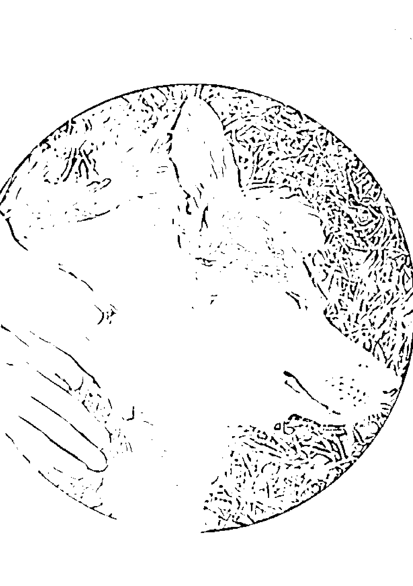

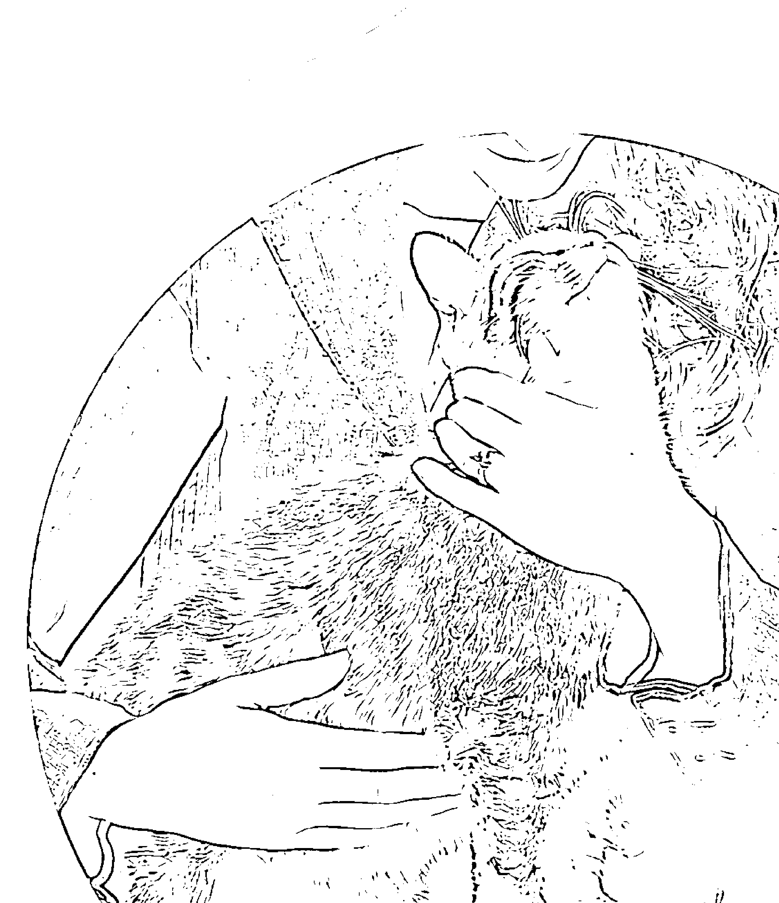

### Chapter 1

## 靈氣的基本認知

在開始討論動物靈氣前，我們想對靈氣做個概略介紹。希望這些背景知識，能作為讀者閱讀本書的基礎。

當前有許多靈氣派別，但所有派別都源於創立者臼井甕男博士。所有靈氣派別皆遵循臼井博士教誨，師傅透過點化將靈氣傳承給學習者。雖然學習者能從師傅學到基本知識，但勤加練習才能獲得獨特且個人化的理解、療癒經驗以及成長。我們樂見所有靈氣派別，即使彼此有所差異，但是都能為世界帶來靈氣的療癒禮物。

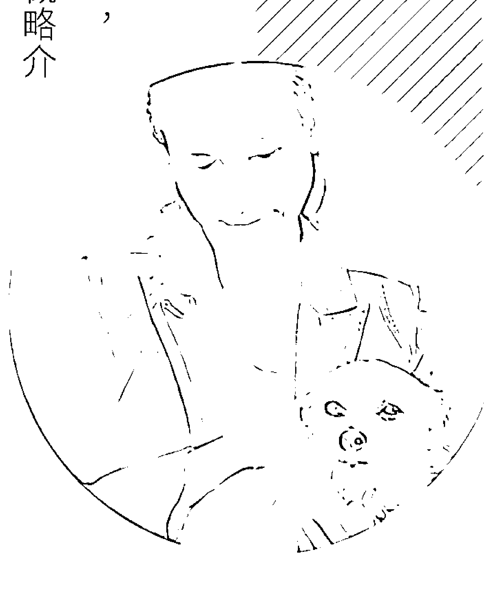

#### 靈氣是什麼，作用為何？

「靈氣」一詞通常被解釋為「宇宙生命能量」。是一種整體療癒系統，從身體、心理、情緒及靈性各層面考量整體的問題。與其他療法如針灸、順勢療法（homeopathy）、氣功及花精療法一樣，靈氣是新興能量療癒領域的一環，它重新探索古文化的智慧與知識，應用於現代社會。宇宙中所有事物都源於能量，也透過能量彼此連結。宇宙療癒能量經由治療師的雙手傳送給個案。靈氣可依個案需求，進行深度療癒，協助邁向健康。

靈氣療程可以面對面進行，治療師將雙手放在個案身上或隔空傳送；由於靈氣是一種能量，亦可從另一個房間或不同地點進行遠距傳送。靈氣協助健康的個體保持能量平衡，或療癒疾病、身體損傷、情緒及精神問題，協助平和地邁向臨終。

即使治療師及個案不清楚問題所在，靈氣仍可進入問題根源，以個案開放接受的程度與強度進行療癒。若療癒與個案情況的某些層面極其相關，靈氣也會超越個案的身體及情緒體，療癒那個狀況。靈氣不只對動物個案有所幫助，也能促進傳送者的健康。靈氣治療師每次施行療程，靈氣都會流經治療師，同時療癒他與個案。接受其療程，通常會帶來深沉且放鬆的感受。

此外，靈氣會增強飼主的直覺力，可能讓飼主與動物夥伴的溝通更為深刻。當你傳送靈氣與接受靈氣療程，會真實地感受到自己是誰，強化你的天賦才華及潛能。在練習傳送動物靈氣時，你會發現當你治療越多動物，也會遇見越多需要療癒的動物。動物了解靈氣的好，牠們需要療癒時會尋求你的協助。靈氣之美在於它是種簡單、溫和、有效且能帶來轉化的效果。

#### 學習靈氣

每個人都能夠學習靈氣。靈氣入門課程（靈氣一階）的形式或授課時間，會依據不同師傳而有所差異。最常見的形式為二到四天，共六到十小時的授課時間，內容涵蓋靈氣導論、歷史及原則，如何自我治療或治療他人。也會涵蓋四次能量調頻（attunement），讓靈氣能量能開始流經學生之手。有些人會立即感受到靈氣流經自己的手；其他則可能需要多些時間及練習，才會感受到能量的流動。

#### 知道自己需求的貓咪

卡爾頓是一隻六個月的公貓，體型特別大且十分漂亮。他來自繁殖場，繁殖場主人在地下室飼養了很多貓，卻不太照顧。他很少與人接觸，接觸時幾乎都是些不愉快的經驗，像是去獸醫那打疫苗。現任飼主珍妮很愛他，卻常因他保持距離而感到傷心，覺得牠拒絕給自己機會。珍妮打電話給我時，他們倆之間的關係相當緊張，她在考慮是否把他送回繁殖場。當我前去治療時，我坐在客廳地板中央，向卡爾頓打招呼，解釋我是誰、我為何在這裡，請牠接收需要的能量。就在牠從桌下逃出、繞室而行後躲在沙發後面時，我伸出雙手開始進行療程。牠一瞬間跳起，似乎受到驚嚇、靜止不動，深深地注視著我。然後，牠轉身站在我大腿上，雙掌搭在我的肩上，一邊舔我的臉。牠好奇地直視我的眼睛，然後繼續躲在沙發後面。就像在說：「我真高興你在這！我們需要你！」珍妮說不出話來，因為牠之前從未如此，總是與人保持安全距離。雖然卡爾頓在房間中不停變換躲藏位置，我還是可以從手中的能量流動感受到他選擇接受療程。最後牠在離我三呎的地板上拉長身軀，打了個大呵欠，把頭枕在腳掌上睡著了。睡了大約二十分鐘，起身專注地看著我，接著就去做他自己的事，表示療程已經結束。當我離開時，牠跑到我旁邊，待了一會就一溜煙地跑掉了。

卡爾頓歷經了六次療程，從第一次療程開始情況就有所改善。有幾晚牠會睡在珍妮旁邊，一起在沙發上看電視。珍妮明白自己需要有耐心，牠的戒心不是針對她，是源自於之前的環境。最後，他們兩方都達到開心的狀態。珍妮接受了這個事實，卡爾頓永遠不會是那種主人想要就來撒嬌的貓，卡爾頓也明白了自己真的被愛，而且很安全，想要討愛時會去找尋珍妮的陪伴。——伊利莎白。

#### 靈氣點化

點化（或啟蒙）是由靈氣師傅傳授學生運用靈氣能量療癒能力的過程。是一系列師徒間傳授靈氣過程的神聖步驟。在點化過程中或結束後，學生有時會出現能量感知，如熱感、頭頂發痛、頭部發脹或是手掌發熱。這些感受都是短暫的，當能量與學生的身心系統同步後就會消失。傳統上，點化會分成隔幾個小時或幾天進行，讓學生可以較舒服地適應靈氣能量。

#### 學習新「語言」

學習靈氣就像學習新語言。能量感受通常非常細微，可能需要些時間細細感知。越是練習傳送靈氣，越能熟悉能量語言，手部或身體其他部位也更容易感受到能量。不過，並非手生就能立即和靈氣帶來的生命能量連結。初學者也能有如同資深治療師一樣的療癒效果。終其一生，都會在靈氣療程中，不斷學習並面臨挑戰。但靈氣是強大的療癒工具，即使初學者也能運用。即使你很少練習，以靈氣進行療癒的能力也永遠不會消失。不過，你越敞開自己練習靈氣，越能了解靈氣細微卻強大的本質。靈氣療程的效力來自於靈氣本身，而非知識。即使有多年經驗，有智慧的治療師仍會保持謙遜，永遠記得感恩靈氣帶來的療癒效果。

或身體其他部位有能量，療程才有效力。有時當你沒有太多感受或根本沒有感覺時，動物個案卻會出現戲劇性的療癒反應。靈氣治療師得學會「信任靈氣」，因為是靈氣在療癒，而不是治療師。透過靈氣練習，你會辨別出療癒的許多形式。

勤加練習、提問及觀察，是學習靈氣最好的方式。一經點化，學習者就能開始運用靈氣。

#### 能夠辨別靈氣的小狗

即使不在療程中，動物有時能認出靈氣的療癒能量並深受吸引。這是初學動物靈氣的經驗，我去拜訪了動物收容所，當我行經狗狗最先安置的地方時，一位工作人員前來向我解釋這些小狗的背景故事。然後她開始談起自己每天都帶上來上班的小狗。那隻被遺棄的小狗，發現時頭部有顆子彈，肋骨斷了三根，還有一個開放性傷口，幾乎快餓死。他們都認為牠撐不下去了，但經過溫柔地照顧及手術後，牠獲得一線生機。然而，牠仍不喜歡陌生人。 當工作人員說完故事後，小狗跳到我身上。我蹲下來，牠把一隻腳掌放在我的大腿上，伸直小小的身體，舔了我好幾次。主人非常詫異，然後問我是不是靈性圈中的人。我告訴她我是位靈氣治療師，她回答早該知道，因為她的小狗是個老靈魂，能認出靈性能量，並受其吸引。我覺得驚奇又詫異。對於動物的能量覺察，我有了新的觀點。 ——凱瑟琳

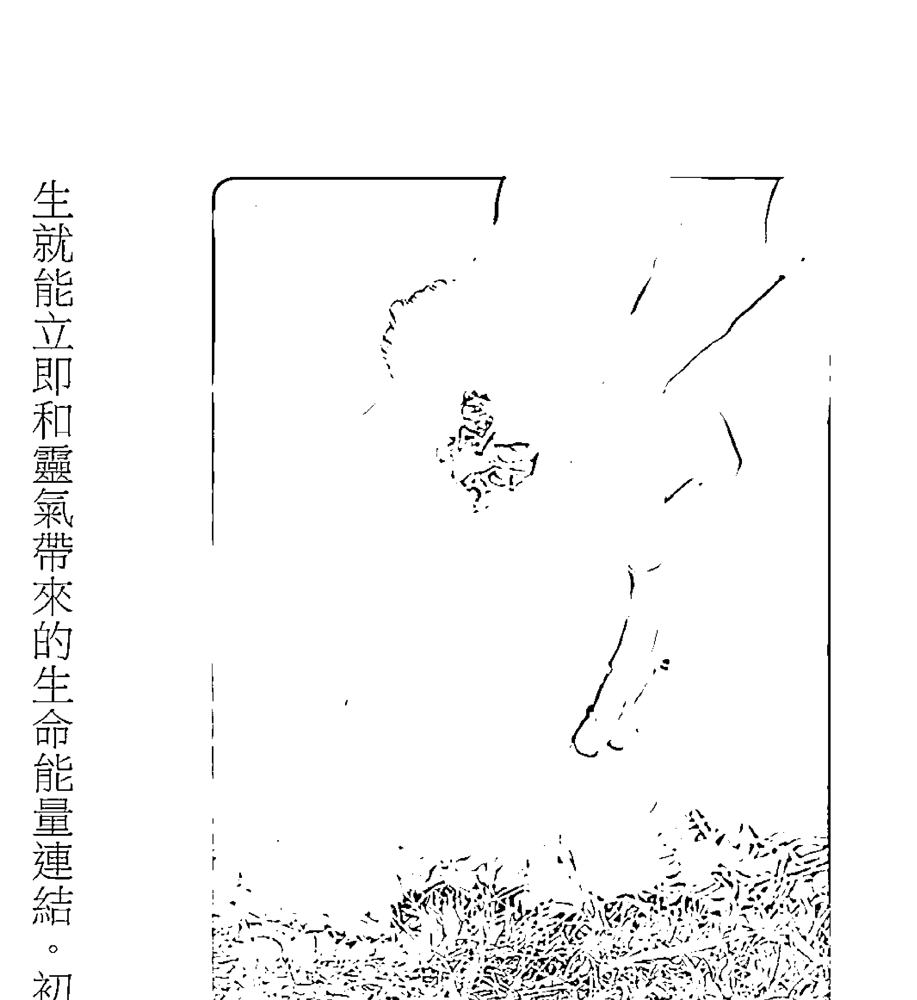

#### 靈氣三階段練習

一階：靈氣入門。此階段的靈氣修習，在於自我治療與對個案直接觸手或近距離隔空治療。在此階段，修習者逐漸熟悉靈氣本質及其運用，身為靈氣能量通道感覺為何，以及靈氣帶來的療癒效果。由於一階靈氣已具備完整又有效的靈氣本質，許多人修習靈氣主要為人類服務，會選擇先停留在此階段；對於那些想為動物療癒的人來說，修習二階靈氣可以大幅擴展為動物提供療程的環境條件。

二階：靈氣進階。二階靈氣修習重點在於，應用三個古老符號強化靈氣能量流、心理及情緒層面的療癒，以及遠距離傳送靈氣。二階靈氣對動物個案特別實用，治療師可以隔著安全距離或從別的地點傳送靈氣，在任何環境下都可以進行。野生動物具攻擊性、受虐或身心創傷的動物，都能安全、舒適地接受遠距離靈氣治療。動物可以在無須受限、不用太靠近人類以及主張自己與人類接觸的關係下進行療程。二階靈氣能強化心理及情緒療癒效果，其強大本質能深入療癒極度受創的靈魂。在二階靈氣中，你能熟悉療癒動物的各種可能。多數人會選擇修習至二階靈氣階段為止。

三階：成為靈氣師傅。在我們看來，真心投入、想終生奉獻於靈氣修習的學生，可以考慮成為靈氣師傅。此階段的學生傳承靈氣點化的能力，得以成為靈氣師傅。此外，靈氣能量流在此階段也會增強，為你的人生及靈氣練習帶來全新的挑戰。成為靈氣師傅並非學習的終點。

#### 尋找靈氣導師

靈氣修習者應該尋找認同彼此信念與處世之道的導師。根據我們的經驗，靈氣能強化個人的天賦才華，真實地療癒並轉化修習者的生命。本書的詮釋及建議，是我們自身的見解。

若你已學習靈氣，歡迎運用與我們有共鳴的部分，持續練習動物靈氣；若尚未學習，希望本書能提供基本認識，未來與靈氣師傅候選人討論時，作為靈氣理念及練習的參考。重要的是找一位讓自己感到舒服、鼓勵及支持自己的靈氣師傅。如此，你能為自己獨特的學習道路上奠定基礎，進入動物療癒的世界。

#### 如何運用本書

##### ☆ 讀了本書就可成為靈氣修習者嗎？

若你是位想練習靈氣的動物愛護者，必須先向靈氣師傅學習一階靈氣，接受點化，然後開始連結靈氣能量療癒系統。無法只透過閱讀成為靈氣修習者，你可以尋訪當地的靈氣師傅。一旦在一階靈氣課堂中接受能量調頻，就可以從本書學習如何運用。

##### ☆ 我得是靈氣修習者才能善用本書嗎？

若你是動物愛護人士，但不確定是否要成為靈氣修習者，可將本書提及的靈氣介紹及其功能的實用導讀，作為未來學習與動物相關知識的途徑。此外，本書討論到的許多議題，可以協助對動物療癒有興趣、想多了解動物療癒本質的人們，並加深與動物間的溝通。

##### ☆ 靈氣可以取代獸醫嗎？

靈氣無法取代專業的獸醫治療，它是一種非醫學療法，輔助與支持其他療法，如獸醫，同時也是療癒及健康維護整合方式中重要的一環。

### Chapter 2

## 灵气治疗概述

為人类个案进行灵气疗程时，治疗师藉由手直接接触或近距离隔空传送灵气。透过大量经验累积，灵气传统发展出一连串特定的手位（不会接触任何隐私部位），以确保疗程的全面性。资深治疗师有时会依据直觉，或针对个案所需，跳脱原有系列的手位，增加其他手位。不过，传统系列手位仍是多数人的学习起点。

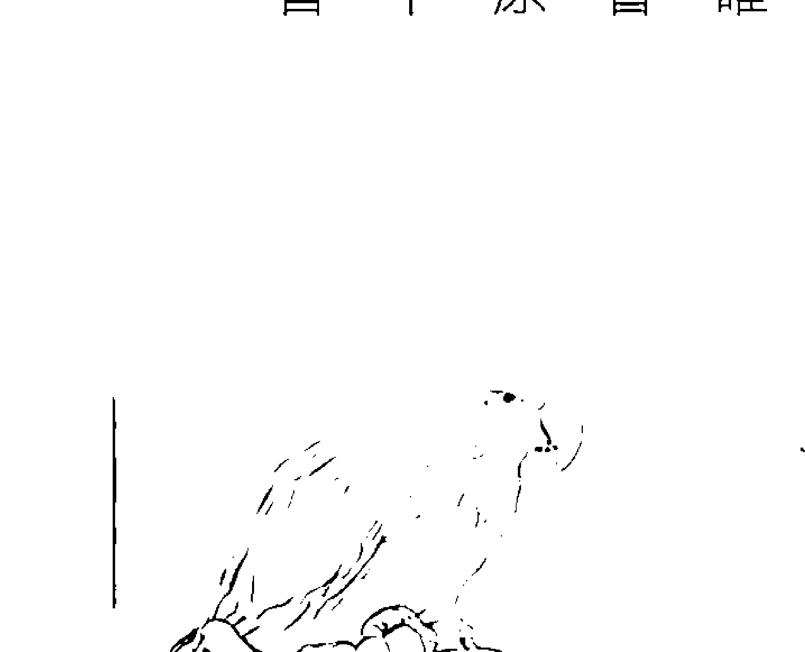

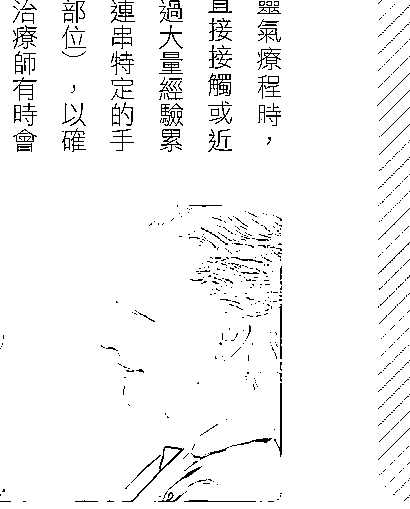

#### 進行動物靈氣所經歷的適應過程

一開始進行動物靈氣療程時，我們假設自己得用上直接碰觸的系列手位，並適應不同動物大小、形體及姿態，此外，牠們不會說話。根據經驗，為動物進行靈氣療程最好保持近距離。我們發現這對某些接受人類靈氣療程訓練的人而言，會有些難接受。但就靈氣來說，動物並沒有特定的療程形式。我們會在第二部分深入探討，鼓勵習慣人類靈氣療程的人跳脫思考慣性，有助於進行動物靈氣療程。動物靈氣最讓我們感到興奮的是，沒有療程是完全相同的。根據療癒的每隻動物及其環境，都需進行微調，靈氣療程永遠需要一些創意。

#### 療程中發生了什麼？

靈氣療程時程長短會根據情境、個案狀況及治療師有所不同。一般的觸碰療程或當場為動物進行的療程會持續約一小時，多數遠距離療程則較短。人類或動物接受靈氣療程時，通常會進入深層的放鬆狀態且感到平和。也許會感到身體發熱、微微搔癢或脈搏跳動；也可能會嘆氣、打呵欠、打瞌睡、睡著或是進入深層的冥想狀態。有些則會感覺到能量騷動及療癒能量流動，有些卻幾乎沒什麼感覺；還有些人會持續在療程中與治療師交談。無論在療程中的體驗為何，大多數的人類及動物在療程後都會發現自己健康有所改善。普遍來說，動物比人類對能量的感受更為敏銳，能立即且強烈感覺到靈氣。許多動物一

#### 與寂靜連結

> 靈氣可以療癒極度創傷的個案。我在收容所治療一隻不停吠叫的母狗，牠不停地吠，雙眼空洞地望著前方。我戴上耳塞，在牠的籠外開始療程。起初二十分鐘牠不斷吠叫，一邊盯著我。我突然有種直覺，牠覺得沒有人聆聽牠。我在心中對牠說：「我會聽。」牠突然停止吠叫，背對著我，在籠子後方躺下。我突然有種強烈感覺，牠之前被綁在後院，沒人關心，只會因牠的吠叫而對牠大吼。我安靜休息了十五分鐘，直到被收容所某處傳來巨大的聲響打斷，牠又開始吠了。我開始懷疑在療程中的直覺是否準確，因此向收容所工作人員詢問這隻狗的背景。她提到牠之前被綁在外面，飽受忽略。我請工作人員定時去看牠，並且告訴牠有人會聆聽。經過多次訪視後，我很高興吠叫的次數明顯減少了。——凱瑟琳

感受到靈氣時，會當場靜止不動。牠們往往會專注地看著你；居家動物則可能會靠近聞你的手。

動物剛面對靈氣的反應，取決於其習性以及之前與人類相處的經驗。牠們可能會立即認出靈氣的療癒潛能，滿足地深深嘆息並快速擺好放鬆姿勢以接收能量。若先前與人類相處的經驗不好，一開始牠們可能會閃躲靈氣能量。之後我們會討論如何處理這種情況。

依據動物的敏感特質，有許多方式可以調整療程。只要療程不帶壓迫，注重牠們的敏感特質並保持彈性，多數的居家及野生動物是願意接受、感謝靈氣療程的。

即使是最敏感、防衛心重的動物，難以接受當面療程，基本上也會接受遠距離療程。

當你傳送靈氣時，通常會感覺深層放鬆，也可能在能量流經你的身體時，會感覺熱、輕微搔麻，手部或其身體部位脈搏跳動。療程中，可能感覺自己在夢中，或是跳脫當下、失去了時間感，或進入深層冥想狀態。由於傳送的是宇宙能量而非自身能量，你不會因治療他人而感覺耗竭或不適。流經你和動物的靈氣能量可能會讓你們感覺乾燥，所以不論是傳送或接收靈氣，都要注意保持水分充足。療程時為動物準備新鮮乾淨的水，讓牠們取用。療程後也可讓牠們喝更多水。你與動物或人類個案在靈氣療程後，都可能經歷短時間的排毒反應。

#### 奧斯卡釋放情緒負擔

我曾和許多特別的動物一起工作，有些真的很特殊，牠以勇氣啟發你，讓你難以忘懷。俄羅斯藍貓「奧斯卡」就是這樣的動物。

到達收容所那一刻，奧斯卡就非常沮喪。幾週以來，牠很少進食，常閉著雙眼，把頭垂在便盆上。這似乎是種象徵，宣告自己地位有多卑微。牠無視工作人員的碰觸或關懷，露出一副完全自暴自棄的樣子，感覺任何好事都不會發生在牠身上。

雖然不清楚牠生命故事的細節，我們可以想見牠有段艱困的過去。有人截斷牠美麗的尾巴，牠的尾巴只剩兩吋。工作人員非常擔心，請我治療牠。

奧斯卡開始接受靈氣療程及花精治療（情緒療癒的一種震動頻率配方），幾天過後出現了改善。志工桑妮在幫牠按摩時，最先注意到牠的進步，一開始小聲地發出嗚嗚聲，聲音小到得把收容區的音樂關掉才聽得清楚。桑妮聽到這些恢復生命力的信號十分感動，彎下腰吻了牠的額頭。如同一個被剝奪愛、幾乎放棄得到愛的人，奧斯卡開始哭泣。牠看著我們好幾分鐘，一顆顆金色淚珠從眼睛滑落。我們誇獎牠有勇氣敞開心懷，釋放悲傷。之後，牠變得更加投入，會凝視我們，志工撫摸時，也會去頂他們的手。牠開始坐起身，梳理自己。很快地，牠會跑到籠子前尋求人們注意、玩玩具，坐在志工大腿上，興致盎然地看著其他的貓。牠總是特別貼心、有愛心。當牠想告訴某人停止做某件事，會緩慢、溫和地張開嘴巴輕咬對方的手或手指，以免嚇到或使對方難過。就像牠從悲傷過往中學到，嚴厲的回應會讓人難受。經過三週的療程後，牠變得敏捷、健康且享受生活，幾天後被一戶好人家領養。我常常想奧斯卡需要多大的勇氣釋放沉重的情緒包袱，敞開心胸、迎向希望，並拋下悲慘過往與人重新互動。靈氣和花精可以深入內在，協助恢復健康及平衡。在這個案例中，還有志工心中的愛協助奧斯卡重拾生命力。——伊莉莎白

#### 狗的精神

有時靈氣療程需要幾週時間，我曾有個收容個案，是隻全身長滿腫瘤、皮膚起疹、眼睛問題還有髖關節脫臼的秋田犬。在收容所發現牠前，牠正在街上流浪。很明顯，牠以前是繁殖場的母犬，生了無數小狗。當我抵達收容所時，牠病弱又沮喪，就算有人拍手喚也不太醒來。我放了張椅子坐在籠外，自我介紹然後開始療程。一開始，牠連頭也不抬，但我能感覺到靈氣流動。有種感覺這次療程的重點不是牠的身體。五分鐘內，牠開始出現療癒反應，開始不停搔癢，似乎很不舒服。還好這個狀態只持續了幾分鐘，接著牠蜷曲成一團，睡著了。療程進行三十分鐘後，牠伸展身體，做了幾個靈氣深呼吸。再過十五分鐘，牠的情緒狀態改變了。牠抬起頭，看著我，像幼犬一樣背著地滾動著，開心地發出呼嚕聲，像是想要我一起玩。然後站起身，注視著我的眼睛，快速搖動尾巴。我十分震驚。接著牠喝了一大口水，再次朝我搖尾巴，和我直接眼神接觸。我明白牠在告訴我療程已經結束。我感謝牠敞開自己的心房接受療癒，也感謝這令人驚嘆的靈氣療程。我從未想過牠會改變得如此快。當然，牠的身體症狀仍存在，但精神已經開始療癒。接下來幾週，隨著身體狀況改善，看起來與之前完全不同。皮膚變得乾淨，眼睛也開始靈活地轉動，行動自如。沒多久，就被好人家收養了。——凱瑟琳

對某些人或動物來說，靈氣療程對情緒的影響比對身體還顯著，這是因為靈氣會優先治療最需要療癒的部分，而那可能不是我們覺得需要的。身體問題通常有其情緒根源。靈氣通常會先深入核心議題，然後在後續系列療程中，「向外」擴展到相關議題。

#### 療癒反應

許多療癒系統如靈氣、順勢療法與針灸，都有所謂暫時性的「療癒反應」，於療程中或結束後清理感染或有害物質時，個案身體會因此暫時出現新的症狀或舊症狀加劇。在我們的經驗中，與人類相比動物很少出現療癒反應。動物若出現療癒反應，一開始可能是靈氣療程讓症狀加劇。舉例來說，呼吸道症狀可能會在療程中或結束後變得更嚴重。療程一開始的打嗝症狀，可能會暫時變成眼鼻出現分泌物，咳嗽或流鼻水。不過，這些加劇的症狀是短暫的，因為身體在排毒，通常會伴隨如身心恢復能量、反應變得靈敏的康復跡象，整體健康獲得顯著的改善。情緒層面也可能出現療癒反應，在極少數案例中，情緒療癒反應會暫時加重行為問題，直到問題解決。持續的靈氣療程有助於盡快度過療癒反應。靈氣可能會以愛與同理的方式為療癒帶來挑戰。療癒反應是件好事，代表個案正慢慢好轉。作為靈氣通道，表示每次你為個案傳送靈氣時，自己也會接收到。所以極少數狀況下，你也會在療程中或結束後出現身心療癒反應。舉例來說，療程施作前你就感冒，療程中感冒症狀可能會加重，但之後就完全消失了。

#### 靈氣療癒過往

> 靈氣一向是療癒動物最迫切的議題，即使這議題並不為人所知。有次我為一隻馬兒受傷的大腿肌腱進行靈氣療程，牠的反應十分有趣。在療程中，馬兒短暫但劇烈地抖動一陣，然後就睡著了。療程接近尾聲，牠抬起一隻後腿，舉在空中一會。牠的飼主對這個現象特別感興趣，因為以前未曾有過。然後與我分享在還沒飼養牠前，牠那隻後腿有個舊傷。很明顯，牠之前被圍欄困住，後腿如此懸在空中，過了一整天被發覺。那天的情緒創傷直到多年以後，才藉由靈氣協助釋放。——凱瑟琳

#### 伯瑞斯與娜塔莎

有天我前往一個本地收容所，當天來了兩位動物新訪客，是一對被照顧妥當的手足。工作人員說前飼主艾蜜莉亞前幾天把牠們送來，她正經歷生命中的重大壓力期，對貓咪過敏愈發嚴重，覺得自己無法承受，只好放棄飼養。

伯瑞斯是隻漂亮的短毛貓，有著獨特的黑白斑紋。牠很有活力、衝動，經常不考慮結果就行動。因此，牠在來收容所前一週被車衝撞，一條腿骨折。不過，牠側臥在沒受傷的那側，依然施展自身魅力與每個人互動。

娜塔莎則是一隻美麗的長毛白貓，帶著棕色虎斑。是隻溫和害羞的母貓，害怕地縮在籠子內側。

我立即為伯瑞斯施作靈氣療程，協助牠的腳傷痊癒，稍後，我為兩隻貓咪傳送靈氣，協助牠們解決當前狀況。後來前往收容所時，牠們已經不在那。工作人員說艾蜜莉亞把牠們帶回去了。她很想念牠們，一想到牠們待在收容所就難以承受。她了解到自己必須找到方法處理過敏及高度壓力。

幾天後，我接到一位年輕女子的電話，她從收容所拿到我的名片，希望我能為她的兩隻貓進行靈氣療程。我有種強烈直覺，這兩隻貓就是伯瑞斯與娜塔莎，於是我問她其中一隻是不是腿骨折了。她十分驚訝，她希望讓兩隻貓釋放掉在收容所期間的負面影響。當我向她解釋牠們已經接觸過靈氣時，她又驚訝了一次。

當我抵達艾蜜莉亞家時，她說自己在工作上已經感到高度壓力，伯瑞斯的衝動行為加重了她的壓力。自從伯瑞斯車禍後，她不敢讓牠待在外面，也擔心牠的腳能否好好復原。她覺得娜塔莎憂慮過度，深受收容所及伯瑞斯車禍影響。伯瑞斯與娜塔莎過去一直都很相親相愛，但自從伯瑞斯車禍後就常陷入衝突。

伯瑞斯立刻認出我就是之前傳送靈氣的人，跑來舔我的手，然後才安頓好準備接受療程。牠把頭靠在一隻手上，傷腿則靠在我另一隻手上。娜塔莎在研究我對伯瑞斯做什麼，然後躲在櫃子裡。輪到為娜塔莎傳送靈氣時，牠先保持一段距離，但逐漸靠近，最後把頭靠在我手上。在為娜塔莎傳送靈氣時，伯瑞斯蜷曲在我身邊，最後窩在我寬鬆T恤下。

接下來幾個月，我定期為伯瑞斯和娜塔莎進行靈氣療程。每當我坐下開始傳送靈氣時，我都讓牠們自行選擇接受與否。每一次，最迫切需要靈氣的會先過來，另一隻則耐心地在旁等候。起初伯瑞斯因為斷腿，總是排第一。等到腿傷痊癒，有時娜塔莎也會先接受療程。等到療程快結束時另一隻也加入。

伯瑞斯的腿恢復得很好，變得比較沉穩不衝動。艾蜜莉亞比較不那麼擔心牠到外面了。艾蜜莉亞的過敏減輕，娜塔莎的個性也變得堅強、專注，能以淑女的優雅方式展現自己。伯瑞斯和娜塔莎再度恢復親近，與飼主之間也是如此。後來幾年艾蜜莉亞也加入靈氣療程，一家三口在療程中平靜地一起打盹。

之後幾年，有時我回去為他們進行幾次療程，一路看著他們變成一個特別相親相愛的家庭。每天日出時分，伯瑞斯會從貓專用門出去，從鄰居院子裡為艾蜜莉亞摘花。根據鄰居描述，牠很溫柔地摘下花朵，小心地含在嘴裡帶回家。艾蜜莉亞起床時，會發現花朵充滿藝術感地排放在屋外，以愛迎接她展開嶄新的一天。——伊莉莎白

#### 靈氣療程的功效

靈氣療程能讓人類或動物分別在身體、情緒或靈性層次上獲得改善，而改善也可能同時發生。因為靈氣會深入最需要療癒的區域，有時會超越身體或情緒層次，療癒個案本身所處的狀況。以動物來說，靈氣療程可能改變牠與人類夥伴、人類或家庭組織間的關係，或整體狀況有所改善。舉例來說，為收容所的動物做靈氣療程，可能幫助牠順利被人收養。這是動物個案最需要的。抑或動物與飼主關係有困難，靈氣通常能協助解決問題。

靈氣療程的功效通常在療程中、療程結束，或結束後幾天就能感受到。可能是健康狀況明顯改善、個案面對的議題有所轉變，情緒模式得到釋放，或是狀況得到療癒。靈氣只會對所有生物帶來療癒，不會帶來傷害。定期的靈氣療程可幫助動物啟動解決問題的能力，釋放需要被療癒的問題。靈氣常能替健康帶來戲劇性的改善，有時也有其他功效。舉例來說，靈氣可以舒緩生死過渡期間的過程，若動物到了離開人世的時刻，靈氣並不會阻止這個過程。靈氣通常能提升臨終生活的品質，轉化情境讓大家都能接受過渡過程並更自在地放手，讓生死過程更順暢，減少痛苦、恐懼及折磨。

#### 靈氣療癒呼吸道不適

曾用靈氣療癒一隻收容所內的狗兒，這隻狗有很難應付的呼吸道感染，病弱且沮喪長達一個月以上，服用獸醫的藥也無效。大家都覺得牠應該活不了了。當靈氣療程開始時，牠不停流眼淚及鼻涕，隨著療程進行，這些症狀更加嚴重。牠不斷打噴嚏，大量帶血的分泌物滴到地面以及牠的前掌上。然後每次呼吸時都在咳嗽，彷彿無法深呼吸。第一次的療程為期一小時，接下來的一週牠接受了五次遠距離療程。一週內牠開始進食、玩耍，而且可以行走。兩週內，牠就被領養了。

#### 丹尼爾協助減輕痛苦

愛蓮諾在她的貓——魯伯斯車禍過世後一週打電話給我，她非常不安、沮喪且擔憂。她請我去家中對丹尼爾實行靈氣療程。當我抵達坐下，丹尼爾跳上我的大腿，好像一直在等我到來。牠立刻到我手下安頓好，睡著了並接受大量的靈氣灌注。愛蓮諾和我在療程中低聲交談，她正經歷巨大的健康挑戰而且感到沮喪，自從確診後，交往七年的男友越來越無法陪伴，也無法給予她需要的情緒支持。她寂寞病弱且害怕，覺得丹尼爾盡最大的努力安慰她。他每晚睡在她脖子旁，看起來在觀察她的一舉一動以了解狀況。隨著療程進行，靈氣在我們周圍形成氣場。經過愛蓮諾的同意，我延長療程讓靈氣支持她釋放所有的壓力及悲傷。丹尼爾平靜地睡著。當我離開時，溫柔地喚醒牠，輕緩地把牠放在床上。牠舔了我的手，表達對療程的感謝。幾天後，愛蓮諾寄了電子郵件提到經過靈氣療程後，腦袋變得更清晰了。她告訴男友自己的感受，他們的關係已經無法滿足彼此的需求，雙方決定和平結束這段感情。決定過程中，她始終保持平靜，克服魯伯斯離開時的難過心情。她手上有幾個令人期待的計畫正在進行，她恢復了精神，能以興奮的心情思考未來。丹尼爾的精神狀態變好，也恢復了食慾。即便丹尼爾始終盡責、認真地安慰愛蓮諾，不過牠不再躲在愛蓮諾的陰影背後，這段期間也會到外面散步休息。——伊莉莎白

#### 靈氣療癒感染

曾用靈氣療癒一匹脖子被踢傷的馬。牠脖子左側有一個長十二英吋、寬六英吋的腫包。療程開始時，這匹馬沉浸在能量之中，放鬆地舔舌頭及咀嚼，最後睡著了。三十分鐘療程後，腫脹部分縮小為長兩英吋、寬一英吋，只剩下微微腫脹。透過一天兩次的短暫靈氣療程，四天內就完全恢復了。

#### 療癒時間軸

一般來說，靈氣能快速且顯著地改善健康。幾次療程就可能帶來戲劇性轉變，有時甚至一次療程就已經足夠。不過，療癒通常是一段過程，幾次療程還不夠達成完整療癒效果。療癒某些狀況所需的時間，通常和狀況的嚴重程度及持續時間有關。許多狀況大約需一到兩次靈氣療程，就會有顯著改善。對於嚴重的症狀及損傷，若能在剛開始越快接受靈氣療程，就可越快見到效果。通常在剛受傷或症狀剛產生時接受靈氣療程，可以大幅縮短療癒時間。

慢性或長期持續的狀況可能需要幾次療程，以達到顯著的療癒效果，可能還需要在一段時間內進行定期療程，持續療癒。靈氣也是絕佳舒緩疼痛的工具。定期療程可以緩解疼痛，有時疼痛也會一併解除。我們曾在人類及動物的關節炎狀況上，見證靈氣顯著效果。此外，靈氣通常可以支持並提升其他適當療法的效果。

#### 靈氣及其他種類療程

在動物接受其他療程治療身體不適或其他狀況時，靈氣是寶貴的整合性方法，以達成療癒及維持健康。靈氣可以透過本身的療癒特質支持其他療法。舉例來說，伊莉莎白的狗柔伊已經十六歲了，開始出現癲癇症狀。靈氣可以協助減輕嚴重的癲癇症狀，但伊莉莎白決定嘗試針灸，看看能否更有幫助。她在每次針灸前後都為柔伊進行靈氣療程作為支持。針灸治療只做了兩次，癲癇症狀就完全消失了。獸醫驚嘆於牠的復原速度及成效，因為原本預期需要好幾次療程才能達到如此效果。

靈氣能幫助手術後更快速復原。靈氣與抗生素及其他藥物搭配良好，加速各種疾病及損傷的復原。它也是動物癌症治療中重要的一環。舉例來說，在放射治療及化療前後進行靈氣療程，通常可以減輕動物嚴重不適反應及副作用。靈氣還可以深入動物的身心，療癒癌症形成進展時的情緒及靈性失調。同樣也能療癒身體層面。靈氣療程也能在動物進行癌症治療時，為其家人提供支持。

#### 靈氣減輕譚米生死過渡期間

對寵物貓咪「譚米」的意見分歧，牠有許多嚴重的健康問題，看來生命已接近尾聲。譚米是隻強壯、聰慧，又特別通人性的狗。喜歡和珊卓一起看電視的動物秀，看到牠最喜歡的表演及動物出現時，會興奮地吠叫。這對情侶還養了三隻狗，譚米是牠們的母親。珊卓和譚米是將近十五年的好朋友，她半夜都會起身照料譚米，因為這幾個月牠的症狀越來越嚴重。

我第一次和史蒂夫及珊卓討論時，他們對於是否讓譚米安樂死意見不同。珊卓已經筋疲力竭，看到牠無法治癒且不時受苦，覺得很痛苦。史蒂夫覺得譚米還有許多時間，捨不得現在就終結牠的生命，覺得時候還沒到。他們請我傳送靈氣給譚米，看看是否能幫助他，也幫助他們做決定。

我為譚米、史蒂夫及珊卓進行了一系列靈氣療程。譚米的症狀改善了，一週內牠幾乎就和從前一樣。這段期間內史蒂夫和珊卓稍微可以喘口氣，暫時脫離高壓狀態，有機會討論對譚米的感覺。在療程後三週，譚米開始又不舒服，這次史蒂夫和珊卓都同意是時候協助譚米的過渡狀態。譚米平靜地離開了，史蒂夫和珊卓很感謝自己多出時間陪伴牠，也感謝靈氣為他們帶來平靜，適時協助譚米離開。

> ——伊莉莎白

#### 『西追』在那裡？

西追，一頭漂亮、橘白毛色的年輕公貓，在街頭流浪被帶進收容所。頭兩天牠一直哭嚎，狂抓籠門，躺在籠子裡發抖，腿在空中揮舞，甚至把腳伸進碗裡做出游泳動作。工作人員擔心這些是癲癇症狀，帶牠去獸醫那兩次。沒有人知道這是怎麼回事，但牠在收容區域的存在感十分強烈。工作人員請我為牠做靈氣療程。牠在療程中接收很多能量，變得安靜、放鬆。之後牠看來似乎變得比較滿足。隔天造訪收容所時，我看到籠裡有隻安靜、放鬆的橘白色貓，我問工作人員：「西追呢？」她笑說許多人今早和我問了一樣的問題，籠裡那隻貓就是西追。三週後，西追被領養了，這段期間牠一直很安靜、放鬆，完全看不出之前曾有的狂野行為。——伊莉莎白

## 第二部

## 靈氣療癒動物的守則

#### Guidelines For Healing Animals With Reiki

### 療程前的準備

在靈氣開始流動前，靈氣療程其實就已經開始。若想以靈氣療癒非自家的動物，在你接觸這個動物個案或其飼主之前就會溝通。了解以下議題，就能確保療程以最有效率的方式開展。

#### 自我預備

進行靈氣療程前，了解自己身心狀態是件好事——先確認是否已經照顧好自己的基本需求。舉例來說，盡量好好休息，避免在空腹時進行療程，專心在療程上，不受自己內在的狀態干擾。靈氣流經全身時，可能會讓你覺得有些乾燥，在療程前應補充水分，如果可以在療程中準備一瓶水，效果會更好。

雖然在情緒不佳或身體不舒服時，靈氣還是可以運作，但最好還是先照顧好自己再進行療程，尤其是個案是動物時。動物會察覺你在療程中的情緒狀態，也會受其影響。如果你希望動物個案放鬆、擁有最好的療效，不受你的情緒干擾，應在療程開始前盡可能保持平靜且心神專注。

然而有時若你對某事感到難過，而動物個案分擔了你的煩憂，那麼靈氣療程能協助你們都達到更平靜、集中的心靈狀態，清楚如何處理煩憂的來源。

在療程開始之前花些必要時間集中精神，別讓其他瑣事占據你的心，讓自己全然與動物個案同在。若你對某事情憤怒、沮喪或興奮，花點時間為自己傳送靈氣，讓自己脫離那種情緒狀態。

若你要前往像收容所般的高壓環境，或是治療狀況嚴重的動物，集中心神會特別重要。

#### 療程長度

一般來說，療程持續至少一小時最佳。若你為自家以外的動物個案進行療程，在療程後保留一些額外時間與其飼主討論你的印象及想法。療程長度因動物而異，但療程平均時間約為三十到六十分鐘。極度病弱及有嚴重情緒問題的動物，有時需要更長的療程，他們也可能只能承受簡短的療程。為療程空出足夠時間，讓自己從容不迫，創造更平靜的氛圍，更能让動物放鬆。

#### 維持舒服的姿勢

我們從經驗中學到有在一在一些不尋常的環境下治療動物，此時照料自己和個案一樣重要。試著從療程開始就讓自己保持在舒服狀態，才能好好專心，讓療程維持平均長度，也不會因身體不正常彎折或肌肉緊繃，阻礙靈氣流動。舉例來說，面向動物舉起手或手臂，可能會讓你肌肉疲勞，若是坐著，最好讓雙手放鬆放在大腿上；若是站著，就讓雙手自然垂下。

放在身體兩側。在車上放一些不同尺寸的小凳子作為備用，讓你可以在各種環境中，室內、畜欄、繁殖場、牧場、路旁或大自然中，隨著動物狀態調整坐姿高度。

#### 療程空間

盡可能在不受打擾的安靜場所進行療程。若是動物熟悉的場所——如馬廄或動物自家中的小房間——就很理想。我們通常會前往動物熟悉的環境進行療程。因為大多數動物在陌生環境中會有壓力，在自家中更能放鬆自在。讓動物自在活動不受限制的空間是最理想的狀態。

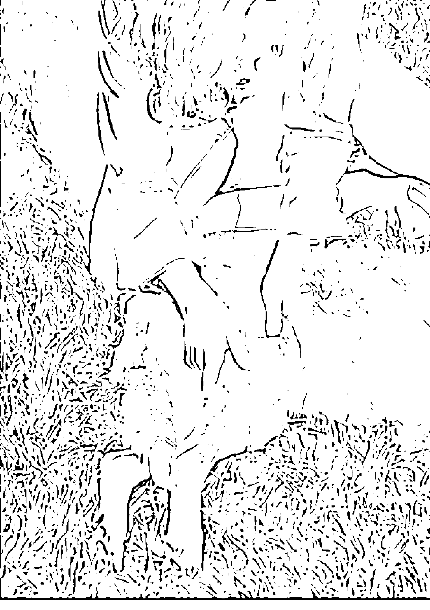

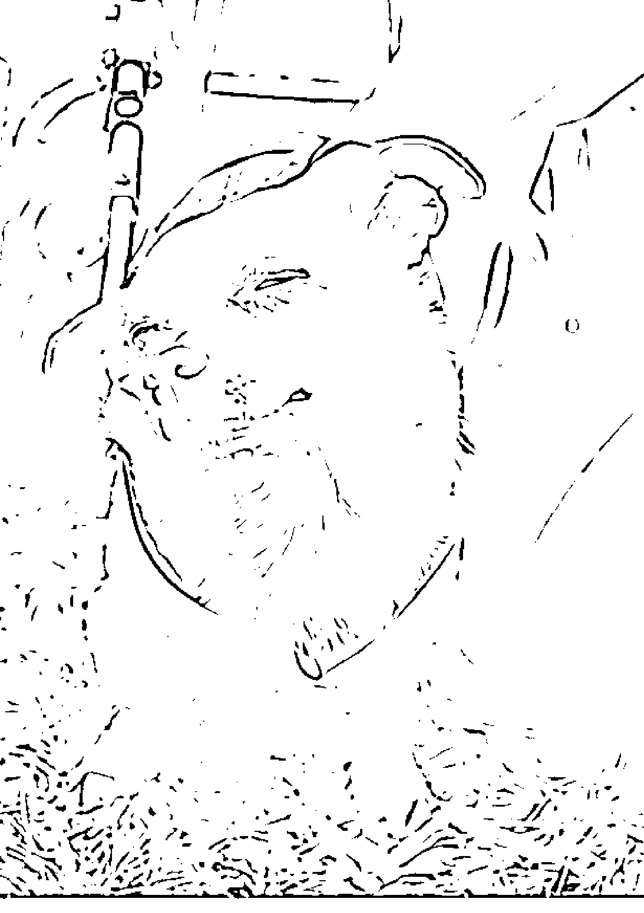

### Chapter 4 進行療程

莉莎白的馬——安妮，早期為牠傳送靈氣時，帶給我們幾個殘酷的教訓。因為安妮極度敏感緊繃，要靠近牠傳送靈氣，一開始十分艱難。除非牠身體極度不舒服，否則直接觸手傳送靈氣，對牠來說太過驚擾。舉例來說，安妮打疫苗後非常不舒服，牠就會靠著伊莉莎白的手，睡兩小時以上。然而觸手療程時，牠通常不讓治療師的手放在牠身上。

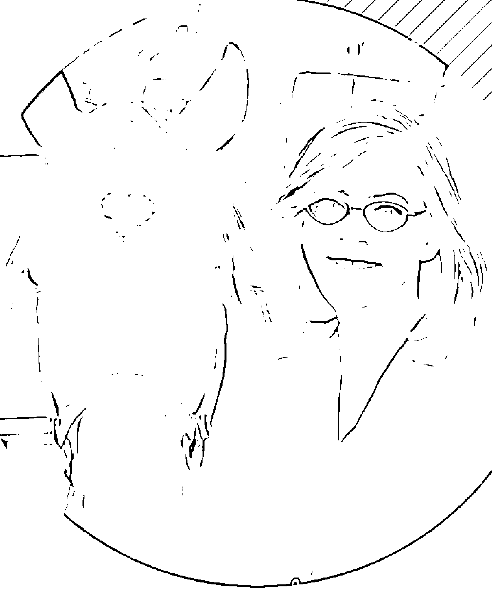

有一次凱瑟琳為安妮傳送靈氣時，伊莉莎白因注意另一隻馬而讓牠感到焦慮。安妮在馬廄中來回走動，試著逃避靈氣能量。凱瑟琳有個直覺，安妮覺得自己被迫接受靈氣，所以她請安妮只接收牠願意接收的部分就好，以療癒牠和伊莉莎白間的關係。很快地安妮安頓下來，不再拒絕靈氣療程。我們從這次經驗中了解讓動物選擇是否參與療癒過程有多麼重要。我們持續對安妮的需求保持彈性及開放，並找到讓牠比較喜歡接受靈氣療程的作法。因為牠不喜歡觸手靈氣，我們決定做個實驗：分別站在小牧場的一端伸出雙手，讓靈氣在我們之間流動，創造出「靈氣區」，而另一端則是「非靈氣區」。安妮在「靈氣區」與「非靈氣區」間徘徊了幾分鐘，但當牠感覺到可以選擇是否接受靈氣，便開始在靈氣區中不同位置停留。牠在「靈氣區」的某個位置，熱切地將一小段後腿靠在凱瑟琳的手上，當時我們甚至有點害怕牠會坐在凱瑟琳身上！最後，牠將頭擺放在我們之間，開始舔舐及咀嚼（象徵放鬆），直到睡著。牠睡了近一小時，直到療程結束。從那之後，當牠覺得需要靈氣時就會把身體某部分靠過來。當安妮知道自己可以選擇是否接受療程，牠不僅接受靈氣，也會在有需要時，尋求靈氣協助。安妮那天給我們的啟示──對於如何為動物傳送靈氣，讓其了解靈氣療癒潛力，參與療癒時不覺得筋疲力竭或被強迫──是非常重要的。為其他動物傳送靈氣，也再度驗證那天學到的核心知識──隨著時間累積，動物老師幫助我們對如何為動物傳送靈氣有更全面的理解。

#### 柔伊讓我明白如何為牠傳送靈氣

當我初學第一級靈氣時，我替家中狗狗「柔伊」傳送靈氣，但不是很成功。她已經十二歲了，開始有些腎臟病的症狀。當我直接把手放在她身上，或隔著六到十二吋的距離隔空傳送靈氣，約一分鐘後她就移開身體，好像靈氣對她來說太過強烈。最後我的結論是，牠不喜歡靈氣，因此我停止傳送。同時，牠的腎臟病症狀也越來越多。

有天，我站在廚房水槽前，突然覺得自己的雙手發熱、感到刺痛。我四處張望，發現柔伊在四呎外注視著我。我放下手邊的事物，站著伸出手讓靈氣流通。很快地，牠在實木地板上躺下，這非常不尋常，因為硬地板會讓牠年邁的身軀不舒服。不過牠卻躺著瞌睡了三十分鐘。

隔天牠喝比較少的水，出去上廁所的次數也變少了，看起來比較開心舒服。前往獸醫複檢時，數據顯示牠的尿液變濃。現在，只要牠朝我走來，躺在我附近，用某種特定的表情看著我，我便知道牠想要靈氣，通常隔著三到四呎的距離最能讓牠接受。透過這些療程，牠的腎臟病基本上不再惡化了。

> ——伊莉莎白

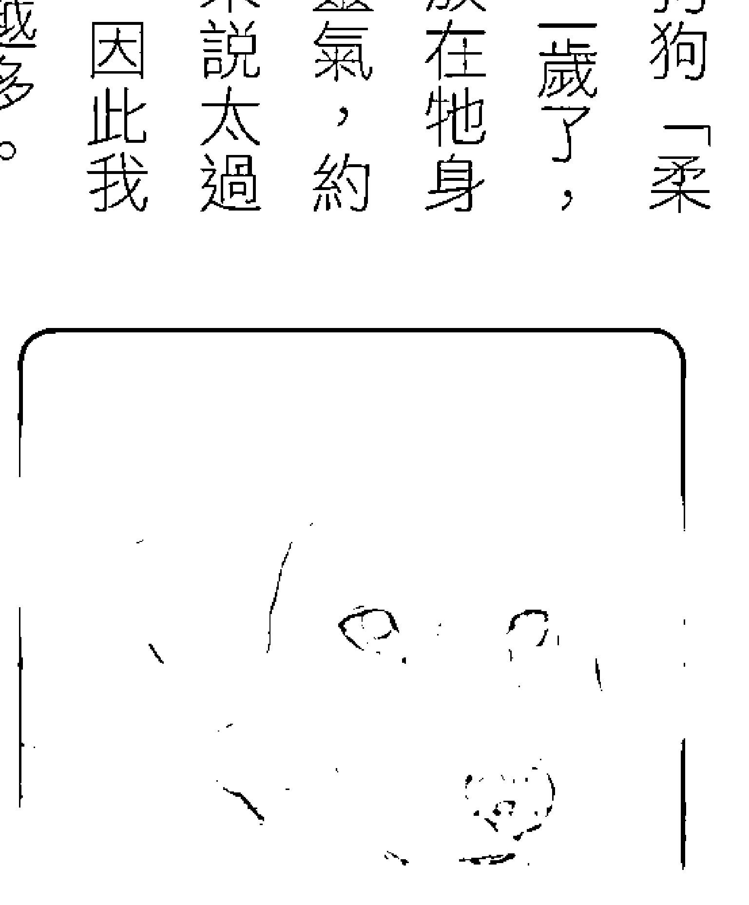

##### 建立信任

為安妮及其他動物施作靈氣的經驗顯示，直接觸手靈氣會比在短距離內隔空傳送強度更高，動物可能會感覺比較緊迫。有些動物會拒絕只有觸手療程這個選項。動物告訴我們，一開始最好先從短距離隔空傳送，這種方式一樣有效，通常更容易被接受，也能更快在療癒關係中建立信任。

進行療程時，最好有耐心並拋開該如何進行的成見。讓動物以自己的方式接受療程。動物就像人類，喜歡對發生在自己身上的事情擁有主控權，尤其在嘗試新經驗時。我們為動物進行療程，目的是盡可能給予動物足夠活動的自由，讓牠能以自己的方式體驗及接觸療癒能量，好顯⽰如何進行療程最能滿足牠的需求。這樣能讓動物熟悉靈氣的能量感受，而不會感到被強迫。給予動物自由，讓牠們更肯定靈氣有益、無侵入性，並與動物之間建立信任關係。

牠們通常很快就能理解靈氣的好處，覺得需要時就會主動尋求。

有些動物，尤其是自家動物，已經對我們有所信任，立刻就能敞開心胸接受靈氣。脾氣溫和或先前與人類相處愉快的動物，可能很快就能安頓下來接受療程，然而，和人類一樣，動物也有個別差異，有些天生就比較緊張敏感；某些則有理由選擇不信任人類。這些動物需要較長時間接受靈氣帶來的新感受，以及確保牠們在靈氣療程中是安全的。

#### 靈氣使「無法平靜」的個案平靜

靈氣的力量令人驚嘆，能為飽受極度壓力的個案帶來平靜。有天在收容所，我為某隻名叫「斑點」的耳聾大麥町狗傳送靈氣。牠極度好動，不停在我身上周旋、跳躍。牠進入籠子裡，我得使盡全身力氣才能阻止牠跳出籠外。有趣的是，當我問牠是否願意開始靈氣療程，牠停止嗚叫、跳躍，低下頭，站在我身旁，完全安靜下來且一邊搖著尾巴。根據直覺，我將一隻手擺在牠心臟的位置，另一手放在背上兩肩中間的位置。我的雙手立刻感到極度灼熱。

幾分鐘後，牠開始尖叫、可憐地哭著，但並沒有從我手邊移開。顯然是牠正在經歷療癒的反應。我為牠進行了心理療癒療程，希望牠冷靜並感到舒適，牠也立刻安靜下來。安靜的時間持續約十多分鐘，然後又開始哭泣及躁動。

當牠從手邊移開時，我覺得牠準備好結束療程了。我心存感謝，至少療程讓牠有一小段時間得以休息。我開始為牠接下來的收養進行定期靈氣療程。幾週後，一位女士領養了斑點，陪伴家中另一隻失聰的大麥町，多麼棒的組合啊！——凱瑟琳

請記得，永遠都要尊重動物的空間。當你向動物自我介紹時，請保持五到十呎的距離，手臂放低，手向外，伸出手掌，讓能量開始流動。

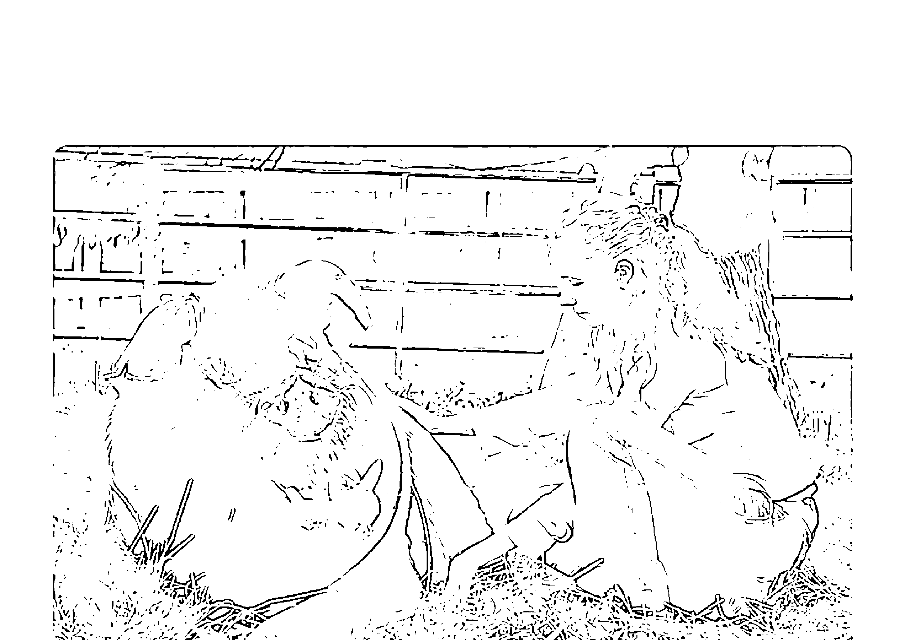

- 「哈利」在療程中打了好幾次呵欠，代表牠非常願意開始接受靈氣。

雙手垂放在身體兩側，保持給予的姿勢，這會比面向動物、雙手抬高至肩膀位置更讓他們感到沒有威脅性；高舉姿勢對有些動物來說是有威脅性的。許多動物，尤其是馬與狗，會靠近嗅你的手，以協助他們接觸這種新的能量感受。在療程中，允許動物靠近你，總是比你去接近他們更好；長期看來這樣能更快建立信任。

若動物害怕人類，與動物保持安全距離，不試圖與他們直接身體接觸是有幫助的。療程中我們輕聲交談，並反覆確認動物個案的狀態。在療程中常與動物進行眼神交流，試著不緊盯著動物或強迫他們做不舒服的眼神接觸。

#### 療程開始

准备开始进行疗程时，请与动物保持一小段距离，让牠想接触你的手时能直接靠近。将双手放在自己大腿或身体两侧，使能量流动。让动物能在治疗空间中自由活动。温和且低声地向对个案诉说你正在传送灵气，协助疗愈。基本上，动物在疗程中会变得极度放松，通常也会睡着。由人类为动物传送灵气时，第二阶段灵气通常很有效果，因为能量比较没那么强烈，对于能灵敏感受灵气的动物非常有益。不过，若动物有更多选择与自由且情况安全，那么各级灵气都很适合疗愈动物。

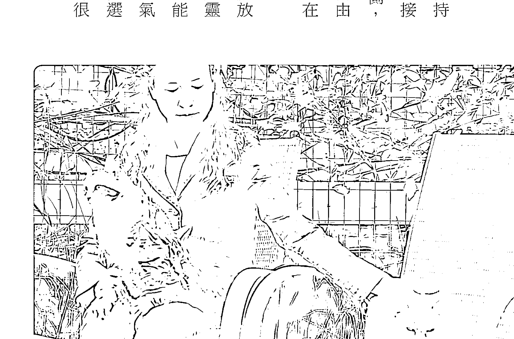

#### 三個呵欠

由於靈氣具有充滿力量的能力，以及尋找療癒問題的能力，靈氣所帶來的效應通常會超越動物個案本身。有一天我為一匹馬在穀倉中進行靈氣療程。牠被另一匹馬踢，結果左肩及左臀嚴重腫脹，馬廄隔欄兩側的兩匹馬開始探出頭來，不停地和個案一起打呵欠，也就是三匹馬不停打呵欠，看到這三匹馬受到靈氣能量量強力影響而放鬆，這個畫面實在幽默。雖然獸醫說腫脹部分需要流出液體並收乾才會痊癒，但在兩次療程後腫脹就完全消失了。—— 凱瑟琳

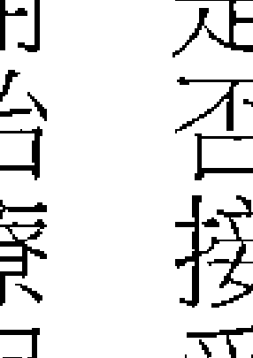

#### 選擇的力量

就像安妮一開始顯示的——給予動物選擇是否接受靈氣，牠們反而能更敞開心胸接受。開始療程時，我們請動物只接受覺得舒適的靈氣能量，並告訴牠們若對能量感到不舒服，可以完全不用接受。也會讓牠們知道，我們不會強迫牠們做任何事情，包括身體接觸或心靈連結。大多數動物的生活中，通常由人類決定事情進行方式、時程表、環境以及進行的長度。動物並不習慣有許多選擇，若牠們能有選擇，會很驚喜開心；不僅記憶力會立刻集中，專注力也會提高。動物更能投入療癒過程以及與人類的關係。

##### 🦴 活動的自由

這個方式也考量到動物自身的智慧，牠們知道自己的療癒需求。動物能認出靈氣的療癒潛能；常會引導我們深入需要療癒的區域，接受足夠的療癒能量後，也會主動結束。這樣的方式能讓人類與動物擁有更深刻且親密的關係，如此一來，動物不只是接受療程的個案，也成為療癒過程中對等的夥伴。

對動物進行靈氣療程時，在情況允許下，盡可能讓牠有足夠的活動自由。也盡可能讓動物對療程有主控權，使動物對我們及靈氣建立信心，讓牠成為療癒過程中主動積極的參與者。一般來說，療程開始後動物會持續在室內（或在其他場地）四處移動，也可能移動到範圍內最遠處。

然而，一旦牠們習慣這感覺，相信自己可以選擇接收和接受多少靈氣時，就會放鬆並感謝這段療程。最後牠們通常會在靠近你的位置，甚至碰觸你的手掌以接受大量能量。有時動物要花三十分鐘才能在初次療程中安頓

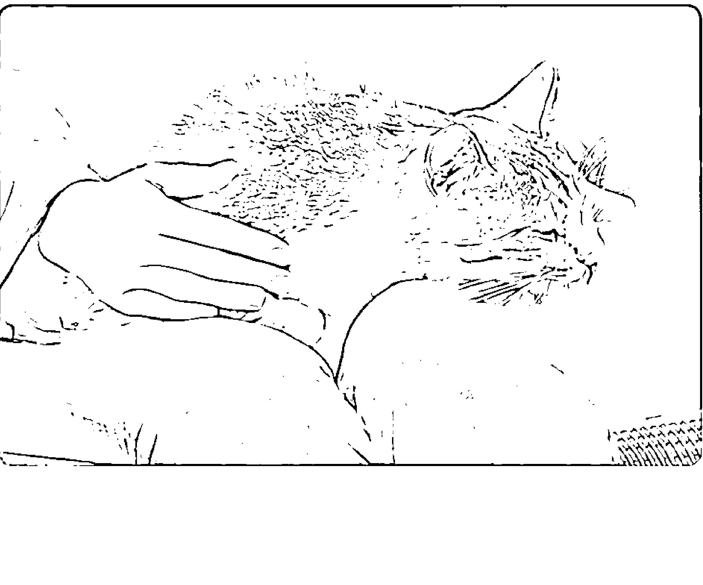

#### 盧卡斯說：「今天不要！」

「盧卡斯」是一匹栗子色的漂亮純種馬，我有時會為他進行靈氣療程。通常牠喜歡觸手靈氣，尤其是身體有痠痛症狀、需要特別照料時。牠也是一匹非常有主見的馬，會讓我知道那天牠不想接收。

他最近接受了牙科治療。過往在這種治療之後，牠會溫柔地把嘴部放在我的手上，進行靈氣療程。我像以往一樣接近馬槽柵欄，在開始療程前徵求牠同意並低垂手臂。當時牠在馬槽另一側放鬆休息。

然而，當他見到我時，牠急速走來，在我手邊附近做出啃咬動作，先是一邊手掌，然後又換另一邊。我從未見過這樣奇怪的動作，所以花了一分鐘才了解這是在說：「不要！」同時，牠轉身用一條後腿碰觸我，彷彿在說：「你明白了嗎？我想獨處！」我可以理解牠不舒服，牙齒治療後感到痠痛，很明顯牠還沒準備好接收靈氣。

隔天又完全不一樣了。我再度前往徵求同意。牠用頭輕輕頂著我，把痠痛的牙齒部位放在我的手上，睡著前深深嘆了一口氣。——凱瑟琳

下來，但在之後的療程中，就會較快進入放鬆狀態。無須擔心動物在療程中安頓下來之前，四處閒晃能否接收。牠們會在療程中接收自己需要的能量，即使在場地內閒晃時也是。

#### 如何辨别动物不想接受疗程

若动物不想接受灵气，通常可以从他们的身体语言中看出。他们会尽可能远离你且踱步，转身背对你，并藉由其他动作显示你的出现让他感到不耐烦。若他们远离你却躺下、叹气、睡着，表示他正隔一段距离接受疗程。从动物立场出发，若具备耐心及尊重，保持开放心胸，就会发现大多数动物是可以适应接受灵气的。根据我们的经验，以这样的方式对待动物，通常他们也会选择接受。然而，若动物不想接受，那么就不该为他们进行疗程。在极少数案例中，像是野猫，特别是那些被关在笼里或是遭受过严重虐待的动物。他们可能无法信任由人类当场进行疗程，

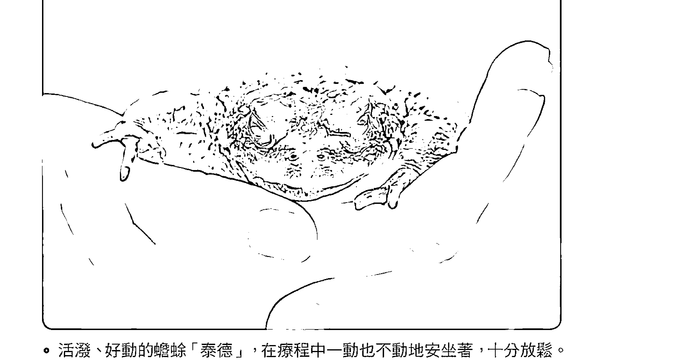

活泼、好动的蟾蜍「泰德」，在疗程中一动也不动地安坐着，十分放松。

#### 蘿絲的靈氣奇蹟

與其強迫當場接受，反而應該離開擇日再試。此外，有時這樣的動物會接受人類不在現場的第二階靈氣遠距療程。若是如此，就該在動物不在場的另一地點進行，並讓動物自行決定接收多少靈氣。接下來會在第十八及十九章深入討論。

每到幼貓繁殖的高峰季節，收容所都會超載，此時一隻年邁但貼心的流浪貓「蘿絲」被帶進來。蘿絲有許多嚴重的健康問題，但牠眼神明亮、看來自在，仍然十分分享受生活。牠來的時候全身濕透、狼狽不堪，但舉止仍然優雅，看來在街上流浪不久。因為收容所超載，每天都來很多幼貓，考量到蘿絲的健康問題，收容所決定讓牠安樂死。這樣的情況在收容所非常少見，通常是環境相當嚴峻時才會發生。一位收容所志工請我為蘿絲傳送靈氣，協助牠度過生死過程。我照做，並請求能為牠的狀況帶來最佳益處。暗自期望有奇蹟出現。隔天我帶著忐忑不安的心詢問情況。結果要為牠安樂死的人員臨時不舒服返家。接著隔天早上，一位與文書工作無關的工作人員注意到，替蘿絲安樂死在法律上需要有一段等待期，目前尚未達到等待期的期限，讓蘿絲安樂死得以暫緩幾天。兩天後，一位年邁的女士來到收容所尋找她走失的貓，沒錯，就是蘿絲！他們一起開心地回家了，希望蘿絲之後可以安詳度日。傳送靈氣時，永遠不知結果如何，但有時真的會出現奇蹟。——伊莉莎白

#### 娜努找到完美住處

「娜努」，七個月大，是隻可愛的阿拉斯加雪橇犬，因為在街頭流浪被送進當地收容所。牠被轉到當地北方品種動物救援組織，組織內的兩位志工——蘿拉及亞當，盡心盡力想幫助牠療癒並找到適合的家。然而，娜努沒受過任何訓練，害怕人類以及所有室內密閉空間，也包括在車內，牠還會立刻攻擊在場的其他犬隻。牠特別聰明，還是高明的逃脫專家。當牠剛到組織時，牠嚴重過輕、對食物碗及牽繩都不熟悉。蘿拉及亞當從牠的行為推論，牠一直住在戶外，幾乎完全被孤立與忽略。當我遇見娜努時，只有蘿拉和亞當能讓牠感到自在。他們請我為娜努進行三次系列療程，希望能增加牠被領養的機會。第一次療程我坐在娜努的狗屋外傳送靈氣，依照慣例，我請牠只接收覺得自在的靈氣量。除了能量流由最初的微弱轉到中等強度，幾乎沒有其他信號可分辨牠是否知道我在場。也許在一小時療程中，牠快速地瞥見我兩眼，並在繞行時隨意嗅了我的手。其餘時間我是完全被忽略的。我沒有退縮，從流經身上的靈氣流知道牠有接受療程，隔天再度為牠進行第二次療程。這次，當我抵達組織時，娜努直視了我一會兒，原地繞行五到十分鐘。然後躺了下來，將頭放在腳掌上，熟睡約二十五分鐘。外面一聲巨響吵醒了牠，起身快速在狗屋周圍繞了一圈，又再度躺下睡了大概十五分鐘。

我感受到一股強烈的能量流，深深投入療程，直到有個聲音說：『你對他們做了什麼？我沒看過他們那麼安靜！』我抬頭一看，儘管周遭環境噪音很吵，但是那區所有的狗狗都睡著了。娜努第一次清醒後，再度繞圈尋找亞當的蹤影。能量流變小了，我知道牠已經完成療程。我準備離開時，牠試著跟在我身後，蘿拉跟我都感到驚訝。

三天後救援組織收到一封電子郵件，是一對夫婦寫來的，他們在網上看到娜努的照片與故事，很喜歡牠。他們明白牠需要大量的愛、耐心及協助，覺得與牠相處，會學到許多。

他們住在加州一個終年涼爽的地區（很適合阿拉斯加雪橇犬），美麗又寬敞的家在森林保護區中，被樹木圍繞。房子有許多落地窗，室內裝潢都是木材或石材，讓屋內盡可能和戶外環境類似。這對夫妻在家工作，沒有孩子或其他動物夥伴，還立刻為娜努建了一個大狗屋，若牠需要慢慢適應屋內環境，可以先住在狗屋。娜努與他們會面二十分鐘後，在蘿拉與亞當都離開現場時，牠與那位丈夫建立了連結並留在他的身邊。

這對夫妻與娜努整天相處的第一天，就受到驚嚇。娜努在散步時鬆開牽繩，往森林跑去，但幾小時後牠回到他們身邊。聽完這個故事，我真心覺得靈氣為娜努找到一個非常完美的家。

> ——伊莉莎白

#### 相信灵气内在智慧

只要意图让灵气开始流动（若需求强烈，有时会更快开始），疗程就会开始。我们通常会为了某个特别的健康问题进行疗程，希望让灵气疗愈这个问题。然而，请记得一个重点，我们只是疗愈能量的流经管道，灵气对于什么需要疗愈，有其内在智慧。

我们为动物传送灵气的目的，在于建立疗愈信任关系，而非让动物感觉自己没有其他选择，屈就接受。同样地，我们也不希望动物为了不让我们失望而被动接受。西方文化过度注重动物是否接受疗程，或者是否出现饲主所期待的治疗效果，特别是刚开始以灵气治疗动物者的心态容易如此。然而，灵气不是这样运作的；动物若感到被施压或被强迫，会无法理解灵气疗程的全部潜力，通常也会拒绝接受疗程。

有多种途径可以进行疗程，你总能找到为动物找到一种让它觉得舒服且乐于接受的方式。在极少数不愿直接接受疗程的动物案例中，可以透过这个方法传送灵气，也能对个案提供有效协助。此范畴属于第二阶灵气，我们将在第十八、十九章中讨论。

此外，最好記得我們對於「整體畫面」的認知相當有限；我們需要對靈氣保持開放心胸，提供動物最需要的療癒，而那可能並非本來所預期的。舉例來說，有時候個案身體及行為的問題與情緒問題或創傷有關，有時最需要的是改變牠當時的處境。

靈氣最棒的部分是，我們無需知道問題的來源，療癒仍會深入最需要的部分。設定療程的特定用途無傷大雅，但靈氣的本質是深入最需要療癒的部分，無論那部分為何。我們的經驗是只祈求療程能為動物帶來所有層面最佳的益處，明白靈氣的療癒智慧永遠超越我們的有限認知。許多時候療程的結果遠比預期來得好。

##### 接受的信號

動物是否接受靈氣療程，可以從流經手部或身體其他部位的能量流辨認。動物以牠們感到舒適的速率及強度吸收適合的能量。動物接受靈氣有許多個別差異，容易信任人類和亟需療癒的動物，只要療程一開始就會接收大量的能量。比較敏感或具警戒心的動物，起初通常只會接收一點點能量流，以評估你及這個新的能量感受。當牠們對靈氣感到自在時，就會

#### 凱及克雷倫斯

在一次為某匹馬進行的療程中，教會我允許動物選擇是否接受觸手靈氣的重要性。這匹特別的馬，名叫「凱」，擁有美麗的栗紅色毛髮。他有段艱難的過去，需要靈氣協助釋放某些情緒記憶。我在馬廄裡、距離牠幾呎遠的地方進行第一次療程。療程結束時，牠將胸部緊靠我的手，深深熟睡，鼻子輕觸我的肩膀。

然而，一週後我靠近馬廄，想進行第二次療程，牠往馬廄深處移動並背對著我，沒有像之前那麼歡迎我。我決定坐在馬廄門口進行療程。當我開始進行時，我徵求牠的同意，隨後牠走近我，以口鼻碰觸我的手。然後又返回馬廄的角落，低頭放鬆。

此時，穀倉的貓「克雷倫斯」突然出現在我腳邊，我之前很少與牠互動，因為牠非常獨立。牠喵喵地叫，想跑到我的大腿上。我將牠輕放在大腿上，牠立刻開始打呼嚕、雙掌交疊。整個療程牠都在那兒，大聲呼嚕，凱則時不時靠近，碰觸我的手。療程結束時，我們變得非常親近，凱站立著，鼻子就位於克雷倫斯的頭上。這是一次最平和的經驗。我感受到靈氣以美麗的能量療癒圈連結了全體。

——凱瑟琳

接收較多的能量。有些非常敏感或警戒心重的動物，一開始可能接收非常少或幾乎不接收。若你有耐心且持續傳送，接下來的幾次療程，就會增加靈氣的接受量，因為動物已測試了新的能量感知。

動物行為也會顯示牠們是否接受療程。若願意接受，可能會與你持續眼神接觸，把自己的身體移到你的手邊，躺在附近、腳邊或腿上，也可能舔、聞或面向你的手；也可能大聲嘆息、深呼吸、打呵欠、打瞌睡或是睡著。如果小動物能碰到你的手，就會依偎在手邊；或直接貼近籠邊靠在你手上。有時動物甚至會引導你的手，將需要靈氣的身體部位湊近手的下方；有些接受靈氣能量的反應相當細微。有時鄰近的動物會為自己吸收療癒能量。比如說在收容所中進行療程時，會注意到儘管收容所中噪音很大，所有籠子附近想接受療程的動物卻通通睡著了。多數療程中會有一些綜合指標，幫助你了解動物接受療程的狀況；透過覺知能量以及觀察動物行為，就能評估動物在療程中的舒適度與接受程度，若有必要再做調整，盡可能讓動物擁有最佳的療癒經驗。舉例來說，你正為一隻飽受照顧與疼愛的小狗進行療程，牠曾被另一隻狗攻擊，頸部及肩膀有大片撕裂傷，需要盡快接受獸醫照護。即使牠無法起身，也可能搖著尾巴熱誠地歡迎你，在療程開始後就發出感激的嘆息。牠可能立刻就接收大量能量，療癒遭受突然攻擊所造成的身體創傷以及情緒衝擊。當能量在牠身上自由流動五到十分鐘後，可能會開始呻吟，然後低頭，安穩地進入三十分鐘的睡眠。

我接到需要進行療程的收容所的請求，那裡有許多動物過去遭遇虐待，導致飼育員難以預測牠們的行為。當我坐在狗屋外傳送靈氣，一開始能量流微弱，幾乎難以察覺，然後增強一些，又變微弱，在療程前二十分鐘如此反覆幾次。此時，小狗退回牠的狗屋，避免與我眼神接觸，偶爾經過我身邊，迅速嗅一下我的手。只要牠不覺得人類在場會造成干擾，就繼續傳送靈氣。終於，三十五分鐘後，在四呎遠處，牠與我有相當短暫的眼神接觸，然後面向我躺下，打盹了十五分鐘。能量流在這段期間增強，維持在中等強度。這隻狗狗在之後療程中，可能會從一開始就能接受更多能量，且更快放鬆、安頓下來。這個例子也說明了如何決定繼續當面療程，還是無需現身在動物面前，以第二階靈氣進行遠距離療程（參考第十八章）。在這案例中，由於狗狗偶爾經過身邊、小心翼翼地稍微聞我的手；此時，能量流持續被接受，可以理解個案在測試並考慮靈氣的效能，因此，安靜並耐心地持續傳送靈氣是有其必要的。然而，若最後個案逃走，對靈氣越顯不耐煩，沒有任何感興趣的徵兆，也沒有明顯或幾乎沒有能量流跡象，就該立刻停止傳送，擇日再來比較恰當，有時動物需要一點時間適應面對面的靈氣經驗（若無法接受），在這之前他們可以接受第二階遠距離靈氣療程。極少數案例會拒絕第二階遠距離療程，此時應該尊重動物意願，不要直接給予療程。但若能對動物的情況傳送遠距離療程，這能以間接方式為動物提供有效的療癒。在這個例子中，尊重動物意願，之後牠較有可能接受當面或遠距療程。

##### 需要平靜的狗

在我早期進行靈氣的經驗裡，有一隻小狗僅以靜止不動表現對靈氣的接受與理解——「泰格」是一隻十八個月大的德國牧羊犬，因受虐被帶離原來的家。牠的項圈從小狗時期就綁在脖子上從未取下，後來就陷入肉裡，使牠呼吸困難，必須動手術移除。當我遇見牠時，牠脖子上的傷疤正開始痊癒。我第一次靠近牠時，牠的行為舉止很像一隻幼犬，活力充沛且容易分心。我懷疑牠是否能接受靈氣。當牠在我身邊跳來跳去，搖著尾巴，我溫柔地將雙手放在牠身上。當我將雙手放在牠脖子上的傷疤時，雙手立刻熱得像火在燒，而牠也冷靜下來，懸著頭、眼睛半閉，就像被按下「暫停鍵」一般。整個療程我都維持這個姿勢。我很驚訝牠的行為舉止完全改變，也很驚喜牠能接受整個療程，療癒問題區域。我當時（現在仍是）相信靈氣不只深入療癒身體創傷，也療癒了牠的心。——凱瑟琳

### Chapter 5: 觸手療程

幾乎所有動物都比較喜歡隔一小段距離，進行第一次的靈性能量體驗。然而，在之後的療程，有些動物會尋求並傾向觸手療程的方式，在療程中向你的手靠近，甚至鑽進手的下方。此外，動物對於是否接受觸手靈氣或是隔一小段距離接受靈氣，偏好常會隨著每次療程反覆不定。最好的方式，是每次都依動物的意願客製化療程。當然，這意味著你需要不斷關注動物的身體語言及其他信號，以配合牠的喜好。

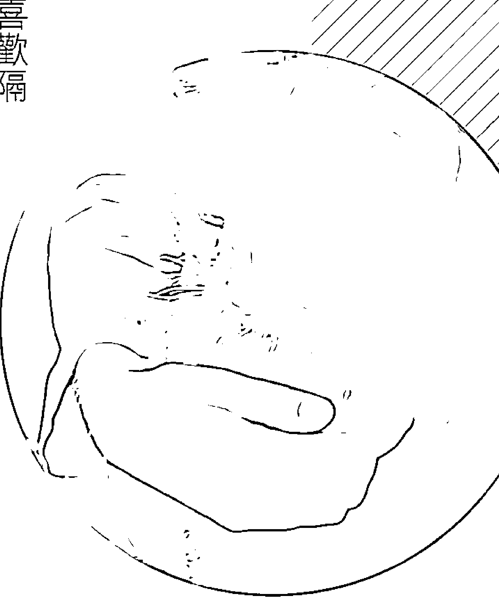

#### 何時運用觸手療程

動物可能會透過幾種方式顯示希望接受觸手療程。療程中，牠可能會將身體某部分直接挪到手的下方，一直保持這樣的狀態；也可能在療程中時不時移動，讓身體的不同部位在手的下方。有些時候，你可能會有種強烈直覺，覺得該把手直接放在動物身上。在這種情況下，若動物能接受觸手療程，牠會在你下方靜止不動、放鬆，會感覺到有股能量流通過自己，傳到動物身上。動物也可能想要綜合觸手療程及短距離隔空療程：牠可能會在療程區域自由移動，有時讓自己位於你的手下方或靠近你的雙手；有時又在療程中往較遠的地方移動。許多療程都是上述各種場景的組合。

#### 觸手療程的優點

在某些狀況中，當動物較喜歡觸手療程時，會比短距離隔空療程有更多好處。最大的好處是，通常能對動物需要療癒的身體部分掌握更多細節資訊。你可能也能感受到，某些區域的能量流比其他地方更強，這表示那些地方更需要療癒。

#### 靈氣加速療癒

這些資訊能增加對於哪個部位需治療的知識與直覺，此外，即便不是治療自己的寵物，也能幫助飼主決定療程進行時需注意的地方。也可藉由使用替代的遠程靈氣二階來獲得相同的資訊，詳細請參考第十八、十九章。

「赫米許」不只能辨認出靈氣的好處，還能主動引導療程進行以加速療癒。當我遇見牠時，牠是只左後腿截肢的三歲拉薩犬。牠剛到收容所時，由於傷勢非常嚴重，一開始他們想讓牠安樂死。但雖然牠非常痛苦卻從未咬人，牠的體貼贏得所有人的心，大家決定試著救救牠。
我向牠自我介紹，徵求牠同意進行靈氣療癒，牠轉身將後腳末端面向我，我了解牠正要求觸手靈氣療癒。開始療程時，我將手放在牠的左臀靠近截肢縫線的部位。牠立刻躺下，我替牠進行了四十五分鐘療程。我的雙手感覺非常熱，放在牠身上的那隻手覺得很痛並一直抽搐。牠整個療程都完全躺著不動，有時發出嘆息，意識清醒但全然放鬆。在療程結束時，牠轉身，第一次深深凝視我，這是很明顯地在表示感謝。
在之後幾次療程中，我一看到我牠就立刻轉身，將左臀靠近我手，躺下接受療程。

之後沒多久，我在收容所的志工派對上遇見一位女士，她開始和我討論赫米許，牠變成收容所的「三腿」吉祥物——所有人的最愛。她對我的靈氣療程一無所知，開始告訴我牠如何從手術中快速療癒，以及所有人如何熱烈討論這令人驚嘆的復原速度。很明顯赫米許知道自己在做什麼——準確地將左後臀靠近我的手！——凱瑟琳

#### 觸手法的手位

儘管能透過觸手療程獲得更多資訊，但無論是進行觸手療程或遠距療程，動物的舒適度與偏好才是第一考量。如果在觸手療程中，為了短期效益而忽視這層考量，之後可能會喪失與動物建立信任與療癒關係的長期優勢。

每個療程都應該依照動物個案的需求及喜好量身打造，可能無法歸類出適合大多數動物的類型。我們從過往經驗中觀察，以便為個別動物進行客製化療程。動物個案的智慧及喜好永遠列為療程的首要考量。若你評估某方式能滿足動物需求、有所助益，也可以跳過上述建議進行。

動物選擇觸手療程時，通常會把需要療癒的部分靠近你的手。若動物沒有表現出想讓你把手放在上面，可先將手放在比較不會受到影響的位置，如肩膀。總之，最好依據自己的直覺以及動物的回饋，決定療程重點，無需擔心手位的多寡與順序。若某種手位讓你及動物個案都覺得舒服，最好整個療程都保持。若動物已在手下方安頓下來，改變手位通常會干擾療程，動物也難以休息。靈氣會以動物最需要的方式，深入最需要的身體部位。依據經驗，許多療程最適宜以單一手位進行。
傳統人類靈氣療程通常以頭部手位開始，再往下至軀幹，但我們發現，頭部手位通常會讓動物不舒服。有些動物習慣靈氣能量後，可以接受把手放在頭上，但一般最好的情況是，動物自己往你手下鑽或是以其他方式顯示牠想要進行頭部手位療程。當動物想在頭部接收靈氣時，會躺在距離你一兩呎處，將頭部靠近你。這樣似乎能讓牠們更自在。我們發現很多動物最喜歡的手位是──一手放在胸膛，一手放在雙肩中央。這也是針對心臟的手位，心臟通常被視為情緒療癒的中心。

「艾瑪」是我飼養的其中一隻貓，比起觸手療程，牠更偏好遠距靈氣。牠特別獨立、有能力、堅定且非常清楚什麼是自己想要的。有一次在情況相當關鍵的時刻，牠展現了這些特質，掌握靈氣療程並引導療程至有益的方向。
有一天，艾瑪和鄰居的貓陷入往常的領土之爭，結果下顎下方的脖子被劃了一個很深的傷口。傷口很快就感染成一個巨大的膿腫，感覺非常容易裂開，回流進牠的身體，這可能造成致命的系統感染，因為膿沒有安全地沿著脖子流出。膿腫對抗生素反應不好，外向的艾瑪完全變了個樣。牠躲在房間最深的角落，縮在床下，只在進食時間出來，且也不常進食。

在這段期間中，我會下樓坐在房中陪牠，從床下傳送靈氣給牠，一天數次。我跪坐著和牠說話，儘管根本看不到牠。有天晚上牠看來很糟糕，我十分擔心，牠突然從床下走出來，有意走向我，躺在我的手的下方。牠有時會在手下方移動，透過不同的位置引導療程進行，讓身體一側能完全接收靈氣。然後牠翻身，擺出一模一樣的姿勢讓身體另一側也能接收，最後在我的雙手間移動牠的頭，停留相當久的時間。療程總共約持續一小時，在那之後，每次我進入房間，牠就會向前重複同樣的過程。彷彿牠記得我曾為人類進行療程的手位。儘可能用相同的方式運用於自己的療程。

很快地，艾瑪開始從床下出來，重新在屋內漫遊。當牠想要靈氣（至少一天一次），牠會跑來找我發出喵聲，就和牠想要食物或出去一樣。當我注意到牠，牠會跑下樓到我們之前進行療程的那張椅子躺下，如平常一樣堅定，彷彿在說：「幫我傳靈氣！」

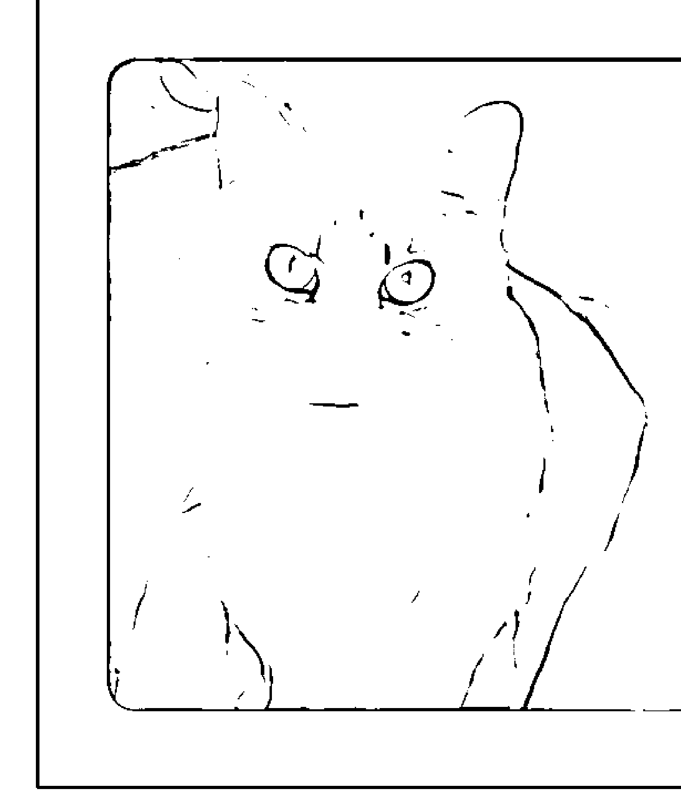

有時也可以像人類療程一樣，透過一系列手位進行療程；然而，需要療癒的特殊部位如骨關節、舊傷等，通常很敏感，若直接在該區域傳送靈氣，感覺可能過度強烈。受傷的骨頭及關節尤其如此。在這種情況下，將手放在患處上方的大關節上，動物通常能夠接受，甚至比較舒服。

舉例來說，患有髖關節脫臼（髖關節無法密合的遺傳性症狀）的狗，通常能接受治療師將手輕放在肩膀上方。後腳患有關節炎的馬，也可接受將手放在患處附近的脊椎上或脊椎旁。相對地，動物通常能接受將手直接放在需要療癒的肌肉、器官或組織上舒緩該部位的不適。

若是病重或嚴重疼痛的動物，可能只願離患處一段距離的部位傳送靈氣。比如說，一匹腹部絞痛（消化不順暢）的馬，可能不想讓你將手直接放在胃上，但會感謝你擺在脖子及肩膀部位；前腳患有嚴重撕裂傷的馬，可能不想要你把手放在傷口附近，但若放在臀部則會放鬆睡著。
治療動物，保持彈性很重要，別害怕在每次療程中嘗試任何對動物更好的方式。有時動物想要或接受觸手療程，但對雙手都在同處靜止不動感到不舒服。若是如此，療程時一手留在原位，另一手則撫摸動物身體，這樣的方式通常更能被接受；抑或掌心貼著動物身體部位，手指一邊輕抓、繞圈或摩擦，通常也可被接受。有時動物偏好你在某些或全部療程中，隔著五到十吋的距離傳送靈氣。

#### 孤兒們

幾年前的一個研討會上，一位替當地收容所扶養流浪幼貓的女士，帶了一箱剛出生的小貓，請我們進行療程，其中幾隻已經奄奄一息，不知道能否存活。她尤其擔心最小的那隻，牠不進食且十分虛弱。我在大腿上鋪上毛巾，將這些可憐的小貓放在腿上，雙手距離牠們幾吋遠，圍成弧形。最小的那隻貓移動了一點點，靠近我的手，並讓自己身體縮在我雙手圍成的弧形中，整個療程皆是如此。當週週末，我致電那位女士，想了解小貓的情況。她說牠們都很有食慾，體重增加，應該都能存活下去。——伊莉莎白

#### 葛蘭特看到生命方向

十六個月大的「葛蘭特」是隻英俊的大型金色拉不拉多。牠出生後原本要訓練成導盲犬，但是牠一歲時被判定不適任。當我與葛蘭特會面時，牠高度焦慮、深具戒心且不停躁動。牠無法長時間集中注意力，還沒脫離以嘴巴啃咬東西的階段，照顧者的手臂也被牠咬過。牠很容易興奮，有時一興奮起來，就會咬得太用力以至於傷到人。牠沒有任何攻擊性，但有時就是過度興奮。

訓練師瑪蒂對牠盡心盡力，決心為牠找一個適合的家或環境。她為牠選擇示範治療，因為牠很難被協助，且進步不如預期。我們找了一個安靜的房間，伸出雙手讓能量流動，請葛蘭特接收牠需要的能量。

一開始，牠一如既往地焦慮和躁動，在房內四處走動；牠會走向我們，在手邊停留一下，接著又在房內探險，尋找可以當玩具的東西。十到十五分鐘後，牠過來躺在我們腳邊，將頭直接鑽到我的手的下方，牠很快地發出聲聲嘆息，然後睡著了。之後療程都保持這種狀態，約莫三十分鐘。然後牠起身，凝視著我的眼睛，溫柔地舔著我的手，然後重新開始在房內探險，但比較不焦慮及煩躁了。

接下來的幾個月，瑪蒂使用其他訓練技巧，配合定期靈氣療程。當我下次見到葛蘭特時，牠改頭換面，變得冷靜、安靜且注意力集中。——伊莉莎白

#### 近距離隔空傳送靈氣的時機

療程中，動物可能會靠近或遠離你的手。若動物遠離，可在療程區中找個適當位置，或站或坐，距離幾呎，向牠傳送靈氣。動物可能會回來靠近你的手，或整個療程都在來回走動。無論牠直接鑽到手下方或隔著短距離接收靈氣，都能得到需要的療癒。

#### 泰絲告訴我痛處

個案泰絲是匹美麗白色小馬。療程開始時，我向牠介紹自己，徵求牠的允許並解釋我會為牠傳送靈氣。這是牠首次靈氣療程，我站在幾呎之外以免牠被能量的新感覺驚嚇。幾分鐘後，牠靠近嗅我的手。很明顯，牠感受到能量且十分好奇。
牠一直站在我旁邊，我試著用不同手位碰觸牠身體各部位，看看是否能感知到能量變化，反應出牠的跛行問題。當我將手移到牠肩膀時，我告訴牠，若有任何關於疼痛的症狀想跟我分享，我會聆聽。泰絲變得非常平靜，就在我持續將手從肩膀移到背部、後腿根部，接著移到右腳膝蓋上。當手移到這個位置時開始發燙，此時，牠將右腳提到空中停了一段時間。當牠將馬蹄放回地上時，用口鼻頂了自己的膝蓋、我的手，又再次頂了自己的膝蓋。靈氣已經找到問題所在。
我在這個位置停留了大概二十分鐘，牠將頭下垂到幾乎貼近地上，然後睡著了。
當我移到其他部位時，牠對膝蓋的位置做了些反應，但沒有很明顯。最後牠舒服地起身，從我手邊離開，結束這次療程。之後在馬廄裡經過幾次休息和靈氣治療，很快就恢復了健康。 ——凱瑟琳

#### 聖奈德尋求靈氣幫助

我其中一隻美麗的阿拉伯母馬——「聖奈德」，當牠需要時會尋求靈氣。在我初成為牠的主人時，發現一些牙齒問題，不過很快就帶牠治療。牙醫師拔了兩顆牙齒並做了其他治療。很不幸地，就在看了牙醫之後，聖奈德於短暫時間內變得比以前還更不舒服。不過靈氣在這段期間就像是救生筏般為牠帶來舒適，治療了牠的身心。在牠不太舒服的期間，經常尋求靈氣。我將手放在牠的下巴時，牠會將頭躺在我的胸前休息，或是在馬廄提供靈氣時，會將頭放在我雙腿上，下巴靠在我手上。我們彼此都很高興靈氣幫助牠度過這段困難的時間。

> > ——伊莉莎白

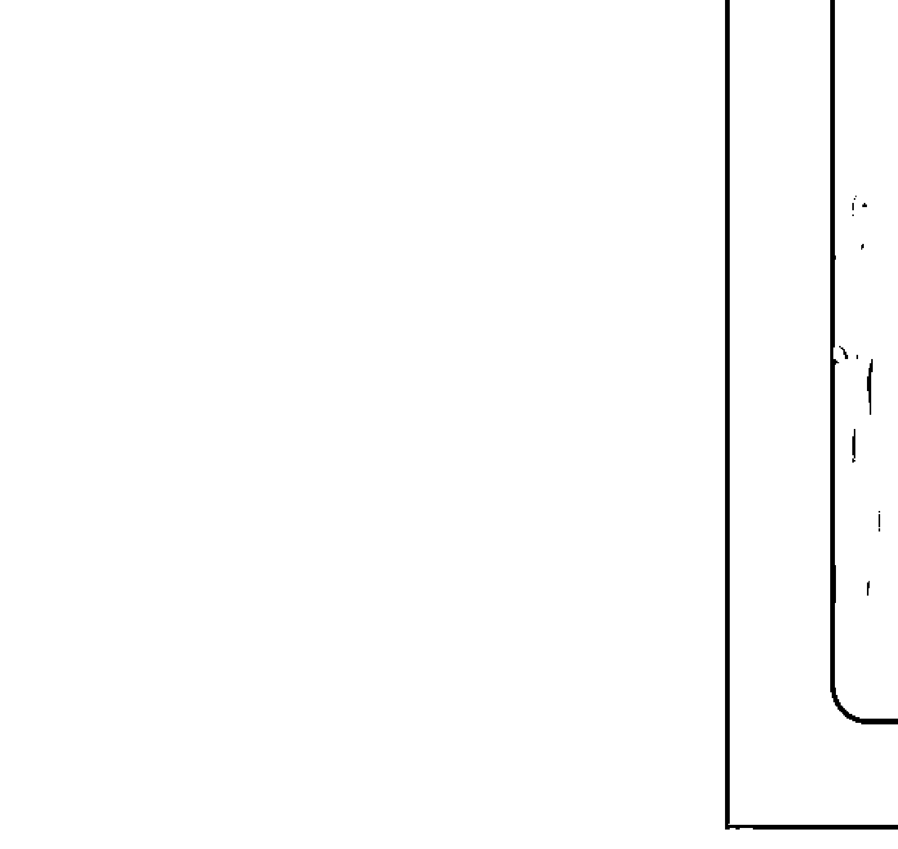

### Chapter 6 療程中的洞見

為動物進行靈氣療程時，可能會察覺到何處需要療癒，這些洞見可能會以不同形式表現。可能是療程中身體的感覺，或是與動物交流得到的情緒資訊。各種形式只是不同的表達方式，引導你為動物需要療癒的部分傳送靈氣。通常你無需針對接收到的資訊做出反應，因為靈氣的智慧會引導療癒至最需要的部分。然而有時，這些洞見會指出某些能採取的行動，以加快療癒速度或增加療癒範圍。

#### 身體感知的意義

如前章所述，當你以觸手方式或遠距方式（見第十九章）進行靈氣療程，可能會接受到治療部位的詳細資訊。可能會感知到能量流增強，或在手、身體其他部位有所感受（如熱感、脈搏跳動或輕微搔癢）。能量流的增強通常代表當時手下方的動物身體部位特別需要療癒。若感覺動物某個身體部位較冰冷，也可能代表該部位更需要療癒。在療程中，你的手、手臂或其他身體部位偶爾會暫時感覺痠痛。這種冷或熱的感覺通常表示，你所治療的動物身體部位特別需要照顧。這樣的痛感並非來自你自身，當療程結束就會很快消失。在進行觸手療程時，若能量感覺增強，試著維持同一手位，直到感覺漸減，再進行下一手位。若連續進行一連串手位，可能會注意到有些部位有較高的需求。請記得，健康的個體若因為喜愛靈氣，也可能吸收大量能量，所以，接收大量能量不一定代表患有重大疾病或創傷。衡量接收到的個案身體資訊時，也要考慮其他因素，像是動物的外在表現及行為、當下情況的直覺以及從飼主那得到的資訊。

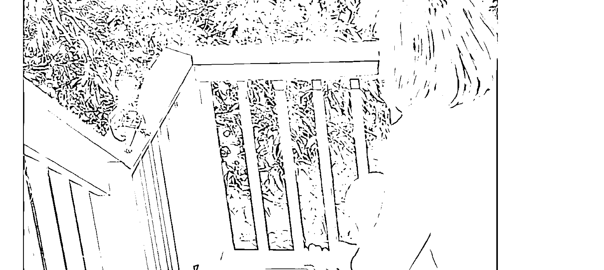

#### 梅與傑克

貓咪「梅」與「傑克」是對三歲大的姊弟。牠們被遺棄在一棟公寓長達兩週，直到鄰居發現無人照料，聯絡當地收容所。在公寓時，牠們喝馬桶中的水，但沒有進食，變得非常瘦弱。梅和傑克都很怕人，有人接近時就會瑟縮。尤其是梅，當牠們躺在籠子後方時，傑克會捲曲身體圍住梅，盡力保護牠避開危險。
我為牠們進行幾次短距離隔空療程。每次療程中，都有同一畫面浮現心頭——角落裡，窗戶透進陽光，窗邊有張鋪有軟墊的椅子，窗邊牆上充滿陽光。我看到的畫面似乎是從門廊的角度看過去。影像伴隨著一種平和及期盼。每次我為牠們進行個別靈氣療癒，也會對牠們身處狀況傳送靈氣，希望能為牠們找到合適的家。
幾週後，一位男士來到收容所尋找家中的兩隻貓。他出城一段時間，於是將牠們託付給一個覺得可以信任的人照顧，回來以後他嚇壞了，因為一回到家照顧的人及兩隻貓都不見了。他與梅和傑克相見，大家都高興得不得了，他們離開後，我衷心希望，牠們能回到家 中 窗 那 個 充 滿 陽 光 的 柔 軟 椅 子 上 。——伊莉莎白

#### 情緒風暴

當我見到「芙蘭妮」時，牠已經在收容所中待了幾週，牠是隻年輕成貓，大部分時間可能都在外流浪，因此被帶進收容所。牠進收容所時，已經懷孕一段時間。由於當時是收容所的「幼貓季節」(kitten season)，貓滿為患，收容所替牠做了人工流產。
芙蘭妮初到收容所，十分羞怯及警戒，由比較資深的志工照料。失去寶寶後，沒人能碰牠。牠非常沮喪，很少動也鮮少進食，不想跟人有任何關係。收容所工作人員請我治療牠內心深處沮喪的狀況。
我坐在籠子旁，輕聲跟牠說話，傳送靈氣，請牠接收需要的能量。一開始我以為同樣地，當你短距離隔空進行靈氣療程時，手或其他身體部位可能會感覺到能量減弱。

動物個案有高度需求時，能量流可能一開始就很強，尤其是在動物個案與人類相處多是良好經驗、較信任人類，立即接受靈氣能量新感覺時更是如此。或者，能量流一開始較弱，因為動物在測試並開始熟悉能量。通常，當動物對靈氣能量感到自在，開始安頓下來時，更有信心接收能量，療程中的能量流就會逐漸增強。有時需要幾次療程，才能建立高度自在感。

在短距離隔空療程中，透過觀想靈氣能量，在系列手位中通往動物身體的各部位，有時也能接受到一些細節資訊，如同觸手療程一樣。

#### 情緒資訊

進行療程時，可能會透過畫面、想法或感覺，接收到關於動物過往的失落或創傷經驗。這些畫面、想法與感覺通常與動物需要療癒的部分有關。有時甚至能感知到動物當下或過往曾有的感覺。這些感受可能十分強烈，一開始可能也不連貫。請記得這並非你的感受，而是動物的相關資訊，在療程結束時就會消失不見。

凱瑟琳在療程中接收到最強烈的情緒，是來自一隻有侵略問題的狗。她坐在牠旁邊，自我介紹並開始傳送靈氣。牠靠著凱瑟琳，嘆息。二十分鐘後，凱瑟琳突然覺得頭炸開般疼痛，心好像要破裂。她向那隻狗致謝，感謝牠的分享。她立即起身，走遠，朝向另一方向。她的療程結束了。

凱瑟琳告訴飼主剛才所經歷的。他們接著告訴她之前的領養過程。他們在街頭發現牠，當時頭部因為受嚴重受傷。後來雖然看似痊癒，牠的個性卻好像分裂般，有時會毫無理由地從可愛、溫和的一面變得粗暴。凱瑟琳聽了這個故事後，了解到之前在療程中所感受到的，就是牠的創傷記憶。之後，凱瑟琳又為牠進行了幾次遠距離療程，協助療癒。療程後，牠的行為立即有所改善，讓飼主十分驚嘆。牠完全變得不一樣了！接下來幾週，需要每日的靈氣療程防止攻擊性行為復發。

我第一次為芙蘭妮進行療程時，牠拒絕接受，因為能量流很微弱。然而，最後牠接收了非常多的能量。芙蘭妮整週都盤踞我心頭，我強烈感受到牠的失落。一週後，當我伸出雙手，讓靈氣能量流動，幾乎被情緒風暴襲捲。我能感受到——幾乎親身感覺到——大風襲來，棕櫚樹被吹折到地上。四處都是閃光，讓我想起雷電暴雨。我知道這是來自芙蘭妮，將此視為一個好徵兆，表示牠信任我。我繼續觀看著暴風雨，逐漸轉為中型颶風，然後暴雨，再來是多風，然後微風，最後變成平靜的天氣，在海灘邊浪花拍打海岸，陽光撒落。這個最後畫面讓我觉得芙蘭妮已傾瀉、釋放了大量情緒。我打從心底，代表我們人類向牠道歉，因為我們讓牠失去了寶寶。之後療程中，我接受到閃電、騷動及大風的畫面，大約持續一分鐘左右，但不再有像「暴風雨」那樣強度的畫面了。——伊莉莎白

發現牠不假思索地走出來，發出咕嚕聲，蜷曲身體，第一次讓人為牠刷毛，十分溫馴。療程最後，我感覺到希望，也告訴了工作人員。牠們將芙蘭妮帶出籠子，驚訝地發現牠完全變了一隻貓。

#### 害怕狗的貓咪

在與動物交流時，辨別溝通內容是來自動物或你的希望、成見或投射，可能會很困難，特別在一開始的時候。身為治療師，我們所能做的就是盡力覺察自己的感覺與問題，避免讓動物在療程中造成影響，不混淆從動物個案接收到的資訊。動物天性敏感，可能會因我們情緒狀態感到壓力、分心或筋疲力盡。這些感覺可能會讓他們拒絕靈氣療程。我們也可能將自己的挑戰與問題投射到動物身上，誤解他們真正的狀況。

有天，我在收容所為一隻飽受煩擾的黑白相間年輕貓咪進行療程。工作人員凱蒂擔心沒人會領養牠，因為牠很緊張，無法讓人抱住。她在想靈氣能否幫上忙。

凱蒂問我能為這隻貓做些什麼，我建議她盡可能常告訴牠，這裡很安全，而且狗不曾進來。我也告訴她，帶牠去後面房間瞧瞧那裡有什麼，或許會有幫助。她照做了，不斷告訴牠，牠很安全，狗不曾被允許進入貓區。當牠願意被抱住，發出咕嚕聲，並回到籠中安靜地坐著時，她很驚訝。

當天稍晚，凱蒂電話留言給我，提到那隻貓仍然安靜、親人。她剛才知道有位不願意遵守規則的新志工，在那天稍早時的確曾帶狗進入大樓，時間正好就在這隻貓剛抵達後。在結束療程及看了後面房間之後，那隻貓持續保持安靜、親人且易於照料，幾天內就找到領養家庭了。——伊莉莎白

#### 伯絲莉的智慧

「伯絲莉」是隻看起來十分聰明的白貓，住在紐約，我為牠進行遠距離療程。牠的下顎患有末期癌症。深愛牠的飼主——馬克，願意為牠做任何事，讓牠在生命最後一段時間盡可能感到舒服。

第一次的療程對伯絲莉幫助很大，馬克回報說牠變得像從前一樣，看來也比較安適。當牠又開始不舒服，馬克請我再進行一次療程。這一次，當我身處深度冥想狀態，突然變得反胃，有個直覺浮現，告訴我伯絲莉的狀況是藥物造成的。我向伯絲莉道謝，謝謝牠告訴我這個資訊。

我與馬克談到這情況，他說牠吃了不少傳統西藥以及另類療法藥物，上週嘔吐了好幾次。馬克諮詢了獸醫及順勢療法的專家，他們同意留下讓伯絲莉感到舒服的藥，並停掉其他藥物。下一次我再為牠進行遠距離療程時，牠看來平靜安適，馬克說牠變得更有活力、更享受生活了。——伊莉莎白

#### 直覺與溝通

通常隨著動物靈氣施作經驗增加，你的直覺就會變強，有時還會戲劇化地變成能接收來自動物的更多資訊，特別是在療癒方面。當動物與你分享心理狀態及過往生命艱難經驗，這代表獲得了動物的信任，你值得感到榮幸，因為牠信任你，願意與你分享。與你分享資訊，通常能讓動物開始釋放那些感覺與記憶，加速心理與情緒層面療癒，協助牠繼續在生命中前進。

此外，當動物開始與你分享這類的資訊，表示你與牠建立了絕佳的療癒夥伴關係。也是我們鼓勵人們用心與動物建立療癒關係的主因。盡可能讓動物有選擇及行動自由，聆聽、尊重牠的願望及擔心，讓牠知道你能聆聽、理解問題，許多人可能無法做到像這樣的程度。動物開始理解，你能提供某種牠之前無法獲得的協助，也能進一步理解在協助的同時，牠無需放棄自主性，也不會感到壓力或不舒服。牠知道在療癒中與你是對等關係，可以引導你協助牠獲得所需的療癒，而不會遭受壓力。牠可能以傳送情緒資訊、身體感知或將需要療癒的身體部分直接靠近你的手。

因此，這也是為什麼自我靈氣療程，或由他人為你進行療程，對靈氣治療師的成長及發展十分重要。當我們自己經歷療程後，才能讓強烈且純淨的能量流經動物，讓牠們獲得最佳的幫助。

#### 門口的母鹿

我第一眼被我們的屋子吸引的地方，就是後方綠葉蔥蘢，一路從山坡延伸到舊金山灣區。房子後方是一大片未開發的土地，野生動植物遍布。我看到鹿在行走、休憩。我知道牠們在郊區生活不易，因此我有空時，一看見牠們在外面，就會從窗邊向外傳送靈氣數分鐘。我這麼做過了約一年後，某天早晨，我先生衝進臥室，震驚且沮喪，因為他每次要帶我們的狗「柔伊」蹓躂時，門口都會有隻母鹿暴衝。我不可置信地從前窗向外看，果然有隻母鹿站在門口，表情很困惑，眼睛圓睜，鼻孔擴張。當我看著牠，一個字眼「寶寶」在心中浮現。我首先想到牠懷孕且快要生產。我告訴牠一切都沒事，沒有人會傷害或打擾牠，牠在那裡很安全。當我這麼說時，牠看來變得比較放鬆，同時，有個毛茸茸、小小蜷曲的生物畫面浮現心頭。往後院一瞧，看到一頭幼鹿，仍然蜷曲著被羊水包覆，躺在不遠處的木片堆上。我們不打擾母鹿和幼鹿，讓先生及小狗從後門離開。我明白這些想法和影像來自母鹿，能和這麼美好的生物進行短暫交流，讓我感到特別興奮，那天稍晚，我傳送靈氣給母鹿及小鹿，祝福牠們得到保護及一切安好。

隔天早上我到外頭看看是否還能遇到牠們。在房子附近散步，有時溫柔地呼喚母鹿，有時在心裡叫喚。過了一陣子後我放棄了，當我轉身踏上人行道時，差點撞上那頭母鹿。牠聽到我的呼喚且站在我的身後！我們都被對方嚇了一大跳，因此牠跳到街道的另一側。我們站著對看彼此許久，沒有任何字眼或畫面浮現，但有一種溫柔的振動能量及愛的感覺連結彼此。我覺得我們都在重新評估彼此族類的關係，我們之間形成一種連結。

這次相遇是我第一次清楚自己在與動物溝通，我繼續全心發展這種能力。時至今曰，我覺得那頭母鹿會選擇在我們前院生產，是因為牠感受到靈氣療癒能量從我們房子裡釋放出來多次。此外，我覺得靈氣協助我學習如何安處在平靜的內在狀態，調頻到「能量語言」，進而能與動物溝通。——伊莉莎白

對許多人來說，瞭解到能與動物進行更深度溝通，實現了長期以來的夢想，更讓他們明白用心與動物建立療癒關係有多值得。通常也能與動物間關係開啟了理解與親密的新層次。靈氣直接擴展那些可能性，提升個人直覺天賦、聆聽及允許動物選擇自由的能力。想與動物建立穩固的療癒關係，不一定要透過溝通。也不是每個治療師都能與動物溝通。有些人天性較喜歡動物溝通，靈氣通常也能加強治療師直覺力，加速發展溝通能力。然而，不論你能否從動物那接收資訊，靈氣都能有效療癒，即便無法接收也能有同樣的效果。為動物傳送靈氣，你本身特有的強項會被提升，你與動物之間也會產生新的可能性。靈氣療程為你及動物持續提供了一段安靜的時光。在這段時間，動物可以透過你的身體感知或情緒洞見，傳送自己身體及情緒資訊，與你分享牠內在最深的顧慮。動物傳遞健康及心理狀態資訊後，通常外顯症狀會立即改善。舉例來說，本來拒食的動物可能突然開始進食。家中平常不擅相處的動物，在療程中後，開始平和地互動。或是本來會感到害怕的動物，一開始躲得不見蹤影，在療程中，可能會勇敢地走出來讓你看見。長時間存在的問題可能需要重複幾次療程，以達到完整療癒效果，或讓進步穩定且長久地持續。當你與動物共享親密的靈氣時光，讓動物透過你的身體感知與情緒察知，分享牠的顧慮，會為你對動物的理解增添嶄新且重要面向，加深彼此間的溝通與連結。

#### 一夜好眠

我養的其中一隻貓咪——穆蘇，在與牠生的小貓分離後來到我家。前飼主搬離本州，把牠留給當地的獸醫，並同時分別為母貓及小貓找尋新家。穆蘇很快在我們家安頓下來，飽受寵愛。然而牠從未久睡，特別是在夜晚，夜晚的大半時間，都會在屋子裡遊蕩。當我學了靈氣，穆蘇變成了「靈氣海綿」。每晚都會等我，依照能傳送靈氣的時間，沉浸在靈氣之中。

有次正當我浸淫在「靈氣狀態」的療程中，突然有種強烈的感覺——穆蘇還在擔心牠的孩子。我致電獸醫辦公室，他們跟我保證會為收留的動物找到新家。我在下一次療程中告訴穆蘇，牠的寶寶很安全而且會在好家庭裡，所以不用再擔心了。

我沒再多想這件事，直到經過幾晚發現穆蘇不再在家中遊蕩。自從我告訴牠寶寶安好後，牠就能在晚上好好睡覺。時至今日，牠都能整夜安眠，我相信這是因為牠終於放下對寶寶的擔心了。——伊莉莎白

#### 一隻好雞

有天我在收容所注意到一隻大白雞蜷曲在籠子角落，工作人員向我說明，牠還是小雞時被飼養，結果長大後發現是公雞而非母雞，飼主就遺棄牠了。牠很難過，我為牠進行心理療癒。我向牠自我介紹，並說明我在此是為了協助牠療癒，若有什麼想與我分享，我會聆聽。老實說，我並不期待雞會思考食物以外的事情。療程中，當我感到能量流增強，這隻雞的情緒狀態畫面突然會清晰地浮現。牠對自己被送到收容所感到很沮喪，因為牠覺得自己一直都是隻表現很好的雞，不懂為什麼飼養主要送走牠。我在心裡告訴牠，被帶來這裡是因為原本的家不適合，牠在每個層面都是隻表現很好的雞，而且牠真的很漂亮。令人讚嘆的是，當我說完，牠就從籠子角落裡起身，走到籠子前，向我啼叫，開心地來回走動。在這個案例中，進行心理療癒療程，不僅讓牠如釋重負，也教會我寶貴一課，別低估任何動物對於理解時所表現的深度。—— 凱瑟琳

#### 史莫基學習信任

「史莫基」是隻中年灰色野貓，三個月前由一位提供牠食物長達一年的女士帶來收容所，因為女士要搬家，擔心沒人餵牠。史莫基討厭收容所，拒絕讓人照料，試著逃走好幾次。牠對人很有戒心，咬了好幾次想與牠互動的志工。

當我與牠見面時，志工很擔心，因為這三個月來牠都縮在一角，從來不動且重度沮喪。牠會被所有噪音及動作驚動。雖然某些有經驗的志工將牠帶出籠子，不過只要有人進入視線，牠就會撲上去咬他們的臉。

我為史莫基進行了幾週療程，坐在牠籠外的椅子上，雙手放在大腿上。第一次療程時，史莫基逐漸接受靈氣，稍微打了瞌睡。不過，每次只要有一點噪音，甚至我輕微移動，牠都會驚醒。

第二次療程時，當我在靈氣深度冥想狀態，突然接收到一種頭部附近爆炸的印象。我很確定史莫基對光線很敏感，且與這個爆炸有關。我向牠致謝，感謝牠願意告訴我這些，並告訴牠我對牠的遭遇有多抱歉，牠很勇敢願意與我分享。

我告訴工作人員我對史莫基的直覺，並建議他們試著接觸時不要開燈，只要隔壁房間微弱的燈光就好。當他們照做後，史莫基逐漸可以從籠中出來，不再撲向志工的臉，也不再發生咬人事件了，他仍需要有經驗的志工照料，但在他們面前表現得像個天使。他開始在籠中活動，走到籠子前面，玩耍地向後滾，用前掌輕柔地碰觸人們。

在第六次療程時，牠第一次不理會周圍的噪音及動作，進入深層放鬆的睡眠狀態。再下一次，牠安穩入睡，志工得輕敲籠子、提高聲音才能引起牠注意。牠短暫睜開眼睛，向我伸展一下身體，然後睡去。

史莫基的問題反覆發作，後來去看獸醫時，判斷牠幾乎全盲，視力與牙齒的問題與頭部撞擊有關。牠的下顎有一大塊鈣沈澱，獸醫覺得那裡就是頭部受撞擊的地方。

在知道史莫基幾乎全盲後，收容所開始能理解牠的行為舉止——一隻被嚴重傷害的野貓，自然對人深具戒心。這也與牠受限的視野有關，會讓牠覺得自己無時無刻都可能受傷害。志工將牠帶出籠子放在大腿上時，抬起頭看他們，牠會因頭頂上的強烈燈光感到刺眼。牠因為看不到而害怕，防衛性地向燈源方向攻擊。

現在大家對史莫基有滿滿的愛與同理心。史莫基沉浸在愛中，感覺被理解，得以放鬆，對牠最喜愛的人們表達親密。我跟牠變得親近，常在療程前或後讓牠舔我手上的嬰兒食品，雖然我之前從未這麼做，但史莫基太特別了。史莫基喜愛靈氣，牠通常會選擇先接受靈氣療程，療程後再吃嬰兒食物。對於一隻對食物非常執著、難以讓人動牠食碗的貓來說，這實在是種高度的肯定！——伊莉莎白

### Chapter 7: 結束療程

#### 如何辨別療程接近尾聲

理想上，讓自己有足夠時間進行療程，可以讓動物確實放鬆並保持平靜。動物可能會長嘆幾聲（或稱「靈氣呼吸」），通常也會深沉放鬆或入睡，一旦此種靈氣連結發生，表示療程最深沉的作用已經發生。

此時若進行觸手療程，就不該移動雙手。若隔著短距離傳送靈氣，可以坐下，讓靈氣流動。通常當動物從這樣的放鬆狀態中清醒，表示牠已接收到需要的療癒，也象徵已準備好結束療程。

由於動物無法以言語告訴我們療程已經完成，我們得學習如何判別牠們的肢體語言及面部表情，才可能察覺到牠們所願。一旦你感覺能量開始減弱，就該給動物幾分鐘時間，觀察是否出現療程結束的暗示。動物表現出的暗示通常是清醒、離開、去做別的事，或表現出感謝的行為。動物可用許多方式表示感謝，像是舔手或臉、深深凝視眼睛、將一隻腳掌或手臂放在大腿上、用頭碰觸手或胸膛，或是發出快樂滿足的聲音，像是嘶鳴、咕嚕聲、嘀咕聲或吱吱聲。

有些動物無法深層放鬆，特別是在首次療程時，但牠們同樣會接收自己所需要的療癒。當牠們在日後療程中逐漸熟悉靈氣，通常就會變得更能放鬆。

即便動物沒有進入深層放鬆，仍然有方法可以辨別療程已經結束。若隔著短距離傳送靈氣，手或身體其他部分會感受到能量流明顯減弱或停頓。若進行觸手療程，特別是只放單手位時，也會感覺能量流減弱。若是一系列手位的療程，會在最後的手位感覺到流量減弱。

若還無法感知能量流，可以設定在四十五分鐘到一小時後結束療程。

#### 艾瑪教我的事

有時我的貓「艾瑪」會參加我的靈氣課程，以幫助我教學。在某個特別的日子，牠沒有現身當課程志工，直到課程接近結束時，牠都在室外的露天平台休息。我和一位學生出去外面看牠是否願意讓學生施作靈氣，但當我們出去時，艾瑪起身爬到更高一層的平台上。我們尾隨在後，牠勉為其難地讓學生為牠傳送靈氣。幾分鐘後，牠起身，舔舔學生的手，走開躺在約一呎以外的地方。學生上前將手放在牠身上繼續傳送靈氣。艾瑪輕咬了他一下，但沒有咬破皮，不過跟我們劃出一條清楚的界限，因為牠之前已經給出更有禮貌的暗示，但我們卻忽略了。學生立刻理解牠的意思，沒有因此感到沮喪，反而覺得這是一個很好的學習。對我來說，這也是一個真實的提醒——別把艾瑪偶爾大方協助教學視為理所當然。——伊莉莎白

另一種辨別療程進入尾聲的方式，是自己的感知狀態，就像能量流一樣有所變化。當你覺得自己從深層冥想狀態中清醒，或是注意力開始分心到其他與療程無關的事物，通常就代表療程工作接近尾聲。

##### 動物準備結束療程的指標

若覺得能量流減弱前，動物已經顯示接收足夠的靈氣，此時該聽從動物意願結束療程。動物很有智慧，對於自己所需十分準確。聆聽動物需求，為之後的療程建立更深厚的信任關係。在極少數案例中，動物會在已接收足夠靈氣，但仍未結束療程時，提示警告或是啃咬。有時感覺能量削弱，但動物仍在沉睡，這種情況只需安靜離開，讓動物睡到自然醒。

#### 感謝靈氣的狗

瑪蒂是隻五歲的馬爾濟斯流浪犬，極度羞怯且緊張，收容所的員工描述牠「不成狗樣」。牠的舌頭總是在外面，而且非常瘦，幾乎可以摸到每根骨頭。牠穿著一件小小的綠色毛衣保暖。有次帶牠到一間安靜的房間進行療程，牠看來真的很想要靈氣。牠直直地站著，但會不自覺地持續抖動，當我將一手放在牠靠近尾巴的背上，牠就靠向我，將舌頭及頭部擱在另一隻手上。儘管牠體型很小，我卻感覺到極大量的靈氣經我的手傳到牠身上。在療程最後，牠不再抖動，並且深呼吸，伴隨著幾聲嘆息。牠也開始放了些屁（靈氣療程另一項常見的效果）。療程結束，牠相當認真地抬頭看著我，我們彼此凝視，牠將一隻腳掌放在我腿上，就像在說「謝謝！」——凱瑟琳

#### 典型療程結束的範例

假設正為一隻貓進行療程，起初三十分鐘，牠不斷起身躺下、玩玩具、走來走去，在手邊不停來回走動。終於在半小時後，牠直接躺在手的下方，嘆息兩聲後睡著。牠持續保持不動，完全進入了平靜狀態半小時。然後，牠突然醒來，舔舔你的手，在房內來回走動，坐在窗邊，注意力被外界活動吸引。這通常是結束療程的好時機，是牠已經接收足夠靈氣的指標。你可能也會同時注意到能量流減弱，或開始分心到別的事物上。

#### 表達感謝

完成療程後，記得自己只是靈氣傳送的通道，對靈氣表達感謝會更好；將手放在心上，感謝靈氣（會說三次「靈氣，謝謝你」）。然後，能以溫柔的言語在心中默念或說出感謝動物個案對療癒過程保持開放，願意讓你傳送靈氣。道別前可以短暫地撫摸動物。不過，由動物先行主動與你身體接觸會比較好。

#### 療程結束

理想上，療程後動物若想休息，應該給予牠休息的時間與空間。療程可能也會讓牠口渴，也該準備足夠的新鮮飲水。若非自家動物進行療程，在療程中接收到的一些直覺性的資訊，覺得與飼主分享會有幫助的話，此時，可以與飼主分享部分或全部的內容。在第十七章會討論到分享療程中的直覺性資訊並不一定都有幫助。傳達資訊時必須謹慎且帶有同理心，隨著經驗的累積，這方面的技巧也會更加純熟。傳達時永遠保持小心謹慎，不要造成壓力，這樣也能療癒所有關心動物個案的人。

- 凱瑟琳感謝喬伊選擇參與自我療程的過程。

#### 修補破碎的心靈

芙蘭妮的故事始於「情緒風暴」（詳細參見第97頁）。後來發生一件特別的事，牠在收容所的所有時間都窩在貓床上。牠只在收容所閉館、無人在旁時，才會進食及使用便盆。當牠躺在床上時，身上的黑色斑紋看來就像一顆破碎的心，兩片斑紋被一道白色紋路分開。許多人都說，這個圖案就像牠失去寶寶後的心情寫照。

經過每週靈氣療程，牠在這方面的情緒累積得以釋放，芙蘭妮與人變得比較開放並維持互動好幾天，但最終又躲回自己的世界。有天我開始在想，讓芙蘭妮照顧一些失去媽媽的幼貓是否是種療癒方法。

下次造訪時，結果真的有一些非常幼小的孤兒貓被送到收容所了。牠們都嚇壞了，筋疲力竭也不進食。我詢問工作人員可否將小貓介紹給芙蘭妮，看看牠是否會照顧牠們。傳統認知是成貓不會照顧非親生的幼貓，但我有種強烈的感覺，這次會是例外。收容所願意嘗試看看，只要我在一旁監控情況。

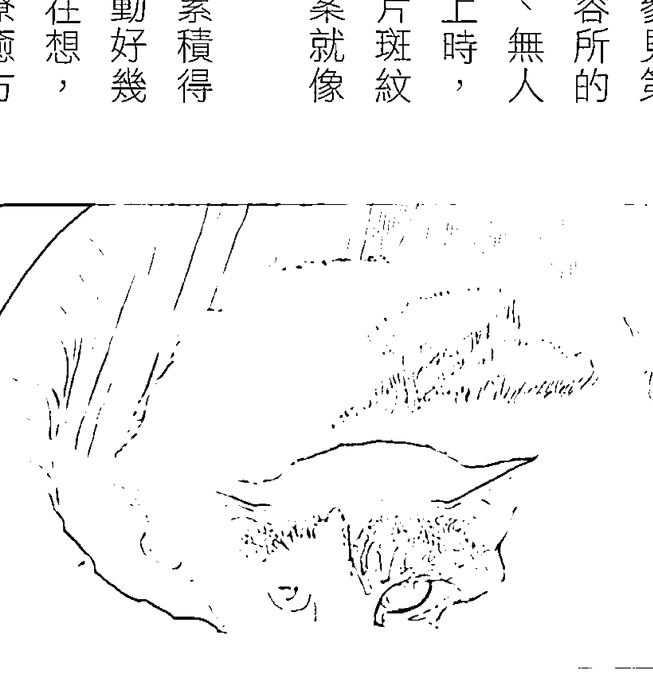

我們先以一隻小貓測試牠的反應。我將一隻小貓放在大腿上，坐在芙蘭妮籠子前方，單手為這情況傳送靈氣。芙蘭妮看來並未注意這隻小貓，但當小貓哭叫時，引起了牠的注意。最後，當我感覺牠不會傷害這隻小貓時，就把小貓放進籠中。小貓在籠中跌跌撞撞，芙蘭妮持續忽視。最後，在收容所即將閉館時，我告訴芙蘭妮，這可能是牠做母親的唯一機會，我給牠五分鐘做決定，之後就會把小貓帶走。然後我屏息並傳送靈氣，大約四分鐘後，小貓開始哭叫，當我伸手要把小貓帶出時，芙蘭妮靠近牠並開始舔牠。小貓立刻安靜下來，窩在芙蘭妮身旁。牠將小貓塞在臉頰下，頭輕輕靠著牠。芙蘭妮臉上的表情交雜著不可置信及高度的喜悅。

工作人員和我陪著芙蘭妮，直到我們覺得讓牠們共度整夜安全為止。隔天早上，芙蘭妮和小貓依偎在一起，看起來十分滿足。我們將其他小貓也帶給芙蘭妮，牠看起來有點驚訝，但很快接受了牠們。工作人員覺得小貓能習慣被人扶養，非常重要，這樣牠們不再那麼野性，最後也能找到好家庭。所以芙蘭妮能夠與小貓相處多久，取決於能否找到一個合適的寄養家庭。我回家後又對這個情況傳了一次靈氣。隔天，一個和善、大方的志工亨利，願意帶芙蘭妮回家，讓牠扶養小貓。幾天後他回報狀況，芙蘭妮竟然不可思議地開始分泌奶水，餵養全部的小貓，即使這離牠人工流產後已超過六週。

#### 成效

芙蘭妮是很棒的母親。亨利經常與小貓互動，小貓們也逐漸長大，且很親人。我持續探視芙蘭妮，每週為牠傳送靈氣。牠沉浸於母職之中，但對於亨利或其他他人並不熱絡。牠讓我撫摸，也讓亨利為牠刷毛、看獸醫，但拒絕其他的互動，本質上仍然是隻野貓。即使在亨利家，芙蘭妮仍窩在貓床，只在他晚上睡覺後出來蹓躂。幾個月後，所有小貓都找到好家庭。我傳靈氣給芙蘭妮，協助牠處理與摯愛寶貝的分離，牠也處理得很好。

然而，芙蘭妮仍然很有野性，對成為人類家居夥伴不感興趣。後來小貓到了新家，芙蘭妮也因為亨利搬家回到了收容所。收容所又承載過度，牠很可能會被安樂死，但有位志工瑪麗把牠帶回家，養在戶外。當瑪麗帶芙蘭妮到戶外時，牠可以自由離開，芙蘭妮眼睛一亮，牠坐在瑪麗身旁幾分鐘，抬頭感激地看著她，然後消失在樹叢中。現在，芙蘭妮每天回來讓瑪麗餵牠，有時會磨蹭瑪麗的腳，允許她撫摸牠。自從牠走出陰霾，芙蘭妮背上的破碎心形標誌再也看不到了，我相信在情緒層面上，牠的心也被療癒了。

——伊莉莎白

#### 後續療程的頻率與間隔期間

若已經熟悉靈氣，我們鼓勵可以依照直覺試驗療程頻率與間隔期間。同時，對於進行動物靈氣療癒的入門者，也提供一些建議。若以下的理想守則難以實行，至少在情況許可下盡量依循：

-   即時進行密集的靈氣療程，能建立起效果。狀況許可下，最好可以一開始連續四天進行療程。
-   對於輕微的健康問題，不一定要連續四天進行療程，若情況不允許，每週一次療程也許足夠，持續到問題解決為止。
-   針對嚴重或慢性問題，連續四天進行療程會有所助益。若情況允許，之後每週至少進行一次或兩次，直到問題解決為止。
-   對於非常嚴重的身體狀況或是深層的精神、情緒問題，盡可能多進行療程，特別是在療程前期，會有最佳效果。有時需要每日療程才夠深入，以協助動物個案恢復健康。在某些情況下，一兩次療程就會出現療癒奇蹟；但有時則需要花費許多心力才能轉向健康。

#### 接受療程結果

-   對所有動物來說，每週或兩週一次的定期療程，有助於整體能量平衡及維持健康。
-   規律地進行每日療程（約五到十分鐘）對動物很好，就像每天為自己進行自我療程一樣。

身為靈氣治療師，請永遠謹記是靈氣在進行療癒，我們只是偉大療癒能量的通道。當然，我們的存在與療癒意圖也是重要因素，但不是自身力量在療癒個案。雖然希望能戲劇性治癒所有問題，但療癒不一定等同於治癒。回顧過往，我們常能看到靈氣為當下狀況帶來最需要的效果。

#### 陽光清楚表示牠的偏好

在早期的經驗裡，「陽光」是隻可愛的混種克萊茲代爾馬，也是第一例自己表示已完成療程的動物個案。將牠養在馬廄時，牠很生性聰明，與人和善。我為牠進行第一次療程時，牠主導了療程。療程開始時，牠仔細聞了我的手，允許我把手放在牠身上，這彷彿幫我一個大忙。牠看來很享受療程，打瞌睡約三十分鐘。然後突然打了個哆嗦，專注地看著我。當我還未挪開雙手，牠平靜地用尾巴掃開我，然後走開。這是我那天所收到最明確的暗示。——伊莉莎白

## 第三部
## 為特定動物 傳送靈氣

Reiki For Specific Animals

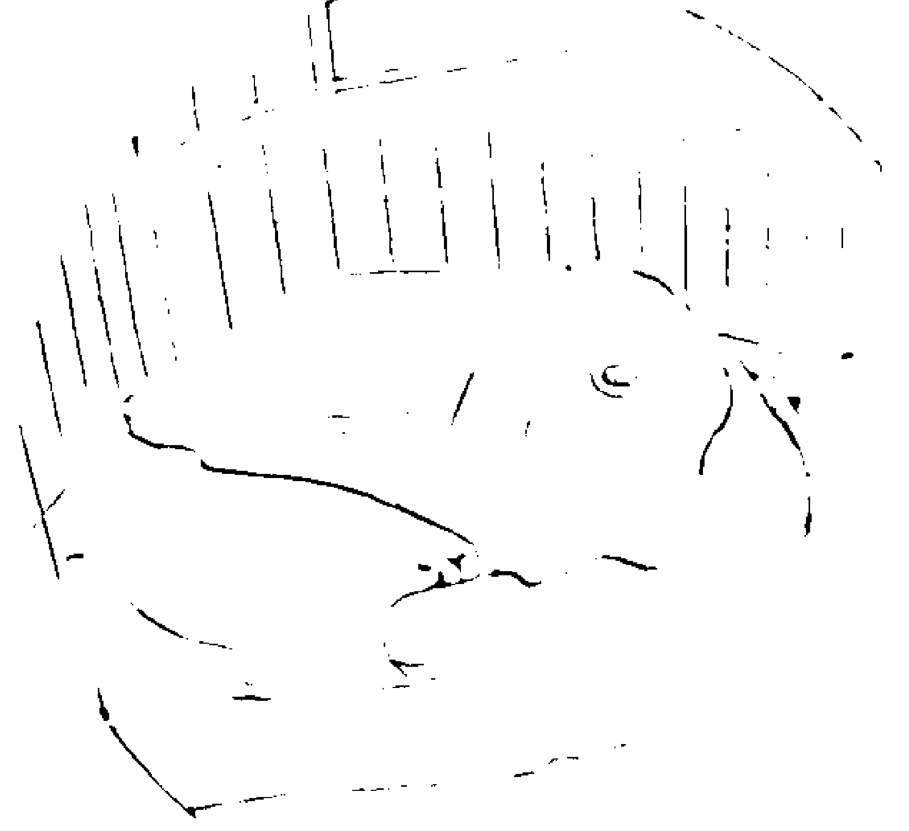

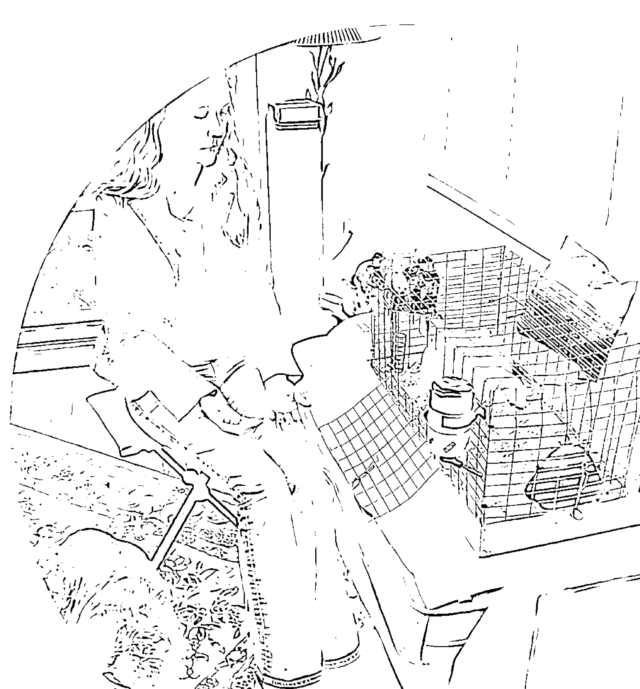

### 為狗傳送靈氣
*Chapter 8*

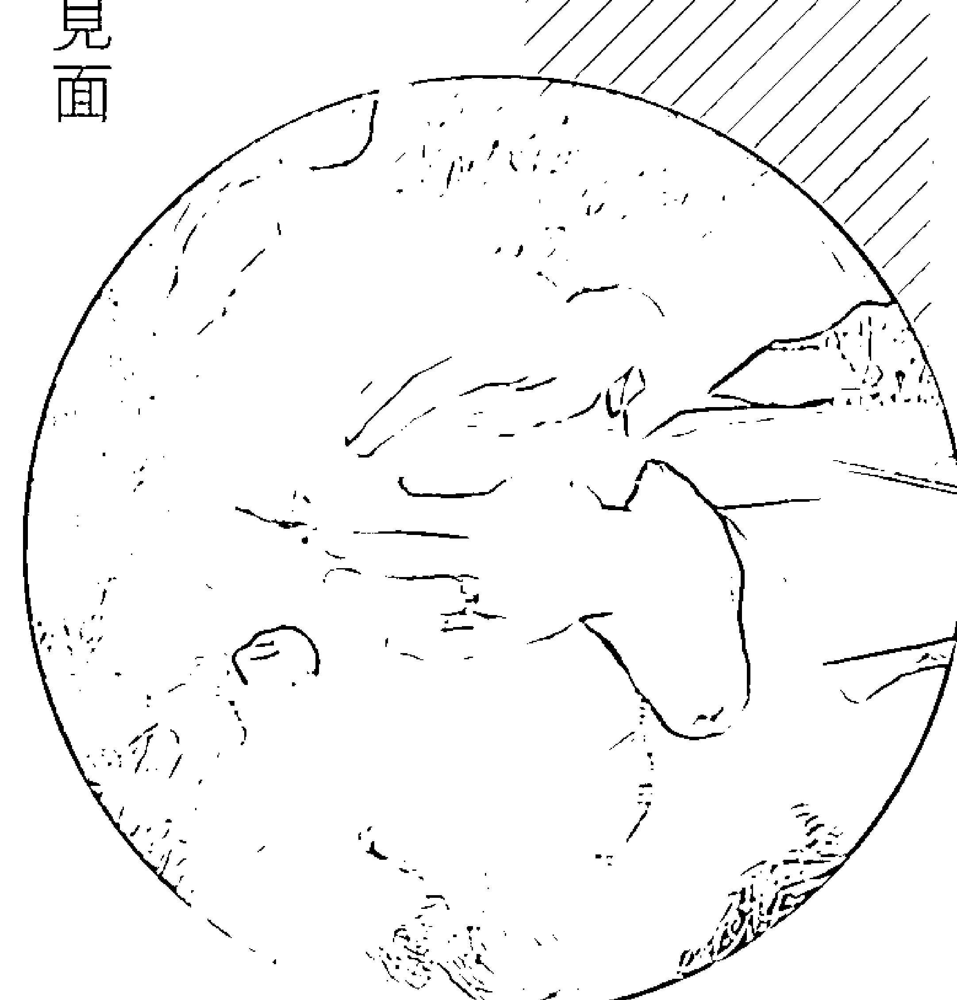

#### 狗

狗是社交型動物，在見面時通常都是主動的一方，牠們會走來打招呼，和你的身體接觸。為狗傳送靈氣的最佳場所，取決於牠的身形尺寸以及行為。舉例來說，可以選房間中央位置，直接坐在地板上。若狗比較大型、好動，可以坐在椅子上，就不會在牠移動時被撞到。

舒服地就位後，可以徵求狗狗允許，為牠進行療程。讓牠知道只需要接收自己需要且覺得舒服的能量。若讓牠知道對療程擁有決定及主導權，牠會對靈氣更好奇及感興趣。

### Chapter 8 為狗傳送靈氣

一旦狗狗知道可以決定接收多少靈氣，可以讓能量流經你手，以狗狗想要的方式及時機靠近。注意狗狗的身體語言：有些狗狗會在整個療程立刻在你手下安靜下來；其他可能會漫步或在身邊打轉，時坐時躺，直到能夠真正放鬆。

另一種辨認狗狗是否接收能量的方式，就是感覺手中的能量。若能量流持續，表示牠在接受且開始熟悉靈氣的好處。持續傳送靈氣能量但不強迫他接受，是狗狗持續參與並珍惜靈氣療程的關鍵。

若在傳送靈氣時在牠一旁玩耍，也不要強迫牠。通常當牠感覺到能量時，我們只要保持安靜不動，讓他聞聞你、研究你的手。大多時候，當他觀察到你很放鬆並感受到平靜能量，就會安頓下來休息或睡著。有些狗狗在療程開始時可能會經歷一段「療癒反應」。舉例來說，若狗狗皮膚有狀況，療癒能量起初可能會感覺搔癢並開始抓癢。只要繼續傳送，這樣的感覺褪去，最後牠會放鬆，症狀獲得緩解。（參照第41頁，進一步了解療癒反應。）

狗狗如何接受靈氣療程，依個別而異，就算是同一隻狗，在每次療程中也可能會有不同的表現。有些狗狗會迎向你，趴在你的大腿上，幾乎立即進入「靈氣睡眠」狀態；有些可能躺在你的身後休息，臉朝著其他方向會讓他感覺比較自在；另一些則喜歡在十到十五呎的遠處安頓下來，看著你，或將需要療癒的身體部位靠近你。

#### 特別的靈氣老師——達科塔

許多狗狗會接近你，窩在你手下接受療程。有時一手撫摸牠們，另一手安穩地放在牠們身上，會讓牠們感到更自在。有些喜歡你傳送靈氣時，將手掌放在牠們身上，用手指輕抓。多做嘗試，直到你知道哪種或哪些手位、位置會使狗狗在靈氣療程中獲得真正的放鬆。

從我在一九八八年初次學習一階靈氣以來，牠就每天要求我傳送靈氣。事實上，是他啟發我追求靈氣教師及治療師的生涯目標。剛學習靈氣時，老師強調自我療程及人類療程。我很興奮他看到自己的健康問題因靈氣改善，因此每晚都會進行自我療程。

達科塔喜歡待在我在的房間，自從我學習靈氣後，發現牠的行為有所改變。每次開始自我療程時（通常會坐在客廳的沙發上進行），牠會過來以一種怪異姿勢躺在我腳邊。牠在嘗試吸收我進行自我療程時「溢出」的能量。

這樣過了幾晚，我突然靈機一動：牠可能想要我為牠傳點靈氣！所以下次牠來腳邊時，我離開沙發，坐在地板上，把手放牠身上。我的手開始發熱，牠也立刻伸展躺平、放鬆，深呼吸，然後閉上眼睛。我知道牠跟我進行自我療程或為他人進行療程時一樣，盡可能接收靈氣。更特別的是，即便牠不了解靈氣，也會為自己的療癒尋求靈氣協助。

經過這層了解改變了我的人生。我一直與動物有深刻的同理連結，突然領悟到自己可以把靈氣這個禮物帶給牠們。之後幾年，我在許多地方為各種動物傳送靈氣，不斷在錯誤中學習，這些動物老師教會我許多，同時也是我撰寫本書的原動力。

我對最親愛的狗狗朋友及老師達科塔表達最深的感謝。牠在我學習過程中，不僅保持耐心，也願意為我指引方向。在這些日子裡，牠通常擔任我靈氣一階教學的老師，也是本章許多圖片的模特兒，牠對這項工作充滿熱情。謝謝你，我最棒的男孩！——凱瑟琳

#### 療程概述

方法：永遠先從狗狗只接收牠覺得自在的靈氣量開始，療程中保持尊重的態度。運用直覺，觀察狗狗的身體語言決定是否進行觸手或遠距療程，也藉此辨認牠何時接收了足夠的靈氣。只要提供牠靈氣，讓狗狗盡可能地接收覺得自在的能量。

隔段距離進行療程

若狗狗對隔段距離接收靈氣感到比較自在，就給予牠空間。最重要的是讓他自由移動並決定療程狀態。有效的療程取決於你的意圖、狗狗的接收狀態以及靈氣的能量本質，而非手位位置的準確。

基本手位：從肩膀開始往身體下方移動

若狗狗已經放鬆、打瞌睡，為了不打擾牠，可能會不想移動手位或試著為身體兩側傳送靈氣——只要運用對狗狗最有幫助的手位就好。若這是狗狗最自在的方式，運用單一手位也可以。

特別手位：對於心理及情緒療癒方式

在療程中獲得狗狗的合作與接納

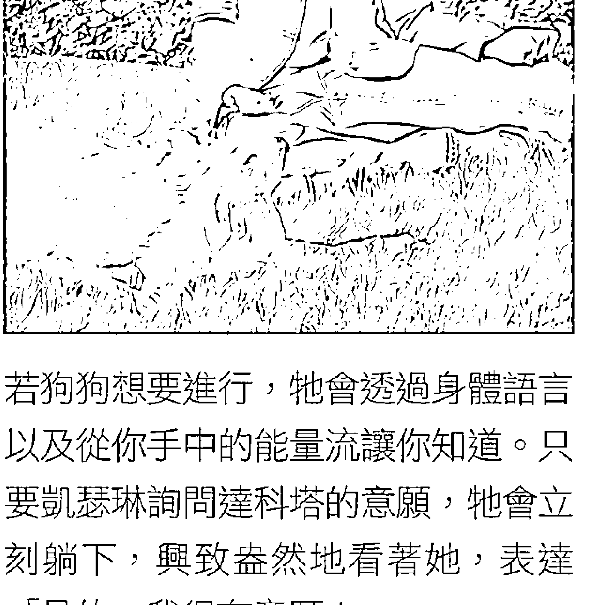

若狗狗想要進行，牠會透過身體語言以及從你手中的能量流讓你知道。只要凱瑟琳詢問達科塔的意願，牠會立刻躺下，興致盎然地看著她，表達「是的，我很有意願！」

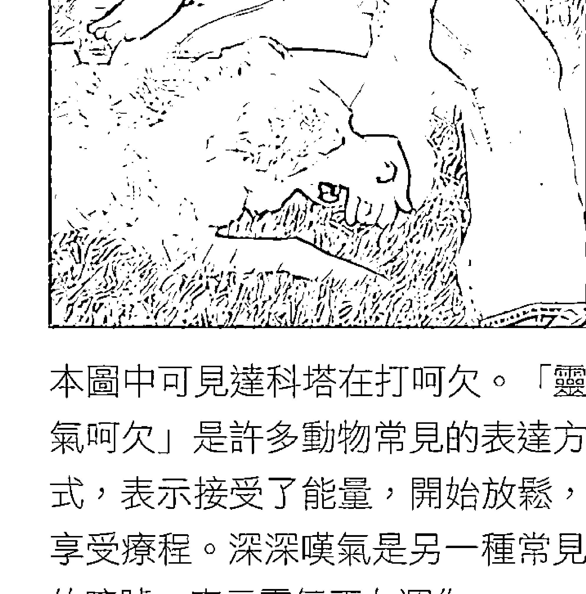

本圖中可見達科塔在打呵欠。「靈氣呵欠」是許多動物常見的表達方式，表示接受了能量，開始放鬆，享受療程。深深嘆氣是另一種常見的暗號，表示靈氣正在運作。

結束療程：感謝靈氣療癒及狗的參與

若牠開放接受，可能會想花點時間撫摸、按摩牠。這是你們連結的好時機！（詳細資訊請參照第四及第五章）

在療程中，試著將一隻手放在狗狗胸口，另一手放在頭上或兩肩中間的背上。許多動物比較不喜歡將手放在頭上，請運用直覺判斷狗狗是否喜愛。

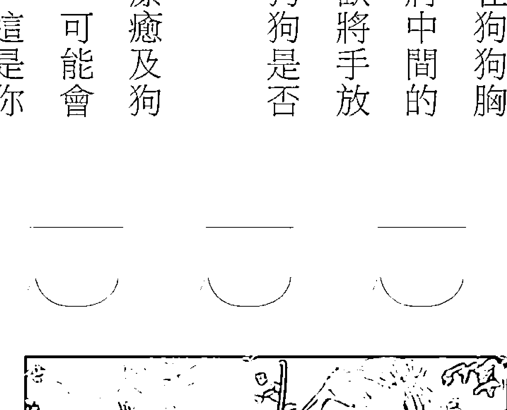

療程前先詢問狗狗「你想要進行靈氣療程嗎？」然後跟牠說只需接收自己感到自在的靈氣量即可。這是很重要的步驟。若你忘記就直接開始，牠可能不會參與療程。

隔段距離療程

許多狗狗喜歡隔幾呎距離接受完整療程（參照第131頁圖1）。有時牠們四處游走，靠近你的手又走開或休息，可能會反覆幾次。即使你的手沒放在狗狗身上，仍可以信任靈氣在持續運作。

透過嘗試，找出狗狗喜歡如何接受療程。在第131頁圖2，可以看到另一種選擇：一手放身上，一手不放。有時狗狗會擺出無法兩手都触及的姿勢。此時，無需移動牠或離牠更近，只要將離牠最近的手輕放在牠身上，另一手擺在大腿上就好。

可以在房間內或庭院為狗狗進行療程。若學會了二階靈氣，甚至可以隔更遠的距離進行。注意第131頁圖3達科塔放鬆的狀態，即使沒有觸手接觸，他仍十分放鬆，接受靈氣療程。

完成療程時，感謝狗狗接受及參與療程。在第131頁圖4，凱瑟琳花了几分鐘對牠說：『謝謝你，達科塔！棒男孩！』

#### 隔空靈氣療程

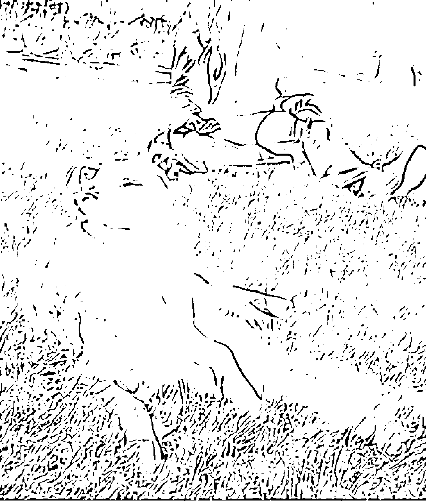

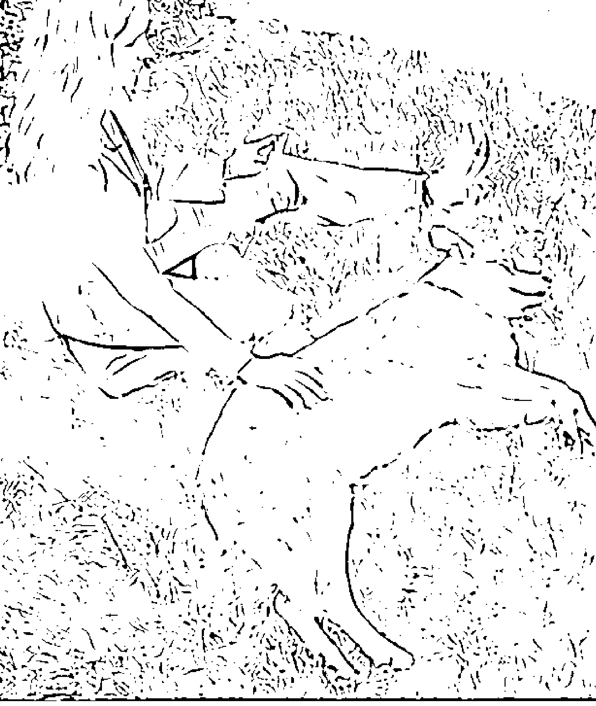

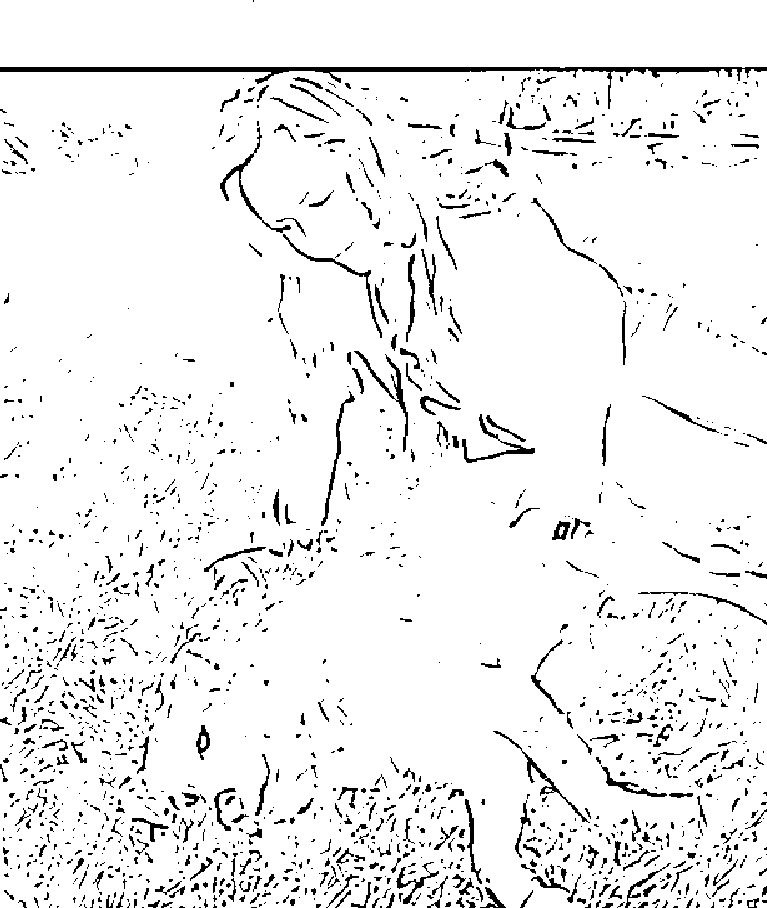

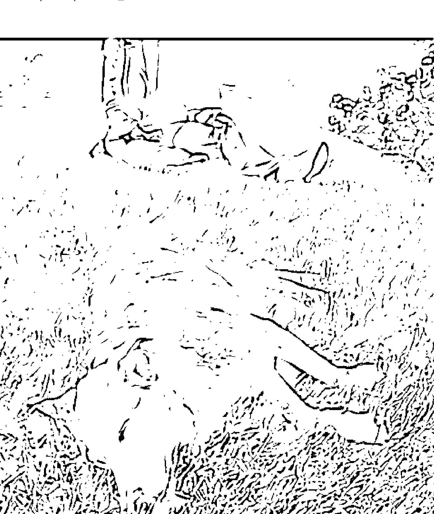

-   1.  許多狗狗喜歡隔幾呎距離接受療程。
-   2.  有些狗狗較喜歡只放一手在牠身上。
-   3.  運用二階靈氣，你可以隔更遠的距離進行療程。
-   4.  療程結束時，對狗狗表達謝意。

#### 觸手療程

讓狗狗自己決定何時、何地接收靈氣。若選擇以站姿開始，接下來牠可能會很快放鬆躺下。

有時，若小型狗想要靈氣，牠們會爬上你的大腿，可以在大腿上以一兩個手位完成整個療程。只要牠們在療程中放鬆，通常就會躺下。

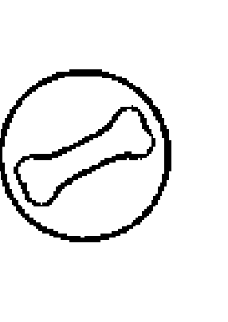

##### 當狗狗躺下時

若狗狗選擇觸手療程，肩膀是讓牠先感受能量的絕佳位置（參照第132頁圖1）。

輕輕把手放在狗狗身上，不要施壓。當你將手放在狗狗身上或移動手位時，只要牠看起來不確定或不舒服，可以用單一手位或隔段距離傳送就好。同樣地，若覺得移動手位會干擾狗狗放鬆休息，整個療程可以用一個手位就好。

持續將手沿著狗狗身體往下朝後腳端移動，輕輕將手放在狗狗身上，不要施壓。若覺得隔空幾時傳送狗狗會比較舒服，也可以這麼做。若狗狗對觸手療程感覺自在，可將手放在牠身上。

#### 在狗狗躺下時進行靈氣療程

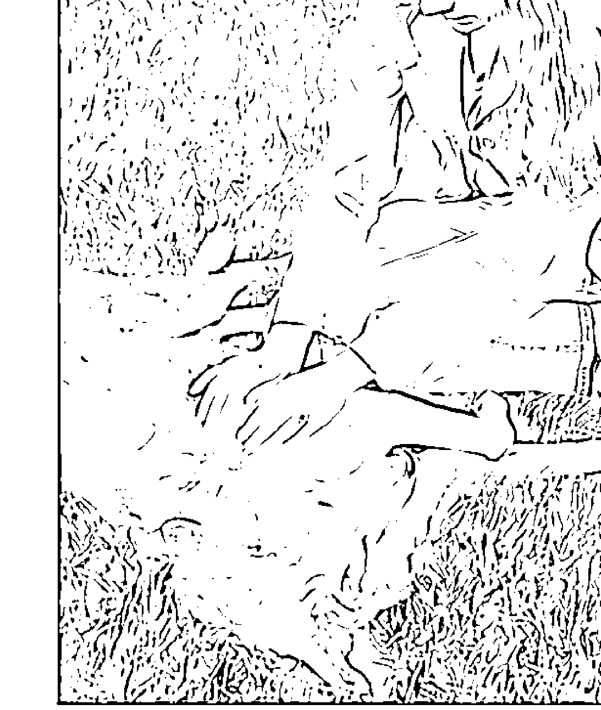

-   1.  若狗狗選擇觸手療程，肩膀是讓牠首先感受能量的絕佳位置。

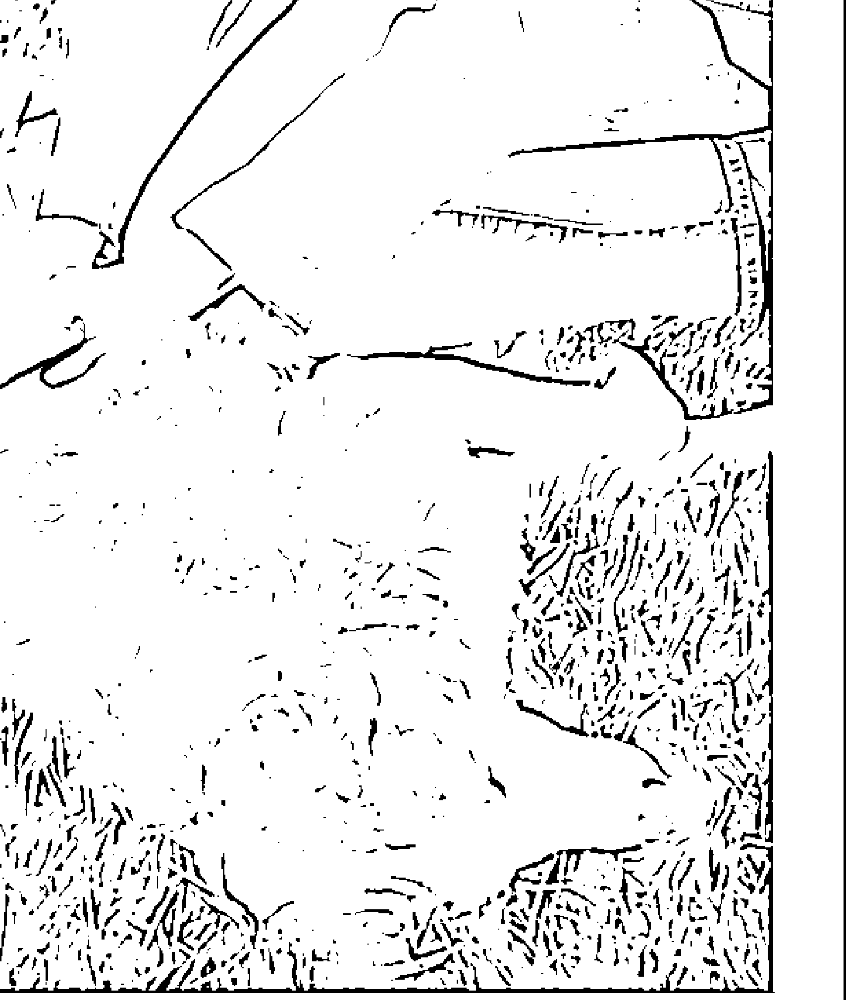

-   2.  沿著狗狗身體往下朝後腳尾端，輕輕移動手部，持續療程。

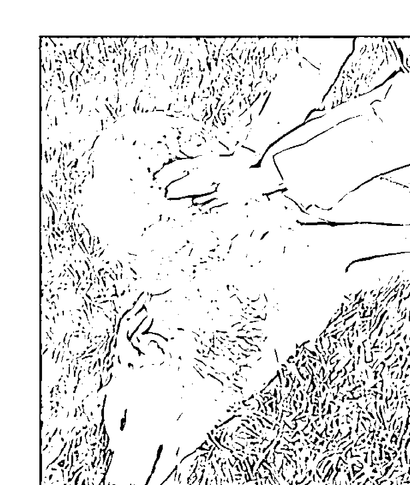

-   3.  若狗狗身體移動，保持彈性調整手位。

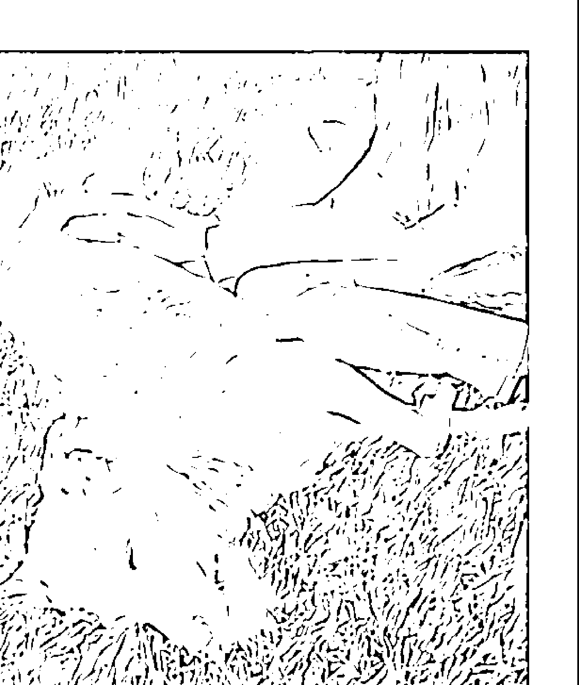

-   4.  治療靠近尾巴的後腳，是療程收尾的好方法。

##### 當狗狗呈坐姿或站姿時

側身上或靠近側身的位置（參照第132頁圖2），或靠近脊椎位置往下移動——端看狗狗選擇什麼樣的接收位置，以及你覺得最舒服手位的放置。

手輕放在狗狗身上，繼續往後腳端移動。若狗狗移動姿勢，讓手位保持彈性（參照第132頁圖3）。狗狗舒適度遠比手位正確重要。

狗狗的後腳、靠近尾巴的位置，是結束療程不錯的位置（參照第132頁圖4）。可以從一系列的圖片看出，不用擔心身體兩側都得做到，狗狗可能會自己翻身讓某特定部位接收靈氣。只在身體一側，手位從肩膀往後腳端移動，甚至只用單一手位，都可以是讓狗狗舒服的療程。靈氣會深入需要它的部位。

另一個結束療程的好方法是，從肩膀往後腳端移動，一手放在狗狗頭上，一手放在尾巴基部，脊椎尾端的位置（參照第135頁附圖），在脊椎兩端同時傳送靈氣，狗狗會感覺能量有所平衡。

狗狗呈坐姿或站姿時，肩膀也是開始手位不錯的位置（參見第135頁圖1）。開始療程時，手放在肩膀的位置，多數狗狗都能感受到能量，也覺得舒服。將手輕放在上面，牠們很快就會開始放鬆。

#### 在狗狗站立或坐時進行療程

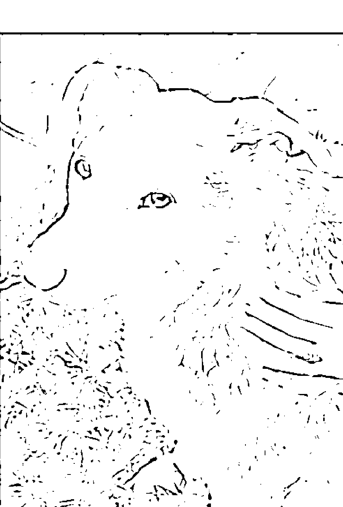

-   1.  開始時，將手輕放在狗狗肩膀位置。

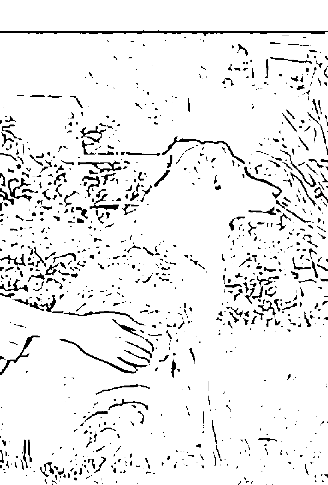

-   2.  沿著脊椎兩側由肩膀往下背移動到後腳尾端。

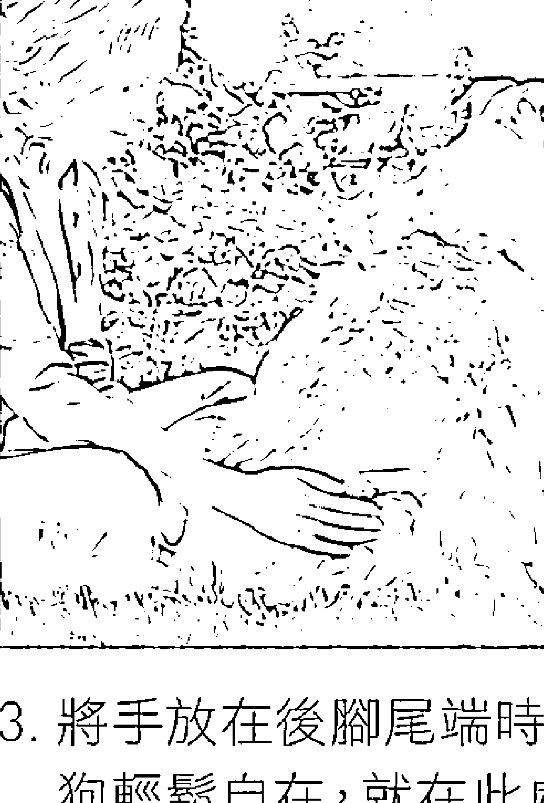

-   3.  將手放在後腳尾端時，若狗狗輕鬆自在，就在此處結束療程。

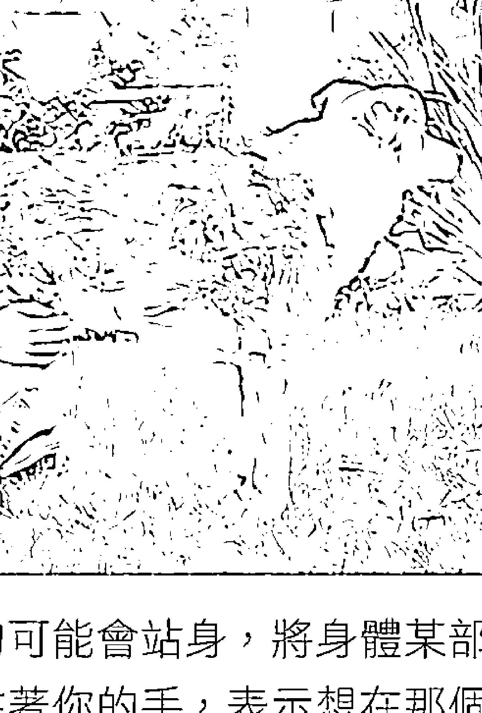

-   4.  狗狗可能會站身，將身體某部分靠著你的手，表示想在那個部位接受靈氣。

若狗狗對移動手位感到自在，那麼持續沿著脊椎兩側，由背部往下朝後腳進行療程（參見第135頁圖2）。若在狗狗覺得舒服，就在後腳尾端結束療程（參見第135頁圖3）。若狗狗的關節附近，他們可能會覺得能量太過強烈。這樣的話，也許可以試著從肩膀手位開始，隔著幾吋或短距離進行全部療程。你得嘗試看看何種方式對狗狗最好。靈氣會自動流向需要的部位，即使你的手沒有直接擺放在該區域上。

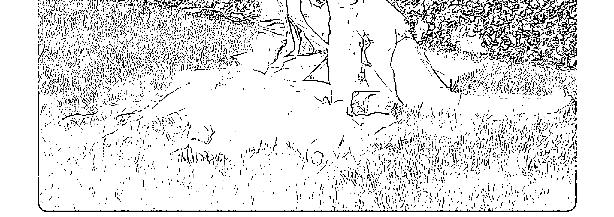

-   狗狗以臥姿時進行療程時，這也是結束時手位放置的選擇之一。

#### 心理與情緒療程

有時當你治療狗狗時，可能會感覺到牠的情緒問題需要療癒——此時，就讓直覺和狗狗的喜好引導你。下方兩張圖片的手位都是不錯的方式，能專注於情緒的療癒。其中一個方式是將手放在牠的胸部，另一手放在頭部，前提是牠對這個手位感到舒服；或是將手放在胸部，另一手則放在背部肩膀中間。

若狗狗覺得某部位特別需要靈氣，牠可能會站起來將該部位貼住你的手部（參見第135頁圖4）。

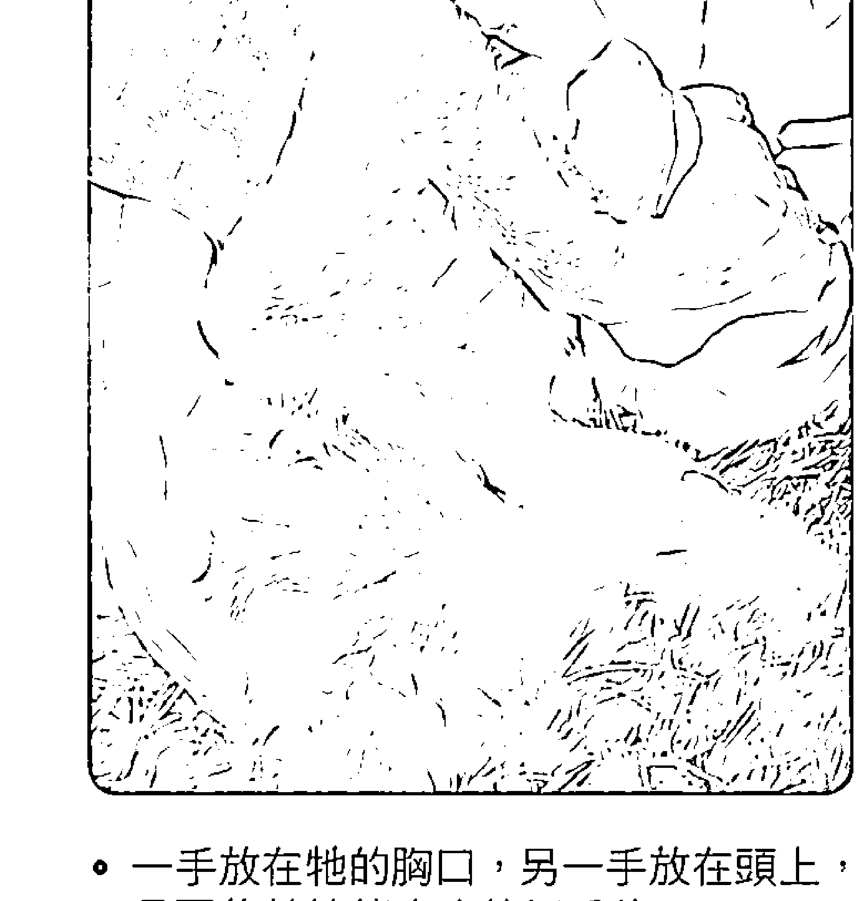

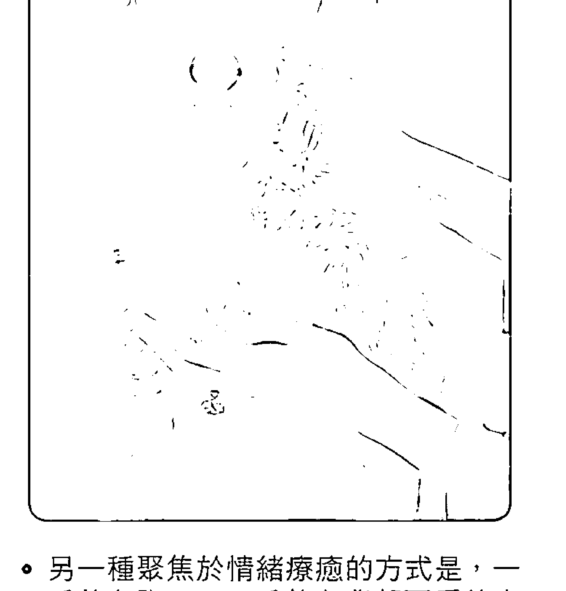

-   一手放在牠的胸口，另一手放在頭上，是聚焦於情緒療癒的好手位。
-   另一種聚焦於情緒療癒的方式是，一手放在胸口，一手放在背部兩肩的中間處。

有時候你的狗狗會露出肚子，有些狗狗很喜歡這個位置。不要擔心你的手位是否正確，只要將手放在牠感覺舒服的地方就可以了。

有情緒問題的小型狗甚至可能會在腿上進行靈氣治療，就像是這隻梗犬「蔻比」。蔻比遭受第一位主人的擺佈，後來由愛蜜莉一家領養。一開始，牠非常緊張，常常發抖，獨自時會嚎叫和哭泣。經過一段時間，新家庭給予愛與支持，牠變得比較不那麼害怕了，但仍然不喜歡被主人獨自留在家中。

蔻比自信心不斷增加，表現在牠選擇要如何接受靈氣治療。比起許多會感到害怕的狗狗偏好選擇遠距離療程，蔻比則是待在凱瑟琳身邊接受療程。

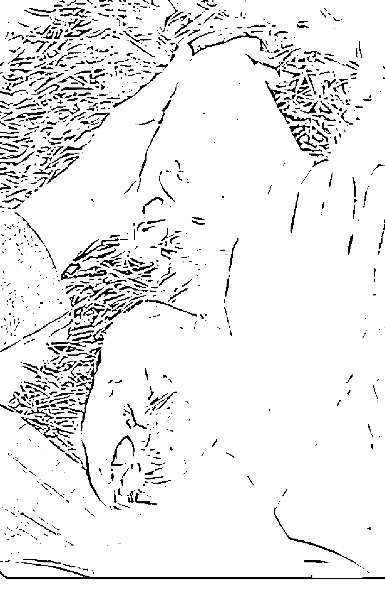

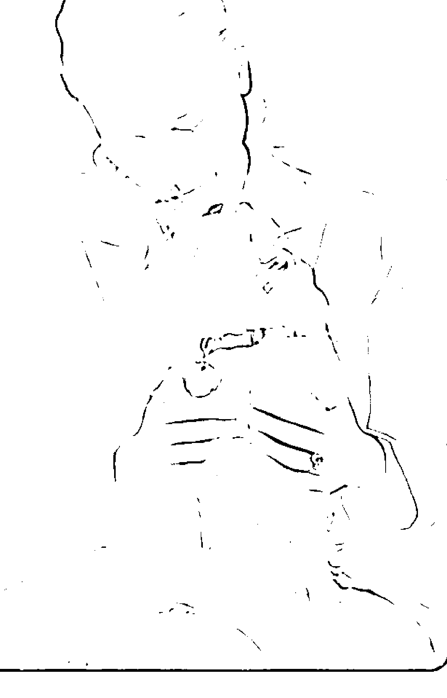的大腿上接受靈氣。牠就像靈氣海綿般吸收大量的靈氣。

#### 治療狗狗的腳

接下來提到的手位，適合腿部及腳部患有傷勢或狀況的狗狗。不過，只在狗狗覺得這些手位舒服並同意接受觸手靈氣時使用。首先，確認牠處於舒服的姿勢，像是臥姿。輕柔地試試看下述手位。

- 前腳：一手輕放在關節處並讓前腳輕放在另一隻手上。
- 後腳：從雙手放在腳跟處，手朝著牠的腳掌移動，一手輕放在上方的腳，另一手則輕放在下方的腳。

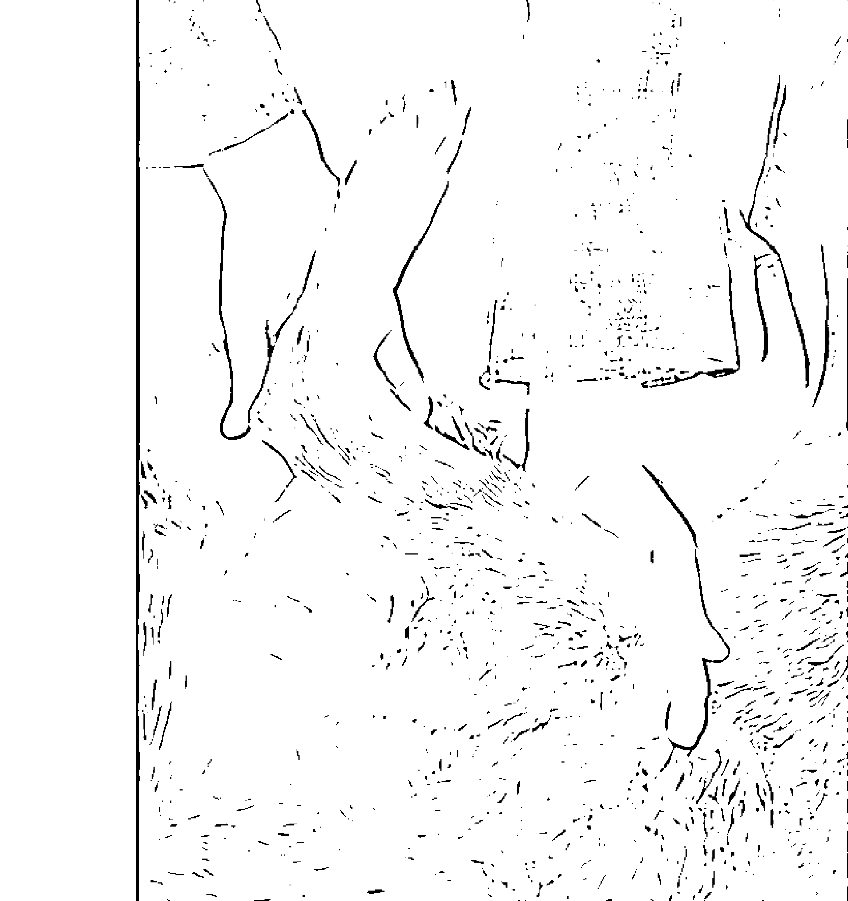

• 為後腳傳送靈氣。

### Chapter 9 為貓傳送靈氣

#### 猫咪渴望灵气

如同牠們獨立的本質，猫咪喜歡以自己的方式接受靈氣。和許多動物一樣，若覺得被迫參與療程，就會拒絕參與。在療程開始時，請猫咪接收牠需要的靈氣療癒能量，通常牠會非常開放地接受。在開始之前，最好讓自己屏除任何對療程的期待，在情緒上保持中立。讓貓信任且接受靈氣的最好方法，就是在室內找個舒適的地方，離牠一小段距離安靜地坐著，讓牠知道你只會給予牠覺得舒服的靈氣量。短距離隔空傳送靈氣，可以給予貓機會以自己的方式評估需要的靈氣量，並以自己需要的時間適應。你會發現只要在貓咪不覺得有壓力或被強迫的情況下，通常很快就能享受、主動尋求靈氣療癒，並且珍惜彼此間特別的療程時光。只要你允許靈氣能量流經你的雙手，靈氣療程隨即開始。牠會立即感受到能量存在，通常會開始研究這股能量。舉例來說，牠可能會直接湊近、嗅聞你的手，也可能靠近，非常專注或好奇地看著你。可以透過牠的身體語言，以及通過你手的能量流辨別牠是否對療程保持開放。（參見第四章，進一步了解如何理解動物身體語言及流經手部的能量流。）貓咪接受療程的方式依個別而異，每次療程也會有所不同。有些會蜷曲在貓床上或將頭朝最喜歡打瞌睡的方向，進入睡眠狀態，甚至在夢中抽動及跑動。其他可能會爬上你大腿，甚至胸口，開始大聲呼嚕。此時，牠可能想要你提供觸手療程，若覺得情況如此，可將一隻手放在牠身上，看看反應為何。若他接受，再放上另一隻手，觀察他的反應。有些貓喜歡在療程中四處移動，一開始可能會安然睡去，然後前來嗅聞你的手，接著躺在前面幾分鐘，用身體摩擦你的背，再窩在你旁邊睡著，或在療程最後幾分鐘爬到大腿上接收觸手靈氣。

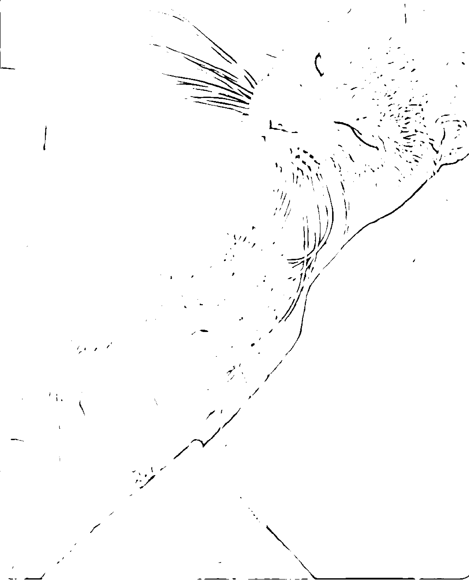

#### 穆蘇博士

「穆蘇」——我可愛的黑白貓，有天返家時，耳上有個凝固的血漬，這是被附近貓咪霸凌的結果。隔天牠耳朵腫起來，明顯感到不舒服。於是我帶牠去給獸醫瞧瞧。獸醫剃掉了牠受傷耳朵的毛，發現被咬了許多地方，而且有一個接近半吋長的撕裂傷，通往貓耳的血液量比較少，獸醫覺得可能不易復原，耳朵會永久失聰。那天打了抗生素，就讓我帶回家了。接下來幾天，牠到處跟著我，我一坐下來就跳到我的大腿接收靈氣。我很忙碌且工作纏身，一邊不斷自動回應牠的靈氣需求，一邊滿足牠，但大部分心思其實都在別的事情上。有幾天我都是單手做事，在電腦前工作、閱讀、講電話，甚至吃飯也是，另一手則按照穆蘇的堅持，黏在牠身上，將靈氣「水龍頭」開到最大。第五天，穆蘇開心地跳上我的大腿，安頓好接收靈氣。我低頭看牠的耳朵，發現之前受傷處只剩針尖大的結痂，沒有疤或其他痕跡，穆蘇是靈氣療癒的識途老馬，知道如何獲得自己需要的療癒，並主動爭取，我沒有用太多心思，只是遵照穆蘇博士的療癒計畫。——伊莉莎白

#### 治療多隻貓

當家中不只一隻貓時，可以為牠們集體傳送靈氣。對於家中不止一隻貓，但沒時間為們分別傳送靈氣的飼主，集體療程很有效果。有時貓群會決定誰先接收靈氣，然後輪流前來接受療程。也可能圍繞著你一起接受，手放在不同的貓咪身上，或是一手放在某隻貓身上，其他群聚在附近，一起接收能量。當牠已經接收足夠的靈氣時，會警告你知道。舉例來說，牠們可能清醒、打呵欠、伸懶腰、喝水，被其他活動吸引，離開房間或到外面。流經你手的靈氣能量流也可能會同時逐漸減弱。

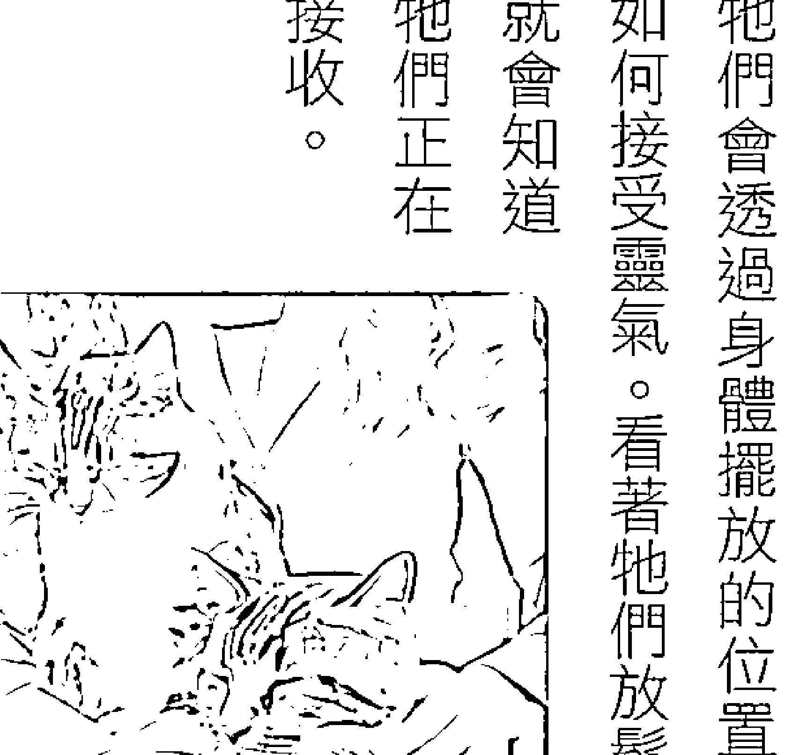

同時為多隻貓咪進行觸手療程是可行的，最好對全體一同開放療程，這樣就不會有某些動物覺得被遺忘感到忌妒。左圖中，「巴比」正接受觸手療程，「珊米」也加入了療程。凱瑟琳不需把手直接放在珊米身上——牠在旁邊就在接收靈氣能量。謹記能量會前往需要的部位。傳送靈氣時，牠們會透過身體擺放的位置告訴你想如何接受靈氣。看著牠們放鬆的樣子，就會知道牠們正在接收。

#### 療程總覽

方法：療程前永遠記得要先徵求同意。讓貓咪知道只需接收需要的靈氣量。觀察牠的身體語言，了解牠對療程的喜好方式。別催促你的貓咪朋友接收靈氣——只要傳送靈氣，然後看看牠如何選擇。

隔段距離進行療程：多數貓咪較喜歡隔段距離接受療程。有些個案可能會在你附近（甚至是背向你休息），或在療程中隔了幾呎。牠們可能也會在療程中有些動作——可能靠近你，嗅聞你的手，在房間漫走，最後在貓床上平靜地安頓下來。

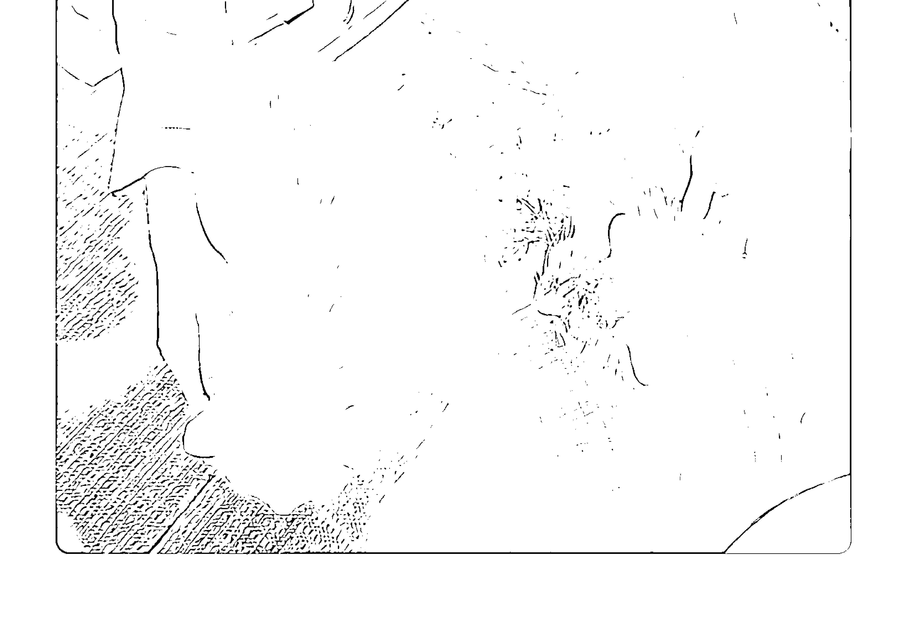

##### 基本手位

貓咪的身形通常比狗小，療程中使用一到兩種手位就已足夠。貓咪通常喜歡你分別將兩手個別放在身體兩側，一手放在胸口，一手放在背上，或是雙手分別放在背上或後腳跟。請密切注意貓個案的喜好。

##### 特別手位

當個案有特殊的健康問題時，牠可能會在療程中將患部靠近你的手，例如將頭或腳掌靠在手上。記得保持彈性，讓他以自己表示什麼區域需要觸手靈氣。

#### 結束療程

療程結束時，牠可能會起身輕碰或親你表示感謝。在牠離開前，謝謝個案接受療程，或許也可花幾分鐘撫摸，讓牠知道你有多麼感謝牠的參與。

> （更多資訊請參見第四及第五章。）

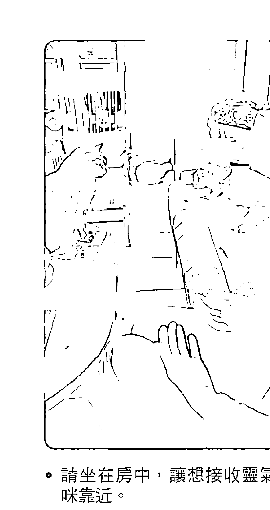

• 請坐在房中，讓想接收靈氣的貓咪靠近。

#### 赛门的呼吸变得容易了

第一次遇见「赛门」时，牠正遭遇困境。赛门长期气喘，有些日子会呼吸困难。我过去曾到「明亮和平之地」(BrightHaven) 动物庇护所，为我最喜爱的猫咪「水晶」传送灵气。水晶快要离世，需有大量灵气支持以平和度过这个阶段。结束水晶的灵气疗程时，一只闪亮的漂亮黑猫跑进房间，扑到我身上，用头磨蹭我的手脚及身躯。

牠不耐烦地喵喵叫，像是要我立刻为牠进行疗程。

我坐在地板上，牠在我的大腿上安顿好身躯，让我的手可以把手放在牠的肺部区域。我的手立刻变热，牠深呼吸，呼噜叹息，沉浸在疗程中。疗程大约到一半时，发生了严重的咳嗽插曲：牠的声音听起来严重鼻塞，开始流鼻水，看来无法呼吸。过了一会儿，咳嗽插曲似乎帮牠清理了肺部，牠深呼吸，进入睡眠状态。我继续疗程约一小时，最后因为还有别的预约得先结束。让牠离开我腿上实在困难，牠的脚掌紧挨著我，一边哀怨地喵喵叫。我真心希望……

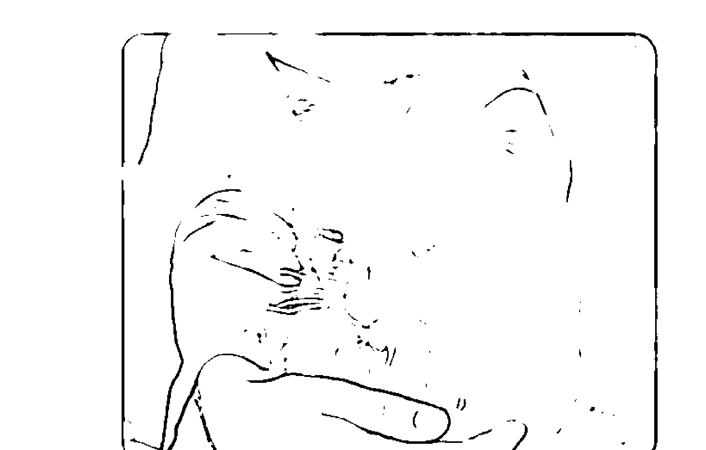

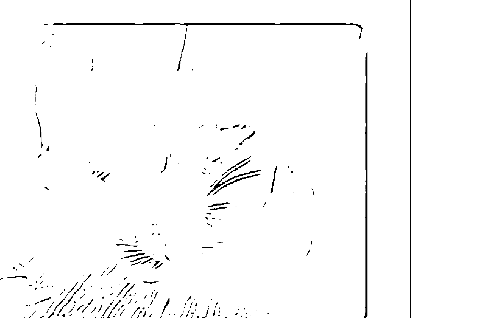

#### 隔段距離進行療程

開始療程時，請待在房內讓想接收靈氣的貓咪靠近。牠們偏好自己選擇如何接收。注意看第145頁的圖片，有幾隻貓放鬆地停留在附近，其他則離得較遠。牠們會感受能量並決定要不要接受療程以及界定舒適區——喜歡隔多遠的距離接收靈氣。當你保持耐性讓動物靠近，牠們有時就會選擇觸手靈氣。

> 望自己能待久一點。回家後，我把賽門列入動物團體定期遠距療程的名單。從那天開始，每當我造訪庇護所時，賽門總能找到我，跑進房內，又開心又期待地跳上我的大腿。牠似乎發現靈氣能大幅緩解氣喘的不適，即使每次療程都會碰上表示好轉反應的咳嗽插曲。雖然這些好轉反應會有點不適，但每次療程結束時，牠看來都變得更好，也更舒服了。
——凱瑟琳

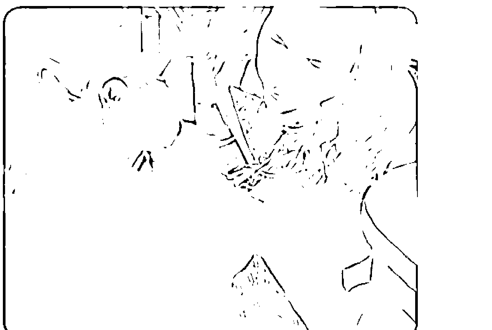

● 凱瑟琳感謝賽門參與療程。

#### 觸手靈氣療程

靈氣療程開始時，貓咪通常會四處移動，因此在牠們安穩進入「靈氣瞌睡」狀態前，最好能找到適合牠的姿勢接受觸手療程。讓貓自由活動，你的手隨著牠移動。從肩膀開始療程，然後看牠如何引導。別強迫貓安頓下來。保持耐心讓牠選擇如何展開療程（參見第150頁圖1）。若牠在療程中不時移動，配合牠的選擇調整手位。別擔心手位的數量及次序，依照他的引導即可。整個療程可能只用了一兩個手位，或是牠不停讓你的手在牠頭部、身體或腿四處挪動，靈氣都能前往需要的部位。有時貓咪會在療程中安穩入睡。此時可以考慮將手放在幾個部位：從肩膀開始（參見第150頁圖2）。手沿著牠的身體往下，放在脊椎兩側（參見第150頁圖3）。最後在脊椎底部結束療程（參見第150頁圖4）。記得，當牠安頓下來入睡，代表正投入靈氣療程中。若移動手位，可能會打擾到牠休息或讓牠變得焦慮、不舒服，最好將手放在牠覺得最舒適的位置直到療程結束。

#### 令人驚嘆的復原——葛蘭迪

我第一次遇見「葛蘭迪」時，牠正發著高燒昏睡。在牠前往獸醫院前，我只有一點時間為牠快速進行靈氣療程。牠非常能接受靈氣療程，雖然一開始難以放鬆，但在療程中很快就睡著了。
獸醫診斷牠胸部化膿，或可能是肺部及胸壁間的胸膜感染。牠立刻被放在氧氣箱中，診斷結果並不樂觀。獸醫說牠太虛弱無法動手術。
我繼續每天傳送遠距靈氣，感覺每次都有驚人的靈氣流量。令人驚嘆的是，牠恢復到有力量接受手術。我在牠手術當天及之後連續幾天也傳送了靈氣。手術很成功，牠完全康復了。現在，牠是一隻英俊、強壯的大公貓，你不會知道牠曾經面臨過生死關頭。雖然牠不常讓人用手摸，但只要我造訪，牠都開心地接受觸手靈氣。
—— 凱瑟琳

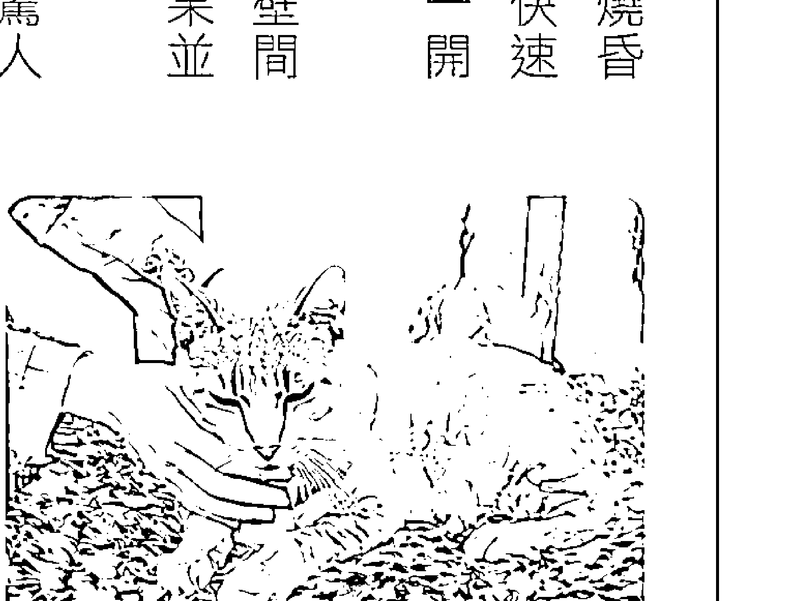

#### 巴比與琳達

> > 巴比到「明亮和平之地」庇護所時，病得很重，無法進食。儘管牠健康狀況逐漸改善，但仍受慢性口腔問題所苦。巴比是隻親人又有愛的公貓，喜愛靈氣療程。琳達是隻野貓，有天帶牠的伴侶及五隻小貓一起搬進蓋兒的家。雖然一開始非常怕人，現在卻變得非常親人，能隨時坐下打瞌睡。琳達不會錯過庇護所內的團體療程，總是直接跳上我大腿，十分投入。除了靈氣療程外，庇護所也用順勢療法及針灸治療牠的慢性鼻炎。——凱瑟琳

#### 珊米的觸手療程

珊米是隻野貓，明亮和平之地庇護所尚未興建時，就住在當地。有天牠決定搬進庇護所。剛到時非常瘦且怕人，然後經歷令人驚訝的轉變。琳達現在變成最可愛、親人且隨和的母貓，隨時準備好接受觸手療程。——凱瑟琳

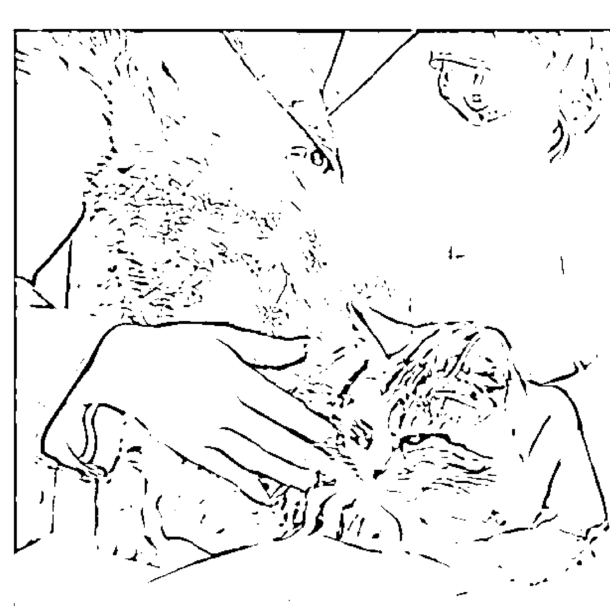

1. 珊米在凱瑟琳手中安頓好，準備接受觸手療程。

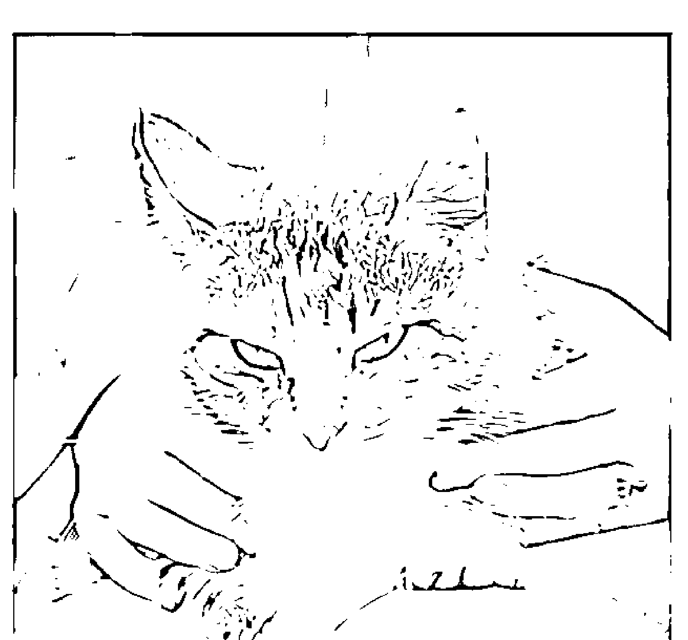

2. 凱瑟琳從珊米肩膀位置開始療程。

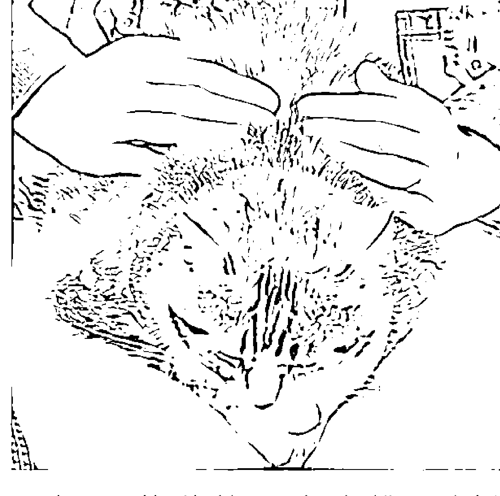

3. 凱瑟琳沿著珊米脊椎兩側往身體下方移動。

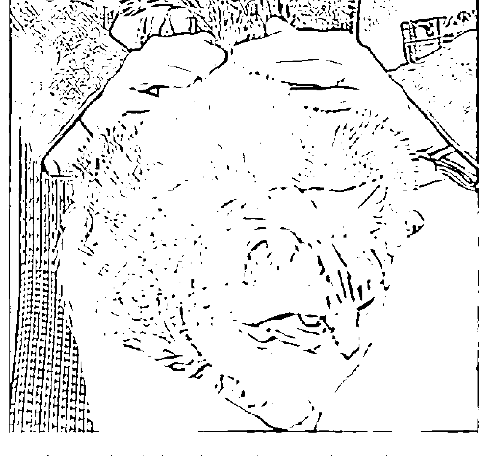

4. 在珊米脊椎底端位置結束療程。

#### 奧利佛有個美好、高尚的心

從第一次療程開始，奧利佛就很能接受靈氣，和靈氣如同多年老友一般。在療程中牠是如此放鬆及平靜，好像了解靈氣能以牠最需要的方式進行療癒，牠很感激地躺著並沉浸在能量中。我覺得在為奧利佛傳送靈氣時，自己的心胸變得更開闊且充滿愛。這一定是流往奧利佛心中的能量流，因為牠無限的仁慈和同理心。感覺就像靈氣在支持奧利佛的任務，陪伴最需要陪伴的動物。——凱瑟琳

第一次在明亮和平之地庇護所遇見「奧利佛」時，牠正出名，因為牠克服了所有不可能生存下來的故事，正在電視節目「動物奇蹟」（Animal Miracles）熱映中。奧利佛幾年前可能因生死交關（比如說遇到獵食者），只剩三條腿，但牠確切的遭遇你永遠不會知道。牠有雙最美麗的藍眼睛，彷彿能看進你靈魂深處。牠的天賦是對其他生物的同理心及愛心。牠陪伴庇護所中最需要、通常是接近臨終的動物

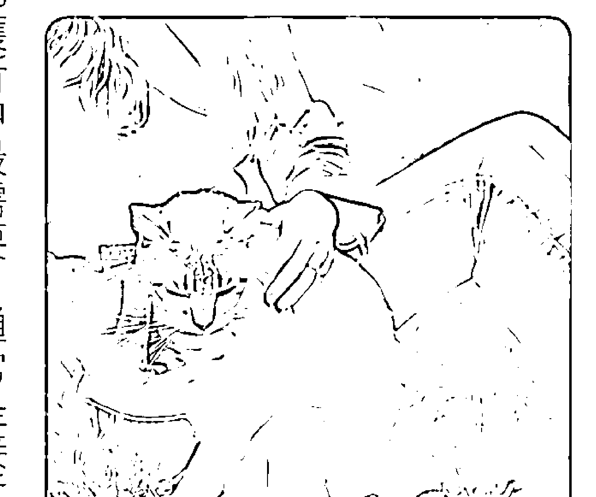

奧利佛就像大部分的貓一樣喜歡這個位置：一隻手放在胸口，另一隻放在肩膀。

### Chapter 10 為馬傳送靈氣

馬的本性好奇，是充滿活力又敏感的生物。牠們能即時感知你傳送的能量，還會直接靠近研究。試著放掉對療程的期待，讓馬兒決定要如何進行——讓牠們主動靠近你，療程會更成功。

療程開始前，確認馬兒身處在舒適的地方，可以自由活動，同時你自己也不會受到打擾。在馬廄還有其他馬匹時，為馬個案進行療程是可行的，不過馬通常喜歡自己先接收靈氣，不想讓其他馬兒靠近。可以在療程尾聲隔一段距離為其他馬一起傳送靈氣。靈氣隔空傳送也有效果，可同時為多匹馬進行療程。

不過，能個別療癒是最好的，尤其當你是靈氣初學者時，牠與你都能比較放鬆，也可以專注於牠的反應及自身直覺，了解牠想如何接受療程。

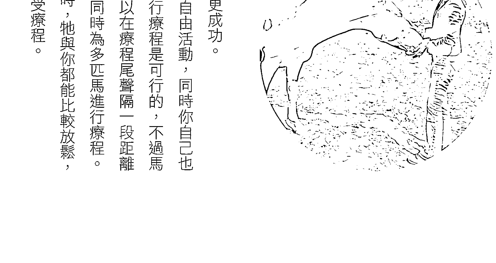

個別馬廄或圍欄是進行療程的好地方。馬可以放鬆，以最舒服的距離接收靈氣，不被其他馬匹或人分心。靈氣能穿透毯子、床單、繃帶或包覆物，所以任何讓馬感到舒適的覆蓋物都可以協助療程進展。進入馬廄中，徵求馬同意，讓牠知道只需接收需要的靈氣量就好，而且也不會強迫牠參與。一開始先站在離馬兒十到十五吋處，手垂放在兩側，祈求靈氣開始流動，並留心馬兒接受療程的暗號，像是靠近舔你的手、低頭、翹起後腳、舔拭或咀嚼，或是安然打起瞌睡。每匹馬都不一樣，即便同一匹馬的療程每次也都不盡相同，所以療程開始時先隔段距離非常重要，即使你對牠很熟悉或定期進行療程也一樣。馬在療程中從你手邊來回，

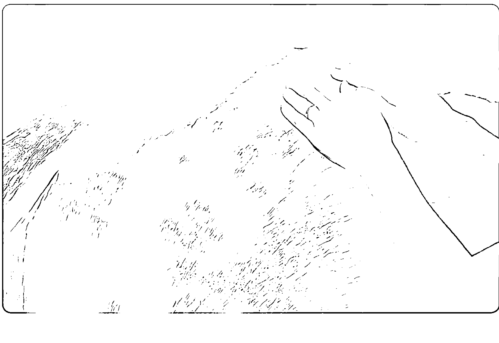

這很正常，就讓他們如此，不要跟著移動。直到你覺得手中的能量流出。能量起伏。能量一伏一代代表他們可能已經開始接收療程，可能會靠近、遠離你，來回反覆，可能還會重複數次。
馬兒通常會享受觸手療程。觸手療程時，他們會靠近你安靜下來，開始打瞌睡，持續整個療程。若馬兒接受觸手療程，系列手位（參見後續頁面圖示）會對牠的能量有很好的療癒及平衡效果，對於馬兒面對的問題，可能也會從中得到回應。跟隨你的直覺及觀察馬兒的行為，決定什麼部位需要療癒。牠可能會轉動身體或將後臀、側身某些部位直接靠近你的手接受靈氣療癒；也可能會踩著不舒服的腳，或是將身體重量從痠痛的腿挪到另一腿支撐，也可能會舉起，甚至大幅地伸展腿部或是脊椎，依照牠需要被療癒的部位而定。進行情緒療癒時，可能會將頭或胸口靠近你，站著不動並保持靜默。完成療程後，牠可能會親你、用鼻子推推你，或在離開之前打一個大大的噴鼻息表示感謝。

#### 藍絲帶淑女「泰絲」

泰絲是我的靈氣個案。她是匹優雅、美麗的小馬，有顆仁慈的心。會讓小孩騎乘。即使對年輕騎者也很有耐心、和善且溫柔。在小孩首次馬術秀上，她獲得的優勝藍絲帶不計其數。
她觸動及豐富了許多小孩的生命。
泰絲帶著優雅、尊嚴及某種難以描述的溫婉精神接受靈氣療程，就像她接受生命一樣，所有認識她的人都懂我在說什麼。泰絲的健康挑戰是消化道問題。她胃不舒服時，我會知道，因為她會在靈氣療程中躺在我旁邊滾動。然後抬起頭，就那樣躺著看著我。療程結束時她感覺好多了，便起身深深嘆一口氣，搖搖她的頭。——凱瑟琳

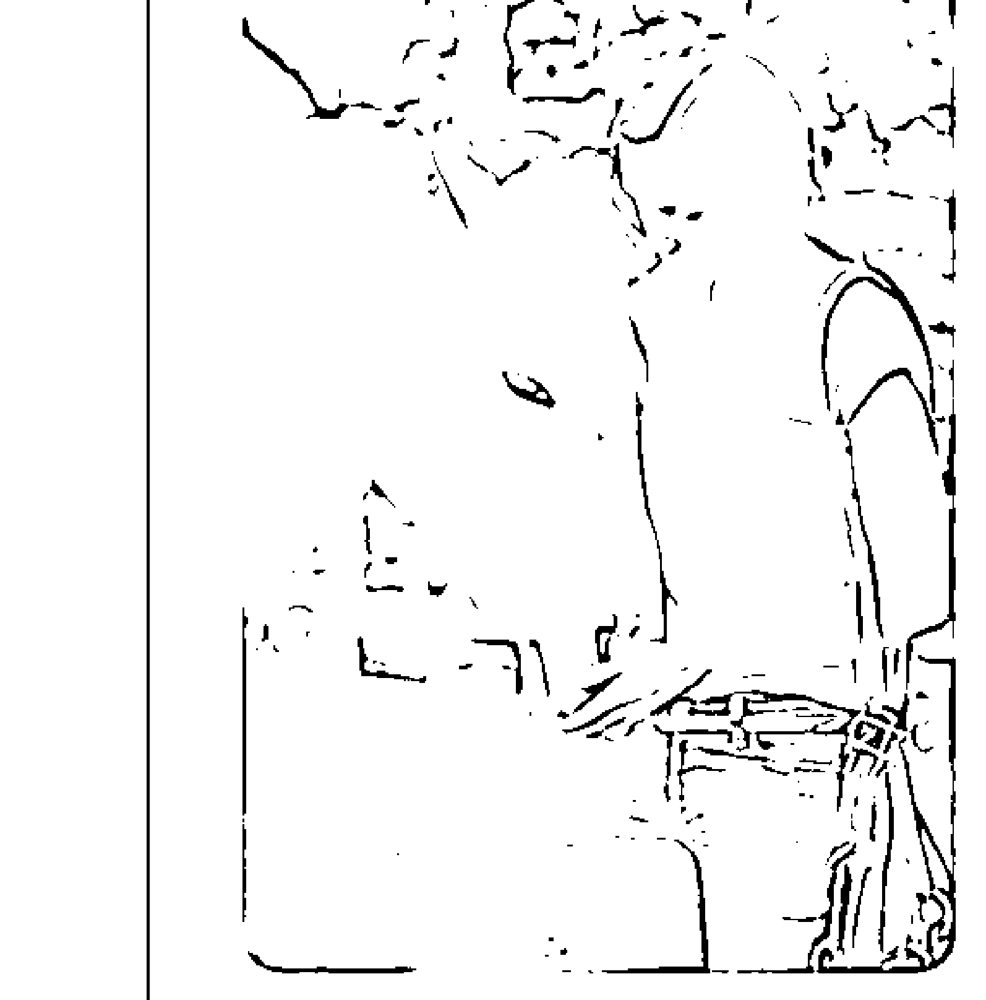

#### 療程總覽

方法：療程前永遠記得先徵求同意。讓馬兒知道牠只需接收需要的靈氣量。大多數的馬喜歡在療程開始前，以言語招呼歡迎牠及輕輕撫摸牠。

隔段距離進行療程：療程開始前，先隔段距離，讓馬兒決定應該距離多遠進行療程。若牠移動，不用跟著牠，繼續讓靈氣流動就好。

基本手位：從任一側的肩膀開始，沿著背部，從脊椎兩側往下移動，在後腿尾端結束療程。

特別手位：可以再加上腿部的手位，著重於關節部位。若馬有需求，也可以增加頭部手位。

結束療程：謝謝馬兒接受療程。若牠喜歡，花幾分鐘撫摸牠或稍微為牠按摩。

> （更多資訊請參見第四及第五章。）

#### 萧尼

我一直很爱马，也骑乘过很多马，但「萧尼」是我最特别的马夥伴，他可以说是我拥有的第一匹马。我在四年前找到他。当时，我常骑乘并赞助的马儿退休了，主人把他送到车程几小时的动物退休农场。我心碎地道别，也知道这是我「骑马生活」的新开始。我已经准备好拥有自己的马，并开始传送灵气给这个情况，相信适合的马会找到我，我也会认出他。

几个月后，我不经意地参观了伊莉莎白新近安置马匹的谷仓，然后认识了萧尼。他的饲主身体不适，无法照顾，对于卖掉他也深感焦虑。我和萧尼相处的那天，帮他梳理（他的蹄太长，皮肤有雨斑，鬃毛跟尾巴都打结了），在他放风时陪伴他。我对他的温和天性及宁静能量印象深刻。几天后，再度造访，但他被移到牧场别处（我不知情）。当我在找寻他在哪个畜栏时，背後响起大声嘶鸣，转身一看，萧尼注视着我，双耳向前竖起，专注倾听。我难以置信只经过几小时的相处，他就认得我，彷佛已选择定我！

我们相处了更多天，我甚至骑着他往牧场及附近小路蹓躂。我知道就是他了。不幸的是，兽医确诊他三条腿都有严重的关节炎。从小他就被当作犁田马及拖车马，关节炎就是证明。儘管诊断如此，我仍买下他，开始每周为他进行二到五次的灵气疗程。

每次骑乘後，我都会为他进行疗程，逐渐让他习惯一套训练方案。先一直是匹西方负重马，现在转接受马术训练，对他来说轻松容易。几个月後，他身体健健康、体態健美、皮毛閃亮，完全改頭換面。我小心地不過度高調，但所有看到我們的人都不相信牠以前有關節炎。牠喜愛靈氣療程，每次都很期待。當我在穀倉的靈氣預約增多時，牠也在我為其他馬進行療程時耐心等候，然後享受自己的療程。後來，我開始帶著學生到穀倉與蕭尼練習靈氣傳送。某些學生是第一次接近馬，蕭尼很溫和、有耐心，一直是個很棒的老師。

最近我決定讓蕭尼從騎乘任務退休，我想該是牠在牧場享受生活的時候了，在那裡牠備受關愛，也有人梳理牠，可以盡情漫步及嘶鳴。我知道牠不會介意再多教些靈氣學生的。
——凱瑟琳

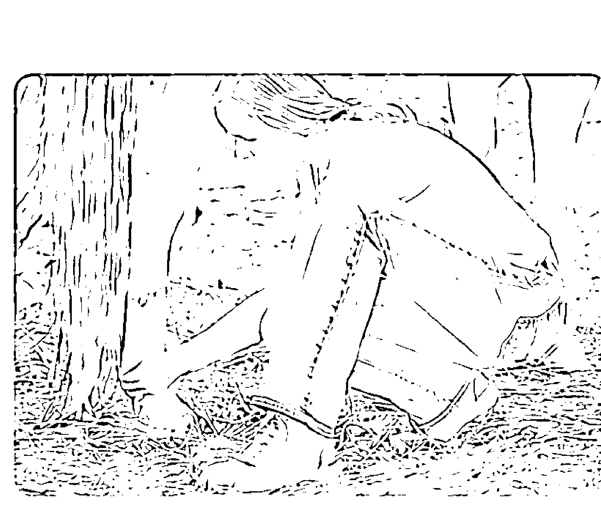

• 為馬腿部進行療程時，請蹲在附近對腿部側邊傳送靈氣。

#### 隔段距離進行療程

許多馬喜歡隔段距離接收靈氣，隔空傳送和觸手傳送一樣有效。靈氣是種能量，當你有傳送意圖且馬兒也願意接收時，就不受到距離限制。基本上，馬對能量十分敏感且聰敏，通常會很清楚表現牠的感覺，並享受能量。任何療程開始前，都要先徵求動物個案同意。從第159頁圖1可以看到柯迪亞克在吃草，無視凱瑟琳存在。不過當凱瑟琳開始傳送靈氣，柯迪亞克立即感受到能量，停止吃草（牠覺得能量比吃草更有趣），直接朝向凱瑟琳的手（參見第159頁圖2）。柯迪亞克還只是馬寶寶，非常敏感。他將口部放在凱瑟琳手中，持續幾分鐘（參見第159頁圖3）。也許能量讓牠的口腔覺得舒服，因為在好幾次療程開始，牠放鬆，再度開始吃草，不過這次離凱瑟琳更近了，牠仍然留心於療程並與能量互動。最後牠轉身讓能量集中在後腿末端（參見上圖 4）。

#### 隔段距離治療

- 凱瑟琳徵詢柯迪亞克接受療程的意願。
- 柯迪亞克感覺到靈氣，靠近凱瑟琳的手。
- 療程中，柯迪亞克把鼻子塞在凱瑟琳手中，可能在享受靈氣。
- 柯迪亞克讓凱瑟琳在牠後腳末端集中傳送靈氣。

有時你會在某時、某地，遇到個案急需靈氣的情況。某個秋日，伊莉莎白在馬廄與自己的馬相處時就是如此。牠觀察到某個困難的情況。有對夫妻正試著將母馬與牠的仔馬運上車，載到別處。仔馬才剛出生，對人類十分警戒。這對夫妻的丈夫捕住母馬，運上拖車，妻子試圖捕住仔馬，仔馬呼喚牠的母親並越來越焦慮。牠擦過妻子身邊，跑到空曠處慌亂地跑動。母馬朝仔馬發出尖叫，試圖跳出拖車朝仔馬奔去。夫妻倆開始追趕仔馬，讓牠更焦慮。幾分鐘後所有參與者——母馬、仔馬與夫妻——都極度沮喪，看起來這個情況難以平和解決。伊莉莎白在心中畫了二階靈氣符號，讓靈氣能量流向這個情況。幾分鐘內情況開始緩解。那對夫妻停止追捕仔馬，母馬停止尖叫及跳動，仔馬冷靜下來，丈夫得以為牠套上韁繩，導引牠上拖車與母馬相聚。伊莉莎白再度感謝靈氣溫和但強大的效果。

#### 觸手靈氣療程

全身觸手療程合適的長度平均約六十分鐘。這裡詳細列出一些建議的手位，但僅供參考；請記得，觸手療程時，馬兒的喜好是最重要的考量。若牠覺得某個手位不舒服，牠會遠離你，讓你知道碰到牠的敏感區域。讓馬兒決定療程長短及療程方式。許多馬兒喜愛觸手療程。你在療程中移動、改變手位及換邊進行時，牠們會靜止不動、吃草甚至打瞌睡。

#### 藍眼寶貝「柯迪亞克」

柯迪亞克和我在二〇〇五年二月相遇。他是隻「一千鎊的學步兒」。他的注意力持續時間很短，什麼東西都往嘴裡塞。喜歡說「不要！」然後看會發生什麼。能成為牠成長過程中的一部分，對我來說是新鮮又刺激的經驗。我看著牠換乳牙，每天學習新事物，牠既聰明又富好奇心，熱衷吸收新經驗。牠閃耀又富生命力的能量感染了周圍每個人。

柯迪亞克對靈氣與生命一樣充滿熱情。牠完全欣然接受靈氣，幾分鐘後，牠就準備迎接其他新體驗。我帶牠回家幾天後，牠在圍欄跌倒，割傷鼻子。經過獸醫縫合，我開始為牠傳送靈氣協助療癒。開始傳送靈氣後，牠不斷打呵欠，閉上眼睛，低頭睡著了。約十五分鐘後牠醒來，看著我彷彿在說：「OK，我好了。然後要做什麼？」後續幾次靈氣療程都是這樣——短暫但有力量。只要我有徵求牠同意並讓牠決定療程長短，牠都很樂意成為「靈氣海綿」。

——凱瑟琳

#### 全身觸手療程

從馬的肩膀開始觸手療程是個絕佳位置（參見下圖圖1）。碰觸肩膀會讓大多數馬感到舒服，所以是讓他們習慣靈氣的絕佳手位。把手輕放在馬兒身上，不要施壓。這個手位若不舒服，牠會離開你的手。不用隨著移動，可以隔段距離傳送，若牠覺得這樣比較舒服的話。持續將手輕放在馬兒身上（或距離牠皮膚幾吋傳送，若牠比較喜歡），然後沿著脊椎一側往下到肩膀再到臀部。從身體哪一側開始都可以，只要將雙手放在一側脊椎，然後換到另一側（參見第162頁圖2）。

推薦在後腿尾端進行的兩種手位。首先，一手放在臀部上方與背部交界處，另一手放在臀部後方肌肉上（參見第162頁圖3）。接著，一手放在髖部，另一手放在大腿交接處。如此一來，背部、臀部及髖部都被照顧到了（參見第162頁圖4）。通常腿部有問題的馬會喜歡上述的手位，直接在患處傳送靈氣可能讓牠感覺太強烈。馬兒會讓你知道怎樣地最舒服。

若只有三十分鐘進行療程，可嘗試一種微調手位，就是將雙手分開一點。雙手分開一點，可以較快涵蓋更多部位。這種手位對於體型較高大的馬也很適合。

另一種省時的手位，是將雙手同時放在脊椎兩側（參見第164頁上圖）。這種手位也適合幼馬及小型馬。和為較大型馬匹進行一樣的療程，都是從肩膀往臀部移動。

若要同時為兩條後腿進行療程（非分別為每條後腿進行），只要將手放在馬兒脊椎上（參見第164頁下圖）。

#### 治療馬兒的腿

完成了馬身體部分的靈氣療程後，腿部療程是個很好的額外選項，或是沒有時間進行完整療程，此時腿部又有特別的腿傷，即可只針對患腿進行較短的療程。

治療腿時，需蹲在腿部附近，對腿的側邊傳送靈氣。不要直接面朝後腿或在後腿正後方，也不要坐在地上或跪坐在凳子上。若馬移動，得確保自己能很快閃開，避免被馬蹄踢到。

對於極度緊張、好動或愛踢腳的馬，不要直接治療牠們的腿。

從前腿開始（參見第166頁圖1至圖4）然後移往後腿（參見第167頁圖5至圖8）。進行前腿與後腿療程時，先從身體開始，然後往下朝蹄部前進。著重在關節部分。若馬有其他的傷處，且牠也覺得舒適的話，可直接試著治療。關節是馬身體的小型能量中心，是傳送觸手靈氣的好位置。覆住馬關節的方式，依你和馬都覺得舒服而定。可以將手包覆住馬的關節前後方，也可放在關節側邊。嘗試看看哪種方式最舒服有效。

腿問題通常會與下述手位在能量層面上呼應，就是一手放在臀部上方與背部交接處，一手放在臀部後方。若幼馬或小型馬覺得直接傳送靈氣會讓後腿不舒服，通常可以接受這個手位。

#### 腿部的手位療程

| 身體部位 | 描述 |
| :--- | :--- |
| **前腿：肘關節** | |
| **前腿：膝蓋** | |
| **前腿：距關節** | |
| **前腿：馬蹄** | |
| **後腿：後膝關節和大腿** | |
| **後腿：跗關節** | |
| **後腿：距關節** | |
| **後腿：馬蹄** | |

#### 為小動物傳送靈氣

#### 兔

兔子、天竺鼠、老鼠、雪貂、蛇及蜥蜴等小動物，被人們托著或抱著時通常會感到自在，然而被抱著疼愛、撫摸以至於接受靈氣，完全是兩回事。當靈氣開始流經手，這些小動物可能會覺得太過強烈，可能會覺得不舒服或被強迫接受療程。

一旦牠們感覺被「強迫」接受療程，牠們不但不會接受靈氣，還會試著遠離。因此，傳送靈氣給這些小動物時，永遠先從隔段距離傳送開始，這特別重要。不論把牠們放在籠子、養殖箱，或放在大腿上、鄰近的地板或沙發上，永遠都要先徵求牠們的同意，讓牠們知道只需要接收需要的能量就好，跟牠們保證不會多加強迫這些事項——牠們能以自己的方式及意願選擇療程。然後，將手放在大腿上，祈求靈氣開始流動。牠們可能會靠近你，爬到腿上或窩在手下。療程中，有時牠們可能會轉身將身體某些部位靠近你的手，以直接接收靈氣。牠們可能會離開，爬進自己的小窩，在療程中睡著。若在籠裡或養殖箱，牠們可能會爬往最靠近你的地方，然後入睡。不論牠們選擇何種方式接受療程，都是最適合牠們的方式。觀察牠們放鬆的行為，那是接收靈氣的暗號：輕輕嘆息、睡著或安靜地靜止不動，但目光沒有離開你。請記得，牠們雖然是小動物，但不表示會接收較少能量或較短的療程。即使為迷你老鼠傳送靈氣，也要準備三十到六十分鐘的時間，感受更多靈氣流動。

若有兩隻以上的小動物，可以分別為牠們傳送靈氣或全體一起傳送。若沒有時間個別傳送，團體療程也十分有效及便利。有時小動物會決定誰先接收靈氣，排隊接受療程。有時在療程中，牠們會圍繞著你，可以將手輪流放在每隻小動物身上，或雙手分別放在某兩隻小動物身上，讓其他鄰近的小動物同時接收靈氣。

#### 梅爾文和莫妮卡

梅爾文和莫妮卡是對漂亮的黑白長毛天竺鼠，大約四個月大。他們被送往收容所，放在不同的籠中。梅爾文還沒有結紮，不過牠們倆互動頻繁，常會站立起來用腳掌撐住籠緣，看著彼此交談。很明顯地，牠們愛著彼此，到新家時也想在一起。若要如此，把牠們放在同一個籠裡，會比較容易一起認養，於是收容所決定讓梅爾文結紮。

在梅爾文結紮手術前一日，我為牠傳送靈氣，告訴牠需要接受手術的原因。當我向牠說明，手術後就可以跟莫妮卡在一起，牠開始在空中跳躍，如跳芭蕾舞般地旋轉。我之前從沒看過牠這樣子，感覺牠接收到了訊息，牠跟莫妮卡可以在一起了。當我在籠邊坐下，雙手放在大腿上，為牠面臨的手術傳送靈氣，牠看了我一會然後躺下，在籠裡攤平閉上眼睛，打盹約二十分鐘。當牠醒來奔向籠邊，活力充沛地朝莫妮卡吱吱喳喳。隔天手術進行得很順利，牠很快復原，兩隻天竺鼠快樂地同住在了一起。——伊莉莎白

當小動物從安靜、放鬆的狀態中甦醒，開始關注其他事物時，這表示療程結束了。若牠對你表達感謝，這也是另一種療程結束的暗號。在此同時，通常會發現手中能量流減弱，自己的注意力可能也會開始轉向別的事物。在療程尾聲，永遠記得感謝靈氣帶來療癒，也感謝小動物的參與。

### 魚類及水生動物

對於魚類、鰻魚、蝌蚪、海膽、海葵及其他水生動物，靈氣是很棒的療癒方法。魚類及水生動物，靈氣是非常細膩、敏感，靈氣可以溫和有效地帶來療癒。魚類所處的水生環境，是一種能量精細的受體及傳導體。上個世紀有許多物理及化學研究指出，水能吸收能量並保存能量記憶及特質。江本勝博士（Dr. Masaru Emoto）便指出水能吸收人類想法、文字及感覺的能量，改變水的基本構造。魚類生存的水生環境會吸收周遭的能量，透過鼓動魚鰓，魚類可以持續在水中游動。為魚傳送靈氣，不僅能為牠們提供整體療癒，還能淨化水域中對健康有負面影響的能量。魚類，特別是金魚，能與環境中的人類共振，因此，替你自己與你與魚類相處的情況傳送靈氣，也是療癒牠們的有效方式。如同其他動物，魚類也會因家中的緊張及情緒影響倍感壓力，若已修習二階靈氣，心理與情緒療癒會讓他們受益良多。

由於魚類很敏感，隔點距離為牠們傳送靈氣會是個好主意。為魚傳送靈氣的原則與替其他動物傳送一樣。向牠說明靈氣，並只接收自己想要的靈氣量。讓牠們知道對療程有主控權。然後將手隔著水族箱或魚缸一小段距離，讓靈氣能量流向魚兒。其他動物接收靈氣的指標，也適用於魚類。

#### 烏龜新朋友

有天我去夏令營接女兒回家。到了營區，得知他們多規劃了半小時活動，所以我早到了。在附近逛一邊等待，直到我發現一隻躲在殼中的大烏龜，我坐在龜殼旁，觀察為什麼牠縮在龜殼深處。幾分鐘後，我決定在等待的期間為牠傳送靈氣。我向牠解釋自己打算做什麼，並請牠只接收想要的能量，然後將手放在大腿上，讓能量流向牠。大約十分鐘後，烏龜開始朝我移動。牠從殼中探出半顆頭，然後停止動作一到兩分鐘。最後爬到離我最近的角落，窩在我的手下方，我將牠放在大腿上，手掌覆蓋在牠身上。牠在那裡平靜休息，直到女兒前來才結束療程。——伊莉莎白

#### 氣之錦鯉

有次我受人之託，為一隻迷你錦鯉傳送靈氣。牠生病了，有段時間沒有進食。魚很小又很脆弱，飼主擔心牠無法痊癒，當我第一次看到牠，牠很虛弱，呈四十五度角躺在缸底。我將手放在離容器約六吋遠的地方，開始傳送靈氣。

這隻小魚接收了令人驚訝的靈氣量。療程進行約三十分鐘後，我覺得能量開始減弱。我注意到牠的呼吸似乎變得比較輕鬆，但仍未起身游動。隔天飼主傳電子郵件，他說療程結束後一小時內，牠吃了三條蟲。一天後又充滿活力地優游了。她決定將牠命名為「氣之錦鯉」，因為牠親近靈氣能量。牠現在依舊很好，每天都在長大！——凱瑟琳

### 爬蟲類及兩棲動物

爬蟲類和兩棲動物與其他動物一樣，都會被溫和的靈氣療癒吸引。他們對靈氣療癒反應迅速，就像右頁的個案故事「氣之錦鯉」所示。

在野生環境中，許多爬蟲類及兩棲動物依靠太陽能量及熱度，維繫身體與微妙的情緒及靈性需求。在室內時，即使有最好的人工照明，仍然缺少陽光的某些好處，也缺乏與自然世界的連結。

為爬蟲類及兩棲動物傳送靈氣時，讓他們能自由活動，並自由選擇是否靠近手或隔段距離會比較理想。若無法這樣，可以坐在養殖箱外，隔一小段距離傳送靈氣。與為其他動物進行靈氣療程一樣，向他們說明靈氣，並請他們只接收自己想要的靈氣量，這樣能大幅增加他們接受療程的可能性。

靈氣能為他們補充一些室內生活缺乏的部分，因為靈氣能滋養及療癒身體及情緒層面。如同其他動物，爬蟲類及兩棲動物也會因家中的緊張及情緒影響倍感壓力，若已修習二階靈氣，心理與情緒療癒會對他們有所助益。只要你允許靈氣能量流經雙手，靈氣療程隨即開始。爬蟲類及兩棲動物和其他動物一樣，會花點時間評估這種新能量，時而靠近或遠離。最後他們通常會在附近平靜地打瞌睡，享受這種新的感受以及其他許多好處。有些蛇甚至會起身蜷曲在你手中，以便更接近靈氣。

#### 療程總覽

**方法**：療程前永遠記得要先徵求同意，讓動物知道只需接收想要的能量，並讓牠自己來靠近你。

**隔段距離進行療程**：先隔一段距離開始療程。即使從籠子外傳送靈氣，對這些小動物朋友也一樣有效。最重要的因素是你的意圖及動物的接受度，而非手位的精準度。

**基本手位**：坐在小動物附近，讓牠靠近並探索你的手，若爬進你手中，或爬上你的大腿，這就是牠想要觸手靈氣的暗號，可將手直接放在牠身上，或讓手距離牠們幾吋；就看哪種方式覺得最舒服。讓牠在療程空間內自由活動，自由選擇要靠近或離開你的手。

**結束療程**：記得感謝靈氣帶來的療癒，以及感謝動物的參與。可以在療程結束時花幾分鐘疼愛牠一下，替牠梳毛及撫摸牠。（更多資訊請參見第四及第五章。）

有些動物比較喜歡遠距療程，特別是第一次體驗靈氣的動物。徵求動物的許可後開始進行療程，動物可能會向你測試你的手，如第176頁圖1的古蒂娃。在這種情況下，顯示牠接受能量，甚至想要更多且對靈氣感到好奇。

如果動物無法在沒有籠子的情況下自由移動時，此時最好稍微遠離籠子，放低雙手，將手掌朝上。雙手貼近籠子可能會讓動物有壓迫感，這不是個好方法，除非動物自己向前希望你將雙手貼近籠子。動物可能會離開，安穩進入「靈氣瞌睡」狀態（參見第176頁圖2）。與其將手直接放在牠身上，不如放鬆雙手放在大腿上，讓動物放鬆，從遠一點的距離吸收靈氣。經過一段休息、打盹或睡著後，動物起身、喝水，開始做其他的事，或是用動作向你表達謝意——這些是療程結束的象徵。花點時間感謝個案接受療癒能量。

可以同時實施觸手療程或隔段距離進行，就以蟾蜍泰德的故事為例。來自明亮和平安地動物庇護所的泰德缺少膝蓋下方的後腿，無法自己進食，但是完全不介意被放在手中。即便如此，凱瑟琳也無法確定牠想要接受觸手靈氣治療。她向泰德打招呼，徵求牠的同意開始療程（下圖1）。後來她在療程中發現讓泰德感到舒服的位置。將泰德放在離手邊有距離的位置，確認牠可以自由選擇是否接受治療（下圖2）。當靈氣開始流動，顯示牠接受療程。

##### 基本療程

##### 古蒂娃不可思議的復原

只要對療程有主控權，即使是曾遭到創傷的動物，對靈氣的反應也會很好。「古蒂娃」剛被我的姐姐領養時，是隻極度內向的天竺鼠。牠從小就被養在黑暗的櫃子裡，缺乏照料。當牠看到人的時候，就會躲進窩中。和其他天竺鼠不同，牠很少移動，也從不玩耍，幾乎不發出聲音。

姐姐擔心牠可能有某種腦部損傷，因為牠都沒什麼反應。當我向牠自我介紹，並在籠外為牠傳送靈氣時，牠躲進窩中不讓我看到。我向牠保證，我不會強迫牠跟我有任何接觸，牠只需接收自己需要的療癒能量。我在心中告訴牠，牠現在身處的地方很安全。

當我開始療程，牠從窩中探頭，和我有眼神接觸，將頭靠在自己腳掌上，輕嘆一聲。我感覺靈氣流非常強烈。牠維持同一姿勢，一邊看著我。半小時後，我感覺能量流減弱並結束療程。我感謝靈氣，也感謝古蒂娃願意接受療癒。

當我在附近沙發坐下，和姐姐討論療程時，古蒂娃突然跑出小窩外，將前腳攀在離我最近的籠邊，開始大聲吱吱喳喳。姐姐非常驚嘆，因為當牠吃到最喜歡的食物——新鮮萵苣時，才會發出這種聲音，這種情況只出現過一兩次。牠很明顯在說：「感謝靈氣！」

經過多次的靈氣療程、姐姐的耐心照料、新鮮食物新配方、定時呼吸新鮮空氣及吸收陽光，古蒂娃恢復的進度驚人。牠變得喜愛觸碰人手，幫牠輕輕搔癢時還會發出咕嚕或吱喳聲音。最近當一大群工作人員搬進姐姐家拍攝紀錄片時，古蒂娃的療癒進程受到考驗。面對一群陌生人、各種器材及噪音，牠仍保持情緒穩定。拍攝尾聲時，一個工作人員對我姐姐說：「妳的天竺鼠是我見過最外向友善的！」看看這隻小天竺鼠的驚人進展。謝謝靈氣！——凱瑟琳

感受到這股能量，希望可以更靠近凱瑟琳的右手，接著安頓下來，變得相當平靜且放鬆。因為泰德能自由跳開，牠可以自己決定療程的長度。經過許多愛的照料，以及溫暖、安全的居家環境，現在泰德能自己進食，四處移動，即便缺少後腿。其實牠並不喜歡一直坐著，所以當牠在靈氣療程中保持靜止、放鬆時，每個人都覺得非常驚訝。

#### 為農場動物傳送靈氣

農場動物像是乳牛、豬、山羊及雞通常並不習慣人類的溫柔、愛或關懷。若農場動物是從工廠或商業牧場拯救出來，牠們可能曾被人類虐待，不想太親近人，或人類靠近時會感到恐懼。因此，靈氣是協助牠們復原的理想方法。可以坐在圍欄外傳送靈氣，先徵求牠們同意，讓牠們知道只需接收想要的靈氣量，讓靈氣開始流動。即使牠們對大多數人並不信任，與人類接觸也少有正向的經驗，不過當牠們感知到你傳來的療癒能量，不帶脅迫性，牠們就會對傳送的能量感興趣。

若你安靜地坐著，不強迫牠們與你眼神接觸，牠們可能會靠近你，透過圍欄嗅聞你的手，或非常認真地觀察。幾次療程之後，你能重建牠們對人失去的信任，協助動物從過往創傷中療癒。不只是靈氣能讓這些動物得到所需的情緒療癒，你身為靈氣「提供者」的角色，也能協助牠們重新建構與人類接觸的正向經驗。

若你與農場動物有緊密連結，像是親自迎接牠們來到這個世界，靈氣不只能依牠們所需進行療癒，也能強化彼此之間的關係。當牠們了解你能傳送療癒能量，牠們需要療癒時會靠近你。大多數情況下，牠們會準確傳達自己需要療癒的部位，將這些部位直接靠在你手下，並在療程中安靜休息。

為農場動物傳送靈氣時，你會獲得美好的禮物——體驗療癒的各種可能，以及農場動物的溫暖回應，得以一窺牠們的世界。你會感嘆過往可能低估了牠們的情緒深度以及牠們生命的豐富性。

#### 溫柔巨獸哈利

「哈利」在2002年時，來到明亮和平之地動物庇護所，之前牠差點變成某個人的食物。哈利到這裡的時候，還是隻充滿活力的年輕小豬（特別喜愛挖洞及埋東西），對工作人員及志工來說，這種特質實在是種挑戰。但牠的溫柔本性日益增加，就如同牠的體重。

哈利現在約八百磅，庇護所的訪客很喜歡探望牠，牠喜歡被人們關注、輕騷及擁抱。我第一次為牠傳送靈氣時，被牠的外觀嚇到。我在圍欄外對牠說話（在圍欄外以保安），詢問牠是否要來點靈氣。我坐在圍欄邊開始傳送能量。

哈利本來在打瞌睡，隨後立即起身，朝圍欄走來，將鼻子塞進圍欄空隙，頂住我的手。牠興奮地朝我呼嚕叫，轉身躺下，將後腳倚在圍欄邊。很明顯，牠想要觸手靈氣。
療程結束時，我向哈利道謝，然後離開，牠抬頭目送我。然後牠立刻起身，走進豬舍打瞌睡。我和庇護所創辦人蓋兒討論這次療程，得知關於哈利身體健康的一些有趣細節。大約從去年開始，牠的後腳末端就有點不舒服，走路有點困難。部分原因是由於牠的體重，順勢療法對牠幫助很大。我很驚訝，哈利這麼快就理解靈氣為何，還能準確指出自己需要加強療癒的地方。哈利現在一看到我，就知道我來做什麼，隨即躺下迎接放鬆療程。——凱瑟琳

##### 山羊陶樂絲

明亮和平之地動物庇護所在二○○一年，將「陶樂絲」從安樂死的命運中解救出來。牠被診斷出乳線炎，將被帶到醫院安樂死，有位獸醫技術員解救牠。牠到庇護所時，極度營養不良且前腳有傷。隨著時間過去，牠獲得食物滋養、關愛及順勢療法治療，體重和氣力恢復了，引人注目又固執的個性也一同恢復。那位解救牠的獸醫技術員也成為庇護所的志工。

有趣的是，陶樂絲似乎在為腳的舊傷尋求靈氣協助，即使當時沒有什麼症狀。接受靈氣療程時，陶樂絲喜歡部分時間接受靈氣觸手療程，治療右前腿，但也喜歡走遠些，接受遠距療程。當牠了解自己不會被強迫參與療程，我也會讓牠選擇療程方式，牠通常會來到我手邊，當我將手放在牠腿上時，牠會低頭放鬆。當陶樂絲覺得山羊夥伴「帕洛瑪」也想分享觸手療程時，牠就會忌妒。但只要是遠距療程，牠似乎就樂意和帕洛瑪分享靈氣了。

> ——凱瑟琳

#### 療程總覽

- **方法：** 療程前永遠記得先徵求同意，讓動物知道牠只需接收想要的能量。依你的舒適度及動物個案種類，可選擇在圍欄外傳送靈氣，
- **隔段距離進行療程：** 和多數動物一樣，農場動物會喜歡療程開始時先隔段距離，若牠們想要觸手療程，讓他們自己接近。
- **基本手位：** 為大型動物傳送靈氣時，從肩膀開始，繼續往任一側後腿尾端進行。為小型動物傳送靈氣時，選擇一種手位，用單手或雙手放在牠們身上（參見第197頁母雞一普朵一療程所述）。不論是單手或雙手，若會打擾動物放鬆，就不要變換手位。有些動物比較喜歡只放單手在牠身上，尤其是小型動物。先從單手開始，若動物覺得舒服，才加上另一手。
- **特別手位：** 若動物把這些部位靠往你的手，可以加上頭部及腿部的手位。
- **結束療程：** 感謝動物接受療程。若牠們喜歡，花幾分鐘關愛牠們。（更多資訊請參見第四及第五章。）

##### 基本療程

有些農場動物十分親人，可能也會喜愛觸手靈氣。不過，療程前永遠記得先徵求同意，讓動物知道只需接收想要的能量。細心觀察牠表示同意的身體語言。當靈氣開始流動，牠們可能會過來探索你的手，感受能量。若牠們同意接受療程，會出現放鬆的暗號。得到同意後，你可以以舒服的姿勢進行療程。療程中，不論動物安靜地窩在你手下，或不時靠近、遠離你的手，都要保持彈性。最重要的是，動物可以自由選擇最舒服的療程方式。

##### 觸手靈氣

第182頁公豬「哈利」的故事，就是一種典型的療程範例——動物選擇在療程中安頓下來。即便哈利很親人且喜愛觸手靈氣，凱瑟琳仍先徵求牠的同意才開始療程，讓牠知道只需接收想要的能量，細心觀察牠表示同意的身體語言。當靈氣開始流動，牠會自己靠近探索凱瑟琳。牠很放鬆，同意接收靈氣，凱瑟琳找了個舒服的姿勢為牠進行療程。（參見第185頁圖1）。

如第185頁圖2所示，哈利在療程第一部分時，保持察覺並積極互動，甚至靠在凱瑟琳的手中。牠不停嗅聞凱瑟琳的手掌，好像在說「手中有什麼」，十到十五分鐘後，哈利安穩進入「靈氣瞌睡」（參見第185頁圖3）。在這段安靜時光，通常會有最強力的療癒。

哈利在療程中打了幾次呵欠，這是開放接受療癒的另一暗號。當牠從療程中醒來起身（參見第185頁圖4）。凱瑟琳向牠道謝，牠開心地大聲呼嚕回應，表示感謝療程。

雖然某些農場動物會像哈利一樣停留在同一位置接收靈氣，其他農場動物可能會在療程中走動。在山羊「陶樂絲」的故事中，凱瑟琳徵求牠同意後開始傳送能量，陶樂絲靠過來，伸出前腳，前腳上有個舊傷（參見第187頁圖1）。

陶樂絲離開又靠近凱瑟琳的手——這是動物的正常行為，凱瑟琳稍微後退，讓牠有更多空間。一旦陶樂絲理解凱瑟琳不會跟著牠移動，牠又轉回靠近凱瑟琳，輕推她的手（參見本頁圖2），這表示陶樂絲接受療程，並感謝凱瑟琳允許牠選擇接收能量的方式。

### Chapter 13 为鸟类传送灵气

鸟类非常聪慧且淘气，通常个性分明、好恶明显。牠们很情绪化，会依附特别亲近的人及鸟类同伴，有时还会对其他人或家中动物表达强烈的忌妒或敌意。为鸟类传送灵气，可以让牠们保持健康，疗愈各种身体症状或损伤，提升并强化你们彼此的关系。灵气也能疗愈其他人或鸟类造成的状况。透过灵气与鸟类连结，能让你对牠们的世界及看法有更深的理解。

若與一隻鳥同住，但牠比較黏家中另一成員，對你沒有特別好感，傳送靈氣給牠及你們的關係，也是種療癒方式。靈氣能為你與鳥類以及家中其他動物的關係帶來和諧，也能協助與壓力有關的症狀，像是啄羽毛。靈氣也能為失去朋友或伴侶而感到沮喪的鳥，帶來平靜及安慰。 為鳥兒找個安全，同時也不會被打擾的地方進行療程，像是鳥籠或是室內牠最喜歡的棲息處。理想場所是你舒服坐下或站立的地方，鳥兒也能自由移動。若有兩隻鳥以上，可以為牠們一起傳送靈氣，並讓每隻鳥兒決定是否接受療程及療癒進行方式。 若讓鳥兒主動接近，接收靈氣，療程一定會更成功。最好放下對療程的期待，讓鳥兒決定要如何進行。在療程開始前，請鳥兒只接收需要的能量就好，並讓牠知道可以主導療程，不會強迫牠參與。一開始可以隔著短距離，坐或站著為牠傳送靈氣。然後將手垂放身體兩側或大腿上，祈求靈氣開始向鳥兒流動。烏兒是極度敏感的生物，可以立即感受到能量。通常不用太久。接下來，觀察鳥兒對靈氣感到興趣或接受的訊號，像是靠近你研究你的手，低頭、抖抖羽毛，發出滿足的聲音，或安穩進入「靈氣瞌睡」狀態。為鳥兒傳送靈氣時，如果要額外為關係或狀況傳送靈氣，須將注意力集中在這些的項目上。

#### 新的開始

鳥類若有良好照顧，通常能活很久。若你領養了一隻鳥，而牠的前飼主過世了，靈氣能協助牠釋放悲傷，度過這個階段，讓牠能開放接受你與牠之間的新關係。當人們無法再照顧鳥、得幫牠找個新家時，靈氣可以為分離的悲傷，帶來療癒與安慰。若已修習二階靈氣，對於鳥兒遇見你之前所產生的各種情緒問題，可以進行心理及情緒療癒。

##### 陽光的故事

好，並讓牠知道可以主導療程，不會強迫牠參與。一開始可以隔著短距離，坐或站著為牠傳送靈氣。然後將手垂放身體兩側或大腿上，祈求靈氣開始向鳥兒流動。烏兒是極度敏感的生物，可以立即感受到能量。通常不用太久。接下來，觀察鳥兒對靈氣感到興趣或接受的訊號，像是靠近你研究你的手，低頭、抖抖羽毛，發出滿足的聲音，或安穩進入「靈氣瞌睡」狀態。為鳥兒傳送靈氣時，如果要額外為關係或狀況傳送靈氣，須將注意力集中在這些的項目上。

幾年前，我的姐妹瑪琳領養了一隻漂亮的小鸚鵡，名叫「陽光」。因為前飼主覺得牠太吵，把東西弄得一團糟，因此牠住在黑漆漆的車庫中。那天瑪琳聽到牠的困境，驅車前去拯救牠。一開始，由於過往經驗導致陽光很害怕人類。瑪琳的男友麥可是位靈氣治療師，開始為陽光進行療程，幫助牠克服恐懼。漸漸地，陽光沉浸在光、愛、靈氣以及新家庭的關愛中，確實「從自己的殼探出頭來」。牠最喜歡的活動就是在小碗中洗澡，也喜歡別人在牠臉頰上亮橘色圈圈搔癢。牠會運用牠的喙攀上傢俱邊緣，在公寓中玩得很開心。麥可有更多的時間跟他相處，甚至問牠要不要回家與他同住，他們培養出緊密的連結。

瑪琳及麥可喜歡在晚上和牠玩捉迷藏。他們會將牠放出籠外，然後牠會跑到籠子後面躲起來。陽光漸漸從角落探出頭來，當他們看見牠時，會喊「捉迷藏！」牠會把頭縮回去，跑到籠子後面躲起來，再從另一側漸漸探頭。這個遊戲每晚都會持續幾分鐘，玩耍時，陽光會發出可愛的咕咕聲。

陽光逐漸愛上麥可，甚至覺得他是牠的伴侶，因為牠如此開心及自在；陽光喜歡下蛋，常在籠子內或在籠外瑪琳準備的毛毯上孵蛋。當我造訪時，有時候也會花點時間坐在陽光旁邊，傳送靈氣給牠。牠在療程中總會做相同動作——抖抖羽毛，閉上眼睛，入睡。

有天晚上麥可晚回家，發現陽光坐在籠子門口前後搖動，看來很不對勁。他很擔心，將牠放在手上，帶到床邊。麥可在床上躺下，並將陽光放在自己肚子上。牠一動也不動，和平常完全不一樣。他將手放在牠腹部上，只讓牠的頭露出來，為牠傳送了大約十分鐘的靈氣，忽然間，牠又活力滿滿、十足淘氣地跑到他的胸部，開始咬他的項鍊和耳環，牠通常以這種方式表達對麥可的愛。這就像是牠感謝他進行靈氣療程。

看到陽光似乎好多了，麥可鬆了一口氣，然後將牠放回籠中。

那天晚上，陽光過世了，獸醫也不知道原因，也許是因為下蛋衍生的併發症，抑或是飛翔時受傷了，牠的離開對瑪琳及麥可衝擊很大，因為他們真心愛牠，但他們也感到安慰，因為靈氣，讓牠的最後一夜，以及牠的生命，更加舒服。——凱瑟琳

鳥兒在療程中時而靠近或遠離，是非常常見的情況，就讓牠如此，不用跟著牠們移動。
有時在療程中會感覺到手中能量的強弱變化，這就是許多動物接受療程的方式。舉例來說，
牠們有時靠近你，然後遠離，或是可能在手上安頓下來，然後離開又返回。這種模式可能會
在療程中反覆數次。

鳥兒通常比較喜歡隔一小段距離接收靈氣，不過有時也會享受觸手療程。永遠讓牠們自
由選擇，若選擇隔空療程，牠可能會在你附近安頓下來，開始打瞌睡或入睡。若牠想要你
將手放在牠身上，牠會靠近，安靜地窩在手下方，通常還會在整個療程中打瞌睡。鳥兒可
能走向或飛向你，直接將頭部或身體放在手下方，也可能棲息在肩膀上打瞌睡，好接近靈
氣能量。若你覺得鳥兒想要靈氣，但牠卻收起翅膀不動，你可能需要堅持等牠主動靠近時，
才傳送靈氣。

當鳥兒從安靜、放鬆的狀態中醒來，開始對其他的活動，如唱歌、玩耍、吹口哨、吃東
西或喝水所吸引，就是療程將結束的時候了。若鳥兒表現出感激你的姿態，這也是完成療程
的另一種訊號。當他接收足夠靈氣，通常會親親你、摩擦、用喙輕推你或發出開心的聲音，
在你離開前表達感謝，然後去做別的事情。同時，你會發現手中能量流開始減弱。

深入需要療癒的部位。療程中，若鳥兒覺得某個手位舒服，可以依照牠喜好，信任牠會從這手位獲得牠所需的靈氣量。當你熟悉了靈氣，而鳥的行為會指引你如何進行合適的療程。當你的靈氣經驗增加，直覺力也會增強，更能理解鳥兒健康、喜好以及心理與情緒的狀態。

#### 小鸚鵡愛的禮物

潘蜜拉是東岸一家鳥類庇護所的負責人，她最愛的小鸚鵡「蘭諾」面臨了生命尾聲。她與我聯絡，希望我為蘭諾傳送靈氣，協助牠的臨終過程。蘭諾是潘蜜拉救援的第一隻鳥，也是十一年前創立庇護所的起因。藍諾也是庇護所裡鳥群的大家長，所有鳥兒幾乎都服從牠。潘蜜拉與蘭諾關係緊密，鑑於自己與其他鳥兒的關係及領導地位，比起其他鳥，蘭諾更喜歡潘蜜拉的陪伴。

潘蜜拉願意為蘭諾做任何事情，以回報牠教導她關於鳥類及鳥類照護的一切，讓牠在最後的日子及過程，盡可能地輕鬆舒服。她請我為蘭諾進行一系列遠距離療程。每次療程，我都接收到一股強烈、悲傷的感受，持續好幾分鐘，有時會讓我流淚或啜泣，因為蘭諾在釋放即將離開摯愛之人的悲傷。我也接收到一股強烈榮譽感，蘭諾對於創立庇護所及教導潘蜜拉鳥類知識深感自豪。一週內，蘭諾就在家中安然辭世。——伊莉莎白

#### 疗程总览

- **方法：** 疗程前，先征求鸟儿同意。让鸟儿靠近你，而非以其他方式进行。密切注意它的身体语言，观察它是否对接受灵气能量保持开放。若接受，它会投入，最后就会放松。
- **隔段距离进行疗程：** 可以坐或站在笼子或栖息处，任何它觉得最舒服的地方附近。观察鸟儿放松及感兴趣的暗号。每只鸟都有自己接收灵气的独特方式，就算是同一只鸟儿，每次疗程的接收方式也可能有所不同。因此，每次疗程前，先隔段距离传送灵气。即使你对它很熟悉或定期为它传送灵气也要如此。透过隔段距离传送，能给予它自由，向你表现感兴趣或接受的讯号，像是靠近研究你的手、好奇地看着你、低头、抖抖羽毛、发出满足的声音，或安稳进入「灵气瞌睡」状态。
- **结束疗程：** 当鸟儿从安静、放松的状态中清醒，开始进行平常的活动，就是疗程结束的时候了。花几分钟感谢鸟儿参与疗程。（更多资讯请参见第四及第五章。）

#### 隔段短距離進行療程

站在靠近鳥兒的位置，徵求牠的同意，讓牠知道只需要吸收想要的能量後，開始進行靈氣療程。牠可能會靠近你，這表示牠立即使能量產生好感。另一個方式是站著靠近鳥兒，將雙手放在舒適的位置，注意鳥兒表現出享受靈氣的信號，像是放鬆或是眼神接觸。為年輕鸚鵡「伯帝」進行靈氣療程的例子，顯示靈氣時常以令人驚訝的方式帶來療癒。伊莉莎白和她的女兒蘿拉在一家寵物店裡傳送靈氣，伯帝是這家寵物店的新成員。伯帝到的第一天，牠不停地尖叫，工作人員快要瘋掉了。雖然他們之前同意讓伯帝寄放一個月，但已經無法忍受牠在未來這段時間一直喧鬧。他們請伊莉莎白和蘿拉幫忙。伊莉莎白站在鳥籠附近，雙手垂放在身體兩側，呈現靈氣傳送準備位置，徵求伯帝同意進行療程。幾分鐘後伯帝變得非常安靜，逐漸朝伊莉莎白移動，最後身體靠在籠邊，放鬆、頭部低垂，看起來討喜且喜悅。
療程後，牠安靜多了，只尖叫了幾次。在伊莉莎白離開之前，有位工作人員突然想到將鳥籠擺在窗邊，這樣牠能看到窗外的人群，也能看到店內動靜，伯帝搬到新位置之後，再也沒有吵鬧。

#### 觸手療程

在療程開始前，先和鳥兒打招呼，徵求牠的同意，讓牠知道只需接收需要的能量。若牠喜歡停在手上，找個讓牠覺得舒服的姿勢且不會打擾牠放鬆。大部分的小鳥並不想要你在療程期間將手直接放在上方，遵從小鳥的意願，觀察牠們的肢體語言決定最好的療程方式。
一旦發現舒服的位置，也許可以在整個療程中，以不打擾鳥兒放鬆的情況下保持相同的位置。「畢卡索」是隻折衷鸚鵡，牠無法停在凱瑟琳掌側，所以她將兩手交疊平放，讓畢卡索穩穩站在手上（參見左圖圖1）。牠一旦感覺舒服，就能放鬆並享受療程。凱瑟琳第一次拜訪普朵時，她放低身段蹲在地上，接近「禽鳥」一層面，對普朵及其他所有禽鳥打招呼。接著凱瑟琳自我介紹，徵求同意開始療程。當她開始傳送能量，她聚焦在所有想要靈氣的禽鳥身上。

在療程中，鳥類時常會變得很開心，充滿活力，也會雙手感到好奇。留意鳥類享受能量的信號，像是轉動頭部，發出開心的聲音，打哈欠或睡著。在左圖圖2中，畢卡索顯然很享受。有時你覺得不會接受觸手療程的鳥類，反而讓人出乎意料。「普朵」是隻珍珠雞，牠的毛髮像是時髦小狗，個性則像貓，是庇護所最受寵愛的禽鳥。牠要求要有自己的餵食碗，碗還要離其他禽鳥有段距離。牠喜歡被人撫摸及抱住，就像貓會回應撫摸關注一樣。

普朵立即表示出對能量的興趣，靠近凱瑟琳，看著她的雙手（參見左圖圖1）。凱瑟琳之前曾有替雞隻傳送靈氣的經驗，她覺得普朵也會想要短距離進行療程，但普朵開放接受觸手靈氣。在整個療程中，普朵一直保持安靜及祥和（參見左圖圖2）。當普朵接收足夠靈氣，她就從凱瑟琳手中走開。凱瑟琳感謝她的新朋友，輕搔了普朵下巴。

1.  畢卡索找到舒適的棲息處。
2.  淘氣的畢卡索享受靈氣療程。
1.  普朵過來向凱瑟琳打招呼。
2.  普朵感激觸手靈氣，在療程中變得非常放鬆且平靜。

鸚鵡 PD

「PD」是隻六個月大、黃頭混種的亞馬遜鸚鵡，從三個月大開始，就和人類家庭一起生活。牠很有自信，喜歡活動，與牠特別的家庭夥伴艾蜜莉連結緊密，對她十分保護。除了艾蜜莉，牠也與一位父親、兩個孩子、三隻狗、一隻貓及兩頭小鸚鵡同住。其他動物都知道PD是老大！牠雖然表現很好，但艾蜜莉不在時仍感寂寞，會咬自己的腳。PD不常搭理別人。因此，艾蜜莉很高興牠能在靈氣療程中與我互動，也能在療程中放鬆。—— 凱瑟琳

Chapter 14

為年長或有特殊需求動物傳送靈氣

年長動物

動物年歲增長，會變得較脆弱，視力或聽力有時也會退化，移動也變得困難。靈氣是減少動物症狀的絕佳方法，也能替已經發生的症狀提供舒緩效果。定期為年長動物傳送靈氣，可以讓你了解牠們的感受，並在牠們變老時創造彼此無價的親密時光。

為年長動物傳送靈氣時，先請牠接收想要的靈氣量，並保證牠對療程有主導權。切記無論在任何情況下，只有動物主動要求觸手靈氣時，才能為牠進行。年長動物通常對許多事物更為敏感，對能量也是如此，一開始，牠們可能會覺得靈氣太過強烈。請隔一段距離開始療程，若動物想要你將手放在牠身上，讓牠主動靠近，這樣能讓牠覺得舒服，也能進行有效的療程。

即使動物主動尋求觸手靈氣，直接針對患處傳送靈氣，有時還是太過強烈。特別在動物顯示不舒服的信號時，在患處附近傳送靈氣，通常是最好的選擇。舉例來說，若動物覺得將手直接放在關節炎患處太過強烈，可以將手放在關節上方，舒緩動物的疼痛。有些動物比較喜歡將手直接放在患處，牠們可能會將患處直接對準你的手。動物的喜好可能會隨著每次療程改變，記得讓動物引導你如何進行每次的療程。

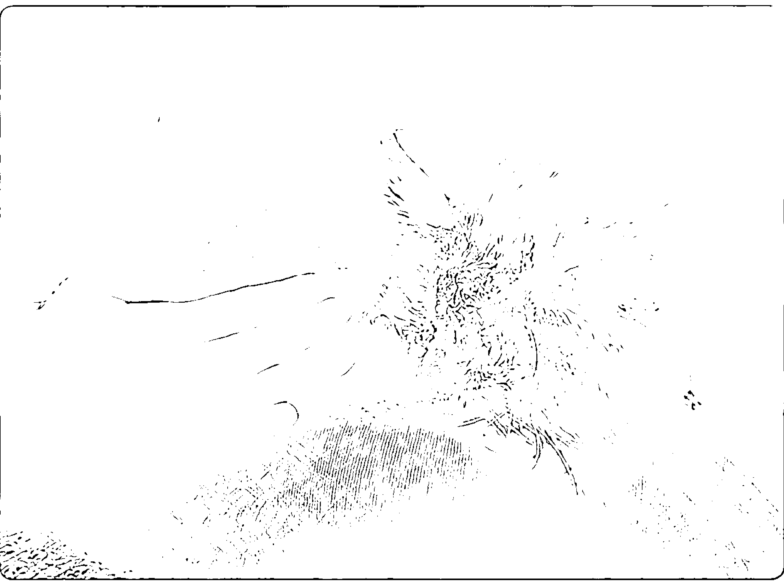

殘障動物、患有慢性疾病的動物

若動物肢體殘障或患有慢性疾病，靈氣可以協助牠緩解身體不適及壓力，有時甚至還能延緩情況惡化。靈氣療程對身體不適或功能有障礙的動物頗有幫助。當動物狀態不佳時，靈氣療程可以協助牠精神更集中、感覺舒服。

二十歲的臘腸狗「歐里」就是一個好例子，牠靠著輪椅在屋內四處活動，一點也沒意識到自己的年紀。但牠不是永遠這麼有活力，牠的腦膜炎時而復發，在集體療程中情況不佳。

幸運的是，在高燒症狀甚至痙攣出現以前，凱瑟琳可以先以靈氣為牠治療。歐里立即接收能量，然後睡了大約三十分鐘。那天牠看來不太舒服，但隔天就比較好了。

歐里幾天內就完全康復，不像過往總被各種疾病打敗。療程之後，牠變得很有活力，大多數早晨牠都四處跑動，像小狗一樣吠叫。現在，每當歐里接收靈氣，牠都不停嗅聞凱瑟琳的手，用溼溼的鼻子推她雙手，好像在問：「手裡有什麼？」

有時動物會開始拒絕重複的醫療模式，像是吞一大堆藥丸或是忍受皮下注射。針對這些情況，可以傳送靈氣協助改善。給藥之前，可以先傳靈氣給自己，專注在讓過程變得更容易順暢。

照顧殘障或慢性疾病動物，對你和動物朋友來說，可能都是種壓力。記得也為自己傳送靈氣，以保持身體健康，讓自己歸於中心且保持平衡，能以最佳狀態照顧動物。建立靈氣支持系統，可以減輕照顧年老、殘障或慢性疾病動物的壓力。若你需要時間休息，或感覺精疲力盡，尋求靈氣治療師為你或動物傳送靈氣，這樣可以協助你避開照顧者精疲力盡的感覺。

明亮和平之地的守護者及保護者——喬伊

喬伊小小的身軀內有個偉大的靈魂——牠和釘子一樣堅硬，混身是膽！牠在一場不幸的車禍之後，來到明亮和平之地動物庇護所。牠的後腳癱瘓，需要傳統輪椅才能讓牠在屋裡走動。大多數訪客一來到庇護所，就會遇到喬伊。一旦進到屋內，輪椅轉動的聲音及「看門狗」式的犬吠就會響起。一旦確定你「OK」，牠就會離開，回到負責人蓋爾旁邊的位置。喬伊對於陌生人會抱持懷疑，但是她第一次造訪時，牠不僅立刻接受我，也接受我傳送的靈氣。有時候牠比較不想成為療程「焦點」。當我坐在沙發上，為腿上的貓傳送靈氣時，牠會在我腳邊安頓下來，打個靈氣盹。其他時間牠會耐心等，坐在牠身邊，將部分身體攀上我的腿接受療程。在喬伊的大多數療程中，我也會針對牠的焦慮與壓力進行心理療癒。療癒牠並非情急狀況，而是個長期專案。保護所有庇護所的人類及動物居民，是個大工程，喬伊認真地擔下這份工作。——凱瑟琳

為獲救動物傳送靈氣

獲救動物過往可能遭受虐待或忽略，雖然這不是牠們的錯，牠們可能會因先前的情緒創傷產生許多行為問題。靈氣可以減輕，甚至可以消除情緒面的行為問題。即使對牠們的過往有大致了解，也無需知道問題成因。就算不清楚牠們的過往，靈氣也會直接針對問題進行療癒，不會只針對表面症狀。靈氣可以深深觸動動物的心靈及靈魂，成效令人驚嘆。在療程中，你可能會獲得關於動物情緒或靈性議題的洞見或直覺。若已修習二階靈氣，可以為動物進行心理、情緒及靈性的療癒，協助地面對挑戰，不管這些挑戰是伴隨身體狀況而來的心理壓力，或是過往造成的情緒創傷。定期為動物傳送靈氣，可以協助你增強對動物的直覺並強化彼此之間的溝通。

有時候幾次療程就能帶來戲劇化的轉變；其他時候，就像人類療程一樣，情緒療癒會漸漸產生效果。若定期為動物進行療程，並且保持耐性，將可能看到牠的行為及你們之間的關係出現美好的改變。若持續紀錄動物療程進展，可能會對靈氣所造成的改變感到驚訝。改變可能需要經過幾天、幾週、幾個月，有時甚至是幾年的時間，取決於動物的問題嚴重程度。

療程總覽

方法：與其他動物相同，但對特別脆弱的動物朋友來說，療程前先徵求同意，必須請牠只接收自己想要的靈氣量。

- 隔段距離進行療程：先隔段距離傳送靈氣，注意動物希望進行的方式。傳送靈氣時，若
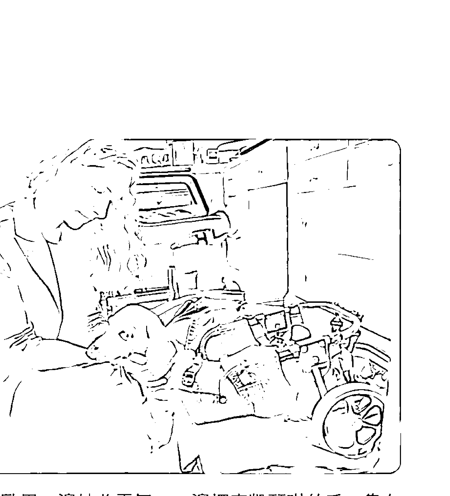

+   - 歐里一邊接收靈療，一邊探索凱瑟琳的手，靠在她大腿上，直到療程結束。

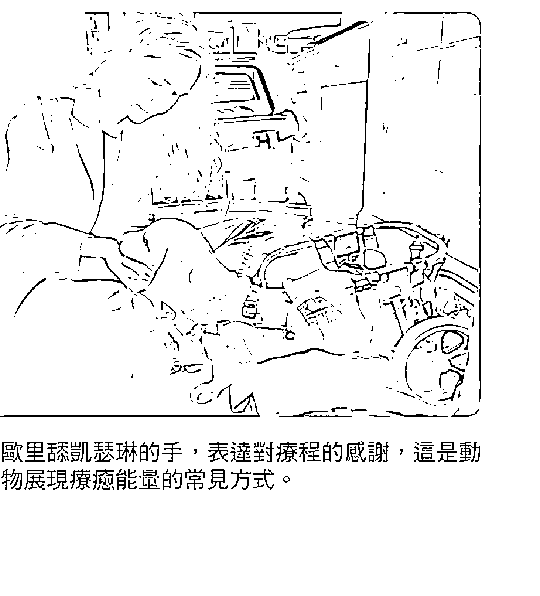

+   - 歐里舔凱瑟琳的手，表達對療程的感謝，這是動物展現療癒能量的常見方式。

弗瑞茲三十二歲，老當益壯！

「弗瑞茲」是明亮和平之地動物庇護所裡年紀最大的貓——一隻覺得自己還年輕的老貓！牠的活潑精神及青春氣質，實在無法從牠憔悴的外觀看出來。多年來牠一直在對抗癌症，甚至因此一眼失明，但這沒有讓牠停下腳步！弗瑞茲在靈氣方面很有個性。不僅是祈求靈氣，而是當我抵達庇護所時，牠用腳掌輕撓我的腿。當我們眼神交會，弗瑞茲開始叫。進入療程時，牠會在我腿上安頓下來，放鬆，有時牠會睡著，但大多數時候，就是安靜地躺著，專心接收能量。有時牠會出現好轉的反應，開始打噴嚏（可能是因為臉上的腫瘤），但他很快又會安定下來，深呼吸，靠近我的腿中。

舉例來說，牠常會將頭塞進我手中（對多數貓來說，這通常不是個舒服的手位）。無論我為弗瑞茲傳送多久靈氣（有時牠會坐在我身上超過一小時），牠永遠想要更多。每當我離開，牠會安靜地坐著目送我，臉上的表情在說：「請趕快再來。」——凱瑟琳

同身體部位。弗瑞茲常在觸手療程中移動身軀，引導我將手放在不同身體部位。牠喜歡在感覺最舒服的部位直接接收靈氣。

趕快再來。——凱瑟琳

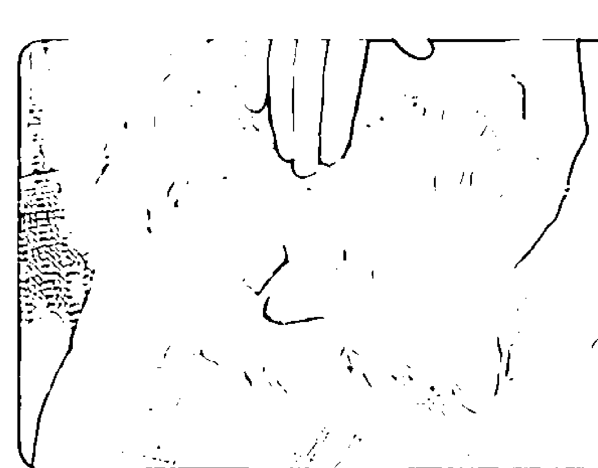

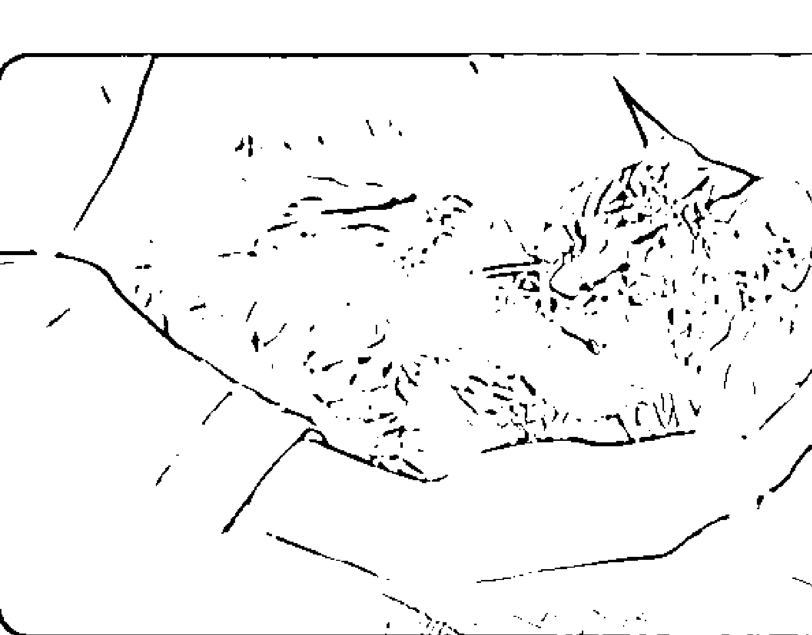

+   • 弗瑞茲稍微轉動身體，讓凱瑟琳的手能集中覆蓋牠的肩膀與胸口。

+   • 弗瑞茲調整姿勢，讓牠的臉（腫瘤位置）直接對準凱瑟琳的手。

牠在附近安頓下來，甚至睡著，就是牠接收你所傳能量的訊號。

##### 基本手位：

只在動物主動要求時，才為牠進行觸手療程。整個療程即便只用一兩個手位也很有效果，如果個案已經安頓下來，就不用更換手位。若覺得移動手位會打擾或讓牠驚醒，此時只要讓牠維持在覺得舒服的固定位置即可。

##### 特別手位：

注意最需要靈氣療癒的部分。可能是身體（動物有時會直接把身體某些部位對準你的手接收靈氣）、心理或靈性層面（你可能會收到問題為何的直覺性資訊），信任靈氣會深入最需要療癒的問題，無論你是否知道問題成因。請記得，定期為動物傳送靈氣，有助於培養對動物身心狀態的直覺。

##### 結束療程：

記得感謝靈氣為整個療程帶來療癒，以及感謝動物的配合。你可能想花點時間疼愛、輕抓或拍拍牠，就看牠喜歡哪種方式，這也是療程結束後確認彼此間連結的方式。

> > （更多資訊請參見第四及第五章。）

絕佳純種馬——史文生

「史文生」是隻二十三歲的純種馬，年輕時是匹賽馬，現在則是我的馬術訓練師艾利森的賽馬。他是匹很棒的賽馬，他教導所有不同年紀的騎士各種馬術，從平面行走到跳躍都有。牠甚至教會我一些事情，其中包含協助我建立信心。艾利森跟牠相處了近二十年，從他們年輕時，就開始表演馬術秀。

十二年前，史文生狀況變得很糟——牠失去平衡感，會不由自主地原地打轉，然後躺下。當地獸醫試圖治療牠的症狀，嘗試帶牠前往大醫院。艾利森每晚都睡在穀倉中照料牠。獸醫警告若牠開始劇烈抽搐，就得將牠安樂死。此時，艾利森的父親開始為牠進行靈氣療程。大約一個月後，牠的平衡感恢復了，可以前往大醫院診治。為牠檢查的獸醫不敢相信這匹馬幾週前如此病重。事實上牠很好，他們告訴艾利森，她可以讓牠重回工作崗位。

艾利森相信，史文生能復原是結合西方醫療及父親靈氣療程的成果。因此，當我將馬兒蕭尼遷往穀倉時，艾利森立刻請我為史文生傳送靈氣，史文生成為我的靈氣個案，每週定期接受靈氣療程，到現在已超過兩年。

史文生總是對靈氣療程保持開放，

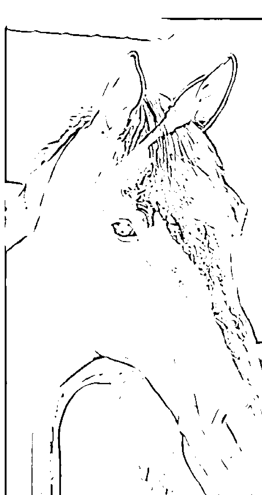

> 特別是在牠後背傳送靈氣，牠的後背不時痠痛。牠會轉身將痠痛區域靠近我的手。史文生通常會在靈氣療程中睡著，常會低頭，將舌頭掛在外面。我確定史文生並不擔心自己的年紀，牠的身形健美，外表及動作看起來都很年輕。牠真心喜愛工作，當牠年紀越長就更有智慧。牠相當喜愛自己教學的那些孩子們，我也相信牠不會放棄這項重要的工作。我知道靈氣在支持牠，協助牠依照自己意願前進，全速前進！——凱瑟琳

觸手療程

療程中，讓動物選擇靠近，而不是你去接近牠們。「喬伊」——明亮和平之地動物庇護所的「守護者」——就是一個完美範例。若你跟著牠到處移動，試圖強迫牠坐下接受療程，牠就會滿屋子亂跑閃躲。相反地，若你坐在附近並徵求牠同意，在牠容易靠近的地方耐心等待，喬伊就會靠近接受觸手療程。

庇護所另一個夥伴「弗瑞茲」，會輕抓你的腿、喵喵叫，以表示牠想要接受靈氣療程。你可以將牠放在大腿上，牠會立刻安頓下來，接受長時間的觸手靈氣療程。

你得讓動物選擇療程進行的方式。本頁附圖中喬伊把想要接受靈氣的部位貼近凱瑟琳的手。接著牠將身體前半部靠近她的大腿，變得極度放鬆。凱瑟琳結束療程，感謝喬伊選擇參

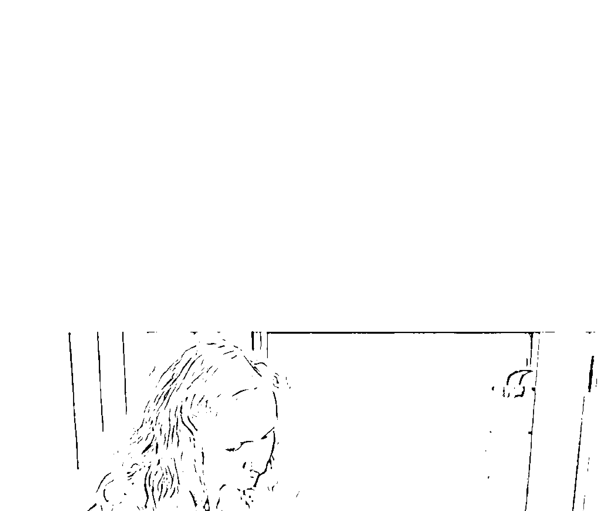

+   - 喬伊向凱瑟琳顯示哪裡需要療癒能量。

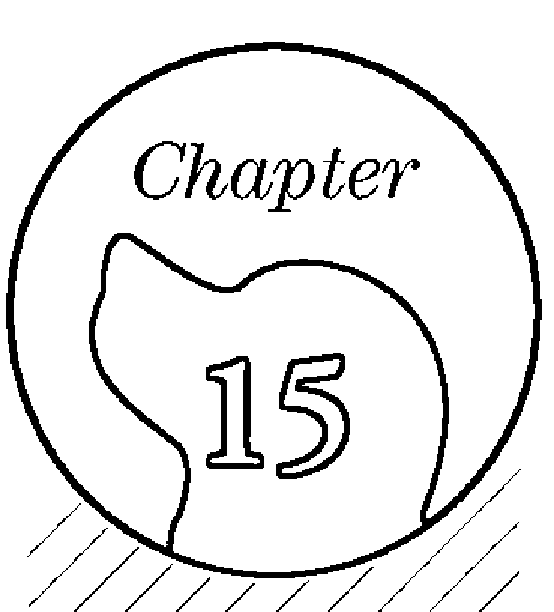

為野生動物傳送靈氣

野生動物不僅是靈氣的絕佳老師，也擅長教導人與動物間的各種可能性。當牠們願意進入與人類之間成為夥伴關係，就顯示了靈氣的龐大潛力，不僅協助動物本身，也促進不同族群間的和諧。對所有動物來說，你越能放下對於他們智慧及思考感受能力的成見，就越能與他們成功建立關係，當然也包括療癒關係。當你對彼此相處的全新可能性表達敞開心胸，野生動物會感覺得 到，和你相處也會更輕鬆，並彼此尊重。

你能運用靈氣療癒受傷的野生動物，牠們可能會感受到你傳送的靈氣，牠們可能會更常出現在你面前。若野生動物住在家中附近，你可以為牠傳送靈氣作為禮物，強化牠的健康及野外生活的能力，也因此更了解牠。大多數陪伴動物的原則，也適用於野生動物。主要的差別在於野生動物極少尋求觸手療程。

對於任何動物來說，若你向牠解釋自已進行什麼，並請牠只接收自己想要的靈氣量，越有可能和牠建立成功且有意義的互動。讓野生動物清楚知道你只會對牠們傳送靈氣，牠們可以決定接受與否及想要接收的量。可以透過手中能量流的感覺、動物的身體語言及放鬆狀態，分辨出牠是否願意接受。

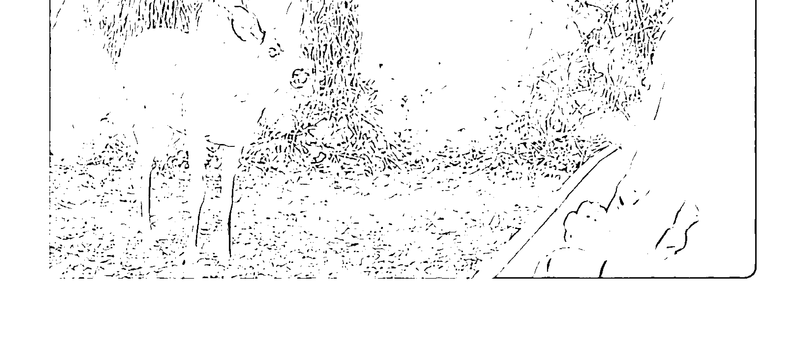

關於拍照

過去五年，我一直為附近的鹿以及其他野生動物，幫助牠們處理居住在郊區環境中所面臨的挑戰。鹿會面臨很多困境：找尋食物、避開車輛與狗以及人類的敵意。牠們感受到我傳送的療癒能量，我們的關係逐漸變得親近。牠們開始信任我，把牠們當成牠們的治療師。每當牠們生病或受傷，會到前院等我回家，或直到我從窗戶看到牠們。若我在家，有時牠們甚至會在窗邊徘徊，試著引起我的注意。

隨著時間過去，牠們開始找我治療。當鹿前來求助時，我會安靜地坐在院子裡，雙手放在腿上，讓靈氣流向牠們。每隻鹿會自行決定如何接受療程，在院子中以牠覺得合適的方式移動，接收足夠靈氣後就會離開。就算我不知道某隻鹿尋求靈氣的原因，我也不擔心，因為靈氣會深入需要療癒的地方，無論是否知道位置在哪。

為鹿及其他野生動物傳送靈氣，最能教導我關於動物及療癒的事物。對我來說，牠們對靈氣的理解，以及將靈氣融入生活的智慧，是動物靈氣療癒潛力的最佳見證。與野生動物相處、合作，也讓我具體實現兒時的夢想·關愛野生動物，彼此支持。

當我替本章安排拍照時，不確定鹿會對拍攝如何回應。當我為牠們傳送靈氣時，牠們習慣只有我一人在場，也不確定若有陌生人，還有陌生的攝影機聲響打擾時，牠們對於表現與我和靈氣的關係是否會感到自在。

在拍照前一天，我為這個狀況傳送靈氣，請鹿兒在隔天約定時間抵達。我跟牠們說我多麼想在書中擺放牠們的照片，因為牠們一直是我的重要的老師，但我強調，希望牠們只做出自己感到自在的決定，若覺得參與拍攝不自在，我也能夠理解。我將期待擺在一邊，相信當攝

影師來到時，最終結果對於我、鹿兒及本書都會是最合適的。隔天我回家吃午餐，發現大雄鹿「阿奇里斯」，在院中的木頭上休息，此時離我們約定的時間還早了二小時，我深受鼓舞。在攝影師抵達之前，我踏出家門，發現有一打鹿群正在等著我。平常展開療程的方式，在當天來了個大逆轉——平常狀況下，鹿會單獨前來接受療程。我從未替鹿群進行團體療程，他們也從未在沒有明確需求的狀況下接受靈氣。攝影師抵達時，鹿群很平靜且專注。在接下來的一個半小時中，牠們輪流接受療程。牠們彼此包容，耐心地在一旁等待，或在木頭上歇息，避免阻擋拍攝工作，直到每頭鹿都等到前一頭完成療程後，才踏入拍攝區域進行療程。鹿群願意幫助我，讓我感到無限喜悅，當我們一起合作時，靈氣滿溢庭院中，拍攝持續進行，我可以感覺到大家都興奮歡喜——無論是鹿、攝影師或是我。當我們完成鹿群的拍攝時，我和攝影師回到室內，希望整理好當天拍攝的所有野生動物的照片，然而，令我驚訝的是，松鼠「瑞皮奇普」在窗邊等著，牠也很想參與。牠對攝影師有點不熟悉。牠不是很自在，無法待到正常療程結束，但牠停留的時間也夠長了，貢獻了一些松鼠療程的可愛照片。拍攝結束時，我感覺牠及鹿群拓展了牠們的世界，協助靈氣觸及其他動物，並對我以及過往接收過的靈氣給予回饋。——伊莉莎白

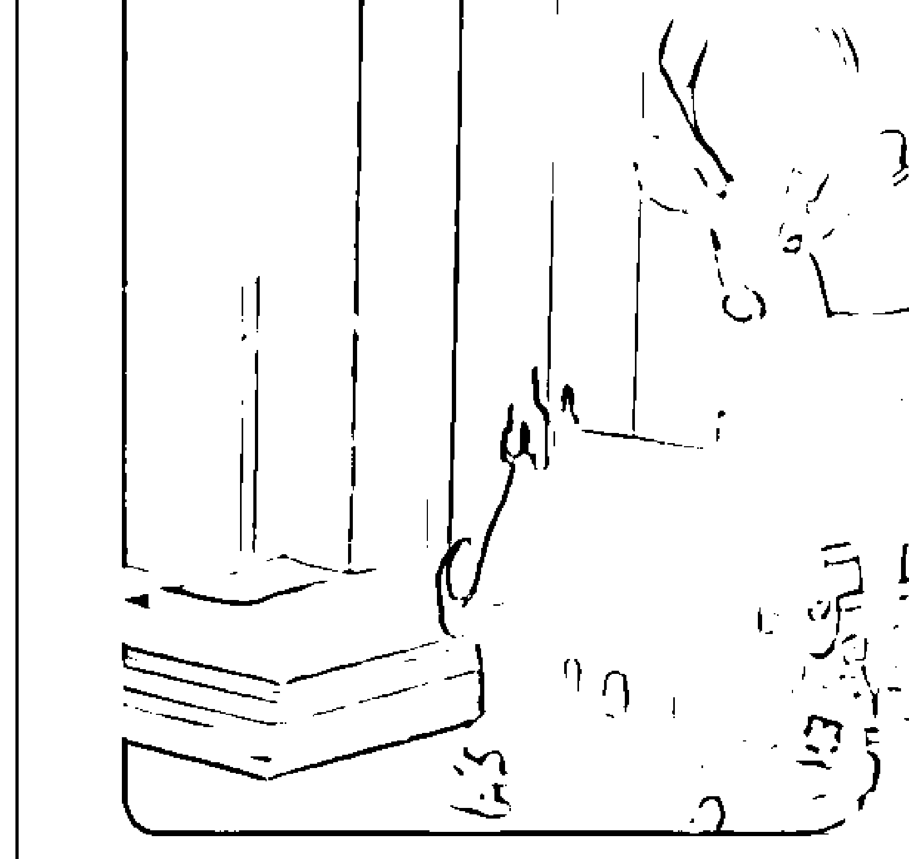

野生動物如鹿、浣熊、熊及臭鼬，通常會在人類居住範圍移動，試著在棲地快速消失的環境下生存，人類可能將這些野生鄰居視為風景中的可愛點綴，或是損害庭院及財產，令人不悅甚至危險的訪客。為家中附近的野生動物傳送靈氣，可以協助牠們療癒，更了解牠們獨特的生存智慧及野生本性，欣賞牠們的天賦才能，讓牠們在人類文明發展下仍代代相傳，生存繁衍。此外，為野生動物傳送靈氣，也能為彼此關係帶來和諧。

『梅林』

有天在我開始為鹿群傳送靈氣前，看到一隻跛行的年輕公鹿。當我近看牠的右後腿，發現一大片腫脹潰爛感染的區域有幾處開放性長條傷口，類似被柵欄勾住所造成的撕裂傷。傷口看來已經有段時間。我坐下開始為牠傳送靈氣，牠感激地接受。我不時會見到牠，即便沒見到牠時，也會傳靈氣給牠，幾週內牠的傷口就復原了。牠開始經常到院子中，我們培養出特別的友誼——牠是我第一隻為之命名的鹿，我叫牠梅林。梅林受過很多次傷，有次還差點要了性命。牠都會來找我，我實在無法表達牠的信任對我而言意義有多麼重大。

> 重大。——伊莉莎白

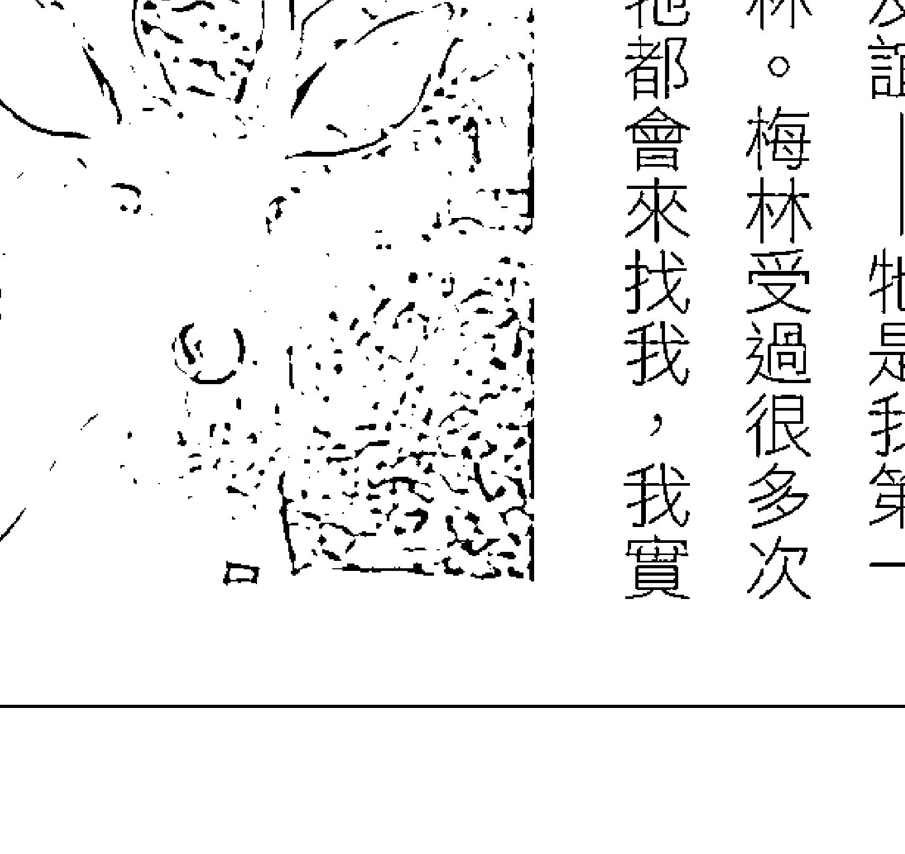

回到森林

幾年前的夏天，我在北加州雪士達山的美麗森林中獨處。當天天氣很好，我坐在岩石上欣賞美麗風光，決定為周圍森林傳送靈氣，回報森林帶給我的喜悅與平靜。 我讓自己進入靈氣的冥想狀態，但不時睜開雙眼，看看周遭情況。第一次睜開雙眼時，有隻停靠在附近的蝴蝶飛過來停在我膝蓋上。第二次，我看到有隻蜻蜓停在我身邊。我坐在岩石上傳送靈氣一陣子後，聽到附近有隻猴子在樹木間跳動，過了一段時間牠沒了聲響，我睜開雙眼，發現牠在距離五呎的地方安靜坐著，帶著作夢般的神情。我經歷過多次這種經驗，顯示動物能輕易辨認出靈氣的本質，而且牠們被這種溫柔和力量深深吸引。——伊莉莎白

脫離野生環境的野生動物，也能從靈氣中受益。牠們可能因疾病或身體損傷（像是收容所、復健中心或救援中心的鳥類及海洋動物）或其他原因被關在室內，像是動物園、水族館或馬戲團。許多野生動物，世世代代被關在室內豢養，與「野生動物」的自由自在相距甚遠。除了療癒身體損傷及疾病，靈氣也能協助被豢養的野生動物對目前生活更加滿意。向與野生環境失去連結、喪失自由的動物傳送靈氣，可以療癒牠們的個別情況，以及與人類的整體關係。 在本地庇護所及野生動物中心傳送靈氣，可以幫助傷病動物更快療癒，

支持牠們回到野生環境。也能為那些必須留在室內的動物，帶來平靜與舒適。有些動物帶有受虐記憶，靈氣可以為牠們邁向更喜悅的未來。

若你想為上面所述的動物提供靈氣服務，可以坐在圍籠外面傳送靈氣。若是在動物園或水族館，可以坐在籠子或水箱外的長椅，隔空傳送靈氣給動物。即使沒有身體接觸，動物仍會出現接收靈氣的訊號，像是打哈欠、休息甚至睡著。與其他動物相同，對於你提供的療癒，牠們通常也會表現出感謝的動作。

若你修習過二階靈氣，可以療癒與野外生活有關的狀況，只要針對你關切的狀況傳送靈氣即可。舉例來說，如果家中附近的浣熊在夜間喧鬧，打擾睡眠，你可以針對你們之間「保持平靜」的狀況傳送靈氣，要求牠們在住家附近保持安靜，讓你和牠們和睦相處。

也可以運用二階靈氣，為野生動物進行心理及情緒療癒，譬如像是協助失去摯愛夥伴或伴侶的動物。也能傳送靈氣，讓你與家居陪伴動物及住家附近野生動物，相處地更加和諧。

也可以對自己關注的遠大議題傳送靈氣，像是許多動物的棲地銳減或被汙染，或是瀕臨絕種動物的國際買賣。你可以傳送靈氣，打開人類的心，協助他們對野生動物更具同理心及尊重，在這個星球共榮共存。

### 與浣熊溝通

> 當丈夫和我搬進新家時，前屋主提及有一家子浣熊住在附近儲物小屋中，常在傍晚到後院跑動玩耍——這困擾著我，因為我們養狗，不想造成任何混亂，而且浣熊會在臥室窗外打架，導致我們失眠。

有天我站在儲物小屋外，對浣熊及這個情況傳送遠距靈氣。我向牠們自我介紹，說明自己是新任屋主，我理解並尊重牠們更早在此居住，歡迎牠們繼續留下。我也警告提到我有養狗，請牠們別在白天出沒。我保證晚上只在前院遛狗，也告訴牠們我不想聽到任何動物在深夜打架或在臥室窗外吵鬧。我每晚都傳送遠距靈氣及這些訊息，持續約一週。有趣的是，我沒再聽到或看到浣熊出沒，在想牠們是否搬走了。

五個月後，因為一場暴風雨吹倒後院籬笆，我們得換新的。工人移走舊籬笆，把舊的告示牌洞口填平，挖出新的，堆了些木頭準備隔天修繕。那天傍晚，我在廚房洗碗，看到窗外有隻大浣熊在視察院子有什麼改變。我很驚訝牠仍住在儲物小屋裡，也明白牠們確實收到我傳送的訊息了。

這個春天，我到儲物小屋找幾個之前放的箱子。我在早上十點前往，聽到幾隻浣熊大聲騷動，很明顯是被找東西的聲音吵醒。我在心中向牠們道歉，儘快安靜地完成待辦事項。當我安靜下來，牠們再度恢復平靜。我對那大浣熊及浣熊寶寶感到驚嘆不已！我感謝牠們遵循先前的要求，也跟牠們說歡迎留下。—— 凱瑟琳

為野生動物傳送靈氣，讓你更深入了解牠們所擁有的智慧與情緒。透過靈氣與野生動物之間傳送靈氣，能讓你對人與野生朋友間各種關係的可能性，有了全新的認識。可能是包括和諧共存、認知到牠們擁有足夠棲息地的生存權利，以及人類應該給予的尊重與尊嚴。靈氣不僅療癒野生動物，也療癒我們的心靈，協助我們想起彼此都是世界的一份子，彼此互相影響。透過觀察及聆聽野生動物的需求，充分學習到如何療癒自己及世界。

#### 療程總覽

- 方法：療程前先徵求同意。請動物只接收自己想要的靈氣量，讓他選擇是否接受且讓他知道已經對療程有主導權。
- 隔段距離進行療程：若你覺得動物能接納你，先隔個安全距離傳送靈氣；若覺得動物對於你在附近感到不自在，就在他注意力以外的地方傳送靈氣。首次療程時，野生動物可能不會持續太久。不過接收靈氣多次後，可能更能接受療程，也可能會自己前來尋求療癒。永遠要留心與野生動物相處時的安全，尤其在他們受傷時。記得隔空傳送靈氣也一樣有效。

#### 『艾斯瑞爾』

靈氣之所以是針對野生動物的絕佳療法，就是因為它可以遠距傳送，在你與動物間保留了「舒適區」。

結束療程：觀察動物的身體語言，感覺流經你的能量流狀態，分辨何時該結束療程。當動物從深度放鬆或睡眠狀態中醒來、起身離開、被其他事物吸引，或是手中能量減弱，持續呈現微弱狀態時，表示療程進入尾聲。野生動物也會在療程後持續注視你或朝你的方向伸展身體，表達感謝之意。（更多資訊請參見第四及第五章。）

在和鹿群互動的初期，有天我外出辦事，返家時看到一隻有巨大的鹿角、看來威嚴的成年公鹿，在前院露台遠處休息。我從皮包拿出鑰匙時，一直聽到牠肚子翻攪的聲音。我出出入入卸載物品，心想牠看起來有消化系統方面的問題，我有點時間，因此在屋內為牠傳送一階靈氣。

我投入療程中，結果療程進行得比預計時間還久。結束時，我輕輕打開大門，看牠在露台上睡著了，門軸轉動聲喚醒了牠，突然抬頭，臉上表情無比驚訝，好像在想「我怎麼會大白天在露台上睡著了？」這是牠第一次接觸靈氣。之後，牠就成為前院的定期訪客，我依據菲利浦·普曼書中角色，替牠取名為艾斯瑞爾，因為牠們一樣具有力量及強烈的存在感。

> ——伊莉莎白

#### 隔段距離接受療程

大多數野生動物都會感謝靈氣的療癒能量，他們較喜歡隔段距離接收靈氣，如以下故事所述。

拍照當天，有一打鹿群聚集在伊莉莎白前院露台上。她安靜地坐著，雙手放在腿上，為每頭想接收靈氣的鹿進行傳送（參見第223頁圖1）。伊莉莎白持續靜靜地傳送靈氣，讓鹿群決定療程進行的方式。

冷靜且專注的「雅典娜」，是第一頭自願接收靈氣的鹿（參見第223頁圖2）。雅典娜從露台上跳下，站在伊莉莎白面前直視她，讓她知道牠是第一個志願者。

療程中，雅典娜不時將不同身體部位貼近伊莉莎白以接收靈氣，如第223頁圖3所示，雅典娜想讓身體左側接收靈氣。療程接近尾聲時，牠放鬆下來，打起瞌睡。

療程完成時，雅典娜朝著伊莉莎白伸展頭部，以這種姿勢表達感謝。牠柔和的大眼安靜但認真地訴說感謝之意（參見第223頁圖片）。

療程結束後，幾隻鹿兒聚集一起，決定誰是下一位。另一頭母鹿「黛安娜」，決定成為下一個志願者。黛安娜接受療程時，其他八隻鹿群站在拍攝區域外，觀看療程過程並思考著

# ## 是否要接受療程。

大多數時間中，黛安娜都是讓後腳接受靈氣。牠移動了幾次，將後腳靠近伊莉莎白。牠一邊打瞌睡，一邊反芻食物，這是鹿放鬆的訊號。療程結尾時，牠轉身將背部及後腳朝向伊莉莎白，接收大量靈氣。黛安娜快完成療程時，公鹿「阿奇里斯」決定自己是下一個志願者，緊接著接受療程。牠一直耐心等待，突然就輪到牠接受療程了。阿奇里斯前腳有舊傷，牠舉起腳接收靈氣，打了一會瞌睡，醒來時，牠用鼻子輕輕搔了前腳，然後牠用鼻子輕碰下一頭在等待的幼鹿，然後跳上露台再跳下，完成牠的療程。

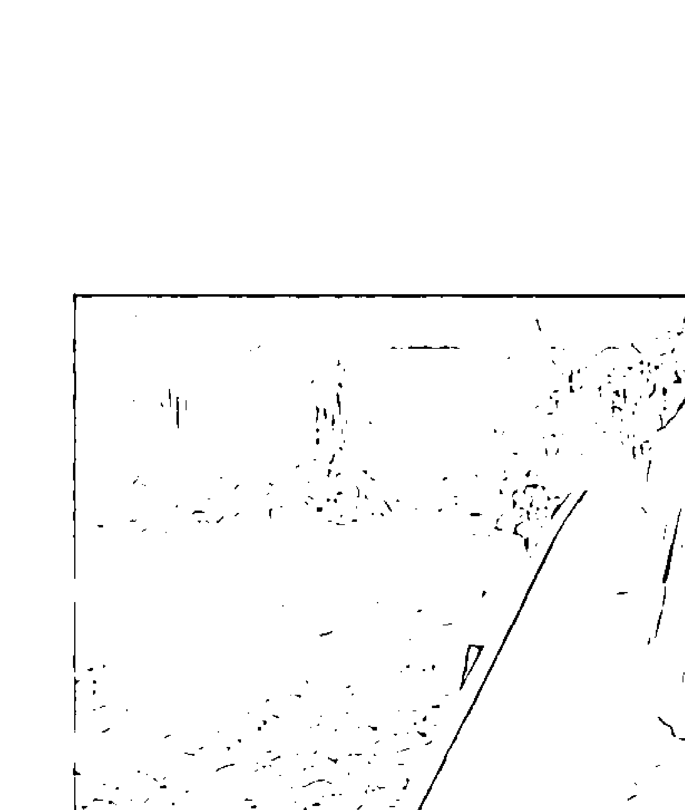

1. 伊莉莎白替聚集在前院的鹿群傳送靈氣。

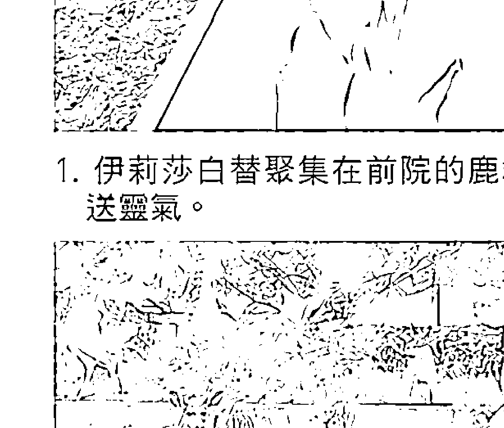

2. 雅典娜同意接受靈氣療程，向伊莉莎白靠近。

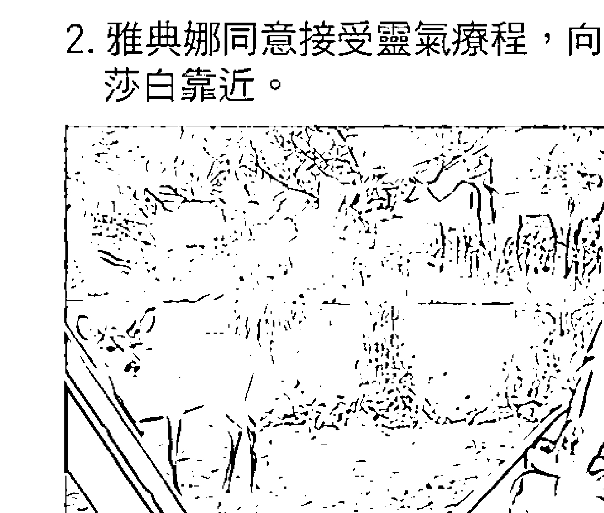

3. 雅典娜重新調整姿勢，向伊莉莎白顯示自己想要靈氣的部位。

幼鹿想當下一個志願者，但年輕公鹿「悉達沙」另有想法，把幼鹿趕走，自己先接受療程。當「悉達沙」即將結束，悉達沙停在一處接受短暫療程。伊莉莎白向所有鹿致謝，十分感激牠們示範野生動物傳送靈氣的情形。

接著，松鼠「瑞皮奇普」靠近伊莉莎白接收靈氣。她抬起手，讓靈氣流向牠，牠正在觀察攝影師，想著決定接受療程是否安全。然後牠開始研究來自伊莉莎白雙手的能量，伊莉莎白在原地不動，最後坐下來，以更舒服的位置替牠傳送靈氣。最後，由於牠一直對攝影師存疑，中止了療程。牠深深凝視伊莉莎白一會兒，在跳走之前說了感謝及再見。

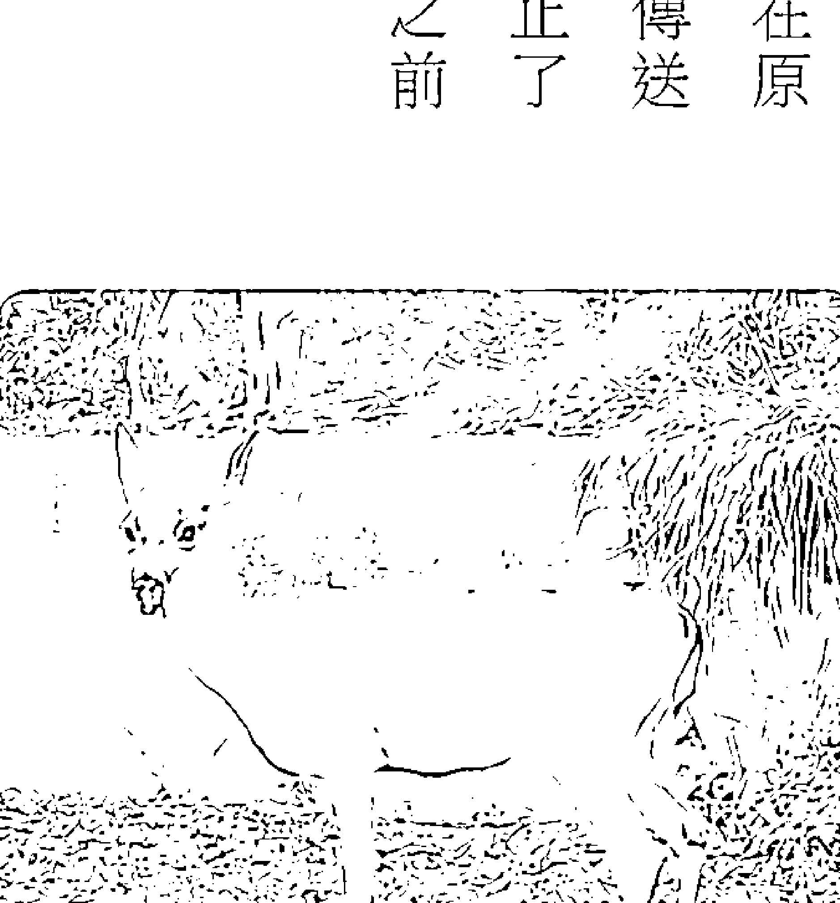

* 黛安娜不斷反芻，這個動作代表牠很放鬆。

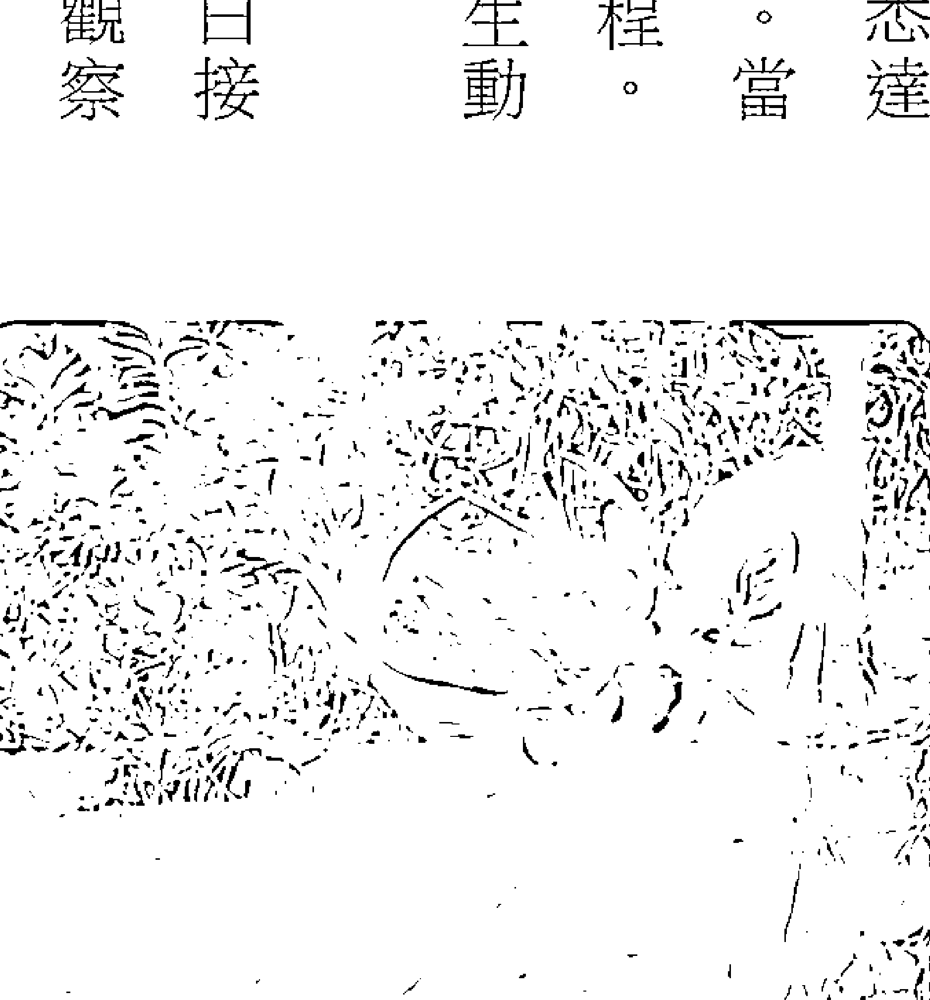

* 阿奇里斯在療程結束後，用牠的鼻子碰觸幼鹿。

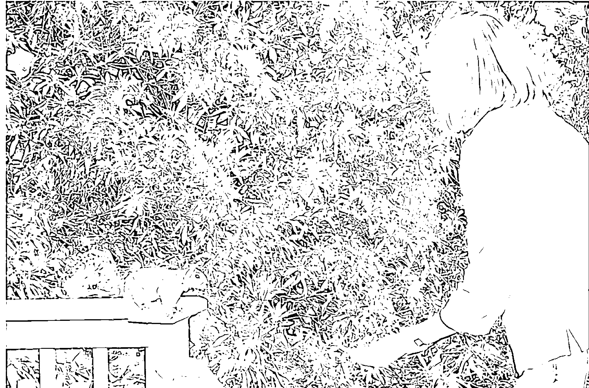

• 伊莉莎白提供靈氣給松鼠瑞皮奇普。

#### 觸手療程

常與人類接觸的野生動物，像是收容所那些有時會靠近你、將身體貼著你的手尋求觸手療程的動物。若牠向你靠近，通常是一種信任的象徵。不過這不一定代表牠想要觸手療程，除非主動接觸你的身體。

若動物主動與你接觸，就把手放在牠看起來最舒服的位置，像是直接放在身體上或隔一段距離。對於大型動物來說，肩膀是開始觸手療程不錯的位置。可以參考第十章為馬傳送靈氣，章節中的圖片示範了一系列適合大型動物的手位，可以維持牠們的健康，治療身體損傷及疾病。

### Chapter 16

#### 為臨終動物傳送靈氣

當家庭中有動物成員接近臨終，家中的成員及其他動物成員都會深受影響。靈氣是種溫和且有力的方式，支持全家度過失去摯愛成員的過程。能為全體成員及臨終相關的各種狀況帶來平靜。在臨終階段傳送靈氣，能為動物及其家人進行情緒及靈性療癒，也能讓臨終動物接受過渡過程，舒緩痛苦與恐懼。

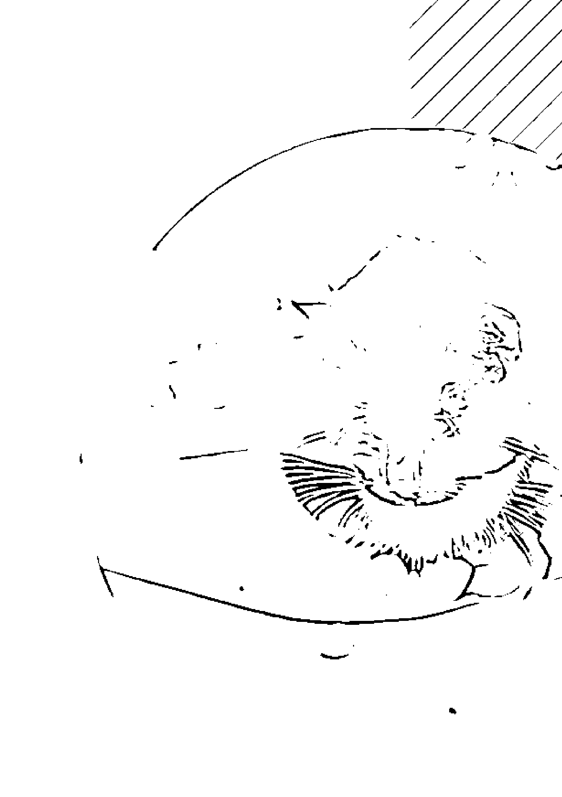

當動物接近臨終時，我們常常覺得無助，希望自己能做更多事情來支持我們的摯友。靈氣能協助你在動物臨終時，滿足牠許多需求，包含身體舒適感、情緒及靈性支持。靈氣能改善動物的生命品質——許多動物的症狀得以紓解，情緒和精神也會好轉。有些動物甚至會活得比預期更久，感覺舒適及喜悅；至於其他動物，靈氣能讓他們的生死過渡期更加輕鬆，協助他們的靈魂在死亡後邁向下一個階段。

開始相關療程的理想方式，是從接近臨終初期持續到最後的過渡歷程。然而，我們常會發現，靈氣會在最適合的時間開始進行它的工作。甚至可以看到只有一次療程就為情況帶來特別的改變，協助動物及其家人平和接受動物的生死。

雖然臨終會帶來無可避免的悲傷，但這階段仍有可能出現許多美好事物。利用靈氣協助動物過渡階段的人們常說，在這個階段中與動物變得更加親近。最後的深刻連結會帶來一種滿足的感受，安撫分離時無可避免的悲傷。

# ## 找到平靜的家庭

第一次遇到公貓「卡森」，是在牠過世前兩週，當時牠和牠的家人陷入一種筋疲力盡又極度焦慮的狀態。卡森罹癌將近一年，一直覺得不舒服，有一段時間無法好好入睡。當牠無法入睡時，寵愛牠的家人會醒來，試圖幫助牠入睡，也很擔心牠。之前牠一直和家人共享美好生活，彼此之間有著無限的愛。

卡森的家人深愛著牠，難以接受牠即將臨終，事實上牠就快離世了。牠盡力保持最佳狀態，卻非常擔心家人，也不知道若自己不在了，他們是否都會好好的，卡森也不確定能否撐到家人都能了解，牠已準備好離開這個世界。他們常常帶牠探望獸醫，接受更多治療及嘗試新藥，卡森覺得這對牠其實沒有任何好處，牠希望他們停止這麼做，接受自己時日無多。牠也擔心當自己過世時，他們會發生什麼事，因為他們看來無法接受牠終會死去。

在第一次靈氣療程時，卡森花了一段時間來確認靈氣是否是件好事。牠在屋中移動了約二十分鐘，不過最後牠在我的手附近安頓下來，吸收了大量能量。之後牠和家人安穩入睡了，過了約一週的時間，家人回報卡森看起來舒服很多。

當卡森又開始不舒服，家人請我再進行一次療程。當時卡森無法入睡，行動也有困難，終日躺在某處。當我抵達時，牠靠過來爬上我的胸口，在那待了一個半小時，吸收了大量靈氣。他的家人十分驚訝，因為牠之前從未爬到外人身上。療程中，我也對牠的狀況傳送靈氣，希望家人能接受牠的狀況，以及牠瀕臨死亡，那是無可避免的。那天下午及晚上，牠可以在屋中以牠慣常的方式活動——牠再度前往後院，在日落時坐在門廊下，那是牠以前的每日習慣。牠與所愛的人變得更舒服、敏捷且充滿互動。

# ## 療癒並不一定是治癒

為臨終動物傳送靈氣可能很具挑戰性。身為療癒者，我們希望動物狀況好轉，若狀況沒有變好，可能會覺得沮喪。靈氣為每個生命的命運藍圖帶來最需要的療癒，因此療癒並不總是代表治癒。我們總會提醒自己，靈氣永遠會為動物帶來最佳效益，即使結果並非如

> 幾天後我再度前往牠們家，家人已經能接受牠的情況，停止所有獸醫治療的干預，只留下那些會讓牠在家中更舒服的協助。他們想要學習靈氣，讓他們可以盡力協助牠度過最後時日，也協助自己面對牠離開後帶來的悲傷。由於我下一堂課是開在一週之後，我覺得卡森不會活到那個時候，當天我們就在家中教授靈氣課程。當天及隔天課程卡森都在場。

> 當課程即將結束時，牠覺得反胃，開始不舒服，但牠堅持在最後的點化過程中與牠特別的家人在一起。我在點化後離開。一小時之內，牠的情況急速惡化，家人帶牠去診所急診，決定最好的方式就是幫牠安樂死。家人說牠平靜地離開了，最後臉上掛著大大的笑容。

> 沒多久之後，他的家人寫信，提到他們沒有自己想像得那麼悲傷，覺得在最後時刻做得很好，卡森現在已經在一個很好的地方，也不會想要他們過度悲傷。他們設立了一些儀式，像是每天在牠的墓前點蠟燭、製作一本記錄共同回憶的相冊，這些都讓他們覺得安慰，在心中畫下完美句點。——伊莉莎白

我們所願。事後回顧，我們常會看到靈氣如何為某情況帶來療癒，那種療癒方式是當時狀況最需要的。有時候，當人們學會以靈氣幫助自家病重動物，或在剛學靈氣後治療臨終動物時，若無法阻止死亡發生，他們可能會覺得十分沮喪，對靈氣的信念受到挑戰。在生死邊緣的動物有時會因靈氣康復——這種情況意味著，儘管

#### 那隻老鼠

有天當我剛到家時，正打擾到貓咪艾瑪——牠在後院玩弄一隻老鼠。我將艾瑪放進室內，放走那隻老鼠，牠的後背因挫傷留了一灘血，呆坐在那一動也不動。這看起來似乎在我抓到艾瑪前，牠也正好結束，但同時我感覺到內心某些聲音告訴我試試看靈氣。我坐在門前台階上，傳送靈氣給那隻躺在一呎外的老鼠。我沉浸在靈氣中，完全不知道時間的流逝。看了手錶，已經過了三十分鐘，而那隻老鼠的狀態就像剛剛艾瑪摧殘後的樣子，躺在那沒有動靜。就在我想要停止時，又有某個聲音告訴我「再持續長一點的時間」。接著過了幾分鐘，那隻老鼠顫抖，很快就起身、四處張望，我直盯了好幾秒。後來牠穿越後院，消失在常春藤叢裡。那天之後，我看著常春藤，心想希望不要看到嬌小的老鼠身體，還好沒有看到。隔天，當我正在傳送靈氣給鹿時，一隻和前天相同的小老鼠從長春藤爬了過來，注視了我一分鐘。我想應該是在牠重傷那天後，回來向我確認並說聲「謝謝」吧。——伊莉莎白

# ## 為臨終動物傳送靈氣

情況可能艱險萬分，但還不是動物過渡到另一階段的時候，因此靈氣能協助牠們回復健康。若動物離開的時間到了，靈氣不會阻擋這個過渡的發生，靈氣雖然能讓生死過渡輕鬆很多，但卻不會阻止死亡。在這種情況中，靈氣通常會提升動物的生命品質、改變相關情況，讓所有相關的人及動物接受生死過程，更能自在放下，讓過程更加輕鬆，減少受苦折磨。靈氣能為臨終動物及其家人帶來他們所需的支持，減輕痛苦及恐懼，協助動物平和接受過渡階段。若我們將身體康復視為療癒的唯一證明，當動物過世時我們會覺得無助與沮喪。記得死亡是生命的一個自然階段，在動物生死過渡階段，為其傳送靈氣是種美好又充滿愛的禮物，能在情緒及靈性層面上帶來療癒。我們知道自己可以信任靈氣。靈氣永遠以充滿愛及同理心的方式，為動物帶來所需的療癒。我們可能不會永遠清楚動物面臨的各種問題，但療癒無所不在。靈氣是絕佳的禮物，能為動物帶來舒緩及安慰，讓動物以自己的方式平靜地度過臨終階段，可能的話，甚至可以在牠的最後一刻為牠傳送靈氣。靈氣會以療癒、安慰及平和的方式陪伴所有相關的人事及動物，度過整個歷程。運用靈氣協助動物離世，能帶來最棒的禮物，讓你深刻地理解終會面對的過程，以及能讓你達到內在平靜。

#### 平靜的片刻

有時動物的處境無法改變，但靈氣可以為任何狀況帶來療癒。收容所中有隻狗，之前遭受人類恐怖的虐待，牠變得兇惡，讓人無法靠近。因為牠在安樂死名單上，我決定為牠的狀況傳送靈氣。我盡力讓自己的情緒中心保持寧靜，在心中告訴牠，若牠願意接受，我會為牠提供療癒。我為牠的最高益處祈求，若有可能希望出現奇蹟挽回牠的生命。
雖然牠拒絕躺下或坐著接受靈氣，但最後牠把身體靠在床上，頭垂向地面，閉上雙眼。我感覺我們被平和與和諧圍繞，我的意識飄遠，我們倆就像身處在另一個世界般。在那個平靜的地方停留了十分鐘。之後我繼續造訪收容中心，得知牠已經被安樂死了。我覺得很難接受，讓我想起牠在療程中多麼平和。回想當時圍繞在我們身邊的平和與和諧，我覺得牠在靈性層面已接受療癒，牠已準備好過渡到下一個階段。——凱瑟琳

#### 如何開始

臨終動物有時會對能量及其他刺激變得更加敏感。在臨終階段，每隻動物都有其個別差異，先前喜歡靠近你甚至偏好觸手靈氣的動物，可能會變得偏好隔段距離接受療程。所以，為臨終動物傳送靈氣的最好方式是，先隔短距離傳送，觀察牠的偏好。若牠無法起身靠近你接受觸手靈氣，可能會朝向你伸長脖子或做些其他事情，以顯示牠想要你更靠近。順從自己的直覺相當重要。

要，因為你比任何人都了解牠，能夠成功解讀牠的暗示，得知牠對靈氣的喜好。
當你意圖讓靈氣流向動物，療程就會開始。你可能感受到強烈靈氣能量流，或是只有微弱的能量流，也可能深深投入療程，或發現自己在療程中不停地與動物交談溝通。若動物指出牠想要觸手靈氣，可以遵從牠的引導擺放手位。有時將手直接放在患部或傷處，可能會使牠感到不舒服，牠可能會比較喜歡將手放在沒有問題的地方；其他時候將手直接放在患處，可能會能夠舒緩疼痛或其他症狀。每次療程都不會與前次完全相同，需要仔細觀察目前療程中，以什麼樣的方式進行最適合動物。
每次療程都是彼此之間的特別時光。當你感覺靈氣流動開始減弱、動物離開或將注意力轉移到其他事物上，就代表療程即將結束。有時靈氣能量流動不明確，你得自行決定停止療程。
為摯愛的動物最後時光傳遞靈氣，能讓你深刻體會並學到改變生命的一課。你能在動物臨終、過世當下，甚至死後為牠傳送靈氣，靈氣能夠改善動物的生命品質，讓牠更輕鬆地離世，支持牠的靈魂在死後邁向下一個階段。在臨終時傳送靈氣，會讓許多動物的症狀獲得舒緩，情緒及精神狀態有所改善。有些動物甚至會比預期活得更久，過得舒適且喜悅。
在這段時間，為你自己及其他家庭成員（包括動物及人類）傳送靈氣十分有益，因為能協助你療癒過渡過程的恐懼及擔憂，對動物的離世感覺更平靜，協助你在他最後時光活在當

#### 幫助馬兒放下

有時臨終動物會自行尋求靈氣。有一匹年老的阿拉伯騸馬（去勢的馬）就是如此。我很少與他接觸，因為他和我的馬住在同一個馬廄中，只有偶爾向他打聲招呼。我聽穀倉其他人說，他正受痛苦折磨且非常年邁了。有天晚上我在馬廄水槽調合溫水與飼料，準備給我的馬食用，那匹老馬正站在旁邊。由於老馬缺少運動，他被允許在馬廄自由活動。透過眼角餘光，我看到這個老男孩慢慢走向我，低下頭雙眼注視著我。當我們眼神交會，我就確實明白他想要靈氣。當我在心中同意為他傳送靈氣，牠立即躺下，伸展脖子，頭靠在地上。我在離他二十呎遠處蹲下，開始傳送靈氣。牠閉上眼睛，深深嘆息了一聲。

我同時覺得頭部變得混沌、想睡，感覺輕飄飄的。我為臨終動物傳送靈氣時，通常會有這種感覺，像是他們已經與物質身體分離。開心的是，我沒感受到他有任何痛苦與焦慮。他沒有顯示出任何對於周遭馬匹或人類的掛礙。就只是覺得很疲倦、筋疲力盡，準備好放下了。

為了牠的最高益處，我傳送靈氣給這個情況，並且決定停止療程，因為有一小群擔心牠的人開始聚集。他的飼主帶著獸醫前來，並要求清場，請其他人離開。當我開始電話，那匹老馬被安樂死了。很明顯地，對馬兒的飼主來說這是個困難的決定。當他過世時，大家都聚在一起。

下，做出更清晰的抉擇。也能幫助動物更輕鬆地離開。動物通常會幫助我們承載擔憂及恐懼，牠們可以平靜地面對自己的過渡階段，但卻擔心我們感到焦慮。當牠們看到我們心態平靜，狀態良好，通常就能夠轉向內在，專注於自己的臨終過程。在動物往生後，為自己傳送靈氣，或請朋友傳送靈氣給你，對處理與摯愛朋友分離時無可避免的悲傷，能帶來極大的幫助。

> 我如釋重負。那晚我帶著祈願牠和平輕鬆離開的意圖，為牠的靈魂傳送靈氣。隔天，當我經過前晚牠躺下的地方，強烈感受到那匹老馬也在場。我向牠的靈魂致意，感謝牠接受靈氣並告訴牠當牠準備好時，就可以邁向下一個階段。當我回顧這段經驗，我很感激自己能成為這過程中的一部分，即使只是一小部分。雖然我知道對於牠的飼主來說，協助牠離開是個困難的決定，但我從馬兒那清楚感受到牠的時間到了。在此之前，我不確定安樂死是否是種平靜離開的方式。現在我可以確定有時這就是動物需要的方式。我總驚嘆於靈氣調和一切事物的方式，不論那個方式可能為何。

—— 凱瑟琳

#### 懷念貓兒「水晶」

我在明亮和平之地動物庇護所教授靈氣課程時，遇見了「水晶」。牠跳上我的大腿，蜷曲成一球，在長時間療程中安頓下來。通常我在課堂上環顧四周確認學生狀況時，我發現自己也在為水晶進行靈氣療程。當學生群聚討論時，水晶仍在課堂上。事實上，在超過兩小時的課程中，牠都拒絕從我腿上離開。當我結束課程得離開庇護所時，牠勉強允許我將牠輕放在沙發上，但充滿疑問地看著我，好像在說：「你什麼時候會回來？」

因此，我再回去為牠做了幾次療程，特別是我聽說已接近臨終。有天我發現牠在浴室角落打盹，注意到這幾週牠看來更加孱弱。事實上，我擔心會打擾牠，所以我安靜地坐在附近椅子上，徵求牠的同意好開始療程。牠從瞌睡中醒來並抬起頭來。當牠認出我時，就立刻起身試圖跳上我的大腿接受靈氣。我無法相信牠突然顯示這麼強的動力，我很快起身，輕輕地將牠放在我大腿上（儘管牠很有熱忱，我也不確定牠的身體能否進行跳躍）。牠再一次安穩進入深層睡眠，持續了一小時以上。當我最後必須離開時，我得從腿上把牠挖起來。我跟他說我會定期為他傳送遠距靈氣來幫助他。

二〇〇五年六月十五號，水晶在蓋兒的手中平靜過世了。在水晶臨終時，蓋兒也替牠進行規律的靈氣療程。她向我分享了在水晶最後的日子裡，只有靈氣能讓牠感到身體上的舒適。她說可以從水晶眼裡看到靈氣帶來的平靜和慰藉。

> ——凱瑟琳

#### 療程总览

隔段距離開始療程：最好先隔段短距離為動物傳送靈氣，若牠想要觸手靈氣，讓牠主動接近。臨終動物有時對能量及其他刺激會更敏感，因此你應該特別關照牠的喜好。舉例來說，若牠無法起身靠近你接受觸手靈氣，牠可能會朝你的方向伸出脖子，或做些其他事情，顯示希望你靠近牠。觀察動物的身體語言，注意流經手中能量流及自身直覺，決定如何依照牠的意願進行療程。

可能的手位：若動物顯示牠想要觸手靈氣，就跟隨牠的引導放置雙手。記得有時將雙手放在患處或傷處，可能會讓牠不舒服。其他時候雙手直接放在患處，能舒緩疼痛及其他症狀。

### 安養院、庇護所以及收容中心的支持

靈氣是各種動物安養照顧方案的極佳輔助，也是收容所、庇護所以及救援組織工作人員可以學習的寶貴技術，適用於任何年老及病末期動物，以及安樂死執行場所。即使只有一次療程，也會對動物的生死過程帶來許多幫助。在執行安樂死的收容中心，為計畫接受安樂死的動物傳送靈氣，對他們來說是無價的禮物。為那些動物提供這種具有同理心的協助，也能幫助工作人員減少可能經歷的精力力竭的感覺。

### 最棒的禮物

狀。每次療程都與前次不會完全相同，要小心進行，以了解動物當下最需要的方式。結束療程：當你感覺靈氣流量減弱，動物開始顯示療程完成的訊號，就是結束療程的時候了。記得感謝靈氣帶來療癒，並對動物參與療程表達愛與感謝。（更多資訊請參照第四章及第五章。）

動物是我們最愛也最親近的夥伴，失去牠與失去家人一樣痛苦。人類對於失去他們的焦慮，動物通常能感覺到，他們會勉強承載這些感受，以分擔人類因失去牠所產生的痛苦，讓他們有時間適應自己的離去。當你面對摯愛的死亡，可能會希望他們奇蹟治癒，不過有時死亡背後有著更必要的深層療癒，以及更深刻的學習議題。如同接下來故事中，罹癌的狗以及其家人美好地顯示，雖然靈氣並非總能在身體層面治癒疾病，但在靈性及情緒層面，卻能產生美好的療癒轉變。透過靈氣，死亡可以是平靜的過程，有時你能給予動物最佳療癒禮物，就是讓他們帶著愛及接受離開此生。

### 米克：療愈身體及靈魂

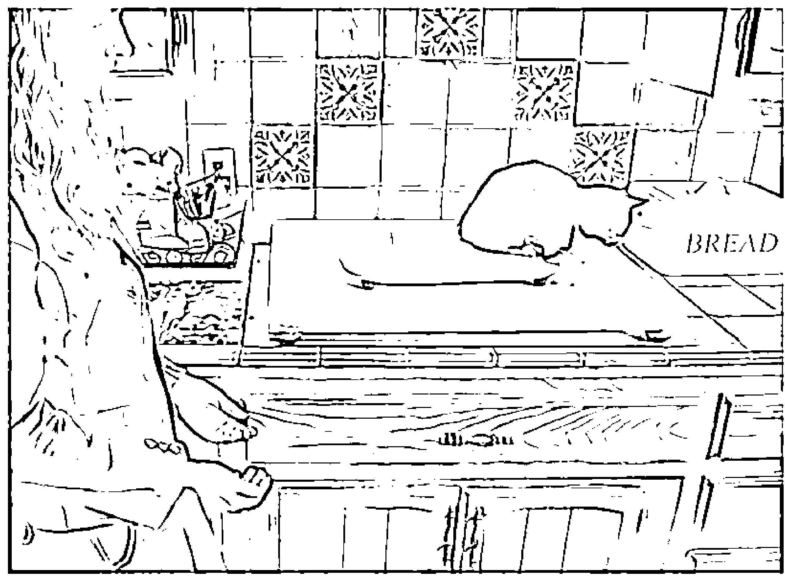

• 米克有嚴重的腸道疾病，觸手靈氣對牠來說過於強烈。經過定期的遠距治療，最後牠終於選擇接受了靈氣、測量體重，以及發現如何讓自己感到舒適和輕鬆。凱瑟琳則待在附近，而不是在米克身體的空間範圍內。牠在療程中闔上眼睛放鬆休息。

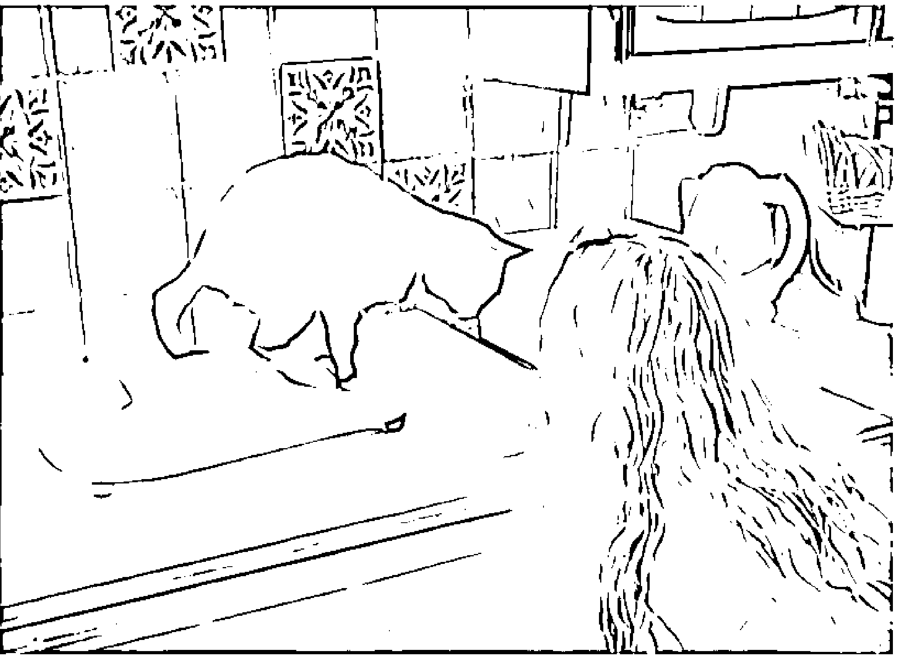

• 貓咪通常會告訴你何時療程結束。在上圖，牠以起身和伸直腰桿來表達。凱瑟琳花點時間向牠道謝，在離開前告訴牠牠有多特別。

貓咪「米克」是明亮和平之地庇護所的居民，第一次遇見牠時，牠因心碎而十分沮喪。牠受慢性腸胃病所困擾，最近牠的身體狀況起起伏伏，庇護所所有些志工懷疑牠是否接近臨終。那天，牠很痛苦，眼神呆滯，對我及其他任何人都不感興趣。在我開始傳送靈氣之前，牠甚至沒有躺下，就站在旁邊，看起來很不舒服。我坐在離牠約十呎的椅子上，以免侵犯牠的空間，並徵求牠的同意開始療程。當我開始時，牠幾乎是立刻躺下，閉上眼睛深深地睡著了，雙腳甚至在夢中的某些時刻擺動！

看，輕聲地喵喵叫，當我感謝牠願意接受療程時，牠甚至願意讓我稍微撫摸牠（因為牠的脾氣常陰晴不定，所以這是莫大的榮耀）。

在這次療程後，米克又接受了幾次當面及遠距離程，有一次是由志工進行，其他都是由我進行。每次療程牠都像一塊海綿，沉浸在靈氣之中。牠的體重開始增加，身體狀況也有所改善，精神狀態戲劇性地好轉。創辦人蓋兒開玩笑說，靈氣反撲了。米克現在又和以前一樣，會偷其他貓的食物，實在是個大麻煩！

上次我短暫造訪，有看到米克，當我走進前門，看到米克經過房間，我呼喊牠的名字。牠一看到我，便從地板上蹦跳跑來，開心地將臉埋進我手中。很快地牠又轉身跳開。看到牠活力充沛，我驚訝又開心。幾天後，在蓋兒的懷抱中，米克的靈魂離開了牠小小的身軀，大家在庇護所團聚一起為牠送行。——凱瑟琳

梅莉莎請伊莉莎白和凱瑟琳替牠一百一十一磅重的雪橇犬「米夏」進行療程，牠的肩膀患有末期骨癌。獸醫建議為米夏截肢，梅莉莎正在考慮，並想嘗試用靈氣協助自己做出決定，看看能否幫助到米夏。梅莉莎很難面對牠的嚴重情況，希望療癒能出現奇蹟。除了米夏之外，梅莉莎也帶著另一隻狗「巴弟」，牠是隻又盲又聾的棕色貴賓狗。伊莉莎白和凱瑟琳最後在前院草皮上進行療程，米夏似乎只在那裡看起來比較自在。幾乎從療程一開始，伊莉莎白就從米夏那裡感受到巨大的悲傷，讓她流淚。同時，凱瑟琳覺得極度反胃，她詢問梅莉莎，米夏是否胃不舒服。她回答米夏的胃似乎還好，但幾分鐘後巴弟（在幾呎遠處閒晃）開始嘔吐。此時伊莉莎白和凱瑟琳了解到即使巴弟又盲又聾，仍確切知道家中發生什麼事，為此感到極度焦慮。她們尋問梅莉莎家中成員對疾病反應如何，她說全家都對米夏的疾病與痛苦深感壓力及哀傷。伊莉莎白與凱瑟琳決定為全體成員傳送遠距靈氣，成員包括梅莉莎、家中兩隻狗和兩隻貓。當療程開始，能量立刻有所轉變，變得比較輕盈。巴弟停止嘔吐，安頓下來休息。梅莉莎開始丟紅蘿蔔給米夏，牠開心地接住，吃光，彼此都在微笑，那是幅美麗且平和的畫面。在那個開心的瞬間，他們忘卻了憂慮與痛苦。伊莉莎白和凱瑟琳討論療程後，與梅莉莎分享從米夏那裡接收到的資訊，米夏覺得自己對這個家有絕對的責任，儘管身體痛苦，牠對家人也懷有極大的責任感及忠誠度。牠在等待家人理解狀況，讓牠可以在他們的支持和接受下平靜離開。我們希望他們在療程中展現的情緒轉變，療程後仍然持續。

幾個月後，伊莉莎白和凱瑟琳得知了梅莉莎的消息，她提到一切事情在療程後似乎有了轉變。療程後隔天早上，她很清楚應該要讓米夏截肢。手術後，米夏可以行動了，也沒有什麼痛苦，直到最近情況才有所變化。在她致電前幾天，米夏躺在地上無法起身，身體功能近乎停止運作。梅莉莎說自己終於能接受事實，米夏離開的時間到了，覺得能幫助他離開的最後仁慈的方式便是安樂死。然而，她不確定什麼時候才是對的時間，希望靈氣療程能夠幫忙。伊莉莎白和凱瑟琳在金門大橋附近的公園與米夏再度相遇，那天天氣晴朗、溫暖，有些許微風，空氣中帶有一絲涼意，天氣極好。梅莉莎在樹下鋪了一張白色毯子，米夏躺在上面。她看起來認得出伊莉莎白和凱瑟琳，但她們仍向他再度自我介紹，開始為米夏及家庭狀況傳送靈氣，請靈氣帶給他們最佳益處，進行了溫和且富同理心的療癒。米夏立刻將頭靠在草坪上，嘆了氣，像在歡迎療癒能量一樣。伊莉莎白和凱瑟琳非常投入療程，感覺光明、和平，物質世界好像變得非常遙遠。療程進行了大約四十五分鐘後，凱瑟琳開始感覺胸口很緊，隨後轉為沉重，接著感到痛苦、焦慮，讓她雙腿和牙齒開始顫抖。她突然明白不是自己的焦慮，而是米夏傳遞給她的訊息。凱瑟琳在心中感謝米夏的分享，告訴她若還有任何事情想分享，自己很願意聆聽。她的直覺告訴她，米夏在詢問一個問題『放手可以嗎？』，凱瑟琳和梅莉莎分享了這個疑問。梅莉莎清楚誠實地說出內心話，告訴她摯愛的狗兒，可以離開，雖然她會很想念牠，但會沒事的。同時，凱瑟琳開始深呼吸，靈氣流量開始減弱，她不停深呼吸，每個呼吸都非常緩慢、深長，而非快速短淺。幾分鐘後，當她呼吸開始恢復正常，凱瑟琳感覺米夏的焦慮轉為平靜的深層感受。

伊莉莎白和凱瑟琳感謝梅莉莎的諸多分享，也感謝靈氣以愛和光帶來療癒及引導。

米夏抬頭與我們進行靈魂層面的眼神交流，好像在說「謝謝你們」，療程看來已經結束。

在米夏的第二次療程，伊莉莎白及凱瑟琳覺得相關情況的能量有明顯改變——欣然接受，梅莉莎與米夏也變得平靜且清晰，她們覺得是靈氣協助放下的過程。她們離開後，梅莉莎和米夏面對面躺在草皮上，聆聽、理解彼此。這是非常感人且美麗的時刻。

能夠成為他們療癒過程的一部分，伊莉莎白和凱瑟琳感到非常榮幸，她們也對療程結果感到平靜。

療程中，伊莉莎白與凱瑟琳被靈氣環繞，感覺平靜舒適，她們確定療癒過程已帶來最高效益。

梅莉莎後來提到米夏在隔天非常平靜地離開了，家人雖然悲傷，但沒有崩潰，生活繼續前進，就像梅莉莎所希望的。整個家庭雖然希望能夠出現身體層面的療癒奇蹟，但靈氣帶給他們不同類型的奇蹟——透過平靜、接受及放手，帶來另一種療癒。

## 第四部

## 延伸靈氣旅程

+   ● ● ●
● ● ● ●

## Expanding Your
Reiki Journey

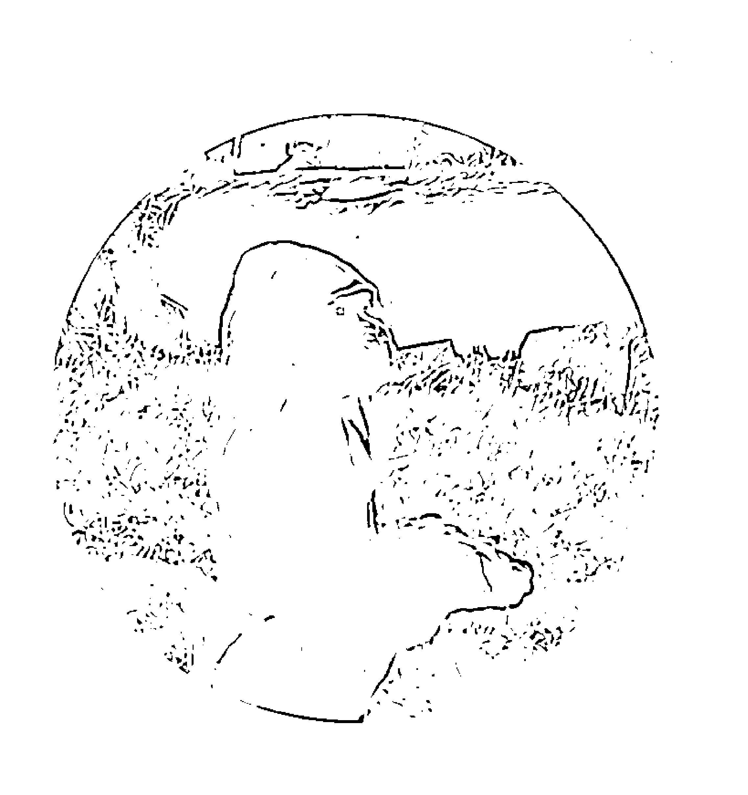

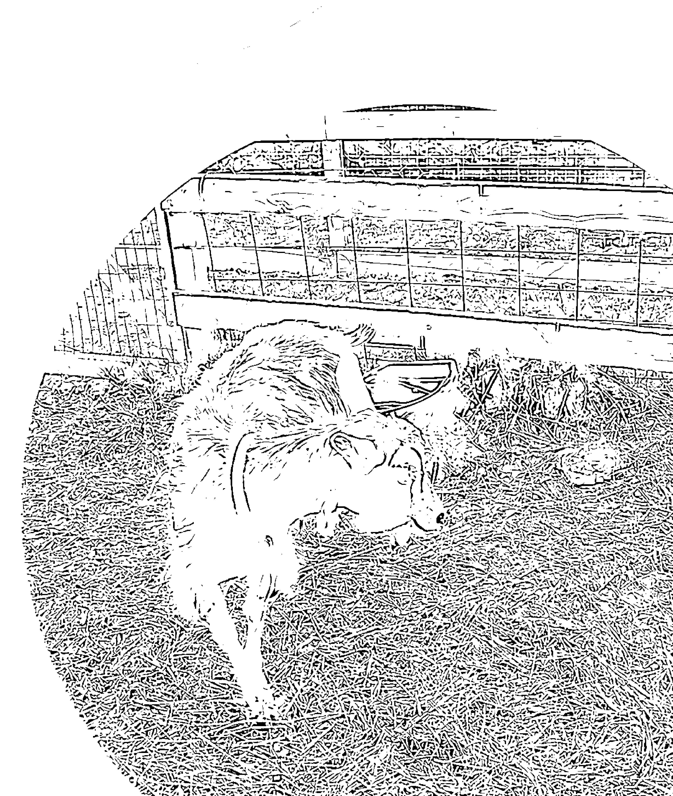

### 為自家動物成員外的動物傳送靈氣

不論學習哪一級靈氣，你都可能對不同的實作練習產生興趣。有些人只為自己和動物同伴傳送靈氣，有些人可能只想療癒朋友、家人及自己生活圈中的動物。其他則希望能為陌生人、不認識的動物及遠距狀況提供療癒。靈氣施作的頻率也有許多不同層次。有些人只是偶爾傳送，有些經常或每天傳送，有些則成為專業的靈氣治療師。無論你選擇的靈氣傳送層面及頻率為何，都能提升自己及周圍人群的生命力。

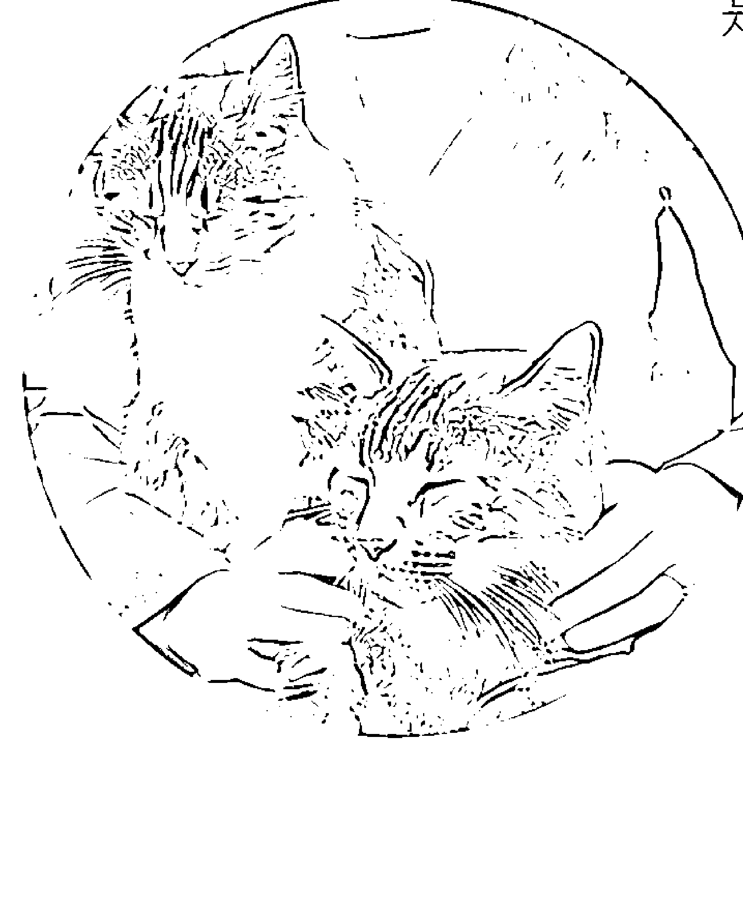

對於那些想擴展靈氣練習給自己寵物以外的人，在我們傳送靈氣給不熟悉的人和動物時，以下有一些額外事項需要考量。

#### 療程前先與動物的人類夥伴溝通

開始靈氣療程前，建議先和動物的人類夥伴聊聊靈氣，以及將如何傳送。人們對靈氣的了解可能大相逕庭，簡單討論將施行的步驟及理由，可讓對方先有心理準備。

若是動物在場，請注意你們的談話內容。動物能理解的內容比許多人以為的更多，他們可以接收人類肢體語言、情緒，甚至是內心影像或畫面。人們在動物面前情緒化地討論其健康狀況，可能會讓牠感受到壓力及恐懼。因此，當動物也在場時，請盡量謹慎並帶著同理心討論，避免嚇到牠們。

療程一旦開始，最好停止交談，直到療程結束為止。若人類夥伴想留在現場，可以請他靜靜坐著，閱讀、冥想或進行其他安靜的活動。也請他盡量避免打擾動物，讓動物能好好放鬆。

#### 與動物第一次會面

與動物第一次會面時，盡可能促進彼此信任，別讓動物過於興奮，因為你希望牠能在療程中深入放鬆。有時人們會帶食物或小零食來促進友誼，然而，當你的目標是傳送靈氣時，最好不要這麼做，因為這會讓牠們分心。要讓動物覺得你是「靈氣提供者」，而非「零食提供者」。

讓動物對你的第一印象是，你是個有趣的人，並能與牠同頻，聆聽牠且關切牠的需求及擔憂。安靜平穩的行事風格及聲音，才能以穩定溫柔的雙手協助你傳達這種印象。

有些動物看著你的雙眼時會比較放鬆，在牠們面前最好摘下太陽眼鏡，此外，帽子有時會嚇到動物，尤其是狗。大致說來，與人類相比，動物對氣味更加敏感，所以在療程前避免噴灑香水或使用其他具有強烈香味的產品。若需要戴帽子或太陽眼鏡，或有其他身體問題時，試著盡可能地保持專注、歸於中心、冷靜且敏銳。這種狀態最能促進信任，為成功療程打下基礎。

#### 與動物溝通

以正向、積極的方式與動物溝通相當重要。允許動物以痛苦、害怕或沮喪表達感受，並以正向鼓勵給予肯定。舉例來說，告訴他們「你在這裡很安全」、「我來這裡是為了幫助你」，會比「不要害怕」、「沒有人會傷害你」更具肯定的鼓舞效果。在第一個句子中，動物會擷取關鍵字「安全」及「幫助」的影像及感受；在後面的句子，牠可能會擷取與「害怕」及「傷害」相關的影像及感受。

與動物溝通時，切記永遠不要承諾你做不到的事或對他們說謊。誠實帶來信任及尊重，這對動物溝通及療癒極其重要。當我們的情緒與溝通內容表裡不一時，動物感覺得到。簡單地說，正向、真實能讓我們與動物達到最有效的溝通，也最能增強彼此之間的連結。

#### 為具攻擊性動物傳送靈氣

我們需要時常注意在安全的情況下進行療程。當你傳送靈氣給可能具攻擊性或有潛在危險的動物時，需保持一定的安全距離，如果需要的話，確認你和動物間設有圍籬。療程中，不要直視動物，或是對於牠展現出的任何前撲、咆哮行為產生過大反應，努力維持冷靜和專注。如果你感覺到動物會直接侵略你，和動物保持彼此尊重的心理距離，讓靈氣提供牠最高益處。另外，永遠徵求動物同意、提供牠們想要接收的能量。具攻擊性的動物，通常至少會在短暫時間內接受靈氣療程。不過，如果動物還是拒絕治療，應該立刻停止，另尋其他時間，在牠不在現場的地方傳送遠距離靈氣（參見第十八章和第十九章）。通常動物都能接受遠距離療程，不過若經過一段時間還是拒絕，應該尊重動物的意願，立刻停止直接傳送靈氣。也許可以替這樣的狀況傳送二階遠距離靈氣。

#### 療程結束，與動物夥伴溝通

有時，與寵物主人分享在療程中接收到的洞見，可能會對情況有所助益。因為可以讓主人更加了解動物的狀態，並知道要如何幫助牠。不過，要把從動物那得到的訊息與主人有效溝通是需要經驗的，通常在這樣的情形下，最好盡可能地用委婉且帶同情心的方式溝通。

切記在任何時間下，主人的陪伴是最好的方式，這點很重要。如果你能夠對寵物以及主人與寵物的關係展現關懷及同情的態度，不帶批評和評斷，這樣就能真的幫助到他們。

如果用批評的態度傳達資訊，或是讓主人覺得自己的行為對寵物不好，反而沒有任何助益。

動物通常對於其主人的情緒相當敏感，如果讓主人產生壓力，也等於對動物造成壓力，這樣極有可能會使主人放棄與你之間的療癒關係。

有時，如果你覺得動物主人可能無法理解，或是感覺自己技巧不足、無法與他有效溝通，不一定要將得到的洞見全盤告訴主人。此時，改用另一種更有效且不會造成彼此傷害的方法 —— 傳送二階靈氣療癒主人及其寵物的關係，或動物與主人的狀態（參見第十八章和第十九章）。這個方法可以替所有人帶來正向的轉變，會針對整體而非任何特定的關係或狀況帶來療癒。藉由靈氣的內在智慧療癒最需要療癒的部分。

從動物接收的溝通內容即使沒有向其主人分享，同樣也能夠幫助主人。動物在進行靈氣治療時，會在安全的狀態下重新面對與釋放之前壓抑且尚未解決的狀況，而你則是在這個狀況下，作為支持的存在和見證者。釋放這些舊有的情緒問題，讓動物不被過往束縛，對於這段關係以及當下的事情感到輕鬆、開放，朝著現在與未來邁進。

### Chapter 17 為自家動物成員外的動物傳送靈氣

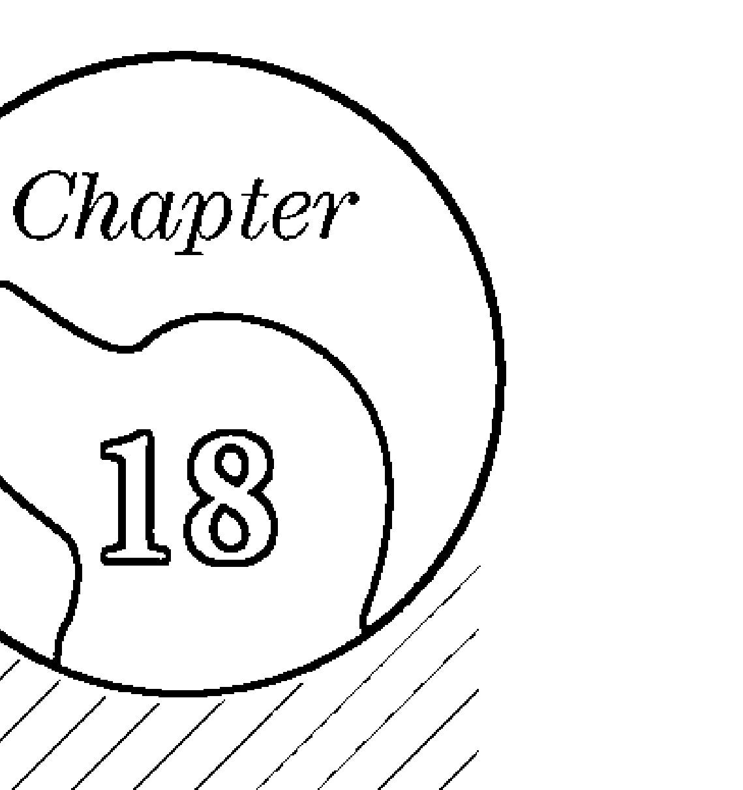

## 二階靈氣

習二階靈氣，會對動物療癒的全貌更加熟悉。二階靈氣能增加可實施靈氣的環境，以及心理、情緒及靈氣層面療癒的深度，帶來動物療癒的新視野，也讓你的療癒旅程更加深刻。

二階靈氣與一階靈氣有幾個不同特質：

- 流經身體的靈氣能量強度更高、更深入，強化自我療癒及為他人療癒的效果。
- 靈氣能隔著遠距離或近距離，向目標傳送，療癒目標可以是個別或群體。
- 達到更深層的心理、情緒及情緒療癒狀況。

在靈氣二階有兩種全新的療程方式：遠距療程與心理療癒療程。這個章節及接下來的內容將專注在這兩個全新的療程上。

#### 三個靈氣符號

二階靈氣會針對心理、情緒層面以及遠距離傳送，傳授三個古老符號用來增強療癒力量，這些符號的功能就像鑰匙般，開啟並擴展二階靈氣的效力。接下來會概述符號的用途，二階符號及其運用的特殊細節，是神聖且具威力的。我們認為該保持其私密性，帶著尊重及謹慎態度運用。符號運用方式會在二階靈氣課程中學習。我們將會專注於運用二階靈氣療癒動物的方式。

#### 力量符號

力量符號用於增加靈氣力量與流動以帶給療程能量，也用於療癒嚴重問題或是任何希望發揮最大療效的情況。另外還能增加能量的流動速度，在短時間內傳送更多療癒效果，施行者通常會感覺流經自己身體的能量流增強了。除了在二階靈氣課程中的基礎運用，也有許多創意方式能運用力量符號。舉例來說，在療程開始時運用可以增強整體療程的力量，或直接運用在需要特別療癒的身體部位。可以在掌中畫上符號，將手直接放在身體部位上；在毛巾、布料或其他物件畫上符號，放在患病人類或動物上方、身下或附近，提供持續溫和的支持與療癒。也能單獨運用力量符號作為保護屏障，將符號畫在需要保護的動物及人類前面，或沿著身體周圍畫上符號；也可用來淨化房間及進入空間中的新物件；畫在藥物、花精或精油上增

#### 难以忘记过去的大象

完美的庇護所度過餘生。過去牠偶爾會攻擊管理員，但是自從來到庇護所後，牠變得溫順，在這裡，牠得到應有的尊重和自由，而且可以在百公頃的樹林裡自由閒逛。在參觀了庇護所後，某一天我想到了牠，特別想到牠還是隻年幼大象的時候。我決定傳送遠距離靈氣療癒牠的過去。
在我開始療程時，我立刻感覺到一股非常強烈的能量。當時我的狗狗來到房間、躺在腿上，有時候在進行很強烈的療程時，牠都會這樣來吸收靈氣。經過了約十分鐘，我腦中突然出現非常明顯的畫面——是個有水泥地板的空間裡，地板上有幾灘水。同時，我的眼中開始泛淚，眼淚不受控地不斷劃過臉龐。我感覺能量流通似乎不會停止，這將會是個很長的治療。
當我聯絡牠的看護員時，她對我所描述的畫面非常感興趣。她告訴我，牠大部分的人生都被關在很糟糕的室內裡，裡面就有潮溼的水泥地板。我非常地驚訝，了解到在靈氣療程中獲得牠過去的記憶。我確定靈氣已療癒了這隻大象的過去。——凱瑟琳

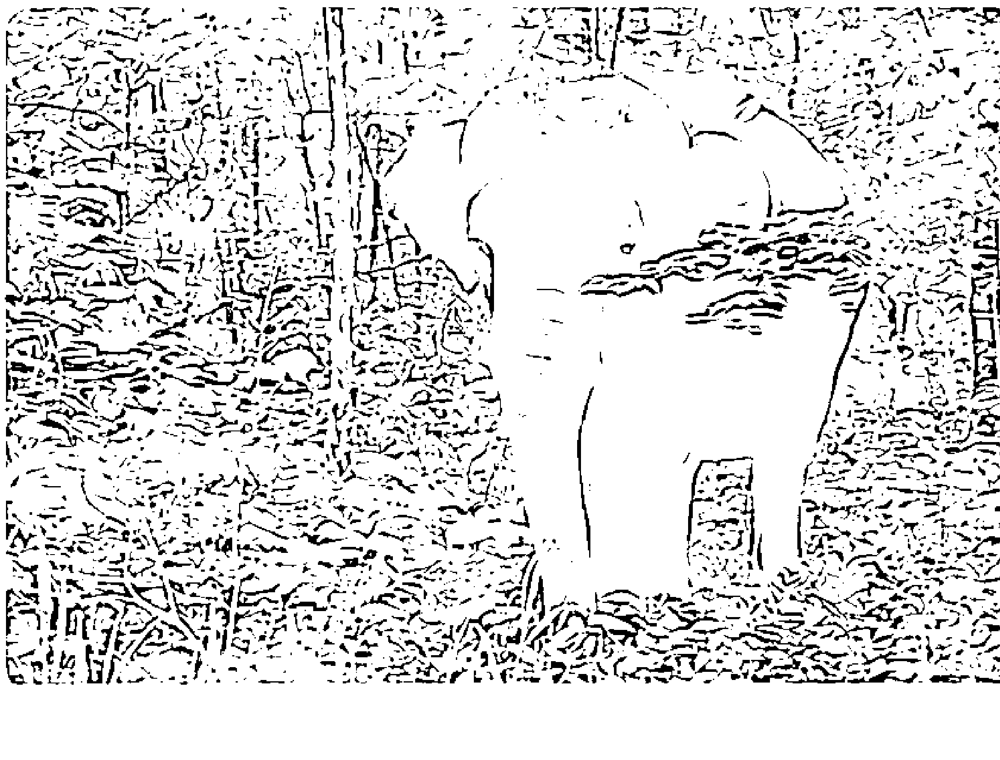

#### 強療效；畫在食物或飲水時，提升支持或滋養品質。隨著經驗增加，會發現嶄新又令人興奮的方式來運用符號。

畫了符號之後，你會感覺流經身體的能量流增加。 在動物靈氣療程時運用力量符號，有時牠也會感覺到能量增加，興致盎然甚至驚訝地看著你。 當能量強力流經牠需要療癒的部位時，身體可能會抽動、打呵欠，在療程中全然放鬆。

#### 情緒符號

情緒符號會針對心理、情緒及靈性層面議題進行療癒。許多動物有心理及情緒困難，像是因過往創傷、受虐失落或悲傷所造成的攻擊、焦慮、憂鬱或退縮行為。許多行為問題都肇因於心理與情緒。運用情緒符號，上述困難通常會快速改善。情緒符號能（此處提及圖片，內容為符號圖示）

#### 遠距符號

深入療程中的人與動物，直接與靈氣接收者的心理、情緒與靈性連結，進而帶來療癒。因此運用於每一個動物時，務必都要保持細心與尊重。

在所有動物療程中，永遠讓動物自行決定是否接受符號，以及療程該如何進行。可以在療程開始時，請動物依自己所願的程度接收心理、情緒及靈性療癒。若你覺得牠不願直接接收心理療癒，可以轉而對牠的整體狀況傳送靈氣。動物不一定能分辨是什麼讓他們困擾，或挑戰背後的根源為何，而心理療癒系統就是動物靈氣治療師最有潛力且具效果的工具。不過，運用時必須嚴格考量道德守則，包括動物接收靈氣療程的自由。

情緒符號能在最合適的時間讓動物未解決的事件浮上表面，讓心理更加清晰且感到療癒。這個系統能觸及動物的最高靈性自我，改變舊有模式，深入療癒；能讓動物覺知、尊重以及釋放阻礙療癒的障礙，啟動身心靈療癒，以更輕鬆的心情在人生道路上前進，對現在及未來的正向可能性更加開放。

靈氣是精純能量，不受時間與空間限制。我們都由能量構成，也透過能量彼此連結，彼此間的能量場時時互動。宇宙能量透過靈氣流經治療師，沿著我們四周的能量通道及連結流向個案。一階靈氣可以在極近距離內流動，二階靈氣則可以穿越房間或到世界另一端，甚至流向過去或未來。二階遠距離療程和當面療程一樣有效。

自從科學界認同愛因斯坦的相對論後，科學家接受時間與空間互相相關，而非個別絕對概念，這也是量子力學的基本概念。雖然科學無法具體解釋靈氣，還需要更多時間建立必要的觀念架構。不過遲早可以解釋能量為何能穿越時空，讓我們更了解二階靈氣的原理。

由於二階靈氣如此深奧，因此，學了一階靈氣後再修習，通常會變得較容易，因為學生已有一定的經驗及準備。對許多人來說，學習一階靈氣就已帶來許多從沒想過的新想法及可能性，這些一開始就已佔據他們的思緒，一時無法再加上二階靈氣的思維。

一開始接觸二階靈氣，有些人難以置信能有效穿越時空傳送療癒能量。他們覺得這種想法與自己過往從社會所學相悖，包括時間與空間的本質、生命體與物質體如何互相影響、生物體的意念影響及生物身體周遭的情況。然而，雖然帶著上述疑問，但當人們開始運用二階靈氣，會透過自身經驗，理解原來這種療癒是可能的。凱瑟琳的經驗就是很好的例子。

#### 梅林分享牠的內心

我經常進入療程時會想到有個議題需要被療癒，不過最後的結果都會帶來非常不一樣的感受。其中一個經驗來自一位名叫凱的女士，她為她的馬兒尋求靈氣。這匹馬兒梅林會抓或咬自己，牠是隻十七歲、經過高階馬術訓練的馬。當時，凱並沒有馬上變成牠的主人，因此不清楚為什麼牠要不斷傷害自己。很明顯地，雖然應該將療程的重點放在牠腳上的抓咬傷，不過在開始療程時，我馬上從梅林身上感受到一股強烈的焦慮和難過。我強烈感受到牠擔心如果讓主人失望，牠就會被賣掉。我的直覺告訴我以前曾發生過這樣的事。我感謝牠與我分享並讓牠知道我理解牠的感受。牠馬上將身體移到手邊、胸口貼近手掌。牠看起來很放鬆，牠可以以與我分享，我也會傾聽。在那之後不久，牠轉身，回到馬廄，盡可能離我越來越遠。這是個正常反應——當動物分享了強烈的情緒，在經過與我親密的連結後，牠需要自己的空間。我持續在不侵略牠的空間的幾哩外傳送靈氣。療程進入尾端，牠又回到手邊，此時的焦慮與難過逐漸趨於平緩，牠變得較平靜、祥和。療程結束後，牠轉向我，輕輕地用口鼻部碰了手掌，先是碰了右手，接著左手。然後，牠將鼻子放在我的胸前、嘆口氣——這是我遇過最優雅的道謝方式。我替梅林的傷口、情緒與牠的狀況進行了共四次的系列療程。我也告訴凱牠深層的焦慮與恐懼來自於害怕她會失望，如果不為她工作，牠可能會失去凱。之後不久，她了解到在她擁有梅林前，牠曾受過嚴格的訓練，後來因患有關節炎導致必須退休。對她來說，要做出這個決定非常困難。不過很快地，她告訴梅林，牠不僅可以退休且無論如何都會照顧牠，這讓梅林的精神得到不可思議的解脫，且牠的眼神也變得平靜。多年後，牠特別的主人終於出現了，這個主人比起牠的表演能力更愛護牠的本質。看到梅林與其主人間的療癒連結，令人感到美好。即便梅林最近進入了過渡期，凱給了牠一個特別的禮物：揮別牠過去的人生，現在牠知道有人可以無條件地愛護自己，不僅僅只是因為牠可以做什麼。——凱瑟琳

凱瑟琳學習二階靈氣時，很幸運地因學習一階靈氣時經歷很多正向的療癒情況，因此，即使一開始會懷疑遠距離療程的成效，還是能繼續練習遠距離療癒。傳送遠距靈氣時，她會覺得手部或頭部疼痛及嗡嗡作響，通常她會忽略這些感覺。過了沒多久，她了解到這些感覺是種線索，顯示她的傳送對象需要療癒的部分。

凱瑟琳開始為朋友及家人進行遠距離療程，隔天打電話給他們了解相關情形。跟他們確認一些自己在療程中接收到的感覺，像是「是否膝蓋不太舒服」或「在焦慮什麼事情嗎」，不可思議的是，他們的回答的確與自己在療程中的感覺一致。不過，即便每次凱瑟琳得到確認，還是懷疑下次仍會如此，也許只是巧合。然而，隨著進行越來越多的遠距療程，她對遠距靈氣的信心大幅地增加。然後凱瑟琳開始為朋友的朋友，那些她一無所知的人傳送遠距靈氣。靈氣仍然為她顯示相關資訊，協助她理解療癒過程。她開始想些非傳統遠距靈氣方式療癒自己的生命。凱瑟琳開始為過往童年困境、負面的生命模式，甚至對未來傳送靈氣。每次傳送時，她都覺得能量有所提升，展開了真實療癒過程。

她仍倚賴觸手方式。當時若動物不當凱瑟琳開始為動物傳送靈氣，停躁動或無法接近時，她會覺得沮喪，認為動物不想要靈氣。有天，她突然靈光一閃，決定對動物試試遠距離靈氣。她發現綜合手觸靈氣及遠距離靈氣會讓療程更容易進行，因為動物可以自由活動。她不再受限於限制動物活動的想法，即便她從未到籠裡或牧場，動物也會表達感謝。她也會替動物的過去及未凱瑟琳開始在自家庭院中傳送靈氣，傳送對象

#### 貝里恢復健康狀態

「貝里」是隻七歲的貓咪，牠和家人一起住在底特律。牠患有反覆發作的氣喘和支氣管炎，而其主人吉兒想要運用靈氣看看能否幫助牠的病情。在過去幾個月，我傳送一系列療程給貝里，牠的狀況立刻開始有了改善。在牠來到吉兒這裡之前，曾經歷過很多的艱苦和悲傷。就在過去一個月，我和吉兒討論療程時，吉兒憶起在她早年的人生也經歷過一段痛苦的時間，並帶著許多過去的情緒傷疤。她決定重新檢視過去所產生的問題，尋求專業的協助去理解和釋放問題。因此，我同時傳送靈氣給吉兒和貝里，幫助他們釋放過去心理創傷所帶來的後果。當吉兒檢視自己的過往、重新有了新的認識時，貝里的健康也持續改善。我最後一次聽到他們的消息是貝里已經恢復了好幾個月，吉兒感覺到家中所有的成員都從改善後的健康獲得好處。——伊莉莎白

#### 找到庇護所了

有天當我離開收容所時，裡面的員工與我聯繫，提到她對一隻羅威納犬的擔心——因為牠具攻擊性的問題，導致一直無法被領養。她告訴我兩天前已經將牠排上安樂死的名單，不過因一名員工生病，所以延遲了。她嘗試找庇護所未果，她甚至無法直視那隻小狗的眼睛，牠似乎知道自己時間到了，看起來非常孤苦無依。那週我持續替牠的狀況傳送靈氣，如果可以，希望奇蹟可以拯救牠，或是在牠安樂死的過程中可以進行的更快且溫和。在接下來一週拜訪收容所時，我得知在最後那一刻，就在牠接受療程後，牠找到庇護所了，那間庇護所可以收養牠一個月，而且同時也找到了寄宿單位同意收留牠。——凱瑟琳

有樹、玫瑰、長春藤，以及任何心裡想到的東西。當蜜蜂或黃蜂飛過時，牠們也會傳送靈氣及祝福。牠們通常會在附近流連，在身邊環繞嗡嗡叫。最後凱瑟琳了解到，所有生物都能感受靈氣，也喜歡靈氣。現在，每天她都能找到新的方式，用遠距靈氣療癒自己、其他生物以及周圍的世界。對於遠距靈氣為生物及相關情況的療癒效果，仍然為之驚嘆。動物通常會覺得遠距靈氣比較溫和，特別是對能量特別敏感的動物，也會覺得更舒服。對於野生、小型、害怕陌生人、年老、脆弱或臨終的動物，遠距靈氣也是種理想方式。牠們通常能在遠距療程中更放鬆地吸收靈氣。另外，也很適合無法提供建議、不可能靠近或進行身體接觸的動物，像是對無方法預測或具有侵略性的動物、野生動物或離治療師住處很遠的動物。

遠距療程有很多用途，靈氣對世界展現各種可能性；可以傳送給個體、團體或相關狀況；傳給你身邊或遠在世界另一端的對象；傳送給過去及未... 個人經驗外的狀況。遠距靈氣可以同時傳送給動物及飼主或動物的相關情況。遠距符號則開啟了時空之門，讓你能直接療癒動物的過去及未來，隔空傳送療癒，直接療癒動物狀況的所有層面。鑒於二階靈氣的力量、深度及療癒範圍，治療師最好提醒自己，自己只是靈氣能量的通道，為療癒祈求神聖秩序以及最高益處。許多情況下，治療師不知道什麼對動物最好，就放心讓靈氣帶來最好的療癒。請記得在任何靈氣療程中，永遠都要先徵求動物個案的同意。

#### 二階靈氣對動物的好處

二階靈氣與觸手靈氣或短距離隔空靈氣對動物都有同等益處，且能大幅擴展治療範圍、治療環境以及強化療癒深度。比方說，二階療程可以提供與一階療程相同的益處，但通常會進入更深的層面——加速疾病、身體損傷、手術的復原以及情緒（包含行為問題）的療癒；也能舒緩疼痛、維持健康、預防疾病，讓臨終的生死過渡更輕鬆平和，運用遠距離療程療癒動物過去的創傷事件、過去與現在的家庭狀況，也能協助人類夥伴面對動物生死過渡。向未來可能較困難的狀況傳送靈氣，像是手術前或搬到新環境，也能協助他們更快速、輕易且成功地解決這些狀況。

## # 賀拉斯的訊息

一年前，凱西與我聯繫，她的貓咪「賀拉斯」的喉嚨患有無法治療的喉疾，當時正接近牠的過渡期。她希望我可以到家中傳送靈氣，幫助牠度過過渡期。就在她掛上電話前，她帶著有點尷尬的感覺補充道，她其實有「囤積症」 —— 她被這個城市控制，容易囤積物品且無法將這些東西丟棄。她希望我在聽到關於囤積症的事情後，仍願意到家中提供幫助。

我向她保證一定會去。

當我抵達家中時，發現家裡雖然幾乎一塵不染，但卻堆滿一堆物品，每樣物品即便都用塑膠箱和袋子裝好、貼上標籤，但是物品數量之龐大，絕非正常。賀拉斯躺在沙發上的毛毯休息，就在我坐下來時，牠馬上鑽進我的大腿，並在我手邊睡覺。

凱西和我在療程中輕聲交談，她與我分享了一些過去十年經歷的不愉快。在近四小時的療程中，我們被靈氣包圍，我得知凱西在她早年以及過去十年間，經歷了很多失去，她因為這些不幸，「遺失」了很多重要的情緒，而這些情緒導致她無法對生活中的任何事物「放手」，除非被這個城市逼迫去做。她害怕，如果放手，可能無法抓住那些物品所帶著的重要回憶。

賀拉斯過去十年一直陪在她身邊，有時牠是她唯一的精神支持，未來若失去牠，將會很難面對。賀拉斯也是一樣。牠被凱西的需求折磨著，這件事情消耗牠立下最後心願的力量，不過牠知道無法再避免。牠想要我讓凱西知道，對過去「放手」有多重要，因為新的、好的事物才會進入她的人生。若沒有將這件事傳達給凱西，牠無法離開。在每次療程中，我會傳送靈氣給凱西和賀拉斯以療癒情緒。

在最後一次療程，我將賀拉斯想表達的訊息轉告給凱西。她聽到後向我道謝，但我知道她似乎無法完全承受。賀拉斯也感覺到了，要求我將訊息寫下來轉達給凱西。她希望在自己離開、無法照顧她時，她能帶著這個訊息面對未來。同時，我有個想法——或許這樣能讓她看著照片回憶過去，並幫助她經歷放手的過程。我不太確定這個想法究竟是來自賀拉斯還是我自己。

對於賀拉斯的請求我感到有點尷尬，但既然他都如此要求，希望將這個訊息轉達給凱西。畢竟牠已時日不多了。因此，在牠過世後沒多久，這封信就轉給了凱西。之後有很長一段時間都沒有她的消息。將近過了一年，她與我聯繫並讓我知道她有將賀拉斯的訊息放在心上。她開始替物品照相，然後丟棄，將照片整理成相簿，在想起時拿出來觀看。她感覺自己對於放下已經有所成長，這也是賀拉斯希望她如此做的。

——伊莉莎白

那些與主人很親近的寵物，其情緒很有可能會與主人同步。為了保護與照顧主人，寵物通常會承受主人的擔憂、焦慮，甚至是她們自己的身體問題。在靈氣二階，你可以與動物溝通，告訴牠們承受這些問題會對自身造成傷害。你可以傳替這樣的狀況傳送靈氣，並建議牠們在不傷害健康的情況下，貢獻自己的生命力。伊莉莎白的個案——崔西和格蘭強調了這個重點。

#### 凱西的邀約

遠距靈氣是個能去療癒動物過去以及自身的好方法，有時候這可能發生在同一個療程，這是從提供療程給幾年前我過世的貓咪「凱西」所學習到的。這次的療程來得有點出乎意料。伊莉莎白打電話告訴我，有隻她的個案貓媽在被墮胎後，就不相信人類了。這讓我想，到我還是小孩時所飼養的貓咪。當她懷孕被迫流產，我身上從來沒有發生過的經驗，因此，牠可能還想著牠的寶寶。
我決定替凱西和牠的寶寶傳送靈氣，我在想，也許牠們可以在另一個世界重逢。我希望靈氣可以療癒那段過去的狀況，也希望可以療癒身為主人的我，竟然毫不考慮地就讓這樣的情況發生的罪過。當我開始進行療程，想著也許凱西可能沒有原諒我。就在開始沒多久，我的雙手強烈地振動，大概過了十分鐘，我開始回憶凱西詳細的外觀與氣質，像是牠的下巴是半黑半白。最後一次看到牠的相片，甚至已經過了好幾年，不過現在牠完整的模樣正出現在我的腦海。

我的雙手持續振動，接著，突然感覺到胸口一陣沉重，然後開始出現明確且熟悉的咕嚕聲反覆在我胸口跳動。我感覺到牠的靈魂，就像過去一樣可以摸到牠。我立刻知道牠感謝我傳送靈氣，並原諒了我。就在我了解了這件事後，咕嚕聲消失了。我感覺到靈氣已經傳給了牠，且牠會在我療癒工作裡持續照料我。——凱瑟琳

崔西與她的丈夫格蘭對於他們的五隻貓咪感到非常焦慮；這些貓咪原本相處和諧，但在六個月後完全失控。即便在牠們離開原有家庭前，就會攻擊彼此、將家中搞得一團亂，但是牠們已經社會化且富有感情。崔西特別擔心其中一隻叫「嘉比」的貓咪，牠因壓力而引起腸胃疾病。崔西和丈夫兩人都有工作，他們打算賣掉長期居住的房子。因此，他們覺得很勞累且備感壓力。

伊莉莎白開始為他們進行四次的系列療程。在第一次療程，她前往家中與所有貓咪相處。這次療程中，每隻貓咪都向伊莉莎白傳達出牠們在這個家中所感受到的壓力——一隻貓咪長達六個月的時間都躲在床下；另一隻會悄悄地靠近前一隻，並攻擊曾經是幼貓的年輕貓咪；這隻最年幼的貓咪則會不斷移動，對抗其他貓咪；最年長的貓則是企圖發號施令，毆打那隻幼貓，看守那隻躲在床下的貓咪，但他不可能每次都在那裡。嘉比則待在角落，用牠難過的眼神將這一切都看在眼裡。在伊莉莎白第一次造訪後，後來又連續幾天對這些貓咪進行超過三次的療程，也對所有狀況傳送靈氣。

大概經過一星期，崔西打電話告訴伊莉莎白，家中又重新恢復了和諧。這些貓咪開始融洽相處，展現牠們完整的性格，和主人玩耍及互動。崔西請求伊莉莎白接下來幾個星期繼續傳送靈氣，以支持全家接受療癒。兩星期後，嘉比的症狀消失了，獸醫停止了類固醇和藥物治療。崔西泛著淚光說道，她看到牠又重新像個小貓般玩耍。崔西和格蘭導致這些貓咪某部分已經表達了牠們感到極度壓力，崔西和格蘭都感受到了；而貓咪也藉由一次次增加不同程度的交戰和製造混亂，來吸引他們的注意，直到逼得崔西和格蘭不得不採取行動。
崔西和格蘭會漸進式降低她們的緊張，並著重在希望為家中所有成員維持平靜。
靈氣二階可以幫助動物與主人在親密相處的同時，也保護牠們自身的健康，這樣動物也會盡全力保護主人。藉由讓動物知道你會傳送靈氣療癒主人和／或牠的狀況，讓動物感到舒服，促使牠放掉目前所承擔的問題。靈氣二階會一起傳送靈氣給動物和主人，這可以直接幫助動物並為牠的人類夥伴帶來好處。

#### 加深與寵物間的連結

對動物使用靈氣二階能加深彼此的連結，增加你對於感受彼此情緒狀態的直覺。你的動物會時常尋求靈氣，這會成為你們彼此間特別的親密時光。你可以和動物更有效地溝通，更了解他的需求。靈氣是如此美妙的工具，讓你可以在動物的人生中使用不同的方式來達到效果。

### Chapter 19
二階靈氣運用守則

二階靈氣與前一章提到的符號運用有關。對於符號的理解會隨著經驗增加，所以盡可能時常使用二階療程會是個好主意。隨著時間過去，你會越來越熟悉二階靈氣可以達到的境界。

接下來的準則將會針對替動物使用靈氣二階提供一個基礎，我們鼓勵你將此視為起始點。等到經驗不斷累積後，就可以依循直覺、靈氣內在智慧，以及動物的引導進行專屬於自己的特別靈氣練習。

#### 準備就緒

我們在第三及第四章所討論到的療程守則也適用於二階靈氣。開始療程前，試著覺察自己的狀態並照顧自己的基本需求，讓自己能專注在療程中。若有必要，集中心神，為自己傳送一點靈氣作為協助。不論是否在動物面前，都要試著找個安靜、不受打擾的地方，維持舒適的姿勢能讓你專心進行正常長度的療程。

因為二階靈氣的能量流更強，進行遠距療程或心理療癒時，通常會讓治療師進入更深層的冥想狀態。可能的話，盡量為療程準備更多的時間。遠距療程平均需要三十分鐘（或二十分鐘到四十五分鐘左右）。心理療癒平均需要十分鐘（或五分鐘到二十分鐘），可以分開進行或是再加上當面或遠距療程。為某個狀況進行遠距療程時，可以部分當面進行、部分遠距，這樣通常不會改變療程的長度。

#### 陽光找到了庇護所

有匹名字叫「陽光」的美麗負重馬，給了我靈感創意來運用靈氣。牠當時正面臨安樂死的命運，因為飼主有財務困難，無法照料嚴重跛腳的牠。我找了個下午為牠傳送靈氣，牠很開心地接收能量，並知道我在回程的路上找到救牠的方法。回家後我上網並開始傳送靈氣，協助我為陽光找到收容地方，讓牠可以安穩過日。要找到不花什麼費用，又要考慮跛腳緣故需選擇近處，機會其實不大，而且聽說很多數庇護所都滿載。我輸入「馬匹庇護所」關鍵字，瀏覽第一個出現的網站——「狄恩的馬鎮」位於南加州，車程對陽光來說有點遠，但我還是寄了信件，我為此傳送靈氣，希望好事能夠降臨在陽光身上。令人驚奇的是，他們回覆還有一個空的馬廄，描述了馬鎮裡的設施及每日馬兒的照顧。我知道這是適合陽光的地方，便在下一封信中向他們描述牠的情況，想了解需要多少費用才能讓牠過去。對方的回覆令我難以置信，他們不僅免費收容，還會負擔運送費用，也推薦了值得信任的運輸公司。最後要做的，就是說服陽光的飼主。我再一次為了陽光的最好情況傳送靈氣，隔天和飼主會面，他立刻同意將陽光轉讓給庇護所。幾天後，我為陽光的運送過程傳送靈氣作為保護，牠展開了前往南加州的漫長旅程。牠的旅途順遂，到達新家後的第一件事，就是在地上滾來滾去。根據熟悉牠的人的說法，由於腿部問題，牠已經多年沒這麼做了，我為牠進行定期遠距離療程，牠在那開心、平和地度過生命最後一年的時光，有很多愛、紅蘿蔔及關注。——凱瑟琳

#### 開始療程

不論是當面或遠距為動物進行療程，先在心中與動物連結，讓牠知道你會傳送靈氣協助療癒。請動物接收自己希望及所需的靈氣量，並向牠保證靈氣不會造成壓力及侵犯。若進行當面療程，詢問牠哪裡疼痛或有什麼困難。若他知道，會顯示給你看，比如說舉起傷腿或用鼻子碰觸患處，或向你傳送直覺性的訊息。盡可能在療程給予牠活動自由。若在動物所在之處以外的地方進行療程，試著在動物休息或沒有被其他活動佔據心思時進行，在上述時間傳送可以讓動物休息並全然吸收療程能量。若因時差或繁重的預約療程無法在動物合適的時間進行，牠們還是會接受足夠的療程能量，靈氣會前往最需要療癒的地方。

#### 接收的信號

對許多初學者來說，透過動物身體語言、表情辨認接收療程的信號會比較容易。當你累積更多的經驗後，可以依據流經身體的能量流感覺，『解讀』動物對療程的反應。

#### 完美的一對

運用二階靈氣為動物進行遠距療程時，即使不在動物所在處，也可以透過流經的能量流感覺，辨別動物是否接受靈氣、什麼部位接收最多靈氣。能量會間斷、停頓或流動，手會發熱、發麻、跳動、脈動或產生其他感覺，就和當面療程一樣。若動物在療程中接收強烈的能量流，通常會覺得自己好像遠離世俗般，身處冥想的狀態裡。

就如當面療程一樣，遠距療程中，動物常會非常放鬆、發睏或睡著。若療程連續幾天在同一時間進行，飼主通常會回報，動物在療程時間之前先前往最喜歡的休息處等待，接著在療程時打盹或睡著。療程後，動物的活力、情緒及與人類的互動通常都會變好。

> 在我某次造訪收容所時，有隻十一歲的柯基混種犬「畢歐」，牠非常容易親近人，但嚴重跛腳。牠的後腳問題很嚴重，需要進行費用昂貴的手術。我將牠放在腿上，進行了一小時療程讓牠放鬆後，牠停止抖動，睡著了。當我抱著牠，為牠的狀況傳送遠距靈氣，專注於牠的最高益處，希望有個好家庭不計較年紀和腿部問題願意領養牠。離開收容所時，我在想牠能有多少機會。隔週我注意到牠不在收容所了。我緊張地尋問職員，職員開心地告訴我，週末時有個拄著拐杖、腳不方便的年邁男士，到收容所看了畢歐一眼就立刻決定領養。真的是完美的一對！

—— 凱瑟琳

在動物所在的地方傳送靈氣，特別是進行心理療癒時，可能會接收到動物情緒狀態或其他資訊，請依據直覺引導療程進行，就如當面療程一樣。當你在療程中接收到強烈情緒及印象，通常是因為療程啟動了動物情緒釋放。頭幾次的情緒及印象可能會令人吃驚，記得這是來自於動物而不是你。你永遠可以信任靈氣並確定自己接收到的資訊有助於療癒過程（參見第六章）。

進行動物靈氣療程時，主要的責任是支援牠的療癒過程。在靈氣傳送過程中儘可能給予自由，這種尊重是促成你與動物之間關係的最好方法。若你手部及身體有所感覺，或接收到直覺，顯示動物不想接受療程，就要中止待下次進行。博斯莉——住在紐約的智慧白貓，就向我們展示即使是遠距療程，動物也可能拒絕，每次都要給牠們選擇的自由。

博斯莉的下巴有個癌症腫瘤，健康狀況每況愈下。飼主馬克請伊莉莎白傳送靈氣，幫助牠。伊莉莎白首先為她傳送靈氣，以及請牠接收需要的靈氣量。伊莉莎白一向都會事前告知，但那天她忘記這個重要的階段就開始療程了。

然後，伊莉莎白覺得自己好像碰到一堵牆——完全沒有任何進展，沒有能量流動，也沒有任何連結感覺，什麼都沒有。她很快了解問題所在，向博斯莉道歉。伊莉莎白重新開始，這次記得尊重牠的自主性，靈氣就順暢流動了。

#### 遠距靈氣給予崔斯特更多時間且感到舒服

珍妮佛聽說靈氣對動物的好處，於是聯絡了我，對她的貓咪『崔斯特』進行系列療程，牠有無法治療的口腔癌。

雖然珍妮佛希望奇蹟出現，即便奇蹟不會發生，她也希望盡力讓崔斯特最後的日子過得更舒服。崔斯特對陌生人很害羞，新的訪客來時，牠會躲起來，讓貓兄弟「道格拉斯」負責迎接並擁有全部的關注。在療程前幾週，牠大部分時間都躲在床底下。

當我進行第一次療程時，崔斯特直直地走向我，在我腳邊安頓下來，就像牠一直在等我一樣。珍妮佛和道格拉斯對於這個不尋常的舉動感到驚訝，這次道格拉斯留在後院，甚至沒歡迎我，讓崔斯特進行長時間療程，不被打擾。道格拉斯最後在牠完成療程前過來打聲招呼。

崔斯特在整個療程中都很安靜且靜止不動，有時會喵喵叫或發出啾啾聲表示舒服，但大多時候都在睡覺。之後珍妮佛回報牠似乎變得比較開心，有時甚至有點淘氣好動。牠恢復很多以前的習慣，像是在門邊迎接珍妮佛、在起居室地毯上休息。珍妮佛住在車程四十五分鐘的地方，我為崔斯特綜合進行當面及遠距療程。她提及每到遠距療程時間，崔斯特就會呈現「鬆軟狀態」，閉上雙眼，耳聽四面，在整個療程中都維持這個狀態。療程後，崔斯特會伸展身體，發出啾啾叫像是在道謝，之後會一直黏著珍妮佛。

珍妮佛的獸醫很驚訝崔斯特可以帶著疾病活這麼久，我在崔斯特過世前一天去看牠，為牠進行最後一次療程。雖然牠非常虛弱，還是爬了起來，拖著身軀往我腳邊靠近，我坐在地板上傳送靈氣。珍妮佛和我覺得這是牠對療癒表示感謝的方式。隔天牠在家裡安詳地過世了。珍妮佛感謝靈氣改善了崔斯特臨終時的生命品質，讓牠可以和珍妮佛及道格拉斯共享更多時光。

> ——伊莉莎白

#### 手位

二階遠距離靈氣及療癒心理動物療程的手位，根據每個狀況而異，請選擇最適合當下運用的手位。若有動物的照片，可以在療程進行時將手放在照片周圍或附近，心中想著能量會流向照片中的動物；也能用枕頭、填充動物、玩偶、娃娃或其他物件，作為代表動物的象徵物。運用這些物件協助你專心，解讀療程中可能收到的資訊。

> 三隻庇護所裡的小狗教導我何時觸手靈氣會太強烈，遠距靈氣反而效果更好。我的婆婆和我在一家動物庇護所擔任志工。小狗被放在一個大型的八角形區域裡，每區容納十六到二十四隻。你可以想像一百隻狗的噪音有多麼吵鬧！我最後治療了三隻混種狼狗——鳥頌、風羽與奔鹿，最老的那一隻後腿有嚴重關節炎，我試著為牠傳送觸手靈氣，但幾分鐘後牠的牙齒開始顫抖，退向戶外區域躲避靈氣。另外兩隻很能接受觸手靈氣，但我很擔心年老的那隻，牠在戶外區可憐地發抖。我決定隔著一段距離傳送靈氣，同時療癒三隻狗。五分鐘後，婆婆對我說：「你看，現在是午休時間嗎？牠們全睡著了！」我環顧整個八角區域的狗都很快入睡，一片寂靜。令人驚嘆的是靈氣以每隻狗可接受的舒服方式帶來療癒，甚至超越我本來設定的治療區域。——凱瑟琳

#### 姐姐的貓——史特林

姐姐有隻漂亮的黑色波斯貓「史特林」。他們住得很遠，我為牠定期傳送遠距離靈氣。姐姐本來要我為牠的多囊性腎炎傳送靈氣。獸醫在做例行檢查時告訴姐姐這個狀況，這種疾病目前沒有治療方法。當我開始傳送靈氣時，牠的血液檢查顯示疾病是早期階段。血液數值並不正常，但外觀上沒有什麼症狀。我開始連續四次的系列療程。與姐姐約好在連續四晚同一時段進行療程。第一天療程時，晚上姐姐回報說史特林很期待靈氣。雖然牠晚上常坐在姐姐旁看電視，但療程時間來臨時，牠會上樓躺在床上。第一天晚上姐姐還納悶牠這麼早要去哪，到史特林房間發現牠仰臥，四腳朝天。她很讚嘆牠能隔這麼遠的距離感知靈氣。事實上，史特林對療程的反應讓她印象深刻，她決定學習靈氣，姐姐現在會為牠定期進行療程。——凱瑟琳

位置，對接收動物個體不同部位的資訊很有幫助；可以放在手中的小型填充動物，適用於你想讓療癒能量圍繞動物全身的療程。你可以將手放在各種尺寸的替代物上，針對你覺得動物特別需要療癒的部位傳送靈氣。運用替代物及建議手位為動物進行觸手療程，同樣能提供詳細的資訊，了解適用於當面療程的療癒需求。當你移動手位，會在每個區域感受到能量停頓及流動，就如觸手療程。這能讓你得到動物療癒狀態及各部位療癒需求的大量資訊。

你也可以用自己的腿作為療程替代物。這個方法適用於手邊沒有其他替代物，卻想了解其他資訊時。你可以坐下，心中設定一邊膝蓋是動物的頭，大腿前面是動物身體前半部，後面是動物身體後半部。將手擺在大腿前後的位子，讓能量流向動物身體的對應位置。另一個進行遠距療程的方式是將動物的名字，與動物及相關狀況的敘述寫在紙上。將紙放在雙手間，或放在盒子裡，雙手放在盒子上方，進行療程。也可以直接用心念，不用雙手進行遠距或心理療癒。你可以用視覺想像移動手位，通常也能得到許多資訊。最後

#### 結束療程

可以只是坐著傳送靈氣，不用任何替代品或想像手位移動，靈氣會自行流向最需要的地方。進行遠距及心理療癒療程時，可以留意能量停頓及流動狀態，尊重直覺，依感覺「判斷」療程是否已經結束。就像一階靈氣一樣，舉例來說，在能量達到高峰後，開始減弱且從深度冥想狀態中清醒時，都是療程即將結束的指標。若你為動物進行當面療程，也可以紀錄牠的行為，包括牠何時從放鬆狀態中醒來，或是何時將注意力轉向其他事物。當你覺得內在

#### 慢慢回家路

梅爾文及莫妮卡（曾在第170頁提及）因為可以在收容所同住一籠非常喜悅。牠們持續開心地互動，晚上時則依偎入睡，看到牠們在一起這麼快樂，我為牠們這個狀況傳送靈氣，希望能找到合適的家。幾天後，有個養育四個孩子的家庭來到收容所，想領養動物。他們最後決定領養梅爾文及莫妮卡。

他們人很好，負擔許多責任，夫妻各有全職工作，還要養育四個小孩。雖然他們很有誠意，收容所仍從他們家帶回一隻狗，因為他們實在忙不過來了，無法給予狗狗足夠的訓練與照顧。由於這個家庭很和善，孩子看起來也願意接受指導，並為了梅爾文及莫妮卡調整自身行為，於是收容所允許他們領養兩隻天竺鼠。

集中力減弱，或是能量在高峰後幾分鐘停頓，減弱到較低流量並持續如此，通常就是結束的時侯了。若還無法感受能量流，可以設定在二十到三十分鐘後結束療程，或用直覺判斷何時療程該結束。

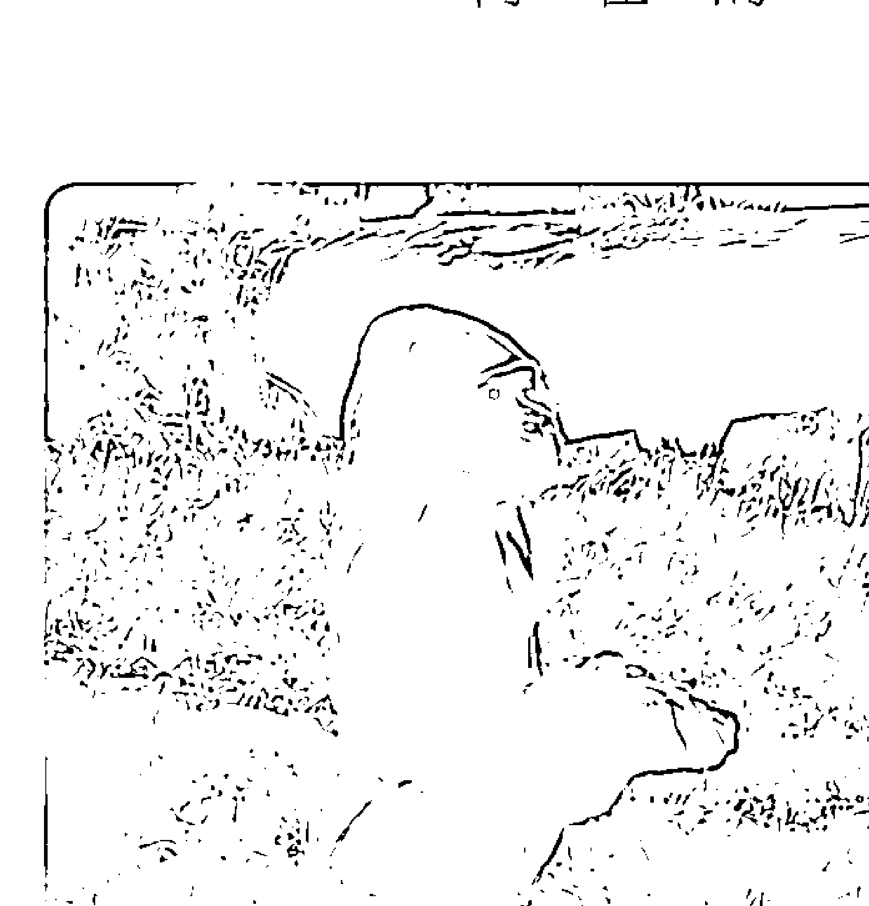

收容所的一位主管有點擔心這次安置，在幾週後到這家庭進行探視，看看天竺鼠的適應狀況。她發現天竺鼠對孩子已放下戒心，牠們與一隻大兔子共享一個小小的外出籠。籠子裡放有基本的飼料但並不常清理，也沒有提供兔子和天竺鼠新鮮的食物以平衡飲食。牠們的環境還差到被當局強制移送的程度，主管很開心看到梅爾文及莫妮卡能在一起，注意到牠們彼此親近相互支持。

我對這個情況有點納悶，因為靈氣從來都能為狀況帶來有益的改變。我繼續為牠們傳送靈氣，試著相信靈氣會在適當時候帶來解決方法。主管在接下來的四個月又造訪了兩次，發現情況並沒有改變。在第三次造訪後，媽媽覺得他們沒有時間和精力照顧那麼多動物，於是把梅爾文及莫妮卡送回收容所。

將兩隻天竺鼠載回收容所的前幾天，在當地動物救援組織工作的年輕小姐由美子，她摯愛的天竺鼠剛剛過世，那隻天竺鼠生前既長壽又快樂。她也在家中經營一個小型的天竺鼠救援組織，當她在收容所看到梅爾文及莫妮卡時，深受牠們的故事感動，決定帶牠們回家永久飼養，成為她的陪伴動物。由美子是個很溫和的人，與丈夫同住但沒有孩子。他們很疼愛梅爾文與莫妮卡仍然珍惜彼此的陪伴，在家中也適應得很好，樂意陪伴暫住在家中等待好人家的其他天竺鼠。雖然這是個漫長且有點曲折的旅程，但是我覺得梅爾文及莫妮卡在靈氣溫和的協助下，找到完美的家。——伊莉莎白

#### 改善貓咪「布」的生活品質

有隻十九歲的貓咪——「布」，雖然我從未當面見過牠，但為牠進行定期遠距療程。牠在一九九七年一場突發的癲癇後，健康每況愈下。因為牠的脆弱狀況，並不適合做任何手術，也無法得知問題的確切原因。在二〇〇三年初經歷一場短暫的癲癇，獸醫已經無能為力。獸醫跟飼主說可能還會有更糟的「神經性問題」發生，預估可能活不了多久。

就在那個時候，牠的飼主在公共廣播電視台（PBS）看到關於另類醫學節目對靈氣的專題報導，他與我聯絡了，想看看靈氣是否有所幫助。我試了一次遠距療程，隔天牠的情況有了顯著改善。

我用一個填充動物玩偶當作牠，開始在每週傳送遠距靈氣。牠在相對舒適的狀況下可以再活六個月。我從這些療程中，瞭解到許多牠的特殊健康問題。像是有次療程

> 不論是當面或遠距療程結束時，永遠記得向動物道別，表示感謝他們願意放開心胸接受療程。和一階靈氣療程一樣，感謝靈氣讓你成為療癒過程的通道。請記得我們只是靈氣療癒能量的通道，靈氣的智慧會知道什麼最需要療癒，這點非常重要。我們無須明白問題根源或解決之道，療癒會在最需要它的地方發生。

> > 中，當我為牠的背及右腳傳送靈氣時，手部感應疼痛。隔天我和飼主通話，她提到牠最近腳不舒服。在另一次療程中，我為牠右耳傳送靈氣時，我指尖感到疼痛。飼主說牠耳朵最近被酵母菌感染。遠距療癒的效力，不僅布感受得到，也令我十分驚嘆。每次牠接受療程後，飼主都跟我說牠有顯著改善，充滿特別的「光彩」，看起來變得更「自在」。牠在療程中睡得安穩，隔天早上都會發出愉快的聲音。雖然定期療程不是牠健康狀況的解藥，但布對靈氣反應如此良好，牠的飼主受到鼓舞也去學習了靈氣，這樣就能為牠進行每日療程。在進行首次療程的六個月後，牠在飼主身旁安然離世。——凱瑟琳

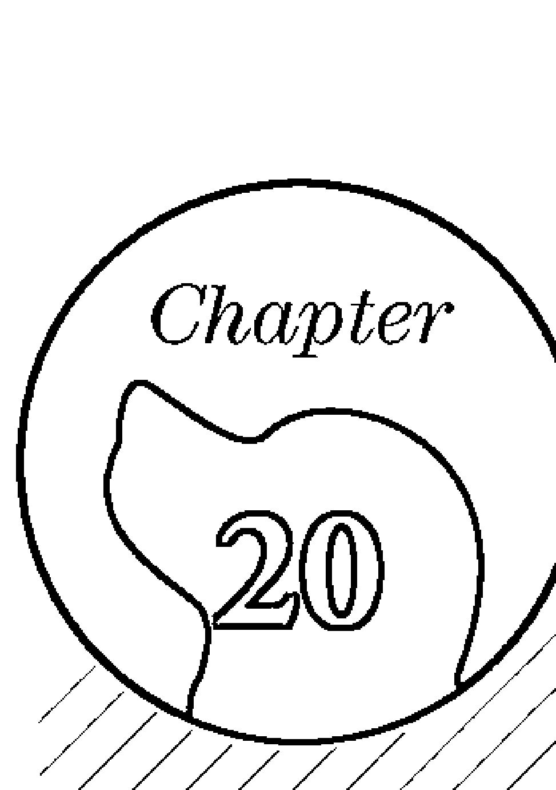

### 為收容所、庇護所及救援組織的動物傳送靈氣

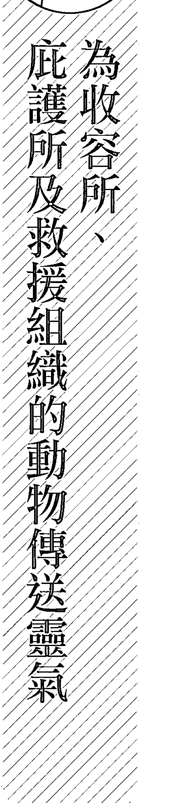

當替收容所、庇護所及救援組織的動物傳送靈氣時，你會因為透過牠們體會到的療癒、愛、同理心、寬恕、信任、耐心、彈性而感到喜悅。若你是靈氣新手，在這些場所擔任志工，會是有力且富教育性的經驗，可以大幅擴展應用靈氣的自信與知識。

在鄰近的收容所、庇護所和救援組織與這些場所的動物合作，會經歷各式各樣的獨特情況、議題、挑戰，這些動物是療癒旅程中最佳的導師。這些場所中的需求看似無窮無盡，你通常能得到自己所願的許多經驗。

#### 找到適合的地方擔任志工

編列地區域的適合清單，是搜尋合適志願服務場所的一種方式。這些場所可能是市立或縣立動物收容所、志工經營的動物收容所、救援組織或小動物（像是貓、兔子、天竺鼠、馬、農場動物、熱帶動物或海洋動物）庇護所。盡可能蒐集這些組織的相關資訊，像是其使命、管理方式、服務動物及志工機會。

完成了初步研究後，可能會想造訪其中特別吸引你的組織，也可能發現其中有一兩個特別的地方讓你感興趣。透過實地造訪收容所或庇護所，會對環境、動物及工作人員有所感受，協助推測何處最適合。你可以捫心自問這些問題——哪個部分我感到最舒服、哪個地方會讓我最想定期造訪。

一旦找到覺得舒服且能投入的地方，你該和那邊的志工或組織經營人約個時間會面。會面是種好方式，讓你能介紹自己、介紹靈氣，並對該組織了解更多。我們發現描述靈氣的最好方式，就是盡可能簡潔扼要，尤其是對方從沒聽說過時。舉例來說，可以向他解釋靈氣是種來自日本的能量療癒形式，廣泛應用於人類輔助療程，許多知名醫院都有採用，

靈氣也是廣受歡迎的動物輔助療法；也可以向對方說明，治療師只是宇宙療癒能量的通道，讓靈氣流經手部，傳送到被治療的動物身上，以動物最需要的方式療癒。可能要多試幾次如何解釋靈氣會讓你覺得最自然且適合。
由於對方可能並不熟悉靈氣，向他簡要說明靈氣如何幫助該組織的動物，對組織有所助益，會是個好主意。比方說，可以說明靈氣能大大緩解動物的壓力與焦慮，幫助他們在環境裡放鬆，加速疾病及身體損傷的復原，以及療癒造成行為問題的情緒根源，提高領養機會。
另外也可以強調靈氣極度溫和，沒有侵入性，不會造成傷害，也能不直接接觸動物進行，可在籠子、圍欄外或距離動物幾呎遠進行。有時先對管理者或經營者進行短暫療程，能讓他們透過第一手經驗，確認靈氣對動物來說溫和且舒服；也可以為動物提供短暫療程，示範靈氣療程如何進行。若已學過二階靈氣，在志工面前或對話前，為此情況傳送靈氣，也能協助帶來想要的結果。

#### 為莫莉進行心理療癒

有時結合觸手、心理、遠距及視情況而定的靈氣，都是端看動物所需。黑色德國牧羊犬「莫莉」就是個完美範例。我第一次與牠合作時，進行了一小時的觸手療程。牠非常好動、愛咬東西，會用牙齒輕搔我的手及手腕。我不斷在心中傳送一個畫面，就是閉起嘴巴、不要接觸我的皮膚，經過三十分鐘後，牠終於完全停止用嘴巴碰我。牠坐下，轉身面對我，把一隻前腳放在腿上並直視著我。

祈請神聖秩序降臨。幾分鐘後，我突然被極度心碎的難過感受襲擊而開始哭泣。我感謝牠與我分享並讓我知道我能理解。牠立刻離開身邊，坐在房間另一端，面對著另一個方向。我很清楚牠已獲得情緒釋放，完成療程。

隔週，我聽說莫莉「咬」（其實是用嘴巴含住）一位志工，結果被考慮隔離。我前去探望。當牠看見我時，牠攀上籠欄看著我，好像在說：「我做了件壞事，麻煩大了，但我不是故意的，對不起。」我將一隻手伸進籠子放在牠身上，另一隻手掌隔著籠子幾时遠，傳送靈氣給牠。我也為牠情況的最高益處傳送靈氣，希望牠能找到平靜的新家，遠離收容所的壓力。

接下來幾次造訪收容所，其他狗都排進靈氣療程的優先清單裡。隔了一個月後，我發現我終於又和莫莉合作了。我記得牠很活躍，我坐在椅子上進行療程。牠極度好動且## Chapter 20 為收容所、庇護所及救援組織的動物傳送靈氣

一直喘氣，對周圍每個聲音都很警覺。牠在門邊來回移動、抓籠子並發出哀鳴，然後又走向我，靠在我身上後腳可以放在地上。有一度志工牽著狗經過窗外，莫莉變得很暴躁，瘋狂吠叫，看來好像要攻擊他。

我決定傳送靈氣，開始療程前請牠只接收需要的能量，因為牠現在很沮喪。

不一會兒，我緩慢、小心地從椅子上下來，坐在牠肚子附近，一手放在牠肩膀，另一手放在肋骨上。牠將頭擺在地板上，大大嘆息一聲，神奇地停止喘氣。我繼續維持這個姿勢傳了三十分鐘靈氣。即便隔壁房間有很大的噪音，但牠甚至沒抬起頭來看。牠愛睏地看著我，眼睛半閉，嘴唇鬆弛。牠變成一隻完全不同的狗——冷靜、放鬆且信任。我決定在那週後繼續幾次遠距離療程，讓牠繼續成為冷靜、專注的狗。

下週，我想再度為莫莉進行療程，工作人員說牠狀況很好，不需要療程。我微笑地堅持工作人員將牠帶到我們進行療程的房間。莫莉這次一看到我，立刻躺下，在靈氣療程中牠深深嘆息多次，完全放鬆。

> 下次造訪收容所時，莫莉已經不在那兒了——牠找到了一個完美的家。有人對牠一見鍾情，似乎立即辨認出莫莉智慧與靈魂的深度。所有工作人員都很開心，經過幾個月波折後，牠終於找到家了。有位工作人員形容領養過程真的是「感人熱淚」啊。——凱瑟琳

##### 融入組織環境中

有些組織因手邊工作已讓他們精疲力竭，可能擔心你的存在將會帶來額外工作。若讓他們知道，你的目標是盡可能幫助動物，不會對工作人員造成負擔，他們可能會覺得比較輕鬆，增加你擔任志工的機會。你該試著找到融入組織環境的方式，別讓工作人員在必要協助外增加其他負擔。

重點是記得在該組織的目的是為了對動物傳送靈氣，不是重建組織或改善設施，也不是建議工作人員該怎麼做。你的目標是找到融入現有組織環境的方法，盡可能不打擾人，專業、具支持性且中立。當與某些工作人員及志工建立關係後，可能覺得能與他們分享療程中接受到的訊息，但永遠要小心為上，以慎重及同理的方式表示，對組織事務保持中立。若將焦點集中在療癒動物，你可以持續留在那裡，對動物健康有所貢獻，無論組織運作如何。

##### 準備開始

一旦喜歡的組織歡迎你擔任靈氣志工，設定規律日期及時間表，對於你和組織都有好處。若你有其他組織能運用的技能，最好是找別的時間執行那些任務，並與靈氣時間分開。

有關對收容所動物傳送靈氣的日子，可以詢問工作人員，哪一天、什麼動物最需要療癒，若組織可以接受，你可遵從自己的直覺，判斷哪隻或哪些動物當天最需要靈氣。最好為每隻動物設定三十到六十分鐘的療程時間。在某些組織裡可以找到進行療程的安靜場所，若沒有，可以坐在動物的圍欄裡或圍欄外傳送靈氣。要是環境很吵雜，耳塞對你專注流程大有幫助。

為這些場所中的動物傳送靈氣，可能會有壓力但很值得，因為那裡通常有很多需要幫忙的動物。在這些場所傳送靈氣，特別重要的是要覺察自己的內在狀態，並照顧自己。你可能需要特別留意，讓自己歸於中心，在進入該環境前為自己傳送一點靈氣。

此外，檢視自己在這些場所中需要花費多少時間或心力，找到你的限度也很重要，這樣才不會讓自己過度操勞，或為自己的同理心帶來過度負擔。靈氣治療師需要覺察自己的限度，保持規律，才不會精疲力竭，也才能繼續為動物提供最好服務。在上述條件下，你花越多時間擔任志工，在進行療程時就會越自在，也會對靈氣有效療癒各種挑戰的能力更有信心，同時對動物教導的許多課題保持更開放的心態。

### 個人療癒與轉化

氣除了能療癒他人之外，同時也是個能幫助自我療癒與轉變的驚奇工具，它幫助人類與動物解決及釋放過去的記憶、行為模式、態度，以及那些怯於表達最好與最佳自己所造成的影響。特別是包含心理與情緒層面的靈氣療程，它會直達人類或動物的最深層，為情緒與精神層面帶來深沉程度的療癒。當你開始練習靈氣與接收靈氣療程時，它會引出你最真實的一面，增進你內在天賦、才能與潛力。

有時候，一次療癒會帶來令人意外的改變，基本上自我改變通常需要一段固定時間的投入。在我們的訓練以及多年來進行的基礎練習中，每天會不斷地訓練自己，並在每週或兩週一次接受別人的治療。這些療程維持我們的健康以及幫助我們在處理自身問題遇到障礙時，能夠對自己及專業人生帶來成長。

成為一位靈氣執業人員，對自己的成長與他人都有益處，在第一次的點化，你也許會注意到人生的轉變與內在療癒達到一致。三階段的靈氣點化以及伴隨著對自己或他人使用的靈氣，都能提供情緒與心理層面的療癒，加速自我成長及深化直覺。有時，這樣的快速成長可能會是個挑戰（例如被過去的回憶和／或行為模式攪亂和釋放），不過就個人成長以及改變，其益處是相當可觀且值得的。

個人問題可能會消耗我們的能量、注意力以及了解自身潛力的能力。在靈氣二階，你可以替過去困難的狀況傳送靈氣，幫助解決不斷影響我們的難關。舉例來說，可以傳送靈氣給某個你還是小孩且覺得特別困難的時段，幫助解決那段長久尚未解決的問題。當你使用靈氣療癒自身問題，能夠深化你的能力，在作為一個傳送靈氣能量的管道，會發現治療他人的能力變得更加強化。

除了定期接受他人的靈氣治療外，我們安排了額外的四次系列療程，讓我們當需求增加時，能更密集地處理自身問題。我們透過面對面或遠距治療他人，可以的話，盡量時常定期義務提供靈氣療程。我們持續為動物、機構以及像是動物福利議題、野生動物保育和全世界人類／動物間的療癒連結，進行遠距療程。我們發現結合基礎的練習，能加速自身與專業能力的成長。

不時有人會問當他們只想治癒動物時，為什麼需要使用靈氣治療自己或接受別人的治療。原因在於自我療癒及持續接受別人的靈氣治療，是開發潛能成為靈氣治療師的核心，它有兩個重要的方向。

- 首先，接受治療會讓你親身感受到接收靈氣的微妙感應，以及靈氣治療的過程和功效。這會幫助你了解動物在接受治療時及治療後的感受，還可以預期會有什麼樣的治療效果及反應。同時也會幫助你調整自身的療癒能力，使其變得更舒適、更容易被接受，對動物更有效果，因為你將對靈氣帶來的感應及反應的範圍有更直接的認識。

#### 大象的旅途

我對收容所和庇護所動物感到特別的同情和有所連結，打從內心希望能用任何方式幫助他們。在我成為靈氣導師後，可以通過另一種方法幫助動物——教導照顧者使用靈氣。而且一旦我致力於這條道路，宇宙便開始以激勵人心和意想不到的方式為我開啟。

有一個很特殊的例子，一隻大象成為我幫助的動物之一。我偶然在公共廣播電視台上注意到大自然特輯——城市象（Urban Elephants）。我被世界上大象的困境感動，止不住我的眼淚。不過，該節目以正向的方式結束，重點我發現田納西州是美國唯一的一個大象保護區（The Elephant Sanctuary）。這裏是一個療養區域，大象在這裡得到尊重、珍惜和重視，被視為具有靈性的生物。大象「雪莉」與另一隻分離二十五年的大象不可思議地重遇，這個部分讓我看了特別感動。

當晚，我決定開始使用靈氣幫助大象。我用木製的小象頭神（Ganesha）雕像作為替代，托起雙手，徵求許可，並要求為世界上的大象提供最高的靈氣療癒，避難所中的大象（包括雪莉）、負責運作避難所的人們等。治療過程出現異常的熱及劇烈感受，似乎無法停止。一個多小時後，完成了治療。我的手實際上很疼，手掌感覺被燒傷了，像是被砂紙擦傷一樣。我試圖入睡，但實在沒有辦法。我的手掌和腳底整夜都在散發熱量。

第二天，我決定看看是否可以在網路上找到庇護所。找到他們很棒的網站，上面有每隻大象的故事和圖片。雖然網頁明確表明他們不對公眾開放且不允許訪客，我仍決定寄郵件給創辦人。在我的信中，表明願意教導創辦人及志工一級靈氣，作為送給大象的禮物。

當天晚上，她回了信，說她很少允許別人前來，但「感覺得到」她「應該會接受」我的禮物。幾個月後，我和伊莉莎白一起去了庇護所，教導創辦人和其他志工一級靈氣。

他們對大象的愛、仁慈和奉獻精神，使我們深受感動和啟發。他們每天都與大象在一起，撫摸、照顧他們，與他們嬉戲並餵養。知道靈氣正在流向那些奇妙的生物，真的太好了！靈氣可以開啟人與地方的療癒之門，這真的非常神奇了。——凱瑟琳

#### 靈氣的精神層面

有時會收到一些問題，像是使用靈氣是否有必要成為宗教信仰、靈氣本身是否是一條精神的道路，以及靈氣是否會以任何方式干擾宗教或精神信仰。靈氣可作為任何想學習的人所使用的治癒系統，只需要靈氣導師的調教和少量的訓練即可上手。靈氣可與任何宗教傳統兼容，不必信奉宗教或遵循精神道路修行。靈氣具有精神上的層面，如果願意，可以專注於此，但絕非必要。靈氣的原則很簡單，能與任何宗教或精神傳統並存。我們認識了許多不同宗教和精神背景的人，他們在練習靈氣上並沒有任何信仰方面的問題。對於那些選擇不專注於精神層面的人，靈氣也可以只被運用為一種治癒系統。

對於某些人來說，學習、練習靈氣是與精神品質更緊密連結的方式。通過定期練習，靈氣可以幫助你更加了解自己的精神自我，即非身體的內在自我，以及那些可能無法實現和發揮的微妙才能和才華。靈氣可與所有精神道路和宗教互補，通過實踐體現每個人的獨特性。它也吸引了許多沒有精神信仰的人，就像是一種具有許多實踐經驗和證據所支持的神祕事物。

- 其次，你能開發的治癒能力程度與自身的成長有關。越常使用靈氣治癒自己的問題，就能更快成為治療師。你更能有效地與遇到的對象（人及動物）溝通，對於治癒的對象將會開發出更深入且準確的直覺。當治癒自身問題時會消耗能量、專注力及能力，但同時治癒的能力也會隨之增強。能量調和包含了自身療癒、接受治癒及使用靈氣治療其他對象，它能加速自我成長、強化直覺及各層面上的治癒。使用靈氣的次數越多，所獲得的益處就會越多，且越能理解各種靈氣可以治癒的方法。

#### 自我挑戰

當你朝動物靈氣師的身份前進時，可能會發現在生活中遇到新的挑戰。這些挑戰可能以許多方式出現，包括難以抗拒的夢想、突然意識到自己的生活道路，再次出現的舊情感問題或是過去尚未解決的問題。有時一些與未處理的情感問題相關的舊傷或疾病，可能會短暫再次出現並以更徹底的方式解決。

有時候治癒動物過程產生的情緒和問題，會帶給你一些啟發自我的新方向。透過自我療癒及接受其他靈氣師的持續治癒，將能夠藉由靈氣引導你通過這些挑戰，以獲取更深刻的見解，在身心健康及生活各層面更為有效。使用靈氣的方式可以像自己的靈魂般，具個人化與獨特的特質。靈氣的本質是純淨的療癒能量，而且只能使用在好的地方。

### Chapter 22

#### 結語

## 來自伊莉莎白的話

序言中描述了年輕雄鹿的來訪，開啟我們對靈氣潛能有了更深入的理解。儘管我以前從未見過這樣特別的雄鹿，但過去我曾治癒過其他，並與其中一些建立了密切關係。但這不是我過去所認識的。鹿群彼此分享哪裡可以獲得治癒的可能，是一種新的驚人發展。這可能性也被確認，就在年輕雄鹿被治癒後的幾週，我在院子發現了一隻懷孕的母鹿，牠出現雄鹿首次出現尋求治療時的表現。這時我知道那是什麼意思，因此坐了下來，提供牠靈氣。我開始後不久，牠伸出雙腿強調腹部的位置，好像是在說，這就是想要靈氣的地方。我很高興看到牠帶著兩隻健康的小鹿前來。在消失了幾週之後，持續地接受靈氣。同時，我開始注意到有越來越多的馬，出現在我經常練習靈氣的穀倉，似乎在尋求靈氣治療。例如在我治療了一匹母馬一兩週後，有天經過了一匹一歲小馬的圍欄時，牠迅速且帶有目的地跨過圍欄的邊緣，就像是要避免不被路過的人注意。當我停下來撫摸牠的頭，打個招呼時，這匹年輕的馬立刻轉過身，將臀部推向我的手中。在我手下方的區域有一個很深、看來很痛的刮傷。不久之後，當我離開時，另一匹我不熟悉的馬歪歪扭扭地跑到了籬笆上。

#### 來自凱瑟琳的話

認識的。鹿群彼此分享哪裡可以獲得治癒的可能，是一種新的驚人發展。這可能性也被確認，就在年輕雄鹿被治癒後的幾週，我在院子發現了一隻懷孕的母鹿，牠出現雄鹿首次出現尋求治療時的表現。這時我知道那是什麼意思，因此坐了下來，提供牠靈氣。我開始後不久，牠伸出雙腿強調腹部的位置，好像是在說，這就是想要靈氣的地方。我很高興看到牠帶著兩隻健康的小鹿前來。在消失了幾週之後，持續地接受靈氣。同時，我開始注意到有越來越多的馬，出現在我經常練習靈氣的穀倉，似乎在尋求靈氣治療。例如在我治療了一匹母馬一兩週後，有天經過了一匹一歲小馬的圍欄時，牠迅速且帶有目的地跨過圍欄的邊緣，就像是要避免不被路過的人注意。當我停下來撫摸牠的頭，打個招呼時，這匹年輕的馬立刻轉過身，將臀部推向我的手中。在我手下方的區域有一個很深、看來很痛的刮傷。不久之後，當我離開時，另一匹我不熟悉的馬歪歪扭扭地跑到了籬笆上。

## 消息傳出了

牠刻意抬起腿讓我看到那個需要立即處理、部分已脫落的馬蹄鐵。

當我們注意到越來越多的動物接近尋求治癒時，開始漸漸明白——消息傳出去了！透過我們所治療的個體，對靈氣治療能量的認可可正傳遞到該地區的其他動物。更多個體前來，信任我們能給予能量，並且在牠們需要的時候尋求協助。

每次給予靈氣療法時，靈氣師與動物之間形成的關係，會加深彼此的理解與溝通。透過靈氣與動物的連結，轉化成了解牠們的本質、文化及關係間的可能性。我們相信這也改變了人與動物之間互相了解的關係。

#### 我們的願景

在與動物和靈氣合作時，正如本書中的故事所說明的，我們已經認識到靈氣不僅可以治癒個別動物及其人類與處境，還可以在更高水平上治癒人類與動物之間的連結。漸漸地，我們的願景擴大到能夠擁抱這樣的潛能。如果其他動物愛好者學習靈氣，懷著開放的心帶到世界各地時，許多家畜或野生動物將會被吸引並信任他們的治癒。

試想一下，如果許多人學會了靈氣，並在提供給動物的過程中看到這種轉變發生在他們與動物的關係之間，那麼在這個世界上，人與動物的關係，可能也會發生更深刻的變化。

我們的願景是——通過靈氣，讓人類漸漸了解動物的本質，使人與動物的關係更緊密，並有深化、成長的可能。我們可以先與自己的動物同伴建立連結。若在海洋哺乳動物救援中心、動物園、野生動植物康復設施等相關單位工作的人員和志工，開始在照顧動物的過程中使用靈氣，或許人類對所有動物的理解，及與動物之間的關係也會加深。對於那些還沒有練習靈氣的人，希望本書能夠激發你學習的欲望；對於那些已經在使用靈氣的人，鼓勵你充滿信心地進入動物靈氣的世界。這些動物正等著我們轉化我們的理解，實現改變與他們關係的潛力。

## 致謝

首先，我們要感謝我們出色的經紀人Bobbie Lieberman，他仁慈、有耐心且專業，引導我們完成這一本書，同時感謝尤利西斯出版社的傑出編輯——Ulysses Press、Claire Chun、Lily Chou，感謝Kendra Luck在這些動人照片中捕捉了靈氣對動物的魔力，以及Jamie Westdal、Earl McCowen也為本書貢獻了許多出色的攝影作品。

衷心感謝我的丈夫Bob和女兒Laura在我整個寫作過程中，充滿耐心、愛心與支持，以及我的動物同伴柔伊、穆蘇、艾瑪、史莫基、安妮和聖奈德，教了許多本書中提到的課程，啟發我投入這項工作並寫了這本書。

我還要感謝契維拉沙南達（Gurumayi Chidvilasananda）給予不屈不撓的慈悲和愛心；莎朗·卡拉韓（Sharon Callahan）的智慧和同情心，深深影響了我對動物，以及如何與動物交流與治療的理解；瑪格·蘇達瓦利·蘇利文（Meg Siddheshwari Sullivan）給了我最好的靈氣訓練；以及感謝托莎·西爾沃（Tosha Silver）寶貴的指導。

感謝伯克利市動物收容所（Berkeley Animal Shelter）和曾經在那裡的動物們，以及Carol Buckley和大象保護區（The Elephant Sanctuary）。

感謝鹿群和其他野生動物，尤其是梅林，牠們的美麗、優雅和愛心啟發了我，讓我大幅增進對靈氣的理解。同時感謝所有動物和人類客戶的支持，他們不斷豐富我的生活，讓我了解動物和治癒無可限量。

最後，我衷心感謝我的父母，他們發現了我與動物之間的連結，讓我從小就可以與動物和自然緊密地生活在一起。
——伊莉莎白·富爾頓

感謝我的動物同伴們：我的狗達科塔以及馬兒蕭尼和柯迪亞克。也感謝我從小到大的動物友人們：我們的狗瑪非，我們的貓塔凱西、皮奇、珍妮、圖克、安東尼和金傑，還有鸚鵡沙曼、長尾小鸚鵡西蒙，還有金魚西爾維亞。

也要感謝我大大小小的「靈氣動物」，有些仍在這世上，有些精神已經得到釋放。與你們相識，建立連結，能夠提供靈氣成為你們生命旅程的一部分，對我來說非常深刻且具啟發性。

也要對我那位來自文藝復興時期的丈夫Che，表示最深切的感謝和愛意，你是邏輯科學家和醫師，也是富有創造力和勤奮的音樂家，還是我精神上明智且開放的靈魂。你真的是太棒了！謝謝普拉沙達家族的Judy、Kedar和Mikie，你們向我介紹了靈氣，並且一直支持我。
特別感謝我的兩個出色姐妹：Charlotte和Maureen，妳們是我最好的朋友。還要感謝我的父母John和Gini，你們使我的童年能在動物朋友包圍的環境下成長。
非常感謝我的靈氣大師：瑪莎·盧卡斯（Martha Lucas）和瑪格·蘇達瓦利·蘇利文（Meg Siddheshwari Sullivan）。也感謝托莎·西爾沃（Tosha Silver）向我展示了通往內心之路的方法。
也祝福我的靈氣學生，你們鼓舞了我達到更高的境界。
衷心感謝支持該此過程的朋友們：Gail、Susanna、Fray和所有明亮和平之地的朋友；我的教練Alision，還有艾蜜莉、PD、蘿拉、畢卡索、卡蘿和大象保護區。
特別感謝天才編輯和精通文學的經紀人Bobbie Lieberman，以及才華橫溢的攝影師Kendra Luck。有你們的支持和信念，幫助我完成本書。——凱瑟琳·普拉莎

## 附錄

## APPENDIX

## 明亮和平之地

若沒有明亮和平之地動物庇護所（BrightHaven）員工的慷慨，我們可能無法完成本書。這間位於美國加州的非營利組織，提供了年長、行動不便與有特殊需求動物的終生避難與安寧照料。本書出現的所有模特兒歐里、泰德、哈利、陶樂絲與法希兒稱明亮和平之地為家。
創立於九〇年代早期的明亮和平之地，拯救、照料了無數無法被領養的動物。許多小狗與貓咪將牠們的黃金時期，託付給關心生機飲食與整體健康照護的人們。
狗狗喬伊和奧維兒享受當下。

食與整體健康療癒、充滿愛且如同家般的環境裡。在這裡，看到許多因愛、健康減肥以及像是靈氣與順勢療法的療癒藝術形式所產生的奇蹟。

超過十年學習關於照料動物的最好方式，明亮和平之地透過工作坊與研討會創新的計畫，敞開大門與大家分享大量的經驗。非常歡迎免稅捐款，幫助明亮和平之地持續進行這份重要的工作。

如需得知最新資訊，請至官網 www.brighthaven.org 或致電到辦公室。

## 關於作者

伊莉莎白·富爾頓（Elizabeth Fulton）是位動物溝通家、靈氣大師與動物療法機構（the Animal Healing Institute）的創辦人，致力於動物深度療癒以及與動物的連結。她是第一位提供靈氣給動物的執業者。藉由使用動物溝通、靈氣與花精療法，協助動物與其主人彼此了解並療癒他們的身體、情緒與生活中所產生的精神挑戰。伊莉莎白撰寫了關於動物溝通與療癒，以及我們與動物連結關係的潛能；也義務為一些庇護所，以及野生動物、奇特動物與瀕臨絕種動物的相關機構提供更多伊莉莎白的資訊請至www.healingforanimals.com。

凱瑟琳·普拉莎（Kathleen Prasad）是加州聖拉斐爾動物靈氣資源（Animal Reiki Source）的創辦人與管理者，此機構致力於教育大眾透過療程、訓練計畫、受邀演講、出版品與研究提供靈氣給動物。凱瑟琳自一九九八年起為靈氣執業者；自二○○一年起為靈氣大師。學習初步靈氣可作為自我療癒的工具，凱瑟琳很快就發現所有動物種類皆會被靈氣的療癒能量所吸引。她將其一生貢獻給動物，啟發她制定計畫使人們能夠幫助生活中的動物夥伴。她鼓勵庇護所、救援組織與收容所使用靈氣，並定期義務提供靈氣服務。

雀瑞兒·史瓦茲獸醫師（Dr. Cheryl Schwartz）本書前言的撰寫者，身為開業獸醫師超過二十五年。她專門從事小動物的中醫診斷、針灸與漢方藥草。作為引進獸醫整體醫療的先鋒者，她創立了東西動物醫療中心（the East-West Animal Care Center），此中心提供獸醫的中醫訓練。史瓦茲獸醫師著有《四爪動物、五個方向：貓咪與小狗的中醫指南》（Four Paws, Five Directions: A Guide to Chinese Medicine for Cats & Dogs），同時也是《健康生活雜誌》（Healthy Living Magazine）的寵物整體醫療專欄作家。

> 《四爪動物、五個方向：貓咪與小狗的中醫指南》（Four Paws, Five Directions: A Guide to Chinese Medicine for Cats & Dogs）

Copyright © 2006 by Elizabeth Fulton and Kathleen Prasad
Published by arrangement with Ulysses Press
through Andrew Nurnberg Associates International Limited

## 動物靈氣療癒

| 項目 | 內容 |
|---|---|
| 出版 | 楓樹林出版事業有限公司 |
| 地址 | 新北市板橋區信義路163巷3號10樓 |
| 郵政劃撥 | 19907596 楓書坊文化出版社 |
| 網址 | www.maplebook.com.tw |
| 電話 | 02-2957-6096 |
| 傳真 | 02-2957-6435 |
| 作者 | 伊莉莎白·富爾頓、凱瑟琳·普拉莎、雀瑞兒·史瓦茲 |
| 翻譯 | 王若晞 |
| 責任編輯 | 陳依萱 |
| 校對 | 龔允柔、邱鈺萱 |
| 港澳經銷 | 泛華發行代理有限公司 |
| 定價 | 380元 |
| 出版日期 | 2020年9月 |

> 國家圖書館出版品預行編目資料

動物靈氣療癒 / 伊莉莎白·富爾頓，凱瑟琳·普拉莎，雀瑞兒·史瓦茲作 ; 王若晞翻譯 .-- 初版 .-- 新北市 : 楓樹林 , 2020.09 面 ; 公分

ISBN 978-957-9501-84-2 (平裝)

1. 寵物飼養 2. 另類療法

437.111 109009599